# 深度学习架构的开发和分析

# 前言

深度学习范式取得了丰富的成功，带来了大量的概念、方法论和随之而来的算法和应用。
今天，我们正在目睹这个动态增长领域的明显进展。学术界和工业界、商业、医疗保健、环境科学等领域都表现出了日益增长的兴趣。

本卷的十个章节真实地反映了深度学习的多样性和广泛的算法和应用领域，这使得深度学习的基本思想如今如此吸引人并受到广泛研究。这里涵盖的主题涉及了众多领域。章节“应用生成大数据的直接误差驱动学习”详细阐述了在大数据环境中进行的学习机制，这是与深度学习密切相关的另一个及时的话题。章节“深度学习用于软传感器设计”讨论了传感器设计的过程。章节“案例研究：深度卷积网络在医疗保健中的应用”介绍了深度卷积网络在医疗保健领域的应用。章节“深度领域自适应回归”介绍了回归问题的领域自适应方法。章节“基于深度学习的自动驾驶行人检测：成就与未来挑战”、“使用深度学习识别文本中的极端主义”展示了深度学习的丰富应用。

我们要向Janusz Kacprzyk教授表示感谢，他是系列编辑主编，在实现这个出版项目时给予了我们持续的鼓励和支持。我们对Springer的专业人员感激不尽；团队使整个生产过程变得顺利和高效。

加拿大埃德蒙顿
台北，台湾

Witold Pedrycz
Shyi-Ming Chen


## 直接错误驱动学习用于应用程序中的分类生成大数据

R. Krishnan, S. Jagannathan和V. A. Samaranayake

摘要 在本章中，提出了一种全面的方法论来解决分类的重要数据驱动挑战。首先，演示了大型数据集中观察到的异质性和噪声等挑战如何影响基于深度神经网络（DNN）的分类器的效率。为了消除这些问题，引入了一个两步分类框架，通过预处理步骤系统地去除不需要的属性（变量），并引入了基于深度神经网络的分类器来解决学习过程中的异质性。具体而言，本章描述了一种多阶段非线性降维（NDR）方法，用于去除不需要的变量，并提出了一个新颖的优化框架来解决异质性问题。在NDR中，首先将维度分成组（分组阶段），然后在每个组中系统地去除冗余（转换阶段）。直到满足用户定义的控制信息损失的准则为止，重复执行两阶段NDR过程。最后，使用基于深度神经网络的框架对降维后的数据进行分类，引入了直接误差驱动学习机制。在这个框架中，通过从数据中生成额外的样本来获得广义误差的近似。通过学习误差和广义误差的近似，确定并利用每个DNN层的性能度量，从而得到一种新颖的逐层权重调整规律。

这项研究部分得到了NSF I/UCRC奖励IIP 1134721和智能系统中心的支持。

R. Krishnan (✉) · S. Jagannathan
密苏里科学技术大学电气与计算机工程系，罗拉，密苏里州，美国
e-mail: krm9c@mst.edu

S. Jagannathan
e-mail: sarangap@mst.edu

V. A. Samaranayake
密苏里科学技术大学数学与统计系，罗拉，密苏里州，美国
e-mail: vsam@mst.edu

直接用于学习。使用各种数据集展示了这种两步分类方法的效率。

关键词 深度学习 · 大数据 · 降维 · 学习模式

# 1 引言

数字数据的爆炸性增长凸显了在许多应用中（例如故障诊断、物体识别等）可持续分析方法的需求[9]。例如，在分类问题中，常常会遇到许多大型数据集需要进行分析。这些数据集的特点是具有大的(n, p)，其中n表示数据点的总数，p表示数据集中的总维度。在分析此类数据集时，需要解决一些相关的挑战，因为大数据集具有高维度，其中存在冗余维度[6,12]。

当高维度与大样本量相结合时，需要进行分布式存储[51]。因此，可持续分析必须依赖于数据样本。在没有智能方法来整合这些数据样本中的信息时，可能会出现一些复杂情况，包括实验变异和统计偏差[9]。此外，随着数据维度的增加，任何一个存储单元中可用的数据点数量变得更少[51]。因此，人们可能观察到重要统计参数的不规则或不正确估计，从而增加误差[9]，这是异质性挑战的一个方面。使用深度神经网络（DNN）可以解决其中一些挑战，通过最小化根据手头问题定义的性能度量来估计参数化映射的参数。然而，由于参数化映射中的参数数量随着数据维度的增加而迅速增加[9]，存在估计误差。为了避免这些问题，常常使用降维过程。

流行的降维方法包括主成分分析（PCA）[55]，因子分析[22]和其他方法[22]，这些方法依赖于相关或协方差矩阵。然而，当考虑高维数据集时，由于相关矩阵的秩较低或计算成本较高，无法有效地估计依赖关系[22]。总的来说，传统的降维方法[22,55]在大维度场景中效率低下，因为这些方法都采用了一步映射。

另一方面，异质性和噪声可能会对DNN学习产生不利影响[9]，观察到泛化误差的增加。此外，DNN方法中学习参数的常见方式是随机梯度下降（SGD）[29]。当DNN中的层数非常大[36]时，基于SGD的学习[29]可能会遭受不稳定学习的问题，传统的学习过程也不适用于大数据分类。

## 直接误差驱动的学习用于生成大数据的分类应用

为了缓解这些问题，本章节通过以下方式解决大数据挑战的影响：（1）通过一种新颖的分类框架减少由异质性和数据噪声引起的泛化误差，（2）在分类之前使用降维方法来提高在存在不需要的维度的情况下的学习效率，以及（3）通过引入一种新的学习方案来减轻传统SGD中出现的梯度消失问题。

本章介绍了一个两步骤的过程。在这个过程中，首先进行非线性降维（NDR），解决了不需要的维度问题，并考虑了维度之间的非线性关系。在NDR中，首先将属性组织成组。在每个组中，通过距离协方差[47]来测量属性之间的依赖关系，该方法捕捉了属性之间的非线性依赖关系。然后，对每个组进行基于奇异值分解（SVD）的低维近似估计。一旦每个组都被转换，属性就会重新组织成组并再次进行转换。

在转换过程中，通过利用奇异值的大小来进行组内组织。引入了基于奇异值的用户条件，以确定必须从数据中提取的维度数量。该标准也作为降维过程的停止条件。

在降维后的维度中使用数据，采用基于深度神经网络（DNN）的分类器进行分类的第二步。该分类器的设计旨在通过优化过程来最小化近似泛化误差。通过在数据样本周围引入合成失真来获得泛化误差的近似。然后设计一个学习问题来估计分类器的参数，以最小化由学习误差和近似泛化误差组成的总成本。

为了缓解梯度消失的问题，引入了一种直接的错误驱动学习（EDL）机制，使得DNN每一层的权重直接通过整体误差进行学习。为了实现这种学习，为DNN中的每一层定义了一个成本函数，作为整体成本的函数。优化过程的设计方式使得DNN中每一层的学习独立于其他层。最后，为了更新降维转换的参数，引入了新的批次更新方法。

本章介绍的两步分类框架可以看作是两个深度架构的组合，其中第一个模块去除不需要的维度，第二个模块作为数据点的分类器。此外，这两个模块解决了在分析大数据时出现的重要挑战，并相互支持以提供高效的分类。通过使用许多大数据集来演示整体方法的效率。下一节将讨论符号和其他预备知识。

## 2 背景和预备知识

在本节中，首先描述了数学背景，并对所考虑的问题进行了规定，并在表1中提供了所有符号的摘要。

首先考虑任何数据生成过程，其中 $x \in \mathbb{R}^{n \times p}$ 表示一个数据样本。现在考虑通过映射 $\phi(.)$ 来确定系统是否处于健康状态或故障状态的目标。映射的目的是将数据样本转换为概率域，其中概率的大小表示数据点对应的类别/类。整个学习过程可以定义为在给定训练数据集 $\mathcal{X}$ 和其标签 $\mathcal{Y}$ 的情况下估计该映射的参数形式。形式上，评估以下内容很重要 $p(x \in \Psi_m | \mathcal{X}),$ 其中 $\Psi_m$ with $m = 1, 2, 3, \cdots, \mathcal{F}$ 表示相应类别的总体。可以使用任何典型的参数映射来评估这些概率，例如神经网络、样条函数等[4]。

在本章中，DNN被讨论为评估这些概率的参数映射。这样的分类问题的一个例子可以在图1中看到。形式上，可以首先假设 $\phi(.)$ 可以通过适当的DNN来近似。

表1 符号

| 符号 | 含义 |
| :--- | :--- |
| $\mathcal{X}$ | 数据集 |
| $\mathcal{F}$ | 总类别数 |
| $(n, p)$ | 样本点总数，维度总数 |
| $i, m, l$ | 不同层级的索引，m、l定义了论文中的索引 |
| $\boldsymbol{A}, \boldsymbol{B}, \tilde{\boldsymbol{A}}, \tilde{\boldsymbol{B}}$ | 距离矩阵和双中心矩阵 |
| $\boldsymbol{C}$ | 距离相关矩阵 |
| $\lambda$ | 奇异值 |
| $M$ | 数据中的批次总数 |
| $j$ | 属性的索引 |
| $t: 1, \cdots, T^{(i)}$ | 分组索引 |
| $\kappa_t^{(i)}, \eta_t^{(i)}$ | 需要提取的维度数量和总维度数量的估计值 |
| $\alpha$ | 必须捕捉到的变化量 |
| $(.)^{(i)}$ | DNN中的层数 |
| $\boldsymbol{W}, \hat{\boldsymbol{W}}$ | 理想和估计权重 |
| $k$ | 学习阶段的迭代索引 |
| $\varepsilon$ | 逼近误差 |
| $f^{(l)}, f \text{ 或 } l = 1 \cdots d$ | 具有d层的逐层激活函数 |

## 图1 分类问题的示意图

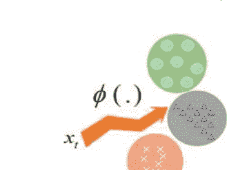

容量。将权重表示为 θ̂ = [Ŵ^(1)…Ŵ^(d)]，其中包括逐层偏置。接下来，假设存在一个理想的权重集合用于这个逼近问题，并写成 ŷ(x) = ŷ(x; θ) + ε，暗示着

$$ŷ(x) = f^{(d)}(Ŵ^{(d)}…(f^{(1)}(Ŵ^{(1)}(x))))) + ε. \quad (2)$$

令 $f^{(l)}$，对于 $l = 1…d$，其中 $d$ 表示 DNN 中的总层数，表示逐层激活函数，$ε$ 表示近似误差，是 DNN 容量的函数，可以假设为常数，如[34]所示。解决学习问题需要以下假设。

1.  样本的获取方式是独立且相同分布的。
2.  训练阶段的数据分布与测试阶段相似。

在这些前提条件成立的情况下，学习深度神经网络的权重涉及到最小化一个成本函数 $J_o(.)$[29]，该函数定义为理想输出（标签）与深度神经网络输出之间差异的期望值的函数。

### 备注1
在传统的机器学习设置中，特征提取映射和分类器映射是分别设计的。在这样的设计中，可以查看属于每个类别的数据点的质心来确定类别。在基于 DNN 的设置中，这些质心在学习过程之前被确定，并且优化被设计为尽可能接近这些预设的质心。通常，DNN 中的输出数量等于类别的数量，并且质心在质心的输出空间中的每个轴上被选择为类别的质心。

对于这个讨论，假设 $k∈[1, N]$ 是学习阶段的迭代索引，其中 $N$ 是总迭代次数。将标签与 DNN 输出之间的差异表示为 $e_l$ (学习误差)，如下所示

$$E[e_l(k)] = E_{∀x∈X, y∈Y}[y - ŷ], \quad (3)$$

其中 $E[.]$ 是期望运算符，$y ∈ R^{F×n}$ 表示理想输出(标签)对于 $φ(.)$。总误差包括学习误差和近似误差，可以表示为

$E[e](k) = E[e_l](k) + \varepsilon$. (4)

整体成本可以通过将总误差平方得到

$J_o = E[e]^T E[e] = E[e_l]^T E[e_l] + 2\varepsilon^T E[e_l] + \varepsilon^T \varepsilon$. (5)

方程(5)中的迭代符号在此处被省略。

### 备注2
在本章中，讨论遵循二次成本的使用，然而，在实际情况下可以切换到交叉熵成本。

请注意，整体成本函数中的第一项是通过数据样本获得的经验误差。 第二项是经验误差在 DNN 的逼近能力上的投影，这一项可以理解为泛化的成本。最后一项基本上是由于 DNN 的逼近能力造成的成本。通过这些观察，可以通过将经验成本表示为 $J_{emp} = E[e_l]^T E[e_l]$，将泛化成本表示为 $J_{gen} = 2\varepsilon^T E[e_l]$ 和逼近成本表示为 $J_{apx} = \varepsilon^T \varepsilon$ 来重新表示整体成本。

$J_o = J_{emp} + J_{gen} + J_{apx}$. (6)

通常在实际情况下，学习阶段只测量 $J_{emp}$，而未知量 $J_{gen}$ 和 $J_{apx}$ 通常被假定为小且有界。在这些约束条件下，学习过程中最小化 $J_{emp}$[4]。因此，文献中的一个主要研究问题是设计 DNN 模型，使 $J_{gen}$ 尽可能小。然而，在大数据的情况下，学习过程不再是标准的，$J_{gen}$ 可能超出界限。一个常见的情况是当违反训练和测试分布相似的假设时。通常，采样过程必须确保训练数据集很好地代表数据分布。然而，计算的约束通常不允许一个能够密集表示大维空间的样本。由于训练集和测试集不再相似，导致泛化误差增加的问题可以观察到。

为了进一步阐述这个问题，考虑使用一个三层神经网络[29]对 MNIST 数据集进行分析。为了说明，冗余维度被合成地引入到数据中，并在图 2b 中展示结果。可以观察到，随着数据中不需要的维度增加，准确性下降。这种误差的增加通常反映在增加的 $J_{emp}$ 中。接下来，为了说明异质性，考虑从一个属性中收集的大数据存储在多个位置，其中 $\mathcal{X}$ 的均值为 $\mu_0$，可以从任何可用位置进行采样。可以观察到 $\mathcal{X}$ 不能完全解释图 2a 中观察到的 $\Psi$ 的所有特征。因此，从 $\mathcal{X}$ 中学习的方法不能完全捕捉到整体分布 $\Psi$。由于这个原因，观察到了错误的预测，并且这反映在增加的 $J_{gen}$ 中。

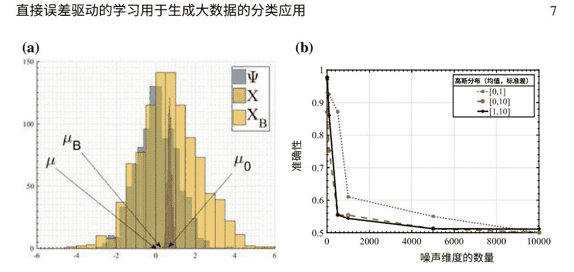

图2 a $\psi$, X 与 X B b 的直方图，与不需要的维度对应的准确性

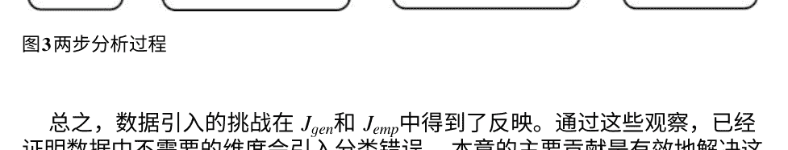

图3 两步分析过程

总之，数据引入的挑战在 $J_{gen}$ 和 $J_{emp}$ 中得到了反映。通过这些观察，已经证明数据中不需要的维度会引入分类错误。本章的主要贡献是有效地解决这些挑战的方法。为了解决这些挑战，使用了图 3 所示的两步框架。

这些挑战在文献中已经得到了独立的解决，但并不令人满意。接下来讨论相关文献。

### 2.1 相关工作

解决噪声维度挑战的最常见方法是通过特征提取方法。一些降维技术，如 Isomap[2]，LLE [39]，Hessian LLE [8]，Laplacian eigen-maps [3] 及其变体[10]，包括核 PCA [42]，已经被用于此目的。这些方法可以发现高维数据的内在几何结构。在[12]中，作者表明高维空间是稀疏的，并且存在距离集中[12]，这在捕捉几何结构时会引入复杂性。

为了解决在大维度场景中的计算劣势和不完美估计问题，[1, 17, 49, 56]中提出了分而治之的降维机制，作者们表明在许多情况下，已知的应用特定关系和自然分组可以被利用。

用于高效降维的利用 然而，这些方法[1, 17, 49,56]需要先前对这些关系的了解才能进行组织，而在大数据场景中可能无法获得。

在传统的降维方法[1-3, 7, 8, 10, 11, 17, 21, 23,39, 42, 49, 56]中，通过一步映射来降低维度。由于原始数据维度很大时，这种方法在计算上是不友好的，因此在大数据场景中不可行。

相比之下，本章节中开发了一种多步骤的降维方法，其中降维过程不涉及一步映射。而标准的降维方法需要从数据中指定要提取的维度数量。相比之下，用户只需指定在 NDR 中保留的信息百分比，NDR 可以估计从数据中提取的维度数量。在之前提到的降维方法中[1-3, 7, 8, 10, 11, 17, 21, 23, 39, 42, 49, 56]，无法在分析过程中引入新信息。因此，[1-3, 7, 8, 10, 11, 17, 21, 23, 39, 42, 49, 56]，必须重新更新降维转换或忽略新信息[11, 21, 23]。这两种情况都是低效的。

相比之下，本文引入了批量更新的方法。为了解决分类制度中常见的异质性挑战，交叉验证方法[46]、规范化正则化[33]和随机失活[45]是常见的。然而，这些方法[33, 45]都是启发式的，并不能保证性能。另一方面，可以基于 Vapnik-Chervonenki 维度、Radmacher 复杂度或统一稳定性的严格数学分析推导出上界来选择超参数[19, 53]。然而，在大数据情况下，这个过程通常是不切实际的。简而言之，文献中的方法[16, 45, 46, 53]要么是启发式的，不能保证低泛化误差，要么需要复杂的数学分析。通过在学习过程中最小化泛化误差，与[14, 16, 38, 45, 54]相比，异质性和数据噪声的影响得到了明确的缓解。

用于优化 DNN 权重的常见学习方法是 SGD，但存在不稳定学习信号的问题[13, 36]。通过 ReLU 激活函数[36, 41]、自适应学习率[25]和 $L_1/L_2$ 正则化[15]来进行梯度缩放是解决这个问题的常见方法。然而，这些技术只是对不稳定梯度问题的权宜之计。

为了克服这个问题，[30]中引入了目标传播，其中自动编码器用于估计每一层的目标。然而，在大多数情况下，很难在每一层定义目标，并且在每一层维护自动编码器的计算负荷很大。为了缓解这个问题，[35]中提出了直接反馈对齐，其中错误直接用于每一层的学习。

尽管[35]中报告了令人印象深刻的结果，但存在一些缺点。首先，这种方法允许学习信号以随机方向前进。其次，零导数的激活函数会阻碍学习。

与传统的梯度下降方法[19, 33, 36]相比，反馈被设计为确保学习信号的幅度不会消失，同时更新规则足够通用以解决任何成本函数。与[35]相比，

## 3 非线性降维

已经证明，降维在本质上是低效的，因为它们依赖于一种在非线性关系存在或维度非常高时效果不好的依赖度量。

由于在使用皮尔逊相关性时无法可靠地确定随机变量的独立性，因此需要一种新的依赖度量。一种选择是使用距离协方差（DC），它在[47]中引入。为了完整起见，下面简要介绍一下这种依赖度量。

然而，关于距离协方差的更多细节，请参考[47]和其中的参考文献。

假设数据中只有两个属性，即 $(p = 2)$，并且将 $\mathcal{X}$ 的向量描述为 $[a \ b]$。考虑确定 $a$ 和 $b$ 之间关系强度的问题。为此，定义 $a = [a_1 \cdots a_n]^T$ 和 $b = [b_1 \cdots b_n]^T$。接下来，确定元素 $a$ 和 $b$ 之间的成对距离，用 $A$ 和 $B$ 表示。注意，$A = \{A_{m,l}: m, l = 1, 2, ..., n\}$ 是 $a$ 中所有元素之间的成对距离的集合，而 $B = \{B_{m,l}: m, l = 1, 2, ..., n\}$ 是 $b$ 中元素之间的成对距离的集合。考虑使用欧氏距离来评估距离，对于任意两个元素$_{m}$和$_{l}$，可以写成 $A_{m,l} = (a_m - a_l)^2$ 和 $B_{m,l} = (b_m - b_l)^2$。

描述(.)中的第$m$行以及(.)。描述(.)中的第$i$列。让我们对成对距离矩阵进行双重中心化，以得到

$$
\tilde{A}_{m,l} = \begin{cases} A_{m,l} - \frac{1}{n}\mathbf{1}_n^T(A)_{.,l} - \frac{1}{n}(A)_{m,.}\mathbf{1}_n + \frac{1}{n^2}\mathbf{1}_n^T A\mathbf{1}_n & m \neq l \\ 0 & m == l \end{cases}
$$

$$
\tilde{B}_{m,l} = \begin{cases} B_{m,l} - \frac{1}{n}\mathbf{1}_n^T(B)_{.,l} - \frac{1}{n}(B)_{m,.}\mathbf{1}_n + \frac{1}{n^2}\mathbf{1}_n^T B\mathbf{1}_n & m \neq l \\ 0 & m == l \end{cases}
$$

其中列向量表示为 $\mathbf{1}_n$，长度为 $n$。有了这些符号，现在可以定义样本距离协方差/相关性。

### 定义1
给定 $a$和$b$的二阶矩有限性，可以定义样本距离协方差 $\nu_n^{a,b}$的估计值为

$$
\nu_n^{a,b} = \frac{1}{n^2}\mathbf{1}_n^T(\tilde{A} \odot \tilde{B})\mathbf{1}_n,
$$

其中 Hadamard 乘积用 $\odot$表示，全 1 向量用 $\mathbf{1}_n$表示，大小为 $n$。 可以将平方样本距离相关性表示为 $r_n^{a,b}$

$$
r_n^{a,b} = \frac{\nu_n^{a,b}}{\sqrt{\nu_n^{a,a}\nu_n^{b,b}}}.
$$

使用距离协方差/相关性作为任意两个维度之间依赖关系的度量，接下来开发了一种在大维度情况下有效且不受秩缺乏问题影响的降维过程。

这种方法背后的基本思想是将维度分组在一起，使得组的大小小于数据点的数量，然后对这些组进行转换以减少维度。 这个分组和转换过程可以持续多个步骤，直到满足停止准则为止。 因此，整体方法可以分为 $I$步，每一步由两个阶段组成，分组阶段和转换阶段。 表示步骤索引的符号为 $i$， $I$的值根据需要从数据中提取的维度数量或停止准则确定。 在介绍 NDR 之前，先建立一些初步的符号表示。

让数据中有 $M$个批次，其中 $n = n_1 + n_2 + \cdots + n_M$，并且让 $b_q$表示数据的一个批次，其中 $q$是索引。 由此可知，数据集由$M$个批次组成，且 $\mathcal{X}= \{\cup_{l=1}^{M} \mathcal{X}_l\}$。令 $\mathcal{X}_1$表示一个数据批次，并考虑数据由八个维度组成，使得 $\mathcal{X}_1 = X^{(1)} = [\mathbf{x}_1^{(1)} \quad \cdots \quad \mathbf{x}_8^{(1)}]$其中 $\mathbf{x}_j^{(1)}$表示 $X^{(1)}$中的第 $j$列， $\mathbf{x}_j^{(1)}$表示大小为$n_1$的向量。符号中的上标表示维度缩减过程中的步骤。首先，使用一个数据批次讨论整体方法（包括 NDR 和 DNN），然后最后在多个批次中聚合信息。每个

NDR 中的每个步骤可以描述为两个阶段的组合，并且讨论从第一步开始的分组阶段。

## 3.1 第一步的分组 $i = 1$

在第一步中，没有关于数据中任何关系的信息，因此，维度被随机分组。首先，将示例中的八个维度分组为 (1, 2), (3, 4), (5, 6), (7, 8)其中 $(x_1^{(1)}, x_2^{(1)})$形成第一组，$t = 1$，而 $(x_3^{(1)}, x_4^{(1)})$形成第二组，$t = 2$，依此类推。如果存在任何预定义的关系，从业者可以相应地定义这些组。让每个第t组中的第i步的数据批次表示为 $X_t^{(i)}$并开始转换阶段。

## 3.2 阶段2：转换

转换的基本思想是评估每个组中所有维度之间的距离协方差（DC），并通过距离协方差的奇异值分解（SVD）来减少维度。为了实现这一点，让 $C_t^{(i)}$ 表示任意步骤 $i$和组 $t$的DC矩阵。在我们的示例中，第一步是 $i = 1$，$t = 1, 2$。使用DC矩阵，数据被转换成这样一种方式，即最小化冗余属性并最大化方差[23]。换句话说，重要的维度（由它们各自的方差确定）必须保留在转换的末尾。这可以通过保留与大奇异值对应的维度来实现。

因此，将 $C_t^{(i)}$ 的奇异值分解定义为

$$C_t^{(i)} = U_t^{(i)} \Sigma_t^{(i)} V_t^{(i)T}. \quad (10)$$

注意，奇异值 $C_t^{(i)}$ 可以写成 $\lambda_{t,1} \geq \lambda_{t,2} \geq \cdots \geq \lambda_{t, n_t^{(i)}} \geq 0$ and $\Sigma_t^{(i)} = diag(\sqrt{\lambda_{t,1}}, \sqrt{\lambda_{t,2}}, \cdots \sqrt{\lambda_{t, n_t^{(i)}}})$ with $U^{(i)}$ and $V^{(i)}$ representing an orthonormal transformations (singular-basis). 一旦，对于一组数据的奇异值分解已知，可以将数据投影到低维空间中。然而，为了确定投影空间的大小，使用一个用户定义的阈值表示为 $\alpha/100$。这里 $\alpha$表示必须从数据组中保留的总信息。为了实现这一点，首先将奇异值归一化，使它们的总和为一，并保留与最大的 $\kappa_t^{(i)}$奇异值对应的维度。选择的维度数 $\kappa_t^{(i)}$是这样确定的，即这些对应奇异值的累积和大于或等于 $\alpha/100$。一旦确定了投影空间的大小，

通过 SVD 的秩近似 $a$ $\kappa_t^{(i)}$ 一推导出来以估计投影[50]。基于上述解释，$\kappa_t^{(i)}$ 可以用数学方式表示为

$$\kappa_t^{(i)} = \min \left\{ j: \sum_{m=1}^{j} \frac{\lambda_{t,m}}{\sum_{l=0}^{\eta_t^{(i)}}\lambda_{t,l}} \geq \frac{\alpha}{100}, j=1, \cdots, \eta_t^{(i)} \right\}, \quad (11)$$

其中 $\eta_t^{(i)}$ 表示在 (i)级别上的总属性。然后计算与 $C_t^{(i)}$ 对应的低维近似[50]，并表示为 $\hat{C}^{(i)} = \hat{U}_t^{(i)} \hat{\Sigma}_t^{(i)} (\hat{V}_t^{(i)})^T$。 该术语 $\hat{U}_t^{(i)}$ 表示秩为 $\kappa_t^{(i)}$ 的奇异基 $\hat{\Sigma}_t^{(i)}$ 表示具有 $\kappa_t^{(i)}$ 奇异值的对角矩阵。对于当前的例子，假设 $\alpha = 95\%$，并且数据向量被投影到一维空间上。低维近似的奇异基提供了转换参数，以实现这种投影。

最后，在第 i步中，对于每个组，完成了评估DC矩阵、计算低维近似和数据投影的过程。形式上，令 $P_t^{(i)} = U_t^{(i)}$ 表示每个组的转换，并推导出累积转换为

$$
\begin{align*}
\hat{X}^{(i+1)} &= \left\{X_t^{(i)} P_t^{(i)}, t=1, 2, \cdots T^{(i)}\right\} \\
&= [X_1^{(i)} P_1^{(i)}, X_2^{(i)} P_2^{(i)}, \cdots, X_{T^{(i+1)}}^{(i)} P_{T^{(i+1)}}^{(i)}] \quad (12) \\
&= X^{(i)} P^{(i)},
\end{align*}
$$

其中 $X^{(i)} = [X_1^{(i)} \quad X_2^{(i)} \quad \cdots \quad X_{T^{(i+1)}}^{(i)}]$ 以及 $P^{(i)} = diag(P_1^{(i)}, P_2^{(i)}, \cdots, P_{T^{(i+1)}}^{(i)})$。对于这个说明性的例子，在第一步评估完四个组后，从原始数据中得到了四个数据向量。下一步是描述停止准则。

停止准则必须评估信息损失的程度，同时量化数据中任何维度提供的信息。由于方差被认为是信息的度量，量化由奇异值提供。具体而言，一个组中所有奇异值的平均值量化了该组中保留的信息。因此，可以将这个平均值与 $\alpha/100$ 进行比较，如果平均值等于或小于 $\alpha/100$，则停止维度缩减方法。这种情况意味着每个组中所有维度的累积平均值恰好等于 $\alpha/100$，任何维度的减少都会使平均值小于 $\alpha/100$。最终结果提供了这样的信息，即维度缩减过程是最优的，不能进一步减少维度而不会有额外的信息损失。

对于我们的例子，假设停止准则没有满足，重新启动分组过程。此外，假设转换阶段在我们的例子中以四个维度的数据结束。

## 3.3 阶段-1：后续步骤的分组，即 i > 1

由于在前一个转换步骤结束时获得了四个维度，这些维度必须分为两组，并且它们各自的奇异值的强度现在可以用来分组这些维度。 然而，这些分组必须以这样的方式进行，即不将具有较大奇异值的维度分组在一起。 这样可以确保暗示大方差的维度不在同一组中，并且不会过早丢弃。

以我们的例子来说，假设前两个属性相对于其他属性对方差的贡献更大。因此，一和二必须放在不同的组中，这将减少丢失这些属性的机会。 根据这种思路，第一个和第三个属性形成第一组，其余两个属性形成第二组。 在一般情况下，可以通过按奇异值对维度进行排序，然后将第一个和最后一个维度分组来实现这一点。

可以观察到，分组机制实际上就是一种洗牌机制，并且可以用矩阵形式表示。 假设这个矩阵被定义为 $Q^{(i)}$，那么两个连续步骤之间的转换可以被重写为

$$X^{(i+1)} = Q^{(i)} X^{(i)} P^{(i)}$$

一旦洗牌过程完成，维度缩减过程的一个步骤就完成了，即分组和转换阶段。这些阶段将继续进行 I 步，并且可以写出这个转换的一般表达式。

$$X^{(I)} = Q^{(I)} \dots Q^{(1)} X^{(1)} P^{(1)} \dots P^{(I)} = Q X^{(1)} P \qquad (13)$$

将这个转换表示为 F，可以将方程 (13) 重写为

$$X^{(I)} = F(X^{(1)}; Q, P) \qquad (14)$$

其中 $F (.; Q, P)$ 是降维变换，如图3所示。

### 备注3
通过使用NDR，可以确保在高维情况下进行高效的降维。 这是因为通过使用分组减少策略和选择分组大小，可以避免奇异随机矩阵问题。

通过我们的例子，通过 $I =2$ 进行两个转换步骤，可以得到总共两个维度，这意味着我们的例子中只有两个有用的维度。 通过从数据中删除所有其他维度，处理了不需要的维度问题，但异质性问题仍然存在，下面将对此进行描述。

## 4 分类

为了在本节进行说明，使用了已经降维为两个维度的数据批次，即 $\mathcal{X}_1$。由于手头的样本不能完整地代表底层问题的整体情况，很明显学习模型可能会遇到训练数据中未描述的特征。 由于这些未知特征，可能会出现可以量化为泛化误差 $J_{gen}$ 的错误。

然而，这些特征是未知的，因此无法事先预测产生的错误。 因此，必须推导出这个错误的近似值，并为此目的生成未知样本。 为了实现这个近似值，让每个数据点成为一个邻域的中心，这样可以合理地假设邻域中的数据点属于与中心点相同的类别。 接下来，从邻域中生成样本，这些额外的样本可以被视为未知样本，从而提供了泛化误差 $e_{gen}$ 及其相关成本 $J_{gen}$ 的近似值。

形式上，让 $\Delta \boldsymbol{x} \sim p'(\boldsymbol{\mu}, \boldsymbol{S})$ 表示引入到每个数据点 $\boldsymbol{x}$ 中的扰动以生成邻域。 让 $p'(.)$ 表示一个可以完全由前两个矩描述的概率分布：均值 $\boldsymbol{\mu}$ 和协方差 $\boldsymbol{S}$。 扰动每个数据点 $\boldsymbol{x} \in \mathcal{X}_1$ 以得到 $\boldsymbol{x} + \Delta \boldsymbol{x}$，其中 $\|\Delta \boldsymbol{x}\| \leq Q$。所有这些扰动数据点的集合，用 $\boldsymbol{x} + \Delta \boldsymbol{x}$ 表示邻域，用于表示 $\boldsymbol{x}$ 的邻域。可以从邻域中获得对泛化误差的近似，可以写成 $E[e_{gen}] = E\forall \boldsymbol{x}$。

$E_{\boldsymbol{x} \in \mathcal{X}_{1B}, y \in \mathcal{Y}_1} [y - \hat{y}]$。换句话说，对于我们的例子，在原始数据批次 $\mathcal{X}_1$ 的基础上，通过扰动生成了一个额外的数据批次.将这两个数据批次的集合表示为 $\mathcal{X}_{1B}$。我们的例子中 $\mathcal{X}_{1B}$ 的直方图如图2a所示. 观察到 $\mathcal{X}_{1B}$ 比 $\mathcal{X}_1$ 更好地表示 $\psi$. 这表明通过使用额外的样本来补偿异质性的影响.

一旦完成这一步骤，就将泛化的成本纳入到学习问题中，以提高分类器的鲁棒性.为此，定义 $E[e_{gen}]^T E[e_{gen}]$ 作为 $\hat{J}_{gen}$ 并代入方程 (6) 中揭示

$$
\begin{aligned} J(\hat{\theta}) &= \frac{1}{2}[J_{emp} + J_{gen}]+ J_{apx}, & & \text{(15)} \\ J(\hat{\theta}) &= \frac{1}{2} [E[e_l] \quad E[e_{gen}]]^T [E[e_l] \quad E[e_{gen}]]+ J_{apx}, \end{aligned}
$$

其中学习误差表示为 $e_l$，而近似泛化误差表示为 $e_{gen}$。 为了简洁起见，期望运算符从此处开始不再明确说明。 通过最小化新的代价函数，可以最小化经验代价以及近似泛化代价。 因此，学习问题可以表示为

$$
\theta^* = \arg\min_{\hat{\theta} \in \Omega} J(\hat{\theta}), \quad (16)
$$

其中 Ω表示参数空间。

### 备注4
根据引入到数据中的扰动量的多少，邻域代表整个输入空间。然而，如果 Δx很大，那么异常值将包含在邻域中。另一方面，小的扰动会导致较大的泛化误差。

接下来，为了优化成本函数，定义了一个更新规则

$$
\hat{W}_{k+1}^{(i)} = \hat{W}_{k}^{(i)} - \alpha u_{k}^{(i)}, \quad (17)
$$

其中α>0是学习率。引入权重衰减作为约束，并将拉格朗日函数写为

$$
H(\hat{y}, x; \theta) = \frac{1}{2} \left[ J(\theta) + \lambda \sum_{i=1}^{d} \| W_{k}^{(i)} \|^2 \right], \quad (18)
$$

其中λ>0是衰减系数。方程(16)中的学习问题可以重写为

$$
\theta^* = \arg\min_{\hat{\theta}} H(\hat{y}, x; \theta). \quad (19)
$$

当使用梯度下降进行学习时，每一层的权重更新在第k次迭代时给出

$$
u_{k}^{(i)} = \nabla_{\hat{W}_{k}^{(i)}} H(\hat{y}, x; \theta),
$$

其中 ∇() 表示导数。最后，权重的更新通过以下方式实现

$$
u_{k}^{(i)} = \delta_{k}^{(i)} + \lambda \hat{W}_{k}^{(i)}
$$

而 δ_{k}^{(i)} 的定义如下

$$
\delta_{k}^{(i)} = \nabla_{\hat{W}_{k}^{(i)}} J = G^{(i)}(x) + G^{(i)}(x + \Delta x), \quad (20)
$$

其中 $G^{(i)}(x) = \nabla_{\hat{W}^{(i)}} J_{emp}$ 是经验成本的导数， $G^{(i)}(x + \Delta x)$ 是泛化成本的导数。请注意，原始数据和额外样本都对学习信号有贡献。通过链式法则简化后得到

$$
G^{(i)}(x) = -f^{(i-1)}(x) e_{i}^{T} \left[ \prod_{j=d}^{i+1} diag(\nabla f^{(j)}(x)) \hat{W}^{(j)} \right] diag(\nabla f^{(i)}(x)), \quad (21)
$$

令 $\mathcal{T}^{(i)}(\boldsymbol{x}) = \prod_{j=d}^{i+1} diag(\nabla f^{(j)}(\boldsymbol{x}))\hat{\boldsymbol{W}}^{(j)}$ 并简化方程 (20) 得到

$$
\delta_k^{(i)} = -[f^{(i-1)}(\boldsymbol{x}) \quad f^{(i-1)}(\boldsymbol{x} + \Delta \boldsymbol{x})]\epsilon^T \mathcal{T}^{(i)} \left[ \frac{diag(\nabla f^{(i)}(\boldsymbol{x}))}{\eta^{(i)} \times \eta^{(i)}} \quad \frac{diag(\nabla f^{(i)}(\boldsymbol{x} + \Delta \boldsymbol{x}))}{\eta^{(i)} \times \eta^{(i)}} \right], \quad (22)
$$

整体误差可以表示为

$$
\epsilon^T = diag(\frac{d J(\theta)}{d\hat{\boldsymbol{y}}})^T = diag(\underset{\mathcal{F} \times 1}{e_l}, \underset{\mathcal{F} \times 1}{e_{gen}}). \quad (23)
$$

由此可得

$$
\mathcal{T}^{(i)} = diag(\underset{\mathcal{F} \times \zeta^{(i)}}{\mathcal{T}^{(i)}(\boldsymbol{x})}, \underset{\mathcal{F} \times \zeta^{(i)}}{\mathcal{T}^{(i)}(\boldsymbol{x} + \Delta \boldsymbol{x})}), \quad (24)
$$

其中$\zeta^{(i)}$表示隐藏层$(i)$中的神经元数量。

如上所述，$\epsilon$通过转换$\mathcal{T}^{(i)}$对传统的梯度下降进行归一化处理，以影响学习。换句话说，线性逼近的代价函数$\mathcal{T}^{(i)}(\boldsymbol{x})$和$\mathcal{T}^{(i)}(\boldsymbol{x} + \Delta \boldsymbol{x})$决定了DNN的学习方向和学习的幅度。此外，可以观察到学习方向受到$\mathcal{T}^{(i)}$的奇异向量的影响，而$\mathcal{T}^{(i)}$的奇异值描述了学习的幅度。由于$\mathcal{T}^{(i)}$中的每个对角元素都是逐层激活函数导数的乘积，可以看出$\|\mathcal{T}^{(i)}\| \geq \sigma_{min}(\mathcal{T}^{(i)})$，其中$\sigma_{min}(\mathcal{T}^{(1)})$是最小奇异值。如果$\|\mathcal{T}^{(1)}\| \Rightarrow 0$那么$\sigma_{min}(\mathcal{T}^{(i)}) \Rightarrow 0$，这可以通过应用挤压定理[36]得到。简单来说，随着DNN中层数的增加，$\mathcal{T}^{(i)}$的奇异值会减小，这也被称为梯度消失问题[36]。作为解决这个问题的方法，可以直接利用误差来学习每一层的权重，这种方法被称为误差驱动学习（EDL）。

为了实现这样的学习状态，对DNN中的每一层描述了一个性能度量$H^{(i)}(\hat{\boldsymbol{y}}, \boldsymbol{x}; \boldsymbol{W}^{(i)})$，并进行了优化。具体来说，逐层成本的定义方式使得最小化$H^{(i)}(\hat{\boldsymbol{y}}, \boldsymbol{x}; \boldsymbol{W}^{(i)})$最小化了总体成本。由此可见

$$
H^{(i)}(\hat{\boldsymbol{W}}^{(i)}) = \frac{1}{2} [tr((\hat{\boldsymbol{W}}_k^{(i)})^T \delta_k^{(i)}) + \lambda \| \boldsymbol{W}_k^{(i)} \|], \quad (25)
$$

其中$tr(.)$是迹算子。观察到成本函数是这样定义的，即$\delta_k^{(i)}$可以理解为成本函数对第$i$层的反馈。由此可见，通过最小化成本函数，可以最小化反馈。

基本上是错误。因此可以理解，每一层都独立地对减小错误做出贡献。

为了定义 $\delta_k^{(i)}$，在新的设置下，每一层都用 $\mathcal{T}^{(i)}$ 替换为 $\boldsymbol{B}^{(i)} = diag(\boldsymbol{B}^{(i)}(x), \boldsymbol{B}^{(i)}(x+\Delta x))$，其中 $\boldsymbol{B}^{(i)}$ 被定义为满足正定性。

然后 $\delta_k^{(i)}$ 被给定为

$\delta_k^{(i)} = [\underbrace{f^{(i-1)}(x)}_{\eta^{(i-1)} \times 1} \quad \underbrace{f^{(i-1)}(x+\Delta x)}_{\eta^{(i-1)} \times 1}] \epsilon^T \boldsymbol{B}^{(i)}$

因此，总成本可以写成

$H(\hat{y}, x; \theta) = \sum_{i=1}^{d} H^{(i)}(\hat{\boldsymbol{W}}^{(i)})$

然后，权重的更新如下

$u_k^{(i)} = \nabla_{\hat{\boldsymbol{W}}_k^{(i)}} H(\hat{y}, x; \theta)$

上述学习方法的成功取决于仔细选择 $\boldsymbol{B}^{(i)}$，下面将对此进行描述。

选择 $\boldsymbol{B}^{(i)}$ 的方法：一种选择 $\boldsymbol{B}^{(i)}$ 的方法是从预先选择的分布中随机采样。这样做的主要优点是可以在随机方向上强制学习进展，从而改善方法的探索[35]。另一方面，这将使学习问题缺乏真正的导航能力。

选择另一种方法是确保DNN在梯度最陡的方向上学习 $J(\theta)$。构建 $\boldsymbol{B}^{(i)}$ 决定了学习的方向。因此，可以以这样的方式构建 $\boldsymbol{B}^{(i)}$，使得学习指向代价函数的最小值。为了做到这一点，可以使用由 $\mathcal{T}^{(i)}$ 的奇异向量所决定的学习方向。在DNN中，输出向量的大小为 $\mathcal{F}$，隐藏层的总数表示为 $\eta^{(i)}$，可以观察到

$\mathcal{T}^{(i)} \in \mathbb{R}^{\mathcal{F}+\eta^{(i)} \times \mathcal{F}+\eta^{(i)}}$。最后，可以写成 $\boldsymbol{B}^{(i)} = \sum_{j=1}^{\mathcal{F}+\eta^{(i)}} \kappa_j^{(i)} \nu_j^{(i)} (\nu_j^{(i)})^T$，其中奇异向量用 $\nu_j$ 表示，奇异值用 $\kappa_j$ 表示 $> 0$。梯度下降和EDL的权重更新规则总结在表2中。

对于我们的例子，DNN参数和NDR参数已经在第一批数据中进行了更新。从图4中描述的整体方法来看，它可以

### 表2 批次更新规则的总结，其中 $\hat{\boldsymbol{W}}^{(i)}_{k+1} = \hat{\boldsymbol{W}}^{(i)}_k - \alpha u_k^{(i)}$

| 方法 | $(\boldsymbol{W}^{(i)})$ 更新规则 |
|------|-----------------------------------|
| 梯度下降 | $\boldsymbol{u}_k^{(i)} = E[\delta_k^{(i)}] + \lambda \boldsymbol{W}_k^{(i)}$，其中 $\delta_k^{(i)}$ 在公式 (20) 中定义 |
| EDL | $\boldsymbol{u}_k^{(i)} = E[\delta_k^{(i)}] + \lambda_1 E[\nabla_{\boldsymbol{W}^{(i)}} \hat{H}^{(i)}] + \lambda_2 \boldsymbol{W}_k^{(i)}$，其中 $\delta_k^{(i)}$ 在方程 (26) 中被定义 |

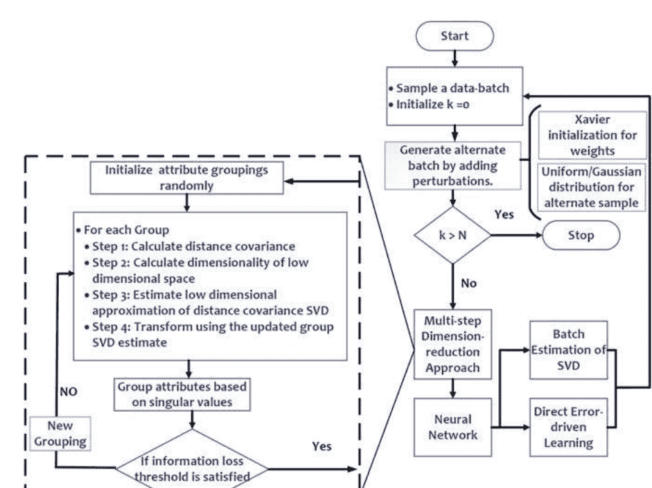

可以观察到，NDR的参数和DNN权重的更新是在每个数据批次中进行的。因此，有必要聚合来自不同数据批次的信息，否则会出现异质性问题。因此，下面描述了一种用于聚合DNN和NDR跨批次信息的过程。

## 5 两步分类框架

图4提供了两步分类框架的流程图。如图所示，首先使用NDR转换每个数据批次。然后，使用转换后的数据计算成本函数，并直接用于学习DNN中的每一层。该过程在数据的每个批次中重复进行多次迭代。然而，对于降维转换，需要为每个批次重新计算参数。为了避免这个问题，引入了批次更新的降维方法。

对于DNN权重的批次更新是微不足道的，因为这些在文献中已经被广泛研究过了[29]。然而，为了对跨多个批次的信息进行聚合以进行维度缩减方法，需要推导出新的程序，并在[37]中进行了描述。在[37]中描述的批次更新遵循以下思想

## 直接误差驱动的学习用于生成大数据的分类应用

使用来自新估计和旧估计之间的组合信息来更新旧估计。根据[37]的符号表示，可以将批次更新写成

$$
C^{(q)} = C^{(q-1)} + 2\hat{C}^{(q-1)\times(q)} + \hat{C}^{(q),(q)}
$$

其中，距离协方差的聚合估计表示为 $C^{(q)}$，其中包括了从批次 $b_{q-1}$ 到批次 $b^q$ 的所有批次。让 $\hat{C}^{(q-1)\times(q)}$ 是来自数据（即批次 $b^q$）的估计，以及先前评估的估计。此外，$\hat{C}^{(q),(q)}$ 提供了来自当前批次$b^q$的估计。类似地，SVD更新也可以写成

$$
U^{(q)} = [U^{(q-1)} \quad I]\hat{U}^{(q)}, \quad V^{(q)} = [V^{(q-1)} \quad I]\hat{V}^{(q)}, \quad \Sigma^{(q)} = \hat{\Sigma}^{(q)}
$$

其中 $\hat{U}^{(q)} \hat{\Sigma}^{(q)} (\hat{V}^{(q)})^T = SVD(K)$ 且 $K = \begin{bmatrix} \hat{\Sigma}^{(q)} & \hat{\Sigma}^{(q)} (\hat{V}^{(q-1)})^T J^{(q)} \\ 0 & R_f^{(q)} \end{bmatrix}$。接下来，$\hat{U}^{(q)}, \hat{\Sigma}^{(q)}$ 和 $\hat{V}^{(q)}$ 是从 $K^{(q)}$ 分解得到的 $J^{(q)} = 2\hat{C}^{(q-1),(q)} + \hat{C}^{(q),(q)}$ 和 $R_f$ 可以看出，在批次更新中，中间项需要保留到目前为止所有数据的代表性批次样本。从理论上讲，如果有无限数量的数据点可用，那么估计的直流分量及其奇异值分解将收敛到真实值（参见[37]中的定理$^1$）。由于在实际情况下这是不可能的，使用流行的采样技术生成的有限历史记录就足够了。

接下来介绍了两步法的效率。

### 算法1 奇异值分解的低秩逼近
j表示矩阵中的维度，d表示奇异值。

- 1. 输入: 矩阵 $K, \kappa = \kappa_t^{(i)}; \forall t, i.$
- 2. 输出: $U, \Sigma, V.$
- 3. 令 $C_1 = C.$
- 4. 令 $\kappa_1 = 0.$
- 5. 对于 $j \in 1, 2, ..., \kappa.$
- 6. 对于迭代直到收敛, $\forall k.$
- 7. $u_k \leftarrow \frac{(K^T K)^k u_0}{\|(K^T K)^k u_0\|}$
- 8. $u_k \leftarrow \frac{(K^T K)^k v_0}{\|(K^T K)^k v_0\|}$
- 9. 结束循环
- 10. $d_j \leftarrow u_j^T C_j v_j$
- 11. $C_j = C_{j-1} - d_j u_j^T v_j$
- 12. 结束循环
- 13. 最终奇异值分解, $U = \{u_j\}$, $V = \{v_j\}$, $\Sigma = diag(\{d_j\})$, $\forall j = 1, 2, \cdots, \kappa.$

# 6 结果和讨论

在本节中，采用两步分类框架对十个数据集进行分析，数据集的详细信息在表3中描述。训练和测试数据集的划分是随机进行的。百分之二十的数据集用于测试，其余百分之八十用于训练。使用均值和方差对结果进行总结。本文中的所有实验都使用Python的TensorFlow软件包进行。首先展示了NDR在大数据情况下的优势。

```
算法2 非线性降维（NDR）
1: 输入: $\mathcal{X}$, $\alpha$
2: 输出: 降维后的 $\mathcal{X}$
3: 
4: 对于 $\mathcal{X}$中的每个批次
5:   $X^{(1)} =$ 批次
6:   对 $X^{(1)}$ 进行标准化。
7:   对于 $i$从 1 → $I$的步骤
8:     如果 $\frac{1}{T^{(i)}} \sum_{t=0}^{T^{(i)}} \sum_{l=0}^{K} \lambda_l \geq \alpha$
9:       停止降维过程
10:    结束如果
11:    如果 i>1
12:      创建分组
13:    否则
14:      随机生成分组
15:    结束如果
16:    对于每个步骤的每个分组 $i$
17:      计算距离相关矩阵
18:      如果批次号为一
19:        使用当前距离相关
20:        评估 $\kappa$
21:      否则
22:        使用聚合的距离相关
23:        评估 $\kappa$
24:    结束如果
25:    使用算法1评估低秩逼近
26:    使用公式（29）更新距离协方差
27:    使用公式（30）更新低秩奇异值分解。
28:  结束循环
29: 结束循环
30: 使用算法2训练回归参数
31: 结束循环
```

表3 论文中使用的不同数据集的统计信息

| 数据集 | 维度 | 数据点 | 类别 |
| :--- | :--- | :--- | :--- |
| 滚动[43] | 11 | 35000 | 4 |
| 无传感器[31] | 48 | 78000 | 11 |
| MNIST[28] | 784 | 72000 | 10 |
| NotMNIST[5] | 784 | 81000 | 10 |
| CIFAR-10[26] | 3072 | 50000 | 10 |
| Gisette[18] | 5000 | 6000 | 2 |
| Madelon[18] | 500 | 1000 | 2 |
| Arcene[18] | 10000 | 100 | 2 |
| Dexter[18] | 20000 | 300 | 2 |
| ImageNet[40] | 784 | 12614060 | 10 |
| 合成数据集 | 20000 | 2000000 | 10 |

### 6.1 减少噪声维度

各种方法的超参数在表4中描述，传感器驱动诊断数据集的结果在表5中列出。结果显示，当从数据中提取的维度增加时，Type-I错误率增加。当将维度减少到35时，观察到最佳准确性。接下来，将NDR的结果与其他方法进行比较，并在表9中总结结果。

相对于其他方法，观察到NDR具有更好的性能。由于无传感器驱动数据集通常包含非线性关系，PCA会失败，这在结果中观察到。在这些测试中，数据被减少到25，并且有所改善。

本文中不同方法的超参数表4

| 方法 | 超参数 |
| :--- | :--- |
| K最近邻算法 (KNN) | 三个邻居 |
| 支持向量机 (SVM) | C = 0.025 |
| 核SVM | RBF核函数, gamma = 2, C = 1 |
| 决策树 (DT) | 最大深度 = 5 |
| 随机森林 (RF) | 最大深度 = 5, 估计器 = 10, 最大属性 = 1 |
| 浅层神经网络 (SNN) | Lr = 0.01, 1个隐藏层, 500个神经元 |
| AdaBoost | 估计器数量 =50, 学习率 = 1.0 |
| 朴素贝叶斯 | 无先验 |
| 二次判别分析 (QDA) | 无先验 |
| 逻辑回归 (LR) | 随机初始化, 学习率 =0.001, 1000次迭代 |

滚动元件轴承数据集在不同维度上的准确率和误报率表5

| $\alpha/100$ | 维度 | 误报率 | 准确性 |
|--------------|------|--------|--------|
| 0.50         | 5    | 0.008  | 0.93   |
| 0.60         | 6    | 0.009  | 0.94   |
| 0.70         | 7    | 0.011  | 0.96   |
| 0.95         | 10   | 0.011  | 0.98   |
| 0.99         | 11   | 0.011  | 0.95   |

表6 玩具数据集的平均准确率，共100次运行

| 方法论 | 带有邻域 | 不带邻域 |
|--------|----------|----------|
| 半月形 | 93       | 84       |
| 同心圆 | 95       | 91       |

在高维情况下观察到的。接下来，将说明异质性问题的结果。

### 6.2 缓解异质性

为了生成邻域，使用高斯分布和均匀分布的扰动，其中均值向量选择为零，ρI表示方差协方差矩阵。让I表示适当的单位矩阵，对于均匀分布的扰动，选择[-ρ, ρ]作为参数。数量ρ控制方差的大小，表示邻域的大小，可以使用 $\frac{\Delta x}{\|\Delta x\|} \rho$ 来强制实施邻域大小，其中ρ由从业者选择。

首先，通过奇异值分解选择B^(i)作为EDL的结果展示T^(i)的奇异向量。提出的框架的超参数总结如下，其中hln是隐藏层神经元的数量；n_neigh表示邻域点的数量。

增加数据中的噪声强度，并在图6b中展示准确性的变化。保持邻域的大小为1，并在图6b中绘制一百个初始权重条件下的平均准确性和泛化误差。相对于没有扰动的情况，提出的框架的性能下降较小。因此，观察到DNN的韧性有所提高。

使用像同心圆和半月数据集这样的玩具数据集，可以观察到邻域原则提高泛化能力和增加神经网络韧性的能力。在图5a中，可以观察到数据的分布。

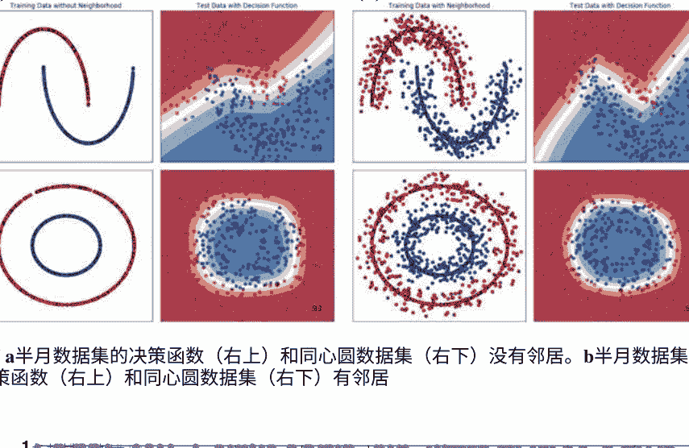

图5 a半月数据集的决策函数（右上）和同心圆数据集（右下）没有邻居。b半月数据集的决策函数（右上）和同心圆数据集（右下）有邻居。

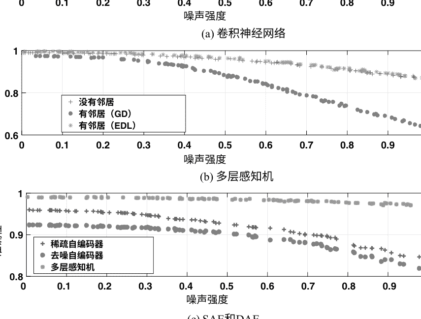

# (a) 卷积神经网络

# (b) 多层感知机

# (c) SAE和DAE

图6 数据中噪声强度增加时的准确性

表7 模型参数

| 架构 | 参数 |
|------|------|
| 卷积神经网络 | $n_{conv} = 2, n_{layers} = 2$, 滤波器大小=5, 池形状=(3,3), 隐藏层神经元数=128, $\alpha = 0.01$, $b=100$, $\lambda=0.001$, $n_{neigh} = 2, \rho = 1$ |
| MLNN | $d = 7, hln = 128, \alpha = 0.01, b = 100, \lambda = 0.001$, $n_{neigh} = 2, \rho = 1$ |
| SAE | $n_{units} = 3$, $hln= 128, \alpha = 0.01, b = 100, \lambda = 0.001$, $n_{neigh} = 2, \rho = 1$ |
| DAE | $n_{units} = 3$, $hln= 128, \alpha = 0.01, b = 100, \lambda = 0.001$, $n_{neigh} = 2, \rho = 1$ |

在没有邻居的情况下，决策边界附近的点被错误分类。从表6中可以观察到，在这些数据集中，无论是否有邻居，准确性都有所提高。

在我们的研究中还观察到，增加邻域的大小会使扰动压倒信号。换句话说，数据中的不同类别变得无法区分，提出的框架的性能明显下降。如图5a所示的图表所描述的，当数据点由于扰动而穿过决策边界时，它违反了数据点在邻域中应该属于与原始数据相同类别的主要假设，因此会出现错误。

接下来，使用提出的框架测试卷积神经网络（CNN）[27]和多层神经网络（MLNN），其中超参数在表7中说明。总体上观察到，当引入扰动来构建邻域时，性能有所提高。

接下来，使用稀疏自编码器[48]和去噪自编码器[52]进行分析，可以参考表7中的超参数。从图6c可以看出，与SAE相比，提出的框架在准确性上有所提高。总之，通过提出的方法，DNN在异质性和噪声存在的情况下的韧性得到了改善。结果在不同的架构中保持一致。整体方法的最终结果如下所述。

### 6.3 分类

学习率选择为0.001，并在表8中列出了结果。将降维后的准确性与未经降维处理的情况进行比较。随着维度数量的增加，准确率的差异增加，降维的情况下提供更好的结果。此外，即使数据点的总数少于总维数，所提出的方法仍然是最优的。这一点在Arcene、Gisette和Dexter数据集的结果中得到了明显的改善。所提出的方法可以与传统的分类方法进行准确性比较，结果如表9所示。再次可以看到，所提出的方法在Arcene、Gisette和Dexter数据集等数据集上表现最佳（表9）。

接下来，对所提出的方法进行了分类性能测试。总共有四种学习范式进行了测试，包括DFA（直接反馈对齐）[35]，SGD（随机梯度下降）[19]，FA（反馈对齐）[32]和EDL（误差驱动学习）。不同模型的超参数在包括所有数据集的表10中给出。所提出的框架似乎改善了数据集的性能，并且对于大维数据集观察到了合理的准确性。

表10中描述了所提出框架在不同数据集上的泛化能力。在EDL中观察到最低的泛化误差，并且在异质性和噪声存在的情况下观察到改进的泛化误差。

表8 不同数据集的准确率，包括有和没有降维的情况

| 数据集 | 降维后 | 未降维 |
|---|---|---|
| Arcene | **0.86** | 0.73 |
| Dexter | **0.99** | 0.69 |
| Gisette | **0.99** | 0.71 |
| Madelon | **0.85** | 0.79 |
| MNIST | **0.94** | 0.89 |

表9 传感器驱动诊断数据集的准确率，与不同降维方法的比较

| Dim-Red ↓ | KNN | SVM | LDA | DT | RF | SNN | AdaBoost | 朴素贝叶斯 | QDA |
|---|---|---|---|---|---|---|---|---|---|
| PCA | 0.52 | 0.52 | 0.523 | 0.4538 | 0.4529 | 0.5254 | 0.1844 | 0.45670 | 0.5377 |
| ISOMAP | 0.6752 | 0.4691 | 0.4302 | 0.3255 | 0.3975 | 0.5847 | 0.1844 | 0.4256 | 0.4925 |
| LLE | 0.2574 | 0.0876 | 0.1540 | 0.1886 | 0.1889 | 0.0876 | 0.1858 | 0.1911 | 0.1931 |
| KPCA | 0.54 | 0.53 | 0.523 | 0.4538 | 0.4488 | 0.5827 | 0.280 | 0.45670 | 0.5377 |
| Lasso | 0.2574 | 0.0876 | 0.1540 | 0.1886 | 0.1889 | 0.0876 | 0.1858 | 0.1911 | 0.1931 |
| 弹性网络 | 0.54 | 0.53 | 0.523 | 0.4538 | 0.4488 | 0.5827 | 0.280 | 0.45670 | 0.5377 |
| 提出的 | **0.89** | **0.91** | **0.84** | **0.70** | **0.65** | **0.93** | **0.25** | **0.73** | **0.86** |

表10 不同学习方法的准确性和泛化误差。Hln表示每层隐藏层神经元的数量，b表示批量大小。此外，n表示与数据集中每个数据点对应的邻域中的数据点数量。

| 数据集 | p | n | F | 模型参数 | DFA | FA | SGD | EDL |
| :--- | :--- | :--- | :--- | :--- | :--- | :--- | :--- | :--- |
| 滚动[43] | 11 | 35000 | 4 | α = 0.01, b = 100, d = 7, hln = 100, λ = 0.001, n_neigh = 2, ρ = 1 | 99(0.0001) | 99(0.0001) | 99(0.6) | 99(0.0) |
| 无传感器[31] | 48 | 78000 | 11 | α = 0.01, b = 100, d = 8, hln = 100, λ = 0.001, n_neigh = 2, ρ = 1 | 94(0.008) | 94(0.008) | 95(0.008) | 94(0.002) |
| MNIST[28] | 784 | 72000 | 10 | α = 0.01, b = 100, d = 8, hln = 100, λ = 0.001, n_neigh = 2, ρ = 1 | 92(0.1) | 94(0.2) | 95(1) | 97(0.6) |
| NotMnist[5] | 784 | 81000 | 10 | α = 0.01, b = 100, d = 9, hln = 100, λ = 0.001, n_neigh = 2, ρ = 1 | 90(1) | 82(1.8) | 88(2) | 92(0.8) |
| CIFAR10[26] | 3072 | 50000 | 10 | α = 0.01, b = 100, d = 10, hln = 100, λ = 0.001, n_neigh = 2, ρ = 1 | 81(7.21) | 80(8.00) | 82(12.11) | 84(8.77) |
| Arcene[18] | 10000 | 100 | 2 | α = 0.01, b = 100, d = 9, hln = 100, λ = 0.001, n_neigh = 2, ρ = 1 | 69(0) | 61(0) | 51(0) | 78(0) |
| Dexter[18] | 20000 | 300 | 2 | α = 0.01, b = 100, d = 8, hln = 100, λ = 0.001, n_neigh = 2, ρ = 1 | 71(0.7) | 77(0.9) | 81(1.1) | 80(1) |
| Gisette[18] | 5000 | 6000 | 2 | α = 0.01, b = 100, d = 8, hln = 100, λ = 0.001, n_neigh = 2, ρ = 1 | 92(0.25) | 93(0.21) | 91(0.3) | 98(0.07) |

# 7 结论和未来工作

在存在异质性、梯度消失和噪声等挑战的情况下，提出了一种系统的方法来设计分类器。由于引入了合成失真来近似泛化误差，我们的框架在存在数据噪声的情况下具有鲁棒性，因为观察到的准确性变化较小。

需要仔细选择扰动的幅度，因为大的扰动会显著降低所提出框架的性能。

在学习过程中直接使用整体误差信号似乎可以缓解梯度消失问题，即使使用了sigmoid和tanh激活函数。所提出的框架结合EDL在所有分析的数据集中似乎优于其他方法，如DFA和FA。此外，使用降维方法似乎对精度的影响较小。

在大维数据集的情况下，NDR实现了非常好的准确性。通过控制信息损失，NDR可以确定低维空间的基数。因此，在NDR内可以有效地解决不需要的维度的问题。

两步法的主要缺点之一是NDR没有从分类中获得任何反馈。可以通过综合方法来解决这个问题，即使用分类错误来更新NDR的参数。研究这个问题可以作为未来工作的一部分。

# 参考文献

- 1. Adragini, K.P., Al-Najjar, E., Martin, S., Popuri, S.K., Raim, A.M.: 使用主要拟合分量进行分组充分降维。计算统计 31(3), 923–941 (2016)
- 2. Balasubramanian, M., Schwartz, E.L.: Isomap算法和拓扑稳定性。 科学 295(5552), 7 (2002)
- 3. Belkin, M., Niyogi, P.: 拉普拉斯特征映射用于降维和数据表示。神经计算 15(6), 1373–1396 (2003)
- 4. Bishop, C.M.: 模式识别与机器学习。 Springer, 纽约 (2006)
- 5. Bulatov, Y.: Notmnist数据集。 Google (图书/OCR), 技术报告。http://yaroslavvb.blogspot.it/2011/09/notmnist-dataset.html (2011)
- 6. Clarke, R., Ressom, H.W., Wang, A., Xuan, J., Liu, M.C., Gehan, E.A., Wang, Y.: 高维数据空间的特性：对探索基因和蛋白质表达数据的影响。 Nat. Rev. Cancer 8(1), 37–49 (2008)
- 7. David, S., Ruey, S., et al.: 通过距离协方差进行独立成分分析。 J. Am. Stat. Assoc. (2017)
- 8. Donoho, D.L., Grimes, C.: Hessian eigenmaps：用于高维数据的局部线性嵌入技术。 Proc. Natl. Acad. Sci. 100(10), 5591–5596 (2003)
- 9. 范, J., 韩, F., 刘, H.: 大数据分析的挑战. 国家科学评论 1(2), 293–314 (2014)
- 10. 冯, H., 等: 使用无参数半监督流形学习进行基因分类. IEEE/ACM Trans. Comput. Biol. Bioinform. 9(3), 818–827 (2012)
- 11. Fodor, I.K.: 降维技术综述 (2002)
- 12. Giraud, C.: 高维统计导论, vol. 138. CRC Press (2014)

13. Glorot, X., Bengio, Y.: 理解训练深度前馈神经网络的困难。 In: Proceedings of the Thirteenth International Conference on Artificial Intelligence and Statistics, pp. 249–256 (2010)

14. Goldberger, J., Ben-Reuven, E.: 使用噪声适应层训练深度神经网络 (2016)

15. Goodfellow, I., Bengio, Y., Courville, A.: 深度学习, vol. 1. MIT出版社, 剑桥 (2016)

16. Goodfellow, I.J., Shlens, J., Szegedy, C.: 解释和利用对抗性示例 (2014). arXiv预印本 arXiv:1412.6572

17. Guo, Z., Li, L., Lu, W., Li, B.: 通过包络方法进行分组维度缩减。 J. Am. Stat. Assoc. 110(512), 1515–1527 (2015)

18. Guyon, I., Gunn, S., Ben-Hur, A., Dror, G.: NIPS 2003特征选择结果分析挑战。 In: Advances in Neural Information Processing Systems, pp. 545–552 (2005)

19. Hardt, M.: 训练更快，泛化更好：随机梯度下降的稳定性。 Math. Found. Learn. Theory. 64 (2015)

20. Ing, C.K., Lai, T.L., Shen, M., Tsang, K., Yu, S.H.: 在大数据时代的回归模型中的多重检验及其应用于故障诊断。 Technometrics (已接收) (2016)

21. Johnson, R.A., Wichern, D.W.: 应用多元统计分析, 第4版。 Prentice Hall, Englewood Cliffs (1992)

22. Johnson, R.A., Wichern, D.W.: 应用多元统计分析, 第5版。 Prentice Hall, Upper Saddle River (2002)

23. Jolliffe, I.: 主成分分析。 Wiley Online Library (2002)

24. Khan, F., Kari, D., Karatepe, I.A., Kozat, S.S.: 使用自适应分层树在高维数据上进行通用非线性回归。 IEEE Trans. Big Data 2(2), 175–188 (2016)

25. Kingma, D.P., Ba, J.: Adam: 一种随机优化方法 (2014). arXiv预印本 arXiv:1412.6980

26. Krizhevsky, A., Hinton, G.: 从微小图像中学习多层特征 (2009)

27. Krizhevsky, A., Sutskever, I., Hinton, G.E.: 使用深度卷积神经网络进行ImageNet分类。 In: Advances in Neural Information Processing Systems, pp. 1097–1105 (2012)

28. LeCun, Y., Bottou, L., Bengio, Y., Haffner, P.: 基于梯度的学习应用于文档识别。 Proc. IEEE 86(11), 2278–2324 (1998)

29. LeCun, Y., Bengio, Y., Hinton, G.: 深度学习。 Nature 521(7553), 436 (2015)

30. Lee, D.H., Zhang, S., Fischer, A., Bengio, Y.: Difference target propagation。 In: Joint European Conference on Machine Learning and Knowledge Discovery in Databases, pp. 498–515. Springer, Cham (2015)

31. Lichman, M.: UCI机器学习仓库。 http://archive.ics.uci.edu/ml (2013)

32. Lillicrap, T.P., Cownden, D., Tweed, D.B., Akerman, C.J.: 随机突触反馈权重支持深度学习的误差反向传播。 Nat. Commun. 7, 13276 (2016)

33. Mishkin, D., Matas, J.: 你所需要的只是一个好的初始化 (2015). arXiv预印本 arXiv:1511.06422

34. Niyogi, P., Girosi, F.: 关于径向基函数的泛化误差、假设复杂度和样本复杂度之间的关系。 Neural Computation. 8(4), 819–842 (1996)

35. Nøkland, A.: 直接反馈对齐提供了深度神经网络的学习。 In: Advances in Neural Information Processing Systems, pp. 1037-1045 (2016)

36. Pascanu, R., Mikolov, T., Bengio, Y.: 训练循环神经网络的困难。 In: International Conference on Machine Learning, pp. 1310-1318 (2013)

37. Krishnan, R., Samaranayake, V.A., Jagannathan, S.: 一种多步非线性降维方法及其在大数据中的应用。 IEEE Trans. Knowl. Data Eng. (2018)

38. Reed, S., Lee, H., Anguelov, D., Szegedy, C., Erhan, D., Rabinovich, A.: 使用自举法在带有噪声标签的深度神经网络上进行训练 (2014). arXiv预印本 arXiv:1412.6596

39. Roweis, S.T., Saul, L.K.: 通过局部线性嵌入进行非线性降维。 Science 290(5500), 2323-2326 (2000)

40. Russakovsky, O., Deng, J., Su, H., Krause, J., Satheesh, S., Ma, S., Huang, Z., Karpathy, A., Khosla, A., Bernstein, M., et al.: ImageNet大规模视觉识别挑战赛。 Int. J. Comput. Vis. 115(3), 211-252 (2015)

41. Schmidhuber, J.: 神经网络中的深度学习概述。 Neural Networks 61, 85–117 (2015)

42. Shawe-Taylor, J., Cristianini, N.: 模式分析的核方法。 剑桥大学出版社 (2004)

43. Soylemezoglu, A., Jagannathan, S., Saygin, C.: 马氏距离田口系统（MTS）作为滚动轴承故障的预测工具。 Journal of Manufacturing Science and Engineering 132(5), 051014 (2010)

44. Soylemezoglu, A., Jagannathan, S., Saygin, C.: 马氏距离田口系统作为离心泵故障的多传感器决策预测工具。 IEEE Trans. Reliability 60(4), 864–878 (2011)

45. Srivastava, N., Hinton, G., Krizhevsky, A., Sutskever, I., Salakhutdinov, R.: Dropout: a simple way to prevent neural networks from overfitting. J. Mach. Learn. Res. 15(1), 1929–1958 (2014)

46. Sun, K., Huang, S.H., Wong, D.S.H., Jang, S.S.: Design and application of a variable selection method for multilayer perceptron neural network with LASSO. IEEE Trans. Neural Netw. Learn. Syst. 28(6), 1386–1396, June 2017. ISSN 2162-237X. https://doi.org/10.1109/TNNLS.2016.2542866

47. Székely, G.J., Rizzo, M.L., Bakirov, N.K., et al.: 通过距离的相关性测量和测试依赖性。 Ann. Stat. 35(6), 2769–2794 (2007)

48. Vincent, P., Larochelle, H., Lajoie, I., Bengio, Y., Manzagol, P.A.: 堆叠去噪自编码器：通过局部去噪准则在深度网络中学习有用的表示。 J. Mach. Learn. Res. 11(Dec), 3371–3408 (2010)

49. Ward, A.D., Hamarneh, G.: 模糊骨架化和修剪的群体中轴变换。 IEEE Trans. Pattern Anal. Mach. Intell. 32(6), 1084–1096 (2010)

50. Witten, D.M., Tibshirani, R., Hastie, T.: 一种带有应用于稀疏主成分和规范相关分析的惩罚矩阵分解。 Biostatistics 10(3), 515–534 (2009)

51. Wu, X., Zhu, X., Wu, G.Q., Ding, W.: 大数据的数据挖掘。 IEEE Trans. Knowl. Data Eng. 26(1), 97–107 (2014)

52. Xie, J., Xu, L., Chen, E.: 使用深度神经网络进行图像去噪和修复。 In: Advances in Neural Information Processing Systems, pp. 341-349 (2012)

53. Xu, N., Hong, J., Fisher, T.C.: 广义误差最小化：一种模型评估和选择的新方法，应用于惩罚回归 (2016). arXiv预印本 arXiv:1610.05448

54. Yu, Z., Li, L., Liu, J., Han, G.: 混合自适应分类器集成。 IEEE Trans. Cybern. 45(2), 177-190 (2015). ISSN 2168-2267. https://doi.org/10.1109/TCYB.2014.2322195

55. Zhang, L., Lin, J., Karim, R.: 基于滑动窗口的高维数据流故障检测。 IEEE Trans. Syst. Man Cybern. Syst. (2016)

56. Zhou, J.K., Wu, J., Zhu, L.: 重叠的分组维度缩减。 Science China Mathematics 59(12), 2543–2560 (2016)

# 用于软传感器设计的深度学习

Salvatore Graziani和Maria Gabriella Xibilia

摘要 软传感器是用于预测真实系统行为的数学模型。它们通常用于估计在过程工业中难以测量的量。许多软传感器是通过使用数据驱动方法和利用历史数据库来设计的。机器学习在此目标中被广泛使用。在这里，介绍了深度学习在解决工业应用中出现的一些挑战方面的潜力。更具体地说，本文关注三个具体方面：标记数据稀缺性、计算复杂度降低和无监督特征利用。描述了基于深度学习的软传感器的最新技术。然后，重点介绍了基于深度信念网络的软传感器，这是作者多年来一直在研究的一个研究领域。将展示深度信念网络相对于更传统的数据驱动方法在设计用于实际应用的软传感器方面所提供的改进。描述了特定案例研究的软传感器。

关键词 软传感器 · 系统辨识 · 深度学习 · 深度置信网络 · 半监督学习 · 工业应用

## 1 过程工业中的软传感器

工业4.0的实施强制要求对过程进行监控。工厂监控、控制策略和资产管理需要对工厂的工作条件进行估计。因此，需要高效的测量和数据处理系统。因此，需要普遍存在的感知系统，对感知能力、效率、冗余和成本有一定的约束。物理传感器可能无法安装在关键位置，或出于经济原因，例如，可以限制测量系统的性质、数量和位置。

针对估计过程变量的真实世界过程模型，通过利用它们对其他变量的依赖关系，被称为软传感器（SSs）。它们是一种软件工具，用于处理易于测量的过程变量（SS输入）的数据，并估计难以测量的数量（SS输出）。

- 代表了硬件测量设备的替代方案；
- 在测量验证和故障检测方面非常有用；
- 可以通过使用广泛可用和强大的硬件轻松实现；
- 允许实时估计变量，从而保证了实施反馈控制策略的可能性。

在工业应用中，特别是在过程工业中，SS的使用已经在文献中得到广泛讨论。第一批回顾工业案例研究的贡献可以在[1, 2]中找到。最近，文献中提出了许多其他案例研究。讨论所有可用的文献超出了本章的范围。本章的重点恰恰在于SS设计中出现的特定问题以及深度学习如何解决这些问题。

由于工业过程的复杂和非线性特性，模型设计并不是一个简单的问题，数据驱动的系统识别方法在文献中被广泛提出，被认为是最合适的方法[1, 2]。从历史数据库中提取的数据，或者在专门的实验测量调查过程中有目的地收集的数据，被用于这个目的。数据驱动的SS通常基于主成分回归、神经网络（NNs）、模糊逻辑、核学习方法和贝叶斯方法等[2, 3]。

尽管对SSs的兴趣很大，但迄今为止，未解决的问题阻碍了数据驱动设计方法的完全成功。最近，深度学习已经成为缓解这些问题的有价值方法。基于有限的可用实验数据，基于NN的SSs的主要问题是在表示非常复杂的非线性现象方面的低效性。

虽然使用更深的结构可以获得更复杂的表示，但已经证明这些结构不能通过传统的BP-类算法成功训练，因为存在梯度消失和梯度爆炸问题。Hinton和同事们的开创性工作[4-6]提出了一种贪婪的逐层无监督预训练和有监督微调的解决方案，能够高效地训练深层结构。因此，深层结构的受欢迎程度不断提高，现在它们代表着图像处理、语音识别、自然语言处理等应用领域的最先进的解决方案[5]。在过去几年中，提出了各种深层结构，包括堆叠自编码器（SAEs）[7]，深度置信网络（DBNs）[8]和卷积神经网络（CNNs）[9,10]。

非线性模型表示的复杂性并不是SS设计中唯一的问题需要面对的。在过程工业的典型场景中，物理过程变量的采样速率远高于相应的化学质量变量。实际上，过程变量（流量、压力、温度等）是在线测量的（通常每分钟一次或甚至更快），而质量变量通常是由实验室设备测量的，通常每天一次或两次。当需要基于可用的历史工厂数据库设计数据驱动模型时，这个方面代表了一个相关的问题。如果在过程工业中使用传统的机器学习方法来设计SSs，只能利用非常少量的可用数据（即标记数据）。典型的深度学习半监督学习方法的使用可以为所描述的问题提供有意义的解决方案。

深层结构还允许处理大量的自由参数问题，与可用的实验数据相关，在数据驱动的SS中经常遇到，这会使设计面临过拟合的风险。事实上，它们允许对复杂问题进行紧凑的表示。最后，无监督的非线性特征提取过程，这是SAEs和DBNs训练的特点，可以有助于深入了解过程结构，更好地驱动SS设计过程。

许多深层结构已被提出用于SS设计，如下一节所述。本章的其余部分侧重于DBNs在SS设计中的潜力和挑战。描述了实际工业案例研究，旨在阐明DBNs如何解决上述问题。

具体而言，本章的组织方式是专注于SS设计的三个不同方面：模型复杂性降低，利用无标签数据提高SS性能，以及处理数据集特征以进行模型结构选择。

# 基于深度学习的SS的最新技术

下面报告了在SS设计中使用深度网络的最新技术。所引用的论文是根据采用的深度网络结构进行组织的。首先考虑的网络拓扑是SAE。SAE是一个由一系列自编码器组成的神经网络。每个自编码器都是一个具有一个隐藏层的神经网络。每个自编码器的训练是通过将输出设置为输入来完成的。

自编码器需要准确地重构其输入，最终去除数据中的噪声和/或将数据映射到较低维度的流形中。SAE的训练包括逐层无监督预训练，然后进行有监督的微调。在预训练阶段，每个自编码器将其输入数据映射到隐藏特征层。使用梯度下降最小化重构误差来确定权重。自编码器训练完成后，输出层被移除，其隐藏层输出被用作下一个自动编码器的输入。训练过程对堆栈中的所有层重复进行。当无监督预训练完成后，进一步在堆栈顶部添加一层，并使用梯度下降算法进行监督微调，最终确定网络的权重。

下面报告的论文提出了使用SAEs来解决SS设计中的相关开放问题。实际上，过程工业历史数据库通常是数据丰富但信息贫乏的，包含相互关联和高度冗余的变量。在SS设计过程中使用了许多方法来通过特征提取过程提取相关信息。常见的策略基于交叉相关分析、主成分分析（PCA）、偏最小二乘回归（PLS）及其非线性对应物非线性PLS（NLPLS）、Mallow's Cp系数、Lipschitz商、互信息（MI）或偏互信息（PMI）、最小绝对收缩和选择算子（LASSO）算法以及其他许多方法[2, 11]。近年来，深度神经网络已被提出用于此目的，因为它们能够从数据中学习层次化的抽象特征表示。然而，传统的深度学习算法特征提取是无监督的，即学习算法不是为了提取与输出相关的高级特征而设计的。这个问题在[12]中得到了解决，提出了一种新的变量加权SAE。通过使用每个自动编码器的输入与输出之间的相关性来选择相关的输入变量。在提出的方法中，一个深度自动编码器逐层进行预训练。通过在自动编码器的目标函数中为不同的变量使用不同的权重来合并输出信息。权重是通过使用上述的相关性分析来确定的。然后进行监督的最终微调。以一个分馏塔精馏柱为案例研究报告了一个SS。

进一步的结果在[13]中报告，其中提出了一种非线性变量加权的SAE来学习与质量相关的特征。在每个自编码器中，输入或特征变量与质量变量的非线性Kendall相关性被用来获得相应的加权重构目标函数，该函数被设计用来逐层学习与质量相关的特征。考虑了与[12]相同的案例研究。在[14]中提出了一种混合变量选择方法，同样基于SAEs。在每次迭代中，根据输入变量与预测误差之间的互信息进行输入变量的排序。移除不相关的变量并更新网络的第一层权重。论文中报告了两个应用：估计气体混合物中一氧化碳和乙烯的浓度，以及估计热电厂锅炉中空气预热器的转子变形。在[15]中，还提出了用于焦炭干熄过程的操作优化的SAEs，并在[16]中用于估计燃煤热电厂1000 MW超超临界机组烟气中的氧含量。在[17]中提出了一种集成自编码器和支持向量回归的新的SS建模方法。论文中使用自编码器来确定数据的稳健高级特征表示。支持向量回归模型是基于获得的特征进行输出估计的方法。所描述的方法用于解决[16]中描述的问题。

深度学习SS设计方法的第二类基于DBNs的使用。该结构是一堆受限玻尔兹曼机（RBM）构建而成，在下一节中将详细描述，包括其学习算法。在这里，简要描述了一些相关应用。2014年发表的论文[18]是作者所知的在SS设计领域中首次使用深度学习的论文。在该论文中，使用DBN设计了一个SS，用于估计原油蒸馏装置的重柴油95%切割点。论文广泛讨论了深度学习策略引入的优势，包括改进的表示能力、提取非线性潜在变量的可能性以及半监督训练阶段提供的无标签数据的使用。此外，还强调了处理大规模数据的效率。在[19]中，作者使用DBN预测燃烧过程中的氧含量。该SS使用由摄像机捕获的彩色火焰图像。DBN从图像中提取非线性特征，更好地描述了燃烧过程。然后使用监督微调阶段来获取图像与氧含量之间的关系。论文中提出了两种基于DBN的回归模型。第一种是传统的通过反向传播训练的神经网络，另一种是支持向量回归。该方法在真实的燃烧系统中进行了测试。DBN结构在SS设计中的其他应用可以在[20-22]中找到。这些应用将在接下来的内容中进行更详细的讨论，以概述DBN在SS设计中的潜力通过适当的实践案例研究。

CNNs最近也被用于SS设计。在[23]中，使用了CNN来预测裂解反应器的气相组成，采用了移动窗口方法。在[24]中，提出了一种用于航天器健康监测和结构损伤检测的SS，通过估计部分振动测量中的振动响应，使用CNN进行计算。

随机化方法也被扩展到深度网络，并用于SS设计。在这类学习方法中，隐藏权重是随机选择的。最后一层的权重计算采用了伪逆或最小二乘法。在[25]中，作者同时使用了深度网络和随机化算法进行非线性系统识别。SS具有深层结构，增加隐藏层和减少隐藏神经元有助于提高建模能力。RBM学习算法用于训练隐藏权重，随机化算法用于计算输出权重。基于深度极限学习机（ELM）的半监督深度学习模型也在[26]中提出。它可以使用标记和未标记的数据，提高SS的预测性能和鲁棒性。在[27]中使用了集成深度核模型来处理工业聚合过程。集成学习方法通常由两个步骤组成，即集成成员生成和预测组合。这两个阶段可以采用多种策略实现。在论文中，DBN的无监督学习阶段用于特征提取。然后使用核学习回归模型来估计将特征与输出链接的非线性关系。采用基于装袋的集成策略，以及深度核学习方法。因此，预测模型的可靠性得到了提高。基于距离模型准则和局部模型的不同半监督集成方法在[28]中进行了描述。该过程从自适应状态分割方法开始，该方法使用未标记的样本。然后，引入了距离模型准则来进行选择性集成学习。所提出的策略允许克服k-最近邻方法的缺点。该度量允许更准确地描述查询样本与局部模型之间的关系。使用粒子群优化来计算所需的参数。一个脱丁器精馏塔和一个硫磺回收装置被用作基准。

在[29]中使用遗传算法确定深度稀疏自编码器的最优结构。预测误差被用作适应度函数。生物废水处理厂的SS被用作基准。

在[30]中提出了一种用于SS设计的深度概率序列网络。该模型结合了无监督特征提取和监督动态建模。所提出的方法基于高斯-伯努利受限玻尔兹曼机和循环神经网络（RNN）。它应用于CO2吸收柱的设计。

本节中描述的最新技术清楚地显示了SS社区对深度结构的浓厚兴趣。此外，由于需要将深度学习适应特定应用领域，因此提出了许多不同的结构。在深度结构中，以下将重点限制在DBNs上，作为一种能够应对数据驱动软传感器设计中的三个挑战的深度结构，将在下一节中详细讨论。

## 3 SS设计

SS可以通过机械建模（物理建模）、多变量统计或机器学习方法进行设计。在工业环境中，广泛采用数据驱动模型，既因为涉及现象的复杂性阻碍了物理模型的使用，也因为历史数据集的可用性。

数据驱动的模型设计包括四个主要步骤：

- a. 实验数据采集/选择;
- b. 模型类别选择;
- c. 模型识别;
- d. 验证.

上述每个步骤都面临着特定的挑战，目前是研究活动的对象。下面简要讨论了每个步骤中出现的问题。对于项目a.，可以列举出两类问题。第一个问题涉及可用数据的质量。实际上，实验数据通常可以在过程工业数据库中获得。不幸的是，它们的质量通常不适合于SSs设计，因为存在噪声、共线性、异常值和异质性。因此，需要适当的数据预处理和异常值去除策略[2]。在过程工业中，一个特定的问题是标记数据的稀缺性，这将在第5节中讨论。第二个方面涉及选择与输出估计相关的输入变量。当线性过程/模型是感兴趣的时候，相关分析是解决问题的合适工具。当研究非线性过程时，情况就不同了。在这种情况下，文献中提出了许多选择方法，具有相对矛盾的优缺点[11]。

关于b项，需要做出许多选择来选择模型类别，例如线性或非线性、静态或动态、时变或不变等等。非线性自回归外部输入(NARX)模型是一类非常通用的模型，通常在系统设计领域中采用。多输入单输出NARX模型可以表示为：

$$\hat{y}(k) = f(y(k - 1), y(k - 2) \ldots, y(k - n), u(k - 1), u(k - 2), \ldots, u(k - m)) \quad (1)$$

其中 k是表示离散时间的整数， $\hat{y}(k)$是系统输出第k个样本的估计值， $u(k)$是输入变量的向量， $f(\bullet)$是非线性连续函数， n是输出回归器的数量(模型阶数)，而 m是输入回归器的数量。如果不使用输出回归器，则得到一个非线性有限冲激响应(NFIR)模型。如果模型不包含任何过去的输入和输出样本，则称为静态非线性模型。

NFIR模型很好地适应了SSs设计，因为它们不需要过去的测量值系统输出，即使对系统动力学进行建模。静态模型是最简单的非线性模型结构，当系统动力学不相关时可以使用。

输入和输出之间的有限时间延迟可以表征工业过程。它需要通过实验数据进行估计。深度网络可以帮助确定SSs设计中的有限时间延迟的值[12–14, 41]。

项目c，涉及到非线性函数 $f(\bullet)$的识别。统计或机器学习方法可以用于此目的[1, 2]。最近，深度学习已经成为基于可用数据集识别函数 $f(\bullet)$的有价值工具。本章重点介绍DBNs作为识别工具的应用。

项目d可以使用适当的指标和图表来解决。在可能的指标中，相关系数（CC）在植物实际过程和相应估计之间，以及均方根误差（RMSE）在文献中被广泛采用。进一步的研究涉及模型残差的统计特性，可以使用线性或非线性方法来解决[2]。

## 4 深度置信网络

尽管根据文献中的兴趣问题提出了许多深度结构[5]，但本节将重点介绍DBN，该结构将用于本章报告的案例研究。

由于一层隐藏层（浅层）多层感知机（MLP）具有通用逼近能力，因此它们常用于SS设计[1, 2]。 MLP的成功归功于反向传播（BP）算法及其对MLP训练的连续改进。 BP是一种有监督学习方法，因为它需要一组合适的输入-输出对可用（带标签的数据）。 不幸的是，浅层网络在解决复杂问题方面表现出效率低下[5]，因此提出了深度网络（DNs），即具有多个隐藏层的网络，作为一种合适的替代方案。 BP对于DNs来说不是一种高效的训练算法，因为它容易陷入表现不佳的局部最小值。 因此，需要其他的学习方法。 2006年，Hinton和他的合作者解决了这个问题，他们引入了一种能够训练DNs的算法[4]。 自那时以来，已经引入了许多结构来处理不同类别的问题。 下面将描述DBN的结构和学习算法[31, 32]。 如图1所示，DBN具有3个隐藏层和一个输出神经元，适用于MISO模型。

DBN是通过堆叠L个受限玻尔兹曼机（RBMs）获得的，它们代表了DN的构建模块。每个RBM有两层。 较低的可见层 $v_l$，（$l=1,...,L$）代表输入，隐藏层 $h_l$产生潜在变量。 RBM是一种无监督模型，通过其父网络（即玻尔兹曼机）获得，当同一层中的神经元之间的连接不允许时。 因此，只存在可见变量和隐藏变量之间的连接。

在堆栈中，每个RBM的输出是下一个RBM的可见层。采用一种贪婪的逐层方案来实现无监督的网络训练。

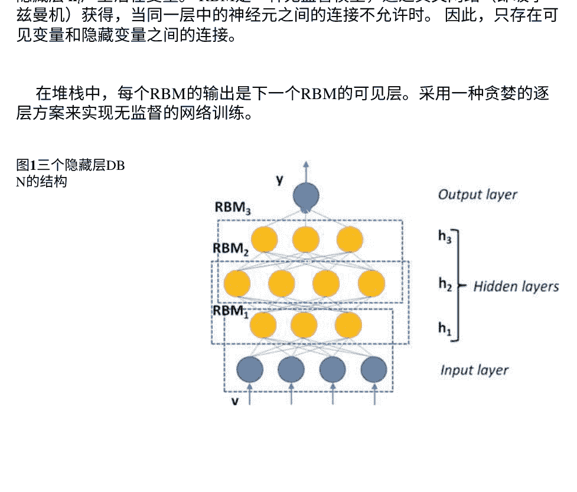

网络的训练。 接下来，将描述堆栈中通用RBM的训练。 为简单起见，下标 l 将被省略。 无监督学习是逐个RBM执行的。 每个RBM通过最大化其可见变量和隐藏变量之间的联合分布$P(v, h)$来进行训练。 通过使用能量函数来获得这样的分布：

$$ P(\mathbf{v}, \mathbf{h}) = \frac{e^{(-\text{能量}(\mathbf{v}, \mathbf{h}))}}{\sum_v \sum_h e^{(-\text{能量}(\mathbf{v}, \mathbf{h}))}} $$

因此，RBM训练的目标也是能量函数的最小化。 (2) 中的分母是一个归一化因子，确保对 $v$ 和 $h$ 的所有可能值的联合分布的求和为一。 能量定义如下：

$$ \text{能量}(\mathbf{v}, \mathbf{h}) = -\mathbf{b}^\mathrm{T} \mathbf{v} - \mathbf{c}^\mathrm{T} \mathbf{h} - \mathbf{h}^\mathrm{T} \mathbf{W} \mathbf{v} $$

如果 $v$ 和 $h$ 是二进制向量（二进制RBM），则能量定义如下：

$$ \text{能量}(\mathbf{v}, \mathbf{h}) = \sum_i \frac{(v_i - b_i)^2}{2\sigma_i^2} - \mathbf{c}^\mathrm{T} \mathbf{v} - \mathbf{h}^\mathrm{T} \mathbf{W} \mathbf{v} $$

对于连续输入的RBM（高斯RBM）情况，在 (4) 中，$b_i$和$\sigma_i$是描述可见层输入的高斯分布的均值和标准差。 最后，如果考虑到归一化的输入（即零均值和单位标准差）， (4) 简化为：

$$ \text{能量}(\mathbf{v}, \mathbf{h}) = \frac{1}{2} \mathbf{v}^\mathrm{T} \mathbf{v} - \mathbf{c}^\mathrm{T} \mathbf{v} - \mathbf{h}^\mathrm{T} \mathbf{W} \mathbf{v} $$

在 (3) 、 (4) 和 (5) 中，$W$、$b$和$c$是RBM的参数。 具体来说，$W$是权重矩阵，$b$是可见层的偏置向量，$c$是隐藏层的偏置向量。 它们需要通过适当的学习算法确定。 为了达到这个目的，梯度下降法被应用于对数似然函数在点 $\mathbf{v}$处的导数，如下所示：

$$ \frac{\partial \log \sum_h P(\mathbf{v}, \mathbf{h})}{\partial \theta} = \frac{\sum_h e^{-\text{能量}(\mathbf{v}, \mathbf{h})} \left( \frac{\partial [-\text{能量}(\mathbf{v}, \mathbf{h})]}{\partial \theta} \right)}{\sum_h e^{-\text{能量}(\mathbf{v}, \mathbf{h})}} - \frac{\sum_{\tilde{\mathbf{v}}} \sum_h e^{-\text{能量}(\tilde{\mathbf{v}}, \mathbf{h})} \left( \frac{\partial [-\text{能量}(\tilde{\mathbf{v}}, \mathbf{h})]}{\partial \theta} \right)}{\sum_{\tilde{\mathbf{v}}} \sum_h e^{-\text{能量}(\tilde{\mathbf{v}}, \mathbf{h})}} = \sum_h P(\mathbf{h}|\mathbf{v}) \left( \frac{\partial [-\text{能量}(\mathbf{v}, \mathbf{h})]}{\partial \theta} \right) - \sum_{\tilde{\mathbf{v}}} P(\tilde{\mathbf{v}}, \mathbf{h}) \left( \frac{\partial [-\text{能量}(\tilde{\mathbf{v}}, \mathbf{h})]}{\partial \theta} \right) $$

其中 $\theta = \{W, b, c\}$ 包含RBM的权重和偏置矩阵。(6)中的第一项也称为正项。 这是条件期望 $\partial[−\text{能量}(\mathbf{v}, \mathbf{h})]/\partial\theta$。 鉴于条件概率的值，它很容易计算得出

$$P(h_j = 1|\mathbf{v}) = \frac{e^{c_j + \mathbf{W}_j\mathbf{v}}}{1 + e^{c_j + \mathbf{W}_j\mathbf{v}}} = \text{sigm} (c_j + \mathbf{W}_j\mathbf{v}) \tag{7}$$

已知。 在(7)中，$\text{sigm}(.)$是通常的S型函数。

(6)中的第二项被称为负项。 它是联合分布$P(\mathbf{v}, \mathbf{h})$的期望$\partial[−\text{能量}(\mathbf{v}, \mathbf{h})]/\partial\theta$，对于具有大量单元的RBM来说，这可能变得棘手。 通常使用对比散度(CD)算法来近似计算。

使用两阶段Gibbs采样作为近似采样方法。 通常使用一步马尔可夫链来实现这个目标： 1. 从$P( \mathbf{h}|\mathbf{v} = \mathbf{v}^0)$中采样$\mathbf{h}^1$。

2. 从 $P(\mathbf{v}|\mathbf{h} = \mathbf{h}^1)$中采样 $\mathbf{v}^1$。

通过使用上述近似方法， $\theta$ 可以很容易地更新[18]。在无监督训练之后，潜在变量在最顶层被获取。 它们进一步被处理以估计DBN的输出。 为了达到这个目的， 添加了一个输出层。这个层的权重是随机初始化的。 整个网络通过使用类似BP的训练算法进行微调。 在无监督学习阶段获得的权重被用作$\theta$的初始值。 微调阶段是唯一需要标记数据的阶段。

## 5 真实案例研究

本节旨在说明DBN在SS设计中的潜力。 以下各小节涉及与SS社区相关的挑战，并描述了DBN相对于传统NN的优势。此外，在每个小节中，使用了一个真实案例研究来更好地概述所研究的方面。 对于对案例研究感兴趣的读者，可以在参考文献中找到更多细节。

### 5.1 基于半监督学习的软传感器

正如前一节中提到的， 标记数据的稀缺性是许多应用的特点，并且严重限制了数据驱动的SS设计的可能性。 DBN可以为这个缺点提供一个有价值的解决方案。 事实上，传统的监督学习算法只能使用标记数据，而这些数据通常只占工业数据库中数据的一小部分。 因此，大量可用的数据无法用于SS设计。 DBN的无监督学习阶段，紧接着是有监督的微调，完全符合SS设计的典型场景。 事实上，物理过程变量的采样速率通常比相应的化学质量变量要快得多。过程变量（流量、压力、温度等）实际上是在线测量的（每分钟一次或者更快的采样率），而质量变量的采样率要低得多。它们通常在实验室中测量，一般每天一次或者两次。

图2典型过程工业厂的数据库中标记和未标记数据的时间分布

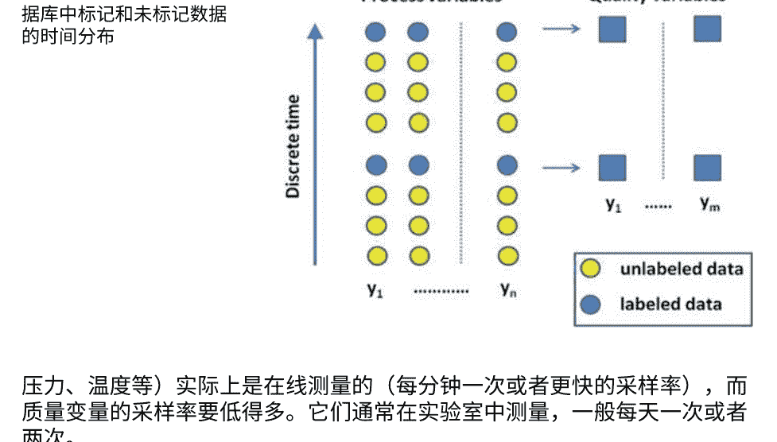

压力、温度等）实际上是在线测量的（每分钟一次或者更快的采样率），而质量变量的采样率要低得多。它们通常在实验室中测量，一般每天一次或者两次。

图2中报告了时间上数据分布的示意图，蓝色填充形状表示标记数据的输入（圆形）和目标（正方形），而黄色形状表示未标记的数据。在本研究中，标记数据对应于实验室测得的数据，而未标记的数据是在线获取的。

在无监督训练阶段可以利用快速采样的数据（未标记的数据），而少量的标记数据可以在有监督微调阶段使用。无监督训练阶段可以使有监督阶段以比随机选择的经典BP初始条件更好的状态开始。

这将对网络的预测性能产生有益影响[5]。

通过一个实际案例研究，说明了在SS设计中使用半监督学习算法的优势[21]。下面描述的方法在[18]中被引入，该方法基于DBNs的静态模型对大气蒸馏塔的ASTM 95%截点指数进行建模。据作者所知，[18]中描述的案例研究是将DBNs应用于SS设计的首个报道案例，作为一种利用未标记数据的方法。

在下面，描述了炼油厂酸性水蒸馏（SWS）装置的SS设计。为了估计SWS装置废水中的硫化氢（H₂S）和氨（NH₃）浓度，设计了两个SS。SWS装置用于去除炼油厂废水中的污染物。处理后的水可以被其他炼油厂装置重新使用或排放到环境中。

因此，需要监测H₂S和NH₃的浓度。炼油厂通常使用实验室设施来实现这个目的。

与SWS装置历史特征的过程数据相比，历史数据库中的样本数量较少。

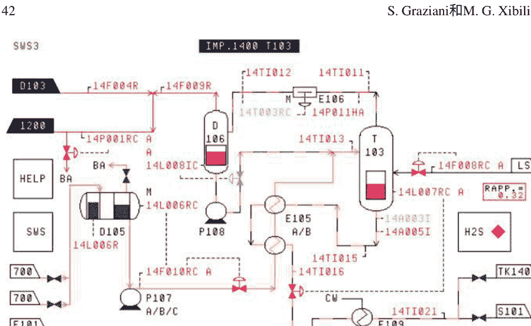

图3装置（T103）的示意图和相关变量的标签

该过程的图示见图3。在同一图中，相关变量标签被指示出来。

与SWS工厂建模相关的输入变量是通过与工厂技术人员的合作选择的（见表1）。数据以$T_s=1$分钟的采样间隔获取，并进行平均以获得每15分钟的值。每天将对应于时间间隔2:15 a.m.至4:30 a.m.的数据存储在工厂数据库中，而工厂输出则在实验室中每天早上5:00 a.m.测量一次。SSs是两个非线性多输入单输出模型，如(1)所述。

数据经过预处理和归一化处理。获得了一个包含700个标记数据的数据集。对于每个样本，有9个输入变量的样本可用。因此，未标记的输入数据为6300。为了欣赏半监督方法相对于监督方法所提供的优势，性能

| 变量描述 | 标签 | 单位 |
| :--- | :--- | :--- |
| u1 蒸汽到T103 | 14F008RC | 千克/小时 |
| u2 进料到T103 | 14F010RC | 立方米/小时 |
| u3 BA气体压力 | 14P001RC | N/cm² |
| u4 E-106输出流温度 | 14T003RC | °C |
| u5 T-103顶部蒸汽温度 | 14TI011 | °C |
| u6 T-103底部到E-105温度 | 14TI015 | °C |
| u7 T-103底部从E-105温度 | 14TI016 | °C |
| y1 SWS输出中的H₂S含量 | 1404A004 | ppm |
| y2 SWS输出中的NH₃含量 | 1404A124 | ppm |

表1 输入和输出变量、标签和单位使用DBN获得的结果与MLP的结果进行比较。MLP使用Levenberg-Marquardt算法进行训练，将700个标记数据随机分为学习、验证和测试数据集。两个网络的隐藏神经元数量通过试错策略确定。采用了一种增长策略。根据他们的估计能力，在验证数据集上进行了评估，选择了最佳网络。已经获得了一个7-5-1的多层感知器，用于H₂S估计。获得了一个7-7-1的多层感知器，用于NH₃估计。NH₃模型的性能在图4中报告。在图4a中，比较了估计输出和测量输出。在图4b中，显示了EDA残差分析（自相关、滞后图、直方图和正态概率图）。

DBN是使用Matlab® DeeBNetV3.2 [33]进行训练的。6300个未标记的模式用于预训练，而有标签的700个模式用于监督微调。通过试错的方法选择了层数和神经元数量。考虑了具有2个和3个隐藏层的DBN。此外，每层的最大神经元数量限制为20个。为了避免过多的超参数，没有考虑更深的网络。在这种情况下，采用了一种增长策略。

对于H₂S估计，选择了一个7-20-11-3-1的DBN；对于NH₃，选择了一个7-5-6-8-1的网络。图5报告了NH₃估计的结果。在表2中，报告了RMSE和CC，以及它们相对于基于MLP的SS的改进。

残差分析显示，残差的自相关图在较小的时间滞后上在95%的置信区间内，而基于MLP的SS所得到的时间滞后较大。此外，均方根误差和相关系数也有所改善。上述结果表明，与BP等简单策略相比，DBNs在大量无监督数据可用且模型性能受标记数据稀缺影响时具有优势。

## 通过使用DBN来降低模型复杂性

以下案例研究旨在关注DBNs在降低模型复杂性方面的潜力，包括模型阶数和模型参数数量。这是因为使用多层表示可以近似更复杂的函数，并且参数数量较少。介绍两个案例研究。第一个案例涉及设计一个SS，用于估计炼油厂中重整装置的研究辛烷值（RON）[22, 34]。在这种情况下，使用DBN可以得到一个具有较少参数的动态FIR模型。第二个案例研究涉及设计用于离子电活性执行器的低阶非线性FIR SS [20]。在这种情况下，DBN提供的模型能力使得可以得到一个低阶模型，即具有较少回归器的模型。

在第一种情况下，RON值通过近红外（NIR）分析仪测量。在维护过程中，需要SS来估计RON值。NFIR模型因此，应予以考虑。数据来自炼油厂的历史数据库。在过程中，石油馏分（石脑油）与催化剂发生反应。该过程将低RON馏分升级为高RON液体产品。该工厂根据生产政策在两种不同条件下运行。

在第一项研究中[42]，对植物进行了几种建模策略的调查。在那篇论文中，表明该过程是非线性的，简单的建模结构无法给出令人满意的性能。因此，提出了深层结构。这些结构包含两个层次。第一层包含两个模型，每个模型设计用于单一工作条件。第二层将第一层模型的输出进行融合。第一层通过使用浅层MLP实现线性或非线性动态模型。第二层使用模糊规则来组合第一层的输出。

在本小节中，将展示DBNs可以作为解决所描述应用的替代方法。使用DBNs可以简化设计过程并使用更少的参数。最终，改进了模型的性能。图6报告了该工厂的方案。

该单元的RON规范是每天确定的。具体而言，该工厂的最大产能为250 m³/h的石脑油流量。当以最大产能供料时，RON目标值为96.5。当流量为220 m³/h时，RON目标值提高到99。数据是从炼油厂数据库中选择的。

采样时间为Tₛ =3分钟。SS输入是四个反应器的温度，RX 101到RX 104（in₁到in₄），总进料（in₅），以及脱丁烷装置T104头部进料的压力（in₆）。异常值过滤后，共有9131个样本可用于SS设计。在这种情况下，没有未标记的数据可用，无监督训练阶段和微调阶段使用相同的。回归器基于相关分析选择了模型的输入，包括RON值和输入变量 $in_1$到 $in_{6}$。例如，在图7中报告了 $in_1$和 $y$之间的互相关。这表明滞后4的回归器更相关。

基于类似的考虑，采用了以下模型：

$y(k) = f(in_1(k-4), in_2(k-4), in_3(k-4), in_4(k-4), in_5(k), in_6(k)) \quad (8)$

考虑了三层隐藏层的DBNs。采用了一种穷举搜索策略来选择神经元的数量。每层的最大神经元数量固定为20。最佳工作网络是一个具有8、12和12个神经元的DBN。得到的结果报告在表3中。

SS估计、残差和相应直方图的时间图如图8所示。

为了欣赏DBN相对于[42]中其他深层结构所取得的改进，下面报告了验证数据集上获得的CC值的比较。[42]中研究的结构有：

- 一个线性模型，对整个数据集进行操作；
- 两个线性模型，通过使用模糊选择算法进行激活；
- 一个神经模型，对整个数据集进行操作；
- 通过使用模糊选择算法激活的两个神经模型。

所有提到的模型的CC值在表4中报告。作为一个普遍趋势，可以观察到深层结构优于浅层结构。这种趋势在线性和非线性结构中都得到了尊重。此外，DBN比所有其他测试的结构都要好得多。最后，与[42]中提出的深层结构相比，DBN的设计过程要简单得多。

这进一步显示了在SS设计中使用DBN时所获得的优势。

作为第二个案例研究，描述了获得电机传感器的低阶模型的可能性。自从三十年前开始，聚合物传感器引起了科学界和工业界的兴趣，因为它们是实现智能系统的一系列关键技术。在聚合物复合材料中，能够进行电机传感的离子聚合物金属复合材料（IPMCs）引起了广泛的兴趣，并在过去三十年中发表了许多科学研究[35]。

在接下来的内容中，将介绍深度网络在设计低阶SS中的应用，该网络模拟了IPMC致动器在悬臂配置下的振动[20]。对IPMC的兴趣部分是因为可以将其应用于医疗领域[36]，在该领域中，致动系统的复杂性和尺寸都是相关因素。因此，SS可以通过消除对独立测量换能器实际位置的硬件传感器的需求，有助于限制系统的复杂性。此外，低阶模型可以减少计算负荷，在实时应用中具有有益效果。为了实现这一目标，在线性模型、PCA、浅层和深度神经网络中，研究了一种用于低阶NFIR模型设计的策略。

IPMC由一种离子聚合物（如Nafion®）的块状材料组成，两面覆盖着两个电极。通常情况下，这些电极是由贵金属制成的。在复合材料的内部，固定的阴离子和移动的阳离子处于电平衡状态。当电极上施加电压信号（几伏特级别）时，移动阳离子是可以迁移的。电荷不平衡是IPMC弯曲的起源。

数据是在控制温度和湿度的环境中通过测量调查获得的。IPMC致动器安装如图9所示。作为电输入，使用频率在50 MHz至50 Hz范围内的正弦扫频电压，持续10秒，峰峰值幅度为5V。

基于NFIR模型（1），搜索了最简单的模型结构。因此，研究了不同的模型类别和阶数。具体而言，根据文献中已有的灰盒模型[37, 38]，确定了模型结构的阶数范围为9到3：

1. 线性动态FIR模型
2. 基于单隐藏层MLPs的NFIR模型
3. 基于非线性主成分回归（NPCR）的NFIR模型
4. 基于两个隐藏层MLPs的NFIR模型
5. 基于三个隐藏层DBNs的NFIR模型
6. 具有回归器k-9、k-7、k-5、k-3和k的三个隐藏层DBNs
7. 具有回归器k-9、k-6、k-3和k的三个隐藏层DBNs。

通过估计模型残差的RMSE和估计输出与测量输出之间的CC，对模型（1）到（7）进行了比较。系数在学习和测试数据集上都进行了计算。得到的结果分别在表5a、5b、6a和6b中报告。对报告的表格进行分析表明，深层结构比浅层结构效果更好。此外，模型的阶数越高，性能越好。最佳SS是通过实现一个9阶NFIR的DBN获得的。网络结构包括隐藏层中的10、11和6个神经元。此外，基于DBN的5阶模型（9、5和隐藏层中的5个神经元）比考虑的任何浅层结构都要好。相同的网络比表现最好的两层隐藏层模型，即第7阶模型要好。用BP训练的MLP存在过拟合问题。

相反，DBNs似乎不受过拟合的影响，这可以从学习和测试性能的一致性得到证明。报道的结果表明，使用DBNs可以获得更好的IPMC致动器低阶模型。值得注意的是，第9阶DBN模型有300个参数，而第5阶DBN只需要122个参数，这进一步证明了使用DBNs可以简化模型。这种简化在在线应用中非常有价值，因为较低的阶数和较少的参数数量都可以降低计算复杂度。在图10中，实际IPMC尖端偏转的时间图与基于第5阶DBN的SS估计进行了比较。

尽管本小节描述的研究案例涉及相当不同的现象，但报告的结果显示了DBN在减少SS结构和设计结构复杂性方面的潜力。

## 5.3 通过利用DBN特征来了解SS结构

文献中报道的结果显示了深度网络从数据中提取非线性特征的能力，从低层特征到高层特征。在本节中，报告了一个关于使用DBN提取的特征推断模型结构信息的案例研究。更具体地说，利用DBN的无监督学习阶段提取的特征用于估计影响工业装置的测量有限时间延迟的未知值。

如下所述，延迟估计是通过DBN特征和记录的工厂输出之间的交叉相关分析获得的。

该方法应用于设计用于估计脱丁基塔精馏中戊烷底流（C4在C5中）的SS。数据来自意大利西西里岛的一家炼油厂。脱丁基塔是一个被广泛研究的SS文献中的案例研究[12, 13, 28, 39, 40]。使这成为一个有趣的研究案例的一个关键方面是该工厂受到一个大的未知测量延迟的影响。延迟是由于测量硬件的位置引起的，该硬件用于评估过程输出的质量。实际上，相关数量是通过使用安装在另一个柱中的分析仪来测量的。图11报告了SS和相应分析仪的相对位置，其中圈出的A表示测量硬件的位置。

表7报告了SS设计中考虑的输入变量，如植物技术人员建议的那样。对于测量数量的进一步细节感兴趣的读者可以参考[41]。

在[40]中，通过使用复杂的神经结构获得了一个SS。更具体地说，三个MLP被级联以实现NARX模型。接下来，利用DBNs设计了一个简化了SS结构，实现了一个NFIR模型[41]。

根据输出和候选输入之间的互相关分析结果，得到了以下模型结构：

$$\begin{aligned}\hat{y}(k) = f(u_1(k-10), u_2(k-10), u_3(k-10), u_3(k-12), u_3(k-14), u_3(k-16), u_3(k-18), u_4(k-10),\\ u_5(k-10), u_5(k-12), u_5(k-14), u_5(k-16), u_5(k-18),\\ u_{6-7}(k-10), u_{6-7}(k-12), u_{6-7}(k-14), u_{6-7}(k-16), u_{6-7}(k-18),\\ u_8(k-10), u_9(k-10), u_{10}(k-10), u_{11}(k-10), u_{12}(k-10))\end{aligned}$$

(9) 中的时间滞后考虑了未知的有限延迟。利用DBN特征描述了解决这个问题的方法。当非线性过程感兴趣和/或无法执行专门实验时，所提出的过程可以用于接近未知有限延迟估计在SSs设计中的一般问题。事实上，在过程工业中，SSs通常是基于历史工厂数据库中存储的数据进行设计的，这些数据是在正常工作条件下记录的。因此，信号可能对模型识别不是最优的。因此，选择模型顺序和有限延迟可能是一项困难的任务。

下面描述了在DBN的无监督学习阶段之后获得的特征如何给出输入的替代表示，这在搜索有限延迟的值时很有用。让我们用 max_lag表示最大测量时间延迟。植物技术人员可以提供关于其值的见解。让我们考虑具有 m个神经元的DBN在最后一个隐藏层中，即m个潜在变量，并用 L表示包含 m个特征的矩阵:

$$L = [l_1 \ldots l_m]$$

其中 $l_i \in \Re^{N}$是第i个潜变量，N是训练集大小。将输出的时间偏移值收集到 $y_{lag}$中，如下所示:

$$y_{lag} = [y_0 \ldots y_i \ldots y_{\max\_lag}] = \begin{bmatrix} y(1) & \ldots & y(\max\_lag + 1) \\ \ldots & \ldots & \ldots \\ y(N - \max\_lag) & \ldots & y(N) \end{bmatrix}$$

CC值被收集到向量 $CCl_i \in \Re^{m}$中。它包含了 $y_{lag}$的第i列与每个潜变量之间的CC。向量 $CCl_i$的范数可以计算如下:

$$d_i = || cl_i \cdot cl_i^T ||$$

表2 模型性能

|        | RMSE | CC  | ΔRMSE% | ΔCC% |
| :----- | :--- | :-- | :----- | :--- |
| H₂S_MLP  | 1.33 | 0.59 |        |      |
| NH₃_MLP  | 4.38 | 0.57 |        |      |
| H₂S_DBM  | 1.20 | 0.67 | -9.8   | 13.6 |
| NH₃_DBM  | 4.09 | 0.64 | -6.6   | 12.3 |

表3 DBN模型性能（网络 6-8-12-12-1）

| 指标      | 值    |
| :-------- | :---- |
| 参数数量  | 332   |
| RMSE（训练） | 0.240 |
| RMSE（测试） | 0.257 |
| RMSE（验证） | 0.280 |
| CC（训练）   | 0.971 |
| CC（测试）   | 0.965 |
| CC（验证）   | 0.958 |

### 表4 估计RON值的模型CC比较

| 模型结构 | CC |
| :--- | :--- |
| 一个线性模型，对整个数据集进行操作 | 0.7742 |
| 通过使用模糊选择算法激活的两个线性模型 | 0.7977 |
| 一个浅层神经模型，对整个数据集进行操作 | 0.8541 |
| 通过使用模糊选择算法激活的两个浅层神经模型 | 0.8722 |
| DBN模型 | **0.958** |

表5 A. 不同模型结构和模型阶数（学习数据）的CC值。B. 不同模型结构和模型阶数（测试数据）的CC值。

| 模型结构 | 模型阶数 9 | 模型阶数 8 | 模型阶数 7 | 模型阶数 6 | 模型阶数 5 | 模型阶数 4 | 模型阶数 3 |
| :--- | :--- | :--- | :--- | :--- | :--- | :--- | :--- |
| (A) | | | | | | | |
| 1 | 0.46 | 0.44 | 0.43 | 0.42 | 0.41 | 0.38 | 0.35 |
| 2 | 0.98 | 0.98 | 0.95 | 0.95 | 0.92 | 0.92 | 0.87 |
| 3 | 0.96 | | | | | | |
| 4 | 0.995 | 0.996 | 0.995 | 0.993 | 0.994 | 0.981 | 0.979 |
| 5 | 0.997 | 0.997 | 0.996 | 0.995 | 0.991 | 0.990 | 0.976 |
| 6 | 0.996 | | | | | | |
| 7 | 0.996 | | | | | | |
| (B) | | | | | | | |
| 1 | **0.44** | 0.39 | 0.32 | 0.26 | 0.21 | 0.15 | 0.12 |
| 2 | 0.69 | 0.72 | **0.87** | 0.78 | 0.69 | 0.50 | 0.29 |
| 3 | **0.84** | | | | | | |
| 4 | 0.901 | 0.920 | **0.956** | 0.838 | 0.670 | 0.568 | 0.620 |
| 5 | **0.987** | 0.985 | 0.976 | 0.981 | 0.975 | 0.955 | 0.720 |
| 6 | **0.981** | | | | | | |
| 7 | **0.981** | | | | | | |

表6 A. 不同模型结构和模型阶数（学习数据）的RMSE值。B. 不同模型结构和模型阶数（测试数据）的RMSE值。

| 模型结构 | 9 | 8 | 7 | 6 | 5 | 4 | 3 |
| :--- | :--- | :--- | :--- | :--- | :--- | :--- | :--- |
| (A) | | | | | | | |
| 1 | 0.79 | 0.80 | 0.80 | 0.81 | 0.81 | 1.25 | 1.83 |
| 2 | 0.20 | 0.17 | 0.27 | 0.27 | 0.34 | 0.94 | 0.44 |
| 3 | 0.25 | | | | | | |
| 4 | 0.087 | 0.078 | 0.093 | 0.104 | 0.099 | 0.650 | 0.183 |
| 5 | 0.073 | 0.071 | 0.078 | 0.085 | 0.119 | 0.297 | 0.192 |
| 6 | 0.076 | | | | | | |
| 7 | 0.074 | | | | | | |
| (B) | | | | | | | |
| 1 | **1.15** | 1.18 | 1.21 | 1.23 | 1.25 | 1.25 | 1.27 |
| 2 | 0.94 | 0.98 | 0.89 | **0.86** | 0.94 | 0.94 | 1.33 |
| 3 | **0.85** | | | | | | |
| 4 | 0.560 | 0.514 | **0.377** | 0.738 | 0.650 | 0.650 | 1.296 |
| 5 | **0.222** | 0.226 | 0.286 | 0.266 | 0.297 | 0.297 | 0.888 |
| 6 | **0.274** | | | | | | |
| 7 | **0.253** | | | | | | |

表7 输入变量

| 变量名称 | 变量描述 |
| :------- | :------- |
| u1 | 进料流温度 |
| u2 | 进料流压力 |
| u3 | 进料回流量 |
| u4 | PLG流量到工厂900 |
| u5 | 第6层塔温度 |
| u6-7 | 从E108A和E108B蒸汽温度之间的平均值 |
| u8 | 真空底阀 |
| u9 | 从E150B流出的流温度 |
| u10 | 从E150A流出的流温度 |
| u11 | 再沸器剩余流量 |
| u12 | 从E105流出的底流 |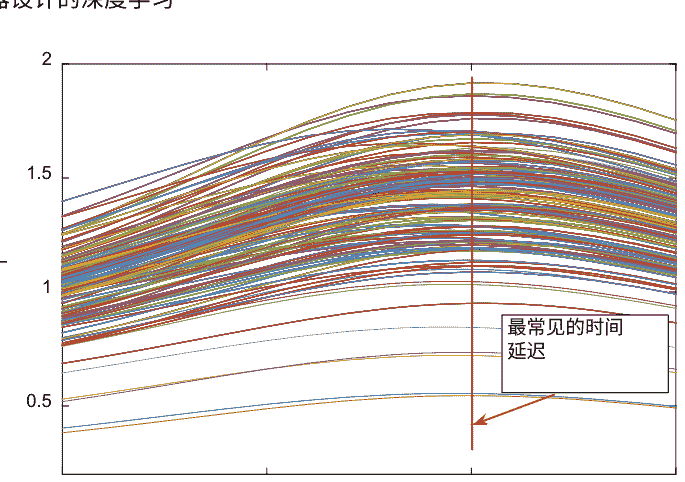

## 图12 d_i系数与偏移数量的图

其中 \(i \in [0, max\_lag]\). 使公式(12)最大化的值 \(i\)被假设为系统延迟:

延迟 = \(arg\_i max(d_i)\). \qquad (13)

所提出的过程在DBN结构方面表现出鲁棒性，如图12所示。它报告了作为时间延迟函数的 \(d_i\)，对于一些DBNs。可以观察到大多数曲线在延迟等于10时达到最大值，这个值被假设为在SS设计中使用的测量延迟。

在估计了有限延迟之后，可以进行DBNs的监督微调学习。通过估计植物输出和相应模型估计之间的RMSE以及相同数量之间的CC来比较SS的性能。具有10-6-6个隐藏神经元的DBN给出了最佳结果，分别总结在学习、验证和测试数据集中的表8中。

在图13中报告了植物输出和SS估计之间的比较。除非有一种无监督特征提取工具可用，否则无法应用本小节中描述的方法。使用DBN揭示了一种有前途的方法，因为DBN允许在网络的微调之后进行特征提取和输出估计，而且方法简单高效。

表8 DBN SS的性能

| | 学习 | 验证 | 测试 |
| :--- | :--- | :--- | :--- |
| CC | 0.93 | 0.81 | 0.74 |
| RMSE | 0.88 | 2.42 | 2.07 |

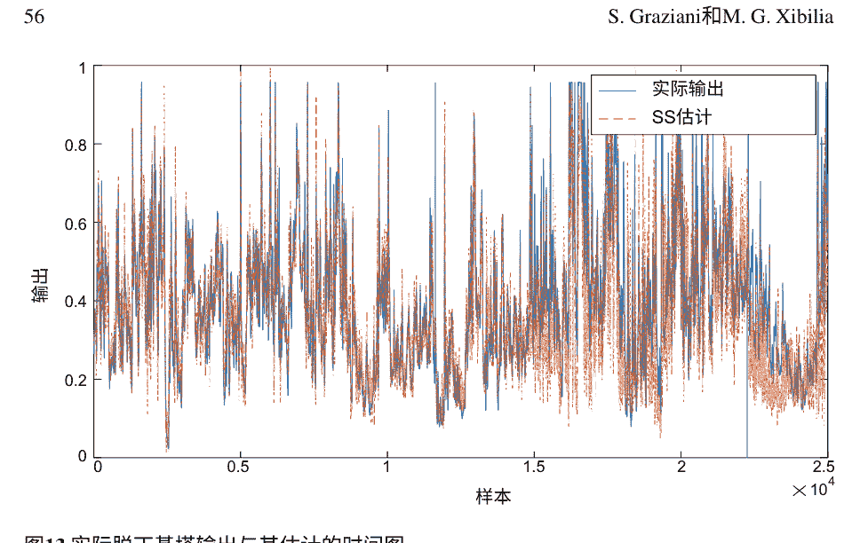

## 6 结论

深度学习已经广泛成功地应用于许多应用领域，以至于它代表了解决大量实际问题的最先进技术。直到最近，深度学习的有前景的能力才被用于SS的设计。事实上，深度学习中存在着一些特殊性，可以解决这个领域中的未解决问题，特别是考虑到工业中的SS。本章重点介绍了DBN在SS设计中的应用，并通过实际案例研究提供了证据，说明这些结构如何帮助学习更复杂的模型，降低计算复杂性，高效利用无标签数据，从数据中提取高级特征并在SS设计中加以利用。文献中还提出了其他深度结构，如SAE、CNN、集成方法、随机方法，并描述了成功的结果。本章的现状部分描述了这些深度结构及其在SS设计中的性能。

在SS设计中充分利用深度学习需要解决一些开放性问题。其中一个是超参数数量的增加，这是使用层数增加的直接结果。此外，需要引入关于半监督阶段在SS性能中作用的理论和度量。此外，还需要进一步研究特征提取和可解释性。实际上，尽管从输入数据中提取了高级特征，但并未考虑其与植物输出的相关性，也无法赋予提取特征任何物理意义。甚至还需要研究确定与SS相关的特征数量的方法。

作为最后的备注，值得注意的是，深度学习已经被引入用于解决大数据集存在的问题。一般来说，在SS中并非如此设计。相反，设计师必须面对历史数据稀缺的问题。设计师需要仔细考虑这种差异，并根据可用的数据集调整网络结构。尽管上述存在一些未解决的问题，但应用深度学习到SS设计中取得了有希望的结果，包括基于本文描述的DBNs的结果，这表明它们在这个领域中可以扮演重要角色并产生最先进的SS。

# 参考文献

- 1. Kadlec, P., Gabrys, G., Strandt, S.: 数据驱动的过程工业软传感器. 计算机化学工程 33, 795–814 (2009)
- 2. Fortuna, L., Graziani, S., Rizzo, A., Xibilia, M.G.: 用于监控和控制工业过程的软传感器. 工业控制的进展, Springer (2006)
- 3. Ge, Z., Huang, B., Song, Z.: 非线性半监督主成分回归用于软传感器建模及其混合形式. 化学计量学杂志 28, 793–804 (2014)
- 4. Hinton, G.E., Osindero, S., Teh, Y.W.: 一种用于深度置信网络的快速学习算法. 神经计算 18(7), 1527–1554 (2006)
- 5. Goodfellow, I., Bengio, Y., Courville, A.: 深度学习. MIT出版社 (2016)
- 6. Hinton, G.E.: 学习多层表示. 认知科学趋势 11, 428–434 (2007)
- 7. Yu, J., Hong, C., Rui, Y., Tao, D.: 用于恢复人体姿势的多任务自编码器模型. IEEE Trans. Ind. Electron. 65(6), 5060–5068 (2018)
- 8. Lee, S., Chang, J.H.: 基于深度学习的振荡式血压估计. IEEE Trans. Ind. Inf. 13(2), 461–472 (2017)
- 9. Samek, W., Binder, A., Montavon, G., Lapuschkin, S., Muller, K.R.: 评估深度神经网络学到的可视化内容. IEEE Trans. Neural Netw. Learn. Syst. 28(11), 2660–2673 (2017)
- 10. Ren, S., Girshick, R., Girshick, R., Sun, J.: Faster R-CNN: 实时目标检测与区域建议网络. IEEE Trans. Pattern Anal. Mach. Intell. 39(6), 1137–1149(2017)
- 11. Xibilia, M.G., Gemelli, N., Consolo, G.: 数据驱动软测量设计的输入变量选择标准. In: 2017年IEEE第14届国际网络、感知和控制会议(ICNSC)，2017年5月16日至18日，意大利拉梅齐亚特梅 (2017)
- 12. Yuan, X., Huang, B., Wang, Y., Yang, C., Gui, W.: 基于深度学习的特征表示及其在变量加权SAE软测量建模中的应用. IEEE Trans.Ind. Inf., 即将出版
- 13. Yuan, X., Ou, C., Wang, Y., Yang, C.: 基于非线性VW-SAE的深度学习质量相关特征学习和软测量建模. In: 2018年IEEE工业电子学会第44届年会，10月21日至23日 (2018)
- 14. Wang, X., Liu, H.: 基于堆叠自动编码器的软测量输入变量选择新方法. In: 2017年IEEE第56届决策与控制会议(CDC)，2017年12月12日至15日，澳大利亚墨尔本 (2017)
- 15. 王建国，赵建华，沈涛，马绍伟，姚勇，陈涛，沈波，吴勇: 基于深度学习的焦炭干熄焦过程操作优化的软测量方法. 在: 第35届中国控制会议论文集，2016年7月27日至29日，中国成都 (2016)
- 16. 严伟，唐东，林勇: 基于深度学习的数据驱动软传感器建模方法及其应用. IEEE.工业电子学报. 64(5)，4237-4245 (2017)
- 17. 林勇，严伟: 基于深度学习的软传感器建模研究. 在: 2015年美国控制会议论文集，2015年7月1日至3日。芝加哥，伊利诺伊州，美国 (2015)
- 18. 尚超，杨飞，黄东，吕伟: 基于数据驱动的深度学习技术的软传感器开发. 过程控制杂志 24(3)，223-233 (2014)
- 19. 刘，Y.，范，Y.，陈，J.：使用DBN预测燃烧系统氧含量的火焰图像。能源燃料 31，8 776-8783（2017年）
- 20. 安多，B.，格拉齐亚尼，S.，希比利亚，M.G.：基于深度学习的离子电活性致动器的低阶非线性有限冲激响应软传感器。IEEE仪器测量 68（5），1637-1646（2019年）
- 21. 格拉齐亚尼，S.，希比利亚，M.G.：基于深度学习的酸性水蒸汽脱盐装置软传感器。在：IEEE IMTC 2017年会议论文集，意大利都灵，5月22日至25日（2018年）
- 22. 格拉齐亚尼，S.，希比利亚，M.G.：用于重整装置软传感器的深度结构。在：INDIN 2018年会议论文集，IEEE第16届工业信息学国际会议，葡萄牙波尔图，7月18日至20日（2018年）
- 23. 朱，W.，马，Y.，周，Y.，本顿，M.，罗马尼奥利，J.：基于深度学习的软传感器及其在热解反应器中对气相组分的预测应用。计算机辅助化学工程 44，2245-2250（2018年）
- 24. 孙，S.B.，何，Y.Y.，周，S.D.，岳，Z.J.：使用卷积神经网络的部分振动测量的数据驱动响应虚拟传感器技术。传感器 17，12（2017年）
- 25. 德拉罗萨，E.，于，W.：具有深度学习修改的非线性系统识别的随机算法。信息科学 364-365，197-212（2016年）
- 26. 姚，L.，葛，Z.：使用分层极限学习机和软传感器应用的半监督过程数据的深度学习。IEEE工业电子学报 65（2），1490-1498（2018年）
- 27. 刘，Y.，杨，C.，高，Z.，姚，Y.：集成深度核学习在工业聚合物化过程质量预测中的应用。化学智能实验室系统 174，15-21（2018）
- 28. 邵，W.，田，X.：基于模型距离的半监督选择性集成学习用于非线性软传感器开发。神经计算 222，15-21（2017）
- 29. 邱，Y.，刘，Y.，黄，D.：基于深度神经网络和遗传算法的生物废水处理数据驱动软传感器设计。化学工程学报 49（10），925-936（2016）
- 30. 孙，Q.，葛，Z.：用于复杂过程数据深度学习和软传感器应用的概率顺序网络。IEEE工业信息交易，即将出版
- 31. 费舍尔，A.，伊格尔，C.：训练受限玻尔兹曼机：简介。模式识别。47（1），25-39（2014）
- 32. 邓，L.，于，D.：深度学习：方法与应用。Found. Trends Signal Process. 7（3-4），197-387（2013年）
- 33. Keyvanrad M.A.，Homayounpour, M.M.：关于深度信念网络的简要调查，并引入一个新的面向对象的工具箱（DeeBNet）。arXiv:1408.3264 [cs]（2014年）
- 34. Fortuna, L.，Giannone, P.，Graziani, S.，Xibilia, M.G.：基于堆叠神经网络的虚拟仪器，以提高炼油厂的产品质量监控。IEEE Trans. Instrum.Meas. 56，95-101（2007年）
- 35. De Luca, V.，Digiamberardino, P.，Di Pasquale, G.，Graziani, S.，Pollicino, A.，Umana, E.，Xibilia, M.G.：离子电活性聚合物金属复合材料：制造、建模和应用于硅后智能设备。J. Polym. Sci.，Part B: Polym. Phys. 51，699-734（2013年）
- 36. Shahinpoor, M.，Kim, K.J.：离子聚合物金属复合材料：IV.工业和医疗应用。Smart Mater. Struct. 14，197（2005年）
- 37. Newbury, K.M.，Leo, D.J.：线性电机机械模型的离子聚合物传感器验证. J. Intel. Mat. Sys. Struct. 14，343–358（2003）
- 38. Bonomo, C.，Fortuna, L.，Giannone, P.，Graziani, S.，Strazzeri, S.：作为执行器的离子聚合物金属复合材料的非线性模型. Smart Mat. Struct. 16，1–12（2007）
- 39. Fortuna, L.，Graziani, S.，Xibilia, M.G.：炼油厂中的虚拟仪器. IEEE Instrum. Meas.Mag. 8，26–34（2005）
- 40. Fortuna, L.，Graziani, S.，Xibilia, M.G.：用于除醇器精馏塔产品质量监测的软传感器. Control Eng. Pract. 13，499–508（2005）
- 41. Graziani, S., Xibilia, M.G.: 使用深度学习设计未知延迟的工业装置的软传感器。 在：2019年IEEE I2MTC会议论文集，新西兰奥克兰，5月20日至23日（2019年）
- 42. Fortuna, L., Graziani, S., Xibilia, M.G., Barbalace, N.: 用于炼油厂产品质量监控的模糊激活神经模型。 IFAC Proc. Volumes 16, 159–164 (2005)

# 案例研究：医疗保健中的深度卷积网络

Mutlu Avci, Mehmet Sarigül 和 Buse Melis Ozyildirim

摘要技术改进导致大数据产生、处理和存储系统的出现。这些系统必须具备超凡的能力来克服大数据的复杂性。因此，用于数据分析的方法学已经发展，因为从大数据中提取信息的重要性增加。医疗保健系统是处理大数据分析的重要系统。

深度学习是最常用的数据分析方法。它成为了最受欢迎和最新的人工神经网络类型之一，具有深度表示能力。深度学习的另一个强大能力是通过卷积神经网络进行特征学习。深度学习在医学应用中有广泛的实施领域，从诊断到治疗。各种深度学习方法被应用于生物医学问题。在许多应用中，深度学习解决方案根据问题的要求进行修改。通过本章讨论了解决生物医学问题的最受欢迎和最新的深度学习解决方案。根据问题特征、解决方案的重要性和要求和深度学习方法来分析研究。

由于深度学习系统具有非常有效的图像和模式识别能力，生物医学成像成为最合适的应用领域之一。在患者的首次诊断和持续跟踪阶段，深度学习系统为医学提供了非常有效的辅助。尽管生物医学应用分类可以进行器官、疾病或数据类型分类，但本章考虑了器官和疾病的组合。

M. Avci
工程学院，生物医学工程系，Cukurova大学，Adana，土耳其
e-mail: mavci@cu.edu.tr

M. Sarigül
计算机工程系，Iskenderun技术大学，Hatay，土耳其
e-mail: mehmet.sarigul@iste.edu.tr

B. M. Ozyildirim (✉)
工程学院，计算机工程系，Cukurova大学，Adana，土耳其
e-mail: mozyildirim@cu.edu.tr; melis.ozyildirim@gmail.com

关键词 深度学习 · 医疗保健 · 诊断系统 · 机器学习

# 1 引言

卷积神经网络（CNN）的效果不断提高，使其成为最受欢迎和最新的人工智能方法之一。它在医学应用中也有广泛的实施领域，从诊断到治疗。各种深度学习方法直接应用于或经过修改应用于生物医学问题。在许多应用中，深度学习解决方案根据问题的要求进行修改。随着应用数量的增加，一些综述研究已经在文献中发表[1, 2]。在[1]中，深度学习方法应用于各种类型的数据，如临床图像、电子健康记录、基因组学，并简要分析了深度学习方法的挑战。另一方面，在[2]中分析了深度学习架构及其在医学成像中的应用。通过本章，提到了与综述不同的最受欢迎和最新的深度学习解决方案，用于解决生物医学问题。根据问题特征、解决方案的重要性、要求和深度学习方法来解决生物医学问题进行了分析。由于深度学习系统具有非常有效的图像和模式识别能力，生物医学成像成为最适合的应用领域之一。在患者的首次诊断和持续跟踪阶段，深度学习系统为医学提供了非常有效的辅助工具。尽管生物医学应用的分类可以包括器官、疾病或数据类型的分类，但本章考虑了器官和疾病的组合。

脑疾病是最受欢迎的深度学习应用主题之一。阿尔茨海默病和帕金森病是最新的疾病，应尽早检测出来。早期检测对于早期治疗和预防脑组织损伤至关重要。阿尔茨海默病的临床数据分类一直是一个具有挑战性的问题，也是最棘手的方面之一。

在[3]中提供了一种改进的深度学习方法，应用于阿尔茨海默病神经影像数据。这种提出的新方法用于学习3D脑图像的流形，其不同之处在于没有预定义的相似度度量或预先构建的流形空间的邻近图，也可能不是局部线性的。在另一项工作中，使用卷积神经网络来区分阿尔茨海默病脑和正常健康脑[4]。这种方法的重要性在于有潜力开发出一个预测模型或系统，以识别阿尔茨海默病的症状。此外，使用卷积神经网络成功地对疾病的阶段进行估计。利用卷积神经网络，阿尔茨海默病患者的功能性磁共振成像数据在测试数据上分离的准确率达到96.85%。在某些情况下，结合多模态脑数据进行疾病诊断通常会提高性能[5]。由于数据可能不完整，某些主题可能缺少某些模态。在[5]中提出了一种基于深度学习的多模态成像数据估计框架。卷积神经网络在其中扮演着这项工作具有体积输入和输出模态。卷积神经网络包含大量可训练参数，用于建模输入和输出模态之间的关系。提出的卷积神经网络在阿尔茨海默病神经影像学倡议（ADNI）数据库上进行了测试。卷积神经网络的测试结果在先前的方法[5]方面取得了更好的成功。

在[6]中，通过分析磁共振成像（MRI）来早期检测阿尔茨海默病。MRI和功能性磁共振成像（fMRI）是临床研究中阿尔茨海默病最常用的诊断工具。通过考虑阿尔茨海默病MRI数据与标准健康MRI数据的相似性来检测阿尔茨海默病。这项任务可以由深度卷积神经网络完成。患有胶质瘤的脑肿瘤患者需要准确的治疗规划和预后。传统的生存预测通常利用临床信息和来自MRI的有限手工特征。这是一种耗时且主观的诊断方法。在[7]中，开发了一种深度学习框架，用于自动提取高级别胶质瘤患者术前多模态脑图像的特征。实验结果表明，该方法的准确率可以达到89.9%。这个结果显示了卷积神经网络在功能性神经肿瘤应用中的重要性。在[8]中，应用卷积神经网络来检测多发性硬化症（MS）病理。尽管脑形态学和白质病变的变化是多发性硬化症的两个特征，但它们在体积之外的变异性很差。在这项工作中，卷积神经网络的分类结果显示出非常高的准确性，能够自动发现多发性硬化症病理的经典模式。

在[9]中，旨在利用深度学习管理帕金森病（PD）尽管已经研究了PD的自动评估，但迄今为止，尚未找到可靠的方法用于临床实践。在这项工作中，提出了一个符合实际可用性约束并应用深度学习来区分疾病状态在自然环境中收集的数据的评估系统。结果表明，尽管问题设置中存在不可靠的标签特征，深度学习在泛化性能方面优于其他方法。

乳腺摄影风险评分通常通过从乳腺摄影中提取一组手工特征并直接或间接地与乳腺癌风险相关联来自动化。在[10]中提出了一种考虑乳房密度分割和乳腺摄影纹理输入评分的CNN。微钙化是早期乳腺癌的有效指标。为了提高微钙化的诊断准确性提出了一种基于深度学习的判别分类器在[11]中。所提出的方法将微钙化分类准确率提高到了87.3%。[12–14]中进行了乳腺摄影分析的深度学习解决方案。

所有这些深度学习实现都取得了有效的准确性性能结果。

糖尿病是一种影响全球数百万人的慢性病。其主要并发症之一是糖尿病视网膜病变（DR）。这是发达国家最常见的导致法定失明的原因。早期筛查和治疗DR可以防止视力恶化；然而，需要每年进行筛查。

在[15, 16]中，提出了完全自动化的深度学习系统解决方案，用于预防失明。

成功实施了宫颈诊断[17]、身体部位识别[18]、肺癌检测[19]、神经影像学[20]和心脏诊断[21]的深度学习解决方案。除了上述提到的应用之外，还存在数百种生物医学应用和深度学习系统的应用可能性。

在本章的后续部分，首先介绍了这些研究中使用的深度学习方法，并进行了详细分析。

## 2. 医疗保健中的深度学习方法

在本节中，介绍了在医疗保健系统中经常使用的深度学习方法。在引入卷积神经网络、自编码器、深度多项式网络和混合方法之后，进行了调查。然后，考虑了基于卷积神经网络的方法和深度学习中使用的技术。所介绍的方法是根据下一章中分析的研究选择的。

### 2.1 卷积神经网络

CNN是一个著名的深度学习结构。一个通用的CNN结构由卷积层、池化层和全连接层组成。卷积层用于从高感知输入数据中提取特征，而池化层用于减小数据的大小，全连接层用作分类器[6, 22, 23]。

### 2.1.1 卷积层

卷积层是CNN中执行卷积操作的部分。
这个操作是通过使用一定数量的特定大小的滤波器来实现的。每个滤波器在图像上移动，激活函数应用于输出，并使用这些计算值创建一个特征图。卷积过程的有效性取决于两个概念。这些概念是感受野和权重共享机制。

神经元的感受野表示与神经元连接的前一层神经元。感受野的大小等于卷积中使用的滤波器的数量。
感受野的概念显著减少了在人工神经网络中使用的参数数量。权重共享机制是指在整个图像上进行一次移位操作期间，滤波器具有固定的值。这提供了在整个图像中搜索相同模式的能力。

### 2.1.2 卷积操作

卷积过程使用固定大小的滤波器进行。这些滤波器在图像上滑动，并应用激活函数。使用这些计算值为每个滤波器创建一个特征图。卷积滤波器是可训练的参数。在反向传播过程中，根据相关特征图上的错误量来训练滤波器的权重。设 $v_{ij}^{xy}$ 为第 $i$ 层中第 $j$ 个特征图上位置 $(x, y)$ 的值。可以按照公式(1)计算 $v_{ij}^{xy}$ 的值。

$v_{ij}^{xy} = \sigma(b_{ij} + \sum_{m} \sum_{p=0}^{P_i-1} \sum_{q=0}^{Q_i-1} w_{ijm}^{pq} v_{(i-1)m}^{(x+p)(y+q)} )$ (1)

其中 $\sigma$ 是激活函数，$b_{ij}$ 是偏置值，$P_i$ 和 $Q_i$ 是滤波器的大小，$m$ 是特征图的索引，$i$ 是卷积层的索引。

### 2.1.3 池化操作

池化操作用于对特征图进行下采样。池化层的目的是在不丢失分类所需信息的情况下减小特征图的大小。池化操作还确保提取的特征与模式的尺度或方向无关。最流行的池化操作是最大池化和平均池化操作。

### 2.1.4 全连接网络

全连接网络由多个层组成，包括相互连接的神经元。它通常用作CNN结构中的分类器。

### 2.2 自编码器

自编码器是为数据编码而开发的网络结构的名称。深度自编码器由卷积和池化层组成。在这些层中，使用卷积部分提取特征，然后使用上采样或反卷积层对获取的特征进行解码。图1显示了用于重构的自编码器结构。

存在不同类型的自编码器，其中一些在以下小节中描述。

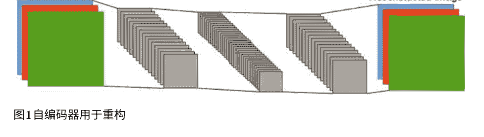

图1 自编码器用于重构

### 2.2.1 稀疏自编码器

稀疏连接的自编码器结构类似于全连接自编码器，但是层之间的连接是稀疏的。

### 2.2.2 堆叠自编码器（SAEs）

SAE是由两个或更多自编码器顺序连接的结构的名称[24]。

### 2.2.3 去噪自编码器

与传统的自编码器不同，去噪自编码器旨在为损坏的输入数据生成一个良好的表示。训练算法被修改以实现这个目标。在训练过程中，不使用原始图像，而是使用随机扭曲的图像作为输入进行编码处理。然后，该结构被训练以从嘈杂的输入中获得的编码数据生成原始数据。假设x是原始图像，生成一个扭曲版本 $\tilde{x}$。这个生成的图像通过自编码器。在解码过程中，使用原始图像和解码图像之间的误差来训练权重值[25]。图2显示了去噪自编码器的结构。

### 2.2.4 堆叠去噪自编码器（SDAE）

SDAE是由两个或多个去噪自编码器组成的结构，每个自编码器的输出连接到下一个自编码器。

### 2.3 深度多项式网络

深度多项式网络是一种神经网络结构，其中每个隐藏层负责不同级别的多项式学习。 图3给出了一个4级多项式网络。

### 2.3.1 堆叠的深度多项式网络

堆叠的深度多项式网络由两个或更多个深度多项式网络按顺序连接而成。

### 2.4 混合方法

### 2.4.1 卷积自编码神经网络

卷积自编码神经网络（CANN）结构利用自编码器上的无监督学习来优化卷积层的参数。 这种结构需要少量标记数据进行微调操作。

卷积自编码器通过使用卷积操作后生成的特征图来重建输入图像。 这个过程被称为逆卷积操作。 设 \( f(.) \) 为卷积编码操作，\( f'(.) \) 为卷积解码操作， \( n \) 为 \( l \times l \) 大小的特征图数量，卷积编码操作执行如下：

```
o_{ij} = f(x_i) = \sigma \left( w_j . x_i + b \right) \quad (2)
```

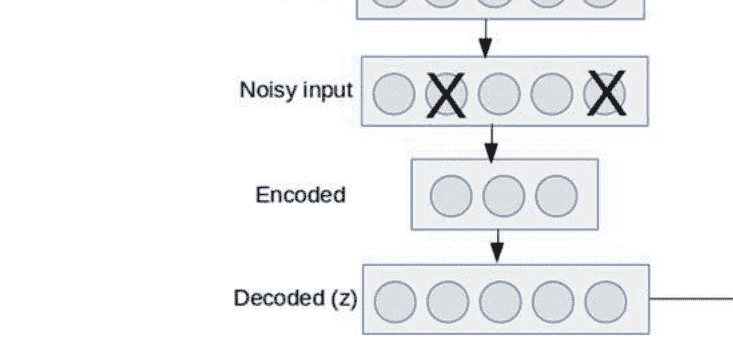

图3 4级多项式网络

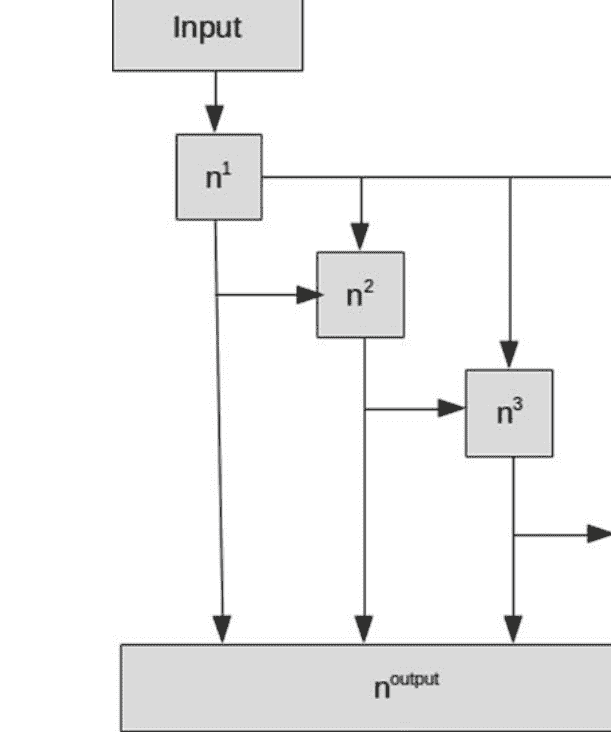

其中 w表示权重， b是相应滤波器的偏置值， x是输入图像， σ是非线性激活函数，如ReLu、sigmoid或双曲正切。 解码操作如下所示：

$$\hat{x}_i = f' \left( o_{ij} \right) = \emptyset \left( \hat{w}_j . o_{ij} + b \right) \tag{3}$$

在生成一定数量的补丁之后，使用SGD算法[26]训练相应的参数，原始图像与重建图像之间的均方误差。

### 2.4.2 卷积递归神经网络

卷积递归神经网络（CRNN）是另一种无监督的CNN结构。CRNN训练包括三个步骤：预训练卷积神经网络，生成局部表示，学习分层特征表示。

- 预训练CNN滤波器：可以利用多种不同的无监督方法，如稀疏自编码、稀疏受限玻尔兹曼机、k均值聚类、高斯混合模型来学习卷积滤波器。
混合模型可以用来学习卷积滤波器。文献中表现最好的方法是k均值聚类。在这个操作中，随机选择了一定数量的图像块。然后使用k均值聚类算法来最小化这些块之间的欧氏距离的平方和。

通过这种方式，学习了k个滤波器 {f_k, k = 1, 2, ... k} 的过程如下：

```
$$ f_k(x) = \begin{cases} 1, 1, if k = argmin_j \|m_j - x\| \\ 0, & \text{否则} \end{cases} \quad (4) $$
```

- 生成局部表示：算法的这一部分简单地通过CNN结构将图像传递，生成表示。
- 学习特征表示：在网络的这一部分中，使用了循环神经网络（RNN）。RNN通过在神经网络结构中实现递归来提供学习分层特征表示。反向传播算法用于训练RNN结构[27]。

### 2.5 基于卷积神经网络的方法

在这一部分中给出了AggNet、空间约束CNN、时间融合CNN、三平面CNN、带有CNN的区域、基于类结构的DCNN、基于补丁的CNN、基于语义的CNN、级联CNN、带有CNN的Hough投票、U-Net。还介绍了深度学习方法中使用的技术。它们是dropout、数据增强和微调。通过子节简要介绍了最流行的预训练深度学习模型LeNet、AlexNet、GoogLeNet、VGGNet、ResNet和DenseNet。

### 2.5.1 AggNET

AggNET是为众包应用开发的网络。这种结构与传统的CNN结构之间的区别在于它在输出层之后包含一个众包层。通过将期望最大化算法应用于用户对未标记数据的投票结果，该层确定网络结构的适当输出值。使用数据增强也被证明是改善这种结构有效性的一种方法[28]。

### 2.5.2 空间约束卷积神经网络

空间约束CNN（SC-CNN）是一种用于检测癌症结构的网络。为了检测癌症结构的细胞核，该结构的输出层设计为二维。传统的CNN以softmax层结束。

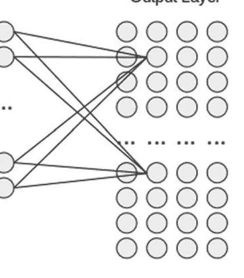

图4 SC-CNN的架构

在这个结构中，输出以二维方式处理，每个输出神经元表示成为癌细胞核的可能性。在训练过程中，基于真核附近的概率图被使用。图4表示了SC-CNN的架构。

### 2.5.3 时间融合卷积神经网络

与单层上完全可见的图像不同，如EMR等数据在时间上变化。时间连接是预测的一个重要因素。因此，训练数据被创建为包含短时间间隔内的帧的样本集。这提供了对时间特征的学习。时间融合卷积神经网络模型基于在时间域上融合信息，可以通过修改第一个卷积层来扩展时间，或者通过放置两个单帧网络并在处理后融合它们的输出来实现。图5显示了时间融合卷积神经网络的结构。

### 2.5.4 3D卷积神经网络

传统的卷积神经网络结构是设计用于处理2D图像的。相反，3D卷积神经网络结构用于处理3维数据。卷积滤波器是3维的，并应用3维卷积操作。设 v_{ij}^{xyz} 为第 i 层中第 j 个特征图上位置 (x, y, z) 处的值。3D卷积过程可以定义为：

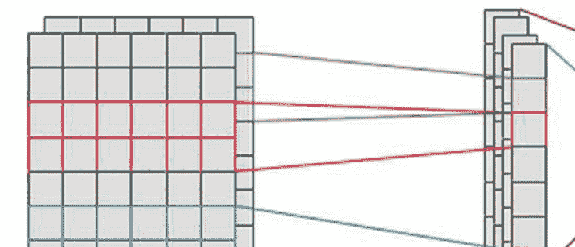

图5 时间融合CNN

$$v_{ij}^{xyz} = \sigma (b_{ij} + \sum_{m} \sum_{p=0}^{P_i-1} \sum_{q=0}^{Q_i-1} \sum_{r=0}^{R_i-1} w_{m}^{pqr} v_{(i-1)m}^{(x+p)(y+q)(z+r)})$$  (5)

其中 $\sigma$是激活函数，$b_{ij}$是偏置值，$P_i$, $Q_i$和$R_i$是3D滤波器的尺寸，$m$是特征图的索引，$i$是卷积层的索引[29]。

### 2.5.5 三平面CNN

使用3D CNN处理三维数据大大增加了神经网络结构的参数数量。三平面CNN结构通过将三维数据转化为每个维度的二维数据来处理。为每个维度（xy、xz和yz空间）设计了三个2D-CNN结构，并将每个维度的2D平面作为补丁传递给这些网络。这三个网络仅在输出层连接[30]。图6表示三平面CNN架构。

### 2.5.6 使用CNN的区域 (R-CNN)

R-CNN是一种使用SVM方法而不是完全连接的神经网络结构，用于分类。

### 2.5.7 基于类结构的深度卷积神经网络 (CSDCNN)

CSDCNN是一种提供非线性表示的深度神经网络结构。该方法将特征提取过程与特征学习相结合。因此，它不需要手动设计特征。CSDCNN能够学习所有层次的判别性和语义特征[31]。

### 2.5.8 基于补丁的卷积神经网络

基于补丁的CNN是一种用于分割的简单方法。在图像中的每个像素周围取一个NxN的补丁，并使用这些补丁训练CNN模型。

### 2.5.9 语义感知的卷积神经网络

语义感知的CNN包含卷积、池化、上采样和反卷积层，类似于自编码器，并对图像中的每个像素进行分割预测[32]。

### 2.5.10 级联卷积神经网络

级联CNN由两个CNN结构组成。第一个CNN的输出是第二个CNN的输入。

### 2.5.11 使用CNN的Hough投票

使用CNN的Hough投票是一种基于投票策略的高效分割方法。它是一种多模态、多区域且鲁棒的方法。它不仅考虑了CNN提取的分类预测，还考虑了中间层提取的特征。这些特征对于图像检索等任务非常有用[33]。

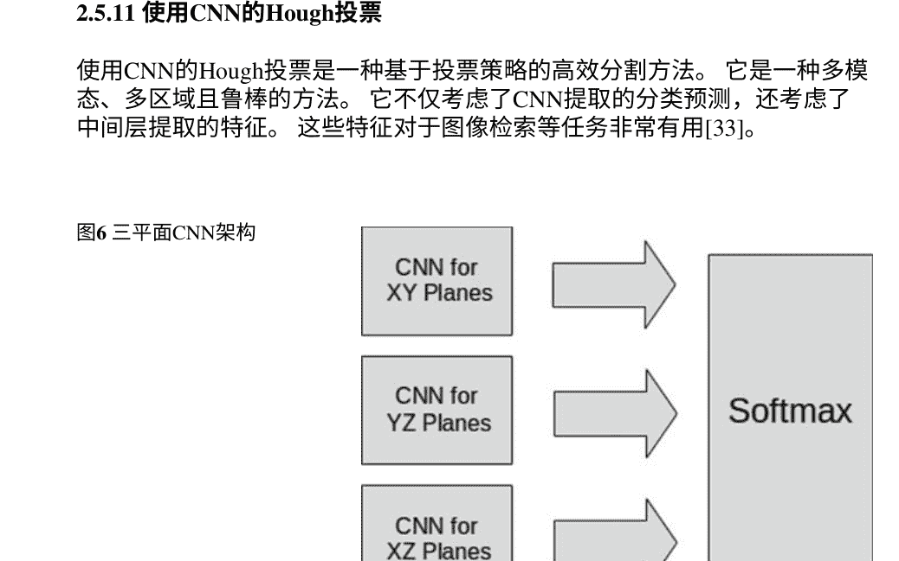

### 2.5.12 U-Net

U-Net是一种专为分割任务设计的新型架构。“U-Net”代表结构的“U”形状。网络的第一部分由卷积和池化层组成，而第二部分包含上采样操作[34]。

### 2.6 深度学习方法中使用的技术

过拟合是机器学习算法中最重要的问题。此外，深度学习算法需要更多的数据和更多的训练周期才能提供高效的结果。有一些技术可以解决这些问题。在本节中，将讨论这些技术。

### 2.6.1 丢弃

丢弃是一种在神经网络中避免过拟合的技术。在这种方法中，在训练过程中，一些随机选择的神经元的激活被设为零。每次迭代时，不同的神经元被随机选择。这样可以实现更可靠的训练过程。

### 2.6.2 数据增强

数据增强是人为地使数据不同。生成的人为数据也包含在训练集中。这样可以更好地泛化，使得对象能够独立于其大小和位置被识别。

### 2.6.3 微调

微调操作是对先前训练过的深度学习网络进行新数据集的训练。这个操作显著缩短了训练时间。

### 流行的预训练深度学习模型

在本节中，解释了作为生物医学应用的微调数据集使用的预训练深度学习模型。

*LeNet*

LeNet是由LeCun于1998年提出的。 尽管根据当前的深度学习模型来看它很简单，但作为其类别中的第一个模型非常重要。在这个结构中，两个卷积和池化层对后面跟着一个全连接网络结构。 这个结构被用于对MNIST数据集进行分类[4]。 它的结构如图7所示。

*AlexNet*

AlexNet是一个著名的深度学习结构。 它在ILSVRC2012比赛中表现最好，通过对ImageNet进行分类，其top5错误率为16.4。ImageNet是一个非常流行的视觉数据集，包含130万张图像，分为1000个类别。 AlexNet与LeNet具有类似的结构，但它有两个额外的并行CNN结构，包含更多的滤波器。 这些并行的CNN最终通过一个全连接分类器结束[30, 35]。图8显示了AlexNet的结构。

*GoogLeNet*

GoogLeNet是ILSVRC2014比赛的冠军。 GoogLeNet在ImageNet数据集上的Top-5错误率为6.67%。 虽然GoogLeNet与LeNet相似，但它包含一个称为Inception的新颖模块。该模块包含具有不同大小的卷积核和池化操作。 具有22层的GoogLeNet有400万个参数，并且比包含6000万个参数的AlexNet表现更好[30]。

*VggNet*

VggNet是另一个参与ILSVRC2014的流行模型。 它包含16个应用3×3卷积操作的卷积层。 VggNet最大的问题是它包含了1.38亿个需要训练的参数[30]。图9表示了VggNet的结构。

*ResNet*

ResNet（残差神经网络）是ILSVRC2015竞赛的获胜模型。 它在ImageNet数据集上实现了3.57%的前5错误率，优于人类水平的表现。 ResNet与其他神经网络结构的不同之处在于它的“跳跃连接”概念。 跳跃连接表示将卷积块的输入与输出相加合并在一起。

*DenseNet*

DenseNet是根据ResNet的类似思想开发的。 然而，它的连接不仅将前一层连接到下一层，还连接了所有后续层。

Input 32x32
Convolution
Feature Maps 6x28x28
Pooling
F. Maps 6x14x14
Convolution
F. Maps 16x10x10
Pooling
F. Maps 16x5x5
Fully connected net
120 neurons
84 neurons
10 output neurons

图7 LeNet的架构

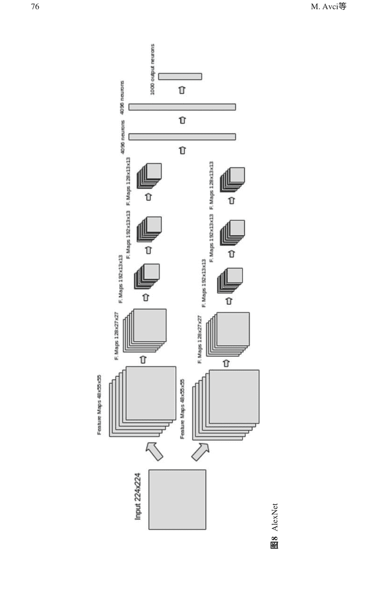

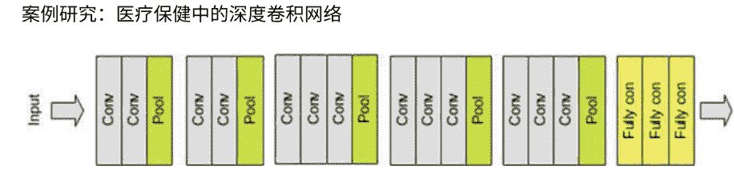

## 医疗保健中的3个深度学习应用

尽管生物医学科学包含许多用于深度学习实现的子领域，但最受欢迎的子领域将在以下部分中进行选择和介绍。这些主要被分类为与乳腺和乳腺癌相关的应用、与脑成像和诊断相关的应用、与糖尿病相关的应用、与心脏相关的应用以及与肺癌相关的应用。通过所有这些应用，深度学习系统被调整到医学问题的性质，并且它们的估计结果是通过已知和经验丰富的测试数据进行评估的。

### 3.1 乳腺癌分类中的乳房肿块和微钙化检测

乳房X线摄影是一种用于检测肿块和微钙化的有效成像技术。肿块是乳房区域的灰色或白色区域，具有椭圆形、不规则形或分叶状形状。肿块分割是癌症检测的重要步骤[36]。

在[37]中，质量是通过深度学习和随机森林方法相结合来检测的。首先，使用多尺度深度置信网络分类器与高斯混合模型确定候选质量区域。然后，通过由卷积层和线性SVM组成的深度卷积神经网络级联检测出正确的区域。在获取区域后，从正确的区域提取形态学和纹理特征，并通过级联的随机森林分类器进行分类。虽然该方法在第一步检测到所有质量候选者，但INbreast数据集的最终真阳性率为0.96，DSM-BCRP数据集的最终真阳性率为0.75。作者提出了两个潜在函数：条件随机场（CRF）和结构化支持向量机（SSVM），分别应用于他们之前提出的深度结构。据报道，使用CRF和SSVM获得的Dice指数为0.9 [37]。

在[13]中，贝叶斯优化被应用于质量检测步骤。在应用多尺度深度置信网络和高斯混合模型分类器之后，通过级联卷积神经网络和随机森林，假阳性被减少。在最后一部分，应用贝叶斯优化来优化结果。虽然分割性能的Dice指数为0.85在INbreast数据集上，肿块的整体分类性能为0.98 [13]。

在[38]中，引入了基于卷积神经网络的乳腺X线分析，用于检测乳腺癌的风险。颅尾斜位和中侧位视图，它们的肿块和微钙化分割被应用于使用ImageNet预训练的CNN模型的分离。获得的特征用于训练最终的CNN模型，以预测患者的乳腺成像报告和数据系统（BI-RADS）评分。INbreast和DDSM数据集用于测试。据报道，该模型在INbreast数据集上实现了0.91的AUC，在DDSM数据集上实现了0.97的AUC，用于两类（良性或恶性）问题。在[35]中，还使用了基于迁移学习的方法来检测良性和恶性病变。在来自芝加哥大学医学中心的数据集上，使用预训练的CNN特征和分割肿瘤获得的分析特征，通过多项式核SVM进行分类。采用投票机制得出最终结果。虽然AlexNet被用作预训练模型，但比较了从AlexNet的各层获得的特征的分类能力。特征被展平，并对AlexNet的每一层应用SVM分类器。第四个卷积层的特征提供了最高的AUC =0.83，对于整体性能，集成方法提供了比分析方法更好的0.86的AUC [35]。Levy和Jain提出了一种基于CNN的技术，用于对乳腺X线中的预分割肿块进行分类。他们的技术包括使用AlexNet和GoogLeNet的迁移学习方法，以及提供肿块上下文和数据增强的预处理步骤。在由南佛罗里达大学提供的公共数字筛查乳腺X线（DDSM）数据集上比较了三种不同的CNN模型。第一个CNN模型类似于早期版本的AlexNet，第二个和第三个模型是AlexNet和GoogLeNet。第二个和第三个模型的卷积权重使用预训练模型的权重进行初始化，并通过乳腺X线图像进行微调。这些网络的输入是通过预处理技术获得的。由于肿块周围的区域至关重要，从图像中获取了两个不同的补丁。在第一个补丁中，输入是围绕肿块的50个像素的固定填充区域。在第二个补丁中，输入是肿块边界框大小的两倍的区域。通过应用旋转、裁剪和镜像等变换来增加数据集。
根据报道的结果，经过预处理和增强的GoogLeNet在测试集上提供了最高的准确率0.929，而经过预处理和增强的基准模型和AlexNet模型分别提供了0.6和0.89的准确率[23]。

微钙化在早期乳腺癌检测中起着重要作用[11]。SAE模型被用于测量乳腺癌检测中微钙化的区分能力，并与其他先进的机器学习方法（如LDA、KNN和SVM）进行了比较。进行了三个不同的实验来证明微钙化的重要性。数据集包括来自1204名女性患者的乳腺X线照片，其中774名被诊断为良性病变，430名被诊断为恶性乳腺病变，这些照片来自中山大学肿瘤防治中心（广州，中国）和南海南方医科大学附属医院（佛山，中国）。在第一个实验中，只使用提取的微钙化数据。在第二个实验中，只使用乳腺肿块数据，在最后一个实验中，## 案例研究：医疗保健中的深度卷积网络

使用乳腺肿块数据结合微钙化数据。通过图像分割提取可疑乳腺肿块和微钙化数据。应用它们的统计和纹理特征进行分类器。据报道，使用SAE获得最佳分类性能，仅使用具有15个特征的微钙化数据获得0.87的AUC，仅使用具有26个特征的乳腺肿块数据获得0.61的AUC，而微钙化和乳腺肿块数据的组合提供0.9的AUC [11]。

与上述研究不同，[12]中应用了大规模机器学习方法来检测乳腺摄影病变，并在包含45,000张图像的数据集上训练了一个卷积神经网络。在训练卷积神经网络之前，使用两阶段分类方法检测候选区域。在第一步中，应用一阶和二阶高斯核提取代表焦点肿块中心、高斯模式和尺度空间中最佳响应的大小的五个特征。在第二步中，应用随机森林对所有表示估计可疑性的像素进行分类。通过非极大值抑制在似然图像中获得的所有最优值作为CNN的输入。通过执行平移和缩放来提供数据增强。训练的CNN架构类似于OxfordNet结构，由16、32、64、128、128层组成，使用3×3的卷积核和2×2的最大池化操作符。卷积层后面是两个具有300个神经元的全连接层。该结构的性能与基于候选检测器、对比度、纹理、几何和位置特征的参考系统进行比较。此外，将从CNN中获得的特征与参考系统中使用的每个特征相结合。根据给定的结果，使用增强数据训练的CNN提供0.929的AUC，与其他特征相结合的CNN提供0.941的AUC。

深度学习结构在大型数据集上提供更好的性能，然而，在许多领域收集带注释的大型数据集是一个具有挑战性的问题。在[28]中，众包层被添加到卷积神经网络中，并被命名为AggNet。众包的问题是嘈杂的注释。因此，在AggNet中，数据聚合作为训练阶段的一部分进行。多个CNN在不同的图像尺度上进行训练以检测有丝分裂。获得的有丝分裂候选者被发送给众包进行注释。带注释的图像被发送到带有聚合层的CNN中以纠正模型并生成地面真实数据。本研究中使用的CNN由三个卷积层和两个全连接层组成。聚合层包括多数投票技术。在聚合之后，计算灵敏度和特异度指标，并利用EM算法进行训练。提出的结构在MICCAI-AMIDA13挑战数据集上进行了测试，并与增强模型进行了比较。据报道，AggNet提供了最高的AUC，为0.86。此外，AggNet在8个随机患者的数据上进行训练，并在3个不同的患者上进行测试，报告的F1得分为0.7419。另一个实验是在整个AMIDA13数据集上进行的，获得的整体F1得分记录为0.43。

王等人在国际生物医学成像研讨会(ISBI)上赢得了检测转移性乳腺癌的竞赛。挑战在Camelyon16数据集上同时进行了全切片图像分类和肿瘤定位竞赛，它们的AUC分数分别为0.925和0.7051。而病理学家的预测的AUC得分分别为0.966和0.733，病理学家预测和深度学习系统的组合为分类提供了0.995的AUC得分。基于阈值的分割深度学习系统包括预处理、基于补丁的分类阶段和基于热图的分类阶段。在基于补丁的分类阶段，随机提取的正负区域在不同的放大级别上输入GoogLeNet、AlexNet、VGG16和FaceNet。根据报道的结果，在×40的放大级别上，GoogLeNet获得了最佳性能98.4%。另一方面，从GoogLeNet获得的肿瘤概率热图显示，误报样本导致了大部分错误。因此，采样更多的困难负样本，并重新训练模型以消除这个问题[30]。

一般来说，在文献中，乳腺癌分类系统被设计为将良性和恶性病例分开。在[31]中，基于类结构的深度CSDCNN被提出用于识别亚类，如导管癌、纤维腺瘤、小叶癌等。CSDCNN包括输入层、卷积层和池化层。CSDCNN通过添加特征空间的约束来修改损失函数，以保持类内差异。CSDCNN在BreaKHis数据集上进行了测试，该数据集包括7909张代表乳腺癌八个亚类的图像。在图像和患者级别上比较了AlexNet、LeNet和CSDCNN的分类性能。根据报道的结果，使用数据增强的CSDCNN在100×放大倍数下提供了93.9%的图像级别分类准确率，并在200×放大倍数下提供了94.7%的患者级别分类准确率。

在[39]中，提出了两种利用U-Net的不同方法来分割纤维腺组织（FGT）MRI体积。第一种方法（2C）在整个MRI中分割乳房，并在分割的乳房内部分割FGT；第二种方法（3C）将MRI体积分割为非乳房区域、乳房内部的FGT和乳房内部的脂肪区域。因此，第二种方法同时提供了两个分割任务。所提出的结构在66个MRI数据上进行了测试，这些数据具有四个不同的乳房密度水平，并与图像处理技术（如图谱和sheetness）进行了比较。根据报道的结果，最佳结果是在乳房密度最低的情况下获得的，而2C提供了0.944的Dice相似系数，3C提供了0.933的Dice相似系数。

在[10]中，提出了一种无监督方法称为CSAE，用于从未标记的数据中提取用于乳腺摄影风险评分的特征，该评分是使用从乳腺摄影中提取的特征计算的。该方法包括两个步骤：乳房密度分割和评分。该方法的主要思想是将大小为（c，m，m）的多通道图像块映射到具有每个标签一个通道的大小为（C，M，M）的图像块。与直接映射不同，该方法使用L层将输入映射到标签，称为特征编码。分类器部分将最后的特征表示分类到标签空间中。

另一项利用CNN来检测全切片图像中侵袭性肿瘤的研究，包括瓷砖组织采样、瓷砖预处理和分类步骤。瓷砖组织采样是提取固定大小区域的过程。瓷砖预处理包括颜色空间转换和颜色归一化。分类器是在病理学家注释的瓷砖区域上进行训练的。评估了3、4和6层卷积神经网络，其中3层卷积神经网络提供了最佳的AUC得分，为0.9018 [22]。

### 3.2 脑肿瘤分割和阿尔茨海默病

脑肿瘤分割是医学诊断系统中的关键任务之一。因此，脑成像社区提供了许多公开可用的数据集，并且使用不同的技术来获得准确的结果。MICCAI 2008、脑肿瘤分割（BRATS）、缺血性中风病灶分割（ISLES）、轻度创伤性脑损伤预测（mTOP）、多发性硬化症分割（MS SEG）、新生儿脑分割（NeoBrainS12）和MR脑图像分割（MRBrainS）数据集是一些公开可用的数据集。通常，需要进行预处理步骤，如空间对齐、去除颅骨、对比度校正、强度归一化和降噪，以便能够分析MR图像。基于块的CNN、语义化和级联CNN是对传统CNN结构提出的一些修改 [32, 40]。在[20]中，详细回顾了25篇介绍深度学习方法和应用于分析精神病学和神经学疾病的神经影像相关性的论文。

在[41]中，完全卷积神经网络和条件随机场被结合起来用于分割脑肿瘤。2D图像和来自轴向、冠状和矢状视图的图像切片分别使用完全卷积神经网络和条件随机场作为循环神经网络进行训练。通过投票技术，脑图像逐层进行分割。从切片中获取两种不同大小的图像块，然后将其应用于完全卷积网络以生成特征图。较大的输入通过一系列的卷积和池化层传输，直到达到与小输入相同的大小。然后，从小输入和大输入生成的特征图都被应用于保留卷积和池化层。在完全卷积网络处理之后，使用训练好的完全卷积网络的权重，通过最小化能量函数，条件随机场对图像进行分割。最后，两部分都进行微调。提出的技术在多模态脑肿瘤图像分割挑战（BRATS）2013、BRATS 2015和BRATS 2016上进行了测试。根据结果，BRATS 2015的Dice系数为0.84。

在[33]中，通过在六种不同的卷积神经网络结构的输出上应用Hough投票机制来分割脑区域。超声和MRI数据都被用来训练结构。MRI数据集包括55个通过3D梯度回波成像获得的受试者，超声数据集包括162个通过多个自由手动3D扫描通过窗口记录的受试者。超声训练集使用80K和400K大小的数据，测试集使用114个超声音量。MRI数据使用10个音量进行测试。CNN在8个受试者上进行训练，在24个受试者上进行测试，并在2个受试者上进行验证。2D、2.5D和3D数据分别进行训练。Hough-CNN方法在超声数据集上提供了最佳结果（Dice系数为0.85）。3D数据上的7-5-3 CNN结构提供了最佳结果（Dice系数为0.77）。

在[29]中，利用深度卷积神经网络结构获取MRI的三维特征表示。该研究的一个重要特点是，不直接使用二维卷积滤波器来处理三维医学成像模态，而是将高维特征连接成三维特征以消除过拟合问题。研究包括三个步骤：通过分析强度分布和阈值确定脑微出血候选区域，使用卷积神经网络进行三维特征表示，使用支持向量机进行分类。从20个受试者中选取117个脑微出血样本进行训练和测试。报道的测试结果表明，卷积神经网络和随机森林的解决方案分别提供了0.5405和0.5031的F1度量，而三维特征-卷积神经网络提供了0.6891的F1度量[29]。

多发性硬化症（MS）是一个复杂的病理需要分析。脑形态学变化和白质病变是重要的症状[8]。在[8]中，提出了基于深度信念网络的模型来检测脑形态学变化和病变分布。模型包括三个元素，用于检测形态学变化，发现病变的空间分布以及联合模型。该模型在474名次进展性MS患者的MS临床试验数据集上进行测试，每个患者都包含T1w、T2w和PDw MRI数据。在处理之前，应用刚性配准、脑提取、强度归一化和背景裁剪。计算临床MS功能复合物及其元素与分布参数以及两个已建立的MS成像生物标志物的皮尔逊相关性，以评估分布参数发现相关信息的潜力。

多模态可能提供更好的诊断系统，然而多模态的主要问题是数据不完整。在[5]中，提出了基于卷积神经网络的深度学习模型，用于估计多模态成像数据。该模型的思想是揭示输入模态和输出模态之间的关系。首先，在T1w MRI上应用强度不均匀性校正、去除颅骨和小脑的步骤。MR图像被分割成脑脊液、白质和灰质，并进行空间归一化。PET图像也与相关的MR图像对齐。高斯核被用来平滑灰质组织密度图和PET图像。从MRI和PET中提取的补丁被应用于3D CNN架构。包括两个3D CNN层，每个层都有10个7 × 7 ×7大小的滤波器和一个特征图在输出层。该模型在ADNI数据库上进行了测试，MRI图像作为输入，PET图像作为模型的输出。从ADNI数据库中利用了830个受试者进行评估，其中432个受试者没有PET图像。3D CNN模型与KNN和Zero方法进行了比较。根据报道的结果，在训练和测试样本上，3D CNN模型在性能上优于KNN和Zero方法。

阿尔茨海默病（AD）是一种降低生活质量并在社会中频繁出现的疾病。早期诊断AD对于消除脑损伤至关重要，这取决于识别轻度认知障碍（MCI）进展的风险。在[24]中，使用3层堆叠自编码器和softmax层来对AD进行分类。从MRI和PET中提取灰质体积和CMRGlc模式。通过使用弹性网络选择特征，并将其归一化为零均值和0到1之间。该方法在包括MRI的ADNI数据集上进行评估。共有311名受试者。根据报道的测试结果，在AD与正常对照（NC）分类问题中，该方法提供了87.76%的准确率，而单核SVM（SK-SVM）和多核SVM（MK-SVM）分别提供了84.40%和86.42%的准确率。对于MCI与NC，该方法提供了76.92%的准确率，SK-SVM和MK-SVM分别提供了76.81%和77.25%的准确率。该方法为4类问题提供了最佳准确率（47.42%）。在[42]中，提出了基于深度置信网络的分类方法，用于从3D补丁中获取分层特征表示，并从MRI和PET的配对补丁中设计联合特征。对MRI数据应用前交叉连合（AC）-后交叉连合（PC）校正、去除颅骨和小脑，并将MRI数据分割为灰质、白质和脑脊液，并进行空间归一化以与MNI坐标空间对齐。生成区域体积图。利用高斯核平滑灰质密度图和PET图像。首先，从MRI和PET图像中提取类别判别补丁，并通过类别之间的统计显著性测试进行选择。堆叠限制玻尔兹曼机（RBM）提供了补丁级特征学习。对于每个获得的补丁，建立一个线性SVM分类器，并通过softmax函数将其输出转换为概率。通过以贪婪方式生成的空间分布的超级补丁来获得局部分布的补丁。通过以贪婪方式构建的分类器对超级补丁进行分类。最后，通过融合超级补丁分类器来构建多个图像级分类器。融合过程通过在贪婪搜索策略中选择最佳的超级补丁子集来实现。多个分类器可能选择不同的超级补丁子集。计算每个图像级分类器中超级补丁的选择频率，并将其归一化后作为相应超级补丁的权重。超级补丁分类器的输出加权组合提供最终的决策。该方法在ADNI数据库基线MRI和（FDG-PET）数据上进行评估，该数据库包含602个受试者。根据报道的结果，AD与NC的分类准确率最高为95.35%，MCI与NC的分类准确率为85.67%，MCI转换者与MCI非转换者的分类准确率为74.58% [42]。

在[43]中，将不同的卷积架构（如堆叠的2D补丁、2D补丁、三平面和3D卷积）与分割进行了比较用于AD诊断的3D海马补丁。ADNI数据集用于评估。使用3D卷积和三平面方法获得最佳性能。另一种采用CNN架构LeNet5的方法，用于区分健康大脑和阿尔茨海默病大脑，该方法在ADNI数据库的fMRI数据上进行训练和测试。在分类之前，从T1图像中去除非脑组织，应用运动校正（MCFLRIT）、去除颅骨和高斯核空间平滑作为预处理步骤。获得的平均分类性能为96.8588% [4]。

在[6]中，提出了集成CNN来对健康MRI和AD MRI进行分类。使用了三种CNN架构，包括多个卷积、池化、过渡层和稠密块。过渡层包括批归一化、1×1卷积和2×2池化层。稠密块表示密集层的组合。表示层之间的连接模式。这些层具有小尺寸的滤波器，每个层都与其他层相连。这提供了全局特征图集。由于所提出的模型具有2D结构，因此将3D MRI数据转换为2D图像，通过从轴向、冠状和矢状平面创建补丁。获得的补丁被用作输入。输出层有四个类别，分别表示非痴呆、非常轻微、轻微和中度AD。创建了五个不同的模型和集成模型，并与ResNet和Inception-v4进行比较。根据报道的结果，集成模型提供了0.902的F1分数，而Inception-v4和ResNet分别提供了0.71和0.75的F1分数。

### 3.3 糖尿病视网膜病变和白内障

白内障和糖尿病视网膜病变是两种导致失明的主要原因。对它们的早期诊断可能消除视力下降[15, 27]。尽管文献中存在自动方法，但它们存在一些问题，如图像不完整和冗余，表示嘈杂。在[27]中，通过在裂隙灯图像上应用深度学习方法，自动对核性白内障的严重程度进行分级。该方法包括结构检测、特征学习和分类步骤。在结构检测步骤中，通过边缘检测和圆拟合算法检测镜头的视轴来定位镜头。然后，将其分为三个区域：前皮质、核和后皮质。然而，前皮质被从集合中移除。下一步是调整核和后皮质区域的大小。调整大小的核区域还被分为三个重叠的区域，并将它们输入到特征学习步骤中。在特征学习步骤中，使用无监督的卷积递归神经网络。CNN过滤器经过预训练并输入到CNN层中，以获取每个图像的局部表示，并利用多个递归神经网络来学习分层特征表示。首先，随机生成补丁，并应用k-means聚类来获得一组局部过滤器。对于图像类别中的每个部分，提取一组局部过滤器。最后一组过滤器是从给定类别的所有补丁中学习得到的。通过在特征学习步骤中获得的过滤器上应用支持向量回归来实现分级。评估是在包含5387张图像的ACHIKO-NC数据集上进行的，这些图像具有从1到5的分级得分。根据给定的测试结果，该方法提供了显著的性能提升，平均绝对误差为0.304。在[44]中，使用深度卷积神经网络对糖尿病视网膜病变严重程度进行分级。Inception-v3结构在128,175个以黄斑为中心的视网膜底图像上进行训练。在单个网络结构上执行多个二元分类（中度或更严重的糖尿病视网膜病变；严重或更严重的糖尿病视网膜病变；可参考的糖尿病黄斑水肿；完全可分级）。根据报告的结果，获得了97.5%的敏感性。

基于SqueezeNet的深度结构被训练用于2015年糖尿病视网膜病变检测Kaggle竞赛。数据集由EyePACS提供，包括35,126张训练视网膜底部图像和53,576张测试图像。图像使用严重程度级别进行评分从0到4。在测试集上获得的整体准确率为83.6%，Quadratic Weighted Kappa得分为0.76543 [15]。在[45]中，使用Messidor-2数据集，包括1748张图像，改进了Iowa检测程序与CNN检测器。设备提供四种输出类型；阴性、可参考的DR、威胁视力、低检查质量。根据报告的结果，该设备能以96.8%的敏感性预测可参考的DR，以100%的敏感性预测威胁视力。

视网膜血管分割是诊断系统中的重要过程。因此，自动血管分割已成为重要的研究课题，并提出了许多方法。DeepVessel是其中一项研究，利用卷积神经网络与侧输出层和条件随机场方法。侧输出层提供更好的分层表示，而条件随机场模型了像素之间的相互作用。DeepVessel基于整体嵌套边缘检测（HED）架构，并通过ARIA和DRIVE数据集进行了微调。该方法在公开可用的DRIVE、STARE和CHASE_DB1数据集上进行评估，分别获得了0.9523、0.9585和0.9489的准确率。在[47]中，深度网络结构在多达400,000个示例样本上进行了训练。在DRIVE和STARE数据集上测试了六种不同的卷积架构：普通、全局对比度归一化、零相位白化、增强、无池化和平衡。报告的结果显示，平衡架构提供了最佳的AUC结果。

使用卷积神经网络结构对光学相干断层扫描（OCT）图像进行训练，以检测视网膜内液体。提出的结构是U-Net的修改版本，生成二进制分割图。共有1289张OCT图像，分为训练集和交叉验证集，其中训练集包括934张图像，交叉验证集包括35张图像。从交叉验证中获得的最大Dice系数报告为0.911[34]。

### 3.4 心脏病学

心脏健康评估需要自动定位和跟踪左心室（LV）。文献中引入了基于深度学习的方法来定位LV [48]。在[48]中，使用CNN来定位心脏磁共振成像中的LV。使用由约克大学提供的包含33名患者MRI的公开可用数据集进行训练和测试步骤。在训练步骤中，使用其中的19个，并将每个切片分为正面和负面补丁。正面补丁由包围LV的最小边界框表示，使用正面补丁的8个相邻补丁作为负面补丁，并随机选择一个额外的负面补丁。总共使用了30,000个补丁进行CNN训练。定位中的另一个问题是患者之间心脏大小的变异性。在测试阶段使用了尺度金字塔定位（PoS）。每个输入图像被调整为四个不同的尺度。在每个尺度上，进行逐像素扫描，并生成表示图像中像素是该尺度下LV中心的概率图。概率图被调整大小，并根据具有最高概率的像素应用不同的选择策略来确定尺度。根据报告的结果显示，单一尺度提供了96.5%的准确率，最高概率超过PoS，基于PoS平均概率的选择策略和基于PoS平均概率和标准差的选择策略分别提供了98.65%、98.64%和98.66%的准确率。

在[25]中，使用堆叠去噪自编码器（DAE）和softmax层对心电图（ECG）信号进行分类。通过允许专家交互来更新结构的权重。该方法包括三个步骤：无监督DAE训练，DAE和softmax层的微调，以及专家的微调。在实验中使用了包括48个双导联记录的MIT-BIH心律失常数据库，包括75个记录的INCART数据库，以及包括78个双导联记录的SVDB数据库。这些数据集有四个类别，分别命名为N、S、V、F，并且实验被用作两个二元分类问题（V vs. N、S、F（VEB）和S vs. N、V、F（SVEB））。在MIT-BIH数据库上，SVEB的准确率为100，VEB的准确率为99.8。在INCART数据库上，准确率分别为99.91和99.83。在SVDB数据库上，准确率分别为98.77和99.58。

### 3.5 肺癌检测

传感器已经成为日常生活中经常使用的设备，随着移动医疗系统的改进。在[19]中，使用堆叠自编码器方法从气相色谱质谱仪（GC-MS）数据中提取特征，该数据表示人体尿液水平以检测肺癌。该系统在57名患者的尿液数据上进行训练，并在10名患者的尿液数据上进行测试。该系统获得的最高准确率为90%。自编码器被用作其他应用中的特征提取器，用于将肺结节分类为恶性或良性。从国家癌症研究所（NCI）肺部图像数据库联盟（LIDC）数据集中使用了4303个样本。二叉决策树用于分类过程，并通过10折交叉验证获得75.01%的准确率[49]。数据标注是一项具有挑战性的任务，特别是对于医学图像。在[26]中，使用需要少量标记数据的卷积自编码器（CANN）结构用于无标记特征学习。数据集包含两种类型的数据：标记和无标记。在特征学习步骤中使用无标记数据，利用标记数据进行微调和分类器训练。原始CT图像被分割成补丁，并用作CANN的输入。结构中包含三个卷积层，三个池化层和一个全连接层。CANN包括卷积层的重建步骤，从特征图到输出的卷积转换称为卷积解码器，通过逆卷积操作获得重建，称为卷积编码器。训练通过标准自编码器训练方法完成。提出的结构在4500名患者的肺部CT上进行了训练和评估，获得了95%的准确率。

## 4 结论和未来工作

医疗系统产生重要的大数据。因此，用于分析这些数据的技术应该准确和高效。深度学习是最常用的数据分析方法，具有高度的表示和特征学习能力。在本章中，根据问题特征、解决方案的重要性、要求和成就，提到并分析了最流行和最新的深度学习解决方案用于生物医学问题。首先，描述了在医疗系统中使用的深度学习方法。由于其特征提取能力，卷积神经网络被认为是在医疗系统中最有前景的方法。然后，描述了基于卷积神经网络的方法。

通常，在使用深度学习的医疗系统中遇到的重要挑战是缺乏标记数据。因此，由于其无监督学习能力，自动编码器经常用于训练卷积神经网络的参数。在描述结构之后，简要讨论了用于提高深度学习方法效率的技术，如dropout、数据增强和微调。

在该部分的最后部分，描述了经常使用的预训练模型。本章的第三部分专门讨论了医疗保健系统中的深度学习应用及其成就。根据已审查的研究，深度学习技术足够高效和准确，可以在医疗保健系统中使用。

# 参考文献

1.  Miotto, R., Wang, F., Wang, S., Jiang, X., Dudley, J.T.: 深度学习在医疗保健领域的回顾、机遇和挑战。简明生物信息学。19(6), 1236–1246
2.  Shen, D., Wu, G., Suk, H.I.: 医学图像分析中的深度学习。年度生物医学工程综述。19, 221–248 (2017)
3.  Brosch, T., Tam, R.: 深度学习对脑部MRI的流形学习。医学图像计算与辅助干预。16(2), 633–640 (2013)
4.  Sarraf, S., Tofighi, G.: 基于深度学习的流程用于识别阿尔茨海默病的fMRI数据。在：FTC 2016—未来技术会议2016年12月6日至7日，圣弗朗西斯科，美国，第816-820页（2016年）
5.  Li, R., Zhang, W., Suk, H., Wang, L., Li, J., Shen, D., Ji, S.: 基于深度学习的图像数据补全以改善脑疾病诊断。医学图像计算机辅助干预17（3），305-312页（2014年）
6.  Islam, J., Zhang, Y.: 使用深度卷积神经网络集成系统进行阿尔茨海默病诊断的脑MRI分析。脑信息学5，2页（2018年）
7.  Nie, D., Zhang, H., Adeli, E., Liu, L., Shen, D.: 用于多模态成像引导脑肿瘤患者生存时间预测的3D深度学习。医学图像计算机辅助干预9901，212-220页（2016年）
8.  Brosch, T., Yoo, Y., Li, D.K.B., Traboulsee, A., Tam, R.: 通过深度学习对多发性硬化的脑形态和病变分布的可变性进行建模。医学图像计算机辅助干预。17(2), 462–469 (2014)
9.  Hammerla, N.Y., et al.: 使用深度学习在自然环境中评估帕金森病状态。在：AAAI'15人工智能第二十九届AAAI会议论文集，德克萨斯州奥斯汀，pp. 1742–1748 (2015)
10. Kallenberg, M., et al.: 无监督深度学习应用于乳腺密度分割和乳腺摄影风险评分。IEEE医学成像交易 35(5), 1322–1331 (2016)
11. Wang, J., Yang, X., Cai, H., Tan, W., Jin, C., Li, L.: 通过深度学习在乳腺摄影中鉴别带有微钙化的乳腺癌。科学报告 6, 27327 (2016)
12. Kooi, T., Litjens, G., Ginneken, B., Gubern-Merida, A., Sanchez, I.C., Mann, R., Heeten, A., Karsssemeijer, N.: 用于计算机辅助乳腺摄影检测的大规模深度学习病变。医学图像分析 35, 303–312 (2017)
13. Dhungel, N., Carneiro, G., Bradley, A.P.: 一种深度学习方法用于乳腺X线照片中肿块的分析，最小用户干预。医学图像分析 37, 114–128 (2017)
14. Litjens, G., et al.: 深度学习作为增加组织病理学诊断准确性和效率的工具。科学报告 6, 26286 (2016)
15. Lunscher, N., Chen, M.L., Jiang, N., Zelek, J.: 使用紧凑的深度网络进行糖尿病视网膜病变自动筛查。计算机视觉与成像系统杂志 3(1) (2017)
16. Ting, D.S.W., et al.: 开发和验证一种用于糖尿病视网膜病变和相关眼部疾病的深度学习系统，使用来自多种族糖尿病人群的视网膜图像。JAMA 318(22), 2211–2223 (2017)
17. 陶, X., 张, H., 黄, X., 张, S., Metaxas, D.N.: 医学图像计算和计算机辅助干预—MICCAI 2016。计算机科学讲义, 卷。 9901, Springer, Cham
18. Yan, Z., 等: 多实例深度学习: 发现身体-部分识别的有区别的局部解剖。IEEE Trans. Med. Imaging 35(5), 1332–1343 (2016)
19. 清水, R., 柳川, S., 门出, Y., 山岸, H., 滨田, M., 清水, T., 黑田, T.: 深度学习应用试验用于医疗传感器系统的肺癌诊断。在: 2016国际SoC设计会议 (ISOCC) (2016)
20. Vieira, S., Pinaya, W.H.L., Mechelli, A.: 使用深度学习研究神经影像-与精神疾病和神经疾病相关的相关性: 方法和应用。神经科学。生物行为评论。 74, 58–75 (2017)
21. Avendi, M.R., Kheradvar, A., Jafarkhani, H.: 一种结合深度学习和可变形模型的全自动分割左心室的方法。医学图像分析. 30, 108–119 (2016)
22. Cruz-Roa, A., et al.: 一种准确可重复的全切片图像浸润性乳腺癌检测方法: 一种用于量化肿瘤范围的深度学习方法。科学报告. 7, 46450 (2017)
23. Levy, D., Jain, A.: 使用深度卷积神经网络从乳腺X线照片中进行乳房肿块分类 (2016). arXiv:1612.00542
24. Liu, S., Liu, S., Cai, W., Pujoi, S., Kikinis, R., Feng, D.: 使用深度学习进行早期诊断阿尔茨海默病。在: 2014年IEEE第11届国际生物医学成像研讨会(ISBI), 北京, pp. 1015–1018 (2014)
25. Rahhal, M.M., Bazi, Y., AlHichri, H., Alajlan, N., Melgani, F., Yager, R.R.: 深度学习方法用于心电图信号的主动分类。Inf. Sci. 345, 340–354 (2016)
26. Chen, M., Shi, X., Zhang, Y., Wu, D., Guizani, M.: 使用卷积自动编码神经网络进行医学图像分析的深度特征学习。IEEE Trans. Big Data (2017)
27. Gao, L., Lin, S., Wong, T.Y.: 基于深度学习的自动特征学习用于核性白内障分级。IEEE Trans. Biomed. Eng. 62(11), 2693–2701 (2015)
28. Albarqouni, S., Baur, C., Achilles, F., Belagiannis, V., Demirci, S., Navab, N.: AggNet: 从众包中进行深度学习，用于乳腺癌组织学图像中的有丝分裂检测。IEEE Trans.Med. Imaging 35(5), 1313–1321 (2016)
29. Chen, H., Yu, L., Dou, Q., Shi, L., Mok, V.C.T., Heng, P.A.: 基于深度学习的三维特征表示自动检测脑微出血。In: 2015 IEEE第12届国际生物医学成像研讨会(ISBI), 纽约, 纽约, 第 764-767页 (2015)
30. Wang, D., Khosla, A., Gargeya, R., Irshad, H., Beck, A.H.: 用于识别转移性乳腺癌的深度学习 (2016). arXiv预印本 arXiv:1606.05718
31. Han, Z., Wei, B., Zheng, Y., Yin, Y., Li, K., Li, S.: 结构化深度学习模型在组织病理图像中的乳腺癌多分类。科学报告 7, 4172 (2017)
32. Akkus, Z., Galimzianova, A., Hoogi, A., Rubin, D.L.: 脑MRI分割的深度学习：现状和未来方向。 J. Digit. Imaging 30, 449-459 (2017)
33. Milletari, F., et al.: Hough-CNN: MRI和超声的深度学习用于深度脑区域分割。 Comput. Vis. Image Underst. 164, 92-102 (2017)
34. Lee, C.S., Tyring, A.J., Deruyter, N.P., Wu, Y., Rokem, A., Lee, A.Y.: 基于深度学习的光学相干断层扫描中黄斑水肿的自动分割。 Biomed. Opt.Express 8(7), 3440 (2017)
35. Huynh, B.Q., Li, H., Giger, M.L.: 使用深度卷积神经网络从迁移学习进行数字乳腺X线照片肿瘤分类。 J. Med. Imag. 3(3), 034501 (2016)
36. Dhungel, N., Carneiro, G., Bradley, A.P.: 深度学习和结构化预测用于乳腺X线照片中肿块的分割，医学图像计算和计算机辅助干预-MICCAI 2015。 计算机科学讲义，第9349卷。 Springer, Cham (2015)
37. Dhungel, N., Carneiro, G., Bradley A.P.: 使用级联深度学习和随机森林进行乳腺X线照片中的自动肿块检测。 在：2015年数字图像计算国际会议（DICTA），2015年11月23日至25日，阿德莱德，南澳大利亚，第1-8页 (2015)
38. Carneiro, G., Nascimento, J., Bradley A.P.: 使用预训练的深度学习模型进行未注册多视图乳腺摄影分析，医学图像计算与计算机辅助干预-MICCAI 2015。 计算机科学讲义，第9351卷。 Springer, Cham (2015)
39. Dalmis, M.U., Litjens, G., Holland, K., Setio, A., Mann, R., Karssemeijer, N., Gubern-Merida, A.: 使用深度学习在MRI体积分割乳腺和纤维腺组织。 医学物理学。 44, 533-546 (2017)
40. Isin, A., Direkoglu, C., Sah, M.: 使用深度学习方法进行基于MRI的脑肿瘤图像分割的综述。 在：第12届国际模糊系统和软计算应用会议，ICAFS 2016年8月29日至30日，奥地利维也纳，第317-324页 (2016)
41. Zhao, X., Wu, Y., Song, G., Li, Z., Zhang, Y., Fan, Y.: 一种集成FCNN和CRF的深度学习模型用于脑肿瘤分割。医学图像分析。 43, 98-111 (2018)
42. Suk, H., Lee, S.W., Shen, D.: 阿尔茨海默病神经影像学倡议，层次特征表示和深度学习的多模态融合用于AD/MCI诊断。 神经-影像 101, 569-582 (2014)
43. Lai, M.: 医学图像分割的深度学习 (2015). arXiv:1505.02000v1
44. Gulshan, V., 等: 一种用于检测糖尿病视网膜病变的深度学习算法的开发和验证。 JAM A 316(22), 2402-2410 (2016)
45. Abràmoff, M.D., Lou, Y., Erginay, A., Clarida, W., Amelon, R., Folk, J.C., Niemeijer, M.:通过深度学习的集成改进了公开可用数据集上的糖尿病视网膜病变自动检测。 Invest. Ophthalmol. Vis. Sci. 57(13), 5200-5206 (2016)
46. Fu, H., Xu, Y., Wong, D.W.K., Liu, J.: DeepVessel: 通过深度学习和条件随机场进行视网膜血管分割。 在：国际医学图像计算和计算机辅助干预会议 MICCAI 2016: 医学图像计算和计算机辅助干预—MICCAI 2016, 第132-139页 (2016)
47. Liskowski, P., Krawiec, K.: 使用深度神经网络分割视网膜血管。 IEEE Trans. Med. Imaging 35(11), 2369-2380 (2016)
48. Emad, O., Yassine, I.A., Fahmy, A.S.: 使用深度学习在心脏MRI图像中自动定位左心室。 In: 第37届IEEE工程在医学和生物学学会国际会议 (EMBC), 米兰, pp. 683-686 (2015)
49. Kumar, D., Wong, A., Clausi, D.A.: 使用CT图像中的深度特征进行肺结节分类。 In: 2015年第12届计算机和机器人视觉会议, pp. 133-138 (2015)

# 用于回归的深度领域自适应

Ankita Singh和Shayok Chakraborty

摘要 在有限标记数据的约束下开发机器学习算法近年来在研究界引起了广泛关注。领域自适应或迁移学习算法通过从源领域转移相关知识来缓解这一挑战，以在相关的目标领域中引入一个模型，其中标记数据稀缺。此外，深度学习算法对于从给定数据集中学习有信息的特征表示至关重要，并且取代了手工设计的特征的需求。在本章中，我们提出了一个新颖的框架，DeepDAR，用于回归应用的领域自适应，使用深度卷积神经网络（CNNs）。我们制定了一个与研究任务相关的损失函数，并利用梯度下降算法来优化损失并训练深度CNN。据我们所知，领域自适应用于回归应用的深度神经网络在文献中尚未探索。我们在两个流行的回归应用（年龄估计和图像中的头部姿势估计）上进行了广泛的实证研究，展示了我们的框架相对于竞争基线的优点。

-   领域适应
-   深度学习
-   回归

# 1 引言

现代时代目睹了各种形式的数字数据的前所未有的增长（例如图像、视频、文本等）。这些数据在内容上高度无结构化，极其多样化并且存在高度冗余（例如，视频流中的帧）。手动标记数据以学习模型需要大量的人力劳动和时间。这促使了在弱人类监督下开发机器学习算法的发展。

领域适应：领域适应（DA）（或迁移学习）算法通过利用丰富的标记数据来解决弱监督学习问题。在一个领域中使用数据来开发一个相关领域的模型，其中标记数据很少[51]。感兴趣的领域被称为目标领域，而其他领域被称为源领域。例如，考虑从面部图像中识别情绪的问题。假设我们想要训练一个模型来识别亚洲人的情绪（目标领域）；然而，我们的训练数据主要来自高加索人口（源领域）的图像，只有少量来自目标亚洲人口的标记图像。另一个例子是从面部图像中估计人的年龄的问题。假设我们有大量标记的男性主题训练数据（源领域）；然而，我们有兴趣为女性主题开发一个预测模型，其中标记数据很少。在这些应用中，获取大量标记的目标数据非常具有挑战性。在这种情况下，领域自适应算法非常有用，它们将相关信息从源领域传输到目标领域，以减少在目标领域学习模型的人工注释工作量。

在传统的监督学习环境中，我们会得到训练样本 $X =\{x_1, x_2, \ldots x_n\}$，以及类别标签$Y = \{y_1, y_2, \ldots y_n\}$，目标是从给定的训练数据中学习 $P( Y|X)$。假设未见的测试数据来源于与训练数据相同的概率分布；因此，在测试集上，训练数据上训练的模型被认为能很好地推广。相比之下，在域自适应中，我们会得到来自源域 $D_S$和目标域 $D_T$的数据；这两个域中生成数据的概率分布是不同的，这意味着它们的联合概率分布存在差异：$P_S(X,Y) = P_T(X,Y)[10]$。在典型的域自适应设置中，假设源域包含大量带标签的数据。然而，目标域被假设为不包含带标签的数据（无监督域自适应）或只包含少量带标签的样本（半监督域自适应）。由于目标域样本稀缺，准确计算$\hat{P}_T(X, Y)$是具有挑战性的。域自适应的主要目标是利用源域的信息来近似分布$\hat{P}_T(X, Y)$，为目标域开发一个准确的预测模型。为此，假设源域和目标域是相关的，其中 $P_S(X) = P_T(X)$但 $P_S( Y|X) \approx P_T( X|Y)$；也就是说，源域和目标域的边缘分布不同，但它们的条件分布相同[49]。域自适应在几个计算机视觉应用中取得了显著的成功，例如面部表情识别[82, 86]、物体识别[32, 62]和手写数字识别[47, 63]等。然而，大多数这些算法都集中在分类问题上，回归设置得到的关注较少。

深度学习：近年来，深度学习算法在各种应用中展现出了卓越的性能。计算机视觉中的一个基本挑战是从图像和视频中提取出一个有区分度的特征集。视觉研究人员传统上使用手工设计的特征提取技术，这些技术与数据和任务无关。常见的例子包括： (i) 方向梯度直方图 (HoG) [16]，(ii) GIST 特征 [48] 和 (iii) 加速稳健特征 (SURF) [5]。相比之下，深度学习算法可以自动学习给定数据集的最佳特征集；所学习的特征是任务和数据特定的，因此比手工设计的特征表现更好。

特征。卷积神经网络 (CNNs) 是计算机视觉研究中最常用的。一个典型的CNN包含以下类型的层: (i) 输入层用于保存原始数据的值; (ii) 卷积层用于使用卷积滤波器计算输入中的神经元输出; (iii) ReLU层, 应用逐元素的激活函数, 如 max(0, x), 将小于零的值设为零; (iv) 池化层, 用于在空间维度上进行下采样操作; (v) 全连接层, 用于计算类别概率。

通过多层非线性, 卷积神经网络可以提取给定数据集的高度区分特征。常见的卷积神经网络架构包括: (i) AlexNet, 其中包含5个卷积层和3个全连接层[36]; (ii) GoogLeNet, 其中包含22个层和比AlexNet[73]更少的参数; 以及 (iii) ResNet, 其中包含152个层[31]。

深度学习已经在各种应用中取得了最先进的成果, 包括图像识别[31, 36, 73], 图像分割[4, 14], 文本挖掘[37, 84]和医学诊断[40, 43]等。深度学习的非凡成功激发了视觉研究人员利用其能力来解决领域适应的挑战性问题。在传统的浅层迁移学习方法中, 首先从数据集中提取手工设计的特征, 然后开发一个模型来对齐源域和目标域, 对于固定的特征集合[49, 71, 78]。相比之下, 深度领域自适应算法直接学习源数据和目标数据的可迁移特征表示, 并且在实证性能上取得了显著改进[24, 44, 77]。

所有基于深度学习的领域自适应算法仅针对分类问题进行了开发; 回归设置尚未探索。受到它们在分类设置中的成功的启发, 本文尝试解决回归设置中的领域自适应问题, 使用深度神经网络。我们的新奇框架, 深度回归领域自适应 (Deep DAR), 基于训练深度学习模型以优化独特的损失函数, 该损失函数包括以下组成部分: (i) 用于标记源数据和标记目标数据 (如果可用) 的监督损失, 确保训练模型与给定的标记数据一致; (ii) 基于最大均值差异 (MMD) 的损失, 用于最小化源域和目标域之间的概率分布差异, 并相应地学习可转移的特征; (iii) 基于图拉普拉斯的无标记目标数据的半监督损失, 强制底层模型平滑拟合数据。该框架灵活且易于适应无监督和半监督的领域自适应以及多变量回归, 其中需要预测多个输出变量。

这项研究是利用深度卷积神经网络 (CNNs) 的特征学习能力来解决回归应用中具有挑战性的领域适应问题的首次尝试。尽管本文在视觉数据上进行了验证, 但深度域适应回归 (Deep DAR) 是一个通用框架, 可以学习一组具有区分性的特征, 以解决任何回归设置中的领域差异问题。

## 2 相关工作

在本节中，我们介绍相关工作的调查。由于本研究的主要焦点是使用深度学习进行领域适应，我们将这个调查分为两个部分。在第一部分中，我们介绍了使用深度学习模型进行领域适应的文献。在第二部分中，我们关注现有的针对回归应用的领域适应工作。

使用深度学习进行领域适应：领域适应（DA）是机器学习中一个研究得较多的问题[51]。在深度学习[36]出现之前，研究人员主要依赖手工设计的特征进行领域适应[3, 10, 18, 22, 28, 50, 61]。基于深度学习的领域适应技术由于深度模型学习到的高度信息化的特征表示而优于非深度学习的对应方法。

在Tzeng等人提出的深度域混淆（DDC）算法中，使用AlexNet [36]模型在fc8层学习了域不变特征。源域和目标域之间的差异使用最大均值差异（MMD）进行量化，并作为损失函数中的一个项来训练网络。在类似的思路下，Tzeng等人[74]在域分类损失项中增加了MMD，以学习源域和目标域的判别特征。Long等人[44]提出了深度自适应网络（DAN）模型，在AlexNet的所有全连接层（fc6，fc7和fc8）中应用了MMD损失，具有良好的实证性能。由Long等人[45]提出的剩余传输网络（RTN）架构在网络中引入了剩余层，并使用MMD来解决域差异。在学习源域和目标域的信息哈希码的同时，还解决了它们之间的概率分布差异[77]。其他相关技术包括用于深度域适应的剩余参数传输框架[60]，研究动作视频中的域转移[33]以及用于深度域适应的零样本框架[53]。Le等人[38]最近对源域和目标域数据之间的差异及其与分类错误减少的关系进行了严格的理论分析。还使用深度神经网络探索了多模态域适应[56]。

Goodfellow等人提出的生成对抗网络（GANs）[27]是深度学习研究的一个标志性成果。GANs是一种生成模型，能够根据指定的分布P(X)生成数据（文本、图像、音频等）。最近的一些技术应用了对抗训练来进行领域适应[75]。Ganin等人提出的领域对抗神经网络（DANN）架构包括一个领域分类器，学习特征提取器权重时其梯度被反转。Liu和Tuzel [42]实现了一个耦合生成对抗网络（CoGAN）模型，该模型在GAN的不同层共享权重以训练一个耦合网络。此外，CoGAN与变分自编码器（VAE）[35]结合，开发了一个图像转换网络[41]；该网络用于将目标图像转换为源图像，可以通过源分类器进行高效分类。探索了领域适应的数据增强方法，由Volpi等人[79]提出，使用特征生成器对源数据进行增强 S，通过极小极大框架学习域不变特征。Wasserstein GAN [2]的概念也被用于域自适应 [64]。基于GAN的对抗性方法表现出了令人称赞的性能；然而，这些网络无法进行微调，需要从头开始训练，需要大量标记数据。

回归的域自适应：与分类设置相反，在回归中，域自适应受到的关注较少。一类算法专注于重要性加权（估计训练样本的权重，以解决源域和目标域之间的概率分布差异）进行域自适应。Yamada等人[81]提出了一种半监督域自适应框架，用于结构回归，其中每个训练样本根据其在高维空间中与测试样本的相似性被分配一个权重。Garcıa和Vanck [25]提出了一种归纳迁移学习算法，其中重要性权重函数被定义为：

$$ w(x, y) = \frac{P_T(x, y)}{P_S(x, y)} \quad (1) $$

使用函数 w(x,y)，为每个源样本分配了适当的权重，以最小化源和目标之间的概率分布差异。最近邻重要性加权方案也已经被设计用于回归领域的域适应。Guan等人[29]引入了基于 k-NN的加权方案，其中每个训练样本的重要性是基于其与测试集中 k个最近邻的距离计算的。作者还提出了一种基于聚类的加权策略，其中每个训练数据 xi的重要性是通过以下方式计算的[29]：

$$ w(x_{tr}^i) = \frac{|Clus_{te}(x_{tr}^i)|}{|Clus_{tr}(x_{tr}^i)|} \quad (2) $$

其中 w(xtri)表示训练样本 xtri的权重， |Clustr(xtri)|和|Cluste(xtri)|分别表示相同聚类中的训练样本和测试样本的数量。然而，在大多数这些算法中，权重计算主要基于启发式措施。基于提升的算法也已经在回归领域的域适应中进行了探索。Pardoe和Stone [52]引入了增强传输堆叠和两阶段TrAdaboost.R2算法，这些算法是分类设置中对应算法的扩展。Bhattarai等人[7]提出了一个年龄估计的域适应框架，该框架通过单一框架学习了一个投影映射和一个回归器。该问题被提出为通过单一优化框架同时学习投影矩阵 L和回归器 w，并使用随机梯度下降法进行求解。

Cao等人[11]提出了一种自适应转移高斯过程（AT-GP）框架，用于领域自适应，该框架基于以下两个条件：（i）任务之间的共享知识应尽可能可转移；和（ii）当这些任务不相关时，应避免负迁移。Cortes和Mohri在回归设置中对DA算法的理论性质进行了广泛分析[15]。转移组件分析（TCA）算法[49]将源数据和目标数据投影到一个潜在子空间中，以使投影空间中的域差异最小化；然后在潜在子空间中对新表示进行机器学习算法的训练。

从这项调查可以看出，所有用于回归应用的DA算法都是基于手工特征的。此外，大多数算法仅在目标域中存在标记数据的情况下工作，并且无法利用未标记的目标数据。在本文中，我们介绍了一种名为DeepDAR的新算法，以解决这些挑战。我们利用深度卷积神经网络的能力来学习用于领域自适应任务的判别特征集。我们的框架可以利用目标域中的未标记数据，并在各种应用中优于竞争基线。我们的框架在下一节中详细介绍。

## 3 提出的框架

我们从两个领域得到了数据：源领域和目标领域。通常，源领域的数据是完全标记的：$D_S = \{x_i, y_i\}_{i=1}^{n_s}$。在目标领域中，只有一小部分数据是标记的：$D_T^L = \{x_j, y_j\}_{j=1}^{n_L}$，而大部分数据是未标记的：$D_T^{UT} = \{x_j\}_{j=1}^{n_{UT}}$。对于回归应用，标签$y$都是实数。如前所述，域自适应的目标是在两个领域之间存在差异的情况下，智能地使用源领域和目标领域数据来引导目标领域中的学习模型。给定标记的源数据$D_S$、标记的目标数据$D_T^L$和未标记的目标数据$D_T^{UT}$作为训练数据，我们训练一个深度神经网络来预测目标领域中的未见测试数据。

我们提议不使用现成的在不同数据集上训练的网络，也不使用不同应用的网络，而是针对特定应用提出一个新的损失函数，并训练网络以优化该损失函数。我们的网络将会根据特定应用进行定制，并有可能展现出更好的学习性能。我们的损失函数由三个组成部分构成：(i) 对有标签数据的监督损失，该损失要求网络在有标签的源数据和目标数据（如果有）上产生最小的预测误差；(ii) 源数据和目标数据之间的最大均值差异（MMD）损失，该损失试图解决两个领域之间的差异，并相应地学习特征；(iii) 对无标签目标数据的半监督损失，该损失鼓励预测函数平滑地拟合数据。具体细节如下。

### 3.1 有标签数据上的监督损失

有标签数据上的监督损失的目标是鼓励训练的深度网络在有标签数据上提供准确的预测。 在回归设置中，这通过实际值和预测标签之间的均方误差（MSE）来衡量。 设 \(D^{L} = D_S \cup D_T^{L}= \{x_1, x_2, . . . x_l\}\)为有标签的源数据和目标数据（如果有），对应的标签为\(\{y_1, y_2, . . . y_l\}\)有标签数据上的监督损失计算如下（如果没有有标签的目标数据，则该项只在源数据上计算）：

$$L_{Sup}(D^{L}) = \frac{1}{l}\sum_{i=1}^{l} (y_i - \hat{y}_i)^2 \tag{3}$$

其中 \(\hat{y}_i\) 是 \(y_i\) 的预测输出。

### 3.2 源数据和目标数据之间的MMD损失

这个术语的目标是量化源数据和目标数据之间的距离；最小化这个距离将减少源数据和目标数据之间的领域差异。 最大均值差异（MMD）的概念由Borgwardt等人提出，作为基于再生核希尔伯特空间（RKHS）[67, 68]的分布比较度量。设 \(A = \{a_1, a_2, . . . a_{n1}\}\)和\(B = \{b_1, b_2, . . . b_{n2}\}\)是具有分布P和Q的随机变量。

给定样本，计算P和Q之间的MMD如下：

$$MMD(P, Q) = \|\frac{1}{n_1}\sum_{i=1}^{n_1} \phi(a_i) - \frac{1}{n_2}\sum_{i=1}^{n_2} \phi(b_i)\|_{\mathcal{H}}^2 \tag{4}$$

其中 \(\mathcal{H}\) 是一个通用的RKHS [69]， \(\varphi: X \rightarrow \mathcal{H}\)。

MMD度量已被用于量化领域自适应研究中源域和目标域之间的差异[44, 77]。 给定源数据\(D_S\)和目标数据 \(D_T = D_T^{L} \cup D_T^{U}\)，计算源域和目标域之间的MMD损失如下：

$$L_{MMD}(D_S, D_T) = \|\mathbb{E}[\varphi(D_S)] - \mathbb{E}[\varphi(D_T)]\|_{\mathcal{H}}^2 \tag{5}$$

其中\(\mathbb{E}\)表示期望函数， \(\varphi: X \rightarrow \mathcal{H}\)是核函数。 我们将其作为损失函数的一部分；最小化这一项可以确保特征表示的学习方式使得源概率分布和目标概率分布之间的差异最小化。

### 3.3 无标签目标数据的半监督损失

大多数回归领域的DA算法只能在有标签目标数据的情况下工作，而我们的方法能够利用大量的无标签目标训练数据来建立一个稳健的模型。在分类问题中，通常通过某种不确定性度量来利用无标签数据，例如Shannon熵。每个无标签样本的熵是根据网络对该样本的输出概率分布计算的，而无标签集合的总熵被包含在整体损失函数中作为一项。[57, 58] 最小化这一项可以确保网络在无标签集合上提供高置信度（低熵）的预测。然而，在回归应用中计算预测的不确定性是一个挑战，因为熵在回归设置中没有确切的类比。因此，我们提出了一个条件，确保基础预测函数能够平滑地拟合有标签和无标签数据，并将其表达为无标签目标数据的形式。

我们利用图传导的思想，该方法在半监督学习中取得了显著的成功，从而为无标签的目标数据推导出了一个半监督损失项。与之前一样，令 $D^L = D_S \cup D_T^L = \{x_1, x_2, ... x_l\}$ 为有标签的源数据和目标数据（如果有的话），对应的标签为 $\{y_1, y_2, ... y_l\}$。令 $D_T^U = \{x_{l+1}, ... x_n\}$ 为无标签的目标数据。令 $f = [f(x_1), f(x_2), ... f(x_n)]$ 表示回归器 f（我们正在学习的）在有标签和无标签数据上的输出。基于流形正则化的技术试图根据数据的内在几何构造一个平滑项，确保如果两个样本 $x_i$ 和 $x_j$ 彼此接近，则 $f(x_i)$ 应该与 $f(x_j)$ 相似[12]。每个样本 $x_i$ 被视为无向图中的一个节点，样本 $x_i$ 和 $x_j$ 之间的边被表示为 $e_{ij}$。令 $w_{ij}$ 为边 $e_{ij}$ 的权重。通常使用核函数来计算权重：$w_{ij} = k(x_i, x_j)$，其中高斯核函数是一个常用的选择：

$$w_{ij} = exp(-\frac{||x_i - x_j||^2}{2\sigma^2})$$

边权重矩阵给定为 $W = \{w_{ij}\}$。D是一个给定的对角矩阵，由 $D_{ii} = \sum_{j=1}^n w_{ij}$。然后计算图拉普拉斯矩阵为 $L = D - W$ [12]。使用拉普拉斯矩阵，预测函数f的平滑性可以通过图拉普拉斯的二次形式[17, 85]来计算：

$$f^T L f = \frac{1}{2} \sum_{i,j} w_{ij}(f(i) - (f(j))^2 \tag{6}$$

直观上，方程（7）在 $w_{ij}$ 较大时惩罚 $f(x_i)$ 和 $f(x_j)$ 之间的差异；因此，它通过鼓励具有较大权重的边连接的顶点具有相似的特性来强制执行平滑性假设。

## 4 实验和结果

在本节中，我们针对相关基准对我们的框架进行了实证分析。我们研究了标记源集大小、标记目标集和核函数对预测性能的影响。这些将在下面的章节中介绍。

### 4.1 数据集和特征提取

我们在两个流行的基于视觉的回归应用中验证了DeepDAR的性能——年龄估计和图像中的头部姿态估计。这两个问题在视觉研究社区中都有很多研究[8, 23, 26, 30]。请注意，我们在这项研究中的目标是研究基于深度学习的领域自适应算法的性能，而不是超越这些数据集上的最先进错误率。因此，我们使用了每个数据集的随机子集，并没有复制先前研究中使用的确切的训练/测试分割，其中目标是实现最低的预测错误率[19]。

年龄估计：IMDB-WIKI数据集包含来自IMDB和维基百科数据库的名人面部图像，带有性别和年龄标签[59]。图1显示了来自IMDB-WIKI的样本图像。

头部姿势估计：Biwi Kinect头部姿势数据集包含使用Kinect录制的主体姿势图像[20]。每个图像的真实位置以及偏航、俯仰和滚转角度都提供了。女王玛丽大学伦敦大学多视角人脸数据集（QMUL）还包括展示各种姿势的主体的面部图像[65]。在这项工作中，我们只考虑了偏航角作为要预测的变量。图2显示了来自这些数据集的样本图像。

受以前关于回归应用领域适应的研究启发，我们使用每个数据集中的男性和女性主体形成了两个领域[7，29]。此外，对于IMDB和维基数据集，我们还进行了跨数据集实验，其中一个数据集的主体被视为源，另一个数据集的主体被视为目标。

特征提取：如前所述，我们的框架是第一个使用深度卷积神经网络在回归中解决DA问题的。下面详细介绍的比较基线只能处理手工特征。为了公平比较，我们使用预训练的VGG-F模型[13]从每个图像中提取深度特征，并将它们作为输入传递给基线方法。

### 4.2 比较基线

我们在工作中使用了以下算法作为比较基线：

- **无源数据**：在这里，根本没有使用源数据。我们只是在标记的目标数据上训练了一个回归模型，并在测试数据上进行了预测。
- **无DA**：在这个基线中，我们使用了源数据，没有应用任何领域适应算法。在标记的源数据和标记的目标数据上训练了一个回归模型，并在测试集上进行了测试。
- **TCA**：Pan等人提出的转移分量分析算法[49]，试图为源数据和目标数据找到一个共同的潜在表示，保留了转换后两个领域的数据配置；然后在潜在子空间中对新表示进行机器学习算法的训练。
- **R2:** 基于增强的回归迁移学习算法，TrAdaBoost.R2 [52]。
- **JL:** Bhattarai等人提出的联合学习方法[7]，该方法使用度量学习来学习低维投影（将源域和目标域的特征对齐），以及在投影空间中的回归器来预测。
- **DITL:** Garccke和Vanck提出的直接归纳迁移学习方法[25]，该方法使用重要性加权方案为所有源样本分配权重以训练回归模型。

### 4.3 深度网络架构

我们使用了一个包含12个卷积层的神经网络。 输入图像被缩放到128×128，并对像素进行归一化处理，以消除任何光照效果并加快收敛速度[39]。 卷积层中的滤波器大小设置为保留图像中上、下、左、右和中心概念的最小大小3×3。 在所有隐藏层中使用了修正线性单元（ReLU）作为激活函数。 权重使用Xavier正态初始化器进行初始化，而偏置设置为零。 一些卷积层后面跟着最大池化层，使用2×2的窗口和2的步长进行空间池化。 总共使用了7个最大池化层。 12个卷积隐藏层中的滤波器数量从32递增到512，增量为2。 卷积层堆叠后面是一个具有512个单元的全连接隐藏层和一个输出sigmoid层，用于预测连续输出值。 小批量大小固定为16个样本。 每个小批量包含来自标记源集的8个样本，来自标记目标集的2个样本和来自未标记目标集的6个样本。 网络使用Adam、RMSProp和Adadelta优化器以及不同的数据集和学习率进行测试。 发现学习率为10–4的RMSProp优化器在本研究中是最优的。 为了正则化，使用了4个最大池化层后的dropout，丢弃率为0.25。 网络训练了50个epochs。 网络架构如图3所示。

标签归一化：年龄估计数据集（IMDB和Wiki）以及头部姿态估计数据集（Biwi Kinect和QMUL）的输出变量值具有很大的分布。 例如，IMDB数据集的最小年龄为6岁，最大年龄为101岁。 对于QMUL头部姿态数据集，最小姿态角度为10°，最大姿态角度为180°。 目标变量值的如此广泛变化可能产生高幅度的误差梯度；这可能导致权重值在不同时期之间发生剧烈变化，使学习过程不稳定[1, 55]。 如[55]所建议的，我们将输出变量缩放到范围[0-1]并在所有计算中使用缩放后的值。

图4训练和验证误差随时期数量的变化图。IMDB数据集作为源数据集，Wiki数据集作为目标数据集。最佳观看效果为彩色。

经验研究。为了保持一致性，缩放后的标签值也被用来训练基准方法。

图4显示了在实验中使用IMDB数据集作为源数据集和Wiki数据集作为目标数据集时，训练和验证误差随着训练周期数的变化的示例图。我们注意到随着训练周期的增加，训练集和验证集上的误差都在稳步下降。在训练其他数据集的深度网络时，我们得到了类似的图表，表明我们的深度模型对过拟合问题具有鲁棒性。

### 4.4 实验设置

在每个实验中，我们有一个源数据集和一个目标数据集。目标数据集被分为三部分：有标签的训练集、无标签的训练集和测试集。每个实验中每个集合中的图像数量详见表1。在实际应用中，有标签的目标数据数量远少于有标签的源数据数量。

表1 在我们的实验中，每个数据集中源、标记和未标记的目标和测试样本的数量。S：源样本数量，LT：标记目标样本数量，UT：未标记目标样本数量，T：测试样本数量，M：男性主题，F：女性主题

| 源 | 目标 | S | LT | UT | T |
| :--- | :--- | :--- | :--- | :--- | :--- |
| 维基（女性） | 维基（男性） | 9,605 | 3,500 | 8,000 | 4,500 |
| 维基（男性） | 维基（女性） | 7,000 | 2,250 | 4,750 | 2,250 |
| 维基（男性和女性） | IMDB（男性和女性） | 38,104 | 10,000 | 25,000 | 15,000 |
| IMDB（男性和女性） | 维基（男性和女性） | 20,000 | 8,000 | 18,000 | 8,000 |
| Biwi（女性） | Biwi（男性） | 3,447 | 1,000 | 2,500 | 2,131 |
| Biwi（男性） | Biwi（女性） | 5,624 | 700 | 1,500 | 1,247 |
| QMUL（女性） | QMUL（男性） | 1,505 | 896 | 1,349 | 1,215 |
| QMUL（男性） | QMUL（女性） | 2,500 | 305 | 600 | 600 |

未标记的目标数据，因为DA的基本前提是目标域中标记数据的稀缺性。选择这些集合的大小是为了适当地模拟这种现实情况，如表1所示。目标是利用标记的源数据、标记和未标记的目标训练数据来开发一个模型，用于目标测试数据。根据初步研究，方程（9）中的参数 λ1和 λ2都取为100。使用高斯核函数计算方程（5）中的MMD。

## 4.5 性能指标

我们在实验中使用均方误差（MSE）和平均绝对误差（MAE）作为性能指标，这两个指标被广泛用于量化回归算法的性能。

## 4.6 性能分析

我们报告了所提出方法和比较基准的性能结果，分别在表2、3、4、5、6、7、8和9中。

TCA和R2方法在大多数数据集上表现不佳。JL方法在一些数据集上表现出色，但在不同数据集上的表现不一致。No Source方法在3个实验中表现最好（以MSE为准），这表明仅仅在目标数据上训练模型有时可以产生良好的性能。然而，在其他实验中，它的性能要比最佳方法差得多。

No DA方法在2个实验中表现最好（以MSE为准），这表明在源域和目标域之间差异不是很大的数据集中，它的用处很大。但对于大多数其他数据集来说，它产生了更高的误差。

### 表2 Wiki数据集上的MSE和MAE分析

| 方法 | MSE | MAE |
| :--- | :--- | :--- |
| 无来源 | 0.76 | 0.24 |
| 无DA | 0.47 | 0.20 |
| TCA | 0.15 | 0.25 |
| R2 | 0.90 | 1.2 |
| JL | 0.18 | 0.32 |
| DITL | **0.02** | 0.11 |
| DeepDAR | **0.02** | **0.10** |

来源女性对象，目标：男性对象。最佳结果以粗体显示

### 表3 Wiki数据集上的MSE和MAE分析

| 方法 | MSE | MAE |
| :--- | :--- | :--- |
| 无来源 | **0.02** | **0.11** |
| 无DA | **0.02** | 0.12 |
| TCA | 1.26 | 1.45 |
| R2 | 1.84 | 1.35 |
| JL | 0.14 | 0.35 |
| DITL | **0.02** | 0.13 |
| DeepDAR | **0.02** | **0.11** |

来源男性对象，目标：女性对象。最佳结果以粗体显示

### 表4 MSE和MAE分析

| 方法 | MSE | MAE |
| :--- | :--- | :--- |
| 无来源 | **0.01** | 0.10 |
| 无DA | **0.01** | 0.10 |
| TCA | 0.76 | 0.25 |
| R2 | 2.06 | 1.43 |
| JL | 0.43 | 0.20 |
| DITL | 0.02 | 0.11 |
| DeepDAR | **0.01** | **0.09** |

来源Wiki，目标：IMDB。最佳结果以粗体显示

与最佳性能方法相比的错误。 DITL算法在所有考虑的基准中展现出最佳性能。 DeepDAR在MSE方面的8个实验中有7个实验展现出最佳性能，在MAE方面的8个实验中有6个实验展现出最佳性能。这种一致的性能可以归因于我们的方法通过我们的新颖损失函数（公式（9））学习到的有区分性的特征；我们网络学习到的特征因此特别适合所讨论的应用，从而在各种应用中实现了大幅度的性能提升。

### 表5 MSE和MAE分析

| 方法 | MSE | MAE |
| :--- | :---: | :---: |
| 无来源 | 0.03 | 0.16 |
| 无DA | 0.03 | 0.17 |
| TCA | 1.21 | 1.00 |
| R2 | 1.88 | 1.36 |
| JL | 0.15 | 0.36 |
| DITL | **0.02** | 0.13 |
| DeepDAR | **0.02** | **0.11** |

来源IMDB，目标：维基。最佳结果以粗体显示

### 表6 MSE和MAE分析Biwi Kinect数据集

| 方法 | MSE | MAE |
| :--- | :---: | :---: |
| 无来源 | 0.03 | 0.13 |
| 无DA | 0.03 | 0.17 |
| TCA | 0.74 | 0.24 |
| R2 | 1.35 | 1.15 |
| JL | 0.04 | 0.15 |
| DITL | 0.02 | 0.11 |
| DeepDAR | **0.0004** | **0.002** |

来源女性对象，目标：男性对象。最佳结果以粗体显示

### 表7 MSE和MAE分析Biwi Kinect数据集

| 方法 | MSE | MAE |
| :--- | :---: | :---: |
| 无来源 | 0.05 | 0.18 |
| 无DA | 0.03 | 0.16 |
| TCA | 0.98 | 1.05 |
| R2 | 1.22 | 1.51 |
| JL | 0.07 | 0.22 |
| DITL | 0.03 | 0.14 |
| DeepDAR | **0.0004** | **0.002** |

来源：男性受试者，目标：女性受试者。最佳结果以粗体显示

实验。 结果强有力地证实了DeepDAR在基于回归的领域自适应应用中的潜力和前景。

### 表8 MSE和MAE分析QMUL数据集

| 方法 | MSE | MAE |
| --- | --- | --- |
| 无来源 | 0.21 | 0.46 |
| 无DA | 0.43 | 0.66 |
| TCA | 0.29 | **0.11** |
| R2 | 2.19 | 1.44 |
| JL | 0.30 | 0.44 |
| DITL | **0.09** | 0.24 |
| DeepDAR | **0.09** | 0.13 |

来源女性对象，目标：男性对象。最佳结果以粗体显示

### 表9 MSE和MAE分析QMUL数据集

| 方法 | MSE | MAE |
| --- | --- | --- |
| 无来源 | **0.09** | **0.26** |
| 无DA | 0.31 | 0.27 |
| TCA | 3.65 | 2.18 |
| R2 | 0.34 | 0.50 |
| JL | 0.34 | 0.49 |
| DITL | 0.14 | 0.57 |
| DeepDAR | 0.17 | 0.42 |

来源男性对象，目标：女性对象。最佳结果以粗体显示

## 4.7 标记目标数据的影响

在这个实验中，我们研究了标记目标数据对预测性能的影响。实验结果显示，当将维基数据集中的男性受试者作为源数据，女性受试者作为目标数据时，图5和图6分别显示了四种表现最佳的算法和总误差的结果（我们绘制了仅四种表现最佳的算法和总误差的结果，以更好地观察给定比例尺下的模式）。

我们对标记目标数据的100%、50%、25%和12.5%进行了实验；这些百分比是相对于原始标记目标数据的大小的，如表1所示。错误率随着标记目标训练数据百分比的减少而呈递增趋势，这与我们的直觉相一致。更重要的是，我们注意到所提出的方法DeepDAR在所有标记目标数据的大小上始终表现最佳。

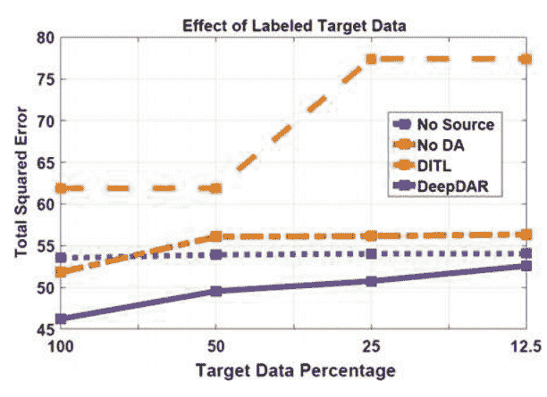

图5 标记目标数据的研究：总平方误差结果。源：维基百科的男性主题，目标：维基百科的女性主题。最佳观看效果为彩色。

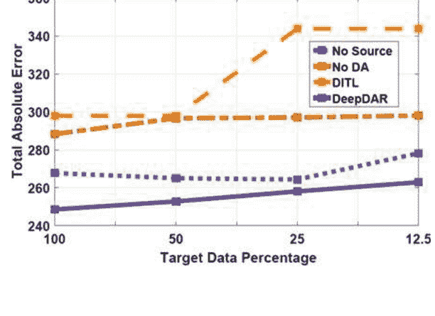

图6 标记目标数据的研究：总绝对误差结果。源：维基百科的男性主题，目标：维基百科的女性主题。最佳观看效果为彩色。

## 4.8 标记源数据的影响

本节研究了标记源数据对学习性能的影响。图7和图8分别描述了实验结果，其中Wiki中的男性受试者被视为源，女性受试者被视为目标（与之前一样，我们只绘制了四种表现最佳的算法和总误差的结果）。

No Source方法仅使用标记的目标样本来诱导模型，因此其性能随着标记源数据的百分比减少而保持不变。对于其他方法，误差大多呈现出随着标记源数据百分比的减少而增加的趋势。DeepDAR在不同百分比的源样本中再次展现出令人印象深刻的性能。这些结果展示了我们方法对标记源和目标训练数据大小的鲁棒性。

图7 标记源数据的研究：总平方误差结果。源：Wiki中的男性受试者，目标：Wiki中的女性受试者。最佳以彩色显示

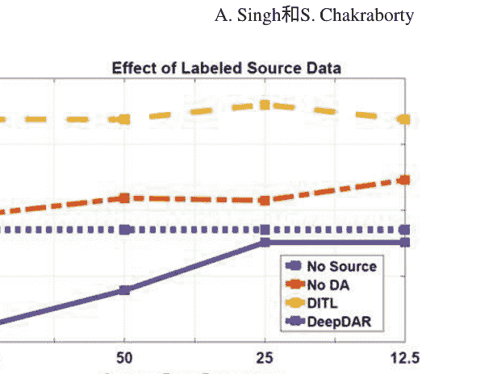

图8 标记源数据的研究：总绝对误差结果。源：Wiki中的男性受试者，目标：Wiki中的女性受试者。最佳以彩色显示

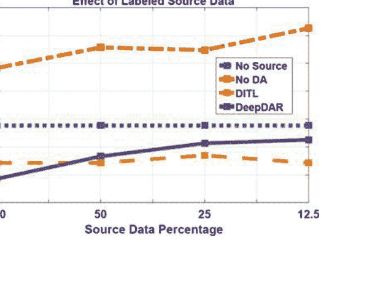

## 4.9 核函数的影响

在本节中，我们研究了用于计算Eq. (5)中的基于MMD的损失项的核函数的影响。图9展示了QMUL中的女性受试者作为源和男性受试者作为目标时的MSE和MAE结果（我们忽略了TCA和R2方法，因为它们显示了较高的误差）。DeepDAR，使用高斯核和多项式核，显示出所有基准方法中最好的性能。类似的结果在图10中显示，其中IMDB数据集作为源，Wiki作为目标。从图中可以看出，对于这个实验，多项式核在MSE和MAE方面的性能甚至比高斯核更好。这表明我们的方法在不同核函数上具有很好的泛化能力。

图9 核函数的研究。源：QMUL中的女性受试者，目标：QMUL中的男性受试者。最佳观看效果为彩色。

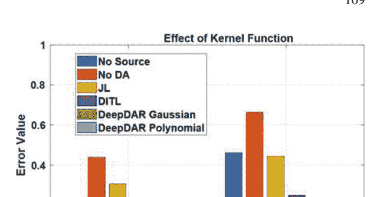

图10 核函数的研究。来源IMDB，目标：维基百科。最好以彩色查看

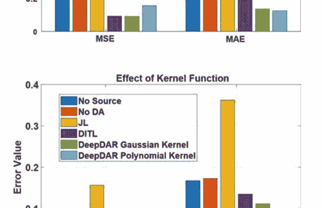

## 4.10 特征分析

在本节中，我们使用提出的方法 DeepDAR 对基线方法[13]使用的深度特征进行了比较分析。 图11描述了两组特征之间的 𝒜 距离，用于我们的两个实验（将男性主体作为源，女性主体作为维基百科和Biwi Kinect数据集的目标）。

两个域之间的 𝒜 距离是两个域之间的差异度量[6]。 它近似为2（1−2 𝜖），其中 𝜖 是一个二元分类器的泛化误差，该分类器训练用于区分来自两个域的样本。 错误值较高（ 𝒜 距离值较低）意味着二元分类器无法区分源样本和目标样本；这意味着源特征和目标特征已经对齐，使得两个域几乎无法区分。 我们使用在高斯核上训练的SVM来估计 𝜖 （每个实验从源域和目标域中取了约8,000个样本，并平均分为训练集和测试集）。 从图11可以明显看出，使用 DeepDAR 学习的特征产生了更高的错误或更低的差异度。

图11 特征分析使用 𝒜 距离。DeepDAR在源领域和目标领域之间产生较低的领域差异。符号 A → B 表示A是源领域，B是目标领域。最好以彩色查看

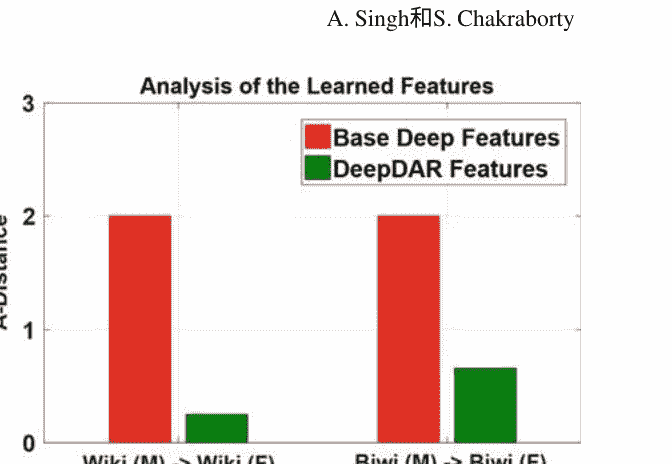

与基准方法使用的深度特征相比，源和目标之间的领域差异较小。因此，使用我们的方法学习的特征可以更好地解决领域差异问题，而不是对应用程序无关的特征。这表明我们的算法在使用深度神经网络学习领域不变特征方面的有用性。

## 5 结论与未来工作

我们介绍了 DeepDAR——一种新颖的深度学习框架，用于解决回归应用中的领域自适应问题。我们制定了一个与领域自适应问题相关的损失函数，并通过优化该损失函数训练了一个深度卷积神经网络。与大多数现有的回归领域自适应算法不同，DeepDAR可以利用目标领域中标记数据的存在来学习一组有区分性的特征。据我们所知，文献中尚未探索使用深度神经网络进行回归领域自适应。我们在基于图像的年龄估计和头部姿态估计上验证了我们框架的性能。DeepDAR在平均绝对误差、均方预测误差和 𝒜 距离方面优于竞争基线，显示出两个领域之间的差异。

在我们未来的研究中，我们计划研究 DeepDAR 在其他回归应用中的性能。例如，由于YouTube、Facebook、Twitter、Flickr等在线平台的普及程度前所未有地增加，图像/视频的流行度预测（目标是在图像上传到网络之前预测其流行度得分）最近在研究界变得流行起来[34, 54, 72]。然而，所有的流行度预测算法都利用特定网站的数据，并为同一网站训练模型；这些模型无法充分利用其他照片分享网站中丰富的数据。例如，来自Instagram的图像和相应的流行度得分可能对开发更好的预测模型有潜在的用处。

域自适应可以用来减少两个网站之间的领域差异，以解决这个挑战。我们未来的工作将探索DeepDAR在这个应用中的性能。

我们还计划研究我们的框架在多变量回归应用中的性能（具有多个输出变量）。例如，在Biwi Kinect头部姿势数据集中，每个图像的真实姿势值以偏航、俯仰和滚转角的三元组形式给出[21]（在这项研究中，我们只考虑了偏航角）。再举一个例子，考虑从运动数据中预测人体步态运动学的问题[46, 83]。这种系统对于预测与身体或神经系统缺陷相关的步态异常非常有用（例如截肢或中风）。在这种应用中，输出预测变量包括右/左膝屈曲、右/左踝屈曲以及与运动相关的其他位移和旋转参数[83]，这涉及多变量回归分析。此外，每个人都有自己独特的步态模式[70, 80]，这需要领域适应来开发用户特定的预测模型，通过从其他用户的数据中转移相关知识。我们打算改进我们的DeepDAR框架，以预测多个输出变量，并研究其在这些应用中的性能。

# 参考文献

1.  Aldecoa, R., Marín, I.: 通过惊喜解读网络社区结构。 PLoS ONE 6(9), e24195 (2011)
2.  Arjovsky, M., Chintala, S., Bottou, L.: Wasserstein GAN. arXiv:1701.07875 (2017)
3.  Aytar, Y., Zisserman, A.: Tabula rasa: 对象类别检测的模型迁移。 在: IEEE国际计算机视觉会议(ICCV), 第2252-2259页(2011)
4.  Badrinarayanan, V., Kendall, A., Cipolla, R.: Segnet: 用于图像分割的深度卷积编码器解码器架构。 IEEE Trans. Pattern Anal. Mach. Intell. (TPAMI) 39(12),2481–2495 (2017)
5.  Bay, H., Tuytelaars, T., VanGool, L.: Surf: 加速稳健特征。 在: 欧洲计算机视觉会议(ECCV), 第404-417页(2006)
6.  Ben-David, S., Blitzer, J., Crammer, K., Kulesza, A., Pereira, F., Vaughan, J.: 不同领域学习的理论. 机器学习, 79(1–2), 151–175 (2010)
7.  Bhattarai, B., Sharma, G., Lechervy, A., Jurie, F.: 跨领域年龄估计的联合学习方法. 在: IEEE国际声学、语音和信号处理会议(ICASSP), pp. 1901–1905 (2016)
8.  Borghi, G., Fabbri, M., Vezzani, R., Calderara, S., Cucchiara, R.: 基于深度图像的头部姿态估计的面部深度. 在: IEEE模式分析和机器智能交易 (TPAMI) (2018)
9.  Borgwardt, K., Gretton, A., Rasch, M., Kriegel, H., Scholkopf, B., Smola, A.: 通过核最大均值差异集成结构化生物数据. 生物信息学 22(14), e49–e57(2006)
10. Bruzzone, L., Marconcini, M.: 领域自适应问题： 一种dasvm分类技术和一种循环验证策略。 IEEE Trans. Pattern Anal. Mach. Intell. (TPAMI) 32(5), 770–787 (2010)
11. Cao, B., Pan, S., Zhang, Y., Yeung, D., Yang, Q.: 自适应迁移学习。 在: Association for the Advancement of Artificial Intelligence (AAAI), pp. 407–412 (2010)
12. Chapelle, O., Scholkopf, B., Zien, A.: 半监督学习。 MIT Press (2006)
13. Chatfield, K., Simonyan, K., Vedaldi, A., Zisserman, A.: 魔鬼细节的回归：深入研究卷积神经网络。 在： British Machine Vision Conference (BMVC) (2014)
14. Chen, L., Papandreou, G., Kokkinos, I., Murphy, K., Yuille, A.: DeepLab：深度卷积神经网络、扩张卷积和全连接CRF的语义图像分割。IEEE Trans. Pattern Anal. Mach. Intell. (TPAMI) 40(4), 834–848 (2018)
15. Cortes, C., Mohri, M.: 回归中的领域适应。 在： 算法学习理论国际会议，第308-323页 (2011年)
16. Dalal, N., Triggs, B.: 用于人体检测的方向梯度直方图。 在： IEEE计算机视觉和模式识别 (CVPR) 会议，第886-893页 (2005年)
17. Dong, X., Thanou, D., Frossard, P., Vandergheynst, P.: 在平滑图信号表示中学习拉普拉斯矩阵。IEEE信号处理交易。 64 (23 ) , 6160-6173 (2016年)
18. Duan, L., Tsang, I., Xu, D., Maybank, S.: 用于视频概念检测的领域转移SVM。 在: IEEE计算机视觉和模式识别 (CVPR) 会议，第1375-1381页 (2009年)
19. Escalera, S., Fabian, J., 等： Chalearn looking at people 2015: 显著年龄和文化事件识别数据集和结果。 在： IEEE国际计算机视觉研讨会 (ICCVW)，第243-251页 (2015)
20. Fanelli, G., Dantone, M., Gall, J., Fossati, A., Gool, L.V.: 用于实时3D人脸分析的随机森林。计算机视觉国际期刊 (IJCV) 101(3), 437-458页 (2013)
21. Fernando, B., Habrard, A., Sebban, M., Tuytelaars, T.: 无监督的视觉领域自适应使用子空间对齐。 在： IEEE国际计算机视觉大会 (ICCV), 第2960-2967页 (2013)
22. Fu, Y., Huang, T.: 用于头部姿态估计的图嵌入分析。 在： 国际自动人脸和姿态识别会议 (2006)
23. Ganin, Y., Ustinova, E., Ajakan, H., Germain, P., Larochelle, H., Laviolette, F., Marchand, M., Lempitsky, V.: 领域对抗训练神经网络. 机器学习研究杂志 (JMLR) 17(1), 2096–2130 (2016)
24. Garcke, J., Vanck, T.: 用于回归的重要性加权归纳迁移学习. 在: 欧洲机器学习和知识发现数据库会议上, pp. 466–481(2014)
25. Geng, X., Zhou, Z., Miles, K.: 基于面部衰老模式的自动年龄估计. IEEE模式分析与机器智能交易. (TPAMI) 29(12), 2234–2240 (2007)
26. Goodfellow, I., Pouget-Abadie, J., Mirza, M., Xu, B., Warde-Farley, D., Ozair, S., Courville, A., Bengio, Y.: 生成对抗网络. 在: 神经信息处理进展系统 (NIPS), pp. 2672–2680 (2014)
27. Gopalan, R., Li, R., Chellappa, R.: 面向对象识别的领域自适应: 一种无监督方法。 在: IEEE国际计算机视觉会议(ICCV), 第999-1006页(2011)
28. Guan, Z., Li, A., Zhu, T.: 基于本地回归的迁移学习及其在用户心理特征预测中的应用。 Brain Inf. 2(3), 145-153页(2015)
29. Guo, G., Fu, Y., Dyer, C., Huang, T.: 基于图学习和局部调整的基于图像的人脸年龄估计 。 IEEE图像处理交易。 17(7), 1178-1188页(2008)
30. He, K., Zhang, X., Ren, S., Sun, J.: 深度残差学习用于图像识别。 在: IEEE计算机视觉与模式识别会议(CVPR), 第770-778页(2016)
31. Hu, L., Kan, M., Shan, S., Chen, X.: 用于无监督领域自适应的双工生成对抗网络。 在: IEEE计算机视觉与模式识别会议(CVPR), 第1498-1507页(2018)
32. Jamal, A., Namboodiri, V., Deodhare, D., Venkatesh, K.: 行动空间中的深度领域适应 . 在: 英国机器视觉会议 (BMVC) (2018年)
33. Khosla, A., Sarma, A., Hamid, R.: 什么使一张图片受欢迎? 在: 国际万维网会议 (WWW) , 第867-876页 (2014年)
34. Kingma, D., Welling, M.: 自动编码变分贝叶斯. arXiv预印本arXiv:1312.6114 (2013年)
35. Krizhevsky, A., Sutskever, I., Hinton, G.: 使用深度卷积神经网络进行ImageNet分类 . 在: 神经信息处理系统 (NIPS) (2012年)

36. Lai, S., Xu, L., Liu, K., Zhao, J.: 用于文本分类的循环卷积神经网络. 在：人工智能促进协会（AAAI），第2267-2273页（2015年）
37. Le, T., Nguyen, K., Ho, N., Bui, H., Phung, D.: 深度领域适应的理论视角. arXiv: 1811.06199 (2019年)
38. LeCun, Y., Bottou, L., Orr, G., Muller, K.: 高效的反向传播. 在：神经网络：行业内的技巧，第9-50页（1998年）
39. Liang, Z., Zhang, G., Huang, J., Hu, Q.: 基于电子病历的医疗决策深度学习. 在：IEEE国际生物信息学和生物医学会议（BIBM），第556-559页（2014年）
40. Liu, M., Breuel, T., Kautz, J.: 无监督的图像到图像转换网络. 在：神经信息处理系统的进展（NIPS），第700-708页（2017年）
41. Liu, M., Tuzel, O.: 耦合生成对抗网络. 在：神经信息处理系统（NIPS）的进展，第469-477页（2016年）
42. Liu, S., Liu, S., Cai, W., Pujol, S., Kikinis, R., Feng, D.: 用深度学习早期诊断阿尔茨海默病. 在：IEEE生物医学成像国际研讨会（ISBI），第1015-1018页（2014年）
43. Long, M., Cao, Y., Wang, J., Jordan, M.: 用深度自适应网络学习可迁移特征. 在：机器学习国际会议（ICML），第97-105页（2015年）
44. Long, M., Zhu, H., Wang, J., Jordan, M.: 用剩余转移网络进行无监督领域适应. 在：神经信息处理系统（NIPS）的进展，第136-144页（2016年）
45. Luu, T., Low, K., Qu, X., Lim, H., Hoon, K.: 基于广义回归神经网络的个体特定步态模式预测模型. 步态和姿势 39（1），443-448（2014年）
46. Motiian, S., Jones, Q., Iranmanesh, S., Doretto, G.: 少样本对抗领域适应. 在：神经信息处理系统进展（NIPS）（2017年）
47. Oliva, A., Torralba, A.: 场景形状建模：空间整体表示. 国际计算机视觉杂志（IJCV）42（3），145-175（2001年）
48. Pan, S., Tsang, I., Kwok, J., Yang, Q.: 通过转移分量分析进行领域适应. 在：国际人工智能联合会议（IJCAI），第1187-1192页（2009年）
49. Pan, S., Yang, Q.: 转移学习综述. IEEE Trans. Knowl. Data Eng.（TKDE）22（10），1345-1359（2010年）
50. Pan, S., Tsang, I., Kwok, J., Yang, Q.: 通过转移组件分析进行领域适应. IEEE Trans. Neural Netw. Learn. Syst.（TNNLS）22（2），199-210（2011年）
51. Pardoe, D., Stone, P.: 用于回归转移的提升方法. 在：机器学习国际会议（ICML），pp. 863-870（2010年）
52. Peng, K., Wu, Z., Ernst, J.: 零样本深度领域适应. 在：欧洲计算机视觉会议（ECCV），pp. 793-810（2018年）
53. Pinto, H., Almeida, J., Goncalves, M.: 使用早期视图模式预测YouTube视频的流行度. 在：ACM国际网络搜索和数据挖掘会议（WSDM），pp. 365-374（2013年）
54. Puheim, M., Madarasz, L.: 在逆运动学模型中基于神经网络的机械臂控制器的输入和输出归一化. 在：IEEE应用机器智能和信息学国际研讨会，pp. 35-38（2014年）
55. Qi, F., Yang, X., Xu, C.: 多模态领域自适应的统一框架. 在：ACM多媒体会议（ACM-MM），第429-437页（2018年）
56. Ranganathan, H., Venkateswara, H., Chakraborty, S., Panchanathan, S.: 用于图像分类的深度主动学习. 在：IEEE国际图像处理会议（ICIP），第3934-3938页（2017年）
57. Ranganathan, H., Venkateswara, H., Chakraborty, S., Panchanathan, S.: 具有标签相关性的多标签深度主动学习. 在：IEEE国际图像处理会议（ICIP），第3418-3422页（2018年）
58. Rothe, R., Timofte, R., Van Gool, L.: 从单个图像中对真实年龄和表观年龄的深度期望，无需面部标记. 计算机视觉国际期刊（IJCV）126（2-4），144-157页（2018年）
59. Rozantsev, A., Salzmann, M., Fua, P.: 深度领域适应的残差参数传递. 在: IEEE计算机视觉和模式识别会议(CVPR), pp. 4339-4348 (2018年)
60. Saenko, K., Kulis, B., Fritz, M., Darrell, T.: 将视觉类别模型适应到新领域. 在: 欧洲计算机视觉会议(ECCV), pp. 213-226 (2010年)
61. Sankaranarayanan, S., Balaji, Y., Castillo, C., Chellappa, R.: 生成对抗网络对齐领域. 在: IEEE计算机视觉和模式识别会议(CVPR), pp. 8503-8512 (2018年)
62. Sener, O., Song, H., Saxena, A., Savarese, S.: 学习可迁移的表示用于无监督领域适应. 在: 神经信息处理系统进展(NIPS), pp. 2118-2126 (2016年)
63. Shen, J., Qu, Y., Zhang, W., Yu, Y.: 基于Wasserstein距离的领域自适应表示学习. 在: 人工智能促进协会 (AAAI), pp. 4058-4065 (2018年)
64. Sherrah, J., Gong, S.: 融合感知线索以实现头部姿态和位置的稳健跟踪. Pattern Recognn. 34 (8), 1565-1572 (2001年)
65. Smola, A., Kondor, R.: 图上的核函数和正则化. 在: 计算学习理论会议 (COLT), pp. 144-158 (2003年)
66. Sriperumbudur, B., Fukumizu, K., Lanckriet, G.: 普遍性, 特征核函数和RKHS嵌入的度量. 机器学习研究 (JMLR) 12, 2389-2410 (2011年)
67. Sriperumbudur, B., Gretton, A., Fukumizu, K., Scholkopf, B., Lanckriet, G.: Hilbert空间嵌入和概率度量. 机器学习研究 (JMLR) 11, 1517-1561 (2010年)
68. Steinwart, I.: 关于核函数对支持向量机一致性的影响. J. Mach. Learn. Res. (JMLR) 2, 67-93 (2001年)
69. Stevenage, S., Nixon, M., Vince, K.: 作为身份线索的步态视觉分析. Appl. Cognit. Psychol. 13(6), 513-526 (1999年)
70. Sun, B., Feng, J., Saenko, K.: 令人沮丧的简单领域自适应的回归. 在: 人工智能促进协会(AAAI), pp. 2058-2065 (2016年)
71. Szabo, G., Huberman, B.: 预测在线内容的流行度. Commun. ACM 53(8), 80-88 (2010年)
72. Szegedy, C., Liu, W., Jia, Y., Sermanet, P., Reed, S., Anguelov, D., Erhan, D., Vanhoucke, V., Rabinovich, A.: 通过卷积进行更深入的研究. 在: IEEE计算机视觉和模式识别会议 (CVPR) (2015年)
73. Tzeng, E., Hoffman, J., Darrell, T., Saenko, K.: 跨领域和任务的同时深度迁移. 在: IEEE国际计算机视觉会议(ICCV), pp. 4068-4076 (2015年)
74. Tzeng, E., Hoffman, J., Saenko, K., Darrell, T.: 对抗性鉴别域适应. 在: IEEE计算机视觉与模式识别会议(CVPR), pp. 7167-7176 (2017年)
75. Tzeng, E., Hoffman, J., Zhang, N., Saenko, K., Darrell, T.: 深度领域混淆: 最大化领域不变性. arXiv预印本 arXiv:1412.3474 (2014年)
76. Venkateswara, H., Eusebio, J., Chakraborty, S., Panchanathan, S.: 无监督领域适应的深度哈希网络. 在: IEEE计算机视觉与模式识别会议(CVPR), pp. 5018-5027 (2017年)
77. Venkateswara, H., Lade, P., Ye, J., Panchanathan, S.: 用于监督领域适应的耦合支持向量机. 在: ACM多媒体会议 (ACM-MM), 第1295-1298页 (2015年)
78. Volpi, R., Morerio, P., Savarese, S., Murino, V.: 用于无监督领域适应的对抗特征增强. 在: IEEE计算机视觉和模式识别会议 (CVPR), 第5495-5504页 (2018年)
79. Winter, D.: 人类步态的生物力学和运动控制: 正常、老年和病理. 滑铁卢大学出版社 (1991年)
80. 如何通过数据缩放改善神经网络的稳定性和建模性能. https://machinelearningmastery.com/how-to-improve-neural-network-stability-and-modeling-performance-with-data-scaling/
81. Yamada, M., Sigal, L., Chang, Y.: 结构化回归的领域自适应. 计算机视觉国际期刊 109(1-2), 126-145 (2014年)
82. Yan, K., Zheng, W., Cui, Z., Zong, Y., Zhang, T., Tang, C.: 基于领域自适应的字典学习方法的无监督面部表情识别. 神经计算 319, 84-91 (2018年)
83. Yun, Y., Kim, H., Shin, S., Lee, J., Deshpande, A., Kim, C.: 用高斯过程回归预测步态运动学的统计方法. 生物力学杂志 47(1), 186-192 (2014年)
84. Zhang, X., Zhao, J., LeCun, Y.: 用于文本分类的字符级卷积网络. 在: 神经信息处理系统进展(NIPS), 第649-657页(2015年)
85. Zhou, D., Scholkopf, B.: 用于图数据学习的正则化框架. 在: 机器学习国际会议研讨会(2004年)
86. Zhu, R., Sang, G., Zhao, Q.: 用于跨领域面部表情识别的判别特征适应. 在: 国际生物识别会议（ICB） (2016年)

## 基于深度学习的自动驾驶行人检测：成就与未来挑战

Michelle Karg 和 Christian Scharfenberger

摘要深度学习被认为是先进驾驶辅助系统和未来自动驾驶的关键技术。重点在于通过相机、雷达和激光雷达传感器以及融合概念感知环境。基于相机的感知包括对道路用户的检测。特别需要高精度的检测性能来检测易受伤的道路用户，如行人和自行车驾驶员。在过去的十年中，视觉感知的目标检测取得了巨大的进步。公共数据集刺激了目标检测的研究。公共基准测试结果显示了从手工特征到基于部件的模型再到深度学习的行人检测器的进展。人类和机器性能之间的差距变小，这引发了一个问题，即当检测性能达到人类水平时，行人检测问题是否已经解决？由于误检测可能导致交通场景中的危险情况，对于先进驾驶辅助系统和自动驾驶的人工智能性能的期望通常超过人类性能。挑战包括精确定位、遮挡、远距离对象和边缘情况，其中几乎没有或没有训练数据可用。为了促进这个方向的研究，发布了一个新的全面的夜间行人检测数据集。本章首先介绍了基于视觉的道路用户感知作为一个对检测性能要求越来越高的安全关键应用。在第二部分中，它总结了行人检测的概念，包括公共数据集和评估指标的概述。讨论了任务复杂性和任务性能之间的依赖关系。基于这个讨论，确定了行人检测中的挑战，并概述了未来的方向。

通过包括跟踪、场景理解和传感器融合等组件，可以进一步提高性能。总之，深度学习在先进驾驶辅助系统和自动驾驶中的应用是由于追求在任何交通场景、任何天气条件和实时约束下的安全操控。


通过追求在任何交通场景、任何天气条件和实时约束下的安全操控，实现目标。这对深度网络架构的开发提出了很高的要求。

关键词卷积神经网络 · 行人检测 · 高级驾驶辅助系统 · 自动驾驶

# 1 引言

自从深度学习引入计算机视觉以来，它已成为关键技术，并找到了许多应用 [1-7]。深度学习的发展可以追溯到早期对受限玻尔兹曼机（RBM）、深度置信网络（DBN）和有监督预训练的研究，以及更近期的用于计算机视觉的深度卷积神经网络（CNNs），以及未来的方向，如可微分神经计算机（DNCs）[2, 3, 5, 7-16]。深度学习基于神经网络的概念，并通过表示学习、随机梯度下降、深度架构、计算效率的非线性和大数据集和快速计算的使用来扩展传统神经网络的设计。表示学习通过端到端学习优化了用于分类所需的特征表示；特征表示和分类通过共同的训练进行学习，无需手动设计特征[2]。增加神经网络的深度有助于建模非线性，深度网络可以用比浅而广的网络更少的参数来建模复杂函数[11, 17]。随机梯度下降（SGD）使得可以训练深度网络架构，在每个小批量中估计梯度并更新权重。SGD支持使用大型训练数据集，因为数据集被分成小批量，只对小批量计算梯度。结合快速处理，例如使用GPU，可以在大型数据集上训练深度网络，例如ImageNet，从而实现比基于手动设计特征和领域专业知识的许多其他技术更好的泛化性能[2, 5, 7, 18]。在网络设计方面的改变之外，用于训练、验证和测试深度网络的数据量也增加了，例如ImageNet数据集中的样本数量超过一百万[17]。类似地，运行这种高效的深度网络所需的计算资源量也增加了，支持并行计算起到了关键作用，例如通过GPU。深度学习在计算机视觉的许多领域中提高了检测和分类性能，并解决了仅基于手工特征提供有限解决方案的问题[2, 5, 7, 18]。其中一个重要领域是先进驾驶辅助系统和自动驾驶的发展，对检测性能的要求不断增加。自动驾驶领域是一个重要领域，对检测性能的要求不断增加。

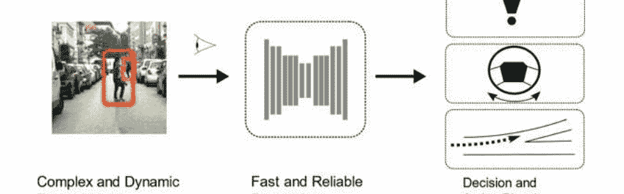

在复杂和具有挑战性的场景中使用传感器系统。重点特别放在通过摄像头、雷达或激光雷达传感器感知环境上。这些传感器必须能够在任何场景中可靠且快速地提取环境信息，以便允许车辆警告驾驶员避免危险情况，自主执行紧急转向以防止事故，并在自动驾驶领域规划驾驶路径，如图1所示。鉴于对于当今和未来的传感器系统，特别是计算机视觉和摄像头传感器的检测性能要求很高，深度学习被认为是先进驾驶辅助系统和自动驾驶的关键。

基于摄像头的感知用于先进驾驶辅助系统和自动驾驶，包括对道路使用者的检测。特别需要最高的检测性能来检测易受伤的道路使用者，如行人和自行车驾驶员。过去的十年中，基于视觉的目标检测取得了巨大的改进。许多公共数据集，如Caltech数据集[20, 21]，推动了目标检测的研究。基准测试显示，行人检测器从手工特征到基于部件的模型再到深度学习的进展。最近的基准测试和卷积神经网络（CNN）检测方法与人类检测性能的比较显示出人机性能之间的差距正在迅速缩小[5, 22-24]。当检测性能达到人类水平时，这一趋势可能引发一个问题，即行人和自行车检测是否可以被认为已经得到了充分解决？

在交通场景中，误报和漏报都可能导致危险情况，因此对于高级驾驶辅助系统和自动驾驶的人工智能性能的期望通常超出了人类性能。当涉及到对象的精确定位、遮挡、非常小和远距离的对象、突然出现在道路上的儿童等特殊情况时，期望值甚至更高，这些情况下只有很少或没有训练数据可用[25-27]。在关键情况下，高级驾驶辅助系统的人工智能可以通过监控环境来帮助驾驶员。

本章旨在介绍基于视觉的道路用户检测作为一种安全关键应用。在这里，随着自动化水平的提高，对检测性能的需求也增加。因此，总结了先进驾驶辅助系统和自动驾驶的不同自动化水平。这引出了一个问题，即在行人检测领域取得了什么成就，以及进一步提高检测性能的未来挑战是什么。由于行人检测与基于视觉的物体检测密切相关，因此总结了解决此任务的深度学习方法。性能取决于算法解决方案和任务复杂性。出于这个原因，讨论了任务复杂性和错误率之间的关系，并描述了影响任务复杂性的因素。考虑到行人检测，过去已经发布了几个公共数据集。这些数据集在任务复杂性上有所不同，例如数据集的大小，环境的变化性（城市数量，国家数量），白天或黑夜的数据以及注释的细粒度。然后，介绍了行人检测的评估指标。总结了常用数据集上行人检测的性能，并概述了行人检测面临的挑战。

虽然本章重点讨论基于CNN的单帧行人检测，但通过包括跟踪、场景理解和传感器融合在内，可以进一步提高检测性能。

简而言之，将深度学习方法应用于先进驾驶辅助系统和自动驾驶，旨在实现在任何复杂交通场景和任何天气条件下的安全可靠操控，同时满足实时约束，对深度网络架构的开发提出了很高的要求。

## 2 行人检测对先进驾驶辅助系统和自动驾驶的安全性的重要性

关于乘客和道路使用者的安全和驾驶舒适性的讨论几乎在卡尔·本茨于1886年发明汽车之后就开始了。过去几十年，对安全方面的关注仅仅集中在车辆内乘客的安全上，并引发了许多技术改进和进步，提高了道路安全性和驾驶舒适性。著名的例子包括防抱死系统和安全气囊，在关键情况下确保车辆的可操纵性或在事故中防止严重伤害，从而大大减少了死亡人数。

雷达和基于摄像头的驾驶辅助系统的早期优势对于开发新的高级舒适性和安全功能以及进一步提高道路安全性产生了积极影响。这些驾驶辅助功能中的许多任务是警告驾驶员可能危险的交通情况，并在手动驾驶汽车时防止与其他道路用户（如车辆）发生碰撞。所开发的技术非常注重车内乘客的安全，并在公共道路上车辆数量不断增加的情况下，帮助显著减少了死亡人数。

即将到来的新一波先进驾驶辅助系统和支持自动驾驶的系统以及新的法规和立法将道路安全的重点转向了新的方向。虽然在车内确保乘客的安全一直是重点，但现在更加注重保护行人、自行车手和摩托车手等脆弱道路用户。美国国家公路交通安全管理局引入了不同级别的自动驾驶——SAE 0-5级，进一步加强了这一趋势，将安全驾驶和保护脆弱道路用户的责任从驾驶员转移到了车辆，而且随着SAE级别的增加，这种趋势还在不断加强。以下概述简要总结了不同级别的自动驾驶：

- Level 0: 人类驾驶员控制和操纵整个车辆。辅助系统可能会提醒驾驶员注意危险情况。
- Level 1: 驾驶员控制大部分车辆功能，但车辆会自动加速、减速或转向等特定功能。
- Level 2: Level 2考虑了驾驶员辅助系统，可以利用环境信息进行自动转向、加速和减速。驾驶员可以将双手离开方向盘和脚离开踏板一段时间，但必须随时准备接管控制。
- Level 3: Level 3通过在特定环境和交通条件下将安全关键功能从驾驶员转移到车辆来扩展Level 2。驾驶员仍然需要在场并干预，但不必像前几个级别那样监控情况。
- Level 4: Level 4车辆主要实现自动化。它们可以执行所有安全关键驾驶功能并监控整个行车路况。尽管自动化程度很高，但仍然受限于操作设计领域，无法涵盖每一种驾驶场景。
- Level 5: 该级别期望车辆系统在任何环境和驾驶场景中的性能与人类驾驶员相当，无需任何驾驶员干预。

所有自动化级别对于检测易受伤害的道路使用者都有严格要求。在这里，可靠的行人检测成为先进驾驶辅助系统和自动驾驶的关键任务，从0级开始，安全功能可以在关键情况下警告驾驶员，到5级，车辆不再需要驾驶员控制。

除了自动化级别的增加，对于高度可靠的行人检测的需求在交通事故报告中也是显而易见的，在车辆和行人之间的碰撞中，许多道路交通事故中发生了人员受伤。在这里，选择了德国联邦统计局2017年的事故报告[28]，并总结了相关统计数据。

2017年德国报告了超过200万起事故，其中302,656起事故导致人员受伤[28]。大多数人员受伤发生在城市地区，如图2所示，而高速公路上的受伤人数较少，但严重程度略有增加。行人和自行车驾驶员占据了111,715起事故，约占总数的三分之一。因此，可靠的行人在城市交通中，检测对于减少车辆与行人的碰撞非常重要。

可靠的行人检测被认为是计算机视觉和机器学习中的一项具有挑战性的任务。图3展示了城市环境中的典型道路场景，并展示了行人检测面临的几个挑战。例如，人群中的行人，藏在停放的车辆后面或被其他行人或物品遮挡的行人和儿童。根据图3中描述的场景，对于辅助和自动驾驶系统，行人检测的最重要要求可以总结如下：

1.  可靠的行人检测必须在任何光照条件下工作，包括白天和夜晚、日落、黎明和浅阳光。
2.  可靠的行人检测必须在车辆的远近周围工作。
3.  行人检测对不同的大小、姿势、外观和视角具有鲁棒性。
4.  鲁棒的检测可以应对具有挑战性的环境和天气条件，包括强光、大雨、雪、雾、阳光和环境光照动态范围大的情况，如阴影。
5.  该检测在复杂的环境和交通情况下可靠地工作。
6.  即使行人被携带物品、车辆或其他人遮挡，也可以鲁棒地检测到。
7.  一种行人检测方法可以在人群中检测到单个行人，并提取出车辆可能需要刹车的最相关和关键的行人。

可靠检测的基础是从传感器数据中提取环境和交通相关信息。为了满足鲁棒行人检测的要求，支持辅助和自动驾驶的系统结合和融合了来自多个传感器的输入。最常见的设置要么处理来自激光雷达、雷达和摄像头传感器的单独数据，要么处理融合的数据。针对摄像头传感器，第一步是在单个图像中检测物体。物体检测可能包括行人、车辆、交通灯和交通标志等。由于单帧检测对于误报或漏报非常敏感，对于安全相关功能来说至关重要，通常需要后处理，如跟踪，以通过时空信息或来自雷达或激光雷达的输入进行合理性检查，提高物体检测的鲁棒性。传感器数据融合和后处理可以通过时间、空间和多模态的一致性提高整体检测准确性，并通过时间序列分析纠正误检测。然而，单个传感器在其工作范围内的高检测准确性对于使传感器融合高效至关重要。因此，本文重点研究基于卷积神经网络（CNN）的单传感器、单帧方法在检测行人方面的整体性能。

## 3 行人检测

目标检测包括对物体的分类和在图像中的定位。行人检测可以被看作是目标检测的特例，其中分类被简化为二元决策：“行人”或“背景”。

定位任务区分了目标检测和目标分类。后者基于包含物体的图像裁剪，而前者基于可能包含物体或仅包含背景的图像。由于目标检测需要在完整图像中搜索潜在的物体候选/物体提议，因此它的计算代价比目标分类更高，并且更容易检测到误报。在设计用于这两个任务的CNN架构中，分类和目标检测的分离是可见的。用于目标分类的CNN作为目标检测中更大的CNN架构的核心网络。

因此，本章首先总结了两种常见的用于目标检测的CNN架构方法。然后，对特征提取和分类的核心网络进行了回顾。由于目标检测器的检测性能与任务复杂性密切相关，因此还额外介绍和讨论了影响任务复杂性的因素。随后，提供了用于行人检测研究的公开可用数据集的概述，并总结了行人检测的评估指标。本章最后讨论了CNN的性能、行人检测的挑战以及未来的发展方向。

### 3.1 行人检测的卷积神经网络

检测物体的任务可以分解为几个子任务，包括物体定位、物体分类和检测置信度的估计。这些子任务可以描述如下：

1.  物体定位 l(obj) = f(x, y, width, height)：物体在图像中的位置和大小是什么？
2.  物体分类 c(obj) = h(cj, x)：给定观察值 x 和 c 个类别，将物体分到哪个类别？
3.  检测置信度估计 z(obj) = P(cj | x)：检测器对其检测的置信度有多高？

行人检测在计算机视觉领域已经通过不同的方法进行了处理，如图4所示。由于直接对像素值进行分类容易出错，因此引入了基于边缘或结构的特征。直方图归一化增加了这些特征对噪声的鲁棒性，光照和空间变换[12]。基于部分模型的发展进一步改善了对象的检测，考虑到遮挡、困难的姿势或罕见的视角[29]。所有行人检测方法都依赖于精心设计的特征，并且行人检测和分类的性能强烈依赖于适当的特征集选择。关于特别适用于行人检测的手工设计特征的概述在Dollar等人的工作中提供[21]。

基于随机梯度下降的训练方法进一步改善了深度神经网络的行人检测，该方法同时学习特征表示和分类[26, 30]。这也被称为表示学习。基于卷积神经网络（CNN）的表示学习在许多对象检测任务中实现了更高的性能和更好的泛化能力，因此被应用于生物医学、机器人和汽车应用的许多检测任务中。

目标检测的卷积神经网络可以分为两种主要方法（如图5所示）：

- 单阶段架构，在特征提取后直接应用多类别分类和定位。
- 两阶段架构由两个共享编码器的网络头组成：（1）包括二元分类和定位的区域提议网络，以及（2）用于多类别分类的分类网络。

这两种架构都基于编码器，编码器由一组卷积层组成，用于计算图像的特征表示，并进行端到端的学习。特征表示包括低层特征，如梯度和角点，中层特征表示简单形状，如线条、曲线和圆形，以及高层特征表示对象部分。计算特征表示一次对整个图像进行运算可以节省运行时间[31]。此外，单阶段和两阶段架构共享一组预定义的锚点，用于指定对象的纵横比和尺度。

单阶段架构包括Yolo [32, 33]和SSD[34]等架构。在用于特征表示的卷积层之后，还有额外的卷积层用于多类别分类和边界框回归。Yolo和SSD在使用低级特征进行分类和损失函数方面有所不同。Yolo使用重新组织层来包含低级特征，而SSD对多个特征分辨率应用分类和边界框回归。

此外，Yolo使用逻辑激活来限制边界框的预测。SSD的损失函数是定位损失和置信度损失的加权和。Yolo还为每个预测输出单独的置信度分数。置信度分数通过使用额外的损失组件进行训练，该组件与预测和真实值之间的交并比（IoU）相关。

两阶段架构包括Fast R-CNN [31]、Faster R-CNN [3]和R-FCN [35]等架构。这些架构在编码器网络之后包括两个神经网络头部：区域建议网络（RPN）和分类网络。

区域建议头部包括二元分类（物体 vs. 非物体）和边界框回归。RPN定位潜在的物体建议（也称为物体候选），并将得分足够高的建议传递给分类网络。非极大值抑制（NMS）可用于减少可能的物体建议数量。此外，需要一个感兴趣区域池化层将每个物体建议的裁剪转换为固定大小[3, 31, 35]。

分类网络可以由一组全连接层组成，用于Faster R-CNN [3, 31]，或者由端到端训练的卷积层组成，用于R-FCN [35]。

根据[4]的研究，单阶段架构具有更快的计算速度，而双阶段架构可以实现更高的准确性。两种架构的网络设计差异在图6a、b中可视化。检测性能取决于所选择的特征表示编码器。已经提出了几种基本的网络设计作为编码器：

- AlexNet于2012年推出，由五个卷积层和三个全连接层组成[5]。每个层中的通道数分别为48-128-192-192-128（卷积层）和2048-2048-1000（全连接层）。它有6000万个参数，并且在训练过程中应用数据增强和dropout来避免过拟合。AlexNet在ImageNet LSVRC-2010比赛中取得了比基于手工设计特征的传统分类方法更低的错误率。
- VGGnet引入了仅使用小的滤波器尺寸，即3 × 3，用于基于CNN的分类[6]。在[6]中比较了不同深度的网络架构，范围在16到29层之间。通道数在之后加倍最大池化从第一层的64个通道开始，到最后一层的512个通道结束。三个全连接层包含4096-4096-1000个参数。参数数量范围从具有11个卷积层的小型VGG-A网络的1.33亿到具有19个卷积层的大型VGG-E网络的1.44亿。VGG-22（VGG-E）网络的额外深度相比于VGG-14（VGG-A）网络，在LSVRC数据集上的top-1错误率降低了4.1%。
- ResNets基于堆叠残差层，并且是完全卷积的[7]。残差层通过解决退化问题来促进深度网络的学习：学习函数被建模为F(x) + x，其中F(x)是残差，x是身份。在ResNet中学习残差F(x)。这个残差映射由分支子网络架构表示。一个分支是跳过子网络中的层的快捷连接，表示身份x。另一个分支是用于学习残差F(x)的一组层。常见的ResNet架构包括ResNet-18、ResNet-34、ResNet-50、ResNet-101和ResNet-152 [7]。在[36]中，使用残差架构和随机深度训练了多达1000层，以避免梯度消失。
- Inception模块是通过GoogleNet/InceptionNet-v1 [13]引入的。Inception模块由具有不同滤波器尺寸的并行分支组成，例如，1 × 1, 3 × 3和5 × 5。1 × 1滤波器被添加到网络设计中以降低维度。InceptionNet-v1和InceptionNet-v3分别为22层和42层深。InceptionNet-v3的计算成本比InceptionNet-v1高2.5倍[13, 14]。InceptionNet-v3进一步通过两个堆叠的3 × 3卷积替换5 × 5滤波器以节省运行时间[14]。这些滤波器可以分解为非对称卷积（1 × n, n × 1），并且扩展的滤波器组输出可以添加到后期层。通过辅助分类器或残差连接可以加速Inception网络的训练[14, 15]。在[15]中研究了残差和Inception层的两个概念的组合。

基于卷积神经网络的检测方法在汽车行人检测的性能上有很大的潜力。

在汽车领域应用检测技术面临许多约束和功能要求以及安全要求。这些约束对于设计用于汽车应用的卷积神经网络时需要考虑重要的设计准则：

- 快速推理网络需要支持嵌入式系统的集成。
- 汽车应用的传感器系统需要进行多类别检测以感知完整的交通场景。这包括除了行人、自行车和摩托车之外的其他物体类别，如车辆、交通标志、道路施工物体和道路边界。
- 对于交通场景理解和自动决策，需要对物体进行高精度的定位和准确的尺寸估计。
- 在支持高级驾驶辅助和自动驾驶系统中，对于安全关键的决策制定来说，检测的有意义的置信度值是相关的。

此外，在安全关键的决策中，需要高精度和高鲁棒性，以避免误报和漏报。

除了这些设计准则之外，这些行人检测器将在高度复杂和动态的环境中运行，并面临安全关键情况的检测。这对于确保这些学习端到端的检测器的性能提出了额外的要求和挑战[37]。

### 3.2 错误率与任务复杂性的依赖关系

物体检测器的性能取决于任务的复杂性。随着任务复杂性的增加，低错误率变得更加困难。在汽车领域的安全相关应用中，实现低错误率非常重要。通过首先比较不同公共基准测试的分类结果，然后描述影响任务复杂性的不同方面，提供了错误率和任务复杂性之间关系的示例。

图7显示了在不同分类基准测试中的分类错误率，从而展示了错误率和任务复杂性之间的关系的示例。考虑的基准包括对象分类

- 灰度图像和仅包含数字的图像（MNIST数据集，70,000张图像）[38]，
- 街景房屋号码（SVHN数据集，600,000张图像）[39]
- 包括汽车、飞机、船只、动物等10或100个类别的图像（CIFAR-10，CIFAR-100，每个60,000张图像）[40]
- 1,000个类别（ImageNet，>1,000,000张图像）[17]；这里除了报告top-1错误率外，还报告了top-5错误率，因为分类器可能能够正确识别图像裁剪的背景中的对象。对于top-5错误率，当正确的标签在图像的5个最高得分预测中时，就足够了。

图7展示了基于CNN的对象分类器在不同数据集上的最佳结果。对于MNIST数据集，可以实现低于1%的错误率。随着任务复杂性的增加，对分类器的表示能力、训练过程中的收敛能力以及训练数据集的大小和质量的需求也增加。因此，实现低于1%的top-1错误率变得更具挑战性。对于ImageNet数据集，CNN可以实现比人类更好的性能，特别是对于狗品种这样的类别，人类的评级取决于对狗品种的熟悉程度。集成网络可以实现最佳性能。

图8 在二维特征空间中可视化任务复杂度架构。集成网络架构由多个网络组成，例如，可以使用多数投票作为最终预测。

此外，随着类别数量的增加，通过偶然正确分类的概率会减小。通过偶然正确分类的概率为10%（10个类别），1%（100个类别）和0.1%（1,000个类别）。

kappa统计量通过偶然成功率进行归一化，并提供了一个度量标准，用于衡量一个检测器比‘随机掷骰子’更好的程度。MNIST数据集的计算kappa统计量（κ = 99.4）高于ImageNet数据集的kappa统计量（κ = 80.6），表明类别数量不是影响任务复杂度的唯一属性。

影响任务复杂性的其他重要属性总结如下，并在图8中进行了说明：

- 类别数量：类别数量增加会增加任务复杂性。
- 类内和类间变异性：大的类间变异性通过形成易于分离的特征聚类和强烈的类关系简化任务复杂性。大的类内变异性可能导致特征聚类重叠，使得决策超平面的学习变得困难，并增加任务复杂性。
- 类别抽象级别：类定义的粒度进一步影响任务复杂性。与行人检测相关的示例从低到高的抽象级别包括：（a）行人的边界框表示，（b）细分为老年人、成年人和儿童，或者（c）细分为警察、边境官员等群体。子类定义中特征空间的重叠会导致混淆，从而增加任务复杂性。
- 注释的歧义：任务复杂性还取决于注释的歧义。在检测图像中的对象时，对象的注释在大多数情况下是清晰的。对于遮挡或低分辨率的对象，可能会发生异常。对于其他任务（如手势和动作识别、意图识别和情感识别），注释可能变得模糊不清。对于动作识别，动作的起始/结束时间可能存在歧义[34]。对于手势识别，将一个动作解释为手势可能导致歧义，例如，远处的行人举起双臂：行人是在挥手还是伸展手臂？从手势或动作中推断出意图可能变得更加复杂，例如，远处的行人挥手：行人是在向朋友告别还是示意要被认出？在考虑情感识别时，文献中存在多种定义情感的方法，例如，基于类别或维度[33]。此外，情感可以混合，可以显示多种情感。注释歧义的可能性可以按照以下方式排序，风险逐渐增加：注释对象、动作、手势、意图、情感。
- 环境/背景的变异性：通过两个额外因素增加任务复杂性：
    a. 复杂的背景可能导致特征空间中的结构与物体相似，从而引起误报。突出的例子包括树枝和树叶的结构，容易产生误报。
    b. 在自然场景中，背景信息的数量通常占主导地位；在扫描图像寻找物体时，可能的物体区域数量较多，相比纯粹的物体分类，可能会导致额外的误报风险，纯粹的物体分类只使用预剪裁的图像区域。

除了与任务复杂性相关的属性之外，额外的复杂性与训练样本的可用性有关。在这里，收集、存储和注释大型图像数据集的可行性是主导因素。

此外，任务复杂性直接与学习决策超平面相关。任务越困难，决策超平面越复杂。使用CNN时，更复杂的决策超平面会增加网络的深度和网络参数的数量。在考虑网络深度时，梯度消失问题是一个限制因素，并指导网络架构的设计[7, 13, 14]。

行人检测被认为是一项非常复杂的任务，因为人们在外貌和姿势上存在很大的变异性，并且自然场景中的背景复杂且动态。高度的变异性导致了高度的类内变异性，并对训练和学习决策超平面提出了挑战。

更大的行人数据集旨在通过提供更多的数据变异性来解决这个问题，但是当引入

a. 不同的姿势和外貌，包括遮挡、人群或人群以及携带或推动物体的行人

b. 白天、黎明和夜晚记录的数据中的不同照明变化-   c. 通过收集来自不同城市和国家的数据，获得许多不同的背景场景。

下一章概述了公开可用的研究数据集，用于解决行人检测中的挑战，并旨在促进各自领域的研究。

## 3.3 行人检测的公共研究数据集概述

早期用于行人检测的研究数据集，如 INRIA [12]、 ETH [41]和TUD-Brussels [42]，收集了数千张白天拍摄的图像，没有跟踪标识符，以便进行早期的行人检测研究。达姆勒数据集规模更大，可以通过一组立体图像对进行扩展[43]。这些图像是灰度图。加州理工学院行人数据集于2009年发布，并自那时以来广泛用于行人研究[20, 21]。该数据集包括在洛杉矶大都会区白天收集的249, 884张图像。该数据集被平均分为用于训练和测试的图像，并提供了跟踪标识符。

关于行人姿势的更多信息包含在Kitti数据集[44]、 CityPersons [45]、 Night Owls [26]、 EuroCity [46]和nuScenes [47]中。 Kitti数据集包含14,999帧，适用于多类别检测和交通场景的传感器融合[44]。 注释包括行人、骑车者和汽车。附加输入可以是立体声、光流和激光点。最近，nuScenes数据集已经发布，这是一个大规模多模态数据集，受到了Kitti数据集[47]的启发。它包括来自雷达、激光雷达和8个摄像头的记录，并提供360度的视野。CityPersons数据集包括8,475张高度多样化的图像[45]。尽管与Caltech、NightOwls和EuroCity等较大的数据集相比，图像数量较少，但通过选择非常多样化的场景、具有许多行人和群体的图像以及良好的注释质量，实现了数据集的高复杂性。EuroCity数据集最近发布，包括47,337张图像，其中7,118张是在夜间采集的[46]。该数据集是在12个欧洲国家的31个城市中记录的。

NightOwls数据集专门用于夜间行人检测，包括收集到的最大数量的夜间图像[26]。它拥有超过279,000张图像，其规模与Caltech数据集（仅限白天）相当。

由于照明和对比度的变化较大，颜色信息减少，夜间行人的可见性较差，并且图像中存在额外的反射和高动态范围，因此夜间行人检测比白天更具挑战性。数据收集于几个欧洲城市，并且注释包括额外的属性遮挡、难度、姿势（背部、正面、左侧、右侧），以及行人、自行车和摩托车的单独类别和跟踪标识符。

KAIST数据集是为基于彩色相机和热像相机进行行人检测的传感器融合研究而设计的。

所有数据集的图像分辨率不同。Caltech和KAIST的图像分辨率为640 × 480，Kitti为1392 × 512，NightOwls为1024 × 640，EuroCity为1920 × 1024，City Persons为2048 × 1024。此外，除了图像总数之外，行人注释的数量也很有趣：Kitti为9k，CityPersons为31k，NightOwls为44k（仅夜间），KAIST为86k（包括29k夜间），EuroCity为215k（包括35k夜间），Caltech为289k。大多数数据集仅包含白天图像。NightOwls、EuroCity和KAIST数据集包含夜间图像。图10展示了NightOwls数据集中的一些具有挑战性的例子。

## 3.4 行人检测的评估指标

行人检测器在一个足够大的测试数据集上进行评估。计算评估指标需要计算错误检测（FP = 假阳性）和漏检（FN = 假阴性）的发生次数。此外，真实标注的总数等于真检测（TP = 真阳性）和FN的总和。TP + FP等于所有检测。用于评估行人检测器性能的常见指标包括：

```
精确率 = \frac{TP}{TP + FP} \qquad\qquad (1)
```

```
召回率 = \frac{TP}{TP + FN} \qquad\qquad (2)
```

```
漏检率 = \frac{FN}{TP + FN} \qquad\qquad (3)
```

当地面真实标注框和检测框的交并比（IoU）大于50%时，被视为TP。IoU的阈值越大，例如75%，地面真实标注框和检测框之间的重叠越好：

```
IoU (GT, 检测) = \frac{区域_{GT} \cap 区域_{检测}}{区域_{GT} \cup 区域_{检测}} \qquad\qquad (4)
```

通常，文献中报告的是平均精度（AP）、精确率-召回率曲线和误报率-假阳性率（每张图像的假阳性数）曲线，如图9所示。在精确率-召回率曲线中，绘制了不同阈值 s的召回率和精确率，其中检测分数大于 s时将检测视为真阳性。AP是精确率-召回率曲线下的面积。曲线下的面积越大（图9中的黑线），检测器越好。

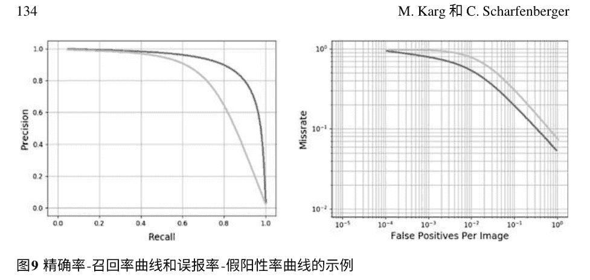

## 图9 精确率-召回率曲线和误报率-假阳性率曲线的示例

多类别分类的平均AP称为平均AP（mAP）。与精确率-召回率曲线相比，误报率-假阳性率曲线的结果更直观易懂。在这里，曲线越低（黑线），检测器越好。

最近，当计算AP并更好地区分不同的检测器时，提出了LRP（Localization Recall Precision）误差，以更好地考虑定位准确性[49]。LRP误差将检测器的性能与AP相比更细粒度地进行比较。这是因为常见的AP计算仅间接考虑了定位准确性（通过TP、FP和FN的IoU计算）。然而，定位准确性对于许多目标检测应用非常重要，包括高级驾驶辅助系统和自动驾驶。

```
$LRP(X, Y, s) = \frac{1}{Z} (w_{IoU} LRP_{IoU}(X, Y, s) + w_{FP} LRP_{FP}(X, Y, s) + w_{FN} LRP_{FN}(X, Y, s)) \quad (5)$
```

对于真实框X和检测结果Y_S，使用归一化Z = |TP| + |FP| + |FN|，其中检测结果的得分大于阈值s[49]。权重为w_{IoU} = |TP| / (1 - τ), w_{FP} = |Y_s|, 以及 w_{FN} = |X|。τ是IoU的阈值。第一个部分可以解释为真实框和有效检测结果的边界框有多接近[49]:

```
$LRP_{IoU}(X, Y_S) = \frac{1}{|TP|} \sum_{i=1}^{N_{TP}} (1 - IoU(X_i, Y_{xi})) \quad (6)$
```

第二和第三部分定义如下[49]:

```
$L R P_{F P}(X, Y_s) = 1 - 准确率$
```

```
$L R P_{F N}(X, Y_s) = 1 - 召回率$
```

最优LRP (oLRP) 可以像AP一样用于比较不同检测器的性能，并且定义如下[49]:

```
$oL R P = \min_s L R P(X, Y_s)$
```

与AP指标相比，oLRP提供了选择检测分数的最佳阈值s的估计，包括有效检测和真实值之间边界框的紧密性的误差估计，并且可以测量检测器性能的差异，这些差异在计算AP指标时可能被隐藏起来。

## 3.5 讨论与未来方向

过去十年中，行人检测取得了很大的进展。可以通过比较行人检测的漏检率随时间的变化来跟踪这一进展。从Viola和Jones算法 (2004) 的漏检率为95% 和基于HOG的分类 (2005) 的漏检率为68% 开始，到基于CNN的方法在Caltech数据集上的漏检率降至10% (Missrates在10^{-1}FPPI上报告)[21,24]。对于Caltech数据集，人类基准的估计，即正确检测行人的性能，报告了6%的漏检率 [22]。在EuroCity数据集上，Faster R-CNN、R-FCN、SSD和YOLO的漏检率在8%到10%之间 [46]。对于CityPersons数据集，Faster R-CNN的漏检率为13% [45]，取得了类似的结果。

由于夜间检测比白天检测更具挑战性，Faster R-CNN在NightOwls数据集上的错误率为19% [26]。在提取信息特征、学习有意义的表示和细粒度分类方面的改进有助于在许多交通场景情况下实现高检测率。在考虑单帧和仅相机的行人检测时，以下挑战是进一步提高在困难场景中检测质量的未来方向:

-   1. 夜间检测：由于各种原因，夜间检测行人是困难的。往往很难找到适当的相机设置，以在增加灵敏度的同时找到曝光时间和图像增益之间的平衡。这导致序列上叠加了运动模糊或强烈的图像噪声。此外，夜间记录的图像动态范围可能超过相机系统的动态范围。这导致整个场景的照明不均匀，包括非常暗和非常亮的区域由明亮的光源或反射照亮。此外，遮挡不仅可以由场景中的物体引起，还可以由于无法区分人物与场景之间的对比度不足而引起。NightOwls数据集已经创建，以提供与Caltech数据集相似大小的夜间行人检测研究数据集[26]。图10显示了NightOwls数据集中具有挑战性的示例。

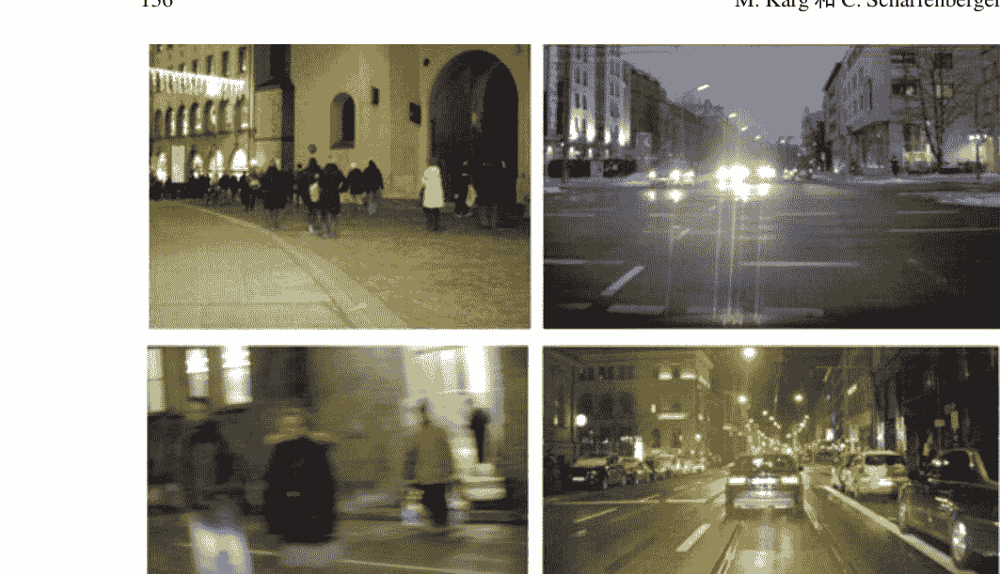

## 图10 NightOwls数据集的示例图像[26]

-   2. 遮挡：对Caltech、CityPersons、EuroCity和NightOwls数据集的评估基于注释的合理子集。在这里，合理子集一词指的是行人的最小高度（50像素）和仅有少量遮挡。当包括较小或遮挡的行人时，错误率显著增加。对于NightOwls数据集[26]，Faster R-CNN的错误率从10%增加到58%，对于EuroCity数据集[46]，错误率从8%增加到34%。遮挡强烈影响检测性能。遮挡的示例在图11中可视化。

-   3. 远距离物体：与遮挡一样，远距离和因此较小的行人的检测性能显著下降。图12显示了像素表示的信息内容随分辨率降低而减少。对于NightOwls数据集，远距离行人的错误率为35%，中等规模行人的错误率为8%，大行人的错误率为2%[26]。对于EuroCity数据集，在评估中包括小行人时，错误率从8%增加到17%[46]。远距离物体检测的挑战也适用于其他物体，如车辆[25, 27, 50]。

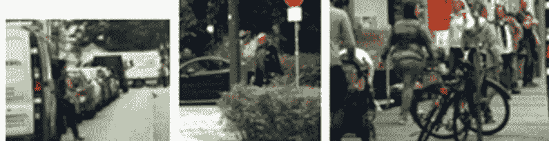

## 图11 遮挡示例，行人的大部分身体被其他物体或行人遮挡

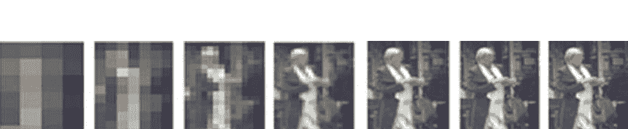

## 图12 尺度与图像中对象的分辨率相关。对于小物体，尺度较低，导致信息特征较少。

-   4. 定位：对于高级驾驶辅助系统和自动驾驶来说，高精度的定位对于行人检测非常重要。对于罕见的姿势、人群或遮挡的行人，准确的定位可能变得困难。

除了这些挑战之外，行人检测领域未来的研究方向还包括全景分割、姿势估计和网格重建，扩展了基于边界框表示的行人检测的范围[51-56]。除了行人的位置、大小和速度等信息外，还需要新的属性，如行为、手势、意图和情绪，以进一步提高辅助驾驶和自动驾驶的可靠性和检测性能。为行人检测开发检测形状、骨架和运动的方法，除了边界框表示，可以对更可靠的行人检测做出有意义的贡献，参见图13。

## 4 总结与展望

对于所有高级驾驶辅助系统和自动驾驶来说，单摄像头图像中可靠的行人检测是一项关键任务。随着SAE等级的提高，对行人检测的要求越来越高，要求非常低的漏检率和失效率。虽然本文重点是在单摄像头中检测行人。

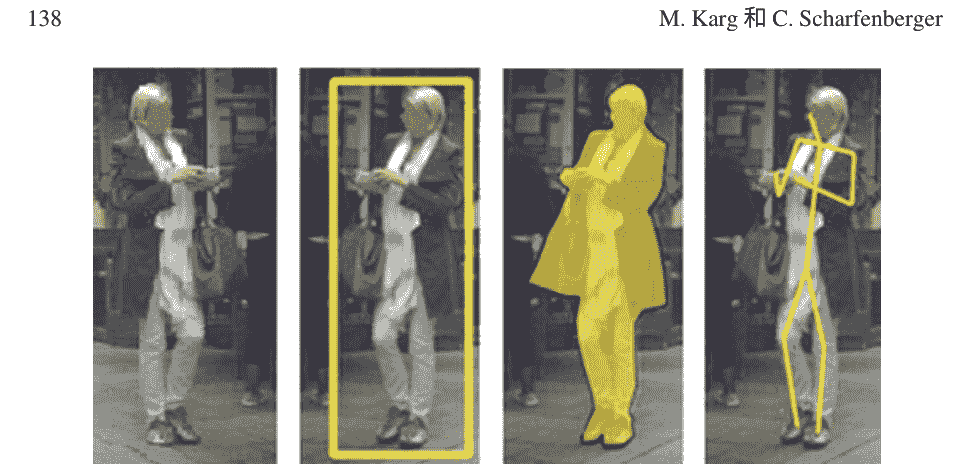

## 图13 边界框表示，形状表示和骨架表示

仅使用卷积神经网络对图像进行处理，还可以采用各种其他方法来进一步增加行人检测的鲁棒性。当与一般的道路检测相结合时，跨多个图像跟踪行人可以显著减少误报和漏报的数量，从而降低错误和失败率。深度学习可以应用于跟踪，并且已经提出了几种解决通过CNN解决跟踪问题的方法[57-62]。CNN学习对象的外观特征，并在下一帧中定位相似的补丁，例如在[57]中以100 fps的速度，通过在[58]中估计概率分布，通过在[59]中使用全卷积Siamese网络，通过在[60]中学习与训练序列相关的特定领域网络分支，以及通过将基于卷积特征的弱跟踪器与在线决策理论Hedge算法相结合以形成强跟踪器在[61]中。

进一步了解交通情况中的自由空间或语义分割可以帮助更好地区分静态和动态物体。关于动态物体的信息支持在人群中识别相关行人，可能靠近道路并对碰撞和事故构成风险。语义分割基于将卷积网络与反卷积网络结合[62-65]。早期将CNN应用于语义分割的工作包括[62, 63]。语义分割区分对象类别，但不区分实例。实例分割分割出汽车或行人的各个实例的边界[65]。全景分割包括图像中所有对象的分割以及选定对象类别的实例[51, 52]。关于基于CNN的语义分割的综述可以在[65]中找到。

随着自动化水平的提高，可靠地检测行人和弱势道路用户需要额外的传感器。在这里，立体摄像头可以提供深度信息，以更好地从分散的背景中提取行人，或者提供全面的、360°的车辆周围视野的环视摄像头系统。雷达和激光雷达传感器可以提供冗余数据并验证检测相机传感器以使行人检测成为可能。深度学习方法可以直接处理使用激光雷达或雷达传感器收集的3D数据，包括VoxNet [66]和PointNet [67]。Vox Net基于3D CNN，网络架构包括一个占用网格作为输入，一组卷积层用于特征提取，以及全连接层用于最终分类[66]。PointNet不需要体素化，直接处理原始点云数据[67]。PointNet的分类网络在特征计算中包含两个多层感知器层，并在网络架构末尾包含另一个用于最终分类的多层感知器层[67]。

在考虑自动驾驶时，已经提出了从传感器数据中学习驾驶行为的初始方法[68–75]。一个例子是PilotNet，它从相机数据中预测转向角度[68, 69]。CNN架构包括五个卷积层和三个全连接层，并模仿人类驾驶。网络的决策基于观察明显的特征，如车道标线或其他车辆，以及细微的特征，如路边的灌木[69]。长短期记忆（LSTM）可以包含在网络设计中，用于建模时间依赖性以预测转向角度[70, 74, 75]。在[71]中应用了条件模仿学习来克服[68–70]的局限性，即决策在哪里驾驶仅基于传感器输入。条件模仿学习可以结合导航命令和基于相机输入的驾驶行为模仿[71]。这对于做出决策，例如在道路交叉口处，是有优势的。这可以扩展为生成对抗模仿学习[73]。

在考虑到部分或完全自动化的车辆功能时，这些功能可以规划和执行特定的驾驶操作，例如在人行横道上停车让行人通过，车辆与行人之间的交流也可能是必要的，以确保车辆已经理解了情况并且道路安全可过。对于这样的应用，深度学习可以在交通中支持人与自动化系统之间的互动。在这个领域的应用包括观察和理解车内、车外以及周围车辆上人类行为的行为[76]。例如，驾驶员的瞌睡检测，驾驶员手势的检测，以及交通中行人和自行车驾驶员的活动识别[76, 77]。

从单帧检测开始，到基于多传感器的检测方法，再到车辆与行人之间的交流，所有这些都可以构建一个高度可靠的系统，用于先进驾驶辅助系统和自动驾驶的鲁棒行人检测。深度学习在观察环境、融合传感器数据和支持决策制定方面发挥着关键作用[2, 10, 16, 78–80]。在交通场景中，使用深度学习进行安全和高精度的行人检测是先进驾驶辅助系统和自动驾驶领域中深度学习的众多应用之一。

# 参考文献

-   1. Hinton, G.E., Osindero, S., Teh, Y.W.: 深度机器学习-人工智能研究的新前沿。一种用于深度信念网络的快速学习算法。神经计算。18(7),1527-1554 (2006)
-   2. LeCun, Y., Bengio, Y., Hinton, G.: 深度学习。自然521(7553), 436 (2015)
-   3. Ren, S., He, K., Girshick, R., Sun, J.: 更快的R-CNN: 用于实时目标检测的区域建议网络。在: 神经信息处理系统的进展, pp. 91-99(2015)
-   4. Huang, J., Rathod, V., Sun, C., Zhu, M., Korattikara, A., Fathi, A., Fischer, I., Wojna, Z., Song,Y., Guadarrama, S., Murphy, K.: 现代卷积目标检测器的速度/准确性权衡。在: IEEE CVPR, vol. 4, July 2017
-   5. Krizhevsky, A., Sutskever, I., Hinton, G.E.: 使用深度卷积神经网络进行Imagenet分类。在: 神经信息处理系统的进展, 第1097-1105页 (2012年)
-   6. Simonyan, K., Zisserman, A.: 用于大规模图像识别的非常深的卷积网络。arXiv:1409.1556 (2014年)
-   7. He, K., Zhang, X., Ren, S., Sun, J.: 用于图像识别的深度残差学习。在: IEEE计算机视觉和模式识别会议论文集, 第770-778页 (2016年)
-   8. Hinton, G.E.: 一种训练受限玻尔兹曼机的实用指南。在: 神经网络: 行业内的技巧, 第599-619页。Springer, 柏林 (2012年)
-   9. Erhan, D., Bengio, Y., Courville, A., Manzagol, P.A., Vincent, P., Bengio, S.: 为什么无监督预训练有助于深度学习? 机器学习研究杂志11, 625-660 (2010)
-   10. Mohamed, A.R., Dahl, G.E., Hinton, G.: 使用深度置信网络进行声学建模.IEEE音频语音语言处理交易20(1), 14-22 (2012)
-   11. Mhaskar, H.N.: 用于光滑和解析函数最优逼近的神经网络. 神经计算8(1), 164-177 (1996)
-   12. Dalal, N., Triggs, B.: 用于人体检测的方向梯度直方图。在: IEEE计算机学会计算机视觉和模式识别会议, CVPR 2005, vol. 1, pp. 886-893. IEEE, 2005年6月
-   13. Szegedy, C., Liu, W., Jia, Y., Sermanet, P., Reed, S., Anguelov, D., Erhan, D., Vanhoucke, V., Rabinovich. A.: 用卷积更深入地进行研究。在: IEEE计算机视觉和模式识别会议论文集, 第1-9页 (2015年)
-   14. Szegedy, C., Vanhoucke, V., Ioffe, S., Shlens, J., Wojna, Z.: 重新思考计算机视觉的初始架构。在: IEEE计算机视觉和模式识别会议论文集, 第2818-2826页 (2016年)
-   15. Szegedy, C., Ioffe, S., Vanhoucke, V., Alemi, A.A.: Inception-v4, inception-resnet和残差连接对学习的影响。在: AAAI, 第4卷, 第12页, 2017年2月
-   16. Graves, A., Wayne, G., Reynolds, M., Harley, T., Danihelka, I., Grabska-Barwińska, A., Col-menarejo, S.G., Grefenstette, E., Ramalho, T., Agapiou, J., Badia, A.P.: 使用具有动态外部存储器的神经网络进行混合计算。自然538 (7626) , 471 (2016年)
-   17. Russakovsky*, O., Deng*,J., Su, H., Krause, J., Satheesh, S., Ma, S., Huang, Z., Karpathy, A., Khosla,A., Bernstein, M., Berg, A.C., Fei-Fei, L.: ImageNet大规模视觉识别挑战。国际计算机视觉杂志 (2015年) (= 相等贡献)
-   18. Mhaskar, H., Liao, Q., Poggio, T.A.: 深度网络何时以及为何优于浅层网络？在: 人工智能促进协会, 第2343-2349页 (2017)
-   19. Hinton, G., Deng, L., Yu, D., Dahl, G., Mohamed, A.R., Jaitly, N., Senior, A., Vanhoucke, V.,Nguyen, P., Kingsbury, B., Sainath, T.: 语音识别中的声学建模深度神经网络.IEEE信号处理杂志29 (2012).
-   20. Dollár, P., Wojek, C., Schiele, B., Perona, P.: 行人检测：一个基准。在: IEEE计算机视觉和模式识别会议, CVPR 2009, 第304-311页。IEEE, 2009年6月21. Dollar, P., Wojek, C., Schiele, B., Perona, P.: 行人检测：现状评估. IEEE Trans. Pattern Anal. Mach. Intell. 34(4), 743–761 (2012)

22. Zhang, S., Benenson, R., Omran, M., Hosang, J., Schiele, B.: 迈向达到人类水平的行人检测. IEEE Trans. Pattern Anal. Mach. Intell. 40(4), 973–986 (2018)

23. Zhang, S., Benenson, R., Omran, M., Hosang, J., Schiele, B.: 我们离解决行人检测问题还有多远？ In: IEEE计算机视觉和模式识别会议论文集, pp. 1259–1267 (2016)

24. Zhang, L., Lin, L., Liang, X., He, K.: Faster R-CNN在行人检测中表现如何？ In: 欧洲计算机视觉大会论文集, pp. 443–457. Springer, Cham, Oct 2016

25. Fattal, A.K., Karg, M., Scharfenberger, C., Adamy, J.: 远距离车辆检测：区域提议网络在低分辨率下能处理微小物体吗？ In: 6th Workshop on Computer Vision for Road Scene Understanding and Autonomous Driving, European Conference on Computer Vision (ECCV) (2018)

26. Neumann, L., Karg, M., Zhang, S., Scharfenberger, C., Piegert, E., Mistr, S., Prokofyeva, O., Thiel, R., Vedaldi, A., Zisserman, A., Schiele, B.: NightOwls: 夜间行人数据集. 在：第14届亚洲计算机视觉会议（ACCV）（2018年）

27. Batzer, A.K., Scharfenberger, C., Karg, M., Lueke, S., Adamy, J.: 用于小型和远距离物体的通用假设生成方法. 在：2016年IEEE第19届智能交通系统国际会议（ITSC），第2171-2178页。IEEE，2016年11月。

28. Road Traffic, Destatis, 德国联邦统计局，系列8，卷7（2017年）

29. Felzenszwalb, P.F., Girshick, R.B., McAllester, D., Ramanan, D.: 用具有区分训练的基于部分的模型进行目标检测。IEEE Trans. Pattern Anal. Mach. Intell. 32(9), 1627–1645(2010)

30. Mao, J., Xiao, T., Jiang, Y., Cao, Z.: 什么可以帮助行人检测？ 在：计算机视觉和模式识别的IEEE会议论文集, pp. 3127–3136 (2017)

31. Girshick, R.: 快速R-CNN。 在：计算机视觉的IEEE国际会议论文集, pp. 1440–1448 (2015)

32. Redmon, J., Divvala, S., Girshick, R., Farhadi, A.: 你只需要看一次: 统一的实时目标检测。 在：计算机视觉和模式识别的IEEE会议论文集, pp. 779–788 (2016)

33. Redmon, J., Farhadi, A.: YOLO9000: 更好、更快、更强. arXiv:1612.08242 (2017)

34. Liu, W., Anguelov, D., Erhan, D., Szegedy, C., Reed, S., Fu, C.Y., Berg, A.C.: SSD: 单次检测多框架. In: 欧洲计算机视觉会议, pp. 21–37. Springer, Cham, Oct 2016

35. Dai, J., Li, Y., He, K., Sun, J.: R-FCN: 基于区域的全卷积网络目标检测. In: 神经信息处理系统进展, pp. 379–387 (2016)

36. Huang, G., Sun, Y., Liu, Z., Sedra, D., Weinberger, K.Q.: 具有随机深度的深度网络. In: 欧洲计算机视觉会议, pp. 646–661. Springer, Cham, Oct 2016

37. Daya, I., Shafiee, M., Karg, M., Scharfenberger, C., Wong, A.: 关于深度神经网络的鲁棒性: 对架构和权重初始化对敌对攻击易感性和可转移性的全面研究. In: 第四届视觉与智能系统年会 (CVIS), 最佳论文奖 (2018)

38. LeCun, Y., Bottou, L., Bengio, Y., Haffner, P.: 基于梯度的学习应用于文档识别. IEEE会议记录 86(11), 2278–2324 (1998)

39. Netzer, Y., Wang, T., Coates, A., Bissacco, A., Wu, B., Ng, A.Y.: 通过无监督特征学习在自然图像中读取数字。 在：NIPS深度学习和无监督特征学习研讨会 (2011)

40. Krizhevsky, A., Hinton, G.: 从小图像学习多层特征，卷1，号4，页7。 多伦多大学技术报告 (2009)

41. Ess, A., Leibe, B., Schindler, K., Van Gool, L.: 用于稳健多人跟踪的移动视觉系统。 在：IEEE计算机视觉和模式识别会议, CVPR 2008, 页1–8. IEEE, 2008年6月

42. Wojek, C., Walk, S., Schiele, B.: 多线索机载行人检测 (2009)

43. Enzweiler, M., Gavrila, D.M.: 单目行人检测: 调查和实验. IEEE Trans. Pattern Anal. Mach. Intell. (12), 2179–2195 (2008)

44. Geiger, A., Lenz, P., Urtasun, R.: 我们准备好自动驾驶了吗? KITTI视觉基准套件. 在: 2012年IEEE计算机视觉和模式识别 (CVPR)会议上, pp. 3354–3361. IEEE, 2012年6月

45. Zhang, S., Benenson, R., Schiele, B.: CityPersons: 一个用于行人检测的多样化数据集. 在: IEEE计算机视觉和模式识别 (CVPR)会议上, vol. 1, no. 2, p. 3, 2017年7月

46. Braun, M., Krebs, S., Flohr, F., Gavrila, D.M.: EuroCity人员数据集: 一种新的目标检测基准。 arXiv:1805.07193 (2018)

47. Caesar, H., Bankiti, V., Lang, A.H., Vora, S., Liong, V.E., Xu, Q., Krishnan, A., Pan, Y., Baldan, G., Beijbom, O.: nuScenes: 一种用于自动驾驶的多模态数据集. arXiv:1903.11027 (2019)

48. Hwang, S., Park, J., Kim, N., Choi, Y., So Kweon, I.: 多光谱行人检测: 基准数据集和基线。 在: IEEE计算机视觉和模式识别会议论文集, 第1037-1045页 (2015年)

49. Oksuz, K., Cam, B.C., Akbas, E., Kalkan, S.: 定位召回精度 (LRP) : 一种用于目标检测的新性能度量。 在: 欧洲计算机视觉大会 (ECCV), 第6卷, 2018年7月

50. Fattal, A.K., Karg, M., Scharfenberger, C., Adamy, J.: 基于显著性引导的区域提案网络用于基于CNN的目标检测。 在: 2017年IEEE第20届智能交通系统国际会议 (ITSC), 第1-8页。IEEE, 2017年10月

51. Kirillov, A., He, K., Girshick, R., Rother, C., Dollár, P.: 全景分割。 在: IEEE 计算机视觉和模式识别会议 (CVPR) (2019年)

52. Kirillov, A., Girshick, R., He, K., Dollár, P.: 全景特征金字塔网络。 在: IEEE 计算机视觉和模式识别会议 (CVPR) (2019年)

53. Newell, A., Yang, K., Deng, J.: 堆叠沙漏网络用于人体姿势估计。 在: 欧洲计算机视觉会议, 第483-499页. Springer, Cham, 2016年10月

54. Tung, H.Y., Tung, H.W., Yumer, E., Fragkiadaki, K.: 自监督学习的动作捕捉。 在: 神经信息处理系统的进展, 第5236-5246页 (2017年)

55. Pavlakos, G., Zhu, L., Zhou, X., Danilidis, K.: 从单个彩色图像学习估计3D人体姿势和形状。 在: IEEE计算机视觉和模式识别会议论文集, 第459-468页 (2018年)

56. Insafutdinov, E., Dosovitskiy, A.: 使用可微分的点云进行形状和姿势的无监督学习。 在: 神经信息处理系统的进展, 第2802-2812页 (2018年)

57. Held, D., Thrun, S., Savarese, S.: 使用深度回归网络以100 FPS进行跟踪学习。 在欧洲计算机视觉会议上, 第749-765页. Springer, Cham, 2016年10月

58. Zhai, M., Chen, L., Mori, G., Javan Roshtkhari, M.: 在线物体跟踪的外观模型的深度学习。 在: 欧洲计算机视觉会议论文集 (ECCV), 第0-0页 (2018年)

59. Bertinetto, L., Valmadre, J., Henriques, J.F., Vedaldi, A., Torr, P.H.: 用于目标跟踪的全卷积孪生网络。 在: 欧洲计算机视觉会议, 第850-865页. Springer, Cham, 2016年10月

60. Nam, H., Han, B.: 用于视觉跟踪的学习多领域卷积神经网络。 在: IEEE计算机视觉和模式识别会议论文集, 第4293-4302页 (2016年)

61. Qi, Y., Zhang, S., Qin, L., Yao, H., Huang, Q., Lim, J., Yang, M.H.: 对冲深度跟踪。 在: IEEE计算机视觉和模式识别会议论文集, 第4303-4311页 (2016年)

62. Noh, H., Hong, S., Han, B.: 用于语义分割的学习解卷积网络。 在: IEEE国际计算机视觉会议论文集, 第1520-1528页 (2015年)

63. Long, J., Shelhamer, E., Darrell, T.: 用于语义分割的全卷积网络。 在: IEEE计算机视觉和模式识别会议论文集, 第3431-3440页 (2015年)

64. Li, Y., Qi, H., Dai, J., Ji, X., Wei, Y.: 全卷积实例感知语义分割。 在：计算机视觉和模式识别IEEE会议论文集，第2359-2367页（2017年）

65. Guo, Y., Liu, Y., Georgiou, T., Lew, M.S.: 使用深度神经网络进行语义分割的综述。多媒体信息检索国际期刊7（2），87-93页（2018年）

66. Qi, C.R., Su, H., Mo, K., Guibas, L.J.: PointNet: 用于3D分类和分割的点集深度学习。在：计算机视觉和模式识别IEEE会议论文集，第652-660页（2017年）

67. Maturana, D., Scherer, S.: VoxNet: 用于实时物体识别的3D卷积神经网络。在：2015年IEEE/RSJ国际智能机器人和系统会议（IROS），第922-928页。IEEE，2015年9月

68. Bojarski, M., Yeres, P., Choromanska, A., Choromanski, K., Firner, B., Jackel, L., Muller, U.: 解释一个通过端到端学习训练的深度神经网络如何驾驶汽车。arXiv: 1704.07911 (2017)

69. Bojarski, M., Del Testa, D., Dworakowski, D., Firner, B., Flepp, B., Goyal, P., Jackel, L.D., Monfort, M., Muller, U., Zhang, J., Zhang, X.: 自动驾驶汽车的端到端学习。arXiv: 1604.07316 (2016)

70. Fernando, T., Denman, S., Sridharan, S., Fookes, C.: 更深入地探索：具有神经记忆网络的自主驾驶。在：IEEE国际计算机视觉会议论文集，第214-221页（2017年）

71. Codevilla, F., Miiller, M., López, A., Koltun, V., Dosovitskiy, A.: 通过条件模仿学习的端到端驾驶。在：2018年IEEE国际机器人与自动化大会(ICRA)，第1-9页。IEEE，2018年5月

72. Chen, C., Seff, A., Kornhauser, A., Xiao, J.: Deepdriving: 学习自主驾驶的感知能力。在：IEEE国际计算机视觉大会论文集，第2722-2730页(2015年)

73. Kuefler, A., Morton, J., Wheeler, T., Kochenderfer, M.: 用生成对抗网络模仿驾驶行为。在：2017年IEEE智能车辆研讨会(IV)，第204-211页。IEEE，2017年6月

74. Xu, H., Gao, Y., Yu, F., Darrell, T.: 从大规模视频数据集中端到端学习驾驶模型。在：IEEE计算机视觉与模式识别大会论文集，第2174-2182页(2017年)

75. Morton, J., Wheeler, T.A., Kochenderfer, M.J.: 对驾驶员行为的概率建模的循环神经网络分析。IEEE智能交通系统杂志18(5)，1289–1298 (2017)

76. Ohn-Bar, E., Trivedi, M.M.: 在自动驾驶和高度自动化车辆时代观察人类。IEEE智能车辆杂志1(1), 90–104 (2016)

77. Reddy, B., Kim, Y.H., Yun, S., Seo, C., Jang, J.: 基于深度神经网络模型压缩的嵌入式系统实时驾驶员疲劳检测。在: 计算机视觉和模式识别工作坊的IEEE会议论文集, pp. 121–128 (2017)

78. Lemley, J., Bazrafkan, S., Corcoran, P.: 用于消费设备和服务的深度学习: 推动机器学习、人工智能和计算机视觉的极限。IEEE消费电子杂志6(2), 48–56 (2017)

79. Schmidhuber, J.: 神经网络中的深度学习概述。神经网络61, 85–117 (2015)

80. Guo, Y., Liu, Y., Oerlemans, A., Lao, S., Wu, S., Lew, M.S.: 视觉理解中的深度学习综述。神经计算187, 27–48 (2016)

# 说话人识别中的深度学习

Omid Ghahabi, Pooyan Safari 和 Javier Hernando

摘要 在说话人识别（SR）中，假设每个人都有独特的声音，可以用作身份识别的一种方式，而不是或者除了其他身份识别方式，如指纹、面部或虹膜。尽管早些时候已经采取了在SR中应用神经网络的步骤，但计算硬件的最新进展、新的深度学习（DL）架构和训练方法以及大量训练数据的获取，激发了研究界在大量其他信号处理应用中使用DL的兴趣。在本章中，首先简要回顾了SR中的传统原理技术，并讨论了DL可以改进这些技术的潜在信号处理方面。然后介绍了在SR中使用的最近最成功的DL架构，并包括了作者的一些示例实验。

关键词 说话人识别·深度学习·说话人验证·说话人嵌入·深度神经网络

# 1 引言

说话人识别（SR）是自动识别话语中说话人的任务，可以是识别或验证的方式。所有的识别过程仅基于从说话人捕获的语音信号。换句话说，每个人都有独特的声音，可以用作身份证明。尽管已经采取了在SR中使用神经网络的研究步骤

O. Ghahabi (✉)
EML European Media Laboratory GmbH, 德国海德堡
e-mail: omid.ghahabi@eml.org

P. Safari, J. Hernando
Universitat Politècnica de Catalunya - BarcelonaTech, 西班牙巴塞罗那
e-mail: pooyan.safari@tsc.upc.edu

J. Hernando
e-mail: javier.hernando@upc.edu

© Springer Nature Switzerland AG 2020
W. Pedrycz 和 S.-M. Chen (编辑), 深度学习架构的开发与分析, 计算智能研究 867, https://doi.org/10.1007/978-3-030-31764-5_6

很久以前（例如，[1-13]），计算硬件的最新进展，新的深度学习（DL）架构以及大量的训练数据的获取鼓励了研究界再次使用DL。

DL策略可以在SR系统的前端使用。 一个可能的用途是在最先进的i-vector [14]中-这是语音信号特征的紧凑表示，不仅在SR中广泛使用，还在其他识别任务中使用，如语音、语言和情感。 深度神经网络（DNN） 已经在i-vector提取算法中用于两个主要目的。 首先，DNN被用作声学模型，而不是典型的高斯混合模型（GMM） [15-19]。 其次，传统的频谱特征被替换或与所谓的瓶颈特征[18, 20]串联起来。 在这两种情况下，都可以获得显著的准确性提升，但据报道，使用在瓶颈和频谱特征串联上训练的高斯声学模型通常会导致更高质量的i-vector [18, 20]。 然而，主要的缺点是i-vector提取的计算成本增加以及DL声学建模需要语音标签的要求。

深度学习在前端的另一个可能应用是使用深度学习架构来表示语音信号的说话人特征，而不是传统的i-vector算法。 这些向量通常被称为说话人嵌入。 在本章中，我们将它们分为两个主要组别：有监督和无监督的说话人嵌入。 第一组是指DL架构通常在给定说话人标记的背景数据的情况下进行训练。 通常，神经网络的输入是一系列特征向量，输出是说话人类别。 已经提出了不同的架构、激活函数和训练过程（例如，[21-24]）。 实验结果表明，在大多数情况下，与传统的i-vector相比，短时信号上的改进更大[23, 24]，这意味着DL技术可以更好地建模短时语音信号的说话人特征。 这对于需要在很短时间内做出决策的实际应用非常重要，前提是计算成本仍然合理。 最近的研究表明，数据增强可以显著提高说话人嵌入的性能，并使其在长时语音片段上与传统的i-vector竞争[25]。 然而，这些技术的一个缺点是需要使用说话人标签来训练网络。 此外，从隐藏层输出提取的说话人嵌入与概率线性判别分析（PLDA） [26]不太兼容，而PLDA是SR中最有效的后端，因为隐藏层输出的后验分布通常不是真正的高斯分布。第二组中的背景数据不包含任何标签，这可以被视为这些技术的优点之一。 用于此目的的无监督技术通常尝试重构输入并在训练过程中最小化重构误差或交叉熵。 通常，在这些技术中，对每个话语的说话人数据进行一种适应性调整。 例如，在[27, 28]中，将最大后验（MAP）调整的GMM超向量作为输入向量提供给网络，在[29]中，将通用网络的参数调整为输入数据。每个说话者的特征向量序列。至于有监督的说话者嵌入，这些向量也受到与PLDA后端不兼容的困扰。作者们通过引入一种称为可变ReLU（VReLU）的修正线性单元（ReLU）变体[28]来解决这个问题。

对于i-向量来说，PLDA是最有效的后端技术之一[26, 30]，它在会话可变性补偿的同时进行评分。通常，为了使PLDA有效工作，需要大量不同的说话者，并且每个说话者都需要几个语音样本。获得带有说话者标签的数据是昂贵的，有时几乎是不可能的。此外，对于短语音而言，准确性的性能提升并不像对于长语音那样大。

这些事实促使研究界寻找基于深度学习的PLDA替代后端技术。已经提出了几种技术。这些方法中，大多数都使用了背景数据的说话者标签进行训练，就像PLDA一样，并且与PLDA相比，几乎没有明显的增益。例如，在[31, 32]中提出了不同组合的受限玻尔兹曼机（RBM）用于i-向量的分类，在[96]中提出了用于在PLDA模拟中学习说话者和通道因子子空间的RBM。在[33]中使用RBM和在[34]中使用DNN来增加带有说话者标签的背景数据的区分能力。在[35]中使用了一种非线性PLDA来模拟一个绑定的变分自编码器架构。在[36, 37]中，提出了一种结合了RBM、自编码器和PLDA的方法来进行说话者和通道可变性补偿，与仅使用PLDA相比，取得了一些改进。最近，美国国家标准与技术研究所（NIST）组织了一个SR挑战赛[38]，旨在解决在开发数据没有标签的情况下如何实现与PLDA相当的性能。尽管一些参赛团队提出了使用无监督自动标注算法[39, 40]，但这些算法无法正确估计所有标签。此外，假设背景数据中每个说话者都有多个样本，在现实中可能并不成立。作者在[41-43]中提出了一种混合深度置信网络（DBN）-深度神经网络（DNN）架构，以解决当没有带有说话者标签的开发数据时，余弦和PLDA评分之间的性能差距。所提出的架构使用说话者特定的参数进行初始化，并试图在i-向量空间中区分目标和选定的非目标（也称为冒名顶替者）说话者。对挑战数据库的实验显示了所提出的架构单独和与无监督自动标注技术相结合的出色结果。

对于深度学习来说，训练一个端到端的SR系统是一个自然的选择，能够使用统一的网络进行多个数据处理阶段。端到端架构已经成功应用于许多其他任务，例如[44, 45]。在SR中，已经有一些尝试构建这样的模型，例如在[46]中提出的模型，其中说话者模型将说话者的频谱特征作为输入，并输出相似度分数。然而，这些架构与基于说话者向量表示的方法相比，竞争力还不够强。

本章的其余部分组织如下。第2节简要回顾了典型最先进的说话人识别系统中使用的传统技术，从特征提取到分类和评分。第3节描述了深度学习的方法。

## 2种传统技术

通过声音识别个体身份，即SR，可以追溯到大约五十年前。通常，语音声学特征用于区分不同的说话者。声学特征反映了个体的物理特征，如喉咙和口腔的大小和形状，以及行为特征，如声音音调和说话风格。通常考虑两个主要分支进行说话者识别，即识别和验证。说话者识别可以被视为一个多类分类任务，其中一个测试语音必须被分配给已注册的说话者之一（封闭集），或者也可以被识别为未知说话者（开放集）。通常情况下，开放集说话者识别任务更加困难，因为需要定义一个稳健的决策阈值。说话者验证（SV），另一方面，可以被视为一个二类分类任务，其中来自未知说话者的声称身份应该由系统验证是否属于该未知说话者。SR可以是文本相关的或文本无关的。文本相关的SV要求说话者准确地说出给定的文本、密码或数字序列，而文本无关的SV则基于自由言论。原则上，文本相关的任务比文本无关的任务更准确，需要更少的训练和测试数据。然而，对于用户来说，文本无关的说话者验证更加方便，因为他们可以自由发言。此外，在某些应用中，只能使用文本无关的任务。在本章中，我们主要关注文本无关的SV任务。

正如图1所示，说话者验证（SV）包括两个主要阶段：训练阶段，其中注册目标说话者；测试阶段，其中验证未知说话者的声称身份。可以通过生成模型（如GMM [47]）对说话者进行建模，该模型估计每个说话者特征向量的分布，也可以通过判别模型（如支持向量机（SVM）[48]和DNN）对说话者之间的边界进行建模。接下来，我们总结了最先进的SV系统的主要部分。

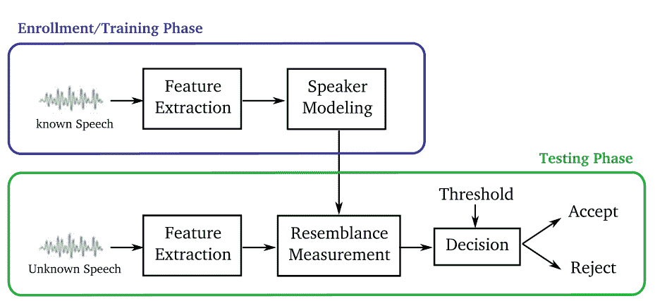

图1 基本SV系统的块图表示

### 2.1 特征提取

特征提取通常是任何模式识别系统中的主要步骤之一。它是从原始数据中提取有意义的特征的过程。在语音处理中，从语音信号中获得的特征向量通常包含声学特征、说话者信息和语言信息。根据应用和任务的不同，识别系统将仅关注目标信息，即在本例中是说话者。在SR中，标准特征之一是从语音频谱中获得的一组短期声学特征。语音信号的频谱通常反映了声道生理特性，这是区分说话者的重要因素。目前，最常用的特征是梅尔频率倒谱系数（MFCC）[49]，在其他语音处理任务中也表现出良好的性能。除了MFCC之外，还使用其他特征，如线性预测系数（LPC）、线性频率倒谱系数（LFCC）、感知线性预测（PLP）系数和频率滤波器组能量或简称频率滤波（FF）系数[50, 51]。

在SR中，第一和第二阶时间导数被称为delta和delta-delta系数，通常用于辅助识别。delta能量也常常被添加到特征向量中。

特征归一化策略也被用于环境不匹配的补偿。通常，为了避免由于会话变异性引起的非线性效应，会去除倒谱系数的均值。可选地，倒谱系数的方差也可以通过滑动窗口或整个语音中进行归一化到单位。有时候，倒谱系数分布的形状也会被考虑在内。在为此目的提出的几种技术中，倒谱均值归一化（CMN）、倒谱均值和方差归一化（CMVN）以及特征扭曲更常用[52]。

### 2.2 超向量和i-向量

传统的说话人建模基于GMM。GMM是由三组参数定义的M个高斯密度的加权和，表示为 $\lambda = \{w_i, \mu_i, \Sigma_i\}_{i=1}^M$，其中 $w_i$, $\mu_i$ 和 $\Sigma_i$ 分别是第i个高斯密度的权重、均值向量和协方差矩阵。GMM参数的估计使用期望最大化（EM）算法，如[47]所述。由于每个说话者的注册数据量通常很少，因此从头开始训练每个说话者的GMM效率不高。因此，首先使用大量语音进行训练，训练一个全局GMM，称为通用背景模型（UBM），然后将UBM适应到每个说话者的少量数据中[53]。适应通常使用[53]中给出的MAP估计进行。通过连接 M个混合适应GMM的 D维均值向量，得到GMM超向量[54]。对于说话者 a，GMM超向量表示为，

$$ s^a = (\mu_1^a, \mu_2^a, ..., \mu_M^a)^t $$

其中 t表示转置操作。

可以基于它们的距离比较两个超向量，但通常更有效的方法是通过SVMs对它们进行区分，从而得到一个混合生成-判别分类器[54-56]。

由于训练和测试语音语句通常在不同的会话中进行，例如使用不同的麦克风或不同的信道传输语音信号，因此除了特征域中描述的补偿技术外，还需要一些会话变异补偿技术，以提高识别准确性和系统的鲁棒性。在超向量领域中，常用的两种会话补偿技术是Nuisance Attribute Projection (NAP) [57, 58] 和Within-Class Covariance Normalization (WCCN) [59]。

另一种成功的会话可变性补偿技术是联合因子分析（JFA）[60]，它将超向量建模为说话人和信道分量的线性组合。然而，与基于支持向量机（SVM）的技术一样，会话可变性补偿是在超向量域中进行的，该域的维度非常高。因此，训练补偿矩阵需要大量的内存空间，并且计算成本高昂。

在[14]中提出了一种通过有效的因子分析技术首先降低超向量维度，然后在较低维度空间中进行会话补偿的方法。假设超向量 $s^a$ 可以建模如下[14]，

$$ s^a = s^{ubm} + T\nu $$

其中 $s^{ubm}$ 是从UBM获得的均值超向量，T是总变异性矩阵，ν是潜在变量的向量。在给定语音话语的Baum-Welch统计条件下，后验分布的均值向量 ν 被称为i-vector ω，并计算如下，

$$\omega = \left( \mathbf{I} + \mathbf{T}' \mathbf{\Sigma}^{-1} \mathcal{N}(\mathbf{u}) \mathbf{T}'^{-1} \mathbf{T}' \mathbf{\Sigma}^{-1} \hat{\mathcal{F}}(\mathbf{u}) \right) \quad (3)$$

其中 $\mathcal{N}(\mathbf{u})$是一个包含零阶Baum-Welch统计量的对角矩阵， $\hat{\mathcal{F}}(\mathbf{u})$是一个包含中心化一阶统计量的超向量， $\mathbf{\Sigma}$是一个由 $\mathbf{\Sigma}_{ubm}$初始化并在因子分析训练过程中更新的对角协方差矩阵。该 $\mathbf{T}$矩阵是使用EM算法根据开发数据中的Baum-Welch统计量进行训练的。更多细节可参考[14]。

### 2.3 i-向量评分

i-向量的初步评分技术是余弦距离[14, 61]，

$$\text{评分}^{(\text{余弦})} (\omega_1, \omega_2) = \frac{\omega_1' \omega_2}{\|\omega_1\| \times \|\omega_2\|} \quad (4)$$

其中 $\omega_1$ 和 $\omega_2$分别是目标和测试i向量， $\|\omega\|$表示i向量 $\omega$的范数，计算方法如下

$$\sqrt{\omega_1^2, \omega_2^2, \ldots, \omega_n^2}$$

如果没有背景语音话语的说话人标签，余弦相似度评分可以得到合理的准确性。然而，如果有说话人标签，应用会话变异补偿技术在评分之前更加有效。通常使用线性判别分析（LDA）、WCCN或它们的组合[14]。需要注意的是，说话人标签成本高且不总是可获得的。当背景数据的说话人标签可用时，PLDA [26]是一种更有效的技术。在PLDA中，评分是在会话变异补偿的同时进行的。它假设每个i向量可以分解为，

$$\omega = \mathbf{m} + \mathbf{\Phi} \zeta + \varepsilon \quad (5)$$

其中 $\mathbf{m}$是全局均值向量， $\mathbf{\Phi}$表示特征向量， $\zeta$是具有正态分布先验的潜在向量， $\varepsilon$是具有零均值和完全协方差矩阵 $\mathbf{\Sigma}$的残差向量。 模型的参数是通过EM算法在大量带有说话者标签的开发数据[26]上估计得到的。 在评分过程中，存储并使用类内和类间i-vector协方差矩阵。 更多细节可参考[62]。

研究发现$\kappa(x)$与长度归一化$\omega/\|\omega\|$有助于i-vector的鲁棒性，从而提高使用更复杂的PLDA模型。即提高LDA和WCCN。正如[46]中提出的，在i-vector建模系统中，首先对$\omega$进行全局白化处理， $\omega/$ 以提高性能。

$$\omega' = \mathbf{H} \omega \quad (6)$$
$$\mathbf{H} = \mathbf{V} (\mathbf{D} + \epsilon)^{-1/2} \mathbf{V}^t \quad (7)$$

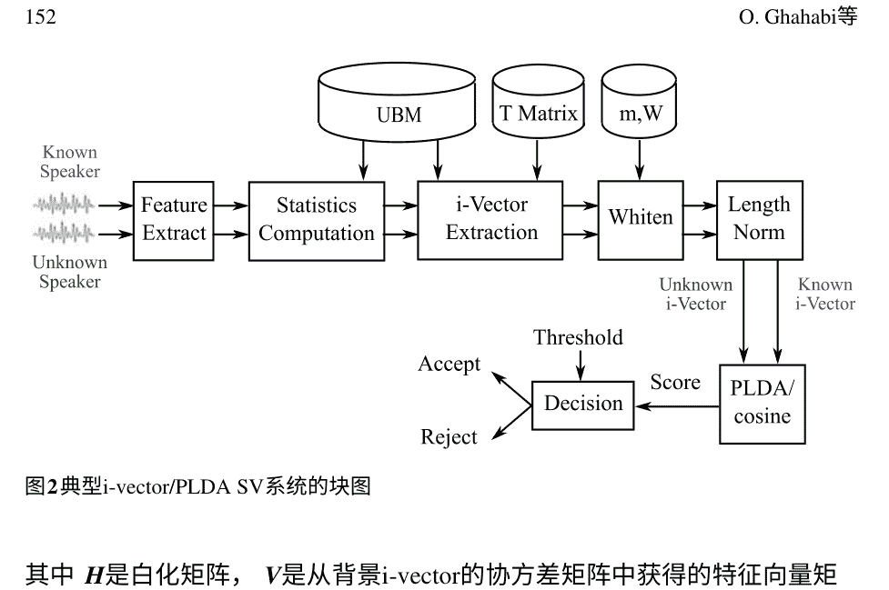

图2 典型i-vector/PLDA SV系统的块图

其中 $\mathbf{H}$是白化矩阵， $\mathbf{V}$是从背景i-vector的协方差矩阵中获得的特征向量矩阵， $\mathbf{D}$是相应特征值的对角矩阵， $\epsilon$是一个非常小的常数正则化因子。白化后，i-vector被长度归一化。图2的块图总结了一个典型的传统最先进的SV系统。有关传统技术的更多细节可以在[65-67]中找到。

## 3个深度学习前端

我们将前端分为三个小节。第一小节介绍了如何在基于瓶颈特征到基于DL的声学建模的i-vector提取过程中使用DL。有两个小节分别介绍了有监督和无监督的说话人嵌入。嵌入是指独立于i-vector过程构建的独立说话人表示，可以直接用于识别任务。

### 3.1 特征和i-向量提取

传统的i-向量方法包括三个主要阶段：Baum-Welch统计收集、i-向量提取和PLDA后端。最近的研究表明，如果Baum-Welch统计是基于DNN而不是GMM计算的，或者除了传统的频谱特征之外还使用了瓶颈特征，可以取得显著的改进[15, 16, 18]。

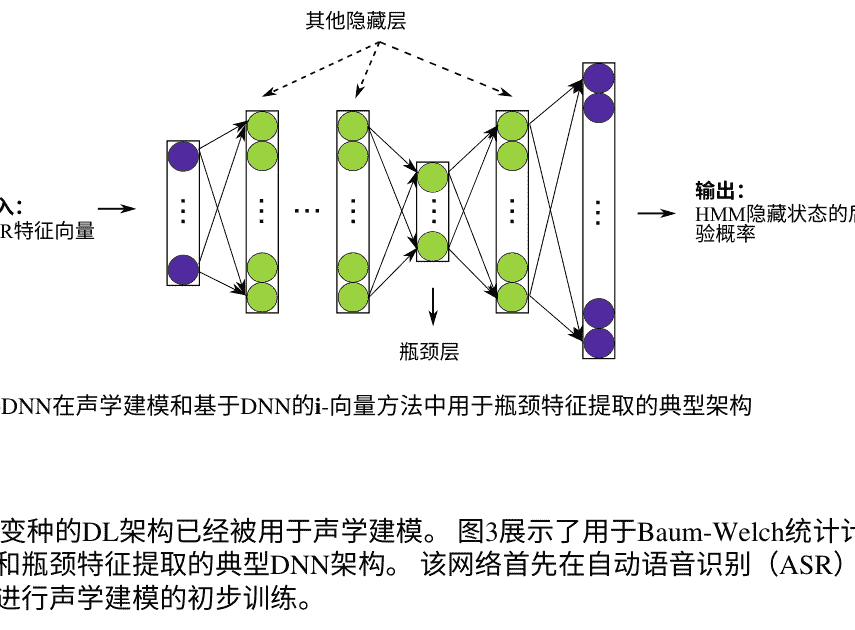

图3 DNN在声学建模和基于DNN的i-向量方法中用于瓶颈特征提取的典型架构

变种的DL架构已经被用于声学建模。图3展示了用于Baum-Welch统计计算和瓶颈特征提取的典型DNN架构。该网络首先在自动语音识别（ASR）中进行声学建模的初步训练。

输出层表示声学类别，通常是ASR（三音素）中隐藏马尔可夫模型（HMM）的状态。输入层通常采用连续ASR特征向量的串联。ASR特征向量通常是没有任何增量或增量增量系数的对数滤波器组能量。输出层的激活函数是softmax，瓶颈层通常是线性的，其他隐藏层可以是sigmoid、修正线性或类似的tanh函数。

给定DNN声学模型，零阶和一阶Baum-Welch统计量的计算如下：

$$ \mathcal{N}_k(\mathbf{u}) = \sum_t p(o_k|x_t) \quad (8) $$
$$ \mathcal{F}_k(\mathbf{u}) = \sum_t p(o_k|x_t)\hat{x}_t \quad (9) $$

其中\(\mathcal{N}_k(\mathbf{u})\)和\(\mathcal{F}_k(\mathbf{u})\)分别是给定话语\(\mathbf{u}\)的零阶和一阶统计量，\(p(o_k|x_t)\)是给定ASR特征向量\(x_t\)的第k个输出单元的后验概率，\(\hat{x}_t\)是可能与\(x_t\)不同的说话者特征向量。给定Baum-Welch统计量，T矩阵训练和i向量提取过程与GMM声学模型相同。然而，与GMM模型不同的是，非语音帧也被用于训练DNN声学模型。因此，根据[37]的建议，DNN统计量计算有两种可能的选项。第一种选项是使用外部语音活动检测（VAD），丢弃非语音帧，仅使用与DNN输出单元相对应的部分。

在HMM中对语音状态进行处理的第二个选项是不使用任何外部VAD，计算所有帧的统计数据，并且像第一个选项一样，丢弃与非语音状态相对应的输出概率。第二个选项可以被解释为一种软VAD，而不是第一个选项中的硬VAD。

已经证明第二个选项通常在准确性方面表现更好[68, 69]。值得注意的是，对于这两个选项，零阶统计量应该通过与语音状态相对应的输出单元的总和进行归一化。

尽管使用DNN声学模型进行i-vector提取通常会导致更高的准确性，但也存在一些缺点。首先，DNN本身增加了统计数据的计算成本。此外，输出单元的数量通常比GMM中的高斯混合数要高得多。这意味着超向量的维度将比GMM超向量的维度高得多，从而在T矩阵训练和i-vector提取中导致更高的计算成本。此外，DNN声学模型的语言依赖性，使用两种不同的特征向量来计算零阶和一阶统计量（例如，公式8和9），以及训练DNN声学模型所需的音素标签，都是基于DNN的i-vector提取方法的其他缺点。

另一方面，DNN被用于提取所谓的瓶颈特征。如图3所示，最后一个隐藏层之前的隐藏层通常比其他隐藏层小得多，并被认为是瓶颈层。
给定输入向量，该层的隐藏单元值被称为瓶颈特征。然而，这些特征通常高度相关，因此在使用之前需要进行一些去相关处理，通常使用主成分分析（PCA）。传统的频谱特征可以被DNN瓶颈特征替代或连接，然后可以使用GMM或DNN背景模型来计算统计数据[18, 20, 70]。另外，还可以使用其他DL架构，如卷积神经网络（CNN）来构建声学模型或生成瓶颈特征[71]。

最近提出的对抗网络（ANs）[72]引起了机器学习界的关注。它们由两个竞争的网络组成，其中一个（生成器）试图欺骗另一个（判别器）。它们已经应用于音频和语音应用，如[73, 74]。在SR任务中，它们已被用于生成瓶颈特征[75]。AN的输入是说话者的频谱特征，编码网络（EN）的输出被认为是瓶颈特征。对于判别网络（DN）的训练，噪声类型或干净语音被用作输出标签，而对于EN的训练，输出标签始终被视为干净语音，不考虑输入。在训练EN时，DN的参数被固定，反之亦然。通过这种架构，EN学习生成对噪声类型不变的特征。

### 3.2 监督式说话人嵌入

最近，有几次尝试将深度学习应用于构建说话人嵌入。说话人嵌入通常是指使用神经网络提取的单个低维向量表示说话人。监督式说话人嵌入是通过训练深度架构来产生的，使用带有说话人标签的背景数据。这个网络通常被训练成能够产生高级特征，以区分背景说话人。然后在测试阶段，输出层被丢弃，未知说话人的特征向量通过网络传递，并且通常将给定隐藏层的激活的平均值或加权平均值视为说话人嵌入[21, 23]。

尽管已经提出了几种监督式说话人嵌入方法，但其中两种更常用，即d-vector [21]和x-vector [24, 25]。图4显示了d-vector提取训练网络的一般架构。网络的输入是在上下文窗口上堆叠的说话人特征向量，例如，在时间t的语音帧的特征向量与时间t-2，t-1和t+1，t+2的帧的特征向量一起堆叠，覆盖了一个包含5帧的上下文窗口。

在训练阶段，网络试图在帧级别上区分背景说话者。在测试阶段，输出层被丢弃，通常将最后一个隐藏层的激活平均值视为给定说话者的d向量。尽管[21]中提出的网络是一个最大池化DNN，并且最后两个隐藏层的隐藏单元被50%丢弃，但任何深度架构，如CNN或长短期记忆（LSTM），也可以使用（例如，[23, 76]）。

图5显示了x向量提取的典型架构。背景说话者在d向量中的帧级别上进行区分，而在x向量提取的网络中，背景说话者在片段级别上进行区分。

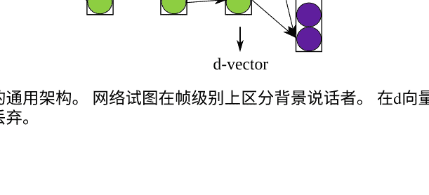

图4 d向量提取的通用架构。网络试图在帧级别上区分背景说话者。在d向量提取的测试阶段，输出层被丢弃。

# 图5 用于x向量提取的通用架构。网络试图在片段级别上区分背景说话者。在测试阶段，输出层被舍弃以进行x向量提取。

提取。如图5所示，该网络由两个主要部分组成。第一部分是一个时延神经网络（TDNN），它在帧级别上工作，并将堆叠的特征向量作为输入。第二部分是一个前馈神经网络，它在片段级别上工作，并将第一部分（即TDNN）最后一个隐藏层中激活的均值和标准差的连接向量作为输入。网络的中间部分有一个统计汇聚层作为第一部分和第二部分之间的连接。统计汇聚层对可变长度的输入片段进行聚合，并将固定维度的统计向量作为网络的第二部分的输入准备好。

网络中提出的TDNN部分由4个隐藏层组成。输入特征向量在一个5帧的上下文窗口中堆叠。前两个隐藏层考虑了前一层的时间上下文，配置为{t-2, t, t+2}和{t-3, t, t+3}。在接下来的两层中，不添加上下文。总体而言，网络的第一部分覆盖了一个时间上下文范围为t-8到t+8。网络的第二部分只有两个隐藏层，它们的激活可以用作说话人嵌入或x向量。在这个架构中，首要结果表明，x向量在短时语音片段中优于传统的i向量[24]。然而，最近的研究表明，数据增强，包括添加噪声和混响，可以显著提高x向量的性能，而对于i向量的效果不那么明显[25]。还有一些努力来改善x向量的质量和泛化能力，例如通过修改网络架构[77]和训练过程[77-80]。

受到图像识别中使用的三元损失的启发[81-83]，它也被用作说话人嵌入提取架构的训练过程，而不是像d-vector和x-vector提取网络中那样对背景说话人进行区分（图4和图5）[84, 85]。三元损失函数定义如下，由语音片段的三元组组成，即锚点、正样本和负样本。给定一个锚点说话人的话语，目标是减少其与同一说话人的其他话语之间的距离（正样本），并增加其与任何其他说话人的话语之间的距离（负样本）。换句话说，损失函数试图同时最小化内部说话人变异性并最大化不同说话人之间的变异性。最近的研究主要集中在不同的深度架构，如ResNet [86]或VGG [87]，例如在[88-90]中，以及说话人嵌入的实际方面，如泛化能力和速度[91]。

在上述提到的所有工作中，输入说话者特征向量到神经网络中最常用的是手工制作的特征，如MFCC和滤波器组能量（FBEs）。最近有一些尝试摆脱这些特征，直接处理原始语音样本[92, 93]。然而，这仍然是非常新的，正在开发和研究中。

## 3.3 无监督说话者嵌入

到目前为止，所有的说话者嵌入都需要背景数据的说话者标签，或多或少地。在监督技术中，通常性能更好，因为更多的信息被输入到系统中，这些信息主要是背景数据的标签。然而，提取说话者标签通常是昂贵且不是一项简单的任务。这激发了基于无监督技术的方法。具有良好的表征能力使得受限玻尔兹曼机成为这一目的的有用候选。它们计算成本低且无监督。在语音识别中，它们已被用于不同的目的，如i-vector分类[94, 95]，说话者因子[96]和特征提取[97]。它们已被用于适应过程[41, 42, 46, 98]，以进一步区分性地学习目标和冒名顶替的说话者模型。受限玻尔兹曼机还被用于预训练深度置信网络，以提取鲍姆-韦尔奇统计量[16, 99]。还有一些尝试使用受限玻尔兹曼机创建基于向量的替代说话者表示[27–29, 100]。

在接下来的内容中，我们将主要描述作者在[28, 29]中提出的工作。在[28]中，GMM超向量被视为RBM的输入，隐藏层的激活可以是低维度的说话人嵌入向量。一种被称为通用RBM（URBM）的RBM使用背景GMM超向量进行训练。URBM试图学习背景超向量中的总会话和说话人变异性。一旦URBM训练完成，可见-隐藏连接权重参数的矩阵用于未见GMM超向量的维度缩减。这些低维度向量在该工作中被称为GMM-RBM向量。已经尝试了不同的隐藏单元和转换函数来进行URBM的训练和提取GMM-RBM向量。

还提出了一种称为可变RELU（VReLU）的高效激活函数，如下所示[28]，其中，在ReLU中的固定阈值被一个变量阈值τ替代，该阈值在每个隐藏单元的每个时期从正态分布N(0,1)中随机采样。

$$ f(x) = \begin{cases} x & x > \tau \\ 0 & x \leq \tau \end{cases} , \tau \in N(0, 1) \qquad (10) $$

图6中对VReLU的正负值τ及其与传统ReLU的比较进行了说明。正如[28]所示，这个变量阈值通过修改GMM-RBM向量的直方图来增强URBM模型的泛化能力。最近的研究表明，VReLU对于监督式说话人嵌入提取也非常有效[91]。在NIST 2010说话人识别评估（SRE）的核心测试-常见条件5上的实验表明，与向量提取阶段的传统i向量相比，GMM-RBM向量在余弦和PLDA评分方面表现出竞争力，但计算负载要小得多，这对于实时应用非常重要。此外，将GMM-RBM向量的分数与i向量融合可以超越i向量。

作者在[29]中提出了另一种高效的无监督说话人嵌入方法，使用RBM将具有时间上下文的说话人频谱特征映射为一个固定维度的向量，传达说话人特定信息。该框架包括两个阶段，即基于背景数据的URBM训练和所有话语的模型适应。URBM被视为说话人无关模型，通过模型适应可以得到说话人相关模型。适应过程通过训练一个由URBM参数初始化的RBM模型来完成。适应过程使用相应话语的数据样本进行，但与URBM训练不同的是，只需进行少量迭代。

与之前的方法不同，在该框架中，利用网络参数即连接权重，而不是网络激活。换句话说，每个说话人特定的RBM模型的连接权重被连接起来，构建一个RBM超向量。这些超向量的维度稍后通过PCA白化变换进行降维，称为RBM向量。

与i向量类似，这些RBM嵌入可以在余弦或PLDA相似性中用于SV。在NIST SRE 2006数据库上的实验结果表明，与仅使用余弦评分的i向量相比，单独使用RBM向量和与i向量结合使用时，RBM向量在EER方面分别实现了15%和24%的相对改进。图7和图8分别比较了GMM-RBM和RBM向量的URBM训练和嵌入提取过程。对于RBM向量提取，考虑了时间上下文，计算成本相对较高，与GMM-RBM向量提取相比。

## 4 深度学习后端

在本节中，我们将描述如何将DL技术用作i-vectors的后端。DL已经被用于i-vectors的噪声和混响效果补偿[101-104]，领域适应[105]，训练和测试i-vectors之间的语音时长不匹配的补偿[106, 107]，以及作为PLDA的替代评分和会话补偿技术（例如[33, 35, 43, 96]）。

正如在第2.3节中提到的，PLDA是i-vectors最有效的后端技术之一。它在进行评分的同时，对会话变异进行补偿，但需要使用带有说话者标签的背景数据。已经提出了几种基于DL的技术来与PLDA竞争。这些方法中，大多数都使用了背景数据的说话者标签进行训练，就像PLDA一样，但与PLDA相比，没有显著的改进。例如，[96]中提出了RBM来学习PLDA训练中的说话者和通道因子子空间。在[35]中提出了一种绑定的变分自编码器架构，用于模拟非线性PLDA。在[36, 37]中提出了RBM、自编码器和PLDA的组合，用于说话者和通道变异补偿，相对于仅使用PLDA，取得了一些改进。

一旦没有标记说话者的背景数据可用，或者只有少量标记数据可用，情况将会有所不同，这在大多数实际应用中都是如此。在这种情况下，强大的PLDA将无法适用。最近，NIST [38]组织了一个SR挑战，旨在解决当背景数据未标记时如何实现与PLDA相当的性能。这种情况的一个可能解决方案是利用无监督方法自动标记背景说话者，例如[39, 40]中提出的方法。然而，这些方法无法正确估计所有标签。尽管通过估计标签训练的PLDA在给定数据上表现得相当好[39, 40]，但性能仍无法与Oracle PLDA [64]相媲美。

在本节中，我们主要关注[43]中作者提出的工作。目标是在背景数据未标记时，减小无标记（余弦）和有标记（PLDA）评分基准系统之间的性能差距。作者利用大量未标记的背景数据和DBNs的无监督学习来训练一个全局模型，称为通用DBN（UDBN）。然后，将UDBN适应于每个目标说话者的少量数据，并将其用作区分目标和非目标输入i向量的说话者特定初始点来训练DNN。还提出了一种冒名顶替者/非目标i向量选择算法，以保持训练过程几乎平衡。总之，每个目标说话者都通过一个具有说话者相关初始化的两类DBN-DNN进行训练（图9）。图10显示了UDBN的前两层之间的连接权重如何适应两个不同的说话者。

新的具有挑战性的数据库NIST 2014 i-vector挑战[38]被用于实验。这个数据库的优点是NIST提供了背景、训练和测试集的i-vectors，因此基准系统将使每个人都能够比较新提出的系统的性能。考虑了三种基准分类技术：余弦、带估计标签的PLDA和带实际标签的PLDA，也称为Oracle PLDA系统。基于EER和minDCF（表1）以及检测错误交易（DET）曲线（图11）的实验结果表明，所提出的基于DL的后端在最小DCF（minDCF）方面将余弦和Oracle PLDA评分系统之间的性能差距减少了46%，这与使用无监督估计标签获得的PLDA评分结果大致相似。有趣的是，所提出的后端与带估计标签的PLDA在评分级别上的组合非常有效，并且显著减少了性能差距79%。

更多的比较结果和细节可以在[43]中找到。

## 5 深度学习端到端

端到端的SR系统将整个训练过程，前端和后端作为一个集成的任务处理。换句话说，从说话者频谱特征到相似性分数，都是一次性联合训练的。端到端的思想SR的架构已经使用了很长时间，例如在[2, 7]中。这种分类方案主要通过为每个个体说话者学习一个独立的分类网络来实现。在这种情况下，对于SV，要验证的声称说话者的模型是由测试语音的特征向量提供的。

最近，有几次尝试使用DNN构建端到端的SR系统。然而，这些努力大多是针对文本相关的SR，例如在[108-110]中。在成功应用UDBN和模型自适应作为[41]中i-vectors的后端之后，作者们在[46]中提出了相同的框架，用于根据说话者的频谱特征来区分目标和冒名顶替者的端到端系统。然而，冒名顶替者样本的数量，在特征层面上，明显大于基于i-vectors的先前工作。因此，基于i-vectors的冒名顶替者选择算法过于昂贵，不可行。此外，目标说话者样本的数量因说话者而异，使得训练过程更加困难。研究表明，[46]中提出的架构在处理冒名顶替者和注册语音之间的不平衡数据训练问题上受到的影响较小，并且能够胜过传统的端到端多层感知器（MLP）模型。然而，它们无法与现代i向量系统竞争。在另一次尝试中，[111]提出直接在原始音频信号上进行操作，这些信号经过一种特殊形式的拓扑和权重进化人工神经网络[112]处理，被称为拓扑增强神经进化[113]。然而，正如作者在[111]中所述，这只是一个概念验证，实验展示了该算法进一步研究的潜力。

## 6 结论

从历史上看，SR在不同时间面临了许多挑战。对于更高的准确性、更快的识别速度和更强的适应环境变化的需求，导致了不断的研究，就像其他应用领域一样。深度学习（DL）是一种新技术，可以提取输入数据的更高抽象特征。因此，它为信号处理和机器学习应用的更广泛研究打开了大门。DL已经在典型SR系统的所有部分中使用，从前端到后端，甚至作为整个端到端系统。作为前端，它被用于提取所谓的瓶颈特征，或者作为用于i向量提取的Baum-Welch统计计算的声学模型。已经提出了几种网络架构和训练过程，并观察到与传统声学模型和i向量提取过程中的特征相比的实质性改进。然而，所提出的DL架构仍然存在一些缺点。例如，DL声学模型通常是语言相关的，需要音素标签，并增加了计算成本。另一方面，深度网络架构已被用于直接提取语音话语的演讲者特征的紧凑表示，通常称为演讲者嵌入。这些低维向量被提出作为传统i向量的替代方案。最近的研究表明，数据增强可以显著提高演讲者嵌入的性能，并使其在短时段和长时段的语音片段中与传统i向量竞争。所提出的DL技术用于后端的大多数是有监督的，即给定带有演讲者标签的背景数据，并试图成为PLDA评分的替代方案。当这些技术作为独立系统使用时，它们的性能仍然不太竞争，这意味着仍有很大的改进空间。SR中的一个问题是，演讲者标签通常很难获得，而且并不总是可用的。因此，在没有标记的背景数据的情况下使用PLDA或其他基于DL的替代技术将会很困难。因此，当背景数据没有标签时，一个技术如何减少无监督和有监督技术之间的性能差距将是一个挑战。这是一个尚未完全探索的领域。最近，一些基于DL的端到端系统已被提出，意味着前端和后端在一个单一系统中同时执行。尽管在某些情况下，报告的结果与传统系统相比具有竞争力，但仍然期望获得更高的准确性。在使用深度学习进行语音识别方面，一个重要且有前景的观察是，即使在大多数情况下它还没有能够赢得传统信号处理技术，但在与它们结合使用时通常是有效的。在过去几年中，作者们一直在尝试积极参与语音识别系统的各个部分的研究，特别是在无监督说话人嵌入、无监督深度学习后端等更具挑战性的领域，并基于深度学习架构构建端到端系统。

致谢：本工作部分得到了西班牙项目Deep Voice的支持，授权号为TEC2015-69266-P。

# 说话人识别中的深度学习

# 参考文献

1.  Oglesby, J., Mason, J.S.: 使用神经网络进行说话人识别。IOA Speech (1988)
2.  Oglesby, J., Mason, J.S.: 使用神经分类器的说话人识别。在: 人工神经网络, IET (1989)
3.  Oglesby, J., Mason, J.S.: 说话人识别神经模型的优化。在: ICASSP (1990年)
4.  Bennani, Y., Soulie, F.F., Gallinari, P.: 自动说话人识别的连接主义方法。在: ICASSP (1990年)
5.  Bennani, Y., Gallinari, P.: 在说话人识别中使用tdnn提取特征信息。在: ICASSP (1991年)
6.  Oglesby, J., Mason, J.S.: 说话人识别的径向基函数网络。在: ICASSP (1991年)
7.  Rudasi, L., Zahorian, S.A.: 使用神经网络的无文本说话人识别。在: ICASSP (1991年)
8.  Farrell, K.R., Mammone, R.J., Assaleh, K.T.: 使用神经网络和传统分类器的说话人识别。IEEE Trans. Speech Audio Process. (1994年)
9.  Heck, L.P., Konig, Y., Sonmez, M.K., Weintraub, M.: 通过判别特征设计在说话人识别中对电话机扬声器失真的鲁棒性。语音通信。(2000)
10. Yegnanarayana, B., Kishore, S.P.: Aann: 一种用于模式识别的gmm替代方法。神经网络。(2002)
11. Lapidot, I., Gutterman, H., Cohen, A.: 基于自组织映射之间的竞争的无监督说话人识别。IEEE Trans. Neural Netw. (2002)
12. Chen, K., Salman, A.: 用深度神经网络学习说话人特定特征。IEEE Trans. Neural Netw. (2011)
13. Chen, K., Salman, A.: 用正则化的连体深度网络提取说话人特定信息。在: 神经信息处理系统的进展 (2011)
14. Dehak, N., Kenny, P., Dehak, R., Dumouchel, P., Ouellet, P.: 用于说话人验证的前端因子分析。语音和语言处理，IEEE音频交易 (2011)
15. Lei, Y., Scheffer, N., Ferre, L., Mclaren, M.: 使用语音感知的深度神经网络进行说话人识别的新方案。在: ICASSP (2014)
16. Kenny, P., Gupta, V., Stafylakis, T., Ouellet, P., Alam, J.: 用于提取说话人识别的baum-welch统计量的深度神经网络。在: 奥德赛 (2014年)
17. Campbell, W.M.: 使用深度置信网络进行基于向量的说话人识别。在: Interspeech (2014年)
18. Richardson, F., Reynolds, D., Dehak, N.: 用于说话人和语言识别的深度神经网络方法。IEEE信号处理通信 (2015年)
19. Garcia-Romero, D., Zhang, X., Mccree, A., Povey, D.: 使用深度神经网络改善领域适应挑战中的说话人识别性能。在: SLT (2014年)
20. Mclaren, M., Lei, Y., Ferre, L.: 深度神经网络方法在说话人识别中的进展。在: ICASSP (2015年)
21. Variani, E., Lei, X., McDermott, E., Lopez Moreno, I., Gonzalez-Dominguez, J.: 深度神经网络用于小型文本相关说话人验证。在: ICASSP (2014)
22. Wang, S., Qian, Y., Yu, K.: 说话人嵌入编码了什么？在: Interspeech (2017)
23. Bhattacharya, G., Alam, J., Kenny, P.: 用于短时说话人验证的深度说话人嵌入。在: Interspeech (2017)
24. Snyder, D., Garcia-Romero, D., Povey, D., Khudanpur, S.: 用于文本无关说话人验证的深度神经网络嵌入。在: Interspeech (2017)
25. Snyder, D., Garcia-Romero, D., Sell, G., Povey, D., Khudanpur, S.: X-向量: 用于说话人识别的鲁棒DNN嵌入。在: ICASSP (2018)
26. Prince, S.J.D., Elder, J.H.: 关于身份的概率线性判别分析。在: ICCV (2007)

表1 提出的基于DL的后端[43]与NIST 2014 i-vector挑战数据集上其他常用后端的性能比较

| | 进展集 | | 评估集 | |
| :--- | :---: | :---: | :---: | :---: |
| | EER (%) | minDCF | EER (%) | minDCF |
| **未标记的背景数据** | | | | |
| [1] 余弦 | 4.78 | 0.386 | 4.46 | 0.378 |
| [2] PLDA (估计标签) | 3.85 | 0.300 | 3.46 | 0.284 |
| [3] 提出的DNN-1L | 5.13 | 0.327 | 4.61 | 0.320 |
| [4] 提出的DNN-3L | 4.55 | 0.305 | 4.11 | 0.300 |
| 融合[2]和[4] | **2.99** | **0.260** | **2.70** | **0.243** |
| **标记的背景数据** | | | | |
| [5] PLDA (实际标签) | 2.23 | 0.226 | 2.01 | 0.207 |
| 融合[2]和[5] | 2.04 | 0.220 | 1.85 | 0.204 |
| 融合[4]和[5] | 2.13 | 0.221 | 2.00 | 0.196 |
| 融合[2]、[4]和[5] | **1.88** | **0.204** | **1.74** | **0.190** |

28. Ghahabi, O., Hernando, J.: 用于说话人识别中语音向量表示的受限玻尔兹曼机. 计算语音语言 (2018)
29. Safari, P., Ghahabi, O., Hernando, J.: 通过受限玻尔兹曼机适应从特征到说话人向量. 在：Odyssey (2016)
30. Kenny, P.: 具有重尾先验的贝叶斯说话人验证. 在：Odyssey (2010)
31. Stafylakis, T., Kenny, P., Senoussaoui, M., Dumouchel, P.: 用于说话人识别的玻尔兹曼机分类器的初步研究. 在：Odyssey (2012)
32. Senoussaoui, M., Dehak, N., Kenny, P., Dehak, R., Dumouchel, P.: 首次尝试使用玻尔兹曼机进行说话人验证. 在：奥德赛 (2012)
33. Novoselov, S., Pekhovsky, T., Simonchik, K., Shulipa, A.: 用于NIST i-vector挑战的RBM-PLDA子系统. 在：Interspeech (2014)
34. Isik, Y.Z., Erdogan, H., Sarikaya, R.: S-vector: 从i-vector派生的一种有区别的表示方法，用于说话人验证. 在：EUSIPCO (2015)
35. Villalba, J., Brümmer, N., Dehak, N.: 用于i-vector说话人识别的绑定变分自动编码器后端. 在：Interspeech (2017)
36. Novoselov, S., Pekhovsky, T., Kudashev, O., Mendeleev, V.S., Prudnikov, A.: 用于i-vector说话人验证的非线性PLDA. 在：Interspeech (2015)
37. Pekhovsky, T., Novoselov, S., Sholokhov, A., Kudashev, O.: 关于i-vector空间中自动编码器在说话人识别中的应用. 在：Odyssey (2016)
38. NIST说话人识别i-vector机器学习挑战 (2014)
39. Khoury, E., El Shafey, L., Ferras, M., Marcel, S.: 用于NIST i-vector挑战的分层说话人聚类方法. 在：Odyssey (2014)
40. Novoselov, S., Pekhovsky, T., Simonchik, K.: 用于NIST i-vector挑战的STC说话人识别系统. 在：Odyssey (2014)
41. Ghahabi, O., Hernando, J.: 基于i-vector的说话人识别的深度置信网络. 在：ICASSP (2014)
42. Ghahabi, O., Hernando, J.: 用于多会话说话人识别的深度置信网络的i-vector建模. 在：Odyssey (2014)
43. Ghahabi, O., Hernando, J.: 用于单次和多次i-vector说话人识别的深度学习后端. 语音和语言处理，IEEE/ACM音频交易 (2017)
44. Bahdanau, D., Cho, K., Bengio, Y.: 通过联合学习对齐和翻译进行神经机器翻译. arXiv:1409.0473 (2014)
45. Song, W., Cai, J.: 用于自动语音识别的端到端深度神经网络 (2015)
46. Safari, P., Ghahabi, O., Hernando, J.: 通过深度置信网络进行特征分类以进行说话人识别. 在：EUSIPCO (2015)
47. Reynolds, D.A., Rose, R.C.: 使用高斯混合说话人模型进行鲁棒的文本无关说话人识别. IEEE Trans. Speech Audio Process. (1995)
48. Campbell, W.M., Campbell, J.P., Reynolds, D.A., Singer, E., Torres-Carrasquillo, P.A.: 用于说话人和语言识别的支持向量机. 计算机语音语言 (2006)
49. Sadaoki, F.: 语音和说话人识别进展五十年. J. Acoust. Soc. Am. (2004)
50. Nadeu, C., Hernando, J., Gorricho, M.: 关于语音识别中滤波器组能量的去相关性研究. 在：Eurospeech (1995)
51. Nadeu, C., Macho, D., Hernando, J.: 用于鲁棒HMM语音识别的时间和频率滤波器组能量. Speech Commun. (2001)
52. Hansen, J.H.L., Hasan, T.: 机器和人的说话人识别：教程综述. IEEE Signal Process. Mag. (2015)
53. Reynolds, D.A., Quatieri, T.F., Dunn, R.B.: 使用自适应高斯混合模型的说话人验证. 在：Digital Signal Processing (2000)
54. Campbell, W.M., Sturim, D.E., Reynolds, D.A.: 使用GMM超向量的支持向量机进行说话人验证. IEEE Signal Process. Lett. (2006)
55. Dehak, N., Chollet, G.: 支持向量gmms用于说话人验证. 在：奥德赛 (2006)
56. Li, K., Li, J., Zhu, Y.: 用于说话人验证的语音表达特征和序列核SVM. 计算机语音语言 (2008)

# 说话人识别中的深度学习

- 57. Campbell, W.M., Sturim, D.E., Reynolds, D.A., Solomonoff, A.: 基于SVM的说话人验证使用GMM超向量核和NAP可变性补偿. 在：ICASSP (2006)
- 58. Solomonoff, A., Campbell, W.M., Boardman, I.: SVM说话人识别的通道补偿进展. 在：ICASSP (2005)
- 59. Hatch, A.O., Stolcke, A.: 用于一对所有分类的广义线性核：应用于说话人识别. 在：ICASSP (2006)
- 60. Kenny, P.: 说话人和会话变异的联合因子分析：理论和算法 (2006)
- 61. Dehak, N., Dehak, R., Glass, J., Reynolds, D., Kenny, P.: 余弦相似度评分无需评分归一化技术. 在：奥德赛 (2010)
- 62. Garcia-Romero, D., Espy-Wilson, C. Y.: 分析说话人识别系统中的i-向量长度归一化. 在：Interspeech (2011)
- 63. Matejka, P., Glembek, O., Castaldo, F., Alam, J., Plchot, O., Kenny, P., Burget, L., Cernocky, J.: 完全协方差ubm和重尾plda在i-向量说话人验证中. 在：ICASSP (2011)
- 64. Greenberg, C., Banse, D., Doddington, G., Garcia-Romero, D., Godfrey, J., Kinnunen, T., Martin, A., McCree, A., Przybocki, M., Reynolds, D.: NIST 2014说话人识别i-向量机器学习挑战. 在：奥德赛
- 65. Kinnunen, T., Li, H.: 无关文本的说话人识别概述：从特征到超向量. 语音通信 (2010)
- 66. Hansen, J.H.L., Hasan, T.: 机器和人类的说话人识别：教程综述. IEEE Signal Process. Mag. (2015)
- 67. Ghahabi, O.: 深度学习用于i-vector说话人和语言识别. 博士论文，加泰罗尼亚理工大学 (2018)
- 68. Ferrer, L., Lei, Y., McLaren, M., Scheffer, N.: 基于senone后验概率的口语识别. 在：INTERSPEECH (2014)
- 69. Ferrer, L., Lei, Y., McLaren, M., Scheffer, N.: 基于senone的深度神经网络方法研究口语识别. IEEE/ACM Trans. Audio Speech Lang. Process. (2016)
- 70. Silnova, A., Burget, L., Cernocky, J.: 基于神经网络的说话人验证的替代方法. 在：Interspeech (2017)
- 71. Ranjan, S., Hansen, J.H.L.: 使用基于卷积神经网络的瓶颈特征改进的性别无关说话人识别. 在：Interspeech (2017)
- 72. Goodfellow, I., Pouget-Abadie, J., Mirza, M., Xu, B., Warde-Farley, D., Ozair, S., Courville, A., Bengio, Y.: 生成对抗网络. 在：神经信息处理的进展系统 (2014)
- 73. Serdyuk, D., Audhkhasi, K., Brakel, P., Ramabhadran, B., Thomas, S., Bengio, Y.: 对噪声语音识别的不变表示. arXiv:1612.01928 (2016)
- 74. Shinohara, Y.: 用于鲁棒语音识别的对抗多任务学习的深度神经网络. 在：INTERSPEECH (2016)
- 75. Yu, H., Tan, Z.-H., Ma, Z., Guo, J.: 对抗网络瓶颈特征用于噪声鲁棒说话人验证. arXiv:1706.03397 (2017)
- 76. Li, L., Tang, Z., Wang, D., Zheng, T.F.: 深度说话人特征学习的全信息训练. 在：ICASSP (2018)
- 77. Novoselov, S., Shulipa, A., Kremnev, I., Kozlov, A., Shchemelinin, V.: 关于文本无关说话人识别的深度说话人嵌入. 在：Odyssey (2018)
- 78. Li, L., Tang, Z., Shi, Y., Wang, D.: 用于说话人验证的高斯约束训练. arXiv:1811.03258 (2018)
- 79. Zeinali, H., Burget, L., Rohdin, J., Stafylakis, T., Cernocky, J.: 如何改进通用工具包中的说话人嵌入提取器. arXiv:1811.02066 (2018)
- 80. Huang, Z., Wang, S., Yu, K.: 角度softmax用于短时文本无关说话人验证. 在：Interspeech (2018)
- 81. Wang, J., Song, Y., Leung, T., Rosenberg, C., Wang, J., Philbin, J., Chen, B., Wu, Y.: 使用深度排序学习细粒度图像相似性. 在：CVPR (2014)
- 82. Hoffer, E., Ailon, N.: 使用三元组网络进行深度度量学习. 在：基于相似性的模式识别国际研讨会. Springer (2015)
- 83. Schroff, F., Kalenichenko, D., Philbin, J.: Facenet: 用于人脸识别和聚类的统一嵌入. 在：CVPR (2015)
- 84. Zhang, C., Koishida, K.: 使用三元组损失进行端到端的文本无关说话人验证短语. 在：Interspeech (2017)
- 85. Bredin, H.: Tristounet: 说话人转向嵌入的三元组损失. 在：ICASSP (2017)
- 86. He, K., Zhang, X., Ren, S., Sun, J.: 深度残差学习用于图像识别. 在：CVPR (2016)
- 87. Simonyan, K., Zisserman, A.: 用于大规模图像识别的非常深的卷积网络. arXiv:1409.1556 (2014)
- 88. Nagrani, A., Chung, J.S., Zisserman, A.: Voxceleb: 一个大规模的说话人识别数据集. 在：Interspeech (2017)
- 89. Chung, J.S., Nagrani, A., Zisserman, A.: Voxceleb2: 深度说话人识别. 在：Interspeech (2018)
- 90. India, M., Safari, P., Hernando, J.: 自我多头注意力用于说话人识别. 在：Interspeech (2019)
- 91. Ghahabi, O., Fischer, V.: 在线说话人分割中的说话人损坏嵌入. 在：Interspeech (2019)
- 92. Jung, J.-W., Heo, H.-S., Yang, I.-H., Shim, H.-J., Yu, H.-J.: 使用原始波形避免端到端DNN中的说话人过拟合，用于文本无关的说话人验证 (2018)
- 93. Ravanelli, M., Bengio, Y.: 使用SincNet从原始波形进行说话人识别. arXiv:1808.00158 (2018)
- 94. Stafylakis, T., Kenny, P.: 对Boltzmann机分类器进行初步研究，用于说话人识别. 在：Odyssey (2012)
- 95. Senoussaoui, M., Dehak, N., Kenny, P., Dehak, R.: Boltzmann机在说话人验证中的首次尝试. 在：Odyssey (2012)
- 96. Stafylakis, T., Kenny, P., Senoussaoui, M., Dumouchel, P.: 使用高斯受限玻尔兹曼机的PLDA在说话人验证中的应用. 在：Interspeech (2012)
- 97. Lee, H., Pham, P., Ng, A.Y.: 使用卷积深度置信网络进行音频分类的无监督特征学习. 在：神经信息处理系统的进展 (2009)
- 98. Ghahabi, O., Hernando, J.: 多会话i-vector说话人识别中DBN的全局冒名顶替选择. 在：伊比利亚语言的语音和语言技术的进展. Springer International Publishing (2014)
- 99. Campbell, W.M.: 使用深度置信网络进行基于向量的说话人识别. 在：Interspeech (2014)
- 100. Vasilakakis, V., Cumani, S., Laface, P.: 通过深度置信网络进行说话人识别. 在：法医学中的生物识别技术 (2013)
- 101. Mahto, S., Yamamoto, H., Koshinaka, T.: 使用新颖的判别式denoising自编码器进行噪声鲁棒的说话人识别的i-vector变换. 在：Interspeech (2017)
- 102. Alam, J., Kenny, P., Bhattacharya, G., Kockmann, M.: 使用i-vector自适应和神经网络进行恶劣条件下的说话人验证. 在：Interspeech (2017)
- 103. Guzewich, P., Zahorian, S.: 使用深度神经网络去混响处理来改善混响条件下的说话人验证. 在：Interspeech (2017)
- 104. Tan, Z., Mak, M.-W.: 用于噪声鲁棒的说话人验证的i-vector dnn评分和校准. 在：Interspeech (2017)
- 105. Shon, S., Mun, S., Kim, W., Ko, H.: 基于自编码器的领域自适应方法用于不充足的信道信息下的说话人识别. arXiv:1708.01227 (2017)
- 106. Bousquet, P.-M., Rouvier, M.: 使用四协方差模型和深度神经网络进行说话人验证的持续时间不匹配补偿. 在：Interspeech (2017)
- 107. Guo, J., Nookala, U. A., Alwan, A.: 使用短语音进行说话人验证的基于CNN的短长语音i-vector联合映射. 在：Interspeech (2017)
- 108. Heigold, G., Moreno, I., Bengio, S., Shazeer, N.: 端到端的文本相关说话人验证. 在：ICASSP (2016)
- 109. Zhang, S.-X., Chen, Z., Zhao, Y., Li, J., Gong, Y.: 基于注意力的端到端文本相关说话人验证. 在：SLT (2016)
- 110. Heo, H.-S., Jung, J.-W., Yang, I.-H., Yoon, S.-H., Yu, H.-J.: 扩展的端到端DNN联合训练用于文本相关说话人验证. 在：Interspeech (2017)
- 111. Valenti, G., Daniel, A., Evans, N.: 使用演化递归神经网络的端到端自动说话人验证. 在：Odyssey (2018)
- 112. Dasgupta, D., McGregor, D.R.: 使用结构遗传算法设计应用特定的神经网络. 在：COG ANN (1992)
- 113. Stanley, K.O., Miikkulainen, R.: 通过增加拓扑结构进化神经网络. Evolut. Comput. (2002)

# 婴儿哭声检测：深度学习和经典方法


Rami Cohen, Dima Ruinskiy, Janis Zickfeld, Hans IJzerman 和 Yizhar Lavner

摘要在本章中，我们比较了深度学习和经典方法在各种家庭环境下具有挑战性的信噪比条件下检测婴儿哭声的效果。自动哭声检测在商业产品（如婴儿远程监视器）以及医学和心理社会研究中都有应用。我们设计并评估了几种卷积神经网络（CNN）架构用于婴儿哭声检测，并将它们的性能与经典机器学习方法（如逻辑回归和支持向量机）进行比较。除了前馈CNN，我们还分析了循环神经网络（RNN）架构的性能，这些架构能够捕捉声学事件的时间行为。我们展示了通过精心设计具有专门的非对称核的CNN架构，可以获得比常见CNN架构更好的结果。

关键词 婴儿哭声检测·深度学习·卷积神经网络·

- **R. Cohen** (📧)
  以色列理工学院电气工程学院维特比，以色列海法
  e-mail: rc@technion.ac.il

- **D. Ruinskiy** · **Y. Lavner**
  特尔海学院计算机科学系，以色列上加利利
  e-mail: dima.ruinskiy@gmail.com

- **Y. Lavner**
  e-mail: yizhar.lavner@gmail.com

- **D. Ruinskiy**
  网络.IO创新实验室，以色列海法

- **J. Zickfeld**
  奥斯陆大学心理学系，挪威奥斯陆
  e-mail: jhzickfeld@gmail.com

- **H. IJzerman**
  LIP/PC2S，格勒诺布尔阿尔卑斯大学，法国格勒诺布尔
  e-mail: h.ijzerman@gmail.com## 1 引言

近年来，深度神经网络在各种实际的现实世界问题中被广泛应用，与传统的特征提取阶段相反，在经典机器学习算法中，深度神经网络自动从数据中形成有用的特征。这样的网络由多个层组成，类似于大脑中的计算方式。在这些层中，形成了一系列非线性特征，随着网络的深度而变得越来越复杂。这些特征的组合在网络的最后一层中被用于生成预测。

最令人印象深刻的结果可能是在计算机视觉领域，从[1]的开创性工作开始，深度学习网络在物体检测和分类等各种任务中展示出了最先进的性能。随着深度学习技术的进步和大型数据库的可用性，深度学习也成为自动音频事件检测的重要工具[2, 3]。

在本章中，我们比较了深度学习和传统方法在声学信号中检测婴儿哭声事件方面的表现。在音频流中准确可靠地检测婴儿哭声事件是分类算法和筛查任务的先决条件，这些算法和任务依赖于哭声的声学特性。在家庭环境或其他自然环境（如新生儿诊所或托儿所）中检测婴儿哭声的主要困难之一是噪音和背景声音的存在——语音、音乐、电子玩具、门开关、电话铃声等等。这对于传统的机器学习方法构成了相当大的挑战，这些方法通常从声学信号中提取一组区分特征。背景噪音可能具有与婴儿哭声类似的基频或声音特性，从而阻碍了检测算法。此外，信噪比（SNR）经常变化。特别是语音对于检测来说是一个相当大的挑战，因为其频率内容与婴儿哭声相似，可能会引入误报事件。

在这里描述的研究中，我们设计和评估了用于婴儿哭声检测的深度学习方法。我们设计了专门的卷积神经网络（CNN）来完成这个任务，并研究了适合音频信号作为CNN输入的图像表示。我们使用非线性的对数Mel滤波器组（log MFB）表示，其中每个像素代表一个根据对数Mel刻度的频率范围；这种表示已知能够很好地捕捉到区分不同类型声音的相关频率。我们将我们的CNN架构与传统的机器学习算法进行了性能比较，如逻辑回归和支持向量机（SVM）分类器。

性能评估是使用一个包含几个小时婴儿在家庭环境中录音的注释数据库进行的。除了婴儿哭声，这些录音还包含各种类型的家庭声音，如电话铃声、门开启声和父母的讲话声。我们根据接收器工作特性（ROC）曲线讨论了误报率和检测率之间的权衡，并且使用不同层数和单元数对CNN检测结果进行性能分析。我们展示了与经典机器学习方法相比的显著性能提升，特别是在低误报率范围内。

## 1.1 音频事件检测方法

音频事件检测是在长音频片段或流中发现特定声音事件的任务。声音事件的例子包括人声、特定话语、不同类型的家庭或城市噪音、各种乐器产生的声音等。检测任务可以有不同的要求：从简单的检测（判断事件是否存在，例如语音活动检测器[4]）到准确标定事件的边界（起始和结束），例如[5]；在某些情况下，可能希望检测多种事件类型，这引入了声音事件分类的相关任务：将每个音频部分分配给几个预定义的类别（有时称为注释）。分类可能仅应用于检测到的事件，例如区分不同类型的摩擦音[6, 7]，或应用于整个片段，例如在区分语音和音乐[8, 9]或不同音乐流派[10]时。

由于其许多应用，自动检测和分类音频信号中的声学事件是机器学习中的一个重要研究领域。从最广义上讲，它是听觉机器感知（也称为机器听觉）的关键部分，在这里计算机学习类似于人类解释和分析音频信息。一些具体应用的例子包括语音识别[12]、语音控制家电[13]、音频监控[14]、健康监测[15]和音频信号增强[5, 16]。

早期的深度学习在声学事件检测方面的实现之一[17]，使用了卷积神经网络（CNN）来识别不同类型的嘈杂环境中的声音事件。[18]中使用了一个由2个卷积层、最大池化层和2个全连接层组成的深度模型，用于检测各种城市和环境声音。[19]中也采用了卷积神经网络架构来进行声学场景分类任务。[20]的研究表明，卷积递归神经网络（RNN）方法在多音事件检测（可以同时检测多种类型的事件）方面比单独的CNN/RNN或传统方法取得了更好的结果。[21]中使用了类似的方法来实现低延迟的单声源分离系统。还展示了深度学习方法在自动音乐标记（分配流派、乐器、节奏等属性）方面的适用性[22, 23]。还研究了其他类型的深度学习架构。例如，在[24]中，作者使用了由卷积层、全连接层和具有sigmoid激活函数的单元素输出层组成的深度网络；[25]使用了一种称为胶囊网络（CapsNet，[26]）的拓扑结构，并发现它可以胜过传统的CNN。另一项研究比较了深度学习方法将手工制作的支持向量数据描述（SVDD）分类器与一些精心选择的特征相结合，发现后者在较低的计算成本下可以达到与CNN相当的性能，但缺点是需要设计特定于任务的特征[27]。

还研究了各种方法来检测哭声的特定任务；传统方法的良好调查可在[28]中找到。近年来，深度学习的进展使其成为一种流行的技术。在[29]中，一个专门设计的CNN在非常低的误报率范围内表现优于传统的基于逻辑回归的分类器。在[30]中，从婴儿车旁边捕获的音频上运行的CNN可以以86%的准确率检测到哭声。参考文献[31]将CNN与隐马尔可夫模型（HMM）相结合，与线性判别分析（LDA）分类器进行了比较。

自动婴儿哭声检测器有许多应用：它通常用于安全相关设备，如婴儿监视器[32]，并被提议作为检测被遗忘在车辆中的儿童的系统的一部分[33]；一些具有哭声检测技术的商业产品包括[34-36]。鉴别，然后对哭声信号进行分类，对医学目的非常有用，例如基于哭声信号的声学特性检测病理[37, 38]，或者基于足月婴儿和早产儿之间哭声差异评估婴儿的神经状态[39]。

### 1.2 婴儿哭声的起源和作用

人类的哭声在发育阶段有几种作用。最初的功能，以及发展起源，相对清楚。对于其他一些方面，通常有公认的理论和假设，但没有坚实的结论，因为我们对心理理论作为预测手段不够自信。声音哭声是与照顾者互动的第一种沟通形式之一[40]，并且比人类更常见。参考文献[41]提出，对反馈敏感的依恋行为对于保持照顾者的亲近至关重要，并且哭声是建立这种亲近关系的最重要渠道之一[42-44]。在人类中，婴儿依赖于照顾者提供食物、安全和温暖[45]。因此，我们的许多功能都集中在一种“共同调节”的方式上，早期生活中是照顾者为婴儿提供的，而后来是成年伴侣之间互相提供的[46]。

人类婴儿的哭泣是由于吸气和呼气之间的有节奏的转换引起的，这是由于声带的振动产生了周期性的气流脉冲。这些脉冲的周期被称为基频（音高），在健康婴儿中，其典型值为250–600 Hz。哭声信号受到声道的塑造，导致共振频率被称为共振峰。通常，前两个共振峰分别出现在1100 Hz和3300 Hz左右[47]。一些研究[44, 48]指出，人类在生命早期已经展示出各种形式的哭泣：抗议性哭泣（婴儿面临失去，比如被留在婴儿床上，并希望撤销损失），绝望的悲伤哭泣（低沉的哀号表示接受损失），以及冷漠抑制的哭泣（通常是没有外部哭泣，与照顾者的生命威胁性分离有关）。有时还考虑其他类型，如饥饿和疼痛哭泣。

长期以来，研究人员认为不同类型的哭声无法可靠地区分，因为即使是母亲在区分疼痛和饥饿的哭声时也不总是准确的（例如，[43]）。如今，随着测量设备和分析软件的精度大幅提高，并且有更大的样本集可用，对这一假设产生了怀疑。最近的研究表明，可以可靠地区分疼痛、饥饿、悲伤、恐惧和愤怒的哭声，基于面部表情和哭声特征[49, 50]，深度学习方法似乎可以成功应用于不同类型哭声的自动分类。

哭声的类型、频率和持续时间在早期婴儿期后尤其变化多样（例如，[43, 51]）。哭声在大约6周时达到高峰，然后下降，直到4个月后保持相对稳定[52]。哭声的发展在一定程度上取决于照顾者对哭声的回应（或缺乏回应）。在幼儿时期，如果照顾者回应（通过抱抱、触摸和/或喂食），哭声通常会停止[53]。照顾者的积极回应表明婴儿可以依靠他人来满足环境需求，而缺乏回应则表明婴儿需要自己应对环境需求。在后期的生活中，哭声的类型、频率和持续时间可能取决于个体的气质[54, 55]或依恋[56]。

例如，那些母亲没有始终对他们的哭声做出一致回应的婴儿后来开始在依恋母亲和抵制接触之间摇摆不定（参见例如[43]）。在许多情况下，婴儿会适应为生存所需的任何情况（例如，在没有回应的照顾者的情况下自立）；然而，与此类适应相关的哭声差异尚未得到充分研究。

由于样本不足和准确的方法论的缺乏，对病理性哭声的特征尚无完全了解。至少，基频（音高）高于600 Hz的哭声信号通常被认为是健康问题的指示[57]。哭泣的另一个功能可能是传达婴儿的适应能力，防止照顾者的投资[47]。疼痛哭声通常突然开始，通常持续时间较长，并且经常涉及高音调的哭声（以高音为特征；[43]）。一种常见的病理现象，称为“绞痛”，表现为过度哭泣；研究人员通常区分绞痛的内在原因，例如食物过敏，或者外在原因，例如不适当的身体接触。

正常和病理性婴儿哭声的分类（尤其是新生儿）已经成为广泛研究的主题。一些研究集中在特定的病理学，如聋哑症或呼吸窘迫综合症（RSD），而其他研究则调查了多种病理学[58]。还研究了正常婴儿和高风险自闭症婴儿之间的哭声差异[59, 60]。最近有一份关于研究现状的调查报告[61]。

虽然对新生儿的病理性哭泣进行了广泛的研究，但对于生命早期的哭泣与潜在的不适应行为之间的关系知之甚少。大量的哭泣录音与新颖的机器学习技术相结合，深度学习技术可以帮助识别可能的连接（例如在心理学中，参见[62, 63]）。在生命的早期阶段进行研究的一个困难是它常常过于侵入性。为了减少侵入性，我们在基于Android的智能手机应用程序中集成了自动哭声检测。¹这个智能手机应用程序可以实时检测婴儿哭声事件，在婴儿最早的几天内。使用该应用程序可以将婴儿的哭声与其他变量（如照顾者的周边温度）相关联。

## 2 深度学习方法

卷积神经网络（CNN）[64, 65] 在计算机视觉、自然语言处理等领域有广泛应用，特别是在需要处理和分类大量数据的情况下。与普通神经网络一样，CNN由多个层通过可学习权重的神经元连接而成。常用的层类型包括：卷积层（应用卷积/点积运算）、池化层（将多个神经元的输出合并为下一层的一个神经元）、修正线性单元（ReLU）层、全连接（稠密）层等。层的确切数量和配置取决于应用。

CNN通过训练过程学习每个层的参数（通常称为权重）。这个过程使用梯度下降方法和反向传播技术[66]进行。训练过程的复杂性随着网络的可训练参数数量的增加而增加。在典型的CNN中，可能有数千到数百万个参数，在训练阶段学习它们的值。

与传统的分类算法（例如支持向量机）相比，在基于CNN的分类和检测中通常不会从数据中提取特征。相反，CNN的输入通常由原始数据（例如图像）组成，这是它们的主要优势之一。然而，基于CNN的分类器的性能在很大程度上取决于所使用的CNN的架构结构。设计CNN架构需要选择层数、卷积核大小、层之间的连接等等。

在本节中，我们设计和评估了多个CNN架构，用于检测婴儿的哭声，这些架构基于音频数据的对数Mel滤波器表示。

### 2.1 数据表示

在基于CNN的图像分类或检测任务中，网络的输入通常由原始图像组成。然后，CNN的作用是高效地从输入图像中提取空间特征，并将其传播到更深层，以获得CNN输出的正确预测。例如，检测猫这样的物体可以被视为通过专用滤波器检测其眼睛、嘴巴和尾巴。然而，将原始音频信号作为CNN的输入通常是不希望的，因为卷积滤波器将应用于时间上相邻的样本。当处理类似于44,100 Hz的采样率时，这些滤波器的输出受到限制，特别是在使用典型的小型（一维）卷积核时。

为了更好地利用CNN在音频分类任务中的能力，通常将音频信号转换为具有有意义的空间信息的图像表示。实现这一目标的一种自然方法是使用时频表示。这种表示的最常见类型是通过对数据应用短时傅里叶变换生成的频谱图。然而，频谱图的线性刻度（在时间和频率域中）使得基于相似频率内容分离同时发生的声音变得困难。因此，频谱图表示对于我们的任务的效果可能有限，特别是在存在与哭声特征相似的噪声的情况下。

为了提高卷积神经网络对噪声的鲁棒性，我们使用了音频信号的对数Mel滤波器组（logMFB, LMFB）表示[67]。Mel刻度旨在模仿人耳对声音的非线性感知，通过在较低频率上更具辨别力，在较高频率上辨别力较低。这种对数表示对于声音分类通常是有益的，因为它更好地区分了具有相似频率内容的不同类型的信号。MFB和Mel频率倒谱系数（MFCC）[67]之间的主要区别在于，在MFB中跳过了对数功率谱的离散余弦变换（DCT）。这是因为DCT使数据去相关，而输入的空间相关性实际上对于CNN是有利的。原因是卷积层中使用的2D卷积操作受到自然图像中相邻像素之间的相关性的启发。

为了生成数据的对数MFB表示，输入音频信号被分成连续的每个4096个样本的片段。这些片段进一步被分成每个512个样本的帧，步长为128个样本。由于高频带对哭声信号的贡献有限，信号被应用了一个11,025 Hz的低通滤波器。然后，对每个帧产生一个对数MFB表示，使用50个根据Mel刻度在频率范围[0, 11025] Hz中分布的三角滤波器。给定4096个样本的片段和步长为128个样本，这导致每个片段的50×29的“图像”表示。

另一种已经使用的表示是对数线性滤波器组（LFB），它使用与MFB相同的过程生成，但是使用线性分布的滤波器。图1显示了一个示例。在这个图中，显示了一个婴儿哭声信号波形的短片段，以及相应的频谱图、MFB和LFB表示。

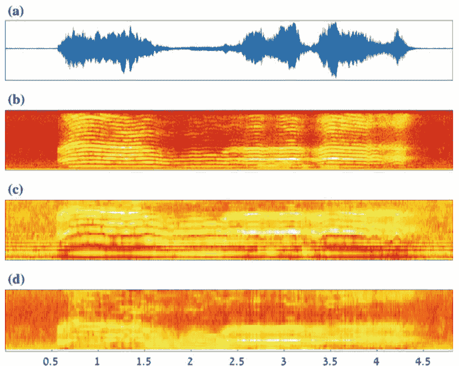

图1 婴儿哭声信号的不同表示。 a信号的波形； b频谱图； c Mel滤波器组（MFB）表示； d线性滤波器组（LFB）表示。 在 b、 c 和 d 中，垂直轴表示频率轴在0-5 kHz范围内的值。 请注意，在 b（频谱图）和 d（LFB） 中，频率轴是线性的，而在 c 中是对数（梅尔频率）。

### 2.2 前馈架构

在自然图像中，图像的两个维度都包含相同的内容（像素颜色值）。因此，用于图像的CNN通常使用共享权重的二维滤波器，对两个维度进行对称处理（例如，3 ×3的核）。然而，在音频领域，一个关键的观察是，对于时频表示，x轴和y轴代表着根本不同的单位，即秒和赫兹。此外，每个轴的刻度可能不同。以LMFB表示为例，频率轴是对数刻度，而时间轴是线性刻度。这要求仔细设计滤波器核，最好集中在频率而不是时间内容上。

在[29]中，我们为哭声检测开发了一种专门的CNN架构。值得注意的是，我们使用了具有“高”滤波器的卷积层，即高度（频率内容）大于宽度（时间内容）的非对称核。这种核的选择是由于LMFB表示中频率的对数尺度的动机。使用“高”滤波器使网络“聚焦”于频率行为，更好地捕捉具有相似频率内容的信号中的细微变化。

在本研究中，我们改进了[29]中提出的架构，并将结果与基于Inception模块[68]的架构进行了比较。在我们的CNN架构中，我们有五个卷积层，后面跟着一个用于最终分类的全连接层。我们从一个14×10的核开始进行第一层卷积，对于每个后续层，将核的每个维度减小2。核维度的逐渐减小可以看作是对输入数据进行多尺度处理，以高效地捕捉频率行为。架构如表1所示。请注意，每个卷积层后面都跟着ReLU（在表1中省略）。

在我们的实验中，我们试图测试我们专门设计的“高”卷积核是否比常见的3×3卷积核表现更好。此外，我们对具有较少可训练参数的架构也感兴趣。为此，我们考虑了两种额外的架构，类似于表1中所示的架构：第一种架构将所有卷积层的卷积核替换为3×3卷积核；第二种架构具有相同的“高”卷积核，但过滤器数量减少，使得可训练参数的总数为270,000。在训练阶段后，提供了第一、第三和第五个卷积层的特征图可视化结果，如图2和图3所示。请注意，图中特征图的尺度差异是由于不同的卷积核尺寸引起的。这种可视化结果表明，每种架构中学到的特征明显不同。

正如预期的那样，第一层的特征结构较少，而最后的特征展现出更有组织的模式。为了比较，我们使用了一个基于模块的架构，类似于Inception-ResNet-v2网络中使用的Inception-ResNet-A模块[68]。在Inception-ResNet-A模块中，输入通过两个并行的卷积路径进行处理，由具有不同内核大小的卷积层组成。为了提高性能，使用了残差连接[69]，使得卷积的输出可以连接到后续层。

### 表1 我们的CNN 9.6M架构

| 层 | 过滤器大小, #过滤器 | 激活函数 | #参数 |
|----|---------------------|----------|-------|
| Conv1 | 14 × 10, 300 | 37 × 20 × 300 | 42,300 |
| Conv2 | 12 × 8, 250 | 26 × 13 × 250 | 7,200,250 |
| Conv3 | 8 × 6, 250 | 19 × 8 × 150 | 1,800,150 |
| Conv4 | 6 × 4, 150 | 14 × 5 × 150 | 540,150 |
| Conv5 | 4 × 2, 50 | 11 × 4 × 50 | 60,050 |
| 全连接 | - | 2 | 4,402 |
| 总计 | - | - | 9,647,302 |

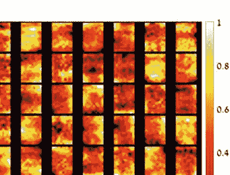

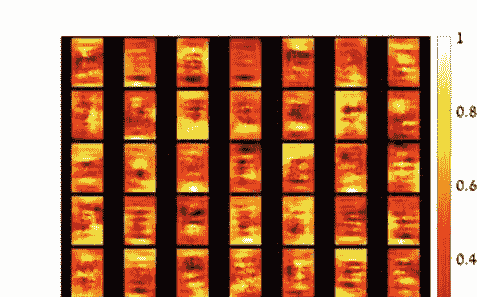

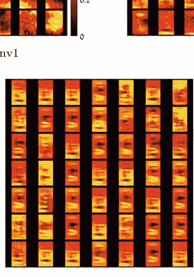

图2 我们的CNN架构生成的特征图的可视化（经过缩放）。请注意，每层只显示了前49个特征图。

添加到初始模块的操作。此外，批量归一化[70]用于提高训练收敛性。为了匹配输入和输出的深度大小，1×1内核被应用于输入和其处理版本。Inception架构的训练速度相对较快，因为它主要基于卷积层。

在我们的Inception-ResNet-A模块的变体中，我们省略了最后的384个1×1内核的滤波器，以减少复杂性并考虑到输入的相对低维度。在我们的实验中，我们考虑了最多三个Inception-ResNet-A模块。为了获得适当的两类（哭/不哭）分布，我们使用两个全连接层（分别具有10和2个单元）将最后一个模块的输出深度减少为2。最终输出是通过对最后一个全连接层的输出应用softmax获得的。

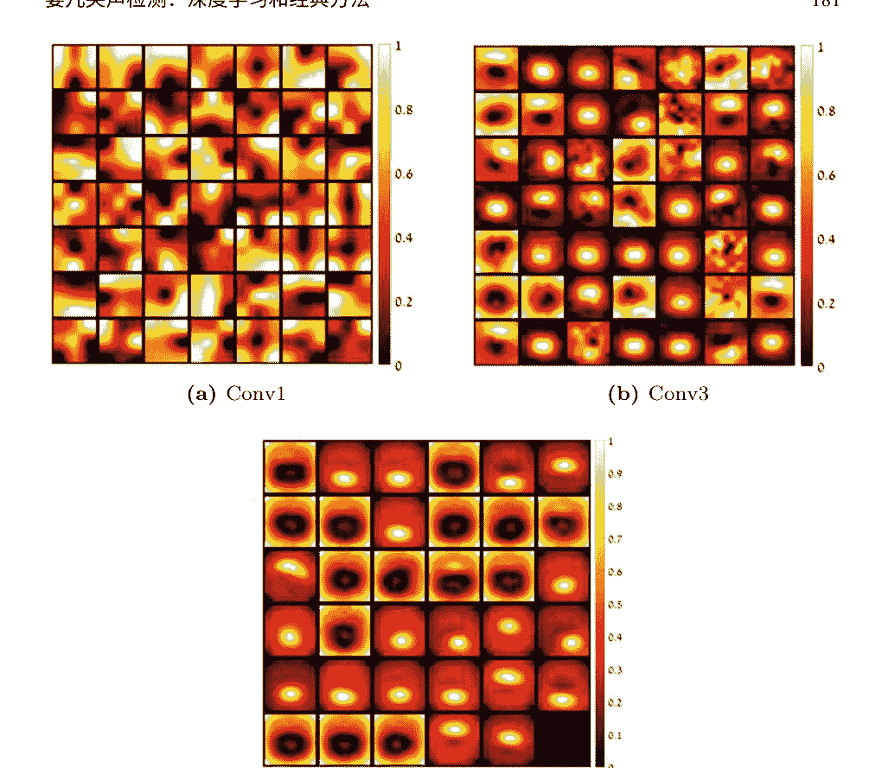

图3 我们的CNN架构生成的特征图的可视化，使用3 ×3的卷积核。

### 2.3 循环神经网络（RNNs）

在传统的前馈架构中，输入和输出是相互独立的。因此，这样的网络无法对序列进行建模；例如，前馈网络可能不是预测句子中单词的最佳选择（例如自动完成），因为我们需要知道前面的单词是什么。另一方面，循环神经网络（RNNs）[65]通过引入记忆组件来捕捉时间信息。近年来，RNNs在语言建模、翻译、图像字幕等各种问题上取得了巨大成功。它们还被发现对于音频检测和分类任务非常有用[71]，特别是语音识别[72]。

在循环神经网络中，每个时间点的输出取决于先前的计算。这是通过学习每个时间点的状态来获得的，该状态取决于当前的输入和先前的状态。

输入和先前的状态。初始状态通常初始化为全零。与使用3D卷积的可能方法相比（即，在时间轴上操作），具有2D卷积（和状态）的RNN提供了一种更高效且更简单的学习时空特征的方法。对于我们的哭声检测应用，使用内存预计会有益，因为哭声序列很可能是相关的。

在我们的实验中，我们研究了双向递归神经网络（BiRNN）架构的性能[73]。在BiRNN中，每个时间点的输出既依赖于未来的输入，也依赖于过去的输入：网络在每个时间点都有正向和反向状态，这些状态用于计算输出。与标准的单向RNN相比，BiRNN通常表现出更好的性能和收敛行为[72, 74, 75]。我们考虑了两种类型的BiRNN架构，每种架构都有两层。在第一种架构中，我们使用了标准的BiRNN层。

在我们的第二个架构中，我们用双向长短期记忆（BiLSTM）层[76-78]替换了BiRNN层，其中状态的计算比BiRNN更复杂，从而更好地捕捉长期依赖关系。此外，BiLSTM层对于梯度消失或梯度爆炸问题的敏感性较低[79]。

作为初步步骤，输入数据经过一个全卷积网络进行处理，其结构与表1中的结构相同（除了全连接层），但参数仅为270,000个。通过将表1中的每一层的滤波器数量减少一个适当的因子，可以得到这个参数数量。在我们的BiRNN和BiLSTM架构中，我们使用了128个单元的状态。

## 3种经典方法

婴儿哭声检测的经典方法通常涉及从音频信号的片段中提取出区分特征，并用这些特征来训练一个分类器。常见的特征包括音高、共振峰和各种时间和频谱特性，如短时能量、梅尔频率倒谱系数（MFCC）等[28, 37, 80]。在我们的研究中，我们将深度学习架构与两种传统技术进行了比较——一种使用逻辑回归分类器，另一种使用支持向量机（SVM）。音频片段的持续时间和特征向量的大小与深度学习算法中使用的相似。

### 3.1 预处理和特征提取

音频录音被分成连续重叠的4096个样本（约93毫秒）的片段，重叠率为50%。为了进行音高检测，这些片段进一步被分成16毫秒的帧。

对每个音频片段计算以下特征：

1. 与音高相关的特征。音高检测算法使用倒谱域中的峰值 $c(n) = \text{IDFT}(\log(\text{DFT}|x(n)|))$ 来获得一个粗略的估计值，并在时域中使用互相关进行初始音高值的细化[81]。一旦在对应于婴儿哭声信号（200-600 Hz）的周期性的倒谱部分中找到显著的峰值 $N_p$，通过找到长度为 $K$ 的相邻信号向量之间的最大互相关来获得更准确的值，其中 $K$ 是大小为 $\delta$ 的邻域内的一个值，围绕 $N_p$。这种方法基于这样的假设，即当它们的长度等于音高周期 $N_0$ 时，向量之间的最大相似性被获得：
    $$ N_0 = \underset{N_p - \delta \leq K \leq N_p + \delta}{\text{argmax}} \frac{\sum_{j=1}^{K} y_1(j) \cdot y_2(j)}{\sqrt{\sum_{j=1}^{K} y_1^2(j) \cdot \sum_{j=1}^{K} y_2^2(j)}} $$
    如果最大互相关超过0.85，则认为音高有效，并且帧被认为是有声的。由于音高是在帧级别上计算的，因此从中提取以下分段级别的特征：分段中位数值和连续有声帧的运行长度。

2. 谐波分析。哭泣爆发主要是有声的，因此它们的信号具有谐波结构，如图4所示。因此，我们期望在谐波频率周围具有高的频谱能量内容，并计算两个参数来捕捉它。第一个参数称为谐波因子（$H_f$），通过找到频谱中$L$个最突出的峰值$f_i$的频率，并根据相应的$f_0$（音高）估计计算它们与预测的谐波频率的偏差量来衡量给定帧的谐波内容，计算公式如下：
    $$ H_f = \frac{1}{L} \sum_{i=1}^{L} \min(f_i \mod f_0, f_0 - f_i \mod f_0) $$
    对于谐波峰，频率与$f_0$的整数倍之间的距离应该很小，因此具有谐波结构的帧的$H_f$应该很小（见图5）。

    第二个参数是谐波与平均功率比（HAPR），它衡量了第一个$M$个谐波分量的功率与帧的平均谱功率之间的比值。如果$X(k)$是音频帧的DFT，而$f_m$是靠近第$m$个谐波的峰值频率，HAPR的计算如下[82, 83]：
    $$ \text{HAPR} = \frac{1}{M} \sum_{m=2}^{M} 10 \log_{10} \frac{|X(f_m)|^2}{\left(\frac{1}{N} \sum_{k=0}^{N-1} |X(2\pi k/N)|^2\right)} \quad \text{(3)} $$

3. 滤波器组和倒谱系数。通过将功率谱 $X_m(K)$ 乘以三角形状的滤波器 $V_i(K)$ 获得滤波器组表示，其中 $U_i$ 和 $L_i$ 分别是每个滤波器的下界和上界，而 $S_i = \sum_{K=U_i}^{L_i} |V_i(K)|^2$ 是一个归一化系数，用于补偿滤波器的可变带宽：
    $$ E_i = \frac{1}{S_i} \sum_{K=U_i}^{L_i} |X_m(K) V_i(K)|^2 \quad \text{(4)} $$
    常用的滤波器组表示使用梅尔刻度，它以一种试图模拟人耳听觉感知的方式排列滤波器和它们的宽度[84, 85]。图6显示了梅尔滤波器组（MFB）和线性滤波器组（LFB）之间的比较，它们的频谱表示也可以在图1中看到。

    当使用MFB表示时，通过将离散余弦变换（DCT）应用于能量向量 $E_i$ 的对数，得到Mel-Filter倒谱系数（MFCC）向量。在我们的算法中，我们使用了前38个MFCC。图7显示了训练集中婴儿哭声部分（红色）与其他所有声音事件（蓝色）中第5个MFC系数的分布示例（约320秒）。尽管存在广泛的重叠区域，但这个特征的区分潜力是显而易见的。

4. 频谱能量参数。不同类型的音频信号在频谱能量上通常表现出不同的模式，由功率谱 $|X_m(K)|^2$ 表示。我们计算了以下两个参数：频谱衰减点 $f_R$ ——在该频率以下，75%的频谱能量集中，以及两个频带的频谱能量比率[0, 2500 Hz]和[2500 Hz, F_s/2]，其中 $F_s$ 是采样频率：
    $$ f_R = f : \sum_{K=0}^{f} |X_m(K)|^2 = 0.75 \cdot \sum_{K=0}^{F_s/2} |X_m(K)|^2 \quad \text{(5)} $$
    $$ \text{BER} = 10 \log_{10} \frac{\sum_{K=f_{2500\ Hz}}^{F_s/2} |X_m(K)|^2}{\sum_{K=0}^{f_{2500\ Hz}} |X_m(K)|^2} \quad \text{(6)} $$

5. 时域特征。还使用了一些简单的时域特征，如过零率（ZCR）和短时能量：
    $$ \text{ZCR}(m) = \frac{1}{2N} \sum_{n=1}^{N-1} | \text{sgn}(x_m(n)) - \text{sgn}(x_m(n - 1)) |。 $$
    $$ E(m) = \frac{1}{N} \sum_{n=0}^{N-1} x_m^2(n)。 $$

特征及其计算的详细描述可在[9, 67, 80]中找到。

图6 Mel滤波器组的示意图（底部）与线性滤波器组（顶部），两者均在0-5 kHz范围内具有10个滤波器。

图7 第5个MFC系数的直方图。虚线：哭声事件，实线：其他事件。

## 3.2 逻辑回归

逻辑回归分类器[64]是一种简单的有监督判别算法，具有较低的计算复杂度。逻辑回归是一个非线性假设函数，形式如下：
$$ h_{\theta}(x) = \frac{1}{1 + \exp(-\theta^T x)} $$
其中，$x$是一个$d$维特征向量，$\theta$是一个权重向量。在我们的情况下，$h_\theta(\boldsymbol{x}) \in (0,1)$预测一个片段是哭声的可能性（接近1的值），还是其他声音的可能性（接近0的值）。最终的二分类结果$y\in \{0, 1\}$（其中1表示哭声事件）通过将$h_\theta(\boldsymbol{x}) \in (0, 1)$与一个阈值进行比较得到。在分类器的训练阶段，使用梯度下降算法来找到最小化$(L_2)$正则化的交叉熵损失函数的$\theta$。
$$ \mathbb{E}(\boldsymbol{\theta}) = -\frac{1}{n}\sum_{j=1}^{n} y^{(j)} \log\left(\frac{1}{1 + \exp(-\boldsymbol{\theta}^T \boldsymbol{x}^{(j)})}\right) -\frac{1}{n}\sum_{j=1}^{n} (1-y^{(j)}) \log\left(\frac{\exp(-\boldsymbol{\theta}^T \boldsymbol{x}^{(j)})}{1 + \exp(-\boldsymbol{\theta}^T \boldsymbol{x}^{(j)})}\right) + \frac{\lambda}{2n}\sum_{k=1}^{d} \theta_k^2, \quad (10) $$
给定一个包含 $n$个标记样本的数据集$\{\boldsymbol{x}^{(j)}, y^{(j)}\}_{j=1}^{n}$，其中 $\lambda$是一个正则化参数。随机梯度下降算法找到的 $\boldsymbol{\theta}$最小化器被分配给(9)来对新的未标记样本进行分类。

逻辑回归算法的示意图如图8所示。输入数据被划分为连续的4096个样本段。对于每个段，计算一个50维特征向量。然后将训练好的正则化逻辑回归应用于每个特征向量，并得到假设函数$h_\theta(\boldsymbol{x})$，表示后验概率的估计 $p(y|\boldsymbol{x})$，其中 $y\in\{0,1\}$表示要分类的声音事件为哭声或非哭声， $\boldsymbol{x}$是特征向量。使用阈值 $\text{Th}_1$，根据以下规则设置每个段的初始决策值：
$$ d(n) = \begin{cases} 1, & \text{if } h_\theta(\boldsymbol{x}) > \text{Th}_1 \\ 0, & \text{否则.} \end{cases} \quad (11) $$
图8 逻辑回归算法的示意块图。

单个片段的持续时间约为93毫秒，而大多数哭声事件至少持续几百毫秒。为了避免对太短以至于不太可能是哭声事件的部分进行错误检测，进行如下平滑操作：将长度为 $L$ 的滑动窗口应用于初始决策序列，根据以下规则更新中心段的平滑决策 $d_s(n)$：
$$ d_s(n) = \begin{cases} 1, & \text{if } \sum_{k=-M}^{M} d(n-k) > \text{Th}_2 \\ 0, & \text{否则}. \end{cases} \quad (12) $$
其中 $L$ 为奇数，$M = (L - 1)/2$，$\text{Th}_2 \in [1, L]$ 为预定义的阈值。

## 3.3 支持向量机

支持向量机（SVM）是一种监督的大边界分类器，它试图找到两类数据之间的分离超平面，使得超平面与最近样本集合之间的间隔最大化。为了训练SVM，我们采用了顺序最小优化（SMO）算法[86]，该算法解决了以下最小化问题：
$$ \min_{\theta_0, \theta, \xi} \frac{1}{2} \|\theta\| + C \sum_{m=1}^{M} \xi_m $$
$$ \text{s.t.} \quad x_m \geq 0, y_m(\theta^T x_m + \theta_0) \geq 1 - \xi_m, m = 1, 2, ..., M \quad (13) $$
其中 $\theta$ 和 $\theta_0$ 是要学习的最大间隔超平面的参数，$x_m$ 是输入数据点（特征向量），$y_m \in \{-1, 1\}$ 是输出点（数据标签 - “哭”或“不哭”），$\xi$ 是允许间隔失败的松弛变量，C是一个权衡少量间隔失败和宽间隔的参数[86]。

在图8的块图中，训练好的SVM可以替代逻辑回归分类器使用。表2给出了两个分类器的性能比较。

表2 给定检测率的误报率总结

| 分类器/检测率 | 75% | 80% | 85% | 90% | 95% |
| :--- | :--- | :--- | :--- | :--- | :--- |
| CNN 9.6M “高” | 0.25% | 0.44% | 0.66% | 1.07% | 3.50% |
| CNN 270K “高” | 0.47% | 0.72% | 0.95% | 1.95% | 6.30% |
| CNN 9.6M 3 × 3 | 0.51% | 0.73% | 1.30% | 2.39% | 5.41% |
| CNN 270K 3 × 3 | 0.48% | 0.98% | 2.01% | 3.22% | 7.8% |
| SVM | 0.31% | 0.52% | 1.39% | 4.13% | 9.75% |
| 逻辑回归 | 0.38% | 0.6% | 1.23% | 3.81% | 9.80% |

# 4 性能评估

## 4.1 数据库

本研究的数据库包括荷兰0-6个月大婴儿的三小时音频记录（采样率为44,100 Hz），使用现成的智能手机进行记录[87]。这些婴儿在家庭环境中连续记录了几天。这些记录已经完全注释，包括大约50种不同的事件类型，如哭泣、父母交谈、开关门等。

## 4.2 训练和测试过程

我们的训练语料库包含了14%的标记数据，而测试语料库包含了剩下的86%。我们使用MATLAB训练了前馈型CNN架构，使用TensorFlow训练了RNN架构（BiRNN和BiLSTM）。我们使用了Adam [88]作为自适应学习率优化算法，初始学习步长为0.00001。每次迭代中的梯度计算使用了32个片段的小批量数据。我们的损失函数是交叉熵损失。为了避免过拟合，我们对权重应用了L2正则化，缩放因子为0.0001。网络在训练数据上进行了20个周期的训练。使用的硬件包括Intel Core i7-7700K 4.2 GHz CPU和NVIDIA GTX 1080 Ti 11GB GDDR5 GPU。在测试（即推理）过程中，我们使用了第3.2节中描述的多数投票过程，其中 $L =17$。也就是说，如果在17个片段的邻域中至少有8个其他片段被分类为“哭”，那么该片段被分类为“哭”。CNN 9.6 M的推理延迟（在软件中）小于2.5毫秒每个片段。事实上，通过使用专门用于在硬件中部署训练好的网络的工具，如NVIDIA的TensorRT或Intel的Deep Learning Deployment Kit，可以大大减少这种延迟。

## 4.3 结果

作为性能指标，我们使用了两个重要的度量标准，即检测率和误报率。检测率（也称为敏感度或召回率）被定义为真正事件（TP）的数量与记录集中总共的哭声事件（真正事件TP和假阴性事件FN）的比率。误报率被定义为误报事件（将非哭声事件错误地识别为哭声事件（FP））的数量与记录集中总共的非哭声事件（误报事件FP和真负事件TN）的比率。因此，检测率为 TP /（TP + FN），误报率为 FP/（FP + TN）。

在对不同分类器的哭声检测性能进行分析时，我们关注的是误报率和检测率之间的权衡。特别是，在低误报率范围内的性能是我们关注的重点，这在实践中是必需的。性能评估是使用接收器操作特性（ROC）曲线进行的。

首先，我们对MFB和LFB表示进行了比较（参见第2.1节），通过比较我们的CNN 960万架构在两种表示下的ROC曲线。如图9所示，MFB表示优于LFB。正如前面讨论的，这是因为MFB中的Mel尺度更适合在存在相似特征的噪声中检测信号。

在我们的下一个实验中，我们比较了第2.2节中描述的前馈架构的性能。结果见图10。首先，对于所有的误报率，我们的CNN 960万“高”架构优于所有其他架构。这在误报率低于2%时尤为明显。有趣的是，尽管与CNN 960万“高”架构相比，CNN 27万“高”网络使用的参数要少得多，但其性能非常好。此外，它与CNN 960万3×3具有类似的结果。也就是说，即使对于参数较少的网络，使用“高”滤波器也是非常有益的。

我们随后将我们的CNN 9.6M与BiRNN和BiLSTM架构进行了比较，这些架构在第2.3节中进行了描述。结果显示在图11中。正如结果所示，通过使用RNN引入内存对结果的影响有限。原因可能是哭声事件的持续时间较短，这限制了具有内存的架构的好处。这也暗示了对于这种架构，除了更长的训练过程外，还需要更强大的CNN进行特征提取。

图10 我们的前馈CNN架构的ROC曲线。

图11 CNN与9.6M参数的比较，BiLSTM和BiRNN。

图12 CNN、SVM和逻辑回归分类器的ROC曲线。

最后，我们将我们的CNN 9.6M“高大”架构与逻辑回归和SVM进行了比较。这在图12中显示。我们看到深度学习方法优于传统的分类器，尽管后者的性能非常好，在非常低的误报率情况下，它甚至优于比CNN 9.6M“高大”还要弱的CNN架构。

评估结果总结在表2中。对于检测率为75、80、85、90和95%，CNN 9.6 M“高”分类器的误报率最低，与其他深度学习方法以及传统的机器学习算法（如SVM或逻辑回归）相比。

# 5 结论

在这项研究中，我们评估了深度学习和传统方法在婴儿哭声检测方面的性能。我们研究了几种CNN架构，以及用于更好捕捉时间行为的递归神经网络（包括LSTM）。我们研究了输入音频信号的图像表示，并发现对数Mel-滤波器组（MFB）是一种合适的表示方法。我们证明了通过根据MFB表示仔细选择卷积核的大小和形状，可以实现比常见的深度学习架构更好的性能。我们的CNN分类器显示出与传统的机器学习分类器（如SVM或逻辑回归）相比，显著更好的结果。

特别是在实践中对低误报率的要求非常高。我们的研究证明了深度学习在音频事件检测中的强大优势和优点。

# 参考文献

- 1. Krizhevsky, A., Sutskever, I., Hinton, G.E.: 使用深度卷积神经网络进行ImageNet分类。在: Pereira, F., Burges, C.J.C., Bottou, L., Weinberger, K.Q. (eds.)神经信息处理系统的进展，第25卷，第1097-1105页。CurranAssociates, Inc. (2012). http://papers.nips.cc/paper/4824-imagenet-classification-with-deep-convolutional-neural-networks.pdf
- 2. Hershey, S., Chaudhuri, S., Ellis, D.P., Gemmeke, J.F., Jansen, A., Moore, R.C., Plakal, M., Platt, D., Saurous, R.A., Seybold, B.: 用于大规模音频分类的CNN架构。在: IEEE国际声学、语音和信号处理会议（icassp），第131-135页。IEEE（2017年）
- 3. Cakir, E., Heittola, T., Huttunen, H., Virtanen, T.: 使用多标签深度神经网络的多音色声音事件检测。在：国际神经网络联合会议（IJCNN），第1-7页。IEEE（2015年）
- 4. Ramirez, J., Grriz, J.M., Segura, J.C.: 语音活动检测。基础知识和语音识别系统的鲁棒性（2007年）
- 5. Ruinskiy, D., Lavner, Y.: 一种用于语音和歌曲信号中呼吸声自动检测和精确划分的有效算法。IEEE Trans. Audio Speech Lang. Process. 15, 838-850（2007年）
- 6. Kong, Y.-Y., Mullangi, A., Kokkinakis, K.: 用于听力设备中语音增强的摩擦辅音分类。PloS one（2014年）
- 7. Frid, A., Lavner, Y.: 用于自动分类摩擦音的频谱和纹理特征。在：第22届太平洋语音会议（PVC），第1-4页（2014年）
- 8. Panagiotakis, C., Tziritas, G.: 基于均方根和过零率的语音/音乐判别器。IEEE Trans. Multimed. 7, 155-166（2005年）
- 9. Lavner, Y., Ruinskiy, D.: 基于决策树的语音/音乐分类和分割算法。EURASIP J. Audio Speech Music Process.（2009年）
- 10. Tzanetakis, G., Cook, P.: 音频信号的音乐流派分类。IEEE Trans. Speech Audio Process. 10（5），293-302（2002年）
- 11. Barchiesi, D., Giannoulis, D., Stowell, D., Plumbley, M.D.: 声音场景分类：从声音中分类环境。IEEE Signal Process. Mag. 32（3），16-34（2015年）
- 12. Morgan, N., Bourlard, H.: 连续语音识别. IEEE信号处理杂志 12(3), 24–42 (1995)
- 13. Aruna, C., Parameswari, A.D., Malini, M., Gopu, G.: 基于语音识别和触摸屏控制的轮椅给瘫痪人士使用。在：2014年国际绿色计算通信和电气工程会议(ICGCCEE), pp. 1–5 (2014)
- 14. Carletti, V., Foggia, P., Percannella, G., Saggese, A., Strisciuglio, N., Vento, M.: 使用声音词袋分类器的音频监控。在：2013年第10届IEEE国际高级视频和信号基础监控会议, pp. 81–86 (2013)
- 15. Ye, J., Kobayashi, T., Higuchi, T.: 基于音频的室内健康监测系统使用FLAC特征。在：2010年国际新兴安全技术会议, pp. 90–95 (2010)
- 16. Kawano, D., Ogawa, T., Matsumoto, H.: 从观察到的音频信号中抑制点击噪声的方法提案。在：2017年智能信号处理和通信系统国际研讨会(ISPACS), 第93-96页(2017)
- 17. Zhang, H., McLoughlin, I., Song, Y.: 使用卷积神经网络进行鲁棒的声音事件识别。 在: 2015年IEEE国际声学、语音和信号处理会议(ICASSP)，第559-563页(2015)
- 18. Piczak, K.J.: 使用卷积神经网络进行环境声音分类。 在: IEEE第25届机器学习信号处理研讨会(MLSP)，第1-6页(2015)
- 19. Valenti, M., Diment, A., Parascandolo, G., Squartini, S., Virtanen, T.: 使用卷积神经网络的DCASE 2016声学场景分类。 在: 2016年声学场景和事件检测与分类研讨会(DCASE2016)论文集。 坦佩雷科技大学信号处理系(2016)
- 20. Cakir, E., Parascandolo, G., Heittola, T., Huttunen, H., Virtanen, T.: 用于多音事件检测的卷积循环神经网络. IEEE/ACM Trans. Audio Speech Lang.Process. 25(6), 1291–1303 (2017)
- 21. Naithani, G., Barker, T., Parascandolo, G., Bramslow, L., Pontoppidan, N.H., Virtanen, T.: 使用卷积循环神经网络进行低延迟声源分离. 在: 2017 IEEE应用信号处理于音频和声学(WASPAA)研讨会, pp. 71–75(2017)
- 22. Dieleman, S., Schrauwen, B.: 音乐音频的端到端学习. 在: 2014 IEEE 国际会议 on 声学,语音和信号处理(ICASSP), pp. 6964–6968 (2014)
- 23. Pons, J., Nieto, O., Prockup, M., Schmidt, E.M., Ehmann, A.F., Serra, X.: 音乐音频标记的端到端学习. 在: ISMIR (2018)
- 24. Ferretti, D., Severini, M., Principi, E., Cenci, A., Squartini, S.: 利用深度神经网络在恶劣的声学环境中检测婴儿哭声. 在: EUSIPCO (2018)
- 25. Turan, M.A.T., Erzin, E.: 使用胶囊网络架构在家庭环境中监测婴儿的情绪哭声. 在: Interspeech (2018)
- 26. Sabour, S., Frosst, N., Hinton, G.E.: 胶囊之间的动态路由. 在: NIPS (2017)
- 27. Torres, R., Battaglino, D., Lepouloux, L.: 婴儿哭声检测: 手工特征和深度学习方法的比较. 在: EANN (2017)
- 28. Saraswathy, J., Hariharan, M., Yaacob, S., Khairunizam, W.: 婴儿哭声的自动分类: 一篇综述. 在: 2012年国际生物医学工程会议(ICoBE), 第543-548页(2012)
- 29. Lavner, Y., Cohen, R., Ruinskiy, D., IJzerman, H.: 使用深度学习在家庭环境中进行婴儿哭声检测. 在: 2016年国际电气工程科学会议 (ICSEE 2016) (2016年)
- 30. Zhang, X., Zou, Y., Liu, Y.: 基于轻量级卷积神经网络的婴儿哭声检测系统AICDS, 第185-196页. Springer (2018年)
- 31. Xu, Y., Hasegawa-Johnson, M., McElwain, N.: 婴儿-父母口语互动中的婴儿情绪爆发检测. 在: Interspeech (2018年)
- 32. Silva, G., Wickramasinghe, D.: 具有自动安抚和视频监控功能的婴儿哭声检测系统. J. Eng. Technol. Open Univ. Sri Lanka (JET-OUSL) 5 (1)。 http://digital.lib.ou.ac.lk/docs/handle/701300122/1476 (2017年)
- 33. 高，J.，帕邦，L.： 热车婴儿检测器。 伊利诺伊工程学院，技术报告，2014年12月
- 34. 棒棒糖智能婴儿监视器。 https://www.lollipop.camera/ (2018年)
- 35. 茧形摄像头婴儿监视器。 https://cocooncam.com/ (2019年)
- 36. Evoz Wi-Fi婴儿视觉监视器。 https://myevoz.com/ (2019年)
- 37. Varallyay，G.： 哭声的旋律。 国际儿科耳鼻喉科杂志。 71 (11)，1699-1708 (2007年)
- 38. Zabidi, A.，Khuan, L.Y.，Mansor, W.，Yassin, I.M.，Sahak, R.： 使用多层感知器神经网络对窒息婴儿的分类。 在： 2010年第二届国际计算机工程与应用会议论文集。 ICCEA 2010, vol. 01, pp. 204-208。 IEEE计算机学会，华盛顿，美国 (2010年)
- 39. Orlandi, S.，Reyes-Garcia, C.A.，Bandini, A.，Donzelli, G.，Manfredi, C.： 应用模式识别技术对足月和早产婴儿哭声的分类。 声音杂志。 声音基金会。 30, 10 (2015年)
- 40. Michelsson, K., Michelsson, O.: 新生儿、婴儿哭声中的发声。国际儿科耳鼻喉科学杂志 49, S297-S301 (1999)
- 41. Bowlby, J.: 依恋与失落。基础图书, 卷1 (1969)
- 42. Ostwald, P.: 婴儿的声音。发展医学与儿童神经学 14(3), 350-361 (1972)
- 43. Owings, D., Zeifman, D.: 人类婴儿哭声作为动物沟通系统的一种方法:来自评估/管理方法的见解。 在: 通信系统的演化:一种比较方法, 第151-170页 (2004)
- 44. Nelson, J.: 透过眼泪看世界:哭泣与依恋。Routledge (2005)
- 45. IJzerman, H., et al.: 人类灵长类动物中社会温度调节理论。前沿心理学 6, 464 (2015)
- 46. Butler, E.A., Randall, A.K.: 亲密关系中的情绪共调节。情绪评论 5(2), 202-210 (2013年)
- 47. LaGasse, L.L., Neal, A.R., Lester, B.M.: 婴儿哭声评估:声学哭声分析和父母感知。智力障碍和发展障碍研究评论 11(1), 83-93 (2005年)
- 48. Hendriks, M., Nelson, J.K., Cornelius, R., Vingerhoets, A.: 为什么哭泣改善我们的幸福感:附着理论视角下成年人哭泣的功能。 在: 情绪调节:概念和临床问题, 第87-96页 (2008年)
- 49. Pal, P.A., Iyer, N., Yantorno, R.E.: 从婴儿面部表情和哭声中检测情绪。在: 2006年IEEE国际声学、语音和信号处理会议论文集,第2卷,第II-II页 (2006年)
- 50. Barajas-Montiel, S., Reyes-Garcia, C.A.: 使用分类器集合识别婴儿哭声中的疼痛和饥饿, 第770-775页 (2005年)
- 51. Wasz-Höckert, O.: 婴儿哭声的光谱图和听觉分析。Spastics International Medical Publications与W. Heinemann Medical Books合作出版。系列临床发展医学 (1968年)
- 52. Vingerhoets, A.: 为什么只有人类哭泣:揭开眼泪的奥秘。牛津大学出版社 (2013年)
- 53. Bell, S.M., Salter Ainsworth, M.D.: 婴儿哭泣和母亲的反应能力。 在: 儿童发展, 第43卷, 第1171-90页 (1973年)
- 54. Lounsbury, M.L., Bates, J.E.: 不同感知难度水平婴儿的哭声:声学特性及对听者的影响。儿童发展。 53(3), 677-686 (1982)
- 55. Zeskind, P., Barr, R.: 腹绞痛婴儿自然发生的哭声的声学特征。儿童发展。 68, 394-403 (1997)
- 56. Laan, A., Assen, M.V., Vingerhoets, A.: 成年人哭泣的个体差异:依恋风格的作用。社会行为个体。国际期刊 (2012)
- 57. Bryant Furlow, F.: 人类新生儿哭声质量作为健康状况的诚实信号。进化人类行为。 18, 175-193 (1997)
- 58. Kheddache, Y., Tadj, C.: 健康新生儿和有病理的新生儿哭声特征的声学测量。生物医学科学工程。 06(08), 796-804 (2013)
- 59. Orlandi, S., Manfredi, C., Bocchi, L., Scattoni, M.L.: 自动新生儿哭声分析:一种非侵入性工具, 用于帮助自闭症早期诊断。 In: 2012年IEEE工程医学与生物学学会年度国际会议, 第2953-2956页 (2012年)
- 60. Sheinkof, S.J., Iverson, J.M., Rinaldi, M.L., Lester, B.M.: 风险自闭症谱系障碍的6个月大婴儿的非典型哭声声学特征。自闭症研究。 5(5), 331-339 (2012年)
- 61. Jeyaraman, S., Muthusamy, H., Wan, K., Jeyaraman, S., Nadarajaw, T., Yaacob, S., Nisha, S.: 综述:自动婴儿哭声分析和分类的调查。健康技术。 8 (2018)
- 62. IJzerman, H., Ćolić, M., Hennecke, M., Hong, Y., Hu, C.-P., Joy-Gaba, J., Lazarevic, D., Lazarevic, L., Parzuchowski, M., Ratner, K.G., Schubert, T., Schuetz, A., Stojilovic, D., Weissgerber, S., Zickfeld, J., Lindenberg, S.: 距离赤道的远近是否预测自我控制？来自人类企鹅项目的教训。行为与脑科学。 40 (2017)
- 63. IJzerman, H., Lindenberg, S., Dalgar, I., Weissgerber, S., Clemente Vergara, R., Cairo, A., Colic, M., Dursun, P., Frankowska, N., Hadi, R., Hall, C., Hong, Y., Hu, C.-P., Joy-Gaba, J., Lazarevic, D., Lazarevic, L., Parzuchowski, M., Ratner, K.G., Rothman, D., Zickfeld J.: 人类企鹅项目:气候、社会融合和核心体温。Collabra:心理学。 4 (2018)
- 64. Bishop, C.M.：模式识别与机器学习。 Springer Science+Business Media (2006)
- 65. Goodfellow, I., Bengio, Y., Courville, A.：深度学习。 MIT Press，http://www.deeplearningbook.org (2016)
- 66. Rumelhart, D.E., Hinton, G.E., Williams, R.J.: 通过反向传播学习表示. 自然 323, 533–536 (1986)
- 67. Huang, X., Acero, A., Hon, H.-W.: 口语处理：理论、算法和系统开发指南. Prentice Hall PTR (2001)
- 68. Szegedy, C., Ioffe, S., Vanhoucke, V.: Inception-v4、inception-resnet和残差连接对学习的影响. CoRR (2016) arXiv:1602.07261
- 69. He, K., Zhang, X., Ren, S., Sun, J.: 深度残差学习用于图像识别. 在：2016年IEEE计算机视觉和模式识别会议 (CVPR)，第770-778页 (2016)
- 70. Ioffe, S., Szegedy, C.: 批归一化：通过减少内部协变量偏移加速深度网络训练. CoRR, arXiv:1502.03167
- 71. Phan, H., Koch, P., Katzberg, F., Maaß, M., Mazur, R., Mertins, A.: 使用深度循环神经网络进行音频场景分类. 在：INTERSPEECH (2017)
- 72. Graves, A., Mohamed, A., Hinton, G.E.: 使用深度循环神经网络进行语音识别. CoRR (2013) arXiv:1303.5778
- 73. Schuster, M., Paliwal, K.K.: 双向循环神经网络. IEEE信号处理杂志 45(11), 2673-2681 (1997)
- 74. Graves, A., Jaitly, N., Mohamed, A.: 混合语音识别与深度双向LSTM. 在2013年IEEE自动语音识别和理解研讨会上，pp. 273-278 (2013)
- 75. Ben-Yehuda, T., Abramovich, I., Cohen, R.: 使用循环神经网络进行低复杂度视频分类. 在：2018年电气工程科学国际会议(ICSEE 2018) (2018)
- 76. Hochreiter, S., Schmidhuber, J.: 长短期记忆. 神经计算 9(8), 1735–1780 (1997)
- 77. Graves, A.: 用循环神经网络进行监督序列标注, 系列研究在计算智能中, 卷385. Springer (2012)
- 78. Fei, H., Tan, F.: 双向网格长短期记忆 (bigridlstm): 一种解决上下文敏感性和梯度消失的方法. 算法 11 (2018)
- 79. Glorot, X., Bengio, Y.: 理解训练深度前馈神经网络的困难. 在：Teh, Y.W., Titterington, M. (eds.) 第十三届国际人工智能和统计会议论文集, 系列机器学习研究论文集.卷9, 页249–256 PMLR (2010)
- 80. Cohen, R., Lavner, Y.: 婴儿哭声分析和检测. 在：2012年以色列电气和电子工程师协会第27届大会 (IEEEI 2012), 第2-6页 (2012)
- 81. Noll, A.M.: 倒谱音高确定. J. 声学学会 41 (2), 293–309 (1967)
- 82. van Waterschoot, T., Moonen, M.: 五十年声学反馈控制的现状和未来挑战. IEEE会议记录 99(2), 288–327 (2011)
- 83. van Waterschoot, T., Moonen, M.: 基于陷波器的啸叫抑制中啸叫检测准则的比较评估. 音频工程学会杂志 58(11), 923–940 (2010)
- 84. Rabiner, L.R., Schafer, R.W.: 数字语音处理的理论与应用. 第64卷. Pearson, Upper Saddle River (2011)
- 85. Quatieri, T.: Discrete-Time Speech Signal Processing: Principles and Practice. Prentice Hall, London (2002)
- 86. Platt, J.: Sequential minimal optimization: a fast algorithm for training support vector machines (1998)
- 87. Frederiks, K., Sterkenburg, P., Lavner, Y., Cohen, R., Ruinskiy, D., Verbeke, W., IJzerman, H.: Mobile social physiology as the future of relationship research and therapy: presentation of the bio-app for bonding (BAB), PsyArXiv (2018)
- 88. Kingma, D., Ba, J.: Adam: a method for stochastic optimization. In: International Conference on Learning Representations, December 2014

## 使用卷积神经网络保护工业控制系统免受虚假数据注入攻击

Sasanka Potluri, Shamim Ahmed和Christian Diedrich

摘要 由于现代基础设施开发和使用的趋势，对工业控制系统（ICS）的攻击是不可避免的。新的威胁和其他形式的攻击不断涌现，以利用系统中的漏洞，危及安全参数，如机密性、完整性和可用性（CIA）。

注入攻击，也称为虚假数据注入攻击（FDIA），是对ICS的复杂攻击。FDIA通过修改数据包的有效负载来影响数据的完整性，并被视为远程访问的入侵。在FDIA中，攻击者可以访问ICS中的关键进程或进程参数，并强制它们按照新注入的代码或命令执行。为了进行我们的研究，我们使用了集成自动化实验室的一个过程控制装置来获取与ICS相关的不同参数。我们模拟并注入了测量注入和命令注入等注入攻击到获取的装置数据中。卷积神经网络（CNN）用于评估识别这些注入攻击的功能。为了将模拟的装置数据输入CNN，进行了多个步骤，包括预处理、特征提取、数据转换和图像表示。构建了一个具有非线性ReLU激活的3层全连接CNN架构，并添加了一个SoftMax分类层，用于将输入数据分类为正常或攻击。通过检查方差来正确训练CNN，以避免网络的过拟合和欠拟合。

计算了准确率、召回率、精确率、F-度量和Cohen's kappa系数等性能参数。与其他深度学习方法相比，卷积神经网络在性能上表现更好。

S. Potluri (邮箱) · S. Ahmed · C. Diedrich
德国马格德堡奥托·冯·吉里克大学电气工程与信息技术学院自动化工程研究所
电子邮件：sasanka.potluri@ovgu.de

S. Ahmed
电子邮件：shamim.ahmed@ovgu.de

C. Diedrich
电子邮件：christian.diedrich@ovgu.de

关键词： 卷积神经网络 · 注入攻击 · 工业控制系统

# 1 引言

工业控制系统（ICS）在全球范围内运行工业基础设施，包括电力、水、石油/天然气、管道、化工、矿业、制药、运输和制造。ICS测量、控制并提供过程视图。典型的ICS类型包括监控与数据采集（SCADA）、分布式控制系统（DCS）、可编程逻辑控制器（PLC）、远程终端单元（RTU）和现场仪表。这些类型的系统广泛应用于全球工业基础设施中。

ICS的共性及其架构使得国际自动化协会（ISA）能够建立一个针对工业过程安全的总体委员会——S99 [1]。

ICS网络安全在20世纪90年代中后期正式被确认，当时发布了总统决策指令（PDD）63 [2]。当时，美国能源部（DOE）的国家实验室开始对公用事业进行机密（非机密）基础上的网络安全评估。由于这些评估结果没有公开，除非公用事业公司愿意分享他们的结果，否则很少有人了解到这些结果。尽管采取了几项措施，ICS仍然遭受了多次攻击。已知的对ICS的攻击包括但不限于：

- 特洛伊木马攻击：1982年，塞尔维亚发生了首次对关键基础设施的已知攻击。特洛伊木马被用来在泵速和阀门设置中插入恶意值，从而产生超出管道接头和焊缝可接受的高压，导致爆炸。这种攻击可以被视为对ICS的注入攻击[3]。
- SQLSlammer攻击：2003年，SQLSlammer蠕虫感染了俄亥俄州的戴维斯-贝西核电厂的SCADA系统。该蠕虫关闭了负责处理该电厂安全系统的监控SCADA系统的HMI。这可以被视为对ICS的拒绝服务（DoS）攻击[4]。
- 行动Ghoul：2016年8月，卡巴斯基实验室发现了一次针对工业组织的钓鱼活动。攻击始于一封看似来自阿联酋银行的电子邮件。这封电子邮件附带了一个名为HawkEye的恶意软件，通过键盘输入和剪贴板数据收集个人信息。全球约有130个组织受到了这次攻击的影响。这种攻击可以被视为对ICS的探测攻击[5]。
- 纽约水坝袭击：美国基础设施遭到袭击并渗透纽约水坝的计算机控制系统。司法部声称这是伊朗黑客所为。攻击者侵入了指挥和控制系统，2013年，通过一个蜂窝调制解调器入侵了水坝的系统。 尽管攻击发生在2013年，但直到2016年才确认这次网络攻击[6]。

在1990年代，ICS的网络安全意识非常低，其重要性被低估。 通常，它被视为一个公司的信息技术（IT）问题，对发电厂或电网运营几乎没有直接影响。 此外，它被视为ICS技术进步的阻碍。 从安全的角度来看，ICS通常是孤立的网络，而“安全通过混淆”这个概念仍然存在。 由于安全性不是一个考虑因素，几乎没有理由质疑对更紧密的系统集成的需求。

保护工业控制系统的根本原因是为了维护系统的任务，无论是生产还是输送电力，制造还是分发汽油，提供清洁水等等。 电子化保护工业控制系统并不是一件简单的事情。 然而，可以增加安全措施并最大程度地减少已经造成数亿欧元损失和许多生命的意外事件的可能性。

传统上，网络安全通常在商业信息技术系统和国防计算机系统的背景下进行考虑。 以前，工业控制系统通常不被视为“计算机”，也不经常考虑其容易受到网络威胁的问题。 因此，网络安全在计算机科学系的教学中主要关注传统的信息技术概念。 工业控制系统通常不使用商业操作系统，其计算资源受到限制。 它们通常使用专有的实时操作系统（RTOS）或嵌入式处理器。 这些系统具有不同的操作要求，并可能受到与信息技术系统相似的网络漏洞以及工业控制系统独有的网络漏洞的影响。 工业控制系统不断升级，具备先进的通信能力，并通过网络连接以提高流程效率、生产力、合规性和安全性。 这种网络连接可以在同一设施内，也可以跨越大陆之间的设施之间。 工业控制系统涉及各种工程学科，如控制系统和应用，但不涉及计算机安全领域。 当工业控制系统运行不正常时，可能会导致从轻微问题到灾难性影响的各种后果。

IT安全通常涉及传统的现成硬件和软件。 现有的IT漏洞，如探测，也有可能适用于ICS领域。 但是这些漏洞在ICS领域可能是最不重要的。 安全三元概念：保密性、完整性和可用性（CIA）定义了保护系统的需求（图1）。 在IT领域，网络攻击通常集中在获取专有信息上，因此CIA三元组使得保密性成为最重要的属性。

然而，在ICS领域，攻击往往集中在破坏资产上，而且大多数攻击会影响ICS的完整性和功能性。 这使得完整性和可用性比保密性更重要。

因此，保护ICS的研究必须以解决完整性和可用性为首要任务，其次是保密性。

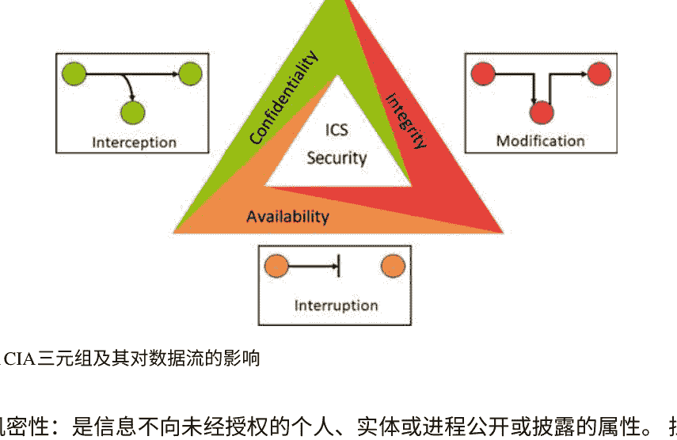

- 机密性：是信息不向未经授权的个人、实体或进程公开或披露的属性。拦截数据会导致机密性的违反。
- 完整性：是在整个生命周期中维护和确保数据的准确性和完整性，或者保护信息不被未经授权的方式修改的属性。对数据的外部修改会导致完整性的违反。
- 可用性：是确保授权方或实体在需要时能够访问信息或设备的属性。数据到达或传输的中断会导致可用性的违反。

从表1可以清楚地看出，ICS采取的安全措施与IT不同，需要特别注意。ICS的设计标准是性能和安全，而不是安全，在初始阶段违反这些标准的攻击需要被识别出来。

尽管在21世纪初期就对ICS的安全性，特别是在关键的国家基础设施背景下，表达了强烈的担忧[7]。对ICS的可能攻击主要可以分为两类，即网络攻击和注入攻击。

| 优先级 | 信息技术（IT） | 工业控制系统（ICS） |
| :--- | :--- | :--- |
| 1 | 机密性 | 可用性 |
| 2 | 完整性 | 完整性 |
| 3 | 可用性 | 机密性 |

## 1.1 网络攻击

ICS是一个泛指，包括多种类型的控制系统和相关技术。网络控制系统（NCS）是控制系统中使用通信网络闭合控制回路的一个特定领域。图2中的ICS架构也可以被视为NCS的一个示例。攻击类型可能会在不同年份之间发生显著变化。许多实际攻击涉及漏洞的组合。ICS上的一些常见攻击包括：

- 拒绝服务（DoS）：针对ICS的攻击，目的是停止ICS的某个部分的正常运行或有效地禁用整个系统。这些攻击可以针对连接的物理系统或ICS本身。针对物理系统的DoS攻击可以从手动打开或关闭阀门，切换到破坏物理过程的部分，以防止操作。针对ICS的DoS攻击主要针对通信链路或试图禁用运行在系统端点上的控制系统、日志数据和通信的程序[8]。DoS攻击主要影响ICS中的‘可用性’，这是主要优先考虑的因素。

- 探测：用于了解网络状态的行动或对象。它收集或监视网络活动，并尝试访问计算机及其文件。探测攻击主要影响ICS中的‘机密性’。

关于不同类型的网络攻击及其检测机制的更详细信息可以在[9]中找到。

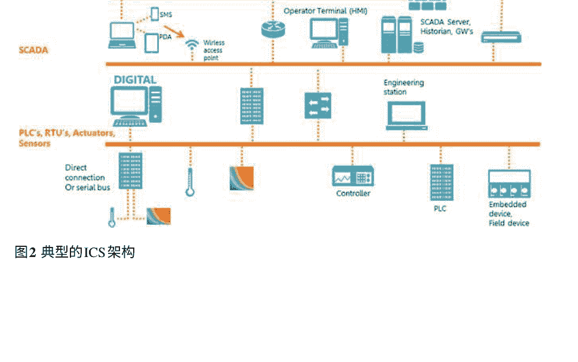

## 1.2 注入攻击

注入攻击也被称为虚假数据注入攻击（FDIA），攻击者可以获取对ICS中的关键进程或进程参数的访问权限，并强制系统执行新引入的代码或命令。注入攻击会影响ICS的‘完整性’。一些常见的注入攻击包括：

- 响应注入：ICS协议通常会接收查询的第一个响应数据包，并拒绝后续的响应数据包，将其视为错误的。这使得可以制作响应数据包，并利用时序攻击将这些响应数据包在客户端期望接收时注入到网络中。

- 测量注入：在这种类型的攻击中，虚假的过程测量数据被注入到ICS中。攻击者模拟一个过程测量，例如水位或气压的增加或减少，从而产生虚假的执行动作。

- 命令注入：在这种类型的攻击中，虚假的控制或配置命令被注入到ICS中。此类攻击的潜在影响包括中断过程控制、中断设备通信、未经授权修改设备配置等。

FDIA通过修改数据包的有效负载来影响数据完整性。这些也被认为是远程访问入侵攻击的一部分，并且被认为很难检测。由此可见，FDIA攻击比DoS攻击更加隐蔽，难以检测，并且尚未得到彻底的调查，特别是在现代工业中。

关于注入攻击理论的更详细信息可以在[10]中找到。可以在[8, 11]中找到不同的注入攻击及其检测机制。由此可见，任何安全参数的违规可能导致严重后果，为了避免此类违规，需要适当的检测机制。

## 2 最先进的技术

FDIA简称注入攻击，在智能电网或电力系统应用中以前很流行。大部分现有文献关于FDIA的识别仅与电力系统或智能电网相关。但是机器学习（ML）和深度学习的应用是应用特定的，从FDIA保护ICS的研究是重要的。对ICS中不同现有技术的文献综述用于FDIA的识别进行了讨论。

保护现代工业基础设施是一项重要任务，也进行了大量的研究工作来分析、检测和处理故障。参考文献[12]讨论了不同攻击对工业控制系统的影响。德国联邦信息安全办公室的一份报告揭示了2016年的前10个威胁和对策[13]。

作者在[14]中对动态系统中的几种故障检测算法进行了综述。 对现有攻击和虚假数据注入检测方法的完整调查在[15]中给出。 讨论了不同类型的FDIA攻击，如基于最大幅度的攻击、基于波形的攻击、正向或负向偏差攻击和混合攻击在[16]中进行了讨论。 讨论了FDIA在控制系统中的影响[10]。 所有提到的研究都集中在FDIA对ICS的影响上。

由于FDIA会导致异常行为，广泛研究的异常检测（AD）技术可以应用于ICS。由于其新颖的攻击识别能力，许多领域都利用了基于机器学习和深度学习的AD技术[17]。 基于AD的网络入侵检测系统是最常用的技术，用于识别异常的网络模式。 许多技术，如[18, 19]，利用机器学习和深度学习技术来识别使用深度学习技术的新型网络攻击模式。

在智能电网应用中，[20]提供了一种基于异常检测的方法，用于检测具有在很短时间内注入大量虚假测量数据的强攻击。 [21]讨论了三种注入攻击类型，他们使用网络级水控制系统提供了一个闭环防御框架，用于保护网络物理系统的安全。 在[22]中讨论了使用单输入、单输出方案来验证受控自回归移动平均模型的性能。

AD技术还被用于监测传感器网络和异常事件检测。 参考文献[23]提到了异常检测的重要性，并使用知识数据库来识别攻击。 如果要监视的传感器数据量庞大，并且需要不断更新知识库，这种方法会变得复杂，实际上是不可能的。 基于贝叶斯网络的异常检测方法在[24]中进行了实施。 他们将贝叶斯网络与卡尔曼滤波器相结合，用于预测传感器故障，但没有考虑网络上可能发生的攻击。 还使用了几种机器学习算法来识别网络攻击。 在识别网络流量中的攻击中，使用了监督式机器学习技术，如前馈神经网络[25]和无监督学习技术，如自组织映射[26]。 当有标签可用时，无监督学习技术的检测准确性与监督学习机制不可比较。 需要进一步分析才能了解无监督技术的结果，这需要对过程有透彻的了解。

关于智能电网的FDIA研究已经有很多可用的文献[27–29]。 还有一些其他技术，如状态估计[30]、机器学习[31]、稀疏优化[32]，也被用于攻击的识别。 我们的研究发现，FDIA对ICS的影响需要更精确地解决，而工业基础设施中关于FDIA识别的研究有限。 关于自动化工厂的基于神经网络的FDIA识别方法在[33]中进行了讨论。 由于数据生成有限和复杂的模拟问题，我们选择在过程控制工厂数据上实现我们的未来概念并评估我们的结果。 在本文中，我们使用过程控制工厂进行数据采集，并进行FDIA识别的异常检测。

# 3 提出的方法

攻击识别是一个不容易定义具体方法的领域。需要进行大量的预处理和特征提取。预处理技术，如数据降维、数据清洗和数据转换，是从工厂中提取准确信息的必要步骤。需要使用多种特征提取技术，以从工厂数据中获取有意义的信息。但在庞大的特征列表中，需要根据所获得的传感器信号的行为选择适当的统计、数学和机器学习特征。如果至少在训练阶段可以对获得的数据进行标记，深度学习技术可以高效地对攻击进行分类。最后，深度学习异常检测策略的结果被分类为正常或攻击类别（图3）。

## 3.1 预处理

数据的预处理对于各种应用来说都是一个关键步骤，不仅仅适用于深度学习。预处理的工作量取决于所获取数据的特征。它涉及将原始数据转换为可理解的格式。从现实世界中获得的数据通常是不完整、不一致的，缺乏某些常见的行为或趋势，并且很可能包含错误和损坏的值。数据清洗、数据转换和数据降维等预处理技术是解决上述问题的有效技术。数据清洗可以检测和纠正收集数据中的损坏或不准确的记录。这包括删除由于设备故障、处理嘈杂数据和异常值移除而导致的损坏数据。数据转换包括平滑、归一化、聚合和泛化所获取数据的任务。归一化是数据转换中的关键任务，它将数据缩放到指定的范围内。最小-最大归一化和z-score归一化技术是最常用的归一化技术。当所获取的数据过大无法处理时，通常会进行数据降维。降维和聚合是两种常见的方法。

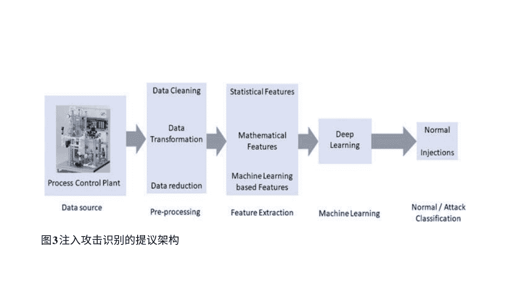

在数据减少中。有关数据预处理的更详细信息可以在[34]中找到。预处理为进一步处理数据（如特征提取）做准备。

## 3.2 特征提取

特征提取是许多机器学习应用（如模式识别和图像处理）中的关键步骤。从原始数据中提取的特征旨在更具信息性和非冗余性，从而便于后续的学习和泛化步骤，并在某些情况下有助于更好的人类解释。有时，特征提取也被视为数据减少机制，如预处理中所讨论的。提供了不同的特征和特征提取技术。

一些常见且重要的特征类别包括统计特征、数学特征和通过机器学习技术提取的特征。

#### 统计特征

统计学是数学的一个分支，涉及大量数值数据的收集、分析、解释和展示。统计特征是通过统计分析定义和计算的特征。统计分析理论是时间域数据特征提取中经常使用的方法。当多个对象和多个指标相关联时，可以根据统计规律进行分析。统计方法基于有力的理论，具有许多算法，可以有效地分析和处理数据。存在多个统计因素，其中一些最常用的是均值、中位数、方差、标准差、均方根等。在[36]中可以找到大量的统计特征。

#### 数学特征

数学方法被应用于原始或预处理的数据以获得有意义的信息。数学特征是时间序列和时间无关转换中最常提取的特征。变换理论中的几个数学函数可以用来将信号转换为不同的域。数学特征的列表包括导数、概率和随机过程、估计理论、数值方法等。

#### 基于机器学习的特征

机器学习技术不仅用于分类或聚类，还可以从原始数据和复杂数据结构中提取特征。使用机器学习技术进行特征提取，可以实现高效的数据压缩和数据降维等功能。基于机器学习的特征提取的一个很好的例子是主成分分析（PCA）。甚至深度学习技术如自编码器和波尔兹曼机也常用于特征提取。机器学习技术还可用于从其他技术或甚至从机器学习技术中提取特征，即从特征中再次进行特征提取，以获得更精细或复杂的特征。

从原始数据中提取的特征集与网络数据包不同，选择提取的特征（如统计、数学或基于机器学习的特征）需要根据应用程序和获取的数据进行选择。

## 3.3 深度学习

深度学习是一种结合了监督和无监督技术的机器学习技术，灵感来自于人脑。人脑具有多个层次的表示，低层次具有简单特征，高层次具有更抽象的特征。类似地，深度学习由多个隐藏层组成，初始层表示低层次的信息，最后一层表示抽象格式的信息。一些常见的深度学习架构包括堆叠自编码器（SAE）、深度信念网络（DBN）、卷积神经网络（CNN）等。CNN主要用于图像处理应用，需要大量的数据集和训练时间。但是将CNN应用于AD是新颖的。

### 卷积神经网络

卷积神经网络（CNN）是深度学习算法的一种类别，被认为是传统前馈神经网络的扩展。

CNN在诸多应用领域中已被证明非常有效，如图像识别和分类、语音处理应用等。它的有效性已经成功地在识别人脸、物体和交通标志检测等任务中得到证明，主要用于机器人和自动驾驶汽车。

CNN的四个主要操作包括卷积层、非线性激活函数（如修正线性单元ReLU）、池化层和全连接层（分类）。

- 卷积层：正如其名称所示，CNN的名称来自于卷积操作。卷积的主要任务是从输入图像中提取特征。卷积操作通过使用滤波器或内核来学习图像特征，从而保留像素之间的空间关系。卷积操作的输出图像被称为“激活图”或“卷积特征图”。滤波器或内核的值在CNN的训练过程中会自动更新，以更好地学习图像的特征。特征图的大小由深度（对应于使用的滤波器数量）、步幅（滤波器滑动的像素数）和零填充（在边界处用零填充图像）来控制。如果图像在边界处用零填充，则称为宽卷积；如果没有填充，则被视为窄卷积。有关卷积层的更详细信息，请参见[37]。图4展示了从图像中进行卷积操作和特征提取的过程。

- 非线性激活函数ReLU：在每次卷积操作之后，在生成特征图之前，使用额外的非线性函数，如ReLU在CNN中。ReLU代表修正线性单元，是一种非线性操作。这是一个逐元素操作，将特征图中的所有负像素值替换为零。ReLU引入了CNN的非线性行为，而传统的卷积操作是线性的。除了ReLU之外，还可以使用其他非线性激活函数，如tanh和sigmoid。有关ReLU激活和其他激活函数的更详细信息，请参见[38]。

```
$$f(x) = \max(0, x) \quad (1)$$
```

- 池化层：空间池化，也称为子采样或下采样，减少每个特征图的维度，但保留最重要的信息。空间池化可以是不同类型的，如最大值、平均值、求和等。在许多应用中，最大池化效果更好。有关池化层的更详细信息，请参见[39]。图5显示了最大池化的示例。其中操作是通过2×2的滤波器大小和步幅值为2进行的。
- 全连接层：这是一个传统的多层感知器，它在输出层使用了一个softmax激活函数。全连接一词意味着上一层的每个神经元都与下一层的每个神经元相连。卷积和池化层的输出表示输入图像的高级特征。全连接层使用这些特征根据训练数据集将输入图像分类为不同的类别。有关全连接层的更详细信息，请参见[40]。

将上述关键参数组合形成CNN。卷积和池化层作为图像的特征提取机制，而全连接层作为分类器。有关CNN的更详细讨论，请参见[41]。图6将详细介绍上述概念与我们用于攻击检测的CNN应用相关的实现的CNN模型的详细功能稍后讨论。

# 4 数据集

为了分析开发模型的功能，我们开发了一个基于深度学习的安全策略，其中包括一个过程控制用例。 麦格德堡奥托冯·吉里克大学“集成自动化”主席在自动化实验室中拥有一个过程控制工厂。该工厂由Festo Didactic建造，被称为MPS PA紧凑工作站，具有水平、流量、压力和温度控制系统[42]。下图7给出了该工厂的照片和P&ID图。

使用相应的控制器，如Samson Trovsi 6495，可以将水位和流量控制系统设置为级联控制系统。 通过超声波传感器测量每个罐的水位，通过流量传感器测量罐之间的流量。 压力传感器和温度传感器也提供，但在这个实验中没有使用。 具有气动过程的双向球阀

连接高位水箱和低位水箱的执行器用于控制被操作的变量。泵通过调整速度来控制。来自装置的水位传感器数值以及泵的激活数值用于评估。

在水位传感器数据中注入了模拟测量注入攻击，同时在泵数据中注入了命令注入攻击。这些攻击被有效地模拟，以至于通常很难识别出来。例如，图8a表示经过滤的水箱水位数据，图8b表示注入攻击信号。我们可以看到两个信号之间存在明显的差异，但仅仅通过观察图8b很难确定是否存在攻击。注入的攻击将在信号的正常范围内，但是插入了一个特定的模式，使得数值完全与正常行为相反，但仍在正常范围内，只有通过特定的特征才能识别出差异。下面的图展示了测量注入和命令注入的滤波信号和注入信号（图8和图9）。

图8 储罐液位传感器数据 a滤波信号 b攻击注入信号

图9 泵数据 a滤波信号 b攻击注入信号

液位传感器数据是双罐系统液位传感器的模拟数据，如前所述。液位传感器用于持续读取罐中的液位，以确保双罐系统的正常运行，但攻击者可以通过对传感器数据进行故障测量注入来操纵该系统的行为。假设，故障测量数据已经注入到液位传感器数据中，那么情况可能是这样的：由于故障测量注入，传感器将读取与实际液位不同的液位，从而导致系统故障。这种故障可能给系统和周围环境带来巨大的损害。在获取传感器信号（带有注入）之后，将在工厂数据上实施所提出的架构，并应用CNN进行攻击分类。

# 5 实施

在ICS中实现基于深度学习的AD以识别FDIA的流程图如图10所示。

## 5.1 预处理

由于从原始传感器获得的数据非常基础，仅凭传感器数据很难理解攻击模式。因此，通过统计和数学方法提取一些基本特征。总共提取了11个特征，包括水位传感器和泵数据。提取的特征在图11、12、13、14、15和16中表示。

在从传感器数据中提取出相应的特征之后，需要对特征进行归一化以便更好地学习。使用公式2对数据进行了归一化，然后将归一化后的值分成20个间隔，使用类似的方法

图10 从提出的架构中实现的CNN模型的流程图

图11 提取的水位传感器特征（均值、标准差、方差和中位数）

离散化器如图17所示。图中使用的离散化器具有标准缩放器，值为0.1，但在这里使用的值为0.05。因此，它被分成了20个间隔，而不是10个。这20个间隔在二进制提取后被分配了20个不同的位。

$$X_{new} = \frac{X - X_{min}}{X_{max} - X_{min}} \quad (2)$$

图12 提取的水位传感器特征（RMS、均值-一阶和二阶微分以及最大值）

图13 提取的水位传感器特征（最小值、峰值到RMS和峰度）

上述列出的前四个特征在图11中显示。

图12显示了使用RMS、一阶微分均值、二阶微分均值和最大值提取的特征。

图13显示了最小值、峰值到RMS和峰度这三个提取的特征。

上述列出的特征也是从泵传感器数据中提取出来的，并且它们在以下图中表示。

图14 提取的泵传感器特征（均值、标准差、方差和中位数）

图15 提取的泵传感器特征（均方根、一阶和二阶微分和最大值）

泵传感器数据的前四个列出的特征如图14所示。在图15中，使用均方根、一阶微分均值、二阶微分均值和最大值提取的特征如下所示。泵传感器数据的剩余三个提取特征如图16所示。

图16 提取的泵传感器特征（最小值、峰值到均方根的比值和峰度）

图17 用于二进制提取的离散化机制

## 5.2 图像表示

通过离散化器，模拟的传感器数据已被转换为240位二进制向量，每个提取特征分配20位。现在，将240位二进制中的每8位转换为灰度像素，然后将像素重新排列为6×6矩阵，其中空缺的六个像素填充为零。为了创建8×8像素矩阵，生成的像素矩阵在周围用零进行循环填充，如下所示。

图18. 最后，相同的$8 \times 8$像素矩阵已被发送到红色、绿色和蓝色通道，以将转换后的传感器数据表示为RGB图像，并为训练和测试准备好。

### 5.3 卷积神经网络的训练

最近，Matlab神经网络（NN）工具箱已更新，用于深度学习算法[43]。2017年及以后的Matlab版本提供了现代深度神经网络模型，特别用于图像分类或识别，例如人脸识别、动作检测、自动驾驶、行人检测和自动停车。可以使用NN工具箱通过Matlab命令创建和连接深度NN的层。例如，Matlab已经提供了一些预训练的深度学习NN，这使得使用深度学习算法更加容易，只需具备NN和计算机视觉算法的基本知识即可。

在训练CNN算法时，需要配置一些基本参数，如下所示：

- **输入图像大小 (M N C)**: 它是输入图像的尺寸，其中，$M$是图像的高度，$N$是图像的宽度，$C$是通道的数量，例如：对于灰度图像，$C=1$，对于彩色图像，$C=3$。
- **滤波器大小**: 它是用于滤波器的尺寸声明。例如，如果值被赋为3，则表示滤波器的高度和宽度为3。
- **滤波器数量**: 它是用于卷积操作的滤波器数量。
- **池化大小**: 它是矩形池化映射的大小。例如，如果值被赋为2，则池化映射将是一个边长为2的正方形。
- **步幅值**: ‘步幅’是一个名称-值对参数，它定义了过滤的步长。
- **类别数量**: 它是输入类别的数量，例如入侵检测通常有两个攻击类别，即正常和攻击，因此在这种情况下类别数量必须为2。

然后对配置的CNN模型进行攻击分类的训练。其中，使用了'sgdm'随机梯度下降方法作为学习方法。学习率被设置为'piecewise'，即初始学习率为0.01，并且会以0.1的因子递减。'MaxEpochs'被设置为20，表示整个训练数据被发送进行训练迭代的次数。训练数据集被分为训练和验证集。验证频率被设置为300，这样在300次迭代后对训练好的网络进行验证，之后的迭代次数将会进行验证。验证耐心被设置为5，以降低训练成本。这意味着，如果连续五个验证周期内验证准确率没有变化，则训练将停止，从而防止模型过拟合（图19）。

Inception-v3、ResNet-50、ResNet-101、GoogLeNet、AlexNet、VGG-16和VGG-19等预训练网络可用。这些网络可以根据需要定制其网络层。此外，它还可以在Matlab中在CPU和GPU环境下训练网络。

# 6 结果和讨论

根据图20中的以下参数对训练模型的结果进行评估。对所提出模型的训练和测试进行性能评估，使用的参数有真正例（TP）、真负例（TN）、假正例（FP）和假负例（FN）。图20中呈现的混淆矩阵是针对两类模型的。

用于评估所提出模型性能的性能指标有：

- **准确率**：正确检测的样本数占总样本数的百分比。
- **精确度 (P)**: 精确度是指正预测值 (PPV) 的精确度，通过将 TP 除以 TP 和 FP 的总和来计算，以百分比表示，如公式 3 所示。
$$P = \frac{TP}{TP + FP} \times 100 \qquad (3)$$
- **召回率 (R)**: 召回率是指 TP 率，通过将 TP 除以 TP 和 FN 的总和来计算，以百分比表示，如公式 4 所示。
$$R = \frac{TP}{TP + FN} \times 100 \qquad (4)$$
- **F-Measure**: F-Measure 是表示测试准确性的度量，被称为值 P和 R的调和平均值，并可以使用公式 5 计算。
$$F = \frac{2 \times P \times R}{P + R} \quad (5)$$
- **Cohen's kappa coefficient (k)**: Cohen's kappa coefficient 是一种用于评估定性项目的评价者一致性或协议的统计度量。表示测试准确性，被称为值P和R的调和平均值，并可以使用公式 6 计算。
$$k = \frac{p_o - p_e}{1 - p_e} \quad (6)$$
其中 $p_o$是评估者之间的相对观察一致性（类似于准确性）而 $p_e$是使用观察数据计算每个观察者随机观察到每个类别的概率来计算的假设性随机一致性概率。
$$p_o = \frac{TP + FP}{TP + FN + TN + FP} \quad (7)$$
$$p_e = p_{yes} + p_{no} \quad (8)$$
$$p_{yes} = \frac{TP + FN}{TP + FN + TN + FP} \quad (9)$$
$$p_{no} = \frac{TN + FP}{TP + FN + TN + FP} \quad (10)$$

性能指标评估的结果见表2、3、4、5、6、7和8。

**表2 基于级别传感器数据的CNN准确率进行攻击识别**

| 框架类型 | 正常 (%) | 攻击 (%) | 总体检测率 (%) |
| --- | --- | --- | --- |
| 卷积神经网络 | 97.50 | 94.90 | 96.70 |

**表3 CNN模型在基于级别传感器数据的攻击识别上的性能指标评估**

| 参数 | 正常 (%) | 攻击 (%) |
| --- | --- | --- |
| 精确度 | 97.74 | 94.37 |
| 召回率 | 97.52 | 94.86 |
| F-度量 | 97.63 | 94.61 |
| Cohen's kappa系数 | 0.96 | 0.93 |

**表4 基于泵传感器数据的CNN准确率进行攻击识别**

| 框架类型 | 正常 (%) | 攻击 (%) | 总体检测率 (%) |
| --- | --- | --- | --- |
| 卷积神经网络 | 95.90 | 92.70 | 94.90 |

**表5 CNN模型在基于泵传感器数据的攻击识别上的性能指标评估**

| 参数 | 正常 (%) | 攻击 (%) |
| --- | --- | --- |
| 精确度 | 96.90 | 90.40 |
| 召回率 | 95.87 | 92.69 |
| F-度量 | 96.38 | 91.53 |
| Cohen's kappa系数 | 0.94 | 0.90 |

**表6 训练和测试时间**

| 数据类型 | 训练时间（秒） | 训练样本 | 测试时间（秒） | 测试样本 |
| --- | --- | --- | --- | --- |
| 水位传感器数据 | 184.32 | 17289 | 2.12 | 4400 |
| 泵数据 | 278.14 | 17289 | 2.28 | 4400 |

**表7 基于级别传感器数据的不同框架性能比较**

| 框架类型 | 正常 (%) | 攻击 (%) | 总体检测率 (%) |
| --- | --- | --- | --- |
| 卷积神经网络 | 97.50 | 94.90 | 96.70 |
| SAE | 97.44 | 96.69 | 97.18 |
| DBN | 86.39 | 88.51 | 87.11 |

**表8 基于泵传感器数据的不同框架性能比较**

| 框架类型 | 正常 (%) | 攻击 (%) | 总体检测率 (%) |
| --- | --- | --- | --- |
| 卷积神经网络 | 95.90 | 92.70 | 94.90 |
| SAE | 97.07 | 94.11 | 96.09 |
| DBN | 97.45 | 57.05 | 84.13 |

# 7 结论和未来工作

本文主要关注基于深度学习的安全策略的开发，以保护ICS免受FDIA的影响。为此，选择CNN作为用于正常和攻击类别分类的深度学习算法。整个实现过程在MATLAB中完成。使用自动化工程研究所的一个过程控制工厂生成数据。这些数据被注入了以战略方式进行FDIA。 从原始传感器数据中提取一些统计和数学特征。 这些特征随后被转换为图像格式以训练CNN模型。 讨论了CNN模型的不同参数，并对我们选择这些参数进行了解释。 基于验证参数和训练网络的耐心，避免了所提出的模型过拟合的问题。 最后，使用准确性、精确度、F-度量、召回率和Cohen's kappa系数等指标评估了所提出的CNN模型的性能。 结果看起来很有希望，并确保了CNN作为ICS上的一种安全策略来对抗网络威胁的能力。 与SAE和DBN等其他深度学习方法相比，CNN的性能结果进行了比较。 显然，CNN在检测正常和攻击方面的表现优于DBN，但与SAE几乎相当。 但这完全取决于应用程序和生成的数据集。 在观察到CPU上的训练时间超过12小时后，整个CNN的训练过程转移到GPU上，训练时间显示出GPU上训练过程的显著加速。 未来，需要大量数据集和更多的攻击类型来更详细地评估性能。 正在进行多种特征提取技术的组合，特别是基于机器学习的特征提取。 计划结合不同的深度学习技术和机器学习技术，以提高安全机制的效率。 正在进行其他深度学习方法（如循环神经网络）的使用。

# 参考文献

1.  ISA: ISA99，工业自动化和控制系统安全。 https://www.isa.org/isa99/。 访问日期：2019年3月7日
2.  白宫和华盛顿：总统决策指令/NSC-63。 https://fas.org/irp/offdocs/pdd-63.htm。 访问日期：2019年3月7日
3.  Nigam, R.: （已知）SCADA攻击多年来的研究，安全研究。 https://blog.fortinet.com/2015/02/12/known-scada-attacks-over-the-years (2015年)。 访问日期：2017年9月15日
4.  Moore, D., Paxson, V., Savage, S., Shannon, C., Staniford, S., Weaver, N.: 蓝宝石/滑块蠕虫的传播
5.  Legezo, D.: Ghoul行动：从针对性攻击分析中学习以保护您的业务。 https://www.kaspersky.com/blog/ghoul/5897/ (2016). 访问于2017年9月15日
6.  汤普森, M.: 伊朗对纽约水坝的网络攻击展示了未来的战争。 http://time.com/4270728/iran-cyber-attack-dam-fbi/ (2016). 访问于2017年9月15日
7.  科尔伯特, E.J., 科特, A.: SCADA和其他工业控制系统的网络安全，第63版. Springer (2016)
8.  莫里斯, T., 高, W.: 工业控制系统网络攻击。 在：国际ICS SCADA网络安全研讨会，第22-29页 (2013年)
9.  Mangrulkar, N.S.: 网络攻击及其检测机制：一项综述 90(9), 36-39 (2014)
10. 莫, Y., Sinopoli, B.: 控制系统中的虚假数据注入攻击。 在：决策控制会议 (2010年)
11. Potluri, S., Diedrich, C., Sangala, G.K.R.: 使用人工神经网络在工业控制系统中识别虚假数据注入攻击。 在：2017年工厂自动化新兴技术ETFA会议 (2017年)
12. Huang, H., Kasiviswanathan, S., Electric, G.: 使用在线矩阵草图进行流式异常检测 9 (3), 1-15 (2015年)
13. F. O. for I. Security, 工业控制系统安全 (2016年)
14. Willsky, A.S.: 动态系统故障检测设计方法综述。 Automatica 12 (6), 601-611 (1976年)
15. Yu, Z.H., Chin, W.L.: 在智能电网中使用PCA近似方法进行盲目虚假数据注入攻击。 IEEE Trans. Smart Grid 6 (3), 1219-1226 (2015年)
16. Kamesh, Sakthi Priya, N.: 验证RFID生成的安全增强。国际应用工程研究杂志 9 (22), 5968-5974 (2014)
17. Alrawashdeh, K., Purdy, C.: 基于深度学习的在线异常入侵检测系统的研究。 在: 第15届IEEE国际机器学习和应用会议(ICMLA), 第195-200页 (2016)
18. Kaur, H., Minhas, J., Singh, G.: 基于机器学习的异常检测技术综述。国际计算机应用技术研究杂志 2(2), 185-187 (2013)
19. Van, N.T., Thinh, T.N.: 基于深度学习的网络入侵检测系统的异常检测。 在: 国际系统科学与工程会议(ICSSE) (2017)
20. Yu, W., Griffith D., Ge, L., Bhattarai, S., Golmie, N.: 智能电网中针对虚假数据注入攻击的集成检测系统。安全通信网络 8, 91-109 (2014)
21. Huang, S., Zhou, C., Yang, S., Qin, Y.: 网络化的网络物理系统安全 12,567-578 (2015)
22. 庞, Z., 侯, F., 周, Y.: CARMA系统输出跟踪控制的虚假数据注入攻击设计。 在: 国际信息与自动化会议, 第1273-1277页 (2015年)
23. Rabatel, J., Bringay, S., Poncelet, P.: 预防性维护中的监测传感器数据异常检测。 Expert Syst. Appl. 38(6), 7003-7015 (2011年)
24. Hill, D.J., Minsker, B.S., Amir, E.: 流式环境数据的实时贝叶斯异常检测。 Water Resour. Res. 46(4), 1-16 (2010年)
25. Pradhan, S.K.S.M., Pradhann, S.K.: 使用人工神经网络进行异常检测。 Int. J. Eng. Sci. Emerg. Technol. 2(1), 29-36 (2012年)
26. Siripanadorn, S.: 使用自组织映射和小波进行无线传感器网络中的异常检测。 在: 第10届WSEA会议论文集, 第291-297页 (2010年)
27. Guan, Z., Sun, N., Xu, Y.: 智能电网中虚假数据注入的综合调查。 移动计算。 8(1) (2015)
28. Wang, D., Guan, X., Liu, T., Gu, Y., Sun, Y., Liu, Y.: 智能电网中恶意数据注入攻击的调查
29. Baig, Z.A., Amoudi, A.: 智能电网攻击和对策的分析。 8(8) (2013)
30. Anwar, A.: 智能电网状态估计对虚假数据注入攻击的漏洞。可再生能源整合、绿色能源和技术中的网络攻击 (2014年)
31. Esmalifalak, M., Member, S., Liu, L., Member, S.: 在智能电网中使用机器学习检测隐蔽的虚假数据注入, 1-9 (2014)
32. Hao, J., Member, S., Piechocki, R.J., Kaleshi, D.: 在智能电网中的稀疏恶意虚假数据注入攻击和防御机制 3203, 1-12 (2015)
33. Potluri, S., Diedrich, C., Sangala, G.K.R.: 使用人工神经网络识别工业控制系统中的虚假数据注入攻击。在第22届IEEE国际新兴技术和工厂自动化会议 (ETFA) 上, 第1-8页 (2017)
34. Famili, A., Shen, W., Weber, R., Simoudis, E.: 数据预处理和智能数据分析 1,3-23 (1997)
35. Siekmann, J., Wahlster, W.: 先进的智能计算理论和应用
36. MaxStat: 科学数据分析工具—统计学。 http://www.maxstat.de/statistical-tests.html。于2017年9月15日访问
37. Wu, J.: 卷积神经网络入门。 1-28页, (2016年)
38. Agarap, A.F.: 使用修正线性单元 (ReLU) 的深度学习。 1页 (2018年)

## 39. 吴红，顾晓：用于卷积神经网络正则化的最大池化丢弃。计算机科学讲义（包括人工智能子讲义、生物信息学子讲义），第9489卷，第46–54页（2015年）

## 40. ujjwalkarn：卷积神经网络的直观解释。数据科学博客。https://ujjwalkarn.me/2016/08/11/intuitive-explanation-convnets/（2016年）。于2018年5月6日访问

## 41. Bhandare, A., Bhide, M., Gokhale, P., Chandavarkar, R.：卷积神经网络的应用。计算机科学与信息技术国际期刊 7(5), 2206–2215 (2016)

## 42. Festo Didactic：MPS® PA紧凑型工作站，配备液位、流量、压力和温度控制系统。http://www.festo-didactic.com/de-de/lernsysteme/prozessautomation,regelungstechnik/compact-workstation/mps-pa-compact-workstation-mit-fuellstands-,durchfluss-,druck-und-temperaturregelstrecken.htm?fbid=ZGUuZGUuNTQ0LjEzLjE4Ljg4Mi40Mzc2。于2017年9月15日访问

## 43. MathWorks：从头开始训练模型—MATLAB & Simulink。https://www.mathworks.com/solutions/deep-learning/examples/training-a-model-from-scratch.html。访问日期：2019年3月7日

## 44. MathWorks：深度学习神经网络训练选项。https://www.mathworks.com/help/deeplearning/ref/trainingoptions.html。访问日期：2019年3月7日

# 无线通信的深度学习

Tugba Erpek, Timothy J. O’Shea, Yalin E. Sagduyu, Yi Shi 和 T. Charles Clancy

摘要 现有的通信系统在处理具有高自由度的新兴无线应用的优化复杂性时，从理论到实践存在固有的限制。深度学习具有通过数据驱动的解决方案克服这一挑战并提高利用有限频谱资源的无线系统性能的强大潜力。在本章中，我们首先描述了如何使用自动编码器设计端到端通信系统的深度学习。这种灵活的设计有效地捕捉信道失真，并在单天线、多天线和多用户通信中联合优化发射机和接收机操作。接下来，我们介绍了深度学习在频谱情况感知方面的好处，包括信道建模和估计、信号检测和分类任务。当基于模型的方法失败时，深度学习可以提高性能。最后，我们讨论了深度学习如何应用于无线通信安全。在这种情况下，对抗机器学习提供了新的手段来发动和防御无线攻击。这些应用展示了深度学习在设计、优化、适应和保护无线通信方面的强大能力。

关键词：深度学习、无线系统、物理层、端到端通信、信号检测和分类、无线安全

+ T. Erpek (✉) · T. J. O’Shea · T. C. Clancy
弗吉尼亚理工大学，阿灵顿，美国
e-mail: terpek@vt.edu

T. J. O’Shea
e-mail: oshea@vt.edu

T. C. Clancy
e-mail: tcc@vt.edu

T. J. O’Shea
DeepSig, Inc.，阿灵顿，美国

Y. E. Sagduyu · Y. Shi
Intelligent Automation, Inc.，罗克维尔，马里兰州，美国
e-mail: ysagduyu@i-a-i.com

Y. Shi
e-mail: yshi@vt.edu

Y. Shi
弗吉尼亚理工大学，布莱克斯堡，美国

© Springer Nature Switzerland AG 2020
W. Pedrycz and S.-M. Chen (eds.),深度学习架构的开发与分析，计算智能研究 867, https://doi.org/10.1007/978-3-030-31764-5_9

# 1 引言

在无线介质中快速、可靠、安全地传递信息至关重要。无线通信是一个涉及设计波形（例如长期演进（LTE）和第五代移动通信系统（5G））、建模信道（例如多径衰落）、处理干扰（例如干扰）和流量（例如网络拥塞）效应、补偿无线电硬件缺陷（例如射频前端非线性）、开发通信链路（即发射机和接收机）、恢复失真的符号和比特（例如前向纠错）以及支持无线安全（例如干扰源检测）的丰富专业知识领域。传统通信系统的设计和实现是建立在强大的概率分析模型和假设之上的。然而，现有的通信理论在利用有限频谱资源和处理新兴无线应用（如频谱共享、多媒体、物联网（IoT）、虚拟和增强现实）的优化复杂性方面存在严重限制，每个应用都具有很高的自由度。新一代无线系统不再遵循刚性设计，而是由认知无线电[1]赋予了学习频谱数据、优化频谱利用以提升性能的能力。这些智能通信系统依赖于各种检测、分类和预测任务，例如频谱感知中的信号检测和信号类型识别，以增加情境意识。为了实现这一愿景中设定的任务，机器学习（尤其是深度学习）为通信系统提供了强大的自动化手段，可以从频谱数据中学习并适应频谱动态变化[2]。

无线通信结合了各种波形、信道、流量和干扰效应，每个效应都有自己的复杂结构，随时间快速变化，如图1所示。无线通信的数据规模很大，在5G中，数据量大且速率高，例如每秒千兆位，同时还受到干扰和各种安全威胁的影响，这是由于无线介质的共享性质所致。传统建模和机器学习技术往往无法捕捉到高度复杂的频谱数据与通信设计之间微妙的关系，而深度学习已经成为满足无线通信系统数据速率、速度、可靠性和安全性要求的可行手段。在这方面，一个激励性的例子是信号分类，其中接收器需要根据波形特征（例如，调制方式）对接收到的信号进行分类[3]，波形特征通过改变载波信号的属性（例如幅度、频率或相位）来添加信息。这个信号分类任务在动态频谱访问（DSA）中是必不可少的，其中发射器（次级用户）首先需要识别主要用户（如电视广播网络）的信号，这些用户有权在该频率上运行，然后避免与它们发生干扰（不在同一时间在同一频率上进行传输）。研究表明，基于卷积神经网络（CNN）的深度学习在信号分类中的准确性明显高于基于特征的分类器，后者使用信号特征（如带宽或二阶统计量）来区分不同的信号[3]。

本章介绍了在无线通信领域应用深度学习的方法和算法，主要涉及三个主要领域。

- 1. 深度学习设计端到端（物理层）通信链路（第2节）。
- 2. 深度学习支持频谱情况感知（第3节）。
- 3. 深度学习用于无线安全，以发起和防御无线攻击（第4节）。

在第2节中，我们将端到端物理层通信链路（发射机和接收机）形式化为基于两个深度神经网络（DNNs）的自动编码器。其中，编码器用于发射机功能，如调制和编码，解码器用于接收机功能，如解调和解码。通过在自动编码器的设计过程中考虑信道失真，我们展示了与传统通信方案相比的性能提升。在第3节中，我们介绍了如何使用不同的DNNs，如前馈、卷积和循环神经网络，用于各种频谱感知应用，包括信道建模和估计、频谱感知和信号分类。为了支持对频谱变化的快速响应，我们讨论了使用自动编码器从无线通信数据中提取潜在特征以及使用生成对抗网络（GANs）进行频谱数据增强以缩短频谱感知周期的方法。由于无线介质的开放和广播性质，无线通信容易受到各种攻击，如干扰。在第4节中，我们介绍了建立在对抗性深度学习基础上的新技术，以更加智能地攻击无线通信系统，相比传统的干扰数据传输。我们还讨论了一种防御机制，即当无线系统本身应用对抗性深度学习时，对手可能会被愚弄。

## 2 深度学习用于端到端通信链

通信系统的基本问题是使用无线电波从发射机传输消息，如位流，并在接收机上精确或近似地重现它[4]。本节重点介绍开放系统互联（OSI）模型的物理层。传统通信系统将信号处理分为多个独立的块，分别在发射机和接收机上进行，并为不同的功能单独优化每个块。图2显示了传统通信系统的块图。

源编码器压缩输入数据并消除冗余。信道编码器以受控的方式在源编码器的输出上添加冗余，以应对通信介质的负面影响。调制器块根据所需的数据速率和接收信号水平（如果发射机使用自适应调制）改变信号特性。通信信道会扭曲和衰减传输信号。此外，由于接收机硬件的损坏，信号在接收机处会添加噪声。发射机上的每个通信块都会准备信号以应对通信介质和接收机噪声的负面影响，同时仍然尽力最大化系统效率。接收机上以相同顺序反转这些操作，以重构发射机发送的信息。这种方法导致了高效、多功能和可控的通信系统，这是我们今天拥有的通过单独优化处理块实现的。然而，这种单独优化过程不一定能够优化整个通信系统。例如，源编码和信道编码的分离（在物理层）被认为是次优的[5]。通信块联合设计的好处不仅限于物理层，还涵盖了链路层的介质访问控制和网络层的路由[6]。受到这种灵活的设计范例的启发，深度学习提供了将发射机和接收机上的多个通信块作为DNN的组合进行联合训练的自动化手段。MIMO系统通过在发射机和接收机上使用多个天线来提高频谱效率和数据速率。不同的信号以相同的频率从每个天线传输。然后，接收机上的每个天线接收到来自发射机天线的信号的叠加（即干扰），以及通道的损坏（也适用于单天线系统）。为MIMO信号检测开发的传统算法是迭代重构方法，它们的计算复杂性对于许多需要高效和快速信号处理以提供高数据速率的快节奏应用来说是不切实际的[7, 8]。基于模型的MIMO检测技术可以应用于优化深度学习的可训练参数，并提高检测性能。例如，[7]中构建了一个MIMO检测器，通过展开投影梯度下降方法来实现。在这个方案中，深度学习架构使用了压缩的充分统计量作为输入。另一个基于模型的深度学习网络在[9]中用于正交近似传递算法。

多用户通信系统中，多个发射机和/或接收机在同一频率上同时通信，可以有效利用频谱，例如，在干扰信道(IC)中，多个发射机在同一信道上与其预期的接收机通信。来自意外发射机的接收信号引入了额外的干扰，需要通过发射机的预编码和接收机的信号处理来消除。IC的容量区域在弱、强和非常强的干扰制度下已经得到了广泛研究[10-12]。非正交多址接入(NOMA)已经出现，通过允许一定程度的干扰在接收机上，可以在干扰制度之间高效地控制[13]。然而，这种达到容量的方案的计算复杂度通常很高，难以在实际系统中实现。

最近，基于深度学习的端到端通信系统已经被开发出来，用于单天线[14, 15]，多天线[16]和多用户[14, 17]系统，通过联合优化发射机和接收机作为自编码器来改善传统方法的性能，而不是分别优化发射机和接收机的各个模块。自编码器是一个由编码器和解码器组成的深度神经网络，编码器学习给定数据的（潜在）表示，解码器从编码数据中重构输入数据[18]。在这种设置下，发射机上的联合调制和编码对应于编码器，接收机上的联合解码和解调对应于解码器。联合优化包括多个发射机和接收机用于多用户情况，以学习和消除多个发射机引起的额外干扰。

下面的章节将介绍基于自编码器的通信系统实现及其性能评估。

## 2.1 单天线系统

通信系统由发射机、接收机和信道组成，信道将信息从发射机传输到接收机。一种基本的新的通信系统设计思路是将其作为一个端到端的重构任务来制定，该任务旨在通过自编码器[14]在一个过程中共同优化发射机和接收机组件。与传统通信系统一样，发射机希望通过信道的离散使用将一个可能的消息之一 $M$ 传递给接收机。它将调制过程 $f : \mathcal{M} \rightarrow \mathbb{R}^n$ 应用于消息 $s$ 以生成传输信号 $\mathbf{x} = f(s) \in \mathbb{R}^n$。离散字母表中的输入符号被映射到星座图上的点（复数），作为数字调制的一部分。传统通信系统的数字调制方案具有预定义的星座图。符号是根据所需的数据速率对输入位进行分组构造的。所需的数据速率确定要使用的星座方案。图3显示了二进制相移键控（BPSK）、正交相移键控（QPSK）和16-正交幅度调制（QAM）的星座图，作为数字调制方案和它们的符号映射的示例。线性决策区域使接收机的解码任务相对简单。对于自编码器系统，输出的星座图不是预定义的。它们是基于所需的性能指标（即接收机要减少的符号错误率）进行优化的。

发射机的硬件施加了能量约束 $\|\mathbf{x}\|^2 \leq n$，幅度约束 $|x_i| \leq 1 \forall i$，或者平均功率约束 $\mathbb{E}[|x_i|^2]$。这个通信系统的数据速率计算公式为 $R = k/n$[比特/信道使用]，其中 $k = \log_2(M)$ 是输入比特的数量，$n$ 可以被视为前向纠错方案的输出，其中包括输入比特和冗余比特以减轻信道影响。因此，符号 $(n,k)$ 表示一个通信系统通过 $n$ 个信道使用之一发送 $M = 2^k$ 个消息（即 $k$ 比特）。通信信道由条件概率密度函数 $p(\mathbf{y} | \mathbf{x})$ 描述，其中 $\mathbf{y} \in \mathbb{R}^n$ 表示接收到的信号。接收到信号后，接收器应用变换 $g: \mathbb{R}^n \rightarrow \mathcal{M}$ 产生估计值 $\hat{s}$ 的传输消息 $s$。在信道自编码器中，将映射 $\mathbf{x}$ 到 $\mathbf{y}$ 进行优化，以便以较小的错误概率恢复传输的消息。换句话说，在许多其他深度学习应用领域中，自编码器通常通过压缩输入数据来消除冗余；然而，信道自编码器通过添加可控冗余来学习对信道扰动鲁棒的中间表示。

信道自编码器方案的框图如图4所示。输入符号表示为独热向量。发射机由具有多个稠密层的前馈神经网络（FNN）组成。最后一个稠密层的输出被重新整形为具有实部（I）和虚部（Q）的复数形式，表示每个调制输入符号。归一化层确保了对 $\mathbf{x}$ 的物理约束得到满足。通道由具有固定方差 $\beta = (2R E_b / N_0)^{-1}$ 的加性噪声层表示，其中 $E_b/N_0$ 表示每比特能量（$E_b$）到噪声功率谱密度（$N_0$）的比值。接收器也是以FNN实现的。其最后一层使用softmax激活函数，其输出 $p \in (0,1)^M$ 是一个概率向量，表示所有可能的消息。选择具有最高概率的 $p$ 元素的索引作为解码后的消息。自编码器使用随机梯度下降（SGD）算法在所有可能的消息 $s \in \mathcal{M}$ 上进行训练，使用适合的分类交叉熵损失函数计算 $\mathbf{1}_s$ 和 $p$ 之间的差异。噪声值在每个训练实例中都会发生变化。在前向传播中使用噪声层来扭曲传输信号，在反向传播中忽略该层。

图5a比较了使用BPSK调制和汉明 (7,4) 码的通信系统的块错误率（BLER），即 $\Pr(\hat{s} \neq s)$，与使用二进制硬判决解码或最大似然解码（MLD）的BLER相比，训练的自编码器 (7,4)（具有固定能量约束 $\|\mathbf{x}\|^2 = n$）自编码器在 $E_b/N_0 = 7$ dB下使用Adam [19]优化器进行训练，学习率为0.001。两个系统的工作速率都为 $R = 4/7$。未编码的BLER BPSK (4, 4)也包括在比较中。自编码器学习编码器和解码器函数，不需要任何先验知识，实现与海明 (7, 4)码和最大似然解码相同的性能。表1显示了自编码器的编码器（发送器）和解码器（接收器）中使用的神经网络层数。

图5b显示了当 $R =1$时， (8, 8)和 (2, 2)通信系统的性能曲线。自编码器实现了与未编码的BPSK相同的BLER，对于 (2, 2)系统，而对于 (8, 8)系统，它优于后者，这意味着它已经学习了一种联合编码和调制方案，从而实现了编码增益。

图6显示了不同 $(n, k)$值的所有消息的星座图，作为复杂星座点，即 x轴和 y轴分别对应于第一个和第二个传输符号。图6a显示了一个简单的 (2, 2)系统，它快速收敛到一个经典的QPSK星座图（参见图3b），并带有一些任意的旋转。类似地，图6b显示了一个 (4, 2)系统，导致一个旋转的16-PSK星座图，其中每个星座点具有相同的幅度。一旦使用平均功率归一化而不是固定能量约束，星座图的结果是一个混合的五边形/六边形网格排列，如图6c所示。这个图可以与16-QAM星座图进行比较，如图3c所示。

**表1 图5a和b中使用的自编码器布局**

| 发射机        |                | 接收机        |                |
| :------------ | :------------- | :------------ | :------------- |
| **层**        | **输出维度**   | **层**        | **输出维度**   |
| 输入          | $M$            | 输入          | $n$            |
| 稠密 + ReLU   | $M$            | 稠密 + ReLU   | $M$            |
| 稠密 + 线性   | $n$            | 稠密 + softmax | $M$            |

除了在模拟信道上实现的信道自编码器的有希望的结果外，通过无线传输也验证了仅由DNNs组成的完整通信系统的可行性，使用非同步的现成软件定义无线电（SDR）和开源深度学习软件库[15]。硬件实现引入了额外的挑战，例如未知的信道传输函数。当每个训练样本的信道传输函数具有可微的数学表达式时，自编码器的概念起作用。为了克服这个问题，采用了两步训练策略，首先使用接近真实信道模型的随机信道模型对自编码器进行训练。在运行时，使用迁移学习方法对接收器的DNN参数进行微调。在SDR平台上实现的信道自编码器系统与传统通信方案的BLER性能比较显示出竞争性能，接近1 dB，无需进行大量的超参数调整[15]。

传输学习方法仍然为通道自编码器提供次优性能，因为训练过程中使用的通道模型与操作时经历的模型不同。在[20]中开发了一种训练算法，该算法在不同的通道模型（包括AWGN和Rayleigh block-fading (RBF)通道）上在接收器的监督训练和发射机的强化学习训练之间进行迭代。

## 2.2 多天线系统

MIMO无线系统在今天的蜂窝和无线局域网（LAN）通信中被广泛使用。MIMO系统利用发射机和接收器上的多个天线来利用多径传播，实现不同类型的增益，包括波束成形、空间多样性、空间复用增益和干扰抑制。空间多样性用于增加覆盖范围和鲁棒性。

通过使用空时块码（STBC）[21, 22]。在这种方法中，相同的信息在多个时间槽中进行预编码和传输。空间复用用于通过从每个天线元素发送不同的符号来增加吞吐量[23, 24]。在闭环系统中，接收器执行信道估计并将信道状态信息（CSI）发送回发射机。由于在相同频率上操作的附加天线元素引起的干扰，发射机使用CSI对信号进行预编码。开发的空间多样性和复用的MIMO方案依赖于通过分析获得的（通常是固定的）预编码和解码方案。

深度学习已经被用于接收器的MIMO检测，通过使用基于模型的深度学习网络来提高性能[7, 9, 25]。在第2.1节中，信道自编码器被用来训练一个带有单个天线的通信系统。自编码器的概念也应用于多输入多输出系统，其中许多MIMO任务被合并为一个端到端的编码和解码过程，可以共同优化以最小化特定信道条件下的符号误差率（SER）[16]。图7显示了一个具有 $N_t$ 个发射天线和 $N_r$ 个接收天线的MIMO自编码器系统。符号 $s_i, i = 1, \ldots, N_t$，是通信系统的输入。每个符号包含k位信息。通过改变k，可以调整自编码器系统的数据速率。输入符号被组合并表示为一个范围在 $[0, 2^{k N_t})$ 内的单个整数，作为编码器（发射机）的输入，并编码成 $N_t$ 个并行复数传输流， $x_i$ ，作为输出，其中 $i = 1, \ldots, N_t$。针对MIMO系统开发了不同的信道模型，例如[26]。本例中使用了瑞利衰落信道，导致完全秩信道矩阵。在这种情况下，每个天线的接收信号路径是不相关的，从而实现了MIMO系统的充分优势。

解码器（接收器）接收到的信号可以建模为 $y = hx + n$，其中 $h$ 是一个 $N_r \times N_t$ 信道矩阵，其元素服从零均值和单位方差的圆对称复高斯分布，$x$ 是一个 $N_t \times 1$ 向量，其元素是调制符号，满足平均功率约束 $P$，即 $\mathbb{E}[x^* x] \leq P$，其中 $x^*$ 表示 $x$ 的共轭转置， $n$ 是一个 $(N_r \times 1)$ 向量，表示接收端的加性高斯白噪声，满足 $\mathbb{E}[n n^*] = \sigma^2 I_N$。估计的符号 $\hat{s}_i$，其中 $i = 1, \ldots, N_r$，是输出结果。发射端的每个调制符号对应于信道的一个离散使用，系统的通信速率为 $\min(N_t, N_r) \cdot k$ 比特。

自编码器是使用从瑞利分布中抽取的信道实现进行训练的。发射机从每个天线中传输 $2^k$ 种可能的消息之一。发射机采用FNN架构设计。输入符号经过嵌入层和稠密层处理。嵌入层将正整数转换为固定大小的稠密向量。嵌入层的输出在进入稠密层之前通过一个展平层转换为一维张量。嵌入层和每个稠密层之后使用批归一化[27]。最后一个稠密层的输出被重塑以生成复数输出；即，偶数索引作为实部，奇数索引作为虚部。

发射机具有平均功率约束。归一化层使发射机输出满足平均功率约束；即， $\mathbb{E}[x^* x] \leq P$。与单天线情况类似，发射机输出 $x$ 可以被认为作为调制符号，就像传统通信系统中一样。而不是使用线性决策区域的已知星座方案，如BPSK或QPSK，自编码器系统会随着时间的推移学习到最优星座点。

构建了一个乘法层来执行复数乘法 $hx$，并且噪声层引入噪声 $n$ 到自编码器系统中。输入符号和噪声在每个训练实例中都会发生变化，噪声方差 $\sigma$ 在训练和测试时都会调整，以模拟不同信噪比（SNR）水平。

接收器也使用了FNN架构进行设计。接收器接收到的符号 $y_i$，其中 $i = 1,...,N_r$，通过多个稠密层，最后一层具有softmax激活函数，为每个符号提供概率，总和为1。选择具有最高概率的码字作为输出。

在训练过程中，发射机和接收机共同优化，以确定两个FNN的权重和偏差，以最小化重构损失。总共有 $2^{k N_t}$ 个输出类别。使用梯度下降进行优化的分类交叉熵损失函数（$\ell_{CE}$）由以下公式给出：

$$\ell_{CE}(\theta) = - \frac{1}{M} \sum_{i=1}^{M} \sum_{j=0}^{2^{k N_t} -1} p'_{o,j} \log(p_{o,j})$$

其中 $M$ 是小批量大小， $\theta$ 是神经网络参数集合， $p_{o,j}$ 是输出类别 $j$ 的softmax层输出概率， $p'_{o,j}$ 是二进制指示器（0或1），如果类别标签 $j$ 是观察值的正确分类，则为1。使用Adam [19]优化器，基于损失梯度计算权重更新，使用反向传播算法。在这种情况下，前向传播 $f (s, \theta)$ 和反向传播 $\partial\ell_{CE}(\theta)/\partial\theta$，

$$\delta w = -\eta \frac{\partial \ell_{CE}(\theta)}{\partial \theta} \quad \text{其中 } \eta \text{代表学习率。}$$

在测试阶段，可以使用传统方法或基于机器学习的方法进行信道估计（图7中的信道估计模块）。$h$ 是信道矩阵， $\hat{h}$ 是接收端的信道估计。在操作过程中，接收器进行信道估计，并通过指定的反馈信道将最佳编码的索引发送给发射器。认知发射器将动态改变编码方案以最小化SER。因此，在操作时间内将使用闭环系统，如图7所示。

接收端的信道估计误差导致了一个次优的编码方案被选择，这会导致性能损失。接收端使用最小均方误差（MMSE）信道估计器。

假设 $\mathbf{h} = \hat{\mathbf{h}} + \tilde{\mathbf{h}}$，其中 $\hat{\mathbf{h}}$ 是信道估计矩阵，$\tilde{\mathbf{h}}$ 是信道估计误差，使用MMSE信道估计器得到的 $\tilde{\mathbf{h}}$ 的方差为[28]：

$$\sigma_{\tilde{h}}^2 = \frac{1}{1 + \frac{\rho_{\tau}}{N_t} T_{\tau}}, \quad \text{(2)}$$

其中 $\rho_{\tau}$ 是训练阶段的信噪比，$T_{\tau}$ 是训练样本的数量。方程式 (2) 在[29, 30]中用于具有信道估计和反馈（从接收器到发射器）的闭环MIMO系统，以在发射器上执行基于信道的预编码。在测试时，引入不同的信道估计误差方差到用于训练的信道中，以衡量信道估计误差的影响。

在发射器上实现了基于奇异值分解（SVD）的闭环MIMO系统，作为基准。[23] 信道矩阵 $\mathbf{H}$ 可以写成 $\mathbf{H} = \mathbf{U} \mathbf{\Lambda} \mathbf{V}^*$，其中 $\mathbf{U}$ 和 $\mathbf{V}$ 是 $N_r \times N_r$ 和 $N_t \times N_t$ 的酉矩阵。$\mathbf{\Lambda}$ 是一个对角矩阵，其元素是 $\mathbf{H}$ 的奇异值。为了消除每个天线上的干扰，通过在发射器上进行预编码并在接收器上使用CSI进行解码，将信道对角化。在这个模型中，接收到的信号可以写成 $\tilde{\mathbf{y}} = \tilde{\mathbf{x}} + \tilde{\mathbf{n}}$，其中 $\tilde{\mathbf{x}} = \mathbf{V} \mathbf{x}$, $\tilde{\mathbf{y}} = \mathbf{U}^* \mathbf{y}$ 和 $\tilde{\mathbf{n}} = \mathbf{U}^* \mathbf{n}$。$\tilde{\mathbf{n}}$ 的分布与 $\mathbf{n}$ 相同，其中 $\tilde{\mathbf{n}} \sim \mathcal{N}(\mu, \sigma^2 \mathbf{I}_N)$。

对 $2 \times 2$ 自编码器系统的性能进行评估并与基准性能进行比较。噪声方差 $\sigma^2$ 设置为1，$N_t = N_r$。在基准仿真中，假设发射机具有完美的CSI（无信道估计误差）。使用QPSK调制来调制输入比特。在传输过程中，每个天线使用相等的功率。开发了一个 $2 \times 2$ 自编码器系统，每个符号使用2比特以与基准的比特率匹配。

基于深度学习，使用Keras [31] 和Tensorflow [32] 后端实现了自编码器。发射机和接收机的FNN结构如表2所示。

图8a显示了当两种方案都假设没有信道估计误差时，学习通信系统与基准系统之间的信噪比（SNR）与符号误码率（SER）曲线的比较。当允许在发射机上使用非线性星座图方案时，自编码器方法取得了令人满意的结果。当使用自编码器时，在SER为$10^{-2}$时获得了超过10 dB的增益。

假设发射机和接收机将针对特定信道实例进行训练，结果神经网络参数（权重和偏差）将被存储在内存中。在运行时，接收机将执行信道估计，并将要使用的编码的索引发送给发射器。接收器会出现信道估计误差，随着训练符号数量的减少而增加[28]。接下来，使用MMSE信道估计器分析了开发的自编码器系统在存在信道估计误差时的性能。假设训练时间随着信噪比的降低而增加，并且在信道估计误差方差为0.01、0.02和0.04时分析系统性能。自编码器系统首先使用给定的信道矩阵进行训练，$\mathbf{h}$。然后保存自编码器架构的输出、权重和偏置，并在操作时间内提供带有估计误差的信道。

图8b显示了性能结果。自编码器的性能随着信道估计误差的增加而降低，这是预期的。系统能够容忍的最大误差方差为0.04。

## 2.3 多用户系统

在第2.1节中描述的自编码器概念被扩展到在相同频率下为单天线系统中的多个发射机和接收机[14]以及多天线系统中的多个发射机和接收机[17]。在[14]中考虑了一个双用户AWGN干扰信道，如图9a所示。

发射机1希望将消息 $s_{1} \in \mathcal{M}$ 传输给接收机1，同时发射机2希望将消息 $s_{2} \in \mathcal{M}$ 传输给接收机2。对于可能具有不同速率和其他信道类型的 $K$ 个用户，扩展是直接的。
在这种情况下，发射机-接收机对都被实现为FNNs。编码器和解码器的架构与第2.1节中描述的相同。然而，在这种情况下，传输的消息会在接收机处干扰。每个接收机接收到的信号为

$$\mathbf{y}_{1}=\mathbf{x}_{1}+\mathbf{x}_{2}+\mathbf{n}_{1}, \quad \mathbf{y}_{2}=\mathbf{x}_{2}+\mathbf{x}_{1}+\mathbf{n}_{2}, \quad \text{(3)}$$

其中 $\mathbf{x}_{1}, \mathbf{x}_{2} \in \mathbb{C}^{n}$ 是传输的消息， $\mathbf{n}_{1}, \mathbf{n}_{2} \sim \mathcal{CN}(0, \beta \mathbf{I}_{n})$ 是高斯噪声。在这种情况下，不考虑衰落；即每个链路的 $h$ 值都设为1。第一和第二个发射机-接收机对的个体交叉熵损失函数为 $l_{1}=-\log \left(\left[\hat{\mathbf{s}}_{1}\right]_{s_{1}}\right)$ 和 $l_{2}=-\log \left(\left[\hat{\mathbf{s}}_{2}\right]_{s_{2}}\right)$，分别对应于第一个和第二个自编码器。$\tilde{L}_{1}\left(\boldsymbol{\theta}_{t}\right)$ 和 $\tilde{L}_{2}\left(\boldsymbol{\theta}_{t}\right)$ 分别对应于小批量 $t$ 的相关损失。对于联合训练，每个小批量都会调整动态权重 $\alpha_{t}$，

$$\alpha_{t+1}=\frac{\tilde{L}_{1}\left(\boldsymbol{\theta}_{t}\right)}{\tilde{L}_{1}\left(\boldsymbol{\theta}_{t}\right)+\tilde{L}_{2}\left(\boldsymbol{\theta}_{t}\right)}, \quad t>0, \quad \text{(4)}$$

因此，$\tilde{L}_{1}(\theta_{t})$ 相对于 $\tilde{L}_{2}(\theta_{t})$ 越小，其下一个小批量的权重 $\alpha_{t+1}$ 越小。

图9b显示了一个自编码器的误块率作为 $E_{b}/N_{0}$ 的函数，对于参数集 $(n,k)=\{(1,1),(2,2),(4,4),(4,8)\}$。两个自编码器的DNN架构与表1中提供的相同，只是将 $n$ 替换为 $2n_{0}$。为了与高阶调制方案竞争，使用了平均功率约束；即允许调制星座点的振幅随着数据速率的增加而变化。作为基准，考虑了未编码的 $2^{2k/n}$-QAM（与两个发射机之间的时分共享一起使用时具有相同的速率）。对于(1,1)、(2,2)和(4,4)，每个发射机在每隔一个信道使用上发送一个4-QAM（即QPSK）符号。对于(4,8)，则使用16-QAM。虽然自编码器和时分共享对于(1,1)和(2,2)具有相同的误块率，但前者在误块率为 $10^{-3}$ 时实现了约0.7dB的显著增益，对于(4,4)和(4,8)则达到了1dB的增益。

每个接收器学习到的消息表示如图10所示。对于(1,1)，发射机已经学会使用类似BPSK的星座图（见图3a）在正交方向上（围绕原点任意旋转）。这实现了与QPSK使用时间共享相同的性能。然而，对于(2,2)，学习到的星座图不再正交，可以解释为某种形式叠加编码的原理。对于第一个符号，发射机1使用高功率，发射机2使用低功率。对于第二个符号，角色发生了变化。对于(4,4)和(4,8)，星座图更难解释，但可以看到两个发射机的星座图都类似于具有正交主轴和不同焦距的椭圆。这种效应在(4,8)比(4,4)更明显，因为星座点的数量增加了。

要点：本节展示了基于深度学习的自编码器可以有效地用于开发发射机（调制和编码）和接收机（解调和解码）的功能，通过对信道失真并优化端到端的通信性能，以达到错误率的目标。这种方法适用于单天线、多天线和多用户系统。

## 3 深度学习用于频谱态势感知

认知无线电已经成为一种可编程无线电，旨在从无线通信数据中学习并适应频谱动态。为此，认知无线电感知其操作无线电频率（RF）环境，并动态自主地调整其操作参数（例如频率、功率和速率），以修改系统操作并改善其性能，例如最大化吞吐量、减轻干扰、促进互操作性或作为次级用户访问频谱[33]。

在开发启用认知能力的算法和评估通信系统性能时，信道建模非常重要。应用于无线通信的大多数信号处理算法假设紧凑的数学便利信道模型，例如AWGN、Rayleigh或Rician衰落信道（或由Rayleigh衰落分量组成的固定延迟/多普勒配置文件）。

这些现有信道模型通常以相对刚性的方式参数化信道效应，不考虑部署场景的确切统计数据。此外，实际系统通常涉及许多硬件缺陷和非线性，这些都不被这些现有信道模型所捕捉[14]。信道估计也是通信系统的重要任务，用于恢复和均衡接收信号（逆转信道效应）。通常在发射机上发送已知的训练序列，接收机通常使用最大似然或MMSE信道估计技术来估计信道，这些技术是在紧凑的数学信道模型下推导出来的，例如在第2.2节中应用了MMSE估计器进行信道估计（2）。

为了支持情境感知，认知无线电快速而准确地执行信号检测和分类任务对于各种现象都很重要。一个例子是DSA应用，其中有主要（传统）用户和次要（认知）用户。次要用户通过避免或限制对给定频带中主要用户的破坏性干扰来机会性地使用频谱。因此，次要用户需要可靠地检测和分类接收到的信号，以确定是否存在主要用户活动、其他次要用户或空闲频谱机会。传统的信号检测和分类算法旨在捕捉特定的信号特征（即专家特征），如周期性特征，并且通常是为了实现性能目标而开发的，例如针对特定信号类型和特定信道模型假设（例如AWGN）的检测。因此，这些传统算法通常缺乏对不同信号类型和信道条件的泛化能力，而深度学习可以捕捉和适应各种信号签名和信道效应的原始和动态频谱数据（这是基于特征的机器学习算法可能难以捕捉的）。

深度学习方法已被用于解决与信道建模和估计以及信号检测和分类任务相关的挑战。在下面的小节中，我们首先描述了如何使用深度学习方法进行信道建模和估计。接下来，我们描述了用于信号检测和调制分类的CNN架构。最后，我们描述了如何使用GAN来增强频谱感知应用中的训练数据。

### 3.1 信道建模和估计

通信系统的性能通常可以从针对具有结构化信道效应的特定场景进行优化中受益，这些效应包括硬件响应、干扰、失真、多径和噪声效应，超出了简化的分析模型或分布。此外，第2节中描述的信道自编码器系统需要与操作系统在训练期间经历的统计模型尽可能接近，以实现最佳性能（即，在训练期间的现象应与部署期间的现象准确匹配）。然而，准确地捕捉所有这些效应在一个封闭的解析模型中是一项具有挑战性（并且通常是不可行的）的任务。因此，通常使用不考虑现实世界复杂性的简化模型来表示信道。最近，提出了一种无模型的方法，通过使用深度学习技术从数据中学习信道响应，实现实时信道建模。特别地，使用GANs [34, 35]、变分GANs [36]、强化学习和采样方法 [37]、随机扰动技术 [38]和强化学习策略梯度方法 [20]来近似随机信道响应函数。

GANs [39]已成功应用于许多应用领域，例如生成虚假图像（例如人脸、猫）以混淆图像识别系统。最近，GANs也被广泛应用于各种应用领域，例如音频生成、近似困难分布以及（人为引导的）新艺术生成。在此基础上，GAN被应用于近似任意通信系统中的信道响应[34]，并且生成的系统通常被称为通信GAN。

| 层 | 发射机<br>神经元数 | 发射机<br>激活函数 | 接收机<br>神经元数 | 接收机<br>激活函数 |
| :--- | :--- | :--- | :--- | :--- |
| 输入 | 2 |  | 4 |  |
| 1 | 32 | ReLU | 8 | ReLU |
| 2 | 16 | ReLU | 16 | ReLU |
| 3 | 8 | ReLU | 32 | ReLU |
| 输出 | 4 | 线性 | 16 | Softmax |

图7 使用恒定信道训练的MIMO信道自编码器
图9 a将双用户干扰信道视为两个相互干扰的自编码器(AEs)，它们试图重构各自的消息，b对于自编码器和22k/n-QAM时分共享(TS)实现的双用户干扰信道的BLER与Eb/N0的关系，对于不同的参数 (n, k)图11显示了学习无闭式模型或表达式的通信系统的通信GAN的框图。

与图4中的原始自编码器相反，图11中的自编码器不包括具有解析表达式的信道模型。而是包括了两种形式的信道函数 $h(\mathbf{x})$，以涵盖任何黑盒信道变换的建模，其中 $\mathbf{x}$ 是发射机输出：$h_0(\mathbf{x})$ 是通信系统的实际物理测量响应，包括发射机、接收机和信道，$h_1(\mathbf{x}, \theta_{\mathbf{h}})$ 是一种非线性DNN，旨在合成地模仿 $h_0$ 的信道响应，并且是可微分的。$\theta_{\mathbf{h}}$ 是神经网络参数的信道近似。在训练过程中，采用迭代方法来达到优化解，循环竞争训练目标，在适当的阶段更新每个网络的权重，使用手动调整的学习率和相对较小的网络来进行 $f$、$g$ 和 $h$，并为每个网络使用几个全连接的ReLU层。物理信道 $h_0(\mathbf{x})$ 使用SDR（通用软件无线电外设，USRP B210 [40]）进行空中传输测试。通过使用对抗性方法来近似任意通信信道的信道函数，证明了可以学习到具有稳健性能的有效自编码器通信系统。这种方法消除了对闭式信道模型的需求，减少了对其形式的假设的需求。

通道网络 $\mathbf{y} = h(\mathbf{x})$ 被视为一种随机函数近似并且由此得到的条件概率分布的准确性 $p(\mathbf{y}|\mathbf{x})$ 在[36]中进行了优化。通道近似网络 $\hat{\mathbf{y}} = h(\mathbf{x}, \theta_{\mathbf{h}})$ 被认为是一种条件概率分布，$p(\hat{\mathbf{y}}|\mathbf{x})$ 以及由测量得到的条件概率分布 $p(\mathbf{y}|\mathbf{x})$ 和 $p(\hat{\mathbf{y}}|\mathbf{x})$ 之间的距离

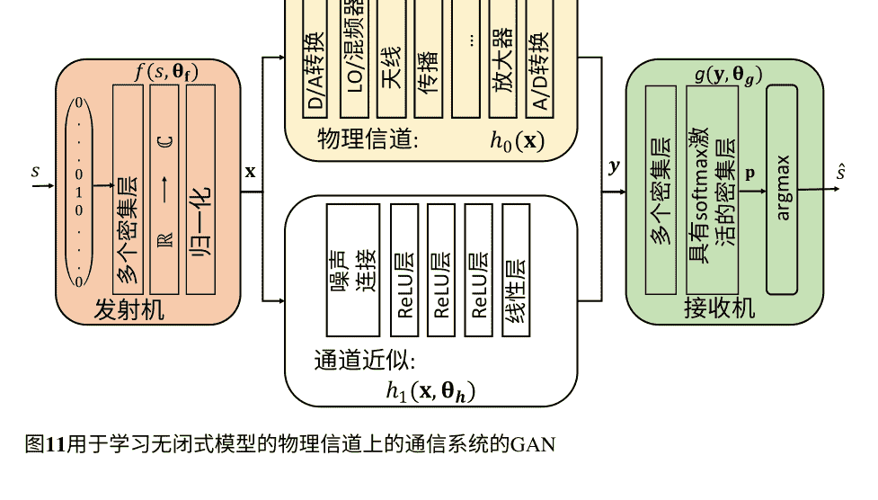

图11用于学习无闭式模型的物理信道上的通信系统的GAN

并且通过变分通道近似网络进行最小化。与[39]中一样，使用(5)和(6)中给出的两个随机梯度来最小化每个网络的参数。

$$\nabla_{\theta_D} \frac{1}{N} \sum_{i=0}^{N} [\log(D(\mathbf{x}_i, \mathbf{y}_i, \theta_D)) + \log(1 - D(\mathbf{x}_i, h(\mathbf{x}_i, \theta_h), \theta_D))], \quad (5)$$

$$\nabla_{\theta_h} \frac{1}{N} \sum_{i=0}^{N} \log(1 - D(\mathbf{x}_i, h(\mathbf{x}_i, \theta_h), \theta_D)). \quad (6)$$

引入了一个新的判别网络 $D(\mathbf{x}_i, \mathbf{y}_i, \theta_D)$ 来对输入的信道中的真实样本，$\mathbf{y}$, 和合成样本，$\hat{\mathbf{y}}$, 进行分类。$\theta_D$是判别网络的参数。$h(\mathbf{x}, \theta_h)$取代了生成网络$G(\mathbf{z})$, 其中$\mathbf{x}$反映了条件传输的符号/样本。$N$是样本的数量。通过变分层引入了函数的额外随机性。此外，使用改进的Wasserstein GAN方法与梯度惩罚（WGAN-GP）[41]训练这样的结构，可以在最小调整下实现收敛。

使用Adam [19]优化器，学习率在$10^{-4}$和$5 \times 10^{-4}$之间，迭代更新网络参数。随机通道近似网络的变分架构如图12a所示。

性能评估考虑了每个符号传输1比特的通信系统。假设服从卡方分布的信道模型，以探索更不常见的信道情景。图12b展示了来自黑盒信道模型的测量和近似条件分布。原始分布与其近似之间存在一些差异，部分原因是其表示为高斯潜变量的混合；然而，这可以

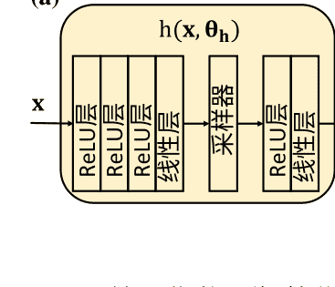

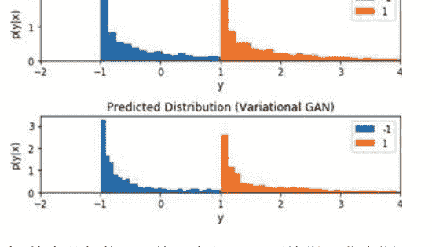

图12a是随机通道近似网络（条件生成器）的变分架构，b使用变分GAN训练学习非高斯（卡方）信道效应的条件密度的一维分布[36]

通过选择不同的采样分布和增加潜在空间的维度（以增加模型复杂性为代价），可以缓解这个问题。

这种方法还可以通过联合近似网络与聚合分布来捕捉更复杂的分布，例如级联随机效应的信道响应。考虑一个包括AWGN效应、相位噪声、相位偏移和硬件放大器模型引入的非线性AM/AM和AM/PM失真效应的16-QAM系统。图13展示了当使用变分GAN学习随机信道近似模型时，接收信号的测量版本和近似分布版本的边缘化概率分布。观察到每个星座点的分布，以及在较高幅度下由相位噪声引起的这些分布的周向延伸，以及通常成功学习到的分布的一阶近似。

在接收端，通常在执行传统通信系统的其他信号处理步骤之前，对信号进行同步（定时估计、频率偏移估计等）。

同步通常估计接收数据中的时间、频率、相位和速率误差，并对其进行校正，以创建信号的归一化版本。在第2节中描述的学习通信系统在某些情况下可以执行隐式同步和信道估计，因为硬件和信道失真（如同步偏移）可以在训练过程中考虑。从学习的角度来看，我们可以将这些校正视为变换，利用关于变换的专业知识来简化端到端任务，但仍然允许估计器完全学习。无线电变换网络（RTNs）的这种方法，如[14, 42]所探索的，已经证明可以减少训练时间和复杂性，并通过利用领域知识来提高泛化能力。

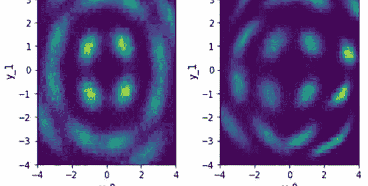

图13使用变分GAN [36]学习的接收到的16-QAM星座非线性信道效应的二维分布。

这些偏移效应存在于任何包含发射机和接收机的实际系统中，其振荡器和时钟未锁定在一起。

定时和符号速率恢复过程涉及在正确的时间偏移和采样增量处对输入信号进行估计和重新采样，这与使用变换器网络在计算机视觉中提取具有正确偏移、移位或缩放（例如，应用正确的仿射变换）的视觉像素的过程具有直接的类比。输入数据可以表示为二维输入，其中行包含正交（I）和象限（Q）样本，$N$列包含时间上的样本。完整的二维仿射变换允许在二维中进行平移、旋转和缩放，由一个$2 \times 3$元素参数向量给出。为了将其限制为时间维度上的一维平移和缩放，引入了（7）中的掩码，以便可以从图像域中使用正常的二维仿射变换实现。

$\theta_0$，$\theta_1$和$\theta_2$是1D仿射变换的剩余未屏蔽参数：

$$\begin{bmatrix}\theta_0 & 0 & \theta_2 \\ 0 & \theta_1 & 0\end{bmatrix}$$ (7)

相位和频率偏移恢复任务在视觉领域中没有直接的类比。然而，可以应用简单的信号处理变换来完成这些任务。输入信号与复正弦波混合，其相位和频率由两个新的未知参数定义，如式（8）所示。

$$y_n = x_n \mathrm{e}^{j(n\theta_3 + \theta_4)}$$ (8)

这个变换可以直接在Keras [31]中实现为一个新的层，在时序和符号速率恢复之前级联使用。

同步的任务则变成了对$\theta_i$值的参数估计任务，这些值传递给变换器模块。领域适应的层用于辅助估计这些参数，即复卷积1D层和复数到功率和相位层。虽然有很多可能的架构，但复卷积操作和可微的笛卡尔到极坐标操作被用来简化学习任务。图14展示了一个示例

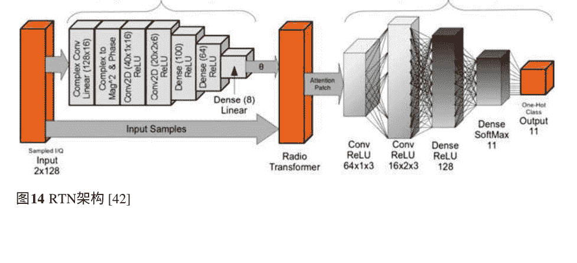

RTN架构。在层之间可以使用0.5这样的丢弃率来防止过拟合，并且可以使用Adam [19] SGD来优化训练集上的网络参数，在这种情况下，批量大小为1024，学习率为0.001。预变换输入星座图的密度图如图15所示。当观察到50个测试样例在20个时间样本范围内的星座密度时，使用无线电注意力模型后，密度开始围绕星座点形成。

在[14, 20]中，考虑了瑞利衰落信道作为信道，并使用RTN进行信道估计。然后，接收信号被学习到的信道响应除以均衡输入信号，从而提高SER性能，为RTN效果提供更多定量研究。

所描述的信道建模方法可以广泛用于增强优化、测试和测量通信系统，并特别用于提供各种无线任务的有效无模型方法，例如基于自动编码器的通信中的信道学习（见第2节）和信号分类（见第3.2节）。此外，开发的RTN模型可以用于提取信道特征，类似于传统系统中的信道估计，并通过使用变换层进行均衡，从而允许传授专业知识而不过度指定学习模型（例如，为特定协议或参考编写估计器）。

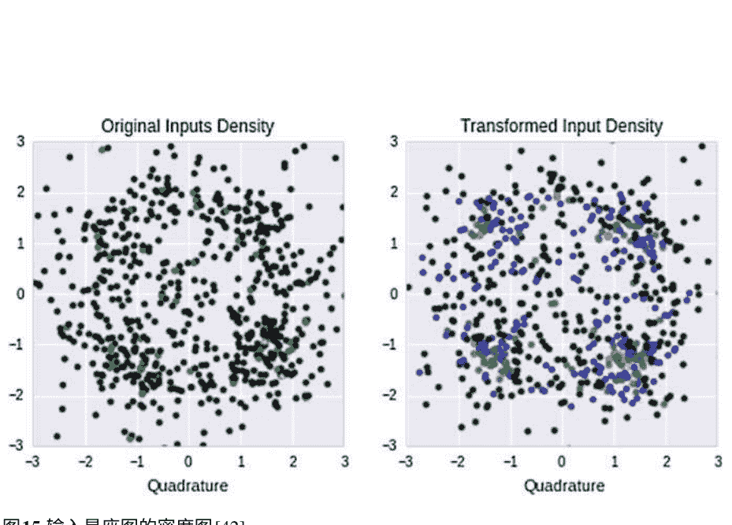

## 3.2 信号检测和调制分类

信号检测和分类功能定义了无线通信系统准确构建和维护其当前操作环境的能力。检测和与其他用户共存于频谱中，检测和隔离干扰源，标记重要的频谱事件，或在无线电频谱中识别频谱空缺都依赖于信号检测和分类。检测概率与接收机的信噪比成正比。传统上，每种波形都需要特定的信号检测器，根据其分析特性开发，导致系统在真实世界的无线应用中很难稳健地开发和部署，主要是由于其过度特定、复杂或在真实世界条件下性能不佳[43]。

射频频谱与许多不同的信号类型共享，范围从电视广播到雷达。在存在多个以相同频率和低信噪比运行的波形的情况下，信号检测和分类任务尤其具有挑战性。传统的信号检测和分类方法可以分为:

- 通用方法：这些方法不需要任何关于信号类型的先验信息。它们可以检测多种信号类型，但是它们的恒定虚警率(CFAR)性能相对较差。能量检测器[44]是不需要先验信息的检测器的一个例子。这种类型的检测器可以很容易地转化为方便的概率形式进行分析，但是它们在利用关于信号上下文或结构的附加信息来提高性能方面受到严重限制。
- 专用方法：这些方法为特定的信号类型提供敏感的检测器。使用感兴趣信号的特定特征开发的检测和分类方法。匹配滤波器和循环平稳信号检测器[44]是这种类型的例子。这些方法通常不可扩展，因为每个新的波形都需要一个新的分类器。

一种新的基于深度学习的无线电波形检测器类别，利用了在计算机视觉中开发的强大新技术，特别是卷积特征学习，有潜力通过很好地泛化并对非常低功率信号保持敏感来改善实际系统的信号检测和分类性能[43]。在计算机视觉中，这个任务存在着与目标识别和定位任务的强烈类比。最近的目标检测和定位方法将特定的目标类别与图像中的边界框标签相关联。在[45]中采用了类似的方法，将射频频谱表示为图像，并使用卷积神经网络在二维图像上进行特征学习，以检测、定位和识别宽带时频功率谱图中的无线电传输。

梯度加权类激活映射（Grad-CAM）使用流入最终卷积层的任何目标概念的梯度来生成一个粗糙的定位图，突出显示图像中的重要区域，有助于预测概念[46]。 Grad-CAM用于执行[45]中的光谱事件定位。图16显示了Grad-CAM的块图，用于光谱事件的定位。 激活得分的梯度 $y^C$ （而不是类概率）是根据给定卷积层的所有特征图相对于提供的输入标签 $C$ 计算的。 梯度的全局平均池化[47]给出了与特征图相关联的相应权重。 最后，特征图的加权和通过逐元素ReLU单元传递以获得类激活图。

为了展示本研究中的性能，使用USRP B205收发器在五个不同城市的八个不同位置上收集了13个不同频带的数据集，并涵盖了不同频带和流量模式的范围。数据集中的信号类型包括GSM、 LTE、 ISM、 TV和FM等。图17中显示的频谱图，标记为输入频谱，是使用收集的数据生成的，以显示随时间和频率的信号强度。 x轴表示时间，y轴表示信号频率。 这些图像被用作CNN架构的输入。 Grad-CAM实现的结果也显示在图17中。 在信号突发的顶部观察到了激活的热区域，这是预期的。 训练的特征目标是对频带进行分类，而不是激活某种发射类型的所有实例，因为每个频带中的每个信号活动的标签都没有提供；即使在同一个频谱图中可能存在其他窄带信号，也只分配一个标签给每个频谱图。 出于这个原因，对于一些例子，激活图只突出显示信号的强部分，并且某些信号的部分被偏爱用于识别。

图18a显示了分类结果的混淆矩阵。 这种在频谱图中检测、分类和定位发射的方法，提供了合理的分类性能和合理的活动区域对应的类激活图。

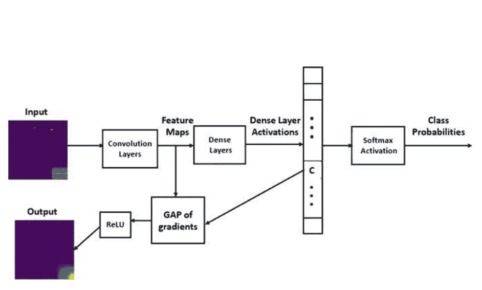

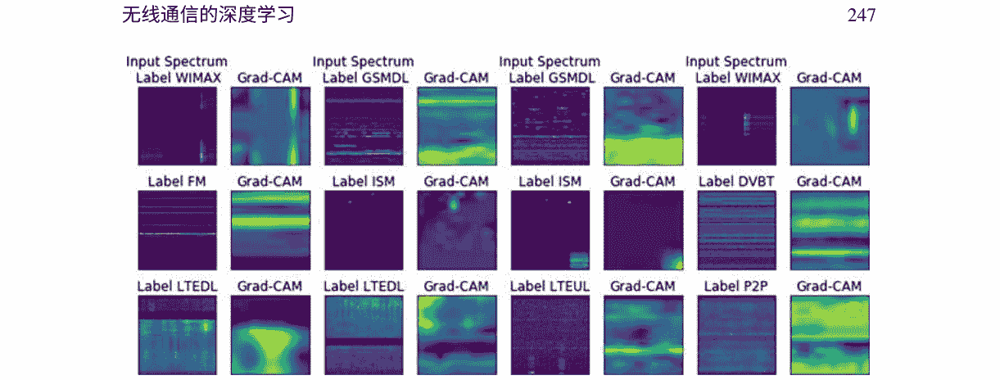

对于监督调制识别任务，与文献中的其他非神经网络机器学习技术相比，卷积深度学习架构在性能方面进行了比较。 在[3]中，生成的数据集包括11种调制方式：8种数字调制和3种模拟调制，这些调制方式在无线通信系统中被广泛使用。 其中包括BPSK、QPSK、8PSK、16-QAM、64-QAM、BFSK、CPFSK和PAM4作为数字调制，以及WB-FM、AM-SSB和AM-DSB作为模拟调制。 数据以大约每个符号8个样本的速率调制，具有归一化的平均发射功率为0 dB。这些信号受到真实信道效应的影响。 热噪声导致接收机上相对平坦的白高斯噪声，形成噪声底线或灵敏度水平和信噪比。由于温度和其他半导体物理在发射机和接收机上的差异，振荡器漂移导致符号定时偏移、采样率偏移、载波频率偏移和相位差异。 这些效应导致接收信号基于未知的时变过程发生时间上的偏移、缩放、线性混合/旋转以及旋转。 此外，真实信道根据传输信号在接收机上到达的模式进行随机滤波，具有不同的幅度、相位、多普勒和延迟。 这是一个被称为多径衰落或频率选择性衰落的现象，在任何信号可能反射到建筑物、车辆或环境中的任何反射器的环境中发生。

图18b展示了一个用于调制分类任务的简单CNN架构，它是一个未调优的4层网络，包括两个卷积层和两个（过度尺寸的）全连接层。除了输出层使用softmax激活函数作为分类器外，其他层都使用ReLU激活函数。使用Dropout正则化来防止过拟合，同时对权重使用 $\|W\|_2$范数正则化，对密集层激活使用 $\|h\|_1$范数惩罚，可以促进解的稀疏性[48, 49]。 训练使用分类交叉熵损失和Adam [19]求解器进行。

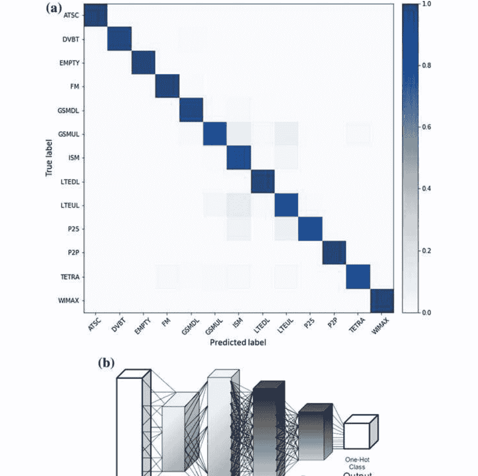

图18 aRF频段分类的混淆矩阵[45]，bCNN架构[3]

基线分类器使用专家特征（高阶矩和累积量）。图19展示了朴素贝叶斯、支持向量机（SVM）和CNN网络架构的性能结果，其中CNN分类器在所有信噪比下都优于朴素贝叶斯和SVM分类器。

为了进行更真实的评估，在[50]中生成了空中数据集，并在虚拟几何组(VGG)和残差网络(RNs)之间比较了调整更好的架构，以及基于更强的XGBoost的基准线的调制分类性能。结果表明，RN方法在合成和空中数据集上都实现了最先进的调制分类性能。

图19深度学习在无线领域中胜过传统机器学习的示例。

CNN在分类各种数字调制(BPSK、QPSK、8PSK、16-QAM、64-QAM、BFSK、CPFSK和PAM4)和模拟调制(WB-FM、AM-SSB和AM-DSB)方面比SVM和朴素贝叶斯更成功。

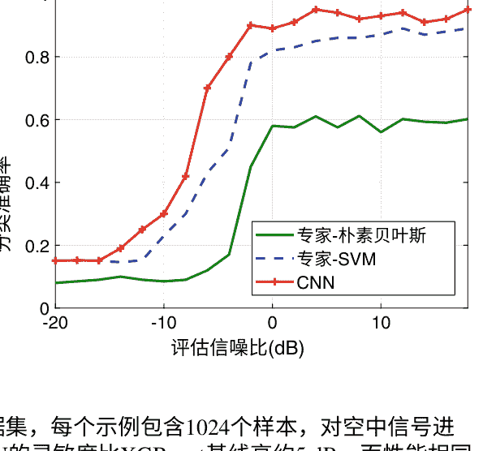

使用包含100万个示例的数据集，每个示例包含1024个样本，对空中信号进行分析。在低信噪比下，RN的灵敏度比XGBoost基线高约5 dB，而性能相同。在高信噪比下，RN实现了最高99.8%的分类准确率，而VGG网络实现了98.3%，基线方法实现了94.6%的准确率。

## 3.3 用于情境感知的生成对抗方法

无线电通过频谱感知收集原始（复数值）数据样本或接收信号强度指示器（RSSI）值，并将其用于训练DNN进行各种应用，如信道估计或波形分类，如前几节所讨论的。在将频谱数据用于深度学习之前，需要克服两个重要的障碍。

1.  深度学习需要大量的数据样本来训练DNN的复杂结构。这在通过频谱感知可能不容易获得，因为花费太多时间在频谱感知上的无线用户可能没有足够的时间来完成其他任务，如传输其数据包。因此，可能没有足够数量的无线数据样本可用于训练深度神经网络。需要进行训练数据增强以扩展在频谱感知中收集到的训练数据。
2.  频谱数据的特性随着底层信道、干扰和流量效应以及无线用户的传输模式的变化而变化。因此，为一个瞬间收集的训练数据可能在另一个瞬间不完全适用。一个例子是当无线节点从室外移动到室内时信道发生变化，其中存在更多的多径传播，因此存在差异——预计会有不同的信道条件。需要进行领域适应，将从一个领域（例如低移动性）收集的频谱感知测试或训练数据转换到另一个领域（高移动性）。

GAN已经成为一种可行的方法，可以在短时间内基于少量真实数据样本生成合成数据样本，并将这些合成数据样本用于计算机视觉、文本和网络应用的训练数据增强[51-53]。 GAN由生成器和判别器组成，它们进行极小极大博弈。 生成器的目标是生成逼真的数据（带有标签），而判别器的目标是区分由生成器生成的数据是真实的还是合成的。 条件GAN扩展了GAN的概念，使生成器能够生成带有标签的合成数据样本[54]。 图20显示了条件GAN的架构。 当应用于无线通信时，GAN需要捕捉信道模式、干扰和流量特征之外的外部影响。 GAN已经应用于频谱感知中的信道测量数据增强[55]、调制分类[56]、干扰[57, 58]以及5G网络的通话数据记录[59]。

举个例子，考虑一个感知频谱并观察另一个节点的传输的对手（隐藏在信道失真、开关模式和其他背景传输中） 基于这些观察，对手训练一个深度神经网络来预测何时会有成功的传输并进行干扰。 有关深度学习在无线通信安全中的应用细节，请参见第4节。 如果对手等待太久来收集数据，可能会错过干扰传输的机会。 因此，对手收集少量感知样本，然后通过生成对抗网络进行增强。

迄今为止，GAN在无线领域适应性中的应用仍然有限。 参考文献[55]研究了用于频谱感知的训练数据适应性，其中无线接收器决定是否存在活动发射器（标签1）或不存在（标签2）。 有两个环境对应于两种不同的信道类型，即方差为0.2的瑞利衰落分布（环境1）和方差为2的瑞利衰落分布（环境2）。 假设接收器对环境1有训练数据并训练了一个分类器，而对环境2没有训练数据。 因此，接收器为环境2生成了合成训练数据样本。 训练数据适应性包括双向GAN [60]、条件GAN [54]和分类器。 双向GAN通过使用GAN和自编码器获得从数据到条件噪声的逆映射，二者共同学习如何对神经网络进行逆操作。

随着环境从1变为2，训练了一个新的条件GAN

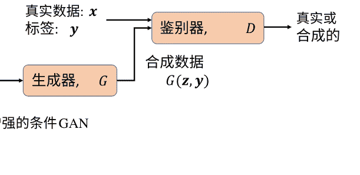将环境2中的新样本作为真实输入。使用双向GAN的逆映射和环境1中的标签，而不是随机噪声作为合成输入，训练CGAN。在CGAN训练之后，使用领域适应样本训练分类器，并用于标记在环境2中收集的新样本。这种方法可以防止基于SVM的频谱传感器在5 dB SNR下的准确率下降42%[55]。

此外，GAN在[61]中用于匹配波形、信道和无线电特性，并伪造无法可靠区分的合法信号。这种攻击可以针对信号认证系统使用，并且可以用于模拟主用户在主用户仿真(PUE)攻击中的行为。

## 要点

本节展示了深度学习在特征化和分析光谱方面提供了新的手段。通过超越传统的机器学习算法，深度神经网络（DNNs）在频谱情况感知、信道建模和估计中以生成对抗网络（GANs）和前馈神经网络（FNNs）为主要手段，以及在信号检测和分类中以卷积神经网络（CNNs）为主要手段，显著地贡献了。

## 用于无线通信安全的深度学习

由于无线传输的共享介质，无线通信非常容易受到安全威胁。无线攻击的一个典型例子是干扰攻击，旨在通过对接收器施加干扰（例如参见[62]）并导致服务拒绝（DoS）[63]来破坏无线通信。这些攻击使用不同的通信手段（例如功率控制[64]或随机接入[65]）并在攻击者意图的不同级别上应用[66]。随着无线电执行更复杂的任务，它们也变得容易受到针对其基本任务的高级攻击。一个例子是频谱感知数据伪造（SSDF）攻击，其中参与协作频谱感知的对手故意伪造其频谱感知结果（即信道是否繁忙或空闲）[67]。通过这种方式，对手旨在将信道占用决策从繁忙更改为空闲（以使后续传输失败）或从空闲更改为繁忙（以使没有其他无线电进行传输，要么传输机会被浪费，要么对手获得传输机会）。数据伪造也可能发生在其他网络功能上。一个例子是通过伪造在整个无线网络中交换的拥塞流量度量（例如队列积压）来操纵路由决策[68, 69]。除了这些安全威胁，无线电广泛使用深度学习为对手在无线通信上发动新型攻击提供了机会。特别是，深度学习本身成为对手的主要目标。在对手存在的情况下进行学习的范式是新兴领域的对抗机器学习[70]，传统上应用于其他数据领域，如计算机视觉。探索性（推理）攻击[71]是一个例子，对手试图学习一个系统的内部运作方式，通过使用一些数据样本查询机器学习分类器（如DNN），收集返回的标签，并构建一个功能等效的分类器。

对抗性机器学习提供了必要的优化机制，以发起和缓解对机器学习的攻击。除了探索性攻击之外，还有两种流行的攻击类型是逃避和因果（污染）攻击。在逃避攻击中，对手选择或生成数据样本来查询深度学习分类器等机器学习算法，并欺骗其做出错误决策[72]。在因果攻击中，对手针对训练过程，并篡改训练数据（即修改相应的标签），以使机器学习算法无法充分训练[73]。由于深度学习对训练数据中的错误非常敏感，这种攻击对DNNs非常有效。虽然这些攻击已成功应用于不同的数据领域，如计算机视觉（如图像分类[53]）和自然语言处理（如文档分类[74]），但它们不能直接应用于无线通信。原因有多个：

-   对手没有直接查询无线发射器的机制，但只能通过空中观察其传输特性。
-   对手通过噪声信道收集训练数据，即对手的训练数据默认是不完美的。
-   对手和目标的训练数据和标签在无线领域是不同的。它们的数据样本不同，因为它们是通过不同的信道接收的，而它们的标签不同，因为它们的机器学习目标不同。例如，一个发射器可能尝试检测信道是否繁忙，而干扰器可能尝试预测何时会有成功的传输。

因此，将对抗性机器学习应用于无线领域并不简单，并且需要考虑到攻击者和防御者的上述差异[57, 58, 75]。如图21所示，基本通信场景用于说明基于对抗性机器学习的无线攻击[57]。有一个认知发射器 T作为次级用户，并动态访问频谱以与其接收器 R进行通信，同时避免来自背景发射器 B（例如电视广播网络）的干扰。T使用决策函数（例如深度学习分类器）进行传输，以捕捉 B的传输模式以及信道效应。还有一个对手 A不知道 T的决策函数，并试图通过感知频谱来学习它。这对应于一个黑盒探索性攻击，随后还会进行其他攻击，如干扰以降低 T的性能。接下来，我们将描述无线通信的探索性攻击以及如何使用它来发动有效的干扰攻击[57]。然后，我们将介绍其他基于对抗性深度学习的无线攻击，并讨论防御策略。

### 4.1 发射机和对手的操作模式

假设所有节点在一个同步的时隙时间上操作，使用单一信道（具有固定的中心频率和瞬时带宽）。任何发送节点 i（T、B或A）和任何接收节点 j（R、T或A）之间的信道增益在时隙 t 中给出，然后 j 接收信号

$$y_j(t) = \sum_{i \in \mathcal{T}(t)} h_{ij}(t)x_i(t) + n_j(t) \quad (9)$$

在时隙 t 中，其中 $\mathcal{T}(t)$ 是发送节点的集合，$n_j(t)$ 是接收节点 j 的噪声，$x_i(t)$ 如果 $i \in \mathcal{T}(t)$，则携带信号，否则 $x_i(t) =0$。由于 A（即 $h_{BA}(t)$ 和 $n_A(t)$）和 T（即 $h_{BT}(t)$ 和 $n_T(t)$）的信道和噪声实现不同，它们观察到不同的数据输入以进行任务。假设 $n_j(t)$ 是一个均值为零的高斯分布随机变量，功率归一化为一，$h_{ij}(t)$ 取决于 i 和 j 之间的距离和衰落类型。

还假设信号强度与 $1/d_{ij}^2$ 成比例减弱，并且使用对数-正态阴影作为阴影模型（即，考虑到平坦衰落，使得信道的相干带宽大于信号的带宽，并且信号的所有频率分量都经历相同的衰落幅度）。注意，$y_j(t)$ 是在数据传输或感知周期内接收到的信号。在后一种情况下，$y_j(t)$ 被表示为 $s_j(t)$。接下来，讨论了背景发射机 B，发射机 T，接收机 R 和对手 A 的操作模式，如图21所示。

背景发射机 B 的发射行为（空闲或忙碌）决定了每个时隙的信道状态（空闲或忙碌）。根据伯努利过程，B 会随机产生数据包到达，到达速率为 λ（数据包/时隙）。如果 B 处于空闲状态并且有数据包要传输，则以一定的概率激活并继续传输，直到其队列中没有数据包为止。由于 B 的忙碌/空闲状态是相关的。

随着时间的推移，T和A都需要观察不仅是最后一个信道状态，还有过去几个时间槽的信道状态，以预测当前的信道状态。

发射机 T 在每个时间槽中，T 感知信道并检测信道状态是否空闲或繁忙，即 B 是否保持空闲或发送。如果空闲，T 在该时间槽中向 R 发送数据（一个数据包）。发射机 T 已经训练了一个DNN（对 A 来说是未知的）作为分类器 $C_T$，根据最近的 $K_T$ 感知结果（$s_T(t-K_T+1)$，...，$s_T(t-1)$，$s_T(t)$）将当前时间槽 t 分类为空闲或繁忙。在时间槽 t 中，$C_T$ 的数据样本是

$$ s_T(t) = (s_T(t-K_T+1), \dots, s_T(t-1), s_T(t)) \qquad (10) $$

对应的标签是

$$ L_T(t) = \{\text{“空闲”}, \text{“繁忙”}\}. \qquad (11) $$

其中“空闲”或“繁忙”表示信道空闲或繁忙。因此，对于 $C_T$ 的训练数据被构建为 $\{(s_T(t), L_T(t))\}_t$。T 通过观察其传输（如果有）是否成功或失败来间接获得样本的标签 $L_T(t)$。传输成功表示信道空闲，失败表示信道繁忙。需要注意的是，这是一个嘈杂的观测结果，因为即使 B 不传输或传输，T 的传输可能会因信道条件而成功或失败。如果 T 从 R 接收到确认（ACK），则认为传输成功。如果没有收到确认（ACK），则 T 认为传输失败。需要注意的是，T 使用多个感知结果作为其特征，因为特征应该能够捕捉时间相关性，并在短时间内实现高感知准确性。然后，分类器 $C_T : s_T(t) \to L_T(t)$ 定义了从感知结果到占用决策，从而到传输决策的映射。在时间槽 t 中。

对于无线频谱的开放性质，由于 A 可以感知到频谱，然后预测在一个时间槽中是否会有成功的传输（带有反馈ACK）或者没有反馈的情况。在前一种情况下，A 传输以干扰该时间槽的信道。在后一种情况下，A 保持空闲。

在不知道 $C_T$ 的情况下，A 构建了另一个分类器 $C_A$，该分类器基于最近的 $K_A$ 感知结果（$s_A(t-K_A+1)$，...，$s_A(t-1)$，$s_A(t)$）来预测在时间槽 t 中是否会有成功的传输。A 的目标是通过构建一个替代分类器 $C_A$ 来推断 $C_T$。注意，A 需要学习相对信道效应和 T 的传输行为，而 T 的传输行为又取决于 B 的传输行为和相应的信道效应。这是一个需要以黑盒方式处理的困难学习任务，没有任何先验知识。因此，A 使用DNN作为 $C_A$ 是必要的。在时间槽 t 中，$C_A$ 的数据样本为

$$ s_A(t) = (s_A(t-K_A+1), \dots, s_A(t-1), s_A(t)) \qquad (12) $$

对应的标签是 $L_A(t) = \{\text{“ACK”}, \text{“no ACK”}\} \quad (13)$

其中“ACK”或“no ACK”表示传输后是否有ACK，分别表示有ACK和没有ACK。因此，对于 $C_A$ 的训练数据是建立在 $\{(s_A(t), L_A(t))\}_t$ 的基础上的。$C_A$ 被定义为从感知结果到成功传输的预测以及每个时间槽中的干扰决策的映射。虽然A不会在所有时间槽中进行干扰，但这样做可以最大化干扰的成功率，因为如果A在所有时间槽中进行干扰，它很容易被检测到，由于高误报率，A 可能在平均干扰功率方面有功率预算（因此不能在所有时间槽中进行干扰）。

如果信号干扰噪声比（SINR）大于某个阈值 $\beta$，接收器 R 成功接收到传输 T。SINR捕捉到传输功率、信道和干扰效应。每当成功接收到传输时，R 会在时间槽的短结束期间向 T 发送一个ACK。同时，A 通过考虑ACK消息通常与数据消息不同（它们很短并且在数据传输之后有一定的时间延迟）的事实，来感知频谱并可能检测到ACK的存在（不解码）。

### 4.2 基于探索性攻击的干扰

发射机 T 通过收集了1000个样本，并将其分成两半来构建训练和测试数据。最近的10个感知结果用于构建一个数据样本（即 $K_T = 10$）。发射机 T 训练一个FNN作为 $C_T$。使用Microsoft Cognitive Toolkit（CNTK）[76]来训练FNN。T 优化DNN的超参数，以最小化误差 $\{e_T^{MD}, e_T^{FA}\}$，其中 $\{e_T^{MD}\}$ 是误检概率（时间槽为空闲，但 T 预测为忙碌），$\{e_T^{FA}\}$ 是误报概率（时间槽忙碌，但 T 预测为空闲）。当到达率 $\lambda$ 为0.2（包/时间槽）时，找到了 $C_T$ 的优化超参数如下。神经网络由一个具有100个神经元的隐藏层组成。使用交叉熵损失函数和反向传播算法来最小化训练神经网络。输出层使用softmax激活函数。隐藏层使用sigmoid函数进行激活。所有权重和偏置都初始化为随机值在 $[-1.0, 1.0]$ 内。在第一次训练通过中，输入值进行单位归一化。小批量大小为25。更新梯度的动量系数为0.9。每个时间槽的训练周期数为10。

在测试时间内，$C_T$ 在500个时间槽上运行以评估其性能。T，R 和 B 的位置固定在位置 $(0,0)$，$(10,0)$ 和 $(0,10)$。所有发射功率都设置为噪声功率的30 dB。SINR阈值 $\beta$ 设置为3。对于这些场景参数，$e_T^{MD} = e_T^{FA} = 0$。T 进行了400次传输，其中383次成功。请注意，由于随机信道条件，17次在空闲信道上的传输失败。因此，吞吐量为 $383/500 = 0.766$ 个数据包/时间槽，成功率为 $383/400 = 95.75\%$。接下来，我们将展示基于对抗性深度学习的干扰器如何显著降低这种性能。

对抗性深度学习通过对手 A 探索性攻击的方式来推断一个机器学习（包括深度学习）分类器，并已应用于其他数据领域，如文本分类[71]和图像分类[72]。

在这些先前的工作中，对手查询目标分类器，获取一些样本的标签，然后使用深度学习训练一个功能等效的分类器。如果两个分类器对相同的样本提供相同的标签，则它们是功能等效的。然而，由于无线环境中数据样本和标签的差异，这种方法无法应用于无线设置。

在给定时间的数据样本是不同的，因为 T 和 A 通过不同的信道接收信号（即由于与 B 的距离和实现的不同），因此在任何时间 t, 频谱感知结果 $s_T(t)$ 和 $s_A(t)$ 是不同的。在给定的时间 t, 来自 B 的信号被 T、R 和 A 接收，分别为 $y_T(t) = h_{BT}x_B(t) + n_T(t)$, $y_R(t) = h_{BR}x_B(t) + n_R(t)$, 以及 $y_A(t) = h_{BA}x_B(t) + n_A(t)$, 其中 $h_{BT}$、$h_{BR}$ 和 $h_{BA}$ 是信道增益，$n_T(t)$、$n_R(t)$ 和 $n_A(t)$ 是接收器噪声。

-   T 和 A 的分类器具有不同类型的标签。T 的标签表示信道是否繁忙或空闲，而 A 的标签表示 T 是否会有成功的传输。

作为深度学习分类器 $C_A$, A 训练了一个FNN。为此，A 收集了1000个样本，并将其分成两半来构建训练和测试数据。A 使用最近的10个感知结果来构建一个数据样本（即 $K_A = 10$）。A 只打算干扰成功的传输（收到 ACK 反馈）。A 优化超参数以最小化 $e_A = \max\{ e_A^{MD}, e_A^{FA} \}$, 其中 $e_A^{MD}$ 是误检的错误概率（T 的传输成功，但预测不会收到 ACK），$e_A^{FA}$ 是误报的错误概率（T 不传输或 T 的传输失败（即使没有干扰），但预测会收到 ACK）。训练时间（包括超参数优化）为67秒，每个样本的测试时间为0.024毫秒。$C_A$ 的优化超参数如下所示。神经网络由两个隐藏层和50个神经元组成。使用交叉熵损失函数和反向传播算法训练 DNN。输出层使用softmax激活函数。隐藏层使用双曲正切（Tanh）函数进行激活。所有权重和偏置都被初始化为随机值，范围在[-1.0, 1.0]之间。输入值在第一次训练过程中进行单位归一化。小批量大小为25。更新梯度的动量系数为0.9。每个时间段的训练周期数为10。在这些超参数下，误差 $e_A$ 被最小化为1.48%。请注意，超参数优化会影响准确性。例如，如果将层数减少到1，误差 $e_A$ 将增加到1.73%。类似地，如果每层的神经元数量改变为30，误差 $e_A$ 将增加到2.22%。

在测试时间内，$C_A$ 在500个时间槽上运行以评估其性能。A 的位置固定在位置(10, 10)，其干扰功率比噪声功率高30 dB。

如果没有干扰，T将有383次成功传输。在A的攻击下，误检数量为16，即误检概率为 $e_A^{MD} = 16/383 = 4.18\%$（大部分成功传输被干扰），误报数量为17，即误报概率为 $e_A^{FA} = 17/(500 – 383) = 14.53\%$。由于这次攻击的重大影响，400次传输中只有25次成功传输。因此，T的吞吐量从0.766个数据包/时间槽降低到 $25/500 = 0.05$ 个数据包/时间槽，成功率从95.75%降低到 $25/400 = 6.25\%$。

作为一个基准，也考虑了没有对抗性深度学习的传统攻击。在这种基于感知的干扰中，如果A在当前时隙的频谱感知期间接收功率大于阈值τ，则A会干扰信道。请注意，基于感知的干扰器的性能取决于τ的适当选择。如果τ太低，误报的数量会增加。如果τ太高，则误检的数量会增加。请注意，由于没有明确的机制来选择τ，τ通常被视为固定值。对于性能的上限，选择τ为3.4，以最小化A的 $e_A^{MD}$，并用于计算在基于感知的干扰存在下发射机的吞吐量和成功率。然后，$e_A^{FA}$ 为12.6%。请注意，当τ增加到5时，$e_A^{MD}$ 迅速增长到30.0%，而当τ减少到2时，$e_A^{FA}$ 增长到14.0%。通过最佳选择τ，T的吞吐量减少到0.140个数据包/时隙，T的成功率从16.99%减少。另一方面，如果任意选择τ（例如4.7），T的吞吐量变为0.576个数据包/时隙，T的成功率变为69.90%（即攻击效果不如预期）。总结在表3中的结果显示了对抗性深度学习在发动无线干扰攻击中的重要性。

## 用于无线攻击的生成对抗学习

在对抗性深度学习的训练过程中，收集了500个样本来构建其分类器 $C_A$。从实际攻击的角度来看，缩短在干扰开始之前的初始学习期非常关键。为此，A 使用GAN基于少量真实数据样本在短时间内生成合成数据样本。然后，它使用这些合成数据样本来增加其训练数据，如第3.3节所讨论的。

条件GAN在TensorFlow [32]中实现，生成器和判别器都使用具有128个神经元的三个隐藏层的FNNs。泄漏的ReLU被用作激活函数。使用Adam优化器[19]来更新权重和偏置。每个隐藏层的输出通过批归一化进行归一化。图22显示了生成器和判别器的损失。请注意，当GAN训练开始时，损失会显著波动，并在GAN训练过程的3000次迭代后最终收敛。

通过Kullback-Leibler (KL)散度来衡量真实数据和合成数据分布的相似性。KL散度由以下公式给出

$$D_{\mathrm{KL}}(P\|Q) = -\sum_{x\in\mathcal{X}} P(x)\log\left(\frac{Q(x)}{P(x)}\right)$$

对于支持在 $\mathcal{X}$ 上的两个分布 $P$ 和 $Q$。将合成数据样本的分布表示为 $P$ （由GAN生成），将真实样本的分布表示为 $Q$，并将通道状态的随机变量表示为 $c$ （如果空闲则 $c=0$，如果忙碌则 $c=1$）。每个样本的测试时间为0.024毫秒（远小于信道相干时间）。如果每秒获得感知结果，并进行500次测量，则在不使用GAN的情况下，收集500个RSSI级别需要500秒。使用GeForce GTX 1080 GPU训练GAN并从GAN生成500个合成样本需要23秒。由于在10秒内收集到10个真实样本，使用GAN准备数据需要33秒。因此，在 A 开始干扰之前，GAN显著减少了数据收集时间。当 A 基于10个真实数据样本构建其分类器 $C_A$ 时，误报的错误概率为19.80%，误检的错误概率为21.41%。在添加500个合成数据样本后，误报的错误概率降至7.62%，误检的错误概率降至10.71%，即接近使用500个真实数据样本训练DNN时的水平。

### 表3 不同攻击类型对发射机性能的影响[57]

| 攻击类型 | 吞吐量 | 成功率 (%) |
|----------|--------|------------|
| 无攻击 | 0.766 | 95.75 |
| 对抗性深度学习 | 0.050 | 6.25 |
| 基于感知的攻击（τ = 3.4） | 0.140 | 16.99 |
| 基于感知的攻击（τ = 4.7） | 0.576 | 69.90 |

## 4.3 基于对抗性深度学习的其他攻击

还有其他各种无线攻击可以通过对抗性机器学习来发动。 从传统设置到对抗性机器学习的攻击简要分类如图23所示。

频谱污染攻击对抗性深度学习也可以用于发动空中频谱污染攻击[75]。 利用探索性攻击的结果，对手通过在发射机的短时频谱感知期间发送信号来伪造发射机的频谱感知数据。 根据发射机是否使用感知数据作为测试数据来进行发射决策或重新训练，要么被欺骗做出错误决策（规避攻击），要么发射机的算法被错误地重新训练（因果攻击）。 这两种攻击都会大幅降低发射机的吞吐量。 请注意，这些攻击与SSDF攻击不同，因为对手不参与合作频谱感知，也不试图直接更改信道状态标签。 相反，对手向信道注入对抗性扰动，并旨在欺骗发射机做出错误的频谱访问决策。 发射机可以应用一种防御方案，即有意进行少量的错误传输（由信道分类的置信度得分选择），以操纵对手的训练数据。 这种防御措施有效地欺骗对手，并帮助发射机保持吞吐量[75]。

另一种针对频谱感知的攻击是优先级违规攻击[77]，攻击者在感知阶段通过假装具有更高的优先级（例如模拟主用户行为）来强制目标发射机做出错误决策，从而进行逃避攻击。

逃避攻击对信号分类器的攻击在测试阶段可以向数据样本中添加对抗性扰动，用于其他无线通信任务，如信号分类[78–81]。 在这种逃避攻击中，接收器的目标是对其进行分类。

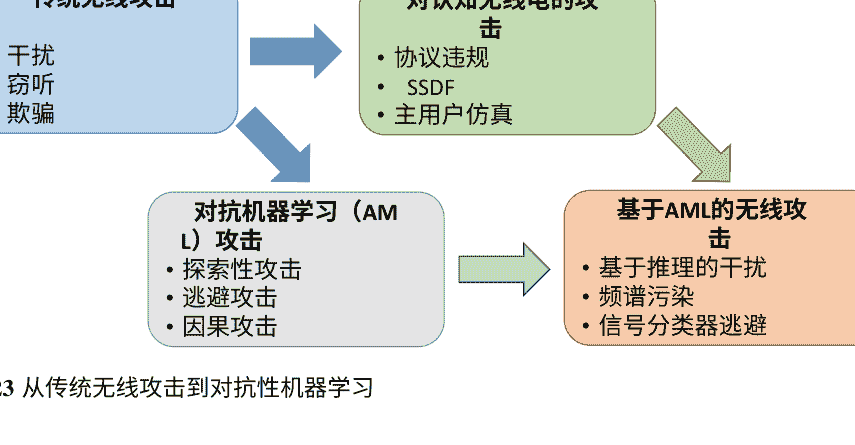

相对于波形特征，对于传入信号的处理 同时，对手也会发送信号，以便将精心控制的干扰信号添加到接收到的信号中，并导致分类器错误地对接收到的信号进行分类。这个问题在使用基于CNN的分类器进行调制分类时在[78, 79]中进行了研究。 白盒和黑盒攻击都证明了通过向接收到的信号添加小的空中扰动来增加分类错误的有效性。参考文献[80, 81]开发了防止入侵者成功识别正在使用的调制方案的方法。

总体而言，针对频谱感知或信号分类的攻击会发送低功率的短信号。 因此，与干扰长数据传输周期的传统攻击相比，它们更节能且更难以检测。

基于深度学习的无线威胁防御除了对抗性深度学习，还研究了基于深度学习的无线安全威胁防御机制。 针对干扰攻击，[82]开发了一种基于深度Q网络的算法，用于认知无线电决定是否离开干扰严重的区域或选择跳频模式来击败智能干扰器。 参考文献[83]训练了一个CNN网络，用于对信号进行音频干扰、窄带干扰、脉冲干扰、扫频干扰和扩频干扰的分类。参考文献[84]应用了基于小波的预处理步骤，在将信号分类为干扰器之前，突出显示信号中受到干扰的部分。另一个例子是使用深度学习进行信号认证作为物联网应用。参考文献[85]提出了一种基于长短期记忆（LSTM）结构的深度学习解决方案，用于从物联网设备生成的信号中提取一组随机特征，并将这些特征动态地嵌入到信号中。该方法被证明能够有效地认证信号的可靠性。

## 4.4 对抗深度学习的防御

对抗深度学习的典型第一步是探索性攻击，其中 A构建了替代分类器 C_A来推断 T的传输行为。 一种有效的防御方法是干扰 C_A的训练过程。 在这种防御中， T并不总是按照 C_A返回的标签进行操作，并且在进行传输决策时会更改一些数据样本的标签[57]。 特别地， T将标签“ACK”（即“成功传输”）更改为“No ACK”（即“无成功传输”），反之亦然。 通过这种方式， A的训练数据被操纵，无法在探索性攻击中构建可靠的分类器。 由于 T通过提供错误的训练数据来破坏 A的训练过程，这种防御对应于 T对 J的因果攻击（或污染攻击）。 通过在特定的时间槽中故意做出错误决策， T即使信道被预测为空闲，也不进行传输，并且在信道被预测为忙碌时进行传输。

虽然这种防御增加了在 $A$ 处的不确定性，但在某种程度上存在一个权衡，即错误的传输决策会降低 $T$ 的传输成功率。因此，$T$ 需要在少数精心选择的时间槽中决定是否翻转其决策。让 $p_d$ 表示时间槽中 $T$ 决定翻转标签的百分比（%）。

$p_d$ 被视为一项防御预算。$T$ 使用由DNN返回的似然分数 $S_T(t)$（即信道是否空闲的似然）来决定何时采取防御措施。如果 $S_T(t)$ 小于阈值 $\eta$，则 $T$ 将给定的时间槽 $t$ 分类为空闲；否则，将其分类为忙碌。当 $S_T(t)$ 远离 $\eta$ 时，这样的分类具有很高的置信度；否则置信度较低。对于前面小节中使用的FNN结构，$\eta = 0.25$，这是为了最小化 $T$ 的误差。

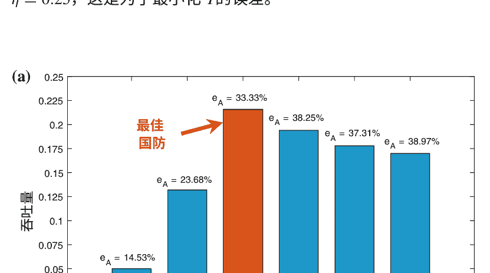

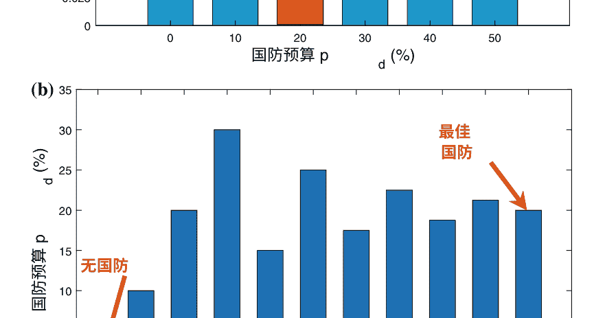

> 图24 a发射机的防御对对手的影响[57]， b发射机的防御对对手的动态适应[57]

为了优化防御机制， T在时间槽 t中执行防御操作当 S_T (t)接近0或1时，因为 T的传输决策在这样的时间槽中更可预测。 在满足 p_d值的条件下， T在不同的时间槽中更改标签A最终构建了与之前没有防御的情况下不同的超参数的不同分类器。

图24a显示了当 T在不同的防御预算下运行时的结果。随着 p_d的增加， A的错误概率和 T的吞吐量开始显著增加。当 p_d =10% 时 ，T的吞吐量达到最大值。 随着 p_d的进一步增加， A的错误概率的增长趋于饱和，无法再弥补充信道访问决策中的错误。 结果是， T的吞吐量开始下降。 为了确定最佳的 p_d值， T可以从一个固定水平的 p_d开始进行攻击缓解，然后根据接收到的ACK消息测量其吞吐量的变化逐渐增加或减少 p_d。 图24b显示了随着时间的推移如何调整 p_d以优化吞吐量。

> 要点：本节展示了在对抗环境中深度学习可以有效地用于发动成功的攻击以降低通信性能。 反过来，对手可以通过操纵其感知数据样本在某些时间点上选择深度学习预测结果来欺骗对手。

# 5 结论

深度学习在解决无线通信中遇到的独特挑战方面取得了快速进展，需要快速、可靠、安全地从频谱动态中学习和适应。 我们介绍了将深度学习应用于端到端（物理层）通信、频谱情况感知和无线安全方面的最新进展。 首先，我们讨论了如何将物理层的发射机和接收机设计形式化为构建为DNN的自编码器。 我们展示了这种形式化有效地捕捉了信道失真，并且与传统通信系统相比，显著提高了单天线、多天线和多用户系统的性能。 其次，我们展示了当基于模型的方法失败时，深度学习可以帮助信道建模和估计以及信号检测和分类。 GAN可以可靠地捕捉复杂的信道特性，用于信道估计或频谱数据增强，而CNN可以显著提高信号分类准确性，与传统机器学习技术相比。

第三，我们讨论了对无线通信发起干扰攻击的对抗性深度学习应用。 从探索性攻击开始，对手可以使用深度神经网络可靠地学习目标通信系统的传输行为并有效地干扰它，而防御机制可以通过污染其深度神经网络训练过程来欺骗对手。

本章讨论的研究主题展示了深度学习在解决模型和算法缺陷、增强无线通信方面的关键领域。 迄今为止的进展清楚地表明，深度学习为无线通信提供了新的设计选择。

同时，对抗性深度学习对无线通信构成了新兴威胁，使频谱态势感知得到增强，将通信和感知置于一个有趣的对抗性游戏中。无线通信中还有许多额外的深度学习应用即将到来，这将潜在地改变我们对新一代无线系统进行建模、设计、实施和运营的方式，并使该领域比以往更加以数据为中心。

# 参考文献

+   1. Haykin, S.: 认知无线电: 大脑驱动的无线通信. IEEE J. Sel. Areas Commun. 23(2), 201–220 (2005)
2. Clancy, C., Stuntebeck, H.J., O’Shea, T.: 机器学习在认知无线电网络中的应用. IEEE Trans. Wirel. Commun. 14(4), 47–52 (2007)
3. O’Shea, T.J., Corgan, J., Charles Clancy, T.: 卷积无线电调制识别网络. Int. Conf. Eng. Appl . Neural Netw. (2016)
4. Shannon, C.E.: 通信的数学理论. Bell Syst. Tech. J. 27, 379–423, 623–656 (1948)
5. Goldsmith, A.: 无线信道的联合源/信道编码. IEEE Veh. Technol. Conf. (VTC) (1995)
6. Sagduyu, Y.E., Ephremides, A.: 无线排队串行网络中MAC和网络编码的跨层优化。 IEEE Trans. Inf. Theory 54(2), 554–571 (2008)
7. Samuel, N., Diskin, T., Wiesel, A.: 深度MIMO检测。 在: IEEE国际信号处理进展无线通信研讨会 (2017年)
8. Wang, T., Wen, C., Wang, H., Gao, F., Jiang, T., Jin, S.: 无线物理层的深度学习: 机遇和挑战。 中国通信。 14(11), 92–111 (2017)
9. He, H., Wen, C.-K., Jin, S., Li, G.Y.: 用于MIMO检测的模型驱动深度学习网络(2018)。 arXiv预印本 arXiv:1809.09336
10. Veeravalli, V.V., Annapureddy, V.S.: 高斯干扰网络: 低干扰区域的总容量和容量区域的新外界。 IEEE Trans. Inf. Theory55(7), 3032–3050 (2009)
11. Han, T.S., Kobayashi, K.: 干扰信道的一个新的可实现速率区域. IEEE Trans. Inf. Theory 27(1), 49–60 (1981)
12. Carleial, A.B.: 一个干扰不降低容量的案例. IEEE Trans. Inf. Theory 21(5), 569–570 (1975)
13. Erpek, T., Ulukus, S., Sagduyu, Y.E.: 非正交多址接入 (NOMA) 的干扰制度强制速率最大化。 在: IEEE国际计算、网络和通信会议 (ICNC) (2019年)
14. O’Shea, T.J., Hoydis, J.: 物理层深度学习简介. IEEE Trans. Cogn. Commun. Netw. 3(4), 563–575 (2017)
15. Dörner, S., Cammerer, S., Hoydis, J., Brink, S.: 基于深度学习的空中通信. IEEE J. Sel. Top. Signal Process. 12(1), 132–143 (2018)
16. O’Shea, T.J., Erpek, T., Charles Clancy, T.: 对MIMO衰落信道的物理层深度学习编码的研究和分析。 在: IEEE年度Allerton通信、控制和计算会议 (Allerton) (2017年)
17. Erpek, T., O’Shea, T.J., Charles Clancy, T.: 对MIMO干扰信道的物理层方案的学习。 在: IEEE国际通信大会 (ICC) (2018年)
18. Goodfellow, I., Bengio, Y., Courville, A.: 深度学习。 MIT出版社 (2016年)
19. Kingma, D.P., Ba, J.: Adam: 一种随机优化方法 (2014年)。 arXiv预印本 arXiv:1412.6980
20. Aoudia, F.A., Hoydis, J.: 无信道模型的通信系统的端到端学习（2018年）。arXiv预印本arXiv:1804.02276
21. Alamouti, S.M.: 一种用于无线通信的简单发射多样性技术。IEEE J. Sel. Areas Commun. 16(8), 1451-1458 (1999年)
22. Tarokh, V., Seshadri, N., Calderbank, A.R.: 用于高速数据率无线通信的时空码：性能准则和码构造。IEEE Trans. Inf. Theory 44(2), 744-765 (1998年)
23. Telatar, E.: 多天线高斯信道的容量。Eur. Trans. Telecommun. 10(6), 585-595 (1999年)
24. Yu, W., Rhee, W., Boyd, S., Cioffi, J.M.: 用于高斯向量多址信道的迭代水填充。IEEE Trans. Inf. Theory 50(1), 145-151 (2004年)
25. 谭，X.，徐，W.，贝里，Y.，张，Z.，尤，X.，张，C.：利用深度神经网络改进大规模MIMO置信传播检测器（2018年）。arxiv预印本arXiv:1804.0100226. 刘，L.，奥斯特格斯，C.，普塔宁，J.，羽田，K.，瓦尼凯宁，P.，奎廷，F.，图夫韦松，F.，唐-克，P.D.：COST 2100 MIMO信道模型。IEEE Trans. Wirel. Commun. 19(6), 92-99(2012)
27. Ioffe, S., Szegedy, C.：批量归一化：通过减少内部协变量偏移加速深度网络训练（2015年）。arXiv预印本arXiv:1502.03167
28. Hassibi, B., Hochwald, B.M.：多天线无线链路需要多少训练？IEEE Trans. Inf. Theory 49(4), 951-963 (2003)
29. Erpek, T., Sagduyu, Y.E., Shi, Y., Ponnaluri, S.：多用户MIMO通信的分布式网络协调下的速率优化。在：IEEE Vehicular Technology Conference(VTC) (2018)
30. Erpek, T., Sagduyu, Y.E., Shi, Y., Ponnaluri, S.：多用户MIMO通信的网络控制和速率优化。Ad Hoc Netw. 85, 92–102 (2019)31. Chollet, F.：Keras. https://github.com/fchollet/keras (2015)
32. Abadi, M., et al.：TensorFlow：大规模机器学习在异构系统上的应用。https://tensorflow.org
33. Federal Communications Commission: 提案规则和命令：采用认知无线电技术促进灵活、高效和可靠的频谱利用，ET Docket No., 03-108 (2005)
34. O’Shea, T.J., Roy, T., West, N., Hilburn, B.C.：使用对抗网络进行空中物理层通信系统设计 (2018). arXiv预印本 arXiv:1803.0314535. Ye, H., Li, G.Y., Juang, B.-H.F., Sivanesan, K.：基于条件GAN的通道无关端到端学习的通信系统。在：IEEE全球通信大会(Globecom)研讨会 (2018)
36. O’Shea, T.J., Roy, T., West, N.：从观察中学习随机信道模型的近似方法：变分生成对抗网络 (2018). arXiv预印本arXiv:1805.06350
37. Grathwohl, W., Choi, D., Wu, Y., Roeder, G., Duvenaud, D.：通过虚空反向传播：优化黑盒梯度估计的控制变量 (2017). arXiv预印本arXiv:1711.00123
38. Raj, V., Kalyani, S.：通过空气反向传播：在没有信道模型的情况下的物理层深度学习。IEEE通信快报 22(11), 2278-2281 (2018年)
39. Goodfellow, I., Pouget-Abadie, J., Mirza, M., Xu, B., Warde-Farley, D., Ozair, S., Courville, A., Bengio, Y.：生成对抗网络。在：神经信息处理系统（NeurIPS）进展（2014年）
40. Ettus, M.：通用软件无线电外设（2009年）
41. Gulrajani, I., Ahmed, F., Arjovsky, M., Dumoulin, V., Courville, A.：改进的Wasserstein GANs训练。在：神经信息处理系统（NeurIPS）进展（2017年） 42. O’Shea, T.J., Pemula, L., Batra, D., Charles Clancy, T.：无线系统中的注意力模型：用于学习同步的射频变压器网络（2018年）。arXiv预印本arXiv:1805.0635043. O’Shea, T.J., Roy, T., Charles Clancy, T.：使用计算机视觉方法学习稳健的通用无线电信号检测。在：Asilomar信号、系统和计算机会议（2017年）
> 44. Akyildiz, I.F., Lee, W.-Y., Vuran, M.C., Mohanty, S.: 对认知无线电网络中的频谱管理进行调查. IEEE通信杂志 **46**(4), 40–48 (2008)
> 45. O'Shea, T.J., Roy, T., Erpek, T.: 使用卷积神经特征进行无线电事件的频谱检测和定位. 在 : 欧洲信号处理会议 (2017)
> 46. Selvaraju, R.R., Das, A., Vedantam, R., Cogswell, M., Parikh, D., Batra, D.: Grad-CAM: 为什么你这么说? (2016) arXiv预印本 arXiv:1611.07450
> 47. Lin, M., Chen, Q., Yan, S.: 网络中的网络 (2013). arXiv预印本 arXiv:1312.4400
> 48. Lee, H., Battle, A., Raina, R., Ng, A.Y.: 高效稀疏编码算法。 在 : 神经信息处理系统 (NeurIPS) 的进展 (2006年)
> 49. Zeiler, M.D., Krishnan, D., Taylor, G.W., Fergus, R.: 解卷积网络。 在 : IEEE计算机视觉和模式识别会议 (CVPR) (2010年)
> 50. O'Shea, T.J., Roy, T., Charles Clancy, T.: 基于无线电信号的空中深度学习分类. IEEE J. Sel. Top. Signal Process. **12**(1), 168–179 (2018)
> 51. Shrivastava, A., Pfister, T., Tuzel, O., Susskind, J., Wang, W., Webb, R.: 通过对抗训练从模拟和无监督图像中学习。 在 : 计算机视觉和模式识别会议 (CVPR) (2017年)
> 52. Shi, Y., Sagduyu, Y.E., Davaslioglu, K., Li, J.: 有限训练数据下用于黑盒API攻击的生成对抗网络。 在 : IEEE信号处理和信息技术研讨会 (2018年)
> 53. Shi, Y., Sagduyu, Y.E., Davaslioglu, K., Levy, R.: 对抗性深度学习中的漏洞检测与分析。计算机网络和系统漏洞分析指南——人工智能方法。计算机通信与网络. Springer, Cham (2018年)
> 54. Mirza, M., Osindero, S.: 条件生成对抗网络 (2014年)。 arXiv预印本 arXiv:1411.1784
> 55. Davaslioglu, K., Sagduyu, Y.E.: 用于频谱感知的生成对抗学习。 在 : IEEE国际通信大会 (ICC) (2018年)
> 56. 唐, B., 涂, Y., 张, Z., 林, Y.: 在认知无线电网络中使用生成对抗网络进行数据增强的数字信号调制分类. IEEE Access. **6**, 15713–15722 (2018年)
> 57. Erpek, T., Sagduyu, Y.E., Shi, Y.: 深度学习用于发动和缓解无线干扰攻击. IEEE Trans. Cogn. Commun. Netw. **5** (1), 2–14 (2019年)
> 58. Shi, Y., Sagduyu, Y.E., Erpek, T., Davaslioglu, K., Lu, Z., Li, J.: 用于认知无线电安全的对抗性深度学习: 干扰攻击和防御策略。 在 : IEEE ICC 2018Workshop—Promises and Challenges of Machine Learning in Communications Networks (2018年)
> 59. 休斯, B., 博特, S., 法鲁克, H., 伊姆兰, A.: 生成对抗学习用于机器学习增强的自组织5G网络。 在 : IEEE国际计算机、网络和通信会议 (ICNC)。 http://bsonlab.com/images/Publications/Conferences/C18-4.pdf (2019年)
> 60. Donahue, J., Krahenbuhl, P., Darrell, T.: 对抗性特征学习 (2016). arXiv预印本 arXiv:1605.09782
> 61. Shi, Y., Davaslioglu, K., Sagduyu, Y.E.: 用于无线信号欺骗的生成对抗网络. 在: ACM WiSec无线安全和机器学习研讨会 (WiseML) (2019)
> 62. Sagduyu, Y.E., Berry, R., Ephremides, A.: 具有不完全信息的无线网络中的干扰游戏. IEEE Commun. Mag. **49**(8), 112–118 (2011)
> 63. Sagduyu, Y.E., Ephremides, A.: 对无线随机接入的拒绝服务攻击的博弈论分析. J. Wirel. Netw. **15**(5), 651–666 (2009)
> 64. Sagduyu, Y.E., Berry, R., Ephremides, A.: 动态流量下的功率控制介质访问干扰游戏。 在 : IEEE国际信息理论研讨会(ISIT) (2010)65. Sagduyu, Y.E., Berry, R., Ephremides, A.: 动态流量不确定性下的无线干扰攻击。 在 : IEEE国际移动、自组织和无线网络建模与优化研讨会(WIOPT) (2010)

- 66. Sagduyu, Y.E., Berry, R., Ephremides, A.: 具有不完全自私和恶意用户类型信息的分布式无线网络安全MAC游戏。 在：IEEE国际网络博弈理论会议(GameNets) (2009)
- 67. Sagduyu, Y.E.: 针对频谱感知数据伪造的动态信任保护认知无线电网络。 在：IEEE军事通信会议(MILCOM) (2014)
- 68. Lu, Z., Sagduyu, Y.E., Li, J.: 保护无线网络的背压算法。IEEE移动计算交易。16(4), 1136–1148 (2017)
- 69. Lu, Z., Sagduyu, Y.E., Li, J.: 在无线网络中针对内部威胁的安全反压算法。在：IEEE计算机通信会议(INFOCOM)(2015)
- 70. Vorobeychik, Y., Kantarcioglu, M.: 对抗性机器学习. Morgan & Claypool (2018)
- 71. Shi, Y., Sagduyu, Y.E., Grushin, A.: 如何通过深度学习窃取机器学习分类器. 在：IEEE国土安全技术研讨会 (2017)
- 72. Shi, Y., Sagduyu, Y.E.: 对抗性深度学习的规避和因果攻击. 在：IEEE军事通信会议(MILCOM) (2017)
- 73. Pi, L., Lu, Z., Sagduyu, Y.E., Chen, S.: 在自动文档分类中对抗性输入的防御. 在：IEEE全球信号与信息处理大会(GlobalSIP)压缩感知、深度学习研讨会 (2016)
- 74. Shi, Y., Sagduyu, Y.E., Davaslioglu, K., Li, J.: 在严格速率限制下进行在线API调用的主动深度学习攻击. 在：IEEE国土安全技术研讨会 (2018)
- 75. Shi, Y., Erpek, T., Sagduyu, Y.E., Li, J.: 用对抗性深度学习进行频谱数据污染. 在：IEEE军事通信会议(MILCOM) (2018)
- 76. Microsoft认知工具包(CNTK), https://docs.microsoft.com/zh-cn/cognitive-toolkit
- 77. Sagduyu, Y.E., Shi, Y., Erpek, T.: 从对抗性深度学习的角度看物联网网络安全. 在：IEEE国际传感、通信和网络会议(SECON)物联网中的机器学习通信和网络研讨会(2019)
- 78. Sadeghi, M., Larsson, E.G.: 对基于深度学习的无线电信号分类的对抗性攻击. IEEE无线通信快报 8(1), 213–216 (2019)
- 79. Flowers, B., Buehrer, R.M., Headley, W.C.: 在无线通信环境中评估对抗性逃避攻击 (2019). arXiv预印本 arXiv:1903.01563
- 80. Hameed, M.Z., Gyorgy, A., Gunduz, D.: 无拦截通信：对抗深度学习调制检测的防御 (2019). arXiv预印本 arXiv:1902.1067481
- 81. Kokalj-Filipovic, S., Miller, R.: RF深度学习中的对抗性示例：攻击的检测及其物理鲁棒性 (2019). arXiv预印本 arXiv:1902.0604482
- 82. Han, G., Xiao, L., Poor, H.V.: 基于深度强化学习的二维抗干扰通信. 在：IEEE国际声学、语音和信号处理会议(ICASSP) (2017)
- 83. Wu, Z., Zhao, Y., Yin, Z., Luo, H.: 使用卷积神经网络进行干扰信号分类. 在：IEEE信号处理和信息技术研讨会(ISSPIT) (2017)
- 84. Topal, O.A., Geçgel, S., Eksioglu, E.M., Kurt, G.: 基于小波表示的智能干扰器识别：基于学习的方法 (2019). arXiv预印本 arXiv:1901.0942485
- 85. Ferdowsi, A., Saad, W.: 深度学习在大规模物联网系统中的信号认证和安全性 (2018). arXiv预印本 arXiv:1803.00916

# 使用深度学习识别文本中的极端主义

安德鲁·约翰斯顿和安吉洛·马尔库

摘要 各种形式的恐怖主义在当今世界变得越来越相关。因此，各种恐怖组织利用互联网传播宣传、沟通和组织的方式也在增加。然而，目前缺乏有效识别此类材料的技术。本章探讨了一种方法，可以将任何文本分类为四个极端主义组织之一：逊尼派伊斯兰、反法西斯主义团体、白人民族主义者和主权公民。这种分类是通过LSTM模型进行的，证明了其比非深度学习方法更有效。本章将详细描述各种模型的性能。还将探讨为每个极端主义类别创建高质量数据集的过程以及这一任务所面临的独特挑战。

关键词 深度学习 · 恐怖主义 · LSTM · 极端主义 · 文本分类 · 逻辑回归

# 1 引言

恐怖主义在过去十年内在美国不断上升[1]。此外，像ISIL和基地组织这样的组织已经展开了积极的在线宣传活动，以识别西方国家的被剥夺权益的年轻人，并鼓励他们进行恐怖行为或迁往中东的热点地区。这些招募信息通常以视觉上吸引人的宣传形式出现，比如ISIL出版的多种语言杂志《达比克》和《鲁米亚》。这些杂志包含了为恐怖主义事业辩护的信息，以及如何制造破坏性装置的详细解释。类似的出版物《激励》由基地组织创建的臭名昭著的文章“在你妈妈的厨房里制造炸弹”，如图1所示。

国际恐怖组织正在效仿许多国内恐怖组织，利用互联网的经济性和覆盖面来识别和招募成员。 诸如Stormfront之类的网站，致力于新纳粹和白人至上主义自1996年11月以来，至上主义意识形态越来越被用于这个目的。[2] 图2显示了Stormfront的主页。它的意识形态用“种族现实主义”一词来描述，这是白人至上主义者使用的短语。虽然像Stormfront这样的网站和Dabiq、Rumiyah、Inspire等出版物是众所周知的，但恐怖主义招募也已经转向更主流的社交媒体网站。Tumblr是一个流行的博客平台，已经成为ISIS招募西方人的最爱[3]，如图3所示。

同样，Twitter已成为ISIS成员宣传宣传的首选平台。 尽管许多Twitter账户最终被暂停，初步调查表明，在Twitter上可能有超过170,000个活跃的ISIS相关账户[4]。

对于执法和情报界人员来说，发现、调查和阻止网络恐怖主义是一个重大挑战。 鉴于社交媒体网络的庞大规模，审查每一篇帖子将是一项巨大的任务。因此，这些专业人士必须在各种次优方法之间进行选择，以寻找新的恐怖分子创建的内容。

第一种策略是识别一个“线索”，即已知的账户或者宣传恐怖主义的帖子。利用从帖子中获取的信息，如与帖子的互动（回复、转发、点赞或收藏），专业人士可以寻找相关账户，并开始绘制出一个潜在可疑账户的网络，以供进一步调查。 这种方法的主要问题是它仅限于通过调查主要线索可识别的用户网络。

如果一个独立的恐怖分子网络与最初目标的网络没有互动，它们很可能不会通过这种方法被识别出来。

第二种方法是使用搜索引擎和类似的工具（如Twitter搜索）使用关键词来识别感兴趣的帖子。国土安全部（DHS）创建了分析师桌面手册，详细介绍了与恐怖主义和类似安全问题相关的词语和短语[5]。 手册中潜在的搜索词条录如图4所示。

尽管恐怖分子可能会通过这些术语被识别出来，但这种方法在根本上是有限的。 为了保持实用性，这样的列表需要定期更新，包括新的术语和技术，以及非正式或俚语术语。此外，这样的列表还需要包括术语的翻译和各种音译。即使有一个更全面的列表，这种策略仍然容易受到模糊技术的影响，比如使用同形异义字。例如，一个希望通过搜索来逃避检测的恐怖分子可能会用“j1had”替换“jihad”这个词。尽管用数字一替换字母“I”可能不会困惑英语读者，但它会逃避对“jihad”这个术语的普通搜索。此外，作为主要技术的搜索会产生大量的误报，比如新闻报道或相关的帖子。例如，在图4中提到的术语“plot”可能会出现在描述“恐怖阴谋”的帖子中，也可能出现在描述电影情节或用户在尝试输入“pot”时出现的打字错误中，这些帖子本身都是无害的。

图1 一篇启发性文章，描述如何制作简易爆炸装置（IEDs）

图2 Stormfront网站的主页，一个新纳粹和白人至上主义组织

图3 一个与ISIS有关的恐怖分子在Tumblr上发布的帖子

图4 美国国土安全部提出的用于识别恐怖主义宣传的潜在搜索词

| Terrorism | IED (Improvised Explosive Device) | Suspicious substance |
| :--- | :--- | :--- |
| Terrorism | Abu Sayyaf | AQAP (AL Qaeda Arabian Peninsula) |
| Al Qaeda (all spellings) | Hamas | AQIM (Al Qaeda in the Islamic Maghreb) |
| Terror | FARC (Armed Revolutionary Forces Colombia) | TTP (Tehrik-i-Taliban Pakistan) |
| Attack | IRA (Irish Republican Army) | Yemen |
| Iraq | ETA (Euskadi ta Askatasuna) | Pirates |
| Afghanistan | Basque Separatists | Extremism |
| Iran | Hezbollah | Somalia |
| Pakistan | Tamil Tigers | Nigeria |
| Agro | PLF (Palestine Liberation Front) | Radicals |
| Environmental terrorist | PLO (Palestine Liberation Organization) | Al-Shabaab |
| Eco terrorism | Car bomb | Home grown |
| Conventional weapon | Jihad | Plot |
| Target | Taliban | Nationalist |
| Weapons grade | Weapons cache | Recruitment |
| Dirty bomb | Suicide bomber | Fundamentalism |
| Enriched | Suicide attack | Islamist |
| Nuclear | | |
| Chemical weapon | | |
| Biological weapon | | |
| Ammonium nitrate | | |
| Improvised explosive device | | |

在本章中，我们描述了创建模型以检测不同类型极端主义的过程和结果。我们重点研究逊尼派、激进的左翼（“反法西斯主义者”）、白人至上主义和主权公民极端主义，描述了创建数据集和构建模型的过程，这些模型可以识别恐怖主义宣传并分析其抵御同形异义字混淆等技术的能力。我们还分析了公共数据集，并证明了需要创建更大、更全面的数据集来进行反恐研究的必要性。通过我们的结果，我们证明了构建这种模型的深度学习方法的必要性，并描述了这种模型在现代国内外反恐斗争中可能具有的应用。

# 2 背景

恐怖主义的动机因潜在方法论而异，变化极大。动机的差异往往对术语和宣传结构产生重要影响，这在开发识别此类材料的模型时必须予以考虑。在本节中，我们将简要概述我们正在调查的恐怖主义意识形态及其宣传技术。

逊尼派极端主义是众所周知的恐怖组织（如基地组织和ISIL）的母体意识形态，其核心是建立一个伊斯兰政府（“哈里发国”）并解体与伊斯兰意识形态不兼容的政府，如大多数西方政府。诸如ISIL已经建立了自己作为典型伊斯兰政府，并将自己视为独立国家[6]。恐怖主义通常被称为“圣战”，被逊尼派极端主义组织视为一种防御行动[7]。此外，逊尼派极端主义以自杀式袭击的正当化而闻名，袭击者在过程中很可能会自杀，如自杀式爆炸袭击。逊尼派极端主义组织通过发布“法令”来确立这种正当化，认为这种自杀式袭击被视为为了事业而牺牲，而不是自杀，否则是不允许的[8]。因此，宣传经常美化这种自杀行动，如ISIS等组织公开在全球媒体上支持这种行动[9]。

白人至上主义集中在非白人种族主要负责社会问题和犯罪的信念上。白人至上主义也与反犹太主义和新纳粹主义相融合。图5显示了一篇Reddit帖子，与白人至上主义意识形态一致。

白人至上主义者负责暴力行为，但通常缺乏其他恐怖组织的群体凝聚力，而是在“独狼”袭击中实施暴力。例如，詹姆斯·杰克逊谋杀了一名非洲裔美国人，希望这次袭击能引发一场“种族战争”，这是白人至上主义意识形态中的一个概念，即种族冲突足够强烈，能够引发持续的暴力行为[10]。尽管历史上相关的白人至上主义团体如三K党（KKK）仍在美国境内活动，但其人数正在减少，目前估计会员人数约为5,000至8,000人[11]。同样，由于内部冲突和政府的成功行动，三K党的团体也在减少[11]。新纳粹团体通常采用白人至上主义的语言，但其更具体的意图是恢复第二次世界大战时德国纳粹党规定的国家社会主义。图6展示了白人至上主义和新纳粹主义之间的紧密联系。该传单既包含对纳粹主义的明显引用，如纳粹十字，也包含对白人至上主义宣传中常见的主题的引用，如“大规模移民”和“堕落”。在白人至上主义宣传中，“堕落”是指现代文化导致道德和传统价值观的丧失，并将导致文明的衰落的信念。

反法西斯主义团体，通常被称为“反法”，最近被认定为美国的恐怖主义团体。反法西斯主义宣称其专注于阻止新纳粹和白人至上主义团体的增长，但反法西斯主义者经常袭击政治保守派和警察，声称这些受害者暗地里支持新纳粹或白人至上主义意识形态。此外，反法西斯主义者还被发现在没有被挑衅的情况下攻击报道反法西斯主义抗议活动的记者[12]。保守派记者史蒂文·克劳德尔（Steven Crowder），主持人克劳德尔大声说，他在反法西斯主义者准备抗议并攻击著名犹太保守派本·夏皮罗发表演讲时，秘密潜入了反法西斯主义者，并拍摄了一段视频[13]。他们的调查显示，反法西斯主义团体愿意挑起武装冲突，使用冰锥、战斗刀、半自动步枪和非法改装的猎枪等武器[13]。公开地，许多反法西斯主义组织将他们的暴力行为限制在防御新纳粹恐怖分子的攻击上，经常在公开宣传中使用“打击法西斯”（指法西斯主义者）这一短语，如图7所示。

对Antifa哲学至关重要的是“狗哨”的概念，据称这些是对白人至上主义或新纳粹意识形态的隐秘引用，旨在传达一个人的真实信仰。其中一种声称的狗哨是通过将拇指和食指合在一起，同时抬起三根手指形成一个圆圈的“OK”手势。据称，这个手势是对短语“白人至上”一词的引用，因为手指的形状近似于“W”和“P”。一名白宫实习生被Antifa团体称为纳粹，原因是他在白宫照片中使用了狗哨，如图8所示。

图5 一篇来自一个致力于白人至上主义的子论坛的Reddit帖子

图6 一张宣传传单，展示了新纳粹和白人至上主义意识形态之间的联系

图7 一张Antifa抗议标语，上面写着“打击法西斯”，这是Antifa常用的暴力呼吁。

图8 Antifa团体声称白宫实习生在使用“狗哨”来表示白人至上主义信仰

主权公民恐怖组织，有时也被称为“土地上的自由人”，是声称由于对法律的不同解释而免除了大部分美国法律约束的组织。主权公民以与执法人员的冲突而闻名。

使用欺诈文件，如车牌、驾驶执照和货币[14]，与执法部门合作。这些遭遇越来越频繁地变得暴力，导致警察认为他们正在进行例行交通检查的死亡；这些事件已经引起了佛罗里达警长部门对处理潜在主权公民嫌疑人的专门培训[15]。一个关键的信念是，政府利用公民的法定名称来诱捕无知的人（即除主权公民以外的所有人）履行公民义务，主权公民认为这些义务是可选的，例如纳税、购买各种许可证或在法庭上被判有罪后接受惩罚[16]。因此，主权公民在提到自己时会使用各种法律术语的组合，比如一个名叫“约翰·多伊”的人会称自己为“约翰·多伊，作为约翰·多伊所知的私人合同信托的执行受托人”[16]。

主权公民被认为比其他国内恐怖组织更有组织性，并且表现出对武装接管的兴趣，比如2014年接管马尔赫尔国家野生动物保护区总部的事件，主权公民占领了一座联邦建筑，要求联邦政府将土地归还给州政府。尽管这场对峙只造成了一人死亡和一人受伤（都是主权公民），但这类事件可能会鼓舞未来更致命的事件。易于获得的假文件和标志使这种意识形态的传播变得容易，例如图9中显示的一个爱尔兰主权公民团体的标志。

尽管恐怖组织在意识形态上的动机和意图可能有所不同，但其核心原则是相同的：他们希望对不认同他们意识形态的人造成伤害，并在社会中散布恐惧。此外，这些恐怖组织的普遍存在表明传统的识别和解散方法未能有效应对互联网恐怖组织带来的威胁。

# 3 数据集

创建用于识别恐怖主义宣传的模型的主要挑战是组织合适的数据集。由于这些组织的隐秘性，寻找可用的材料可能具有挑战性。此外，许多社交媒体网站会迅速封锁和暂停宣传此类材料以及宣传此类材料的账户，导致追踪此类材料的线索迅速消失。

为了使用大多数深度学习方法，需要建立一个二元数据集。虽然相对容易识别极端主义标签的材料，但是找到与良性标签相关的数据更具挑战性。任意的良性数据，如杂项主题的网页，可能具有一定的价值，但是良性数据集还需要经过筛选的文本，以防止常见的误报源。这些经过筛选的文本可以包括新闻文章、宗教文本和百科全书条目。

这样的整理可以防止常见的错误源，例如讨论涉及极端主义事件的文章缺乏对所讨论原因的支持。同样，将宗教文本包含在良性数据集中可以防止因将宗教文学引用误认为宗教动机的极端主义类型，例如逊尼派极端主义或白人民族主义。尽管极端主义宣传可能包含宗教引文或参考，但仅凭此类存在不能将材料识别为极端主义。

在本节中，将讨论为不同形式的极端主义编译数据集的策略。这些数据集将在后面的章节中用于开发模型，并且将证明包含某些策划材料对于良性类别的重要性。此外，将突出每个类别的一些示例，以证明传统文本挖掘模型在此任务中的不足之处。

## 3.1 逊尼派极端主义

在Johnston和Weiss [17]的“识别逊尼派极端主义”一文中，使用了一支由40名研究人员组成的团队，他们具有情报收集和中东文化、伊斯兰教以及多种阿拉伯语和波斯语方言的流利经验。使用来自诸如SiTE Intelligence Group [18]等来源的编译情报报告，确定了托管已知恐怖主义材料的网站，如JustPasteIt [19]和AddPostIt [20]。这些网站是“粘贴”网站，允许用户上传任意内容，如文本和图像，到一个唯一的URL，可以共享。已经确定了一种识别所有有效URL的技术，并对帖子进行了抓取。研究人员将宣传逊尼派极端主义的帖子与未指定主题的“良性”帖子分开。在分类过程中，没有发现其他恐怖组织的材料。良性帖子确实包含促进犯罪活动的材料（例如网络犯罪、贩毒等），但这些材料被认为与恐怖主义宣传没有明显的联系。图10显示了一篇来自JustPasteIt的帖子，描述了作者的hijra（旅程，本例中是前往ISIL控制的领土）以进行恐怖主义活动（即“发动圣战”）。


图10 JustPasteIt上的一篇帖子宣传加入ISIL

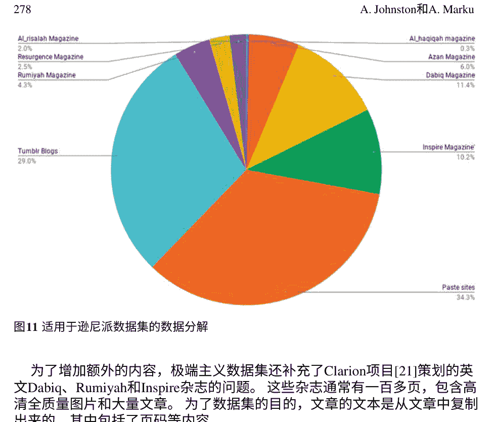

图11 适用于逊尼派数据集的数据分解

为了增加额外的内容，极端主义数据集还补充了Clarion项目[21]策划的英文Dabiq、Rumiyah和Inspire杂志的问题。这些杂志通常有一百多页，包含高清全质量图片和大量文章。为了数据集的目的，文章的文本是从文章中复制出来的，其中包括了页码等内容。

对于本章，使用与原始Johnston和Weiss论文[17]相同的团队，识别出一组包含极端主义的Tumblr帖子，并将其添加到极端主义标签中。这些帖子是通过JustPasteIt的一个初始线索找到的，其中链接了一个Tumblr博客。对这个用户的调查还发现了其他发布极端逊尼派内容的Tumblr用户，这些用户也被解析并添加到数据集中。

数据来源的分解如图11所示，其中每个数据集的大小以单词计算。

## 3.2 白人民族主义

鉴于白人至上主义者的“独行侠”特性，寻找合适的内容是困难的。编写了解析器从Stormfront [22]中提取帖子。还发现了一个类似的论坛，称为Vanguard News Network (VNN) Forum [23]，并进行了帖子抓取。此外，调查确定了美国自由党，以前被称为美国第三位置党[24]。美国第三位置党将白人至上主义作为其主要政治意识形态。

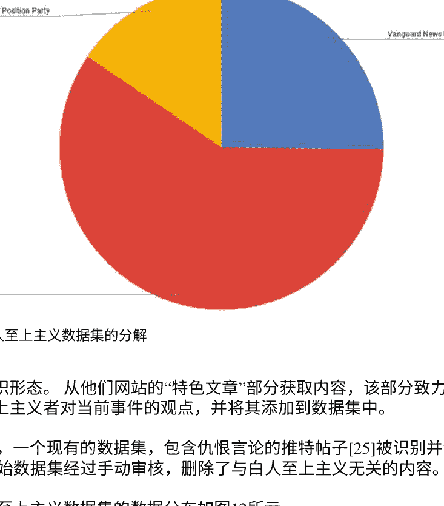

图12 白人至上主义数据集的分解

从他们网站的“特色文章”部分获取内容，该部分致力于提供白人至上主义者对当前事件的观点，并将其添加到数据集中。

同样，一个现有的数据集，包含仇恨言论的推特帖子[25]被识别并包括在内。原始数据集经过手动审核，删除了与白人至上主义无关的内容。

白人至上主义数据集的数据分布如图12所示。请注意，尽管包括了推特数据，但由于其规模较小，无法显示来自推特的实际数据百分比。

### 3.3 Antifa

由于许多Antifa团体在美国各地区有重点关注，很少有人口众多的中央论坛被识别出来。相反，从多个较小的地区Antifa团体获取数据，并补充了来自一个大型Antifa论坛的数据。

NYCAntifa [26]是一个专注于纽约市地区Antifa活动的团体。虽然该网站没有论坛，但它包含了许多由该团体发布的页面，宣传Antifa活动并详细介绍了他们的立场和潜在成员。类似地，Nomattimen [27]、Antifacist Network [28]、London Antifacists [29]和Malatesta [30]网站的结构也类似（即博客文章形式，没有实质性的用户互动），但包含了大量的文章内容。

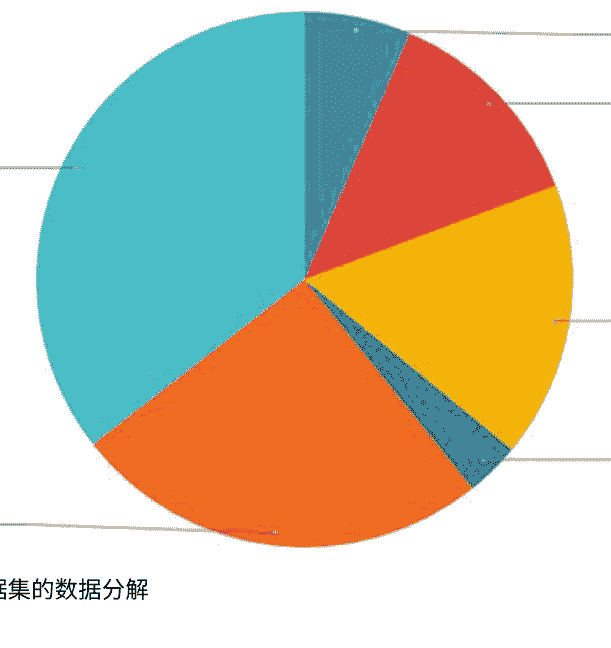

图13 Antifa数据集的数据分解

最大的单一来源是RevLeft [31]，一个具有庞大活跃人口的Antifa论坛，涵盖了Antifa成员的理论、历史和实践等主题。该网站包含大约280万个帖子，其中有相当一部分被检索到。为了防止无关的材料被添加到极端主义标签中，某些论坛类别，如“离题”类别，没有被添加。

Antifa数据集的来源分解如图13所示。

## 3.4 主权公民

主权公民比其他形式的恐怖主义更为普遍，提供了各种各样的内容。许多主权公民网站既有一个繁忙且更新的文章部分，也有一个活跃的论坛。对于已识别的网站，所有相关材料都被添加到数据集中。

A Free Country [32]是一个主权公民组织，他们的网站上既有大量的文章，也有一个活跃的论坛。这些内容被抓取并进行分析，以防止由于文章（由活跃论坛成员撰写）被重新发布为论坛帖子而产生重复。采用基于哈希的方法，确保检索到的文档不会完全重复。这种情况似乎只出现在这个网站上，其他既有论坛又有文章的网站似乎没有展示出同样程度的复制。

诸如天国大使馆[33]、自由人NZ[34]和自然人[35]等网站发布了一些文章式的帖子，没有用户互动的机会。这些文章涵盖了各种教学材料以及对主权公民理论的辩护和分析。

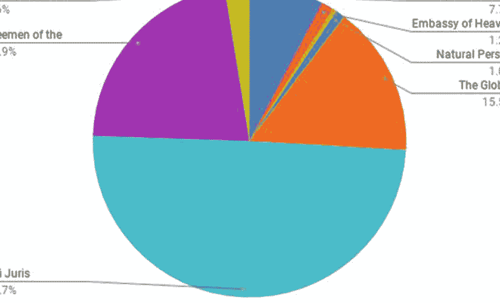

从一个追踪恐怖主义材料和个人的网站上找到了一本名为“全球主权者手册”的资源[36]。这本手册包含了关于主权公民运动起源的解释，以及如何抵抗政府和颠覆法律的详细说明。这本手册总共约有300页的内容。

确定了两个较大的主权公民论坛网站，分别是Sui Juris论坛[37]和Freemen on the Land论坛[38]。这两个网站的主要主题是如何在与政府的互动中运用主权公民意识形态，并推动暴力抵抗以反对被视为政府干预的行为。还提供了具体的指导，包括如何抵制法律程序，如交通检查和搜查令，以及根据主权公民理论如何打官司。还包括了一个类似但规模较小的论坛，Family Guardian[39]。这个论坛利用基督教的解释来为主权公民信仰辩护。

图14显示了主权公民数据集的细分。

## 3.5 良性材料

对于良性材料，约翰斯顿和韦斯利使用了从粘贴站点获得的与逊尼派极端主义恐怖无关的材料；此外，没有发现与其他形式的极端主义相关的数据。

该数据集还补充了新闻文章数据集[17]以及《古兰经》的英文副本。这样做的目的是为了最大程度地减少模型将某个单词（例如“叙利亚”或“圣战”）与极端主义联系起来的可能性。

在本章中，良性数据集对于所有形式的极端主义都是相同的。鉴于良性内容相对于极端主义材料而言定义较差，为每种形式的极端主义开发大量独特的良性数据集将是具有挑战性的。这种策略的一个结果是，无论被测试的意识形态如何，所有经过策划的良性标签材料都被包括在内。在测试过程中，模型的性能在不修改每种形式的极端主义数据集的情况下是可接受的，因此没有进行创建不同良性数据集的工作。

本章利用了Johnston和Weiss [17]中使用的良性数据集，但我们进行了大量的补充。例如，良性数据集使用了《圣经》的副本进行补充。在Johnston和Weiss论文发表后，我们对模型进行实验时，一些引用或包含基督教圣经长篇段落的页面被列为极端主义。这可能是伊斯兰教和基督教之间的联系（因为两者都是亚伯拉罕宗教）导致逊尼派极端主义模型的结果，更一般地说，模型可能因为某些段落的暴力性质而感到困惑。包含《圣经》的原因与包含《古兰经》的原因相同：孤立的宗教内容并不是极端主义。


图15 良性数据集的分解

# 4 构建模型

为了证明深度学习模型的必要性，我们训练了长短期记忆（LSTM）深度模型和逻辑回归模型。为了使数据适用于使用，我们执行了各种预处理操作，这取决于模型。对于所有模型，我们删除了少于30个单词的文档，以防止包含质量差的示例。

对于LSTM模型，我们使用具有最大文档长度为200个单词的TensorFlow VocabularyProcessor。输入层接受大小为200的向量，映射到具有128个神经元和0.5的丢弃率的丢弃层。丢弃层输入到具有softmax激活和Adam优化器的全连接层，学习率为0.001，交叉熵作为损失函数。该模型经过十个时期的训练，其中70%的数据用于训练，10%用于验证，20%用于测试。

对于逻辑回归，Gensim doc2vec在与Johnston和Weiss [17]相同的配置下使用，只是doc2vec的向量大小配置为100。正则化强度超参数的倒数设置为1.0。与LSTM模型类似，70%的数据用于训练，30%的数据用于测试。

## 5 结果与分析

表1展示了每个模型和数据集组合的结果。

表1 模型类型和数据集的性能
| 模型 | 数据集 | 准确性 | F1得分 |
|---|---|---|---|
| LSTM | 逊尼派 | 90.69 | 0.91 |
| | 反法西斯主义 | 83.97 | 0.77 |
| | 主权公民 | 88.65 | 0.88 |
| | 白人至上主义者 | 88.37 | 0.88 |
| | 平均 | 87.92 | 0.86 |
| 逻辑回归 | 逊尼派 | 70.35 | 0.79 |
| | 反法西斯主义 | 67.46 | 0.77 |
| | 主权公民 | 69.67 | 0.79 |
| | 白人至上主义者 | 65.41 | 0.76 |
| | 平均 | 68.2225 | 0.7775 |

有趣的是，Antifa LSTM模型表现非常差，将所有数据都分类为良性。考虑到逻辑回归能够识别每个类别之间的区别，性能差可能归因于Antifa内容的不足或超参数选择不当。然而，LSTM的相同配置在其他数据集上表现良好。

尽管Antifa模型表现不佳，我们可以看到使用深度模型的准确性显著提高（p<0.0001）；然而，F1分数没有显著提高（p>0.05）。从计算中排除Antifa的结果后，我们可以看到LSTM模型的F1分数显著优于逻辑回归（p<0.01）。考虑到Antifa LSTM的性能下降并且未能预测极端主义类别中的任何内容，这与其他模型的性能形成了鲜明对比，因此排除Antifa模型的性能不佳是合理的。

值得注意的是，在这里，逊尼派极端主义的LSTM模型表现出比Johnston和Weiss [17]描述的深度网络更强的性能，而不需要使用阈值。这种更好的性能很可能归因于增加的数据集以及LSTM模型能够考虑到诸如单词顺序等信息，这些信息在Johnston和Weiss模型 [17]使用的doc2vec输出中不容易识别。

如前所述，良性数据集在所有模型中保持一致。基于LSTM模型的强大性能，包含了不一定与极端主义形式相关的策划良性材料（例如，《圣经》不太可能被误认为是反法西斯主义宣传）似乎并没有阻止模型的表现。

为了在现实世界的系统中使用，这样的模型可能会从使用阈值系统中受益，如Johnston和Weiss [17]所述。这些模型在应用于大型数据集时可能会最有用，其中误报可能导致调查资源的低效分配。在撰写本章的研究过程中，与执法和情报专业人员进行了交流，以了解他们对此类技术应用的偏好。

这些交流表明，在合理范围内，更大的误报率比更大的误拒率更可取。因此，在LSTM输出上施加阈值可能对专业人员非常有益。此外，与其使用标签进行分类，不如利用模型的原始分数产生输出，这样执法和情报专业人员可以首先有更大的信心优先处理被分类为极端主义的材料，从而减少遇到误报的机会，直到审查了大量材料。

# 6 相关工作

一些有限的工作已经在使用机器学习识别极端主义宣传方面进行了。Jaki和De Smedt [43]开发了模型来识别德国极右痛恨言论。他们的模型使用了一个单层感知器网络，数据集由10万条推特帖子组成，其中一半是痛恨言论，一半是良性内容，F1得分为0.8421。这些痛恨言论是从一百多个特定的极右账户中收集的。虽然这个模型的性能很强，但是极端主义用户的数量有限，这可能导致模型过度拟合这些特定的行为者。同样，特征向量由字符三元组、词二元组和字符单元组成。这些特征可能不适用于多语言应用程序，并且非常容易受到之前讨论的同形替换等混淆措施的影响。此外，目前还不清楚这些特征是否适用于更大、可能结构较少的作品。例如，当极端主义者不受字符长度限制时，词语使用频率可能会有所变化，这在推特帖子中是真实的情况。

同样，Ashcroft等人[44]使用支持向量机、Adaboost和朴素贝叶斯模型来分类逊尼派极端主义的推特帖子。使用已知的ISIL偏爱的标签列表（Twitter的一个功能，允许用户通过在单词前加上'#'字符来为一个主题做出贡献）来筛选数据集，并利用这些标签的存在以及基于时间的特征。虽然某些模型的性能达到了100%的准确率，但这项工作同样局限于推特帖子，并且这些特征无法推广到其他网络内容。

同样，通过筛选使用标签列表的数据集，数据集可能对同一组织结构内的极端分子或共享特定ISIL意识形态的人存在偏见。

Gambäck和Sikdar [45]利用深度学习方法对包含种族主义、性别歧视或二者结合的推特进行分类。数据集包含大约6700条推特帖子，其中绝大多数既不带有种族主义色彩，也不带有性别歧视色彩。使用word2vec作为预处理步骤的卷积神经网络产生了最佳结果，F1得分为0.78。性别歧视和种族歧视等主题的性能差可能归因于数据集的不平衡以及定义不清的性质。与恐怖主义意识形态不同，性别歧视和种族歧视可以根据文化背景而异，并且可能是世代特定的。尽管数据集使用了专家组和众包方法进行划分，但标签可能受到专家或众包用户所居住社会的影响。同样，与其他研究相比，数据集的规模较小，尤其是考虑到推文的简洁性。该模型的性能可能不适用于更无结构形式的帖子。

本章的工作基于Johnston和Weiss [17]的工作。该工作的主要局限性是过于狭窄地关注逊尼派极端主义以及模型数量有限。正如前面提到的，Johnston和Weiss所描述的模型没有包括基督教圣经，因此它们会分类错误。

# 7 未来工作

构建识别恐怖主义的模型是使用深度学习对抗恐怖主义的关键第一步。为了使这些模型操作化，它们需要被纳入到执法和情报专业人员使用的更大系统中，例如法证分析软件或开源情报工具。

法证分析工具用于进一步调查存储介质。鉴于大容量存储介质变得越来越便宜，调查人员可能需要查看数千兆字节的数据，以确定与调查相关的材料。将这些模型用作材料的初步审查，可以帮助调查人员快速筛选需要进一步分析的材料。这些模型可以为文本文档的法证分析问题提供新颖的解决方案。

一个有趣的应用是将这些模型应用于在暗网上找到情报。暗网利用匿名化路由软件，如Tor和I2P，相互匿名化服务器和客户端。因此，标准搜索引擎无法识别此类材料，调查选项有限，因为内容的主机无法轻易被识别。此外，恐怖组织已表达了对过渡到匿名化软件的兴趣，其中最引人注目的是“网络哈里发”ISIL附属恐怖分子，他经常发布有关如何使用Tor逃避执法的材料。这些模型可以用于赋予爬虫能力，以大规模识别恐怖主义材料。

同样，这些模型可以应用于私营行业。社交媒体网站有兴趣限制恐怖分子的账户，但需要一个可扩展的解决方案，鉴于帖子的大量和速度。这些模型可以一起使用，以便在发布之前检测需要额外审核的帖子，或者审核被提名删除的账户。

这项工作的一个潜在扩展可能是将这些模型与一个执行作者分析的系统集成起来。恶意行为者可能会采取更多措施，在不同的社交网络和平台上保持匿名，例如使用唯一的用户名或在同一个网站上使用多个用户名发布。启用极端主义模型的作者分析平台可能会揭示一些调查线索，如果没有大量手动工作将很难识别出来。同样，这样的系统可以用于根据恐怖分子是否已知制造新内容或重复使用他人创建的内容来分类不同的恐怖分子。这些信息可以帮助调查人员优先处理具有知识和意愿发展或支持恐怖网络的极端分子。

# 8 结论

这些模型代表了网络安全和情报领域的重要进展。虽然在恶意软件分析等领域取得了很大进展，但在识别恶意行为者产生的文本内容方面的努力较少。这种文本内容可能是调查线索的重要来源，因此需要比手动调查方法更智能、可扩展的解决方案。

虽然本章的模型仅限于识别极端主义宣传，但可以推断出这些技术可以用于识别其他领域的犯罪材料。

同样，本章强调了公共数据科学和网络安全社区在为执法和情报专业人员开发机器学习解决方案方面的相对缺乏研究。特别是恐怖主义，需要研究社区更多关注，以找到减轻此类行为者传播和能力的解决方案。随着世界人口中越来越多的人参与在线活动，需要创造现代化的在线调查问题解决方案，以应对现代互联网的大规模和多样化生态系统。

# 参考文献

- 1. 我们的世界数据：恐怖主义。[https://ourworldindata.org/terrorism](https://ourworldindata.org/terrorism) (2018). 访问日期：2019年1月15日
- 2. Abel, D.S.：隔壁的种族主义者。[https://www.browardpalmbeach.com/news/the-racist-next-door-6332282](https://www.browardpalmbeach.com/news/the-racist-next-door-6332282) (1998). 访问日期：2019年2月7日
- 3. Fisher-Birch, J.：Tumblr上的恐怖主义。[https://www.counterextremism.com/blog/terror-tumblr](https://www.counterextremism.com/blog/terror-tumblr) (2018). 访问日期：2019年2月6日
- 4. Alfifi, M., Kaghazgaran, P., Caverlee, J., Morstatter, F.：衡量ISIS社交媒体战略的影响。在：MIS2. 加利福尼亚州马里纳德尔雷 (2018年)
- 5. 国土安全部国家行动中心，分析师桌面手册，国土安全部 (2011年)
- 6. Roggio, B.：ISIS宣布建立哈里发国，改名为“伊斯兰国”。[https://www.longwarjournal.org/archives/2014/06/isis_announces_formation_of_ca.php](https://www.longwarjournal.org/archives/2014/06/isis_announces_formation_of_ca.php) (2014). 访问2019年1月13日
- 7. 巴基斯坦行动：152位主要伊斯兰学者致阿布·巴克尔·巴格达迪的信。[https://operationpakistan.wordpress.com/2014/10/10/letter-to-abu-bakr-al-baghdadi-by-152-leading-islamic-scholars/](https://operationpakistan.wordpress.com/2014/10/10/letter-to-abu-bakr-al-baghdadi-by-152-leading-islamic-scholars/) (2014). 访问2019年2月6日
- 8. 绿洲中心：殉难行动的常态化。[https://www.oasiscenter.eu/en/suicide-bombings-and-martyrdom-in-islam-4](https://www.oasiscenter.eu/en/suicide-bombings-and-martyrdom-in-islam-4) (2017). 访问2018年12月18日
- 9. Esfandiari, G.：伊朗赞扬被伊斯兰国极端分子斩首的‘殉难者’。[https://www.rferl.org/a/iran-praises-martyrdom-fighter-beheaded-islamic-state/28680228.html](https://www.rferl.org/a/iran-praises-martyrdom-fighter-beheaded-islamic-state/28680228.html) (2017). 访问2019年1月17日
- 10. 兰索姆，J.：白人至上主义者承认在纽约杀害黑人男子以开始“种族战争”。[https://www.nytimes.com/2019/01/23/nyregion/timothy-caughman-white-supremacist-guilty.html](https://www.nytimes.com/2019/01/23/nyregion/timothy-caughman-white-supremacist-guilty.html) (2019年). 于2019年1月23日访问
- 11. 南方贫困法律中心：KU KLUX KLAN。 https://www.splcenter.org/fighting-hate/extremist-files/ideology/ku-klux-klan。 于2019年2月1日访问
- 12. 凯勒，M.：记者分享与夏洛茨维尔抗议者发生冲突的视频。 https://thehill.com/homenews/media/401480-reporter-shares-video-of-altercation-with-protester-in-charlottesville (2018年)。于2019年2月1日访问
- 13. 克劳德，S.：在反法组织中的卧底：揭示他们的战术和媒体支持！，更响亮的声音与克劳德
- 14. 联邦调查局：国内恐怖主义：主权公民运动。 https://archives.fbi.gov/archives/news/stories/2010/april/sovereigncitizens_041310/domestic-terrorism-the-sovereign-citizen-movement (2010)。访问日期：2019年1月26日
- 15. 佛罗里达警长部门：执法人员主权公民培训HS。 https://www.youtube.com/watch?v=ALPs_n0WQaY (2015)。访问日期：2019年1月27日
- 16. 北卡罗来纳大学政府学院：主权公民快速指南（2013年）。 访问日期：2019年1月14日
- 17. Johnston, A.H., Weiss, G.M.：使用深度学习识别逊尼派极端主义。 在：2017年IEEE计算智能研讨会系列（SSCI），第1-6页（2017年）
- 18. SITE情报组织。 https://siteintelgroup.com/。 访问日期：2019年1月11日
- 19. 只需粘贴：JustPasteIt。 https://justpaste.it/
- 20. 添加帖子：AddPostIt。 https://addpost.it/
- 21. Clarion Project：Clarion Project Inc。 https://clarionproject.org/。于2019年1月17日访问
- 22. Stormfront: Stormfront。 https://www.stormfront.org
- 23. Vanguard News Network。 https://vnforum.com/。于2019年2月10日访问
- 24. The American Freedom Party。 http://theamericanfreedomparty.us。于2019年1月13日访问
- 25. Davidson, T., Warmsley, D., Macy, M. and Weber, I.：自动化仇恨言论检测与冒犯性语言问题。在：第11届国际AAAI网络和社交媒体会议论文集，加拿大蒙特利尔（2017年）
- 26. NYC Antifa反法西斯主义的抵抗文化，NYC Antifa。 https://nycantifa.wordpress.com/。于2019年2月12日访问
- 27. Nomattimen: https://nomattimen.wordpress.com/。2019年2月9日访问
- 28. Antifascist Network：https://antifascistnetwork.org/。2019年2月1日访问
- 29. London Antifascists: https://londonantifascists.wordpress.com/。2019年2月1日访问
- 30. Malatesta: https://malatesta32.wordpress.com/。2019年1月25日访问
- 31. Revleft: https://www.revleft.space/vb/。2018年12月29日访问
- 32. A Free Country: http://afreecountry.com/。2019年1月6日访问
- 33. Embassy of Heaven: http://www.embassyofheaven.com/。2019年1月18日访问
- 34. Freeman NZ: https://www.freemannz.net/。2019年1月12日访问
- 35. Natural Person: http://www.natural-person.ca。2018年12月30日访问
- 36. 自由，J.：主权公民手册。 https://www.trackingterrorism.org/resource/sovereign-citizens-handbook-pdf (2004年)。于2019年1月2日访问
- 37. Sui Juris论坛：https://www.suijurisforum.com/。于2019年2月5日访问
- 38. Freemen on the Land: http://forum.fmotl.com/。于2019年1月16日访问
- 39. Family Guardian: https://famguardian.org。于2019年1月18日访问
- 40. Pushshift: 目录内容。 http://files.pushshift.io/reddit/comments/ (2017年)。于2018年11月13日访问
- 41. UCI KDD：Reuters-21578文本分类集合。 http://kdd.ics.uci.edu/databases/reuters21578/reuters21578.html (1999年)。于2018年10月22日访问
- 42. Kaggle: 所有新闻。 https://www.kaggle.com/snapcrack/all-the-news (2018年)。于2018年11月27日访问
- 43. Jaki, S., De Smedt.,T.：推特上的右翼德国仇恨言论分析和自动检测。德国希尔德斯海姆（2018年）
- 44. Ashcroft, M., Fisher, A.：在2015年欧洲情报与安全信息学会议（EISIC）上检测到圣战主义信息。瑞典乌普萨拉（2015年）
- 45. Gambäck, B., Sikdar U.K.: 使用卷积神经网络对仇恨言论进行分类。 在第一届在线辱骂语言研讨会上， 加拿大温哥华（2017年）
- 46. 圣战黑客组织Cyber Kahilafah使用Telegram通知支持ISIS的追随者进行私人通信和即将发生的网络攻击； 突出了在线信息共享平台的使用。http://cjlab.memri.org/lab-projects/monitoring-jihadi-and-hacktivist-activity/jihadi-hacking-group-cyber-kahilafah-uses-telegram-to-inform-pro-isis-followers-of-private-communication-and-impeding-cyber-attack-highlights-use-of-online-information-sharing-platforms/（2016年）。于2019年1月10日访问

# 索引

### A
- 高级驾驶辅助系统, 117–121, 134, 137, 139
- 音频检测, 181
- 自动驾驶, 117–121, 123, 128, 134, 137, 139

### B
- 婴儿哭声检测, 171, 172, 182, 192
- 大数据, 2, 3, 6, 8, 9, 20

### C
- 卷积神经网络 (CNNs), 24, 33, 35, 56, 61–65, 68–72, 74, 77–85, 87, 91, 93, 96, 100, 110, 118–120, 123–126, 128, 129, 131, 135, 136, 138, 139, 171–174, 176–181, 189–192, 225, 239, 245–249, 251, 260, 262, 197, 206–208, 210, 211, 215, 216, 218–220, 285

### D
- 深度置信网络, 31, 33, 38, 77, 82, 83, 118, 206
- 深度学习, 31–37, 56, 57, 61–64, 69, 73, 74, 77, 79–82, 84, 85, 87, 91–94, 99, 110, 117–120, 138, 139, 145, 152, 160, 162, 164, 171–176, 182, 189, 192, 193, 197, 202–206, 215, 219, 220, 223–227, 229, 231, 232, 234, 238, 239, 245, 247, 249–253, 255–257, 259, 260, 262, 263, 267, 271, 276, 283, 285, 286
- 深度神经网络, 1, 2, 49, 71, 91, 93, 94, 96, 99, 102, 110, 125, 172, 215, 225
- 诊断系统, 81, 82, 85
- 维度约简, 1, 3, 7–10, 12, 13, 18, 24, 25, 27, 157
- 领域自适应, 91–97, 99, 100, 105, 110, 111, 160, 250

### E
- 端到端通信, 223, 226, 227, 238
- 极端主义, 271, 272, 276–278, 281, 282, 284–286

### H
- 医疗保健, 61, 64, 77, 86, 87

### I
- 工业应用, 31, 32
- 工业控制系统, 197, 198, 200, 202
- 注入攻击, 197, 198, 200, 202–204, 209

### L
- 学习规则, 1, 8, 17
- 逻辑回归, 171, 172, 174, 182, 186–188, 192, 283
- 长短期记忆 (LSTM), 139, 182, 192, 260, 267, 283, 284

### M
- 机器学习, 5, 31, 36, 37, 73, 78, 79, 91, 94, 96, 101, 122, 154, 164, 173, 175, 192, 202, 205, 223-225, 233, 239, 247, 249, 251, 252, 256, 259, 262, 285, 287

### P
- 行人检测, 117, 120-125, 128, 130-133, 135-139, 215
- 物理层, 225, 226, 262

### R
- 回归, 20, 21, 32, 34-36, 50, 84, 91-101, 103, 105, 110, 111, 126, 171, 172, 174, 182, 186-188, 192

### S
- 半监督学习, 33, 40, 41, 98
- 信号检测和分类, 223, 238, 239, 245, 251, 262
- 软传感器, 31, 32, 36, 40
- 说话人嵌入, 146-148, 152, 155-159, 164
- 说话人识别, 145, 147, 148
- 说话人验证, 148
- 系统识别, 32, 35

### T
- 恐怖主义, 267, 269, 271, 272, 277, 280, 286, 287
- 文本分类, 256

### W
- 无线安全, 224, 260, 262
- 无线系统, 223-225, 231, 263