# 深度学习架构的数学方法


## 斯普林格数据科学系列

Ovidiu Calin


## 斯普林格数据科学系列

系列编辑

-   David Banks, 杜克大学, 杜兰姆, 北卡罗来纳州, 美国
-   Jianqing Fan, 金融工程系, 普林斯顿大学, 普林斯顿, 新泽西州, 美国
-   Michael Jordan, 加州大学伯克利分校, 加州, 美国
-   Ravi Kannan, 微软研究实验室, 班加罗尔, 印度
-   Yurii Nesterov, CORE, 天主教鲁汶大学, 鲁汶-拉-讷夫, 比利时
-   Christopher Ré, 计算机科学系, 斯坦福大学, 斯坦福, 美国
-   Ryan J. Tibshirani, 统计学系, 卡内基梅隆大学, 匹兹堡, 宾夕法尼亚州, 美国
-   Larry Wasserman, 统计学系, 卡内基梅隆大学, 匹兹堡, 宾夕法尼亚州, 美国

斯普林格数据科学系列主要关注专著和研究生级教材。目标受众包括在数学、理论计算机科学和统计学领域工作和研究的学生和研究人员。

数据分析和解释是一个广泛的领域，涵盖了跨学科统计学、数学和计算机科学中一些增长最快的主题。它包括检查、清洗、转换和建模数据的过程，旨在发现有用的信息，提出结论并支持决策。数据分析具有多个方面和方法，包括不同领域中以不同名称呈现的各种技术。斯普林格数据科学系列满足了广泛的科学家和学生在日常研究中使用定量方法的需求。该系列广泛而有结构，包括数据科学的所有核心领域的主题。该系列的广度反映了目前在机器学习领域正在进行的学术项目的变化。

有关该系列的更多信息，请访问 http://www.springer.com/series/13852

Ovidiu Calin

## 深度学习架构

数学方法


Springer

Ovidiu Calin
数学与统计学系
密歇根东部大学
伊普西兰蒂，密歇根州，美国

ISSN 2365-5674
斯普林格数据科学系列
ISBN 978-3-030-36720-6
https://doi.org/10.1007/978-3-030-36721-3

ISSN 2365-5682（电子版）
ISBN 978-3-030-36721-3（电子书）

数学主题分类（2010年）：68T05，68T10，68T15，68T30，68T45，68T99

© Springer Nature Switzerland AG 2020
本作品受版权保护。 出版商保留所有权利，无论是全部还是部分材料，特别是翻译、再版、插图的再利用、朗读、广播、微缩胶片复制或以任何其他实体方式复制，以及传输或信息存储和检索、电子适应、计算机软件，或通过类似或不同的已知或今后开发的方法。
在本出版物中使用一般描述性名称、注册名称、商标、服务标志等，并不意味着即使在没有具体声明的情况下，这些名称也不受相关保护法律和法规的限制，因此可以自由使用。

出版商、作者和编辑可以安全地假设本书中的建议和信息在出版日期时是真实准确的。 出版商、作者或编辑对本书中的材料或可能存在的任何错误或遗漏不提供明示或暗示的保证。 出版商对已发表的地图和机构附属关系的司法主张保持中立。

这本Springer印记由注册公司Springer Nature Switzerland AG出版
注册公司地址为：瑞士Cham市Gewerbestrasse 11号

## 前言

神经网络的多个商业应用非常有利可图。神经网络嵌入到新技术中，现在被谷歌、微软、Facebook、IBM、苹果、Adobe、Netflix、NVIDIA和百度等顶级公司成功使用。

神经网络是一组计算单元，它们通过连接在一起的神经元相互作用，每个神经元产生一个实数结果，称为激活。输入神经元从感知环境的传感器中激活，而其他神经元从前一个神经元的激活中激活。这种结构允许神经元之间发送消息，并因此加强那些导致问题解决成功的连接，减弱那些导致失败的连接。

本书从数学角度描述了神经网络的运作，考虑到神经网络方法的成功不应该是试错或运气决定的，而应该是清晰的数学分析决定的。本工作的主要目标是将现今在直觉层面上使用的神经网络的思想和概念用精确的现代数学语言表达出来。本书是古典数学和深度学习现代概念的混合体。主要关注数学方面，因为在当今发展趋势中，许多数学方面被忽视，大多数论文只强调计算机科学细节和实际应用。

保持对神经网络背后数学的重视，本书还与拉格朗日力学、泛函分析、微积分、微分几何、方程、群论和物理学建立联系。

本书不旨在详尽介绍方法和神经网络类型，也不是机器学习算法的食谱。

然而，它集中于基本的数学原理，这些原理支配着这个科学领域，在很多应用中解释了为什么神经网络表现得如此出色，并为学生提供了分析理解这个领域所需的工具。这本书既不是一本编程书，也不包含任何代码。在这个技术革命的时代，大多数神经网络的计算机软件很容易过时。本书介绍了神经网络背后的数学概念。

算法，而不是在任何特定的编程语言中明确实现代码。

对于对神经网络的实际方面，包括编程角度感兴趣的读者，可以参考一些关于这个主题的最新书籍，这些书籍将机器学习算法实现到不同的编程语言中，如TensorFlow、Python或R。其中一些书籍的例子包括：F. Chollet的《Python深度学习》、C. Albon的《Python机器学习食谱：从预处理到深度学习的实用解决方案》、S. Raschka和V. Mirjalili的《Python机器学习：使用Python、Scikit-learn和TensorFlow进行机器学习和深度学习》、T. Beyslow的《使用R进行深度学习的入门指南：学习和实现深度学习模型的逐步指南》、J. Patterson和A. Gibson的《深度学习：从业者的方法》、A. Geron的《使用Scikit-Learn和TensorFlow进行实践机器学习：构建智能系统的概念、工具和技术》以及F. Duval的《深度学习入门指南：使用Python和TensorFlow的实用指南》。本书的目标读者是数学、电气工程、统计学、理论计算机科学和计量经济学的研究生，他们希望对神经网络有一个理论上的理解。因此，本书对研究人员比从业人员更有用。为了保持完整性，我们在附录中包含了与测度论、概率论和线性代数相关的材料，以及实数和泛函分析。根据他们的背景，不同的读者将会发现附录的不同部分有用。例如，大多数数学研究生通常学习基本的泛函分析和实分析，他们会发现本书大部分内容容易理解，而统计学生通常只学习了少量的测度论和概率论，他们会发现附录中的分析部分有用。最后，计算机科学专业的学生通常没有很强的数学背景，他们会发现附录的大部分内容有用。阅读本书的最低先修课程包括：微积分Ⅰ、线性代数（向量和矩阵）以及概率论的基本概念。

然而，我们建议这本书给已经学过机器学习入门课程并对深入了解机器学习材料从数学角度感兴趣的学生。这本书可以作为一个学期或两个学期的研究生课程，分别涵盖第一部分至第二部分和第一部分至第五部分。这本书包含了相当数量的练习，大多数是已解决或包含提示的。所提出的练习从非常简单到相当困难，其中许多是所呈现结果的应用或扩展。对文献的引用并不详尽。任何接近完整的东西都是不可能的。

尽管近年来出版了大量的神经网络书籍，但其中很少有理论性质的书籍，讨论了神经网络的“数学概念”。其中一本著名的

在这个领域中的书籍，提供了对深度学习文献的全面回顾，是Goodfellow等人[46]，它既可以作为教材，也可以作为参考。 另一本极具启发性的书籍是Nielsen的在线书籍[92]。
此外，Roja的旧书[101]介绍了神经网络的经典入门。 一本值得注意的书籍，其中讨论了诸如“人工神经网络”之类的统计机器学习算法，是Hastie等人[53]。
神经网络的数学概念也在Mohri等人的书籍[88]和Shalev-Shwartz等人的书籍[110]中讨论。
即使之前的书籍涵盖了与深度学习的统计学习和数学统计相关的重要方面，或者与深度学习的计算复杂性相关的数学，但文献中仍然存在一个空白，这本书试图填补这个空白。 本书试图提供有关深度学习神经网络可以表示哪些类型函数的有用入门材料讨论。

## 概述

这本书分为四个主要部分，从简单到复杂的主题。
第一个部分是神经网络理论的简介；第二部分将神经网络视为通用逼近器；
第三部分将神经网络视为信息处理器。 最后一部分涉及感兴趣的几个主题的理论，如池化、卷积、卷积神经网络、循环神经网络、生成对抗网络、玻尔兹曼机和分类。 为了完整起见，本书附有附录，其中收集了测度论、概率论、线性代数和泛函分析的主题。每章结束时都有一个总结和一组章末练习。
书末提供了所有习题的完整解答或提示；还包括了一个全面的索引。

## 第一部分

这是本书中最基础的部分。 它包含了神经网络中的经典主题，如激活函数、损失函数和学习算法。

第1章介绍了一些日常生活问题，这些问题引导到了抽象神经元的概念。这些主题介绍了调整流向一个罐、细胞、基金、晶体管等的速率、流量或电流的过程，从而触发某种激活函数。 该过程的优化涉及到成本函数的最小化，例如体积、能量、电位等。更多的神经元可以一起工作形成神经网络。 作为一个例子，我们提供了线性回归和神经网络之间的关系。

为了学习一个非线性目标函数，神经网络需要使用非线性的激活函数。这些激活函数的选择定义了不同类型的网络。第2章包含了一套系统的激活函数的介绍，这些函数可以在文献中找到。

它们被分为三个主要类别：S型（逻辑、双曲正切、软符号、反正切）、曲棍球型（ReLU、PReLU、ELU、SELU）和凸起型（高斯、双指数）。在学习过程中，神经网络必须调整参数以使某个目标函数最小化。这个函数也被称为成本函数、误差函数或损失函数。这个函数也被称为成本函数、误差函数或损失函数。

第3章描述了神经网络中使用的一些最常见的成本函数。它们包括以下内容：最大误差函数，L²误差函数，均方误差函数，交叉熵，Kullback-Leibler散度，Hellinger距离等。其中一些成本函数适用于学习随机变量，而另一些适用于学习确定性函数。

第4章介绍了一系列经典的最小化算法。它们用于最小化相关的成本函数。最常用的是梯度下降算法，详细介绍在全文中提供。章节中包含的其他算法有线性搜索方法，动量法，模拟退火，AdaGrad，Adam，AdaMax，Hessian和Newton方法。

第5章介绍了抽象神经元的概念，并介绍了一些经典类型的神经元，如感知器，Sigmoid神经元，线性神经元和具有连续输入的神经元。此外，还包括一些逻辑回归和分类的应用。

神经元网络的研究在第6章中进行。网络的结构以及用于训练网络的反向传播方法都有详细解释。

## 第二部分

本部分的主要思想是神经网络是通用逼近器，即神经网络的输出可以逼近许多类型的目标，如连续函数、平方可积函数或可测函数。

第7章向读者介绍了一些经典的解析逼近定理。这个强大的工具在学习中有许多应用，包括Dini定理、Arzela-Ascoli定理、Stone-Weierstrass定理、Wiener定理和收缩原理。第8章讨论了输入变量有界且一维的情况。除了简单性外，这种情况还提供了一个基本的学习处理和构造性质。本书涵盖了多层感知器和具有一个隐藏层的Sigmoid神经网络的两种情况。还有两个部分专门介绍了使用ReLU和Softplus函数进行学习。

第9章回答了一个问题，即一层隐藏层神经网络可以学习哪种函数。它基于逼近理论

这些结果是由Funahashi、Hornik、Stinchcombe、White和Cybenko在1980年代末和1990年代初提出的。本章提供了数学证明，证明了一层隐藏层神经网络可以学习连续的、$L^1$和$L^2$可积函数，以及紧致集上的可测函数。

第10章处理了精确学习的情况，即能够完全复现所需目标函数的网络。本章包含了关于有限支持函数、最大函数和分段线性函数的精确学习结果。它还包含了Kolmogorov-Arnold-Sprecher定理、Irie和Miyake的积分公式，以及在连续神经元情况下使用积分核进行精确学习的内容。

## 第三部分

本部分的思想是神经网络可以被看作是信息处理器。神经网络的输入包含信息，这些信息由网络的多个隐藏层进行处理，直到选择出某些特征。输出层包含了用于某些分类目的的压缩信息。神经网络的工作可以与艺术家在制作雕塑的过程中所做的工作进行比较。在第一阶段，艺术家准备大理石块，然后切割出粗糙的形状。然后，他继续勾勒出一般的特征，并以精细的细节结束。与艺术家类似，神经网络在每个步骤中都会忽略掉一定数量的无关信息，以便最终只留下所需的特征。

第11章从sigma-fields的角度对神经网络处理的信息进行建模。前馈神经网络的每一层都会丢失一些信息。提供了具有微不足道的丢失信息的层的必要条件，并给出了几种类型神经元的信息描述。例如，感知机学习由半平面提供的信息，而多感知机能够学习更复杂的结构。还从信息压缩的角度研究了可压缩层。

第12章是前一章的延续。它涉及到信息在神经网络的层之间传播的数量评估。用于这个活动的工具有熵、条件熵和互信息。作为一个应用，我们提出了一种网络容量和信息瓶颈的定量方法。

本章末尾提供了使用MNIST数据集进行信息处理的一些应用。

## 第四部分

本部分包含了应用于神经网络的几何理论的要素。每个神经网络都被视为一个带有度量的流形，该度量可以从目标空间中导出，也可以是Fisher信息度量。

由于任何前馈神经网络的输出都可以通过其权重和偏置进行参数化，所以在第13章中，我们将把它们视为网络的坐标系。因此，每个给定的网络都与一个流形相关联，并且可以赋予一个黎曼度量，描述网络的内在几何。每个学习算法，涉及到随时间改变参数，对应于该流形上的一条曲线。最有效的学习对应于最短的曲线，即测地线。将该流形嵌入目标空间的曲率可以用于正则化目的，即流形越平坦，对训练数据的过拟合越少。

第14章与前一章相似，不同之处在于神经元可以是嘈杂的。在这种情况下，神经流形是概率密度的流形，两个网络之间的内在距离是用费舍尔信息度量来衡量的。最优密度参数估计的最小方差有一个由费舍尔度量的逆矩阵给出的下界。达到这个下界的估计器被称为费舍尔有效估计器。通过在线学习或批量学习估计的参数在渐近方式下是有效的。

## 第五部分

本部分涉及一些著名的神经网络架构，如CNNs, RNNs, GANs, Boltzmann machines等。池化和卷积是在第15章和第16章中描述的两种机器学习过程。池化通过不可逆的损失压缩信息，而卷积通过使用卷积核进行平滑来压缩信息。等变理论也以卷积层的形式呈现。

第17章讲述了循环神经网络，它们专门用于处理音频和视频等序列数据。我们通过时间反向传播来描述它们的训练，并讨论了梯度消失和梯度爆炸问题。

第18章讲述了神经网络的分类过程。它包括聚类的线性和非线性可分性，并研究决策映射及其学习特性。

第19章介绍了生成网络，其中GANs起着核心作用。描述了鉴别器和生成器网络的角色，并在零和游戏或极小极大问题的常见设置中讨论了它们的最优性。

第20章包含了随机神经元、Boltzmann机器和Hopfield网络以及它们的应用。我们还介绍了Boltzmann机器的平衡分布、熵以及相关的Fisher信息度量。

## 文献评论

在接下来的内容中，我们将对这本书进行一些文献评论，以便将其置于适当的历史背景中。这个介绍远非详尽无遗，对于对细节感兴趣的读者，可以参考Jurgen Schmidhuber的论文[109]，其中对深度学习进行了时间顺序的回顾，并提供了大量的参考资料。

首先，神经网络作为线性或非线性回归的变体已经存在了大约两个世纪，它们源于高斯和勒让德的工作。使用基本函数（如傅里叶分析方法）估计参数的概念也可以看作是在时间域中操作的多层感知机的基本机制，这个概念已经存在了一段时间。

在1980年代之前，所有的神经网络结构都是“浅层”的，即它们只有很少的层。第一次尝试模拟生物神经元是由Warren S. McCulloch和Walter Pitts于1943年完成的[82]。由于这个模型存在严重的学习限制，Frank Rosenblatt在1959年引入了具有更好学习能力的多层感知机。Rosenblatt的感知机有一个输入层的感知单元，称为关联单元的隐藏单元，以及称为响应单元的输出单元。事实上，感知机旨在成为一种模式识别设备，关联单元对应于特征或模式检测器。这个理论在他1961年的书《神经动力学原理：感知机与大脑理论》中发表，但由于其局限性，在当时并没有得到充分的赞赏，正如Minsky和Papert的书中所指出的那样[87]。

在罗森布拉特的多层感知机中学习是由一个收敛定理保证的，它保证了有限时间内的学习。然而，在大多数情况下，这种收敛速度太慢，这是该方法的一个严重限制。这就是为什么下一个学习算法引入了哈达玛在1908年提出的一种称为梯度下降法的过程。Shunichi Amari在他1967年的论文[3]中描述了梯度下降法在自适应学习机中的应用。梯度下降法的早期应用也被Kelley[62]、Bryson[18]、Dreyfus[33]等人在同一时期采用。之前描述的1940年到1960年之间的时期，涉及到受生物学习启发的理论，被称为控制论。

然而，第一个真正“深度”的人工神经网络是福岛在1979年提出的“新认知机”，它基于卷积神经网络的原理，并受到哺乳动物视觉皮层的启发。

与后来获奖的现代架构相比，不同之处在于

权重不是通过反向传播算法找到的，而是通过使用基于本地、赢者通吃的学习算法找到的。反向传播算法是在1970年代由Linnainmaa首次使用的，没有任何与神经网络相关的参考文献[77]。关于反向传播的第一篇参考文献是由Werbos [123, 124]提出的，与神经网络有关。

从1990年到1995年的下一个时期被称为连接主义，其特点是使用反向传播训练深度神经网络。反向传播方法首次在1980年代中期由Parker [93]、LeCun [73]和Rumelhart、Hinton和Williams [108]描述，并且它仍然是训练神经网络的最重要的过程。

在1980年代末，发现了几个关于神经网络作为通用逼近器的表示定理，参见Hornik等人[89]和Cybenko [30]。结果表明，具有一个隐藏层和线性输出层的前馈神经网络可以以任何精度逼近紧致集合上的任何连续、可积或可测函数，只要隐藏层中有足够的单元。其他理论上令人安心的结果表明连续函数的存在精确表示，参见Sprecher [115]、Kolmogorov [64]和Irie [60]。本书的主要目的之一是介绍这种类型的表示定理。

在1990年代，重要的进展在使用递归神经网络对序列进行建模方面取得了，后来应用于自然语言处理。这些进展主要归功于1997年Hochreiter和Schmidhuber引入的长短期记忆（LSTM）。

其他新的进展发生在计算机视觉领域，受到哺乳动物视觉皮层机制的启发，可以归功于使用卷积神经网络，参见LeCun等人[74, 75]。这标志着深度学习时期的开始，下面将简要介绍。

深度学习的先驱始于LeNet（1998年），一个7层的卷积网络，用于手写数字分类，被几家银行用于识别支票上的手写数字。在此之后，模型变得更深更复杂，具有处理更高分辨率图像的增强能力。

在这个方向上，第一个著名的深度网络是AlexNet（2012年），它参加了ImageNet大规模视觉识别挑战赛（ILSVRC），明显优于所有以前的竞争对手，并取得了15.3%的错误率。仅仅一年后，2013年的ILSVRC冠军网络也是一个卷积网络，名为ZFNet，它的错误率为14.8%。这个网络保持了与AlexNet类似的结构，并调整了其超参数。

ILSVRC 2014年比赛的冠军是来自Google的GoogLeNet，它是一个22层的深度网络，使用了一种新颖的inception模块，其错误率为6.67%，非常接近人类水平的表现。2014年ILSVRC的另一个前五名获奖者是一个具有16个卷积层的网络，被称为VGGNet（代表牛津大学视觉几何组）。它与AlexNet类似，但有一些不同之处。一些新的标准（所有的过滤器都有大小为3×3，每2个卷积之后放置一个最大池化，并且每个最大池化之后过滤器的数量翻倍）。现在它是从图像中提取特征的首选选择。

ResNet（残差神经网络）于2015年推出。它的新颖的152层架构与RNN具有很强的相似性，并具有跳跃连接的新特性，同时使用比VGGNet更低的复杂度。它在该数据集上实现了3.57%的错误率，超过了人类水平的性能，该数据集的错误率约为5.1%。

总之，教导计算机如何从原始数据中学习某个任务的想法并不新鲜。即使神经元、神经网络、学习算法等概念几十年前就已经创建，但直到2012年左右，深度学习才变得非常流行。这并不是巧合，这发生在大数据时代，因为这些模型对数据非常渴求，而这个要求直到最近GPU技术的发展才能满足。

除了演示之外，这本书还包含了一些新颖的特点。例如，在第4.10节中的增加分辨率方法，在第4.13节中的随机搜索，在第5.8节中的连续输入神经元，在第10.6节和第10.9节中的连续深度网络，以及在第三部分中将神经网络中的信息表示为sigma-代数，仅举几例，都是原创贡献。

# 致谢

在撰写本书期间，作者在普林斯顿大学担任访问教授，2016年至2017年学年期间开始，然后在2018年至2019年期间，作者得到了东密歇根大学的休假支持。因此，我对普林斯顿大学和东密歇根大学表示感谢，我在普林斯顿大学首次接触到这个迷人的主题，并且非常感谢东密歇根大学的优越研究条件。本书的几章内容在安阿伯机器学习小组会议期间进行了演讲，时间为2017年至2018年。

这本书的清晰度和质量很大程度上归功于许多有用的评论，这些评论来自几位未知的审稿人，他们在处理手稿时的时间和耐心非常感激。最后，我要感谢Springer和它的编辑，特别是Donna Chernyk，使这个努力成为现实。

## 章节图表

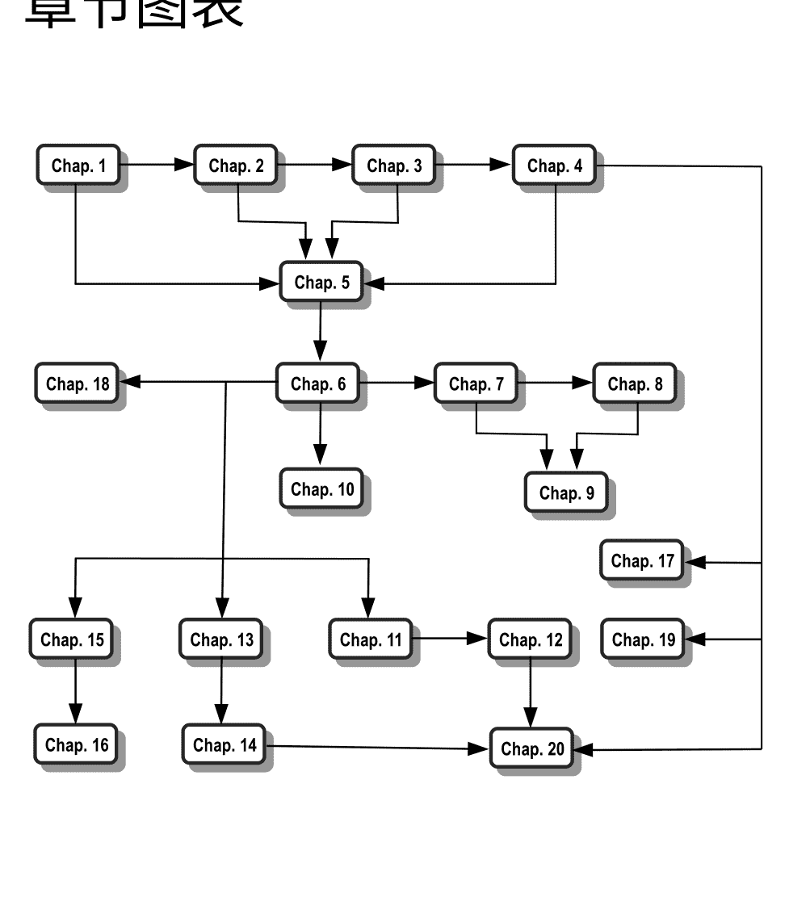

## 符号和符号

以下符号在文本中经常使用。

## 微积分

- $H_f$ Hessian矩阵 $f$
- $\frac{\partial F}{\partial x}, J_F(x)$ Jacobian矩阵 $\quad F: \mathbb{R}^n \to \mathbb{R}^n$
- $\partial_{x_k}, \frac{\partial}{\partial x_k}$ 关于 $x_k$ 的偏导数
- $L^2[0, T]$ 平方可积函数在 $[0, T]$ 上
- $C(I^n)$ 连续函数在 $I_n$ 上
- $C^2(\mathbb{R}^n)$ 具有连续二阶导数的函数
- $C_0^2(\mathbb{R}^n)$ 具有紧支撑的 $C^2$
- $\|x\|$ 欧几里得范数 $\quad (= \sqrt{x_1^2 + \cdots + x_n^2})$
- $\|f\|_{L^2}$ The $L^2$-范数 $\quad (= \sqrt{\int_a^b f(t)^2 dt})$
- $\nabla C$ 函数的梯度 $C$

## 线性代数

- $e_i$ 向量 $\quad (0,...,0,1,0,...,0)$
- $\mathbb{R}^n$ $n$维欧几里得空间
- $\det A$ 矩阵 $A$ 的行列式
- $A^{-1}$ 矩阵 $A$ 的逆
- $\|A\|$ 矩阵 $A$ 的范数
- $\mathbb{I}$ 幺正矩阵
- $A * B$ 矩阵 $A$和$B$的卷积
- $a b$ 向量$a$和$b$的Hadamard乘积

## 概率论

- $(\Omega, F, P)$ 概率空间
- $\Omega$ 样本空间
- $\omega$ 样本空间的元素
- $X$ 随机变量
- $S(X)$ 由X生成的$\sigma$-域
- $X_t$ 随机过程
- $F_t$ 过滤
- $W_t$ 布朗运动
- $E(X)$ X的均值
- $E[X_t|X_0=x]$ X的期望 $X_t$，给定 $X_0=x$
- $E(X|F)$ 给定$F$的条件期望 $X$，给定 $F$
- $Var(X)$ X的变差
- $P$的分布中的期望运算符$E^P[.]$
- $Var(X)$ 随机变量X的方差
- $cov(X,Y)$ X和Y的协方差
- $corr(X,Y)$ X和Y的相关性
- $N(\mu,\sigma²)$ 均值为 $\mu$方差为$\sigma²$的正态分布

## 测度论

- $1_A$ A的特征函数
- $F$ $\sigma$ -域
- $\mu,\nu$ 测度
- $I_n$ $n$维超立方体
- $M(I_n)$ 有限符号巴尔测度空间 $I_n$上的空间
- $\int_A p(x)d\nu(x)$ 测度$\nu$中的积分 $p(x)$

## 信息论

- $S(p,q)$ $p$和$q$之间的交叉熵
- $D_{KL}(p||q)$ $p$和$q$之间的Kullback-Leibler散度
- $H(p)$ 概率密度$p$的Shannon熵
- $H(X)$ 随机变量$X$的Shannon熵
- $H(A, \mu)$ 分割$A$的熵和测度$\mu$
- $H(X|Y)$ 给定$Y$的条件熵 $X$的条件熵
- $I(X|Y), I(X,Y)$ $X$和$Y$的互信息

## 微分几何

- $S$ 神经流形
- $dist(\mathbf{z}, S)$ 点 $\mathbf{z}$到 $S$的距离
- $U, V$ 向量场
- $g_{ij}$ 第一基本形式的系数
- $L_{ij}$ 第二基本形式的系数
- $\Gamma_{ijk}, \Gamma_{ij}^k$ 第一和第二类Christoffel系数
- $D_U V, \nabla_U V$ 向量场 $V$在方向 $U$的导数
- $\dot{c}(t)$ 沿曲线$c$的速度向量 $c(t)$
- $\ddot{c}(t)$ 沿曲线$c$的加速度向量 $c(t)$

## 神经网络

- $\phi(x)$ 激活函数
- $\sigma(x)$ 逻辑S型函数
- $t(x)$ 双曲正切函数
- $sp(x)$ Softplus函数
- $ReLU(x)$ 修正线性单元
- $\mathbf{w}, \mathbf{b}$ 权重和偏置
- $C(w, b)$ 成本函数
- $\delta_{x_0}$ Dirac's分布位于 $x_0$
- $f_{w,b}$ 输入输出函数
- $\eta, \delta$ 学习率
- $X^{(0)}$ 网络的输入层
- $X^{(L)}, Y$ 网络的输出层
- $X^{(\ell)}, Y$ 第 $\ell$层的输出
- $W^{(\ell)}$ 第 $\ell$层的权重矩阵
- $b^{(\ell)}$ 第 $\ell$层的偏置向量
- $\delta_j^{(\ell)}$ 第 $\ell$层的反向传播误差
- $\mathcal{I}^{(\ell)}$ 第 $\ell$层生成的信息
- $\mathcal{L}^{(\ell)}$ 第 $\ell$层丢失的信息

## 内容

前言

章节图表

符号和符号

## 第一部分 神经网络简介

### 1 初级问题

#### 1.1 水槽中的水

#### 1.2 一个电子电路

#### 1.3 八个车的问题

#### 1.4 生物神经元

#### 1.5 线性回归

#### 1.6 鸡尾酒工厂网络

#### 1.7 一个电子网络

#### 1.8 总结

#### 1.9 练习

### 2 激活函数

#### 2.1 激活函数的例子

#### 2.2 Sigmoid函数

#### 2.3 压缩函数

#### 2.4 总结

#### 2.5 练习

### 3 损失函数

#### 3.1 输入、输出和目标

#### 3.2 最大误差函数

#### 3.3 L²误差函数

#### 3.4 均方误差函数

#### 3.5 交叉熵

#### 3.6 Kullback-Leibler散度

##### 3.7 Jensen-Shannon 散度

#### 3.8 最大均值差异

#### 3.9 其他成本函数

#### 3.10 成本函数的样本估计

#### 3.11 成本函数和正则化

#### 3.12 训练和测试误差

#### 3.13 几何意义

#### 3.14 总结

#### 3.15 练习

### 4 寻找极小值的算法

#### 4.1 极小值的一般性质

##### 4.1.1 实变量函数

##### 4.1.2 多个实变量函数

#### 4.2 梯度下降算法

##### 4.2.1 等高线

##### 4.2.2 方向导数

##### 4.2.3 最陡下降法

##### 4.2.4 线搜索法

#### 4.3 运动学解释

#### 4.4 动量法

##### 4.4.1 运动学解释

##### 4.4.2 收敛条件

#### 4.5 AdaGrad

#### 4.6 RMSProp

#### 4.7 Adam

#### 4.8 AdaMax

#### 4.9 模拟退火方法

##### 4.9.1 模拟退火的运动学方法

##### 4.9.2 模拟退火的热力学解释

#### 4.10 增加分辨率的方法

#### 4.11 海森方法

#### 4.12 牛顿方法

#### 4.13 随机搜索

##### 4.13.1 确定性变体

##### 4.13.2 随机变体

#### 4.14 邻域搜索

##### 4.14.1 左右搜索

##### 4.14.2 循环搜索

##### 4.14.3 随机球形搜索

##### 4.14.4 从局部到全局

#### 4.15 连续学习

#### 4.16 摘要

#### 4.17 练习

### 5 抽象神经元

#### 5.1 定义和属性

#### 5.2 感知器模型

#### 5.3 Sigmoid神经元

#### 5.4 逻辑回归

##### 5.4.1 公司的默认概率

##### 5.4.2 二元分类器

###### 5.4.3 使用平方差代价函数进行学习函数

#### 5.5 线性神经元

#### 5.6 Adaline

#### 5.7 Madaline

#### 5.8 连续输入神经元

#### 5.9 总结

#### 5.10 练习

### 6 神经网络

#### 6.1 神经网络的一个例子

##### 6.1.1 总变差和正则化

##### 6.1.2 反向传播

#### 6.2 通用神经网络

##### 6.2.1 通过网络进行前向传递

##### 6.2.2 通过网络向后传递

##### 6.2.3 误差的反向传播

##### 6.2.4 总结关系

##### 6.2.5 矩阵形式

##### 6.2.6 梯度下降算法

##### 6.2.7 梯度消失问题

##### 6.2.8 批量训练

##### 6.2.9 FNN的定义

#### 6.3 权重初始化

#### 6.4 强弱先验

#### 6.5 总结

#### 6.6 练习

### 第二部分分析理论

#### 7个逼近定理

#### 7.1 Dini's定理

#### 7.2 Arzela-Ascoli's定理

#### 7.3 应用于神经网络

#### 7.4 Stone-Weierstrass'定理

#### 7.5 应用于神经网络

#### 7.6 Wiener's Tauberian定理

##### 7.6.1 在 L^1(R)中学习信号

##### 7.6.2 在 L^2(R)中学习信号

#### 7.7 收缩原理

#### 7.8 应用于循环神经网络

#### 7.9 共振网络

##### 7.10总结

##### 7.11练习

### 8 一维输入的学习

#### 8.1 初步结果

#### 8.2 单隐藏层感知器网络

#### 8.3 单隐藏层Sigmoid网络

#### 8.4 使用ReLU函数进行学习

##### 8.5 使用 Softplus进行学习

#### 8.6 离散数据

#### 8.7 总结

#### 8.8 练习

### 9 通用逼近器

#### 9.1 入门示例

#### 9.2 一般设置

#### 9.3 单隐藏层网络

##### 9.3.1 学习连续函数 f ∈ C(I_n)

##### 9.3.2 学习平方可积函数 f ∈ L^2(I_n)

##### 9.3.3 学习可积函数 f ∈ L^1(I_n)

##### 9.3.4 学习可测函数 f ∈ M(R^n)

#### 9.4 误差界估计

#### 9.5 学习 q 可积函数, f ∈ L^q(R^n)

#### 9.6 学习 ODE的解

#### 9.7 总结

#### 9.8 练习

### 10 精确学习
- 10.1 有限支持函数学习
- 10.2 使用ReLU学习
- 10.2.1 最大值的表示
- 10.2.2 宽度与深度
- 10.3 Kolmogorov-Arnold-Sprecher定理
- 10.4 Irie和Miyake's积分公式
- 10.5 精确学习不总是可能的
- 10.6 神经元的连续数量
- 10.7 通过退化核函数进行逼近
- 10.8 退化核函数的示例
- 10.9 深度网络
- 10.10 总结
- 10.11 练习

## 第三部分 信息处理

### 11 信息表示
- 11.1 信息内容
- 11.2 可学习目标
- 11.3 丢失的信息
- 11.4 可恢复的信息
- 11.5 信息表示示例
- 11.5.1 指示函数的信息
- 11.5.2 经典感知器
- 11.5.3 线性神经元
- 11.5.4 Sigmoid神经元
- 11.5.5 Arctangent神经元
- 11.5.6 经典感知器的神经网络
- 11.5.7 三角形作为矩形的并集
- 11.5.8 Sigmoid神经元的网络
- 11.5.9 更多备注
- 11.6 可压缩层
- 11.7 层的可压缩性
- 11.8 功能独立性
- 11.9 总结
- 11.10 练习

### 12 信息容量评估
- 12.1 熵和性质
- 12.1.1 随机变量的熵
- 12.1.2 坐标变换下的熵
- 12.2 熵流
- 12.3 输入层的熵
- 12.4 线性神经元
- 12.5 自编码器
- 12.6 条件熵
- 12.7 互信息
- 12.8 深度神经网络应用
- 12.8.1 熵流
- 12.8.2 噪声层
- 12.8.3 独立层
- 12.8.4 无压缩层
- 12.8.5 特征数量
- 12.8.6 总压缩
- 12.9 网络容量
- 12.9.1 容量类型
- 12.9.2 输入分布
- 12.9.3 输出分布
- 12.9.4 输入输出张量
- 12.9.5 输入输出矩阵
- 12.9.6 网络容量的存在
- 12.9.7 拉格朗日乘数法
- 12.9.8 寻找容量
- 12.9.9 感知机容量
- 12.10 信息瓶颈
- 12.10.1 一个精确的形式解决方案
- 12.10.2 信息平面
- 12.11 使用MNIST进行信息处理
- 12.11.1 一个两层FNN
- 12.11.2 一个三层FNN
- 12.11.3 卷积网络的作用
- 12.12 总结
- 12.13 练习

## 第四部分 几何理论

### 13 输出流形
- 13.1 流形简介
- 13.1.1 内在和外在
- 13.1.2 切空间
- 13.1.3 黎曼度量
- 13.1.4 测地线
- 13.1.5 利维-奇维塔连接
- 13.1.6 子流形
- 13.1.7 第二基本形式 427
- 13.1.8 平均曲率矢量场 429
- 13.2 与神经网络的关系 430
- 13.3 参数空间 431
- 13.4 最优参数值 436
- 13.5 度量结构 439
- 13.6 正则化 443
- 13.6.1 选择较小的维度 444
- 13.6.2 范数正则化 444
- 13.6.3 选择最平坦的流形 445
- 13.6.4 模型平均 453
- 13.6.5 丢弃 454
- 13.7 总结 462
- 13.8 练习 462

## 14 神经流形 465
- 14.1 统计流形 466
- 14.2 费舍尔信息 469
- 14.3 神经网络的神经流形 473
- 14.4 单个神经元的费舍尔度量 475
- 14.5 费舍尔矩阵及其逆矩阵 478
- 14.6 神经网络的费舍尔度量结构 483
- 14.7 自然梯度 487
- 14.8 自然梯度学习算法 489
- 14.9 对数似然和度量 493
- 14.10 关于Kullback-Leibler散度的关系 495
- 14.11 模拟退火方法 499
- 14.12 总结 500
- 14.13 练习 501

## 第五部分 其他架构

## 15 池化 507
- 15.1 连续函数的近似 507
- 15.2 平移不变性 510
- 15.3 信息方法 512
- 15.4 池化和分类 514
- 15.5 总结 515
- 15.6 练习 515

## 16 卷积网络 517
- 16.1 离散一维信号 517
- 16.2 连续一维信号 519
- 16.3 离散二维信号 520
- 16.4 1-D输入的卷积层 522
- 16.5 2-D输入的卷积层 525
- 16.6 CNN的几何性质 528
- 16.7 等变性和不变性 529
- 16.7.1 群 529
- 16.7.2 群在集合上的作用 530
- 16.7.3 将动作扩展到函数 532
- 16.7.4 等变性的定义 533
- 16.7.5 卷积和等变性 534
- 16.7.6 不变性的定义 537
- 16.8 总结 539
- 16.9 练习 540

## 17 循环神经网络 543
- 17.1 状态系统 543
- 17.2 循环神经网络 546
- 17.3 循环神经网络中的信息 547
- 17.4 损失函数 549
- 17.5 通过时间反向传播 550
- 17.6 梯度问题 553
- 17.7 LSTM单元 554
- 17.8 深度循环神经网络 556
- 17.9 总结 557
- 17.10 练习 557

## 18 分类 561
- 18.1 等价关系 561
- 18.2 分区的熵 563
- 18.3 决策函数 565

## 19 生成模型 591
- 19.1 生成模型的需求 591
- 19.2 密度估计 592
- 19.3 对抗游戏 595
- 19.4 生成对抗网络 598
- 19.5 生成矩匹配网络 606
- 19.6 总结 607
- 19.7 练习 607

## 20 随机网络 611
- 20.1 随机神经元 611
- 20.2 波尔兹曼分布 614
- 20.3 波尔兹曼机 617
- 20.4 波尔兹曼学习 621
- 20.5 计算波尔兹曼分布 623
- 20.6 波尔兹曼分布的熵 626
- 20.7 费舍尔信息 626
- 20.8 波尔兹曼机的应用 628
- 20.9 总结 633
- 20.10 练习 633

## 提示和解答 637

## 附录 689

## A 集合论 691

## B 张量 693

## C 测度论 695
- C.1 信息和 ℱ-代数 695
- C.2 可测函数 697
- C.3 测度 699
- C.4 测度中的积分 701
- C.5 图像测度 703
- C.6 不定积分 703
- C.7 Radon-Nikodym 定理 703
- C.8 Egorov 和 Luzin's 定理 704
- C.9 有符号测度 705

## D 概率论 709
- D.1 一般定义 709
- D.2 例子 710
- D.3 期望 710
- D.4 方差 711
- D.5 随机变量生成的信息 712
- D.5.1 过滤 713
- D.5.2 条件期望 714
- D.6 收敛类型 715
- D.6.1 收敛于概率 715
- D.6.2 几乎必然收敛 715
- D.6.3 \( L^p \)-收敛 715
- D.6.4 弱收敛 716
- D.7 对数似然函数 717
- D.8 布朗运动 719

## E 函数分析 721
- E.1 巴拿赫空间 721
- E.2 线性算子 722
- E.3 Hahn-Banach 定理 723
- E.4 希尔伯特空间 723
- E.5 表示定理 724
- E.6 不动点定理 727

## F 实分析 729
- F.1 反函数定理 729
- F.2 广义意义下的微分 730
- F.3 函数序列的收敛 731

## G 线性代数 733
- G.1 特征值、范数和逆矩阵 733
- G.2 Moore-Penrose 伪逆 736

## 参考文献 741

## 索引 751

## 第一部分 神经网络简介

## 第一章 入门问题
本章介绍了一些日常生活中的问题，这些问题引出了抽象神经元和神经网络的概念。 它们都基于调整参数的过程，例如速率、流量或给定单元（罐、晶体管等）的电流，触发某个激活函数。 可调参数被优化以最小化某个误差函数。 在本节结束时，我们将提供一些结论，为抽象神经元和神经网络的定义铺平道路。

#### 1.1 水槽中的水
给定压力 $P$，如图1.1所示，给水管道 a。旋钮$K$可以调节水压，提供可变的出水流量rate $r$。旋钮通过引入非负控制 $w$来影响流速，使得 $P = r/w$。

使用一定数量的这种管道将水倒入储罐中，如图1.1 b。同时，储罐以速率 $R$排水。这个问题的目标如下所述：

给定水压供应 $P_1, \ldots, P_n$，如何调节旋钮$K_1, \ldots, K_n$，以便在预先确定的时间间隔 $t$后，储罐中有一个预定的水体积 $V$？

用 $r_1, \ldots$ 表示，通过旋钮调整的流入速率为 $K_1, \ldots, K_n$。如果流出速率超过总流入速率，即 $R > \sum_{i=1}^{n} r_i$，则水箱中不会积水，即 $V = 0$ 在任何未来时间。否则，如果总流入速率大于流出速率，即 $\sum_{i=1}^{n} r_i > R$，则水以速率的差异积累，

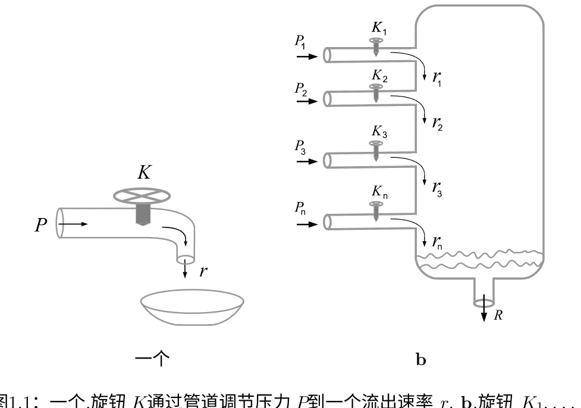

图1.1: a.旋钮 $K$通过管道调节压力 $P$到一个流出速率 $r$. b.旋钮 $K_1, \dots, K_n$通过管道调节压力，将水倒入一个带有出水孔的水箱中，出水速率为 $R$.

$\sum_{i=1}^n r_i - R$，随时间 $t$累积一定数量的水，给定为 $V = (\sum_{i=1}^n r_i - R)t$。得到的水量可以用分段函数表示

$$V = \begin{cases} 0, & \text{如果}R > \sum_{i=1}^n r_i \\ (\sum_{i=1}^n r_i - R)t, & \text{否则}. \end{cases}$$

我们将以等价的方式来表示这个函数。首先，让 $w_i$表示旋钮 $K_i$提供的控制，因此第 $i$个管道以速率$r_i = P_i w_i$供水。还要考虑激活函数$^{1}$

$$\varphi_t(x) = \begin{cases} 0, & \text{if } x < 0 \\ xt, & \text{otherwise}, \end{cases}$$

这取决于时间参数$t > 0$。现在，水的体积 $V$，可以用压力 $P_i$，控制 $w_i$，和函数 $\varphi$来表示 $t$ 如

$$V = \varphi_t\left( \sum_{i=1}^{n} P_i w_i - R \right). \tag{1.1.1}$$

$^1$正如我们将在未来的章节中看到的，这种激活函数被称为ReLU。

速率 $R$ 对于 $\varphi_t$ 的图形产生水平偏移，在神经网络语言中被称为偏置。现在，问题转化为找到方程（1.1.1）的解，其中未知数为 $w_i$ 和 $R$。实际上，通过选择控制变量 $w_i$ 和偏置 $R$ 的逼近解即可。

$w_i$ 和偏置 $R$ 使得以下接近函数

$$L(w_1, \ldots, w_n, R) = \frac{1}{2} \left( \varphi_t \left( \sum_{i=1}^{n} P_i w_i - R \right) - V \right)^2$$

被最小化。其他接近度函数也可以考虑，例如，

$$\tilde{L}(w_1, \ldots, w_n, R) = \left| \varphi_t \left( \sum_{i=1}^{n} P_i w_i - R \right) - V \right|,$$

不方便的是它不平滑。两个函数 $L$ 和 $\tilde{L}$ 都是非负的，并且在解上消失。它们有时也被称为误差函数。

在实践中，我们希望从现有数据中学习。为此，我们提供了 $N$ 个训练数据，包括压力和相应体积的 $N$ 元组，$(P^k, V_k), 1 \le k \le N$, 其中 $P^{kT} = (P_{1k}, \ldots, P_{nk})$。利用这些数据，我们应该能够预测给定压力向量 $P$ 的体积 $V$。如果控制和偏差已知，预测由公式（1.1.1）给出。这些是通过最小化以下成本函数获得的：

$$C(w_1, \ldots, w_n, R) = \frac{1}{2} \sum_{k=1}^{N} \left( \varphi_t (P^{kT} \mathbf{w} - R) - V_k \right)^2,$$

其中 $\mathbf{w}^T = (w_1, \ldots, w_n)$。

#### 1.2 一个电子电路
下一个例子涉及一个电子电路。值得一提的是，关于压力、$P$、速率、$r$ 和旋钮的问题可以用电压、$V$、电流强度、$I$ 和电阻器、$R$ 来“翻译”。下面的对应表将会用到：

| 流体   | 压力 | 速率 | 旋钮 |
|--------|------|------|------|
| 电子学 | 电压 | 强度 | 电阻率 |

考虑图1.2中提供的电子电路。输入线上施加的电压 $x_1, \ldots, x_n$ 通过可变电阻器传输## 深度学习架构，数学方法

R₁, . . . . . . . . . . . . . . . . . . , Rₙ. 出现的电流 Iₖ 由欧姆定律给出

$$I_k = \frac{x_k}{R_k}, \quad k=1,\ldots,n.$$

为了简化起见，定义权重 $w_k = \frac{1}{R_k}$ 作为电阻的倒数。然后前面的关系变为 $I_k = x_k w_k$.

电流在节点 $N$ 处汇合。另一个可变电阻器 $R_b$, 连接节点 $N$ 与基座。通过这根导线的电流用 $I_b$ 表示。根据基尔霍夫第二定律，节点$N$处的进入电流之和等于相同节点处的外出电流之和。因此，进入晶体管 $T$ 的电流 $I$ 由以下给出

$$I = \sum_{k=1}^n I_k - I_b = \sum_{k=1}^n x_k w_k - I_b.$$

晶体管是一种作为开关的电子元件。更准确地说，如果输入电流 $I$ 低于晶体管的阈值 $\theta$, 则没有电流通过。一旦电流 $I$ 超过阈值 $\theta$, 电流最终会被放大一定倍数。晶体管 $T$ 的输出电流 $y$ 可以建模为

$$y = \begin{cases} 0, & \text{如果} I < \theta \\ k, & \text{如果} I \ge \theta, \end{cases}$$

其中$k > 0$ 是某个常数。在这种情况下，激活函数是阶跃函数。

$$\varphi_\theta(x) = \begin{cases} 0, & \text{如果} x < \theta \\ 1, & \text{如果} x \ge \theta \end{cases} \quad (1.2.2)$$

输出可以用熟悉的形式表示为

$$ y = k \varphi_{\theta}(I) = k \varphi_{0}(I - \theta) = k \varphi_{0}\left( \sum_{k=1}^{n} x_{k} w_{k} - I_{b} - \theta \right) = k \varphi_{0}\left( \sum_{k=1}^{n} x_{k} w_{k} - \beta \right) $$

其中 $\beta = I_b + \theta$ 被视为偏差。注意 $\varphi_0(x)$ 是海维赛德函数，或者单位阶跃函数，以原点为中心。对于以 $\theta=1$ 为中心的海维赛德函数，请参见图1.3。

学习问题可以表述为：给定当前的 $z = z(x_1, \ldots, x_n)$ 依赖于输入电压 $x_1, \ldots, x_n$，调整电阻 $R_1, \ldots, R_n, R_b$ 使输出 $y$ 近似于 $z$ 的最小二乘方式，即使得 $\frac{1}{2} (z - y)^2$ 最小。

备注 1.2.1 尝试为人工神经网络构建特殊硬件可以追溯到20世纪50年代。我们将读者引用到Minsky的工作[86]，他使用电位计实现了自适应权重；Steinbuch，他使用电阻网络构建了联想记忆[117]；以及Widrow和Hoff [125]，他们开发了一种专门用于信号处理的自适应系统，称为Adaline神经元。

#### 1.3 八个车的问题

车是一种国际象棋棋子，允许在垂直和水平方向上移动任意数量的棋盘格。该问题要求在8×8的棋盘上放置八个不同的车，每个车占据一个不同的方格。假设所有可能的替换都是等可能的，我们需要找到所有车都不会互相威胁的概率。即使这个问题可以通过组合技术以闭合形式解决，我们将在下面介绍一种计算方法（图1.4）。

设 $x_{ij}$ 为第 $(i, j)$ 个方格的状态，即 $x_{ij} = \begin{cases} 1, & \text{如果在位置}(i,j)\text{有一个车}; \\ 0, & \text{如果那个地方没有车}. \end{cases}$

这些状态在目标函数的构建中使用，如下所示。 由于只有一个车放在第 $j$ 列，我们有 $\sum_{i=1}^{8} x_{ij} = 1$。这个属性对所有列都成立的事实可以用变分的方式等价地表达，要求函数 $F_1(x_{11}, \dots, x_{88}) = \sum_{j=1}^{8} \left( \sum_{i=1}^{8} x_{ij} - 1 \right)^2$ 被最小化。

当所有平方表达式都消失时， $F_1$ 的最小值达到，因此每列只有一个车。 对于行应用类似的过程，我们得到函数 $F_2(x_{11}, \dots, x_{88}) = \sum_{i=1}^{8} \left( \sum_{j=1}^{8} x_{ij} - 1 \right)^2$ 也必须被最小化。

车问题有很多解，每个解对应一个目标函数的全局最小值 $E(x_{11}, \dots, x_{88}) = F_1(x_{11}, \dots, x_{88}) + F_2(x_{11}, \dots, x_{88})$。

前一个函数的最小值可以通过一个称为 Hopfield 网络的神经网络获得。 这个应用将在第20章完成。

图1.5：一个神经元细胞。

#### 1.4 生物神经元

神经元是一个由以下部分组成的细胞：树突、轴突和细胞体，参见图1.5。突触是一个神经元轴突与另一个神经元树突之间的连接。每个部分的功能将简要描述如下：

- • 树突是从其他神经元轴突收集信息的传输通道。这在图1.6中有描述。通过轴突传播的信号到达其末端并产生一些化学物质，这些化学物质以强或弱的方式作用于下一个神经元的树突。连接强度由权重系统 $w_i$ 描述，参见图1.6 b。

- • 细胞体从树突收集所有信号。在这里，树突的活动累加成总电位，如果达到一定的阈值，神经元通过轴突发出信号。阈值取决于神经元的敏感性，衡量神经元触发的难易程度。

- • 轴突是信号传播的通道。信号包括离子从细胞体向轴突末端的运动。信号以电化学方式传递到下一个神经元的树突，参见图1.5。

神经元的示意模型如图1.6 b所示。来自其他神经元轴突的输入信息用 $x_i$ 表示。这些信息会与模拟突触强度的权重 $w_i$ 相乘。每个树突通过电位 $x_iw_i$ 向细胞体提供能量。细胞体是一个单元，它将这些电位相加并与阈值 $b$ 进行比较，得到总和 $\sum_{i=1}^{n} x_iw_i$。结果如下：

图1.6：a. 突触间隙。b. 神经元的示意模型。

- 如果 \(\sum_{i=1}^{n} x_i w_i > b\)，神经元通过轴突发出信号，\(y = 1\)。
- 如果 \(\sum_{i=1}^{n} x_i w_i \leq b\)，神经元不发出任何信号，即 \(y = 0\)。

这可以等价地写作

$$y = \varphi_b \left( \sum_{i=1}^{n} x_i w_i \right) = \varphi_0 \left( \sum_{i=1}^{n} x_i w_i - b \right),$$

其中激活函数 \(\varphi_b\) 是以 \(b\) 为中心的单位阶跃函数，参见方程式 (1.2.2)，而 \(\varphi_0\) 是海维赛德函数。

消除偏差为了摆脱偏差，使用了一个巧妙的技巧。思路是引入一个额外的权重，\(w_0 = b\)，和一个额外的常数信号，\(x_0 = -1\)。然后，先前的结果可以写成

$$y = \varphi_0 \left( \sum_{i=0}^{n} x_i w_i \right).$$

输入信号 \(x_i\) 和突触权重 \(w_i\) 可以在图1.6b中看到。神经元细胞体由主圆圈表示，而其功能由两个符号 \(\sum\)（表示输入信号的求和）和单位阶跃函数（强调神经元的激活函数）表示。轴突的输出信号由箭头表示，输出 \(y\) 可以是0或1。

神经元通过更新突触权重来学习输出函数 \(w_i\)。只有一个神经元无法学习复杂的函数，但它可以学习一个简单的函数，比如分段函数

$$z(x_1, x_2) = \begin{cases} 0, & \text{if } x_2 \leq 0 \\ 1, & \text{if } x_2 > 0, \end{cases}$$

图1.7：线性逼近神经元。

它在上半平面上取值为1，在其他地方取值为0。这个函数可以通过选择权重 $w_1=0$，$w_2=1$和偏置 $b=0$来学习。当不等式 $x_1w_1 + x_2w_2 > b$成立时，神经元会发射。这等价于 $x_2 > 0$，这是上半平面的方程。因此，一个神经元可以学习上半平面。这意味着神经元可以区分一个点 $(x_1, x_2)$是否属于上半平面。

同样地，可以证明一个神经元可以学习任何半平面。

然而，神经元无法学习更复杂的函数，比如

$$\zeta(x_1, x_2) = \begin{cases} 0, & \text{if } x_1^2 + x_2^2 \ge 1 \\ 1, & \text{if } x_1^2 + x_2^2 < 1, \end{cases}$$

即，它无法学习判断一个点是否属于单位圆的内部。

#### 1.5 线性回归

神经网络并不是一个全新的概念。它们最早出现在高斯和勒让德在19世纪的线性回归工作中。接下来的几节将展示线性回归模型可以自然地解释为一个简单的“神经网络”。

实值函数的情况考虑一个连续函数 $f: K \rightarrow \mathbb{R}^m$，其中 $K \subset \mathbb{R}^n$是一个紧致集。我们希望构造一个线性函数来近似 $f(x)$在$L^2$-范数意义下，使用一个具有线性激活的神经元。输入是连续变量 $X=(x_1, \dots, x_n) \in K$，输出是线性函数 $L(X) = \sum_{j=1}^n a_j x_j + b$，其中 $a_j$是权重，$b$是神经元的偏置，见图1.7。

为了简化起见，我们假设近似是在原点附近进行的，即 \(L(0) = f(0)\)，这意味着偏置值 \(b = f(0)\)。由于通过垂直平移，我们总是可以假设 \(f(0) = 0\)，因此只需取 \(b = 0\)，因此线性函数的形式为 \(L = \sum_{j=1}^{n} a_j x_j\)。

考虑衡量神经元输出和目标函数之间 \(L^2\) 距离的成本函数

$$C(a) = \frac{1}{2} \int_{K} (L(x) - f(x))^2 \, dx_1 \dots dx_n = \frac{1}{2} \int_{K} \left( \sum_{j=1}^{n} a_j x_j - f(x) \right)^2 \, dx_1 \dots dx_n$$

并计算其梯度

$$\frac{\partial C}{\partial a_k} = \int_{K} x_k \left( \sum_{j=1}^{n} a_j x_j - f(x) \right) \, dx_1 \dots dx_n = \sum_{j=1}^{n} a_j \rho_{jk} - m_k, \quad 1 \le k \le n,$$

在这里

$$\rho_{jk} = \int_{K} x_j x_k \, dx_1 \dots dx_n, \quad m_k = \int_{K} x_k f(x) \, dx_1 \dots dx_n.$$

在等价矩阵形式中，这变成了

$$\nabla_a C = \rho a - m,$$

其中 \(\nabla_a C = (\frac{\partial C}{\partial a_1}, \dots, \frac{\partial C}{\partial a_n})^T\)。通过求解欧拉方程 \(\nabla_a C = 0\)，我们得到了权重的最优值。我们得到 \(a = \rho^{-1} m\)，前提是矩阵 \(\rho\) 可逆，参见练习1.9.4。

这意味着

$$a_j = \sum_{k=1}^{n} g^{jk} m_k, \quad 1 \le j \le n,$$

其中 \(g^{-1} = (g^{jk})\)。

### 注释 1.5.1

为了避免计算逆 \(\rho^{-1}\)，我们可以使用梯度下降法，在第4章中将进行介绍。令 \(a_k(0)\) 为权重初始化（例如，均匀分布或正态分布，均值为零，标准差较小，如第6.3节所述）。然后可以证明权重向量的逼近序列 \(a\) 由以下递归定义

$$a_k(t+1) = a_k(t) - \lambda \frac{\partial C}{\partial a_k} = a_k(t) - \lambda \left( \sum_{j=1}^{n} a_j(t) \rho_{jk} - m_k \right), \quad 1 \le k \le n,$$

其中 \(\lambda > 0\) 是学习率。

多值函数的情况本节介绍了一个神经网络，它学习多值函数的线性逼近。考虑一个连续函数 $F: \mathbb{R}^n \rightarrow \mathbb{R}^m$，并且我们想要以 $L(X) = AX + b$ 的形式在原点附近进行逼近，其中 $A$ 是一个 $m \times n$ 矩阵，$b \in \mathbb{R}^m$ 是一个向量。

我们首先注意到 $L(X)$ 是一个具有每个输出神经元上的线性激活的2层神经网络的输出。输入为 $X = (x_1, \ldots, x_n)$，权重矩阵为 $A= (a_{ij})$，偏置向量为 $b$。由于逼近是在 $X=0$ 处应用的，所以有 $b = F(0)$，这确定了偏置向量。第 $k$ 个神经元的输出由实值线性函数 $L_k(X) = \sum_{j=1}^n a_{jk} x_j + b_k$ 给出，参见图1.8。我们假设输入 $X \in \mathbb{R}^n$ 是一个取值在紧致集合 $K \subset \mathbb{R}^n$ 上的连续变量。在这种情况下，网络的代价函数为

$$C(A) = \int_{K} \|L(X) - F(X)\|^2 \, dx_1 \ldots dx_n = \sum_{k=1}^{m} C_k(A),$$

在这里

$$C_k(A) = \frac{1}{2} \int_{K} (L_k(X) - F_k(X))^2 \, dx_1 \ldots dx_n,$$

其中 $F = (F_1, \ldots, F_m)$。代价函数 $C(A)$ 的最小化等价于同时最小化所有代价函数 $C_k(A), 1 \leq k \leq m$。这些代价函数中的每一个都与一个神经元相关，并且我们已经在之前的案例中展示了它们的优化过程。

图1.9：一个带有旋钮和出流的水箱 $\phi(x) = \max(wx - b, 0)$.

下面的两个例子将介绍“深度学习”网络的概念，这是本书的主题。

#### 1.6 鸡尾酒工厂网络

假设水以速率 $r$流入一个水箱，水箱上有一个控制出流的旋钮 $K$，参见图1.9。旋钮位于水箱底部上方的距离为 $h$。经过一段给定的时间， $t$，流入水箱的水量为 $x = rt$。用 $w$表示控制旋钮的参数。如果水流入的水位低于$h$，则不会有水流出。如果水流入的水位高于 $h$，则会有一部分溢出流出水箱。

溢出流出水箱的比例为$w$。如果 $A$是水箱的底面积，则溢出量为$x - Ah$，而通过旋钮流出的水量为 $w(x - Ah) = wx - b$，其中 $b = wAh$。然后水箱的出流量由曲棍球杆函数建模。

$$\phi(x) = \begin{cases} 0, & \text{如果 } x \leq b/w \\ wx - b, & \text{否则} \end{cases}$$

在接下来的过程中，我们将把我们的罐子组织成一个由六个罐子组成的网络，将三种成分混合成一种鸡尾酒，参见图1.10。糖、水和葡萄酒被倒入罐子 $A, B$和 $C$。罐子 $A$和 $B$的混合物成为甜水，倒入罐子 $D$，罐子 $B$和 $C$的混合物成为稀释的葡萄酒，倒入罐子 $E$。混合罐子 $D$和罐子$E$的流出物得到容器 $F$的内容。容器 $F$的旋钮控制最终的鸡尾酒制作。这代表了一个具有两个隐藏层的前馈神经网络，由容器$(A, B, C)$和$(D,E)$组成。网络的输入通过三个管道进行，输出通过容器 $F$的旋钮进行。

图1.10：一个鸡尾酒工厂作为一个具有两个隐藏层的神经网络。

鸡尾酒的最终产出是由输入成分（糖、水和酒）的复杂组合结果，倒入数量为x1，x2和x3的容器中。旋钮控制溶液通过到下一个容器的比例，并用于调整鸡尾酒生产的质量。

品尝最终结果后，鸡尾酒专家将调整旋钮，以尽可能提高鸡尾酒的质量。旋钮的调整过程对应于从给定成分学习如何制作鸡尾酒。

## 1.7 电子网络

我们可以像图1.2中描述的那样堆叠电子设备，以构建更复杂的电子网络。这种类型的网络的一个例子如图1.11所示。它包含六个晶体管，第一层有三个，第二层有两个，输出层有一个。有n个电流输入，$x_1, \dots, x_n$和$3n+14$个可变电阻。

由于最后一层中有一个晶体管 $T$，输出 $y_{\text{out}}$ 是布尔值，即如果通过晶体管的电流大于晶体管的阈值，则为1，否则为0。这种类型的电子网络可以用于学习将输入 $x_1, \dots, x_n$ 分类。在正确调整可变电阻器后，可以将输入 $x_1, \dots, x_n$ 分为2类。如果将输入$x_1, \dots, x_n$ 连接到光电池，该网络可以用于图像分类，有两个类别。使用类似的思想。

在50年代末，Rosenblatt在构建他的感知机机器时使用了自制硬件进行图像识别，参见[102]。

最后两个例子提供了关于“深度神经网络”的简要概念。接下来，我们将提出一些关于深神经网络的“问题”，这些问题将在本书中以数学方式进行解答。

- (i) 深度神经网络可以表示哪些函数类？
在第二部分中将会展示，只要网络至少有一个隐藏层，这个类别就非常丰富。该类别包括任何连续函数或可积函数，前提是输入数据属于一个紧致集合。这就是为什么神经网络被称为“通用函数逼近器”的原因。

- (ii) 如何估计深度神经网络的最优参数？
调整网络参数（我们之前例子中的旋钮或可变电阻）以逼近所需函数，对应着一个学习过程。这通过最小化某个距离或误差函数来实现，该函数衡量所需函数和网络输出之间的接近程度。最常用的学习方法之一是梯度下降法，它在误差函数减小最多的方向上改变参数。 其他学习方法将在第一部分第四章中研究。

我们如何衡量在深度学习网络中丢失或压缩的信息量？

神经网络也是信息处理器。 输入中包含的信息通过隐藏层进行压缩，直到输出层产生所需的信息。 例如，如果使用深度网络来分类动物是猫还是狗，网络必须处理输入信息，直到提取出所需的信息，对应于1位（猫或狗）。 这种类型的研究在第三部分中进行。

#### 1.8 总结

我们将在这里讨论之前示例的所有共同特点。 它们将引导出新的抽象概念，感知器和神经网络。 所有示例都以输入变量 \( x_1, \dots, x_n \) 提供的一些输入信息开始。 它们在之前的示例中被视为确定性变量，即可以清楚地测量它们的值，并且这些值在观察之间不会改变。 分析在输入变量 \( x_i \) 是随机的情况下也是有意义的，即它们对不同的观察具有不同的值，并且这些值按照某种密度分布律分布。 更加一般地，输入信息可以由随机过程 \( x_i(t) \) 提供，即随时间 \( t \) 参数化的一系列 \( n \) 元组的随机变量。

另一个常见的特点是输入 \( x_i \) 被权重乘以 \( w_i \) 然后将乘积相加得到总和 \( \sum_{i=1}^n x_i w_i \)，这是输入向量 \( \mathbf{x} \) 和权重向量 \( \mathbf{w} \) 之间的内积。 我们注意到在大多数示例中，偏差 \( b \) 从上述内积中减去。 如果引入一个新的权重 \( w_0 = b \) 和一个新的输入 \( x_0 = -1 \)，这将导致 \( \sum_{i=1}^n x_i w_i - b = \sum_{i=0}^n x_i w_i \)，这仍然是扩展了先前输入和权重向量的两个向量的内积。

另一个常见的组成部分是激活函数，用 \( \varphi(x) \) 表示。 我们在前几节中看到了几个激活函数的示例：线性函数、单位阶跃函数和分段线性函数；每个函数描述了神经元单元的特定作用模式，并适用于某种类型的问题。

输出函数 \( y \) 通过应用激活函数 \( \varphi \) 到之前的内积得到，导致表达式 \( y = \varphi \left( \sum_{i=0}^n x_i w_i \right) \)。 如果输入变量 \( x_i \) 是确定性的，则输出 \( y \) 也是确定性的。然而，如果输入是随机变量，则输出也是一个随机变量。

所有给出的例子的目标是调整权重系统 \(\{w_i\}_{i=0,n}\) 以使结果 \(y\) 尽可能地接近某个给定的函数。 即使这有时可能是一个精确的匹配，在大多数情况下它只是一个近似。 这是通过选择权重 \(w_i\) 使得某个接近函数最小化来实现的。 接近函数是实现输出和期望输出之间的一种类似距离的函数。为了简单起见，我们只考虑了欧几里得距离，但还有其他可能性。

在考虑之前的大多数示例中，包含以下成分：输入 \(\{x_i\}\)，权重 \(\{w_i\}\)，偏差 \(b\)，激活函数 \(\varphi(x)\)，以及错误函数。通过调整权重的过程，使用这些部分构建函数逼近器，称为从观测数据中学习。一个抽象的概念，享有所有前述的属性并包含所有这些部分，将从抽象的角度在第5章中介绍和研究。

少数示例使用按层结构化的神经元集合。输入层中的神经元从感知环境的传感器激活。其他神经元从前一个神经元激活的权重连接中激活。与单个神经元的情况类似，我们希望最小化网络输出与期望结果之间的接近程度。神经网络将从它们的学习角度在第6章中介绍和研究。

#### 1.9 练习

练习 1.9.1 一个工厂有 \(n\) 个供应商，每天生产数量为 \(x_1, ..., x_n\) 的产品。工厂与供应商之间通过一套道路连接，可以以不同的容量 \(c_1, ..., c_n\) 使用，使得工厂每天供应的数量 \(x = c_1x_1 + ... + c_nx_n\)。

- (a) 假设工厂的生产过程从供应达到每天的临界水平 \(b\) 开始，编写每日工厂收入的公式 \(y\)。
- (b) 将问题制定为一个学习问题。

练习 1.9.2 一些金融机构，每个机构的财富为 \(x_i\)，以一些可调节的存款利率 \(w_i\) 存入基金。基金中的资金为 \(x = x_1w_1 + ... + x_nw_n\)。基金的运作方式如下：只要基金的资金少于一定的储备基金 \(M\)，基金经理不进行投资。只有当基金的资金达到或超过储备基金 \(M\) 时，基金经理才会进行投资。超过储备基金 \(M\) 被投资。令 \(k = e^{rt}\)，其中 \(r\) 和 \(t\) 分别表示投资回报率和投资时间。

- (a) 找出投资的公式。
- (b) 阐述关联学习问题。

练习 1.9.3
- (a) 给定连续函数 \(f: [0, 1] \rightarrow \mathbb{R}\)，找到一个线性函数 \(L(x) = ax + b\)，使得 \(L(0) = f(0)\) 且具有二次误差函数 \(\frac{1}{2} \int_{0}^{1} (L(x) - f(x))^2 dx\) 被最小化。
- (b) 给定连续函数 \(f: [0, 1] \times [0,1] \rightarrow \mathbb{R}\)，找到一个线性函数 \(L(x, y) = ax + by + c\)，使得 \(L(0,0) = f(0,0)\) 且具有误差 \(\frac{1}{2} \int_{[0,1]^2} (L(x, y) - f(x, y))^2 dxdy\) 被最小化。

练习 1.9.4
对于任意紧致集 \(K \subset \mathbb{R}^n\)，我们关联对称矩阵 \(\rho_{ij} = \int_{K} x_i x_j dx_1 \dots dx_n\)。矩阵 \((\rho_{ij})\) 的可逆性取决于 \(K\) 的形状和维度 \(n\)。

- (a) 证明如果 \(n= 2\)，则对于任意紧致集 \(K \subset \mathbb{R}^2\)，\(\det \rho_{ij}= 0\)。
- (b) 假设 \(K= [0,1]^n\)。证明对于任意 \(n \geq 1\)，\(\det \rho_{ij}= 0\)。

## 第2章

# 激活函数

为了学习非线性目标函数，神经网络使用非线性的激活函数。每个具体的激活函数选择定义了不同类型的神经网络。即使其中一些已经在第1章中介绍过，我们在这里将进行更系统的介绍。在文献中可以找到各种激活函数，但主要使用三种类型：线性、阶跃函数、Sigmoid和曲棍球型函数。每种激活函数都有其优点（可微分、有界等）和缺点（不连续、无界等），这将在未来的计算中显现出来。

## 2.1 激活函数的示例

线性函数给定直线的斜率可以用来建模神经元的发射率。线性激活函数主要用于多层神经网络的输出层。我们注意到，使用具有线性激活函数的神经元进行计算等价于线性回归。我们有

- 线性函数 这是最简单的激活函数。它只是将参数乘以一个正常数，即，\(f(x) = kx, k >0\) 常数，参见图2.1 a。在这种情况下，发射率是恒定的，\(f'(x) = k\)。
- 恒等函数 对于 \(k= 1\)，前面的例子变成了恒等函数 \(f(x) = x\)，这在线性神经元中使用，参见图2.1 b。

阶跃函数这种受生物启发的激活函数展示了一个向上跳跃，简单地模拟了神经元的激活。其中两个在下面描述。

图2.1:线性激活函数: a. f(x) = kx b.恒等函数 f(x) = x.
图2.2:阶跃激活函数: a.海维赛德函数 b.符号函数.

- ● 阈值阶跃函数 该函数也被称为二进制阶跃、单位阶跃函数或海维赛德函数，参见图2.2 a.它的定义为
\[
H(x) = \begin{cases} 0, & \text{if } x < 0 \\ 1, & \text{if } x \geq 0 \end{cases}
\]
这个激活函数将在后面用于描述一个只在 \(x \geq 0\) 时激活的神经元。值得注意的是，该函数在 \(x=0\) 时不可微。然而，从广义函数的角度来看，它的导数由Dirac函数给出， \(H'(x) = \delta(x)\)，其中 \(\delta(x)\) 是以原点为中心的概率分布测度为单位质量。粗略地说，这是
\[
\delta(x) = \begin{cases} 0, & \text{如果 } x \neq 0 \\ +\infty, & \text{如果 } x = 0 \end{cases}
\]
具有单位质量 \(\int_{\mathbb{R}} \delta(x) dx = 1\)。

- ● 双极阶跃函数 该函数也被称为符号函数，见图2.2 b，并定义如下:
\[
S(\chi) = \begin{cases} -1, & \text{如果} \chi < 0 \\ 1, & \text{if} \ x \geq 0 \end{cases}
\]
不难看出 \(S(\chi)\)与海维赛德函数之间存在线性关系
\[
S(\chi) = 2H(\chi) - 1.
\]
因此，它的导数等于两倍的狄拉克函数，
\[
S'(x) = 2H'(x) = 2\delta(x).
\]

曲棍球函数这类函数的图像类似于曲棍球棍或递增的L形曲线。其中一些在下面讨论。

- • 修正线性单元 (\(ReLU\)) 在这种情况下，激活仅在 \(x \geq 0\)时是线性的，参见图2.3 a，其表达式为
\[
ReLU(x) = xH(x) = \max\{x,0\} = \begin{cases} 0, & \text{if} \ x < 0 \\ x, & \text{if} \ x \geq 0. \end{cases}
\]
值得注意的是，它的导数是海维赛德函数，\(ReLU'(x)=H(x)\)。ReLU激活函数不像Sigmoid函数那样饱和，这在最近的图像识别工作中被证明是有用的。
具有ReLU激活函数的神经网络学习速度比具有饱和激活函数（如逻辑函数或双曲正切函数）的类似网络快几倍，参见[68]。在[48]中提出了对修正线性单元的推广，称为maxout。

- • 参数化修正线性单元 (\(PReLU\)) 在这种情况下，激活是分段线性的，对于 \(x < 0\) 和 \(x > 0\) 具有不同的激活率，参见图2.3b：
\[
PReLU(\alpha, x) = \begin{cases} \alpha x, & \text{if} \ x < 0 \\ x, & \text{if} \ x \geq 0, \end{cases} \quad \alpha > 0.
\]
值得注意的是，它的导数是海维赛德函数，\(PReLU'(x) = H(x)\)。

- ● 指数线性单元（ELU） 这个激活函数对于 \(x>0\) 是正的和线性的，否则是负的和指数的，参见图2.4 a:
\[
ELU(\alpha, x) = \begin{cases} x, & \text{如果 } x > 0 \\ \alpha(e^{x} - 1), & \text{if } x \leq 0 \end{cases}
\]
请注意，该函数在 \(x=0\)处仅在 \(\alpha=1\)时可微分；在这种情况下，导数等于1。

- ● 缩放指数线性单元（SELU） 这个激活函数是前一个函数的缩放，参见图2.4 b:
\[
SELU(\alpha, \lambda, x) = \lambda \begin{cases} x, & \text{如果 } x > 0 \\ \alpha(e^{x} - 1), & \text{如果 } x \leq 0. \end{cases}
\]

- ● Sigmoid线性单元（SLU） 这个是通过线性函数和Sigmoid的乘积获得的
\[
\phi(x) = x\sigma(x) = \frac{x}{1 + e^{-x}}.
\]
与其他曲棍球型激活函数不同，这个激活函数不是单调的，有一个最小值，参见图2.5 a. 它的导数可以使用乘积法则计算
\[
\begin{align*} \phi'(x) &= \sigma(x) + x\sigma'(x) = \sigma(x) + x\sigma(x)(1 - \sigma(x)) \\ &= \sigma(x)(1 + x\sigma(-x)). \end{align*}
\]
临界点位于 \(x_0 = -u \approx -1.27\)，其中 \(u\)是方程 \(\sigma(u) = \frac{1}{u}\)的正解，见图2.5 b. 在某些情况下，SLU可能比ReLU激活函数表现稍好。

图2.5: a.激活函数 φ(x) = xσ(x)在点x₀≈ -1.27. b.方程 σ(x) = 1/ x的图形解。

这个激活函数让人想起通常在自然界中观察到的一个轮廓，例如心脏跳动。在心脏发出压力波之前，压力会稍微下降，这对应于图2.5中的低谷。神经元可能表现出类似的行为，这解释了使用这个激活函数获得良好结果的事实。

低谷的大小和位置可以通过参数 \(c >0\)来控制
\[
\phi_c(x) = x\sigma(cx) = \frac{x}{1 + e^{-cx}}
\]
见图2.6。

- - Softplus 软正函数是一个递增的正函数，将实数线映射到 \((0, ∞)\)，表示为 \(sp(x) = \ln(1 + e^x)\).

它的名称来自于它是曲棍球函数 \(x^+ = \max\{0, x\}\) 的平滑版本。它的图形在图2.7中表示。将 \(x\)分解为其正部分和负部分，通过恒等式 \(x = x^+ - x^-\)，其中 \(x^- = \max\{0, -x\}\)，在软正函数的情况下有以下类似关系:
\[
sp(x) - sp(-x) = x
\]
这是从下一个代数计算中得出的，该计算使用了对数的性质
\[
sp(x) - sp(-x) = \ln(1 + e^x) - \ln(1 + e^{-x}) = \ln \frac{1 + e^x}{1 + e^{-x}} = \ln \frac{e^x(1 + e^x)}{e^x(1 + e^{-x})} = \ln \frac{e^x(1 + e^x)}{1 + e^x} = \ln e^x = x
\]
函数 \(sp(-x)\) 的图形是通过关于 \(y\)轴的对称得到的，表示了函数 \(x^-\)的一个平滑版本。

值得一提的是，在公式(2.1.1)的基础上，与逻辑函数有以下关系：
\[
sp'(x) = \frac{1}{1+e^{-x}} > 0, \quad (2.1.1)
\]
这意味着软加函数是逻辑函数的反函数。因此，软加函数是可逆的，其逆函数为
\[
sp^{-1}(x) = \log(e^x - 1), \quad x > 0.
\]

Sigmoid函数这种类型的激活函数具有平滑性，并且可以以任意精度逼近阶跃函数。当其取值范围为[0,1]时，其值可以解释为概率。我们遇到以下类型：

- - 参数为 \(c>0\) 的逻辑函数，也称为软阶跃函数，这个S形函数的定义为
\[
\sigma_c(x) = \sigma(c, x) = \frac{1}{1+e^{-cx}} ,
\]

图2.8： a.逻辑函数 σ(x)= \frac{1}{1+e^{-x}} 以及其水平渐近线，y=0和 y=1。 b.双曲正切函数。

其中参数c>0控制神经元的激活速率，即c的值越大，从0到1的变化速度越快。事实上，当c→+∞时，S形函数σ c(x)近似于海维赛德阶跃函数H(x)，见图2.7 b。这是基于以下观察得出的
\[
\lim_{c \to \infty} e^{-cx} = \begin{cases} 0, & \text{if } x > 0 \\ \infty, & \text{if } x < 0 \end{cases}
\]
导致
\[
\lim_{c \to \infty} \sigma_c(x) = \lim_{c \to \infty} \frac{1}{1+e^{-cx}} = \begin{cases} 1, & \text{if } x > 0 \\ 0, & \text{if } x < 0 \end{cases} = H(x), \quad x \neq 0.
\]
在x=0处，sigmoid的值与c无关，因为σ c(0)= \frac{1}{2}，因此在这一点的极限将等于极限 σ c(0)= \frac{1}{2}。逻辑函数σ c将整个实数线单调地映射到单位区间(0,1)。因为σ c(0)= \frac{1}{2}，图形关于点(0, \frac{1}{2})对称，见图2.8 a。

Sigmoid函数满足某个微分方程，在反向传播算法中将会有用。由于它的导数可以使用商规则计算，得到
\[
\sigma'_c(x) = -\frac{1}{(1+e^{-cx})^2}(1+e^{-cx})' = \frac{c(1+e^{-cx})}{1+e^{-cx}} = c(\sigma_c(x) - \sigma_c^2(x)) = c \sigma_c(x)(1 - \sigma_c(x)),
\]
由此可知，Sigmoid函数σ c的变化率可以用σ c表示为
\[
\sigma'_c = \sigma_c (1 - \sigma_c).
\]值得注意的是，右侧的表达式在 $\sigma_c = 0$ 或 $\sigma_c = 1$ 时消失，这对应于S型函数的水平渐近线。如果 $c = 1$，我们得到标准的逻辑函数，它将用于构建S型神经元。

$$\sigma(x) = \frac{1}{1 + e^{-x}}.$$

直接的代数运算表明S型函数具有以下对称性质：

$$\sigma_c(-x) = 1 - \sigma_c(x).$$

值得注意的是，逻辑函数可以通过以下关系推广为一个具有两个参数的S型函数：

$$\sigma_{c,\alpha}(x) = \frac{1}{(1 + e^{-cx})^\alpha}, \quad c, \alpha > 0,$$

以便允许更复杂的模型。

有时候需要使用sigmoid函数的反函数。它被称为logit函数，其表达式为

$$\sigma^{-1}(x) = \log\left(\frac{x}{1-x}\right), \quad x \in (0, 1).$$

请注意，softplus函数可以从逻辑函数中恢复得到

$$sp(x) = \int_{-\infty}^{x} \sigma(x) dx. \quad (2.1.2)$$

这个关系可以通过积分直接验证，或者通过检查以下原始条件来验证：$\lim$

$$\begin{aligned}
\lim_{x\to-\infty} sp(x) &= \lim_{x\to-\infty} \ln(1+e^x) = \ln 1 = 0 \\
sp'(x) &= \left(\ln(1+e^x)\right)' = \frac{e^x}{1+e^x} = \sigma(x).
\end{aligned}$$

- 双曲正切有时也称为双极性S型函数。它将实数线映射到区间$(-1, 1)$，在 $y = \pm 1$ 处有水平渐近线，见图2.8 b。双曲正切函数的定义为

$$t(x) = \tanh x = \frac{e^x - e^{-x}}{e^x + e^{-x}}.$$

一个代数计算显示出与逻辑函数的以下线性关系：

$$t(x) = \frac{1 - e^{-2x}}{1 + e^{2x}} = 2\sigma_2(x) - 1.$$

## 图2.9: a.反正切函数 b.带有参数α的分段线性函数。

求导得到

$$t'(x) = 2\sigma'_2(x) = 4\sigma_2(x)(1-\sigma_2(x)) = (1+t(x))(1-t(x)) = 1-t^2(x),$$

我们到达了众所周知的微分方程

$$t'(x) = 1 - t^2(x),$$

这在反向传播算法中将会很有用。我们还要提到 $t(0)=0$，并且 $t(x)$的图像关于原点对称。关于原点对称是使用双曲正切函数 $t(x)$相对于逻辑函数的一个优势。

- 反正切函数另一个S型函数，将整个数轴 $(-\infty, \infty)$ 映射到 $(0,1)$，如图2.9 a所示：

$$h(x) = \frac{2}{\pi} \tanh^{-1}(x), \quad x \in \mathbb{R}.$$

- Softsign函数也被称为Hahn函数，softsign是一个递增的Sigmoid函数，将整个实数线映射到区间 $(-1,1)$。它的定义关系如下：

$$\text{softsign}(x) = \frac{x}{1 + |x|}, \quad x \in \mathbb{R}.$$

尽管有绝对值项，该函数是可微的；然而，在 $x=0$处不是二次可微的。尽管与双曲函数相似，softsign的尾部是二次多项式而不是指数函数，因此它的趋近速度较慢。Softsign是由Bergstra于2009年提出的激活函数，参见[16]。它具有已经证明，使用softsign而不是双曲正切的优势在于它的饱和速度比后者慢，参见[44]。

- 分段线性这是一个S型函数，取决于一个参数 $\alpha >0$，定义为

$$f_{\alpha}(x) = f(\alpha, x) = \begin{cases} -1, & \text{if } x \le -\alpha \\ x/\alpha, & \text{if } -\alpha < x < \alpha \\ 1, & \text{如果 } x \ge \alpha. \end{cases}$$

请注意，当 $\alpha \to 0$时， $f(\alpha, x) \to S(x)$，对于 $x=0$，图形总是有两个拐点，参见图2.9 b.

大多数前述函数具有类似的S型图形，有两个水平渐近线，分别为 $\pm \infty$. 然而，这些函数通过在 $x= 0$处的导数来区分自己，如下所示:

$$\sigma_c'(0) = \frac{c}{4} \quad \sigma'(0) = \frac{1}{4} \quad \text{softsign}'(0) = 1$$
$$t'(0) = 1 \quad h'(0) = 1 \quad f_{\alpha}'(0) = \frac{1}{\alpha}.$$

粗略地说，导数在零点越大，S型函数越接近阶跃函数。

之前遇到的逻辑函数 $\sigma(x)$ 满足以下三个性质:

1.  非递减，可微，且 $\sigma'(x) \ge 0;$
2.  对于 $x \to -\infty$，有水平渐近线，值为 $\sigma(-\infty) = 0;$
3.  对于 $x \to +\infty$，有水平渐近线，值为 $\sigma(+\infty) = 1$。

这些性质是随机变量的累积分布函数在 $(-\infty, +\infty)$ 范围内的典型特征。 因此，积分 $\sigma(x) = \int_{-\infty}^{x} p(t) dt$ 是任意连续、非负、凸形函数的一个S形函数，满足前述属性。例如，如果我们取 $p(t) = \frac{1}{\sqrt{2\pi}} e^{-t^2/2}$，那么 $\sigma(x) = \frac{1}{2\pi} \int_{-\infty}^{x} e^{-t^2/2} dt$ 是一个S形函数。

凸形函数当神经元在某个动作电位值时被激活到最大值时，可以以平滑的凸形方式或带有刺的凸形方式出现，参见图2.10 a或图2.10 b。它们由以下公式给出

- 高斯函数它将实数线映射到 $(0,1]$，并且由以下公式给出 $g(x) = e^{-x^2}, \quad x \in \mathbb{R}.$
- 双指数它将实数线映射到 $(0,1]$，并定义为 $f(x) = e^{-\lambda |x|}, \quad x \in \mathbb{R}, \lambda > 0.$

## 分类函数

一个具有$n$个分量的独热向量是一个在$\mathbb{R}^n$中的坐标向量，形式为

$$e_i = (0, \ldots, 0, 1, 0, \ldots, 0)$$

在第$i$个位置上为1，其余位置为零。 这些向量在分类问题中很有用。 如果希望网络输出尽可能接近这种类型，则最后一层的激活函数应为$softmax$函数。 如果 $x \in \mathbb{R}^n$是一个向量，则定义$n$值函数$softmax(y) = z$，其中

$$z_j = \frac{e^{x_j}}{\sum_{i=1}^{n} e^{x_i}}, \quad j = 1, \ldots, n.$$

通常，考虑 $L^1$-范数， $\|e^x\| = \sum_{i=1}^{n} e^{x_i}$，但也可以应用其他范数。

我们还可以根据参数$c > 0$定义$softmax$函数，通过

$$softmax_c(x) = \left( \frac{e^{c x_1}}{\sum_{i=1}^{n} e^{c x_i}}, \ldots, \frac{e^{c x_n}}{\sum_{i=1}^{n} e^{c x_i}} \right).$$

我们注意到通常的$softmax$函数是在 $c= 1$时得到的。 然而，如果$c \to \infty$，我们得到

$$\lim_{c \to \infty} softmax_c(x) = (0, \ldots, 1, \ldots, 0) = e_k,$$

其中 $x_k = \max\{x_1, \ldots, x_n\}$。 我们将仅验证 $n= 2$的情况。一般情况可以类似地处理。假设 $x_1 > x_2$。 然后

$$\lim_{c \to \infty} softmax_c(x) = \lim_{c \to \infty} \left( \frac{e^{c x_1}}{e^{c x_1} + e^{c x_2}}, \frac{e^{c x_2}}{e^{c x_1} + e^{c x_2}} \right)$$
$$= \lim_{c \to \infty} \left( \frac{1}{1 + e^{c(x_2 - x_1)}}, \frac{1}{e^{c(x_1 - x_2)} + 1} \right) = (1, 0) = e_1.$$

因此，softmax函数是最大值函数的平滑软化版本。

在接下来的内容中，我们将介绍两类通用的激活函数：sigmoid函数和压缩函数。这些概念更加高级，初次阅读时可以忽略。当处理神经网络作为函数逼近器时，它们将会很有用。读者可以在附录的C.3和C.4节中找到下一节所需的测度论背景。

## 2.2 S型函数

本节介绍和研究了一组有用的激活函数的性质。本节的结果将在第9章的逼近定理中有用。

> **定义2.2.1** 一个函数 $\sigma: \mathbb{R} \to [0, 1]$ 被称为S型函数，如果

$$\lim_{x \to -\infty} \sigma(x) = 0, \quad \lim_{x \to +\infty} \sigma(x) = 1.$$

我们注意到前面的定义不要求单调性；然而，它表明只需要有两个水平渐近线就足够了。S型函数的原型示例是逻辑函数。

回想一下，度量$\mu$可以被看作是用于评估信息的一种信念系统，所以$d\mu(x) = \mu(dx)$表示对信息cast into $x$的评估。因此，积分

$$\int f(x) \, d\mu(x)$$

代表了函数$f(x)$在信念系统$\mu$下的评估。

下一个定义引入了歧视性函数的概念。这是由以下特性所表征的：如果神经元输出的评估$\sigma(w^T x + \theta)$在所有可能的输入$x$下，在任何阈值$\theta$和任何权重系统$w$的情况下都为零，则$\mu$必须为零，即它是一个空信念。

下一个定义使用了有符号巴尔测度的概念。读者可以参考附录的C.3和C.9节来回顾巴尔测度和有符号测度的定义。使用巴尔测度概念的主要原因是它对于紧支撑函数的行为良好（所有紧支撑连续函数都是巴尔可测的，并且在巴尔空间上的任何紧支撑连续函数都可以对任何有限巴尔测度进行积分）。更准确地说，如果我们用$I_n = [0, 1]^n = [0, 1] \times \cdots \times [0, 1]$表示$\mathbb{R}^n$中的$n$维单位立方体，并用$M(I_n)$表示$I_n$上的有限、有符号正则巴尔测度的空间，我们有：

## 激活函数

**定义2.2.2** 设 $\mu \in M(I_n)$。如果对于测度 $\mu$，函数 $\sigma$ 被称为歧视性的，则：

$$\text{对于任意 } w \in \mathbb{R}^n \text{ 和 } \theta \in \mathbb{R}, \text{ 有 } \int_{I_n} \sigma(w^T x + \theta) d\mu(x) = 0 \Rightarrow \mu=0$$

我们注意到在前面的定义中，函数 $\sigma$ 不一定是一个逻辑S型函数，而是满足所需属性的任何函数。

我们用 $P_{w,\theta} = \{x; w^T x + \theta = 0\}$ 表示法向量为 $w$ 且 $(n+1)$-截距为 $\theta$ 的超平面。还要考虑开半空间

$$H_{w,\theta}^+ = \{x; w^T x + \theta > 0\}$$
$$H_{w,\theta}^- = \{x; w^T x + \theta < 0\},$$

它们形成了空间的一个分区，如 $\mathbb{R}^n = H_{w,\theta}^+ \cup H_{w,\theta}^- \cup P_{w,\theta}$。下面的引理在我们想要证明一个函数 $\sigma$ 是歧视性的时候很有用。

**引理2.2.3** 设 $\mu \in M(I_n)$。如果 $\mu$ 在 $\mathbb{R}^n$ 的所有超平面和开放半空间上都为零，则 $\mu$ 为零。更确切地说，如果

$$\mu(P_{w,\theta}) = 0, \quad \mu(H_{w,\theta}) = 0, \quad \forall w \in \mathbb{R}^n, \theta \in \mathbb{R},$$

则 $\mu = 0$。

证明：设 $w \in \mathbb{R}^n$ 为固定值。考虑线性泛函 $F : L^\infty(\mathbb{R}) \to \mathbb{R}$ 定义为

$$F(h) = \int_{I_n} h(w^T x) \, d\mu(x),$$

其中 $L^\infty(\mathbb{R})$ 表示几乎处处有界函数的空间 $\mathbb{R}$。

事实上，$F$ 是有界泛函，其证明可以通过以下不等式得到

$$|F(h)| = \left| \int_{I_n} h(w^T x) \, d\mu(x) \right| \leq \|h\|_\infty \left| \int_{I_n} d\mu(x) \right| = |\mu(I_n)| \cdot \|h\|_\infty,$$

这里我们使用了 $\mu$ 是有限测度的事实。

现在考虑 $h = 1_{[\theta,\infty)}$，即 $h$ 是区间 $[\theta, \infty)$ 的指示函数。然后

$$F(h) = \int_{I_n} h(w^T x) \, d\mu(x) = \int_{\{w^T x \geq \theta\}} d\mu(x) = \mu(P_{w,-\theta}) + \mu(H_{w,-\theta}) = 0.$$

如果 $h$是开区间 $(\theta,\infty)$的指示函数，即 $h= 1_{(\theta,\infty)}$，类似的计算表明

$$F(h) = \int_{I_n} h(w^T x) d\mu(x) = \int_{\{w^T x > \theta\}} d\mu(x) = \mu(H_{w,-\theta}) = 0.$$

利用任何区间的指示函数可以用前面提到的指示函数表示，即

$$1_{[a,b]} = 1_{[a,\infty)} - 1_{(b,\infty)}, \quad 1_{(a,b)} = 1_{(a,\infty)} - 1_{[b,\infty)}, \text{等等},$$

由线性性质可知 $F$在任何指示函数上都为零。再次应用线性性质，我们得到 $F$在简单函数上也为零。

$$F\left( \sum_{i=1}^N \alpha_i 1_{J_i} \right) = \sum_{i=1}^N \alpha_i F(1_{J_i}) = 0,$$

对于任意的 $\alpha_j \in \mathbb{R}$ 和 $J_i$区间。由于简单函数在 $L^\infty(\mathbb{R})$中是稠密的，因此 $F = 0$。更准确地说，对于任意固定的 $f \in L^\infty(\mathbb{R})$，根据稠密性的原因，存在一列简单函数$(s_n)_n$ such that $s_n \to f$，当$n \to \infty$时。由于 $F$是有界的，所以它是连续的，因此我们有

$$F(f) = F(\lim_n s_n) = \lim_n F(s_n) = 0.$$

现在我们计算测度 $\mu$的傅里叶变换。

$$\hat{\mu}(w) = \int_{I_n} e^{i w^T x} d\mu(x) = \int_{I_n} \cos(w^T x) d\mu(x) + i \int_{I_n} \sin(w^T x) d\mu(x) = F(\cos(\cdot)) + iF(\sin(\cdot)) = 0, \quad \text{对于所有的} w \in \mathbb{R}^n.$$

since $F$ vanishes on the bounded functions sine and cosine. From the injectivity of the Fourier transform, it follows that $\mu= 0$。读者可以在附录的D.6.4节中找到傅里叶变换的定义。

下一个结果介绍了一类歧视函数，参见[30]。

## 命题2.2.4

任何连续的Sigmoid函数对于所有测度 $\mu \in M(I_n)$都是歧视的。

证明：假设 $\mu \in M(I_n)$ 是一个固定的度量。选择一个连续的Sigmoid函数 $\sigma$ 满足

$$\int_{I_n} \sigma(w^T x + \theta) d\mu(x) = 0, \quad \text{对于所有的} w \in \mathbb{R}^n, \theta \in \mathbb{R}. \quad (2.2.3)$$

我们需要证明 $\mu = 0$。首先，构造连续函数
$$\sigma_{\lambda}(x) = \sigma(\lambda(w^{T}x + \theta) + \phi)$$

对于给定的 $w$, $\theta$ 和 $\phi$，利用Sigmoid函数的定义可以得到
$$\lim_{\lambda \to \infty} \sigma_{\lambda}(x) = \begin{cases} 
1, & \text{如果 } w^{T}x + \theta > 0 \\
0, & \text{如果 } w^{T}x + \theta < 0 \\
\sigma(\phi), & \text{如果 } w^{T}x + \theta = 0.
\end{cases}$$

定义有界函数
$$\gamma(x) = \begin{cases} 
1, & \text{如果 } x \in H_{w, \theta}^{+} \\
0, & \text{如果 } x \in H_{w, \theta}^{-} \\
\sigma(\phi), & \text{如果 } x \in P_{w, \theta}
\end{cases}$$

并且注意到 $\sigma_{\lambda}(x) \to \gamma(x)$ 在 $\mathbb{R}$上逐点收敛, 当 $\lambda \to \infty$。有界收敛定理允许将极限与积分交换，得到 $\lim$
$$\lim_{\lambda \to \infty} \int_{I_n} \sigma_{\lambda}(x) \, d\mu(x) = \int_{I_n} \gamma(x) \, d\mu(x)$$
$$= \int_{H_{w, \theta}^{+}} \gamma(x) \, d\mu(x) + \int_{H_{w, \theta}^{-}} \gamma(x) \, d\mu(x) + \int_{P_{w, \theta}} \gamma(x) \, d\mu(x)$$
$$= \mu(H_{w, \theta}^{+}) + \sigma(\phi)\mu(P_{w, \theta}).$$

方程 (2.2.3) 意味着 $\int_{I_n} \sigma_{\lambda}(x) \, d\mu(x) = 0$，因此前面左边的极限消失了。因此，右边的项也必须消失，这个事实可以写成
$$\mu(H_{w, \theta}^{+}) + \sigma(\phi)\mu(P_{w, \theta}) = 0.$$
由于这个关系对于任何 $\phi$ 的值都成立，取 $\phi \to +\infty$并利用 $\sigma$ 的性质，得到

$$\mu(H_{w, \theta}^{+}) + \mu(P_{w, \theta}) = 0.$$
同样，取 $\phi \to -\infty$，意味着
$$\mu(H_{w, \theta}^{+}) = 0, \qquad \text{对于所有的 } w \in \mathbb{R}^{n}, \theta \in \mathbb{R}. \qquad (2.2.4)$$

注意，根据最后两个关系的推论，我们也有 $\mu(P_{w, \theta}) = 0$。
由于 $H_{w, \theta}^{+} = H_{-w, -\theta}^{-}$，关系(2.2.4)表明测度 $\mu$在所有 $\mathbb{R}^{n}$的半空间上都为零。引理2.2.3表明具有这种性质的测度必然是零测度，$\mu=0$。因此，$\sigma$ 是有区分性的。

■

**备注2.2.5**
1.  如果在前一个命题的假设中将“连续”替换为“有界可测”，结论仍然成立。
2.  有区分性函数不一定是单调的。

#### 2.3 压缩函数

第9章中通用逼近器中使用的另一种稍微不同的激活函数如下所示。

> 定义2.3.1 一个函数 $\varphi : \mathbb{R} \to [0,1]$ 是一个压缩函数，如果：
> (i) 它是非递减的，即对于 $x_1, x_2 \in \mathbb{R}$ 且 $x_1 < x_2$，那么 $\varphi(x_1) \leq \varphi(x_2)$
> (ii) 极限 $\lim_{x \to -\infty} \varphi(x) = 0$, 极限 $\lim_{x \to \infty} \varphi(x) = 1$。

- 压缩函数的几个例子是:
1. 阶跃函数 $H(x) = 1_{[0,\infty)}(x)$。
2. 斜坡函数 $\varphi(x) = x1_{[0,1]}(x) + 1_{(1,\infty)}(x)$，见图2.11 a.
3. 所有单调S型函数都是压缩函数，原型是逻辑函数。
4. Gallant和White (1988)的余弦压缩函数
   $\varphi(x) = \frac{1}{2}\left(1 + \cos\left(x + \frac{3\pi}{2}\right)\right)1_{[-\frac{\pi}{2},\frac{\pi}{2}]}(x) + 1_{(\frac{\pi}{2},\infty)}(x)$。

在前面的关系中，第一项提供了一个在$(-\frac{\pi}{2}, \frac{\pi}{2})$上非零的函数，而第二项是一个在$\frac{\pi}{2}$右侧等于1的阶跃函数。它们的和是一个连续函数，见图2.11 b。作为单调函数，压缩函数最多有可数个跳跃类型的不连续点。特别地，压缩函数在常规Borel $\sigma$-代数下是可测的。

下一个结果表明我们总是可以选择一系列收敛的压缩函数。

> 引理2.3.2 让 $S$ 是一个无限家族的压缩函数。然后我们可以选择一个序列 $(\varphi_n)_n$ 在 $S$ 中，使得 $\varphi_n$ 在每个点 $x$ 在 $[0,1]$ 收敛。极限也是一个压缩函数。

证明：家族 $S$ 是于压缩函数是非减的，它们的总变差是有限的，给定为 $\bigvee_{x\in[a,b]}$ $^{\infty-\infty}(\varphi)=\varphi(+\infty)-\varphi(-\infty)=1$, 对于所有 $\varphi\in S$。 应用Helley定理-rem, 见附录中的定理E.5.4, 存在一个序列$(\varphi_n)_{n} f$函数在 $S$中在每个点$x\in[a,b]$收敛。 考虑极限函数 $\varphi(x)=\lim_{n\to\infty}\varphi_n(x)$并证明 $\varphi$satisfies压缩函数的性质。

然后 $\varphi_n(x_1)\leq\varphi_n(x_2)$ 对于所有 $n\geq1$. 取极限得到 $\varphi(x_1)=\lim_{n\to\infty}\varphi_n(x_1)\leq\lim_{n\to\infty}\varphi_n(x_2)=\varphi(x_2),$ 这意味着 $\varphi$ 是非减的。 交换极限，我们还有

$\varphi(-\infty)=\lim_{x\to-\infty}\varphi(x)=\lim_{x\to-\infty}\lim_{n\to\infty}\varphi_n(x)=\lim_{n\to\infty}\lim_{x\to-\infty}\varphi_n(x)=0$

$\varphi(+\infty)=\lim_{x\to+\infty}\varphi(x)=\lim_{x\to+\infty}\lim_{n\to\infty}\varphi_n(x)=\lim_{n\to\infty}\lim_{x\to+\infty}\varphi_n(x)=1,$

其中我们使用了 $\varphi_n$ 是压缩函数的事实。 下一个结果说明了压缩函数的集合是顺序紧致的:

### 推论 2.3.3
任何无限序列的压缩函数 $(\varphi_n)_n$包含一个收敛子序列 $(\varphi_{n_k})$.

### 例子 2.3.1
考虑压缩函数的族

$S=\left\{\frac{1}{1+e^{-cx}};c\in\mathbb{R}_+\right\}$.

那么序列 $(\varphi_n)_n, \varphi_n=\frac{1}{1+e^{-nx}}$ 收敛于压缩函数 $H(x)=1_{[0,\infty)}(x)$.

#### 2.4 总结

神经网络的每个单元使用一个处理传入信号的函数，称为激活函数。 激活函数的重要性在于将非线性引入网络中。 线性激活函数只能产生线性输出，只能用于线性分类或线性回归问题，从这个角度来看非常受限制。 非线性激活函数解决了这个问题，网络能够处理更复杂的决策边界或逼近非线性函数。

随着时间的推移，已经提出了许多不同目的的激活函数，具有不同的形状，例如阶跃函数，线性、Sigmoid、曲棍球形、凸起型等。阈值阶跃函数在McCulloch-Pitts神经元的1943年论文[82]中被用作激活函数。由于其严重的限制，包括缺乏良好的训练算法，不连续的激活函数并不经常使用，因此提出了非线性激活函数。

用于神经网络的最常见的非线性激活函数是标准的逻辑Sigmoid和双曲正切。它们的可微性以及它们的导数可以用函数本身表示，使得这些激活函数在应用反向传播算法时非常有用。已经注意到，在训练多层神经网络时，双曲正切函数比逻辑函数提供更好的结果。

使用ReLU作为激活函数的想法是受到皮层神经元很少处于最大饱和状态并且其激活随信号的增加成比例增加的观察的启发。在这种情况下，ReLU是Sigmoid的近似。已经证明，尽管在零点处不可微，修正线性单元对于与图像相关的任务比常规Sigmoid激活函数做得更好。

其他激活函数（sigmoid激活和压缩函数）是为了理论上的通用逼近定理而包含在第9章中。

#### 2.5 练习

练习 2.5.1
(a) 证明逻辑函数 $\sigma$ 满足不等式 $0 < \sigma'(x) \leq \frac{1}{4}$, 对于所有 $x \in \mathbb{R}$。
(b) 在函数 $\sigma_c$ 的情况下，不等式如何改变？

练习 2.5.2
让 $S(x)$ 和 $H(x)$ 分别表示双极步函数和海维赛德函数。证明
(a) $S(x) = 2H(x) - 1$;
(b) $ReLU(x) = \frac{1}{2}x (S(x) + 1)$。

练习 2.5.3
证明软正函数, $sp(x)$, 满足以下性质:
(a) $sp'(x) = \sigma(x)$, 其中 $\sigma(x) = \frac{1}{1+e^{-x}}$;
(b) 证明 $sp(x)$ 是可逆的, 其逆函数为 $sp^{-1}(x) = \ln(e^x - 1)$;
(c) 使用软正函数证明公式 $\sigma(x) = 1 - \sigma(-x)$。

练习 2.5.4
证明双曲正切函数 $\tanh(x) = 2\sigma(2x) - 1$。

练习 2.5.5
证明软符号函数，$so(x)$，满足以下性质：
(a) 它是严格递增的；
(b) 它是一个到 $(-1, 1)$ 上的满射，具有逆 $so^{-1}(x) = \frac{x}{1-|x|}$，当 $|x| < 1$；
(c) $so(|x|)$ 是次可加的，即 $so(|x+y|) \leq so(|x|) + so(|y|)$。

练习 2.5.6
证明 softmax 函数对于常向量的加法是不变的 $\mathbf{c} = (c, \ldots, c)^T$，即，$softmax(\mathbf{y} + \mathbf{c}) = softmax(\mathbf{y})$。这个性质在实践中被用来通过替换 $\mathbf{c} = -\max_i y_i$，从而得到这个函数的一个更稳定的数值变体。

练习 2.5.7
设 $\rho : \mathbb{R}^n \rightarrow \mathbb{R}^n$定义为 $\rho(\mathbf{y}) \in \mathbb{R}^n$，其中 $\rho(\mathbf{y})_i = \frac{y_i^2}{\|\mathbf{y}\|_2^2}$. 证明
$\rho(\mathbf{y})_i = \frac{y_i^2}{\|\mathbf{y}\|_2^2}$
(a) $0 \leq \rho(\mathbf{y})_i \leq 1$ 且 $\sum_i \rho(\mathbf{y})_i = 1$；
(b) 函数 $\rho$对于非零常数的乘法是不变的，即 $\rho(\lambda \mathbf{y}) = \rho(\lambda \mathbf{y})$ 对于任意 $\lambda \in \mathbb{R}$。

练习 2.5.8 (余弦压缩器)
证明该函数
$\varphi(x) = \frac{1}{2} \left(1 + \cos\left(x + \frac{3\pi}{2}\right)\right) 1_{[-\frac{\pi}{2}, \frac{\pi}{2}]}(x) + 1_{(\frac{\pi}{2}, \infty)}(x)$
是一个压缩函数。

练习 2.5.9
(一) 证明任何压缩函数都是一个S型函数；
(二) 给出一个不是压缩函数的S型函数的例子。

## 第三章 成本函数

在学习过程中，神经网络的参数受到最小化某个目标函数的约束，该目标函数表示网络预测与相关目标之间的接近程度。 这也被称为成本函数、损失函数或错误函数。 接下来，我们将描述神经网络中使用的一些最常见的成本函数。

#### 3.1 输入、输出和目标

神经网络的输入是从给定数据或感知环境的传感器中获得的。 输入是输入到网络中的变量。 它可以是一维变量$x\in\mathbb{R}$，也可以是向量$x\in\mathbb{R}^n$，矩阵，或者随机变量$X$。 一般来说，输入可以是一个张量，请参见附录的B节。

网络作为一个函数，即修改输入变量的方式并提供输出，可以是一维的，$y\in\mathbb{R}$，也可以是向量的，$y\in\mathbb{R}^n$，或者是随机变量，$Y$，或者是张量。 将输入修改为输出的法则是通过输入输出映射$f(w, b)$完成的。 索引$(w, b)$表示在进行此赋值时，内部网络参数被设置为$(w, b)$。 根据之前的符号，我们可能有$y=f(w, b)(x)$，或者$y=f(w, b)(x)$，或者$Y=f(w, b)(X)$。

目标函数是网络试图逼近的期望关系。 这个函数与参数$w$无关，并且在一维情况下将被表示为$z=\phi(x)$，在向量情况下将被表示为$z=\phi(x)$，对于随机变量将被表示为$Z=\phi(X)$，还有一些混合情况。

可能发生的情况包括，例如，$z = f(\mathbf{x})$，在输入为向量且输出为一维的情况下。

神经网络将调整参数$(w, b)$直到输出变量$y$接近目标变量$z_0$。这种接近可以通过多种方式来衡量，涉及不同类型的代价函数，$C(w) = dist(y, z)$，这些函数由$(w, b)$参数化，距离在下面进行规定。网络的最优参数由以下给出

$(w^*, b^*) = \arg \min C(w, b)$。将参数$(w, b)$调整为$(w^*, b^*)$的过程称为学习。等价地，我们也说网络学习目标函数$\phi(x)$。这个学习过程涉及到成本函数的最小化。接下来我们将研究几种类型的成本函数。

#### 3.2 最大误差函数

假设一个神经网络，它接受输入 $x \in [0,1]$，应该学习一个给定的连续函数$\phi: [0, 1] \rightarrow \mathbb{R}$。如果$f_{w,b}$是网络的输入输出映射，则相关的成本函数是$C(w, b) = \sup_{x \in [0,1]} |f_{w,b}(x) - \phi(x)|$。

对于所有实际目的，当目标函数在$n$个点
$z_1 = \phi(x_1), z_2 = \phi(x_2), \ldots, z_n = \phi(x_n)$
已知时，上述成本函数变为
$C(w, b) = \max_{1 \le i \le n} |f_{w,b}(x_i) - z_i|$。

## 3.3 $L^2$-误差函数

假设网络的输入为$x \in [0,1]$，目标函数$\phi :[0,1] \rightarrow \mathbb{R}$是平方可积的。如果$f_{w,b}$是输入输出映射，相关成本函数衡量输出与目标之间的$L^2$-范数距离

$$C(w, b) = \int_0^1 \left( f_{w,b}(x) - \phi(x) \right)^2 dx.$$

如果目标函数仅在$n$个点上已知，$z_1=\phi(x_1)$，$z_2=\phi(x_2)$，$..., z_n=\phi(x_n)$，

那么适当的关联成本函数是$f_{w,b}(x)$和$z$之间在$\mathbb{R}^n$中的欧几里得距离的平方

$$C(w, b) = \sum_{i=1}^n (f_{w,b}(x_i)-z_i)^{2} = \|f_{w,b}(x)-z\|^{2}, \tag{3.3.1}$$

其中x=(x1, ..., xn)和z=(z1, ..., zn)。对于x，z∈ℝ_n固定，C(w, b)是(w, b)的平滑函数，可以使用梯度下降法进行最小化。

几何解释如下。对于任意固定的 x，映射 (w, b) → f_{w,b}(x) 表示一个在 ℝ^n 中参数化的超曲面 (w, b)。代价函数 C(w, b) 表示给定点 z 与该超曲面上一点之间的欧氏距离。当距离最短时，代价最小。当点 f_{w,b}(x) 是 z 在超曲面上的正交投影时，这一点实现了最小化代价。参数的最优值为

$(w^*, b^*) = \arg \min_{w,b} C(w, b) = \arg \min_{w,b} \|f_{w,b}(x) - z\| = \arg \min_{w,b} dist(z, f_{w,b}(x))$。

向量 $z - f_{w^*,b^*}(x)$ 垂直于超曲面的事实等价于该向量垂直于切平面，该切平面由 $\partial_{w_k} f_{w^*,b^*}(x_i)$ 和 $\partial_{b} f_{w^*,b^*}(x_i)$ 生成。

$\sum_{i=1}^{n} (z_i - f_{w^*,b^*}(x_i)) \partial_{w_k} f_{w^*,b^*}(x_i) = 0$

$\sum_{i=1}^{n} (z_i - f_{w^*,b^*}(x_i)) \partial_{b} f_{w^*,b^*}(x_i) = 0$

一般情况下，这个系统无法用闭式解求解，因此需要使用数值方法，如梯度下降法或其变种。

#### 3.4 均方误差函数

考虑一个神经网络，其输入是一个随机变量 X，输出是随机变量 Y = f_{w,b}(X)，其中 f_{w,b} 表示网络的输入-输出映射，该映射依赖于参数 w 和偏置 b。假设网络用于近似目标随机变量 Z。在这种情况下，误差函数衡量输出和目标随机变量 Y 和 Z 之间的接近程度。一个好的选择是它们平方差的期望值

$C(w, b) = \mathbb{E}[(Y - Z)^2] = \mathbb{E}[(f_{w,b}(X) - Z)^2], \tag{3.4.2}$

其中 $\mathbb{E}$ 表示期望运算符，见附录D.3节。我们寻找使代价函数最小的$(w, b)$对，即我们寻找$(w^*, b^*) = \arg \min_{w,b} C(w, b)$。这应该是可以获得的通过其中一种最小化算法（如最陡下降法）在第4章中介绍。

接下来我们将讨论一些关于先前误差函数的受欢迎程度的原因。

1. 众所周知，在概率空间上，所有平方可积随机变量构成一个希尔伯特空间，其内积由< X, Y > = E[XY]给出。这定义了范数 $\|X\|^2 = \mathbb{E}[X^2]$，它引出了距离 $d(X, Y) = \|X - Y\|$。因此，代价函数(3.4.2)表示了距离的平方，$C(w, b) = d(Y, Z)^2$。最小化代价等价于找到使输出Y与目标Z之间距离最小的参数$(w, b)$。有关范数和希尔伯特空间的定义，请参见附录D.3节。

2. 值得强调的是，上述成本函数与条件期望之间的关系。神经网络将输入随机变量 X 转化为输出随机变量 Y = f_{w,b}(X)，其参数化为 w和 b。由随机变量 f_{w,b}(X)生成的信息是sigma-field $\mathcal{E}_{w,b} = \mathcal{G}(f_{w,b}(X))$，即与 $f_{w,b}(X)$ 可测相关的最小sigma-field。所有这些sigma-fields生成输出信息，$\mathcal{E} = \bigvee_{w,b} \mathcal{E}_{w,b}$，即由联合 $\bigcup_{w,b} \mathcal{E}_{w,b}$ 生成的sigma-field。（符号 $\mathcal{E}$ 来自于 exit）。

一般情况下，目标随机变量 Z不由信息 $\mathcal{E}$ 确定。现在问题可以表述如下：给定输出信息 $\mathcal{E}$，基于信息 $\mathcal{E}$ 找到 Z的最佳预测，即随机变量 $Y = \mathbb{E}[Z|\mathcal{E}]$，称为给定 $\mathcal{E}$ 的条件期望。最佳预测器 Y由 $\mathcal{E}$ 确定（即它是 $\mathcal{E}$-可测的），并且位于与 Z最小可能距离的位置，即我们有（使用第1部分的符号）

$d(Y, Z) \leq d(U, Z)$

对于任何 $\mathcal{E}$-可测随机变量 U。这等价于

$\mathbb{E}[(Y - Z)^2] \leq \mathbb{E}[(U - Z)^2], \quad (3.4.3)$

这意味着

$Y = \arg \min_U \mathbb{E}[(U - Z)^2].$

如果 $U = f_{w,b}(X)$，那么(3.4.3)的右侧是成本函数 $C(w, b)$。然后 $Y = f_{w^*,b^*}(X)$ 最小化成本函数，因此

$(w^*, b^*) = \arg \min_{w,b} \mathbb{E}[(f_{w,b}(X) - Z)^2] = \arg \min_{w,b} C(w, b)$。

我们注意到 $Y$ 是 $Z$ 在 $\mathcal{E}$-可测函数空间上的正交投影，参见图3.1。正交性是在第1部分中引入的意义上考虑的，而 $Z$被认为属于平方可积函数的希尔伯特空间。

另一种以以下方式呈现问题的塑料方式。假设人类的目标是对世界的终极知识。我们大脑的输入来自我们周围环境的刺激，由我们的感官能够收集和评估。这些信息被大脑的神经网络解释，并获得输出信息，代表我们对世界的认知。这是总信息的一个子集，我们可能永远无法理解。然而，鉴于我们能够获取的有限信息，我们能够获得真实世界的最佳图像是什么？

3. 成本函数的定义可以很容易地扩展到随机变量已知的情况。考虑对随机变量 ($X$, $Z$) 进行测量，这些测量由 ($x_1$, $z_1$)， ($x_2$, $z_2$)， ..., ($x_n$, $z_n$) 给出。这形成了所谓的神经网络的训练集。在这种情况下，成本函数由以下平均值定义

$\tilde{C}(w, b) = \frac{1}{n}\sum_{j=1}^{n} \left(f_{w,b}(x_j) - z_j\right)^2,$

可以将其视为 $Y$ 和 $Z$ 的平方差的经验均值。

为了完整起见，我们还将讨论输入变量 $X$ 和目标变量 $Z$ 相互独立的情况。在这种情况下，神经网络是在相互独立变量对上进行训练的。在这种情况下，最佳估计器 $Y$ 是什么？

由于 $X$ 和 $Z$ 是独立的，那么对于所有参数 $\theta=(w, b)$，$f_\theta(X)$ 和 $Z$ 也将是独立的。然后，由随机变量 $f_\theta(X)$ 生成的输出信息 $\mathcal{E}$ 将独立于 $Z$。最佳估计量是

$$Y = E[Z|\mathcal{E}] = E[Z],$$

在这里，我们使用了条件期望中的独立条件。最佳估计量是一个数值，它是目标变量的均值。这将在下面更加具体地表达。

假设一位有经验的女巫假装通过她杯子上的咖啡渣读取一个易受骗的顾客的未来。那么咖啡渣代表输入 $X$，顾客的未来是随机变量 $Z$。女巫预测的未来是最佳估计量 $Y$，它是所有可能未来的均值，并且不依赖于咖啡渣。因此，女巫是一个冒充者。

下面几个成本函数衡量了随机变量的概率密度之间的接近程度。

#### 3.5 交叉熵

我们将在一维情况下介绍交叉熵的定义和性质。稍后，我们将在二维情况下使用它们。有关此主题的更多详细信息，读者可以参考[81]和[22]。

设 $p$ 和 $q$ 是 $\mathbb{R}$ (或任何其他区间) 上的两个密度。已知负似然函数 $-\ell_q(x) = -\ln q(x)$ 衡量了 $q(x)$ 所提供的信息。相对于 $q$ 的交叉熵由对 $p$ 的期望定义为

$$S(p, q) = E^p[-\ell_q] = - \int_{\mathbb{R}} p(x) \ln q(x) dx.$$

这代表了从分布 $p(x)$ 的角度评估得到的信息 $q(x)$。显然，对于离散密度函数，我们有 $S(p, q) \geq 0$。实际上，存在一个更严格的不等式：

命题 3.5.1 我们有 $S(p, q) \geq H(p)$，其中 $H(p)$ 是香农熵，参见 [111]

$$H(p) = -\mathbb{E}_p[\ell_p] = \int_{\mathbb{R}} p(x) \ln p(x) dx.$$

证明：使用不等式 $\ln u \leq u - 1$ 来计算差值，其中 $u > 0$：

$$\begin{aligned} S(p, q) - H(p) &= \int_{\mathbb{R}} -p(x) \ln q(x) dx + \int_{\mathbb{R}} p(x) \ln p(x) dx \\ &= -\int_{\mathbb{R}} p(x) \ln \frac{q(x)}{p(x)} dx \\ &\geq \int_{\mathbb{R}} p(x) \left( \frac{q(x)}{p(x)} - 1 \right) dx \\ &= \int_{\mathbb{R}} q(x) dx - \int_{\mathbb{R}} p(x) dx = 1 - 1 = 0. \end{aligned}$$

因此，$S(p, q) - H(p) \geq 0$，当且仅当 $p = q$ 时，$S(p, q) = H(p)$。前面的结果表明，对于给定的密度 $p$，交叉熵 $S(p, q)$ 的最小值出现在 $q = p$ 处；这个最小值等于给定密度 $p$ 的香农熵。值得注意的是，在连续密度的情况下，熵 $H(p)$ 可以是有限的（正或负），或者是无穷大；而在离散分布的情况下，它总是有限且正的（因此交叉熵变为正）。

香农熵 $H(p)$ 是衡量概率分布 $p(x)$ 中所包含信息的一种度量。因此，前述命题表明，从分布 $p(x)$ 的角度来看，由分布 $q(x)$ 给出的信息总是大于由分布 $p(x)$ 定义的信息。

推论 3.5.2 设 $p$ 为一维随机变量 $X$ 在 $\mathbb{R}$ 上的密度函数。则

$$H(p) \leq \frac{1}{2} \ln(2\pi e \operatorname{Var}(X)).$$

证明：设 $\mu = \mathbb{E}[X]$，$\sigma^2 = \operatorname{Var}(X)$，考虑正态密度函数

$$q(x) = \frac{1}{\sqrt{2\pi}\sigma} e^{ - \frac{(x-\mu)^2}{2\sigma^2} },$$ 其均值和方差与 $p(x)$ 相同。可以计算 $p$ 相对于 $q$ 的交叉熵。

$$\begin{aligned} S(p, q) &= -\int_{\mathbb{R}} p(x) \ln q(x) dx \\ &= \frac{1}{2} \ln(2\pi\sigma^2) + \frac{1}{2\sigma^2} \int_{\mathbb{R}} p(x)(x - \mu)^2 dx \\ &= \frac{1}{2} \ln(2\pi\sigma^2) + \frac{1}{2} = \frac{1}{2} \ln(2\pi e\sigma^2). \end{aligned}$$

根据命题3.5.1，我们有 $H(p) \leq S(p, q) = \frac{1}{2} \ln(2\pi e\sigma^2)$。这个等式对于正态分布的随机变量 $X$ 成立。

备注 3.5.3 交叉熵常用于分类问题，而均方误差通常用于回归问题。

#### 3.6 Kullback-Leibler散度

交叉熵和香农熵之间的差异是 Kullback-Leibler散度(见[69-71])

$$D_{KL}(p||q) = S(p, q) - H(p).$$

等价地，这可以通过

$$D_{KL}(p||q) = -\int_{\mathbb{R}} p(x) \ln \frac{q(x)}{p(x)} dx.$$

根据前面的结果，$D_{KL}(p||q) \geq 0$。然而，这不是一个距离，因为它既不对称，也不满足三角不等式。

交叉熵和Kullback-Leibler散度都可以被视为神经网络的代价函数。这将在下面讨论。

设 $X$ 为给定神经网络的输入随机变量，令 $Y = f_{\theta}(X, \xi)$ 为其输出，其中 $\theta = (w, b)$ 且 $\xi$ 是网络中的噪声随机变量。目标随机变量表示为 $Z$。将输出 $Y$ 与目标 $Z$ 匹配的另一种方法是使用概率密度函数。给定输入 $X$ 的条件密度函数为 $p_{\theta}(y|x)$，称为条件模型密度函数。$(X, Z)$ 的联合密度函数表示为 $p_{X,Z}(x, z)$，并且它被视为训练分布。

有几种比较密度的方法，下面将会展示。

一种方法是调整参数 $\theta$，使得给定的训练分布 $p = p_{X,Z}(x, z)$，我们得到一个条件模型分布 $q = p_{\theta}(\cdot|x)$，使得 $p$ 和 $q$ 的交叉熵尽可能小。该值

$$\theta^{*} = \arg \min_{\theta} S(p_{X,Z}, p_{\theta}(Z|X))$$

是代价函数的最小值

$$C(\theta) = S(p_{X,Z}, p_{\theta}(Z|X)).$$

在最佳情况下，根据命题3.5.1，上述最小值等于训练分布的香农熵，$H(p_{X,Z})$。

如

$$\begin{aligned} C(\theta) &= S(p_{X,Z}, p_{\theta}(Z|X)) = -\iint p_{X,Z}(x, z) \ln p_{\theta}(z|x) \,dxdz \\ &= -\iint p_{X,Z}(x, z) \ln \left( \frac{p_{\theta}(x, z)}{p_X(x)} \right) \,dxdz \\ &= -\iint p_{X,Z}(x, z) \ln p_{\theta}(x, z) \,dxdz + \iint p_{X,Z}(x, z) \ln p_X(x) \,dxdz \\ &= S(p_{X,Z}, p_{\theta}(X, Z)) + \int \left( \int p_{X,Z}(x, z) \,dz \right) \ln p_X(x) \,dx \\ &= S(p_{X,Z}, p_{\theta}(X, Z)) + \int p_X(x) \ln p_X(x) \,dx \\ &= S(p_{X,Z}, p_{\theta}(X, Z)) - H(p_X), \end{aligned}$$

其中 $H(p_X)$ 是输入熵，即输入变量 $X$ 的香农熵。由于 $H(p_X)$ 与模型参数 $\theta$ 无关，新的代价函数

$$\bar{C}(\theta) = S(p_{X,Z}, p_{\theta}(X, Z)),$$

这是训练密度与模型密度的交叉熵，在相同的参数 $\theta$ 下达到最小值 $C(\theta)$

$$\theta^* = \arg \min_{\theta} C(\theta) = \arg \min_{\theta} \bar{C}(\theta).$$

总之，给定一个训练密度 $p_{X,Z}$，以及模型密度 $p_{\theta}(X,Y)$，或者条件模型密度 $p_{\theta}(Y|X)$，我们寻找参数值 $\theta$，使得成本 $\bar{C}(\theta)$ 或 $C(\theta)$ 最小。

在实际应用中，随机变量 $(X,Z)$ 通过 $n$ 个测量得知

$$(x_1, z_1), (x_2, z_2), \ldots, (x_n, z_n).$$

在这种情况下，我们假设 $(X,Z)$ 的联合密度近似于其经验训练分布 $\hat{p}_{X,Z}(x, z)$。新的成本函数是由训练集定义的经验训练分布和模型定义的概率分布之间的交叉熵。通过平均来近似期望，我们有

$$\tilde{C}(\theta) = S(\hat{p}_{X,Z}, p_{\theta}(Z|X)) = \mathbb{E}^{\hat{p}_{X,Z}}[-\ln p_{\theta}(Z|X)] = -\frac{1}{n} \sum_{j=1}^{n} \ln p_{\theta}(z_j|x_j).$$

一个类似的基于测量的误差可以被定义为

$$C(\theta) = S(\hat{p}_{X,Z}, p_{\theta}(X,Z)) = \mathbb{E}^{\hat{p}_{X,Z}}[-\ln p_{\theta}(X,Z)] = -\frac{1}{n} \sum_{j=1}^{n} \ln p_{\theta}(x_j, z_j).$$

## 3.7 Jensen-Shannon 散度

另一种概率分布之间的接近度 $p$ 和 $q$ 由 Jensen-Shannon 散度给出

$$D_{JS}(p||q) = \frac{1}{2}\left(D_{KL}(p||m) + D_{KL}(q||m)\right), \quad (3.7.4)$$

其中 $m = \frac{1}{2}(p+q)$，$D_{KL}$ 表示 Kullback-Leibler 散度。这将在第19章中优化 GANs 中有用。

命题 3.7.1 Jensen-Shannon 散度具有以下属性：

- (i) $D_{JS}(p||q) \geq 0$ （非负）；
- (ii) $D_{JS}(p||q) = 0 \Leftrightarrow p = q$ （非退化）；
- (iii) $D_{JS}(p||q) = D_{JS}(q||p)$ （对称）。

证明：

- (i) 这是因为库尔巴克-莱布勒散度是非负的，即 $D_{KL}(p||m) \geq 0$，$D_{KL}(q||m) \geq 0$。
- (ii) 如果 $p = q$，那么 $p = q = m$ 并且 $D_{KL}(p||m) = D_{KL}(q||m) = 0$，这意味着 $D_{JS}(p||q) = 0$。反之，如果 $D_{JS}(p||q) = 0$，那么 $D_{KL}(p||m) + D_{KL}(q||m) = 0$，并且由于库尔巴克-莱布勒散度是非负的，所以得出 $D_{KL}(p||m) = 0$ 和 $D_{KL}(q||m) = 0$。这意味着 $p = m$ 和 $q = m$。乘以2我们得到 $2p = p + q$，这等价于 $p = q$。
- (iii) 对称性来自于公式(3.7.4)中右侧项的加法交换律。

在第19章中，Jensen-Shannon散度将会在GANs的研究中非常有用。

#### 3.8 最大均值差异

如果 $X$ 是一个连续随机变量，其概率密度函数为 $p(x)$ 在空间 $\mathcal{X}$ 上，那么对于任意的向量函数 $\phi : \mathcal{X} \rightarrow \mathbb{R}^N$，我们通过以下方式定义 $X$ 的 $\phi$-矩：

$$\mu_{\phi}(X) = \mathbb{E}[\phi(X)] = \int_{\mathcal{X}} \phi(x) p(x) dx.$$

例如，如果 $\phi(x) = x$，那么 $\mu_{\phi}(X)$ 就是 $X$ 的均值，或者是 $X$ 的第一矩。如果 $\phi(x) = (x, x^2, \dots, x^N)^T$，那么 $\mu_{\phi}(X)$ 是一个包含 $X$ 的前 $N$ 个矩的 $N$ 维向量。

现在，我们将考虑两个连续随机变量，$X$ 和 $Y$ 在同一空间 $\mathcal{X}$ 上，并具有概率密度函数 $p(x)$ 和 $q(y)$。

对于固定的函数 $\phi : \mathcal{X} \rightarrow \mathbb{R}^N$，可以通过 $X$ 和 $Y$ 的 $\phi$-矩的欧几里得距离来衡量 $p$ 和 $q$ 之间的接近程度

$$d_{MMD}(p, q) = d_{Eu}(\mu_{\phi}(X), \mu_{\phi}(Y)) = \|\mu_{\phi}(X) - \mu_{\phi}(Y)\|_{Eu}. \quad (3.8.5)$$

数 $d_{MMD}(p, q)$ 被称为 $p$ 和 $q$ 的最大均值差异。

公式(3.8.5)也可以用更方便的积分形式表示

$$d_{MMD}(p, q) = \left\| \int_{\mathcal{X}} (p(u) - q(u)) \phi(u) \, du \right\|_{\text{Eu}}.$$

我们注意到这是 $L^1$ 距离的推广，它在特殊情况 $\phi(x) = 1$ 中获得。我们将在接下来强调与核函数的关系。

利用任意向量 $v$ 的长度可以写成 $\|v\|^2 = v^T v$，我们有

$$\begin{aligned} d_{MMD}(p, q)^2 &= \| \mathbb{E}_p[\phi(X)] - \mathbb{E}_q[\phi(Y)] \|^2_{\text{Eu}} \\ &= \left( \mathbb{E}_p[\phi(X)] - \mathbb{E}_q[\phi(Y)] \right)^T \left( \mathbb{E}_p[\phi(X)] - \mathbb{E}_q[\phi(Y)] \right) \\ &= \mathbb{E}_p[\phi(X)^T] \mathbb{E}_p[\phi(X)] + \mathbb{E}_q[\phi(Y)^T] \mathbb{E}_q[\phi(Y)] \\ &\quad - \mathbb{E}_p[\phi(X)^T] \mathbb{E}_q[\phi(Y)] - \mathbb{E}_q[\phi(Y)^T] \mathbb{E}_p[\phi(X)]. \end{aligned}$$

我们将使用Fubini定理计算每一项，并证明最后两项相等，如下所示：

$$\begin{aligned} \mathbb{E}_p[\phi(X)^T] \mathbb{E}_p[\phi(X)] &= \int \phi(x)^T p(x) \, dx \int \phi(x') p(x') \, dx' \\ &= \iint \phi(x)^T \phi(x') p(x) p(x') \, dx dx'. \end{aligned}$$

$$\mathbb{E}_q[\phi(Y)^T] \mathbb{E}_q[\phi(Y)] = \iint \phi(y)^T \phi(y') q(y) q(y') \, dy dy'.$$

$$\begin{aligned} \mathbb{E}_p[\phi(X)^T] \mathbb{E}_q[\phi(Y)] &= \int \phi(x)^T p(x) \, dx \int \phi(y) q(y) \, dy \\ &= \iint \phi(x)^T \phi(y) p(x) q(y) \, dx dy. \end{aligned}$$

由于 $\phi(X)^T \phi(Y) = \phi(Y)^T \phi(X)$，我们得到

$$\mathbb{E}_p[\phi(X)^T] \mathbb{E}_q[\phi(Y)] = \mathbb{E}_q[\phi(Y)^T] \mathbb{E}_p[\phi(X)].$$

代回，得到$$d_{MMD}(\mathbf{P}, q)^2 = \iint \phi(\mathbf{X})^T \phi(\mathbf{X'}) \mathbf{P}(\mathbf{X}) \mathbf{P}(\mathbf{X'}) d\mathbf{x} d\mathbf{x'} + \iint \phi(\mathbf{Y})^T \phi(\mathbf{Y'}) \mathbf{P}(\mathbf{Y}) \mathbf{P}(\mathbf{Y'}) d\mathbf{y} d\mathbf{y'} - 2 \int \phi(\mathbf{x})^T \phi(\mathbf{y}) p(\mathbf{x}) q(\mathbf{y}) d\mathbf{x} d\mathbf{y}.$$

### 考虑核函数

$$K(u, v) = \phi(u)^T \phi(v) = \sum_{j=1}^N \phi_j(u) \phi_j(v).$$

这个核函数是对称的，$K(u, v) = K(v, u)$，并且是非负定的，即对于任意实值函数 $\alpha(x)$，我们有

$$\iint K(u, v) \alpha(u) \alpha(v) dudv \geq 0.$$

最后一个不等式是由Fubini定理和核函数 $K(u, v)$ 的定义得到的

$$\iint K(u, v) \alpha(u) \alpha(v) dudv = \sum_{j=1}^N \iint \phi_j(u) \alpha(u) \phi_j(v) \alpha(v) dudv = \sum_{j=1}^N \left( \int \phi_j(u) \alpha(u) \right)^2 \geq 0.$$

然后，最大均值差异的上述表达式可以用核函数表示为

$$d_{MMD}(\mathbf{P}, q)^2 = \iint K(x, x') p(x) p(x') dxdx' + \iint K(y, y') p(y) p(y') dydy' - 2 \int K(x, y) p(x) q(y) dxdy = \iint K(u, v) \left( p(u) p(v) + q(u) q(v) - 2p(u) q(v) \right) dudv = \iint K(u, v) (p(u) - q(u)) (p(v) - q(v)) dudv,$$

其中我们改变了变量并将积分合并到一个积分下面。

对于离散随机变量的情况，上述公式变为

$$d_{MMD}(\mathbf{P}, q)^2 = \sum_{i,j} K_{ij} (p_i - q_i) (p_j - q_j),$$

其中 $K_{ij} = K_{ji} = K(u_i, u_j)$ 是一个对称的、非负定的矩阵，由以下定义

$$K_{ij} = \phi(u_i)^T \phi(u_j) = \sum_{k=1}^N \phi_k(u_i)^T \phi_k(u_j)$$

并且 $p_i = p(u_i), q_j = q(u_j)$，其中 $\{u_1, \ldots, u_k\}$ 表示样本空间。

最大均值差异在实际应用中，随机变量 $X$ 从一组样本中已知，样本数量为 $n$，样本为 $x_1, \ldots$，其中样本 $x_n$ 是从分布 $p(x)$ 中抽取的。同样，随机变量 $Y$ 从一组样本中已知，样本数量为 $m$，样本为 $y_1, \ldots$，其中样本 $y_m$ 是从分布 $q(y)$ 中抽取的。均值通过求平均值来估计

$$\mathbb{E}_{X \sim p}[\phi(X)] = \frac{1}{n} \sum_{i=1}^n \phi(x_i)$$

$$\mathbb{E}_{Y \sim q}[\phi(Y)] = \frac{1}{m} \sum_{i=1}^m \phi(y_i)$$

通过使用前两组样本，可以估计 $p$ 和 $q$ 之间的最大均值差异

$$ d_{MMD}(p, q) = \left\| \frac{1}{n} \sum_{i=1}^n \phi(x_i) - \frac{1}{m} \sum_{i=1}^m \phi(y_i) \right\|^2 = \left( \frac{1}{n} \sum_{i=1}^n \phi(x_i) - \frac{1}{m} \sum_{i=1}^m \phi(y_i) \right)^T \left( \frac{1}{n} \sum_{i=1}^n \phi(x_i) - \frac{1}{m} \sum_{i=1}^m \phi(y_i) \right) = \frac{1}{n^2} \sum_{i,j} K(x_i, x_j) + \frac{1}{m^2} \sum_{i,j} K(y_i, y_j) - \frac{2}{mn} \sum_{i,j} K(x_i, y_j) \quad (3.8.6)$$

我们使用核符号 $K(x, y) = \phi(x)^T \phi(y)$。最大均值差异将在第19章中用于生成式矩匹配网络的研究。

#### 3.9 其他成本函数

通过比较模型密度，$p_\theta(x, z)$ 与训练密度，$p$，形成成本函数的其他可能性。$x, z(x, z)$ 的比较在下面简要介绍。有关更多详细信息，请参阅[22]。

$L^1$ 距离假设密度是可积的，它们之间的距离由 $D_1(p_\theta, p) = \iint_{x, z} |p_\theta(x, z) - p(x, z)|$ 给出。$D_1$ 的最小值是零，并且在相同分布下达到。

L²距离假设密度是平方可积的，它们之间的距离由 $D_{2}(p_{\theta}, p_{X,Z}) = \iint \left( p_{X,Z}(x, z) - p_{\theta}(x, z) \right)^{2} dx d z$。对于相同分布，这个距离消失。

### Hellinger距离另一种测量距离的变体是

$$H^{2}(p_{\theta}, p_{X,Z}) = 2 \iint \left[ \sqrt{p_{\theta}(x, z)} - \sqrt{p_{X,Z}(x, z)} \right]^{2} dx dz$$。

### Jeffrey距离这是由

$$J(p_{\theta}, p_{X,Z}) = \frac{1}{2} \iint \left( p_{\theta}(x, z) - p_{X,Z}(x, z) \right) \left( \ln p_{\theta}(x, z) - \ln p_{X,Z}(x, z) \right) dx dz$$。

### Renyi熵对于任意$\alpha > 0$， $\alpha=1$，定义Renyi熵为

$$H_{\alpha}(p) = \frac{1}{\alpha} \ln \int p(x)^{\alpha} dx$$。

这推广了Shannon熵，它可以通过极限得到， $H(p) =\lim_{\alpha \to 1} H_{\alpha}(p)$，参见练习3.15.9。二次$Renyi$熵起着特殊的作用，它对应于 $\alpha=2$

$$H_{2}(p) = -\ln \int p(x)^{2} dx$$。

## 3.10成本函数的样本估计

在机器学习中，上述成本函数的实际效用在于可以从数据样本中近似估计，$\{(x_{1}, z_{1}), \ldots, (x_{N}, z_{N})\}$。在接下来的部分中，我们将介绍其中的一些估计。均方误差目标值 $Z$ 和网络输出值 $Y = f(X; \theta)$ 的平方差的期望可以估计为平均值

$$\mathbb{E}[(Z - f(X; \theta))^{2}] \approx \frac{1}{N} \sum_{j=1}^{N} (z_{j} - f(x_{j}; \theta))^{2}.$$

二次$Renyi$熵这个估计将使用Parzen窗口方法[94]。我们首先用基于样本的密度替换密度 $p(x)$，使用窗口 $W_{\sigma}$

$$\hat{p}(x) = \frac{1}{N} \sum_{k=1}^{K} W_{\sigma}(x, x_{k}).$$

为了简化起见，我们假设窗口是一维高斯窗口

$W_{\sigma}(x, x_k) = \frac{1}{\sqrt{2\pi}\sigma} e^{-\frac{1}{2\sigma^2}|x-x_k|^2}$

考虑二次势能 $U(p) = \int p(x)^2 dx$。由于二次Renyi熵为 $H_2(p) = -\ln \int \hat{p}(x)^2 dx = -\ln U(p)$，因此只需估计 $U(p)$。估计由以下给出

$$\begin{aligned} U(\hat{p}) &= \int \hat{p}(x)^2 dx = \int \hat{p}(x)\hat{p}(x) dx \\ &= \int \frac{1}{N} \sum_{k=1}^{N} W_{\sigma}(x, x_k) \frac{1}{N} \sum_{j=1}^{N} W_{\sigma}(x, x_j) dx \\ &= \frac{1}{N^2} \sum_{k=1}^{N} \sum_{j=1}^{N} \int W_{\sigma}(x, x_k) W_{\sigma}(x, x_j) dx. \end{aligned}$$

在窗口为高斯时，$W_{\sigma}(x, x') = \phi_{\sigma}(x - x')$，其中 $\phi_{\sigma}(t) = \frac{1}{\sqrt{2\pi}\sigma} e^{-\frac{t^2}{2\sigma^2}}$，前面的积分可以通过改变变量并将其转化为卷积来明确计算

$$\begin{aligned} \int W_{\sigma}(x, x_k) W_{\sigma}(x, x_j) dx &= \int \phi_{\sigma}(x - x_k) \phi_{\sigma}(x - x_j) dx \\ &= \int \phi_{\sigma}(t) \phi_{\sigma}(t - (x_j - x_k)) dt \\ &= (\phi_{\sigma} * \phi_{\sigma})(x_j - x_k) = \phi_{\sigma\sqrt{2}}(x_j - x_k) \\ &= W_{\sigma\sqrt{2}}(x_j, x_k). \end{aligned}$$

在最后一个等式中，我们使用了高斯函数与自身的卷积是一个缩放的高斯函数，参见练习3.15.10。将其代回到二次势能中，我们得到以下估计：

$U(\hat{p}) = \frac{1}{N^2} \sum_{k=1}^{N} \sum_{j=1}^{N} W_{\sigma\sqrt{2}}(x_j, x_k).$

因此，二次Renyi熵的估计如下：

$H_2(\hat{p}) = -\ln \left( \frac{1}{N^2} \sum_{k=1}^{N} \sum_{j=1}^{N} W_{\sigma\sqrt{2}}(x_j, x_k) \right). \quad (3.10.7)$

综合平方误差如果 $p_Z$ 和 $p_Y$ 表示目标和结果密度，成本函数为

$C(p_Z, p_Y) = \int |p_Z(u) - p_Y(u)|^2 du$

可以用二次势能来表示

$C(p_Z, p_Y) = U(p_Z) + U(p_Y) - 2 \int p_Z(u) p_Y(u) du,$

其中 $U(p)$ 代表密度为 $p$ 的二次势能，之前已经定义过。然后估计的形式为

$C(\hat{p}_Z, \hat{p}_Y) = U(\hat{p}_Z) + U(\hat{p}_Y) - 2 \int \hat{p}_Z(u) \hat{p}_Y(u) du.$

前两项已经计算过。只需要处理积分项，也称为Renyi交叉熵。我们有

$$\begin{aligned}\int \hat{p}_Z(u) \hat{p}_Y(u) du &= \int \frac{1}{N} \sum_{j=1}^N W_\sigma(u, z_j) \frac{1}{N'} \sum_{k=1}^{N'} W_\sigma(u, y_k) du \\ &= \frac{1}{N N'} \sum_{j=1}^N \sum_{k=1}^{N'} \int W_\sigma(u, z_j) W_\sigma(u, y_k) du \\ &= \frac{1}{N N'} \sum_{j=1}^N \sum_{k=1}^{N'} W_{\sigma\sqrt{2}}(z_j, y_k) \\ &= \frac{1}{N N'} \sum_{j=1}^N \sum_{k=1}^{N'} W_{\sigma\sqrt{2}}(z_j, f(x_k; \theta)),\end{aligned}$$

其中 $y = f(x; \theta)$ 是神经网络的输入输出映射。因此，我们得到以下估计

$$C(\hat{p}_Z, \hat{p}_Y) = \frac{1}{N^2} \sum_{j=1}^N \sum_{k=1}^N W_{\sigma\sqrt{2}}(z_j, z_k) + \frac{1}{N'^2} \sum_{j=1}^{N'} \sum_{k=1}^{N'} W_{\sigma\sqrt{2}}(f(x_j; \theta), f(x_k; \theta)) - \frac{2}{N N'} \sum_{j=1}^N \sum_{k=1}^{N'} W_{\sigma\sqrt{2}}(z_j, f(x_k; \theta))$$

最大均值差异对于实际目的而言，随机变量 $X$ 是从一组样本中已知的，$x_1, \ldots, x_n$, 这些是从分布 $p(x)$ 中抽取的。同样，随机变量 $Y$ 是已知的

从一组样本中 $m$ 观测值， $y_1, \ldots, y_m$, 从分布中抽取 $q(y)$。 均值通过平均值来估计

$$ \mathbb{E}_{X\sim p}[\phi(X)] = \frac{1}{n}\sum_{i=1}^{n} \phi(x_i), \\ \mathbb{E}_{Y\sim q}[\phi(Y)] = \frac{1}{m}\sum_{i=1}^{m} \phi(y_i), $$

通过使用前两组样本，可以估计 $p$ 和 $q$ 之间的最大均值差异

$$ d_{MMD}(p, q) = \left\| \frac{1}{n}\sum_{i=1}^{n} \phi(x_i) - \frac{1}{m}\sum_{i=1}^{m} \phi(y_i) \right\|^2 \\ = \left( \frac{1}{n}\sum_{i=1}^{n} \phi(x_i) - \frac{1}{m}\sum_{i=1}^{m} \phi(y_i) \right)^T \left( \frac{1}{n}\sum_{i=1}^{n} \phi(x_i) - \frac{1}{m}\sum_{i=1}^{m} \phi(y_i) \right) \\ = \frac{1}{n^2}\sum_{i,j} K(x_i, x_j) + \frac{1}{m^2}\sum_{i,j} K(y_i, y_j) - \frac{2}{mn}\sum_{i,j} K(x_i, y_j), \tag{3.10.8} $$

其中我们使用了核符号 $K(x, y) = \phi(x)^T \phi(y)$。

#### 3.11 成本函数和正则化

为了避免对训练数据过拟合，成本函数可能包含额外的项。 注意到如果允许参数取任意大的值，模型会过拟合训练数据。 然而，如果将它们限制在有界值内，那将阻碍模型通过大部分训练数据点，从而防止过拟合。 因此，参数值必须保持接近零值。 为了在参数值较小的情况下最小化成本函数，通常使用 $L^1$ 或 $L^2$ 类型的正则化项。

$L^2$ 正则化考虑权重参数 $w \in \mathbb{R}^n$。 它的 $L^2$ 范数，$\|w\|_2$，由 $\|w\|^2_2 = \sum_{i=1}^{n} w_i^2$ 给出。 带有 $L^2$ 正则化的代价函数是通过将 $L^2$ 范数添加到初始代价函数中获得的

$$ L_2 \text{范数} (w) = C(w) + \lambda \|w\|^2_2, $$

其中 $\lambda$ 是一个正的拉格朗日乘子，它控制着权重大小和 $C(w)$ 的最小值之间的权衡。 较大的 $\lambda$ 值意味着较小的权重值，以及较大的 $C(w)$ 值。同样， $\lambda$ 的值

接近零的值允许较大的权重值和较小的代价 $C(w)$，这种情况容易过拟合。应选择超参数 $\lambda$ 的值，以使过拟合效应最小化。

$L^1$ 正则化 $w \in \mathbb{R}^n$ 的 $L^1$ 范数定义为 $\|w\|_1 = \sum_{i=1}^n |w_i|$。带有 $L^1$ 正则化的代价函数变为

$L_1$ 范数 $(w) = C(w) + \lambda \|w\|_1,$

其中 $\lambda$ 是拉格朗日乘子，满足 $\lambda > 0$，它控制着我们对小权重的偏好程度。由于 $\|w\|_1$ 在零点处不可导，通常的梯度方法在这种情况下可能无法正常工作。这个缺点在 $L^2$ 正则化的情况下不存在。潜在的正则化这是前两种正则化方法的一般化。考虑一个函数 $U: \mathbb{R}^n \rightarrow \mathbb{R}_+$，满足

+   (i) $U(x) = 0$ 当且仅当 $x = 0$
(ii) $U$ 在 $x = 0$ 处有全局最小值.

在 $U$ 光滑可微的情况下，条件 (ii) 可由导数条件 $U'(0) = 0$ 和 $U''(0) > 0$ 隐含。势函数 $U$ 是前述 $L^1$ 和 $L^2$ 范数的一种推广。

现在定义正则化代价函数为

$G(w) = C(w) + \lambda U(w), \quad \lambda > 0.$

通过验证在测试误差上的性能来选择具有最佳正则化性质的最优势函数对于某个代价函数，当项 $U(w)$ 添加到初始代价函数 $C(w)$ 时，测试误差必须显著减小。更明确地说，如果 $test,1$，$test,2$ 分别是代价函数 $C(w)$ 和正则化代价 $G(w)$ 对应的测试误差，则应选择 $U$ 使得

测试，2 < 测试，1．

在这种情况下，我们说神经网络对新的未见过的数据具有很好的泛化能力。我们将在下一节中更详细地讨论这种类型的错误。

## 3.12 训练和测试错误

机器学习与常规优化问题不同的一个主要特点是双重优化问题，即两种类型的错误。这将在本节中讨论。

这两种误差的差异将决定机器学习算法的性能如何。

在机器学习方法中，可用数据 $\{(x_i, z_i)\}$ 被分成三部分：训练集、测试集和验证集。假设所有这些集合都是由一个共同的概率分布生成的，并且每个上述数据集彼此独立。从大小上来说，最大的是训练集 $\mathcal{T}$ (约占70%)，其次是测试集 $\mathcal{T}$ (约占20%)，然后是验证集 $\mathcal{V}$ (约占10%)。

在给定的训练集上评估的成本函数被称为训练误差。同样，在给定的测试集上评估的成本函数被称为测试误差或泛化误差。例如，由给出的误差

$$C_{\mathcal{T}}(w, b) = \frac{1}{m} \sum_{j=1}^{m} \left(f_{(w, b)}(x_j)-z_j\right)^2, \quad (x_j, z_j) \in \mathcal{T}$$

$$C_{\mathrm{T}}(w, b) = \frac{1}{k} \sum_{j=1}^{k} \left(f_{(w, b)}(x_j)-z_j\right)^2, \quad (x_j, z_j) \in \mathrm{T},$$

其中 $m = \mathrm{card}(\mathcal{T})$ 和 $k = \mathrm{card}(\mathrm{T})$ 分别是训练误差和测试误差，与平方和的平均值相关。类似地，可以为其他提到的成本函数构建类似的训练误差。

在第一阶段，使用优化过程（如梯度下降）通过调整参数 $(w, b)$ 来最小化训练误差 $C_{\mathcal{T}}(w, b)$。我们用 $(w^*, b^*)$ 来表示它们的最优值。这个过程被称为训练。在第二阶段，我们在先前的最优参数值处评估测试误差，得到测试误差 $C_{\mathrm{T}}(w^*, b^*)$。一般来说，我们期望满足以下不等式：

$$C_{\mathcal{T}}(w^*, b^*) \leq C_{\mathrm{T}}(w^*, b^*)。$$

以下几种变体是可能的：

- (i) 两个误差值，$C_{\mathcal{T}}(w^*, b^*)$ 和 $C_{\mathrm{T}}(w^*, b^*)$，都很小。这意味着网络具有很好的泛化能力，即不仅在训练集上表现良好，而且在新的、尚未见过的输入上也表现良好。这将是任何机器学习算法的期望情景。
- (ii) 训练误差 $C_{\mathcal{T}}(w^*, b^*)$ 很小，而测试误差 $C_{\mathrm{T}}(w^*, b^*)$ 仍然很大。在这种情况下，网络的泛化能力不好。实际上

过度拟合训练集。如果训练误差为零，则网络将训练数据“记忆”到权重和偏差系统中。在这种情况下，需要应用正则化技术。即使在此之后，测试误差仍然没有减小，可能需要重新审查网络架构，一种方法是减少参数数量。一般来说，网络的过度参数化通常会导致过拟合。

- (iii) 两个误差值， $C_{\mathcal{T}}(w^*, b^*)$ 和 $C_{\mathrm{T}}(w^*, b^*)$ 都很大。 在这种情况下，神经网络对训练数据欠拟合。 为了解决这个问题，我们需要通过改变网络的架构来增加网络的容量，即增加其参数数量。

验证集用于调整超参数（学习率、网络深度等），以获得最小的验证误差。 寻找最优超参数更像是一门艺术而不是科学，取决于科学家的经验，我们在这里不讨论这个问题。

这里还有一个重要的问题需要讨论，即过拟合和训练的最佳停止时间。通过长时间的训练（涉及足够多的迭代次数），通常可以使训练误差尽可能小（前提是网络容量足够大）。在训练期间的开始阶段，测试误差也会减小，直到某个点之后开始缓慢增加。训练的最佳停止时间是当测试误差达到最小值时。在那个时刻之后，误差的差距增大。

训练误差和测试误差变大，导致过拟合的事实，即网络在训练数据上表现很好，但在测试数据上表现较差，参见图3.2。

实际上，训练误差和测试误差在实践中是不确定的。使用随机梯度下降方法（或其变种）可以保证误差是随机的。如果（\( w_t, b_t \)）是时间步骤 \( t \)时的参数值，则我们将随机过程 \( C_t = C_{\mathcal{T}}(w_t, b_t) \) 视为时间步骤的训练误差序列。经过实验证明，该过程呈现出逐渐减小的趋势，趋近于零，并具有非零方差，参见图3.2。建模这个误差的一种简单方法是假设递归关系一阶 \( C_{t+1} = \phi C_t + \alpha_t \)，其中 \( 0 < \phi < 1 \)，并且 \( \alpha_t \)是由参数 \( \alpha \)控制的白噪声项。这意味着在步骤 \( t+1 \)处的误差值是通过将步骤 \( t \)处的误差值缩小 \( \phi \)倍，然后添加一些噪声得到的。

该过程可以转化为差分模型，如 \( C_{t+1} - C_t = -(1-\phi)C_t dt + \alpha_{to} \)。考虑时间步长小，这变成了一个随机微分方程， \( dC_t = -rC_t + \alpha dW_t \)，其中 \( r = 1 - \phi > 0 \)，白噪声\( _{tt} \)被布朗运动的增量所取代， \( dW_t \)，它们服从正态分布，见附录D.8节。该方程的解是奥恩斯坦-乌伦贝克过程。

$$ C_t = C_0 e^{-rt} + \alpha \int_0^t e^{-r(t-u)} dW_u $$

这是两个项的和。第一个是过程的均值，显示出指数下降的趋势。第二个是维纳积分，它是一个服从正态分布的随机变量，均值为零，方差为 \( \alpha^2 \)。

模型参数 \( r \) 和 \( \alpha \) 取决于网络超参数，如学习率、批大小、迭代次数等。

### 例子 3.12.1
通常会在几个数据集上测试机器学习算法的效率。 以下是其中几个例子的概述。

- (i) 手写数字MNIST数据集由60,000个训练样本和10,000个测试样本组成。每个图像有28 × 28个像素。通常从训练样本中选取5,000个图像作为验证集。前馈和卷积网络可以使用这些数据进行训练。
- (ii) CIFAR-10数据集包含50,000个训练图像和10,000个测试图像并且有10个图像类别（飞机，汽车，鸟类，猫，鹿，狗，青蛙，马，船和卡车）。每个图像都是一个32×32的彩色图像。通常保留5,000个图像用于验证。在CIFAR-10数据集上，卷积深度置信网络，密集连接卷积网络和其他方法已经取得了最先进的结果。
- (iii) CIFAR-100数据集与CIFAR-10类似，唯一的区别是它有100个图像类别。
- (iv) 街景房屋号码（SVHN）是一个真实世界的图像数据集，包含大约600,000个训练图像和26,000个测试图像。训练集中的6,000个示例用作验证集。SVHN是从Google街景图像中的房屋号码中获得的。这些数据可以使用卷积网络、稀疏自编码器、循环卷积网络等进行处理。

#### 3.13 几何意义
如果$C(w, b)$和$U(w)$都是光滑的，那么正则化的代价函数$G(w, b) = C(w, b) + \lambda U(w)$也是光滑的，并且它的最小值实现为$({\omega^*}, {b^*}) = \arg \min(C({\omega}, b) + \lambda U({\omega}))$.

在这个最小点上，我们满足了梯度消失条件，$\nabla G({\omega^*}, {b^*}) = 0$，这很容易推导出$\nabla_{\omega} C({\omega^*}, {b^*}) = -\lambda \nabla_{\omega} U({\omega^*})$. 这意味着$C({\omega}, b)$和$U({\omega})$的等值面的法向量是共线的。这发生在等值面相切的时候，见图3.3。由于前面等值面的法向量是共线且方向相反，所以$\lambda > 0$.

$\lambda$的重要性为了更好地理解乘子$\lambda$的作用，我们假设简单起见$U({\omega}) = \|{\omega}\|^2_2$. 设${\omega^*}$为等值曲线$\{C({\omega}, b) = \kappa\}$和$\{U({\omega}) = \gamma\}$之间的接触点，见图3.3。那么方程$\nabla_{\omega} C({\omega^*}, {b^*}) = -\lambda \nabla_{\omega} U({\omega^*})$变为$\nabla_{\omega} C({\omega^*}, {b^*}) = -2\lambda {\omega^*}$.

这意味着$\|\nabla_{\omega} C({\omega^*}, {b^*})\| = 2\lambda \sqrt{c},$ 也就是说，法向量的大小取决于等值面$\{C(w, b) = k\}$在${w^*}$上的依赖于$\lambda$和$c$。以下是一些相关的评论：
- (i) 假设$\nabla_w C(w^*, b^*) = 0$。那么小（大）的$c$值对应于大（小）的$\lambda$值，反之亦然。等价地，小的$\lambda$值对应于大的权重$w$值，大的$\lambda$值对应于小的$w$值。
- (ii) 假设 ∇_w C(w*, b*) = 0. 那么要么 λ= 0, 要么 c= 0. 条件 c= 0 等价于 w= 0, 这意味着 w*= 0, 即代价函数 C(w, b) 在 w= 0 处有一个（全局）最小值。由于大多数代价函数不具备这个性质，我们得出结论，在这种情况下 λ= 0。

约束的作用令 w* = arg min_{U(w)≤c} C(w, b) 并假设 w*= 0。

有两种情况：

这对应于 c足够大以至于 C(w, b) 的最小值包含在水平面 {U(w) = c} 的内部。参见图3.4 a。在这种情况下，我们选择 λ= 0。

这描述了当 c足够小以至于 C(w,b)的最小值在闭域 D_c = {U( w) ≤c} 之外的情况。在这种情况下， C(w,b)在定义域上的最小值

D_c在定义域边界上实现，沿着水平曲面 {U(w) = c}, 在通过 C(w,b)的水平曲线上通过一个点 w**切线{U(w) = c}，参见图3.4 b。未知数 w**=(w_1,...,w_n)^T 和 λ满足方程

∂ω_k C(ω^{**}) = -λ∂_k U(ω^{**}), U(ω^{**}) =常数.

为了得到前一个方程的近似解，我们使用梯度下降法来最小化 G(ω, b) = C(ω, b) − λU(ω)。超参数 λ被调整，使得 G(ω) 的最小值最低。

过拟合消除我们已经看到，在训练误差C_T(ω, b) 很小而测试误差 C_T (ω, b) 很大的情况下，我们处理的是过拟合问题。

解决这种情况的一种方法是要求权重向量 w很小。在这种情况下，测试和训练误差都很接近。这个论证是基于这样一个事实，即如果我们让 w → 0，那么输出变量就是 Y = f_{w,b}(X) ≈ f_{0,b}(X) = φ(b^{(L)})，其中 φ是激活函数，b^{(L)}是最后一层神经元的偏置向量。我们注意到 φ(b^{(L)})与输入 X无关，无论是测试类型还是训练类型。如果成本函数由模型输出 Y和目标 Z之间的交叉熵给出，则测试和训练误差的值大致相同，因为

> $$C_T(0, b) = S_T(p_Y, p_Z) \approx S_T(p_Y, p_Z) = C_T(0, b)$$

我们还使用了 (X, Z) 这个符号来表示测试和训练样本从相同的基础分布中抽取。我们可以用数学方式来形式化这个问题，通过最小化代价函数 C(w, b)在约束条件 U(w) ≤ c的情况下，其中c > 0 足够小，如前面的章节所解释的那样。

#### 3.14 总结
在学习过程中，神经网络试图将其输出与给定的目标匹配。这个近似过程涉及到代价函数的使用，

它衡量了预测值（输出）与期望值（目标）之间的差异。这些相似度有多种类型，取决于网络试图学习的内容：函数、随机变量、概率密度等。其中一些代价函数是实际的距离函数（即非负、对称且满足三角不等式），而其他一些则不是，例如KL散度或交叉熵。然而，它们都通过一个非退化的非负函数来衡量输出与目标之间的偏差。

有时候，为了去除过拟合，成本函数会加上正则化项。这些项取决于权重，并且任务是将成本函数最小化，同时使权重保持较小的幅度。正则化项的系数是一个超参数，它控制着权重的大小和成本函数的最小值之间的权衡。这个超参数的值是通过验证集来获得的。这个集合与训练集和测试集是独立的。

可用的数据被分为三部分，分别用于训练、测试和验证的目的。当使用训练集的数据计算成本函数并进行优化时，得到训练误差。当使用测试数据时，得到测试误差。训练误差小而测试误差大是过拟合的一个迹象。训练误差大是欠拟合的一个信号。正则化的目的是获得更低的测试误差。

#### 3.15 练习
- 练习 3.15.1 设p, pi, q, qi是 ℝ上的密度函数， α ∈ ℝ。证明交叉熵满足以下性质：
  - (a) S(p1 + p2, q) = S(p1, q) + S(p2, q);
  - (b) S(αp, q) = αS(p, q) = S(p, q^α);
  - (c) S(p, q1q2) = S(p, q1) + S(p, q2).
- 练习 3.15.2 证明交叉熵满足以下不等式：
  $$S(p, q) \geq 1 - \int p(x)q(x) dx.$$
- 练习3.15.3 设 p为固定密度。证明对称相对熵
  $$D_{KL}(p||q) + D_{KL}(q||p)$$
  当 p = q时，达到最小值，最小值为零。
- 练习3.15.4 考虑两个指数密度， $p_1(x) = \xi^1 e^{-\xi^1 x}$和 $p_2(x) = \xi^2 e^{-\xi^2 x}$, $x \geq 0$。
  - (a) 证明 $D_{KL}(p_1||p_2) = \frac{\xi^2}{\xi^1} - \ln \frac{\xi^2}{\xi^1} - 1$.
  - (b) 验证非对称关系 $D_{KL}(p_1||p_2) = D_{KL}(p_2||p_1)$。
  - (c) 证明 $D_{KL}$的三角不等式对于任意的三个密度不成立。
- 练习 3.15.5 设 $X$是一个离散随机变量。 证明不等式 $H(X) \geq 0$。
- 练习 3.15.6 证明如果 $p$和 $q$是两个离散随机变量的密度函数，则 $D_{KL}(p||q) \leq S(p, q)$。
- 练习 3.15.7 我们假设目标变量 $Z$是 $\mathcal{E}$可测的。 在这种情况下，均方误差函数的值是多少?
- 练习 3.15.8 假设神经网络具有一个输入输出函数$f_{w,b}$，其中 $w$和 $b$是线性的。 证明代价函数 (3.3.1) 在唯一的参数对 $(w^*, b^*)$ 处达到最小值，这个最小值可以明确计算。
- 练习3.15.9 证明香农熵可以从 Renyi熵中恢复
  $$H(p) = \lim_{\alpha \to 1} H_\alpha(p).$$
- 练习3.15.10 令 $\phi_\sigma(t) = \frac{1}{\sqrt{2\pi}\sigma} e^{-\frac{t^2}{2\sigma^2}}$. 考虑卷积运算 $(f * g)(u) = \int f(\tau)g(\tau - u) d\tau$.
  - (a) 证明 $\phi_\sigma * \phi_\sigma = \phi_{\sigma\sqrt{2}}$;
  - (b) 在 $\sigma = \sigma'$的情况下找到 $f * \phi_{\sigma'}$.
- 练习3.15.11 考虑两个概率密度， $p(x)$ 和 $q(x)$. The Cauchy-Schwartz divergence is defined by
  $$D_{CS}(p, q) = -\ln \left( \frac{\int p(x) q(x) dx}{\sqrt{\int p(x)^2 dx \int q(x)^2 dx}} \right).$$
  - 展示以下内容:
    - (a) $D_{CS}(p, q) = 0$ 当且仅当 $p = q$;
    - (β) $D_{CS}(p, q) \geq 0$;
    - (γ) $D_{CS}(p, q) = D_{CS}(q, p)$;
    - (δ) $D_{CS}(p, q) = -\ln pq - \frac{1}{2} H_2(p) - \frac{1}{2} H_2(q)$,其中 $H_2(\cdot)$ 表示二次Renyi熵.
- 练习3.15.12 (a) 证明对于任意函数 $f \in L^1[0,1]$ 我们有不等式 $\| \tanh f \|_1 \leq \| f \|_1$。
  (b) 证明对于任意函数 $f \in L^2[0,1]$，我们有不等式 $\| \tanh f \|_2 \leq \| f \|_2$。
- 练习 3.15.13 考虑样本空间 $\mathcal{X} = \{x_1, x_2\}$ 上的两个分布 given by
  $p = \begin{pmatrix} x_1 & x_2 \\ \frac{1}{2} & \frac{1}{2} \end{pmatrix}, \quad q = \begin{pmatrix} x_1 & x_2 \\ \frac{1}{3} & \frac{2}{3} \end{pmatrix}$。
  考虑函数 $\phi: \mathcal{X} \to \mathbb{R}^2$，定义为 $\phi(x_1) = (0,1)$ 和 $\phi(x_2) = (1,0)$。找到 $p$ 和 $q$ 之间的最大均值差异。

^2在统计学中，这被称为自回归AR(1)模型。

^3读者可以将积分 \( I_t = \int_0^t f(u) dW_u \)作为一个随机变量 \( I_t \)获得的均方极限的部分和 \( S_n = \sum_{i=0}^{n-1} f(u_i)(W_{u_{i+1}} - W_{u_i}) \)。它的分布是正态的，由 \( I_t \sim \mathcal{N}(0, \int_0^t f(u)^2 du) \)。

## 第四章 寻找极小值算法

在监督学习中，学习过程包括调整网络参数（权重和偏置）直到某个成本函数最小化。由于参数的数量相当大（它们很容易达到数千个），需要一个强大的最小化算法。本章介绍了一些不同类型的最小化算法，并强调它们的优缺点。

#### 4.1 极小值的一般性质

本节回顾了关于具有实变量或多个实变量的函数的极小值的基本概念。这些在理论上可行的技术在实践中只有在变量数量不太大的情况下才有效。然而，在机器学习中，变量的数量达到数千个或更多，因此这些经典的理论方法对于寻找极小值来说并不具有吸引力。我们在这里只是为了完整性和为下一节更复杂的方法打下基础。

### 4.1.1 实变量的函数

一个众所周知的微积分结果表明，任何实值连续函数 \( f:[a, b] \rightarrow \mathbb{R} \)，在一个紧致区间上定义，是有界的，并且在区间 \( [a, b] \) 内达到其边界；那么存在至少一个值 \( c \in [a, b] \)，使得 \( f(c) = \min_{x \in [a, b]} f(x) \)。这是 \( f(x) \) 的一个全局最小值。然而，该函数也可能有局部最小值。此外，如果（局部或全局）最小值在区间内达到，即 \( c \in (a, b) \)，并且函数是可微的，则费马定理表明 \( f'(c) = 0 \)，即该函数在 c 处取得极小值，导数在该值处为零。从几何上讲，这意味着切线到图形的切线在点 \( (c, f(c)) \) 是水平的。然而，这个条件是必要的，但不充分。如果函数具有附加的性质是凸的（即满足 “\( f'' \geq 0 \)”），上述条件也变得充分。

### 4.1.2 函数的多个实变量

假设 \( K \) 是 \( \mathbb{R}^n \) 中的紧集，即，它是一个闭合和有界的集合。对于例子，\( K = [a_1, b_1] \times \cdots \times [a_n, b_n] \)，与 \( a_i, b_i \in \mathbb{R} \)，或 \( K = \{ x \in \mathbb{R}^n; \|x\| \leq R \} \)，与 \( R > 0 \)。如果 \( f: K \rightarrow \mathbb{R} \) 是一个连续函数，则存在一个点 \( c \in K \) 使得 \( f(c) = \min_{x \in K} f(x) \)，即，函数具有全局最小值。类似于一维情况，如果（全局或局部）最小值 \( c \) 在 \( K \) 的内部（即，如果有可能在 \( c \) 处放置半径足够小的球，该球包含在 \( K \) 中），则以下偏微分方程系统成立：

$$ \frac{\partial f}{\partial x_i}(c) = 0, \quad i=1,\ldots,n. \tag{4.1.1} $$

这可以等价地用梯度符号表示为 \( \nabla f (c) = 0 \)，其中 \( \nabla f = \left( \frac{\partial f}{\partial x_1}, \ldots, \frac{\partial f}{\partial x_n} \right)^T \) 是由偏导数给出的分量向量。我们将 \( e_i = (0,\ldots,1,\ldots,0)^T \) 表示为指向 \( i \)th 笛卡尔方向的单位向量（我们使用 \( T \) 表示转置符号）。系统 (4.1.1) 等价于在曲面 \( z = f(x) \) 的切平面在 \( (c, f(c)) \) 处是水平的，即与 \( x \)-超平面平行。

在 \( f(x) \) 的邻域内，二阶泰勒展开式为 给定 \( x = c \)，

$$ f(x) = f(c) + \sum_i \frac{\partial f}{\partial x_i}(c)(x_i - c_i) + \frac{1}{2} \sum_{i,j} \frac{\partial^2 f}{\partial x_j \partial x_k}(c)(x_j - c_j)(x_k - c_k) + o(\|x - c\|^2) = f(c) + (x - c)^T \nabla f(c) + \frac{1}{2}(x - c)^T H_f(c)(x - c) + o(\|x - c\|^2), $$

其中 \( (H_f)_{jk} = \frac{\partial^2 f}{\partial x_j \partial x_k} \) 是 \( f \) 的海森矩阵。假设以下条件成立：

- (i) \( c \) 满足方程 \( \nabla f(c) = 0 \);
- (ii) Hessian矩阵是正定且非退化的，即 \( v^T H_f v > 0, \quad \forall v \in \mathbb{R}^n \setminus \{0\} \).

从启发式的角度来看，如果 \( H_f \) 是正定的，那么对于足够接近临界点 \( c \) 的 \( x \)，我们可以忽略泰勒展开式中的二次项，并得到 \( f(x) > f(c) \)，对于 \( x \neq c \)。这意味着 \( c \) 是 \( f \) 的局部最小值。接下来，我们将提供一个更正式的论证来支持这个陈述。

**命题 4.1.1** 设 \( c \) 是 \( \nabla f(c)=0 \) 的解，并假设 \( H_f \) 在 \( c \) 的邻域内是正定的。那么 \( c \) 是 \( f \) 的局部最小值。

证明：设 \( x(t) \) 是定义域上的任意固定曲线，且 \( x(0) = c \)，考虑复合函数 \( g(t) = f(x(t)) \)。要证明 \( c \) 是 \( f(x) \) 的局部最小值，等价于证明 \( t=0 \) 是 \( g(t) \) 的局部最小值，对于任意满足上述条件的曲线 \( x(t) \)。

设 \( v = x'(0) \) 是曲线 \( x(t) \) 在 \( t=0 \) 时的速度向量。则 \( f \) 在方向 \( v \) 的方向导数为

$$ D_v f(c) = \lim_{t \to 0} \frac{f(x(t)) - f(c)}{t} = \lim_{t \to 0} \frac{g(t) - g(0)}{t} = g'(0). $$

在另一方面，链式法则的应用产生

$$ D_v f(c) = \sum_k \frac{\partial f}{\partial x_k} (x(t))x'_k(t)|_{t=0} = \langle \nabla f(c), v \rangle = v^T \nabla f(c) = 0. $$

从最后两个关系可以得出 \( g'(0)=0 \)。为了证明 \( t=0 \) 是 \( g(t) \) 的局部最小值，只需证明不等式 \( g''(0) > 0 \)，并在 \( t=0 \) 处应用二阶导数测试函数 \( g(t) \)。所需结果将由Hessian矩阵 \( H_f \) 的正定性和公式 \( g''(0) = v^T H_f(c) v \) 的应用得出，接下来将证明这一点。

迭代公式 \( D_v f = v^T \nabla f \)，我们有

$$ g''(0) = D_v^2 f(c) = D_v(D_v f)(c) = D_v(v^T \nabla f)(c) = D_v\left( \sum_k \partial_{x_k} f v_k \right)(c) $$
$$ = \sum_k \partial_{x_k} (D_v f)(c) v_k = \sum_k \partial_{x_k} \left( \sum_j \partial_{x_j} f v_j \right)(c) v_k $$
$$ = \sum_{j,k} (\partial_{x_j x_k}^2 f)(c) v_j v_k = v^T H_f(c) v. $$

因此，\( g'(0) = 0 \)，且 \( g''(0) > 0 \)，因此 \( c \) 是 \( f \) 的局部最小值。

**例子 4.1.2** (二维中的正定Hessian矩阵)

考虑一个二次可微函数 \( f \)，在 \( \mathbb{R}^2 \) 上具有连续的导数。 它的Hessian矩阵由 \( 2 \times 2 \) 矩阵给出

$$H_f(x, y) = \begin{pmatrix} f_{xx} & f_{xy} \\ f_{yx} & f_{yy} \end{pmatrix},$$

我们使用符号 \( f_{xx} = \dfrac{\partial^2 f}{\partial x^2} \) 表示二阶偏导数在 \( x \) 中。 对于任意向量 \( u = (a, b) \in \mathbb{R}^2 \)，直接进行矩阵乘法得到二次型

$$u^T H_f u = f_{xx} a^2 + 2 f_{xy} ab + f_{yy} b^2,$$

经过配方后，变为

$$ \begin{aligned} u^T H_f u & = f_{xx} \left( a + \dfrac{f_{xy}}{f_{xx}} b \right)^2 + \dfrac{b^2}{f_{xx}} ( f_{xx} f_{yy} - f_{xy}^2 ) \\ & = f_{xx} \left( a + \dfrac{f_{xy}}{f_{xx}} b \right)^2 + \dfrac{b^2}{f_{xx}} \det H_f. \end{aligned} $$

根据前面的计算，得出以下结论:

- (i) 如果 \( f_{xx} >0 \) 且 \( \det H_f >0 \)，则对于任意 \( u \in \mathbb{R}^2 \)，有 \( u^T H_f u >0 \)，即Hessian矩阵 \( H_f \) 是正定的。
- (ii) 如果 \( f_{xx} <0 \) 并且 \( \det H_f >0 \)，那么对于任意的 \( u \in \mathbb{R}^2 \)，有 \( u^T H_f u < 0 \)，即，Hessian \( H_f \) 是负定的。

**例子 4.1.3** (二次函数)

设 \( A \) 是一个对称的、正定的、非退化的 \( n \times n \) 矩阵，并考虑以下实值二次函数 \( n \) 个变量

$$f(x) = x^T A x - 2 b^T x + d, \quad \quad x \in \mathbb{R}^n,$$

其中 \( b \in \mathbb{R}^n \)， \( d \in \mathbb{R} \)， 其中 \( x^T A x = \sum_{i, j} a_{ij} x_i x_j \)。我们有梯度 \( \nabla f(x) = 2 A x - 2 b \) 和 Hessian \( H_f = 2A \)，所以这个函数是凸函数。 满足 \( \nabla f(x) = 0 \) 的解，即 \( c = A^{-1} b \)，是 \( f \) 的局部最小值。 由于解是唯一的，因此它实际上是一个全局最小值。 矩阵 \( A \) 的可逆性来自于 Hessian 的性质，其行列式非零。

如果先前的二次函数 \( f(x) \) 只在一个紧致集合 \( K \) 上定义，有时解 \( c = A^{-1} b \) 可能不属于 \( K \)，因此我们无法通过求解相关的欧拉系统来获得 \( f \) 的所有最小值。 另一方面，我们知道 \( f \) 在紧致域 \( K \) 上取得全局最小值。 因此，这个最小值必须属于 \( K \) 的边界，并且找到它需要进行边界搜索来寻找最小值。

**例子 4.1.4**（调和函数）

一个函数 \( f(x) \) 在定义域 \( D \subset \mathbb{R}^n \) 上被称为调和函数，如果 \( \Delta_x f = 0 \)，对于所有 \( x \in D \)，其中 \( \Delta_x f = \sum_i \frac{\partial^2 f(x)}{\partial x_i^2} \) 是调和函数的拉普拉斯算子。拉普拉斯算子的最小（最大）性质表明调和函数在定义域 \( D \) 的边界上取得其最小值（最大值）。换句话说，调和函数的极值总是在定义域的边界上达到。

由于任何仿射函数 \( f(x) = b^T x + d \)（\( b \in \mathbb{R}^n, d \in \mathbb{R} \)）是调和的，\( f \) 的最小值（最大值）在 \( D \) 的边界上达到。如果 \( D \) 是凸多边形的内部，则最小值（最大值）在多边形的顶点处达到。寻找解的顶点是单纯形算法的基本思想。

我们已经看到，通过解系统 \( \nabla f(x) = 0 \) 不能总是找到最小值。而且，即使可能，由于涉及的变量数量很大，这种分析方法在实践中也不总是可行的。接下来，我们将介绍一些用于近似给定函数最小值的稳健迭代方法。

#### 4.2 梯度下降算法

梯度下降算法是一种通过沿着相关等值集的方向导航来寻找函数最小值的过程，以实现最大成本降低。首先，我们将介绍等值集的要素。对于不感兴趣繁琐细节的读者，可以直接跳到第4.2.2节。

### 4.2.1 等级集

考虑函数 \( z = f(x), x \in D \subset \mathbb{R}^n \)，其中 \( n \geq 2 \)，并定义集合 \( S_c = f^{-1}(\{c\}) = \{x \in \mathbb{R}^n; f(x) = c\} \)。假设函数 \( f \) 是可微的，且梯度非零， \( \nabla f(x) \neq 0, x \in S_c \)。在这个条件下， \( S_c \) 在 \( \mathbb{R}^n \) 中成为一个 \( (n-1) \) 维超曲面。这个族 \( \{S_c\}_c \) 被称为函数 \( f \) 的等级超曲面。当 \( n=2 \) 时，它们被称为等级曲线。从几何上讲，等级超曲面是通过将函数 \( z = f(x) \) 与水平平面 \( \{z = c\} \) 相交得到的，参见图4.1。

**命题 4.2.1** 梯度 \( \nabla f \) 垂直于 \( S_c \)。

证明: 只需在坐标图中局部展示这个关系。考虑 \( S_c \) 的局部参数化

$$ \begin{aligned} x^1 &= \Phi^1(u_1, \ldots, u_{n-1}) \\ &\vdots \\ x^n &= \Phi^n(u_1, \ldots, u_{n-1}) \end{aligned} $$

它依赖于 \( n-1 \) 个局部参数 \( u= (u_1, \ldots, u_{n-1}) \in \mathcal{U} \subset \mathbb{R}^{n-1} \)， 其中 \( \Phi = (\Phi^1, \ldots, \Phi^n) : \mathcal{U} \subset \mathbb{R}^{n-1} \to \mathbb{R}^n \)， 其雅可比矩阵的秩为 \( n -1 \)。对于 \( S_c \) 的切向量场 \( \{ \frac{\partial \Phi}{\partial u_1}, \ldots, \frac{\partial \Phi}{\partial u_{n-1}} \} \)。根据 \( \Phi \) 的秩条件， 它们是线性无关的， 因此它们张成了每个点的切空间 \( S_c \)。我们将证明梯度向量 \( \nabla f \) 与这些切向量正交。这是通过对关系式中的 \( u_i \) 求导得到的

$$ f(\Phi(u_1, \ldots, u_{n-1})) = c, \quad \forall u \in \mathcal{U} $$

并应用链式法则

$$ 0 = \frac{\partial}{\partial u_i} f(\Phi(u)) = \sum_k \frac{\partial f}{\partial x_k} \bigg|_{\Phi(u)} \frac{\partial \Phi^k(u)}{\partial u_i} = \langle \nabla f \big|_{\Phi(u)}, \frac{\partial \Phi}{\partial u_i} \rangle $$

其中 \( \langle , \rangle \) 表示欧几里德内积。这表明梯度 \( \nabla f \) 与每个点 \( \Phi(u) \) 的切空间正交。

在等价符号中，对于每个 \( x \in S_c \)，向量 \( \nabla f(x) \) 是切平面 \( T_x S_c \) 的法向量，参见图4.2。超曲面的方向选择为 \( \nabla f \) 指向外部方向。切平面 \( T_x S_c \) 对于点的分隔作用是无穷小的，参见图4.2。对于 \( S_c \) 内外的点参见图4.3 a。

现在假设函数 \( z = f(x) \) 在 \( x^* \in D \) 处有 (局部) 最小值，即对于所有 \( x \in V \setminus \{x^*\} \)， 有 \( f(x^*) < f(x) \)， 其中 \( V \) 是 \( x^* \) 的邻域 (我们可以假设 \( V \) 是以 \( x^* \) 为中心的球)。记 \( z_* = f(x^*) \) 为 \( f \) 在 \( x^* \) 处的局部最小值。那么存在 \( \epsilon > 0 \)， 使得对于任意的 \( c \in [z^*, z^* + \epsilon) \)， 有 \( S_c \subset V \)， 参见图4.1。对于 \( c = z^* \)， 超曲面退化为一个点 \( S_c = \{x^*\} \)。对于足够小的 \( \epsilon \)， 族 \( \{S_c\}_{c\in[z^*, z^*+\epsilon)} \) 是嵌套的， 即如果 \( c_1 < c_2 \)， 则 \( S_{c_1} \subset S_{c_2} \)。

下一个结果说明了从 \( S_c \) 发出的任意初始方向的曲线的存在性，参见图4.3 b。请记住，如果存在一个常数 \( K > 0 \)， 使得对于所有的 \( x \) 和 \( y \) 在 \( \phi \) 的定义域中， 都有 \( |\phi(x) - \phi(y)| \leq K\|x - y\| \)， 则称函数 \( \phi(x) \) 是 Lipschitz 连续的。以下两个存在性结果将使用这个假设。

**引理 4.2.2** 假设 \( \nabla f \) 是Lipschitz连续的。对于任意的向量 \( v \in \mathbb{R}^n \)， 存在 \( \delta > 0 \) 和一个可微曲线 \( \alpha: [0, \delta) \to \mathbb{R}^n \)， 使得：
(Ⅰ) \( \alpha(0) = x^* \)；
(Ⅱ) \( \dot{\alpha}(0) = v \)；
(Ⅲ) \( \dot{\alpha}(t) \) 是正交于 \( S_{f(\alpha(t))} \) 的单位向量，对于所有 \( t \in [0, \delta) \)。

证明: 令 \( x^* = (x_1^*, \ldots, x_n^*) \)， 只需证明曲线组件的存在性，根据皮卡-林德尔夫定理说明了具有初始条件的非线性系统的存在性和唯一性

$$ \begin{aligned}\dot{\alpha}^k(t) &= \phi^k(\alpha(t)) \\ \alpha^k(0) &= x_k^* \\ \dot{\alpha}^k(0) &= v^k.\end{aligned} $$

可以在本地解决，解 \( \alpha_k: [0, \delta_k) \to \mathbb{R} \)。设 \( \delta = \min_k \delta_k \) 并考虑曲线 \( \alpha(t) = (\alpha^1(t), \ldots, \alpha^n(t)) \)， 其中 \( 0 \leq t < \delta \)。该曲线显然满足条件 (Ⅰ) 和 (Ⅱ)。由于 \( \dot{\alpha}(t) \) 具有梯度的方向，\( \nabla f \)， 所以 \( \alpha(t) \) 与族 \( S_{f(\alpha(t))} \) 垂直，即满足条件 (Ⅲ)。

为了以后参考，当我们想要同时指示初始方向 \( v \) 时，作为上述ODEs系统解构造的曲线将被表示为 \( \alpha_v(t) \)。

值得注意的是，曲线在重新参数化的情况下是唯一的，即曲线的速度可以改变，但其几何形象保持不变。

图4.4：a.在 A_δ中包含一个球 B(x*, ε) b.序列 (x_k)_k tends to x* along the curve x(s).

一个特殊的参数化是通过级别差参数 τ = c - z*来实现的。这是因为对于小的 t值，我们有 ċ(t) > 0。如果用新的参数化表示曲线，则 β(τ) = 我们还有方便的关联关系 β(τ) = β(c - z*) ∈ S_c，也可以写成 f(β(τ)) = c。

现在我们陈述并证明以下局部连通性结果，这将在梯度下降方法中稍后使用：

### 定理4.2.3

假设 ∇f是Lipschitz连续的。对于任意接近 x^0的点 x*, 存在一条可微曲线 γ: [0, δ] → ℝ^n, 使得

- (i) γ(0) = x^0;
- (ii) γ(δ) = x*;
- (iii) γ̇(s)与 S_{f(γ(s))}正交, 对于所有 s ∈ [0, δ]。

我们将提供一个非构造性的证明。我们首先准备一些符号。设 α_v: [0, δ_v ) → ℝ^n是引理4.2.2提供的曲线。假设初始向量是亚单位向量， ||v|| ≤ 1。由于结束值 δ_v与 v连续相关，它在单位球上达到最小值，即 δ = min_{||v||≤1} δ_v。现在用 A_δ = {α_v(t); t ∈ [0, δ), ∀v ∈ ℝ^n, ||v|| ≤ 1}表示。集合 A_δ表示由曲线 α_v(t)沿着所有方向 v从 x*发出，直到时间 δ的交换的实体域。选择 δ的值使得 A_δ的定义有意义。集合 A_δ是非空的，因为显然， x* ∈ A_δ。下一个结果表明实际上 A_δ包含以 x*为中心的非空球，参见图4.4 a。这实际上是一个等价于定理4.2.3的结果。

### 定理 4.2.4
存在一个 $\epsilon > 0$ 使得 $B(x^*, \epsilon) \subset A_\delta$.

证明：我们首先提供一个经验性的证明。事实上 $B(x^*, \epsilon) \subset A_\delta$ 意味着 $x^*$ 是 $A_\delta$ 的内点。如果假设反证法，我们假设 $x^*$ 不是一个内点，那么存在一个点序列 $(x_k)$ 收敛到 $x^*$，使得 $x_k \notin A_\delta$。这里是经验性假设的地方：假设 $x_k$ 位于一个光滑曲线 $x(s)$ 上，该曲线从 $x(0)=x^*$ 开始并满足 $x(s_k)=x_k$，其中 $s_k$ 是一个递减的负数序列，参见图 4.4 b。令 $v^0 = x'(0)$ 是曲线 $x(s)$ 接近点 $x^*$ 的方向。引理 4.2.2 给出了一个以这个方向开始的曲线 $\alpha_{v^0}$，它在一个邻域上与 $x(s)$ 重合。这是因为曲线 $x(s)$ 和 $\alpha_{v^0}$ 都具有相同的初始点和速度。由于在这种情况下我们有 $x(s) = \alpha_{v^0}(-s) \in A_\delta$，对于 $-s < \delta$，这导致了矛盾。

我们提出两点观察：

- 1. 所有满足上述条件的曲线 $\gamma$ 可以连接到点 $x^*$ 的所有点构成吸引域。该定理可以等价地陈述为吸引域包含以 $x^*$ 为中心的球。
- 2. 方向 $v^0 = x'(0)$ 是一个退化方向。前面的证明表明没有退化方向。这个事实的一个正式证明可以使用反函数定理（见附录中的定理 F.1）如下进行。

证明：考虑 $\mathbb{B}^n = \{ v \in \mathbb{R}^n; \|v\| \leq 1 \}$ 并定义函数 $F : \mathbb{B}^n \to A_\delta$ 为 $F(v) = \alpha_v(\delta)$。退化方向的存在等价于雅可比矩阵 $\frac{\partial F}{\partial v}$ 是退化的。这是由逆函数定理推出的函数定理，它说明如果雅可比矩阵 $\frac{\partial F}{\partial v}$ 是非退化的，那么 $F$ 是局部微分同胚，即存在一个邻域 $\mathcal{V}$ of $F(0) = x^*$ in $A_\delta$ 和一个 $0 < \rho < 1$，使得 $F_{\mathbb{B}(0,\rho)} : \mathbb{B}(0,\rho) \to \mathcal{V}$ 是一个微分同胚。²详细信息请参见附录的第 F.1 节。因此，$x^* \in F(\mathbb{B}(0,\rho)) \subset \mathcal{V} \subset A_\delta$。我们可以选择以 $x^*$ 为中心，半径为 $\epsilon$ 的球，使得 $\mathbb{B}(x^*, \epsilon) \subset (\mathbb{B}(0,\rho))$，这结束了证明。
因此，只需证明 $F$ 的雅可比矩阵是非退化的。注意 $\frac{\partial F}{\partial v}$ 是一个 $n \times n$ 的方阵。退化等价于存在一个非零向量 $w = v - v^0$，使得 $\frac{\partial F}{\partial v}(v - v^0) = 0$.

²这意味着 $F_{\mathbb{B}(0,\rho)}$ 与 $F$ 及其逆函数都是可微的双射。

图4.5：切点的存在：a。曲线 $\alpha_v$ 和 $\alpha_{v^0}$ 是相交的。b。曲线 $\alpha_v$ 和 $\alpha_{v^0}$ 是相切的。

## 使用线性近似

$$F(v) = F(v^0) + \frac{\partial F}{\partial v} \cdot (v-v^0) + o(\|v-v^0\|^2)$$

忽略二次项，为简单起见，我们假设 $\alpha v(\delta) = \alpha v^0(\delta)$，即存在一个“切点”，两条具有不同初始速度 $v$ 和 $v^0$ 的曲线再次相交。我们需要证明流动 $\{\alpha_v\}_v$ 在 $x^*$ 的邻域内没有切点。反证法，假设在 $x^*$ 的任意邻域 $\mathcal{N}$ 内存在切点。设 $p$ 为其中之一，因此 $p = \alpha v(\delta) = \alpha v^0(\delta) \in S_c$，其中 $c = f(p)$。假设曲线在切点 $p$ 处相交，参见图4.5 a。由于 $\dot{\alpha}_v(\delta)$ 和 $\dot{\alpha}_{v^0}(\delta)$ 都垂直于 $S_c$，曲线必须在 $p$ 处相切。现在，通过类似于引理4.2.2的过程，我们有两条曲线在相同点 $p$ 处相交，并且具有相同的方向，参见图4.5 b，因此它们必须在邻域 $\mathcal{N}^2$ 上重合。选择 $\mathcal{N}_1 \subset \mathcal{N}^2$，则曲线重合，这是矛盾的。

定理4.2.3的证明。通过选择由定理4.2.4提供的球 $B(*, \epsilon)$ 中的点 $x^0$，可以得到定理4.23的证明。

先前的非构造性证明提供了一条从点 $x^0$ 到点 $*$ 的最陡下降曲线 $\gamma$，该曲线与水平集族 $S_c$ 正常相交。然而，这个连续的结果在计算机实现中并不实用。为了实现曲线构造，我们需要用一个折线 $\mathfrak{P}^m = [x^0 x^1 \dots x_m]$ 来近似曲线 $\gamma$，并满足以下属性：

## 深度学习架构，数学方法

- (i) 点 $x^k \in S_{\epsilon}$.
- (ii) 常数 $c_{k+1} < c_k$, 对于所有 $k=0,\ldots,m-1$;
- (iii) 这条线 $x^j x^{j+1}$ 是与 $S_{\epsilon}$ 垂直的。

构造算法如下所示。我们从点 $x^0$开始沿着 $S_{\epsilon}$的法线方向前进 $\eta$的距离 $0$向内部方向，或者等价地，向点 $x^0$处的 $-\nabla f$方向前进。因此，我们得到了点 $x^1 \in S_{\epsilon}$ $1$。我们继续沿着 $S_{\epsilon}$的法线方向前进 $\eta$的距离 $1$向内部方向前进，得到点 $x^2$。经过$m$步骤，我们得到了点 $x^m$，希望它接近于 $x^*$，因此是一个很好的近似值。

但是我们如何选择 $m$，或者换句话说，我们如何知道何时停止这个过程？只要 $c_{k+1} < c_k$，即着陆超曲面是嵌套的，算法就会继续进行。对于任意预先确定的 $\eta > 0$，存在一个最小的 $m$满足性质 $(i)-(iii)$。这意味着当 $x^{m+1}$着陆在一个超曲面 $S_{\epsilon}$上时，我们停止。不嵌套在前一个超曲面内$S_{\epsilon_{m+1}}$。步长越小 $\eta$，停止阶数越大 $m$，越接近期望的点 $x^*$。当 $\eta \to 0$时，多边形线 $\mathfrak{P}_m$趋向于曲线 $\gamma$。

如果算法在 $m$步后停止，则上界和下界误差为

$$\|x^0 - x^*\| - m\eta \leq \|x^m - x^*\| \leq \text{dia}(S_{\epsilon_m}), \quad (4.2.2)$$

其中 $\text{dia}(S_{\epsilon})$ 表示 $S_{\epsilon}$的直径，即 $S_{\epsilon}$中任意两个元素之间的最大距离。考虑有界步数 $m < \frac{\|x^0 - x^*\|}{\eta}$。

左不等式是由任意多边形线段比连接其端点的线段更长这一事实得出的

$$\|x^0 - x^*\| \leq \|x^0 - x^1\| + \|x^1 - x^2\| + \cdots + \|x^{m-1} - x^m\| + \|x^m - x^*\| = m\eta + \|x^m - x^*\|.$$

如果多边形线段是一条直线，即超曲面是以 $x^*$为中心的超球面，这就成为恒等式

右边的不等式(4.2.2)是由 $S_{\epsilon}$中的$m$的构造得出的。因此，我们有以下估计

$$\|x^* - x^m\| \leq \max_{y \in S_{\epsilon_m}} \|x^* - y\| \leq \sup_{x,y \in S_{\epsilon_m}} \|x - y\| = \text{dia}(S_{\epsilon_m}).$$

收缩条件 $S_{\epsilon_m} \to \{x^*\}$ 允许直径 $\text{dia}(S_{\epsilon_m})$ 尽可能小，只要 $\eta$ 足够小。

图4.6：多边形线 $\mathfrak{A}^m = [x^0, \ldots, x_m]$在两种情况下： a. 步骤 $\eta$ 较大. b. 步骤 $\eta$ 较小.

关于 $\eta$ 的大小，我们有一些评论：

- (i) 如果 $\eta$ 较大，算法会在达到点 $x^*$ 的良好近似之前停止，参见图4.6 a;
- (ii) 如果 $\eta$ 太小，停止顺序 $m$ 很大，可能在计算机实现的情况下不是时间有效的，请参见图4.6 b。在实际应用中，步长 $\eta$ 的大小是误差边界和运行应用程序的时间效率之间的权衡。我们将在第4.2.4节中进一步形式化这个想法。

##### 4.2.2 方向导数

稍后使用的另一个概念是 directional derivative，它测量了函数在给定方向上某一点的瞬时变化率。

更准确地说，设 $v$ 是 $\mathbb{R}^n$ 中的单位向量，并考虑可微分函数 $f : \mathcal{U} \subset \mathbb{R}^n \to \mathbb{R}$。在点 $x^0 \in \mathcal{U}$ 处， $f$ 的方向导数定义为

> $$ \frac{\partial f}{\partial v}(x^0) = \lim_{t \searrow 0} \frac{f(x^0 + t v) - f(x^0)}{t} $$

请注意，对于坐标的偏导数， $\frac{\partial f}{\partial x_k}$，是相对于坐标向量 $v = (0, \ldots, 1, \ldots, 0)^T$ 的方向导数。链式法则的应用提供了方向导数的计算，作为一个标量积：

$$\frac{\partial f}{\partial v}(x^0) = \frac{d}{dt} f(x^0 + tv)\bigg|_{t=0+} = \sum_{k+1}^n \frac{\partial f}{\partial x_k}(x^0 + tv) v^k \bigg|_{t=0} = v^T \nabla f(x^0) = \langle \nabla f(x^0), v \rangle.$$

##### 4.2.3 最陡下降法

最陡下降法（或者梯度下降法）是一种基于贪婪算法的数值方法，通过将给定步长沿着最大程度减小函数值的方向进行引导，来搜索函数的最小值。可以通过考虑一个蒙眼的旅行者来形象地描述这种方法，他希望以最快的方式下山。在每个点上，旅行者会检查附近的接近程度，找到最陡下降的方向，然后朝着那个方向迈出一步。然后，该过程重复进行，直到旅行者最终到达山谷底部（或者如果他的步长太小而陷入局部最小值）。

卡通1：一个蒙眼的人利用环境的局部几何特性，通过最陡下降法下山。

为了应用这种方法，我们对于找到单位向量 v 感兴趣，该向量在给定的小步长 η 内使函数 f 尽可能减小。函数 f 在初始点 x^0 处的值与在沿着方向 v 移动步长 η 后的值之间的变化是

## 寻找极小值算法

用线性逼近表示为

$f(x^0 + \eta v) - f(x^0) = \sum_{k=1}^n \frac{\partial f}{\partial x_k}(x^0) \eta v^k + o(\eta^2) = \eta \langle \nabla f(x^0), v \rangle + o(\eta^2)$

在接下来的内容中，由于 $\eta$ 很小，我们将忽略二次项 $o(\eta^2)$ 的影响。因此，为了得到使函数变化具有最大负值的 $v$，我们将使用柯西不等式来进行标量积。

$-\|\nabla f(x^0)\| \|v\| \leq \langle \nabla f(x^0), v \rangle \leq \|\nabla f(x^0)\| \|v\|.$

已知左边的不等式对于负比例的向量成立。³由于 $\|v\| = 1$，最小值出现在

$v = -\frac{\nabla f(x^0)}{\|\nabla f(x^0)\|}.$

那么函数的最大变化大约等于

$f(x^0 + \eta v) - f(x^0) = \eta \langle \nabla f(x^0), v \rangle = -\eta \|\nabla f(x^0)\|.$

常数 $\eta$ 被称为学习率。根据前面的关系，每一步后函数的变化与梯度的大小和学习率成比例。

算法包括以下迭代，构建以下序列 $(x^n)$：

- (i) 选择一个初始点 $x^0$ 在全局最小值的吸引盆地中 $x^*$。
- (ii) 使用迭代构造序列 $(x^n)_n

$$x^{n+1} = x^n - \eta \frac{\nabla f(x^n)}{\|\nabla f(x^n)\|}. \quad (4.2.3)$$

这保证了目标函数的负变化，即 $f(x^{n+1}) - f(x^n) = -\eta \|\nabla f(x^n)\| < 0$。

我们注意到直线 $x^n x^{n+1}$ 是水平超曲面 $S_{f(x^n)}$ 的法线。因此，我们从前面的部分得到了多边形线 $\mathfrak{P}_m = [x^0, \ldots, x^m]$，它是定理4.2.3提供的曲线 $\gamma$ 的近似。

> ³在 $\mathbb{R}^3$ 的情况下，这更加透明，当 $\langle \nabla f(x^0), v \rangle = \|\nabla f(x^0)\| \|v\| \cos \theta$ 时。最小值在 $\theta = \pi$ 时实现，即向量具有相反的方向。

图4.7： a。使用固定的学习率 η会错过最小值
可调节的学习率 ηₙ提供了更好的最小值近似。 在这种情况下，下降量与曲线在相应点的斜率成比例；随着我们接近临界点x*，这些斜率变小。

然而，这种结构有一个缺点，很快就会被修复。
由于 ‖xⁿ⁺¹ - xⁿ‖ = η > 0，逼近序列 (xⁿ)ₙ 不收敛，因此很容易错过最小点 x*，参见图4.7 a。 为了克服这个问题，我们假设学习率 η是可调节的，即随着函数变化变慢（梯度较小）而变小，参见图4.7 b。 我们现在假设存在一个正常数δ > 0，使得第n次迭代的学习率与梯度成比例，ηₙ = δ ‖∇f(xₙ)‖。 然后迭代式(4.2.3)变为

$$x^{n+1} = x^n - \delta \nabla f(x^n). \quad (4.2.4)$$

> 命题 4.2.5 由式(4.2.4)定义的序列 (xⁿ)ₙ收敛当且仅当梯度序列收敛于零，∇ f(xⁿ) → 0, n→ ∞。

> 证明：“⟹” 由于序列收敛, $0 = \lim_{n\to\infty} \|x^{n+1} - x^n\| = \delta \lim_{n\to\infty}\|\nabla f(x^n)\|$, 这导致了所需的结果。

图 4.8: 函数图像 $z = \frac{1}{2} y^{2} - x$.

"$\Leftarrow$" 为了证明 $(x^{n})_{n}$ 收敛，只需证明 $x^{n}$ 是柯西序列。取 $p \geq 1$. 三角不等式的应用得到

$\|x^{n+p} - x^{n}\| \leq \|x^{n+p} - x^{n+p-1}\| + \cdots + \|x^{n+1} - x^{n}\| = \delta \sum_{j=0}^{p} \|\nabla f(x^{n+j})\|$.

保持 $p$ 固定，我们有

$\underset{n\to\infty}{\text{极限}} \|x^{n+p} - x^{n}\| \leq \delta \sum_{j=0}^{p} \underset{n\to\infty}{\text{极限}} \|\nabla f(x^{n+j})\| = 0$.

值得注意的是，如果 $f$ 是连续可微的，由于 $x^{n} \to x^{*}$, 那么 $\nabla f(x^{n}) \to \nabla f(x^{*})$. 这符合条件 $\nabla f(x^{*}) = 0$.

### 例子 4.2.1

考虑函数 $f: (0, 1) \times (-2, 2) \to \mathbb{R}$, 给定它的图形呈峡谷状，最小值在点 $(1, 0)$ 处，参见图 4.8. 设 $(x^{0}, y^{0})$ 是函数定义域中的一个固定点。由于梯度由 $\nabla f(x, y)^{T} = \left( \frac{\partial f}{\partial x}, \frac{\partial f}{\partial y} \right) = (-1, y)$, 方程 (4.2.4) 可以写成

$x^{n+1} = x^{n} + \delta$

$y^{n+1} = (1-\delta)y^{n}$.

这个迭代可以明确地用初始点 $(x^0, y^0)$ 来解决。我们得到

$$\begin{aligned} x^n &= n\delta + x^0 \\ y^n &= (1-\delta)^n y^0. \end{aligned}$$

序列 $(y^n)_n$ 在 $|1-\delta| <1$ 的情况下收敛，即 $0< \delta <2$. 有两种特殊情况，导致迭代的两种不同行为:

- 1. 如果 $0< \delta <1$, 序列 $(y^n)_n$ 收敛到0并保持恒定的符号(即 $y^0$ 的符号)。序列 $(x^n)$ 是一个等差数列，步长等于学习率 $\delta$。迭代在值 $n = \lfloor \frac{1-x^0}{\delta} \rfloor$ 停止，其中 $\lfloor x \rfloor$ 表示 x 的底部，即小于或等于 x 的最大整数。参见图4.9(a)。
- 2. 如果 $1< \delta <2$, 则序列 $(y^n)_n$ 以振荡的方式收敛于0。这对应于迭代上升到峡谷壁上超过峡谷底部的情况，参见图4.9(b)。

## 4.2.4 线搜索方法

这是一种可调节学习率的最速下降法的变体 $\eta$。选择速率如下。从初始点 $x^0$ 开始，考虑在级别超曲面 $S_{f(x^0)}$ 上的法线方向，由梯度 $\nabla f(x^0)$ 给出。我们需要选择一点，$x^1$，在由该方向给出的直线上，使目标函数 $f$ 达到最小值。这相当于选择值 $\eta_0 >0$，使得

$$\eta_0 = \arg \min_{\eta} f(x^0 - \eta \nabla f(x^0)). \quad (4.2.5)$$

该过程继续使用下一个起始点 $x^1 = x^0 - \eta_0 \nabla f(x^0)$。通过迭代，我们得到点序列 $(x^n)$ 和学习率序列 $(\eta_n)$ 的递归定义

$$\begin{aligned} \eta_n &= \arg \min f(x^n - \eta \nabla f(x^n)) \\ x^{n+1} &= x^n - \eta_n \nabla f(x^n). \end{aligned}$$

刚刚描述的线搜索方法具有以下几何意义。考虑函数

$$g(\eta) = f(x^0 - \eta \nabla f(x^0)),$$

并对其进行微分得到

$$g'(\eta) = -\langle \nabla f(x^0 + \eta \nabla f(x^0)), \nabla f(x^0) \rangle. \quad (4.2.6)$$

选择$\eta^0$来实现最小值(4.2.5)，那么$g'(\eta_0) = 0$，这意味着通过(4.2.6)可以得出$\nabla f(x^1)$和$\nabla f(x_0)$是法向量。 当点 $x^1$作为线 $\{x^0 - \eta \nabla f(x^0)\}$和水平超曲面 $S_{f(x^1)}$的切点时，这种情况发生，参见图4.10。

一般来说，算法继续如下：考虑到超曲面 $S_{f(x^n)}$的法线线在点$x_n$处，选择 $x^{n+1}$作为这条线与一个水平曲面的切点。 这个算法产生的序列比最陡下降法更快地收敛到 $x^*$。

请注意，多边形线段 $[x^0, x^1, x^2, \ldots]$ 是无限的，并且具有直角。在进一步之前，我们将提供一些例子。

### 例子 4.2.6

考虑实数变量$x \in \mathbb{R}$的目标函数 $f(x) = \frac{1}{2}(ax - b)^2$，其中实数系数 $a=0$ 和 $b$。 很明显，它的最小值由精确公式 $x^* = b/a$给出。 我们将展示通过最陡下降法得到相同的表达式。

在这种情况下，梯度只是导数 $f'(x) = a^2x - ab$。 从初始点 $x^0$开始，我们构造逼近序列。

$$x^{n+1} = x^n - \delta f'(x^n) = (1 - \delta a^2)x^n + \delta ab.$$

表示 $\alpha=1 - \delta a^2$和 $\beta = \delta ab$。 线性递推关系 $x^{n+1} = \alpha x^n + \beta$可以明确地解出 $x^0$的表达式

$$x^n = \alpha^n x^0 + \frac{1 - \alpha^n}{1 - \alpha} \beta.$$

对于足够小的 $\delta$， $0 < \delta < \frac{1}{a^2}$，我们有 $0 < \alpha < 1$，这意味着 $\alpha^n \to 0$，当 $n \to \infty$时， $x^n$的序列收敛于上述所述的期望极限

$$x^* = \lim_{n \to \infty} x^n = \frac{\beta}{1 - \alpha} = \frac{b}{a}.$$

### 例4.2.7

这是对前面例子的扩展，涉及到多个变量。考虑函数 \(f : \mathbb{R}^k \rightarrow \mathbb{R}\)，定义为 \(f(x) = \frac{1}{2}\|Ax - b\|^2\)，其中 \(b \in \mathbb{R}^m\)，而 \(A\) 是一个 \(m \times k\) 的秩为 \(k\) 的矩阵，\(\| \cdot \|\) 表示欧几里德范数。

我们注意到最小值 \(x^*\) 满足线性系统 \(Ax^* = b\)，因为左乘 \(A^T\) 然后求逆，我们得到精确解 \(x^* = (A^T A)^{-1} A^T b\)。前面逆矩阵的存在是由于 \(k \times k\) 的方阵 \(A^T A\) 具有最大秩，因为 \(\text{rank}(A^T A) = \text{rank}(A) = k\)。解 \(x^*\) 被称为Moore-Penrose伪逆，其代数和几何意义可在附录的G.2节中找到。

我们接下来将应用最速下降法，并证明我们得到了之前所述的精确解，即Moore-Penrose伪逆。因为

\[ f(x) = \frac{1}{2} \|Ax - b\|^2 = \frac{1}{2} (Ax - b)^T (Ax - b) = \frac{1}{2} \left( \langle A^T Ax, x \rangle - 2 \langle A^T b, x \rangle + \|b\|^2 \right), \]
其梯度由 \(\nabla f(x) = A^T Ax - A^T b\) 给出。逼近序列可以写成

## 寻找极小值算法

$$x^{n+1} = \begin{aligned} x^{n} &- \delta \nabla f(x^{n}) \\ &= x^{n} - \delta (A^{T} A x^{n} - A^{T} b) \\ &= (\mathbb{I}_{k} - \delta A^{T} A)x^{n} + \delta A^{T} b \\ &= M x^{n} + \delta A^{T} b, \end{aligned}$$

其中 $M = \mathbb{I}_{k} - \delta A^{T} A$，而 $\mathbb{I}_{k}$ 表示单位矩阵。由于矩阵 $\mathbb{I}_{k} - M = \delta A^{T} A$ 可逆，迭代提供了

$$\begin{aligned} x^{n} &= M^{n} x^{0} + (M^{n-1} + M^{n-2} + \dots + M + \mathbb{I}_{k}) \delta A^{T} b \\ &= M^{n} x^{0} + (\mathbb{I}_{k} - M^{n})(\mathbb{I}_{k} - M)^{-1} \delta A^{T} b \\ &= M^{n}(x^{0} - (A^{T} A)^{-1} A^{T} b) + (A^{T} A)^{-1} A^{T} b. \end{aligned}$$

这意味着极限

$$x^{*} = \lim_{n \to \infty} x^{n} = (A^{T} A)^{-1} A^{T} b,$$

只要我们能够证明极限 $\lim_{n \to \infty} M^{n} = 0$。为了实现这一点，只需证明矩阵 $M$ 的所有特征值 $\{\lambda_{i}\}$ 都是实数且有界，且满足 $|\lambda_{i}| < 1$。

可以通过以下方式证明这一点。由于 $M = M^{T}$，它的所有特征值都是实数，我们可以将其分解为 $M = V D V^{-1}$，其中 $D$ 是对角矩阵，其特征值 $\{\lambda_{i}\}$ 沿对角线排列。给定矩阵 $M$ 的 $n$ 次幂，即 $M^{n} = V D^{n} V^{-1}$，如果 $D^{n} \to 0$，则收敛于零矩阵，这发生在 $|\lambda_{i}| < 1$ 的情况下。我们将证明可以调整 $\delta$ 使得这个条件对所有特征值都成立。这将分为两个步骤：步骤1.证明 $\lambda_{i} < 1$。

作为矩阵 $M$ 的特征值，$\lambda_{i}$ 满足方程 $\det(M - \lambda_{i} \mathbb{I}_{k}) = 0$。代入 $M$，得到 $\det((1 - \lambda_{i})\mathbb{I}_{k} - \delta A^{T} A) = 0$，这等价于 $\det(A^{T} A - \frac{1 - \lambda_{i}}{\delta} \mathbb{I}_{k}) = 0$。这意味着 $\eta_{i} = \frac{1 - \lambda_{i}}{\delta}$ 是矩阵 $A^{T} A$ 的特征值。由于 $A^{T} A$ 是正定且非退化的，因此有 $\eta_{i} > 0$，这意味着 $\lambda_{i} < 1$。

第二步。证明对于足够小的 $\delta$，我们有 $\lambda_{i} \ge 0$。

算子 $F: \mathbb{R}^{n} \to \mathbb{R}^{m}$，定义为 $F(w) = Aw$ 是线性且连续的，因此它是有界的。因此，存在一个常数 $K > 0$，使得 $\|Aw\| \le K\|w\|$，对于所有 $w \in \mathbb{R}^{n}$。选择 $\delta \le \frac{1}{K^{2}}$，我们有

$$\delta \|Aw\|^{2} \le \|w\|^{2}, \quad \forall w \in \mathbb{R}^{n}.$$

这可以写成 $\delta w^{T} A^{T} Aw \le w^{T} w$，或者等价地，$w^{T} (\mathbb{I}_{k} - \delta A^{T} A)w \ge 0$。这意味着 $\langle Mw, w \rangle \ge 0$ 对于所有 $w \in \mathbb{R}^{n}$，即矩阵 $M$ 是非负定的，因此 $\lambda_{i} \ge 0$。

## 4.3 运动解释

本节讨论了最陡下降法的运动解释。考虑一个质量为 $m=1$的球在没有摩擦的情况下向山谷底部滚动。球的状态由一对 $s=(x, v)$来描述，其中 $x$ 和 $v$ 分别表示球的坐标和速度。状态空间 $s$被称为相空间。球的动力学可以在相空间中追踪为一条曲线 $s(t)=(x(t), v(t))$, 其中 $x(t)$是它的坐标， $v(t)=\dot{x}(t)$是它在时间 $t$时的速度，见图4.11。

山谷的几何形状由一个凸函数 $z=f(x)$来建模。我们考虑对球体起作用的两种能量：

- 由运动引起的动能： $E_k = \frac{1}{2}\|v\|^2$;
- 由高度引起的势能： $E_p = f(x)$.

球体的动力学由经典的拉格朗日函数描述，它是动能和势能之间的差异：

$L(x,\dot{x}) = E_c - E_p = \frac{1}{2}\|\dot{x}\|^2 - f(x)$.

运动方程由欧拉-拉格朗日变分方程给出

$\frac{d}{dt}\left(\frac{\partial L}{\partial \dot{x}}\right) = \frac{\partial L}{\partial x}$

在当前情况下变为

$\ddot{x}(t) = -\nabla f(x(t)). \quad (4.3.7)$

这可以看作是单位质量球在由势能 $f(x)$导出的力下的牛顿运动定律。

球在时间 $t$ 的总能量定义为动能和势能之和

$$E_{tot}(t) = E_k(t) + E_p(t) = \frac{1}{2} \|\dot{x}(t)\|^2 + f(x(t)). \quad (4.3.8)$$

应用(4.3.7)得到

$$\begin{aligned}
\frac{d}{dt} E_{tot}(t) &= \frac{d}{dt} \left(\frac{1}{2} \dot{x}(t)^T \dot{x}(t) + f(x(t))\right) \\
&= \dot{x}(t)^T \ddot{x}(t) + \dot{x}(t)^T \nabla f(x) \\
&= \dot{x}(t)^T (\ddot{x}(t) + \nabla f(x(t))) = 0,
\end{aligned}$$
即，总能量沿轨迹保持不变。我们可以利用这个观察结果来构建如下的等级集。考虑一个在相空间上定义的函数

$$H(x, v) = \frac{1}{2} \|v\|^2 + f(x), \quad (4.3.9)$$

称为哈密顿函数。通过函数 $H$ 关联的超曲面 $S_c$ 定义能量水平。

$$S_c = H^{-1}(\{c\}) = \{(x, v); H(x, v) = c\}.$$
前面的计算表明，相位空间中的任何解轨迹，$(x(t), v(t))$，都属于这些级别超曲面之一。

观察方程式(4.3.7)的等价方式是将其写成一阶ODE系统。

$$\begin{aligned}
\dot{x}(t) &= v(t) \quad &(4.3.10) \\
\dot{v}(t) &= -\nabla f(x(t)). \quad &(4.3.11)
\end{aligned}$$
给定一些初始条件，$x(0) = x^0$, $v(0) = v^0$，标准ODE结果提供了从点 $(x^0, v^0)$ 开始的唯一局部解 $(x(t), v(t))$ 的存在。

为了找到势函数的最小值 $z = f(x)$，只需找到球的稳定平衡点，该点位于山谷底部。如果球放在这个点上，速度为零，它将永远停在那里。这个点是ODE系统(4.3.10)-(4.3.11)的平衡点，对应于相空间中能量退化为一个点的能级。在前面的ODE系统中设置 $\dot{x}(t) = 0$ 和 $\dot{v}(t) = 0$ 提供了平衡点 $(x^*, v^*)$，其值为

$$v^* = 0, \quad \nabla f(x^*) = 0. \quad (4.3.12)$$

通过对相空间中的能级超曲面 \( S_c \) 应用最陡下降法，可以找到平衡态 \( s^* = (x^*, v^*) \)。定理4.2.3证明了存在一条最陡下降曲线，将球的初始状态 \( s_0 = (x^0, v^0) \)（初始位置和速度）连接到平衡态 \( s^* = (x^*, v^*) \)，前提是 \( s_0 \) 足够接近 \( s^* \)。迭代式(4.2.4)变为

- 设定初始状态 \( s_0 = (x^0, v^0) \);
- 递归构造状态序列

$$ s_{n+1} = s_n - \delta \nabla_s H(s_n), \quad \forall n \geq 0. \quad (4.3.13) $$

使用哈密顿函数的表达式 (4.3.9) ，其梯度变为

$$ \nabla_s H(s) = \left( \frac{\partial H(x, v)}{\partial x}, \frac{\partial H(x, v)}{\partial v} \right) = (\nabla f(x), v). $$

因此，表达式 (4.3.13) 现在可以写成分量形式

$$ x^{n+1} = x^n - \delta \nabla f(x^n) $$
$$ v^{n+1} = (1 - \delta) v^n. $$

我们得到了两个分离的方程，可以独立求解。第二个方程有闭式解 \( v^n = (1 - \delta)^n v^0 \)，而且对于 \( \delta \) 很小，我们有 \( v^n \to v^* = 0, \quad n \to \infty \)。第一个方程只是迭代 (4.2.4)。因此，除了一个很好的运动解释外，这种方法在4.2.3节中描述的方法上没有任何改进。为了取得改进，我们需要引入一个摩擦项，这将在下一节中完成。这两种方法之间的定性差异将在接下来讨论。

解决方案流动， \( (x(t), v(t)) \)，满足系统(4.3.10)-(4.3.11)。这可以用哈密顿函数来表示，等效地，如下

$$ \dot{x}(t) = \frac{\partial H}{\partial v} \quad (4.3.14) $$
$$ \dot{v}(t) = -\frac{\partial H}{\partial x} \quad (4.3.15) $$

解决方案流的切向量场由 \( X = \dot{x}(t) \partial_x + \dot{v}(t) \partial_v \) 定义。使用(4.3.14)-(4.3.15)我们计算其散度

$$ \text{div} X = \frac{\partial}{\partial x} \frac{\partial H}{\partial v} - \frac{\partial}{\partial v} \frac{\partial H}{\partial x} = 0. $$由于矢量场的散度表示体积沿流曲线演化的速率，前面的关系可以解释为解的流是不可压缩的，即在动力系统演化过程中，任何给定的粒子体积保持不变，参见图4.12 a。事实上，所有哈密顿流（对于任何光滑函数 \(H\) 的系统（4.3.14）-（4.3.15）的解）的散度为零。因此，如果球从一些初始的相邻状态开始滚动，那么在系统演化的任何时间点，状态都处于相同的体积接近性，没有收敛到任何平衡状态的可能性。在一个凸杯中，没有摩擦的球会在杯底停止；它将在杯壁上来回反弹，无数次经过平衡点而不停下来。

#### 4.4 动量法

为了避免陷入代价函数的局部最小值，设计了几种方法。基本思想是通过添加额外的速度或能量来震动系统，使系统越过能量障碍并进入较低能量状态。

我们已经看到，梯度下降方法可以通过考虑球滚入杯子的物理模型来理解。球的位置通过给定的步长，即学习率，始终向梯度的负方向更新。

动量法通过引入速度变量并使梯度修改速度而不是位置来修改梯度下降。改变速度将影响位置。除了学习率，这种技术还使用了一个额外的超参数，用于模拟逐渐减小速度的摩擦，并使球滚向稳定的平衡点，即杯子的底部。这种方法的作用是在执行代价函数的最小化时加速梯度下降方法。

经典动量法（Polyak, 1964, 参见[98]）为位置和速度提供了以下同时更新

$$
x^{n+1} = x^n + v^{n+1} \quad (4.4.16)\\
v^{n+1} = \mu v^n - \eta \nabla f(x^n) \quad (4.4.17)
$$

其中\(\eta > 0\)是学习率，\(\mu \in (0,1]\)是动量系数。

例如，摇晃装满不同大小的土豆的篮子会使大土豆沉到篮子底部，小土豆浮到篮子顶部 - 这对应于具有最小重力能量的系统状态。

值得注意的是，对于 μ →0，先前的模型恢复了梯度下降的熟悉模型， $x_{n+1} = x^n - \eta\nabla f(x^n)$。

### 4.4.1 运动解释

我们再次描绘一个球滚入杯子的模型，其方程为 $y = f(x)$，其中 $f$ 是目标函数，需要最小化。我们将 $F_f$ 表示为球和杯子壁之间的摩擦力。这个力与速度成正比，方向与速度相反， $F_f = -\rho\dot{x}(t)$，其中 $\rho>0$ 是阻尼系数。因此，牛顿运动定律可以写成

$$\ddot{x}(t) = -\rho\dot{x}(t) - \nabla f(x(t)). \tag{4.4.18}$$

左边是单位质量球的加速度，右边是作用在球上的总力，包括摩擦力和由势能 $f$ 提供的力。这个方程可以用来证明，在这种情况下，球的总能量 (4.3.8) 不会沿着解的路径保持不变。

自于

$$\frac{d}{dt} E_{tot}(t) = \frac{d}{dt} \left( \frac{1}{2}\dot{x}(t)^T\dot{x}(t) + f(x(t)) \right) = \dot{x}(t)^T\ddot{x}(t) + \dot{x}(t)^T \nabla f(x) \\ = \dot{x}(t)^T \left( \ddot{x}(t) + \nabla f(x(t)) \right) = -\rho\dot{x}(t)^T \dot{x}(t) = -\rho \|\dot{x}(t)\|^2 \\ = -\rho \|v(t)\|^2 < 0,$$

由此可见，总能量以速度的平方成比例的速率减少。因此， $E_{tot}(t)$ 是一个递减函数，在系统的平衡点达到最小值。

方程式 (4.4.18) 可以等价地写成一个一阶常微分方程组

$$\dot{x}(t) = v(t) \tag{4.4.19} \\ \dot{v}(t) = -\rho v(t) - \nabla f(x(t)) \tag{4.4.20}$$

其中 $v(t)$ 代表球在时间 $t$ 的速度。切向量场对解流的散度等于

$$\text{div}(\dot{x}, \dot{v}) = -\rho < 0.$$

这意味着解流是收缩的，解轨迹越来越接近，最终收敛到平衡点。这个点是通过将前一个系统的右项置零得到的

$$v = 0 \tag{4.4.21} \\ -\rho v - \nabla f(x) = 0 \tag{4.4.22}$$

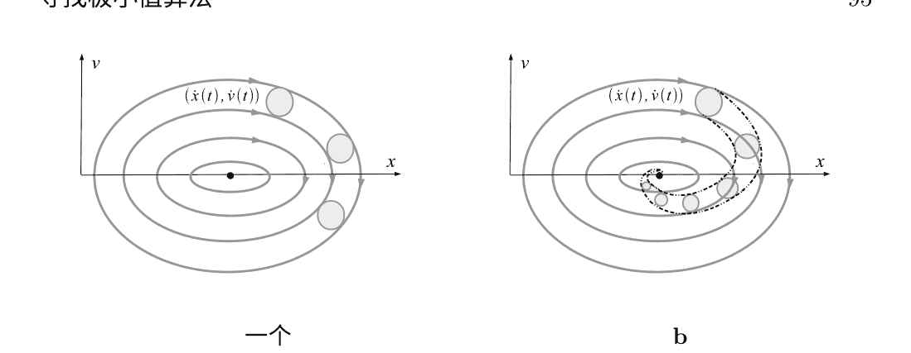

解(v*, x*)满足 v*= 0, ∇ f(x*) = 0，这与无摩擦情况下描述的平衡点(4.3.12)相同。唯一的不同是由于能量损失，相空间中的解从较高能量级向较低能量级螺旋下降，参见图4.12 b。

为了得到一个可以在计算机上实现的算法，我们将将ODE系统(4.4.19)-(4.4.20)转化为有限差分系统。考虑等距时间分割0 = t_0 < t_1 < ... < t_n < ∞，并且设Δt = t_{n+1} - t_n为一个常数时间步长。将系统的第n个状态表示为(x^n v^n) = (x(t_n), v(t_n))。 系统 (4.4.19)-(4.4.20) 变为

$$x^{n+1} - x^n  =  v^n \Delta t \\ v^{n+1} - v^n  =  -\rho v^n \Delta t - \nabla f(x^n) \Delta t.$$

用 ε = Δt 和 μ = 1 - ρε 进行替换，其中 μ < 1，我们得到有限差分系统

$$x^{n+1}  =  x^n + ε v^n \qquad\qquad\qquad\qquad\qquad (4.4.23) \\ v^{n+1}  =  μ v^n - ε \nabla f(x^n).\qquad\qquad\qquad\qquad\qquad (4.4.24)$$

将速度重新缩放为 \tilde{v} = ε v (通过更改测量单位在物理上可行)，系统 (4.4.23)-(4.4.24) 变为

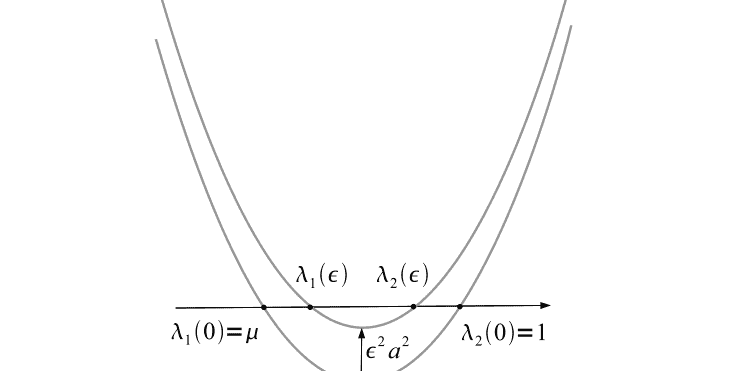

$$\begin{aligned}
x^{n+1} &= x^{n} + \tilde{v}^{n} \qquad\qquad\qquad\qquad\quad (4.4.25) \\ \tilde{v}^{n+1} &= \mu \tilde{v}^{n} - \eta \nabla f(x^{n}), \qquad\qquad\qquad (4.4.26)
\end{aligned}$$

其中 $\eta = \epsilon^2$ 是学习率（时间步长由 $\Delta t = \sqrt{\eta}$ 给出）。我们注意到方程 (4.4.25) 和 (4.4.16) 或Polyak经典动量法之间的速度指数差异。这可以通过在我们的分析中用前向方程 $x^{n+1} - x^{n} = v^{n+1} \Delta t$ 替换后向方程 $x^{n+1} - x^{n} = v^{n} \Delta t$ 来修复。

请注意，当函数 $f$ 是二次的时候，它的梯度 $\nabla f$ 是线性的，因此方程组 (4.4.23)-(4.4.24) 形成一个可以明确求解的线性系统。我们将在下一个例子中进行这个操作。

**例子4.4.1** 考虑一个实变量的二次函数 $f(x) = \frac{1}{2} a x^{2} - b x + c$。由于梯度是 $f'(x) = a(ax - b)$，方程组(4.4.23)-(4.4.24)是线性的：

$$\begin{aligned}
x^{n+1} &= x^{n} + \epsilon v^{n} \\ v^{n+1} &= -\epsilon a^{2} x^{n} + \mu v^{n} + \epsilon a b.
\end{aligned}$$

用矩阵表示，这可以更简单地写作 $s_{n+1} = M s_{n} + \beta$，其中

$$s_{n} = \begin{pmatrix} x^{n} \\ v^{n} \end{pmatrix}, \quad M = \begin{pmatrix} 1 & \epsilon \\ -\epsilon a^{2} & \mu \end{pmatrix}, \quad \beta = \begin{pmatrix} 0 \\ \epsilon a b \end{pmatrix}.$$

### 寻找极小值算法

归纳地，我们可以用初始状态 $s_0$ 来表示状态 $s_n$

$$s_n = M^n s_0 + (\mathbb{I}_2 - M^n)(\mathbb{I}_2 - M)^{-1} \beta. \tag{4.4.27}$$

计算提供了逆

$$(\mathbb{I}_2 - M)^{-1} = \frac{1}{\epsilon^2 a^2} \begin{pmatrix} 1 - \mu & \epsilon \\ -\epsilon a^2 & 0 \end{pmatrix}.$$

接下来我们将证明 $M$ 的特征值介于0和1之间。为了表示 $\epsilon$ 的依赖性，我们将 $M$ 写成 $M(\epsilon)$。然后

$$M(0) = \begin{pmatrix} 1 & 0 \\ 0 & \mu \end{pmatrix}$$

是一个具有特征值 $\lambda_1(0) = \mu$ 和 $\lambda_2(0) = 1$ 的对角矩阵。$M$ 的特征方程是二次方程

$$\lambda^2 - (\mu + 1)\lambda + (\mu + \epsilon^2 a^2) = 0,$$

有解 $\lambda_1(\epsilon)$ 和 $\lambda_2(\epsilon)$。不需要明确计算这些特征值，我们将通过以下定性的方式展示它们在0和1之间。注意，特征方程在 $\epsilon$ 上是可加的。当 $\epsilon=0$ 时，抛物线与 $x$ 轴有两个交点，分别为 $\lambda_1(0) = \mu$ 和 $\lambda_2(0) = 1$。对于足够小的 $\epsilon > 0$，抛物线上移了一个很小的量 $\epsilon^2 a^2$，由于连续性的原因，仍然存在两个与 $x$ 轴相交的点，位于 $\mu$ 和1之间，见图4.13。因此， $0< \mu < \lambda_1( \epsilon) < \lambda_2( \epsilon) <1$。因此，根据附录中的命题G.1.2，当 $n\to\infty$ 时， $M^n \to0$。

对于关系(4.4.27)，取极限得到平衡状态

$$s^* = \lim_{n\to\infty} s_n = (\mathbb{I}_2 - M)^{-1} \beta = \frac{1}{\epsilon^2 a^2} \begin{pmatrix} 1 - \mu & \epsilon \\ -\epsilon a^2 & 0 \end{pmatrix} \begin{pmatrix} 0 \\ \epsilon a b \end{pmatrix} = \begin{pmatrix} b/a \\ 0 \end{pmatrix},$$

这将得到最小值 $x^* = \frac{b}{a}$ ，正如预期的。

**注4.4.2** “动量法”这个名字在这里使用得不恰当。对于一个粒子来说，动量通常是向前推进，而在这种情况下，我们通过摩擦力来减弱粒子的运动。我们这样做是为了避免粒子超过平衡点。

然而，有时我们希望相反的效果：使粒子避免陷入局部最小值。在这种情况下，摩擦因子被动量因子所取代，旨在给粒子速度一个冲击，使其超过局部最小值。通过要求方程(4.4.24)中的条件 $\mu > 1$，很容易实现这一点。

##### 4.4.2 收敛条件

在本节中，我们对由动量法方程 (4.4.16) - (4.4.17) 定义的数列 $x^n$ 和 $v^n$ 的收敛性感兴趣，为了完成这个任务，我们将找到数列的精确公式。

**迭代方程 (4.4.16)**

$$x^n = x^{n-1} + v^n \\ x^{n-1} = x^{n-2} + v^{n-1} \\ \dots = \dots \\ x^1 = x^0 + v^1$$

然后相加，得到位置的表达式

$$x^n = x^0 + \sum_{k=1}^{n} v^k. \tag{4.4.28}$$

为了简单起见，将 $b_n = \nabla f(x^n)$ 表示为 **迭代方程 (4.4.17)**，我们得到

$$v^n = \mu v^{n-1} - \eta b_{n-1} \\ = \mu(\mu v^{n-2} - \eta b_{n-2}) - \eta b_{n-1} \\ = \mu^2 v^{n-2} - \mu \eta b_{n-2} - \eta b_{n-1} \\ = \mu^2(\mu v^{n-3} - \eta b_{n-3}) - \mu \eta b_{n-2} - \eta b_{n-1} \\ = \mu^3 v^{n-3} - \mu^2 \eta b_{n-3} - \mu \eta b_{n-2} - \eta b_{n-1}.$$

通过归纳法可以证明

$$v^n = \mu^n v^0 - \eta \left( \mu^{n-1} b_0 + \mu^{n-2} b_1 + \dots + \mu b_{n-2} + b_{n-1} \right).$$

在接下来的内容中，移动指标并使用求和约定可以得到表达式

$$v^{n+1} = \mu^{n+1} v^0 - \eta \sum_{i=0}^{n} \mu^{n-i} b_i. \tag{4.4.29}$$

为了理解 $v^{n+1}$ 的行为，我们需要引入以下概念。

**定义4.4.3** 两个数列 $\sum_{n\geq 0} a_n$ 和 $\sum_{n\geq 0} b_n$ 的卷积级数是级数 $\sum_{n\geq 0} c_n$，其一般项为 $c_n = \sum_{i=0}^{n} a_i b_{n-i} = \sum_{i=0}^{n} a_{n-i} b_i$。

在收敛分析中，将使用以下两个结果来分析序列 $(x^n)_n$ 和 $(v^n)_n$。

**命题4.4.4** 设 $(a_n)_n$ 是一列收敛于 0 的实数序列，且 $\sum_{n\geq0} b_n$ 是一个绝对收敛数列。那么

$$\lim_{n\to\infty}\sum_{i=0}^{n}a_ib_{n-i}=0.$$

**定理4.4.5** 考虑两个数列 $\sum_{n\geq0} a_n$ 和 $\sum_{n\geq0} b_n$，一个收敛而另一个绝对收敛。那么它们的卷积数列是收敛的，其和等于给定数列的乘积，即

$$\sum_{n\geq0}\left(\sum_{i=0}^{n}a_ib_{n-i}\right)=\left(\sum_{n\geq0}a_n\right)\left(\sum_{n\geq0}b_n\right).$$

下面的结果给出了序列 $(x^n)_n$ 和 $(v^n)_n$ 收敛的刻画。

**命题4.4.6** $(a)$ 如果 $\nabla f(x^n)$ 收敛于 0，那么序列 $(v^n)_n$ 也收敛于 0，当 $n\to \infty$ 时。

$(b)$ 假设级数 $\sum_{n>0} \|\nabla f(x^n)\|$ 是收敛的。那么两个数列 $(x^n)_n$ 和 $(v^n)_n$ 都是收敛的。

**证明：** $(a)$ 回忆一下 $0<\mu<1$。由于 $(b_n)$ 收敛于0和几何级数 $\sum_{n\geq0} \mu^n$ 是绝对收敛的，根据命题4.4.4，我们有 $\lim_{n\to\infty}\sum_{i=0}^{n} \mu^{n-i}b_i = 0$。 在 (4.4.29) 中取极限，我们得到

$$v^*=\lim_{n\to\infty} v^{n+1} = v^0 \lim_{n\to\infty} \mu^{n+1} - \eta \lim_{n\to\infty} \sum_{i=0}^{n} \mu^{n-i}b_i = 0.$$

$(b)$ 由于 $\sum_{n\geq0} \|\nabla f(x^n)\|$ 收敛，那么 $\nabla f(x^n)$ 收敛于0。 根据 $(a)$ 部分，我们可以得出 $v^n$ 收敛于零。 为了证明 $x^n$ 的收敛性，我们使用关系式 (4.4.28) 和 (4.4.29) ，并按照以下代数方式进行操作：

$$\begin{aligned} x^{n+1} &= x^0 + \sum_{k=1}^{n+1} v^k = x^0 + \sum_{k=0}^{n} v^{k+1} \\ &= x^0 + \sum_{k=0}^{n} \left[ \mu^{k+1} v^0 - \eta \sum_{i=0}^{k} \mu^{k-i} b_i \right] \\ &= x^0 + v^0 \frac{\mu(1-\mu^{n+1})}{1-\mu} - \eta \sum_{k=0}^{n} \sum_{i=0}^{k} \mu^{k-i} b_i. \end{aligned} \tag{4.4.32}$$

这提供了 $x^{n+1}$ 的闭式表达式。 利用定理4.4.5，我们可以得到极限

$$x^* = \lim_{n\to\infty} x^{n+1} = x^0 + v^0 \frac{\mu}{1-\mu} - \eta \left(\sum_{n\geq0}\mu^n\right)\left(\sum_{n\geq0}b_n\right) \\ = x^0 + v^0 \frac{\mu}{1-\mu} - \frac{\eta}{1-\mu} \sum_{n\geq0}b_n.$$

**注4.4.7** 经典动量法的改进已经由Nesterov [91]提出。 这是通过修改动量法中的参数来获得的；不再在当前位置 $x^n$ 计算梯度，而是在修正后的值 $x^n + \mu v^n$ 处计算梯度。

$$x^{n+1} = x^n + v^{n+1} \quad (4.4.30) \\ v^{n+1} = \mu v^n - \eta \nabla f(x^n + \mu v^n). \quad (4.4.31)$$

Nesterov加速梯度（简称NAG）是一种比梯度下降法收敛速度更快的一阶优化方法。

与动量法相比，NAG更加灵敏地改变速度 $v$，这使得该方法更加稳定，特别是对于较大的 $\mu$ 值。

#### 4.5 AdaGrad

一种改进的随机梯度下降方法，具有自适应学习率，在2011年以AdaGrad（自适应梯度）的名义发表，参见Duchi等人[34]。如果 $C\left(x\right)$ 表示成本函数，该函数需要进行最小化，其中 $x\in\mathbb{R}^N$，则在第 $t$ 步评估的梯度向量表示为 $g_t = \nabla C\left(x\left(t\right)\right)$。我们考虑 $N\times N$ 矩阵

$$G_t = \sum_{\tau=1}^t g_\tau g_\tau^T$$

并考虑更新

$$x(t+1) = x(t) - \eta G_t^{-1/2}g_t,$$

其中 $\eta>0$ 是学习率。对于离散时间步，可以等价地写为

$$x^{n+1} = x^n - \eta G_n^{-1/2}g_n.$$

由于 $G_t^{-1/2}$ 在高维度中计算上是不可行的，更新可以仅使用矩阵的对角元素完成

$$x(t + 1) = x(t) - \eta \text{diag}(G_t)^{-1/2}g_t.$$

矩阵 $G_t$ 的对角元素可以通过计算得到

$$(G_t)_{jj} = \sum_{\tau=1}^t (g_{\tau, j})^2,$$

其中我们使用了

$$g_{\tau} g_{\tau}^T = \begin{pmatrix} g_{\tau, 1} \\ \vdots \\ g_{\tau, N} \end{pmatrix} (g_{\tau, 1}, \ldots, g_{\tau, N}) = \begin{pmatrix} (g_{\tau, 1})^2 & \cdots & \cdots \\ \cdots & \cdots & \cdots \\ \cdots & \cdots & (g_{\tau, N})^2 \end{pmatrix}.$$

#### 4.6 RMSProp

均方根传播（RMSProp）是梯度下降方法的一种变体，具有自适应学习率。如果梯度被其幅度的运行平均值除以，则得到RMSProp。参见Tieleman和Hinton[18]，2012年。

如果 $C (x)$ 表示成本函数，并且 $g_t = \nabla C (x (t) )$ 是其在时间步骤$t$处的梯度，则运行平均值通过递归定义为

$$v(t) = \gamma v(t - 1) + (1 - \gamma) g_{t-1}^2,$$

其中 $\gamma \in (0,1)$ 是遗忘因子，控制指数衰减率，而向量 $g_{t-1}^2$ 表示梯度 $g_{t-1}$ 的逐元素平方。可以归纳地证明，平方梯度的指数移动平均值 $v (t)$ 由以下公式给出

$$v(t) = \gamma^t v(0) + (1 - \gamma) \sum_{i=1}^t \gamma^{t-i} g_i^2.$$

由于系数之和为1，即

$$\gamma^t + (1 - \gamma) \sum_{i=1}^t \gamma^{t-i} = 1,$$

对于离散时间步骤，可以等价地写为

$$v^n = \gamma v^{n-1} + (1 - \gamma)(g_{n-1})^2.$$

由此可知，$v(t)$是$v(0)$（通常取为零）和直到步骤$t$的所有平方梯度的加权平均值，对于较新的梯度给予更大的权重。

代价函数的最小值，$x^* = \arg \min_x C(x)$，通过递归更新规则定义的近似序列$(x(t))_{t \geq 1}$获得

$$x(t+1) = x(t) - \eta \frac{g_t}{\sqrt{|v(t)|}}, \quad (4.6.32)$$

其中$\eta >0$是学习率。我们注意到$v(t)$可以被解释为梯度的二阶矩（非中心方差）的估计。方程(4.6.32)可以看作是梯度下降的一种变体，其中梯度$g_t$被其标准差的估计所缩放，$\sqrt{|v(t)|}$。

### 例子4.6.1

我们将使用RMSProp方法数学地追踪实值函数$C(x) = \frac{1}{2} x^2$的最小值。在这种情况下，梯度是$g_t = x(t)$，移动平均值为

$$v(t) = (1-\gamma) \sum_{i=1}^{t} \gamma^{t-i} x(i)^2$$

我们考虑$v(0) = 0$。估计最小的序列$x^* = \arg \min_x C(x)$是通过递归给出的

$$x(t+1) = x(t) - \eta \frac{x(t)}{\sqrt{|v(t)|}} = x(t)\left[1 - \eta \frac{1}{\sqrt{|v(t)|}}\right].$$

我们记$\rho_t = 1 - \eta/\sqrt{|v(t)|}$并假设$0<\rho_t<\rho<1$。然后关系$x(t+1)=x(t)\rho_t$连同初始条件$x(0)>0$意味着序列$x(t)$是递减的且下界为0，满足不等式

$$0 < x(t) < x(0) \rho^t.$$

通过使用挤压定理和极限，我们得到$x^* = \lim_{t \to \infty} x(t) = 0$，即$C(x) = \frac{1}{2} x^2$的最小值出现在$x=0$。

现在，我们回过头来证明双重不等式$0<\rho_t<\rho<1$。第一个不等式，$0<\rho_t$，等价于$\frac{\eta}{\sqrt{v(t)}}<1$。

为了证明这个不等式，我们假设$x(t)$不收敛于0（否则我们已经得出结论），即存在$\epsilon >0$，使得$x(t)^2 > \epsilon$，对于所有$t \geq 1$。这意味着存在$N >1$，使得$v(t) > \frac{\epsilon}{2}$，对于所有$t > N$。

这个事实可以通过计算得出

$$v(t) = (1-\gamma) \sum_{i=1}^{t} \gamma^{t-i} x(i)^2 > \epsilon(1-\gamma) \sum_{i=1}^{t} \gamma^{t-i} = \epsilon(1-\gamma) \frac{1-\gamma^t}{1-\gamma} = \epsilon(1-\gamma^t) > \frac{\epsilon}{2},$$

我们选择 $N$ 使得 $\gamma^t < \frac{1}{2}$ 对于 $t > N$。前一个不等式意味着

$$\frac{\eta}{v(t)} < \frac{2\eta}{\epsilon} < 1, \quad \text{对于所有} t > N,$$

我们选择满足 $\eta < \frac{\epsilon}{2}$ 的学习率。

第二个不等式， $\rho_t < \rho < 1$, 等价于 $v(t) < \left(\frac{\eta}{1-\rho}\right)^2$, 即, 数列 $v(t)$ 的有界性。这可以通过以下方式证明

$$v(t) = (1 - \gamma) \sum_{i=1}^{t} \gamma^{t-i} x(i)^2 < M^2 (1 - \gamma) \sum_{i=1}^{t} \gamma^{t-i} = M^2 (1 - \gamma^t) < M^2.$$

## 4.7 亚当

这种自适应学习方法受到之前的AdaGrad和RMSProp方法的启发，于2014年由Diederik和Ba [31]引入。该方法通过指数移动平均估计梯度的一阶和二阶矩，然后应用一些偏差校正。

成本函数 $C(x)$，在最小化的条件下，可能具有一些随机性，并且被假定对 $x$ 可微。我们对最小值 $x^* = \arg \min_x \mathbb{E}[C(x)]$ 感兴趣。

为此，我们将时间步骤 $t$ 处的成本函数梯度表示为 $g_t = \nabla C(x(t))$。我们考虑两个指数衰减率的矩估计， $\beta_1$, $\beta_2 \in [0,1)$，固定一个初始向量 $x(0) = x_0$，通过

$$m(t) = \beta_1 m(t-1) + (1 - \beta_1) g_t$$

来更新矩。

$$v(t) = \beta_2 v(t-1) + (1 - \beta_2)(g_t)^2,$$

其中 $(g_t)^2$ 表示向量 $g_t$ 的逐元素平方。这些时刻 $m(t)$ 和 $v(t)$ 可以被解释为梯度的偏估计值，即梯度的一阶矩（均值）和二阶矩（非中心方差）的指数移动平均。可以通过以下方式进行偏差校正。

我们可以归纳地写成

$$m(t) = (1 - \beta_1) \sum_{i=1}^{t} \beta_1^{t-i} g_i$$

$$v(t) = (1 - \beta_2) \sum_{i=1}^{t} \beta_2^{t-i} (g_i)^2.$$

应用期望算子并假设一阶和二阶矩是稳定的，我们得到

$$\begin{aligned}
\mathbb{E}[m(t)] &= (1-\beta_1)\sum_{i=1}^{t} \beta_1^{t-i} \mathbb{E}[g_i] = (1-\beta_1^t)\mathbb{E}[g_t] \\
\mathbb{E}[v(t)] &= (1-\beta_2)\sum_{i=1}^{t} \beta_2^{t-i} \mathbb{E}[(g_i)^2] = (1-\beta_2^t)\mathbb{E}[(g_t)^2].
\end{aligned}$$

因此，修正偏差的矩是

$$\begin{aligned}
\hat{m}(t) &= m(t) / (1 - \beta_1^t) \\
\hat{v}(t) &= v(t) / (1 - \beta_2^t).
\end{aligned}$$

最终的递归公式为

$$x(t+1) = x(t) - \eta \frac{\hat{m}(t)}{\sqrt{|\hat{v}(t)|} + \epsilon},$$

使用 $\epsilon > 0$ 一个小的标量来防止除以零。在[31]中使用的上述超参数的一些默认设置是 $\eta=0.001, \beta_1=0.9, \beta_2=0.99$，以及 $\epsilon=10^{-8}$。

#### 4.8 AdaMax

自适应最大方法，或者 $AdaMax$，是基于无穷范数的 $Adam$ 的一种变体，[31]。该模型由以下一组迭代定义：

$$\begin{aligned}
m(t) &= \beta_1 m(t-1) + (1 - \beta_1) g_t \\
u(t) &= \max(\beta_2 u(t-1), |g(t)|) \\
x(t) &= x(t-1) - \frac{\eta}{1 - \beta_1^t} \frac{m(t)}{u(t)},
\end{aligned}$$

使用动量初始化 $m(0)=u(0)=0$。我们注意到在这种情况下，偏差不需要进行修正。

#### 4.9 模拟退火方法

寻找给定函数的全局最小值的另一种方法是模拟退火（SA），它于1983年由Kirkpatrick等人引入神经网络。该方法受到了一种叫做退火的冶金过程的启发。在这个过程中，金属被回火，即过热后冷却。

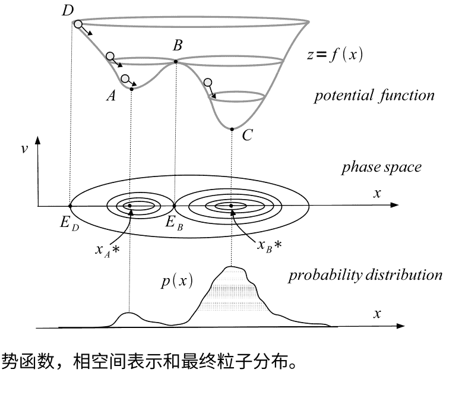

这样，金属的晶体结构达到了全局最小能量，该方法用于消除金属中的缺陷，使其更加坚固。通过这个过程，金属的晶体结构达到了全局最小能量，该方法用于消除金属中的缺陷，使其更加坚固。

由于分子的动能与绝对温度成正比，参见爱因斯坦[38]，所以金属分子在高温下会被激发，然后在冷却过程中失去能量，并最终处于晶格的全局最小能量位置。

我们将从运动学和热力学的角度讨论这种行为。

### 4.9.1 SA的运动学方法

考虑具有一些局部极小值和全局极小值的能量势 $z = f(x)$。假设金属分子受到这个势能的驱动。对于固定温度 $T$，每个粒子具有恒定的总能量。因此，它必须沿着相空间中的恒定能量曲线移动，参见第4.3节。当温度升高时，粒子的动能也增加，因此它们将向更高能级转移。

当温度缓慢降低时，粒子的动能也会减小，对粒子运动的影响类似于阻尼因子的影响。这将使粒子的能量降低，希望能够达到更低的能量水平，甚至低于初始能量水平。最终，大多数粒子将位于相空间中的全局最小状态。

我们将使用图4.14来讨论这种行为。考虑具有局部最小值 $A$和全局最小值 $C$的势函数 $z = f(x)$。假设一个粒子在初始温度 $T_0$附近的局部最小值 $A$附近。那么它在相空间中的轨迹将是围绕平衡点的一个小闭环。

我们说粒子被困在一个局部最小值中，而没有额外的能量，粒子无法从吸引盆地中逃脱点 $A$。

现在，我们将温度提高到 $T_{max}$，使粒子具有动能，使其能够达到点 $D$。然后，在这个阶段，相空间中的相关轨迹对应于能量水平 $E_D$，这是图中最大的循环。然后我们开始缓慢降低温度。在这个过程中，粒子在相空间中有一个阻尼运动，能量水平 $E_D$将降低到能量水平 $E_B$，它具有一个数字八的形状。因此，在降低温度后，相空间中的轨迹将围绕全局最小值 $(x_C^*, 0)$ 旋转。当温度降到零时，阻尼将使轨迹朝向全局最小值 $(x_C^*, 0)$ ，参见图4.15。

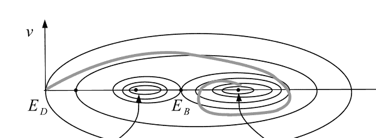

图4.15：大多数阻尼轨迹将螺旋式地接近平衡点 $(x_C^*, 0)$，该平衡点具有较大的吸引域。

如果我们考虑现在应用于大量粒子的前面的推理，那么大多数粒子将最终处于平衡点 $(x_C^*,0)$ 的附近，只有少数粒子无法逃离点 $A$的吸引盆地。这解释了图4.14下部分的粒子分布的双峰分布。冷却过程越慢，位于 $x_A^*$ 上方的峰值越小。如果冷却过程是无限长的，分布将只有一个峰值，这对应于所有粒子具有最小势能的情况。 值得注意的是，当 $T = T_{\max}$时，粒子的分布是均匀的。

### 4.9.2 SA的热力学解释

我们现在假设所有粒子形成一个热力学系统，其内部能量必须最小化。 Boltzmann概率分布的以下概念将会有用。 已知在温度为 $T$的热平衡系统中，能量的分布由以下给出。

$$p(E) = e^{-\frac{E}{kT}}$$

其中 $E$是能级， $T$是温度，而 $k$表示玻尔兹曼常数（为了简单起见，我们将其取为1），参见图4.16。 事实上，为了使前面的公式在数学上成为概率密度，我们需要指定一个区间， $0 \leq E \leq E_{\max}$，并在指数前面加上一个归一化常数。对于我们的目的，暂时不需要担心这个问题。 前面的分布用法如下。 如果一个粒子处于初始状态， $S_{0}$，能量为 $E_{0}$，跳到一个更高能量的状态， $S_{1}$，的概率是

$$p(\Delta E) = e^{-\frac{\Delta E}{T}}$$

其中$\Delta E = E_1 - E_0$是状态能量的差异。 这个模型有一些后果:

-   (i) 考虑温度 $T$固定。 因此，能量跃迁越高，$\Delta E$越大，跃迁的概率越低， $p(\Delta E)$越低。
-   (ii) 对于给定的能量跃迁$\Delta E$，温度越高，跃迁的概率越大。 因此，在低温下，给定能量跃迁的概率比在较高温度下相同跃迁大小的概率要低。
-   (iii) 对于非常大的 $T$，跃迁能量均匀分布。

这可以等价地表述为热力学系统在低能量和低温下更加稳定。 这些观察结果将对以下全局最小搜索算法产生极大影响。

考虑函数 $E = f(x)$，需要全局最小化。在这里， $x$扮演系统的状态角色，而 $E$表示其内部能量。 我们从一个点 $x^0$开始，这是系统的初始状态，并将温度参数 $T$设置为非常高。 在 $x^0$的邻域内随机创建第二个点 $x^1$。 然后我们计算能量差 $\Delta E = f( x^1) – f( x^0)$，可以在状态$x^0$和状态$x^1$之间跳转。 有两种情况可能发生：

-   1) 如果$\Delta E <0$，即 $f(x^1) < f(x^0)$，那么我们接受新的状态x1。以概率1选择状态$x^1$，并继续搜索的下一步。
-   2) 如果$\Delta E \geq 0$，那么我们不会立即丢弃状态$x^1$（就像贪婪算法那样）。我们以概率$p(\Delta E)$接受状态$x^1$，其中$p$是Boltzmann分布。

我们注意到上述两个步骤中使用的接受概率可以用一个公式表示为

$$P(\Delta E; T) = \min \left\{1, e^{-\frac{\Delta E}{T}}\right\}.$$

在下一步中，我们降低温度参数，并在上一个接受点的邻域中随机选择一个新点；然后继续上述步骤。

通过这个过程，当 $T$很高时，接受能量增加的状态的概率很大。 实际上，对于 $T\rightarrow \infty$，任何点都可以以概率1被接受。 在开始时将 $T$设置为高值有助于系统摆脱可能的局部最小值。

当 $T$接近0时，接受能量增加的点的概率很小，选择能量减少的点的概率要高得多。

接下来，我们用以下伪代码总结模拟退火算法：

| 步骤 | 描述 |
| :--- | :--- |
| 1. | 固定$\epsilon >0$。 选择 $x^0$并设置 $T$为高值。 |
| 2. | 在 $x^0$的邻域中选择一个随机点 $x^1$。 |
| 3. | 计算 $\Delta E = f(x^1) - f(x^0)$。 <br> - 如果 $\Delta E < 0$, 令 $x^1 = x^1$。<br> - 如果 $\Delta E \geq 0$, 选择一个随机数 $r \in (0,1)$。 <br> &nbsp;&nbsp;&nbsp;&nbsp;○ 如果 $r \leq e^{-\Delta E/T}$，令 $x^1 = x^1$。 <br> &nbsp;&nbsp;&nbsp;&nbsp;○ 如果 $r > e^{-\Delta E/T}$，转到步骤 2。 |
| 4. | 如果 $\|x^{1} - x^{0}\| < \epsilon$ 则停止；否则减小 $T$，令 $x^0 = x^1$，并转到步骤 2。 |

我们注意到，温度下降得太快会导致过早收敛，可能无法达到全局最小值。温度下降得太慢会导致算法收敛缓慢。在这种情况下，搜索算法构建了一个覆盖状态空间很好的序列 $(x^n)_n$，不会错过全局最小值。可以证明，使用模拟退火方法可以渐近地接近能量函数的全局最小值，参见 [1]。

设置初始温度的一种方法是选择它等于函数 $f$ 的平均值，即 $T_{\max} = \text{Ave}(f) = \frac{1}{\text{vol}(D)} \int_D f(x) dx$，其中 $D$ 表示状态空间。

-   (i) 为了方便起见选择了Boltzmann分布，并且为了与热力学相似。还有其他与之前的一样有效的接受概率，例如，反射的Sigmoid函数 $f(x) = 1 + \frac{1}{e^{x/T}}$，参见[101]。当 $T \to \infty$ 时，函数趋向于水平线 $y = 0.5$，并且其行为类似于Boltzmann分布，参见图4.16 b。这个分布在第20章中研究Boltzmann机器时非常重要。
-   (ii) 与模拟退火方法类似的情况发生在轮盘赌的情况下。当球沿轮盘旋转时，它不会立即落入任何编号的槽中。这些槽作为势能函数的局部最小值，只要球有足够的能量，它可以轻松地进出这些槽。只有当球的能量因摩擦而足够降低时，它才会落入其中一个槽中，对于所有数字来说，这种情况的发生概率是相等的。如果我们假设其中一个槽比其他槽更深，球就有更高的概率落入这个特定的槽中。

## 4.10 增加分辨率方法

在本节中，我们将介绍一种非随机的方法来寻找具有许多局部最小值的函数的全局最小值。这种方法也可以用于多个变量，但为了简单起见，我们只在这里介绍一维信号的情况，$y = f(x)$，其中依赖于实数变量，$x$。该方法适用于可积的信号。并不一定是可微分的。这种技术可以被看作是模拟退火方法的一种扩展，我们很快就会看到。

这个想法是通过使用高斯滤波器来模糊信号 $y = f(x)$, $G_\sigma(x) = \frac{1}{\sqrt{2\pi\sigma}}e^{-\frac{x^2}{2\sigma^2}}$, 得到信号 $f_\sigma(x)$, 其由卷积给出

$f_\sigma(x) = (f * G_\sigma)(x) = \int_{\mathbb{R}} f(u)G_\sigma(x-u) du = \int_{\mathbb{R}} f(x-u)G_\sigma(u) du$

正参数 $\sigma$ 控制信号的分辨率。较大的 $\sigma$ 提供了一个保留 $f(x)$粗略形状的信号 $f_\sigma(x)$。另一方面，较小的 $\sigma$ 意味着保留细节。实际上，利用高斯函数趋于狄拉克测度的事实，$\lim_{\sigma \searrow 0} G_\sigma(x) = \delta(x)$, 我们有

极限 $\lim_{\sigma \searrow 0} f_\sigma(x) = \lim_{\sigma \searrow 0} (f * G_\sigma)(x) = (f * \delta)(x) = f(x)$

这意味着对于小的 $\sigma$ 值，滤波信号非常接近于初始信号，这符合常识。

如果直接使用梯度下降法来寻找 $y = f(x)$的全局最小值，会遇到两个问题：

- 函数 $f$ 可能不可微，无法应用该算法。例如，感知器神经网络（多层感知器）属于这一类别；

- 函数 $f$ 是可微的，算法适用，但会陷入局部最小值。解决这个问题的一种不足的方法是增加学习率以跳过局部最小值。然而，这会导致在最小值周围振荡，这不是一个精确的近似。

下一个方法避免了前两个不便之处。我们首先注意到平滑函数 $f_\sigma(x)$在 $x$ 上是可积且可微的（即使 $f$可能不是），满足

$f'_\sigma(x) = (f * G'_\sigma)(x)$
$\|f_\sigma\|_1 \leq \|f\|_1$

第一个等式是通过变量替换和导数与积分的交换得到的，这是由于高斯函数的指数衰减性质。至于第二个不等式，请参见练习4.17.5。

算法由于信号分辨率随 $\sigma$ 的减小而增加，我们首先找到全局最小值的近似位置，然后增加分辨率，寻找全局最小值的更精确近似。这样，我们在全局最小值的越来越准确的邻近位置寻找全局最小值。

图4.17：信号分辨率的增加。每个分辨率剖面上的最小值由一个小圆表示。

考虑分辨率计划 $\sigma_0 > \sigma_1 > \cdots > \sigma_k > 0$。然后 $f_{\sigma_0}, \dots, f_{\sigma_k}$ 是信号的不同分辨率级别 $y = f(x)$，参见图4.17。我们将从较大的 $\sigma_0$ 值开始。然后信号 $y = f_{\sigma_0}(x)$ 看起来像 $y = f(x)$ 的粗糙形状，如果 $\sigma_0$ 足够大，则不会有任何局部极小值。让

$$x_0 = \arg\min_{x} f_{\sigma_0}(x)$$

由于 $f_{\sigma_0}$ 是平滑的且 $x_0$ 是唯一的最小值，可以使用梯度下降法实现。

我们考虑下一个分辨率信号 $y = f_{\sigma_1}(x)$ 并应用梯度下降法，从 $x_0$ 开始，以获得邻域中的最低值-neighborhood $\mathcal{V}_0$ of $x_0$ at

$$x_1 = \arg\min_{x \in \mathcal{V}_0} f_{\sigma_1}(x)$$

接下来，我们在邻域 $\mathcal{V}_1$ of $x_1$ 上应用梯度下降法来处理信号 $f_{\sigma_2}$ 并获得

$$x_2 = \arg\min_{x \in \mathcal{V}_1} f_{\sigma_2}(x)$$

我们继续这个过程直到达到

$$x_k = \arg\min_{x \in \mathcal{V}_{k-1}} f_{\sigma_k}(x)$$

由于分辨率的增加，我们有邻域的降序序列 $\mathcal{V}_0 \supset \cdots \supset \mathcal{V}_{k-1}$。每个邻域都包含全局最小值的近似。如果计划选择正确，则 $x_k$ 是 $f(x)$ 的全局最小值的良好近似。

备注4.10.11. 参数 $\sigma$ 在模拟退火方法中起到类似温度的作用。

这种方法类似于使用Google地图在给定城市中找到位于某个街道交叉口旁边的小店的过程。首先，我们在图表中绘制国家 $\mathcal{V}_0$；然后我们增加分辨率以绘制城市 $\mathcal{V}_1$；进一步增加分辨率，我们在较小的图表中寻找街道 $\mathcal{V}_2$；进一步放大图像，我们在图表中寻找预定街道交叉口处的店铺 $\mathcal{V}_3$。我们得到明显的包含关系 $\mathcal{V}_3 \subset \mathcal{V}_2 \subset \mathcal{V}_1 \subset \mathcal{V}_0$，对应于分辨率计划店铺、街道、城市、国家。只忽略一个分辨率级别将使搜索几乎不可能。

模糊计划如果信号 $y = f(x)$ 使用高斯滤波器 $G_{\sigma_1}$ 进行模糊处理 $f_{\sigma_1} = f * G_{\sigma_1}$。接下来，我们模糊化 $f_{\sigma_1}$ 使用高斯滤波器 $G_{\sigma_2}$ 并得到 $f_{\sigma_1, \sigma_2} = f_{\sigma_1} * G_{\sigma_2}$。我们也可以直接使用高斯 $G_{\sigma}$ 模糊化 $f$ 并得到信号 $f_{\sigma}$，其中 $\sigma = \sqrt{\sigma_1^2 + \sigma_2^2}$。我们将在接下来的部分展示信号 $f_{\sigma_1, \sigma_2}$ 比信号 $f_{\sigma}$ 具有更高的分辨率。使用卷积的结合性以及练习4.17.6，我们得到

$$ f_{\sigma_1, \sigma_2} = f_{\sigma_1} * G_{\sigma_2} = (f * G_{\sigma_1}) * G_{\sigma_2} = f * (G_{\sigma_1} * G_{\sigma_2}) = f * G_{\sigma} = f_{\sigma}, $$

其中 $\sigma = \sqrt{\sigma_1^2 + \sigma_2^2}$。由于 $\sigma < \sigma_1 + \sigma_2$，所以 $f_{\sigma}$ 包含更多细节。同样，如果我们将信号模糊化 $n$ 次，我们得到

$$ f * G_{\sigma_1} * \cdots * G_{\sigma_n} = f * G_{\sigma}, $$

其中 $\sigma = \sqrt{\sigma_1^2 + \dots + \sigma_n^2}$。如果考虑约束条件

$$ \sigma_1 + \dots + \sigma_n = s, $$

这意味着模糊调度的长度为 $s$，然后根据练习 [4.17.7](4.17.7)， $\sigma$ 的最小值是在这种情况下达到的

$$ \sigma_1 = \dots = \sigma_n = s/n. $$

因此，以较小的步骤模糊信号可以保留更多的初始信号细节，而以较大的步骤模糊信号会丢失信息。值得注意的是，存在着提供有限分辨率信号的无限长度调度。例如，模糊调度

$$ \sigma_1 = 1, \sigma_2 = \frac{1}{2}, \dots, \sigma_k = \frac{1}{k}, \dots $$

满足

$$ s = \sum_{k \geq 1} \sigma_j = \infty, \quad \text{而} \quad \sigma^2 = \sum_{j \geq 1} \frac{1}{k^2} = \frac{\pi^2}{6}. $$

## 4.11 Hessian方法

前面介绍的梯度方法没有考虑到表面 $z = f(x)$ 的曲率，该曲率由二阶偏导数矩阵描述

$$H_f(x) = \left( \frac{\partial^2 f(x)}{\partial x_i \partial x_j} \right)_{i,j}$$

称为 $Hessian$。矩阵 $H_f$ 的特征值将用 $\{\lambda_i\}$ 表示，$1 \le i \le n$。相应的特征向量，$\{\xi_j\}_j$，满足 $H_f \xi_i = \lambda_i \xi_i$，且 $\|\xi_i\|=1$。

Hessian的一些性质将在下面给出。

### 命题 4.11.1

设 $f$ 是一个实值函数，二次连续可微。以下成立：

- (a) Hessian矩阵是对称的;
- (b) 对于任意的 $x$，$H_f(x)$ 的特征值是实数;
- (c) 假设 $H$ 具有不同的特征值。那么对于任意非零向量 $v$，我们有
  $$\frac{\langle H_f(x)v, v\rangle}{\|v\|^2} = \sum_{i=1}^{n} w_j \lambda_j,$$
  其中 $\{\lambda_j\}$ 是 $H_f(x)$ 的特征值，$w_j$ 是权重，满足 $w_j \ge 0$ 和 $\sum_{j=1}^{n} w_j = 1$.
- (d) 设 $\lambda_{\min}$ 和 $\lambda_{\max}$ 分别为 $H_f(x)$ 的最大和最小特征值，则
  $$\lambda_{\min} \|v\|^2 \le \langle H_f(x)v, v\rangle \le \lambda_{\max} \|v\|^2.$$

证明：
- (a) 这是由函数 $f$ 的正则性和导数的交换性所暗示的
  $$\frac{\partial^2 f(x)}{\partial x_i \partial x_j} = \frac{\partial^2 f(x)}{\partial x_j \partial x_i}.$$
- (b) 由于任何对称实矩阵都有实特征值，由此可得。
- (c) 将向量 $v$ 在特征向量正交基 $\{\xi_i\}$ 中展开，得到 $v = \sum_{i=1}^{n} v_i \xi_i$ 并利用内积的双线性性质，我们有
  $$\langle Hv, v\rangle = \sum_i \sum_j v^i v^j \langle H\xi_i, \xi_j\rangle = \sum_i \sum_j v^i v^j \lambda_i \langle \xi_i, \xi_j\rangle = \sum_i \sum_j v^i v^j \lambda_i \delta_{ij} = \sum_i (v^i)^2 \lambda_i.$$
  因此， $\frac{\langle Hv, v\rangle}{\|v\|^2} = \sum_i w_i \lambda_i$, 其中 $w_i = \frac{(v^i)^2}{\|v\|^2}$。
- (d) 使用那个 $\lambda_{\min} \leq \sum_i w_i \lambda_i \leq \lambda_{\max}$, 乘以 $\|v\|^2$得到所需的结果。

公式 (4.2.4) 提供了梯度下降法的递归方法

$$x^{n+1} = x^n - \delta \nabla f(x^n) \quad (4.11.33)$$

### 线性近似

$$f(x^{n+1}) \approx f(x^n) + (x^{n+1} - x^n)^T \nabla f(x^n) = f(x^n) - \delta \|\nabla f(x^n)\|^2 < f(x^n)$$

产生一个小于先前值 $f(x^n)$ 的值。但这只是一个近似，如果考虑到二次项，那么先前的不等式可能不再成立。我们将在接下来进行调查。二阶泰勒近似提供了

$$f(x^{n+1}) \approx f(x^n) + (x^{n+1} - x^n)^T \nabla f(x^n) + \frac{1}{2}(x^{n+1} - x^n)^T H_f(x^n)(x^{n+1} - x^n) = f(x^n) - \delta \|\nabla f(x^n)\|^2 + \frac{1}{2} \delta^2 \langle H_f(x^n) \nabla f(x^n), \nabla f(x^n) \rangle.$$

右边的最后一项是由于 $f$ 的曲率而产生的修正项。有两种特殊情况需要考虑：

- 1. Hessian矩阵 $H_f$是负定的（所有特征值都是负数）。在这种情况下，修正项为负数
  $$\frac{1}{2} \delta^2 \langle H_f(x^n) \nabla f(x^n), \nabla f(x^n) \rangle < 0.$$
  前面的泰勒展开式暗示了不等式 $f(x^{n+1}) < f(x^n) - \delta \|\nabla f(x^n)\|^2 < f(x^n)$, 即，对于任意学习率 $\delta > 0$，每次迭代都会提供比上一次更低的 $f$ 值。

- 2. Hessian矩阵 $H_f$是正定的（所有特征值都是正的）。在这种情况下，修正项是正的
  $$\frac{1}{2} \delta^2 \langle H_f(x^n) \nabla f(x^n), \nabla f(x^n) \rangle > 0.$$
  命题4.11.1，部分 (d) ，为修正项提供以下误差边界
  $$0 < \frac{1}{2} \delta^2 \lambda_{\min} \|\nabla f(x^n)\|^2 \leq \frac{1}{2} \delta^2 \langle H_f(x^n) \nabla f(x^n), \nabla f(x^n) \rangle \leq \frac{1}{2} \delta^2 \lambda_{\max} \|\nabla f(x^n)\|^2.$$
  这个想法是，如果修正项太大，那么不等式 $f(x^{n+1}) < f(x^n)$ 可能不成立。 考虑最坏情况，当项达到最大值时，必须满足以下不等式:
  $$f(x^n) - \delta \|\nabla f(x^n)\|^2 + \frac{1}{2} \delta^2 \lambda_{\max} \|\nabla f(x^n)\|^2 < f(x^n)$$
  这与学习率的以下条件等价
  $$\delta < \frac{2}{\lambda_{\max}}. \quad (4.11.34)$$
  因此，如果学习率被限制在(4.11.34)中，那么二次近似提供了对于函数值 $f(x^{n+1})$ 低于函数值 $f(x^n)$ 的值。公式(4.11.33)给出了一个最小化序列，给定了上述学习率的约束条件。

## 4.12 牛顿法

假设 $f: \mathbb{R}^n \to \mathbb{R}$是一个 $C^2$ 类函数，并且让 $x^0 \in \mathbb{R}^n$是 $f$ 最小值的初始猜测。 假设 $f$ 在 $x^0$ 的邻域上是凸的。我们围绕点 $x^0$ 对函数 $f$ 进行二次函数近似，得到

$$f(x) \approx F(x) = f(x^0) + (x - x^0)^T \nabla f(x^0) + \frac{1}{2}(x - x^0)^T H_f(x^0)(x - x^0),$$

其中 $H_f(x^0)$ 是 $f$ 在 $x^0$ 处的 Hessian 矩阵。 由于 $f$ 是凸函数，它的 Hessian 矩阵是正定的。 因此，二次函数 $F$ 在临界点 $x^*$ 处有一个最小值，满足 $\nabla F(x) = 0$。 利用 $\nabla F(x) = \nabla f(x^0) + H_f(x^0)(x - x^0)$，方程 $\nabla F(x) = 0$ 变为

$$H_f(x^0)x = -\nabla f(x^0) + H_f(x^0)x^0.$$

假设海森矩阵没有任何零特征值，则它是可逆的并且我们得到以下临界点:

$$x^* = x^0 - H_f^{-1}(x^0)\nabla f(x^0),$$

这是 $F(x)$ 的最小值。

牛顿法由使用这个公式迭代构造递归定义的序列 $(x^n)_{n\geq 1}$ 组成

$$x^{n+1} = x^n - H_f^{-1}(x^n)\nabla f(x^n). \quad (4.12.35)$$

这种方法比梯度下降法更快地收敛到 $f$ 的最小值。然而，尽管它具有强大的价值，但它有一个主要的弱点，即需要在每次近似中计算 $f$ 的海森矩阵的逆。

### 备注4.12.1

值得注意的是，在情况 $n=1$ 下，先前的迭代公式变为

$$x^{n+1} = x^n - \frac{f'(x^n)}{f''(x^n)}.$$

如果我们将 $h(x)=f'(x)$ 表示为，则寻找 $f$ 的临界点等同于寻找 $h(x)$ 的零点。函数 $f$ 的凸性意味着 $h$ 是递增的，这保证了零点的唯一性。先前的迭代公式可以写成

$$x^{n+1} = x^n - \frac{h(x^n)}{h'(x^n)}.$$

现在我们已经到达了用连续的切线搜索 $h$ 的零点的熟悉的牛顿-拉夫逊方法。

#### 4.13 随机搜索

梯度下降法并不在所有情况下提供确定性的结果。这可以通过开发某些方法的变体来纠正，例如动量法，它用于避免陷入局部极小值或避免超过最小值。但有时还有其他原因，比如陷入高原，从中需要很长时间才能摆脱，如果有可能的话。高原是目标函数梯度 $\nabla f$ 非常小（或为零）的区域，对应于相对平坦的区域。本节介绍了一种具有随机特性的方法，它克服了这个主要问题。最小值是沿着扩散过程而不是沿着确定性路径搜索的。我们将与其确定性对应物进行比较，首先包括它。

##### 4.13.1 确定性变体

如果给定 $\mathbb{R}^n$ 中的向量场

$$b(x) = \sum_{k=1}^n b^k(x) \frac{\partial}{\partial x_k},$$然后它的积分曲线，$x(t)$，通过点$x_0$是微分方程的解

$$
\begin{aligned}
\frac{dx(t)}{dt} &= b(x(t)) \\
x(0) &= x_0.
\end{aligned}
$$

向量场 $b(x(t)) = \dot{x}(t)$ 表示沿着积分曲线的速度场。

考虑目标函数 $f: \mathbb{R}^n \rightarrow \mathbb{R}$，进行最小化。为了实现这一点，我们寻找一个向量场 $b(x)$，使得函数 $\varphi(t) = f(x(t))$ 减小。等价地，我们寻找一个流 $x(t)$，使得目标函数 $f$ 减小其值。

使用链式法则给出的导数

$$
\varphi'(t) = \sum_{k=1}^{n} \frac{\partial f}{\partial x_k} \bigg|_{x(t)} \dot{x}_k(t) = \langle \nabla f, b \rangle|_{x(t)},
$$

线性逼近提供

$$
\varphi(t+dt) = \varphi(t) + \varphi'(t) dt + o(dt^2).
$$

因此，为了确保差异 $\Delta \varphi(t) = \varphi(t+dt) - \varphi(t)$ 尽可能地负，我们选择向量场 $b(x)$ 使得

$$
b = \operatorname{argmin} \langle \nabla f, b \rangle,
$$

这是通过 $b(x) = -\lambda \nabla f(x)$ 来实现的，其中 $\lambda > 0$，即，向量场 $b$ 被选择为指向 $f$ 的梯度的相反方向。这种方法等同于最速下降法。如果 $\nabla f$ 在整个区域上非常小或等于零，则此方法失败。下一个变体解决了这个问题。

##### 4.13.2 随机变体

这种方法的思想是将确定性轨迹 $x(t)$ 替换为一个随机过程 $X_t$，如下所示。为了使迭代从平台上退出，我们将在确定性轨迹 $x(t)$ 上叠加一些随机噪声项。这种方法使用了布朗运动、伊藤扩散、迪金公式和无穷小生成器算子的概念，读者可以在附录的D.8节中了解一下。

引入噪声后，我们得到了一个以 $x_0$ 为起点的伊藤扩散过程 $X_t$，表示为

$$
\begin{aligned}
dX_t &= b(X_t)dt + \sigma(X_t)dW_t \\
X_0 &= x_0,
\end{aligned}
$$

其中 $W_t = (W_1(t), \ldots, W_m(t))$ 是一个 $m$维布朗运动。系数 $b(x)^T= (b_1(x), \ldots, b_n(x))$ 和 $\sigma(x) = (\sigma_{ij}(x)) \in \mathbb{R}^n \times \mathbb{R}^m$分别表示过程的漂移和离散度。它们必须被选择得使条件期望函数

$\varphi(t) = \mathbb{E}[f(X_t)|X_0 = x_0]$

尽可能快速地减小。目标函数沿着扩散路径的值，$f(X_t)$，是一个依赖于 $t$ 的随机变量，我们希望在给定起始点 $X_0 = x_0$的情况下最小化其期望。这将通过Dynkin公式来实现。在进行此操作之前，我们需要回顾一下与Ito过程 $X_t$相关的无穷小算子 $\mathcal{A}$的表达式，由二阶微分算子给出。

$\mathcal{A} = \frac{1}{2} \sum_{i,j} (\sigma\sigma^T)_{ij} \frac{\partial^2}{\partial x_i \partial x_j} + \sum_k b_k \frac{\partial}{\partial x_k} = \frac{1}{2} \sigma\sigma^T \nabla^2 + \langle \nabla, b \rangle$

矩阵 $\sigma\sigma^T$被称为扩散矩阵，我们很快会回到它的形式。应用Dynkin的公式两次，我们有

$\varphi(t) = f(x_0) + \int_0^t \mathbb{E}[\mathcal{A}(f(X_s))|X_0 = x_0] ds$

$\varphi(t+dt) = f(x_0) + \int_0^{t+dt} \mathbb{E}[\mathcal{A}(f(X_s))|X_0 = x_0] ds$

减去并使用线性近似得到

$\Delta \varphi(t) = \varphi(t+dt) - \varphi(t) = \int_t^{t+dt} \mathbb{E}[\mathcal{A}(f(X_s))|X_0 = x_0] ds = \mathbb{E}[\mathcal{A}(f(X_t))|X_0 = x_0] + o(dt^2)$

按照最速下降法的思路，我们对于过程 $X_t$感兴趣，使得变化量$\Delta \varphi(t)$尽可能为负。因此，我们要求

$\mathbb{E}[\mathcal{A}(f(X_t))|X_0 = x_0] < 0 \quad (4.13.36)$

为了构建具有这种特性的过程 $X_t$，只需提供 $\sigma(x)$和 $b(x)$。在高原上，目标函数是平坦的，因此海森矩阵很小。为了摆脱高原，我们采用“当海森矩阵很小时扩散较大”的要求。这将使过程 $X_t$远离高原。因此，我们选择扩散矩阵$\sigma\sigma^T$与目标函数的海森矩阵的倒数成比例，即$H_f=\left(\frac{\partial^2 f}{\partial x_i \partial x_j}\right)_{ij}$，即，

$(\sigma\sigma^T)_{ij} = \lambda (H_f)^{-1}_{ij}, \quad (4.13.37)$

其中$\lambda > 0$是常数。为了研究方程(4.13.37)的解$\sigma$的存在性，我们假设目标函数满足以下条件：

+   (i) $f$是$C^2$类函数；
(ii) $f$是严格凸函数。

在这两个条件下，海森矩阵$H_f$是一个实数、对称、正定且非退化的矩阵。因此，它是可逆的，其逆矩阵也是对称且正定的。通过乔列斯基分解，存在一个下三角矩阵$\sigma$满足(4.13.37)。要求$f$严格凸可能是一个过于强的要求，但这个条件保证了存在一个离散矩阵$\sigma$。在这个选择下，我们可以方便地计算$Af$为

$Af(x) = \frac{1}{2}\lambda \sum_{i,j}(H_f^{-1})_{ij}(H_f)_{ij} + \sum_k b_k(x) \frac{\partial f}{\partial x_k} = \frac{n}{2}\lambda + \langle \nabla f(x), b(x) \rangle$

为了最小化$Af(x)$，漂移项$b$被选择为使第二项最小化，$\langle \nabla f(x), b(x) \rangle$，这是通过选择$b(x)= -\eta \nabla f(x)$，其中$\eta > 0$，常数来实现的。因此，

$Af(x) = \frac{n}{2}\lambda - \eta \| \nabla f(x) \|^2.$

要求$Af(x) <0$意味着学习率$\lambda$和$\eta$满足不等式

$\frac{\lambda}{\eta} < \frac{2}{n}\| \nabla f(x) \|^2.$

If $L = \inf_x \| \nabla f(x) \|^2=0$，那么选择$\lambda$和$\eta$使得$\lambda= \frac{2L}{n}\eta$. 在这个条件下，不等式(4.13.36)始终成立。先前构建的过程$X_t$表示了对最小值的随机搜索，这样有利于将搜索从高原区域分散开来。

为了更好地理解，我们将考虑以下简单明确的例子。

例子4.13.1 我们将考虑一维情况，目标函数为 $f(x) = \frac{1}{2} x^2$, $x \in (a, b)$, 其中 $a > 0$。扩散方程 $dX_t = b(X_t)dt + \sigma(X_t)dW_t$, $X_0 = x_0 \in (a, b)$ 是一维的，其中 $b(x)$ 和 $\sigma(x)$ 是连续函数。由于Hessian矩阵为 $f''(x) = 1$, 方程 $\sigma^2 = \lambda \frac{1}{f''(x)}$ implies $\sigma = \sqrt{\lambda}$。由于 $L = \inf_{a<x<b} f'(x)^2 = a^2$, 所以 $\lambda = 2a^2 \eta$。随机微分方程变成了Langevin方程

$dX_t = -\eta X_t dt + \sqrt{\lambda} dW_t, \quad X_0 = x_0.$

解由以下Orstein-Uhlenbeck过程给出

$X_t = x_0 e^{-\eta t} + \sqrt{\lambda} \int_0^t e^{-\eta (t-s)} dW_s,$

这是一个确定性函数和Wiener积分之间的和。因此，过程 $X_t$ 服从正态分布，均值为 $x_0 e^{-\eta t}$，方差为 $\frac{\lambda}{2\eta} (1 - e^{-2\eta t})$。


因此，最小值的搜索沿着奥恩斯坦-乌伦贝克过程进行。它的平均值代表了移动的预期方向，而积分是白噪声部分。先前的学习率之间的关系，$\lambda = 2a^2 \eta$, 可以看作是一个条件，即噪声不会主导移动的平均方向。

人们可以将其想象成一只蚂蚁，它想要离开山上并试图通过在所有方向上搜索的方式来实现这一目标，以便平均而言降低其海拔位置。

预期的海拔 $\varphi(t)$ 在时间 $t$可以明确地计算出来如下所示

$\varphi(t) = \mathbb{E}[f(X_t)|X_0 = x_0] = \frac{1}{2}\mathbb{E}[(X_t)^2|X_0 = x_0]$ $= \frac{1}{2}\mathbb{E}\left[x_0^2e^{-2\eta t} + 2x_0\sqrt{\lambda}e^{-\eta t} \int_0^t e^{-\eta(t-s)} dW_s + \lambda\left(\int_0^t e^{-\eta(t-s)} dW_s\right)^2\right]$ $= \frac{1}{2}x_0^2e^{-2\eta t} + \frac{1}{2}\lambda \int_0^t e^{-2\eta(t-s)} ds = \frac{1}{2}\left(x_0^2e^{-2\eta t} + \frac{\lambda}{2\eta}(1 - e^{-2\eta t})\right)$ $= \frac{1}{2}\left(e^{-2\eta t}\left(x_0^2 - \frac{\lambda}{2\eta}\right) + \frac{\lambda}{2\eta}\right)$.

由于 $\frac{\lambda}{2\eta} = a^2 < x^2_0$，因此 $\varphi(t)$ 是递减的，且具有最小值

> $\lim_{t \to 0} \varphi(t) = \frac{1}{2} \frac{\lambda}{2\eta} = \frac{1}{2}a^2$.

这实际上是预期的结果，也可以使用标准微积分技术来最小化 $f(x) = \frac{1}{2}x^2$ on $(a, b)$获得。

#### 4.14 邻域搜索

本节介绍的方法在当前评估点的邻域上搜索最小值，然后朝最小值的方向迈出一步。与梯度下降法的不同之处在于，我们没有先验知识来确定最大下降方向。在这种方法中，我们沿着半径等于学习步长的球体进行搜索，$\eta$。在维度为 $n=1,2$的情况下，该方法可以精确实现，而对于 $n \geq 3$，考虑随机搜索是计算上方便的。

##### 4.14.1 左右搜索

这个搜索算法仅适用于一维情况。鉴于机器学习中大多数实际例子的成本函数具有多个变量，这个例子在实际应用中不适用。然而，出于完整性和构建多维情况的讨论基础的原因，我们在这里包括它。

考虑一个实变量$x$的平滑函数 $f( x)$。我们从初始点 $x_0$开始搜索其最小值。我们固定一个足够小的$\eta > 0$，并评估左侧的函数值 $f(x_0 - \eta)$和右侧的函数值 $f(x_0 + \eta)$。

+   - 如果两个邻居值都大于初始值 $f(x_0 \pm \eta) > f(x_0)$，那么 $x_0$已经是一个最小点。在第一次迭代的情况下，建议选择一个不同的初始值 $x_0$并重新开始过程。
- 如果一个邻居值较小，另一个邻居值较大，则向较小的值方向迈出一步；例如，如果 $f(x_0 - \eta) < f(x_0) < f(x_0 + \eta)$，则选择 $x_1 = x_0 - \eta$。
- 如果两个邻居值都小于当前值，则向最小值的方向迈出一步（这是一种贪婪型算法）。例如，如果 $f(x_0 - \eta) < f(x_0 + \eta) < f(x_0)$，则选择 $x_1 = x_0 - \eta$。
- 如果在前面的任何一个要点中遇到等式而不是不等式，则调整 $\eta$的大小以使等式消失。
- 从 $x_1$开始搜索过程，我们构造 $x_2$，依此类推。因此构造的序列$(x_n)_n$将逼近函数 $f(x)$的最小值。

根据其构造方式，序列$(x_n)_n$是稳定的，即存在一个排名$N>1$，使得对于所有 $x \geq N$，都有 $x_n = x_N$。在这种情况下， $N$表示训练周期的最佳数量。

这种方法还可以改进。当逼近序列$(x_n)_n$达到稳定值后，减小学习率 $\eta$会将序列转变为更好的逼近序列。可以通过降低学习率来获得所需的最小值精度。

##### 4.14.2 循环搜索

在二维情况下，我们将在$(x_0, y_0)$附近寻找最小值，使用的是半径为 $\eta$的圆的搜索，其方程为

$$(x, y) = (x_0, y_0) + \eta e^{it}, \quad 0 \leq t < 2\pi.$$

然后我们沿着最小值的方向移动，并重复该过程，参见图4.18。为了做到这一点，我们选择等距离的点，$(x_0^k, y_0^k)$，沿着之前的圆，其坐标由

$$x_0^k = x_0 + \eta \cos \frac{2k\pi}{n}$$

$$y_0^k = y_0 + \eta \sin \frac{2k\pi}{n}, \quad 0 \leq k \leq n-1.$$

我们在之前的点$(x_0^k, y_0^k)$处评估函数 $f$，并选择最小值。让

$$k_0 = \arg \min_k f(x_0^k, y_0^k)$$

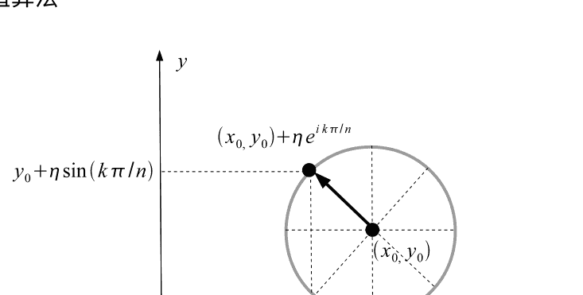

图4.18：圆心为 (x0, y0)半径为 η的圆被分成了n个等分。在每一步中，选择最小值的点，并向该方向迈出一步。

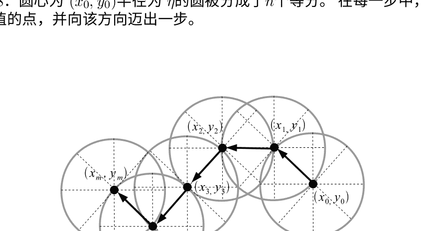

图4.19：最小值的搜索从 (x0, y0)开始，并按照箭头方向进行。在每一步中，选择最小值的点，并向该方向迈出一步。

选择半径为 η，中心为(x1, y1) = (x0^{k0}, y0^{k0})的新圆，并继续之前的步骤。通过这种方式，我们得到了序列(xm, ym)_{m≥0}，这个序列逼近了 f(x, y)的最小值。递归关系被定义为通过 xm = xm^{k_m-1}, ym = ym^{k_m-1} 与

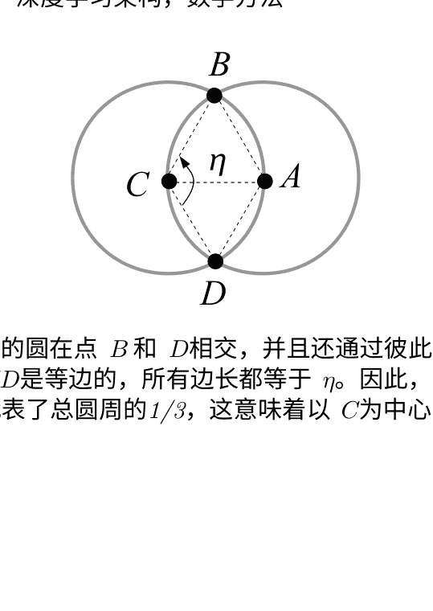

$$
\begin{aligned}
x^k_m & = x_m + \eta \cos \frac{2k\pi}{n} \\
y^k_m & = y_m + \eta \sin \frac{2k\pi}{n}, \quad 0 \le k \le n-1,
\end{aligned}
$$

在哪里 $k_m= \arg \min_k f(x^k_m, y^k_m)$。这意味着点 $(x^k_m, y^k_m)$ 属于以中心 $(x_m, y_m)$ 和半径 $\eta$ 的圆，而 $(x_{m+1}, y_{m+1})$ 大致上是沿着这个圆的最大下降点，见图4.19。在每一步中，它看起来是在 $n$ values 中搜索最小值。这个数字实际上可以减小。假设 $\eta$ 足够小，以至于我们可以假设最小值不在之前的圆内。那么最小值的搜索应该仅应用于下一个圆的外部点，见图4.20。这些点的数量大约是 $2n/3$，因为 $1/3$ 的点属于之前圆的内部。

### 4.14.3 随机球面搜索

当维度较大时，在半径为 $\eta$的球面上构造等距离点是计算上昂贵的。在这种情况下，选择在球面上均匀分布的N个点更加方便。

假设我们有一个光滑函数 $f(x)$，其中 $x \in \mathbb{R}^n$，需要进行最小化。我们从一个初始点开始搜索最小值

通过构造N个均匀分布的点，$x_0, \ldots, x_N$，来进行搜索。在球面$\mathbb{S}(x_0, \eta) = \{x; \|x - x_0\| = \eta\}$上选择 $k^* = \arg \min_{k} f(x^k_0)$，然后考虑新的球体 $\mathbb{S}(x_1, \eta)$ $x_1 = x^k_0$。我们通过在新球体上选择均匀分布的点并迭代该过程来继续进行。球体中心点，$x_m$，形成一个趋向于函数$f$最小点的序列。我们还需要讨论的唯一问题是如何在球体上选择随机点。我们将从二维情况开始，当球体是一个圆时。我们考虑均匀分布的变量$\theta_1, \ldots, \theta_n \sim Unif(0, 2\pi)$。

然后

$(a + \eta \cos \theta_k, b + \eta \sin \theta_k), \quad k = 1, \ldots n$

在以$(a, b)$为中心、半径为$\eta$的圆上均匀分布。在多维情况下的构造类似。考虑均匀分布的随机变量

$\phi_1, \ldots, \phi_{n-2} \sim Unif(0, \pi), \quad \phi_{n-1} \sim Unif(0, 2\pi)$

然后通过在$m$维球面$\mathbb{S}(\mathbf{x}^0, \eta)$上定义$x = (x_1, \ldots, \ldots, \ldots, \ldots, x_n)$

$$
\begin{aligned}
x_1 &= x_1^0 + \eta \cos \phi_1 \\
x_2 &= x_2^0 + \eta \sin \phi_1 \cos \phi_2 \\
x_3 &= x_3^0 + \eta \sin \phi_1 \sin \phi_2 \cos \phi_3 \\
\cdots \\
x_{m-1} &= x_{m-1}^0 + \eta \sin \phi_1 \cdots \sin \phi_{m-2} \cos \phi_{m-1} \\
x_m &= x_m^0 + \eta \sin \phi_1 \cdots \sin \phi_{m-2} \sin \phi_{m-1}.
\end{aligned}
$$

重复该过程，我们可以创建 $n$上述点的实例 $\mathbf{x}$。

作为先前算法的一种变体，我们可以考虑球内均匀分布的点 $\mathbb{B}(x_0, \eta) = \{ x; \|x - x_0\| \leq \eta\}$而不是球 $\mathbb{S}(x_0, \eta)$。

备注 4.14.1想象一下，你必须找到一个藏在房间里的物体。对于每一步所采取的步骤，你会得到“热”或“冷”之一的提示，分别表示你离隐藏的物体更近还是更远。这是一个类似之前描述的随机搜索。指示器“热”对应于使函数值最小化的方向，应该朝着那个方向迈出一步。由于隐藏物体的位置是未知的，步骤是均匀随机的，应该考虑具有最热指示器的步骤。

图4.21：在搜索表面 \(z = f(x)\)的全局最小值时，有几个球被释放以在重力作用下滚动。它们最终会落到它们最初所属的吸引盆地中的局部最小值处。

##### 4.14.4 从局部到全局

大多数搜索算法将产生一个最接近初始搜索点的局部最小值的估计。然而，为了机器学习的目的，我们需要一个全局最小值。为了产生全局最小值，应该同时从几个位置开始最小值搜索。这样，我们将得到几个局部最小值点，其中最低的一个对应于全局最小值。

这种方法假设搜索域是紧凑的，因此可以将其分成有限的分区。在每个分区元素中选择一个初始搜索点，例如在其中心，并在那里开始搜索。如果分区足够小，获得的局部最小值的数量将小于分区的数量。位于局部最小值吸引盆地中的所有初始点将估计该特定局部最小值。最后，我们应该选择最小的那个。

一种想象的方法是让一定数量的球沿着表面 \(z = f(x)\)滚动，参见图4.21。球 \(B_1\)， \(B_2\)和 \(B_3\)属于最小值 \(M_1\)的吸引盆地，并将滚向 \(M_1\)，而球 \(B_4\)， \(B_5\)和 \(B_6\)将滚向最小值 \(M_2\)。虽然只有一个球会找到一个局部最小值，但相对较大数量的球，最初分布得足够稀疏，将找到函数的所有局部最小值。

对这些局部极小点进行最终评估，得到全局最小值。

#### 4.15 连续学习

这是使用梯度下降进行学习的，具有无穷小的学习速率。在应用于成本函数 $f(x)$ 的最小化的梯度下降的经典版本中，学习速率 $\eta > 0$，更新由以下公式给出

$$x(t_{n+1}) = x(t_n) - \eta \nabla f(x(t_n)).$$

我们假设 $t_n = t_0 + n \Delta t$ 是时间的等距实例序列，并且我们考虑学习速率与时间步长成比例，即 $\eta = \lambda \Delta t$，其中 $\lambda > 0$。然后，上述关系可以写成

$$\frac{x(t_n + \Delta t) - x(t_n)}{\Delta t} = -\lambda \nabla f(x(t_n)).$$

取极限 $\Delta t \to 0$ 并将 $t_n$ 替换为 $t$，我们得到微分方程 $x'(t) = -\lambda \nabla f(x(t))$。这对应于连续学习，即以无穷小的学习率 $\eta = \lambda \, dt$ 进行学习。如果初始点为 $x_0$，则连续学习问题是寻找一个可微曲线 $x(t)$ 在 $\mathbb{R}^n$ 中满足以下ODE系统

$$x'(t) = -\lambda \nabla f(x(t)) \quad (4.15.38)$$
$$x(0) = x_0. \quad (4.15.39)$$

实际上，$x(t)$ 是向量场 $V = -\lambda \nabla f(x)$ 的积分曲线，即梯度向量 $V(x(t))$ 是曲线 $x(t)$ 上的速度向量场。

曲线 $x(t)$ 表示成本函数下降速率最低的曲线。如果 $u(t)$ 是另一条曲线，则

$$\frac{d}{dt} f(u(t)) = \langle \nabla f(u(t)), u'(t) \rangle$$

根据柯西不等式

$$- \|\nabla f(u(t))\| \|u'(t)\| \leq \frac{d}{dt} f(u(t)) \leq \|\nabla f(u(t))\| \|u'(t)\|.$$

当左不等式变为恒等式时，获得最低的减少率

$$- \|\nabla f(u(t))\| \|u'(t)\| = \frac{d}{dt} f(u(t))$$

并且当 $u'(t) = -\lambda \nabla f(u(t))$ 时，达到最小值，其中 $\lambda > 0$ 是常数。

如果 $u(0) = x_0$，那么根据线性微分方程组的局部唯一解性质，可以得出对于足够小的参数 $t$，有 $u(t) = x(t)$。在这种情况下，沿着梯度下降曲线 $x(t)$ 的代价函数的变化率为

$$\frac{d}{dt}f(x(t)) = \langle \nabla f(x(t)), x'(t) \rangle = -\frac{1}{\lambda} \|x'(t)\|^2 < 0.$$

那么速度向量的大小越大，成本函数下降得越快。如果最小值 $x^* = \arg \min\limits_x f(x)$ 在 $x^* = \lim\limits_{t \to T} x(t)$，其中 $T \in (0, \infty]$，则 $\nabla f(x^*) = 0$，或者等价地，$\lim\limits_{t \to T} \|x'(t)\| = 0$。

我们将提供一个连续学习的例子，参考例子4.2.7。

### 例子4.15.1

设 $f : \mathbb{R}^n \to \mathbb{R}$ 定义为 $f(x) = \frac{1}{2} \|Ax - b\|^2$，其中 $b \in \mathbb{R}^m$ 且 $A$ 是一个 $m \times n$ 矩阵，其秩为 $n$，$\| \cdot \|$ 表示欧几里德范数。由于

$$f(x) = \frac{1}{2} \|Ax\|^2 - x^T A^T b + \frac{1}{2} \|b\|^2,$$

梯度由 $\nabla f(x) = A^T Ax - A^T b$ 给出。在这种情况下，连续学习系统 (4.15.38)-(4.15.39) 变为

$$\begin{aligned}
x'(t) &= -\lambda A^T Ax(t) + \lambda A^T b \\
x(0) &= x_0.
\end{aligned}$$

通过乘以积分因子 $e^{\lambda A^T At}$，我们将其简化为以下恰当方程

$$\frac{d}{dt}\left(e^{\lambda A^T At}x(t)\right) = e^{\lambda A^T At}\lambda A^T b.$$

将Moore-Penrose伪逆表示为 $x^* = (A^T A)^{-1} A^T b$，参见附录中的第G.2节，我们可以将梯度下降曲线写成

$$x(t) = x^* - e^{-\lambda A^T A t} \left[ x^* - x_0 \right].$$

由于极限 $\lim_{t \to \infty} e^{-\lambda A^T A t} = 0_n$，参见附录中的命题G.2.1，在长期内曲线 $x(t)$ 趋近于Moore-Penrose伪逆，极限 $\lim_{t \to \infty} x(t) = x^*$，这是函数 $f(x) = \frac{1}{2} \|Ax - b\|^2$ 的最小值。

## 4.16 总结

找到给定成本函数的全局最小值是任何机器学习算法的重要组成部分。学习过程与将成本函数变量调整为其最优值的过程相关联。

一些方法是一阶的，即仅涉及一阶导数（如梯度下降、线性搜索、动量法等），这使得它们运行相对较快。其他方法是二阶方法，涉及成本函数的二阶导数或曲率（如Hessian方法、Newton方法等）。其他方法具有拓扑或随机的特点。最著名的方法是梯度下降。最小值在函数的最陡下降方向中搜索，这由梯度的负方向指示。该方法易于实现，但对于具有多个局部最小值或具有高原的非凸函数存在困难。该方法已经在许多方面得到改进。为了避免陷入局部最小值或超过最小值，发展了动量法（及其变种）。

线搜索算法寻找沿着法线的最小值级曲面，并实现可调节的速率。

从梯度下降法派生出的几种自适应优化技术，如AdaGrad、Adam、AdaMax和RMSProp，被提出。它们共享的特点是通过指数移动平均值来近似计算矩。

Hessian方法和Newton方法涉及计算成本函数的二阶近似。即使在理论上它们提供了良好的解决方案，但计算成本很高。

模拟退火是一种用于计算最小值的概率方法，这些最小值被解释为热力学系统的内能。增加系统的热参数，然后缓慢冷却使系统达到最低能量水平。

随机搜索提出了一种驱动搜索离开高原的算法。这涉及沿着随机过程寻找最小值而不是确定性路径。这种方法也是计算成本很高的，因为它涉及计算成本函数的Hessian矩阵的逆。

邻域搜索是一种拓扑性质的最小搜索。最小值在以当前搜索中心为中心的球面上均匀搜索。

所有上述搜索方法都产生局部最小值。为了找到全局最小值，必须采用某些方法。其中一种适用于紧致域的情况。在这种情况下，域被划分为有限的分区，并在每个分区集合上搜索最小值。最低的最小值逼近全局最小值。

#### 4.17 练习

- **练习 4.17.1** 设 $f(x_1, x_2) = e^{x_1} \sin x_2$, 其中 $(x_1, x_2) \in (0,1) \times (0, \pi/2)$。
  - (a) 证明 $f$ 是一个调和函数;
  - (b) 求 $\|\nabla f\|$;
  - (c) 证明方程 $\nabla f = 0$ 没有任何解;
  - (d) 寻找函数 $f$ 的最大值和最小值.

- **练习 4.17.2** 考虑二次函数 $Q(x) = \frac{1}{2} x^T A x - b x$, 其中 $A$ 是一个非奇异的方阵，阶数为 $n$。
  - (a) 寻找梯度 $\nabla Q$;
  - (b) 写出梯度下降迭代公式;
  - (c) 寻找海森矩阵 $H_Q$;
  - (d) 写出牛顿法迭代公式并计算其极限.

- **练习 4.17.3** 设 $A$ 是一个非奇异的方阵，阶数为 $n$，$b \in \mathbb{R}^n$ 是给定的向量。考虑线性方程组 $Ax = b$。可以通过以下步骤近似求解该方程组:
  - (a) 定义代价函数 $C(x) = \frac{1}{2} \|Ax - b\|^2$。求出其梯度 $\nabla C(x)$, 以及海森矩阵 $H_C(x)$;
  - (b) 写出收敛于系统解 $x$ 的梯度下降算法迭代，初始值为 $x^0 = 0$;
  - (c) 写出收敛于系统解 $x$ 的牛顿迭代，初始值为 $x^0 = 0$.

- **练习 4.17.4**
  - (a) 设 $(a_n)_n$ 是满足不等式的序列，其中 $a_0 > 0$
  $a_{n+1} \leq \mu a_n + K, \forall n \geq 1,$
  其中 $0<\mu<1$ 且 $K>0$。证明序列 $(a_n)_n$ 从上方有界。
  - (b) 考虑动量法方程(4.4.16)-(4.4.17)，并假设函数 $f$ 的梯度有界，$\|\nabla f(x)\| \le M$。证明速度序列 $(v^n)_n$ 有界。

- **练习 4.17.5**
  - (a) 让 $f$ 和 $g$ 是两个可积函数。验证
  $$\int (f * g)(x) \, dx = \int f(x) \, dx \int g(x) \, dx;$$
  - (b) 证明 $\|f * g\|_1 \le \|f\|_1 \|g\|_1$;
  - (c) 让 $f_\sigma = f * G_\sigma$, 其中 $G_\sigma(x) = \frac{1}{\sqrt{2\pi}\sigma} e^{-\frac{x^2}{2\sigma^2}}$。证明对于任意 $\sigma > 0$, 有 $\|f_\sigma \|_1 \le \|f\|_1$。

- **练习 4.17.6** 证明两个高斯函数的卷积也是一个高斯函数:
  $$G_{\sigma_1} * G_{\sigma_2} = G_{\sigma},$$
  其中 $ \sigma = \sqrt{\sigma_1^2 + \sigma_2^2} $。

- **练习 4.17.7** 证明如果有 $n$ 个数的和等于 $s$，则它们的平方和 $ \sum_{j=1}^{n} \sigma_j^2 $ 最小的情况发生在所有数都等于 $s/n$。
  $$\sigma_1 + \dots + \sigma_n = s,$$
  那么它们的平方和 $ \sum_{j=1}^{n} \sigma_j^2 $，最小的情况发生在所有数都等于 $s/n$。

## 第5章 抽象神经元

抽象神经元是任何神经网络的基本单元。它是一个模拟生物神经元的单元，包括输入（传入信号），权重（突触权重）和激活函数（神经元发射模型）。
本章介绍了最常见的神经元类型（感知器、sigmoid神经元等）并研究了它们的特性。

### 5.1 定义和性质

根据第1章中的示例，考虑以下定义来形式化我们之前发展的直觉：

> 定义5.1.1 抽象神经元是一个四元组 $\left( \mathbf{x}, \mathbf{w}, \varphi, y \right)$，其中 $\mathbf{x}^{T} = \left( x_{0}, x_{1}, \ldots, x_{n} \right)$ 是输入向量， $\mathbf{w}^{T} = \left( w_{0}, w_{1}, \ldots, w_{n} \right)$ 是权重向量，其中 $x_{0} = -1$ 和 $w_{0} = b$，偏置，而 $\varphi$ 是激活函数，定义了输出函数 $y = \varphi \left( \mathbf{x}^{T} \mathbf{w} \right) = \varphi \left( \sum_{i = 1}^{n} w_{i} x_{i} \right)$。

抽象神经元学习所需的目标变量 $z$ 的方法是通过调整权重向量 $\mathbf{w}$ 来使得衡量期望变量 $z$ 和输出 $y$ 之间误差的某个函数最小化。第3章介绍了几种可能的误差函数，第4章介绍了它们的最小化算法。

图5.1中表示了抽象神经元。计算单元分为两部分：第一部分包含求和符号 $\Sigma$，表示输入与给定权重的求和，第二部分包含通用激活函数 $\varphi$，用于定义输出 $y$。

值得注意的是，阈值 $b$ 被包含在权重系统中作为偏置项， $w_0 = b$，带有常数输入 $x_0 = -1$。等价地，我们也可以考虑偏置 $w_0 = -b$ 和相应的输入 $x_0= 1$。在任何情况下，内积的表达式为

$$\mathbf{x}^T \mathbf{w} = \mathbf{w}^T \mathbf{x} = w_1 x_1 + \cdots + w_n x_n - b$$

向量 $\mathbf{w}^T = (w_0, \ldots, w_n)$ 和向量 $\mathbf{x}^T = (x_0, \ldots, x_n)$ 是扩展的权重和扩展的输入向量。输出函数 $y = f(\mathbf{x}) = \varphi(\mathbf{w}^T \mathbf{x})$ 有时被称为给定计算单元的原始函数。

- 如果 $x_i \in \{0,1\}$ 对于 $i=1,n$，则为二进制;
- 如果 $x_i \in \{-1,1\}$ 对于 $i=1,n$，则为有符号数;
- 如果 $x_i \in \{0,1,2,3,4,5,6,7,8,9\}$ 对于 $i=1,n$，则为数字;
- 如果 $x_i \in (-\infty, \infty)$ 对于 $i=1,n$，则为任意实数;
- 如果 $x_i \in [0,1]$，则实数的区间 $i=1,n$。

例如，任何手写数字都可以转换为二进制数据，参见图5.2。$4\times4$ 矩阵按行读取，并放入长度为16的0和1序列中。如果像素激活超过50%，则分配值为1。否则，分配值为0。以这种方式编码字符相当简单，一些关于局部形状的信息在过程中丢失。然而，使用卷积编码图形有更好的方法。

一般来说，在灰度图像的情况下，每个像素的激活值是介于0和1之间的数字（完全黑色激活为1，无激活或白色为0）。

输入效率假设想要实现一个神经元电路。可以问的一个问题是哪种类型的输入更有效率？同样地，从电路实现成本的角度来看，有多少个切换状态能够优化传输的信息？

为了回答这个问题，让 $\beta$ 表示输入信号状态的数量，例如，对于二进制信号， $\beta=2$。通道或输入的数量由 $n$ 给出。实现成本 $F$ 被假设与 $n$ 和 $\beta$ 成正比，即 $F= cn\beta$，其中 $c>0$ 是一个比例常数。使用 $n$ 个通道和 $\beta$ 个状态，可以表示 $\beta^n$ 个数字。现在我们假设成本 $F$ 是固定的，并尝试优化传输数字的数量作为 $\beta$ 的函数。考虑常数 $k=F/c$。那么 $n=F/(c\beta) = k/\beta$。因此 $f(\beta)=\beta^{(k/\beta)}$ 可以表示为，对于给定的 $\beta>0$。这个函数在与其对数相同的点达到最大值， $g(\beta)=\ln f(\beta)= (k/\beta) \ln \beta$。由于其导数是 $g'(\beta)= (k/\beta^2)(1-\ln\beta)$，因此最大值在 $\beta=e\approx2.718$ 时达到。取最接近的整数值，可以得出 $\beta=3$ 是输入信号的最佳状态数。然而，本书涉及的是具有任意其他输入状态数的神经元模型的理论。

接下来，我们将介绍几种经典的神经元类型，指定它们的输入类型和激活函数。

#### 5.2 感知器模型

感知器是一个输入为零或一的神经元，即 $x_i \in \{0, 1\}$，并且激活函数由海维赛德函数给出

$$\varphi(x) = \begin{cases} 0, & \text{if } x < 0 \\ 1, & \text{if } x \geq 0 \end{cases}$$

> *这是长度为 $n$ 且元素来自给定 $\beta$ 状态的序列数量。通过序列我们理解一个函数 $h: \{1, \dots, n\} \to \{1, \dots, \beta\}$*

感知器的输出是一个阈值门

$$y = \varphi(x^T w - b) = \begin{cases} 0, & \text{if } \sum_{i=1}^n w_i x_i < b \\ 1, & \text{如果 } \sum_{i=1}^n w_i x_i \geq b \end{cases}$$

这样，感知器是一种通过加权输入提供的证据来做出决策的规则。阈值 $b$ 是衡量感知器输出为1的容易程度的指标。对于一般目的，这被视为另一个权重，用 $w_0$ 表示，称为偏置。

接下来，我们将讨论感知器的几何解释。

现在考虑一个在 $\mathbb{R}^n$ 中定义的 $(n-1)$ 维超平面。

$$\mathcal{H} = \{(x_1, \ldots, x_n); \sum_{i=1}^{n} w_i x_i = b\}.$$

它的法向量 $N$ 用权重表示为

$$N^T = (w_1, \ldots, w_n),$$

其中 $^T$ 表示转置向量，如常。超平面通过一个点 $\mathbf{p}$，该点与偏置之间有关系 $b = \mathbf{p}^T w$。然后，感知器的输出 $y$ 将一个半空间与超平面 $\mathcal{H}$ 相关联，并将另一个半空间和 $\mathcal{H}$ 相关联。对于两个输入的情况， $n=2$，请参见图5.3。粗略地说，给定两个国家之间的线性边界，感知器可以决定所选点是否属于其中一个国家。

感知器可以实现逻辑门与（“$\land$”）和或（“$\lor$”）如下所示。这个特性使感知器在逻辑计算中很重要。

实现与。考虑由下表定义的布尔运算：

| $x_1$ | $x_2$ | $y = x_1 \land x_2$ |
| :---: | :---: | :---: |
| 0 | 0 | 0 |
| 0 | 1 | 0 |
| 1 | 0 | 0 |
| 1 | 1 | 1 |

相同的输出函数， $y = x_1 \land x_2$，可以由具有两个输入 $x_1$， $x_2 \in \{0, 1\}$，权重 $w_1 = w_2 = 1$，偏置 $b = -1.5$，和 $x_0 = -1$ 的感知器实现，见图5.4 a。我们有

$$y = \varphi(x_1 + x_2 - 1.5) = \begin{cases} 0, & \text{if } x_1 + x_2 < 1.5 \\ 1, & \text{if } x_1 + x_2 \geq 1.5 \end{cases}$$

图5.3: a.平面的分割。 b.具有两个输入的感知器的激活函数图形，$x_1$和$x_2$。

条件 $\{x_1 + x_2 \geq 1.5\}$仅在 $x_1 = x_2=1$时满足，而第二个条件 $\{x_1 + x_2 < 1.5\}$对于其他组合都成立。 由此可知，这个特定的感知器具有与前一个表格给出的相同的输出函数。

根据前一个感知器的几何解释，线性方程$x_1+x_2=1.5$将输入数据 $\{(0,0), (0,1), (1,0), (1,1)\}$分为两个类别，将值1与半平面 $\{x_1 +x_2 \geq 1.5\}$关联，将值0与开放半平面 $\{x_1 +x_2 < 1.5\}$关联，参见图5.5 a。实现 $OR$。这个布尔运算由下表定义:

| $x_1$ | $x_2$ | $y = x_1 \lor x_2$ |
| :---: | :---: | :-----------------: |
| 0     | 0     | 0                   |
| 0     | 1     | 1                   |
| 1     | 0     | 1                   |
| 1     | 1     | 1                   |

输出函数，$y = x_1 \lor x_2$，由具有两个输入 $x_1$, $x_2\in \{0,1\}$，权重 $w_1 = w_2=1$，偏置 $b = -0.5$，和 $x_0 = -1$生成，见图5.4 b。输出写作

$$y = \varphi(x_1 + x_2 - 0.5) = \begin{cases} 0, & \text{if } x_1 + x_2 < 0.5 \\ 1, & \text{if } x_1 + x_2 \geq 0.5 \end{cases}$$

结论是基于观察到条件 $\{x_1 + x_2 < 0.5\}$仅在 $x_1 = x_2=0$时满足。

图5.5 b表示输入数据的分割 $\{(0, 0), (0, 1), (1, 0), (1, 1)\}$成两个类别：第一个类别是阴影半平面的数据 $\{x_1 + x_2 \geq 0.5\}$而另一个类别是开放半平面的数据 $\{x_1 + x_2 < 0.5\}$。数值1关联到第一个类别，而数值0关联到第二个类别。

图5.4:使用感知器实现布尔函数: a.输出函数 AND. b.输出函数 OR。

图5.5:使用感知器进行分区；阴影半平面关联数值 1. a.输出函数 AND. b.输出函数 OR。

然而，感知器无法实现所有逻辑函数。例如，它无法实现异或（exclusive OR）函数，该操作由下表定义：

| x1 | x2 | y |
|---|---|---|
| 0 | 0 | 0 |
| 0 | 1 | 1 |
| 1 | 0 | 1 |
| 1 | 1 | 0 |

感知器无法实现异或函数的原因是在图5.6中没有一条线可以将符号 ○0和 ○ 1分开。这可以通过几种方式来证明。

(a) 一个证明是由平面的分离性质推导出来的。如果假设存在一条分离线，则平面被该线分为两个半平面 H_1和 H_2，它们是凸集²，参见图5.6 b。由于两个 ○1符号都属于 H_1，根据凸性，连接它们的线段完全包含在 H_1中。类似地，连接两个 ○0符号的线段包含在 H_1中。由于H_1和 H_2没有任何共同点（因为它们构成了平面的一个划分），连接两个 ○1符号和两个 ○0符号的线段是不相交的。然而，从图5.6 a可以看出，这两个线段相交，就像一个正方形的对角线一样。这导致了一个矛盾，表明所假设的是错误的，因此不存在分离线。

(b) 第二个证明变体基于代数原因。假设存在形式为 w_1x_1 + w_2x_2 = b的分隔线，将点{(0,0),(1,1)}与点 {(0,1),(1,0)}分开。考虑一种选择，我们从测试第一对点得出结论，0 < b且 w_1 + w_2 < b，对于第二对点，w_1 > b, w_2 > b。最后两个不等式的和与第二个不等式一起暗示了矛盾的不等式2b < b，因为b是正数。

在[87]中指出了一个感知器无法学习XOR函数的事实。 我们将在备注6.1.2中看到，一个由两个感知器组成的神经网络可以成功学习这个布尔函数。

下一段将详细介绍感知器作为线性分类器。

2如果集合中的任意两点都属于该集合，则连接这两点的线段也属于该集合。

聚类分裂。受到将输入数据分成类别的先前应用的启发，我们将其扩展到一个更一般的两类聚类问题。现在允许输入数据取值在[0,1]的区间内，并且为简单起见假设 $n=2$。然后每个数据都是一对实数，可以表示为单位正方形中的一个点。现在假设我们为每个点关联一个双值标签或特征，标签可以是“组1”（或红色、星形等）和“组2”（或蓝色、圆形等）。引发的问题是：

感知器能否决定一个点属于哪个组？
答案取决于数据分布。如果数据可以通过一条线分开，使得一个组包含在一个半平面中，另一个组包含在另一个半平面中（即，组之间被一条线分隔），那么在权重适当调整后，感知器可能最终能够决定哪个组与哪个标签相关联。为了做到这一点，我们引入函数
$$
z(x_1, x_2) = \begin{cases} 0, & \text{if } (x_1, x_2) \in \mathcal{G}_1 \\ 1, & \text{if } (x_1, x_2) \in \mathcal{G}_2, \end{cases}
$$
其中符号 $\mathcal{G}_1$ 和 $\mathcal{G}_2$ 分别代表“组1”和“组2”。
如果我们能够找到两个权重 $w_1, w_2$ 和一个偏置 $b$，使得线性方程 $w_1x_1 + w_2x_2 - b = 0$ 能够将组 $\mathcal{G}_1$ 和 $\mathcal{G}_2$ 分开，那么感知器就可以在这两个组之间做出决策。如果这是可能的，那么输出函数
$$
y = \varphi(w_1x_1 + w_2x_2 - b)
$$
具有与上述函数 $z$ 相同的表达式。关于感知器学习算法的更多细节将在后面的章节中提供。

图5.7:感知器对男性和女性群体进行分类. 直线 $x_2 = -5x_1 + 115$ 是特征空间 $\{ x_1, x_2 \}$ 中的决策边界，分隔两个线性可分的簇.

例5.2.1考虑输入 $x= (x_1, x_2)$，其中 $x_1$ 表示鞋码， $x_2$ 表示某个给定人群的身高（以英寸为单位）。
我们通过考虑映射$(x_1, x_2) \rightarrow \ell \in \{男人, 女人\}$ 为每个个体关联一个标签. 给定一个特征对$(x_1, x_2)$，如果存在一个分隔线， $w_1x_1 + w_2x_2 = b$，能够区分这是男性还是女性.

从密歇根大学新生群体收集的数据在图5.7中显示的散点图中。我们注意到女性群体与男性群体是线性可分的，并且分离线由 $x_2 = -5x_1 + 115$ 给出。
因此，对于具有鞋码 $s$ 和身高 $h$ 的个体，感知器将根据$h > -5s + 115$ 将其分类为“男性”，否则分类为“女性”。

这个问题可以用神经元的方式来表达，有几种方法，如下所示。

- (i) 首先，我们将为数据点关联数字标签。 我们将与男性对应的点标记为 $z= 1$，与女性对应的点标记为 $z = -1$。 考虑一个输入为 $x= (x_1, x_2)$、权重为 $w_1$、$w_2$和偏置为b的神经元，具有阶跃激活函数。
$$S(u) = \begin{cases} 1, & \text{如果} u \geq 0 \\ -1, & \text{如果} u < 0. \end{cases}$$
神经元的输出是函数 $y = S(w_1 x_1 + w_2 x_2 - b)$，参见图5.8 a。如果$(x_1, x_2)$对应于一个男性，则$w_1 x_1 + w_2 x_2 - b > 0$，因此输出为$y=1$。如果$(x_1, x_2)$对应于一个女性，则$w_1 x_1 + w_2 x_2 - b < 0$，然后输出为$y = -1$。分隔线的参数通过最小化结果和标签向量之间的距离获得，如下所示
$$(w_1^*, w_2^*, b^*) = \arg \min_{w_i, b} \| y - z \|^2,$$
其中$\| y - z \|^2 = \sum_{x\sim\text{数据}} \big(y(x) - z(x)\big)^2$，其中$z(x)$和$y(x)$分别是数据点的标签和输出。可以使用梯度下降法来最小化这个距离。

- (ii) 在这种情况下，我们将使用one-hot向量来标记数据。我们将向男性关联向量$(1,0)$，向女性关联向量$(0,1)$。我们考虑一个具有输入$x = (x_1, x_2)$和两个带有softmax激活函数的输出神经元的神经网络。
$$(y_1, y_2) = \text{softmax}(u_1, u_2) = \left(\frac{e^{u_1}}{e^{u_1} + e^{u_2}}, \frac{e^{u_2}}{e^{u_1} + e^{u_2}}\right),$$
见图5.8 b. 在这里，输入信号被收集为
$$u_1 = w_{11} x_1 + w_{21} x_2 - b_1$$
$$u_2 = w_{12} x_1 + w_{22} x_2 - b_2.$$
在这种情况下，需要最小化的成本函数是
$$\sum_{x\sim\text{数据}} \left( \| \text{预测值}_1(\text{输入}) - \text{真实值}_1(\text{输入}) \|^2 + \| \text{预测值}_2(\text{输入}) - \text{真实值}_2(\text{输入}) \|^2 \right).$$

# 5.3 S型神经元

我们已经看到感知器作为一个提供两个决策状态的设备，0和1，没有中间值。如果神经元能够接受区间$(0,1)$中的所有状态，情况将会改善；这样，接近1的输出对应于更有可能发生的决策，而接近0的输出表示发生几率较小的决策。在这种情况下，神经元的输出作为采取某个加权决策的可能性。

一个Sigmoid神经元是一个具有输入 x=(x1, ..., xn)的计算单元，并且具有由逻辑函数给出的激活函数
$$\sigma(z) = \frac{1}{1 + e^{-z}} \quad (5.3.1)$$
向量 w^T=(w1, ..., wn)表示权重，b是神经元的偏置。Sigmoid神经元的输出是一个在(0,1)范围内的数字，由以下公式给出
$$y = \sigma(\mathbf{w}^T \mathbf{x} - b) = \frac{1}{1 + e^{-\mathbf{w}^T \mathbf{x} + b}}$$
如果将激活函数视为缩放的逻辑函数
$$\sigma_c(z) = \frac{1}{1 + e^{-cz}}, \quad c > 0$$
那么当c的值很大时，Sigmoid神经元的输出趋近于感知器的输出。

这种类型的神经元有两个优点：(i) 它近似于感知器；(ii) 输出函数对权重连续，即权重和阈值的微小变化对应输出的微小变化；而感知器不具备这种特性，其输出具有跳跃不连续性。这种连续性特性在后面的学习算法中非常重要。

值得注意的是权重 wi 与输入 xi 和输出 y 之间的关系。为此，我们将使用逻辑函数的反函数公式，$\sigma^{-1}(x) = \ln(\frac{x}{1-x})$。然后输出方程 $y = \sigma(\mathbf{w}^T \mathbf{x} - b)$ 变为 $\ln(\frac{y}{1-y}) = \mathbf{w}^T \mathbf{x} - b$ 现在，我们在两个不同的输入值上评估表达式，$x_i^* = x_i$ 和 $x_i^* = x_i + 1$:
$$\ln\left(\frac{y}{1-y}\bigg|x_i = x_i^*\right) = w_1 x_1 + \cdots + w_i x_i^* + \cdots + w_n x_n - b$$
$$\ln\left(\frac{y}{1-y}\bigg|x_i = x_i^* + 1\right) = w_1 x_1 + \cdots + w_i (x_i^* + 1) + \cdots + w_n x_n - b$$
通过减法，并利用对数函数的性质，得到
$$w_i = \ln\left( \frac{\frac{y}{1-y}\big|x_i = x_i^* + 1}{\frac{y}{1-y}\big|x_i = x_i^*} \right), \quad (5.3.2)$$
这是一个与值无关的表达式 $x_i^*$。只要 $i$输入增加1个单位，公式 (5.3.2) 就提供了神经元的 $i$权重的表达式，以输出 $y$为基础。在统计学中，表达式 $\frac{y}{1-y}$被用作赔率的名称。这样，权重 $w_i$可以用两个赔率的商来表示。

可以通过考虑其他S型函数给出的激活函数来获得不同类型的S型神经元，例如：双曲正切、反正切函数、softsign等。它们之间唯一的区别是饱和速度不同。然而，从数学的角度来看，它们将以类似的方式处理。S型神经元输出的微小变化，$y = \varphi(\mathbf{w}^T \mathbf{x} - b)$, 使用激活函数 $\varphi$, 关于权重和偏差的变化由微分给出。
$$\begin{aligned} dy &= \sum_{i=1}^n \frac{\partial y}{\partial w_i} dw_i + \frac{\partial y}{\partial b} db \\ &= \sum_{i=1}^n \varphi'(\mathbf{w}^T \mathbf{x} - b) x_i dw_i + \varphi'(\mathbf{w}^T \mathbf{x} - b) (-1) db \\ &= \varphi'(\mathbf{w}^T \mathbf{x} - b) \left( \sum_{i=1}^n x_i dw_i - db \right). \end{aligned}$$
我们注意到 $dy$的变化与 $\varphi$的导数成正比。速率 $\varphi'$取决于选择的S型函数，并且在某些情况下可以很容易地计算。例如，如果 $\varphi(z) = \sigma(z)$是逻辑函数，则
$$dy = \sigma(\mathbf{w}^T \mathbf{x} - b)(1 - \sigma(\mathbf{w}^T \mathbf{x} - b)) \left( \sum_{i=1}^n x_i dw_i - db \right).$$
在 $\varphi(z) = \tanh(z)$是双曲正切函数的情况下，我们有
$$dy = (1 - \tanh^2(\mathbf{w}^T \mathbf{x} - b)) \left( \sum_{i=1}^n x_i dw_i - db \right).$$

计算输出的梯度时，前面的微分很有用
$$\nabla y = (\nabla_{\mathbf{w}} y, \partial_b y) = (\mathbf{x}\varphi'(\mathbf{w}^T \mathbf{x} - b), -\varphi'(\mathbf{w}^T \mathbf{x} - b)) = \varphi'(\mathbf{w}^T \mathbf{x} - b)(\mathbf{x}, -1).$$
这表明梯度输出 $\nabla y$与扩展输入向量$(\mathbf{x}, -1)$成比例，比例因子是 $\varphi$的导数。

这在后面的反向传播算法中将会很有用。

#### 5.4 逻辑回归

在本节中，我们将介绍使用逻辑回归学习的S型神经元的两个应用。第一个例子涉及到预测公司违约的概率，第二个例子涉及到二进制聚类。

# 5.4.1 公司违约概率

我们有兴趣预测在给定时间段[0, T]内公司违约的概率，使用一个S型神经元。假设神经元的输入 $\mathbf{x}$是一个包含有关公司的一些信息的向量，例如：现金储备、收入、成本、劳动费用等。训练集由 $n$对 $(\mathbf{x}_i, z_i)$组成，其中 $\mathbf{x}_i$是之前的输入， $z_i \in \{-1, 1\}$。值 $z_i = 1$表示第 $i$个公司在[0, T]期间违约；值$z_i = -1$表示第 $i$个公司在[0, T]期间没有违约。测量值$(\mathbf{x}_i, z_i)_{1\leq i\leq n}$经验上表示一对随机变量
$(X, Z)$, 其中 $Z$取值 $\pm1$， $X$是一个 $m$维随机向量。

条件概率 $P(Z|X)$ 由表格给出
| $z$ | -1 | 1 |
|---|---|---|
| $P(z|x)$ | $1 - h(x)$ | $h(x)$ |

对于某个正函数 $h : R^m \to [0,1]$, 其中 $m$是输入 $X$的维度。选择 $h(x)$ 的一种方便的方法是使用sigmoid函数
$$h(x) = \sigma(\mathbf{w}^T \mathbf{x}).$$
内积 $\mathbf{w}^T \mathbf{x}$是输入的加权和，可以解释为公司与输入 $\mathbf{x}$的“默认分数”。高（正）分数$\mathbf{w}^T \mathbf{x}$意味着 $\sigma(\mathbf{w}^T \mathbf{x})$ 接近1，可以解释为违约的高概率，前提是将 $\sigma(\mathbf{w}^T \mathbf{x})$ 视为概率。

在另一方面，一个低（负）分数 $\mathbf{w}^T \mathbf{x}$意味着一个接近0的 $\sigma(\mathbf{w}^T \mathbf{x})$，可以解释为违约的低概率。这两种情况可以通过将违约概率写成一个公式来概括。这可以如下所示。当$z=1$时，我们恢复了上述公式，$h(x)=\sigma(\mathbf{w}^T\mathbf{x})$，当$z=-1$时，利用Sigmoid函数的性质，$\sigma(-x)=1-\sigma(x)$，我们有
$$\sigma(z\mathbf{w}^T\mathbf{x}) = \sigma(-\mathbf{w}^T\mathbf{x}) = 1 - \sigma(\mathbf{w}^T\mathbf{x}) = 1 - h(x)$$
因此，前面的表格可以等价地写成
| $z$     | -1             | 1            |
|-------|----------------|--------------|
| $P(z|x)| $\sigma(-\mathbf{w}^T \mathbf{x})$      | $\sigma(\mathbf{w}^T \mathbf{x})$     |

概率分布现在取决于参数$\mathbf{w}$，并且我们将其视为“模型分布”，由神经元产生。下一步是找到权重$\mathbf{w}$，使得模型分布以“最佳方式”近似训练数据$\{(\mathbf{x}_i, z_i)\}$，$1\leq i\leq n$。这将通过选择$\mathbf{w}$来实现，使得$z_i$在$y_i$的附近的可能性最大化。假设训练测量是独立的，我们有
$$
\begin{aligned}
\mathbf{w}^* &= \arg \max_{\mathbf{w}} P(z_1, \ldots, z_n | \mathbf{x}_1, \ldots, \mathbf{x}_n) \\
&= \arg \max_{\mathbf{w}} \prod_{i=1}^n P(z_i | \mathbf{x}_i) = \arg \max_{\mathbf{w}} \ln \left( \prod_{i=1}^n P(z_i | \mathbf{x}_i) \right) \\
&= \arg \max_{\mathbf{w}} \sum_{i=1}^n \ln P(z_i | \mathbf{x}_i) = \arg \min_{\mathbf{w}} \left( - \sum_{i=1}^n \ln P(z_i | \mathbf{x}_i) \right) \\
&= \arg \min_{\mathbf{w}} \left( - \frac{1}{n} \sum_{i=1}^n \ln P(z_i | \mathbf{x}_i) \right) = \arg \min_{\mathbf{w}} \mathbb{E}^{p_X} \left[ - \ln P(Z|X) \right],
\end{aligned}
$$
我们使用对数函数的性质和一个事实，即一个因子不会影响最优解，以及符号的改变会将最大值变为最小值。涉及到对于$X$的期望的最终表达式是经验概率$p_X$与条件概率$P(Z|X)$的交叉熵。可以使用先前的概率公式和sigmoid函数的表达式(5.3.1)来明确计算交叉熵的表达式，如下所示
$$\mathbb{E}^{p_X} \left[ - \ln P(Z|X) \right] = - \frac{1}{n} \sum_{i=1}^n \ln P(z_i | \mathbf{x}_i) = - \frac{1}{n} \sum_{i=1}^n \ln \sigma(z_i \mathbf{w}^T \mathbf{x}_i) = - \frac{1}{n} \sum_{i=1}^n \ln \frac{1}{1 + e^{-z_i \mathbf{w}^T \mathbf{x}_i}} = \frac{1}{n} \sum_{i=1}^n \ln(1 + e^{-z_i \mathbf{w}^T \mathbf{x}_i}).$$

最优权重由以下给出

$$\mathbf{w}^* = \arg \min_{\mathbf{w}} \left( \frac{1}{n} \sum_{i=1}^{n} \ln(1 + e^{-z_i \mathbf{w}^T \mathbf{x}_i}) \right)$$

这可以使用softplus函数表示为

$$\mathbf{w}^* = \arg \min_{\mathbf{w}} \left( \frac{1}{n} \sum_{i=1}^{n} sp(-z_i \mathbf{w}^T \mathbf{x}_i) \right)$$

或者等价地表示为

$$\mathbf{w}^* = \arg \min_{\mathbf{w}} \left( \frac{1}{n} \sum_{i=1}^{n} sp(z_i \mathbf{w}^T \mathbf{x}_i) - \frac{1}{n} \sum_{i=1}^{n} z_i \mathbf{w}^T \mathbf{x}_i \right)$$

其中我们使用了 $sp(-x) = sp(x) - x$。

梯度下降在这种情况下，没有闭合解来求解最优权重 $\mathbf{w}^*$。我们将使用梯度下降法来逼近值 $\mathbf{w}^*$的序列 $\mathbf{w}^{(j)}$。先前交叉熵误差的梯度

$$F(\mathbf{\omega}) = \frac{1}{n} \sum_{i=1}^{n} \ln(1 + e^{-z_i \mathbf{w}^T \mathbf{x}_i})$$

由给定

$$\begin{aligned} \nabla_{\mathbf{\omega}} F &= - \frac{1}{n} \sum_{i=1}^{n} \frac{z_i \mathbf{x}_i e^{-z_i \mathbf{\omega}^T \mathbf{x}_i}}{1 + e^{-z_i \mathbf{w}^T \mathbf{x}_i}} = - \frac{1}{n} \sum_{i=1}^{n} \frac{z_i \mathbf{x}_i}{1 + e^{z_i \mathbf{\omega}^T \mathbf{x}_i}} \\ &= \frac{1}{n} \sum_{i=1}^{n} z_i \mathbf{x}_i \sigma(-z_i \mathbf{\omega}^T \mathbf{x}_i) \\ &= \frac{1}{n} \sum_{i=1}^{n} z_i \mathbf{x}_i \sigma(z_i \mathbf{\omega}^T \mathbf{x}_i) - \frac{1}{n} \sum_{i=1}^{n} z_i \mathbf{x}_i. \end{aligned}$$

注意最后一项是随机变量 $X$和 $Z$的经验期望的乘积，即$\mathbb{E} - \sum$第一项是带权重的条目之和 $(\mathbf{x}_i, z_i)$，权重为 $\rho_i = \sigma(z_i \mathbf{\omega}^T \mathbf{x}_i) \in (0,1)$。

总之，给定初始权重初始化$\mathbf{\omega}^{(0)}$，逼近误差函数$F(\mathbf{\omega})$ 最小参数$\mathbf{\omega}^*$的近似序列由

$$\mathbf{w}^{(j+1)} = \mathbf{w}^{(j)} - \eta \nabla_{\mathbf{w}} F(\mathbf{w}^{(j)}) = \mathbf{w}^{(j)} - \frac{\eta}{n} \sum_{i=1}^{n} z_i \mathbf{x}_i \sigma(-z_i \mathbf{w}^{(j)T} \mathbf{x}_i),$$

其中\(\eta>0\)是学习率。 我们如何在实践中应用这个技术？ 假设我们有训练集 \(\{(\mathbf{x}_i, z_i)\}_{i\leq n}\)，并 考虑一个给定的输入 \(\mathbf{x}\) 描述某公司参数，我们希望评估其违约概率。 那么所需的概率由 \(h(\mathbf{x}) = \sigma(\mathbf{w}^{*T} \mathbf{x})\) 给出，其中 \(\mathbf{w}^* = \lim_{j\to\infty} \mathbf{w}^{(j)}\)。

### 5.4.2 二进制分类器

本节介绍了作为二进制分类器的sigmoid神经元。这意味着sigmoid神经元被训练用于区分平面上的两个不同的聚类，学习算法是逻辑回归。

假设我们在平面上有两组点：黑色和白色。我们希望将这些点分成两组：黑色点聚类，表示为\(\mathcal{G}_1\)和白色点聚类，表示为\(\mathcal{G}_2\)。如果 \(\mathbf{x} = (x_1, x_2)\) 表示平面上的一个点的坐标，考虑以下决策函数给出的目标： \(z(x_1, x_2) = \begin{cases} 1, & \text{如果 } \mathbf{x} \in \mathcal{G}_1 \\ -1, & \text{如果 } \mathbf{x} \in \mathcal{G}_2, \end{cases}\) 即每个黑点与标签1相关联，而每个白点与标签-1相关联。假设平面上有一条决策线，由 \(w_1x_1 + w_2x_2 - b = 0\) 给出，它试图将点分成簇 \(\mathcal{G}_1\) 和 \(\mathcal{G}_2\)；假设 \(\mathcal{G}_1\) 在决策线上方， \(\mathcal{G}_2\) 在决策线下方，参见图5.9。任务是调整参数\(w_1\)， \(w_2\) 和 \(b\)，使上述线表示数据分成相同颜色的簇的“最佳”分割。

考虑将平面划分为与决策线平行的线

$$ \{ w_1 x_1 + w_2 x_2 - b = c; c \in \mathbb{R} \} $$

参见图5.9。具有正值的 c对应于黑色区域， G1，而具有负值的 c对应于白色区域， G2。 对应于 c= 0的线是两个不同颜色簇之间的决策线。 我们可以将平面视为从纯白色到纯黑色的灰度，当 c = -∞时，到 c= +∞时为纯黑色。 同时，当c= 0时，实现了50%的黑白混合。

每个点的颜色与其相邻的背景颜色或多或少相同。如果给定点的颜色与背景有很大的差异，那么“惊喜”元素就很大，这对应着大量的信息。如果点的颜色和背景的色调差异不大，那么该点提供的信息量就很小。我们将基于这种颜色差异效应构建一个信息度量，稍后将对其进行最小化处理。与具有坐标 x= (x1, x2)的给定颜色的点相关联的信息被定义为

$$ H(\mathbf{x}) = -\ln \sigma(z(\mathbf{x})(\mathbf{w}^T \mathbf{x} - b)), $$

其中 w= (w1, w2)。我们将对以下情况进行解释：未分类的点和正确分类的点。

未分类点的情况。现在，我们选择一个未分类的坐标点 x，即一个与其相邻背景颜色不同的点。例如，在图5.9中，我们选择标签为“1”的点。这是一个在非常黑的区域中的白点，因此与此事件相关的信息很大。我们在图中通过考虑一个较大的半径来表示这一点，因此信息与白色圆盘的面积相关。存在一个正常数c>0，使得该点属于直线 w1x1 + w2x2 - b = c。现在按照以下方式构建信息度量。Sigmoid函数σ将常数 c映射到0和1之间的值，可以视为概率， P(x) = σ(c)。与点 x相关的信息由负对数似然函数给出， - ln P(x) = - ln σ(c)。如果 c很大，则 σ(c)接近1，因此信息 - ln P(x)接近0，这是不合理的，因为当 c很大时，信息也应该很大（作为一个在非常黑的区域中的白点）。为了解决这个问题，我们将稍微不同地定义信息，使用互补概率。由于该点是白色的， x∈ G2，则 z(x) = -1。将概率定义为 P(x) = σ(z(x)c) = σ(-c) = 1 - σ(c)，因此当 c很大时，概率接近0，因此信息 - ln P(x) = - ln σ(z(x)c) = - ln σ(-c)也很大。

相同的方法适用于位于白色区域中的标签为“2”的黑点，参见图5.9。在这种情况下，$c < 0$，并且由于该点是白色的，$x \in \mathcal{G}_1$，我们有$z(x) = 1$。信息再次由$-\ln\sigma(z(x)c)$给出，对于非常负的$c$，信息的值很大，正如预期的那样。

正确分类点的情况。我们选择一个正确分类的点，例如，位于白色区域中的标签为“3”的白点，参见图5.9。让$x$表示其坐标，$c < 0$是一个常数，使得$w^T x - b = c$。如果与背景的色调差异很小，与该点相关的信息很小。当常数$c$很大且为负时，会发生这种情况。我们为$x$关联一个概率，定义为$P(x) = \sigma(z(x)c)$。在这种情况下，$z(x) = -1$，因为该点是白色的，$x \in \mathcal{G}_2$。因此，对于大而负的$c$，$\sigma(z(x)c)$的值接近1，因此其对数接近0。因此，定义该点的信息为$-\ln\sigma(z(x)c)$是有意义的。

现在我们处于能够通过信息最小化误差找到最佳拟合线的情况。我们将看到这等同于最大似然方法。考虑平面上的$n$个点，其坐标为$\mathbf{x}_i$，并且颜色类型为$z_i = z(\mathbf{x}_i)$，$1 \le i \le n$。总信息定义为所有个体点信息（正确和错误分类的）的总和。

这是

$$E(\mathbf{x}, z) = \sum_{i=1}^n H(\mathbf{x}_i) = -\sum_{i=1}^n \ln \sigma(z_i(\mathbf{w}^T \mathbf{x}_i - b)).$$

“最佳决策线”是对应于最小化上述信息的 $\mathbf{w}$和 $b$值的线。最优值由以下给出

$$(\mathbf{w}^*, b^*) = \arg \min_{\mathbf{w},b} E(\mathbf{x}, z) = \arg \max_{\mathbf{w},b} \sum_{i=1}^n \ln \sigma(z_i(\mathbf{w}^T \mathbf{x}_i - b))$$
$$= \arg \max_{\mathbf{w},b} \sum_{i=1}^n \ln \sigma(z_i(\mathbf{w}^T \mathbf{x}_i - b))$$
$$= \arg \max_{\mathbf{w},b} \ln \left( \prod_{i=1}^n \sigma(z_i(\mathbf{w}^T \mathbf{x}_i - b)) \right)$$
$$= \arg \max_{\mathbf{w},b} \ln \left( \prod_{i=1}^n P_{\mathbf{w},b}(z_i|\mathbf{x}_i) \right),$$

其中 $P_{\mathbf{w},b}(z|\mathbf{x})$代表着颜色是 $z$ (黑色或白色)的概率，给定点的坐标是 $\mathbf{x}$。我们推断出找到最优参数$(\mathbf{w}^*, b^*)$，它们定义了决策线 $\mathbf{w}^{*T}\mathbf{x} - b^*=0$，是通过最大似然方法获得的。

### 抽象神经元

值得注意的是，上述误差函数 \(E(\mathbf{x}, z)\) 也可以被视为 \(X\)的经验概率与给定 \(X\)的条件概率 \(Z\)之间的交叉熵，即\(E(\mathbf{x}, z) = \mathbb{E}^x [-\ln P(Z|X)]\)，其中模型概率由 \(P(z|X = \mathbf{x}) = -\ln \sigma\)给出。

> \((z(\mathbf{w}^T \mathbf{x}_i - b)).\)

梯度下降在没有闭式公式计算 \(\mathbf{w}^*\)和 \(b^*\)的情况下，我们将使用梯度下降法得到一些适当的近似。梯度有两个分量\(\nabla E= (\nabla_{\mathbf{w}} E, \partial_b E)\)。

将误差写成

> \[E(\mathbf{x}, z) = - \sum_{i=1}^{n} \ln \frac{1}{1 + e^{-\left(z_i(\mathbf{w}^T \mathbf{x}_i - b)\right)}} = \sum_{i=1}^{n} \ln(1 + e^{-\left(z_i(\mathbf{w}^T \mathbf{x}_i - b)\right)}),\]

求导，我们得到

> \[\nabla_{\mathbf{w}} E = - \sum_{i=1}^{n} \frac{z_i \mathbf{x}_i}{1 + e^{-(z_i \mathbf{w}^T \mathbf{x}_i - z_i b)}} \]

> \[\partial_b E = \sum_{i=1}^{n} \frac{z_i}{1 + e^{-(z_i \mathbf{w}^T \mathbf{x}_i - z_i b)}}.\]

递归地定义近似序列为

> \[\begin{align*}
\mathbf{w}^{(j+1)} &= \mathbf{w}^{(j)} - \eta \nabla_{\mathbf{w}} E(\mathbf{w}^{(j)}, b^{(j)}) \\
b^{(j+1)} &= b^{(j)} - \eta \partial_b E(\mathbf{w}^{(j)}, b^{(j)}),
\end{align*}\]

其中\(\eta >0\) 是学习率。

注5.4.1还有其他可以考虑的误差函数。例如，一个简单的误差函数是错误分类点的数量。如果\(m_1\)和 \(m_{-1}\)分别表示错误分类的黑色和白色点的数量，则误差变为 \(E = m_1 + m_{-1}\)。这个误差函数的缺陷是它对参数 \(w\)和 \(b\)不连续，因此没有可微的方法适用于它。

##### 5.4.3 使用平方差代价函数进行学习

考虑图5.1中的抽象神经元。它的输入为 \(\mathbf{x}^T= (x_1, \ldots\ldots\ldots\ldots\ldots\ldots, x_n)\)，输出为 \(y = \sigma(\mathbf{w}^T\mathbf{x} - b)\)，其中权重 \(\mathbf{w}^T= (w_1, \ldots\ldots\ldots\ldots\ldots\ldots, w_n)\)和偏置 \(b\)。我们假设成本函数由以下给出

> \[C(\mathbf{w}, b) = \frac{1}{2} (y - z)^2,\]

其中目标 $z$ 是一个在 $(0,1)$ 范围内的数字。最小值 $C(\mathbf{w}, b)$ 等于零，并且在 $y = z$ 时达到。当权重和偏差满足线性方程 $\mathbf{w}^T\mathbf{x} - b = \sigma^{-1}(z)$ 时，发生这种情况。由于这个方程有一个解的超平面，$(w_1, \ldots, w_n, b)$，代价函数的最小值不是唯一的。因此，学习一个实数 $z \in (0,1)$ 可以有多种精确的方式。对于神经元学习一个随机变量的情况，这个说法不再成立。我们将在下一步处理这种情况。

假设输入是一个 $n$ 维随机向量 $\mathbf{X} = (X_1, \ldots, X_n)$ 和目标 $Z_a$ 是一个取值在 $(0, 1)$ 范围内的一维随机变量。考虑 $m$ 个变量 $(\mathbf{X}, Z)$ 的测量结果，给定训练集

$$\{(\mathbf{x}^{(1)}, z^{(1)}), \ldots, (\mathbf{x}^{(m)}, z^{(m)})\},$$

其中 $\mathbf{x}^{(j)} \in \mathbb{R}^n$ 且 $z^{(j)} \in \mathbb{R}$, $1 \leq j \leq m$。

代价函数由经验均值给出

$$C(\mathbf{w}, b) = \mathbb{E}[(Y-Z)^2] = \frac{1}{2m} \sum_{j=1}^{m} \left( \sigma(\mathbf{w}^T\mathbf{x}^{(j)} - b) - z^{(j)} \right)^2.$$

如果存在精确的学习，即 $C = 0$，则 $\mathbf{w}^T\mathbf{x}^{(j)} - b = \sigma^{-1}(z^{(j)})$，因此，$(\mathbf{w}, b)$ 满足一个具有 $m$ 个方程和 $n+1$ 个未知数的线性系统。由于在实践中 $m$ 远大于 $n$（即观测量远大于输入维度），所以先前的线性系统是不相容的，因此无法进行精确学习。

在这种情况下，使用梯度下降法计算代价函数的最小值。为此，只需计算相对于权重和偏差的偏导数：

$$\frac{\partial C}{\partial w_k} = \frac{1}{m} \sum_{j=1}^{m} \left( \sigma(\mathbf{w}^T\mathbf{x}^{(j)} - b) - z^{(j)} \right) \sigma'(\mathbf{w}^T\mathbf{x}^{(j)} - b) x_k^{(j)}$$

$$\frac{\partial C}{\partial b} = -\frac{1}{m} \sum_{j=1}^{m} \left( \sigma(\mathbf{w}^T\mathbf{x}^{(j)} - b) - z^{(j)} \right) \sigma'(\mathbf{w}^T\mathbf{x} - b).$$

最优参数的近似序列由以下给出

$$(\mathbf{w}^{(k+1)}, b^{(k+1)}) = (\mathbf{w}^{(k)}, b^{(k)}) - \eta (\nabla_{\mathbf{w}} C, \nabla_b C),$$

使用 $\eta$ 学习率。

#### 5.5 线性神经元

线性神经元是具有线性激活函数 $\varphi(x) = x$, 和随机输入的神经元。其学习算法使用最小均方误差成本函数。实际上，它是由Widrow和Hoff[125]作为物理设备实现的。它可以用于识别模式、数据过滤，当然也可以用来近似线性函数。

该神经元有 n个输入，它们是随机变量 X1, ..., Xn。输入 Xj的权重是一个由 wj表示的数字。偏置被认为是权重 w0 = b，参见图5.10。考虑 X0 = -1，常数。我们将采用向量表示法

```
\[ X = \begin{pmatrix} X_0 \\ X_1 \\ \vdots \\ X_n \end{pmatrix}, \quad \mathbf{w} = \begin{pmatrix} w_0 \\ w_1 \\ \vdots \\ w_n \end{pmatrix} \]
```

鉴于激活函数是恒等式，神经元输出由一维随机变量给出

```
\[ Y = \sum_{j=0}^n w_j X_j = \mathbf{w}^T X = X^T \mathbf{w}. \]
```

所需的输出，或目标，由一维随机变量 Z给出。思路是调整参数向量 w，使 Y学习Z; 在这种情况下，学习算法是最小化期望的平方差，因此最优参数是

```
\[ \mathbf{w}^* = \arg \min_{\mathbf{w}} \mathbb{E}[(Z-Y)^2]. \]
```

我们需要找到 w*，我们将用几种方法来做到这一点。其中一些方法具有更多的理论价值，而其他方法则更实用。精确解计算表明，先前的误差函数是 w的二次函数：

```
\[ \mathbb{E}[(Z-Y)^2] = \mathbb{E}[Z^2 - 2ZY + Y^2] = \mathbb{E}[Z^2 - 2ZX^T\mathbf{w} + (\mathbf{w}^T X)(X^T \mathbf{w})] \]
\[ = \mathbb{E}[Z^2] - 2\mathbb{E}[ZX^T]\mathbf{w} + \mathbf{w}^T \mathbb{E}[XX^T] \mathbf{w} \]
\[ = c - 2\mathbf{b}^T \mathbf{w} + \mathbf{w}^T A \mathbf{w}. \]
```

这些系数具有以下含义： $c = \mathbb{E}[Z^2]$ 是目标 $Z$的第二个中心矩， $\mathbf{b} = \mathbb{E}[Z\mathbf{X}]$ 是衡量输入和输出之间的互相关的向量，以及

```
$$A = \mathbb{E}[\mathbf{X}\mathbf{X}^T] = \begin{pmatrix} \mathbb{E}[X_0X_0] & \mathbb{E}[X_0X_1] & \cdots & \mathbb{E}[X_0X_n] \\ \mathbb{E}[X_1X_0] & \mathbb{E}[X_1X_1] & \cdots & \mathbb{E}[X_1X_n] \\ \vdots & \vdots & \ddots & \vdots \\ \mathbb{E}[X_nX_0] & \mathbb{E}[X_nX_1] & \cdots & \mathbb{E}[X_nX_n] \end{pmatrix}$$
```

是描述输入自相关的矩阵。在下面的分析中，我们将假设 $A$是非退化的和正定的（即，输入是相干的）。

将上述实值二次误差函数表示为

```
$$\xi(\mathbf{w}) = c - 2\mathbf{b}^T\mathbf{w} + \mathbf{w}^T A\mathbf{w},$$
```

其梯度由 $\nabla_{\mathbf{w}}\xi(\mathbf{w}) = 2A\mathbf{w} - 2\mathbf{b}$给出，参见示例4.1.3。最优权重 $\mathbf{w}^*$通过求解 $\nabla_{\mathbf{w}}\xi(\mathbf{w}) = 0$的线性系统 $A\mathbf{w} = \mathbf{b}$获得。由于 $A$是非退化的，该系统有唯一解$\mathbf{w}^* = A^{-1}\mathbf{b}$。这是一个最小点，因为误差的Hessian矩阵为 $H_{\xi}(\mathbf{w}) = 2A$，其中 $A$是正定的。

梯度下降法在现实生活中，当 $n$非常大时，计算寻找逆矩阵 $A^{-1}$非常耗时。因此，需要一种更快的方法来产生最优权重 $\mathbf{w}^*$，即使只是作为近似。这可以看作是解的准确性和计算机寻找最优解所花费的时间之间的权衡。

在这种情况下，梯度下降法更实用。误差函数 $\xi(\mathbf{w})$ 是凸函数并且有一个最小值，参见图5.11。我们从任意初始权重向量 $\mathbf{w}^{(0)} = (w_0^{(0)}, \dots, w_n^{(0)})^T \in \mathbb{R}^n$开始。然后通过方程(4.2.4)递归地构造近似序列$(\mathbf{w}^{(j)})_j$。

```
$$\begin{aligned}
\mathbf{w}^{(j+1)} &= \mathbf{w}^{(j)} - \eta \nabla_{\mathbf{w}}\xi(\mathbf{w}^{(j)}) \\
&= \mathbf{w}^{(j)} - 2\eta(A\mathbf{w}^{(j)} - \mathbf{b}) \\
&= (\mathbb{I}_n - 2\eta A)\mathbf{w}^{(j)} + 2\eta\mathbf{b} \\
&= M\mathbf{w}^{(j)} + 2\eta\mathbf{b},
\end{aligned}$$
```

其中 $M = \mathbb{I}_n - 2\eta A$，其中 $\mathbb{I}_n$表示单位n维矩阵。

迭代，我们得到

```
$$\begin{aligned}
\mathbf{w}^{(j)} &= M^j\mathbf{w}^{(0)} + (M^{j-1} + M^{j-2} + \dots + M + \mathbb{I}_n) 2\eta\mathbf{b} \\
&= M^j\mathbf{w}^{(0)} + (\mathbb{I}_n - M^j)(\mathbb{I}_n - M)^{-1} 2\eta\mathbf{b} \\
&= M^j\mathbf{w}^{(0)} + (\mathbb{I}_n - M^j)A^{-1}\mathbf{b}.
\end{aligned}$$
```

(5.5.3)

假设学习率η>0被选择为lim_{j→∞} M^j = O_n. 然后，在前一个公式中取极限得到w* = lim_{j→∞} w^{(j)} = A^{-1}b，这恢复了先前的结果。

现在我们回到假设lim_{j→∞} M^j = O_n. 由于M是一个对称矩阵，它的特征值都是实数。类似于例4.2.7中应用的方法，这个假设等价于证明特征值{λ_i} of M被限制在|λ_i| < 1。我们分两步来做：步骤1.证明λ_i < 1.

让λ_i表示M的特征值。那么det(M - λ_i I_n) = 0。代入M后，这变成了det (A - (1-λ_i)/(2η) I_n) = 0。这意味着α_i = (1-λ_i)/(2η)是矩阵A的特征值。由于A是正定且非退化的，因此可得α_i > 0，这意味着λ_i < 1.

第二步。证明对于足够小的η，有λ_i > 0。条件λ_i > 0等价于(1-λ_i)/α_i < 1/α_i，其中我们使用了A具有正特征值的事实。这可以用η表示为2η < 1/α_i。因此，必须选择学习率使得

```
0 < η < min_i (1/(2α_i)). (5.5.4)
```

闭式表达式(5.5.3)并不太实用，因为它包含了逆A^{-1}。在现实生活中，我们使用迭代公式

```
w^{(j+1)} = M w^{(j)} + 2ηb,
```

其中学习率η满足不等式(5.5.4)。

我们将估计第 j 次迭代的误差， $j = |\mathbf{w}^{(j)} - \mathbf{w}^*|,$ 使用方程 (5.5.3)。我们有：

```
$$\mathbf{w}^{(j)} - \mathbf{w}^* = M^j \mathbf{w}^{(0)} + (\mathbb{I}_n - M^j) \mathbf{w}^* - \mathbf{w}^* = M^j (\mathbf{w}^{(0)} - \mathbf{w}^*).$$
```

使用这个 $|M\mathbf{x}| \leq \|M\|\|\mathbf{x}\|$ 对于所有 $\mathbf{x} \in \mathbb{R}^n$, 我们有

```
$$j = |\mathbf{w}^{(j)} - \mathbf{w}^*| = |M^j(\mathbf{w}^{(0)} - \mathbf{w}^*)| \leq \|M\|^j|(\mathbf{w}^{(0)} - \mathbf{w}^*)| = \mu^j d,$$
```

其中 $\mu = \|M\|$ 是 $M$ 的范数（将 $M$ 视为线性算子），而 $d = |(\mathbf{w}^{(0)} - \mathbf{w}^*)|$ 是权重初始值到序列极限的距离。由于矩阵 $M$ 的范数是其最大特征值， $\|M\| = \max_i \lambda_i$, 且 $\lambda_i < 1$, 因此 $\mu \in (0,1)$, 从而 $\mu^j d \to 0$ 当 $j \to \infty$ 时。

梯度估计为了计算机实现的目的，误差函数 $\xi(w)=\mathbb{E}[(Z-Y)^2]$ 必须从测量中估计出来， $(\mathbf{x}^{(j)}, z^{(j)}),$ 其中 $\mathbf{x}^{(j)T} = (x_0^{(j)} \cdots x_n^{(j)}).$ 经验误差是

```
$$\xi(w) = \frac{1}{m} \sum_{j=1}^m (z^{(j)} - \mathbf{w}^T \mathbf{x}^{(j)})^2 = \frac{1}{m} \sum_{j=1}^m \varepsilon_j^2,$$
```

其中 $\varepsilon_j = z^{(j)} - \mathbf{w}^T \mathbf{x}^{(j)}$ 是期望值 $z^{(j)}$ 和输出值 $\mathbf{w}^T \mathbf{x}^{(j)}$ 之间的误差。数字 $m$ 被视为用于计算经验误差的小批量的大小。

为了节省计算时间，进行了一个粗略的估计，即，$m=1$，它使用了一个单样本误差，即先前的总和被一个项替换， $\xi(w) = \varepsilon_j^2$。这种使用大小为1的小批量的方法被称为在线学习。一次只使用一个训练样本容易产生梯度估计误差，但只要保持成本函数下降，这种方法就是可行的。在这种情况下，梯度被估计为

```
$$\nabla_w \xi(w) = \nabla_w \varepsilon_j^2 = 2 \varepsilon_j \partial_{\mathbf{w}} \varepsilon_j = 2 \varepsilon_j \partial_{\mathbf{w}} (z^{(j)} - \mathbf{w}^T \mathbf{x}^{(j)}) = -2 \varepsilon_j \mathbf{x}^{(j)}.$$
```

应用梯度下降法，我们得到

```
$$\mathbf{w}^{(j+1)} = \mathbf{w}^{(j)} - \eta \nabla_w \xi = \mathbf{w}^{(j)} - \eta(-2 \varepsilon_j \mathbf{x}^{(j)}) = \mathbf{w}^{(j)} + 2\eta \varepsilon_j \mathbf{x}^{(j)}.$$
```

代入 $\varepsilon_j = z^{(j)} - \mathbf{w}^T \mathbf{x}^{(j)}$ 得到

```
$$\mathbf{w}^{(j+1)} = \mathbf{w}^{(j)} + 2\eta(z^{(j)} - \mathbf{w}^T \mathbf{x}^{(j)}) \mathbf{x}^{(j)}, \quad (5.5.5)$$
```

其中 $\mathbf{x}^{(j)}$ 是输入 $X$ 的第 $j$ 个测量值。

### 注5.5.1

如果输入是服从正态分布的随机变量, $X_j \sim \mathcal{N}(\mu_j, \sigma_j^2)$, $j=1, \ldots, n$, 那么输出信号, $Y = \sum_{j=1}^n w_j X_j + b$, 是一个一维高斯随机变量, $Y \sim \mathcal{N}(\mathbf{w}^T \mu + b, \mathbf{w}^T \mathbf{A} \mathbf{w})$. 这是由于

```
$$\begin{align*}\mathbb{E}[Y] &= \sum w_j \mathbb{E}[X_j] + b = \mathbf{w}^T \mu + b \\ Var(Y) &= Var(\sum w_j X_j) = Cov(\sum w_j X_j, \sum w_i X_i) \\ &= \sum_i \sum_j Cov(X_j, X_i) w_j w_i = \mathbf{w}^T \mathbf{A} \mathbf{w}, \end{align*}$$
```

其中 $A_{ij} = Cov(X_i, X_j)$ 且 $\mu^T = (\mu_1, \ldots, \mu_n)$.

### Remark 5.5.2

有一种情况, 当逆矩阵 $\mathbf{A}^{-1}$ 计算成本低廉时。如果输入 $X_i$ 是独立的且均值为零, $\mathbb{E}[X_i]=0$, 那么逆矩阵 $\mathbf{A}^{-1}$ 是对角矩阵, 其中 $A_{ii}^{-1} = 1/\mathbb{E}[X_i^2]$。

## 5.6 阿达琳

Adaline (自适应线性神经元) 是一种早期的计算元件, 具有二进制输入 $\{\pm 1\}$和符号激活函数 $S(x)=sign(x)$, 由Widrow和Hoff于1960年开发, 参见图5.12。它是由硬件构建的, 其权重使用电可变电阻器进行更新。Adaline和标准感知器的区别在于, 在学习阶段, 权重根据输入的加权和进行调整 (而在感知器的情况下, 权重根据感知器的输出进行调整) 。

Adaline通过 $\alpha-LMS$ 算法或Widrow-Hoff delta规则进行训练, 参见[127]。这是一个应用minimal算法的示例。

干扰原理³如果$w_k$和$x_k$分别表示权重和输入向量在步骤$k$，则更新规则为

$$w_{k+1} = w_k + \alpha \frac{\varepsilon_k x_k}{\|x_k\|^2}, \quad (5.6.6)$$

其中$\alpha > 0$，$\varepsilon_k = z_k - w_k^T x_k$表示作为目标$z_k$和线性输出$s_k = w_k^T x_k$之间差异的误差。上述更新规则将误差变化如下

$$\begin{aligned}
\Delta \varepsilon_k &= \Delta(z_k - w_k^T x_k) = \Delta(z_k - x_k^T w_k) = -x_k^T \Delta w_k \\
&= -x_k^T (w_{k+1} - w_k) = -x_k^T \alpha \frac{\varepsilon_k x_k}{\|x_k\|^2} = -\alpha \frac{\varepsilon_k x_k^T x_k}{\|x_k\|^2} \\
&= -\alpha \varepsilon_k.
\end{aligned}$$

这个计算表明，误差减少了$\alpha$倍，而输入向量$x_k$保持不变。对于$\alpha$的实际范围是$0.1 < \alpha < 1$。初始权重选择为$w_0=0$，并且训练持续进行直到收敛。

值得注意的是，如果所有输入向量$x_k$具有相等的长度，则$\alpha$-LMS算法最小化均方误差，并且更新规则(5.6.6)变为梯度下降规则，请参见练习5.10.9。

## 5.7 马德琳

Madaline（多层自适应线性元素）是最早用于模式识别研究的可训练神经网络之一，请参见Widrow [126]和Hoff [80]。

Madaline由一层连接到固定逻辑门（AND、OR等）的Adaline神经元组成，产生一个输出，参见图5.13 a。只有与Adaline单元相关的权重是自适应的，而输出逻辑门的权重是固定的。

例如，通过选择合适的权重，具有两个Adaline单元和AND输出门的Madaline可以实现XNOR函数，该函数由以下给出

| $x_1$ | $x_2$ | XNOR |
| :---: | :---: | :---: |
| 1 | 1 | 1 |
| 1 | -1 | -1 |
| -1 | -1 | 1 |
| -1 | 1 | -1 |

分离边界由两条线给出，参见图5.13 b和练习5.10.10。

#### 5.8 连续输入神经元

本节介绍了概念连续输入神经元，它具有无限可数的权重。这个概念将在第7.3节和第10.9节中用于构建连续神经网络。在连续输入神经元的背景下进行学习将在第10.6节中介绍。

有趣的是注意到与威尔逊-考恩模型[129]中的兴奋和抑制相互作用的关系，该模型也使用了神经元群体中的连续分布的神经阈值。连续输入神经元的输入是 $x$ 在区间$[0,1]$上的连续分布。与值 $x$ 相关联的权重由 $w(dx)$ 给出，其中$w$是$[0,1]$上的加权度量。计算单元的前半部分将根据度量 w 对输入进行积分。在这种情况下，输出函数的形式为

$$y = \sigma\left( \int_{0}^{1} x \, dw(x) \right). \quad (5.8.7)$$

特别是当输入是一个随机变量 X 取值在[0,1]的情况下。如果 w 表示 X 的分布测度，则神经元的输出取决于其期望值， $y = \sigma(\mathbb{E}[X])$。

根据所采用的加权测度的特定类型，公式(5.8.7)提供了一个通用的表示方案，用于表示具有有限数量的输入的神经元，如前所讨论的，具有可数无限数量的输入或不可数无限数量的输入。

接下来，我们将在一些特定测度的框架内提供一些神经元的示例。

### 例5.8.1（具有Dirac测度的神经元）

设 $x_0 \in [0,1]$ 为固定值并考虑Dirac测度 $\delta_{x_0}$ 坐在 $x_0$，由定义

$$\delta_{x_0}(A) = \begin{cases} 1, & \text{如果 } x_0 \in A \\ 0, & \text{如果 } x_0 \notin A, \end{cases}$$

对于任意可测集 $A \in \mathcal{B}([0,1])$。这对应于随机变量 $X$ 只取值 $x_0$ 的情况。在这种情况下，输出函数是一个常数： $y = \sigma\left( \int_{0}^{1} x \, d\delta_{x_0}(x) \right) = \sigma(x_0)$。

由于没有参数可调整，在这里没有什么可以学习的。

为了避免混淆，在下面的例子中，我们将用 $\mu$ 表示加权测度，用 $w_i$ 表示点上的权重。

### 例5.8.2（具有离散测度的神经元）

设 $E = \{x_1, \ldots, x_n\}$ 是[0,1]上的有限子集，考虑离散测度 $\mu(A) = \sum_{x_i \in E} w_i \delta_{x_i}(A), \quad \forall A \in \mathcal{B}([0,1]),$

其中正数 $w_i$ 是附加到点 $x_i$ 的质量。输出函数由以下给出

$$y = \sigma\left( \int_{0}^{1} x \, d\mu(x) \right) = \sigma\left( \sum_{j=1}^{n} w_j x_j \right),$$

对应于经典神经元模型，参见第5.3节。在这种情况下，学习算法调整可能的误差函数的权重 $w_j$。

$$F(\omega) = \frac{1}{2}\left( \sigma\left( \sum_{i=0}^{n} w_i x_i \right) - z \right)^2,$$

其中 z 是神经元的期望值，给定观察值 $x^T = (x_1, \ldots, x_n)$。在 $m$ 个观察值 $\{(x^k, z^k)\}_{k=1, m}$ 的情况下，误差函数的形式为

$$F(\omega) = \frac{1}{2} \sum_{k=1}^{m} \left( \sigma \left( \sum_{i=0}^{n} w_i x_i^k \right) - z^k \right)^2$$

最优权重可以使用梯度下降算法找到。

### 例5.8.3 (具有勒贝格测度的神经元)

让 $\mu$ 是相对于勒贝格测度 $dx$ 的绝对连续测度。根据Radon-Nikodym定理，存在一个非负可测函数 $p$ 在 $[0,1]$ 上，使得 $d\mu(x) = p(x)dx$。因此，输出函数

$$y = \sigma \left( \int_0^1 x \, d\mu(x) \right) = \sigma \left( \int_0^1 x p(x) \, dx \right)$$

取决于权重函数 $p(x)$。学习算法必须通过选择最优函数 $p(x)$ 来优化神经元，从而最小化误差函数 $F(p) = \frac{1}{2} \left( \sigma \left( \int_0^1 x p(x) \, dx \right) - z \right)^2$。

如果 $\mu$ 是一个概率测度，即 $\mu([0,1]) = 1$，则 $p(x)$ 是一个密度函数。最优性问题意味着 $p(x)$ 是拉格朗日乘子函数的临界值

$$L(p) = \frac{1}{2} \left( \sigma \left( \int_0^1 x p(x) \, dx \right) - z \right)^2 - \lambda \left( \int_0^1 p(x) \, dx - 1 \right)$$

为了找到最优密度函数 $p$，我们考虑由密度函数族 $(p_\epsilon)_{\epsilon \geq 0}$ 给出的变分，其中 $p_\epsilon(x) = p(x) + \epsilon \varphi(x)$，其中 $\varphi$ 是一个连续函数。我们有 $\frac{d p_\epsilon(x)}{d \epsilon} = \varphi(x)$，事实是 $p(x)$ 是函数 $L(p)$ 的最小值，这意味着 $\frac{d L(p_\epsilon)}{d \epsilon} \bigg|_{\epsilon=0} = 0$。另一方面，链式法则的应用提供了

$$\frac{d L(p_\epsilon)}{d \epsilon} = \left( \sigma \left( \int_0^1 x p_\epsilon(x) \, dx \right) - z \right) \sigma' \left( \int_0^1 x p_\epsilon(x) \, dx \right) \int_0^1 x \frac{d p_\epsilon}{d \epsilon} \, dx - \lambda \int_0^1 \frac{d p_\epsilon}{d \epsilon} \, dx,$$

因此

$$\frac{d L(p_\epsilon)}{d \epsilon} \bigg|_{\epsilon=0} = \left( \sigma \left( \int_0^1 x p(x) \, dx \right) - z \right) \sigma' \left( \int_0^1 x p(x) \, dx \right) \int_0^1 x \varphi(x) \, dx.$$

由于对于 $0<x<1$，我们有 $\int_{0}^{1} x \varphi(x) \, dx < \int_{0}^{1} \varphi(x) \, dx = 0$ and $\sigma'(u) = \sigma(u)(1-\sigma(u)) = 0$，那么如果 $p(x)$ 满足以下条件，上述变化将消失

$$\int_{0}^{1} x p(x) \, dx = \sigma^{-1}(z). \tag{5.8.8}$$

在可重复实验的情况下，常数输出 $z$ 被目标随机变量 $Z$ 替换：$\Omega \rightarrow [0,1]$，其中 $(\Omega, \mathcal{H}, \mathbb{P})$ 是一个概率空间。该问题要求找到随机变量 $X: \Omega \rightarrow [0,1]$，使得数量

$$\mathbb{E}\left[\sigma\left(\mathbb{E}[X]\right)-Z\right]^{2}=\int_{\Omega}\left[\sigma\left(\mathbb{E}[X]\right)-Z(\omega)\right]^{2} d \mathbb{P}(\omega)$$

被最小化。从随机变量理论可知，实现这一目标的必要条件是 $\mathbb{E}[Z]=\sigma\left(\mathbb{E}[X]\right)$。因此，$X$ 是一个具有均值

$$\mathbb{E}[X]=\sigma^{-1}\left(\mathbb{E}[Z]\right),$$

这与(5.8.8)等价。

#### 5.9 总结

本章介绍了几种类型的神经元。其中一些是经典的，如感知器、S型神经元或线性神经元；另一些则具有更多的理论价值，如具有连续输入的神经元。每个神经元都具有输入、权重系统、偏置、激活函数和输出的特征。

感知器是具有阶跃激活函数的神经元模型。如果输入信号超过给定阈值，神经元就会发放。它的输出具有跳跃不连续性。感知器可以用作平面上分类两个线性可分簇的二元分类器。它还可以用于学习布尔函数AND和OR，但无法学习XOR函数。S型神经元具有S型激活函数。它的输出是连续的，并且如果信号过大或过小，可能会饱和。S型神经元可以使用逻辑回归进行学习，这等效于权重也由最大似然方法给出。介绍了一些S型神经元的应用，如二元分类和违约概率预测。

线性神经元具有随机变量输入和线性激活函数。它们的最优权重可以通过闭式解获得。然而，在实践中，通过梯度下降法训练它们更容易。

如果神经元的输入是给定区间内的连续变量，并且权重系统被该区间上的度量所替代，那么我们得到一个具有连续输入的神经元。有几种类型的神经元，对应于不同类型的度量，如Dirac、离散度量或Lebesgue。

#### 5.10 练习

练习 5.10.1 回想一下 $\neg x$ 是布尔变量 $x$ 的否定。

(a) 证明单个感知器可以学习布尔函数 $y = x_1 \wedge \neg x_2$，其中 $x_1$，$x_2 \in \{0,1\}$。

(b) 对于布尔函数 $y = x_1 \vee \neg x_2$，与 $x_1, x_2 \in \{0, 1\}$ 相同的问题。

(c) 证明具有一个布尔输入的感知器可以学习否定函数 $y = \neg x$。线性神经元呢？

(d) 证明具有三个布尔输入的感知器可以学习 $x_1 \wedge x_2 \wedge x_3$。那 $x_1 \vee x_2 \vee x_3$ 呢？

练习 5.10.2 证明两个有限线性可分集合 $A$ 和 $B$ 可以被具有有理权重的感知器分开。

练习 5.10.3 (a) 假设线性神经元的输入是独立的且服从正态分布 $X_i \sim \mathcal{N}(0, \sigma_i^2)$，$i = 1, \dots, n$。找到最优权重 $w^*$。

(b) 一个均值为零的一维随机变量，$Z$，通过一个线性神经元学习，其输入为 $X$。假设输入为 $X$，目标为 $Z$，它们是独立的。编写代价函数并找到最优参数，$w^*$。对结果进行解释。

(c) 使用牛顿法获取线性神经元的最优参数。

练习 5.10.4 解释线性回归算法与线性神经元学习之间的等价性。

练习 5.10.5 考虑一个具有连续输入的神经元，其输出为 $y = H(\int_0^1 x \, d\mu(x))$。在测度为 $\mu=\lambda$ 的情况下，$\dots$。

练习 5.10.6（感知器学习算法）考虑 $n$ 个点，$P_1, \dots, P_n$，包含在一个半圆内，并用 $\mathbf{x}_1, \dots, \mathbf{x}_n$ 表示它们的坐标向量。感知器可以通过以下算法学习上述半圆：

1.  从一个由直径和单位法向量 $w_0$ 确定的任意半圆开始。然后选择一个分类错误的点， $P_{i_0}$，即一个满足 $\langle w_0, x_{i_0} \rangle < 0$ 的点，参见图5.14。
2.  旋转直径，使新的法向量为 $w_1 = w_0 + x_{i_0}$。证明点 $P_{i_0}$ 现在被正确分类。
3.  重复前两个步骤，归纳构造向量序列 $(w_m)_m$，其中 $w_{m+1} = w_m + x_{i_m}$，其中 $P_{i_m}$ 是在第 $m$ 步被错误分类的点。证明该过程在有限步骤内结束，即存在 $N>1$ 使得 $\langle w_N, ... \rangle$ 找到一个估计值数字 $N$。

练习 5.10.7 修改感知器学习算法，给出练习 5.10.7的情况下，点 $P_1, \ldots, P_n$ 包含在一个半平面中。

练习 5.10.8 设 $\mathbf{1}_A(x)$ 表示集合 $A$ 的特征函数，即，如果 $x \in A$，则 $\mathbf{1}_A(x) = 1$，如果 $x \notin A$，则 $\mathbf{1}_A(x) = 0$。

(a) 证明函数

$\varphi(x_1, x_2) = 1_{\{x_2 > x_1 + 0.5\}}(x_1, x_2) + 1_{\{x_2 < x_1 - 0.5\}}(x_1, x_2)$

实现异或。

(b) 证明异或函数可以通过两个感知器的线性组合来实现。

练习 5.10.9 证明如果所有输入向量 $x_k$ 具有相同的长度，则 $\alpha$-LMS 算法将最小化均方误差，并且在这种情况下，更新规则 (5.6.6) 变为梯度下降规则。

练习 5.10.10 找到一个具有两个 Adaline 单元的 Madaline 的权重以实现 XNOR 函数。

# 第六章 神经网络

到目前为止，我们已经讨论了单个神经元的情况。在本节中，我们将考虑多层神经元，其输出被馈送到其他层的神经元中，形成神经网络。神经元层是神经网络中的一个处理步骤，可以根据其神经元中使用的权重和激活函数的不同类型来定义（全连接层、卷积层、池化层等）。本章的主要部分将介绍使用反向传播算法训练神经网络。

由于神经网络的研究严重依赖符号表示法，我们将从一个热身例子开始。

#### 6.1 神经网络的一个例子

考虑两个具有相同输入的神经元，$x_1$，$x_2$和（不同的）输出$y_1$，$y_2$，分别。输出被馈送到第三个神经元，输出为$y$，见图6.1。我们假设所有神经元的激活函数相同，并用$\phi$表示。每个神经元都有一个被视为“虚拟”输入的偏置，等于$-1$。现在，我们将这些神经元组装成一个等效的神经网络，如图6.2所示。这形成了一个中间层的两个神经元，称为隐藏层。

神经元之间的突触由边表示，每个突触都与一个权重相关，用$w_{ij}^{(\ell)}$表示。指标具有以下意义：上标$(\ell)$表示突触输入的层的索引。指标$\ell=1$用于馈送隐藏层的权重，指标$\ell=2$用于进入输出层的权重，该层由最后一个神经元组成。下标$i$表示输入神经元。

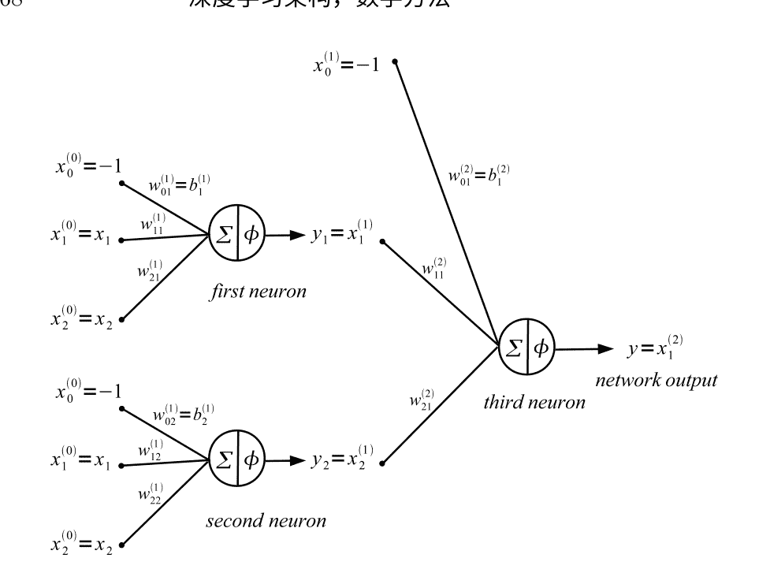

图6.1: 两个具有相同输入的神经元，$x_1$, $x_2$，和输出$y_1$, $y_2$，被输入到具有输出 $y$的第三个神经元中。

索引 $i = 0$ 始终用于偏置，而 $i = 1,2$ 表示索引输入。第二个较低的索引，$j$，对应于输出神经元，即突触指向的神经元的索引。

输入形成网络的第一层。它们用零上标表示：$x_0^{(0)} = -1$, $x_1^{(0)}$ 和 $x_2^{(0)}$。请注意，隐藏层神经元的偏置由 $b_1^{(1)} = w_{01}^{(1)}$ 和 $b_2^{(1)} = w_{02}^{(1)}$ 表示，而输出层神经元的偏置为 $b_1^{(2)} = w_{01}^{(2)}$。

隐藏层的第一个神经元将信息从输入层收集到信号中

$$s_1^{(1)} = w_{01}^{(1)} x_0^{(0)} + w_{11}^{(1)} x_1^{(0)} + w_{21}^{(1)} x_2^{(0)} = \sum_{i=1}^{2} w_{i1}^{(1)} x_i^{(0)} - b_1^{(1)}.$$

然后它应用激活函数 $\phi$ 在信号上获得输出

$$y_1 = x_1^{(1)} = \phi(s_1^{(1)}) = \phi\left(\sum_{i=1}^{2} w_{i1}^{(1)} x_i^{(0)} - b_1^{(1)}\right).$$

同样，隐藏层的第二个神经元收集信息到信号中

$$s_2^{(1)} = w_{02}^{(1)} x_0^{(0)} + w_{12}^{(1)} x_1^{(0)} + w_{22}^{(1)} x_2^{(0)} = \sum_{i=1}^{2} w_{i2}^{(1)} x_i^{(0)} - b_2^{(1)},$$

然后它应用激活函数 $\phi$ 获得输出

$$y_2 = x_2^{(1)} = \phi(s_2^{(1)}) = \phi\left(\sum_{i=1}^{2} w_{i2}^{(1)} x_i^{(0)} - b_2^{(1)}\right).$$

如果以矩阵形式书写，这些关系可以更容易地进行操作。隐藏层中的信号与输入相关

$$\begin{pmatrix} s_1^{(1)} \\ s_2^{(1)} \end{pmatrix} = \begin{pmatrix} w_{11}^{(1)} & w_{21}^{(1)} \\ w_{12}^{(1)} & w_{22}^{(1)} \end{pmatrix} \begin{pmatrix} x_1^{(0)} \\ x_2^{(0)} \end{pmatrix} - \begin{pmatrix} b_1^{(1)} \\ b_2^{(1)} \end{pmatrix}.$$

这可以写成简化形式

$$s^{(1)} = W^{(1)T} X^{(0)} - b^{(1)},$$

其中 $s^{(1)}$ 表示信号向量， $W^{(1)}$ 是权重矩阵， $X^{(0)}$ 是输入向量，而 $b^{(1)}$ 表示隐藏层神经元的偏置向量。转置符号的使用方式源自我们编写的索引方式。

隐藏层的输出是向量

$$X^{(1)} = \begin{pmatrix} y_1 \\ y_2 \end{pmatrix} = \begin{pmatrix} x_1^{(1)} \\ x_2^{(1)} \end{pmatrix} = \begin{pmatrix} \phi(s_1^{(1)}) \\ \phi(s_2^{(1)}) \end{pmatrix} = \phi(s^{(1)}),$$

我们采用的约定是，对向量应用 $\phi$ 会作用于其分量上。

最后两个公式暗示了有用的关系 $X^{(1)} = \phi (W^{(1)T} X^{(0)} - b^{(1)})$，将隐藏层的输出向量作为输入的函数。将 $X^{(0)}$ 乘以矩阵 $W^{(1)T}$ 是一个线性变换。减去 $b^{(1)}$，这变成了一个仿射变换。激活函数 $\phi$ 给输出添加了非线性。

最后一层的神经元将传入的信息收集到信号中。

$$s^{(2)} = s_1^{(2)} = w_{01}^{(2)} x_0^{(1)} + w_{11}^{(2)} x_1^{(1)} + w_{21}^{(2)} x_2^{(1)} = \sum_{i=1}^{2} w_{i1}^{(2)} x_i^{(1)} - b_1^{(2)}.$$

以矩阵形式，这变成

$$s^{(2)} = W^{(2)^T} X^{(1)} - b^{(2)},$$

其中矩阵系数由以下给出

$$W^{(2)^T} = \begin{pmatrix} w_{11}^{(2)} & w_{21}^{(2)} \end{pmatrix}$$

输入向量为

$$X^{(1)} = \begin{pmatrix} x_1^{(1)} & x_2^{(1)} \end{pmatrix}^T .$$

最后一个神经元的输出信号，$s^{(2)} = s_1^{(2)}$，是一个一维矩阵。下标$_1$表示输出层中只有一个神经元。网络输出通过以下方式应用激活函数到信号 $s^{(2)}$中获得：

$$Y = x_1^{(2)} = \phi(s^{(2)}) = \phi\left(W^{(2)^T} X^{(1)} - b^{(2)}\right) .$$

输出被表示为 $Y$ 以保持与之前章节中使用的符号一致，也可以表示为 $x_1^{(2)}$ ; 上标(2)表示这个输出在第二层（实际上是第三层，如果我们计算输入层的话），而较低的索引1表示输出层只有一个神经元。

使用之前得到的公式 $X^{(1)}$，我们可以将最终的输出表示为 $Y = \phi$

$$\left(W^{(2)^T} \phi \left( W^{(1)^T} X^{(0)} - b^{(1)} \right) - b^{(2)} \right). \quad\quad (6.1.1)$$

）我们注意到，仿射变换，包括乘以权重矩阵和减去偏置向量，与非线性变换交替出现，这些非线性变换是由激活函数 $\phi$ 引起的。如果考虑映射 $f_{w,b}: \mathbb{R}^2 \to \mathbb{R}$ 定义为

$$f_{w,b}(X) = \phi \left( W^{(2)^T} \phi \left( W^{(1)^T} X - b^{(1)} \right) - b^{(2)} \right), \quad\quad (6.1.2)$$

然后我们称 $f_{w,b}$ 为给定神经网络的输入-输出映射。

注6.1.1 假设前一个网络中的所有神经元都是线性神经元，即激活函数为 $\phi(x) = x$。在这种情况下，输出变为

$$Y = \left( W^{(1)} W^{(2)} \right)^T X^{(0)} - W^{(2)^T} b^{(1)} - b^{(2)} = W^T X^{(0)} - b.$$

这表明整个神经网络等效于只有一个具有权重矩阵 $W = W^{(1)} W^{(2)}$ 和偏置向量 $b = W^{(2)^T} b^{(1)} - b^{(2)}$ 的线性神经元。因此，对线性神经元的神经网络的研究被简化为对只有一个线性神经元的研究。

注6.1.2 现在假设前面的神经元都是感知器，激活函数为 $\phi(x) = H(x)$。在这种情况下，网络的输出为 $Y = H$

$$\left( w_1^{(2)} H \left( x_1 w_{11}^{(1)} + x_2 w_{21}^{(1)} - b_1^{(1)} \right) + w_2^{(2)} H \left( x_1 w_{12}^{(1)} + x_2 w_{22}^{(1)} - b_2^{(1)} \right) - b^{(2)} \right).$$

值得注意的是，这个网络可以准确地学习 $XOR$ 函数在第5.2节中介绍。选择权重使得输出变为

$$Y = f(x_1, x_2) = H \left( H(x + y - 0.5) - H(x + y - 1.5) - 0.5 \right),$$

我们很容易验证 $f(0,0)=0$, $f(1,1)=0$, $f(0,1)=1$，以及 $f(1,0)=1$。函数 $f(x, y)$ 的图形是一个沿着对角线 $y = x$ 的底部宽度相等的方形峡谷。$\sqrt{2}$。解释了学习XOR函数所需的三个感知器的启发式方法。可以证明每个函数 $y_1 = x_1 \land \neg x_2$ 和 $y_2 = \neg x_1 \land x_2$ 都可以由一个感知器学习。需要一个额外的感知器来学习函数 $y_1 \lor y_2$，这就是XOR函数。

图6.3：a。模型过拟合给定数据。b。模型具有良好的泛化能力。

##### 6.1.1 总变差和正则化

神经网络的泛化性能取决于输出对输入的敏感性。假设我们有两个在相同数据上训练的网络：图6.3 a中的一个过拟合数据的网络，和图6.3 b中的一个具有良好泛化能力的网络。这些模型之间的几何差异在于前一种情况下输出的总变差大于后一种情况。总变差与输出的敏感性之间存在数学公式关系。如果 $Y = f(X^{(0)})$ 表示网络的输入-输出映射， $f$ 的总变差表示局部绝对变化的累积效应。

$$V(f) = \int |df(X)|$$

积分是在输入空间上进行的。因此， $V(f)$ 在评估网络的泛化性能中起着重要作用。这就是为什么需要一个关于微分$dY = df(X)$ 的公式，并将在下面计算。

公式 (6.1.1) 提供了净输出与输入之间的关系。假设所有的权重和偏置都保持不变。当输入 $X^{(0)}$ 发生微小变化时，输出 $Y$ 的变化可以通过链式法则的迭代计算得到，如下所示：

$$dY = \frac{dY}{ds^{(2)}} ds^{(2)} = \frac{dY}{ds^{(2)}} \frac{ds^{(2)}}{dX^{(1)}} dX^{(1)}$$
$$= \frac{dY}{ds^{(2)}} \frac{ds^{(2)}}{dX^{(1)}} \frac{dX^{(1)}}{ds^{(1)}} ds^{(1)}$$
$$= \frac{dY}{ds^{(2)}} \frac{ds^{(2)}}{dX^{(1)}} \frac{dX^{(1)}}{ds^{(1)}} \frac{ds^{(1)}}{dX^{(0)}} dX^{(0)}$$

使用那个 \(\frac{dY}{ds^{(2)}} = \phi'(s^{(2)})\) 和 \(\frac{dX^{(1)}}{ds^{(1)}} = \phi'(s^{(1)})\)，以及 \(\frac{ds^{(2)}}{dX^{(1)}} = W^{(2)^T}\) 和 \(\frac{ds^{(1)}}{dX^{(0)}} = W^{(1)^T}\)，我们得到

$$dY = \phi'(s^{(2)})W^{(2)^T}\phi'(s^{(1)})W^{(1)^T} dX^{(0)}.$$

是要注意与正则化的关系。我们从前面的公式中注意到，微分 dY 取决于权重矩阵 \(W^{(\ell)}, \ell \in \{1,2\}\)。通过要求这些权重小，要么通过\(L^1\)或\(L^2\) norm约束，\(\|W^{(\ell)}\|_1 \leq 1\)，或 \(\|W^{(\ell)}\|_2 \leq 1\)，将减小 \(|dY|\)。这进一步减少了总变化量 \(V(f)\)，从而提高了泛化性能。

当激活函数为逻辑函数时，\(\phi = \sigma\)，利用逻辑函数的性质，公式 (6.1.3) 变为

$$dY = \sigma(s^{(2)})(1-\sigma(s^{(2)}))W^{(2)^T}\sigma(s^{(1)})(1-\sigma(s^{(1)}))W^{(1)^T} dX^{(0)},$$

按照约定，对向量应用 \(\sigma\) 会作用于其分量。以前的敏感度公式将用于噪声去除的目的，在练习 6.6.5 中。

##### 6.1.2 反向传播

考虑一个成本函数 \(C(w, b)\)，它衡量网络输出 \(Y = f_{w,b}(X)\) 与目标 \(Z\) 之间的接近程度。成本是权重 \(w\) 和偏置 \(b\) 的平滑函数。其梯度由 \(\nabla C = (\nabla_w C, \nabla_b C)\) 给出。

对于上述示例，该向量是九维的，取决于六个权重和三个偏差。梯度下降方法需要梯度。我们将从最后的权重和偏差开始向后计算，通过一种称为反向传播的过程。

我们计算成本函数相对于具有上标 \(\ell = 2\) 的权重的偏导数。我们还将使用成本函数 \(C\) 取决于 \(Y\)，而 \(Y\) 取决于 \(w_{ij}^{(2)}\) 通过 \(s_1^{(2)}\) 仅仅，如 \(Y = \phi(s^{(2)})\)。

因此，链式法则的应用产生

$$
\begin{aligned}
\frac{\partial C}{\partial b_1^{(2)}} &= \frac{\partial C}{\partial w_{01}^{(2)}} = \frac{\partial C}{\partial s_1^{(2)}} \frac{\partial s_1^{(2)}}{\partial w_{01}^{(2)}} = \delta_1^{(2)} x_0^{(1)} = -\delta_1^{(2)} \\
\frac{\partial C}{\partial w_{11}^{(2)}} &= \frac{\partial C}{\partial s_1^{(2)}} \frac{\partial s_1^{(2)}}{\partial w_{11}^{(2)}} = \delta_1^{(2)} x_1^{(1)} \\
\frac{\partial C}{\partial w_{21}^{(2)}} &= \frac{\partial C}{\partial s_1^{(2)}} \frac{\partial s_1^{(2)}}{\partial w_{21}^{(2)}} = \delta_1^{(2)} x_2^{(1)}
\end{aligned}
$$

在这里我们使用了 $s_1^{(2)} = w_{01}^{(2)}x_0^{(1)} + w_{11}^{(2)}x^{(1)}$ 的事实，并采用记号 $\delta_1^{(2)} = \frac{\partial C}{\partial s_1^{(2)}}$。

接下来，我们计算相对于权重和偏置的偏导数，上标为 $\ell = 1$。成本 $C$ 取决于 $Y$，而 $Y$ 取决于 $w_{ij}^{(1)}$ 通过 $s_j^{(1)}$，$j=1,2$，因为 $Y = \phi\left( {W^{(2)}}^T \phi(s^{(1)}) - b^{(2)} \right)$ 根据 (6.1.1)。如果 $j=1$，则链式法则得到

$$\begin{aligned}\frac{\partial C}{\partial b_1^{(1)}} &= \frac{\partial C}{\partial w_{01}^{(1)}} = \frac{\partial C}{\partial s_1^{(1)}} \frac{\partial s_1^{(1)}}{\partial w_{01}^{(1)}} = \delta_1^{(1)} x_0^{(0)} = -\delta_1^{(1)} \ \frac{\partial C}{\partial w_{11}^{(1)}} &= \frac{\partial C}{\partial s_1^{(1)}} \frac{\partial s_1^{(1)}}{\partial w_{11}^{(1)}} = \delta_1^{(1)} x_1^{(0)} \ \frac{\partial C}{\partial w_{21}^{(1)}} &= \frac{\partial C}{\partial s_1^{(1)}} \frac{\partial s_1^{(1)}}{\partial w_{21}^{(1)}} = \delta_1^{(1)} x_2^{(0)} \end{aligned}$$

对于 $j=2$，链式法则意味着

$$\begin{aligned}\frac{\partial C}{\partial b_2^{(1)}} &= \frac{\partial C}{\partial w_{02}^{(1)}} = \frac{\partial C}{\partial s_2^{(1)}} \frac{\partial s_2^{(1)}}{\partial w_{02}^{(1)}} = \delta_2^{(1)} x_0^{(0)} = -\delta_2^{(1)} \ \frac{\partial C}{\partial w_{12}^{(1)}} &= \frac{\partial C}{\partial s_2^{(1)}} \frac{\partial s_2^{(1)}}{\partial w_{12}^{(1)}} = \delta_2^{(1)} x_1^{(0)} \ \frac{\partial C}{\partial w_{22}^{(1)}} &= \frac{\partial C}{\partial s_2^{(1)}} \frac{\partial s_2^{(1)}}{\partial w_{22}^{(1)}} = \delta_2^{(1)} x_2^{(0)} \end{aligned}$$

其中我们使用了 $s_j^{(1)} = \sum_{i=1}^{2} w_{ij}^{(1)} x_i^{(0)} - b_j^{(1)}$，以及记号 $\delta_j^{(1)} = \frac{\partial C}{\partial s_j^{(1)}}, j=1,2$。

为了总结之前的计算，我们写下

$$\begin{aligned}\frac{\partial C}{\partial b_j^{(\ell)}} &= -\delta_j^{(\ell)} \quad &(6.1.4) \ \frac{\partial C}{\partial w_{ij}^{(\ell)}} &= \delta_j^{(\ell)} x_i^{(\ell-1)} \quad &(6.1.5)\end{aligned}$$

由此可知，代价函数的梯度，$\nabla C$，只要我们弄清楚 $\delta_j^{(k)}$ 的值，就是已知的。我们将展示隐藏层的delta值，$\delta_1^{(1)}$ 和 $\delta_2^{(1)}$，取决于最终层的delta值，$\delta_1^{(2)}$，如图6.4所示以下。使用 $s_1^{(1)}$ 影响代价 $C$ 只通过 $s_1^{(2)}$，见图6.4，链式法则提供

$$\delta_1^{(1)} = \frac{\partial C}{\partial s_1^{(1)}} = \frac{\partial C}{\partial s_1^{(2)}} \frac{\partial s_1^{(2)}}{\partial s_1^{(1)}} = \delta_1^{(2)} \frac{\partial s_1^{(2)}}{\partial s_1^{(1)}}. \quad\quad (6.1.6)$$

由于信号 $s_1^{(2)}$ 可以写成

$$s_1^{(2)} = -w_{01}^{(2)} + w_{11}^{(2)} \phi(s_1^{(1)}) + w_{21}^{(2)} \phi(s_2^{(1)}),$$

由此可见

$$\frac{\partial s_1^{(2)}}{\partial s_1^{(1)}} = w_{11}^{(2)} \phi'(s_1^{(1)}).$$

将公式 (6.1.6) 代入，我们得到

$$\delta_1^{(1)} = \delta_1^{(2)} w_{11}^{(2)} \phi'(s_1^{(1)}). \quad\quad (6.1.7)$$

同样，使用图6.4给出的依赖树，我们有

$$\delta_2^{(1)} = \frac{\partial C}{\partial s_2^{(1)}} = \frac{\partial C}{\partial s_1^{(2)}} \frac{\partial s_1^{(2)}}{\partial s_2^{(1)}} = \delta_1^{(2)} \frac{\partial}{\partial s_2^{(1)}} \left( -w_{01}^{(2)} + w_{11}^{(2)} \phi(s_1^{(1)}) + w_{21}^{(2)} \phi(s_2^{(1)}) \right) \quad\quad (6.1.8)$$

$$= \delta_1^{(2)} w_{21}^{(2)} \phi'(s_2^{(1)}). \quad\quad (6.1.9)$$

最后两个公式可以写成以下向量形式，作为反向传播公式的

$$\begin{pmatrix} \delta_1^{(1)} \\ \delta_2^{(1)} \end{pmatrix} = \delta_1^{(2)} \begin{pmatrix} w_{11}^{(2)} \phi'(s_1^{(1)}) \\ w_{21}^{(2)} \phi'(s_2^{(1)}) \end{pmatrix}. \quad\quad (6.1.10)$$

因此，为了找到隐藏层的增量，只需计算外层的增量，$\delta_1^{(2)}$。我们将在下面计算这个。

成本函数，$C(w, b) = \text{dist}(Y, Z)$，取决于通过链式法则提供的输出，$Y = f_{w,b}(X^{(0)})$，所以

$$\delta_1^{(2)} = \frac{\partial C}{\partial s_1^{(2)}} = \frac{\partial C}{\partial Y} \frac{\partial Y}{\partial s_1^{(2)}} = \frac{\partial C}{\partial Y} \frac{\partial}{\partial s_1^{(2)}} \phi(s_1^{(2)}) = \frac{\partial C}{\partial Y} \phi'(s_1^{(2)}), \quad\quad (6.1.11)$$

在这里我们使用了输出是$Y = \phi(s_1^{(2)})$。代入(6.1.10)得到
$$\begin{pmatrix} \delta_1^{(1)} \\ \delta_2^{(1)} \end{pmatrix} = \frac{\partial C}{\partial Y} \phi'(s_1^{(2)}) \begin{pmatrix} w_{11}^{(2)} \phi'(s_1^{(1)}) \\ w_{21}^{(2)} \phi'(s_2^{(1)}) \end{pmatrix}. \quad\quad (6.1.12)$$

因子$\frac{\partial C}{\partial Y}$取决于所考虑的成本函数。例如，如果$C = -\frac{1}{2}(Y - Z)^2$，那么$\frac{\partial C}{\partial Y} = Y - Z$，其中$Z$是网络需要学习的目标函数。到目前为止，所有的增量都已经计算出来，它们的公式分别为(6.1.11)和(6.1.12)。为了最小化成本函数，$C$，我们将应用梯度下降法。

初始化由一些任意的权重和偏置值给出，$(w_{ij}^{(\ell)}(0), b_j^{(\ell)}(0))$，以及近似序列$(w_{ij}^{(\ell)}(k), b_j^{(\ell)}(k))$，$k \geq 0$，通过递归定义

$$b_j^{(\ell)}(k+1) = b_j^{(\ell)}(k) - \eta \frac{\partial C}{\partial b_j^{(\ell)}} \big(w_{ij}^{(\ell)}(k), b_j^{(\ell)}(k)\big)$$

$$w_{ij}^{(\ell)}(k+1) = w_{ij}^{(\ell)}(k) - \eta \frac{\partial C}{\partial w_{ij}^{(\ell)}} \big(w_{ij}^{(\ell)}(k), b_j^{(\ell)}(k)\big),$$

其中参数$k$表示迭代次数。根据公式(6.1.4)-(6.1.5)，上述递归系统变为
$$b_j^{(\ell)}(k+1) = b_j^{(\ell)}(k) + \eta \delta_j^{(\ell)}$$
$$w_{ij}^{(\ell)}(k+1) = w_{ij}^{(\ell)}(k) - \eta \delta_j^{(\ell)} x_i^{(\ell-1)}(k),$$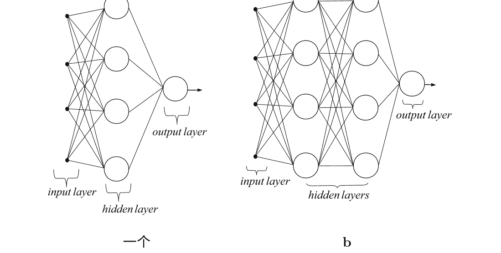

## 图6.5：a.一个隐藏层神经网络；b.两个隐藏层神经网络。

其中η > 0 是学习率，是输入到第 ℓ 层的值，给定第 k 次运行时的权重和偏置。在前面的公式中，参数 k 表示当前迭代的次数。

当所有训练样本都用于更新网络参数时，我们称之为一个 epoch 已经处理完。参数更新的过程会一直持续，直到学习系统适应训练数据。梯度下降被用于直到算法收敛到局部最优解，这可以通过检查梯度的范数是否收敛来验证。如果模型完美地表示训练数据，那么训练损失可以无限小。如果模型对训练数据欠拟合，训练损失不能在一定限制下减小。

> 备注 6.1.3 反向传播的概念可以追溯到20世纪60年代，在控制理论的背景下出现[18]，[62]，[33]。然后在20世纪70年代中期开始应用于神经网络，[77]，[78]，[123]。第一个应用于具有隐藏层的神经网络的计算机实现是在20世纪80年代中期在经典论文[108]中开发的。在21世纪初的几年中，由于新的GPU系统的计算能力，这种方法在文献和应用中重新流行起来。

#### 6.2 通用神经网络

接下来我们将讨论前馈神经网络的情况，即信息从输入流向输出的网络。图6.5 a描述了一个具有3层的神经网络：输入层有4个输入，中间或隐藏层有4个神经元，输出层只有1个神经元。图6.5 b表示了一个具有4层的神经网络，看起来与前一个网络相似，但有2个隐藏层，每个隐藏层都有4个神经元。

我们首先介绍关于神经网络的层、权重、输入和输出的符号表示。

层我们将在下文中用上标表示层的编号 ℓ。我们有 ℓ = 0 表示输入层， ℓ = 1 表示第一个隐藏层，以此类推 ℓ = L 表示输出层。请注意，隐藏层的数量等于 L−1。第 ℓ 层的神经元数量用 d^{(ℓ)} 表示。特别地， d^{(0)} 表示输入的数量， d^{(L)} 表示输出的数量。

权重权重系统用 w_{ij}^{(\ell)} 表示，其中 1 ≤ ℓ ≤ L, 0 ≤ i ≤ d^{(ℓ−1)}, 1 ≤ j ≤ d^{(ℓ)}。权重 w_{ij}^{(\ell)} 表示连接第 ℓ−1 层的第 i 个神经元和第 ℓ 层的第 j 个神经元的边。请注意，边仅连接相邻层的神经元。权重 w_{0j}^{(\ell)} = b_j^{(\ell)} 被视为偏置。它们是对应于虚拟输入的权重。 x_0^{(ℓ)} = −1。偏差的数量等于神经元的数量。在层 ℓ−1 和 ℓ 之间的权重数量（不包括偏差）由公式给出，其中 d^{(ℓ−1)} d^{(ℓ)}，因此前馈网络中的权重总数为 ∑_{ℓ=1}^L d^{(ℓ−1)} d^{(ℓ)}。例如，图6.5 a中的网络有 4×4 + 4×1 = 20 个权重，而图6.5 b中的网络有 4×4 + 4×4 + 4×1 = 36 个权重。权重可以是正数、负数或零。正权重鼓励神经元发放，而负权重则抑制神经元发放。

输入和输出网络的输入用 x_j^{(0)} 表示，其中 1 ≤ j ≤ d^{(0)}。我们用 x_j^{(ℓ)} 表示第 j 个神经元在第 ℓ 层的输出。因此， x_j^{(L)} 是网络的输出，其中 1 ≤ ℓ ≤ d^{(L)}。这个符号 x_0^{(ℓ)} = −1 被保留用于与偏置相对应的虚拟输入，该输入与第 ℓ+1 层的神经元相关联。考虑第 j 个神经元在第 ℓ 层。在其前半部分，神经元将来自前一层的信息作为加权平均值收集到信号

$$s_j^{(\ell)} = \sum_{i=0}^{d^{(\ell-1)}} w_{ij}^{(\ell)} x_i^{(\ell-1)} = \sum_{i=1}^{d^{(\ell-1)}} w_{ij}^{(\ell)} x_i^{(\ell-1)} - z_j^{(\ell)} \quad (6.2.13)$$

在其后半部分，神经元对前一个信号应用激活函数 φ，并输出值

$$x_j^{(\ell)} = \phi \left( \sum_{i=1}^{d^{(\ell-1)}} w_{ij}^{(\ell)} x_i^{(\ell-1)} - z_j^{(\ell)} \right), \quad (6.2.14)$$

这可以用以下等价矩阵形式表示：

$$X^{(\ell)} = \phi \left( W^{(\ell)T} X^{(\ell-1)} - B^{(\ell)} \right),$$

其中我们使用了符号

$$X^{(\ell)} = (x_1^{(\ell)}, \ldots, x_{d^\ell}^{(\ell)})^T, \quad W^{(\ell)} = \left( w_{ij}^{(\ell)} \right)_{i,j}, \quad B^{(\ell)} = (b_1^{(\ell)}, \ldots, b_{d^\ell}^{(\ell)})^T,$$

其中1 ≤ i ≤ d^{(\ell-1)} 且1 ≤ j ≤ d^{(\ell)} ，我们使用了向量上的激活函数作用于向量的每个分量的约定。我们注意到网络的输入由向量给出

$$X^{(0)} = (x_1^{(0)}, \ldots, x_{d^0}^{(0)})^T, \quad \text{而网络输出是} \quad X^{(L)} = (x_1^{(L)}, \ldots, \ldots, x_{d^L}^{(L)})^T.$$

### 6.2.1 网络的前向传播

给定一组权重和偏置，可以使用方程（6.2.14）来找到每个神经元的输出，以其输入为基础。特别地，找到网络的输出，即最后一层的输出， x^{(L)} = (x_1^{(L)}, \ldots, x_{d^{(L)}}^{(L)}), 其中 d^{(L)}表示网络输出的数量（即输出层中的神经元数量）。通过网络向前传播意味着找到所有神经元的输出。这个前向传播表示了目标预测步骤。

这为方法的第二阶段做好了准备，即通过网络向后计算成本函数的梯度，以更新由梯度下降方法设置的参数。向前和向后传递产生一系列与目标的改进预测相对应的参数序列。当无法再进行成本改进时，该过程结束。

### 6.2.2 通过网络向后计算

让 C(w, b) 表示网络的成本函数，衡量目标 Z和输出 Y = x^{(L)}之间的某种接近程度。为了梯度下降的目的，我们需要计算梯度 ∇C = (∇_w C, ∇_b C)。

由于权重 w_{ij}^{(\ell)}将第 i个神经元在第 \ell-1 层与第 j个神经元在第 \ell层连接起来，它将进入信号 s_j^{(\ell)} 的组成部分。

由第j个神经元传递到第ℓ层的信号。此特定权重不会影响第ℓ层中的其他信号。因此，链式法则提供了

$$\frac{\partial C}{\partial w_{ij}^{(\ell)}} = \frac{\partial C}{\partial s_j^{(\ell)}} \frac{\partial s_j^{(\ell)}}{\partial w_{ij}^{(\ell)}}.$$ (6.2.15)

对于第j个神经元，没有求和。我们使用以下的delta符号

$$\delta_j^{(\ell)} = \frac{\partial C}{\partial s_j^{(\ell)}}$$

来表示误差相对于信号$s_j^{(\ell)}$的敏感性。右侧的第二个因子可以通过在关系式(6.2.13)中进行显式求导来计算，如下所示

$$\frac{\partial s_j^{(\ell)}}{\partial w_{ij}^{(\ell)}} = x_i^{(\ell-1)}.$$

代入(6.2.15)得到

$$\frac{\partial C}{\partial w_{ij}^{(\ell)}} = \delta_j^{(\ell)} x_i^{(\ell-1)}.$$ (6.2.16)

类似的分析也适用于代价函数相对于偏置的导数。由于代价函数$C$受到$b_j^{(\ell)}$的影响，只有通过信号$s_j^{(\ell)}$，我们有

$$\frac{\partial C}{\partial b_j^{(\ell)}} = \frac{\partial C}{\partial s_j^{(\ell)}} \frac{\partial s_j^{(\ell)}}{\partial b_j^{(\ell)}}.$$ (6.2.17)

在(6.2.13)中进行微分得到

$$\frac{\partial s_j^{(\ell)}}{\partial b_j^{(\ell)}} = -1,$$

因此(6.2.17)变为

$$\frac{\partial C}{\partial b_j^{(\ell)}} = -\delta_j^{(\ell)}.$$ (6.2.18)

根据关系(6.2.16)和(6.2.18)，为了找到梯度

$$\nabla C = (\nabla_w C, \nabla_b C) = \delta_j^{(\ell)} (x_i^{(\ell-1)}, -1),$$ (6.2.19)

只需知道deltas $\delta_j^{(\ell)}$。deltas的构建是通过一个名为反向传播的算法完成的，并将在下一节中介绍。

### 6.2.3 deltas的反向传播

我们从最后一层开始计算deltas， $\delta_j^{(L)}$，其中 $1 \leq j \leq d^{(L)}$。这主要取决于成本函数的形式。我们将假设，例如，

$$C(w, b) = \frac{1}{2} \sum_{j=1}^{d^{(L)}} (x_j^{(L)} - z_j)^2 = \frac{1}{2} \|x^{(L)} - z\|^2,$$

其中 $z = (z_1, \ldots, z_{d^{(L)}})^T$ 表示目标变量。使用 $x_j^{(L)} = \phi(s_j^{(L)})$，然后链式法则得出

$$\delta_j^{(L)} = \frac{\partial C}{\partial s_j^{(L)}} = (x_j^{(L)} - z_j) \phi'(s_j^{(L)}). \quad (6.2.20)$$

对于某些特定类型的激活函数，这甚至可以进一步计算。如果激活函数是逻辑函数，$\phi = \sigma$，那么

$$\delta_j^{(L)} = \frac{\partial C}{\partial s_j^{(L)}} = (x_j^{(L)} - z_j) \sigma(s_j^{(L)}) (1 - \sigma(s_j^{(L)})).$$

或者，如果激活函数是双曲正切函数，$\mathbf{t}$，那么

$$\delta_j^{(L)} = \frac{\partial C}{\partial s_j^{(L)}} = (x_j^{(L)} - z_j) (1 - \mathbf{t}^2(s_j^{(L)})).$$

下一个任务是根据层 $\ell - 1$ 的 delta 写出层 $\ell$ 的 delta。这将通过反向传播公式实现。链式公式提供

$$\delta_i^{(\ell - 1)} = \frac{\partial C}{\partial s_i^{(\ell - 1)}} = \sum_{j=1}^{d^{(\ell)}} \frac{\partial C}{\partial s_j^{(\ell)}} \frac{\partial s_j^{(\ell)}}{\partial s_i^{(\ell - 1)}} = \sum_{j=1}^{d^{(\ell)}} \delta_j^{(\ell)} \frac{\partial s_j^{(\ell)}}{\partial s_i^{(\ell - 1)}}. \quad (6.2.21)$$

第一个等式是根据delta的定义得出的。第二个等式使用了信号 $s_i^{(\ell - 1)}$ 在层 $\ell - 1$ 中的信号 $s_j^{(\ell)}$ 影响了层 $\ell$ 中的所有信号，其中 $1 \leq j \leq d^{(\ell)}$。因此，成本 $C$ 受到 $s_i^{(\ell - 1)}$ 的影响 通过层中的所有信号 $\ell$，这一事实解释了对索引 $j$ 的求和的需要。最后一个等式再次使用了$\delta$的定义。

接下来，我们将计算偏导数 $\frac{\partial s_j^{(\ell)}}{\partial s_i^{(\ell - 1)}}$ 即，对于前一层中的信号，该层中的信号的灵敏度。这可以通过在公式(6.2.13)中进行微分来实现，如下所示：

$$\frac{\partial s_j^{(\ell)}}{\partial s_i^{(\ell-1)}} = \frac{\partial}{\partial s_i^{(\ell-1)}} \sum_{i=1}^{\Im (\ell-1)} \left( w_{ij}^{(\ell)} x_i^{(\ell-1)} - z_j^{(\ell)} \right) \\ = \frac{\partial}{\partial s_i^{(\ell-1)}} \sum_{i=1}^{\Im (\ell-1)} \left( w_{ij}^{(\ell)} \phi(s_i^{(\ell-1)}) - b_j^{(\ell)} \right) \\ = w_{ij}^{(\ell)} \phi'(s_i^{(\ell-1)}).$$

将其代入(6.2.21)中，我们得到了关于delta的反向传播公式：

$$\delta_i^{(\ell-1)} = \phi'(s_i^{(\ell-1)}) \sum_{j=1}^{d^{(\ell)}} \delta_j^{(\ell)} w_{ij}^{(\ell)}.$$  (6.2.22)

这产生了第(ℓ-1)层的增量，以增量的形式 ℓ层使用加权和。如果激活函数，φ，是逻辑函数，σ，那么先前的公式变为

$$\delta_i^{(\ell-1)} = \sigma(s_i^{(\ell-1)}) (1 - \sigma(s_i^{(\ell-1)})) \sum_{j=1}^{d^{(\ell)}} \delta_j^{(\ell)} w_{ij}^{(\ell)}.$$  (6.2.23)

或者，如果激活函数，φ，是双曲正切函数，t，那么先前的公式变为

$$\delta_i^{(\ell-1)} = (1 - \mathbf{t}^2(s_i^{(\ell-1)})) \sum_{j=1}^{d^{(\ell)}} \delta_j^{(\ell)} w_{ij}^{(\ell)}.$$

总结最后几节，为了找到由(6.2.19)给出的代价函数的梯度，使用反向传播公式(6.2.22)计算$\delta_i^{(\ell)}$和前向传播公式(6.2.14)计算输出$x_i^{(\ell-1)}$。

## 6.2.4 结论关系

在前几节中进行的计算可以用以下一组主方程来总结

$$x_j^{(\ell)} = \phi \left( \sum_{i=1}^{d^{(\ell-1)}} w_{ij}^{(\ell)} x_i^{(\ell-1)} - z_j^{(\ell)} \right), \quad 1 \leq j \leq d^{(\ell)} \quad (6.2.24)$$

$$\delta_j^{(L)} = (x_j^{(L)} - z_j) \phi'(s_j^{(L)}), \quad 1 \leq j \leq d^{(L)} \quad (6.2.25)$$

$$\delta_i^{(\ell-1)} = \phi'(s_i^{(\ell-1)}) \sum_{j=1}^{d^{(\ell)}} \delta_j^{(\ell)} w_{ij}^{(\ell)}, \quad 1 \leq i \leq d^{(\ell-1)} \quad (6.2.26)$$

$$\frac{\partial C}{\partial w_{ij}^{(\ell)}} = \delta_j^{(\ell)} x_i^{(\ell-1)} \quad (6.2.27)$$

$$\frac{\partial C}{\partial b_j^{(\ell)}} = -\delta_j^{(\ell)}. \quad (6.2.28)$$

第一个公式提供了输出的前向递归公式，以权重和偏差为参数。第二个公式处理了输出层中delta的表达式（在成本函数是平方误差和的假设下）。第三个公式是delta的反向传播公式。最后两个公式提供了成本函数 C相对于权重和偏差的梯度分量。

方程(6.2.27)-(6.2.28)可用于评估成本函数 C(w, b)对权重和偏差的微小变化的敏感性。使用函数的微分公式，得到

$$dC = \sum \frac{\partial C}{\partial w_{ij}^{(\ell)}} dw_{ij}^{(\ell)} + \sum \frac{\partial C}{\partial b_j^{(\ell)}} db_j^{(\ell)} \\ = \sum \delta_j^{(\ell)} x_i^{(\ell)} dw_{ij}^{(\ell)} - \sum \delta_j^{(\ell)} db_j^{(\ell)},$$

求和是在i, j, l上进行的，其中 $1 \leq i \leq d^{(\ell-1)}$, $1 \leq j \leq d^{(\ell)}$ 和 $1 \leq \ell \leq L$。

##### 6.2.5 矩阵形式

为了避免多个指标引入的复杂性，上述主方程可以更紧凑地以矩阵形式写出。

首先，我们需要引入同维度向量之间的新乘积。如果 u 和 v 是 $\mathbb{R}^n$ 中的向量，则 u 和 v 的逐元素乘积是一个由 $u v$ 表示的向量，其分量为 $(u v)_j = u_j v_j$。

有时，这被称为两个向量的哈达玛积。它简化了方程的形式。

**使用符号**

$$
X^{(\ell)} = (x_1^{(\ell)}, \ldots, x_{d^{\ell}}^{(\ell)})^T, \quad W^{(\ell)} = \left(w_{ij}^{(\ell)}\right)_{i,j}, \quad B^{(\ell)} = (b_1^{(\ell)}, \ldots, b_{d^{\ell}}^{(\ell)})^T,
$$

$$
\delta^{(\ell)} = (\delta_1^{(\ell)}, \ldots, \delta_{d^{(\ell)}}^{(\ell)})^T, \quad s^{(\ell)} = (s_1^{(\ell)}, \ldots, s_{d^{(\ell)}}^{(\ell)})^T, \quad x^{(L)} = (x_1^{(L)}, \ldots, x_{d^{(L)}}^{(L)})^T,
$$

以及 $\phi$ 作用于其向量参数的每个分量，方程(6.2.24)-(6.2.28)采用以下等价形式：

$$
\begin{aligned}
X^{(\ell)} &= \phi\left(W^{(\ell)^T} X^{(\ell-1)} - B^{(\ell)}\right) && (6.2.29)\\
\delta^{(L)} &= \left(x^{(L)} - z\right) \phi'\left(s^{(L)}\right) && (6.2.30)\\
\delta^{(\ell-1)} &= \left(W^{(\ell)} \delta^{(\ell)}\right) \phi'\left(s^{(\ell-1)}\right) && (6.2.31)\\
\frac{\partial C}{\partial W^{(\ell)}} &= X^{(\ell-1)} \delta^{(\ell)^T} && (6.2.32)\\
\frac{\partial C}{\partial B^{(\ell)}} &= -\delta^{(\ell)}. && (6.2.33)
\end{aligned}
$$

值得注意的是，(6.2.32)的右侧是两个向量类型的矩阵相乘。更准确地说，如果 $u=(u_1 \ldots u_n)^T$ 和 $v=(v_1 \ldots v_n)^T$ 是 $\mathbb{R}^n$ 中的两个列向量，则 $uv^T=(u_i v_j)_{i, j}$ 是一个 $n \times n$ 矩阵。这不应与 $u^T v = \sum_i u_i v_i$ 混淆，这是一个数字。我们还注意到，在(6.2.31)中，矩阵 $W^{(\ell)}$ 没有转置。

**备注 6.2.1** 在线性神经元的情况下，先前的公式具有更简单的形式。由于激活函数为 $\phi(x) = x$，delta的反向传播公式变为 $\delta^{(\ell-1)} = W^{\ell} \delta^{(\ell)}$。迭代得到

$$
\delta^{(\ell)} = W^{(\ell+1)} W^{(\ell+2)} \ldots W^{(L)} \delta^{(L)}.
$$

使用(6.2.32)和(6.2.33)可以推出

$$
\begin{aligned}
\frac{\partial C}{\partial w_{ij}^{(\ell)}} &= x^{(\ell)} \left(W^{(\ell+1)} \ldots W^{(L)} \delta^{(L)}\right)^T \\
\frac{\partial C}{\partial b^{(\ell)}} &= -W^{(\ell+1)} \ldots W^{(L)} \delta^{(L)},
\end{aligned}
$$

提供了一个闭合形式的公式来计算成本函数的梯度， $\nabla C = \left(\frac{\partial C}{\partial w_{ij}^{(\ell)}}, \frac{\partial C}{\partial b^{(\ell)}}\right)$。

注6.2.2公式(6.2.30)基于成本函数是平方和的特定假设。如果成本函数发生变化，只需相应调整 $\delta^{(L)}$的公式。这是基于一个事实，即从 $\ell = L$ 到 $\ell = 1$ ，delta值是向后变化的，参见(6.2.31)。接下来，我们将提供一些有用成本函数的 $\delta^{(L)}$的公式。

### 例子6.2.3

假设成本函数由交叉熵给出

$$
C = -\sum_k z_k \ln x_k^{(L)} = -\sum_k z_k \ln \phi(s_k^{(L)}),
$$

表示使用预测输出的低效率的不足，而不是真实数据 $z$ 的不足。输出层中第 $j$ 个神经元的增量现在由以下给出

$$
\delta_j^{(L)} = \frac{\partial C}{\partial s_j^{(L)}} = -\frac{\partial}{\partial s_j^{(L)}} \sum_k z_k \ln \phi(s_k^{(L)}) = -z_j \frac{\phi'(s_j^{(L)})}{\phi(s_j^{(L)})}.
$$

如果我们将激活函数视为逻辑函数，则该表达式可以进一步简化为 $\phi(x) = \sigma(x)$。在这种情况下，计算可以继续进行

$$
\delta_j^{(L)} = -z_j \frac{\sigma'(s_j^{(L)})}{\sigma(s_j^{(L)})} = -z_j \frac{\sigma(s_j^{(L)})(1 - \sigma(s_j^{(L)}))}{\sigma(s_j^{(L)})} = -z_j (1 - \sigma(s_j^{(L)})).
$$

使用Hadamard乘积，这可以更简洁地表示为

$$
\delta^{(L)} = -z (1 - \sigma(s^{(L)})),
$$

并且可以被视为关系(6.2.30)的替代，当成本函数由交叉熵给出时。

### 例子6.2.4

另一个成本函数，在最后一层的激活函数是逻辑函数 $\phi(x) = \sigma(x)$ 时，可以使用的是常规交叉熵函数，其中 $z_k \in \{0, 1\}$。

$$
C = -\sum_k z_k \ln x_k^{(L)} - \sum_k (1 - z_k) \ln(1 - x_k^{(L)}). \quad (6.2.34)
$$

1这是二进制熵函数的总和，请参见练习12.13.15。

在这种情况下，输出层的增量计算如下

$$
\begin{aligned}
\delta_j^{(L)} &= \frac{\partial C}{\partial s_j^{(L)}} = -\frac{\partial}{\partial s_j^{(L)}} \left( \sum_k z_k \ln \sigma(s_k^{(L)}) + \sum_k (1 - z_k) \ln(1 - \sigma(s_k^{(L)})) \right) \\
&= -z_j \frac{\sigma'(s_j^{(L)})}{\sigma(s_j^{(L)})} + (1 - z_j) \frac{\sigma'(s_j^{(L)})}{1 - \sigma(s_j^{(L)})} \\
&= -z_j (1 - \sigma(s_j^{(L)})) + (1 - z_j) \sigma(s_j^{(L)}) \\
&= \sigma(s_j^{(L)}) - z_j = x_j^{(L)} - z_j,
\end{aligned}
$$

其中我们使用了有用的性质 $\sigma'(x) = \sigma(x)(1 - \sigma(x))$。因此，在这种情况下，增量等于模型结果和目标值之间的差异，$\delta^{(L)} = x^{(L)} - z$.

##### 6.2.6 梯度下降算法

考虑一个神经网络，其初始权重和偏置系统由 $w_{ij}^{(\ell)}(0)$ 和 $b_j^{(\ell)}(0)$ 给出。权重可以通过第6.3节中描述的过程进行高效初始化。设 $\eta > 0$ 为学习率。在使用梯度下降算法训练网络后，权重和偏置的最优值由递归定义的近似序列给出。

$$
\begin{aligned}
w_{ij}^{(\ell)}(n + 1) &= w_{ij}^{(\ell)}(n) - \eta \delta_j^{(\ell)}(n) x_i^{(\ell-1)}(n) \\
b_j^{(\ell)}(n + 1) &= b_j^{(\ell)}(n) + \eta \delta_j^{(\ell)}(n),
\end{aligned}
$$

其中输出 $x_i^{(\ell)}(n)$ 和增量 $\delta_j^{(\ell)}(n)$ 取决于权重 $w_{ij}^{(\ell)}(n)$ 和偏置 $b_j^{(\ell)}(n)$，在第 $n$ 步获得。我们注意到，在编写上述方程时，我们使用了上述公式 $\frac{\partial C}{\partial w_{ij}^{(\ell)}}$ 和 $\frac{\partial C}{\partial b_j^{(\ell)}}$。

##### 6.2.7 梯度消失问题

假设我们有一个神经网络，其中所有神经元的激活函数都是逻辑函数 $\sigma$。如果一个信号的绝对值太大，那么逻辑函数会饱和，接近于0或1，这个事实通过公式(6.2.23)意味着 $\delta_i^{(\ell-1)}$ 等于或接近于零。

另一方面，由于 $\sigma' = \sigma(1 - \sigma)$，很容易证明 $0 < \sigma' \le 1/4$。这意味着通过 sigmoid 层的反向传播至少将梯度减小了4倍。经过多层传播后，参见公式(6.2.16)和(6.2.18)，得到的梯度变为非常小，这意味着学习速度慢或停止。这种现象被称为梯度消失问题。

从几何角度来看，这意味着成本曲面 $(w, b) \to C(w, b)$ 具有称为 plateaus 的平坦区域。普通的梯度下降方法在平台上表现不佳。为了使迭代过程从平台中脱离出来，该方法需要通过动量项或随机扰动进行调整，请参见第4.13节。另一种减小梯度消失问题的方法是使用不饱和的激活函数。有时候可以通过使用ReLU或其他霍基型激活函数来获得改进的结果。

总之，在梯度下降方法中，神经元的学习过程受到两个因素的影响：学习率 $\eta$ 和成本函数梯度的大小 $\nabla C$。如果学习率过大，算法将无法收敛，逼近序列将会振荡。另一方面，如果学习率过小，算法将需要很长时间才能收敛，并且可能会陷入局部最小点。

梯度的大小，$\nabla C$，取决于两个因素：所使用的激活函数的类型，$\phi$，以及成本函数的选择，$C$。梯度 $\nabla C$ 取决于增量 $\delta_j^{(\ell)}$，这取决于学习函数的导数，$\phi'$。鉴于S型函数的饱和趋势，建议在深度前馈神经网络中使用ReLU激活函数。

成本函数的选择也会影响学习效率。在下表中，我们提供了三个成本函数及其输出层的增量 $\delta_j^{(L)}$，这些增量将被反向传播以获得其他增量 $\delta_j^{(\ell)}$。这些公式是针对一个S型神经元编写的，即 $\phi = \sigma$。

| 成本公式 | 增量 |
|----------|------|
| $\frac{1}{2} \| x^{(L)} - z \|^2$ | $\delta_j^{(L)} = (x_j^{(L)} - z_j) \sigma'(s_j^{(L)})$ |
| $-\sum z_k \ln x_k^{(L)}$ | $\delta_j^{(L)} = -z_j (1 - \sigma(s_j^{(L)}))$ |
| $-\sum z_k \ln x_k^{(L)} - (1 - z_k) \ln(1 - x_k^{(L)})$ | $\delta_j^{(L)} = x_j^{(L)} - z_j$ |

第一行对应于二次成本，输出层中的增量取决于 $\sigma'$，通过反向传播影响了消失梯度倾向。

第二行对应于交叉熵函数2，并且有一个项 $(1 - \sigma)$ 这可能导致消失梯度行为，但不像二次误差那样严重。

最后一行显示对称熵增量与激活函数无关，因此，在所有上述代价函数中，这产生了最小的消失梯度效应。

还有一个因素影响学习效率。这是权重初始化。我们将在第6.3节中处理这个重要问题。

##### 6.2.8 批量训练

假设你在一个未知的城市寻找科学博物馆。你唯一能得到的信息是从你在街上遇到的人那里得到的指示。最理想的情况是从全城的人那里获得指示，然后平均他们的意见，但这个过程很耗时间，因此在城市很大的情况下并不总是可行的。因此，你只能选择向一个或几个人询问正确的方向。

如果你向一个人问“科学博物馆在哪里？”，你会得到一个指示，这个指示可能完全可信，也可能不可信。然而，你冒险朝建议的方向走一段距离。然后再次询问并朝新建议的方向走一段距离。这样，你离博物馆越来越近，最终到达目的地。

有另一种方法可以朝博物馆的方向导航。询问一组100名游客关于博物馆的方向，并对他们提出的方向进行平均。这样，更加自信，你会朝着平均方向走更长的距离。然后再次重复这个过程。在后一种情况下，你预计会比前一种情况更快到达博物馆，因为学习速率更大，你会朝着更可信的方向移动。

当使用梯度下降法时，会出现类似的情况。每个输入 $X^{(0)}$ 产生一个梯度方向 $\nabla C(X^{(0)})$。使用完整的输入数据来计算代价函数的梯度会得到最好的结果，$\nabla C(X^{(0)})$，但这个过程的缺点是时间消耗大。

因此，通过对一个随机小批量进行采样并从中计算梯度的估计，权衡了准确性和计算时间。如果考虑一个小批量的 $N$ 个输入， $\{X^{(0,1)}, \ldots, X^{(0,N)}\}$，平均方向是

$$
\widetilde{\nabla C} = \frac{1}{N} \sum_{k=1}^{N} \nabla C(X^{(0,k)})
$$

根据中心极限定理，平均值往往比每个单独的结果具有更小的方差。更准确地说，如果输入是独立的随机变量，则平均梯度 $\widetilde{\nabla C}$ 具有相同的均值 $\nabla C(X^{(0,k)})$和方差小了 $N$ 倍。例如，如果批量大小为 $N=100$，则平均方向的误差比原始方向准确一个数字。由于误差较小，我们对于沿着这个方向寻找最小值更有信心，因此我们可以选择更大的学习率，至少在开始时。

使用梯度下降方法更新网络参数的过程，其中梯度估计为随机选择的训练样本梯度的平均值，被称为随机梯度下降方法。

值得注意的是批量大小和训练时间之间的权衡，参见图6.6。批量大小越大，梯度方向越准确，但训练时间越长。将更少的数据输入到批次中，训练速度更快，但结果的代表性较低。例如，在MNIST数据集的情况下，实际使用的批量大小约为30。

## 6.2.9 前馈神经网络的定义

在启发式水平上使用前馈神经网络之后，为了数学完整性，在本节中我们将给出一个正式的定义。

首先，我们将回顾到目前为止在构建中使用的所有成分。我们已经看到，前馈神经网络包含排列在L+1个不同层中的神经元。第一层对应于输入数据。当 $\ell = 0$ 时，得到的是输入层，当 $\ell = L$ 时，得到的是输出层。第 $j$ 个神经元在第 $\ell$ 层中的激活值为 $x_j^{(\ell)}$。对于输入层，$x_j^{(0)}$，激活值来自输入数据，而对于其他层，激活值通过前向传播公式计算得到。

$$
x_j^{(\ell)} = \phi^{(\ell)}\left( \sum_i w_{ij}^{(\ell)} x_i^{(\ell-1)} - b_j^{(\ell)} \right)
$$

在这里，$\phi^{(\ell)}$是激活函数，$w_{ij}^{(\ell)}$和$b_j^{(\ell)}$是第 $\ell$ 层神经元的权重和偏置。我们还注意到$s_j^{(\ell)} = \sum_i w_{ij}^{(\ell)} x_i^{(\ell-1)} - b_j^{(\ell)}$ 是$x$的仿射变换并且激活函数$x_j^{(\ell)}$是通过应用函数 $\phi$ 到 $s_j^{(\ell)}$ 上获得的。

现在我们追求更高层次的抽象。我们将 $\mathcal{F}(U) = \{ f : U \to \mathbb{R} \}$ 表示为定义在集合 $U$ 上的实值函数的集合。考虑集合 $U_\ell = \{1, 2, \ldots, d^{(\ell)}\}$。实现仿射函数 $\alpha_\ell : \mathcal{F}(U_{\ell-1}) \to \mathcal{F}(U_\ell)$。然后 $x^{(\ell)} = (\phi^{(\ell)} \circ \alpha_\ell)( x^{(\ell-1)})$ 是通过将前一层激活的仿射函数与非线性函数 $\phi$ 组合得到的。前馈神经网络的正式定义如下。

定义6.2.5 令 $U_\ell = \{1, 2, \ldots, d^{(\ell)}\}$, $0 \le \ell \le L$，并考虑仿射函数序列 $\alpha_1, \ldots, \alpha_L$，其中 $\alpha_\ell : \mathcal{F}(U_{\ell-1}) \to \mathcal{F}(U_\ell)$，以及激活函数序列 $\phi^{(\ell)} : \mathbb{R} \to \mathbb{R}$。那么相应的前馈神经网络就是映射序列 $f_0, f_1, \ldots, f_L$，其中

$$
f_\ell = \phi^{(\ell)} \circ \alpha_\ell \circ f_{\ell-1}, \quad 1 \le \ell \le L,
$$

给定 $f_0$。

因此，一个深度前馈神经网络通过将输入，$f_0$，通过一系列参数化函数，$\alpha_\ell$，和非线性激活函数，$\phi^{(\ell)}$，产生一系列逐渐抽象的重新参数化，$f^\ell$。网络的输出由以下给出

$$
f_L = \phi^{(L)} \circ \alpha_L \circ \phi^{(L-1)} \circ \alpha_{L-1} \circ \cdots \circ \phi^{(1)} \circ \alpha_1 \circ f_0.
$$

数 $L$ 被称为网络的深度，$\max\{d^{(1)}, \ldots, d^{(L-1)}\}$被称为宽度。对于回归问题，最后的激活函数是线性的，$\phi^{(L)}(x) = x$。对于分类问题，最后的激活函数是softmax，$\phi^{(L)}(x) = \text{softmax}(x)$，而对于逻辑回归，激活函数是逻辑sigmoid，$\phi^{(L)}(x) = \sigma(x)$。

#### 6.3 权重初始化

对于层数较少的网络，将所有权重和偏置初始化为零，或者从均匀分布或高斯分布中采样，通常可以提供令人满意的收敛结果。然而，在深度神经网络的情况下，权重的正确初始化对于优化算法的收敛方式有着显著的影响。

权重的大小在避免梯度消失和梯度爆炸问题方面起着重要作用。这将在以下两种边际情况中进行描述。

- (i)如果权重接近于零，则输入信号通过网络的每一层时方差会减小。

这个启发式的说法基于以下计算。让 \(X^{(\ell)}_{j}\) 表示第 \(\ell\) 层中第 \(j\) 个神经元的输出。两个连续层之间的输出由前向传播方程给出。

$$X^{(\ell)}_{j} = \phi\left(\sum_{i} W^{(\ell)}_{ij} X^{(\ell-1)}_{i} - z_{j} \right).$$

使用附录公式 (D.4.1)

$$Var(f(X)) \approx f'(\mathbb{E}[X])^{2} Var(X),$$

上述方程提供了神经元激活的方差 \(\ell\)层中的激活方差

$$Var(X^{(\ell)}_{j}) \approx \phi'\left( \sum_{i} W^{(\ell)}_{ij} \mathbb{E}[X^{(\ell-1)}_{i}] - b^{(\ell)}_{j} \right)^{2} \left( \sum_{i} W^{(\ell)}_{ij} Var(X^{(\ell-1)}_{i}) \right). \tag{6.3.35}$$

根据柯西不等式，我们有

$$\sum_{i} W^{(\ell)}_{ij} Var(X^{(\ell-1)}_{i}) \leq \left( \sum_{i} (W^{(\ell)}_{ij})^{2} \right)^{1/2} \left( \sum_{i} Var(X^{(\ell-1)}_{i})^{2} \right)^{1/2}.$$

假设激活函数具有有界导数，\((\phi')^{2} < c\)，然后对 \(j\) 求和，并使用柯西不等式得到

$$\sum_{j} Var(X^{(\ell)}_{j})^{2} < C^{2} \sum_{i,j} (W^{(\ell)}_{ij})^{2} \sum_{i} Var(X^{(\ell-1)}_{i})^{2}.$$

这表明对于小权重 \(W^{(\ell)}_{ij}\) 方差的平方和 \(\ell\)层的方差的平方和小于 \((\ell-1)\) 层的方差的平方和。通过前面的不等式迭代，可以得出信号的方差减小，通过一定数量的层后变为零。因此，经过几层后，信号变得太低，无法显著。

- (ii)如果权重太大，信号的方差要么在通过网络层时被放大，要么网络接近消失梯度问题。

如果权重 $W_{ij}^{(\ell)}$ 很大，则求和 $\sum_i W_{ij}^{(\ell)} X_i^{(\ell-1)}$ 也变得很大。如果激活函数是线性的，$\phi(x) = x$，那么

$$Var(X_j^{(\ell)}) = \sum_i W_{ij}^{(\ell)} Var(X_i^{(\ell-1)}),$$

这意味着 $Var(X_j^{(\ell)})$ 很大。

如果激活函数 $\phi$ 是sigmoid类型的，那么当权重 $W_{ij}^{(\ell)}$ 很大时，总和 $\sum_i W_{ij}^{(\ell)} X_i^{(\ell-1)}$ 趋向于具有较大的值，因此激活函数 $\phi$ 变得饱和，这导致了逼近零梯度问题。

因此，选择权重太接近零或选择它们太大都不可行的初始化，因为在这两种情况下，初始化都在优化过程的正确吸引盆地之外。在开始训练网络之前，我们需要用合理范围内的值初始化权重。接下来，我们将解决找到这个合理范围的问题。

主要思想是基于信号误差通过深度神经网络的传播可以通过信号方差进行量化，即神经元激活的方差。为了保持方差在控制范围内，远离爆炸或消失的值，最简单的方法是找到权重值，使得方差在信号通过每一层时大致保持不变。由于分配初始权重是一个随机过程，我们假设权重要么是均匀分布的，要么是高斯分布的随机变量，均值为零。

为了简化符号，我们在固定一层 $\ell$ 之后，用 $X = X^{(\ell-1)}$ 和 $Y = X^{(\ell)}$ 分别表示该层的输入和输出向量信号。本节中，将用 $N = d^{(\ell-1)}$ 表示进入该层的神经元数量。$Y$ 的第 $j$ 个分量为

$$Y_j = \phi \left( \sum_i W_{ij} X_i + b_j \right),$$

其中 $W_{ij}$ 是随机变量，满足 $\mathbb{E}[W_{ij}] = 0$， $X_i$ 是独立同分布的随机变量，均值为零（例如，高斯分布）。假设 $W_{ij}$ 和 $X_i$ 是相互独立的。此外，偏置 $b_j$ 是一个常数（通常初始化为零）。使用附录公式 (D.4.1) ， $Y_j$ 的方差近似为

$$
\begin{aligned}
Var(Y_j) &= \phi\left(\sum_i \mathbb{E}[W_{ij}X_i] + b_j\right)^2 Var\left(\sum_i W_{ij}X_i\right) \\
&= \phi'(b_j)^2 \sum_i Var(W_{ij}X_i) \\
&= \phi'(b_j)^2 \sum_i Var(W_{ij}) Var(X_i) \\
&= N \phi'(0)^2 Var(W_{ij}) Var(X_i),
\end{aligned}
$$

在第二个等式中，我们使用了期望\(\mathbb{E}[W_{ij}X_i]=\mathbb{E}[W_{ij}]\mathbb{E}[X_i]=0\) 和方差对于独立随机变量的可加性。在第三个等式中，我们使用了方差的乘法性质，即Goodman的公式，参见附录中的引理D.4.1。在最后一个等式中，我们使用了权重 $W_{ij}$ 和输入 $X_i$ 都是相同分布的，并且输入神经元的数量为 $N$。我们还在这里初始化了偏置 $b_j=0$。

在第 $\ell$ 层下，方差不变的条件是，即 $Var(Y_j) = Var(X_i)$，我们得到

$$N \phi'(0)^2 Var(W_{ij}) Var(X_i) = Var(X_i).$$

通过 $Var(X_i)$ 简化，我们得到权重的方差

$$Var(W_{ij}) = \frac{1}{N \phi'(0)^2}. \quad (6.3.36)$$

我们遇到了两种有用的情况:

- 1. 如果 $W_{ij}$ 从正态分布中抽取，则 $W_{ij} \sim \mathcal{N}\left(0, \frac{1}{N \phi'(0)^2}\right)$。在线性激活的情况下，$\phi'(0) = 1$，我们有 $W_{ij} \sim \mathcal{N}\left(0, \frac{1}{N}\right)$。
- 2. 如果 $W_{ij}$ 从均匀分布 $[-a, a]$ 中抽取，且均值为零，则等式两边的方差相等，$\frac{1}{N \phi'(0)^2} = \frac{a^2}{3}$，得到 $a = \frac{\sqrt{3}}{\phi'(0)\sqrt{N}}$。因此，$W_{ij} \sim \text{Unif}\left[-\frac{\sqrt{3}}{\phi'(0)\sqrt{N}}, \frac{\sqrt{3}}{\phi'(0)\sqrt{N}}\right]$。

值得注意的是，激活函数在0处的非线性对初始化区间的范围有影响。斜率越大，区间越窄。为了获得更好的结果，一种方法是将 $\phi'(0)$ 设置为一个新的超参数，并在验证集上进行调整。Xavier初始化这些权重初始化仅考虑了输入神经元的数量 $N$，并使用前向传播的方式进入层 $\ell$。

根据不变关系 $Var(X^{(\ell)}) = Var(X^{(\ell+1)})$，描述了前向传播的观点。为了保留反向传播的信号，Glorot和Bengio [43]提出了一个涉及输出神经元数量的公式，称为Xavier初始化。这涉及到一个反向传播的观点，该观点基于一个假设，即成本函数梯度的方差在信号通过第 $\ell$层的反向传播过程中保持不变，即

$$Var \left[ \frac{\partial C}{\partial W_{ij}^{(\ell-1)}} \right] = Var \left[ \frac{\partial C}{\partial W_{ij}^{(\ell)}} \right].$$

使用链式法则方程式(6.2.27)，前一个方程变为

$$Var \left[ \delta_j^{(\ell-1)} X_i^{(\ell-2)} \right] = Var \left[ \delta_j^{(\ell)} X_i^{(\ell-1)} \right],$$

其中 $\delta_j^{(\ell)} = \frac{\partial C}{\partial s_j^{(\ell)}}$. 为了进行计算，我们假设激活函数是线性的，即 $\phi(x) = x$，即神经元是线性类型的。在这种条件下，方程式(6.2.26)可以写成

$$\delta_i^{(\ell-1)} = \phi'(s_i^{(\ell-1)}) \sum_{j=1}^{N'} \delta_j^{(\ell)} W_{ij}^{(\ell)} = \sum_{j=1}^{N'} \delta_j^{(\ell)} W_{ij}^{(\ell)}, \qquad (6.3.37)$$

其中 $N' = d^{(\ell)}$ 是第 $\ell$层中的神经元数量。由于 $\delta_j^{(\ell)}$ 和 $W_{ij}^{(\ell)}$ 是独立的，参见练习6.6.7，因此我们有

$$\mathbb{E} \left[ \sum_{j=1}^{N'} \delta_j^{(\ell)} W_{ij}^{(\ell)} \right] = \sum_{j=1}^{N'} \mathbb{E}[\delta_j^{(\ell)}] \mathbb{E}[W_{ij}^{(\ell)}] = 0,$$

我们使用了 $\mathbb{E}[W_{ij}^{(\ell)}] = 0$. 因此, $\mathbb{E}[\delta_i^{(\ell-1)}] = 0$, 同样地, $\mathbb{E}[\delta_i^{(\ell)}] = 0$. 假设 $\mathbb{E}[X_i^{(\ell-2)}] = \mathbb{E}[X_i^{(\ell-1)}] = 0$, 并且利用 $\delta_j^{(\ell)}$ 和 $X_i^{(\ell-1)}$ 的独立性, 见练习6.6.7, 然后根据Goodman的公式 (引理 D.4.1) 得到

$$Var \left[ \delta_j^{(\ell-1)} \right] Var \left[ X_i^{(\ell-2)} \right] = Var \left[ \delta_j^{(\ell)} \right] Var \left[ X_i^{(\ell-1)} \right].$$

使用前向传播关系 $Var \left[ X_i^{(\ell-2)} \right] = Var \left[ X_i^{(\ell-1)} \right]$, 它遵循的是方差的变化不变

$$Var \left[ \delta_j^{(\ell-1)} \right] = Var \left[ \delta_j^{(\ell)} \right].$$

应用方差到方程 (6.3.37)，使用独立性和Goodman的公式，我们得到

$$Var(\delta_i^{(\ell-1)}) = \sum_{j=1}^{N'} Var(\delta_j^{(\ell)}) Var(W_{ij}^{(\ell)}) = N' Var(\delta_j^{(\ell)}) Var(W_{ij}^{(\ell)}),$$

其中我们还使用了权重和误差是相同分布的事实。将最后两个方程相除，我们得到关系 $N' Var(W^{(\ell)}_{ij}) = 1$，或等价地

$$Var(W^{(\ell)}_{ij}) = \frac{1}{N'}, \tag{6.3.38}$$

即，第 $\ell$ 层权重的方差与该层神经元的数量成反比。在线性激活函数的假设下，公式（6.3.36）变为

$$Var(W^{(\ell)}_{ij}) = \frac{1}{N}, \tag{6.3.39}$$

其中 $N$是第$(\ell -1)$层的神经元数量。现在，方程(6.3.38)和(6.3.39)只有在 $N = N'$的情况下同时成立，即任意两个连续层中的神经元数量相同。由于这个条件太过严格，一个有利可图的折衷方案是取两者的算术平均值，即

$$Var(W^{(\ell)}_{ij}) = \frac{2}{N + N'}, \tag{6.3.40}$$

其中 $N = d^{(\ell-1)}$, $N' = d^{(\ell)}$。再次强调两种实际重要的情况：

- 1. 如果 $W_{ij}$从正态分布中抽取，则 $W_{ij} \sim \mathcal{N}(0, \frac{2}{N+N'})$。
- 2. 如果 $W_{ij}$从均匀分布中抽取且均值为零，则 $W_{ij} \sim \text{Unif}\left[-\frac{\sqrt{6}}{\sqrt{N+N'}}, \frac{\sqrt{6}}{\sqrt{N+N'}}\right]$，也被称为规范化初始化。

总之，合理的权重初始化，即使不能完全解决梯度消失和梯度爆炸问题，仍然显著改善了反向传播算法的功能。

## 6.4 强先验和弱先验

在神经网络的背景下，先验是对参数（权重和偏置）的概率分布，它编码了我们在看到数据之前的初始信念。

如果先验的熵很高，即对参数分布的初始信念不是很具体，则称其为弱先验。如果先验的熵很小，即对参数分布的初始信念非常具体，则称其为强先验。

本节将讨论前述上下文中的初始值设定。首先，我们回顾一下第12章中概率分布 $p$ 的熵的定义。

$$ H(\mathbf{P}) = -\int \mathbf{P}(x) \ln \mathbf{P}(x) dx. $$

我们只考虑熵为正的先验概率 $p$。

- (i) 在 $W_{ij} \sim \text{Unif}\left[ -\frac{\sqrt{3}}{\phi'(0)\sqrt{N}}, \frac{\sqrt{3}}{\phi'(0)\sqrt{N}} \right]$ 的情况下，则根据练习6.6.10，我们有

$$ H(\mathbf{P}_W) = \ln \frac{2\sqrt{3}}{\phi'(0)\sqrt{N}}, $$

其中 $p_W$ 表示权重 $W_{ij}$ 的概率密度。因此，如果神经元的数量 $N$ 很大，则先验概率变得强大。

- (ii) 在Xavier初始化的情况下， $W_{ij} \sim \mathcal{N}\left(0, \frac{2}{N+N'}\right)$。然后根据练习6.6.11，我们有

$$ H(\mathbf{P}_W) = \ln \frac{2\sqrt{e}}{\sqrt{N + N'}}. $$

因此，大量的输入和输出神经元使得先验概率变得强大。

#### 6.5 总结

神经网络是由多个神经元层级连接而成的。第一层对应于输入，而最后一层对应于输出。内部层被称为隐藏层。本章只涉及前馈神经网络。这些网络中的信息从输入向输出流动。

神经网络用于学习复杂的特征，这是一个单个神经元无法做到的。它们通过梯度下降法进行训练。这种方法的一个重要组成部分是计算成本函数的梯度。梯度是通过一种递归方法称为反向传播来计算的。正向和反向传播的主方程提供了详细说明。

有时候使用训练小批量的平均值来计算梯度更具有利益，这导致了随机梯度下降法。小批量的最佳大小取决于问题，并且可以被视为训练时间和获得的准确性之间的权衡。

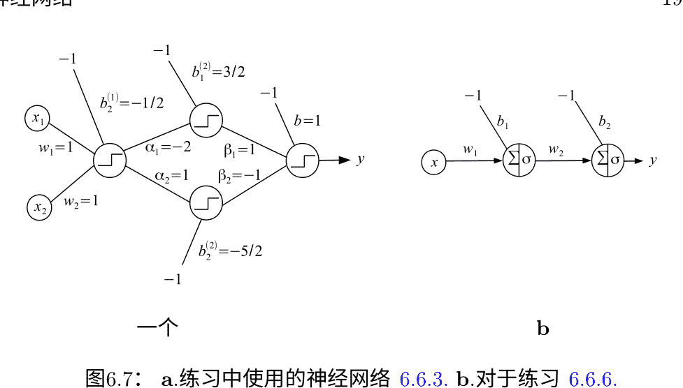

图6.7: a.练习中使用的神经网络 6.6.3. b.对于练习 6.6.6.

为了使梯度下降法正常工作，必须进行一定的权重和偏差初始化。如果网络是浅层的，通常会选择零初始化。对于深层网络，有一些首选的初始化方法，如Xavier初始化或归一化初始化。

#### 6.6 练习

练习 6.6.1 根据备注 6.1.2绘制多层感知器神经网络。

练习 6.6.2 (a) 一个单层感知器能学习以下映射吗：(0,0,0) → 1, (1,0,0) → 0, (0,1,0) → 0, (0,0,1) → 0, (0,1,1) → 1, (1,1,0) → 0, (1,0,1) → 0, (1,1,1) → 1?
(b) 绘制一个能学习前面映射的多层感知器神经网络。说明网络中所有感知器的权重和偏置。

练习 6.6.3 写出图 6.7 a中多层感知器神经网络输出的显式公式。

练习 6.6.4 考虑一个具有一维输入 x、权重 w、偏置 b和输出 y = σ(wx+b)的sigmoid神经元。目标是一维变量 z。考虑成本函数 C(w,b) = \frac{1}{2}(y - z)^2；
(a) 找到 ∇C(w, b) 并证明 ||∇C|| < \frac{1}{4} - \sqrt{1+x^2}(1+|z|);
(b) 写出权重序列的梯度下降迭代公式 (w_n, b_n)。

练习 6.6.5 (降噪)考虑神经网络如下图 6.2。
- (a) 证明对于任意 $\epsilon>0$，存在 $\eta>0$，如果 $\|dX\|<\eta$ 则 $\|dY\| < \epsilon$;
- (b) 假设输入 $X$ 存在噪音。讨论权重正则化对降噪的影响;
- (c) 讨论在降噪中选择激活函数的问题。哪种选择能更好地去噪: 逻辑 $\text{sigmoid}$ 函数还是双曲正切函数?

练习 6.6.6 考虑图 6.7 给出的神经网络 b，其代价函数 $C(w, b) = \frac{1}{2}(y - z)^2$ 。
- (a) 计算 $\delta^{(i)}$ 的值 $= \frac{\partial C}{\partial s^{(i)}}, i \in \{1,2\}$;
- (b) 使用反向传播算法找到梯度 $\nabla C(w, b)$。

练习 6.6.7 假设第 $\ell$ 层的激活函数是线性的，权重和输入是随机变量。
- (a) 证明 $\delta_j^{(\ell)}$ 和 $W_{ij}^{(\ell)}$ 是独立的随机变量;
- (b) 证明 $\delta_j^{(\ell)}$ 和 $X_i^{(\ell-1)}$ 是独立的随机变量。

练习 6.6.8 考虑一个具有随机输入的S型神经元，其输入服从正态分布，$X \sim \mathcal{N}(0,1)$，输出 $Y = \sigma(wX + b)$。证明 $Var Y \approx w^2 \sigma'(b)^2$。注意，输出方差在权重较小的情况下减小，或者在偏置较大的情况下增大。

练习 6.6.9 考虑一个具有S型神经元隐藏层的单隐藏层神经网络。假设输入服从正态分布，$X \sim \mathcal{N}(0,1)$，输出为 $Y = \sum_{i=1}^{N} \alpha_i \sigma(w_i X + b_i)$，证明 $Var Y \approx \sum_j \sigma'(b_i)^2 \alpha_i^2 w_i^2$。

练习 6.6.10 设 $p(x)$ 是区间 $[a, b]$ 上的均匀分布。证明 $H(p) = \ln(b - a)$。

练习 6.6.11 设 $p(x)$ 是一维正态分布，均值为 $\mu$，标准差为 $\sigma$。证明其熵为 $H(p) = \ln(\sigma \sqrt{2\pi e})$。

练习 6.6.12 给出神经网络训练中批量大小 $N$，当前迭代次数 $k$ 和训练周期数 $p$ 之间的关系公式。

## 第二部分
分析理论

## 第七章 逼近定理

本章介绍了一些经典的实分析结果，并应用于学习连续、可积或平方可积函数。本章包含的逼近结果包括Dini定理、Arzela-Ascoli定理、Stone-Weierstrass定理、Wiener的Tauber定理和收缩原理。本章将提供其中一些在学习中的应用，其他应用将在后面的章节中给出。

## 7.1 Dini定理

学习在一个紧致区间上的连续函数等同于展示神经网络产生一系列连续函数，这些函数一致收敛于连续的目标函数。在大多数情况下，构造逐点收敛于目标函数的结果并不困难。然而，展示一致收敛有时可能是一项复杂的任务。在某些情况下，可以通过使用某些近似结果来简化这个过程，例如以下结果。

> 定理7.1.1（Dini）设 $f_n: [a, b] \to \mathbb{R}$ 是一系列连续函数。
> - (i) 如果对于所有的 $n \geq 1$，有 $f_{n+1} \leq f_n$，并且对于任意的 $x \in [a, b]$，有 $f_n(x) \to 0$，则 $f_n$ 一致收敛于0在 $[a, b]$ 上。
> - (ii) 让 $g \in C[a, b]$ 使得 $f_n(x) \searrow g(x)$ 对于任意的 $x \in [a, b]$。那么 $f_n$ 在 $[a, b]$ 上一致收敛于 $g$。

证明：(i) 让 $\epsilon > 0$ 任意固定，并考虑集合

$A_n = f_n^{-1}([\epsilon, \infty)) = \{x \in [a, b]; f_n(x) \geq \epsilon\}$

由于$f_n$是连续函数，那么$A_n$是闭集。此外，集合$A_n$是紧集，作为紧集的闭子集，$A_n \subset [a, b]$。

序列$(A_n)_n$是递减的，即$A_{n+1} \subset A_n$，对于所有的$n \geq 1$。为了证明这一点，假设$x \in A_{n+1}$是任意选择的。由于$f_n(x) \geq f_{n+1}(x) \geq \epsilon$，那么$x \in A_n$，这意味着所需的包含关系成立。

现在假设对于所有的$n \geq 1$，$A_n \neq \emptyset$。那作为一系列非空紧集的交集。让$x_0 \in \bigcap_{n \geq 1} A_n$。然后$f_n(x_0) \geq \epsilon$，对于所有的$n \geq 1$，这与$f_n(x_0) \to 0$矛盾，因为$n \to \infty$。因此，假设是错误的，即存在一个$N \geq 1$，使得$A_N = \emptyset$。这意味着$f_N(x) < \epsilon$，对于所有的$x \in [a, b]$。并且利用$(f_n)_n$是递减的，可以得出$f_n(x) < \epsilon$，对于所有的$n \geq N$和$x \in [a, b]$。这可以写成$\max_{x \in [a,b]} |f_n| \to 0$，当$n \to \infty$时，即$f_n$一致收敛于0。

(ii) 由部分(i)应用于序列$(f_n - g)_n$得出结论。

注 7.1.2 如果紧致区间$[a, b]$被紧致完备度量空间$(S, d)$替代，则结果仍然成立，并且收敛是按度量$d$的意义来考虑的。

例子 7.1.1 考虑一个连续函数$g: [0, 1] \to \mathbb{R}$和分割$\Delta_1: 0 = x_0 < x_1 < \dots < x_n = 1$，使得$(x_i)_i$是$g$的拐点，即$g|_{[x_i, x_{i+1}]}$要么是凸的，要么是凹的，参见图7.2。记$f_1$为通过连接点$(x_i, g(x_i))$而得到的分段线性函数。

这个结果被称为康托引理。

现在，考虑通过用中点$(x_i + x_{i+1})/2$ 丰富分割 $\Delta_1$得到的分割 $\Delta_2$。用$f_2$表示新得到的分段线性函数。我们继续这个过程，将函数$f_n$关联到分割$\Delta_n$。连续函数序列$(f_n)_n$满足以下性质

$|g(x) - f_{n+1}(x)| \leq |g(x) - f_n(x)|, \quad \forall x \in [0,1].$

Dini定理应用于序列$|g - f_n|$意味着$f_n$在$[0,1]$上一致收敛于$g$。

## 7.2 Arzela-Ascoli定理

构造一致收敛序列的另一个结果是从现有的连续函数族中提取具有这个性质的子序列。Arzela-Ascoli定理提供了一个存在性结果，而不是一个构造性的过程，在理论研究中非常有用。首先，我们将介绍一些定义。

在集合A上，函数族F称为一致有界的，如果存在M>0，使得

$|f(x)| \leq M, \quad \forall x \in A, \quad \forall f \in F。$

这意味着家族中的函数F都受到相同的界限M的限制。

### 例子 7.2.1
令 $\mathcal{F} = \{\cos(ax + b); a, b \in \mathbb{R}\}$。 那么家族 $\mathcal{F}$ 是一致有界的，界限为 $M=1$。

### 例子 7.2.2
考虑

$\mathcal{F} = \left\{ \sum_{j=1}^{N} \alpha_j \sigma(w_j x + b_j); \alpha_j, w_j, b_j \in \mathbb{R}, \sum_{j=1}^{N} \alpha_j^2 \leq 1 \right\}$

其中 $\sigma(x)$ 是一个满足 $|\sigma(x)| \leq 1$ 的sigmoid函数（例如逻辑函数或双曲正切函数）。那么家族 $\mathcal{F}$ 是一致有界的，界限为 $\sqrt{N}$。这是由Cauchy不等式的应用得出的结论

$\left| \sum_{j=1}^{N} \alpha_j \sigma(w_j x + b_j) \right|^2 \leq \sum_{j=1}^{N} \alpha_j^2 \sum_{j=1}^{N} \sigma(w_j x + b_j)^2 \leq 1 \cdot N = N.$

一个函数族 $\mathcal{F}$ 在一个集合 $A$ 上被称为等连续的，如果对于任意的 $\forall \epsilon > 0$, 存在 $\eta > 0$, 使得对于任意的 $\forall f \in \mathcal{F}$ 我们有

$|f(x) - f(x')| < \epsilon, \quad \forall x, x' \in A, \quad \text{且} \quad |x - x'| < \eta.$

等价地说，函数族 $\mathcal{F}$ 中的函数都是一致连续的，具有相同的 $\epsilon$ 和 $\eta$。

### 例子 7.2.3
考虑一个连续可微的函数族 $\mathcal{F} \subset C^1[a, b]$，使得存在一个常数 $L > 0$, 满足条件

$\sup_{x\in[a,b]} |f'(x)| < L, \quad \forall f \in \mathcal{F}.$

那么 $\mathcal{F}$ 是等度连续的。为了证明这一点，利用均值定理，我们得到以下估计：

$|f(x) - f(x')| \leq \sup_{x\in[a,b]} |f'(x)| \, |x - x'| \leq L |x - x'|, \quad \forall f \in \mathcal{F},$

然后选择 $\eta = \epsilon / L$。

### 例子 7.2.4
考虑函数族

$\mathcal{F} = \left\{ \sum_{j=1}^{N} \alpha_j \sigma(w_j x + b_j); \alpha_j, w_j, b_j \in \mathbb{R}, \sum_{j=1}^{N} (\alpha_j^2 + w_j^2) \leq 1 \right\},$

其中 $\sigma$ 代表逻辑S型函数。这个函数族可以解释为一个具有 $N$ 个隐藏单元的单隐藏层神经网络的输出。权重约束 $\|\alpha\|^2 + \|w\|^2 \leq 1$ 表示权重保持较小，这是正则化的一种思想之一。在这个假设下，家族 $\mathcal{F}$ 是等度连续的。

这可以如下所示。最大斜率 $\sigma(x)$ 在 $x=0$ 处取得，并且等于

$\max \sigma'(x) = \max \sigma(x)(1 - \sigma(x)) = \sigma(0)(1 - \sigma(0)) = \frac{1}{4}.$

然后对于任意 $f \in \mathcal{F}$，应用柯西不等式，我们有导数估计

$\begin{aligned} |f'(x)| &= \left| \sum_{j=1}^{N} \alpha_j w_j \sigma'(w_j x + b_j) \right| \leq \frac{1}{4} \sum_{j=1}^{N} |\alpha_j| |w_j| \\ &\leq \frac{1}{4} \left( \sum_{j=1}^{N} \alpha_j^2 \right)^{1/2} \left( \sum_{j=1}^{N} w_j^2 \right)^{1/2} \leq \frac{1}{4}. \end{aligned}$

由于$\sup_{x \in [a, b]} |f'(x)| \leq \frac{1}{4}$，$\forall f \in \mathcal{F}$，使用示例7.2.3，可以得出函数族 $\mathcal{F}$ 在 $[a, b]$ 上等度连续。值得注意的是，在更一般的sigmoid函数 $\sigma$ 满足 $|\sigma'(x)| < \lambda < 1$ 的情况下，结论仍然成立。例如，$\sigma(x) = \tanh(cx)$，或者 $\sigma(x) = \sin(cx + b)$，其中 $|c| < \lambda < 1$ 且固定的 $b \in \mathbb{R}$，满足条件。

以下重要结果的证明可以在任何高级实分析书籍中找到，例如[104]。

> **定理7.2.1 (阿尔泽拉-阿斯科利)** 设$\mathcal{F} \subset C[a, b]$是在 $[a, b]$上的连续函数族。那么以下陈述是等价的：
> 
> **(a)** 任意序列 $\forall(f_n)_n \subset \mathcal{F}$ 包含一个子序列 $(f_{n_k})_k$ 是一致收敛的；
> 
> **(b)** 函数族 $\mathcal{F}$ 是等度连续且一致有界的。

我们指出条件(a)等价于 $\mathcal{F}$ 在度量空间$(C[a, b], \|\cdot\|_{\infty})$中是一个紧集，详见附录A中的定义。

以下我们陈述了一个无监督学习的存在性结果。一个三层神经网络在隐藏层大小、激活函数的斜率和权重的大小约束条件下，具有“潜在学习”某些连续函数的能力。

> **定理 7.2.2** 令 $N \geq 1$为一个固定的整数，并考虑一个具有一个隐藏层的神经网络，如下所示：
> 
> - (i) 网络的输入是一个实数有界变量， $x \in [a, b]$;
> - (ii) 输出是一个具有线性激活函数和零偏置的一维神经元;
> - (iii) 隐藏层中有 $N$ 个神经元，具有可微的激活函数 $\sigma$，满足 $|\sigma'| < \lambda < 1$;
> - (iv) 权重满足正则化条件 $\sum_{j=1}^{N} (\alpha_j^2 + w_j^2) \leq 1$，其中 $w_j$ 是输入到隐藏层的权重， $\alpha_j$ 是隐藏层到输出的权重;
> 
> 那么存在一个连续函数 $g$ on $[a, b]$，可以通过该网络进行近似表示。

证明：网络的输出函数由总和给出

$f_{\alpha,w,b}(x) = \sum_{j=1}^{N} \alpha_j \sigma(w_j x + b_j),$

其中 $w_j$ 是从输入到隐藏层的权重， $\alpha_j$ 是从隐藏层到输出的权重。偏置用 $b_j$ 表示。给定权重满足的正则化约束条件，例7.2.2表明族 $\mathcal{F} = \{ f_{\alpha,w,b}; \alpha, w, b \in \mathbb{R}^N \}$ 是均匀有界的。例7.2.4表明 $\mathcal{F}$ 是等度连续的。然后应用Arzela-Ascoli定理，得出由任意序列$(f_n)_n \subset \mathcal{F}$给出的任何结果序列

$f_n(x) = \sum_{j=1}^{N} \alpha_j(n) \sigma(w_j(n) x + b_j(n)), \quad n \geq 1$

有一个子序列 $(f_{n_k})_k$，在 $[a, b]$ 上一致收敛；它的极限是一个连续函数，$g \in C[a, b]$。

注7.2.3 在前面的结果中，连续函数 $g$ 是未知的事先。神经网络学习“可能”是一个连续函数，在网络试验的任意无限序列中，可以提取出一个子序列，其中网络逼近某个连续函数。这是一个存在性结果；构造收敛子序列的算法是一个不同的问题，将在不同的章节中讨论。

### 例子 7.2.5 (Sigmoid 神经元)
考虑一个带有 Sigmoid 函数的神经元，输出

$f_{w,b}(x) = \sigma(w^T x + b),$

其中 $\sigma$ 是逻辑函数，权重 $w \in \mathbb{R}^n$，偏差 $b \in \mathbb{R}$，输入 $x \in I_n = [0,1] \times \cdots \times [0,1]$。假设权重有界，即 $\|w\| \leq 1$。

那么连续函数族
$\mathcal{F} = \{f_{w,b}; \|w\| \le 1, b \in \mathbb{R}\}$
是一致有界的（因为$|f_{w,b}(x)| < 1$）且等度连续的，因为
$\begin{aligned}
|f_{w,b}(x') - f_{w,b}(x)| &= |\sigma(w^T x' + b) - \sigma(w^T x + b)| \\
&\le \max \|\sigma'\| \|w^T x' + b - w^T x - b\| \\
&= \frac{1}{4} \|w^T (x' - x)\| \le \frac{1}{4} \|w\| \|x' - x\| \le \frac{1}{4} \|x' - x\|.
\end{aligned}$
根据Arzela-Ascoli定理，任何输出序列$\{f_{w_k,b_k}\}_k$包含一个一致收敛于连续函数$g$ on $I_n$的子序列。值得注意的是，在偏差$b$上没有任何条件。

#### 7.3 应用于神经网络

前面的概念可以应用于具有隐藏层中的连续神经元的单隐藏层神经网络的研究，另请参见第5.8节。

假设输入属于一个紧致区间，$x \in [a, b]$。众所周知，一个具有$N$个隐藏层神经元的单隐藏层神经网络的输出由$g(x) = \sum_{j=1}^{N} \sigma(w_j x + b_j) \alpha_j$给出，其中$\sigma$是一个逻辑S型函数。此外，$w_j$是输入和第$j$个节点之间的权重，$\alpha_j$是第$j$个节点和输出之间的权重；$b_j$表示隐藏层中第$j$个神经元的偏置。

我们希望将隐藏单元的数量推广到无限的情况。特别地，我们希望考虑隐藏单元数量可数无限的情况。我们假设隐藏神经元由$t$连续参数化，取值范围为紧凑的$[c, d]$。因此，参数$t$将替代索引$j$。此外，求和权重$\alpha_j$，将被一个测度替代，在假设绝对连续于勒贝格测度$dt_{[c,d]}$的情况下，将采取形式$h(t) dt$。从第$j$个隐藏神经元的输出，$\sigma(w_j x + b_j)$，是$x$的连续函数，并且取决于$j$。这将转化为核函数$K(x, t) = \sigma(w(t)x + b(t))$。求和将变成对上述测度的积分。

因此，输出的连续模拟$g(x) = \sum_{j=1}^{N} \sigma(w_j x + b_j) \alpha_j$是积分$g(x) = \int_c^d K(x, t) h(t) dt$。如果$K$是具有核$K$的积分变换，那么$g = K(h)$，即输出是测度密度$h$的积分变换。假设正则化条件为$\|h\|_{L^2}^2 \le M$，即测度密度 $L^2$-均匀有界，那么输出的集合是等度连续且有界的，参见练习7.11.10。根据Arzela-Ascoli定理，存在一个序列$(h_n)_n$，使得输出序列$g_n = K(h_n)$在$[c,d]$上一致收敛于一个连续函数$g$。在第9章中，将会证明神经网络可以精确地学习$[c,d]$上的任何连续函数。

值得注意的是，我们可以考虑一个更一般的情况，其中隐藏单元的数量可以是有限的、可数无限的或不可数无限的。这可以通过选择输出 $g(x) = \int_c^d K(x, t) d\mu(t)$，其中权重测度 $\mu$如第5.8节所述。

## 7.4 Stone-Weierstrass定理

在本节中，我们用 $K$表示 $\mathbb{R}^n$中的一个紧致集。对于将来的应用，我们只需考虑 $K = I_n = [0, 1] \times \cdots \times [0,1]$，即单位超立方体，在情况 $n=1$下，我们可以考虑 $K=[a, b]$。连续实值函数在 $K$上的集合记为 $C(K)$。如果我们设置度量，空间 $C(K)$将成为一个度量空间。

$d(f, g) = \max_{x \in K} |f(x) - g(x)|, \quad \text{对于所有的} f, g \in C(K).$

$C(K)$也可以被视为一个带有范数的线性空间，其中范数定义为 $\|f\| = \max_{x \in K} |f(x)|$。

接下来，我们将介绍近似理论和学习中使用的一个核心概念。读者可以在附录的E.1节中找到距离和度量空间的定义。

定义7.4.1 设 $(S, d)$是一个度量空间， $A$是 $S$的一个子集。如果对于任意的元素$g\in S$，存在一个序列$(f_n)$ of elements in $A$，使得$\lim_{n\to\infty} d(f_n, g) = 0$，则$A$被称为$S$中的稠密集。

等价地，这意味着 $\forall \epsilon > 0$，存在 $N > 1$，使得

$d(f_n, g) < \epsilon, \quad \forall n \geq N.$

### 例子 7.4.2
设 $(S, d) = (\mathbb{R}, | |)$ 是实数集合，其距离由绝对值给出， $\mathcal{A} = \mathbb{Q} = \{ \frac{p}{q} ; p, q \text{整数}, q \neq 0\}$，是有理数集合。那么 $\mathbb{Q}$在 $\mathbb{R}$中是稠密的，即对于任意 $x \in \mathbb{R}$，存在一列有理数，$(r_n)_n$，收敛于 $x$。

等价地，任何实数都可以用有理数逼近：

给定 $x \in \mathbb{R}$，则 $\forall \epsilon > 0$，存在 $r \in \mathbb{Q}$使得 $|x - r| < \epsilon$。

例子 7.4.3 考虑 $S = C(K)$ 以距离 $d(f, g) = \max_{x \in K} |f(x) - g(x)|$ 为基础。如果对于任意的 $g \in C(K)$ 和任意的 $\epsilon > 0$，存在一个函数 $f \in \mathcal{A}$ 使得

$|g(x) - f(x)| < \epsilon, \quad \text{对于所有的} x \in K.$

密度的拓扑学概念是指子集 $\mathcal{A}$ 的元素尽可能地接近互补集 $S \setminus \mathcal{A}$。即使在一般空间的背景下，这个概念可能有些违反直觉，读者可以将其类比为有理数和实数的情况。

一个子集 $\mathcal{A}$ of $C(K)$ 如果 $\mathcal{A}$ 对于线性组合和实数乘法封闭，则称为一个代数：

- (i) $\forall f, g \in \mathcal{A} \Rightarrow f + g \in \mathcal{A};$
- (ii) $\forall f \in \mathcal{A}, \forall c \in \mathbb{R} \Rightarrow cf \in \mathcal{A};$
- (iii) $\forall f, g \in \mathcal{A} \Rightarrow fg \in \mathcal{A};$

我们注意到前两个条件表明 $\mathcal{A}$ 是 $C(K)$ 的一个线性子空间。

例子 7.4.1 让 $\mathcal{A}$ 是在 $[0, 2\pi]$ 上的所有有限傅里叶级数的集合

$\mathcal{A} = \left\{ f(x) = c_0 + \sum_{k=1}^{N} (a_k \cos kx + b_k \sin kx); a_k, b_k \in \mathbb{R}, N = 0, 1, 2, \dots \right\}.$

很明显，$\mathcal{A}$ 对于线性组合是封闭的。使用将乘积转化为和的公式，例如 $\cos mx \cos nx = \frac{1}{2} [\cos(m+n)x + \cos(m-n)x]$，由此可知 $\mathcal{A}$ 也对乘积是封闭的。因此，$\mathcal{A}$ 是 $C[0, 2\pi]$ 的代数。

如果对于任意不同的 $x, y \in K$，存在一个 $f \in \mathcal{A}$ 使得 $f(x) = f(y)$，则代数 $\mathcal{A}$ 被称为在 $K$ 中分离点。

如果对于任意的 $c \in \mathbb{R}$，我们有 $c \in \mathcal{A}$，则我们说代数 $\mathcal{A}$ 包含常数函数。鉴于 $\mathcal{A}$ 的代数性质，只需证明 $1 \in \mathcal{A}$ 即可。

例子 7.4.2 令 $\mathcal{A}$ 为定义在 $[a, b]$ 上的所有多项式的集合

$\mathcal{A} = \left\{ f(x) = \sum_{k=0}^{n} c_k x^k; x \in [a, b], c_k \in \mathbb{R}, n = 0, 1, 2, \dots \right\}.$

那么 $\mathcal{A}$ 是 $C[a, b]$ 上的一个代数，它可以分离点。为了看到这一点，令 $x, y \in [a, b]$ 并选择 $f$ 为恒等多项式。那么 $f(x) = x = y = f(y)$。由于 $1 \in \mathcal{A}$，所以 $\mathcal{A}$ 也包含常数函数。

以下逼近定理的证明可以在 [104] 中找到。

## 定理 7.4.4 (Stone-Weierstrass)

令 $K$ 为 $\mathbb{R}^n$ 中的紧致集合，并且 $\mathcal{A}$ 是 $K$ 上的连续实值函数的代数，满足以下性质：

- (i) $\mathcal{A}$ 分隔了 $K$ 的点；
- (ii) $\mathcal{A}$ 包含常数函数。

那么 $\mathcal{A}$ 是 $C(K)$ 的一个稠密子集。

## 例子 7.4.3

让 $\mathcal{A}$ 是在 $[a, b]$ 上定义的所有多项式的集合

$\mathcal{A} = \left\{ f(x) = \sum_{k=0}^{n} c_k x^k; x \in [a, b], c_k \in \mathbb{R}, n = 0,1,2,\ldots \right\}$.

从例子 7.4.2 知 $\mathcal{A}$ 是 $C[a, b]$ 上分隔点和包含常数函数的代数。根据 Stone-Weierstrass 定理，对于任意连续函数 $g: [a, b] \rightarrow \mathbb{R}$ 和任意 $\epsilon >0$，存在一个多项式函数 $f$ 使得 $|g(x)-f(x)|<\epsilon$，对于所有的 $x \in [a, b]$。如果我们考虑一个递减的序列 $\epsilon_n \searrow 0$ 并用 $f_n$ 表示相关的多项式，那么序列 $(f_n)_n$ 趋向于在 $[a, b]$ 上的 $g$ 的一致收敛。 也就是说，$\max_{x \in [a,b]} |f_n - g| \to 0,$ 当 $n \to \infty$。

以下逼近结果适用于在乘积空间上的连续函数：

## 命题 7.4.5

设 $f: [a, b] \times [c, d] \rightarrow \mathbb{R}$ 是一个连续函数。那么对于任意 $\epsilon > 0$，存在 $N \ge 1$ 以及连续函数 $g_i \in C[a, b]$ 和 $h_i \in C[c, d]$，其中 $i=1, \ldots, N$，使得

$\max_{x,y} \left| f(x, y) - \sum_{i=1}^{N} g_i(x)h_i(y) \right| < \epsilon.$

证明：考虑函数集合

$\mathcal{A} = \left\{ G(x, y) = \sum_{i=1}^{N} g_i(x)h_i(y); g_i \in C[a, b], h_i \in C[c, d], N = 1,2,\ldots \right\}$.

很容易看出 $\mathcal{A}$ 对于线性组合和乘法是封闭的，即 $\mathcal{A}$ 是 $C([a, b] \times [c, d])$ 的代数。显然，$\mathcal{A}$ 包含常数函数。为了证明 $\mathcal{A}$ 分离点，假设 $(x_1, y_1) \neq (x_2, y_2)$ 是两个不同的点。那么，要么 $x_1 \neq x_2$，要么 $y_1 \neq y_2$。在前一种情况下，函数 $G(x, y) = x \cdot 1$ 分离这些点，而在后一种情况下，$G(x, y) = 1 \cdot y$ 也是如此。应用 Stone-Weierstrass 定理得到所需的结果。

注 7.4.6 前面的结果可以很容易地推广到有限个紧区间的乘积。

Stone-Weierstrass 定理的一个应用是具有余弦（或正弦）激活函数的神经网络可以学习任何周期函数。下一节将发展这个想法。

#### 7.5 应用于神经网络

考虑一个具有实数输入，一个一维输出和隐藏层中的 $N$ 个神经元的单隐藏层神经网络。我们假设激活函数为 $\phi( x ) = \cos(x)$。由于这既不是一个 Sigmoid 函数，也不是一个压缩函数，因此第 9 章中得到的结果对这种情况都没有用。网络的输出由和给出

$$y = a_0 + \sum_{j=1}^{N} \alpha_j \cos(w_j x + b_j),$$

其中 $w_j$ 和 $\alpha_j$ 分别是从输入到隐藏层和从隐藏层到输出的权重。隐藏层中的偏置用 $b_j$ 表示，而输出层中的神经元的偏置用 $a_0$ 表示。我们注意到隐藏层中的激活函数是余弦函数，而输出神经元中的激活函数是线性的。参见图 7.3 a。

我们声称上述网络可以表示连续周期函数。考虑一个连续函数 $f : \mathbb{R} \to \mathbb{R}$，它是周期性的，即 $f(x + T) = f(x)$。令 $\nu = \frac{2\pi}{T}$ 是相关的频率。考虑形式为 $w_i = i\nu$ 的权重。三角公式的应用提供

$$\begin{aligned}
y &= a_0 + \sum_{j=1}^{N} \alpha_j \cos(j\nu x + b_j) \\
&= a_0 + \sum_{j=1}^{N} \alpha_j \cos(j\nu x) \cos(b_j) - \alpha_j \sin(j\nu x) \sin(b_j) \\
&= a_0 + \sum_{j=1}^{N} a_j \cos(j\nu x) - c_j \sin(j\nu x) \\
&= a_0 + \sum_{j=1}^{N} a_j \cos \left( \frac{2\pi j x}{T} \right) - c_j \sin \left( \frac{2\pi j x}{T} \right),
\end{aligned}$$

具有系数 $a_j = \alpha_j \cos(b_j)$ 和 $c_j = \alpha_j \sin(b_j)$ 的。根据练习 7.11.7，这些三角和在连续周期函数的集合上是稠密的，周期为 $T$。因此，对于任意 $\epsilon >0$，存在 $N \geq 1$，$\alpha_j$，$b_j$，$\nu \in \mathbb{R}$ 使得

$$\left| a_0 + \sum_{j=1}^{N} \alpha_j \cos(j\nu x + b_j) - f(x) \right| < \epsilon.$$

由于余弦是一个偶函数，选择 $\nu >0$ 就足够了。选择递减序列 $\epsilon = \frac{1}{n}$，得到一系列频率 $\nu_n$，它们近似于正确的频率 $\nu = \frac{2\pi}{T}$ 的 $f$ of。这种方法可以稍微修改以从连续信号中提取隐藏频率。考虑目标信号 $z = f(x)$ ，其中 $x$ 表示时间。先前计算的权重 $\nu$ 现在被视为超参数。因此，对于每个固定的 $\nu$ 值，我们调整神经网络的其他参数，直到成本函数最小。这可以通过梯度下降法来实现。然后，改变 $\nu$ 的值，我们得到相关成本函数的不同值。我们选择那些使成本函数达到局部最小值的 $\nu$ 值，参见图 7.3 b。它们对应于信号中包含的适当频率。成本函数的全局最小值应该是在先前调整中获得的 $\nu$ 值，这对应于信号中的主频率。

这种类型的分析可以帮助研究股票。内置的频率可以更高效地交易股票。

## 7.6 维纳的塔伯利安定理

有时，对于一个网络来学习一个在整个实数线上可积或平方可积的时变信号是有用的。以下定理可用于证明这些类型的学习的存在。下面的两个结果是由维纳 [128] 得出的。

### 7.6.1 在 $L^1(\mathbb{R})$ 中学习信号

定理 7.6.1 设 $f \in L^1(\mathbb{R})$ 并考虑翻译函数 $f_\theta(x) = f(x + \theta)$。如果且仅如果 $f$ 的傅里叶变换在实域上从不取零值，则 $\{ f_\theta; \theta \in \mathbb{R} \}$ 的线性张量在 $L^1(\mathbb{R})$ 中是稠密的。

使用这个定理的方法如下。考虑一个神经网络，其激活函数由一个可积函数 $f$ 给出，其中 $\hat{f}(\xi) \neq 0$。对于任意 $g \in L^1(\mathbb{R})$ 和任意 $\epsilon > 0$，存在一个函数

$$G(x) = \sum_{j=1}^{N} \alpha_j f(x + \theta_j), \quad \alpha_j, \theta_j \in \mathbb{R}, N = 1, 2, \ldots,$$

使得 $\| g - G \|_1 < \epsilon$。函数 $G(x)$ 是一个具有激活函数 $f$、权重 $\alpha_j$ 和偏置 $\theta_j$ 的单隐藏层神经网络的输出。

接下来，我们将强调一些满足上述条件的激活函数。

- (i) 双指数：设 $f(x) = e^{-\lambda |x|}$，其中 $\lambda > 0$。那么

$$\int_{\mathbb{R}} |f(x)| dx = 2 \int_{0}^{\infty} e^{-\lambda x} dx = \frac{2}{\lambda} < \infty,$$

因此 $f \in L^1(\mathbb{R})$。傅里叶变换由以下给出

$$\hat{f}(\omega) = \frac{2\lambda}{\lambda^2 + \omega^2} \neq 0.$$

- (ii) 拉普拉斯势：考虑 $f(x) = \frac{1}{x^2 + a^2}$，带有一些 $a > 0$，固定。因为

$$\int_{\mathbb{R}} |f(x)| dx = \frac{1}{a} \tan^{-1}\left(\frac{x}{a}\right)\big|_{-\infty}^{\infty} = \frac{\pi}{2a} < \infty$$

请注意，傅里叶变换是 $\hat{f}(\omega) = \frac{\pi}{a} e^{-a|\omega|} \neq 0$。

- (iii) 高斯：让 $f(x) = e^{-ax^2}$，其中 $a > 0$。我们有 $f \in L^1(\mathbb{R})$，因为

$$\int_{\mathbb{R}} e^{-ax^2} dx = \sqrt{\frac{\pi}{a}}$$

傅里叶变换，$\hat{f}(\omega) = \sqrt{\frac{\pi}{a}} e^{-\frac{\omega^2}{4a}}$，永不消失。

我们得出结论，任何一个具有隐藏层的单隐藏层神经网络，输入 $x \in \mathbb{R}$ 和激活函数，如 (i)，(ii)，或 (iii)，我们可以通过调整隐藏层中的权重 $\alpha_j$，偏置 $\theta_j$ 和单元数 $N$ 来学习任何给定的可积函数 $g \in L^1(\mathbb{R})$。

### 7.6.2 在 $L^2(\mathbb{R})$ 中学习信号

定理 7.6.2 设 $f \in L^2(\mathbb{R})$ 并考虑平移函数 $f_\theta(x) = f(x+\theta)$。那么，对于 $f$ 的傅里叶变换的零点集是勒贝格可忽略的，当且仅当 $\{ f_\theta; \theta \in \mathbb{R} \}$ 的线性张量在 $L^2(\mathbb{R})$ 中是稠密的。

我们使用以下定理。考虑一个平方可积函数 $f$，其集合 $\{\xi; \hat{f}(\xi)=0\}$ 是勒贝格可忽略的。实际上，对于 $\hat{f}(\xi)$ 的零点，有一个有限或可数的数量就足够了。那么对于任意的 $g \in L^2(\mathbb{R})$ 和任意的 $\epsilon > 0$，存在一个函数

$$G(x) = \sum_{j=1}^N \alpha_j f(x+\theta_j), \quad \alpha_j, \theta_j \in \mathbb{R}, N=1,2,\dots,$$

使得 $\|g - G\|_2 < \epsilon$。我们注意到函数 $G(x)$ 是一个具有激活函数 $f$、权重 $\alpha_j$ 和偏置 $\theta_j$ 的一层隐藏层神经网络的输出。

值得注意的是先前提出的激活函数 (i), (ii) 和 (iii) 也是平方可积的，并满足零勒贝格测度条件。

备注 7.6.3 这种方法有一些限制。

- (i) 其中之一是所有先前的激活函数都是钟形的。类似于 S 型函数或曲棍球形状的激活函数，如逻辑函数或 ReLU 函数，不属于 $L^1(\mathbb{R})$，因此，维纳定理在这种情况下不适用。
- (ii) 另一个限制是傅里叶变换的闭合形式表达式仅适用于有限数量的函数。

#### 7.7 收缩原理

本节介绍了将收缩原理应用于深度学习的一个应用。

如果 $(S, d)$ 是一个度量空间，那么映射 $A : S \rightarrow S$ 被称为收缩映射，如果存在 $0 < \lambda < 1$ 使得

$d(Ax, Ax') \leq \lambda d(x, x'), \qquad \text{对于所有的 } x, x' \in S.$

例子 7.7.1 令 $S = \mathbb{R}$，度量为 $d(x, x') = |x - x'|$。

考虑 $A : \mathbb{R} \rightarrow \mathbb{R}$，定义为 $Ax = \frac{1}{2} \cos x$。根据平均值定理，$\cos x - \cos x' = -\sin(\xi)(x - x')$，其中 $\xi$ 在 $x$ 和 $x'$ 之间。然后

$|Ax - Ax'| = \frac{1}{2} |\cos x - \cos x'| \leq \frac{1}{2}|x - x'|, \qquad \text{对于所有的 } x, x' \in \mathbb{R},$

因此，函数 $A$ 是一个压缩映射。

在度量空间 $(S, d)$ 中，序列 $(x_n)_n$ 被称为 Cauchy 序列，如果任意两个元素的距离，对于足够大的索引，可以被任意缩小。这意味着，$\forall\epsilon > 0$，存在 $N \geq 1$，使得

$d(x_n, x_m) < \epsilon, \qquad \text{对于所有的 } n, m \geq N.$

很容易注意到，任何收敛序列都是 Cauchy 序列。这是三角不等式的一个推论。如果 $x_n$ 收敛于 $x$，则对于任意 $\epsilon > 0$

$d(x_n, x_m) \leq d(x_n, x) + d(x_m, x) < \frac{\epsilon}{2} + \frac{\epsilon}{2} = \epsilon, \qquad \text{对于所有的 } n, m \geq N.$

逆命题不一定成立，所以我们需要以下概念。度量空间 $(S, d)$ 被称为完备的，如果任何柯西序列都收敛。

例子 7.7.2 实数空间 $\mathbb{R}^n$ 是一个完备的度量空间，与欧几里得距离一起。

元素 \(x_0 \in S\) 被称为映射 \(A: S \to S\) 的不动点，如果 \(Ax_0 = x_0\)。例如，如果 \(S = \mathbb{R}\)，不动点对应于 \(A\) 的图与直线 \(y = x\) 的交点。关于不动点的几个例子，请参阅附录中的第 E.6 节。下面的主要结果将在神经网络的研究中很快有用。

## 定理 7.7.1 (收缩原理)

设 \((S, d)\) 是一个完备的度量空间。那么任何收缩映射 \(A: S \to S\) 都有唯一的不动点。

一个具有logistic激活函数 \(\sigma\) 的单隐藏层神经网络的输出由以下给出

$$A(x) = \sum_{j=1}^{N} \alpha_j \sigma(w_j x + b_j)。 \qquad (7.7.1)$$

其中我们假设输入和输出都是实数，即 \(A: \mathbb{R} \to \mathbb{R}\)。

## 命题 7.7.2

假设以下权重正则化条件成立

$$\sum_{j=1}^{N} w_j^2 \leq 1, \quad \sum_{j=1}^{N} \alpha_j^2 \leq 1。 \qquad (7.7.2)$$

那么由 (7.7.1) 定义的输入输出函数 \(A\) 是一个收缩映射，其中 \(\lambda = 1/4\)。

### 证明：

根据均值定理，logistic函数满足

$$|\sigma(u) - \sigma(u')| \leq \max |\sigma'| |u - u'| \leq \frac{1}{4}|u - u'|, \qquad \forall u, u' \in \mathbb{R}.$$

利用前面的关系，柯西不等式和正则化条件，我们有估计

$$\begin{aligned}
|A(x) - A(x')| &\leq \left| \sum_{j=1}^{N} \alpha_j \big(\sigma(w_j x + b_j) - \sigma(w_j x' + b_j)\big) \right| \\
&\leq \sum_{j=1}^{N} |\alpha_j| |\sigma(w_j x + b_j) - \sigma(w_j x' + b_j)| \\
&\leq \frac{1}{4} |x - x'| \sum_{j=1}^{N} |\alpha_j| |w_j| \\
&\leq \frac{1}{4} |x - x'| \big(\sum_{j=1}^{N} \alpha_j^2\big)^{1/2} \big(\sum_{j=1}^{N} w_j^2\big)^{1/2} \leq \frac{1}{4}|x - x'|,
\end{aligned}$$

这表明 A 是一个收缩。

### 注 7.7.3

在具有有界斜率的激活函数的情况下，正则化条件可以放宽为

$$\sum_{j=1}^{N} w_j^2 \leq M, \quad \sum_{j=1}^{N} \alpha_j^2 \leq M,$$

其中 \(M < \sup |\sigma'|\). 也就是说，权重的范数上界受到激活函数的最大斜率的限制。

## 推论 7.7.4

存在一个唯一的实数值， \(c \in \mathbb{R}\)，它在网络中保持不变，即 \(Ac = c\)。

证明：根据命题 7.7.2，函数 \(A\) 是一个收缩，由于空间 \(\mathbb{R}\) 是完备的，收缩原理，定理 7.7.1，暗示了 \(A\) 有一个唯一的不动点， \(c\)。

### 注 7.7.5

唯一的值 \(c\) 与递归神经网络的饱和水平有关，我们将在下一节中看到。

#### 7.8 应用于循环神经网络

在下面，一个神经单元将代表一个具有一个隐藏层的神经网络，其中正则化条件（7.7.2）成立，并且具有输入 \(x \in \mathbb{R}\) 和输出 \(A(x) \in \mathbb{R}\)，由（7.7.1）给出。神经单元在图7.4中表示。我们现在将神经单元连接起来构建一个循环神经网络，如图7.5所示。这意味着第 \(n\) 个神经单元的输出是

对于 \(n \geqslant 1\)，\((n+1)\)th 神经单元的输入是 \(n\)th 神经单元的输出。第 \(n\) 个神经单元的输出是 \(A^n(x) = A(\ldots A(A(x)) \ldots)\)。暂时来说，从权重和偏置的角度来看，所有神经单元都被认为是相同的。权重没有更新，被认为是常数。网络中的学习是无监督的，即没有预先指定的目标函数。

现在，问题是：这种类型的网络学习什么？

更准确地说，假设对于每个输入值，\(x \in \mathbb{R}\)，第 \(n\) 个结果，\(y_n = A^n(x)\)，是一个收敛序列，极限为 \(y\)，取决于 \(x\)。如果我们定义 \(y= \Lambda(x)\)，网络学习的函数就是 \(\Lambda(x)\)。
下一个结果涉及到这个函数的存在性、唯一性和形式。

## 命题 7.8.1

图7.5中构建的循环网络学习一个常数 \(c\)，它是输入输出映射 \(y = A(x)\) 的唯一不动点。

证明：对于每个输入值 \(x\)，考虑实数序列 \(y_n = A^n(x)\)。为了证明 \((y_n)\) 是收敛的，只需证明它是柯西序列。

使用函数的收缩性质 \(A\)，我们估计序列中两个连续项之间的差异为

$$|y_{n+1} - y_n| = |A^{n+1}(x) - A^{n}(x)| < \frac{1}{4}|A^{n}(x) - A^{n-1}(x)| < \cdots < \frac{1}{4^n}|A(x) - x| = \frac{1}{4^n}|y_1 - x|.$$
令 \(m = n + k\)，然后使用三角不等式估计序列中两个远离项之间的差异为

$$|y_{n+k} - y_n| \leq |y_{n+k} - y_{n+k-1}| + |y_{n+k-1} - y_{n+k-2}| + \cdots + |y_{n+1} - y_n|$$
$$< \frac{1}{4^n}|y_1 - x| + \frac{1}{4^{n+1}}|y_1 - x| + \cdots + \frac{1}{4^{n+k-1}}|y_1 - x|$$
$$< \frac{1}{4^n}(1 + \frac{1}{4} + \frac{1}{4^2} \cdots) |y_1 - x|$$
$$= \frac{1}{4^n} \frac{1}{1 - \frac{1}{4}}|y_1 - x| = \frac{1}{3 \cdot 4^{n-1}}|y_1 - x| \tag{7.8.3}$$

很明显，如果 \(n\) 足够大，差异 \(|y_{n+k} - y_n|\) 可以任意小。因此，\((y_n)_n\) 是一个柯西序列。由于 \(\mathbb{R}\) 是完备的，序列 \((y_n)_n\) 收敛，极限为 \(y = \lim_{n \to \infty} y_n\)。由于 \(y\) 取决于 \(x\)，我们有 \(y = \Lambda(x)\)。

在接下来的证明中，我们将证明实际上 \(y\) 不依赖于输入 \(x\)，因此，\(\Lambda(x)\) 是常数。为了证明这一点，只需考虑任意的固定输入 \(x, x' \in \mathbb{R}\)，并证明对于任意的 \(\epsilon > 0\)，我们有
$$|\Lambda(x) - \Lambda(x')| < \epsilon.$$
令 \(y'_n = A^n(x')\)，并令 \(y'\) 为其极限。三角不等式提供

$$\begin{aligned}
|\Lambda(x) - \Lambda(x')| &\leq |\Lambda(x) - A^n(x)| + |A^n(x) - A^n(x')| + |A^n(x') - \Lambda(x')| \\
&\leq |y - y_n| + \frac{1}{4^n}|x - x'| + |y'_n - y'| \\
&\leq \frac{\epsilon}{3} + \frac{\epsilon}{3} + \frac{\epsilon}{3} = \epsilon,
\end{aligned}$$
由于对于足够大的 \(n\)，每个项都可以比 \(\epsilon/3\) 小。
因此，\(y = \Lambda(x)\) 是一个常数。为了确定它的值，我们通过三角不等式进行估计

$$\begin{aligned}
|A(y) - y| &\leq |A(y) - y_n| + |y_n - y| = |A(y) - A(y_{n-1})| + |y_n - y| \\
&< \frac{1}{4}|y - y_{n-1}| + \frac{\epsilon}{2} \\
&< \frac{\epsilon}{2} + \frac{\epsilon}{2} = \epsilon,
\end{aligned}$$
对于足够大的 \(n\) 和任意预先确定的 \(\epsilon > 0\)。结果发现 \(A(y) = y = c\)，即，\(y\) 是函数 \(A\) 的唯一不动点，即，\(Ac = c\)。总之，网络学习了输入-输出映射 \(A\) 的不动点。

### 注 7.8.2

从近似点到固定点的距离是有用的。为此，我们取极限 \(k \to \infty\) 在关系(7.8.3)中得到

$$|y_n - c| = |y_n - y| \leq \frac{1}{3 \cdot 4^{n-1}} |y_1 - x| = \frac{1}{3 \cdot 4^{n-1}} |A(x) - x|. \tag{7.8.4}$$

整数 \(n\)，表示网络的深度，可以选择得足够小，使得误差变得任意小。

改变网络的权重会导致不同的学习常数 \(c\)。接下来，我们将研究固定点 \(c\) 相对于权重 \(\alpha_j\) 的连续依赖性。首先，我们需要引入一个新的概念。

## 定义 7.8.3

如果两个神经网络的输入-输出映射满足某个 \(\epsilon\)-接近性，则它们被称为 \(\epsilon > 0\)。对于所有输入 \(x \in \mathbb{R}\)，它们的输入-输出映射满足 \(|A(x) - A'(x)| < \epsilon\)。换句话说，这意味着一个网络的输出属于另一个网络输出的 \(\epsilon\)-邻域，即 \(A'(x) \in (A(x) - \epsilon, A(x) + \epsilon)\)。粗略地说，网络输出之间的误差对输入 \(x\) 是均匀的。

## 引理 7.8.4

考虑两个神经元的输入-输出映射，分别为 \(A(x) = \sum_{j=1}^{N} \alpha_j \sigma(w_j x + b_j)\) 和 \(A'(x) = \sum_{j=1}^{N} \alpha'_j \sigma(w_j x + b_j)\)，这样 \(\sum_{j=1}^{N} |\alpha'_j - \alpha_j| < 2\epsilon\)，那么神经元是 \(\epsilon\)-接近的。

证明: 利用 \(|\sigma(x)| < 1\), 一个直接的计算提供 \(|A'(x) - A(x)| = \left| \sum_{j=1}^{N} (\alpha'_j - \alpha_j) \sigma(w_j x + b_j) \right| \le \sum_{j=1}^{N} |\alpha'_j - \alpha_j| < 2\epsilon\), 对于所有的 \(x \in \mathbb{R}\)。

## 引理 7.8.5

考虑两个 \(\epsilon\)-接近的神经元，如引理 7.8.4 中所述，具有输入-输出映射 \(A(x)\) 和 \(A'(x)\)，并且用 \(c\) 和 \(c'\) 表示它们的固定点。那么 \(|c' - c| < \frac{4\epsilon}{3}\)。

证明: 构造序列 \(y_n = A^n(c)\)，其中 \(A(c) = c\)。序列 \(y_n\) 收敛于 \(c'\)，即 \(A'\) 的不动点。如果在关系式 (7.8.3) 中取 \(k \to \infty\) 并令 \(n = 0\)，则我们得到初始点与极限之间的距离的界限。

$$\lim_{n \to \infty} |y_n - y_0| < \frac{4}{3} |y_1 - y_0|,$$

或者，等价地说，

$$|c' - c| < \frac{4}{3} |A'(c) - c| = \frac{4}{3} |A'(c) - A(c)| < \frac{4 \epsilon}{3}$$

，我们使用了 \(A\) 和 \(A'\) 是 \(\epsilon\)-接近的。

神经元的固定点对于权重 \(\alpha_j\) 的连续依赖可以表示为以下形式:

## 命题 7.8.6

考虑引理 7.8.4 中的两个神经元。对于任意 \(\epsilon > 0\)，存在一个 \(\eta > 0\)，使得如果 \(\sum_{j=1}^{N} |\alpha'_j - \alpha_j| < \eta\)，那么 \(|c' - c| < \epsilon\)。

证明: 设 \(\epsilon > 0\) 任意固定，选择 \(\eta = \frac{3}{4}\epsilon\)。网络是 \(\eta\)-接近的。然后应用引理 7.8.5 得到所需的结果。

通过使用两个 \(\epsilon\)-接近的神经元单元获得的循环神经网络，共享权重 \(w_j\) 和偏置 \(b_j\)，如图7.6所示。该网络学习固定点的向量 \((c, c')\)。

#### 7.9 共振网络

我们考虑一个具有两层的神经网络，参见图7.7。信息在层之间来回传递，直到最终收敛到一个稳定状态。设 N 为每层的神经元数量。左侧层的初始状态由向量 \(X_0\) 给出。这导致第二层的状态 \(Y_0 = \phi(W X_0 + b)\)，其中权重被假设对称，\(w_{ij} = w_{ji}\)。这个信息被反馈到第一层，提供输出 \(X_1 = \phi(W Y_0 + b)\)。这里，\(\phi\) 是两层的激活函数，\(b\) 是共同的偏置向量。

这样，我们通过系统递归地得到序列 \((X_n)_n\) 和 \((Y_n)_n\)

$$Y_n = \phi(W X_n + b)$$
$$X_n = \phi(W Y_{n-1} + b), \quad n \geq 1.$$

这可以分解为两个递归
\(Y_n = F(Y_{n-1})\)
\(X_n = F(X_{n-1})\)，其中 \(F : \mathbb{R}^N \to \mathbb{R}^N, F(U) = W \phi(W U + b) + b\)。网络的稳态对应于一对固定点， \((X^*, Y^*)\)，其中 \(F(X^*) = X^*\) 和 \(F(Y^*) = Y^*\)。

我们将使用收缩原理来处理这个问题。首先，我们将问题写成等价的形式如下。只需证明 \(Z_n\) 是一组收敛到某个向量 \(Z^*\) 的向量序列。由于 \(G : \mathbb{R}^N \to \mathbb{R}^N\)，计算结果显示

$$\|G(Z')-G(Z)\|_2 \leq \|\nabla G\|_2 \|Z'-Z\|_2 \leq \sqrt{N} \|\phi'\|_\infty \|W\|_2 \|Z'-Z\|_2, \quad \forall Z, Z' \in \mathbb{R}^N.$$

如果权重满足不等式

$$\|W\|_2 < 1/(\sqrt{N} \|\phi'\|_\infty)$$

那么 \(G\) 成为一个压缩映射。定理 E.6.5 保证 \(G\) 有一个唯一的不动点 \(Z^*\)，该点由序列 \(Z_n\) 逼近。结论是，如果权重 \(w_{ij}\) 足够小，网络的状态趋向于稳定状态或共振状态。

### 备注 7.9.1

如果 \(N = 1\)，只有两个神经元交替改变状态。如果激活函数是logistic函数，稳定性条件变为 \(w_{12} = w_{21} < 4\)。

### 备注 7.9.2

这种类型的架构的一个例子是 Kosko 的双向关联记忆（BAM）[67]。它也可以被看作是 Hopfield (1984) [58] 的一个特殊情况，值得注意的是与 Cohen-Grossberg 模型 [25] 的关系。

#### 7.10 总结

本章包含一些对神经网络表示有用的经典实分析结果。

对于学习连续函数 \(f \in C[a, b]\)，需要一致收敛。神经网络产生一系列连续函数，逐点收敛到目标函数 \(f\)。为了证明这种收敛是一致的，我们可以使用Dini定理。

在紧致集上构造一致收敛函数序列的另一种技术是使用Arzela-Ascoli定理。在这种情况下，可以从一组有界且等度连续的结果中提取一个收敛子序列。因此，具有Sigmoid激活函数的单隐藏层神经网络可以在紧致集上学习连续函数。连续函数在紧致集上的另一种逼近方法是使用Stone-Weierstrass定理。这也可以用于神经网络学习周期函数。

从 \(L^1\) 和 \(L^2\) 目标函数可以使用维纳的塔伯利安定理学习。它们主要适用于钟形激活函数。

收缩原理可以应用于单隐藏层神经网络的输入输出映射，以及共振网络。通过迭代输入输出映射，我们得到网络学习了某个函数。

#### 7.11 练习

### 练习 7.11.1

设 \(\mathcal{F} = \{\tanh(ax + b); a, b \in \mathbb{R}\}\)。证明家族 \(\mathcal{F}\) 是一致有界的。

### 练习 7.11.2

设 \(\mathcal{F} = \{ax + b; |a| + |b| < 1, x \in [0, 1]\}\) 是在 \([0,1]\) 上的仿射函数族，受到正则化约束。
- (a) 证明函数族 \(\mathcal{F}\) 是等度连续且一致有界的；
- (b) 对于 Adaline 神经元，部分(a)的应用可以是什么？

### 练习题 7.11.3

设 \(M > 0\)，并考虑可微函数的族

$$\mathcal{F} = \{f : [a, b] \to \mathbb{R}; \int_a^b f'(x)^2 dx \leq M\}.$$
证明 \(\mathcal{F}\) 是等度连续的。

### 练习题 7.11.4

设 \(D\) 是 \((a, b)\) 上的一个稠密子集（例如介于 \(a\) 和 \(b\) 之间的有理数）设 \(\mathcal{F}\) 是一个函数族，满足以下条件
- \((i)\) 在区间 \((a, b)\) 上等度连续；
- \((ii)\) 对于任意的 \(x_0 \in D\)，函数族 \(\mathcal{F}\) 在 \(x_0\) 处一致有界，即存在 \(M > 0\)，使得对于任意的 \(f \in \mathcal{F}\)，有 \(f(x_0) \leq M\)。
证明 \(\mathcal{F}\) 在所有点上一致有界。

### 练习 7.11.5

设 \(\mathcal{F}\) 为等度连续函数， \(k \geq 1\) 为固定整数，且 \(\{w_1, \ldots, w_k\}\) 为一组权重，满足 \(|w_j| < 1\)。证明如果将集合扩展为包括所有形式为 \(\sum_{j=1}^{k} w_j f_j\) 的线性组合，则集合仍保持等度连续。

### 练习 7.11.6

使用sigmoid神经元的神经网络通过梯度下降法设计，学习一个连续函数 \(f \in C[a, b]\)。第 \(n\) 次参数更新后得到的网络输出记为 \(G_n(x) = G(x; w^{(n)}, b^{(n)})\)。假设每次近似都有所改进，即 \(|f(x) - G_{n+1}(x)| < |f(x) - G_n(x)|\)，对于所有 \(x \in [a, b]\) 和任意 \(n \geq 1\)。证明 \(G_n\) 在 \([a, b]\) 上一致收敛于 \(f(x)\)（即，该网络可以学习任何在 \([a, b]\) 上的连续函数）。

### 练习 7.11.7

设 \(f : \mathbb{R} \rightarrow \mathbb{R}\) 是一个连续周期函数，周期为 \(T\)，即对于所有的 \(x \in \mathbb{R}\)，有 \(f(x + T) = f(x)\)。证明对于任意给定的 \(\epsilon > 0\)，存在一个函数
$$F(x) = a_0 + \sum_{n=1}^{N} \left( a_n \cos \frac{2\pi n x}{T} + b_n \sin \frac{2\pi n x}{T} \right)$$
使得 \(|F(x) - f(x)| < \epsilon\) 对于所有的 \(x \in \mathbb{R}\) 成立。

我们做出以下备注。一个函数 \(f : \mathbb{R} \rightarrow \mathbb{R}\) 如果在 \(\mathbb{R}\) 上是三角多项式的一致极限，则称为几乎周期函数。前面的练习说明了在 \(\mathbb{R}\) 上的任意连续周期函数都是几乎周期函数。
值得注意的是，如果 \(f : \mathbb{R} \rightarrow \mathbb{R}\) 是几乎周期函数，则以下Bohr条件成立：对于任意 \(\epsilon > 0\)，存在 \(\eta > 0\)，使得对于任意的实数区间 \(I\)，满足 \(|I| < \epsilon\)，存在 \(c \in I\)，使得对于所有的 \(x \in \mathbb{R}\)，有 \(|f(x) - f(x + c)| < \epsilon\)，参见[17]。

### 练习 7.11.8

命题 7.7.2 在假设 \(\sigma\) 是逻辑 sigmoid 的情况下已被证明。这个结果适用于其他 sigmoid 激活函数吗？

## 练习 7.11.9

设 $\{f_j(x)\}_{j\ge1}$ 是一组在 $[a, b]$ 上等连续且一致有界的函数。证明如果 $\int_{\lim_{j\to\infty}} f_j^2(x) dx = 0$, 那么 $\lim_{j\to\infty} f_j=0$, 一致地。

## 练习 7.11.10 (L^2-函数的积分变换集合) 设

$M > 0$ 是一个固定常数，$K : [a, b] \times [c, d] \to \mathbb{R}$ 是一个连续函数。设 $\mathcal{F}_M$ 是在 $[a, b]$ 上的函数集合，定义为

$$g(s) = \int_c^d K(s, t) h(t) dt,$$

具有满足条件的 $\int_c^d h(t)^2 dt \le M$。证明

- (a) $\mathcal{F}_M$ 是等度连续的;
- (b) $\mathcal{F}_M$ 是一致有界的。

## 练习 7.11.11 设 $a, b \in \mathbb{R}$, 其中 $a < b$。

(a) 证明 $\mathcal{A} = \{\sum_{i=1}^n \alpha_i e^{m_i x}; \alpha_i \in \mathbb{R}, m_i \in \mathbb{Z}_+\}$ 是 $C[a, b]$ 的一个子代数。

(b) 对于任意 $\epsilon > 0$, 存在 $\alpha_1, \ldots, \alpha_n \in \mathbb{R}$ 和非负整数 $m_1, \ldots, m_n \ge 0$, 使得

$$|f(x) - \sum_{i=1}^n \alpha_i e^{m_i x}| \le \epsilon, \quad \forall x \in [a, b].$$

(c) 对这个结果进行机器学习解释。

## 第8章

### 学习

### 一维输入

本章讨论神经网络输入为有界且一维的情况，$x \in [0,1]$。除了它的简单性，这种情况还有几个重要的观点：它可以被视为基础，不需要函数分析的武器（我们将在第9章中进行）；由于其构造性质，它提供了一个明确的算法来找到网络权重。

将讨论感知器和一层隐藏层的S型神经网络的两种情况。详细研究了使用ReLU和Softplus的学习。

#### 8.1 初步结果

在本节中，我们将使用广义意义上的导数概念、测度、积分和狄拉克测度。读者可以在附录的C.3、C.4、F.2和F.3节中找到这些概念。

- 1. 我们首先要证明任何简单函数都可以写成海维赛德阶跃函数的平移线性组合。假设简单函数的支撑在[0,1]上。那么函数可以写成 $c(x) = \sum_{i=0}^{N-1} \alpha_i 1_{[x_i, x_{i+1})}$，其中$0 = x_0 < x_1 < \dots < x_N = 1$是区间$[0,1]$的一个分割，$1_{[x_i, x_{i+1})}$是区间$[x_i, x_{i+1})$的指示函数，即

$$
\sum_{i=0}^{N-1} \alpha_i 1_{[x_i, x_{i+1})}
$$

$$
1_{[x_i, x_{i+1})}(x) = \begin{cases} 
1, & \text{if } x_i \le x < x_{i+1} \\
0, & \text{otherwise.}
\end{cases}
$$

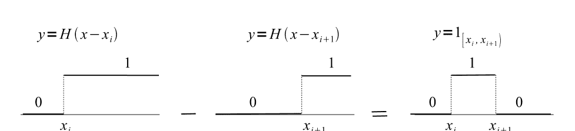

图8.1:指示函数作为两个阶跃函数的差值，
$$1_{[x_i,x_{i+1}]}(x) = H(x - x_i) - H(x - x_{i+1}).$$

由于任何区间的指示函数都是两个阶跃函数的差值
$$1_{[x_i,x_{i+1}]}(x) = H(x - x_i) - H(x - x_{i+1}), \quad \forall 0 \leq i < N,$$

见图8.1，由此可知存在实数 $c_0, \ldots, c_N$ 使得
$$\sum_{i=0}^{N-1} \alpha_i 1_{[x_i,x_{i+1}]}(x) = \sum_{i=0}^{N} c_i H(x - x_i), \tag{8.1.1}$$

因此，一个简单函数可以被写成一组海维赛德阶跃函数的线性组合。现在显然可以用任何紧致区间来替代区间[0,1]。

- 2. 根据前面的写法，任何简单函数的导数都是Dirac测度的线性组合

$$c'(x) = \frac{d}{dx} \sum_{i=0}^{N} c_i H(x - x_i) = \sum_{i=0}^{N} c_i \delta(x - x_i) = \sum_{i=0}^{N} c_i \delta_{x_i}(x),$$

其中关系 $\frac{d}{dx} H(x - x_i) = \delta(x - x_i)$ 在广义意义上成立，参见附录的F.2节。

换句话说，输出对输入的敏感性，即 $c'(x)$ 可以表示为 $N$ 个大小为 $c_i$ 的冲击的叠加，$\delta(x - x_i)$。

- 3. 本节将展示Dirac测度可以被具有“钟形”密度的某些概率测度弱近似。更具体地说，我们有：

命题8.1.1 考虑一个激活函数 $\varphi: \mathbb{R} \to \mathbb{R}$ 满足以下性质：

- (i) $\varphi$ 是递增的；
- (ii) \( \varphi(\infty) - \varphi(-\infty) = 1 \);
- (iii) \( \varphi \) 是可微的 \( |\varphi'(x)| \) 有界的。

令 \( \varphi_{\epsilon}(x) = \varphi\left( \frac{x}{\epsilon} \right) \)，并且考虑 \( \mu_{\epsilon} \) 是具有密度 \( \varphi'_{\epsilon} \) 的测度，即 \( d\mu_{\epsilon}(x) = \varphi'_{\epsilon}(x)dx \)。那么 \( \mu_{\epsilon} \to \delta \)，当 \( \epsilon \searrow 0 \)，在弱意义下。

证明：对于任意具有紧支集的光滑函数 \( g \in C_0^{\infty}(\mathbb{R}) \)，我们有通过变量替换

\( \displaystyle \int_{-\infty}^{\infty} \varphi'_{\epsilon}(x)g(x) dx = \int_{-\infty}^{\infty} \frac{1}{\epsilon} \varphi'\left( \frac{x}{\epsilon} \right) g(x) dx = \int_{-\infty}^{\infty} \varphi'(y) g(\epsilon y) dy \)。

有界收敛定理（附录中的定理C.4.3）得出

\( \displaystyle \lim_{\epsilon \to 0} \int_{-\infty}^{\infty} \varphi'(y) g(\epsilon y) dy = g(0) \int_{-\infty}^{\infty} \varphi'(y) dy = g(0)(\varphi(\infty) - \varphi(-\infty)) = g(0) \)。

因此

\( \displaystyle \lim_{\epsilon \to 0} \int_{-\infty}^{\infty} g(x) d\mu_{\epsilon}(x) = \lim_{\epsilon \to 0} \int_{-\infty}^{\infty} \varphi'_{\epsilon}(x) g(x) dx = g(0) = \int_{-\infty}^{\infty} g(x)\delta(x) dx \)。

对于所有 \( g \in C_0^{\infty}(\mathbb{R}) \)，这意味着 \( \mu_{\epsilon} \to \delta \)，当 \( \epsilon \searrow 0 \) 时，以弱意义。

函数 \( \varphi'_{\epsilon}(x) \) 的形状类似于“凸起函数”，当 \( \epsilon \) 趋近于零时，它会变成一个“尖峰”。这种类型的激活函数的一个例子是逻辑函数。在这种情况下， \( \varphi_{\epsilon}(x) = \frac{1}{1+e^{-\frac{x}{\epsilon}}} \)。

**注8.1.2** 由于 \( \varphi \) 是增加的，所以 \( \varphi'_{\epsilon} \geq 0 \)。我们还有 \( \displaystyle \int_{\mathbb{R}} d\mu_{\epsilon}(x)dx = \int_{\mathbb{R}} \varphi'_{\epsilon}(x) dx = \varphi_{\epsilon}(\infty) - \varphi_{\epsilon}(-\infty) = \varphi(\infty) - \varphi(-\infty) = 1 \)。

这意味着 \( \mu_{\epsilon} \) 是 \( (\mathbb{R}, \mathcal{B}(\mathbb{R})) \) 上的概率测度。

- 4. 以 \( a \) 为中心的狄拉克测度的卷积，即 \( \delta_a(x) = \delta(x-a) \)，与大小为 \( a \) 的平移的组合是相同的：

\( \displaystyle (\delta_a * f)(x) = \int_{-\infty}^{\infty} \delta_a(y)f(x-y) dy = f(x-a) \)。

这可以等价地表述为，通过狄拉克测度 \( \delta_a \) 过滤的信号 \( f(x) \) 是我们应用了相位移的相同信号。

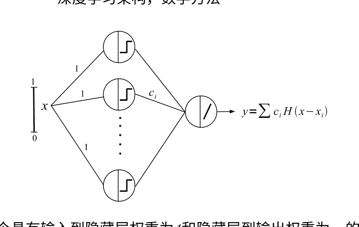

- 5. 任何定义在紧致区间 [a, b] 上的连续实值函数 g: [a, b] → ℝ，都是一致连续的，即对于任意的 ε > 0，存在 δ > 0 使得对于任意的 x, x' ∈ [a, b]，满足 |x - x'| < δ，则有 |g(x) - g(x')| < ε。这个经典命题的证明留给读者在练习8.8.3中完成。

为了启发性地理解这个陈述，我们将 g(x) 视为一个收音机的音量，其滑动按钮位于位置 x。这个位置可以在区间 [a, b] 的任何地方，其中 a 代表最小可能位置，b 代表最大可能位置。然后，对于音量的任何 ε 调整，存在一个滑动按钮的 δ 控制，使得从任何位置 x 移动到一个 δ-邻域位置 x'，相应的音量的净变化小于 ε。

#### 8.2 单隐藏层感知器网络

考虑一个具有隐藏层的神经网络，隐藏层中的激活函数由海维赛德函数给出，输出层中的激活函数为线性函数。我们将展示这个网络有可能学习任何连续函数 g ∈ C[0,1]。等价地说，任何紧致区间上的连续函数都可以被简单函数一致逼近。该网络在图8.2中表示。

我们首先注意到关系式（8.1.1）的右侧是这种类型网络的一个特定输出，参见图8.2。下面的结果表明，该网络通过阶梯函数逼近连续函数。

命题8.2.1 对于任意函数 $g \in C[0,1]$ 和任意 $\epsilon > 0$，存在一个简单函数 $c(x) = \sum_{i=0}^{N-1} c_i H(x - x_i)$ 使得 $|g(x) - c(x)| < \epsilon, \quad \forall x \in [0,1]$.

证明: 固定 $\epsilon > 0$, 并且根据函数 $g$ 在区间 $[0,1]$ 上的一致连续性性质, 取 $\delta > 0$。考虑一个等距分割 $0 = x_0 < x_1 < \cdots < x_N = 1$, 其中 $N$ 足够大以满足 $\frac{1}{N} < \delta$。选择一个固定的 $u \in [0,1]$。那么存在一个 $k < N$ 使得 $u \in [x_k, x_{k+1})$。根据 $g$ 的一致连续性，我们有

$|g(u) - g(x_k)| \leq \epsilon.$

构造实数 $c_0, c_1, \ldots, c_{N-1}$ 使得

$c(c_0) = c_0, c(c_1) = c_0 + c_1, c(c_2) = c_0 + c_1 + c_2, ..., c(c_{N-1}) = c_0 + c_1 + ... + c_{N-1}.$

对于之前的 $u \in [x_k, x_{k+1})$ 阶跃函数的计算结果为 $H(u - x_j) = \begin{cases} 1, & \text{if } j \leq k \\ 0, & \text{if } j > k. \end{cases}$

简单函数的值在 $u$ 是 $c(u) = \sum_{i=0}^{N-1} c_i H(u - x_i) = \sum_{j=0}^{k} c_j = g(x_k),$

事实表明 $|g(x_k) - c(u)| = 0.$

现在, 三角不等式与关系(8.2.2)和(8.2.3)一起给出了不等式 $|g(u) - c(u)| \leq |g(u) - g(x_k)| + |g(x_k) - c(u)| \leq \epsilon.$

由于 $u$ 是任意选择的, 前面的不等式对于任意的 $x \in [0,1]$ 都成立, 这导致了所需的结论。

## 备注 8.2.2

以下我们将提供一些备注:1. 简单函数 $c(x)$ 是一个具有隐藏层中 $N$个计算单元的一层神经网络的输出函数。每个单元都是一个带有偏置 $\theta_i = -x_i$的经典感知器。从输入到隐藏层的权重为 $w= 1$。从隐藏层到输出层的权重由系数 $\{c_i\}$给出。

- 2. 权重 $c_i$可以按照以下方式构建。将区间$[0,1]$等距分成

$$0 = x_0 < x_1 < \cdots < x_N = 1$$

并定义权重

$$\begin{aligned}
c_0 &= g(0) \\
c_1 &= g(x_1) - g(0) \\
c_2 &= g(x_2) - g(x_1) \\
&\vdots \\
c_{N-1} &= g(x_{N-1}) - g(x_{N-2}).
\end{aligned}$$

对于足够大的$N$（使得$N^{-1} < \delta$），上述关系产生的权重满足 $|c(x) - g(x)| < \epsilon$。

- 3. 由于 $g$ 的一致连续性，对于任意 $\epsilon >0$，存在一个足够大的数 $N$，使得对于任意的 $k$，有 $|g(x_{k+1}) - g(x_k)| < \epsilon$。利用 $c_k$ 的定义，这意味着对于任意的 $k$，如果分割足够小，则 $|c_k| < \epsilon$。因此，近似器 $c(x) = \sum\limits_{i=0}^{N-1} c_i H(x - x_i)$ 给出的命题可以假设满足 $|c_k| < \epsilon, \forall k$，即具有任意小的步长方差。这个属性以后会有用。我们注意到为了使步长方差小，付出的代价是隐藏层中的大量计算单元，$N$。

### 8.3 单隐藏层S型网络

考虑一个具有逻辑S型激活函数的单隐藏层神经网络，或者更一般地，具有满足命题8.1.1的任意激活函数 $\varphi$ 的隐藏层和线性激活函数的输出层，参见图8.3。我们将展示这个网络可以潜在地学习任何连续函数 $g \in C[0,1]$。主要结果如下。

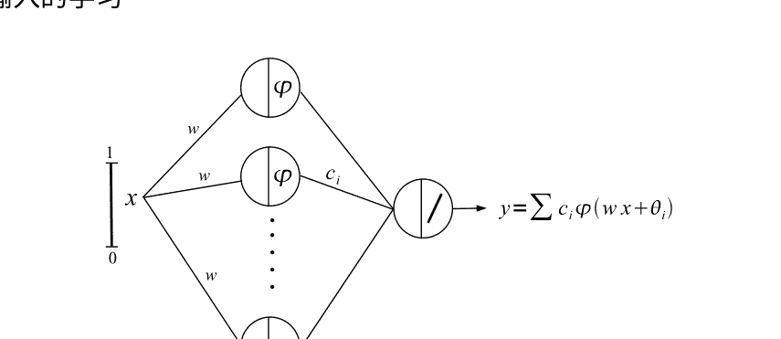

图8.3：一个具有一个隐藏层的sigmoid神经网络，输入到隐藏层的权重 w 和隐藏层到输出的权重 c_i。

定理8.3.1 考虑一个满足命题8.1.1假设的激活函数，并且让 g ∈ C[0, 1]。那么对于任意的 ϵ > 0，存在 c_i, w, θ_i ∈ ℝ，以及 N ≥ 0，使得

$$\left| g(x) - \sum_{i=1}^{N} c_i \varphi(w x + \theta_i) \right| < \epsilon, \text{ 对于任意的 } x \in [0, 1].$$

证明：由于证明相对复杂，为了简单起见，我们将其分为几个步骤：

步骤 1:通过阶梯函数近似函数 g。

根据命题 8.2.1，存在一个阶梯函数 c(x)，使得

$$|g(x) - c(x)| < \frac{\epsilon}{2}, \quad \forall x \in [0, 1]. \tag{8.3.4}$$

根据命题 8.2.1 的备注 3，我们还可以假设 c(x) 的系数满足 |c_k| < \frac{\epsilon}{4}，对于所有的 k。

步骤 2:使用卷积构造阶梯函数 c(x) 的“平滑函数”。

定义函数族 \( \varphi_\alpha(x) = \varphi(\alpha x) \), 其中 \( \alpha > 0 \). 考虑凸起函数 \( \psi_\alpha(x) = \varphi'_\alpha(x) = \alpha \varphi'(\alpha x) \). 根据命题8.1.1 \( \psi_\alpha(x) \)是概率测度的密度 \( \mu_\alpha \)，当\( \alpha \to 0 \)时，它弱收敛于Dirac测度 \( \delta(x) \)。通过卷积定义 \( c(x) \)的“平滑函数” \( c_\alpha(x) = (c * \psi_\alpha)(x) \)。

几何特征如图8.4所示。

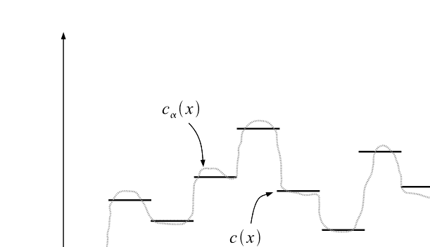

我们将证明平滑函数$c_\alpha(x)$的形式为

$$c_\alpha(x) = \sum_{i=1}^N c_i \varphi(wx + \theta_i)$$

对于一些$c_i, w, \theta_i \in \mathbb{R}$.

利用卷积性质和第8.1节介绍的事实，我们 在广义导数意义下有：

$$c_\alpha(x) = (c*\psi_\alpha)(x) = (c*\varphi_\alpha')(x) = (c'*\varphi_\alpha)(x) = \frac{d}{dx}\left( \sum_{i=1}^N c_i H(x - x_i) \right) * \varphi_\alpha(x) = \left( \sum_{i=1}^N c_i \delta(x - x_i) \right) * \varphi_\alpha(x) = \sum_{i=1}^N c_i (\delta_{x_i} * \varphi_\alpha)(x) = \sum_{i=1}^N c_i \varphi_\alpha(x - x_i) = \sum_{i=1}^N c_i \varphi\left( \frac{x - x_i}{\alpha} \right) = \sum_{i=1}^N c_i \varphi(wx + \theta_i),$$

带权重 $w = \frac{1}{\alpha}$ 和偏置 $\theta_i = -\frac{x_i}{\alpha}$.

步骤3:通过更平滑的函数逼近阶跃函数。

我们将证明 $\forall \epsilon > 0$，我们有

$$|c(x) - c_{\alpha}(x)| < \frac{\epsilon}{2}, \quad \forall x \in \mathbb{R}$$

对于 $\alpha$ 足够小的情况。实际上，这表明了函数的连续性。为了证明这一点，我们评估差异并将其分解为三个积分的和。

$$c(x) - c_{\alpha}(x) = c(x) \int_{-\infty}^{\infty} \psi_{\alpha}(y) dy - \int_{-\infty}^{\infty} \psi_{\alpha}(y) c(x - y) dy = \int_{-\infty}^{\infty} \psi_{\alpha}(y) \big(c(x) - c(x - y)\big) dy = I_1 + I_2 + I_3,$$

其中

$$I_1 = \int_{-\infty}^{-\epsilon'} \psi_{\alpha}(y) \big(c(x) - c(x - y)\big) dy$$
$$I_2 = \int_{-\epsilon'}^{\epsilon'} \psi_{\alpha}(y) \big(c(x) - c(x - y)\big) dy$$
$$I_3 = \int_{\epsilon'}^{\infty} \psi_{\alpha}(y) \big(c(x) - c(x - y)\big) dy,$$

对于某些 $\epsilon' >0$，具体规定待定。注意 $c(x)$ 是有界的，满足

$$|c(x)| = \left|\sum_{i=1}^N c_i H(x - x_i)\right| \leq \sum_{i=1}^N |c_i| = M,$$

另外，由于 $\psi_{\alpha}$ 当 $\alpha\rightarrow 0$ 时趋于 $\delta(x)$，所以 $\psi_{\alpha}$ 在每个固定区间 $(-\infty, -\epsilon')$ 和 $(\epsilon', \infty)$ 上趋于零。根据主导收敛定理，参见定理 C.4.2， 当 $\alpha \rightarrow 0$ 时， $I_1 \rightarrow 0$ 且 $I_3 \rightarrow 0$，因此

$$I_1 + I_3 \leq \frac{\epsilon}{4},$$

对于足够小的 $\alpha$。

为了评估 $I_2$ 我们注意到函数图像 $c(x-y)$ 是通过对函数图像 $c(x)$ 进行最多水平平移 $\epsilon'$ 得到的，参见图8.5 a。对于足够小的 $\epsilon'$，差值 $c(x) - c(x-y)$ 在区间 $(-\epsilon', \epsilon)$ 中只有一个峰值，参见图8.5 b。峰值的高度等于其中一个系数 $c_k$。利用第一步中开发的系数性质，我们有以下估计

$$|c(x) - c(x - y)| \leq |c_k| < \frac{\epsilon}{4},$$

对于任意的 $y \in (-\epsilon', \epsilon)$。利用 $\psi_{\alpha}$ 的性质，我们现在可以估计第二个积分：

$$I_{2} \leq \int_{-\epsilon'}^{\epsilon'} \psi_{\alpha}(y) |c(x) - c(x-y)| dy < \frac{\epsilon}{4} \int_{-\epsilon'}^{\epsilon'} \psi_{\alpha}(y) \leq \frac{\epsilon}{4} \int_{-\infty}^{\infty} \psi_{\alpha}(y) = \frac{\epsilon}{4}.$$

总结第三步，我们有

$$|I_1 + I_2 + I_2| \leq \frac{\epsilon}{4} + \frac{\epsilon}{4} = \epsilon/2$$

对于 $\alpha$ 和 $\epsilon'$ 足够小。这意味着不等式 (8.3.5)。

第四步：结合之前的所有步骤并完成证明。三角不等式，连同步骤1和步骤2，提供

$$|g(x) - c_{\alpha}(x)| \leq |g(x) - c(x)| + |c(x) - c_{\alpha}(x)| \leq \frac{\epsilon}{2} + \frac{\epsilon}{2} = \epsilon.$$

通过步骤2，平滑函数 $c_{\alpha}(x)$ 的形式为 $G(x) = \sum_{=1}^{Ni} c_i \varphi(w x + \theta_i)$，这结束了证明。

注8.3.2 (i) 值得注意的是，在一维情况下，权重 $w$ 不依赖于索引 $i$。

(ii) 单隐藏层S型神经网络的输出，

$$y = \sum_{i=1}^{N} c_i \varphi(w x + \theta_i),$$

通过过滤单隐藏层感知器网络的输出获得，$y = \sum_{i=1}^{N} c_i H (x - x_i)$，通过给定的突变函数 $\varphi'_{\alpha} (x)$ 进行过滤。

(iii) 在最后两节中证明的两个结果都表明，$[0,1]$ 上的任何连续函数都可以通过两种方式学习：命题8.2.1确保学习可以通过简单函数完成，而定理8.3.1则通过平滑函数完成。然而，后者的结果更有用，因为逼近器是平滑的，这使得反向传播算法的应用成为可能。

#### 8.4 使用ReLU函数进行学习

我们从关于连续函数在紧致区间 $[a, b]$ 上的多边形逼近的结果开始，参见图8.6。

### 引理 8.4.1
设 $g: [a, b] \to \mathbb{R}$ 为一个连续函数。那么对于任意的 $\epsilon > 0$，存在一个等距分割

$$a = x_0 < x_1 < \cdots < x_N = b$$

使得分段线性函数 $g_\epsilon: [a, b] \to \mathbb{R}$，通过以下点 $\left(x_i, g(x_i)\right), i = 0, \ldots, N$，满足

$$|g(x) - g_\epsilon(x)| < \epsilon, \quad \forall x \in [a, b].$$

证明： 我们将分两步进行证明。

### 第一步。定义分割和分段线性函数。

令 $\epsilon >0$ 为任意固定值。由于 $g$ 在 $[a, b]$ 上一致连续，存在 $\delta >0$，使得如果 $|x' - x''| < \delta$，那么 $|g(x') - g(x'')| < \epsilon/2$。考虑 $N$ 足够大，使得 $\frac{b-a}{N} < \delta$，并定义等距分割 $x_j = a + \frac{j(b-a)}{N}, j=0,\ldots,N$。分段多边形函数由以下给出 $g_\epsilon(x) = g(x_{i-1}) + m_i(x - x_{i-1}), \quad \forall x \in [x_{i-1}, x_i],$ 具有斜率 $m_i = \frac{g(x_i) - g(x_{i-1})}{x_i - x_{i-1}}$。

### 步骤2.通过应用三角不等式完成证明。

设 $x \in [a, b]$ 是固定的。那么存在一个包含 $x$ 的分割区间，即 $x \in [x_i, x_{i+1}]$。由于 $g$ 的一致连续性，我们有 $|g(x) - g(x_i)| < \frac{\epsilon}{2}. \qquad (8.4.7)$

利用 $g_\epsilon$ 在区间 $[x_i, x_{i+1}]$ 上是仿射的，我们得到估计 $|g_\epsilon(x_i) - g_\epsilon(x)| < |g_\epsilon(x_i) - g_\epsilon(x_{i-1})| = |g(x_i) - g(x_{i-1})| < \frac{\epsilon}{2}, \qquad (8.4.8)$

最后一个不等式使用了 $g$ 的一致连续性。现在，三角形不等式连同关系式 (8.4.7) 和 (8.4.8) 得到 $|g(x) - g_\epsilon(x)| \leq |g(x) - g(x_i)| + |g(x_i) - g_\epsilon(x)| = |g(x) - g(x_i)| + |g_\epsilon(x_i) - g_\epsilon(x)| < \frac{\epsilon}{2} + \frac{\epsilon}{2} = \epsilon.$ 由于这个不等式对于任意的 $x \in [a, b]$ 都成立，引理得证。 ■

备注8.4.21. 这个结果可以通过说在一个紧区间上的任何连续函数都是一系列分段线性函数的一致极限来重新表述。

-   2. 在非等距分割的情况下，这个结果的一个变体已经在示例7.1.1中处理过。

回顾一下以海维赛德函数为基础的ReLU函数的定义为 $ReLU(x) = xH(x) = \begin{cases} x, & \text{if } x \geq 0 \\ 0, & \text{if } x < 0. \end{cases} \qquad (8.4.9)$ 它的广义导数由以下给出 $ReLU'(x) = \left(xH(x)\right)' = x'H(x) + xH'(x) = H(x) + x\delta(x) = H(x),$

由于 $x\delta(x) = 0$，作为具有不相交支持的函数的乘积。[^1]这个陈述的另一个验证，直接来自定义，可以在附录的示例F.2.2中找到。

下一个结果表明，具有ReLU激活函数的神经网络可以在紧凑集上逼近连续函数，参见图8.7。

### 定理8.4.3

考虑一个具有 $ReLU$ 激活函数的单隐藏层神经网络，隐藏层神经元使用 $ReLU$ 激活函数。 考虑具有恒等激活函数和偏置 $\beta$ 的输出神经元。 设 $g \in C[0, 1]$ 是给定的。 那么对于任意的 $\epsilon > 0$，存在 $\alpha_j, \theta_j \in \mathbb{R}$，以及 $N \geq 1$，使得

$$\left|g(x) - \sum_{j=0}^{N-1} \alpha_j ReLU(x + \theta_j) - \beta\right| < \epsilon, \text{ 对于任意的 } x \in [0, 1]。$$

### 证明：

考虑区间[0,1]的等距分割 $(x_i)_i$ of the interval $[0, 1]$

$$0 = x_0 < x_1 < \cdots < x_N = 1,$$

由引理8.4.1给出。 我们需要证明可以选择参数 $\alpha_i, x_i$，和 $\beta$ 使得逼近函数

$$G(x) = \sum_{j=0}^{N-1} \alpha_j ReLU(x + \theta_j) + \beta$$

变成了引理8.4.1中的分段线性函数。我们首先设置偏置 $\theta_j = -$ 并注意到

$$ReLU(x_k - x_j) = \begin{cases} 0, & \text{如果 } k \le j \\ \frac{k-j}{N}, & \text{if } k > j, \end{cases}$$

在考虑了公式(8.4.9)后，$G(x)$ 在分割点 $x_k$ 的值为

$$G(x_k) = \sum_{j=0}^{N-1} \alpha_i ReLU(x_k - x_j) + \beta = \frac{1}{N} \sum_{j<k} \alpha_j (k - j) + \beta.$$

这 $N+1$ 个参数，$\alpha_j$ 和 $\beta$, 从约束条件中唯一确定 $G(x_k) = g(x_k), k=0, .\ldots, N$。 为了简单起见，记 $y_k = g(x_k)$, 上述约束条件可以写成 $y_0 = G(x_0) = G(0) = \beta$ $y_1 = G(x_1) = \alpha_0(1-0)/N + \beta$

$y_2 = G(x_2) = \alpha_0(2-0)/N + \alpha_1(2-1)/N + \beta$
$y_3 = G(x_3) = \alpha_0(3-0)/N + \alpha_1(3-1)/N + \alpha_2(3-2)/N + \beta$
$\ldots = \ldots \ldots \ldots \ldots \ldots \ldots \ldots \ldots \ldots \ldots$
$y_N = G(x_N) = \alpha_0(N_0)/N + \cdots + \alpha_{N-1}/N + \beta.$

该系统等价于

$y_0 = \beta$
$N(y_1 - y_0) = \alpha_0$
$N(y_2 - y_0) = 2\alpha_0 + \alpha_1$
$N(y_3 - y_0) = 3\alpha_0 + 2\alpha_1 + \alpha_2$
$\ldots = \ldots \ldots \ldots \ldots \ldots \ldots$
$N(y_N - y_0) = N \alpha_0 + (N-1)\alpha_1 + \cdots + 2\alpha_{N-2} + \alpha_{N-1}.$

相邻方程相减得

$\beta = y_0$
$\alpha_0 = N(y_1 - y_0)$
$\alpha_0 + \alpha_1 = N(y_2 - y_1)$
$\alpha_0 + \alpha_1 + \alpha_2 = N(y_3 - y_2)$
$\ldots \ldots \ldots = \ldots \ldots \ldots \ldots$
$\alpha_0 + \alpha_1 + \cdots + \alpha_{N-1} = N(y_N - y_{N-1}).$

### 一维输入的学习

该系统具有唯一解

$$\begin{aligned}
\beta &= Y_0 \\
\alpha_0 &= N(Y_1 - y_0) \\
\alpha_1 &= N(Y_2 - 2y_1 + y_0) \\
\alpha_2 &= N(Y_3 - 2y_2 + y_1) \\
\dots &= \dots\dots\dots\dots\dots \dots \\
\alpha_{N-1} &= N(Y_N - 2Y_{N-1} + Y_{N-2}).
\end{aligned}$$

### 近似函数

$$G(x) = \sum_{j=0}^{N-1} \alpha_j ReLU(X - X_j) + \beta$$

是分段线性的，因为它的导数

$$G'(X) = \sum_{j=0}^{N-1} \alpha_j ReLU'(X - x_j) = \sum_{j=0}^{N-1} \alpha_j H(X - X_j)$$

在每个区间 $(x_i, x_{i+1})$ 上是常数，由 $\pm \alpha_j$ 的和给出。应用引理8.4.1并选择多边形线 $G(x) = g_\epsilon(x)$，我们得到 $|g(x) - G(x)| < \epsilon$ 对于所有的 $x \in [0, 1]$，对于任意的预先确定的 $\epsilon > 0$。

例子8.4.4（对冲应用）设 $S$ 表示股票价格并回忆一下具有行权价 $K$ 的欧式看涨期权的回报是 $C(S) = ReLU(S-K)$。那么任何投资组合价值 $P(S)$，它是 $S$ 的连续函数，对于 $0 \le S \le S_{max}$ 可以通过一个具有输出的单隐藏层神经网络来学习。

$$G(S) = \sum_{j=0}^{N-1} \alpha_j ReLU(S - K_j) + \beta = \sum_{j=0}^{N-1} \alpha_j C_j(S) + \beta.$$

这可以通过购买 $\alpha_j$ 单位的行权价为 $K_j$ 的看涨期权来构建，对于 $j = 0, \dots, N - 1$ 并持有金额为 $\beta$ 的债券。为了对冲投资组合头寸，交易员应该采取相反的市场头寸，即出售新形成的投资组合 $G(S)$。结论是，任何股票组合都可以用包含看涨期权和债券的投资组合来复制。

#### 8.5 使用Softplus进行学习

Softplus激活函数

$\varphi(x) = sp(x) = \ln(1 + e^x)$

是 $ReLU(x)$ 函数的平滑版本，见图2.7 a，如下一个结果所示。

### 命题 8.5.1软加函数由卷积给出

$sp(x) = (ReLU * K)(x) = \int_{-\infty}^{\infty} ReLU(y)K(x-y) dy,$

卷积核 $K(x) = \frac{1}{(1+e^x)(1+e^{-x})}$

证明： 我们注意到卷积核 $K(x)$ 随着 $x \to \pm \infty$ 指数级地迅速趋近于零，即 $\lim_{|x| \to \infty} K(x) = 0$。这个条件足以保证下一个不定积分的存在。我们还注意到卷积核和逻辑函数 $\sigma$ 之间的以下关系：

$\sigma'(x) = \sigma(x)(1-\sigma(x)) = \frac{1}{1+e^{-x}} \left(1 - \frac{1}{1+e^{-x}}\right) = \frac{1}{(1+e^x)(1+e^{-x})} = K(x)$

卷积现在可以计算为

$(ReLU * K)(x) = \int_{-\infty}^{\infty} ReLU(y)K(x-y) dy = \int_{0}^{\infty} yK(x-y) dy = -\int_{x}^{-\infty} (x-t)K(t) dt = \int_{-\infty}^{x} (x-t)K(t) dt = x \int_{-\infty}^{x} K(t) dt - \int_{-\infty}^{x} tK(t) dt = x \int_{-\infty}^{x} \sigma'(t) dt - \int_{-\infty}^{x} t\sigma'(t) dt = x\sigma(x) - \left( t\sigma(t) \big|_{-\infty}^{x} - \int_{-\infty}^{x} t'\sigma(t) dt \right) = \int_{-\infty}^{x} \sigma(t) dt = sp(x),$

这证明了所需的关系。我们注意到在最后一个等式中我们使用了公式 (2.1.2)。

图8.8：卷积核 $K_{\alpha}(x)$ 收敛到以零为中心的“尖峰”，当 $\alpha \to 0$时。

注8.5.2 对先前的卷积公式进行非正式验证，计算函数$f(x) = (ReLU * K)(x) - sp(x)$的广义导数。

利用卷积性质以及导数公式
$$ReLU'(x) = H(x), \quad H'(x) = \delta(x), \quad sp'(x) = \sigma(x),$$
我们得到
$$\begin{aligned}
f'(x) &= (ReLU * K)'(x) - sp'(x) = (ReLU' * K)(x) - \sigma(x) \\
&= (H * \sigma')(x) - \sigma(x) = (H' * \sigma)(x) - \sigma(x) \\
&= (\delta * \sigma)(x) - \sigma(x) = \sigma(x) - \sigma(x) = 0,
\end{aligned}$$
其中 $H(x)$ 和 $\delta(x)$ 代表海维赛德函数和狄拉克测度。
因此，$f(x)$ 是分段常数。由于它是连续的（作为两个连续函数的差），所以 $f(x)$ 是常数。然后我们指出极限
$$\lim_{x \to -\infty} f(x) = 0,$$
这表明对于所有实数$x$，$f(x) = 0$。

卷积核 $K(x)$的属性在下一个结果中给出，参见图8.8。

### 命题8.5.3
(i) 卷积核 $K(x)$是一个对称的概率密度函数在 $\mathbb{R}$上。

(ii) 考虑缩放扰动 $K_{\alpha}(x) = \frac{1}{\alpha} K\left(\frac{x}{\alpha}\right)$，其中$\alpha > 0$，且通过定义测度 $\mu_{\alpha}$ 为 $d\mu_{\alpha} = K_{\alpha}(x)dx$。那么 $\int_{-\infty}^{\infty} K_{\alpha}(x) dx = 1$ 且 $\mu_{\alpha} \to \delta$，当 $\alpha \to 0$时，以弱意义。

证明：(i) 很明显 $K(-x) = K(x)$ 且 $K(x) >0$。我们还有
$$\int_{-\infty}^{\infty} K(x) dx = \int_{-\infty}^{\infty} \sigma'(x) dx = \sigma(+\infty) - \sigma(-\infty) = 1.$$

(ii) 使用代换 $x = \alpha y$ 和部分 (i)，我们有
$$\int_{-\infty}^{\infty} K_{\alpha}(x) dx = \frac{1}{\alpha} \int_{-\infty}^{\infty} K\left(\frac{x}{\alpha}\right) dx = \int_{-\infty}^{\infty} K(y) dy = 1.$$

对于任何具有紧支集的函数，$g \in C_0^\infty(\mathbb{R})$，有界收敛定理，定理 C.4.3，得到 $\mu_{\alpha}(g) =$
$$\begin{aligned} \int_{-\infty}^{\infty} g(x) d\mu_{\alpha}(x) &= \int_{-\infty}^{\infty} K_{\alpha}(x)g(x) dx \\ &= \int_{-\infty}^{\infty} K(y)g(\alpha y) dy \to \int_{-\infty}^{\infty} K(y)g(0) dy = g(0) \\ &= \int_{-\infty}^{\infty} g(x)\delta(x) dx = \delta(g), \end{aligned}$$ 当 $\alpha \to 0$ 时，即 $\mu_{\alpha} \to \delta$，当 $\alpha \to 0$ 时，在弱意义下。

我们现在考虑缩放的软加函数
$$\varphi_{\alpha}(x) = \alpha \varphi\left(\frac{x}{\alpha}\right) = \alpha \, sp\left(\frac{x}{\alpha}\right) = \alpha \ln(1 + e^{x/\alpha})$$
并注意
$$\varphi_{\alpha}''(x) = \frac{1}{\alpha} sp''\left(\frac{x}{\alpha}\right) = \frac{1}{\alpha} K\left(\frac{x}{\alpha}\right) = K_{\alpha}(x), \qquad (8.5.10)$$
因为 $sp'(x) = \sigma(x)$ 且 $\sigma'(x) = K(x)$。

值得注意的是，缩放的软加函数 $\varphi_{\alpha}(x)$ 逐点收敛到 $ReLU(x)$，以递减的方式，参见图8.9。这意味着 $\varphi_{\alpha}(x) \searrow ReLU(x)$, 当 $\alpha \searrow 0$ 时。

下面的结果给出了通过滤波器 $K_{\alpha}$ 定义的平滑多边形函数 $G(x)$ 的公式（8.5.10）。

### 引理8.5.4
考虑卷积 $G_{\alpha} = G * K_{\alpha}$，其中
$$G(x) = \sum_{j=0}^{N-1} \alpha_j ReLU(x - x_j) + \beta_0$$
存在参数 $c_j$、$w$ 和 $\theta_j$，取决于 $\alpha_j$ 和 $x_j$，使得
$$G_{\alpha}(x) = \sum_{j=0}^{N-1} c_j sp(w x - \theta_j).$$

证明：利用关系式(8.5.10)和命题8.5.3，部分(ii)，我们有
$G_{\alpha}(x) = (G * K_{\alpha})(x) = \sum_{j=0}^{N-1} \alpha_j ReLU(x - x_j) * K_{\alpha}(x) + \beta * K_{\alpha}(x)$
$= \sum_{j=0}^{N-1} \alpha_j ReLU(x - x_j) * \varphi''_{\alpha}(x) + \beta$
$= \sum_{j=0}^{N-1} \alpha_j H'(x - x_j) * \varphi_{\alpha}(x) + \beta$
$= \sum_{j=0}^{N-1} \alpha_j \delta(x - x_j) * \varphi_{\alpha}(x) + \beta = \sum_{j=0}^{N-1} \alpha_j \varphi_{\alpha}(x - x_j) + \beta$
$= \sum_{j=0}^{N-1} \alpha_j \alpha \varphi\left(\frac{x - x_j}{\alpha}\right) + \beta = \sum_{j=0}^{N-1} c_j sp(wx - \theta_j) + \beta,$
我们还使用了 $\beta * K_{\alpha}( x) = \beta$,
因为 $K_{\alpha}$ 的积分等于1。

### 备注8.5.5
函数 $G_\alpha$ 是一个具有隐藏层的神经网络的输出，隐藏层使用软加函数，输出神经元使用恒等函数。输出神经元的偏置是 $\beta$。

以下结果是Dini定理的应用。

### 引理8.5.6
序列 $G_\alpha$ 在 $[0,1]$上一致收敛于 $G$，即 $\alpha \searrow 0$时，对于任意的 $\epsilon > 0$，存在 $\eta > 0$ 使得对于 $\alpha < \eta$，我们有 $|G(x) - G_\alpha(x)| < \epsilon$，对于任意的 $x \in [0,1]$。

证明：根据之前的构造，我们有
$$G_{\alpha}(x) = \sum_{j=0}^{N-1} \alpha_j \alpha \varphi\left(\frac{x-x_j}{\alpha}\right) + \beta = \sum_{j=0}^{N-1} \alpha_j \varphi_{\alpha}\left(x-x_{j}\right) + \beta.$$
由于 $\varphi_{\alpha}(x) \searrow ReLU(x)$ 当 $\alpha \searrow 0$，见练习8.8.6，那么 $G_{\alpha}(x)$ 逐点收敛并且递减到 $G(x)$，对于任意的 $x \in [0,1]$。由于 $G_{\alpha}$ 和 $G$ 在紧区间$[0,1]$上连续，根据Dini定理（定理7.1.1），$G_{\alpha}$ 在$[0,1]$上一致收敛于 $G$。

下一个结果是对于softplus函数的Theorem 8.4.3的类比。这个想法是用一个多边形线段来逼近给定的连续函数在一个紧致区间上，并且然后用一个给定的核函数进行一点点的“模糊”。这个过程导致了对初始连续函数的可微近似。

### Theorem 8.5.7
考虑一个具有softplus激活函数的单隐藏层神经网络，隐藏层的激活函数为identity，输出神经元的激活函数为identity。让 $g \in C[0,1]$。那么 $\forall \epsilon > 0$ 存在 $c_j, w, \theta_j, \beta \in \mathbb{R}$ 和 $N \ge 1$ 使得
$$\left|g(x) - \sum_{j=0}^{N-1} c_j sp(w x - \theta_j) - \beta\right| < \epsilon, \quad \text{对于任意的} x \in [0,1]。$$

证明：让 $\epsilon > 0$ 是任意固定的。根据Theorem 8.4.3，存在一个函数 $G(x) = \sum_{j=0}^{N-1} \alpha_j ReLU(x - x_j) + \beta$ 使得
$$|g(x) - G(x)| < \frac{\epsilon}{2}, \quad \forall x \in [0,1].$$
引理8.5.6表明，对于任意 $\alpha > 0$ 足够小，我们有估计
$$|G(x) - G_{\alpha}(x)| < \frac{\epsilon}{2}, \quad \forall x \in [0,1].$$
前两个估计，加上三角不等式，得到
$$\begin{aligned}
|g(x) - G_{\alpha}(x)| &\le |g(x) - G(x)| + |G(x) - G_{\alpha}(x)| \\
&\le \frac{\epsilon}{2} + \frac{\epsilon}{2} = \epsilon, \quad \forall x \in [0,1].
\end{aligned}$$
由于引理8.5.4指出函数 $G_{\alpha}(x)$ 是具有softplus激活函数的一层隐藏层网络的输出，我们得到了所需的关系。

图8.10：用三个逼近器 $G(x) = \sum_{j=0}^{N-1} \alpha_j \text{ReLU}(x - x_j) + \beta$, $G_\alpha(x) = \sum_{j=0}^{N-1} c_j \text{sp}(wx - \theta_j) + \beta$ 和 $c(x) = \sum_{j=0}^{N-1} c_i H(x - x_i)$ 来逼近在[0,1]上的连续函数。

注8.5.8 我们使用具有不同激活函数（Heaviside、ReLU和Softplus）的网络输出来逼近[0,1]上的连续函数。现在是时候问一个自然的问题了：哪种激活函数更好？以下几点将讨论这个问题。

- (i) 使用Softplus激活函数的单隐藏层神经网络的结果是通过应用卷积核 $K_\alpha$ 到使用ReLU激活函数的单隐藏层神经网络的结果获得的。
- (ii) 我们注意到以下平滑度的增益：如果网络结果在使用ReLU时是连续的，那么在使用Softplus时它变得可微分。
- (iii) 通过不同神经网络结果对连续函数 $g \in C[0,1]$ 进行逼近可以在图8.10中可视化。使用ReLU的逼近是由 $G(x)$ 表示的多边形逼近。这比使用阶跃函数的逼近 $c(x)$ 更准确。然而，使用Softplus的逼近，由 $G_\alpha(x)$ 表示，比 $G(x)$ 更好。在这种情况下，所有误差都是以 $\| \cdot \|_\infty$-范数衡量的。

#### 8.6 离散数据

在现实生活中，只有一些离散数据可用。能够找到一个连续函数而不是任意接近给定数据点集的任意函数，这说明了学习机器对于单隐藏层神经网络的泛化能力。

我们假设新的输入数据包含 N个数据点，$(x_i, y_i) \in[0,1] \times [a, b], 1 \le i \le N$。为了推进我们的分析，我们建立了以下假设：$y_i$ 是通过应用连续函数 $g$ 得到的 $x_i$ 的响应。换句话说，我们假设存在一个连续函数 $g: [0,1] \rightarrow \mathbb{R}$，使得 $g(x_i) = y_i, 1 \le i \le N$。这个数学假设在大多数情况下成立，当数据是通过测量物理现象的原因和效果来提供时。

令 $\epsilon >0$ 任意固定。从本节证明的数学结果可以推断出，由一个隐藏层神经网络生成的响应函数 $f_\epsilon(x)$ 对于给定的数据具有最大误差，误差不超过 $\epsilon$。

> $\max_i |f_\epsilon(x_i) - y_i| < \epsilon$。

这个过程超越了查找表或记忆数据，因为它实例化了关于学习机器应该如何泛化的先验知识。这意味着如果你提供了一些新数据，那么网络的输出会生成一个类似于输入模式的响应，并且在某种距离意义上接近于新的输入模式。

#### 8.7 总结

本章表明，具有一维输入 $x \in [0,1]$ 的一层隐藏层神经网络可以学习 $C[0,1]$ 中的连续函数。我们证明了当激活函数是阶跃函数、Sigmoid函数、ReLU函数或Softplus函数时，这个结果成立。

具有Sigmoid激活函数的网络的输出是具有阶跃激活函数的网络的平滑版本。同样，使用Softplus进行学习是使用ReLU函数进行学习的平滑版本。值得注意的是，使用Sigmoid激活函数比使用阶跃函数产生更小的误差的数学原因。同样，在许多情况下，使用Softplus激活函数而不是ReLU更好。

该方法的实际重要性在于当应用于离散数据时，网络具有很好的泛化能力。网络有可能学习潜在的支撑给定数据的连续函数。

图8.11：
- a. 双极阶跃函数。
- b. 方波函数。
- c. 锯齿函数。
- d. 鲨鱼齿函数。

#### 8.8 练习

### 练习8.8.1 (广义导数)
我们说 $f^{(n)} = g$ 在广义意义上，如果对于任何紧支撑函数 $\phi \in C_0^\infty$，我们有 $$(-1)^{n} \int f \phi^{(n)} = \int g\phi.$$ 证明以下关系在广义导数意义下成立：

- $(\alpha) \ H'(x - x_0) = \delta(x - x_0)$;
- $(\beta) \ ReLU'(x) = H(x)$;
- $(\gamma) \ ReLU''(x) = \delta(x)$;
- $(\delta) \ (x ReLU(x))' = 2 ReLU(x)$;
- $(\epsilon) \ (x ReLU(x))'' = 2 H(x)$.

### 练习8.8.2
方程(8.1.1)表明任何简单函数都可以写成Heaviside函数的线性组合。找到系数 $c_i$，用 $a_i$ 表示。

### 练习8.8.3 (一致连续性)
考虑连续函数 $g: [a, b] \rightarrow \mathbb{R}$。证明 $\forall \epsilon > 0$, $\exists \delta > 0$, 使得 $\forall x, x' \in [a, b]$, 满足 $|x - x'| < \delta$, 则 $|g(x) - g(x')| < \epsilon$。

### 练习8.8.4
使用Dini定理（定理 7.1.1）证明引理 8.4.1。

### 练习8.8.5
设 $f$ 是图 8.11 中所示的函数之一。哪一个函数具有有限组合的性质？
$$\left\{ \sum_{i=1}^{N} \alpha_i f(w_i x - b_i); N \geq 1, \alpha_i, w_i, b_i \in \mathbb{R} \right\}$$
在 $C[0,1]$ 中是稠密的吗？

### 练习8.8.6
令 $\varphi_{\alpha}(x) = \alpha \ln(1 + e^{x/\alpha})$。证明 $\varphi_{\alpha}(x) \searrow ReLU(x)$ 当 $\alpha \searrow 0$。

## 第9章 通用逼近器

对于问题“为什么神经网络在实践中表现得如此出色？”的答案肯定是基于神经网络能够很好地逼近依赖于输入变量的大量现实生活函数。本章的目标是为不同变体的目标函数提供数学证明。

神经网络作为通用逼近器的事实可以说是它们的输出是某些熟悉函数空间中任意所需精度的函数的准确逼近。获得准确逼近的过程被解释为对给定目标函数的学习过程。

本章讨论了学习过程的存在，但没有提供任何明确的网络权重构建。这里的想法是，在我们开始寻找解决方案之前，首先了解解决方案是否存在是有意义的。

只要考虑了足够数量的隐藏单元，并且输入变量与目标函数之间的关系是确定的，所需的解决方案就存在。为了获得解决方案，应使用适当的学习算法。这种技术应确保在许多实际应用中成功使用神经网络。

#### 9.1 入门示例
神经网络具有从数据中学习的能力。提供了一个特定类型的目标函数，通过改变内部参数，网络必须学习它。大多数情况下，这种学习只是可以接受的近似。为了便于理解，在下面我们提供了一些示例。

例子9.1.1（学习连续函数）假设我们需要创建一个神经网络，旨在重新发现牛顿的万有引力定律。这是

$$f (m_1, m_2, d) = k\frac{m_1 m_2}{d^2},$$

即，两个质量为$m_1$和$m_2$的物体之间的力与它们之间距离的平方成反比。我们构建一个具有输入（$x_1$，$x_2$，$x_3$）=（$m_1$，$m_2$，$d$）的网络，可以在某个三维区域$K$中连续取值。需要学习的目标变量是$z=f$（$m_1$，$m_2$，$d$），其中$f: K→\mathbb{R}$是连续函数。网络具有一个输出$y=g$（$m_1$，$m_2$，$d$；$w$，$b$），它依赖于输入和一些参数（权重$w$和偏置$b$）。参数必须调整，使得输出函数$g$可以以任意精度逼近连续函数$f$。因此，如果提供了两个具有给定质量、位于已知距离的物体，那么网络应该能够以超过任何先验固定误差的精度提供它们之间的引力。这样的神经网络的存在由定理9.3.6给出。

例子 9.1.2（学习有限能量函数）一个音频信号需要被神经网络学习。只考虑有限能量的信号是有意义的，这个条件稍后将通过说信号是空间 $L^2$中的一个函数来形式化。网络的输入是 $x= (t, v)$，其中$x_1 = t$表示时间， $x_2 = v$表示信号频率。目标函数, $z = f(x)$，提供了时间和频率的振幅。网络的输出， $y = g(t, v;w, b)$，提供了目标的近似值，可以通过改变权重 $w$和偏置 $b$的值来调整。存在一个具有这个性质的神经网络，这是由命题 9.3.11 提供的。

## 9.2 通用设置

神经网络作为通用逼近器的概念如下。设 $x$为输入变量， $z$为目标变量或期望变量，并将目标函数表示为 $z = f(x)$，其中 $f$属于某个函数空间 $S$，该空间是一个度量空间，具有距离 $d$，即 $f \in (S, d)$。

神经网络输出函数的空间 $g$，记为 $\mathcal{U}$，假设为 $S$的子集。事实上，我们选择网络的激活函数，使得输出空间适当调整，以满足前述包含关系。

现在，我们称神经网络是空间$(S, d)$的通用逼近器，如果输出空间 $\mathcal{U}$在 $\mathcal{S}$ 中是 $d$-稠密的，即对于任意$f \in \mathcal{S}$，对于任意给定的$\epsilon > 0$，存在$g \in \mathcal{U}$使得 $d(f, g)< \epsilon$成立。

这意味着对于任何函数 $f$在 $\mathcal{S}$中，都有在 $\mathcal{U}$中任意接近 $f$的函数。神经网络通过在 $\mathcal{U}$中的函数逼近目标函数 $f \in \mathcal{S}$的过程被称为学习。$\mathcal{U}$是目标空间 $\mathcal{S}$的近似空间。

有几种类型的目标空间 $(\mathcal{S}, d)$，在应用中非常有用。最熟悉的将在以下示例中介绍。读者可以在附录中找到有关范数向量空间的更多细节。

### 例子9.2.1

让 $\mathcal{S} = C(K)$是定义在紧致集合 $K$上的实值连续函数空间。距离函数由$d(f, g) = \sup_{x \in K} |f(x) - g(x)|, \quad \forall f, g \in C(K),$ 给出。这是两个函数在紧致集合上的最大绝对值差异。由于 $|f - g|$是连续的，最大值在 $K$上达到，我们可以在定义中用“max”替换“sup”。值得注意的是，这个距离是由范数 $\|f\| = \sup_{x \in K} |f(x)|$引起的，这种情况下 $(C(K), \| \cdot \|)$ 成为一个范数向量空间。

### 例子9.2.2

如果 $\mathcal{S} = L^1(K)$ 是紧致集$K$上的实值可积函数的空间。在这种情况下，距离函数是 $d(f, g) = \int_K |f(x) - g(x)| dx, \quad \forall f, g \in L^1(K).$ 这可以解释为函数 $f$ 和 $g$ 之间的图形在集合 $K$上的总面积。相应的范数是 $L^1$-范数定义为 $\|f\|_1 = \int_K |f(x)| dx$。因此，$(L^1(K), \| \cdot \|_1)$ 成为一个带范数的向量空间。

### 例子9.2.3

考虑 $\mathcal{S} = L^2(K)$ 是紧致集 $K$上的实值平方可积函数的空间。距离函数是 $d(f, g) = \left( \int_K |f(x) - g(x)|^2 dx \right)^{1/2}, \quad \forall f, g \in L^2(K).$ 这的解释是两个有限能量信号 $f$ 和 $g$ 在集合 $K$上的能量差。相应的范数是 $L^2$-范数，由 $\| f \|_2 = \left( \int_K |f(x)|^2 dx \right)^{1/2}$ 定义。相对于这个范数，$L^2(K)$成为一个带范数的向量空间。

### 例子9.2.4

设 $K = \{x_1, \ldots, x_r\}$是 $\mathbb{R}^n$ 中的一个有限集合，考虑 $\mathcal{S} = \{f : K \to \mathbb{R}\}$是定义在有限集合上的实值函数的集合。在这种情况下，距离可以是平方误差的和。

$$ d_s(f, g) = \left( \sum_{x_j \in K} |f(x_j) - g(x_j)|^2 \right)^{1/2} $$

或者绝对偏差误差

$$ d_a(f, g) = \sum_{x_j \in K} |f(x_j) - g(x_j)|. $$

这些距离在回归分析中常被使用。此外，在经典感知器的情况下，输入是有限的，其中 $K = \{0, 1\}$。值得注意的是，$d_s(f, g)$ 是 $\mathbb{R}^r$中点 $(f(x_1), \ldots, f(x_r))$ 和$(g(x_1), \ldots, g(x_r))$ 之间的欧几里得距离，而 $d_a(f, g)$ 是相同点之间的出租车距离（这是沿着坐标曲线测量的距离，类似于出租车在垂直街道网格上行驶的距离，就像纽约市的街道一样）。

### 例子9.2.5

在一个非常一般的设置中，目标空间可以被认为是从 $\mathbb{R}^n$到 $\mathbb{R}$的可测函数的空间:

$$ \mathcal{M}^n = \{ f : \mathbb{R}^n \to \mathbb{R}; f \text{可测} \}. $$

这意味着如果 $\mathcal{B}(\mathbb{R})$ 和 $\mathcal{B}(\mathbb{R}^n)$ 分别表示 $\mathbb{R}$和 $\mathbb{R}^n$上的 Borel $\sigma$-代数，则 $f^{-1}( \mathcal{B}(\mathbb{R})) \subset \mathcal{B}(\mathbb{R}^n)$，或者等价地

$$ f^{-1}([a, b]) \in \mathcal{B}(\mathbb{R}^n), \quad \forall a, b \in \mathbb{R}. $$

为了在 $\mathcal{M}^n$上引入一个距离函数，我们首先考虑一个概率测度 $\mu$在可测空间 $(\mathbb{R}^n, \mathcal{B}(\mathbb{R}^n))$ 上，即一个测度 $\mu : \mathcal{B}(\mathbb{R}^n) \to [0,1]$ 且 $\mu(\mathbb{R}^n) = 1$。定义

$$ d_\mu(f, g) = \inf \{ \epsilon > 0; \mu(\{x : |f(x) - g(x)| > \epsilon\}) < \epsilon \}, \quad \forall f, g \in \mathcal{M}^n. $$

那么 $(\mathcal{M}^n, d_\mu)$ 成为一个度量空间。值得注意的是，$\mathcal{M}^n$的元素几乎处处确定，即，只要 $\mu (\{x: f(x) = g(x)\}) = 1$, 可测函数 $f$ 和 $g$ 被认为是相同的。在第9.3.4节中将证明，在度量 $d_\mu$中的收敛等价于概率收敛。

我们将从只有一个隐藏层的深度网络的简单情况开始研究学习过程。

#### 9.3 单隐藏层网络

本节展示了一个具有一个隐藏层的神经网络可以用作 $C(I_n)$、$L^1(I_n)$ 和 $L^2(I_n)$ 空间的函数逼近器，其中 $I_n$ 是 $\mathbb{R}^n$ 中的单位超立方体。这意味着对于给定的函数 $f(x)$ 在上述空间之一，具有输入变量 $x \in I_n = [0,1]^n$，存在一种调整网络权重的方法，使得神经网络的输出 $g(x)$ “尽可能接近”给定的函数 $f(x)$，在某种距离意义上。

### 9.3.1 学习连续函数 $f \in C(I_n)$

在主要结果的发展之前，需要一些函数分析的初步结果。第一个引理说明了存在一个分离泛函，它在一个子空间上为零，在子空间外有非零值。关于本节所需的函数分析基本元素，请参阅附录中的第E节。

**引理9.3.1** 设 $\mathcal{U}$ 是一个线性子空间，属于一个赋范线性空间 $\mathcal{X}$，并且考虑 $x_0 \in \mathcal{X}$ 使得 $dist(x_0,\mathcal{U}) \geq \delta$, 对于某个 $\delta > 0$，即 $\|x_0 - u\| \geq \delta$, $\forall u \in \mathcal{U}$。那么存在一个有界线性泛函 $L$ on $\mathcal{X}$，满足以下条件:

+   (i) $\|L\| \leq 1$
+   (ii) $L(u) = 0$, $\forall u \in \mathcal{U}$, 即 $L|_\mathcal{U}= 0$
+   (iii) $L(x_0) = \delta.$

**证明:** 考虑由 $\mathcal{U}$ 和 $x_0$ 生成的线性空间 $\mathcal{T}$，$\mathcal{T} = \{t; t = u + \lambda x_0, u \in \mathcal{U}, \lambda \in \mathbb{R}\}$ 并定义函数 $L : \mathcal{T} \rightarrow \mathbb{R}$ 为 $L(t) = L(u + \lambda x_0) = \lambda \delta.$ 由于对于任意的 $t_1, t_2 \in \mathcal{T}$ 和 $\alpha \in \mathbb{R}$，我们有 $L(t_1 + t_2) = L(u_1 + u_2 + (\lambda_1 + \lambda_2)x_0) = (\lambda_1 + \lambda_2)\delta = L(t_1) + L(t_2)$ 且 $L(\alpha t) = \alpha L(t),$ 由此可见 $L$ 是 $\mathcal{T}$ 上的线性泛函。

接下来，我们证明 $L(t) \leq \| t \|$，对于所有 $t \in \mathcal{T}$ 成立。首先，注意如果 $u \in \mathcal{U}$，那么也有 $\frac{u}{\lambda} \in \mathcal{U}$，并且，根据假设，我们有
$$\| x_0 + \frac{u}{\lambda} \| = \| x_0 - (-\frac{u}{\lambda}) \| \geq \delta,$$
或者，等价地说，这被重新表述为 $|\lambda| \delta \leq \| u + \lambda x_0 \|$。然后
$$L(t) = L(u + \lambda x_0) = \lambda \delta \leq |\lambda| \delta \leq \| u + \lambda x_0 \| = \| t \|.$$
因此， $L(t) \leq \| t \|$，对于所有 $t \in \mathcal{T}$。

应用Hahn-Banach定理，见附录，第E.3节，使用范数 $p(x) = \| x \|$，我们得到 $L$ 可以扩展为一个线性泛函在 $\mathcal{X}$ 上，也记作 $L$，使得 $L(x) \leq \| x \|$，对于所有 $x \in \mathcal{X}$，见图9.1。这意味着 $\| L \| \leq 1$，因此扩展 $L$ 是有界的。根据定义 $L$，我们也有
$$L(u) = L(u + 0 \cdot x_0) = 0 \cdot \delta = 0, \quad \text{对于所有的} u \in \mathcal{U}$$
$$L(x_0) = L(0 + 1 \cdot x_0) = 1 \cdot \delta = \delta > 0,$$
这证明了引理。 ■

前面的结果可以用稠密子空间的语言重新表述，如下所示。首先，回忆一下子空间 $\mathcal{U}$ 在 $\mathcal{X}$ 中范数 $\| \cdot \|$ 下是稠密的，如果对于任意的元素 $x \in \mathcal{X}$，存在元素 $u \in \mathcal{U}$，使得它们尽可能接近 $x$。等价地，对于任意的 $x \in \mathcal{X}$，存在一个序列 $(u_n) \subset \mathcal{U}$ 使得 $\|u_n - x\| \to 0$。这可以重新表述为：对于任意的 $x \in \mathcal{X}$，对于任意的 $\epsilon > 0$，存在 $u \in \mathcal{U}$，使得 $\| u - x\| < \epsilon$。

因此，子空间 $\mathcal{U}$ 在 $\mathcal{X}$ 中不是稠密的事实可以描述为：存在元素 $x_0 \in \mathcal{X}$，使得没有元素 $u \in \mathcal{U}$ 足够接近 $x_0$；或者说：存在 $\delta > 0$，使得对于 $\forall u \in \mathcal{U}$，我们有 $\| u - x_0\| \ge \delta$。这只是引理9.3.1的假设条件。因此，我们有以下重述：

**引理9.3.2 (引理9.3.1的重述)** 设 $\mathcal{U}$ 是一个线性的、非稠密的子空间，属于一个赋范线性空间 $\mathcal{X}$。那么存在一个有界线性泛函 $L$ 在 $\mathcal{X}$ 上，使得 $L=0$ 在 $\mathcal{U}$ 上且 $L|_{\mathcal{U}}=0$。

用 $C(I_n)$ 表示超立方体 $I_n = [0, 1]^n$ 上的连续函数线性空间，作为一个带有范数的空间
$$ \|f\| = \sup_{x \in I_n} |f(x)|, \quad \text{对于所有} f \in C(I_n). $$
记 $M(I_n)$ 为 $I_n$ 上有限有符号Baire测度的空间（见附录的C.3和C.9节中的定义）。使用Baire测度的原因在于它们与紧支撑函数的兼容性（紧支撑函数是Baire可测且在任何有限Baire测度下可积的）。即使在一般情况下，Baire集和Borel集不一定相同，然而，在紧度量空间（如 $I_n$）的情况下，Borel集和Baire集是相同的，因此Baire测度与在紧集上有限的Borel测度是相同的。在下一个结果的证明中，这些将是应用附录中的定理E.5.6的表示定理的有用注记。

下一个结果表明，总是存在一个在连续函数的非稠密子空间上消失的有符号测度。

**引理9.3.3** 设 $\mathcal{U}$ 是 $C(I_n)$ 的一个线性非稠密子空间。那么存在一个测度 $\mu \in M(I_n)$ 使得
$$ \int_{I_n} h \, d\mu = 0, \qquad \text{对于所有的} h \in \mathcal{U} \text{成立。} $$

**证明：** 考虑引理9.3.2中的 $\mathcal{X} = C(I_n)$，存在一个有界线性泛函 $L : C(I_n) \to \mathbb{R}$ 使得 $L$ 在 $\mathcal{U}$ 上为0且 $L|_{\mathcal{U}}=0$。应用线性有界泛函在 $C(I_n)$ 上的表示定理，见附录中的定理E.5.6，存在一个测度 $\mu \in M(I_n)$ 使得
$$ L(f) = \int_{I_n} f \, d\mu, \qquad \forall f \in C(I_n). $$
特别地，对于任意的 $h \in \mathcal{U}$, 我们得到
$$ L(h) = \int_{I_n} h \, d\mu = 0, $$
这是所需的结果。 ■

**注9.3.4** 值得注意的是 $L=0$ 意味着 $\mu=0$。

下一个结果使用了在第2章中引入的判别函数的概念，定义2.2.2。

**命题9.3.5** 设 $\sigma$ 是任意的连续判别函数。那么形式为的有限和
$$ G(x) = \sum_{j=1}^{N} \alpha_j \sigma(w_j^T x + \theta_j), \quad w_j \in \mathbb{R}^n, \alpha_j, \theta_j \in \mathbb{R} $$
在 $C(I_n)$ 中是稠密的。

**证明：** 由于 $\sigma$ 是连续的，所以得到
$$ \mathcal{U} = \{G; G(x) = \sum_{j=1}^{N} \alpha_j \sigma(w_j^T x + \theta_j)\} $$
是 $C(I_n)$ 的一个线性子空间。我们继续证明，采用反证法。

假设 $\mathcal{U}$ 在 $C(I_n)$ 中不是稠密的。根据引理9.3.3，存在一个测度 $\mu \in M(I_n)$, 使得
$$ \int_{I_n} h \, d\mu = 0, \quad \forall h \in \mathcal{U}. $$
这也可以写成
$$ \sum_{j=1}^{N} \alpha_j \int_{I_n} \sigma(w_j^T x + \theta_j) \, d\mu = 0, \quad \forall w_j \in \mathbb{R}^n, \alpha_j, \theta_j \in \mathbb{R}. $$
通过选择合适的系数 $\alpha_j$, 我们得到
$$ \int_{I_n} \sigma(w^T x + \theta) \, d\mu = 0, \quad \text{对于所有的 } w \in \mathbb{R}^n, \theta \in \mathbb{R}. $$
利用 $\sigma$ 是判别性的，得到 $\mu=0$, 这与注释9.3.4中的矛盾。 ■

前面的结果表明 ∀f ∈ C(I_n) 和 ∀ϵ > 0，存在一个和以前的形式的 G(x) 使得

|G(x) - f(x)| < ϵ, ∀x ∈ I_n。

等价地，图9.2中显示的单隐藏层神经网络可以通过调整其权重来学习任何连续函数 f ∈ C(I_n) ，并且误差不超过 ϵ。

下一个结果表明，在节点数量和权重大小没有限制的情况下，单隐藏层神经网络是一个连续函数逼近器，参见图9.2。这里的输入是向量 x^T = (x_1, ..., x_n) ∈ I_n 并且从输入到隐藏层的权重由 (w_1, ..., w_N) 表示。每个权重都是一个向量，由 w_j^T = (w_{j1}, ..., w_{jn}) 给出。从隐藏层到输出的权重是 (α_1, ..., α_N)，每个都是实数。α_j是一个实数。隐藏层中的神经元数量是 N，它们的偏置是 (θ_1, ..., θ_N)。请注意，在外层的激活函数是线性的， φ(x) = x，而在隐藏层中是sigmoid函数。

## 定理9.3.6 (Cybenko, 1989)

假设 σ 是一个任意的连续sigmoid函数，根据定义2.2.1。那么形式为有限和的 G(x) = Σ_{j=1}^N α_jσ(w_j^T x + θ_j), w_j ∈ R^n, α_j, θ_j ∈ R 在 C(I_n) 中是稠密的。

证明：根据命题2.2.4，任何连续的S型函数都是判别性的。然后应用命题9.3.5得到所需的结果。

注9.3.7 如果激活函数是 σ = \( \frac{1}{1+e^{-x}} \)，那么所有的函数 G(x)在 x中都是解析的，因为它们是解析函数的有限和。 由于在 C(I_n)中存在连续函数而不是解析函数，因此近似空间 U是 C(I_n)的真子空间（即 U = C(I_n)）。

下一个结果对于任何连续的激活函数都成立，参见[59]。为此付出的代价是从Σ类网络转换到ΣΠ类网络，后者使用乘积的和来逼近目标函数。

## 定理9.3.8 (Hornik, Stinchcombe, White, 1989)

设 φ: \( \mathbb{R} \to \mathbb{R} \)是任何连续非常数的激活函数。那么形式为有限和的有限乘积的和

```
\[ G(x) = \sum_{k=1}^{M} \beta_{k} \prod_{j=1}^{N_{k}} \varphi(w_{jk}^{T} x + \theta_{jk}), \quad (9.3.1) \]
```

with \( w_{jk} \in \mathbb{R}^{n}, \beta_{j}, \theta_{jk} \in \mathbb{R}, x \in I_{n}, M, N_{k} = 1, 2, \ldots \)，在 C(I_n)中是稠密的。

证明：考虑由类型为 (9.3.1)的乘积的有限和构成的集合U。由于 φ是连续的，所以对于任意的G, G_1, G_2 ∈ U, 我们显然有

```
\[ G_{1} + G_{2} \in U, \quad G_{1} G_{2} \in U, \quad \lambda G \in U, \quad \forall \lambda \in \mathbb{R}, \]
```

这表明 U是 I_n上的实连续函数的代数。 接下来，我们将验证Stone-Weierstrass定理的假设条件，参见定理7.4.4:

- U分隔点 I_n. 我们需要证明存在 G∈U使得 G(x) = G(y). 由于 φ是非常数的，存在a, b ∈ \mathbb{R}, a = b, 且 φ(a) = φ(b). 分别选择超平面 \{w^{T} x + \theta = a\}和 \{w^{T} x + \theta = b\}上的点 x和 y. 那么 G(u) = φ(w^{T} u + \theta) 将 x和 y分开: \[ G(x) = \varphi(w^{T} x + \theta) = \varphi(a) \] \[ G(y) = \varphi(w^{T} y + \theta) = \varphi(b) = \varphi(a). \]
- U包含非零常数. 设 θ满足 φ(θ) = 0，并选择向量 w^{T} = (0, ..., 0) ∈ \mathbb{R}^{n}。则 G(x) = φ(w^{T} x + θ) = φ(θ) = 0是一个非零常数。乘以任意非零实数 λ，我们得到所有非零常数都包含在 U中。

现在应用Stone-Weierstrass定理，可以得出 U在 C(I_n)中是稠密的，这结束了定理的证明。

注9.3.9 1. 由于Stone-Weierstrass定理在紧致空间上成立，将输入空间 $I_n$ 替换为任何紧致集合 $K$ 在 $\mathbb{R}^n$ 中（即有界闭集）不会影响定理的结论。2. 这种方法比在定理9.3.6的证明中使用Hahn-Banach定理更简短，但不能推广到$\Sigma$类逼近器。

## 9.3.2 学习平方可积函数 $f \in L^2(I_n)$

让网络学习信号是有意义的 $f$ of finite energy on $I_n$, i.e., functions for which $$ \int_{I_n} f(x)^2 dx < \infty, $$ 其中 $dx$ 表示 $I_n$ 上的勒贝格测度。具有这个性质的函数空间记作 $L^2(I_n)$。这是一个带有范数的线性空间，范数为 $\|f\|_2 = \left( \int_{I_n} f(x)^2 dx \right)^{1/2}$ 。两个信号$f, g \in L^2(I_n)$ 之间的相互作用通过它们的标量积来衡量 $\langle f, g \rangle = \int_{I_n} f g$。两个不相互作用的信号$f, g$的标量积为零，即 $\langle f, g \rangle=0$，此时它们被称为正交的；在这种情况下，我们采用符号$f \perp g$。考虑一个具有性质$0 \leq \sigma \leq 1$的激活函数 $\sigma$。那么对于任意的$w \in \mathbb{R}_n$和$\theta \in \mathbb{R}$，有$h(x) = \sigma(w^T x + \theta) \in L^2(I^n)$，因为 $$ \int_{I_n} h^2(x) dx = \int_{I_n} \sigma(w^T x + \theta)^2 dx \leq \int_{I_n} dx = 1. $$

在接下来的部分，我们将尽可能从 $C(I_n)$ 的近似理论中借鉴。考虑所有类型的有限和 $$ \mathcal{U} = \left\{ G; G(x) = \sum_{j=1}^{N} \alpha_j \sigma(w_j^T x + \theta_j), w_j \in \mathbb{R}^n, \alpha_j, \theta_j \in \mathbb{R}, N = 0, 1, 2, \ldots \right\} $$ 并且注意$\mathcal{U}$是 $L^2(I_n)$ 的线性子空间。我们正在寻找一个 $\sigma$ 的性质，使得 $\mathcal{U}$ 在 $L^2(I_n)$ 中变得稠密。

下面的讨论支持下一个定义，定义9.3.10。我们首先假设$\mathcal{U}$在 $L^2(I_n)$ 中是稠密的，相对于 $L^2$-范数。考虑 $g \in L^2(I_n)$，使得 $g \perp \mathcal{U}$ (即 $g$ 在空间 $\mathcal{U}$ 的所有元素上都正交)。那么存在一个序列$(G_n)_n$在 $\mathcal{U}$ 中，使得 $G_n \to g$ 在 $L^2$ 中，当 $n \to \infty$。由于 $g \perp G_n$，则 $\langle g, G_n \rangle=0$，利用标量积的连续性，取极限得 $\langle g, g \rangle = \|g\|^2= 0$。因此 $g= 0$，几乎处处。

关系 $g \perp \mathcal{U}$ 可以等价地写成

```
$$\int_{I_n} \sigma(w^T x + \theta) g(x) \, dx = 0, \quad \forall w \in \mathbb{R}^n, \theta \in \mathbb{R}. \qquad (9.3.2)$$
```

我们已经证明了这个关系意味着 $g = 0$ 几乎处处成立。这个讨论的结论是：如果一个有限能量信号 $g$ 不与任何神经元输出相互作用（即关系 (9.3.2) 成立），那么 $g$ 必须是一个几乎处处为零的信号。我们将把这作为我们所期望的激活函数 $\sigma$ 的性质。

## 定义9.3.10

激活函数 $\sigma$ 在 $L^2$-意义上被称为有歧视性，如果：

- (i) $0 \leq \sigma \leq 1$
- (ii) if $g \in L^2(I_n)$ 满足 $$\int_{I_n} \sigma(w^T x + \theta) g(x) \, dx = 0, \quad \forall w \in \mathbb{R}^n, \theta \in \mathbb{R},$$ 则 $g=0$。

我们接下来将提供命题9.3.5的 $L^2$ 版本。

## 命题9.3.11

设 $\sigma$ 为 $L^2$-意义上的判别函数。那么形式为的有限和

$$G(x) = \sum_{j=1}^{N} \alpha_j \sigma(w_j^T x + \theta_j), \qquad w_j \in \mathbb{R}^n, \alpha_j, \theta_j \in \mathbb{R}$$

在 $L^2(I_n)$ 中是稠密的。

### 证明：

反证法，假设之前定义的线性子空间 $\mathcal{U}$ 在 $L^2(I_n)$ 中不是稠密的。根据引理9.3.2，存在一个有界线性泛函 $F$ 在 $L^2(I_n)$ 上使得 $F \neq 0$，并且 $F|_{\mathcal{U}} = 0$。根据Riesz表示定理，见附录中的定理E.5.1，存在 $g \in L^2(I_n)$ 使得

```
$$F(f) = \int_{I_n} f(x) g(x) \, dx,$$
```

条件 $F|_{\mathcal{U}} = 0$ 意味着

```
$$\int_{I_n} G(x) g(x) \, dx = 0, \qquad \forall G \in \mathcal{U}.$$
```

特别地，
$$\int_{I_n} \sigma(w^T x + \theta)g(x)\, dx = 0.$$
利用 $\sigma$ 在 $L^2$ 意义上的判别性，可得 $g=0$. 这触发 $\|F\|=\|g\|_2=0$, 从而得出 $F=0$, 矛盾.

由此可得 $\mathcal{U}$ 在 $L^2(I_n)$ 中是稠密的. 
前一个命题的意义是: $\forall h \in L^2(I_n), \forall \epsilon >0$, 存在 $G$ 的前一个形式, 使得

$$\int_{I_n} |G(x)-h(x)|^2\, dx < \epsilon.$$
或者等价地, 任何输入在超立方体 $I_n$ 中的 $L^2$ 函数都可以通过一个均方误差尽可能小的单隐藏层网络来学习.

唯一剩下的问题是第2章介绍的常规激活函数是否在 $L^2$ 意义上具有歧视性。我们将在下面处理这个问题。首先，我们得到一个结果，它是引理2.2.3的 $L^2$ 类比。

## 引理9.3.12

设 $g \in L^2(I_n)$ 满足 $$\int_{\mathcal{H}_{w,\theta}} g(x)\, dx=0,$$ 对于任意的半- 然后 $g=0$ 几乎处处。

证明: 设 $g \in L^2(I_n)$ 和 $w \in \mathbb{R}^2$ 被固定，并考虑线性泛函 $F: L^\infty(\mathbb{R}) \to \mathbb{R}$ 定义为
$$F(h)=\int_{I_n} h(w^T x)g(x)\, dx,$$

其中 $h$ 在 $I_n$ 上有界。由于

```
$|F(h)| = \left| \int_{I_n} h(w^T x) g(x) dx \right| \leq \left| \int_{I_n} g(x) dx \right| \|h\|_{\infty} \leq \|g\|_2 \|h\|_{\infty},$
```

则有 $F$ 是有界的，且 $\|F\| \leq \|g\|_2$。

在指示函数 $h(u) = 1_{(\theta, \infty)}(u)$ 上评估 $F$，并使用假设，得到

```
$F(h) = \int_{I_n} 1_{(\theta, \infty)}(w^T x) g(x) \, dx = \int_{\mathcal{H}_{w, -\theta}} g(x) \, dx = 0.$
```

同样地，$F$ 在 $h(u) = 1_{[\theta, \infty)}(u)$ 上消失，因为超平面 $\{w^T x - \theta = 0\}$ 的测度为零。根据线性性质，$F$ 在指示函数的组合上也消失，例如 $1_A$，其中 $A$ 是一个区间，然后在这些类型的函数的有限和上也消失，即简单函数。换句话说，如果 $s = \sum_{j=1}^{N_j} \alpha_j 1_{A_j}$ 在 $\mathbb{R}$ 中具有 $\{A_j\}_j$ 不相交的区间，则 $F(s) = 0$。利用简单函数在 $L^\infty(\mathbb{R})$ 中的稠密性，那么

```
$F(h) = 0, \quad \text{对于所有的 } L^\infty(\mathbb{R})\text{中的} h.$
```

特别地，这个关系对于有界函数 $s(u) = \sin u$ 和 $c(u) = \cos u$ 成立，即 $F(s) = 0$ 和 $F(c) = 0$。通过这种方式，我们能够计算 $g$ 的傅里叶变换

```
$\begin{align*} g(w) &= \int_{I_n} e^{i w^T x} g(x) \, dx = \int_{I_n} \cos(w^T x) g(x) \, dx + i \int_{I_n} \sin(w^T x) g(x) \, dx \\ &= F(c) + i F(s) = 0. \end{align*}$
```

由于傅里叶变换是一对一的，因此 $g=0$，几乎处处（有关傅里叶变换的定义，请参见附录，第D.6.4节）。

注9.3.13 值得注意的是，通过选择方便的参数值 $\theta$，上半空间，参见图9.3，可以成为整个超立方体。那么之前考虑的函数 $g$ 的积分为零，

```
$\int_{I_n} g(x) \, dx = 0.$
```

现在我们将提供熟悉的激活函数的示例，这些函数在 $L^2$-意义上是有区别的。具有这种类型激活函数的单隐藏层神经网络可以学习有限能量信号。

## 示例9.3.14 阶跃函数

在L²意义上，这是歧视性的。条件0 ≤ φ ≤ 1是显然的。为了证明剩下的部分，我们将使用引理9.3.12。假设 g ∈ L²(I_n)

$$ \int_{I_n} \varphi(w^T x + \theta)g(x)\,dx = 0, \quad \forall w \in \mathbb{R}^n, \theta \in \mathbb{R}, $$

这变成了

$$ \int_{\mathcal{H}_{w,-\theta}} g(x)\,dx = 0, \quad \forall w \in \mathbb{R}^n, \theta \in \mathbb{R}, $$

这意味着 g=0，几乎处处成立，根据引理9.3.12。因此，上述的阶跃函数 H(x)在L²意义上是歧视性的。因此，命题9.3.11意味着任何有限能量函数g ∈ L²(I_n)都可以用隐藏层中足够多的感知器的输出来逼近。

## 例子 9.3.15 逻辑函数 σ(x) = \frac{1}{1+e^{-x}} 是有歧视的 L²-意义。

为了证明这一点，我们设 g ∈ L²(I_n) 并假设

$$ \int_{I_n} \sigma(w^T x + \theta)g(x)\,dx = 0, \quad \text{对于所有的 } w \in \mathbb{R}^n, \theta \in \mathbb{R}. $$

令 σ_λ(x) = \sigma(\lambda(w^T x + \theta))。那么也有

$$ \int_{I_n} \sigma_\lambda(x)g(x)\,dx = 0, \quad \text{对于所有的 } \lambda \in \mathbb{R}, $$

或者等价地， \langle \sigma_\lambda, g \rangle = 0。注意到极限 \lim_{\lambda \to \infty} \sigma_\lambda = \gamma 逐点收敛，其中

$$ \gamma(x) = \begin{cases} 1, & \text{if } w^T x + \theta > 0 \\ 0, & \text{if } w^T x + \theta < 0 \\ \frac{1}{2}, & \text{if } w^T x + \theta = 0. \end{cases} $$

假设暂时为\lim_{\lambda \to \infty} \sigma_\lambda = \gamma 在 L²-意义上。由于标量积的连续性，我们有

$$ 0 = \lim_{\lambda \to \infty} \langle \sigma_\lambda, g \rangle = \langle \gamma, g \rangle = \int_{I_n} \gamma(x)g(x)\,dx = \int_{\mathcal{H}_{w,\theta}} g(x)\,dx. $$由于这个关系对于任何 \(w\) 和 \(\theta\) 都成立，在引理9.3.12的作用下，我们得到 \(g = 0\) 几乎处处，这证明了 \(\sigma\) 在 \(L^2\)-意义上是判别的。我们还需要证明 \(\sigma_\lambda \rightarrow \gamma\) 在 \(L^2\)-意义上，当 \(\lambda \rightarrow \infty\) 时，这等价于 \(\lim_{\lambda \rightarrow \infty} \int_{I_n} |\sigma_\lambda(x) - \gamma(x)|^2 dx = 0\)。

通过直接计算，将差分为分段，被积函数变为

\[
|\sigma_\lambda(x) - \gamma(x)|^2 = \begin{cases} \frac{1}{\left(1 + e^{\lambda (w^T x + \theta)}\right)^2}, & \text{如果 } w^T x + \theta > 0 \\ \frac{1}{\left(1 + e^{-\lambda (w^T x + \theta)}\right)^2}, & \text{如果 } w^T x + \theta < 0 \\ 0, & \text{如果 } w^T x + \theta = 0. \end{cases}
\]

然后

\[
\lim_{\lambda \rightarrow \infty} \int_{I_n} |\sigma_\lambda(x) - \gamma(x)|^2 \,dx = \lim_{\lambda \rightarrow \infty} \int_{\mathcal{H}_{w,\theta}} \frac{1}{\left(1 + e^{\lambda(w^Tx + \theta)}\right)^2} \,dx + \lim_{\lambda \rightarrow \infty} \int_{\mathcal{H}_{-w,-\theta}} \frac{1}{\left(1 + e^{-\lambda(w^Tx + \theta)}\right)^2} \,dx = 0,
\]

由于最后两个极限消失，根据支配收敛定理（附录中的定理C.4.2）的应用，因此逻辑函数在 \(L^2\)-意义上是有区别的。

因此，命题9.3.11意味着任何有限能量函数 \(g \in L^2(I_n)\) 都可以用一个隐藏层神经网络的输出来逼近，隐藏层中有足够多的逻辑S型神经元。

## 9.3.3 学习可积函数 \(f \in L^1(I_n)\)

前面的理论可以推广到逼近可积函数 \(f \in L^1(I_n)\)。在这种情况下，S型函数的区别性质如下：

## 定义9.3.16：激活函数 \(\sigma\) 在 \(L^1\) 意义上被称为有歧视性，如果：

- (i) \(\sigma\) 是可测且有界的；
- (ii) \(\sigma\) 在定义2.2.1的意义上是S型的；
- (iii) 如果 \(g \in L^\infty(\mathbb{R}^n)\)，则存在
\[
\int_{I_n} \sigma(w^T x + \theta) g(x) \, dx = 0, \quad \forall w \in \mathbb{R}^n, \theta \in \mathbb{R},
\]
则 \(g=0\)。

## 命题9.3.5的 \(L^1\) 版本具有以下形式：

## 命题9.3.17：假设 \(\sigma\) 是 \(L^1\) 意义上的有歧视性函数。那么形式为的有限和在 \(L^1(I_n)\) 中是稠密的。

\[
G(x) = \sum_{j=1}^{N} \alpha_j \sigma(w_j^T x + \theta_j), \quad w_j \in \mathbb{R}^n, \alpha_j, \theta_j \in \mathbb{R}
\]

证明：证明与命题9.3.5给出的证明类似，我们假设 \(L^1(I_n)\) 的线性子空间

\[
\mathcal{U} = \left\{G; G(x) = \sum_{j=1}^{N} \alpha_j \sigma(w_j^T x + \theta_j), w_j \in \mathbb{R}^n, \alpha_j, \theta_j \in \mathbb{R}, N = 0, 1, 2, \ldots \right\}
\]

在 \(L^1(I_n)\) 中不是稠密的。

应用引理9.3.2，存在一个有界线性泛函 \(F:L^1(I_n)\rightarrow \mathbb{R}\)，使得 \(F\) 在 \(L^1(I_n)\) 上为0且 \(F|_{\mathcal{U}}=0\)。利用这一点 \(F = 0\) on \(L^1(I_n)\) and \(F|_{\mathcal{U}} = 0\)。使用 \(L^{\infty}(I_n)\) 是 \(L^1(I_n)\) 的对偶，Riesz 定理（附录中的定理 E.5.2）提供了存在一个 \(g \in L^{\infty}(I_n)\) 使得

\[
F(f) = \int_{I_n} f(x)g(x) dx,
\]

现在，条件 \(F|_{\mathcal{U}}=0\) 可以写成

\[
\int_{I_n} G(x)g(x) dx = 0, \quad \text{对于任意的} G \in \mathcal{U},
\]

这意味着

\[
\int_{I_n} \sigma(w^T x + \theta)g(x) dx = 0.
\]

由于 \(\sigma\) 在 \(L^1\)-意义上是判别的，我们得到 \(g = 0\)，这与 \(\|F\| = 0\) 矛盾。由此可知 \(\mathcal{U}\) 在 \(L^1(I_n)\) 中是稠密的。 ■

由于对于任意的 \(g \in L^{\infty}(I_n)\)，测度 \(\mu(x) = g(x)dx\) 属于有符号测度空间 \(M(I_n)\)，根据命题 2.2.4 的注记 2.2.5，任何可测的有界 Sigmoid 函数在 \(L^1\)-意义上是有区别的。根据命题9.3.17的结果，我们有：

## 定理9.3.18

设 σ 是任意可测的、有界的 Sigmoid 函数（根据定义2.2.1的意义）。那么形式为

\[
G(x) = \sum_{j=1}^{N} \alpha_j \sigma(w_j^T x + \theta_j), \quad w_j \in \mathbb{R}^n, \alpha_j, \theta_j \in \mathbb{R}
\]

的有限和在 \(L^1(I_n)\) 中是稠密的。这意味着对于 \(\forall f \in L^1(I_n)\) 和 \(\forall \epsilon > 0\)，存在一个具有上述形式的函数 \(G\)，使得

\[
\|G - f\|_{L^1} = \int_{I_n} |G(x) - f(x)| dx < \epsilon.
\]

## 备注9.3.19

1. 特别地，具有逻辑激活函数的单隐藏层神经网络和输出层的线性神经元可以学习 \(L^1(I_n)\) 中的函数。
2. 使用韦纳-塔伯利安定理和傅里叶变换的性质，可以证明任何具有非零积分的函数 \(\sigma \in L^1(\mathbb{R})\)，
\[
\int_{\mathbb{R}} \sigma(x) dx \neq 0,
\]
在 \(L^1\) 意义上是有区别的。
3. 因此，如果激活函数 \(\sigma \in L^1(\mathbb{R})\) 并且具有非零积分，则定理9.3.18的结论仍然成立。

## 9.3.4 学习可测函数 \(f \in \mathcal{M}(\mathbb{R}^n)\)

如果函数 \(y = f(x)\) 是由给定信息确定的观测结果，则它是可测的。通常，这些信息描述了 \(\mathbb{R}\) 中的区间， \(\mathbb{R}^2\) 中的正方形， \(\mathbb{R}^3\) 中的立方体等；它通常用 \(\mathcal{B}(\mathbb{R}^n)\) 表示，并称为 \(\mathbb{R}^n\) 上的 Borel σ-field。因此，所有由 f 映射到区间 \([a-\epsilon, a+\epsilon]\) 的输入 \(x\)，在给定信息 \(\mathcal{B}(\mathbb{R}^n)\) 的情况下是已知的。这个事实可以等价地用原像符号表示

\[
f^{-1}([a - \epsilon, a + \epsilon]) \subset \mathcal{B}(\mathbb{R}^n), \quad \forall a \in \mathbb{R}, \epsilon > 0.
\]

可测函数不一定连续，然而连续函数总是 Borel 可测的。读者可以在附录中找到更多关于可测函数的细节。

在本节中，目标空间是从 \(\mathbb{R}^n\) 到 \(\mathbb{R}\) 的 Borel 可测函数空间，记为 \(\mathcal{M}^n = \mathcal{M}(\mathbb{R}^n)\)。学习一个可测函数将在某个度量意义下“几乎处处”完成，下面将介绍这个度量。

设 μ 是可测空间 \((\mathbb{R}^n, \mathcal{B}(\mathbb{R}^n))\) 上的概率测度。这可以看作是输入变量 \(x\) 的输入模式。这是很自然的，不区分两个测量（可测函数 $f$ 和 $g$）在输入模式的可忽略子集上的差异（例如，看一个缺少几个点的圆，我们仍然可以推断它是一个圆）。考虑到这一点，我们说两个可测函数 $f$ 和 $g$ 是 $\mu$-等价的，如果

\[
\mu\{x \in \mathbb{R}^n; f(x) = g(x)\} = 0.
\]

有时，我们写作 $f = g$ 几乎处处成立。为了简化起见，为了识别等价函数，等价类的空间也将被表示为 $\mathcal{M}^n$。我们要注意，在本节中，所有可测函数都被认为是几乎处处有限的，即 $\mu\{x; |f(x)| = \infty\} = 0$。

下一个度量将衡量可测函数的等价类之间的距离。更准确地说，$f$ 和 $g$ 在接近程度上相似，当且仅当它们显著不同的概率很小。相应的距离由以下定义

\[
d_\mu(f, g) = \inf\{\epsilon > 0; \mu(|f - g| > \epsilon) < \epsilon\}, \quad \forall f, g \in \mathcal{M}^n. \quad (9.3.3)
\]

之前的假设 $f$ 和 $g$ 几乎处处有限在这里是有意义的，因为 $f - g$ 的差异可能只在一个可忽略的集合上是无限的。我们注意到 $d_\mu(f, g) = 0$ 等价于 $f = g$ 几乎处处成立；$d_\mu$ 的对称性是显而易见的，三角不等式留给读者作为练习。因此，$(\mathcal{M}^n, d_\mu)$ 成为一个度量空间。

下一个目标是找到一个 $d_\mu$-稠密子集，可以通过一层隐藏层神经网络的输出来表示。这将在几个阶段内完成。我们将从一些度量 $d_\mu$ 的等价收敛性质开始，这些性质在密度表征中稍后需要。回顾一下两个数的最小值的符号表示，$x \wedge y = \min(x, y)$。

## 引理 9.3.20

设 $f_j, f, g \in \mathcal{M}^n$。以下陈述是等价的：

- (a) $d_\mu(f_j, f) \to 0, j \to \infty;$

- (b) 对于任意的 $\epsilon > 0$, $\mu\{x; |f_j(x) - f(x)| > \epsilon\} \to 0, j \to \infty;$

- (c) $\displaystyle\int_{\mathbb{R}^n} |f_j(x) - f(x)| \wedge 1 \, d\mu(x) \to 0, j \to \infty.$

证明：我们将证明 (a) $\Leftrightarrow$ (b) $\Leftrightarrow$ (c).

(a) $\Rightarrow$ (b) 假设 (a) 成立。根据 $d_\mu$ 的定义，对于任意满足 $\epsilon > 0$ 的 $\epsilon$，我们有 $d_\mu(f_j, f) \leq \epsilon$。由于 $d_\mu(f_j, f) \to 0$，我们可以选择一个数列 $\epsilon = \frac{1}{n_j} \to 0$，使得

\[
\mu(|f_j - f| > \frac{1}{n_j}) < \frac{1}{n_j}. \quad (9.3.4)
\]

通过反证法，假设(b)不成立，因此存在一个 $\epsilon_0 > 0$ 使得

\[
\mu\{|f_j - f| > \epsilon\} > \epsilon_0.
\]

选择 $\epsilon = 1/n_j$，我们得到一个与(9.3.4)矛盾的关系。

(b) $\Rightarrow$ (a) 如果(b)成立，则显然(a)成立。

(b) $\Leftrightarrow$ (c). 设 $\epsilon \in (0,1)$, 固定。以下的双不等式可以从图9.4 a,b中轻松推导出：

\[
\epsilon \, 1_{(\epsilon, +\infty)}(x) \le x \wedge 1 \le \epsilon + 1_{(\epsilon, +\infty)}(x), \quad x \ge 0. \quad (9.3.5)
\]

在(9.3.5)中用变量 $x$ 替换为 $|f_j(x) - f(x)|$, 对 $\mu$ 积分并使用以下关系

\[
\int_{\mathbb{R}^n} 1_{\{|f_j(x)-f(x)|>\epsilon\}} \, d\mu(x) = \mu\{x; |f_j(x) - f(x)| > \epsilon\},
\]

我们得到

\[
\epsilon \, \mu\{x; |f_j(x) - f(x)| > \epsilon\} \le \int_{\mathbb{R}^n} |f_j(x) - f(x)| \wedge 1 \, d\mu(x) \quad (9.3.6)
\]

\[
\epsilon + \mu\{x; |f_j(x) - f(x)| > \epsilon\} \ge \int_{\mathbb{R}^n} |f_j(x) - f(x)| \wedge 1 \, d\mu(x). \quad (9.3.7)
\]

现在, 如果(c)成立, 不等式(9.3.6)意味着(b)。如果(b)成立, 那么不等式(9.3.7)提供

\[
\epsilon \geq \lim_{j \to \infty} \int_{\mathbb{R}^n} |f_j(x) - f(x)| \wedge 1 \, d\mu(x), \quad \forall \epsilon > 0,
\]

这意味着右侧的极限是零；因此 (c) 成立。

接下来我们将做一些备注。

1. 陈述 (a) 表示在 $d_\mu$ 度量下的顺序收敛。
2. 条件 (b) 说明了 $f_j$ 收敛到 $f$ 的概率。假设有人扔飞镖，$f_j(x)$ 是第 $j$ 次试验中的位置，给定初始条件 (输入) $x$。集合 $\{x; |f_j(x) - f(x)| > \epsilon\}$ 表示所有产生在以目标 $f(x)$ 为中心、半径为 $\epsilon$ 的圆外的输入 $x$。
因此，条件 (b) 说明了在长期内飞镖最终命中任何圆形目标的机会 (使用 $\mu$ 测量) 增加到 1。
3. 部分 (c) 可以用期望表示为 $\mathbb{E}[|f_j(X) - f(X)| \wedge 1] \to 0$。因为
$\mathbb{E}[|f_j(X) - f(X)| \wedge 1] \le \mathbb{E}[|f_j(X) - f(X)|]$
由此可知，如果 $f_j \to f$ 在 $L^1$-意义下，则 (c) 成立。因此，$L^1$-收敛意味着概率收敛。如果我们定义
$\rho_\mu(f, g) = \mathbb{E}[|f - g| \wedge 1] = \int_{\mathbb{R}^n} |f(x) - g(x)| \wedge 1 \, d\mu(x),$
然后 $\rho_\mu$ 是 $\mathcal{M}^n$ 上的距离。前面的结果表明，由距离函数 $d_\mu$ 和 $\rho_\mu$ 定义的拓扑是等价的。因此，如果一个集合在 $\mathcal{M}^n$ 中是 $\rho_\mu$-稠密的，那么它也是 $d_\mu$-稠密的。

均匀收敛和 $d_\mu$-收敛由以下结果相关联：

**命题 9.3.21** 设 $(f_j)_j$ 是 $\mathcal{M}^n$ 中的函数序列，它在紧致集上一致收敛于 $f$，即对于任意紧致集 $K \subset \mathbb{R}^n$，
\[
\sup_{x \in K} |f_j(x) - f(x)| \to 0, \text{ 当 } j \to \infty \text{ 时}.
\]
那么，当 $j \to \infty$ 时，$d_\mu(f_j, f) \to 0$。

证明：根据引理 9.3.20, 部分 (c) , 只需证明 $\forall \epsilon > 0$, $\exists N \geq 1$ 使得
\[
\int_{\mathbb{R}^n} |f_j(x) - f(x)| \wedge 1 \, d\mu(x) < \epsilon, \quad \forall j \geq N. \quad (9.3.8)
\]
这将通过将积分分为两部分来实现，每部分都小于 $\epsilon/2$。

**步骤 1.** 我们将构造一个紧致集 $K$ 使得 $\mu(\mathbb{R}^n \setminus K) < \dfrac{\epsilon}{2}$。
记 $B(0, k)$ 为以原点为中心，半径为 $k$ 的闭欧几里德球体。那么 $\mathbb{R}^n$ 可以写成一个紧致集的递增序列的极限形式如下
\[
\mathbb{R}^n = \bigcup_{k \ge 1} B(0, k) = \limsup_{k} B(0, k).
\]
由概率测度的顺序连续性可得
\[
1 = \mu(\mathbb{R}^n) = \lim_{k \to \infty} \mu(B(0, k)).
\]
因此，对于足够大的 $k$, $\mu(B(0, k)) > 1 - \epsilon/2$。考虑紧致集 $K = B(0, k)$, 并注意 $\mu(\mathbb{R}^n \setminus K) < \epsilon/2$。

**第2步** 利用第1步我们有以下估计:
\[
\int_{\mathbb{R}^n \setminus K} |f_j(x) - f(x)| \wedge 1 \, d\mu(x) \le \int_{\mathbb{R}^n \setminus K} 1 \, d\mu(x) = \mu(\mathbb{R}^n \setminus K) < \frac{\epsilon}{2}.
\]
由于 $\sup_{x \in K} |f_j(x) - f(x)| \to 0$, 我们可以找到 $N \ge 1$, 使得
\[
\sup_{x \in K} |f_j(x) - f(x)| < \frac{\epsilon}{2}, \quad \forall j \ge N.
\]
因此
\[
\int_K |f_j(x) - f(x)| \wedge 1 \, d\mu(x) \le \int_K \sup_{x \in K} |f_j(x) - f(x)| \, d\mu(x) \le \frac{\epsilon}{2} \mu(K) < \frac{\epsilon}{2}.
\]
将最后两个不等式结合起来得到
\[
\int_{\mathbb{R}^n} |f_j(x) - f(x)| \wedge 1 \, d\mu(x) = \int_K |f_j(x) - f(x)| \wedge 1 \, d\mu(x) + \int_{\mathbb{R}^n \setminus K} |f_j(x) - f(x)| \wedge 1 \, d\mu(x) \le \frac{\epsilon}{2} + \frac{\epsilon}{2} = \epsilon, \quad \forall j \ge N,
\]
这证明了所需的关系 (9.3.8) 。

下一个结果扩展了定理9.3.6，并将在不久的主要结果的证明中使用。

## 定理9.3.22

设 $\sigma : \mathbb{R} \to \mathbb{R}$ 是任意连续的S型函数（根据定义2.2.1）。那么形式为 $G(x) = \sum_{j=1}^{N} \alpha_j \sigma(w_j^T x + \theta_j), \quad w_j \in \mathbb{R}^n, \alpha_j, \theta_j \in \mathbb{R}, N = 1,2,\dots$ 的函数在 $C(\mathbb{R}^n)$ 中，它们在紧致集上均匀密集。这意味着对于任意给定的函数 $f \in C(\mathbb{R}^n)$，存在一系列前述类型的函数 $(G_m)_{m}$ 作为 $f$ 的逼近，使得 $G_m$ 在任何紧致集 $K$ 中一致收敛于 $f$，当 $m \to \infty$ 时。

证明：我们将按照几个步骤进行。步骤1：证明如果 $f \in C(\mathbb{R}^n)$ 且 $K \subset \mathbb{R}^n$ 是一个紧致集，那么存在一系列前述类型的函数 $(G_m^{(K)})_m$，它在 $K$ 上一致收敛于 $f$。

我们注意到定理9.3.6也适用于稍微一般的情况，当 $C(I_n)$ 被 $C(K)$ 替换时，证明类似。这意味着对于任意固定的紧致集 $K$，形式为的有限和

$$G(x) = \sum_{j=1}^N \alpha_j\sigma(w_j^T x + \theta_j), \quad w_j \in \mathbb{R}^n, \alpha_j, \theta_j \in \mathbb{R}$$

在 $C(K)$ 中是稠密的。由于对于任意 $f \in C(\mathbb{R}^n)$，我们有 $f|_K \in C(K)$，那么存在一系列前述类型的函数 $(G_m^{(K)})_m$，使得 $G_m^{(K)} \to f$ 在 $K$ 上一致收敛。

步骤2：存在一个递增的紧致集序列 $(K_j)_j$，使得 $K_j \subset K_{j+1}$ 且 $K_j \nearrow \mathbb{R}^n$，$j \to \infty$。将序列定义为 $K_j = \{x \in \mathbb{R}^n; \|x\| \leq j\}$ 足够了。步骤3：使用对角化过程找到所需的序列。对于每个由步骤2定义的紧致集 $K_j$，我们考虑序列 $(G_m^{(K_j)})_m$ 由步骤1定义，所以 $G_m^{(K_j)} \to f$ 在 $K_j$ 上一致收敛，当 $m \to \infty$ 时。将此结果应用于每个紧致集 $K_j$，我们得到以下序列阵：

| $G_1^{(1)}$ | $G_2^{(1)}$ | $G_3^{(1)}$ | $G_4^{(1)}$ | $\dots$ | $\to f$ on $K_1$ |
| --- | --- | --- | --- | --- | --- |
| $G_1^{(2)}$ | $G_2^{(2)}$ | $G_3^{(2)}$ | $G_4^{(2)}$ | $\dots$ | $\to f$ on $K_2$ |
| $G_1^{(3)}$ | $G_2^{(3)}$ | $G_3^{(3)}$ | $G_4^{(3)}$ | $\dots$ | $\to f$ on $K_3$ |
| $G_1^{(4)}$ | $G_2^{(4)}$ | $G_3^{(4)}$ | $G_4^{(4)}$ | $\dots$ | $\to f$ on $K_4$ |
| $\vdots$ | $\vdots$ | $\vdots$ | $\vdots$ | $\vdots$ | $\vdots$ |

每行中的序列趋向于在给定的紧致集合上均匀分布。由于紧致集合 $(K_j)_j$ 是嵌套的，实际上我们有 $G_m^{(K_j)} \to f$ 在 $K_j$ 上均匀收敛，对于任何 $K_j$，其中 $j$ 固定。通过对角化过程，我们构造了序列 $G_k = G_k^{(K_k)}$。接下来我们将证明对于任何紧致集合 $K$，我们有 $G_k \to f$ 在 $K$ 上一致收敛。为此，我们选择最小的整数 $j_0$ 使得我们有包含关系 $K \subset K_{j_0}$。利用前面的性质，这个序列 $(G_k)_{k \geq j_0}$ 在 $K_{j_0}$ 上一致收敛于 $f$，因此也在 $K$ 上收敛。

下面的结果说明任何可测函数都可以在概率意义下用连续函数逼近。

图9.5：a。函数 $y = h(x)$ 的图像。b。函数 $y = |f(x) - h(x)|$ 的图像。

命题9.3.23 连续函数集 $C(\mathbb{R}^n)$ 在 $\mathcal{M}^n$ 中是 $\mu$-稠密的。

证明：设 $f \in \mathcal{M}^n$ 是一个可测函数。固定 $\epsilon > 0$。我们需要证明存在一个连续函数 $g \in C(\mathbb{R}^n)$，使得 $d_\mu(f, g) < \epsilon$。这将通过几个步骤实现：

### 步骤 1. 证明存在 $N$ 足够大，使得

$$\mu\{x; |f(x)| > N\} < \epsilon/2.$$

为此，我们考虑 $A^n = \{x; |f(x)| > n\}$。由于 $A_{n+1} \subset A^n$ 且 $A^n = f^{-1}(n, +\infty) \cup f^{-1}(-\infty, -n) \in \mathcal{B}(\mathbb{R}^n)$，则 $(A_n)_n$ 是一个递减的可测集合序列，极限为 $A^n \searrow \emptyset$。根据连续性和 $f$ 几乎处处有限的事实，我们得到 $\mu(A_n) \to 0, n \to \infty$。因此，我们可以选择足够大的 $N$，使得 $\mu\{|f| > N\} < \epsilon/2$。

### 步骤2. 证明 $\rho_\mu(f, h) < \frac{\epsilon}{2}$，其中 $h(x) = f(x) \mathbf{1}_{|f| < N}(x)$。

这意味着

$$\int |f(x) - h(x)| \wedge 1 \, d\mu(x) < \frac{\epsilon}{2}.$$

如果 $\mathbf{1}_{|f| < N}$ 表示集合 $\{x; |f(x)| < N\}$，那么

$$h(x) = f \mathbf{1}_{|f| < N}(x) = \begin{cases} f(x), & \text{if } |f(x)| < N \\ 0, & \text{如果 } |f(x)| \ge N, \end{cases}$$

见图9.5 a。差异变为

$$|f(x) - h(x)| = \begin{cases} 0, & \text{如果 } |f(x)| < N \\ |f(x)|, & \text{如果 } |f(x)| \ge N, \end{cases}$$

见图 9.5 b。注意，根据步骤1，这只在一个测度为零的集合上非零。积分，利用 $N>1$ 和在步骤1得到的不等式，我们得到

$$\begin{aligned}\int |f - h| \wedge 1 d\mu &= \int_{|f|<N} |f - h| \wedge 1 d\mu + \int_{|f| \geq N} |f - h| \wedge 1 d\mu \\&= \int_{|f|<N} 0 \wedge 1 d\mu + \int_{|f| \geq N} |f| \wedge 1 d\mu \\&= \int_{|f| \geq N} 1 d\mu = \mu\{|f| > N\} < \frac{\epsilon}{2}.\end{aligned}$$

### 第三步 存在连续函数 $g \in C(\mathbb{R}^n)$，使得 $\rho_\mu(h, g) < \frac{\epsilon}{2}$。

函数 $h(x) = f \mathbf{1}_{|f|<N}(x)$ 是可测且有界的，满足 $|h(x)| < N$。

已知 $h(x)$ 是一列简单函数 $(s_k)_k$ 的极限，见附录。我们还可以进一步假设对于足够大的 $k$，满足 $|s_k(x)| < N$。由于 $\mu(\mathbb{R}^n) = 1$ 且 $s_k(x) \to h(x)$，有界收敛定理 (附录中的定理 C.4.3) 暗示

$$\int |h(x) - s_k(x)| \wedge 1 d\mu(x) \to 0, \quad k \to \infty.$$

在 $\epsilon$-语言中，存在一个 $k_0 > 1$，使得

$$\rho_\mu(h, s_k) < \frac{\epsilon}{4}, \quad k > k_0. \tag{9.3.9}$$

将简单函数写成 $s_k(x) = \sum_{i=1}^k \alpha_i \mathbf{1}_{A_i}(x)$ 并考虑紧致集合 $K_i \subset A_i$ 使得 $\mu(A_i \setminus K_i) < \frac{\epsilon}{4kN}$ 和连续函数

$$g_i(x) = \begin{cases} 1, & \text{if } x \in K_i \\ 0, & x \notin A_i. \end{cases}$$

构造连续函数 $g(x) = \sum_{i=1}^k \alpha_i g_i(x) \in C(\mathbb{R}^n)$。我们有估计

$$\begin{aligned}\int |g(x) - s_k(x)| \wedge 1 d\mu(x) &\leq \sum_{i=1}^k |\alpha_i| \int |g_i(x) - \mathbf{1}_{A_i}(x)| \wedge 1 d\mu(x) \\&\leq \sum_{i=1}^k |\alpha_i| \int_{A_i \setminus K_i} 1 d\mu(x) = \sum_{i=1}^k |\alpha_i| \mu(A_i \setminus K_i) \\&\leq \frac{\epsilon}{4k} \sum_{i=1}^k |\alpha_i| = \frac{\epsilon}{4},\end{aligned}$$

### 第4步。完成证明。

使用距离 $\rho_\mu$ 的三角不等式和在第2步和第3步中证明的估计，我们有

$$\rho_\mu(f, g) \leq \rho_\mu(f, h) + \rho_\mu(h, g) \leq \frac{\epsilon}{2} + \frac{\epsilon}{2} = \epsilon.$$

由此可得 $C(\mathbb{R}^n)$ 在 $\mathcal{M}^n$ 中是 $\rho_\mu$-稠密的。根据引理9.3.20和备注3， $C(\mathbb{R}^n)$ 也是 $\mathcal{M}^n$ 中的 $d_\mu$-稠密集，这是所需的结论。

■

以下定理是本节的主要结果。它表明任何可测函数在 $\mathbb{R}^n$ 上都可以通过一个具有线性输出神经元的单隐藏层神经网络来学习，不论空间维度 $n$ 和输入概率测度 $\mu$ 如何。

定理9.3.24 设 $\sigma : \mathbb{R} \rightarrow \mathbb{R}$ 是一个连续的Sigmoid函数（根据定义2.2.1）。那么对于任意整数 $n$ 和每个概率测度 $\mu$，形如下式的有限和

$$G(x) = \sum_{j=1}^N \alpha_j \sigma(w_j^T x + \theta_j), \quad w_j \in \mathbb{R}^n, \alpha_j, \theta_j \in \mathbb{R}$$

在 $\mathcal{M}^n$ 中，是 $d_\mu$-稠密的。

证明：设 $f \in \mathcal{M}^n$，且固定 $\epsilon > 0$。考虑函数集合

$$\mathcal{U} = \left\{G(x) = \sum_{j=1}^N \alpha_j \sigma(w_j^T x + \theta_j), \text{ 其中 } w_j\in\mathbb{R}^n, \alpha_j, \theta_j\in\mathbb{R}, N=1, 2, ...\right\}.$$

根据命题9.3.23，存在连续函数 $g \in C(\mathbb{R}^n)$，使得 $d_\mu(f, g) < \epsilon/2$。根据定理9.3.22，存在序列 $(G_k) \subset \mathcal{U}$，使得在紧致集上，$G_k$ 一致收敛于 $g$。根据命题9.3.21，有 $d_\mu(G_k, g) \rightarrow 0$，当 $k\rightarrow \infty$ 时，所以 $d_\mu(G_{k_0}, g) < \epsilon/2$，对于足够大的 $k_0$。三角不等式现在提供了 $d_\mu(f, G_{k_0}) \leq d_\mu(f, g) + d_\mu(G_{k_0}, g) \leq \frac{\epsilon}{2} + \frac{\epsilon}{2} = \epsilon$，

这表明 $\mathcal{U}$ 在 $\mathcal{M}^n$ 中是 $d_\mu$-稠密的。

■

注9.3.25 1. 前面的结果可以说任何一个具有隐藏层的神经网络，隐藏层中的神经元为sigmoid函数，输出层中的神经元为线性函数，可以学习任何可测函数。
2. 通过一些繁琐的修改，可以证明即使激活函数是一个压缩函数，定理9.3.24的结论仍然成立，参见定义2.3.1。因此，经典感知机的一层隐藏层神经网络可以学习可测函数。
3. 可测函数的近似将在神经网络学习随机变量时使用。在这种情况下，测度 $\mu$ 是输入随机变量的分布测度。

#### 9.4 误差界估计

我们已经看到，在之前遇到的经典空间中给定目标函数 $f(x)$， $C(I_n)$， $L^1(I_n)$ 或 $L^2(I_n)$ 之一，存在一个输出函数由一个单隐藏层神经网络产生的 $G(x)$，它与某个度量相关的 $f(x)$ 接近。预计隐藏单元的数量越大，目标函数的逼近越好。现在一个自然的问题是：隐藏单元的数量如何影响逼近精度？

以下是Barron [12]的结果，我们将在接下来讨论。假设目标函数 $f$ 具有如下形式的傅里叶表示
$$f(x) = \int e^{i\omega^T x} \hat{f}(\omega) d\omega, \quad x \in \mathbb{R}^n,$$
其中 $\omega \hat{f}(\omega)$ 可积；这意味着频率 $\hat{f}(\omega)$ 足够快地趋近于零当 $\|\omega\|_1$ 很大时，其中 $\|\omega\|_1 = \sum_k |\omega_k|$。
记 $C_f = \int |\omega| |\hat{f}(\omega)| d\omega$，常数 $C_f$ 衡量函数 $f$ 振荡的程度。由于
$$|\partial_{x_j} f(x)| = \left| \int \omega_j e^{i\omega^T x} \hat{f}(\omega) d\omega \right| \leq \int |\omega_j| |\hat{f}(\omega)| d\omega \leq C_f,$$
那么所有具有有限 $C_f$ 的函数 $f$ 都是连续可微的。
对于目标函数 $f(x)$ 的近似 $G_k(x)$ 的准确度，以 $L^2(\mu, I_n)$ 上的范数来衡量，其中 $\mu$ 是一个描述输入模式的超立方体上的概率测度
$$\|f - G_k\|^2 = \int_{I_n} |f(x) - G_k(x)|^2 d\mu(x).$$
这也被视为积分平方误差逼近。逼近的速率在下一个结果中说明：

定理 9.4.1 给定任意的Sigmoid激活函数（根据定义 2.2.1），一个具有 $C_f < \infty$ 的目标函数 $f$ 和一个概率测度 $\mu$ 在 $I_{n}$ 上，那么对于任意数量的隐藏单元 $N \geq 1$，存在一个具有Sigmoid激活函数的隐藏神经元和线性激活函数的输出神经元的一层隐藏层神经网络，其输出为 $G_{N}$，满足以下条件

$$\|f - G_{N}\| \leq \frac{C_{f}}{\sqrt{N}}.$$

粗略地说，对于隐藏单元数量的每增加100倍，逼近精度增加一位数字。从这个角度来看，逼近误差类似于应用蒙特卡洛方法时获得的误差。

## 9.5 学习 $q$-可积函数， $f \in L^{q}(\mathbb{R}^{n})$

对于任意 $q \geq 1$，我们通过定义范数 $\| \cdot \|_{q}$ 来定义。

$$\|f\|_{q} = \left( \int_{\mathbb{R}^{n}} |f(x)|^{q} dx \right)^{1/q}.$$

我们回顾一下空间 $L^{q}(\mathbb{R}^{n})$ 是可勒贝格可积函数的集合，其中 $f$ 在 $\mathbb{R}^{n}$ 上满足 $\|f\|_{q} < \infty$。

如果存在一个紧致集 $K \subset \mathbb{R}^{n}$ 使得函数 $f$ 在 $K$ 之外为零，则函数 $f : \mathbb{R}^{n} \to \mathbb{R}$ 被称为紧支撑的。

$$f(x)=0, \quad \forall x \in \mathbb{R}^{n} \setminus K.$$

我们将连续、紧支撑函数的集合记为 $C_{0}(\mathbb{R}^{n})$：

$$C_{0}(\mathbb{R}^{n}) = \{f : \mathbb{R}^{n} \to \mathbb{R}; f \text{连续, 紧支撑}\}.$$

我们首先注意到包含关系 $C_{0}(\mathbb{R}^{n}) \subset L^{q}(\mathbb{R}^{n})$。这是根据以下的论证得出的。设 $K$ 是一个紧致集合，使得 $\{x; f(x) \neq 0\} \subset K$。由于 $f$ 在 $K$ 上连续，所以 $f$ 是有界的，即存在一个常数 $M>0$，使得对于所有的 $x \in K$，有 $|f(x)| < M$。前面的包含关系现在可以通过以下估计得出

$$\|f\|_{q}^{q} = \int_{\mathbb{R}^{n}} |f(x)|^{q} dx = \int_{K} |f(x)|^{q} dx \leq M^{q} \text{vol}(K) < \infty,$$

我们使用了任何紧致集合有有限体积的事实。为了能够通过连续的分段线性函数来逼近 $L^{q}(\mathbb{R}^{n})$ 中的函数，我们需要两个密度结果：## 命题 9.5.1：在 $\mathbb{R}^n$ 上，紧支撑连续函数的族在 $L^q(\mathbb{R}^n)$中是稠密的。

这意味着对于给定的 $f \in L^q(\mathbb{R}^n)$, 对于任意的 $\epsilon > 0$, 存在 $g \in C_0(\mathbb{R}^n)$使得 $\|f - g\|_q < \epsilon$。

即使没有明显的证明，我们将在下面给出一个粗略的论证。更多细节请参阅书籍[105]。

如果假设 $C_0(\mathbb{R}^n)$在 $L^q(\mathbb{R}^n)$中不是稠密的，则存在一个非零的连续线性泛函 $F : L^q(\mathbb{R}^n) \to \mathbb{R}$, 使得 $F|_C = 0$。根据Riesz表示定理，存在 $g \in L^p(\mathbb{R}^n)$, 其中 $1/p+1/q= 1$, 使得 $F(f) = \int f g$ 对于所有的 $f \in L^q(\mathbb{R}^n)$。然后对于所有的 $\phi \in C_0(\mathbb{R}^n)$, 有 $\int \phi g = 0$, 这意味着 $g= 0$, 几乎处处。因此, $F= 0$在 $L^q(\mathbb{R}^n)$上, 这与假设矛盾。

第二个密度结果是：

## 命题 9.5.2：连续的、分段线性函数族在 $\mathbb{R}^n$上是紧支持连续函数集合中的稠密子集。

这意味着给定 $g \in C_0(\mathbb{R}^n)$, 对于任意的 $\epsilon > 0$, 存在一个连续的分段线性函数 $\ell$, 使得
$$\max_{x\in K} |g(x) - \ell(x)| < \epsilon,$$
其中 $K$ 是 $g$ 的支持，即集合 $\{x; g(x)=0\}$的闭包。证明考虑了 $K$ 的一个分割，分割成有限个多面体和 $\ell$ 作为每个多面体上的仿射函数。当分割被细化时，函数$\ell$越接近 $g$。根据Dini型定理，定理7.1.1，可以得出在 $K$ 上的均匀收敛。这在更简单的一维情况下可以很容易地在图9.6中看到。

以下结果取自Arora等人的[10]。

**定理 9.5.3：** 任意函数 $f \in L^q(\mathbb{R}^n), (1 \leq q \leq \infty)$，都可以通过ReLU前馈神经网络在 $\|\cdot\|_q$ 下任意好地逼近，最多使用 $L= 2(\lfloor \log_2 n \rfloor + 2)$ 层。

这意味着如果 $f \in L^q(\mathbb{R}^n)$，那么对于任意 $\epsilon >0$，存在一个ReLU网络，$\mathcal{N}_\epsilon$，使得 $\|f - f_{\mathcal{N}_\epsilon}\|_q < \epsilon$。

**证明：** 设定 $\epsilon>0$。根据命题9.5.1，存在一个函数 $g \in C_0(\mathbb{R}^n)$ 使得 $\|f - g\|_q < \epsilon/2$。设定 $K$ 为函数 $g$ 的支撑。然后根据命题9.5.2，存在一个连续分段线性函数 $\ell$ 使得
$$\sup_K |g - \ell| < \left( \frac{\epsilon}{2 \text{体积}(K)} \right)^{1/q}.$$
然后积分，我们得到 $\|g - \ell\|_q < \epsilon/2$。根据命题10.2.7，存在一个ReLU网络，$\mathcal{N}_\epsilon$，可以精确表示线性函数 $\ell$，即 $\ell = g_{\mathcal{N}}$。应用三角不等式到范数 $\|\cdot\|_q$我们得到
$$\|f - g_{\mathcal{N}}\|_q \le \|f - g\|_q + \|g - \ell\|_q + \|\ell - g_{\mathcal{N}}\|_q < \frac{\epsilon}{2} + \frac{\epsilon}{2} = \epsilon,$$
证明结束。

**注记 9.5.4：** 本节的结果也适用于空间 $L^q(\mathbb{R}^n)$ 被空间 $L^q(K)$ 取代，其中 $K$ 是 $\mathbb{R}^n$ 中的紧致集。

## 9.6 解常微分方程的学习解决方案

神经网络也可以学习常微分方程的解，前提是方程 *well posed*，即满足以下属性：

-   (i) 解存在；
-   (ii) 解唯一；
-   (iii) 解对初始数据连续依赖。

一阶常微分方程的情况由以下类型的方程涵盖
$$\begin{aligned}
y'(t) &= f(t, y(t)) \\
y(t_0) &= y_0, \quad t \in [t_0, t_0 + \epsilon),
\end{aligned}$$
对于某个 $\epsilon >0$。已知如果 $f(t,\cdot)$ 在第二个变量中是Lipschitz连续的，那么上述ODE在 $\epsilon$ 足够小的情况下有唯一解。为了简化起见，我们假设 $f:[t_0, t_0+\epsilon) \times \mathbb{R} \to \mathbb{R}$，即 $y$ 被视为一维。如果 $y\in \mathbb{R}^m$，则类似的结果适用于ODE系统。

我们将构建一个前馈神经网络，其输入是连续变量 $t \in [t_0, t_0+\epsilon)$，其输出是一个平滑函数 $\phi_\theta(t)$，它近似于前一个方程的解 $y(t)$。网络的参数由 $\theta$ 表示。

考虑成本函数
$$C(\theta) = \|\phi'_\theta - f(\cdot, \phi_\theta)\|_2^2 + \|\phi_\theta(t_0)-y_0\|_2^2 = \int_{t_0}^{t_0+\epsilon} [\phi'_\theta(t) - f(t, \phi_\theta(t))]^2 dt + (\phi_\theta(t_0)-y_0)^2, \quad (9.6.11)$$
并且让 $\theta^*=\arg\min C(\theta)$。然后网络的最优输出， $\phi_{\theta^*}$，从一个接近于 $y_0$ 的值 $\phi_{\theta^*}(t_0)$ 开始，并且逐渐接近于从 $y_0$ 开始的解。

由于之前的代价函数很难实现，我们将考虑等距离划分 $t_0 < t_1 < \cdots < t_n = t_0+\epsilon$, 并且关联经验代价函数
$$C(\theta; \{t_i\}) = \sum_{k=0}^{n-1} \left[ \frac{\phi_\theta(t_{k+1}) - \phi_\theta(t_k)}{\Delta t} - f(t_k, \phi_\theta(t_k)) \right]^2 \Delta t + (\phi_\theta(t_0)-y_0)^2.$$

一种可能的方法是考虑一个具有一个隐藏层、$N$ 个隐藏神经元和线性激活函数的神经网络。因此，输出由以下给出
$$\phi_\theta(t) = \sum_{j=1}^{N} \alpha_j \sigma(w_j t + b_j), \quad \theta = (w, b, \alpha) \in \mathbb{R}^N \times \mathbb{R}^N \times \mathbb{R}^N. \quad (9.6.12)$$
由于逻辑函数 $\sigma$ 的可微性， $\phi_\theta(t)$ 的可微性得到保证。现在我们有两个选择：

-   (i) 将关系(9.6.12)代入经验代价函数 $C(\theta; \{t_i\})$ 并对 $\theta$ 进行最小化，得到 $\theta^*=\arg\min C(\theta; \{t_i\})$。然后 $\phi_{\theta^*}(t)$ 是解 $y(t)$ 的近似。
-   (ii) 计算梯度
$$\nabla_\theta C(\theta) = 2\int_{t_0}^{t_0+\epsilon} (\phi'_\theta - f(t, \phi_\theta))(\nabla_\theta \phi'_\theta - \nabla_y f(t, \phi_\theta)^T \nabla_\theta \phi_\theta) dt + 2(\phi_\theta(t_0)-y_0)\nabla\phi_\theta(t_0)$$
并且替换关系 (9.6.12)，参见练习 9.8.11。然后应用梯度下降法构建近似序列
$$\theta_{j+1} = \theta_j - \lambda \nabla_\theta C(\theta),$$
对于某个学习率$\lambda > 0$。

#### 9.7 总结

本章回答了多层网络可以近似哪种函数的问题，基于Funahashi、Hornik、Stinchcombe、White和Cybenko在1980年代末开发的近似理论结果。

本章证明的结果表明，具有隐藏层中的sigmoid神经元和输出层中的线性激活的单隐藏层神经网络可以学习连续函数、可积函数、平方可积函数以及可测函数。神经网络作为潜在的通用逼近器的质量并不取决于激活函数的具体选择，而是取决于前馈网络的架构本身。

代价是隐藏层中的神经元数量没有先验限制。然而，有一个结果表明，对于目标逼近的每一位额外的准确性增益，隐藏神经元的数量应增加100倍。

如果激活函数是ReLU或Softplus，逼近结果仍然有效。然而，证明不是本章提供的证明的直接修改。深度、宽度和逼近误差之间的权衡仍然是一个活跃的研究课题。例如，在2017年，卢等人[79]证明了具有ReLU激活函数的宽度受限的深度神经网络可以逼近n维输入空间上的任何Lebesgue可积函数。不久之后，Hanin [52]利用ReLU网络改进了这个结果，可以逼近n维输入变量的任何连续凸函数。

神经网络也可以用于数值求解带有初始条件的一阶微分方程。

## 9.8 练习题

**练习题 9.8.1** 已知有理数集合 $\mathbb{Q}$ 在实数集合 $\mathbb{R}$ 中是稠密的。用机器学习术语重新表述上一个结果。

**练习题 9.8.2** 一个著名的逼近结果是魏尔斯特拉斯逼近定理：设 $f$ 是定义在实区间 $[a, b]$ 上的连续实值函数。那么存在一列多项式 $P_n$，使得
$$
\sup_{[a, b]} |f(x) - P_n(x)| \to 0, \text{ 当 } n \to \infty \text{时}。
$$
用机器学习术语重新表述上一个结果。

**练习题 9.8.3 (点的分离)** 设 $x_0$, $x_1$ 是非共线的两个不同向量，属于范数线性空间 $\mathscr{X}$。证明存在一个有界线性泛函 $L$ 在 $\mathscr{X}$ 上，使得 $L(x_0) = 1$, $L(x_1) = 0$。

**练习 9.8.4** 设 $x_0, x_1$ 是两个不共线的向量在规范线性空间 $\mathscr{X}$ 中。证明存在一个有界线性泛函 $L$ 在 $\mathscr{X}$ 上，使得 $L(x_0) = L(x_1) = 1/2$，并且 $\|L\| \le \frac{\delta_0 + \delta_1}{2\delta_0\delta_1}$，其中 $\delta_i$ 是从 $x_i$ 到另一个向量生成的直线的距离。

**练习 9.8.5** 给定两个有限数，$a$ 和 $b$，证明存在一个唯一的有限有符号 Borel 测度在 $[a, b]$ 上，使得
$$
\int_{a}^{b} \sin t \, d\mu(t) = \int_{a}^{b} \sin t \, d\mu(t)。
$$

**练习 9.8.6** 设 $\mathcal{P}([0,1])$ 是定义在 $[0,1]$ 上的多项式空间。对于任意的 $P \in \mathcal{P}([0,1])$，定义泛函
$$
L(P) = a_0 + a_1 + \cdots + a_n,
$$
其中 $P(x) = a_0 + a_1 x + \cdots + a_n x^n$, $a_i \in \mathbb{R}$。
(a) 证明 $L$ 是 $\mathcal{P}([0,1])$ 上的线性有界泛函。
(b) 证明存在一个有限的、带符号的巴尔测度 $\mu \in M([0,1])$，使得
$$
\int_{0}^{1} P(x) \, d\mu(x) = a_0 + a_1 + \cdots + a_n, \quad \forall P \in \mathcal{P}([0, 1]).
$$

**习题 9.8.7** (a) 双曲正切函数在 $L^2$-意义上是判别性的吗？ $L^1$-意义上呢？
(b) 证明函数 $\phi(x) = e^{-x^2}$ 在 $L^1$-意义上是有区别的 $\mathbb{R}$。

**练习 9.8.8** (a) 写出具有两个隐藏层的 FNN 的输出公式，隐藏层中的神经元数量分别为 $N_1$ 和 $N_2$。
(b) 证明具有相同输入的所有可能的两个隐藏层 FNN 的输出构成一个线性函数空间。

**练习 9.8.9** 激活函数 $\sigma$ 如果对于度量 $\mu$ 来说是有强有区别的，则称为强有区别的，如果
$$
\int_{I_n} (\sigma \circ f)(x) \, d\mu(x) = 0, \quad \forall f \in C(I_n) \quad \Longrightarrow \quad \mu = 0.
$$
+   (a) 证明如果 $\sigma$ 是强有区别的，则它在定义2.2.2的意义上是有区别的。
(b) 假设两层FNN的激活函数在任何有符号度量下都是连续且具有强辨别性的。证明这个FNN可以学习 $C(I_n)$ 中的任何连续函数。

**练习 9.8.10** 证明由 (9.3.3) 定义的度量 $\mu$ 满足三角不等式：
$$
d_\mu(f, g) \leq d_\mu(f, h) + d_\mu(h, g), \quad \quad \forall f, g, h \in \mathcal{M} (\mathbb{R}^n)。
$$

**练习 9.8.11** 找到由 (9.6.12) 给出的 $\phi_\theta^\prime (t)$ 、 $\nabla_w \phi_\theta (t)$ 和 $\nabla_w \phi_\theta^\prime (t)$ 的表达式。

## 第十章 精确学习

通过精确学习我们指的是网络能够完全复现所需的目标函数。对于精确学习，网络权重不需要调整；它们的值可以被准确地找到。即使这在一般情况下是不太可能发生的，但在一些特殊情况下确实会发生。这些情况将在本章中讨论。

## 10.1 有限支持函数的学习

我们将从最简单的有限支持函数的情况开始。下一个结果表明，一个具有隐藏神经元激活函数为海维赛德函数 $H(x)$ 和输出层中的一个线性神经元的单隐藏层神经网络，能够完全表示 $\mathbb{R}^r$ 上任意有限支持的函数。更具体地说，我们有：

**命题 10.1.1：** 设 $g: \mathbb{R}^r \to \mathbb{R}$ 是任意函数，并考虑一个由不同点 $x_1, ..., x_n$ 组成的集合 $S \subseteq \mathbb{R}^r$。那么存在一个函数 $G(x) = \sum_{i=1}^n \alpha_i H(w_i^T x - \theta_i)$，其中 $w_i \in \mathbb{R}^k$，$\alpha_i, \theta_i \in \mathbb{R}$，使得 $G(x_j) = g(x_j), j = 1, ..., n$。

**证明：** 证明将分为两个步骤。

步骤1：假设 $r=1$。在这种情况下，这些点是实数，所以我们可以假设顺序 $x_1 < x_2 < ... < x_n$。选择阈值 $\theta_j$，使得 $\theta_1 < x_1 < \theta_2 < x_2 < \theta_3 < x_3 < ... < \theta_n < x_n$。很容易看出
$H(x_i - \theta_j) = \begin{cases} 1, & \text{if } \theta_j < x_i \text{ (or } j \le i) \\ 0, & \text{otherwise.} \end{cases}$

考虑函数 $G(x) = \sum_{i=1}^{n} \alpha_i H(x - \theta_i)$ 并施加条件 $G(x_j) = g(x_j), \quad j = 1, \ldots, n$. 这导致以下对角线线性系统由 $\alpha_j^{\prime} s$ 满足:
$$
\begin{aligned}
\alpha_1 &= g(x_1) \\
\alpha_1 + \alpha_2 &= g(x_2) \\
&\vdots \\
\alpha_1 + \cdots + \alpha_n &= g(x_n),
\end{aligned}
$$
解为 $\alpha_j = g(x_j) - g(x_{j-1})$, 对于 $2 \le j \le n$，且 $\alpha_1 = g(x_1)$。

步骤2: 假设 $r \ge 2$。 思路是将这种情况简化为步骤1。 考虑有限数量的超平面， $H_{ij} = \{ p; p(x_i - x_j) = 0 \}$, 其中 $p(x_i - x_j)$ 表示向量 $p$ 和 $x_i - x_j$ 之间的内积，并选择一个向量， $w$, 它不属于任何超平面。
$$
w \in \mathbb{R}^k \setminus \bigcup_{i \neq j} H_{ij}.
$$
然后内积 $w^T x_i$ 是不同的实数，可以排序，例如
$$
w^T x_1 < w^T x_2 < \cdots < w^T x_n.
$$
使用步骤1，我们可以构建权重 $\{ \alpha_j \}$, 阈值 $\{ \theta_j \}$ 并考虑函数
$$
G(x) = \sum_{i=1}^{n} \alpha_i H(w^T x - \theta_i),
$$
通过步骤1，满足 $G(x_j) = g(x_j)$, 对于 $1 \le j \le n$。

**备注 10.1.2：** 我们将发表几点评论。

+   $(i)$ 我们在第5.2节中看到，单个感知器无法实现 $XOR$ 函数，该函数满足 $g(0, 0) = 0$, $g(0, 1) = 1$, $g(1, 0) = 1$, 以及 $g(1, 1) = 0$。 前面的命题推断出，一个具有一个隐藏层和4个计算单元的神经网络可以精确实现 $XOR$ 函数。 实际上，隐藏层中只需要2个神经元，参见练习10.11.1。
+   $(ii)$ 隐藏层中的神经元数量等于数据点的数量， ii. 因此，数据越多，网络越宽。
+   $(iii)$ 权重和偏置不是唯一的。 有无限多个良好的参数选择，使得网络学习函数 $g$。
+   $(iv)$ 如果将阶跃函数 $H(\cdot)$ 替换为一个压缩函数 $\psi$ (见第2.3节)，命题仍然成立，该函数达到0和1。 证明思路仍然相同。

通过一些额外的努力，可以修改证明以获得适用于任意压缩函数的结果。特别地，如果将 \( H(x) \) 替换为逻辑函数 \( \sigma(x) \)，则结果仍然成立。我们在这里与第8.6节的信息进行了以下关联。在这种情况下，网络“记忆”了任意函数 \( g \) 的值，而没有能力推广到任何基础连续模型。从这个角度来看，网络的行为就像一个查找表，因此对于机器学习来说并没有太大的兴趣。

通过用 \( y_i \) 替换 \( g(x_i) \)，可以将结果重新表述如下。

推论10.1.3 给定 \( n \) 个数据，\( (x_i, y_i) \in \mathbb{R}^r \times \mathbb{R} \)，\( 1 \leq i \leq n \)，存在一个函数 \( G(x) = \sum_{i=1}^n \alpha_i H(w_i^T x - \theta_i) \)，其中 \( w_i \in \mathbb{R}^k \)，\( \alpha_i, \theta_i \in \mathbb{R} \)，使得 \( G(x_j) = y_j, j = 1, \ldots, n \)。

这意味着神经网络将数据存储在其参数中。总共有 \( 2n + nr^2 \) 个实数参数，可以存储数据，相当于长度为 \( n(r+1) \) 的向量，其中包括 \( n \) 个权重 \( \alpha_j \)，\( n \) 个偏置 \( \theta_j \) 和 \( n \) 个类型为 \( r \times r \) 的矩阵 \( w_j \)。

## 10.2 使用ReLU进行学习

ReLU函数可以通过对分量进行操作将其扩展到向量 \( \mathbf{x} \in \mathbb{R}^n \) 上，表示为 \( \text{ReLU}(\mathbf{x}) = \big( \text{ReLU}(x_1), \ldots, \text{ReLU}(x_n) \big) \)，其中 \( \mathbf{x}^T = (x_1, \ldots, x_n) \)。我们还记得，仿射函数 \( A: \mathbb{R}^n \to \mathbb{R}^m \) 由 \( A(\mathbf{x}) = (A_1(\mathbf{x}), \ldots, A_m(\mathbf{x})) \) 给出，其中 \( A_j(\mathbf{x}) = \sum_{k=1}^n w_{kj} x_k + b_j \) 是一个具有实系数 \( w_{kj} \) 和 \( b_j \) 的实值仿射函数。

定义10.2.1 输入为 \( \mathbf{x} \in \mathbb{R}^n \)，输出为 \( y \in \mathbb{R}^m \) 的ReLU前馈神经网络由一系列 \( L-1 \) 个自然数，表示隐藏层的宽度，以及一组 \( L \) 个仿射函数 \( A_1: \mathbb{R}^n \to \mathbb{R}^{2^1} \), \( A_i: \mathbb{R}^{2^{i-1}} \to \mathbb{R}^{2^i} \)，对于 \( 2 \leq i \leq L-1 \)，以及 \( A_L: \mathbb{R}^{2^{L-1}} \to \mathbb{R}^m \) 给出。网络的输出由 \( f = A_L \circ \text{ReLU} \circ A_{L-1} \circ \text{ReLU} \circ \ldots \circ A_2 \circ \text{ReLU} \circ A_1 \) 给出，其中 \( \circ \) 表示函数复合。

数字 \( L \) 表示网络的深度。宽度由 \( w = \max\{ \ell_1, \ldots, \ell_{L-1} \} \) 定义。网络的大小是 \( s = \ell_1 + \cdots + \ell_{L-1} \)，即，隐藏神经元的数量。

### 10.2.1 最大值的表示

在本节中，我们展示了函数 \( f(x_1, \ldots, x_n) = \max\{x_1, \ldots, x_n\} \) 可以通过具有ReLU激活函数的隐藏层和线性激活函数的输出层的神经网络来精确表示。

我们还展示了网络的深度与输入大小 \( n \) 呈对数关系。

我们从一些符号和一些基本属性开始。令 \( x^+ = \max\{x, 0\} \) 和 \( x^- = \min\{x, 0\} \) 分别表示实数 \( x \) 的正部分和负部分。我们注意到我们有分解 \( x = x^+ + x^- \) 和 \( |x| = x^+ - x^- \)。我们还有 \( x^+ = -(-x)^- \)。使用公式

$$\max\{x_1, x_2\} = \frac{1}{2}\left(x_1 + x_2 + |x_1 - x_2|\right)$$

由于 \( \text{ReLU}(x) = x^+ \)，我们可以将两个数的最大值写成ReLU函数的线性组合，如下所示：

$$\begin{align*}
\max\{x_1, x_2\} & = \frac{1}{2}\left(x_1 + x_2 + |x_1 - x_2|\right) \\
& = \frac{1}{2}\left( (x_1 + x_2)^+ + (x_1 + x_2)^- + (x_1 - x_2)^+ - (x_1 - x_2)^- \right) \\
& = \frac{1}{2}\left( (x_1 + x_2)^+ - (-x_1 - x_2)^+ + (x_1 - x_2)^+ + (-x_1 + x_2)^+ \right) \\
& = \frac{1}{2}\text{ReLU}(1 \cdot x_1 + 1 \cdot x_2) - \frac{1}{2}\text{ReLU}(-1 \cdot x_1 - 1 \cdot x_2) \\
& \quad + \frac{1}{2}\text{ReLU}(1 \cdot x_1 - 1 \cdot x_2) + \frac{1}{2}\text{ReLU}(-1 \cdot x_1 + 1 \cdot x_2).
\end{align*}$$

因此

$$\max\{x_1, x_2\} = \sum_{j=1}^{4} \lambda_j \text{ReLU}(w_{1j}x_1 + w_{2j}x_2), \tag{10.2.1}$$

这意味着 \( \max\{x_1, x_2\} \) 可以通过一个具有一个隐藏层的前馈神经网络精确表示。隐藏层的4个神经元的激活由ReLU函数给出，而输出神经元是线性的，参见图10.1。从输入到第一层的权重为 \( w_{11}= 1, w_{12} = -1, w_{13} = 1, w_{14} = -1 \), \( w_{21} = 1, w_{22} = -1, w_{23} = -1, w_{24} = 1 \)，并且第一层到第二层的权重由以下给出 \( \lambda_1 = \lambda_3 = \lambda_4 = \frac{1}{2}, \lambda_2 = -\frac{1}{2} \)。所有的偏置都为零。在下面，\( L \) 表示网络的深度，它有 \( L-1 \) 个隐藏层。

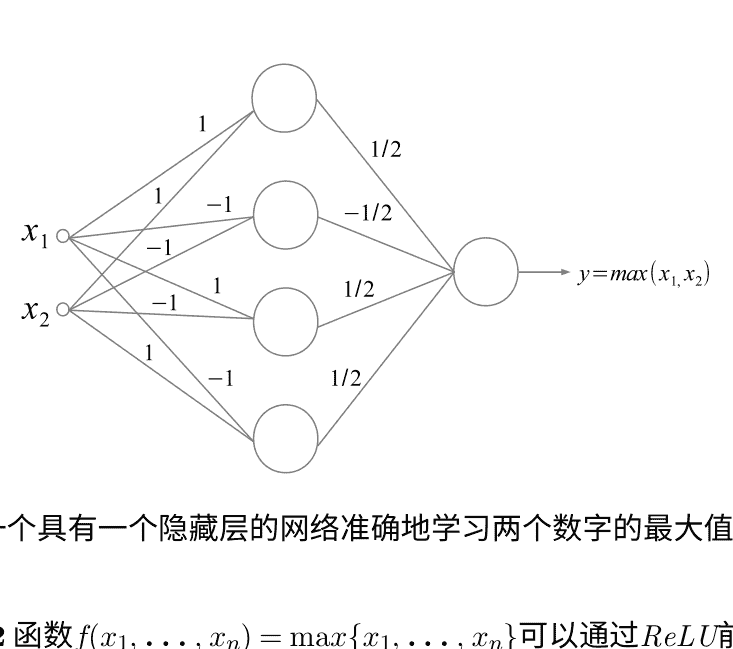

命题10.2.2 函数 \( f(x_1, \ldots, x_n) = \max\{x_1, \ldots, x_n\} \) 可以通过ReLU前馈神经网络（如定义10.2.1所述）精确表示。

$$L = \begin{cases} 2k, & \text{如果 } n = 2^k \\ 2(\lfloor \log_2 n \rfloor + 1), & \text{如果 } n \neq 2^k. \end{cases}$$

证明：证明将分几个步骤完成。

步骤1：我们证明当 \( n=2^k \) 时的陈述，其中 \( k \geq 1 \)。这将通过对 \( k \) 进行归纳来完成。

当 \( k=1 \) 时，根据前面的讨论，可以通过公式(10.2.1)准确表示 \( \max\{x_1, x_2\} \)。在这种情况下，网络的深度为 \( L=2 \)。

在 \( k=2 \) 的情况下，我们写成

$$\max\{x_1, x_2, x_3, x_4\} = \max\{\max\{x_1, x_2\}, \max\{x_3, x_4\}\}.$$

然后，\( a = \max\{x_1, x_2\} \) 和 \( b = \max\{x_3, x_4\} \) 由一个具有一个隐藏层的神经网络表示。我们将这些网络并行放置，并添加两个更多的层来计算 \( \max\{a, b\} \)，参见图10.2。得到的网络具有 \( L = 2 + 2 = 4 \)，验证了给定的关系。

归纳假设表明，如果 \( n = 2^k \)，则

$$f(x_1, \ldots, x_{2^k}) = \max\{x_1, \ldots, x_{2^k}\}$$

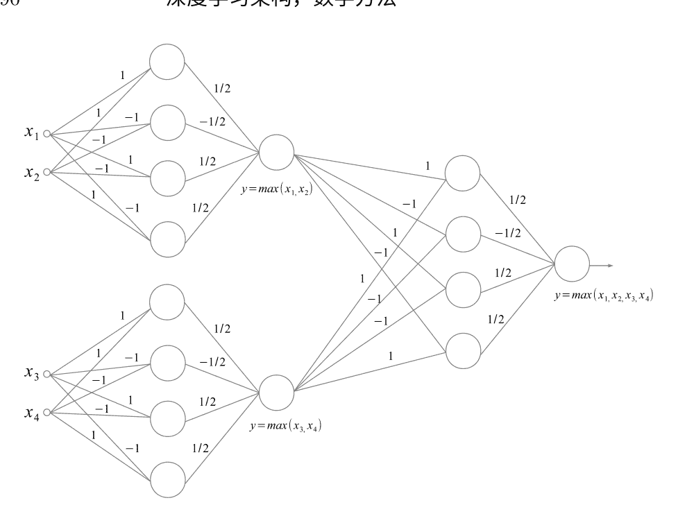

图10.2：一个神经网络准确学习4个数字的最大值。第一层中的8个神经元可以被视为仅有4个重叠神经元。

可以用 \( L_k = 2k \) 的网络表示。因为

\( f (x_1, \ldots, x_{2^{k+1}}) = \max\{ f (x_1, \ldots, x_{2^k}) , f (x_{2^k+1}, \ldots, x_{2^{k+1}}) \} \)。

然后根据归纳假设，\( f (x_1, \ldots, x_{2^k}) \) 和 \( f (x_{2^k+1}, \ldots, x_{2^{k+1}}) \) 可以由每个具有 \( L_k \) 层的网络表示。我们将这些网络并行放置，并添加两个额外的层来计算 \( f (x_1, \ldots, x_{2^{k+1}}) \)。得到的网络具有 \( L_{k+1} = L_k + 2 = 2k + 2 = 2(k+1) \)，这结束了归纳过程。

步骤2：我们证明当 \( n \neq 2^k \) 时的陈述，其中 \( k \geq 1 \)。在这种情况下，我们有

\( 2^k < n < 2^{k+1} \),

我们将集合 \( \{x_1, \ldots, x_n\} \) 补充到一个基数等于下一个2的幂的集合，通过添加 \( 2^{k+1}-n \) 个等于 \( x_n \) 的数字

\( x_{n+1} = x_{n+2} = \cdots = x_{2^{k+1}} = x_n \).

由于

\( \max\{x_1, \ldots, x_n\} = \max\{x_1, \ldots, x_n, \ldots x_{2^{k+1}}\} \)

应用步骤1，我们得到一个深度为 \( L_{k+1} = 2(k+1) = 2(\lfloor \log_2 n \rfloor + 1) \) 的网络，它学习右侧的最大值。这是结论中提供的关系。

注10.2.3 值得注意的是，对于表示 \( n \) 个数字的最小值，类似的结果也成立。证明类似，使用公式

\( \min\{x_1, x_2\} = \frac{1}{2}\left( x_1 + x_2 - |x_1 - x_2| \right) \).

下面的结果表明，对于表示 \( \max\{x_1, x_2\} \)，如果其中一个输入变量是非负的，并且对输出神经元应用ReLU激活函数，则隐藏层的宽度可以减少到只有2个神经元。

命题10.2.4 存在一个前馈神经网络，其输入维度为2，一个宽度为2的隐藏层，输出维度为1，并且对所有神经元都使用ReLU激活函数，该网络完全表示了函数

\( f(x_1, x_2) = \max\{x_1, x_2\}, \quad \forall x_1 \in \mathbb{R}, x_2 \in \mathbb{R}_+ \).

证明：我们考虑图10.3所示的神经网络。所有偏置都取零，权重选择为

\( w^{(1)}_{11} = 1, w^{(1)}_{12} = 0, w^{(1)}_{21} = -1, w^{(1)}_{22} = 1, w^{(2)}_{11} = 1, w^{(2)}_{21} = 1 \).

使用这些权重，我们构建仿射函数 \( A_1: \mathbb{R}^2 \to \mathbb{R}^2 \) 和 \( A_2: \mathbb{R}^2 \to \mathbb{R} \)

\( A_1(x_1, x_2) = (x_1 - x_2, x_2), \quad A_2(u, v) = u + v \).

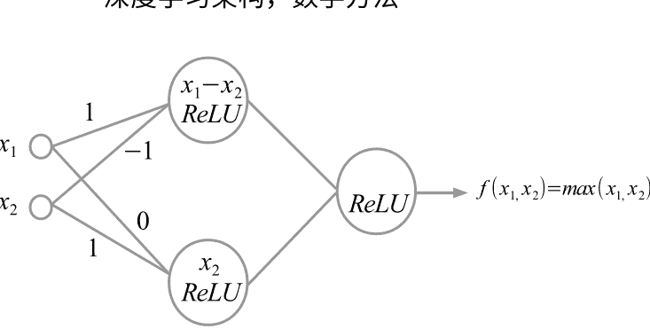

图10.3：一个神经网络准确地学习两个数的最大值。

由于所有神经元都具有ReLU激活函数，网络的输入-输出映射如下计算：

$$\begin{aligned}
f(x_1, x_2) &= (\text{ReLU} \circ A_2 \circ \text{ReLU} \circ A_1)(x_1, x_2) \\
&= (\text{ReLU} \circ A_2 \circ \text{ReLU})(x_1 - x_2, x_2) \\
&= (\text{ReLU} \circ A_2)(\text{ReLU}(x_1 - x_2), x_2) \\
&= \text{ReLU} \left( \text{ReLU}(x_1 - x_2) + x_2 \right) \\
&= \max\{\text{ReLU}(x_1 - x_2) + x_2, 0\} \\
&= \max\{\max\{x_1 - x_2, 0\} + x_2, 0\} \\
&= \max\{\max\{x_1, x_2\}, 0\} = \max\{x_1, x_2\}, \quad \forall x_1 \in \mathbb{R}, x_2 \in \mathbb{R}_+.
\end{aligned}$$

最后一个等式成立是因为 \( \max \{x_1, x_2\} \geq x_2 \geq 0 \)。

### 10.2.2 宽度与深度

下一个结果涉及到“浅而宽”和“深而窄”的权衡，对于ReLU网络而言，我们理解为一个前馈神经网络，其所有神经元（包括输出层）都具有ReLU激活函数。更具体地说，我们已经看到如何通过具有足够多隐藏层神经元的单隐藏层神经网络来学习连续函数 \( f: [0,1]^d \to \mathbb{R} \)。我们在这里展示，在ReLU神经网络的情况下，可以通过减少隐藏层的宽度来增加深度，即通过添加一定有界宽度的额外隐藏层来获得相同的输出，参见图10.4。下一个结果取自Hannin [52]:

命题10.2.5 设 \( N \) 表示一个ReLU网络（如定义10.2.1所示），输入维度为 \( d \)，单个隐藏层宽度为 \( n \)，输出维度 1。 那么存在另一个ReLU网络，\( \tilde{N} \)，它在 \( [0,1]^d \) 上计算与 \( N \) 相同的函数，具有相同的输入维度 \( d \)，但具有 \( n+2 \)个隐藏层，每个隐藏层的宽度为 \( d+2 \)。

我们注意到从 \( n \)到仅 \( d+2 \)的宽度减小，而隐藏层数从1增加到 \( n+2 \)（一般情况下 \( n \)比 \( d \)大得多）。

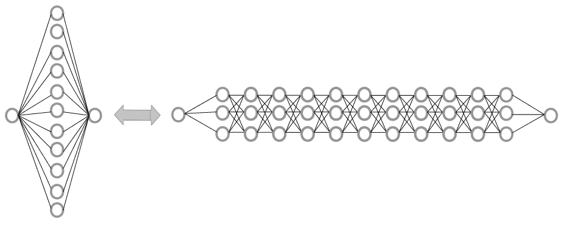

证明：考虑隐藏神经元计算的仿射函数

$$A_j(x) = \sum_{k=1}^{d} w_{kj} x_k + b_j, \quad 1 \leq j \leq n, x \in [0,1]^d$$

那么隐藏层中第 \( j \)个神经元的激活函数为 \( y_j = \text{ReLU}(A_j(x)) \)。由此可得，网络 \( N \)的输入输出函数为

$$f_N = b + \sum_{j=1}^{n} \lambda_j \text{ReLU}(A_j(x))$$

其中 \( b \)是输出神经元的偏置， \( \lambda_j \)是隐藏层到输出层的权重。

接下来，我们将构建网络 \( \tilde{N} \)，使得对于所有的 \( x \in [0,1]^d \)，有 \( f_{\tilde{N}}(x) = f_N(x) \)。为了指定网络 \( \tilde{N} \)，只需提供其权重和偏置，或者等价地，指定由 \( \tilde{N} \)的第 \( j \)个隐藏层计算的仿射变换 \( \tilde{A}_j \)。

由于函数 \( x \rightarrow \sum_{j=1}^{n} \lambda_j \text{ReLU}(A_j(x)) \) 在闭区间 \( [0,1]^d \) 上连续，因此它是有界的，因此存在一个常数 \( T>0 \) 使得 \( T + \sum_{j=1}^{n} \lambda_j \text{ReLU}(A_j(x)) > 0 \)，对于所有的 \( x \in [0,1]^d \)。

仿射变换 \( \tilde{A}_1: [0,1]^d \rightarrow \mathbb{R}^{d+2}, \tilde{A}_j: \mathbb{R}^{d+2} \rightarrow \mathbb{R}^{d+2}, 2 \le j \le n+1, \) 以及 \( \tilde{A}_{n+2}: \mathbb{R}^{d+2} \rightarrow \mathbb{R} \) 的定义如下

$$\begin{aligned}
\tilde{A}_1(x) &= (x, A_1(x), T) \\
\tilde{A}_j(x, y, z) &= (x, A_j(x), z + \lambda_{j-1}y), \quad 2 \le j \le n+1 \\
\tilde{A}_{n+2}(x, y, z) &= z - T + b.
\end{aligned}$$

我们将追踪前几层的激活情况。第一层的激活情况是

$$\begin{aligned}
X^{(1)} &= \text{ReLU} \circ \tilde{A}_1(x) = \text{ReLU}(x, A_1(x), T) = (x, \text{ReLU}(A_1(x)), T) \\
X^{(2)} &= \text{ReLU} \circ \tilde{A}_2(X^{(1)}) = \text{ReLU} \circ \tilde{A}_2(x, \text{ReLU}(A_1(x)), T) \\
&= (x, \text{ReLU}(A_2(x)), T + \lambda_1 \text{ReLU}(A_1(x))) \\
X^{(3)} &= \text{ReLU} \circ \tilde{A}_3(X^{(2)}) \\
&= \text{ReLU} \circ \tilde{A}_3(x, \text{ReLU}(A_2(x)), T + \lambda_1 \text{ReLU}(A_1(x))) \\
&= (x, \text{ReLU}(A_3(x)), T + \lambda_1 \text{ReLU}(A_1(x)) + \lambda_2 \text{ReLU}(A_2(x))).
\end{aligned}$$

归纳地，我们得到

$$X^{(p)} = \left( x, \text{ReLU}(A_p(x)), T+\sum_{j=1}^{p-1} \lambda_j \text{ReLU}(A_j(x)) \right), \text{对于 } 1 \le p \le n+1.$$

网络 \( \tilde{N} \) 的最后一层激活为

$$\begin{aligned}
X^{(n+2)} &= \tilde{A}_{n+2}(X^{(n+1)}) \\
&= \tilde{A}_{n+2} \left( x, \text{ReLU}(A_{n+1}(x)), T+\sum_{j=1}^{n} \lambda_j \text{ReLU}(A_j(x)) \right) \\
&= T+\sum_{j=1}^{n} \lambda_j \text{ReLU}(A_j(x)) - T + b \\
&= b + \sum_{j=1}^{n} \lambda_j \text{ReLU}(A_j(x)) = f_N(x), \quad x \in [0,1]^d.
\end{aligned}$$

因此，对于所有的 \( x \in [0,1]^d \)，有 \( f_{\tilde{N}}(x) = f_{N}(x) \)，证毕。

## 引理 10.2.6

\( \text{ReLU} \) 神经网络的输入输出函数是一个连续的分段线性函数。

证明：设$f$为具有$L$个层的ReLU网络的输入输出函数。那么

$$f(x) = (A_L \circ ReLU \circ \dots \circ ReLU \circ A_2 \circ ReLU \circ A_1)(x).$$

由于$f$是连续函数的复合（ReLU和仿射线性函数$A_j$都是连续的），所以$f$是连续的。由于ReLU是分段的，上述复合函数也是分段的。因此

$$ReLU(\alpha - \beta) = \begin{cases} \alpha - \beta, & \text{如果 } x \geq \beta / \alpha \\ 0, & \text{如果 } x < \beta / \alpha, \end{cases}$$

ReLU和任何仿射函数$A_j$的组合也是分段线性的。这些类型函数的重复组合也是分段线性的。

逆命题也成立，参见Arora等人[10]。在接下来的内容中，我们将呈现一个稍微不同的结果，其中网络被允许同时具有ReLU和线性神经元。

## 命题10.2.7

设 $f: \mathbb{R}^n \rightarrow \mathbb{R}$ 是一个给定的连续分段线性函数。那么存在一个前馈神经网络，同时具有ReLU和线性神经元，可以精确表示函数 $f$。该网络具有 $L = 2(\lfloor \log_2 n \rfloor + 2)$ 层。

证明：该证明基于Wang和Sung [122]的一个结果，该结果说明任何连续的分段线性函数$f$可以表示为分段线性凸函数的线性组合

$$f = \sum_{j=1}^{p} s_j \max_{i \in S_j} \ell_i$$

其中 $\{\ell_1, \dots, \ell_k\}$ 是有限集合的仿射线性函数， $S_i \subset \{1, 2, \ldots, k\}$，每个集合 $S_i$ 最多有 $n + 1$ 个元素， $s_j \in \{-1, 1\}$。函数 $g_j = \max_{i \in S_j} \ell_i$ 是一个分段线性凸函数，最多有 $n + 1$ 个片段，因为 $|S_j| \leq n + 1$。每个仿射函数 $\ell_i(x)$ 是通过线性神经元（第一隐藏层）从输入 $x$ 计算得到的。每个值 $g_j(x)$ 是通过ReLU神经网络从输入 $\ell_i(x)$ 计算得到的，如命题10.2.2所示（这是 $2(\lfloor \log_2 n \rfloor + 1)$ 个隐藏层）。一个输出线性神经元可以计算函数 $f = \sum_{j=1}^{p} s_j g_j$（输出层）。总层数为 $L = 1 + 2(\lfloor \log_2 n \rfloor + 1) + 1 = 2(\lfloor \log_2 n \rfloor + 2)$。

备注 10.2.8：先前的结果没有提供关于层的宽度的信息。Hamin [52] 表明，在非负连续分段线性函数的情况下，隐藏层的宽度为 $n + 3$，ReLU网络的深度为 $2p$。

图10.5：一个连续函数f在n=1的情况下的两个隐藏层的精确表示。

## 10.3 Kolmogorov-Arnold-Sprecher 定理

著名的希尔伯特第13问题的一个版本是，存在无法仅由两个参数的连续函数的有限叠加写成的三个变量的解析函数。这个猜想在1957年被Arnold和Kolmogorov证明为错误，他们证明了以下表示定理，请参见[9]和[64]。

定理10.3.1（科尔莫戈洛夫）：任何在I上定义的连续函数f(x1, ..., xn)，其中n≥2，都可以写成以下形式

$$f(x_1, \ldots, x_n) = \sum_{j=1}^{2n+1} \chi_j \left( \sum_{i=1}^n \psi_{ij}(x_i) \right)$$

其中χ_j和ψ_{ij}是关于一个变量的连续函数，ψ_{ij}是单调函数，它们与f无关。

我们注意到，当n=2时，前面的表达式变为

$$f(x_1, x_2) = \chi_1 \left( \psi_{11}(x_1) + \psi_{21}(x_2) \right) + \chi_2 \left( \psi_{12}(x_1) + \psi_{22}(x_2) \right) + \dots + \chi_5 \left( \psi_{15}(x_1) + \psi_{25}(x_2) \right)$$

Sprecher改进了Kolmogorov的结果，其中外部函数 χ_j被替换为单个函数 χ和内部函数 ψ_{ij} 是一种特殊类型的函数，并通过平移进行了偏移：

定理10.3.2 (Sprecher, 1964)：对于每个整数 n ≥ 2, 存在一个实数、单调递增函数 ψ(x), 满足 ψ([0,1]) = [0,1], 依赖于 n并具有以下属性: 对于每个预先指定的数δ > 0, 存在一个有界数 $\lambda$ , 满足 $0 < \lambda < \delta$, 使得每个实数连续函数 f(x_1, ..., x_n), 定义在 $I^n$上, 可以表示为

$$f(x_1, \ldots, x_n) = \sum_{j=1}^{2n+1} \chi\left( \sum_{i=1}^{n} \lambda^{i} \psi\left( x_i + (j-1) \right) + j - 1 \right),$$

其中函数 χ是实数且连续的, λ是一个独立于$f$的常数。

证明可以在Sprecher的论文[115]中找到。这个结果对神经网络领域非常重要, 因为它表明任何连续函数on $I^n$都可以由具有两个隐藏层的神经网络精确表示。第一个隐藏层的激活函数是 ψ, 第二个隐藏层的激活函数是 χ。

为了清晰起见, 我们在图10.5中展示了神经网络的情况 $n= 1$。在这种情况下, 每个隐藏层都有三个计算单元。从第一隐藏层到第二隐藏层的权重都相等于 λ。所有其他权重 (输入到第一隐藏层和第二隐藏层到输出层的权重) 都等于1。请注意, 阈值可以任意小。图10.6表示了 $n= 2$的情况, 为了简单起见, 忽略了阈值, 并且所有没有权重的边默认权重为1。第一个隐藏层有10个计算单元, 而第二个隐藏层只有5个单元。

Kolmogorov-Arnold-Sprecher定理是关于四层神经网络的一个有趣的理论结果。然而, 由于激活函数 ψ和 χ没有事先设定, 并且它们的构建是费时的, 因此它在实际应用中并没有太多的适用性。事实上, 值得注意的是以下权衡特性: 在Kolmogorov定理中, 中间单元的数量是给定的, 但对 ψ和 χ的表达没有控制。然而, 在一些先前的结果中, 激活函数是事先固定的, 而隐藏单元的数量则根据需要增加, 直到达到某个期望的逼近精度水平为止。

## 10.4 Irie和Miyake的积分公式

另一个具有理论重要性的结果是Irie和Miyake的积分公式, 参见[60], 该公式说明了有限能量的任意函数 (即$L^2$-可积)可以用一个具有连续计算单元的三层网络表示，参见图10.7。更准确地说，结果表明如下：

定理10.4.1 (Irie-Miyake, 1988)：设 $f(x_1, \ldots, x_n) \in L^2(\mathbb{R}^n)$ 且设 $\Psi(\xi)$ 和 $F(w^1, \ldots, w_n)$ 分别是 $\psi(x)$ 和 $f(x_1, \ldots, x_n)$ 的傅里叶变换。如果 $\Psi(1) = 0$，则

$$ f(x_1, \ldots, x_n) = \int_{\mathbb{R}^{n+1}} \psi\left( \sum_{i=1}^n x_i w_i - w_0 \right) \frac{1}{(2\pi)^n \Psi(1)} F(w_1, \ldots, w_n) e^{i w_0} \, d\mathbf{w}, $$

其中 $d\mathbf{w} = dw_0 dw_1 \ldots dw_n$。

图10.7：具有无限计算单元的单隐藏层神经网络。

在上述公式中， $w_0$ 对应于偏置项， $w_i$ 对应于连接权重，而 $\psi$ 对应于隐藏层中的激活函数。隐藏层与输出层之间的连接权重取决于 $f$ 的傅里叶变换。

$$ \lambda(w_0, w_1, \ldots, w_n) = \frac{1}{(2\pi)^n \Psi(1)} F(w_1, \ldots, w_n) e^{i w_0}. $$

通过对权重和阈值进行积分，可以实现对连续无限数量的计算单元的求和。我们有几点要说明。

-   1. 由于逻辑函数 $\sigma(x) = \frac{1}{1 + e^{-x}} \in L^1(\mathbb{R})$，定理的结论不一定适用于具有sigmoid神经元的神经网络。
-   2. 然而，高斯函数 $\psi(x) = e^{-x^2}$ 满足这两个性质 $\psi \in L^1(\mathbb{R})$ 并且 $\hat{\psi}^{(1)} = 0$，这使得该公式适用于具有高斯激活函数的神经网络。
-   3. 另一个主要缺点是，这个公式在实践中没有用处，因为要实现的函数是由一个积分公式给出的，假设网络具有连续无限数量的单元。
-   4. 从超平面上的值以及其相关频率恢复多个变量的有限能量函数的想法类似于计算机断层扫描的原理。

## 10.5 精确学习并非总是可能的

本节的要点是，在$[0,1]$上存在无法准确表示为神经网络输出的连续函数。为此，我们考虑一个具有逻辑或双曲正切激活函数的隐藏层的单层神经网络，并在输出层使用线性激活函数。如果存在精确表示，则$f$可以写成解析函数的有限组合，例如

$$f(x) = \sum_{j=1}^{N} \alpha_j \sigma(w_j^T x - \theta_j)$$

由于$\sigma$是$x$的解析函数（作为$e^x$的代数组合），所以右侧表达式在$(0,1)$上是解析的，而连续函数$f$可以选择为非解析的，例如

$$f(x) = \begin{cases} 0, & \text{如果 } 0 \leq x \leq 0.5, \\ x - 0.5, & \text{如果 } 0.5 < x \leq 1. \end{cases}$$

类似的缺乏精确表示也可以在$L^1$和$L^2$函数中找到。

## 10.6 连续神经元数量

本节将扩展精确学习到每个隐藏层中具有连续神经元的深度神经网络。我们假设输入属于一个紧凑区间， $t \in [0, 1]$。一个具有$N$个隐藏层神经元的单隐藏层神经网络，其输出由$y(t) = \sum_{j=1}^N v_j\sigma(w_j^*t+b_j)$给出，其中$\sigma$是一个sigmoid激活函数，$w_j$是输入和第$j$个节点之间的权重，$v_j$是第$j$个节点和输出之间的权重，而$b_j$表示隐藏层中第$j$个神经元的偏置。

图10.8：具有隐藏层中连续神经元的三层神经网络。

现在，我们将隐藏层中的有限数量的神经元替换为由参数化的连续无限数量的隐藏神经元，参数范围为$s \in [0,1]$，参见图10.8。因此，索引$j$被参数$s$替换。因此，权重$w_j$和偏置$b_j$分别变成连续函数$w(s)$和$b(s)$，而权重$v_j$则被度量$h(s)\,ds$替换。求和变成积分，网络输出由积分变换给出

$$ y(t) = \int_0^1 K(t, s)h(s)\,ds, \qquad\qquad (10.6.2) $$

其中偏置和权重的系统被封装到积分核$K(t, s) = \sigma\big(w(s)t + b(s)\big)$。

本节研究以下问题：给定一个连续函数 $g \in C[0, 1]$，先前的网络是否准确学习了函数 $g$？

也就是说，是否存在连续函数$w, b, h \in C[0, 1]$使得 $g(t) = \int_0^1 K(t, s)h(s)\,ds$对于所有$t \in [0, 1]$？

所提供的答案是部分的，只适用于某些连续函数的子类，其傅里叶系数足够快地趋于零。在解决这个问题时，我们将采用积分算子的技术。

在对称积分核的情况下，积分方程理论已经得到了很好的发展。为了更好地理解这些类型的核函数，下一个引理涉及特定类型的核函数的对称性 $K(t, s) = \sigma(w(s)t + b(s))$。然而，本节的其余部分将假设核函数是更一般形式的对称核。

引理 10.6.1：设 $w, b \in C[0, 1]$ 并考虑 $K(t, s) = \sigma(w(s)t + b(s))$, $\forall s, t \in [0, 1]$。以下条件等价：

(i) $K$ 是对称的： $K(s, t) = K(t, s), \forall s, t \in [0, 1]$;

(ii) $w(s)$和 $b(s)$是仿射的，由以下给出

$$
\begin{aligned}
w(s) &= (w(1) - w(0))s + w(0) \\
b(s) &= w(0)s + b(0),
\end{aligned}
$$

with $w(0) = b(1) - b(0)$.

证明: (i) $\Rightarrow$ (ii) 由于 $\sigma$是一对一的，所以 $K$的对称性等价于

$$
w(s)t + b(s) = w(t)s + b(t), \quad \forall s, t \in [0, 1]. \tag{10.6.3}
$$

同样，取极限 $s \rightarrow 0$ 并利用 $w$和 $b$的连续性可得

$$
b(t) = w(0)t + b(0),
$$

这表明 $b(t)$ 是仿射的。在 (10.6.3) 中取极限 $t \rightarrow 1$，解 $w(s)$ 并利用之前对 $b$ 的关系，我们有

$$
\begin{aligned}
w(s) &= w(1)s + b(1) - b(s) \\
&= (w(1) - w(0))s + b(1) - b(0).
\end{aligned}
$$

然后取 $s = 0$，得到 $w(0) = b(1) - b(0)$。

(ii) $\Rightarrow$ (i) 使用 $w(s)$ 和 $b(s)$ 的表达式，计算结果如下

$$
w(s)t + b(s) = (w(1) - w(0))st + w(0)(t + s) + b(0) = w(t)s + b(t).
$$

这意味着 (10.6.3) 成立，因此 $K(t, s) = K(s, t)$。

值得注意的是，在这种情况下，核函数变为

$$
K(t, s) = \sigma(\alpha s t + \beta (s + t) + \gamma),
$$

其中 $\alpha = w(1) - w(0)$, $\beta = w(0)$，且 $\gamma = b(0)$。那么对称核函数取决于其变量的和与积，即t和s的和与积。

到目前为止，我们已经确定了函数 \( w(s) \) 和 \( b(s) \)。我们仍然需要找到权重函数\( h(s) \)。我们将通过求解第一类积分方程来确定它。

$$ g(t) = \int_0^1 K(t, s)h(s) \, ds. \tag{10.6.4} $$

由于核函数 \( K \) 是连续的，右侧的积分算子改善了函数的平滑性。因此，一般情况下，具有任意连续函数 \( g \) 的方程(10.6.4)不能通过连续函数来解决。因此，我们需要对函数 \( g \) 做出更严格的假设。

在进一步之前，我们将回顾一些积分运算符的性质，稍后会用到：

-   1. 如果存在一个数 \( \lambda \) 和一个函数 \( e(\cdot) \)，使得
    \[ \int_0^1 K(t, s)e(s) \, ds = \lambda e(t), \]
    那么 \( \lambda \) 被称为特征值，\( e(t) \) 被称为与特征值 \( \lambda \) 对应的特征函数。
-   2. 如果 \( K \) 是对称的，则所有特征值都是实数。
-   3. 如果 \( K \) 是对称且非退化的，则存在无限可数个特征值和特征向量（如果 \( K(t, s) = \sum_{i=1}^n \alpha_i(t) \beta_i(s) \) ）。
-   4. 与非零特征值对应的特征函数是连续的。
-   5. 与不同特征值对应的特征函数在 \( L^2 \) 意义下是正交的。
-   6. 如果 \( f \in L^2[0,1] \)，那么 \( \sum_{n \ge 1} f_n^2 \leq \| f \|^2 \)，其中 \( f_n = \int_0^1 f(t) e_n(t) \, dt \) 且 \( \| f \|^2 = \int_0^1 f(t)^2 \, dt \)，其中 \( e_n(t) \) 表示第 \( n \) 个特征函数。这被称为 Bessel不等式。

我们将在后面提供三个涉及绝对连续性的性质，这些性质可以在任何分析教材中找到，但不提供证明。

用于检查函数级数一致收敛性的一个有用测试如下：

## 命题 10.6.2 (Cauchy)

设 \( f_n : [0, 1] \to \mathbb{R} \) 是一系列函数。以下条件等价：

-   (i) 该级数 \( \sum_{n \ge 1} f_n \) 在 \( [0, 1] \) 上一致收敛；
-   (ii) 对于任意 \( \epsilon > 0 \)，存在一个整数 \( N \ge 1 \) 使得
    \[ \left| \sum_{i=n}^{n+p} f_i(t) \right| < \epsilon, \text{对于任意} t \in [0,1], \text{对于任意} n \ge N, \text{对于任意} p \ge 0. \]

# 深度学习架构，数学方法

条件 (ii) 表明部分和数列是一致柯西的。

下一个结果表明一致收敛保持连续性：

命题 10.6.3 (魏尔斯特拉斯) 如果每个函数 $f_n$在$x_0 \in [0, 1]$处连续，并且级数$\sum_{n\geq 1} f_n$在 $[0, 1]$上一致收敛，则级数和在 $x_0$处连续。

下一个结果给出了一致收敛的必要条件：

命题 10.6.4 设$f, f_n: [0, 1] \to [0, +\infty)$是连续函数，且 $f(t) = \sum_{n\geq 1} f_n(t)$ 对于所有的$t\in[0,1]$，$f(t)$的级数 $\sum_{n\geq 1} f_n$ 是一致收敛的。

下一个结果陈述了在函数 $g$上给定一些额外条件的情况下，存在权重函数 $h$的存在。我们注意到下一个结果中使用的对称核 $K$是一般类型的，而不是引理10.6.1中给出的特定类型的核。

引理 10.6.5 设 $K: [0, 1] \times [0, 1] \to \mathbb{R}$为一个连续且对称的核函数。 考虑 $g \in C[0, 1]$，满足以下性质：

- (i) 它的表示为 $g(t) = \sum_{n\geq 1} g_n e_n(t)$，其中 $g_n = \int_0^1 g(t)e_n(t) dt$，其中 $e_n$是核函数的第$n$个特征函数；
- (ii) 该级数 $\sum_{n\geq 1} \frac{g_n^2}{\lambda_n^4}$ 收敛，其中 $\lambda_n$表示特征值对应的特征函数对应于特征函数 $e_n$，存在一个函数 $h \in C[0, 1]$，使得
$$g(t) = \int_0^1 K(t, s)h(s) ds.$$

证明： 我们将证明分为几个步骤。

## 第一步

级数 $\sum_{n\geq 1} \lambda_n^2 e_n^2(t)$在 $[0, 1]$上绝对收敛，并且在 $t$上一致有界。

对于函数 $f(s) = K(t, s)$应用贝塞尔不等式，并利用 $e_n$是特征函数，得到
$$\int_0^1 K^2(t, s) ds \geq \sum_{n\geq 1} \left( \int_0^1 K(t, s) e_n(s) ds \right)^2 = \sum_{n\geq 1} \lambda_n^2 e_n^2(t).$$

连续性 $K$ 意味着 $\int_0^1 K^2(t, s)ds < M$，对于所有 $t \in [0, 1]$。因此，$\sum_{n>1} \lambda_n^2 e_n^2(t)$ 在任意 $t \in [0, 1]$上收敛，并且也被 $M$一致有界。

## 步骤2

令 $h_n = g_n / \lambda_n$。级数 $\sum_{n \geq 1} h_n e_n(t)$ 在 $[0, 1]$ 上一致收敛。只需证明命题10.6.2的条件 $(ii)$ 成立。令 $\varepsilon > 0$ 任意固定。使用柯西不等式，我们有

$$\left(\sum_{i=n}^{n+p} h_i e_i(t)\right)^2 = \left(\sum_{i=n}^{n+p} \frac{g_i}{\lambda_i^2} \lambda_i e_i(t)\right)^2 \leq \sum_{i=n}^{n+p} \left(\frac{g_i}{\lambda_i^2}\right)^2 \sum_{i=n}^{n+p} \lambda_i^2 e_i^2(t).$$

从第1步可以得出结论 $\sum_{i=n}^{n+p} \lambda_i^2 e_i^2(t) < M$。从假设条件 $(ii)$ 我们有级数 $\sum_{n \geq 1} \frac{g_n^2}{\lambda_n^4}$ 收敛，所以对于足够大的 $n$

$$\sum_{i=n}^{n+p} \left(\frac{g_i}{\lambda_i^2}\right)^2 < \frac{\varepsilon^2}{M}.$$

将上述不等式代入，我们得到

$$\left|\sum_{i=n}^{n+p} h_i e_i(t)\right| < \varepsilon, \quad \forall t \in [0, 1]$$

对于足够大的 $n$ 和任意的 $p \geq 1$。现在根据命题10.6.2可以得出结论。

## 第3步

检查 $h(t) = \sum_{n \geq 1} h_n e_n(t)$ 是一个解。这涉及两个方面：$h \in C[0,1]$ 和 $h$ 满足积分方程。根据第2步和命题10.6.3，使用连续性，得出当 $n \geq 1$ 时，$h_n e_n(t)$ 在 $[0,1]$ 上连续。由于一致收敛允许逐项积分，我们有

$$\int_0^1 K(t, s) h(s) \,ds = \sum_{n \geq 1} h_n \int_0^1 K(t, s) e_n(s) \,ds = \sum_{n \geq 1} h_n \lambda_n e_n(t) = \sum_{n \geq 1} g_n e_n(t) = g(t).$$

证明结束。

## 备注10.6.6

- 1. 收敛条件 $\sum_{n \geq 1} \frac{g_n^2}{\lambda_n^4} < \infty$ 意味着傅里叶系数 $g_n$ 趋向于零的速度比特征值 $\lambda_n$ 更快。这限制了网络学习的连续函数的类别。
- 2. 通过在第一步提供的不等式中再次积分，可以证明 $\lim_{n\to\infty} \lambda_n = 0$。

$$ M = \int_0^1 \int_0^1 K^2(t,s) \, ds dt \geq \sum_{n\geq 1} \lambda_n^2 \int_0^1 e_n(t)^2 \, dt = \sum_{n\geq 1} \lambda_n^2 $$

由于级数 $\sum_{n\geq 1} \lambda_n^2$ 收敛，因此 $\lambda_n$ 趋于零。
- 3. Picard还有一个更一般的结果，见[29] p.160，它说明了存在一个解 $h \in L^2[0,1]$ 对于积分方程的必要和充分条件。

$$ g(t) = \int_0^1 K(t,s) h(s) \, ds $$

是级数的收敛性 $\sum_{n\geq 1} \frac{g_n^2}{\lambda_n^2}$。值得注意的是，这个结果也适用于非对称的核 $K$。

引理10.6.1和10.6.5的结果可以通过考虑一个对称核函数 $K(t,s) = \sigma(\alpha s t + \beta(s+t) + \gamma)$ 的组合来获得一个权重密度函数 $h(s)$，使得网络学习一个连续函数 $g$，其傅里叶系数的衰减速度比核函数的特征值的平方更快。

## 10.7 退化核的逼近

处理核函数的另一种有效方法是用退化核函数来近似它们，即用在底层变量中可以表示为分离函数的有限和的核函数来近似它们，即用下式的有限和表示：$A_n(t,s) = \sum_{i=1}^n \alpha_i(t)\beta_i(s)$。下一个结果通过连续的 $\alpha_i$ 和 $\beta_i$ 逼近连续核函数 $K(t,s)$。

命题 10.7.1: 设 $K: [0,1] \times [0,1] \to \mathbb{R}$ 为连续核函数。那么对于任意 $\epsilon > 0$，存在一个 $n \geq 1$ 和 $\alpha_i, \beta_i \in C[0,1]$, $i=1,\ldots,n$，使得

$$ \left| K(t,s) - \sum_{i=1}^n \alpha_i(t)\beta_i(s) \right| < \epsilon, \quad \text{对于任意 } t,s \in [0,1]. $$

证明：这是命题 7.4.5 的改写，并且是 Stone-Weierstrass 定理的结果。

接下来我们讨论如果将核函数 $K$ 替换为一个附近的退化核函数，网络输出会受到什么影响。

令 $h \in L^2[0,1]$ 固定，并用符号表示输出

$$ g(t) = \int_0^1 K(t, s)h(s) ds, \quad g_n(t) = \int_0^1 A_n(t, s)h(s) ds, $$

其中 $A_n(t, s) = \sum_{i=1}^n \alpha_i(t) \beta_i(s)$ 由命题 10.7.1 给出。两个函数 $g$ 和 $g_n$ 都是连续的。特别地，$g_n$ 是连续函数 $\alpha_i$ 的线性组合

$$ g_n(t) = \sum_{i=1}^n c_i \alpha_i(t), $$

其中系数 $c_i = \int_0^1 \beta_i(s)h(s) ds \leq \|\beta_i\| \|h\|$。下一个结果说明，无论网络使用任意连续核函数学习什么，都可以使用退化核函数学习，因此使用退化核函数是足够的。

## 命题 10.7.2

序列 $g_n$ 在 $[0, 1]$ 上一致收敛于 $g$（当 $n$ 趋向于无穷大时）

证明：设任意固定的 $\epsilon > 0$ 根据命题 10.7.1，存在一个整数 $n \geq 1$ 使得

$$ \left| K(t, s) - A_n(t, s) \right| < \frac{\epsilon}{\|h\|}, \quad \text{对于任意 } t, s \in [0, 1]. $$

利用柯西不等式，我们有

$$
\begin{aligned}
|g(t) - g_n(t)|^2 &= \left| \int_0^1 \left( K(t, s) - A_n(t, s) \right) h(s) ds \right|^2 \\
&\leq \int_0^1 \left| K(t, s) - A_n(t, s) \right|^2 ds \int_0^1 h^2(s) ds \\
&\leq \frac{\epsilon^2}{\|h\|^2} \|h\|^2 = \epsilon^2.
\end{aligned}
$$

因此，对于之前的 $n$，我们得到

$$ \max_{t \in [0,1]} |g(t) - g_n(t)| < \epsilon, \quad \forall t \in [0, 1], $$

这结束了证明。

## 10.8 退化核的例子

由于函数 $\alpha_i$ 和 $\beta_i$ 由斯通-魏尔斯特拉斯定理提供，这是一个存在性结果，因此一般情况下退化核 $A_n(t,s)$ 的显式形式是未知的。如果对核有更严格的条件，可以构造退化核的显式公式。我们将在下面处理这个问题。

对 $K$ 施加的额外条件是对称和非负定的。对称性是为了存在实特征值。回忆一下，连续的对称积分核 $K$ 被称为非负定的，如果它的所有特征值都是非负的。等价地，这可以用积分条件表示

> $$ \int_0^1 \int_0^1 K(t,s)u(t)u(s) \, dt \, ds \geq 0, \quad \text{对于每个 } u \in C[0,1], $$

这可以被解释为一个非负的积分二次型。非负定核函数的以下特征定理可以在 Mercer [83] 中找到，并将在稍后使用：

> 定理10.8.1 (Mercer) 设 $K$ 是一个连续的、对称的、非负定的积分核函数，作用于 $[a,b]$ 上。用 $\{e_n\}_{n\geq 1}$ 表示由非零特征值 $\lambda_n$ 对应的特征函数 $e_n$ 张成的空间的正交基。那么这个核函数可以展开成一个级数

> $$ K(t,s) = \sum_{n \geq 1} \lambda_n e_n(t) e_n(s), \quad \forall s,t \in [0,1] $$

绝对收敛、一致收敛和均方收敛。

这意味着我们可以考虑类型为退化核的情况

> $$ A_n(t,s) = \sum_{i=1}^n \lambda_i e_i(t) e_i(s), $$

通过前面的结果，它们一致收敛于核函数 $K(t,s)$。在这种情况下，$g_n(t)$ 可以写成特征函数的线性组合

> $$ g_n(t) = \int_0^1 A_n(t,s) h(s) \, ds = \sum_{i=1}^n \lambda_i h_i e_i(t), \quad (10.8.5) $$

具有傅里叶系数

$$h_i = \int_0^1 e_i(s) h(s)\, ds.$$

考虑

$$\mathbf{h}_n(t) = \sum_{i=1}^n h_i e_i(t)$$

是 $h(t)$ 在由 $\{e_1(t), \ldots, e_n(t)\}$ 张成的空间上的投影。由于 $e_i(t)$ 是连续的，函数 $\mathbf{h}_n(t)$ 也是连续的；这些函数将被用来逼近函数 $h \in L^2[0,1]$。

为了简化符号，我们采用积分算子符号

$$\mathcal{K}(h)(t) = \int_0^1 K(t, s) h(s)\, ds, \quad \mathcal{A}_n(h)(t) = \int_0^1 A_n(t, s) h(s)\, ds.$$

从表达式 $g_n$ 给出的 (10.8.5)，它只使用了系数 $h_i$，其中 $i \leq n$，我们得到

$$\int_0^1 A_n(t, s) h(s)\, ds = \int_0^1 A_n(t, s) \mathbf{h}_n(s)\, ds,$$

或者，等价地， $\mathcal{A}_n(h) = \mathcal{A}_n(\mathbf{h}_n)$。

利用 $e_j(t)$ 是正交的，我们得到

$$\begin{align*}
\mathcal{K}(\mathbf{h}_n)(t) - \mathcal{A}_n(\mathbf{h}_n)(t) &= \int_0^1 [K(t, s) - A_n(t, s)] \mathbf{h}_n(s)\, ds \\
&= \int_0^1 \left( \sum_{i\geq n+1} \lambda_i e_i(t) e_i(s) \sum_{j=1}^n h_j e_j(s) \right) ds \\
&= \sum_{i\geq n+1} \sum_{j=1}^n \lambda_i e_i(t) h_j \int_0^1 e_i(s) e_j(s)\, ds = 0,
\end{align*}$$

因为 $i$ 和 $j$ 永远不相等。因此 $\mathcal{K}(\mathbf{h}_n) = \mathcal{A}_n(\mathbf{h}_n)$。现在，我们把所有部分放在一起。三角不等式，结合命题10.7.2和前两个关系，得到 $|\mathcal{K}(h) - \mathcal{K}(\mathbf{h}_n)| \leq |\mathcal{K}(h) - \mathcal{A}_n(h)|$

$$\underbrace{\phantom{\big|}}_{<\epsilon} + \underbrace{|\mathcal{A}_n(h) - \mathcal{A}_n(\mathbf{h}_n)|}_{=0} + \underbrace{|\mathcal{A}_n(\mathbf{h}_n) - \mathcal{K}(\mathbf{h}_n)|}_{=0}.$$

这意味着对于任意的 $\epsilon > 0$，存在 $n \geq 1$，使得

$$\max_{t \in [0,1]} |\mathcal{K}(h)(t) - \mathcal{K}(\mathbf{h}_n)(t)| < \epsilon.$$

这个结果的解释如下。根据备注10.6.6的第3部分，存在一个解 $h \in L^2[0,1]$，使得方程 $\mathcal{K}(h)(t) = g(t)$ 成立，当且仅当函数 $g$ 满足一些限制条件，考虑到特征值 $\lambda_n$ 的增加。网络现在可以通过使用连续权重函数 $\mathbf{h}_n(t)$ 产生的连续输出 $\mathcal{K}(\mathbf{h}_n)(t)$ 来学习结果 $g(t)$。

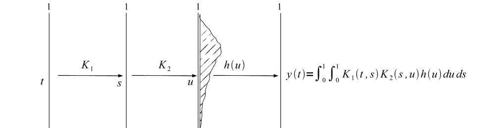

图10.9：每个隐藏层中有一个连续的神经元的四层神经网络。

## 10.9 深度网络

到目前为止，我们只研究了具有一个隐藏层的网络的情况，该隐藏层具有连续的神经元。 在本节中，我们使用迭代核函数考虑了相同类型的多个隐藏层。例如，图10.9表示了一个具有两个隐藏层的神经网络。 第一个隐藏层的权重和偏置被封装在核函数 $K_1(t, s)$中，而第二层的权重和偏置由核函数$K_2(s, u)$表示。 从第二个隐藏层到输出的权重函数被表示为 $h(u)$。 连续参数$y, s, u$表示输入和网络的第二层和第三层的参数。 图10.9中给出的网络的输出由一个双重积分给出。

$$y(t) = \int_0^1 \int_0^1 K_1(t, s) K_2(s, u) h(u) \, du \, ds.$$

如果让

$$G(t, u) = \int_0^1 K_1(t, s) K_2(s, u) \, ds,$$

那么输出可以等价地表示为

$$y(t) = \int_0^1 G(t, u) h(u) \, du,$$

这看起来像输出(10.6.2)，但具有更复杂的核结构 $K$。 如果核 $K_1$和 $K_2$是对称的，那么核 $G$是不一定对称的。 然而，如果我们进一步假设 $K_1 = K_2 = K$，那么迭代核

$$
K^{(2)}(t, u) = \int_0^1 K(t, s)K(s, u) ds
$$

是对称的。 因此，为了保持网络核的对称性，层必须共享相同的核 $K$。 相同的过程可以应用于具有任意层数的网络。

这些类型的深度网络带来了什么新意？ 我们注意到，在一个隐藏层神经网络的情况下，核的扩展为

$$
K(t, s) = \sum_{n \ge 1} \lambda_n e_n(t)e_n(s)
$$

一般情况下是无效的。默瑟定理通过对核 $K$ 的正定性提出了一些限制性假设来解决这个问题。更深层网络的好处在于迭代核 $K^{(2)}$满足类似的扩展，只要初始核 $K$是对称的。扩展为

$$
K^{(2)}(t, u) = \sum_{n \ge 1} \lambda_n^2 e_n(t)e_n(u).
$$

类似的扩展适用于与更深层网络相关的迭代核。
如果我们递归地定义第 $n$次迭代为

$$
K^{(n)}(t, u) = \int_0^1 K^{(n-1)}(t, s)K(s, u) ds,
$$

然后展开

$$
K^{(n)}(t, u) = \sum_{i \ge 1} \lambda_i^n e_i(t)e_i(u),
$$

绝对和一致收敛。 这个结果的证明可以在 Courant 和 Hilbert [29] 的第138页找到。

因此，所有在第10.8节中使用 Mercer 定理在假设 $K$是正定的情况下证明的结果，在至少有两个隐藏层和每层相同的核的深度神经网络的一般情况下都是有效的。

## 10.10 总结

有时神经网络可以完全表示目标函数。 我们已经讨论了具有有限支持的函数的精确学习案例。 这等同于网络记忆给定的数据；网络可以被查找表替代，没有泛化到其他新数据的能力。

另一个精确的表示结果是科尔莫戈洛夫-阿诺德-斯普雷彻定理，它与著名的希尔伯特第十三问题的答案有关。该定理指出，一个具有两个隐藏层的神经网络可以精确地表示t维超立方体上的任何连续函数。这个结果是阿诺德、科尔莫戈洛夫和斯普雷彻在1960年代共同努力的成果。这个深度数学结果对神经网络只有理论价值，该定理只是存在性的，而不是具体的。

Irie和Miyake的积分公式是另一个处理积分公式的理论结果，它表明具有有限能量的任意函数可以用具有连续计算单元的三层网络表示。

最后一部分涉及具有一层和两层隐藏层的连续神经元的精确学习，并且发展了学习连续函数的必要条件。在这种情况下，类型为 $\sigma(w_jx + b_j)$ 的激活被积分核 $K(s, t)$ 所取代。主要结果表明，网络可以准确表示其特征值增长足够快的连续函数。只有对称和非负核的情况可以完全处理，因为在这种情况下，Hilbert和Mercer已经开发了一些数学工具。引入了具有连续神经元的深度神经网络，共享核的情况是具有最好性质的情况。

## 10.11 练习题

- 练习题 10.11.1 (a) 证明具有一个隐藏层和2个计算单元的多感知器神经网络可以精确实现XOR函数，即满足 $g(0, 0) = 0$, $g(0, 1) = 1$, $g(1, 0) = 1$, 以及 $g(1, 1) = 0$。

(b) 绘制网络并说明权重和偏置。

- 练习题 10.11.2 (a) 证明存在一个具有一个隐藏层的多感知器神经网络，可以精确实现以下映射：

(0, 0, 0) → 1, (1, 0, 0) → 0, (0, 1, 0) → 0, (0, 0, 1) → 0,
(0, 1, 1) → 0, (1, 1, 0) → 0, (1, 0, 1) → 0, (1, 1, 1) → 1?

(b) 绘制网络并说明网络中所有感知器的权重和偏置。

- 练习题 10.11.3 写出指数函数的Irie-Miyake公式。$\psi(x) = e^{-x^2}$。

- 练习 10.11.4 构造一个连续函数 $f \in C[0,1]$，不能被具有逻辑sigmoid激活函数的神经网络精确学习。

- 练习 10.11.5 证明对于具有 $n$ hidden层的深度网络，类似于引理 10.6.5 的结果成立。

- 练习 10.11.6 设 $K$ 是一个具有特征值 $\lambda_n$ 的对称核函数。证明级数 $\sum_{i \geq 1} \lambda^{ni}$ 对于任意正整数 $n$ 是收敛的。

- 练习 10.11.7 考虑数据点 $\{(1, 1), (3, 3), (5, 2), (7, 1)\}$。
(a) 找到一个简单函数 $c(x)$，它可以精确学习给定的数据；
(b) 找到 $\alpha_j$ 和 $\theta_j$，使得 $G(x) = \sum_{j=1}^4 \alpha_j H(x - \theta_j)$ 精确地学习给定的数据。

- 练习 10.11.8 考虑 $f_1 : \mathbb{R}^n \to R^m$ 和 $f_2 : \mathbb{R}^m \to \mathbb{R}^k$ 是由两个完全表示的前馈网络表示的函数，其激活函数为 $\phi$。证明存在一个具有激活函数 $\phi$ 的神经网络，可以表示复合函数 $f_2 \circ f_1 : \mathbb{R}^n \to \mathbb{R}^k$。

## 第三部分
信息处理

## 第11章
## 信息表示

本章讨论神经网络中的信息表示以及使用sigma-代数概念描述几种类型的神经元和网络的信息内容。主要思想是描述信息内容在网络层之间的演变。网络的输入被视为一个随机变量，其特征是某种信息。因此，所有网络层的激活都是随机变量，携带着一些输入信息的子集，这些子集由一些sigma-场描述。从这个角度来看，神经网络可以被解释为信息处理器。

神经网络的泛化能力在于仅使用对当前任务有用的输入信息的那部分。这是一个通过选择性提取仅有用的特征来丢弃大部分输入信息的过程。网络的输出携带一些信息，它是输入信息的一个子σ代数，并包含用于泛化的有用信息。

例如，如果输入是男性和女性的图片，我们假设网络必须确定人的性别。知道性别是1比特的信息后，网络必须选择性地减少每个输入图片的初始信息的位数，仅保留所需的1比特有用信息。

通过网络的每一层压缩信息的过程涉及到在每一层网络中丢失的一定量的信息。我们通过最小丢失信息的方式定义未压缩层，并研究它们的属性。

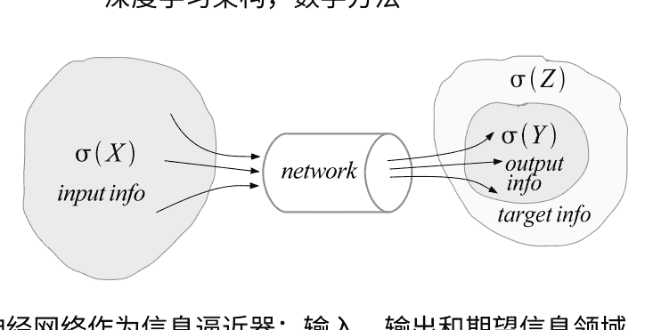

在阅读本章之前，建议不熟悉测度和概率论概念的读者参考附录。

## 11.1 信息内容

在本章中，我们假设神经网络的输入、输出和目标是随机变量。准确地说，让Ω表示概率空间的样本空间，ℋ是Ω上的σ-域。输入X是一个随机变量，X: Ω→ℝ^n，它将Ω中的每个状态ω映射到n个实数(X_1(ω), ..., X_n(ω)) ∈ ℝ^n。如果g表示网络的输入输出映射，则输出Y = g(X)也是一个随机变量。网络的目标变量被认为是一个实值随机变量，Z: Ω→ℝ。我们将引入下面三个有用的信息体系，用于研究神经网络，使用sigma代数的概念。它们基本上指定了可能在网络的输入、输出或目标处观察到的事件的集合。参见图11.1，了解信息流的图表。

输入信息表示由输入变量X生成的sigma代数，用ℐ表示。它包含了可以从给定数据中观察到的所有事件。

输出信息是由输出变量Y生成的sigma代数，用ℰ表示。这是在网络输出处观察到的事件集合。由于输出以确定的方式取决于输入，即Y = g(X)与g可测函数，所以命题D.5.1暗示了包含关系σ(Y) ⊂ σ(X)，或ℰ ⊂ ℐ。这意味着输出信息始终比输入信息粗糙。

目标信息是由目标变量Z生成的sigma代数，即𝒵 = σ(Z)。一般来说，期望有𝒵 ⊂ ℰ，因为我们希望从一个更粗糙的集合中学习到一个更细的事件集合。然而，目标信息和输入信息之间没有包含关系，但是如果

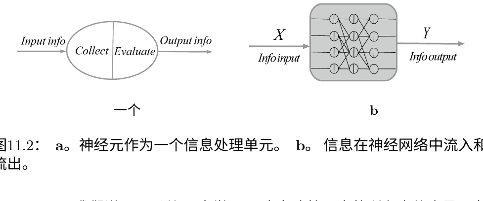

图11.2： a。神经元作为一个信息处理单元。 b。信息在神经网络中流入和流出。

如果 $\mathcal{Z} \subset \mathcal{I}$，我们说 $\mathcal{Z}$ 可以从 $\mathcal{X}$ 中学习。这意味着 $\mathcal{Z}$ 中的所有事件也是 $\mathcal{I}$ 中的事件。等价地，$\mathcal{Z}$ 由 $\mathcal{X}$ 决定，即存在一个可测函数 $f$ 使得 $\mathcal{Z} = f(\mathcal{X})$。

误差信息是由可以在目标中观察到但在输出信息中观察不到的事件生成的 $\sigma$-代数，即 $\mathcal{R} = \mathfrak{S}(\mathcal{Z} \setminus \mathcal{E})$。在这里，我们假设包含关系 $\mathcal{Z} \subset \mathcal{E}$ 得到满足。在特殊情况下，当 $\mathcal{Z} = \mathcal{E}$ 时，误差信息是最小的， $\mathcal{R} = \{\varnothing, \Omega\}$。

神经元可以被看作是一个信息处理单元，由两个模块组成，第一个模块收集输入信息 $\mathcal{I}$，第二个模块使用一套权重和激活函数来评估信息，参见图11.2 a。同样，神经网络是一个特殊情况的黑盒子，其中信息 $\mathcal{I}$ 进入，信息 $\mathcal{E}$ 出来，参见图11.2 b。希望能够利用输出信息来学习目标信息。这涉及调整网络参数以获得一个递增的 $\sigma$-代数序列， $\mathcal{E}_n$，它趋向于 $\mathcal{Z}$。这意味着 $\mathcal{E}_n \subset \mathcal{E}_{n+1}$，其中

这个近似的误差由在目标中可以观察到但在输出序列中无法观察到的事件给出。它们生成了下降的 $\sigma$-代数序列 $\mathcal{R}_n = \mathfrak{S}(\mathcal{Z} \setminus \mathcal{E}_n)$。$\mathcal{R}_n$ 越粗糙， $\mathcal{Z}$ 的学习效果越好。

这些信息类型的模式质量由一些分布度量描述。我们将在下面讨论它们。

相对频率出现的模式 $\mathcal{X}$ 由 $\mathcal{X}$ 的分布度量 $\mu$ 描述。这可以从定义在可测空间 $(\Omega, \mathcal{H})$ 上的概率测度 $\mathbb{P}$ 中导出，如下所示。

$$
\mu(A) = \mathbb{P}(\omega \in X^{-1}(A)) = \mathbb{P}(\omega; X(\omega) \in A) = \mathbb{P}(X \in A),\quad \forall A \in \mathcal{B}(\mathbb{R}^n),
$$

即， $\mu(A)$ 衡量 $X$ 取值在可测集合 $A$ 的机会。使用符号无穷小表示法，我们也可以非正式地将前述关系写作 $d\mu(x) = \mu(dx) = \mathbb{P}(X \in dx)$。由于 $\mu(\mathbb{R}^n) = \mathbb{P}(X \in \mathbb{R}^n) = 1$，因此 $\mu$ 是可测空间 $(\mathbb{R}^n, \mathcal{B}(\mathbb{R}^n))$ 上的概率测度。

输入和目标的联合随机变量，(X, Z): Ω → ℝⁿ × ℝ，定义了训练事件

> $$
> \{\omega; X(\omega) \in A, Z(\omega) \in B\} \in \mathcal{H}
> $$

对于任意的Borel集合 A ∈ B(ℝⁿ) 和 B ∈ B(ℝ)。每个训练事件的概率由以下给出

> $$
> \rho(B, D) = \mathbb{P}(X \in A, Z \in B), \quad \forall A \in \mathcal{B}(\mathbb{R}^n), B \in \mathcal{B}(\mathbb{R}),
> $$

其中 ρ 是 (X, Z) 的联合分布测度，描述了训练模式，称为训练测度。这可以等价地写作

> $$
> d\rho(x, z) = \mathbb{P}(X \in dx, Z \in dz).
> $$

接下来，我们将介绍一些关于随机变量能够表示的事件的例子。

例子 11.1.1 我们可以将神经网络的学习与人类思维的理解过程进行比较。心理概念类似于概率空间Ω的样本空间元素 ω。

心智中所包含的信息对应于某个 σ-代数 E 在Ω上。如果心智自身的信息比 Z 更细，则它能够理解外部信息的一个体。如果 σ-代数 Z 不包含于 E 中，则心智只能部分理解交集信息 E ∩ Z。

例子 11.1.2 作为一个极端情况，当 Z = c，常数时，目标信息 Z = S(Z) = { ∅, Ω}是可能的最小 σ-域。这对应于具有最少可能细节的信息。这个信息包含在任何其他信息体中。例如，我们可以将 Z 看作描述北极天气预测的随机变量。在这种情况下， Z 产生的信息是最小的。

例子 11.1.3 如果目标变量是一个指示函数， Z = 1_A，其中 A 是可测集合，则目标信息由 Z = S(Z) = {∅, A, A^c, Ω}给出。因此，输入信息应包含 A，即 A ∈ I。随机变量

> $$
> Z(\omega) = \begin{cases} 1, & \text{if } \omega \in A \\ 0, & \text{if } \omega \notin A \end{cases}
> $$

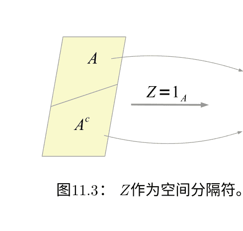

图11.3： Z作为空间分隔符。

作为集合A和其补集A^c之间的分隔符，参见图11.3。因此，学习Z等同于学习集合A（或集合A^c）。作为一个非正式的例子，我们可以将随机变量Z看作将动物园中的动物分类为哺乳动物和非哺乳动物。

例子 11.1.4 一般来说，如果目标是一个简单的函数 Z = ∑_{j=1}^{N} c_j 1_{A_j}，其中 {A_j}_j partition of Ω and c_j ∈ ℝ，那么Z作为一个分类器，将数字c_j与集合A_j的标签相关联。目标信息Z是由集合{A_j}_j生成的σ-场。在这种情况下，需要满足A_j ∈ ℐ。

## 11.2 可学习的目标

本节将讨论网络目标的特殊情况，即从输入X可以学习到的目标Z，即Z ⊂ ℐ成立。更准确地说，如果Z可以从X学习，那么根据命题D.5.1，存在一个可测函数 f : ℝ^n → ℝ such，使得Z = f(X)，见图11.4 a。因此，学习Z只需近似可测映射f即可。因此，证明神经网络是可测函数 f ∈ M^n 的通用逼近器即可。这个结果在第9章第9.3.4节中介绍过，并将在主要结果的证明中使用。

在呈现结果之前，我们用两个摘要状态来准备基础：

- (i) 给定的是：输入随机变量X，其分布度量ν，以及目标随机变量Z，以及训练度量ρ。
- (ii) 要学习的是：满足Z = f(X)的函数f。在学习过程中，函数f通过可测函数g来近似，其中随机变量Y = g(X)是网络输出。

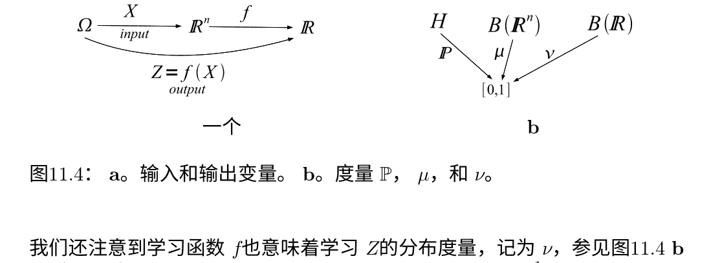

我们还注意到学习函数 $f$ 也意味着学习 $Z$ 的分布度量，记为 $\nu$，参见图11.4 b。这是因为
$$
\nu(B) = \mathbb{P}(Z \in B) = \mathbb{P}(f(X) \in B) = \mathbb{P}(X \in f^{-1}(B)) = \mu(f^{-1}(B)) = \mu \circ f^{-1}(B), \quad \forall B \in \mathcal{B}(\mathbb{R})
$$
，以及 $\mu$ 和 $f^{-1}$ 要么是给定的，要么是可学习的。与训练度量的关系由以下给出
$$
\nu(B) = \mathbb{P}(Z \in B) = \mathbb{P}(X \in \mathbb{R}^n, Z \in B) = \rho(\mathbb{R}^n, B), \quad \forall B \in \mathcal{B}(\mathbb{R}),
$$
这表明训练度量决定了度量 $\nu$。

本节的第一个结果以随机变量的形式阐述了定理9.3.24的类比。该定理说明目标随机变量是可学习的，可以在概率意义上进行学习（有关定义，请参见附录D.6节）。

定理 11.2.1 考虑一个具有连续的Sigmoid激活函数（根据定义 2.2.1）的单隐藏层神经网络和一个线性神经元的输出层。给定一个$n$维输入随机变量 $X$ 和一个一维可学习的目标随机变量 $Z$，存在一系列输出随机变量 $(Y_k)_k$ 由网络生成，
$$
Y_k = \sum_{j=1}^{N_k} \alpha_j \varphi(w_j^T X + \theta_j), \quad w_j \in \mathbb{R}^n, \alpha_j, \theta_j \in \mathbb{R},
$$
使得 $Y_k$ 以概率收敛于 $Z$。

证明：由于 $Z$ 是可学习的，根据命题 D.5.1，存在一个可测函数 $f \in \mathcal{M}^n$，使得 $Z = f(X)$。根据定理 9.3.24，存在一系列函数 $G_k$，类型为
$$
G_k(x) = \sum_{j=1}^{N_k} \alpha_j \varphi(w_j^T x + \theta_j), \quad w_j \in \mathbb{R}^n, \alpha_j, \theta_j \in \mathbb{R}
$$

使得 $d_{\mu}(G_k, f) \rightarrow 0$, 当 $k \rightarrow \infty$ 时，其中 $\mu$ denotes the distribution measure of $X$.

设 $\epsilon > 0$, 任意固定。考虑集合

> $$
> A_k = \{x; |G_k(x) - f(x)| > \epsilon\} \subset \mathbb{R}^n.
> $$

前面的 $d_{\mu}$-convergence可以写成 $\mu(A_k) \rightarrow 0$, $k \rightarrow \infty$. 还要注意

> $$
> \{\omega; X(\omega) \in A_k\} = \{\omega; |G_k(X(\omega)) - f(X(\omega))| > \epsilon\}.
> $$

定义 $Y_k = G_k(X)$, 见图11.5 a。然后

> $$
> \begin{aligned}\mathbb{P}(\omega; |Y_k(\omega) - Z(\omega)| > \epsilon) &= \mathbb{P}(\omega; |G_k(X(\omega)) - f(X(\omega))| > \epsilon) \\&= \mathbb{P}(\omega; X(\omega) \in A_k) = \mathbb{P}(X^{-1}(A_k)) \\&= \mu(A_k) \rightarrow 0, \quad k \rightarrow \infty.\end{aligned}
> $$

因此， $Y_k$以概率收敛于 $Z$。

对该定理的一个可能解释如下。假设神经网络是一台可以估计一个人$\omega$的年龄 $Z(\omega)$ 的机器。输入 $X(\omega)$ 表示一个人 $\omega$的特征（体重、身高、体脂指数等），而随机变量 $Y_k(\omega)$ 是对该人年龄的估计。开始时，机器给出的估计很可能是错误的，但经过一些实践，估计该人年龄的准确性的概率将增加，并且在长期内趋于1。

但是无论机器有多么熟练，总会有一小部分出错的可能性。如果这些错误被消除，我们得到一个几乎肯定收敛于目标变量的序列，即人的年龄。接下来我们介绍这个结果。

推论11.2.2 在定理11.2.1的假设下，存在一个由网络产生的随机变量序列 $(Y_j)_j$, 使得 $Y_j$几乎肯定收敛于 $Z$。

证明：根据定理11.2.1，网络可以产生一个随机变量序列$(Y_k)_k$, 使得 $Y_k$以概率收敛于 $Z$。由于估计误差， $|Y_k - Z|$, 可以通过使概率尽可能接近1来使其任意小，固定一个误差 $\epsilon_j = \frac{1}{j}$, 超过 $\epsilon_j$的概率减小到零。

> $$
> \mathbb{P}(|Y_k - Z| > \epsilon_j) \rightarrow 0, \quad k \rightarrow \infty.
> $$

这意味着存在一个整数 $j_0 \geq 1$ 和一个子序列 $k_j$使得

> $$
> \mathbb{P}(|Y_{k_j} - Z| > \epsilon_j) < \frac{1}{2^j}, \quad \text{对于所有的 } j \geq j_0.
> $$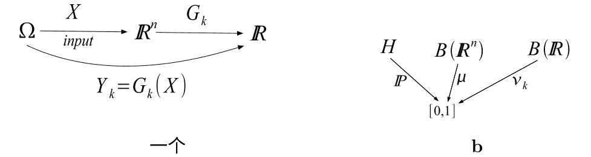

求和得到

$$\sum_{j \geq j_0} \mathbb{P}(|Y_{k_j} - Z| > \epsilon_j) \leq \sum_{j \geq j_0} \frac{1}{2^j} < 1.$$

应用Borel-Cantelli引理的一个变体，见附录，命题D.6.2，意味着 $Y_{k_j}$ 几乎必然收敛于 $Z$。将 $Y_{k_j}$ 重命名为 $Y_j$并从序列中消除所有其他项，我们得到所需的序列估计值。

在输入过程中，我们注意到人的频率模式（体重、身高、体脂指数等），可以通过分布度量 $\mu$ of $X$来建模。我们对人的年龄分布感兴趣，即学习分布度量 $\nu$ of $Z$。下一个结果表明，我们能够从估计 $Y_1, Y_2, Y_3$等引起的模式中学习这一点。$Y_k$的分布度量记为 $\nu_k$，其中 $\nu_k : \mathcal{B}(\mathbb{R}) \to \mathbb{R}_+$ and $\nu_k(B) = \mathbb{P}(Y_k \in B) = \mu \circ G_k^{-1}(B)$，对于所有的 $B \in \mathcal{B}(\mathbb{R})$，见图11.5 b。弱收敛和分布收敛的概念，将在附录的D.6节中使用。

## 定理 11.2.3
设 $(Y_k)_k$ 为定理 11.2.1 给出的逼近序列。如果 $\nu_k$和 $\nu$表示输出$Y_k$和目标 $Z$的分布测度，则测度 $(\nu_k)_k$弱收敛于测度 $\nu$。

证明：根据定理 11.2.1，序列 $Y_k$以概率收敛于 $Z$。因此，$Y_k$也以分布收敛于 $Z$。这意味着对于任何有界连续函数 $g : \mathbb{R} \to \mathbb{R}$，我们有
$$\mathbb{E}(g \circ Y_k) \to \mathbb{E}(g \circ Z), \quad k \to \infty.$$
这可以用测度等价地表示为
$$\int_{\mathbb{R}} g(x) d\mu_k(x) \to \int_{\mathbb{R}} g(x) d\mu(x), \quad k \to \infty,$$
这意味着 $\nu_k \to \nu$弱收敛，当 $k\to \infty$。

## 11.3 丢失的信息

我们已经看到，对于任何神经网络，非严格包含关系 $\mathcal{E} \subset \mathcal{I}$ 总是成立的，这是由于输出 $Y$ 由输入 $X$ 决定。因此，可能会有事件在 $\mathcal{I}$ 中观察到，而在 $\mathcal{E}$ 中没有观察到。粗略地说，这些事件代表了网络中的丢失信息。这个概念在下一个定义中得到了形式化。

### 定义 11.3.1
神经网络中的丢失信息是由属于输入信息但不属于输出信息的集合生成的sigma-代数，
$$\mathcal{L} = \mathfrak{S}(\mathcal{I} \setminus \mathcal{E}).$$

丢失的信息描述了神经网络中信息的可压缩性。未压缩的情况下，给定 $\mathcal{I} = \mathcal{E}$，意味着 $\mathcal{L} = \{\emptyset, \Omega\}$，即最粗糙的σ-代数。总压缩情况发生在 $\mathcal{E} = \{\emptyset, \Omega\}$，这意味着 $\mathcal{L} = \mathcal{I}$，即丢失的信息最大（然后网络变得无用）。

### 例子11.3.2
经典感知器的输入由随机变量 $X$ 给出，它只取值0和1。设 $A = X^{-1}(\{1\})$，因此我们有 $X = 1_A$，即 $X$ 是集合 $A$ 的指示函数。输入信息由 $A$ 生成并给出
$$\mathcal{I} = \mathfrak{S}(X) = \{\emptyset, A, A^c, \Omega\}.$$

考虑输出变量 $Y = f(X)$，其中 $f(1) = a$ 且 $f(0) = b$。然后，输出信息为 $\mathcal{E} = \sigma(Y)$，其内容取决于以下两种情况。如果 $a = b$，则 $\mathcal{E} = \mathcal{I}$，且丢失的信息 $\mathcal{L}$ 是微不足道的。如果 $a \neq b$，则 $\mathcal{E} = \{\emptyset, \Omega\}$，那么 $\mathcal{L} = \mathcal{I}$，即在这种情况下所有的信息都丢失了。

下一个命题提供了丢失信息的等价描述。

### 命题11.3.3
设 $\mathcal{I}$、$\mathcal{E}$ 和 $\mathcal{L}$ 分别表示神经网络的输入、输出和丢失的信息。以下成立：
- (a) 输入信息可以分解为
$$\mathcal{I} = \mathfrak{S}(\mathcal{L} \cup \mathcal{E}) = \mathcal{L} \vee \mathcal{E}.$$
- (b) $\mathcal{L}$ 是满足 (a) 的最大域。

证明： (a)通过双重包含来展示。首先，由于$\mathcal{L} \subset \mathcal{I}$和$\mathcal{E} \subset \mathcal{I}$，所以$\mathcal{L} \cup \mathcal{E} \subset \mathcal{I}$。利用算子$\mathfrak{S}$的单调性可得 $\mathfrak{S}(\mathcal{L} \cup \mathcal{E}) \subset \mathfrak{S}(\mathcal{I}) = \mathcal{I}$。

对于逆向包含，我们从$\mathfrak{S}(\mathcal{I}\setminus\mathcal{E}) = \mathcal{L}$开始，所以$\mathcal{I}\setminus\mathcal{E} \subset \mathcal{L}$。然后，在两边同时取并集与$\mathcal{E}$，我们得到 $(\mathcal{I}\setminus\mathcal{E}) \cup \mathcal{E} \subset \mathcal{L} \cup \mathcal{E}$，这等价于$\mathcal{I} \subset \mathcal{L} \cup \mathcal{E}$。应用算子$\mathfrak{S}$可得 $\mathfrak{S}(\mathcal{I}) \subset \mathfrak{S}(\mathcal{L} \cup \mathcal{E}) = \mathcal{L} \vee \mathcal{E}$。

使用$\mathcal{I} = \mathfrak{S}(\mathcal{I})$可得$\mathcal{I} \subset \mathfrak{S}(\mathcal{L} \cup \mathcal{E})$。

(b) 设$\mathcal{L}'$是另一个满足$\mathcal{I} = \mathfrak{S}(\mathcal{L}'\cup\mathcal{E})$的$\mathfrak{S}$-域。为了证明$\mathcal{L}$是满足条件(a)的最大域，只需证明$\mathcal{L}' \subset \mathcal{L}$，即$\mathcal{L}' \subset \mathfrak{S}(\mathcal{I}\setminus\mathcal{E})$。右侧可以写成 $\mathfrak{S}(\mathcal{I}\setminus\mathcal{E}) = \mathfrak{S}(\mathfrak{S}(\mathcal{L}'\cup\mathcal{E})\setminus\mathcal{E})$。

因此，只需证明包含关系 $\mathcal{L}' \subset \mathfrak{S}(\mathfrak{S}(\mathcal{L}'\cup\mathcal{E})\setminus\mathcal{E})$。

这是一个严格的包含关系，因为信息$\mathcal{L}'$仍然包含在右侧，但提取$\mathcal{E}$后可能会有一些集合不属于$\mathcal{L}'$。

为了看到先前结果在具体案例上的工作原理，我们考虑以下示例。

### 示例 11.3.1
设$A$，$B \in \mathcal{I}$为两个集合，并考虑$\mathfrak{S}$-fields
$\mathcal{L}' = \{\emptyset, A, A^c, \Omega\}$，$\mathcal{E} = \{\emptyset, B, B^c, \Omega\}$。

然后 $\mathcal{L}'\cup\mathcal{E} = \{\emptyset, A, B, A^c, B^c, \Omega\}$，而$\mathfrak{S}(\mathcal{L}'\cup\mathcal{E})$是由$A$和$B$生成的sigma-field，有16个元素，参见练习11.10.3。因此，去除$\mathcal{E}$的元素后，$\mathfrak{S}(\mathcal{L}'\cup\mathcal{E})\setminus\mathcal{E}$只有12个元素。在这些元素中，还包括集合$A$和$A^c$。然后 $\mathfrak{S}(\mathfrak{S}(\mathcal{L}'\cup\mathcal{E})\setminus\mathcal{E})$将包含除$A, A^c$和其他之外，还包括$\emptyset$和$\Omega$。因此，$\mathcal{L}' \subset \mathfrak{S}(\mathfrak{S}(\mathcal{L}'\cup\mathcal{E})\setminus\mathcal{E})$，严格包含，因为像$A \cap B$这样的集合不属于$\mathcal{L}'$但属于右侧的$\mathfrak{S}$-field。

下面提供与目标信息的关系。

## 命题11.3.4

假设神经网络的目标 $Z$ 可以从输入 $X$ 中学习。那么 $\mathcal{R} \subset \mathcal{L}$，
$$
\mathcal{R} \subset \mathcal{L}
\tag{11.3.1}
$$
其中 $\mathcal{R}$ 是网络的错误信息，$\mathcal{L}$ 是网络的丢失信息。

证明：由于 $Z$ 可以从 $X$ 中学习，我们有 $Z \subset \mathcal{I}$。从前面的包含关系两边提取集合 $\mathcal{E}$，我们得到 $Z \setminus \mathcal{E} \subset \mathcal{I} \setminus \mathcal{E}$。利用算子 $\mathfrak{S}$ 的单调性，我们得到
$$
\mathfrak{S}(Z \setminus \mathcal{E}) \subset \mathfrak{S}(\mathcal{I} \setminus \mathcal{E}),
$$
这相当于关系 (11.3.1)。 ■

## 11.4 可恢复信息

信息恢复的概念与以下问题相关：从一个 $\mathfrak{S}$-field 中可以排除多少信息，以便通过并集、交集和补集操作从剩余信息中恢复出来？

本节的主要结果表明神经网络的丢失信息是不可恢复的。因此，在某种意义上，丢失和恢复的信息具有相反的含义。

### 定义 11.4.1
(a) 一个$\mathfrak{S}$-代数 $\mathcal{F}$ 在 $\mathcal{I}$ 中被称为可恢复的，如果 $\mathfrak{S}(\mathcal{I} \setminus \mathcal{F}) = \mathcal{I}$。
(b)  一个$\mathfrak{S}$-代数 $\mathcal{H}$ 在 $\mathcal{I}$ 中被称为不可恢复的，如果 $\mathfrak{S}(\mathcal{I} \setminus \mathcal{H}) = \mathcal{I}$。

如果 $A \subseteq B$ 或 $B \subseteq A$，则两个$\mathfrak{S}$-域 $A$ 和 $B$ 是可比较的。按包含关系排序的 $\mathfrak{S}$-域的升序序列称为过滤。有关过滤的更多细节，请参阅附录。此外，请注意，如果任何升序的$\mathfrak{S}$-域序列包含在给定的$\mathfrak{S}$-域 $\mathcal{I}$ 中，那么根据佐恩引理 (见附录中的引理 $A.0.3$)，序列中存在一个最大元素。这是下一个概念的存在基础。

如果 $\mathfrak{S}(\mathcal{I} \setminus \mathcal{F}) = \mathcal{I}$，并且在包含关系方面是最大的，则$\mathfrak{S}$-代数 $\mathcal{F}$ 是最大可恢复的。类似地，如果 $\mathfrak{S}(\mathcal{I} \setminus \mathcal{H}) = \mathcal{I}$，并且在包含关系方面是最小的，则$\mathfrak{S}$-代数 $\mathcal{H}$ 是最小的不可恢复的。

以下两个属性是直观的：
- 任何最大可恢复信息场， $\mathcal{F}$，都包含在最小的不可恢复信息场， $\mathcal{H}$中。
- 任何最小的不可恢复信息场， $\mathcal{H}$ 包含一个最大的可恢复信息场， $\mathcal{F}$。

从下面的例子中可以清楚地看出，信息场 $\mathcal{F}$ 和 $\mathcal{H}$ 并不唯一。

### 例子11.4.2

考虑由一个可测集合生成的 $\sigma$-代数，$A$，给定为 $\mathcal{I} = \{\emptyset, A, A^c, \Omega\}$。很容易证明最大可恢复信息是平凡的，$\mathcal{F} = \{\emptyset, \Omega\}$。显然最小的不可恢复信息是整个空间，$\mathcal{H} = \mathcal{I}$。

### 例子11.4.3

设 $A$，$B$ 是 $\Omega$ 中的两个可测集合，考虑
$$\mathcal{I} =\{\emptyset, A, B, A^c, B^c, A\cap B, A\cup B, A^c\cap B^c, A^c\cup B^c, A^c\cap B, A\cap B^c, A^c\cup B, A\cup B^c, (A\cap B^c)\cup (A^c\cap B), (A\cap B)\cap (A\cap B)^c, \Omega\}$$
由 $A$ 和 $B$ 生成的 $\sigma$-field
$$\mathcal{F}_A = \{\emptyset, A, A^c, \Omega\}$$
是一个最大可恢复信息。为了证明 $\sigma(\mathcal{I}\setminus\mathcal{F}_A) = \mathcal{I}$，只需通过使用并集、交集和补集从集合 $\mathcal{I}\setminus\mathcal{F}_A$ 中恢复集合 $A$。可以按照以下步骤完成：
$$A = (A\setminus B)\cup (A\cap B) = (B^c\cap A)\cup (A\cap B).$$
然后，通过取补集并应用德摩根定律，得到 $A^c$。显然，集合 $\emptyset$ 和 $\Omega$ 分别由 $A$ 和 $A^c$ 通过取交集和并集得到。

值得注意的是，最大可恢复信息域不唯一，但它们具有相同的基数。其他最大可恢复信息域包括 $\mathcal{F}_B = \{\emptyset, B, B^c, \Omega\}$，$\mathcal{F}_C = \{\emptyset, C, C^c, \Omega\}$，$\mathcal{F}_{A\cap B} =\{\emptyset, A\cap B, (A\cap B)^c, \Omega\}$，$\mathcal{F}_{A\Delta B} = \{\emptyset, A\Delta B, (A\Delta B)^c, \Omega\}$，其中 $A\Delta B = (A\setminus B)\cup (B\setminus A)$ 是对称差集，等等。

### 例子11.4.4

设 $\{E_j\}_{j=1,N}$ 是样本空间 $\Omega$ 的有限划分。众所周知，由该划分生成的 $\sigma$-代数由划分的元素的并集组成。
$$\mathcal{I} = \{\emptyset, E_i, E_i\cup E_j, E_i\cup E_j\cup E_k, \ldots, \bigcup_{i=1}^N E_i = \Omega\}.$$
选择划分的一个元素，比如 $E_1$，并考虑由它生成的 $\sigma$-代数
$$\mathcal{F}_{E_1} = \{\emptyset, E_1, \bigcup_{i=2}^N E_i, \Omega\}.$$
类似前面的例子的推理表明 $\mathcal{F}$ 是可恢复的信息。关于极大性，请参见练习 11.10.5。

本节的其余部分涉及有关丢失信息的两个结果。

### 命题11.4.5
设 $L$ 表示丢失的信息。我们有：
- $(a)$ 输出信息 $\mathcal{E}$ 包含在最大可恢复信息字段中，当且仅当丢失的信息是最大的，$\mathcal{I} = \mathcal{L}$。
- $(b)$ 如果输出信息 $\mathcal{E}$ 包含一个最小的不可恢复信息字段，则 $\mathcal{L} = \mathcal{I}$。

证明：\quad $(a)$ “$\Longrightarrow$” 设 $\mathcal{F}$ 为一个最大可恢复信息字段，假设$\mathcal{E} \subseteq \mathcal{F}$。那么$\mathcal{I}\setminus\mathcal{F} \subseteq \mathcal{I}\setminus\mathcal{E}$，并利用算子的单调性 $\mathfrak{S}$ 我们得到
$$\mathfrak{S}(\mathcal{I}\setminus\mathcal{F}) \subseteq \mathfrak{S}(\mathcal{I}\setminus\mathcal{E})$$。
由于 $\mathcal{F}$ 是可恢复的，$\mathfrak{S}(\mathcal{I}\setminus\mathcal{F}) = \mathcal{I}$，并且使用右侧是丢失的信息，我们得到$\mathcal{I} \subseteq \mathcal{L}$，实际上意味着相等，$\mathcal{I} = \mathcal{L}$。

“$\Longleftarrow$” 假设 $\mathcal{I} = \mathcal{L}$，所以 $\mathcal{I} = \mathfrak{S}(\mathcal{I}\setminus\mathcal{E})$。这意味着输出信息 $\mathcal{E}$ 是可恢复的。由于它可以包含在一个最大可恢复的域中（佐恩引理），我们得到了所需的结果。

$(b)$ 假设 $\mathcal{H} \subseteq \mathcal{E}$，其中 $\mathcal{H}$ 是最小的不可恢复信息域。然后 $\mathcal{I}\setminus\mathcal{E} \subseteq \mathcal{I}\setminus\mathcal{H}$。这意味着 $\mathfrak{S}(\mathcal{I}\setminus\mathcal{E}) \subseteq \mathfrak{S}(\mathcal{I}\setminus\mathcal{H})$。因此 $\mathcal{L} \subseteq \mathfrak{S}(\mathcal{I}\setminus\mathcal{H}) \subsetneq \mathcal{I}$，因此 $\mathcal{L} = \mathcal{I}$。

接下来我们将证明一般情况下丢失的信息是不可恢复的，即 $\mathfrak{S}(\mathcal{I}\setminus\mathcal{L}) = \mathcal{I}$。

### 定理11.4.6（可恢复的丢失信息）
如果丢失的信息是可恢复的，则它是平凡的，$\mathcal{L} = \{\emptyset, \Omega\}$。

证明：通过反证法，假设丢失的信息 $\mathcal{L}$ 是可恢复的，即
$$\mathfrak{S}(\mathcal{I}\setminus\mathcal{L}) = \mathcal{I}. \tag{11.4.2}$$

在明显的包含关系中取补集 $\mathcal{L} = \mathfrak{S}(\mathcal{I}\setminus\mathcal{E}) \supset \mathcal{I}\setminus\mathcal{E}$ 意味着
$$\mathcal{I}\setminus\mathcal{L} \subset \mathcal{I}\setminus(\mathcal{I}\setminus\mathcal{E}) = \mathcal{E}.$$
然后再次应用算子 $\mathfrak{S}$ 我们得到
$$\mathcal{I} = \mathfrak{S}(\mathcal{I}\setminus\mathcal{L}) \subset \mathfrak{S}(\mathcal{E}) = \mathcal{E},$$
其中第一个等式使用了 $(11.4.2)$，最后一个等式使用了 $\mathcal{E}$ 是一个 $\mathfrak{S}$-域的事实。通过传递性，$\mathcal{I} \subset \mathcal{E}$，实际上是恒等的，$\mathcal{I} = \mathcal{E}$。这意味着丢失的信息 $\mathcal{L} = \mathfrak{S}(\mathcal{I}\setminus\mathcal{E}) = \{\emptyset, \Omega\}$ 是平凡的。

前面的结果也可以等价地重新表述为无法从丢失的信息中恢复出任何非平凡的信息。

## 11.5 信息表示示例

本节讨论了几种类型的神经元和一些简单网络能够表示的事件的特征。这些示例表明，输入输出映射越复杂，其关联的σ-代数就越丰富。

### 11.5.1 指示函数的信息

最简单的非平凡σ-代数由指示函数及其组合表示。以下示例将在后面的章节中有用。

示例 11.5.1 设 $A \subset \Omega$ 是一个可测集合，考虑指示函数 $X=1_A$。由于

$$X(\omega) = \begin{cases} 1, & \text{如果 } \omega \in A \\ 0, & \text{如果 } \omega \in A^c \end{cases}$$

那么对于任意 $k \in \mathbb{R}$，我们得到

$$X^{-1}(-\infty, k] = \{\omega; X(\omega) \leq k\} = \begin{cases} \Omega, & \text{如果 } k\geq1, \\ A^c, & \text{如果 } 0\leq k<1, \\ \varnothing, & \text{如果 } k<0. \end{cases}$$

由X生成的σ-代数是由预像$\{X^{-1}(-\infty, k], k\in\mathbb{R}\}$生成的，并且由$\sigma(X)=\{\varnothing, A, A^c, \Omega\}$给出。

例子 11.5.2 让$A, B \subset \Omega$是可测的且不相交，$A\cap B = \varnothing$。考虑指示函数的线性组合$X=1_A+2\cdot1_B$。那么

$$X(\omega) = \begin{cases} 2, & \text{如果 } \omega \in B \\ 1, & \text{如果 } \omega \in A \\ 0, & \text{如果 } \omega \in (A \cup B)^c. \end{cases}$$

对于任意实数$k$，通过$X$的半线预像给出

$$X^{-1}(-\infty, k] = \{\omega; X(\omega) \leq k\} = \begin{cases} \Omega, & \text{如果 } k \geq 2 \\ B^c, & \text{如果 } 1 \leq k < 2 \\ (A \cup B)^c, & \text{如果 } 0 \leq k < 1 \\ \varnothing, & \text{如果 } k<0. \end{cases}$$

由预像 $\{X^{-1}(-\infty, k], k \in \mathbb{R}\}$生成的 σ-代数提供了由 $X$生成的信息场：

$$\sigma(X) = \{\varnothing, A, A^c, B, B^c, A \cup B, (A \cup B)^c, \Omega\}.$$

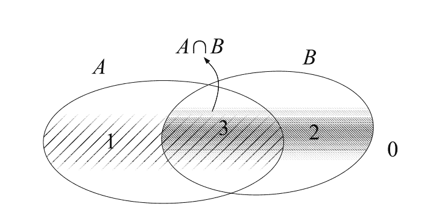

图11.6: 示例 11.5.3的图表。

示例 11.5.3 这与示例11.5.2类似，但在假设 $A$ 和 $B$ 不相交的情况下。在这种情况下，我们有

$$X(\omega) = 1_A(\omega) + 2\,1_B(\omega) = \begin{cases} 3, & \text{如果 } \omega\in A \cap B \\ 2, & \text{如果 } \omega\in B \cap A^c \\ 1, & \text{如果 } \omega\in A \cap B^c \\ 0, & \text{如果 } \omega\in (A \cup B)^c, \end{cases}$$

见图11.6。然后对于任意实数 $k$

$$X^{-1}(-\infty, k] = \begin{cases} \Omega, & \text{如果 } k \geq 3 \\ (A \cap B)^c, & \text{如果 } 2 \leq k < 3 \\ B^c, & \text{如果 } 1 \leq k < 2 \\ (A \cup B)^c, & \text{如果 } 0 \leq k < 1 \\ \varnothing, & \text{如果 } k<0. \end{cases}$$

利用交集和并集的性质，我们接下来证明 $A$ 属于 $\sigma(X)$: $A = A \cap \Omega = A \cap( B^c \cup B) = (A \cap B^c) \cup (A \cap B) = ((A \cup B) \cap B^c) \cup (A \cap B) \in \sigma(X).$

由于 $A$ 和 $B$ 都属于 $\sigma(X)$，所以 $\sigma(1_A, 1_B) \subset \sigma(X)$。由于 $X(\omega) = 1_A(\omega) + 2\,1_B(\omega)$ 是 $\sigma(1_A, 1_B)$-可测的，因此 $\sigma(X) \subset \sigma(1_A, 1_B)$，由此我们得出 $\sigma(X) = \sigma(1_A, 1_B)$。我们注意到类似的分析也可以应用于线性组合 $X = \alpha 1_A + \beta 1_B$，其中 $\alpha \neq \beta$。

例子 11.5.4 设 $\{E_i\}_i$ 是 $\Omega$ 的可数分割，考虑 $X = \sum_i \alpha_i 1_{E_i}$，其中不同的系数 $\alpha_i \in \mathbb{R}$。可以证明，在这种情况下 $\sigma(X)$ 是分割元素的可数并集。

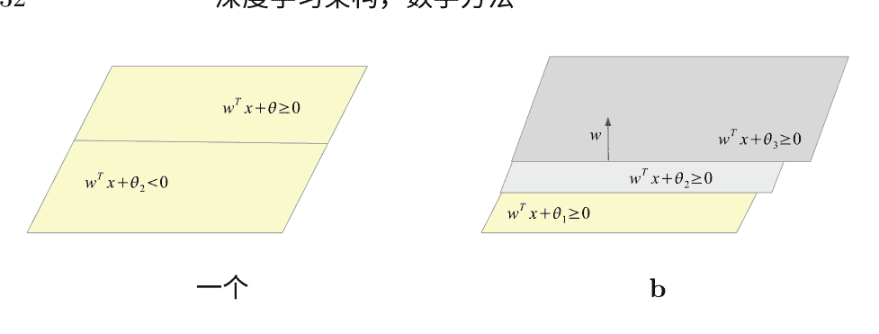

图 11.7: a. 感知器生成的信息。 b. 由S型函数或线性神经元生成的信息。

### 11.5.2 经典感知器

在这种情况下，输入变量是 $X: \Omega \rightarrow \mathbb{R}^n$, 而输出由 $Y = H(w^T X + \theta)$ 提供，其中 $H$ 是海维赛德阶跃函数，$w \in \mathbb{R}^n$ 是一组固定权重，$\theta \in \mathbb{R}$ 是给定的阈值。由于

$$Y(\omega) = \begin{cases} 1, & \text{如果 } w^T X(\omega) + \theta \geq 0 \\ 0, & \text{如果 } w^T X(\omega) + \theta < 0 \end{cases} = \begin{cases} 1, & \text{如果 } X(\omega) \in \mathcal{H}_{w,\theta}^+ \\ 0, & \text{如果 } X(\omega) \in \mathcal{H}_{w,\theta}^- \end{cases}$$

则输出可以写为指示函数 $Y = 1_A$, 其中 $A = X^{-1}(\mathcal{H}_{w,\theta}^+)$, 其中 $\mathcal{H}_{w,\theta}^+ = \{x; w^T x + \theta \geq 0\}$ 表示一个闭上半空间在 $\mathbb{R}^n$ 中的法向量 $w$.

因此，使用示例11.5.2, 输出 $Y$ 生成的 σ-代数是

$$\sigma(Y) = \{\emptyset, A, A^c, \Omega\} = \{\emptyset, X^{-1}(\mathcal{H}_{w,\theta}^+), X^{-1}(\mathcal{H}_{w,\theta}^-), \Omega\}$$

其中我们使用了

$$A^c = (X^{-1}(\mathcal{H}_{w,\theta}^+))^c = X^{-1}((\mathcal{H}_{w,\theta}^+)^c) = X^{-1}(\mathcal{H}_{w,\theta}^-),$$

在这里

$$\mathcal{H}_{w,\theta}^- = \{x; w^T x + \theta < 0\}.$$

这可以进一步写成

$$\sigma(Y) = X^{-1} ( \{\emptyset, \mathcal{H}_{w,\theta}^+, \mathcal{H}_{w,\theta}^-, \Omega\} ).$$

值得注意的是， σ-代数 $\{\emptyset, \mathcal{H}_{w,\theta}^+, \mathcal{H}_{w,\theta}^-, \Omega\}$ 提供了将点分类为超平面上方和下方的信息。$w^T x + \theta = 0$. 这就是为什么经典感知器可以用来分类两个簇，但不能超过这个限制，因为它只能容纳有限的信息，参见图11.7 a.

### 11.5.3 线性神经元

考虑输入 $X: \Omega \rightarrow \mathbb{R}^n$ 和输出 $Y = w^T X + \theta$，其中 $w \in \mathbb{R}^n$ 和 $\theta \in \mathbb{R}$ 是给定的。我们对于找到信息场 $\sigma(Y)$ 感兴趣。由于对于任意实数 $k$ 我们有
$$Y^{-1}(-\infty, k) = \{\omega; Y(\omega) < k\} = \{\omega; w^T X(\omega) + \theta < k\} = X^{-1}(\mathcal{H}_{w, \theta-k}^-),$$

那么

$$\begin{aligned}
\sigma(Y) &= \sigma(Y^{-1}(-\infty, k); k \in \mathbb{R}) = \sigma(X^{-1}(\mathcal{H}_{w, \theta-k}^-); k \in \mathbb{R}) \\
&= X^{-1}(\sigma(\mathcal{H}_{w, \theta-k}^-; k \in \mathbb{R})) = X^{-1}(\sigma(\mathcal{H}_{w, u}^-; u \in \mathbb{R})) \\
&= X^{-1}(\sigma(\mathcal{H}_{w, u}^+; u \in \mathbb{R})).
\end{aligned}$$

$\sigma$ 与 $X^{-1}$之间的交换来自于附录的命题A.0.1。由于 $u$ 是一个参数，超平面 $\{w^T x + u = 0\}$ 是平行的。因此，上半空间 $\mathcal{H}_{w,u}^+$ 是通过沿着方向 $w$ 平移 $\mathcal{H}_{w, 0}^+$ 一定距离 $u$ 得到的，参见图11.7 b。该场 $\sigma(\mathcal{H}_{w,u}^+; u \in \mathbb{R})$ 包含的信息比在第11.5.2节中描述的经典感知器对应的信息要多得多。它包含无限多个平行条带，定义了空间中平行超平面的信息。

### 11.5.4 Sigmoid神经元

输入由随机变量 $X: \Omega \rightarrow \mathbb{R}^n$ 给出，输出由 $Y = \sigma(w^T X + \theta)$ 给出，其中 $\sigma$ 是逻辑Sigmoid激活函数，$w \in \mathbb{R}^n$, $\theta \in \mathbb{R}$ 是固定的。利用逻辑函数的单调性和可逆性，对于任意 $k \in (0,1)$，我们有

$$\begin{aligned}
Y^{-1}(-\infty, k) &= \{\omega; Y(\omega) < k\} = \{\omega; \sigma(w^T X(\omega) + \theta) < k\} \\
&= \{\omega; w^T X(\omega) + \theta < \sigma^{-1}(k)\} \\
&= \{\omega; X(\omega) \in \mathcal{H}_{w, \theta-\sigma^{-1}(k)}^-\} \\
&= X^{-1}(\mathcal{H}_{w, \theta-\sigma^{-1}(k)}^-) = X^{-1}(\mathcal{H}_{w, u}^-),
\end{aligned}$$

其中 $u = \sigma^{-1}(k)$ 是实参数。由 $Y$ 生成的 σ-场是

$$\begin{aligned}
\sigma(Y) &= \sigma(Y^{-1}(-\infty, k); k \in (0, 1)) = \sigma(X^{-1}(\mathcal{H}_{w,u}^-); u \in \mathbb{R}) \\
&= X^{-1}(\sigma(\mathcal{H}_{w,u}^-; u \in \mathbb{R})) = X^{-1}(\sigma(\mathcal{H}_{w,u}^+; u \in \mathbb{R})),
\end{aligned}$$

这里我们使用了命题 A.0.1。我们得到了与第11.5.3节中给出的线性神经元相同的 σ-场，因此那里提到的所有结论也适用于这里。由于这个场与激活函数 $\sigma$ 无关，

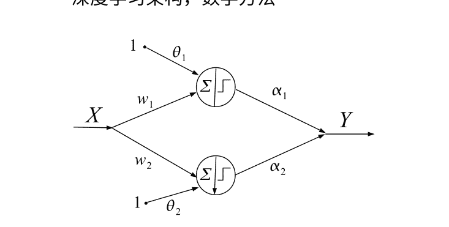

我们可以推断出只要激活函数 $\sigma$ 具有所有先前使用的属性，所有的S型神经元都可以学习相同数量的信息。因此，S型神经元可以学习比经典感知器更多的东西。请注意，激活函数 $\sigma$ 的非线性对产生的信息没有任何影响。我们将看到，对于这种类型的神经元网络，非线性在其中起着重要的作用。

### 11.5.5 反正切神经元

这是S型神经元的一个特例，在第11.5.8节中将再次使用。输出变量由 $Y = \tan^{-1}(w^T X + \theta)$ 给出，并且取值范围为 $(-\pi/2, \pi/2)$。半线的原像

$$Y^{-1}(-\infty, k) = \{Y < k\} = \{w^T X + \theta < \tan k\} = X^{-1}(\mathcal{H}_{w, \theta - \tan k}^-)
= X^{-1}(\mathcal{H}_{w, u}^-),$$

其中 $u \in \mathbb{R}$ 是实数参数。我们像在前一节中一样有

$$\sigma(Y)=X^{-1} \left( \sigma\{\mathcal{H}_{w,u}^-; u \in \mathbb{R}\} \right).$$

### 11.5.6 经典感知器的神经网络

考虑一个具有两个单元的隐藏层的神经网络，每个单元都是一个具有阶跃激活函数的感知器，参见图11.8。有两组权重：从输入到隐藏层的权重，$w_1, w_2 \in \mathbb{R}^n$，两个阈值，$\theta_1, \theta_2 \in \mathbb{R}$，以及从隐藏层到输出层的两个权重，$\alpha_1, \alpha_2 \in \mathbb{R}$。我们有兴趣描述这个网络所代表的信息。

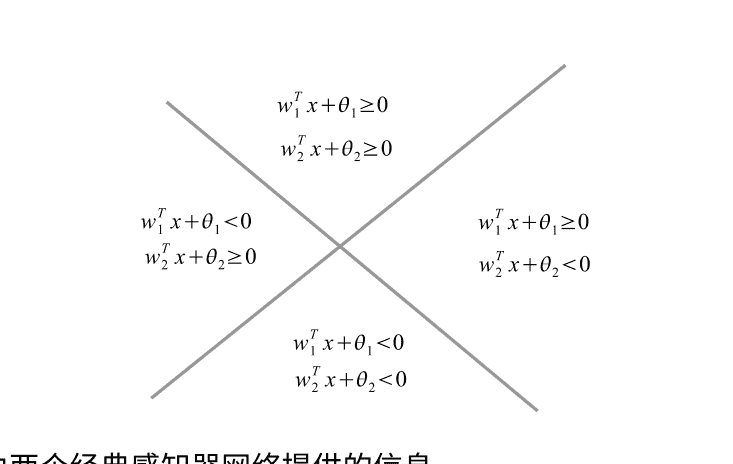

图11.9：由两个经典感知器网络提供的信息。

我们将结果写成两个指示函数的线性组合：

$$\begin{aligned} Y(\omega) &= \alpha_1 H(w_1^T X(\omega) + \theta_1) + \alpha_2 H(w_2^T X(\omega) + \theta_2) \\ &= \alpha_1 1_{\{w_1^T X(\omega) + \theta_1 \geq 0\}} + \alpha_2 1_{\{w_2^T X(\omega) + \theta_2 \geq 0\}} \\ &= \alpha_1 1_{X^{-1}(\mathcal{H}_{w_1,\theta_1}^+)} + \alpha_2 1_{X^{-1}(\mathcal{H}_{w_2,\theta_2}^+)} \\ &= \alpha_1 1_{A_1} + \alpha_2 1_{A_2}, \end{aligned}$$

其中 $A_i = X^{-1}(\mathcal{H}_{w_i,\theta_i}^+)$ 是通过 $X$ 的上半空间的原像。假设 $\alpha_1 \neq \alpha_2$。由于我们处于例子11.5.3的条件下，我们有

$$\sigma(Y) = \sigma(1_{A_1}, 1_{A_2}) = X^{-1}(\sigma(1_{\mathcal{H}_{w_1,\theta_1}^+}, 1_{\mathcal{H}_{w_2,\theta_2}^+})).$$

σ-代数 $\sigma(1_{\mathcal{H}_{w_1,\theta_1}^+}, 1_{\mathcal{H}_{w_2,\theta_2}^+})$ 包含上半空间和下半空间， $\mathcal{H}_{w_i}^+$, $\mathcal{H}_{w_i}^-$, $i=1,2$，以及通过交集和并集获得的所有组合，参见图11.9。特别地，由于它将空间分为最多四个不相交的区域，网络最多可以对四个点簇进行分类。这些信息绝对比单个经典感知器获得的信息更丰富。

当隐藏层中的单元数 $N$ 增加时，信息结构变得更加复杂；这可以用来对给定数量的聚类进行分类。对于任意维度的空间 $n$，这个数量可能不容易获得，但对于 $n=2$，可以分类的最大聚类数量，即获得的最大区域数量，由公式 $N(N+1)/2 + 1$ 给出，这可以通对 $N$ 进行归纳证明。在尝试找到由sigmoid神经元网络产生的信息之前，我们首先需要进行以下准备。

### 11.5.7 三角形作为矩形的并集

考虑平面上的三角形，给定为 $T = \{x > 0, y > 0, x + y < k\}$，参见图11.10 a。对于任意 $c \in (0, k)$，矩形 $R_c = [0, c] \times [0, k - c]$ 嵌入在三角形中。当参数 $c$ 从0变化到 $k$ 时，矩形的并集覆盖整个三角形 $T = \bigcup_{0 < c < k} R_c$。根据密度的原因，我们可以假设 $c$ 只取有理数值， $c \in \mathbb{Q}$，这种情况下并集变为可数

$$T = \bigcup_{\substack{0 < c < k \\ c \in \mathbb{Q}}} R_c.$$

即使条件 $x > 0, y > 0$ 被放弃，结果仍然成立，此时半平面可以写成可数个无限矩形的并集，参见图11.10 b:

$$\{x + y < k\} = \bigcup_{\substack{0 < c < k \\ c \in \mathbb{Q}}} \big( \{x < c\} \cap \{y < k - c\} \big).$$

### 11.5.8 S型神经元网络

考虑一个具有两个单元的隐藏层的神经网络，每个单元都是一个具有激活函数 $\sigma$ 的S型神经元，参见图11.11。从输入到隐藏层的权重用 $w_1, w_2 \in \mathbb{R}^n$ 表示，阈值用 $\theta_1, \theta_2 \in \mathbb{R}$ 表示。从隐藏层到输出层的两个权重为 $\alpha_1, \alpha_2 \in \mathbb{R}$。输出变量 $Y$ 可以用输入随机变量 $X$ 表示

$$Y = \alpha_1 \sigma(w_1^T X + \theta_1) + \alpha_2 \sigma(w_2^T X + \theta_2).$$

我们对这个网络产生的信息感兴趣，即 Y 的 σ-代数 $\mathfrak{S}$。

为了对 σ-代数的非线性引起的复杂性有所了解，我们将对 $\alpha_1 = \alpha_2= 1$ 的情况进行明确计算。在这种情况下，输出为

$$Y = \tan^{-1}(w_1^T X + \theta_1) + \tan^{-1}(w_2^T X + \theta_2) = u_1 + u_2.$$
使用三角公式，我们写成

$$\tan Y = \tan(u_1 + u_2) = \frac{\tan u_1 + \tan u_2}{1 - \tan u_1 \tan u_2} = \frac{(w_1^T x + \theta_1) + (w_2^T x + \theta_2)}{1 - (w_1^T x + \theta_1)(w_2^T x + \theta_2)}.$$
输出

$$Y = \tan^{-1}\left( \frac{(w_1 + w_2)^T x + \theta_1 + \theta_2}{1 - (w_1^T x + \theta_1)(w_2^T x + \theta_2)} \right)$$
比单个反正切神经元的输出要复杂得多，即 $\tan^{-1}(w^T x + \theta)$。

在接下来的内容中，我们将尝试描述 sigma-field $\mathfrak{S}(Y)$。首先，我们将找到一组生成器。固定 $\alpha_1, \alpha_2 >0$。使用示例 11.5.7，我们可以写出任意实数 $k$
$$\{Y < k\} = \{\alpha_1\sigma(w_1^T X + \theta_1) + \alpha_2\sigma(w_2^T X + \theta_2) < k\} = \bigcup \left( \{\alpha_1\sigma(w_1^T X + \theta_1) < c\} \cap \{\alpha_2\sigma(w_2^T X + \theta_2) < k - c\} \right)$$
$$= \bigcup_{c<k} \left(\{\sigma(w_1^T X + \theta_1) < c/\alpha_1\} \cap \{\sigma(w_2^T X + \theta_2) < (k - c)/\alpha_2\}\right)$$
$$= \bigcup_{c<k} \left(\left\{w_1^T X + \theta_1 < \sigma^{-1}\left(\frac{c}{\alpha_1}\right)\right\} \cap \left\{w_2^T X + \theta_2 < \sigma^{-1}\left(\frac{k-c}{\alpha_2}\right)\right\}\right)$$
$$= \bigcup_{c<k} \left\{X \in \mathcal{H}_{w_1,\theta_1-\sigma^{-1}\left(\frac{c}{\alpha_1}\right)}^-\right\} \cap \left\{X \in \mathcal{H}_{w_2,\theta_2-\sigma^{-1}\left(\frac{k-c}{\alpha_2}\right)}^-\right\}$$
$$= \bigcup_{c<k} X^{-1}\left(\mathcal{H}_{w_1, u_1(c)}^-\right) \cap X^{-1}\left(\mathcal{H}_{w_2, u_2(c)}^-\right)$$
$$= X^{-1}\left(\bigcup_{\substack{c<k \\ c\in\mathbb{Q}}} \mathcal{H}_{w_1,u_1(c)}^- \cap \mathcal{H}_{w_2,u_2(c)}^-\right)$$
with $u_1(c) = \theta_1 - \sigma^{-1}\left(\frac{c}{\alpha_1}\right)$ and $u_2(c) = \theta_2 - \sigma^{-1}\left(\frac{k-c}{\alpha_2}\right)$。在最后一个等式中，我们使用了命题 A.0.1。注意半空间 $\mathcal{H}_w^-$ 的交集 $\mathcal{H}_{w_1,u_1(c)}^- \cap \mathcal{H}_{w_2,u_2(c)}^-$ 包含不同类型的条带和角扇区。输出 $Y$ 生成的信息是由前面集合生成的 sigma 代数
$$\mathfrak{S}(Y) = \mathfrak{S}\{Y < k; k \in \mathbb{R}\} = X^{-1}\left(\mathfrak{S}\left\{\bigcup_{\substack{c<k \\ c\in\mathbb{Q}}} \mathcal{H}_{w_1,u_1(c)}^- \cap \mathcal{H}_{w_2,u_2(c)}^-\right\}\right).$$
这个 sigma-field 包含的信息比迄今遇到的所有其他输出信息领域都要多。这种行为是由于非线性 sigmoid 的线性组合。此外，信息复杂度取决于权重 $w_i$，$\alpha_i$ 和阈值 $\theta_i$，因此最大容量学习算法应该能够调整这些参数，使得输出信息 $\mathfrak{S}(Y)$ 最大化。

## 11.5.9 更多备注

具有多个隐藏层的神经网络迭代地组合非线性 sigmoid。由此产生的输出具有更加非线性的特性，这导致了更丰富的输出信息 $\mathfrak{S}(Y)$。然而，所有这些改进都有一个上限，因为所有这些 sigma-field 都包含在输入信息 $\mathfrak{S}(Y) \subset \mathfrak{S}(X) = \mathcal{I}$ 中。神经网络的作用是将输入信息 $\mathcal{I}$ 调整为输出信息 $\mathcal{E}$，希望最终目标 $Z$ 成为 $\mathcal{E}$ 可测量的，或者等价地说，$Z$ 由信息 $\mathcal{I}$ 决定。由于这可以简化为 $Z \subset \mathcal{I}$，网络权重必须进行调整以使 $\mathcal{I}$ 达到正确的最大尺寸。然而，由于有时 $Z$ 不是 $\mathcal{I}$ 的子集，我们所能期望的最好结果只是包含关系 $Z \cap \mathcal{I} \subset \mathcal{I}$。

将输入信息 $\mathcal{I}$ 通过可测函数 $f$ 组合成输出信息 $\mathcal{E}$ 的过程是通过将输入 $X$ 与函数 $f(X)$ 进行组合来完成的。函数 $f$ 是高度非线性的，并且取决于网络权重和偏置。

如果将神经网络视为人类思维，而 sigma 代数 $\mathcal{I}$ 是由感官收集的信息，可测函数 $f$ 扮演了大脑中的思维角色，将信息结构化为一些可理解的信息 $\mathcal{E}$。

两个接收相同输入信息的思维可能由于不同的思维函数 $f$ 而理解不同的事物，这归结为具有不同的突触权重。存在一些信息丢失，$\mathcal{L}$，它是我们能看到的 $\mathcal{I}$ 和我们能理解的 $\mathcal{E}$ 之间的差异。学习过程伴随着产生更复杂的思维，$f$，从而实现了扩展的理解，$\mathcal{E}$。

神经网络也可以与发动机进行比较，发动机输入一定的能量，产生一定的输出功。在输出端，发动机产生的能量总是比输入的能量少。机械师的工作是通过增加其容量来调整发动机参数，使其更加高效；类似地，神经网络中的权重被调整以匹配特定的目标信息。

## 11.6 可压缩层

在本节中，我们讨论信息在深度前馈神经网络的各层之间如何传播。一般来说，每个内部层都会进行一定的分类工作，将输入信息分割并重新组织成新的信息。下一层执行类似的工作，将信息压缩成更大的块。

由于输入数据中可能存在一些与分类无关的事件，可以无损地删除它们，而删除其他事件则会产生严重后果。通常情况下，只能通过多个层来进行选择性地删除无用事件并保留必要的最小信息。这个过程需要多个层，每个层有选择性地删除某些事件，这些事件在特定层上产生了丢失的信息。

我们现在考虑一个具有 $L-1$ 个隐藏层和 $d^{(\ell)}$ 个神经元的深度前馈神经网络。回想一下，网络的输入是一个 $N$ 维随机变量，$X = X^{(0)} = (x_1^{(0)}, \ldots, x_{d^{(0)}}^{(0)})^T$，而第 $\ell$ 层的激活是一个 $d^{(\ell)}$ 维随机变量，记作 $X^{(\ell)} = (x_1^{(\ell)}, \ldots, x_{d^{(\ell)}}^{(\ell)})^T$。神经网络的输出由随机向量 $Y = X^{(L)} = (x_1^{(L)}, \ldots, x_{d^{(L)}}^{(L)})^T$ 给出。

由第 $\ell$ 层激活产生的信息场由 $\mathfrak{S}$-代数 $\mathcal{I}^{(\ell)} = \mathfrak{S}(X^{(\ell)})$ 给出。特别地，输入信息为 $\mathcal{I}^{(0)} = \mathcal{I}$，网络的输出信息为 $\mathcal{I}^{(L)} = \mathcal{E}$。我们已经看到，包含关系 $\mathcal{E} \subseteq \mathcal{I}$ 总是成立，而 $\mathcal{L} = \mathfrak{S}(\mathcal{I} \setminus \mathcal{E})$ 是网络中丢失的信息。我们将对网络的每一层应用类似的方法。

第一个隐藏层接收信息 $\mathcal{I}^{(0)}$ 并产生信息 $\mathcal{I}^{(1)}$，它是由激活 $X^{(1)}$ 产生的 $\mathfrak{S}$-场。由于 $X^{(1)}$ 取决于输入 $X^{(0)}$，因此 $\mathfrak{S}(X^{(1)}) \subseteq \mathfrak{S}(X^{(0)})$，即 $\mathcal{I}^{(1)} \subseteq \mathcal{I}^{(0)}$。$\mathfrak{S}$-代数 $\mathcal{L}^{(1)} = \mathfrak{S}(\mathcal{I}^{(0)} \setminus \mathcal{I}^{(1)})$ 是通过第一个隐藏层丢失的信息。

我们将为每一层应用相同的构造。进入第 $\ell$ 层的信息是由前一层的激活生成的信息，即 $X^{(\ell-1)}$，并且由 $\mathcal{I}^{(\ell-1)}$ 给出。第 $\ell$ 层输出的信息由激活 $X^{(\ell)}$ 生成，并由 $\mathcal{I}^{(\ell)}$ 给出。

由于 $X^{(\ell)}$ 取决于输入 $X^{(\ell-1)}$ 通过正向传播关系 (6.2.29)
$$X^{(\ell)} = \phi\left(W^{(\ell)^{T}} X^{(\ell-1)}-B^{(\ell)}\right)$$
因此，我们得到一个降序的 sigma 代数序列：
$$\mathcal{I}^{(L)} \subseteq \cdots \mathcal{I}^{(\ell)} \subseteq \mathcal{I}^{(\ell-1)} \subseteq \cdots \subseteq \mathcal{I}^{(0)}. \qquad (11.6.3)$$
差异 $\mathcal{I}^{(\ell-1)} \setminus \mathcal{I}^{(\ell)}$ 包含了第 $\ell$ 层被丢弃的事件。这个差异不是一个 sigma 代数，但它可以生成一个。这个 sigma 代数的大小描述了第 $\ell$ 层的可压缩性。

### 定义 11.6.1
- (a) 第 $\ell$ 层的丢失信息由 sigma 代数给出：
$$\mathcal{L}^{(\ell)} = \mathfrak{S}(\mathcal{I}^{(\ell-1)} \setminus \mathcal{I}^{(\ell)})$$
- (b) 第 $\ell$ 层被称为未压缩层，如果丢失的信息是平凡的，$\mathcal{L}^{(\ell)} = \{\varnothing, \Omega\}$。
- (c) 如果丢失的信息是最大的，则第 $\ell$ 层被称为完全压缩，即 $\mathcal{L}^{(\ell)} = \mathcal{I}^{(\ell-1)}$。
- (d) 如果第 $\ell$ 层部分压缩，则 $\{\varnothing, \Omega\} \subsetneq \mathcal{L}^{(\ell)} \subsetneq \mathcal{I}^{(\ell-1)}$。

### 备注 11.6.2
定义意味着：
- 1. (i) 如果第 $\ell$ 层未压缩，则 $\mathcal{I}^{(\ell-1)} = \mathcal{I}^{(\ell)}$，即信息场保持不变。
- 2. (ii) 如果第 $\ell$ 层完全压缩，则 $\mathcal{I}^{(\ell)} = \{\emptyset, \Omega\}$。包含序列 (11.6.3) 意味着对于所有 $k \geq \ell$，$\mathcal{I}^{(k)} = \{\emptyset, \Omega\}$。这使得从 $\ell+1$ 到 $L$ 的其余层变得无用。

我们将在接下来的部分中建立信息场之间的关系。命题 11.3.3 给出了分解
$$\mathcal{I}^{(\ell-1)} = \mathfrak{G}(\mathcal{L}^{(\ell)} \cup \mathcal{I}^{(\ell)}) = \mathcal{L}^{(\ell)} \vee \mathcal{I}^{(\ell)}.$$
通过 $\ell = 1, 2, \ldots, L$ 的迭代，我们得到
$$\begin{align*}
\mathcal{I}^{(0)} &= \mathcal{L}^{(1)} \vee \mathcal{I}^{(1)} \\
\mathcal{I}^{(1)} &= \mathcal{L}^{(2)} \vee \mathcal{I}^{(2)} \\
&\dots \\
\mathcal{I}^{(L-1)} &= \mathcal{L}^{(L)} \vee \mathcal{I}^{(L)}.
\end{align*}$$
通过反向替换，我们可以得到输入信息场关于所有丢失信息和输出信息的表示
$$\mathcal{I} = \bigvee_{\ell=1}^{L} \mathcal{L}^{(\ell)} \vee \mathcal{E}. \quad (11.6.4)$$
我们注意到我们已经应用了运算符 $\vee$ 的结合性质，参见练习 11.10.10。与 $\mathcal{I} = \mathcal{L} \vee \mathcal{E}$ 进行比较，并利用 $\mathcal{L}$ 的极大性质，参见命题 11.3.3 的部分(b)，得到
$$\bigvee_{\ell=1}^{L} \mathcal{L}^{(\ell)} \subset \mathcal{L}. \quad (11.6.5)$$
这意味着网络中丢失的总信息量 $\mathcal{L}$ 至少与每个网络层中丢失的信息量之和一样多。

下一个结果是前面关系的一个结果。

### 命题 11.6.3
如果神经网络中丢失的信息是微不足道的，那么它的所有层都是未压缩的。

证明：由于 $\mathcal{L} = \{\emptyset, \Omega\}$。公式 (11.6.5) 意味着 $\bigvee_{\ell=1}^{L} \mathcal{L}^{(\ell)} = \{\emptyset, \Omega\}$，因此对于每个元素，我们有 $\mathcal{L}^{(\ell)} \subseteq \{\emptyset, \Omega\}$，这实际上意味着相等 $\mathcal{L}^{(\ell)} = \{\emptyset, \Omega\}$。

## 11.7 层可压缩性

我们将提出一层未压缩的必要条件。我们将从一些背景准备开始。

我们假设第 $\ell$ 层未压缩，即 $\mathcal{L}^{(\ell)} = \{\mathcal{O}, \Omega\}$。这意味着传入和传出的信息是相等的，$\mathcal{I}^{(\ell-1)} = \mathcal{I}^{(\ell)}$，或者用 sigma-代数来说，$\mathfrak{S}(X^{(\ell-1)}) = \mathfrak{S}(X^{(\ell)})$。当 $X^{(\ell)}$ 和 $X^{(\ell-1)}$ 可以用彼此来表示时，即存在两个可测函数 $F$ 和 $G$，使得 $X^{(\ell)} = F(X^{(\ell-1)})$ 和 $X^{(\ell-1)} = G(X^{(\ell)})$，见附录中的命题 D.5.1。我们将研究函数 $F$ 和 $G$ 的存在性。

函数 $F$ 的存在性可以从正向传播公式 (6.2.29) 推导出来。
$$X^{(\ell)} = \phi\left(W^{(\ell)T} X^{(\ell-1)} - B^{(\ell)}\right).\qquad\qquad (11.7.6)$$
因此，只需陈述反演该关系的必要条件。下一个结果给出了这一点。

### 定理 11.7.1 (可压缩性条件 I)
假设满足以下条件：
- (i) 激活函数 $\phi$ 是可逆的；
- (ii) 第 $\ell$ 层的输入变量和输出变量数量相同，即 $d^{(\ell-1)} = d^{(\ell)}$；
- (iii) $\det W^{(\ell)} \neq 0$。

则第 $\ell$ 层是未压缩的。

证明：由于 $\phi$ 是可逆的，关系 (11.7.6) 变为
$$W^{(\ell)T} X^{(\ell-1)} = \phi^{-1}\left(X^{(\ell)}\right) + B^{(\ell)}.$$
由于 $d^{(\ell-1)} = d^{(\ell)}$，所以 $W^{(\ell)}$ 是一个非零行列式的方阵，因此它是可逆的。因此
$$X^{(\ell-1)} = (W^{(\ell)T})^{-1}\left(\phi^{-1}\left(X^{(\ell)}\right) + B^{(\ell)}\right),$$
或者 $X^{(\ell-1)} = G(X^{(\ell)})$，其中 $G$ 是可测的。由于逆向包含是平凡的，因此 $\mathcal{I}^{(\ell-1)} = \mathcal{I}^{(\ell)}$，即第 $\ell$ 层是未压缩的。

### 备注 11.7.2
条件 (i) 被所有递增的激活函数满足，例如逻辑函数、双曲正切函数、反正切函数、软加函数等。然而，ReLU、单位阶跃函数或## 11.8 功能独立性

通常情况下，$X^{(\ell-1)} = (x^{(\ell-1)}_1, \ldots, x^{(\ell-1)}_n)$ 和 $X^{(\ell)} = (x^{(\ell)}_1, \ldots, x^{(\ell)}_n)$ 表示第 $\ell$ 层的激活，其中我们假设这些层具有相同的维度，$d^{(\ell-1)} = d^{(\ell)} = n$。考虑雅可比行列式

$$\Delta^{(\ell)} = \det\left(\frac{\partial x_j^{(\ell)}}{\partial x_i^{(\ell-1)}}\right)_{i,j}$$

如果 $\Delta^{(\ell)} = 0$，则激活 $X^{(\ell-1)}$ 和 $X^{(\ell)}$ 被称为功能独立。使用公式 $s_j^{(\ell)} = \sum_{i=1}^n w_{ij}^{(\ell)} x_i^{(\ell-1)} - b_j^{(\ell)}$，雅可比矩阵的元素可以计算为

$$\frac{\partial x_j^{(\ell)}}{\partial x_i^{(\ell-1)}} = \frac{\partial \phi(s_j^{(\ell)})}{\partial x_i^{(\ell-1)}} = \phi'(s_j^{(\ell)}) \frac{\partial s_j^{(\ell)}}{\partial x_i^{(\ell-1)}} = \phi'(s_j^{(\ell)}) w_{ij}^{(\ell)}$$

应用行列式得到

$$\Delta^{(\ell)} = \det\left(\phi'(s_j^{(\ell)}) w_{ij}^{(\ell)}\right) = \phi'(s_1^{(\ell)}) \cdots \phi'(s_n^{(\ell)}) \det W^{(\ell)}, \qquad (11.8.7)$$

其中我们使用了行列式的多线性性质。如果激活函数 $\phi$ 满足 $\phi' \neq 0$，则当且仅当 $\det W^{(\ell)} = 0$ 时，$\Delta^{(\ell)} = 0$。

**注 11.8.1：**
大多数类似于 S 型函数的激活函数满足条件 $\phi' \neq 0$。例如，如果 $\phi = \sigma$ 是逻辑函数，则

$$\Delta^{(\ell)} = \prod_{i=1}^n \sigma(s_i^{(\ell)}) (1 - \sigma(s_i^{(\ell)})) \det W^{(\ell)}$$

如果 $\phi =$ 双曲正切函数，那么

$$\Delta^{(\ell)} = \prod_{i=1}^n (1 - \tanh^2(s_i^{(\ell)})) \det W^{(\ell)}$$

我们注意到在这些情况下，我们有不等式

$$|\Delta^{(\ell)}| < |\det W^{(\ell)}|$$

下一个结果是定理 11.7.1 的重新表述：

**定理 11.8.2（可压缩性条件 II）** 假设以下条件成立：

- $(i')$ 激活函数满足 $\phi' > 0$；
- $(ii')$ 第 $\ell$ 层的输入和输出变量数量相同，即 $d^{(\ell-1)} = d^{(\ell)}$；
- $(iii')$ 当 $X^{(\ell)}$ 与 $X^{(\ell-1)}$ 无关时，第 $\ell$ 层是未压缩的。

证明：条件 $(i')$ 意味着 $\phi$ 是递增的且导数非零，即 $\phi' \neq 0$。根据条件 $(iii')$ 我们推断 $\Delta^{(\ell)} = 0$，并且由于 $\phi' \neq 0$，因此得到 $\det W^{(\ell)} = 0$。应用定理 11.7.1 得到所需的结果。

下面给出了覆盖解码器层的前一个结果的变体，即层大小增加的情况：

**定理 11.8.3（可压缩性条件 III）** 假设满足以下条件：

- (i) 激活函数 $\phi$ 是可逆的；
- (ii) 第 $\ell$ 层的出射变量数量大于入射变量数量，即 $d^{(\ell)} > d^{(\ell-1)}$；
- (iii) $W^{(\ell)}$ 具有最大秩，即 $\text{rank } W^{(\ell)} = d^{(\ell-1)}$。

那么第 $\ell$ 层的信息损失是微不足道的，即第 $\ell$ 层是未压缩的。

证明：利用激活函数 $\phi$ 的可逆性，关系式 (11.7.6) 变为

$$W^{(\ell)^T} X^{(\ell-1)} = \phi^{-1}(X^{(\ell)}) + B^{(\ell)}.$$

这可以看作是一个具有 $d^{(\ell)}$ 个方程和 $d^{(\ell-1)}$ 个未知数的线性系统。由于 $\text{rank } W^{(\ell)^T} = \text{rank } W^{(\ell)} = d^{(\ell-1)}$，通过可能的重新索引，我们可以解出 $X_1^{(\ell-1)}, X_2^{(\ell-1)}, \dots, X_{d^{(\ell-1)}}^{(\ell-1)}$ 以 $X_1^{(\ell)}, \dots, X_{d^{(\ell)}}^{(\ell)}$ 来表示。这意味着

$$\mathcal{I}^{(\ell-1)} = \mathfrak{S}(X^{(\ell-1)}) \subset \mathfrak{S}(X_1^{(\ell)}, \dots, X_{d^{(\ell-1)}}^{(\ell)}) \subset \mathfrak{S}(X^{(\ell)}) = \mathcal{I}^{(\ell)}, \quad (11.8.8)$$

其中前两个和最后一个等式是根据定义得出的，最后一个包含关系是显然的。由传递性可知 $\mathcal{I}^{(\ell-1)} \subset \mathcal{I}^{(\ell)}$。对于前馈神经网络，我们总是有 $\mathcal{I}^{(\ell)} \subset \mathcal{I}^{(\ell-1)}$，双重包含意味着恒等式 $\mathcal{I}^{(\ell-1)} = \mathcal{I}^{(\ell)}$。因此，第 $\ell$ 层是未压缩的。

接下来，我们将讨论编码器层的情况。这意味着 $d^{(\ell-1)} > d^{(\ell)}$，即第 $\ell$ 层的神经元比前一层少。然后，$X^{(\ell)}$ 可以用 $X^{(\ell-1)}$ 的形式表示为 $X^{(\ell)} = G(X^{(\ell-1)})$，其中 $G : \mathbb{R}^{d^{(\ell-1)}} \to \mathbb{R}^{d^{(\ell)}}$ 是可测的，所以 $\mathcal{I}^{(\ell)} \subset \mathcal{I}^{(\ell-1)}$。根据维度的不等式，可以得出 $G$ 是不可逆的，之前的包含关系是严格的，这意味着在第 $\ell$ 层中进行了压缩。满足以下不等式的神经网络

$$d^{(0)} > d^{(1)} > \cdots > d^{(L-1)} > d^{(L)}$$

在每个层中都表现出压缩效应。

## 11.9 总结

本章以 sigma-代数的语言形式化了神经网络中信息的概念，其中输入和目标由随机变量给出。我们介绍了输入、输出和目标信息域的概念，并讨论了它们的属性和与学习的关系。

神经网络中丢失信息的概念描述了通过网络前向传递时无法恢复的信息内容。它也可以在单个层上定义，并用于定义压缩和非压缩层。我们提供了有关编码器和解码器层可压缩性的结果。编码器层压缩信息，丢失的信息是非平凡的，而解码器层始终是非压缩的，丢失的信息是平凡的。

我们讨论了涉及神经元和简单神经网络的几个示例的信息表示，强调了几何解释。这些示例包括感知器、Sigmoid神经元、线性神经元和反正切神经元。

## 11.10 练习

- **练习 11.10.1** 设 $c$ 为常数，$X$ 为实值随机变量。证明：
    * (a) $\mathfrak{S}(c) = \{\varnothing, \Omega\}$;
    * (b) $\mathfrak{S}(c+X) = \mathfrak{S}(X)$;
    * (c) $\mathfrak{S}(cX) = \mathfrak{S}(X)$ 当 $c \neq 0$。

- **练习 11.10.2** 考虑一个随机变量序列 $(X_n)_n$，并定义另外两个序列 $(Y_n)_n$ 和 $(Z_n)_n$，根据以下规则 $Y_0=0$，$Y_n = \sum_{i=1}^n X_i$ 和 $Z_0=0$, $Z_n = \sum_{i=1}^n Y_i$。
    * (a) 展示严格包含关系 $\mathfrak{S}(Y_n) \subset \mathfrak{S}(X_1, \dots, X_n)$;
    * (b) 展示 sigma-field 的恒等性 $\mathfrak{S}(Y_1, \dots, Y_n) = \mathfrak{S}(X_1, \dots, X_n)$;
    * (c) 证明 $Z_n = nX_1 + (n-1)X_2 + \cdots + X_n$ 和 $\mathfrak{S}(Z_1, \dots, Z_n) = \mathfrak{S}(X_1, \dots, X_n)$。

- **练习 11.10.3（由两个集合生成的 σ-field）** 展示包含两个可测集合 $A$ 和 $B$ 的最小 σ-field 有 16 个元素，并且它由以下给出

$$\mathfrak{S}(A, B) = \{\emptyset, A, B, A^c, B^c, A \cap B, A \cup B, A^c \cap B^c, A^c \cup B^c, A^c \cap B, A \cap B^c, A^c \cup B, A \cup B^c, (A \cap B^c) \cup (A^c \cap B), (A \cap B) \cap (A \cap B)^c, \Omega\}.$$

- **练习 11.10.4** 由三个集合生成的 σ-场有多少个元素？

- **练习 11.10.5** 设 $\{E_j\}_{j=1}^N$, $N \geq 3$, 是样本空间 $\Omega$ 的有限划分。由该划分生成的 σ-场为

$$\mathfrak{F} = \{\emptyset, E_i, E_i \cup E_j, E_i \cup E_j \cup E_k, \ldots, \bigcup_{i=1}^N E_i = \Omega\}.$$

用 $\mathcal{F}$ 表示，$\mathcal{E}_{1,2}$ 表示由 $E_1$ 和 $E_2$ 生成的 σ-域。证明

* (a) $\mathcal{F}$ 包含 $\mathcal{E}_{1,2}$；
* (b) $\mathcal{F}$ 不是最大可恢复的信息场。

- **练习 11.10.6** 考虑由测度空间 $(\Omega, \mathcal{H})$ 上的 n 维随机变量 $X = (X_1, \ldots, X_n)$ 给出的神经网络输入。证明输入信息 $\mathfrak{S}(X)$ 是由形式为

$$\bigcap_{i=1}^k \{\omega: X_i(\omega) \leq x_i\}$$

的事件生成的 σ-代数，其中 $x_i \in \mathbb{R}, k \geq 1$。

- **练习 11.10.7** 假设我们从神经网络的最后一层中删除一个神经元。这意味着我们删除与该特定神经元相关的所有突触。设 $Y$ 为初始网络的输出，$\tilde{Y}$ 为神经元丢失后的输出。设 $\mathcal{E} = \mathfrak{S}(Y)$ 和 $\tilde{\mathcal{E}} = \mathfrak{S}(\tilde{Y})$ 为每种情况下的输出信息，$\mathcal{L}$ 和 $\tilde{\mathcal{L}}$ 为丢失的信息。
    * (a) 证明 $\mathcal{L} \subset \tilde{\mathcal{L}}$。
    * (b) 对于从第 $\ell$ 层中删除神经元的情况，制定类似的结果。

- **练习 11.10.8** 假设我们向神经网络的最后一层添加一个额外的神经元。设 $Y$ 为初始网络的输出，$\tilde{Y}$ 为神经元添加后的输出。设 $\mathcal{E} = \mathfrak{S}(Y)$ 和 $\tilde{\mathcal{E}} = \mathfrak{S}(\tilde{Y})$ 为每种情况下的输出信息，$\mathcal{L}$ 和 $\tilde{\mathcal{L}}$ 为丢失的信息。
    * (a) 证明 $\tilde{\mathcal{L}} \subset \mathcal{L}$;
    * (b) 对于神经元添加到第 $\ell$ 层的情况，制定类似的结果。

- **练习 11.10.9** 图 11.13 给出的聚类 a, b 和 c 需要通过一个具有一个隐藏层的神经网络进行分类。对于上述每种情况，需要使用的隐藏层中的最小神经元数量是多少？

- **练习 11.10.10** 证明算子 $\vee$ 在 sigma-fields 上是结合的，即，对于任意三个 sigma-fields $\mathcal{F}$, $\mathcal{G}$, $\mathcal{H}$, 我们有 $(\mathcal{F} \vee \mathcal{G}) \vee \mathcal{H} = \mathcal{F} \vee (\mathcal{G} \vee \mathcal{H})$。

- **练习 11.10.11** 证明神经网络的隐藏层如图 11.14 所示是高效的，即 $\mathcal{I}^{(0)} = \mathcal{I}^{(1)}$。

- **练习 11.10.12** 考虑图 11.14 所示的一层隐藏层自编码器 b。证明 $\mathcal{I}^{(2)} = \mathcal{I}^{(1)}$。

- **练习 11.10.13** 让 $\mathcal{I}$、$\mathcal{E}$ 和 $\mathcal{L}$ 分别表示网络中的输入、输出和丢失的信息。证明： $\mathcal{I} = \mathcal{E}$ 当且仅当 $\mathcal{L} = \{\emptyset, \Omega\}$。

- **练习 11.10.14** 让 $\mathcal{I}$ 和 $\mathcal{E}$ 分别表示网络的输入和输出信息字段。证明不可能将 $\mathcal{E}$ 放置在最大恢复信息字段 $\mathcal{F}$ 和最小非恢复信息字段 $\mathcal{H}$ 之间，即我们不能有双重包含关系 $\mathcal{H} \subseteq \mathcal{E} \subseteq \mathcal{F}$。

- **练习 11.10.15** 让 $\mathcal{I}$ 和 $\mathcal{E}$ 分别表示网络的输入和输出信息字段。证明以下内容：
    * $(i)$ 如果 $\mathcal{E}$ 包含在一个最大可恢复信息字段中，则 $\mathcal{E}$ 不包含任何最小不可恢复信息字段；
    * $(ii)$ 如果我们假设 $\mathcal{E}$ 包含一个最小不可恢复信息字段，那么 $\mathcal{E}$ 不包含在一个最大可恢复信息字段中。

- **练习 11.10.16** 证明任何可恢复信息字段的子字段也是可恢复的。

## 第12章 信息容量评估

本章讨论深度学习的一个主要问题，即神经网络如何将原始数据转化为更复杂的表示当数据通过网络层流动时？像熵、条件熵和互信息这样的信息度量可以评估像素的组织成特征的程度。这些度量用于描述前馈网络各层之间的信息演化。

如果前一章通过神经网络的层描述了信息内容的定性描述，那么本章将涉及神经网络中信息演化的定量描述。

对于对这些主题更详细介绍感兴趣的读者，可以参考书籍 [11]。神经网络的应用包括网络容量的定义和计算以及信息瓶颈方法。

前一章描述了信息在网络层之间的压缩过程。在本章中，我们将引入一种使用互信息评估层压缩性的度量。

### 12.1 熵和性质

熵描述了系统的信息组织。当系统完全不确定时，熵达到最大值。例如，由白噪声表示的像素的图片将具有最大熵，而几何图形的图片将具有较小的熵。原始数据作为神经网络的输入具有比其输出表示更大的熵值。

例如，我们将考虑一个神经网络的例子，该网络接收代表猫和狗图片的数据，并且必须确定动物类型。输出层的熵为 1 比特，因为需要知道的信息是两个可能选择中的一个。然而，每个输入图片的熵更大。神经网络的任务是逐渐减少熵值，直到输出的熵值正好是正确的（即一个比特），因此对熵值在神经网络的层之间如何减少感兴趣。

下一小节介绍了熵的概念并介绍了一些其性质。然后，我们将使用熵的概念来研究无损层。

#### 12.1.1 随机变量的熵

设 $X$ 是一个取值为 $\{x_1, x_2, \ldots, x_n\}$ 的离散随机变量，其概率为 $P(X = x_k)$。负对数似然函数 $-\ln p_k$ 表示 $X$ 取值为 $x_k$ 时的信息量，其数学形式在附录的第 D.7 节中讨论。随后，$X$ 的熵由以下求和定义

$$H(X) = -\sum_{k=1}^{n} p_k \ln p_k = \mathbb{E}^{p}[-\ln p], \qquad\qquad (12.1.1)$$

其中 $\mathbb{E}^{p}$ 表示对分布 $p$ 的期望操作符。关系式 $(12.1.1)$ 是负对数似然函数的加权平均，表示随机变量 $X$ 中包含的信息量的期望，其概率分布为 $p = (p_1, \ldots, p_n)^T$。

由于 $p_k \in (0,1)$，所以 $H(X) > 0$。
在随机变量 $X$ 连续的情况下，其分布由密度函数 $p(x)$ 给出。通常以启发式方式写作

$$P(x < X < x + dx) = p(x)dx,$$

即，$X$ 取值在无穷小区间 $(x, x+dx)$ 的概率与其长度 $dx$ 成比例，这个比例函数是密度函数 $p(x)$。在这种情况下，$X$ 的概率测度绝对连续于勒贝格测度，并且由 $\mu(dx) = p(x)dx$ 给出，详见附录 C.7 节。如果 $X$ 的取值范围表示为 $\mathcal{X}$，则相关熵的定义为

$$H(X) = H(p) = -\int_{\mathcal{X}} p(x) \ln p(x) \, dx = \mathbb{E}^{p}[-\ln p]. \qquad\qquad (12.1.2)$$关系 (12.1.1) 定义了离散熵，而 (12.1.2) 提供了微分熵。它们之间的一个主要区别是后者有时可能是负数或无穷大。在练习12.13.2中提供了一些关于熵界限的充分条件。

类似地，我们可以定义两个连续随机变量 $X$ 和 $Y$ 的联合熵为

$$H(X, Y) = -\int_{\mathbb{R}} \int_{\mathbb{R}} p(x, y) \ln p(x, y) dx dy$$

这可以解释为随机变量对 $(X, Y)$ 所包含的信息。在两个离散随机变量的情况下，对应的熵关系是

$$H(X, Y) = -\sum_{i,j} p_{ij} \ln p_{ij}$$

其中 $p_{ij} = P(X = x_i, Y = y_j)$ 是 $(X, Y)$ 的联合分布。

## 12.1.2 在坐标变换下的熵

本节展示了熵是坐标依赖的。为了更好地理解，我们将从一个例子开始。

练习 12.1.1 我们假设 $X$ 是描述具有尺寸 $m \times k$ 的灰度图片像素激活的随机变量。让 $p_{ij}$ 表示位置为 $(i, j)$ 的像素激活，其中 $1 \leq i \leq m, 1 \leq j \leq k$。我们假设 $0 \leq p_{ij} \leq 1$，值为0对应白色像素，值为1对应黑色像素。我们还可以假设正常性条件 $\sum_{i,j} p_{ij} = 1$ 满足的条件可以通过将每个 $p_{ij}$ 除以总和来获得。因此，$p_{ij}$ 可以被视为概率分布。图像的熵由以下公式给出

$$H(X) = -\sum_{i,j} p_{ij} \ln p_{ij}$$

现在，我们考虑通过应用变换 $f$ 到原始图像上得到的图像 $Y = f(X)$。熵会发生什么变化？如果变换是旋转、平移或翻转，图片中的信息量不应该改变，因此 $H(Y) = H(X)$。然而，如果变换不是刚性的（但仍然平滑且可逆），图片的信息会发生变化。例如，你可以连续地将一个圆形图片变形成一个正方形图片，改变信息量，从而改变熵。

下一个结果提供了在平滑坐标变换下连续随机变量熵的变化公式。

### 命题 12.1.2

设 $\mathscr{X}$, $\mathscr{Y} \subset \mathbb{R}^n$ 是两个域。设 $X$ 和 $Y$ 分别是 $\mathscr{X}$ 和 $\mathscr{Y}$ 上的连续随机变量，其中 $\mathscr{Y} = f(\mathscr{X})$，其中 $f : \mathscr{X} \to \mathscr{Y}$ 是具有非奇异雅可比矩阵的可微函数，$\det J_f(x) \neq 0$，其中

$$J_f(x) = \left( \frac{\partial f^j(x)}{\partial x_k} \right)_{j,k}.$$

那么

$$H(Y) = H(X) - \mathbb{E}^{P_Y} [\ln |\det J_{f^{-1}}(Y)|]。\quad (12.1.3)$$

证明：设 $p_X$ 和 $p_Y$ 分别是随机变量 $X$ 和 $Y$ 的密度函数。已知如果 $Y = f(X)$，则它们之间的密度函数关系为

$$p_X(x) = p_Y(f(x))|\det J_f(x)|.$$

这个公式可以在任何一本初等概率的书中找到，比如在Wackerly等人的[120]第6章中。使用变量变换 $y = f(x)$，公式 $dy = |\det J_f(x)|dx$，以及变换 $f$ 是可逆的（因为雅可比矩阵是非奇异的），我们有

$$\begin{aligned}
H(X) &= -\int_{\mathscr{X}} p_X(x) \ln p_X(x) dx \\
&= -\int_{\mathscr{X}} p_Y(f(x))|\det J_f(x)| \ln \left( p_Y(f(x))|\det J_f(x)| \right) dx \\
&= -\int_{\mathscr{Y}} p_Y(y) \ln \left( p_Y(y) \frac{1}{|\det J_{f^{-1}}(y)|} \right) dy \\
&= -\int_{\mathscr{Y}} p_Y(y) \ln p_Y(y) dy + \int_{\mathscr{Y}} p_Y(y) \ln \left( |\det J_{f^{-1}}(y)| \right) dy \\
&= H(Y) + \mathbb{E}^{P_Y} [\ln |\det J_{f^{-1}}(Y)|],
\end{aligned}$$

这结束了证明。

下一个推论表明熵在平面的刚性变换下是不变的。这是因为这些变换的行列式等于 $\pm1$。

### 推论 12.1.3

设 $X$ 和 $Y$ 是定义在 $\mathbb{R}^2$ 上的随机变量。如果 $f : \mathbb{R}^2 \to \mathbb{R}^2$ 是一个旋转、翻转成一条直线或者向量平移，并且 $Y = f(X)$，则 $H(X) = H(Y)$。

为了评估熵的变化，我们需要研究期望项 $\mathbb{E}^{P_Y} [\ln |\det J_{f^{-1}}(Y)|]$。我们首先介绍一些概念。

### 定义 12.1.4

映射 $f : \mathbb{R}^n \to \mathbb{R}^n$ 被称为 $\lambda$-收缩，如果存在一个数 $0 < \lambda < 1$，使得对于任意紧致域 $K \subset \mathbb{R}^n$，我们有体积

$$(f(K)) < \lambda vol(K),$$

其中“vol”表示 $n$ 维勒贝格测度。

在描述信息压缩时，收缩经常出现在神经网络中，例如池化，当给定正方形区域中的像素被最大值像素替换时。关于收缩的雅可比矩阵行列式的几何解释如下结果显示。

### 命题 12.1.5

设 $f$ 是从 $\mathbb{R}^n$ 到 $\mathbb{R}^n$ 的映射，$\lambda > 0$。有等价关系：

-   对于所有的 $x \in \mathbb{R}^n$，
    (i) $|\det J_f(x)| < \lambda$;
    (ii) $f$ 是 $\lambda$-收缩映射。

证明：(i) $\Rightarrow$ (ii) 这是通过变量替换公式的应用得出的。

$$\text{体积}(f(K)) = \int_{f(K)} dy = \int_K |\det J_f(x)| dx < \lambda \int_K dx = \lambda \, vol(K)$$

(ii) $\Rightarrow$ (i) 假设存在一个 $x_0$，使得 $|\det J_f(x_0)| \ge \lambda$。由于连续性的原因，不等式可以在 $x_0$ 的邻域上延伸。设 $K$ 是包含在这个邻域内的紧集，因此对于所有的 $x \in K$，$|\det J_f(x)| \ge \lambda$。那么

$$\text{体积}(f(K)) = \int_{f(K)} dy = \int_K |\det J_f(x)| dx \ge \lambda \int_K dx = \lambda \, \text{体积}(K),$$

这与 $\lambda$-收缩的定义相矛盾。因此，假设是错误的，因此 $|\det J_f(x)| < \lambda$ 在任何地方。

下一个命题说明在 $\lambda$-收缩下，熵会减少。

### 命题 12.1.6 (熵变)

设 $X$ 和 $Y$ 如命题12.1.2中所述，并假设映射 $f$ 是 $\lambda$-收缩的，其中 $\lambda \in (0, 1)$。

那么熵的变化，$H(X) - H(Y)$，是正的。下界由以下给出

$$H(X) - H(Y) > \ln \frac{1}{\lambda}.$$

证明：使用命题12.1.2，我们有

$$H(X) - H(Y) = \mathbb{E}^{P_Y}[\ln |\det J_{f^{-1}}(Y)|].$$

使用命题12.1.5并翻转不等式 $0 < |\det J_f(x)| < \lambda < 1$ 得到 $|\det J_{f^{-1}}(y)| > \frac{1}{\lambda} > 1$，因此 $\ln |\det J_{f^{-1}}(y)| > 0$。因此，$\mathbb{E}^{P_Y}[\ln |\det J_{f^{-1}}(Y)|] > 0$。更确切地说，

$$\mathbb{E}^{P_Y}[\ln |\det J_{f^{-1}}(Y)|] = \int p_Y(y) \ln |\det J_{f^{-1}}(y)| dy > \ln \frac{1}{\lambda} \int p_Y(y) dy = \ln \frac{1}{\lambda}.$$

正熵变化对应于在这个转换过程中发生的信息损失。前一个命题表明，收缩映射总是导致信息损失（$\lambda$ 越小，损失越大）。这种类型映射的一个例子是最大池化。当分析神经网络中的熵流时，熵变化的概念将进一步使用。

## 12.2 熵流

我们考虑一个具有 $L$ 层的前馈神经网络，其激活由随机向量变量 $X^{(\ell)}, 0 \le \ell \le L$ 给出。信息场 $\mathcal{I}^{(\ell)} = \mathfrak{S}(X^{(\ell)})$ 可以通过使用 $\ell$ 层激活的熵函数 $H(X^{(\ell)})$ 进行数值评估。假设层 $\ell -1$ 和 $\ell$ 具有相同数量的神经元，$d^{(\ell-1)} = d^{(\ell)}$，并且 $X^{(\ell)} = f(X^{(\ell-1)})$，其中 $f$ 是确定性平滑函数。如果令 $\Delta^{(\ell)}= \det J_f(X^{(\ell-1)})$，则命题12.1.2提供

$$H(X^{(\ell)}) = H(X^{(\ell-1)}) + \mathbb{E}^{P^{X^{(\ell)}}}[\ln |\Delta^{(\ell)}|], \quad 1 \le \ell \le L. \qquad (12.2.4)$$

### 定义 12.2.1

前馈神经网络的熵流与层激活 $X^{(\ell)}$ 相关，是网络层激活的熵序列 $\{H(X^{(\ell)})\}_{0 \le \ell \le L}$ 的表示。

如果前馈网络执行分类任务，则熵流预计会减少到 $\log_2 c$ 比特，其中 $c$ 是类别数。这对应于网络在信息组织和减少不确定性方面的作用。例如，如果网络需要将动物的图片分类为哺乳动物和非哺乳动物，即使输入图片的熵 $H(X^{(0)})$ 很大，最后一层的熵 $H(X^{(L)})$ 仍然为1。

熵的减少是逐层逐渐进行的。例如，在应用于汽车图像的卷积网络中，第一层确定小的角和边缘；下一层将前一层获取的信息组织成一些小部分，如车轮、窗户、保险杠等。后面的层可能能够将这些信息分类为更高级的特征，例如车型，其熵最小。

下面的概念对熵流行为的研究很有用。我们定义层之间的熵泄漏为层激活熵的变化，其中层为 $\ell -1$ 和 $\ell$。

$$\Lambda(\ell - 1, \ell) = H(X^{(\ell-1)}) - H(X^{(\ell)}). \qquad (12.2.5)$$

下一个结果陈述了信息流减少的充分条件。这对应于通过网络的一系列信息压缩。

### **定理 12.2.2**

假设在前馈神经网络中满足以下条件：

(i) 激活函数是递增的，满足 $0 < \phi'(x) < 1$;
(ii) 第 $\ell$ 层的输入和输出变量数量相同，即 $d^{(\ell-1)} = d^{(\ell)}$;
(iii) $0 < |\det W^{(\ell)}| < 1$。

那么在第 $\ell-1$ 层和第 $\ell$ 层之间存在正的熵泄漏，即 $\Lambda(\ell-1, \ell) > 0$。

证明：将条件 (i) 和 (iii) 代入 (11.8.7) 得到 $0 < |\Delta^{(\ell)}| < 1$。利用 (12.2.4) 和 (12.2.5) 我们有

$$\Lambda(\ell-1, \ell) = -\mathbb{E}^{P^{X^{(\ell)}}} [\ln |\Delta^{(\ell)}|] > 0.$$

### **备注 12.2.3**

(i) 如果我们假设 $|\det W^{(\ell)}| < \lambda < 1$，则熵泄漏的下界如下所示：$\Lambda(\ell-1, \ell) > -\ln\lambda > 0$。

(ii) 在激活函数为逻辑函数时，$\phi(x) = \sigma(x)$，根据备注11.8.1，我们有以下明确的计算：

$$\begin{aligned}
\ln|\Delta^{(\ell)}| &= \sum_i \ln \sigma(s_i^{(\ell)}) + \sum_i \ln(1-\sigma(s_i^{(\ell)})) + \ln |\det W^{(\ell)}| \\
&= -\sum_i \ln(1+e^{-s_i^{(\ell)}}) - \sum_i \ln(1+e^{s_i^{(\ell)}}) + \ln |\det W^{(\ell)}| \\
&= -\sum_i sp(-s_i^{(\ell)}) - \sum_i sp(s_i^{(\ell)}) + \ln |\det W^{(\ell)}| \\
&= -2\sum_i sp(s_i^{(\ell)}) + \sum_i s_i^{(\ell)} + \ln |\det W^{(\ell)}|,
\end{aligned}$$

在第2章中，我们使用了 softplus 的性质 $sp(x)=\ln(1+e^x)$ 和 $sp(x)-sp(-x)=x$。

此外，如果存在一个矩阵 $A$，使得 $W^{(\ell)} = eA$，并且矩阵 $A$ 的行列式为正，则根据 Liouville 公式，最后一项变为 $\ln \det W^{(\ell)} = \text{Trace } A$。

## 12.3 输入层熵

考虑一个前馈神经网络，输入为 $X = X^{(0)}$，具有分量 $(X_1^{(0)}, ..., X_n^{(0)})$。输入的熵 $H(X^{(0)})$ 取决于输入分量是否独立。在输入变量 $X_j^{(0)}$ 独立的情况下，输入随机变量的熵是各个分量熵的总和。

### 命题 12.3.1

设 $X = (X_1, ..., X_n)^T$ 为一个 $n$ 维随机变量，其各分量相互独立。那么

$$H(X) = \sum_{j=1}^{n} H(X_j).$$

$$H(X) = -\int_{\mathbb{R}^n} p_X(\mathbf{x}) \ln p_X(\mathbf{x}) d\mathbf{x} = - \int_{\mathbb{R}^n} p_X(\mathbf{x}) \sum_j \ln p_{X_j}(x_j) d\mathbf{x}$$
$$= - \sum_j \int_{\mathbb{R}^n} p_{X_1}(x_1) \cdots p_{X_n}(x_n) \ln p_{X_j}(x_j) d\mathbf{x}$$
$$= - \sum_j \left( \int_{\mathbb{R}} p_{X_j}(x_j) \ln p_{X_j}(x_j) dx_j \right) \prod_{\substack{i \neq j}} \left( \int_{\mathbb{R}} p_{X_i}(x_i) dx_i \right)$$
$$= - \sum_j \left( \int_{\mathbb{R}} p_{X_j}(x_j) \ln p_{X_j}(x_j) dx_j \right)$$
$$= \sum_j H(X_j).$$

### 备注 12.3.2

如果分量 $X_j$ 不独立，则输入信息较小，因此我们有不等式 $H(X) < \sum_{j=1}^{n} H(X_j)$。

假设输入的组件不是独立的。那么输入的熵，$H(X^{(0)})$，有一个上界，由其协方差矩阵的行列式给出。接下来将会展示这一点。

### 命题 12.3.3

让 \(X = (X_1, ..., X_n)^T\) 是一个 \(n\) 维随机变量，其协方差矩阵为 \(A\)。假设 \(\det(A) > 0\)。那么

$$H(X) \le \frac{1}{2} \ln[(2\pi e)^n \det(A)]$$

证明：让 \(p(\mathbf{x})\) 是随机变量 \(X = (X_1, ..., X_n)^T\) 的密度函数，其中 \(\mathbf{x} = (\mathbf{x}_1, ..., \mathbf{x}_n)^T \in \mathbb{R}^n\)。\(X\) 的协方差矩阵是一个 \(n \times n\) 矩阵 \(A = (A_{ij})_{i,j}\)，其中 \(A_{ij} = \mathbb{E}[(X_i - \mu_i)(X_j - \mu_j)]\)，其中 \(\mathbb{E}[X] = \mu = (\mu_1, ..., \mu_n)^T\) 是 \(X\) 的均值向量。根据命题3.5.1，我们有不等式

$$H(p) \le S(p, q), \quad \quad (12.3.6)$$

对于任意密度函数 \(q(\mathbf{x})\) 在 \(\mathbb{R}^n\) 上。特别地，该不等式对于多元正态分布成立

$$q(\mathbf{x}) = \frac{1}{\sqrt{(2\pi)^n \det A}} e^{-\frac{1}{2}(\mathbf{x}-\mu)A^{-1}(\mathbf{x}-\mu)}$$

只需计算交叉熵 \(S(p, q)\)。在接下来的内容中，我们将使用上标表示协方差矩阵的逆，\(A^{-1} = (A^{ij})_{i,j}\)。由于 \(q\) 的负对数似然函数为

$$-\ln q(\mathbf{x}) = \frac{1}{2} \ln[(2\pi)^n \det A] + \frac{1}{2}(\mathbf{x} - \mu)A^{-1}(\mathbf{x} - \mu)$$

然后

$$\begin{aligned}
S(p, q) &= \mathbb{E}^p[-\ln q] \\
&= \frac{1}{2} \ln[(2\pi)^n \det A] + \frac{1}{2} \mathbb{E}^p[(\mathbf{x} - \mu)A^{-1}(\mathbf{x} - \mu)] \\
&= \frac{1}{2} \ln[(2\pi)^n \det A] + \frac{1}{2} \mathbb{E}^p\left[\sum_{i,j=1}^n A^{ij}(x_i - \mu_i)(x_j - \mu_j)\right] \\
&= \frac{1}{2} \ln[(2\pi)^n \det A] + \frac{1}{2} \sum_{i,j=1}^n A^{ij} \mathbb{E}^p[(x_i - \mu_i)(x_j - \mu_j)] \\
&= \frac{1}{2} \ln[(2\pi)^n \det A] + \frac{1}{2} \sum_{i,j=1}^n A^{ij} A_{ij} \\
&= \frac{1}{2} \ln[(2\pi)^n \det A] + \frac{1}{2} \sum_{i,j=1}^n \delta_{ij} \\
&= \frac{1}{2} \ln[(2\pi)^n \det A] + \frac{n}{2} \\
&= \frac{1}{2} \ln[(2\pi e)^n \det A].
\end{aligned}$$

使用不等式 (12.3.6) 得到所需的关系

$$H(X) = H(p) \le \frac{1}{2} \ln[(2\pi e)^n \det(A)]$$注意，当 $X$ 是多元正态随机变量时，等式成立变量的协方差矩阵为 $A$。这意味着在给定协方差矩阵的所有随机变量中，熵最大的是多元正态分布。

## 推论12.3.4
设 $X=(X_1,\ldots,X_n)^T$是一个 $n$维随机变量，其各分量独立。则
$$ H(X) \leq \frac{1}{2} \ln[(2\pi e)^n \prod_{i=1}^n Var(X_i)] $$

证明：如果 $X$具有独立分量，则其协方差矩阵具有对角形式
$$ A_{ij} = \begin{cases} \text{Var}(X_i), & \text{if } i = j \\ 0, & \text{if } i \neq j \end{cases} $$
and hence det $A = \prod_{i=1}^n \text{Var}(X_i)$. The result follows now from Proposition 12.3.3.

作为一个例子，我们将接下来将熵流的概念应用于线性神经元和自编码器。

## 12.4 线性神经元

设 $X=(X_1,\ldots,X_n)^T$和 $Y=( Y_1,\ldots,Y_n)^T$分别为线性神经元的输入和输出向量，参见第5.5节。我们假设输入的数量等于输出的数量。由于激活函数是线性的，$\phi(x)=x$，输出与输入之间的关系为$Y=f(X)=W^T X - B$, 其中 $W=(w_{ij})_{i,j}$是权重矩阵， $B=(b_1,\ldots,b_n)$ 是偏置向量。输入-输出函数 $f$ 的雅可比矩阵为
$$ J_f(x) = \left( \frac{\partial f^j(x)}{\partial x_k} \right)_{j,k} = W^T. $$
根据命题12.1.2，输出的熵$Y$可以用输入的熵$X$来表示，如下所示：
$$ \begin{aligned} H(Y) &= H(W^T X - B) = H(X) - \mathbb{E}^{P_Y}[\ln|\det(W^T)^{-1}|] \\ &= H(X) + \mathbb{E}^{P_Y}[\ln|\det W|] \\ &= H(X) + \ln|\det W|, \end{aligned} $$
这里我们使用了$\det W = \det W^T$和$W$是一个具有恒定元素的矩阵的事实。

根据定理11.7.1，如果detW = 0，则线性神经元是无压缩的。特别地，当W是正交矩阵时，|detW| = 1，那么没有熵泄漏，即H(Y)-H(X) = 0。当|detW| < 1时存在正熵泄漏。条件|detW| < 1是由使用小权重w_{ij}(ε)所暗示的，参见练习1.13.19。因此，使用正则化条件\|W\|^2 < α，其中α足够小，可以推导出前面的不等式。

如果一个人考虑一个由线性神经元组成的神经网络，其层次结构的维度相同，那么
$$ H(X^{(\ell)}) = H(X^{(\ell-1)}) + \ln \det |W^{\ell}|, \quad \ell = 1, \dots, L. $$
利用对数的性质，我们得到关系
$$ H(X^{(L)}) = H(X^{(0)}) + \ln |\det[W^{(1)} W^{(2)} \dots W^{(L)}]|. \quad (12.4.7) $$
利用(12.4.7)和命题12.3.3，我们得到神经网络输出层熵的上界
$$ H(X^{(L)}) \leq \frac{1}{2} \ln[(2\pi e)^n \det A] + \ln |\det[W^{(1)} W^{(2)} \dots W^{(L)}]|. \quad (12.4.8) $$

## 12.5 自编码器

我们考虑一个具有3个输入、3个输出和一个隐藏层的前馈神经网络，其中隐藏层只有一个神经元，参见图12.1。网络的第一部分，包括中间的神经元，将输入信号编码为
$$ x^{(1)}_1 = \phi(s^{(1)}_1) = \phi(w^{(1)}_{11} x^{(0)}_1 + w^{(1)}_{21} x^{(0)}_2 + w^{(1)}_{31} x^{(0)}_3 - b^{(1)}_1) $$
而第二部分将信号解码为输出向量
$$ x^{(2)} = \begin{pmatrix} x^{(2)}_1 \\ x^{(2)}_2 \\ x^{(2)}_3 \end{pmatrix} = \phi(s^{(2)}) = \begin{pmatrix} \phi(w^{(2)}_{11} x^{(1)}_1 - b^{(2)}_1) \\ \phi(w^{(2)}_{12} x^{(1)}_1 - b^{(2)}_2) \\ \phi(w^{(2)}_{13} x^{(1)}_1 - b^{(2)}_3) \end{pmatrix}. $$
这个非常简单的神经网络是自编码器的一个例子。由于输入和输出的维度相等，d^{(0)} = d^{(2)} = 3，因此应用之前开发的信息工具是有意义的。将每个神经元的激活函数记为ϕ。

对于第i个输出对第j个输入的敏感性由以下给出
$$ \frac{\partial x^{(2)}_i}{\partial x^{(0)}_j} = \frac{\partial \phi(s^{(2)}_i)}{\partial x^{(0)}_j} = \phi'(s^{(2)}_i) \frac{\partial s^{(2)}_i}{\partial x^{(0)}_j} $$
$$ = \phi'(s^{(2)}_i) w^{(2)}_{1i} \frac{\partial x^{(1)}_1}{\partial x^{(0)}_j} = \phi'(s^{(2)}_i) w^{(2)}_{1i} \phi'(s^{(1)}_1) w^{(1)}_{j1} $$
$$ = \phi'(s^{(1)}_1) \phi'(s^{(2)}_i) w^{(2)}_{1i} w^{(1)}_{j1}. $$

可以使用行和列的行列式多线性性质计算先前雅可比行列式，如下所示：
$$ \det \left( \frac{\partial x_i^{(2)}}{\partial x_j^{(0)}} \right) = \phi'(s_1^{(1)})^3 \phi'(s_1^{(2)}) \phi'(s_2^{(2)}) \phi'(s_3^{(2)}) \det \left( w_{1i}^{(2)} w_{j1}^{(1)} \right). $$
如果任何一个权重 $w_1^{(2)}$ or $w_j^{(1)}$ 为零，则行列式为零，
$$ \det \left( w_{1i}^{(2)} w_{j1}^{(1)} \right) = 0. $$
现在假设没有任何一个权重为零。那么
$$ \det \left( w_{1i}^{(2)} w_{j1}^{(1)} \right) = \begin{vmatrix} w_{11}^{(2)} w_{11}^{(1)} & w_{11}^{(2)} w_{21}^{(1)} & w_{11}^{(2)} w_{31}^{(1)} \\ w_{12}^{(2)} w_{11}^{(1)} & w_{12}^{(2)} w_{21}^{(1)} & w_{12}^{(2)} w_{31}^{(1)} \\ w_{13}^{(2)} w_{11}^{(1)} & w_{13}^{(2)} w_{21}^{(1)} & w_{13}^{(2)} w_{31}^{(1)} \end{vmatrix} = w_{11}^{(1)} w_{21}^{(1)} w_{31}^{(1)} \begin{vmatrix} w_{11}^{(2)} & w_{11}^{(2)} & w_{11}^{(2)} \\ w_{12}^{(2)} & w_{12}^{(2)} & w_{12}^{(2)} \\ w_{13}^{(2)} & w_{13}^{(2)} & w_{13}^{(2)} \end{vmatrix} = 0. $$
因此，行列式 $\det \left( \frac{\partial x_i^{(2)}}{\partial x_j^{(0)}} \right) = 0$，这意味着自编码器是一个 $\lambda$-收缩，对于任何 $\lambda > 0$，参见命题12.1.5。信息从输入压缩到隐藏层， $\mathcal{I}^{(1)} \subsetneq \mathcal{I}^{(0)}$。包含是严格的，因为我们不能解出所有输入组件， $x_j^{(0)}$，以组件 $x_1^{(1)}$。

如果 $\mathcal{I}^{(2)} = 0$，则排名 $w_1^{(2)} = 1$，并且根据定理11.8.3，输出层是未压缩的，$\mathcal{I}^{(1)} = \mathcal{I}^{(2)}$。因此，自编码器的行为类似于信息压缩器。信息在编码层中被压缩，并在解码层中被保留。

## 12.6 条件熵

另一个衡量两个随机变量 $X$ 和 $Y$ 之间信息的度量是条件熵 $H(Y|X)$。这评估了在已知变量 $X$ 的情况下 $Y$ 中所包含的信息。

以下是正式定义。首先，我们假设 $X$ 和 $Y$ 是具有分布的离散随机变量 $p(x_i) = P(X = x_i), p(y_j) = P(Y = y_j), i = 1, \ldots, N, j = 1, \ldots, M$。给定 $X = x_i$ 的条件熵定义为
$$ H(Y|X = x_i) = -\sum_{j=1}^{M} p(y_j|x_i) \ln p(y_j|x_i), $$
给定 $X$，条件熵 $Y$ 的加权平均值为 $H(Y|X = x_i)$，即
$$ H(Y|X) = \sum_{i=1}^{N} p(x_i) H(Y|X = x_i). $$
利用联合密度关系 $p(x_i)p(y_j|x_i) = p(x_i, y_j)$，上述关系变为
$$ H(Y|X) = -\sum_{i=1}^{N} \sum_{j=1}^{M} p(x_i, y_j) \ln p(y_j|x_i), \quad (12.6.9) $$
其中 $p(x_i, y_j) = P(X = x_i, Y = y_j)$ 是 $X$ 和 $Y$ 的联合分布。连续随机变量情况下条件熵的定义变体是
$$ H(Y|X) = -\int_{\mathbb{R}} \int_{\mathbb{R}} p(x, y) \ln p(y|x) \,dxdy, \quad (12.6.10) $$
其中 $p(x, y)$ 是 $(X, Y)$ 的联合概率密度，$p(y|x)$ 是在给定 $X$ 的条件下 $Y$ 的条件概率密度。该定义可以扩展到多变量情况。例如，
$$ H(Z|X, Y) = -\iiint p(x, y, z) \ln p(z|x, y) \,dxdydz, $$
$$ H(X, Y|Z) = - \iiint p(x, y, z) \ln p(x, y|z) dx dy dz. $$
第一个关系表示给定变量 $X$ 和 $Y$ 的条件熵 $Z$，而后者是给定变量 $Z$ 的条件熵 $X$ 和 $Y$。

## 命题12.6.1
设 $X$ 和 $Y$ 是两个随机变量，使得 $Y$ 以确定性方式依赖于 $X$，即存在一个函数 $f$ 使得 $Y = f(X)$。那么 $H(Y|X) = 0$。

证明：首先我们注意到常数的熵等于零，$H(c) = 0$。这是根据熵的定义得出的
$$ H(c) = \sum_i p_i \ln p_i = -1 \ln 1 = 0. $$
由事件 $\{X = x_i\}$ 条件下的熵是
$$ H(Y|X = x_i) = H(f(X)|X = x_i) = H(f(x_i)) = 0, $$
根据之前的观察。然后
$$ H(Y|X) = \sum_i p(x_i) H(Y|X = x_i) = 0. $$
该证明是针对离散随机变量的，但是稍作修改后也适用于连续随机变量。

## 12.7 互信息

从启发式的角度来看，如果 $X$ 和 $Y$ 是独立的随机变量，则 $H( Y|X) = H(Y)$，即 $X$ 的知识不会影响 $Y$ 中包含的信息。然而，如果 $X$ 和 $Y$ 不独立，将会证明 $H( Y|X) \leq H(Y)$，即条件随机变量会减少其信息。

$I(Y|X) = H(Y) - H(Y|X)$ (12.7.11)表示 $X$ 关于 $Y$ 传递的信息量。例如，人脸图像提供的信息与被描绘人物的姓名有关，语音声音提供的信息与所说的单词有关。

这个概念将在神经网络信息压缩的研究中被后续使用。以下是一些基本属性的介绍：

## 命题12.7.1
对于在相同样本空间上定义的任意两个随机变量 $X$ 和 $Y$，我们有：
- (a) 非负性： $I(X|Y) \geq 0$;
- (b) 非退化性： $I(X|Y) = 0 \Leftrightarrow X$ 和 $Y$ 是独立的。
- (c) 对称性： $I(X|Y) = I(Y|X)$。

证明：
(a) 使用定义关系 (12.7.11) ，只需证明 $H(Y) - H(Y|X) \geq 0$。我们有
$$
\begin{aligned}
H(Y) - H(Y|X) &= - \iint p(x, y) \ln p(y) dx dy + \iint p(x, y) \ln p(y|x) dx dy \\
&= \iint p(x, y) \ln \frac{p(y|x)}{p(y)} dx dy = \iint p(x, y) \ln \frac{p(x, y)}{p(x)p(y)} dx dy \\
&= D_{KL}[p(x, y)||p(x)p(y)] \geq 0,
\end{aligned}
$$
其中我们使用了Kullback-Leibler散度的非负性质 $D_{KL}$，参见第3.6节。

(b) 使用第(a)部分的计算，我们有
$$ I(X|Y) = 0 \Leftrightarrow H(Y) - H(Y|X) = 0 \Leftrightarrow D_{KL}[p(x, y)||p(x)p(y)] = 0. $$
这发生在 $\ln \frac{p(x, y)}{p(x)p(y)} = 0$，即 $p(x, y) = p(x)p(y)$，这意味着 $X$ 和 $Y$ 是独立的随机变量。

(c) 部分计算 (a) 表明 $I(X|Y) = D_{KL}[p(x, y)||p(x)p(y)]$。由于右侧表达式在 $x$ 和 $y$ 中对称，因此 $I(X|Y) = I(Y|X)$。

对称性质使我们只需写 $I(X, Y)$ 而不是 $I(X|Y)$ 或 $I(Y|X)$；我们称之为 $X$ 和 $Y$ 的互信息。这意味着 $X$ 关于 $Y$ 所包含的信息量与 $Y$ 关于 $X$ 所携带的信息量相同。

## 推论12.7.2
我们对于互信息有以下等价定义：
$$ I(X, Y) = H(Y) - H(Y|X) = H(X) - H(X|Y) = D_{KL}[p(x, y)||p(x)p(y)]. $$
互信息也可以看作是 $X$ 和 $Y$ 的独立信息之和超过 $(X, Y)$ 的联合信息。

## 命题12.7.3
互信息由以下公式给出
$$ I(X, Y) = H(X) + H(Y) - H(X,Y). \quad (12.7.12) $$
证明：使用$\ln p(y|x) = \ln \frac{p(x,y)}{p(x)} = \ln p(x,y) - \ln p(x)$，我们有
$$ \begin{align*} I(X, Y) &= H(Y) - H(Y|X) = H(Y) + \iint p(x, y) \ln p(y|x) \, dxdy \\ &= H(Y) + \iint p(x, y) \ln p(x, y) \, dxdy - \iint p(x, y) \ln p(x) \, dxdy \\ &= H(Y) - H(X, Y) - \int p(x) \ln p(x) \, dx \\ &= H(Y) - H(X, Y) + H(X). \end{align*} $$
由于互信息是非负的，关系（12.7.12）意味着 $H(X,Y) \leq H(X) + H(Y)$.

## 备注12.7.4
熵的性质与面积的性质之间有一个有趣的相似之处。两个域 $A$ 和 $B$的交集面积，由以下给出
$$ \text{Area}(A \cap B) = \text{Area}(A) + \text{Area}(B) - \text{Area}(A \cup B) = \text{Area}(A) - \text{Area}(A \setminus B) $$
是的类比
$$ I(X, Y) = H(X) + H(Y) - H(X,Y) = H(X) - H(X|Y). $$
这构成了以熵为基础的推理，就像在图12.2中一样，熵可以被看作是区域。因此，随机变量可以被表示为其区域对应的信息。在域 $X$中包含的区域，不包含在域 $Y$中，表示条件熵 $H(X|Y)$，而域 $X$和 $Y$的公共区域是互信息 $I(X,Y)$.

值得注意的是，互信息不是随机变量空间上的距离，因为三角不等式不成立。

互信息最重要的性质之一是对可逆变换具有不变性，这对深度神经网络非常重要，这一性质包含在下一个结果中。

## 命题12.7.5（不变性性质）
设 $X$和 $Y$是取值在 $\mathbb{R}^n$的随机变量。对于任意可逆且可微的变换$\phi, \psi: \mathbb{R}^n \to \mathbb{R}^n$，我们有
$$ I(X, Y) = I(\phi(X), \psi(Y)). \quad (12.7.13) $$
证明：我们将使用命题12.1.2中给出的坐标变换下熵变化的公式。设 X' = φ(X) 和 Y' = ψ(Y)，并且记 F=(φ, ψ): ℝ^{n_x} × ℝ^{n_y} → ℝ^{n_{x'}} × ℝ^{n_{y'}}，即，(x', y') = F(x, y) = (φ(x), ψ(y)). 由此可得
$$ J_F(x, y) = \frac{\partial (\phi, \psi)}{\partial (x, y)} = \begin{pmatrix} J_{\phi}(x) & 0 \\ 0 & J_{\psi}(y) \end{pmatrix}, $$
因此，det J_F(x, y) = det J_φ(x) det J_ψ(y). 反演后，我们得到类似的关系
$$ \det J_{F^{-1}}(x', y') = \det J_{\phi^{-1}}(x') \det J_{\psi^{-1}}(y'). $$
取对数函数得到
$$ \ln |\det J_{F^{-1}}(x', y')| = \ln |\det J_{\phi^{-1}}(x')| + \ln |\det J_{\psi^{-1}}(y')|. \quad (12.7.14) $$
然后我们考虑关于联合分布的期望 (X', Y') 并使用公式 (12.7.14)
$$ \begin{aligned} \mathbb{E}^{P_{X'Y'}}[\ln |\det J_{F^{-1}}(X', Y')|] &= \iint p(x', y') \ln |\det J_{F^{-1}}(x', y')| \,dx' dy' \\ &= \iint p(x', y') \ln |\det J_{\phi^{-1}}(x')| \,dx' dy' + \iint p(x', y') \ln |\det J_{\psi^{-1}}(y')| \,dx' dy' \\ &= \int p(x') \ln |\det J_{\phi^{-1}}(x')| \,dx' + \int p(y') \ln |\det J_{\psi^{-1}}(y')| \,dy' \\ &= \mathbb{E}^{P_{X'}}[\ln |\det J_{\phi^{-1}}(X')|] + \mathbb{E}^{P_{Y'}}[\ln |\det J_{\psi^{-1}}(Y')|] \quad (12.7.15) \end{aligned} $$

使用命题12.1.2和公式（12.7.15），我们得到

$$\begin{aligned}
I(\phi(X), \psi(Y)) &= I(X', Y') = H(X') + H(Y') - H(X', Y') \\
&= H(X) - \mathbb{E}^{P_{X'}}[\ln |\det J_{\phi^{-1}}(X')|] \\
&+ H(Y) - \mathbb{E}^{P_{Y'}}[\ln |\det J_{\psi^{-1}}(Y')|] \\
&- H(X, Y) + \mathbb{E}^{P_{X'Y'}}[\ln |\det J_{F^{-1}}(X', Y')|] \\
&= H(X) + H(Y) - H(X, Y) \\
&= I(X, Y),
\end{aligned}$$

这是所需的结果。

## 以下结果表明，如果添加额外条件，条件熵会减小

**引理 12.7.6** 对于任意三个随机变量 \(X\), \(Y\), 和 \(Z\)，我们有
$$H(X|Y, Z) \leq H(X|Z).$$

$$\begin{aligned}
\Delta H &= - \int p(x, z) \ln p(x|z) \,dxdz + \int p(x, y, z) \ln p(x|y, z) \,dxdydz \\
&= - \int p(x, y, z) \ln p(x|z) \,dxdydz + \int p(x, y, z) \ln p(x|y, z) \,dxdydz \\
&= \int p(x, y, z) \ln \frac{p(x|y, z)}{p(x|z)} \,dxdydz \\
&= \int p(x, y, z) \ln \frac{p(x, y, z)}{p(x|z)p(y, z)} \,dxdydz \\
&= D_{KL}[p(x, y, z) || p(x|z)p(y, z)] \geq 0,
\end{aligned}$$

对于 \(p(x, y, z) = p(x|z)p(y, z)\)，具有恒等性。由于 \(p(x, y, z) = p(x|y, z)p(y, z)\)，前面的恒等式等价于 \(p(x|z) = p(x|y, z)\)，这表明在给定 \(Y\) 的情况下，\(X\) 具有无记忆性。

如果每个变量仅依赖于前一个变量，则称三个随机变量 \(X\)， \(Y\)和 \(Z\)形成马尔可夫链 \(X \to Y \to Z\)，参见图12.3。根据条件概率密度，我们有
\(p(Z|X, Y) = p(Z|Y)\)，表示链的无记忆性质。
神经网络的相关性由于层激活的事实给出
\(X^{(\ell)}\)的前馈神经网络形成一个马尔可夫链。

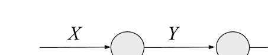

图12.3: 马尔可夫链 $X \rightarrow Y \rightarrow Z$满足无记忆性质 $p(Z|X, Y) = p(Z|Y)$。

引理12.7.7对于形成马尔可夫链的任意三个随机变量 $X$, $Y$, 和 $Z$, 我们有

$(a) \ H(Z|X, Y) = H(Z|Y)$;

$(b) \ H(X|Y, Z) = H(X|Y)$。

证明: $(a)$ 在马尔可夫性质中，取对数得到 $p(z|x, y) = p(z|y)$，然后进行积分，得到

$$ \int p(x, y, z) \ln p(z|x, y) \, dxdydz = \int p(x, y, z) \ln p(z|y) \, dxdydz. $$

左边等于 $-H(Z|X, Y)$, 右边等于 $H(Z|Y)$, 从而证明了部分 $(a)$ 中的恒等式。

$(b)$ 根据马尔可夫性质， $p(z|x, y) = p(z|y)$。然后，利用条件概率法则，我们得到

$$ p(x|y, z) = \frac{p(x, y, z)}{p(y, z)} = \frac{p(x, y)p(z|x, y)}{p(y)p(z|y)} = \frac{p(x, y)}{p(y)} = p(x|y). $$

在前一个公式中取期望并使用定义，我们有

$$ \int p(x, y, z) \ln p(x|y, z) \, dxdydz = \int p(x, y, z) \ln p(x|y) \, dxdydz, $$

这等价于所需的恒等式 $H(X|Y, Z) = H(X|Y)$。

备注12.7.8恒等式 $(a)$ 表明，马尔可夫链中的变量在过去的条件下的不确定性主要由前一个变量（或最近的过去值）决定。恒等式 $(b)$ 表明，马尔可夫链中的变量在未来的条件下的不确定性主要由下一个变量（或最近的未来值）决定。

在深度学习的背景下，互信息的另一个性质是非常有用的，它表明信息不能通过数据处理来增加。 这将在神经网络的研究中被后续使用，我们利用了有损压缩不能传达比原始数据更多信息的事实。

## 命题12.7.9（数据处理不等式）

对于任意形成马尔可夫链的三个随机变量X,Y和Z，我们有：

- (a) $I(X,Y) \geq I(X,Z)$;
- (b) $I(Y,Z) \geq I(X,Z)$.

证明：（a）减去恒等式

$$I(X,Y) = H(X) - H(X|Y)$$

$$I(X,Z) = H(X) - H(X|Z),$$

并使用引理12.7.7，部分（b），然后引理12.7.6，得到

$$I(X,Y) - I(X,Z) = H(X|Z) - H(X|Y) = H(X|Z) - H(X|Y,Z) \geq 0.$$

（b）我们有

$$I(Y,Z) = H(Z) - H(Z|Y)$$

$$I(X,Z) = H(Z) - H(Z|X).$$

减去，使用引理12.7.7，部分（a），然后引理12.7.6，得到

$$I(Y,Z) - I(X,Z) = H(Z|X) - H(Z|Y) = H(Z|X) - H(Z|X,Y) \geq 0.$$

前面的结果可以重新表述为在马尔可夫序列中，接近的变量比远离的变量传递更多的信息。

例子12.7.1一群孩子玩无线电话游戏。 一个孩子在第二个孩子的耳朵里低声说一个词，第二个孩子把这个词低声告诉第三个孩子，依此类推。最后一个孩子大声告诉大家他或她听到的是什么。 这个游戏的有趣之处在于输出与输入的词非常不同。

由于每个成员都快速低声传递消息，这增加了过程的不确定性和游戏的乐趣。 这可以被建模为一个马尔可夫序列，因为每个孩子的理解都受到前一个孩子消息的影响。 消息的不确定性由熵来描述。 引理12.7.7 (a) 表明给定消息的不确定性仅受到前一个消息的影响。 互信息，I(X,Y)，表示两个耳语之间的共同信息量 \(X\) 和 \(Y\) 的数量。数据处理不等式（命题12.7.9）表明，两个连续耳语的共同信息量大于两个相隔较远的耳语的共同信息量。

## 例子12.7.2

考虑马尔可夫链 \(X^{(0)} \rightarrow X^{(1)} \rightarrow X^{(2)}\)，其中 \(X^{(0)}\) 是从标准的52张牌中随机选择的一张牌的身份，\(X^{(1)}\) 代表牌的花色（黑桃、红心、梅花或方块），而 \(X^{(2)}\) 是牌的颜色（黑色或红色），参见图12.4。我们可以将 \(X^{(0)}\) 视为一个单隐藏层神经网络的输入随机变量。隐藏层 \(X^{(1)}\) 汇集了牌的花色，而输出层 \(X^{(2)}\) 是一个汇集层，收集了牌的颜色；\(X^{(2)}\) 也可以被视为随机选择的一张牌的颜色分类器。

我们将使用它们的均匀分布计算每一层的熵 \(P(X^{(0)} = x_i) = 1/52\)，以及

| \(X^{(1)}\) | 红桃 | 梅花 | 黑桃 | 方块 |
| :--- | :---: | :---: | :---: | :---: |
| \(P(s_i)\) | 1/4 | 1/4 | 1/4 | 1/4 |

| \(X^{(2)}\) | 红色 | 黑色 |
| :--- | :---: | :---: |
| \(P(c_i)\) | 1/2 | 1/2 |

根据熵的定义，我们有
\[
H(X^{(0)}) = - \sum_{i=1}^{52} p(x_i) \ln p(x_i) = - \ln(1/52) = \ln 52
\]
\[
H(X^{(1)}) = - \sum_{i=1}^{4} p(s_i) \ln p(s_i) = - \ln(1/4) = \ln 4
\]
\[
H(X^{(2)}) = - \sum_{i=1}^{2} p(c_i) \ln p(c_i) = - \ln(1/2) = \ln 2.
\]

我们注意到熵的严格递减流
\[
H(X^{(0)}) > H(X^{(1)}) > H(X^{(2)}).
\]

除以\(\ln 2\)，我们得到以比特为单位的熵。这样，\(H(X^{(0)})\)是5.726比特，\(H(X^{(1)})\)是2比特，而\(H(X^{(2)}\)只是1比特。这意味着为了确定从一副牌中随机选择的一张牌，我们需要平均提问5.726个问题（带有是/否答案），而确定其颜色只需要问一个问题就足够了（例如，我们可以问“颜色是红色吗？”）。如果牌的身份\(X^{(0)}\)被揭示，那么它的花色就确定了，因此，\(X^{(1)}\)没有不确定性，\(H( X^{(1)} \mid X^{(0)} )=0\)。这可以通过注意到来正式显示

\[
p(x_i^{(1)} | x_j^{(0)}) = P(X^{(1)} = x_i^{(1)} | X^{(0)} = x_j^{(0)}) = \begin{cases} 
1, & \text{if card } x_j^{(0)} \text{ 有花色 } x_i^{(1)} \\
0, & \text{否则},
\end{cases}
\]

这样条件熵变为

$$H(X^{(1)}|X^{(0)}) = -\sum_{j=1}^{52}\sum_{i=1}^{4} p(x_i^{(1)}, x_j^{(0)}) \ln p(x_i^{(1)}|x_j^{(0)})$$

$$= -\sum_{j=1}^{52}\sum_{i=1}^{4} p(x_i^{(1)})p(x_i^{(1)}|x_j^{(0)}) \ln p(x_i^{(1)}|x_j^{(0)}) = 0.$$

同样，我们有 $H(X^{(2)}|X^{(0)}) = 0$，因为一张卡的颜色一旦被揭示，就已知了。接下来，我们计算输入层和其他两层之间的互信息：

$$I(X^{(0)}, X^{(1)}) = H(X^{(1)}) - \underbrace{H(X^{(1)}|X^{(0)})}_{=0} = H(X^{(1)}) = \ln 4$$

$$I(X^{(0)}, X^{(2)}) = H(X^{(2)}) - \underbrace{H(X^{(2)}|X^{(0)})}_{=0} = H(X^{(2)}) = \ln 2.$$

由此可得以下数据处理不等式
$$I(X^{(0)}, X^{(1)}) \ge I(X^{(0)}, X^{(2)})$$
严格验证。

## 12.8 深度神经网络的应用

在介绍应用于深度神经网络之前，我们先回顾一些符号。设 $X^{(\ell-1)}$ 和 $X^{(\ell)}$ 分别为前馈神经网络的第 $\ell-1$ 层和第 $\ell$ 层的激活值。$X^{(\ell-1)}$ 也可以看作是第 $\ell$ 层的输入。

### 12.8.1 熵流

我们研究了当层激活是连续随机变量时的熵流。在本节中，我们假设它们是离散的。

命题 12.8.1如果前馈神经网络的层激活是离散随机变量，则熵流是递减的。

$$H(X^{(0)}) \ge H(X^{(1)}) \ge \cdots \ge H(X^{(L)}) \ge 0.$$

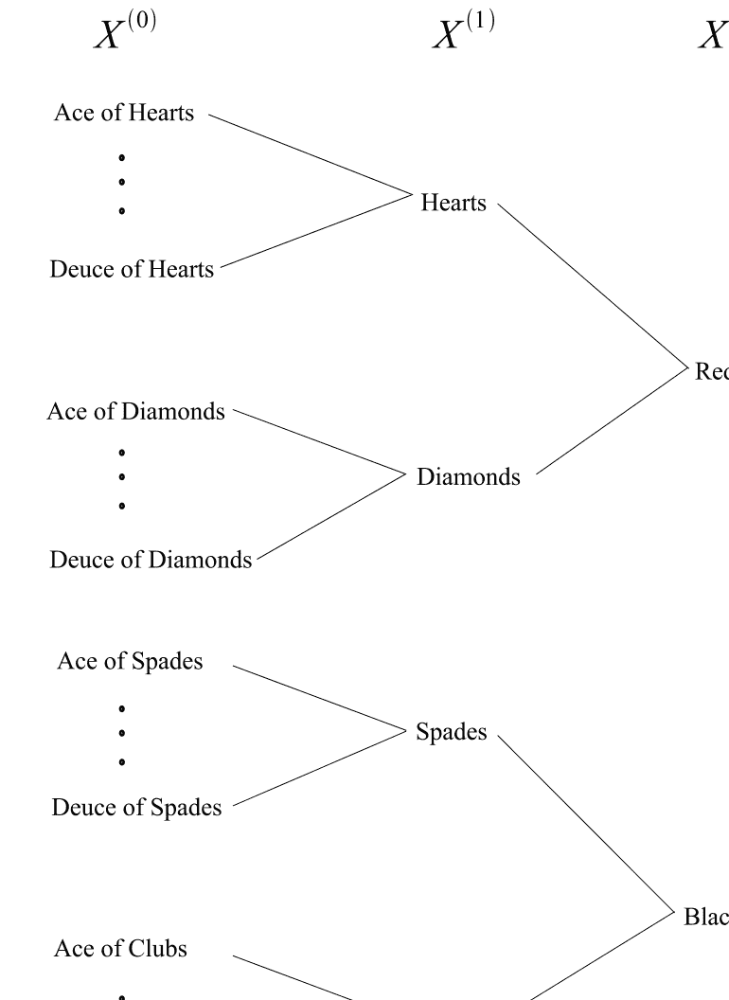

图 12.4: 马尔可夫链 $X^{(0)} \rightarrow X^{(1)} \rightarrow X^{(2)}$，其中 $X^{(0)}$ 是一张卡片的标识，$X^{(1)}$ 一张卡片的花色，$X^{(2)}$ 是一张卡片的颜色。

证明：由于第 $\ell$ 层的激活取决于前一层的激活，$X^{(\ell)} = F(X^{(\ell-1)})$，根据命题 12.6.1 我们有 $H(X^{(\ell)}|X^{(\ell-1)}) = 0$。我们将计算互信息 $I(X^{(\ell)}, X^{(\ell-1)})$ 以两种不同的方式计算：

$$I(X^{(\ell)}, X^{(\ell-1)}) = H(X^{(\ell)}) - H(X^{(\ell)}|X^{(\ell-1)}) = H(X^{(\ell)})$$

$$I(X^{(\ell)}, X^{(\ell-1)}) = H(X^{(\ell-1)}) - H(X^{(\ell-1)}|X^{(\ell)}) \le H(X^{(\ell-1)}),$$

由于 $H(X^{(\ell-1)}|X^{(\ell)}) \ge 0$，因为变量是离散的。从最后两个公式我们推断 $H(X^{(\ell)}) \le H(X^{(\ell-1)})$。当 $F$ 可逆时，等式成立，因为

$$H(X^{(\ell-1)}|X^{(\ell)}) = H(F^{-1}(X^{(\ell)})|X^{(\ell)}) = 0,$$

> 根据命题12.6.1。

### 推论12.8.2

假设前馈神经网络的层激活是离散随机变量，并且满足以下条件：

- (i) 激活函数是严格递增的；
- (ii) 网络具有恒定的宽度： $d^{(0)} = d^{(1)} = \cdots = d^{(L)}$；
- (iii) 权重矩阵是非退化的，对于所有的 $1 \le \ell \le L$，有 $\det W^{(\ell)} \ne 0$。

然后熵流是恒定的

$$H(X^{(0)}) = H(X^{(1)}) = \cdots = H(X^{(L)}).$$

### 12.8.2 噪声层

到目前为止，所有使用的前馈神经网络的第 $\ell$层的激活取决于前一层的激活

$$X^{(\ell)} = F(X^{(\ell-1)}) = \phi(W^{(\ell)T} X^{(\ell-1)} - B^{(\ell)}).$$

在本章的其余部分中，我们假设层激活受到一些噪声的干扰， $\xi^{(\ell)}$，这是一个与层 $X^{(\ell-1)}$独立的随机变量

$$X^{(\ell)} = F(X^{(\ell-1)}, \xi^{(\ell)}).$$

从计算的角度来看，一种简单的方法是考虑一个加性噪声

$$X^{(\ell)} = F(X^{(\ell-1)}) + \xi^{(\ell)} = \phi(W^{(\ell)T} X^{(\ell-1)} - B^{(\ell)}) + \xi^{(\ell)},$$

其中 $\mathbb{E}[\xi^{(\ell)}] = 0$，并且有一些已知的正熵值， $H(\xi^{(\ell)})$。在加性噪声的情况下，计算提供

$$H(X^{(\ell)}|X^{(\ell-1)}) = H(F(X^{(\ell-1)}) + \xi^{(\ell)}|X^{(\ell-1)}) = H(\xi^{(\ell)}),$$

因为噪声与第 $(\ell-1)$ 层独立。

接下来，我们将介绍互信息在具有噪声层的前馈神经网络中的独立性和信息压缩方面的一些应用。

### 12.8.3 独立层

如果层激活$X^{(\ell)}$不包含来自层激活$X^{(r)}$的任何信息，则层$r$和$\ell$被称为独立的，即$I(X^{(r)}, X^{(\ell)}) = 0$。
等价地，随机变量$X^{(\ell)}$和$X^{(r)}$在命题12.7.1的部分$(b)$中是独立的。

### 命题12.8.3 (独立可分性)

假设层$\ell-1$和$\ell$是独立的。那么

- (a) 对于任何层$r \leq \ell-1$，层$\ell$是独立于任何层$r$。
- (b) 对于任何层$k \geq \ell-1$，层$\ell-1$是独立于任何层$k$。

证明：该证明是数据处理不等式、命题12.7.9以及互信息的非负性的结果，参见图12.5。

(a) 对于任意的$r \leq \ell-1$，我们有

$0 \leq I(X^{(r)}, X^{(\ell)}) \leq I(X^{(\ell-1)}, X^{(\ell)}) = 0,$

由此可得$I(X^{(r)}, X^{(\ell)}) = 0$。

(b) 对于任意的$k \geq \ell$，我们有

$0 = I(X^{(\ell-1)}, X^{(\ell)}) \geq I(X^{(\ell-1)}, X^{(k)}) \geq 0,$

这意味着$I(X^{(\ell-1)}, X^{(k)}) = 0$。

粗略地说，如果前馈神经网络的两个连续层是独立的，那么它们之前的任何层都与它们之后的任何层都是独立的。

### 12.8.4 无压缩层

我们考虑一个带有噪声层的前馈神经网络。 第四层被称为无压缩层，如果

$$ I(X^{(0)}, X^{(\ell-1)}) = I(X^{(0)}, X^{(\ell)}), $$

即，输入$X^{(0)}$对$X^{(\ell-1)}$和$X^{(\ell)}$传达相同的信息。

### 备注12.8.4

在没有噪声的情况下， $X^{(\ell-1)}$和$X^{(\ell)}$都取决于$X^{(0)}$，在这种情况下我们有

$$ I(X^{(0)}, X^{(\ell-1)}) = H(X^{(\ell-1)}) - H(X^{(\ell-1)}|X^{(0)}) = H(X^{(\ell-1)}), $$
$$ I(X^{(0)}, X^{(\ell)}) = H(X^{(\ell)}) - H(X^{(\ell)}|X^{(0)}) = H(X^{(\ell)}), $$

其中我们使用了命题12.6.1。 因此，第$\ell$层在先前定义的意义上是无压缩的，即这些层之间没有熵泄漏。 这个关系由以下三个条件暗示：

- (i) 激活函数满足 $\phi' > 0$;
- (ii) $d^{(\ell-1)} = d^{(\ell)}$;
- (iii) 权重矩阵 $W^{(\ell)}$ 是非奇异的.

我们注意到条件 (i)–(iii) 也是层的必要条件 $X^{(\ell)}$未经压缩，参见命题 11.6.3 和定理 11.7.1.这两个概念是不同的，前者与信息的度量相关，后者与相关的sigma代数相关。 然而，这两个概念都描述了在层 $\ell-1$ 和 $\ell$ 之间发生某种信息不变性的事实.

下一个结果涉及到一些等价的方法来证明一个层是无压缩的. 这里包含它是为了完整性的原因.

### 命题12.8.5

考虑一个具有噪声层的前馈神经网络。以下是等价的：

- (i) 第 $\ell$层是无压缩的；
- (ii) $I(X^{(0)}, X^{(\ell)}) = I(X^{(0)}, X^{(\ell+1)})$；
- (iii) $H(X^{(0)}|X^{(\ell+1)}) = H(X^{(0)}|X^{(\ell)}, X^{(\ell+1)})$；
- (iv) $p(x^{(0)}|x^{(\ell+1)}) = p(x^{(0)}|x^{(\ell)}, x^{(\ell+1)})$；
- (v) $p(x^{(\ell)}, x^{(\ell+1)}|x^{(0)}) = p(x^{(\ell+1)}|x^{(0)})p(x^{(\ell)}|x^{(\ell+1)})$.

证明： $(i) \Leftrightarrow (ii)$ 这是根据定义得出的。

(ii) ⇔ (iii) 将互信息写成熵的形式，我们有

$$
I(X^{(0)}, X^{(\ell)}) = I(X^{(0)}, X^{(\ell+1)}) \Leftrightarrow \\
H(X^{(0)}) - H(X^{(0)}|X^{(\ell)}) = H(X^{(0)}) - H(X^{(0)}|X^{(\ell+1)}) \Leftrightarrow \\
H(X^{(0)}|X^{(\ell)}) = H(X^{(0)}|X^{(\ell+1)}).
$$

(iii) ⇔ (iv) 因为 $X^{(0)} \to X^{(\ell)} \to X^{(\ell+1)}$ 是一个马尔可夫链，引理12.7.7，部分 (b) 暗示 $H(X^{(0)}|X^{(\ell)}, X^{(\ell+1)}) = H(X^{(0)}|X^{(\ell)})$。另一方面，引理12.7.6得到 $H(X^{(0)}|X^{(\ell+1)}) \geq H(X^{(0)}|X^{(\ell)}, X^{(\ell+1)})$。最后两个表达式导致不等式

$$H(X^{(0)}|X^{(\ell+1)}) \geq H(X^{(0)}|X^{(\ell)}).$$

根据引理12.7.7的证明，这个不等式成为恒等式 (如 (iii) ) 当且仅当

$$p(x^{(0)}|x^{(\ell+1)}) = p(x^{(0)}|x^{(\ell)}, x^{(\ell+1)}),$$

这是 (iv)。

(iv) ⇔ (v) 这是使用条件概率密度进行计算得出的。我们有

$$
p(x^{(0)}|x^{(\ell+1)}) = \frac{p(x^{(0)}, x^{(\ell+1)})}{p(x^{(\ell+1)})} = \frac{p(x^{(\ell+1)}|x^{(0)})p(x^{(0)})}{p(x^{(\ell+1)})}, \\
p(x^{(0)}|x^{(\ell)}, x^{(\ell+1)}) = \frac{p(x^{(0)}, x^{(\ell)}, x^{(\ell+1)})}{p(x^{(\ell)}, x^{(\ell+1)})} = \frac{p(x^{(\ell)}, x^{(\ell+1)}|x^{(0)})p(x^{(0)})}{p(x^{(\ell)}, x^{(\ell+1)})}.
$$

将 $p(x^{(0)}|x^{(\ell+1)})$ 等同于 $p(x^{(0)}|x^{(\ell)}, x^{(\ell+1)})$ 得到

$$p(x^{(\ell)}, x^{(\ell+1)}|x^{(0)}) = p(x^{(\ell+1)}|x^{(0)}) \frac{p(x^{(\ell)}, x^{(\ell+1)})}{p(x^{(\ell+1)})}.$$

使用 $\frac{p(x^{(\ell)}, x^{(\ell+1)})}{p(x^{(\ell+1)})} = p(x^{(\ell)}|x^{(\ell+1)})$ 得到方程 (v)。

## 12.8.5 特征的数量

在本节中，我们讨论了熵和互信息的一个有用解释，用于估计前馈神经网络的输入层和输出层的大小，以及所描述特征的数量。

假设我们有一个离散随机变量，$X$，它取值为，$x_1,x_2,\ldots,x_n$，相应的概率为 $p_1, p_2,\ldots, p_n$。假设 $X$ 的值由一个只能通过沟通来透露信息的人告诉我们，意味着“是”和“否”的词语。 然后我们总是能够通过有限的“是”和“否”回答的序列来得到正确的 $X$值。

然后熵 $H(X)$ 是寻找正确的 $X$值所需的平均最小“是”和“否”回答的数量。这个结果的内容在编码理论中被称为无噪声编码定理，在参考文献[11]中有所了解。

输入数据 $X$的取值数量可以从其熵$H(X)$估计为 $2 H(X)$，其中$H(X)$以比特为单位测量。 现在，考虑一个具有输入 $X$和输出 $Y$的神经网络。 每个 $Y$的值$_i$被认为是输入 $X$的某个特征。 给定特征 $Y = y_i$，条件熵$X$的定义为

$$H(X|Y = y_i) = -\sum_{k=1}^n p(x_k|y_i) \ln p(x_k|y_i),$$

并表示了 $X$给定 $X$包含特征 $y_i$的不确定性。具有特征 $y_i$的输入数据的大小由$2^{H(X|Y=y_i)}$近似计算。这个大小取决于特征，但我们可以考虑它们的平均值。 具有给定特征的输入数据的平均大小由$2^{H(X|Y)}$估计，其中

$$H(X|Y) = \sum_{j=1}^m p(y_j) H(X|Y = y_j)$$

是条件期望的加权和。 通过将 $X$的大小除以相同特征的子集的平均大小，即可获得输入数据子集的估计数量。

$$\frac{2^{H(X)}}{2^{H(X|Y)}} = 2^{H(X)-H(X|Y)} = 2^{I(X,Y)}.$$

由于每个 $X$的子集都被一对一地映射到一个特征，因此$2^{I(X,Y)}$估计了输出层的特征数量。 信息 $I(X, Y)$以比特为单位测量。

例如，在MNIST数据分类的情况下，有10个数字类别或10个特征。 在这种情况下，网络应该被构建成满足输出和输入之间的互信息的条件 $I(X, Y) = \log_2 10$。 然而，如果 $I(X, Y) < \log_2 10$，则网络将导致欠拟合，因为输入所传达的输出信息太少，无法对10个数字进行分类。

我们将在以下具体示例上验证这些公式。

**例子12.8.6** 我们将考虑从普通的52张牌中随机选择一张牌的例子。 然后每张牌的选择概率等于 \( p_i = 1/52 \)。第一个问题，Q1，可以是：花色是红色吗？假设答案是“是”。然后下一个问题，Q2，可以是：花色是方块吗？假设答案是“不是”。这意味着正确的花色是“红心”。由于有13张牌，下一个问题，Q3，可以是：卡片号码大于6吗？让答案是“不是”。这样我们只剩下六个选择：1,2,3,4,5和6。我们将它们分成两组，并通过问Q4再次决定卡片所属的组：卡片号码小于4吗？

假设答案是“是”。这意味着这张卡片是1,2或3。下一个问题，Q5，可以是卡片号码是否小于2？如果答案是“是”，这意味着这张卡片是红心A，在这种情况下，需要5个问题来确定卡片的身份。然而，如果最后的答案是“否”，那么这张卡片要么是2，要么是3。我们通过问Q6来确定它：卡片号码是2吗？“是”回答意味着这张卡片是红心2，而“否”回答意味着这张卡片是红心3。总之，我们需要5或6个问题来准确确定卡片的身份。如果多次进行找到卡片的实验，然后考虑所需问题数量的平均值，我们得到5.7。这意味着从52张牌的牌组中随机选择一张卡片的身份信息包含5.7位。

在另一方面，提取随机一张牌的随机变量的熵是

$$H(X) = -\sum_{i=1}^{52} p_i \ln(p_i) = -\ln(1/52) = 3.95$$

除以ln 2，我们得到以比特为单位的信息量为3.95/ln 2 = 5.7，这与前面提到的值一致（如果我们不除以ln 2，则信息量以nats为单位）。

现在考虑随机变量 \( Y \)，它表示从同一副牌中随机选择的花色。变量 \( Y \) 只取四个值：黑桃、红心、方块和梅花。给定其中一个特征的条件熵为

$$H(X|Y = 红心 ) = -\sum_{k=1}^{13} \frac{1}{13} \ln \frac{1}{13} = \ln 13 \approx 2.56$$

考虑加权和与 \( p(y_i) = 1/4 \)，我们得到给定特征变量 \( Y \) 的条件熵 \( H(X|Y) \) 为

$$H(X|Y) = \sum_{j=1}^{4} \frac{1}{4} H(X|Y=y_j) = \ln 13 \approx 2.56$$

然后可以估计 $X$ 和 $Y$ 的互信息

$$I(X, Y) = H(X) - H(X|Y) \approx 3.95 - 2.56 = 1.39,$$

将其除以 $\ln 2$，我们得到 2 位。然后 $2^{I(X,Y)} = 4$，对应于 4 个类别，每个类别代表一种花色。

## 12.8.6 总压缩

前馈神经网络的第 $\ell$ 层的压缩因子定义为以下互信息的比率：

$$\rho_{\ell} = \frac{I(X^{(0)}, X^{(\ell)})}{I(X^{(0)}, X^{(\ell-1)})}.$$

根据数据处理不等式，命题12.7.9的部分 $(a)$，我们有这个事实意味着 $0 \leq \rho^{\ell} \leq 1$。如果层是无压缩的，则压缩因子为 $1$，如果 $X^{(0)}$ 和 $X^{(\ell)}$ 是独立的层。

所有压缩因子的乘积与网络的隐藏层无关，如下计算所示：

$$\rho_1 \rho_2 \cdots \rho_L = \frac{I(X^{(0)}, X^{(1)})}{I(X^{(0)}, X^{(0)})} \frac{I(X^{(0)}, X^{(2)})}{I(X^{(0)}, X^{(1)})} \cdots \frac{I(X^{(0)}, X^{(L)})}{I(X^{(0)}, X^{(L-1)})} = \frac{I(X^{(0)}, X^{(L)})}{I(X^{(0)}, X^{(0)})} = \frac{I(X^{(0)}, X^{(L)})}{H(X^{(0)})},$$

其中我们使用了 $I(X^{(0)}, X^{(0)}) = H(X^{(0)}) - H(X^{(0)}|X^{(0)}) = H(X^{(0)})$。这表明商数

$$\rho = \frac{I(X^{(0)}, X^{(L)})}{H(X^{(0)})} \quad (12.8.11)$$

描述了前馈神经网络中的总压缩。它表示网络的输入和输出之间共享的信息量，按输入信息的量进行缩放。

> **备注 12.8.7** 我们提出了两点备注，很容易得出。
> (i) 如果且仅当所有层都没有压缩时，总压缩 $\rho=1$（无压缩）。
> (ii) 如果且仅当存在一个与输入 $X^{(0)}$ 无关的层时，总压缩 $\rho=0$。

我们注意到，如果前馈神经网络需要将输入数据分类为 $c$ 类，则最后一层的大小必须为 $d^{(L)} = c$。 如果输入层的大小为 $n = d^{(0)}$，则我们将根据这两个参数估计总压缩。

> **命题 12.8.8** 前馈神经网络对数据进行分类时，具有 $n$ 个输入和 $c$ 个类别的总压缩率由 $\rho = \log_n c$ 给出。

**证明：** 由于类别数为 $c= 2^{I(X^{(0)},X^{(L)})}$，输入大小为 $n= 2^{H(X^{(0)})}$，利用关系式 (12.8.11) 和对数的换底公式，我们得到

$$\rho = \frac{I(X^{(0)}, X^{(L)})}{H(X^{(0)})} = \frac{\log_2 c}{\log_2 n} = \log_n c.$$

例如，在MNIST数据库中对数字进行分类时，类别数为 $c= 10$，输入大小为 $n= 28 \times 28$（每张图片是一个28 ×28像素的矩阵），因此分类所需的总压缩率为 $\rho= \log_{784}10 = 0.345$。

> **备注 12.8.9** 我们注意到，在没有噪音的情况下，总压缩由输出熵和输入熵的商给出
> $$\rho = \frac{H(X^{(L)})}{H(X^{(0)})}.$$

## 12.9 网络容量

我们已经看到，前馈神经网络可以被解释为信息压缩器。现在，本节回答以下问题：当你观察到网络的响应时，输入模式传递的信息有多大？

为了回答这个问题，我们需要定义网络容量的概念。这可以非正式地定义为容量是神经网络适应各种目标数据的能力。低容量网络难以适应训练数据，可能导致欠拟合，而高容量网络则会记住训练集，导致过拟合。容量取决于网络架构，更具体地说是神经元的数量，权重和偏置的数量，采用的学习算法等。在接下来的内容中，我们将进一步形式化这个概念，并在具有离散随机变量的有噪声层的前馈神经网络的情况下找到容量的精确公式。

### 12.9.1 容量类型

考虑一个前馈神经网络，具有 L-1 个隐藏层和 $d^{(\ell)}$ 个神经元在第 \ell 层，$0 \leq \ell \leq L$。用 $X = X^{(0)}$ 表示输入变量，用 $Y = X^{(L)}$ 表示输出，用 $Z$ 表示目标变量。如果 $X$ 是一个随机变量，那么输出 $Y$ 也是一个随机变量。

有三个感兴趣的互信息，$I(X, Y)$，$I(Y, Z)$ 和 $I(X, Z)$，我们将很快讨论。

1.  第一个互信息 $I(X, Y)$ 表示 $X$ 关于 $Y$ 所包含的信息量，或者等价地，网络处理的信息量。这取决于输入分布 $p(x)$，以及权重矩阵 $W^{(\ell)}$ 和偏置 $B^{(\ell)}$。然后，通过改变分布 $p(x)$，保持矩阵 $W^{(\ell)}$ 和 $B^{(\ell)}$ 不变，直到处理的信息达到最大值，我们得到对应于权重系统 $(W, B)$ 的网络容量。这个容量对应于权重系统 $(W, B)$，通过变化分布 $p(x)$ 直到处理的信息达到最大值得到。

$$C(W, B) = \max_{p(x)} I(X, Y). \quad (12.9.12)$$

这表示网络可以处理的最大信息量，如果权重和偏置保持不变。值得注意的是，这与信道容量的定义非常相似，信道容量是著名的信道编码定理中的一部分，详见[131]的第8章。

通过改变权重和偏置系统，我们可以获得网络处理的最大信息量，称为总网络容量。

$$C_{tot} = \max_{W,B} \{ C(W, B); \|W\|^2 + \|B\|^2 \leq 1 \}. \quad (12.9.13)$$

为了将变量$(W, B)$保持在一个紧凑的集合中，并确保最大值的存在，添加了正则化约束 $\|W\|^2 + \|B\|^2 \leq 1$。

给定有界输入熵的网络所处理的最大信息由基本容量测量

$$C(M) = \max_{H(X) \leq M} I(X, Y). \quad (12.9.14)$$

2.  互信息 $I(Y, Z)$ 表示网络输出 $Y$ 关于目标变量 $Z$ 传递的信息量。在学习过程中，我们期望 $I(Y, Z)$ 会趋向于目标熵 $H(Z)$。假设随机变量具有离散值，我们有 $H(Z|Y) > 0$。

然后不等式

$$I(Y, Z) = H(Z) - H(Z|Y) \leq H(Z)$$

表明互信息 $I(Y, Z)$ 从上方受到 $H(Z)$ 的限制，因此为了更好地学习 $Z$，互信息 $I(Y, Z)$ 必须尽可能大。

3.  第三个兴趣量，$I(X, Z)$，表示训练对 $(X, Z)$ 中包含的互信息。这可以明确计算，因为训练分布 $p_{xz}$ 已知。在证明容量的存在之前，我们先介绍一些术语。

### 12.9.2 输入分布

输入层有 $d^{(0)} = n$ 个神经元，输入随机变量为 $X = (X_1, \ldots, X_n)$。每个分量 $X_k$ 是一个取值于有限集合 $\{x_k^1, x_k^2, \ldots, x_k^{r_k}\}$ 的实值随机变量。输入概率由以下给出

$P(X = \mathbf{x}) = P(X_1 = x_1^{i_1}, \ldots, X_n = x_n^{i_n}) = p(x_1^{i_1}, \ldots, x_n^{i_n})$

对于 $\mathbf{x} = (x_1^{i_1}, \ldots, x_n^{i_n})$。

特殊情况下，当输入层只有一个神经元时，即 $d^{(0)} = 1$ 且 $X = X_1$，我们假设 $X$ 取 $N$ 个值， $\{x_1, \ldots, x_N\}$，并且每个值都以给定的概率取值

$p(x_i) = P(X = x_i), \quad i = 1, \ldots, N,$

这构成了输入概率分布，参见图12.6。

### 12.9.3 输出分布

输出层有 $d^{(L)} = m$ 个神经元，输出随机变量为 $Y = (Y_1, \ldots, Y_m)$，每个分量 $Y_k$ 为实值随机变量，取值为有限集 $\{y_k^1, y_k^2, \ldots, y_k^{t_k}\}$。输出概率由以下给出

$P(Y = \mathbf{y}) = P(Y_1 = y_1^{j_1}, \ldots, Y_m = y_m^{j_m}) = p(y_1^{j_1}, \ldots, y_m^{j_m})$

对于 $\mathbf{y} = (y_1^{j_1}, \ldots, y_m^{j_m})$。

在输出层只有一个神经元的特殊情况下，$Y = Y_1$ 取值为 $\{y_1, \ldots, y_M\}$ 以概率

$p(y_j) = P(Y = y_j), \quad j = 1, \ldots, M,$

这形成了输出分布，参见图12.6。

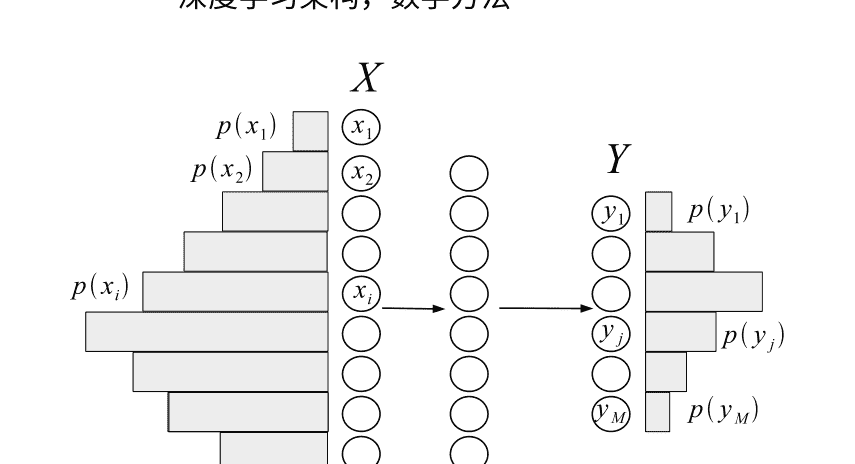

**图12.6：** 输出密度 $p(y_j)$ 与输入密度 $p(x_i)$ 之间的关系。

### 12.9.4 输入-输出张量

我们考虑多指标 $\mathcal{I} = (i_1, ..., i_n)$ 和 $\mathcal{J} = (j_1, ..., j_m)$ 并且令 $\mathbf{x}^{\mathcal{I}} = (x_1^{i_1}, ..., x_n^{i_n}), \quad \mathbf{y}^{\mathcal{J}} = (y_1^{j_1}, ..., y_m^{j_m}).$

输入-输出张量 $q_{\mathcal{I},\mathcal{J}} = q_{i_1,...,i_n;j_1,...,j_m}$ 是由以下条件概率定义的

> $q_{\mathcal{I},\mathcal{J}} = P(Y = \mathbf{y}^{\mathcal{J}} | X = \mathbf{x}^{\mathcal{I}}) = p( y_1^{j_1}, ..., y_m^{j_m} | x_1^{i_1}, ..., x_n^{i_n} ).$

张量 $q_{\mathcal{I},\mathcal{J}}$ 取决于网络的架构结构（具有固定权重和偏差），与输入分布 $p(\mathbf{x})$ 无关。由于

> $P(Y = \mathbf{y}^{\mathcal{J}}) = \sum_{\mathcal{I}} P(Y = \mathbf{y}^{\mathcal{J}} | X = \mathbf{x}^{\mathcal{I}}) P(X = \mathbf{x}^{\mathcal{I}}),$

张量 $q_{\mathcal{I},\mathcal{J}}$ 通过公式将输入分布转换为输出分布 $p(\mathbf{y}^{\mathcal{J}}) = \sum_{\mathcal{I}} q_{\mathcal{I},\mathcal{J}} p(\mathbf{x}^{\mathcal{I}})$, 或等效的详细形式

> $p(y_1^{j_1}, ..., y_m^{j_m}) = \sum_{i_1,...,i_n} q_{i_1,...,i_n;j_1,...,j_m} p(x_1^{i_1}, ..., x_n^{i_n}).$

### 12.9.5 输入-输出矩阵

如果 $d^{(0)} = d^{(L)} = 1$，则神经网络由以下输入-输出矩阵 $q_{ij} = p(y_j|x_i)$ 表示，其中

> $p(y_j|x_i) = P(Y = y_j | X = x_i), \quad 1 \leq i \leq N, 1 \leq j \leq M.$

矩阵 $Q = q_{ij}$ 的作用是通过公式 $p(y_j) = \sum_{i=1}^{N_i} p(x_i)p(y_j|x_i)$ 将输入分布转换为输出分布，或者用等价的矩阵形式表示为 $p(y) = Q^T p(x)$。如果 $N = M$ 并且矩阵 $Q$ 是非奇异的，给定输出密度 $p(y)$，存在唯一的输入密度 $p(\mathbf{x})$ 被转换为 $p(\mathbf{y})$。

然而，如果 $M < N$，则 $Q$ 不是一个方阵，因此考虑其行列式没有意义。在这种情况下，假设最大秩条件成立，即 $\text{rank}(Q) = \text{rank}(Q^T) = M$。在这个条件下，对于上述方程式，最多只有一个解 $p(\mathbf{x})$，参见练习12.13.4。解的存在性将在下一节中讨论。

由于对于固定值 $X = x_i$，随机变量 $Y$ 取某个值 $y_j$，我们有 $\sum_{j=1}^{M_j} p(y_j|x_i) = 1$。这也可以写作 $\sum_{j=1}^{M_j} q_{ij} = 1$，即输入输出矩阵 $Q$ 的每行元素之和等于1。由于 $Q$ 的元素非负，即 $q_{ij} \geq 0$，可知 $Q$ 是一个 $\text{Toeplitz}$ 矩阵。$^{1}$ 矩阵 $q_{ij}$ 的这个性质在下一节中将被多次使用。

注12.9.1 考虑一个无噪声层的前馈神经网络，使得输入-输出映射 $f$ 是双射的，即 $f(x_i) = y_i$ 且 $M = N$。在这种情况下，输入-输出矩阵为 $q_{ij} = P(Y = y_j|X = x_i) = P(f(X) = y_j|X = x_i) = P(f(x_i) = y_j) = \delta_{ij}$，因为事件 $\{f(x_i) = y_j\}$ 要么肯定发生，要么不可能发生。因此，输入-输出矩阵是单位矩阵，即 $Q = \mathbb{I}_N$。

如果去掉函数 $f$ 的单射性，很容易证明矩阵 $Q$ 的元素只包含0和1，每行只有一个1（行向量是“热向量”）。这个事实符合矩阵 $Q$ 的 $\text{Toeplitz}$ 性质。

## 12.9.6 网络容量的存在性

网络容量定义有意义的事实归结为在输入分布变化时互信息 $I(X, Y)$ 的最大值存在。为了简单起见，我们将在特殊情况下处理问题 $d^{(0)} = d^{(L)}=1$，即只有一个输入和一个输出神经元的情况。我们将索引切换为 $n = N$ 和 $m = M$，并确定 $I(X, Y)$ 的一个关于输入分布的公式。

分布 $p(x_i)$，使用互信息、熵和条件熵的定义：

$$
\begin{align*}
I(X, Y) &= H(Y) - H(Y|X) \\
&= -\sum_{j=1}^{m} p(y_j) \ln p(y_j) + \sum_{i=1}^{n} \sum_{j=1}^{m} p(x_i, y_j) \ln p(y_j|x_i) \\
&= -\sum_{j=1}^{m} \sum_{i=1}^{n} p(x_i) p(y_j|x_i) \ln p(y_j) \\
&\quad + \sum_{i=1}^{n} \sum_{j=1}^{m} p(x_i) p(y_j|x_i) \ln p(y_j|x_i) \\
&= \sum_{j=1}^{m} \sum_{i=1}^{n} p(x_i) p(y_j|x_i) \left( \ln p(y_j|x_i) - \ln p(y_j) \right) \\
&= \sum_{j=1}^{m} \sum_{i=1}^{n} p(x_i) p(y_j|x_i) \left( \ln p(y_j|x_i) - \ln \sum_{i=1}^{n} p(x_i) p(y_j|x_i) \right) \\
&= \sum_{j=1}^{m} \sum_{i=1}^{n} p(x_i) q_{ij} \left( \ln q_{ij} - \ln \sum_{i=1}^{n} p(x_i) q_{ij} \right).
\end{align*}
$$

由此可见，对于给定的输入-输出矩阵 $q_{ij}$，互信息 $I(X, Y)$ 是关于 $n$ 个实数的连续函数，$p(x_1), \ldots, p(x_n)$，属于该域

$$K = \{(p_1, \ldots, p_n); p_i \geq 0, \sum_{i=1}^{n} p_i = 1\}.$$

由于 $0 \leq p_i \leq 1$，所以 $K \subset B_{\mathbb{R}^n}(0,1)$，即 $K$ 是有界的。集合 $K$ 也是闭集，作为两个闭集的交集，$K = S_n \cap \mathcal{H}_n$，其中超平面

$$\mathcal{H}_n = \{(p_1, \ldots, p_n); \sum_{i=1}^{n} p_i \leq 1\},$$

以及第一个扇区

$$S_n = \{(p_1, \ldots, p_n); p_i \geq 0\}.$$

由于 $K$ 是有界闭合的，因此它是 $\mathbb{R}^n$ 中的紧集。由于在紧集上的连续函数可以达到其最大值，使用 $I(X, Y)$ 是 $K$ 上的连续函数，因此存在一个输入分布 $p_i^* = p(x_i)$，使得 $I(X, Y)$ 达到最大值。最大分布 $p^*$ 可以属于 $K$ 的边界，这种情况下至少有一个分量为零，或者属于 $K$ 的内部。在后一种情况下，将使用微积分方法来描述最大容量。

### 12.9.7 拉格朗日乘数法

在本节中，我们将使用涉及拉格朗日乘数 $\lambda$ 的变分问题来找到网络容量，该乘数用于引入线性约束 $\sum_{i=1}^n p_i= 1$。要最大化的函数 $F : K \to \mathbb{R}$ 如下所示

$$F(p_1, \ldots, p_n) = I(X, Y) + \lambda \left( \sum_{i=1}^n p_i - 1 \right)$$

函数 $F(p_1, \ldots, p_n)$ 是凹函数，作为凹函数和线性约束函数 $I(X, Y)$ 和线性约束函数在 $p$ 中的和。因此，任何临界点 $F$ 的极大值点 $p^*$，属于集合 $K$ 的内部，满足 $F(p^*)$ 的梯度为零。此外，如果这是唯一的，那么该点对应于全局最大值。

$$\frac{\partial p(y_j)}{\partial p(x_k)} = p(y_j|x_k) = q_{kj}$$

$$ \frac{\partial H(Y)}{\partial p(y_j)} = - \frac{\partial}{\partial p(y_j)} \sum_{r=1}^{m} p(y_r) \ln p(y_r) = -(1 + \ln p(y_j))$$

then chain rule implies

$$\frac{\partial H(Y)}{\partial p(x_k)} = \sum_{j=1}^{m} \frac{\partial H}{\partial p(y_j)} \frac{\partial p(y_j)}{\partial p(x_k)} = - \sum_{j=1}^{m} (1 + \ln p(y_j)) q_{kj}$$

$$ = -1 - \sum_{j=1}^{m} \ln p(y_j) q_{kj},$$

where we used the Toeplitz property of $q_{kj}$. We also have

$$\frac{\partial H(Y|X)}{\partial p_k} = - \frac{\partial}{\partial p_k} \sum_{i=1}^{n} \sum_{j=1}^{m} p(x_i) p(y_j|x_i) \ln p(y_j|x_i)$$

$$ = - \frac{\partial}{\partial p_k} \sum_{i=1}^{n} \sum_{j=1}^{m} p_i q_{ij} \ln q_{ij} = - \sum_{j=1}^{m} q_{kj} \ln q_{kj}.$$

Assembling the parts, we have

$$
\begin{aligned}
\frac{\partial F}{\partial p_k} &= \frac{\partial}{\partial p_k}\left[I(X, Y)+\lambda\left(\sum_{i=1}^{n} p_i-1\right)\right]\\
&= \frac{\partial H(Y)}{\partial p_k} - \frac{\partial H(Y|X)}{\partial p_k} + \lambda \\
&= -1 - \sum_{j=1}^{m} \ln p(y_j) q_{kj} + \sum_{j=1}^{m} q_{kj} \ln q_{kj} + \lambda.
\end{aligned}
$$

因此，方程 $\partial F / \partial p_k = 0$ 可以写成显式形式

$$1-\lambda+\sum_{j=1}^{m} q_{kj} \ln p(y_j)=\sum_{j=1}^{m} q_{kj} \ln q_{kj}, \quad 1 \leq k \leq n.\tag{12.9.15}$$

这些是一组方程，连同约束条件 $\sum_{j=1}^{m} p(y_j)=1$ 形成了一个包含 $m+1$ 个未知数的 $m+1$ 个方程的系统，即 $p(y_1), \ldots, p(y_m)$ 和 $\lambda$。由于输入-输出矩阵 $q_{kj}$ 已知，因此(12.9.15)式的右侧是已知的。我们需要解出 $m+1$ 个未知数，即 $p(y_1), \ldots, p(y_m)$ 和 $\lambda$，它们位于等式的左侧。利用 $q_{kj}$ 的 $\text{Toeplitz}$ 性质，上述关系可以写成

$$\sum_{j=1}^{m} q_{kj}\left(1-\lambda+\ln p(y_j)\right)=\sum_{j=1}^{m} q_{kj} \ln q_{kj}, \quad 1 \leq k \leq n.$$

我们将以矩阵形式写出这个方程组。首先，我们引入一些符号

$$\ln p(\mathbf{y})^T = (\ln p(y_1), \ldots, \ln p(y_m))$$

和 $h^T=(h_1, \ldots, h_n)$，其中 $h_k = \sum_{j=1}^{m} q_{kj} \ln q_{kj}$。然后，之前的方程组变为

$$Q\left(1 - \lambda + \ln p(\mathbf{y})\right) = h.\tag{12.9.16}$$

输入-输出矩阵 $Q=(q_{ij})$ 是类型为 $n \times m$ 的矩阵，其中 $m < n$。解决方法使用了 $\text{Moore-Penrose}$ 伪逆的思想。我们先将之前的方程乘以 $Q^T$，得到

$$Q^T Q\left(1 - \lambda + \ln p(\mathbf{y})\right) = Q^T h.$$

我们注意到 $Q^T Q$ 是一个 $m \times m$ 的平方矩阵。从双重不等式中可以看出

$$m \leq \operatorname{rank}(Q^T Q) \leq \operatorname{rank}(Q) = m,$$

由此可知矩阵 $ Q^T Q $ 是非奇异的。因此

$$1 - \lambda + \ln p(\mathbf{y}) = (Q^T Q)^{-1} Q^T h.$$

使用 $\text{Moore-Penrose}$ 伪逆， $ Q^+ = (Q^T Q)^{-1} Q^T $，请参见附录中的G.2节，我们可以写成

$$1 - \lambda + \ln p(\mathbf{y}) = Q^+ h.$$

通过等式两边的分量，我们得到

$$1 - \lambda + \ln p(y_j) = (Q^+ h)_j, \quad 1 \leq j \leq m,$$

其中

$$(Q^+ h)_j = \sum_{k=1}^{n} q_{jk}^+ h_k,$$

其中 $ Q^+ = (q_{ij}^+) $ 是 $ Q $ 的摩尔-彭罗斯伪逆。取指数得 $ e^{1 - \lambda} p(y_j) = e^{(Q^+ h)_j}, \quad 1 \leq j \leq m $。 (12.9.17)

对 $ j $ 求和，然后使用 $ \sum_{j=1}^{m} p(y_j) = 1 $，并取对数函数解得 $ \lambda $ 为

$$1 - \lambda = \ln \left( \sum_{j=1}^{m} e^{(Q^+ h)_j} \right). \quad (12.9.18)$$

这个公式将 $ \lambda $ 表示为输入-输出矩阵的函数。将(12.9.18)代入(12.9.17)并解得输出分布为

$$p(y_j) = e^{(Q^+ h)_j} / \left( \sum_{k=1}^{m} e^{Q^+ h_k} \right) = \frac{e^{Q^+ h}}{\| e^{Q^+ h} \|_1}.$$ 

使用 $\text{softmax}$ 函数的定义，输出分布可以写成

$$p(\mathbf{y}) = \text{softmax}(Q^+ h), \quad (12.9.19)$$

其中前一个表达式的右侧只取决于输入-输出矩阵。

我们的最终目标是找到满足条件的输入分布，即 $ p(\mathbf{x}) $

$$Q^T p(\mathbf{x}) = p(\mathbf{y}). \quad (12.9.20)$$

如果这个方程有一个解 $ p^* = p(\mathbf{x}) $，那么根据练习12.13.4，它是唯一的。此外，如果所有的 $ p^*_i > 0 $，对于所有的 $ 1 \leq i \leq n $，那么这个解在定义域的内部，因此它是函数 $ F $ 达到最大值的点。

## 12.9.8 寻找容量

假设我们已经成功找到了函数 $ F(p) $ 的最大点 $ p^* $。然后我们可以计算网络容量，将解 $ p^* $ 代入互信息公式 $ I(X, Y) $ 中。我们首先将公式 (12.9.15) 乘以 $ p_k $。

$$ (1 - \lambda)p_k = \sum_{j=1}^{m} p_k q_{kj} \ln q_{kj} - \sum_{j=1}^{m} p_k q_{kj} \ln p(y_j) $$

然后对 $ k $ 求和得到

$$ \begin{aligned} 1 - \lambda &= \sum_{k=1}^{n} \sum_{j=1}^{m} p_k q_{kj} \ln q_{kj} - \sum_{k=1}^{n} \sum_{j=1}^{m} p_k q_{kj} \ln p(y_j) \\ &= \sum_{k=1}^{n} \sum_{j=1}^{m} p(x_k, y_j) \ln p(y_j|x_k) - \sum_{j=1}^{m} p(y_j) \ln p(y_j) \\ &= -H(Y|X) + H(Y) = I(X, Y)。 \end{aligned} $$

因此，使用公式 (12.9.18)，具有 $ d^{(0)} = d^{(L)} = 1 $ 和固定权重 $ W $ 和偏置 $ b $ 的网络的容量为

$$ C(W, b) = 1 - \lambda = \ln \left( \sum_{j=1}^{m} e^{(Q^+ h)_j} \right), \quad (12.9.21) $$

其中 $ Q^+ $ 是输入输出矩阵 $ Q $ 的摩尔-彭罗斯伪逆和 $ h_j = \sum_{r=1}^{mr} q_{jr} \ln q_{jr} $。值得注意的是，容量仅取决于输入输出矩阵 $ Q = q_{ij} $。

## 12.9.9 感知机容量

我们已经看到，感知机作为一个具有单位阶跃激活函数的计算单元，能够执行半平面分类。本节回答了一个问题：一个感知机能够处理多少信息？

我们将证明单个感知机的容量为1比特。这意味着一个感知机的输出携带1比特的信息，因此它可以学习决策函数，判断一个点是否属于给定的半平面，这个决策函数也携带1比特的信息。为了做到这一点，只需计算出公式 (12.9.21) 在感知机的情况下的显式表达式。

感知机的输入由随机变量 $ X $ 给出，它只取两个值 $ x_1=0 $ 和 $ x_2=1 $，分别具有概率 $ \alpha $ 和 $ 1-\alpha $。输出变量由 $ Y=H(wx+b) $ 给出，也有两个结果 $ y_1=0 $ 和 $ y_2=1 $，分别以概率 $ \beta $ 和 $ 1-\beta $ 出现。权重 $ w $ 和偏置 $ b $ 是固定常数，其中 $ w=0 $。如果 $ q_{ij}=P(Y=y_j|X=x_i) $，$ i, j \in \{1, 2\} $，

### 信息容量评估

表示输入输出矩阵，输入和输出分布之间的关系可以写成：

$$\begin{pmatrix} \beta \\ 1-\beta \end{pmatrix} = \begin{pmatrix} q_{11} & q_{21} \\ q_{12} & q_{22} \end{pmatrix} \begin{pmatrix} \alpha \\ 1-\alpha \end{pmatrix}. \quad (12.9.22)$$

我们接下来计算条目 $q_{ij}$。我们有

$$q_{11} = P(Y = y_1 | X = x_1) = P(Y = 0 | X = 0) = P(H(b) = 0)$$
$$= \begin{cases} 1, & \text{if } b < 0 \\ 0, & \text{if } b \ge 0 \end{cases} = 1_{\{b<0\}},$$

因为事件 $\{H(b)=0\}$ 对于 $b<0$ 一定发生，对于 $b \ge 0$ 则变得不可能。使用相同的思路，我们计算其他条目如下

$$q_{21} = P(Y = y_1 | X = x_2) = P(Y = 0 | X = 1) = P(H(w + b) = 0) = 1_{\{w+b<0\}},$$
$$q_{12} = P(Y = y_2 | X = x_1) = P(Y = 1 | X = 0) = P(H(b) = 1) = 1_{\{b \ge 0\}},$$
$$q_{22} = P(Y = y_2 | X = x_2) = P(Y = 1 | X = 1) = P(H(w + b) = 1) = 1_{\{w+b \ge 0\}}.$$

因此，输入输出矩阵的转置为

$$Q^T = \begin{pmatrix} q_{11} & q_{21} \\ q_{12} & q_{22} \end{pmatrix} = \begin{pmatrix} 1_{\{b<0\}} & 1_{\{w+b<0\}} \\ 1_{\{b \ge 0\}} & 1_{\{w+b \ge 0\}} \end{pmatrix}. \quad (12.9.23)$$

我们将选择权重，$w$，和偏置，$b$，使得 $Q$ 变为非奇异的。

命题 12.9.2 令 $w=0$。如果 $w>0$，$b \in [-w,0)$，或 $w<0$，$b \in [0,-w)$，则 $\det Q=0$。此外，$Q=Q^{-1}=Q^{+}=Q^{T}=(Q^{T})^{-1}$。证明：矩阵 $Q^{T}$ 的元素要么为0，要么为1。由于 $Q^{T}$ 的每一列元素之和等于1（根据 $\text{Toeplitz}$ 性质），$Q^{T}$ 不是奇异的情况只有以下两种情况：

$$Q^{T} = \begin{pmatrix} 1 & 0 \\ 0 & 1 \end{pmatrix} \quad \text{和} \quad Q^{T} = \begin{pmatrix} 0 & 1 \\ 1 & 0 \end{pmatrix}.$$

使用 (12.9.23) ，第一种情况对应于 $b<0$，$w+b \ge 0$，第二种情况对应于 $b \ge 0$，$w+b<0$，这些是假设条件。我们注意到前面的矩阵是对称的，并且它们是它们自己的逆矩阵。

由于 $Q^{T}$ 的元素要么是0，要么是1，我们有

$$\begin{pmatrix} h_1 \\ h_2 \end{pmatrix} = \begin{pmatrix} q_{11} \ln q_{11} + q_{12} \ln q_{12} \\ q_{21} \ln q_{21} + q_{22} \ln q_{22} \end{pmatrix} = \begin{pmatrix} 0 \\ 0 \end{pmatrix},$$## 深度学习架构，数学方法

图12.7：Y是输入 $X$的压缩版本，它保留了有关目标 $Z$的有意义信息。Y保留了由 $X$给出的人脸的重要特征，这对于目标 $Z$所需的人脸概念是有意义的。

其中我们使用了极限$\lim_{x \searrow 0} x \ln x = 0$。代入（12.9.21）式，我们得到感知机的容量

$$C(W, b) = 1 - \lambda = \ln\left(\sum_{j=1}^{2} e^{(Q^{+} h)_j}\right) = \ln 2.$$

除以 $\ln 2$，我们将度量单位从nats转换为bits。因此，容量为1比特。

接下来，我们将找到输入和输出的概率分布。由于$h=0$且$Q$可逆，公式（12.9.16）得到$Q(\ln 2 + \ln p(\mathbf{y})) = 0$，即$p(\mathbf{y}) = 1/2$，或者等价地，$\beta=1/2$。从（12.9.22）中解出$\alpha$得到$\alpha=1/2$。因此，当达到最大容量时，输入和输出的概率都是均匀的。

> 注12.9.3 ($i$) 在无噪声层的前馈神经网络中，输入输出映射$f$是双射的，即$f(x_i)=y_i$且$m=n$，输入输出矩阵是单位矩阵$Q=\mathrm{In}$，参见注12.9.1。然后伪逆矩阵是$Q^{+}=\mathrm{In}$，且$(Q^{+} h)_j = h_j = 0$。然后网络容量由式(12.9.21)给出，即$C(\mathbf{w}, \mathbf{b}) = \ln \sum_{n i=1} 1 e^0 = \ln n$。式(12.9.19)和(12.9.20)表明，最大化网络容量的输出和输入分布都是均匀的。

$$p(x_j) = p(y_j) = \frac{1}{n}, \quad 1 \leq j \leq n。$$

($ii$) 通过提供更大的输入信息可以增加容量。
增加输入数量会导致网络的权重和偏差的增加。 容量取决于矩阵 \(Q\)，它取决于网络的激活函数和参数。

容量可以解释为网络适应各种目标函数的能力。 因此，具有较大容量的网络可能通过记忆训练集来过度拟合。 相反，容量较低的网络无法处理足够的信息，从而导致对训练集的欠拟合。 理论上很难找到最佳容量，它位于这两个极限之间，接近网络执行任务的真实复杂性。 寻找最佳容量的一个相关问题是“信息瓶颈”，将在下一节中讨论。

## 12.10 信息瓶颈

信息瓶颈方法是由Naftali Tishby、 Fernando C. Pereira和William Bialek在[119]中引入的一种技术。 我们通过一些富有启发性的例子来阐述这个想法。

- 例子12.10.1 假设输入 \(X\)表示人脸图像，目标 \(Z\)表示被描绘人物的性别。 一个人脸包含很多信息，需要通过一个瓶颈来尽可能地压缩这些与性别有关的相关信息。 因此，关于 \(Z\)的有意义信息可能包含发型、化妆、衣服颜色、胡须等特征。 这些特征在初始数据 \(X\)中存在，也应该在结果\(Y\)中体现出来，对于确定被描绘人物的性别来说是有意义的信息。

- 例子12.10.2 一个演讲者需要用他有限的词汇量在一门他不熟悉的外语中发表演讲。 他需要通过一个由有限词汇组成的“瓶颈” \(Y\)来压缩演讲的信息 \(X\)，以确保关于演讲主题 \(Z\)的有意义信息不受影响。

- 例子12.10.3 一名员工需要写一篇关于他的新项目的叙述。 然而，他忙碌的老板对每个项目都有2页的限制。因此，员工的挑战是在有限的空间内包含关于项目的大量信息。 可用的项目信息 \(X\)必须压缩成2页的叙述 \(Y\)，这是瓶颈，以确保重要的项目特征不会被削弱太多。

我们考虑一个前馈神经网络，其输入随机变量为X，输出变量为Y，受到目标随机变量Z的学习。我们假设提供了训练分布p(x, z)，即(X, Z)的联合分布。输入X通常是一个高维变量，而目标Z的维度明显较低；因此，X的大部分熵对Z并不具有很多信息，而X提供的信息必须尽可能地压缩到输出Y中，以确保Y中仍然有足够有意义的关于目标Z的信息。由于将X有损地压缩到Y中不能传达比初始数据X更多关于Z的信息，我们有以下不等式

$$I(Y, Z) \leq I(X, Z)$$

也就是说，通过输出Y传达给目标Z的信息不超过通过初始数据X传达给Z的信息。然而，即使它小于I(X, Z)，信息I(Y, Z)仍应足够大，以使Y仍然包含足够有意义的关于Z的信息。因此，我们正在寻找一个网络，它保持了关于目标Z的固定数量的有意义的信息I(Y, Z)，同时最大化了将输入X压缩成Y的过程，即最小化了信息I(X, Y)。这在图12.7中表示。网络捕获的相关信息量由比率ρ = I(Y, Z)/I(X, Z)描述，其中ρ∈(0,1)。

瓶颈原理指出我们需要通过输出变量Y以最高效的方式传递由X提供的信息。这意味着要在给定的固定信息I(Y, Z)的条件下最小化I(X, Y)。这可以通过在约束条件下最小化泛函来形式化。

$$\mathcal{L}(p(y|x)) = I(X, Y) - \beta I(Y, Z), \quad (12.10.24)$$

其中β是拉格朗日乘子。第一项表示压缩信息，而第二项描述了有意义的信息。因此，乘子β描述了保留有意义的信息和压缩之间的权衡。当β接近0时，压缩优先于有意义的信息，此时表示变得非常简略。如果β趋近于∞，则有意义的信息优先于压缩，此时表示变得非常详细。泛函的参数是输入-输出矩阵p(y|x)或等价地说是输入-输出矩阵。

值得注意的是，这个问题与寻找网络容量的问题是不同的，其中I(X, Y)在所有输入模式上被最大化p(x)；在这里，信息I(X, Y)在p(y|x)上被最小化，而输入分布p(x)保持不变。

### 12.10.1 精确的正式解

假设输入分布 $p(x)$和训练分布 $p(x, z)$已知（因此，后验分布, $p(z|x) = p(x, z)/p(x)$已知）。 未知分布是 $p(y), p(y|x)$ 和 $p(z|y)$。 分布 $p(y|x)$被称为编码器，而分布 $p(z|y)$被称为解码器。 我们需要找到输出分布以及编码器和解码器分布，使得之前描述的瓶颈过程变得最优。非线性变分问题（12.10.24）的解具有精确的隐式解，可以用自身和已知分布来表示 $p(y|x), p(z|y)$，以及 $p(y)$。

$p(x)$ 和 $p(z|x)$（先验和后验分布）。

定理 12.10.1 最小化函数 （12.10.24） 的最优解满足以下隐式方程：

$$p(y|x) = \frac{p(y)}{Z(x, \beta)} e^{-\beta D_{KL}(p(z|x)\|p(z|y))}, \qquad (12.10.25)$$

$$p(z|y) = \frac{1}{p(y)} \sum_{x} p(z|x) p(y|x) p(x), \qquad (12.10.26)$$

$$p(y) = \sum_{x} p(y|x) p(x), \qquad (12.10.27)$$

在这里

$$D_{KL}(p(z|x)\|p(z|y)) = \sum_{z} p(z|x) \ln \frac{p(z|x)}{p(z|y)}$$

而 $Z(x, \beta)$是归一化函数。

证明：我们注意到两个未知分布， $p(y)$ 和 $p(z|x)$，可以用 $p(x), p(z|x)$ 和 $p(y|x)$ 表示如下：

$$p(y) = \sum_{x} p(y|x) p(x),$$

$$p(z|y) = \sum_{x} p(z|x) p(x|y) = \frac{1}{p(y)} \sum_{x} p(z|x) p(y|x) p(x),$$

在最后一个等式中，我们使用了

$$p(x|y) = \frac{p(x, y)}{p(y)} = \frac{p(y|x) p(x)}{p(y)}.$$

因此，我们需要找到一个关于 $p(y|x)$ 的公式，以前面的分布为基础。

对于固定的 \(y\) 和 \(z\)，条件概率的法则提供了

$$p(y) = \sum_{x} p(y|x) p(x)$$

$$p(y|z) = \sum_{x} p(y|x) p(x|z)$$

因此，对于给定的 \(x\)，我们有以下偏导数：

$$\frac{\partial p(y)}{\partial p(y|x)} = p(x) \qquad (12.10.28)$$

$$\frac{\partial p(y|z)}{\partial p(y|x)} = p(x|z). \qquad (12.10.29)$$

当优化 \(p(y|x)\) 时，我们需要添加约束 \(\sum_{y} p(y|x) = 1\)，对于任意给定的 \(x\)。如果先前约束的拉格朗日乘子为 \(\lambda(x)\)（它是 \(x\)相关的），那么我们得到以下带约束的函数：

$$\mathcal{L}(p(y|x)) = I(X, Y) - \beta I(Y, Z) - \sum_{x} \lambda(x) \left( \sum_{y} p(y|x) - 1 \right). \quad (12.10.30)$$

对于固定的 \(x\) 和 \(y\)值，我们有变分方程

$$\frac{\partial \mathcal{L}}{\partial p(y|x)} = \frac{\partial I(X, Y)}{\partial p(y|x)} - \beta \frac{\partial I(Y, Z)}{\partial p(y|x)} - \lambda(x). \qquad (12.10.31)$$

利用这个

$$I(X, Y) = H(Y) - H(Y|X)$$

$$= -\sum_{y} p(y) \ln p(y) + \sum_{x,y} p(x, y) \ln p(y|x)$$

$$= -\sum_{y} p(y) \ln p(y) + \sum_{x,y} p(y|x) p(x) \ln p(y|x),$$

利用链式法则和(12.10.28)得到

$$\frac{\partial I(X, Y)}{\partial p(y|x)} = \frac{\partial H(Y)}{\partial p(y|x)} - \frac{\partial H(Y|X)}{\partial p(y|x)}$$

$$= -(1+\ln p(y)) p(x) + p(x)(1+\ln p(y|x))$$

$$= p(x) \ln \frac{p(y|x)}{p(y)}.$$

同样地,

$$I(Y, Z) = H(Y) - H(Y|Z)$$

$$= -\sum_{y} p(y) \ln p(y) + \sum_{y,z} p(y|z) p(z) \ln p(y|z),$$

并且应用链式法则和(12.10.29)，我们有

$$\frac{\partial I(Y, Z)}{\partial p(y|x)} = -(1 + \ln p(y))p(x) + \sum_{z} p(z)(1 + \ln p(y|z))p(x|z)$$

$$= -p(x) - p(x) \ln p(y) + \sum_{z} p(z)p(x|z) + \sum_{z} p(z)p(x|z) \ln p(y|z)$$

$$= -p(x) \ln p(y) + \sum_{z} p(x, z) \ln p(y|z)$$

$$= -\sum_{z} p(x, z) \ln p(y) + \sum_{z} p(x, z) \ln p(y|z)$$

$$= \sum_{z} p(x, z) \ln \frac{p(y|z)}{p(y)} = p(x) \sum_{z} p(z|x) \ln \frac{p(y|z)}{p(y)}$$

$$= p(x) \sum_{z} p(z|x) \ln \frac{p(y, z)}{p(y)p(z)}$$

$$= p(x) \sum_{z} p(z|x) \ln \frac{p(z|y)}{p(z)}.$$

将其代入 (12.10.31) 得到

$$\frac{\partial \mathcal{L}}{\partial p(y|x)} = p(x)\left\{ \ln \frac{p(y|x)}{p(y)} - \beta \sum_{z} p(z|x) \ln \frac{p(z|y)}{p(z)} - \frac{\lambda(x)}{p(x)} \right\}.$$

术语 \( \beta \sum_{z} p(z|x) \ln \frac{p(z|y)}{p(z)} \) 取决于 \( y \) 和 \( x \)。我们将其写成两个Kullback-Leibler散度之和，即

$$\beta \sum_{z} p(z|x) \ln \frac{p(z|y)}{p(z)} = \beta \sum_{z} p(z|x) \ln \left( \frac{p(z|y)}{p(z|x)} \frac{p(z|x)}{p(z)} \right)$$

$$= \beta \sum_{z} p(z|x) \ln \frac{p(z|y)}{p(z|x)} + \beta \sum_{z} p(z|x) \ln \frac{p(z|x)}{p(z)}$$

$$= -\beta D_{KL}(p(z|x)||p(z|y)) + \beta \phi(x),$$

其中

$$\phi(x) = \sum_{z} p(z|x) \ln \frac{p(z|x)}{p(z)} = D_{KL}(p(z|x)||p(z))$$

是一个关于 \( x \) 的函数，将被吸收到乘数中。代入之前的偏导数得到

$$\frac{\partial \mathcal{L}}{\partial p(y|x)} = p(x)\left\{ \ln \frac{p(y|x)}{p(y)} + \beta D_{KL}(p(z|x)||p(z|y)) - \beta \phi(x) - \frac{\lambda(x)}{p(x)} \right\}.$$

## 引入新的乘数

$$\tilde{\lambda}(x) = \beta\phi(x) + \frac{\lambda(x)}{p(x)},$$

我们最终可以用以下更简单的方式写出导数：

$$\frac{\partial\mathcal{L}}{\partial p(y|x)} = p(x)\left\{\ln \frac{p(y|x)}{p(y)} + \beta D_{KL}\left(p(z|x)||p(z|y)\right) - \tilde{\lambda}(x)\right\}.$$

因此，方程 $\frac{\partial\mathcal{L}}{\partial p(y|x)}=0$ 的解满足

$$p(y|x) = p(y)e^{\tilde{\lambda}(x)}e^{-\beta D_{KL}(p(z|x)||p(z|y))} = \frac{p(y)}{Z(\beta, x)}e^{-\beta D_{KL}(p(z|x)||p(z|y))},$$

其中 $Z(\beta, x)=e^{-\tilde{\lambda}(x)}$ 是归一化函数。我们略去了证明这个解最小化给定函数的事实；读者可以参考文献[119]。

备注12.10.2 隐式系统(12.10.25)-(12.10.27)可以使用迭代算法求解。将迭代步骤记为 $k$，我们考虑迭代系统

$$\begin{align*} p_k(y|x) &= \frac{p_k(y)}{Z_k(x, \beta)} e^{-\beta D_{KL}(p_k(z|x)||p_k(z|y))}, \\ p_{k+1}(z|y) &= \frac{1}{p_k(y)}\sum_x p_k(z|x)p_k(y|x)p_k(x), \\ p_{k+1}(y) &= \sum_x p_k(y|x)p_k(x). \end{align*}$$

可以证明，解的序列在 $k\to\infty$ 时收敛到所需的解。

### 12.10.2 信息平面

本节将提供一个几何描述，描述深度前馈神经网络在各层之间的信息演化。这样，相关曲线的形状将反映信息流的行为。

我们回顾一些熟悉的符号。如往常一样，设 $X = X^{(0)}$ 和 $Y = X^{(L)}$ 为深度前馈神经网络的输入和输出层。记作

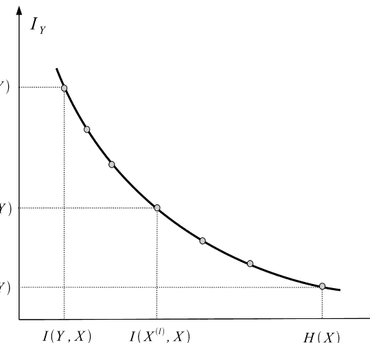

记 $Z$ 为目标变量， $X^{(\ell)}$ 为网络的第 $\ell$ 层的激活。每一层 $X^{(\ell)}$ 可以与两个非负数相关联，

$$I_X^{(\ell)} = I(X^{(\ell)}, X), \quad I_Y^{(\ell)} = I(X^{(\ell)}, Y),$$

这可以进一步被视为笛卡尔平面上的坐标，称为信息平面。因此，网络的每一层可以映射到该平面上的第一象限中的一个点。我们将研究由这些点构成的曲线的形状。

> > 数据处理不等式，参见命题12.7.9，提供了一系列不等式

$$H(X) \geq I(X^{(1)}, X) \geq \cdots \geq I(X^{(\ell)}, X) \geq I(X^{(\ell+1)}, X) \geq \cdots \geq I(X, Y)$$

$$I(X, Y) \leq I(X^{(1)}, Y) \leq \cdots \leq I(X^{(\ell)}, Y) \leq I(X^{(\ell+1)}, Y) \leq \cdots \leq I(X^{(L-1)}, Y),$$

这些状态表明序列 $I_X^{(\ell)}$ 是递减的，而 $I_Y^{(\ell)}$ 相对于 $\ell$ 是递增的

$$I_X^{(\ell)} \geq I_X^{(\ell+1)}, \quad I_Y^{(\ell)} \leq I_Y^{(\ell+1)}.$$

通过用一个单调连续曲线连接点$(I_X^{(\ell)}, I_Y^{(\ell)})$，我们得到与网络相关的信息路径，参见图12.8。值得注意的是，在学习过程中，当权重和偏置调整时，信息路径在信息平面上发生变形。

图12.9：信息曲线上不同类型的压缩区域。

另一个观察是，在没有压缩层的网络中，前面的不等式序列变成了等式序列，因此信息路径垂直排列。斜率的倒数描述了网络中的压缩率，参见图12.9。

我们注意到对于任何前馈网络，我们有 $I_X^{(L)} = I_Y^{(0)} = I(X, Y)$。如果此外，我们还有 $I_X^{(L-p)} = I_Y^{(p)}$，对于所有的 $1 \leq p \leq L-1$，则信息曲线关于直线 $I_Y = I_X$ 对称。这条曲线可以对应于对称自编码器网络。

即使信息路径的几何形状提供了关于网络的相关信息，它并不能唯一确定网络架构。如果其中一层通过可逆变换进行修改，这会改变网络架构但保持互信息不变，参见命题12.7.5。

备注 12.10.3 瓶颈原理可以逐层重复应用。在每一层应用瓶颈原理时，我们希望最小化信息 $I(X^{(\ell)}, X^{(\ell+1)})$，同时保持 $I(X^{(\ell+1)}, Z)$尽可能大。这是为了在第 $\ell$ 层和第 $(\ell+1)$ 层之间压缩信息，同时保留足够的有意义的信息在 $Z$ 上。

## 12.11 MNIST信息处理

神经网络的效率始终从对MNIST数据的测试开始。这是一个由灰度手写数字组成的数据库，0到9，以及一个标签，表示预期的整数。每个手写数字由一个28 × 28像素的图像表示。标签由“独热向量”表示，这些向量的长度为10，在与相应数字对应的索引处放置1，其余位置为零。²MNIST数据被分为55,000个训练数据，10,000个测试数据和5,000个验证数据。使用训练数据集训练网络，然后在测试数据上进行测试，并记录成功的百分比，即正确分类的测试样本与总样本数之间的比率，我们称之为准确率。目标是在测试数据上实现尽可能接近100%的准确率，这对应于对测试数据的完美分类。

实验工作表明，神经网络的准确性取决于多种因素，例如：隐藏层的数量（网络深度）和大小（网络宽度），激活函数的使用（逻辑函数，ReLU等），代价函数（平方误差和交叉熵等），批量大小，学习步骤，最小化方法（梯度下降等），以及网络类型（全连接，卷积网络）等。此外，我们可以根据经验给出一些准确性的界限，如下所示：一个两层前馈神经网络（FNN）在MNIST数据上的最大准确率约为92.5%，见图12.10；一个三层FNN无法做得更好。

在MNIST数据上达到超过98%的准确率，参见图12.11；卷积网络可以在MNIST数据上超过98%的准确率。

下一节的目标是从数学角度解释这一现象。

### 12.11.1 两层FNN

我们将每个28 × 28的图像展平为长度为784的向量 X，按照图5.2的思路。这被视为一个取值范围在[0, 1]^{784}的随机变量。值为 X_i=1的分量对应于黑色像素，而 X_i=0对应于白色像素。介于两者之间的任何其他值对应于灰色像素。

该网络没有隐藏层，因此只有两层，一层对应输入，另一层对应输出。

网络输出是一个具有10个分量的决策函数，由向量 Y= (Y_1, ..., Y_{10}) 描述。假设激活函数 $\varphi$ 是可逆的。那么输出由以下公式描述

> > 在这里，我们假设激活函数是sigmoid类型的。有些激活函数是不可逆的，例如ReLU或Softmax，在分类中通常使用。然而，近似ReLU的Softplus是可逆的。

$$Y_j = \varphi\left(\sum_{i=1}^{784} w_{ij} X_i + b^j\right), \quad 1 \leq j \leq 10,$$

或者等价地以矩阵形式表示， $Y = \varphi(W^T X + b)$。我们使用符号表示$W = (w_{ij}) \in \mathbb{R}^{784 \times 10}$表示权重矩阵， $b = (b^j) \in \mathbb{R}^{10}$表示偏置向量。

由于$Y$依赖于$X$，所以$Y$定义的信息领域包含在$X$定义的信息领域中，即

$$\mathfrak{S}(Y) \subset \mathfrak{S}(X)$$

这是一个严格的不等式，即逆向包含， $\mathfrak{S}(X) \subset \mathfrak{S}(Y)$，不成立，我们将在下面展示。记$T = \varphi^{-1}(Y) - b$，我们有$W^T X = T$，其中$W^T$是矩阵$W$的转置。变量$Y$和$T$定义了相同的信息领域， $\mathfrak{S}(Y) = \mathfrak{S}(T)$，因为$T$可以通过可逆变换从$Y$获得。上述系统可以明确地写成

$$w_{11} X_1 + w_{12} X_2 + ... + w_{1,784} X_{784} = T_1$$
$$................................ = ...$$
$$w_{10,1} X_1 + w_{10,2} X_2 + ... + w_{10,784} X_{784} = T_{10}.$$

由于$\text{rank}(W) \leq \min\{10, 784\}$，为了不失一般性，我们将考虑最大化$\text{rank}$时的最佳信息传输场景，即$\text{rank}(W) = 10$。只保留独立的行，并使用最终的重新索引，我们写成

$$w_{11} X_1 + w_{12} X_2 + ... + w_{1,10} X_{10} = T_1 - \sum_{j=11}^{784} w_{1,j} X_j$$
$$................................ = ...................$$
$$w_{10,1} X_1 + w_{10,2} X_2 + ... + w_{10,10} X_{10} = T_{10} - \sum_{j=11}^{784} w_{10,j} X_j.$$

由于系数矩阵可逆，这意味着 $X$ 的前十个分量可以用 $T$ (因此也可以用 $Y$) 和 $X$的其他分量来表示。因此，

$$\mathfrak{G}(X_1,\ldots,X_{10}) \subset \mathfrak{G}(T, X_{11},\ldots,X_{784}) = \mathfrak{G}(Y, X_{11},\ldots,X_{784})$$

显然，

$$\mathfrak{G}(X_{11},\ldots,X_{784}) \subset \mathfrak{G}(Y, X_{11},\ldots,X_{784}).$$

然后，最后两个关系意味着

$$\mathfrak{G}(X) = \mathfrak{G}(X_1,\ldots,X_{10}) \vee \mathfrak{G}(X_{11},\ldots,X_{784}) \subset \mathfrak{G}(Y, X_{11},\ldots,X_{784}). \quad (12.11.32)$$

另一方面，我们知道

$$\mathfrak{G}(Y) \subset \mathfrak{G}(X)$$

而且很明显

$$\mathfrak{G}(X_{11},\ldots,X_{784}) \subset \mathfrak{G}(X).$$

从最后两个关系中我们可以推断出

$$\mathfrak{G}(Y) \vee \mathfrak{G}(X_{11},\ldots,X_{784}) \subset \mathfrak{G}(X),$$

或者，在取$\mathfrak{G}$运算符之后

$$\mathfrak{G}(Y, X_{11},\ldots,X_{784}) \subset \mathfrak{G}(X). \quad (12.11.33)$$

从(12.11.32)和(12.11.33)可以得出

$$\mathfrak{G}(X) = \mathfrak{G}(Y, X_{11},\ldots,X_{784}). \quad (12.11.34)$$

总之，输出变量 $Y$所传递的信息严格小于由 $X$定义的输入信息。这对应于信息的压缩，其中由 $X_{11},\ldots,X_{784}$生成的信息丢失了。

当矩阵 $W$的秩较小时，类似的方法也适用。在这种一般情况下，需要将 $784 - rank(W)$个 $X$的分量包含在(12.11.34)式的右项中。

接下来，我们将在12.8.5节的基础上对信息进行定量分析，这对于比较神经网络的信息处理能力具有实际意义。

为了简单起见，我们进一步假设每个像素只能取两个值，黑色或白色。输入变量 $X$的最大熵满足$2^{H(X)} = 784$，即输入包含一定的信息最多为9.614位（每个图像）。给定$Y$的情况下，$X$的熵等于每个输出对应的像素的平均数量$$2^{H(X|Y)} = \frac{784}{10},$$提供的是 $H(X|Y)=6.292$ 位。互信息$X$和$Y$的数量，即$X$关于$Y$所包含的位数，由以下公式给出$$I(X, Y) = H(X) - H(X|Y) = 9.614 - 6.292 = 3.322,$$即每个图像中约有3.32位的信息用于图像内容的分类。由$Y$提供的类别数量为$$2^{I(X,Y)}=2^{3.322}=10,$$如预期。现在将互信息写为$$I(X, Y) = H(Y) - H(Y|X),$$并且使用这个，如果给定 $X$，$Y$就没有不确定性，即 $H(Y|X)=0$，($Y$在$X$上确定性地依赖)，则有 $H(Y)=I(X,Y)=3.322$比特。这验证了关系$2^{H(Y)}=10$，从而恢复了已知的事实，即$Y$的元素个数为10。总之，输入和输出的熵分别为 $H(X)=9.614$比特和 $H(Y)=3.322$比特。由于压缩而导致的信息损失为6.292比特（每个图像）。如果从公式（12.11.33）的角度来看，那么它对应于通过组件$X_{11}, \dots, X_{784}$丢失的信息。

### 12.11.2 一个三层FNN

考虑一个三层FNN，输入为$X$，输出为$\widetilde{Y}$，还有一个额外的隐藏层$U$，包含100个神经元。在这种情况下，发生了两次压缩：一次是从$X$到$U$，比例为784:100；另一次是从$U$到$\widetilde{Y}$，比例为100:10。实验证明，网络的准确性从92%（对应于没有隐藏层的网络）提高到约98%，当使用一个隐藏层时。通常的解释是隐藏层能够收集更多的输入变量特征，为网络增加了一些额外的容量。我们将对这个事实进行数学形式化。

设$Y$和$\widetilde{Y}$分别为没有隐藏层和有一个隐藏层的网络的输出。一个隐藏层网络的输出为

$$\widetilde{Y} = \varphi\left(\widetilde{W}^T U + \widetilde{b}\right) = \varphi\left(\widetilde{W}^T \varphi\left(W^T X + b\right) + \widetilde{b}\right),$$

其中 (W, b) 和 ($\widetilde{W}, \widetilde{b}$) 分别是第一到第二层和第二到第三层的权重和偏置系统。输出 $\widehat{Y}$ 可以表示为一个由79,510个参数化的空间中的点

$$(\widetilde{W}, W, \widetilde{b}, b) \in \mathbb{R}^{784\times100} \times \mathbb{R}^{100\times10} \times \mathbb{R}^{100} \times \mathbb{R}^{10}.$$

同样，零隐藏层神经网络的输出 $Y = \varphi(W^{T} X + b)$ 可以表示为一个由7,850个参数化的空间中的点

$$(W, b) \in \mathbb{R}^{784\times10} \times \mathbb{R}^{10}.$$

当神经网络被优化时，它们的输出对应于将目标变量 Z 投影到上述空间中。因此，更大的维度将通过投影产生对目标变量 Z 的更好逼近，这意味着在引入隐藏层的情况下，网络的准确性往往更高。

### 12.11.3 卷积网络的作用

在对MNIST数据进行分类时，全连接层前馈神经网络的性能较差，这是由于两种信息损失造成的：

+   (i) 其中一种是由于两层网络的容量较低。可以通过增加更多的层或在隐藏层中增加更多的神经元来增加网络容量来解决这个问题。然而，在这种情况下，网络的准确性存在一个上限约为98%，无论隐藏层有多宽，或者网络中添加了多少隐藏层，都无法超过这个上限。
+   (ii) 为了获得丢失的2%，我们需要承认输入数据中的另一个信息损失，因为图像被压平了。这会移除一些2维信息，例如像素与其相邻像素的关系。因此，需要一种利用2维数据结构的神经网络架构，这就是卷积神经网络（CNN）。第16章将更详细地讨论这种类型的网络。

当2维输入数据被压平成向量时，忽略了多少信息，例如MNIST数据的情况？回答这个问题的一种方法是评估通过错误分类数字带来的惊喜所提供的信息。可以使用对数似然函数来评估这些信息。

让 $p$ 表示正确分类MNIST数据的概率。如果准确率为100%，即网络正确分类所有数字，那么 $p=1$，所以对数似然为 $-\log_2 p=0$，即在这种情况下没有错误分类的信息。如果准确率为50%，这意味着网络平均每两个数字中正确分类一个。由于 $-\log_2(1/2)=1$，因此有1比特的信息描述了错误分类。但是如果准确率为92%，那么100个数字中有92个被正确分类。这对应于一个错误分类信息为 $-\log_2(0.92)=0.12$ 比特。在准确率为98%的情况下，错误分类信息为 $-\log_2(0.98)=0.029$ 比特。结论是，在将 $28 \times 28$ 像素数据展平为长度为784的向量后，最高效的FNN仍然会忽略每个MNIST图像约0.029比特。这种损失是由于图形拓扑的改变造成的。

在接下来的内容中，我们将使用熵来解释这种信息损失。我们需要首先介绍水平和垂直阅读变量的概念。当阅读英文文本时，信息是水平提取的，从左到右，逐行进行。如果文本是中文的话，信息是垂直提取的，从上到下，逐列进行。

由此事件产生的信息。在冬天，下雪的概率可以是 $p=0.8$，对应的信息量为 $-\ln 0.8 = 0.22$。在夏天，下雪的概率非常小，假设 $p=0.001$。这意味着信息量为 $-\ln(0.001) = 6.9$。

然而，当我们看一个人脸的图片时，信息不能仅仅从水平或垂直方向考虑，因为每个部分相对于其他部分的相对位置在构建整体信息时起到了作用。

我们用 $X_h$ 和 $X_v$ 来表示水平和垂直读取图像的两个随机变量（例如，当读取一个文档文件时，我们读取一系列字符，这些字符被视为一个随机变量 $X_h$）。

当阅读英文文本时，观察到的信息包含在读取变量 $X_h$ 中，并且等于它的熵 $H(X_h)$。在这种情况下，分量 $X_h$ 和 $X_v$ 是独立的，其中 $H(X_v) = 0$，即垂直分量不提供任何信息，参见图12.12 a。另一方面，当阅读中文文本时，信息由 $H(X_v)$ 提供。分量 $X_h$ 和 $X_v$ 仍然是独立的，且 $H(X_h) = 0$，即水平分量在这种情况下不影响信息。

由于观察二维图像（如MNIST图像）需要神经元具备二维意识，这产生了一种信息 $H(X_h, X_v)$是变量$(X_h, X_v)$的联合熵，参见图12.12 b。在这种情况下，分量 $X_h$ 和 $X_v$ 不一定是独立的。分量 $X_h$ 通过将28 × 28像素图像展平，通过行的串联获得，而分量 $X_v$ 通过类似的方式，通过列的串联获得。水平和垂直分量之间的互信息由以下公式给出

$$I(X_h, X_v) = H(X_h) - H(X_h|X_v) = H(X_v) - H(X_v|X_h)$$

我们注意到在阅读文档的情况下（无论是英文还是中文），我们有 $I(X_h, X_v) = 0$，因为组件是独立的。这对于二维图片的情况不再成立。

图像的总信息由其组件的联合熵给出， $H(X_h, X_v)$。当图像被展平成一个向量时，信息仅从水平分量中提取，这是 $H(X_h)$。丢失的信息由总信息，$H(X_h, X_v)$，和从展平向量中提取的部分信息，$H(X_h)$，之间的差异给出：

$$\mathcal{L} = H(X_h, X_v) - H(X_h) \quad (12.11.35)$$

使用这个 $H(X_h) + H(X_v) - H(X_h, X_v) = I(X_h, X_v)$，参见方程式 (12.7.12)，丢失的信息变成了

$$\begin{aligned} \mathcal{L} &= H(X_h, X_v) - H(X_h) \\ &= H(X_v) - I(X_h, X_v) \\ &= H(X_v) - (H(X_v) - H(X_v|X_h)) \\ &= H(X_v|X_h). \end{aligned}$$

因此，丢失的信息是垂直分量 $X_v$ 在水平分量 $X_h$ 的条件下的不确定性，即 $H(X_v|X_h)$。

备注 12.11.1 一般来说，丢失的信息取决于从总信息 $H(X_h, X_v)$ 中减去的是垂直分量熵还是水平分量熵。然而，如果垂直和水平分量具有相同的熵，那么两种情况下的信息损失是相同的。

## 12.12 总结

本章提供了一些工具，用于数值评估神经网络层中所包含的信息。每个层的输出可以被视为一个信号，其熵可以被评估。提供了熵流减小的必要条件。

互信息用于定量描述一个层对另一个层所传递的信息。关于互信息的不变性属性和数据处理不等式被证明并应用于深度神经网络。

网络适应各种目标数据的能力被称为容量。它取决于层的大小、深度和神经元的数量。它还代表了在可变输入信息下网络产生的最大信息。大容量可能导致过拟合，因此开发了一种只保留与目标变量相关的输入信息的技术。

瓶颈信息是一种尽可能压缩输入信息的方法，以使输出包含足够有意义的目标集信息。

提供了关于MNIST数据的信息度量的数值计算示例。

## 12.13 练习

-   练习 12.13.1 考虑一个连续随机变量 $X$，其密度函数 $p(x) = \frac{1}{x (\ln x)^2} \mathbf{1}_{[e, \infty)}(x)$。证明 $H(X)$ 是无穷大的。
-   练习 12.13.2 设 $X$ 是一个连续随机变量，其密度函数为 $p(x)$。证明：
    -   (a) 如果 $\text{Var}(X) < \infty$，那么 $H(X) < \infty$；
    -   (b) 如果 $p(x) \leq M < \infty$，那么 $H(X) \geq -\ln M$。

# 练习 12.13.3

(a) 给定 $Z$，定义 $X$ 和 $Y$ 的互信息为

$$I(X, Y|Z) = H(X|Z) + H(Y|Z) - H(X, Y|Z).$$

证明 $I(X, Y|Z) = D_{KL}[p(x, y, z)||p(x|z)p(y|z)]$.

(b) 证明对于任意的三个随机变量 $X$，$Y$，和 $Z$，我们有：

$$H(X|Z) + H(Y|Z) \leq H(X, Y|Z).$$

什么时候满足这个等式？

# 练习 12.13.4

设 $b \in \mathbb{R}^m$，$A$ 是一个 $m \times n$ 矩阵，其秩为 $m$，其中 $m < n$。证明线性方程组 $AX = b$ 最多只有一个解 $X \in \mathbb{R}^n$。

接下来的几个练习涉及到第12.9节。

# 练习12.13.5

找到输入分布 $p(\mathbf{x})$ 与矩阵 $Q$

在情况 $n = m$ 下。

# 练习12.13.6

在第12.9节的假设和符号表示下，证明容量满足以下不等式：

$$C(W, b) \geq \max_j ((Q^TQ)^{-1}Q^Th)_j.$$

# 练习12.13.7

考虑通过连接两个感知器获得的神经网络。网络的输出由随机变量给出

$$Y = H(w_2H(w_1X + b_1) + b_2),$$

这个网络的容量是多少？

# 练习12.13.8

(a) 证明与第12.11.1节中描述的两层FNN相关联的神经流形的参数数量为7,850。

(b) 证明在第12.11.2节中描述的三层FNN神经流形的参数数量为79,510。

(c) 前面的网络中哪个容量更大，为什么？

# 练习12.13.9

网络的容量在以下情况下会发生怎样的变化：

- (a) 在网络中添加一个额外的全连接层；
- (b) 从网络中删除一些神经元；
- (c) 权重被限制为保持较小。

接下来的几个练习参考第12.11节。

# 练习12.13.10 假设矩阵 $W$ 和 $\widetilde{W}$ 的秩是最大的。

- (a) 证明 $\mathfrak{S}(X) = \mathfrak{S}(\widetilde{Y}, U_{11}, \ldots, U_{100}, X_{101}, \ldots, X_{784})$。
- (b) 验证关系 $\mathfrak{S}(Y, X_{11}, \ldots, X_{100}, X_{101}, \ldots, X_{784}) = \mathfrak{S}(\widetilde{Y}, U_{11}, \ldots, U_{100}, X_{101}, \ldots, X_{784})$。

# 练习 12.13.11

根据第 12.11.2 节的符号，证明 $H(X|U) = 2.9708, I(X, U) = 6.643$ 并验证不等式 $H(X) > I(X, U) > I(X, \widetilde{Y})$。

# 练习 12.13.12

证明如果且仅当 $H(X_h|X_v) = H(X_v|X_h)$，我们有 $H(X_h) = H(X_v)$。

# 练习12.13.13

考虑由(12.11.35)给出的信息损失，$\mathcal{L}$。

- (a) 给定垂直和水平分量是独立的，找到$\mathcal{L}$。
- (b) 假设垂直分量确定地依赖于水平分量，找到$\mathcal{L}$。

图像变换表示为可逆函数。这意味着像素改变它们的坐标，同时保持它们的总数不变。问题是像素重排如何改变图像的熵？由于问题太过普遍，无法得到确切的答案，我们将在下一个练习中将问题限制在某种特定类型的变换上。

# 练习12.13.14

考虑MNIST数据的某种类型的变换

$$(X'_h, X'_v) = (\phi_1(X_h), \phi_2(X_v)),$$

具有可逆性的$\phi_i$。证明这些变换仅当$H(X'_h) + H(X'_v) = H(X_h) + H(X_v)$时，它们保持总熵不变。

# 练习12.13.15

对于任意$p\in(0,1)$，考虑二进制熵函数

$$H(p) = -p \ln(p) - (1-p) \ln(1-p)$$

- (a) 证明$H(p)$是与伯努利随机变量相关的熵。
- (b) 验证二进制熵的导数与logit函数之间的以下关系：$\frac{dH(p)}{dp} = \ln\left(\frac{p}{1-p}\right)$。

# 练习12.13.16（分解为层级）

随机变量的互信息定义为

$$I(X_1, \ldots, X_n) = \sum_{k=1}^n H(X_k) - H(X_1, \ldots, X_n).$$

- (a) 证明 $$I(X, Y, Z) = I(X, Y) + I((X, Y), Z);$$
- (b) 陈述并证明一个一般性的命题。

# 练习 12.13.17

考虑两个离散随机变量 $X$和$Y$的对称熵，定义为 $d(X, Y) = H(X|Y) + H(Y|X)$，并定义$D(X, Y) = 1 - \frac{I(X, Y)}{H(X, Y)}$。

- (a) 证明 $$d(X, Y) = H(X, Y) - I(X, Y);$$
- (b) 证明 $d$是一个距离函数，即它是非负的、对称的，并且满足三角不等式 $$d(X, Y) + d(Y, Z) \geq d(X, Z), \quad \text{对于所有的} X, Y, Z;$$
- (c) 验证 $$D(X, Y) = 1 - \frac{I(X, Y)}{H(X, Y)};$$
- (d) 证明 $D$是一个距离函数，其中 $D(X, X) = 0$，并且对于任意一对 $(X, Y)$，有 $D(X, Y) \leq 1$。

# 练习 12.13.18（平移不变性和缩放等变性）

设 $X$为一个维度为 $n$的随机向量，$A$为一个可逆的 $n \times n$矩阵，并且 $b$为一个常向量。

- (a) 证明 $$H(AX + b) = H(X) + \ln |\det A|;$$
- (b) 线性神经元的应用是什么？

# 练习 12.13.19

考虑一个矩阵 $W = (w_{ij}) \in M_{n \times n}$ such that $|w_{ij}| < c$, with $c \leq \frac{1}{\sqrt{n!}}$。证明 $|\det W| < 1$。

# 练习 12.13.20

设 $X_1 \sim \mathcal{N}(\mu_1, \sigma_1^2)$ 和 $X_2 \sim \mathcal{N}(\mu_2, \sigma_2^2)$ 是两个正态分布的随机变量，其Pearson相关系数为 $\rho = \frac{Cov(X_1, X_2)}{\sigma_1 \sigma_2}$。证明

$$I(X_1, X_2) = -\frac{1}{2} \ln(1 - \rho^2)$$

并提供解释。

# 练习12.13.21

如果 $X$ 是一个具有累积分布函数 $F_X$ 的随机变量，那么可以证明 $U = F_X(X)$ 是一个均匀分布的随机变量在$[0,1]$上。让 $F_{X_1 X_2}$ 表示 $(X_1, X_2)$ 的联合分布函数。$(X_1, X_2)$ 的Copula定义为分布函数 of $(U_1, U_2)$

$$C(u_1, u_2) = \mathbb{P}(U_1 \leq u_1, U_2 \leq u_2),$$

with $U_j = F_{X_j}(X_j)$。Copula的密度由 $c(u_1, u_2) = \frac{\partial^2 C(u_1, u_2)}{\partial u_1 \partial u_2}$ 给出。

(a) 证明Copula和互信息之间的以下关系：

$$I(X_1, X_2) = \int_0^1 \int_0^1 c(u_1, u_2) \ln c(u_1, u_2) \, du_1 \, du_2.$$

这个公式类似于联合熵公式，只是将概率密度替换为Copula密度。

(b) 使用部分 (a) 证明对于独立的 $X_1$ 和 $X_2$，$I(X_1, X_2) = 0$。

# 练习12.13.22

神经网络中使用的一种预处理技术是对输入数据 $X$ 进行归一化。这意味着通过转换将其转化为均值为零，标准差为一的随机变量。

$$\tilde{X} = \frac{X - \mathbb{E}[X]}{\sigma_X}.$$

在这种情况下，$H(X)$ 和 $H(\tilde{X})$ 之间的关系是什么？

# 第四部分

## 几何理论

# 第13章

## 输出流形

在本章中，我们将通过将神经网络的权重和偏置视为流形上的坐标系来将每个神经网络与流形相关联。这个流形可以具有一个黎曼度量，描述网络的内在几何结构。从以下几个角度来看，将神经网络视为几何框架是有用的。

1.  (i) 网络的最优权重和偏置对应于目标在流形上的正交投影的坐标。
2.  (ii) 每个学习算法都涉及到参数值随时间的变化，并对应于该流形上的一条曲线。最高效的学习过程对应于初始点和目标投影点之间的最短曲线，或者测地线。
3.  (iii) 正则化问题可以用流形的平均曲率和第二基本形式来处理到环境目标空间中。也就是说，由于最平坦的流形对训练数据的过拟合最少，正则化可以被视为找到具有最小曲率的输出流形。

在下一节中，我们将介绍流形的概念，并介绍一些对深度学习有用的结果。对于更多关于微分几何的入门细节，读者可以参考[85]。

## 13.1 流形简介

流形是一个几何空间，至少在局部上类似于数值空间 $\mathbb{R}^n$。流形中的每个点由一组参数描述，这些参数被视为局部坐标。

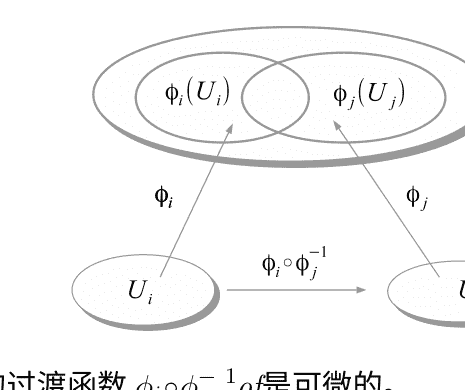

图13.1：流形的过渡函数 $\phi_i \circ \phi_j^{-1}$ 是可微的。

参数, $n$, 是流形的维度。流形保持自己的独特性，不受参数化的影响。有时，一个流形不能仅通过一个参数化来定义，需要多个参数化来覆盖整个空间。

如果参数化是可微的，即参数以可微的方式分配给流形中的点，则流形被称为可微的。在多个参数化的情况下，它们的过渡函数 $\phi_i: U_i \to \mathcal{M}$ 必须是可微的，参见图13.1。除此之外，可微流形还需要满足所有参数化的正则化条件：过渡函数 $\phi_i \circ \phi_j^{-1}$ 的雅可比矩阵具有最大秩。这个条件消除了流形上的任何尖点、角点或顶点。

我们注意到，在本书的范围内，我们需要建模神经网络，我们不会使用具有多个参数化的流形。因此，我们不会过多地详细讨论多参数化流形。接下来，我们将介绍一些流形的例子。

**例子 13.1.1 (圆的流形)** 平面上的圆集合，$\mathcal{C}$，可以使用三个参数进行组织：中心坐标，$(a, b)$，和圆的半径，$r$。参数空间为 $\mathcal{U} = \mathbb{R}^2 \times (0, \infty)$。流形参数化为 $\phi: \mathcal{U} \to \mathcal{C}$，其中 $\phi(a, b, r)$ 是以 $(a, b)$ 为中心，半径为 $r$ 的圆。在这种情况下，流形 $\mathcal{C}$ 由一个映射 $\phi$ 进行参数化。流形的每个元素都是一个圆，流形的维度为3。

**例子 13.1.2 (线的流形)** 设 $P$ 是平面上的一个给定点，其坐标为 $(x_0, y_0)$，满足 $x_0 = 0$ 和 $y_0 = 0$。通过点 $P$ 的平面上的线族 $\mathcal{L}$ 可以被视为以下方式的流形。设 $\alpha$ 和 $\beta$ 分别表示前述线族中线的 $x$ 截距和 $y$ 截距，参见图 13.2 a。则 $\phi: \mathbb{R} \to \mathcal{L}$，其中 $\phi(\alpha)$ 是通过 $P$ 和 $(\alpha,0)$ 的线，是 $\mathcal{L}$ 中所有非水平线的参数化。类似地， $\psi : \mathbb{R} \to \mathcal{L}$，其中 $\psi(\beta)$ 是通过 $P$ 和 $(0,\beta)$ 的线，是 $\mathcal{L}$ 中所有非垂直线的参数化。 在这种情况下，流形 $\mathcal{L}$ 是一维的，但它由两个参数化 $\phi$ 和 $\psi$ 定义，因为它们都不能完全覆盖整个流形。 过渡函数 $\phi \circ \psi^{-1} : \mathbb{R} \setminus \{x_0\} \to \mathbb{R} \setminus \{y_0\}$ 为

$$\phi \circ \psi^{-1}(\alpha) = \beta = \frac{\alpha y_0}{\alpha - x_0}$$

并且是双射和可微的。 因此，流形 $\mathcal{L}$ 成为一个可微流形。

**例子13.1.3（曲面流形）**：单位上半球

$$S^+ = \{(u_1, u_2, z); (u_1, u_2) \in B(0,1), z = (1 - u_1^2 - u_2^2)^{1/2}\}$$

是一个2维流形。其参数化由 $\phi : B(0,1) \to \mathbb{R}^3$给出，其中 $\phi(u_1, u_2) = (u_1, u_2, (1 - u_1^2 - u_2^2)^{1/2})$，参见图13.2 b。参数空间是开圆盘 $B(0,1)$。值得注意的是整个单位球也是一个2维流形，但在这种情况下需要（至少）两个参数化（例如，从极点到与相对极点处的球面的切平面的立体投影）。如果坐标 $z$ 可以写成 $z = f(u_1,u_2)$，其中 $f : \mathcal{U} \to \mathbb{R}$ 是可微的，$\mathcal{U}$ 是 $\mathbb{R}^2$中的开集，则流形是一个曲面，称为蒙日片。该曲面由两个实数 $u_1$和 $u_2$参数化。

**例子13.1.4（矩阵的流形）**

$2 \times 2$ 矩阵的集合，其实数项，$\mathcal{M}_{2,2}(\mathbb{R})$，形成一个4维流形。 参数化由 $\phi : \mathbb{R}^4 \to \mathcal{M}_{2,2}(\mathbb{R})$ 给出，

$$\phi(a, b, c, d) = \begin{pmatrix} a & b \\ c & d \end{pmatrix}$$

对角线上的$2 \times2$矩阵的集合，其实数项，$\mathcal{D}_{2,2}(\mathbb{R})$，形成一个2维流形。 参数化为 $\phi : \mathbb{R}^2 \to \mathcal{M}_{2,2}(\mathbb{R})$，

$$\phi(a, d) = \begin{pmatrix} a & 0 \\ 0 & d \end{pmatrix}$$

该矩阵仅由两个实数， $a$和 $d$，参数化。 事实上，$\mathcal{D}_{2,2}(\mathbb{R})$ 是 $\mathcal{M}_{2,2}(\mathbb{R})$ 的子流形，作为继承环境流形结构（坐标）的子集。

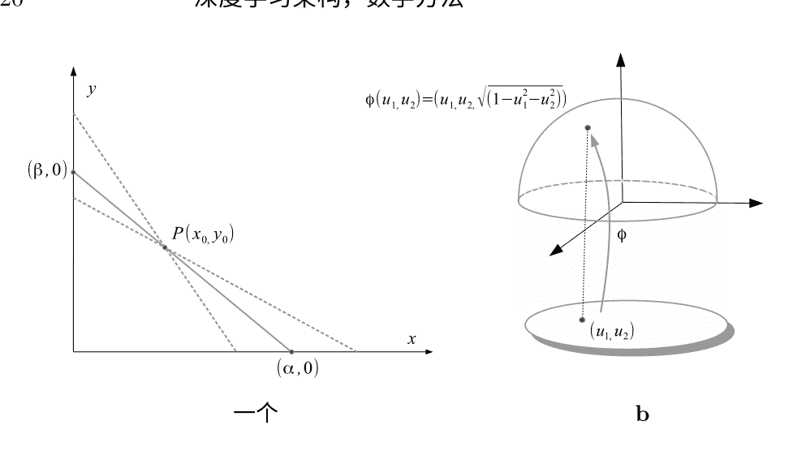

图13.2： a. 通过点 P(x0, y0)和 它们的轴截距的线的流形。 b。上半球。

**例子13.1.5（密度流形）** 考虑所有一维高斯概率密度的集合

$$\mathcal{G} = \{p_{\mu,\sigma}; \mu \in \mathbb{R}, \sigma > 0\},$$

其中 $p_{\mu,\sigma}(x) = \frac{1}{\sqrt{2\pi}\sigma} e^{-\frac{(x-\mu)^2}{2\sigma^2}}$。 集合 $\mathcal{G}$ 成为一个二维流形，由 $\mu$ 和 $\sigma$ 参数化。

下一个例子对于本书的主题具有特殊意义。

**例子13.1.6（S型神经元流形）** 考虑具有 $n$维输入 $\mathbf{x} \in \mathbb{R}^n$和一维输出 $y = \sigma( \mathbf{w}^T \mathbf{x} + b)$的S型神经元，其中 $\mathbf{w} \in \mathbb{R}^n$和 $b \in \mathbb{R}$是神经元的权重和偏置。我们取 $\sigma$为逻辑函数。然后输出的集合

$$\mathcal{S} = \{\sigma(\mathbf{w}^T \mathbf{x} + b); \mathbf{w} \in \mathbb{R}^n, b \in \mathbb{R}\}$$

可以被视为一个 $(n+1)$维流形，由 $\mathbf{w}$和 $b$参数化。

接下来，我们将通过展示 $y = y(\mathbf{w}, b)$的雅可比矩阵的列线性独立来验证正则化条件。

利用逻辑函数的性质，我们有

$$\frac{\partial y}{\partial b} = \sigma'(\mathbf{w}^T \mathbf{x} + b) = y(1 - y)$$

$$\frac{\partial y}{\partial w_j} = \sigma'(\mathbf{w}^T \mathbf{x} + b)x_j = y(1 - y)x_j,$$

其中 $\mathbf{x}^T = (x_1, \ldots, x_n)$ and $w^T = (w_1, \ldots, w_n)$。 考虑输出函数的消失线性组合

$$\alpha_0 \frac{\partial y}{\partial b} + \sum_{j=1}^n \alpha_j \frac{\partial y}{\partial w_j} = 0, \quad \alpha_k \in \mathbb{R}.$$

由于 $y(1-y) = 0$，前面的关系变为

$$\alpha_0 + \sum_{j=1}^n \alpha_j x_j = 0.$$

由于这个关系对于任意的 $x_j \in \mathbb{R}$都成立，所以 $\alpha_0 = \alpha_1 = \cdots = \alpha_n = 0$。 (为了证明这一点，我们选择所有的 $x_j = 0$，得到 $\alpha_0 = 0$；然后取 $x_j = \delta_{jk}$ 得到 $\alpha_k = 0$) 。因此

$$\left\{ \frac{\partial y}{\partial b}, \frac{\partial y}{\partial w_1}, \ldots, \frac{\partial y}{\partial w_n} \right\}$$

线性无关。这意味着雅可比矩阵 $J_y$的秩为 $n+1$。我们可以将可微流形 $S$ 想象为在 $\mathbb{R}_n$的无限维函数空间中的 $(n+1)$ 维光滑曲面（没有拐角或尖点）。

现在假设神经元被训练成近似连续目标函数 $z = z(\mathbf{x})$。如果 $z$是流形上的一个点，$z \in S$，那么存在一些参数值，$w^* \in \mathbb{R}^n$和 $b^* \in \mathbb{R}$，使得我们有精确的表示 $y(w^*, b^*) = z$。然而，一般来说大多数目标函数不满足条件 $z \notin S$。在这种情况下，我们需要通过训练找到这些值。

$$(w^*, b^*) = \arg \min \operatorname{dist}(z, S),$$

这些对应于 $z$在表面 $S$上的正交投影的坐标。距离可以用均方差的方式来衡量。

从初始化点 $(w_0, b_0)$开始，学习算法应该产生一系列逼近点 $(w_n, b_n)_n$，这些点收敛到投影坐标，即 $\lim_{n \to \infty} (w_n, b_n) = (w^*, b^*)$。如果参数更新是连续进行的（通过无穷小的学习率隐含），那么我们得到一条曲线 $c(t) = (w(t), b(t))$，连接 $(w_0, b_0)$和 $(w^*, b^*)$。这可以提升到流形 $S$上的曲线 $\gamma(t) = y \circ c(t)$。最快的学习算法对应于 $y(w_0, b_0)$和 $y(w^*, b^*)$之间的“最短”曲线。“最短”属性取决于流形 $S$的内在几何特性，这个主题将在下一节中讨论。

本章将从这个例子扩展到神经网络的一般情况。

### 13.1.1 内在和外在

流形可以从两个不同的角度来看待：内在和外在。

内在的观点是流形上的一个局部观察者的视角。观察者的知识限于一个局部坐标系。因此，在流形上测量的距离、切向量、它们的大小和夹角都属于流形的内在几何。可以将这个观点想象为一只蚂蚁的视角，它生活在流形上，但无法获得外部信息。

外在的观点代表了一个观察者从外部看流形所获得的知识。几何概念，如法向量和流形形状，是外在的。这可以被看作是卫星的视角，它可以从外部观察到流形。

接下来，我们将介绍微分几何在可微流形上的一些内在和外在概念。

### 13.1.2 切空间

如果流形M具有局部参数化φ: U → M，其中U ⊂ R^n是开集，则切于第k个坐标曲线的向量
```
$$h \rightarrow \phi(x_1, \ldots, x_k + h, \ldots, x_n)$$
```
由给定
```
$$T_k(p) = \frac{\partial \phi}{\partial x_k}(p), \quad p = \phi(x).$$
```
如果流形满足正则条件，即φ在p处具有最大秩的雅可比矩阵，则切向量{T_1(p), ..., T_n(p)}线性无关的。 它们构成了一个维度为 $n$ 的线性空间，称为 $\mathcal{M}$ 在点 $p$ 处的切空间 $T_p \mathcal{M}$，参见图13.3。

如果 $c(t)$ 是流形 $\mathcal{M}$ 上的曲线，在局部参数化中， $c(t)$ 沿着曲线的速度是流形上的切向量，即
```
$$\dot{c}(t) = \sum_{k=1}^{n} \dot{c}^{k}(t) T_{k}(c(t))$$
```
切向量场 $U$ 是在每个点 $p \in \mathcal{M}$ 上分配一个切向量 $U_p \in T_p \mathcal{M}$ 的平滑映射。 在局部坐标中，这可以写作 $U p = \sum_{k=1}^{n} U^{k}(p) T_{k}(p)$。

### 13.1.3 黎曼度量

流形上的主要内在概念是黎曼度量。 这在局部坐标系中由一个对称的、正定的、非退化的矩阵 $(g_{ij})_{i,j}$ 表示，该矩阵是点相关的。 它的元素表示在流形上测量相邻点之间距离的权重，类似于勾股定理的过程。 因此，如果 $P$ 和 $P'$ 是流形上的两个相邻点，它们的坐标分别为 $(x_i)$ 和 $(x'_i)$ ，则它们之间的距离可以用黎曼度量来衡量，即
```
$$d(P, P') = \left( \sum_{i,j=1}^{n} g_{ij} (\Delta x)_i (\Delta x)_j \right)^{1/2}$$
```
在欧几里德空间 $\mathbb{R}^n$ 的特殊情况下，当坐标是正交的时候，度量矩阵变为单位矩阵， $g_{ij} = \delta_{ij}$。 现在距离是通过常规的勾股定理来衡量的。
```
$$d(P, P') = \left( \sum_{i=1}^{n} (\Delta x)_i^2 \right)^{1/2}$$
```
通过类似的过程，我们可以测量与流形相切的向量 $v$ 的大小
```
$$\| v \|_g = \left( \sum_{i,j=1}^{n} g_{ij} v^i v^j \right)^{1/2}$$
```
其中 $v^j$ 表示向量在局部坐标系中的第 $j$ 个分量。 如果 $g$ 是在基 $\{T_1, \ldots, T_n\}$ 在 $T_p \mathcal{M}$ 上定义的双线性形式，满足 $g(T_i, T_j) = g_{ij}$，则上述公式可以写成
```
$$\| v \|_g = g(v, v)^{1/2}$$
```
系数 $g_{ij}$在历史上被称为第一基本形式 $g$的系数。
```
$$\|v\|=\left(\sum_{i, j=1}^{n}\left(v^{i}\right)^{2}\right)^{1 / 2}=\langle v, v\rangle^{1 / 2}.$$
```
现在假设 $c(t)$ 是位于流形上并由变量 $t$参数化的曲线，其速度向量 $\dot{c}(t)$ 是流形上的切向量，其大小由以下公式给出：
```
$$\|\dot{c}(t)\|_{g}=\left(\sum_{i, j=1}^{n} g_{i j}(c(t)) \dot{c}(t)^{i} \dot{c}(t)^{j}\right)^{1 / 2}=g(c(t), \dot{c}(t))^{1 / 2}.$$
```
对速度 $\|\dot{c}(t)\|$ 进行时间 $t$积分，我们得到了相对于黎曼度量的曲线长度。
```
$$L(c)=\int_{a}^{b}\|\dot{c}(t)\|_{g} d t,$$
```
在流形 $\mathcal{M}$上，两点 $A$和 $B$之间的黎曼距离定义为连接这些点的最短曲线的长度
```
$$\inf _{c}\{L(c) ; c:[a, b] \rightarrow \mathcal{M}, c(a)=A, c(b)=B\}.$$
```
这对 $(\mathcal{M}, g)$ 被称为黎曼流形。本章将描述使用黎曼流形的神经网络。

### 13.1.4 测地线

另一个内在的概念是测地线的概念。这是在给定点之间的流形上的最短曲线。如果这些点足够接近，它们之间总是存在一条测地线，并且这是唯一的。在局部坐标下，测地线 $c(t)$ 可以用一组非线性方程描述，如 $\ddot{c}^{k}(t) +$
```
$$\sum_{i, j} \Gamma_{i j}^{k} \dot{c}^{i}(t) \dot{c}^{j}(t)=0, \quad 1 \leq k \leq n, \tag{13.1.1}$$
```
其中 $\Gamma^{k} i_{j}=\Gamma_{i j}^{k}(c(t))$ 是第二类Christoffel符号，参见[85]$\Gamma_{i j}^{k}=$
```
$$\frac{1}{2} g^{k r}\left(\frac{\partial g_{i r}}{\partial x_{j}}+\frac{\partial g_{j r}}{\partial x_{i}}-\frac{\partial g_{i j}}{\partial x_{r}}\right), \tag{13.1.2}$$
```
其中 $(x_{1}, \ldots, x_{n})$ 表示流形上的局部坐标。由于它们依赖于度量系数 $g_{ij}$，Christoffel符号是内在的，因此测地线也是内在的。下面给出两个简单的例子。

- 1. 在欧几里得空间 $(\mathbb{R}^n, \delta_{ij})$ 中，度量系数的导数$\delta_{ij}$为零，测地线方程变为$\ddot{c}^k(t) = 0$。这意味着测地线是直线。
- 2. 对于二维球体 $\mathbb{S}^2$，测地线是大圆弧。测地线方程在此处更加复杂，读者可以参考一本微分几何的书籍。

测地线的显式计算只能在很少几种特定流形上进行，这是一个相对复杂的过程。

### 13.1.5 利维-奇维塔联络

我们将从欧几里得空间的情况开始。设 $f$ 是 $\mathbb{R}^n$ 上的可微函数，$v$ 是一个向量。关于 $v$ 的 $f$ 的方向导数定义为 $v(f) = \langle v, \nabla f \rangle$，其中 $(\nabla f)^T = (\partial_{x_1} f, \dots, \partial_{x_n} f)$ 表示 $f$ 在 $v$方向上的变化率。

令 $U = (U^1, \dots, U^n) = \sum_{i=1}^n U^i e_i$ 是 $\mathbb{R}^n$ 上的向量场。对于向量 $v$，$U$ 的导数定义为
$\nabla_v U = (v(U^1), \dots, v(U^n)) = \sum_{i=1}^n v(U^i) e_i. \tag{13.1.3}$

现在，令 $V = ( V^1, \dots, V^n)$ 是另一个 $\mathbb{R}^n$ 上的向量场。我们定义 $U$ 相对于 $V$ 的协变导数为
$(\nabla_V U)_p = \nabla_v U,$
其中 $v = V_p$，右侧的项如(13.1.3)中所定义。我们注意到 $\nabla_V U$ 是 $\mathbb{R}^n$ 上的向量场，它将每个点 $p \in \mathbb{R}^n$ 关联到向量 $(\nabla_V U)_p$。

很容易证明对于任意可微函数 $f$ 在 $\mathbb{R}^n$ 上和任意向量场 $U$、$V$ 和 $W$ 在 $\mathbb{R}^n$ 上，以下性质成立：

- $(i) \nabla_{fU} V = f \nabla_U V,$
- $(ii) \nabla_U (V + W) = \nabla_U V + \nabla_U W,$
- $(iii) \nabla_U (f V) = U(f) V + f \nabla_U V.$

下一个性质提供了导数和内积之间的兼容性，它是乘积法则的结果：

- $(iv) W \langle U, V \rangle = \langle \nabla_W U, V \rangle + \langle U, \nabla_W V \rangle,$
协变微分的非交换性由公式给出
$(v) \nabla_U V - \nabla_V U = [U, V],$
其中 $[U, V] = UV - VU$ 是向量场 $U$ 和 $V$ 的对易子。通过直接计算可以证明，对易子始终是一个向量场，其分量由以下给出
```
$$[U, V]^i = U(V^i) - V(U^i) = \sum_{j=1}^{n} \left( e_j(V^i)U^j - e_j(U^i)V^j \right)$$
```
现在考虑一个黎曼流形 $(M, g)$。流形 $M$ 上的线性连接, $\nabla$, 是作用于 $M$ 的向量场的运算符，满足前述的性质 $(i)-(iii)$。一个流形上有许多线性连接。它们与黎曼结构 $g$ 无关。然而，只有一个线性连接也满足性质 $(iv)$ 和 $(v)$。

### 定理13.1.7：在黎曼流形 $(M, g)$ 上存在唯一的线性连接，使得
```
$$W g(U, V) = g(\nabla_W U, V) + g(U, \nabla_W V),$$
$$\nabla_U V - \nabla_V U = [U, V],$$
```
对于所有的向量场 $U$, $V$, $W$ 在 $M$ 上。

这被称为黎曼流形 $(M, g)$ 上的 Levi-Civita 连接。由于度量 $g$ 唯一地确定了这个连接，Levi-Civita 连接是一个内在的概念。关于这个连接的存在性和唯一性的证明，读者可以参考书籍[22]的第7章。

值得注意的是，Levi-Civita 连接是一个内在的概念，因为它通过 Christoffel 符号 (13.1.2) 依赖于度量系数 $g_{ij}$。
```
$$\nabla_{T_i} T_j = \sum_k \Gamma_{ij}^k T_k,$$
```
其中 $\{T_1, \ldots, T_n\}$ 是切空间的一组基。

### 13.1.6 子流形

设 $M$ 和 $S$ 是两个流形，使得 $S \subset M$ 并且 $S$ 从 $M$ 继承了拓扑和可微结构。那么 $M$ 上的任何黎曼度量 $g$ 都会在 $S$ 上诱导出一个黎曼结构，即
```
$$h(U, V) = g|_S (U, V),$$
```
其中 $U, V$ 是 $S$ 上的向量场，$h = g|_S$ 是 $S$ 上的向量场 $g$ 的限制。那么 $(S, h)$ 成为 $(M, g)$ 的一个黎曼子流形。

设 $\mathcal{M}$ 和 $S$ 的维度分别为 $n$ 和 $m$。对于 $S$ 中的任意点 $p$，切空间 $T_p S$ 是一个维度为 $m$ 的线性子空间。我们可以考虑正交分解
$$T_p\mathcal{M} = T_p S \oplus \mathcal{V}_p \qquad (13.1.4)$$
这意味着对于任意向量 $w \in T_p\mathcal{M}$，存在两个正交向量 $u \in T_p S$ 和 $v \in \mathcal{V}_p$，使得 $w = u + v$。

### 13.1.7 第二基本形式

关于环境流形的子流形的形状由其第二基本形式描述。设 $S$ 是 Riemann 流形 $(\mathcal{M}, g)$ 的子流形，并用 $\nabla$ 表示 $(\mathcal{M}, g)$ 上的 Levi-Civita 连接。对于子流形 $S$ 上的任意两个向量场 $U$ 和 $V$，向量场 $\nabla_U V$ 不一定是 $S$ 上的向量场。一般来说，根据 (13.1.4)，我们有以下正交分解：
$$(\nabla_U V)_p = (\nabla_U V)_p^{\|} + (\nabla_U V)_p^{\perp}, \qquad (13.1.5)$$
关系式 (13.1.5) 称为高斯公式，参见图13.4。

图13.5: 第二基本形式垂直于曲面并描述其形状： a。球体的情况。 b。圆柱面的情况。

可以证明算子 $\nabla = \nabla^{\parallel}$ 是子流形 $(\mathcal{S}, \overline{g})$ 上的李维-奇维塔联络。 子流形 $\mathcal{S}$ 相对于 $\mathcal{M}$ 的第二基本形式被定义为
$$L(U, V) = (\nabla_U V)^{\perp} \qquad (13.1.6)$$
对于任意的$U, V$ 向量场在 $\mathcal{S}$上，参见图13.5。

命题13.1.8 设$U, V, W$是 $\mathcal{S}$上的任意向量场。 第二基本形式满足以下性质：

- (i) $L$ 是对称的， $L(U, V) = L(V, U)$;
- (ii) $L$是双线性的： $L(U+W, V) = L(U, V) + L(W, V)$;
- (iii) $L(f_1U, f_2V) = f_1f_2L(U, V)$ 对于任意的可微函数 $f_1$和$f_2$在 $\mathcal{S}$上。

证明： (i) 使用Levi-Civita连接 $\nabla$和 $\overline{\nabla}$的性质 $L$是对称的
```
$$
\begin{aligned}
L(U, V) - L(V, U) &= \left( \nabla_U V - \overline{\nabla}_U V \right) - \left( \nabla_V U - \overline{\nabla}_V U \right) \\
&= \left( \nabla_U V - \nabla_V U \right) - \left( \overline{\nabla}_U V - \overline{\nabla}_V U \right) \\
&= [U, V] - [U, V] \\
&= 0.
\end{aligned}
$$
```
其他性质可以很容易地验证，留给读者作为练习。

值得注意的是，性质(iii)表明，如果向量场U和V按函数f₁和f₂进行缩放，则第二基本形式按f₁f₂的乘积进行缩放。

### 13.1.8 平均曲率矢量场

设(S, h)是Riemann流形(M, g)的子流形，其中h = g，并将第二基本形式表示为L。对于任意固定点p∈S，我们考虑切空间T_p^S中的向量基{T₁,…,T_m}，并定义L_ij = L(T_i, T_j)，它是S的法向量，对于任意的1 ≤i, j ≤ m，因为L_ij∈ν_p。令h_ij = h(T_i, T_j)为S上的黎曼度量的系数，h^{ij}表示逆矩阵(h_ij)⁻¹的系数。

在p处的平均曲率向量由以下“收缩”定义：
$$H_p = \sum_{i,j} h^{ij}(p)L_ij$$
我们有H_p∈ν_p和映射p → H_p定义了曲面S上的平均曲率向量场，该向量垂直于曲面S的每个点。

如果我们假设初始选择的基是正交的，那么定义会简化一些。如果{E₁,…,E_m}是曲面S上的正交基，则h(E_i, E_j) = δ_{ij}，而在点p处的平均曲率向量变为
$$H_p = \sum_{i,j} \delta_{ij}L(E_i, E_j) = \sum_{i=1}^m L(E_i, E_i).$$
平均曲率向量场是一种外在概念，因为它依赖于第二基本形式。

第二基本形式和平均曲率测量子流形的不同类型的外在曲率。例如，如果第二基本形式为零，即L_ij = 0，则子流形S被称为完全测地线。这意味着S的任何测地线也是M的测地线。为了理解这个概念，读者应该想象一个平面包含在三维空间中的特殊情况：平面上的任何直线也是空间中的直线。这与平面在空间中不弯曲的事实是相容的。

如果平均曲率矢量场为零，H = 0，则S被称为M的最小子流形。几何解释是，S在局部具有最小体积；也就是说，如果流形在局部扰动，它的体积会增加。后面的正则化目的中，第二基本形式和平均曲率的概念将会很有用。

### 13.2 与神经网络的关系

读者可能会问到迄今为止介绍的微分几何概念与神经网络之间的关系是什么。本节简要讨论这种关系，而后面的章节将进行更详细的分析。

给定神经网络的作用是近似一个特定的目标函数 $z$。我们假设 $z$ 是目标流形 $\mathcal{M}$ 的一个元素，例如在$[0,1]$上连续函数的流形。神经网络的输出 $y$ 由网络的权重和偏置 $\theta = (w, b)$参数化。

这样，输出 $y$ 属于一个输出流形 $\mathcal{S}$，被假设为目标流形 $\mathcal{M}$ 的子流形。子流形 $\mathcal{S}$ 的维度等于网络权重和偏置的数量，而在这种情况下 $\mathcal{M}$ 的维度是无限的。$^1$值得注意的是，对于实际应用，目标是一个向量 $z^T = (z_1, \dots, z_n)$，这意味着流形 $\mathcal{M}$ 的维度是 $n$。

通过添加更多神经元和更多参数，可以增加输出流形的维度。维度越大，逼近效果越好。然而，子流形 $\mathcal{S}$ 的形状也在试图避免过拟合中起着决定性的作用。第二基本形式 $L$ 描述了子流形 $\mathcal{S}$ 在 $\mathcal{M}$ 内弯曲的方式。从正则化的角度来看，我们更喜欢弯曲程度尽可能小的子流形 $\mathcal{S}$，这样目标函数 $z$ 在$\mathcal{S}$上的正交投影最终是唯一的，并且可以通过梯度下降方法轻松找到。

作为一个例子，我们将考虑由示例 13.1.6 给出的流形情况。在这种情况下，目标流形可以选择为空间$\mathcal{M} = \mathcal{C}[0,1]$。输出流形
$$ \mathcal{S} = \{\sigma(w^T\mathbf{x} + b); w \in \mathbb{R}^n, b \in \mathbb{R}\} $$
是 $\mathcal{M}$ 的一个 $(n+1)$ 维子流形。在每个点 $y \in \mathcal{S}$ 上，切空间 $T_p\mathcal{S}$ 由函数的线性组合生成。
$$ \{y(1 - y), y(1 - y)x_1, \dots, y(1 - y)x_n\}. $$
子流形 $\mathcal{S}$ 可以看作是一个$(n+1)$维超曲面在实值连续函数空间 $\mathcal{M} = \mathcal{C}([0,1])$ 内。在一个S型神经元的情况下，目标空间 $\mathcal{M}$ 不能很好地近似。

表面 \( S \) 上存在连续函数 \( f \in \mathcal{M} \)，其到表面 \( S \) 的距离可以无限接近。等价地说，使用 \( S \) 来近似 \( \mathcal{M} \) 会导致欠拟合。

然而，增加网络中神经元的数量会导致参数数量增加，从而得到一个更高维度的近似流形 \( S \)。希望对于目标空间中的任意元素 \( f \in \mathcal{M} \)，和任意固定的 \( \epsilon > 0 \)，存在一个产生高维度流形 \( S \) 的网络，使得 \( \text{dist}(f, S) < \epsilon \)，其中距离由

$$ \text{dist}(f, S) = \inf_{s \in S} \max_{\text{输入} \in [0,1]} |f(x) - s(x)|. $$

通过增加更多的神经元，可以明显增加 \( S \) 的维度。然而，在实践中，神经元的供应可能是有限的，这导致了在保持神经元数量恒定的情况下最大化 \( S \) 维度的问题。我们将在下一节中处理这个问题。

## 13.3 参数空间

假设我们提供了一个固定数量的计算单元 \( N \)，并且我们需要使用这些单元作为隐藏神经元构建一个前馈神经网络，使得网络具有最大的容量，即具有最大的逼近目标函数的能力。具体而言，我们将寻找仅考虑 \( N \) 个隐藏神经元并产生输出流形 \( S \) 最大维度的网络架构。当网络参数的数量最大化时，这就实现了。

我们将从一个例子开始。假设我们提供了 \( N=10 \) 个隐藏神经元，并考虑以下三种前馈网络架构，从浅到深排序：

- (i) 只有一个隐藏层，该层有 \( N=10 \) 个隐藏神经元；
- (ii) 2个隐藏层，每层有5个隐藏神经元；
- (iii) 5个隐藏层，每层有2个隐藏神经元。

为了简单起见，我们假设输入和输出都是一维的。

(i) 给定的网络有30个参数：10个权重 \( w_j \) （从输入到隐藏层）；10个偏置 \( b_j \) （每个隐藏神经元一个）；10个权重 \( \alpha_j \) （从隐藏层到输出）。参见图13.6。

(ii) 给定的网络有45个参数：5个权重 \( w_j \) （从输入到第一个隐藏层）； \( 5^2 \) 个权重 \( w_{ij}^{(1)} \) （从第一个到第二个隐藏层）；5个权重 \( \alpha_j \) （从第二个隐藏层到输出）；10个偏置 \( b_j \) （每个隐藏层的每个神经元一个）。参见图13.7 a。

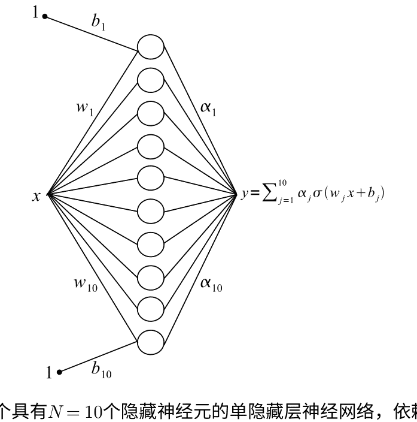

图13.6：一个具有$N=10$个隐藏神经元的单隐藏层神经网络，依赖于30个参数。

由(iii)给出的网络有30个参数：2个权重$w_j$（从输入到第一个隐藏层）；16个中间权重（每两个隐藏层之间有4个）；2个权重$\alpha_j$（从最后一个隐藏层到输出）；10个偏置$b_j$。图13.7显示了该网络。

我们得出结论，在情况(ii)下达到了最大参数数量，这既不是最浅的，也不是最深的神经网络。我们将证明这是一般前馈神经网络架构的典型行为。

现在我们考虑一个具有$L-1$个隐藏层的神经网络（层$0$和层$L$分别保留为输入和输出层）。通常，我们用$d^{(\ell)}$表示第$\ell$层的神经元数量。出于简单起见，我们选择$d^{(0)}=d^{(L)}=1$。由于隐藏神经元的数量等于$N$，我们有

$$\sum_{\ell=1}^{L-1} d^{(\ell)} = N. \qquad (13.3.7)$$

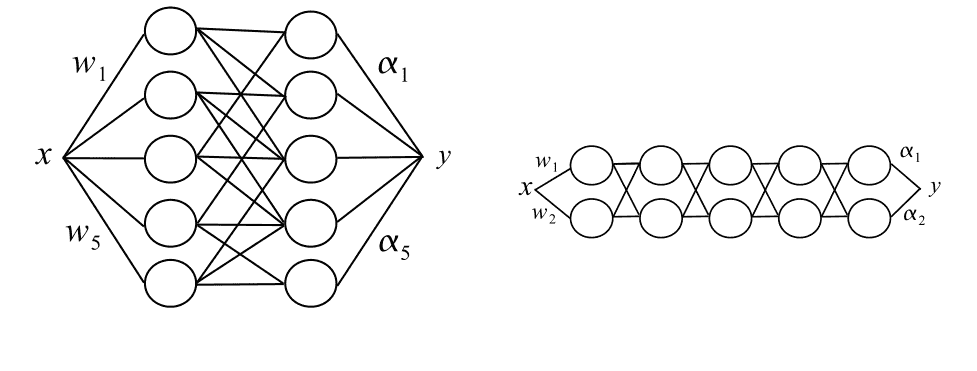

层 $\ell-1$ 和层 $\ell$ 之间的权重数量 $w_{ij}^{(\ell)}$ 是 $d^{(\ell-1)}d^{(\ell)}$。总的偏置数量等于 $N$，每个隐藏神经元一个。 然后，包括权重和偏置在内的总参数数量为

$$d^{(0)}d^{(1)} + d^{(1)}d^{(2)} + \dots + d^{(\ell-1)}d^{(\ell)} + \dots + d^{(L-1)}d^{(L)} + N.\qquad (13.3.8)$$

现在可以等价地将寻找最大容量的前馈神经网络问题表述为：

对于每个隐藏层，满足$1 \le \ell \le L-1$的条件下，层数 $L$ 和神经元数量 $d^{(\ell)}$ 是多少，使得表达式 (13.3.8) 达到最大值，给定约束条件 (13.3.7)？

这个问题具有以下几何意义。 每个乘积项 $d^{(\ell-1)}d^{(\ell)}$ 被解释为一个矩形的面积。 然后，从一个尺寸为 $d^{(0)} \times d^{(1)}$ 的矩形开始，我们按照图13.8的方式继续构造一个尺寸为 $d^{(1)} \times d^{(2)}$ 的矩形。偶数边垂直显示，奇数边水平显示。整个图形可以嵌入到一个宽度等于 $d^{(1)} + d^{(3)} + \dots$ 的矩形 $\mathcal{R}$ 中，高度由 $d^{(0)} + d^{(2)} + \dots$ 给出。约束条件(13.3.7)在几何上等价于矩形 $\mathcal{R}$ 的尺寸（即宽度和高度）之和恒定，等于 $N$。目标是在给定上述约束条件下，最大化矩形面积的总和。

一种近似的方法是先最大化矩形 $\mathcal{R}$ 的面积。 当宽度等于高度时，即成为一个正方形，这种情况会发生。 然后我们尝试使用矩形填满整个正方形 $\mathcal{R}$。

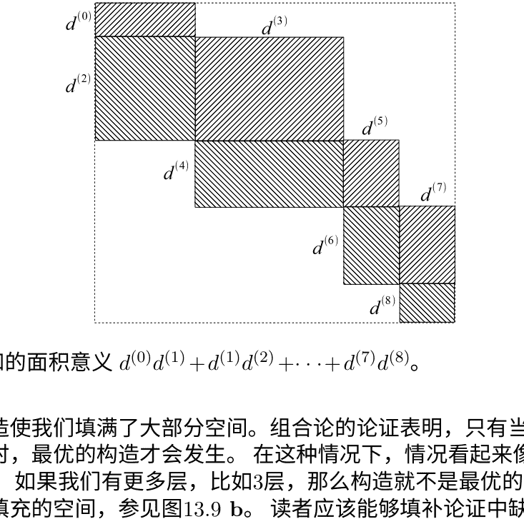

图13.8：和的面积意义 $d^{(0)}d^{(1)}+d^{(1)}d^{(2)}+\cdots+d^{(7)}d^{(8)}$。

先前的构造使我们填满了大部分空间。组合论的论证表明，只有当我们有两个隐藏层时，最优的构造才会发生。 在这种情况下，情况看起来像图13.9 a中的情况。 如果我们有更多层，比如3层，那么构造就不是最优的，因为还有更多未填充的空间，参见图13.9 b。 读者应该能够填补论证中缺失的细节。

如果我们从一开始就假设问题有一个精确的数学解决方案

$$d^{(1)} = d^{(2)} = \dots = d^{(L-1)},$$

也就是说，当每个隐藏层具有相同数量的神经元时。 为了简单起见，让 $k = L - 1$ 表示网络中隐藏层的数量，因此每个隐藏层有 $N/k$ 个神经元。 那么根据(13.3.8)给出的权重数量为

$$f_N(k) = \frac{N}{k} + (k - 1)\left(\frac{N}{k}\right)^2 + \frac{N}{k} + N.$$

这将根据以下内容对 $k$ 进行优化。 我们首先通过将表达式重新写成 $1/k$ 的形式来开始

$$f_N(k) = \frac{2N}{k} + N^2 \frac{k-1}{k^2} + N = \frac{N}{k}\left(2 + N - N\frac{1}{k}\right) + N.$$

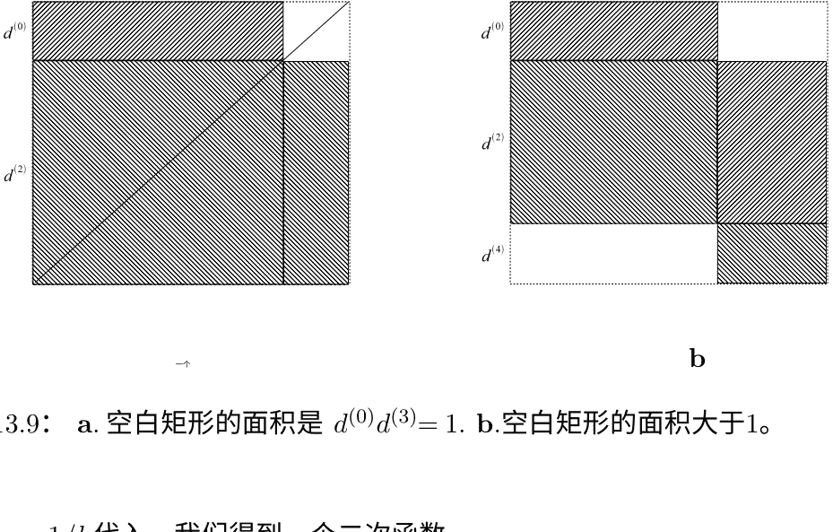

将 $u=1/k$ 代入，我们得到一个关于 $u$ 的二次函数

$$
\phi_N(u) = N u \left( 2 + N - N u \right) + N = -N^2 u^2 + N(N + 2)u + N.
$$

函数 $\phi_N(u)$ 的最大值在

$$
u = \frac{N(N+2)}{2N^2} 时达到 = \frac{N+2}{2N} .
$$

这对应于隐藏层的数量为

$$
k = \frac{2N}{N+2} .
$$

即使这个数量不总是整数，对于大量的神经元 $N$，最优隐藏层数量可以很好地近似为 $k=2$。这解释了当 $N=10$ 时，拥有两个隐藏层的网络，每个隐藏层有5个神经元，可以达到最大容量的原因。

理论上参数的最大数量由 $f_N$ 给出 ($\frac{2N}{N+2}$)。实际上，这等于该值

$$
f_N(2) = \frac{N^2}{4} + 2N. \tag{13.3.9}
$$

因此，输出流形的最大维度 $S$ 在隐藏神经元的数量 $N$ 上呈二次增长。我们将在下面展示，这有时可能导致数据过拟合。

前面的公式是在满足网络的特殊情况下发展出来的 $d^{(0)} = d^{(L)} = 1$。对于一般情况，请参见练习13.8.2。

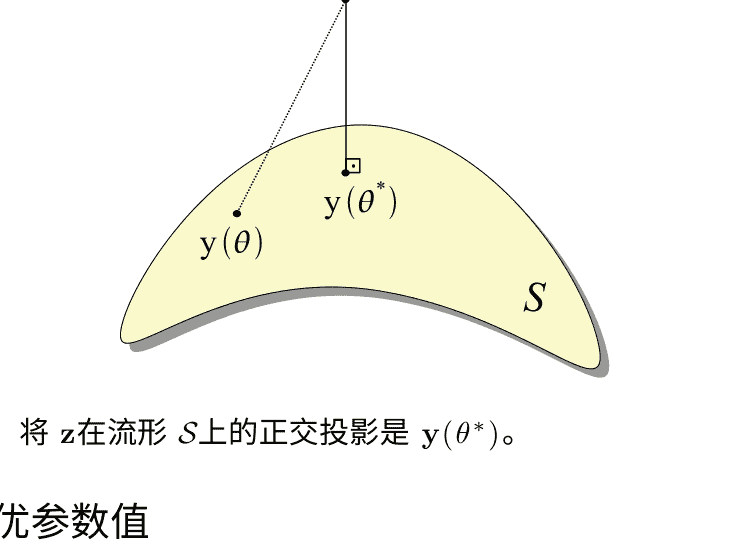

## 13.4 最优参数值

考虑训练集 $\{(x_1, z_1), (x_2, z_2), \ldots, (x_n, z_n)\}$，并且让 $y_i$ 是与一维输入 $x_i$ 对应的网络的一维输出，其中 $1 \le i \le n$。然后 $y_i = y_i(\theta)$，其中 $\theta \in \mathbb{R}^r$ 是网络的参数向量。因此，向量 $\mathbf{y}^T = (y_1, \ldots, y_n) \in \mathbb{R}^n$ 由 $\theta$ 参数化，并且描述了一个维度为 $r$ 的流形 $S$ 在 $\mathbb{R}^n$ 中。实际上，输出流形 $S$ 是 $\mathbb{R}^n$ 中的一个 $r$ 维曲面。训练网络等价于找到一个精确或近似的 $\theta^*$ 值，使得从 $\mathbf{z}^T = (z_1, \ldots, z_n)$ 到 $S$ 的距离最小，即

$$\theta^* = \arg \min_{\theta} \text{dist}(\mathbf{z}, S) = \arg \min_{\theta} \|\mathbf{z} - \mathbf{y}(\theta)\|,$$

其中距离以欧几里得方式测量。这等价于 $\mathbf{y}(\theta^*)$ 是 $\mathbf{z}$ 在 $S$ 上的正交投影，见图13.10。

如果网络有两个隐藏层，则前面的分析提供了 $r = \frac{N^2}{4} + 2N$，其中 $N$ 是隐藏神经元的数量。如果 $N$ 满足 $\frac{N^2}{4} + 2N \ge n$，则网络会过拟合，因为它会记住整个训练集。我们将填充一些数学细节来说明这一事实。

假设我们只有等式， $\frac{N^2}{4} + 2N = n$。那么子流形 $S$ 的维度与目标空间 $\mathbb{R}^n$ 相同，因此它要么是整个空间，要么是其子集。因此，我们可以选择参数 $\theta$ 使得点 $\mathbf{z}$ 属于流形 $S$，这意味着前面提到的距离等于零。下面给出了这一推论的细节。

## 方程组

$$
\begin{aligned}
y_1(\theta) &= z_1 \\
&\cdots \\
y_n(\theta) &= z_n
\end{aligned}
$$

有 $n$个未知数， $\theta= (\theta_1, \ldots, \theta_r)$。 我们可以假设系统可逆，前提是正则性假设

$$
\det \left( \frac{\partial y_j}{\partial \theta_i} \right) \neq 0,
$$

几何上对应于在每个点上输出流形 $S$有一个切平面（流形上没有角点或刺）。然后系统有唯一解， $\theta^* = \theta^*(\mathbf{y}, \mathbf{z})$。这表明 $\mathbf{z}$是流形 $S$上的一个点，具有相应的参数 $\theta^*$。

我们注意到不等式 $\frac{N^2}{4} + 2N > n$ 不能成立，因为这意味着子流形的维数大于空间本身。换句话说，这意味着上述系统的未知数$\theta$的数量大于方程的数量$n$。这将意味着权重和偏置不能独立，这对于神经网络来说是一个矛盾的陈述。

例子13.4.1 我们将提供一个应用于MNIST数据集的例子，该数据集包含55,000个训练数据$\{ (\mathbf{x}_i, \mathbf{z}_i) \}$。与先前的理论相比，这里有一些不同之处，因为每个输入数据$\mathbf{x}_i$是784维的（每个28×28像素的图像被展平为一个784维向量），而每个输出$\mathbf{z}_i$是10维的（有10个数字类别）。在计算输出流形的维度时，应考虑这些修改。在接下来的内容中，我们将采用$N=500$个神经元，并考虑以下前馈神经网络架构：

- (i) 784-500-10：1隐藏层网络， $N= 500$个神经元；
- (ii) 784-250-250-10：2隐藏层网络，每层250个神经元；
- (iii) 784-50-50-$\cdots$-50-10：10隐藏层网络，每层50个神经元；

在这个例子中，我们有 $d^{(L)} = 10$，因为每个目标向量， $\mathbf{z}_i$，是10维的。由于有55,000个目标，这导致了一个维度为55,000$\times$10 = 550,000的空间。因此，输出流形 $S$是数值空间 $\mathbb{R}^{550,000}$的子流形。接下来，我们将讨论上述架构的输出流形的维度。

在(i)情况下，输出流形 $S$的维度是

$$
r = 784 \times 500 + 500 \times 10 + 500 = 397,500
$$

由于从输入到隐藏层有784个权重，500个偏置，以及从隐藏层到输出的$500 \times 10$个权重。在这种情况下，准确率约为97.2\%，测试误差约为1.49。小的测试误差表明网络的最优性（既不过拟合也不欠拟合）。

在情况（ii）中，输出流形的维度为

$$r = 784 \times 250 + 250 \times 250 + 250 \times 10 + 500 = 261,500,$$

这大约是目标空间维度的一半。在这种情况下，网络的准确率为96.5\%，低于之前的网络。而测试误差，即565，比之前的情况要大。

在情况（iii）中，流形的维度是

$$r = 784 \times 50 + 9 \times 50 \times 50 + 500 + 500 = 62,700,$$

这个值大约是目标空间维度的17倍小。这导致数据欠拟合，测试误差为1,027。在这种情况下，准确率只有94.5\%。我们注意到随着网络变得更深，准确率下降。

这些计算使用了4,000次迭代，批量大小为40。我们采用了Adam优化算法，随着接近最优点，学习步骤逐渐减小。使用的成本函数是平方误差的总和。

学习与信息 还有一种描述最优参数的方式，使用信息场的概念。考虑一个具有输入 $X$ 和输出 $Y$ 的两层神经网络，激活函数 $\phi$ 逐渐增加。输出与输入之间存在关系

$$Y = \phi(W^{T} X + B).$$

由于 $\phi$ 是可逆的，那么 $W^{T} X + B = \phi^{-1}(Y)$，根据命题 D.5.1，我们有 $\mathfrak{S}(Y) = \mathfrak{S}(W^{T} X + B)$。由于添加常数不改变信息域，参见练习 11.10.1，我们有 $\mathfrak{S}(Y) = \mathfrak{S}(W^{T} X)$。因此，输出信息 $\mathcal{E} = \mathfrak{S}(Y)$ 不依赖于偏置 $B$，但依赖于权重系统 $W$。由于 $(W, B)$ 是关联输出流形上的坐标，我们可以将每个点与该流形上的参数相关的 sigma-field $\mathcal{E} = \mathcal{E}_{W,B}$。信息在坐标 $B$ 的方向上被保留，即沿着切片 $\{W= \text{constant}\}$ 保持不变。

对于一个三层神经网络，输入为 $X$，输出为 $\tilde{Y}$，输出与输入之间存在关系

$$\tilde{Y} = \phi\left(W^{(2)^{T}} \phi(W^{T} X + B) + B^{(2)}\right).$$

与之前的计算类似，我们可以证明输出信息为

$$\tilde{\mathcal{E}} = \mathcal{S}(\tilde{Y}) = \mathcal{S}(W^{(2)^T} \phi(W^T X + B))$$

这取决于权重 $W$，$W^{(2)}$和第一层的偏置项 $B$，但与最后一层的偏置项 $B^{(2)}$无关。

一般来说，任何前馈神经网络的输出流形都可以具有信息结构。流形上的每个点都由一些权重和偏置项参数化，我们将其与一个信息场相关联。

如果 $\mathcal{E}_{W,B}$ 和 $\mathcal{Z}$ 表示输入、输出和目标信息字段，我们假设双重包含成立

$$\mathcal{E}_{W,B} \subset \mathcal{Z} \subset \mathcal{I}.$$

给定信息 $\mathcal{E}_{W,B}$，那么目标变量 $Z$，最好通过条件期望 $\mathbb{E}[Z|\mathcal{E}_{W,B}]$来近似。最优权重由以下给出

$$(W^*, B^*) = \arg \min_{W,B} \| Z - \mathbb{E}[Z|\mathcal{E}_{W,B}] \|_{L^2}.$$

对应于权重$(W^*, B^*)$的网络输出是目标 $Z$在信息意义上的最佳逼近器。

接下来我们将指出确切的学习情况。现在假设对于一些参数$(W, B)$，我们有

$$\mathcal{Z} \subset \mathcal{E}_{W,B} \subset \mathcal{I}.$$

那么任何目标变量 $Z$，即 $\mathcal{Z}$可测的随机变量，也是 $\mathcal{E}_{W,B}$-可测，情况下 $Z = \mathbb{E}[Z|\mathcal{E}_{W,B}]$. 这对应于精确学习，因为 $Z$完全由网络的输出信息确定。

## 13.5 度量结构

我们已经看到隐藏神经元的数量， $N$，决定了输出流形的维度 $S$。在存在两个隐藏层的情况下，这是具有最大维度的情况。然而，如果 $r$小于最大值，可能会有几个具有相同维度 $r$的流形，这些流形与不同的前馈网络架构相关联。

例如，在图13.11中表示的编码器和解码器网络 a，b依赖于相同数量的参数，并且具有相同数量的隐藏神经元。然而，它们的任务非常不同。这可以通过网络的架构来解释（这里指的是序列）图13.11: 两个对称网络，依赖于相同数量的参数: a.一个编码器。 b.一个解码器。 参数数量为59; 有14个偏差（每个神经元一个）和45个权重。

数字 d(ℓ) 在流形 S上产生不同的度量效果。流形 S的几何形状取决于网络输出 y对权重和偏差的敏感性。因此，输出对于位于接近输入的第一层的权重不太敏感，而对于位于接近输出的最后一层的权重更敏感。

我们可以说神经网络与逼近流形 S相关联，训练网络意味着找到目标点 z到流形 S的最小距离。 因此，流形 S的几何属性，如形状、度量结构等，在神经网络的研究中起着重要作用。

度量结构：我们需要赋予S一个黎曼度量，用于测量S上的点之间的距离和S上切向量之间的角度。

由于S是R^n的维度为r的子流形，自然地可以从R^n的欧几里德结构中赋予S一个自然度量。 如果θ_i表示网络的参数（权重或偏置），那么基本切向量场对于S来说是关于θ_i的偏导数。

$$\xi_{i} = \frac{\partial \mathbf{y}}{\partial \theta_{i}} = \left( \frac{\partial y_{1}}{\partial \theta_{i}}, \ldots, \frac{\partial y_{n}}{\partial \theta_{i}} \right), \quad 1 \leq i \leq r.$$

在点y处，S的切空间是线性空间由该点处所有基本切向量生成。如果S是光滑流形，则T_yS在每个点y∈S上具有恒定的维度r。这个条件可以等价地表述为最大秩条件。

$$ \text{等级} \left( \frac{\partial \mathbf{y}}{\partial \theta_{i}} \right)_{i} = r, $$

它表明基本切向量场是线性独立的。
这个正则条件确保输出流形 $S$ 是光滑的（没有角点、尖点等）。在点 $\mathbf{y}$ 处的 $S$ 的切向量 $v \in T_{\mathbf{y}} S$，由线性组合$v = \sum_{i=1}^{r} v_i \frac{\partial \mathbf{y}}{\partial \theta_i},$ 其中 $v_i = v_i(\theta)$ 是 $v$ 的分量。

流形 $S$ 的自然度量结构由第一基本形式给出，其系数为

$$g_{ij}(\mathbf{y}) = \langle \xi_i, \xi_j \rangle = \left( \frac{\partial \mathbf{y}}{\partial \theta_i} \right)^T \frac{\partial \mathbf{y}}{\partial \theta_j} = \sum_{k=1}^{n} \frac{\partial y_k}{\partial \theta_i} \frac{\partial y_k}{\partial \theta_j}. \qquad (13.5.10)$$

矩阵 $g=(g_{ij})$ 是一个 $r \times r$ 矩阵，可以用来计算切向量的长度、方向之间的角度、$S$ 上的曲线长度、点之间的距离、$S$ 上区域的面积，以及一般上依赖于流形 $S$ 的内在结构的任何数学概念。

我们回顾一下，在微分几何中，内在和外在的概念经常用来指代从局部和全局结构中产生的几何信息 $S$。例如，在 $S$ 上测量两条曲线之间的角度可以使用局部信息来完成，也就是说，可以由流形上的微观居民执行，他们不被允许离开流形。另一方面，网络的训练误差，即从外部目标点 $\mathbf{z}$ 到 $S$ 的距离，是一个外在的概念，因为它取决于流形居民在外部空间中飞行的能力，这使他能够进行测量。

## 向量的长度

考虑一个向量，$v = \sum_{i=1}^{r} v_i \frac{\partial \mathbf{y}}{\partial \theta_i}$，切于流形 $S$。我们将以两种不同的方式测量它的长度：外在地，作为 $\mathbb{R}^n$ 中的向量，和内在地，作为切向量到 $S$。

如果 $\{\mathbf{e}_k; 1 \le k \le n\}$ 表示 $\mathbb{R}^n$ 中的自然正交基，则 $v$ 在 $\mathbb{R}^n$ 中的第 $k$ 个分量为

$$\langle v, \mathbf{e}_k \rangle = v^{\land T} \mathbf{e}_k = \sum_{i=1}^{r} v_i \frac{\partial y_k}{\partial \theta_i}, \qquad 1 \le k \le n,$$

那么 $v$ 的欧几里得长度的平方为

$$\| v \|^2_{Eu} = \sum_{k=1}^{n} \langle v, \mathbf{e}_k \rangle^{\land 2}.$$

同样的长度可以通过以下方式使用标量积 $g_{ij}$ 进行内部计算：

$$\begin{aligned}
\|v\|^2_g &= \sum_{i,j} v_i v_j g_{ij} = \sum_{i,j} v_i v_j \sum_{k=1}^{n} \frac{\partial y_k}{\partial \theta_i} \frac{\partial y_k}{\partial \theta_j} \\
&= \sum_{k=1}^{n} \left( \sum_i v_i \frac{\partial y_k}{\partial \theta_i} \right) \left( \sum_j v_j \frac{\partial y_k}{\partial \theta_j} \right) = \sum_{k=1}^{n} \langle v, e_k \rangle^2 \\
&= \|v\|^2 \text{欧几里得距离}
\end{aligned}$$

我们在两种情况下得到相等的长度是预期的，因为度量 $g_{ij}$ of $\mathcal{S}$是从空间 $\mathbb{R}^n$ 引出的，长度与内在或外在方法无关。

曲线的长度假设神经网络的权重和偏置依赖于额外的参数 $s$。这可以是时间，也可以是网络的某个超参数。然后 $\theta_i = \theta(s)$，$1 \leq i \leq r$，因此 $c(s) = \mathbf{y}(\theta(s))$代表了流形 $\mathcal{S}$上的一条曲线。因此，网络超参数的连续调整对应于流形上的一条曲线。如果 $s$取值在 $a$和 $b$之间，则曲线 $c(s)$的长度由积分定义。

$$L(c) = \int_{a}^{b} \|\dot{c}(s)\|\, ds = \int_{a}^{b} \sqrt{\sum_{i,j} \dot{c}_i(s) \dot{c}_j(s) g_{ij}(c(s))}\, ds,$$

其中 $\dot{c}(s)$ 代表沿曲线的切向量。链式法则提供了

$$\dot{c}(s) = \frac{d}{ds} c(s) = \frac{d}{ds} \mathbf{y}(\theta(s)) = \sum_i \frac{\partial \mathbf{y}}{\partial \theta_i} \frac{d\theta_i}{ds} = \langle \nabla_{\theta} \mathbf{y}, \dot{\theta}(s) \rangle. \quad (13.5.11)$$

测地线有时，我们有兴趣找到在 $\mathcal{S}$上两个给定点之间的最短曲线长度。如果我们寻找 $\mathbb{R}^n$上两点之间的最短曲线，显然是一条直线段。然而，在 $\mathcal{S}$流形的情况下，表征更加复杂，最短距离的曲线是测地线。测地线的一个应用是找到给定初始点 $\mathbf{y}(\theta^0)$ 和最优点 $\mathbf{y}(\theta^*)$ 之间的最短曲线，最优点是目标点 $\mathbf{z}$ 在 $\mathcal{S}$上的正交投影。这条曲线对应于网络的最有效调整，因为参数调整对应于流形上的一条曲线。

值得注意的是，在度量空间$\mathcal{S}$中，两点之间的距离至少与使用目标空间度量测量的相同点之间的距离一样大。这些距离相等

## 图13.12：最佳参数$s^{\star}$对应于曲线$c(s)$上离目标点$z$最近的点。

当$S$是一个测地子流形时，即其第二基本形式为零，$L=0$。

最优参数值假设在以$s$为参数修改$\theta(s)$时，我们首先注意到准确性的提高，然后是准确性的降低。最小误差达到某个最优值$s^{\star}$。几何上，这对应于曲线$c(s)$上离目标点$z$最近的点，参见图13.12。这发生在向量 $zc(s)$与切向量$\dot{c}(s)$垂直，这个事实可以写成

$$(z - c(s))^T \dot{c}(s) = 0.$$

如果参数 $s$被修改，使得速率 $\|\dot{c}(s)\|^2$保持不变，那么对其进行微分并使用乘积法则，得到 $c(h)^T \dot{c}(h) = 0$。因此，前一个方程变为 $z^T \dot{c}(h) = 0$。使用公式 (13.5.11) 意味着最优值 $s^{\star}$满足方程

$$\langle \nabla_{\theta}(z^T y(s^{\star})), \dot{\theta}(s^{\star}) \rangle = 0.$$

## 13.6 正则化

神经网络最理想的特性是能够很好地泛化。这意味着在使用训练集优化网络之后，网络对于其他未见过的测试数据，网络仍应具有较高的准确性。为了实现这个目标，网络应该被构建成不会过度拟合训练数据的模型。

如果我们考虑多项式回归的特殊情况，这种现象更容易解释。考虑平面上的7个点，$(x_i, z_i)$，$1 \le i \le 7$，并使用三种类型的多项式模型进行回归。线性回归不是一个好的模型，导致数据的欠拟合，表现为较大的训练误差，参见图13.13 a。二次模型产生了相对较小的训练误差，是一个很好的拟合。7次插值多项式产生了过拟合，其特点是训练误差为零，而测试误差较大。我们选择适当的回归模型的方法是在选择多项式的次数时要保守，同时多项式的次数应足够大以捕捉数据的主要趋势，而不会过度拟合。

类似的观察适用于一般神经网络的情况。在这种情况下，逼近多项式被输出流形$S$替代，多项式的次数对应于$S$的维度，即网络参数$\theta_i$的数量。在这种情况下，简洁性的原则转化为选择一个维度较小的流形，即具有少量神经元的网络。

问题的设置如下：给定$N$个神经元和一个训练集 $\{(x_i, z_i); 1 \le i \le n\}$，构建一个能够从数据中学习而不过拟合的神经网络。

接下来，我们将介绍一些正则化技术，即在给定神经元数量$N$的情况下，避免或减少数据过拟合的方法。

### 13.6.1 选择较小的维度

由于$N$已知，我们需要决定隐藏层的数量和每层的神经元数量。我们已经看到仅使用两个隐藏层会产生流形$S$的最大维度，因此我们应该避免这种情况。我们应该选择浅层，只有一个隐藏层，或者选择足够多的隐藏层，使得$S$的维度足够小，满足简洁性的原则。

### 13.6.2 规范化

为了减少过拟合，应该使用较小的权重，$w$。代价函数，$C(w, b)$，通过添加一个额外的项来修改，该项涉及权重的规范乘以一个正的拉格朗日乘子，$\lambda$，它描述了对小权重的偏好（较大的$\lambda$对应较小的权重）。

规范化的代价函数变为

$$L(w) = C(w, b) + \lambda \|w\|^2,$$

其中$\|\cdot\|$通常是$L^1$或$L^2$范数。这种类型的规范化在第3.11节中有更详细的讨论。规范化的效果是寻找输出流形上的最优点，该点位于某个邻域内。

### 13.6.3 选择最平坦的流形

我们注意到，对应于流形 $S$ 的固定维度，存在几个神经结构。例如，在图13.11中给出的编码器和解码器结构中可以看到这一点。现在的问题是，从正则化的角度来看，哪种结构更好？

为了减小测试误差，我们应该选择流形 $S$ 尽可能平坦的神经网络。通过“平坦”我们指的是在目标空间 $\mathbb{R}^n$ 中尽可能少弯曲的流形。

平坦性是一个外在的概念，可以通过几何术语来形式化，通过第二基本形式来描述。我们将从几个例子开始。

例子13.6.1 考虑空间 $\mathbb{R}^3$ 中的平面 $\mathcal{P}$。这是平坦的，因为它不弯曲。这相当于观察到平面的法向量是一个常向量场。表面弯曲的方式可以通过法向量改变方向的速率来描述。这被称为表面的形状算子（或Weingarten映射），它与不同类型的曲率有关，参见，例如，[85]。

曲线的弯曲程度。零曲率等价于法向量的零变化率，对应于一条直线段，即直线。

在所有相同维度的流形中，为了避免过拟合，我们需要选择尽可能平坦的流形。第二基本形式 $L$ 描述了流形 $\mathcal{S}$ 在空间 $\mathbb{R}^n$ 内的弯曲程度，如第13.1.7节所述。

我们在目标空间的特定情况下更明确地表达这一点 $\mathcal{M} = \mathbb{R}^n$。对于任意两个向量场 $U = \sum_k U^k e_k$ 和 $V = \sum_k V^k e_k$ 在 $\mathbb{R}^n$ 上，定义了导数 $\nabla$，它定义了 $V$ 相对于 $U$ 的导数

$$\nabla_U V = (D_U V^1, \dots, D_U V^n),$$ 其中 $D_U f$ 表示 $f$ 相对于 $U$ 的方向导数。现在，如果考虑 $U$ 和 $V$ 作为流形 $\mathcal{S}$ 上的切向量场，则 $\nabla_U V$ 可以正交地分解为

$$\nabla_U V = (\nabla_U V)^{\parallel} + (\nabla_U V)^{\perp},$$ 其中 $(\nabla_U V)^{\parallel}$ 是 $\mathcal{S}$ 的切空间 $T_p\mathcal{S}$ 的投影，而 $(\nabla_U V)^{\perp}$ 表示 $\nabla_U V$ 的正交分量。法向分量

$$L(U, V) = (\nabla_U V)^{\perp}$$ 表示 $\mathcal{S}$ 相对于 $\mathbb{R}^n$ 的第二基本形式。映射 $L$ 是对称且线性的，可以写成

$$L(U, V) = \sum_{\alpha,\beta=1}^{r} L_{\alpha\beta} U^{\alpha} V^{\beta},$$ 其中拉丁上标描述了与之相关的依赖关系 基本向量场 $\xi_{\alpha} = \frac{\partial \mathbf{y}(\theta)}{\partial \theta_{\alpha}}$，其中 $U = \sum_{\alpha=1}^{r} U^{\alpha} \xi_{\alpha}$。第二基本形式 $$L_{\alpha\beta} = L(\xi_{\alpha}, \xi_{\beta})$$ 是向量值的，属于法向空间 $N_p\mathcal{S}$，其维度为 $n - k$。如果 $L_{\alpha\beta} = \sum_k L^k_{\alpha\beta}$，那么每个分量 $L^k_{\alpha\beta}$ 形成一个对称的方阵 $r$。

消失 $L$ 形式一个消失的第二基本形式，$L=0$，等价于其系数的消失，$L_{\alpha\beta}=0$。在这种情况下，$\mathcal{S}$ 被称为欧几里德空间 $\mathbb{R}^n$ 的一个测地子流形。等价的特征是在 $S$上的任何局部长度最小化曲线都是在 $\mathbb{R}^n$中的一条直线段。 具有这种性质的流形是 $\mathbb{R}^n$的仿射子空间，参见练习13.8.6。在这种情况下，目标 $\mathbf{z}$在 $S$上的投影是唯一的。

形式 $L$的范数由于 $L$是矢量值的，为了正则化的目的，我们将定义和使用 $L$的范数。 对于 $S$上的任何切向量 $U$在 $\mathbf{y}$处，我们有 $L(U,U)$是 $\mathbb{R}^n$中的一个矢量，并且让 $\|L(U,U)\|_{\text{Eu}}$denote其欧几里德长度。 我们通过以下方式定义 $L$的范数： $$\|L\|=\max\left\{\frac{\|L(U,U)\|_{\text{欧}}}{\|U\|^2};U \text{切于 } S\right\}. \quad (13.6.12)$$ 在这里，$\|U\|$表示 $U$的长度，可以用 $\mathbb{R}^n$或使用度量在 $S$上进行测量。 利用 $L$的缩放性质，参见命题13.1.8，部分（$iii$），这个范数可以等价地写成 $$\|L\|=\max_{\|U\|=1} \left\{\|L(U,U)\|_{\text{欧}}; U\text{切于 } S\right\}.$$ 这个范数与 $L$的特征值有以下关系。 由于对称性，$L^k_{\alpha\beta}=L^k_{\beta\alpha}$，所以矩阵 $L^k$有实特征值。 这个表达式 $$\max_{\|U\|=1} |L^k(U,U)|=|\lambda_k|,$$ 提供 $L^k$的最大特征值的绝对值，见附录G。

因此， $$\|L\| = (\lambda_1^2 + \cdots + \lambda_n^2)^{1/2}.$$ 从几何角度来看，每个 $\lambda_k$表示子流形 $S$在某个法向量方向上的曲率，因此，$\|L\|$表示曲率的外在度量。 通过保持 $\|L\|$较小，所有曲率都保持较小，通过这样我们可以控制 $S$在 $\mathbb{R}^n$内弯曲的程度。 新的代价函数是使用先前的范数对距离的平方进行正则化。

$$C(w, b; \mu) = \frac{1}{2}\|\mathbf{y}(w, b) - \mathbf{z}\|^2 + \mu\|L\|, \quad (13.6.13)$$

其中超参数 $\mu$是拉格朗日乘子。 因此，正则化过程是在两个效果之间进行权衡的结果：训练误差的最小化（从目标 $\mathbf{z}$到 $S$的距离）和流形的平坦度的最大化，参见图13.14。超参数 $\mu$捕捉到这种权衡效果：较大的 $\mu$值对应于更平坦的流形，而较小的 $\mu$值对应于靠近目标 $\mathbf{z}$的流形。

## 例子13.6.1 (多项式回归)

这个例子在输出流形概念的背景下呈现了多项式回归的情况。多项式的阶数为 $r$

$$\psi(x; \theta) = x^r + \theta_1 x^{r-1} + \theta_2 x^{r-2} + \dots + \theta_{r-1} x + \theta_r \qquad (13.6.14)$$

用最小二乘法逼近的方式来近似于具有坐标的 $n$ 个点

$$\mathcal{T} = \{(x_1, z_1), (x_2, z_2), \dots, (x_n, z_n)\}.$$

使用训练集 $\mathcal{T}$, 调整多项式系数 $\theta_i$, 使得平方误差之和最小化。我们假设值 $x_i$ 是不同的, 并且 $r < n$。我们考虑向量 $\mathbf{x} = (x_1, x_2, ..., x_n)$ 和 $\mathbf{z} = (z_1, z_2, ..., z_n)$ 在 $\mathbb{R}^n$ 中。输入向量 $\mathbf{x}$ 和参数向量 $\theta = (\theta_1, ..., \theta_r) \in \mathbb{R}^r$ 用于构建由 $\theta \rightarrow \mathbf{y}(\mathbf{x}; \theta) \in \mathbb{R}^n$ 参数化的流形 $S$, 其中

$$\mathbf{y}(\mathbf{x}; \theta) = (\psi(x_1; \theta), \dots, \psi(x_n; \theta)).$$

由于 $x_i$ 具有不同的值，以下的范德蒙德行列式不会消失

$$\begin{vmatrix} 1 & 1 & \cdots & 1 \\ x_1 & x_2 & \cdots & x_n \\ \vdots & \vdots & \ddots & \vdots \\ x_1^{r-1} & x_2^{r-1} & \cdots & x_n^{r-1} \end{vmatrix} = \prod_{i<j} (x_j - x_i) \neq 0,$$

因此，满足最大秩条件，即秩 $\left( \frac{\partial \mathbf{y}}{\partial \theta} \right) = r.$

因此，向量场 $\{\xi_1, \dots, \xi_r\}$ 张成切空间 $T_y S$，在每个点 $y \in S$。切空间 $S$ 的内在几何由度量张量 $g$ 描述，其分量为

$$g_{ij} = \langle \xi_i, \xi_j \rangle = \sum_{k=1}^n x_k^{r-i} x_k^{r-j} = \sum_{k=1}^n x_k^{2r-(i+j)}, \quad 1 \leq i,j \leq r.$$

重要的是要注意，矩阵系数 $g_{ij}$（因此 $S$ 的内在几何）不依赖于参数 $\theta_k$。（类似的情况发生在带有自然度量 $\delta_{ij}$ 的欧几里得空间 $\mathbb{R}^n$ 上）。这对应于一个内在平坦的子流形 $S$。由于 $\partial g_{ij}/\partial \theta_k = 0$，可知克里斯托费尔符号为零，$\Gamma_{ij}^k = 0$。这意味着子流形 $S$ 的黎曼曲率$^3$为零。特别地，它的Levi-Civita连接在基底 $\{\xi_i\}$ 上为零

$$\nabla_{\xi_i} \xi_j = \sum_k \Gamma_{ij}^k \theta_k = 0$$

因此，第二基本形式只能用$\mathbb{R}^n$的Levi-Civita连接来表示.

$$L(\xi_i, \xi_j) = \nabla_{\xi_i} \xi_j - \nabla_{\xi_i} \xi_j = \nabla_{\xi_i} \xi_j = \sum_{k=1}^n (D_{\xi_i} \xi_j^k) e_k = 0$$

因为 $D_{\xi_i} \xi_j^k = \langle \xi_i, \text{grad} \xi_j^k \rangle = 0$，因为分量 $\xi_j^k = x_k^{r-j}$ 是常数（取决于固定的输入项 $x_k$）。因此，$L=0$，因此子流形 $S$ 也是外在平坦的。成本函数

$$C(\theta; \mu) = \frac{1}{2} \| \mathbf{y}(\mathbf{x}, \theta) - \mathbf{z} \|^2$$

$^3$流形的黎曼曲率由张量描述 $R_{ijk}^l = \partial_{\theta_i} \Gamma_{jk}^l - \partial_{\theta_j} \Gamma_{ik}^l + \Gamma_{ih}^l \Gamma_{jk}^h - \Gamma_{jh}^l \Gamma_{ik}^h,$ 对重复的指标求和。

在这种情况下，不需要正则化项 $\mu\|L\|$。事实上，输出流形 $\mathcal{S}$ 是 $\mathbb{R}^n$ 中的一个仿射超平面，维度为 $r$。通过将点 $\mathbf{z}$ 投影到这个超平面上，可以得到最优解。可以使用Moore-Penrose伪逆来明确计算这个投影，参见附录中的第G.2节。我们将条件约束 $\psi(x_j; \theta) = z_j, 1 \leq j \leq n$，表示为一个超定线性系统。

$$x_j^r + \theta_1 x_j^{r-1} + \cdots + \theta_{r-1} x_j + \theta_r = z_j, \quad 1 \leq j \leq n.$$

这可以写成矩阵形式

$$A\theta = \beta,$$

其中 $\theta^T = (\theta_1, \ldots, \theta_r)$, $\beta^T = (z_1 - x_1^r, \ldots, z_n - x_n^r)$ 和

$$A = \begin{pmatrix} x_1^{r-1} & \cdots & x_1 & 1 \\ \vdots & \ddots & \vdots & \vdots \\ x_n^{r-1} & \cdots & x_n & 1 \end{pmatrix}$$

最优参数, $\theta^*$ 可以通过应用伪逆得到

$$\theta^* = A^+ \beta,$$

其中 $A^+$ 由公式 (G.2.6) 给出。将 $\mathbf{z}$ 投影到超平面 $\mathcal{S}$ 上的结果为 $\mathbf{y}^* = \mathbf{y}(\mathbf{x}; \theta^*)$。

接下来，我们将讨论与一个神经元相关的输出流形。即使在这种简单情况下，计算也很复杂，在一般神经网络的情况下，它并不总是能够明确地执行。

## 例子13.6.2

我们将考虑一个具有单个S型神经元的情况，输入为 $x \in \mathbb{R}$，输出为 $y = \sigma(w x + b) \in \mathbb{R}$，其中 $w, b$ 是实数参数，参见图13.15。我们将激活函数 $\sigma$ 设为逻辑函数。如果给定训练集为

$$(\mathbf{x}, \mathbf{z}) = \{(x_1, z_1), (x_2, z_2), \ldots, (x_n, z_n)\},$$

那么与前一个神经元相关的流形 $\mathcal{S}$ 由映射 $\psi: \mathbb{R}^2 \to \mathbb{R}^n$ 定义

$$\psi(w, b) = \mathbf{y}(w, b) = (y_1, \ldots, y_n) = (\sigma(w x_1 + b), \ldots, \sigma(w x_n + b)).$$

这代表了包含在 $\mathbb{R}^n$ 空间中的二维曲面，具有由 $\mathbb{R}^n$ 的欧几里德结构诱导的黎曼度量。$\mathcal{S}$ 的基本切向量场由偏导数给出

$$\xi_1 = \frac{\partial \mathbf{y}(w, b)}{\partial w} = \sigma'(w\mathbf{x} + b) \odot \mathbf{x} = \mathbf{y} \odot (1 - \mathbf{y}) \odot \mathbf{x}$$
$$\xi_2 = \frac{\partial \mathbf{y}(w, b)}{\partial b} = \sigma'(w\mathbf{x} + b) = \mathbf{y} \odot (1 - \mathbf{y}),$$

其中我们使用了 $\sigma' = \sigma(1-\sigma)$ 和 $\odot$ 表示Hadamard乘积。通过条件 $\text{rank}(\xi_1, \xi_2)=2$，可以确保 $\{\xi_1, \xi_2\}$ 的线性独立性，这显然成立。输出流形 $\mathcal{S}$ 的内在几何可以用以下度量系数描述

$$\begin{aligned}
g_{11} &= \langle \xi_1, \xi_1 \rangle = \langle \mathbf{y} \odot (1 - \mathbf{y}) \odot \mathbf{x}, \mathbf{y} \odot (1 - \mathbf{y}) \odot \mathbf{x} \rangle \\
    &= \langle \mathbf{y} \odot \mathbf{y}, \mathbf{x} \odot \mathbf{x} \rangle - 2\langle \mathbf{y} \odot \mathbf{y} \odot \mathbf{y}, \mathbf{x} \odot \mathbf{x} \rangle + \langle \mathbf{y} \odot \mathbf{y} \odot \mathbf{x}, \mathbf{y} \odot \mathbf{y} \odot \mathbf{x} \rangle \\
g_{12} &= \langle \xi_1, \xi_2 \rangle = \langle \mathbf{y} \odot (1 - \mathbf{y}) \odot \mathbf{x}, \mathbf{y} \odot (1 - \mathbf{y}) \rangle \\
    &= \langle \mathbf{y} \odot \mathbf{y}, \mathbf{x} \rangle - 2\langle \mathbf{y} \odot \mathbf{y}, \mathbf{y} \odot \mathbf{x} \rangle + \langle \mathbf{y} \odot \mathbf{y}, \mathbf{y} \odot \mathbf{y} \odot \mathbf{x} \rangle \\
g_{22} &= \langle \xi_2, \xi_2 \rangle = \langle \mathbf{y} \odot (1 - \mathbf{y}), \mathbf{y} \odot (1 - \mathbf{y}) \rangle = \langle \mathbf{y} - \mathbf{y} \odot \mathbf{y}, \mathbf{y} - \mathbf{y} \odot \mathbf{y} \rangle \\
    &= \langle \mathbf{y}, \mathbf{y} \rangle - 2\langle \mathbf{y} \odot \mathbf{y}, \mathbf{y} \rangle + \langle \mathbf{y} \odot \mathbf{y}, \mathbf{y} \odot \mathbf{y} \rangle \\
g_{12} &= g_{21}.
\end{aligned}$$

所有之前的公式都可以用幂和的和来表示，例如，

$$\langle \mathbf{y} \odot \mathbf{y}, \mathbf{x} \odot \mathbf{x} \rangle = \sum_{k=1}^n y_k^2 x_k^2, \quad \langle \mathbf{y} \odot \mathbf{y}, \mathbf{y} \rangle = \sum_{k=1}^n y_k^3, \quad \langle \mathbf{y} \odot \mathbf{y}, \mathbf{y} \odot \mathbf{y} \rangle = \sum_{k=1}^n y_k^4,$$

其中 $y_k = \sigma(wx_k + b)$。

对于系数 $g_{ij}$ 进行微分，可以计算出第二类Christoffel符号 (13.1.2)，然后使用切向量的基础上获得 $\mathcal{S}$ 上的Levi-Civita连接 $\nabla_{\xi_i} \xi_j = \sum_k \Gamma_{ij}^k (y) \xi_k$。

由于计算工作繁重，我们将采取不同的方法。

使用符号 $(\theta_1, \theta_2) = (w, b)$，目标空间上的Levi-Civita连接变为 $\nabla_{\xi_i} \xi_j = $ 然后，高斯分解 (13.1.5) 可写为

$$\frac{\partial^2 \psi}{\partial \theta_i \partial \theta_j} = \left(\frac{\partial^2 \psi}{\partial \theta_i \partial \theta_j}\right)^{||} + \left(\frac{\partial^2 \psi}{\partial \theta_i \partial \theta_j}\right)^{\perp}.$$

第二基本形式由法向部分给出

$$L_{ij} = \left(\frac{\partial^2 \psi}{\partial \theta_i \partial \theta_j}\right)^\perp = \frac{\partial^2 \psi}{\partial \theta_i \partial \theta_j} - \left(\frac{\partial^2 \psi}{\partial \theta_i \partial \theta_j}\right)^{||}. \qquad (13.6.15)$$

右侧的两项都是可计算的。我们将从以下开始

使用关系 $\sigma''(x) = \sigma(x)(1 - \sigma(x))(2 - \sigma(x))$，我们得到

$$\frac{\partial^2 \psi}{\partial \theta_1 \partial \theta_1} = \frac{\partial^2 \psi}{\partial^2 w} = \sigma''(w \mathbf{x} + b) \odot \mathbf{x} \odot \mathbf{x} = \mathbf{y} \odot (1 - \mathbf{y}) \odot (2 - \mathbf{y}) \odot \mathbf{x} \odot \mathbf{x};$$
$$\frac{\partial^2 \psi}{\partial \theta_2 \partial \theta_2} = \frac{\partial^2 \psi}{\partial^2 b} = \sigma''(w \mathbf{x} + b) = \mathbf{y} \odot (1 - \mathbf{y}) \odot (2 - \mathbf{y});$$
$$\frac{\partial^2 \psi}{\partial \theta_1 \partial \theta_2} = \frac{\partial^2 \psi}{\partial w \partial b} = \sigma''(w \mathbf{x} + b) \odot \mathbf{x} = \mathbf{y} \odot (1 - \mathbf{y}) \odot (2 - \mathbf{y}) \odot \mathbf{x};$$
$$\frac{\partial^2 \psi}{\partial \theta_2 \partial \theta_1} = \frac{\partial^2 \psi}{\partial \theta_1 \partial \theta_2}.$$

切向分量是基本向量场的线性组合

$$\left(\frac{\partial^2 \psi}{\partial \theta_i \partial \theta_j}\right)^{||} = \alpha_{ij}^1 \xi_1 + \alpha_{ij}^2 \xi_2,$$

其中系数 $\alpha_{ij}^k$ 可以明确地找到，作为线性方程组的解

$$\begin{aligned}
g_{11} \alpha_{ij}^1 + g_{12} \alpha_{ij}^2 &= \left\langle \frac{\partial^2 \psi}{\partial \theta_i \partial \theta_j}, \xi_1 \right\rangle \\
g_{12} \alpha_{ij}^1 + g_{22} \alpha_{ij}^2 &= \left\langle \frac{\partial^2 \psi}{\partial \theta_i \partial \theta_j}, \xi_2 \right\rangle.
\end{aligned}$$

这是

$$\begin{aligned}
\alpha_{ij}^1 &= g^{11} \left\langle \frac{\partial^2 \psi}{\partial \theta_i \partial \theta_j}, \xi_1 \right\rangle + g^{12} \left\langle \frac{\partial^2 \psi}{\partial \theta_i \partial \theta_j}, \xi_2 \right\rangle \\
\alpha_{ij}^2 &= g^{21} \left\langle \frac{\partial^2 \psi}{\partial \theta_i \partial \theta_j}, \xi_1 \right\rangle + g^{22} \left\langle \frac{\partial^2 \psi}{\partial \theta_i \partial \theta_j}, \xi_2 \right\rangle
\end{aligned}$$

其中 $(g^{ij})$ 是逆矩阵 $(g_{ij})^{-1}$。标量积项可以

## 输出流形

可以轻松计算。例如：

$$\left\langle \frac{\partial^2\psi}{\partial\theta_1\partial\theta_1}, \xi_1 \right\rangle = \langle\mathbf{y} \odot (1-\mathbf{y}) \odot (2-\mathbf{y}) \odot \mathbf{x} \odot \mathbf{x}, \mathbf{y} \odot (1-\mathbf{y}) \odot \mathbf{x}\rangle = \sum_{k=1}^{n}y_k^2(1-y_k)^2(2-y_k)^2x_k^3.$$

现在可以使用（13.6.15）计算系数 $L_{ij}$。例如，

$$\begin{aligned}
L_{11} &= \frac{\partial^2\psi}{\partial w^2} - \left(\frac{\partial^2\psi}{\partial w^2}\right)^{||} \\
&= \mathbf{y} \odot (1-\mathbf{y}) \odot (2-\mathbf{y}) \odot \mathbf{x} \odot \mathbf{x} - \alpha_{11}^1\xi_1 - \alpha_{11}^2\xi_2 \\
&= \mathbf{y} \odot (1-\mathbf{y}) \odot [(2-\mathbf{y}) \odot \mathbf{x} \odot \mathbf{x} - \alpha_{11}^1\mathbf{x} - \alpha_{11}^2].
\end{aligned}$$

考虑范数

$$\|L\| = \sup_{\|U\|=1} \|L(U,U)\|,$$

这衡量了 $S$ 的平坦度。在这种情况下，相关的变分问题是最小化正则化代价函数

$$C(w,b;\mu) = \frac{1}{2}\|\mathbf{y}(w,b)-\mathbf{z}\|^2 + \mu\|L\| = \frac{1}{2}\sum_{k=1}^{n}\left(\sigma(wx_k+b)-z_k\right)^2 + \mu\|L\|.$$

## 13.6.4 模型平均

减少测试误差的可靠技术是对具有相同输入的 $N$ 个不同神经网络的输出进行平均，这些网络是分别训练的。

每个特定的网络产生一个误差 $e_i$。我们假设这些误差是独立的随机变量，均值为零，方差为 $v$，具有相同的分布。根据中心极限定理（附录中的定理 D.6.4），平均误差 $e_{ave} = \frac{1}{N}\sum_{i=1}^{N}e_i$，在 $N$ 足够大时，趋向于服从正态分布，均值为零，方差为 $v/N$。这意味着平均方法比其成员表现更好。

这个想法也可以在输出流形的背景下形式化。主要思想是将目标 $\mathbf{z}$ 投影到与一些神经网络相关的多个输出流形上，然后将这些投影的平均值作为目标 $\mathbf{z}$ 的近似。为了简单起见，我们只讨论两个网络的情况。

考虑两个具有相同深度的前馈神经网络，具有相同的输入 $\mathbf{x} \in \mathbb{R}^k$，并学习相同的目标 $\mathbf{z} \in \mathbb{R}^n$。令 $\mathbf{y} = \mathbf{y}(w,b)$ 和 $\tilde{\mathbf{y}} = \tilde{\mathbf{y}}(\tilde{w}, \tilde{b})$ 是两个网络的输出，参见图13.16。它们是被视为属于输出流形的点，每个 $y \in S$ 和 $\hat{y} \in \hat{S}$。训练后，权重和偏置被设置为

> $(w, b) = \arg \min \|\mathbf{z} - \mathbf{y}\|^2, \quad (\widetilde{w}, \widetilde{b}) = \arg \min \|\mathbf{z} - \widetilde{\mathbf{y}}\|^2$。

这意味着 $y$ 和 $\hat{y}$ 是目标 $z$ 在流形 $S$ 和 $\hat{S}$ 上的正交投影。输出的平均值，$\frac{1}{2}(y+ \hat{y})$，是目标 $z$ 的近似值，希望比每个 $y$ 和 $\hat{y}$ 都好。

然而，通过使用凸组合，我们可以做得更好。在线段 $\{\lambda y+(1-\lambda)\hat{y}; \lambda \in [0,1]\}$ 上有比 $y$ 和 $\hat{y}$ 都更接近 $z$ 的点，参见图13.17。最接近的点是 $z$ 在这条线上的投影。这对应于目标的更好逼近器，可以作为仅一个网络的输出获得。这是将前两个神经网络组合成仅一个具有以下属性的模型，参见图13.18:

- (i) 输入是 $x$;
- (ii) 它的深度比给定的网络多一个单位;
- (iii) 它的第 $\ell$ 层是给定网络的第 $\ell$ 层的并集;
- (iv) 最后一层只包含一个线性神经元;
- (v) 它的参数由 $\{w, b, \hat{w}, \hat{b}, \lambda, 1-\lambda\}$ 给出;
- (vi) 它的输出是 $\lambda y + (1-\lambda)\hat{y}$。

该模型组合可以应用于任意数量的神经网络。得到的网络的输出由个别网络输出的凸组合给出，其中系数的选择使得目标 $z$ 与由输出确定的仿射空间之间的距离最小。

## 13.6.5 丢弃

丢弃是一种减少过拟合的强大方法，适用于大量的神经网络。主要思想是临时删除或移除（隐藏层、输入层，但不包括输出层）的神经元。选择要移除的神经元是随机的。该方法的成功在于通过标准反向传播算法打破神经元之间形成的相互适应<sup>4</sup>。Dropout训练每个神经元能够在没有其他神经元帮助的情况下工作。因此，得到的网络将对新的未见数据具有很好的泛化能力，从而产生较小的测试误差。

有时，丢弃通过与一个采用培训政策的公司进行比较来解释得更加形象化，该公司给其一定百分比的员工放假，而其余员工则接受培训以执行缺席员工的工作。被选中放假的员工是随机选择的，即使百分比保持不变。在培训期结束时，每个员工都了解其他人的工作，因此，当公司面临一个新的、未知的任务时，员工能够更高效地执行。

丢弃技术在以下方面也类似于 $L^2$ 正则化。由于丢弃的思想是训练神经元尽可能地独立行动，这意味着网络对任何特定特征都是漠不关心的。由于特征存储在权重中，因此权重系统必须足够缩小，这与小范数的情况类似。

从网络中删除随机神经元，包括它们的输入和输出连接，等价于对子网络进行采样，该子网络与输出子流形相关联。训练这个子网络等价于找到目标 $z$ 在相关输出子流形上的投影。对几个子网络应用这个过程，通过对相关子流形的投影产生目标的估计。将它们的平均值作为目标的估计值。

删除一个隐藏神经元考虑一个前馈神经网络中第 $\ell$ 层的神经元，其中 $\ell \notin \{ 0, L \}$，即神经元属于一个隐藏层。通过从网络中删除这个神经元，我们理解为移除神经元以及与神经元相关的所有权重（到神经元和从神经元），还包括它的偏置。这将导致一个与前一个相同输入的新神经网络。

新网络参数空间的维度为 $d^{(\ell-1)} + d^{(\ell+1)} + 1$，比原网络参数空间的维度少。

<sup>4</sup>这可以很容易地理解，例如，如果你尝试倒序 recite 字母表。大脑在从 A 到 Z 的时间顺序中学习字母表时会建立相互适应。尝试倒序 recite 字母表时面临的困难表明在学习过程中神经元之间形成了某些相互适应。

这是因为我们已经移除了 $d^{(\ell-1)}$ 个输入权重，$d^{(\ell+1)}$ 个输出权重和1个偏置。通常，$d^{(\ell)}$ 表示第 $\ell$ 层中的神经元数量。因此，通过删除一个神经元，网络的输出依赖于更少的参数，这降低了网络的容量并减少了任何可能的过拟合。

训练后，网络输出成为目标在较低维度输出流形上的投影 $z_{\text{on}}$。目前尚不清楚这个投影是否比之前的近似更接近 $z$，而之前的近似是在神经元丢失之前应用的。哪种神经元丢失产生最佳的近似也不明显。

丢弃几个神经元丢弃技术会随机删除每层的一定百分比的神经元，然后取结果输出的平均值，参见图13.19。然而，丢弃太多神经元会使参数空间的维度减小太多，因此会导致欠拟合。

当丢弃一定数量的神经元时，相关的输出流形将成为初始网络相关输出流形的子流形。这个子流形的余维数<sup>5</sup>由以下公式给出

$$k = \sum_{\ell=1}^{L-1} n^{(\ell)} (d^{(\ell-1)} + d^{(\ell+1)} + 1),$$

其中 $n^{(\ell)}$ 是从第 $\ell$ 层删除的神经元数量。如果从每一层删除相同的百分比 $q$，则 $n^{(\ell)} = q d^{(\ell)} / 100$。
在每次dropout之后，训练后的网络输出表示目标 $z$ 在相关输出子流形上的投影。这些投影中的每一个都是目标 $z$ 的近似。通过类似于蒙特卡洛方法的方法，所有这些投影的平均值表示 $z$ 的近似，这减少了过拟合，并且比任何单独的投影更不容易产生偏差。

### 例子13.6.3

我们将使用具有一个隐藏层、一维输入和输出的神经网络来说明该方法，参见图13.19。我们在隐藏层中考虑 $N$ 个神经元，并逐个均匀地删除一个神经元，得到以下输出。

$$\mathbf{y}_j = \mathbf{y} - \lambda_j \sigma(w_j x + b_j), \quad j=1, \dots, N,$$

> <sup>5</sup>子流形 $\mathcal{S}$ 的余维数是它与流形 $\mathcal{M}$ 的维数之差，即 $k = \dim \mathcal{M} - \dim \mathcal{S}$。

其中 $\mathbf{y} = \sum_{j=1}^{N} \lambda_j \sigma(w_j x + b_j)$ 表示初始网络输出。由于每个 $\mathbf{y}_j$ 以概率 $q_j = q = \frac{1}{N}$ 被选取，因此期望的网络输出由输出的平均值给出，如下所示：

$$\sum_{j=1}^{N} q_j \mathbf{y}_j = \frac{1}{N} \sum_{j=1}^{N} \mathbf{y}_j = \left(1 - \frac{1}{N}\right) \mathbf{y} = (1 - q) \mathbf{y},$$

这与初始网络的输出成比例，$\mathbf{y}$。

### 乘法噪声

Dropout也可以看作是对网络添加乘法噪声。由于每个神经元以概率 $p$ 被保留，这意味着神经元的输出以概率 $p$ 保持不变，以概率 $q=1-p$ 消失（即以概率 $q$ 被丢弃）。这相当于与伯努利随机变量的乘法。如果在dropout之前，第 $\ell$ 层的第 $i$ 个输出为 $x_i^{(\ell)}$，则在dropout之后变为

$$\tilde{x}_i^{(\ell)} = R_i^{(\ell)} x_i^{(\ell)},$$

其中 $R_i^{(\ell)} \sim \text{伯努利分布}(p)$，伯努利随机变量的定义可以在附录D.2中找到。因此，主方程 (6.2.24) 描述的前馈操作

$$x_j^{(\ell)} = \phi\left( \sum_{i=1}^{d^{(\ell-1)}} w_{ij}^{(\ell)} x_i^{(\ell-1)} - b_j^{(\ell)} \right), \quad 1 \leq j \leq d^{(\ell)}$$

在dropout的情况下

$$x_j^{(\ell)} = \phi\left( \sum_{i=1}^{d^{(\ell-1)}} w_{ij}^{(\ell)} \tilde{x}_i^{(\ell-1)} - b_j^{(\ell)} \right), \quad 1 \leq j \leq d^{(\ell)},$$

其中 $\tilde{x}_i^{(\ell-1)} = R_i^{(\ell-1)} x_i^{(\ell-1)}$。在等价的矩阵形式中，方程 (6.2.29)

$$X^{(\ell)} = \phi\left( W^{(\ell)T} X^{(\ell-1)} - B^{(\ell)} \right)$$

变为

$$X^{(\ell)} = \phi\left( W^{(\ell)T} (R^{(\ell-1)} \odot X^{(\ell-1)}) - B^{(\ell)} \right)$$

其中 $R^{(\ell-1)} = (R_i^{(\ell-1)})$ 是独立伯努利随机变量的向量而 $\odot$ 表示向量的Hadamard乘积。

### 备注13.6.4

经验证明，隐藏层的最佳保留率通常为 $p=0.5$，而输入层的保留率约为 $p=0.8$。

下一节将建立dropout和 L2-正则化之间的关系。

### 带有dropout的线性回归

本节讨论了在经典线性回归问题中应用dropout的情况。考虑输入向量 $\mathbf{X} \in \mathbb{R}^n$ 和目标 $z \in \mathbb{R}$。我们需要学习权重向量 $\mathbf{w} \in \mathbb{R}^n$，使得 $\|z - \mathbf{X}\mathbf{w}\|^2$ 最小化。应用dropout后，新的目标函数变为

$$f(\mathbf{w}) = \mathbb{E}[\|\mathbf{z} - R \odot \mathbf{X}\mathbf{w}\|^2]$$

其中 $\mathbf{R}^T = (R_1, ..., R_n)$ 是独立伯努利随机变量的向量，$R_i \sim \text{Bernoulli}(p)$。利用 $\|\mathbf{a} - \mathbf{b}\|^2 = \|\mathbf{a}\|^2 - 2\mathbf{a}^T \mathbf{b} + \|\mathbf{b}\|^2$ 和期望算子的线性性质，目标函数变为

$$
\begin{aligned}
f(\mathbf{w}) &= \|\mathbf{z}\|^2 - 2\mathbf{z}^T \mathbb{E}[\mathbf{R}] \odot \mathbf{X}\mathbf{w} + \mathbb{E}[\|\mathbf{R} \odot \mathbf{X}\mathbf{w}\|^2] \\
&= \|\mathbf{z}\|^2 - 2p\mathbf{z}^T \mathbf{X}\mathbf{w} + p^2\|\mathbf{X}\mathbf{w}\|^2 + \mathbb{E}[\|\mathbf{R} \odot \mathbf{X}\mathbf{w}\|^2] - p^2\|\mathbf{X}\mathbf{w}\|^2 \\
&= \|\mathbf{z} - p\mathbf{X}\mathbf{w}\|^2 + \mathbb{E}[\|\mathbf{R} \odot \mathbf{X}\mathbf{w}\|^2] - p^2\|\mathbf{X}\mathbf{w}\|^2 \\
&= \|\mathbf{z} - p\mathbf{X}\mathbf{w}\|^2 + \mathbb{E}[\mathbf{w}^T (\mathbf{R} \odot \mathbf{X})^T (\mathbf{R} \odot \mathbf{X})\mathbf{w}] - p^2\|\mathbf{X}\mathbf{w}\|^2 \\
&= \|\mathbf{z} - p\mathbf{X}\mathbf{w}\|^2 + \mathbb{E}[\mathbf{R}^2]\mathbf{w}^T \mathbf{X}^T \mathbf{X}\mathbf{w} - p^2\|\mathbf{X}\mathbf{w}\|^2 \\
&= \|\mathbf{z} - p\mathbf{X}\mathbf{w}\|^2 + p\mathbf{w}^T \mathbf{X}^T \mathbf{X}\mathbf{w} - p^2\|\mathbf{X}\mathbf{w}\|^2 \\
&= \|\mathbf{z} - p\mathbf{X}\mathbf{w}\|^2 + p(1 - p)\|\mathbf{X}\mathbf{w}\|^2,
\end{aligned}
$$

我们添加和减去了项 $p^2 \|\mathbf{X}\mathbf{w}\|^2$ 来形成一个范数的平方，并使用了伯努利变量的二阶矩是 $p$ 的事实。将因子 $p$ 吸收到权重 $\mathbf{w}$ 中，目标函数变为

$$f(\mathbf{w}) = \|\mathbf{z} - \mathbf{X}\mathbf{w}\|^2 + \lambda \|\mathbf{X}\mathbf{w}\|^2$$

这是一个 $L^2$ 正则化问题，其拉格朗日乘子 $\lambda = (1-p)/p$。当 $p$ 趋近于1时，所有神经元都被保留，$\lambda$ 变小。常数 $\lambda$ 表示在dropout过程中非保留和保留神经元之间的比例。因此，带有dropout的线性回归等效于一个 $L^2$ 正则化问题。

### 高斯噪声

将噪声引入神经网络以减少过拟合的想法也适用于其他类型的噪声。Srivastava等人[116]描述了一种方法，将高斯噪声添加到每个神经元，与其激活成比例。这意味着隐藏神经元的输出 $X(t)$ 受到与激活成比例的高斯噪声的扰动，即 $X(t) + X(t) G$，其中 $G \sim \mathcal{N}(0, 1)$。扰动可以等价地写成乘法形式，即 $X(t) G'$，其中 $G' \sim \mathcal{N}(1, 1)$。值得注意的是，这种新型的dropout至少与涉及伯努利随机变量的常规dropout一样好。

总之，从神经网络的每个隐藏层和输入层中移除神经元会大大减小相关输出流形的维度，从而降低网络容量，从而减少任何过拟合效应。读者可以在论文[116]中找到更多细节。

### 通过插入噪声进行正则化

防止神经网络过拟合训练数据的一种方法是在训练过程中插入噪声，然后在测试过程中对噪声进行平均。噪声可以是乘法的或加法的。在乘法噪声的情况下，我们将每层的输出乘以一个随机变量 $R$（伯努利、均匀、高斯等）。现在，网络输出取决于输入 $\mathbf{X}$ 和噪声 $R$，表示为 $Y = f_w(\mathbf{X}, R)$，成为一个随机变量。在训练时，我们找到这种噪声类型输出的最优值 $w$。

最优值取决于 $R$，即 $w^* = w^*(R)$。为了消除随机性，我们需要在测试时对随机变量 $R$ 进行平均。

$$y = f(x) = \mathbb{E}_R[f_{w(R)}(x, R)] = \int f_{w(r)}(x, r) p(r) dr, \quad (13.6.16)$$

其中 $p(r)$ 是随机变量 $R$ 的概率密度。公式（13.6.16）在理论上更有价值，因为右侧的积分很难精确计算。在实践中，我们对 $N$ 个随机变量 $R$ 进行训练，分别表示为 $r_1, \ldots, r_N$，并获得权重的最优值 $w^*_1, \ldots, w^*_N$。这意味着 $w^*_i = \arg \min \|z - f_w(x, r_i)\|$，其中 $z = z(x)$ 是需要由网络学习的目标函数。在测试时，我们考虑所有 $N$ 输出的平均值，通过以下蒙特卡洛公式计算期望值（13.6.16）：

$$f(x) = \frac{1}{N} \sum_{i=1}^N f_{w^*_i}(x, r_i). \quad (13.6.17)$$

值得注意的是，经典的dropout技术可以通过将 $R$ 视为伯努利随机变量来得到，这是（13.6.17）的一个特殊情况。这意味着 $R$ 以概率 $p$ 取值为1，以概率 $1 - p$ 取值为0。神经元的激活乘以 $R = 0$ 等同于一个被丢弃的神经元，而乘以值 $R= 1$ 的激活是一个保留的神经元。因此，每层中有 $100(1 - p)\%$ 的神经元被随机丢弃，而 $100p\%$ 的神经元被保留。

由于将神经元激活乘以0与假设所有神经元的权重（进入和离开神经元）都消失是相同的，所以（13.6.17）表示了 $N$ 个训练子网络结果的平均。

## 13.7 总结

本章从几何角度讨论了神经网络。每个网络都与一个输出流形相关联。流形上的局部坐标是网络的权重和偏置。输出流形的概念对于理解最佳权重、学习过程、过拟合和欠拟合以及正则化技术等几个方面非常有用。

网络的最佳权重和偏置对应于目标在输出流形上的正交投影的坐标。

每个学习算法在流形上改变坐标，并对应于其上的一条曲线。给流形赋予一个黎曼度量可以计算曲线的长度，并定义测地线，即两点之间的最短曲线。初始点和目标在流形上的投影点之间的测地线对应于最高效的学习算法。

如果目标点与输出流形过远，则表示欠拟合；而如果目标点过近或在流形上，则表示过拟合。

不同类型的正则化方法可以从输出流形的角度来处理。减小输出流形的维度意味着减少权重的数量，从而减少网络中的神经单元数量，这会导致网络容量的减小。

选择最平坦的输出流形可以最小化对训练数据的过拟合。模型平均通过最小化距离来选择一个比其组成网络更好的拟合模型。Dropout技术属于这一类，并且可以看作是一种乘性噪声正则化方法。Dropout和 $L_2$ 正则化之间存在关系。

## 13.8 练习

**练习 13.8.1** 使用一个784-200-100-50-10类型的前馈神经网络对MNIST数据进行分类。找出相关输出流形的维度。（784是输入大小，10表示数字类别的数量。）

**练习13.8.2** 考虑一个输入和输出大小分别为 $d^{(0)}$ 和 $d^{(L)}$ 的神经网络。隐藏神经元的数量用 $N$ 表示。我们假设每个隐藏层中的神经元数量相等。

证明输出流形具有最大维度的隐藏层数量为 $k =$

$$\frac{2N}{d^{(0)} + d^{(L)} + N}.$$

**练习13.8.3** 使用一个一层隐藏层的前馈神经网络，784-$N$-10，来对MNIST数据进行分类。找出隐藏神经元数量 $N$ 的范围，使得网络过拟合训练数据。

**练习13.8.4** 使用一个两层隐藏层的前馈神经网络，784-$h$-$h$-10，来对MNIST数据进行分类。找出隐藏层数量 $h$ 的范围，使得网络过拟合训练数据。

**练习 13.8.5** 设 $\mathbf{v}, \mathbf{u} \in T_y S$ 是两个切向量。证明 $\mathbf{v}$ 和 $\mathbf{u}$ 在 $\mathbb{R}^n$ 中正交当且仅当 $g(\mathbf{u}, \mathbf{v}) = \sum_{i,j} u_i v_j g_{ij} = 0$。

**练习 13.8.6** 如果对于任意两个点 $A, B \in \mathcal{A}$，我们有 $\lambda A + (1 - \lambda)B \in \mathcal{A}$，那么集合 $\mathcal{A}$ of $\mathbb{R}^n$ 称为仿射子空间。设 $L$ 是 $S$ 相对于 $\mathbb{R}^n$ 的第二基本形式。证明以下命题等价：

- (a) $L = 0$;
- (b) 在 $S$ 中的任意测地线在 $\mathbb{R}^n$ 中是一条直线;
- (c) $S$ 是 $\mathbb{R}^n$ 的仿射子空间。

**练习 13.8.7** 设 $S$ 是流形 $\mathcal{M}$ 的子流形。证明以下等价：

- (a) 对于 $\mathcal{M}$，$S$ 的第二基本形式为零，$L = 0$;
- (b) 在 $S$ 上是测地线的任何曲线，在 $\mathcal{M}$ 上也是测地线。

**练习 13.8.8** 设 $c(s)$ 是输出流形 $S$ 上的曲线，$s \in [a, b]$。它的长度和能量分别定义为

$$L(c) = \int_a^b \|\dot{c}(s)\| \, ds, \quad \mathcal{E}(c) = \frac{1}{2} \int_a^b \|\dot{c}(s)\|^2 \, ds,$$

其中 $\|\dot{c}\|$ 表示曲线在 $S$ 的度量结构中的速度长度。

(证明) 证明曲线的长度和能量在曲线参数化下是不变的。也就是说，如果 $\phi: [c, d] \to [a, b]$ 是一个严格增函数，那么曲线 $\gamma(t) = c(\phi(t))$ 和 $c(s)$ 具有相同的长度和能量。
什么时候达到了身份？

(定义) 设 $c_u(s)$，$|u| \leq \varepsilon$，是 $c(s)$ 的平滑变化，其中 $c_0(s) = c(s)$。可以证明这两个变分方程

$$\frac{d}{du} L(c_u)\bigg|_{u=0} = 0, \quad \frac{d}{du} \mathcal{E}(c_u)\bigg|_{u=0} = 0$$可以写成

$$\ddot{c}^k(s) + \sum_{i,j} \Gamma_{ij}^k(c(s)) \dot{c}^i(s) \dot{c}^j(s) = 0, \quad 1 \leq k \leq n,$$

其中 $c(s) = (c^1(s), \ldots, c^n(s))$。此外，前面的方程表示了子流形 $S$ 上的零加速度方程，也可以写成 $\nabla_{\dot{c}} \dot{c} = 0$。这些事实的意义是什么？

### 练习 13.8.9

- (a) 找到二维单位球面 $\mathbb{S}^2$ 在三维欧几里得空间 $\mathbb{R}^3$ 中的嵌入曲率。
- (b) 使用部分 (a) 来找到范数 $\|L\|$。尝试不同的球面参数化。你注意到了什么？

### 练习 13.8.10

考虑两个sigmoid神经元的模型组合。写出组合的输出并指定相关输出流形的维度。

### 练习 13.8.11

列举从网络中删除神经元对相关输出流形的几个影响。

### 练习 13.8.12

对于 $\mathbb{R}^n$ 中的任意两个向量场 $$U = \sum_k U^k e_k, \quad V = \sum_k V^k e_k,$$ 定义 $\nabla_U V = \sum$ 设 $f$ 是 $\mathbb{R}^n$ 上的光滑函数。证明以下关系：

- (a) $\nabla_{f U} V = f \nabla_U V$;
- (b) $\nabla_U f V = U(f) V + f \nabla_U V$;
- (c) $\nabla_U V = \nabla_V U$;
- (d) $U \langle V, W \rangle = \langle \nabla_U V, W \rangle + \langle V, \nabla_U W \rangle$, 其中 $W$ 是任意其他向量场。

## 第14章

## 神经流形

在本章中，我们将从信息几何的角度来研究神经网络。 这将同时应用微分几何和概率论的技术到神经网络中。

与第13章介绍的理论不同之处在于，这里网络的输入和目标是随机变量的概率密度，而神经网络的输出包含一些噪声扰动。 这样，输入和输出的联合概率密度函数族 $p(x, y; \theta)$，成为一个统计流形，其参数化为 $\theta$; 因此，权重和偏置在相关统计流形中起到坐标系的作用。 在这个空间中，两个神经网络之间的内在距离是用费舍尔信息度量来衡量的。 粗略地说，费舍尔度量表示训练分布中包含的关于网络自身权重和偏置的信息量。 配备费舍尔度量的相关统计流形成为一个黎曼流形，称为神经流形。

在本章中，我们明确计算了几种简单网络的费舍尔度量，并提出了自然梯度学习算法。 对费舍尔度量的理解导致了参数空间中最短曲线的特征。 这一点很重要，因为神经流形中的每个运动都对应着一个学习过程。 自然梯度定义为根据费舍尔信息引起的黎曼度量计算的梯度。

介绍了自然梯度下降方法，作为通常梯度下降的更好选择，它收敛速度更快到达最小值。 成本函数的关系。参数空间中距离、曲线长度和能量之间的关系，以及神经流形上的库尔巴克-莱布勒散度也被提出。

### 14.1 统计流形

首先，我们将从信息几何的角度回顾一些关于统计流形的术语，从神经网络的角度来看。考虑由随机变量 X 给出的神经网络的输入。输出变量为 Y = f_θ(X)，其中 f_θ是输入输出映射，θ=(w, b) 是网络参数。输入和输出分布分别表示为 p_X(x) 和 p_Y(y; θ)。联合输入输出分布由 p(x, y; θ) 表示。在这里，θ已经包含在内，以暗示密度对网络参数的依赖关系。

目标由随机变量 Z给出。联合分布为 (X, Z) 是训练分布，p(x, z)。由于网络输出不能完全复制目标，我们有 Z = Y + ε(θ)，其中 ε(θ) 是依赖于网络参数的误差项。当使用均方误差函数作为损失函数时，我们需要最小化误差的二阶矩。

$$C(\theta) = \frac{1}{2}\mathbb{E}[(Z-Y)^2] = \frac{1}{2}\mathbb{E}[\epsilon(\theta)^2]$$

噪声神经元信息几何应用于噪声神经网络中。这意味着为了尽可能抵消误差 ε(θ)，我们需要在网络中插入一些噪声。噪声的概念并不新鲜。我们在第12.8.2节和第13.6.5节中已经见过，向网络中添加乘法噪声会导致丢弃技术。

在这里，我们考虑一个加性噪声项，n，所以网络的输出现在是

$$Y = f_\theta(X) + n. \quad (14.1.1)$$

值得注意的是插入噪声在正则化中所起的作用。
假设输出是一维的，我们将考虑两种噪声项的情况：

1.  一种可能性是假设噪声是一个标准正态随机变量，$n \sim \mathcal{N}(0,1)$。在这种情况下，给定输入 $X$，输出 $Y$的条件概率为

    $$p(y|x;\theta) = \frac{1}{\sqrt{2\pi}} e^{-\frac{1}{2}(y-f_\theta(x))^2}. \quad (14.1.2)$$

    这是基于 $\mathbb{E}[Y|X = x] = f_\theta(x)$ 和 $Var(Y|X = x)=1$ 的事实。

    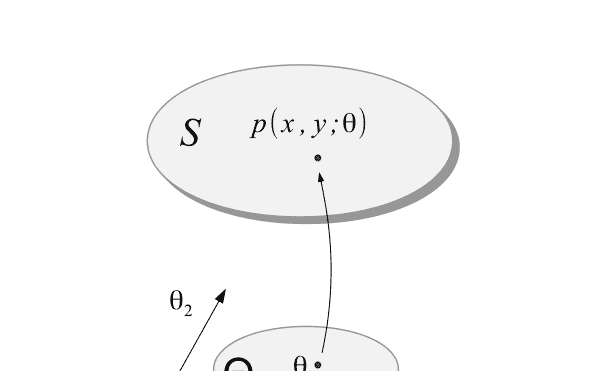

    图14.1: 一个统计流形 $S = \{p(x, y; θ); θ ∈ Θ\}$。

2.  另一种可能性是考虑一个在 $-1$ 和 $1$ 之间的均匀随机噪声，$n \sim \text{Unif}[-1,1]$。在这种情况下，条件概率为

    $$p(y|x; θ) = \begin{cases} \frac{1}{2}, & \text{if } f_θ(x) - 1 \leq y \leq f_θ(x) + 1 \\ 0, & \text{否则} \end{cases}$$

现在可以使用条件概率公式找到 $(X, Y)$ 的联合分布

$$p(x, y; θ) = p(x)p(y|x; θ). \tag{14.1.3}$$

参数 $θ$，使得 $p(x, y; θ)$ 尽可能地与真实分布 $p(x, z)$ 相匹配。这可以通过几何方式实现，如下所示。

统计流形密度函数族 $\{θ \to p(x, y; θ); θ ∈ Θ\}$，可以被视为概率密度函数无限维空间中的子流形。这里，$Θ$ 表示参数空间。还假设以下正则性条件：函数

$$\frac{\partial}{\partial θ_1} p(x, y; θ), \ldots, \frac{\partial}{\partial θ_N} p(x, y; θ) \tag{14.1.4}$$

线性独立，其中 $θ^T = (θ_1, \ldots, θ_N) ∈ Θ$。这个条件确保子流形光滑，并且在每个点 $p(x, y; θ)$ 处存在切空间。流形 $S = \{p(x, y; θ); θ\}$ 被称为统计流形，参见图14.1。

在这个设置中，训练密度，$p(x, z)$，表示概率密度空间中的一个点，通常不位于流形 $S$ 上，参见图14.2。通过调整网络参数向量，$θ$，我们试图最小化给定密度与相应流形之间的接近程度。

如果存在的话，最优参数由

$$θ^* = \arg \min_θ d(p(x, z), p(x, y; θ)) = \arg \min_θ D_{KL}(p(x, z) || p(x, y; θ)),$$

其中 $D_{KL}$ 表示Kullback-Leibler散度。我们注意到可以考虑任何其他的代价函数，但由于其与最大似然估计的关系，Kullback-Leibler散度是首选。

如果距离为零，则训练分布$(x, z)$属于统计流形 $S$，学习变得精确，即存在一个参数 $\theta$ 的确切值，使得$(x, z) = (x, y; \theta)$。

统计流形 $S$的对数似然函数定义为 $$\ell(\theta) = \ell(x, y; \theta) = \ln p(x, y; \theta)$$。

在实践中，上述距离被测量为训练误差，即在训练数据 $\{(x_1, z_1), \ldots, (x_n, z_n)\}$上的误差。这是通过在$(x_k, z_k)$处评估的负对数似然的平均值给出的

$$C_{\text{train}}(\theta) = -\frac{1}{n} \sum_{k=1}^{n} \ell(x_k, z_k; \theta) = -\frac{1}{n} \sum_{k=1}^{n} \ln p(x_k, z_k; \theta)$$

最优参数， $\theta^* = \arg \min_\theta C_{\text{train}}(\theta)$，是最大似然估计器， $\theta^* = \theta$

训练误差函数 $C_{\text{train}}(\theta)$与训练数据和模型分布之间的Kullback-Leibler散度之间的关系已在第3.6节中指出，并主要基于以下论证

$$\begin{aligned} C_{\text{训练}}(\theta) &= -\mathbb{E}^{P_{XZ}} [\ell(X, Y; \theta)] \\ &= -\mathbb{E}^{P_{XZ}} [\ln p(X, Y; \theta) - \ln p(X, Z) + \ln p(X, Z)] \\ &= \mathbb{E}^{P_{XZ}} \left[ \ln \frac{p(X, Z)}{p(X, Y; \theta)} \right] - \mathbb{E}^{P_{XZ}} \ln[p(X, Z)] \\ &= D_{KL}(p(X, Z) \| p(X, Y; \theta)) - H(p(X, Z)). \end{aligned}$$

由于香农熵 $H(p(X, Z))$与参数 $\theta$无关，因此最优参数

$$\theta^* = \arg \min_\theta C_{\text{训练}}(\theta) = \arg \min_\theta D_{KL}(p(X, Z) \| p(X, Y; \theta))$$

最小化训练分布和统计流形 $S = \{p(X, y; \theta); \theta \in \Theta\}$之间的Kullback-Leibler散度。

上述统计流形 $S = \{p(x, y; \theta); \theta \in \Theta\}$，可以赋予度量结构，并被视为一个黎曼流形。我们将在下一节介绍这个度量。

值得注意的是，包含目标值 $z_k$的公式具有外在特征，因为它们访问有关统计流形的外部点$(x, z)$的信息。涉及 $z_k$和 $y_k = f_\theta(x_k)$的公式具有内在特征，因此它们属于统计流形 $S$的局部几何。从这个角度来看，上述训练误差 $C_{\text{train}}(\theta)$是一个外在对象。下一个目标是在统计流形上引入Fisher度量，这是一个内在对象。

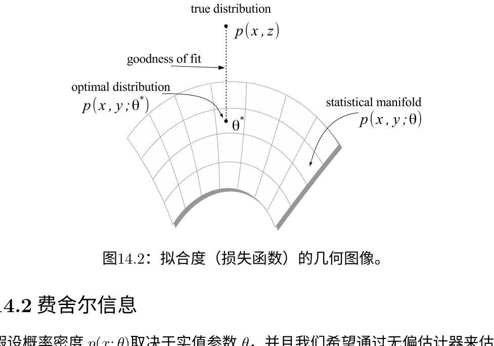

### 14.2 费舍尔信息

假设概率密度 $p(x; \theta)$ 取决于实值参数 $\theta$，并且我们希望通过无偏估计器来估计该参数 $\hat{\theta}=\hat{\theta}(x)$，它取决于数据 $x$。这意味着在参数 $\theta$ 存在的情况下，差异的平均值为零 在所有数据集上，参数 $\theta$ 的估计值 $\hat{\theta}(x) - \theta$ 的期望值为零

$$\mathbb{E}[\hat{\theta}(x) - \theta] = \int (\hat{\theta}(x) - \theta) p(x;\theta) dx = 0.$$

为简单起见，记 $p = p(x;\theta)$，并使用乘积法则对前述关系进行微分

$$0 = \frac{\partial}{\partial \theta} \mathbb{E}[\hat{\theta}(x) - \theta] = \int (\hat{\theta}(x) - \theta) \frac{\partial p}{\partial \theta} dx - \int p dx.$$

自从 $\int p dx = 1$ and $\frac{\partial p}{\partial \theta} = \frac{\partial \ln p}{\partial \theta} p$, 前面的关系意味着

$$\int (\hat{\theta}(x) - \theta) \frac{\partial \ln p}{\partial \theta} p dx = 1.$$

一个关键特征是将密度 $p$ 分解为两个平方根的乘积

然后将表达式重写为

$$\int \left( (\hat{\theta}(x) - \theta) \sqrt{p} \right) \left( \frac{\partial \ln p}{\partial \theta} \sqrt{p} \right) dx = 1.$$

取平方并使用柯西积分不等式，得到

$$1 \leq \int (\hat{\theta}(x) - \theta)^2 p \, dx \int \left( \frac{\partial \ln p}{\partial \theta} \right)^2 p \, dx.$$

右侧的每个积分都具有期望的意义。第一个积分，

$$\mathbb{E}[(\hat{\theta} - \theta)^2] = \int (\hat{\theta}(x) - \theta)^2 p \, dx,$$

是均方误差，而后者，

$$I(\theta) = \mathbb{E}\left[\left( \frac{\partial \ln p}{\partial \theta} \right)^2\right] = \int \left( \frac{\partial \ln p}{\partial \theta} \right)^2 p \, dx,$$

是关于 $\theta$ 的 Fisher 信息。现在可以将前面的不等式写成

$$\mathbb{E}[(\hat{\theta} - \theta)^2] I(\theta) \geq 1$$

，或者等价地写成

$$\mathbb{E}[(\hat{\theta} - \theta)^2] \geq \frac{1}{I(\theta)}.$$ \quad (14.2.5)

这被称为 Cramér-Rao 不等式。它表明 Fisher 信息的逆是均方误差的下界。因此，最小平方误差估计，$\hat{\theta}$ 满足等式

$$\mathbb{E}[(\hat{\theta}_{\text{均方误差}} - \theta)^2] = \frac{1}{I(\theta)}.$$ \quad (14.2.6)

因此，当信息内容高时，误差低，反之亦然。Fisher 信息，$I(\theta)$，表示对数似然函数 $\ell(\theta) = \ln p(x; \theta)$ 的导数内容。越快 $\ell(\theta)$ 相对于 $\theta$，信息 $I(\theta)$ 越大，均方误差越小。我们将在后面看到，实现 Cramér-Rao 不等式中的等式的估计器被称为 Fisher 有效估计器。

Fisher 信息是关于未知参数 $\theta$ 在随机变量 $X$ 中的信息评估，其由密度族 $p(\theta)$ 建模。因此，$\theta$ 的估计器具有比先前信息的逆更大的方差，并且当其方差最小时变得有效。如果 $X$ 中关于 $\theta$ 的信息很少，那么 Cramér-Rao 不等式表明任何 $\theta$ 的估计都是松散的，即具有较大的方差。

> 1有时，这被等价地陈述为 $V ar(\hat{\theta}) \geq \frac{1}{I(\theta)}.$

我们还注意到，费舍尔信息可以用对数似然函数表示为

$$I(\theta) = \mathbb{E}\left[\left(\frac{\partial \ell(\theta)}{\partial \theta}\right)^2\right].$$

这个表达式用作密度函数，$p(x; \theta)$，它只依赖于一个参数，$\theta$。多维情况在下面进行处理。

多元情况在参数为

$\theta$ 是 $n$维的情况下，$\theta = (\theta_1, \ldots, \theta_n)$。在这种情况下，我们得到费舍尔信息矩阵

$$g_{ij}(\theta) = \mathbb{E}\left[\frac{\partial \ell(\theta)}{\partial \theta_i} \frac{\partial \ell(\theta)}{\partial \theta_j}\right], \qquad\qquad(14.2.7)$$

其中 $\ell(\theta) = \ln p(x; \theta)$，并且期望是关于$p (x; \theta)$的。其他等价表达式如下所示：

#### 命题14.2.1：费舍尔矩阵也可以表示为：

$$g_{ij}(\theta) = -\mathbb{E}\left[\frac{\partial^2 \Omega(\theta)}{\partial \theta_i \partial \theta_j}\right] \qquad\qquad(14.2.8)$$

$$g_{ij}(\theta) = 4 \int \frac{\partial \sqrt{p(x; \theta)}}{\partial \theta_i} \frac{\partial \sqrt{p(x; \theta)}}{\partial \theta_j} dx. \qquad\qquad(14.2.9)$$

证明：对$\theta_i$求导，得到

$$\int p(x; \theta) \, dx = 1$$

$\int \partial_{\theta_i}$对$\theta_i$求导，得到

$$p (x; \theta) \, dx = 0,$$

$\int \partial_{\theta_i}$ 这等价于

$$\ln p (x; \theta) \, p (x; \theta) \, dx = 0$$。再次对$\theta_j$求导并应用乘积法则，我们得到

$$\int \partial_{\theta_j} \partial_{\theta_i} \ln p(x; \theta) \, p(x; \theta) \, dx + \int \partial_{\theta_i} \ln p(x; \theta) \, \partial_{\theta_j} p(x; \theta) \, dx \ =\ 0$$

$$\mathbb{E}\left[\frac{\partial^2 \Omega(\theta)}{\partial \theta_i \partial \theta_j}\right] + \int \partial_{\theta_i} \ln p(x; \theta) \, \partial_{\theta_j} \ln p(x; \theta) \, p(x; \theta) \, dx \ =\ 0$$

$$\mathbb{E}\left[\frac{\partial^2 \Omega(\theta)}{\partial \theta_i \partial \theta_j}\right] + g_{ij}(\theta) \ =\ 0,$$这意味着关系 (14.2.8)。

为了证明关系 (14.2.9)，我们进行以下直接计算：

$$
g_{ij}(\theta) = \int \partial_{\theta_i} \ln p(x; \theta) \partial_{\theta_j} \ln p(x; \theta) p(x; \theta) dx \\
= \int \frac{\partial_{\theta_i} p(x; \theta)}{p(x; \theta)} \frac{\partial_{\theta_j} p(x; \theta)}{p(x; \theta)} p(x; \theta) dx \\
= 4 \int \frac{\partial_{\theta_i} p(x; \theta)}{2\sqrt{p(x; \theta)}} \frac{\partial_{\theta_j} p(x; \theta)}{2\sqrt{p(x; \theta)}} dx \\
= 4 \int \frac{\partial \sqrt{p(x; \theta)}}{\partial \theta_i} \frac{\partial \sqrt{p(x; \theta)}}{\partial \theta_j} dx。
$$

关系 (14.2.8) 将费舍尔矩阵与对数似然函数的负Hessian矩阵相关联，并具有以下几何解释。如果 $\ell(x; \theta) = \ln p(x; \theta)$ 是对应于观测值 $x$ 和参数 $\theta$ 的对数似然函数，则 $\theta$ 的最大似然估计值为

$$\hat{\theta}_{MLE} = \arg \max_\theta \ell(x; \theta)。$$

由于在 $\theta=\hat{\theta}_{MLE}$ 处存在极大值，所以 $\frac{\partial}{\partial \theta_i} \ell(x; \hat{\theta}_{MLE}) = 0$。在 $\hat{\theta}$ 附近展开得到 $\hat{\theta}_{MLE}$，我们有

$$\ell(x; \theta) = \ell(x; \hat{\theta}_{MLE}) + \frac{1}{2} \sum_{i,j} \frac{\partial^2}{\partial \theta_i \partial \theta_j} \ell(x; \hat{\theta}_{MLE}) (\hat{\theta}_{MLE,i} - \theta_i)(\hat{\theta}_{MLE,j} - \theta_j) + O(||\hat{\theta}_{MLE} - \theta||^3)$$

费舍尔矩阵，由右侧和式的负系数期望（如式 (14.2.8) 所示）给出，测量了凸顶部的曲率有多大 $\ell(x; \theta)$ 在 $\hat{\theta}_{MLE}$。

可以证明，在正则性假设 (14.1.4) 下，关系式 (14.2.9) 可以用来证明 $g_{ij}(\theta)$ 是一个对称的、正定的、非退化的矩阵（参见[22]中的命题1.6.2）。

因此，费舍尔信息矩阵提供了统计流形上的一个黎曼度量（参见第13.1.3节），称为费舍尔度量 $S = \{\theta \to p(x;\theta)\}$。这使得在统计流形上计算向量的长度、角度、距离和面积成为可能。有时，费舍尔度量在参数空间 $\Theta$ 上，$g_{ij}(\theta)$ 被认为是重要的。

一个自然的问题是什么使得费舍尔度量在所有可以定义在统计流形上的黎曼度量中与众不同？可以证明费舍尔度量具有以下两个性质，参见[4]和[22]：

- 1. $g_{ij}$对样本空间的重新参数化是不变的。这意味着统计流形 $S = \{p(x; \theta); \theta \in \Theta\}$ 和 $\tilde{S} = \{p(h(x); \theta); \theta \in \Theta\}$，其中 $h$ 是可逆且可微分的函数，具有相等的度量，$g_{ij}(\theta) = \tilde{g}_{ij}(\theta)$。这个不变性属性可以在[22]的定理1.6.4中找到。
- 2. $g_{ij}$在重新参数化下是协变的。这意味着如果我们考虑一个依赖于$\theta$的不同参数化 $\xi_j = \xi(\theta_1, ..., \theta_N)$，那么两个参数化下的Fisher矩阵相关联：

> $$g_{ij}(\theta) = \sum_{k,r} g_{kr}(\xi)\Big|_{\xi=\xi(\theta)} \frac{\partial \xi^k}{\partial \theta^i} \frac{\partial \xi^r}{\partial \theta^j}.$$

关于这个事实的证明，请参见[22]的定理1.6.5。

Fisher度量的特殊之处在于它是唯一满足前两个不变性条件的度量。这个显著结果的证明可以在[28]中找到。

## Cram´er-Rao不等式

存在一个多元版本的不等式(14.2.5)。

向量参数为 $\theta = (\theta_1, \ldots, \theta_N)^T \in \mathbb{R}^N$，表示参数空间 $(\Theta, g)$ 的一个坐标系。考虑一个估计器

> $$\hat{\theta}(X) = (\hat{\theta}_1(X), \ldots, \hat{\theta}_N(X))^T$$

这是无偏的，$\mathbb{E}[\hat{\theta}(X)] = \theta$。然后

> $$Cov(\hat{\theta}(X)) \geq g(\theta)^{-1}.$$
> (14.2.10)

这意味着差异矩阵 $A_{ij} = Cov(\hat{\theta}_i(X), \hat{\theta}_j(X)) - g^{ij}(\theta)$对于所有 $\theta \in \Theta$都是半正定的，即它具有非负特征值。这个不等式在讨论高效估计器时将会很有用。

关于费舍尔信息在科学中的进一步应用，请参考[40]，[41]和[39]。关于其他类型的神经元的应用，请参考[121]。

## 14.3 神经网络的神经流形

一个神经流形是与神经网络相关联的黎曼流形，如下所示。设 $y = f_{\theta}(x)$ 是给定神经网络的输入-输出映射，具有输入和输出密度 $p_{X}(x)$ 和 $p_{Y}(y; \theta)$，以及联合密度 \(p(x, y; \theta)\)，其中 \(\theta\)是由网络的所有权重和偏置组成的向量参数。与神经网络相关联的统计流形是 \(S = \{p(x, y; \theta); \theta \in \Theta\}\)。可以通过公式 (14.2.7) 在 \(S\)上定义费舍尔度量，其中我们考虑给定的对数似然函数\(\ell(x, y; \theta) = \ln p(x, y; \theta)\)。这也可以表示为以下双重积分：

$$g_{ij}(\theta) = \iint \frac{\partial \ell(x, y; \theta)}{\partial \theta_i} \frac{\partial \ell(x, y; \theta)}{\partial \theta_j} p(x, y; \theta) \, dx dy. \qquad (14.3.11)$$

由于 \(g = g_{ij}\)是 \(S\)上的黎曼度量，那么\((S, g)\)成为一个黎曼流形。

### 定义14.3.1

与上述神经网络相关的神经流形是黎曼流形 \((S, g)\)，其中\(S=\{p(x, y; \theta); \theta \in \Theta\}\)是神经网络的联合输入输出密度的统计流形，\(\theta\)是网络的权重和偏置，\(g\)是费舍尔度量。

与神经网络相关的每个联合概率密度 \(p(x, y; \theta)\)可以被视为该流形上的一个点。学习过程，即参数的调整，可以被视为神经流形上的一条曲线。

值得注意的是，度量 \(g_{ij}(\theta)\)与目标值 \(z_k\)无关，即它是一个内在对象。所有从费舍尔信息中导出的概念都将构成神经流形的内在几何。

下面的计算将在假设公式 (14.1.1) 中的噪声是标准正态噪声的情况下进行，即 \(n \sim \mathcal{N}(0,1)\)。有时候，人们可能考虑一个缩放的噪声 \(n \sim \mathcal{N}(0, s^2)\)，并将标准差 \(s\)作为一个超参数。使用公式 (14.1.3) 得到以下对数似然函数

$$\ell(x, y; \theta) = \ln p(x) + \ln p(y|x; \theta) = \ln p(x) - \ln(\sqrt{2\pi}) - \frac{1}{2}(y - f_{\theta}(x))^2,$$

对于偏导数

$$\frac{\partial \ell(x, y; \theta)}{\partial \theta_k} = (y - f_{\theta}(x)) \frac{\partial f_{\theta}(x)}{\partial \theta_k}. \qquad (14.3.12)$$

关于参数的输入输出映射的敏感性，\(\frac{\partial f_{\theta}(x)}{\partial \theta_k}\)，对于每种类型的神经网络都是特定的，并且是每个网络的复杂性的度量。我们将在几个特殊情况下计算它，然后在前馈神经网络的情况下提供一个一般的递归公式。

## 14.4 一个神经元的费舍尔度量

在本节中，我们将提供单个神经元情况下费舍尔度量的显式公式。我们考虑一个输入由维度为 $X=(X_1, \ldots, X_n)^T$ 的随机向量X给出的神经元，输入输出映射 $f_{\theta}(x) = \phi(w^T x + b)$，其中 $\theta = (w, b)$ 是参数， $\phi$ 是可微的激活函数。链式法则的应用产生了偏导数

$$\frac{\partial f_{\theta}(x)}{\partial w_k} = x_k \phi'(w^T x + b), \qquad \frac{\partial f_{\theta}(x)}{\partial b} = \phi'(w^T x + b).$$

然后公式 (14.3.12) 提供

$$\begin{aligned}
\frac{\partial \ell(x, y; \theta)}{\partial w_k} &= x_k (y - \phi(w^T x + b)) \phi'(w^T x + b), \qquad 1 \le k \le n \\
\frac{\partial \ell(x, y; \theta)}{\partial b} &= (y - \phi(w^T x + b)) \phi'(w^T x + b).
\end{aligned}$$

由于 $\theta = (w_1, \ldots, w_n, b)$，费舍尔矩阵是($n + 1$)维的。利用(14.3.11)并改变积分顺序，我们有

$$\begin{aligned}
g_{00}(w, b) &= \iint \left( \frac{\partial \ell(x, y; \theta)}{\partial b} \right)^2 p(x, y) \,dxdy \\
&= \iint (y - \phi(w^T x + b))^2 \phi'(w^T x + b)^2 p(x) p(y|x; \theta) \,dxdy \\
&= \int \phi'(w^T x + b)^2 p(x) \int (y - \phi(w^T x + b))^2 p(y|x; \theta) \,dy \,dx.
\end{aligned}$$

将(14.1.2)中的 $p(y|x; \theta)$ 代入，并改变变量 $u = \phi(w^T x + b)$ 得到

$$\begin{aligned}
g_{00}(w, b) &= \int \phi'(w^T x + b)^2 p(x) \left( \int u^2 \frac{1}{\sqrt{2\pi}} e^{-\frac{1}{2}u^2} \,du \right) \,dx \\
&= \int \phi'(w^T x + b)^2 p(x) \,dx \\
&= \mathbb{E}^{P^X} [\phi'(w^T X + b)^2],
\end{aligned}$$

其中，$\mathbb{E}$ 表示在输入 $x$ 的法则下的期望算子。

同样地，

$$
g_{0k}(w, b) = \iint \frac{\partial \ell(x, y; \theta)}{\partial b} \frac{\partial \ell(x, y; \theta)}{\partial w_k} p(x, y) \,dx \,dy \\
= \iint \left(y - \phi(w^T x + b)\right)^2 \phi'(w^T x + b)^2 x_{k} p(x) p(y|x; \theta) \,dx \,dy \\
= \int \phi'(w^T x + b)^2 x_{k} p(x) \int \left(y - \phi(w^T x + b)\right)^2 p(y|x; \theta) \,dy \,dx \\
= \mathbb{E}^{P^X} [x_{k} \phi'(w^T x + b)^2].
$$

另外，

$$
g_{jk}(w, b) = \iint \frac{\partial \ell(x, y; \theta)}{\partial w_j} \frac{\partial \ell(x, y; \theta)}{\partial w_k} p(x, y) \,dx \,dy \\
= \iint \left(y - \phi(w^T x + b)\right)^2 \phi'(w^T x + b)^2 x_j x_{k} p(x) p(y|x; \theta) \,dx \,dy \\
= \int \phi'(w^T x + b)^2 x_j x_{k} p(x) \int \left(y - \phi(w^T x + b)\right)^2 p(y|x; \theta) \,dy \,dx \\
= \mathbb{E}^{P^X} [X_j X_{k} \phi'(w^T X + b)^2].
$$

最后，最后三个公式可以写成一个公式

$$
\tilde{g}_{ij}(\tilde{w}) = \mathbb{E}^{P^X} [X_i X_j \phi'(\tilde{w}^T \tilde{X})^2], \quad 0 \leq i, j \leq n, \quad \quad (14.4.13)
$$

其中 $\tilde{w}^T = (w^T, b)$ and $\tilde{X} = (X_0, X)$, with $X_0=1$. 一般来说，公式(14.4.13)不能进一步简化。然而，如果 $X_i$是独立的，标准正态分布，并且 $b=0$，则存在一个闭式解用于费舍尔矩阵及其逆矩阵，参见[6]。在我们研究几种特殊类型的神经元之后，我们将发展这个想法。

### 线性神经元

在这种情况下，激活函数为 $\phi(x) = x$，因此在先前的公式中将导数 $\phi'(x)$替换为1，得到

$$
g_{00} = 1, \quad g_{0k}(w, b) = \mathbb{E}^{P^X} [X_k], \quad g_{jk}(w, b) = \mathbb{E}^{P^X} [X_j X_k].
$$

这些公式表明线性神经元的Fisher矩阵描述了输入向量 $\tilde{X} = (1, X)$的自协方差。此外，由于 $g_{jk}(w, b)$不依赖于 $\theta = (w, b)$，因此 $\frac{\partial g_{ij}}{\partial \theta_k} = 0$，这意味着Christoffel符号消失，$\Gamma_{kij} = 0$。因此，线性神经元的神经流形在本质上是平坦的，其内在几何仅由输入协方差引起。

### ReLU神经元

考虑激活函数 $\phi(x) = \mathbf{ReLU}(x)$，它是分段可微的。我们将以广义意义上的方式进行微分，详见附录F.$^2$节。然后，$\phi'(x) = \mathbf{ReLU}'(x) = H(x)$，参见练习8.8.1。由于$H^2(x) = H(x)$，我们得到

$$\begin{aligned}
g_{00} &= \mathbb{E}^{P_X}[ReLU'(w^T x + b)^2] = \mathbb{E}^{P_X}[H(w^T x + b)^2] = \mathbb{E}^{P_X}[H(w^T x + b)] \\
&= \int_{\{w^T x + b \geq 0\}} p(x) dx = \mathbb{P}(w^T X + b \geq 0) = \mathbb{P}(X \in \mathcal{H}_{w,b}).
\end{aligned}$$

因此，系数 $g_{00}$ 表示输入向量 $X$ 属于半空间 $\mathcal{H}_{w,b} = \{w^T x + b \geq 0\}$ 的概率。我们还注意到 $0 \leq g_{00} \leq 1$。它的值取决于超平面平移参数 $b$ 的值，如

$$\lim_{b \to \infty} g_{00} = 0, \quad \lim_{b \to -\infty} g_{00} = 1.$$

其他度量系数由以下给出

$$\begin{aligned}
g_{0k} &= \mathbb{E}^{P_X}[X_k ReLU'(w^T X + b)^2] = \mathbb{E}^{P_X}[X_k H(w^T X + b)] \\
&= \int_{\{w^T x + b \geq 0\}} x_k p(x) dx, \\
g_{jk} &= \mathbb{E}^{P_X}[X_j X_k ReLU'(w^T X + b)^2] = \mathbb{E}^{P_X}[X_j X_k H(w^T X + b)] \\
&= \int_{\{w^T x + b \geq 0\}} x_j x_k p(x) dx.
\end{aligned}$$

使用 $0 \leq H(w^T x + b) \leq 1$，可以得出 $g_{0k} \leq \mathbb{E}^{P_X}[X_k]$，$g_{jk} \leq \mathbb{E}^{P_X}[X_j X_k]$。

事实上，我们有

$$\lim_{b \to \infty} g_{0k} = \lim_{b \to \infty} g_{jk} = 0, \quad \lim_{b \to -\infty} g_{0k} = \mathbb{E}[X_k], \quad \lim_{b \to -\infty} g_{jk} = \mathbb{E}[X_j X_k].$$

### 双曲正切神经元

激活函数 $\phi(x) = \tanh x$ satisfies $\phi'(x) = 1 - \tanh^2 x$。通常情况下，为了简化，我们用 $\mathbf{t}(x) = \tanh x$ 表示。Fisher度量系数由以下给出

$$\begin{aligned}
g_{00} &= \mathbb{E}^{P_X}[\mathbf{t}'(w^T X + b)^2] = \mathbb{E}^{P_X}[(1 - \mathbf{t}^2(w^T X + b))^2] \\
g_{0k} &= \mathbb{E}^{P_X}[X_k \mathbf{t}'(w^T X + b)^2] = \mathbb{E}^{P_X}[X_k (1 - \mathbf{t}^2(w^T X + b))^2] \\
g_{jk} &= \mathbb{E}^{P_X}[X_j X_k \mathbf{t}'(w^T X + b)^2] = \mathbb{E}^{P_X}[X_j X_k (1 - \mathbf{t}^2(w^T X + b))^2],
\end{aligned}$$

对于 $1 \leq j, k \leq n$。值得注意的是不等式

$$0 \leq g_{00} \leq 1, \quad g_{0k} \leq \mathbb{E}^{P_X}[X_k], \quad g_{jk} \leq \mathbb{E}^{P_X}[X_j X_k].$$

## 14.5 Fisher矩阵及其逆矩阵

为了计算Fisher矩阵 (14.4.13) 及其逆矩阵，需要假设一些附加条件。我们将考虑 $(X_1, \ldots, X_n) \sim \mathcal{N}(0, \mathbb{I}_n)$，即输入是一个多元标准正态随机变量。

记 $|w|^2 = w^T w = \sum w_i^2$，并考虑以下函数

> $$ C_1(w, b) = \frac{1}{|w|^2 \sqrt{2\pi}} \int \phi'(|w|\epsilon + b)^2 e^{-\frac{1}{2}\epsilon^2} d\epsilon \quad (14.5.14) $$

> $$ C_2(w, b) = \frac{1}{|w|^2 \sqrt{2\pi}} \int \phi'(|w|\epsilon + b)^2 \epsilon^2 e^{-\frac{1}{2}\epsilon^2} d\epsilon \quad (14.5.15) $$

> $$ C_3(w, b) = \frac{1}{|w|^2 \sqrt{2\pi}} \int \phi'(|w|\epsilon + b)^2 \epsilon e^{-\frac{1}{2}\epsilon^2} d\epsilon \quad (14.5.16) $$

利用 $w^T X = \sum w_i X_i \sim \mathcal{N}(0, |w|^2)$，我们可以写成 $w^T X = |w|\epsilon$，其中 $\epsilon \sim \mathcal{N}(0, 1)$。然后我们有

> $$ g_{00}(w, b) = \mathbb{E}[\phi'(w^T X + b)^2] = \mathbb{E}[\phi'(|w|\epsilon + b)^2] = \frac{1}{\sqrt{2\pi}} \int \phi'(|w|\epsilon + b)^2 e^{-\frac{1}{2}\epsilon^2} d\epsilon = |w|^2 C_1(w, b). \quad (14.5.17) $$

再次写作 $w^T X = |w|\epsilon$，我们有

> $$ \sum_k g_{0k} w_k = \mathbb{E}[w^T X \phi'(w^T X + b)^2] = \mathbb{E}[|w|\epsilon \phi'(|w|\epsilon + b)^2] = \frac{|w|}{\sqrt{2\pi}} \int \epsilon \phi'(|w|\epsilon + b)^2 e^{-\frac{1}{2}\epsilon^2} d\epsilon = |w|^3 C_3(w, b). \quad (14.5.18) $$

设 $v$ 为任意与 $w$ 正交的单位向量。那么

> $$ \sum_k g_{0k} v_k = \mathbb{E}[v^T X \phi'(w^T X + b)^2] = \mathbb{E}[v^T X] \mathbb{E}[\phi'(w^T X + b)^2] = \mathbb{E}[\epsilon] \mathbb{E}[\phi'(w^T X + b)^2] = 0, $$

其中我们使用了 $v^T X = |v|\epsilon = \epsilon \sim \mathcal{N}(0,1)$，$\mathbb{E}[\epsilon] = 0$，以及 $w^T X$ 和 $v^T X$ 是独立的，参见练习14.13.3。由此可得，向量 $(g_{01}, \ldots, g_{0n})^T$ 垂直于所有的 $v$（它们垂直于 $w$）。因此，$(g_{01}, \ldots, g_{0n})^T$ 必须与 $w$ 成比例，即存在 $\lambda \in \mathbb{R}$ 使得

> $$ g_{0k} = \lambda w_k, \quad 1 \le k \le n. \quad (14.5.19) $$

为了确定 $\lambda$，将其乘以 $w_k$ 并求和

> $$ \sum g_{0k} w_k = \lambda \sum w_k^2 = \lambda |w|^2 $$

，从中得到 $\lambda =$

> $$ \frac{1}{|w|^2} \sum g_{0k} w_k = |w| C_3(w, b) $$

其中我们使用了（14.5.18）和（14.5.19）。然后得到

> $$ g_{0k} = w_k |w| C_3(w, b), \quad 1 \le k \le n. $$

## 备注14.5.1

我们做出以下备注：如果 $b = 0$ 且 $\phi(x) = \tanh(x)$，那么 $C_3(w, b) = 0$，因为 $\phi'(|w|\epsilon)^2$ 是一个关于 $\epsilon$ 的偶函数。因此，$g_{0k} = 0, 1 \le k \le n$。

我们将在接下来的部分展示矩阵

> $$ g_{jk} = \mathbb{E}[X_j X_k \phi'(w^T X + b)^2], \quad 1 \le j, k \le n $$

具有明确的形式

> $$ g_{jk} = |w|^2 C_1(w, b) \delta_{jk} + (C_2(w, b) - C_1(w, b)) w_j w_k, $$

其中 $\delta_{jk}$ 为1，当 $j = k$ 时，否则为0。在等价的矩阵形式中，矩阵

> $$ g = \mathbb{E}[XX^T \phi'(w^T X + b)^2] $$

可以写成以下求和形式：

> $$ g = |w|^2 C_1(w, b) \mathbb{I}_n + (C_2(w, b) - C_1(w, b)) w w^T. \quad (14.5.20) $$

为了简化起见，我们将(14.5.20)右侧的矩阵记为 $h$。由于 $g$ 和 $h$ 都是对称矩阵，为了证明 $g = h$，我们将使用练习14.13.1。因此，只需证明对于所有与 $w$ 正交的单位向量 $v$，有 $w^T g w = w^T h w$ 和 $v^T g v = v^T h v$。我们将分两步进行：

第一步：证明 $w^T g w = w^T h w$。

左侧可以计算为

> $$ w^T g w = w^T \mathbb{E}[XX^T \phi'(w^T X + b)^2] w = \mathbb{E}[(w^T X)^2 \phi'(w^T X + b)^2] $$
>
> $$ = \mathbb{E}[|w|^2 \epsilon^2 \phi'(|w| \epsilon + b)^2] = \frac{|w|^2}{\sqrt{2\pi}} \int \epsilon^2 \phi'(|w| \epsilon + b)^2 e^{-\frac{1}{2} \epsilon^2} d\epsilon $$
>
> $$ = |w|^4 C_2(w, b). \quad (14.5.21) $$

右边是

> $$ w^T h w = |w|^2 C_1(w, b) w^T w + (C_2(w, b) - C_1(w, b)) w^T w w^T w = |w|^4 C_2(w, b). \quad (14.5.22) $$

由于(14.5.21)和(14.5.22)相符，我们得到了所需的等式。

步骤2：展示 $v^Tgv = v^Thv$。使用关系(14.5.17)和 $w^TX$ 以及 $v^TX$独立的事实，参见练习14.13.2，左边变为

> $$
> \begin{aligned}
> v^Tgv &= v^T\mathbb{E}[XX^T\phi'(w^TX+b)^2]v = \mathbb{E}[(v^TX)^2\phi'(w^TX+b)^2] \\
> &= \mathbb{E}[(v^TX)^2]\mathbb{E}[\phi'(w^TX+b)^2] = \underbrace{\mathbb{E}[\epsilon^2]}_{=1}\mathbb{E}[\phi'(|w|\epsilon+b)^2] \\
> &= |w|^2C_1(w,b). \tag{14.5.23}
> \end{aligned}
> $$

对于右边，我们可以直接计算

> $$
> \begin{aligned}
> v^Thv &= v^T(|w|^2C_1(w,b)\mathbb{I}_n + (C_2(w,b)-C_1(w,b))ww^T)v \\
> &= |w|^2C_1(w,b)v^Tv + (C_2(w,b)-C_1(w,b))(v^Tw)^2 \\
> &= |w|^2C_1(w,b), \tag{14.5.24}
> \end{aligned}
> $$

其中我们使用了正交性条件 $v^Tv=1$ 和 $v^Tw=0$。由于(14.5.23)和(14.5.24)相等，我们证明了所需的恒等式。

最后，费舍尔矩阵由以下 $(n+1)\times(n+1)$ 矩阵给出

> $$ \tilde{g} : \begin{cases} g_{00} = |w|^2C_1(w,b) \\ g_{0k} = g_{k0} = w_k|w|C_3(w,b), & 1\leq k\leq n \\ g_{jk} = |w|^2C_1(w,b)\delta_{jk} + (C_2(w,b)-C_1(w,b))w_jw_k, & 1\leq j,k\leq n. \end{cases} $$

找到 $\tilde{g}$ 的逆矩阵，如果我们将Fisher矩阵写成以下形式，会更容易

> $$ \tilde{g} = \begin{pmatrix} g_{00} & g_{01} & \cdots & g_{0n} \\ g_{10} & & & \\ \vdots & & g & \\ g_{n0} & & & \end{pmatrix}. $$

$(n\times n)$块 $g=g_{ij},1\leq i,j\leq n$，在闭合形式下可逆。我们将寻找类似于(14.5.20)的逆矩阵形式

> $$ g^{-1} = \rho_1\mathbb{I}_n + \rho_2 ww^T, $$

并确定函数 $\rho_1$ 和 $\rho_2$ 与 $w$ 和 $b$ 的关系，使得 $gg^{-1}=\mathbb{I}_n$。通过代数计算，得到

> $$
> \begin{aligned}
> gg^{-1} &= (|w|^2C_1\mathbb{I}_n + (C_2-C_1)ww^T)(\rho_1\mathbb{I}_n + \rho_2 ww^T) \\
> &= |w|^2C_1\rho_1\mathbb{I}_n + [\rho_1(C_2-C_1) + |w|^2\rho_2C_2]ww^T.
> \end{aligned}
> $$

通过系数识别，我们询问

> $$ |w|^2 C_1 \rho_1 = 1 $$
>
> $$ \rho_1 (C_2 - C_1) + |w|^2 \rho_2 C_2 = 0, $$

具有解

> $$ \rho_1 = \frac{1}{|w|^2 C_1}, \quad \rho_2 = \frac{1}{|w|^4} \left( \frac{1}{C_2} - \frac{1}{C_1} \right). $$

因此，$g$的逆矩阵为

> $$ g^{-1} = \frac{1}{|w|^2 C_1} \mathbb{I}_n + \frac{1}{|w|^4} \left( \frac{1}{C_2} - \frac{1}{C_1} \right) w w^T. \quad (14.5.25) $$

这个结果在[6]中作为定理4出现。

当求逆矩阵 $\tilde{g}$ 时，我们考虑两种情况：

情况1：$b=0$且 $\phi(x) = \tanh(x)$。在这种情况下

> $$ C_3(w, 0) = \frac{1}{|w|^2 \sqrt{2\pi}} \int \phi'(|w|\epsilon)^2 \, \epsilon \, e^{-\frac{1}{2} \epsilon^2} \, d\epsilon = 0, $$

因为 $\phi'(|w|\epsilon)^2$ 是一个偶函数。由此可得，对于 $1 \leq k \leq n$，矩阵可以分块求逆，如下所示

> $$ \tilde{g}^{-1} = \begin{pmatrix} \frac{1}{g_{00}} & 0 & \cdots & 0 \\ 0 & & & \\ \vdots & & g^{-1} & \\ 0 & & & \end{pmatrix}, $$

通过(14.5.25)给出的 $g^{-1}$ 计算方式。

情况2：一般情况。我们将指示如何通过迭代的方式计算 $\tilde{g}^{-1}$。首先，我们将 $\tilde{g}$ 分解为两个矩阵的和。

> $$ \tilde{g} = \begin{pmatrix} 0 & g_{01} & \cdots & g_{0n} \\ g_{10} & & & \\ \vdots & & \mathbb{O}_n & \\ g_{n0} & & & \end{pmatrix} + \begin{pmatrix} g_{00} & 0 & \cdots & 0 \\ 0 & & & \\ \vdots & & g & \\ 0 & & & \end{pmatrix} = A_1 + A_2. $$

矩阵 $A_2$ 是可逆的，具有已知的逆矩阵

> $$ A_2^{-1} = \begin{pmatrix} \frac{1}{g_{00}} & 0 & \cdots & 0 \\ 0 & & & \\ \vdots & & g^{-1} & \\ 0 & & & \end{pmatrix}. $$

两个矩阵之和的逆矩阵在附录G的第一节中有介绍。使用展开法，我们有
$$
\tilde{g}^{-1} = (A_1 + A_2)^{-1} = A_2^{-1} \sum_{k \geq 0} (-1)^k (A_1 A_2^{-1})^k.
$$
由于乘积
$$
A_1 A_2^{-1} = \begin{pmatrix}
0 & \sum_{j=1}^n g_{0j} g^{j1} & \cdots & \sum_{j=1}^n g_{0j} g^{jn} \\
g_{10} & & & \\
\vdots & & \mathbb{O}_n & \\
g_{n0} & & &
\end{pmatrix}
$$
是一个稀疏矩阵，计算其幂并不昂贵。

另一种迭代方法来找到逆矩阵是通过构造递归定义的序列 $(\tilde{g}^{-1}_n)_{n \geq 0}$，其中 $\tilde{g}^{-1}_0 = \mathbb{O}_n$， $\tilde{g}^{-1}_{n+1} = f(\tilde{g}^{-1}_n)$，其中 $f(M) = A_2^{-1} - M A_1 A_2^{-1}$ 是一个收缩映射。序列 $\tilde{g}^{-1}_n$ 趋向于映射 $f$ 的不动点，即逆矩阵 $\tilde{g}^{-1}$。

收敛条件级数 (14.5.26) 和序列 $\tilde{g}^{-1}_n$ 收敛只要满足一些条件。根据附录的第G节，所需条件是 $\|A_1 A_2^{-1}\| < 1$，其中范数是最大特征值的值。我们将证明 $\|A_1 A_2^{-1}\| = g_{00}$，并且条件 $\|A_1 A_2^{-1}\| < 1$ 被一些熟悉的神经元类满足。

## 引理14.5.2

设 $a, b \in \mathbb{R}^n$ 是两个向量，使得 $a^T b > 0$。那么矩阵
$$
M = \begin{pmatrix}
0 & a_1 & \cdots & a_n \\
b_1 & & & \\
\vdots & & \mathbb{O}_{n} & \\
b_n & & &
\end{pmatrix}
$$
的特征值是 $\lambda_1 = (a^T b)^{1/2}$, $\lambda_2 = -(a^T b)^{1/2}$, $\lambda_j = 0$, 对于所有 $j \geq 3$。

证明：参见练习14.13.4。

我们令 $M = A_1 A_2^{-1}$ 并证明 $a^T b < 1$。我们有
$$
a^T b = \sum_{p} \sum_{j} g_{p0} g_{0j} g^{j p} = \sum_{j} g_{0j} \sum_{p} g_{p0} g^{j p} = \sum_{j} g_{0j} \delta_{j0} = g_{00}.
$$

如果激活函数满足 $\|\phi'\|_\infty < 1$ 几乎处处成立（即，其最陡的斜率几乎处处小于1），那么
$$
g_{00} = \frac{1}{\sqrt{2\pi}} \int \phi'(|w|\epsilon + b)^2 e^{-\frac{1}{2}\epsilon^2} \, d\epsilon < \frac{1}{\sqrt{2\pi}} \int e^{-\frac{1}{2}\epsilon^2} \, d\epsilon = 1.
$$
许多激活函数，如 $\tanh(\cdot)$ 或逻辑函数 $\sigma(\cdot)$，满足上述性质。因此，在这些情况下，$g_{00} < 1$ 并且满足收敛条件。

## 14.6 神经网络的费舍尔度量结构

即使在前馈神经网络的情况下，我们也无法希望得到费舍尔度量的显式公式，但是我们可以通过类似于反向传播方法的迭代方法获得度量结构。计算仍然在假设插入到网络中的噪声是标准正态分布的情况下进行，$n \sim \mathcal{N}(0,1)$。即使这种建模假设似乎有限，我们考虑它是为了简单起见。

其他类型的噪声可以考虑，但计算不会运行得那么顺畅。

记 $C(x, y; \theta) = \frac{1}{2}(f_\theta(x) - y)^2$。那么关系式 (14.3.12) 可以写成
$$
\frac{\partial \ell(x, y; \theta)}{\partial \theta_k} = -\frac{\partial C(x, y; \theta)}{\partial \theta_k}.
$$
这等价于 $\nabla_\theta \ell(x, y; \theta) = -\nabla_\theta C(x, y; \theta)$。现在，如果我们将 $C(x, y; \theta)$ 视为一个二次成本函数（即使在这个上下文中它有不同的意义），我们可以通过在第6章中介绍的反向传播方法计算梯度 $\nabla_\theta C(x, y; \theta)$。参数 $\theta_k$ 将被替换为 $w_{ij}^{(\ell)}$ 和 $b_{j}^{(\ell)}$。根据第6章的符号和计算，我们得到
$$
\frac{\partial \ell(x, y; \theta)}{\partial w_{ij}^{(\ell)}} = -\frac{\partial C(x, y; \theta)}{\partial w_{ij}^{(\ell)}} = -\frac{\partial C(x, y; \theta)}{\partial s_{j}^{(\ell)}} \frac{\partial s_{j}^{(\ell)}}{\partial w_{ij}^{(\ell)}} = -\delta_{j}^{(\ell)} x_{i}^{(\ell-1)}
$$
$$
\frac{\partial \ell(x, y; \theta)}{\partial b_{j}^{(\ell)}} = -\frac{\partial C(x, y; \theta)}{\partial b_{j}^{(\ell)}} = -\frac{\partial C(x, y; \theta)}{\partial s_{j}^{(\ell)}} \frac{\partial s_{j}^{(\ell)}}{\partial b_{j}^{(\ell)}} = \delta_{j}^{(\ell)}.
$$其中 $\delta_j^{(\ell)}$ 表示对信号 $C(x, y; \theta)$ 的敏感性 $s_j^{(\ell)}$ 并且可以使用反向传播公式 (6.2.22) 计算

$$\delta_i^{(\ell-1)} = \phi'(s_i^{(\ell-1)}) \sum_{j=1}^{d^{(\ell)}} \delta_j^{(\ell)} w_{ij}^{(\ell)}. \quad (14.6.27)$$

最后一层中的 $\delta$ 计算为

$$\begin{aligned}
\delta_j^{(L)} &= \frac{\partial C}{\partial s_j^{(L)}} = \frac{\partial}{\partial s_j^{(L)}} \left( \frac{1}{2} \left( \phi(s_j^{(L)}) - y \right)^2 \right) \\
&= \phi'(s_j^{(L)}) \left( \phi(s_j^{(L)}) - y \right) \\
&= \phi'(s_j^{(L)}) \left( f_\theta(x) - y \right).
\end{aligned} \quad (14.6.28)$$

为了克服费舍尔矩阵表达式的书写困难，我们使用符号 $\alpha = (i, j, \ell)$, $\alpha' = (i', j', \ell')$, $X_0 = 1$, 和 $w_0^{(\ell)}_{\ j} = b_j^{(\ell)}$. 然后 $\theta_\alpha = w^{(\ell)}_{\ ij}$ 并且我们得到了度量系数

$$\begin{aligned}
g_{\alpha\alpha'} &= \mathbb{E}^{P_{XY}} \left[ \frac{\partial \ell(x, y; \theta)}{\partial \theta_\alpha} \frac{\partial \ell(x, y; \theta)}{\partial \theta_{\alpha'}} \right] = \mathbb{E}^{P_{XY}} \left[ \frac{\partial \ell(x, y; \theta)}{\partial w_{ij}^{(\ell)}} \frac{\partial \ell(x, y; \theta)}{\partial w_{i'j'}^{(\ell')}} \right] \\
&= \mathbb{E}^{P_{XY}} \left[ X_i^{(\ell-1)} X_{i'}^{(\ell'-1)} \delta_j^{(\ell)} \delta_{j'}^{(\ell')} \right],
\end{aligned}$$

其中指标在以下范围内

$$0 \leq i, i' \leq d^{(\ell-1)}, \quad 1 \leq j, j' \leq d^{(\ell)}, \quad 1 \leq \ell \leq L,$$

其中 $L$ 代表网络的深度。 deltas $\delta_j^{(\ell)}$ 和 $\delta_{j'}^{(\ell')}$ 通过反向传播公式 (14.6.27) 得到。

如果 $\ell = \ell' = L$, 使用 (14.6.28) 得到度量系数的表达式如下

$$\begin{aligned}
\left. g_{\alpha\alpha'} \right|_{\ell=\ell'=L} &= \mathbb{E}^{P_{XY}} \left[ X_i^{(L-1)} X_{i'}^{(L-1)} \delta_j^{(L)} \delta_{j'}^{(L)} \right] \\
&= \mathbb{E}^{P_{XY}} \left[ X_i^{(L-1)} X_{i'}^{(L-1)} \phi'(s_j^{(L)}) \phi'(s_{j'}^{(L)}) (f_\theta(X) - Y)^2 \right].
\end{aligned}$$

如果最后一层的激活函数是线性的， $\phi(x) = x$, 表达式为

图14.3：具有激活函数 φ 和输入输出映射 f_θ(x) 的单隐藏层神经网络。输出神经元的激活是线性的。

更简单，并且可以按照以下方式计算：

$$
\begin{aligned}
\left. g_{\alpha \alpha'} \right|_{\ell=\ell'=L}
&= \mathbb{E}^{P_{XY}} \left[ X_i^{(L-1)} X_{i'}^{(L-1)} (f_\theta(X) - Y)^2 \right] \\
&= \iint x_i^{(L-1)} x_{i'}^{(L-1)} (f_\theta(x) - y)^2 p(x, y) \,dxdy \\
&= \int x_i^{(L-1)} x_{i'}^{(L-1)} p(x) \int (f_\theta(x) - y)^2 p(y|x; \theta) \,dy \,dx \\
&= \int x_i^{(L-1)} x_{i'}^{(L-1)} p(x) \,dx \\
&= \mathbb{E}^{P_X} \left[ X_i^{(L-1)} X_{i'}^{(L-1)} \right],
\end{aligned}
$$

我们使用了以下事实

$$\int (f_\theta(x) - y)^2 p(y|x; \theta) \,dy = Var(n) = 1,$$

即，噪声 n~ N(0,1)的方差为1。层激活 $X_i^{(L-1)}$ 通过前向传递公式进行迭代计算

$$X_i^{(\ell)} = \phi(W^{(\ell)^T} X^{(\ell-1)} - b_i^{(\ell)}).$$

我们将明确计算以下具体情况下的费舍尔度量。

## 例子14.6.1（一层隐藏层网络的费舍尔度量）

我们将考虑一个具有一层隐藏层和一维输入输出的前馈神经网络的情况，参见图14.3。激活函数在输出神经元中是线性的，而在隐藏层中用 φ 表示。输入输出映射由以下给出

$$ f_{\theta}(x) = \sum_{i=1}^{N} \alpha_i \phi(w_i x + b_i) $$

直接计算得到关于参数的偏导数

$$ \frac{\partial f_{\theta}(x)}{\partial \alpha_j} = \phi(w_j x + b_j) $$
$$ \frac{\partial f_{\theta}(x)}{\partial w_i} = \alpha_i x \phi'(w_i x + b_i) $$
$$ \frac{\partial f_{\theta}(x)}{\partial b_i} = \alpha_i \phi'(w_i x + b_i) $$

对数似然函数的偏导数为

$$ \frac{\partial \ell}{\partial \alpha_j} = -\frac{\partial C}{\partial \alpha_j} = -\frac{1}{2} \frac{\partial}{\partial \alpha_j} (f_{\theta}(x) - y)^2 = -(f_{\theta}(x) - y) \frac{\partial f_{\theta}(x)}{\partial \alpha_j} = -(f_{\theta}(x) - y) \phi(w_j x + b_j) $$
$$ \frac{\partial \ell}{\partial w_i} = -\frac{\partial C}{\partial w_i} = -(f_{\theta}(x) - y) \frac{\partial f_{\theta}(x)}{\partial w_i} = -\alpha_i x (f_{\theta}(x) - y) \phi'(w_i x + b_i) $$
$$ \frac{\partial \ell}{\partial b_i} = -\frac{\partial C}{\partial b_i} = -\alpha_i (f_{\theta}(x) - y) \phi'(w_i x + b_i) $$

然后可以计算Fisher矩阵在方向α_j, α_k的系数

$$ \begin{aligned}
g_{\alpha_j \alpha_k} &= \mathbb{E}^{PXY} \left[ \frac{\partial \ell}{\partial \alpha_j} \frac{\partial \ell}{\partial \alpha_k} \right] = \mathbb{E}^{PXY} \left[ \phi(w_j X + b_j) \phi(w_k X + b_k) (f_{\theta}(X) - Y)^2 \right] \\
&= \int \phi(w_j x + b_j) \phi(w_k x + b_k) p(x) \int (f_{\theta}(x) - y)^2 p(y|x; \theta) dy dx \\
&= \int \phi(w_j x + b_j) \phi(w_k x + b_k) p(x) dx \\
&= \mathbb{E}^{PX} \left[ \phi(w_j X + b_j) \phi(w_k X + b_k) \right]
\end{aligned} $$

同样地，

$$ \begin{aligned}
g_{w_j w_j} &= \mathbb{E}^{PXY} \left[ \frac{\partial \ell}{\partial w_i} \frac{\partial \ell}{\partial w_j} \right] \\
&= \mathbb{E}^{PXY} \left[ \alpha_i \alpha_j X^2 \phi'(w_i X + b_i) \phi'(w_j X + b_j) (f_\theta(X) - Y)^2 \right] \\
&= \alpha_i \alpha_j \int x^2 \phi'(w_i x + b_i) \phi'(w_j x + b_j) p(x) \underbrace{\int (f_\theta(x) - y)^2 p(y|x; \theta) dy}_{=1} dx \\
&= \alpha_i \alpha_j \int x^2 \phi'(w_i x + b_i) \phi'(w_j x + b_j) p(x) dx \\
&= \alpha_i \alpha_j \mathbb{E}^{PX} \left[ X^2 \phi'(w_i X + b_i) \phi'(w_j X + b_j) \right].
\end{aligned} $$

同样，通过类似的操作我们得到

$$ g_{b_i b_j} = \mathbb{E}^{PXY} \left[ \frac{\partial \ell}{\partial b_i} \frac{\partial \ell}{\partial b_j} \right] = \alpha_i \alpha_j \mathbb{E}^{PX} \left[ \phi'(w_i X + b_i) \phi'(w_j X + b_j) \right] $$

$$ g_{\alpha_j w_i} = \alpha_i \mathbb{E}^{PX} \left[ X \phi(w_j X + b_j) \phi'(w_i X + b_i) \right] $$

$$ g_{\alpha_j b_i} = \alpha_i \mathbb{E}^{PX} \left[ \phi(w_j X + b_j) \phi'(w_i X + b_i) \right] $$

$$ g_{w_i b_k} = \alpha_i \alpha_k \mathbb{E}^{PX} \left[ X \phi'(w_i X + b_i) \phi'(w_k X + b_k) \right]. $$

我们注意到所有上述系数都取决于输入密度， $\rho(\Box)$，隐藏层神经元的激活函数， $\phi(\Box)$，以及网络的参数。

## 14.7 自然梯度

为了最小化成本函数， $\Box(\Box, \Box)$，该函数取决于权重和偏置，采用了梯度下降法。这涉及到朝着负梯度的方向，即 $-(\nabla \Box \Box, \nabla \Box \Box)$，迈出一步 $\eta > 0$。

该梯度是使用参数空间 $\Theta$ 的平坦几何结构和欧几里得度量 $\delta \Box$ 计算的。本节的思想是在坐标空间 $\Theta$ 上应用梯度下降法，但是使用与费舍尔度量相关的梯度进行计算。这种方法是可取的，因为它更快地收敛到最优参数值 $\theta^*$，因为最陡的方向不是由欧几里得梯度捕捉到的，而是由其自然梯度捕捉到的，正如Amari [6]中指出的那样。本节将介绍这个概念并介绍其主要特性。

设 $(S = \{ p(x, y; \theta); \theta \in \Theta \}, g)$ 是与给定神经网络相关的神经流形。参数空间 $\Theta$ 可以被赋予从 $(S, g)$ 导出的度量 $g(θ)$ 如下所示。如果 $\left\{\frac{\partial}{\partial θ_i}\right\}_{1 \leq i \leq N}$ 在 $\Theta$ 上表示坐标向量，则只需在此基础上定义度量即可

$$g\left(\frac{\partial}{\partial θ_i}, \frac{\partial}{\partial θ_j}\right) = g_{ij}(θ)。$$

因此，参数空间与 $g(θ)$ 成为 Riemann 流形 $(\Theta, g(θ))$。

考虑一个定义在参数空间上的光滑函数，$f: \Theta \to \mathbb{R}$(特别地，这可以是任何代价函数)。$f$的多方向变化由其梯度描述。欧几里得梯度是向量场

$$\nabla_{\text{欧}} f = \sum_{k=1}^{N} \frac{\partial f}{\partial θ_k} e_k = \left( \frac{\partial f}{\partial θ_1}, \ldots, \frac{\partial f}{\partial θ_N} \right)^T,$$

其中 $\{e_k\}_k$ 是 $\mathbb{R}^N$ 中的自然正交基。这种类型的梯度在第4章中介绍的经典梯度下降方法中非常有用。然而，在 $\Theta$ 被赋予 Fisher 度量 $g(θ)$ 的情况下，$f$的梯度必须相应地进行调整。

对于 Fisher 度量 $g(θ)$，$f$ 的自然梯度是相对于该度量取得的梯度。这可以用坐标向量的基来表示 $\left\{\frac{\partial}{\partial θ_k}\right\}_k$ 如

$$\nabla_g f = \sum_{k=1}^{N} (\nabla_g f)^k \frac{\partial}{\partial θ_k}, \quad (14.7.29)$$

其分量由 $(\nabla_g f)^k = \sum_{j=1}^{N} g^{kj}(θ) \frac{\partial f}{\partial θ_j}$ 其中 $g^{kj}(θ)$ 是系数-逆矩阵的系数，$g^{-1}(θ)$。自然梯度 (14.7.29) 的等价公式，用欧几里得梯度表示为

$$\nabla_g f = g(θ)^{-1} \nabla_{\text{欧几里得}} f. \quad (14.7.30)$$

作为一个应用，欧几里得梯度和自然梯度的大小与费舍尔度量相关

$$\begin{aligned} \|\nabla_g f\|_g^2 &= (\nabla_{\text{欧几里得}})^T g^{-1}(\theta) \nabla_{\text{欧几里得}} \\ \|\nabla_{\text{欧几里得}}\|_g^2 &= (\nabla_{\text{欧几里得}})^T g(\theta) \nabla_{\text{欧几里得}} \end{aligned}$$

参见练习14.13.12。公式 (14.7.30) 中的矩阵 $g(θ)^{-1}$ 的乘法将欧几里得梯度 $\nabla_{\text{欧几里得}} f$ 旋转和缩放，得到自然梯度 $\nabla_g f$。由于梯度 $\nabla_g f$ 和 $\nabla_{\text{欧几里得}} f$ 在相同的值处消失

图14.4：自然梯度下降比欧几里德梯度下降方法更快地到达最小值。

θ，参见练习14.13.12，可以得出梯度下降方法的两个变体从相同的初始点$f(θ_0)$出发到达相同的最小值$f(θ^*)$，但是走的路径不同，参见图14.4。用自然梯度替换梯度下降方法中的欧几里德梯度可以提高方法的效率。下一节将讨论这个概念的应用。

备注14.7.1：值得注意的是，对数似然函数的欧几里德梯度可以用来表示Fisher矩阵$g(θ) = (g_{ij}(θ))_{ij}$ 如 $g(θ) = \mathbb{E}^{P_{XY}}[\nabla E_u(\nabla E_u)^T]$。

## 14.8 自然梯度学习算法

我们在第4章中看到，成本函数的最陡方向是一个成本函数的最陡方向，$C(θ)$在欧几里得空间上定义，其欧几里得梯度为 $\nabla_{Eu} C$。这个结果在成本函数 $C(θ)$在曲面上定义的情况下是无效的，比如在黎曼流形$(Θ, g)$上。在这种情况下，最陡方向是在自然梯度方向上实现的，即 $\nabla_{g} C$。本节讨论了在神经学习中使用自然黎曼梯度的影响，这是基于Amari等人的工作，参见[5]，[6]，[99]，[130]。

最陡下降方向我们首先考虑一个单位向量场，$V = \sum V^{i}(\theta) \partial_{\theta^{i}}$，与 $\|V\|_{g} = 1$，切于参数空间$(\Theta, g)$并研究成本函数$C(\theta)$在方向$V$的变化。成本函数$C(\theta)$相对于$V$的变化率用$V(C)$或$\frac{\partial C}{\partial V}$表示

$$\frac{\partial C}{\partial V} = V(C) = \sum_{i} V^{i} \frac{\partial C}{\partial \theta^{i}} = \langle V, \nabla_{Eu} C \rangle. \quad (14.8.31)$$

根据练习14.13.11，部分($c$)，我们有 $\langle V, \nabla_{Eu} C \rangle = g(V, \nabla_{g} C)$。

使用柯西-施瓦茨不等式和方程式(14.8.31)得到 $\frac{\partial C}{\partial V} = g(V, \nabla_{g} C) \leq \|V\|_{g} \|\nabla_{g} C\|_{g} = \|\nabla_{g} C\|_{g}$，当$V$和$\nabla_{g} C$成比例时，等式成立。因此，速率$\frac{\partial C}{\partial V}$在$V = \nabla_{g} C / \|\nabla_{g} C\|$的方向上最高。

因此，成本函数$C(\theta)$的最陡下降方向是负的自然梯度，由$-\nabla_{g} C(\theta) = -g^{-1}(\theta) \nabla_{Eu} C(\theta)$给出。

有关涉及拉格朗日乘数的证明变体，请参见练习14.13.9。值得注意的是，在特定情况下，当$(\Theta, g)$是欧几里德空间时，$(\mathbb{R}^{n}, \delta_{ij})$，则$g^{-1} = \mathbb{I}^{n}$，因此我们恢复了欧几里德梯度的方向。

自然梯度学习算法在[6]中引入，通过规则更新参数$\theta_{n}$ $\theta_{n+1} = \theta_{n} - \eta_{n} \nabla_{g} C(\theta_{n})$其中学习率$\eta_{n}$在$n \to \infty$时趋近于0。[130]建议用$\nabla_{g} C$替换$\nabla_{Eu} C$，有助于消除迭代陷入平台的情况。

自然梯度学习比常规梯度下降更高效的原因还有其他。在介绍它们之前，我们首先回顾两种类型的学习算法，批量学习和在线学习。

批量学习：在这种情况下，批处理中的所有训练样本都用于获取最优权重向量。如果训练集是$\{ (x_{1}, z_{1}), ..., (x_{n}, z_{n}) \}$，则成本函数依赖于所有样本。

$$C(\theta) = \frac{1}{2n} \sum_{j=1}^{n} |z_{j} - f_{\theta}(x_{j})|^{2}.$$如果数据是从相同的训练分布中采样的，$p_{XZ}(\theta)$，成本也可以写成期望值
$$C(\theta) = \frac{1}{2} E^{P_{XZ}(\theta)} [(Z - f_\theta(X))^2]$$
在这种情况下，常规梯度下降方法的步骤描述如下
$$\theta_{n+1} = \theta_n - \eta_n \nabla C(\theta_n), \quad n = 0, 1, 2, \ldots$$
在线学习这种方法每次只使用一个样本，在观察时间上，假设样本是逐个给出的。成本函数采用了简单的形式
$$C(x_n, z_n, \theta_n) = \frac{1}{2} |z_n - f_{\theta_n}(x_n)|^2$$
梯度下降方法在[3]和[107]中提出，采用规则
$$\theta_{n+1} = \theta_n - \eta_n \nabla C(x_n, y_n, \theta_n)$$
一般来说，批量学习的情况下，$\theta_n$收敛到真正的最小值$\theta^*$的收敛更准确，而在在线学习的情况下则不然。然而，如果学习率$\eta_n$以某种方式收敛到0，并且欧几里得梯度$\nabla C(x_n, y_n, \theta_n)$被自然梯度所取代，则在线学习变得与批量学习一样高效。为了进一步阐述这个想法，我们首先要介绍一些关于估计器的概念。

## 估计器的类型：

设$S=\{p_\theta; \theta \in \Theta\}$为一族密度函数，$\hat{\theta} = \hat{\theta}(x_1, \ldots, x_n)$是基于从分布$p_\theta$中抽取的数据$\{x_1, \ldots, x_n\}$的参数$\theta$的估计器。那么：

- 如果$\mathbb{E}^{P_{\theta}}[\hat{\theta}] = \theta$，则$\hat{\theta}$被称为无偏的。
- 如果$\hat{\theta}_n = \hat{\theta}(x_1, \ldots, x_n)$在概率上收敛于$\theta$，即$\lim_{n\rightarrow\infty}P(|\hat{\theta}_n - \theta| < \varepsilon) = 1$，对于任何$\varepsilon>0$，则$\hat{\theta}_n$被称为一致的。有关概率收敛的定义，请参见附录D.6.1节。
- $\hat{\theta}$是Fisher-有效的，如果它是无偏的并且在Cramér-Rao不等式中达到下界
$$Cov(\hat{\theta}) \geq g^{-1}(\theta), \quad \forall \theta \in \Theta$$
即，它是一个最小方差无偏估计。
- $\hat{\theta}_n$是渐近Fisher-有效的，如果它在Cramér-Rao边界渐近地达到等式，即，$\lim_{n\to\infty} Cov(\hat{\theta}_n) = g^{-1}(\theta), \quad \forall \theta \in \Theta.$

例如，在一个正确规范的模型中，一个众所周知的结果表明，最大似然估计量，$\hat{\theta}_{MLE, N}$，取决于$N$独立样本$x_j$，
$$\hat{\theta}_{MLE,N} = \arg \min_{\theta} \frac{1}{N} \sum_{j=1}^{N} \ln p_{\theta}(x_j) = \arg \max_{\theta} \prod_{j=1}^{N} p_{\theta}(x_j),$$
既是一致的，($\hat{\theta}_{MLE,N} \to \theta$, $N\to \infty$, 在概率上)又是渐近有效的(当样本大小，$n$, 趋向于无穷大时，达到了Cramér-Rao下界)。其他例子请参见练习14.13.13和14.13.14。在这种情况下，Cramér-Rao不等式可以写成
$$\mathbb{E}[(\hat{\theta}_{MLE,N} - \theta)(\hat{\theta}_{MLE,N} - \theta)^T] \geq \frac{1}{N} g^{-1}(\theta),$$
参见练习14.13.16。最大似然估计器渐近地具有费舍尔效率可以写成
$$\lim_{N\to\infty} N\mathbb{E}[(\hat{\theta}_{MLE,N} - \theta)(\hat{\theta}_{MLE,N} - \theta)^T] = g^{-1}(\theta),$$
参见练习14.13.16。

在线学习中的费舍尔效率由于在线学习中训练样本只使用一次，按照出现的顺序，因此在线学习的渐近性能不如最优批处理过程好，当所有样本被多次重复使用时。下一个结果表明，只要满足一些额外条件，实际上效率是成立的。

下一个结果可以在Amari [6]中找到：

## 定理14.8.1

假设成本函数是对数似然函数，假设$\theta^*$表示从中采样数据的分布的参数真值，即$(x_n, z_n) \sim p(x, z; \theta^*)$。然后，对于在线学习，自然梯度学习规则为
$$\hat{\theta}_{n+1} = \hat{\theta}_n - \frac{1}{n} \nabla_g C(x_n, z_n; \hat{\theta}_n)$$
产生一个估计器$\hat{\theta}_n$，它是渐近费舍尔有效的，即
$$\lim_{n\to\infty} n\mathbb{E}[(\hat{\theta}_n - \theta^*)(\hat{\theta}_n - \theta^*)^T] = g(\theta^*)^{-1}.$$

证明的思路是考虑协方差矩阵 $V_n = \mathbb{E}[(\hat{\theta}_n - \theta^*)(\hat{\theta}_n - \theta^*)^T]$
并证明它满足渐近关系 $V_n = \frac{1}{n}g(\theta^*)^{-1} + O\left(\frac{1}{n^2}\right)$
这是通过减去获得的 $\theta^*$ 从在线学习关系的两侧 $\hat{\theta}_{n+1} = \hat{\theta}_n - \frac{1}{n}g^{-1}(\hat{\theta}_n)\nabla_\theta \ell(x_n, z_n; \hat{\theta}_n)$
然后对两侧的平方取期望。计算涉及对对数似然函数的导数进行线性逼近 $\nabla_\theta \ell(x_n, z_n; \hat{\theta}_n) = \nabla_\theta \ell(x_n, z_n; \theta^*) + (\hat{\theta}_n - \theta^*)^T \nabla_\theta \nabla_\theta \ell(x_n, z_n; \theta^*) + O(\|\hat{\theta}_n - \theta^*\|^2),$

- $\mathbb{E}[\nabla_\theta \ell(x, y; \theta^*)] = 0$
- $\mathbb{E}[\nabla_\theta \nabla_\theta \ell(x, y; \theta^*)] = -g(\theta^*)$
- $g(\theta_n) = g(\theta^*) + O\left(\frac{1}{n}\right)$

自适应实现自然梯度算法要求知道费舍尔度量的逆$g(\theta)^{-1}$，这在闭式形式中很难实现。在[8]中给出了一种直接估计逆$g(\theta)^{-1}$并应用自然梯度在线学习的自适应方法 $\hat{g}_{n+1}^{-1} = (1 + \epsilon_n)\hat{g}_n^{-1} - \epsilon_n \hat{g}_n^{-1} \nabla_{Eu} f_n (\nabla_{Eu} f_n)^T \hat{g}_n^{-1}$ $\theta_{n+1} = \theta_n - \eta_n \hat{g}_n^{-1} \nabla_{Eu} \ell(x_n, z_n; \theta_n),$
其中 $f_n = f_\theta(x_n)$ 是输入输出映射，$g_n = g(\theta_n)$，而 $\epsilon_n >0$ 是一个小的学习率。

## 14.9 对数似然和度量

本节介绍了输入输出映射的欧几里德梯度与对数似然函数变化的关系。

如果神经网络的参数从θ微小扰动到θ'=θ+dθ，那么输入输出映射将从f_θ(x)变为f_{θ'}(x)，其中
$$f_{θ'}(x) = f_{θ}(x) + \sum_{k=1}^{N} \frac{\partial f_{θ}(x)}{\partial θ_k} dθ_k = f_{θ}(x) + \langle \nabla_{Eu} f, dθ \rangle, \qquad (14.9.33)$$
具有无限微小扰动向量 dθ= (dθ_1, ……, dθ_N)^T的情况下。

### 无限微小分离点之间的距离的平方

在参数空间Θ中，根据度量 g给出的参数θ和θ'之间的距离的平方形式为
$$\| dθ \|_g^2 = \| θ' - θ \|_g^2 = (dθ)^T g(θ) dθ = \sum_{i,j} g_{ij}(θ) dθ_i dθ_j.$$
我们注意到与欧几里得距离的相似性，$\| dθ \|_{Eu}^2 = \sum_j (dθ_j)^2$。参数的微小变化对对数似然函数的变化产生影响。这是下一个结果给出的。

## 命题 14.9.1

(a) 对数似然函数的微小变化是
$$d\ell(x, y; \theta) = (y - f_{\theta}(x)) df_{\theta}(x);$$
(b) 幅度的平方由以下给出
$$\| d\ell(x, y; \theta) \|_g^2 = (y - f_{\theta}(x))^2 (\nabla_{Eu} f_{\theta}(x))^T g(\theta) \nabla_{Eu} f_{\theta}(x) + O(\| d\theta \|^2).$$

证明: (a) 对于 θ' = θ + dθ，对数似然函数的变化 ℓ(θ) = ℓ(x, y; θ) 是
$$\ell(θ') - \ell(θ) = \sum_k \frac{\partial \ell(θ)}{\partial θ_k} dθ_k = \sum_k (y - f_θ(x)) \frac{\partial f_θ(x)}{\partial θ_k} dθ_k$$
$$= (y - f_θ(x)) \sum_k \frac{\partial f_θ(x)}{\partial θ_k} dθ_k = (y - f_θ(x)) (f_{θ'}(x) - f_θ(x)),$$
在这里我们使用了公式 (14.3.12) 和 (14.9.33)。现在代入 dℓ(x, y; θ) = ℓ(θ') - ℓ(θ) 和 df_θ(x) = f_{θ'}(x) - f_θ(x)，我们得到了所需的公式。

(b) 在第 (a) 部分的关系中，将幅度的平方取为g-度量，我们有
$$\| d\ell(x, y; \theta) \|_g^2 = (y - f_{\theta}(x))^2 \| df_{\theta}(x) \|_g^2.$$
右侧的第二个因子可以计算为
$$\|df_{\theta}(x)\|_g^2 = (df_{\theta}(x))^T g(\theta) df_{\theta}(x) = \sum_k \frac{\partial f_{\theta}}{\partial \theta_k} d\theta_k)^T g(\theta) \sum_j \frac{\partial f_{\theta}}{\partial \theta_j} d\theta_j \\ = \sum_{j,k} \frac{\partial f_{\theta}}{\partial \theta_k} \frac{\partial f_{\theta}}{\partial \theta_j} (d\theta_k)^T g(\theta) d\theta_j = \sum_{j,k} \frac{\partial f_{\theta}}{\partial \theta_k} \frac{\partial f_{\theta}}{\partial \theta_j} g_{jk}(\theta) \|d\theta_k\| \|d\theta_j\| \\ = g(\nabla_{\text{欧}} f_{\theta}, \nabla_{\text{欧}} f_{\theta}) O(\|d\theta\|^2) = \|\nabla_{\text{欧}} f_{\theta}\|_g^2 O(\|d\theta\|^2).$$
我们使用了公式 $(d\theta_k)^T g(\theta) d\theta_j = g_{jk}(\theta) O(\|d\theta\|^2)$，这是从线性代数关系 $e_k^T A e_j = A_{jk}$ 得到的，其中 $A$ 是一个矩阵，$A_{jk}$ 是 $(j,k)$th 项，$\{e_k\}$ 是一个标准正交基；在我们的情况下，$A = g(\theta)$ 和 $e_k = d\theta_k / \|d\theta_k\|$。根据练习14.13.12的部分(b)，我们可以将 $\|\nabla_{\text{欧}} f_{\theta}\|_g^2$ 表示为所需的关系。

## 14.10 关于Kullback-Leibler散度的关系

众所周知，神经网络关联的神经流形 $S$ 上的两个概率密度函数 $p(x, y; \theta)$ 和 $p(x, y; \theta')$ 之间的接近程度可以用Kullback-Leibler散度来衡量。本节展示了这种接近程度与 $\theta$ 和 $\theta'$ 之间的黎曼距离之间的关系 $\theta' = \theta + d\theta$ 在参数空间 $(\Theta, g(\theta))$ 中，参见图14.5。以下结果将很快有用。

> 引理14.10.1 如果 $\ell(x, y; \theta)$ 表示对数似然函数，则我们有 $$\mathbb{E}^{P_{XY}(\theta)}\left[\frac{\partial}{\partial \theta_j} \ell(X, Y; \theta)\right] = 0.$$

证明：利用期望和对数似然函数的定义，我们有 $$\mathbb{E}^{P_{XY}(\theta)}\left[\frac{\partial}{\partial \theta_j} \ell(X, Y; \theta)\right] = \iint \frac{\partial}{\partial \theta_j} \ell(x, y; \theta) p(x, y; \theta) dxdy \\ = \iint \frac{\partial}{\partial \theta_j} p(x, y; \theta) dxdy = \frac{\partial}{\partial \theta_j} \underbrace{\iint p(x, y; \theta) dxdy}_{=1} = 0.$$

前面的结果可以用来将费舍尔信息写成协方差形式:

## 推论14.10.2

费舍尔矩阵由协方差矩阵给出
$$g_{ij}(\theta) = Cov(\partial_{\theta_i} \ell, \partial_{\theta_j} \ell), \quad (14.10.34)$$
在哪里 $\partial_{\theta_i} \ell = \frac{\partial}{\partial \theta_i} \ell(X, Y; \theta)$.

证明：使用引理14.10.1和协方差定义，我们有
$$\begin{aligned} Cov(\partial_{\theta_i} \ell, \partial_{\theta_j} \ell) &= \mathbb{E}^{P_{XY}(\theta)}\left[ \frac{\partial}{\partial \theta_i} \ell(X, Y; \theta) \frac{\partial}{\partial \theta_j} \ell(X, Y; \theta) \right] \\ &- \mathbb{E}^{P_{XY}(\theta)}\left[ \frac{\partial}{\partial \theta_i} \ell(X, Y; \theta) \right] \mathbb{E}^{P_{XY}(\theta)}\left[ \frac{\partial}{\partial \theta_j} \ell(X, Y; \theta) \right] \\ &= g_{ij}(\theta). \end{aligned}$$

为了简单起见，记 $p_\theta = p(x, y; \theta)$ 并考虑 $\theta' = \theta + d\theta$。下一个结果表明，通过库尔巴克-莱布勒散度测量的 $p_\theta$ 和 $p_{\theta'}$ 之间的接近程度是空间 $(\Theta, g)$ 中 $\theta$ 和 $\theta'$ 之间的平方黎曼距离的一半。

## 命题 14.10.3

Kullback-Leibler 散度的线性和二次近似分别为：
(a) $D_{KL}(p_{\theta} \| p_{\theta'}) = O(\|d\theta\|^2)$;
(b) $D_{KL}(p_{\theta} \| p_{\theta'}) = \frac{1}{2} \|d\theta\|_g^2 + O(\|d\theta\|^3)$.

证明： (a) 设 $F_{\theta}: \mathbb{R}^N \to [0, \infty)$，定义为 $F_{\theta}(u) = D_{KL}(p_{\theta} \| p_{\theta+u})$。根据散度的性质，$F_{\theta}(0) = D_{KL}(p_{\theta} \| p_{\theta}) = 0$。为了计算偏导数，我们考虑在 $j$ 方向上的变化。利用导数的定义作为极限，我们有
$$\frac{\partial}{\partial u_j} F_{\theta}(0) = \lim_{t \to 0} \frac{F_{\theta}(t e_j) - F_{\theta}(0)}{t} = \lim_{t \to 0} \frac{D_{KL}(p_{\theta} \| p_{\theta + t e_j})}{t}$$
$$= \lim_{t \to 0} \frac{1}{t} \mathbb{E}^{p_{\theta}} [\ell(\theta) - \ell(\theta + t e_j)] = - \lim_{t \to 0} \left[ \frac{\ell(\theta + t e_j) - \ell(\theta)}{t} \right]$$
$$= - \mathbb{E}^{p_{\theta}} \left[ \lim_{t \to 0} \frac{\ell(\theta + t e_j) - \ell(\theta)}{t} \right] = - \mathbb{E}^{p_{\theta}} \left[ \frac{\partial}{\partial \theta_j} \ell(\theta) \right] = 0,$$
最后一个等式由引理14.10.1给出。由于线性逼近的右侧的前两项
$$F_{\theta}(u) = F_{\theta}(0) + \sum_j \frac{\partial}{\partial u_j} F_{\theta}(0) du_j + O(\|du\|^2)$$
当零时，我们得到 $F_{\theta}(u) = O(\|du\|^2)$，这等价于 $D_{KL}(p_{\theta} \| p_{\theta'}) = O(\|d\theta\|^2)$.

(b) 同样地，取二阶偏导数我们得到
$$\frac{\partial}{\partial u_i} \frac{\partial}{\partial u_j} F_{\theta}(u) = \frac{\partial}{\partial u_i} \frac{\partial}{\partial u_j} D_{KL}(p_{\theta} \| p_{\theta+u})$$
$$= \frac{\partial}{\partial u_i} \frac{\partial}{\partial u_j} \mathbb{E}^{p_{\theta}} [\ell(\theta) - \ell(\theta + u)]$$
$$= - \mathbb{E}^{p_{\theta}} \left[ \frac{\partial}{\partial u_i} \frac{\partial}{\partial u_j} \ell(\theta + u) \right].$$
使用(14.2.8)给出的Fisher度量系数的定义，我们有
$$\left. \frac{\partial}{\partial u_i} \frac{\partial}{\partial u_j} F_{\theta}(u) \right|_{u=0} = - \mathbb{E}^{p_{\theta}} \left[ \left. \frac{\partial}{\partial u_i} \frac{\partial}{\partial u_j} \ell(\theta + u) \right|_{u=0} \right] = - \mathbb{E}^{p_{\theta}} \left[ \frac{\partial}{\partial \theta_i} \frac{\partial}{\partial \theta_j} \ell(\theta) \right] = g_{ij}(\theta).$$

我们假设导数与期望算子交换，这对于高斯型密度总是成立的。

## 二次近似

$$F_\theta(u) = F_\theta(0) + \sum_j \frac{\partial}{\partial u_j} F_\theta(0) \, du_j + \frac{1}{2} \sum_{j,k} \frac{\partial}{\partial u_j} \frac{\partial}{\partial u_k} F_\theta(0) \, du_j du_k + O(\|du\|^3) = \frac{1}{2} \sum_{j,k} g_{jk}(\theta) \, du_j du_k + O(\|du\|^3)$$

可以写成

$$D_{KL}(p_\theta\|p_{\theta'}) = \frac{1}{2} \sum_{j,k} g_{jk}(\theta) \, d\theta_j d\theta_k + O(\|d\theta\|^3) = \frac{1}{2} (d\theta)^T g(\theta) \, d\theta + O(\|d\theta\|^3) = \frac{1}{2} \|d\theta\|_g^2 + O(\|d\theta\|^3).$$

微分几何的一些概念可以在Riemann流形（$\Theta, g$）上定义，并以神经流形$S$的统计概念来表达。我们将对曲线的能量和长度进行计算。

设 $\theta: [a, b] \to \Theta$ 是参数空间$\Theta$上的可微曲线，其配备有Fisher度量 $g(\theta)$。曲线的能量是沿曲线的动能密度的积分。

$$\mathcal{E}(\theta) = \frac{1}{2} \int_a^b \|\dot{\theta}(t)\|_g^2 \, dt.$$

我们将通过概率密度 $p_{\theta(t)}$ 的Kullback-Leibler散度来定量描述能量。注意，分配 $t \to p_{\theta(t)}$ 是神经流形 $S$ 上的曲线。

我们考虑一个等距分割 $a = t_0 < t_1 < \dots < t_n = b$，其中 $\Delta t = t_{k+1} - t_k = (b - a) / n$，并且记$\theta_k = \theta(t_k)$。对于大的$n$，根据命题14.10.3的第b部分，$\theta_k$ 和 $\theta_{k+1}$ 之间的黎曼距离可以表示为

$$\frac{1}{2} \|\theta_{k+1} - \theta_k\|_g^2 = D_{KL}(p_{\theta_k} \| p_{\theta_{k+1}}).$$

利用这个，我们可以计算能量为

$$\mathcal{E}(\theta) = \frac{1}{2} \int_{a}^{b} \|\dot{\theta}(t)\|_g^2 \, dt = \lim_{n \to \infty} \sum_{k=1}^{n} \frac{1}{2} \frac{\|\theta_{k+1} - \theta_k\|_g^2}{(\Delta t)^2} \Delta t$$

$$= \lim_{n \to \infty} \sum_{k=1}^{n} \frac{1}{\Delta t} D_{KL}(p_{\theta_k} \| p_{\theta_{k+1}})$$

$$= \lim_{n \to \infty} \frac{n}{b-a} \sum_{k=1}^{n} D_{KL}(p_{\theta_k} \| p_{\theta_{k+1}}).$$

最近在[21]中提出了一个关于椭圆曲线变形的类似问题。

曲线的长度 $\theta(t)$ 是通过对时间参数 $t$ 积分曲线上的速度 $\|\dot{\theta}(t)\|_g$ 得到的。

$$L(\theta) = \int_{a}^{b} \|\dot{\theta}(t)\|_g \, dt.$$

长度可以用Kullback-Leibler散度来表示，如下所示

$$L(\theta) = \int_{a}^{b} \|\dot{\theta}(t)\|_g \, dt = \lim_{n \to \infty} \sum_{k=1}^{n} \frac{\|\theta_{k+1} - \theta_k\|_g}{\Delta t} \Delta t$$

$$= \lim_{n \to \infty} \sum_{k=1}^{n} \|\theta_{k+1} - \theta_k\|_g = \sqrt{2} \lim_{n \to \infty} \sum_{k=1}^{n} D_{KL}(p_{\theta_k} \| p_{\theta_{k+1}})^{1/2},$$

最后一个等式使用了命题14.10.3。

## 14.11 模拟退火方法

在前面的章节中，我们给神经网络的输出添加了高斯噪声，$n \sim \mathcal{N}(0,1)$，然后通过信息几何的技术来解决这个问题。我们已经看到学习是通过自然梯度算法来完成的，该算法涉及到费舍尔度量的逆。在本节中，我们将利用之前的结果与模拟退火方法进行关联。

将常规梯度下降方法应用于具有输出 $Y = f_{\theta}(X)$ 的深度神经网络，在大多数情况下，由于 $f_{\theta}$ 的高非线性，只能得到代价函数的局部最小值。为了得到全局最小值，将使用模拟退火方法的变种。

为此，我们将考虑一个可调噪声，$n_T \sim \mathcal{N}(0, T^2)$，其中 $T$ 起到温度的作用。

启发式的想法是从一个较大的温度 $T$开始优化成本函数，然后根据一定的时间表将其降低到零。如果时间表是 $T_1 > T_2 > \cdots > T_N >0$，我们用 $\theta_1^*$ 表示对应于温度 $T_1$ 的最优参数，通过自然梯度学习方法获得。下一个最优参数值 $\theta_2^*$ 的搜索，对应于温度 $T_2$ ，从 $\theta_1^*$ 开始，参见图14.6。一般来说，对应于温度 $T_k$ 的最优值 $\theta_k^*$ 通过自然梯度下降获得，该方法从初始值开始搜索。

最后的最优值，$\theta_N^*$，对应于最低温度，$T_N$，最接近成本函数的真实全局最小值。

## 14.12 总结

本章介绍了神经网络的信息几何学。这样的网络是嘈杂的，输出由权重和偏差参数化的概率密度特征。因此，每个分布可以被视为空间中的一个点，在给定费舍尔度量的情况下，该空间成为一个黎曼流形。这是与给定网络相关联的神经流形。

这里涉及的主要主题是神经流形的内在几何，该几何由费舍尔信息度量定义。这个度量可以明确地计算出一些特定类型的网络，并应用于自然梯度学习算法，该算法是黎曼流形上梯度下降算法的一种改进版本。在神经网络中引入噪声就像增加热力学系统的温度一样。

模拟退火方法的一种变体与自然梯度下降方法结合起来，以获得全局最小值。

为了获得代价函数的全局最小值，使用了模拟退火方法的一种变体与自然梯度下降方法相结合。
信息几何学有几个重要的主题在本章中没有涉及，例如神经流形的外在几何，它描述了网络相对于概率密度的较大流形的相对几何。感兴趣的读者可以在Amari [4]或Calin et al. [22]中找到嵌入曲率、双重连接等主题。有关信息几何学在机器学习中的更多应用，请参阅[7]。

## 14.13 练习

练习14.13.1 设 $\{v_1, \dots, v_n\}$ 是 $\mathbb{R}^n$ 中的一组正交基（即一组向量，使得 $v_i^T v_j = \delta_{ij}$）。

- (a) 如果$G$是一个$n \times n$对称矩阵，且对于所有$1 \le j \le n$，$v_j^T G v_j = 0$，那么$G = \mathbb{O}_n$（$n$维零矩阵）。
- (b) 如果$A$和$B$是两个$n \times n$对称矩阵，且对于所有$1 \le j \le n$，$v_j^T A v_j = v_j^T B v_j$，那么$A = B$。

练习14.13.2 一个$2 \times 2$矩阵如果具有形式$R = \begin{pmatrix} u_1 & u_2 \\ v_1 & v_2 \end{pmatrix} = \begin{pmatrix} \cos\phi & \sin\phi \\ -\sin\phi & \cos\phi \end{pmatrix}$，我们注意到$u$和$v$是正交向量，并且$\det R = 1$。

- (a) 让$X = (X_1, X_2) \sim \mathcal{N}(0, I_2)$，考虑旋转矩阵 $R$ 如上所示。证明 $u^T X$ 和 $v^T X$ 是独立的，其中 $u^T = (u_1, u_2)$, $v^T = (v_1, v_2)$。
- (b) $u^T X$ 和 $v^T X$ 的分布是什么？
- (c) 证明如果 $u$ 和 $v$ 是平面上的两个正交向量，则存在 $\phi \in [0, 2\pi)$ 使得 $u^T = (\cos\phi, \sin\phi)$, $v^T = (-\sin\phi, \cos\phi)$。

练习14.13.3 让 $X = (X_1, X_2)^T$，其中$X_1, X_2$是独立的随机变量。

- (a) 考虑在$\mathbb{R}^2$中正交的单位向量$u$和$w$。证明$Y_1 = u^T X$和$Y_2 = w^T X$也是独立的。
- (b) 证明只有在向量$u$和$v$正交时（向量的大小不重要），部分（a）才成立。

练习14.13.4 证明引理14.5.2。

练习14.13.5
- (a) 找到具有激活函数$\phi(x) = \sigma(x)$的sigmoid神经元的Fisher度量，其中$\sigma(x)$表示逻辑函数。
- (b) 证明不等式
$$0 \le g_{00} \le \frac{1}{4}, \quad g_{0k}^2 \le \frac{1}{44} \mathbb{E}[X_k^2], \quad g_{jk}^2 \le \frac{1}{4^4} \mathbb{E}[X_j^2 X_k^2].$$
- (c) 状态并证明在激活函数 $\phi$ 的一般情况下，给出的不等式的变体。

练习14.13.6 找到具有输入 $X = (X_1, \ldots, X_n)$ 的神经元的费舍尔度量系数，其中 $X_i$独立同分布，$X_i \sim \text{Unif}[0,1]$。

练习14.13.7 找到具有激活函数 $\phi(x) = x$ 的单隐藏层神经网络的费舍尔度量系数。将结果写成网络参数和输入变量的前两个矩的形式。

练习14.13.8 找到具有激活函数 $\phi(x)$ 的单隐藏层神经网络的费舍尔度量系数，在输入为 $X \sim \mathcal{N}(0,1)$ 的情况下。

练习14.13.9 考虑损失函数 $L: \Theta \rightarrow \mathbb{R}$，一个向量 $v$在切空间 $T_\theta \Theta$ 中，满足 $\|v\|_g^2 = 1$，以及学习步长$\eta > 0$。参数在 $v$方向上的微小变化，大小为 $\eta$，可以表示为$d\theta = \eta v$，因此线性近似变为
$$L(\theta + d\theta) = L(\theta) + \eta \nabla_{Eu} L(\theta)^T v.$$
我们需要找到使 $L(\theta + d\theta)$ 最小化的方向 $v$。为此，我们考虑拉格朗日泛函
$$F(v, \lambda) = \nabla L(\theta)^T v - \lambda \|v\|_g^2.$$
(证明) 变分方程的变分方程 $\frac{\partial F}{\partial v_i} = 0$ 意味着 $\nabla_{Eu} L(\theta) = 2\lambda g(\theta) v$。
(证明) $v = \nabla_g L(\theta) / \|\nabla_g L(\theta)\|_g$。

练习14.13.10 令 $p_{X_1}(\cdot; \theta)$, $p_{X_2}(\cdot; \theta)$ 随机变量 $X_1$和 $X_2$的概率密度函数分别为，
$$g(X_1, X_2; \theta) = g(X_1; \theta) + g(X_2|X_1; \theta) = g(X_2; \theta) + g(X_1|X_2; \theta),$$
其中，$g(X_1|X_2; \theta)$是由条件概率密度$p(X|X_2)$定义的费舍尔信息 $I_{X_2}(x_1|x_2; \theta)$ (即$\theta$中包含的关于$X_1$的信息量，给定$X_2$)。

练习14.13.11 让 $X = \sum_{k=1}^N X_k \frac{\partial}{\partial \theta_k}$ 是 $\Theta$ 上的一个向量场。

- (a) $\langle \nabla_{Eu} f, X \rangle_{Eu} = \sum_{k=1}^N X_k \frac{\partial f}{\partial \theta_k}$
- (b) $g(\nabla_g f, X) = \sum_{k=1}^N X_k \frac{\partial f}{\partial \theta_k}$
- (c) $\langle \nabla_{Eu} f, X \rangle_{Eu} = g(\nabla_g f, X)$.

练习14.13.12 证明：

- (a) $\|\nabla_g f\|_g^2 = (\nabla_{Eu} f)^T g^{-1}(\theta) \nabla_{Eu} f$;
- (b) $\|\nabla_{Eu} f\|_g^2 = (\nabla_{Eu} f)^T g(\theta) \nabla_{Eu} f$;
- (c) $\nabla_{Eu} f$ 和 $\nabla_g f$ 在相同的点上消失。

练习14.13.13 考虑一维随机变量 $X \sim \mathcal{N}(\mu, 1)$ 和 $\hat{\mu}(x_1, \dots, x_n) = \frac{1}{n} \sum_{i=1}^{n} x_i$ 是变量 $X$ 的独立观测的均值 $\mu$ 的估计量。

- (a) 证明 $\hat{\mu}(x_1, \dots, x_n)$ 是均值 $\mu$ 的无偏估计量;
- (b) 求变量 $X$ 的费舍尔信息;
- (c) 证明 $\hat{\mu}(x_1, \dots, x_n)$ 是费舍尔有效的。

练习14.13.14 让 $X$ 服从参数为 $\lambda$ 的泊松分布离散随机变量，即
$$P(X=k) = \frac{\lambda^k}{k!} e^{-\lambda}, \quad k = 0, 1, 2, \dots$$
构造参数 $\lambda$ 的费舍尔有效估计量。

练习14.13.15 考虑独立同分布的随机变量， $X_1, \dots, X_N \sim X$，其中 $X \sim \mathcal{N}(\mu, 1)$，并考虑它们的平均值
$$\bar{X} = \frac{1}{N} (X_1 + \dots + X_N).$$
证明 $\bar{X}$ 关于 $\mu$ 的信息量是每个个体变量关于 $\mu$ 的信息量之和，即 $I(\bar{X}) = N I(X)$，其中 $I$ 表示一维随机变量的费舍尔信息量。

练习14.13.16
- (a) 让 $X_1$ 和 $X_2$ 是两个独立的随机变量，其概率密度为 $p_{X_1}(x_1; \theta), p_{X_2}(x_2; \theta)$，它们依赖于参数 $\theta$。$X_i$ 中关于 $\theta$ 的信息由费舍尔信息量 $g(X_i; \theta)$ 给出。证明对于这对变量所包含的费舍尔信息量 $(X_1, X_2)$ 是各个费舍尔信息的总和
$$g(X_1, X_2; \theta) = g(X_1; \theta) + g(X_2; \theta).$$
- (b) 陈述并证明对于独立随机变量 $n$ 的一般化。
- (c) 证明费舍尔信息矩阵的逆矩阵包含在 $N$ 独立同分布的随机变量 $X_1, \dots, X_N \sim X$ 关于 $\theta$ 的信息量是 $\frac{1}{N} g^{-1}(X;\theta)$。
- (d) 使用部分 (c) 解释为什么基于$N$独立同分布的随机变量 $X_1, \dots, X_N$ 的渐近有效估计量 $\hat{\theta}(N)$ 的定义如下
$$\lim_{N\to\infty} N \mathbb{E}[(\hat{\theta}(N) - \theta)(\hat{\theta}(N) - \theta)^T] = g^{-1}(\theta),$$
其中 $g(\theta)$ 是对应于一个随机变量的费舍尔信息矩阵。

## 第五部分
其他架构

## 第15章
### 池化

池化是一种机器学习技术，它提供了输入的摘要，选择一些重要的局部特征，如最大值、最小值、平均值等。它还作为信息压缩器；在离散情况下，它通过一定的因子减少输入的维度。因此，在分类问题中它非常有用。

池化的思想是考虑一个函数定义域的划分，并将函数在每个划分元素上替换为该集合上函数的“最具代表性”的值。这个过程导致了一个简单的函数。在构建卷积神经网络时使用了池化的二维变体。

### 15.1 连续函数的逼近

本节讨论连续函数在紧致集上应用的最大值、最小值和平均池化技术。为了简单起见，我们将仅证明一维紧致区间 $[a, b]$ 的情况，读者可以轻松将结果推广到多维情况。

**最大池化** 设 $f: [a, b] \rightarrow \mathbb{R}$ 为连续函数，考虑区间 $[a, b]$ 的等距分割
$a = x_0 < x_1 < \cdots < x_{n-1} < x_n = b$。分割的大小为 $\frac{b-a}{n}$，称为步长。令 $M_i = \max_{[x_{i-1}, x_i]} f(x)$ 并考虑简单函数 $S_n(x) = \sum_{i=1}^{n} M_i \mathbf{1}_{[x_{i-1}, x_i)}(x)$。该过程通过简单函数 $S_n(x)$ 来逼近函数 $f(x)$ 被称为 max-pooling。更多细节可参考Zhou和Chellappa [132]。

**Min-Pooling** 作为一种变体，我们可以考虑 $m_i = \min_{[x_{i-1},x_i]} f(x)$ 并定义简单函数 $s_n(x) = \sum_{i=1}^{n} m_i \mathbf{1}_{[x_{i-1},x_i)}(x)$。最小池化是通过阶跃函数 $s_n(x)$ 来近似函数 $f(x)$ 的过程。我们注意到以下双不等式成立：$s_n(x) \leq f(x) \leq S_n(x)$，对于所有的 $n \geq 1$。

**平均池化** 考虑函数 $f$ 在区间 $[x_{i-1}, x_i]$ 上的平均值，记为 $\mu_i = \frac{1}{x_i - x_{i-1}} \int_{x_{i-1}}^{x_i} f(x) \, dx$。对平均值进行汇总，在每个区间上应用函数 $A_n(x) = \sum_{i=1}^{n} \mu_i \mathbf{1}_{[x_{i-1},x_i)}(x)$。

下一个结果表明，所有先前的池化函数都是 $f$ 的“良好近似函数”。

> 定理 15.1.1 设 $f: [a, b] \to \mathbb{R}$ 是一个连续函数。那么所有三个函数序列，$(S_n)_n$, $(s_n)_n$, 和 $(A_n)_n$, 在 $[a, b]$ 上一致收敛于 $f$，当 $n \to \infty$。这意味着对于任意的 $\epsilon > 0$，存在 $N \geq 1$ 使得 $|S_n(x) - f(x)| < \epsilon$, $|s_n(x) - f(x)| < \epsilon$, $|A_n(x) - f(x)| < \epsilon$, 对于所有的 $x \in [a, b]$, 对于所有的 $n \geq N$。

## 证明：构造序列

$u_n(x) = S_n(x) - s_n(x) = \sum_{i=1}^{n} (M_i - m_i)1_{[x_{i-1}, x_i]}(x)$

满足以下属性，参见图15.1：

-   (i) $u_n(x) \geq 0$;
-   (ii) $u_{n+1}(x) \leq u_n(x)$, 对于任意 $n \geq 1$;
-   (iii) $u_n(x) \rightarrow 0$, 当 $n \rightarrow \infty$时，对于任意固定的 $x$.

步骤1. 我们证明$(u_n)_n$在$[a, b]$上一致收敛于0.

取任意的$\epsilon > 0$. 由于 $f$ 在$[a, b]$上一致连续，存在 $N \geq 1$， 使得当 $|x - x'| < \frac{b-a}{N}$, 那么 $|f(x) - f(x')| < \epsilon$.

现在，在每个分区的间隔中，存在值 $\xi_i$, $\xi_i' \in [x_{i-1}, x_i]$, 使得 $M_i = f(\xi_i)$ 和 $m_i = f(\xi_i')$. 由于 $|\xi_i - \xi_i'| < \frac{b-a}{N}$, 那么 $M_i - m_i = |f(\xi_i) - f(\xi_i')| < \epsilon$.

这意味着

$\sum_{i=1}^{n} (M_i - m_i)1_{[x_{i-1}, x_i]}(x) < \epsilon$, 对于所有的$x \in [a, b]$.

这意味着 $|u_n(x)| < \epsilon$, $\forall x \in [a, b]$, 且 $\forall n > N$, 即，$(u_n)_n$一致收敛于0。

步骤2. 我们证明$(S_n)_n$在$[a, b]$上一致收敛于 $f$。

由于 $s_n \leq f$，因此以下不等式成立：

设$\epsilon > 0$为任意固定值。结合步骤1和前面的不等式，我们有

$|S_n(x) - f(x)| \leq |u_n(x)| < \epsilon$, $n \geq 1$, $\forall x \in [a, b]$。

这意味着 $(S_n)_n$ 当 $n \rightarrow \infty$时一致收敛于 $f$。

这意味着 $(s_n)_n$ 收敛于 $f$ 的一致性，当 $n\to \infty$ 时。

步骤4. 我们证明 $(A_n)_n$ 在 $[a, b]$ 上一致收敛于 $f$。

设 $\epsilon > 0$ 为任意固定值。根据均值定理的积分版本，存在 $x_i^* \in [x_{i-1}, x_i]$，使得 $\mu_i = f(x_i^*)$。因此，

$$m_i \le \mu_i \le M_i.$$

乘以指示函数 $1_{[x_{i-1}, x_i)}(x)$ 并对 $i$ 求和得到

$$s_n(x) \le A_n(x) \le S_n(x).$$

利用第一步，我们得到 $|A_n(x) - s_n(x)| \to 0$ 和 $|S_n(x) - A_n(x)| \to 0$，当 $n \to \infty$ 时一致成立。现在，三角不等式给出

$$\begin{aligned}
|A_n(x) - f(x)| &= |A_n(x) - f(x) + S_n(x) - S_n(x)| \\
&\le |S_n(x) - A_n(x)| + |S_n(x) - f(x)| \\
&\le \frac{\epsilon}{2} + \frac{\epsilon}{2} = \epsilon,
\end{aligned}$$
其中我们使用了第二步。

备注15.1.2 池化可以扩展到多维情况下，其中 $f: K \to \mathbb{R}$ 是定义在紧致集 $K \subset \mathbb{R}^n$ 上的连续函数。

-   考虑紧致集 $K$ 的覆盖 $K = \bigcup_{i=1}^n \bar{A_i}$，其中 $A_i \cap A_j = \emptyset$ 对于 $i \ne j$，$A_i$ 是不相交的开集，$\bar{A_i}$ 表示 $A_i$ 的闭包。$^1$ 我们对最大值进行池化 $M_i = \max_{\bar{A_i}} f(x)$ 并考虑近似 $S_n(x) = \sum_{i=1}^n M_i 1_{A_i}(x)$。如果

$$\max_{1 \le i \le n} \text{直径} \max_{x, y \in A_i} |x - y| \to 0$$

当 $n \to \infty$ 时，类似于前面的证明，$S_n$ 一致收敛于 $f$ 在 $K$ 上。

## 15.2 平移不变性

在本节中，我们将证明最大池化和最小池化的局部平移不变性属性。考虑记号 $T_a$ 表示由 $(T_a \circ f)(x) = f(x-a)$ 定义的平移操作符 $f$ 和 $a \in \mathbb{R}$。我们还用 $\mathcal{P}(f)$ 表示与给定分区相关的 $f$ 的最小或最大池化函数。

命题15.2.1 设 $f : \mathbb{R} \to \mathbb{R}$ 是一个连续函数。存在一个分割 $\mathbb{R}$ 的方式，使得

$$\mathcal{P}(T_a \circ f) = \mathcal{P}(f),$$

对于足够小的 $a$ 的任意值。

证明：我们将在最大池化的情况下进行证明。最小池化可以类似地处理。

证明的思路是在小的平移下，最大值不会离开分割区间，参见图15.2。选择一个有限分割 $[x_i, x_{i+1}) \ 0 \le i \le N -1$，使得限制 $f|_{[x_i, x_{i+1})}$ 在开区间 $(x_i, x_{i+1})$ 内。存在 $\eta >0$，使得 $x_i +\eta < \xi_i < x_{i+1} - \eta$。然后选择 $a \in \mathbb{R}$，使得 $|a| < \eta$。

由于 $T_a \circ f$ 的图形是通过将 $f$ 的图形水平平移 $a$ 个单位得到的，所以最大值不会离开区间，我们有

$$M_i(f) = \max_{[x_i,x_{i+1}]} f(x) = \max_{[x_i,x_{i+1}]} f(x - a) = \max_{[x_i,x_{i+1}]} (T_a \circ f)(x) = M_i(T_a \circ f)。$$

因此，函数 $f$ 和 $T_a \circ f$ 将具有相同的最大池化函数。

备注15.2.1 (i) 不变性属性在多维情况下也成立，证明只需进行轻微修改。

(ii) 先前的属性在输入变化较小的情况下提供了池化的稳定性。

图15.3: 最大池化层, 其中 $Y_j = \max \{X_{1j}, \ldots, X_{pj}\}, 1 \leq j \leq N$。

## 15.3 信息方法

观察池化的另一种方式是研究其对信息内容的影响。本节讨论最大池化的情况, 但类似的结果也适用于平均池化。

考虑 $X_1, X_2, \ldots, X_n$ 这些随机变量。令 $Y = \max \{X_1, \ldots, X_n\}$。令 $\mathfrak{S}(X_i)$ 为 $X_i$ 生成的sigma代数，以及

> $$\mathfrak{S}(X) = \mathfrak{S}(X_1, \ldots, X_n) = \mathfrak{S}(X_1) \vee \cdots \vee \mathfrak{S}(X_n)$$

是由所有 $X_i$ 生成的信息场。对于 $b \in \mathbb{R}$, 我们有

> $$\begin{aligned}
Y^{-1}(-\infty, b] &= \{\omega; Y(\omega) \leq b\} = \{\omega; X_i(\omega) \leq b, \forall i = 1, \ldots, n\} \\
&= \bigcap_{i=1}^{n} \{\omega; X_i(\omega) \leq b\} = \bigcap_{i=1}^{n} X_i^{-1}(-\infty, b] \in \bigcap_{i=1}^{n} \mathfrak{S}(X_i).
\end{aligned}$$

因此，

> $$\mathfrak{S}(Y) \subset \bigcap_{i=1}^{n} \mathfrak{S}(X_i)$$

，也就是说，最大值的信息领域包含在每个变量生成的信息领域中。接下来，我们将把这个结果应用到神经网络中。

定义 15.3.1: 如果前馈神经网络的第 $th$ 层是一个池化层, 我们称其为第 $th$ 层

-   (i) 第 $(th-1)$ 层被划分为 $N$ 类神经元的一个分区;
-   (ii) 第 (th-1) 层中属于同一类的所有神经元被映射到第 th 层中的同一个神经元，其激活值为它们对应的最大值;
-   (iii) 第 th 层的神经元数量 $d^{(2)} = N$，其中 N 是分区类别的数量。

粗略地说，池化层将每个分区类别替换为该类别中的最大神经元值。在图 15.3 中，第 (th-1) 层包含值为 $X_{ij}$ 的神经元，其中 $1 \leq i \leq p$，$1 \leq j \leq N$，分为 $N$ 类。

$\{X_{11}, \ldots, X_{p1}\}, \{X_{12}, \ldots, X_{p2}\}, \ldots, \{X_{1N}, \ldots, X_{pN}\},$

每个类别都有 $p$ 个神经元。 每个类别都被汇聚到其最大值

$Y_j = \max\{X_{1j}, \ldots, X_{pj}\}, \quad 1 \leq j \leq N.$

根据之前的计算，汇聚层中每个神经元中的信息满足包含关系

$\mathfrak{S}(Y_j) \subset \bigcap_{i=1}^{p} \mathfrak{S}(X_{ij}). \tag{15.3.1}$

汇聚层生成的信息由以下给出

$\mathfrak{S}(Y) = \mathfrak{S}(Y_1, \ldots, Y_N) = \bigvee_{j=1}^{N} \mathfrak{S}(Y_j) = \mathfrak{S}\left[ \bigcup_{j=1}^{N} \mathfrak{S}(Y_j) \right].$

包含关系 (15.3.1) 意味着

$\mathfrak{S}(Y) \subset \mathfrak{S}\left[ \bigcup_{j=1}^{N} \bigcap_{i=1}^{p} \mathfrak{S}(X_{ij}) \right]. \tag{15.3.2}$

使用附录A中的公式 ($b'$)，得到

$\bigcup_{j=1}^{N} \bigcap_{i=1}^{p} \mathfrak{S}(X_{ij}) = \bigcup_{j=1}^{N} \bigcap_{i_r=1}^{p} \mathfrak{S}(X_{i_r j}) = \bigcap_{i_1, \ldots, i_p} \left( \bigcup_{j=1}^{N} \mathfrak{S}(X_{i_r j}) \right).$

然后 (15.3.2)，借助于练习15.6.1的部分 ($a$)，变为

$\mathfrak{S}(Y) \subset \mathfrak{S}\left[ \bigcap_{i_1, \ldots, i_p} \left( \bigcup_{j=1}^{N} \mathfrak{S}(X_{i_r j}) \right) \right] \subset \bigcap_{i_1, \ldots, i_p} \mathfrak{S}\left[ \left( \bigcup_{j=1}^{N} \mathfrak{S}(X_{i_r j}) \right) \right],$

也可以写成

$\mathfrak{S}(Y) \subset \bigcap_{i_1,\ldots,i_p} \bigvee_{j=1}^{N} \mathfrak{S}(X_{i_r j}) = \bigcap_{i_1,\ldots,i_p} \mathfrak{S}(X_{i_1 1}, \ldots, X_{i_N N}).$

这个关系有以下解释。从第一个类中选择一个任意的神经元，比如 $X_{i_1 1}$。这个神经元生成的信息是 $\mathfrak{S}(X_{i_1 1})$。如果对每个类别都这样做，那么这些任意选择的类别生成的信息是 $\mathfrak{S}(X_{i_1 1}, \ldots, X_{i_N N})$。前面的包含关系表明，汇聚层的信息 $\mathfrak{S}(Y)$ 包含在任何一个信息集 $\mathfrak{S}(X_{i_1 1}, \ldots, X_{i_N N})$ 中，不管神经元的任意选择。

图15.4: 应用于MNIST图像的两个最大池化层。

## 15.4 汇聚和分类

当输入的维度需要降低以匹配分类类别的数量时，通常使用汇聚。例如，在MNIST数据集的情况下，每个输入图像有 $28 \times 28 = 784$ 个像素，而有10个分类类别（数字0, 1, ..., 9）。这可以被划分为 $14 \times 14$ 的方块，每个方块有 $2 \times 2$ 个像素。从每个 $2 \times 2$ 的方块中只保留最大强度的像素。因此，我们得到一个 $14 \times 14$ 像素的图像，这是第一个汇聚的结果。第二个汇聚将 $14 \times 14$ 的图像划分为 $7 \times 7$ 的方块，每个方块有 $2 \times 2$ 个像素；同样，我们从每个方块中只保留最大强度的像素，参见图15.4。这是一种以不可逆的方式丢弃信息的过程。汇聚通常与卷积一起使用。卷积层对输入信号进行滤波，去除噪声，而汇聚层选择滤波后信号特征的粗略摘要，参见图15.5。卷积操作和卷积网络将在下一章中详细讨论。

图15.5：卷积和池化的效果：a.原始和噪声输入信号；b.通过卷积获得的平滑信号；c.通过选择最大值和最小值获得的池化信号。

## 15.5 总结

池化是一种机器学习技术，可以通过一定的因子减少输入的维度。它也可以被视为一种信息压缩方式，以不可逆的方式丢弃信息。池化通常与卷积一起用于分类问题。

## 15.6 练习

练习15.6.1 设$(C_i)$是一组可测集合。证明
-   $(a) \mathfrak{S}(\bigcap_i C_i) \subset \bigcap_i \mathfrak{S}(C_i);$
-   $(b) \mathfrak{S}(\bigcup_i C_i) \supset \bigcup_i \mathfrak{S}(C_i)$。

练习15.6.2 有 $N = 2^n$ participants参加国际象棋比赛。参赛者两两比赛。每一轮，每对参赛者的Wiener指数相互竞争。最终的Wiener指数在第$n$轮之后确定。解释这个过程类似于一个最大池化的过程。

练习 15.6.3
-   $(a)$ 在最小池化的情况下证明命题 15.2.1。
-   $(b)$ 针对二维函数制定并证明命题 15.2.1 的一个版本。

在神经网络中，不建议连续放置池化层，因为它们的组合可以被写成一个池化层。
下一个练习涉及更精确的陈述：

练习 15.6.4
-   $(a)$ 假设神经网络的所有层都是最大池化层。证明网络的最终输出是最大的输入。
-   $(b)$ 假设神经网络的所有层都是平均池化层。证明网络的最终输出是输入的平均值。
-   (c) 如果神经网络的所有层都是最小池化层，证明网络的最终输出是输入的最小值。

## 练习 15.6.5

在神经网络中，最大池化层后面是一个最小池化层。

-   (a) 如果我们交换这些池化层的顺序，网络输出会发生变化吗？
-   (b) 如果最小池化层被替换为平均池化层，结果是否仍然成立？

# 第16章

## 卷积网络

卷积神经网络（CNN）是具有共享权重和稀疏相互作用的前馈神经网络，即大多数权重都等于零。由于参数较少，卷积网络比任何大小相似的全连接层网络更容易训练，对性能只有轻微的负面影响。

CNN在图像处理中的出色性能是由于它们对2D网格状拓扑的适应性。CNN是一种受生物启发的人工智能，其设计基于神经科学原理，并成功应用于模式识别，参见LeCun等人[74]。

与几乎任何其他前馈神经网络一样，CNN使用反向传播算法的一个版本进行训练，并使用ReLU作为激活函数。在本章中，我们将讨论基于局部感受野、卷积核、卷积和特征图概念的CNN架构。

### 16.1 离散一维信号

离散一维信号可以用实数的双无限序列来描述

$$ y = [\ldots, y_{-2}, y_{-1}, y_0, y_1, y_2, \ldots], $$

其中 $y_k$ 表示在时间 $t_k$ 测量到的信号幅度（图16.1）。

-   - 有限信号如果 $\max_k |y_k| < \infty$，即 $\|y\|_\infty < \infty$；
-   - $L^1$-有限信号如果 $\sum_{k=-\infty}^\infty |y_k| < \infty$，即， $\|y\|_1 < \infty$；
-   - 有限能量信号如果 $\sum_{k=-\infty}^\infty |y_k|^2 < \infty$，即， $\|y\|_2 < \infty$。

-   • 紧支持信号如果存在 $N \ge 1$，使得 $y_k = 0$ 对于任何 $|k| > N$。

值得注意的是，具有紧支持的有限能量信号是 $L¹$-有限的。这是由柯西不等式得出的

$$\left(\sum_{k=-N}^{N} |y_k|\right)^2 \leq 2N \sum_{k=-N}^{N} |y_k|^2$$

信号可以通过滤波进行处理。这涉及信号与核或滤波器之间的卷积操作，我们将在下面定义。核（滤波器）是一组具有紧支持的权重序列

$$w = [ \ldots, w_{-2}, w_{-1}, w_0, w_1, w_2, \ldots ]$$

信号 $y$ 和 $w$ 之间的卷积信号是信号

$$z = [ \ldots, z_{-2}, z_{-1}, z_0, z_1, z_2, \ldots ]$$

表示为 $z = y * w$，并且定义为

$$z_j = \sum_{k=-\infty}^{\infty} y_{j+k} w_k \qquad (16.1.1)$$

上述无限和是有意义的，因为 $w$ 只有有限个非零元素。卷积信号 $z$ 的每个分量都是初始信号 $y$ 的分量的加权和。卷积的效果是使用给定的权重系统对信号进行平均。等价地，滑动滤波器 $w$，然后与 $y$ 相乘并求和，产生滤波后的信号 $z$。值得注意的是，公式 (16.1.1) 在信号处理中被称为互相关。

例子16.1.1 (移动平均信号) 如果核心给定为

$$w = [ \ldots, 0, 0, w_0 = \frac{1}{2}, w_1 = \frac{1}{2}, 0, 0, \ldots ]$$那么 \(z = y * w\)是一个移动平均信号。在这种情况下，序列的每一项都被两个相邻项的算术平均值所替代，即，

\[
z_{j}=\frac{1}{2}(y_{j-1}+y_{j})
\]

下表中可以推断出移动细节：

|   | \(y_{-2}\) | \(y_{-1}\) | \(y_{0}\) | \(y_{1}\) | \(y_{2}\) | \(y_{3}\) | \(y_{4}\) | \(z_{j}\) |
| :--- | :--- | :--- | :--- | :--- | :--- | :--- | :--- | :--- |
| \(j=0\) | 0 | 0 | 1/2 | 1/2 | 0 | 0 | 0 | \(z_{0} = (y_{0}+y_{1})/2\) |
| \(j=1\) | 0 | 0 | 0 | 1/2 | 1/2 | 0 | 0 | \(z_{1} = (y_{1}+y_{2})/2\) |
| \(j=2\) | 0 | 0 | 0 | 0 | 1/2 | 1/2 | 0 | \(z_{2} = (y_{2}+y_{3})/2\) |

同样，如果滤波器给定为 \(w= [...,0,0,\frac{1}{3}, \frac{1}{3}, \frac{1}{3},0,0,...]\)，我们得到一个由三个连续项的平均值组成的移动平均信号

\[
z_{j}=\frac{1}{3}(y_{j-1}+y_{j}+y_{j+1}).
\]

## 16.2 连续一维信号

在这种情况下，信号幅度是时间的连续函数，\(y = y(t)\)。前面的定义可以适应连续情况：

- 有限信号，如果 \(||y ||_{\infty} < \infty\)；
- \(L^1\)-有限信号，如果 \(||y ||_{1} = \int_{\mathbb{R}} |y(t)|\, dt < \infty\)；
- 有限能量信号，如果 \(||y ||_{2} = \left( \int_{\mathbb{R}} |y(t)|^2\, dt \right)^{1/2} < \infty\)；
- 紧支持信号，如果存在 \(u \geq 0\)，使得对于任何 \(|t| > u\)，\(y(t) = 0\)。

在这种情况下，滤波器是一个具有紧支持的连续函数，\(w = w(t)\)。这意味着 \(w(t) = 0\) 对于足够大的 \(|t|\)。卷积信号，\(z = y * w\)，定义为

\[
z(t) = (y * w)(t) = \int_{\mathbb{R}} y(u + t)w(u)\, du = \int_{\mathbb{R}} y(v)w(v - t)\, dv.
\]

这个公式是连续信号 \(y\) 和 \(w\) 之间互相关的连续版本。值得注意的是，在数学文献中，卷积的定义与前一个公式中的定义相反。

然而，这是神经网络中这个概念变得有用的方式。

与离散情况类似，任何具有紧支持的有限能量信号在连续情况下也是 \(L^1\)-有限的。

此外，任何经过滤的 \(L^1\)-有限信号也是 \(L^1\)-有限的。这是由以下估计得出的

以下估计

$$
\|z\|_1 = \int |z(t)| dt = \int \left| \int_{\mathbb{R}} w(u) y(u+t) du \right| dt
\leq \int \int |w(u) y(u+t)| du dt = \int |w(u)| \int |y(u+t)| dt du
= \int |w(u)| \int |y(r)| dr du = \int |w(u)| \|y\|_1 du = \|y\|_1 \|w\|_1,
$$

我们使用Fubini定理倒置积分的顺序。

## 16.3 离散二维信号

一个离散的二维信号是一个无限矩阵 \(y = [y_{ij}]_{i,j}\)，其中 \(y_{ij}\) 是 \((i,j)\)-像素的激活值。这样，任何黑白图片都可以被视为一个二维信号。如果 \((i,j)\)-像素是黑色，则激活值为 \(y_{ij} = 1\)；如果像素是白色，则激活值为 \(y_{ij} = 0\)；任何其他灰度值都是介于0和1之间的数字。

一个信号 \(y\) 被称为：

- \(L^1\)-有限，如果 \(\sum_{k=-\infty}^{\infty} |t_k| < \infty\)，\(\sum_{j=-\infty}^{\infty} |y_{jk}|\)；
- 有限能量信号，如果 \(\sum_{k=-\infty}^{\infty} t_k^{<\infty}\)，\(\sum_{j=-\infty}^{\infty} |y_{jk}|^2 < \infty\)；
- 如果存在 \(N \geq 1\)，使得 \(y_{jk} = 0\)，对于任意 \(|j| > N\) 和 \(|k| > N\) 的紧支撑信号。

在这种情况下，核函数是一个紧支撑信号 \(w = [w_{ij}]\)。信号 \(y = [y_{jk}]\) 可以与核函数 \(w = [w_{ij}]\) 进行卷积，得到信号 \(z = y * w\)，如下

$$
z_{ij} = \sum_{k=-\infty}^{\infty} \sum_{r=-\infty}^{\infty} y_{i+k,j+r} w_{k,r}.
$$

在二维情况下，输出 \(z_{ij}\) 也被称为特征图，因为它应该包含一些与核函数 \(w\) 特征相关的图像特征。

> 备注 16.3.1 对于一个连续的二维信号，\(y : \mathbb{R}^2 \to \mathbb{R}\)，它与一个连续滤波器 \(w : \mathbb{R}^2 \to \mathbb{R}\) 的卷积通过积分公式得到

$$
z(t_1, t_2) = \iint_{\mathbb{R}^2} y(u_1 + t_1, u_2 + t_2) w(u_1, u_2) du_1 du_2 = \iint_{\mathbb{R}^2} y(v_1, v_2) w(v_1 - t_1, v_2 - t_2) dv_1 dv_2.
$$

读者应该没有困难将离散情况下的 \(L^1\)-有限能量信号和紧支持信号的定义推广到连续情况。

### 例子 16.3.2 (2D移动平均)

2 × 2支持的特征图

$$
w = \begin{pmatrix} 0 & 0 & 0 & 0 \\ 0 & 1/4 & 1/4 & 0 \\ 0 & 1/4 & 1/4 & 0 \\ 0 & 0 & 0 & 0 \end{pmatrix}
$$

卷积信号通过对四个相邻激活进行平均得到

$$
z_{ij} = \frac{1}{4} (y_{ij} + y_{i,j+1} + y_{i+1,j} + y_{i+1,j+1})
$$

在接下来的内容中，我们将用 \(\mathcal{C}\) 表示卷积运算符，所以 \(\mathcal{C}(y)\) 是具有输入 \(y\) 的卷积层的输出。在之前的符号中，我们有 \( z = \mathcal{C}(y) \)。我们还将用 \( T_{a,b} \) 表示沿着向量 \((a, b)\) 的平移运算符，通过 \( (T_{a,b} \circ y)_{ij} = y_{i-a, j-b} \) 进行表示。我们注意到，\( L^1 \)-有限性、有限能量和紧支持性质从信号传递到其平移。

### 命题 16.3.3 (平移等变性)

卷积操作保持平移，即

$$
\mathcal{C}(T_{a,b} \circ y) = T_{a,b} \circ \mathcal{C}(y)
$$

证明：首先我们注意到 \( (T_{a,b} \circ y)_{ij} = y_{i-a, j-b} \)。然后对于任意固定的指标 \( i \) 和 \( j \)，我们有

$$
\begin{aligned}
\mathcal{C}(T_{a,b} \circ y)_{ij} &= ((T_{a,b} \circ y) * w)_{ij} = \sum_{k} \sum_{r} (T_{a,b} \circ y)_{i+k, j+r} w_{kr} \\
&= \sum_{k} \sum_{r} y_{i+k-a, j+r-b} w_{kr} = (y * w)_{i-a, j-b} \\
&= \left( T_{a,b} (y * w) \right)_{ij} = \left( T_{a,b} \circ \mathcal{C}(y) \right)_{ij}.
\end{aligned}
$$

前面的结果表明，如果输入受到平移的影响，那么经过卷积后，输出也会受到相同的平移影响。因此，由于许多输入图像特征（如角点、边缘等）对平移是不变的，它们仍然会出现在卷积层的输出中。

### 备注 16.3.4

池化对数据的小平移是不变的，参见第15.2节，即 \( \mathcal{P}(T_{a,b} \circ y) = \mathcal{P}(y) \)。这个特性与卷积的平移等变性相容，这使得池化和卷积可以一起应用。

也就是说，如果在卷积之后应用池化，我们有

$$
\mathcal{P} \circ \mathcal{C}(T_{a,b} \circ y) = \mathcal{P} \circ \mathcal{C}(y)
$$

相反地，如果在池化之后应用卷积，则

$$
\mathcal{C} \circ \mathcal{P}(T_{a,b} \circ y) = \mathcal{C} \circ \mathcal{P}(y).
$$

## 16.4 一维输入的卷积层

卷积层类似于全连接层，不同之处在于它有很多零权重和重复的非零权重。考虑一个由紧支撑信号 \(x = [x_1, x_2, \ldots, x_n]\) 给出输入的神经网络，滑动核心为 \(w = [w_1, w_2]\)。核心相对于信号滑动的延迟称为步长。在图16.2中，a和b的步长分别为 \(s=1\) 和 \(s=2\)。在这两种情况下，第二层神经元具有sigmoid激活函数。

在图16.2的情况下，网络输出可以写成熟悉的形式， \(Y = \sigma(W X + B)\) ，其中 \(X = (x_1, \ldots, x_6)^T\) ， \(B = (b, b, b, b)^T\) ， \(Y = (y_1, \ldots, y_5)^T\) 。权重系统可以写成以下 \(5 \times 6\) 稀疏矩阵

$$
W = \begin{pmatrix} w_1 & w_2 & 0 & 0 & 0 & 0 \\ 0 & w_1 & w_2 & 0 & 0 & 0 \\ 0 & 0 & w_1 & w_2 & 0 & 0 \\ 0 & 0 & 0 & w_1 & w_2 & 0 \\ 0 & 0 & 0 & 0 & w_1 & w_2 \end{pmatrix}.
$$

我们注意到矩阵的每一行上的重复权重。

同样，在图16.2 b的情况下，网络输出可以写成 \(Y = \sigma(W X + B)\)，其中 \(X = (x_1, \ldots, x_6)^T\)，\(B = (b, b, b)^T\)，\(Y = (y_1, y_2, y_3)^T\)，而权重系统由 \(3 \times 6\) 矩阵给出。

$$
W = \begin{pmatrix} w_1 & w_2 & 0 & 0 & 0 & 0 \\ 0 & 0 & w_1 & w_2 & 0 & 0 \\ 0 & 0 & 0 & 0 & w_1 & w_2 \end{pmatrix}.
$$

使用线性神经元进行卷积假设卷积神经网络的所有神经元都具有线性激活函数，即 \(\phi(x) = x\)。我们将证明，具有多个卷积层的神经网络等效于只有一个卷积层的网络。因此，在卷积网络中使用非线性激活函数对于深度学习至关重要。

只需证明两个卷积层等效于一个卷积层。考虑两个连续层的前向传播

$$
X^{(1)} = W^{(1)} X^{(0)} + B^{(1)} \\
X^{(2)} = W^{(2)} X^{(1)} + B^{(2)},
$$

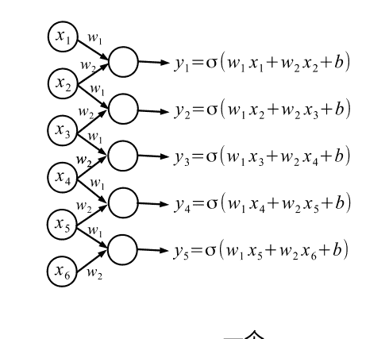

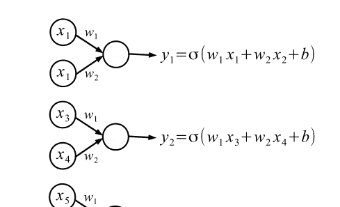

### 图16.2：两个卷积层：a步长为1；b步长为2。

所有缺失的箭头被赋予零权重。所有神经元具有相同的偏置 b。

$$
X^{(2)} = W^{(2)}(W^{(1)} X^{(0)} + B^{(1)}) + B^{(2)} = W X^{(0)} + B,
$$

具有稀疏类型的权重矩阵。这种组合提供了具有权重矩阵 \(W = W^{(2)} W^{(1)}\) 和偏置向量 \(B = W^{(2)} B^{(1)} + B^{(2)}\)。我们需要证明矩阵 \(W\) 也是稀疏类型的。我们将在图16.2 a， b中讨论这个问题。图16.2 a表示的卷积层的步长为1，只使用了两个共享权重， \(w_{1}\)， \(w_{2}\) （支持宽度为2）。我们考虑图16.3 a中的两层。然后 \(Y_{1}\) 取决于 \(X_{1}\)， \(X_{2}\)， \(X_{3}\)； \(Y_{2}\) 取决于 \(X_{2}\)， \(X_{3}\)， \(X_{4}\) 等等。卷积网络等效于图16.3 b中给出的两层网络。新网络依赖于三个共享权重， \(\nu_{1}\)， \(\nu_{2}\)， \(\nu_{3}\) （支持宽度为3），步长为1。图16.3 a， b中的两个网络都满足信息关系。

$$
\mathfrak{S}(Y_{1}) \subset \mathfrak{S}(X_{1}, X_{2}, X_{3}), \quad \mathfrak{S}(Y_{2}) \subset \mathfrak{S}(X_{2}, X_{3}, X_{4}) \\
\mathfrak{S}(Y_{3}) \subset \mathfrak{S}(X_{3}, X_{4}, X_{5}), \quad \mathfrak{S}(Y_{4}) \subset \mathfrak{S}(X_{4}, X_{5}, X_{6}).
$$

这可以通过说 \(Y_{1}\) 的感受野由单元 \(X_{1}\)， \(X_{2}\)， \(X_{3}\) 组成来表达，与全连接层的情况不同，全连接层的感受野将包含所有先前的神经元。因此，卷积层传递的信息比全连接层少。

在另一侧，卷积层如图16.2 b所示，步长为2，只使用两个共享权重， \(w_{1}\)， \(w_{2}\) （支持宽度为2）。我们考虑两层如图16.4 a所示的类型。卷积网络是

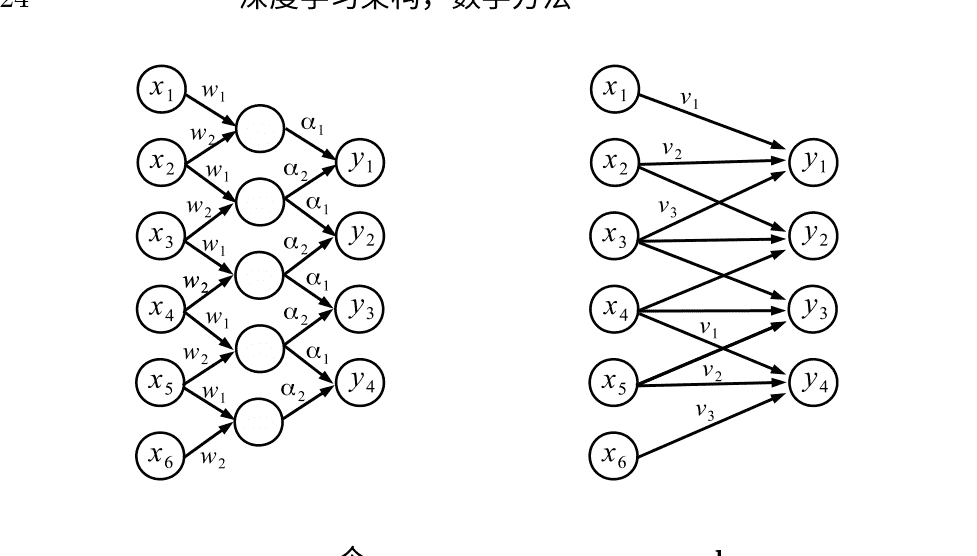

### 图16.3：两个等效的卷积网络： a一个隐藏层卷积网络，步长为1，支持宽度为2； b一个两层卷积网络，步长为1，支持宽度为3.

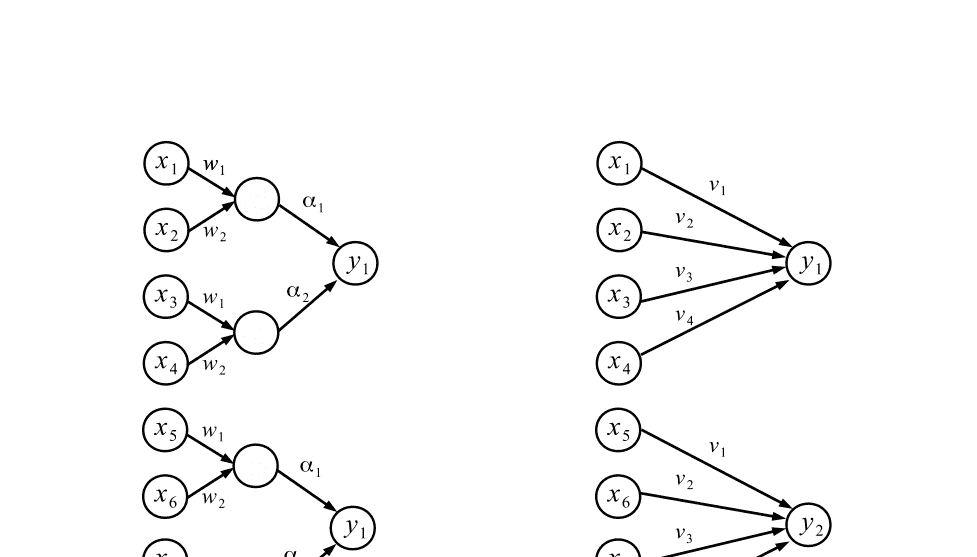

### 图16.4：两个等效的卷积网络： a一个隐藏层卷积网络，步长为2； b一个两层卷积网络，步长为4.

等同于图16.4 b中给出的两层网络。新网络依赖于四个共享权重，\(\nu_1, \nu_2, \nu_3, \nu_4\)（支持宽度为4），步长为1。图16.4中的两个网络a和b满足信息关系

$$
\mathfrak{S}(Y_1)\subset\mathfrak{S}(X_1, X_2, X_3, X_4), \quad \mathfrak{S}(Y_2)\subset\mathfrak{S}(X_2, X_3, X_4, X_5).
$$

特别地，\(Y_1\) 的感受野包括 \(X_1, X_2, X_3, X_4\)。

备注 16.4.1：卷积压缩信息。如果 \(s\) 表示步幅，则 \(d^{(\ell)}=d^{(\ell-1)}+s\)，即每一层的神经元数量减少步幅个数。由于 \(s\) 是一个小数，所以压缩比在池化的情况下更小。

## 16.5 二维输入的卷积层

在处理二维图像的情况下，卷积网络表现出色。在这种情况下，每个输入都是一张彩色图像（以RGB格式），可以看作是一个类型为 \(r \times c \times 3\) 的张量，其中 \(r\) 是图像的行数，\(c\) 是像素列数。这相当于 \(r \times c\) 的3个维度通道，每个通道对应一种颜色。在进一步讨论之前，我们首先讨论图像的空间切片与给定卷积核的卷积。

接下来，我们将用图16.5中给出的 \(2 \times 2\) 卷积核与一个 \(3 \times 3\) 的输入图像进行卷积，该图像由图16.5 b中的矩阵表示。卷积核与矩阵重叠，并在所有可能的位置上水平和垂直移动。在每个位置上，我们将卷积核条目和矩阵条目的乘积求和，得到输出的数字。卷积核的重叠从图像的左上角开始，向右滑动一个像素。然后，我们按照以下方式继续操作底部行：

$$
\begin{aligned}
1 \cdot 2 - 1 \cdot 1 + 2 \cdot 4 + 1 \cdot 3 &= 12 \\
1 \cdot 1 - 1 \cdot 1 + 2 \cdot 3 + 1 \cdot 5 &= 11 \\
1 \cdot 4 - 1 \cdot 3 + 2 \cdot 7 + 1 \cdot 6 &= 21 \\
1 \cdot 3 - 1 \cdot 5 + 2 \cdot 6 + 1 \cdot 0 &= 10.
\end{aligned}
$$

使用卷积运算符 \(*\)，前面的计算可以写成

$$
\begin{pmatrix} 2 & 1 & 1 \\ 4 & 3 & 5 \\ 7 & 6 & 0 \end{pmatrix} * \begin{pmatrix} 1 & -1 \\ 1 & 1 \end{pmatrix} = \begin{pmatrix} 12 & 11 \\ 21 & 10 \end{pmatrix}.
$$

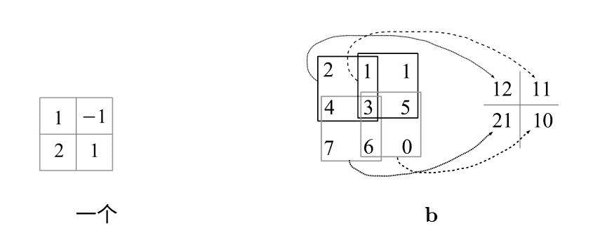

我们注意到一个2 × 2的核与一个3 × 3的图像之间的卷积结果是一个2 × 2的输出。一般来说，如果核的大小为 h × k，图像的大小为 H × K，则输出的大小为 \((H - h + 1) \times (K - k + 1)\)。对于任意步长的情况，请参见练习16.9.11。

在前面的例子中，图像的空间切片已经与一个2 × 2的核进行了卷积。这个操作也被称为特征图，因为这个过程可以检测不同类型的特征，取决于所使用的核，比如水平或垂直边缘、角点等，读者可以在练习部分中看到。

每个颜色通道可以分别使用相同或不同的卷积核进行卷积。然而，可以使用三阶张量对所有三个颜色通道的图像进行卷积，即使用相同类型的三个卷积核序列。在这种情况下，卷积操作的定义方式类似。卷积核在图像上的位置（0， 0， 0）上重叠，然后我们取它们的元素乘积的和来得到第一个输出。然后，卷积核从上到下，从左到右每次移动一个像素来完成操作。

对于固定的卷积核，张量 \(X^{(\ell)}\) 的元素可以通过三重索引项 \(X^{(\ell)}_{ijk}\) 来访问，其中 \(1\le i \le r^{(\ell)}\)，\(1\le j \le c^{(\ell)}\)，\(1\le k \le 3\)，参见图16.6。给定卷积核 \(w^{(\ell)}\) 和偏置 \(b^{(\ell)}\)，第 \(k\) 个通道对应于第 \(\ell\) 层的一个特征图由以下公式给出：\(X^{(\ell)}_{ijk} = \phi\left( \sum_{s} \sum_{p} X^{(\ell-1)}_{i+p, j+r, k} w^{(\ell)}_{prk} + b^{(\ell)} \right),\) 其中激活函数 \(\phi\) 通常取ReLU以避免梯度消失。

由于 \(k\) 代表颜色通道，因此 \(1 \leq k \leq 3\)。CNN 的第 \(\ell\) 层，\(X^{(\ell)}\)，由所有形式为 \(X^{(\ell)}_{ijk}\) 的三阶张量集合给出。对应于所有核 \(w^{(\ell)}\)。如果 \(f^{(\ell)}\) 表示特征图的数量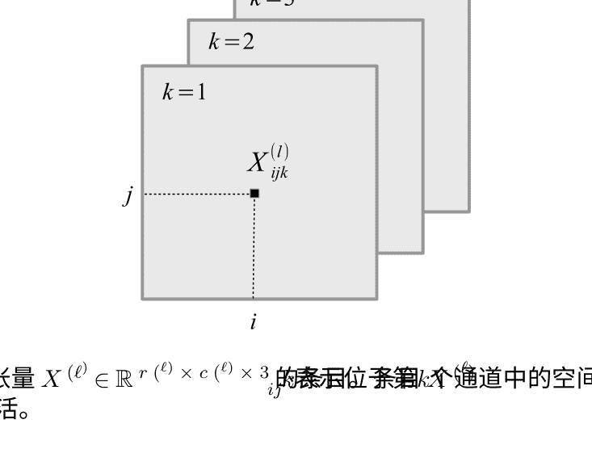

## 图 16.6: 张量 $X^{(\ell)} \in \mathbb{R}^{r^{(\ell)} \times c^{(\ell)} \times 3}$ 的表示，其中 $i, j$ 是空间位置，$k$ 是通道中的激活。

在第ℓ层中（该层使用的卷积核数量）， $r^{(\ell)} \times c^{(\ell)}$ 是图像在第ℓ层中的尺寸（行乘以列），然后我们可以将第ℓ层的输出写成一个4阶张量$X^{(\ell)} \in \mathbb{R}^{r^{(\ell)} \times c^{(\ell)} \times 3 \times f^{(\ell)}}$。

通常，序列$r^{(\ell)}$ 和$c^{(\ell)}$ 随ℓ减小。这是因为使用卷积层进行处理会导致图像尺寸减小，减小的数量等于步长<sup>1</sup>（此外，在卷积层之间使用池化也会压缩尺寸）。通道数保持不变，但特征数$f^{(\ell)}$ 随ℓ增加。

如果输入层表示为 $X^{(0)}$，则第一个隐藏层 $X^{(1)}$包含了输入层 $X^{(0)}$的特征。第二个隐藏层 $X^{(2)}$包含了 $X^{(1)}$的特征，即输入特征的特征。一般来说，每一层都包含了前一层的特征。最后，引入一个全连接层，将最后一个卷积层中的所有信息汇总起来，该层包含大量特征。如果网络用于分类目的，则可以使用softmax层，参见图16.7。

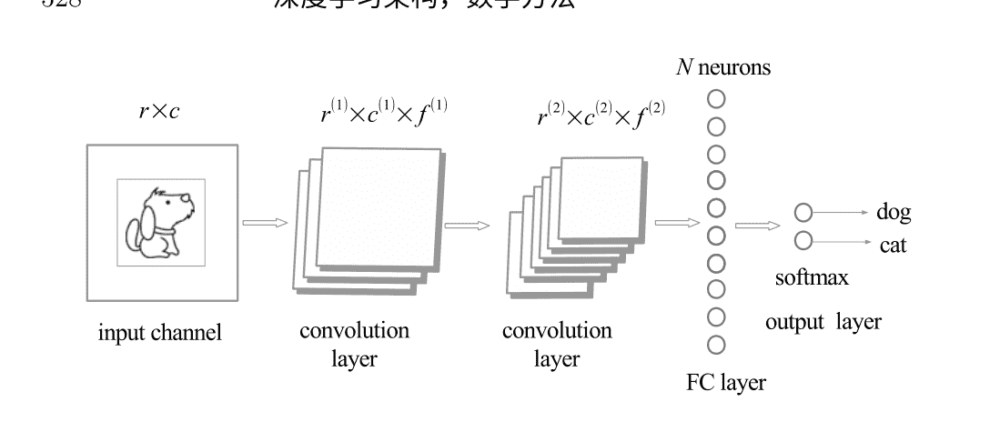

图16.7: 具有两个卷积层、一个全连接层和一个softmax层（输出层）的CNN。

## 16.6 CNN的几何结构

在第13章中，我们将每个神经网络与一个流形相关联。 网络的权重和偏置是相关流形上的坐标系。 它的维度等于网络参数的数量，可以用公式（13.3.8 ）表示为层大小。

$d^{(0)}d^{(1)} + d^{(1)}d^{(2)} + \cdots + d^{(\ell-1)}d^{(\ell)} + \cdots + d^{(L-1)}d^{(L)} + N_o$ (16.6.2)

在CNN中，权重和偏置在神经元之间共享，从而大大减少了网络的总参数数量，因此减小了相关输出流形的维度。 这个事实对正则化有影响，因此CNN通常不容易过拟合训练数据。

我们将在手头的两个例子上进行比较。 对于在图16.3中显示的CNN，相关神经网络的维度由2 + 2 + 5 + 4 = 13确定（四个权重和九个偏差）。 如果在层中保持相同数量的神经元，将该网络替换为全连接层网络，那么公式（13.3.8）得到的维度为6·5 + 5·4 + 5 + 4 = 59。

作为第二个例子，考虑在图16.4中显示的CNN。 然后，相关神经网络的维度由2 + 2 + 4 + 2 = 10确定（四个权重和六个偏差）。 相关的全连接层网络具有维度为6·4 + 4·2 + 4 + 2 = 38的关联流形。 我们注意到，在两种情况下，全连接层网络的神经流形维度都比类似的CNN网络大得多。对于所有CNN网络，这种现象通常成立。

## 16.7 等变性和不变性

卷积神经网络能够检测图像中的局部模式，而不考虑它们的位置。这是因为CNN确保对平移的等变性，参见命题16.3.3。这意味着如果输入图像被某个向量平移，那么网络的每个更高层中的激活模式也会被同样的向量平移。因此，CNN在图像识别任务中取得成功的关键组成部分是由于它们的等变性属性。

抽象的下一个层次是用输入的任何变换组替换平移集，并通过网络对于所考虑的变换的等变性来解释网络参数的对称性。

神经网络中的群论应用可以在Ravan-bakhsh等人的文章[100]，Kondor和Trivedi的文章[66]，Kondor的文章[65]，Cohen等人的文章[26,27]和Bart´ok等人的文章[13]中找到。在接下来的内容中，我们将使用上述论文中的思想来简要讨论这个新兴的研究方向。

### 16.7.1 群

下一个定义定义了一个代数结构，很快将会有用。

定义 16.7.1 群是一个集合 G，具有一个乘法运算 G × G → G，用乘法符号表示，并满足以下性质：

- (i) 对于任意的 g1, g2 ∈ G，有 g1 g2 ∈ G；
- (ii) 对于任意的 g1, g2, g3 ∈ G，有 g1(g2 g3) = (g1 g2) g3；
- (iii) 存在一个唯一的元素 e ∈ G，使得对于任意的 x ∈ G，有 xe = ex = x；
- (iv) 对于任意的 g ∈ G，存在一个 g^{-1} ∈ G，使得 gg^{-1} = g^{-1}g = e；

性质 (i) 表明 G 在群法则下是封闭的，而 (ii) 表示群法则是结合的；(iii) 表明群中存在中性元素；逆元素的存在由 (iv) 给出。

如果群法则组合中元素的顺序不重要，对于任意的 g1, g2 ∈ G，有 g1 g2 = g2 g1，那么群 G 被称为交换群。根据元素的数量，群 G 可以是有限的或无限的。

任何子集 H of G，在与 G 相同的法则下形成一个群，被称为子群，记作 H ≤ G。

例子 16.7.2 整数集合， G = Z，通过加法运算形成一个交换群。元素 n 的逆元素是 -n，中性元素是 $e = 0$. 同样地，整数格 $G = \mathbb{Z} \times \mathbb{Z}$，在分量上的加法

$$
(n_1, n_2) + (m_1, m_2) = (n_1+m_1, n_2+m_2)
$$
也形成一个可交换的群。它的中性元素是 $(0, 0)$。
集合 $H = 3\mathbb{Z} = \{3m; m \in \mathbb{Z}\}$ 形成了 $G$ 的一个子群，而集合 $K = \{(2i, 2j) ; i, j \in \mathbb{Z}\}$ 形成了 $\mathbb{Z} \times \mathbb{Z}$ 的一个子群。

例子 16.7.3

让 $v \in \mathbb{R}^3$ 是一个向量，并定义平移 $\tau v: \mathbb{R}^3 \to \mathbb{R}^3$ 为 $\tau v(x) = x + v$。集合 $G = \mathcal{T}(\mathbb{R}^3) = \{\tau v; v \in \mathbb{R}^3\}$ 在函数组合的情况下形成了一个群，称为 $\mathbb{R}^3$ 上的平移群。中性元素是 $\tau_0 = Id$，即 $\mathbb{R}^3$ 上的恒等变换。

例子 16.7.4 \quad $2 \times 2$ 矩阵

$$
R_{\theta} = \left( \begin{array}{cc} \cos \theta & -\sin \theta \\ \sin \theta & \cos \theta \end{array} \right)
$$
表示平面绕原点逆时针旋转 $\mathbb{R}^{2}$。这些旋转的集合，$SO(2) = \{R_{\theta}; \theta \in \mathbb{R}\}$，在矩阵乘法下形成一个群，称为 $\mathbb{R}^{2}$ 的特殊正交群。我们可以轻松地验证 $R_{\theta} R_{\theta'} = R_{\theta'} R_{\theta} = R_{\theta+\theta}$ 和 $R_{\theta}^{-1} = R_{-\theta}$。

由单位变换和180度旋转（或关于原点的翻转）形成的集合 $H = \{R_0, R_{\pi}\}$，是 $SO(2)$ 的一个子群。此外，由关于原点的90度旋转形成的集合 $K = \{R_0, R_{\pi/4}, R_{\pi/2}, R_{3\pi/4}\}$，也是$SO(2)$ 的另一个子群。

例子 16.7.5 集合 $G = \mathbb{R}^{3}$ 以及组合律

$$
(x_1, x_2, x_3) \circ (y_1, y_2, y_3) = (x_1 + y_1, x_2 + y_2, x_3 + y_3 + x_1 y_2)
$$
形成一个群，称为三维海森堡群。这不是一个交换群。一个元素的逆元是

$$
(x_1, x_2, x_3)^{-1} = (-x_1, -x_2, -x_3 + x_1 x_2).
$$
中性元素是 $e = (0, 0, 0)$。

### 16.7.2 群在集合上的作用

**定义 16.7.6:** 设 $G$ 是一个群，$M$ 是一个集合。$G$ 在 $M$ 上的作用是一个映射 $\alpha: G \times M \to M$，满足以下条件：

- (i) $\alpha(g, \alpha(g', x)) = \alpha(gg', x)$，对于任意的 $g, g' \in G$ 和 $x \in M$;
- (ii) $\alpha(e, x) = x$，对于任意的 $x \in M$。

我们说群 $G$ 以作用 $\alpha$ 作用于集合 $M$，元素 $g$ 在 $x$ 上的作用是 $\alpha(g, x)$。因此，部分 $(i)$ 表明 $gg'$ 在 $x$ 上的作用是先 $g$ 在 $x$ 上的作用，再 $g'$ 在结果上的作用。部分 $(ii)$ 表明单位元素的作用是恒等映射。对于群 $G$ 在集合 $M$ 上的任何作用 $\alpha: G \times M \to M$，都会产生一族 $M$ 的变换，如下所示。对于任意固定的 $g \in G$，定义 $T_g: M \to M$，满足 $T_g(x) = \alpha(g, x)$。这些变换的集合 $\{T_g; g \in G\}$，通过函数复合构成一个群。这是由作用的性质推出的，它暗示了 $T_g T_{g'} = T_{gg'}$ 和 $T_e x = x$。我们还有逆变换 $(T_g)^{-1} = T_{g^{-1}}$。

对于给定的元素 $x \in M$，集合 $O_x = \{T_g x; g \in G\}$ 被称为元素 $x$ 的轨道。如果 $y, z \in O_x$ 是元素 $x$ 的轨道中的两个元素，则存在 $g, g' \in G$ 使得 $y = T_g x$ 且 $z = T_{g'} x$。如果令 $u = g' g^{-1}$，则 $z = T_u y$，即 $z \in O_y$。事实上，可以证明 $O_x = O_y = O_z$。

定义 16.7.7

一个作用 $\alpha: G \times M \to M$ 被称为传递性，如果对于任意的两个元素 $x, y \in M$，存在 $g \in G$ 使得 $y = T_g x$。

等价地说，如果对于任意的 $x, y \in M$，我们有 $O_x = O_y$，那么作用 $\alpha$ 是传递的。事实上，如果作用 $\alpha$ 是传递的，那么它只有一个轨道，即 $M = O_x$，对于所有的 $x \in M$。

我们说 $M$ 是 $G$ 的一个齐次空间，如果对于任意的 $x, y \in M$，存在一个 $g \in G$ 使得 $y = \alpha(g, x)$。这等价于作用只有一个轨道。

例子 16.7.8

设 $M = \mathbb{R}^3$，$G = \mathcal{T}(\mathbb{R}^3)$，即向量加法下的平移群。那么 $G$ 在 $M$ 上的作用如下：如果 $x \in \mathbb{R}^3$ 是一个向量，$g = \tau_v$ 是向量 $v$ 的平移，那么我们定义 $g$ 在 $x$ 上的作用为 $\alpha(g, x) = \tau_v(x)$，即通过加上向量 $v$ 得到从 $x$ 得到的向量。更明确地说，我们有

$$\alpha(g, x) = \tau_v(x) = x + v.$$

读者可以轻松检查动作定义属性。动作是传递的，因为任何元素 $x \in \mathbb{R}^3$ 都可以转化为任何其他元素 $y \in \mathbb{R}^3$。

例子 16.7.9

考虑 $M = \mathbb{R}^2$ 和 $G = SO(2)$，即二维欧几里德平面 $\mathbb{R}^2$ 上绕原点旋转的群 $G$ 的组合操作。群 $G$ 对集合 $M$ 的作用如下：如果 $x \in \mathbb{R}^2$ 是一个向量，$g = R_{\theta}$ 是角度为 $\theta$ 的旋转，则我们定义 $g$ 对 $x$ 的作用为 $\alpha(g, x) = R_{\theta} x$，即从 $x$ 经过逆时针旋转角度 $\theta$ 得到的向量。更明确地说，我们有

$$\alpha(g, x) = \begin{pmatrix} \cos\theta & -\sin\theta \\ \sin\theta & \cos\theta \end{pmatrix} \begin{pmatrix} x_1 \\ x_2 \end{pmatrix} = \begin{pmatrix} x_1\cos\theta - x_2\sin\theta \\ x_1\sin\theta + x_2\cos\theta \end{pmatrix}.$$

这个动作不是可传递的。一个元素$x \in \mathbb{R}^2$的轨道是以原点为中心，半径为$||x||$的圆。

$$O_x = \{ y \in \mathbb{R}^2; \; ||y|| = ||x|| \}.$$

例子16.7.10 在这个例子中，$M=\mathbb{R}^3$，$G=(\mathbb{R}^3, \circ)$表示三维Heisenberg群。然后，$G$作用于$M$如下：

$$\alpha(g, x) = (g_1 + x_1, g_2 + x_2, g_3 + x_3 + g_1x_2),$$

其中，$g = (g_1, g_2, g_3)$ 且 $x = (x_1, x_2, x_3)$。检查$\alpha$是否为一个操作最简单的方法是注意到

$$\alpha(g, x) = L_g x, \quad\quad (16.7.3)$$

其中，$L_g$是群$(H, \circ)$上的左平移，即$L_g x = g \circ x$。然后

$$\alpha(g', \alpha(g, x)) = \alpha(g', L_g x) = L_{g'} L_g x = L_{g'g} x = \alpha(g'g, x).$$

操作的第二个性质显然满足，因为海森堡群中的单位元是$e = (0, 0, 0)$。值得注意的是，群对自身的操作$\alpha: G \times G \to G$，由关系(16.7.3)定义，称为左乘操作。海森堡群对空间$\mathbb{R}^3$的操作是传递的，因为对于任意的$x, y \in \mathbb{R}^3$，我们有$T_g(x) = y$，其中

$$g = (y_1 - x_1, y_2 - x_2, y_3 - x_3 + x_1x_2 - y_1x_2).$$

最后一个例子提出了当一个群 $G$作用于集合 $M = G$时的情况，即群本身；在这种情况下，作用被定义为 $\alpha : G \times G \to G$。如果我们定义 $\alpha(g, x) = xg^{-1}$，那么 $\alpha$被称为左乘法作用。如果考虑 $\alpha(g, x) = gxg^{-1}$，那么 $\alpha$被称为共轭作用。

### 16.7.3 函数的作用扩展

我们已经看到作用 $\alpha : G \times M \to M$对于每个群元素 $g \in G$在 $M$上引起了一个变换，即 $T_g : M \to M$。现在我们将这个变换扩展到 $M$上的函数。我们用 $\mathcal{F}(M) = \{f : M \to \mathbb{R}\}$表示$M$上的实函数集。对于任意元素 $g \in G$，我们通过$T_g f = f'$来定义变换 $T_g : \mathcal{F}(M) \to \mathcal{F}(M)$。

$$f'(T_g(x)) = f(x), \quad\quad x \in M.$$

这可以等价地写作

$$(T_g f)(x') = f(T_{g^{-1}}(x')), \quad \forall x' \in M.$$

我们需要这个概念，因为神经网络每一层的激活被视为函数。例如，每个MNIST数据被视为在维度为$28 \times 28$的集合 $M$上定义的函数，其取值为0到255之间的整数。

例16.7.11 让 $\mathbb{Z}$表示整数集合，并考虑群 $G= (\mathbb{Z} \times \mathbb{Z},+)$，其中对分量进行加法。这在格 $M = \mathbb{Z} \times \mathbb{Z}$ 上通过作用 $\alpha: G \times M \to M$

$$\alpha((g_1, g_2), (x_1, x_2)) = (g_1 + x_1, g_2 + x_2), \quad \forall g_i, x_i \in \mathbb{Z}.$$

在 $M$上引发的变换是

$$T_{(g_1,g_2)}(x_1, x_2) = (g_1 + x_1, g_2 + x_2), \quad \forall (x_1, x_2) \in \mathbb{Z} \times \mathbb{Z}.$$

在 $\mathcal{F}(\mathbb{Z} \times \mathbb{Z})$ 上的相关扩展变换为

$$(\mathbb{T}_{(g_1,g_2)} f)(x_1, x_2) = f(T_{(g_1,g_2)^{-1}}(x_1, x_2)) = f(x_1 - g_1, x_2 - g_2),$$

这是函数 $f$和向量平移之间的组合 $-(g_1, g_2)$.

例子 16.7.12 在例子 16.7.9的情况下，对于 $\mathbb{R}^2$ 上的诱导变换给出

$$T_{R_\theta} x = (x_1 \cos \theta - x_2 \sin \theta, x_1 \sin \theta + x_2 \cos \theta),$$

这是一个顺时针旋转角度为 $\theta$的变换。函数的扩展变换是

$$(\mathbb{T}_{R_\theta} f)(x) = f(\mathbb{T}_{R_\theta^{-1}} x) = f(x_1 \cos \theta + x_2 \sin \theta, x_2 \cos \theta - x_1 \sin \theta).$$

### 16.7.4 等变性的定义

考虑一个群 $G$在两个集合 $M_1$和 $M_2$上的作用，具有作用

$$\alpha_1: G \times M_1 \to M_1, \quad \alpha_2: G \times M_2 \to M_2.$$

然后对于任意 $g \in G$，这些操作会引起变换

$$T_g: M_1 \to M_1, \quad T_g': M_2 \to M_2.$$

考虑将变换扩展为函数

$$ \mathbb{T}_g : \mathcal{F}(M_1) \rightarrow \mathcal{F}(M_1), \quad \mathbb{T}'_g : \mathcal{F}(M_2) \rightarrow \mathcal{F}(M_2). $$

映射 $\Phi : \mathcal{F}(M_1) \rightarrow \mathcal{F}(M_2)$ 被称为 $G$-等变的，如果对于任意群元素 $g \in G$ 我们有

$$ \Phi(\mathbb{T}_g f) = \mathbb{T}'_g(\Phi(f)), \quad \forall f \in \mathcal{F}(M_1). $$

这些概念可以应用于神经网络，如下所示。我们考虑 $M_1$ 和 $M_2$ 分别为前馈神经网络输入和输出层中的神经元集合。这些层的激活，即输入 $x^{(0)}$ 和输出 $x^{(L)}$，分别是定义在 $M_1$ 和 $M_2$ 上的函数。函数 $\Phi = f_{w,b}$，它将输入 $x^{(0)}$ 映射到 $x^{(L)}$，是网络的输入-输出映射。网络相对于群作用 $G$ 的等变性质变为

$$ f_{w,b}(\mathbb{T}_g x^{(0)}) = \mathbb{T}'_g(f_{w,b}(x^{(0)})) = \mathbb{T}'_g(x^{(L)}), \quad \forall g \in G. \quad (16.7.4) $$

这表明输出 $x^{(L)}$ 会按照可预测的方式随着我们在由群作用引起的变换中转换输入 $x^{(0)}$。

网络的等变性可以在每一层上定义，如下所示，参见Kondor [66]。设 $\mathcal{N}$ 为一个前馈神经网络，具有 $L+1$ 个层和层激活函数 $x^{(0)}, x^{(1)}, \ldots, x^{(L)}$。如果 $M_\ell$ 表示第 $\ell$ 层中的神经元集合，则 $x^{(\ell)} \in \mathcal{F}(M_\ell)$。假设存在一个群 $G$，它对集合 $M_0, \ldots, M_L$ 进行作用。对 $\mathcal{F}(M_0), \ldots$ 进行的诱导变换分别由 $\mathbb{T}^{(0)}, \ldots, \mathbb{T}^{(L)}$ 表示。神经网络 $\mathcal{N}$ 被称为 $G$-等变前馈网络，如果输入通过 $x^{(0)} \rightarrow \mathbb{T}^{(0)}_g(x^{(0)})$ 进行变换时，然后层激活通过 $ x^{(\ell)} \rightarrow \mathbb{T}^{(\ell)}_g(x^{(\ell)}) $ 进行转换，对于所有 $g \in G$。

值得注意的是，这个定义适用于两种情况，即当神经元集合 $M_\ell$ 是离散的还是连续的时候。

## 16.7.5 卷积和等变性

等变性的原型示例是卷积网络，它对平移群的作用是等变的。用前面的符号表示，这意味着

$$ (\mathbb{T}_g x^{(0)}) * w = \mathbb{T}'_g(x^{(0)} * w), \quad \forall g \in G, $$

对于任何滤波器 $w$，参见图16.8。这个关系可以在离散和连续的情况下都得到证明。为了简单起见，我们只考虑一个多维情况。离散情况可以从下式推导出来：

$$[(\mathbb{T}_g x^{(0)}) * w]_{p} = \sum_{i} (\mathbb{T}_g x^{(0)})_{i+p} w_i = \sum_{i} x^{(0)}_{i+p-g} w_i = (x^{(0)} * w)_{p-g} = [\mathbb{T}_g'(x^{(0)} * w)]_{p}.$$

连续情况下的等变性验证如下

$$[(\mathbb{T}_g x^{(0)}) * w](t) = \int_{\mathbb{R}} (\mathbb{T}_g x^{(0)})(u+t) w(u) \,du = \int_{\mathbb{R}} x^{(0)}(u+t-g) w(u) \,du = (x^{(0)} * w)(t-g) = [\mathbb{T}_g'(x^{(0)} * w)](t).$$

之前的计算可以如下所示地应用于群组。

首先，对于离散群 $G$ 上定义的任意两个函数 $f, \psi$，定义它们的卷积为

$$(f * \psi)(t) = \sum_{y \in G} f(y) \psi(t^{-1} y).$$

验证 $G$-等变关系与之前的计算类似

$$\begin{align*} (\mathbb{T}_g x^{(0)} * w)(t) &= \sum_{y \in G} (\mathbb{T}_g x^{(0)})(y) \, w(t^{-1} y) = \sum_{y \in G} x^{(0)}(g^{-1} y) \, w(t^{-1} y) \\ &= \sum_{v \in G} x^{(0)}(v) \, w(t^{-1} g v) = \sum_{v \in G} x^{(0)}(v) \, w((g^{-1} t)^{-1} v) \\ &= \left( \mathbb{T}_g (x^{(0)} * w) \right)(t), \end{align*}$$

我们使用变量变换 $v = g^{-1} y$ 和变量 $v \in g^{-1} G = G$。

等变理论可以扩展到连续紧致群，参见[66]。在这种情况下，任意两个函数 $f, \psi : G \rightarrow \mathbb{R}$ 的卷积定义为

$$(f * \psi)(t) = \int_{G} f(y) \psi(t^{-1} y) \, d\mu(y),$$

其中 $\mu$ 是 $G$ 上的左平移不变测度，满足 $\mu(G)=1$，称为 $G$ 上的Haar测度。等变性的验证与离散情况类似，将求和替换为积分，并使用Haar测度的不变性属性。

$$\begin{align*} (\mathbb{T}_g x^{(0)} * w)(t) &= \int_{G} (\mathbb{T}_g x^{(0)})(y) w(t^{-1} y) d\mu(y) = \int_{G} x^{(0)}(g^{-1} y) w(t^{-1} y) d\mu(y) \\ &= \int_{G} x^{(0)}(v) w(t^{-1} g v) d\mu(v) = \int_{G} x^{(0)}(v) w((g^{-1} t)^{-1} v) d\mu(v) \\ &= \left( \mathbb{T}_g (x^{(0)} * w) \right)(t). \end{align*}$$

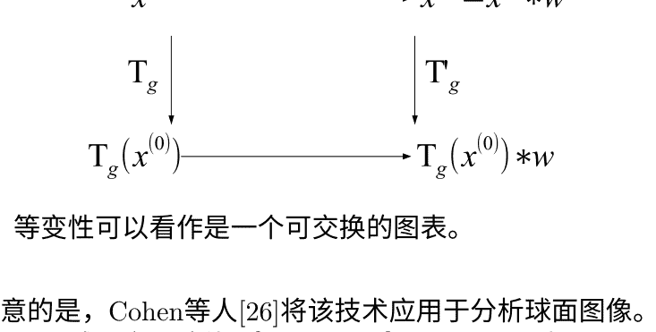

## 图16.8: 等变性可以看作是一个可交换的图表。

值得注意的是，Cohen等人[26]将该技术应用于分析球面图像。他们将卷积的定义从平面域适应到球体 $\mathbb{S}^2 = \{x \in \mathbb{R}^3; \|x\|=1\}$ 通过

$$(f * \psi)(R) = \int_{\mathbb{S}^2} f(x) \psi(R^{-1} x) dx,$$

其中 $\psi, f : \mathbb{S}^2 \rightarrow \mathbb{R}$ 是两个球形信号， $R \in SO(3)$ 是一个旋转。他们使用特殊正交群 $SO(3)$ （即保持距离且行列式为1的 $3 \times 3$ 矩阵的群） 对球面 $\mathbb{S}^2$ 进行旋转等变性的证明。

即使平面卷积总是对平移群的作用等变的， 但对于旋转群 $SO(2)$ 来说，除非做出一些额外的假设，它不是协变的。这是通过以下方式实现的。

设 $R \in SO(2)$ 是平面的一个旋转， $f, w : \mathbb{R}^2 \rightarrow \mathbb{R}$。那么

$$
[(\mathbb{T}_R f) * w](x) = \sum_{y \in \mathbb{Z}^2} (\mathbb{T}_R f)(y) w(y - x) = \sum_{y \in \mathbb{Z}^2} f(R^{-1}y) w(y - x) \\
= \sum_{u \in \mathbb{Z}^2} f(u) w(Ru - x) = \sum_{u \in \mathbb{Z}^2} f(u) w(R(u - R^{-1}x)) \\
= \sum_{u \in \mathbb{Z}^2} f(u) (\mathbb{T}_{R^{-1}}w)(u - R^{-1}x) \\
= (f * \mathbb{T}_{R^{-1}}w)(R^{-1}x) = \mathbb{T}_R(f * \mathbb{T}_{R^{-1}}w).
$$

如果我们将会 $f$ 视为一个信号， $w$ 为一个滤波器，并且进一步假设 $w$ 是一个旋转不变的滤波器， 即 $\mathbb{T}_{R^{-1}}w = w$， 则前面的公式变为

$$[(\mathbb{T}_R f) * w](x) = \mathbb{T}_R(f * \mathbb{T}_{R^{-1}}w) = \mathbb{T}_R(f * w),$$ 表示平面卷积与旋转不变滤波器的协方差。

在群 $G = \mathbb{Z}^2$ 的情况下，我们考虑旋转 $R$ 为格点 $\mathbb{Z}^2$ 关于原点的90度、180度和270度旋转。在这种情况下，滤波器的旋转不变性， $w(Rx) = w(x)$，成为

$$w_{i,j} = w_{-j,i} = w_{i,-j} = w_{j,-i}, \quad \forall(i, j) \in \mathbb{Z}^2.$$

## 16.7.6 不变性的定义

不变性是等变性的一个特例。在这种情况下，当输入通过变换族 $\{\mathbb{T}_g; g \in G \}$ 时，网络输出不会改变。在这种情况下，公式 (16.7.4) 变为

$$f_{w,b}(\mathbb{T}_g x^{(0)}) = f_{w,b}(x^{(0)}) = x^{(L)}, \quad \forall g \in G.$$

这意味着对于所有 $g \in G$，都有 $\mathbb{T}'_g = \mathrm{Id}$，其中 $\mathrm{Id}$ 是 $\mathcal{F}(M_L)$ 的恒等映射。因此，对于任何 $f \in \mathcal{F}(M_L)$

$$(\mathbb{T}'_g f)(x) = f(T'_{g^{-1}}(x)) = f(x), \quad \forall x \in M_L.$$

因此，对于所有 $x \in M_L$ 和 $g \in G$，有 $T'_g(x) = x$。这等价于 $M_L$ 中每个元素的轨道就是元素本身，即 $\mathcal{O}_x = \{x\}$，对于所有 $x \in M_L$。

网络不变性的原型示例出现在池化的情况下，参见第15.2节。接下来我们将在群的背景下讨论池化过程。

设 $G$ 为一个群， $f : G \rightarrow \mathbb{R}$ 为一个特征映射。$^2$ 设 $U \subset G$ 为 $G$ 的一个子集，其中包含中性元素 $e \in U$，称为池化域。最大池化算子 $\mathcal{P}$，由 $\mathcal{P} f: G \rightarrow \mathbb{R}$ 定义

$$(\mathcal{P} f)(x) = \max_{u \in xU} f(u).$$

一个特殊情况是当池化域 $U$ 是一个子群 $H \leq G$ 时。那么池化域 $\{xH; x \in G\}$ 构成了群 $G$ 的一个划分，即如果 $x, y \in G$，则 $xH = yH$ 或 $xH \cap yH = \varnothing$。此外，如果 $G$ 是一个有限群，则 $H$ 和 $xH$ 具有相同的元素数量，参见练习 16.9.12。划分集合 $\{ xH; x \in G\}$ 称为陪集，并表示以下等价关系在 $G$ 上的等价类。

$$x \sim y \iff x^{-1}y \in H.$$

$^2$ 如果 $f: M \rightarrow \mathbb{R}$，则 $f$ 是一个激活映射，因为它描述了集合 $M$ 中神经元的激活。然而，如果 $f: G \rightarrow \mathbb{R}$，则 $f$ 是一个特征映射，因为它描述了群 $G$ 捕捉到的特征。

池化在余集空间上引入了一个应用 $\phi$。

$$\phi(xH) = (\mathcal{P} f)(x).$$

### 例子 16.7.13

这是一个使用 $2 \times 2$ 池化域的经典最大池化示例，它在整数的二维格点上移动。

为此，让 $G = \mathbb{Z} \times \mathbb{Z}$ 成为一个具有分量加法的群，并考虑激活 $f: G \to \mathbb{R}$。考虑池化域

$$U = \{(i, j); -2 \leq i \leq 2, -2 \leq j \leq 2\}.$$

池化变为 $(\mathcal{P} f)(x) = \max_{u \in x+U} f(u)$，其中

$$x + U = \{(i, j); -2 + x_1 \leq i \leq 2 + x_1, -2 + x_2 \leq j \leq 2 + x_2\},$$

是域 $U$ 的平移，向量为 $(x_1, x_2)$，$x_i \in \mathbb{Z}$。

如果池化域是 $G$ 的子群

$$H = \{(3n_1, 3n_2); (n_1, n_2) \in \mathbb{Z} \times \mathbb{Z}\}$$

那么最大值是在 $x$ 的3像素倍数的偏移上取得的，这对应于步长为2像素。

在群组上下文中，最大池化不变性在下一个结果中显示，[27]。

### 命题 16.7.14

池化与群作用可交换：

$$\mathcal{P}(\mathbb{T}_g f)(x) = \mathbb{T}_g(\mathcal{P} f)(x), \quad \forall x, g \in G, \quad f: G \to \mathbb{R}.$$

证明：进行替换 $u = g^{-1}h$ 并使用 $\mathbb{T}_g$ 的定义，我们有

$$\begin{aligned}
\mathcal{P}(\mathbb{T}_g f)(x) &= \max_{h \in xU} \mathbb{T}_g f(h) = \max_{h \in xU} f(g^{-1}h) \\
&= \max_{u \in g^{-1}xU} f(u) = \mathcal{P}f(g^{-1}x) \\
&= \mathbb{T}_g(\mathcal{P} f)(x).
\end{aligned}$$

### 备注 16.7.15

为了简单起见，我们只考虑了只有一个通道的激活和滤波器。结果可以通过考虑 $f, w: M \to \mathbb{R}^K$，其中 $K$ 是通道的数量来扩展。

在离散情况下，卷积可以定义为

$$(f*w)(g) = \sum_{y\in G} \sum_{k=1}^{K} f_k(y) w_k(g^{-1}y) = \sum_{y\in G} \langle f(y), w(g^{-1}y) \rangle.$$

在连续情况下

$$(f*w)(g) = \int_{G} \sum_{k=1}^{K} f_k(y) w_k(g^{-1}y) \, d\mu(y) = \int_{G} \langle f(y), w(g^{-1}y) \rangle \, d\mu(y),$$

其中 $\mu$ 是紧致群 $G$ 上的哈尔测度。

## 16.8 总结

CNN是专门处理图像数据的神经网络。它们在实际应用中非常成功，例如手写数字识别。CNN包含卷积层，使用卷积与核心进行计算，而不是常规的矩阵乘法。核心通常是相对较小维度的矩阵，与输入图像的维度相比较小。

在CNN中，层之间具有稀疏的相互作用，并共享权重和偏置。一个与核心尺寸匹配的局部感受野，一次滑动一个（或多个）像素，首先水平滑动，然后垂直滑动，从上到下，直到完全扫描整个输入数据。核心条目与感受野激活之间的乘积之和产生一个数字，该数字作为特征图中的一个条目存储。输入数据与每个核心之间的卷积产生不同的特征图，这些特征图保留了数据的某些特征，如角点、边缘或其他简单形状。

使用一定数量的内核来生成特征图。在多层CNN的情况下，后面的层由特征组成。卷积层和池化层交替使用。最后，CNN包含一个（或多个）全连接层，然后是输出层的softmax激活。

卷积神经网络能够检测图像中的局部模式，而不考虑它们的位置，因为CNN对平移具有等变性。这意味着如果输入图像被某个向量平移，那么网络中每个更高层的激活模式也会被同样的向量平移。等变性属性可以定义在神经网络的层上作用的任何变换群上。该理论适用于离散群和连续紧致群。

## 16.9 练习

- 练习 16.9.1 计算以下矩阵卷积：

$$\begin{pmatrix} 3 & 1 & 1 \\ 4 & 2 & 0 \\ 5 & -1 & 1 \end{pmatrix} * \begin{pmatrix} -1 & 0 \\ 1 & -2 \end{pmatrix}$$

- 练习 16.9.2 (a) 针对一维输入，制定并证明16.3.3命题的一个变体。
(b) 如果输入是张量，平移等变性是否仍然成立？

- 练习 16.9.3 (Sobel算子) (a) 证明图像与 $3 \times 3$ 卷积核的卷积

$$K = \begin{pmatrix} 1 & 2 & 1 \\ 0 & 0 & 0 \\ -1 & -2 & -1 \end{pmatrix}$$

强调水平边缘检测。
(b) 证明与转置卷积核 $K^T$ 的卷积可以过滤垂直边缘。

- 练习 16.9.4 证明图像与以下 $3 \times 3$ 卷积核的卷积可以模糊图像：
(a) （均值模糊）

$$K = \begin{pmatrix} 1/9 & 1/9 & 1/9 \\ 1/9 & 1/9 & 1/9 \\ 1/9 & 1/9 & 1/9 \end{pmatrix}$$

(b) （高斯模糊）

$$K = \begin{pmatrix} 1/16 & 1/8 & 1/16 \\ 1/8 & 1/4 & 1/8 \\ 1/16 & 1/8 & 1/16 \end{pmatrix}$$

- 练习 16.9.5 提供支持事实的论据，即图像与 $3 \times 3$ 卷积核的卷积

$$K = \begin{pmatrix} 0 & -1 & 0 \\ -1 & 5 & -1 \\ 0 & -1 & 0 \end{pmatrix}$$

可以使图像更加清晰。

练习16.9.6 考虑以下 $3 \times 3$ 卷积核
$$K_{1}=\left(\begin{array}{rrr} 1 & 0 & -1 \\ 0 & 0 & 0 \\ -1 & 0 & 1 \end{array}\right), \quad K_{2}=\left(\begin{array}{rrr} 0 & 1 & 0 \\ 1 & -4 & 1 \\ 0 & 1 & 0 \end{array}\right)$$
$$K_{3}=\left(\begin{array}{rrr} -1 & -1 & -1 \\ -1 & 8 & -1 \\ -1 & -1 & -1 \end{array}\right).$$
展示支持使用这些卷积核进行边缘检测的参数。请注意，每个卷积核中的元素之和为0。这意味着什么？

练习16.9.7 考虑以下卷积图像处理：原始图像中的每个像素值减去其左侧相邻像素值。编写一个 $3 \times 3$ 的卷积核来执行此操作。

练习16.9.8 设 $y$ 为二维离散信号。如果 $C$ 和 $P$ 分别表示卷积和池化操作符，则展示以下关系：
- (a) $P \circ C(T_{a, b} \circ y)=P \circ C(y)$.
- (b) $C \circ P(T_{a, b} \circ y)=C \circ P(y)$.

练习16.9.9 如果想要对图16.7中给出的CNN进行正则化，应该在哪一层使用dropout技术？

练习16.9.10 解释为什么在输入和深度、宽度相同的两个网络中，CNN比全连接神经网络更不容易过拟合。

练习16.9.11 卷积层压缩信息，即输出大小小于输入大小。
- (i) 对于一维卷积层，如果 $N$ 表示输入的大小，使用大小为 $F$ 的滤波器以步长 $S$ 移动，我们得到大小为 $O$ 的输出，公式如下：
$$O = \frac{N - F}{S} + 1.$$
如果使用填充，表示为 $P$，则公式变为
$$O = \frac{N - F + 2P}{S} + 1.$$
- (ii) 在二维卷积层的情况下，如果输入维度是 $W_1 \times H_1$，而 $F$ 是一个正方形滤波器的大小，那么输出的维度为 $W_2 \times H_2$，其中
$$W_2 = \frac{W_1 - F + 2P}{S} + 1, \quad H_2 = \frac{H_1 - F + 2P}{S} + 1.$$

练习16.9.12 设 $H$ 是群 $G$ 的一个子群，$x \in G$。记作 $xH = \{xh; h \in H\}$。证明子集 $xH$ 具有以下性质：
- (i) $x \in xH$;
- (ii) 如果 $x, y \in G$，则要么 $xH = yH$，要么 $xH \cap yH = \emptyset$;
- (iii) 如果 $G$ 是一个有限群，则 $H$ 和 $xH$ 具有相同数量的元素;
- (iv) 考虑定义在 $G \times G$ 上的关系“$\sim$”，由 $x \sim y \iff y^{-1}x \in H$ 定义。证明“$\sim$”满足以下条件：
  - (a) $x \sim x$
  - (b) $x \sim y \Rightarrow y \sim x$;
  - (c) $x \sim y$ 且 $y \sim z \Rightarrow x \sim z$.

## 第17章 循环神经网络

前馈全连接神经网络不能成功地用于建模数据序列。一些基本原因如下：它们无法处理可变长度的输入序列，不共享参数，无法跟踪长期依赖关系，也无法保持输入数据的顺序信息。因此，需要一种能够成功处理所有前述要求的神经网络架构。这就是循环神经网络，或者RNN（Rumelhart等人[108]），本章的主题。

### 17.1 状态系统

状态系统比循环神经网络更容易理解，并且将构成后续关于循环神经网络的讨论的基础。这就是为什么我们将从这里开始的原因。

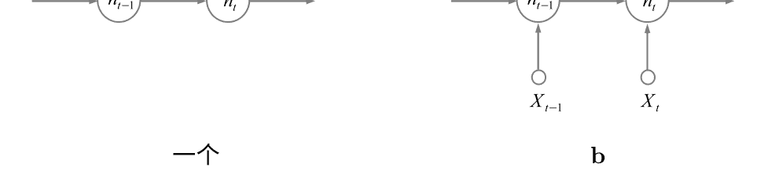
图17.1： a.一个与外部隔离的动力系统，由方程 (17.1.1) 给出。 b.一个由过程 $X_t$ 驱动的动力系统，由方程 (17.1.2) 给出。

考虑一个动力系统，其状态 $h_t$ 在时间 $t$ 更新为
$$h_t = f(h_{t-1}; \theta), \quad t \geq 1 \tag{17.1.1}$$
其中转移函数 $f : \mathbb{R}^k \times \mathbb{R}^m \to \mathbb{R}^k$ 是一个 Borel 可测函数，$\theta \in \mathbb{R}^m$ 表示一个独立于 $t$ 的向量参数，参见图17.1 a。我们假设状态 $h_t$ 是随机变量（离散或连续的），并用 $\mathcal{H}_t = \sigma(h_t)$ 表示由 $h_t$ 生成的 $\sigma$-代数（请参见附录中的第 D.5 节的定义）。每个状态 $h_t$ 包含一些关于动力系统的信息，$\mathcal{H}_t$。由于状态 $h_t$ 由 $h_{t-1}$ 确定，命题 D.5.1 暗示 $\mathcal{H}_t \subset \mathcal{H}_{t-1}$，即，我们得到一个降序的 $\sigma$-代数序列。也就是说，每个状态包含的信息比前一个状态包含的信息少或相同。

如果在第一个参数中 $f(\cdot; \theta)$ 是可逆的，那么 $\mathcal{H}_t = \mathcal{H}_{t-1}$，也就是说，信息不会缩小。然而，这个条件太过严格，在一般情况下，随着 $t$ 的增加，信息会严格减少。接下来，我们将考虑一个类似的例子，涉及到收缩原理的应用，定理7.7.1。

例子17.1.1 假设 $f$ 是可微的，并且满足不等式 $\|\partial f / \partial h\| < \lambda < 1$。然后根据均值定理，函数 $f$ 在第一个参数中成为 $\lambda$-收缩
$$\|f(h; \theta) - f(h'; \theta)\| \leq \max_h \|\partial_h f\| \|h - h'\| < \lambda \|h - h'\|, \quad \text{对于任意的 } h, h' \in \mathbb{R}^k.$$
对于样本空间中的任意两个状态，$\omega, \omega' \in \Omega$，我们将通过展开递归来评估它们在时间 $t$ 时对应状态之间的距离
$$\|h_t(\omega) - h_t(\omega')\| = \|f(h_{t-1}(\omega); \theta) - f(h_{t-1}(\omega'); \theta)\| < \lambda \|h_{t-1}(\omega) - h_{t-1}(\omega')\| < \lambda^2 \|h_{t-2}(\omega) - h_{t-2}(\omega')\| < \cdots < \lambda^t \|h_0(\omega) - h_0(\omega')\|.$$
由于随机变量 $h_0$ 几乎处处有限，因此对于几乎所有的 $\omega$ 和 $\omega'$，$\|h_0(\omega) - h_0(\omega')\|$ 是有限的。当 $t \to \infty$ 并使用挤压定理时，我们得到极限
$$\lim_{t \to \infty} \|h_t(\omega) - h_t(\omega')\| = 0,$$
对于几乎所有的 $\omega$ 和 $\omega'$。这意味着极限 $\lim_{t \to \infty} h_t = c$，几乎处处为常数，并且这种收敛几乎必然发生，即 $\mathbb{P}(\omega; h_t(\omega) \to c) = 1$。事实上，$c$ 是收缩函数 $f$ 的不动点，即
$$f(c; \theta) = c.$$
很明显，$c$取决于参数$\theta$。在这个例子中，sigma-代数$\mathcal{H}_t$的序列是严格递减的，其下限$\mathcal{H}_{\infty} = \bigcap_{t \ge 1} \mathcal{H}_t = \mathfrak{S}(c) = \{\emptyset, \Omega\}$，这是平凡的sigma-代数。因此，在长期运行中，系统失去了所有的信息。忘记过去的信息是具有收缩转换函数的动力系统的特征。这将构成递归神经网络中梯度消失问题的原因，这将在本章后面讨论。

由于一般情况下，$\mathcal{H}_t$所投射的信息随着$t$的增加而减少，我们将在每个时间点考虑插入到系统中的额外信息。因此，我们考虑由随机过程$X_t$驱动的动力系统，$t \ge 1$。在这种情况下，递归可以写成
$$h_t = f(h_{t-1}, X_t; \theta), \qquad t \ge 1, \qquad (17.1.2)$$
见图17.1 b。由于$h_t$现在由$h_{t-1}$和$X_t$决定，我们得到$\mathcal{H}_t \subset \mathfrak{S}(h_{t-1}, X_t)$。使用两个随机变量的联合$\sigma$-代数的定义
$$\mathfrak{S}(h_{t-1}, X_t) = \mathfrak{S}(\mathfrak{S}(h_{t-1}) \cup \mathfrak{S}(X_t)) = \mathfrak{S}(\mathcal{H}_{t-1} \cup \mathcal{I}_t),$$
前面的包含变为
$$\mathcal{H}_t \subset \mathfrak{S}(\mathcal{H}_{t-1} \cup \mathcal{I}_t), \qquad (17.1.3)$$
其中$\mathcal{I}_t$表示由输入变量$X_t$生成的输入信息。

**命题 17.1.2** 考虑一个具有给定初始状态$h_0$并由随机过程$X_t$驱动的动力系统，如(17.1.2)所示。那么
$$\mathcal{H}_t \subset \mathfrak{S}(\mathcal{I}_1 \cup \cdots \cup \mathcal{I}_t). \qquad (17.1.4)$$

**证明：** 该证明是通过重复应用公式(17.1.3)和练习17.10.1得出的，这意味着
$$\mathcal{H}_t \subset \mathfrak{S}(\mathcal{H}_{t-1} \cup \mathcal{I}_t)$$
$$\subset \mathfrak{S}(\mathfrak{S}(\mathcal{H}_{t-2} \cup \mathcal{I}_{t-1}) \cup \mathcal{I}_t) = \mathfrak{S}(\mathcal{H}_{t-2} \cup \mathcal{I}_{t-1} \cup \mathcal{I}_t).$$
归纳地，我们得到
$$\mathcal{H}_t \subset \mathfrak{S}(\mathcal{H}_0 \cup \mathcal{I}_1 \cup \cdots \cup \mathcal{I}_t).$$
由于$h_0$是给定的常数，所以$\mathcal{H}_0 = \{\emptyset, \Omega\}$，因此$\mathcal{H}_0 \cup \mathcal{I}_1 \cup \cdots \cup \mathcal{I}_t = \mathcal{I}_1 \cup \cdots \cup \mathcal{I}_t$。
$\blacksquare$

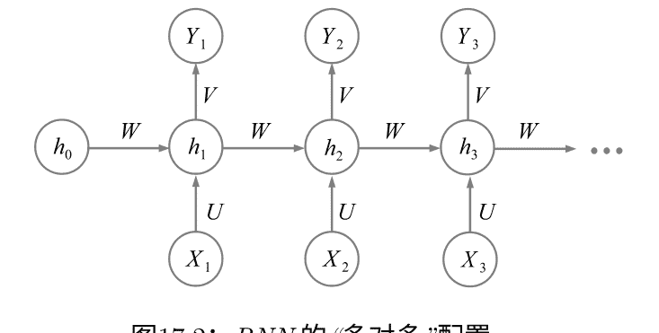

注记17.1.3 值得注意的是使用了依赖变量。展开后我们有
$$h_t = f(h_{t-1}, X_t) = f(f(h_{t-2}, X_{t-1}), X_t) = g(h_{t-2}, X_{t-1}, X_t),$$
其中 $g$ 是可测的。由于 $h_t$ 是由 $h_{t-2}$、$X_{t-1}$ 和 $X_t$ 决定的，根据命题 D.5.1，我们得到 $\mathfrak{S}(h_t) \subset \mathfrak{S}(h_{t-2}, X_{t-1}, X_t)$。

### 17.2 循环神经网络

递归神经网络可以通过几种方式引入。
1. 首先，它可以被视为具有状态属性的系统，每个状态（除了初始状态）都提供一个结果，参见图17.2。因此，状态 $h_t$ 从前一个状态 $h_{t-1}$ 和当前输入 $X_t$ 获取信息，并提供结果 $Y_t$ 和下一个状态 $h_{t+1}$ 的输入。状态 $h_t$ 被称为RNN的第 $t$ 个隐藏状态。$X_t$ 和 $Y_t$ 分别是输入和输出。
2. 我们还可以将RNN视为一系列普通的前馈神经网络，$X_t \to h_t \to Y_t$（具有输入层 $X_t$，隐藏层 $h_t$ 和输出层 $Y_t$），它将信息从一个隐藏层传递到下一个隐藏层。RNN的前向传播的标准方程如下所示
$$h_t = \tanh(W h_{t-1} + U X_t + b) \tag{17.2.5}$$
$$Y_t = V h_t + c. \tag{17.2.6}$$
因此，隐藏状态的取值范围在 $-1$ 和 $1$ 之间，输出是当前隐藏状态的仿射函数。过渡函数 $f$ 是双曲正切和仿射函数的组合。参数 $\theta = (W, U, b, c)$ 包括两个矩阵和两个向量。矩阵 $W$ 和 $U$ 表示隐藏到隐藏状态的转换和输入到隐藏状态的转换。矩阵 $V$ 表示隐藏状态到输出的转换，而 $b$ 和 $c$ 是偏置向量。

### 17.3 循环神经网络中的信息

首先，我们介绍一些术语。由 $X_t$ 生成的输入信息表示为 $\mathcal{I}_t$。隐藏信息由隐藏状态生成，$\mathcal{H}_t = \mathfrak{S}(h_t)$，输出信息由输出生成，$\mathcal{E}_t = \mathfrak{S}(Y_t)$。本节讨论这些 sigma 代数之间的关系。

第一个结果显示输出信息与输入和隐藏信息的关系。

命题17.3.1 考虑具有给定初始状态 $h_0$ 和输入 $X_t$ 满足正向传播 (17.2.5)-(17.2.6) 的 RNN。那么
$$\mathcal{E}_t \subset \mathcal{H}_t \subset \mathfrak{S}(\mathcal{I}_1 \cup \cdots \cup \mathcal{I}_t). \tag{17.3.7}$$
证明：根据关系 (17.2.6)，变量 $Y_t$ 由 $h_t$ 决定，所以根据命题 D.5.1，我们有 $\mathfrak{S}(Y_t) \subset \mathfrak{S}(h_t)$，这显示了 (17.3.7) 的第一个包含关系。第二个包含关系由命题 17.1.2 得出。

自然而然地考虑每个时间步骤中插入到系统中的信息 $\mathcal{I}_t$ 是“新”的情况，即输入变量 $X_t$，$t \in \{1,2,...\}$ 是独立的情况。我们得到以下历史独立性属性。

命题17.3.2 考虑一个具有给定初始状态 $h_0$ 和独立输入 $X$ 的 RNN，满足前向传播 (17.2.5)-(17.2.6)。那么 sigma-代数 $\mathcal{E}_{t-1}$ 和 $\mathcal{H}_{t-1}$ 与 $\mathcal{I}_t$ 是独立的（即 $Y_{t-1}$ 和 $h_{t-1}$ 与 $X_t$ 是独立的）。

证明：由于 $X_t$ 是独立于 $X_1,...,X_{t-1}$，那么 $\mathcal{I}_t$ 是与 $\{\mathcal{I}_1,...,\mathcal{I}_{t-1}\}$ 独立的信息体。它们生成的 sigma-代数 $\mathfrak{S}(\mathcal{I}_1 \cup \cdots \cup \mathcal{I}_{t-1})$ 也是独立于 $\mathcal{I}_t$ 的。根据命题17.3.1，我们有 $\mathcal{H}_{t-1} \subset \mathfrak{S}(\mathcal{I}_1 \cup \cdots \cup \mathcal{I}_{t-1})$，因此 $\mathcal{H}_{t-1}$ 也是独立于 $\mathcal{I}_t$ 的。$\mathcal{E}_{t-1}$ 独立于 $\mathcal{I}_t$ 的事实来自于包含关系 $\mathcal{E}_{t-1} \subset \mathcal{H}_{t-1}$，参见命题17.3.1。

为了评估使用熵的信息，我们假设变量 $h_t, X_t,$ 和 $Y_t$ 具有相同的向量维度，所以 $U, V,$ 和 $W$ 是方阵。

命题17.3.3 假设变量 $h_t$, $X_t$, 和 $Y_t$ 具有相同的向量维度，并且 $(X_t)_{t\geq 1}$ 是独立的随机变量。
- (a) 一个隐藏状态相对于前一个状态的条件熵满足
$$ H(h_t|h_{t-1}) < H(X_t) + \ln |\det U| $$
- (b) 输出相对于前一个隐藏状态的条件熵满足
$$ H(Y_t|h_{t-1}) < H(X_t) + \ln |\det(UV)| $$

证明: (a) 令 $a_t = W h_{t-1} + U X_t + b$, 所以 $h_t= \tanh a_t$. 我们使用命题12.1.2来评估条件熵
$$ \begin{aligned}
H(h_t|h_{t-1}) &= H(\tanh(a_t)|h_{t-1}) \\
&= H(a_t|h_{t-1}) - \mathbb{E}^{P_{a_t|h_{t-1}}}[\ln |\det J_{\tanh^{-1}}(h_t)|]. \quad (17.3.8)
\end{aligned} $$
我们接下来计算雅可比矩阵. 由于 $a_t= \tanh^{-1}(h_t)$, 而 $\tanh^{-1}$ 作用于分量上, 所以 $a^j_t= \tanh^{-1}(h^j_t)$, 因此
$$ J_{\tanh^{-1}}(h_t) = \left(\frac{\partial a^i_t}{\partial h^k_t}\right)_{j,k} = \left(\frac{\partial \tanh^{-1}(h^i_t)}{\partial h^k_t}\right)_{j,k} = \frac{\delta_{ik}}{1 - (h^i_t)^2} $$
由于雅可比矩阵是对角矩阵，因此
$$ \det J_{\tanh^{-1}}(h_t) = \prod_i \frac{1}{1 - (h^i_t)^2} $$
将其代回到(17.3.8)中得到
$$ \begin{aligned}
H(h_t|h_{t-1}) &= H(a_t|h_{t-1}) + \mathbb{E}^{P_{a_t|h_{t-1}}}[\ln \prod_i |1 - (h^i_t)^2|] \\
&< H(a_t|h_{t-1}), \quad (17.3.9)
\end{aligned} $$
因为 $1 - (h^i_t)^2 \in (0,1)$. 我们接下来评估条件熵 $H(a_t|h_{t-1})$ as
$$ \begin{aligned}
H(a_t|h_{t-1}) &= H(W h_{t-1} + U X_t + b|h_{t-1}) \\
&= H(U X_t|h_{t-1}) = H(U X_t) = H(X_t) + \ln |\det U|.
\end{aligned} $$我们已经考虑到 $X_t$ 和 $h_{t-1}$ 是独立的，然后使用命题 12.1.2. 将其代回到 (17.3.9) 中得到了所需的不等式的部分 ( $a$ ).

$(b)$ 使用 $Y_t = V h_t + c$，类似的计算提供

$$ H(Y_t|h_{t-1}) = H(h_t|h_{t-1}) + \ln |\det V| < H(X_t) + \ln |\det U| + \ln |\det V|, $$

在这里我们使用了部分 ($a$) 的不等式。

## 备注 17.3.4

如果矩阵 $U$ 和 $V$ 的元素足够小，它们的行列式的绝对值小于1。在这个正则化条件下，我们得到以下上界：

$$ H(h_t|h_{t-1}) < H(X_t), \quad H(Y_t|h_{t-1}) < H(X_t). $$

这表明驱动信号的熵，$X_t$，大于输出和隐藏状态的熵，这些状态是由隐藏状态的历史条件决定的。

我们还注意到根据推论3.5.2，条件熵 $H(h_t|h_{t-1})$ 受输入方差 $Var X_t$ 的控制，即小的 $X_t$ 方差意味着条件熵的值较小 $H(h_t|h_{t-1})$。

## 17.4 损失函数

考虑一个具有 $T$ 个单元的RNN。我们将输入和输出表示为 $(X_1, \ldots, X_T)$ 和 $(Y_1, \ldots, Y_T)$。在“多对多”RNN的情况下，目标由序列 $(Z_1, \ldots, Z_T)$ 表示，如图17.2所示。对于RNN，损失函数 $L$ 表示序列 $(Y_1, \ldots, Y_T)$ 和 $(Z_1, \ldots, Z_T)$ 之间的“距离”。这可以被视为求和

$$ L = \sum_{t=1}^T L_t, $$

其中，个体损失函数 $L_t$ 衡量 $Y_t$ 与 $Z_t$ 的接近程度。

对于个体损失函数 $L_t$，我们有几种选择。对于随机变量的情况，个体损失可以是均方误差

$$ L_t = \mathbb{E}[|Y_t - Z_t|^2], $$

也可以是Kullback-Leibler散度

$$L_t = D_{KL} (p_{(X_1,...,X_t),z_t} || p_{\theta;(X_1,...,X_t),z_t})$$

或者是交叉熵

$$L_t = S(p_{(X_1,...,X_t),z_t}, p_{\theta;(X_1,...,X_t),z_t}) = - \mathbb{E}^{p_{(X_1,...,X_t),z_t}} [\log p_{\theta;(X_1,...,X_t),z_t}]$$

其中 $\theta = (U, V, W, b, c)$ 是模型的参数。在变量连续的情况下，我们可以选择个体损失作为欧几里德距离的平方。

$$L_t = \frac{1}{2} (Y_t - Z_t)^2$$

无论考虑哪种损失函数，计算相对于参数的梯度，$\nabla_{\theta} L$, 都是一项昂贵的操作，并且在许多情况下会导致梯度问题，我们稍后会看到。

### 17.5 通过时间的反向传播

通过RNN的前向传播由公式(17.2.5)–(17.2.6)给出，提供了$H_t$, $Y_t$和损失 $L_t$ 的值。现在，为了最小化损失函数，只需应用梯度下降方法，这需要计算梯度 $\nabla_{\theta} L$。计算梯度的方法称为时间反向传播，它是早期章节中研究的反向传播方法的一种变体。然而，现在更加复杂，因为它是每个时间步长的反向传播和时间跨度的反向传播之间的组合。

由于一般情况的阐述包含复杂的符号，可能会引起困惑，我们将通过一个只有两个步骤的RNN示例来说明时间反向传播的方法，参见图17.3。在这种情况下，有两个输入 $X_1$, $X_2$，两个输出 $Y_1$, $Y_2$，以及两个隐藏状态，$h_1$, $h_2$。为了简单起见，我们将考虑它们是一维连续变量。前向传递方程可以写成

$$a_1 = W h_0 + U X_1 + b \\
a_2 = W h_1 + U X_2 + b \\
h_1 = \tanh a_1 \\
h_2 = \tanh a_2 \\
Y_1 = V h_1 + c \\
Y_2 = V h_2 + c.$$

这些公式用于计算损失函数。为了简单起见，我们考虑 $L_t = \frac{1}{2} (Y_t - Z_t)^2$，所以损失函数变为

$$L = L_1 + L_2 = \frac{1}{2} (Y_1 - Z_1)^2 + \frac{1}{2} (Y_2 - Z_2)^2 = \frac{1}{2} \| Y - Z \|^2_{\text{欧}}.$$

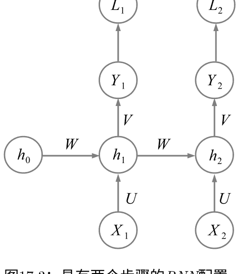

图17.3: 具有两个步骤的RNN配置.

我们需要计算五个梯度

$$\nabla_{\theta}L = \left(\frac{\partial L}{\partial W}, \frac{\partial L}{\partial V}, \frac{\partial L}{\partial U}, \frac{\partial L}{\partial b}, \frac{\partial L}{\partial c}\right).$$

我们将预先计算一些在不久之后会有用的导数。

使用链式法则，我们有

$$\frac{\partial h_1}{\partial W} = \frac{\partial}{\partial W}\tanh(a_1) = \text{sech}^2 a_1 \frac{\partial a_1}{\partial W}$$
$$= (1-\tanh^2 a_1)h_0 = (1-h_1^2)h_0.$$

可以使用类似的计算方法得到

$$\frac{\partial h_2}{\partial W} = (1-h_2^2)h_1$$
$$\frac{\partial h_1}{\partial b} = 1-h_1^2$$
$$\frac{\partial h_2}{\partial b} = 1-h_2^2.$$

由于 $L_1$ 对 $h_1$ 的依赖仅通过 $Y_1$ 进行，因此链式法则得到

$$\frac{\partial L_1}{\partial h_1} = \frac{\partial L_1}{\partial Y_1}\frac{\partial Y_1}{\partial h_1} = (Y_1 - Z_1)V.$$

同样地，

$$\frac{\partial L_2}{\partial h_2} = (Y_2 - Z_2)V$$

我们还有

$$\begin{aligned}
\frac{\partial h_2}{\partial h_1} &= \frac{\partial}{\partial h_1} \tanh a_2 = \text{sech}^2 a_2 \frac{\partial a_2}{\partial h_1} \\
&= (1 - \tanh^2 a_2)W = (1 - h_2^2)W.
\end{aligned}$$

链式法则的另一个应用是

$$\begin{aligned}
\frac{\partial h_1}{\partial U} &= \frac{\partial}{\partial U} \tanh a_1 = (1 - h_1^2)\frac{\partial a_1}{\partial U} = (1 - h_1^2)X_1 \\
\frac{\partial h_2}{\partial U} &= \frac{\partial}{\partial U} \tanh a_2 = (1 - h_2^2)\frac{\partial a_2}{\partial U} = (1 - h_2^2)X_2.
\end{aligned}$$

现在我们已经准备好计算损失函数的梯度了。我们将从对V的梯度开始。由于损失Lₜ通过Yₜ依赖于V，我们有

$$\begin{aligned}
\frac{\partial L}{\partial V} &= \frac{\partial L_1}{\partial V} + \frac{\partial L_2}{\partial V} \\
&= \frac{\partial L_1}{\partial Y_1}\frac{\partial Y_1}{\partial V} + \frac{\partial L_2}{\partial Y_2}\frac{\partial Y_2}{\partial V} \\
&= (Y_1 - Z_1)\frac{\partial}{\partial V}(V h_1 + c) + (Y_2 - Z_2)\frac{\partial}{\partial V}(V h_2 + c) \\
&= (Y_1 - Z_1)h_1 + (Y_2 - Z_2)h_2 = \sum_{t}(Y_t - Z_t)h_t.
\end{aligned}$$

对于c的导数计算方式类似

$$\begin{aligned}
\frac{\partial L}{\partial c} &= \frac{\partial L_1}{\partial c} + \frac{\partial L_2}{\partial c} \\
&= \frac{\partial L_1}{\partial Y_1}\frac{\partial Y_1}{\partial c} + \frac{\partial L_2}{\partial Y_2}\frac{\partial Y_2}{\partial c} \\
&= (Y_1 - Z_1)\frac{\partial}{\partial c}(V h_1 + c) + (Y_2 - Z_2)\frac{\partial}{\partial c}(V h_2 + c) \\
&= (Y_1 - Z_1) + (Y_2 - Z_2) = \sum_{t}(Y_t - Z_t).
\end{aligned}$$

在计算关于W的梯度时，我们考虑到L₁仅通过h₁依赖于W，而L₂取决于W通过h₁和h₂（有两条包含W的边）。链式法则的应用提供

$$\frac{\partial L}{\partial W} = \frac{\partial L_1}{\partial W} + \frac{\partial L_2}{\partial W}$$
$$= \frac{\partial L_1}{\partial h_1} \frac{\partial h_1}{\partial W} + \frac{\partial L_2}{\partial h_2} \frac{\partial h_2}{\partial W} + \frac{\partial L_2}{\partial h_2} \frac{\partial h_2}{\partial h_1} \frac{\partial h_1}{\partial W}$$
$$= (Y_1 - Z_1)V(1 - h_1^2)h_0 + (Y_2 - Z_2)V(1 - h_2^2)h_1 + (Y_2 - Z_2)V(1 - h_2^2) W (1 - h_1^2) h_0$$

由于涉及 $U$ 的两条垂直边，可以应用类似的计算来获得

$$\frac{\partial L}{\partial U} = \frac{\partial L_1}{\partial U} + \frac{\partial L_2}{\partial U}$$
$$= \frac{\partial L_1}{\partial h_1} \frac{\partial h_1}{\partial U} + \frac{\partial L_2}{\partial h_2} \frac{\partial h_2}{\partial U} + \frac{\partial L_2}{\partial h_2} \frac{\partial h_2}{\partial h_1} \frac{\partial h_1}{\partial U}$$
$$= (Y_1 - Z_1)V(1 - h_1^2)X_1 + (Y_2 - Z_2)V(1 - h_2^2)X_2 + (Y_2 - Z_2)V(1 - h_2^2) W (1 - h_1^2) X_1$$

最后一个梯度是相对于偏置 $b$

$$\frac{\partial L}{\partial b} = \frac{\partial L_1}{\partial b} + \frac{\partial L_2}{\partial b}$$
$$= \frac{\partial L_1}{\partial h_1} \frac{\partial h_1}{\partial b} + \frac{\partial L_2}{\partial h_2} \frac{\partial h_2}{\partial b} + \frac{\partial L_2}{\partial h_2} \frac{\partial h_2}{\partial h_1} \frac{\partial h_1}{\partial b}$$
$$= (Y_1 - Z_1)V(1 - h_1^2) + (Y_2 - Z_2)V(1 - h_2^2) + (Y_2 - Z_2)V(1 - h_2^2)W(1 - h_1^2)$$

类似的公式可以用于具有两个以上隐藏状态的RNN。

## 17.6 梯度问题

在处理RNN中的梯度时，已经首先指出了以下困难，参考Hochreiter [55]和Bengio et al. [14, 15]。

梯度消失问题从先前的梯度公式中我们可以注意到，相对于 $W$、$U$ 和 $b$ 的梯度涉及到涉及矩阵 $W$、$V$ 以及因子 $(1-h_t^2)$。鉴于 $h_t = \tanh a_t \in (-1,1)$，那么 $1-h_t^2 \in (0,1)$。因此，这些因子的乘积会导致梯度减小。RNN 越长，涉及 $(1-h_t^2)$ 的乘积就越多，梯度就越小。

梯度公式中涉及矩阵 $W$ 的因子来自于导数 $\frac{\partial h_2}{\partial h_1}$。对于长度为 $T$ 的 RNN，涉及的乘积更多涉及类型的导数 $\frac{\partial h_t}{\partial h_{t-1}}$，这将导致产生一个幂 $W^{T-1}$。如果矩阵 $W$ 具有特征值 $|\lambda_i| < 1$，则幂 $W^{T-1}$ 将具有特征值 $|\lambda_i|^{T-1} < 1$。这可以从特征值分解 $W = M D M^t$ 得出，其中 $D$ 是具有特征值的对角形式。由于对于大的 $T$，我们有 $|\lambda_i|^{T-1} \to 0$，那么 $D^{T-1} \to O$，因此当 RNN 的长度增加时，$W^{T-1}$ 趋向于零矩阵，参见附录中的命题 G.1.2。前面的讨论可以总结为梯度消失问题的概念。有几种解决这个问题的方法，可以防止梯度在更大或更小的程度上收缩。

- (i) 解决这个问题的一个方法是改变激活函数。由于因子 $(1 - h_t^2)$ 来自于 $\tanh'(a_t)$ 的导数，一个想法是用一个导数不一直小于1的激活函数来替换它，比如 ReLU，在正激活时等于1。

- (ii) 另一个解决方案是将权重初始化为单位矩阵，$W = \mathbb{I}$。这个事实将阻止权重过快地收缩到零，因为幂 $W^p$ 的特征值在更多的迭代中会更接近1。

- (iii) 解决梯度消失问题最强大的方法是使用涉及“门控单元”的新型架构，如 LSTM 或 GRU 单元。我们将在下一节中讨论这种类型的架构。

梯度爆炸问题：我们现在假设矩阵 $W$ 有一个特征值满足 $|\lambda_i| > 1$。由于 $W^p = M D^p M^t$，所以 $D^p$ 的条目 $\lambda_i^p$ 趋向于无穷大，当 $p$ 变大时。因此，$W^p$ 的某些条目将趋向于无穷大，这导致了梯度爆炸问题。一种解决方法是将权重 $W$ 初始化为单位矩阵，希望能防止权重过早爆炸。另一种有用的技术是梯度剪裁，当梯度变得过大时进行重新缩放，参见 Mikolov [84] 和 Pascanu 等人 [96]。

## 17.7 LSTM 细胞

长短期记忆网络（LSTM）于1997年由 Hochreiter 和 Schmidhuber [56] 引入。这是一种包含特殊细胞的 RNN，能够学习长期依赖关系。它们使用门的概念，通过一个 sigmoid 层和一个逐点乘法可选择地传递信息。LSTM 的功能涉及三种类型的门：遗忘门、更新门和输出门。它基于引入在每个单元中引入一个内部循环，用于保持内部细胞状态 $C_t$。每个门的描述如下。

- 1. 遗忘门是一个sigmoid层，用于遗忘不相关的历史信息。它的定义如下：

$$f_t = \sigma(W_f h_{t-1} + U_f X_t + b_f),$$

其中 $W_f$, $U_f$ 是矩阵，$b_f$ 是偏置向量。由于 $\sigma$ 是一个逻辑sigmoid函数，所以 $f_t \in (0,1)$。这表示将被遗忘的过去状态的比例。它取决于上一个状态 $h_{t-1}$ 以及当前的输入 $X_t$。

- 2. 更新门有选择性地更新内部细胞状态值，$C_t$，如

$$C_t = f_t C_{t-1} + i_t \tilde{C}_t,$$

其中 $i_t$ 是由sigmoid层定义的缩放因子

$$i_t = \sigma(W_i h_{t-1} + U_i X_t + b_i),$$

具有矩阵 $W_i$, $U_i$ 和偏差 $b_i$，以及

$$\tilde{C}_t = \tanh(W_c h_{t-1} + U_c X_t + b_c)$$

表示可以添加到内部状态的候选项，属于区间 $(-1, 1)$。乘积 $i_t \tilde{C}_t$ 表示候选项的一部分，用于更新内部状态 $C_t$。术语 $f_t C_{t-1}$ 表示从内部状态值中遗忘分数 $f_t$ 后剩余的部分。

- 3. 输出门提供隐藏状态的值

$$h_t = o_t \tanh(C_t),$$

作为决定输出量的因子和一个在-1和1之间的状态的乘积,

$$o_t = \sigma(W_o h_{t-1} + U_o X_t + b_o),$$

通过将tanh函数应用于内部状态 $C_t$ 获得的状态。

在RNN中使用LSTM单元有助于解决梯度消失问题，因为LSTM单元允许梯度保持不变。然而，它们仍然存在梯度爆炸问题。还有其他类似的架构，如窥视孔LSTM, [42]，窥视孔卷积LSTM, [113], GRU单元[24]等。

## 17.8 深度循环神经网络

我们已经看到，RNN可以看作是一系列具有参数共享的前馈神经网络，其隐藏层通过转换函数交换信息。在RNN中引入深度的第一个想法出现在Graves [50]中，不久之后在Pascanu et al. [95]中得到了追随。

通过展开一个具有参数共享的深度前馈神经网络，可以得到一个深度RNN。在这种情况下，RNN的隐藏状态，$h_t^{(\ell)}$，有两个索引。下标表示状态在时间上的位置，而上标 $\ell$ 表示状态所属的层号，参见图17.4。具有维度 $T \times L$ 的深度RNN意味着具有 $L$ 个水平层和 $T$ 个垂直展开的架构，其中$1 \le \ell \le L$ 且$1 \le t \le T$。训练深度RNN比训练简单的RNN更加困难和昂贵。我们将为此提供支持性论证。考虑图17.4中给出的具有2层和4个循环的深度RNN。在计算损失函数相对于 $W$ 的梯度时，我们需要计算，除其他导数之外，导数 $\partial Y_4/\partial W$。由于 $Y_4$ 取决于 $W$ 通过中间变量 $h_t^{(\ell)}$，$1 \le t \le 4$，$1 \le \ell \le 2$，链式法则的应用会产生涉及两种类型因子的乘积：$\partial Y_4 / \partial h_t^{(\ell)}$ 和 $\partial h_t^{(\ell)} / \partial h_{t-1}^{(\ell)}$。第一个介绍了乘以 $W$ 的操作，就像我们在第17.5节的计算中看到的那样。现在我们来看第二个因子。如果我们假设层之间通过逻辑sigmoid函数相关联，如下所示

$$
h_t^{(2)} = \sigma(W_h h_t^{(1)} + b_h),
$$

然后利用sigmoid函数的性质，我们得到

$$
\frac{\partial h_t^{(2)}}{\partial h_t^{(1)}} = W_h \sigma'(W_h h_t^{(1)} + b_h) = W_h \sigma(W_h h_t^{(1)} + b_h)(1 - \sigma(W_h h_t^{(1)} + b_h)) = W_h h_t^{(2)} (1 - h_t^{(2)}).
$$

由于 $\sigma' \le 1/4$，这个项也对导数产生了收缩效应。RNN越深，这种效应就越明显。所有上述效应导致了更明显的梯度消失问题。

## 17.9 总结

RNN是专门用于处理顺序数据（如音频和视频）的神经网络。它们在实际应用中已被证明非常成功，如语音识别、手写生成、文本生成、机器翻译、图像字幕、无约束手写识别等。

RNN是通过相同架构的参数共享前馈神经网络的有限序列获得的，其隐藏层通过转换函数交换信息。RNN通过一种称为时间反向传播的反向传播方法进行训练，这比常规FNN训练更昂贵。

普通的香草循环神经网络受到两个问题的困扰：梯度消失和梯度爆炸。对于这些问题有几种部分解决方案。梯度爆炸问题可以通过梯度剪切和单位矩阵初始化来改善，而梯度消失问题可以通过使用包含门控单元的新型循环神经网络架构（如LSTM、GRU等）来修复。

包含多个水平层的循环神经网络被称为深度循环神经网络。它们在从原始序列数据中提取更复杂的模式时非常有用。

## 17.10 练习

- (a) 让 $\mathcal{G}_1, \mathcal{G}_2$ 和 $\mathcal{G}_3$ 是三个sigma代数。证明 $\mathfrak{S}(\mathcal{G}_1 \cup \mathcal{G}_2 \cup \mathcal{G}_3) = \mathfrak{S}(\mathfrak{S}(\mathcal{G}_1 \cup \mathcal{G}_2) \cup \mathcal{G}_3).$
- (b) 提出并证明一个推广。

**练习17.10.2** (a) 考虑矩阵

$$
W = \begin{pmatrix} \frac{1}{10} & \frac{2}{10} \\ \frac{3}{10} & -\frac{4}{10} \end{pmatrix}
$$

证明 $\lim_{n\to\infty} W^n = O_2$，其中 $O_2$ 表示 $2\times 2$ 零矩阵。

**(b)** 设 $A$ 是一个 $k\times k$ 对称矩阵，并用 $\rho(A) = \max_{1\leq i\leq k} |\lambda_i|$ 表示其谱半径，其中 $\lambda_i$ 表示 $A$ 的特征值。考虑矩阵 $W = \frac{1}{1+\frac{1}{\rho(A)}}A$。证明 $\lim_{n\to\infty} W^n = O_k$。

**练习17.10.3** 考虑一个具有两个一维输入 $X_1$，$X_2$ 和一个输出 $Y$ 的RNN，见图17.5。损失函数为 $L = 1/2(Y-Z)^2$，其中 $Z$ 表示目标。在这种情况下，找到反向传播算法的方程。

**练习17.10.4** 考虑图17.5中给出的RNN，并假设输入 $X_1$、$X_2$ 是随机变量，初始状态 $h_0$ 给定，目标 $Z$ 是随机变量。用 $\mathcal{E}$ 表示输出的 sigma-代数，我们说 $Z$ 是可学习的，如果 $\mathfrak{S}(Z) \subset \mathcal{E}$。

以下哪个陈述始终成立：

- (a) 如果 $Z$ 是可学习的，则 $\mathfrak{S}(Z) \subset \mathfrak{S}(\mathcal{I}_1 \cup \mathcal{I}_2)$。
- (b) 如果 $\mathfrak{S}(Z) \subset \mathfrak{S}(\mathcal{I}_1 \cup \mathcal{I}_2)$，则 $Z$ 是可学习的。

**练习 17.10.5** 考虑一个一维动力系统，其状态更新为

$$
h(n) = f(h(n-1); \theta), \quad n \geq 1,
$$

其中转换函数为 $f(x; \theta) = \tanh(\theta x)$， 其中 $|\theta| <1$。找到系统的隐藏状态在长期运行中，$\lim_{n \to \infty} h_n$。

**练习17.10.6** 与练习17.10.5中的问题相同，但将转换函数替换为逻辑sigmoid函数， $f(x; \theta) = \sigma(\theta x)$。

**练习17.10.7** 与练习17.10.5中的假设相同，但将转换函数替换为正弦函数，$f(x; \theta) = \sin(\theta x)$。 证明动力系统的长期行为取决于参数 $\theta$和初始状态 $h_0$。

## 第18章 分类

在分类问题中，神经网络必须能够对聚类进行分类，即为每个聚类分配一个标签。这些标签可以是自然数、空间中的点或向量，属于一个标签空间。分类过程等同于能够学习一个“聚类分割函数”或决策映射。训练集为每个聚类提供标签。这个分配定义了一个决策映射。网络将能够通过学习这个决策映射来对测试数据进行分类，即确定测试点属于哪个聚类。

### 18.1 等价关系

考虑超立方体，$I_n = [0,1]^n$。任意子集$S \subset I^n \times I_n$被称为一个关系$I_n$。以下属性将很快有用：

- (i) $S$被称为自反的，如果它包含超立方体的对角线$\{(x, x); x \in I_n\}$。这意味着 $\forall x \in I_n$ ，$(x, x) \in S$。
- (ii) $S$被称为对称的，如果它关于对角线对称$\{(x, x); x \in I_n\}$。这意味着如果$(x, y) \in S$，则也有$(y, x) \in S$。
- (iii) $S$被称为传递的，如果$(x, y) \in S$且$(y, z) \in S$，则$(x, z) \in S$。这个属性的几何解释是$S$对于具有一个顶点在对角线上的矩形是封闭的。更确切地说，如果$(x, y) \in S$，则存在一个唯一的矩形，其中一个顶点在这一点上，另一个顶点在$(y, y)$上，参见图18.2 a。传递性归结为以下事实：如果矩形的三个顶点，$(x, y)$，$(y, y)$，$(y, z)$，属于集合$S$，则第四个顶点，$(x, z)$，也属于$S$。

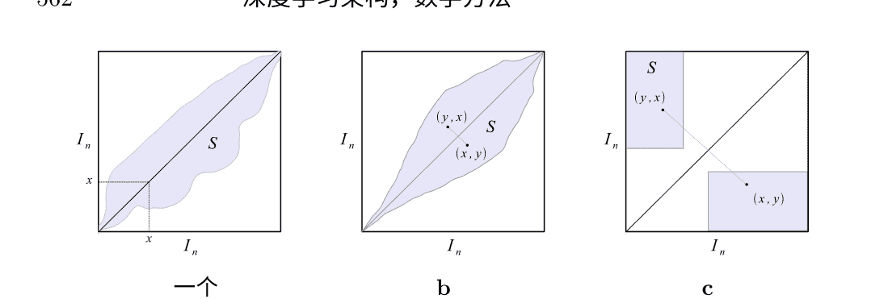

**图18.1: a. 反身性，非对称关系。b. 反身性和对称关系。c. 对称非反身关系。**

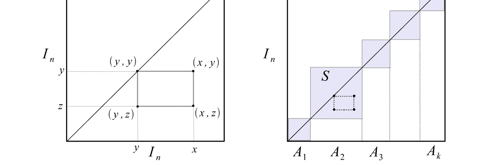

**图18.2: a. 矩形规则：如果 (x, y), (y, y), (y, z) ∈ S, 则 (x, z) ∈ S。b. 等价关系S，它对I的有限分割。**

一个传递关系的例子是有理数在[0, 1]上的格，由$S = (I \times I) \cap (\mathbb{Q} \times \mathbb{Q})$给出，读者可以轻松验证前面的矩形性质。

先前的关系属性是互斥的，请参见图18.1 a, b, 和 c。

一个关系$S$，它是自反的、对称的和传递的，被称为等价关系。请参见图18.2 b，作为等价关系的一个例子。在这种情况下，集合$S$是沿对角线的正方形内部的并集。

如果$(x, y) \in S$，那么在关系$S$下，点$x$和$y$被称为等价的。通常，我们写作$x \sim y$。与给定的$x$等价的所有点被表示为$C(x) = \{y \in I_n; x \sim y\}$，并且被称为$x$的等价类。所有等价类的集合，用$I_n/\sim$表示，被称为商集。

$I_n$的一个划分是具有以下属性的子集的集合：

- 对于所有的$i$，$A_i \neq \emptyset$;
- 对于$i \neq j$，$A_i \cap A_j = \emptyset$;
- $\bigcup_i A_i = I_n$。

如果索引$i$的集合是有限的，则$\{A_i\}$是一个有限划分。它们可以用来将$I_n$的点分类为$n$个不同的类别。

划分和等价关系之间的关系由以下结果给出：

**命题18.1.1：** 设$\sim$是$I_n$上的一个等价关系。那么存在一个划分$\{A_i\}$ of $I_n$，满足以下条件：

- (i) 对于每个$i$，对于所有的$x, y \in A_i$，有$x \sim y$。
- (ii) $\forall x, y \in I_n$，如果 $x \sim y$，那么存在一个 $i$ 使得$x, y \in A_i$。

**证明：** 结果可以重新表述为任何等价关系都会对$I_n$进行划分，划分的元素是等价关系的等价类。令$C_x$为 $x$的等价类。我们证明集合 $\{C_x\}_x$ 满足划分的性质。由于$x \in C_x$，显然 $C_x \neq \emptyset$ 和 $\bigcup_x C_x = I_n$。

很容易看出$x \sim y$等价于 $C_x = C_y$。假设我们有两个不同类的交集中的元素，$z \in C_x \cap C_y$。那么 $z \in C_x$，因此$x \sim z$且 $z \in C_y$ 和 $z \sim y$。根据传递性，$x \sim y$，这意味着 $C_x = C_y$，矛盾。由此可见，任何两个不同的类都没有交集。因此，集合 $\{ C_x \}_x$满足划分的性质。

值得注意的是，反过来也成立：任何一个分区都定义了一个等价关系。如果 $\{A_i\}_i$是一个分区，那么关系 $x \sim y$当且仅当存在一个 $i$ 使得$x, y \in A_i$是一个等价关系。从等价关系 $S$中使用投影得到分区 $\{A_j\}_j$的方法可以在图18.2 b中看到。这也提供了一个关于给定分区相关的等价关系 $S$的可视化：集合 $S$由沿着从投影 $A_j$构造的对角线对齐的矩形的并集构成。这个集合 $S$包含对角线（是自反的），是对称的，并且满足矩形规则（是传递的）。

在接下来的章节中，我们将与给定的分区关联不同的对象，如熵、决策函数、标签、决策图等。

### 18.2 分割的熵

在本节中，我们将扩展熵的概念到一个分割中。为了这个目的，我们将考虑一个概率空间$(\Omega, \mathcal{F}, \mu)$和一个有限可测分割 $\mathcal{A}= (A_j)_{j\leq m}$ of 集合 $\Omega$，即，一个具有 $A_j \in \mathscr{F}$ 的分割。度量 $\mu$ 可以用来数值地评估集合 $A_j$。关于概率度量 $\mu$，分割 $\mathcal{A}$ 的熵被定义为

$$
H(\mathcal{A}, \mu) = -\sum_{j=1}^{m} \mu(A_j) \ln \mu(A_j).
$$

由于 $\mu(A_j) \in (0,1)$，熵是正的，$H(\mathcal{A}, \mu) >0$。可以证明，当分割中的所有集合具有相同的度量 $\mu( A_1) = \cdots = \mu(A_m) = \frac{1}{m}$ 时，分割$\mathcal{A}$ 的熵是最大的。

**例子 18.2.1** 我们假设$\Omega$中的每个元素 $\omega$与非负数标签相关联，例如权重或质量 $m(\omega)$。在这种情况下，概率测度为

$$
\mu(A) = \frac{1}{M} \sum_{x\in A} \delta_x(A),
$$

其中 $M = \mu(\Omega)$是$\Omega$的总质量，$\delta_x$表示位于 $x$的狄拉克测度。数值 $\mu(A)$提供了与集合 $A$对应的质量比例。熵 (18.2.1) 表示将集合$\Omega$分割成不等质量部分的不确定性。

**例子 18.2.2** 让$\Omega \subset \mathbb{R}^n$为有界的 Borel 集合。对于任何 Borel 集合$A \in \mathcal{B}(\Omega)$，我们定义概率测度 $\lambda$表示$\Omega$上的勒贝格测度。在这种情况下，熵(18.2.1)表示将集合$\Omega$划分为不等体积子集的不确定性。

**例子18.2.3** 设 $\mu$是相对于测度 $\nu$在可测空间$(\Omega, \mathscr{F})$上绝对连续的测度。根据 Radon-Nikodym定理，见附录中的定理C.7，存在一个可测的非负函数 $p$ 使得

$$
\mu(A) = \int_A p(x) \, d\nu(x),
$$

对于任意可测集合 $A$在$\Omega$中。如果 $p$是一个密度函数，即 $\int_{\Omega} p(x) \, d\nu(x) = 1$，那么 $\mu$成为一个概率测度。与分割 $\mathcal{A}$和测度 $\mu$相关的熵为

$$
H(\mathcal{A}, \mu) = -\sum_{i=1}^{m} \int_{A_i} p(x) \, d\nu(x) \, \ln \big( \int_{A_i} p(x) \, d\nu(x) \big).
$$

在特定情况下，当测度成比例时，即 $\mu = c\nu$，其中$c$是常数，密度函数为 $p(x) = \frac{1}{\nu(\Omega)}$，以及先前的熵

$$
H(\mathcal{A}, \mu) = -\sum_{i=1}^{m} \frac{1}{\nu(\Omega)} \nu(A_i) \ln \left( \frac{1}{\nu(\Omega)} \nu(A_i) \right) \\
= -\frac{1}{\nu(\Omega)} \sum_{j=1}^{m} \nu(A_j) \left( -\ln \nu(\Omega) + \ln \nu(A_j) \right) \\
= \ln \nu(\Omega) + \frac{1}{\nu(\Omega)} H(\mathcal{A}, \nu),
$$

这是关于分区 $\mathcal{A}$ 相对于两个成比例测度的熵之间的关系。

### 18.3 决策函数

设 $\{A_1, \dots, A_k\}$ 是 $I_n$ 的一个有限可测划分，即对于所有 $i=1, \dots, k$，$A_i \in \mathcal{B}(I_n)$，其中 $A_i$ 是 $\mathcal{B}(I_n)$ 中的Borel集合。决策函数是一个可测函数，它将每个类别与划分中的一个整数相关联，即对于任意的 $x \in A_j$，$f(x) = j$。我们可以将 $j$ 视为与类别 $A_j$ 相关联的标签。等价地，$f = \sum_{i=1}^k j \mathbf{1}_{A_j}$，其中 $\mathbf{1}_{A_j}$ 是集合 $A_j$ 的指示函数。决策函数用于将数据分类到不同的类别中。注意，$A_j = f^{-1}(j)$，参见图18.3 b。

集合 $\{1, 2, \dots, k\}$ 被称为标签集合，包含标签集合的空间，在这种情况下，$\mathbb{R}$ 是标签空间。标签被认为是连续整数，仅仅是为了方便起见。

**例子 18.3.1** (情况 $k=2$) 考虑两个可分离的点簇 $\mathbb{R}^n$ 通过超平面 $\{w^T x + \theta = 0\}$ 分隔。然后，经典感知器可以根据决策函数 $f(x) = 1 + H(w^T x + \theta)$ 来判断一个点属于哪个簇。标签集合是 $\{1, 2\}$，标签空间是 $\mathbb{R}$。

**例子 18.3.2** 考虑超立方体 $I_n$ 中的某个属性，例如颜色。假设点可以有 $k$ 种可能的颜色，那么可以在 $I_n$ 上定义一个等价关系：当且仅当两个点具有相同的颜色时，它们是等价的。令 $A_j$ 为 $j$ 颜色的点的集合。那么集合 $\{A_j\}$ 构成了 $I_n$ 的一个划分，并且从 $I_n$ 到标签空间 $\{1, \dots, k\}$ 的映射 $f$ 定义为 $f(A_j) = j$ 是一个分类规则。

有时候函数 $f$ 被称为分类器。我们注意到在这个例子中，集合 $A_j$ 不一定是 Borel 可测的。

下一个结果涉及决策函数的实现，参见 Cybenko [30]。由于在现实生活中，聚类不是完全可分离的，所以结果将考虑到这一点。它表明，具有单个内部层的神经网络可以实现任何决策函数，使得错误分类点的总勒贝格测度 λ 可以被任意小，参见图18.3 a。

## 命题18.3.3
设 f 是与可测有限分区 {Ai}i on In 相关的决策函数， σ 是一个连续的 Sigmoid 函数。

对于任意 ϵ > 0，存在有限和 G(x) = Σ_{j=1}^{N_j} α_j σ(w_j^T x + θ_j)， w_j^T ∈ ℝ^n， α_j， θ_j ∈ ℝ 和一个集合 D ⊂ I_n 使得 λ(D) ≥ 1 - ϵ 且 |G(x) - f(x)| < ϵ， ∀x ∈ D。

证明: 根据鲁津定理（见附录，第C.8节），存在一个连续函数 g : I_n → ℝ 和一个集合 D 使得 λ(D) > 1 - ϵ 且 g(x) = f(x) 对于所有的 x ∈ D。根据定理9.3.8（或定理9.3.6），前面的和式 G(x) 在 C(I_n) 中是稠密的，因此对于前面的 g ∈ C(I_n)，我们找到一个 G(x) 使得 |G(x) - g(x)| < ϵ 对于所有的 x ∈ I_n。因此

|G(x) - f(x)| = |G(x) - g(x)| < ϵ， ∀x ∈ D。

请注意，这是一个存在性结果；函数 G(x) 的实际构造（即找到权重 wj， α_j 和阈值 θ_j）是一个完全不同的问题。

备注 18.3.4 对于每个决策函数，我们可以关联一个熵，如下所示。给定一个有限分割， 𝒜=(A_i)_i，和一个决策函数 f，我们定义度量 μ，使得 μ(A_i) = \frac{f(A_i)}{\sum_i f(A_i)} 并考虑熵 H(𝒜, μ) 作为与分割 𝒜 和决策函数 f 相关联的熵。

## 18.4 独热向量决策图

有时，用独热向量替换整数标签更方便。例如，我们可以将标签1、2等替换为独热向量 e_1=(1,0,…,0)^T, e_2=(0,1,0,…,0)^T 等。标签集由 {e_1,…,e_k} 组成，而标签空间为 ℝ^n。因此，我们得到以下定义。

设 {A_1,…,A_k} 是 I_n 的一个有限可测分割，即一个分割。独热向量决策映射是一个可测函数 f :I_n → ℝ^k, 它将每个类别与分割中的一个独热向量相关联，即对于任何 x ∈ A_j, 有 f(x)=e_j, 其中 e_j=(0,…,1,…,0)^T。在这种情况下，与类别 A_j 相关联的标签是一个 k 维单位向量，所有这些标签向量构成了 ℝ^k 中的一组基。

使用独热向量作为标签的优势是什么？在标签只是整数的情况下，集合 I_n 被映射到实数线上，这为测试集提供了一定的定位。

在使用独热向量作为标签的情况下，集合 I_n 被映射到一个更高维的空间 ℝ^k。这为测试集提供了更多的空间，使其朝着线性独立的方向聚集，从而更好地分离类别。

选择独热向量 e_j 作为标签只是一种方便的做法。我们可以选择任何在 ℝ^k 中线性独立的 k 向量作为标签，最终组织成正交基。等价地，我们可以将标签视为 k 维空间中的点，记为 P_1, P_2, …, P_k，它们的位置向量是线性独立的。

标签空间可以比 k 的维度小，其中 k 是 I_n 中的类别数。例如，在图18.4中，我们考虑了一个将 I_n 划分为 k= 4 个类别的分区，并分别将每个类别关联到 ℝ 和 ℝ² 中的一个标签点。

下面的两个线性代数结果说明了使用标签作为点或独热向量之间的关系。

命题18.4.1 考虑 k 个不同的点， P_1,…,P_k，在 ℝ^k 中。那么存在一个线性函数 f : ℝ^k → ℝ^k，使得 f(e_j) = P_j，对于 j=1,…,k。

图18.4: 与分区相关的决策图：a. 标签空间为 ℝ。 b. 标签空间为 ℝ²。

图18.5：一般位置上的点：a. 一条直线上的两个不同点。 b. 平面上的三个非共线点。 c. 三维空间中的四个非共面点。

证明: 令 v_j=(v_j^1, ..., v_j^k)^T 为点 P_j 在 ℝ^k 中的坐标向量，则我们可以写成 v_j = Σ_{i=1}^k v_j^i e_i。那么线性函数 f(x)=W x，其中矩阵 W_{ij}=v_j^i 是所需的函数。

反之不一定成立。为了使其有效，我们需要加上一个额外的条件，下面将介绍。

首先，我们注意到通过两个不同点有一条唯一的直线，而通过三个非共线点有一个唯一的平面。通过四个非共面点有一个唯一的三维超平面，以此类推，参见图18.5。如果 k 个点位于足够一般的位置，则由它们确定的超平面的维数为 k -1；否则，超平面的维数严格小于 k -1。

定义 18.4.2: 点 P_1, ..., P_k 在 ℝ^k 中被称为一般位置，如果不存在维度小于 k-1 的超平面包含它们。

图 18.6: 点 P₁, ..., Pₖ 在一般位置上，如果向量 P₀Pⱼ 线性无关。

等价地说，包含给定点的超平面的最低维度是 k-1。另一个等价陈述在练习 18.11.2 中给出。下一个结果是使用向量对这个概念的有用特征描述。它大致说明了改变空间原点后，点的位置向量变得线性无关。

命题 18.4.3: 点 P₁, ..., Pₖ 在 ℝ^k 中一般位置上，当且仅当存在点 P₀ 在 ℝ^k 中，使得向量 P₀Pⱼ 在 ℝ^k 中线性无关， j ∈ {1, ..., k}。

证明: “⟹” 假设点 P₁, ..., Pₖ 在一般位置上。然后根据练习18.11.3，存在唯一的 (k-1)-超平面 H，它包含了这些点。然后选择任意点 P₀ ∉ H 得到线性独立的向量 P₀P₁, ..., P₀Pₖ，见图18.6。为了证明我们形成了一个消失的线性组合

$$ \sum_{i=1}^{k} c_i \overrightarrow{P_0P_i} = 0, $$

并证明 cᵢ = 0。利用向量分解 P₀Pᵢ = P₀P₁ + P₁Pᵢ，我们可以写成

$$ \sum_{i=1}^{k} c_i \overrightarrow{P_0P_i} = \left( \sum_{i=1}^{k} c_i \right) \overrightarrow{P_0P_1} + \sum_{i=2}^{k} c_i \overrightarrow{P_1P_i} = 0. $$

集合 {P₁P₂, ..., P₁Pₖ} 在 H 中形成一组独立向量，参见练习18.11.3。由于 P₀ ∉ H，向量 P₁P₀ 与之前的系统无关，因为它指向超平面 H 之外。因此，之前的线性组合的系数为零， cᵢ = 0。

“⟸” 假设 P₀ ∈ ℝᵏ，使得 {P₀P₁, … , P₀Pₖ} 线性无关。如果点 {P₁, …, P_k} 不在一般位置上，则它们必须被包含在一个维度为 p 的超平面 𝒫 中，其中 p < k - 1。我们有

$$ \mathcal{P} = \{Q \in \mathbb{R}^k; \overrightarrow{P_0Q} = \sum_{j=1}^k c_j \overrightarrow{P_0P_j}, \sum_{j=1}^k c_j = 1\}. $$

由于 {P₀P₁, …, P₀Pₖ} 线性独立，超平面 𝒫 has dimension k - 1，这导致矛盾。

下一个结果是命题18.4.1的逆命题。

命题18.4.4 考虑 k 个不同的点，P₁, …, Pₖ ∈ ℝᵏ，在一般位置上。那么存在一个线性函数 f : ℝᵏ → ℝᵏ，使得 f(Pⱼ) = eⱼ，对于 j = 1, …, k。函数 f 是可逆的。

证明：根据命题18.4.3，我们可以选择一个点 P₀ 使得 P₀P_i 线性无关。这些向量实际上构成了 ℝᵏ 中的一组基。设 g : ℝᵏ → ℝᵏ 是唯一的线性函数，使得 g(P₀Pⱼ) = eⱼ，其中 j = 1, …, k。记 r 为将每个点 P 映射为向量 P₀P 的函数，即 r(P) = P₀P。通过组合 g 和 r 构造函数 f。则作为线性函数的组合，f 是线性的，并且满足性质 f(Pⱼ) = eⱼ。

命题18.4.4 保证了选择标签作为独热向量或一般形式点在 ℝᵏ 中的等价性。我们将在未来的章节中处理这两种情况。

## 18.5 线性可分性

在 ℝⁿ 中，点集 G 是一组 (n 元组) (x₁, …, x_n)，假设它们具有某种个体身份。在 ℝⁿ 中，两个点集 G₁ 和 G₂ 被称为线性可分的，如果存在一个 (n-1) 维的超平面 H，将这两个点集分开。这意味着：

- (i) 超平面 H 将 ℝⁿ 空间分为两个半空间 S₁ 和 S₂。
- (ii) 每个点集都包含在其中一个半空间中：G₁ ⊂ S₁ 和 G₂ ⊂ S₂。

如果超平面 H 由以下方程定义：

$$ h(x) = a_1 x_1 + \cdots + a_n x_n + d = 0, $$

那么 G₁ 和 G₂ 的可分性可以写成 h(g₁)h(g₂) < 0，对于任意的点 g₁ ∈ G₁, g₂ ∈ G₂。这意味着 h 在每个簇上保持恒定的相反符号，参见图18.7 a。

图18.7： a. 两个簇的线性可分性。 b. 两个簇的凸包的线性可分性。

例子18.5.1 在 ℝ 中有两个簇 𝒢₁ 和 𝒢₂，如果存在一个数 α 使得 (g₁−α)(g₂−α) <0，对于所有的 g₁∈𝒢₁, g₂∈𝒢₂。这意味着对于所有的 g₁∈𝒢₁, g₂∈𝒢₂，要么 g₁<α<g₂，要么 g₂<α<g₁。

如果一个集合 K⊂ℝⁿ 被称为凸集，那么对于任意两个点 A, B∈K，线段 AB 都包含在集合 K 中。例如，一个圆盘，一个三角形的内部或四面体都是凸集。

一般来说，一个簇不是一个凸集。簇 𝒢 的凸包是所有凸组合的集合。

凸包(𝒢) = \( \left\{ \sum_{g_i \in \mathcal{G}} \lambda_i g_i; \sum_{i=1}^n \lambda_i = 1, \lambda_i \geq 0 \right\} \).

例如，如果一个簇只有2个点，它的凸包是由这些点定义的闭线段。如果簇包含3个点，它的凸包是由给定点构成的三角形（包括内部）。可以证明凸包(𝒢) 始终是一个凸集，其中包含簇 𝒢，参见练习18.11.5。

命题 18.5.2：如果两个簇 𝒢₁ 和 𝒢₂ 是线性可分的，那么只有当凸包 (𝒢₁) 和凸包 (𝒢₂) 也是线性可分的时候，它们才是线性可分的。

证明：如果 𝒢₁ 和 𝒢₂ 是线性可分的，那么存在一个超平面 ℋ 将空间分成两个半空间 S₁ 和 S₂，这两个半空间分离了簇。即

𝒢₁ ⊂ S₁, 𝒢₂ ⊂ S₂.

由于半空间 𝒮₁ 和 𝒮₂ 是凸集，根据凸包的凸性最小性质（参见练习 18.11.5），我们有

$$\mathcal{G}_1 \subset \text{凸包}(\mathcal{G}_1) \subset \mathcal{S}_1, \qquad \mathcal{G}_2 \subset \text{凸包}(\mathcal{G}_2) \subset \mathcal{S}_2.$$

因此，凸包 hull(𝒢₁) 和 hull(𝒢₂) 被超平面 ℋ 分隔开。

下面给出了一种从定义直接开始的证明变体：

假设 𝒢₁ 和 𝒢₂ 是线性可分的，让 ℋ 是分隔超平面，其方程为

$$h(\mathbf{x}) = a_1 x_1 + \cdots + a_n x_n + d = 0.$$

对于聚类凸包中的任意两个点

$$g^1 = \sum_{g_i^1 \in \mathcal{G}_1} \lambda_i^1 g_i^1 \in \text{凸包}(\mathcal{G}_1), \quad g^2 = \sum_{g_j^2 \in \mathcal{G}_2} \lambda_j^2 g_j^2 \in \text{凸包}(\mathcal{G}_2),$$

利用函数的线性性质 h，得到

$$\begin{aligned}
h(g^1) h(g^2) &= h\left(\sum_{g_i^1 \in \mathcal{G}_1} \lambda_i^1 g_i^1\right) h\left(\sum_{g_j^2 \in \mathcal{G}_2} \lambda_j^2 g_j^2\right) \\
&= \left(\sum_{g_i^1 \in \mathcal{G}_1} \lambda_i^1 h(g_i^1)\right)\left(\sum_{g_j^2 \in \mathcal{G}_2} \lambda_j^2 h(g_j^2)\right) \\
&= \sum_{g_i^1 \in \mathcal{G}_1} \sum_{g_j^2 \in \mathcal{G}_2} \lambda_i^1 \lambda_j^2 h(g_i^1) h(g_j^2) < 0,
\end{aligned}$$

因为 λ_i^1 > 0, λ_j^2 > 0，我们使用了簇可分性条件 h(g_i^1) h(g_j^2) < 0。

“⟸” 如果凸包(𝒢₁) 和凸包(𝒢₂) 是线性可分的，那么存在一个超平面 ℋ 将空间 ℝⁿ 分成两个半空间 𝒮₁ 和 𝒮₂，使得凸包(𝒢₁) ⊂ 𝒮₁ 且凸包(𝒢₂) ⊂ 𝒮₂。利用明显的包含关系 𝒢₁ ⊂ 凸包(𝒢₁) 和 𝒢₂ ⊂ 凸包(𝒢₂)，可得 𝒢₁ ⊂ 𝒮₁ 且 𝒢₂ ⊂ 𝒮₂，因此 𝒢₁ 和 𝒢₂ 是线性可分的。另见图18.7 b。

即使两个簇有不同的点，有时它们彼此之间足够接近，以至于它们的凸包相交。在这种情况下，只有通过非线性函数才能最终实现可分离性。

图18.8：两个相交簇的分离函数 F 是非线性的。

## 命题18.5.3
假设 G₁ 和 G₂ 是 ℝⁿ 中的两个簇，且

凸包(G₁) ∩ 凸包(G₂) = ∅.

那么就不存在线性函数 F : ℝⁿ → ℝᵖ 使得 F(G₁) 和 F(G₂) 是线性可分的。

证明：通过反证法，假设存在线性函数 F : ℝⁿ → ℝᵖ 使得 F(G₁) 和 F(G₂) 是线性可分的，即，在 ℝᵖ 中存在一个由方程 H(X) = Σ_{i=1}^{p} a_i X_i + d = 0 定义的超平面，使得

Φ(g_i^1) Φ(g_i^2) < 0

对于所有的 g_i^1 ∈ G₁ 和 g_i^2 ∈ G₂，其中 Φ = h ∘ F。

考虑交集中的一个元素

g ∈ 凸包(G₁) ∩ 凸包(G₂),

因此它有两种表示方式

g = Σ_i λ_i^1 g_i^1 = Σ_i λ_i^2 g_i^2, g_i^1 ∈ G₁, g_i^2 ∈ G₂。

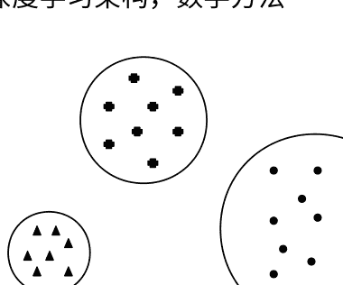

## 图 18.9：三个聚类的凸分离。

利用 $F$ 的线性性，我们得到以下矛盾：

$$
0 \leq \Phi(g)\Phi(g) \quad = \quad \Phi\left(\sum_i \lambda_i^1 g_i^1\right)\Phi\left(\sum_i \lambda_i^2 g_i^2\right)
$$
$$
\quad = \quad \left(\sum_i \lambda_i^1 \Phi(g_i^1)\right)\left(\sum_j \lambda_j^2 \Phi(g_j^2)\right)
$$
$$
\quad = \quad \sum_{i,j} \lambda_i^1\lambda_j^2\Phi(g_i^1)\Phi(g_j^2) < 0.
$$

因此，没有线性的分离函数 $F$，参见图18.8。

### 注 18.5.4

(i) 值得注意的是，也没有仿射的分离函数，即形式为 $F(x) = Wx + b$，其中 $W$ 是一个 $m \times n$ 矩阵，$b \in \mathbb{R}^n$。这是因为可分性是平移不变的。因此，线性神经元无法分离两个凸包相交的聚类。为了完成这个任务，我们应该使用具有非线性激活函数的神经网络。

(ii) 在 $\mathbb{R}^n$ 中，两个聚类 $\mathcal{G}_1$ 和 $\mathcal{G}_2$ 被称为 $F$ 可分离，如果存在一个可逆的双连续映射 $F : \mathbb{R}^n \rightarrow \mathbb{R}^n$，使得聚类的映射结果 $F(\mathcal{G}_1)$ 和 $F(\mathcal{G}_2)$ 在 $\mathbb{R}^n$ 中是线性可分的。这样的函数 $F$ 被称为 $\mathbb{R}^n$ 的同胚。神经网络理论的标准结果表明，一个前馈神经网络（具有足够多的隐藏层）可以学习非线性连续函数 $F$。通过增加一个感知器，我们可以进行最终的线性分类。因此，一个分类问题可以简化为学习连续非线性函数 $F$。

(iii) 函数 $F$ 的作用是将聚类分开，使得它们可以线性分类。然而，有些情况下聚类不能通过 $\mathbb{R}^n$ 的同胚来分离。在这种情况下，我们需要一个额外的维度来分离聚类，并且连续函数应该是 $F: \mathbb{R}^n \to \mathbb{R}^p, \text{with } p > n$。例如，$\mathcal{G}_1 = \{ x \in \mathbb{R}^2; \|x\| < 1 \}$ 和 $\mathcal{G}_2 = \{ x \in \mathbb{R}^2; \|x\| > 2 \}$ 不能在 $\mathbb{R}^2$ 中通过连续拉开来分开，但是如果我们垂直地拉开它们，它们可以在 $\mathbb{R}^3$ 中分开。

### k个簇的情况

考虑一个k个簇的簇群，$\mathcal{G} = \{ \mathcal{G}_1, \ldots, \mathcal{G}_k \}$。我们说 $\mathcal{G}$ 是一个线性可分的簇群，如果它的簇是相互可分的，即任意两个簇 $\mathcal{G}_i$ 和 $\mathcal{G}_j$，对于 $i \neq j$，都是线性可分的。

> **注 8.5.5**  
> (i) 根据命题 8.5.2，如果家族 $\mathcal{G} = \{ \mathcal{G}_1, ..., \mathcal{G}_k \}$ 是线性可分的，则 $\{ \text{hull}(\mathcal{G}_1), ..., \text{hull}(\mathcal{G}_k) \}$ 也是线性可分的凸集的家族。  
> (ii) 用 $G_j$ 表示簇 $G_j$ 的质心。这意味着 $G_j$ 是簇 $G_j$ 元素的平均值。应用练习 18.11.7，我们得到 $G_j \in \text{hull}(G_j), j=1,...,k$。

## 18.6 凸可分性

可分性也可以以稍微不同但等价的方式来考虑。如果有 $k$ 个闭球 $B_1, ..., B_k$ 在 $\mathbb{R}^n$ 中，使得 $\mathcal{G} = \{ \mathcal{G}_1, ..., \mathcal{G}_k \}$ 是凸可分的，则称为凸可分。

- (i) $B_1, ..., B_k$ 是不相交的;
- (ii) $\mathcal{G}_j \subset B_j$, 对于所有 $j \in \{ 1, ..., k \}$。

特别地，在 $\mathbb{R}^2$ 中，如果两个簇包含在两个不相交的圆盘中，则它们是凸可分离的。对于三个簇的情况，请参见图18.9。下面的结果显示了这两种凸性之间的等价关系。

> **命题 18.6.1**  
> 在 $\mathbb{R}^n$ 中，两个簇 $\mathcal{G}_1, \mathcal{G}_2$ 是凸可分离的，当且仅当它们是线性可分离的。

**证明：** “⇒” 如果 $\mathcal{G}_1$ 和 $\mathcal{G}_2$ 在 $\mathbb{R}^n$ 中是凸可分离的，则存在两个不相交的球 $B_1, B_2$ 在 $\mathbb{R}^n$ 中，使得 $\mathcal{G}_1 \subset B_1$ 且 $\mathcal{G}_2 \subset B_2$。设 $\mathcal{H}$ 是一个分离这两个不相交球 $B_1$ 和 $B_2$ 的 $(n-1)$-超平面（该超平面可以垂直于球心线段，通过一个在两个球外部的点）。那么 $\mathcal{H}$ 分离这两个簇 $\mathcal{G}_1$ 和 $\mathcal{G}_2$。

“⇐” 为了简单起见，我们将考虑 $n=2$；类似的原因可以用于更高维度。假设平面上有一条直线，它将 $\mathcal{G}_1$ 和 $\mathcal{G}_2$ 分开，并将平面分为两个半平面 $S_1$ 和 $S_2$，其中 $\mathcal{G}_1 \subset S_1$ 且 $\mathcal{G}_2 \subset S_2$。设 $M$ 是离聚类 $\mathcal{G}_1$ 最近的点。存在足够小的 $\beta > 0$，使得从 $M$ 开始，与直线成角度为 $\beta$ 的半直线不会与凸包$(\mathcal{G}_1)$ 相交，参见

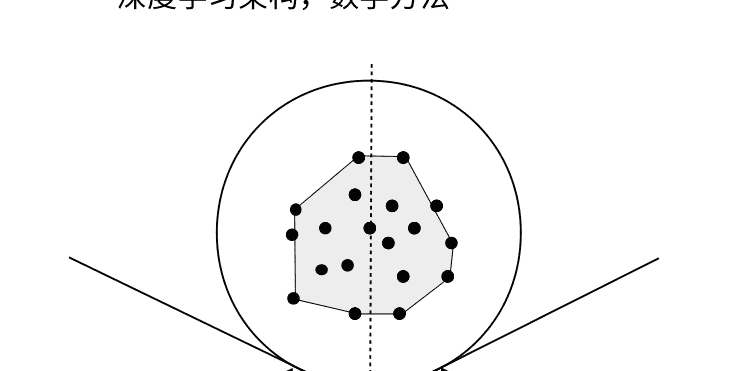

## 图 18.10

设 $\beta$ 是半直线所成角的角平分线。对于任意点 $O \in \beta$，存在唯一以 $O$ 为中心的圆，该圆切于两条半线。当距离 $\|OM\|$ 足够大时，簇 $\mathcal{G}_1$ 位于以 $O$ 为中心的球内。这是球 $B_1$ 的构造。类似地，我们可以构造另一边的球 $B_2$，包含簇 $\mathcal{G}_2$。

### 注 18.6.2

即使凸可分性看起来更一般且更有意义，然而，线性可分性可以通过神经网络来解决。

下一个结果涉及一簇的一位热向量决策映射的存在性。

### 命题 18.6.3

设 $\mathfrak{G} = \{\mathcal{G}_1, \dots ,\mathcal{G}_k\}$ 是 $k$ 维空间 $\mathbb{R}^k$ 中的一族 $k$ 簇，它们是线性可分的。那么存在一个决策映射 $F : \mathbb{R}^k \rightarrow \mathbb{R}^k$，其中 $F(\mathcal{G}_j) = e_j$，$j=1,\dots, k$。

**证明：** 由于 $\mathfrak{G}=\{\mathfrak{G}_1,...,\mathfrak{G}_k\}$ 是线性可分的，所以它是凸可分的。因此，存在 $k$ 个互不相交的球 $B_1,..., B_k$，在 $\mathbb{R}_k$ 中，使得 $\mathfrak{G}_j\subset B_j$，对于所有的 $j$。考虑一个决策映射 $f:\mathbb{R}_k\rightarrow\mathbb{R}_k$，将第 $j$ 个球映射为 $e_j$，即 $f(B_j)=e_j$，对于 $j=1,...,k$。证毕。

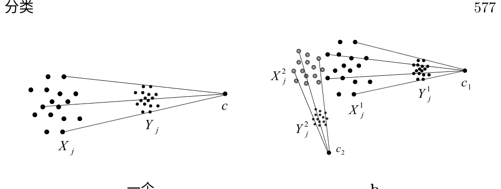

## 18.7 向中心收缩

簇的分离通常涉及将簇拉开到特定点，然后将其视为标签的转换。

我们将从最简单的情况开始，即一个单簇，它被拉向一个点，称为中心。设 $X_j$ 为簇 $\mathcal{G}$ 中点的位置向量，$C$ 为给定的中心，其位置向量为 $c$。变换由以下公式给出

$$
Y_j = \lambda X_j + (1-\lambda)c
$$

其中 $\lambda \in (0,1)$，将簇 $\mathcal{G}$ 收缩成位于点 $C$ 附近的簇，参见图18.11 a。值越小的 $\lambda$，图像簇离点 $C$ 越近。

现在考虑两个簇 $\mathcal{G}_1$ 和 $\mathcal{G}_2$，以及两个不同的中心 $C_1$ 和 $C_2$。设 $X_j^r$ 为簇 $r$ 中元素的位置向量，$r \in \{1,2\}$，$c_i$ 为中心 $C_i$ 的位置向量。变换为

$$
Y_j^1 = \lambda_1 X_j^1 + (1-\lambda_1)c_1
$$
$$
Y_j^2 = \lambda_2 X_j^2 + (1-\lambda_2)c_2
$$

将第一个簇推向中心 $C_1$ 的方向，而第二个簇朝向 $C_2$，见图18.11 b。新的簇比以前更分离。

前面的方程只针对簇点写的。问题是我们能否将它们扩展到整个簇所在空间上定义的全局函数。这将在下一节中讨论。

## 18.8 学习决策图

通过学习特定的决策图可以实现对簇的分类。本节将讨论这个主题。

### 18.8.1 线性决策图

考虑 $\mathbb{R}^2$ 中的两个簇

$$
\mathcal{G} = \{(x_1, y_1), \ldots, (x_N, y_N)\}, \quad \widetilde{\mathcal{G}} = \{(\widetilde{x}_1, \widetilde{y}_1), \ldots, (\widetilde{x}_M, \widetilde{y}_M)\},
$$

并假设 $\text{hull}(\mathcal{G}) \cap \text{hull}(\widetilde{\mathcal{G}}) = \emptyset$。根据练习 18.11.9，这些簇 $\mathcal{G}$ 和 $\widetilde{\mathcal{G}}$ 是线性可分的。我们将研究一维和二维标签的情况。

#### 一维标签

我们将两个标签 $\alpha$ 和 $\widetilde{\alpha}$ 与这些簇 $\mathcal{G}$ 和 $\widetilde{\mathcal{G}}$ 相关联。这些标签是两个不同的实数。由于这些簇 $\mathcal{G}$ 和 $\widetilde{\mathcal{G}}$ 是线性可分的，寻找一个线性函数 $f: \mathbb{R}^2 \rightarrow \mathbb{R}$，将簇 $\mathcal{G}$ 映射到 $\alpha$ 附近的邻域，将簇 $\widetilde{\mathcal{G}}$ 映射到 $\widetilde{\alpha}$ 附近的邻域，并希望中点 $(\alpha + \widetilde{\alpha})/2$ 将集合 $f(\mathcal{G})$ 和 $f(\widetilde{\mathcal{G}})$ 分开。

我们将寻找一个函数 $f$ 作为前馈神经网络的输入输出函数，该网络具有一维输出（输出层中的一个神经元）和没有隐藏层，即我们假设它由以下给定：

$$
f_{w,b}(x, y) = w_1x + w_2y + b.
$$

实数参数 $w_i$, $b$ 必须选择得当，使得图像集 $f(\mathcal{G})$ 和 $f(\widetilde{\mathcal{G}})$ 紧密地局部化于 $\alpha$ 和 $\widetilde{\alpha}$，分别。这可以通过以下方式实现

通过以下方式实现

$$
(w, b) = \arg\min F(w, b),
$$

其中 $F$ 是以下二次代价函数，用于衡量标签和图像之间的距离：

$$
\begin{aligned}
F(w, b) &= \frac{1}{2} \sum_{i=1}^N \big(f_{w,b}(x_i, y_i) - \alpha\big)^2 + \frac{1}{2} \sum_{j=1}^M \big(f_{w,b}(\widetilde{x}_j, \widetilde{y}_j) - \widetilde{\alpha}\big)^2 \\
&= \frac{1}{2} \sum_{i=1}^N \big(w_1 x_i + w_2 y_i + b - \alpha\big)^2 + \frac{1}{2} \sum_{j=1}^M \big(w_1 \widetilde{x}_j + w_2 \widetilde{y}_j + b - \widetilde{\alpha}\big)^2.
\end{aligned}
$$

最小值是通过解方程 $\nabla F(w, b) = 0$ 来实现的。接下来我们将计算梯度 $\nabla F = (\partial_{w_1} F, \partial_{w_2} F, \partial_b F)$。使用链式法则进行直接微分得到

$$
\partial_{w_1}F = \sum_{i=1}^{N} x_i(w_1 x_i + w_2 y_i + b - \alpha) + \sum_{j=1}^{M} \tilde{x}_j(w_1 \tilde{x}_j + w_2 \tilde{y}_j + b - \tilde{\alpha})
$$

$$
= w_1\left(\sum_{i=1}^{N} x_i^2 + \sum_{j=1}^{M} \tilde{x}_j^2\right) + w_2\left(\sum_{i=1}^{N} x_i y_i + \sum_{j=1}^{M} \tilde{x}_j \tilde{y}_j\right)
$$

$$
+ b\left(\sum_{i=1}^{N} x_i + \sum_{j=1}^{M} \tilde{x}_j\right) - \alpha \sum_{i=1}^{N} x_i - \tilde{\alpha} \sum_{j=1}^{M} \tilde{x}_j
$$

同样地，我们有

$$
\partial_{w_2} F = w_1\left(\sum_{i=1}^{N} x_i y_i + \sum_{j=1}^{M} \tilde{x}_j \tilde{y}_j\right) + w_2\left(\sum_{i=1}^{N} y_i^2 + \sum_{j=1}^{M} \tilde{y}_j^2\right)
$$

$$
+ b\left(\sum_{i=1}^{N} y_i + \sum_{j=1}^{M} \tilde{y}_j\right) - \alpha \sum_{i=1}^{N} y_i - \tilde{\alpha} \sum_{j=1}^{M} \tilde{y}_j,
$$

$$
\partial_{b} F = w_1\left(\sum_{i=1}^{N} x_i + \sum_{j=1}^{M} \tilde{x}_j\right) + w_2\left(\sum_{i=1}^{N} y_i + \sum_{j=1}^{M} \tilde{y}_j\right)
$$

$$
+ b(N + M) - \alpha N - \tilde{\alpha} M.
$$

考虑以下 $3 \times 3$ 矩阵：

$$
A = \begin{pmatrix}
\sum x_i^2 & \sum x_i y_i & \sum x_i \\
\sum x_i y_i & \sum y_i^2 & \sum y_i \\
\sum x_i & \sum y_i & N
\end{pmatrix}, \quad
\tilde{A} = \begin{pmatrix}
\sum \tilde{x}_j^2 & \sum \tilde{x}_j \tilde{y}_j & \sum \tilde{x}_j \\
\sum \tilde{x}_j \tilde{y}_j & \sum \tilde{y}_j^2 & \sum \tilde{y}_j \\
\sum \tilde{x}_j & \sum \tilde{y}_j & M
\end{pmatrix},
$$

它们分别包含关于聚类 $\mathcal{G}$ 和 $\widetilde{\mathcal{G}}$ 的信息，例如大小、$x$ 和 $y$ 变量的一阶和二阶矩以及它们的相关性。考虑另外两个向量

$$
\beta = \alpha \begin{pmatrix}
\sum x_i \\
\sum y_i \\
N
\end{pmatrix}, \quad
\tilde{\beta} = \tilde{\alpha} \begin{pmatrix}
\sum \tilde{x}_j \\
\sum \tilde{y}_j \\
M
\end{pmatrix},
$$

它们依赖于标签和一阶矩。那么向量方程 $\nabla F = 0$ 可以写成线性矩阵方程

$$
(A + \tilde{A})X = \beta + \tilde{\beta},
$$

其中 $X^T = (w_1, w_2, b)$。解决方案如下

$$
X = (A + \tilde{A})^{-1}(\beta + \tilde{\beta}) = \tilde{A}^{-1}(\mathbb{I} + A\tilde{A}^{-1})^{-1}(\beta + \tilde{\beta}),
$$

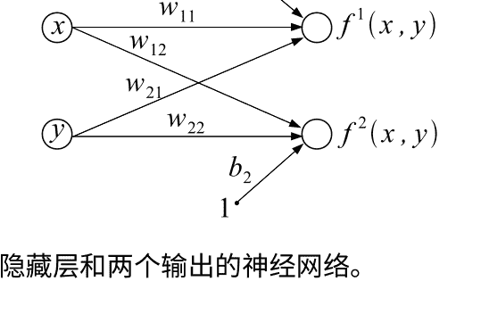

其中我们使用了附录G中的求和公式(G.1.5)的逆。解的存在性在条件 $||A\tilde{A}^{-1}|| < 1$ 下成立，这意味着 $A$ 的特征值分别小于 $\tilde{A}$ 的特征值。前述条件的几何意义大致如下：较长的簇也是较宽的。 对于所有实际目的，逆矩阵 $(A + \tilde{A})^{-1}$ 可以按附录G中所示进行计算。

值得注意的是，只要它们的凸包互不相交，这种方法就可以应用于两个以上的簇。

上述标签 $\alpha$ 和 $\tilde{\alpha}$ 都是实数；为了简单起见，可以考虑 $\alpha = 1$ 和 $\tilde{\alpha} = 0$。然而，这并不是唯一的好选择。

#### 二维标签

我们将在下面使用二维标签对簇 $\mathcal{G}$ 和 $\widetilde{\mathcal{G}}$ 进行线性分类，例如平面上的向量或不同的点。 假设簇 $\mathcal{G}$ 的标签是点 $A$，在 $\mathbb{R}^2$ 中具有坐标 $(a_1, a_2)$。类似地，簇 $\widetilde{\mathcal{G}}$ 的标签是点 $\widetilde{A}$，具有坐标 $(\tilde{a}_1, \tilde{a}_2)$。

与之前一样，命题 18.5.2 表明簇 $\mathcal{G}$ 和 $\widetilde{\mathcal{G}}$ 是线性可分的。 在这种情况下，我们将寻找一个线性函数 $f : \mathbb{R}^2 \rightarrow \mathbb{R}^2$，将簇 $\mathcal{G}$ 映射到点 $A$ 附近，并将簇 $\widetilde{\mathcal{G}}$ 映射到点 $\widetilde{A}$ 附近，参见图 18.13。

线性函数 $f = (f^1, f^2)$ 是一个具有二维输出和无隐藏层的前馈神经网络的输入输出函数，参见图18.12。这意味着 $f$ 在每个分量上都是线性的

$$
\begin{aligned}
f_{(w,b)^1}(x, y) &= w_{11}x + w_{21}y + b^1 \\
f_{(w,b)^2}(x, y) &= w_{12}x + w_{22}y + b^2.
\end{aligned}
$$图18.13：线性可分的聚类 $\mathcal{G}$ 和 $\widetilde{\mathcal{G}}$ 被映射到点标签 $A$ 和 $\widetilde{A}$ 的不相交邻域中。

权重 $w_{ij}$ 和偏置 $b_j$ 必须调整得尽可能接近点 $A$ 和 $\widetilde{A}$，使图像集 $f(\mathcal{G})$ 和 $f(\widetilde{\mathcal{G}})$ 尽可能接近。

这可以通过以下方式实现：

$$(w, b) = \arg \min G(w, b),$$

其中 $G$ 是到点标签的平方距离之和，由以下给出：

$$
\begin{aligned}
G(w, b) &= \frac{1}{2} \sum_{i=1}^N d(f_{w,b}(x_i, y_i), A)^2 + \frac{1}{2} \sum_{j=1}^M d(f_{w,b}(\widetilde{x}_j, \widetilde{y}_j), \widetilde{A})^2 \\
&= \frac{1}{2} \sum_{i=1}^N (f^1(x_i, y_i) - a_1)^2 + \frac{1}{2} \sum_{i=1}^N (f^2(x_i, y_i) - a_2)^2 \\
&\quad + \frac{1}{2} \sum_{j=1}^M (f^1(\widetilde{x}_j, \widetilde{y}_j) - \widetilde{a}_1)^2 + \frac{1}{2} \sum_{j=1}^M (f^2(\widetilde{x}_j, \widetilde{y}_j) - \widetilde{a}_2)^2 \\
&= F_1(w_{11}, w_{21}, b_1) + F_2(w_{12}, w_{22}, b_2)
\end{aligned}
$$

其中，

$$
F_1(w_{11}, w_{21}, b_1) = \frac{1}{2} \sum_{i=1}^N (w_{11}x_i + w_{21}y_i + b_1 - a_1)^2 + \frac{1}{2} \sum_{j=1}^M (w_{11}\widetilde{x}_j + w_{21}\widetilde{y}_j + b_1 - \widetilde{a}_1)^2
$$

$$F_2(w_{12}, w_{22}, b_2) = \frac{1}{2} \sum_{i=1}^{N} (w_{12}x_i + w_{22}y_i + b_2 - a_2)^2 + \frac{1}{2} \sum_{j=1}^{M} (w_{12}\widetilde{x}_j + w_{22}\widetilde{y}_j + b_2 - \widetilde{a}_2)^2.$$

最小值是在方程的解 $\nabla G(w, b) = 0$ 处实现的，其中

$$\nabla G(w, b) = (\nabla_{w_1} F_1, \nabla_{b_1} F_1, \nabla_{w_2} F_2, \nabla_{b_2} F_2) \in \mathbb{R}^6.$$

该系统包含6个方程和6个未知数（4个权重和2个偏差）。给定 $F_1$ 和 $F_2$ 的公式，类似于一维标签的情况，可以证明该系统等价于以下两个线性系统：

$$(A + \widetilde{A})X_1 = \beta_1 + \widetilde{\beta}_1$$
$$(A + \widetilde{A})X_2 = \beta_2 + \widetilde{\beta}_2,$$

其中，$A$和$\widetilde{A}$的定义与前面的情况相同，$X_{jT} = (w_{1j}, w_{2j}, b_j)$，并且

$$\beta_i = a_i \begin{pmatrix} \sum x_i \\ \sum y_i \\ N \end{pmatrix}, \quad \widetilde{\beta}_i = \widetilde{a}_i \begin{pmatrix} \sum \widetilde{x}_j \\ \sum \widetilde{y}_j \\ M \end{pmatrix}.$$

使用附录G中的公式（G.1.5），解为

$$X_1 = \widetilde{A}^{-1}(I + \widetilde{A}^{-1})^{-1}(\beta_1 + \widetilde{\beta}_1),$$
$$X_2 = \widetilde{A}^{-1}(I + \widetilde{A}^{-1})^{-1}(\beta_2 + \widetilde{\beta}_2),$$

前提是满足条件 $\|A\widetilde{A}^{-1}\| < 1$。

大多数分类问题使用额外的层来实现softmax函数，该函数在第2.1节中介绍。我们将在前面的例子中这样做，参见图18.14。为了简单起见，我们可以选择标签为one-hot向量，即

$$(a_1, a_2) = (0,1) = e_1 \quad \text{和} \quad (\widetilde{a}_1, \widetilde{a}_2) = (1,0) = e_2.$$

图18.14: 具有实现softmax函数的额外层的神经网络。

新网络的输出为 $z = (z_1, z_2)$，其中

$$
z_i = \frac{e^{f^i}}{\|e^f\|} = \frac{e^{f^i}}{e^{f^1} + e^{f^2}}, \quad i = 1,2.
$$

由于$z_i > 0$且$z_1 + z_2 = 1$，所以$z_i$属于连接点$A = (0,1)$和$\tilde{A} = (1,0)$的线段。然后，聚类$\mathcal{G}$和$\widetilde{\mathcal{G}}$被映射到线段$A\tilde{A}$上，其中$\mathcal{G}$的图像更接近标签点$A$，而$\widetilde{\mathcal{G}}$的图像更接近$\tilde{A}$，参见图18.15。

假设聚类图像的分离点是线段的中点，$(1/2, 1/2)$。现在，设$(x, y)$是平面上的一个给定点，我们需要确定点$(x, y)$属于哪个聚类。我们将点$(x, y)$通过神经网络，并且如果结果属于线段$A\tilde{A}$的上部，则该点属于聚类$\mathcal{G}$。否则，它属于$\widetilde{\mathcal{G}}$。这个测试可以使用水平或垂直坐标进行。例如，使用坐标$z_1$，如果$z_1 < 1/2$，则点$(x, y)$属于$\mathcal{G}$；如果$z_1 > 1/2$，则点$(x, y)$属于$\widetilde{\mathcal{G}}$。

对于涉及超过2个聚类的分类问题，使用softmax也取得了成功。例如，在3个聚类的情况下，$\mathcal{G}_1$, $\mathcal{G}_2$和$\mathcal{G}_3$，我们将标签$A_1=(1,0,0)$, $A_2=(0,1,0)$和$A_3=(0,0,1)$与$\mathbb{R}^3$关联起来，形成一个等边三角形，参见图18.6。在这种情况下，分离点被一组从三角形中心到其边的垂线所取代，参见图18.7。为了确定一个点属于哪个决策区域，只需计算到顶点的距离即可。例如，如果$d_{\text{dist}}(P, A_i) < 1/2$，则点$P$属于聚类$\mathcal{G}_i$的图像。

图18.15：线性可分的聚类 $\mathcal{G}$ 和 $\widetilde{\mathcal{G}}$ 被映射到线段的终端区域。在线段的内部有一个分离点。

图18.16：线性可分的聚类 $\mathcal{G}_1$， $\mathcal{G}_2$ 和 $\mathcal{G}_3$ 被映射到三角形的顶点区域。

## 18.8.2 非线性决策映射

考虑 $\mathbb{R}^2$ 中的两个簇

$$\mathcal{G} = \{(x_1, y_1), \ldots, (x_N, y_N)\}, \quad \widetilde{\mathcal{G}} = \{(\widetilde{x}_1, \widetilde{y}_1), \ldots, (\widetilde{x}_M, \widetilde{y}_M)\},$$

并假设凸壳($\mathcal{G}$) $\cap$ 凸壳($\widetilde{\mathcal{G}}$) = $\varnothing$。

我们将两个实数 $\alpha$ 和 $\widetilde{\alpha}$ 与聚类 $\mathcal{G}$ 和 $\widetilde{\mathcal{G}}$ 相关联。 根据命题18.5.2，聚类 $\mathcal{G}$ 和 $\widetilde{\mathcal{G}}$ 不是线性可分的。 因此，寻找一个非线性函数 $f: \mathbb{R}^2 \rightarrow \mathbb{R}$，将聚类 $\mathcal{G}$ 映射到 $\alpha$ 的邻域，将聚类 $\widetilde{\mathcal{G}}$ 映射到 $\widetilde{\alpha}$ 的邻域。

S型神经元非线性函数的最简单情况是由S型神经元产生的，其输入-输出函数

$$f_{w,b}(x, y) = \sigma(w_1x + w_2y + b),$$

其中 $\sigma(x)$ 是逻辑函数。 在这种情况下，我们假设标签由 $\alpha = 0$ 和 $\widetilde{\alpha} = 1$ 给出。 因此，聚类 $\mathcal{G}$ 将被映射到0，而聚类 $\widetilde{\mathcal{G}}$ 将被映射到1。 为了使这个映射尽可能地局部化在标签值周围，我们需要最小化成本函数

$$F(w, b) = \frac{1}{2} \sum_{i=1}^N \sigma(w_1x_i + w_2y_i + b)^2 + \frac{1}{2} \sum_{j=1}^M [\sigma(w_1\widetilde{x}_j + w_2\widetilde{y}_j + b) - 1]^2.$$

利用逻辑S型函数的微分性质，$\sigma' = \sigma(1 - \sigma)$，我们得到

$$\begin{aligned}
\partial_{w_1} F &= \sum_{i=1}^N x_i \sigma^2(1 - \sigma) \Big|_{w_1x_i + w_2y_i + b} - \sum_{j=1}^M \widetilde{x}_j \sigma(1 - \sigma)^2 \Big|_{w_1\widetilde{x}_j + w_2\widetilde{y}_j + b} \\
\partial_{w_2} F &= \sum_{i=1}^N y_i \sigma^2(1 - \sigma) \Big|_{w_1x_i + w_2y_i + b} - \sum_{j=1}^M \widetilde{y}_j \sigma(1 - \sigma)^2 \Big|_{w_1\widetilde{x}_j + w_2\widetilde{y}_j + b} \\
\partial_{b} F &= \sum_{i=1}^N \sigma^2(1 - \sigma) \Big|_{w_1x_i + w_2y_i + b} - \sum_{j=1}^M \sigma(1 - \sigma)^2 \Big|_{w_1\widetilde{x}_j + w_2\widetilde{y}_j + b}.
\end{aligned}$$

由于非线性，最小值没有闭式解。 找到最小值的方法是应用梯度下降法。 逼近序列通过迭代给出

$$\begin{aligned}
w_1^{(n+1)} &= w_1^{(n)} - \eta \, \partial_{w_1} F(w_1^{(n)}, w_2^{(n)}, b^{(n)}) \\
w_2^{(n+1)} &= w_2^{(n)} - \eta \, \partial_{w_2} F(w_1^{(n)}, w_2^{(n)}, b^{(n)}) \\
b^{(n+1)} &= b^{(n)} - \eta \, \partial_{b} F(w_1^{(n)}, w_2^{(n)}, b^{(n)}),
\end{aligned}$$

学习率$\eta>0$和初始值$w_1^{(0)} = w_2^{(0)} = b^{(0)}=0$。值得注意的是，这是逻辑回归方法的一种变体，仅适用于两个聚类的分类。

单隐藏层网络我们可以假设非线性函数 $f$ 是具有三个层的前馈神经网络的输入输出函数，具有一维输出。隐藏层中的神经元被假设具有非线性激活函数。然后输入输出映射为

$$f_{w,\lambda,b}(x, y) = \sum_{k=1}^{K} \lambda_k \sigma(w_{1k}x + w_{2k}y + b_k),$$

其中$K$是隐藏神经元的数量，$w_{ij}$是从输入到隐藏层的权重，$\lambda_k$是从隐藏层到输出的权重，而$b_k$是隐藏神经元的偏置，参见图18.18。函数$f_{w,\lambda,b}$依赖于$4K$个参数（$2K$个权重$w_{ij}$，$K$个偏置$b_k$，和$K$个权重$\lambda_k$）。参数必须调整，使得以下成本函数最小化：

$$G(w, b, \lambda) = \frac{1}{2} \sum_{i=1}^{N} [f_{w,\lambda,b}(x_i, y_i) - \alpha]^2 + \frac{1}{2} \sum_{j=1}^{M} [f_{w,\lambda,b}(\widetilde{x}_j, \widetilde{y}_j) - \widetilde{\alpha}]^2, \quad (18.8.2)$$

其中$\alpha$, $\widetilde{\alpha}$是与聚类$\mathcal{G}$, $\widetilde{\mathcal{G}}$相关联的标签。
由于先前成本函数的最小值没有闭合形式的解，需要使用梯度下降类型的算法，参见练习18.11.10。在多个聚类的情况下，我们可以使用多个标签和类似的方法。然而，使用向量标签，例如独热向量，可以更优雅地解决分类问题。

在这种情况下，标签空间为$\mathbb{R}^p$，其中p是需要分类的簇的数量，参见练习18.11.11。

## 18.9 决策边界

考虑两个簇$\mathcal{G}_1$和$\mathcal{G}_2$在$\mathbb{R}^2$中。决策边界是$\mathbb{R}^2$中的连续曲线，用于分隔簇，参见图18.19。这意味着对于任意$g_1\in\mathcal{G}_1$和$g_2\in\mathcal{G}_2$，从$g_1$到$g_2$的任何连续曲线都会与决策边界曲线相交。

下一个结果表明，决策边界的存在在局部上等价于簇的线性分离。

> **定理 18.9.1 (矫正定理):** 考虑两个簇$\mathcal{G}_1$和$\mathcal{G}_2$在$\mathbb{R}^2$中，并且它们之间有一个平滑的决策边界。那么存在一个平滑的非线性函数$F$，在决策曲线的邻域上定义，其值在$\mathbb{R}^2$中，使得$F$将决策曲线映射到$x$轴，簇$\mathcal{G}_1$映射到上半平面，簇$\mathcal{G}_2$映射到下半平面。

> **证明:** 记$c(s), 0 \le s \le T$, 为决策曲线，并考虑其通过正常流$\Phi_t(c(s))$, with $-b < t < b$的演化。这是$\Phi_t(c(s)) = c(s) + t N(s)$，其中$N$是$c(s)$的单位法向量，见图18.20。对于足够小的$b$，流动没有任何奇点。集群$\mathcal{G}_1$对应于$t > 0$的值，集群$\mathcal{G}_2$对应于$t < 0$。

集合$U = \{\Phi_t(c(s)); |t| < b, 0 \le s \le T\}$定义了决策曲线的邻域。然后定义映射 $F: U \rightarrow \mathbb{R}^2$为$F(\Phi_t(c(s))) = (s, t)$。由于$\Phi_0(c(s)) = c(s)$，然后$F$将$c(s)$映射到$(s,0)$，并将簇$\mathcal{G}_1\cap U$映射到上半平面，簇$\mathcal{G}_2\cap U$映射到下半平面。

这个结果可以推广到更高的维度。如果簇$\mathcal{G}_1$和$\mathcal{G}_2$在$\mathbb{R}^n$中，决策边界是一个$(n-1)$维超曲面$\mathcal{H}$在$\mathbb{R}^n$中，它将簇分开，即对于任意$g_1\in \mathcal{G}_1$和$g_2\in \mathcal{G}_2$，从$g_1$到$g_2$的任何连续曲线都与超曲面$\mathcal{H}$相交。

与前面的情况类似，我们可以在附近构建一个坐标系，记作 $\mathcal{H}$。在这个附近的任意点 $P$都可以投影到 $\mathcal{H}$上的一个点 $P'$。与 $P$相关联的坐标是$(x_1, \ldots, x_{n-1}, x_n)$，其中$(x_1, \ldots, x_{n-1})$是 $P'$在 $\mathcal{H}$上的坐标， $x_n$是 $P$在 $\mathcal{H}$上的投影长度，根据超曲面的方向给出符号。因此，函数 $F(P) = (x_1, \ldots, x_n)$将 $\mathcal{H}$映射到超平面 $\{x_n=0\}$。

涉及多于2个簇的情况更加复杂，因为在这种情况下，决策边界具有更丰富的结构。例如，如果簇位于一个平面上，我们有以下定义。考虑 $\mathbb{R}^2$ 中的 $p$ 个点簇 $\mathcal{G}_1, \mathcal{G}_2, \ldots, \mathcal{G}_p$。在这种情况下，决策边界是 $\mathbb{R}^2$ 中连接的连续曲线系统，用于分隔簇。也就是说，对于任意的 $g_i \in \mathcal{G}_i$ 和 $g_j \in \mathcal{G}_j$，其中 $i \ne j$，从 $g_i$ 到 $g_j$ 的任何连续曲线都会与决策边界相交。

## 18.10 总结

在聚类的分类过程中，需要将标签准确地分配给每个聚类。可以分配几种类型的标签：数字、独热向量、点等。将标签分配给聚类的映射是一个决策映射，可以通过神经网络学习。

如果两个聚类的凸包不相交，则它们是线性可分的。在这种情况下，单个感知器可以学习相关的决策函数。

如果两个聚类的凸包相交，则它们是线性不可分的，在这种情况下，使用具有非线性激活函数的神经网络来学习相关的决策函数。

在神经网络的最后一层使用softmax激活函数将聚类映射到一个 $(n-1)$ 维多面体的角落。

修正定理表明，存在于聚类之间的决策边界在局部上等价于聚类的线性分离。

## 18.11 练习题

- 练习题 18.11.1: 设 $S = (I_1 \times I_1) \cap (\mathbb{Q} \times \mathbb{Q})$ 是有理数在 $[0, 1] \times [0, 1]$ 上的格子。
(a) 证明 $S$ 是一个传递关系；
(b) $S$ 是否是一个等价关系？

- 练习题 18.11.2: 证明只有当 $k$ 个点处于一般位置时，存在唯一的 $(k-1)$-超平面包含这些点。

- 练习题 18.11.3: 设 $P_1, \ldots, P_k$ 是一般位置的 $\mathbb{R}^k$ 中的 $k$ 个点，$\mathcal{H}$ 是包含它们的唯一的 $(k-1)$-超平面。证明集合 $\{\overrightarrow{P_1 P_2}, ..., \overrightarrow{P_1 P_k}\}$ 构成 $\mathcal{H}$ 中的一组独立向量。

- 练习 18.11.4: 考虑两个不同的实数 $x_1, x_2 \in \mathbb{R}$。证明存在唯一的仿射函数 $f(x) = ax + b$ 使得 $f(x_1) = 1$ 且 $f(x_2) = 2$。

练习18.11.5 设 𝒢 是 ℝⁿ 中的一个集合。 (a) 证明 hull(𝒢) 是一个凸集; (b) 证明 hull(𝒢) 是包含 𝒢 的最小凸集; (c) 验证 $$\text{凸包}(\mathcal{G}) = \bigcap_{K} \{K; \mathcal{G} \subset K \subset \mathbb{R}^n \text{ convex}\}.$$

练习18.11.6 设 Φ : ℝ² → ℝ² 是一个非退化的仿射函数，即， Φ(x) = W x + b，其中 det W ≠ 0。 考虑两个线性可分的集合 𝒢₁ 和 𝒢₂。 证明 Φ(𝒢₁) 和 Φ(𝒢₂) 是线性可分的。 换句话说，仿射函数保持线性可分性。

练习18.11.7 让 𝒢 是一个有限点集合，并用 \bar{𝒢} 表示其质心。 证明 \bar{𝒢} ∈ hull(𝒢)。

练习18.11.8 证明一个集合族 {𝒢₁,…, 𝒢ₖ} 在 ℝⁿ 中是凸可分的当且仅当这个集合族是互相凸可分的，即对于任意 i ≠ j， 任意两个集合 𝒢ᵢ 和 𝒢ⱼ 都是凸可分的。

练习18.11.9 (a) 如果 A 和 B 是两个凸集，且 A ∩ B = ∅，则 A 和 B 是线性可分的; (b) 如果 𝒢₁ 和 𝒢₂ 是两个满足 hull(𝒢₁) ∩ hull(𝒢₂) = ∅ 的聚类，则 𝒢₁ 和 𝒢₂ 是线性可分的。

练习18.11.10 (a) 找到梯度 ∇_{w,b,λ} G， 其中 G 由 (18.8.2) 给出。 (b) 写出逼近序列的梯度下降递归的表达式。

练习18.11.11 考虑 p 个聚类， 𝒢₁,…,𝒢ₚ， 在 ℝ² 中的点。 写出将向量 eⱼ 与聚类 𝒢ⱼ 关联的代价函数， 对于所有 j=1,…,p。

练习18.11.12 证明由 (18.2.1) 给出的分区的熵在所有集合 Aⱼ 具有相等测度时达到最大。

## 第19章 生成模型

到目前为止，神经网络对于两种主要的重要问题非常有用：回归问题和分类问题。 在回归问题中，使用了一个具有一维输出的神经网络，输出层具有线性激活函数。 在分类问题中，使用了一个具有多维输出的神经网络，输出层具有 softmax 激活函数。

在本节中，我们将讨论另一个重要的应用，即生成模型的构建。 如果回归问题可以预测未来的模式，分类问题可以识别字体，那么生成模型可以生成与训练数据非常相似的示例。

### 19.1 生成模型的需求

考虑生成模型有很多原因。 它们在许多行业的成功应用使它们非常受欢迎。 生成模型能够生成与训练数据非常相似的示例，这使它们在可用数据不足或缺失的情况下非常有用。 在许多实际情况下，数据增强可能是昂贵且耗时的。 生成模型可以以较低的成本完成这项工作。

我们将提供一些例子。

- 1. 出于安全原因，训练神经网络驾驶汽车或操作机器人不能在真实环境中进行。 因此，使用生成模型提供一个模拟环境，在该环境中训练汽车直到模型准备好在现实生活中部署。
- 2. 在制定商业计划的情况下，可以使用生成模型提供可能未来商业环境的模拟。这些可能的环境是通过与过去事件的相似性生成的。
- 3. 另一个应用是定价金融合同，如衍生品。这些合同的价格取决于基础股票的价格。传统的计算技术是使用蒙特卡洛方法。这假设了大量可能的股票价格模拟，根据这些模拟计算金融合同的价格。然后将所有模拟合同价格的平均值作为计算合同价格。生成模型可以用于模拟股票市场并定价这些市场中的金融合同，提供有关实际合同价格的想法。
- 4. 其他例子包括在卡通和电影行业中使用生成模型，其中需要生成类似真实环境的场景，例如建筑物、树木、山脉等。生成模型还可以用于生成音乐、绘画、人脸等。例如，iGAN软件可以根据粗糙的手绘草图生成图片。

接下来我们将讨论两种类型的生成模型：提供密度估计的模型和生成样本的模型。

### 19.2 密度估计

这里的任务是创建一个机器，观察来自给定分布的许多样本，即数据分布 $p(x)$，并能够以后从该分布中生成更多样本。我们区分以下两种情况：参数分布和非参数分布。

参数分布情况：如果有理由相信给定分布 $p_{data}(x)$ 可以由参数分布 $p_{model}(x;\theta)$ 来估计，那么我们只需要调整 $\theta$，使得模型分布在数据上的对数似然最大化。

非参数分布情况：如果没有理由相信给定分布 $p_{data}(x)$ 可以由参数分布来估计，那么我们需要使用非参数方法来估计分布。

$$\theta^* = \arg \max_\theta \mathbb{E}_{x \sim p_{data}} \left[ \ln p_{model}(x; \theta) \right]$$

我们注意到，在实践中，期望值被计算为平均值

$$\mathbb{E}_{x \sim p_{data}} \left[ \ln p_{model}(x; \theta) \right] = \frac{1}{n} \sum_{i=1}^n \ln p_{model}(x_i; \theta)$$

其中 $x_i \sim p_{data}$ 是从给定分布中提取的样本。

选择参数 $\theta$ 的另一种等效方法是要求数据和模型分布之间的 Kullback-Leibler 散度最小

$$\theta^* = \arg\min_{\theta} D_{KL}[p_{data}||p_{model}].$$

这是根据计算得出的

$$\begin{aligned} \theta^* &= \arg\max_{\theta} \mathbb{E}_{x\sim p_{data}} \left[ \ln p_{model}(x;\theta) \right] = \arg\min_{\theta} \mathbb{E}_{x\sim p_{data}} \left[ -\ln p_{model}(x;\theta) \right] \\ &= \arg\min_{\theta} \left\{ -\int p_{data}(x) \ln p_{model}(x) dx \right\} = \arg\min_{\theta} S(p_{data}, p_{model}) \\ &= \arg\min_{\theta} [S(p_{data}, p_{model}) - H(p_{data})] = \arg\min_{\theta} D_{KL}(p_{data}||p_{model}), \end{aligned}$$

我们使用给定数据的熵的独立性，$H(p_{data})$，从 $\theta$ 和交叉熵 $S$ 以及 Kullback-Leibler 散度的定义。

非参数情况：在这种情况下，思路如下：我们取一个简单的分布（如均匀分布或高斯分布），然后对从该分布中采样的样本应用非线性变换 $G$，以获得从所需分布中采样的样本 $p_{data}(x)$。

首先，我们介绍一些术语和符号。取值为 $x$ 的空间表示我们关心的空间，记为 $\mathcal{X}$。简单分布 $p(z)$，经 $G$ 转换为 $p_{data}(x)$ 的过程称为编码分布；$z$ 从中采样的空间称为潜在空间 $\mathcal{Z}$。现在，我们希望对于每个随机选择的 $z \in \mathcal{Z}$，都能获得 $x = G(z)$ 作为空间 $\mathcal{X}$ 的样本。

将随机变量术语与随机变量联系起来可能会很有用。潜在变量 $z$ 是潜在空间 $\mathcal{Z}$ 中取值的随机变量实例 $Z$。来自数据 $(x)$ 的样本 $X$ 被视为空间 $\mathcal{X}$ 上的随机变量 $X$ 的实例。在这些符号下，我们正在寻找一个将变量 $Z$ 映射到变量 $X$ 的变换 $G$。这可以通过几种方式实现。

- 1. 我们假设数据分布 $p_{data}$ 是一维的，并且我们将考虑一个均匀编码分布 $p_{code} \sim Unif[0,1]$。我们将展示满足 $G(Z)=X$ 的变换 $G:[0,1]\to\mathcal{X}$ 的表达式为 $G = F_{data}^{-1}$，其中 $F_{data}(x) = \int_{-\infty}^{x} p_{data}(s) ds$ 是随机变量 $X$ 的累积分布函数。

关键点在于，如果 $Z \sim Unif[0,1]$，那么对于所有的 $z \in [0,1]$，有 $P(Z\leq z)=z$。现在，为了证明随机变量 $X$ 和 $Y=G(Z)$ 具有相同的分布，我们使用计算

$$F_Y(x) = P(Y \le x) = P(G(Z) \le x) = P(Z \le F_{data}(x)) = F_{data}(x), \quad \forall x \in \mathcal{X}.$$

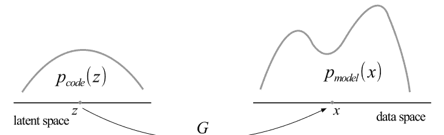

总之，为了在空间 $\mathcal{X}$ 中生成 $n$ 个样本，遵循分布 $p_{data}$，我们均匀选择随机实例 $z_i\in[0, 1]^n$，并考虑 $x_i=G(z_i)$，其中 $G=F_{data}^{-1}$ 已知。 然后所有构造的实例满足 $x_i\sim p_{data}$。

由于在实践中很少有分布是一维的，我们接下来将考虑多维情况。

- 2. 在这种情况下，编码分布 $p_{code}$ 是多维的，不一定是均匀的。潜在空间用 $\mathcal{Z}$ 表示，我们考虑一个可逆可微的变换 $G: \mathcal{Z} \rightarrow \mathcal{X}$，其逆变换和雅可比行列式的确定可以计算，参见图19.1。然后这个变量的改变在 $\mathcal{X}$ 上产生了一个新的密度。

$$p_{model}(x) = p_X(x) = \frac{p_{code}(G^{-1}(x))}{\left| \det J_G(z) \right|} \tag{19.2.1}$$

例子 19.2.1：作为一个例子，我们将展示如何从正态多元分布 $\mathcal{N}(\mu, \Sigma)$ 中构造样本，其中 $\mu$ 是给定的向量在 $\mathbb{R}^n$ 中，$\Sigma$ 是一个对称的、非退化的、正定的 $n$ 维矩阵。我们考虑仿射变换 $G : \mathbb{R}^n \rightarrow \mathbb{R}^n$，给定由 $G(z) = \mu + Az$，其中 $A A^T = \Sigma$。显然，$\det J_G(z) = \det A \neq 0$，因此 $G$ 是可逆的，具有逆

$$G^{-1}(x) = A^{-1}(x - \mu).$$

我们选择编码分布为标准正态分布，均值为零，协方差为单位矩阵

$$p_{code}(z) = \frac{1}{(2\pi)^{n/2}} e^{-\frac{1}{2}\|z\|^2},$$

即，$Z\sim \mathcal{N}(0, \mathbb{I}_n)$。使用公式 (19.2.1) 我们得到以下密度：

$$\begin{aligned} p_X(x) &= \frac{1}{|\det A|} \frac{1}{(2\pi)^{n/2}} e^{-\frac{1}{2}\|A^{-1}(x-\mu)\|^2} \\ &= \frac{1}{(\det \Sigma)^{1/2}} \frac{1}{(2\pi)^{n/2}} e^{-\frac{1}{2}\langle A^{-1}(x-\mu), A^{-1}(x-\mu)\rangle} \\ &= \frac{1}{((2\pi)^n \det \Sigma)^{1/2}} e^{-\frac{1}{2}\langle (AA^T)^{-1}(x-\mu), (x-\mu)\rangle} \\ &= \frac{1}{\sqrt{(2\pi)^n \det \Sigma}} e^{-\frac{1}{2}(x-\mu)\Sigma^{-1}(x-\mu)} \end{aligned}$$

其中我们使用了代数关系 $(A^{-1})^T A^{-1} = (A^T)^{-1} A^{-1} = (AA^T)^{-1}$。

值得注意的是，使用这种方法后面的公式 (19.2.1) 有一些不足之处。首先，该方法假设雅可比行列式和变换 $G$ 的逆可计算。该方法的另一个不足之处是潜在空间的维度等于数据空间的维度，这涉及到太多的参数。如果数据空间表示一张图片，那么使用这种方法将涉及到与图片中的像素一样多的潜在变量！这就是构建一个比数据空间维度小得多的潜在空间的方法的原因。

生成模型的第二种类型是样本生成，它生成更多的样本而不是找到密度函数。在这个组中，我们将讨论生成对抗网络（GANs）和生成矩匹配网络。我们将在下一节讨论对抗方面的内容首先。

### 19.3 对抗游戏

我们考虑两个参与竞争游戏的玩家，他们争夺相同的收益函数：一个希望收益函数高，而另一个希望收益函数低。这样，玩家变成了对手，对相反的奖励感兴趣。他们中的每个人都控制着收益函数的某些变量，并试图调整它们以获得最大的利益。对于某些参数值，玩家可能达到一个平衡。这可以通过以下例子来理解。

我们可以将其中一个玩家看作是卖家，另一个玩家看作是某种产品的买家。双方必须就产品价格达成一致。卖家会试图抬高价格，而买家希望价格尽可能低。在谈判过程结束时，卖家同意降低产品价格，买家同意支付更多的费用。

使得各方达成卖方-买方协议。这样他们就能得到均衡价格，该价格对应于博弈的纳什均衡点。

该问题可以表述为以下的极小极大问题。考虑一个支付函数 $V(x, y)$，它依赖于变量 $x$ 和 $y$。第一个玩家控制变量 $x$，第二个玩家控制变量 $y$。第一个玩家希望最小化支付函数 $V(x, y)$，而第二个玩家希望最大化支付函数 $V(x, y)$（等价于最小化 $-V(x, y)$）。该问题可以表述为

$$(x^\star, y^\star) = \arg \max_{y} \min_{x} V(x, y).$$

可以使用连续时间变体的同时梯度下降方法来获得均衡点。

由于第一个玩家控制变量 $x$ 并且希望最小化 $V(x, y)$，它应该朝着 $V$ 的负梯度方向调整 $x$，步长为 $\eta = \Delta t$

$$x(t + \Delta t) = x(t) - \eta \frac{\partial V}{\partial x}.$$

同样地，由于第二个玩家控制变量 $y$ 并且希望最大化 $V(x, y)$，它应该朝着 $V$ 的正梯度方向调整 $y$，步长为 $\eta = \Delta t$

$$y(t + \Delta t) = y(t) + \eta \frac{\partial V}{\partial y}.$$

当 $\Delta t \to 0$ 时，我们得到一个同时进行的梯度下降算法，学习率无限小，学习过程遵循平滑的轨迹 $(x(t), y(t))$ 满足以下连续时间微分系统：

$$\begin{align*}
\frac{dx}{dt} &= -\frac{\partial V}{\partial x} \quad &(19.3.2) \\
\frac{dy}{dt} &= \frac{\partial V}{\partial y} \quad &(19.3.3)
\end{align*}$$

初始条件为 $(x(0), y(0)) = (x_0, y_0)$，平衡点（如果存在）为极限值 $(x^\star, y^\star) = \lim_{t \to \infty} (x(t), y(t))$。由于在平衡点我们有 $\frac{dx^\star}{dt} = \frac{dy^\star}{dt} = 0$，因此平衡点满足系统

$$\begin{align*}
\frac{\partial V}{\partial x} &= 0 \\
\frac{\partial V}{\partial y} &= 0.
\end{align*}$$

值得注意的是，收益函数 $V(x, y)$ 沿着学习曲线 $(x(t), y(t))$ 的变化由其微分给出，即

$$dV = \frac{\partial V}{\partial x} dx + \frac{\partial V}{\partial y} dy = -\dot{x} dx + \dot{y} dy.$$

**例子 19.3.1** 通过以每单位价格 $p$ 销售 $q$ 单位某种产品获得的收入是 $V(p, q) = pq$。卖家可以控制价格 $p$，并且有兴趣最大化收入 $V(p, q)$。买家可以控制销售的单位数 $q$，并且希望最小化支付的价格 $V(p, q)$。

这成为一个极小极大问题，并且将使用具有无穷小学习率的同时梯度下降方法来解决。学习过程遵循一个轨迹 $(p(t), q(t))$，它满足连续时间系统 (19.3.2)-(19.3.3)，在这种情况下变为

$$\begin{aligned}
\frac{dp}{dt} &= q \\
\frac{dq}{dt} &= -p.
\end{aligned}$$

对 $t$ 再次求导，我们得到 $\ddot{p} = -p$ 和 $\ddot{q} = -q$，这意味着 $p(t)$ 和 $q(t)$ 都是 $\cos t$ 和 $\sin t$ 的线性组合

$$\begin{aligned}
p(t) &= A_1 \cos t + B_1 \sin t \\
q(t) &= A_2 \cos t + B_2 \sin t,
\end{aligned}$$

其中 $A_i$ 和 $B_i$ 是常数。将其代入微分方程组并使用初始条件，我们确定常数并写出解为

$$\begin{aligned}
p(t) &= p_0 \cos t + q_0 \sin t \\
q(t) &= q_0 \cos t - p_0 \sin t.
\end{aligned}$$

由于这可以表示为矩阵形式 $(p, q)^T = \mathcal{R}(t)(p_0, q_0)^T$，其中

$$\mathcal{R}(t) = \begin{pmatrix} \cos t & \sin t \\ -\sin t & \cos t \end{pmatrix}$$

表示平面上角度为 $t$ 的旋转，因此解 $(p(t), q(t))$ 绕原点形成一个圆轨迹，半径为 $r = \sqrt{p_0^2 + q_0^2}$。只要 $r \neq 0$，这个解不会接近任何平衡点。唯一的平衡点位于原点处，$(p^*, q^*) = (0, 0)$，这发生在 $p_0 = q_0 = 0$ 的情况下。

## 19.4 生成对抗网络

生成对抗网络（GANs）于2014年由Goodfellow等人[47]引入，被认为是目前最强大的生成模型之一。

GANs是由两个神经网络玩的一个非合作博弈：判别器和生成器。这些网络充当对手，具有相反的奖励，一个网络的最坏输入由另一个网络产生。在这个竞争的游戏中，每个网络都迫使另一个网络改进。

生成器网络：生成器是一个网络，其输入是从潜在空间中选择的一些随机噪声，输出是一个图像$x$，该图像应该类似于数据空间中的图像。生成器的输出是$x = G(z; \theta^{(g)})$，其中$\theta^{(g)}$是生成器网络的参数，$z$是潜在空间$\mathcal{Z}$中的潜在向量变量。我们应该用$\mathcal{Z}$表示具有实例$z$取值在潜在空间$\mathcal{Z}$中的随机变量，并用$p(z)$表示其概率密度。我们用$X$表示输出随机变量，即$X = G(\mathcal{Z}; \theta^{(g)})$，并用$p_{\text{model}}(x; \theta^{(g)})$表示其密度。

生成器函数 $G$ 必须是可微分的，其维度小于 $X$ 的维度。

判别器网络：判别器网络作为一个分类器工作。这意味着判别器是一个网络，它接收一个输入 $x$（例如，一张图片），并产生一个介于0和1之间的数 $D(x; \theta^{(d)})$，其中 $\theta^{(d)}$ 是判别器网络的参数。这个数可以被视为输入 $x$ 被视为真实训练数据的概率，当判别器完全拒绝将输入 $x$ 视为训练数据时，其值为0。如果输入是一张图片，判别器可以被视为一个卷积网络，并且可以使用梯度下降进行训练。判别器和生成器网络函数可以在图19.2中看到。

生成器的任务是欺骗判别器，使其相信其输出是真实的训练数据；这意味着生成器希望 $D(G(z))$ 接近于1。另一方面，判别器的目标是证明生成器是错误的，即它希望对于所有$z\in \mathcal{Z}$，输出一个接近于0的值 $D(G( z))$。训练过程以循环的方式进行。一开始，生成器并不聪明，会产生一些随机噪声。随着时间的推移，生成器会不断改进，产生的图像越来越接近训练数据集中的图像。与此同时，判别器通过使用生成器生成的图像批次和从训练数据集中选择的图像批次来对假和真实图像进行训练。随着判别器的改进

图19.2: GAN的解剖结构：潜在变量被输入到生成器中产生“假”数据。然后重复采样两个小批量数据，一个来自真实数据，另一个来自生成的数据，并让判别器决定它是假的还是真实的。根据这个决定，我们可以更新网络参数，以改进GAN的功能。

生成器在其工作中变得更加熟练后，将倾向于生成与数据空间中的图像越来越相似的图像。如果训练成功，生成器最终将生成与真实训练图像完全无法区分的图像。此外，在最后，判别器将无法区分输出是假的还是真实的，并提供一个概率输出为0.5。此时，判别器变得无用，可以忽略，只保留生成器网络。

例子9.4.1：考虑一个生成素数的GAN。我们假设训练数据是前n个素数的集合，$X=\{p_1, p_2, ..., p_n\}$。如果生成器网络产生一个数字$x$，判别器网络将通过检查$x$与$p_i$的除法是否为偶数来测试该数字是否为素数。如果存在一个素数$p_i$是$x$的除数，则判别器产生$D(x)=0$，否则$D(x)=1$。在开始时，生成器可能会产生例如$x=p_1p_2$，并且判别器很容易将其分类为非素数。但随着时间的推移，生成器将学会必须产生一个大于提供的所有素数的数字，且不是它们的倍数，例如$x=p_1p_2...p_n+1$。在这种情况下，生成器将产生$D(x)=1$，即将数字$x$分类为素数。生成器可以利用这个信息，下一次产生输出$x=p_1...p_n(p_1p_2...p_n+1)+1$，依此类推。

我们注意到可以使用多个判别器函数 D(x)。如果我们用 div(x) 表示在已知质数集合中 x 的因子个数，那么我们还可以定义 D(x) = e^{2-div(x)}，或者 D(x) = \frac{2}{div(x)} 和将它们视为判别器函数。

## 损失函数

判别器试图最大化回报

$$V(G, D) = \mathbb{E}_{x \sim p_{\text{数据}}} [\ln D(x)] + \mathbb{E}_{x \sim p_{\text{模型}}} [\ln(1 - D(x))], \quad (19.4.4)$$

最大化第一项确保对真实数据的正确分类，而最大化第二项确保对生成的模型数据的正确分类。这是因为判别器的输出 D(x) 倾向于接近于1，对于真实数据 x，而1 - D(x) 倾向于接近于1，对于生成的数据 x。

## 例子 19.4.2

最简单的判别器网络是一个sigmoid神经元。如果输入是一个向量 $x^T = (x_1, ..., x_n)$，那么判别器产生的概率 $D(x; w, b) = \sigma(w^T x + b) = \frac{1}{1 + e^{-(w^T x + b)}}$ 其中 $w$ 和 $b$ 分别表示权重和偏置。接下来，我们将评估收益函数 (19.4.4)。利用对数和软正函数的性质，我们有

$$\ln D(x) = -\ln(1 + e^{-(w^T x + b)}) = -sp(-(w^T x + b)) = x - sp(w^T x + b),$$

然后

$$\mathbb{E}_{x \sim p_{data}} [\ln D(x)] = \mu_X - \mathbb{E}_{x \sim p_{\text{数据}}} [sp(w^T x + b)],$$

其中 $\mu_X$ 表示生成器输出的平均值。我们还有

$$1 - \ln D(x) = 1 - \sigma(w^T x + b) = \sigma(-w^T x - b) = \frac{1}{e^{w^T x + b}},$$

以便

$$\ln(1 - D(x)) = -\ln(1 + e^{w^T x + b}) = -sp(w^T x + b)。$$

取期望，我们得到

$$\mathbb{E}_{x \sim p_{model}} [\ln(1 - D(x))] = -\mathbb{E}_{x \sim p_{\text{模型}}} [sp(w^T x + b)]。$$

因此，回报函数变为

$$V(G, D) = \mu_X - \mathbb{E}_{x \sim p_{\text{数据}}} [sp(w^T x + b)] - \mathbb{E}_{x \sim p_{\text{模型}}} [sp(w^T x + b)] = \mu_X - \int (p_{\text{数据}}(x) + p_{\text{模型}}(x)) sp(w^T x + b) dx = \mu_X - \mathbb{E}_{x \sim p_m} [sp(w^T x + b)],$$

其中 $p_m(x) = \frac{1}{2} ( p_{\text{数据}}(x) + p_{\text{模型}}(x) )$。

生成器的回报是 $-V(G, D)$（因此被称为零和游戏），即生成器的目标是最大化 $-V(G, D)$，或者等价地，最小化 $V(G, D)$。

由于每个网络都试图最大化自己的回报，因此现在可以将其设置为以下极小极大问题：$G^* = \arg \min_G \max_D V(G, D)$，其中 $G^*$ 表示最优生成器。

暂时我们将考虑生成器固定并在内部最大循环上工作。对于给定的生成器 $G$，最优判别函数 $D_G^*$ 由 $D_G^* = \arg \max_D V(G, D)$ 给出，即

$$\max_D V(G, D). \qquad (19.4.5)$$

下一个结果提供了这个判别器的值。

## 命题19.4.3

对于固定的生成器 $G$，最优判别器 (19.4.5) 由下式给出

$$D_G^*(x) = \frac{p_{data}(x)}{p_{数据}(x) + p_{模型}(x)}. \qquad (19.4.6)$$

证明：考虑定义在空间 $\mathcal{X}$ 上的数据分布 $p_{data}$ 和模型分布 $p_{model}$，支付函数可以写成以下积分形式：

$$V(G, D) = \int_{\mathcal{X}} \left[ p_{data}(x) \ln D(x) + p_{model}(x) \ln(1 - D(x)) \right] dx.$$

由于$G$固定，我们将支付视为$D$的函数 $D(x)$

$$F(D) = \int_{\mathcal{X}} L(D(x)) dx,$$

具有拉格朗日函数

$$L(D) = p_{data}(x) \ln D(x) + p_{model}(x) \ln(1 - D(x)).$$

临界点满足变分方程

$$\frac{dL}{dD} = 0.$$

这变成

$$\frac{p_{data}(x)}{D(x)} - \frac{p_{model}(x)}{1 - D(x)} = 0.$$

解$D$，我们得到解决方案

$$D^{*}_{G}(x) = \frac{p_{data}(x)}{p_{数据}(x) + p_{模型}(x)}.$$

为了证明这个临界点对应于最大值，我们考虑第二变分并证明它具有负值

$$\frac{d^2 L}{dD^2} = -\frac{p_{data}(x)}{D(x)^2} - \frac{p_{model}(x)}{(1-D(x))^2}.$$

因此，$D^{*}_{G}(x)$对应于给定$G$的$V(G, D)$的最大值。

-   备注 19.4.4
    (i) 我们注意到最优$D^{*}_{G}(x)$取决于通过密度$p_{model}(x)$定义的$G(z)$的密度，其中$z \sim p_{code}$。
    (ii) 这是最优解存在性和唯一性的理论结果。然而，如果没有给定$p_{data}$，这个结果是不实际的。

生成器最优解$G^{*}$，现在给出为

$$G^{*} = \arg \min_{G} V(G, D^{*}_{G}).$$

为了找到它，我们首先需要评估支付的最大值$V(G, D)$在其最优点处的值。

## 命题 19.4.5

如果$D_{JS}$表示由公式(3.7.4)给出的Jensen-Shannon散度，则支付函数的最大值为

$$V(G, D^{*}_{G}) = 2D_{JS}(p_{model}(x)\|p_{data}(x)) - \ln 4.\quad (19.4.7)$$

将公式(19.4.6)给出的值代入支付函数中，我们得到

$$
\begin{align*}
V(G, D^{*}_{G}) &= \int_{\mathcal{X}} \left[ p_{data}(x) \ln D^{*}_{G}(x) + p_{model}(x) \ln(1 - D^{*}_{G}(x)) \right] dx \\
&= \int_{\mathcal{X}} \left[ p_{data}(x) \ln \frac{p_{data}(x)}{p_{数据}(x) + p_{模型}(x)} + p_{model}(x) \ln \frac{p_{model}(x)}{p_{数据}(x) + p_{模型}(x)} \right] dx.
\end{align*}
$$

在接下来的内容中，我们将添加并减去$\ln 2 p_{data}(x)$和$\ln 2 p_{model}(x)$并使用一些代数运算将其分解为三个积分

$$V(G, D^{*}_{G}) = \int_{\mathcal{X}} \left[ (\ln 2 - \ln 2)p_{数据}(x) + p_{数据}(x) \ln \frac{p_{data}(x)}{p_{数据}(x) + p_{模型}(x)} + (\ln 2 - \ln 2)p_{模型}(x) + p_{模型}(x) \ln \frac{p_{model}(x)}{p_{数据}(x) + p_{模型}(x)} \right] dx = I_{1} + I_{2} + I_{3},$$

其中

$$I_1 = -\int_{\mathcal{X}} \ln 2\left(p_{\text{数据}}(x) + p_{\text{模型}}(x)\right) dx$$

$$I_2 = \int_{\mathcal{X}} p_{data}(x)\left[\ln 2 + \ln \frac{p_{model}(x)}{p_{\text{数据}}(x) + p_{\text{模型}}(x)}\right] dx$$

$$I_3 = \int_{\mathcal{X}} p_{model}(x)\left[\ln 2 + \ln \frac{p_{model}(x)}{p_{\text{数据}}(x) + p_{\text{模型}}(x)}\right] dx$$

在下面，我们评估每个积分。利用 $p_{\text{数据}}$ 和 $p_{\text{模型}}$ 是概率密度函数，我们有

$$I_1 = -\ln 2 \left[ \int_{\mathcal{X}} p_{\text{数据}}(x) \,dx + \int_{\mathcal{X}} p_{\text{模型}}(x) \,dx \right] = -2 \ln 2 = -\ln 4.$$

利用对数函数的性质，我们将第二个积分评估为库尔巴克-莱布勒散度

$$
\begin{align*}
I_2 &= \int_{\mathcal{X}} p_{data}(x) \ln \frac{2p_{\text{模型}}(x)}{p_{\text{数据}}(x) + p_{\text{模型}}(x)} dx \\
&= \int_{\mathcal{X}} p_{data}(x) \ln \frac{p_{model}(x)}{\frac{1}{2}(p_{\text{数据}}(x) + p_{\text{模型}}(x))} dx \\
&= D_{KL} \left( p_{\text{数据}}(x) \mathrel{\|} \frac{p_{\text{数据}}(x) + p_{\text{模型}}(x)}{2} \right).
\end{align*}
$$

第三个积分可以用类似的方式计算

$$
\begin{align*}
I_3 &= \int_{\mathcal{X}} p_{\text{模型}}(x) \ln \frac{2p_{\text{模型}}(x)}{p_{\text{数据}}(x) + p_{\text{模型}}(x)} dx \\
&= \int_{\mathcal{X}} p_{\text{模型}}(x) \ln \frac{p_{model}(x)}{\frac{1}{2}(p_{\text{数据}}(x) + p_{\text{模型}}(x))} dx \\
&= D_{KL} \left( p_{\text{模型}}(x) \mathrel{\|} \frac{p_{\text{数据}}(x) + p_{\text{模型}}(x)}{2} \right).
\end{align*}
$$

利用Jensen-Shannon散度（3.7.4）的定义，我们得到

$$
\begin{align*}
V(G, D_G^*) &= I_1 + I_2 + I_3 \\
&= -\ln 4 + D_{KL} \left( p_{\text{数据}}(x) \mathrel{\|} \frac{p_{\text{数据}}(x) + p_{\text{模型}}(x)}{2} \right) + D_{KL} \left( p_{\text{模型}}(x) \mathrel{\|} \frac{p_{\text{数据}}(x) + p_{\text{模型}}(x)}{2} \right) \\
&= -\ln 4 + 2 D_{JS}(p_{\text{模型}}(x) \| p_{\text{数据}}(x)).
\end{align*}
$$

下一个结果显示了GAN的一个预期事实，即在平衡收敛时，模型分布逼近数据分布（Goodfellow等人[47]）。

## 命题19.4.6

全局最小值

$$G^* = \arg \min_G V(G, D_G^*)$$

只有当 $p_{\text{model}} = p_{\text{data}}$ 时才能实现。在这个最小点处，数值为 $-\ln 4$。

证明：使用关系式（19.4.7）我们有

$$G^* = \arg \min_G V(G, D_G^*) = \arg \min_G \left( 2D_{JS}(p_{\text{model}}(x) \| p_{\text{data}}(x)) - \ln 4 \right) = \arg \min_G \left( 2D_{JS}(p_{\text{model}}(x) \| p_{\text{data}}(x)) \right).$$

根据命题3.7.1，右侧表达式只有当 $p_{\text{model}}(x) = p_{\text{data}}(x)$ 时才能达到全局最小值为零。在这种情况下，我们显然有 $\min_G V(G, D_G^*) = V(G^*, D_G^*) = -\ln 4$。

在平衡时，判别器的输出是通过将 $p_{\text{模型}}$ 替换为$p_{\text{数据}}$得到的

$$D^*(x) = \frac{p_{\text{data}}(x)}{p_{\text{数据}}(x) + p_{\text{模型}}(x)} = \frac{1}{2}.$$

判别器的输出值为0.5意味着它无法区分生成的数据 $x$ 是假的还是真的。在平衡时，收益函数的最大值为

$$
\begin{align*}
V(G^*, D^*) &= \int_{\mathcal{X}} \left[ p_{\text{数据}}(x) \ln D^*(x) + p_{\text{模型}}(x) \ln(1 - D^*(x)) \right] dx \\
&= \int_{\mathcal{X}} \left[ p_{\text{数据}}(x) \ln \frac{1}{2} + p_{\text{模型}}(x) \ln \frac{1}{2} \right] dx \\
&= \ln \frac{1}{2} \int_{\mathcal{X}} \left[ p_{\text{数据}}(x) + p_{\text{模型}}(x) \right] dx \\
&= 2 \ln \frac{1}{2} = -\ln 4,
\end{align*}
$$

这恢复了先前命题的结果。

一般来说，潜在空间的维度 $\mathcal{Z}$ 比数据空间 $\mathcal{X}$ 的维度小。当它们相等且生成器变换 $G: \mathcal{Z} \rightarrow \mathcal{X}$ 可微分且可逆时，模型和编码分布相关。

$$p_{\text{model}}(x) = p_{\text{code}}(G^{-1}(x)) \det(J_{G^{-1}}(x)).$$此外，收益函数 V(G, D) 的第二项可以表示为对编码密度的期望。

$$ E_{x \sim p_{\text{model}}}[\ln(1-D(x))] = E_{z \sim p_{\text{编码}}}[\ln(1-D(G(z)))] $$

计算涉及到变量的变换 z = G^{-1}(x)，如下所示：

$$ E_{x \sim p_{\text{model}}}[\ln(1 - D(x))] = \int_{\mathcal{X}} \ln(1 - D(x)) p_{\text{模型}}(x) dx \\ = \int_{\mathcal{X}} \ln(1 - D(x)) p_{\text{编码}}(G^{-1}(x)) \det J_{G^{-1}}(x) dx \\ = \int_{\mathcal{Z}} \ln(1 - D(G(z))) p_{\text{编码}}(z) dz \\ = E_{z \sim p_{\text{编码}}}[\ln(1-D(G(z)))] $$

备注 19.4.7最小最大问题 min_G max_D V(G, D) 不同于 max_D min_G V(G, D)。前者是正确的版本，而后者不好，因为生成器可能会将所有质量放在最可能的点上，满足鉴别器。这导致了模式坍塌，即GAN产生相同的输出。

训练过程GAN通过同时应用随机梯度下降方法进行训练。我们反复从训练集和生成样本中抽取两个小批量数据。然后，我们同时对两个玩家运行梯度下降。这将导致每个玩家在以下方向或相反方向的梯度上进行一次更新：

$$ \theta_{n+1}^{(d)} = \theta_n^{(d)} - \eta \nabla_{\theta^{(d)}} V(\theta_n^{(d)}) \\ \theta_{n+1}^{(g)} = \theta_n^{(g)} + \eta \nabla_{\theta^{(g)}} V(\theta_n^{(g)}) $$

其中η > 0 是学习率， V是由(19.4.4)定义的回报。梯度可以计算如下。利用 D(x) = D(x, θ^{(d)})以及 p_model 和 p_data 与 θ^{(d)}独立，我们有

$$ \nabla_{\theta^{(d)}} V = \nabla_{\theta^{(d)}} E_{x \sim p_{\text{data}}}[\ln D(x, \theta^{(d)})] + \nabla_{\theta^{(d)}} E_{x \sim p_{\text{model}}}[\ln(1 - D(x, \theta^{(d)}))] \\ = E_{x \sim p_{\text{data}}}\left[\frac{1}{D(x)} \frac{\partial D(x)}{\partial \theta^{(d)}}\right] - E_{x \sim p_{\text{model}}}\left[\frac{1}{1 - D(x)} \frac{\partial D(x)}{\partial \theta^{(d)}}\right]. $$

如果 D(x) = σ(a(x, θ^{(d)}))，其中 σ是逻辑sigmoid函数，那么使用

$$ \frac{\partial D(x)}{\partial \theta^{(d)}} = \sigma'(a(x, \theta^{(d)})) \frac{\partial a(x)}{\partial \theta^{(d)}} = D(x)(1 - D(x)) \frac{\partial a(x)}{\partial \theta^{(d)}}, $$

梯度计算可以继续进行

$$ \nabla_{\theta^{(d)}} V = \mathbb{E}_{x\sim p_{\text{data}}} \left[ (1-D(x))\frac{\partial a(x)}{\partial \theta^{(d)}} \right] - \mathbb{E}_{x\sim p_{\text{data}}} \left[ D(x)\frac{\partial a(x)}{\partial \theta^{(d)}} \right] \\ = \frac{\partial}{\partial \theta^{(d)}} \mathbb{E}_{x\sim p_{data}}[a(x)] - 2\mathbb{E}_{x\sim\frac{1}{2}(p_{\text{data}}+p_{\text{model}})} \left[ D(x)\frac{\partial a(x)}{\partial \theta^{(d)}} \right]. $$

值得注意的是，在平衡点上的第一个期望值等于Kullback-Leibler散度 $D_{KL}(p_{\text{data}}||p_{\text{model}})$，参见练习19.7.5。我们假设概率密度 $p_{\text{data}}$ 和 $p_{\text{model}}$ 足够快地趋近于零，使得导数算子与期望算子可交换。

梯度 $\nabla_{\theta^{(g)}} V$ 的计算方式类似，参见练习19.7.7。

尽管GAN被认为是最成功的生成模型之一，但仍存在一些未解决的问题，这些问题当前研究的活跃领域。这些问题包括：梯度消失、模式崩溃、解决与计数、透视和全局结构相关的问题。

### 19.5 生成式矩匹配网络

生成式矩匹配网络是由李等人在2015年提出的[76]。在这种情况下，生成器通过矩匹配进行训练，这是一种技术，通过该技术，生成器的输出矩尽可能接近训练数据的相应矩。

这个想法基于一个结果，即如果两个随机变量具有相等的矩，则它们的分布是相同的。如果随机变量是特定类型的，则需要更少的矩。特别地，具有相同均值和方差的两个高斯随机变量是相同的。

这个生成模型是一个生成器网络，例如卷积网络，它接收来自均匀（或高斯）分布的样本 $z$，并产生一个输出 $x$，例如一个人脸或数字的图像。如果网络参数用 $\theta$ 表示，输出变量 $X$ 可以用输入变量 $Z$ 表示为 $X = G(Z;\theta)$，例如，$Z \sim Unif[0,1]$。密度函数 $X$ 将用 $p_\theta$ 表示。

我们假设描述训练数据（如一组人脸或MNIST数据数字）的相应随机变量为 $Y$，并具有密度 $q$。网络参数 $\theta$ 必须调整，使得 $X$ 和 $Y$ 的分布尽可能接近，这可以通过匹配前 $k$ 个矩来实现。为此，我们选择函数 $\phi(x) = (x, x^{2}, ..., x^{k})^{T}$，并考虑最小化由(3.8.5)定义的最大均值差异的参数 $\theta$。

$$\theta^* = \arg \min_{\theta} d_{MMD}(p_\theta, q) = \arg \min_{\theta} \|\mu_\phi(G(Z;\theta)) - \mu_\phi(Y)\|_{Eu}$$

实际上，我们选择产生输出样本$\{x_1, ..., x_n\}$的$n$个随机输入$\{z_1, ..., z_n\}$，并从训练数据中选择另一个随机样本$\{y_1, ..., y_m\}$。为了匹配这两个样本所代表的分布的矩，我们需要考虑参数

$$\theta^* = \arg \min_{\theta} \left\{ \frac{1}{n^2} \sum_{i,j} K(x_i, x_j) + \frac{1}{m^2} \sum_{i,j} K(y_i, y_j) - \frac{2}{mn} \sum_{i,j} K(x_i, y_j) \right\}$$

其中 $K(x, y) = \phi(x)^T \phi(y)$，我们使用公式 (3.8.6)。生成网络使用反向传播方法进行训练。

### 19.6 总结

我们展示了生成网络如何用于从给定的概率分布中生成样本，或者生成类似于训练集中的数据的示例。生成模型的思想是向模型提供一个随机种子，并获得一个类似于训练数据或数据分布样本的结果。

GANs（生成对抗网络）在其中起着核心作用，它是一种生成模型，由生成器网络和判别器网络组成，它们进行竞争性游戏。这个非合作博弈通常被表达为一位画作伪造者（生成器）和一位专家调查员（判别器）之间的关系。伪造者试图欺骗专家，而专家则试图识别伪造品。专家在伪造和真实的画作上进行训练。从长远来看，他们迫使彼此改进：伪造者做得很好，以至于专家对一幅画作是伪造还是真品感到困惑。在最常见的设置中，这个博弈是一个零和博弈，或者是一个极小极大问题。均衡点是收益的鞍点。

另一个讨论的模型是生成式矩匹配网络。这包括一个生成器网络，其参数被调整以使得结果矩匹配训练分布的相应矩。

### 19.7 练习

练习 19.7.1我们在离散情况下应用同时梯度下降法解决极小极大问题，其中支付函数 $V(x, y) = xy$，学习率为 $\eta > 0$。

- (i) 写出系统更新公式。
- (ii) 用 $(x_0, y_0)$ 表示系统状态 $(x_n, y_n)$。
- (iii) 序列 $(x_n, y_n)$ 收敛吗？

练习 19.7.2考虑两个玩家之间的竞争游戏，他们争夺线性支付函数 $V(x, y) = ax + by$, 其中 $a^2 + b^2=0$。第一个玩家控制变量 $x$，并希望最小化 $V(x, y)$，而第二个玩家控制变量 $y$，并希望最大化收益函数。

- (i) 写出由同时梯度下降和无穷小学习率给出的学习动力学微分系统，并解出学习轨迹。
- (ii) 证明不存在平衡解。

练习 19.7.3 考虑两个玩家之间的竞争游戏，其收益函数为 $V(x, y) = 1/2(x^2 - y^2)$。控制变量 $x$ 的玩家意图最小化收益，而控制变量 $y$ 的玩家希望最大化收益。证明该游戏存在唯一的平衡解。

考虑连续和离散学习。

练习 19.7.4 我们回顾平面上一个向量场 $U = (U_1, U_2)$ 的扩张或收缩由其散度 $\text{div } U = \partial_x U_1 + \partial_y U_2$ 给出。沿着学习流的速度向量场 $(x(t), y(t))$ 由 $U(x, y) = (\dot{x}(t),\dot{y}(t))$定义。

- (i) 证明与支付函数 $V(x, t) = x^2 + y^2$相关的学习流的速度向量具有零散度。
- (ii) 证明学习流的速度向量具有零散度当且仅当相关的支付函数具有形式 $V(x, t) = F(x + y) + G(x - y)$, 其中 $F$和 $G$是任意两次可微函数。
- (iii) 证明如果学习流的散度为零，则沿该流没有平衡点。

练习 19.7.5 (i) 考虑一个具有固定生成器 $G$的 GAN。证明最优判别器满足 $D^*_G(x) = \sigma(a(x))$, 其中

$$e^{a(x)} = \frac{p_{data}(x)}{p_{model}(x)}$$

而 $\sigma$是逻辑函数。

- (ii) 使用 (i) 中给出的 $a(x)$, 证明 $\mathbb{E}_{x\sim p_{\text{data}}}[a(x)] = D_{KL}(p_{data}||p_{model})$。

### 练习 19.7.6 考虑一个具有模型分布 $p_{model}(x, \theta^{(g)})$ 的 GAN。

我们假设参数向量 $\theta^{(g)}$通过最大似然估计获得，即
$$\theta^{(g)} = \theta_{M L E} = \arg \max_{\theta} \mathbb{E}_{x \sim p_{data}} [\ln p_{model}(x; \theta)]。$$

找到一个函数 $f(x)$, 使得 $\theta^{*} = \theta_{M L E}$, 其中
$$\theta^{*} = \arg \max_{\theta} \mathbb{E}_{x \sim p_{model}} [f(x)].$$

### 练习 19.7.7 考虑给定的 GAN 回报 (19.4.4)。

(i) 证明
$$\nabla_{\theta^{(g)}} V = \int_{\mathcal{X}} \ln (1-D(x)) \nabla_{\theta^{(g)}} p_{model}(x; \theta^{(g)}) dx.$$
(ii) 假设生成器函数 $G: \mathcal{Z} \rightarrow \mathcal{X}, x=G(z, \theta^{(g)})$ 是可逆且可微的。证明
$$\nabla_{\theta^{(g)}} V = \mathbb{E}_{z \sim p_{\text{code}}} \left[ \frac{1}{1-D(G(z))} \left. \frac{\partial D(x)}{\partial x} \right|_{x=G(z)} \frac{\partial G(z)}{\partial \theta^{(g)}} \right].$$
(iii) 假设 $D(x) = \sigma(a(x))$, 其中 $\sigma$ 是逻辑函数。证明在第 (ii) 部分中的梯度公式变为
$$\nabla_{\theta^{(g)}} V = \mathbb{E}_{z \sim p_{\text{code}}} \left[ D(G(z)) \left. \frac{d a(x)}{d x} \right|_{x=G(z)} \frac{\partial G(z)}{\partial \theta^{(g)}} \right].$$

### 练习 19.7.8 考虑一个零和游戏，其中一个玩家控制变量 $y$并希望最小化交叉熵收益

$$V(y, \hat{y}) = y \ln \hat{y} + (1-y) \ln (1-\hat{y}),$$
而另一个玩家控制变量 $\hat{y}$并打算最小化收益 $-V(y,\hat{y})$。这两个变量取值在 $(0,1)$ 之间。找到游戏的平衡点。

### 练习 19.7.9 为了避免梯度消失问题，使用了以下生成器回报的选择：

$$J^{(G)} = \mathbb{E}_{z \sim p_{\text{编码}}} [\ln D(G(z, \theta^{(g)}))].$$
在这种情况下，生成器最大化鉴别器被误判的对数概率。找到梯度 $\nabla_{\theta^{(g)}} J^{(G)}$。假设鉴别器是最优的。

## 第20章

### 随机网络

本章介绍了随机网络，如Hopfield网络和Boltzmann机器。Hopfield网络是一组感知器的集合，它们相互作用，直到某个成本函数（以神经元之间的相互作用为定义，称为能量函数）被最小化。它们在解决组合优化问题方面很有用。Boltzmann机器类似于Hopfield网络，只是感知器被二进制随机神经元取代。从这个角度来看，Boltzmann机器可以看作是Hopfield网络的噪声版本。它们用于避免Hopfield网络陷入能量函数的局部最小值。

我们还介绍了玻尔兹曼机的平衡分布，其熵以及其相关的费舍尔信息度量。

### 20.1 随机神经元

我们已经看到确定性感知器是一个计算单元，它接受输入，输入为₁, . . . , x输入，并提供一维输出

$$ y = H(w^T \mathbf{x} + b) = H \left( \sum_{i=1}^n w_i x_i + b \right) = \begin{cases} 1, & \text{if } w^T \mathbf{x} + b > 0 \\ 0, & \text{otherwise.} \end{cases} $$

二进制随机神经元是一个接受输入，输入为₁, . . . , x输入，并提供输出 Y，由二进制随机变量 Y ∈ {0,1}，具有分布

$$ P(Y = 1|\mathbf{x}) = \sigma(w^T \mathbf{x} + b), \\ P(Y = 0|\mathbf{x}) = 1 - \sigma(w^T \mathbf{x} + b) = \sigma(-w^T \mathbf{x} - b), $$

其中σ是逻辑函数。如果输入是确定性的，可以省略对x的条件。

当输入满足$w^T x + b > 0$时，确定性感知器提供值1（概率为1），而随机神经元以概率$σ(w^T x + b)$提供值1。

**Fisher度量:** 评估随机神经元关于其权重的信息的Fisher矩阵。这将在下面明确计算。对于任意的$1 ≤ i, j ≤ n$, 我们有

$$ g_{ij} = \mathbb{E}[\partial_{w_i} \ell \partial_{w_j} \ell] \\ = P(Y = 1|\mathbf{x})\partial_{w_i} \ln P(Y = 1|\mathbf{x})\partial_{w_j} \ln P(Y = 1|\mathbf{x}) \\ + P(Y = 0|\mathbf{x})\partial_{w_i} \ln P(Y = 0|\mathbf{x})\partial_{w_j} \ln P(Y = 0|\mathbf{x}) \\ = \sigma(w^T \mathbf{x} + b)\partial_{w_i} \ln \sigma(w^T \mathbf{x} + b)\partial_{w_j} \ln \sigma(w^T \mathbf{x} + b) \\ + (1 - \sigma(w^T \mathbf{x} + b))\partial_{w_i} \ln(1 - \sigma(w^T \mathbf{x} + b))\partial_{w_j} \ln(1 - \sigma(w^T \mathbf{x} + b)). $$

使用微分规则$(\ln f(x))' = f'(x)/f(x)$和sigmoid属性 $σ' = σ(1 - σ)$，我们得到

$$ g_{ij} = \sigma(w^T \mathbf{x} + b)(1 - \sigma(w^T \mathbf{x} + b))^2 x_i x_j + \sigma(w^T \mathbf{x} + b)^2(1 - \sigma(w^T \mathbf{x} + b)) x_i x_j \\ = \sigma(w^T \mathbf{x} + b)(1 - \sigma(w^T \mathbf{x} + b)) x_i x_j. $$

如果写成 $\tilde{\mathbf{x}} = (1, \mathbf{x})^T$ 和 $\tilde{\mathbf{w}} = (b, \mathbf{w})$ 的形式，公式可以扩展为

$$\tilde{g}_{ij} = \sigma(w^T\mathbf{x} + b)(1 - \sigma(w^T\mathbf{x} + b))\tilde{\mathbf{x}}_i \tilde{\mathbf{x}}_j,$$

或者，以矩阵形式表示为 $\tilde{g} = \sigma(w^T\mathbf{x} + b)(1 - \sigma(w^T\mathbf{x} + b))\tilde{\mathbf{x}} \tilde{\mathbf{x}}^T$. 由于矩阵 $\tilde{\mathbf{x}} \tilde{\mathbf{x}}^T$ 的任意两列成比例，我们有 $\det \tilde{g} = 0$. 另外, $\text{Trace } \tilde{g} = (1 + \|\mathbf{x}\|^2)\sigma(w^T\mathbf{x} + b)(1 - \sigma(w^T\mathbf{x} + b)) > 0$.

在方向 $\tilde{\mathbf{w}} = (b, \mathbf{w})$ 的信息密度由以下给出

$$\tilde{\mathbf{w}}^T \tilde{g} \tilde{\mathbf{w}} = \sigma(w^T \mathbf{x} + b)(1 - \sigma(w^T \mathbf{x} + b))\tilde{\mathbf{w}}^T \tilde{\mathbf{x}}\tilde{\mathbf{x}}^T \tilde{\mathbf{w}} \\ = \sigma(w^T \mathbf{x} + b)(1 - \sigma(w^T \mathbf{x} + b))(\tilde{\mathbf{x}}^T \tilde{\mathbf{w}})^2 \\ = (w^T \mathbf{x} + b)^2 \sigma(w^T \mathbf{x} + b)(1 - \sigma(w^T \mathbf{x} + b)).$$

这意味着在超平面 $\{\mathbf{x} \in \mathbb{R}^n; w^T \mathbf{x} + b = 0\}$ 上的零密度。

此外，当sigmoid饱和时，信息密度趋于零，即，对于 $w^T \mathbf{x} + b \to \pm\infty$。

最大似然一种随机神经元通过最大化似然来学习。为此，我们考虑随机变量 $U = 2Y - 1$。然后 $U = -1$ 对于 $Y=0$ 和 $U=1$ 对于 $Y=1$。此外，$P(U=1) = P(Y=1) = \sigma(w^T \mathbf{x} + b) = \sigma((w^T \mathbf{x} + b)U)$

$$P(U = -1) = P(Y = 0) = 1 - \sigma(w^T \mathbf{x} + b) = \sigma(-w^T \mathbf{x} - b) = \sigma((w^T \mathbf{x} + b)U).$$

使用新变量 $U$ 的优势是概率在两种情况下具有相同的表达式。 我们将训练集转换为 $\{(\mathbf{x}_1, z_1), \ldots, (\mathbf{x}_n, z_n)\}$ 转换为 $\{(\mathbf{x}_1, t_1), \ldots, (\mathbf{x}_n, t_n)\}$，其中 $t_j = 2z_j - 1$。 最优参数由

$$(w^*, b^*) = \arg \max_{w,b} \prod_{j=1}^n \sigma((w^T \mathbf{x}_j + b) t_j) = \arg \max_{w,b} \ln \prod_{j=1}^n \sigma((w^T \mathbf{x}_j + b) t_j) = \arg \max_{w,b} \frac{1}{n} \sum_{j=1}^n \ln \sigma((w^T \mathbf{x}_j + b) t_j)$$

# 成本函数

$$C(w, b) = \frac{1}{n} \sum_{j=1}^n \ln \sigma((w^T \mathbf{x}_j + b) t_j)$$

可以通过梯度上升法最大化。 这意味着在每次参数更新时，沿着梯度方向迈出大小为 $\eta$ 的步长

$$w^{(m+1)} = w^{(m)} + \eta \nabla_w C(w, b)$$
$$b^{(m+1)} = b^{(m)} + \eta \nabla_b C(w, b)$$

使用链式法则和sigmoid函数的性质计算梯度：

$$\frac{\partial C}{\partial w_k} = \frac{1}{n} \sum_{j=1}^n \frac{x_j^k t_j \sigma'((w^T \mathbf{x}_j + b) t_j)}{\sigma((w^T \mathbf{x}_j + b) t_j)} = \frac{1}{n} \sum_{j=1}^n x_j^k t_j \sigma(-(w^T \mathbf{x}_j + b) t_j)$$
$$\frac{\partial C}{\partial b} = \frac{1}{n} \sum_{j=1}^n t_j \sigma(-(w^T \mathbf{x}_j + b) t_j)$$

模拟退火方法：二进制随机神经元在某种意义上收敛到确定性感知器。 首先，我们对随机神经元的输出分布进行以下修改：$P(Y = 1 | \mathbf{x}) = \sigma_c(w^T \mathbf{x} + b)$,

$$P(Y = 0 | \mathbf{x}) = 1 - \sigma_c(w^T \mathbf{x} + b) = \sigma_c(-w^T \mathbf{x} - b)$$

其中 $\sigma_c(x) = \sigma(cx) = \frac{1}{1 + e^{-cx}}$，其中 $c \ge 0$. 相关的成本函数是

$$C(w, b) = \frac{1}{n} \sum_{j=1}^n \ln \sigma_c((w^T \mathbf{x}_j + b) t_j)$$

当 $c \rightarrow 0$ 时，我们得到等概率状态，即

$$P(Y=1|\mathbf{x}) = \frac{1}{2}, \quad P(Y=0|\mathbf{x}) = \frac{1}{2},$$

无论输入值 $\mathbf{x}$ 如何。这对应于最大噪声情况。

当 $c$ 无限增加时，函数 $\sigma_c(x)$ 几乎在每个地方（除了原点）趋近于海维赛德阶跃函数 $H(x)$。当 $c \rightarrow \infty$ 时，我们得到分布

$$\begin{aligned}
P(Y=1|\mathbf{x}) &= H(w^T\mathbf{x}+b) \\
P(Y=0|\mathbf{x}) &= 1-H(w^T\mathbf{x}+b).
\end{aligned}$$

这相当于 $Y=1$，如果 $w^T\mathbf{x}+b>0$，否则 $Y=0$。这对应于一个确定性感知器。

我们注意到，从退火的角度来看，常数 $c$ 被视为温度的倒数。增加 $c$ 的值意味着降低温度，以获得感知器成本函数的全局最小值。

# 20.2 波尔兹曼分布

在给定温度下，粒子系统的热力学平衡由一个概率分布描述，称为波尔兹曼分布。鉴于其在随机神经网络研究中的重要性，我们将在下面详细介绍这个分布。

考虑一个具有 $N$ 个状态和描述系统状态的随机变量 $\mathbf{x}$ 的热力学系统。状态变量 $\mathbf{x}$ 的可能值为 $1, \dots$，分别以概率 $p_j = P(\mathbf{x}=\mathbf{x}_j)$ 取值。此外，我们假设每个状态 $\mathbf{x}_j$ 与系统的能量水平 $E_j$ 相关联，该能量水平是一个正实数。等价地说，系统以概率 $p_j$ 接受能量状态 $E_j$。系统的状态由粒子相互作用引起变化。根据热力学第二定律${}^1$，系统状态的变化应该使系统的总熵增加。在没有其他约束条件的情况下，系统在长期运行中趋向于均匀分布，这被认为是熵最大的分布。这在均匀分布 $p_1 = \dots = p_N = \frac{1}{N}$ 中实现。

然而，粒子之间的相互作用被假定在给定的预设温度下发生， $T$。温度与系统的平均能量成正比，即

$$T \sim \sum_{j=1}^{N} p_{j} E_{j}$$

因此，只需寻找最大熵分布，该分布受到约束 $\sum_{j=1}^{N} p_{j} E_{j} = k$，其中 $k$ 为正常数。这对应于在给定温度 $k$ 下具有最大不确定性的系统状态。

为了找到熵最大的分布， $H(p) = -\sum_{j=1}^{N} p_{j} \ln p_{j}$，受到约束条件的限制

$$\sum_{j=1}^{N} p_{j} = 1 \qquad (20.2.1)$$
$$\sum_{j=1}^{N} p_{j} E_{j} = k, \qquad (20.2.2)$$

我们构造以下函数：

$$F(p_{1}, \ldots, p_{N}, \lambda_{1}, \lambda_{2}) = -\sum_{j=1}^{N} p_{j} \ln p_{j} + \lambda_{1} \left( \sum_{j=1}^{N} p_{j} E_{j} - k \right) + \lambda_{2} \left( \sum_{j=1}^{N} p_{j} - 1 \right),$$

其中 $\lambda_{1}, \lambda_{2} \in \mathbb{R}$ 是拉格朗日乘数。由于概率向量属于一个紧致集合，$(p_{1}, \ldots, p_{n}) \in [0, 1] \times \cdots \times [0, 1]$，且 $F$ 是一个连续函数，一个众所周知的结果是在上述超立方体上存在 $F$ 的最大值。由于每个状态都以正概率取到，因此在域的内部寻找极大值是有意义的。因此，我们可以使用变分方程

$$\frac{\partial F}{\partial p_{j}} = -(1 + \ln p_{j}) + \lambda_{1} E_{j} + \lambda_{2} = 0, \qquad 1 \leq j \leq N,$$

这是一个真正的极大值，因为 Hessian 矩阵

$$\frac{\partial^{2} F}{\partial p_{i} \partial p_{j}} = \begin{pmatrix} -\frac{1}{p_{1}} & 0 & 0 \\ \vdots & \ddots & \vdots \\ 0 & 0 & -\frac{1}{p_{N}} \end{pmatrix}$$

是负定的。 为了证明这个分布的唯一性，只需说明拉格朗日乘数 $\lambda_1$，$\lambda_2$ 的唯一性。 我们将证明只有一对数$(\lambda_1, c)$满足约束条件的系统(20.2.1)-(20.2.2)。这可以等价地写成以下非线性系统：

$$\begin{aligned}
G_1(c, \lambda_1) &= 1 \\
G_2(c, \lambda_1) &= k
\end{aligned}$$

其中 $G_1(c, \lambda_1)$ 根据逆函数定理，$\lambda_1$ 见附录中的定理 F.1，只要雅可比矩阵非零，系统就有唯一解。雅可比矩阵可以计算为

$$\begin{aligned}
J_G &= \begin{vmatrix}
\frac{\partial G_1}{\partial c} & \frac{\partial G_1}{\partial \lambda_1} \\
\frac{\partial G_2}{\partial c} & \frac{\partial G_2}{\partial \lambda_1}
\end{vmatrix}
= \begin{vmatrix}
\sum e^{\lambda_1 E_j} & \sum c e^{\lambda_1 E_j} E_j \\
\sum e^{\lambda_1 E_j} E_j & \sum c e^{\lambda_1 E_j} E_j^2
\end{vmatrix}
= \begin{vmatrix}
\frac{1}{c} & k \\
\frac{k}{c} & \sum c e^{\lambda_1 E_j} E_j^2
\end{vmatrix} \\
&= \frac{1}{c}\left[ \sum_{j=1}^{N} p_j E_j^2 - \left( \sum_{j=1}^{N} p_j E_j \right)^2 \right] > 0,
\end{aligned}$$

这是柯西不等式的结果

$$\left(\sum_{j=1}^{N} p_j E_j\right)^2 = \left(\sum_{j=1}^{N} \sqrt{p_j}(\sqrt{p_j} E_j)\right)^2 < \sum_{j=1}^{N} p_j \sum_{j=1}^{N} p_j E_j^2 = \sum_{j=1}^{N} p_j E_j^2.$$

分区函数如果我们定义分区函数 $Z = \sum_{j=1}^{N} e^{\lambda_1 E_j}$，解也可以写成

$$p_j = \frac{e^{\lambda_1 E_j}}{Z}, \quad 1 \le j \le N. \qquad\qquad (20.2.3)$$

分区函数， $Z$，可以通过以下方式计算。 对函数 $Z(\lambda_1)$ 关于 $\lambda_1$ 求导，我们得到

$$\frac{d}{d\lambda_1}Z(\lambda_1) = \sum_{j=1}^{N} e^{\lambda_1 E_j} E_j = \sum_{j=1}^{N} Z p_j E_k = kZ,$$

这里我们使用了 $\sum_{j=1}^{N} p_j E_k = k$。 因此， $Z(\lambda_1)$ 是这个微分方程的解

$$\begin{aligned}
\frac{d}{d\lambda_1}Z(\lambda_1) &= kZ \\
Z(0) &= N,
\end{aligned}$$

因此，\( Z = N e^{k\lambda_1} \)。解得 \( \lambda_1 = -\frac{\ln(N/Z)}{k} \) 代入 (20.2.3) 得到 \( p_j = \frac{e^{-\frac{\ln(N/Z)}{k} E_j}}{Z} = e^{-\frac{E_j}{T}} \)，其中温度 \( T \) 是与系统的平均能量成比例的物理度量，\( k \)。在文献中，这被称为玻尔兹曼分布或吉布斯分布[72]，由玻尔兹曼引入，[112]。这是描述与 \( N \) 个不同状态和相关能量处于热平衡的系统的概率分布。

 \( E_1, E_2, ..., E_N \)。系统以更高的概率采取能量较低的状态，并且随着能量水平的增加，概率呈指数下降。

# 20.3 波尔兹曼机

波尔兹曼机是由相互连接的二进制随机神经元组成的神经网络（见第20.1节），具有对称权重\( w_{ij}=w_{ji} \)和\( w_{ii}=0 \)，它们对是否打开或关闭进行随机决策。具有\( n \)个神经元的波尔兹曼机定义了状态空间\( \mathcal{X}=\{0,1\}^n \)上的概率分布，该分布由能量函数参数化，描述了模型内部的相互作用。更准确地说，我们有：

> 定义20.3.1 波尔兹曼机是一组具有噪声的神经元，其状态为\( x_1, ..., x_n \)，并形成具有对称权重的网络。神经元的状态根据规则进行随机更新。第\( i \)个神经元的状态根据以下规则进行随机更新：

 \( x_i = \begin{cases} 1, & \text{概率为 } p_i; \\ 0, & \text{概率为 } 1 - p_i, \end{cases} \)

 在这里

 \( p_i = \sigma_{1/T}\left( \sum_j w_{ji} x_j + b_i \right) = \frac{1}{1 + e^{-\left( \sum_j w_{ji} x_j + b_i \right)/T}}. \tag{20.3.4} \)

 常数\( T>0 \)表示温度，\( w_{ij}=w_{ji} \)是第\( i \)个和第\( j \)个神经元之间的权重，自回路连接\( w_{ii}=0 \)。常数\( b_j \)表示第\( j \)个神经元的偏置。

此外，第 $i$ 个神经元保持不活跃的概率为

$$1 - p_i = \sigma_{1/T} \left( - \sum_{j} w_{ji}x_j + b_i \right) = \frac{1}{1 + e^{(\sum_j w_{ji}x_j + b_i)/T}},$$

我们使用了Sigmoid函数的互补性质，$\sigma(x) + \sigma(-x) = 1$。

$Boltzmann$ 机器的状态由向量 $\mathbf{x} = (x_1, \ldots, x_n)^T$ 描述。由于每个神经元的激活是二进制的，$x_i \in \{0, 1\}$，因此 $Boltzmann$ 机器可以有 $N=2^n$ 个状态。

$Boltzmann$ 机器作为一个热力学系统，我们首先引入一个依赖于网络状态的能量函数。第 $i$ 个神经元的信号电位由其他所有神经元对其自身的作用，包括自身的偏置，定义为 $u_i = -\left(\frac{1}{2} \sum_{j} w_{ji}x_j + b_i\right)$。减号是为了方便起见（使得分布类似于玻尔兹曼分布），因此因子 $\frac{1}{2}$ 被包括在内，因为权重 $w_{ij}$ 的一半计入第 $i$ 个神经元，另一半计入第 $j$ 个神经元。所有其他神经元的激活（0或1）通过权重 $w_{ij}$ 的突触强度以加法方式对电位进行贡献。第$i$个神经元的能量是其激活状态与信号电位之间的乘积，$\epsilon_i = u_i x_i$。网络状态$\mathbf{x} = (\mathbf{x}_1, \ldots, \mathbf{x}_n)^T$的总能量是该状态中所有单个神经元能量的总和

$$\begin{aligned} E(\mathbf{x}) &= \sum_{i} \epsilon_i = \sum_{i} u_i x_i \\ &= -\frac{1}{2} \sum_{i,j} w_{ji}x_jx_i - \sum_{i} b_ix_i = - \sum_{i<j} w_{ji}x_jx_i - \sum_{k} b_kx_k. \end{aligned}$$

以矩阵形式，我们可以写成 $E(\mathbf{x}) = -\frac{1}{2} \mathbf{x}^T W \mathbf{x} - \mathbf{x}^T \mathbf{b}$。因此，相关的能量函数对于神经元激活 $x_i$ 是二次的。

现在考虑一个具有 $N=2^n$ 个状态的热力学系统，$\mathbf{x}_1, \ldots, \mathbf{x}_N$。每个状态对应一个能量级别 $E_j = E(\mathbf{x}_j)$，其中 $E$ 是之前定义的二次能量函数。

假设玻尔兹曼机在时间零有一个确定的状态。通过随机更新规则，系统的熵增加，直到达到热力学平衡。相应的平衡分布是玻尔兹曼分布 $p_j = \frac{e^{-E_j / T}}{Z}$，$1 \leq j \leq n$，而且无论机器的初始状态如何，都可以实现这一点。

有很多方法可以为网络赋予能量函数。然而，之前介绍的二次函数似乎是自然的选择。

选择二次函数是因为它与热力学中的转移概率兼容。热力学中的转移概率规定了从能量为$E_i$的状态$\mathbf{x}_i$转移到能量为$E_j$的状态$\mathbf{x}_j$的概率为$p_{ij}= \frac{1}{1+e^{\wedge}(E_j-E_i)/T}$。

假设网络从能量为$E(\mathbf{x})$的状态$\mathbf{x}=(x_1, \dots, x_k, \dots, x_n)$更新到能量为$E'(\mathbf{x}')$的状态$\mathbf{x}'=(x_1, \dots, x'_k, \dots, x_n)$，其中$E'(\mathbf{x}')=$

根据练习20.10.1，能量级之间的差异为
$$E' - E = - \left(\sum_{i=1}^{n} w_{ki} x_i + b_k\right)(x'_k - x_k).$$

假设状态 $x_k = 0$ 更新为 $x'_k = 1$。然后差异变为 $E' - E = - \left(\sum_{i=1}^{n} w_{ki} x_i + b_k\right)$ 并且更新公式 (20.3.4) 可以写成 $p = $
$$\frac{1}{1 + e^{-(\sum_{i=1}^{n} w_{ki} x_i + b_k)/T}} = \frac{1}{1 + e^{(E' - E)/T}},$$

这与前述的转换概率公式一致。

如果状态 $x_k = 1$ 更新为 $x'_k = 0$，那么差异变为 $E' - E = \sum^n_{i=1} w_{ki} x_i + b_k$，我们再次得到转换概率

$$1 - p = \frac{1}{1 + e^{(\sum_{i=1}^{n} w_{ki} x_i + b_k)/T}} = \frac{1}{1 + e^{(E' - E)/T}}.$$

为了便于理解，我们将考虑一个例子。

# 例子 20.3.2

考虑一个具有三个神经元的网络，具有对称连接和 $w_{ii} = 0$。它们的信号电位由以下给出
$$\begin{aligned}
u_1 &= -(w_{12} x_2 + w_{13} x_3 + b_1) \\
u_2 &= -(w_{12} x_1 + w_{23} x_3 + b_2) \\
u_3 &= -(w_{13} x_1 + w_{23} x_2 + b_3)。
\end{aligned}$$

然后，网络的能量由以下给出
$$E(\mathbf{x}) = -(w_{12} x_1 x_2 + w_{13} x_1 x_3 + w_{23} x_2 x_3 + b_1 x_1 + b_2 x_2 + b_3 x_3)。$$

系统有 $N = 2^3 = 8$ 个状态
$$\mathcal{X} = \{(0,0,0), (1,0,0), (0,1,0), (0,0,1), (0,1,1), (1,0,1), (1,1,0), (1,1,1)\}$$

对应以下能级：

$$\begin{aligned}
E_1 &= E(0,0,0) = 0 & E_5 &= E(0,1,1) = -w_{23} - b_2 - b_3 \\
E_2 &= E(1,0,0) = -b_1 & E_6 &= E(1,0,1) = -w_{13} - b_1 - b_3 \\
E_3 &= E(0,1,0) = -b_2 & E_7 &= E(1,1,0) = -w_{12} - b_1 - b_2 \\
E_4 &= E(0,0,1) = -b_3 & E_8 &= E(1,1,1) = -w_{12} - w_{13} - w_{23} - b_1 - b_2 - b_3.
\end{aligned}$$

脚注 2: 定理表明，定义在紧致集上的连续函数是有界的，并且达到其最小值和最大值。

玻尔兹曼分布，$p_j = e^{-E_j}$ -- 对于$T = 1$的情况，$z$的值为

$$p = \frac{1}{Z}(1, e^{b_1}, e^{b_2}, e^{b_3}, e^{w_{23}+b_2+b_3}, e^{w_{13}+b_1+b_3}, e^{w_{12}+b_1+b_2}, e^{w_{12}+w_{13}+w_{23}+b_1+b_2+b_3}),$$

其中 $Z$是一个归一化因子。我们注意到所有能级（除了第一个）都依赖于网络权重和偏置。因此，网络参数的任何变化都会导致能级的变化，从而导致玻尔兹曼分布的变化。

通过调整网络参数，可以使用玻尔兹曼分布来学习状态空间$\mathcal{X}$上的任意分布 $q$。在当前情况下，这不能完全实现，因为我们需要学习7个未知数 $q_1, \ldots, q_7$ （因为 $q_8$取决于其他参数）只能使用6个参数来学习，即$b_1, b_2, b_3, w_{12}, w_{13}$ 和 $w_{23}$。玻尔兹曼学习算法将通过最小化Kullback-Leibler散度的方式提供一种近似学习 $q$的方法。

然而，有时候学习是精确的。我们将在下一个例子中处理这个问题。

## 例子 20.3.3 (精确学习)

考虑一个具有 $n = 2$个神经元的玻尔兹曼机。给出的 $N = 2^2$状态为

$$\mathcal{X} = \{(0, 0), (1, 0), (0, 1), (1, 1)\}.$$

相关能量为

$$E(\mathbf{x}) = -w_{12}x_1x_2 - b_1x_1 - b_2x_2,$$

每个状态上的能量水平为

$$E(0,0) = 0, \quad E(1,0) = -b_1, \quad E(0,1) = -b_2, \quad E(1,1) = -w_{12} - b_1 - b_2.$$

在Boltzmann分布中，当热平衡温度$T=1$时实现

$$p = \frac{1}{Z}(1, e^{b_1}, e^{b_2}, e^{w_{12}+b_1+b_2}).$$

现在我们考虑一个任意分布$q$在$\mathcal{X}$上

$$q_1 = q(0,0), \quad q_2 = q(1,0), \quad q_3 = q(0,1), \quad q_4 = q(1,1)$$

我们将找到参数$w, b$的确切值，使得$p = q$，即Boltzmann机器完全学习$q$。我们将参数标识为

$$\begin{aligned}
p_1 &= \frac{1}{Z} = q_1 &\Rightarrow &\quad Z = 1/q_1 \\
p_2 &= \frac{e^{b_1}}{Z} = q_2 &\Rightarrow &\quad b_1 = \ln q_2/q_1 \\
p_3 &= \frac{e^{b_2}}{Z} = q_3 &\Rightarrow &\quad b_2 = \ln \frac{q_3}{q_1} \\
p_4 &= \frac{e^{w_{12}+b_1+b_2}}{Z} = q_4 &\Rightarrow &\quad w_{12} = \ln \frac{q_1 q_4}{q_2 q_3}.
\end{aligned}$$

给定分布$q$，我们可以写出玻尔兹曼分布的精确表达式，它完全学习$q$，如下所示

$$\begin{aligned}
p(\mathbf{x}) &= \frac{e^{-E(\mathbf{x})}}{Z} = q_1 e^{w_{12}x_1x_2 + b_1 x_1 + b_2 x_2} \\
&= q_1 (e^{w_{12}})^{x_1 x_2} (e^{b_1})^{x_1} (e^{b_2})^{x_2} \\
&= q_1 \left( \frac{q_1 q_4}{q_2 q_3} \right)^{x_1 x_2} \left( \frac{q_2}{q_1} \right)^{x_1} \left( \frac{q_3}{q_1} \right)^{x_2} \\
&= q_1^{(1-x_1)(1-x_2)} q_2^{x_1(1-x_2)} q_3^{x_2(1-x_1)} q_4^{x_1 x_2}.
\end{aligned}$$

这种对分布的精确学习仅适用于$n = 2$个神经元，因为在这种情况下，方程的数量等于变量的数量。

在一般情况下，分布中未知变量的数量是$n(n+1)/2$（我们使用了对称条件$w_{ij} = w_{ji}, w_{ii} = 0$，并且还包含了$b_k$），而方程的数量是$2^n - 1$（我们减去1来考虑线性关系$\sum q_i = 1$）。对于$n > 2$，我们总是有$n(n+1)/2 < 2^n - 1$，只有在$n = 2$的情况下才有相等。

## 20.4 波尔兹曼学习

波尔兹曼机可以作为状态空间$X$上分布的近似器，参见[2]。为了使波尔兹曼机学习给定的分布$q$在状态空间$X$上，我们需要在机器生成的所有分布$p$中选择最接近$q$的分布$p^*$，即以Kullback-Leibler散度的意义上最小化

$$p^* = \arg \min_{p} D_{KL}(q \| p) = \arg \min_{p} \sum_{\mathbf{x} \in X} q(\mathbf{x}) \ln \frac{q(\mathbf{x})}{p(\mathbf{x})}.$$
由于熵 $H(q) = \sum_{\mathbf{x} \in X} q(\mathbf{x}) \ln q(\mathbf{x})$ 与$p$无关，前面的搜索等价于$p^* = \arg \max_{p} \sum_{\mathbf{x} \in X} q(\mathbf{x}) \ln p(\mathbf{x})$。

这个想法是Boltzmann分布，$p(\mathbf{x}) = \frac{e^{-E(\mathbf{x})}}{Z(\mathbf{x})}$，在机器参数改变时会发生变化。参数是通过梯度上升法进行更新的。使用链式法则，我们首先找到对数似然函数的导数

$$\begin{aligned}
\frac{\partial}{\partial w_{ij}} \ln p(\mathbf{x}) &= -\frac{\partial}{\partial w_{ij}} E(\mathbf{x}) - \frac{\partial}{\partial w_{ij}} \ln Z(\mathbf{x}) \\
&= \frac{\partial}{\partial w_{ij}} \left( \frac{1}{2} \mathbf{x}^T w \mathbf{x} + \mathbf{x}^T b \right) - \frac{1}{Z(\mathbf{x})} \frac{\partial}{\partial w_{ij}} Z(\mathbf{x}) \\
&= x_i x_j - \frac{1}{Z(\mathbf{x})} \sum_{\mathbf{x} \in \mathcal{X}} \frac{\partial}{\partial w_{ij}} e^{-E(\mathbf{x})} \\
&= x_i x_j - \sum_{\mathbf{x} \in \mathcal{X}} p(\mathbf{x}) x_i x_j \\
&= x_i x_j - \mathbb{E}^p[x_i x_j].
\end{aligned}$$

同样地，我们有

$$\begin{aligned}
\frac{\partial}{\partial b_j} \ln p(\mathbf{x}) &= -\frac{\partial}{\partial b_j} E(\mathbf{x}) - \frac{\partial}{\partial b_j} \ln Z(\mathbf{x}) \\
&= x_j - \sum_{\mathbf{x} \in \mathcal{X}} p(\mathbf{x}) x_j \\
&= x_j - \mathbb{E}^p[x_j].
\end{aligned}$$

成本函数$C(w, b)$的梯度分量为$\sum_{\mathbf{x} \in X}$ 计算公式为

现在计算为

$$\begin{aligned}
\frac{\partial}{\partial w_{ij}} C(w, b) &= \sum_{\mathbf{x} \in X} q(\mathbf{x}) \frac{\partial}{\partial w_{ij}} \ln p(\mathbf{x}) \\
&= \sum_{\mathbf{x} \in X} q(\mathbf{x}) x_i x_j - \sum_{\mathbf{x} \in X} q(\mathbf{x}) \mathbb{E}^p[x_i x_j] \\
&= \mathbb{E}^q[x_i x_j] - \mathbb{E}^p[x_i x_j]. \\

\frac{\partial}{\partial b_j} C(w, b) &= \sum_{\mathbf{x} \in X} q(\mathbf{x}) \frac{\partial}{\partial b_j} \ln p(\mathbf{x}) \\
&= \sum_{\mathbf{x} \in X} q(\mathbf{x}) x_j - \sum_{\mathbf{x} \in X} q(\mathbf{x}) \mathbb{E}^p[x_j] \\
&= \mathbb{E}^q[x_j] - \mathbb{E}^p[x_j].
\end{aligned}$$

## 学习遵循调整规则

$$\Delta w_{ij} = \eta \frac{\partial}{\partial w_{ij}} C(w, b)$$
$$\Delta b_j = \eta \frac{\partial}{\partial b_j} C(w, b),$$

它恢复了[2]中得到的学习规则

$$\Delta w_{ij} = \eta \left( \mathbb{E}^q[x_i x_j] - \mathbb{E}^p[x_i x_j] \right)$$
$$\Delta b_j = \eta \left( \mathbb{E}^q[x_j] - \mathbb{E}^p[x_j] \right),$$

其中$\eta >0$是学习率。值得注意的是，学习规则有两个阶段：在第一阶段，连接权重 $w_{ij}$通过给定分布下的 $x_i$和 $x_j$的平均激活增加；在第二阶段，连接权重 $w_{ij}$通过Boltzmann分布下的 $x_i$和 $x_j$的平均激活减少。

### 备注 20.4.1
权重和偏置的变化导致Boltzmann分布的扰动。其对参数的敏感性由$dp(\mathbf{x}) =  p(\mathbf{x})  d\ln p(\mathbf{x})$给出。

$$= p(\mathbf{x}) \sum_{i,j} \frac{\partial \ln p(\mathbf{x})}{\partial w_{ij}} dw_{ij} + p(\mathbf{x}) \sum_{j} \frac{\partial \ln p(\mathbf{x})}{\partial b_j} db_j$$
$$= p(\mathbf{x}) \sum_{i,j} \left( x_i x_j - \mathbb{E}^p[x_i x_j] \right) dw_{ij} + p(\mathbf{x}) \sum_{j} \left( x_j - \mathbb{E}^p[x_j] \right) db_j.$$

## 20.5 计算玻尔兹曼分布

玻尔兹曼分布是一个平衡分布，即无论初始状态选择如何，机器最终都会趋于相同的分布。在本节中，我们将直接使用极限过程计算具有两个神经元的玻尔兹曼机的玻尔兹曼分布。

从任意初始状态开始， $\mathbf{x}^0 = (x^0_1, x^0_2)$，根据玻尔兹曼机的更新规则 (20.3.4 )，调整状态，我们得到一个状态序列 $\mathbf{x}^n= (x^n_1, x^n_2)$，其分布将收敛到玻尔兹曼分布。因此，只需计算状态序列 $\mathbf{x}^n$的分布，然后取 $n\to \infty$以获得平衡分布。此过程不使用第20.2节中介绍的结果。在该模型中，我们有3个参数， $b_1, b_2$和 $w = w_{12} = w_{21}$。设$a_n = P(x^n_2 = 1)$。在第一阶段，我们将找到序列 $a_n$的递推关系，并找到其极限。

第二个神经元在第 $(n+1)$ 步的状态， $x_2^{n+1}$，取决于第一个神经元在第 $(n+1)$ 步的状态， $x_1^{n+1}$，如下所示：

$$x_2^{n+1} = \begin{cases} 1, & \text{以概率} \sigma(wx_1^{n+1} + b_2) \\ 0, & \text{以概率} 1-\sigma(wx_1^{n+1} + b_2). \end{cases}$$

使用概率链规则⁴，我们可以用条件概率来表示第二个神经元状态的概率，如下所示：

$$\begin{aligned} P(x_2^{n+1} = 1) &= P(x_2^{n+1} = 1 | x_1^{n+1} = 1) P(x_1^{n+1} = 1) \\ &\quad + P(x_2^{n+1} = 1 | x_1^{n+1} = 0) P(x_1^{n+1} = 0) \\ &= \sigma(w+b_2) P(x_1^{n+1} = 1) + \sigma(b_2) P(x_1^{n+1} = 0) \end{aligned} \quad (20.5.5)$$

现在， $x_1^{(n+1)}$的状态取决于 $x_2^{(n)}$的状态。

$$x_1^{n+1} = \begin{cases} 1, & \text{概率为} \sigma(wx_2^n + b_1) \\ 0, & \text{概率为} 1-\sigma(wx_2^n + b_1). \end{cases}$$

概率链规则得出

$$\begin{aligned} P(x_1^{n+1} = 1) &= P(x_1^{n+1} = 1 | x_2^n = 1) P(x_2^n = 1) \\ &\quad + P(x_1^{n+1} = 1 | x_2^n = 0) P(x_2^n = 0) \\ &= \sigma(w + b_1) P(x_2^n = 1) + \sigma(b_1) P(x_2^n = 0). \end{aligned} \quad (20.5.6)$$

将(20.5.6)代入(20.5.5)得到一阶递归

$$a_{n+1} = \alpha a_n + \beta, \quad (20.5.7)$$

其中

$$\begin{aligned} \alpha &= (\sigma(w+b_1) - \sigma(b_1)) (\sigma(w+b_2) - \sigma(b_2)) \\ \beta &= \sigma(w+b_2)\sigma(b_1) + \sigma(b_2)\sigma(-b_1). \end{aligned}$$

由于 $\sigma$是递增的，因此当 $w=0$ 时， $\alpha >0$。使用均值定理，我们可以估计以下上界：

$$\alpha = \sigma'(c_1) w \sigma'(c_2) w \leq \|\sigma'\|_\infty w^2 = \frac{w^2}{16},$$

其中我们使用了 $\sigma$的最大斜率为 $1/4$。由于 $\sigma \in (0,1)$，我们有 $0 < \beta < 2$。

> ⁴对于任意两个事件 $A$和 $B$，我们有 $P(A) = P(A, B) + P(A, B^c) = P(A|B)P(B) + P(A|B^c)P(B^c)$。

递归式 (20.5.7) 可以通过归纳法解决

$$ a_{n+1} = \alpha^{n+1}a_0 + \beta(1 + \alpha + \cdots + \alpha^n) = \alpha^{n+1}a_0 + \beta \frac{1 - \alpha^{n+1}}{1 - \alpha}. $$

假设 $|w| < 4$ (这意味着稳定条件)。那么 $0 < \alpha < 1$，因此， $\alpha^n \to 0$，当 $n \to \infty$时。因此， $a_n \to \frac{\beta}{1-\alpha}$ 或者

$$ \lim_{n\to\infty} P(x_2^n = 1) = \frac{\beta}{1 - \alpha}. $$

下一个目标是找到以下平衡分布：

$p(0,0) = \lim_{n\to\infty} P(x_1^n=0, x_2^n=0)$
$p(0,1) = \lim_{n\to\infty} P(x_1^n=0, x_2^n=1)$
$p(1,0) = \lim_{n\to\infty} P(x_1^n=1, x_2^n=0)$
$p(1,1) = \lim_{n\to\infty} P(x_1^n=1, x_2^n=1)$

在以下条件概率关系中，取极限 $n \to \infty$

$P(x_1^{n+1}=0, x_2^n=0) = P(x_1^{n+1}=0|x_2^n=0)P(x_2^n=0) = \sigma(-b_1)P(x_2^n=0)$
$P(x_1^{n+1}=0, x_2^n=1) = P(x_1^{n+1}=0|x_2^n=1)P(x_2^n=1) = \sigma(-w-b_1)P(x_2^n=1)$
$P(x_1^{n+1}=1, x_2^n=0) = P(x_1^{n+1}=1|x_2^n=0)P(x_2^n=0) = \sigma(b_1)P(x_2^n=0)$
$P(x_1^{n+1}=1, x_2^n=1) = P(x_1^{n+1}=1|x_2^n=1)P(x_2^n=1) = \sigma(w+b_1)P(x_2^n=1)$

提供平衡分布

$p(0,0) = \sigma(-b_1)\left(1 - \frac{\beta}{1 - \alpha}\right)$
$p(0,1) = \sigma(-w-b_1)\frac{\beta}{1 - \alpha}$
$p(1,0) = \sigma(b_1)\left(1 - \frac{\beta}{1 - \alpha}\right)$
$p(1,1) = \sigma(w+b_1)\frac{\beta}{1 - \alpha}$.

我们将介绍下面两种评估Boltzmann流形上信息的方法，使用熵和评估Fisher信息。

## 20.6 Boltzmann分布的熵

Boltzmann分布是状态空间 $\mathcal{X}$上熵最大的分布，给定平均能量 $\mathbb{E}^p[E(\mathbf{x})] = k$ 的固定值。熵可以计算如下：

```
$$H(p) = -\sum_{\mathbf{x} \in \mathcal{X}} p(\mathbf{x}) \ln p(\mathbf{x}) = -\sum_{\mathbf{x} \in \mathcal{X}} p(\mathbf{x}) \ln \frac{e^{-\frac{E(\mathbf{x})}{T}}}{Z}$$
$$= \frac{1}{T} \sum_{\mathbf{x} \in \mathcal{X}} p(\mathbf{x})E(\mathbf{x}) + \sum_{\mathbf{x} \in \mathcal{X}} p(\mathbf{x}) \ln Z$$
$$= \frac{1}{T}\mathbb{E}^p[E(\mathbf{x})] + \ln Z = \frac{k}{T} + \ln Z.$$
```

由于在物理学中，熵是由一个加法常数确定的，因此可以忽略常数项$\ln Z$。然后熵成为平均系统能量 $\mathbb{E}^p[E(\mathbf{x})]$ 和温度 $T$之间的商。

```
$$H(p_{unif}) = -\sum_{\mathbf{x}} \frac{1}{N} \ln \frac{1}{N} = \ln N,$$
```

在所有分布的熵中，它是最大的。

```
$$D_{KL}(p \| p_{unif}) = \sum_{\mathbf{x}} p(\mathbf{x}) \ln \frac{p(\mathbf{x})}{p_{unif}(\mathbf{x})} = -H(p) - \sum_{\mathbf{x}} p(\mathbf{x}) \ln \frac{1}{N} = \ln N - H(p),$$
```

由此可见，最大熵与玻尔兹曼分布的熵之间的差异为

```
$$H(p_{unif}) - H(p) = D_{KL}(p \| p_{unif}) > 0.$$
```

左边的项表示由于平均能量约束而导致的最大熵的减少， $\mathbb{E}^p[E(\mathbf{x})] = k$. 右边的项表明这由库尔贝克-莱布勒散度给出。

## 20.7 费希尔信息

任何玻尔兹曼机都定义了一个形式为 $p(\mathbf{x})$的概率分布 $\frac{e^{-E(\mathbf{x})/T}}{Z}, \mathbf{x} \in \mathcal{X}$. 反之，任何具有这种形式的分布都唯一地定义了一个玻尔兹曼机。 因此，玻尔兹曼机族可以被识别为与Boltzmann分布族一起，可以通过参数化$w_{ij}$和$b_{k}$来表示。相关联的流形上的黎曼度量具有坐标（$w_{ij}$，$b_{k}$），由Fisher度量给出。使用第20.4节的计算

```
$$
\begin{aligned}
\partial_{w_{ij}} \ln p(\mathbf{x}) &= x_i x_j - \mathbb{E}_p[x_i x_j] \\
\partial_{b_k} \ln p(\mathbf{x}) &= x_k - \mathbb{E}_p[x_k] \\
\partial_{b_l} \ln p(\mathbf{x}) &= x_l - \mathbb{E}_p[x_l],
\end{aligned}
$$
```

## 期望算子的线性性质得到

```
$$
\begin{aligned}
g_{ij,kl}(w, b) &= \mathbb{E}^p[\partial_{w_{ij}} \ln p(\mathbf{x}) \partial_{w_{kl}} \ln p(\mathbf{x})] \\
&= \mathbb{E}^p[x_i x_j x_k x_l] - \mathbb{E}^p[x_i x_j]\mathbb{E}^p[x_k x_l] \\
&= \mathrm{Cov}(x_i x_j, x_k x_l). \\
g_{k,r}(w, b) &= \mathbb{E}^p[\partial_{b_k} \ln p(\mathbf{x}) \partial_{b_r} \ln p(\mathbf{x})] \\
&= \mathbb{E}^p[x_k x_r] - \mathbb{E}^p[x_k]\mathbb{E}^p[x_r] \\
&= \mathrm{Cov}(x_k, x_r).
\end{aligned}
$$
```

我们注意到，费希尔信息取决于神经元激活的相关性$x_{j}$并且与权重和偏置无关，即与神经流形坐标无关。这意味着度量系数的导数为零

```
$$
\frac{\partial g_{ij,kl}(w, b)}{\partial w_{ik}} = \frac{\partial g_{ij,kl}(w, b)}{\partial b_r} = \frac{\partial g_{k,r}(w, b)}{\partial w_{ij}} = \frac{\partial g_{k,r}(w, b)}{\partial b_j} = 0.
$$
```

因此，所有的Christoffel符号(13.1.2)都为零。然后，相关的流形在本质上是平坦的（黎曼曲率张量为零）。在这个流形上，测地线方程(13.1.1)变为$\ddot{c}^{\alpha}(t) = 0$，这意味着测地线分量$c^{\alpha}(t)$是$t$的仿射函数。由于初始点和流形上最优点之间的距离不能小于测地线的长度，上述关系提供了学习在该流形上可以达到的速度的下界。

这种情况类似于第14.4节中描述的线性神经元相关的神经流形的几何形状。

出于效率原因，费希尔矩阵可以与第14.8节介绍的自然梯度学习算法结合使用。在这种情况下，更新规则变为

$$\begin{aligned} \Delta w_{ij} &= \eta \sum_{k,l} g^{ij,kl} \frac{\partial}{\partial w_{kl}} C(w, b) = \eta \sum_{k,l} g^{ij,kl} \left( \mathbb{E}^q[x_k x_l] - \mathbb{E}^p[x_k x_l] \right) \\ &= \eta \left( \mathbb{E}^q \left[ \sum_{k,l} g^{ij,kl} x_k x_l \right] - \mathbb{E}^p \left[ \sum_{k,l} g^{ij,kl} x_k x_l \right] \right) \end{aligned}$$

$$\begin{aligned} \Delta b_k &= \eta \sum_{l} g^{kl} \frac{\partial}{\partial b_l} C(w, b) = \eta \sum_{l} g^{kl} \left( \mathbb{E}^q[x_l] - \mathbb{E}^p[x_l] \right) \\ &= \eta \left( \mathbb{E}^q \left[ \sum_{l} g^{kl} x_l \right] - \mathbb{E}^p \left[ \sum_{l} g^{kl} x_l \right] \right). \end{aligned}$$

## 20.8 Boltzmann机器的应用

Boltzmann机器主要用于解决组合优化问题和进行学习任务。

- **1. 分布逼近器** 正如我们在第20.4节中所看到的，Boltzmann机器具有学习任何离散分布 $q(\mathbf{x})$，在状态空间 $\mathcal{X}$ 上使用指数形式的分布的能力。

$$p(\mathbf{x}) = \frac{e^{-(\mathbf{x}^T w \mathbf{x} + b^T \mathbf{x})/T}}{Z}. \qquad (20.8.8)$$

为了改进这个结果，我们通过类型为(20.8.8)的分布的凸组合来近似分布 $q(\mathbf{x})$。

$$q(\mathbf{x}) \approx \sum_{i=1}^{m} \alpha_i q_i(\mathbf{x}),$$

其中 $q_i(\mathbf{x}) = \frac{e^{-(\mathbf{x}^T w(i)\mathbf{x} + b(i)\mathbf{x})/T}}{Z(i)}$，由坐标定义的玻尔兹曼机器 $B(i)$ ($(w(i), b(i))$) 学习分布 $q_i(\mathbf{x})$。 现在考虑一个将玻尔兹曼机器 $B(i)$ 组合起来的神经网络。它的输出， $y(\mathbf{x}) = \sum_{i=1}^{m} \alpha_i q_i(\mathbf{x})$ 是分布 $q(\mathbf{x})$ 的近似。

### 备注 20.8.1
$(i)$已经证明带有隐藏单元的玻尔兹曼机器是离散变量上概率质量函数的通用逼近器，参见[103]。

$(ii)$类似的逼近结果也适用于连续情况。 指数组合类在$(0, \infty)$上的分布集合中是密集的。 有兴趣的读者可以参考[35]。

- **2. 模拟退火方法** Boltzmann机是一个由相互连接的二进制随机神经元组成的网络。当温度参数 $T \searrow0$时，每个随机神经元变成一个常规感知器，参见第20.1节。因此，Boltzmann机趋向于由感知器组成的神经网络，称为Hopfield网络。我们将在下面简要介绍这种类型的网络。

### Hopfield网络
这种类型的网络是由物理学家约翰·霍普菲尔德于1982年引入的，参见[57]。物理上的重要性在于Hopfield网络与零温度下的伊辛模型同构，参见[61]。

Hopfield网络由 $n$个感知器组成，它们保持自己的个体状态，直到被随机选择进行新的更新。感知器完全耦合，也就是说，每个神经元都与其他所有神经元连接，除了自己。第$i$个神经元和第$j$个神经元之间的权重，$w_{ij}$，是对称的，并且可以用一个对称矩阵 $w$来建模，其对角线元素为零。图20.1 a显示了一个具有$n=6$个神经元的Hopfield网络的示例。

网络从初始状态开始， $\mathbf{x}^0=(x^0_1,...,x^0_n)\in\{0,1\}^n$，并且更新是一个接一个地进行的（即异步更新）。假设选择第$j$个神经元进行更新。包括偏置在内的所有其他神经元对第$j$个神经元的影响是 $\sum_i w_{ij} x_i + b_j$。神经元的值更新为Heaviside函数的值 $H (\sum_{i} w_{ij} x_i + b_j)$，它取值0或1。在状态 $\mathbf{x}$ 下，与Hopfield网络相关的能量与Boltzmann机器的能量相同。

```
E(\mathbf{x}) = -\frac{1}{2} \mathbf{x}^T w \mathbf{x} - \mathbf{x}^T \mathbf{b}
= -\frac{1}{2} \sum_{i,j} w_{ji} x_j x_i - \sum_i b_i x_i = - \sum_{i<j} w_{ji} x_j x_i - \sum_k b_k x_k.
```

Hopfield网络的任务是通过更新过程来最小化上述能量。网络收敛到稳定状态，该状态对应于能量函数的局部最小值，如下所示。考虑从状态 $\mathbf{x}=(x_1,...,x_k,...,x_n)$更新到新状态 $\mathbf{x}'=(x_1,...,x'_k,...,x_n)$。根据Exercise 20.10.1的能量差异是

$$E(\mathbf{x}') - E(\mathbf{x}) = -\left(\sum_{i=1}^{n} w_{ki}x_i + b_k\right)(x'_k - x_k).$$

我们考虑两种情况：

+   (i) 如果第 $k$ 个神经元将其值从 $x_k = 0$ 更新为 $x'_k = 1$，则我们有 $H\left(\sum_{i=1}^{n} w_{ki}x_i + b_k\right) = 1$，这意味着 $\sum_{i=1}^{n} w_{ki}x_i + b_k >0$。在这种情况下

$$E(\mathbf{x}') - E(\mathbf{x}) = -\left(\sum_{i=1}^{n} w_{ki}x_i + b_k\right)(1 - 0) < 0.$$

(ii) 如果第 $k$ 个神经元将其值从 $x_k = 1$ 更新为 $x'_k = 0$，则我们有 $H\left(\sum_{i=1}^{n} w_{ki}x_i + b_k\right) = 0$，所以 $\sum_{i=1}^{n} w_{ki}x_i + b_k <0$。然后

$$E(\mathbf{x}') - E(\mathbf{x}) = -\left(\sum_{i=1}^{n} w_{ki}x_i + b_k\right)(0 - 1) < 0.$$

然后，每当神经元状态更新时，总能量会减少。由于只有有限数量的状态可以被采取，$2^n$，因此在某一点上能量无法进一步降低，这对应于最小能量状态。

有时，我们会得到一个不是绝对最小的最小值。为了避免陷入能量函数的局部最小值，我们向系统中添加噪声。这是通过将Hopfield网络转化为Boltzmann机器，然后使用模拟退火方法与$T \searrow 0$逼近能量函数的全局最小值来实现的。

### 例20.8.2（n-rooks问题）
我们现在回到在第1.3节中介绍的问题。我们在这里稍微一般化，要求在一个 $n \times n$ 的棋盘上放置$n$个rooks，以确保没有人会危及其他人。
这个优化问题可以使用Hopfield网络来解决。首先，需要最小化的目标函数是求和

$$E(x_{11}, \dots, x_{nn}) = \sum_{j=1}^{n} \left( \sum_{i=1}^{n} x_{ij} - 1 \right)^2 + \sum_{i=1}^{n} \left( \sum_{j=1}^{n} x_{ij} - 1 \right)^2,$$

其中 $x_{ij}$ 是第 $(i, j)$ 个方格的状态。如果在该位置放置了一个车，状态为1，否则为0。最小值 $E(x_{11}, \dots, x_{nn})$ 为零，当每行和每列上只有一个车时达到。由于 $x_{ij} \in \{0, 1\}$，所以 $x_{ij}^2 = x_{ij}$。我们将证明一些代数运算将函数 $E(x_{11},\ldots,x_{nn})$ 减少为一个Hopfield网络的能量。我们开始展开方格

```
\left(\sum_{i=1}^n x_{ij} - 1\right)^2 = \left(\sum_{i=1}^n x_{ij}\right)^2 - 2\sum_{i=1}^n x_{ij} + 1
= \sum_{i=1}^n x_{ij}^2 + 2\sum_{k \neq i}^n x_{ij}x_{kj} - 2\sum_{i=1}^n x_{ij} + 1
= 2\sum_{k \neq i}^n x_{ij}x_{kj} - \sum_{i=1}^n x_{ij} + 1.
```

$E$的第一项被计算为

```
F_1 = \sum_{j=1}^n \left( \sum_{i=1}^n x_{ij} - 1 \right)^2 = 2 \sum_{j=1}^n \sum_{k \neq i}^n x_{ij}x_{kj} - \sum_{i,j=1}^n x_{ij} + n
```

同样，$E$的第二项变为

```
F_2 = \sum_{i=1}^n \left( \sum_{j=1}^n x_{ij} - 1 \right)^2 = 2 \sum_{i=1}^n \sum_{k \neq j}^n x_{ik}x_{ij} - \sum_{i,j=1}^n x_{ij} + n.
```

然后

```
E(x_{11},\ldots,x_{nn}) = F_1(x_{11},\ldots,x_{nn}) + F_2(x_{11},\ldots,x_{nn})
= 2\left\{ \sum_{j=1}^n \sum_{k \neq i}^n x_{ij}x_{kj} + \sum_{i=1}^n \sum_{k \neq j}^n x_{ik}x_{ij} \right\} - 2 \sum_{i,j=1}^n x_{ij} + 2n
= -\frac{1}{2} \sum_{\alpha,\beta} w_{\alpha,\beta} x_{\alpha}x_{\beta} - \sum_{\alpha} b_{\alpha} x_{\alpha} + 2n,
```

其中 $b_\alpha = 2$, 而

```
w_{\alpha,\beta} = \begin{cases} -4, & \text{如果 } \alpha \text{ 和 } \beta \text{ 在同一行或同一列;} \\ 0, & \text{否则。} \end{cases}
```

忽略不相关的常数 $2n$, 表达式的其余部分是一个Hopfield网络的能量, 参见图20.1 b。每个单元的偏置为2, 连接权重仅对水平和垂直连接的神经元非零。

棋盘上的每个 $n^2$ 方格对应一个感知器, 因此网络可以有 $2^{n^2}$ 个状态。如果一个方格中放置了一个车, 则神经元的状态为1, 否则为0。每个车的配置, $\mathbf{x}=(x_{11}, \ldots, x_{nn})$ 对应于Hopfield网络的一个状态。网络的稳定状态最小化能量，因此为车问题提供了一个解决方案。学习算法是随机选择一个方格并进行更新。值得注意的是，无论Hopfield网络的初始状态如何，问题的最终配置将只包含 $n$ 个活跃的感知器，即解决问题的车的数量。

### 例子 20.8.3
一个社区的人们必须投票赞成或反对某个候选领导人。我们将社区行为建模为一个Hopfield网络。投票支持候选人的成员状态为1。如果他投票反对，状态为0。第 $i$ 和第 $j$ 成员之间的相互影响由权重 $w_{ij}$ 给出。每个个体成员都有自己的信念阈值，用 $-b_i$ 表示。如果其他成员对第 $i$ 个成员的输入信念影响大于他的个体信念阈值，即如果 $\sum_j w_{ij} x_j > -b_i$，则第 $i$ 个个体将投票支持候选人，即将关联状态1。否则，如果 $\sum_j w_{ij} x_j < -b_i$，他将投反对票，即值为0。在这两种情况下，第 $i$ 个个体的状态由感知器 $H(\sum_j w_{ij} x_j + b_i)$ 的输出给出。因此，每个成员都可以被视为一个感知器，整个社区可以被视为一个Hopfield网络。从长远来看，网络的状态 $t_x$，它是一个由0和1组成的序列，最大化二次函数 $f(x) = \frac{1}{2} x^T W x + x^T b$。因此，如果一个人知道成员之间的相互影响 $w_{ij}$ 和个体信念的阈值，$b_{i}$，一个可以找到社区的状态。因此，候选人将获得一定数量的$\sum_{i} x_{i}$有利的选票。如果$\sum_{i} x_{i} > 1 + n/2$，那么他赢得选举。在这里，$n$是社区的规模。

## 20.9 总结

二进制随机神经元是一个输出为随机变量的神经元，其取值为$\{0, 1\}$。取值为1的概率由应用于神经元输入的Sigmoid函数给出。Boltzmann机是一个神经网络，由对称连接的随机神经元集合组成，与网络中的所有其他神经元进行复杂交互。引入能量函数来捕捉模型的复杂性。

玻尔兹曼机的稳定状态由能量函数参数化的平衡分布描述，称为玻尔兹曼分布。当温度参数趋近于0时，玻尔兹曼机变成了一个霍普菲尔德网络，即由感知器构成的网络。

霍普菲尔德网络用于解决复杂的组合问题。为了避免陷入局部最小值，玻尔兹曼机与模拟退火方法结合使用，以获得能量函数的全局最小值。

## 20.10 练习

-   练习 20.10.1 设$\mathbf{x} = (x_1, \ldots, x_k, \ldots, x_n)$和$\mathbf{x}' = (x_1, \ldots, x_k', \ldots, x_n)$是玻尔兹曼机的两个状态，对应的能量分别为$E = E(\mathbf{x})$和$E' = E(\mathbf{x}')$。证明

$$E' - E = -\left(\sum_{i=1}^{n} w_{ki} x_i + b_k\right) (x_k' - x_k).$$

-   练习 20.10.2 考虑例子 20.3.2 中引入的所有符号。如果$q = (q_1, \ldots, q_8)$是状态空间$\mathcal{X}$上的一个分布，那么只有当 Boltzmann 机器能够准确学习到分布$q$时，才能满足以下条件

$$q_8 = \frac{q_5 q_6 q_7}{q_2 q_3 q_4}.$$

-   练习 20.10.3 Boltzmann 机器的状态转移矩阵$P_T = p_{ij}$是一个$N \times N$矩阵，其中$N = 2n$，其元素$p_{ij}$表示在温度$T$下从状态$j$转移到状态$i$的概率。这可以通过以下公式定义

$$p_{ij} = \frac{1}{1 + e^{(E_i - E_j)/T}}, \text{如果 } i = j$$

$$p_{ii} = 1 - \sum_{j=i}^{N} \frac{1}{1 + e^{(E_j - E_i)/T}}$$

（证明）玻尔兹曼分布 $p = \frac{1}{Z}(e^{-E_1/T}, \ldots, e^{-E_N/T})^t$ 是 $P_T$ 的一个不动点（或者等价地，p 是 $P_T$ 的特征向量，特征值为1）。

（证明） $P_T$ 的最大特征值等于1。

（证明）对于任意初始状态 $q_0$，由 $q_{n+1} = P_T q_n$ 递归定义的序列 $(q_n)_n$ 在 $\mathbb{R}^N$ 中收敛到玻尔兹曼分布P。这有什么物理意义？

-   练习 20.10.4：在具有2个神经元的Boltzmann机器的情况下，找到Fisher信息矩阵的显式公式。

-   练习 20.10.5：设 $w_{ij}$、$b_k$ 为Boltzmann机器上的坐标，并考虑线性算子<sup>9</sup>。

$$A_{w,b} = \frac{1}{2} \sum_{i,j} w_{ij} \frac{\partial}{\partial w_{ij}} + \sum_k \frac{\partial}{\partial b_k}$$

(a) 证明 $A_{w,b} p(\mathbf{x}) = \left( \mathbb{E}_p[\mathbb{E}(\mathbf{x})] - \mathbb{E}(\mathbf{x}) \right) p(\mathbf{x})$。

(b) 考虑由坐标的指数变换引起的平滑变形 $p_t(\mathbf{x}) = w_{ij} e^{\alpha t}, b_k e^{\alpha t}$，其中 $\alpha > 0$。证明 $\frac{\partial}{\partial t} p_t(\mathbf{x}) = \alpha \left( \mathbb{E}_p[\mathbb{E}(\mathbf{x})] - \mathbb{E}(\mathbf{x}) \right) p_t(\mathbf{x})$。

> (考虑以下玻尔兹曼分布的演化方程

$$\frac{\partial}{\partial t} p(t)(\mathbf{x}) = \alpha A_{w,b} p(\mathbf{x}), \quad \alpha > 0 , \quad p_0(\mathbf{x}) = p(\mathbf{x})$$

这对应于参数空间中的曲线 $(w(t), b(t))$。找到这条曲线的组成部分 $w_{ij}(t), b_k(t)$。

-   练习20.10.6：在一个8×8的棋盘上随机放置8个不同的车，找到所有车都不互相攻击的概率。

## 练习20.10.7（受限玻尔兹曼机，[114]）

我们考虑更一般的情况，即玻尔兹曼机的神经元被分为两组，可见神经元$\mathbf{v}$和隐藏神经元$\mathbf{h}$，并且同一组的单元之间没有连接（因此称为“受限”）。因此，机器的状态是$\mathbf{x} = (\mathbf{v}, \mathbf{h}) \in \mathcal{V} \times \mathcal{H} = \mathcal{X}$。能量由以下定义

$$E(\mathbf{v}, \mathbf{h}) = -\frac{1}{2} \mathbf{v}^T w \mathbf{h} - \mathbf{b}^T \mathbf{v} - \mathbf{c}^T \mathbf{h}$$

以及可见神经元和隐藏神经元的联合概率

$$p(\mathbf{v}, \mathbf{h}) = \frac{1}{Z} e^{-E(\mathbf{v},\mathbf{h})},$$

其中 $Z$ 是分区函数。

-   (a) 证明给定可见状态时，隐藏状态$\mathcal{H}$中的$j$是条件独立的；
(b) 计算条件概率 $p(h_j|\mathbf{v})$，其中 $h_j \in \{0, 1\}$；
(c) 计算条件对数似然函数 $\ell(\mathbf{h}|\mathbf{v}) = \ln p(\mathbf{h}|\mathbf{v})$ 及其偏导数 $\partial_{b_k} \ell(\mathbf{h}|\mathbf{v})$, $\partial_{c_k} \ell(\mathbf{h}|\mathbf{v})$, $\partial_{w_{ij}} \ell(\mathbf{h}|\mathbf{v})$；
(d) 关于参数的隐藏状态中包含的信息，$\theta = (w, b, c)$，给定可见状态，由Fisher信息度量 $g_{ij}(\theta|\mathbf{v}) = E^{p_{\mathbf{h}|\mathbf{v}}} [\partial_{\theta_i} \ell(\mathbf{h}|\mathbf{v}) \, \partial_{\theta_j} \ell(\mathbf{h}|\mathbf{v})]$。计算 $g_{ij}(\theta|\mathbf{v})$；
(e) 假设 $q\ (\mathbf{h}|\mathbf{v})$ 是给定的条件概率分布。使用类似于第20.4节中所做的计算，提供一个权重和偏置的学习规则，使得 $D_{KL}\ (q\ (\mathbf{h}|\mathbf{v})\ ||p\ (\mathbf{h}|\mathbf{v})\ )$ 最小化。

# 深度学习架构，数学方法

## 提示和解答

我们选择了一些习题，为这些习题提供提示或完整的解答。鼓励读者根据章节示例和其他类似解答的习题尝试其他习题。

### 第一章

练习1.9.1 (a) 该问题可以用一个神经元模拟，如图1a所示。如果x < b，则工厂不生产任何东西，所以y = 0。
如果x ≥ b，则收入为y = k(x - b)，其中k是与生产成本相关的正常数。考虑以下激活函数，参见图1b:

$$\varphi(x) = \begin{cases} 0, & \text{如果} x < b \\ kx, & \text{否则。} \end{cases}$$

然后，收入可以建模为组合

$$y = \varphi(x - b) = \varphi \left( \sum_{i=1}^{n} c_i * x_i - b \right).$$

(b) 新兴的学习问题如下：给定金额x_i，道路容量c_i的值是多少，以满足或非常接近给定的收入值y？在这种情况下，其中一个要最小化的误差函数是<sup>1</sup> ½(y - φ(x - b))^2。

练习1.9.2 (a) 该问题的模型如图2所示。输出由以下给出

$$y = \begin{cases} 0, & \text{如果} x \leq M \\ k(x - M), & \text{if} x > M. \end{cases}$$

图1: a.供应商以容量 c_j向工厂 F发送产品具有收入 y. b.收入函数 y是分段线性的.

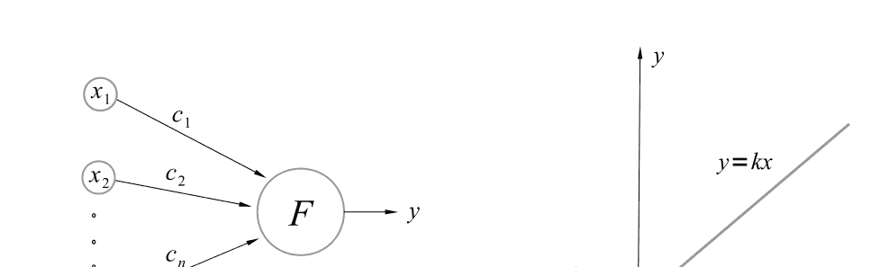

如果考虑激活函数

$$\varphi(x) = \begin{cases} 0, & \text{如果 } x \leq 0 \\ kx, & \text{if } x > 0, \end{cases}$$

可以在图1 b中看到，那么输出变为

$$y = \varphi(x - M) = \varphi(x_1w_1 + \cdots + x_nw_n - M).$$

(b) 现在可以将学习问题表述为：调整投资率 w_i 以便在规定的时间 t 内获得预先计划的基金利润 z。

即使 y 和 z 可能永远不会相等，一个被接受的答案被给出作为变分问题的解决方案。

$$\mathbf{w} = \arg \min \frac{1}{2}(z - y)^2 = \arg \min \frac{1}{2}(z - \varphi(\mathbf{w}^T \mathbf{x} - M))^2,$$

其中 $\mathbf{w}^T = (w_1, \ldots, w_n)$。

练习 1.9.3 (a) 我们有 $C(a) = \frac{1}{2} \int_0^1 (ax - f(x))^2 dx$ 和 $C'(a) = a \int_0^1 x^2 dx - \int_0^1 x f(x) dx$, 和 $C''(a) = \int_0^1 x^2 dx > 0$。 那么 $a = 3 \int_0^1 x f(x) dx$ 和 $a = (0)$。

(b) 让 $C(\alpha, \beta) = \frac{1}{2} - \int_0^1 \int_0^1 (\alpha + \beta - f(x, y))^2 dx dy$。然后方程 $(\frac{\partial C}{\partial \alpha}, \frac{\partial C}{\partial \beta}) = (0, 0)$ 变成

$$\frac{1}{3} \alpha + \frac{1}{4} \beta = \int_0^1 \int_0^1 x f(x, y) dx dy$$
$$\frac{1}{4} \alpha + \frac{1}{3} \beta = \int_0^1 \int_0^1 y f(x, y) dx dy,$$

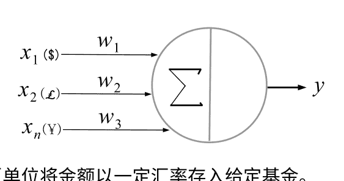

这是一个线性系统，有唯一解 $\alpha$ 和 $\beta$。最后一个系数是 $(0, 0)$。

练习1.9.4 (a) 使用柯西不等式，我们有

$$\det \rho_{ij} = \begin{vmatrix} \int_K x^2 dx & \int_K xy dx \\ \int_K xy dx & \int_K y^2 dx \end{vmatrix} = \left(\int_K x^2 dx\right)\left(\int_K y^2 dx\right) - \left(\int_K xy dx\right)^2 > 0.$$
不等式是严格的，因为这些函数不能成比例。

(b) 在这种情况下，我们可以明确计算

$$\rho_{ii} = \int_{[0,1]^n} x_i^2 \,dx_1 \cdots dx_n = \int_0^1 x_i^2 \,dx_i = \frac{1}{3}$$
$$\rho_{ij} = \int_{[0,1]^n} x_i x_j \,dx_1 \cdots dx_n = \int_0^1 x_i \,dx_i \int_0^1 x_j \,dx_j = \frac{1}{4}, i \neq j.$$

### 第2章

练习2.5.1 (a) 函数$f: (0,1)\to\mathbb{R}$，$f(t) = -t^2 + t$是正的，并且在$t = 1/2$处有最大值，等于$f(1/2) = 1/4$。然后使用sigmoid性质，我们有$\sigma' = \sigma(1-\sigma) = f(\sigma)$。因此$0 < \sigma' \le 1/4$。

(b) 由于我们有

$$\sigma_c'(x) = \frac{d}{dx} \sigma(cx) = c \sigma'(cx) = c \sigma(cx)(1 - \sigma(cx)) = c f(\sigma(cx)),$$
由此可知 $0 \le \sigma_c'(x) \le \frac{c}{4}$。

练习 2.5.2 (a) 我们有

$$2H(x) - 1 = 2 \begin{cases} 0, & \text{if } x < 0 \\ 1, & \text{if } x \ge 0 \end{cases} - 1 = \begin{cases} -1, & \text{if } x < 0 \\ 1, & \text{if } x \ge 0 \end{cases} = S(x).$$

(b) 从部分(a)中解出H(x)，得到H(x) = 1/2(S(x) + 1)。然后ReLU(x) = xH(x) = 1/2x(S(x) + 1).

## 练习2.5.3 (a) 使用链式法则，我们有

$$sp'(x) = \left( \ln(1 + e^x) \right)' = \frac{(1 + e^x)'}{1 + e^x} = \frac{e^x}{1 + e^x} = \frac{1}{1 + e^{-x}} = \sigma(x).$$

(b) 由于$sp'(x) = \sigma(x) > 0$，函数$sp(x)$是递增的。它的反函数是得到的

$$sp(x) = y \Leftrightarrow \ln(1 + e^x) = y \Leftrightarrow 1 + e^x = e^y$$
$$x = \ln(e^y - 1) \Leftrightarrow sp^{-1}(y) = \ln(e^y - 1).$$

(c) 在公式$sp(x) - sp(-x) = x$中进行微分，我们得到$sp'(x) + sp'(-x) = 1$。使用部分(a)我们得到$\sigma(x) + \sigma(-x) = 1$。

## 练习2.5.4 代数计算提供

$$2\sigma(2x) - 1 = \frac{2}{1 + e^{-2x}} - 1 = \frac{2e^{2x}}{e^{2x} + 1} - 1 = \frac{2e^{2x} - (e^{2x} + 1)}{e^{2x} + 1} = \frac{e^{2x} - 1}{e^{2x} + 1} = \tanh(x).$$

## 练习2.5.5 (a) 注意

$so(-x) = -so(x)$，即$so$函数是奇函数。首先假设$x > 0$。那么$so(x) = \frac{x}{1+x} = 1 - \frac{1}{1+x}$是递增的，因为$\frac{1}{1+x}$是递减的。因此，$so(x)$在$(0, \infty)$上是递增的。利用$so(x)$是奇函数以及$so$在$(0, +\infty)$上递增的事实，我们有

$$so(x_1) - so(x_2) = so(-x_2) - so(-x_1) > 0$$，这意味着$so$在$(-\infty, 0)$上是递增的。

(b) $so(x)$是连续的，因为$so(0-) = so(0+) = so(0) = 0$。此外，我们有$so(+\infty) = 1$，$so(-\infty) = -1$。因此，$so$将$\mathbb{R}$一对一地映射到$(-1,1)$。逆函数在分支上计算。如果$y \in (0,1)$，我们有$so(x) = y \Leftrightarrow \frac{x}{1+x} = y \Leftrightarrow so^{-1}(y) = \frac{y}{1 - y}$。如果$y \in (-1,0)$ 我们有$so(x) = y \Leftrightarrow \frac{-x}{1 - x} = y \Leftrightarrow so^{-1}(y) = \frac{-y}{1 + y}$。最后两个表达式意味着$so^{-1}(y) = \frac{y}{1 - |y|}$

$$so^{-1}(y) = \frac{y}{1 - |y|}$$

(c) 从$|x + y| \leq |x| + |y|$开始，我们应用$so$是递增的

$$so(|x + y|) \leq so(|x| + |y|) = \frac{|x| + |y|}{1 + |x| + |y|} = \frac{|x|}{1 + |x| + |y|} + \frac{|y|}{1 + |x| + |y|} \leq \frac{|x|}{1 + |x|} + \frac{|y|}{1 + |y|} = so(|x|) + so(|y|)$$

## 练习2.5.6 代数运算提供

$$softmax(y+c)_i = \frac{e^{y_i+c}}{\sum_j e^{y_j+c}} = \frac{e^c \cdot e^{y_i}}{e^c \cdot \sum_j e^{y_j}} = \frac{e^{y_i}}{\sum_j e^{y_j}} = softmax(y)_i$$

练习2.5.7 (a) $\sum_i \rho(y)_i = \frac{\sum_i y_i^2}{\|y\|_2^2} = 1$。 (b) $\rho(\lambda y)_i = \frac{\lambda^2 y_i^2}{\lambda^2 \|y\|_2^2} = \rho(y)_i$。

## 练习2.5.8 这个函数可以写成两个紧支撑函数的和，

$$\varphi_1(x) = \frac{1}{2} \left(1 + \cos\left(x + \frac{3\pi}{2}\right)\right)1_{[-\frac{\pi}{2},\frac{\pi}{2}]}(x)$$
$$\varphi_2(x) = 1_{(\frac{\pi}{2},\infty)}(x)$$

函数 $\varphi_1(x)$ 在 $[-\frac{\pi}{2},\frac{\pi}{2}]$ 上是递增的，在其他地方是常数，而函数 $\varphi_2(x)$ 在 $x \ge \frac{\pi}{2}$ 时等于 1，在其他地方等于 0。 显然，对于任何 $x \le -\frac{\pi}{2}$， $\varphi(x) = 0$，对于任何 $x \ge \frac{\pi}{2}$， $\varphi(x) = 1$。 函数的图像如图 2.11 b所示。

## 练习2.5.9
(a) 这是因为压缩函数是一个递增的S形函数。

(b) 我们选择任何在某个区间上递减的S形函数。例如，这个函数

$$\varphi(x) = x\sigma(x)1_{[x_0,\infty)}(x),$$

其中 $x_0$ 是方程 $\sigma(x) = 1/x$ 的唯一正解，是递增的且满足 $\varphi(-\infty) = 0$ 和 $\varphi(\infty) = 1$。

# 第三章

### 练习3.15.1
这是由于积分的线性性质以及对数函数的性质。

### 练习3.15.2
利用 $\ln x \le x - 1$，我们得到

$$S(p, q) = -\int p(x) \ln q(x) dx \ge -\int p(x)(q(x)-1) dx$$
$$= -\int p(x)q(x) dx + \int p(x) dx$$
$$= 1 - \int p(x)q(x) dx$$

### 练习3.15.3
每个项都是非负的， $D_{KL}(p||q) \ge 0$, $D_{KL}(q||p) \ge 0$，同时达到它们的最小值，即零，当且仅当 $p = q$。

### 练习3.15.4
(a) 一次计算显示
$$D_{KL}(p_1||p_2) = \int_0^\infty p_1(x) \ln \frac{p_1(x)}{p_2(x)} dx = \int_0^\infty \ln \frac{\xi^1}{\xi^2} p_1(x) dx + (\xi^2 - \xi^1) \int_0^\infty x p_1(x) dx = \ln \frac{\xi^1}{\xi^2} + (\xi^2 - \xi^1) \frac{1}{\xi^1} = \frac{\xi^2}{\xi_1} - \ln \frac{\xi^2}{\xi_1} - 1$$

(b) 令 $f(x) = x - \ln x - 1$。由于 $f\left(\frac{\xi^2}{\xi^1}\right) = f\left(\frac{\xi^1}{\xi^2}\right)$, 则 $D_{KL}(p_1||p_2) = D_{KL}(p_2||p_1)$。

### 练习3.15.5
令 $p_i = P(X = x_i), 1 \le i \le n$。由于 $p_i \in [0,1]$, 所以 $-\ln p_i \ge 0$, 因此 $H(X) = -\sum_{i} p_i \ln p_i \ge 0$。

### 练习3.15.6
由于 $H(X) \ge 0$, 参见练习3.15.5, 那么 $D_{KL}(p||q) = S(p,q) - H(p) \ge S(p,q)$。

### 练习3.15.7
由于 $Z$ 是 $\mathcal{E}$-可测的, $\mathbb{E}[Z|\mathcal{E}] = Z$。然后误差是 $\|Z - \mathbb{E}[Z|\mathcal{E}]\| = \|Z - Z\| = 0$。这对应于精确学习。

### 练习3.15.8
映射 $(w, b) \to f_{w,b}(\mathbf{x})$ 对应于一个超平面在 $\mathbb{R}^n$ 中。最优参数 $(w^*, b^*)$ 对应于目标 $\mathbf{z}$ 在超平面上的正交投影的坐标。基于几何原因, 这个投影是唯一的。正规方程是线性的, 因此可以明确地求解 $w^*$ 和 $b^*$。

### 练习3.15.9
根据洛必达法则, 我们有
$$\lim_{\alpha \to 1} H_\alpha(p) = \lim_{\alpha \to 1} \frac{1}{1 - \alpha} \ln \int p^\alpha(x) dx = \lim_{t \to 0} \frac{\ln \int p^{1-t}(x) dx}{t} = \lim_{t \to 0} \frac{\frac{d}{dt} \ln \int p^{1-t}(x) dx}{\frac{d}{dt} t} = \lim_{t \to 0} \frac{-\int p^{1-t}(x) \ln p(x) dx}{\int p^{1-t}(x) dx} = \frac{-\int p(x) \ln p(x) dx}{\int p(x) dx} = -\int p(x) \ln p(x) dx = H(p)$$

### 练习3.15.10
(a) 这是一个直接的计算，涉及变量的变换和完成平方
$$\phi_\sigma * \phi_\sigma(v) = \int \phi_\sigma(t)\phi_\sigma(t - v) dt = \frac{1}{2\pi\sigma^2} \int e^{-\frac{t^2}{2\sigma^2}} e^{-\frac{(t - v)^2}{2\sigma^2}} dt$$
$$= \frac{1}{2\pi\sigma^2} \int e^{-\frac{t^2 - tv + v^2/2}{\sigma^2}} dt = \frac{1}{2\pi\sigma^2} e^{-\frac{v^2}{4\sigma^2}} \int e^{-\frac{(t - v^2/2)^2}{\sigma^2}} dt$$
$$= \frac{1}{2\sigma} e^{-\frac{v^2}{4\sigma^2}} \int e^{-u^2} du = \frac{1}{2\sqrt{\pi}\sigma} e^{-\frac{v^2}{4\sigma^2}} = \frac{1}{\sqrt{2\pi}\sigma'} e^{-\frac{v^2}{2\sigma'^2}} = \phi_{\sigma'}(v)$$
对于 $\sigma' = \sqrt{2}\sigma$。

(b) 类似的计算表明 $\phi_\sigma * \phi_{\sigma'} = \phi_s$，其中 $s = \sqrt{\sigma^2 + \sigma'^2}$。

### 练习3.15.11
(a) 如果 $D_{CS}(p, q) = 0$，则 $\int pq = \sqrt{\int p^2 \int q^2}$。由于这意味着施瓦茨不等式中的等号，这些函数必须成比例。然后，存在一个常数 $\lambda$ 使得 $p(x) = \lambda q(x)$。由于 $\int p = \int q = 1$，因此 $\lambda = 1$，因此 $p = q$。反之亦然。

(b) 根据施瓦茨不等式 $\int pq \leq \sqrt{\int p^2 \int q^2}$，所以 $\ln$ 的参数属于 $(0,1]$，其中对数函数为负数。

(c) 显然。

(d) 根据对数函数的性质和Renyi熵的定义可得。

### 练习3.15.12
使用 $|\tanh| \leq |x|$ 的事实。这是由 $\tanh'x = 1 - \tanh^2 x \leq 1$。

# 第四章

### 练习4.17.1
(a) 计算Laplacian
$$\Delta f(x) = \frac{\partial^2 f}{\partial x_1^2} + \frac{\partial^2 f}{\partial x_2^2} = e^{x_1} \sin x_2 - e^{x_1} \sin x_2 = 0$$

(b) 由于 $\nabla f(x) = (e^{x_1} \sin x_2, e^{x_1} \cos x_2)$，我们有
$$\| \nabla f \| = e^{x_1} \| (\sin x_2, \cos x_2) \| = e^{x_1}$$

(c) $\nabla f(x) = 0 \iff \| \nabla f \| = 0 \iff e^{x_1} = 0$，这没有解。

(d) 由于 $f$ 是调和函数（或者，因为 $\nabla f = 0$），函数 $f$ 在 $[0,1] \times [0, \frac{\pi}{2}]$ 的边界上达到其最小值和最大值。由于函数 $e^{x_1}$，$x_1 \in [0,1]$ 和 $\sin x_2$，$x_2 \in [0, \pi/2]$ 都是递增的，因此 $f(x)$ 的最大值在 $(x_1, x_2) = (1, \pi/2)$ 处达到，最小值在 $(x_1, x_2) = (0,0)$ 处达到。此外，$\min f(x) = f(0,0) = 0$，$\max f(x) = f(1, \pi/2) = e$。

## 练习4.17.2
(a) $\nabla Q(\mathbf{x}) = A\mathbf{x} - b$。

(b) 梯度下降给出的迭代公式为
$$ \mathbf{x}^{n+1} = \mathbf{x}^n - \eta \nabla Q(\mathbf{x}^n) = \mathbf{x}^n - \eta (A\mathbf{x}^n - b) = (\mathbb{I} - \eta A)\mathbf{x}^n + \eta b. $$

(c) Hessian矩阵为 $H_Q = A$。

(d) 牛顿法给出的迭代公式为
$$ \mathbf{x}^{n+1} = \mathbf{x}^n - H_Q^{-1}\nabla Q(\mathbf{x}^n) = \mathbf{x}^n - A^{-1}(A\mathbf{x}^n - b) = A^{-1}b. $$
假设 $\mathbf{x}^* = \lim\limits_{n\to\infty} \mathbf{x}^n$，对于前面的关系式取极限得到
$$ \mathbf{x}^* = A^{-1}b, $$
这是预期的。极限的存在性来自归纳迭代
$$ \mathbf{x}^{n+1} = \mathbf{x}^n - \eta (A\mathbf{x}^n - b) $$
$$ = (I - \eta A)\mathbf{x}^n + \eta b $$
$$ = \cdots\cdots\cdots\cdots\cdots\cdots\cdots\cdots\cdots $$
第一项趋于零（当 $\eta$ 足够小），第二项趋于 $A^{-1}b$。

## 练习4.17.3
(a) 成本函数可以写成
$$ C(\mathbf{x}) = \frac{1}{2}\|A\mathbf{x} - b\|^2 = \frac{1}{2}\langle A\mathbf{x} - b, A\mathbf{x} - b \rangle $$
$$ = \frac{1}{2}\langle A^TA\mathbf{x}, \mathbf{x}\rangle - \langle A^Tb, \mathbf{x}\rangle + \frac{1}{2}\|b\|^2. $$
梯度为 $\nabla C(\mathbf{x}) = A^TA\mathbf{x} - A^Tb$，海森矩阵为 $H(\mathbf{x}) = A^TA$。由于 $\det A \neq 0$ 且矩阵 $A^TA$ 是对称的，$H$ 具有实正特征值，它们是 $A$ 的奇异值的平方。因此，$H$ 是正定的。

(b) 我们有
$$ \mathbf{x}^{(n+1)} = \mathbf{x}^{(n)} - \eta\nabla C(\mathbf{x}^{(n)}) = \mathbf{x}^{(n)} - \eta (A^TA\mathbf{x}^{(n)} - A^Tb) $$
$$ = (I - \eta A^TA)\mathbf{x}^{(n)} + \eta A^Tb. $$

## 练习4.17.4
(a) 通过归纳，我们有
$$ a_{(n+1)} \le \mu a_{(n)} + K \le \mu(\mu a_{(n-1)} + K) + K = \mu^2 a_{n-1} + K(\mu + 1) \vdots \le \mu^{n+1} a_0 + K(\mu^n + \mu^{n-1} + \cdots + \mu + 1) = \mu^{n+1} a_0 + K \frac{1-\mu^{n+1}}{1-\mu} < a_0 + \frac{K}{1-\mu}. $$

(b) 在方程 (4.4.17) 中取范数得到
$$ \|v^{n+1}\| \le \mu \|v^n\| + \eta \|\nabla f(x^n)\|. $$
考虑序列 $a_n = \|v^n\|$。根据 (a) 部分，序列 $(a_n)_n$ 有界。

## 练习4.17.5
(a) 这是由Fubini定理得出的。

(b) 应用于部分 (a) 对 $|f|$ 和 $|g|$，我们得到
$$ \begin{aligned} \|f * g\|_1 &= \int |f * g|(x) dx = \int \left| \int f(y) g(x-y) dy \right| dx \\ &\le \int \int |f(y)| |g(x-y)| dy dx \\ &= \int (|f| * |g|)(x) dx = \int |f|(x) dx \int |g|(x) dx \\ &= \|f\|_1 \|g\|_1. \end{aligned} $$

(c) 这是由部分 (b) 得出的，取 $g = G_\sigma$ 并使用 $\|G_\sigma\|_1 = 1$。更一般地，对于任意的 $1 \le p \le \infty$，我们有 $\|f_\sigma\|_p \le \|f\|_p \|G_\sigma\|_1 = \|f\|_p$，即，如果 $f \in L_p$，则 $f_\sigma \in L_p$。特别地，对于 $p=2$，我们得到通过滤波有限能量信号也得到有限能量信号。

## 练习4.17.6
如下所示，这是一个直接的计算：
$$ (G_{\sigma_1} * G_{\sigma_2})(x) = \int G_{\sigma_1}(u) G_{\sigma_2}(x-u) du = \frac{1}{2\pi\sigma_1\sigma_2} \int e^{-\frac{1}{2}\left( \frac{u^2}{\sigma_1^2} + \frac{(x-u)^2}{\sigma_2^2} \right)} du. $$
完成平方后，指数可以写成
$$ \left( \frac{u}{\sigma_1} \right)^2 + \left( \frac{x-u}{\sigma_2} \right)^2 = \frac{\sigma_1^2 + \sigma_2^2}{\sigma_1^2 \sigma_2^2} \left( u - \frac{\sigma_1^2}{\sigma_1^2 + \sigma_2^2} x \right)^2 + \frac{x^2}{\sigma_1^2 + \sigma_2^2}. $$
改变变量并评估高斯积分，我们有
$$ (G_{\sigma_1} * G_{\sigma_2})(x) = \frac{1}{2\pi\sigma_1\sigma_2} e^{-\frac{x^2}{2(\sigma_1^2+\sigma_2^2)}} \int e^{-\frac{\sigma_1^2+\sigma_2^2}{2\sigma_1^2\sigma_2^2} \left(u-\frac{\sigma_1^2}{\sigma_1^2+\sigma_2^2}x\right)^2} du $$
$$ = \frac{1}{2\pi\sigma_1\sigma_2} e^{-\frac{x^2}{2(\sigma_1^2+\sigma_2^2)}} \int e^{-\frac{\sigma_1^2+\sigma_2^2}{2\sigma_1^2\sigma_2^2} v^2} dv $$
$$ = \frac{1}{\sqrt{2\pi}\sqrt{\sigma_1^2+\sigma_2^2}} e^{-\frac{x^2}{2(\sigma_1^2+\sigma_2^2)}} = G_{\sqrt{\sigma_1^2+\sigma_2^2}}(x). $$
有一个使用傅里叶变换的证明变体如下。如果 $\mathcal{F}(f)(\xi) = \int f(x)e^{-2\pi i x\xi} dx$ 表示 $f$ 的傅里叶变换，利用性质
$$ \mathcal{F}(f*g)(\xi) = \mathcal{F}(f)(\xi) \mathcal{F}(g)(\xi) $$
$$ \mathcal{F}(e^{-ax^2}) = \sqrt{\frac{\pi}{a}} e^{-\frac{(\pi \xi)^2}{a}}, $$
我们有
$$ \mathcal{F}(G_{\sigma_1} * G_{\sigma_2})(\xi) = \mathcal{F}(G_{\sigma_1})(\xi) \mathcal{F}(G_{\sigma_2})(\xi) = e^{-(2\pi\sigma_1\xi)^2} e^{-(2\pi\sigma_2\xi)^2} $$
$$ = e^{-2\pi^2(\sigma_1^2+\sigma_2^2)\xi^2} = \mathcal{F}(G_{\sigma})(\xi), $$
其中 $\sigma = \sqrt{\sigma_1^2+\sigma_2^2}$。应用逆变换，$\mathcal{F}^{-1}$ 产生所需的结果。

## 练习4.17.7
我们考虑带约束的变分问题
$$ L = \frac{1}{2}(\sigma_1^2 + \cdots + \sigma_n^2) - \lambda(\sigma_1 + \cdots + \sigma_n - s), $$
带有拉格朗日乘子的最小值满足 $\partial L / \partial \sigma_j = 0$：
$$ \frac{\partial L}{\partial \sigma_j} = \sigma_j - \lambda = 0 \Rightarrow \sigma_j = \lambda, \forall 1 \leq j \leq n. $$

# 第5章

## 练习5.10.1
(a) 映射为 $(0,0) \to 0, (0,1) \to 0, (1,0) \to 1, (1,1) \to 0$。点 $(1,0)$ 被这条线与其他点分开。然后感知机输出 $y = H(x - y - 1/2)$ 学习前面的分配。我们有 $w_1 = 1, w_2 = -1, b = -1/2$。

(b) 同样地，(a) 也是如此。

(c) 一维感知器的输出为 $y = H(-x + 1/2)$。权重为 $w = -1$，偏置为 $b=1/2$。由于对于布尔变量 $x$，我们有 $\neg x=1 - x$，相关线性神经元的输出为 $y = wx + b$，其中权重和偏置分别为 $w = -1$和 $b=1$。

(d) 我们可以将学习 $x_1 \wedge x_2 \wedge x_3$ 的过程可视化为将立方体角点(1,1,1)与其他角点分离。这可以通过平面 $x_1 + x_2 + x_3 = 5/2$ 来实现。学习 $x_1 \wedge x_2 \wedge x_3$ 的感知器具有权重 $w_1 = w_2 = w_3 = 1$，偏置 $b = -5/2$，输出为 $y = H(x_1 + x_2 + x_3 - 5/2)$。学习 $x_1 \vee x_2 \vee x_3$ 的感知器具有输出 $y = H(x_1 + x_2 + x_3 - 1/2)$。

### 练习 5.10.2 证明集合 $A$ 和 $B$ 可以被两条不同的直线分开，然后找到一条位于它们之间的带有有理权重的直线。

### 练习 5.10.3

(a) 矩阵 $A = \mathbb{E}[XX^T]$ 是对角矩阵，其中 $A_{ij} = \sigma_j^2 \delta_{ij}$。最优权重为 $w^* = A^{-1} b$，其中 $w_j^* = b_j / \sigma_j^2 = \mathbb{E}[ZX_j] / \sigma_j^2$。

(b) 由于 $Z$ 和 $X_j$ 是独立的，$\mathbb{E}[ZX_j] = \mathbb{E}[Z]\mathbb{E}[X_j] = 0$。然后代价函数为 $\xi(w) = c + w^T A w$，其中 $c = \mathbb{E}[Z^2]$。如果 $A$ 是正定的，它的最小值在 $w = 0$ 时达到。学习一个均值为零且与输入无关的目标需要使用零权重；通过这个选择，输入不起作用。

(c) 牛顿迭代是

```
w^{(j+1)} &= w^{(j)} - H^{-1} \nabla \xi(w^{(j)}) \\ &= w^{(j)} - 2A^{-1}(2A w^{(j)} - 2b) \\ &= -3w^{(j)} + 4A^{-1}b.
```

### 练习5.10.4

在线性回归中，提供了 $N$ 个向量 $\mathbb{R}^n$, $\mathbf{x}_j$, 对应于 $N$ 个数字 , $z_j$, $1 \le j \le N$. 我们寻找 $N+1$ 个参数, $w_0, w_1, \ldots, w_n$ 使得平方误差的和

```
C(\mathbf{w}) = \frac{1}{N} \sum_{j=1}^N (w_1 \mathbf{x}_j^1 + \cdots + w_n \mathbf{x}_j^n - w_0 - z_j)^2
```

是最小的。设 $X$ 和 $Z$ 是线性神经元的输入和目标变量。它们在实践中由 $N$ 次测量提供， $\mathbf{x}_j = X(\omega_j)$ 和 $z_j = Z(\omega_j)$, 其中 $N$ 是世界状态 $\omega_j \in \Omega$ 的数量, $1 \le j \le N$。此外, $X_0 = -1$。

训练集由 $\mathcal{T} = \{(\mathbf{x}_j, z_j); 1 \le j \le N\}$ 给出。成本函数可以使用经验评估期望的方式表示为

```
C(\mathbf{w}) = \mathbb{E}[(X^T \mathbf{w} - Z)^2] = \frac{1}{N} \sum_{j=1}^N (X_j^T \mathbf{w} - z_j)^2.
```

因此，线性回归和线性神经元都最小化相同的代价函数。

### 练习5.10.5

假设 $x_0 \in (0,1)$。那么

$$y = H\left(\int_0^1 x \, d\delta_{x_0}(x)\right) = H(x_0) = 1,$$

因为 $x_0 > 0$。假设 $x_0 \notin (0,1)$。那么

$$y = H\left(\int_0^1 x \, d\delta_{x_0}(x)\right) = H\left(\int_{\mathbb{R}} x \, 1_{[0,1]}(x) \, d\delta_{x_0}(x)\right) = H(x_0 1_{[0,1]}(x_0)) = 1.$$

### 练习5.10.6

我们有

$$\langle w_1, \mathbf{x}_{i_0} \rangle = \langle w_0 + \mathbf{x}_{i_0}, \mathbf{x}_{i_0} \rangle = \langle w_0, \mathbf{x}_{i_0} \rangle + \|\mathbf{x}_{i_0}\|^2 = \langle w_0, \mathbf{x}_{i_0} \rangle + 1 > 0,$$

因为 $\langle w_0, \mathbf{x}_{i_0} \rangle \le \|w_0\| \|\mathbf{x}_{i_0}\| = 1.$

由于所有点 $P_j$ 属于一个半圆，让 $w^*$ 是分隔这些点和圆的直径的单位法向量。记 $\rho_m$ 为 $w^*$ 和 $w_m$ 之间的角度，令 $\delta = \min\{\cos \angle(w^*, \mathbf{x}_i); 1 \le i \le n\}.$ 那么

$$\langle w^*, w_m \rangle = \langle w^*, w_{m-1} + \mathbf{x}_{i_{m-1}} \rangle = \langle w^*, w_{m-1} \rangle + \langle w^*, \mathbf{x}_{i_{m-1}} \rangle \ge \langle w^*, w_{m-1} \rangle + \delta.$$

迭代不等式，我们得到 $\langle w^*, w_m \rangle \ge \langle w^*, w_0 \rangle + m\delta.$ 然后

$$\cos \rho_m = \frac{\langle w^*, w_m \rangle}{\|w^*\| \|w_m\|} = \langle w^*, w_m \rangle \ge \langle w^*, w_0 \rangle + m\delta.$$

不等式

$$1 \ge \cos \rho_m \ge \langle w^*, w_0 \rangle + m\delta$$

这是矛盾的，因为右边的项随着$m \to \infty$而无限增长，而左边是有界的。因此，这个过程应该在有限的步骤之后结束。如果$N$是最大迭代次数，那么$N\delta \sim 1$提供了估计$N \sim 1/\delta.$

### 练习5.10.7

感知器学习算法适用于半平面上的点。原因是如果一个直径将由单位向量$\mathbf{t}\mathbf{x}_i$定义的点分开，那么同样的直径也会将任何具有与之前相同方向的向量的其他点分开。

这是由等价关系$\langle \mathbf{w}, \mathbf{x}_i \rangle > 0 \iff \langle \mathbf{w}, \lambda \mathbf{x}_i \rangle > 0$对于所有$\lambda > 0$得出的。

### 练习5.10.9

考虑在第$k$步计算的均方误差$C(w_k) = \frac{1}{2}(z_k - w_k^T x_k)^2$。梯度是 $\nabla_{w_k}$ 梯度下降规则是 $w_{k+1} = w_k - \eta \nabla_{w_k}$。如果令 $c = |x_k|$ 并定义 $\alpha = \eta c^2$，我们得到 $w_{k+1} = w_k + \alpha \frac{e_k x_k}{c_k^2}$，这是 $\alpha$-LMS 更新规则。

## 第六章

### 练习6.6.2

(a) 考虑一个顶点位于原点的单位立方体并且有三个面沿着 $\mathbb{R}^3$ 轴的方向。由于没有单个平面可以分离立方体的顶点 $(0,0,0)$ 和 $(1,1,1)$，因此单个感知器无法学习该映射。

(b) 尝试一个具有一层隐藏层的网络。

### 练习6.6.3

$y = H\left(-2H\left(x_1 + x_2 + \frac{1}{2}\right) - \frac{3}{2}\right) - H\left(H\left(x_1 + x_2 + \frac{1}{2}\right) + \frac{5}{2}\right) - 1$。

### 练习6.6.4

(a) 通过链式法则 $\frac{\partial y}{\partial w} = x\sigma'(wx + b)$ 和 $\frac{\partial y}{\partial b} = \sigma'(wx + b)$。梯度为 $\nabla C = \left(\frac{\partial C}{\partial w}, \frac{\partial C}{\partial b}\right)$，其中

\[
\begin{aligned}
\frac{\partial C}{\partial w} &= (y - z)\frac{\partial y}{\partial w} \\
&= (\sigma(wx + b) - z)x\sigma'(wx + b) \\
\frac{\partial C}{\partial b} &= (y - z)\frac{\partial y}{\partial b} \\
&= (\sigma(wx + b) - z)\sigma'(wx + b).
\end{aligned}
\]

利用 $\sigma' \leq \frac{1}{4}$ 和 $\sigma < 1$，我们得到

\[
\begin{aligned}
\|\nabla C\| &= \sqrt{\left(\frac{\partial C}{\partial w}\right)^2 + \left(\frac{\partial C}{\partial b}\right)^2} \\
&= |\sigma(wx + b) - z|\sigma'(wx + b)\sqrt{1 + x^2} < \frac{1}{4}\sqrt{1 + x^2}(1 + |z|).
\end{aligned}
\]

(b) 对于步长 $\eta > 0$，我们有

\[
\begin{aligned}
w_{n+1} &= w_n - \eta x\sigma'(w_n x + b_n)(\sigma(w_n x + b_n) - z) \\
b_{n+1} &= b_n - \eta\sigma'(w_n x + b_n)(\sigma(w_n x + b_n) - z).
\end{aligned}
\]

### 练习6.6.5

(a) 让 $X^{(0)} = X$。在敏感性关系中取范数

\[
dY = \phi'(s^{(2)})W^{(2)^T}\phi'(s^{(1)})W^{(1)^T}dX^{(0)},
\]

我们得到

\[
\begin{aligned}
\|dY\| &= |\phi'(s^{(2)})|\|W^{(2)^T}\||\phi'(s^{(1)})|\|W^{(1)^T}\|\|dX^{(0)}\| \\
&\leq \|\phi'\|^2\|W^{(1)}\|\|W^{(2)}\|\|dX^{(0)}\|
\end{aligned}
\]

选择 $\eta = \frac{\epsilon}{\|\phi'\|^2 \|W^{(1)}\| \|W^{(2)}\|}$ 足够了。

(b) 如果输入 $X$ 有噪音，那么会产生小的变化 $dX$。为了去除噪音，这些变化对输出变化 $dY$ 的影响应该尽可能小。有两种方法可以实现：保持权重矩阵的范数较小或选择具有小 $\phi'$ 的激活函数。为了去除噪音，可以将权重正则化作为约束添加到成本函数中，例如 $\|W^{(1)}\|^2 + \|W^{(2)}\|^2 < 1$。

(c) 我们需要选择具有最小导数范数的激活函数，即具有最慢饱和度的激活函数。然后使用双曲正切函数的饱和度比逻辑sigmoid函数更快。

### 练习6.6.6

(a) 层的信号和输出由$s_{(1)}=w_1 x - b_1$，$x_{(1)}=\sigma(s_{(1)})=\sigma(w_1 x - b_1)$，$s_{(2)}=w_2 \sigma(s_{(1)}) - b_2$，$y=x_{(2)}=\sigma(s_{(2)})$给出。使用链式法则

$$ \delta^{(2)} = \frac{\partial C}{\partial s^{(2)}} = \frac{1}{2} (y - z) \frac{\partial y}{\partial s^{(2)}} = (y - z) \sigma'(s^{(2)}) $$
$$ \delta^{(1)} = \frac{\partial C}{\partial s^{(1)}} = \frac{\partial C}{\partial s^{(2)}} \frac{\partial s^{(2)}}{\partial s^{(1)}} = \delta^{(2)} w^2 \sigma'(s^{(1)}). $$

(b) 梯度的分量$\nabla C$由以下给出

$$ \frac{\partial C}{\partial w_2} = \frac{\partial C}{\partial s^{(2)}} \frac{\partial s^{(2)}}{\partial w_2} = \delta^{(2)} \sigma(s^{(1)}) $$
$$ \frac{\partial C}{\partial w_1} = \frac{\partial C}{\partial s^{(1)}} \frac{\partial s^{(1)}}{\partial w_1} = \delta^{(1)} x $$
$$ \frac{\partial C}{\partial b_2} = \frac{\partial C}{\partial s^{(2)}} \frac{\partial s^{(2)}}{\partial b_2} = -\delta^{(2)} $$
$$ \frac{\partial C}{\partial b_1} = \frac{\partial C}{\partial s^{(1)}} \frac{\partial s^{(1)}}{\partial b_1} = -\delta^{(1)}. $$

### 练习6.6.7

(a) 我们将使用反向归纳法。注意 $W_{ij}^{(\cdot)}$ 和 $\delta_i^{(L)}$ 是独立的。然后假设 $W_{ij}^{(\cdot)}$ 和 $\delta_i^{(k)}$ 对于任意的 $\ell + 1 \le k \le L$ 是独立的。我们需要证明 $W_{ij}^{(\cdot)}$ 和 $\delta_i^{(\cdot)}$ 是独立的。由于 $\phi'(x) = 1$，我们可以用 $(\ell + 1)$th层的deltas来表示第$\ell$层的deltas

$$ \delta_i^{(\cdot)} = \sum_j \delta_j^{(\cdot + 1)} W_{ij}^{(\cdot + 1)}. $$

现在，$W_{ij}^{(\cdot)}$与$\delta_j^{(\cdot + 1)}$是独立的根据归纳假设和独立性-不依赖于$W_{ij}^{(\cdot + 1)}$作为不同层的权重。因此，$W_{ij}^{(\cdot)}$是独立的组合 $\sum_{j}\delta_j^{(\ell+1)}W_{ij}^{(\ell+1)}$，因此独立于 $\delta_i^{(\ell)}$。

(b) 通过归纳，与部分 (a) 类似。

### 练习6.6.8

使用近似公式 $Var[f(X)] \approx f'(\mathbb{E}[X])^2 Var(X)$ 对于 $f(x) = \sigma(wx + b)$，我们得到

$$Var[Y] \approx \sigma'(w\mathbb{E}[X] + b)^2 Var(wX + b) = \sigma'(b)^2 w^2 Var(X) = \sigma'(b)^2 w^2.$$

当偏差取大正值或负值时，sigmoid函数饱和，导数变小；因此 $Var(Y)$ 减小。

### 练习6.6.9

使用与前一个问题类似的思路，我们有 $Var(Y) =$

$$\sum_{i}\alpha_i^2 Var[\sigma(w_i X + b_i)] \approx \sum_{i}\alpha_i^2 \sigma'(b_i)^2 w_i^2 Var(X)$$

$$= \sum_{i}\alpha_i^2 \sigma'(b_i)^2 w_i^2.$$

### 练习 6.6.10

由于 $p(x) = 1/(b-a)$，则

$$H(\mathbf{P}) = -\int_{a}^{b} p(x) \ln p(x) dx = -\frac{1}{b-a} \int_{a}^{b} \ln \frac{1}{b-a} dx = \ln(b-a).$$

### 练习 6.6.11

让 $p(x) = \frac{1}{\sigma\sqrt{2\pi}} e^{-\frac{(x-\mu)^2}{2\sigma^2}}$. 使用关系 $\int_{\mathbb{R}} p(x) dx = 1$ 和 $\int_{\mathbb{R}} (x-\mu)^2 p(x) dx = \sigma^2$，我们有

$$\begin{aligned} H(p) &= -\int_{\mathbb{R}} p(x) \ln p(x) dx \\ &= \frac{1}{2}\ln(2\pi) \int_{\mathbb{R}} p(x) dx + \ln \sigma \int_{\mathbb{R}} p(x) dx + \frac{1}{2\sigma^2} \int_{\mathbb{R}} (x-\mu)^2 p(x) dx \\ &= \frac{1}{2}\ln(2\pi) + \ln \sigma + \frac{1}{2} = \ln(\sigma\sqrt{2\pi e}). \end{aligned}$$

## 第七章

### 练习7.11.1

由 $|\tanh x| \le 1$ 可得。

### 练习7.11.2

(a) 设 $f \in \mathcal{F}$，其中 $f(x) = ax+b$。然后模不等式得 $|f(x)| \le |a| |x| + |b| \le |a| + |b| < 1$，对于所有 $x \in [0,1]$。这个家族 $\mathcal{F}$ 是一致有界的，有 $M=1$。修复 $\epsilon >0$ 并选择 $\eta = \epsilon/|a|$。因此，该族$\mathcal{F}$是等度连续的。

(b) 应用阿尔泽拉-阿斯科利定理，我们得到：在所有可能的线性神经元（具有1维输入和输出）的结果中，$y = ax + b$，满足正则化约束条件，$|a| + |b| < 1$，存在一个序列 $y_n = a_nx + b_n$ 收敛于一个仿射函数，$f(x) = ax + b$。

简而言之，线性神经元具有学习某些仿射函数的能力。

## 练习7.11.3 根据微积分基本定理，我们有 $f(x_2) - f(x_1) = \int_{x_1}^{x_2} f'(x) dx$。然后，柯西不等式提供了

$|f(x_2) - f(x_1)|^2 = \left| \int_{x_1}^{x_2} f'(x) dx \right|^2 \leq \left( \int_{x_1}^{x_2} 1 dx \right) \left( \int_{x_1}^{x_2} f'(x)^2 dx \right) \leq M|x_2 - x_1|.$

然后，对于任意给定的 $\epsilon > 0$，选择 $\eta = \epsilon^2 / M$ 并应用等连续性的定义。

## 练习7.11.4 证明

$\epsilon = 1$。对于任意的 $x_0 \in D$，存在 $\eta > 0$，使得对于 $x \in (x_0 - \eta, x_0 + \eta)$，我们有

$|f(x)| \leq |f(x) - f(x_0)| + |f(x_0)| \leq 1 + M, \quad \forall f \in \mathcal{F}.$

注意 $\bigcup_{x_0 \in D} (x_0 - \eta, x_0 + \eta) = (a, b)$，任意的 $x \in (a, b)$ 都属于一个邻居类型的区间 $(x_0 - \eta, x_0 + \eta)$。

## 练习7.11.5 假设

$\phi \in \mathcal{F}$。固定 $\epsilon > 0$。由于 $\mathcal{F}$ 的等度连续性，存在 $\eta_k > 0$，使得 $|f_j(x) - f_j(x')| < \epsilon / k$ 对于 $|x - x'| < \eta_k, \ 1 \leq j \leq k$。选择 $\eta = \min_{1 \leq j \leq k} \eta_j$。我们有

$|\phi(x) - \phi(x')| \leq \sum_{j=1}^{k} |w_j| |f_j(x) - f_j(x')| \leq \sum_{j=1}^{k} |f_j(x) - f_j(x')| < \epsilon,$

对于 $|x - x'| < \eta$。

## 练习7.11.6 根据Dini定理应用于递减的正函数序列

$f_n = |f(x) - G_n(x)|$，可以得出结论。

## 练习7.11.7 周期

为 $T$ 的周期函数可以被视为半径为 $R = 2\pi / T$ 的圆上的函数，这是一个紧致集合，在这里用 $K$ 表示。$f \in C(K)$。所有可以写成三角和的函数 $F$ 的集合是 $C(K)$ 的一个子代数，它分离点并包含常数。应用 Stone-Weierstrass 定理得到所需的结果。

## 练习7.11.8 证明命题7.7.2的主要要素是

鉴于大多数S型函数在对称性方面是对称的

从原点开始，我们有 $||\sigma'|| = \sigma'(0)$。因此，对于所有满足 $\sigma'(0) < \lambda < 1$ 的递增可微的 Sigmoid 函数，结果成立。

## 练习7.11.9 根据Arzela-Ascoli定理，我们可以假设，最终通过一个子序列，我们有 $f_j$ 一致收敛于 $f$ 在 $[a, b]$ 上。然后 $f_j^2$ 一致收敛于 $f^2$ 在 $[a, b]$ 上。然后 $\int_a^b f_j^2(x) dx \to \int_a^b f^2 dx$。使用假设，可以得出由于 $f^2 \ge 0$, 所以 $f = 0$。那是极限 $f_j = 0$, 均匀地。我们还注意到，证明也可以通过反证法来完成，而不使用 Arzela-Ascoli 定理。

## 练习7.11.10 (a) 让 $\epsilon > 0$ 是任意固定的。利用函数 $K(s, t)$ (在紧致集上的连续函数) 的一致连续性，对于任意的 $\rho > 0$，存在 $\eta_\rho > 0$，使得如果 $|s' - s| < \eta_\rho$, 那么 $|K(s', t) - K(s, t)| < \rho$。由于 $\rho$ 是任意的，我们选择它使得 $\rho < \epsilon / \sqrt{M(d-c)}$。对于任意的 $g \in \mathcal{F}_M$，应用柯西不等式，我们有

$|g(s') - g(s)| = \left| \int_c^d \left( K(s', t) - K(s, t) \right) h(t) dt \right| \\
\le \left( \int_c^d |K(s', t) - K(s, t)|^2 dt \right)^{1/2} \left( \int_c^d h(t)^2 dt \right)^{1/2} \\
\le \rho \sqrt{d-c} \sqrt{M} < \epsilon.$

因此，我们有 $|g(s') - g(s)| < \epsilon$，只要 $|s' - s| < \eta$，其中 $\epsilon$ 和 $\eta$ 独立于 $g$。

(b) 使用柯西不等式，对于任意的 $g \in \mathcal{F}_M$，我们有

$|g(s)| = \left| \int_c^d K(s, t) h(t) dt \right| \le \int_c^d |K(s, t)| |h(t)| dt \\
\le \left( \int_c^d K^2(s, t) dt \right)^{1/2} \left( \int_c^d h(t)^2 dt \right)^{1/2} \\
\le \left( \int_c^d K^2(s, t) dt \right)^{1/2} M^{1/2}.$

作为连续函数在紧致区间 $[a, b]$ 上，函数 $s \to \int_c^d K^2(s, t) dt$ 是有界的。由此可知，所有函数 $g$ 都有一个共同的上界。

## 练习7.11.11 (a) 这只是代数公理的验证。
(b) 这是由 Stone-Weierstrass 逼近定理得出的。
(c) 任何在 $[a, b]$ 上的连续函数都可以通过一系列多项式 in $e^x$ 来均匀学习。

# 第8章

## 练习8.8.1 (a) 对于任意 $\phi \in C_0^\infty$ 我们有

$$
-\int H(x - x_0)\phi'(x) dx = -\int_{x_0}^{\infty} \phi'(x) dx = -(\phi(\infty) - \phi(x_0)) = \phi(x_0) \\
= \int \phi \delta(x - x_0) dx.
$$

## (b) 对于任意 $\phi \in C_0^\infty$

$$
-\int \text{ReLU}(x)\phi'(x) dx = -\int_{0}^{\infty} x\phi'(x) dx = -\left.\left(x\phi(x)\right)\right|_{0}^{\infty} - \int_{0}^{\infty} \phi(x) dx \\
= \int_{0}^{\infty} \phi(x) dx = \int H(x)\phi(x) dx.
$$

其他的类似。

## 练习8.8.2 移动指数和解析求和，我们有

$$
\sum_{i=0}^{N-1} \alpha_i \mathbf{1}_{[x_i, x_{i+1})}(x) = \sum_{i=0}^{N-1} \alpha_i [H(x - x_i) - H(x - x_{i+1})] \\
= \sum_{i=0}^{N-1} \alpha_i H(x - x_i) - \sum_{j=1}^{N} \alpha_{j-1} H(x - x_j) \\
= \alpha_0 H(x - x_0) + \sum_{i=1}^{N-1} \alpha_i H(x - x_i) \\
- \sum_{i=1}^{N-1} \alpha_{i-1} H(x - x_i) - \alpha_{N-1} H(x - x_N) \\
= \alpha_0 H(x - x_0) + \sum_{i=1}^{N-1} (\alpha_i - \alpha_{i-1}) H(x - x_i) - \alpha_{N-1} H(x - x_N).
$$

与求和相等 $\sum_{i=0}^{N} c_i H(x - x_i)$, 我们得到以下系数：

$c_0 = \alpha_0$, $c_i = \alpha_i - \alpha_{i-1}$, 以及 $c_N = -\alpha_{N-1}$。

## 练习8.8.4 考虑一个递减的正数序列，$n \searrow 0$，并考虑函数 $f_n(x) = |g(x) - g_n(x)|$。

给定构造 $g_n(x)$, 我们有 $0 \leq f_{n+1}(x) \leq f_n(x)$ 对于任意 $x$。根据 Dini 定理, 函数序列 $f_n$ 一致收敛于 0, 即 $g_n$ 一致收敛于 $g$。

## 练习8.8.6 通过改变变量并使用 L'Hospital 法则，我们有

$$\lim_{\alpha \searrow 0} \varphi_{-\alpha}(x) = \lim_{\alpha \searrow 0} \alpha \ln(1 + e^{x/\alpha}) = \lim_{\alpha \searrow 0} \frac{\ln(1 + e^{x/\alpha})}{\frac{1}{\alpha}} = \lim_{t \nearrow \infty} \frac{\ln(1 + e^{tx})}{t} = \lim_{t \nearrow \infty} \frac{x e^{tx}}{1 + e^{tx}} = \lim_{t \nearrow \infty} \frac{x}{1 + e^{-tx}} = \lim_{t \nearrow \infty} x \sigma_t(x) = \begin{cases} x, & \text{if } x \geq 0, \\ 0, & \text{if } x < 0, \end{cases}$$

which leads to the first part of the result. If let $t = 1/\alpha > 0$ then

$$\varphi_{\alpha}(x) = \alpha \ln(1 + e^{x/\alpha}) = \frac{\ln(1 + e^{xt})}{t},$$

which, for $\alpha$ small ($t$ large), behaves as $\frac{x}{1+e^{-xt}}$, which is increasing in $t$ for $x > 0$。

# 第9章

## 练习9.8.1 在这种情况下，目标空间是度量空间 $(\mathbb{R}, d)$，其距离函数为 $d(x, y) = |x - y|$。逼近空间是 $\mathbb{Q}$。任何实数都可以用有理数来学习。实际上，实数域的构造之一就是基于这一性质。

## 习题9.8.2 目标空间是连续函数空间 $C[a, b]$，带有距离 $d(f, g) = \sup_{[a,b]} |f(x) - g(x)|$。逼近空间是所有多项式 $\mathcal{P}[a, b]$ 的集合。任何连续函数都可以通过紧致区间上的多项式函数来学习。

## 习题9.8.3 让 $\mathcal{T} = \{\alpha x_1 + \lambda x_0; \alpha, \lambda \in \mathbb{R}\}$ 是由非共线向量 $x_0$ 和 $x_1$ 生成的空间。定义函数 $L : \mathcal{T} \to \mathbb{R}$， $L(t) = \lambda$，其中 $t = \alpha x_1 + \lambda x_0$。显然 $L$ 是线性的。通过类似于引理9.3.1证明中使用的过程，我们可以证明 $L$ 也是有界的，其范数 $\|L\| < 1/\delta$，其中 $\delta$ 是 $x_0$ 和 $x_1$ 的支撑线之间的距离。根据 Hahn-Banach 定理，函数 $L$ 可以扩展为保持相同界限的线性有界函数在 $\mathcal{X}$ 上。我们可以轻松验证 $L(x_0) = 1$ 和 $L(x_1) = 0$。

## 练习9.8.4 在练习9.8.3中使用的构造对 $x_0$ 和 $x_1$ 分别对称地应用，我们得到两个线性有界泛函 $L_1$ 和 $L_2$ 在 $\mathcal{X}$ 上。

$$L_1(x_0) = 0, \quad L_1(x_1) = 1, \quad L_2(x_0) = 1, \quad L_2(x_1) = 0.$$

考虑平均泛函 $L = \frac{1}{2}(L_1 + L_2)$，它是线性且有界的。我们有 $L(x_0) = L(x_1) = \frac{1}{2}$。此外，它的范数满足

$$\|L\| = \frac{1}{2}\|L_1 + L_2\| \leq \frac{1}{2}(\|L_1\| + \|L_2\|) \leq \frac{1}{2}\left( \frac{1}{\delta_0} + \frac{1}{\delta_1} \right) = \frac{\delta_0 + \delta_1}{2\delta_0\delta_1}.$$

通过类似的过程，我们可以证明以下更一般的陈述：给定线性无关的向量集 $\{x_0, x_1, ..., x_N\}$ in $\mathcal{X}$，存在一个有界线性泛函 $L$ 在 $\mathcal{X}$ 上，使得 $L(x_0) = L(x_1) = \cdots = L(x_N)$。

## 习题9.8.5 考虑空间 $\mathcal{X} = C[a, b]$ 和线性无关的向量 $x_0 = \sin t, x_1 = \cos t$。那么存在一个有界线性泛函 $L: C[a, b] \to \mathbb{R}$，使得 $L(\sin t) = L(\cos t)$。根据表示定理，定理 E.5.6，存在唯一的有限符号 Borel 测度 $\mu$ 在 $[a, b]$ 上，使得

$$L(f) = \int_{a}^{b} f(t) \, d\mu(t), \quad \forall f \in C[a, b].$$

因此，恒等式 $L(\sin t) = L(\cos t)$ 成立

$$\int_{a}^{b} \sin t \, d\mu(t) = \int_{a}^{b} \cos t \, d\mu(t).$$

此外，$\|L\| = |\mu|([a, b])$。在习题 9.8.4 中提供了 $\|L\|$ 的上界。

## 习题9.8.6

(a) 注意 $L(P) = P(1)$，所以 $L$ 是一个线性泛函。由于

$$|L(P)| = |P(1)| \leq \sup_{[0,1]} |P(x)| = \|P\|_{\infty},$$

因此 $\|L\| \leq 1$。

(b) 通过 Hahn-Banach 定理，可以将泛函 $L$ 线性地扩展到 $C[0,1]$，保持 $\|L\| \leq 1$。由于现在 $L$ 是 $C[0,1]$ 上的有界线性泛函，表示定理 E.5.6 提供了测度 $\mu$ 使得 $L(f) = \int_{0}^{1} f(x) d\mu(x)$。特别是，对于 $f = P$，我们得到 $L(P) = \int_{0}^{1} P(x) d\mu(x)$，或者等价地说，

$$\int_{0}^{1} P(x) \, d\mu(x) = a_0 + a_1 + \cdots + a_n, \quad \forall P \in \mathcal{P}([0, 1]).$$

## 习题 9.8.7

(b) 函数 $\varphi(x) = e^{-x^2} \in L^1(\mathbb{R})$ 和

$$\int_{\mathbb{R}} e^{-x^2} \, dx = \sqrt{\pi}.$$

根据注记 9.3.19，函数 $\varphi(x)$ 在 $L^1$-意义下是有区分性的。

## 练习9.8.8 (a) 输出为

$$y = \sum_{i=1}^{N_2} \alpha_{i} \sigma \left( \sum_{j=1}^{N_1} w_{ji} \sigma(\lambda_j x + b_j) + \beta_i \right), \quad (1)$$

使用以下符号：$b_j$ 是第一个隐藏层中神经元的偏置，$\beta_i$ 是第二个隐藏层中神经元的偏置，$\lambda_j$ 是从输入到第一层的权重，$w_{ji}$ 是隐藏层之间的权重，$\alpha_i$ 是第二个隐藏层和输出之间的权重。

(b) 通过添加、减去和乘以标量类型 (1) 的表达式，我们得到相同类型的表达式，具有不同的参数，最终有些参数等于零。

## 练习9.8.9 (a) 将连续函数取为仿射函数，$f(x)=w^Tx+b$。

(b) 让 $\mathcal{U}$ 表示类型 (1) 的连续函数集，即所有两个隐藏层 FNN 的输出集。我们证明 $\mathcal{U}$ 在 $C(I^n)$ 中是稠密的。通过反证法，如果 $\mathcal{U}$ 不是稠密的，根据引理 9.3.2，存在一个非零有界线性泛函 $L$ 在 $C(I^n)$ 上，使得 $L|_{\mathcal{U}}=0$。根据表示定理，定理 E.5.6，存在一个有符号测度 $\mu$ 在 $I^n$ 上。

$$\int_{I^n} \sum_{i=1}^{N_2} \alpha_i \sigma \left( \sum_{j=1}^{N_1} w_{ji}\sigma(\lambda_j x + b_j) + \beta_i \right) d\mu(x) = 0,$$

对于所有参数的值。特别地，

$$\int_{I^n} \sigma \left( \sum_{j=1}^{N_1} w_{ji}\sigma(\lambda_j x + b_j) + \beta_i \right) d\mu(x) = 0.$$

由于 $f(x)=\sum_{j=1}^{N_1} w_{ji}\sigma(\lambda_j x + b_j) + \beta_i$ 是连续的且 $\sigma$ 是强判别性的，因此 $\mu=0$，这与 $\|L\|=|\mu|(I^n)$ 相矛盾。

# 第10章

## 练习10.11.1 (a) 网络输出的形式为

$$G(x) = \sum_{i=1}^{2} \alpha_i H(\mathbf{w}^T \mathbf{x} + b_i) = \sum_{i=1}^{2} \alpha_i H(w_{1i}x_1 + w_{2i}x_2 + b_i).$$

我们做出简化的假设 $w_{11}=w_{12}=w_1$ 和 $w_{21}=w_{22}=w_2$。然后我们剩下6个参数，满足4个方程：

$$0 = G(0,0) = \alpha_1 H(b_1) + \alpha_2 H(b_2)$$
$$1 = G(0,1) = \alpha_1 H(w_2 + b_1) + \alpha_2 H(w_2 + b_2)$$
$$1 = G(1,0) = \alpha_1 H(w_1 + b_1) + \alpha_2 H(w_1 + b_2)$$
$$0 = G(1,1) = \alpha_1 H(w_1 + w_2 + b_1) + \alpha_2 H(w_1 + b_2).$$

一个可能的解是 α1= 1, α2 = -1, w1 = -0.5, w2 = -2, b1 = 2.25, b2= 0.25. 因此，学习 XOR函数的输出是

$$G(x_1, x_2) = H(-0.5x_1 - 2x_2 + 2.25) - H(-0.5x_1 - 2x_2 + 0.25).$$

## 练习10.11.3

显然， ψ(x) = e^{-x^2} ∈ L^1(R)，傅里叶变换 Ψ(ξ) = ψ(ξ) = √π e^{-ξ^2/4}，所以 Ψ(1) = √π/e^{1/4}。然后，Irie-Miyake的公式变为

$$f(\mathbf{x}) = \frac{e^{1/4}}{(2\pi)^{n}\sqrt{\pi}} \int_{\mathbb{R}^{n+1}} e^{i\omega_0 - (\mathbf{x}^t \mathbf{w} - w_0)^2} F(\mathbf{w}) \, d\mathbf{w}.$$

## 练习10.11.4

考虑函数

$$f(x) = \begin{cases} e^{-\frac{1}{x-\frac{1}{2}}}, & \text{if } \frac{1}{2} < x \leq 1 \\ 0, & \text{如果 } 0 \leq x \leq \frac{1}{2}. \end{cases}$$

可以证明 f在 [0,1]上连续，但不是解析的。(如果 f在 (0,1) 上是解析的，那么由于 f|_{(0,1/2)} = 0，根据解析函数的恒等定理，我们得到 f= 0 在 (0,1) 上，矛盾。)由于逻辑斯蒂函数是解析的，所以网络的输出也是解析的，而 f不是。

## 练习10.11.5

利用该条件 (ii) 变为级数的收敛

$$\sum_{i \geq 1} \frac{g_i^2}{\lambda_i^{2(n+1)}}.$$

## 练习10.11.6

关于积分的整合 K^{(n)}(t, t) = \sum_{i \geq 1} \lambda_i^n e_i^2(t) 产生

$$\int_0^1 K^{(n)}(t, t) \, dt = \sum_{i \geq 1} \lambda_i^n \int_0^1 e_i^2(t) \, dt = \sum_{i \geq 1} \lambda_i^n,$$

并且使用左侧的积分是有限的。

## 练习10.11.7

(a) 考虑以1、3、5和7为中心的长度为2的区间。然后选择简单函数

$$c(x) = 1_{[0,2)}(x) + 3 \cdot 1_{[2,4)}(x) + 2 \cdot 1_{[4,6)}(x) + 1_{[7,8)}(x)$$

，它学习数据。 (b) 由于每个指示函数都可以写成步函数的差异，例如， 1_{[2,4)}(x) = H(x-2) - H(x-4)，我们得到

$$c(x) = H(x) + 2H(x-2) - H(x-4) - H(x-6) - H(x-8),$$

并选择此函数作为 G(x)。

## 练习10.11.8

由组合结合性质可得。

## 第11章

-   (a) 由 {Ω if c ≤ t, ∅ if c > t} 生成的sigma-field是由集合∅和Ω生成的sigma-field，即平凡代数 {∅, Ω}。
(b) 如下所示，通过双重包含关系证明：由于
$$\{\omega; c + X(\omega) ≤ t\} = \{\omega; X(\omega) ≤ t - c\} \in \mathfrak{S}(X),$$
因此 $\mathfrak{S}(c + X) \subset \mathfrak{S}(X)$。同样，由于
$$\{\omega; X(\omega) ≤ t\} = \{\omega; c + X(\omega) ≤ t + c\} \in \mathfrak{S}(c + X)$$
，由此可知 $\mathfrak{S}(X) \subset \mathfrak{S}(c + X)$。反向包含同样可以证明。

-   (a) 由于 $Y_n$的值由 $X_1, \dots, X_n$确定，$X_n$，那么 $Y_n = F(X_1, \dots, X_n)$，因此 $\mathfrak{S}(Y_n) \subset \mathfrak{S}(X_1, \dots, X_n)$。严格包含由(b)的部分得出。
(b) 由于 $X_n = Y_n - Y_{n-1}$，所以 $\mathfrak{S}(X_n) \subset \mathfrak{S}(Y_{n-1}, Y_n)$。我们有
$$\mathfrak{S}(X_1, \dots, X_n) = \mathfrak{S}(\mathfrak{S}(X_1) \cup \cdots \cup \mathfrak{S}(X_n))$$
$$\subset \mathfrak{S}(\mathfrak{S}(Y_0, Y_1) \cup \cdots \cup \mathfrak{S}(Y_{n-1}, Y_n))$$
$$\subset \mathfrak{S}(Y_1, \dots, Y_n),$$
这证明了逆向包含关系。
(c) 可以通过归纳法证明 $Z_n$的公式。 sigma-fields的恒等式来自于部分 (b)，这意味着
$$\mathfrak{S}(Z_1, \dots, Z_n) = \mathfrak{S}(Y_1, \dots, Y_n) = \mathfrak{S}(X_1, \dots, X_n).$$

我们用集合 $A$和 $B$绘制维恩图。我们得到4个区域：$R_1 = A \setminus B$，$R_2 = A \cap B$，$R_3= (A \cup B)^c$，以及 $R_4 = B \setminus A$。所需的σ-代数由划分 $\{R_1, R_2, R_3, R_4\}$生成，即通过取子集的并集得到其元素。共有$2^4$个元素。使用德摩根关系，我们得到练习中给出的集合。例如，$R_1 \cup R_4= (A \setminus B) \cup (B \setminus A) = (A \cap B^c) \cup (A^c \cap B)$。

## 练习11.10.4

我们用集合 $A$, $B$ 和 $C$ 绘制维恩图。我们得到了$\Omega$的8个不同区域的划分。这个 $\mathcal{G}$ -场将有$2^8=256$个元素，太多了无法明确写出。

## 练习11.10.5 (a)

我们有 $\mathcal{F}_{E_1,E_2} = \{\emptyset, E_1, E_2, E_1 \cup E_2, E_1 \cap E_2, (E_1 \cup E_2)^c, (E_1 \cap E_2)^c, \Omega\}$。

只需恢复集合 $E_1$ 和 $E_2$ 即可。这可以通过

$$E_1 = \left( \bigcup_{j=2}^N E_j \right)^c, \quad E_2 = \left( \bigcup_{\substack{j=1 \\ j \neq 2}}^N E_j \right)^c.$$

(b) 由于 $\mathcal{F}_{E_1} = \{\emptyset, E_1, E_1^c, \Omega\}$, 并且 $E_1$ 可以从其他集合中恢复如 $E_1 = \bigcup_{i=2}^N E_i$, 所以 $\mathcal{F}_{E_1}$ 是可恢复的信息体。使用 $\mathcal{F}_{E_1} \subset \mathcal{F}_{E_1,E_2}$, 所以 $\mathcal{F}_{E_1}$ 不是最大的。

## 练习11.10.6

这是定理 C.1.3 的一个应用。将通过双重包含来证明。设 $\mathcal{P} = \{\bigcap_{i=1}^k \{\omega; X_i(\omega) \leq x_i\}, k \geq 1, x_i \in \mathbb{R}\}$, 这是一个 $p$-系统（对交集封闭）。对于 $k=1$, 我们有 $\{\omega; X_i(\omega) \leq x_i\} \in \mathcal{P}$, 这意味着 $\mathcal{G}(\{\omega; X_i(\omega) \leq x_i\}) \in \mathcal{G}(\mathcal{P})$, 或者等价地 $\mathcal{G}(X_i) \subset \mathcal{G}(\mathcal{P})$。取并集得到 $\bigcup_i \mathcal{G}(X_i) \subset \mathcal{G}(\mathcal{P})$, 并且通过取sigma-代数, 我们得到 $\mathcal{G}(\bigcup_i \mathcal{G}(X_i)) \subset \mathcal{G}(\mathcal{P})$, 这意味着包含关系 $\mathcal{G}(X) \subset \mathcal{G}(\mathcal{P})$。接下来, 我们展示相反的包含关系。由于 $\mathcal{P}$ 包含在 $\bigcap_i \mathcal{G}(X_i)$ 中, 我们也有 $\mathcal{P} \subset \mathcal{S}(\bigcup_{i=1}^n \mathcal{G}(X_i)) = \mathcal{D}$。作为一个 $\mathcal{P}$系统, 包含在一个 $\mathcal{D}$系统中, 根据附录中的定理C.1.3, 我们得到

$$\mathcal{G}(\mathcal{P}) \subset \mathcal{S}\left(\bigcup_{i=1}^n \mathcal{G}(X_i)\right) = \mathcal{G}(X),$$

这证明了相反的包含关系。

## 练习11.10.7 (a)

由于$\tilde{Y}$由 $Y$ 决定, 我们有$\tilde{Y} = f(Y)$。然后, 根据附录中的命题 D.5.1, 我们有 $\mathcal{G}(\tilde{Y}) \subset \mathcal{G}(Y)$, 或者$\mathcal{E} \subset \tilde{\mathcal{E}}$。然后, $\mathcal{I} \setminus \mathcal{E} \subset \mathcal{I} \setminus \tilde{\mathcal{E}}$。在两边取生成的sigma-代数得到 $\mathcal{L} \subset \tilde{\mathcal{L}}$。

(b) 如果一个神经元从第 $\ell$ 层被删除, 一个逐字逐句的论证表明 $\mathcal{L}^{(\ell)} \subset \tilde{\mathcal{L}}^{(\ell)}$。总之, 神经元的丢失导致了信息的丢失在丢失发生的层中。

## 练习11.10.8 (a)

在这种情况下 $Y$ 依赖于 $\tilde{Y}$, 所以 $\mathcal{S}(Y) \subset \mathcal{S}(\tilde{Y})$。与在练习11.10.7中使用的证明类似, 得到了包含关系 $\mathcal{L} \subset \tilde{\mathcal{L}}$。

## 练习11.10.9

在这种情况下, 隐藏层中的一个单元就足以对每个半平面中的点进行分类。在这种情况下 b我们需要三个单元在隐藏层中，每个单元对应于三角形的一边。每个单元学习一个半平面，而三角形可以被写成三个半平面的交集。类似地，在这种情况下 c我们需要4个神经元。使用激活函数 H(x) 会导致三角形和矩形的尖角，而使用sigmoid函数会导致圆角。

## 练习11.10.10

它足以证明两部分都等于sigma-field σ(F ∪ G ∪ H)。这将通过双重包含来完成。

我们首先证明 (F ∨ G) ∨ H ⊂ σ(F ∪ G ∪ H)。由于 H ⊂ σ(F ∪ G ∪ H) 和 F ∪ G ⊂ σ(F ∪ G ∪ H)，因此 σ(F ∪ G) ⊂ σ(F ∪ G ∪ H)，然后 σ(F ∪ G) ∪ H ⊂ σ(F ∪ G ∪ H)。对两边进行sigma运算得到 σ(σ(F ∪ G) ∪ H) ⊂ σ(F ∪ G ∪ H)，即 (F ∨ G) ∨ H ⊂ σ(F ∪ G ∪ H)。我们现在证明 σ(F ∪ G ∪ H) ⊂ (F ∨ G) ∨ H。从 F ∪ G ⊂ σ(F ∪ G) 开始，我们有 F ∪ G ∪ H ⊂ σ(F ∪ G) ∪ H。对两边进行sigma运算，我们得到 σ(F ∪ G ∪ H) ⊂ σ(σ(F ∪ G) ∪ H)，即 σ(F ∪ G ∪ H) ⊂ (F ∨ G) ∨ H。因此，σ(F ∪ G ∪ H) = (F ∨ G) ∨ H。同样地，我们可以证明 σ(F ∪ G ∪ H) = F ∨ (G ∨ H)。

## 练习11.10.11

假设神经元是sigmoid类型的。我们有

```
X_1^{(1)} = \sigma(w_{11} X_1^{(0)} + b_1)
X_2^{(1)} = \sigma(w_{12} X_1^{(0)} + w_{22} X_2^{(0)} + b_2)
X_3^{(1)} = \sigma(w_{23} X_2^{(0)} + b_3)
```

由于 X^{(1)} 取决于 X^{(0)}，我们得到 I^{(1)} ⊂ I^{(0)}。我们还可以解出 X^{(0)}相对于X^{(1)}的表达式，这意味着I^{(0)}包含于I^{(1)}。

## 练习11.10.12

类似于练习11.10.11的解法。

## 练习11.10.13

如果I=E，那么显然I\E=∅，所以L=G(I\E)= {∅, Ω}。反过来，如果L={∅,Ω}，那么G(I\E)={∅,Ω}，所以I\E={∅}，或者I\E={Ω}，或者I\E={∅,Ω}。第一种情况意味着I=E。另外两种情况导致矛盾，因为Ω被减去了E，不能属于I\E。

假设H ⊆ E ⊆ F，通过反证法。使用命题 11.4.5 的第一部分（a） ，第一个包含关系得到 I = L。类似地，命题 11.4.5 的第二部分（b） 应用于第二个包含关系，得到 I ≠ L。得到的两个陈述是矛盾的。

这是练习 11.10.14 的结果。

## 练习11.10.16

假设U ⊂ F是一个可恢复信息域的子域。

那么I\F ⊂ I\U。应用 G算子得到 I = G(I\F) ⊂ G(I\U)。因此，包含关系实际上是相等的。

## 第12章

## 练习12.13.1

使用不等式

$$H(X) = \int_e^\infty \frac{1}{x(\ln x)^2} (\ln x + 2 \ln \ln x) dx \ge \int_e^\infty \frac{1}{x \ln x} dx = +\infty.$$

## 练习12.13.2

(a) 让 $\mu = \mathcal{E}[X]$, $\sigma^2 = Var(X)$ 并考虑正态分布密度 $q(x) = \frac{1}{\sigma \sqrt{2\pi}} e^{-\frac{(x-\mu)^2}{2\sigma^2}}$. 然后使用不等式

$$H(X) = -\int_{\mathbb{R}} p(x) \ln p(x) dx \le -\int_{\mathbb{R}} p(x) \ln q(x) dx = \frac{1}{2} \ln(2\pi e \sigma^2).$$

(b) 由此可得

$$-H(X) = \int_{\mathbb{R}} p(x) \ln p(x) dx \le \ln M \int_{\mathbb{R}} p(x) dx = \ln M.$$

## 练习12.13.3

(a) 我们有

$$\begin{aligned} I(X, Y|Z) &= \int p(x,y,z) \ln p(x|z) dxdydz + \int p(x,y,z) \ln p(y|z) dxdydz \\ &\quad - \int p(x, y, z) \ln p(x, y|z) dxdydz \\ &= \int p(x, y, z) \ln \frac{p(x, y, z)}{p(x|z)p(y|z)} dxdydz \\ &= D_{KL}[p(x, y, z) || p(x|z)p(y|z)]. \end{aligned}$$

(b) 使用库尔巴克-莱布勒散度非负性质和

$$D_{KL}[p(x, y, z) || p(x|z)p(y|z)] = 0$$

当且仅当 $p(x, y, z) = p(x|z)p(y|z)$, 即 $X$和$Y$在给定$Z$的条件下独立。

## 练习12.13.4

仅需证明该系统不能有超过两个不同的解。假设有两个不同的解，$X_1$和$X_2$, 并考虑它们的差异$X_0 = X_1 - X_2 \neq 0$。 然后，$AX_0 = AX_1 - AX_2 = b - b = 0$, 所以$X_0$是齐次系统$AX = 0$的非零解。

对于任意$\alpha \in \mathbb{R}$, $X = \alpha X_0$也是齐次系统的解, 因为$AX = \alpha AX_0 = 0$; 因此解空间$\mathcal{S} = \{X \in \mathbb{R}^n; AX = 0\}$至少是一维的。另一方面，一个众所周知的结果（基于同构定理）表明$\dim \mathcal{S} = m - \operatorname{rank}(A) = m - m = 0$，这导致了矛盾。由此可得$X_0 = 0$，即$X_1 = X_2$。

## 练习12.13.5

如果$m = n$且$Q$可逆，则$p(\mathbf{x}) = Q^{(-1)}p(\mathbf{y}) = \operatorname{softmax}(Q^{(-1)}h)$。

## 练习12.13.6

使用自然对数函数是递增的事实，我们有 $\ln(\sum_j e^{u_j}) \geq \ln(e^{u_{j*}}) \Rightarrow u_{j*}$。因此，然后选择 $u_j = ((Q^T Q)^{-1} Q^T h)_j$。

## 练习12.13.8

对于$(a)$和$(b)$，应用神经流形维度的公式。$(c)$在$(b)$处具有更大的容量，因为具有更多的参数。

## 练习12.13.9

$(a)$ 增加，$(b)$减少，$(c)$减少。

## 练习12.13.10

$(a)$使用一层隐藏层网络的关系（12.11.34）的类比，分别应用于第一层和第二层，然后应用于第二层和第三层，我们有：

$$\wp(X) = \wp(U, X_{101}, \ldots, X_{784}), \quad \wp(U) = \wp(\widetilde{Y}, U_{11}, \ldots, U_{100}).$$

连接后得到

$$\wp(X) = \wp(\widetilde{Y}, U_{11}, \ldots, U_{100}, X_{101}, \ldots, X_{784}). \qquad (2)$$

$(b)$ 根据关系（12.11.34）应用于零隐藏层网络，输入为$X$，输出为$Y$，我们有

$$\wp(X) = \wp(Y, X_{11}, \ldots, X_{784}). \qquad (3)$$

比较公式（3）和（2），传递性意味着

$$\wp (Y, X_{11}, \ldots, X_{100}, X_{101}, \ldots, X_{784}) = \wp (Y, U_{11}, \ldots, U_{100}, X_{101}, \ldots, X_{784}) \qquad (4)$$

## 练习12.13.11

输入变量$X$的最大熵约为$9.614$比特每张图片。给定$U$，$X$的熵等于$X$的每个$U$条目对应的像素平均数

$$2^{H(X|U)} = \frac{784}{100},$$

这意味着$H(X|U) = 2.9708$位。那么$X$和$U$的互信息由以下给出

$$I(X, U) = H(X) - H(X|U) = 9.614 - 2.9708 = 6.643.$$即，每个图像的约6.643位信息被用于每个隐藏层的入口。从之前对零隐藏层网络的分析中，我们有 \( I(X,\tilde{Y}) = 3.322 \)。这些导致不等式 \( H(X) > I(X, U) > I(X,\tilde{Y}) \)。

练习 12.13.12 使用 \( H(X_h|X_v) = H(X_h, X_v) - H(X_h) \) 和 \( H(X_v|X_h) = H(X_v, X_h) - H(X_v) \)，则有 \( H(X_h|X_v) = H(X_v|X_h) \) 当且仅当 \( H(X_h) = H(X_v) \)。

练习12.13.14 从不变性属性，参见命题12.7.5，我们有 \( I(X_h', X_v') = I(X_h, X_v) \)。使用公式 \( I(X,Y) = H(X) + H(Y) - H(X,Y) \)，可得 \( H(X_h', X_v') = H(X_h, X_v) \) 当且仅当 \( H(X_h') + H(X_v') = H(X_h) + H(X_v) \)。

练习12.13.16 (a) 根据互信息的定义，我们有 \( I(X, Y, Z) = H(X) + H(Y) + H(Z) - H(X, Y, Z) \) \( = [H(X) + H(Y) - H(X, Y)] + [H(X, Y) + H(Z) - H(X, Y, Z)] \) \( = I(X, Y) + I((X, Y), Z) \)。

(b) 同样可以证明对于任意的 \( 1 \leq k \leq n \) 我们有 \( I(X_1, \ldots, X_n) = I(X_1, \ldots, X_k) + I((X_1, \ldots, X_k), (X_{k+1}, \ldots, X_n)) \)。

练习12.13.19 这是根据行列式的定义得出的结论：\( |\det W| = \left| \sum \epsilon_{i_1\ldots i_n} w_{1i_1} \cdots w_{ni_n} \right| \leq \sum \text{宽度}_{i_1} \cdots \text{宽度}_{i_n} \leq \text{行列} \)。

练习12.13.20 由于 \( I(X_1, X_2) = H(X_1) + H(X_2) - H(X_1, X_2) \) 我们需要计算右侧的熵项。根据练习6.6.11我们有 \( H(X_1) = \frac{1}{2}\ln(2\pi) + \ln \sigma_1 + \frac{1}{2} \) \( H(X_2) = \frac{1}{2}\ln(2\pi) + \ln \sigma_2 + \frac{1}{2} \) 利用 \( (X_1, X_2) \) 的双变量分布给出 \( f(x_1, x_2) = \frac{1}{2\pi\sigma_1\sigma_2\sqrt{1-\rho^2}} e^\left\{ -\frac{1}{1-\rho^2} \left[ \frac{(x_1-\mu_1)^2}{2\sigma_1^2} - \rho \frac{(x_1-\mu_1)(x_2-\mu_2)}{\sigma_1\sigma_2} + \frac{(x_2-\mu_2)^2}{2\sigma_2^2} \right] \right\} \)

联合熵项可以计算为

```
$$ H(X_1, X_2) = - \iint f(x_1, x_2) \ln f(x_1, x_2) dx_1 dx_2 $$
$$ = \ln(2\pi \sigma_1 \sigma_2 \sqrt{1-\rho^2}) \iint f(x_1, x_2) dx_1 dx_2 $$
$$ + \frac{1}{1-\rho^2} \left[ \iint f(x_1, x_2) \frac{(x_1 - \mu_1)^2}{2\sigma_1^2} dx_1 dx_2 \right. $$
$$ \left. -\rho \iint f(x_1, x_2) \frac{(x_1 - \mu_1)(x_2 - \mu_2)}{\sigma_1 \sigma_2} dx_1 dx_2 \right. $$
$$ \left. + \iint f(x_1, x_2) \frac{(x_2 - \mu_2)^2}{2\sigma_2^2} dx_1 dx_2 \right] $$
$$ = \ln(2\pi \sigma_1 \sigma_2 \sqrt{1-\rho^2}) + \frac{1}{1-\rho^2} \left[ \frac{1}{2} - \frac{\rho}{\sigma_1 \sigma_2} Cov(X_1, X_2) + \frac{1}{2} \right] $$
$$ = 1 + \ln(2\pi \sigma_1 \sigma_2 \sqrt{1-\rho^2}). $$
```

因此，经过消除后，我们得到

```
$$ I(X_1, X_2) = H(X_1) + H(X_2) - H(X_1, X_2) $$
$$ = -\ln\sqrt{1-\rho^2} = -\frac{1}{2}\ln(1-\rho^2). $$
```

互信息明确取决于相关系数，$\rho$。

因此，至少在正态分布的情况下，相关性是变量之间互信息的表达方式。

## 练习12.13.21

(a) 应用命题12.7.5给出的不变性属性，我们有

```
$$ I(X_1, X_2) = I(F_{X_1}(X_1), F_{X_2}(X_2)) = I(U_1, U_2) $$
$$ = H(U_1) + H(U_2) - H(U_1, U_2) $$
$$ = \int_0^1 \int_0^1 c(u_1, u_2) \ln c(u_1, u_2) du_1 du_2, $$
```

其中我们使用了 $H(U_i) = 0$，因为 $U_i$在$[0, 1]$上均匀分布。

(b) 如果 $X_1$和 $X_2$是独立的，那么联合分布函数是 $C(u_1, u_2) = u_1u_2$，其密度函数是 $c(u_1, u_2) = 1$。 因此，根据(a)，我们得到 $I(X_1, X_2) = 0$。

# 第13章

### 练习13.8.1
关联神经流形的维度为

```
$$ r = 784 \times 200 + 200 \times 100 + 100 \times 50 + 50 \times 10 + 350 = 182, 300. $$
```

### 练习13.8.2
神经流形的维度是

$$f_N(k) = d^{(0)}\frac{N}{k} + (k-1)\left(\frac{N}{k}\right)^2 + \frac{N}{k}d^{(L)} + N = (d^{(0)} + d^{(L)})\frac{N}{k} + \frac{k-1}{k^2}N^2 + N.$$

如果令 $u = 1/k$ 上述公式可以写成

$$\phi_N(u) = (d^{(0)} + d^{(L)})N u + (u - u^2)N^2 + N = -N^2 u^2 + N(d^{(0)} + d^{(L)} + N)u + N.$$

这是一个关于 $u$ 的二次函数，在

$$u = \frac{d^{(0)} + d^{(L)} + N}{2N}.$$

对于 $N$ 相对较大的情况下，层数为 $k=2$.

### 练习13.8.3
神经流形的维度是 $r = 784N + 10N = 794N$。解不等式 $794N \ge 50000$，我们得到 $N \ge 693$。因此，对于 $N$ 大于 $700$，网络会出现过拟合效应。

### 练习13.8.4
解不等式 $h^2 + 796h \ge 550,000$。

### 练习13.8.5
首先假设 $u$ 和 $v$ 是任意向量，因此它们可以分解为

$$u = \sum_{i=1}^{r} u_i \epsilon_i + u_N N, \quad v = \sum_{j=1}^{r} v_j \epsilon_j + v_N N,$$

其中 $\{ \epsilon_1, ..., \epsilon_r \}$ 是切空间 $T_y \mathcal{S}$ 的基，$N$ 是 $\mathcal{S}$ 在 $y$ 处的法向量。它们的欧几里得内积是

$$\langle u, v \rangle = \left\langle \sum_{i=1}^{r} u_i \epsilon_i, \sum_{j=1}^{r} v_j \epsilon_j \right\rangle + u_N v_N = \sum_{i,j} u_i v_j \langle \epsilon_i, \epsilon_j \rangle + u_N v_N = \sum_{i,j} u_i v_j g_{ij} + u_N v_N.$$
如果向量 $u$ 和 $v$ 与 $\mathcal{S}$ 相切，则它们的法向量为零，因此 $u_N = v_N = 0$，因此 $\langle u, v \rangle = \sum u_i v_j g_{ij}$。然后使用 $u$ 和 $v$ 正交当且仅当 $\langle u, v \rangle = 0$。

### 练习13.8.6
$\mathbb{R}^n$ 中的仿射子空间是 $\mathbb{R}^n$ 中的 $k$ 平面，其中 $1 \le k \le n$。在这个 $k$ 平面上的任何测地线都是一条直线。同时 $L = 0$，因为当 $a$ 向量场U相对于向量场V的导数，U和V都在给定的k平面上，方向导数∇U V属于同一k平面，所以L(U, V) = (∇U V)^⊥ = 0。

### 练习13.8.7
对于任意两个切于S的向量场U和V，我们有正交分解∇U V = (∇U V)^∥ + (∇U V)^⊥。对于任意曲线c(s)在S中，取U = V = c'(s)并得到运动学方程。

> ∇_{c'(s)}c'(s) = (∇_{c'(s)}c'(s))^∥ + (∇_{c'(s)}c'(s))^⊥ = D_{c'(s)}c'(s) + L(c'(s), c'(s)),

其中∇和D分别是M和S上的方向导数，L是S相对于M的第二基本形式。我们使用一个测地线是加速度为零的曲线。

(a) ⇒ (b) 假设 L = 0. 如果c(s)是一个测地线在S中，则D_{c(s)}c(s) = 0. 然后∇_{c(s)}c(s) = 0，所以c(s)是M中的一个测地线。

(b) ⇒ (a) 如果 D_{c(s)}c(s) = 0，则 ∇_{c(s)}c(s) = 0，并且因此 L(·c, ċ) = 0，对于任意测地线 c(s) 在 S中。由于对于给定的向量 v ∈ T_pS，存在一个测地线其初始速度 ċ(0) = v，因此对于所有 v ∈ T_pS，有 L(v, v) = 0。

p任意的 S. 然后使用极化公式

> L(v, w) = \frac{1}{2}[L(v + w, v + w) - L(v, v) - L(w, w)]

得到 L = 0.

### 练习13.8.8
(a) 这是由积分中的变量替换公式得到的。根据链式法则，γ'(t) = ċ(s)φ'(t)，因此取范数，并利用φ是增函数，我们得到‖γ'(t)‖ = ‖ċ(s)‖φ'(t)。然后

> L(γ) = ∫_c^d ‖γ'(t)‖ dt = ∫_c^d ‖ċ(φ(t))‖ φ'(t) dt = ∫_a^b ‖ċ(s)‖ ds = L(c).

类似的计算用于能量。

(b) 应用柯西不等式的积分版本

> (∫_a^b f(x)g(x) dx)^2 ≤ ∫_a^b f(x)^2 dx ∫_a^b g(x)^2 dx

该等式适用于匀速曲线，即‖ċ(s)‖ = 常数。

(c) 在局部，长度最小化曲线和能量最小化曲线是等价的。测地线也是能量最小化曲线；沿着测地线加速度为零，因此速度的大小是恒定的。

### 练习 13.8.9
(a) 设 $(r(t), z(t))$ 是一个平面曲线，其中 $r(t) >0$。如果将曲线绕 $z$ 轴旋转，就得到一个旋转曲面。这个曲面的参数方程为

$$\phi(t, s) = \big(r(t) \cos s, r(t) \sin s, z(t)\big), \qquad 0 \le s \le 2\pi,$$

其中 $t$ 表示给定曲线上的位置，$s$ 表示旋转角度。可以证明（例如参见书籍[85]）旋转曲面的第二基本形式的系数为

$$L_{ij} = \frac{1}{\sqrt{\dot{r}^2 + \dot{z}^2}} \begin{pmatrix} \dot{r}\ddot{z} - \ddot{r}\dot{z} & 0 \\ 0 & r\dot{z} \end{pmatrix}.$$

我们将把这个应用于单位球的两个参数化。

-   (i) 选择 $r(t) = \cos t$, $z(t) = \sin t$, $-\pi/2< t < \pi/2$ 并获得球面参数化。

$$\phi(t, s) = \big(\cos t \cos s, \cos t \sin s, \sin t\big), \qquad 0 \le s \le 2\pi, \ -\pi/2 < t < \pi/2.$$

使用前面的公式得到 $L_{ij} =$

$$\begin{pmatrix} 1 & 0 \\ 0 & \cos^2 t \end{pmatrix}.$$ 矩阵 $L$ 的范数是其最大特征值，因此 $\|L\|=1$。

-   (ii) 让 $r(t) = \sqrt{1-t^2}$, $z(t) = t$, $-1< t <1$。参数化为

$$\phi(t, s) = \Big(\sqrt{1-t^{*2}*}\cos(s)\quad \sqrt{1-t^{*2}*}\sin(s), t\Big), \qquad 0 \le s \le 2\pi, \ -1 < t < 1.$$

计算结果显示 $L_{ij} =$

$$\begin{pmatrix} \frac{1}{(1-t^{*2})^{\wedge}2} & 0 \\ 0 & 1 \end{pmatrix}.$$ 范数再次为 $\|L\| = 1$。

我们要注意的是，即使系数 $L_{ij}$ 依赖于参数化，范数 $\|L\|$ 并不依赖于参数化。

### 练习13.8.10
S型神经元的输出为 $y_1 = \sigma(w_1x + b_1)$ 和 $y_2 = \sigma(w_2x + b_2)$。它们的组合输出为

$$y = \lambda y_1 + (1-\lambda)y_2 = \lambda\sigma(w_1x + b_1) + (1-\lambda)\sigma(w_2x + b_2).$$

由于 $(w_1, w_2, b_1, b_2, \lambda) \in \mathbb{R}^5$，相关的神经流形的维度为5。

### 练习13.8.11
当一个神经元被丢弃时，所有传入和传出的权重以及其偏置都等于零。因此，神经流形的维度减少。网络中的神经元越少，产生的结果越不非线性。因此，神经流形倾向于具有较小的嵌入曲率。两者都可以减少过拟合，如果丢弃太多神经元，可能会导致欠拟合。

### 练习13.8.12
所有公式都是应用乘法规则和二阶导数的对称性。

# 第14章

### 练习14.13.1
(a) 考虑展开式 \(e_i = \sum_{j=1}^{n} \alpha_{ij} v_j\)。那么

```
$$G_{ik} = e^{T}_i G e = \left(\sum_{j=1}^{n} \alpha_{ij} v_j\right)^T G \left(\sum_{r=1}^{n} \alpha_{kr} v_r\right) = \sum_{j,r} \alpha_{ij} \alpha_{kr} v_j^T G v_r = 0,$$
其中 \(v_j^T G v_r = 0\)。
```

(b) 由线性性质、部分(a)以及考虑\(G = A - B\)得出。

### 练习14.13.2
让\(Y_1 = u^T X\)和\(Y_2 = v^T X\)。联合累积分布函数为

```
$$\begin{aligned}
F_{Y_1 Y_2}(a, b) &= P(Y_1 \le a, Y_2 \le b) = P(u^T X \le a, v^T X \le b) \\
&= P(u_1 X_1 + u_2 X_2 \le a, v_1 X_1 + v_2 X_2 \le b) \\
&= \iint_{\{u^T x \le a\} \cap \{v^T x \le b\}} p_{X_1 X_2}(x_1, x_2) \, dx_1 dx_2.
\end{aligned}$$
```

我们计算比率

```
$$\frac{F_{Y_1 Y_2}(a + \Delta a, b + \Delta b) - F_{Y_1 Y_2}(a, b)}{\Delta a \Delta b} = \frac{1}{\Delta a \Delta b} \iint_{D_{ab}} p_{X_1 X_2}(x_1, x_2) \, dx_1 dx_2,$$
```

其中 \(D_{ab} = \{a \le u^T x \le a + \Delta a\} \cap \{b \le v^T x \le b + \Delta b\}\) 是一个与 \(u\) 和 \(v\) 平行的矩形区域。利用 \(R^{-1}(D_{ab}) = [a, a+\Delta a] \times [b, b+\Delta b]\)，改变变量，利用Fubini定理和 \(X\) 是旋转不变的事实，我们得到

```
$$\begin{aligned}
\frac{1}{\Delta a \Delta b} \iint_{D_{ab}} p_{X_1 X_2}(x_1, x_2) \, dx_1 dx_2
&= \frac{1}{\Delta a \Delta b} \iint_{[a, a+\Delta a] \times [b, b+\Delta b]} p_{X_1 X_2}(R(x_1, x_2)) \, |\det R| \, dx_1 dx_2 \\
&= \frac{1}{\Delta a} \int_{a}^{a+\Delta a} p_{X_1}(x_1) \, dx_1 \; \frac{1}{\Delta b} \int_{b}^{b+\Delta b} p_{X_2}(x_2) \, dx_2.
\end{aligned}$$
```

取极限 \(\Delta a \rightarrow 0\) 和 \(\Delta b \rightarrow 0\)，我们得到

```
$$\frac{\partial^2}{\partial a \partial b} F_{Y_1 Y_2}(a, b) = p_{X_1}(a) p_{X_2}(b)$$
```

## 深度学习架构，数学方法

或 $f_{Y_1,Y_2}(a, b) = f_1(a)f_2(b)$，这意味着 $Y_1$ 和 $Y_2$ 是独立的。
(b) $Y_1 = u^T X$ 服从均值为零、方差为 $|u| = 1$ 的正态分布。
因此， $u^T X, v^T X \sim N(0, 1)$。
(c) 这是从三角圆中得出的结论。我们取 $\varphi = \arg u$，由于 $u$ 和 $v$ 是正交的，所以 $\arg v = \varphi + \pi/2$。那么 $v = (\cos(\varphi + \pi/2), \sin(\varphi + \pi/2)) = (-\sin \varphi, \cos \varphi)$。

练习 14.13.3 (a) 我们有

$$Y = \begin{pmatrix} Y_1 \\ Y_2 \end{pmatrix} = \begin{pmatrix} u_1 & u_2 \\ v_1 & v_2 \end{pmatrix} \begin{pmatrix} X_1 \\ X_2 \end{pmatrix} = M X.$$

根据练习14.13.2，$M$是一个旋转矩阵，它保持独立性。

(b) 如果 $Y_1 = u^T X$ 和 $Y_2 = v^T X$ 是独立的，那么 $Y_1' = \alpha u^T X$ 和 $Y_2' = \beta v^T X$ 也是独立的，其中 $\alpha, \beta$ 是非零常数。

练习14.13.4 我们将行列式 $D(\lambda) = \det(M - \lambda I_n)$ 展开到第一行，然后将每个 $(n-1)$ 个子式展开到第一列，得到

$$D(\lambda) = -\lambda \begin{vmatrix} -\lambda & 0 & \cdots & 0 \\ \vdots & \ddots & & \vdots \\ 0 & \cdots & -\lambda & 0 \\ 0 & \cdots & 0 & -\lambda \end{vmatrix} - a_1 \begin{vmatrix} b_1 & 0 & \cdots & 0 \\ b_2 & -\lambda & \cdots & 0 \\ \vdots & & \ddots & \vdots \\ b_n & \cdots & 0 & -\lambda \end{vmatrix} + a_2 \begin{vmatrix} b_1 & -\lambda & \cdots & 0 \\ b_2 & 0 & \cdots & 0 \\ \vdots & & \ddots & \vdots \\ b_n & \cdots & 0 & -\lambda \end{vmatrix} + \cdots + (-1)^{n+1} a_n \begin{vmatrix} b_1 & -\lambda & \cdots & 0 \\ b_2 & 0 & -\lambda & \cdots & 0 \\ \vdots & & \ddots & \vdots \\ b_n & \cdots & 0 & -\lambda \end{vmatrix} \\ = -\lambda(-\lambda)^n - a_1 b_1 (-\lambda)^{n-1} - a_2 b_2 (-\lambda)^{n-1} - \cdots + (-1)^{2n+1} a_n b_n (-\lambda)^{n-1} \\ = (-\lambda)^{n-1}[\lambda^2 - \sum a_i b_i] = (-\lambda)^{n-1}[\lambda^2 - a^T b].$$

通过求解方程 $D(\lambda) = 0$，我们得到所需的解。

练习14.13.5 (a) 使用 $\sigma'(x) = \sigma(x)(1 - \sigma(x))$. (c) 让 $||\varphi'|| = \sup_x |\varphi'(x)|$. 然后

$$0 \leq g_{00} = \mathbb{E}^{P_X}[\varphi'(w^T X + b)^2] \leq \|\varphi'\|^2 \mathbb{E}^{P_X}[1] = \|\varphi'\|^2 \\ g_{0k} = \int x_k \varphi'(w^T x + b)^2 p(x) dx \\ = \int x_k \sqrt{p(x)} \varphi'(w^T x + b)^2 \sqrt{p(x)} dx。$$

然后，柯西-施瓦茨不等式得出

$$g_{0k}^2 \leq \int (x_k \sqrt{p(x)})^2 dx \int (\varphi'(w^T x + b)^2 \sqrt{p(x)})^2 dx = \int x_k^2 p(x) dx \int \varphi'(w^T x + b)^2 p(x) dx \leq \|\varphi'\|^2 \int x_k^2 p(x) dx = \|\varphi'\|^2 \mathbb{E}[X_k^2].$$

同样地，我们有

$$g_{jk}^2 \leq \int (x_j x_k \sqrt{p(x)})^2 dx \int (\varphi'(w^T x + b)^2 \sqrt{p(x)})^2 dx = \int x_j^2 x_k^2 p(x) dx \int \varphi'(w^T x + b)^2 p(x) dx \leq \|\varphi'\|^2 \int x_j^2 x_k^2 p(x) dx = \|\varphi'\|^2 \mathbb{E}[X_j^2 X_k^2].$$

要得到部分 ( b)，使用 $\|\sigma'\| = \frac{1}{4}$.

## 练习 14.13.6

$$g_{00} = \mathbb{E}[\varphi'(w^T X + b)^2] = \int_{I_n} \varphi'(w^T X + b)^2 dx_1 \cdots dx_n = \frac{1}{w_1 \cdots w_n} \int_0^{w_1} \cdots \int_0^{w_n} \varphi'(u_1 + \cdots + u_n + b)^2 du_1 \cdots du_n.$$

类似的计算适用于其他系数。

## 练习14.13.8

$$g_{\alpha_j \alpha_k} = \mathbb{E}[\varphi(w_j X + b_j) \varphi(w_k X + b_k)] = \frac{1}{\sqrt{2\pi}} \int \varphi(w_j x + b_j) \varphi(w_k x + b_k) e^{-\frac{1}{2} x^2} dx.$$ 其他系数类似。

## 练习14.13.10

在关系中取对数

$$p_{X_1,X_2}(x_1, x_2; \theta) = p_{X_1}(x_1; \theta) p_{X_2|X_1}(x_2|x_1; \theta)$$

我们得到 $\ell_{X_1, X_2}(\theta) = \ln p_{X_1}(x_1; \theta) + \ln p_{X_2|X_1}(x_2|x_1; \theta)$。

先求导，然后乘以 $p_{X_1, X_2}(x_1, x_2; \theta)$ 并在 $x_1$ 和 $x_2$ 上积分，我们得到

$$\mathbb{E}^{P_{X_1 X_2}} [\partial_{\theta_i \theta_j} \ell_{X_1, X_2}(\theta)] = \mathbb{E}^{P_{X_1}} [\partial_{\theta_i \theta_j} \ell_{X_1}(\theta)] + \mathbb{E}^{P_{X_2|X_1}} [\partial_{\theta_i \theta_j} \ell_{X_2|X_1}(\theta)],$$

这意味着

$$g_{ij}(X_1, X_2; \theta) = g_{ij}(X_1; \theta) + g_{ij}(X_2|X_1; \theta).$$

## 练习14.13.11

(a) 这是根据欧几里得标量积的定义得出的。

$$g(\nabla_g f, X) = \sum_{i,j} g_{ij} (\nabla_g f)^i X^j = \sum_{i,j,k} g_{ij} g^{ik} \frac{\partial f}{\partial \theta_k} X^j = \sum_{j,k} \delta^k_j \frac{\partial f}{\partial \theta_k} X^j = \sum_{k=1}^{N} X^k \frac{\partial f}{\partial \theta_k}$$

(c) 这是根据 (a) 和 (b) 推出的。

## 练习 14.13.12

(a) 我们有

$$\|\nabla_g f\|^2_g = g(\nabla_g f, \nabla_g f) = \sum_{i,j} g_{ij} (\nabla_g f)^i (\nabla_g f)^j = \sum_{i,j,k} g_{ij} g^{ik} \frac{\partial f}{\partial \theta_k} g^{jp} \frac{\partial f}{\partial \theta_p} = \sum_{k,p} g^{kp} \frac{\partial f}{\partial \theta_k} \frac{\partial f}{\partial \theta_p} = (\nabla_{E} f)^T g^{-1}(\theta) \nabla_{E} f.$$

(b) 同样地， $$\|\nabla_{E} f\|^2_g = \sum_{i,j} g_{ij} (\nabla_{E} f)^i (\nabla_{E} f)^j = (\nabla_{E} f)^T g(\theta) \nabla_{E} f.$$

(c) 让 $(\nabla_{E} f)(p) = 0$. 通过部分 (a) 我们得到 $\|(\nabla_g f)(p)\|^2_g=0$, 由于 $g$ 是非退化的，所以 $(\nabla_g f)(p) = 0$. 反过来，现在假设 $(\nabla_g f)(p) = 0$. 使用公式 $\frac{\partial f}{\partial \theta_p} = \sum_j g_{jp} (\nabla_g f)^j$ it follows that $\frac{\partial f}{\partial \theta_p}(p) = 0$, and hence $(\nabla_{E} f)(p) = 0$.

## 练习 14.13.13

(a) $\mathbb{E}[\hat{\mu}] = \frac{1}{n} \sum_{j=1}^{n} \mathbb{E}[X_j] = \frac{n\mu}{n} = \mu$.

(b) Since $p_\mu(x) = \frac{1}{\sqrt{2\pi}} e^{-\frac{(x-\mu)^2}{2}}$, then $\partial_\mu^2 \ln p_\theta = -1$, so $I(\mu) = -\mathbb{E}[\partial_\mu^2 \ln p_\theta] = 1$.

(c) The Fisher information contained in $n$ independent random variables, $X_1, \ldots, X_n$, is the sum $I(X_1, \ldots, X_n; \theta) = \sum_{j=1}^{n} I(X_i; \theta) = n.$

然后, $Var(\hat{\mu}) = \frac{1}{n^2} \sum_j Var(X_i) = \frac{1}{n^2} n Var(X_1) = \frac{1}{n} = \frac{1}{I(X_1, \ldots, X_n; \theta)}$, 即，达到了Cramér-Rao界限。

## 练习14.13.14

由于我们知道 $\lambda = \mathbb{E}[X]$, 自然考虑估计量 $\hat{\lambda} = \frac{1}{n} \sum_{j=1}^{n} X_j$, 其中 $X_j \sim Pois(\lambda)$ 是独立随机变量。包含在 $n$ 个独立泊松分布的随机变量中的费舍尔信息是

$$I(X_1, \ldots, X_n; \lambda) = \sum_{j=1}^{n} I(X_i; \lambda) = n I(X; \lambda) = -n \mathbb{E}[\partial_{\lambda}^2 \ln p_{\lambda}(X)] \\ = -n \sum_{k\geq 0} \frac{\lambda^k e^{-\lambda}}{k!} \partial_{\lambda}^2 (k \ln \lambda - \lambda) = n e^{-\lambda} \sum_{k\geq 1} \frac{\lambda^{k-1}}{(k-1)!} \\ = \frac{n}{\lambda} e^{-\lambda} e^{\lambda} = \frac{n}{\lambda}.$$

估计量 $\hat{\lambda}$ 是无偏的，方差为

$$Var(\hat{\lambda}) = \frac{1}{n^2} n Var(X_1) = \frac{\lambda}{n} = \frac{1}{I(X_1, \ldots, X_n; \lambda)}.$$

## 练习 14.13.15

由于 $\overline{X} \sim \mathcal{N}(\mu, \frac{1}{N})$, 则 $p_{\overline{X}}(u; \mu) = \frac{\sqrt{N}}{\sqrt{2\pi}} e^{-\frac{N}{2}(u-\mu)^2}$, 因此对数似然函数变为

$$\ell_{\overline{X}}(\mu) = \ln \frac{\sqrt{N}}{\sqrt{2\pi}} - \frac{N}{2}(u-\mu)^2.$$

得分函数的平方为 $- \left( \partial_{\mu} \ell_{\overline{X}}(\mu) \right)^2 = N^2(\overline{X} - \mu)^2$。因此，$\overline{X}$引起的费舍尔信息为

$$I(\overline{X}) = \mathbb{E}^{P_{\overline{X}}}[(\partial_{\mu} \ell_{\overline{X}}(\mu))^2] = \mathbb{E}^{P_{\overline{X}}}[N^2(\overline{X} - \mu)^2] = N^2 Var(\overline{X}) = N^2 \frac{1}{N} = N.$$

根据练习14.13.13，部分 $(b)$，我们有 $I(X) = 1$。因此，$I(\overline{X}) = N I(X)$。

## 练习 14.13.16

(a) 由于 $p_{X_1, X_2}(x_1, x_2; \theta) = p_{X_1}(x_1; \theta) p_{X_2}(x_2; \theta)$, 取对数函数，我们得到 $\ell_{X_1, X_2}(\theta) = \ell_{X_1}(\theta) + \ell_{X_2}(\theta)$。求导得到

$$\partial_{\theta_i \theta_j} \ell_{X_1, X_2}(\theta) = \partial_{\theta_i \theta_j} \ell_{X_1}(\theta) + \partial_{\theta_i \theta_j} \ell_{X_2}(\theta).$$

然后乘以 $p_{X_1, X_2}(x_1, x_2; \theta)$ 并对 $x_1$ 和 $x_2$ 积分，使用 $\int p_{X_1, X_2}(x_1, x_2; \theta) dx_1 = p_{X_2}(x_2; \theta)$ 和 $\int p_{X_1, X_2}(x_1, x_2; \theta) dx_2 = p_{X_1}(x_1; \theta)$, 导致

$$\mathbb{E}^{P_{X_1 X_2}}[\partial_{\theta_i \theta_j} \ell_{X_1, X_2}(\theta)] = \mathbb{E}^{P_{X_1}}[\partial_{\theta_i \theta_j} \ell_{X_1}(\theta)] + \mathbb{E}^{P_{X_2}}[\partial_{\theta_i \theta_j} \ell_{X_2}(\theta)]$$

因此，

$$g_{ij}(X_1, X_2; \theta) = g_{ij}(X_1; \theta) + g_{ij}(X_2; \theta).$$

(b) 如果 $X_1, \ldots, X_N$ 是独立随机变量，则 $$g(X_1, \ldots, X_N; \theta) = \sum_{j=1}^N g(X_j; \theta).$$

(c) 如果 $X_1, \ldots, X_N \sim X$ 是独立同分布的，根据(b)部分，我们有 $$g(X_1, \ldots, X_N; \theta) = \sum_{j=1}^N g(X_j; \theta) = N g(X; \theta).$$

因此，逆矩阵是 $$g(X_1, \ldots, X_N; \theta)^{-1} = \frac{1}{N} g(X; \theta)^{-1}.$$

(d) $\hat{\theta}(N)$ 是 $\theta$ 的渐近有效估计量，当 $N\to \infty$ 时 $$Cov(\hat{\theta}(N)) = \mathbb{E}[(\hat{\theta}(N)-\theta)(\hat{\theta}(N)-\theta)^T] \sim g(X_1, \ldots, X_N; \theta)^{-1} = \frac{1}{N} g(X; \theta)^{-1},$$ 通过乘以 $N$ 并取极限，我们得到极限 $$\lim_{N\to\infty} N\mathbb{E}[(\hat{\theta}(N) - \theta)(\hat{\theta}(N) - \theta)^T] = g^{-1}(\theta).$$

## 第15章

练习 15.6.1 (a) 对于任意固定的索引 $k$，我们有 $\bigcap_i \mathcal{C}_i \subset \mathcal{C}_k$。使用单调性质，得到 $\mathfrak{S}$ 推出 $\mathfrak{S} \left( \bigcap_i \mathcal{C}_i \right) \subset \mathfrak{S} (\mathcal{C}_k)$。由于 $k$ 是任意的，所以 $\mathfrak{S} \left( \bigcap_i \mathcal{C}_i \right) \subset \bigcap_k \mathfrak{S} (\mathcal{C}_k)$，这是所需的关系。 b) 证明类似，从 $\bigcup_i \mathcal{C}_i \supset \mathcal{C}_k$。

练习 15.6.2 参与者集合形成输入数据 $X$ 到神经网络。每轮结束后剩下的参与者代表网络的层。有 $n-1$ 个隐藏层，每个隐藏层都实现了最大池化方法，通过该方法单位数减少一半。

练习15.6.3 为了简单起见，我们假设输入已经被分成两个类别，$\{a_1, a_2, a_3\}$，$\{b_1, b_2, b_3\}$，每个类别都有三个元素。

图3：对于练习 15.6.5：a. 将最小池化与最大池化层进行切换会产生不同的输出。 b. 将平均池化与最大池化层进行切换会产生不同的输出。

(a) 由此可得

$$
\max\{\max\{a_1, a_2, a_3\}, \max\{b_1, b_2, b_3\}, \} = \max\{a_1, a_2, a_3, b_1, b_2, b_3\}.
$$

(c) 平均数的平均值只计算为一个平均值

$$
\frac{1}{2} \left( \frac{a_1 + a_2 + a_3}{3} + \frac{b_1 + b_2 + b_3}{3} \right) = \frac{1}{6} (a_1 + a_2 + a_3 + b_1 + b_2 + b_3).
$$

(d) 使用关系

$$
\min\{\min\{a_1, a_2, a_3\}, \min\{b_1, b_2, b_3\}, \} = \min\{a_1, a_2, a_3, b_1, b_2, b_3\}.
$$

练习15.6.5 这是根据图3中提供的反例得出的结论 a, b.

## 第16章

### 练习 16.9.1
滑动核并进行卷积以获得

$$
\begin{pmatrix}
 -3 & 1 \\
 3 & -5
\end{pmatrix}.
$$

### 练习 16.9.2
(a) 定义 $(T(a)\circ y)_{\ i}=y_{i - a}$. 那么在一维中，等变性属性$\mathcal{C}(T(a)\circ y)=T(a)\circ\mathcal{C}(y)$. 证明与二维中的证明非常相似。
(b) 是的。

### 练习 16.9.3
(a) 进行卷积，我们得到

$$
\begin{pmatrix}
a_{i-1,j-1} & a_{i-1,j} & a_{i-1,j+1} \\
a_{i,j-1} & a_{i,j} & a_{i,j+1} \\
a_{i+1,j-1} & a_{i+1,j} & a_{i+1,j+1}
\end{pmatrix} * K = (a_{i-1,j-1} - a_{i+1,j-1}) + 2(a_{i-1,j} - a_{i+1,j}) + (a_{i-1,j+1} - a_{i+1,j+1}).
$$

效果是减去行$(i-1)$和$(i+1)$。

(b) 它是相似的，效果是减去列。

### 练习 16.9.4
(a) 使用这个核进行卷积会产生一个二维的移动平均，得到一个均匀模糊，其结果为

$$
\frac{1}{9}(a_{11} + a_{12} + a_{13} + a_{21} + a_{22} + a_{23} + a_{31} + a_{32} + a_{33}).
$$

(b) 这是一种强调中心、然后是边缘中间部分、最后是角落的模糊。所有权值的总和等于1。

### 练习 16.9.5
进行卷积，我们得到

$$
\begin{pmatrix}
a_{i-1,j-1} & a_{i-1,j} & a_{i-1,j+1} \\
a_{i,j-1} & a_{i,j} & a_{i,j+1} \\
a_{i+1,j-1} & a_{i+1,j} & a_{i+1,j+1}
\end{pmatrix} * 
\begin{pmatrix}
0 & -1 & 0 \\
-1 & 5 & -1 \\
0 & -1 & 0
\end{pmatrix} = 5a_{ij} - (a_{i-1,j} + a_{i,j-1} + a_{i,j+1} + a_{i+1,j}).
$$

对比结果来自于中心像素激活值的5倍与垂直和水平相邻像素激活值之间的差异。

### 练习 16.9.7
核函数为$K=$

$$
\begin{pmatrix}
0 & 0 & 0 \\
1 & -1 & 0 \\
0 & 0 & 0
\end{pmatrix}.
$$

与$K$进行卷积 $3 \times 3$矩阵的$a_{i,j-1}-a_{i,j}$。我们也可以考虑等效的核函数

$$
K = \begin{pmatrix}
0 & 0 & 0 \\
0 & 1 & -1 \\
0 & 0 & 0
\end{pmatrix}.
$$

### 练习 16.9.8
利用卷积的等变性和池化的不变性对平移，我们有

$$
\mathcal{P} \circ \mathcal{C}(T_{a,b} \circ y) = \mathcal{P} \circ T_{a,b}(\mathcal{C} \circ y) = \mathcal{P} \circ \mathcal{C}(y).
$$

类似的属性以相反的顺序使用。

### 练习 16.9.9
仅在全连接层中。其他层已经足够稀疏，使用dropout不会带来实质性的改进。

图4: 对于练习16.9.11.

### 练习 16.9.10
由于卷积神经网络是稀疏的，所以它的权重较少，容量较小于全连接神经网络。

### 练习 16.9.11
(i) 我们有 $N - F = kS$，其中 $k$ 是内核从一端移动到另一端的步数。输出的大小比 $k$ 多一个，即 $O = k + 1$。解得 $k$ 为 $O = \frac{N-F}{S} + 1$。在填充的情况下，我们在维度 $N$ 上添加 $2P$（每边一个）并得到第二个所需的公式。
(ii) 我们按照第 (i) 部分的相同步骤进行。见图4.

### 练习 16.9.12
(i) 由于 $H$ 是 $G$ 的子群，我们有 $e \in H$，然后 $x = xe \in xH$。
(ii) 假设 $xH \cap yH = \varnothing$，我们将证明 $xH = yH$，使用双重包含。存在 $z \in xH \cap yH$。因此，存在 $h_1, h_2 \in H$，使得 $z = xh_1 = yh_2$。这意味着 $x = yh_2 h_1^{-1}$。由于 $h_2 h_1^{-1} \in H$，所以得出 $x \in yH$，从而得到 $xH \subseteq yH$。同样地，$y = xh_1 h_2^{-1} \in xH$，然后得到 $yH \subseteq xH$。
(iii) 函数 $\varphi : H \to xH$ 定义为 $\varphi(h) = xh$ 是一个双射，因此 $H$ 和 $xH$ 具有相同数量的元素。
(iv) (b) 如果 $x \sim y$，那么 $y^{-1}x \in H$，它的逆 $(y^{-1} x)^{-1} \in H$，变成 $x^{-1}y \in H$，即 $y \sim x$。
(c) 如果 $x \sim y$ 并且由于 $H$ 对乘法封闭，我们有 $z^{-1}x = (z^{-1}y)(y^{-1}x) \in H$，这意味着 $x \sim z$。

## 第17章

### 练习 17.10.1
(a) 可以通过双重包含来证明。包含关系“⊂”来自于将 $\mathfrak{S}$ 运算符应用于包含 $\mathcal{G}_1 \cup \mathcal{G}_2 \cup \mathcal{G}_3 \subset \mathfrak{S}(\mathcal{G}_1 \cup \mathcal{G}_2) \cup \mathcal{G}_3$。包含关系“⊃”来自以下内容。首先，由于 $\mathcal{G}_3 \subset \mathcal{G}_1 \cup \mathcal{G}_2 \cup \mathcal{G}_3$，那么 $\mathcal{G}_3 \subset \mathfrak{S}(\mathcal{G}_1 \cup \mathcal{G}_2 \cup \mathcal{G}_3)$。同样，由于 $\mathcal{G}_1 \cup \mathcal{G}_2 \subset \mathcal{G}_1 \cup \mathcal{G}_2 \cup \mathcal{G}_3$，得出 $\mathfrak{S}(\mathcal{G}_1 \cup \mathcal{G}_2) \subset \mathfrak{S}(\mathcal{G}_1 \cup \mathcal{G}_2 \cup \mathcal{G}_3)$。从最后两个包含中我们得到 $\mathfrak{S}(\mathcal{G}_1 \cup \mathcal{G}_2) \cup \mathcal{G}_3 \subset \mathfrak{S}(\mathcal{G}_1 \cup \mathcal{G}_2 \cup \mathcal{G}_3)$。在两边都使用S运算符，我们得到所需的包含关系。

(b) 我们可以归纳地证明 $\mathfrak{S}(\mathcal{G}_1 \cup \cdots \cup \mathcal{G}_n) = \mathfrak{S}(\mathfrak{S}(\mathcal{G}_1 \cup \cdots \cup \mathcal{G}_{n-1}) \cup \mathcal{G}_n)$。

$\mathfrak{S}(\mathcal{G}_1 \cup \cdots \cup \mathcal{G}_n) = \mathfrak{S}(\mathfrak{S}(\mathcal{G}_1 \cup \cdots \cup \mathcal{G}_{n-k}) \cup \mathcal{G}_{n-k+1} \cup \cdots \cup \mathcal{G}_n)$。

### 练习 17.10.2
(a) W的特征值为λ1=1/5和λ2=-1/2. 由于两者都小于1，应用命题G.1.2.
(b) 由于ρ(W)<1，应用命题G.1.2.

### 练习 17.10.3
提示：按照第17.5节中的示例进行操作，参考图5.

### 练习 17.10.4
由Y=Vh2+c，我们得到E⊂H2. 由

$h_2 = \tanh(W h_1 + U X_2 + b)$
$h_1 = \tanh(W h_0 + U X_1 + b)$

我们可以证明H2⊂S(I1,I2). 然后E⊂S(I1,I2). 所以，如果S(Z)⊂E，那么S(Z)⊂S(I1∪I2)。因此，(a)成立。

### 练习 17.10.5
过渡函数 $f$ 是一个收缩映射。那么 $\lim_{n \to \infty} h_n$ 是 $f$ 的不动点，即 $\tanh(\theta c) = c$。由此可得 $c = 0$。

### 练习 17.10.6
由于 $f'(x; \theta) = \theta \sigma'(\theta x) = \theta \sigma(\theta x)(1 - \sigma'(\theta x)) \leq \theta / 4 < 1$，过渡函数 $f$ 仍然是一个收缩映射。不动点满足 $\sigma(\theta c) = c$。它是唯一的，但无法用闭式确定。

### 练习 17.10.7
如果 $\theta$ 很大，图形 $y = \sin(\theta x)$ 和 $y = x$ 会多次相交，每个相交点都代表一个固定点。根据 $h_0$，系统可能会稳定在其中一个点上。

## 第18章

### 练习 18.11.1
(a) 矩形法则很容易满足，因为如果一个矩形的三个角有有理坐标，第四个角也具有相同的性质。

(b) 不是的。因为 $(1/2) \in (\mathbb{1} \times \mathbb{1}) \cap (\mathbb{Q} \times \mathbb{Q})$，S不是自反的。

### 练习 18.11.2
“$\Longrightarrow$” 反证法，假设存在两个不同的 $(k-1)$ 维超平面包含这些点。那么这些点属于超平面的交集，该交集的维度严格小于 $k-1$，这与这些点处于一般位置的事实相矛盾。因此，存在唯一的 $(k-1)$ 维超平面包含这些点。

“$\Longleftarrow$” 反证法，假设这些点不在一般位置上，所以它们属于一个维度为 $p$ 的超平面，且该维度严格小于 $k-1$。这个 $p$-超平面总是在两个不同的 $(k-1)$-超平面的交集内。然后这些点属于两个不同的 $(k-1)$-超平面，矛盾。由此可知这些点处于一般位置上。

### 练习 18.11.3
反证法，假设这些向量不是线性无关的。如果考虑张成 $S = \text{span} \{ \overrightarrow{P_1 P_2}, \ldots, \overrightarrow{P_1 P_k} \}$，则 $\dim S = s < k - 1$。然后这些点 $P_i$ 属于一个维度为 $s$ 的超平面，这与它们处于一般位置上的事实相矛盾。

### 练习 18.11.4
条件 $f(x_1) = 1$ 和 $f(x_2) = 2$ 可以写成线性系统

$$
\begin{cases}
ax_1 + b = 1 \\
ax_2 + b = 2
\end{cases}
$$

只要 $x_1 \neq x_2$，系统就有唯一解 $(a, b)$。

### 练习 18.11.5
(a) 我们需要证明对于任意两个点 $A, B \in \text{hull}(\mathcal{G})$，凸组合 $tA + (1-t)B \in \text{hull}(\mathcal{G})$。我们有 $A = \sum \alpha_i P_i$ 和 $B = \sum \beta_i P_i$，其中 $\sum \alpha_i = \sum \beta_i = 1$。然后

$$
\begin{align*}
tA + (1 - t)B &= t \sum \alpha_i P_i + (1 - t) \sum \beta_i P_i \\
&= \sum (t\alpha_i + (1 - t)\beta_i)P_i = \sum r_i P_i.
\end{align*}
$$

这是 $P_i$ 的凸组合，因为

$$
\sum r_i = t \sum \alpha_i + (1 - t) \sum \beta_i = t + (1 - t) = 1,
$$

所以 $tA + (1 - t)B \in \text{hull}(\mathcal{G})$。

(b) 反证法，我们假设存在一个凸集 $K$ 在 $\mathbb{R}^n$ 中，使得 $\mathcal{G} \subset K \subset \text{hull}(\mathcal{G})$。选择一个点 $Q \in \text{hull}(\mathcal{G}) \setminus K$。那么 $Q$ 是 $\mathcal{G}$ 中点的凸组合，因此属于 $K$，矛盾。

(c) 利用凸集的交集总是凸的性质。

### 练习 18.11.6
让 $r(t) = r_0 + tv$ 成为 $\mathcal{G}_1$ 和 $\mathcal{G}_2$ 的线分隔符。仿射变换 $\Phi$ 将这条线转换为线 $\rho(t) = \Phi(r(t)) = \rho_0 + tu$，其中 $\rho_0 = W r_0 + b$ 且 $u = W v$。注意 $u=0$，因为 $\det W = 0$。我们将证明 $\rho(t)$ 是 $\Phi(\mathcal{G}_1)$ 和 $\Phi(\mathcal{G}_2)$ 的分隔符。通过反证法，我们假设 $\rho(t)$ 不分隔 $\Phi(\mathcal{G}_1)$ 和 $\Phi(\mathcal{G}_2)$。因此，存在一些 $g_i \in \mathcal{G}_i$ 使得 $\rho(t)$ 不分隔 $\Phi(g_1)$ 和 $\Phi(g_2)$。因此，线段 $\Phi(g_1)\Phi(g_2)$ 不与线 $\rho(t)$ 相交。由于 $r(t)$ 分隔 $g_1$ 和 $g_2$，线段 $g_1g_2$ 在线 $r(t)$ 上某点 $p$ 处相交。然后，$\Phi(p)$ 是线段 $\Phi(g_1)\Phi(g_2)$ 与线 $\rho(t)$ 的交点，这是一个矛盾。

值得注意的是，只要分离线的方向向量不在矩阵$W$的核中，即$Wv \neq 0$，该陈述仍然成立。

### 练习 18.11.7
让 $\mathcal{G} = \{A_1, A_2, ..., A_m\}$。那么 $\overrightarrow{OG} = \frac{1}{m} \sum_{j=1}^k \overrightarrow{OA_j} \in \text{hull}(\mathcal{G})$ 作为聚类元素位置向量的凸组合。

### 练习 18.11.9
(a) 让 $p \in A$ 和 $q \in B$，使得 $||p_0 q_0|| = \inf_{p \in A, q \in B} ||pq||$。

选择分离线垂直于线段 $p_0 q_0$ 的中点。这是从部分$(a)$推导出来的。

## 第19章

### 练习 19.7.1
(i) 在这种情况下，状态更新满足系统

$$
\begin{align*}
x_{n+1} &= x_n - \eta y_n \\
y_{n+1} &= y_n + \eta x_n,
\end{align*}
$$

其中 $\eta > 0$ 是学习率。这可以用矩阵形式表示

$$
\begin{pmatrix} x_{n+1} \\ y_{n+1} \end{pmatrix} = \begin{pmatrix} 1 & -\eta \\ \eta & 1 \end{pmatrix} \begin{pmatrix} x_n \\ y_n \end{pmatrix}.
$$

(ii) 因此

$$
\begin{pmatrix}
x_n \\
y_n
\end{pmatrix}
=
\begin{pmatrix}
1 & -\eta \\
\eta & 1
\end{pmatrix}^n
\begin{pmatrix}
x_0 \\
y_0
\end{pmatrix}.
$$

(iii) 矩阵

$$
A = \begin{pmatrix}
1 & -\eta \\
\eta & 1
\end{pmatrix}
$$

具有特征值等于 $1 \pm i\eta$ 并且具有谱半径 $\rho(A^T A) = \sqrt{1 + \eta^2}$ 严格大于 1。因此，序列 $(x_n, y_n)$ 不会收敛，除非 $x_0 = y_0 = 0$。

### 练习 19.7.2
(i) 系统为 $x'(t) = -a, y'(t) = b$，解为 $x(t) = -at + x_0, y(t) = bt + y_0$。
(ii) 解是 $(x, y)$-平面上的一条直线，当 $t \to \infty$ 时不会趋近于任何平衡点。

### 练习 19.7.3
连续情况：相关微分方程组为 $x' = -x, y' = -y$，其解为 $x(t) = x_0 * e^{-t}, y(t) = y_0 * e^{-t}$。无论初始值 $(x_0, y_0)$ 为何，极限为 $\lim_{t \to \infty} (x(t), y(t)) = (0, 0)$。原点是一个平衡点。

离散情况：我们有 $x_{(n+1)} = (1-\eta)x_{(n)}$ 和 $y_{(n+1)} = (1-\eta)y_{(n)}$，这意味着 $x_{(n)} = (1-\eta)^n * x_0$ 和 $y_{(n)} = (1-\eta)^n * y_0$。对于任意的 $x_0, y_0$ 和 $\eta \in (0, 1)$，我们得到 $\lim_{(n \to \infty)} (x_{(n)}, y_{(n)}) = (0, 0)$。

(ii) $\text{div} U= 0$ 当且仅当 $\partial_x^2 V - \partial_y^2 V = 0$。通过变量变换 $u = x + y$ 和 $v = x - y$，这变为 $\partial_u \partial_v V = 0$。这个方程的解为分离变量的形式 $V = F(u) + G(v) = F(x + y) + G(x - y)$，其中 $F$ 和 $G$ 是任意的光滑函数。

(iii) 如果散度为零，则流是不可压缩的，因此不会在长距离内收敛到任何点。

### 练习 19.7.5
(i) 我们有

$$
D_G^*(x) = \frac{p_{\text{data}}(x)}{p_{\text{data}}(x) + p_{\text{model}}(x)} = \frac{1}{1 + \left( \frac{p_{\text{data}}(x)}{p_{\text{model}}(x)} \right)^{-1}} = \frac{1}{1 + e^{-\ln \frac{p_{\text{data}}(x)}{p_{\text{model}}(x)}}}
$$

$$
= \sigma\left( \ln \frac{p_{\text{data}}(x)}{p_{\text{model}}(x)} \right) = \sigma(a(x)),
$$

通过使用 $\sigma$ 的单射性质，然后取指数，我们得到 $e^{a(x)} = \frac{p_{\text{data}}(x)}{p_{\text{model}}(x)}$。

(ii) 这是根据Kullback-Leibler散度的定义得到的

$$
\mathbb{E}_{x \sim p_{\text{data}}}[a(x)] = \int p_{\text{data}}(x) \ln \frac{p_{\text{data}}(x)}{p_{\text{model}}(x)} dx = D_{\text{KL}}(p_{\text{data}} || p_{\text{model}}).
$$

### 练习 19.7.6
我们写出两个期望值都在最大似然估计处的条件

## 临界点在最大似然估计处的条件

$$\partial_{\theta} \mathbb{E}_{x \sim p_{\text{数据}}} [\ln p_{\text{模型}}(x; \theta)] \big|_{\theta=\theta_{MLE}} = 0$$

$$\partial_{\theta} \mathbb{E}_{x \sim p_{\text{模型}}} [f(x)] \big|_{\theta=\theta_{MLE}} = 0.$$

它们是等价的

$$\int p_{\text{数据}}(x) \partial_{\theta} \ln p_{\text{模型}}(x; \theta) \big|_{\theta=\theta_{MLE}} dx = 0$$

$$\int f(x) \partial_{\theta} p_{\text{模型}}(x; \theta) \big|_{\theta=\theta_{MLE}} dx = 0.$$

满足这个性质的一个可能的函数 $f(x)$ 是通过等式得到的积分。我们得到

$$f(x) = \left. \frac{p_{\text{数据}}(x) \partial_{\theta} \ln p_{\text{模型}}(x; \theta)}{\partial_{\theta} p_{\text{模型}}(x; \theta)} \right|_{\theta=\theta_{MLE}} = \frac{p_{\text{数据}}(x)}{p_{\text{模型}}(x; \theta_{MLE})}.$$

## 练习19.7.7

- 由于(19.4.4)的第一个期望项与 $\theta^{(g)}$ 无关，我们只对第二个项进行微分，并交换期望和梯度算子。
- 我们将梯度应用于期望$\mathbb{E}_{z\sim p_{\text{编码}}}$ $[\ln (1-D(G(z, \theta^{(g)})))]$ 并使用链式法则

$$\nabla_{\theta^{(g)}} \ln(1 - D(G(z, \theta^{(g)}))) = \frac{1}{1 - D(G(z))} \left. \frac{\partial D(x)}{\partial x} \right|_{x=G(z)} \frac{\partial G(z)}{\partial \theta^{(g)}}.$$

- 使用 $\frac{\partial D(x)}{\partial x} = D(x)(1 - D(x)) \frac{da(x)}{dx}$。

## 练习19.7.8

方程 $\frac{\partial L}{\partial y} = \ln \frac{1-\hat{y}}{\hat{y}} = 0$ 得到 $\hat{y} = \frac{1}{2}$, 而方程 $\frac{\partial L}{\partial \hat{y}} = \frac{y}{\hat{y}} - \frac{1-y}{1-\hat{y}} = 0$ 意味着 $y = \hat{y}$。平衡点为 $(y^*, \hat{y}^*) = (\frac{1}{2}, \frac{1}{2})$。

## 练习19.7.9

使用链式法则得到

$$\nabla_{\theta^{(g)}} J^{(G)} = \mathbb{E}_{z\sim p_{\text{编码}}} [\nabla_{\theta^{(g)}} \ln D(G(z, \theta^{(g)}))]$$

$$= \mathbb{E}_{z\sim p_{\text{编码}}} \left[ \frac{1}{D(G(z, \theta^{(g)}))} \left. \frac{\partial D(x)}{\partial x} \right|_{x=G(z)} \frac{\partial G}{\partial \theta^{(g)}} \right].$$

假设鉴别器已经优化，根据练习19.7.5，我们有 $D(x) = D^*_G(x) = \sigma(a(x))$, 其中 $a(x) = \ln \frac{p_{\text{数据}}(x)}{p_{\text{模型}}(x)}$ 然后使用链式法则

$$\frac{\partial D^*_G(x)}{\partial x} = \sigma'(a(x)) \frac{da(x)}{dx} = \sigma(a(x))(1 - \sigma(a(x))) \frac{da(x)}{dx}$$

$$= D^*_G(x)(1 - D^*_G(x)) \frac{da(x)}{dx}.$$

将之前的表达式代入，得到

$$\nabla_{\theta^{(g)}}J^{(G)} = \mathbb{E}_{z\sim p_{\text{编码}}}\left[(1 - D(G(z, \theta^{(g)})))\frac{da(x)}{dx}\frac{\partial G}{\partial \theta^{(g)}}\right]$$

其中 $\frac{da(x)}{dx} = \frac{\partial_x p_{\text{数据}}(x)}{p_{\text{数据}}(x)} - \frac{\partial_x p_{\text{模型}}(x)}{p_{\text{模型}}(x)}$

## 第20章

## 练习20.10.1

将第$k$个神经元的贡献分开，我们有

$$E' - E = E(\mathbf{x}') - E(\mathbf{x})$$

$$= -\frac{1}{2}\sum_{i=k}\sum_{j=k}w_{ij}x_i x_j - \sum_{i=k}b_i x_i - \sum_{i=1}^{n}w_{ki}x_i x'_k - b_k x'_k + \frac{1}{2}\sum_{i=k}\sum_{j=k}w_{ij}x_i x_j + \sum_{i=k}b_i x_i + \sum_{i=1}^{n}w_{ki}x_i x_k + b_k x_k$$

$$= \sum_{i=1}^{n}w_{ki}x_i x'_k - x'_k + b_k(x_k - x'_k)$$

$$= -\left(\sum_{i=1}^{n}w_{ki}x_i + b_k\right)(x'_k - x_k)$$

## 练习20.10.2

通过识别前7个分量，我们有

$$q_1 = \frac{1}{Z}$$

$$q_2 = e^{b_1}q_1 \Rightarrow b_1 = \ln \frac{q_2}{q_1}$$

$$q_3 = e^{b_2}q_1 \Rightarrow b_2 = \ln \frac{q_3}{q_1}$$

$$q_4 = e^{b_3}q_1 \Rightarrow b_3 = \ln \frac{q_4}{q_1}$$

$$q_5 = e^{w_{23}+b_2+b_3}q_1 \Rightarrow w_{23} = \ln \frac{q_5 q_1}{q_3 q_4}$$

$$q_6 = e^{w_{13}+b_1+b_3}q_1 \Rightarrow w_{13} = \ln \frac{q_6 q_1}{q_2 q_4}$$

$$q_7 = e^{w_{12}+b_1+b_2}q_1 \Rightarrow w_{12} = \ln \frac{q_7 q_1}{q_2 q_3}$$

我们确定最后一个组件并替换之前获得的值

$$q_8 = e^{w_{12}}e^{w_{13}}e^{w_{23}}e^{b_1}e^{b_2}e^{b_3}q_1 = \frac{q_5 q_6 q_7}{q_2 q_3 q_4}$$

## 练习20.10.3

(a) 这是一个简单的计算结果。 例如，对于第一个分量，我们有

$$\sum_{j=1}^{N} p_{1j} p_j = \frac{1}{Z} \left\{ p_{11} e^{-E_1/T} + \sum_{j=2}^{N} p_{1j} e^{-E_j/T} \right\}$$

$$= \frac{1}{Z} \left\{ \left(1 - \sum_{i=2}^{N} \frac{1}{1 + e^{(E_i - E_1)/T}} \right) e^{-E_1/T} + \sum_{j=2}^{N} \frac{e^{-E_j/T}}{1 + e^{(E_1 - E_j)/T}} \right\}$$

$$= \frac{1}{Z} \left\{ e^{-E_1/T} - \sum_{i=2}^{N} \frac{1}{e^{E_1/T} + e^{E_i/T}} + \sum_{j=2}^{N} \frac{1}{e^{E_j/T} + e^{E_1/T}} \right\}$$

$$= \frac{1}{Z} e^{-E_1/T} = p_1.$$

(b) 在下一次计算中，我们将使用 $P_T$ 的所有条目都是非负的，并且每行条目的总和等于1。使用 $L^1$ 范数， $\|v\|_1 = \sum_j |v_j|$, 我们有

$$\|P_T v\|_1 = \left| \sum_j p_{1j} v_j \right| + \dots + \left| \sum_j p_{nj} v_j \right|$$

$$\leq \sum_j p_{1j} |v_j| + \dots + \sum_j p_{nj} |v_j| = \sum_i \sum_j p_{ij} |v_j|$$

$$= \sum_i \left( \sum_j p_{ij} \right) |v_j| = \sum_j |v_j| = \|v\|_1.$$

如果 $\lambda$ 是对应于特征向量 $v$ 的特征值，则 $P_T v = \lambda v$ 并且取范数得到 $\|P_T v\|_1 = |\lambda| \|v\|_1$。然后使用之前的计算，我们得到 $|\lambda| = \frac{\|P_T v\|_1}{\|v\|_1} \leq 1$。

(c) 首先，我们证明 $q_n$ 是收敛的。迭代，我们得到 $q_n = P_T^n q_0$。由于对角矩阵 $D$ 只包含绝对值小于或等于1的元素，极限 $L = \lim_{n \to \infty} D^n$ 是一个稀疏矩阵，只有一个元素等于1。

然后以下极限存在：

$$q^* = \lim_{n \to \infty} q_n = \lim_{n \to \infty} M D^n M^{-1} q_0 = M L M^{-1} q_0.$$

另一方面，我们在关系式 $q_{n+1} = P_T q_n$ 中应用极限并得到 $q^* = P_T q^*$。这意味着 $q^*$ 和 $p$ 成比例（我们在没有证明的情况下使用了特征值为1的特征空间的维数等于1的事实）。由于它们的元素之和为1，所以 $q^* = p$。物理上重要的是，对于任何初始状态，在长期内，玻尔兹曼机会达到一个平衡分布。

## 练习20.10.4

玻尔兹曼分布是 $p = \frac{1}{Z} \left(1, e^{b_1}, e^{b_2}, e^{b_1+b_2+w}\right)$。费舍尔度量涉及以下计算

$$\mathbb{E}^p[x_1 x_2] = \frac{1}{Z} [p(0,0) \cdot 0 \cdot 0 + p(1,0) \cdot 1 \cdot 0 + p(0,1) \cdot 0 \cdot 1 + p(1,1) \cdot 1 \cdot 1]$$

$$= \frac{1}{Z} p(1,1) = \frac{1}{Z} e^{b_1+b_2+w}.$$

其他的可以由读者轻松计算。

## 练习20.10.5

(a) 从

$$\frac{\partial}{\partial w_{ij}} \ln p(\mathbf{x}) = \frac{1}{p(\mathbf{x})} \frac{\partial}{\partial w_{ij}} p(\mathbf{x}) \quad \text{和} \quad \frac{\partial}{\partial w_{ij}} \ln p(\mathbf{x}) = x_i x_j - \mathbb{E}^p[x_i x_j]$$

得到

$$\frac{\partial}{\partial w_{ij}} p(\mathbf{x}) = \left(x_i x_j - \mathbb{E}^p[x_i x_j]\right) p(\mathbf{x}).$$

然后

$$\sum_{i,j} w_{ij} \frac{\partial}{\partial w_{ij}} p(\mathbf{x}) = \left(\sum_{i,j} w_{ij} x_i x_j - \mathbb{E}^p[\sum_{i,j} w_{ij} x_i x_j]\right) p(\mathbf{x}) = \left(\mathbf{x}^T \mathbf{w} \mathbf{x} - \mathbb{E}^p[\mathbf{x}^T \mathbf{w} \mathbf{x}]\right) p(\mathbf{x}).$$

同样地,

$$\sum_{k} b_k \frac{\partial}{\partial b_k} p(\mathbf{x}) = \left(\mathbf{x}^T \mathbf{b} - \mathbb{E}^p[\mathbf{x}^T \mathbf{b}]\right) p(\mathbf{x})$$

因此

$$A_{\mathbf{w}, \mathbf{b}} p(\mathbf{x}) = \left(\frac{1}{2} \mathbf{x}^T \mathbf{w} \mathbf{x} + \mathbf{x}^T \mathbf{b}\right) p(\mathbf{x}) - \mathbb{E}^p\left[\frac{1}{2} \mathbf{x}^T \mathbf{w} \mathbf{x} + \mathbf{x}^T \mathbf{b}\right] p(\mathbf{x})$$

$$= \left(\mathbb{E}_{p}[E(\mathbf{x})] - E(\mathbf{x})\right) p(\mathbf{x}).$$

(b) 由于 $w'_{ij}(t) = \alpha w_{ij}(t)$ 和 $b'_k(t) = \alpha b_k(t)$, 我们有

$$\partial_t E(\mathbf{x}) = -\partial_t \left[\frac{1}{2} \mathbf{x}^T \mathbf{w}(t) \mathbf{x} + \mathbf{x}^T \mathbf{b}(t)\right] = -\left[\frac{1}{2} \mathbf{x}^T \mathbf{w}'(t) \mathbf{x} + \mathbf{x}^T \mathbf{b}'(t)\right]$$

$$= -\alpha \left[\frac{1}{2} \mathbf{x}^T \mathbf{w}(t) \mathbf{x} + \mathbf{x}^T \mathbf{b}(t)\right] = \alpha E(\mathbf{x}).$$

对 $\ln p_t(\mathbf{x})$ 进行微分, 得到

$$\partial_t \ln p_t(\mathbf{x}) = -\partial_t E(\mathbf{x}) - \frac{1}{Z(t)} \partial_t Z = -\alpha E(\mathbf{x}) - \frac{1}{Z(t)} \sum_{\mathbf{x}} \partial_t e^{-E(\mathbf{x})}$$

$$= -\alpha E(\mathbf{x}) + \sum_{\mathbf{x}} p(\mathbf{x}) \partial_t E(\mathbf{x}) = -\alpha E(\mathbf{x}) + \alpha \sum_{\mathbf{x}} p(\mathbf{x}) E(\mathbf{x})$$

$$= \alpha \left(\mathbb{E}_{p}[E(\mathbf{x})] - E(\mathbf{x}) \right).$$

使用 $\partial_t p_t(\mathbf{x}) = \partial_t \ln p_t(\mathbf{x}) \, p_t(\mathbf{x})$，我们得到所需的公式。

(c) 从 (a) 和 (b) 推出 $w_{ij}(t) = w_{ij} e^{\alpha t}, b_k(t) = b_k e^{\alpha t}$ 是问题的解。 (局部) 唯一性可以从解的公式得出 $p_t(\mathbf{x}) = e^{t A_{\mathbf{w},\mathbf{b}}} p(\mathbf{x})$。

## 练习20.10.6

由于车只能水平和垂直攻击，每行和每列只能有一个车。 我们从第一行开始放置一个车。 有8种可能的方法。 在下一行放置另一个车。 由于它不能与第一个车在同一列，还剩下7种可能。 在下一行有6个可能的位置，依此类推，直到最后一行只有一个可能的位置来放置最后一个车。 所有可能性的总数是 $8 \cdot 7 \cdots 2 \cdot 1$。 因此，有8!种放置车而不相互威胁的可能方式。 这些是有利的选择。 所有可能选择的数量是从64个方格中选择8个的可能性，即二项式系数 $\binom{64}{8}$。 为了得到所需的概率，我们需要将有利选择的数量除以放置车的所有可能方式的数量，即

$$p = \frac{8!}{\binom{64}{8}}.$$

## 练习20.10.7

(a) 使用条件概率公式，我们有

$$
\begin{align*}
p(h, v) & = \frac{p(v, h)}{p(v)} = \frac{p(v, h)}{\sum_h p(v, h)} = \frac{\frac{1}{Z} e^{-E(v, h)}}{\frac{1}{Z} \sum_h e^{-E(v, h)}} = \frac{e^{-E(v, h)}}{\sum_h e^{-E(v, h)}}\\
& = \frac{e^{v^T w h} e^{b^T v} e^{c^T h}}{\sum_h e^{v^T w h} e^{b^T v} e^{c^T h}} = \frac{e^{v^T w h} e^{c^T h}}{\sum_h e^{v^T w h} e^{c^T h}} = \frac{e^{v^T w h} e^{c^T h}}{Z'}\\
& = \frac{1}{Z'} e^{\sum_j \sum_i v_i w_{ij} h_j} e^{\sum_j c_j h_j} = \frac{1}{Z'} \prod_j e^{\sum_i v_i w_{ij} h_j + c_j h_j}\\
& = \prod_j \frac{1}{Z_j'} e^{(\sum_i v_i w_{ij} + c_j) h_j} = \prod_j p(h_j|v),
\end{align*}
$$

具有分区函数 $Z_j' = e^{(\sum_i v_i w_{ij} + c_j) \cdot 0} + e^{(\sum_i v_i w_{ij} + c_j) \cdot 1} = 1 + e^{(\sum_i v_i w_{ij} + c_j)}$。 由于 $p(h|v) = \prod_j p(h_j|v)$，因此 $h_j$ 在给定可见状态的条件下是独立的。

(b) 使用上述公式，我们有

$$p(h_j|v) = \frac{1}{Z_j'} e^{(\sum_i v_i w_{ij} + c_j) h_j} = \frac{e^{(\sum_i v_i w_{ij} + c_j) h_j}}{1 + e^{(\sum_i v_i w_{ij} + c_j)}},$$这意味着
$$
p(h_j = 1|v) = \frac{e^{(\sum_i v_i w_{ij}+c_j)}}{1+e^{(\sum_i v_i w_{ij}+c_j)}} = \frac{1}{1+e^{-(\sum_i v_i w_{ij}+c_j)}} = \sigma \left( \sum_i v_i w_{ij} + c_j \right), \\
p(h_j = 0|v) = 1 - \sigma \left( \sum_i v_i w_{ij} + c_j \right) = \sigma \left( - \sum_i v_i w_{ij} - c_j \right).
$$

## (c) 对数似然函数及其偏导数如下所示
$$
\begin{aligned}
\ell(h|v) &= \ln p(h|v) = \ln \frac{e^{v^T wh+c^T h}}{Z'} = v^T wh + c^T h - \ln Z' \\
\partial_{b_k} \ell(h|v) &= 0 \\
\partial_{c_k} \ell(h|v) &= h_k - \frac{1}{Z'} \partial_{c_k} Z' = h_k - \frac{1}{Z'} \partial_{c_k} \left( \sum_h e^{v^T wh+c^T h} \right) \\
&= h_k - \frac{1}{Z'} \sum_h e^{v^T wh+c^T h} h_k = h_k - \sum_h p(h|v) h_k \\
&= h_k - \mathbb{E}^{p_{v|h}}[h_k]; \\
\partial_{w_{ij}} \ell(h|v) &= v_i h_j + v_j h_i - \frac{1}{Z'} \partial_{w_{ij}} Z' \\
&= v_i h_j + v_j h_i - \frac{1}{Z'} \sum_h e^{v^T wh+c^T h}(v_i h_j + v_j h_i) \\
&= v_i h_j + v_j h_i - \mathbb{E}^{p_{v|h}}[v_i h_j + v_j h_i].
\end{aligned}
$$

## (d) Fisher矩阵的以下条目为零：
$$
g_{b_i b_j}=0, \quad g_{b_i c_j}=0, \quad g_{b_i w_{ij}}=0.
$$
其他的由隐藏单元的条件相关性给出
$$
\begin{aligned}
g_{c_i c_j} &= Cor(h_i, h_j|v) \\
g_{w_{ij} c_{kl}} &= Cor(v_i h_j + v_j h_i, v_k h_l v_l h_k|v).
\end{aligned}
$$

## (e) 最小化Kullback-Leibler散度 $D_{KL}(q(\mathbf{h}|\mathbf{v})||p(\mathbf{h}|\mathbf{v}))$等价于最大化代价函数 $C=\sum$
通过类似的计算与Boltzmann学习，我们得到
$$
\begin{aligned}
\Delta w_{ij} &= \eta \left( \mathbb{E}^{q_{h|v}}[h_i h_j] - \mathbb{E}^{p_{h|v}}[h_i h_j] \right) \\
\Delta c_k &= \eta \left( \mathbb{E}^{q_{h|v}}[h_k] - \mathbb{E}^{p_{h|v}}[h_k] \right) \\
\Delta b &= 0.
\end{aligned}
$$

## 附录
为了使本书尽可能自包含，我们在本附录中简要介绍了贯穿全书的概念。它们是测度论、概率论、线性代数和泛函分析的基本概念。

然而，本附录并不旨在替代完整的相关课程；它只是为了为读者提供足够的信息，以便能够顺利阅读本书。

## 附录A
### 集合论
设 $(A_i)_{i \in I}$ 为一组集合。它们的并集和交集分别表示为
$$\bigcup_{i \in I} A_i = \{x; \exists i \in I, x \in A_i\}, \quad \bigcap_{i \in I} A_i = \{x; \forall i \in I, x \in A_i\}.$$
如果 $(A_i)_{i \in I}$ 和 $(B_j)_{j \in J}$ 是两个集合族，则：
(a) $\left( \bigcup_i A_i \right) \cap \left( \bigcup_j B_j \right) = \bigcup_{i,j} (A_i \cap B_j)$
(b) $\left( \bigcap_i A_i \right) \cup \left( \bigcap_j B_j \right) = \bigcap_{i,j} (A_i \cup B_j)$
这些关系可以推广到任意数量的集合族，
$(A_{i_1}^1)_{i_1 \in I_1}, (A_{i_2}^2)_{i_2 \in I_2}, \ldots, (A_{i_p}^p)_{i_p \in I_p}$, 如
(a') $\bigcap_{r=1}^p \left( \bigcup_{i_r} A_{i_r}^r \right) = \bigcup_{i_1, \ldots, i_p} \left( \bigcap_{r=1}^p A_{i_r}^r \right)$
(b') $\bigcup_{r=1}^p \left( \bigcap_{i_r} A_{i_r}^r \right) = \bigcap_{i_1, \ldots, i_p} \left( \bigcup_{r=1}^p A_{i_r}^r \right)$.

当处理sigma-fields时，以下函数的属性很有用。它们可以通过双重包含来证明。在以下情况下，$\mathcal{X}$和$\mathcal{Y}$表示两个集合。

### 命题A.0.1
设 $f : \mathcal{X} \to \mathcal{Y}$ 是一个函数。那么：
(a) $f\left( \bigcup_i A_i \right) = \bigcup_i f(A_i), \quad \forall A_i \subset \mathcal{X};$
(b) $f\left( \bigcap_{i} A_i \right) = \bigcap_{i} f(A_i), \ \forall A_i \subset \mathcal{X};$
(c) $f^{-1}\left( \bigcup_{i} B_i \right) = \bigcup_{i} f^{-1}(B_i), \ \forall B_i \subset \mathcal{Y};$
(d) $f^{-1}\left( \bigcap_{i} B_i \right) = \bigcap_{i} f^{-1}(B_i), \ \forall B_i \subset \mathcal{Y};$
(e) $f^{-1}(B^c) = (f^{-1}(B))^c, \ \forall B \subset \mathcal{Y}$

如果一个集合 $A \subset \mathbb{R}^n$ 可以被包含在一个球中，即存在一个 $r > 0$，使得 $A \subset B(0, r)$，则称其为有界集。等价地，对于所有的 $x \in A$，有 $\| x \| \leq r$。如果一个集合 $A \subset \mathbb{R}^n$ 包含任何收敛数列 $(x_n) \subset A$ 的极限，则称其为闭集，即 $\lim_{n \to \infty} x_n \in A$。

如果一个子集 $K$ of $\mathbb{R}^n$ 是有界且闭合的，则称其为紧致的。等价地，如果对于任意序列 $(x_n) \subset K$，我们都可以提取出一个收敛的子序列 $(x_n)_k$。

本书中 $\mathbb{R}^n$ 中紧致集的原型例子有超立方体 $K = I_n = [0,1] \times \cdots \times [0,1]$，以及 $\mathbb{R}^n$ 中的闭合球 $K = B(x_0, r) = \{x; \| x - x_0 \| \leq r \}$。

### 命题 A.0.2 (康托尔引理)
在 $\mathbb{R}^n$ 中，一个递减序列的交集非空。例如，如果 $K_n = [-1/n, 1/n]$，那么 $K_{n+1} \subset K_n \subset \mathbb{R}$ 且 $\bigcap_{k \geq 1} K_n = \{0\}$。

对于非空集合 $A$ 上的二元关系“$\leq$”，如果对于任意的 $a, b, c \in A$，我们有
- (i) $a \leq a$ （自反性）；
- (ii) $a \leq b$ 且 $b \leq a$，则 $a = b$ （反对称性）；
- (iii) $a \leq b$ 且 $b \leq c$，则 $a \leq c$ （传递性）。

对于已定义了一个关系“$\leq$”的集合 $A$，称之为一个有序集合，并用 $(A, \leq)$ 表示。如果对于 $A$ 中的任意两个元素 $a, b$，我们要么有 $a \leq b$，要么有 $b \leq a$，则 $(A, \leq)$ 被称为一个全序集合。元素 $m \in A$ 如果满足 $m \leq x$ 蕴含 $m = x$，则称 $m$ 为最大元素。考虑 $A$ 的子集 $B$。如果对于 $B$ 中的任意元素 $x$，存在一个元素 $a \in A$ 使得 $x \leq a$，则 $a$ 被称为 $B$ 的一个上界。如果对于任意的子集 $B \subset A$，存在一个上界，则有序集合 $(A, \leq)$ 被称为归纳的。

### 引理 A.0.3 (佐恩)
任何非空的有序集合，如果是归纳的，至少有一个极大元素。

## 附录 B
### 张量
令 $I_1, \ldots, I_n \subset \mathbb{N}$ 是自然数集合的子集，考虑笛卡尔积
$$I_1 \times \cdots \times I_n = \{(i_1, \dots, i_n); \; i_k \in I_k, 1 \leq k \leq n\}.$$
一组以多索引 $(i_1, \dots, i_n) \in I_1 \times \cdots \times I_n$ 为索引的对象是一个阶为 $n$ 的张量。通常，我们用 $T_{i_1, \dots, i_n}$ 来表示它。

值得注意的是，不涉及细节，张量的概念来自微分几何和相对论理论，成功地用于描述流形的曲率、切向量场或某些物理量，如速度、能量-动量、力、质量密度等。

神经网络中的许多对象，如输入、权重、偏置、中间表示和输出，都由张量描述。例如，一个向量 $x \in \mathbb{R}^d$，由 $x = (x_1, \dots, x_d)$ 表示，是一个阶数为1、类型为 $d$ 的张量。一个矩阵 $A = (A_{ij}) \in \mathbb{R}^{d \times r}$，是一个阶数为2、类型为 $d \times r$ ($d$行和 $r$列) 的张量，参见图1 a。一个阶数为3的张量，比如 $t \in \mathbb{R}^{d \times r \times s}$，可以看作是一个长度为 $s$ 的矩阵类型为 $d \times r$ 的向量。这个张量的一个通用元素表示为 $t_{ijk}$，参见图1 b。标量值可以看作是一个零阶张量。

### 例子 B.0.1
一幅彩色图像可以表示为一个三阶张量，类型为 $n \times m \times 3$，其中 $n$ 是像素行数，$m$ 是列数，3代表RGB格式中的颜色通道数。

图1：a。一个二阶张量 A ∈ ℝ^{5×4}。 b。 一个三阶张量 t ∈ ℝ^{7×4×3}。

## 附录C
### 测度论
对于对测度论有更详细阐述感兴趣的读者，可以参考参考文献[51]。

#### C.1 信息和 σ-代数
σ-代数的概念对于描述信息结构并在后续定义可测函数和测度非常有用。为了更容易理解，将引入sigma-代数的概念，作为一组心理概念中存储的信息。

我们假设大脑是一组 N个神经元，每个神经元被视为一个可以处于开启或关闭状态的设备。 这导致了2^N种可能的大脑状态。 这个集合的任何子集都对应于一个心理概念的表示。 所有可能的心理概念的集合将定义一个类似于sigma代数的概念。

假设一个人看着一个物体。 然后他/她的思维会处于与那个特定物体相关联的某种状态。 例如，分别看着一个“苹果”和一个“瓶子”，思维将产生两个心理概念，分别表示为 A和 B。 然后，我们日常经验告诉我们，思维可以将“苹果和瓶子”理解为一个心理概念，表示为交集 A∩B，其中包含这两个物体的共同特征，如颜色、形状、大小等。

心智还可以理解“苹果或瓶子”的复合心智概念作为并集概念 A∪B，其中包含了苹果和瓶子的所有特征。 心智可以理解苹果不是瓶子，一般来说，如果出现了一个苹果，那么它就理解所有不是苹果的物体。 一个苹果。 这是通过一个概念表示的，称为 $A$的补集。

心理概念 $A$和 $B$表示了大脑从外界获取的两个信息片段。然后它有能力将它们编译成新的信息片段，如 $A \cap B$、 $A \cup B$、 $A$和 $\overline{B}$。

如果所有可能的心理概念都用 $\mathscr{E}$表示，那么前面的陈述可以写成
(i) $A \cup B \in \mathscr{E}$, $\quad \forall A, B \in \mathscr{E}$
(ii) $A \cap B \in \mathscr{E}$, $\quad \forall A, B \in \mathscr{E}$
(iii) $\overline{A} \in \mathscr{E}$, $\quad \forall A \in \mathscr{E}$.

关系 $(i)$ 可以推广到 $n$集合中，如下所示：
(iv) 对于任意的 $A_1, \ldots, A_n \in \mathscr{E}$, 则 $\bigcup_{i=1}^{n} A_i \in \mathscr{E}$.
由 $(i) - (iv)$ 定义的 $\mathscr{E}$的结构称为代数结构。我们注意到 $(ii)$ 是其他两个条件的结果，这个事实可以从德摩根关系 $\overline{A \cap B} = \overline{A} \cup \overline{B}$得出。

现在假设思维有能力接收一个无限可数的信息序列并将其存储为信息，即 $\mathscr{E}$对可数并集是闭合的：
(v) 对于任意的 $A_1, A_2, \ldots \in \mathscr{E}$，则 $\bigcup_{i=1}^{\infty} A_i \in \mathscr{E}$。
在 $\mathscr{E}$还满足条件 $(v)$ 的情况下，该结构被称为$\sigma$-代数。这将是建模信息的基本结构。

### 注C.1.1
使用德摩根关系，可以得出$\sigma$-代数对可数交集封闭，即 $\bigcap_{i \geq 1} A_i \in \mathscr{E}$，对于任意的 $A_1, A_2, \ldots \in \mathscr{E}$。

### 例C.1.1
让$E$是一个有限集。$E$上最小的$\sigma$-代数是$\{ \varnothing, E \}$，而最大的是$E$的幂集$2^E = \{ \mathcal{P}; \mathcal{P} \subseteq E \}$。

### 例子 C.1.2
让 $\mathcal{C}$ 是 $E$ 的一组子集，即 $\mathcal{C} \subset 2^E$。那么最小的在 $E$上包含 $\mathcal{C}$ 的$\sigma$-代数是由包含$\mathcal{C}$的所有$\sigma$-代数 $\mathscr{E}_\alpha$的交集给出的
$$\sigma(\mathcal{C}) = \bigcap_{\alpha} \mathscr{E}_\alpha.$$
在这里，我们注意到 $\sigma$-代数的交集也是一个 $\sigma$-代数。$\sigma(\mathcal{C})$是由集合 $\mathcal{C}$生成的信息结构。可以证明它具有以下属性：
(i) $\mathcal{C} \subset \mathcal{D} \Longrightarrow \sigma(\mathcal{C}) \subset \sigma(\mathcal{D})$;
(ii) $\mathcal{C} \subset \sigma(\mathcal{D}) \Longrightarrow \sigma(\mathcal{C}) \subset \sigma(\mathcal{D})$;
(iii) 如果$\mathcal{C} \subset \sigma(\mathcal{D})$ 并且 $\mathcal{D} \subset \sigma(\mathcal{C})$，那么 $\sigma(\mathcal{C}) = \sigma(\mathcal{D})$;
(iv) $\mathcal{C} \subset \mathcal{D} \subset \sigma(\mathcal{C}) \Longrightarrow \sigma(\mathcal{C}) = \sigma(\mathcal{D})$.

## 例子 C.1.3

让 $E$ 是一个拓扑空间。Borel $\sigma$-代数 $\mathcal{B}_E$ 是由 $E$ 的所有开集生成的 $\sigma$-代数。特别地，如果 $E = \mathbb{R}^n$，则 $\mathcal{B}_{\mathbb{R}^n}$ 是由 $\mathbb{R}^n$ 的所有开球生成的 $\sigma$-代数。

## 例子 C.1.4

Borel $\sigma$-代数 $\mathcal{B}_{\mathbb{R}}$ 是由以下所有集合生成的 $\sigma$-代数：$\{(-\infty, x); x \in \mathbb{R}\}$，$\{(-\infty, x]; x \in \mathbb{R}\}$，$\{(x, y); x, y \in \mathbb{R}\}$，$\{(x, y]; x, y \in \mathbb{R}\}$，$\{(x, \infty); x \in \mathbb{R}\}$。

## 定义 C.1.2

一个子集合的集合 $\mathcal{P}$ 到 $\Omega$ 被称为一个 $p$-系统，如果它在交集下是封闭的，即

$$A, B \in \mathcal{P} \Longrightarrow A \cap B \in \mathcal{P}$$

一个子集合的集合 $\mathcal{D}$ 到 $\Omega$ 被称为一个 $d$-系统，如果：

- $(i) \; \Omega \in \mathcal{D}$；
- $(ii) \; A, B \in \mathcal{D}$ 且 $B \subset A \Longrightarrow A \setminus B \in \mathcal{D}$；
- $(iii) \; (A_n)_{n} \subset \mathcal{D}$ 且 $A_n \nearrow A \Longrightarrow A \in \mathcal{D}$。

## 定理 C.1.3 (Dynkin)

如果一个 $d$-系统包含一个 $p$-系统，那么它也包含由该 $p$-系统生成的 $\sigma$ 代数，即

$$\mathcal{P} \subset \mathcal{D} \Longrightarrow \sigma(\mathcal{P}) \subset \mathcal{D}$$

可测空间是一个二元组 $(E, \mathcal{E})$ ，其中 $E$ 是一个集合， $\mathcal{E}$ 是 $E$ 上的一组部分，它是一个 $\sigma$-代数。

例如，大脑的构型可以被看作是一个可测空间。在这种情况下， $E$ 是大脑突触（大脑状态）的集合。大脑将信息存储到构型（大脑状态的集合）中。大脑的构型是被激活的突触集合 $E$ 的子集。大脑构型的集合 $\mathcal{E}$ 形成一个 $\sigma$-代数，因此二元组 $(E, \mathcal{E})$ 成为一个可测空间。

## C.2 可测函数

测量的粗略思想似乎很简单：它是一种将每个集合与一个数字相关联的过程。集合可以是一条线或平面上的点集，或者是具有某种特征的人的集合等。然而，问题有多少人的体重恰好为200磅？并不是一个明确的问题。这是因为为了进行测量，我们需要一个数字所属的区间。可能有很多人的体重在199.9磅和200.01磅之间，并被视为恰好为200磅。在编写计算机程序时，我们可能会面临类似的问题。设 $L$ 和 $D$ 分别表示圆的长度和直径。该程序：

```
x = L/D
如果 (x = π)
打印 (“这是一个圆”)
```

不会运行，因为商永远不会完全等于 π。正确的版本应该包括一个误差容限：

```
x = L/D
如果 (abs(x - π) < 0.0001)
打印 (“这可能是一个圆”)
```

因此，正确的测量方法是为测量结果分配一个下限和上限。这就是开区间定义的信息，它是一个 Borel σ-代数，将发挥作用。

设 f : E → ℝ 为一个函数，其中 E 表示大脑的突触集合。如果将任何开区间回归到先验给定的大脑配置，则函数 f 被称为可测量的。这意味着对于所有的 a, b ∈ ℝ, 有 f^{-1}(a, b) ∈ ℰ. ℝ, 即 f^{-1}(a, b) 是大脑的一种配置，我们使用符号表示我们也可以等价地写成为了明确表示可测性是相对于 σ-代数 ℬ_ℝ 考虑的，函数 f 有时被称为 Borel-可测的。可测函数可以被大脑用来意识到外部世界。

如果 (E, ℰ) 和 (F, ℱ) 是两个可测空间，函数 f : E → F 被称为可测的，如果对于所有 B ∈ ℱ, 都有 f^{-1}(B) ∈ ℰ。或者，等价地， f^{-1}(ℱ) ⊂ ℰ。如果 (E, ℰ) 是安的大脑相关的可测空间，而 (F, ℱ) 是鲍勃的大脑相关的可测空间，那么函数 f 可测的事实意味着“鲍勃能想到的任何事情，安都能理解。”更准确地说，鲍勃大脑中的任何配置状态 B 都可以通过 f 回归到安大脑中的一个配置状态。

例子 C.2.1 令 A ∈ ℰ 是一个集合，并考虑 A 的指示函数

$$1_A(x) = 
\begin{cases} 
1, & \text{如果 } x \in A \\
0, & \text{如果 } x \notin A.
\end{cases}$$

那么 1_A 是可测的 (相对于 ℰ).

例子 C.2.2 函数 f: E → F 被称为简单函数，如果它是指示函数的线性组合

$$f(x) = \sum_{j=1}^{n} a_j 1_{A_j}(x), \quad a_j \in \mathbb{R}, A_j \in \mathcal{E}.$$

任何简单函数都是可测的.

给定一些可测函数，可以使用它们构造更多的可测函数，如下所示：

- 1. 如果 $f$ 和 $g$ 是可测的，则 $f \pm g$, $f \cdot g$, $\min(f,g)$, $\max(f,g)$ 都是可测的。
- 2. 如果 $(f_n)_n$ 是一系列可测函数，则 $\inf f_n$, $\sup f_n$, $\lim \inf f_n$, $\lim \sup f_n$ 和 $\lim f_n$ (如果存在) 都是可测的。
- 3. 如果 $f$ 是可测的，则 $f^+ = \max(f, 0)$ 和 $f^- = -\min(f, 0)$ 都是可测的。

可以证明任何可测函数都是一系列简单函数的极限。如果函数有界，则简单函数也有相同的界限。

## C.3 \quad\quad 度量

度量是评估信息的一种方式。这可以通过映射 $\mu: \mathcal{E} \to \mathbb{R}_+ \cup \{\infty\}$ 来完成，具有以下属性：

$$
\begin{aligned}
(i) \quad & \mu(\emptyset) = 0; \\
(ii) \quad & \mu\left(\bigcup_{n \geq 1} A_n\right) = \sum_{n \geq 1} \mu(A_n), \quad \text{对于任意不相交的集合 } A_j \in \mathcal{E} \text{ (可数可加性)}.
\end{aligned}
$$

如果 $(E, \mathcal{F})$ 是与大脑的状态和配置相关的可测空间，那么度量 $\mu$ 是一种信念的评估系统；每个大脑配置 $A \in E$ 都与一个强度 $\mu(A)$ 相关联。

三元组 $(E, \mathcal{E}, \mu)$ 被称为度量空间。

例子 C.3.1 (狄拉克度量) 让 $x \in E$ 是一个固定点. 那么

$$\delta_x(A) = \begin{cases} 1, & \text{如果 } x \in A \\ 0, & \text{如果 } x \notin A \end{cases}$$

有 $A \in \mathcal{E}$ 是 $\mathcal{E}$ 上的度量。

例子 C.3.2 (计数度量) 让 $D \subset E$ 是固定的且有限的。定义

$$\mu(A) = \text{card}(A \cap D) = \sum_{x \in D} \delta_x(A), \quad \forall A \in \mathcal{E}.$$

$\mu$ 是 $\mathcal{E}$ 上的度量。它计算 $A$ 中在 $D$ 中的元素的数量。

例子 C.3.3 (离散度量) 让 $D \subset E$ 是固定的且离散的。定义 $m(x)$ 为 $x$ 的质量，其中 $m(x) \geq 0$, 对于所有的 $x \in D$. 考虑

$$\mu(A) = \text{“质量”}(A) = \sum_{x \in D} m(x) \delta_x(A), \quad \forall A \in \mathcal{E}.$$

$\mu$ 是 $\mathcal{E}$ 上的度量，用于评估 $A$ 的质量。

例子 C.3.4 (勒贝格测度) : 考虑 $E = \mathbb{R}$ 和 $\sigma$-代数 $\mathcal{E} = \mathcal{B}_\mathbb{R}$ 。 $\mu$ 对于开区间的定义是它们的长度， $\mu (a, b) = |b - a|$ 。 可以证明存在一个唯一的测度将 $\mu$ 扩展到 $\mathcal{B}_\mathbb{R}$ 上，称为勒贝格测度。 类似地，用体积替换长度，用开超立方体替换开区间，可以定义勒贝格测度在 $\mathbb{R}^n$ 上。

例子 C.3.5 (波雷尔测度) : 让 $\mathcal{B}_{\mathbb{R}^n}$ 为由所有 $\mathbb{R}^n$ 的开集生成的 $\sigma$-代数。 波雷尔测度是一个映射 $\mu: \mathcal{B}_{\mathbb{R}^n} \to \mathbb{R}$ 。 在 $n=1$ 的情况下， $\mu$ 成为实数线上的波雷尔测度。 如果 $\mu$ 是一个有限测度，我们将与之关联函数 $F(x) = \mu (-\infty, x]$ ，称为累积分布函数，它是一个单调递增函数，满足 $\mu(a, b] = F(b) - F(a)$ 。例如，勒贝格测度是一个 Borel 测度。

例子 C.3.6 (Baire 测度)设 $K \subseteq \mathbb{R}^n$ ，并且用 $C^0(K)$ 表示所有具有紧支集 (在 $K$ 的紧子集之外消失) 的连续实值函数的集合。 Baire 集合的类, $\mathcal{B}$, 被定义为由 $\{x; f(x) \geq a\}$ 生成的 $\sigma$-代数，其中 $f \in C^0(K)$ 。 Baire 测度是定义在 $\mathcal{B}$ 上的测度，使得对于所有紧致子集$C \subset K$ ，都有 $\mu( C) < \infty$ 。值得注意的是，对于 $K \subseteq \mathbb{R}^n$ , Baire 集合的类与 Borel 集合的类相同。 特别地，任何有限的 Borel 测度都是 Baire 测度。

## 命题 C.3.1 (测度的性质) 设 $(E, \mathcal{E}, \mu)$ 是一个测度空间。以下成立:

- (i) 有限可加性:
$$A \cap B = \emptyset \Longrightarrow \mu(A \cup B) = \mu(A) + \mu(B), \quad \forall A, B \in \mathcal{E};$$
- (ii) 单调性:
$$A \subset B \Longrightarrow \mu(A) \leq \mu(B), \quad \forall A, B \in \mathcal{E};$$
- (iii) 顺序连续性:
$$A_n \nearrow A \Longrightarrow \mu(A_n) \nearrow \mu(A), \quad n \to \infty;$$
- (iv) 布尔不等式:
$$\mu \left( \bigcup_n A_n \right) \leq \sum_n \mu(A_n), \quad \forall A_n \in \mathcal{E}.$$

如果 \(\mu\) 和 \(\lambda\) 是 \((E, \mathcal{E})\) 上的测度，则 \(\mu + \lambda\)，\(c\mu\) 和 \(c_1\mu + c_2\lambda\) 也是测度，其中 \(c, c_i \in \mathbb{R}_+\)。

设 \((E, \mathcal{E}, \mu)\) 是一个测度空间。那么 \(\mu\) 被称为：

- 有限测度如果 \(\mu(E) < \infty\);
- 概率测度如果 \(\mu(E) = 1\);
- \(\sigma\)-有限测度如果 \(\mu(E_n) < \infty\)，其中 \((E_n)_n\) 是 \(E\) 的一个划分，且 \(E_n \in \mathcal{E}\);
- \(\Sigma\)-有限测度如果 \(\mu = \sum_n \mu_n\)，其中 \(\mu_n\) 有限测度。

例如，勒贝格测度是 \(\sigma\)-有限的，但它不是有限的。

如果 \(\mu(M) = 0\)，则集合 \(M \in \mathcal{E}\) 被称为可忽略的。两个可测函数 \(f, g: E \to \mathbb{R}\) 在几乎处处相等，即 \(f = g\) a.e.，如果存在一个可忽略集 \(M\) 使得对于所有的 \(x \in E \setminus M\)，有 \(f(x) = g(x)\)。

## C.4 测度中的积分

设 \((E, \mathcal{E}, \mu)\) 是一个测度空间，\(f: E \to \mathbb{R}\) 是一个可测函数。对象

$$\mu(f) = \int_E f(x) \mu(dx) = \int_E f \, d\mu$$

表示通过信念系统对 \(f\) 的评估 \(\mu\)，称为 \(f\) 相对于测度 \(\mu\) 的积分。这是通过以下步骤定义的序列：

- (i) 如果 \(f\) 是简单且正的，即 \(f = \sum w_i \mathbf{1}_{A_i}\)，则定义 \(\mu(A_i)\)，然后定义
$$\mu(f) = \sum_{i=1}^n w_i \mu(A_i)。$$
- (ii) 如果 \(f\) 是可测且正的，则存在一系列简单且正的函数 \((f_n)\)，使得 \(f_n\) 递增到 \(f\)。在这种情况下，定义 \(\mu(f) = \lim_n \mu(f_n)\)。
- (iii) 如果 \(f\) 是可测的，则令 \(f = f^+ - f^-\)，并定义
$$\mu(f) = \mu(f^+) - \mu(f^-)。$$

如果 \(|\mu(f)| < \infty\)，那么可测函数 \(f\) 被称为可积的。积分的非负性、线性性和单调性分别由以下给出

- 1. 对于 \(f: E \to \mathbb{R}_+\)，有 \(\mu(f) \geq 0\);
- 2. 对于所有的 \(a, b \in \mathbb{R}\)，有 \(\mu(af + bg) = a\mu(f) + b\mu(g)\);
- 3. 如果 \(f \leq g\)，则 \(\mu(f) \leq \mu(g)\)。

例子 C.4.1 让 \(\delta_x\) 是位于 \(x\) 的 Dirac 测度。对于可测函数 \(f\)，关于 Dirac 测度的积分是 \(\delta_x(f) = f(x)\)。

例子 C.4.2: 可测函数 $f$ 的积分，关于离散测度 $\mu = \sum_{x \in D} m(x)\delta_x$ 给定的 $\mu(f) = \sum_{x \in D} m(x)f(x)$.

例子 C.4.3: 设 $E = \mathbb{R}$, $\mathcal{E} = \mathcal{B}_\mathbb{R}$, $\mu$ 是勒贝格测度在 $\mathbb{R}$ 上。在这种情况下， $\mu (f) = \int_E f(x) dx$ 被称为 $f$ 在 $E$ 上的勒贝格积分。

对于集合 $A \in \mathcal{E}$ 的 $f$ 的积分被定义为

$$\int_A f d\mu = \int_E f 1_A d\mu = \mu(f 1_A).$$

特别地，我们有

$$\int_A d\mu = \mu(1_A) = \mu(A), \quad \forall A \in \mathcal{E}.$$

我们为交换积分和极限提供了下面三个关键工具。

定理 C.4.1 (单调收敛定理) 设 $(f_n)_n$ 是 $E$ 上的一列正的可测函数，且 $f_n \nearrow f$。那么

$$\lim_{n\to\infty} \int f_n d\mu = \int f d\mu.$$

定理 C.4.2 (支配收敛定理) 设 $(f_n)_n$ 是 $E$ 上的一列可测函数，满足 $|f_n| \leq g$ ，其中 $g$ 在E上可积。如果 $\lim_n f_n$ 存在，则

$$\lim_{n\to\infty} \int f_n d\mu = \int f d\mu.$$

定理 C.4.3 (有界收敛定理) 设 $(f_n)_n$ 是 $E$ 上的一列可测有界函数，且 $\mu(E) < \infty$。如果 $\lim_{n\to\infty} f_n$ 存在，则

$$\lim_{n\to\infty} \int f_n d\mu = \int f d\mu.$$

我们指出，两个可测函数在几乎所有地方相等，即积分对于可忽略集合的变化是不敏感的。

## C.5 图像测度

设 $(F, \mathcal{F})$ 和 $(E, \mathcal{E})$ 是两个可测空间，$h : F \rightarrow E$是一个可测函数。任意度量 $\nu$ 在 $(F, \mathcal{F})$ 上诱导出度量 $\mu$ 在 $(E, \mathcal{E})$ 上，即

$$\mu(B) = \nu(h^{-1}(B)), \quad \text{对于所有的 } B \in \mathcal{E}.$$

度量 $\mu = \nu \circ h^{-1}$ 被称为 $\nu$ 在 $h$ 下的图像测度。值得注意的是，如果 $f : E \rightarrow \mathbb{R}$ 是可测的，则上述关系变为以下变量替换公式：

$$\int_E f(y) \, d\mu(y) = \int_F f(h(x)) \, d\nu(x),$$

只要积分存在。

> 备注 C.5.1 如果 $(F, \mathcal{F})$ 和 $(E, \mathcal{E})$ 分别代表安和鲍勃的大脑的（状态，配置），那么可测性意味着“鲍勃能想到的任何事情，安都能理解”。测度 $\mu$ 是鲍勃的一种信念系统，是由安的信念系统 $\nu$ 引起的。

## C.6 不定积分

设 $(E, \mathcal{E}, \mu)$ 是一个测度空间，$p : E \rightarrow \mathbb{R}_+$ 可测。那么

$$\nu(A) = \int_A p(x) \, d\mu(x), \quad A \in \mathcal{E}$$

是对于 $\mu$ 的 $p$ 的不定积分的一个测度。可以证明对于任何可测的正函数 $f: \mathcal{E} \rightarrow \mathbb{R}_+$，我们有

$$\int_E f(x) \, d\nu(x) = \int_E f(x)p(x) \, d\mu(x).$$

这可以非正式地写作 $p(x)d\mu(x) = d\nu(x)$。

## C.7 Radon-Nikodym定理

设 $\mu$, $\nu$ 是 $(E, \mathcal{E})$ 上的两个测度，满足

$$\mu(A) = 0 \Rightarrow \nu(A) = 0, \quad A \in \mathcal{E}.$$

那么 $\nu$ 相对于 $\mu$ 是绝对连续的。以下结果说明存在一个密度函数 $p$。

## 定理 C.7.1
设 $\mu$ 是 S-有限的， $\nu$ 相对于 $\mu$ 是绝对连续的。 那么存在一个可测函数 $p : E \rightarrow \mathbb{R}_+$，使得

$$\int_E f(x) \, d\nu(x) = \int_E f(x)p(x) \, d\mu(x),$$

对于所有可测函数 $f : E \rightarrow \mathbb{R}_+$。

前面的积分也可以非正式地写成 $p(x)d\mu(x) = d\nu(x)$。

密度函数 $p = d\nu / d\mu$ 被称为 Radon-Nikodym 导数。

## 备注 C.7.2
这涉及定理的非正式理解。如果度量 $\mu, \nu$ 被视为两个评估系统，那么 $\nu$ 相对于 $\mu$ 是绝对连续的意味着评估系统 $\nu$ 比评估系统 $\mu$ 更不严格。这意味着在系统 $\mu$ 中可以忽略的集合，即 $\mu(A) = 0$，也会被系统 $\nu$ 忽略，即 $\nu(A) = 0$。在这个假设下，Radon-Nikodym 定理表明更严格的系统可以通过关系 $d\nu = p \, d\mu$ 来缩放为更不严格的系统。密度函数 $p$ 成为评估系统之间的缩放函数。

## C.8 Egorov 和 Luzin 的定理
Egorov 的定理建立了几乎处处收敛和一致收敛之间的关系。

设 $(E, \mathcal{E}, \mu)$ 是一个测度空间， $f_n : E \rightarrow \mathbb{R} \cup \{\infty\}$ 是一列扩展实值函数。如果对于所有的 $x \in E\setminus N$（其中 $N$ 是一个 $\mu$-可忽略集），有 $f_n(x) \rightarrow f(x)$，当 $n \rightarrow \infty$，我们说 $f_n$ 收敛于 $f$ 几乎处处。如果存在 $n_0 > 1$ 使得序列 $(f_n)$ 在 $A$ 上一致收敛于 $f$，我们说序列 $(f_n)$ 在 $A$ 上一致收敛。

$$|f_n(x) - f(x)| < \epsilon, \quad \text{对于所有的 } n > n_0 \text{ 和 } x \in A.$$

## 定理 C.8.1 (Egorov)
设 $E$ 是一个可测集合，且具有有限测度，$f_n$ 是一列几乎处处有限值可测函数，在 $E$ 上几乎处处收敛于一个有限可测函数 $f$。那么对于任意的 $\epsilon > 0$，存在一个可测子集 $F$ 属于 $E$，使得 $\mu(F) < \epsilon$ 且 $(f_n)$ 在 $E\setminus F$ 上一致收敛于 $f$。

粗略地说，任何几乎处处逐点收敛的可测函数序列在几乎所有定义域上一致收敛。

这个结果的一个推论是卢津定理，它表明可测函数在其定义域上几乎连续，因此连续函数可以用可测函数逼近。

如果一个度量 $\mu$ 在 $(\mathbb{R}^n, \mathcal{B}_{\mathbb{R}^n})$ 上是正则的，那么：

$\mu(A) = \inf\{\mu(U); A \subset U, U\text{在 } \mathbb{R}^n \text{ 中是开集}\} = \sup\{\mu(V); V \subset A, V\text{在 } \mathbb{R}^n \text{ 中是开集}\}$。

这意味着测度结构与空间的拓扑结构相关。

## 定理 C.8.2
如果 $f : I_n= [0, 1]^n \rightarrow \mathbb{R}$ 是一个可测函数，则对于任意的 $\epsilon > 0$，存在一个紧集 $K$ 在 $I_n$ 中，使得 $\mu(I_n \setminus K) < \epsilon$ 且 $f$ 在 $K$ 上连续，其中 $\mu$ 是一个正则 Borel 测度。

## C.9 有符号测度
两个测度的差通常不是一个测度，因为它不一定非负。接下来我们将讨论这个概念。

在可测空间 $(E, \mathcal{E})$ 上的有符号测度是一个映射

$$\nu: \mathcal{E} \rightarrow \mathbb{R} \cup \{\pm\infty\}$$

满足

- (i) $\nu$ 最多取值 $-\infty, +\infty$ 中的一个;
- (ii) $\nu(\varnothing) = 0$;
- (iii) $\nu\left(\bigcup_{i \geq 1} A_i\right) = \sum_{i \geq 1} \nu(A_i)$ 对于 $\mathcal{E}$ 中的任意不相交集序列 $(A_i)$，即 $\nu$ 是可数可加的。

### 例子 C.9.1
任何测度都是有符号测度，但反过来通常不成立。

### 例子 C.9.2
任意两个测度的差，$\mu = \nu_1 - \nu_2$ 是一个有符号测度。这个陈述的反过来也成立，我们很快就会看到。

设 $\nu$ 是一个有符号测度。在 $\mathcal{E}$ 中，集合 $G$ 被称为相对于 $\nu$ 的正集，如果 $G$ 的任何可测子集的测度非负，即 $\nu(G \cap A) \geq 0, \forall A \in \mathcal{E}$。

对于任意可测子集 $F$ 的任意测度 $\nu$，如果集合 $F$ 在集合 $\mathcal{E}$ 中是负集，则 $F$ 的任意可测子集 $B$ 的交集 $F \cap B$ 的测度小于等于零，即 $\nu(F \cap B) \leq 0$，对于任意 $B \in \mathcal{E}$ 成立。

对于任意带符号测度，同时是正集和负集的集合被称为零集。需要注意的是，任何零集的测度都为零，而反过来则不一定成立。

## 命题 C.9.3 (Hahn 分解定理)
设 $\nu$ 是可测空间 $(E, \mathcal{E})$ 上的带符号测度。那么存在一个将 $E$ 划分为正集 $A$ 和负集 $B$ 的分解，即 $E = A \cup B$，$A \cap B = \emptyset$。

值得注意的是，Hahn 分解不是唯一的。然而，对于任意两个不同的分解 $\{ A_1, B_1\}$ 和 $\{A_2, B_2\}$ of $E$，可以证明

$$ \nu(F \cap A_1) = \nu(F \cap A_2), \quad \nu(F \cap B_1) = \nu(F \cap B_2), \quad \forall F \in \mathcal{E}. $$

这表明对于任何 Hahn 分解 $\{A, B\}$ of $E$，可以定义两个测度 $\nu^+$, $\nu^-$，使得

$$ \nu^+(F) = \nu(F \cap A), \quad \nu^-(F) = -\nu(F \cap B), \quad \forall F \in \mathcal{E}. $$

我们注意到 $\nu = \nu^+ - \nu^-$。我们还有 $\nu^+(B) = \nu^-(A) = 0$，其中 $\{A, B\}$ 是 $E$ 的可测划分。具有这种性质的一对测度 $\nu^+$, $\nu^-$ 被称为互不相容的。

## 命题 C.9.4 (Jordan 测度分解)
设 $\nu$ 是可测空间 $(E,\mathcal{E})$ 上的有符号测度。那么在 $(E, \mathcal{E})$ 上存在两个测度 $\nu^+$ 和 $\nu^-$，使得 $\nu = \nu^+ - \nu^-$。此外，如果 $\nu^+$ 和 $\nu^-$ 是互相奇异的测度，则分解是唯一的。

测度 $\nu^+$ 和 $\nu^-$ 分别被称为 $\nu$ 的正部分和负部分。由于 $\nu$ 只取 $\pm\infty$ 中的一个值，所以其中一个部分必须是有限测度。测度 $|\nu| = \nu^+ + \nu^-$ 的和是一个测度，称为 $\nu$ 的绝对值。

可测函数 $f$ 相对于有符号测度 $\nu$ 的积分被定义为

$$ \int f \, d\nu = \int f \, d\nu^+ - \int f \, d\nu^-, $$

如果 $f$ 对于 $|\nu|$ 是可积的，则 此外，如果 $|f| < C$，那么

$$ \left| \int_E f \, d\nu \right| \leq C |\nu|(E). $$

### 例子 C.9.1
让 $g$ 是测度空间 $(E, \mathcal{E}, \nu)$ 上的可积函数。测度

$$ \nu(F) = \int_F g(x) \, d\nu(x), \quad \forall F \in \mathcal{E} $$

是一个有限有符号测度。分解 $g = g^+ - g^-$ 得到 $\nu = \nu^+ - \nu^-$，其中

$$ \nu^+(F) = \int_F g^+(x) \, d\nu(x), \quad \nu^-(F) = \int_F g^-(x) \, d\nu(x). $$

### 注释 C.9.5
如果 $\mu$ 是可测空间 $(\Omega, \mathcal{F})$ 上的有限符号测度，定义其总变差为

$$\|\mu\|_{TV} = \sup_{n} \sum_{i=1}^n |\mu(A_i)|$$

对于所有具有不相交集合的有限分割，$\Omega = \bigcup_{i=1}^n A_i$，这组带有范数$\|\cdot\|_{TV}$的测度形成了一个 Banach 空间。

## 附录 D
## 概率论
对于概率感兴趣的读者可以参考书籍[23]中的详细信息。

## D.1 一般定义
概率空间是一个测度空间 $(\Omega, \mathcal{H}, \mathbb{P})$, 其中 $\mathbb{P}$ 是一个概率测度, 即满足 $\mathbb{P}(\Omega) = 1$ 的测度。集合 $\Omega$ 是样本空间, 有时也被视为世界的状态; 它代表了一个实验的结果集合。$\sigma$-代数 $\mathcal{H}$ 是历史信息; 每个集合 $H \in \mathcal{H}$ 被称为一个事件。概率测度 $\mathbb{P}$ 评估事件发生的机会。对于每个 $H \in \mathcal{H}$, 数 $\mathbb{P}(H)$ 是事件 $H$ 发生的概率。

一个随机变量是一个映射 $X: \Omega \rightarrow \mathbb{R}$, 它是 $(\mathcal{H}, \mathcal{B}\mathbb{R})$ -可测的, 即 $X^{-1}(\mathcal{B} \mathbb{R}) \subset \mathcal{H}$。这意味着对于每个实验结果 $\omega \in \Omega$, $X$ 分配一个数 $X(\omega)$。

概率测度 $\mathbb{P}$ 通过 $X$ 的映射, $\mu = \mathbb{P} \circ X^{-1}$, 是 $(\mathbb{R}, \mathcal{B}\mathbb{R})$ 上的一个测度, 称为随机变量 $X$ 的分布。更准确地说, 我们有

$$ \mu(A) = \mathbb{P}(X \in A) = \mathbb{P}(\omega; X(\omega) \in A) = \mathbb{P}(X^{-1}(A)). $$

测度 $\mu$ 描述了 $X$ 的分布。函数

$$ F(x) = \mu((-\infty, x]) = \mathbb{P}(X \leq x) $$

被称为 $X$ 的分布函数。

设 $(\Omega, \mathcal{H}, \mathbb{P})$ 是一个概率空间，$(E, \mathcal{E}), (F, \mathcal{F})$ 是两个可测空间。如果 $X: \Omega \to E$ 和 $f : E \to F$ 是可测的，考虑它们的组合 $Y = f \circ X$。如果 $\mu$ 是 $X$ 的分布，则 $\nu = \mu \circ f^{-1}$ 是 $Y$ 的分布。我们可以写成

$$\begin{aligned} \nu(B) &= \mathbb{P}(Y \in B) = \mathbb{P}(f \circ X \in B) = \mathbb{P}(X \in f^{-1}(B)) \\ &= \mu(f^{-1}(B)) = (\mu \circ f^{-1})(B), \quad \forall B \in \mathcal{F}. \end{aligned}$$

## D.2 例子
伯努利分布：一个随机变量 $X$ 被称为参数为 $p$ 的伯努利分布，如果 $X \in \{0,1\}$，并且 $P(X=1) = p$ 和 $P(X=0) = 1 - p$。均值和方差分别为

$$\begin{aligned} \mathbb{E}[X] &= 1 \cdot P(X=1) + 0 \cdot P(X=0) = p, \\ Var(X) &= \mathbb{E}[X^2] - \mathbb{E}[X]^2 = 1^2 \cdot P(X=1) + 0^2 \cdot P(X=0) - p^2 = p - p^2 = p(1-p). \end{aligned}$$

我们将写成 $X \sim \text{伯努利分布}(p)$。

正态分布：一个随机变量 $X$ 服从正态分布，如果 $P(X < x) = \int_{-\infty}^{x} f(t) \, dt$, 其中

$$ f(x) = \frac{1}{\sqrt{2\pi}\sigma} e^{-\frac{(x-\mu)^2}{2\sigma^2}}, \quad x \in \mathbb{R}. $$

均值和方差分别为

$$ \mathbb{E}[X] = \mu, \quad Var(X) = \sigma^2. $$

我们将使用符号 $X \sim \mathcal{N}(\mu, \sigma^2)$。

## D.3 期望
随机变量 $X$ 的期望是通过概率测度 $\mathbb{P}$ 对 $X$ 的积分，表示为

$$ \mathbb{E}[X] = \int_{\Omega} X(\omega) \, d\mathbb{P}(\omega). $$

如果 $\mu$ 是 $X$ 的分布测度，则变量变换公式给出

$$ \mathbb{E}[f(X)] = \int_{\Omega} f(X(\omega)) \, d\mathbb{P}(\omega) = \int_{\mathbb{R}} f(y) \, d\mu(y). $$

特别地，如果 $\mu$ 相对于勒贝格测度在 $\mathbb{R}$ 上是绝对连续的，则存在一个非负可测密度函数 $p(y)$，使得 $d\mu(y) = p(y)dy$。因此，前面的公式变为

$$ \mathbb{E}[f(X)] = \int_{\mathbb{R}} f(y)p(y) \, dy. $$

期望算子是非负、单调和线性算子，即

- (i) $X \geq 0 \Longrightarrow \mathbb{E}[X] \geq 0$;
- (ii) $X \geq Y \Longrightarrow \mathbb{E}[X] \geq \mathbb{E}[Y]$;
- (iii) $\mathbb{E}[aX + bY] = a\mathbb{E}[X] + b\mathbb{E}[Y]$，其中 $a, b \in \mathbb{R}$。

## D.4 方差
令 $\mu = \mathbb{E}[X]$ 为 $X$ 的均值。随机变量 $X$ 的方差定义为

$$ Var(X) = \mathbb{E}[(X - \mu)^2]. $$

方差是均方差中离均值的度量。如果用 $p(x)$ 表示 $X$ 的概率密度函数，那么方差表示曲线 $y = p(x)$ 关于垂直轴 $x = \mu$ 的惯性矩。这是图形 $y = p(x)$ 绕通过其质心 $\mu$ 的垂直轴的旋转的容易程度的度量。

一般来说，方差既不是可加的也不是可乘的。然而，在某些特殊情况下，它是可加的和可乘的，我们将在下面看到。两个随机变量 $X$ 和 $Y$ 的协方差定义为 $Cov(X, Y) = \mathbb{E}[XY] - \mathbb{E}[X]\mathbb{E}[Y]$。和的方差由以下公式给出。

$$ Var(X + Y) = Var(X) + 2Cov(X, Y) + Var(Y). $$

如果 $X$ 和 $Y$ 是独立的，那么 $Var(X+Y)=Var(X)+Var(Y)$。方差也是二阶齐次的，即 $Var(cX) = c^{2}Var(X)$，对于所有 $c \in \mathbb{R}$。我们还有独立随机变量乘积的方差的精确表达式，参见[49]。

## 引理 D.4.1 (Goodman 公式)
如果 $X$ 和 $Y$ 是两个独立的随机变量，那么

$$ Var(XY) = \mathbb{E}[X]^{2}Var(Y) + \mathbb{E}[Y]^{2}Var(X) + Var(X)Var(Y). $$

特别是，如果 $\mathbb{E}[X] = \mathbb{E}[Y] = 0$，那么

$$ Var(XY) = Var(X)Var(Y). $$

证明：将右边表示为

$$ R = \mathbb{E}[X]^{2}Var(Y) + \mathbb{E}[Y]^{2}Var(X) + Var(X)Var(Y). $$

方差的定义和一些代数运算以及独立性质给出

$$\begin{aligned}
R &= Var(Y)[\mathbb{E}[X]^2 + Var(X)] + \mathbb{E}[Y]^2Var(X) \\
&= Var(Y)\mathbb{E}[X^2] + \mathbb{E}[Y]^2Var(X) \\
&= [\mathbb{E}[Y^2] - \mathbb{E}[Y]^2]\mathbb{E}[X^2] + \mathbb{E}[Y]^2[\mathbb{E}[X^2] - \mathbb{E}[X]^2] \\
&= \mathbb{E}[Y^2]\mathbb{E}[X^2] - \mathbb{E}[Y]^2\mathbb{E}[X]^2 \\
&= \mathbb{E}[X^2Y^2] - \mathbb{E}[XY]^2 \\
&= Var(XY),
\end{aligned}$$

这恢复了所需表达式的左侧。

方差近似：设 $m = \mathbb{E}[X]$，$f$ 是一个可微函数。关于 $x = m$ 的线性近似提供

$$ f(x) = f(m) + f'(m)(x - m) + o(x - m)^2. $$

然后用随机变量 $X$ 替换变量 $x$，得到

$$ f(X) \approx f(m) + f'(m)(X - m). $$

对两边取方差并使用其性质，我们得到以下近似公式：

$$ Var(f(X)) \approx f'(m)^2Var(X), \tag{D.4.1} $$

假设 $f$ 是两次可微的，并且均值 $m$ 和方差 $X$ 是有限的。因此，$X$ 的方差小会导致 $f(X)$ 的方差小，只要 $f'$ 有界。

## D.5 由随机变量生成的信息
设 $X: \Omega \rightarrow \mathbb{R}$ 是一个随机变量。由 $X$ 生成的信息场是 $\sigma$-代数

$$ \sigma(X) = X^{-1}(\mathcal{B}_{\mathbb{R}}). $$

设 $X: \Omega\rightarrow\mathbb{R}$ 为一个随机变量，$f:\mathbb{R}\rightarrow\mathbb{R}$ 为一个可测函数。考虑随机变量 $Y=f(X)$。那么 $Y$ 是 $\sigma(X)$-可测的，即 $\sigma(Y)\subset\sigma(X)$。等价地说，$X$ 生成的信息决定了 $Y$ 生成的信息。反过来也成立。以下结果的证明可以在 Cinlar [23] 的 Proposition 4.4, p.76 中找到。

## 命题 D.5.1
考虑两个随机向量变量 $X, Y: \Omega\rightarrow\mathbb{R}^n$。那么 $\sigma(Y)\subset\sigma(X)$ 当且仅当 $Y$ 由 $X$ 决定，即存在一个可测函数 $f$ 使得 $Y=f(X)$。

这也可以说，如果且仅当由 $X$ 生成的信息比由 $Y$ 生成的信息更精细时，$Y$ 由 $X$ 决定。

值得注意的是，先前的函数f是通过一种极限过程构造的。思路如下：对于固定的N，我们考虑可测集合

$$ A_{m,n} = Y^{-1}\left[\frac{N}{2^N}, \frac{N+1}{2^n}\right] \in \mathfrak{S}(Y) \subset \mathfrak{S}(X), N=0, \pm1, \pm2, \ldots $$

使得 \(A_{m,n} = X^{-1}(B_{m,n})\)，其中 \(B_{m,n}\)是可测的。构造简单函数 \(f_n(x) = \sum_{m} \frac{m}{2^n}1_{B_{m,n}}(x)\)。可以证明

$$ f_n(X) \leq Y \leq f_n(X) + \frac{1}{2^n}. $$

然后我们选择 \(f = \lim_{n\to\infty} f_n\)，它是可测的，作为简单函数的极限。

例子 D.5.1 让 \(\omega = (\omega_1, \omega_2, \omega_3) \in \Omega\) 并定义随机变量 \(X_i, Y_i: \Omega \to \mathbb{R}, i=1,2,3\)通过

$$ X_1(\omega) = \omega_1, X_2(\omega) = \omega_2, X_3(\omega) = \omega_3, Y_1(\omega) = \omega_1 - \omega_2, Y_2(\omega) = \omega_1 + \omega_2, Y_3(\omega) = \omega_1 + \omega_2 + \omega_3. $$

然后，\(\mathfrak{S}(X_1, X_2) = \mathfrak{S}(Y_1, Y_2)\)且\(\mathfrak{S}(X_1, X_2, X_3) = \mathfrak{S}(Y_1, Y_2, Y_3)\)，但是 \(\mathfrak{S}(X_2, X_3) = \mathfrak{S}(Y_2, Y_3)\)，因为\(Y_3\)不能用\(X_2\)和\(X_3\)表示。

随机过程是一个以连续或离散参数t为索引的随机变量族\((X_t), t\in T\)。由随机过程\((X_t), t\in T\)生成的信息是最小的σ-代数，使得每个随机变量\(X_t\)可测量。这可以写成

$$ \mathcal{G} = \mathfrak{S}(X_t; t \in T) = \mathfrak{S}\left( \bigcup_{t\in T} \mathfrak{S}X_t \right) = \bigvee_{t\in T} \mathfrak{S}(X_t). $$

## D.5.1 过滤

设\((\Omega, \mathcal{H}, \mathbb{P})\)为一个概率空间。σ-代数 \(\mathcal{H}\)可以解释为世界\(\Omega\)的整个历史。可用信息直到时间 \(t\)用 \(\mathcal{F}_t\)表示。我们注意到信息随时间增长，即如果\(s < t\), 则 \(\mathcal{F}_s \subset \mathcal{F}_t\)。在 \(\mathcal{H}\)上的递增信息流, \((\mathcal{F}_t)_{t\in T}\), 被称为一个过滤器。

每个随机过程, \((X_t)_{t\in T}\), 定义了一个自然的过滤器

$$ \mathcal{F}_t = \mathfrak{S}(X_s; s \leq t), $$

它是该过程在每个时间点 \(t\)之前的历史。在这种情况下，每个随机变量 \(X_t\)是 \(\mathcal{F}_t\)可测的。具有这种属性的随机过程被称为适应该过滤器。

例子 D.5.2考虑图1给出的前馈神经网络，它有两个隐藏层 \(Y = (Y_1, Y_2, Y_3)^T\)，\(U = (U_1, U_2)^T\)。它的输入由随机变量 \(X = (X_1, X_2)^T\) 给出，输出由 \(Z\) 给出。输入信息是由 \(X\) 生成的信息，由sigma-代数 \(\mathcal{F}_X = \mathfrak{S}(X_1, X_2)\) 给出。第一和第二个隐藏层的信息由 \(\mathcal{F}_Y = \mathfrak{S}(Y_1, Y_2, Y_3)\) 和 \(\mathcal{F}_U = \mathfrak{S}(U_1, U_2)\) 给出。输出信息是 \(\mathcal{F}_Z = \mathfrak{S}(Z)\)。由于 \(Y_j\) 由 \(X_i\) 决定，所以 \(Y_j\) 是 \(\mathcal{F}_X\) 可测的，这个事实也可以写成 \(\mathcal{F}_Y \subset \mathcal{F}_X\)。类似地，我们有以下包含关系序列：

\[\mathcal{F}_Z \subset \mathcal{F}_U \subset \mathcal{F}_Y \subset \mathcal{F}_X.\]

这个自然过滤描述了信息通过网络的流动。

## D.5.2 条件期望

设 \(X\) 是概率空间 \((\Omega, \mathcal{H}, \mathbb{P})\) 上的随机变量，考虑一些部分信息 \(\mathcal{F} \subset \mathcal{H}\)。由 \(\mathcal{F}\) 确定的随机变量，即“最佳逼近” \(X\) 的条件期望。这被定义为满足以下属性的变量 \(\widetilde{X}\)：

-   (i) \(\widetilde{X}\) 是 \(\mathcal{F}\) 可测的；
-   (ii) \(\displaystyle\int_A X \, d\mathbb{P} = \int_A \widetilde{X} \, d\mathbb{P},\) 对于任意 \(A \in \mathcal{F}\)。

可以证明，在可平方可积的随机变量 \(X\) 的情况下，我们有

\[\|X - \widetilde{X}\|^2 \leq \|X - Z\|^2, \quad \forall Z \in \mathcal{S}_{\mathcal{F}},\]

其中 \(\mathcal{S}_{\mathcal{F}} = \{ f \in L^2(\Omega); f\) 是 \(\mathcal{F}-\) 可测的\(\}\)。这意味着 \(\widetilde{X}\) 是 \(X\) 在 \(\mathcal{S}_{\mathcal{F}}\) 上的正交投影，即它是 \(X\) 在均方意义下与 \(\mathcal{S}_{\mathcal{F}}\) 中的元素的最佳逼近。在前面的关系中，范数是由平方的期望引起的， \(\|X\|^2 = \mathbb{E}[X^2]\)。

## D.6 收敛类型

在以下的\((\Omega, \mathcal{H}, \mathbb{P})\)中，将表示一个概率空间，\(X_n: \Omega \to \mathbb{R}\) 将是一个随机变量序列。

### D.6.1 概率收敛

如果 \(\lim_{n\to\infty} \mathbb{P}(|X_n - X| < \epsilon) = 1\)，则序列\(X_n\)以概率收敛于\(X\)。这种收敛类型有以下解释。如果\(X\)表示一个半径为\(\epsilon\)的目标的中心，\(X_n\)表示第\(n\)次射击的位置，则\(\{|X_n - X| < \epsilon\}\)表示第\(n\)次射击命中目标的事件。概率收敛意味着从长远来看，射击\(X_n\)命中以\(X\)为中心、任意固定半径\(\epsilon\)的目标的概率趋近于1。

### D.6.2 几乎必然收敛

如果\(\lim \mathbb{P}(\omega: X_n(\omega) \to X(\omega)) = 1\)，则\(X_n\)几乎必然收敛于\(X\)。这意味着对于几乎所有的状态\(\omega \in \Omega\)，序列\(X_n(\omega)\)收敛于\(X(\omega)\)作为一个实数序列，当\(n \to \infty\)时。以下结果提供了几乎必要的条件

> **命题 D.6.1 (Borel-Cantelli引理 I)** 假设 $$\sum_{n\geq 1} P (|X_n - X| > \varepsilon) < \infty, \quad \forall \varepsilon > 0.$$ 那么 \(X_n\) 收敛于 \(X\) 几乎必然。

> **命题 D.6.2 (Borel-Cantelli引理 II)** 假设存在一个序列 \((\varepsilon_n)\) 递减到 0 使得 $$\sum_{n\geq 1} P (|X_n - X| > \varepsilon_n) < \infty.$$ 那么 \(X_n\) 收敛于 \(X\) 几乎必然。

值得注意的是，几乎必然收敛意味着概率收敛.

### D.6.3 \(L^p\) 收敛

如果 \(X_n, X \in L^2(\Omega)\) 并且

$$\mathbb{E}(|X_n - X|^p) \to 0, \quad n \to \infty.$$

值得注意的是马尔可夫不等式

$$P(|X_n - X| > \epsilon) \leq \frac{\mathbb{E}(|X_n - X|^p)}{\epsilon^p}$$

意味着 \(L^p\) 收敛意味着概率收敛。

如果 \(p=2\)，则 \(L^2\) 收敛也称为均方收敛。

涉及所有先前收敛类型的经典结果是大数定律:

**定理 D.6.3** 考虑 \(X_1\), \(X_2\), \(X_3 \cdots\) 独立同分布的随机变量，其均值 \(\mathbb{E}[X_j] = a\) 和方差 \(Var[X_j] = b\)，均有限。那么 \(X_n\) 以均方、几乎必然和概率收敛于 \(a\)。

### D.6.4 弱收敛

考虑具有分布测度 \(\mu_n\), \(\mu\)的随机变量 \(X_n\), \(X\), 分别表示

$$C_b = \{ f : \mathbb{R} \to \mathbb{R}; f \text{连续且有界} \}.$$

如果数列 \(X_n\)在分布上收敛于 \(X\)，则

$$\mathbb{E}[f \circ X_n] \to \mathbb{E}[f \circ X], \; n \to \infty \quad \text{对于任意的 } f \in C_b.$$

如果测度 \(\mu_n\)弱收敛于 \(\mu\)，则

$$\mu_n f \to \mu f, \; n \to \infty \quad \text{对于任意的 } f \in C_b.$$

关系

$$\mu(f) = \int f(x) d\mu(x) = \int_{\Omega} f \circ X d\mathbb{P} = \mathbb{E}[f \circ X]$$

表明随机变量的分布收敛对应于相关分布测度的弱收敛。

这个变换的一个有用的性质是其单射性，即如果 \(\varphi_{X}=0\)，则 \(p=0\)。 一个启发式解释是基于频率的概念。 更准确地说，时域信号 \(p(x)\)（即 \(p(x)\) 是时间 \(x\) 上的信号幅度）的傅里叶变换是频域中的信号，由 \(\varphi_{X}(t)\)（即 \(\varphi_{X}(t)\) 是频率 \(t\) 上的信号幅度）给出。 现在，如果傅里叶变换为零，即对于每个 \(t\)，有 \(\varphi_{X}(t)=0\)，这意味着无论频率如何，都不存在信号。 这必须是零信号，\(p=0\)。

值得注意的是，所有前面提到的收敛类型都意味着分布收敛。 下面的经典结果使用了这种类型的收敛。

**定理 D.6.4 (中心极限定理)** 设 \(X_{1}\)，\(X_{2}\)，\(X_{3}\)，...是独立同分布的随机变量，其均值 \(E[X_{j}]=a\)，方差 \(Var(X_{j})=b\)，均有限。记 \(Z_{n} = \frac{S_{n}-na}{\sqrt{nb}}\)，其中 \(S_{n} = X_{1} + \cdots + X_{n}\)。 那么 \(Z_{n}\) 的分布趋近于标准正态变量，\(\xi \sim N(0,1)\)。

$$\lim_{n \to \infty} P\left( Z_{n} \leqslant x \right) = \int_{-\infty}^{x} \frac{1}{\sqrt{2\pi}} e^{-u^{2}/2} du$$

## D.7 对数似然函数

一个将数字乘积转化为和的函数的存在对于定义信息的概念至关重要。

设 \(s\) 为一个事件，其概率为 \(P(s)\)。 当事件是一个惊喜时，\(s\) 所传递的信息很大，即概率 \(P(s)\) 很小。 那么 \(s\) 所包含的信息由其概率的函数 \(g(P(s))\) 给出，其中 \(g\) 是一个正的递减函数，满足 \(g(0+)=+\infty\)，\(g(1-)=0\)。 这意味着概率为零的事件具有无限的信息量，而概率为 \(1\) 的事件实际上不包含任何信息。 此外，如果 \(s_{1}\) 和 \(s_{2}\) 是两个独立事件，其实现的概率分别为 \(P(s_{1})=\pi_{1}\) 和 \(P(s_{2})=\pi_{2}\)，通过启发式推理，两个事件产生的信息必须是每个事件产生的个别信息的总和，即

$$g(P(s_{1} \cap s_{2})) = g(\pi_{1}\pi_{2}) = g(\pi_{1}) + g(\pi_{2}).$$

下一个命题表明，满足这些性质的唯一函数是 \(g(x) = -\ln(x)\)，其中负号是为了保证正性。

### 命题 D.7.1

任意可微函数 \(f: (0, \infty) \to \mathbb{R}\) 满足 \(f(x+y) = f(x) + f(y)\), 对于任意 \(x, y \in (0, \infty)\), \(f(x) = c \ln(x)\), 其中\(c\)是实常数。

证明：令 \(y = 1 + \epsilon\), 其中 \(\epsilon > 0\) 很小。那么 \(f(x + x\epsilon) = f(x) + f(1 + \epsilon)\). (D.7.2)

利用 \(f\)的连续性，取极限 \(\lim_{\epsilon \to 0} f(x + x\epsilon) = f(x) + \lim_{\epsilon \to 0} f(1 + \epsilon)\) 得到 \(f(1) = 0\)。这意味着 \(\lim_{\epsilon \to 0} \frac{f(1 + \epsilon)}{\epsilon} = \lim_{\epsilon \to 0} \frac{f(1 + \epsilon) - f(1)}{\epsilon} = f'(1)\)。

方程(D.7.2)可以等价地写成 \(\frac{f(x + x\epsilon) - f(x)}{x\epsilon} = \frac{f(1 + \epsilon)}{x\epsilon}\)。

当 \(\epsilon \to 0\)时，取极限将上述关系转化为一个微分方程 \(f'(x) = \frac{1}{x} f'(1)\)。

令 \(c = f'(1)\)。对 \(f'(x)\) 进行积分得到解 \(f(x) = c \ln x + K\), 其中 \(K\)是常数。将初始函数方程代入得到 \(K=0\)。

### 命题 D.7.2

任意可微函数 \(f : \mathbb{R} \to \mathbb{R}\) 满足 \(f(x + y) = f(x) + f(y)\), \(\forall x, y \in \mathbb{R}\)的形式为 \(f(x) = cx\), 其中 \(c\)是实常数。

证明：如果令 \(x = y = 0\), 方程变为 \(f(0) = 2f(0)\), 因此 \(f(0) = 0\). 除以 \(\epsilon\)并取极限，我们有 \(\lim_{\epsilon \to 0} \frac{f(x+\epsilon)-f(x)}{\epsilon} = \lim_{\epsilon \to 0} \frac{f(\epsilon)-f(0)}{\epsilon}\) ,

写作为 \(f'(x)=f'(0)\)。积分后得到 \(f(x)=cx+b\), 其中 \(c=f'(0)\)且 \(b\)为实常数。代入初始方程得到 \(b=0\)。因此，平滑可加函数是线性的。

### 命题 D.7.3

任意可微函数 \(f: \mathbb{R} \to (0, \infty)\) 满足

$$f(x+y) = f(x)f(y), \quad \text{对于任意的} x, y \in \mathbb{R}, \quad \text{它的形式为} f(x)=e^{cx}, \quad \text{其中} c \text{为实常数。}$$

证明：将给定方程应用对数函数，我们得到 \(g(x+y) = g(x) + g(y)\)，其中 \(g(x) = \ln(f(x))\)。然后，命题 D.7.1 得到 \(g(x) = cx\)，其中 \(c \in \mathbb{R}\)。因此，\(f(x) = e^{g(x)} = e^{cx}\)。

**备注 D.7.4** 可以证明命题 D.7.2 和 D.7.3 适用于更严格的假设，即 \(f\) 只是连续的。

## D.8 布朗运动

第 4.13.2 节使用布朗运动的概念。对于这个主题的初步介绍，读者可以参考 [20]。对于更专业的主题，读者可以参考 [37]。

### 定义 D.8.1

布朗运动是一种随机过程 \(W_t\), 其中 \(t \ge 0\), 满足以下条件:

-   (i) \(W_0=0\) (过程从原点开始);
-   (ii) 如果 \(0 \le u < t < s\), 那么 \(W_s - W_t\) 和 \(W_t - W_u\) 是独立的 (过程具有独立增量);
-   (iii) \(t \to W_t\) 是连续的;
-   (iv) 增量服从正态分布，其中 \(W_t - W_s \sim \mathcal{N}(0, |t-s|)\)。

同时注意 \(\mathbb{E}[W_t] = 0\), \(\mathbb{E}[W_t^2] = t\) 和 \(\mathrm{Cov}(W_t, W_s) = \min\{s, t\}\)。

**伊藤公式** 如果 \(X_t\) 是满足 $$dX_t = b(X_t)dt + \sigma(X_t)dW_t$$ 的随机过程，对于可测函数 \(b\) 和 \(\sigma\), 以及 \(F_t = f_t(X_t)\), 其中 \(f\) 可微分，那么 $$dF_t = [b(X_t)f_t'(X_t) + \frac{1}{2}\sigma(X_t)^2 f_t''(X_t)]dt + \sigma f_t'(X_t)dW_t.$$

某种逆命题由 Dynkin公式给出：考虑 Itō 扩散 $$dX_t = b(X_t)dt + \sigma(X_t)dW_t, \quad X_0 = x.$$ 对于任意 \(f \in C_0^2(\mathbb{R}^n)\), 我们有 $$\mathbb{E}^x[f_t(X_t)] = f_t(x) + \mathbb{E}^x\left[ \int_0^t \mathcal{A}f(X_s) ds \right],$$## 深度学习架构，数学方法

其中条件期望为
$$\mathbb{E}^x[f(X_t)] = \mathbb{E}[f(X_t) | X_0 = x]$$
且 A 是 X_t 的无穷小生成器。这意味着
$$Af(x) = \lim_{t \searrow 0} \frac{\mathbb{E}^x[f(X_t)] - f(x)}{t}$$

## 附录E

## 函数分析

本节介绍了本书所需的函数分析结果的基本内容。对于更多细节感兴趣的读者可以参考Rudin的书[106]。

### E.1 Banach空间

本节讨论了一种具有拓扑和代数结构的数学对象。设$(\mathcal{X}, +, \cdot)$为线性向量空间，其中“$+$”表示$\mathcal{X}$元素的加法，“$\cdot$”表示与实数的乘法。

在$\mathcal{X}$上的范数是一个实值函数$\| \cdot \|: \mathcal{X} \rightarrow \mathbb{R}$，满足以下性质：

| 性质 | 表达式 | 说明 |
| :--- | :--- | :--- |
| 正定性 | 对于任意$x$，有$\|x\| \geq 0$，当且仅当$x=0$时，$\|x\|=0$； | |
| 齐次性 | 对于任意$\alpha \in \mathbb{R}$，有$\|\alpha x\| = |\alpha| \|x\|$； | |
| 三角不等式 | 对于任意$x, y \in \mathcal{X}$，有$\|x+y\| \leq \|x\| + \|y\|$； | |

这对$(\mathcal{X}, \| \cdot \|)$被称为一个范数空间。范数诱导了度量$d(x, y) = \|x-y\|$，因此$(V, d)$成为一个度量空间。Banach空间是一个在这个度量下完备的范数向量空间。

值得注意的是范数的连续性：如果$x_n \rightarrow x$，那么$\|x_n\| \rightarrow \|x\|$，当$n \rightarrow \infty$。

以下是一些巴拿赫空间的例子：

- 1. 实数向量空间$\mathbb{R}^n$与欧几里德范数一起构成了一个$n$维空间，$\|x\|=(x_1^2 + \cdots + x_n^2)^{1/2}$，形成了一个巴拿赫空间。
- 2. 设$K \subset \mathbb{R}^n$是一个紧集。所有在$K$上连续的实值函数构成了空间$C(K)$，其范数为$\|f\| = \max_{x \in K} |f(x)|$，形成了一个巴拿赫空间。
- 3. 设$p \ge 1$，并考虑$L^p[0,1] = \{f: \int_0^1 |f|^p < \infty\}$，其中$f$表示所有可测函数的一个类，它们几乎处处相等。这是一个向量空间，关于函数的加法和实数的乘法。范数由$\|f\| = \|f\|_p = \left( \int_0^1 |f|^p \right)^{1/p}$给出。事实上，$\|f\| = 0$意味着$f=0$几乎处处相等，与空间的定义一致，作为函数等价类的空间$L^p[0,1]$是由Riesz-Fisher定理给出的Banach空间。
- 4. 考虑$L^\infty[0,1]$为在$[0,1]$上几乎处处有界可测函数的空间。这是一个向量空间，关于函数的加法和实数的乘法。范数由$\|f\| = \|f\|_\infty = \inf_{g=f \ a.e.} \sup \|g\|$给出。

### E.2 线性算子

对于对这个主题感兴趣的读者，可以参考全面的书籍[36]。
设$\mathscr{X}$和$\mathscr{Y}$是两个向量空间。如果存在映射$T: \mathscr{X} \to \mathscr{Y}$，使得它被称为线性算子，如果
$$T(a_1x_1 + a_2x_2) = a_1T(x_1) + a_2T(x_2), \qquad \forall a_i \in \mathbb{R}, \forall x_i \in \mathscr{X}.$$
现在假设$\mathscr{X}$和$\mathscr{Y}$是赋范向量空间。如果存在常数$M>0$，使得线性算子$T$被称为有界，满足
$$\|Tx\| \le M\|x\|, \qquad \forall x \in \mathscr{X}.$$
最小的这样的$M$被称为算子的范数，并且用符号表示$\|T\|$。我们还有等价的定义
$$\|T\| = \sup_{x \in V \setminus \{0\}} \frac{\|Tx\|}{\|x\|} = \sup_{\|x\|=1} \|Tx\| = \sup_{\|x\|\le 1} \|Tx\|.$$
自从
$$\|Tx_1 - Tx_2\| \le M\|x_1 - x_2\|, \qquad \forall x_1, x_2 \in \mathscr{X},$$
由此可见，有界线性算子是一致连续的，因此也是连续的。反之，如果线性算子$T$只在一个点连续，那么它是有界的。

可以证明，有界线性算子$T: \mathscr{X} \to \mathscr{Y}$，其中$\mathscr{Y}$是Banach空间，也是一个Banach空间。
如果空间$\mathscr{Y} = \mathbb{R}$，线性算子$T$被称为线性泛函。特别地，有界线性泛函的空间构成了Banach空间。

### E.3 Hahn-Banach定理

对于向量空间 $\mathcal{X}$ 上的凸泛函是一个函数 $p : \mathcal{X} \to \mathbb{R}$，满足

- * $(i)$ $p(x + y) \leq p(x) + p(y)$，即 $p$ 是次可加的；
- * $(ii)$ $p(\alpha x) = \alpha p(x)$ 对于每个 $\alpha \geq 0$，即 $p$ 是正齐次的。

**例子 E.3.1** 令 $\mathcal{X} = \mathbb{R}^n$ 并考虑 $p(x) = \max_{1 \leq i \leq n} |x_i|$，其中 $x = (x_1, \ldots, x_n)$。那么 $p(x)$ 是 $\mathbb{R}^n$ 上的凸泛函。

如果 $(\mathcal{X}, +, \cdot)$ 是一个线性空间，如果 $\mathcal{X}_0$ 对于从 $\mathcal{X}$ 中的操作封闭，则 $\mathcal{X}_0$ 是一个线性子空间。因此，$\mathcal{X}_0$ 在这些操作下成为一个线性空间。

下面的结果涉及从子空间到整个空间的线性泛函的扩展，以保持某些性质。

> **定理 E.3.1 (Hahn-Banach)**：设 $\mathcal{X}$ 是一个线性实向量空间，$\mathcal{X}_0$ 是一个线性子空间，$p$ 是 $\mathcal{X}$ 上的线性凸泛函，$f: \mathcal{X}_0 \to \mathbb{R}$ 是一个线性泛函，使得对于所有的 $x \in \mathcal{X}_0$，$f(x) \leq p(x)$。那么存在一个线性泛函 $F: \mathcal{X} \to \mathbb{R}$，使得
> * $(i)$ $F|_{\mathcal{X}_0} = f$ （$F$ 对 $\mathcal{X}_0$ 的限制是 $f$）。
> * $(ii)$ $F(x) \leq p(x)$ 对于所有的 $x \in \mathcal{X}$。

接下来我们列举一些Hahn-Banach定理的应用。

- 1. 设 $p : \mathcal{X} \to [0, +\infty)$ 是一个非负的、凸的泛函，$x_0 \in \mathcal{X}$ 是一个固定元素。那么存在一个线性泛函 $F$ 在 $\mathcal{X}$ 上，使得 $F(x_0) = p(x_0)$ 且 $F(x) \leq p(x)$ 对于所有的 $x \in \mathcal{X}$。
- 2. 设 $x_0$ 是一个范数空间 $\mathcal{X}$ 中的元素。那么存在一个有界线性泛函 $F$ 在 $\mathcal{X}$ 上，使得 $F(x_0) = \|F\| \|x_0\|$。
- 3. 设 $S$ 是范数线性空间 $\mathcal{X}$ 的一个线性子空间，$y$ 是 $\mathcal{X}$ 中距离 $S$ 至少为 $\delta$ 的一个元素，即
\[ \|y - s\| \geq \delta, \quad \text{对于每个} \quad s \in S. \]
那么存在一个有界线性泛函 $f$ 在 $\mathcal{X}$ 上，满足 $\|f\| \leq 1$，$f(y) = \delta$，并且对于所有的 $s \in S$，有 $f(s) = 0$。

### E.4 希尔伯特空间

一个希尔伯特空间 $H$ 是一个带有函数 $(, ) : H \times H \to \mathbb{R}$ 满足以下条件：

- * $(i)$ $(x, x) = \|x\|^2$;
- * $(ii)$ $(x, y) = (y, x)$;
- * $(iii)$ $(c_1x_1 + c_2x_2, y) = c_1(x_1, y) + c_2(x_2, y)$, $c_i \in \mathbb{R}$, $x_i, y \in H$.

**例子 E.4.1**，$H = \mathbb{R}^n$，其中 $(x, y) = \sum_{i=1}^{n} x_i y_i$。

**例子 E.4.2**，$H = L^2[0, 1]$，其中 $(x, y) = \int_{0}^{1} x(t) y(t) \, dt$。

柯西不等式表明 $|(x, y)| \leq \|x\| \|y\|$，因此线性泛函 $g(x) = (x, y)$ 是有界的，因此从 $H$ 到 $\mathbb{R}$ 连续。因此，如果 $x_n \to x$ in $H$，那么 $(x_n, y) \to (x, y)$，当 $n \to \infty$。

如果 $x, y \in H$，且 $(x, y) = 0$，则称它们为正交的。如果 $\mathcal{U}$ 是一个正交系统，那么 $\mathcal{U}$ 中的任意两个不同元素都是正交的。

**例子 E.4.3** 集合 $\{1, \cos t, \sin t, \dots, \cos nt, \sin nt, \dots\}$ 是 $H = L^2[-\pi, \pi]$ 的正交系统。

正交系统 $\mathcal{U}$ 被称为标准正交如果对于所有的 $x \in \mathcal{U}$， $\| x \| = 1$。

**例子 E.4.4** 以下集合
$$\left\{\frac{1}{2\pi}, \frac{1}{\sqrt{\pi}} \cos t, \frac{1}{\sqrt{\pi}} \sin t, \dots, \frac{1}{\sqrt{\pi}} \cos nt, \frac{1}{\sqrt{\pi}} \sin nt, \dots\right\}$$
是 $H = L^2[-\pi, \pi]$ 的标准正交系统。

设 $\{x_1, x_2, \dots\}$ 是 $H$ 中的可数正交系统。对于 $H$ 中的元素 $x$，其关于上述系统的 Fourier 系数为 $c_k = (x, x_k)$。然后 Bessel 不等式表明
$$\sum_{k \geq 1} c_k^2 \leq \|x\|^2.$$
Hilbert 空间的线性子空间 $\mathcal{X}_0$ 如果包含任意收敛序列 $(x_n)$ 的极限，则称为闭。在这种情况下，对于任意元素 $x$，数值 $d(x, \mathcal{X}_0) = \inf \{\|x - y\| ; y \in \mathcal{X}_0\}$ 被称为从 $x$ 到子空间 $\mathcal{X}_0$ 的距离。

**定理 E.4.1** 设 $\mathcal{X}_0$ 是 Hilbert 空间 $\mathcal{X}$ 的闭线性子空间。那么对于 $\mathcal{X}$ 中的任意元素 $x$，存在 $\mathcal{X}_0$ 中的元素 $x_0$ 使得 $\|x - x_0\|$ 等于从 $x$ 到 $\mathcal{X}_0$ 的距离。元素 $x_0$ 被称为从 $x$ 到子空间 $\mathcal{X}_0$ 的投影。

### E.5 表示定理

本节提供了线性泛函在不同空间上的表示，这对于展示神经网络的普适逼近性质是必要的。它们中的大多数通常在文献中被引用为 "Riesz 的表示定理"。读者可以在Halmos [51]或Royden [104]的书中找到证明。

下一个结果是Hilbert空间上有界线性泛函的表示。

**定理 E.5.1 (Riesz)** 特别地，如果$F: L^2[0,1] \to \mathbb{R}$是一个有界线性泛函，那么存在唯一的$g \in L^2[0,1]$使得$F(f)= \int_0^1 f(t)g(t) dt$。
即使$L^p$对于$p \neq 2$不是一个希尔伯特空间（尽管它是一个完备空间），这个结果仍然可以推广到空间$L^p$上的表示结果。

**定理 E.5.2 (Riesz)** 先前的结果也适用于 $p= 1$，只需进行一些小的修正。设 $L^\infty[0,1]$为可测且几乎处处有界的函数空间，使用上确界范数$\| \cdot \|_\infty$，参见E.1节的第4点。

**定理 E.5.3** 我们还有 $\|F\| = \|g\|_\infty$。
在区间$[a, b]$上定义的实值函数 $g$ 如果对于任意划分 $a = x_0 < x_1 < \cdots < x_n = b$，则和 $\sum_{k=0}^{n-1} |g(x_{k+1}) - g(x_k)|$ 小于给定的常数。在$[a, b]$的所有可能划分上，这些和的上限被称为 $g$的总变差，并且用符号表示 $V_a^b(g)$。

**例子 E.5.1** 在区间 $[a, b]$ 上，一个递增函数 $g$ 的变差有界，且 $\mathcal{V}_a^b(g) = g(b) - g(a)$。

下面的结果是非连续函数的 Arzela-Ascoli 定理的类比，可以用于从给定集合中提取收敛序列的函数。

**定理 E.5.4 (Helly)**：设 $\mathcal{K}$ 是从 $[a, b]$ 到 $\mathbb{R}$ 的无穷函数集合，满足以下条件：
(i) $\mathcal{K}$ 是一致有界的，即存在 $C>0$，使得 $\sup_{x \in [a, b]} |f(x)| < C$，对于所有 $f \in \mathcal{K}$；
(ii) 存在 $V>0$，使得 $\mathcal{V}_{a}^{b}(f) \le V$，对于所有 $f \in \mathcal{K}$。
那么我们可以选择一个在每个点 $x \in [a, b]$ 处收敛的函数序列 $(f_n)_{n \to \infty}$，其中 $f_n \in \mathcal{K}$。

回想一下， $C[0, 1]$ 是定义在 $[0, 1]$ 上的实值连续函数的空间，并且它在 $\| \cdot \|_\infty$ 范数下成为一个 Banach 空间。$C([0, 1])$ 上最简单的连续线性泛函是 $F(f) = f(t_0)$，它将 $f$ 的值赋予一个固定点 $t_0$。下一个结果说明了这类泛函的一般形式是通过对上述特定函数的 Stieltjes 组合得到的。

**定理 E.5.5**：设 $F$ 是 $C([0, 1])$ 上的连续线性泛函。存在一个具有有界变差的函数 $g: [0, 1] \to \mathbb{R}$，使得
$$F(f) = \int_0^1 f(t) \, dg(t) \qquad \forall f \in C([0, 1]).$$
我们还有 $\|F\| = \mathcal{V}_0^1(g)$。

我们回顾一下斯蒂尔切斯积分 $\int_0^1 f(t) \, dg(t)$ 定义为 Riemann 类型和的极限 $\sum_{k=0}^{m-1} f(x_k)[g(x_{k+1}) - g(x_k)]$ 当分割 $0 = x_0 < x_1 < \cdots < x_m = 1$ 趋近于零时，它是除法的范数。

下一个结果是前一个结果的推广。让 $K$ 表示 $\mathbb{R}^n$ 中的一个紧致集合，并且用 $C(K)$ 表示 $K$ 上的实值连续函数集合。

**定理 E.5.6** 让 $F$ 是 $C(K)$ 上的有界线性泛函。那么存在一个唯一的有限符号 $Borel$ 测度 $\mu$ 在 $K$ 上，使得
$$F(f) = \int_K f(x)\, d\mu(x), \qquad \text{对于所有的} f \in C(K).$$
此外，
$$\|F\| = |\mu|(K).$$

下一个结果将函数的有界条件替换为正性条件。在这种情况下，有符号测度变成了一个测度。

**定理 E.5.7** 设 $L$ 是 $C(K)$ 上的一个正线性泛函。那么存在一个唯一的有限 $Borel$ 测度 $\mu$ 在 $K$ 上，使得
$$L(f) = \int_K f(x)\, d\mu(x), \qquad \text{对于所有的} f \in C(K).$$

### E.6 不动点定理

设 $(M, d)$ 是一个度量空间， $T : M \to M$ 是 $M$ 到自身的映射。

如果 $T$ 是一个压缩映射，则称其为 *contraction*。
$$d(T(x), T(x^{\prime})) \leq \lambda d(x, x^{\prime}), \qquad \forall x, x^{\prime} \in M$$
对于某个小于1的正常数 $\lambda$。如果度量是由一个范数在 $M$ 上引起的，即如果 $d(x, x^{\prime}) = \|x - x^{\prime}\|$，则收缩条件可以写成 $\|T(x) - T(x^{\prime})\| \leq \lambda\|x - x^{\prime}\|$。

在度量空间 $(M, d)$ 中，如果点序列 $(x_n)$ 被称为柯西序列，那么对于任意 $\epsilon > 0$，存在一个 $N > 1$，使得 $d(x_n, x_m) < \epsilon$，对于所有 $n, m > N$ 成立。

度量空间 $(M, d)$ 被称为完备，如果在 $M$ 中任何柯西序列 $(x_n)$ 都收敛，即存在一个 $x^* \in M$，使得对于任意 $\epsilon > 0$，存在一个 $N > 1$ 使得 $d(x_n, x^*) < \epsilon$，对于所有的 $n \geq N$ 成立。

**例子 E.6.1**：空间 $\mathbb{R}^n$ 以欧几里德距离形成一个完备的度量空间。

**例子 E.6.2**：线性算子空间 $\{ L; \, L: \mathbb{R}^n \to \mathbb{R}^n \}$ 以由范数 $\|L\| = \sup_{x \neq 0} \|Lx\| / \|x\|$ 引出的度量完备。是一个完备的度量空间。

**例子 E.6.3**：连续函数空间 $C[a, b] = \{ f: [a, b] \to \mathbb{R}; \, f \text{连续} \}$ 是一个完备的度量空间，其度量为 $d(f, g) = \sup_{x \in [a, b]} |f(x) - g(x)|$。

图 1: a. 连续函数 $f: [0, 1] \rightarrow [0, 1]$ 的不动点。 b. 递增函数 $f: [0, 1] \rightarrow [0, 1]$ 的不动点。

对于应用程序 $T: M \rightarrow M$, $M$ 中的点 $x^*$ 被称为不动点, 如果 $T(x^*) = x^*$。

例子 E.6.4 任何连续函数 $f: [0, 1] \rightarrow [0, 1]$ 至少有一个不动点。这从几何上可以得出, 连接正方形两个位于对角线上的任意点的任何连续曲线都会与对角线 $y = x$ 相交, 参见图 1a。值得注意的是, Knaster 证明了当函数 $f$ 是单调递增而不是连续时, 不动点性质仍然成立, 参见图 1b。

定理 E.6.5 完备度量空间 $(M, d)$ 中的收缩映射 $T$ 有一个唯一的不动点。

对于任意点 $x_0 \in M$, 由 $x_{n+1} = T(x_n)$ 定义的序列 $(x_n)$ 收敛于不动点 $x_n \rightarrow x^*$。此外, 我们有估计

$$d(x_n, x^*) \le \frac{\lambda^n}{1 - \lambda} d(x_0, x_1)$$

## 附录 F

### F.1 反函数定理

反函数定理是一个结果，它说明了从 ℝⁿ到 ℝⁿ的连续可微函数在某点满足非零雅可比条件时的局部可逆性。我们回顾一下函数F=(F₁,…,Fₙ)的雅可比矩阵是一个 n×n的偏导数矩阵。

$$J_F(x) = \left( \frac{\partial F_i(x)}{\partial x_j} \right)_{i,j}.$$

定理 F.1.1 设 $f : \mathbb{R}^n \to \mathbb{R}^n$ 是一个连续可微的函数且 $p \in \mathbb{R}^n$ 是一个满足 $\det J_F(p)=0$ 的点。那么存在两个包含点 $p$ 和 $q = F(p)$ 的开集 $\mathcal{U}$ 和 $\mathcal{V}$，使得 $F|_{\mathcal{U}} :\mathcal{U}\to\mathcal{V}$ 是可逆的，并且其逆函数连续可微。逆函数的雅可比矩阵由 $J_{F^{-1}}(q) = [J_F(p)]^{-1}$ 给出。

该定理可以用数学术语重新表述，即在一个点处具有非奇异雅可比矩阵的连续可微函数是该点周围的局部微分同胚。

另一种表述定理的方式是非线性方程组。考虑具有 $n$ 个未知数的方程组

$$\begin{align*}
F_1(x_1, \ldots, x_n) &= y_1 \\
\vdots &\quad \vdots \\
F_n(x_1, \ldots, x_n) &= y_n,
\end{align*}$$

并假设存在一个点 $x^{0}\in\mathbb{R}^{n}$ 使得 $\det\big(\frac{\partial F_{i}}{\partial x_{j}}\big)(x^{0})=0$。那么存在两个关于 $x^{0}$ 和 $y^{0}=F(x^{0})$ 的开集 $\mathcal{U}$ 和 $\mathcal{V}$，使得只要 $x\in\mathcal{U}$ 且 $y\in\mathcal{V}$，该系统就可以有唯一解。这意味着存在 $n$ 个连续可微函数 $G_{i}:\mathcal{V}\to\mathbb{R}$，使得

$$\begin{aligned}
x_{1}&=G_{1}(y_{1},\dots,y_{n})\\
&\vdots\\
x_{n}&=G_{n}(y_{1},\dots,y_{n})
\end{aligned}$$

对于任意的 $y=(y_{1},\dots,y_{n})\in\mathcal{V}$。

我们注意到这是一个存在性结果，它并没有明确地构造出系统的解。然而，在函数是线性的特殊情况下，即 $F(x)=Ax$，其中 $A$ 是非奇异方阵，线性方程组 $Ax=y$ 有唯一解 $x=A^{-1}y$。在这种情况下，解是全局的，因为雅可比矩阵 $J_{F}(x)=A$ 在任何地方都有非零行列式。

### F.2 广义意义下的微分

我们如何对一个不在每个地方都可微的函数进行微分？如果我们有一个分段可微的函数，在分段微分它并不总是提供正确的结果，因为我们无法在接触点处找到导数。一个非可微函数的“导数”有时可能以所谓的广义意义存在。设 $f:\mathbb{R}\to\mathbb{R}$ 是一个函数。

我们说 $g$ 是函数 $f$ 的广义意义上的导数，如果

$$\int_{\mathbb{R}}g(x)\varphi(x)\,dx=-\int_{\mathbb{R}}f(x)\varphi'(x)\,dx,\qquad\qquad(\text{F.2.1})$$

对于任何紧支持的光滑函数 $\varphi$。我们注意到广义微分是经典微分的扩展，因为之前的关系变成了熟悉的分部积分公式

$$\int_{\mathbb{R}}f'(x)\varphi(x)\,dx=-\int_{\mathbb{R}}f(x)\varphi'(x)\,dx.$$

例子 F.2.1 让 $f(x)=H(x)$ 是赫维赛德阶跃函数。那么它的导数由狄拉克函数给出，$f'(x)=\delta(x)$。我们将通过计算关系 (F.2.1) 的两边来验证它：

$$\int_{\mathbb{R}}\delta(x)\varphi(x)\,dx=\varphi(0)$$

$$-\int_{\mathbb{R}}f(x)\varphi'(x)\,dx=-\int_{\mathbb{R}}H(x)\varphi'(x)\,dx=-\int_{0}^{\infty}\varphi'(x)\,dx=\varphi(0)-\varphi(\infty)=\varphi(0).$$

同样地，$H(x-a)$ 的导数是 $\delta_{a}(x)$，其中 $\delta_{a}(x)=\delta(x-a)$。

例子 F.2.2 $ReLU(x)$的导数是赫维赛德函数，$ReLU'(x) = H(x)$。我们可以使用关系式 (F.2.1) 进行验证：

$$\begin{aligned}
\int_{\mathbb{R}} ReLU'(x)\varphi(x)\,dx &= -\int_{\mathbb{R}} ReLU(x)\varphi'(x)\,dx = -\int_{0}^{\infty} x\varphi'(x)\\
&= \int_{0}^{\infty} x'\varphi(x)\,dx = \int_{0}^{\infty} \varphi(x)\,dx = \int_{\mathbb{R}} H(x)\varphi(x)\,dx,
\end{aligned}$$

因此，$ReLU'(x) = H(x)$，在广义意义上。

### F.3 函数序列的收敛性

设 $f_n : \mathbb{R} \to \mathbb{R}$ 为一个函数序列。那么 $f_n$ 可以以几种方式逼近一个函数 $f$。

-   如果对于任意的 $x \in \mathbb{R}$，函数序列 $(f_n)_n$ 逐点收敛于 $f(x)$，则称其为逐点收敛。
-   函数序列 $(f_n)_n$ 在 $L^2$ 意义下收敛于 $f$ 如果 $\|f_n - f\|_2 \to 0$，当 $n \to \infty$。这意味着

    $$\lim_{n \to \infty} \int_{\mathbb{R}} |f_n(x) - f(x)|^2\,dx = 0.$$

-   函数序列 $(f_n)_n$ 在弱收敛意义下收敛于 $f$ 如果

    $$\lim_{n \to \infty} \int_{\mathbb{R}} f_n(x)\varphi(x)\,dx = \int_{\mathbb{R}} f(x)\varphi(x)\,dx, \quad \text{对于所有的 } \varphi \in C_0^{\infty}(\mathbb{R}).$$

值得注意的是 $L^2$ 收敛既意味着逐点收敛又意味着弱收敛。后者可以通过应用柯西不等式得到

$$\left| \int_{\mathbb{R}} f_n \varphi - \int_{\mathbb{R}} f \varphi \right| = \left| \int_{\mathbb{R}} (f_n - f) \varphi \right| \leq \int_{\mathbb{R}} |f_n - f| |\varphi| \leq \|f_n - f\|_2 \|\varphi\|_2$$

以及夹逼定理。

## 附录 G

### G.1 特征值、范数和逆矩阵

考虑一个有 $n$ 行和 $m$ 列的矩阵 $A \in \mathcal{M}_{n,m}$，给定为 $A = (a_{ij})$。矩阵 $A$ 的转置，表示为 $A^T$，给出为 $A^T = (a_{ji})$ 并满足 $(A^T)^T = A$， $(AB)^T = B^T A^T$。如果一个矩阵称为对称矩阵，对称的一个必要条件是 $A$ 必须是一个方阵即 $m = n$。如果 $A A^T = \mathbb{I}$（单位矩阵），则该矩阵被称为正交矩阵。

一个数 $\lambda$（实数或复数）被称为方阵的特征值，如果存在一个非零向量 $\mathbf{x}$，使得 $A \mathbf{x} = \lambda \mathbf{x}$，则 $A$ 是特征矩阵，向量 $\mathbf{x}$ 被称为矩阵 $A$ 的特征向量。特征值是多项式方程 $\det(A - \lambda \mathbb{I}) = 0$ 的解。

**命题 G.1.1** 设 $A$ 是一个对称矩阵。那么 $A$ 有 $n$ 个实特征值，不一定是不同的，分别为 $\lambda_1, \ldots, \lambda_n$，和 $n$ 个特征向量，分别为 $\mathbf{x}_1, \ldots, \mathbf{x}_n$，它们在 $\mathbb{R}^n$ 中形成一个正交基。

类型为 $n \times 1$ 的矩阵被称为向量。如果 $w$ 和 $b$ 是两个向量，则 $(w^T b) = (w b^T) = \langle w, b \rangle$，其中 $\langle, \rangle$ 是 $\mathbb{R}^n$ 上的欧几里得标量积。

在 $\mathbb{R}^n$ 上可以定义几种范数。设 $\mathbf{x}^T = (x_1, \ldots, x_n)$ 是一个向量。然后

$$\|\mathbf{x}\|_1 = \sum_{i=1}^{n} |x_i|, \quad \|\mathbf{x}\|_2 = \left( \sum_{i=1}^{n} x_i^2 \right)^{1/2}, \quad \|\mathbf{x}\|_{\infty} = \max_{1 \le i \le n} |x_i|$$

这本书中使用了三种范数。可以证明存在两个常数 $C_1, C_2 >0$, 使得 $C_1\|\mathbf{x}\|_1 \leq \|\mathbf{x}\|_2 \leq C_2\|\mathbf{x}\|_{\infty}$,

$$\forall \mathbf{x} \in \mathbb{R}^n.$$

从几何上讲，这意味着任何 $\|\cdot\|_2$-球都可以同时包含在一个 $\|\cdot\|_{\infty}$-球中，并且还包含一个 $\|\cdot\|_1$-球。

之前的每个范数都为矩阵 $A$ 引入了一种范数。受线性算子范数的启发，我们定义

$$\|A\| = \sup_{\mathbf{x} \neq 0} \frac{\|A\mathbf{x}\|}{\|\mathbf{x}\|}, \qquad\qquad (G.1.1)$$

其中 $\|\cdot\|$ 是 $\mathbb{R}^n$ 上的任意范数。我们注意到不等式 $\|A\mathbf{x}\| \leq \|A\|\|\mathbf{x}\|$ 和 $\|AB\| \leq \|A\| \|B\|$，对于任意其他方阵 $B$。前三个范数引出的范数是

$$\|A\|_1 = \max_{1\leq j \leq n} \sum_{i=1}^n |a_{ij}|, \quad \|A\|_{\infty} = \max_{1\leq i \leq n} \sum_{j=1}^n |a_{ij}|, \quad \|A\|_2 = \sqrt{\rho(A^T A)},$$

其中 $\rho$ 表示矩阵的谱半径，由 $\rho(A) = \max |\lambda_j|$ 给出，其中 $\lambda_j$ 表示 $A$ 的特征值。矩阵 $B = A^T A$ 是对称的，根据命题 G.1.1，它具有实特征值。由于 $A$ 和 $A^T$ 具有相同的特征值，$A^T A$ 的特征值为 $\lambda_i^2$，因此 $A^T A$ 是正定的。因此，$\rho(A^T A) = \max \lambda_i^2$，然后 $\|A\|_2 = \max |\lambda_i|$ 是矩阵 $A$ 的最大特征值的绝对值。

值得注意的是，如果 $A$ 是对称的，那么 $\|A\|_2 = \rho(A)$。此外，$\|A\|_2$ 是由公式 (G.1.1) 生成的所有范数中最小的，即 $\|A\|_2 \leq \|A\|$。这可以像下面这样展示。设 $\lambda$ 是绝对值最大的特征值，$\mathbf{x}$ 是长度为一的特征向量。那么

$$\|A\|_2 = |\lambda| = \|\lambda \mathbf{x}\| = \|A\mathbf{x}\| \leq \|A\| \|\mathbf{x}\| \leq \|A\|.$$

我们还有

$$\|A\|_2 \geq \frac{1}{n}|\text{Tr}(A)| \quad \text{和} \quad \|A\|_2 \geq |\det A|^{1/n}.$$

**命题 G.1.2** 设 $A$ 为一个方阵。

-   (i) 当 $m \to \infty$ 时，幂矩阵 $A^m$ 收敛于零矩阵，当且仅当 $\rho(A) < 1$。
-   (ii) 如果 $\rho(A) < 1$，则 $I - A$ 可逆，且我们有

    $$(I - A)^{-1} = I + A + A^2 + \dots A^m + \dots \qquad\qquad (G.1.2)$$

-   (iii) 如果几何级数 $(G.1.2)$ 收敛，则 $\rho(A) < 1$。

**推论 G.1.3** 设 $A$ 为一个方阵，$\|\cdot\|$ 为一种范数。如果 $\|A\| < 1$，则 $I - A$ 可逆，其逆由 (G.1.2) 给出，并且

$$\|(I - A)^{-1}\| < \frac{1}{1 - \|A\|}.$$

## 附录

在接下来的内容中，我们将讨论一种找到两个平方矩阵和的逆的过程。首先，我们将解释一维情况下的思路。假设 $a_1, a_2 \in \mathbb{R} \setminus \{0\}$ 是两个满足 $a_1 + a_2 \neq 0$ 的实数。一个简单的代数计算得到

$$\frac{1}{a_1 + a_2} = \frac{1}{a_2} - \frac{1}{a_1 + a_2} \frac{a_1}{a_2} = \frac{1}{a_1} - \frac{1}{a_1 + a_2} \frac{a_2}{a_1}. \quad (G.1.3)$$

我们构造两个线性函数 $f, g : \mathbb{R} \to \mathbb{R}$, 定义为 $f(x) = -a_1 x + \frac{1}{a_2}$ 和 $g(x) = -\frac{a_2}{a_1} x + \frac{1}{a_1}$, 并考虑两种情况:

-   1.  如果 $|a_1| < \lambda |a_2|$, 其中 $0 < \lambda < 1$, 则

       $|f(x) - f(x')| = \left|\frac{a_1}{a_2}\right| |x - x'| < \lambda |x - x'|$.

       因此，$f$ 是完备度量空间 $(\mathbb{R}, |\cdot|)$ 到自身的压缩映射，因此它有一个唯一的不动点，参见定理 E.6.5。不动点，$x^*$, 满足 $f(x^*) = x^*$, 并且由以下公式给出: $x^* = \frac{1}{a_1 + a_2}$。它的逼近序列为 $(x_n)$, 由递推公式 $x_{n+1} = f(x_n)$ 和 $x_0 = 0$ 定义。误差估计为 $|x_n - x^*| < \frac{\lambda^n}{1-\lambda} |x_1 - x_0| = \frac{\lambda^n}{(1-\lambda)} \left|\frac{1}{a_2}\right|$。

-   2.  如果 $|a_2| < \lambda |a_1|$, 其中 $0 < \lambda < 1$, 则 $|g(x) - g(x')| < \lambda |x - x'|$, 因此 $g$ 是 $\mathbb{R}$ 的一个压缩映射，因此它有一个唯一的不动点，即 $\frac{1}{a_1 + a_2}$。细节与第一种情况类似。

现在考虑两个可逆的 $n \times n$ 矩阵, $A_1$, $A_2$。我们声称

$$(A_1 + A_2)^{-1} = A_2^{-1} - (A_1 + A_2)^{-1} A_1 A_2^{-1}. \quad (G.1.4)$$

这是矩阵的类比关系 (G.1.3)。这可以通过在两边进行简单的乘法运算 $(A_1 + A_2)$ 来证明:

$$\mathbb{I} = (A_1 + A_2)A_2^{-1} - A_1 A_2^{-1} \iff \mathbb{I} = A_1 A_2^{-1} + \mathbb{I} - A_1 A_2^{-1}.$$

假设 $\|A_1 A_2^{-1}\| < 1$, 根据推论 G.1.3, 可以得出 $\mathbb{I} + A_1 A_2^{-1}$ 是可逆的。然后从关系式 (G.1.4) 中解出 $(A_1 + A_2)^{-1}$:

$$(A_1 + A_2)^{-1} = A_2^{-1} (\mathbb{I} + A_1 A_2^{-1})^{-1}. \quad (G.1.5)$$

这个求和两个矩阵的逆的闭式公式在实践中不能使用。出于计算原因，我们考虑以下两种方式:考虑映射 $f : \mathcal{M}_{n \times n} \rightarrow \mathcal{M}_{n \times n}, f(M) = A_2^{-1} - M A_1 A_2^{-1}$。因为 $\|f(M) - f(M')\| = \|(M' - M)A_1 A_2^{-1}\| \leq \|M' - M\|\|A_1 A_2^{-1}\| < \lambda \|M - M'\|$，然后 $f$ 是 $\mathcal{M}_{n \times n}$ 到自身的压缩。空间 $\mathcal{M}_{n \times n}$ 是完备的，因为任何矩阵都与一个线性算子相关联，而 $\mathbb{R}^n$ 上的线性算子空间是完备的。根据不动点定理，映射 $f$ 有一个唯一的不动点 $M^*$, 即 $f(M^*) = M^*$。从 (G.1.4) 可以得出 $M^* = (A_1 + A_2)^{-1}$。这个逆可以通过矩阵序列 $(M_n)$ 来近似，其中 $M_{n+1} = f(M_n)$, $M_0 = \mathbb{O}$。误差的估计为 $\|M_n - M^*\| < \frac{\lambda^n}{1 - \lambda} \|M_1 - M_0\| = \frac{\lambda^n}{1 - \lambda} \|A_2^{-1}\|$。

另一种近似 $(A_1 + A_2)^{-1}$ 的方法是根据 (G.1.4) 展开成级数，参见命题 G.1.2 $(A_1 + A_2)^{-1} = A_2^{-1}(I + A_1 A_2^{-1})^{-1} = A_2^{-1} \sum_{k \geq 0} (-1)^k (A_1 A_2^{-1})^k$。前面的计算是在条件 $\|A_1 A_2^{-1}\| < 1$ 下进行的。这意味着 $\rho(A_1 A_2^{-1}) < 1$, 或者 $\rho(A_1) < \rho(A_2)$, 或者 $\lambda_i(A_1) < \lambda_i(A_2)$, 对于所有的 $i \in 1, \ldots, n$, 即矩阵 $A_1$ 具有比 $A_2$ 更小的特征值。值得注意的是，由于对称性原因，$A_1$ 和 $A_2$ 可以互换，并且如果假设 $A_1$ 可逆，可以得到类似的公式。

以下结果的证明只需简单的乘法运算。

### 引理 G.1.4 (矩阵求逆引理)
设 $A$，$B \in \mathcal{M}_{m \times n}$ 为正定矩阵，$C \in \mathcal{M}_{m \times n}$，$D \in \mathcal{M}_{n \times n}$ 为正定矩阵。如果 $A = B^{-1} + CD^{-1}C^T$，那么 $A^{-1} = B - BC(D + C^T BC)^{-1}C^T B$。

## G.2 摩尔-彭罗斯伪逆

如果一个线性系统的方程数多于未知数，则称其为 overdetermined。通常，这种类型的系统没有解。摩尔-彭罗斯伪逆方法提供了一个近似解，[89, 97]，在实际应用中，在某种程度上是好的，具体在本节末尾给出。

我们从考虑一个线性系统的矩阵形式开始，$AX = b$，其中 $A$ 是一个 $m \times n$ 矩阵，具有 $m > n$（行数大于列数），$X$ 是一个 $n$ 维未知向量，而 $b$ 是一个 $m$ 维给定向量。由于 $A$ 不是一个方阵，因此在这种情况下，逆 $A^{-1}$ 是没有意义的。然而，有很大的机会方阵 $A^T A$ 是可逆的。$^1$ 例如，如果 $A$ 具有满秩，即 $\text{rank}A = n$，则 $\text{rank}A^T A = \text{rank}A = n$，因此 $n \times n$ 矩阵 $A^T A$ 具有最大秩，因此 $\det A^T A \neq 0$，即 $A^T A$ 是可逆的。

然后将方程左乘转置矩阵 $A^T$，我们得到 $A^T A X = A^T b$。假设 $A^T A$ 是可逆的，我们得到解 $X = (A^T A)^{-1} A^T b$。矩阵 $A$ 的伪逆由 $n \times m$ 矩阵定义

$$A^+ = (A^T A)^{-1} A^T. \tag{G.2.6}$$

在这种情况下，过度确定的方程组的 Moore-Penrose 伪逆解为 $AX = b$，给出 $X = A^+ b$。

在 $A$ 可逆的情况下，我们有 $A^+ = A^{-1}$，即伪逆是矩阵逆的推广。

值得注意的是，如果矩阵 $A$ 的列数多于行数，即 $n > m$，则 $A^T A$ 没有逆矩阵，因为 $\det A^T A = 0$。这是从 $A^T A$ 的秩评估中得出的结论，$n$ 维矩阵 $A^T A$ 的秩

$$\text{rank}A^T A = \text{rank}A \leq \min\{n, m\} = m < n.$$

在这种情况下，伪逆 $A^+$，即使它总是存在，也不能用显式公式 (G.2.6) 表示。

几何意义：考虑线性映射 $F: \mathbb{R}^n \to \mathbb{R}^m$，$F(X) = AX$，其中 $n < m$。矩阵 $A$ 被假设具有满秩，$\text{rank}(A) = n$。在这种情况下，$F$ 的范围是以下线性子空间：

$$\mathcal{R} = \{AX; X \in \mathbb{R}^n\}, \quad \text{维度} \dim(\mathcal{R}) = \text{rank}(A) = n.$$

现在，给定一个向量 $b \in \mathbb{R}^m$，不一定包含在空间 $\mathcal{R}$ 中，我们尝试近似解线性系统 $AX = b$，使用最小范数解。这是一个向量 $X^* \in \mathbb{R}^n$，它最小化了差异 $AX - b$ 的 $L^2$ 范数，即，

$$X^* = \arg \min_{X \in \mathbb{R}^n} \|AX - b\|_2. \tag{G.2.7}$$

$^1$ 这是因为满足代数方程 $\det A^T A = 0$ 的矩阵 $A$ 在 $m \times n$ 矩阵集合中构成了一个可忽略的集合。

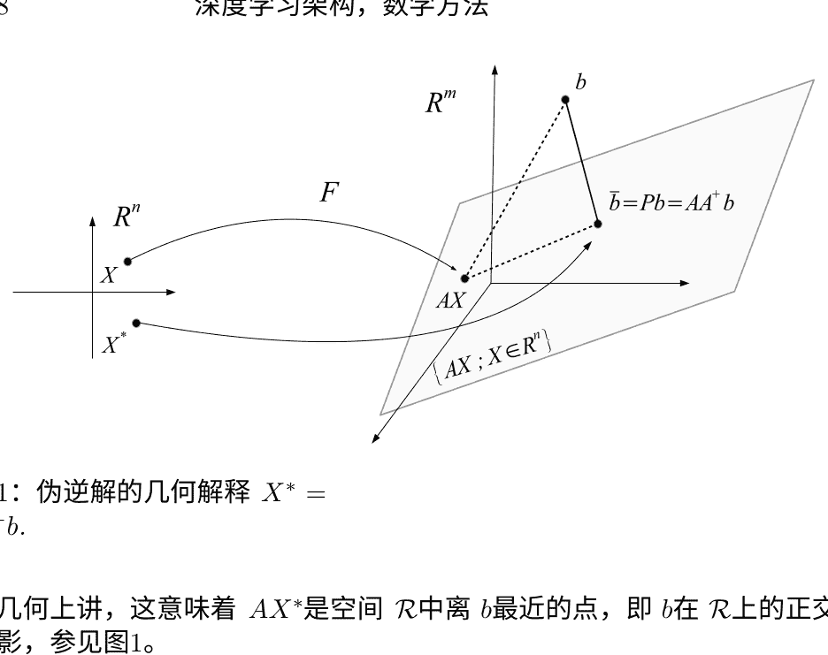

从几何上讲，这意味着 $AX^*$ 是空间 $\mathcal{R}$ 中离 $b$ 最近的点，即 $b$ 在 $\mathcal{R}$ 上的正交投影，参见图1。

让 $\bar{b}$ 表示 $b$ 在空间 $\mathcal{R}$ 上的正交投影，并考虑线性系统 $AX = \bar{b}$。由于 $\bar{b} \in \mathcal{R}$，该系统确实有解。唯一性来自于矩阵 $A$ 的最大秩条件。因此，存在唯一的向量 $X^* \in \mathbb{R}^n$ 使得 $AX^*= \bar{b}$。这就是方程 (G.2.7) 所声称的解。换句话说，这意味着

$$\|AX - b\|_2 \geq \|AX^* - b\|_2 = \|\bar{b} - b\|_2, \quad \text{对于} X \in \mathbb{R}^n,$$

接下来我们关注投影 $\bar{b}$ 的表达式。可以证明 $\bar{b} = AA^+b$。这是因为线性算子 $P: \mathbb{R}^m \rightarrow \mathbb{R}^m$ 给定为 $P = AA^+ = A(A^TA)^{-1}A^T$ 是从 $\mathbb{R}^m$ 到子空间 $\mathcal{R}$ 的正交投影算子。这个结果可以通过直接计算来验证以下三个性质得到： $P^2 = P$, $P^T = P$, 以及 $PA = A$；前者表示 $P$ 是一个投影算子，后者表示 $P$ 是一个正交投影算子，最后一个表示空间 $\mathcal{R}$ 是 $P$ 的不变子空间。由于 $X^* = A^+b$ 满足方程 $AX=\bar{b}$，即

$$AX^* = A(A^+b) = (AA^+)b = Pb = \bar{b},$$

那么 $X^*$ 表示系统 $AX = b$ 的伪逆解。摩尔-彭罗斯伪逆的第一个应用是找到平面坐标系 $(x_1, y_1)$, $(x_2, y_2), \dots, (x_m, y_m)$ 中给定点的最佳拟合线。如果直线的方程为 $y = ax + b$，我们将写出如下超定方程组:

$$
\begin{aligned}
ax_1 + b &= y_1\\
&\dots \\
ax_m + b &= y_m,
\end{aligned}
$$

可以用等价的矩阵形式表示

$$
\begin{pmatrix}
x_1 & 1 \\
x_2 & 1 \\
\vdots & \vdots \\
x_m & 1
\end{pmatrix}
\begin{pmatrix}
a \\
b
\end{pmatrix}
=
\begin{pmatrix}
y_1 \\
y_2 \\
\vdots \\
y_m
\end{pmatrix}
\\
\underbrace{\quad}_{A} \quad =Y
$$

我们注意到在这种情况下，$n=2$，因为只有两个参数需要确定。一个直接的计算显示

$$
A^T A = \begin{pmatrix}
\|x\|^2 & \sum x_i \\
\sum x_i & n
\end{pmatrix}, \quad
(A^T A)^{-1} = \frac{1}{n\|x\|^2 - (\sum x_i)^2} \begin{pmatrix}
n & -\sum x_i \\
-\sum x_i & \|x\|^2
\end{pmatrix}.
$$

自从

$$
A^T Y = \begin{pmatrix}
\sum x_i y_i \\
\sum y_i
\end{pmatrix},
$$

伪逆解是

$$
\begin{pmatrix}
a \\
b
\end{pmatrix}
= A^+ Y = (A^T A)^{-1} A^T Y = \frac{1}{n\|x\|^2 - (\sum x_i)^2} \begin{pmatrix}
n\sum x_i y_i - \sum x_i \sum y_i \\
\|x\|^2 \sum y_i - \sum x_i \sum x_i y_i
\end{pmatrix}.
$$

这提供了回归线系数的熟悉表达式

$$
a = \frac{n\sum x_i y_i - \sum x_i \sum y_i}{n\sum x_i^2 - (\sum x_i)^2}, \quad
b = \frac{\sum x_i^2 \sum y_i - \sum x_i \sum x_i y_i}{n\sum x_i^2 - (\sum x_i)^2}.
$$

值得注意的是，类似的方法可以应用于多项式回归。

## 命题 G.2.1

设 $A$ 为 $m \times n$ 秩为 $n$ 的矩阵。那么

- (i) $A^T A$ 是正定且可逆的;
- (ii) $\lim_{t\to\infty} e^{-A^T A t} = \mathbb{O}_n$.

证明：(i) 对于任意的 $x \in \mathbb{R}^n$，我们有

$\langle A^T Ax, x \rangle = x^T A^T Ax = \|Ax\|^2 \ge 0,$

矩阵 $A^T A$ 是正定的。利用矩阵秩的性质，

$\text{rank}(A^T A) = \text{rank}(A) = n$，所以矩阵 $A^T A$ 具有最大秩，

因此它是可逆的。

(ii) 第 (i) 部分可以通过陈述矩阵 $A^T A$ 具有正的、

非零特征值 $\alpha_j >0$，$1 \le j \le n$ 来表达。设 $M$ 为可逆的 $m \times n$ 矩阵，

使得 $A^T A$ 对角化，即 $A^T A = M \text{Diag}(\alpha_j) M^{-1}$。那么 $(A^T A)^k =$

$M \text{Diag}(\alpha_j^k) M^{-1}$，因此

$e^{-A^T At} = \sum_{k\ge0} (-1)^k (A^T A)^k \frac{t^k}{k!} = M \sum_{k\ge0} (-1)^k (\text{Diag}(\alpha_j))^k \frac{t^k}{k!} M^{-1}$

$= M \sum_{k\ge0} (-1)^k \text{Diag}(\alpha_j^k) \frac{t^k}{k!} M^{-1} = M \text{Diag}\left( \sum_{k\ge0} (-1)^k \alpha_j^k \frac{t^k}{k!} \right) M^{-1}$

$= M \text{Diag}(e^{-\alpha_j t}) M^{-1}.$

使用极限 $\lim_{t\to\infty} e^{-\alpha_j t} = 0$，由此可得极限 $\lim_{t\to\infty} e^{-A^T At} = \mathbb{O}_n.$

## 参考文献

- 1. E. Aarts, J. Korst, 模拟退火和玻尔兹曼机 (John Wiley, Chichester, UK, 1989)
- 2. D.H. Ackley, G.E. Hinton, T.J. Sejnowski, 一种用于玻尔兹曼机的学习算法. 认知科学 **9**, 147–169 (1985)
- 3. S. Amari, 自适应模式分类器的理论. IEEE计算机 **EC-16(3)**, 299–307 (1967)
- 4. S. Amari, 统计学中的微分几何方法. 统计学讲义 第28卷 (斯普林格, 柏林, 1985)
- 5. S. Amari, EM和em算法在神经网络中的信息几何. 神经网络 **8(9)**, 1379–1408 (1995)
- 6. S. Amari, 自然梯度在学习中的高效性. 神经计算 **10(2)**, 251–276 (1998)
- 7. S. Amari, 信息几何及其应用。 应用数学-ematical科学书，卷194，第1版（斯普林格，纽约，2016年）
- 8. S. Amari, H. Park, F. Fukumizu, 自然梯度学习的自适应方法用于多层感知机。 神经计算 **12**, 1399–1409（2000年）
- 9. V.I. Arnold, 关于三个变量的函数。 Dokl. Akad. Nauk SSSR **114**, 953–965（1957年）
- 10. R. Arora, A. Basu, P. Mianjy, A. Mukherjee, 用修正线性单元理解深度神经网络。 ICLR（2018年）
- 11. R.B. Ash, 信息论 (多佛出版社，纽约，1990年)
- 12. A. Barron, 超级位置函数的通用逼近界限. IEEE信息论 39, (1993)
- 13. G. Bartok,´ C. Szepesv´ari, S. Zilles, 分组结构状态空间中的主动学习模型. 信息与计算 208(4), 364–384 (2010)
- 14. Y. Bengio, P. Frasconi, P. Simard, 循环网络中学习长期依赖问题, 在IEEE国际会议神经网络, 旧金山 (IEEE出版社, 1993), pp. 1183–1195
- 15. Y. Bengio, P. Frasconi, P. Simard, 用梯度下降学习长期依赖是困难的. IEEE神经网络学报 (1994)
- 16. J. Bergstra, G. Desjardins, P. Lamblin, Y. Bengio, 二次多项式学习更好的图像特征. 技术报告1337 (蒙特利尔大学计算机科学与运筹学系, 2009)
- 17. H. Bohr, 关于几乎周期函数的理论 i. Acta Math. 45, 29–127 (1925)
- 18. A.E. Bryson, 用于优化多阶段分配过程的梯度方法, 在哈佛大学数字计算机及其应用研讨会, 1961年4月
- 19. P.C. Bush, T.J. Sejnowski, 大脑皮层神经元 (牛津大学出版社，牛津，1995年)
- 20. O. Calin, 随机微积分简介及其应用(世界科学出版社，新加坡，2015年)
- 21. O. Calin, 熵最大化曲线. Rev. Roum. Math. Pures Appl. 63(2), 91–106 (2018)
- 22. O. Calin, C. Udri,ste, 概率与统计中的几何建模 (斯普林格，纽约，2014年)
- 23. E. C,inlar, 概率与随机过程. 数学研究生文本，卷261 (斯普林格，纽约，2011年)
- 24. K. Cho, B. van Merrienboer, C. Gulcehre, D. Bahdanau, F. Bougares, 使用rnn编码器-解码器学习短语表示进行统计机器翻译。IEEE Trans. Neu-ral Netw. (2014), arXiv:1406.1078
- 25. M.A. Cohen, S. Grossberg, 通过竞争神经网络实现全局模式信息和并行存储的绝对稳定性。IEEE Trans. Syst. Man Cybern. **SMC-13**, 815-826 (1983年)
- 26. T.S. Cohen, M. Geiger, J. K¨ohler, M. Welling, 球形CNN S. ICRL (2018年), https://openreview.net/pdf?id=Hkbd5xZRb
- 27. T.S. Cohen, M. Welling, 群等变卷积网络 (2016), https://arxiv.org/abs/1602.07576
- 28. J.M. Corcuera, F. Giummol´e, 单调和正则散度的表征。Ann. Inst. Stat. Math. **50(3)**, 433–450 (1998)
- 29. R. Courant, D. Hilbert, 数学物理方法, 第二版 (Interscience Publishers, 纽约, 1955)
- 30. G. Cybenko, 用S型函数进行逼近。数学控制信号系统 **2**, 303–314 (1989)
- 31. K. Diederik, J. Ba, Adam: 一种随机优化方法 (2014), arXiv:1412.6980
- 32. R.J. Douglas, C. Koch, K.A. Martin, H.H. Suarez, 新皮层电路中的循环兴奋。科学 **269(5226)**, 981–985 (1995). https://doi.org/10.1126/science.7638624
- 33. S.E. Dreyfus, 变分问题的数值解。J. Math. Anal. Appl. **5**, 30–45 (1962)
- 34. J. Duchi, E. Hazan, Y. Singer, 用于在线学习和随机优化的自适应次梯度方法。JMLR **12**, 2121–2159 (2011)
- 35. D. Dufresne, 将指数组合拟合到概率分布中。Appl. Stoch. Model Bus. Ind. **23(1)**, (2006). https://doi.org/10.1002/asmb.635
- 36. N.邓福德, J.T.施瓦茨, 线性算子. 纯粹与应用数学-学, 第1卷 (Interscience Publishers, 纽约, 1957年)
- 37. E.B.丁金, 马尔可夫过程I, II (斯普林格, 柏林, 1965年)
- 38. A.爱因斯坦, 布朗运动理论研究 (多佛出版社, 米尼奥拉, 1956年) 由A.D.考珀翻译
- 39. B.R.弗里登, 来自费舍尔信息的科学, 第二版 (剑桥大学出版社, 剑桥, 2004年)

[40] B.R.弗里登，极端物理信息作为普遍稳定性原则，在信息理论和统计学习，编者F.埃默特-斯特雷布，M.德默尔（斯普林格，波士顿，2009年）

[41] B.R.弗里登，B.H.索弗，物理学的拉格朗日量和费舍尔信息传输游戏。物理评论E 52，2274-2286（1995年）

[42] F.A. Gers, J. Schmidhuber, LSTM循环网络学习简单的上下文无关和上下文敏感的语言。IEEE Trans. Neural Netw.12, 1333–1340 (2001)

[43] X. Glorot, Y. Bengio, 理解训练深度前馈神经网络的困难，在AISTATS '2010 (2010)

[44] X. Glorot, Y. Bengio, 理解训练深度前馈神经网络的困难，在第13届国际人工智能和统计学会议2010, Chia Lagunaresort, Sardinia, Italy. JMLR, vol. 9 (2010)

[45] X. Glorot, A. Borders, Y. Bengio, 深度稀疏整流神经网络，在第14届国际人工智能和统计学会议2011, Fort Lauderdale, FL, USA (2011)

[46] I. Goodfellow, Y. Bengio, A. Courville, 深度学习 (MIT Press, 剑桥,2016), http://www.deeplearningbook.org

[47] I.J. Goodfellow, J. Pouget-Abadie, M. Mirza, B. Xu, D. Warde-Farley, S. Ozair, A. Courville, Y. Bengio, 生成对抗网络, in NIPS (2014)

[48] I.J. Goodfellow, D. Warde-Farley, M. Mirza, A. Courville, Y. Bengio, Maxout网络, in ICML'13, ed. by S. Dasgupta, D. McAllester (2013), pp. 1319–1327

[49] L. Goodman, 关于乘积的精确方差. J. Am. Stat. Assoc. 55(292), 708–713 (1960). https://doi.org/10.2307/2281592., JSTOR 2281592

[50] A. Graves, A. Mohamed, G. Hinton, 深度递归神经网络的语音识别, in ICASSP(2013), pp. 6645–6649

[51] P.R. Halmos,测度论. 高等数学大学系列，第7版 (Van Nostrand Company, Princeton,1961)

[52] B. Hanin, 具有有界宽度和ReLU激活函数的深度神经网络的通用函数逼近 (2017), arXiv:1708.02691

[53] T. Hastie, R. Tibshirani, J. Friedman, 统计学习的要素, 第2版 (Springer, New York, 2017)

[54] D. Hilbert,线性积分方程的一般理论概述. Gott. Nachrichten, math.-phys. K1 (1904), pp. 49–91

[55] S. Hochreiter, 动态神经网络研究，慕尼黑工业大学学位论文，1991年

[56] S. Hochreiter, J. Schmidhuber, 长短期记忆。神经计算。 9, 1735–1780 (1997)

[57] J. Hopfield, 具有新兴集体计算能力的神经网络和物理系统。国家科学院学报。 79, 2554–2558(1982)

[58] J.J. Hopfield, 具有分级响应的神经元具有类似于两态神经元的集体计算特性。国家科学院学报。 81, 3088–3092 (1984)

[59] K. Hornik, M. Stinchcombe, H. White, 多层前馈神经网络是通用逼近器。神经网络。 2, 359–366 (1989)

[60] B. Irie, S. Miyake, 三层感知器的能力，在 IEEE 国际神经网络会议，卷1 (1988年) ，第641–648页

[61] E. Ising, 对铁磁理论的贡献。Z. für Phys. 31, 253 (1925年)

[62] H.J. Kelley, 最优飞行路径的梯度理论。ARS J. 30 (10) , 947–954页 (1960年) 。 https://doi.org/10.2514/8.5282

[63] S. Kirkpatrick, C. Gelatt, M. Vecchi, 模拟退火优化。Science 220, 671–680页 (1983年)

[64] A.N. Kolmogorov, 通过在一个变量中叠加连续函数和加法来表示多变量的连续函数。Dokl. Akad. Nauk. SSSR 144, 679–681页 (1957年) 。美国数学学会翻译, 28, 55–59页 (1963年)

[65] R. Kondor, 机器学习中的群论方法 (哥伦比亚大学，纽约，2008年)

[66] R. Kondor, S. Trivedi, 关于神经网络中等变性和卷积的泛化到紧致群的行动 (2018年) , https://arxiv.org/abs/1802.03690

[67] B. Kosko, 双向联想记忆。*IEEE Trans. Syst. Man Cybern.* **18**, 49-60 (1988年)

[68] A. Krizhevsky, I. Sutskever, G.E. Hinton, 使用深度卷积神经网络的ImageNet分类, 在*NIPS'2012* (2012年)

[69] S. Kullback, R.A. Leibler, 关于信息和充分性。*Ann. Math. Stat.* **22**, 79 (1951年)

[70] S. Kullback, R.A. Leibler,信息论与统计学 (Wiley, 纽约, 1959)

[71] S. Kullback, R.A. Leibler, 编者来信: Kullback-Leibler 距离。美国统计学会 **41**(4), (1987)

[72] L.D. Landau, E.M. Lifshitz,统计物理学。理论物理学课程 ,第5卷,由J.B. Sykes, M.J. Kearsley翻译 (*Pergamon Press*, 牛津, 1980)

[73] Y. LeCun,连接主义学习模型, 博士论文, 巴黎第六大学, 1987

[74] Y. LeCun, L. Bottou, Y. Bengio, P. Haffner, 基于梯度的学习应用于文档识别, 在*IEEE会议论文集*, 1998年11月

[75] Y. LeCun, K. Kavukcuoglu, C. Farabet, 卷积网络和视觉应用, in*2010年IEEE国际电路与系统研讨会(ISCAS)*, pp. 253–256

[76] Y. Li, K. Swersky, R.S. Zemel, 生成式矩匹配网络. CoRR (2015), arXiv:abs/1502.02761

[77] S. Linnainmaa, 累积舍入误差的表示 作为局部舍入误差的泰勒展开, 硕士论文(芬兰语), 赫尔辛基大学, pp. 6–7, 1970

[78] S. Linnainmaa, 累积舍入误差的泰勒展开. *BIT数值数学* **16**(2), 146–160 (1976). https://doi.org/10.1007/bf01931367

[79] Z. 卢, H. 普, F. 王, Z. 胡, L. 王, 神经网络的表达能力: 从宽度的视角看 , 收录于神经信息处理系统(2017), 页码6231–6239

[80] M.E. 霍夫 Jr.，自适应电路网络中的学习现象。 博士学位论文，技术报告1554-1，斯坦福电子实验室，斯坦福，加利福尼亚，1962年7月

[81] D.J.C. 麦凯，信息论、推理和学习算法 (剑桥大学出版社，剑桥，2003年)

[82] W.S. 麦卡洛克，W. 皮茨，神经活动中的思想内在逻辑演算。 数学生物物理学通报 **5**, 115–133 (1943)

[83] J. 默瑟，正负型函数及其与积分方程理论的关系。 伦敦皇家学会哲学交易系列。 A **209**, 415–446 (1909年)

[84] T. Mikolov，基于神经网络的统计语言模型。 博士论文，布尔诺理工大学，2012年

[85] R.S. Millman，G.D. Parker，微分几何要素 (Prentice-Hall, Englewood Cliffs, 1977年)

[86] M. Minsky，神经网络和大脑：模型问题。 论文，普林斯顿大学，普林斯顿，1954年

[87] M.L. Minsky，S.A. Papert，感知机 (MIT出版社，剑桥，1969年)

[88] M. Mohri，A. Rostamizadeh，A. Talwalkar，机器学习基础，第二版 (MIT出版社，波士顿，2018年)

[89] E.H. Moore，关于一般代数矩阵的倒数。 美国数学学会通报 **26** (9), 394–95 (1920年)。 [https://doi.org/10.1090/S0002-9904-1920-03322-7](https://doi.org/10.1090/S0002-9904-1920-03322-7)

[90] V. Nair, G.E. Hinton, 矫正线性单元改进了受限玻尔兹曼机， 在第27届国际机器学习大会上，2010年 (2010)

[91] Y.A. Nesterov, 一种解决凸规划问题的方法，收敛速度为 \(o(1/\sqrt{k})\). Sov. Math. Dokl. **27**, 372–376 (1983)

[92] M. Nielsen, 神经网络与深度学习 (2017), [http://www.neuralnetworksanddeeplearning.com](http://www.neuralnetworksanddeeplearning.com)

[93] D.B. Parker, 学习逻辑 (MIT, Cambridge, 1985)

[94] B. Pearlmutter, 用于递归神经网络训练的快速精确乘法拉格朗日。 神经计算 **7**(3), 473-482 (1995)

[95] P. Pascanu, C. Gülcehre, K. Cho, Y. Bengio, 如何构建深度递归神经网络, 在ICLR (2014)

[96] R. Pascanu, T. Mikolov, Y. Bengio, 关于训练循环神经网络的困难性, 在 ICML中。 神经计算 (2013年)

[97] R. Penrose, 一种矩阵的广义逆。Proc. Camb. Philos. Soc. 51 (3) , 406–413 (1955年)。 https://doi.org/10.1017/S0305004100030401

[98] B.T. Polyak, 加速迭代收敛的一些方法。USSR Comput. Math. Math. Phys. 4 (5) , 1–17 (1964年)

[99] M. Rattray, D. Saad, S. Amari, 一行学习的自然梯度下降。Phys. Rev. Lett. 81, 5461–5465 (1998年)

[100] S. Ravanbakhsh, J. Schneider, B. Póczos, 通过参数共享实现等变性, 在国际机器学习会议 (ICML) (2016年) 中, [https://arxiv.org/pdf/1702.08389.pdf](https://arxiv.org/pdf/1702.08389.pdf)

[101] R. Rojas,神经网络系统性介绍 (斯普林格, 柏林, 1996年)

[102] F. Rosenblatt, 感知器：大脑中信息存储和组织的概率模型。心理学评论 65, 386–408 (1958年)。 重印于: [Anderson and Rosenfeld 1988]

[103] N. Le Roux, Y. Bengio, 深度置信网络是紧凑的通用逼近器。神经计算 **22**(8), 2192-2207 (2010年)

[104] H.L. Royden,实分析, 第6版 (麦克米兰公司, 纽约, 1966年)

[105] H.L. Royden, P.M. Fitzpatrick,实分析 (Prentice Hall, 2010年)

[106] W. Rudin, 泛函分析 (纯粹与应用数学国际系列 (麦格劳-希尔, 纽约 , 1991年)

[107] D. Rumelhart, G.E. Hinton, J.R. Williams, 学习内部表征, 在并行分布式处理中：认知微结构的探索, 基础(MIT出版社, 剑桥, 1986年)

[108] D.E. Rumelhart, G.E. Hinton, R.J. Williams, 通过反向传播错误学习表征。 自然 323(6088), 533–536 (1986)。 [https://doi.org/10.1038/323533a0](https://doi.org/10.1038/323533a0). Bibcode:1986Natur.323..533R

[109] J. Schmidhuber, 神经网络中的深度学习：概述。J. 数学分析应用(2014)，https://arxiv.org/pdf/1404.7828.pdf

[110] S. Shalev-Shwartz, S. Ben-David,理解机器学习：从理论到算法(剑桥大学出版社，剑桥，2014年)

[111] C. Shannon, 通信的数学理论. 贝尔系统技术杂志 379–423, 623–656 (1948)

[112] K. Sharp, F. Matschinsky, Ludwig Boltzmann的论文翻译“关于热力学第二基本定理与概率计算之间关系的研究热平衡条件”。熵 17, 1971–2009 (2015). https://doi.org/10.3390/e17041971

[113] Xingjian Shi, Z. Chen, H. Wang, D.-Y. Yeung, W.K. Wong, W.C. Woo, 卷积LSTM网络：一种用于降水预测的机器学习方法，第28届国际会议神经信息处理系统(2015), pp. 802–810

[114] P. Smolensky, 动力系统中的信息处理：和谐理论的基础，并行分布式处理, vol. 1, 编辑 D.E. Rumelhart, J.L. McClelland (MIT Press, Cambridge, 1986), pp. 194–281

[115] D. Sprecher, 关于多个变量的连续函数结构。美国数学学会交易 115, 340-355 (1964年)

[116] N. Srivastava, G. Hinton, A. Krizhevsky, I. Sutskever, R. Salakhutdinov, Dropout：一种防止神经网络过拟合的简单方法。 J. Mach. Learn. Res. 15, 1929-1958 (2014年)

[117] K. Steinbuch, 自动机和人类：控制论事实和假设 (斯普林格，柏林，1965年)

[118] T. Tieleman, G. Hinton, Lecture 6.5—rmsprop, coursera: 神经网络机器学习。技术报告 (2012年)

[119] N. Tishby, F.C. Pereira, W. Bialek, 信息瓶颈方法，在第37届奥尔顿通信、控制和计算会议 (1999年) ，第368-377页

[120] D. Wackerly, W. Meddenhall, R. Scheaffer,数理统计学及应用, 第7版 (Brooks/Cole Cengage Learning, 2008)

[121] D. Wagenaar,神经网络的信息几何(神经网络中心；伦敦国王学院, 1998 )

[122] S. Wang, X. Sun, 吊环超平面的泛化。IEEE Trans. Inf. Theory **51**(12), 4425–4431 (2005)

[123] P.J. Werbos, 超越回归：行为科学中的新预测和分析工具，哈佛大学, 1975

[124] P.J. Werbos, 非线性敏感性分析的应用， 在第10届IFIP会议论文集中，31.8-4.9纽约(1981)，pp. 762–770

[125] B. Widrow, 使用化学“记忆电阻器”的自适应“adaline”神经元。技术报告 1553-2 (海军研究办公室合同，1960年10月)

[126] B. Widrow, adaline神经元网络中的泛化和信息存储，出自自适应系统, 编者 M. Yovitz, G. Jacobi, G. Goldstein (斯巴达书籍, 华盛顿, 1962年)，第435-461页

[127] B. Widrow, M.A. Lehr, 30年的自适应神经网络：感知器，madaline和反向传播。IEEE会议录 **78**(9), 1415-1442(1990)

[128] N. Wiener, Tauberian定理。数学年鉴 **33**(1), 1-100 (1932年)

[129] H.R. 威尔逊, J.D. 科温, 模型神经元局部群体中的兴奋和抑制相互作用。生物物理学杂志 **12**, 115–143 (1972)

[130] H.H. 杨, S. 阿马里, 自然梯度下降法训练多层感知机的复杂性问题。神经计算 **10**, 2137–2157 (1998)

[131] R.W. 杨, 信息论初级课程(Kluwer, 多德雷赫特, 2002)

[132] Y.T. 周, R. 切拉帕, 使用神经网络计算光流，在IEEE 1988国际神经网络会议(1988)，页码 71–78

## 索引

- 符号
- F可分离的，574
- ΣΠ-类网络，260
- Σ-类网络，260
- Σ-有限测度，701
- d-稠密，253
- d-系统，697
- dμ-收敛，323
- p-系统，697
- ε-关闭神经网络，220

- Arzela-Ascoli定理，203，205，207，208，726
- 递增序列，272
- 自相关，154
- 自编码器，360
- 函数的平均值，109
- 平均池化，507
- 轴突，9

- A
- 绝对连续，703
- 绝对收敛，304
- 抽象神经元，133
- 作用，530
- 激活函数，21，217，342
- AdaGrad，100
- Adaline，157
- Adam，103
- AdaMax，104
- 适应，713
- 自适应实现，493
- 代数，209
- 几乎周期，224
- 解析函数，260，300
- AND，136
- 逼近序列，176
- 逼近空间，253
- 反正切函数，29
- 面积，433

- B
- 反向传播，173，177，180，237，483，550
- Baire测度，257，700
- Banach空间，721
- 吸引盆，78，126
- 批处理，188
- 伯努利分布，710
- 随机变量，459
- Bessel不等式，303，724
- 偏差，5
- 二元分类器，148
- 双极阶跃函数，22
- 细胞体，9
- Bohr条件，224
- 玻尔兹曼常数，107
- 分布，109，614
- 学习，621
- 机器，611，617
- 概率，107

- 布尔不等式，700
- Borel
  - σ-代数，36
  - σ-场，254，268
  - 可测，268
  - 可测函数，254
  - 测度，700，705，727
  - 集合，5，65
- Borel-Cantelli引理，715
- 瓶颈，393
- 有界泛函，33
- 线性泛函，255
- 有界收敛定理，229，702
- 布朗运动，118，719
- 内置频率，212
- 凸起函数，229
- 凸起形状函数，30

- 度量空间，202
- 集合，239，253
- 集合，202
- 支持信号，518-520
- 完备，727
- 压缩信息，394
- 压缩条件，342，344
- 压缩因子，380
- 无压缩层，376
- 计算机断层扫描，300
- 条件
  - 熵，363
  - 期望，44，439
  - 期望，714
  - 模型密度函数，48
  - 条件熵，378，548
  - 包含常数，209，260
- 连续
  - 输入神经元，159
  - 神经元数量，300
- 收缩，577，728
- 收缩原理，215，544
- 收敛
  - 几乎必然，715
  - 在 Lᵖ 中，715
  - 在分布中，324
  - 在均方中，716
  - 在概率中，271，715
- 收敛条件，98

- C
- 康托尔引理，202，692
- Capacity，381
- 柯西序列，215，727
- 柯西不等式，205，216，307
- 中心极限定理，188，453，717
- 链式法则，173
- 特征函数，716
- 乔列斯基分解，119
- 克里斯托菲尔符号，424，449，627
- CIFAR数据集，63
- 循环搜索，122
- 分类函数，31
- 聚类分类，140
- 交换子，426
- 紧致，692
- 区间，207

- 凸
  - 泛函，723
  - 凸包，580
  - 可分离性，575
  - 集合，571
- 卷积，229，518
  - 核，242
  - 算子，521
- 级数，98
- 冷却过程，105
- 余弦，211
- 余弦压缩器，36

- 成本函数，41，49，173，185
- 计数测度，699
- 协方差，711
- 协变导数，425
- Cramér-Rao不等式，470
- 交叉相关，518，519
- 交叉熵，46，146，185，609
  - 误差，147
- 晶体结构，105
- 电流，5
- 曲率张量，627

- 函数，258
- 在 $L^1$-意义下，266
- 在 $L^2$-意义下，262
- 歧视性函数，32
- 离散度，118
- 分布，709
- 分布测度，323
- 散度，92，94
- 主导收敛定理，702
- 双指数，30，213
- 漂移，118
- 丢弃，454
- Dynkin公式，118，719
- 定理，697

## D

- 阻尼系数，94
- 决策
  - 边界曲线，587
  - 函数，565
  - 线，150
  - 映射，561，576
  - 映射，585
- 解码器，395
- 深度学习，215
- 深度神经网络，300
- 默认概率，145
- 退化核，306
- δ，181
- 树突，9
- 密集，256
- 密集集合，208
- 依赖树，175
- 行列式，342
- 对角化过程，273
- 微分熵，353
- 扩散矩阵，118
- Dini定理，201，245
- Dirac函数，2
- Dirac测度，160，228，699，701
- 方向导数，81
- 离散熵，353
- 离散测度，160，699
- 歧视性

## E

- Egorov定理，704
- 特征函数，303
- 特征值，303，734
- 特征向量，113
- 逐元素乘积，183
- ELU，24
- 经验均值，152
- 经验概率，146
- 编码器，395
- 能量函数，618
- 熵，195，198，351，615
  - 二进制，411
  - 变化，355
  - 流动，356
  - 一个分区的熵，563
- 时期，177
- 等连续，204
- 平衡点，91
- 等价类，562
- 关系，561
- 等变性，521，533，537

- 误差函数，41
- 错误信息，319
- 估计器，46
- 欧几里得
  - 球，272
  - 距离，43，215，727
  - 梯度，493
  - 内积，75
  - 长度，441
  - 结构，450
- 欧几里得距离，254
- 欧几里得梯度，488
- 精确学习，285，300，439，620
- 精确解，153
- 期望，710
- 梯度爆炸，554
- 扩展
  - 输入，134
  - 权重，134
- 外在的，441

## F

- 特征，377
- 前馈神经网络，178，281
- 费马定理，69
- 过滤器，518
- 过滤，327，713
- 有限
  - 能量信号，517，519，520
  - 信号，517，519
- 有限测度，701
- 第一基本形式，424，441
- 第一层，168
- 费舍尔
  - 信息，626
- 费舍尔信息，465，470
  - 矩阵，471
- 费舍尔度量，472，499，612
- 不动点，216，219，699
  - 定理，727
- 最平坦的流形，445

- 前向传播，179
- 传播公式，182
- 傅里叶变换，34，214，264，268，298，716
- 功能独立性，343

## G

- 门，554
- 高斯，30，214，300
  - 噪声，460
- 泛化误差，60
- 广义导数，238
- 生成矩匹配网络，606
- 测地线，442
  - 子流形，446
- 全局最小值，69
- Goodman公式，193，711
- Google街景图像，63
- GPU系统，177
- 梯度上升，613
- 梯度剪切，554
- 梯度下降，43，151，154，173，186
  - 算法，73
  - 方法，82，147
- 梯度估计，156
- 群，531

## H

- 哈尔测度，535
- 哈达玛积，184，185，459
- 哈恩分解定理，706
- 哈恩函数，29
- 哈恩-班赫定理，256，261，723
- 半空间，33
- 哈密顿函数，91，92
- 调和函数，73
- 海维赛德函数，22，227，230
- 对冲应用，241
- 海森堡群，532

- Helley定理，37
- Hellinger距离，55
- Helly定理，726
- Hessian
  - 矩阵，71，113，115
  - 方法，113
- 隐藏层，167，178，205，334
- Hilbert
  - 空间，44，45，723，724
- Hilbert的第十三问题，296
- 曲棍球函数，23
- 同胚，574
- 齐次空间，531
- Hopfield网络，611，629
- 水平渐近线，32
- 双曲正切，28，181，344
- 超参数，59，93，193，212
- 超平面，33
- 超曲面，43

- I
- 恒等函数，21
- 图像测度，703
- 不可压缩，93
- 不定积分，703
- 独立层，375
- 指示函数，33，228，320，698
- 无穷小算子，118
- 信息
  - 评估，351
  - 瓶颈，393
  - 压缩，355
  - 压缩机，381
  - 场，329
  - 损失，356
  - 路径，399
  - 平面，398
- 信息几何，466
- 初始化，176
- 内积，44
- 输入，41，321
- 熵，49
- 信息，325
- 变量，48
- 输入信息，318
- 输入输出
  - 函数，360，578
- 输入输出映射，171，218
- 积分核，304
- 积分变换，207，225
- 交集，691
- 内在的，441
- 不变性，537
- 不变性属性，366
- 反函数定理，78，616，729
- 入江和宫城的积分公式，297
- 迭代公式，155
- 伊藤过程，118
- 伊藤扩散，719
  - 公式，719
- J
- 雅可比矩阵，78，344，354，360，548，616
- 杰弗里距离，55
- Jensen-Shannon散度，51
- 联合密度，48
- 联合熵，353
- Jordan测度分解，706
- 跳跃不连续，143
- K
- 核函数，207，518，520
- 动能，90
- Kirchhoff定律，6
- Kolmogorov定理，296
- Kullback-Leibler散度，48，50，365，397，468，550，592，620

- Lagrange乘子，58
- Langevin方程，120
- Laplace势，214
- Laplacian算子，73
- 大数定律，716
- 层，178
- 学习
  - 连续函数，255
  - 决策映射，578
  - 有限支持函数，285
  - 可积函数，266
  - 可测函数，268
  - ODE的解，280
  - 平方可积函数，261
  - 带信息的，438
  - 带ReLU的，237
  - 带Softplus的，242
- 学习率，152，155，189
- 最小均方，152
- 勒贝格测度，161，207，214，261，352，354，564，566，700-702
- 左搜索，121
- 水平曲线，105，63
- 超曲面，73
- 集合，73
- Levi-Civita连接，426
- 线搜索方法，86
- 线性函数，21
- 泛函，256
- 线性变换，169
- 线性连接，426
- 线性神经元，21，152，171，184，333，360，476，574
- 线性算子，722

- 线性无关，569
- 利普希茨连续，75
- 局部最小值，71
- 对数似然，352，359
- 对数似然函数，149
- 逻辑函数，27，143，181，185，216，229，265，300
  - 回归，145
- 逻辑函数，28
- 损失函数，41，549
- 丢失信息，325
- LSTM，554
- Luzin定理，704

- Madaline，158
- 流形，417
- 马尔可夫链，368
  - 不等式，716
  - 性质，369
- 主方程，183
- 矩阵形式，183
- 最大池化，507
- 最大元素，327
- 秩，345
- 最大似然，50，150
- 最大均方误差，47
- 平均值定理，204，544
- 有意义的信息，394
- 可测函数，699
- 集合，320，328
- 空间，254，697
- 测度，33，34，254
- Mercer定理，308，311
- 度量

- 结构，439
- 最小池化，508
- 小批量，156
- 最小子流形，429
- MNIST数据集，62，400，437，514
- 模型
  - 平均，453
  - 组合，454
- 矩匹配，606
- 动量法，93
- 单调收敛定理，702
- Moore-Penrose伪逆，389，450，736
- 移动平均，518
- 乘性噪声，459
- 互信息，364，365
- N
- 自然梯度，487
- 可忽略，701
- 邻域搜索，121
- Nesterov加速梯度，100
- 神经网络，42，167
- 神经流形，474，498
- 神经元，9，167
- 牛顿法，115
- 牛顿-拉夫逊法，116
- 去噪，173
- 无噪声编码定理，378
- 有噪声神经元，466
- 非退化，154
- 非负定，308
- 不可恢复信息，327，328
- 范数，59，721
  - 算子的范数，722
  - 正则化，445
- 正态分布，193，710
- 正规方程，43
- 标准化初始化，195
- 标准线性空间，255
- 标准空间，721
- 空集，705
- O
- 偏好赔率，144
- 欧姆定律，6
- 单隐藏层神经网络，198，207，217，239，259，311
- 独热向量，31，401，567，576
- 在线学习，156
- 最优
  - 参数值，443
  - 点，442
- 或，136
- 轨道，531
- 奥恩斯坦-乌伦贝克，62，120
- 正交，261
  - 投影，436
- 正交投影，43
- 正交规范系统，724
- 输出，41，178
  - 信息，318，325，329
- 输出信息，438
- 超定系统，737
- 过拟合，381
- 过拟合，59，417，454
  - 去除，64
- P
- 参数，42
- 分区，563
- 分区函数，616
- 帕尔森窗口，55
- 感知器，136，171，227，254，325，565
  - 网络，237
  - 容量，390
  - 学习算法，163
  - 模型，135
- 周期函数，211，223，224

- 皮卡-林德尔夫定理，76
- 分段线性，30
- 高原，116，187
- 逐点收敛，201
- 多边形线，87
- 多项式回归，448
- 池化，355，507
  - 层，513
- 正定，154
- 势能，90
  - 函数，59
- 预测器，44
- PReLU，23
- 压力，4
- 原函数，134
- 先验，195
- 概率测度，701
  - 空间，709
- 概率测度，161
- 接近度，41
- ReLU，23，187，215，239
- Renyi熵，55
- 电阻器，5
- 受限玻尔兹曼机，635
- 黎曼
  - 距离，424
  - 流形，424，468
  - 度量，423，440，450，472
- Riesz定理，725
- 右搜索，121
- RMSProp，101
- RNN，543，546
- 车问题，7，630
- 旋转群，531

- Q
- 二次
  - 误差函数，153
  - 形式，72
  - 函数，72
- 二次Renyi熵，55
- 商集，562

- R
- Radon-Nikodym定理，161，703
- 秩，88，128
- 可恢复信息，329
- 矫正定理，587
- 循环神经网络，217
- 正则交叉熵函数，185
- 正则化，58，205，216，443
- 正则化代价函数，63

- S
- 样本估计，55
- 第二基本形式，427，445
- SELU，24
- 可分性，570
- 分离点，209，260
- 连续性，700
- 香农
  - 熵，48-50
- Sigmoid
  - 激活函数，232
  - 函数，26，204
  - 神经网络，236
  - 神经元，143，206，224，333，450
- Sigmoid函数，32，34，259，272
- 信号，168
- 有符号测度，705
- 简单函数，698
- 单纯形算法，73
- 模拟退火方法，104，499，613，629
- 正弦，211
- SLU，24
- Softmax，31，389，582
- Softplus函数，25，242
- Softsign，29

## 索引

- 谱半径，734
- Sprecher定理，297
- 平方可积函数，45
- 平方误差逼近，277
- 压缩函数，36，286
- 状态系统，543
- 统计流形，466
- 最陡下降，79，82
- 阶跃函数，21，36
- 随机
  - 梯度下降，189
  - 过程，713
  - 搜索，116
- 球形搜索，124
- 随机神经元，611
- 股票，212
- Stone-Weierstrass定理，208，260，306
- 步幅，522
- 子流形，426
- 平方误差和，254
- 监督学习，69
- SVHN数据集，63
- 对称差，328
- 突触，9

- 阈值阶跃函数，22
- Toeplitz矩阵，385
  - 性质，387

- 总压缩，380
- 总能量，91
- 完全测地线，429
- 训练数据，58
  - 分布，48，466
  - 偶数，320
  - 测度，320
  - 集合，60
- 晶体管，6

- 转移函数，544
- 平移不变性，510
  - 算子，521
- 转置，733

- 三角不等式，218

## T

- 切线，70，116
- 切平面，437
- 切向量场，423
- 目标函数，41，176，218，251
- 目标信息，318
- 出租车距离，254
- 泰勒逼近，70，114
- 温度，105
- 张量，693
- 测试误差，59
- 热力学系统，107，618

## U

- 未压缩层，340，342
- 欠拟合，66，378，381
- 基础分布，65
- 均匀收敛，303
- 均匀收敛序列，203
- 均匀分布，198
- 均匀有界，203，205
- 均匀连续，230
- 并集，691
- 单变量高斯，157
- 通用逼近器，251

## V

- 验证集，60，193
- 梯度消失，187，545，554
- 方差，191，711
  - 逼近，712
- 电压，5

## W

- 弱收敛，324，716
- 权重，1，78
  - 初始化，191
- Wiener的Tauberian定理，213，214，268

## X

- Xavier初始化，193
- 异或，138，171，286

## Z

- Zorn引理，327，692