# 深度学习概念与实时应用

## 前言

本书将为读者提供关于深度学习及其多学科应用的全面而最新的阐述。深度学习由于其在大规模数据集和广泛的应用领域中的高准确性而受到广泛关注。深度学习的计算能力的核心在于其架构。本书将重点介绍深度学习架构及其库的进展。基于深度学习架构的各种人工智能（AI）技术具有令人兴奋的应用，如自然语言处理、生物医学、语义知识、预测等等。

许多应用程序将从这项基础工作中受益。机器学习应用于回归是这样一个应用，它在识别缺失数据、统计语言建模和预测等方面有进一步的应用。深度学习正在改变我们的生活，将理论概念应用于实际应用，如监控、安全和医学诊断。本书将揭示各种可以从深度学习中受益的应用，如模式识别、监控视频中的人员再识别、视频中的动作识别、图像和视频字幕等。深度学习在创新的医疗保健系统和临床诊断应用中具有重要作用。

随着技术的进步，安全威胁不断增加。随着互联网和云服务的使用增加，关于网络攻击、恶意软件和入侵的报告也在增加。本书提出了许多突破性解决方案来解决这些问题。

语音是一种强大而引人注目的能力，可以用来传达情感、态度或一个人的行为，使用特定的语言。基于深度学习的架构被用来将语音片段分类为不同的情感。在本书中描述的一项工作中，从音频文件中提取了梅尔频率倒谱系数（MFCC）。这些特征被输入到卷积神经网络（CNN）中。然后优化了这个CNN以提高模型的准确性。本书还探讨了基于深度神经网络（DNN）的架构和机器学习方法，以识别涉及多个步骤的语音信号中的情感。

从预处理的数据集中提取了频谱和韵律特征。

面部微表情是快速、微妙且无意识的面部运动，揭示了一个人内心的情感。这些表情的微妙性对于肉眼来说是一个重大挑战；因此，已经进行了大量的工作和研究来检测和识别这些面部微表情。本书还介绍了主方向极大差分分析（MDMD）技术，用于发现面部微表情。

关于图像处理任务，本书还提出了一种自动检测番茄植物病害并进行杀虫剂诊断的方法，利用了一个具有50层的小型挤压激励残差网络模块（SE-Resnet50）。此外，还提出了一个卷积神经网络（CNN）流水线架构，以宽残差网络的帮助进行皮肤镜图像的分割。本书还涉及使用深度学习进行医学成像，如癌症生存率、医学成像与图像字幕等。还讨论了使用支持向量机（SVM）、随机森林（RF）、卷积神经网络（CNN）和人工神经网络（ANN）等实现的驾驶员疲劳检测等问题。

深度学习已经进入了设计、实现和部署密集和多样化应用的时期，可以借助适当的框架和库来帮助。本书重点介绍了如何将深度学习的概念与现代概念相结合，以在物联网、农业等多学科领域中产生应用。本书还关注不同的深度学习架构，如全连接神经网络、递归神经网络、卷积神经网络、循环神经网络、生成对抗网络和深度强化学习，以开发具有各种参数的预测模型，并揭示这些方法的应用。

本书可以帮助读者更好地理解深度学习及其多学科应用，激发出新的方法和解决方案，推动社会在许多关键方面取得进展。

埃琳娜·韦尔杜·佩雷斯
拉里奥哈国际大学
西班牙洛格罗尼奥

## 前言

本书集中讨论了深度学习架构及其库的进展。基于深度学习架构的各种人工智能技术具有令人兴奋的应用，如自然语言处理、语义知识、预测等。许多应用将受益于这项基础工作。 深度学习正在改变我们的生活方式，将理论概念应用于实际应用，如监控、安全和医学诊断。 本书将阐明各种应用如何从深度学习中受益，包括模式识别、监控视频中的人员重新识别、视频中的动作识别、图像和视频字幕等。我们周围的生活质量正在恶化，每天都有新的疾病出现，以至于诊断成为一个重要问题。 深度学习可以通过其智能医疗系统和临床诊断应用来应对这种诊断需求的激增。

在不久的将来，深度学习很可能被应用于广泛的领域，如网络监控、医疗保健、交通运输、智能城市、智能家居、城市规划、基础设施监测和农业。智能控制理论是一个活跃的研究领域，它将人工智能和自动控制应用于解决复杂的控制问题，如机器人技术。 这种控制技术类别包括神经网络控制、模糊逻辑控制、神经模糊控制、进化计算、群体算法、自组织系统、软计算、机器学习和基于智能代理的控制等。当系统没有先验的数学模型可用于控制时，这些策略是有益的。

深度学习利用连接在智能平台上的设备共享资源、内容、服务、应用和计算资源来执行先进的学习方法。 本书的重要特点包括了对深度学习的理解、深度学习问题和解决方案的调查、主要的未解决问题、创新和最新的与深度学习兼容的智能技术、实际应用中的工业深度学习：真实案例/案例、努力、挑战和全球战略方法、标准化、行业机构和倡议，包括深度学习架构规模。

经济增长和影响被组织成独立的章节，使读者能够专注于特定的兴趣。

| 地点 | 作者 |
| :--- | :--- |
| 印度新德里 | Smriti Srivastava |
| 印度新德里 | Manju Khari |
| 洛格罗尼奥，拉里奥哈，西班牙 | Ruben Gonzalez Crespo |
| 印度新德里 | Gopal Chaudhary |
| 印度诺伊达 | Parul Arora |


# 第一部分 深度学习概念：识别系统

# 使用深度神经网络从语音中识别情绪

Stuti Juyal, Chirag Killa, Gurvinder Pal Singh, Nishant Gupta和Vedika Gupta

### 1 引言

在了解了相关文献之后，很明显人类的两种感官，视觉和语音，被视为最有效的沟通方式。 声音是一种介质，使我们能够感知角色、时间和位置，远远超出我们所看到的。声音有助于事物的翻译。 声音的表现比视觉的表现更好，因为声音印象的体现将决定视觉疑虑的内容；然而，这并不总是情况。 声音最重要的特征是帮助我们感知情绪。 语音被认为是声音中最令人惊叹的特性，因此有助于决定不同的人际社交职责——扩大了充满活力的体验，例如观察人类情感，这被用于顺畅的沟通。 人类情感在我们的生活中起着关键作用[1]。 在我们的日常生活中，情感有助于反应和反馈系统的运作，这已经被广泛应用于企业的繁荣。 判断听众的情绪有助于调整演讲者的内容，使其适应情境。 人机协作已经成为可能，让计算机设备能够像任何人一样执行任务，以检查是否在所暗示的专家之间存在沟通的持久性。 由于人们可以在不同的地区交流和理解情感，能够执行类似任务的情感确认系统将具有广泛的应用，从而实现更重要的跨领域人机交互。 情感是一种有意识的体验，包括各种生理和心理活动。 它是人类的关键特性之一，主要体现在外表、非语言交流和言语中。情感是一种反应，包括不同的有机和心理活动的发生。这是人们的主要特征之一，主要体现在外表、非语言交流和言语上。这项研究工作是从语音信号中感知情感的不同亮点，同时也面临着一些独特的困难。由于语音信号不是固定的，因此需要一种工具来保存这些样本和信息，并捕捉不同情感的音调。

尽管表达可以采用任何形式，但言语和声学已成为评判一个人情感的有效媒介。人们通过远程媒介使用声音的语调和音高以及对方使用的词语来判断对方的反应。攻击在言语表达中存在的情感程度，并将其归类到不同的情感类别和维度中，是一个深入研究的课题。因此，语音情感识别（SER）在过去十年中获得了很大的声誉，并成为一个备受争议的研究课题。

分析人类情感行为的自动化已经成为语音识别的一种变异，它提高了机器的准确性，这是由说话者的语音机制和情感所不可避免地影响的，因此，这是一个引人注目的主题，以获得有洞察力的结果和探索。为了开发这个领域，通过对音频文件生成的波形的强度、均值和振幅进行特征工程，提取了许多特征，如激励源特征、韵律特征和基于声道活动的特征。

为此，使用长度为20-30毫秒的语音片段进行提取，并使用短时傅里叶变换[2]获得语音帧的倒谱。声道系统包括共振峰、带宽、频率、阻尼和振幅等信息[3]。线性预测倒谱系数（LPCC）和梅尔频率倒谱系数（MFCC）是常用的特征提取方法，用于声道特征系统的声学情感识别[4]。声道属性的基本准则取决于声道各个方向上可用的情感指示数据可能对产生不同情感片段负责[5]。在使用共享模型识别唱歌和说话中的情感时，模型列表包括4个低级描述符（LLDs）、41个频谱、14个倒谱（使用MFCC分离）和6个与声音相关的LLDs，并应用了各种测量方法，如最小值、最大值、平均值、峰度、偏度等，建立了交叉验证模型，以确定口头表达和唱歌之间的关系[6]。一个基于深度神经网络（DNN）-隐马尔可夫模型（HMM）的MFCC训练模型被提出用于声学情感识别，并与GMM、HMM进行了对比，结果显示有所改善。在普通话中，使用MFCC、LPCC、RASTA、PLP系数和对数频率功率系数（LFPC）的混合物用于特征集提取，以区分愤怒、疲劳、快乐、悲伤和中立情感这四个类别。通过使用支持向量机（SVM）[7]，在使用韵律特征[8]和语音质量的普通话数据集上，达到了约76%的得分。

（包含外部和内部噪声的）情绪被分为四个重要类别：喜悦、悲伤、愤怒和中立。尽管能量特征通常用于特征提取和SER的使用，但模式特征的检查较少。因此，有分析范围可以用来观察句子中位置对统计量的影响。

语音是一种强大的媒介，它影响演讲者和听众的情绪和感受。 从语音中识别情绪正在成为一个需要研究的领域，因为它涉及各种方面和困难。 由于其在不同领域的潜力，例如先进和改进的计算机学习、数据恢复系统、车辆情感识别系统、人力资源面试、呼叫中心、聊天机器人和个人助手，自动语音情感识别已经引起了广泛关注并得到了深入研究[9]。 图1展示了基于深度神经网络的语音情感识别。

本章的研究工作旨在利用深度学习方法构建一个基本而完整的代表性情感识别系统，以提高其识别精度，并利用语音信号进行辅助。

尽管在情感识别领域使用多模态信号进行了大量研究，但本研究仅涉及声学信号上的深度学习方法。 因此，利用深度学习方法对该领域的工作进行全面而深入的分析和挖掘是非常有说服力的。

图2说明了传统机器学习与基于语音的深度学习情感识别架构的区别。 虽然我们需要从语音中提取特征以供机器学习分类器处理，但深度学习方法需要机器自己弄清楚从语音信号中提取哪些特征，以构建一个能够深入分析语音并对其情感进行分类的架构。 深度学习基于分类器的中间步骤，即从输入语音信号中提取和选择特征的过程，并不包括在内。它根据输入的数据自行训练，并不断调整每一层的权重。因此，我们发现，在深度学习方法中，虽然我们需要将选定的特征输入分类器以了解存在的情感，但在深度学习方法中，

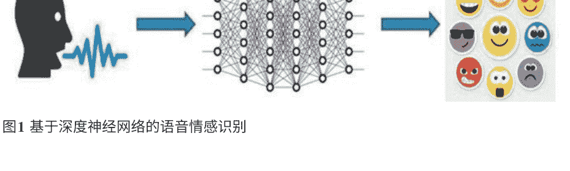

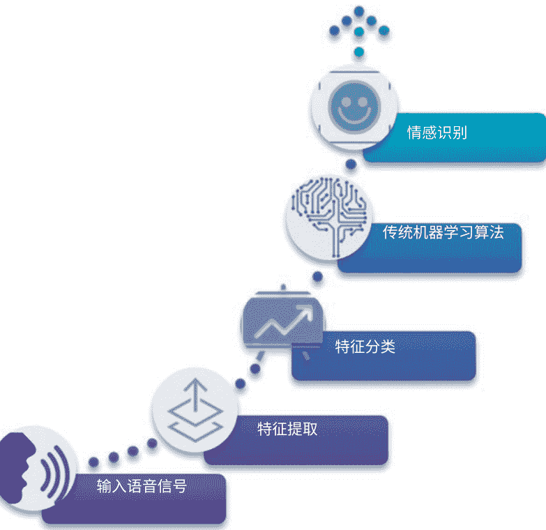

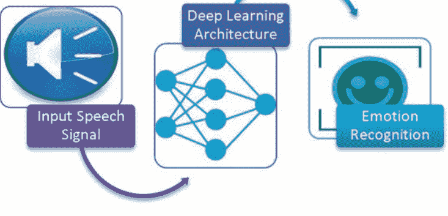

图2 传统机器学习流程与深度学习

### 2 背景

对于自动识别语音，需要解决模型中的主要技术挑战，包括音频文件的适当单元分割，提取相关情感特征以及它们的分类方式。 因此，提出的卷积模型全面解决了这些问题。 通常，从音频中识别情感是与说话者相关的，但是该系统使用傅里叶参数使用直观和本能的声音质量以及一阶和二阶差异来开发说话者无关的语音情感分类模型，这表明该模型比说话者相关的模型更加有效，因为它是自给自足的，无论说话者是谁（这可能包括说话者的生理、人口统计和语言特征），都能有效地分类人类情感[10]。

由于自动分类和识别情感的自动识别，情感的自动识别是可能的。 当谈到情感识别时，SVM也出现在画面中，并且使用基于音调特征的SVM描述模型对西班牙呼叫家庭上的8-DA分类任务进行了实现。 可以使用元音起始点和基于音高的频谱特征进行现实生活中的情感识别和分类[11]。 该模型通过使用过去的值进行非线性预测，并进行未来的分类预测[12]。 因此，在涉及所有这些事情之前，我们应该了解情感识别的基本原理，这些原理在这个模型中得到了很好的体现。

由此可见，机器学习是这个领域的发展方向，而深度学习是机器学习的未来，因此深度学习技术如卷积神经网络（CNN）和循环神经网络（RNN）可以用于情感识别。情感识别是一项具有挑战性的任务，深度学习模型需要特殊的网络技术来确保其安全性，而DCNN使其工作更加顺畅。 对于情感识别来说，最好的方法是构建一个能够以最佳方式进行特征提取和分类的模型，而这可以通过在DNN-HMM模型上进行工作来实现。 通过共享模型并分析情感表达在这两个通信领域中的共同点和差异，预测情感通过语音和歌曲表达。 因此，机器学习和深度学习模型使用神经网络对人类如何识别情感进行了自然探索。

一些模型涉及改变语音的音调和持续时间，而不影响信息和自然性，这被称为韵律修改。从语音信号中提取声道系统特征包括声音信号特征的自然变化以及如何从中产生情感[13]。 然后，一个模糊逻辑模型出现在阿拉伯语中。

使用韵律特征识别问题和非问题段落的独白。提出的模型提供了一个直观而强大的算法，用于在滞后域中进行周期性检测。对不同的声音信号进行信噪比采样。迄今为止，最大程度的语音情感识别是在英语中进行的，但其他自然语音/语言也可以通过结合韵律和声音质量特征来进行情感识别。所提出的识别系统在一个无上下文的情感语音数据库上进行了测试，使用MFCC作为特征提取方法。从语音中提取格式频率特征。使用马氏距离进行特征选择。对不同的分类算法进行比较，包括最大似然分类器（MLC）、高斯混合模型（GMM）、神经网络（NN）、K最近邻算法（K-NN）和Fisher线性判别分析（FLDA），其中FLDA的准确性最高。

在[14]中研究了DNN从各种听觉情感识别系统中学习特定特征的倾向。这些特征包括基于声音和音乐的识别。此外，跨通道架构的使用通过将先前的特定感觉整合到听觉描述符中，提高了复杂听觉系统的总体性能。

在[15]中使用显著特征进行语音情感识别，其中CNN的训练分为两个阶段。首先，使用无标签样本对CNN进行训练，使用稀疏自编码器（SAE）学习局部不变特征（LIF）。在下一个阶段，使用LIF作为输入，使用显著判别特征分析（SDFA）提取特征，以学习正交性和区分性，从而实现连续情感识别的不同方法。它使用标签离散化、多任务深度BLSTM-RNN训练和解码框架。它还引入了一种新的解码算法，用于产生更稳健的时间序列估计，包括信号的长期和短期时间属性。介绍了一种深度学习方法，即时空循环神经网络（STRNN）。

多方向SRNN层和双向TRNN层被层次化地用于学习空间和时间依赖关系，这是逐层完成的。

在中给出了DNN与GMM的比较和替代方法，这两种技术可以对六种不同的情绪进行分类。使用了三种不同的特征提取方法：MFCCs、PLPs和FBANKs。将这三种声学特征提取方法结合起来，准确率达到了92.3%，而MFCC的准确率为92.1%。这项研究表明，使用深度学习架构的情感识别系统优于GMM。

在[16]中，平均能量、平均强度和MFCC特征被用于检测候选人在人力资源面试中的语音应激。在EMO-DB数据集上，使用NN获得了最佳结果，达到了97.98%。为了克服预处理的问题，需要一个实时的情感识别系统来识别语音中的情绪。该情感识别系统使用端到端的DNN架构。提出的情感识别系统在两个数据集上进行了实现，并取得了有希望的分类情绪的结果。

在[17]中提出了一个名为Sharing Priors between Related Source and Target classes (SPRST)的两层神经网络模型。第一步包括预训练权重的过程。第一层，第二步包括对相关源和目标类别的分类器参数施加共同先验。这在两个公开可用的语料库上实现，并且在分类性能方面取得了很大的改进。

通过在[18]中同时应用所提出的完全CCA和深度完全CCA技术，可以将来自LPCC技术和MFCC技术的特征结合起来。深度完全CCA比其他语音识别系统具有更好的识别准确性结果。

尽管有不同的机器学习技术来识别情绪，但本文尝试使用深度学习和图像分类方法根据语音信号进行情绪分析和分类。在离线预处理模式[19]中，特征用于检测演员的面部，并将该图片裁剪到 256×256的大小，以将原始音频信号转换为绘制的波形。该音频文件由连接到Node Js的服务器接收，并投影到2D平面上，最后由手机接收。在这方面的一些值得注意的工作已经在表1中进行了全面的回顾和呈现。

#### 2.1 挑战

- 1. 影响系统识别能力的挑战主要是语音信号中的噪音和不需要的东西[20]。
- 2. 语音信号有时包含没有声音的相位，有时包含噪音，这导致需要捕捉的实际信号无法被捕捉，从而成为SER的挑战之一。

### 3 方法论

SER使用低级特征作为分类数据。语音信号受到噪音等外部因素的干扰，这对于准确率产生了重大阻碍。为了获得更好的精度，这些特征[21]经过预处理以去除噪音。为了获得更好的分类结果，我们必须分析我们将集中关注的特征类型，例如音高频率特征、基于能量的特征、基于文本的特征、基于单词的特征等。成功提取所需特征以训练我们的模型后，我们最终选择用于分类的模型，然后在模型提供最大准确率时完成情感识别[22]。

从语音中识别运动的模块图已在图3中展示。在本章中，我们采用基于语音的话语，然后对其进行预处理，并使用Mel频率倒谱法从中提取特征。

| 作者情绪 | 说话者 | 特征 | 分类 | 准确度 | 研究空白 |
| :--- | :--- | :--- | :--- | :--- | :--- |
| CASIA - 快乐、悲伤、愤怒、恐惧、惊讶、中立 | CASIA - 演员 (2个男性和2个女性) ，共400个语句语音 | MFCC、里叶参数特征 (幅度 (H)、一阶导数 (ΔH)、和二阶导数 (ΔΔH)) | 支持向量机和贝叶斯分类器与高斯类条件概率 | EMODB<br>快乐 (FP) - 92.92%<br>悲伤 (FP + MFCC) - 91.21%<br>愤怒 (FP + MFCC) - 98.29%<br>中立 (FP + MFCC) - 87.45%<br>无聊 (FP + MFCC) - 71.48%<br>恐惧 (FP + MFCC) - 91.92%<br>CASIA<br>快乐 (FP + MFCC) - 81%<br>悲伤 (FP) - 67%<br>愤怒 (FP + MFCC) - 86%<br>惊讶 (FP + MFCC) - 84%<br>恐惧 (FP + MFCC) - 81%<br>EEDSB<br>快乐 (FP) - 41.5%<br>悲伤 (FP) - 83.6%<br>愤怒 (MFCC) - 88.8%<br>中立 (FP) - 90.1% | 1) 深度学习模型，如GMM，HMM和ANN，可以使用FP+MFCC基于特征进行更高的准确性探索 |
| EMODB - 愤怒、恐惧、无聊、快乐、悲伤 | EMODB - 10个没有语义一致的 | 连续特征 - 音高，ZCR，LPCC | | | |
| EEDSB - 愤怒、厌恶、恐惧、快乐、中立、惊讶、悲伤 | EEDSB - 中国的老年人 : 5个女性和6个男性 | | | | |

| 作者/情感 | 说话者 | 特征 | 分类 | 准确度 | 研究空白 |
| :--- | :--- | :--- | :--- | :--- | :--- |
| 肖等(2005)[3] | 柏林情感数据库，无聊、厌恶、恐惧、快乐、悲伤、中立 | 5位男演员和5位女演员在10个不同的句子中。有500个语音样本，其中286个是女性声音，207个是男性声音 | 1) 在50个潜在特征中，选择了最好的10个。2) 使用Fischer的判别比选择最佳特征3) 分析并说明了三种状态情绪的定义为主动，被动和中立 | 在这篇文献中没有对特征进行分类 | 1) 可以对状态（主动、被动和中性）的子状态进行定义2) 可以包含更多特征以区分状态 |
| Zhang等人(2015)[6] | RAVDESS数据集-4个(12男性和12女性) 情感内容 - 297名人类参与者UMS SED数据集-3位表演者(1位女性和2位男性 | RAVDESS 特征包括4个能量特征、41个频谱特征和14个(MFCC) 和6个与声音相关的LLIDs视觉特征- 面部动作单元、左右侧动作单元 | 简单的SVM分类器。单任务模型有向无环SVM作为识别器。多任务正则化SVM用于多任务层次模型。 | RAVDESS 简单分类器 - 81.61% 单任务模型 - 81.25% DAGSVM-83.15% 多任务正则化SVM-83.15% UMSSED 简单分类器 - 70.83% 单任务模型 - 70.83% DAGSVM-71.43% 多任务正则化SVM-74.4% | 1) 研究可以扩展到非表情绪进行跨语料库分析。 |

### 表1（续）

| 作者情绪 | 说话者 | 特征 | 分类 | 准确度 | 研究空白 |
| :--- | :--- | :--- | :--- | :--- | :--- |
| Pao等人 (2006年) [7] | 普通话情感语音- 18名男性, 16名女性, 共570个话语, 其中151个愤怒, 83个无聊, 96个快乐, 116个中性, 和124个悲伤话语 | 音高, 共振峰, LPC, LPCC, MFCC, ΔMFCC, ΔΔMFCC, (LPCC), 感知线性预测 (LFPC), 感知和RASTA-PLP | 支持向量机, 神经网络 | 支持向量机, 使用LPC, MFCC, LPCC和LFPC特征, 最佳准确率为84.2% | 混合模型, 通过将反向传播的最后一个输出输入到SVM模型进行分类。分类器融合可以被完成。 |
| 毛等人 (2014)[14] | SAVEE-愤怒, 厌恶, 恐惧, 快乐, 悲伤, 惊讶和中性EMODB-愤怒, 厌恶, 恐惧, 喜悦, 悲伤, 无聊和中性DES-愤怒, 喜悦, 惊讶, 悲伤和中性MES-愤怒, 喜悦, 惊讶, 悲伤和中性, SAVEE-4个英语演讲者采样率为44.1kHzEMODB-10个德国演员采样率为48kHzES-4个丹麦演员采样率为48kHzMES-7个普通话演员采样率为11.025kHz | 原始特征-统计特征, 如均值, 中位数, 众数, 最小值, 最大值, 等等声学特征-与音高相关的特征, 与能量相关的特征, 语速和MFCC声门参数和Teager能量算子 (TEO) 局部不变特征 (LIF) | SVM | | 特征 \| 分类准确率 (%) <br> SAVEE \| 71.8 <br> EMODB \| 57.2 <br> DES \| 60.4 <br> MES \| 57.8 <br> 1) 将输入的语音信号转换为输出, 分类器可以高效地利用 <br> 2) 必须扩展其研究, 提供将特征稳定地提取为自然形式的语言, 而不是模拟数据库 |

| 作者情感 | 说话者 | 特征 | 分类 | 准确度 | 研究空白 |
| :--- | :--- | :--- | :--- | :--- | :--- |
| Lim 等(2016年)[1] EMO DB-中性, 愤怒, 恐惧, 厌恶, 悲伤, 无聊, 快乐 | EMO DB-10位德国演员用535个话语说出10个不同的情绪 | STFT-2D表示帧大小-256重叠-50% | CNN, LSTM, 时间分布的CNN | CNN: 精确度: 87.74% F分数: 86.06% 召回率: 86.32%<br>LSTM: 精确度: 79.87% F分数: 78.31% 召回率: 78.83%<br>时间分布的CNN: 精确度: 88.01% F分数: 86.65% 召回率: 86.86% | 1) 可以利用混合的基于深度学习的模型，并且该研究还可以扩展到多模态的基于特征的情感识别 |

### 表1 (续)

| 作者情绪 | 说话者 | 特征 | 分类 | 准确度 | 研究空白 |
| :--- | :--- | :--- | :--- | :--- | :--- |
| 潘等人 (2006年) [21] | 柏林数据库10名专业德国演员 (5男5女) | 能量、音高、线性预测倒谱系数 (LPCC)、MFCC、梅尔能量谱 (MEDC) | LIBSVM | EMODB MFCC + MEDC + 能量: 91.304% MFCC + MEDC + 能量 + 音高: 90% | 1) 可以提取ΔMFCC和ΔΔMFCC等特征通过选择更好的特征可以提高准确性 3) 许多标签是模糊的，经常猜错Bertero和Fung (2017年) [34] |
| 自建中文数据库对快乐、悲伤和中性的识别 | 自建中文数据库1500个语音样本，包括5名男性和5名女性学生每人朗读150个句子 | 动态系数 (MEDC) |  | 中文数据库 MFCC + MEDC: 80.4763% MFCC + MEDC + 能量: 95.087% | 1) 非常低级的特征 (振幅和频率) 2) 从语音中提取更多特征可以为准确的实时语音情感检测系统做出 |
| TED演讲 | TEDL1UM v2 语料库分为1个片段，每个片段持续13-15秒。由学生和15名通过亚马逊Mechanical Turk进行注释的80K个片段的收集 | 8kHz的样本-长度为13-15秒窗口大小-200动量-0.9初始学习速率-10学习率减半(之后)-15个周期激活函数-修正线性交叉验证-三折 | 支持向量机、卷积神经网络 | SVM 快乐-52.2% 愤怒-60.4% 悲伤-76.4% CNN 快乐-58.6% 愤怒-70.5% 悲伤-69.1% |  |

| 作者情感 | 说话者 | 特征 | 分类 | 准确度 | 研究空白 |
| :--- | :--- | :--- | :--- | :--- | :--- |
| Cen等人 (2008年) [35] | LDC情感语调语音语料库-<br>包括3个男性和4个女性<br>演员。他们<br>分为性别相关<br>和说话者相关的<br>训练并分为<br>8个情感类别<br>焦虑，无聊，蔑视，厌恶，愤怒，快乐和兴趣 | 中位数, MFCC,<br>标准差,<br>中位数值等。<br>这些提取的<br>特征基于<br>典型相关分析<br>进行选择 | 概率神经网络 | 说话者相关模式<br>所有特征 - 58.88%<br>选择的特征 - 59.63%<br>性别相关模式<br>所有特征 - 55.13%<br>选择的特征 - 51.75% | 1) 计算复杂性可以<br>大大减少而不<br>提出减少方法<br>2) 计算复杂<br>性在性别<br>相关和<br>说话者相<br>关模式下实现更好<br>的准确性<br>郑等人 (201<br>5年) [37] |
| IEMOCAP database –<br>兴奋，快乐，沮丧，中性，惊讶 | 数据库有10个<br>演员。数据库由<br>3个人类注释的分<br>类和维度标<br>签标记 | MFCC+Δ+Δ ,<br>LPC,<br>LPC, RASTA-PLP,<br>音高 ,<br>ZCR使用P<br>CA白化进行<br>降维 | 对数谱+PCA<br>白化+CNN<br>(2个卷积+2个<br>池化) | 40.02% (在这个数据集中，最好<br>的可能准确率相对较低，尽管超调<br>参数极端因为数据集不平衡并且增<br>加卷积和池化的数量进一步降低了准<br>确性) | 1) 特征提取和<br>上下文学习的组<br>合可以得<br>到更好的结果 |

| 作者/情绪 | 说话者 | 特征 | 分类 | 准确度 | 研究空白 |
| :--- | :--- | :--- | :--- | :--- | :--- |
| **赵等人 (2015年) [38]** | **柏林EMODB –**<br>柏林数据库：<br>识别为快乐、悲伤和中性 | **柏林数据库 10**<br>专业的德语母语演员（5男性和5女性） | 原始音频剪辑和对数梅尔频谱图<br>用BN层对CNN-LSTM网络中的样本进行平滑处理并防止过拟合 | 1D CNN，2D CNN-LSTM网络 | **柏林EMODB 1D CNN**<br>原始音频剪辑 - 92.34%<br>对数梅尔频谱图 - 95.33%<br>**柏林EMODB 2D CNN-LSTM**<br>原始音频剪辑 - 86.73%<br>对数梅尔频谱图 - 95.89% | 1) 深度学习方法已经被设计成以“黑盒子”的方式使用语音来训练网络<br>2) 为了结合不同的学习模型，需要开发结合不同模型的过程以获得更好的准确性 |
| | **IEMOCAP –**<br>数据库包括动作捕捉标记和音频<br>数据有五对男女演员（男性和女性）有两个情感<br>方法即戏剧剧本的表演和即兴有效场景 | **IEMOCAP 数据库 –**<br>兴奋，快乐，沮丧，中性，惊讶 | | | **IEMOCAP 1D CNN**<br>原始音频剪辑 - 67.92%<br>对数梅尔频谱图 - 89.16%<br>**IEMOCAP 2D CNN-LSTM**<br>原始音频剪辑 - 79.72%<br>对数梅尔频谱图 - 85.58% | |
| **表1（续）** | | | | | |

### 使用深度神经网络进行语音情感识别

| 作者情感 | 说话者 | 特征 | 分类 | 准确度（模型） | 准确率 | 研究空白 |
| :--- | :--- | :--- | :--- | :--- | :--- | :--- |
| Schuller等人 (2005) [42]<br>EMODB- 中性，愤怒，恐惧，厌恶，悲伤，无聊，快乐 | EMODB-10<br>德国演员说了10个不同的陈述共555个话语。<br>总共包含816个短语 | 音高、能量、<br>持续时间、共振峰<br>HNR、MFCC、FFT、<br>ZCR | 朴素贝叶斯，神经网<br>络，支持向量机，<br>C4.5，AdaBoost，<br>多重提升，堆叠C，<br>MLR NB INN，<br>INN SVM C4.5，<br>C4.5，多重提升C4.5，<br>堆叠C MLR NB，<br>INN SVM C4.5，<br>堆叠MLR NB INN SVM C4.5 | 朴素贝叶斯<br>神经网络<br>SVM<br>C4.5<br>袋装C4.5<br>AdaBoost C4.5<br>多重提升C4.5<br>堆叠C MLR NB INN<br>堆叠C MLR NB INN<br>堆叠MLR NB INN SVM C4.5 | 73.57%<br>63.52%<br>84.84%<br>61.07%<br>70.70%<br>72.34%<br>72.54%<br>75.41%<br>76.24% | 1）在这里使用的方法中，计算时间的显著增加仍然是一个缺点，可以进行研究以改进 |

### 表1 (续)

| 作者情绪 | 说话者 | 特征 | 分类 | 准确度 | 研究空白 |
| :--- | :--- | :--- | :--- | :--- | :--- |
| EMODB-情绪被分为四个情感维度，即积极、消极、价值和唤醒；RML情感数据库-包含愤怒、厌恶、恐惧、悲伤、快乐、惊讶等情感，并映射到积极性、价值、和唤醒维度 | EMODB-10 德国演员发表10个不同的陈述共535个话语。它包含816个短语；RML情感数据库-720个音频视觉语言话语，使用6种不同的语言，即英语、波斯语、普通话、波斯语、旁遮普语和意大利语 | MFCC | 人工神经-模糊分类器(ANFC) | EMODB 唤醒轴 - 98.52% 价值轴 - 85.30%；RML 唤醒轴 - 92.30% 价值轴 - 73.68% | 1) 包括对不同分类器的深入研究，这些分类器可用于将情绪分类为情感维度2) 对情感维度相关性的特征进行深入分析，特别是在情感价值轴上，因为所得到的结果相对较差 |

#### 3.1 数据集的类型

##### 3.1.1 免费许可证

丹麦情感数据库（DES）

DES包括四位演员（两男两女）朗读不同情感的文本[24]。数据库包括30分钟的语音。该数据集包含在语音合成项目中的Voice Attitudes and Emotions中。

##### 3.1.2 商业可用

中文语言数据库（CASIA）

数据库包括在线和离线手写数据库。CASIA在线手写数据库包括由420人书写的4037种字符样本[25]。这些手写样本是由1020位作者使用Anoto笔在纸上制作的，因此获得了在线和离线数据。样本包括孤立字符和手写文本（连续书写）。他们从2007年到2010年收集了作家的数据，并在2010年完成了分割和注释。数据库包括六个在线数据集和六个离线数据集，在每种情况下，孤立字符有三个（DB1.0-1.2），手写文本有三个（DB2.0-2.2）。无论是在线还是离线情况，孤立字符的数据集包含大约7356个类别的390万个样本（7185个汉字和171个符号），手写文本的数据集包含大约5090页和135万个字符样本。所有数据都已经按字符级别进行了分割和注释，并且每个数据集都被分成了标准的训练和测试子集。

##### 3.1.3 公共和免费

###### 柏林情感数据库

这是一个数据库，它使用德语，并包含近800个句子和10个模仿不同情绪的演员。十个不同的演讲者（五个女性和五个男性）朗读十个模仿各种情绪的话语：快乐、愤怒、焦虑/恐惧、无聊、悲伤、厌恶或没有情绪（中性）[26]。

每个演讲者的总录音时间大约为2小时。

###### RAVDESS

莱尔森情感语音和歌曲数据库是一个情感数据集，使用英语录制，位于加拿大多伦多的莱尔森大学。它有许多不同情感类型的演讲者以北美口音说话和唱歌。这是一个经过验证的英语数据集，其中包含24位专业演员，包括12位男性和12位女性[27]。多模态数据集中的语音可以被分类为八种不同的情绪，包括快乐、悲伤、厌恶、愤怒、惊讶、中性、平静和恐惧，而歌曲数据只包含六种情绪，不包括厌恶和惊讶情绪。语音部分共有1440个.wav格式的音频文件，采样率为48,000 Hz。总体上，该数据集包含超过7000个语音和歌曲录音文件。

#### 3.2 数据集

##### 3.2.1 CREMA-D

它包括7442个剪辑，其中包括91位男演员和女演员，年龄和种族不同，并传达六种情绪：快乐、悲伤、愤怒、恐惧、厌恶和中性[28]。该数据集包含每个剪辑的各种评级，包括仅音频、仅视觉或音频-视觉，由2443名评估员使用众包进行验证。对于同一剪辑的多个评级，总结为群体感知情绪标签，即评估员最频繁选择的情绪；群体感知情绪的强度是评估员对该情绪指定的平均强度。

##### 3.2.2 MSP-IMPROV

MSP-IMPROV是一个包含演员之间对话的音频-视觉数据库。该数据库包括六个会话，每个会话包括一个男性和一个女性的话语[29]。数据剪辑包括在框架中插入的即兴表演和目标句子。总共有12位不同的发言人在数据库中。总体而言，该数据库包含7000多个话语和9小时的语音，分为四个不同的情绪类别：中性、悲伤、快乐和愤怒。

如图7所示，情绪分为积极、消极和无类别。这些进一步分为男性和女性。积极的情绪包括快乐、平静和惊讶的情绪，而消极的情绪包括愤怒、恐惧、厌恶和悲伤的情绪，最后无类别包含中性情绪。图表显示了每种情绪的数量。

图7 情感分布为男性和女性的积极和消极

#### 3.3 特征提取和特征选择

特征提取技术是将原始数据处理成有意义的可管理的组的起始基础。

最初，它包含需要根据所包含的特征对原始数据进行分类的原始数据，这就是特征提取的用途。在这个过程中，提取出数据所包含的所有特征，然后开始对这些提取出的特征进行处理。下面列举了一些在音频/语音数据集上进行分析和应用的特征提取技术。

##### 3.3.1 韵律特征

线性预测编码（LPC）

LPC主要是基于假设概念的语音处理机制[30]。本研究始于从情感识别中提取音频特征的实验研究。这种技术主要通过使用LPC模型以压缩形式表示语音的谱包络。它是一种在低比特率下对高质量语音进行编码的最强大的分析工具之一。假设概念有助于通过将一组样本概念作为输入来预测第n个样本。这涉及到当前样本的预测通过过去的样本存在。除了现有的值之外，它在提取基于自回归的特征方面也非常重要。它为计算语音做出了重要贡献，并努力提供严格的语音参数。

梅尔频率倒谱系数（MFCC）

图8显示了数据集中所有音频文件的系数，其中颜色表示系数。自从引入以来，MFCC已成为最常用的并且在特征选择和提取方面得到了提升的机制。在音频和语音处理中，梅尔频率倒谱（MFC）表示声音的功率谱，它基于三角函数变换，如正弦、余弦变换和非线性的对数功率谱变换。

SER被视为分类问题，为了更好地进行特征增长和特征提取，MFCC是其中一种主要应用的技术。MFCC是一种工作系数，它们共同构成了一个MFC。与普通倒谱相比，MFCC的区别在于它的工作主要依赖于在Mel刻度上均匀切割的频带，并且详细描述了人类听觉系统的响应。这种方法的变形可以更好地表示音频，例如在音频压缩中。它捕捉了语音中的主要特征。毫无疑问，这个系统捕捉到的性能水平很高，使其更加准确。

### 短时傅里叶变换（STFT）

STFT是一种傅里叶变换技术，用于根据音频信号的局部部分随时间变化的相位确定正弦频率和内容。为了将较长的音频或视频片段分割成较小的片段，STFT是一种重要的计算方法。结果是对各个切片段分别进行的傅里叶变换。

完成这一步之后，其中一个会将变化的光谱作为时间域的函数绘制出来。

### 主成分分析（PCA）

PCA正如其名，处理的是不同观测集的主要成分，需要进行正交变换[33]。PCA白化光谱可以分成非重叠的片段。PCA技术用于将高维数据降低到更简单的维度数据，考虑不同的特征。它具有鲁棒性，保留了更重要的信息，并且在很大程度上减小了特征向量的大小。对于高维数据来说，这是一种昂贵的方法。

#### 3.4 分类

分类技术涉及将元素或观测结果分类到已知类别的工作数据集的基础上。分类根据给定输入的数据点提供输出。以下是本文分析过的一些分类技术。

##### 3.4.1 卷积神经网络（CNN）

CNN属于深度学习技术的分类器，主要用于分析视觉图像。这个网络也被称为平移不变或空间不变的人工神经网络，因为它们的架构如此。CNN在多个层上进行调节，每个层为其更高级别的层生成输入[34]。这些层由神经元完全连接，CNN遵循分层方法以更简单和更小的方式执行复杂数据[35]。它还提供更好的分类。

##### 3.4.2 支持向量机（SVM）

SVM（也称为支持向量网络）是一种学习算法，具有相关的学习模型，用于分类和回归的数据处理和分析[36]。给定一组标记为两个类别之一的训练示例，SVM训练算法通过创建一个模型来对新示例进行分配到一个类别或另一个类别，使其成为最强大的二元线性分类器之一（尽管存在Platt缩放等方法来在概率分类设置中使用SVM）。

##### 3.4.3 深度神经网络（DNN）

DNN由多个层级组成，每个层级都由非线性操作（如神经网络）组成，并且还有许多隐藏层[37]。DNN的主要目标是以分层的方式读取数据的特征或特性，其中较低层级的特征有助于形成较高层级的特征。这种层级结构在深度架构技术中提供了更好的分类结果。

每个层级都使用无监督学习算法进行重新训练。然后通过使用反向传播算法，网络以监督模式训练每个层级，并调整它们的权重。

##### 3.4.4 长短期记忆（LSTM）

LSTM是RNN架构的扩展，具有一些更好的特性，广泛应用于深度学习领域。LSTM包含内部记忆概念，导致反馈连接。它不仅可以处理单个数据点（如图像），还可以处理整个数据序列（如语音或视频）。LSTM只是RNN的另一个版本，但更有可能避免出现通常神经网络遇到的谓词问题，并且不会以期望的方式产生预期结果[38]。

##### 3.4.5 门控循环单元（GRU）

GRU在RNN中充当局控机制。GRU执行长短期记忆（LSTM）任务，并带有遗忘门[39]。它的参数比LSTM少，并且没有输出门。在语音信号和音乐建模方面，其性能与LSTM相似。在较小的数据集上，它比LSTM表现更好，但GRU无法学习LSTM可以学习的更简单的语言。它比LSTM更快更简单。GRU由更新门和重置门组成。

##### 3.4.6 视觉词袋（BoVW）

视觉词袋模型的起源在文本文档分析领域中使用[40]。通过文本文档的词频构建直方图。BoVW是建立在视觉词概念上的弱监督模型。类似于单词字典，为视觉词典描述了相应的图像，然后BoVW分类器根据相似特征的接近程度对图像进行分类。我们采用网格方法从图像语料库中提取视觉特征。网格的交叉点称为点（像素）。对于这个像素，广泛使用加速稳健特征（SURF）。这个SURF有助于转换和光照变化。在BoVW问题中，SURF被用作显著区域[41]。

##### 3.4.7 集成学习

集成学习涉及将各种相关模型组合成一个主要的工作形象。它们是有策略地生成和组合在一起，以解决特定的计算智能问题[42]。这种学习有助于找到情绪样本的解决方案，即难以获得的自发样本。它主要是将不同学习模型的优势结合到一个主流中。在本文中，我们使用了MLPC的集成学习。

#### 3.5 情绪识别

##### 3.5.1 演化

根据现代进化理论，我们的思维和情境导致在不同的时间点产生不同的情绪。在本文中，识别和分析了八种这样的情绪。图9显示了一个情绪轮。

图9中的情绪轮显示了本文分析的情绪。
不同情绪的演化取决于不同的语音信号。语音信号的频率和音高在找到与语音相关的正确情绪中起着至关重要的作用。由于情绪仅通过语音而不是通过直接观看和听取语音来识别，因此这个领域的挑战增加，因此更受欢迎进行评估。

##### 3.5.2 重要性

识别他人的情绪对于建立适当的人际关系至关重要。情绪的认知导致对思想的适当评估，从而为个人或组织的工作产生结果。因此，从语音中识别情绪具有其自身的重要性，因为在与一个人交谈时，我们必须听取该人的声音，而在这种情况下，如果我们想了解该人的情绪，这种技术可以帮助公众，我们将能够了解该人与我们交谈时的情绪：他对我们的想法是否满意；如果不满意，我们可以做什么来改善这个特定的事情？这就是通过语音识别情绪的重要性所在。

#### 3.6 实验和结果

我们的实验被归类为从基于音频的生理信号中提取特征，然后将它们分类为我们日常生活中经历的不同类别的人类情绪。

图10显示了该模型的时代与损失图。虽然训练损失可能会继续减少，如果训练更多的时代，它将清除模型，并且测试损失将在每个时代上减少。之后大约300个时代，训练损失减少，相应地测试损失也减少。

##### 3.6.1 特征提取的性能

所使用的特征提取方法是MFCC用于分类算法CNN、GRU、DNN、BoVW和LSTM，而对于MLPC分类器，使用MFCC以及PCA进行。我们进一步将我们的研究推向前一步，使用集成学习的装袋MLP分类器，具有700个隐藏层和逻辑激活，以基于MFCC和基于PCA的特征分类情感，以及基于混合声学特征，这些特征是不同的韵律和频谱特征的组合的谱图，因此可以被视为独特的特征。

原始的MFCC特征被用来训练模型，没有进行任何过滤或提供数据集。MFCC特征提取被使用，因为它需要最少的实现和时间消耗，并且比其他特征提取方法给出更好的结果。在BoVW的分类中，也使用了SIFT/SURF特征提取方法。表2展示了用于创建混合声学特征的韵律和谐特征。

表2 我们模型中使用的韵律和谐特征

| 组 | 特征 |
| --- | --- |
| 韵律能量对数 |  |
| 韵律音高 | 频率 |
| 韵律时间 | ZCR |
| 谱特征梅尔系数 |  |
| 谱特征色度 |  |
| 谱特征MFCC |  |

表3 不同深度学习算法的准确率得分

| 模型 | 特征提取准确率 | 准确率 |
| --- | --- | --- |
| CNN | MFCC | 0.66 |
| GRU | MFCC | 0.68 |
| DNN | MFCC | 0.67 |
| BoVW | SIFT/SURF | 0.53 |
| LSTM | MFCC | 0.70 |
| MLPC | 使用PCA的MFCC | 0.70 |
| 使用PCA的集成MLPC | MFCC | 0.718 |
| 使用HAF的集成MLPC |  | 0.85 |

表4 激活函数和丢弃

| 模型激活 | 丢弃 |
| --- | --- |
| CNN | 3个ReLU层 0.2 |
| GRU | Softmax | 0.2 |
| DNN | ReLU, softmax | 0.2 |
| LSTM | Softmax | 0.1 |
| MLPC逻辑 | 默认 |

##### 3.6.2 不同分类模型的性能

表3展示了本文中使用的不同分类模型的准确率。RAVDESS数据集被分为75%用于训练和25%用于测试。如图所示，在LSTM中获得了最高的准确率，达到了70%，相比其他深度学习算法更高。CNN、GRU和DNN的结果相似，准确率分别为66%、68%和67%。BoVW和MLPC的准确率最低，仅为53%。

##### 3.6.3 激活和丢弃

表4显示了在各种分类模型中使用的不同激活函数。CNN中使用了三个ReLU（修正线性单元）层。DNN使用ReLU和softmax激活函数。此外，还有softmax激活函数。LSTM和GRU中也使用了该函数。然而，MLP分类器使用了逻辑激活函数。CNN、GRU和DNN模型具有相同的dropout值，即0.2。

表5 集成MLPC对混合声学特征的分类报告

| 观察到的情绪 | 精确率 | 召回率 | F分数 | 支持 |
|--------------|--------|--------|-------|------|
| 冷静         | 0.79   | 0.71   | 0.71  | 0.50 |
| 厌恶         | 0.88   | 0.86   | 0.88  | 0.47 |
| 恐惧         | 0.78   | 0.78   | 0.78  | 0.47 |
| 快乐         | 0.77   | 0.77   | 0.77  | 0.53 |
| 悲伤         | 0.79   | 0.79   | 0.81  | 0.28 |
| 中性         | 0.81   | 0.79   | 0.82  | 0.44 |

表5中列出的结果可以用于评估从任何深度神经网络架构中提取的特征在分类中的整体有效性。使用集成MLPC的HAF记录了最高的准确率，尽管该框架还扩展到了对情感维度的实验，而不是情感类别，但结果相对较差，尽管将数据分类为维度所需的类别较少，并且降低了训练和测试数据的总维度与提取数据相比。然而，韵律和谐谱特征的混合测量显著提高了集成MLPC模型的准确性，达到了85%，这在RAVDESS等数据集中是可观的，因为像CNN这样的强大深度学习模型无法以如此高的准确性对情感进行分类。我们尝试将中间的MLPC层作为训练SVM、KNN以及基于随机森林的分类器的输入，但结果非常糟糕。在我们提出的这些分析模型中，尝试了不同的激活函数和超调参数，并使用自适应学习率来帮助模型不过拟合，并以最佳方式对情感进行分类。

表4帮助我们得出结论，混合声学特征克服了个别韵律特征在音节发音的单调速率和相等的词重音中出现的问题，这可能导致呼吸声音低沉且音高差的特征值受到影响（韵律特征）。因此，这告诉我们，混合声学特征可以为情感分类中已有的强大模型提供显著的提升，就像我们在集成MLPC中的情况一样。然而，从HAF得出的值得注意的结果是，在文献中，恐惧的准确率较低，但在我们使用HAF的集成MLPC模型中，恐惧的准确率相对较高。这清楚地显示了使用混合参数和基于集成神经网络的模型以及极端超参数调整的重要性。

### 4 结论和未来建议

本章提供了从基于语音的频谱图中提取特征和基于不同情感类别和维度的语音情感内容分类的技术。情感的维度根据我们的认知智能被分类为积极和消极情感，中性情感被称为“无”。我们甚至尝试通过提供一种混合声学模型来克服由于音节单调速率引起的韵律特征问题，该模型用于情感识别（SER）的特征提取和特征选择，结合了来自语音的各种声学和韵律特征，使其成为一种通用模型，没有任何语言依赖性。本章对SER进行了广泛的深度学习技术分析。深度学习技术如DNN、CNN和LSTM在许多研究论文和文献中被广泛使用。情感识别一直是教育、军事监控和人力资源招聘流程以及自动驾驶火车等领域的新兴领域。在本章中，我们还使用了BoVW、MLPC和GRU进行RAVDESS数据集的分类，并通过它们计算结果以获得更好的准确性。虽然我们观察到MLPC在混合声学特征方面提供了最佳结果，但我们还使用了另一种集成袋装MLP分类器的方法，证明它提供了迄今为止比其他任何深度学习分类器更好的结果。因此，我们达到了对情感分类进行深入研究的目标。在选择和提取适当特征对模型进行训练后，使用各种深度学习技术对各种情感（如快乐、悲伤、厌恶、愤怒、惊讶、恐惧、喜悦和中性）进行分类也已经讨论过。

还对可用于研究工作的不同数据集进行了审查。已经显示数据集遵循多语言和多模态的方法。这项工作展示了各种深度学习技术的准确性得分以及在各种特征提取和分类模型中的研究未来范围。我们努力适应在深度学习和计算机视觉中广泛使用的模型，并在RAVDESS音频数据集中构建了情感内容分类准确性的分析。随着LSTM取得的不断进展，构建提供双向和循环更密集神经网络架构的混合深度学习模型具有很大的潜力，以提供更好的情感分类。因此，通过比较分析，我们提出了在SER领域中进一步考虑的重要前进方向。

以下简要讨论了SER中的一些重要研究问题。

- **极大的数据库规模**
随着情感语音数据库的开发阶段用于情感识别系统，讲话者特定信息在其中起着重要作用，特别是在训练模型时使用了同一人的语音表达，并且测试时使用的数据也是同一人的。然而，到目前为止，已经研究过的数据库始终只产生了一个有限数量的说话者语料库。另一方面，如果不同的说话者被要求产生一个语音数据库，那么由于缺乏一致性，所建模的架构主要呈现出较差的结果，因为各种不同人的语音表达对机器来说很难达成共识，并预测其中的情感内容。因此，随着说话者数量的增加，数据库的大小也会增加，这是所有语音数据库都非常庞大的基本原因，其大小通常以千兆字节为单位。

- **情感分类与合成**
合成语音的分类与确定该语音表达属于哪种情感有着显著的不同。科学家和研究人员在情感识别方面进行的大部分研究主要集中在基于分类的特征化上。因此，研究的主要部分仅在推断出与情感相关的信息并将其用于分类上，而同样重要的任务是从语音中合成情感。尽管可以使用适当的模型在一个足够大的数据库上预测特定于情感的信息，但在设计一个强大而准确的架构时会出现问题。即使语音语料库的大小非常庞大，仍然需要准备专门用于语音合成的独立语音数据库。

- **跨语言情感分析**
情绪是一种全球普遍存在的现象，其表达既可能依赖于语言的特征，也可能独立于语言的特征，主要取决于语言、说话者的性别和人口统计特征。因此，可以分析跨语言情感识别模型，根据表达的情感相似性对话语的语言进行聚类。这是一个非常有趣的研究领域，在当今的情况下正在蓬勃发展。在这方面，主要的假设是，在一个语言中产生良好结果的情感识别架构在其他语言上进行测试时应该呈现出适当和可观的结果。因此，基于相似人口统计特征发展的方言和语言可以放在一起，形成基于融合的情感分析。

- **真实音频片段与模拟音频片段**
真实音频与模拟音频有很大的差异。虽然文献中充斥着关于在模拟数据库上识别语音情感的研究，但真正的挑战出现在表达自然情感时。提取的特征和在文献中提出和利用的技术可能适用于自然语音语料库，但实际上，由于自然语音中涉及更复杂的情感以及来自周围环境的噪音，相对而言结果较差。收集自然语音进行模型构建和计算其中的情感内容仍然是研究人员面临的巨大挑战，他们只是在模拟而不是自然语音数据库上进行研究。

- **用于分类的混合模型**
混合融合模型基本上是基于将在语音语料库上表现良好的不同模型结合起来，以提供更广泛的研究视角，有时候，它们给我们提供的结果可能是告诉我们不应该做什么而不是应该做什么。到目前为止，分类一直在使用将不同特征输入单个分类器的方式，但构建一个将分离的模型混合并合并为一个模型，这可能是有趣的，也可能是深入洞察的。

- **与语言相关的特征**
许多语言在情感识别方面尚未被探索。例如，印度语言和方言是最未开发的基于语音的情感识别来源，还需要开发模型以准确认别其中的情感。将我们最好的模型应用于不同的语言，还可以帮助我们确定文献中使用的方法和特征以及提供结论的最新方法是否实际上与语言相关或独立。此外，这将帮助我们将具有相似性的语言分类到一组，并在共同基础上改进它们的基于情感识别的架构，而不是单独为它们进行改进。

- **情感分类的深度划分**
当我们研究这个庞大领域中进行的研究工作时，我们发现从心理学产生和感知语音的科学中提取的情感维度（唤起、价值和力量）所获得的关注要少得多。因此，深入研究并提取有助于机器更多地了解情感维度并进行分类的充分特征，可以进一步成为研究的领域。

- **情感的多模态性**
仅仅使用语音无法构建一个强大的情感识别系统。表达情感涉及面部、手部、手势、语音等。现在，心率和脑电波也被认为对情感识别有贡献，因此，仅仅使用语音相比使用其他模态的鲁棒性较低。

- **情感的语言依赖性**
每种语言都有其独特之处。历史已经表明，不同的语言对不同的人来说意味着不同的事情，使用特定语言的语音语料库来识别情感可以利用每种语言的独特性，因此，可以利用传统特征以及该语言中可能包含的直接贡献到某种情感表达的特定词汇等亮点，并进一步利用和开发。这样的系统由于其专门的特征提取和选择方法，对于特定语言来说将更加准确和精确。

- **实时场景中请求的真实性**
在某些紧急情况下，对请求的真实性进行适当和深入的分析以及对请求行为的适当确认非常重要。因此，在实时应用中，为了监控外部支持（如救护车、消防队）以确保女性在车辆中的安全等条件，对请求的真实性进行适当的机制和验证方法的研究和调查是重要的。

- 数据库种类较少：语音情感数据库提供的情感选项很少。其中大部分限制在五到六种情感之间，而且有些情感还是由经验不足的专业人员录制的，这降低了数据库的质量。
- 特定于说话人的性质：用于识别各种情感的系统可能会受到说话人和语料库语言的影响。
- 特征识别和分类模型的确定：在创建一个合适的系统时，识别最佳的特征提取技术和找到适用于区分不同情感的分类模型是主要关注点之一。

### 参考文献

1.  Vogt, T., André, E., & Wagner, J. (2008). 从语音中自动识别情感：文献综述和实际实现建议。 在人机交互中的情感和情绪(第75-91页)。 Springer, Berlin, Heidelberg.
2.  Wang, K., An, N., Li, B. N., Zhang, Y., & Li, L. (2015). 使用傅里叶参数的SER。 IEEE Transactions on Affective Computing, 6(1), 69-75.
3.  Z. Xiao, E. Dellandrea, W. Dou, and L. Chen, "情感语音分类的特征提取和选择", 2005年高级视频和基于信号的监控, AVSS 2005。 IEEE 2005年会议, 第411-416页。
4.  Dave, N. (2013). 语音识别中的特征提取方法LPC、PLP和MFCC。 国际工程与技术研究杂志, 1(6), 1-4。
5.  Abrilian, S., Devillers, L., Buisine, S., & Martin, J. C. (2005). EmoTV1: 用于多模态情感界面规范的现实情感注释。 在第11届国际人机交互会议(HCI 2005)上 (pp. 195–200)。 拉斯维加斯, 内华达州, 美国。
6.  Zhang, B., Essl, G., & Provost, E. M. (2015年9月)。 使用共享模型从唱歌和说话中识别情感。 在2015年情感计算与智能交互国际会议(ACII)上 (pp. 139–145)。 IEEE。
7.  Pao, T. L., Chen, Y. T., Yeh, J. H., & Li, P. J. (2006年8月). 基于SVM和NN的普通话情感语音识别. 在第18届国际模式识别大会(ICPR'06) (卷1, 1096–1100页). IEEE.
8.  Rao, K. S., & Yegnanarayana, B. (2006年). 使用显著激励瞬时进行韵律修改. IEEE音频、语音和语言处理交易, 14(3), 972-980.
9.  Keller, E. (1995年). 语音合成和语音识别基础: 基本概念, 现状和未来挑战. 约翰 · 威利和儿子有限公司.
10. Yegnanarayana, B., & Veldhuis, R. N. (1998年). 从语音信号中提取声道系统特征. IEEE音频和语音处理交易, 6(4), 313-327.
11. Fernandez, R., & Picard, R. W. (2002). 使用基于SVM的韵律特征进行对话行为分类。 在2002年的语音韵律国际会议上.
12. Makhoul, J. (1975). 线性预测: 教程综述。 IEEE会议录, 63(4), 561-580.
13. Koolagudi, S. G., & Rao, K. S. (2010年12月). 使用基于vop和基于音高的谱特征进行现实生活情感分类。 在2010年IEEE印度年会(INDICON)上(pp.1–4). IEEE.
14. Mao, Q., Dong, M., Huang, Z., & Zhan, Y. (2014). 使用CNN学习显著特征进行SER。 IEEE多媒体交易, 16(8), 2203–2213.
15. Lim, W., Jang, D., & Lee, T. (2016年12月). 使用卷积和RNN进行SER。 在2016年亚太信号与信息处理协会年度峰会和会议(APSIPA)上(pp. 1–4). IEEE.
16. Tomba, K., Dumoulin, J., Mugellini, E., Khaled, O. A., & Hawila, S. (2018). 通过语音分析进行压力检测。 在ICETE (1) (第560-564页)。
17. Q. Mao, W. Xue, Q. Rao, F. Zhang, and Y. Zhan, “通过在相关源和目标类之间共享先验知识进行SER的领域自适应”，于声学、语音和信号处理 (ICASSP), 2016年IEEE国际会议上。 IEEE, 2016, 第2608-2612页。
18. Liu, Y., Li, Y., & Yuan, Y. H. (2018, October). 用于多视图学习的完整典型相关分析。 在2018年第25届IEEE国际图像处理会议 (ICIP) (第3254-3258页)。 IEEE。
19. 威尔逊, P. I., 费尔南德斯, J. (2006年)。 使用Haar分类器进行面部特征检测。 计算机科学学院杂志, 21 (4), 127-133。
20. 拉达, V., 维玛拉, C. (2012年)。 语音识别挑战和方法综述。 doaj. org, 2 (1), 1-7。
21. 潘, Y., 申, P., 申, L. (2005年, 9月)。 SER中的特征提取和选择。 在IEEE高级视频和信号基于监视 (AVSS 2005) 会议上, 意大利科莫。
22. M. E. Ayadi, M. S. Kamel, F. Karray, “SER调查：特征, 分类方案和数据库”, 模式识别44, 572-587, 2011年。
23. ChSánez-Gutiérrez, M. E., Albornoz, E. M., Martínez-Licona, F., Rufiner, H. L., & Goddard, J. (2014年, 6月)。 情感语音识别的深度学习。 在墨西哥模式识别会议上(第311-320页)。 斯普林格, 香槟。
24. Engberg, I. S., Hansen, A. V., Andersen, O., & Dalsgaard, P. (1997). 设计、记录和验证DES。 在第五届欧洲语音通信和技术会议上。
25. Liu, C. L., Yin, F., Wang, D. H., & Wang, Q. F. (2011年9月)。 CASIA在线和离线中文手写数据库。 在2011年国际文件分析和识别会议上(pp. 37–41)。 IEEE。
26. Burkhardt, F., Paeschke, A., Rolfes, M., Sendilmeier, W. F., & Weiss, B. (2005). 一个德语情感语音数据库。 在第九届欧洲语音通信和技术会议上。
27. Livingstone, S. R., & Russo, F. A. (2018). Ryerson情感语音和歌曲数据库(RAVDESS): 北美英语中一组动态、多模态的面部和声音表情。 PLoS One, 13(5)。
28. Cao, H., Cooper, D. G., Keutmann, M. K., Gur, R. C., Nenkova, A., & Verma, R. (2014). CREMA-D: 众包情感多模态演员数据集。 IEEE情感计算交易, 5(4), 377-390。
29. Busso, C., Parthasarathy, S., Burmania, A., AbdelWahab, M., Sadoughi, N., & Provost, E. M. (2016). MSP-IMPROV: 一种用于研究情感感知的二人互动行为语料库。 IEEE情感计算交易, 8(1), 67-80。
30. Wilting, J., Krahmer, E., & Swerts, M. (2006). 真实与表演情感语音。 在第九届国际口语语言处理会议上。
31. Tiwari, V. (2010). MFCC及其在说话人识别中的应用。 Emerging Technologies国际期刊, 1(1), 19-22。
32. Sturmel, N., & Daudet, L. (2011年9月)。 从STFT幅度重建信号: 现状. 在数字音频效果国际会议(DAFx)上(pp. 375–386).
33. Ringnér, M. (2008年)。 主成分分析是什么？ Nature Biotechnology, 26(3), 303-304.
34. Bertero, D., & Fung, P. (2017年3月). 用于语音情感检测的CNN初探. 在2017年IEEE国际声学、语音和信号处理会议(ICASSP)上 (pp. 5115–5119). IEEE.
35. Cen, L., Ser, W., & Yu, Z. L. (2008年12月). 使用典型相关分析和概率神经网络的SER. 在2008年第七届机器学习和应用国际会议上 (pp. 859–862). IEEE.
36. Tang, H., Meng, C. H., & Lee, L. S. (2010年3月). 使用结构化SVM (SVM) 进行音素识别的初步尝试。 在2010年IEEE国际声学、语音和信号处理会议上 (第4926-4929页). IEE E。
37. Zheng, W. Q., Yu, J. S., & Zou, Y. X. (2015年9月). 基于深度CNN的SER实验研究。 在2015年情感计算和智能交互国际会议 (ACII) 上 (第827-831页). IEEE。
38. 使用深度1D和2D CNN LSTM网络的JSER. Jianfeng Zhao, Xia Mao, Lijiang Chen (2019年). 生物医学信号处理与控制。
39. 门控循环单元 (GRU) NN的变种. Rahul Dey, Fathi M. Salem (2017年). 2017年IEEE第60届中西部电路与系统学术会议 (MWSCAS)。
40. Spyrou, E., Nikopoulou, R., Vernikos, I., & Mylonas, P. (2019). 使用音频段频谱图上的视觉词袋进行语音情感识别。 技术, 7(1), 20。
41. Bay, H.; Ess, A.; Tuytelaars,, T.; Van Gool, L. 加速鲁棒特征 (SURF) 。 计算机视觉和图像理解2008年, 110, 346-359。
42. Schuller, B., Müller, R., Lang, M., & Rigoll, G. (2005). 通过声学和语言特征的早期融合在集合中实现说话人无关的情感识别。 在第九届欧洲语音通信和技术会议上。
43. Lika, R. A., Seldon, H. L., & Kiong, L. C. (2014, August). 使用自适应神经模糊分类器对情感唤醒-价值维度上的语音情感数据进行特征分析。 在2014年国际工业自动化、信息和通信技术会议上 (第104-110页). IEEE.
44. Tzirakis, P., Zhang, J., & Schuller, B. W. (2018年4月). 使用深度神经网络的端到端SER. 在2018年IEEE国际声学、语音和信号处理会议(ICASSP) (第5089-5093页). IEEE.
45. Alshamsi, H., Kepuska, V., Alshamsi, H., & Meng, H. (2018年11月). 使用云计算在智能手机上开发自动化面部表情和SER应用程序. 在2018年IEEE第9届年度信息技术、电子和移动通信会议(IEMCON)(pp. 730-738). IEEE.

## 使用深度学习的无文本说话人识别

Smriti Srivastava， Gopal Chaudhary和Chandrakesh Shukla

### 1 引言

除了携带语言信息外，语音还包含许多其他有用的特征，如情感、性别和个体身份。因此，将这些抽象特征解码为数值特征在各种方面对我们有帮助。说话人识别系统广泛应用于生物特征系统中的语音认证，以及从客户反馈中汇编信息[1, 2]。

自动语音识别实质上是数字信号处理和机器学习两个广泛不同领域的交叉点。 本文旨在深入了解如何使用深度学习实现自动说话人识别系统。 这个任务可以定义为典型的监督学习问题。 因此，它可以分为三个部分——从语音样本中提取特征，使用提取的特征和相应的标签构建多类别分类模型，最后在测试样本上测试这个模型。

语音识别系统的另一个方面是文本独立性。 虽然文本依赖模型依赖于说话者的特定固定话语进行分类，但文本独立模型不依赖于固定话语，可以进行分类。

S. Srivastava
Netaji Subhas University of
Technology, Dwarka, New Delhi, India的仪器与控制工程系

G. Chaudhary (✉)
新德里，印度的Bharati Vidyapeeth工程学院

C. Shukla
印度理工学院（印度矿业学院） Dhanbad的电气工程系，印度的Dhanbad，Jharkhand

### 2 数据集和设置

本研究论文使用的数据集是公开可用的VoxForge语音语料库。该数据集包含来自1300多位发言人的语音样本。然而，该数据集包含许多来自匿名来源的样本，将其包含在项目中并不会产生积极的效果。每个发言人大约有50个或更多的独特话语，每个话语大约持续3秒钟。为了进行模型的训练和测试，总共使用了来自1227位发言人的约50,000个语音样本进行训练，并在约13,000个未见样本上进行了模型测试。

这相当于80-20的划分，其中80%用于训练，20%用于测试目的。

本研究论文所使用的设置相对较为简单。使用了一台配备i5处理器和16GB内存的系统。使用Sublime Text作为文本编辑器，并使用Weights & Biases提供的度量跟踪工具记录训练和测试过程。

### 3 相关工作

说话人识别问题近年来吸引了各种建模技术，包括但不限于动态时间规整（DTW）、向量量化以及高斯混合模型（GMM）和隐马尔可夫模型（HMM）等统计建模方法。事实上，1995年Reynolds D.在演讲者识别方面的一项早期工作中，就采用了GMM-UBM（通用背景模型）。在所有这些方法中，最流行的是高斯混合模型[3, 4, 8, 9]。从一个人的语音中提取的特征向量的分布由高斯混合密度模型建模[9]。基于GMM的方法本质上是一种无监督的聚类算法，它首先为不同的说话者生成GMM模型，然后使用测试样本与所有这些模型进行模式匹配，以预测说话者的身份。

论文[12]探讨了连续密度隐马尔可夫模型（HMMs）和广义模糊模型的使用，具有Mamdani和Takagi-Sugeno方法的优势。HMM用于提取基于形状的批处理特征向量，然后使用GFM进行拟合以识别说话者。

### 4 我们的方法

本文将说话者识别作为典型的监督学习问题，其中音频作为特征，说话者ID作为标签。重点是使用深度学习方法解决这个监督学习问题，并优化这个深度学习模型的超参数以产生良好的结果。考虑的类别数量相当大，因此可以假设该模型在有大量说话者的情况下表现良好。该方法建议以MFCCs的形式提取音频特征，并利用卷积神经网络生成性能良好的说话者识别模型。

我们的方法提出使用监督学习方法来解决说话者识别问题。使用卷积神经网络的深度学习模型。详细讨论如下部分。

本文提出的方法的基本框图如图1所示。

### 5 梅尔频率倒谱系数（MFCCs）

正如之前讨论的，我们知道原始音频数据不能直接输入卷积神经网络，因此需要一种特征提取技术[5]。音频数据可以提取出包括频率、音高等在内的多种特征。在考虑了多篇研究论文后包括[8]和[9]，我们得出结论，提取MFCC特征可能足够，并且随后取得的结果证明了这个选择的合理性。下一节详细描述了MFCC特征的提取过程。

傅里叶分析只能对平稳信号提供有意义的解释。由于声音是非平稳信号，我们使用帧进行处理。在帧中，信号被假设为平稳的，因此我们可以对其进行频谱分析。分帧是将语音信号分成20-30毫秒的帧，可选择性地重叠1/3-1/2帧大小。帧大小通常取为2的幂，以便进行快速傅里叶变换。汉明窗口消除了帧化语音信号的不连续性。使用FFT算法计算信号的离散傅里叶变换。使用以下公式计算DFT

$$X_i(k) = \sum_{n=0}^{N-1} x_i(n) e^{-j\pi 2nk / N}$$

其中i是帧编号，N是计算DFT的点数。FFT将信号从时域转换为频域，并找到每个帧的频率响应的幅度。Mel频率变形是将以Hz为单位测量的语音信号的每个音调的实际频率转换为以“Mel”刻度测量的主观音高。

通过将傅里叶变换后的信号通过一组带通三角滤波器（称为Mel滤波器组）来计算Mel频谱。物理频率到Mel的近似值为

$$\text{Mel}(f) = 2595 \log_{10} \left(1 + \frac{f}{700}\right)$$

在倒谱中，对数Mel频谱被转换回时间域。得到的结果是Mel频率倒谱系数。对于每个约30毫秒的语音帧，通过重叠计算得到一组系数，称为声学向量。这些声学向量有助于表示和识别说话者的声音特征（图2）。

### 6 特征提取

语音信号随时间变化缓慢，因此被称为准静态。当在短时间内（5至100毫秒之间）进行检查时，其特性保持相当稳定。然而，对于较长的时间（0.2秒或更长时间），信号特性会变化以反映不同的语音音素。因此，需要对语音信号进行分帧处理，使其被认为是静态的样本。

如前所述，从原始音频输入样本中提取的特征是MFCC特征。每个音频输入大约为3秒钟。然而，并不是所有音频输入都必须具有相同的长度。因此，对音频输入进行分帧处理可能导致每个样本的帧数不同。出于这个原因，使用NumPy对帧进行填充，使其达到196帧。即使每个音频输入中的帧数不同，特征也会填充到196帧。

下一步是计算每个帧的MFCC特征。使用Python库librosa计算MFCC特征。现在我们知道，对于每个帧，计算出20个MFCC特征，从而为每个音频样本得到一个20×196的特征向量。Conv2D层不接受这种形式的输入，因此使用NumPy将维度扩展为20×196×1，对于每个音频输入。

总的来说，输入音频样本被转换为一个三维数值特征向量。训练集有52，728个音频样本，测试集有13，182个样本。因此，训练和测试的输入向量分别为(52,728， 20， 196， 1)和(13,182， 20， 196， 1)的形状。

### 7 卷积神经网络

选择了CNN这种深度学习技术，因为无监督学习模型已经得到了广泛的研究，改进的空间不大，同时还要保持原创性[6]。同样的原因还有本文所涉及的说话人数量的差异。

其他论文中使用的典型无监督学习模型评估了大约100个说话人。我们的数据集对应的说话人数量是其他方法的十倍左右，因此我们寻找了替代方案。

卷积神经网络是一种深度学习算法，通过反复应用简单的滤波器来获得特征图，这是从图像中隐式提取重要特征。

因此，在其他方法中，特征是事先提取的，而CNN则具有在网络内部学习这些特征的优势，无需手动提取和输入网络。

一个典型的CNN架构包括以下几个部分：

- 一个输入层。 它允许CNN以原始图像作为输入，在前馈神经网络中需要对图像进行展平处理（图3）。
- 卷积层。 将一个卷积核应用于输入图像，并在这两个矩阵之间进行卷积操作。 这是通过在图像上以预定步长（称为步幅）移动卷积核来实现的。然后，可以使用另一种称为填充的操作来增加或减少结果图像的维度。传统上，卷积层的设计方式是最初的几层负责提取低级特征，随着每一层的增加，提取的特征的复杂性也增加。 这将使网络完全理解输入图像。
- 池化层负责减少卷积操作的结果的维度，以减少处理数据所需的计算能力。 它还可以减少噪音，使主要特征更加明显可见。

- 分类层或全连接层。 它学习了从卷积和池化层组合提取的特征的非线性组合。
- 从该网络获得的输出可以被展平并馈送到前馈神经网络中，通过反向传播得到更准确的分类模型。

### 8 模型架构

与前面讨论的卷积神经网络的一般架构一致，我们采用的CNN模型由堆叠的卷积和稠密层组成，以产生最终结果。 然而，根据[8]的结论，我们决定用步幅卷积层替换最大池化层。 这样做是因为在用步幅卷积层替换最大池化层时观察到了模型性能的增加，尽管增加并不是非常显著[11]。 每个卷积块还包含一个批量归一化层，用于将所有输入归一化和缩放到下一层[10]。 有四个卷积块，后面跟着一个展平层和一个稠密层。 所使用的优化器是Adam，学习率设置为0.0002，动量设置为0.5。整个架构可以在表1中找到。

表1 所采用的CNN架构

| 层 | 滤波器 | 卷积核 | 步长 | 填充 | 激活函数 | 输出形状 |
| :--- | :--- | :--- | :--- | :--- | :--- | :--- |
| 输入 | - | - | - | - | - | (20， 196， 1) |
| Conv1 | 16 | (3， 3) | (2， 2) | 'same' | relu | (10， 98， 16) |
| BatchNorm1 | - | - | - | - | - | (10， 98， 16) |
| Conv2 | 32 | (3， 3) | (2， 2) | 'same' | relu | (5， 49， 32) |
| BatchNorm2 | - | - | - | - | - | (5， 49， 32) |
| Conv3 | 64 | (3， 3) | (2， 2) | 'same' | relu | (3， 25， 64) |
| BatchNorm3 | - | - | - | - | - | (3， 25， 64) |
| Conv4 | 64 | (3， 3) | (2， 2) | 'same' | relu | (2， 13， 64) |
| BatchNorm4 | - | - | - | - | - | (2， 13， 64) |
| Flatten | - | - | - | - | - | 1664 |
| Dropout | - | - | - | - | - | 1664 |
| Dense | - | - | - | - | relu | 2454 |
| Dropout | - | - | - | - | - | 2454 |
| 输出 | - | - | - | - | softmax | 1227 |

### 9 卷积神经网络的超参数调优

在机器学习模型（如神经网络）中，优化可以通过改变每个节点附加的偏置/权重或者改变控制学习过程的参数来实现。前者是模型在训练阶段自己实现的，而后者需要领域知识来找到准确性的最优值。对于神经网络，这些参数包括训练的轮数和批量大小。激活函数类型也可以变化。该过程的最终目标是减少方差和偏差。对于大多数目的而言，超参数调优可以通过领域专家的试错来完成；然而，对于更大规模的数据处理任务，可以使用算法来找到最优的超参数。这些算法将作为模型本身上的循环。

已尝试使用试错法进行超参数调整，并随机更新了超参数，并将不同运行的结果编译并列在表2中。

### 10 结果

我们在这里考虑的性能指标是准确率和对数损失。所使用的损失函数是由以下公式给出的分类交叉熵

$$L_{交叉熵} (\hat{Y}, Y) = - \sum_i y_i \log(\hat{y}_i)$$

训练准确率和分类交叉熵损失已记录并绘制成图，如图4和图5所示。可以看到模型在所有六次成功运行中都收敛，并将相应的损失和准确率记录并列在表2中。已达到的最大训练准确率为97.80%。

然而，模型的实际性能只能通过评估模型在未见样本上的表现并观察其泛化能力来跟踪。使用以下公式评估模型

| 运行次数 | 批次大小 | 迭代次数 | 类别数 | 准确率 | 损失 |
| :--- | :--- | :--- | :--- | :--- | :--- |
| VoxForge_成功运行_1 | 32 | 8 | 1227 | 91.39% | 0.8388 |
| VoxForge_成功运行_2 | 32 | 8 | 1227 | 91.98% | 0.8557 |
| VoxForge_成功运行_3 | 64 | 8 | 1227 | 94.03% | 0.7735 |
| VoxForge_成功运行_4 | 128 | 8 | 1227 | 95.35% | 0.7954 |
| VoxForge_成功运行_5 | 64 | 16 | 1227 | 96.25% | 0.5505 |
| VoxForge_成功运行_6 | 64 | 32 | 1227 | 97.80% | 0.4355 |

正确识别的百分比 = # 正确识别的样本数 / 总数 样本数

#### 10.1 数据的训练和测试

模型的训练使用了约80%的数据，包括超过50，000个语音样本，而测试则使用了超过13，000个未见过的样本。为了调整我们的CNN模型，进行了多次运行。在六次成功运行中，最高的训练准确率和测试准确率分别达到了97.80%和96.95%。

#### 10.2 与其他模型的比较

与其他提出的方法进行了比较，如表3所示。

| 提出的方法 | 准确率 |
| :--- | :--- |
| 使用MFCC的CNN（我们的方法） | 96.95% |
| 使用频谱图的CNN [7] | 95.83% |
| 基于GMM模型 [9] | 82.80% |
| 深度置信网络 [12] | 95.00% |

引用的研究论文[12]使用深度置信网络对声波的统计特征进行建模，达到了95%的准确率。

另一篇具有相同目标的论文[7]在参考文献中引用，使用音频剪辑的频谱图像作为输入，并对其应用CNN，平均准确率达到了95.83%。

本文提出的模型在1227位发言人的超过13，000个以前未见的样本上进行了测试，准确率达到了96.95%。

### 11 结论和讨论

96.95%的准确率仍意味着大约100个结果中有3个是错误的，这对于工业应用来说太多了。因此，可以进行超参数空间搜索以获得最佳超参数，从而为我们提供最佳模型。然而，这种方法确实需要大量的计算能力，即使如此，我们可能仍然需要等待很长时间（几个小时甚至几天）才能获得最佳的超参数集。然而，97%（约）的测试准确率不仅需要对说话人识别领域进行研究，而且还暗示着说话人识别的明确可能性，即其改进版本可以用作独立的生物识别验证系统。

### 参考文献

- 1. Furui， Sadaoki. (1996). 说话人识别技术概述。 https://doi.org/10.1007/978-1-4613-1367-0_2
- 2. M S， Sinith & Salim， Anoop & Sankar， K. & Narayanan， K. & Soman， Vishnu. (2010). 一种新的使用MFCC和GMM进行无文本说话人识别的方法。 292–296。 https://doi.org/10.1109/ICALIP.2010.5684389
- 3. Mahboob， Tahira & Khanam， Memoona & Khiyal， Malik & Bibi， Ruqia. (2015). 使用GMM和MFCC进行说话人识别。 国际计算机科学问题杂志。 12. 126-135.
- 4. Santosh， K. Gaikwad和Bharti， W. Gawali和Yannawar， Pravin. (2010). 关于语音识别技术的综述。 国际计算机应用杂志。 10. https://doi.org/10.5120/1462-1976.
- 5. Hasan， Md和Jamil， Mustafa和Rabbani， Golam和Rahman， Md. Saifur. (2004). 使用Mel频率倒谱系数进行说话人识别。 第三届国际电气与计算机工程会议论文集 (ICECE 2004)。
- 6. S. Bunrit， T. Inkian， N. Kerdprasop和K. Kerdprasop (2019). 使用卷积神经网络的无文本说话人识别模型。 国际机器学习与计算杂志，第9卷，第2期，2019年4月。 https://doi.org/10.18178/ijmlc.2019.9.2.778
- 7. Reynolds， D.A. & Rose， Richard. (1995). 使用高斯混合说话人模型的鲁棒性文本无关说话人识别。 Speech and Audio Processing， IEEE Transactions on. 3. 72–83. https://doi.org/10.1109/89.365379.
- 8. Reynolds， Douglas. (1995). 使用高斯混合说话人模型的说话人识别和验证。 语音通信。 17. 91-108. https://doi.org/10.1016/0167-6393(95)00009-D.
- 9. Ioffe， Sergey & Szegedy， Christian. (2015). 批归一化： 通过减少内部协变量偏移加速深度网络训练。 https://arxiv.org/abs/1502.03167
- 10. Springenberg， Jost & Dosovitskiy， Alexey & Brox， Thomas & Riedmiller， Martin. (2014). 追求简洁： 全卷积网络。 https://arxiv.org/abs/1412.6806
- 11. A. Banerjee， A. Dubey， A. Menon， S. Nanda & G.C. Nandi.使用深度置信网络进行说话人识别，以CCIS会议记录为例。 https://arxiv.org/abs/1805.08865
- 12. S. Bhardwaj， S. Srivastava， M.Hanmandlu， J.R.P.Gupta.基于GFM的文本无关说话人识别方法。 IEEE Transactions on Systems， Man， and Cybernetics， Part B， vol. 43， no.3， pp. 1047–1058， 2013. https://doi.org/10.1109/TSMCB.2012.2223461.

## 步态分析和识别的机器学习算法的定性和定量研究

Sudhanshu Dalela, Shubham Singh Yadav, Prakriti Ailavadi和Smriti Srivastava

### 1 引言

生物特征认证是研究识别一个人身份的领域，通过他们不同的生理特征来实现。 这些特征可以是生理特征，如面部或指纹，也可以是行为特征，如声音或步态。 通过人体肢体的运动记录被称为人体步态[1-3]。

在步态识别出现之前，还存在一些传统的人员识别方法，这些方法仍然主流，主要是因为它们的整体系统易用性。 指纹生物特征系统是最常用的生物特征系统之一，因为它安装方便且硬件相对便宜。 但是生理生物特征系统，如指纹和虹膜，在对许多人进行识别时有一个主要限制，即速度较慢。 这些系统需要一次处理一个人，并且需要人与设备在物理上接近[4-6]。

另一方面，由于机器学习和深度学习的出现，行为生物特征系统在过去十年中显著提高了准确性，并且在计算效率和经济性方面也变得非常高效。 因此，现在我们可以轻松地对大量人员进行并行识别。

步态识别具有广泛的应用。 对于受到怀疑的个人的国家监视在最近高度增加的情况下得到了极大的好处。准确的识别算法使步态识别能够在没有人的合作下对人进行工作。如果检测到人们的移动作为一组冗余模式，它可以用来追踪人们。医学步态分析是指在识别过度跨步、骨盆不稳定等医学状况时应用步态分析。随着算法的改进，步态分析现在可以高精度地确定一个人的身高、年龄、体重、速度等。此外，随着年龄的增长，行走模式可能会发生变化，它可以提前警告我们任何疾病。因此，步态识别的应用范围从安全到健康领域，从而造福人类[7-10]。

通过步态分析来识别个人具有其自身的好处和挑战。尽管步态识别可以从远处预测个体的身份，但在这个过程中，个人步态的某些暂时或永久变化会影响其分析，例如：

- 由于天气变化而更换衣物
- 更换身上的配饰
- 心理特征，如情绪
- 生理变化，如受伤

步态分析涉及人类运动的研究，即对手臂、腿部和整个身体如何移动的研究。来自步态分析的特征也不可替代，并且在计算上只需要很少的硬件，并且即使在低分辨率的输入中也能正常工作。

任何人的步态都涉及各种阶段。这个阶段的一个完整循环被称为步态周期。在运动过程中，从一只脚接触地面到同一只脚再次接触地面的一系列事件/时刻被称为步态周期[11-14]。

如上图所示（参见图1），我们必须记住几个步态术语：

- 步长是一只脚的初始接触点与相对脚的初始接触点之间的距离。

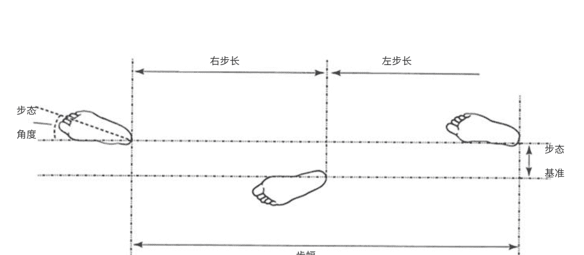

## 图1 步幅、步态角度和步态基准

- 步幅是同一只脚连续初始接触点之间的距离。
- 行进方向是一个人行走的延伸方向。
- 足部行进角度/步态角度是足部与行进方向之间的角度偏差。
- 步态基准是左脚和右脚之间的距离。
- 步频是一个人的步数/分钟。
- 一个人的速度以米/秒为单位。

在接下来的章节中，我们将经常使用这些术语。我们的项目比较了两种步态识别方法：

1.  使用步态能量图进行特征提取，并使用各种经典集成机器学习算法进行分类
2.  使用卷积神经网络架构进行特征提取和分类的深度学习算法

最终优化这些方法，输出能够准确预测个体所属类别的高效模型，使用个体的步态作为输入。为了证明我们的算法能够应对步态识别面临的各种挑战，我们还考虑了其他一些因素。我们将在数据集部分[15-18]研究这些因素。

### 2 现有研究

步态识别自2000年代初以来一直是一个研究热点。大多数著名的步态识别技术依赖于步态周期。它类似于摆动的简谐运动，即在人体运动术语中，从静止到左脚向前到静止到右脚向前，然后返回到静止。步态周期包括单个步态周期中的所有图像。此步骤仅针对图像的下半部分进行。

步态高斯图像是一种时空方法，它依赖于通过创建高斯隶属函数在步态周期的基础上创建的图像：

$$\mu_i(x) = e^{-\frac{(x_i - \bar{x})^2}{2\sigma}}$$

其中 $x_i$ 是第 $i$ 帧的相应像素，$\bar{x}$ 补充是像素向量的均值，sigma 是像素向量的方差。然后，每个像素的隶属值都与其相应的像素相乘，并且所有值的进一步平均值给出每个像素的单个值。

步态识别的另一种方法是流的空间分布，它计算图像中几个密集点的光流分量并分析它们的分布。然后，它沿着 $x$ 和 $y$ 轴取所有点的质心

## 图2 空间分布

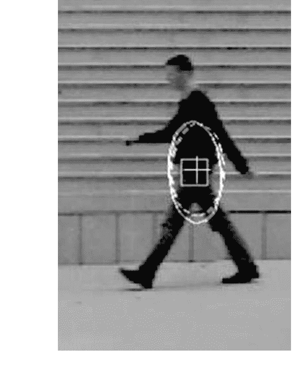

计算惯性分量的轨迹形成一个椭圆；一系列这样的变体椭圆可以唯一地描述每个步态（参见图2）。主轴和次轴的长度也因人而异，它们的角位移也不同。

步态熵图像还使用步态周期作为计算每个像素熵的参数，然后整理成一个GEnI。熵是不确定性或随机性。在这里，对于每个像素，我们计算香农熵，其表示如下方程：

$$H(x,y) = -\sum_{k=1}^{K} p_k(x,y) \log_2 p_k(x,y)$$

其中 x, y是像素坐标， p_k(x, y)是像素取值为 k 的概率。在轮廓图像中，只有两个不同的取值，即黑色和白色，可以安全地假设 K=2。轮廓图像的下半部分的强度值被对齐，然后使用下面的方程进行归一化，输出由 G(x, y)表示的GEnI函数：

$$G(x,y) = \frac{(H(x,y) - H_{\min}) * 255}{(H_{\max} - H_{\min})}$$

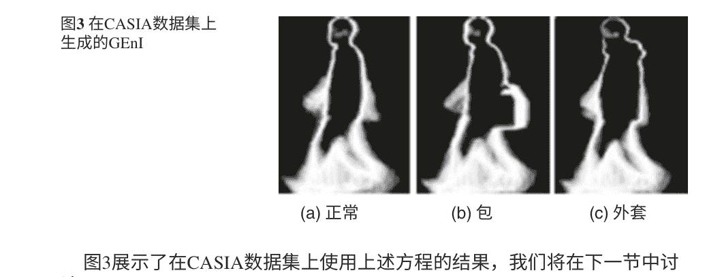

图3展示了在CASIA数据集上使用上述方程的结果，我们将在下一节中讨论。

### 3 数据集

我们使用了CBSR（生物特征与安全研究中心）的CASIA步态数据库。该数据集由中国科学院（CASIA）创建，旨在促进步态分析研究。CASIA由三个不同的数据库组成，数据集A、数据集B（由同一行走和类别的多个角度视图组成的数据集）和数据集C（由热像相机图像组成）。我们只使用了CASIA-B数据库。CASIA-B数据库有124个类别，即使用了124个主体进行创建。每个人有56帧，从11个不同的方向拍摄。通过方向，我们指的是相机角度以0、18、36...、180度拍摄。

总共有六个视频样本，其中三个没有负载，另外三个有负载。总共有8192个特征（128*64）。行走风格包括正常人、穿着外套的人和背着背包的人（参见图4）。

### 4 步态能量图像

这是一种特征提取技术，因此可以在不丢失原始数据集的准确性或信息的情况下降低维度。此外，只有有用的信息被分离出来并作为输入传递给技术过程中的下一步。GEI的一个主要假设是它认为所有类别的帧都以相同的排列方式存在，这是CASIA的一个预先存在的正面特征。

GEI从预处理数据中获取输入，这种情况下是从视频样本中提取的图像样本。当一个人走在相机前面时，相机会捕捉到人的行走方式

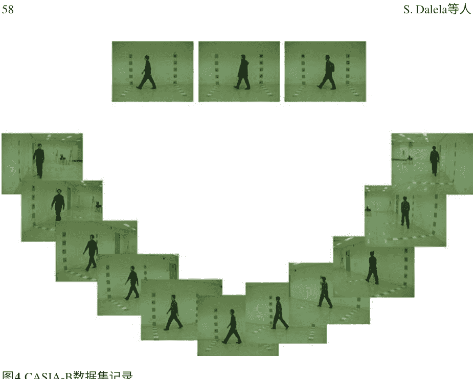

## 图4 CASIA-B数据集记录

图片，因此我们可以使用这些图像来获取人体步态的GEI图像。我们将这些GEI图像作为我们的流水线的输入。用于获取GEI的公式需要计算步态周期和步态频率：

$$G(x,y) = \frac{1}{N} \sum_{t=1}^{N} B(x,y,t)$$

其中B(x, y, t)是步态周期图像后面的序列，N是该视频中行走步态周期的实际帧数。我们需要步态频率，因为行走速度可以改变肢体运动。因此，通俗地说，步态能量图（GEI）是行走人物轮廓所有对应像素的总和除以图像数量。因此，GEI是表示个体步态的一种非常高效和有效的方式。其主要优点在于节省了大量空间，并且几乎不受任何噪音的影响（参见图5）。

在将这些GEI作为输入后，我们对每个轮廓进行了矢量形状的归一化处理，并使用OpenCV对所有图像进行了膨胀以增强白色饱和度。我们进一步利用从GEI中获取的所有特征，并应用了一些集成分类器技术，如随机森林和KNN。尽管两者的结果相当，但KNN的性能稍好，因此后来被用作我们的CNN方法的基准。从KNN中获得的额外优势是它是一种无监督技术，并且在同时用于多个人时可以轻松扩展。

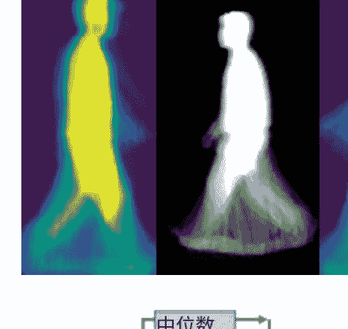

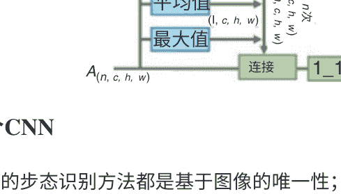

### 5 用于步态识别的CNN

到目前为止，我们讨论的步态识别方法都是基于图像的唯一性；然而，CNN方法将基于序列的唯一性进行操作，即将多个图像视为视频的一部分，以独立的方式重新排列它们，然后将它们映射到多维空间中以识别步态。第一个过程称为集合池化，而第二个过程称为水平金字塔映射，这是一个描述自相关实际工作原理的术语。我们没有使用直方图梯度方向与线性支持向量机进行特征提取，因为与神经网络相比，它们在测试时非常慢，并且需要大量的预处理工作。神经网络虽然在训练时需要更多时间，但能够快速产生更好和更准确的结果。

如其名称所示，集合池化将多个元素（一个集合）作为输入。在进行此操作之前，重要的是确保它可以接受任意数量的元素作为输入，因为数量永远不会固定。现在，性能将根据帧的顺序而变化，就像GEI的情况一样，但由于CASIA已经预先排序，我们实际上不需要重新排列。但为了通用性，我们使用统计函数如平均值和中位数来对所有类型的性能进行归一化。

如图6所示，$n$表示图像的数量，$c$表示颜色通道的数量，$h$和$w$表示2D图像的尺寸。经过数学函数处理后，$n$被重塑为1，并将所有不同的结果连接起来。然后应用$1\times1$卷积进行最终的像素映射，同时降低维度使特征更简单。

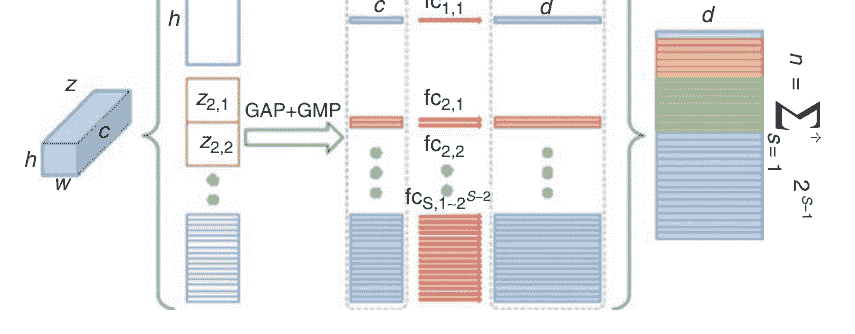

## 图7 水平金字塔映射

水平金字塔映射是一种可以提高步态识别准确性的技术。在这里，我们使用多个全连接层，而不是使用1×1卷积滤波器后跟最大池化和平均池化。这给我们提供了一个描绘不同尺度的条带，进一步描绘了不同的特征。由于条带的宽度不断减小，我们称之为'金字塔'映射。这有助于我们对步态进行分类。图7展示了一个小例子。在现实中，这些金字塔非常密集，大多数对于每个步态都是独特的，这符合我们的分类目的。

### 6 结果

我们选择准确率作为算法的性能度量指标。准确率定义为正确预测的类别数除以提供的样本总数：

$$准确率 = \frac{总正确类别预测数}{总预测数} = \frac{目标数}{总预测数}$$

所有结果是在对所有模型进行超参数调整后获得的，并且代表了它们获得的最佳平均准确率。每个算法的最终准确率是通过计算所有单个类别准确率的平均值得出的。在测试集中，每个类别的样本数都保持相等，以便最终的平均准确率不会偏重任何一个类别。表1显示了我们使用传统机器学习技术对GEI进行分类时获得的结果。

所有分类器中的特征总数保持在8192（128*64）个，以进行公平比较。总共有124个类别（人），每个类别有11个不同的样本。这些样本包含相同的三种不同情况行人行走：即正常、背包和穿着外套。训练和测试的分割在所有情况下都保持在80-20。我们还使用了70-30和60-40的分割，但结果令人失望。表2总结了我们从GEI得到的最佳结果，并将其与我们从CNN得到的最佳结果进行了比较。鉴于神经网络的标准，数据相对较少，但表现同样出色。

## 表1 GEI与集成的结果

| 方法 | GEI + 随机森林 | GEI + SVM | GEI + KNN | GEI + 决策树 | GEI + 朴素贝叶斯 |
|------|----------------|-----------|-----------|--------------|-------------------|
| 准确率 | 95.32%        | 40.65%    | 97.05%    | 55.67%       | 40.13%            |

## 表2 GEI与CNN的结果

| 方法 | GEI | CNN |
|------|-----|-----|
| 准确率 | 97.05% | 95.00% |

### 7 结论

随着机器学习的出现和计算能力的指数增长，步态识别和分析最近成为研究最多的话题之一，在医学法医学、监控和监测领域有广泛应用。我们的研究工作对最近和旧的机器学习算法进行了详尽的分析。首先应用的方法是计算步态能量图，并将其与经典机器学习算法结合使用，特别是在随机森林和KNN等算法中取得了很好的效果。第二种方法使用了卷积神经网络，经过足够的超参数调整后，其结果与经典机器学习算法的准确性相当，考虑到每个类别的样本数量很少，这令人惊讶。但可以肯定的是，如果我们有大量的数据，那么CNN方法将远远优于基于高维统计的经典GEI模型。

### 参考文献

1.  P.Arora和S.Srivastava, “使用步态高斯图像进行步态识别”, 2015年第二届国际信号处理与集成网络会议 (SPIN) , 诺伊达, 2015年, 第791-794页。 https://doi.org/10.1109/SPIN.2015.7095388
2.  J Little, J Boyd。 “通过步态识别人：运动的形状”。 Videre: 计算机视觉研究杂志。 1998年
3.  L Wang, T Tan, W Hu, H Ning. “基于统计形状分析的自动步态识别”。IEEE图像处理交易（卷：12，期：9，2003年9月）。IEEE，2003年。
4.  FM Castro, MJ Marín-Jiménez, N Guil. “人物识别的步态特征自动学习”。国际人工神经网络工作会议。IWANN，2017年。
5.  Yasushi Makihara, Darko S. Matovski, Mark S. Nixon, John N. Carter, Yasushi Yagi. “步态识别：数据库、应用和表示”。Wiley电气与电子工程百科全书。Wiley在线图书馆，2015年。
6.  Sokolova, A Konushin. “基于卷积神经网络的步态识别”。第二届国际ISPRS PSBB研讨会，2017年5月15日至17日，俄罗斯莫斯科。ISPRS，2017年。
7.  S Sarkar, PJ Phillips, Z Liu. “人体识别步态挑战问题”。IEEE模式分析与机器智能交易（卷：27，期：2，2005年2月）。IEEE，2005年。
8.  SXM Yang, PK Larsen, T Alkjær. “关节角度评估的步态变异性和相似性：对法医步态分析的影响”。《法医科学杂志》第59卷，第2期。Wiley Online Library，2013年。
9.  J Preis, M Kessel, M Werner. “使用Kinect进行步态识别”。Martinwerner.de，2012年。
10. F Tafazzoli, R Safabakhsh. “基于模型的人体步态识别：利用腿部和手臂运动”。《人工智能工程应用》第23卷，第8期。Elsevier，2010年。
11. G Ariyanto, MS Nixon. “用于3D步态生物特征的操纵木偶弹簧模型”。2012年第5届国际模式识别协会生物特征学术会议（ICB）。IEEE，2012年。
12. R Tanawongsuwan, A Bobick. “从时间归一化的关节角度轨迹中识别步态”。2001年IEEE计算机学会计算机视觉与模式识别会议论文集。CVPR 2001。IEEE，2001年。
13. CY Yam, MS Nixon, JN Carter. “通过行走和奔跑进行步态识别：一种基于模型的方法”。亚洲计算机视觉会议论文集，ACCV 2002。南安普敦，2002年。
14. J Han, B Bhanu. “使用步态能量图进行个体识别”。IEEE模式分析与机器智能交易。IEEE，2005年。
15. L Wang, T Tan, H Ning, W Hu. “基于轮廓分析的步态识别用于人体识别”。IEEE模式分析与机器智能交易。IEEE，2003年。
16. G Shakhnarovich, L Lee. “从多个视角进行综合人脸和步态识别”。2001年IEEE计算机学会计算机视觉和模式识别会议论文集，CVPR 2001。IEEE，2001年。
17. K Chatfield, K Simonyan, A Vedaldi. “魔鬼细节的回归：深入探究卷积网络”。计算机视觉和模式识别。IEEE，2014年。
18. C Feichtenhofer, A Pinz. “用于视频动作识别的卷积双流网络融合”。2016年计算机视觉与模式识别（CVPR）IEEE会议，第1933-1941页。IEEE，2016年。
19. A Karpathy, G Toderici, S Shetty, T Leung. “基于卷积神经网络的大规模视频分类。”2014年计算机视觉与模式识别（CVPR）IEEE会议，第1725-1732页。IEEE，2014年。
20. K Simonyan, A Zisserman. “用于视频动作识别的双流卷积网络。”神经信息处理系统27的进展（NIPS 2014）。NIPS，2014年。
21. K Yang, Y Dou, S Lv, F Zhang, Q Lv. “基于Kinect的步态识别的相对距离特征。”《视觉通信与图像表示》第39卷。Elsevier，2016年。
22. MD Zeiler, R Fergus. “可视化和理解卷积网络”。2014年计算机视觉欧洲会议。ECCV，2014年。
23. W Hu, T Tan, L Wang. “关于物体运动和行为的视觉监控综述”。IEEE系统、人类和控制论交易。IEEE，2014年。

S. Dalela · S. S. Yadav · P. Ailavadi
NSIT, University of Delhi, New Delhi, India

S. Srivastava (✉)
仪器与控制工程系，尼塔吉·苏巴斯技术大学（前德里大学尼塔吉·苏巴斯技术大学），印度新德里

# 使用机器学习和深度学习技术从语音信号中识别情绪

Gaurav Kataria, Akansh Gupta, V. Sirish Kaushik和Gopal Chaudhary

### 1 引言

智能不仅仅是拥有经验知识、流体智力和高记忆力，还包括感知和理解情绪的能力。因此，为了开发一个真正智能的人机交互AI系统，情感智能是必需的[1]。要理解如何制作一个智能的AI，我们需要理解人类如何感知或识别情绪。

人类可以通过可见、可听和可言表达的方式感知到底层情绪。同样地，人工智能系统或情感识别系统可以通过视频输入感知到可见线索，如面部表情、手势或身体动作，通过语音输入感知到可听线索，并通过语言内容感知到以语言形式表达的线索。除了面部表情外，语音是表达情绪的主要来源之一，因此对于自然的人机界面来说，识别、解释和回应以这种形式表达的情绪非常重要，这也是本文的主要关注点。语音输入包括多个特征，如频谱特征、韵律特征和语言特征[2]。从语音中识别情绪是一项具有挑战性的任务，它在特征提取和分类过程中严重依赖于选择要提取的语音特征以及它们的有效性。在本文中，同时利用了频谱特征和韵律特征。

如今，人工智能系统识别情绪的能力是一个令人着迷的课题，并且在许多领域具有广泛的应用，例如临床研究、呼叫中心、车载驾驶系统、电脑游戏、在线辅导和虚拟助手。情感识别系统可以用于电话对话的音频监控，以帮助犯罪调查。这些系统还可以在电子学习中有效地使用，因为了解学生的情绪状态可以帮助提高学习效果。教学质量[2, 3]。这篇研究论文分为六个部分组织。第1节介绍了SER系统的主题。 第2节探讨了相关工作，第3节解释了论文的方法。 第4节展示了模型取得的结果，第5节总结了研究论文。参考文献在最后一节中提到。

### 2 相关工作

许多研究人员已经探索了选择正确的特征组合、使用的数据库和要实现的模型架构的问题[4-6]，本文中的一些相关内容如下所示。

Lim等人[7]提出了一种使用时间分布的卷积神经网络模型来识别语音情感的新方法。 本文的作者提出了使用混合分类器的方法，因为它们从不同的角度得出证据。 这些证据的组合提高了模型的性能。 他们使用柏林数据库对他们的网络进行测试和训练。 他们提出的方法包含两个卷积层和两个LSTM层，一个接一个地使用dropout和其他特定的超参数，在情感的二分类上分别达到了88.01%和86.65%的精度和F1分数。Mirsamadi等人[8]提出了一种新的特征池化策略，该策略使用局部注意力来关注语音信号中具有情感色彩的特定区域。 他们使用IEMOCAP数据集从每秒100帧的25毫秒段中提取了原始谱特征和手工制作的LLDs。 他们比较了多个分类器（如DNN、SVM和RNN）在不同的时间聚合技术下的性能。 他们提出的策略在所有其他分类器中表现最好，WA为63.5%，UA为58.8%。Sarma等人[9]提出了基于原始语音波形的深度神经网络用于分类情感识别。 将多个不同的特征（如MFCC特征、时域特征和频域特征）输入到基于DNN的模型中，并比较相应的准确性。 在这里，基于时域特征的DNN模型表现最好，WA为65.5%。然后，他们训练了一个基于TDNN-LSTM的注意力模型，其WA为66.3%，UA为60.3%，超过了其他分类器。 在未来，Sarma等人计划在多维空间中研究情感识别。

Khanchandani等人[10]使用了柏林数据集进行情感识别。 语音样本经过噪声过滤和归一化处理。 在此之后，提取了熵和格式频率特征，并将其输入到多层感知器神经网络(MLPNN)和广义前馈神经网络模型中，二者在二分类上的准确率分别达到了89.62%和98.08%。 Iqbal等人[11]提出了一个实时情感识别系统，通过分析音高特性从实时录制的语音中识别情感。

本文的作者使用了RAVDESS和SAVEE数据集，并从中提取了34个音频特征。从这些样本中提取了音频特征。 他们实现了三个分类器，分别是SVM、KNN和梯度提升，其中SVM的性能超过了其他所有模型。

### 3 方法论

该项目涉及多个步骤，首先导入了RAVDESS和SAVEE数据集[12, 13]。 使用标准化技术对数据集进行了预处理，并从中提取了谱和韵律特征。 然后，将数据集划分为训练集和测试集，比例为80%和20%。 对两个数据集分别进行了六个模型的训练和测试，并进行了合并。 记录了所有六个模型在不同输入变化下的分类准确率。 下面的小标题进一步详细解释了每个步骤（图1）。

#### 3.1 数据集

本研究使用了两个数据集，RAVDESS和SAVEE数据集。 RAVDESS数据集包含了八种情绪，包括平静、快乐、悲伤、愤怒、恐惧、惊讶、厌恶和中性。这些情绪由12名男性和12名女性演员表达，他们都具有中性的北美口音[12]。 SAVEE数据集也包含了相同的八种情绪，由四名英国男演员以不同的强度变化来表达，即正常和强烈的强度[13]。 这两个数据集都是演员模拟情感语音数据集，这种数据集非常受欢迎，因为它们在数据收集技术方面具有许多固有优势，例如引发和自然数据收集技术。 这些数据库的优点如下：

- (i) 由于这些话语是在录音棚中录制的，音频信号具有高音频质量，并且不含或只含有少量噪音，这有助于预处理阶段。
- (ii) 情绪表达在整个话语中是平衡的，并且情绪表达的高强度使分类过程更容易。

#### 3.2 预处理和特征提取

在特征提取过程之前，对语音信号数据库进行了标准化处理。 数据标准化是将一个或多个属性或特征重新缩放，使其具有均值为0，标准差为1的高斯分布特性的过程。 这样做是为了使输入数据更易处理并保持其重要性。 在预处理之后，在特征提取过程中提取了谱特征和韵律特征。 对于谱特征，提取了40个MFCC、12个色度特征、谱质心等，而对于韵律特征，考虑了过零率、均方根等[14]。 MFCC特征共同构成了梅尔频率倒谱，它是输入信号的短时功率谱的表示。 色度特征以一种简洁的形式表示音频信号的音调内容(图2和图3)。

均方根（RMS），过零率（ZCR）和谱质心（centroid）的定义如下：

$$ \text{RMS}\{x[n]\} = \sqrt{\frac{1}{N}\sum_{k}x^2[n]} \quad (1) $$

$$ \text{zcr} = \frac{1}{T-1}\sum_{T-1}^{t=1}1_{\mathbb{R}_{<0}}(s_t s_{t-1}) \quad (2) $$

$$ \text{质心} = \frac{\sum_{n=0}^{N-1} f(n)x(n)}{\sum_{n=0}^{N-1} x(n)} \quad (3) $$

图2 获取MFCC特征的过程

图3色度特征提取过程的块图

#### 3.3 支持向量机

支持向量机（SVM）算法在分类问题上最有效。 它可以根据不同的核函数用于线性和非线性分类。 SVM是贝叶斯学习的一种替代方法。 它取决于基于距离选择的支持向量。 靠近决策边界的点被称为支持向量。 点距离边界的距离越大，置信度越高。 该模型完全依赖于选择的支持向量和距离度量。 在这个实验中，使用C=8和核函数为'rbf'的SVM算法进行了应用。 这个算法胜过了所有其他分类算法。

#### 3.4 多层感知器神经网络

多层感知器神经网络是一种前馈网络，用于分类问题。 这种类型的神经网络在语音识别和图像识别中被广泛使用，因为它具有以随机方式解决问题的能力，这通常允许对情感识别等复杂问题进行近似解决[10]。 本文提出的MLPNN模型由500个隐藏层组成，使用ReLU激活函数和恒定的学习率0.001，并采用Adam优化器。 MLPNN中使用的批量大小为16。 所有其他参数均设置为默认值。

#### 3.5 卷积神经网络

本文介绍的卷积神经网络模型包含两个卷积层，卷积核大小为8，并采用ReLU激活函数。第一个卷积层包含128个滤波器，而第二个卷积层包含256个滤波器。每个卷积层后面都跟着一个最大池化层，池化大小为5。在这些层之后是一个扁平化层和三个全连接层，前两个全连接层有256个输出神经元，并采用ReLU激活函数，而第三个层有8个输出神经元，并采用softmax函数。下图显示了卷积神经网络模型的架构（图4）。

使用的超参数值在下表（表1）中提到。

### 4 结果

基于在RAVDESS数据集上训练和测试时达到的分类准确率，对所有六个模型的性能进行了比较分析，结果见表2。在RAVDESS数据集上，卷积神经网络模型表现最好，达到了70.83%的分类准确率。

对SAVEE数据集的所有模型进行了比较分析，结果见表3。对于这个数据集，多层感知器神经网络（MLPNN）表现最好，分类准确率达到了75%，超过了SVM和逻辑回归方法。

模型在RAVDESS和SAVEE的组合上实现的分类准确率见表4。在这里，SVM和MLPNN实现了相同的分类准确率，为68.22%（表5）。

下面是CNN、SVM和逻辑回归模型的ROC曲线图（图5、6和7）。

从上述比较分析可以得出结论，MLPNN模型表现出最佳且一致的性能，在三种不同的输入变化下平均准确率达到了70.65%。

### 表1 CNN模型中使用的超参数值

| 超参数值 | |
| --- | --- |
| 损失函数 | 稀疏分类交叉熵 |
| 学习率 | 0.00002 |
| 丢弃因子 | 0.3 |
| 衰减 | 0.9 |

### 表2 模型在RAVDESS数据集上的准确率

| 分类器 | 分类准确率 (RAVDESS) |
| --- | --- |
| 逻辑回归 | 52.78% |
| 随机森林 | 61.81% |
| 多层感知机神经网络 | 68.75% |
| 卷积神经网络 | 70.83% |
| 支持向量机 | 70.13% |
| K最近邻 | 61.11% |

### 表3 模型在SAVEE数据集上的准确率

| 分类器 | 分类准确率 (SAVEE) |
| --- | --- |
| 逻辑回归 | 70.83% |
| 随机森林 | 68.75% |
| 多层感知机神经网络 | 75.00% |
| 卷积神经网络 | 61.46% |
| 支持向量机 | 70.83% |
| K最近邻 | 63.54% |

### 表4 模型在RAVDESS和SAVEE数据集的组合上的准确率

| 分类器 | 分类准确率 (RAVDESS+SAVEE) |
| --- | --- |
| 逻辑回归 | 44.01% |
| 随机森林 | 60.68% |
| MLPNN | 68.22% |
| CNN | 65.46% |
| SVM | 68.22% |
| KNN | 58.33% |

### 表5 模型在RAVDESS数据集上的二分类准确率

| 分类器 | 二分类准确率 (RAVDESS) |
| --- | --- |
| 逻辑回归 | 93.51% |
| KNN | 93.5% |
| SVM | 96.10% |
| MLPNN | 90.55% |

### 5 结论和未来工作

本文使用RAVDESS和SAVEE数据集提取光谱和韵律特征。机器学习和深度学习模型用于分类目的。在六个模型中，MLPNN表现最佳，在三种不同输入变化下的平均准确率为70.65%。其他模型如CNN和SVM在RAVDESS数据集上也表现出色，分别达到70.83%和70.13%的分类准确率。

在未来的工作中，本文的作者旨在通过微调每个参数和超参数以及使用混合分类器来提高所有模型的分类准确率。通过使用更大的数据集，可以提高模型的整体性能。

### 参考文献

- 1. 黄凯阳，吴春华，洪秋波，苏明辉，陈宇航（2019年5月）。考虑语言和非语言语音的深度神经网络语音情感识别。在ICASSP 2019-2019 IEEE国际声学、语音和信号处理会议（ICASSP）中（第5866-5870页）。IEEE。
- 2. Steidl, S. (2009). 自发儿童语音中与情绪相关的用户状态的自动分类（第1-250页）。德国埃尔朗根：埃尔朗根-纽伦堡大学。3. Koolagudi, S. G., & Rao, K. S. (2012). 从语音中识别情绪：一篇综述。国际语音技术杂志, 15(2), 99-117。
- 4. Yacoub, S., Simske, S., Lin, X., & Burns, J. (2003). 在交互式语音响应系统中识别情绪。在第八届欧洲语音通信和技术会议上。
- 5. Kwon, O. W., Chan, K., Hao, J., & Lee, T. W. (2003). 通过语音信号识别情绪。在第八届欧洲语音通信和技术会议上。6. Xu, H., Zhang, H., Han, K., Wang, Y., Peng, Y., & Li, X. (2019). 从语音中学习多模态情绪识别的对齐。arXiv预印本arXiv:1909.05645。
- 7. Lim, W., Jang, D., & Lee, T. (2016, December). 使用卷积和循环神经网络进行语音情绪识别。在2016年亚太信号与信息处理协会年度峰会和会议（APSIPA）上（第1-4页）。
- 8. Mirsamadi, S., Barsoum, E., & Zhang, C. (2017年3月). 使用具有局部注意力的循环神经网络进行自动语音情感识别。在2017年IEEE国际会议上，声学、语音和信号处理（ICASSP）(pp. 2227–2231). IEEE. 9. Sarma, M., Ghahremani, P., Povey, D., Goel, N. K., Sarma, K. K., & Dehak, N. (2018年9月). 使用DNN从原始语音信号中识别情感。在Interspeech中(pp. 3097–3101)。
- 10. Khanchandani, K. B., & Hussain, M. A. (2009年). 使用多层感知器和广义前馈神经网络进行情感识别。
- 11. Iqbal, A., & Barua, K. (2019年2月). 使用梯度提升进行实时语音情感识别。在2019年电气、计算机和通信工程国际会议(ECCE)(pp. 1–5). IEEE. 12. http://neuron.arts.ryerson.ca/ravdess/?f=3
- 13. http://kahlan.eps.surrey.ac.uk/savee/Download.html
- 14. Padmaja, J. N., & RajeswarRao, R. (2017). 使用高斯混合模型（GMMs）进行情感无关说话人情感识别系统的分析和识别计算科学和技术的进展, 10(8), 2491-2505.

# 使用主要方向最大差分分析（MDMD）方法进行微表情检测

Rohit Mohta, Raghav Singla, Paras Thareja和Puneet Singh Lamba

### 1 引言

面部情绪是我们日常社交经验的重要方面，因为它们提供了对一个人感受的洞察。微表情是细微且无意识的持续时间不到半秒钟[1]。这些表情在情绪被掩盖时出现[2]，无论是有意识地还是意外地，泄露了隐藏感情的信息。识别这些表情确实在各个领域中都有好处，从检测谎言到帮助心理健康的应用，都能给心理学家提供帮助。这些表情已经成为一种难得的资源，因为它们揭示了信息，否则我们很难知道。在谎言检测系统中无法理解一个线索可能会适得其反，无法了解某人行动背后的真实动机。此外，正确识别微表情可以为心理健康领域提供重要的细节，例如判断一个人是否对自己和周围的人构成威胁。目前，由于微表情的强度低且持续时间有限，许多微表情经常被忽视，这就是为什么这个角色对人类和机器来说都具有挑战性的原因。对于合格的专家来说，Frank等人的分析记录了准确识别和分类微表情的精确度约为47%。因此，领域专家肯定可以通过自动检测这些表情来帮助他们的工作。

自发性微表情数据库很少。目前可用的随机存储库有SMIC [3], CASME [4], CASME II [5], CAS(ME)2 [6]和SAMM [7]。但只有CASME数据集和SAMM数据集收集了动作单元的标签，而不是情绪类型本身。

目前，SAMM和CAS(ME)2数据集似乎是唯一提供如此长视频剪辑的数据库。其他自发性微表情数据集专注于提供短剪辑（经过预处理），仅限于单个微表情。图1提供了一个“长视频”和“短视频”的示例。

只有少量已发表的作品探索了使用长序列视频进行识别 [8–11]。话虽如此，有几项研究探索了微表情的定位；然而，由于它们尚未拥有足够长的视频序列，很难确定这些技术在CAS(ME)2和SAMM中给出的长视频帧上的性能，这就是为什么在长视频中检测微表情仍然存在重大空白的原因。

本章提出了一种使用主方向极大差分分析（MDMD）技术的方法。它利用光流主方向的显著差异来检测面部运动。MDMD技术中使用了三个帧而不是单个帧。在这些帧集之间，应用了光流方法。所提出的方法在CAS(ME)2上的F1得分为0.0376，在SAMM上的得分为0.0445。

#### 1.1 挑战

情绪表达的识别和识别性能仍有很大的改进空间。本节讨论了当前数据集和困难中发现的问题。

数据库当前的大部分数据库都包含来自特定国家或社区的几个主题。尽管基本表情是普遍的，但不同文化的参与者可能以不同的方式传达，或者至少在表达这些情绪的复杂程度上有所不同，因为他们会有不同的表达形式。因此，一个完整的数据集将提供各种不同的民族社区，以有效地推广结果。

## 地标检测
过去10年中的面部地标检测算法取得了相当大的进展，但可用的检测器通常不可靠或不一致。不准确的地标导致异常的面部朝向，可能导致与复杂面部表情相关的大量噪音。因此，它们使得正确识别MEs变得更具挑战性。因此，需要更复杂、可靠的面部地标检测来正确准确地识别面部的地标。

## 情感类别
一些已建立的项目考虑了多个情感类别，而不仅仅是数据集中给定的类别。首先，SAMM中的作者仅考虑了三个或四个情感标签（即积极、消极、惊讶或其他），而不是原始CASME II情感标签（即快乐、悲伤、厌恶和其他）。由于情感类别数量的减少，分类过程可能相对简单一些，与具有更多情感类别的情况相比。因此，已经报道了更好的整体性能，但这也阻止了这些作品在其方法的优点上对所有其他作品进行适当的性能测试。

### 2 动机
微表情[12, 21]是揭示一个人任何隐藏情感的特征。这是由于微表情的自发性质。由于微表情的平均持续时间约为1/4秒，它可以用于各种应用。但是，微表情面临的问题是其检测问题。使其难以检测的特征包括这些微表情的时间间隔显著较短以及用于微表情检测的数据集的限制[25]。

已经有许多尝试获得有效的解决方案来解决这个问题，但并没有取得太大的成功。几乎所有相关工作中，微表情检测过程的准确性都非常低。因此，我们的动机是找到一种能够以合理的准确性有效解决这个问题的方法。

此外，先前应用的方法为我们提供了一些见解，例如检测微表情比仅仅检测面部表情更有用。以前已经有很多关于这个任务的工作，例如：

- I. 使用具有三个正交平面的局部二进制模式直方图[20]
- II. 使用LBP六个交叉点
- III. 使用带有LSTM的卷积神经网络
- IV. 使用光流方法[18]

我们更加关注光流方法，使用主方向均值光流的变体，因为这是一种获取一些有用见解的优秀方法，用于时间表示。

我们还使用了形成矩形框的过程来提取特征，因为我们的数据集中仍然有图像，所以在获取矩形框后基于帧来提取特征有助于摆脱任何冗余信息。我们的动机还来自于微表情识别任务及其应用的巨大潜力。对于数据集，目前没有太多可用于此任务的有用数据集，大部分数据集都是强行制作和实施的。因此，使用新的数据集也对我们有一定的帮助。

虽然在光流方面已经做了很多工作，但大多数技术都集中在单帧考虑上。因此，我们的想法是使用两个数据集（CASME II和SAMM），并在帧之间应用光流方法，以观察表情切换模式的变化。这是一种分析微表情检测中趋势变化的绝佳方式。

## 涉及3个数据集
本节介绍了一些可用于微表情检测任务的数据集以及我们使用的数据集。据我们所知，已经发表了大约15个用于微表情的数据库。最早发布的两个数据集，Canal9（2009年发布）和York-DDT（2009年发布），现在已经不再使用，原因是它们并不专门用于微表情检测任务。尽管大多数用于研究的数据集都是专门设计用于微表情检测，但几乎所有基于深度学习的方法都存在缺乏高效数据库的问题。这个问题主要是因为这些方法需要大量的数据。

在这项任务中使用的一些著名数据集如下：

#### 3.1 SAMM
创建此数据集的目的是记录具有显著种族、分辨率和年龄分布的微面部运动的自发数据集。这是一个记录速度最快的数据集，其中包含了七种高分辨率的主要情绪，录制速度约为200fps。此外，它是在没有实验室的情况下在受控环境中录制的。为了使其适用于实验目的，每个参与者都观看了一个视频，而不是获取自我报告[7, 40]。

所有动作单元的发生频率是从两组持续时间中获得的：

- A. 直到第100帧
- B. 从第101帧到第166帧

最初包含在SAMM数据集中的样本数量为159，但后来使用了一个仅包含147个视频的新版本SAMM长视频数据集。涉及的宏观运动数量为343，涉及的微观运动数量为147。此外，为了帧参考，三个主要帧的索引 - 起始、顶点和结束 - 也以Excel文件的形式存储。

##### 3.1.1 实验设置
相机 *Basler Ace acA2000-340 km* 用于以200fps记录视频，所使用的分辨率为2040 * 1088像素。

照明 为了避免图像上的闪烁，使用了两个带有LED阵列的灯光。 此外，还使用了扩散器。 这样做是为了使光线均匀地分布在参与者的脸上。

高速数据捕获 为了记录视频，使用了由固态设备组成的RAID阵列，确保不会丢帧。

#### 3.2 CAS(ME)2
这是第一个适用于宏观表情和微观表情检测的公开可访问的数据库。 两种类型的表情都是从相似的参与者在同一实验室中录制的。

它可以分为两部分：“A”和“B”。A部分总共有87个包含微观表情和宏观表情的长视频。 B部分有357个总共的裁剪样本，其中只有57个是微观表情（如表1所述）。

为了记录，共有22名受试者（9名男性和13名女性），平均年龄为22.59岁，共有98个长视频。 作为帧参考，三个主要帧的索引-起始、顶点和结束-也以Excel文件的形式存储。 除此之外，眨眼也被标记为起始和结束。 为了选择表情样本，总共引发了600个面部运动。

此外，为了引发表情，从20个可用视频选取了九个（情感）视频。 使用的三种情绪是“厌恶”，“愤怒”和“快乐”。

### 表1 宏观表情和微观表情的解释性数据
| 表情类型 | 数量 | 平均(ms)长度 | 长度的偏差 |
| :--- | :--- | :--- | :--- |
| 观表情 | 300 | 1303 | 651 |
| 微观表情 | 57 | 419 | 66 |

### 表2 用于在SMIC中引发情绪的视频剪辑[3]
| 剪辑名称 | 来源 | 情绪 | 时间 |
| :--- | :--- | :--- | :--- |
| 粉红火烈鸟 | 电影 | 厌恶 | 50秒 |
| 地狱使者 | 电影 | 厌恶 | 87秒 |
| 冠军 | 电影 | 伤心 | 258秒 |
| 狮子王 | 电影 | 伤心 | 120秒 |
| 闪耀 | 电影 | 恐惧 | 343秒 |
| 那个东西 | 电影 | 恐惧 | 204秒 |
| 摩羯座 | 电影 | 惊喜 | 47秒 |
| 爱情海洋 | 电影 | 惊喜 | 9秒 |
| 有趣的瞬间1 | YouTube | 快乐 | 112秒 |
| 搞笑猫 | YouTube | 快乐 | 141秒 |
| 玛丽有件事 | 电影 | 快乐 | 141秒 |
| 教堂 | YouTube | 快乐 | 84秒 |
| 当哈利遇到莎莉 | 电影 | 快乐 | 173秒 |
| 意大利去马耳他 | YouTube | 快乐 | 73秒 |
| 有趣的瞬间2 | YouTube | 快乐 | 148秒 |
| 班尼和琼 | 电影 | 快乐 | 131秒 |

#### 3.3 SMIC
尽管在SMIC之前，许多数据库是通过训练人员并要求他们表现微表情来设计的，但那只是一个强制性的数据集。SMIC在记录时与其他数据库不同之处在于，参与者在观看不同的电影时，记录了他们的原始表情（如表2所述）。

获取此数据库的两个要求如下：

I. 收集参与者情绪的刺激必须强烈，以便能够捕捉到他们的情感在他们的脸上。

II. 必须有压力才能获得参与者的真实感受。

SMIC是本能的；参与调查的总人数为20人，其中6人为女性，14人为男性。对于最初的十个成员，使用的相机是高速摄影机，设置为以100fps的速度记录1，分辨率为640*480。

## 4相关工作
有各种方法可以用于微表情识别[28-38]。其中一部分方法如下所述：

#### 4.1 Apex-Time网络（ATNet）
Apex打包可以简单地描述为只有基本信息可用的情节。通常的做法是使用神经网络，如卷积神经网络（CNN）或长短期记忆（LSTM）来分离空间和瞬时特征，并最终进行完全相关层的表示。提出了一种名为ATNet的双流神经网络，其中一流从峰值图中学习空间特征，另一流从相邻边缘中学习瞬时特征。空间流包括对峰值图进行空间信息提取的Res-10框架。相反，典型流会在峰值图周围的帧上应用堆叠的普通LSTM序列，以分离瞬时流。如图2所示的框架配置将学习连续图像（CNN和LSTM）的空间和时间组件相结合。所提出的方法处理三个数据集：CASME-II、SAMM和SMIC（图2）。

#### 4.2 微表情STCNN
提出了一种微表情STCNN模型，该模型可以分离表情视频的空间和时间特征以进行识别。利用微表情STCNN模型，在基准微表情数据集上取得了前沿的执行效果。

微表情STCNN在短时表情中利用时空高亮特征，其中最大的需求使用3D-CNN。微表情STCNN的设计如图3所示。微表情STCNN模型的输入估计为w h d，其中w和h设置为64，在本文中特别指定，而d的分析则取决于所使用的数据集。提出的微表情STCNN模型由3D卷积层、3D池化层、全连接层、激活函数和dropout组成。3D卷积层通过应用三维卷积操作来分离空间和时间特征。与二维卷积神经网络不同，三维卷积神经网络还使用了直接的时间路径[16, 26]。3D池化层连续地在保持主要特征的同时，降低了3D卷积层的估计产量。 3D池化层选择了小的时空窗口中的最佳片段划分。在结构中使用dropout可以减少模型在过度训练测试中的过拟合。 dropout被用来限制所提出的关联。 密集或完全连接的层需要在系统中引入更多的非线性，以提取不同级别的融合。

softmax层用于为使用的数据集的类别生成类别分数。 该结构由堆叠的一层32个3x3x15尺寸的3D卷积层、一层3x3x3的3D池化层和两个全连接（密集）层组成。 完全连接层的最后一部分取决于数据集中的表达计数。 使用的数据集是CASME(2)和SMIC。

#### 4.3 使用递归神经网络在光流特征上的方法
在这种方法中，直方图定向光流策略（HOOF）部分被移除，以编码选定面部区域中的世界变化。 最后，RNN发现有限的能力来关注可能包含物质面部微小变化的事件。 该提议的技术在SAMM数据库上进行了评估。通过使用Leave-One-Subject-Out交叉验证来训练RNN，排除了任何主观倾向的可能性。 该过程包括三个主要部分：

- (A) 预处理: 使用Dlib中的默认人脸识别器首次识别人脸, 得到一个包含人脸的边界框, 然后我们用它来调整人脸。 此外, 我们使用imutils包中的一个便利函数, 该函数首先使用Dlib库内的预训练人脸检测器对调整后的图像进行人脸兴趣点的限制。然后, 该安慰工作通过识别的兴趣点计算出两只眼睛的中心原因。 因此, 脸部被调整, 使得眼睛处于同一水平线上。 最后的预处理步骤包括移除感兴趣区域（ROI）, 如图4所示。
- (B) 特征提取: 在特征提取阶段, 使用了定向光流直方图 (HOOF), 它是一种基于光流的运动特征, 用于提取小尺度表情的重要信息。 这个阶段是必需的, 因为LSTM在学习时间条件时需要一个表示, 所以当我们使用图像数据时需要它。 通常情况下, 会使用卷积神经网络 (CNN) 来自动提取这样的表示。 由于训练样本数量较少, 所以使用手工制作的特征, 与原始像素数据相比, 它具有更高的信噪比。
- (C) 微表情检测: 在提出的策略中, 该阶段的目标是判断一个短时间段W是否包含了一个显著较小规模的发展。通过精心组装的亮点进行实验表明, 观察限制使得微小表情能够被合理地区分出来, 而无关的面部动作则不能。 边界的一个问题是它们随着我们获得更多的信息，情况并没有变得更好。因此，提出了一种策略来利用由长短期记忆（LSTM）单元组成的递归神经网络（RNN）来区分相关和无关的微表情发展。我们决定使用LSTM，因为它可以解决与RNN相关的梯度爆炸和梯度消失问题[18, 19]。

### 5 方法
本节介绍了微表情检测过程中涉及的阶段。 在我们的方法中，我们只使用了两个数据集 - SAMM和CAS（ME）2。SMI C没有被使用。CAS（ME）2和SAMM之间的比较显示在表3中。 所涉及的步骤是：

#### 5.1 预处理
表情检测完全基于面部区域。因此，对于所有样本，首先，获取帧，然后裁剪并进一步调整大小。对于第一帧，定位一个矩形框，使其包围整个面部区域。然后，对于视频中的每一帧，进行调整大小和裁剪以适应上一帧。 边界框的检测是“Dlib”函数的结果，该函数用于检测人脸。首先，从“Dlib”函数中定位关键点。 大约有68个关键点。该函数返回一个关键点列表，如L1，L2，L3...，L68。相应地，标记了坐标，其一致性与OpenCV工具包相关。其中，x轴表示水平方向，y轴表示垂直方向[13-15]。 然后，通过计算每一帧中的一些额外关键点来评估面部区域的确切位置；这些关键点是角点关键点，基本上是最右侧、最左侧、最底部和最顶部的关键点。类似地，对于所有帧的所有角落，提取了坐标。在裁剪的图像上，通过一些预训练网络进行关键点的定位。

表3 CAS(ME)2和SAMM [13]之间的比较
| 数据集 | CAS(ME)2 | SAMM |
| --- | --- | --- |
| 成员 | 22 | 32 |
| 帧每秒 | 30 | 200 |
| 分辨率 | 640*480 | 2040*1088 |
| 微表情 | 57 | 159 |

此外，检测到的关键点并不准确，因此仍然存在一些获取每个主体的冗余区域的可能性。因此，在预处理之后，计算一些感兴趣的区域（ROI）。感兴趣区域的名称是因为在这一步骤中去除了前一阶段中存在的冗余信息。为了获取ROI，需要在对齐的图像上重新拟合关键点。眨眼会产生噪音，因此在ROI中通常会忽略眼睛，我们也是这样做的。其他制造噪音的点也被忽略，比如嘴巴的中间区域[17]。

由于视频较长，必须确保整个检测过程中脸部的方向是一致的；因此，需要独立处理每一帧的对齐。

### 预处理步骤的算法：

1. 裁剪和调整面部区域
2. 在框架内定位一个矩形形状的包含面部区域的框
3. 使用Dlib中的地标检测函数获取68个面部地标
4. 提取感兴趣的区域

预处理阶段之后进一步将RGB图像转换为灰度图像。这种转换是基于RGB图像可以被理解为三个单独的图像（红色、绿色和蓝色）。为了存储一个RGB图像，我们需要比灰度图像多三倍的位数。因此，为了节省内存，我们将RGB图像转换为灰度图像。此外，为了方便工作，使用灰度图像。这种单层结构在面部和微表情识别任务以及多个图像分割任务中是有益的。处理单层图像还为我们提供了使用独特特征的便利。

### 将RGB图像转换为灰度图像的算法：

1. 导入必要的库。
2. 创建一个带有数据提供者的数据对象。
3. 为RGB图像和灰度图像指定路径。如果灰度路径不存在，则创建一个目录。
4. 定义并获取当前时间。
5. 对于所有视频，将视频转换为帧并存储在img_names中，然后执行步骤6。
6. 对于变量I在img_names中，格式化RGB图像并存储在路径中。然后将RGB图像转换为灰度图像并保存。
7. 最后，将“完成所有”打印到控制台。

为了向模型提供数据集，首先加载和生成预处理的数据，然后进一步使用它。网络使用这个生成的数据。

### 生成数据集的算法：

1. 导入必要的库。
2. 创建一个名为“数据处理器”的数据对象，其中包含数据提供者。
3. 使用数据处理器生成视频并将其存储在“videos”中。
4. 使用扩展名“.txt”存储视频文件。
5. 创建一个空列表。
6. 对于所有的视频，迭代每个视频并使用数据处理器获取帧数，然后重复这个步骤。
7. 格式化帧并将其附加到列表中。
8. 在Video_files中，从上述列表中写入行。

### 5.2 主方向极大差异分析 (MDMD)
MDMD代表主方向极大差异分析。MDMD策略利用光流特征的最大对比度程度来检测面部动作。第一种MDMD策略的单一轮廓预测结果被后处理成合理的视频长度[24]。

表情识别集中在该区域。因此，对每个视频测试进行预处理，通过裁剪和调整面部区域来处理所有帧。对于每个视频，找到在主框中准确限制面部区域的矩形框。随后，通过主框对视频的所有边缘进行裁剪和调整大小。根据面部标记定位边界框是通过“Dlib”工具箱中的相应函数实现的，因为发现直接应用面部识别算法效果不佳[22, 23]。

MDMD: 主导方向最大差异分析技术(MDMD)是在写作中提出的。基本思想是当出现时，面部将经历一个表情生成的过程并返回到一个中立的面部。主要发展方向将同时被反转。通过分析，可以检测出表情。在这里，我们回顾MDMD策略。

给定一个包含n帧的视频，当前帧被表示为Fi。Fi – k是Fi之前的第k帧，Fi + k是Fi之后的第k帧。计算Fi – k帧（头帧）和Fi帧（当前帧）之间的强局部光流(RLOF)。光流被$(u^{HC}, v^{HC})$使用。对于适应，$(u^{HC}, v^{HC})$表示任意点的位移。同样，Fi – k帧（头帧）和Fi + k帧（尾帧）之间的光流被$(u^{HT}, v^{HT})$表示。然后，$(u^{HC}, v^{HC})$和$(u^{HT}, v^{HT})$被转换为极坐标方向$(\rho^{HC}, \theta^{HC})$和$(\rho^{HT}, \theta^{HT})$，其中$\rho$和$\theta$分别表示大小和方向。基于方向$\{\theta^{HC}\}$，所有光流向量$\{(\rho^{HC}, \theta^{HC})\}$被分成方向。图2描述了当$a= 4$时的情况。主导方向$\Theta$是具有最大差异的方向。

光流向量中最重要的数字是标题中的数字。主方向Θ中的原理方向光学向量（ρₘ^HC，θₘ^HC）是光流向量（ρ^HC，θ^HC）在主方向Θ中的向量。

如果一个人在Fi – k保持中立的表情，他/她的情绪表达，例如厌恶，从Fi – k和Fi之间的第一个帧开始并在Fi和Fi + k之间的偏移帧被抑制。随后，外表在Fi + k恢复为中立表情。在这种情况下，Fi和Fi – k之间的运动比Fi + k和Fi – k之间的运动更剧烈，因为表情在Fi + k和Fi – k都是中立的。因此，d’值将会很大。另一种情况是一个人从Fi – k到Fi + k保持中立表情。Fi和Fi – k之间的运动与Fi + k和Fi – k之间的运动类似；因此，d’值将会很小。在一个长视频中，有时一个情绪表达从Fi – k之前的第一个边缘开始并在Fi + k之后的平衡边缘处结束。在这种情况下，如果k被设定为一个小的值，-d’值也将会很小。然而，k不能被选为一个大的值，因为这会影响计算光流的准确性（如图5所示）。

#### 5.3 评估
##### 5.3.1 单个视频的评估
假设剪辑中有$m$个真实区间，并且它们检测到$n$个区间。在重叠评估中，对于一个视频，TP总数被计算为$(a <= m, n)$，因此假阴性 = $m - a$，假阳性 = $n - a$。可以通过以下指标来衡量结果：

召回率 = $a / m$ （1）

精确率 = $a / n$ （2）

F分数 = $2$真阳性 / ($2$真阳性-假阳性-假阴性) = $2a / (m + n)$ （3）

然而，在现实中，视频还存在着复杂的情况，这会改变性能和评估：

- 测试视频中可能没有单一的表情存在。例如，如果$m=0$，则召回率的分母将为零。
- 如果测试视频没有显示任何检测到的区间，即$n=0$，则精确率的分母将为零。
- 对于两种检测方法，如果真阳性的数量为零，则无法比较这两种方法。

图5 两种情况：(a) 热情的表情从Fi−k和Fi之间的平衡轮廓开始，在Fi和Fi+k之间被抑制，并在Fi+k恢复为中立表情；(b) 热情的表情从Fi−k之前的起始轮廓开始，在Fi+k之后的平衡轮廓被抑制。

因此，为了避免这些情况，只记录真阳性、假阳性和假阴性的数量，而不考虑其他指标。

##### 5.3.2 对整个数据集的评估

整个数据集可以被视为一个长视频。分别评估宏观和微观检测的性能结果，然后进行整体评估。使用给定的公式计算整个数据集的性能指标（即精确度和召回率）：

对于宏观表情：

召回率<sub>MaE_D</sub> = A₁ / M₁, 精确率<sub>MaE_D</sub> = A₁ / N₁ (4)

对于微观表情：

召回率<sub>ME_D</sub> = A₂ / M₂, 精确率<sub>ME_D</sub> = A₂ / N₂ (5)

对于整体评估：

召回率_D = (A1 + A2)/(M1 + M2), 精确率_D = (A1 + A2)/(N1 + N2) (6)

计算F-1得分的公式如下所示：

F分数 = 2×(召回率×精确率)/(召回率+精确率) (7)

### 6 结果与讨论

在这种技术中，使用参数“p”来计算阈值，该阈值进一步用于计算F1得分。观察到随着“p”的增加，真正例的数量减少。由于真正例的数量对于结果评估非常重要，因此选择条件（p=0.01）作为基准结果。实验结果的具体情况如表4所示。

微表情的F1得分为0.1196，宏表情的F1得分为0.0082，CAS(ME)2数据集的整体F1得分为0.0376。对于SAMM，宏表情的F1得分为0.0629，微表情的F1得分为0.0364，整体F1得分为0.0445。表4中提供了有关不同性能指标、真正例和假正例的更多详细信息。因此，所得到的结果表明，这种技术产生了具有很高准确性的结果，并且有很大的改进空间。

### 7 结论

我们提出的工作代表了主方向最大差异分析技术，以解决在长视频序列中发现微表情和宏表情的问题，并展示了相同问题的基准方法和结果。MDMD技术被用作基准方法，参数设置根据SAMM长视频和CAS(ME)2进行了调整。在测试结果的后处理中进行了轻微调整，以估计更合理的间隔。研究结果表明，MDMD方法能够提供公平的效率，但仍然存在减少假阳性的困难。

| 数据集 | CAS(ME)² 微表情总体结果 | CAS(ME)² 宏表情结果 | CAS(ME)² 总体结果 | SAMM长视频 数300 列1 | SAMM长视频 数300 列2 | SAMM长视频 数300 列3 |
| :--- | :--- | :--- | :--- | :--- | :--- | :--- |
| | 57 | 357 | 343 | 159 | 502 | |
| 真阳性 | 109 | 21 | 130 | 22 | 29 | 51 |
| FP | 1414 | 5014 | 6428 | 334 | 1407 | 1741 |
| FN | 191 | 36 | 227 | 321 | 130 | 451 |
| 精确度 | 0.0716 | 0.0042 | 0.0198 | 0.0618 | 0.0202 | 0.0285 |
| 召回率 | 0.3633 | 0.3684 | 0.3641 | 0.0641 | 0.1824 | 0.1016 |
| F1分数 | 0.1196 | 0.0082 | 0.0376 | 0.0629 | 0.0364 | 0.0445 |

### 参考文献

- 1. W.-J. Yan, Q. Wu, J. Liang, Y.-H. Chen, 和 X. Fu, “微表情泄露有多快：微表情的持续时间”, 《非言语行为杂志》, 第37卷, 第4期, 217-230页, 2013年7月。
- 2. P. Ekman 和 W. V. Friesen, “非言语泄露和欺骗线索”, 《精神病学》, 第32卷, 88-106页, 1969年。
- 3. X. Li, T. Pfister, X. Huang, G. Zhao, 和 M. Pietikainen, “一个自发微表情数据库：诱导、收集和基线”, 在2013年第10届IEEE国际会议和自动面部和姿势识别研讨会（FG）上, 2013年4月。
- 4. W.-J. Yan, Q.Wu, Y.-J. Liu, S.-J.Wang, 和 X. Fu, “CASME数据库：从中性面孔收集的自发微表情数据集”, 在2013年第10届IEEE国际会议和自动面部和姿势识别研讨会（FG）上, 2013年4月。
- 5. W.-J. Yan, X. Li, S.-J. Wang, G. Zhao, Y.-J. Liu, Y.-H. Chen, and X. Fu, “CASME II: An improved spontaneous micro-expression database and the baseline evaluation,” PLoS ONE, vol. 9, no. 1, p. e86041, Jan 2014。
- 6. F. Qu, S.-J. Wang, W.-J. Yan, H. Li, S. Wu, and X. Fu, “CAS(ME)²: A database for spontaneous macro-expression and micro-expression spotting and recognition,” IEEE Transactions on Affective Computing, vol. 9, no. 4, pp. 424–436, Oct 2018。
- 7. A. K. Davison, C. Lansley, N. Costen, K. Tan, and M. H. Yap, “SAMM: A spontaneous micro-facial movement dataset,” IEEE Transactions on Affective Computing, vol. 9, no. 1, pp. 116–129, Jan 2018。
- 8. J. Li, C. Soladie, R. Sguier, S. Wang, and M. H. Yap, “在长视频序列中检测微表情”, 2018年12月。
- 9. S.-J. Wang, S. Wu, X. Qian, J. Li, and X. Fu, “一种用于从长期视频中检测面部运动的主方向最大差异分析”, 《神经计算》, vol. 230, pp. 382–389,2017年3月。
- 10. P. Gupta, B. Bhowmick, and A. Pal, “基于面部视频的瞬时心率微表情检测的可行性研究”, 在IEEE计算机视觉和模式识别（CVPR）研讨会上, 2018年6月。
- 11. Z. Zhang, T. Chen, H. Meng, G. Liu, and X. Fu, “SMEConvNet: 一种用于从长视频中检测自发面部微表情的卷积神经网络”, IEEE Access, pp. 71143–71 151, 2018年。
- 12. Yee-Hui Oh, John See, Anh Cat Le Ngo, Raphael Chung-Wei Phan, Vishnu Monn Baskaran, “自动面部微表情分析综述：数据库、方法和挑战。”
- 13. A. Moilanen, G. Zhao和M. Pietikainen, “使用基于外观特征差异分析的视频中快速面部运动检测”, 2014年第22届国际模式识别大会。IEEE Aug 2014。
- 14. S. Polikovsky, Y. Kameda和Y. Ohta。基于面部动作编码系统（FACS）的高速视频面部微表情检测。IEICE信息与系统交易, 96（1）：81–92, 2013。
- 15. T. Senst, V. Eiselein和T. Sikora。用于特征跟踪的稳健局部光流。22(9):1377–1387, 2012。
- 16. Z. Zhang, T. Chen, H. Meng, G. Liu和X. Fu, “SMEConvNet: 一种用于从长视频中检测自发面部微表情的卷积神经网络”, IEEE Access, pp. 71143–71151, 2018年。
- 17. M. Shreve, S. Godavarthy, V. Manohar, D. Goldgof, and S. Sarkar, “通过应变模式在视频中实现宏观和微观表情的定位”, 2009年计算机视觉应用研讨会（WACV）。IEEE, 2009年12月。
- 18. S.-T. Liong, J. See, R. C.-W. Phan, A. C. L. Ngo, Y.-H. Oh, and K. Wong, “使用光学应变加权特征进行微妙表情识别”, 计算机视觉-ACCV 2014研讨会。Springer International Publishing, 2015年, pp. 644–657。
- 19. S. L. Happy and A. Routray, “用于微表情识别的模糊光流方向直方图”, IEEE情感计算交易, pp. 1–1, 2017年。
- 20. Y. Wang, J. See, C.W. Phan等, “具有六个交叉点的LBP：减少LBP-TOP中的冗余信息用于微表情识别”, 计算机视觉-亚洲计算机视觉会议。Springer International Publishing, 2014:21–23。
- 21. M. Lyons, S. Akamatsu, M. Kamachi等, “用Gabor小波编码面部表情”, 自动面部和姿态识别, 1998。第三届IEEE国际会议。IEEE, 1998: 200-205。
- 22. M. H. Yap, J. See, X. Hong和S.-J. Wang, “面部微表情大挑战2018总结”, 2018年第13届IEEE国际自动面部和姿态识别会议（FG 2018）, 2018年5月。
- 23. X. Li, X. Hong, A. Moilanen, X. Huang, T. Pfister, G. Zhao和M. Pietikainen, “走向阅读隐藏情感：自发微表情检测和识别方法的比较研究”, IEEE情感计算交易, 第9卷, 第4期, 第563-577页, 2018年10月。
- 24. J. See, M. H. Yap, J. Li, X. Hong, and S.-J. Wang. MEGC 2019 - 第二届面部微表情大挑战。在IEEE自动人脸和手势识别国际会议上, 第1-5页, 2019年。
- 25. D. Matsumoto和H. S. Hwang。证据表明训练读取微表情的能力。动机与情绪, 第35卷第2期: 181-191页, 2011年。
- 26. 贾, 杨清, 埃文·谢尔哈默, 杰夫·多纳休, 谢尔盖·卡拉耶夫, 乔纳森·朗, 罗斯·吉尔希克, 塞尔吉奥·瓜达拉马和特雷弗·达雷尔。“Caffe: 用于快速特征嵌入的卷积架构。”在第22届ACM国际多媒体会议论文集上, pp. 675-678. ACM, 2014年。
- 27. Michiel Verburg和Vlado Menkovski, “使用光流和循环神经网络在长视频中检测微表情”, 2019年。
- 28. Y. Li, X. Huang, 和 G. Zhao,“基于单个顶点帧的微表情能被识别吗？”, 2018年第25届IEEE国际图像处理会议（ICIP）, 希腊雅典, 2018年, pp. 3094-3098。
- 29. M. Peng, Z. Wu, Z. Zhang 和 T. Chen, “从宏观到微观表情识别：使用迁移学习的小数据集深度学习”, 2018年第13届IEEE国际自动面部与姿态识别会议（FG 2018）, 中国西安, 2018年, pp. 657-661。
- 30. X. Duan, Q. Dai, X. Wang, Y. Wang 和 Z. Hua, “从眼部区域识别自发微表情”, 《神经计算》, 第217卷, pp. 27-36, 2016年。
- 31. H. Behzad 和 H. M. Mohammad, “使用卷积神经网络和条件随机场的时空面部表情识别”, 第12届IEEE国际自动面部和姿态识别会议（FG 2017）。
- 32. P. Min, W. Zhan, Z. Zhihao, and C. Tong, “从宏观到微观的表情识别：使用迁移学习在小数据集上进行深度学习”, 2018年第13届IEEE国际自动人脸和姿态识别会议（FG 2018）。
- 33. W. Su-Jing, L. Bing-Jun, L. Yong-Jin, Y. Wen-Jing, O. Xinyu, H. Xiaohua, X. Feng, and F. Xiaolan, “通过迁移长期卷积神经网络进行小样本微表情识别”, Neurocomputing, 2018年。
- 34. Y. Wang, H. Yu, B. Stevens, and H. Liu, “使用局部补丁和lbp-top的动态面部表情识别”，在人机交互（HSI）中，2015年第8届国际会议on. IEEE，2015年，pp. 362–367。
- 35. X. 黄, G. 赵, X. 洪, W. 郑和M. Pietikainen, “使用时空完整局部量化模式进行自发面部微表情分析”，神经计算，卷175，页564-578，2016年。
- 36. G. Jelena, C. Milica, M. Marina, N. Angelina, D. Hasan和A. Gholamreza, “使用微表情自动隐藏悲伤检测。”
- 37. X. 李, J. 于和S. 詹, “基于深度学习的自发面部微表情检测”，在信号处理（ICSP）中，2016年IEEE第13届国际会议。IEEE，2016年，页1130-1134。
- 38. M. Takalkar和M. Xu, “使用小数据集上的深度学习进行基于图像的面部微表情识别”，国际数字图像计算：技术和应用会议（DICTA），2017年。
- 39. Sai Prasanna Teja Reddy, Surya Teja Karri, Shiv Ram Dubey和Snehasis Mukherjee, “使用3D时空卷积神经网络进行自发面部微表情识别”。
- 40. Davison, A. K., Lansley, C., Costen, N., Tan, K.和Yap, M. H., “SAMM：一种自发微面部运动数据集”，IEEE情感计算交易，2016:9(1)，116-129。
- 41. Min Peng, Yu Shi, Chongyang Wang, Xiangdong Zhou, Tao Bi和Tong Chen, “一种新颖的跨数据集微表情识别方法。”

## 深度学习概念：医疗保健

### 第二部分

### 系统

# 使用机器学习预测癌症患者的生存率

"Anjali Raghav, Sharad Vaish和Monika Gupta"

### 1 引言：背景和推动力

#### 1.1 引言

癌症是特定基因体内发生体细胞突变导致基因结构改变的结果。外部因素、内在因素、免疫抑制、个体易感性和生活方式是引发突变的一些原因。

2018年，口腔癌患者的数量增加，新增了35万名患者，其中17万人丧生[1]。口咽癌（OPC），也称为扁桃体癌，是喉部细胞异常生长引起的疾病。这种生长可以局部扩散到喉部的各个部位，如舌根、软腭、扁桃体和咽部壁。通过对喉部异常组织进行活检进行诊断。

活检期间发现的异常细胞的外观、尺寸和范围有助于确定癌症的阶段。OPC进一步根据原因进行分类，如人乳头瘤病毒（HPV）阳性口咽癌和HPV阴性口咽癌。HPV阳性口咽癌是由口腔人乳头瘤病毒感染引起的，而HPV阴性口咽癌与饮酒、吸烟或两者都有关。HPV是一种通过皮肤接触传播的性传播感染。治疗方法包括手术、化疗、放疗或其组合。5年后的存活率约为50%；然而，早期诊断可以延长生存时间[2-4]。

### 本研究的贡献：

- 本文基于社交习惯、诊断时间、预后和治疗来预测患者的生存几率。
- 对六种算法进行了比较分析，以确定不仅提供最高准确性，而且处理时间最短的最佳算法。
- 神经网络和CatBoost的准确性相当，但它们的模拟时间有显著差异，因此选择CatBoost作为最有利的算法。

本文的结构如下：第2节介绍了文献调研。第3节简要介绍了使用的数据集和采用的方法。在第4节中，我们讨论了结果和比较分析。最后，在第5节中，我们总结了我们的发现。此外，列出了参考文献。

#### 1.2 文献调研

许多研究人员已经开发出各种用于口腔癌的诊断和预后的机器学习算法，例如，基于肿瘤浸润淋巴细胞（TIL）的深度学习模型实现了94%的准确率，同时也有助于口腔癌的诊断[5]。通过考虑75名患者的肿瘤、淋巴结和转移（TNM），进一步改善了口腔癌的诊断[5]。这一进展进一步使用多层感知器和高斯混合模型分类器进行实现，分别获得了89.5%和94.18%的准确率[6]。在这项研究中，我们提出了一种算法来预测口腔癌患者的生存概率，类似的工作使用了DeepSurv，并将基于深度学习的生存预测算法与随机生存森林（RSF）和Cox比例风险模型（CPH）进行了比较。RSF的训练和测试准确率分别为0.77和0.764，CPH的训练和测试准确率分别为0.756和0.694，DeepSurv的训练和测试准确率分别为0.810和0.781[7]。一篇研究论文使用了放射组学机器学习方法，如朴素贝叶斯、朴素贝叶斯的装袋和K最近邻，以及J48的提升，证明了机器学习可以预测口咽和口腔鳞状细胞癌患者的肿瘤分级和淋巴结状态[8]。一篇研究论文基于DeepSurv16（一种基于深度学习的模型）和随机生存森林（RSF）17构建了生存模型，并使用训练集构建了基于CPH回归的模型。通过计算Harrell's c-index对这些模型进行了比较[10]。

DeepSurv在三个模型中表现最好；c-index在训练和测试集上表现良好，分别达到0.810和0.781的准确率，其次是RSF（0.770/0.764）和CPH模型（0.756/0.694：训练/测试）。另一篇研究论文使用人工神经网络、决策树、支持向量机和贝叶斯网络来预测每一步的结果，同时治疗头颈癌，但没有对患者的生存预测进行评论[11]。另一篇研究论文处理图像并构建了卷积神经网络神经网络用于改善传统放射学框架的准确性[12]。放射学框架是从传统测量指标（如肿瘤大小、体积等）的响应中提取特征的传统框架。从CNN框架中得到的结果讨论了癌症的概率，而我们正在努力确定患者的预期寿命。另一篇论文使用卷积神经网络，在通过高光谱成像收集的数据上，减少了从颈部切除癌细胞时的手术边缘[13]。基于CNN的方法将鳞状细胞癌（SCCa）与正常口腔组织的肿瘤-正常边缘进行分类，其曲线下面积（AUC）为0.86，对于患者间验证，准确率为81%，敏感性为84%，特异性为77%。另一篇论文使用深度学习方法检查癌细胞在逐步治疗后的状态，但没有提及生存预测[14]。

另一篇论文使用了BoxNet、SmallNet和DualNet对CT分割的淋巴结样本进行分析，以帮助识别淋巴结转移和肿瘤外淋巴结扩展[15]。图像数据用于分类和分割。使用机器学习对OPC进行的研究的主要目标是改进治疗方法并促进癌症类型和阶段的识别。

### 2 方法和数据集

#### 2.1 数据集

数据集来自癌症影像档案[16]，包括606名患者的每个患者的34个特征的表格形式的信息。数据集已经清理，并且删除了信息不完整的患者。该数据集还包括患者的CT（计算机断层扫描）图像。

在这34个特征中，有15个特征被删除，因为每个患者的条目都相同。在这些特征中，有些被删除是因为数据不连续。特征试验患者ID是候选人的识别号码。具有相同条目的特征包括疾病部位（原发癌症部位）、转移（M：在原发癌症部位以外发展的继发恶性肿瘤）、病理（组织或细胞在显微镜下的研究和检查）和初级治疗（放射治疗）。信息不一致的特征包括死亡原因、局部失败、诊断日期和局部失败日期之间的持续时间、区域失败、诊断日期和区域失败日期之间的持续时间、远处失败、诊断日期和远处失败日期之间的持续时间、第二原发癌症、从诊断日期到第二癌症日期的时间间隔（以天为单位）以及PMIDyyy：29506884（这些患者是其他研究的参与者）。

剩下的19个特征被考虑用于建立模型。他们是年龄诊断、性别、ECOG表现状态评分、吸烟PY（吸烟数量）每年吸烟的香烟包数）、吸烟史、饮酒史（饮酒史）、亚部位（口咽部的区域）、肿瘤大小（T）、淋巴结受累（N）、癌症分期（按照第七版AJCC标准）、免疫组织化学（检测细胞或组织中的抗原的方法）、化疗、从诊断日期到放疗开始日期的时间间隔（天）、从诊断日期到放疗结束日期的时间间隔（天）、剂量（单位质量组织吸收的辐射能量）、分数剂量（完整剂量的辐射被分成多个较小剂量）、放疗技术、从诊断日期到最后随访日期的时间间隔（天）以及状态（死亡或存活）。

数据被标记以用纯数字值替换单词（字符串），这将简化处理。替换的数字值是从等式（1）中获得的，它是十位上的列号和个位上的特征号的组合，除了“dead”和“alive”之外，它们分别被标记为0和1，以便进行简单的类别区分。

```
数值 = ( α × 10 ) + β
```

在（1）中，α是列号，β是特征号。

数据集按照80:20的比例划分为训练集和测试集。

#### 2.2 算法

机器学习可以用于疾病识别和诊断、药物发现和制造、医学影像诊断、个性化医学、基于机器学习的行为修改、智能健康记录、临床试验和研究、众包数据收集、更好的放射治疗和疫情预测。最近的研究也使用了类似的方法。在手术前，SVM的Bagging被用来评估脑胶质瘤的恶性程度[17]。同样，随机森林有助于预测早期抗体不相容的肾移植排斥反应[18]。鼓励在生物医学时间序列数据集中使用决策树（DT）集成，以寻求最佳模型准确性[19]。

AdaBoost优化的集成学习广义神经网络被用于对生物医学肺部数据进行成功分析，并以极高的效果对正常和异常特征进行分类[20]。XGBoost被用于检测与疾病相关的复杂细胞系统中最具区分性的通路[21]。CatBoost机器学习被用于预测肺结核病原体的药物耐药性[22]。此外，研究人员使用支持向量机在帕金森病中对运动迟缓进行分类，使用智能手机视频[23]。

本文使用不同的机器学习模型对数据集进行训练。最基本的模型是使用人工神经网络构建的。由于神经网络需要大量的处理时间，因此进一步使用了基于包和提升的先进机器学习算法来提高准确性和减少处理时间。图1显示了本研究中使用的算法来构建不同的模型。下面详细解释了每个算法。

##### 2.2.1 神经网络

人工神经网络是一种集体网络处理设备，其中每个基本处理单元（称为节点）处理给定的数据。它适用于模式识别、数据分类和学习过程。它是一种试图模仿人脑学习方式的人工智能类型。

在ANN的每一层中，单个节点与前一层的所有节点以及下一层的所有节点相连。每个节点对数据进行数学计算 [9]。方程（2）表示每个节点上执行的计算。

$$\hat{y} = \sigma \left( \sum_{i=0}^{n} (w^{i} x^{i}) + b \right)$$

在方程（2）中，ŷ是节点的输出，σ是节点中使用的激活函数，w^i是与第i个输入相关联的权重，x^i是第i个输入，并且b是用于校正输出的偏差。

$$J(w,b) = \frac{1}{m} \sum_{i=0}^{m} \mathcal{L}(\hat{y}^i, y^i)$$

在方程（3）中，J是要最小化的成本函数，L是通过预测输出ŷ^i和实际输出y^i的第i个输入计算得到的损失函数，并且m是与第i个输入相关联的权重。

正如所述，人工神经网络的主要缺点是速度慢。随着数据大小的增加，处理时间将增加。

##### 2.2.2 Bagging

Bagging是一种使用并行方法的集成学习算法。图2显示了引导和Bagging算法的图示表示，其中弱模型被组合以创建最终模型。Bagging涉及独立训练弱模型，然后使用确定性平均策略将它们组合起来。

引导是将原始样本数据集分成子集的过程。引导样本具有两个基本属性，即首先，样本应能够捕捉样本的大部分复杂性以进行良好的近似，其次，样本的大小应足够大，以使原始样本和引导样本之间的相关性不太大。因此，这些引导样本充当从同一分布中抽取的独立数据集。

引导样本被用作独立数据集来执行弱机器学习技术。这些技术将给出不同的模型，这些模型是独立的，并且近似于最终模型。有许多方法可以并行地组合或聚合这些独立模型。例如，在回归模型中，可以使用回归技术（如线性回归）来组合模型的输出。对于分类模型，可以使用分类技术（如决策树、随机森林、支持向量机等）来组合模型的输出。

支持向量分类器算法在方程式4中解释。

$$f\left(x_i\right) = w^T x_i + b$$ (4)

在方程式 (4) 中，$w^T$是权重矩阵的转置，$x_i$是第$i$个输入向量，$b$是偏差。

$$w = w + \alpha . sign\left(f\left(x_i\right)\right)x_i$$ (5)

如果 $xi$被错误分类，则使用方程式 (5) 计算$w$，其中 $\alpha$是学习率。随机森林分类器算法的解释如下：

+ 步骤1- 从数据集中选择随机样本。
+ 步骤2- 为每个样本构建决策树。 获取每个决策树的预测结果。
+ 步骤3- 对每个预测结果进行投票。
+ 步骤4- 选择得票最多的预测结果作为最终预测结果。

在图3中，随机森林算法以图示方式表示。决策树分类器算法的解释如下。在图4中，展示了决策树分类器的图示表示。

$$E\left(S\right) = \sum_{i=1}^{c} -p_i \log_2 p_i$$ (6)

在公式 (6) 中，$E\left(S\right)$ 表示熵，$p_i$表示元素或类别的最高频率概率。

$$IG\left(Y,X\right) = E\left(Y\right) - E\left(Y|X\right)$$ (7)

在公式 (7) 中，$IG\left(Y, X\right)$ 表示信息增益，$E\left(Y\right)$ 表示熵。Bagging集成方法减少了处理数据所需的时间，但准确性不如神经网络那么令人印象深刻。

##### 2.2.3 提升

提升是一种使用顺序方法的集成方法。 提升集成是一种方法，其中制作多个弱模型，并在每个步骤上将它们组合起来以获得更准确或更强大的模型。组合过程涉及每个步骤的模型训练取决于先前拟合的模型。图5显示了自助法和提升算法的图示表示。

提升与装袋类似，都涉及数据的分布，但在模型训练方面有所不同。在装袋中，每个模型都是独立训练的，然后使用它们制作一个平均模型；相反，每个提升模型都根据先前步骤中训练的模型进行拟合，并且最终模型被认为是所有先前制作的模型的平均值。

一些提升算法包括自适应提升（AdaBoost）、极限梯度提升（XGBoost）、CatBoost等。AdaBoost算法的解释如下。

$$D_{t+1} = \frac{D_t(i) \exp \left(-\alpha_t y_i h_t(x_i)\right)}{Z_t}$$ (8)

在公式（8）中，$h_t$是假设或分类器，$\alpha$是分类器的权重，$Z_t$是归一化因子。

提升集成方法比装袋集成方法慢，但处理时间比神经网络少。提升集成方法的准确性与神经网络模型相当。

### 3 结果与讨论

#### 3.1 算法中参数的描述

使用Python编程语言实现了这些算法。由于每个算法使用不同的函数，因此编程各种算法模型时使用了不同的参数。在神经网络中，有3层，其中输入层有19个神经元，隐藏层有5个神经元，输出层有2个神经元。

使用Sigmoid激活函数和Adam优化器，以及分类交叉熵作为损失函数。该模型进行了1000个周期的训练。在决策树装袋中，使用了三个验证拆分，基本估计器为决策树，随机状态为8。使用SVC作为基本估计器的装袋方法有十个估计器（树），随机状态为0。在随机森林中，引导样本设置为true，而oob分数和热启动设置为false。使用Gini准则，最大特征数为自动选择，c cp alpha、最小叶子权重分数和最小不纯度减少设置为0。

随机状态和详细输出设置为0，最小样本叶子数为1，最小样本拆分数、最大深度为2，估计器数量为100。在AdaBoost中，估计器（树）的数量为50，学习率为0.2。在XGBoost中，目标设置为二进制逻辑回归，种子、静默模式、缺失值和线程数设置为无。参数colsample bylevel、colsample bynode、col sample bytree、sub-sample、verbosity、n_jobs、min child weight、reg lambda和scale position weight设置为1，而reg alpha、max delta step和gamma设置为0，学习率设置为0.1，基准分数设置为0.5，booster设置为gbtree，最大深度设置为3，随机状态设置为42，估计器数量设置为100。在CatBoost中，学习率设置为0.3。

#### 3.2 混淆矩阵

描述分类器在一组已知实际值的测试数据上的性能的表格被称为混淆矩阵。在当前的研究中，混淆矩阵有两行两列。当预测结果与实际结果相同时，预测是正确的；否则预测是错误的。顶行有真实死亡、错误死亡，而第二行有错误存活、真实存活。本研究中使用的算法得到的混淆矩阵以表格形式排列（表1）。

**表1 本研究中使用的算法的混淆矩阵**

| 序号 | 名称 | 实际类别 | 预测：死亡 (0) | 预测：存活 (1) |
| :--- | :--- | :--- | :--- | :--- |
| 1 | 神经网络 | 死亡 (0) | 34 | 8 |
| | | 活着 (1) | 1 | 58 |
| 2 | 使用决策树的装袋法 | 死亡 (0) | 36 | 12 |
| | | 活着 (1) | 4 | 49 |
| 3 | 使用SVC的装袋法 | 死亡 (0) | 36 | 12 |
| | | 活着 (1) | 4 | 49 |
| 4 | 随机森林 | 死亡 (0) | 31 | 9 |
| | | 活着 (1) | 2 | 59 |
| 5 | AdaBoost | 死亡 (0) | 32 | 7 |
| | | 活着 (1) | 4 | 58 |
| 6 | XGBoost | 死亡 (0) | 34 | 8 |
| | | 活着 (1) | 3 | 56 |
| 7 | CatBoost | 死亡 (0) | 47 | 3 |
| | | 活着 (1) | 3 | 48 |

#### 3.3 接收者操作特征曲线

ROC曲线是真正例率和假正例率之间形成的曲线。ROC曲线下的面积表示模型在预测中的类别区分度。如果ROC曲线下的面积为1，表示模型可以区分所有类别。如果ROC曲线下的面积为0.5，表示模型的50%预测能够区分类别。如果ROC曲线下的面积为0，表示模型的所有预测与其真实值相反。在工业应用中，ROC曲线下的面积从未观察到为1，因为我们从未获得清晰的区分。本研究中使用的算法的ROC曲线如图6所示。

所有当前算法模型的ROC曲线下面积在表2中呈现。由于神经网络的ROC曲线下面积最大，这意味着神经网络在区分正类和负类方面表现最佳。

**表2 本研究中使用的算法的ROC曲线下面积**

| 姓名 | ROC曲线下的面积 |
| :--- | :--- |
| 神经网络 | 0.93 |
| 带有决策树的Bagging | 0.77 |
| 带有SVC的Bagging | 0.79 |
| 随机森林 | 0.79 |
| AdaBoost | 0.79 |
| XGBoost | 0.77 |
| CatBoost | 0.79 |

#### 3.4 使用算法的比较分析

模型的精确度是所有真正预测结果与所有正类预测结果的比率。模型的召回率是所有真正预测结果与所有实际正类值的比率。F1分数是精确度和召回率的调和平均值。本研究中使用的不同算法模型的精确度、召回率和F1分数在图7中表示。处理时间是系统训练模型所花费的时间。准确率和处理时间在图8中表示。

在图7中，对于“死亡”预测，神经网络显示出最高的精确度，其次是CatBoost和随机森林。此外，CatBoost算法显示出最高的召回率和F1分数，其次是AdaBoost和神经网络。对于“存活”预测，CatBoost显示出最高的精确度，其次是XGBoost和神经网络。随机森林在召回率得分上占主导地位，紧随其后的是XGBoost和CatBoost，而最佳的F1分数是使用CatBoost获得的，其次是神经网络、XGBoost和AdaBoost。在图8中，使用CatBoost获得了最高的准确性，其次是神经网络和AdaBoost，XGBoost和随机森林具有相等的准确性，而XGBoost的处理时间最短，其次是AdaBoost、CatBoost和神经网络，后者具有最长的处理时间。

总的来说，与Bagging算法相比，神经网络和提升算法的性能更准确。尽管XGBoost提供了更快的处理速度，但它缺乏准确性和其他参数；与此同时，CatBoost的处理时间略长，但结果更好。神经网络表现良好，但处理时间显著长于CatBoost。因此，CatBoost算法被认为是用于预测的最佳算法之一。

### 4 结论

人工智能通过处理大量数据、预测结果和改进解决方案来帮助人类。集成学习算法是创新的方法，可以显著减少处理时间而不影响准确性。通过计算准确率、精确率、召回率、F1分数、处理时间和AUC分数对每个算法进行了比较分析，其中提供了最少处理时间的CatBoost算法表现出有希望的结果。尽管神经网络的AUC分数最好，但其处理时间非常长。

### 5 未来展望

随着技术的进步，生物医学研究领域已经完全改变。人工智能正在被用来开发更准确可靠的解决方案。这种未来技术有助于开发可以改善人类生活的方法论。这项研究基于患者的社交习惯和预后，预测了患癌症患者的生存机会。

这为患者带来了乐观情绪，减轻了进一步的治疗。遗传数据也可以被处理，以确定个体患癌症的可能性，并通过基因修复在早期阶段治愈。

### 参考文献

1. Freddie Bray, Jacques Ferlay, Isabelle Soerjomataram, Rebecca L. Siegel, Lindsey A. Torre, Ahmedin Jemal. 2018年全球癌症统计数据：GLOBOCAN估计了185个国家36种癌症的发病率和死亡率。《癌症杂志》. 68(6), (2018).
2. Anna Carolina Omena Vasconcellos Le Campion, Camila Maria Beder Ribeiro, Ronir Raggio Luiz, Francisco Feliciano da Silva Júnior, Herbert Charles Silva Barros, Karine de Cássia Batista dos Santos, Stefania Jeronimo Ferreira, Lucio Souza Gonçalves, and Sonia Maria Soares Ferreira.：口腔和咽喉鳞状细胞癌的低生存率。《国际牙科杂志》, 5815493, (2017).
3. Muhammad Shaban, Syed Ali Khurram, Muhammad Moazam Fraz, Najah Alsubaie, Iqra Masood, Sajid Mushtaq, Mariam Hassan, Asif Loya, Nasir M. Rajpoot.：一种新颖的数字评分用于预测口腔鳞状细胞癌的肿瘤浸润淋巴细胞的无病生存。Scientific Reports 9, 13341, (2019).
4. Rajaguru H., Prabhakar S.K.：使用高斯混合测量和多层感知器进行口腔癌分类的性能比较。第16届国际生物医学工程学会议。61, 123-129。
5. Simon N. Rogers, James S. Brown, Julia A. Woolgar, Derek Lowe, Patrick Magennis, Richard J. Shaw, David Sutton, Douglas Errington, David Vaughan.：口腔癌初次手术后的生存率。Oral Oncology 2009,45(3), 201-211 (2009)。

## 使用深度卷积网络进行皮肤病变分割

**Parul Arora，Nikhil Sharma，Prakhar Bhatt和Abhishek Saxena**

### 1 引言

随着现代化和技术的进步，有明显的事实清楚地证明了皮肤对紫外线（UV）的反应和皮肤颜色类型之间的显著关系。皮肤癌有三种不同类型，包括基底细胞癌（BCC），鳞状细胞癌（SCC）和黑色素瘤。阳光对皮肤暴露部位的影响更大。在最近的一项研究中[3]，发现肤色在患皮肤癌的风险中起着重要因素的作用。

与皮肤较黑的人相比，皮肤较白的人更容易患上皮肤癌。基于这一点，欧洲和西方国家是皮肤癌病例最多的国家之一。另一项证据表明，阳光引起的突变主要发生在二嘧啶位点[12]，这是皮肤癌开始在生物体中从动物到人类的其他部位出现的主要区域。报告的病例数量与紫外线B辐射到达地球表面成指数关系；因此，无法治愈的暴露在太阳紫外线下是非转移性皮肤癌的主要原因。在早期阶段诊断这些部位可以避免癌症的风险。恶性黑色素瘤并不比其他类型的皮肤癌更常见，但由于环境情况不断变化，它在全球范围内特别是在皮肤较白的人中的发病率和死亡率正在增加。但一个不可忽视的事实是，尽管印度次大陆的人们的皮肤中存在黑色素[15]，它可以阻止皮肤癌的发展，但他们也经历着越来越多的皮肤癌病例，如图1所示。

**图1 印度皮肤癌症病例增加的当前情况[15]**

研究发现，在100个案例中，88个案例来自印度的农村地区，这引发了对用各种方法治疗皮肤癌的严重关注。最初的症状包括一个较大的褐色斑点，上面有较暗的斑点，一个变色的痣，以及一个形状不规则且疼痛的病变，会引起瘙痒；因此，医务人员可以选择手动分析的方法，但这本身在印度等发展中国家是一个大问题。因此，更先进的诊断技术作为可靠的替代方法，在区分一个简单痣的特征，即它是良性的还是恶性的方面发挥着重要作用。

人工智能（AI）、深度学习和计算机辅助检测（CAD）在各个健康领域的利用正以指数级增长，因为它们从图像分析到结节检测的非侵入性和快速方法，借助各种多模态扫描[7]。此外，各种人工智能方法的使用也成为皮肤科医生确定各种与皮肤相关问题的重要工具。

恶性黑色素瘤（MM）[19]是全球所有皮肤癌中最致命的一种，如图2所示。因此，早期检测MM与其他类型的癌症在早期阶段的区别对待对于避免并发症和降低死亡风险非常重要。因此，在本研究中，基于恶性黑色素瘤分割的不同挑战和从不同感兴趣区域提取属性的深度学习模型被提出，以帮助后续分类。

> 图2 每年不同类型的皮肤癌死亡率 (Cancer. Net, 2020)

### 2 之前的工作

随着皮肤镜图像数据的增加，恶性黑色素瘤检测领域最近取得了快速发展，促进了各种深度学习模型方法的发展。Pennisi等人[18]使用了一种图像处理技术，Delaunay三角剖分，用于将皮肤癌边界与感兴趣区域分离开来，避免了训练阶段，取得了0.8024的敏感性，0.9722的特异性，0.8966 ± 0.0276的准确性和0.8257的F-measure的良好结果。Li等人[16]提出了病变索引网络（LIN）和病变特征网络（LFN），用于皮肤病变分割，分别达到了0.912和0.848的AUC。Masood和Jumaily[17]研究了各种分类器在皮肤诊断和皮肤病变分析方面的表现，并讨论了相关发现。Uthayakumar和Jayalalitha[21]利用盒计数法和香肠法的分形几何学对MM进行了体外研究。Kohavi[14]进行了关于准确性估计、交叉验证和自助法的广泛分析。Chen等人[5]尝试使用深度学习进行语义图像分割，他们提出了空洞卷积来减少计算量，并在分割中使用了空洞空间金字塔池化，他们将DCNN与条件随机场相结合以提高定位准确性。Jung和Taylor([13])提出了一种细胞核分割方法，他们使用Mask R-CNN和区域建议网络（RPN）对组织病理学图像进行颜色归一化处理。所使用的性能度量是平均Jaccard指数，并使用Adam优化器进行优化。Iglovikov等人([10])提供了分割任务的解决方案，推广了UNet模型架构，并允许使用预训练的(VGG-11)或其他自定义编码器和从VGG-11模型的不同阶段提取的特征作为解码器的输入。

### 3 卷积神经网络

卷积神经网络(CNN)与简单的多层感知器类似，其神经元的操作集中在从图像输入中提取信息并通过单个可微损失函数将标签映射。由于从图像中提取高级细节特征的潜力，CNN在聚类、图像分类、文本分类、图像分析和视频分析等各种任务中被广泛使用。特征提取高度依赖于超参数的选择。对于全连接的CNN，在初始训练阶段，图像被作为输入，并使用移动的卷积核窗口提取边界、清晰度、边缘等特征，如图3所示。

$$f(m,n)=(f*h)[m,n]=\sum_j \sum_k h(j,k)f(m-j,n-k) \tag{1}$$

在方程1中，f表示在使用移动核窗口进行卷积后得到的特征图。从核中获得的特征可以根据其操作属性进行分类，例如边缘检测、锐化、模糊等。根据核的大小[(3*3)，(5*5)，(7*7)]，特征图倾向于产生不同的特征，而较大的滤波器大小将导致在卷积过程中覆盖更大的区域，并增加噪音。更深和更多的卷积系统倾向于更精确地关注感兴趣区域的细微线条信息。

随着深度学习的进步，CNN在许多不同的任务中也很有用，如图像分割、EGG信号识别、视频和文本分析以及预测。对于黑色素瘤检测，我们的重点倾向于整个多样化领域的一侧，即图像分割是一项复杂的任务，它彻底改变了整个图像分析领域。它涉及将单个帧内的多个主体分割成多个段，通过在不同对象的边界之间进行标记，从而实现更有意义的泛化，如图4所示。

图3 信息在卷积神经网络中通过多个层传递的流程

图4 通过深度学习架构在边界之间进行对象标记的过程中的变形

图5 使用深度学习架构（如宽残差网络）进行恶性皮肤黑素瘤分割

因此，图像分割在生物医学图像分析和诊断中也可以是一个重要工具，通过区分健康组织和感染组织，无需进行任何手动活检，用于各种疾病，从致命的癌症到简单的痣。

### 4 宽残差网络

深度学习模型的性能高度依赖于超参数，卷积网络的数量，损失函数和数据量。在最近的发展中，设计了许多更深的卷积网络，如VGG16，VGG19，ResNet50，InceptionV3，InceptionResNetV2，MobileNet和MobileNetV2，以增加深度学习模型提取特定任务的最大细线信息的能力，并且其中大部分显著改进并开辟了处理图像分析典型任务的新维度，产生了密集残差网络[9]，其中包括更深的连接，以提取特定任务的丰富特征，如图5所示。然而，连接的每个部分都会带来性能的改进，但需要较重的设置，参数的增加导致训练时间和资源的增加。Zagoruyko等人[22]通过改进性能、减小深度和最终减少参数数量，增加了宽度残差块，如图6所示。

### 5 提出的模型

我们的HRB-double wide网络（HRB-D）旨在避免复杂的模型。这是一种更小、更强大的技术，用于在获取皮肤镜图像时引入的外部噪声。HRB-D网络由两个主要部分组成：

#### 5.1 双宽残差网络

使用两个并行的宽残差网络分支，第一个是主体（皮肤镜图像），第二个是高斯噪声初始化，以降低信噪比，从而迫使智能区分病变边界和噪声。此外，我们的方法增加了训练阶段的数据流量，从而避免了深度和可训练参数数量的增加。

#### 5.2 HRB 块

皮肤的皮肤镜图像也包含一些不需要的表面，如“毛发”和“胎记”，这些在训练阶段对神经网络获取特征图可能不重要，从而引发问题。因此，我们没有使用显式的预处理，而是引入了一个简单的 HRB 块来帮助模型和区分毛发边界（可能在ROI表面和边界之间重叠）。如图7所示，HRB块连接到两个输入，$W(m, n)$, $H(m, n)$，其中m、n是二维坐标维度。

在 HRB 块中，ME 对两个矩阵进行成对计算，如公式 9.2 所示。

$G(m,n) = M \{wn * m, hn * m\} = \frac{\sum\sum w(i,j) * h(i,j)}{\sum n \sum m}$

图7 HRB块带有两个输入

所提出的架构如图8所示，是一种共识方法，使用(3*3)卷积核滤波器，(2*2)最大池化滤波器，在第二个干细胞中引入0.5单位的高斯噪声，其中来自宽残差网络(WRN)和2D最大池化的输出作为HRB块的编码器部分的输入。

为了解码获得的特征图，使用了一种简单的逐层上升方法，在后期阶段没有使用任何残差或密集连接来获得分割的二进制掩码。

### 6 实验设置

#### 6.1 数据集

这些图像是从ISIC数据集[6, 20]中收集的。ISIC数据集包含了一系列的黑色素瘤皮肤癌图像。ISIC启动了这个项目，以便在早期阶段高效地检测黑色素瘤，并减少其不断增加的死亡率。该数据集包含大约23,000张图像，经过1000-1500张图像的测试和训练。

这是一个由美国癌症协会的ISIC社区提供的8000名患者皮肤镜图像的队列，重点关注病变部位。包括了属于许多异常可疑位置并需要活检的图像。在8000多名患者中，有2500名患者患有临床上值得关注的皮肤癌。

图8 提出的HRB-D网络

#### 6.2 训练、验证和测试集

8000+患者被分成三组皮肤镜图像，训练集有8527名患者，验证集有2500张图像，测试集有1200名患者，训练/验证/测试比例分别为70%、8%和22%。数据集分离过程如下。首先，将数据集分成两组。将训练/验证集设置为70%和30%，以保持测试集的合理样本大小。其次，将训练/验证集分成训练集。

#### 6.3 数据预处理

数据集中的所有皮肤镜图像都已按照公式3进行了标准化处理。

$$Xi\_normalized = \frac{(Xi - \mu)}{std} \tag{3}$$

其中，Xi是皮肤镜图像中的像素，μ是数据的均值，std是数据集的标准差，Xi_normalized是标准化后的像素值。计算时间：CNNs使用NVIDIA Titan X GPU、8个Intel i7 CPU和32GB内存进行准备。整个过程耗时54小时，共进行了250个周期。

### 7 结果与讨论

#### 7.1 结果

借助所提出的模型二进制掩码，生成了分割图像输出，如图9所示。

统计分析输出以准确性和损失的形式通过图10显示。

所提出的模型在准确性和Dice分数方面优于许多已有方法，平均计算时间为1天，如表1所示。

#### 7.2 讨论

本文介绍了一种应用于医学图像分割的新型并行竞争模型。我们的方法消除了对外部对象应用映射模型的需求。所提出的安排是非独占的和可测量的，因为它可以方便地扩展到图像回归和分类问题，如常规图像分析和机器翻译的情况。

实验性发现表明，所提出的WCNs对于组织的识别和定位非常有优势。这对于小的可变尺寸，如黑色素瘤，尤其如此，全局分类任务预计存在强相关性。WCN的训练行为可以从多阶段训练和迁移学习方案中受益。例如，预训练的残差权重在初始化竞争网络时很有用，在微调阶段，可以相应地训练并行的分支。同样，还有很多

图9 通过HRB-D网络生成的二进制掩码，以及在确认的黑色素瘤区域周围的分割热图

- Luiz Paulo Kowalski, André Lopes Carvalho, Antonio Vitor Martins Priante, José Magrin.: 口腔和咽喉鳞状细胞癌远处转移的预测因素。 Oral Oncology 2005,41(5), 534–541(2009).
- Dong Wook Kim, Sanghoon Lee, Sunmo Kwon, Woong Nam, In-Ho Cha, Hyung Jun Kim.: 基于深度学习的口腔癌患者生存预测。 Scientific Reports 9, 6994, (2019).
- Valeria Romeo, Renato Cuocolo, Carlo Riccardi, Lorenzo Ugga, Sirio Cozza, Francesco Verde, Arnaldo Stanzione, Virginia Napolitano, Daniela Russo, Giovanni Improta, Andrea Elefante, Stefania Staibano, Arturo Brunetti.: 利用放射学方法预测口咽和口腔鳞状细胞癌的肿瘤分级和淋巴结状态。
- Arushi Gupta, Garima Gupta.: 随机森林和神经网络在直接营销预测中的比较研究, 智能系统与计算进展, 697, (2019).
- Kim, D.W., Lee, S., Kwon, S. et al.: 基于深度学习的口腔癌患者生存预测. Scientific Reports 9, 6994, (2019).
- Paul Giraud, Philippe Giraud, Anne Gasnier, Radouane El Ayachy, Sarah Kreps, Jean-Philippe Foy, Catherine Durdux, Florence Huguet, Anita Burgun, Jean-Emmanuel Bibault.: 放射治疗中的放射组学和机器学习在头颈癌中的应用. Frontiers in Oncology, 9,174 (2019).
- André Diamant, Avishek Chatterjee, Martin Vallières, George Shenouda, Jan Seuntjens.: 头颈癌预后预测中的深度学习. Scientific Reports 9, 2764, (2019).
- Martin Halicek, James V. Little, Xu Wang, Mihir Patel, Christopher C. Griffith, Amy Y. Chen, Baowei Fei: 使用高光谱成像和卷积神经网络对头颈部癌症的肿瘤边缘进行分类。 Proceedings SPIE 10576, Medical Imaging 2018: Image-Guided Procedures, Robotic Interventions, and Modeling,1057605, (2018).
- A. Jochems, R.T.H. Leijenaar, M. Bogowicz, M. Guckenberger, K. Ikenberg, P. Lambin.: 结合深度学习和放射学以预测口咽鳞状细胞癌的HPV状态。 International Journal of Radiation Oncology, Biology, Physics, 127, S504-S505 (2018).
- Benjamin H. Kann, Sanjay Aneja, Gokoulakrichenane V. Loganadane, Jacqueline R. Kelly, Stephen M. Smith, Roy H. Decker, James B. Yu, Henry S. Park, Wendell G. Yarbrough, Ajay Malhotra, Barbara A. Burtness, Zain A. Husain.: 使用深度学习神经网络预测头颈部癌症淋巴结转移和额外淋巴结扩展的术前识别。 Scientific Reports 8, 14036, (2018).
- Ralph T.H. Leijenaar, Sara Carvalho, Frank J.P. Hoebers, Hugo J.W.L. Aerts, Wouter J.C. Van Elmpt, Shao Hui Huang, Biu Chan, John N. Waldron, Brian O'sullivan and Philippe Lambin.: 口腔咽喉鳞状细胞癌的预后基于CT的放射组学标志的外部验证。 Journal Acta Oncologica,54(9), 1423–1429 (2015).
- 郭正正, 刘天宇和Victor S. Cheng.: 使用特征选择的SVMs Bagging对脑胶质瘤进行分类。 Lecture Notes in Computer Science, Springer, Berlin, Heidelberg, 3916, (2006).
- Torgyn Shaikhina, Dave Lowe, Sunil Daga, David Briggs, Robert Higgins和Natasha Khovanova.: 抗体不相容性肾移植结果预测的决策树和随机森林模型。 Biomedical Signal Processing and Control, 52, 456-462, (2019).
- Alan Jović, Karla Brkić和Nikola Bogunović: 生物医学时间序列分类中的决策树集成。 Lecture Notes in Computer Science, Springer, Berlin, Heidelberg。7476, (2012).
- P. Mohamed Shakeel, Amr Tolba, Zafer Al-Makhadmeh和Mustafa Musa Jaber: 使用离散AdaBoost优化的集成学习广义神经网络自动检测生物医学数据集中的肺癌。 Neural Computing and Applications, 32 (2) , 777-790, (2019).
- Georgios N. Dimitrakopoulos, Aristidis Vrahas和Vassilis Plagianakos: 使用XGBoost分类在生物医学数据中进行通路分析。会议：第10届希腊会议, （2018年）。
- E. B. Postnikov, Anastasia I Lavrova和Diljara A. Esmedlijaeva: 用于预测肺结核病原体耐药性的CatBoost机器学习。IEEE第二届全球生命科学与技术大会（LifeTech）, （2020年）。
- Stefan Williams, Samuel D. Relton, Hui Fang, Jane Alty, Rami Qahwaji, Christopher D. Graham, David C. Wong,: 通过智能手机视频对帕金森病中的缓慢运动进行监督分类, Artificial Intelligence in Medicine, 110, （2020年）。

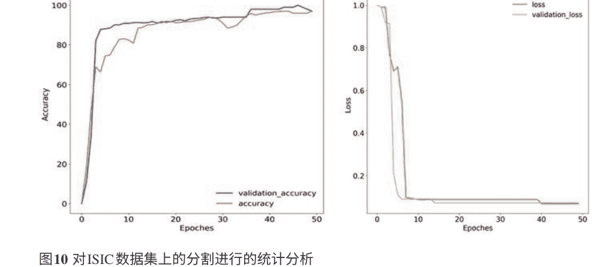

表1 提供的ISIC皮肤镜图像的建议HRB-D网络分割性能结果

| 深度学习模型 | Dice系数 | 准确率 IOU | Jaccard指数 | F1得分 |
| :--- | :--- | :--- | :--- | :--- |
| 分割_集成全部_阈值0.80_T10.65 [2] | 无 | 0.947 | 0.836 | 无 |
| Mask RCnn2 + 分割 [8] | 0.871 | 0.942 | 0.838 | 无 |
| Ensemble_with_CRF_v3 [11] | 0.934 | 0.837 | 0.945 | 无 |
| 通过DCNN进行自动皮肤病变分割 [1] | 0.87 | 0.834 | 0.943 | 无 |
| 通过对抗学习进行皮肤病变分割 [4] | 0.8979 | 0.837 | 0.945 | 无 |
| HRB-D (提出的) | 0.989 | 0.978 | 0.996 | 0.917 |

研究探索不同的机器学习架构。例如，道路系统利用入口广场周围的持久关联，以实现更好的角度回程和稍微柔和的注意力元素。随着皮肤病变图像更加清晰准确，图像处理的精确度召回图（PR图）也随之改善，同时采用更准确和多样化的数据增强技术。最后，需要注意的是，随着改进的GPU计算方法的出现，可以使用更高的批次大小训练更高容量的2D模型，而无需降低像素大小。随着GPU计算的进步，图像的处理速度也得到了提高。在这个项目中，使用了三个NVidia GTX 1050ti的GPU。这样，不需要临时的后处理技术来进一步改善最先进的结果。相应地，通过使用精细目标输入批次，可以进一步提高WCN的性能，而无需额外的启发式方法。

### 8 结论

对于各种身体部位的医学图像分析一直是科学研究人员着迷的领域，使用深度学习技术进行分割和分类使得计算机和人工智能爱好者更倾向于生物科学的世界。通过深度学习和计算机视觉技术，医学图像分析比过去的传统分析方法更加方便。通过深度学习，可以更轻松地找到特征模式和提取，而不像过去的传统方法那样困难。医学图像分析在医学科学的各个领域中都有应用，如肺癌分析和肺癌病变区域分割分析；脑图像分析，例如阿尔茨海默病检测；视网膜图像分析，例如糖尿病视网膜病变；腹部图像分析；肌肉骨骼图像分析；以及其他各种领域。本文详细介绍了深度学习技术的性能，通过特征提取和模式能够对黑色素瘤的病变区域进行分割。通过各种论文、医学图像分析和以前的黑色素瘤分割工作，我们取得了最先进的结果。通过实施最先进的架构，我们得出了结果，为了精确分割病变区域，不仅需要对图像进行上采样和下采样，还需要添加额外的高斯噪声，使网络学习实际图像和噪声图像之间的差异，提取特征和模式。通过这种方法，我们的架构能够与以前在该数据集上的工作相比给出非凡的结果，并且如前所述，通过改进的GPU计算和数据集以及各种数据增强技术，我们取得的结果得到了显著改善，使得皮肤病变的图像处理和分析更加准确和精确。

### 参考文献

- 1. Al Nazi, Z., & Abir, T. A. (2020). 自动皮肤病变分割和黑色瘤检测：基于U-Net和DCNN-SVM的迁移学习方法。在国际计算智能联合会议论文集中（第371-381页）。新加坡：Springer。
- 2. Ali, R., Hardie, R. C., Narayanan, B. N., & De Silva, S. (2019年7月)。用于皮肤病变分析的深度学习集成方法以实现黑色瘤检测。在2019年IEEE国家航空航天和电子会议（NAECON）中（第311-316页）。IEEE。
- 3. Armstrong, B. K., & Kricker, A. (2001) 紫外线诱导皮肤癌的流行病学。《光化学与光生物学B：生物学》杂志，63（1-3）：8-18。
- 4. Bi, L., Feng, D., & Kim, J. (2018)。使用对抗学习的数据增强来改进自动皮肤病变分割。arXiv预印本arXiv:1807.08392。
- 5. Chen, L. C., Papandreou, G., Kokkinos, I., Murphy, K., & Yuille, A. L. (2017)。Deeplab：具有深度卷积网络、空洞卷积和全连接CRFs的语义图像分割。IEEE模式分析与机器智能交易，40（4）：834-848。
- 6. Codella, Noel, et al. (2019) 皮肤病变分析对黑色素瘤检测的贡献 2018: 国际皮肤成像合作组织（ISIC）主办的挑战。 arXiv预印本arXiv:1902.03368。
- 7. Couture, H.D., Williams, L.A, Geradts, J. et al. (2018) 利用深度学习进行图像分析以预测乳腺癌分级、ER状态、组织学亚型和内在亚型。 NPJ BreastCancer 4(1):1–8。
- 8. Goyal, M., Oakley, A., Bansal, P., Dancey, D., & Yap, M. H. (2019). 在皮肤镜图像中使用集成深度学习方法进行皮肤病变分割。 IEEE Access, 8: 4171–4181。
- 9. He, K., Zhang, X., Ren, S., & Sun, J. (2016). 深度残差学习用于图像识别。 在计算机视觉和模式识别的IEEE会议论文集中（第770-778页）。
- 10. Iglovikov, V., & Shvets, A. (2018). Ternausnet: 使用在imagenet上预训练的vgg11编码器的U-net进行图像分割。 arXiv预印本 arXiv:1801.05746。
- 11. Jahanifar, M., Tajeddin, N. Z., Koohbanani, N. A., Gooya, A., & Rajpoot, N. (2018). 使用多尺度卷积神经网络和领域特定增强技术对皮肤病变及其属性进行分割。 arXiv 预印本 arXiv:1809.10243.12。
- 12. Jiang, N., & Taylor, J. S. (1993). 体内证据表明紫外线诱导的C. fwdarw. T突变可能是由于顺式环丁烷二聚体或其脱氨产物的复制旁路引起的。 生物化学，32(2)：472–481。
- 13. Jung, H., Lodhi, B., & Kang, J. (2019). 一种基于深度卷积神经网络的组织病理学图像自动细胞核分割方法。 BMC生物医学工程，1(1)：1-12。
- 14. Kohavi, R. (1995) 交叉验证和自助法在准确性估计和模型选择中的研究。 国际人工智能联合会议，14(2)：1137-1145。
- 15. Lal, S. T., Banipal, R. P. S., Bhatti, D. J., & Yadav, H. P. (2016). Punjab地区Malwa地区一家三级护理医院皮肤癌变趋势的研究。 临床和诊断研究杂志: JCDR, 10(6): PC12。
- 16. Li, Y., & Shen, L. (2018). 使用深度学习网络进行皮肤病变分析以进行黑色素瘤检测。 传感器, 18(2): 556。
- 17. Masood, A., 和 Al-Jumaily, A. A., 皮肤癌的计算机辅助诊断支持系统: 技术和算法综述。 国际生物医学成像杂志,2013年。 doi:https://doi.org/10.1155/2013/323268。
- 18. Pennisi, A., Bloisi, D. D., Nardi, D., Giampetruzzi, A. R., Mondino, C., & Facchiano, A. (2016). 使用Delaunay三角剖分进行黑色素瘤检测的皮肤病变图像分割。 计算机医学成像与图形学, 52: 89–103。
- 19. Rass, K., & Reichrath, J. (2008). 恶性黑色素瘤和非黑色素瘤皮肤癌的紫外线损伤和DNA修复。 阳光、维生素D和皮肤癌,162–178。
- 20. Tschandl, P., Rosendahl, C., & Kittler, H. (2018). HAM10000数据集, 一个包含常见色素性皮肤病变的多源皮肤镜图像的大型集合。 科学数据,5(1), 1–9。
- 21. Uthayakumar, R., & Jayalalitha, G. (2009). 具有分形维度的皮肤癌细胞边界检测。 分形, 17(02): 171-180。
- 22. Zagoruyko, S., & Komodakis, N. (2016). Wide residual networks. arXiv预印本 arXiv:1605.07146。

## 使用KNN和遗传算法的骨癌生存预后

"Saravanan Muthaiyah和Vivek Ajit Singh"

### 1 引言

癌症生存研究通常使用癌症预后的生存时间预测模型。尽管可以使用多种性能指标来确定患者预测风险评分与实际生存时间之间的一致性，但这些指标有时可能存在冲突。这导致难以准确预测和治疗癌症，因为影响癌症的变量非常复杂。有许多因素导致骨肉瘤，这被认为是最常见的原发性骨肿瘤。贡献因素包括年龄、遗传、种族、对治疗的反应、过敏、性别、细胞参数、细胞增殖、凋亡、迁移、粘附、代谢和突变的改变速率以及微环境参数、细胞外基质（ECM）组成、血管生成、炎症和蛋白酶。目前，骨肉瘤的诊断通常依赖于包括临床症状、影像学、实验室检查、活检和免疫组织化学在内的综合检查。

临床上，骨肉瘤通常在中期甚至晚期被诊断出来。因此，骨肉瘤的长期生存率在过去20年中得到了改善[10]，但化疗的反应受到肿瘤内异质性的影响[11]。活检标本的组织学检查也可以改善生存预测，但目前的预测方法存在多个限制。

因此，我们的目标是回顾现有参数并改进现有模型，以实现更可靠和合理的方法，以最小化患者的发病率和死亡率。由于生物医学科学领域产生的数据量巨大，癌症侵袭和预后特别适合预测建模。完全切除原发肿瘤是骨肉瘤长期生存的先决条件之一[7]，而局部复发（LR）的发生与非常差的预后相关。多项研究表明，盆腔肿瘤部位、术前化疗反应以及根据Enneking分类的手术切缘质量[13]与LR相关，后者是迄今为止唯一已知的可以受到治疗医生影响的预后因素。所有可用的研究都集中在不充分的肿瘤内部、边缘或受污染[12]与充分（广泛或根治性）切缘[7]的比较上。研究还显示了对于更好的可预测性，需要更多的成像数据[14]。尽管密集化疗的常规使用显著改善了局部疾病患者的生存率，但转移性骨肉瘤患者的预后仍然不佳。对于骨转移或双侧肺转移的患者，长期生存的前景甚至更糟。

这些不良的临床特征预示着不良预后，2年无事件生存率（EFS）为15%至20%。改善骨肉瘤患儿的生存状况可能需要创造性地结合非细胞毒性药物，以应对该疾病独特的生物学特征。癌症的严重程度由癌症分期确定，包括确定癌症的扩散程度、机体中的癌症量以及癌症的位置，其中最常用的分期系统是来自美国癌症联合委员会（AJCC）的TNM（肿瘤/淋巴结/转移）系统[15]。鉴于对骨肉瘤的生存能力的准确预测仍然是一个挑战，开发一个互补且不冲突的整体确定性预测模型对于骨肉瘤来说非常重要。

在许多情况下，大多数患者无法战胜癌症，因此医学界别无选择，只能不断审查如何改善癌症治疗方法，从患者首次被诊断出癌症到癌症不同阶段的不同治疗阶段。专家们已经应用了各种方法，例如早期筛查，以在症状出现之前检测癌症。多年来聚合的数据集的可用性更好地为医学专家预测生存能力或预后提供了基础。积极的预后可以缓解患者的焦虑，而不良的预后可能促使患者制定预先指示，与亲人进行必要的临终谈话，并解决任何临终问题。

生存能力可以通过多种因素来确定，包括但不限于：
- 1. 肿瘤的位置
- 2. 是否扩散（转移）
- 3. 阶段
- 4. 患者的年龄和整体健康状况
- 5. 首次发现的时间[3]

医务人员利用生存能力分析来估计患者的预后，即康复的机会。准确的生存分析有助于医疗从业人员更好地评估对医疗从业人员和患者福祉都有利的治疗选择。特定癌症的生存能力通常用于确定患者在诊断后存活的时间概率（通常以5年为单位）。

### 使用机器学习进行癌症生存能力分析

因此，机器学习中的方法，如K最近邻（KNN），在医学研究领域变得流行[1,2]。KNN是一种惰性学习的非参数算法，用于将具有相似特征的元素分组的机器学习过程。它被认为是一种惰性学习方法，因为它在数据内部进行比较，而不是创建模型[4]。简单而强大的KNN算法由于易于实现的特性在许多领域中被使用。接下来的小节将说明KNN在乳腺癌、肺癌和皮肤癌的案例中的应用[8]。

#### 2.1 使用KNN进行乳腺癌预测

这项研究测试了KNN算法在乳腺癌预测准确性方面的表现，并旨在帮助减少女性进行活检以确定乳房周围的肿块或可疑区域是否有癌细胞的次数。活检可能对某些人来说具有情感压力和昂贵的特点，这也提出了减少活检的需求。考虑到这一点，使用KNN算法分析乳腺摄影数据集，旨在预测肿瘤的恶性程度。数据集的一部分用于训练模型，其余部分用于测试模型的准确性。利用KNN算法的能力，将乳腺摄影数据集分类为恶性或良性。通常，KNN需要一个距离度量来衡量训练数据和测试数据之间的距离。

本研究中使用的距离度量包括欧氏距离公式、曼哈顿距离公式、闵可夫斯基距离公式、切比雪夫距离公式和余弦相似度公式。本研究中的性能指标包括准确率、精确率、F1分数、敏感度和特异度。研究结果显示，在整个测试序列中，曼哈顿距离度量提供了最佳的综合结果。最弱的度量指标是余弦相似度公式。总之，本文尝试在KNN [5] 中使用曼哈顿距离公式进行生存预测。

### 使用KNN对肺癌进行预测

本研究使用KNN对CT肺部图像进行早期肺癌检测。本研究的提案源于手动扫描CT图像耗时且非常关键的常见问题。因此，为了克服这种困难，将基于KNN的实现与遗传算法相结合，对图像进行分类。本研究使用三阶段流程程处理下面显示的图像。

所提出的算法通过增强图像的对比度并将其转换为灰度，以便在Gabor滤波器中提取特征对比度。

在对原始数据进行提取后，现在使用KNN分类方法进行分类。总之，研究发现KNN算法存在局限性，通过使用遗传算法进行控制。检测和非检测率已被证明是准确的，所有结果的准确率都在88%以上[6]。

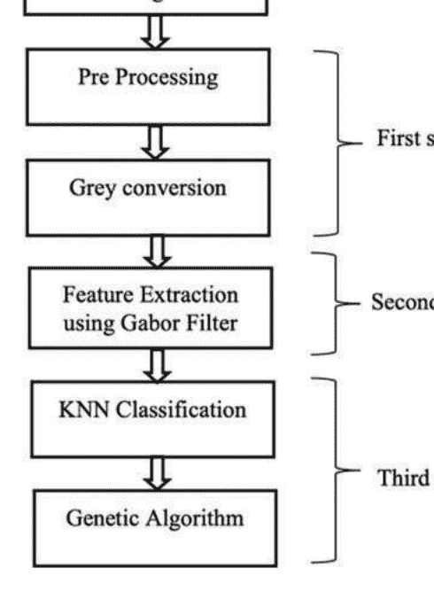

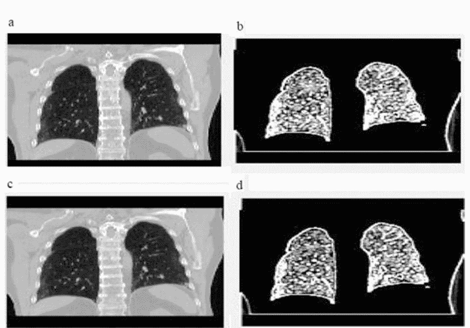

#### 2.3 使用KNN进行皮肤癌预测

皮肤癌（黑色素瘤）被认为是最常见和最致命的癌症类型[9]。 因此，对于皮肤癌患者来说，早期诊断的研究至关重要，因为在晚期之前可以治愈。 本研究旨在使用KNN分类器等其他分类器来检测表皮中的黑素细胞， 以进行黑色素瘤的诊断。 特征提取完成并且所提出的输入图像已经准备好后，使用KNN来通过使用测试和训练样本来提高检测的准确性进行分类。

KNN分类器在诊断黑色素瘤方面取得了高水平的准确性、敏感性和特异性，使其成为前三种可用于诊断黑色素瘤的分类技术之一。

### 3 方法论

本节阐述并描述了提出的机器学习技术以及如何在这种情况下用于预测骨肉瘤患者的生存能力。 它还描述了用于预测的选定属性，并解释了为什么数据集中的其他属性未被使用。 经过详细的研究和分析后

图3 KNN方法流程图

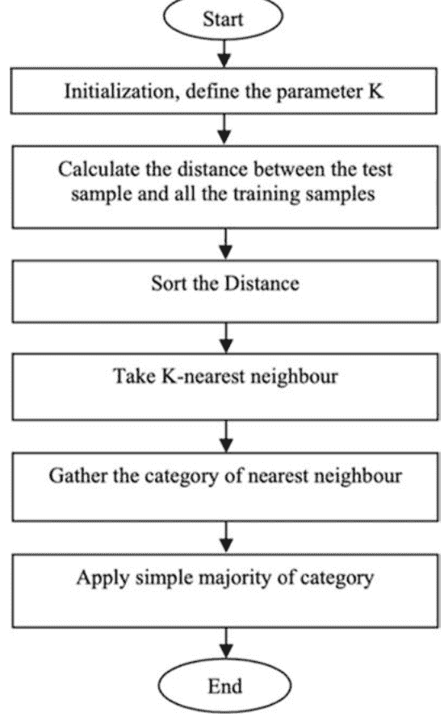

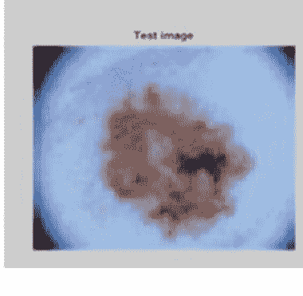

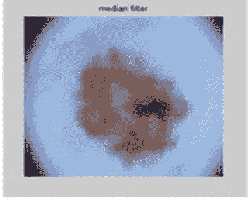

图4 KNN方法流程图

通过使用KNN算法对各种机器学习模型进行了总结。KNN可以追溯到1951年，由Fix和Hodges [5]创建。它可以被定义为一种非参数的、懒惰学习的技术/算法。懒惰学习简单地将一种泛化方法分类，与创建训练数据模型相反，它将数组中的每个点与整个训练数据集进行比较。它的非参数性使得它能够从训练数据本身中构建模型，而不需要预设的概念。KNN也可以被视为一种监督学习技术，因为它是通过示例进行训练的。基于KNN思想构建的系统根据观察值和分类来检查数据集，并使用这些分类来预测其他观察值。本文利用KNN模型的能力，对一个骨肉瘤患者的新观察值进行分类，以预测其可能的生存率范围（2年以下、5年以下和5年以上）。

#### 3.1 研究参数

本研究使用的数据集来自UC Irvine机器学习库。该数据集由128个对象组成，其中48.4375%的对象在治疗完成后存活了2年以下，7.03125%的对象存活了3到5年，35.9375%的对象存活了5年以上，8.59375%的对象没有记录治疗后的时间。5年生存率描述了患者在5年内存活的时间[3]。机器学习模型的选定属性包括年龄、性别、原发部位、位置、转移、诊断时转移、治疗期间转移、治疗后转移、肿瘤大小、Enneking分期、血清ALP、LMR、原发手术、诱导化疗、方案、辅助化疗、完成治疗、存活时长。这些属性是从数据集中选择的，因为它们对5年生存率有最大的影响。为了正确运行KNN算法，需要选择一种测量距离的度量方式；在这种情况下，选择了欧氏距离作为距离度量。

```
欧几里得距离 = $\sqrt{\sum_{i=1}^{n} (p_i - q_i)^2}$
```

由于其易于适应机器学习系统，使用了版本3.7的Python。首先，将sklearn库导入系统进行邻居分类和模型训练。其次，使用NumPy库将所有属性分布在x和y轴上。最后，使用pandas库读取数据集并/或删除可能不是分类的必要因素的不需要的属性。如下所示，预测的准确率为88.4%。这个准确率是给定测试数据和标签的平均准确率。模型准确率的主要影响因素取决于属性。

这可能与生存分类无关。所有属性都转换为关键模型（见表1）。

### 4 发现

使用具有不同属性的三个测试案例来测试模型，准确率接近90%。为了测试测试数据和结果之间的准确性，测试案例被分类为低风险、中风险和高风险患者。

#### 4.1 低风险

低风险的癌症患者通常处于恩内金分期IA以下，这意味着骨骼表面上的癌症直径小于8厘米或3英寸。这也意味着癌症没有扩散到附近的淋巴结或远处的部位。这种水平被称为低级别。对于低风险患者，治疗前、治疗期间和治疗后都没有转移。对于低风险患者，诱导化疗后不需要辅助化疗。可以在下面看到对患者的详细标记描述。从预测开始的存活期超过5年。

#### 4.2 中风险

中风险的癌症患者处于恩内金分期IIA以下，这意味着骨骼表面上的癌症直径小于8厘米或3英寸。然而，这种水平被称为高级别。对于中风险患者，将会有一些区域性转移。区域性转移意味着癌症已经扩展到其他骨骼或附近的部位。对于中风险患者，诱导化疗后不需要辅助化疗。患者的详细标记描述如表3所示。

#### 4.3 高风险

高风险癌症患者处于Enneking阶段III以下，这意味着癌症在骨骼表面上的直径大于8厘米或小于3英寸。这是一个高级别的癌症。在这种情况下，会有一些远处转移。对于高风险患者，需要在诱导治疗后进行辅助化疗。

| 指标 | 变量1 | 变量2 | 变量3 | 变量4 | 变量5 |
| --- | --- | --- | --- | --- | --- |
| #主要部位 | 1=四肢 | 2=轴向 |  |  |  |
| #位置 | 1=股骨 | 2=胫骨 | 3=肱骨 |  |  |
| #转移 | 1=是 | 0=否 |  |  |  |
| #诊断时转移 | 1=是 | 0=否 |  |  |  |
| #治疗期间转移 | 1=是 | 0=否 |  |  |  |
| #治疗后转移 | 1=是 | 0=否 |  |  |  |
| #肿瘤大小 | >或<10厘米 | 1<=10厘米 | 2>10厘米 | -1=不适用 |  |
| #ENNEKING阶段 | 1=IA | 2=IB | 3=IIA | 4=IIB | 5=III |
| #血清ALP | 1=正常 | 2=高 |  |  |  |
| #LMR1 | <=2.0 | 2>2.0 |  |  |  |
| #初次手术 | 1=救助 | 2=截肢 | 3=保守 | 0=其他 |  |
| #引导化疗 | 1=是 | 0=否 | -1=不适用 |  |  |
| #方案DC/DCM | 其他1=DCM | 2=DCM | 0=其他 | -1=不适用 |  |
| #辅助化疗 | 1=是 | 0=否 | -1=不适用 |  |  |
| #完成治疗 | 1=是 | 0=否 | -1=不适用 |  |  |
| #存活时间 | 1=0-2 | 2=2-5 | 3=>5 | -1=不适用 |  |

### 表2 5年以上生存率（低风险）

| 指标 | 变量1 | 变量2 |
|------|-------|-------|
| #主要部位 | 1=肢体 |  |
| #位置 | 1=股骨 |  |
| #转移 | 0=否 |  |
| #诊断时转移 | 0=否 |  |
| #治疗期间转移 | 0=否 |  |
| #治疗后转移 | 0=否 |  |
| #肿瘤大小 | >或<10厘米 | 1<=10厘米 |
| #Enneking分期 | 1=IA |  |
| #血清碱性磷酸酶 | 2=高 |  |
| #淋巴细胞/单核细胞比率 | 1=<=2.0 |  |
| #初次手术 | 1=救助 |  |
| #引导化疗 | 0=否 |  |
| #方案DC/DCM/其他 | 2=DM |  |
| #辅助化疗 | 0=否 |  |
| #完成治疗 | 1=是 |  |
| #存活时长 | >=5年 |  |

### 表3 5年以上生存率（中风险）

| 指标 | 变量1 | 变量2 |
|------|-------|-------|
| #主要部位 | 2=轴向 |  |
| #位置 | 2=胫骨 |  |
| #诊断时转移 | 1=是 |  |
| #治疗期间转移 | 0=否 |  |
| #治疗后转移 | 1=是 |  |
| #肿瘤大小 | >或<10厘米 | 1<=10厘米 |
| #Enneking分期 | 3=IIA |  |
| #血清ALP | 1=正常 |  |
| #LMR | 2=>2.0 |  |
| #主要手术 | 3=保守治疗 |  |
| #引导化疗 | 0=否 |  |
| #方案DC/DCM/其他 | 0=其他 |  |
| #辅助化疗 | 1=是 |  |
| #完成治疗 | 1=是 |  |

化疗有助于增强对癌细胞的杀伤。系统预测高风险患者的存活率为0至2年。表4中显示了对患者进行标记的详细描述。

### 表4 0-2年存活时长（高风险）

| 指标 | 变量1 | 变量2 |
| :--- | :--- | :--- |
| #主要部位 | 2=轴向 |  |
| #位置 | 3=肱骨 |  |
| #转移 | 1=是 |  |
| #诊断时转移 | 1=是 |  |
| #治疗期间转移 | 1=是 |  |
| #治疗后转移 | 1=是 |  |
| #肿瘤大小 | >或<10厘米 | 2>10厘米 |
| #ENNEKING分期 | 5=III |  |
| #血清ALP | 2=高 |  |
| #淋巴细胞/单核细胞比率 | 2=>2.0 |  |
| #主要手术 | 2=截肢 |  |
| #引导化疗 | 1=是 |  |
| #DC/DCM/其他治疗方案 | 1=DCM |  |
| #辅助化疗 | 1=是 |  |
| #完成治疗 | 0=否 |  |

### 5 结论

评估生存模型预测未来数据的能力是开发预测模型的重要考虑因素。生存时间预测和生存时间阈值方法在分析癌症生存方面很有用。然而，关于性别、年龄、肿瘤大小、肿瘤位置、组织学亚型和手术在骨肉瘤生存预测中的能力尚未达成共识。本研究的性能指标基于主要基准点，其中评估生存预测性能的指标包括由二分风险评分定义的高、中、低风险组之间的风险比。总之，一般逻辑推断与数据集的准确性之间存在着强烈的关系。对于研究中包括的所有患者，该系统对于5年生存率提供了明显的预测。为了进一步改进，可以构建系统以添加更多属性进行更详细的分析。

### 参考文献

+ 1. Kourou, K. (2015). 机器学习在癌症预后和预测中的应用。计算和结构生物技术杂志，8-17。
+ 2. Pawlovsky, A. P. (2014). 关于使用kNN算法预测乳腺癌的研究。
+ 3. 美国癌症协会。 (2020). 骨肉瘤的关键统计数据。从www.can-cer.org检索： https://www.cancer.org/cancer/osteosarcoma/about/key-statistics.html。
+ 4. Sharma, K. (2018). 使用不同距离测量的K最近邻算法预测乳腺癌。
+ 5. Rodriguez, V. (2018). 使用不同距离测量的K最近邻算法预测乳腺癌。 研究门户网站。
+ 6. Bhuvaneswari, P. ..(2015). 使用遗传算法的K-NN分类在肺癌检测中。 第二届纳米材料和技术国际会议， 433-440。
+ 7. Bacci G, Longhi A, Versuri M等。 预后因素对肢体骨肉瘤的预处理化疗的影响： 在一所单一机构治疗的789名患者中的15年经验。 癌症2006年; 106: 1154–1161。
+ 8. Bacci G, Forni C, Longhi A等。 肢体非转移性骨肉瘤的局部复发和局部控制： 一所单一机构27年的经验， 外科肿瘤学杂志2007年; 96: 118–123。
+ 9. Murugan, A. (2019). 使用SVM、随机森林和kNN分类器检测皮肤癌， 医学系统杂志， 1–9。
+ 10. Huang M, Feng F, Li D等， 中国医药治疗骨肉瘤的长期临床疗效初步评估， 山西中医学院学报2009年;2:41–43。
+ 11. Su Young Jeong, Wook Kim, Byung Hyun Byun, Chang-Bae Kong, Won Seok Song, Il hanLim, Sang Moo Lim和Sang-Keun Woo (2019) ； 使用基线18F-FDG纹理特征机器学习方法与PCA， 对比度和分子成像预测骨肉瘤的化疗反应， 第19卷。
+ 12. Enneking WF。 骨骼肿瘤分期系统。 Clinical Orthopaedics and Related Research 1986年; 204: 9–24。
+ 13. Enneking WF, Spanier SS, Goodman MA。 肌肉骨骼肉瘤手术分期系统， 1980年; 153: 106–120。
+ 14. James P.O., Connor重新思考临床成像的角色。 eLife 2017年。
+ 15. Engstrom P.F., Arnoletti J.P., Benson A.B., Chen Y.J., Choti M.A., Cooper H.S., Covey A., Dilawari R.A., Early D.S., Enzinger P.C., 等。 NCCN肿瘤学临床实践指南： 结肠癌。 《国家综合癌症网络杂志》2009年; 7:778–831。 doi: https://doi.org/10.6004/jnccn.2009.0056。

## BeamAtt: 使用基于采样的智能从胸部 X 光中生成医学诊断

Aman Sawarn，Shefali Srivastava，Monika Gupta和Smriti Srivastava

### 1 引言

成像技术在全球医疗数据中占据了惊人的 90% [14]。 胸部 X 光的放射学和病理学图像占据了整体医学成像数据的约 40% [3]。 胸部 X 光是诊断和治疗许多不同呼吸系统疾病的核心。 胸部 X 光对于检测气胸、慢性阻塞性肺疾病、肺炎、结核病和肺癌等致命疾病至关重要。 仅这些疾病每年就导致全球超过 1500 万人死亡 [8]。 胸部 X 光是一种简单、快速且强大的方法，可以直观地了解和治疗呼吸系统的疾病。 医学报告是由受过训练的专业人员对 X 光图像进行详细描述和诊断的关键审查。 图1详细说明了两份医学报告的格式以及它们的胸部 X 光片。 医学检查的诊断或非正式地说，结论在报告中被称为印象，是放射科医生的意见，他/她拥有多年的经验。 从 X 光片生成医学报告是一项非常复杂的任务，需要

A. Sawarn · M. Gupta · 印度新德里Maharaja Agrasen技术学院 电子邮件：monikagupta@mait.ac.in

S. Srivastava (✉) 印度北方邦诺伊达的Adobe Systems私人有限公司 电子邮件：shesriva@adobe.com

S. Srivastava 新德里Netaji Subhas技术大学仪器与控制工程系 印度

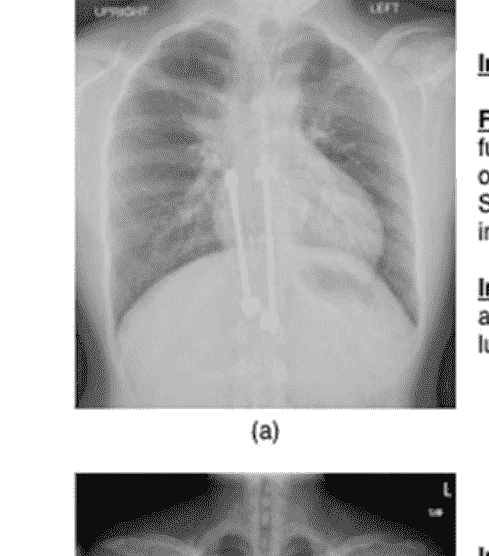

Indication: VSD

Findings: Status post posterior spinal fusion with stable appearance of the orthopedic XXXX. Pectus carinatum. Stable mild cardiomegaly and increased lung vascularity. Clear lungs.

Impression: Stable mild cardiomegaly and increased lung vascularity. Clear lungs.

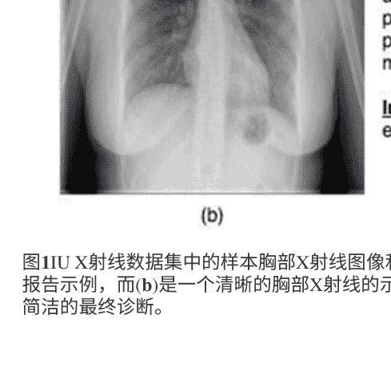

Indication: possible tuberculosis

Findings: Heart size normal. Lungs are clear. XXXX are normal. No pneumonia, effusions, edema, pneumothorax, adenopathy, nodules or masses.

Impression: Normal chest No evidence of tuberculosis

图1 IU X射线数据集中的样本胸部X射线图像和相应报告[6]。(a)是一个带有心脏肥大病的报告示例，而(b)是一个清晰的胸部X射线的示例。所有的报告都包含了胸部的详细分析和简洁的最终诊断。

专业劳动力。 这个过程耗时且对于经济落后国家的大众来说变得越来越不可承受，因为医疗保健费用相对于年收入总额来说是昂贵的。 由于上述挑战和其重要性，最近医学图像的诊断报告引起了重要的研究关注。

这些挑战促使了自动生成报告的方法的发展，以最小化手动评估X射线片的需求。 生成胸部X射线的简单诊断/印象类似于图像字幕的任务。 图像字幕是从图像中生成文本描述的过程，特别是从图像中的静态对象和动态动作中生成。

图像字幕是计算机视觉的重要组成部分。 这些字幕不仅需要准确认识图像中的多个不同对象，还需要理解它们之间的关系，然后用人类可理解的自然语言描述图片所描绘的故事。在医学报告生成的情况下，这个任务变得异常重要，因为出错的可能性很小。这些报告不仅应该捕捉到图像的叙述，还应该经过训练来确定疾病并生成一份完整的报告。

生成逻辑图像字幕一直是一个长期的竞赛。最近的文献提出了使用深度递归神经网络（LSTMs和GRUs）生成单词序列作为字幕的方法。通过一个性能良好的CNN架构提取图像的丰富特征，然后将其馈送到基于深度RNN的编码器-解码器系统中生成字幕[15, 30, 32, 35]。有时，这些方法还会使用视觉注意力来集中在输入中信息丰富的区域。在本文中，我们采用类似的架构，使用CNN-RNN编码器-解码器框架从胸部X射线图像中生成诊断。我们建议使用束搜索[34]进行推理生成，而不是之前的贪婪搜索，并展示了相同任务上的积极的定性结果和改进的度量分数。我们的贡献如下：

+ 1. 我们提出了一种新颖、简单直观的编码器-解码器架构，用于生成胸部X射线的医学诊断。
+ 2. 我们采用门控循环单元（GRU）作为我们的循环神经网络，而不是最近涉及复杂分层LSTM的网络架构，并展示了增强的性能。我们认为，简单的GRU网络可以降低计算成本，而不会牺牲性能。
+ 3. 我们提出通过教师强制训练我们的循环神经网络，以显著加快网络速度。
+ 4. 我们提出了一种基于随机抽样和波束搜索的推理生成方法，并提供了详细的实验细节来证明所提模型的有效性。

本文的其余部分组织如下。第2节回顾了该领域的相关工作。第3节介绍了所提出的方法。第4节描述了实验设置，并比较了所提模型的结果。第5节总结了本文，并提到了可以增强所提技术的未来工作。最后一节列出了启发本工作的参考文献。

### 2 相关工作

随着深度学习的出现，图像的字幕生成引起了强烈的研究兴趣。将机器带到理解图像中所描绘的对象以及图像中各个对象之间的相互作用和关系，以便在简洁中生成包含最准确信息的全面字幕，具有重要的学术意义。在深度神经网络出现之前，这个任务主要是基于规则的。逻辑系统从视频中提取图像帧，解析它们以提取语义，并随后生成自然语言描述[12, 36]。特别地，他们使用了基本的视觉知识表示，如And-Or图，结合公理化语言生成器。随着领域的发展，图像字幕生成被视为将图像主题与文本含相关联的问题。这些方法计算图像特征，并将其与自然语言模板进行匹配，以证明所描绘的主题[9–11, 18, 26]。虽然模板限制的文本生成适用于那些有限的数据集，但自然语言的不断变化性质对其可扩展性提出了质疑。

随着深度神经网络在计算机视觉等多个研究领域的潜力被认识到，深度卷积神经网络开始与循环神经网络相结合。基于CNN-RNN的框架在机器翻译和序列到序列模型等任务中获得了动力。由于这种框架的本质在于将图像转化为相应的自然语言文本，因此这种方法也被应用于图像标题生成问题。基于CNN-RNN的编码器-解码器系统已经产生了许多成功的模型。这些生成系统通过引入注意机制[1, 2, 27]来提高性能[35]。注意机制实质上允许网络在每个迭代的时间步t上自学习焦点。随着时间的推移，已经有各种形式的注意力被利用在多篇论文中，以突出某些重要的视觉和文本元素，并提高模型的准确性。

最早的一种先驱性的CNN-RNN编码器-解码器框架用于图像字幕生成是由[32]提出的，该框架提出了神经图像字幕（NIC），这是一种新颖的端到端文本生成模型，它使用CNN从图像中提取视觉特征，并将这些特征提供给LSTM RNN来完成自然语言的字幕生成。该模型的前提是在给定输入图像的情况下，最大化目标词序列的概率。与之前的作品[17, 25, 16]相反，直接将视觉特征提供给RNN取得了最先进的结果。[35]扩展了[32]的工作，并引入了两种注意机制来增强NIC。注意机制使模型能够直接关注图像的显著特征，而无需对整个图像进行操作。在每个时间步骤，RNN只关注负责生成第i个单词的图像部分。引入的两种注意机制是硬（随机）注意力，即特定特征在该时间步骤生成单词的概率，以及软（确定性）注意力，它编码了特征的相对重要性。对于胸部X射线报告生成，这些模型作出了巨大贡献，如下所述。最早采用[35]提出的方法从胸部X射线生成医学报告的作品是[15, 30, 33]。提出了一种联合图像/文本上下文向量来学习疾病标签和文本注释。卷积神经网络被训练用于提取图像特征并学习每个图像的疾病标签，其中使用了MeSH [22]疾病术语。循环神经网络模型接收这些图像特征向量，从中学习图像注释的上下文。CNN网络与递归级联模型一起学习基于这些联合图像/文本上下文向量的上下文图像注释。虽然生成的结果能够在某种程度上指出疾病、其位置和严重程度，但生成的报告在自然语言方面并不十分流畅，只包含表示相关信息的单词。此外，与应用视觉局部注意力的模型相比，这些单词与图像区域之间没有显示出相关性。[33]引入了一个文本-图像嵌入网络，其中将多重注意力融入到CNN-RNN架构中，用于图像和文本，并构建了一个自动注释框架，用于疾病标签，实质上是一个疾病分类任务。提出了两种新颖的技术，即注意力编码文本嵌入（AETE）和显著性加权全局平均池化（SWGAP）。AETE对文本的显著部分进行编码，而SWGAP是对视觉特征进行的最大池化操作，用于空间注意力。该模型用于分类任务和报告生成。类似于[15, 33]提出了一个智能模型，预测报告的'标签'并生成描述性结果。标签的预测被视为多标签分类任务，其中报告的结果部分的生成被视为文本生成任务。采用共同注意机制实现文本和视觉模态的协同作用。作为胸部X射线报告的首次尝试，他们还使用了分层LSTM来提高性能指标。与其他模型类似，使用CNN提取视觉特征，然后使用多标签分类模型预测包含的标签分布。语义特征被提取并与视觉特征向量一起提供给共同注意模型。为了整理一个逻辑报告，分层LSTM接收共同注意模型的输出，并学习首先推断可行的主题，然后为每个主题生成一个句子，从而生成一个全面的报告。

最近，强化学习技术在这个问题上引起了关注 [19, 20, 23]。他们认为医疗报告中包含有限的医学术语，导致语言变化较少，基于模板的检索技术往往优于传统方法。虽然[20]在每个步骤中使用检索策略模块来学习选择是从模板数据库中检索句子还是生成句子，并通过检索到的句子或生成的单词获得信息的奖励，[19]提出了KERP，它是一种基于知识驱动的编码、检索和改写技术，其中从编码的视觉特征构建异常图，基于该图进行模板检索的改写[23]也起到了基本上的分类模型的作用，通过强化学习来提高性能。最近，[13]提出了一种考虑患者背景信息的方法，结合多注意力CNN-RNN模型，假设经过训练的放射科医生根据患者病史推断胸部X射线片。在多注意力模块中，除了之前研究过的空间注意力，还考虑了视觉特征的通道注意力。CNN特征被馈送到多注意力模块，然后通过分层LSTMs实现文本生成。我们的工作在一定程度上受到[4, 35]的启发，但也有明显的区别。

推理生成中的技术可以抵消性能的微小下降。动机是减少模型复杂性并保留较少数量的可训练参数。此外，与[35]中的贪婪搜索相反，我们利用波束搜索优化，证明了在最小计算资源的情况下可以获得越来越好的性能。作为对[4]中方法的补充，我们采用空间注意力来让所提出的模型在每个时间步骤上聚焦于图像的重要部分。我们凭经验发现，与使用标准度量标准的复杂模型相比，该模型在性能上表现更好，并且在不牺牲性能的情况下降低了复杂性和计算成本。

### 3 提出的模型：BeamAtt

#### 3.1 概述

如图1所示，每个报告由三个部分组成：（1）指示或者更准确地说，报告中关键词的相关标签，（2）描述对X射线的研究的发现部分，（3）列出放射科医生的最终诊断的印象部分。在本文中，我们提出了BeamAtt，一种基于CNN-RNN的编码器-解码器框架，用于生成胸部X射线报告的诊断或者更正式地说，印象部分。我们采用高性能的标准CNN架构与基于空间注意力的RNN结合，生成适当总结图像的有意义的词序列。视觉特征从CNN中提取出来，并提供给解码器，在每个时间步骤上决定图像的焦点。通过为图像的各个特征分配相对重要性，创建了对图像的抽象，指导网络在该时间步骤t生成适当的词。在训练后，我们展示了基于样本的方法在生成未见过的图像的推理方面的能力。

我们展示了如何在有限且可负担的额外计算步骤的代价下实现卓越的结果。

#### 3.2 图像特征编码器

原始胸部X射线图像作为系统的输入。使用一个成熟的预训练CNN网络进行特征提取。不是从网络的中间层提取特征，而是有意从倒数第二层提取更粗糙的特征。这样做的动机是为了保留低级描述符，以生成高度描述性、丰富的印象文本。编码器网络中提取的这些特征表示X射线图像中存在的潜在信息。由于对图像的信息密集区域的了解在这个过程中没有被保留，进一步应用了视觉空间注意力来这些特征。这在图2的第一部分中表示。在这些特征之上应用了两个密集层，并进行了微调，以生成与胸部X射线片相关的丰富特征。编码器网络为每个图像生成了D维的e向量：
$$ \{e_1, ..., e_e\}, i \in R^D $$
在后续的文本中，向量将被称为特征向量。

#### 3.3 基于GRU的解码器与视觉注意力

在[5]中提出的门控循环单元（GRU）网络用于逐字逐词生成医疗报告的印象字符串。网络接收以下所述的注意力特征向量和目标印象字符串。

与本文[35]中使用的LSTM网络不同，我们提议使用GRU网络来显著减少需要训练的参数数量。我们展示了相同的比较性能，并展示了适当的超参数调整可以提供类似的结果，但计算量更小。GRU网络包含两个门。更新门编码了多少先前学到的信息传递到未来状态，而重置门决定了不应保留的过去信息。方程如下：
$$ z_t = \sigma(W^{(z)} \cdot c_t + U^{(z)} \cdot h_{t-1}) $$
$$ r_t = \sigma \left( W^{(r)} \cdot c_t + U^{(r)} \cdot h_{t-1} \right) \tag{3} $$
其中 $z_t$ 和 $r_t$ 分别表示时间步 $t$ 的更新门和重置门。 $h_{t-1}$ 是GRU在上一个时间步的隐藏状态。 $c_t$ 是通过对图像的特征向量应用注意力机制得到的上下文向量。$W^{(z)}$, $U^{(z)}$, $W^{(r)}$ 和 $U^{(r)}$ 是用于上下文向量和解码器隐藏状态的权重。$\sigma$ 是用于引入非线性的sigmoid激活函数。 GRU的隐藏状态保存了关于当前单元的信息，并用 $h_t$ 表示在以下方程中：
$$ h_t = \tanh \left( W_c \cdot c_t + r_t \odot \left( U_h \cdot h_{t-1} \right) \right) \tag{4} $$
$$ h_t = z_t \odot h_{t-1} + (1 - z_t) \odot h_t \tag{5} $$
$W_c$ 是上下文向量的权重，而 $U_h$ 是GRU隐藏状态的权重。 中间隐藏状态 $h_t$ 通过非线性双曲正切激活函数计算得到。 上下文向量 $c_t$，作为GRU的输入，是图像编码器的注意力特征向量。 由于我们有意从图像编码器中提取粗糙的低级特征，在每个时间步 $t$，系统需要被训练以便关注和注意生成当前时间的印象字符串的相关部分图像。 有关相关特征的提取模型受到[2]的启发。 我们的模型中使用确定性注意力。$c_t$ 是由特征向量 $a_i$ 计算得到的。 对于图像的每个位置，生成一个权重 $\alpha_{t,i}$。 这个权重矩阵被称为注意力权重，它将图像的每个位置 $a_i$ 的相对重要性编码为概率向量。 解码器的先前隐藏状态与每个步骤的特征向量一起用于计算注意力权重。 注意力权重的计算公式为：
$$ e_{t,i} = \tanh \left( U_{\text{att}} \cdot h_{t-1} + W_{\text{att}} \cdot a_i \right) \tag{6} $$
$$ \alpha_{t,i} = \frac{\exp(e_{t,i})}{\sum_{k=1}^E \exp(e_{t,k})} \tag{7} $$
$U_{\text{att}}$ 和 $W_{\text{att}}$ 分别是隐藏状态和特征向量的权重参数。 $\alpha_{t,i}$ 通过对 $e_{t,i}$ 进行softmax计算得到，该值在数值上表示图像位置 $i$ 在时间步 $t$ 的绝对重要性。 上下文向量 $c_t$ 通过注意力权重和特征向量的乘积计算得到：
$$ c_t = \alpha_{t,i} \cdot a_i \tag{8} $$
这个上下文向量被用作GRU网络的输入。 基于注意力的GRU解码在网络中作为第二阶段进行可视化表示，如图2所示。

#### 3.4 生成推理

给定输入特征向量，GRU网络被训练来近似表示从有限词汇表 V中的印象字符串中的一系列单词的前景。 借助内部隐藏状态，递归网络估计了从输入特征向量和之前的输出单词中得到下一个输出单词的条件概率。 为了解码具有最大似然的单词，输出向量上应用了一个类似于softmax的函数。 在时间步 t处输出的概率，表示为 y_t，等于给定之前的输出 y_{<t}和输入图像 x的情况下，第 i个单词 w_i的概率，由以下方程给出：
$$ P(y_t = w_i | y_{<t}, x) = \frac{\exp(o_{t,i})}{\sum_{j=1}^{V} \exp(o_{t,j})} $$
其中 o_{t,i}是GRU的输出。在整个词汇空间中进行穷举搜索以找到最优解决方案在计算上是昂贵的，在大多数情况下是不必要的。 为了找到最优的解码序列，我们采用近似方法。 在本文中，我们提出了一种基于温度的随机抽样方法，结合束搜索近似，生成最可能的印象字符串序列。 随机抽样是在每个时间步骤 t从候选输出中随机选择一个解决方案的过程。 然而，这可能导致非常通用和次优的解决方案。 为了在抽样之前限制概率分布的熵，使用一个称为温度 T的参数来修改概率：
$$ P(y_t = w_i | y_{<t}, x) = \frac{\exp(o_{t,i}/T)}{\sum_{j=1}^{V} \exp(o_{t,j}/T)} $$
一旦概率被抽样，就使用束搜索近似来找到理想的解决方案字符串。 束搜索是一种近似解码方法，在每个时间步骤t上存储前B个候选解决方案，而不是每次选择顶部词标记的贪婪方法。 这限制了有限解决方案集上的搜索空间，同时仍然提供了探索多个路径的好处。 在大多数情况下，大多数解决方案源自相似的高原始候选解决方案词束，但我们表明，结合随机抽样，这种近似方法对于生成医疗报告中的专业印象字符串的任务提供了有希望的结果。

输出标题y如下所示：
$$ y = \{y_1, ..., y_c\}, y_i \in R^V \tag{11} $$
其中 c是标题的长度， V是词汇表的长度。
为了学习整个网络的参数，包括编码器、解码器和注意力框架，我们采用了一个带有L2正则化的损失函数，用于负对数似然输出 y给定图像 x和单词序列 S：
$$ L = -\log(P(y | x,S)) + \lambda\sum_{i}^{e}\left(1-\sum_{t}^{c}\alpha_{ti}\right)^{2} \tag{12} $$
e表示特征向量的数量，如公式1所示，c表示标题的长度，如公式11所示。

### 4 实验和结果

在本节中，我们详细描述了训练和测试的设置。通过与现有技术进行广泛的定性和定量比较，展示了所提出算法的结果。

#### 4.1 数据

我们使用了由[6]提出的 IU X射线胸部X射线图像数据集，并通过开放获取生物医学图像搜索引擎（OpenI）发布供公众使用，用于生成诊断。这是唯一一个公开可用的英文胸部X射线数据集。该数据集包含图像和报告的配对，每个报告部分都包含标签、印象和发现，如图1所示。这个实验的目的是使用胸部X射线片生成最终的诊断，并在每个时间步骤 t 中识别对产生输出词有最大贡献的图像部分。图像被视为输入，而印象被视为输出。每个报告都有两个图像（正面和侧面）。在这个实验中，我们使用了与每个报告相关联的一个图像（随机选择），并且丢弃了另一个胸部X射线片。这种预处理将数据集限制为仅考虑3331个图像-报告对。经过分析，发现印象字符串的词汇量相对较小，只有1225个，而许多自然语言处理任务中的词汇量超过5000个。为了生成相等长度的输入，印象字符串进行了填充，并且使用了64个单位的嵌入维度进行标记化处理。

#### 4.2 实现细节

训练我们将InceptionV3网络与EfficientNet进行了CNN特征提取的比较，并观察到在给定的网络设置中，InceptionV3的性能更好。因此，InceptionV3被用作CNN特征提取器。网络在倒数第二层被截断，得到一个大小为14 * 18 * 2048的特征图。这个输出被展平，得到每个图像大小为252 * 2048的2D向量，然后被输入到编码器的密集层中。得到一个形状为252 * 64的输出。特征向量被输入到解码器中用于注意力的定位和印象的生成。隐藏状态的维度设置为128个单元。图像以批量大小为32进行处理，词汇表大小为1225，其中1222是词汇表的大小，3个标记用于编码<start>，<end>和填充标记。字幕处理直到遇到<end>标记或生成了114个单词为止。总结一下，在公式1中，e和D分别取252和2048，词汇表大小V取1225，字幕的最大长度c取114。GRU使用Xavier均匀初始化器进行初始化。

解码器的学习率已设置为0.0001，并且稀疏分类交叉熵被用作损失函数。使用Adam优化器来学习模型参数。采用80-10-10的训练-测试-验证分割。我们使用2672张图像及其印象来训练编码器-解码器架构。每个训练和验证使用335张图像及其印象。结果展示在这335张图像的测试集上。在训练时，不是将时间步t-1的输出y_{t-1}提供给RNN的时间步t，而是提供真实值。这种技术被称为教师强制。鉴于数据量的多少，我们采用这种技术来加速快速收敛。通过蓝色虚线箭头在图2中展示了这一点。

实验的实现是在Tesla P100-PCIE-16GB GPU上进行的，并经过了15个时期的训练。

测试测试场景在图2中用绿色箭头表示。如图所示，上一个时间步的输出t-1在时间步t时供给GRU单元，以生成y_t。为了生成推理，使用三个令牌的波束宽度。作为资源和结果之间的权衡，我们对每个图像运行三次波束搜索算法，并报告三个分数中的最佳结果。我们观察到通过表2的优越结果，即在不损失计算能力的情况下，我们能够在三次计算中成功生成可行的诊断。

#### 4.3 评估

在开始我们的比较实验之前，我们进行全面的评估，以选择RNN解码器。为此，我们比较了四种变体：LSTM，带有注意力的LSTM，GRU和带有注意力的GRU。我们根据表1中显示的标准评估指标进行比较。我们发现，虽然带有注意力的LSTM在性能上略优于带有注意力的GRU，但BLEU-1下降了0.2。

表1 LSTM与GRU RNN解码器的比较结果。我们比较了两种架构的标准度量分数以及它们的注意力增强系统的性能。

| 算法 | BLEU | ROUGE-L | METEOR | CIDEr | 编码器参数 | 解码器参数 | 总参数 |
| :--- | :--- | :--- | :--- | :--- | :--- | :--- | :--- |
| LSTM | 0.563 | 0.2522 | 0.305 | 2.077 | 405,760 | 351,763 | 757,513 |
| LSTMᵃ | 0.58 | 0.23 | 0.26 | 2.11 | 405,760 | 409,482 | 815,242 |
| GRU | 0.555 | 0.245 | 0.21 | 1.96 | 405,760 | 327,433 | 733,193 |
| GRUᵃ | 0.564 | 0.31 | 0.23 | 2.077 | 405,760 | 376,970 | 782,730 |

ᵃ表示带有注意力

得分可减少高达30K个可训练参数。因此，我们选择带有注意力的GRU作为我们的RNN解码器，在下面进行实验。

我们在[7, 24, 29, 32]提出的领先图像字幕生成研究方法以及[15, 19, 20, 33]等先前的最先进技术上进行了定量比较。这些实验是在使用InceptionV3作为预训练CNN网络的IU X-ray数据集[6]上记录的。定量结果使用1进行记录，并包括BLEU-1、BLEU-2、BLEU-3、BLEU-4 [28]、ROUGE-L [21]和CIDEr [31]分数。

这些在表2中有所展示。可以看出，虽然分层LSTM相对于单个LSTM确实增加了价值，但具有优化学习参数的GRU在性能上具有优势。我们的模型在BLEU分数上达到了最大性能，而在ROUGE-L分数上仅次于采用强化学习的技术（如[19, 20]）。CoAtt [15]中使用的共同注意机制也能够获得更好的ROUGE-L分数。这可能是我们的摘要与我们所针对的单个诊断生成进行比较的结果。

表2 与IU X-Ray数据集上最先进方法的定量比较。

| 模型 | BLEU-1 | BLEU-2 | BLEU-3 | BLEU-4 | ROUGE-L |
| :--- | :--- | :--- | :--- | :--- | :--- |
| CNN-RNN [32] | 0.216 | 0.124 | 0.087 | 0.066 | 0.307 |
| TieNet [33] | 0.286 | 0.1597 | 0.1038 | 0.0736 | 0.2263 |
| LRCN [7] | 0.223 | 0.128 | 0.089 | 0.068 | 0.307 |
| AdaAtt [24] | 0.22 | 0.127 | 0.089 | 0.069 | 0.308 |
| Att2in [29] | 0.224 | 0.129 | 0.089 | 0.068 | 0.307 |
| CoAtt [15] | 0.455 | 0.288 | 0.205 | 0.154 | 0.369 |
| HRGR-Agent [20] | 0.438 | 0.298 | 0.208 | 0.151 | 0.322 |
| KERP [19] | 0.482 | 0.325 | 0.226 | 0.162 | 0.339 |
| BeamAtt | 0.56 | 0.34 | 0.26 | 0.22 | 0.31 |

定性结果及其注意力图在图3中展示。这些网络能够通过视觉注意力智能地分叉感兴趣的区域。它已经能够学习到胸腔积液是呼吸疾病（如肺炎、肺不张和肺气肿）的前兆，如(a)、(b)和(c)所示，但对于较少的输入数据，(d)和(e)的结果可能出错或不够满意。该模型能够学习多样的词汇并识别重要的单词和图像区域。

### 5 结论和未来工作

我们提出了BeamAtt，这是一个直观、高效和简单的框架，可以从胸部X光片中学习生成印象字符串，并具有高准确性。为了帮助医疗专业人员并缩短任务的上市时间，我们提出了基于随机抽样的光束搜索优化方法，使用简单的GRU-based RNN解码器，并在标准评估指标中展示了最先进的性能。如图3所示的定性结果表明，该模型将受益于人工辅助。这在一定程度上是由于有限的训练数据量所导致的。作为模型的补充，未来可以在图像上应用通道注意力，以编码CNN特征中的重要变化。还可以探索基于文本的共同注意力框架以提高性能。虽然我们在医学数据集上展示了结果，但所提出的优化和CNN-RNN框架在其他领域特定数据集的研究中也可以提供最先进的结果，而且不会损失太多计算资源。

### 参考文献

- 1. Jimmy Ba, Volodymyr Mnih, and Koray Kavukcuoglu. 多目标识别与视觉注意力. arXiv预印本 arXiv:1412.7755, 2014.
- 2. Dzmitry Bahdanau, Kyunghyun Cho, and Yoshua Bengio. 神经机器翻译的联合对齐和翻译. arXiv预印本 arXiv:1409.0473, 2014.
- 3. Oliver Bintcliffe and Nick Maskell. 自发性气胸. Bmj, 348, 2014.
- 4. William Boag, Tzu-Ming Harry Hsu, Matthew McDermott, Gabriela Berner, Emily Alsentzer, and Peter Szolovits. 胸部X射线报告生成的基准. 在机器学习中健康研讨会, 页码126–140, 2020.
- 5. Kyunghyun Cho, Bart Van Merrienboer, Dzmitry Bahdanau, and Yoshua Bengio. 关于神经机器翻译的特性: 编码器-解码器方法. arXiv预印本 arXiv:1409.1259, 2014.
- 6. Dina Demner-Fushman, Sonya E Shooshan, Laritza Rodriguez, Sameer Antani, and George R Thoma. 用于索引和检索的胸部放射学报告的注释。在医学领域的多模式检索国际研讨会上，页码99-111。 Springer, 2015年。
- 7. Jeffrey Donahue, Lisa Anne Hendricks, Sergio Guadarrama, Marcus Rohrbach, Subhashini Venugopalan, Kate Saenko, and Trevor Darrell. 用于视觉识别和描述的长期循环卷积网络。 在计算机视觉和模式识别的IEEE会议论文集上, 页码2625-2634, 2015年。
- 8. Sheffield 呼吸学会. 呼吸系统疾病的全球影响-第二版。 国际呼吸学会论坛, 2017年。
- 9. Desmond Elliott and Frank Keller. 使用视觉依赖表示的图像描述。 在2013年经验方法自然语言处理会议论文集上, 页码1292-1302, 2013年。
- 10. Ali Farhadi, Mohsen Hejrati, Mohammad Amin Sadeghi, Peter Young, Cyrus Rashtchian, Julia Hockenmaier and David Forsyth. 每张图片都有一个故事：从图像生成句子。 在欧洲计算机视觉会议上, 第15-29页。 斯普林格, 2010年。
- 11. 冯彦松 and Mirella Lapata. 一张图片值多少个词？ 新闻图片的自动生成标题。 在第48届计算语言学协会年会上的论文集, 第1239-1249页, 2010年。
- 12. Ralf Gerber and N-H Nagel. 用于生成图像序列中车辆交通的定量自然语言描述的知识表示。 在第3届IEEE国际图像处理会议上, 第2卷, 第805-808页。 IEEE, 1996年。
- 13. 黄鑫, 颖奋奋, 徐伟 and 李茂真. 用于胸部X射线图像报告生成的多注意力和融合背景信息模型。 IEEE Access, 7: 154808-154817, 2019年。
- 14. 全球创新指数. 全球创新指数, 2019年。
- 15. 宝玉静, 谢鹏涛, Eric Xing. 关于医学影像报告的自动生成。 arXiv预印本arXiv:1711.08195, 2017年。

## 16. Andrej Karpathy和Li Fei-Fei。用于生成图像描述的深度视觉语义对齐。在IEEE计算机视觉和模式识别会议论文集上，页码3128-3137，2015年。
## 17. Ryan Kiros，Ruslan Salakhutdinov和Rich Zemel。多模态神经语言模型。在机器学习国际会议上，页码595-603，2014年。
## 18. Girish Kulkarni，Visruth Premraj，Vicente Ordonez，Sagnik Dhar，Siming Li，Yejin Choi，Alexander C Berg和Tamara L Berg。Babytalk：理解和生成简单的图像描述。IEEE模式分析与机器智能交易，35（12）：2891-2903，2013年。
## 19. Christy Y Li，Xiaodan Liang，Zhiting Hu和Eric P Xing。基于知识的编码、检索、释义用于医学图像报告生成。在人工智能AAAI会议论文集中，第33卷，第6666-6673页，2019年。
## 20. Yuan Li，Xiaodan Liang，Zhiting Hu和Eric P Xing。用于医学图像报告生成的混合检索-生成增强代理。在神经信息处理系统的进展中，第1530-1540页，2018年。
## 21. 林金友。Rouge：自动摘要评估工具包。在文本摘要分支中，第74-81页，2004年。
## 22. Carolyn E Lipscomb。医学主题词（Mesh）。医学图书馆协会通报，第88卷，第3期：265页，2000年。
## 23. Guanxiong Liu，Tzu-Ming Harry Hsu，Matthew McDermott，Willie Boag，Wei-Hung Weng，Peter Szolovits和Marzyeh Ghassemi。临床准确的胸部X射线报告生成。arXiv预印本 arXiv:1904.02633，2019年。
## 24. Jiasen Lu，Caiming Xiong，Devi Parikh和Richard Socher。知道何时查看：通过视觉哨兵进行自适应图像字幕的注意力。在IEEE计算机视觉和模式识别会议论文集中，第375-383页，2017年。
## 25. Junhua Mao，Wei Xu，Yi Yang，Jiang Wang和Alan L Yuille。用多模态递归神经网络解释图像。arXiv预印本 arXiv:1410.1090，2014年。
## 26. Margaret Mitchell，Jesse Dodge，Amit Goyal，Kota Yamaguchi，Karl Stratos，Xufeng Han，Alyssa Mensch，Alexander Berg，Tamara Berg和Hal Daume III。Midge：从计算机视觉检测生成图像描述。在第13届欧洲计算语言学协会会议论文集中，第747-756页，2012年。
## 27. Volodymyr Mnih，Nicolas Heess，Alex Graves等人。视觉注意力的循环模型。在神经信息处理系统进展中，第2204-2212页，2014年。
## 28. Kishore Papineni，Salim Roukos，Todd Ward和Wei-Jing Zhu。Bleu：一种自动评估机器翻译的方法。在计算语言学协会第40周年年会论文集，第311-318页，2002年。
## 29. Steven J Rennie，Etienne Marcheret，Youssef Mroueh，Jerret Ross和Vaibhava Goel。自我关键序列训练用于图像字幕。在IEEE计算机视觉和模式识别会议论文集，第7008-7024页，2017年。
## 30. Hoo-Chang Shin，Kirk Roberts，Le Lu，Dina Demner-Fushman，Jianhua Yao和Ronald M Summers。学习阅读胸部X射线：用于自动图像注释的循环神经级联模型。在IEEE计算机视觉和模式识别会议论文集，第2497-2506页，2016年。
## 31. Ramakrishna Vedantam，C Lawrence Zitnick和Devi Parikh。Cider：基于共识的图像描述评估。在IEEE计算机视觉和模式识别会议论文集中，第4566-4575页，2015年。
## 32. Oriol Vinyals，Alexander Toshev，Samy Bengio和Dumitru Erhan。展示和讲述：一种神经图像字幕生成器。在IEEE计算机视觉和模式识别会议论文集中，第3156-3164页，2015年。
## 33. Xiaosong Wang，Yifan Peng，Le Lu，Zhiyong Lu和Ronald M Summers。Tienet：用于胸部X射线常见胸腔疾病分类和报告的文本-图像嵌入网络。在IEEE计算机视觉和模式识别会议论文集中，第9049-9058页，2018年。
## 34. Sam Wiseman和Alexander M Rush。序列到序列学习作为波束搜索优化。arXiv预印本arXiv:1606.02960，2016年。
## 35. Kelvin Xu，Jimmy Ba，Ryan Kiros，Kyunghyun Cho，Aaron Courville，Ruslan Salakhutdinov，Rich Zemel和Yoshua Bengio。展示、关注和描述：具有视觉注意力的神经图像字幕生成。在2015年的国际机器学习会议上，第2048-2057页。
## 36. Benjamin Z Yao，Xiong Yang，Liang Lin，Mun Wai Lee和Song-Chun Zhu。I2t: 图像解析为文本描述。IEEE会议录，98(8): 1485-1508，2010年。

# 第三部分
## 深度学习的实时应用

# 基于CNN的司机疲劳检测系统

Pritesh Kumar Singh，Mayank Upadhyay，Archit Gupta和Puneet Singh Lamba

### 1 引言

一种专为汽车安全而设计的技术，可以在司机疲劳导致事故时避免事故发生。多项研究报告表明，大约20%的交通事故与疲劳有关，某些道路上的比例可能高达50%。司机疲劳是导致大量车辆事故的重要原因之一[1]。最近进行的估计表明，每年约有1200人死于疲劳相关事故，76000起事故与疲劳有关。主要测试是相关的规避系统，可能是在车辆中检测或预防疲劳的技术[2]。

由于疲劳对道路安全造成的危害，应采取计划和适当的方法来克服这一问题。司机疲劳或分心通常是由于某个因素或事件吸引了人的注意力，使其分心，从而分散了驾驶的重要任务。与驾驶执法中的违规行为相比，驾驶疲劳行为没有明显的刺激或原因。它通过对注意力从道路和交通吸引的现代离开来表示。驾驶分心和疲劳都会导致驾驶性能下降、干扰增加和碰撞危险增加[3]。

驾驶员疲劳检测准确地识别驾驶员在驾驶过程中的疲劳。不同的技术被用于检测和识别驾驶员的疲劳，例如支持向量机（SVM）、人工神经网络（ANN）和卷积神经网络（CNN），然后基本上确定感兴趣的原因，例如人是否睁开或闭上眼睛，是否张开或闭上嘴巴，是否打哈欠或不打哈欠[4, 5]。但是不同技术面临一些共同的挑战。

P. K. Singh (✉) · M. Upadhyay · A. Gupta · P. S. Lamba
Bharati Vidyapeeth’s College of Engineering, New Delhi, India
e-mail: priteshkumar.it2@bvp.edu.in; mayankupadhyay.it2@bvp.edu.in; architgupta.it2@bvp.edu.in

#### 1.1 准确识别警报响起的时间

在驾驶时准确识别驾驶员的昏昏欲睡的主要挑战是在正确的时间响起警报或警告，因为延迟响起警报或警告的时间会增加发生事故的几率[6]。

#### 1.2 输入图像的质量

对于这个挑战，笔记本电脑的网络摄像头无法检测和识别昏昏欲睡，因为其视频捕捉能力较低；因此，可以使用具有更好图像捕捉能力的替代设备，如额外的网络摄像头。
另一种替代和低成本的设备，如手机，也可以作为替代的网络摄像头使用，将其捕捉到的视频作为输入传输到正在测量驾驶员昏昏欲睡程度的笔记本电脑或机器上[7]。

#### 1.3 带或不带眼镜的准确性显著变化或下降

此外，准确地检测佩戴和不佩戴眼镜的瞌睡是另一个需要解决的挑战，因为在检测司机瞌睡的过程中，无论是否佩戴眼镜，都会出现显著的准确性损失。

#### 1.4 图像传输过程中的帧丢失

网络摄像头的传输有时会出现帧丢失或帧延迟，这意味着提取的帧会以几分之几秒的延迟发送到模型中，而延迟的增加会增加事故或故障的风险[8]。

### 2 动机

疲劳驾驶和司机疲劳主要是道路事故和汽车伤害的常见原因。开发用于确定驾驶员疲劳的技术可以成为事故规避系统中的重要需求。

在道路上分心和驾驶时疲劳是造成交通事故的重要因素之一[9]。

为了减少街道事故的数量，关键是要检查驾驶员和驾驶行为，并在个人懒散或极度分心的情况下发出警报。此外，如果能够预测危险的驾驶行为，这将有助于安全驾驶[10]。通过监测和预测驾驶员和骑行行为，车辆事故的范围可以减少10-20%。坚固可靠的驾驶员疲劳和分心检测系统以及仪表盘上的网络摄像头配置（如图1和图2所示）将有助于检测驾驶员的困倦。

虚弱和在最不合适的时候打瞌睡是车祸的常见原因。2010年美国汽车协会 (AAA) 发布的《疲劳驾驶的普遍性和影响》报告只是众多报告中的一个，得出了这个结论。在这项研究中发现，美国所有致命事故中有17%可以归因于疲劳驾驶者。

无聊的驾驶特别令人疲惫，很快就会导致注意力不集中。从疲惫到入睡的过程是渐进的，并且大多数时候司机都没有察觉到。因此，博世公司开发了驾驶员疲劳检测系统。最近的数据估计每年有1200人死于疲劳相关事故，76000起事故与疲劳有关。在驾驶员座位上识别或预防疲劳的技术事件是事故规避领域的主要挑战[11]。

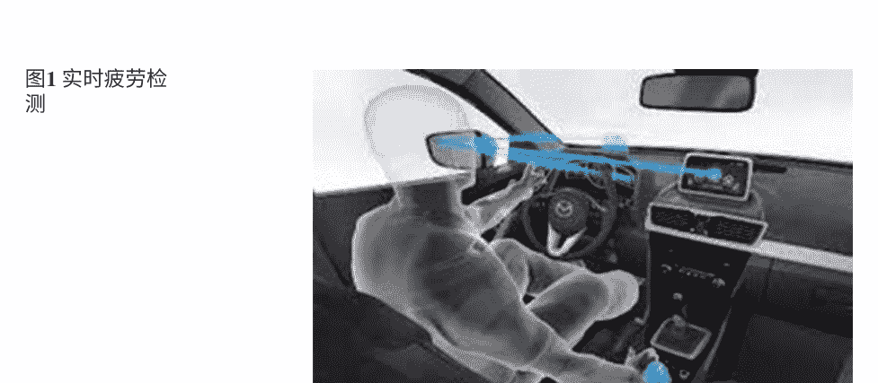

图2 驾驶员困倦系统中的网络摄像头设置

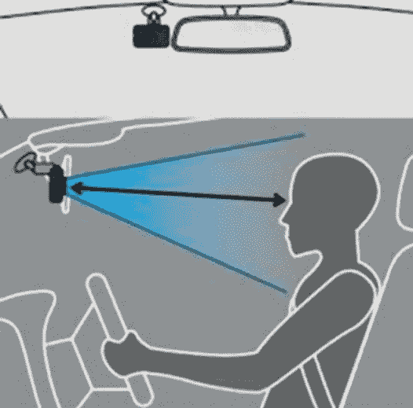

### 3 数据集

在研究论文中，没有一个常规的数据集洞察。在《驾驶员疲劳和疲劳检测以减少道路交通事故》[3]中，使用了18个视频序列和14个不同的受试者来实现其方法。

《使用眼睛纵横比和闭眼比的实时驾驶员疲劳检测系统》[4]利用了来自50名志愿者录制的视频数据。基于视觉的真实驾驶条件下的疲劳检测系统使用了包含10个不同用户的数据集，总共有30个驾驶小时，1296分钟的清醒时间和504分钟的疲劳时间。在《利用面部特征点进行实时眨眼检测》[5]中，使用了两个数据库，其中包括80个短视频和20个受试者（ZJU），以及8个长视频（Eyeblink8）。其他数据集包括驾驶过程中的200张照片，其中100张是睁开/半睁开的，100张是闭上的。

### 4 方法论

#### 4.1 预测任务

这个项目的目标是形成一个能够识别一个人闭眼几秒钟的困倦检测系统[12]。这些天，车内的意图动力健康状况是通过支持系统来避免事故的。我们正在识别意图动力的眨眼，并确定意图动力的状态和中心，我们正在计算分数。这种方法将在疲劳时警告意图动力。

被识别[13]。困倦可能是意识减少的状态，由于缺乏休息或疲劳而导致一个人入睡。

根据用于检测的参数，困倦检测技术分为两种方法，即干扰方法和非干扰方法。这两种方法之间最大的区别是干扰方法[14]。一个仪器与意图动力连接，然后记录和监测仪器的成本。然而，干扰方法具有高精度，与驾驶员的不适感成正比，因此不使用该方法。有几种不同的眼球跟踪和监测算法和方法。其中大部分与意图动力的视频图像中的眼睛特征（眼睛的常见反射）有关[15]。该项目的初衷是利用视网膜反射作为在脸上找到眼睛的一种方法，然后利用缺乏这种反射来识别眼睛闭合的时刻。对于困倦的驾驶员来说，闭眼时间比正常的眨眼时间长。这也是一个非常短暂的时间，可能导致非常严重的事故。因此，一旦发现闭眼，我们将立即警告驾驶员[16]。

#### 4.2 使用卷积神经网络

在“司机疲劳”章节中，我们使用了卷积神经网络的基本概念，并涉及到两个概念，神经网络和OpenCV，来检测感兴趣区域。我们的感兴趣区域是脸部和眼睛；因此，我们正在检查眼睛是睁着还是闭着[17]。

因此，本章的主要部分是检测脸部和眼睛，然后将其输入到我们已经训练好的神经网络中，将眼睛分类为睁着或闭着[18]。基本上，我们正在提取每一帧并将其输入到神经网络中，然后将每一帧分类为闭眼或睁眼，并基于此计算得分，如果得分超过特定阈值，我们将标记驾驶员为睡着。我们的基本思想是使模型尽可能简单，并获得最高的准确性。我们也可以在有或没有眼镜的情况下获得准确的结果[19]。因此，这些是本模型中使用的总体概念。因此，如果我们将整体架构定义为一些特定的步骤，模型将如下所示，并且其中涉及的不同步骤应标记如下（如图3和图4所示）：

- 1. 使用训练数据训练神经网络架构。
- 2. 在数据集上训练模型后，我们可以开始了。
- 3. 使用OpenCV检测感兴趣的区域，并使用Haar级联检测人脸。
- 4. 现在我们将这个输入到我们的神经网络架构中，它将对眼睛进行分类，判断是睁着的还是闭着的。
- 5. 基于此，我们将计算一个分数，如果大于特定的阈值，我们将发出警报。

# 图3 神经网络的工作流程

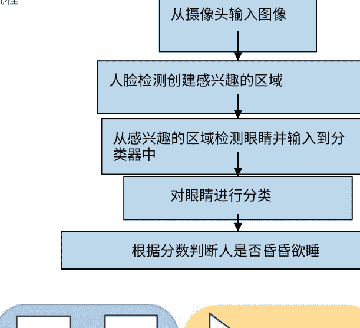

# 图4 工作模型的工作流程

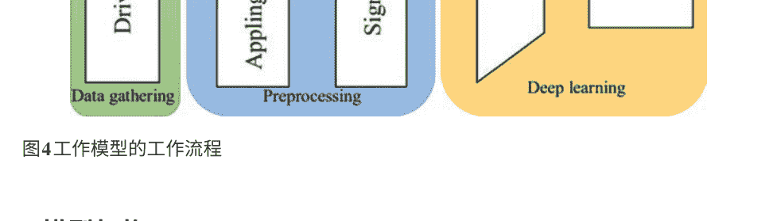

### 5 模型架构

关于模型架构，我们有三个卷积层和一个全连接层。第一个卷积层由32个节点[20, 21]组成，卷积核大小为3，第二和第三个卷积层分别由64个节点组成，卷积核大小为5，最后一层即全连接层由256个节点组成。设置的示意图如图5所示。

- 神经网络架构包括以下层次：
- 1. 卷积层；32个节点，核大小为3
- 2. 卷积层；64个节点，核大小为5
- 3. 卷积层；64个节点，核大小为5
- 4. 全连接层；256个节点

图5 设置的示意图

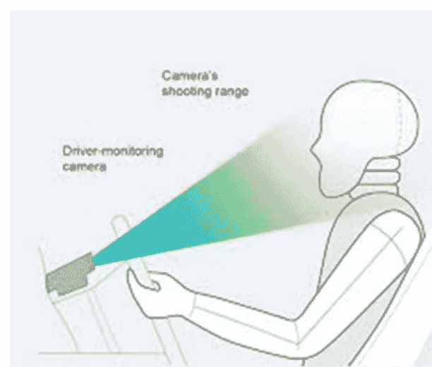

最后一层使用的激活函数是softmax [22]。

### 步骤1 - 训练模型

第一步将是训练神经网络架构，如图6所示。上面已经定义了神经网络架构，基本上可以分为四个部分，即三个卷积层和一个全连接层。卷积层使用的激活函数是ReLU，全连接层使用的激活函数是softmax [23]。

### 步骤2 - 使用OpenCV工作

在训练模型之后，我们可以开始使用OpenCV进行工作，我们将使用Haar级联和OpenCV [24]来检测人脸。

### 步骤3 - 使用OpenCV检测感兴趣的区域，并使用Haar级联检测人脸。

为了区分图片中的人脸，我们需要将图片转换为灰度图像，因为OpenCV用于对象识别的算法需要灰度图像作为输入[25]。我们不需要彩色数据来识别物体。我们将使用Haar级联分类器来识别人脸。这行代码用于设置我们的分类器。

然后，我们进行识别。

```
faces = face.detectMultiScale(gray)
```

它返回一个包含物体位置的数组，包括x、y坐标和物体边界框的高度和宽度。现在，我们将在图像上绘制边界框以突出显示每个人脸。

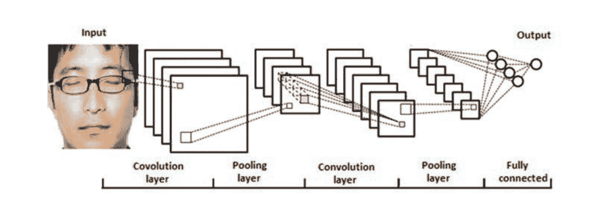

用于检测眼睛的方法与检测人脸的方法相同[26]。
首先，我们分别为左眼和右眼设置分类器，然后使用它们来检测眼睛。

```
left_eye = leye.detectMultiScale(gray)
```

目前，我们希望仅从整个图像中删除眼睛信息。
这可以通过分离眼睛的边界框来实现，然后我们将使用此代码从框架中提取眼睛图像。l_eye仅包含眼睛的图像数据。这可以输入到我们的卷积神经网络分类器中，该分类器可以预测眼睛是睁着的还是闭着的。同样，我们将把右眼提取到r_eye [27]中。

### 步骤4 - 现在我们将把这个输入到我们的神经网络架构中，该架构将把眼睛分类为睁着的或闭着的。

我们使用卷积神经网络分类器来预测眼睛的状态。
为了将我们的图像处理到模型中，我们需要执行特定的操作，因为模型需要最佳的估计值[28]。首先，我们使用将彩色图像转换为灰度图像。

在那一点上，我们使用调整大小的图片。

```
cv2.resize(r_eye, (24, 24))
```

我们对数据进行了标准化，以便更好地融合 r_eye = r_eye/255 (所有值都在0和1之间)。扩展比例以处理我们的分类器[29]。
我们使用堆叠模型。

```
model = load_model('models/cnn.h5')
```

现在，我们用我们的模型预测每只眼睛。

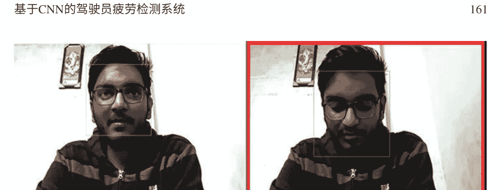

# 图7 带眼镜的实时瞌睡检测

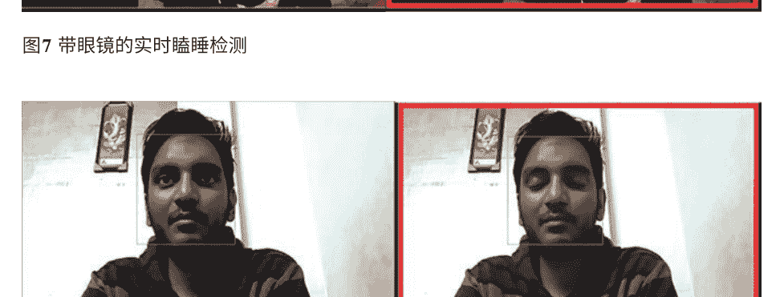

# 图8 不带眼镜的实时瞌睡检测

```
lpred = model.predict_classes(l_eye)
```

如果 lpred[0] 的值为1，则表示眼睛是睁开的；否则，如果 lpred[0] 的值为0，则表示眼睛是闭着的。

### 步骤5 - 基于此，我们将计算一个分数，如果它大于特定的阈值，我们将响起警报。

分数是一个我们将用来判断个体闭眼时间的值。因此，如果两只眼睛都闭着，我们将继续增加分数，当眼睛睁开时，我们将减少分数[30]。我们使用绘图函数将结果显示在屏幕上，这可以显示个体的实时状态。

根据预测的输出，系统决定是否发出警报或生成警告[31, 32]。基本上，如果得分大于预定义的阈值，警报将会响起，其实现如图7所示，带有眼镜，图8没有眼镜。

### 6 机器学习方法

AI方法可以综合分为两种详细信息：

- 无监督学习：该算法用于从没有标签的数据集中推断。因此，它通常用于发现隐藏的示例和收集数据。
- 监督学习：该算法用于从命名的数据集中推断。

朴素贝叶斯、支持向量机和随机森林是广泛使用的机器学习技术。除了人工神经网络，卷积神经网络也被使用。

#### 6.1 支持向量机分类器

监督向量机是具有学习计算的监督学习模型，用于分类和回归问题的信息分析[33]。支持向量机的显著优势在于我们可以在高维空间中获得高效性。

它试图降低数据集的维度，以便给定的数据可以有效地分为两部分。支持向量使用训练点的子集在其决策函数中，从而可以获得内存高效的模型。但是需要注意的是，在不平衡数据的情况下，SVM在少数数据上表现不佳。scikit库为我们提供了不同类型的核函数，包括线性、RDF和多项式数学函数。

EAR = (|P2-P6|+|P3-P5|)/2*(|P1-P4|) (1)

在支持向量机的分类中，真正例率为80%，假正例率为20.4%，准确率为80%，准确度为80.7%[34]。

#### 6.2 随机森林

随机森林算法用于特征分类和回归。它比单个决策树更好，因为通过对结果进行平均，减少了过拟合问题，它是一组树。

在这个过程中，基于数据样本形成了一棵决策树，然后从每棵树中得到预测结果，最终选择最有效的解决方案。

通过投票选择最佳解决方案。集成中的每棵树都是从训练集的自助样本构建的。构建树时，选择的分割不再是可用特征中的最佳分割。因此，我们应该从随机子集中选择最佳特征，而不是将它们视为整个子集。由于这种随机性，与非随机树相比，偏差增加了一小部分。通过平均减少方差，从而得到一个整体上更好的模型[35]。

### 7 技术比较

驾驶员疲劳和昏睡检测以减少道路交通事故侧重于使用SVM进行面部定位，眼/嘴区域限制和圆形Hough变换进行眼部定位。Kappa统计量为0.86，CCR为0.94。当仅使用SVM时，所提出的框架在观众之间获得了几乎理想的理解，而当打哈欠时，精确度达到81% [8]。实时司机疲劳检测系统通过利用面部特征点检测、EAR（眼睛纵横比）（如图9所示）、ECR（闭眼比例）和疲劳检测，具有84%的准确率。它还使用了各种分类器，如朴素贝叶斯、支持向量机和随机森林，它们的准确率分别为80%、80%和84%。基于视觉的真实驾驶条件下的疲劳检测器利用红外摄像头，准确率为90.68%，但它不能覆盖更多的疲劳检测。因此，它不像之前的方法[9]那样可靠。使用ANN图像处理的驾驶员疲劳检测侧重于通过处理驾驶员的眼睛图像来检测疲劳。这里使用了两种方法，第一种是隐藏层人工神经网络，第二种是深度学习自编码神经网络。这两个网络都表现出良好的分类结果，准确率达到100%。最佳训练性能为0.033981，发生在第438个时期[10]。

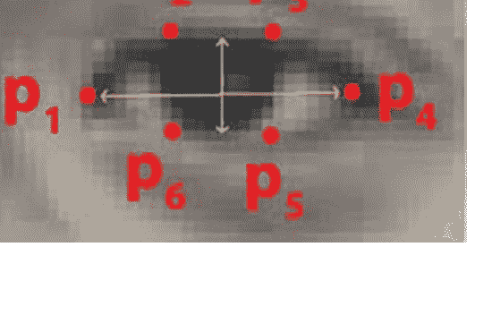

在真实驾驶条件下，基于视觉的疲劳位置检测使用了PERCLOS（眼睛闭合百分比）估计技术，这里使用了眼睛图像滤波来计算感兴趣区域和眼睛闭合评估[11]。所提出方法的准确性表明特异性为92.21%，敏感性为79.84%。将该指标与其他角度结合可以改善结果。

### 8 结论

从上述结果（见表1和图10）可以得出结论，使用人工神经网络或神经网络实现的驾驶员疲劳模型具有约94%的最高准确性，并能产生有希望的结果。在这个方法中，我们提取感兴趣区域并基于数据集进行处理。

表1 使用技术的比较

| 序号 | 使用的技术 | 准确率（%） |
| :--- | :--- | :--- |
| 1 | 在眼睛/嘴巴区域上使用SVM和CHT | 86 |
|  | 用SVM打哈欠 | 81 |
| 2 | 朴素贝叶斯 | 80 |
|  | SVM | 80 |
|  | 随机森林 | 84 |
| 3 | 神经网络 | 94 |
| 4 | PERCLOS | 92.21 |

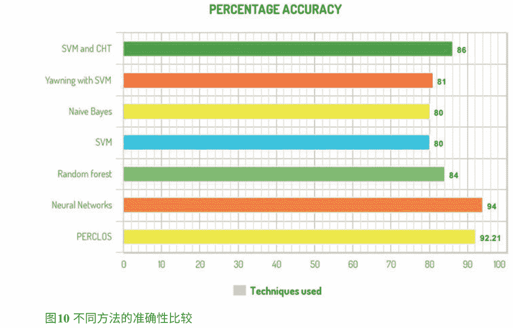

## 基于CNN的驾驶员疲劳检测系统

可用于计算分数并识别眼睛闭合或睁开。使用不同的层，具有不同的内核大小和不同的节点数。除此之外，它还可以在使用或不使用眼镜的情况下正常工作并准确执行，所定义的模型架构具有最佳性能。

### 参考文献

1. S. Sangle, B. Rathore, R. Rathod, A. Yadav, and A. Yadav, “实时瞌睡检测系统”, 第87-92页, 2018年。
2. K. Das and R. N. Behera, “机器学习综述: 概念、算法和应用”, 《国际创新研究计算机与通信工程杂志》, 第5卷, 第2期, 第1301-1309页, 2017年。
3. Alioua, N., Amine, A., Rziza, M.和Aboutajdine, D., 2020年。驾驶员疲劳和昏睡检测以减少道路交通事故。
4. Mehta, S., Dadhich, S., Gumber, S.和Jadhav Bhatt, A., 2020年。实时驾驶员昏睡检测系统使用眼睛纵横比和眼睛闭合比。
5. T. Soukupova和J. Cech, “使用面部特征点的实时眨眼检测”, 计算机视觉冬季研讨会 (CVWW), 2016年。
6. J. D. Fuletra, “关于驾驶员昏睡检测技术的调查”, 国际计算与通信的最新和创新趋势杂志, 11月号, 页码816-819, 2013年。
7. S. Junawane, S. Jagtap, P. Deshpande和L. Soni, “驾驶员昏睡检测技术: 一项调查”, 第6卷, 第11期, 页码2015-2017, 2017年。
8. S. Podder和S. Roy, “使用眼睛状态改善道路安全的驾驶员瞌睡检测”, 《国际创新研究计算机与通信工程学报》, 卷1, 第7期, 2013年。
9. F. Omidi和G. Nasleseraji, “用于确定驾驶员瞌睡的非侵入性方法: 叙述性综述文章”, 《国际职业卫生杂志》, 卷8, 第3期, 页码186-191, 2016年。
10. S. S. Nagargoje和D. S. Shilvant, “基于图像处理的汽车辅助驾驶员瞌睡检测系统”, 《国际电气与电子研究学报ISSN》, 卷3, 第4期, 页码175-179, 2015年。
11. A. Gopal和V. Vineeth, “驾驶员瞌睡检测系统”, 《国际电子与计算机科学进展学报》, 卷4, 第3期, 页码101-104, 2017年。
12. K. C. Patel, S. A. Khan, 和 V. N. Patil, “基于视觉信息的实时司机疲劳检测系统”, 卷8, 号3, 页码16200-16203, 2018年。
13. I. García, S. Bronte, L. M. Bergasa, J. Almazán, 和 J. Yebes, “基于视觉的真实驾驶条件下的疲劳检测器”, IEEE智能车辆研讨会, 论文集, 页码618-623, 2012年。
14. Park S, Pan F, Kang S, Yoo CD. 基于各种深度网络的特征表示学习的司机疲劳检测系统。亚洲计算机视觉会议Springer 2016;154-164。
15. Christy, Jasmeen Gill, “司机疲劳检测系统综述”, IJCST, 第3期第4期, 2015年7-8月。
16. Omkar, RevatiBhor, PranjalMahajan, H.V. Kumbhar“司机瞌睡检测系统的调查", vol.132, 2015.
17. Deepa K B, Chaitra M, Ankit Kumar Sharma, Sreedhar V S, Prashanth Kumar H.K“通过眨眼传感器和酒精检测器预防事故", IJER, vol.no.4, issue no.7, 2015.
18. Tejasweenimusale, Prof B, H. Pansambal, “使用图像处理的实时司机瞌睡检测系统", IJRE AM, Vol 02, Issue 08, 2016.
19. V Triyanti, H Iridiastadi, "基于驾驶员行为的瞌睡检测的挑战", IOP Conference Series: Materials Science and Engineering, Volume 277, 2017.
20. Anandan, P. and R. Sabeenian, "使用Curvelet、Contourlet、Ridgelet和小波变换的图像压缩技术-综述" Biometrics and Bioinformatics, 2013. 5(7):p. 267–270.
21. Quang N. NguyenLe T. Anh ThoToi Vo VanHuiYuNguyenDucThang， “基于面部特征的视觉疲劳检测”，第六届越南生物医学工程发展国际会议(BME6)第723-727页，BME 2017年。
22. M. Hemamalini, P. Muhilan“使用眨眼传感器进行事故预防”，第1卷，第L11期，2017年。
23. El-Shazly, E., Abdelwahab, M., & Shimada, A. (2016). 基于MYO传感器获得的特征的实时高效人机交互(HCI)算法。2016年IEEE第59届国际中西部电路与系统学术会议(MWSCAS)第1-4页。阿布扎比，阿拉伯联合酋长国：IEEE。
24. Zhiqiang, X., Xuejun, Q., &Jialiang, H. (2017). 一种基于Kinect和深度图像理解的新型多媒体人机交互(HCI)系统。创新计算技术国际会议(ICICT)第1-6页。印度科英布托尔：IEEE。
25. Smirnov AV, Kochevnik A, Lashkov I, Baraniuc O, Parfenov V. 基于智能手机的危险驾驶情况识别：算法和实现。在FRUCT中第306-313页(2016年)。
26. Chang K, Oh BH, Hong KS. 使用前置和后置摄像头实现基于智能手机的驾驶辅助系统。在2014年IEEE国际消费电子会议上（第280-281页）。IEEE（2014年）。
27. Xu L, Li S, Bian K, Zhao T, Yan W. Sober-Drive：一种基于智能手机的疲劳驾驶检测系统。在2014年IEEE国际计算、网络和通信会议上（第398-402页）。IEEE（2014年）。
28. Al Shqaqi, B., A.S. Baquhaizel, and M.E.A. Ouis, "Driver Drowsiness Detection System" Advances in Systems Science and Applications, 2016. 16(2): p. 94–102.
29. Ambekar, S.N., "Driver Drowsiness Detection System" International Journal, 2016. 1(9).
30. 辛格，V.， “使用超声图像重建ATFL韧带的3D重建”，在智能和先进系统（ICIAS）上，2014年第五届国际会议。2014年。IEEE。
31. Bappaditya Mandal，Liyuan Liyuan Li，Gang Sam Wang和JieLin“基于鲁棒视觉分析的公交车司机疲劳检测”，IEEE智能交通系统交易，2016年。
32. RamalathaMarimuthu，A. Suresh，M. Alamelu和S.Kanagaraj“使用图像处理和事故预防进行驾驶员疲劳检测”，国际纯粹和应用数学杂志，第116卷，2017年。
33. M Hwang，S Kim，K S Hong，Park Driver使用耳内EEG进行疲劳检测IEEE工程医学和生物学会年度国际会议论文集，第4646-4649页，发布于2016年。
34. Joyce G, Lilley M, Barker T, Jefferies A.: 移动应用程序教程：来自人机交互专家视角的有用性感知。在人机交互国际会议上（第302-308页）。Springer国际出版社。（2016）。
35. Kang, P., Wei, Y., & Wei, Z. (2017)。 基于嵌入式网络和Qt技术的粮仓通风控制系统。2017年第29届中国控制与决策会议（第2275-2280页）。中国重庆：IEEE。

## 使用深度学习进行预测方法

B. Vijayalakshmi, M. Kaliappan, K. Ramar, K. Vijayalakshmi, 和 S. Vimal

### 1 引言

现在，人们都对未来的经济、政治、体育、市场需求和环境因素的趋势感兴趣。在这种情况下，预测是一项重要的任务。

预测模型根据过去的历史数据分析来预测未来的结果。结果可能取决于过去的值以及其他可能影响预测值的外部因素。人们从古代开始就使用各种方法进行预测。但是那些方法的准确性不够，因为当时历史数据的可用性和计算设施都很低。但是在现在的情况下，数据可以从各种形式的多个来源中检索，并且高性能计算设施可以更快地处理大量和多样化的数据。这有助于设计各种高效的预测模型，从而提高预测准确性。

### 1.1章节的主要目标

本章主要关注不同的深度学习架构，如全连接神经网络（FCNN），卷积神经网络（CNN），循环神经网络（RNN），如长短期记忆（LSTM），门控循环单元，生成对抗网络（GAN）和深度强化学习，以开发具有各种参数的预测模型，并揭示这些方法的应用。

#### 1.2 预测及其需求

在当前情况下，预测在每个领域中都起着至关重要的作用。预测是基于过去和现在的数据估计未来值或趋势的过程。该过程分析大量数据以识别先前数据中的趋势，从而有助于预测未来趋势。

#### 1.3 预测应用

在每个领域中，每个人都希望预测是否会发生某些事件，未来趋势是什么。在商业领域中，它改善了销售和生产的决策。在医疗领域，预测有助于根据健康参数预测健康状况。经济预测有助于对GDP和通胀等经济因素进行预测。股市预测趋势可用于预测未来的股票价值以进行投资。

准确预测环境因素如天气、风暴和其他自然灾害有助于挽救宝贵的人类生命。在体育领域，它将预测特定比赛的结果。在交通领域，预测有助于预测将来将使用特定交通设施的用户或车辆数量，以改善交通管理系统。

### 2 时间序列预测

时间序列是一系列按照时间间隔收集的数据值。时间序列预测是根据观察到的值，设计和使用模型来预测特定时间点的未来值的过程。这种预测可以是单步预测，即预测下一个时间步的值，也可以是多步预测，即预测后续时间间隔的值。

- (i) 单变量预测

单变量时间序列预测模型使用单个时间序列作为因变量。例如，如果特定位置的交通流量仅依赖于过去观测到的交通流量值，则该模型被称为单变量预测。

- (ii) 多变量预测

多变量时间序列预测模型使用多个因变量。例如，如果特定位置的交通流量不仅依赖于过去观测到的交通流量值，还依赖于速度和天气等其他因素，则该模型被称为多变量预测。

#### 2.1 预测模型

在预测任务中，提出并使用了各种模型。该方法可能是基于统计[1]或基于神经网络[2]的方法。为了预测时间序列，使用了一种不断演化的人工神经网络模型和遗传算法。论文[3]对各种风力预测方法及其有效性进行了综述，这对于减少发电的不可预测情况非常有用。深度学习方法[4]提供了各种机器学习模型和用于预测能源消耗值的混合模型。

##### 2.1.1 朴素预测模型

在这种朴素的预测模型中，预测值被设置为最后观察到的值。类似地，在季节性朴素模型中，预测值将被设置为同一季节中最后观察到的值。这是最简单的方法。

##### 2.1.2 线性回归模型

它是预测未来值的重要工具。在简单线性回归模型中，它找到了预测变量和预测器变量之间的线性关系。它不考虑任何季节性或周期性。对于线性数据，它将产生完美的结果。它使用最小二乘法来拟合非线性模型的值。线性回归模型可以是简单的、多个的，也可以是基于多个预测变量和响应变量的。在一个朴素的多元线性回归框架中，用于预测短期负载。它被用作负载预测的基准模型。提出的多元线性回归模型用于预测短期负载值[6]。

##### 2.1.3 指数平滑模型

指数平滑模型主要用于没有趋势或季节性模式的数据。该方法基于过去观测值的加权平均来预测未来值。但是随着观测值向过去移动，权重值呈指数递减。最近的观测值获得较高的权重值，而初始观测值获得较低的权重值。在[5]中，提出了一种Holt-Winters指数平滑模型，可以适应两种不同的季节性。在[7]中，基于误差、时间和季节性的指数平滑方法用于预测蜂窝网络中的数据流量。

##### 2.1.4 ARIMA

ARIMA模型是自回归移动平均模型。它基于差分观测值和前一时间步的残差误差的线性函数，用于预测时间序列数据的下一步值。它结合了自回归和移动平均以及序列值的差分，使序列具有平稳性。ARIMA模型的变体是SARIMA模型，也可以对季节性数据进行建模。ARIMA模型用于预测电力价格[8]和甘蔗产量[9]。深度学习中的各种方法使用SARIMA模型来预测黄瓜价格和交通流量值[10, 11]。

#### 2.2 经典模型中的问题

这些模型要求数据以完整的形式存在。它不支持有效地处理缺失数据。大多数这些模型基于线性关系，同时处理单变量数据。这些模型可以处理少量的数据。我们处于大数据时代，多个来源的数据以大量的形式生成。这些大数据应该被处理以找到现有数据中的模式，以便进行更好的预测。统计模型在大数据情况下表现不佳。这些模型的准确性不够。因此，应设计一个模型来消除传统预测方法所带来的所有问题。

### 3 深度学习

深度学习是机器学习的一个子集，在这种方法中，机器通过示例自我学习。它基于具有多个隐藏层的人工神经网络，使学习过程更容易。深度学习模型可以自动学习输入数据的特征，从而改善。

#### 3.1 用于预测的深度学习模型

大量数据和计算能力的可用性使得基于机器学习的预测模型成为流行的选择。在最近的时间里，基于深度学习的方法在时间序列预测中变得流行，在各个领域中，这是因为它们具有自动特征提取的特性。基于深度学习的模型可以更好地处理数据中的缺失值。它们支持单变量和多变量预测。这可以通过自动学习从输入到输出的复杂映射来处理数据之间的非线性关系。它们能够高效地进行多步预测。

这些模型将深入分析大量数据，并在大多数领域中产生更好的预测。它们被设计用于对未来事件或趋势进行短期和长期预测。在[12]中，讨论了基于深度学习的各种金融时间序列预测模型的综述。讨论了各种模型之间的比较和它们的性能。

讨论了用于预测的模型，如多层感知器（MLP）、全连接神经网络、卷积神经网络（CNN）、循环神经网络（RNN）、生成对抗网络（GAN）和强化学习模型。

#### 3.2 全连接神经网络（FCNN）

全连接神经网络由多个全连接层组成。它是一个前馈神经网络，包含一个或多个隐藏层。它能够学习非线性函数。它支持多变量和多步预测。

它可以用于执行时间序列预测，其中输入特征是前几个时间步的观测值，并预测一个或多个时间步的未来值。

输入层将特征作为输入，输出层产生预测值。在这里，我们将讨论全连接神经网络如何进行时间序列预测。图1显示了一个样本的FCNN，它将四个时间步的股票详情作为输入。这个网络有两个隐藏层。第一层包含五个神经元，第二个隐藏层包含三个神经元。最后，输出层包含一个神经元，用于预测下一个时间步的股票值。

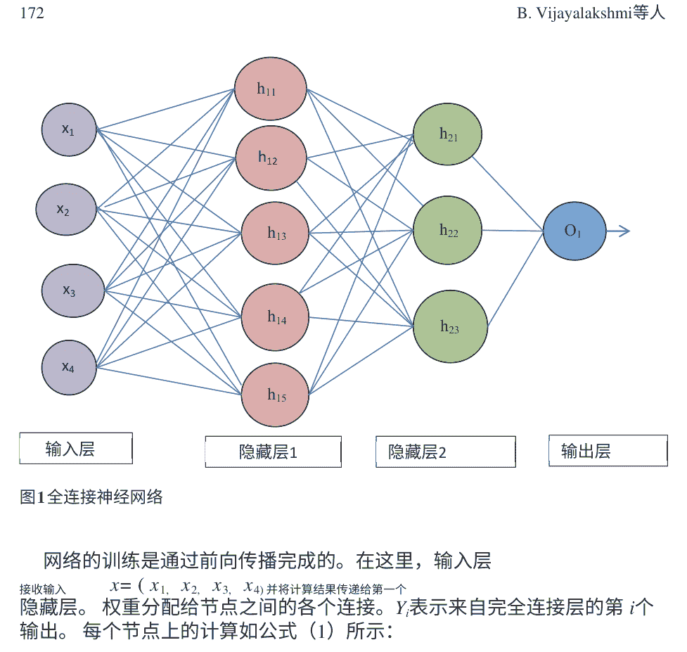

图1全连接神经网络

网络的训练是通过前向传播完成的。在这里，输入层接收输入 x = (x1, x2, x3, x4) 并将计算结果传递给第一个隐藏层。权重分配给节点之间的各个连接。Y_i 表示来自完全连接层的第 i 个输出。每个节点上的计算如公式（1）所示：

Y_i = sigmoid(w_i * x_i + b)   (1)

sigmoid激活函数用于引入数据的非线性性。W_i 表示权重值，b 表示偏置值。权重和输入相乘，并与偏置值相加。然后应用sigmoid激活函数产生输出，作为第一个隐藏层的输入。重复计算并传播值，直到达到输出层。最后，得到最后一层的输出 Ŷ，即下一个时间步的预测值。

接下来，将预测结果与实际值进行比较，以找出错误。这些错误值将被传播回各层，以优化权重以减小误差。这种反向传播计算损失函数的梯度。计算梯度值，并使用优化方法来更新网络中的权重。

输出层首选的激活函数是修正线性单元（ReLU），它消除了梯度消失的问题。在这个用于时间序列预测的全连接神经网络中使用的损失函数是均方误差（MSE）。用于训练网络的优化函数是随机梯度下降（SGD）。

它可以用于单步和多步时间预测。全连接神经网络可能会遭受过拟合问题，即使在训练数据上表现良好，也无法正确地处理新数据。

通过使用正则化技术（如dropout和early stopping），可以避免这种现象。Dropout是指随机从网络中删除一些节点。这些节点在特定迭代中不被考虑。它有助于减少节点之间的相互学习，并学习更强大的特征。

模型应该经过足够的训练，以学习从输入到输出的映射，但不应过长，否则会降低性能。当模型的性能下降时，应停止训练。这被称为提前停止。

通过这种方式，全连接的神经网络可以用于解决时间序列预测问题。

#### 3.3 卷积神经网络（CNN）

卷积神经网络是一种可以自动从输入数据中学习和提取特征的神经网络。这使得CNN经常用于图像数据集。CNN也可以用于预测时间序列信息。从输入时间序列值中提取特征，这些值被视为一维图像。这些特征代表了过去历史数据中的重要特征，对于预测未来结果起着重要作用。使用CNN可以分析序列数据中的时间顺序和依赖关系。它可以有效地执行单变量、多变量以及单步和多步预测。在[13]中提出了一种基于卷积神经网络的深度学习模型，用于预测外汇汇率。在[14]中，提出了一种用于预测股票价格走势的CNN模型，并且它能够高效地预测中国股市的细节。卷积神经网络包括卷积层、池化层、全连接层和密集层，如图2所示。

#### (i) 卷积层

卷积层从给定的输入中提取特征。在时间序列预测中，将输入序列视为一维图像，从中识别出用于预测的重要特征。识别出在预测下一个时间步骤值中起关键作用的要点。将卷积操作应用于输入序列和滤波器值。输出是一个特征图，即从输入序列中提取的低级特征。

应用多个卷积层来提取高级特征。

在卷积之后，可以应用ReLU、sigmoid和tanh激活函数来引入系统中的非线性。ReLU是首选，因为它有助于消除反向传播过程中的梯度消失问题。当向下移动到较低层时，梯度值呈指数级下降，这降低了该层神经元的学习能力。

图2 卷积神经网络

#### (ii) 池化层

池化层用于减少输入值的空间维度。池化可以是最大池化或平均池化。在最大池化的情况下，考虑值集合中的最大值。在平均池化中，取平均值。

#### (iii) 全连接层

在检测到高级特征之后，网络末端的全连接层识别特征在预测下一个时间步的值中的相关性。然后它产生相应的下一个时间步的预测值。

网络可以通过一种称为反向传播的方法进行训练。误差值被计算为预测时间步值与实际输出之间的差异。应该通过更新在损失值中贡献最大的滤波器的权重值来最小化误差值。计算梯度值，并将该值在反向传递中传播到整个网络。基于这个值，为下一次迭代更新权重。该过程重复进行多个时期，直到模型达到所需的准确性。

卷积神经网络用于预测不同实体，例如，在[15]中，提出了一种基于深度学习的短期预测（DLSF）方法来预测电负荷。它使用卷积神经网络对输入进行聚类，并使用另一个神经网络进行预测。在[16]中，提出了基于GRU-CNN的混合模型，用于支持来自智能传感器和智能电表的大量数据，这在数据之间引入了复杂性。在这个模型中，通过GRU从时间序列负载数据中提取时间特征，而CNN则提取其他特征。在[17]中，使用CNN模型和PCA进行特征提取来解决电力价格预测问题。遗传方法使用负载平衡技术[38]和集群形成[39, 40]，这对解决负载平衡问题非常有用。

#### 3.4 循环神经网络（RNN）

RNN是一种适用于解决涉及输入序列的问题的神经网络类型。它可以被定义为具有循环和反馈的网络，允许持久化信息[41]。这种循环连接为神经网络增加了记忆，有助于从长输入序列中学习。图3显示了简化的RNN模型。

RNN可以展开成一个完整的网络。X表示输入序列<x0,x1...>，S表示状态向量，O表示输出。训练RNN的方法如下。

xt表示时间 t的输入。每一层根据公式（2）计算时间t的状态 St，其中使用了前一个隐藏状态和当前输入。

```
S_t = A(WS_{t-1} + Ux_t)
```

对于时间序列问题，通常使用双曲正切函数 A。当前状态成为下一个时间步的 S_{t-1}。根据需要重复多个步骤，并将所有先前状态的信息组合起来[42]。当获得最终状态时，可以使用公式（3）产生输出：

```
O_t = f(W * S_t)
```

将获得的输出与实际输出进行比较，并找出误差值。通过反向传播更新权重以减小误差。

在这里，我们需要回到过去来调整之前时间步的权重。

一种基于梯度的方法称为时间反向传播在RNN中使用。每个时间步的权重都是相同的。基于给定的权重值[43]，计算每个时间步的梯度值。所有时间步的梯度值都被合并。

图3 简化的RNN

值被组合在一起。基于这个值，权重被更新。如果梯度值接近零，那么所有的值都将变为零。这种情况导致梯度消失的问题，网络将无法学习任何东西。RNN非常适用于时间序列预测问题，如家庭负载预测[18]。

#### 3.5 长短期记忆（LSTM）

LSTM是一种递归神经网络，能够学习输入序列中的长期依赖关系。通过存储长期信息来解决RNN的梯度消失问题，以进行决策[44]。因此，它非常适用于时间序列预测问题，如股票市场预测、天气预报等。

LSTM的内部结构如图4所示，具有一个记忆单元，有助于学习哪些数据应该保留或丢弃。在输入序列的处理过程中，细胞状态携带相关信息[45]。神经网络结构被称为门，决定哪些信息应该存储在细胞中。

LSTM由三个门结构组成，分别是输入门、遗忘门和输出门。图4描述了LSTM细胞的各种功能。

遗忘门帮助决定哪些信息应该存储在细胞中或从细胞中丢弃。它使用前一个隐藏状态和当前输入应用sigmoid函数来决定是否保留或丢弃数据[46]。接下来，需要决定从当前输入中添加哪些信息到细胞状态中。

为此，使用输入门来决定要更新的值。它使用与遗忘门相同的输入。细胞状态ct可以通过其自身的值和ct的值进行更新。输出值是基于细胞状态信息计算得出的。它由方程(4)，(5)，(6)，(7)，(8)和(9)表示：

```
f_t = \sigma (W_f [x_t h_{t-1}] + b_f) \tag{4}
i_t = \sigma (W_i [x_t h_{t-1}] + b_i) \tag{5}
C_t = f_t C_{t-1} + i_t \tilde{C_t} \tag{6}
\tilde{C_t} = \tanh (W_c [x_t h_{t-1}] + b_c) \tag{7}
O_t = \sigma (W_o [x_t h_{t-1}] + b_o) \tag{8}
h_t = O_t \cdot \tanh (C_t) \tag{9}
```

通过LSTM可以轻松识别输入序列中的长期依赖关系。有多种LSTM的变体可用，例如深度门控循环神经网络[19]和时钟RNN[20]，用于解决长期依赖问题[47]。

图4 LSTM单元

LSTM可以用于各种类型的预测，如股票价格、油价、洪水值、电力负荷值、雾、降雨值等。在[21]中，提出了基于LSTM的注意力模型来预测金融时间序列数据。它使用小波变换从序列数据中提取特征[48]。结合LSTM模型[22]的集成经验模态分解（EEMD）用于进行原油价格预测。在[23]中，提出了基于LSTM的注意力机制，称为时空注意力长短期记忆（STA-LSTM）模型。在[42]中，提出了基于LSTM的深度学习模型，用于预测短期负荷消耗。在[25]中提出了LSTM框架，用于预测短期雾数据。

#### 3.6 门控循环单元（GRU）

门控循环单元是LSTM的简化版本。它将输入门和遗忘门合并为一个称为更新门的单一门。它还将隐藏状态和细胞状态合并在一起，并且比LSTM具有更少的参数。

图5中显示的GRU使用两个门，即更新门和重置门，来决定应该传递哪些数据到输出。更新门有助于决定要丢弃哪些信息以及应该添加哪些信息。重置门有助于识别要遗忘多少旧数据[49]。 计算值的方程如下。

$x_t$表示时间步骤 $t$的输入。 更新门值 $z_t$是从当前输入和前一个隐藏状态值 $s_{t-1}$计算得出的。 遗忘门也计算具有不同权重值的相同事物。 根据重置门的值计算新的内存内容。 最后，计算当前隐藏状态值 $s_t$的值，该值将用于下一个时间步。 它由方程（10），（11），（12）和（13）表示：

```
z_t = \sigma(W_z [x_t, s_{t-1}])  (10)
r_t = \sigma(W_r [x_t, s_{t-1}])  (11)
\bar{s_t} = \tanh(W [r_t * s_{t-1}, x_t])  (12)
s_t = (1 - z_t) * s_{t-1} + z_t * \bar{s_t}  (13)
```

LSTM和GRU模型可以堆叠在一起，以识别输入序列数据中的长期特征。

基于GRU的多任务学习结合残差映射和特征工程的方法被提出来提高交通状态预测的准确性。

在[28]中，提出了基于CNN-GRU的模型用于预测短期公交负载。使用CNN提取和压缩重要因素以生成特征向量，并使用多层GRU进行预测。在[29]中，提出了将GRU与小波软阈值去噪模型相结合的方法来进行风速预测。使用WSTD从数据中去除冗余，并使用GRU学习特征并进行多步预测。在[30]中，使用基于卷积的双向门控循环单元（CBGRU）模型进行空气污染预测。该方法同时使用CNN和GRU进行预测[50]。

### 3.7 生成对抗网络 (GAN)

GAN是一种深度神经网络，可用于时间序列预测任务。在GAN架构中，有一个生成网络和一个判别网络，如图6所示。这些神经网络执行生成和评估样本的任务[51]。生成器以过去的时间序列数据（$x_0$, $x_1$, $x_2$, ..., $x_t$）作为输入，并生成 $x_{t+1}$，即下一个时间步的值。判别器评估真实值和生成值，并通过生成器和真实数据区分数据。它从生成器和真实值获取数据，并对数据进行分类，即判断数据是生成的还是真实的。在[31]中，多变量时间序列数据的缺失值是通过生成对抗网络生成的。除了门控循环单元，它还用于对时间序列中的不规则性进行建模。在[32]中提出的条件GAN用于学习和建模经济时间序列数据。CGAN的能力有助于预测不同类型的数据分布。在[33]中，基于DNN的生成对抗网络方法被用于建模金融时间序列数据。GAN通过学习数据的特性来生成数据[52]。

生成器的目标是最大化错误率。网络被训练成以一种方式，即它应该通过使判别器无法区分生成的数据和真实数据来产生准确的预测值。判别器的设计目标是使最终分类错误最小化。反向传播方法应用于两个网络。在每次迭代中，生成器网络的权重被更新以增加错误，并减少判别器的错误[53]。这可以被视为Eq. (14)中给出的极小极大两人博弈设置：

```
\min_G \max V (D, G) = E[ \log D( 真实的 ) ] + E[ \log (1 - D( 假的 )) ]
```

生成器网络可以使用LSTM设计，可以有效地预测下一个时间步的值。LSTM在时间序列预测领域表现良好。在GAN中，LSTM用于生成器网络，它以多变量股票数据作为输入来预测价格。输入X采用了t天的股票细节 X= [x_1, x_2,...x_t]。LSTM将产生输出 \hat{x}_{t+1}。与其他方法相比，这将提高预测模型的性能。两个网络将互相竞争，从而不断提高性能。因此，预测准确性得到了提高。

#### 3.8 深度强化学习

深度强化学习是一种通过试错学习的方式，代理根据每个动作的反馈来学习。在[34]中，详细描述了深度强化学习中的各种算法及其在各个领域中的应用。与监督学习或无监督学习不同，训练数据集不需要是标记或聚类的。它基于在交互环境中使用奖励和惩罚作为反馈来改进模型的学习概念。该模型的目标是找到能够最大化代理总奖励的最佳模型。系统通过适应环境中的变化进行持续训练。它基于马尔可夫决策过程。

强化学习可以用五元组表示为MDP，包括状态（包括状态集合）、动作、奖励函数和状态转移概率矩阵（p（s', r|s, a）表示将动作a应用于状态 s 时获得奖励 r并转移到下一个状态s'，折扣因子（γ，未来奖励的现值）。该过程的主要目标是最大化总奖励。

图7 深度强化学习表示

最初，神经网络的系数是随机分配的。在获得环境反馈的每个动作的标量值后，模型可以调整其权重并改善状态-动作值[24]。系统不仅通过即时奖励学习，还通过之前返回的多个时间步骤之前的奖励学习。深度强化学习的表示如图7所示。

在[35]中，使用聚类和强化学习技术的需求预测方法用于货运运营计划的预测。它执行长期货运需求每周预测。在[36]中，提出了一种新的集成深度强化学习模型来进行风速预测。在这项工作中，使用强化学习方法将三种深度神经网络结合起来。在[37]中，使用强化学习方法的随机梯度上升方法用于时间序列预测[39]。它在DBN与RBM中用于微调网络。

### 4 实验结果

全连接神经网络、卷积神经网络、RNN-LSTM和GRU模型等时间序列预测模型的性能使用股票市场预测数据进行比较。我们的实验分析考虑了2006年至2017年的股票市场细节。数据集中的属性包括开盘价、收盘价以及股票细节的最低价和最高价。

预测模型中使用的性能度量是平均绝对误差和均方根误差。平均绝对误差（MAE）是真实值与预测值之间绝对差值的平均值。均方误差（MSE）是真实值与预测值之间差值的平方的平均值。均方根误差（RMSE）是均方误差的平方根值。

表1 性能指标值
| 模型 | 均方根误差 | 均方误差 | 平均绝对误差 |
|---|---|---|---|
| FCNN | 3.90 | 15.22 | 2.88 |
| CNN | 6.95 | 48.34 | 5.38 |
| LSTM | 3.52 | 12.45 | 2.43 |
| GRU | 3.24 | 10.55 | 2.21 |

在LSTM模型中，设计了四个具有100个和50个神经元的LSTM层和一个最终输出层，其中包含一个单个神经元。在LSTM层之后应用了Dropout，以在每个时期中丢弃某些神经元，这有助于提高学习效果。这里使用了"RMS prop"优化器。

在RNN-GRU模型中，每个层应用了四个具有100个和50个神经元的GRU层，激活函数为tanh。这里也应用了dropout。使用了随机梯度下降优化器，并将学习率设置为0.01。在卷积神经网络中，使用了两个卷积层和一个最大池化层。应用了具有64个过滤器和"ReLU"激活函数的卷积层。之后，将特征图展平为一维数组，然后通过一个密集层来预测输出。在全连接神经网络模型中，设计了两个具有100个神经元的密集层和一个最终输出层来预测未来的股票价值。

这些模型的误差值如表1所示。图8显示，对于这个股票预测，GRU模型相比其他所有模型都表现更好。与其他预测模型的方法相比，MAE和RMSE值较低。基于输入以及季节性和趋势，每个模型的性能可能会有所不同。每个模型都根据应用程序及其需求进行调整。

### 5 结论

预测是所有领域中的一个重要研究领域。对未来趋势或事件的预测在丰富业务和确定市场需求方面起着至关重要的作用。准确预测未来需求有助于及时进行计划，避免延误服务。例如，交通流量预测有助于乘客和交通管理部门制定出行决策和出行时间。通过深度学习方法从大量过去数据和影响因素中学习深层特征，提供准确的预测。循环神经网络LSTM和GRU在时间序列预测方面表现出色。许多混合方法，如"统计"技术和深度学习技术，也被用于进行预测。最近，生成对抗神经网络也被用于提供准确的预测值。

图8 预测模型的性能比较

### 参考文献

1.  T. Hong, P. Wang和H. L. Willis，短期负荷预测的一个天真的多元线性回归基准，2011年IEEE电力与能源学会年会，底特律，密歇根州，美国，2011年，第1-6页，doi：http s://doi.org/10.1109/PES.2011.6038881。
2.  Juan Peralta Donate，German Gutierrez Sanchez和Araceli Sanchis De Miguel，时间序列预测。进化人工神经网络系统和统计方法之间的比较研究，国际人工智能工具杂志Vol. 21，No. 01，1250010（2012）https://doi.org/10.1142/S0218213011000462
3.  Chang，W-Y风力预测方法的文献综述。电力与能源工程杂志，2，161-168，2014）。https://doi.org/10.4236/jpee.2014.24023
4.  Chirag Deb，Fan Zhang，Junjing Yang，Siew Eang Lee，Kwok Wei Shah，关于建筑能源消耗的时间序列预测技术的综述，可再生与可持续能源评论，卷74，2017年7月，9 02-924页，https://doi.org/10.1016/j.rser.2017.02.0855。
5.  Bhatti Dhaval; Deshpande, Anur adha，使用多元线性回归进行短期负荷预测，国际电气与计算机工程学报，印尼日惹，卷10，第4期，（2020年8月）：3911-3917。
6.  J W Taylor，使用双季节指数平滑法进行短期电力需求预测，运筹学会杂志，54:8，79 9-805，2003年。 DOI: https://doi.org/10.1057/palgrave.jors.2601589
7.  Tran, Quang Thanh; Hao, Li; Trinh, Quang Khai. 使用指数平滑方法进行蜂窝网络流量预测。《信息与通信技术杂志》，[S.I.]，第18卷，第1期，第1-18页，2018年12月。ISS N 2180-3862。 Doi: https://doi.org/10.32890/jict2019.18.1.8277.

8. A. J. Conejo, M. A. Plazas, R. Espinola and A. B. Molina, 使用小波变换和ARIMA模型进行日前电力价格预测，在《IEEE电力系统交易》，第20卷，第2期，第1035-1042页，2005年5月，doi: https://doi.org/10.1109/TPWRS.2005.846054。

9. Kumar, Manoj & Anand, Madhu. 应用时间序列ARIMA预测模型预测印度甘蔗产量。《商业与经济研究》，第9期，第81-94页，2014年。

10. 罗，常寿，李英舟和卿凤伟。SARIMA模型在黄瓜价格预测中的应用。应用力学与材料373-375，2013年8月：1686-90。 https://doi.org/10.4028/www.scientific.net/amm.373-375.1686

11. 威廉姆斯，B. M.，和霍尔，L. A.，建模与预测车辆交通流作为季节性ARIMA过程：理论基础和实证结果。交通工程学报，129（6），664-672。 doi:https://doi.org/10.1061/(asce)0733-947x(2003)129:6(664).

12. Omer Berat Sezer, Mehmet Ugur Gudelek, Ahmet Murat Ozbayoglu, 深度学习在金融时间序列预测中的系统性文献综述：2005-2019年，应用软计算，卷90，2020年5月，106 181。 https://doi.org/10.1016/j.asoc.2020.106181。

13. 刘，C.，侯，W. & 刘，D. 利用卷积神经网络进行外汇汇率预测。神经处理信件46，1095-1119，2017年。 https://doi.org/10.1007/s11063-017-9629-z.

14. 陈胜和何宏祥使用卷积神经网络进行股票预测。IOP会议系列：材料科学与工程，2018年，435，012026。 https://doi.org/10.1088/1757-899X/435/1/012026.

15. L. Li, K. Ota and M. Dong, 一切都是图像：基于CNN的智能电网短期电力负荷预测，2017年第14届普适系统、算法和网络国际研讨会和2017年第11届计算机科学与技术前沿国际会议和2017年第三届创新计算国际研讨会（ISPAN-FCST-ISCC），埃克塞特，2017年，pp. 344–351, doi: https://doi.org/10.1109/ISPAN-FCST-ISCC.2017.78.

16. 吴立珍和孔纯和郝晓红和陈伟。基于GRU-CNN混合神经网络模型的短期负荷预测方法。数学问题在工程中。2020年。1-10。 https://doi.org/10.1155/2020/1428104.

17. [5] Khan Z.A.等。通过卷积神经网络（CNN）进行短期电力价格预测。在：Barolli L.，Amato F.，Moscato F.，Enokido T.，Takizawa M.（eds）Web，人工智能和网络应用。WAINA 2020。智能系统和计算的进展，第1150卷。Springer，Cham。

18. 施华，徐明和李荣。家庭负荷预测的深度学习-一种新颖的池化深度RNN，在IEEE Transactions on Smart Grid，第9卷，第5期，第5271-5280页，2018年9月，doi: https://doi.org/10.1109/TSG.2017.2686012。

19. Yao, Kaisheng & Cohn, Trevor & Vylomova, Katerina & Duh, Kevin & Dyer, Chris. 2015. 深度门控循环神经网络

20. Jan Koutnik和Klaus Greff和Faustino Gomez和Juergen Schmidhuber, A Clockwork RNN(2014)，第31届国际机器学习大会论文集，页码。1863—1871。

21. 邱佳宇，王斌，周长军，基于注意机制的长短期记忆神经网络预测股票价格。 https://doi.org/10.1371/journal.pone.0227222。

22. 于熙，吴庆标，吴佳琦，朱竹，基于改进的EEMD的原油价格预测使用LSTM网络，Physica A: Statistical Mechanics and its Applications, Volume 516, 15 February 2019, Pages 114–124。 https://doi.org/10.1016/j.physa.2018.09.120。

23. 丁宇凯，朱跃龙，冯军，张鹏程，程子润，可解释的时空注意力LSTM模型用于洪水预测，Neurocomputing Volume 403, 25 August 2020, Pages 348–359。 https://doi.org/10.1016/j.neucom.2020.04.110。

24. 孙盖平，姜传文，王旭，杨修。基于数据挖掘特征选择和LSTM-RNN方法的短期建筑负荷预测，2020年日本电气工程师学会。https://doi.org/10.1002/tee.23144。

25. 苗凯超，韩婷婷，姚叶青，陆辉，陈鹏，王冰，张军，基于气象要素的短期雾预测的LSTM应用，神经计算 https://doi.org/10.1016/j.neucom.2019.12.129.

26. https://towardsdatascience.com/understanding-gru-networks-2ef37df6c9be，标准循环神经网络的一种变体。解决标准RNN的梯度消失问题，梯度可以直接传递到输出。

27. K. 张, L. 吴, Z. 朱和J. 邓, 一种用于交通流量和速度预测的多任务学习模型, 在IEEE Access, 卷8, 页80707-80715, 2020年, doi: https://doi.org/10.1109/ACCESS.2020.2990958.

28. 沈梦, 徐强, 王凯, 涂敏, 吴斌 (2020年) 基于CNN-GRU神经网络的短期公交负载预测方法。 在: 薛勇, 郑勇, 拉赫曼S. (主编) PURPLEMOUNTAIN FORUM 2019国际智能电网保护与控制论坛论文集。 电气工程讲义, 第585卷。 新加坡: Springer出版社。

29. ZhiyunPeng, SuiPeng, LidanFu, BinchunLu, JunjieTang, KeWang, WenyuanLi, 一种新颖的深度学习集成模型, 用于短期风速预测, 能源转换与管理, 2020年3月1日, 卷207, 112524。 https://doi.org/10.1016/j.enconman.2020.112524.

30. Q. Tao, F. Liu, Y. Li和D. Sidorov, 基于1D Convnets和双向GRU的深度学习模型的空气污染预测, 在IEEE Access, 第7卷, 第76690-76698页, 2019年, doi: https://doi.org/10.1109/ACCESS.2019.2921578.

31. Yonghong Luo, Xiangrui Cai, Ying Zhang, Jun Xu, Xiaojie Yuan, 用生成对抗网络进行多变量时间序列插补, 第32届神经信息处理系统会议 (NeurIPS 2018), 加拿大蒙特利尔。

32. Jie Chen, Rao Fu, Shutian Zeng, Yiping Zhuang, Agus Sudjianto, 通过条件生成对抗网络进行时间序列模拟。

33. Shuntaro Takahashi, Yu Chen, Kumiko Tanaka-Ishii, 用生成对抗网络建模金融时间序列”, Physica A: 统计力学及其应用, 2019年8月1日, 第527卷, 121261。 https://doi.org/10.1016/j.physa.2019.121261.

34. K. Arulkumaran, M. P. Deisenroth, M. Brundage and A. A. Bharath, 深度强化学习: 一个简要调查, 在IEEE信号处理杂志, 第34卷, 第6期, 页26-38, 2017年11月, doi: https://doi.org/10.1109/MSP.2017.2743240.

35. LamaAl Hajj, Hassan Hani, S.Mahmassani,YingChen, 强化学习框架用于货运需求预测以支持运营计划决策, 交通研究E部分: 物流与运输评论, 第137卷, 2020年5月, 101926, https://doi.org/10.1016/j.tre.2020.101926.

36. HuiLiu, Chengqing, Yu Haiping, Wu Zhu ,Duan Guangxi Yan, 一种新的混合集成深度强化学习模型用于风速短期预测, 能源, 第202卷, 2020年7月1日, 117794, https://doi.org/10.1016/j.energy.2020.117794.

37. 使用强化学习的深度置信网络及其在时间序列预测中的应用, 2011年Springer出版。

38. M Kaliappan, E Mariappan, MV Prakash, B Paramasivan, 使用遗传算法在MANET中的负载平衡聚类技术, 国防科学杂志, 第66卷, 第3期, 第251-258页, DOI: https://doi.org/10.14429/dsj.66.9205, 2016年。

39. B Paramasivan, M Kaliappan, 用于增强移动自组网安全性的安全公平簇头选择协议, 科学世界杂志, 2014年, 第2014卷, 文章编号608984, 第1-6页, https://doi.org/10.1155/2014/608984 2014年。

40. GS Kumar, M Kaliappan, LJ Julius, 使用EESCP提高MANET性能, IEEE国际模式识别、信息学和医学会议论文集 (PRIME-2012), 第225-230页, 2012年, DOI: https://doi.org/10.1109/ICPRIME.2012.6208348

41. Vimal.s等人, “使用增强的基于身份的加密在MANET中进行安全数据包传输”。 《国际新科学与工程技术杂志》第3卷, 第12期, 第35-42页, 2016年。

42. Suresh Annamalai, Udendhran R.和Vimal S.，“基于云计算基础设施的智能网格网络”，《网格和云计算中的新实践和趋势》，2019年，页码：59-73，DOI：https://doi.org/10.4018/978-1-5225-9023-1.ch005。

43. Suresh Annamalai, Udendhran R.和Vimal S.，“基于云的智能制造汽车工业的预测性维护和机器监控”，《网格和云计算中的新实践和趋势》，2019年，页码：74-81，DOI：https://doi.org/10.4018/978-1-5225-9023-1.ch006

44. Vimal S., Suresh A., Subbulakshmi P., Pradeepa S., Kaliappan M. (2020) 基于边缘计算的智能城市发展中使用物联网的入侵检测系统。 在：Kanagachidambaresan G., Maheswar R., Manikandan V., Ramakrishnan K. (eds) 智能技术中的物联网用于可持续城市发展。 EAI/Springer通信和计算创新。Springer, Cham.

45. Pradeepa, S., Manjula, K.R., Vimal, S. et al. DRFS: 使用机器学习技术从社交媒体中检测中风疾病的风险因素。 神经处理信件 (2020). https://doi.org/10.1007/s11063-020-10279-8.

46. M.Joemax Agu, S.Gopikumar, S.Vimal, Y.Harold Robinson“使用修改的内在缺陷模型在基于DL的工业优化智能处理中对由普通碳钢制成的压力容器进行故障评估”测量，2020年12月1日，卷165，108112.

47. Robinson, Y. H., Vimal, S., Khari, M., Hernández, F. C. L., & Crespo, R. G. (2020). 基于树状卷积神经网络的分割卫星图像对象分类。 高性能计算应用国际期刊。 https://doi.org/10.1177/1094342020945026.

48. Madhumitha Ramamurthy, Ilango Krishnamurthy, S.Vimal, Y. Harold Robinson基于深度学习的基因组分析和NGS-RNA LL鉴定与新型混合模型，卷197, 2020年11月, 104211, https://doi.org/10.1016/j.biosystems.2020.104211.

49. B. Vijayalakshmi, K.Ramar, NZ Jhanjhi, Sahil Verma, M.Kaliappan, K.Vijayalakshmi,S.Vimal, Kavita, Uttam Ghosh“基于注意力的深度学习模型用于交通流预测使用时空特征朝着可持续智能城市”国际通信系统杂志，2020年8月。

50. S Vimal, M Khari, N Dey, RG Crespo, YH Robinson, ”基于强化学习的MOACO算法在移动边缘计算中的增强资源分配用于IIOT“，计算机通信，2020年2月1日，第355-364页。

51. S Vimal, M Khari, RG Crespo, L.Kalaivani, Nilanjan Dey, M. Kaliappan, ”基于多目标蚁群优化和双Q学习算法的能量增强用于基于物联网的认知无线电网络“，计算机通信，2020年3月15日，第481-490页。

52. Sampaul Thomas, G.A.; Robinson, Y.H.; Julie, E.G.; Shanmuganathan, V.; Nam, Y.; Rho, S. 基于深度卷积网络的视网膜图像中的糖尿病视网膜病变诊断。预印本2020, 2020050493 (doi: https://doi.org/10.20944/pre-prints202005.0493.v1) 。

53. Vimal, S.,等. "基于深度学习的物联网决策与智能城市发展."智能物联网创新.CRC出版社, 2020. 51–62.

# 适用于印度多样化环境的低成本物联网和深度学习支持精准农业支持系统

Amit Bhati, Sandeep Joshi和Ashish Gupta

### 1 引言

印度是一个人口较多的国家，人口很大程度上依赖于农业部门。番茄是印度最常见的蔬菜。三种最重要的抗氧化剂，即维生素C、维生素E和β-胡萝卜素，都存在于樱桃番茄中[1]。它们还富含钾，这是一种对健康非常重要的矿物质。印度的樱桃番茄种植区面积约为350,000公顷，产量通常达到5,300,000吨，使印度成为世界上第三大番茄生产国。樱桃番茄的收成受气候条件和疾病的影响，在其发展的每个阶段都会受到影响。植物感染导致绝对收成损失的10-30%。在植物早期阶段识别这些疾病可以控制农产品产量和质量的损失。由于其复杂性，手动观察植物感染是一项困难的任务，而且是一项耗时的过程。因此，有必要减少手动努力，同时进行准确的预测，确保农民的生活无忧。

作物疾病不仅对全球食品安全构成威胁，还可能对以健康收成为生的小农户产生可怕的影响。超过80%的农业产量由小农户生产[2]，而且有超过一半的产量损失的报告害虫和感染是正常的[3]。此外，饥饿个体中最大的一部分（一半）生活在小农户家庭[4]，使小农户成为一群特别容易受到微生物引起的食品供应干扰的人群。

本研究的动机是识别植物感染以及分析可用于治疗这些植物感染的合适杀虫剂。应该识别可以损坏樱桃番茄植物叶片的感染和害虫，从而影响其产量，这些破坏性影响改变了叶片和成熟的樱桃番茄果实的实际外观。通过从相机拍摄的图片可以确定感染的破坏程度。方便和准确地诊断植物感染是农业准确性的支柱之一[5]。由于适当杀虫剂的识别依赖于植物疾病的准确检测，因此感染识别过程在准确性和精确性方面应该是强大的。为了实现精确的植物疾病诊断，植物病理学家应具备良好的观察能力，以便能够识别出特征表现[6]。最近的人工智能技术深度学习在植物感染分类任务中取得了高精度。深度学习技术开始在跨学科领域中得到发展。

在本章中，提出了一个基于SE-ResNet50深度学习模型的实时物联网番茄植物病害识别系统。所提出的框架由自主无人机、网关单元和基于预训练残差神经网络深度学习模型的云平台组成。无人机单元自主收集番茄植物叶片和番茄果实的图像，并将其发送到网关单元，网关单元执行图像增强功能以检测病害。在云层中，使用具有各种病害的樱桃番茄植物叶片和果实的数据集训练了基于SE-Resnet50的深度学习模型。实验结果验证了所提出系统是实时监测番茄植物健康的高效且具有成本效益的替代方案的说法。结果不仅显示了作物病害的早期检测，还能够识别适用于治疗作物病害的合适杀虫剂，这对于不了解此类植物病害和农业部门建议的治疗方法的农民特别有用。

本章的组织结构如下：

- 基于物联网的作物健康监测和番茄病害早期检测系统的实现。
- 基于SE-ResNet50的作物病害分类模型的实现和与其他模型的比较是本研究的另一个方面。
- 最后，实验结果还显示了土壤和环境条件对番茄植物健康的影响。

本节介绍了所提出策略的布局。本文剩余部分的内容如下：第2节介绍了不同研究人员进行的文献部分。第3节介绍了材料和方法以及块图。此外，第4节还介绍了基于SE-Resnet50的深度学习方法。第5节介绍了实验结果。

### 2 相关工作

在1990年代初，一些研究人员应用数据创新来检测植物疾病。1999年，笹小井等人[7]利用遗传算法基于光谱信号特性和轮廓特性开发了可识别的属性，以区分作物感染。然而，由于对疾病的颜色和纹理信息的利用不足，区分属性的影响并不像通常那样有效。博德里亚等人[8]在2020年利用200瓦的疝气灯光发射器，其能量频率从370纳米到420纳米，采集了单波段图像，并进行了导向多光谱检测，以检测四组受不同生物污染的小麦。

El-Helly等人[9]在2004年利用神经结构区分黄瓜植物真菌和绵羊真菌，以及受叶蛾昆虫破坏的植物叶片，显示出重要影响。刘等人[10]在2005年利用神经结构和反向传播来预测感染事件，以及利用过去11年的数据来预测针对苹果树的昆虫害虫。Sammany M.等人[11]在2007年利用遗传算法改进了神经网络和支持向量机（SVM）技术的结构和边界，并结合神经网络来识别作物感染。Tellaeche A.等人[12]在2008年通过利用霍夫线和基于视角几何的Gabor滤波来识别种植作物行中的大麻植物，并从不同的视角和不同的空间频率解决了大麻识别问题。

Gulhane V. A.等人[13]在2011年通过前馈神经网络将作物感染标记的音调和轮廓高光分离，并合并特征图，以区分棉花植物的健康叶片和感染叶片。目前已经有各种系统正在应用计算机视觉进行植物病害识别。

P. Chaudhary等人在2012年[14]提出了基于阴影的特征提取策略，用于识别植物叶片的病害。在他们的研究中，使用了HSI、YcbCr和CIELAB颜色表示进行分析；因此，病害斑点能够被有效地检测出来，并且不受来自各种来源（如相机闪光灯）的噪声的影响。Landge P. S.等人[15]在2013年通过图像处理技术和神经网络对作物感染进行了检测和识别，依赖于颜色、纹理和形状。Sanyal等人[16]利用神经网络识别水稻锈病、感染斑点和异常形状的叶片，识别准确率达到90%。Revathi P.等人[17]在2014年通过斜率偏差方法提取边界、颜色特征、GA特征、纹理和其他特征，并利用支持向量机和前馈人工神经网络进行病害识别。

P. Revathi和M. Hemalatha在2014年提出了另一种策略[18]，通过识别棉花植物受损叶子的标记，并通过提取粒子群优化（PSO）[19]和前馈神经网络的突出特点，以及恢复系统的准确性，整体准确率达到95.05%。Mohanty等人[20]在2016年尝试了14种收获作物和38种数据集中的26种疾病，分别使用AlexNet和GoogleNet架构，在植物村的数据集中实现了99%的检测准确率。Ramcharan等人[21]在2017年利用Inceptionv3模型区分木薯植物的三种感染类型和两种昆虫害虫，识别准确率分别为98%的褐色叶斑病、96%的虫害、95%的寄生虫病和98%的褐色条纹病。Ma J.等人[22]在2018年提出了另一种深度卷积神经网络，用于对黄瓜植物感染的四类症状进行准确检测，准确率高达93.4%。

Geetharamani等人[23]在2019年提出了一个九层的CNN架构，用于区分不同类型的叶子感染，正常识别准确率约为97%。前面的机制解释了深度CNN在作物感染检测中的良好执行。然而，如果番茄图片包含各种疾病，深度CNN只能区分不同类型的植物疾病，无法获取感染部位的区域，并且无法与感染部位和感染类型相对应。

Rajvinder Kaur等人[24]在一些感染植物叶片的图片上使用了支持向量机（SVM）、神经网络和k最近邻（kNN）模型，并获得了91%的准确率。Container Liu等人[25]在一个包含13,689张苹果叶病图片的数据集上，使用了深度卷积神经网络、k最近邻（kNN）、随机森林（RF）和支持向量机（SVM）模型，并使用CNN模型获得了97.62%的准确率。Muhammad Majid Sharif等人[26]利用改进的加权分割和特征选择进行了柑橘病的检测和分类。他们在三个数据集上使用了多类支持向量机（MSVM）[27]，其中柑橘病数据集有670张图片，附近数据集有580张图片，合并数据集有5632张图片，分别获得了97%、90.4%和89%的准确率。

### 3 卷积神经网络

在人工智能中，卷积神经网络（CNN）是一种前馈深度神经网络的类型之一，主要应用于图像符号的分析。CNN利用各种复杂的感知器，旨在需要最少的预处理。它们也被称为平移不变或空间不变的人工神经网络（SIANN），因为它们具有共享的加权设计和平移不变性特征。

卷积网络受生物过程的启发，因为神经元之间的连接模式类似于动物的视觉皮层的连接。个体皮层神经元仅对视野的有限区域的刺激作出反应。这被称为感受野。不同神经元的感受野部分重叠，以使其覆盖整个视野。

与其他图像分类算法相比，CNN的预处理要求较少。这意味着网络学习了在传统算法中需要手动设计的滤波器。这种不依赖于先前信息和人工设计的自主性是一个重要的优势。CNN由输入层、输出层和多个隐藏层组成。卷积函数层、池化层、全连接层和归一化层是这些隐藏层的基本组成部分[28]。将交互作为卷积的表示是一种惯例。从数学上讲，它是一个交叉连接，而不是卷积。这仅对矩阵中的索引有意义，因此确定了哪些权重设置在哪些索引上。

#### 3.1 卷积层

卷积层对信息应用卷积运算，并将结果传递给下一层。卷积层复制了单个神经元对视觉刺激的响应。每个卷积神经元仅估计其开放领域的数据。但是完全连接的前馈神经网络可以用于学习属性和整理数据，将这种工程应用于图片并不明智[29]。由于与图片相关的输入尺寸巨大，即使在浅层设计中，大量神经元也是必不可少的，其中每个像素都是一个重要的变量。例如，对于一个尺寸为100×100的（小）图片，每个后续层神经元有10,000个权重。卷积操作解决了这个问题，因为它减少了自由参数的数量，使网络能够更深入地学习，减少了边界。例如，无论图片尺寸如何，使用大小为5×5的平铺区域，每个区域具有相同的共享权重，只需要25个可学习参数。

因此，通过使用反向传播[30, 31]，解决了传统多层神经网络训练中的梯度消失或梯度爆炸问题。

#### 3.2 池化层

卷积网络可以包含局部或全局池化层[31]，将一层中神经元组的输出合并为下一层中的单个神经元。例如，最大池化从前一层的一组神经元中选择最大值。另一个例子是平均池化，它从前一层的一组神经元中选择平均值[32, 33]。

#### 3.3 全连接层

全连接层将一层中的每个神经元与另一层中的每个神经元相连。从根本上讲，它与传统的多层感知器（MLP）神经网络相同。对于神经网络中的感受野，每个神经元从前一层的一些区域接收输入。在全连接层中，每个神经元从前一层的每个元素接收输入。在卷积层中，神经元只从前一层的一个有限子区域接收输入。通常，子区域是一个正方形（例如，16×16大小）。神经元的输入区域称为其感受野。因此，在全连接层中，感受野是整个前一层。在卷积层中，感受野比整个前一层小。

#### 3.4 权重

神经网络中的每个神经元通过对来自上一层感受野的输入数据进行一些计算来计算输出。应用于输入值的容量由权重向量和偏差（常规数字）确定。神经网络中的学习通过对偏差和权重进行稳定的变化来推进。权重向量和偏差被称为过滤器，并且表示输入的某些属性（例如，特定形状）。CNN的一个独特组成部分是许多神经元共享相同的过滤器。这减少了内存印象，因为所有共享该过滤器的感受野都使用相同的偏差和权重向量，而不是每个感受野都有自己的偏差和权重向量。

### 4 ResNet50和SE-Resnet50

#### 4.1 ResNet50

在传统的深度网络中，随着网络深度的增加，准确性会饱和或下降。可以通过使用残差网络来解决这个问题。ResNet-50是一个预训练的深度学习残差模型，用于对图像数据集进行分类。ResNet-50基于卷积神经网络（CNN），在深度学习概念中被广泛使用。ResNet-50是一个深度为50层的模型，基于ImageNet数据库的1000个分类的100万张图片进行训练。

此外，该模型具有超过23百万个可训练参数，这提高了图片排列的工程性。我们正在使用一个预训练模型，这是一种非常有效的方法，考虑到没有为其进行构建的准备。为了满足我们的需求，我们进行了预处理。ResNet50的设计有四个阶段，如图1所示。该模型可以接收高度和宽度为32和3的通道宽度的数据图像。在我们的实验中，我们将输入大小视为256x256x3。ResNet-50使用7x7和3x3的块大小执行初始卷积和最大池化。因此，网络的第一阶段开始，其中包含三个残差块，每个块都有三个层。在第一阶段的三个层的所有块中，用于执行卷积操作的位大小分别为64、64和128。

#### 4.2 SE-ResNet50

Squeeze-and-excitation（SE）块是另一种设计单元，其目标是改善组织产生的表示的质量[13]。SE块被嵌入到ResNet50的现有结构中，在每个卷积之后的非线性之后插入它。在这里，SE块的变化被视为残差模块的非恒等部分。非恒等部分是残差模块的一部分。在与恒等分支求和之前，同时进行了压缩和激励的操作。SE块在几乎没有计算开销的情况下改善了通道间的相互依赖关系。将SE块引入ResNet50网络的示意图如图2所示。SE块的功能以卷积块和当前通道数作为输入。然后，我们使用平均池化将每个通道压缩为一个单一的数值。随后，一个全连接层和ReLU函数添加了必要的非线性。它的输出通道复杂性也通过一个特定比例进行了降低。

全连接层后跟一个sigmoid激活函数，为每个通道提供平滑的门控能力。最后，我们根据侧网络的结果对卷积块的每个特征图进行加权。

### 5 方法

所提出的框架由一架自主飞行器、一个网关单元和一个预训练的基于深度学习模型的云平台组成。在我们的实验中，我们为无人机配备了一架具有索尼IMX477相机传感器的1230万像素相机。无人机自动捕捉植物叶片和番茄的图像。对于农田的GPS映射，我们使用了Google地图API。此外，我们提供了一个软件接口，农民可以通过该接口提供他的农田的GPS映射，这是一个一次性的过程。我们设计的算法为无人机设计的算法准备了一个随机GPS坐标向量，该向量位于土地边界内。向量中的条目数量取决于土地的大小。对于实验，我们为每1公顷土地生成100个GPS位置。该算法还避免了由随机函数生成的重复坐标的考虑。为了简单起见，我们假设土地的形状是均匀的，就像一个矩形或正方形。无人机单元中的红外传感器确保飞行单元与任何物体保持最小3英尺的距离，以避免碰撞。无人机在每个生成的GPS位置拍摄包含叶子和水果的作物的照片。然后，使用OpenCV框架在无人机板上利用Python脚本将捕获的图像调整为256x256的分辨率，以减少检测时间。这些捕获的照片被发送到网关单元进行进一步处理。

网关单元通过应用直方图均衡化滤波和背景去除功能对这些图像进行预处理。然后，这些处理过的图像被发送到云服务器。云服务器将这些图像存储在其数据库中，并将它们传递给一个加载预训练的SE-ResNet50分类模型的程序，以预测作物中的疾病。在检测到疾病类别后，该程序获取与预测疾病相应的杀虫剂溶液，并将此信息提供给农民在其手机上操作的客户端应用程序（图3）。

### 6 实验结果

#### 6.1 数据集描述

我们分析了来自植物村数据集和Krishi Vigyan Kendra（Bhilwara-Rajasthan）数据集的41,494张樱桃番茄植物叶片及其果实的图像，它们被分配了20个类别标记。每个类别标记都是一个作物病害对，我们试图仅通过植物叶片的图像来预测作物病害对。图4显示了每个作物病害对。总体而言，本节中描述的方法是将图像调整为256×256像素，并在这些缩小的图像上进行模型优化和预测。

在试验中，使用了286张健康樱桃番茄的图像来计数。疾病和害虫可以在不同的条件下产生，如环境条件、地区条件、湿度等。因此，根据时间（例如光照）、季节（例如温度、湿度）以及拍摄地点（例如温室），收集了不同条件下的图像，并将其包含在数据集中进行训练。数据按照70%、15%、15%的比例划分为训练集、验证集和测试集。为了扩大数据集，使用了图像增强技术，以例如，图像翻转、直方图均衡化和噪声去除等方法被用于图像增强函数的实现，如表1所示。

| S.编号 | 疾病 | 原始图像数量 | 扩展数据集中的图像 | 训练数据集中的图像 | 用于验证模型的图像 | 用于测试数据集的图像 |
| :--- | :--- | :--- | :--- | :--- | :--- | :--- |
| 1 | 细菌斑点 | 2345 | 7035 | 4925 | 1055 | 1055 |
| 2 | 卷曲病毒 | 1825 | 5475 | 3833 | 821 | 821 |
| 3 | 早疫病 | 3120 | 9360 | 6552 | 1404 | 1404 |
| 4 | 两点蜘蛛螨 | 2115 | 6345 | 4442 | 952 | 952 |
| 5 | 晚疫病 | 2531 | 7593 | 5315 | 1139 | 1139 |
| 6 | 叶霉病 | 987 | 2961 | 2073 | 444 | 444 |
| 7 | 花叶病毒 | 2014 | 6042 | 4229 | 906 | 906 |
| 8 | 斑点病 | 2145 | 6435 | 4505 | 965 | 965 |
| 9 | 靶斑点 | 1652 | 4956 | 3469 | 743 | 743 |
| 10 | 水果病毒 | 2674 | 8022 | 5615 | 1203 | 1203 |
| 11 | 炭疽病 | 2309 | 6927 | 4849 | 1039 | 1039 |
| 12 | 花末腐烂 | 1895 | 5685 | 3980 | 853 | 853 |
| 13 | 斑点成熟 | 1250 | 3750 | 2625 | 563 | 563 |
| 14 | 马铃薯花叶病 | 2974 | 8922 | 6245 | 1338 | 1338 |
| 15 | 猫眼 | 2635 | 7905 | 5534 | 1186 | 1186 |
| 16 | 果虫 | 2014 | 6042 | 4229 | 906 | 906 |
| 17 | 灰霉病 | 1954 | 5862 | 4103 | 879 | 879 |
| 18 | 畸形水果 | 2265 | 6795 | 4757 | 1019 | 1019 |
| 19 | 日晒斑 | 1350 | 4050 | 2835 | 608 | 608 |
| 20 | 果溃疡 | 1440 | 4320 | 3024 | 648 | 648 |
| 总计 | | 41,494 | 124,482 | 87,137 | 18,672 | 18,672 |

#### 6.2 实验

训练集拆分用于模型的准备，而验证集用于对训练的进展进行响应，并决定是否继续或中止训练。最后，准备好的模型可以对来自测试集的实际数据进行预测准确性的评估。该研究在一台配备Intel Core i7处理器和GeForce GTX-1080图形模块的计算机上进行。在实验中，将周期数设置为15,000，并在每7000个周期后进行输出分析。

#### 6.3 定量结果

在实验中，我们训练了三个基于深度学习的模型，即CNN、ResNet50和SE-ResNet50，以便检测番茄植物病害。此外，我们尝试比较这三个不同的模型，以检测由环境条件或害虫引起的番茄植物病害。实验结果还有助于了解哪个模型在早期植物病害检测中最有效。训练模型的效率可以通过以下测量矩阵来评估：

精确率 = \frac{\text{真阳性}}{\text{TP} + \text{FP}} \tag{1}

假阳性率 = \frac{\text{FP}}{\text{TN} + \text{FP}} \tag{2}

召回率 = \frac{\text{真阳性}}{\text{TP} + \text{FN}} \tag{3}

准确度 = \frac{\text{TP} + \text{TN}}{\text{TP} + \text{TN} + \text{FP} + \text{FN}} \tag{4}

F1-得分 = \frac{2 \times \text{精确率} \times \text{召回率}}{\text{精确率} + \text{召回率}} \tag{5}

其中假阳性、真阳性、假阴性和真阴性分别表示为FP、TP、FN和TN。

表2显示了使用CNN、ResNet50和SE-ResNet50方法训练的模型的性能评估，以及它们对应的精确率、召回率和F1数值。结果显示，在微调后，SE-ResNet50在这种情况下表现优于其他算法，精确率为0.9754，召回率为0.9263，准确率为0.8504，F1分数为0.5643。此外，CNN在识别单一病种的樱桃番茄方面表现最佳。

ResNet50在四种樱桃番茄植物感染中也表现良好，而SE-ResNet-50在大多数樱桃番茄病害中实现了较高的准确率，这可以在图5中看到。根据检测到的病害，该提出的模型还建议使用化学和生物控制杀虫剂来治疗作物，这在表3中有显示。

### 7 结论和未来工作

在计算机化的作物感染或虫害识别和分类过程中，存在许多技术，但同时，这个研究领域还不够充分。此外，除了一些无效的解决方案外，还没有有效的解决方案可用。

| 序号 | 疾病 | CNN 精确度 | CNN 召回率 | CNN F-分数 | ResNet50 精确度 | ResNet50 召回率 | ResNet50 F-分数 | SE-ResNet50 精确度 | SE-ResNet50 召回率 | SE-ResNet50 F-分数 |
| :--- | :--- | :--- | :--- | :--- | :--- | :--- | :--- | :--- | :--- | :--- |
| 1 | 细菌性斑点病 | 89.24 | 87.24 | 90.48 | 92.14 | 90.42 | 92.85 | 93.32 | 94.82 | 93.82 |
| 2 | 卷曲病毒 | 95.2 | 92.14 | 93.14 | 96.14 | 96.28 | 96.12 | 96.67 | 96.33 | 96.42 |
| 3 | 早疫病 | 91.47 | 92.65 | 91.50 | 90.54 | 91.47 | 91.74 | 92.45 | 91.62 | 91.28 |
| 4 | 两点蜘蛛螨 | 91.54 | 90.18 | 91.77 | 90.89 | 90.11 | 91.40 | 93.14 | 91.75 | 92.51 |
| 5 | 晚疫病 | 89.52 | 87.06 | 90.43 | 91.64 | 92.47 | 92.22 | 92.88 | 92.35 | 92.64 |
| 6 | 叶霉病 | 90.74 | 89.09 | 91.27 | 91.53 | 92.34 | 91.85 | 93.27 | 92.11 | 92.04 |
| 7 | 花叶病毒 | 91.54 | 88.47 | 90.34 | 94.58 | 93.75 | 93.18 | 94.92 | 94.72 | 94.56 |
| 8 | 斑点病 | 92.48 | 87.34 | 91.08 | 93.11 | 94.67 | 93.46 | 93.47 | 94.08 | 93.93 |
| 9 | 靶斑点 | 79.81 | 81.78 | 80.09 | 89.47 | 91.52 | 90.52 | 90.14 | 90.61 | 90.71 |
| 10 | 果实病毒 | 82.41 | 83.94 | 83.13 | 86.92 | 88.45 | 90.83 | 90.74 | 91.42 | 91.06 |
| 11 | 灰疽病 | 86.42 | 85.67 | 84.62 | 91.52 | 90.16 | 91.27 | 91.65 | 91.24 | 91.24 |
| 12 | 花末腐病 | 86.99 | 86.71 | 87.31 | 91.66 | 91.55 | 91.04 | 91.73 | 91.24 | 91.37 |
| 13 | 斑点成熟 | 79.17 | 77.21 | 78.07 | 88.12 | 92.43 | 91.86 | 92.42 | 93.84 | 92.34 |
| 14 | 马铃薯花叶病 | 80.42 | 79.43 | 80.94 | 92.60 | 91.24 | 90.34 | 94.83 | 94.88 | 94.62 |
| 15 | 猫眼 | 70.47 | 71.62 | 71.66 | 89.04 | 91.58 | 91.84 | 92.59 | 93.12 | 92.17 |
| 16 | 果蝇虫 | 76.14 | 75.88 | 75.82 | 87.69 | 90.77 | 90.54 | 90.06 | 90.73 | 90.31 |
| 17 | 灰霉病 | 84.65 | 81.64 | 83.42 | 95.86 | 94.17 | 88.61 | 90.71 | 91.39 | 90.12 |
| 18 | 畸形果实 | 89.07 | 88.52 | 88.91 | 86.94 | 88.77 | 94.29 | 95.22 | 95.37 | 95.20 |
| 19 | 日晒斑 | 81.92 | 83.49 | 82.74 | 91.26 | 92.35 | 91.14 | 88.92 | 90.76 | 90.17 |
| 20 | 果实溃疡 | 81.92 | 83.49 | 82.74 | 91.26 | 92.35 | 91.14 | 88.92 | 90.76 | 91.34 |## 一种低成本的物联网和深度学习支持的精准农业支持系统

图5 训练模型的测试准确率，用于检测樱桃番茄植物的不同病类

基于叶片图片的作物物种识别管理。为了利用SE-Resnet50深度学习模型，我们对樱桃番茄植物叶片和水果的图片进行了模型训练，目标是在模型之前没有见过的图片上识别感染。所创建的模型能够识别叶片和番茄水果的存在，并能够识别健康的叶片或番茄水果，以及20种樱桃植物疾病，可以进行视觉分析。

除了疾病分析外，提出的框架还能够明确识别适合消除已发现植物疾病的杀虫剂。总体技术从收集用于训练和验证的图像开始，逐步描述了图像预处理和增长，最后是使用进一步优化的SE-ResNet50进行训练的过程。进行了多次实验以分析最近制作的模型的预测准确性。实验结果在不同的分类测试中获得了F1分数在90.71%至95.20%之间的范围。经过计算，训练模型的预测准确性为95.36%。微调对整体精度没有显示出巨大的变化，但增强过程对于取得良好结果有更大的影响。

我们工作的未来改进包括建立一个完整的系统，包括具有训练模型和支持的手机应用程序的服务器端组件，例如根据手机相机功能捕捉的叶片图像来显示识别的水果、蔬菜和其他植物的疾病。这样的系统将充当农学家的指南（无论经验水平如何），能够快速高效地识别作物疾病，并在使用合成杀虫剂的情况下提供自动指导。

| 输入图像 | 检测到的病害 | 系统建议的化学控制方法 | 系统建议的生物控制方法 |
|----------|--------------|------------------------|------------------------------|
|  | 果螨虫 | 每英亩土地用200-400升水，喷施35%乙酰胆碱盐溶液@39.6毫升，或每英亩土地用200升，喷施17.8%吡虫啉乳油@60-70毫升，或每英亩土地用200升，喷施25%噻虫嗪可湿性粉剂@80克 | 每英亩土地用200-400升水，喷施35%乙酰胆碱盐溶液@39.6毫升或每英亩土地用200升，喷施17.8%吡虫啉乳油@60-70毫升或每英亩土地用200升，喷施25%噻虫嗪可湿性粉剂@80克 |
|  | 斑点病 | 每英亩土地用300升水中的600-800克扑灭净75%可湿性粉剂 | 每平方米土地用2.5万个感染性斯氏线虫青少年斯氏线虫 |
|  | 卷叶病 | 每英亩土地用300克扑灭净5%颗粒剂或每英亩土地用300克扑灭净5%粉剂或每英亩土地用300毫升扑灭净5%乳油或每英亩土地用160-200毫升水中的14.5%吡虫啉悬浮剂 |  |

### 参考文献

1.  Geetika Malik, Lubna Masoodi, Sajad Un Nabi, Anil Sharma, Desh Beer Singh, "PRODUCTION TECHNOLOGY OF CHERRY TOMATO IN KASHMIR", Tech. Rep., ICAR-Central Institute of Temperate Horticulture, 2017. https://krishi.icar.gov.in/jspui/bit-stream/123456789/6803/1/cherry%20tomato%20booklet.pdf
2.  联合国环境规划署 (2013). 小农户、粮食安全和环境。罗马：国际农业发展基金 (IFAD)。在线获取： https://www.ifad.org/documents/10180/666cac2414b643c2876d9c2d1f01d5dd
3.  Harvey, C. A., Rakotobe, Z. L., Rao, N. S., Dave, R., Razafimahatratra, H., Rabarijohn, R. H., et al. (2014). 马达加斯加小农户对农业风险和气候变化的极度脆弱性。伦敦皇家学会学报B生物科学369:20130089。 doi: https://doi.org/10.1098/rstb.2013.008
4.  Sanchez, P. A., and Swaminathan, M. S. (2005). 减少全球饥饿一半。科学307, 357–359。 doi: https://doi.org/10.1126/science.1109057
5.  米勒 S. A., 比德 F. D., 哈蒙 C. L. 植物病害诊断能力和网络。植物病理学年度综述。2009年; 47:15-38。 doi: https://doi.org/10.1146/annurev-phyto-080508-081743.
6.  莱利 M. B., 威廉姆森 M. R., 马洛伊 O. 植物病害诊断。植物健康教师。2002年。
7.  Y.Sasakoi, T.Okamoto, K.Imou和T.Torii, “植物病害的自动诊断-健康和病叶的识别”， 农业机械工程学会，卷61，第2期，第119-126页，1999年。
8.  L. Bodria, M. Fiala, R. Oberti和E. Naldi, “叶绿素荧光感应早期检测作物病害症状”，在2002年国际ASAE会议和XV CIGR世界大会/ASAE-CIGR的论文集中，第1-15页，芝加哥，伊利诺伊州，美国，2002年。
9.  M. El-Helly, S. El-Beltagy和A. Rafea, “基于图像分析的诊断专家系统界面”，在冬季国际信息和通信技术研讨会论文集中，第1-6页，都柏林三一学院，墨西哥坎昆，2004年。
10. M. El-Helly, S. El-Beltagy, 和 A. Rafea, “基于图像分析的诊断专家系统界面,” 在冬季国际信息和通信技术研讨会论文集中, pp.1–6, Trinity College Dublin, 墨西哥坎昆, 2004年1月。
11. M. Sammany 和 T. Medhat, “基于粗糙集方法的降维在两个神经网络应用中的应用,” 在粗糙集和智能系统范式中, pp. 639–647, Springer, 德国柏林, 2007年。
12. A. Tellaeche, X. P. Burgos-Artizzu, G. Pajares, 和 A. Ribeiro, “一种基于视觉的杂草识别方法基于贝叶斯决策理论,” 模式识别, vol. 41, no.2, pp. 521–530, 2008年。
13. V. A. Gulhane 和 A. A. Gurjar, “棉花叶片疾病的检测及其可能的诊断,” 国际图像处理杂志, vol. 5, no. 5, pp. 590–598, 2011年。
14. P. Chaudhary, A. K. Chaudhari, A. N. Cheeran, and S. Godara, “基于颜色变换的植物叶片病斑检测方法”, 国际计算机科学与电信学报, 第3卷, 第6期, 第65-69页, 2012年。
15. P. S. Landge, S. A. Patil, D. S. Khot, O. D. Otari, and U. G. Malavkar, “基于图像处理的植物病害自动检测与分类”, 国际高级计算机科学与软件工程研究杂志, 第3卷, 第7期, 第798-801页, 2013年。
16. P. Sanyal and S. C. Patel, “用于检测水稻植物中两种疾病的模式识别方法”, 第56卷, 第6期, 第319-325页, 2013年。
17. P. Revathi和M. Hemalatha, “利用偏斜散度方法进行棉花叶斑病检测的特征选择”, 《国际科学工程技术杂志》, 第3卷, 第1期, 第22-30页, 2014年。
18. P. Revathi和M. Hemalatha，“基于交叉信息增益深度前向神经网络分类器和PSO特征选择的棉花病害识别”，《工程技术国际杂志》，第5卷，第6期，第4637-4642页，2014年。
19. C. Zhou, H. B. Gao, L. Gao和W. G. Zhang，“粒子群优化（PSO）算法”，《计算机应用研究》，第12卷，第7-11页，2003年。
20. S. P. Mohanty, D. P. Hughes和M. Salathé，“利用深度学习进行基于图像的植物病害检测”，《植物科学前沿》，第7卷，第1419页，2016年。
21. A. Ramcharan, K. Baranowski, P. McCloskey, B. Ahmed, J. Legg, and D. P. Hughes，“基于图像的木薯病害检测的深度学习方法，”《植物科学前沿》, vol. 8, p. 1852, 2017。
22. J. Ma, K. Du, F. Zheng, L. Zhang, Z. Gong, and Z. Sun，“基于深度卷积神经网络的黄瓜病害识别方法，”《计算机与电子农业》, vol. 154, pp. 18–24, 2018。
23. G. Geetharamani and J. Arun Pandian，“利用九层深度卷积神经网络识别植物叶片病害，”《计算机与电气工程》, vol. 76, pp. 323–338, 2019。
24. Kaur, L., & Laxmi, V. (2016). 利用神经网络检测植物叶片的不健康区域. DisManag, 1(05), 34-42。
25. 刘，B.，张，Y.，何，D.，李，Y. (2017)。基于深度卷积神经网络的苹果叶病害识别。对称性, 10（1），11。
26. Sharif, M., Khan, M. A., Iqbal, Z., Azam, M. F., Lali, M. I. U., & Javed, M. Y. (2018)。基于优化加权分割和特征选择的农业柑橘病害检测和分类。农业中的计算机和电子学, 150, 220-234。
27. F. F. Chamasemani和Y. P. Singh，“多类支持向量机（SVM）分类器--甲状腺功能减退检测和分类的应用”，2011年第六届生物启发计算：理论和应用国际会议，槟城，2011年，pp. 351-356, https://doi.org/10.1109/BIC-TA.2011.51。
28. Alajirami, E., 等人 (2020)。"使用深度学习进行手写签名验证。" 国际学术多学科研究杂志 (IJAMR) 3(12): 39-44。
29. Al-Massri, R., 等人 (2018)。"使用人工神经网络对SBRCTs癌症进行分类预测。" 国际学术工程研究杂志 (IJAER) 2(11): 1-7。
30. Al-Mubayyed, O. M., 等人 (2019)。"使用人工神经网络预测整体汽车性能。" 国际学术与应用研究杂志 (IJAAR) 3(1): 1-5。
31. Ashqar, B.A., 等人 (2019)。"使用深度学习进行植物幼苗分类。" 国际学术信息系统研究杂志 (IJAISR) 3(1): 7-14。
32. Barhoom, A. M., 等人 (2019)。"使用人工神经网络预测泰坦尼克号幸存者。" 国际学术工程研究杂志 (IJAER) 3(9): 8-12。
33. Daffa, M. A., 等人 (2019)。"使用人工神经网络学习井字棋。" 国际工程与信息系统杂志 (IJE AIS) 3(2): 9-19。

# 索引

A
- 美国癌症联合委员会 (AJCC), 124
- Apex-Time 网络 (ATNet), 81–82
- ARIMA 模型, 170
- 人工神经网络 (ANN), 99-100
- 注意力编码文本嵌入 (AETE), 139

B
- 装袋, 100-101
- 视觉词袋 (BoVW), 21
- 基底细胞癌 (BCC), 111
- BeamAtt
  - 基于CNN-RNN的编码器-解码器框架, 140
  - 计算步骤, 140
  - GRU, 141-142
  - 图像特征编码器, 140
  - 推理, 143-144
- 柏林情感数据库, 23
- 二进制掩码, 117, 119
- 生物特征, 53, 57
- 增强, 101-103
- 乳腺癌, 125

C
- CAD, 参见计算机辅助检测 (CAD)
- CAS (ME)2, 79
- CASIA, 参见中国科学院 (CASIA)
- 生物特征与安全研究中心 (CBSR), 57
- 樱桃番茄, 187, 188, 196, 199, 200
- 胸部X射线
- 束搜索, 137
- BeamAtt, 140-144
  - 基于CNN-RNN的, 141
  - 数据, 144
  - 诊断, 135
  - 评估, 145
  - 图像字幕, 136
  - 实施, 144-145
  - IU X射线数据集, 136
  - 逻辑图像字幕, 137
  - 医疗报告, 135
  - 相关工作, 137-140
- 中国科学院 (CASIA), 57
- 中文语言数据库 (CASIA), 22
- 分类技术
  - CNN, 27
  - DNN, 28
  - GRU, 28
  - SVM, 28
- 基于CNN-RNN的编码器-解码器, 138
- 计算机辅助检测 (CAD), 112
- 混淆矩阵, 103
- Contributory factors, 123
- 卷积网络
  - 讨论, 119–120
  - 实验设置, 117–118
  - 之前的工作, 113–114
  - 残差网络, 115–116
  - 结果, 119–120

### 卷积网络（续）

- 皮肤癌, 111
- 紫外线B辐射, 111
- 卷积神经网络（CNNs），27, 46-47, 68, 114-115
- 卷积层，173-174, 191
- 司机疲劳检测，153
- 全连接层，174, 192
- 步态识别，59-60
- 超参数调整，48
- LSTM RNNs, 138
- 池化层，174, 191
- 时间序列，173
- CREMA-D, 24
- 基于深度学习的短期预测(DLSF)，174
- 深度神经网络(DNN)，28
- 激活和丢弃，32-33
- 阿拉伯独白，7-8
- 双向TRNN层，8
- 挑战，9
- 分类，8, 27-29
- CNNs, 7
- 比较表，8-20
- 跨空间人类PC关联，3
- 数据集，22-25
- 情感识别，5, 8
- 特征提取和特征选择，24-27
- LSTM, 28
- 机器学习分类器，5
- 与机器学习流程相比，7
- 方法论，9-23
- 多方向SRNN层，8
- 不同分类模型的性能，32
- RNN, 7
- SER系统，8
- 语音，3, 5
- SVMs, 4, 7
- 2D平面，9

D
- 丹麦情感数据库（DES），22
- 数据集
  - CAS（ME）2，79
  - CASIA，22
  - CREMA-D, 24
  - 免费许可证，22
  - 机器学习，97-98
  - MSP-IMPROV, 24-25
  - 公开和免费，23
  - SAMM, 78-79
  - SMIC, 79-80
- 数据标准化，66
- 决策树（DT），98
- 解码器，137、138、141-142、145
- 深度学习，41、43、46
  - 架构，168
  - 癌症预防剂，187
  - CNN, 173-174、190-192
  - 作物疾病，187
  - 数据集描述，196-197
  - 深度强化学习，180-181
  - 实验结果，181-183
  - 实验，197
  - 外部因素，167
  - FCNN, 171-173
  - GAN, 179-180
  - GRU, 177-179
  - LSTM, 175-177
  - 方法论，194-195
  - 用于预测的模型，171
  - 植物疾病和农业，188
  - 定量结果，197-201
  - 相关工作，189-190
  - RNN, 175-176
  - 时间序列预测，168-170
- 基于声道活动的特征，4
- 深度强化学习，180-181
- 双宽残差网络，116
- 驾驶员疲劳警报声，154
- 准确率变化/下降，154
- 卷积神经网络，156-157
- 数据集，155-156
- 检测，153
- 帧丢失，154
- 输入图像，154
- 动机，155-156
- 预测任务，156-157

E
- ECM，参见细胞外基质（ECM）
- 情绪识别
  - 进化理论，29
  - 重要性，30
- 编码器，137, 138, 140, 141, 144
- 集成学习，29
- 指数平滑模型，170
- 细胞外基质（ECM），123
- 眼睛纵横比，156
- 眼睛闭合比例，156

F
- FCNN，参见全连接神经网络（FCNN）
- 特征提取，45
- 预测应用，168
  - ARIMA模型，170
  - 经典模型，170
  - 指数平滑模型，170
  - 及其需求，168
  - 线性回归模型，169
  - 天真模型，169
  - 时间序列，168-170
- 帧丢失，154
- 全连接神经网络（FCNN），171-173

G
- 步态能量图（GEI），58-61
- 步态识别
  - 分析，54
  - 应用，53
  - 生物特征认证，53
  - 卷积神经网络（CNN），59-60
  - 数据集，57-58
  - 现有研究，55-57
  - GEI，57-59
  - 结果，60-61
  - 术语，54
- 生成对抗网络（GAN），见生成对抗网络（GAN）
- 门控循环单元（GRU）网络，28，141-142，177-179
- 高斯混合模型（GMMs），42
- GEI，见步态能量图（GEI）
- 生成对抗网络（GAN），179-180
- GMMs，见高斯混合模型（GMMs）

H
- 健康，54
- HRB区块，116，117
- HRB双宽网络（HRB-D），118
  - 块，116-117
  - 双宽残差网络，116
- 混合声学特征（HAF），33
- 超参数调整，48

I
- 图像处理
  - 数据预处理，118
  - 数据集，117

K
- K最近邻（KNN）算法，129
  - 乳腺癌，125
  - 肺癌，126-127
  - 皮肤癌，127
- 知识驱动的编码、检索和释义（KERP），139

L
- 线性预测编码（LPC），25
- 线性回归模型，169
- 长短期记忆（LSTM），28, 175-177
- 肺癌，126-127

M
- 机器学习算法，97-103
  - 算法的比较分析，104-106
  - 技术的比较，162-164
  - 混淆矩阵，103
  - 数据集，97-98
  - 算法中的参数，103
  - 随机森林算法，162-163
  - ROC曲线，104
  - SVM, 162
- 主导向最大差分分析（MDMD），86-88
- 恶性黑色素瘤(MM)，112
- Mel频率倒谱系数(MFCCs), 26, 43-45, 64, 66
- 微表情挑战，76-77
  - 数据库，75
  - 数据集，78-80
  - 讨论，89
  - 评估整个数据集，87-89
  - 单个视频，87-88
  - 面部情绪，75
  - MDMD技术，76
  - 动机，77-78
  - 预处理，84-86
  - 结果，89## 微表情（续）

- RNNs, 81-84
- SAMM和CAS(ME)2数据集, 76
- STCNN模型, 81-82
- MLPNN, 见多层感知神经网络(MLPNN)
- 模型架构
  - CNNs, 160-161
  - 层, 158
  - OpenCV, 159
  - 分数, 161-162
  - 训练, 159
  - 工作流程, 158

MSP-IMPROV, 24-25

多标签分类模型, 139

多层感知神经网络 (MLPNN), 64, 67

## N

神经图像字幕（NIC）, 138

## O

OPC, 参见咽喉癌（OPC）

光流, 76, 78, 82

- 咽喉癌（OPC）
  - 文献调查, 96-97
  - 研究, 96
  - 扁桃体癌, 95

骨肉瘤, 123

## P

- 不同分类模型的性能, 32
- 预测分析, 124
- 预处理算法, 85
- 边界框, 84
- 比较, 84
- 数据集生成, 86
- RGB转灰度图像, 85-86
- ROI, 85

主成分分析（PCA）, 27

- 预后
  - 癌症, 123
  - 临床特征, 124
  - 存活率, 124

- 韵律特征
  - LPC, 25
  - MFCC, 26
  - PCA, 27
  - STFT, 27

Python编程语言, 103

## R

- 随机森林算法, 162-163
- RAVDESS和SAVEE数据集, 65
- 接收器操作特性（ROC）曲线, 104
- 循环神经网络（RNN）, 81-84, 137, 138, 175-176
- ResNet-50, 192, 193
- RNNs, 参见循环神经网络（RNNs）
- 均方根（RMS）, 66
- Ryerson情感音频-视觉数据库（RAVDESS）, 24

## S

- 显著性加权全局平均池化（SWGAP）, 139
- SAMM, 78-79
- 采样, 137, 140, 143, 146
- 安全性, 54

- SER, 参见语音情感识别（SER）
- SE-ResNet50, 193-195
- 在相关源和目标类之间共享先验知识（SPRST）, 8
- 短时傅里叶变换（STFT）, 27
- Sigmoid激活函数, 172
- 皮肤癌, 127
- 皮肤病变黑色素瘤检测, 121
- 精确度召回图（PR图）, 120
- 分割, 113
- SMIC, 79-80

独立于说话人的语音情感分类模型, 7

- 说话人识别应用, 41
- 自动化, 41
- 识别, 42
- 模式匹配, 43
- 频谱质心（质心）, 66
- 频谱图, 21

### 语音情感识别（SER）, 4
- 人工智能系统, 63
- 分类问题, 26
- 分类 vs. 情感合成, 35
- 卷积神经网络, 68
- 跨语言情感分析, 35
- 数据库, 34
- 数据集, 65
- 深度学习模型, 7
- 情感维度, 36
- 特征提取, 66-67
- 人机交互, 63
- 混合模型, 36
- 语言, 36
- 语言依赖性, 36
- 多层感知机神经网络, 67
- 情感的多模态性, 36
- 预处理, 66-67
- 真实音频片段 vs. 模拟音频片段, 35
- 实时应用, 36
- 相关工作, 64-65
- 结果, 68
- 支持向量机, 67
- 声道特征系统, 4
- 鳞状细胞癌 (SCC), 97, 111
- 挤压激励 (SE) 块, 193-194
- STCNN模型, 81-82
- 支持向量机 (SVM), 28, 67, 162, 189, 190
- 监控系统, 53, 61
- 生存能力
  - 乳腺癌, 125
  - 高危癌症患者, 130-132
  - 低危癌症患者, 130
  - 肺癌, 126-127
  - 中危癌症患者, 130
  - 研究参数, 129-130
  - 皮肤癌, 127
- SVMs, 参见支持向量机 (SVM)

## T
- 文本无关
  - 应用, 42
  - 方法, 43
  - 自动语音识别, 41
  - CNN, 46-47
  - 比较, 50
  - 数据集, 42
  - 特征提取, 45
  - MFCC, 42-45
  - 模型架构, 47
  - 相关工作, 43
  - 结果, 48
  - 设置, 42
  - 数据测试, 49
  - 训练, 49
- 时间序列分析
  - 预测模型, 169-170
  - 单步, 168

## W
- 宽残差网络, 115-116

## Z
- 过零率 (ZCR), 66