# 深度学习概念和架构


# 计算智能研究 866

Witold Pedrycz · Shyi-Ming Chen 编辑


# 计算智能研究

第 866 卷

系列编辑
Janusz Kacprzyk，波兰科学院，华沙，波兰

该系列“计算智能研究”(SCI)迅速且高质量地出版了计算智能各个领域的新发展和进步。其目的是涵盖计算智能理论、应用和设计方法，以及工程、计算机科学、物理学和生命科学等领域中嵌入的方法论。该系列包含了神经网络、连接主义系统、遗传算法、进化计算、人工智能、细胞自动机、自组织系统、软计算、模糊系统和混合智能系统等计算智能领域的专著、讲义和编辑卷。对于投稿者和读者来说，短时间出版和全球分发都具有特别的价值，这使得研究成果能够广泛而迅速地传播。

这个系列的书籍已提交到Web of Science、EI-Compendex、DBLP、SCOPUS、Google Scholar和Springerlink进行索引。

有关该系列的更多信息，请访问 http://www.springer.com/series/7092

Witold Pedrycz · Shyi-Ming Chen 编辑

# 深度学习：概念与架构

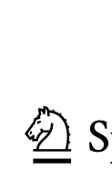

Springer

编辑 Witold Pedrycz
电气与计算机工程系
阿尔伯塔大学
加拿大埃德蒙顿

Shyi-Ming Chen
计算机科学与信息工程系
台湾科技大学
台北

ISSN 1860-949X ISSN 1860-9503（电子版）
计算智能研究
ISBN 978-3-030-31755-3 ISBN 978-3-030-31756-0（电子书）
[https://doi.org/10.1007/978-3-030-31756-0](https://doi.org/10.1007/978-3-030-31756-0)

© Springer Nature Switzerland AG 2020
本作品受版权保护。出版商保留全部或部分材料的翻译、再版、插图重用、朗读、广播、微缩胶片复制或以任何其他实体方式复制、传输或信息存储和检索、电子适应、计算机软件或类似或不同的方法学的权利。

本出版物中使用的一般描述性名称、注册名称、商标、服务标志等，并不意味着即使在没有明确声明的情况下，这些名称不受相关保护法律和法规的约束，因此可以自由使用。

出版商、作者和编辑可以安全地假设本书中的建议和信息在出版日期时被认为是真实和准确的。出版商、作者或编辑对本文中包含的材料不提供明示或暗示的保证，也不对可能存在的任何错误或遗漏承担责任。出版商在已发表的地图和机构关系中保持中立。

这个Springer印记由注册公司Springer Nature Switzerland AG出版
注册公司地址是：Gewerbestrasse 11, 6330 Cham, Switzerland

# 前言

深度学习为人工智能和智能系统提供了一种有趣的、概念上和算法上都处于最前沿的方法。这种范式已经应用于包括机器翻译、计算机视觉和自然语言处理在内的众多领域。深度学习被视为机器学习的一个子集，利用层次化的人工神经网络来高效地进行机器学习过程。

本卷提供了读者在深度学习领域的全面和最新的论述。这里有两个焦点和密切相关的方面，即深度学习环境支持的概念和大量的架构。这两个要素紧密相互交织，并与讨论的应用领域相关联。深度学习的概念围绕着结构化和自动化（在很大程度上）的机制知识表示。各种多层架构带来了具体而有意义的知识片段。它们的结构发展对于成功的实际解决方案至关重要。在这里出现的架构发展支持它们的详细学习和改进。

这些章节由该领域的活跃研究人员撰写，汇集了一系列研究，反映了深度学习拓扑结构设计和分析的当前趋势，以及相关的成功应用领域，包括语言建模、图表示和预测。

我们想借此机会向系列主编Janusz Kacprzyk教授表示感谢，他在本书的实现过程中提供了持续的鼓励和支持。我们要感谢Springer出版社的热情团队；他们像往常一样提供了建议和指导，并使整个出版过程高效且及时完成。

加拿大埃德蒙顿
台北，台湾
Witold Pedrycz
Shyi-Ming Chen

# 目录

## 深度学习架构
Mohammad-Parsa Hosseini, Senbao Lu, Kavin Kamaraj, Alexander Slowikowski 和 Haygreev C. Venkatesh

- 1 背景
- 2 训练过程
    - 2.1 监督学习
    - 2.2 无监督学习
    - 2.3 半监督学习
- 3 深度学习分类
    - 3.1 卷积神经网络 (CNN)
    - 3.2 预训练的无监督网络
    - 3.3 循环和递归神经网络
- 4 结论
- 参考文献

## 深度神经网络的理论特征
Piyush Kaul 和 Brejesh Lall

- 1 概述
- 2 神经网络架构
- 3 简要的数学背景
    - 3.1 拓扑和流形
    - 3.2 黎曼几何和曲率
    - 3.3 图信号处理
- 4 通过同调复杂性进行特征化
    - 4.1 贝蒂数
    - 4.2 从数据集的同调选择架构
    - 4.3 计算同调
    - 4.4 实证测量
- 5 散射变换的特征化
    - 5.1 概述
    - 5.2 不变性和对称性
    - 5.3 平移和微分同胚
    - 5.4 小波的收缩和尺度分离
    - 5.5 滤波器组、相位去除和收缩
    - 5.6 平移群
    - 5.7 逆散射和稀疏性
- 6 曲率的特征化
    - 6.1 均场理论和高斯曲率
    - 6.2 黎曼和里奇曲率测量
- 参考文献

## 专用张量处理架构的缩放分析用于深度学习模型
尤里·戈尔迪恩科，尤里·科丘拉，弗拉德·塔兰，尼基塔·戈尔迪恩科，亚历山大·罗科维伊，奥列格·阿利宁和谢尔盖·斯蒂连科

- 1 引言
- 2 背景和相关工作
    - 2.1 张量核心
    - 2.2 张量处理单元
    - 2.3 其他DNN加速器
    - 2.4 并行算法和张量处理架构
    - 2.5 DNN中的并行算法和计算复杂性
- 3 实验和计算细节
    - 3.1 数据集、设备、度量和模型
    - 3.2 DNN的计算复杂性
    - 3.3 缩放分析
- 4 结果
    - 4.1 Vgg16
    - 4.2 ResNet50
    - 4.3 CapsNet
- 5 讨论
- 6 结论
- 参考文献

## 评估自编码器架构用于数据表示
Karishma Pawar 和 Vahida Z. Attar

- 1 引言
- 2 自编码器的通用架构和分类
- 3 自编码器的变种
    - 3.1 应用特定的自编码器
    - 3.2 正则化自编码器
    - 3.3 鲁棒自编码器对噪声具有容忍性
    - 3.4 生成式自编码器
- 4 影响自编码器整体性能的因素
    - 4.1 训练
    - 4.2 目标函数
    - 4.3 激活函数
    - 4.4 层大小和深度
- 5 自编码器的应用
- 6 结论
- 附录
- 参考文献

## 编码器-解码器框架及其应用
Ahmad Asadi 和 Reza Safabakhsh

- 1 引言
    - 1.1 机器翻译
    - 1.2 图像/视频字幕
    - 1.3 文本/视觉问答
    - 1.4 文本摘要
- 2 基准编码器-解码器模型
    - 2.1 背景
    - 2.2 用于机器翻译的编码器-解码器模型
    - 2.3 公式化
    - 2.4 机器翻译中的编码器（特征提取）
    - 2.5 机器翻译中的解码器（语言建模）
- 3 编码器结构变种
    - 3.1 句子作为输入
    - 3.2 图像作为输入
    - 3.3 视频作为输入
- 4 解码器结构变种
    - 4.1 长期依赖
    - 4.2 LSTM
    - 4.3 堆叠RNN
    - 4.4 堆叠解码器中的梯度消失
    - 4.5 强化学习
- 5 注意力机制
    - 5.1 基本机制
    - 5.2 扩展
- 6 未来工作
- 7 结论
- 参考文献

## 用于学习图表示的深度学习
朱文武，王欣，崔鹏

- 1 引言
- 2 高阶接近保持网络嵌入
    - 2.1 问题定义
    - 2.2 SDNE模型
    - 2.3 SDNE的分析与讨论
- 3 全局结构保持网络嵌入
    - 3.1 初步和定义
    - 3.2 DRNE模型
- 4 结构保持超网络嵌入
    - 4.1 符号和定义
    - 4.2 DHNE模型
- 5 不确定性感知网络嵌入
    - 5.1 符号
    - 5.2 DVNE模型
- 6 动态感知网络嵌入
    - 6.1 DepthLGP模型
    - 6.2 扩展和变体
- 7 结论和未来工作
- 参考文献

## 用于损坏标签的深度神经网络
Ishan Jindal, Matthew Nokleby, Daniel Pressel, Xuewen Chen 和 Harpreet Singh

- 1 引言
- 2 标签噪声
- 3 与先前工作的关系
- 4 提出的方法
    - 4.1 提出的方法
    - 4.2 证明非线性噪声模型
- 5 实验结果
    - 5.1 一般设置
    - 5.2 人工标签噪声
    - 5.3 真实标签噪声
    - 5.4 批量大小的影响
    - 5.5 理解噪声模型
- 6 结论和未来工作
- 参考文献

## 构建适用于语义分割任务的卷积神经网络的容量
姜亚龙和迟哲儒

- 1 引言
- 2 充分发掘低容量潜力的技术网络
    - 2.1 方法论
- 3 任务复杂性的估计
    - 3.1 方法论
    - 3.2 总结
- 4 模型容量的优化
    - 4.1 方法论
    - 4.2 总结
- 5 结论和未来工作
- 参考文献

## 使用卷积神经网络预测体育赛事结果
陈慕彦，陈庭轩和林书宏

- 1 引言
- 2 文献综述
    - 2.1 卷积神经网络架构
    - 2.2 与体育预测相关的研究
- 3 研究方法
    - 3.1 开发环境
    - 3.2 研究过程
    - 3.3 实验设计
    - 3.4 性能评估
- 4 实验结果
    - 4.1 数据集描述
    - 4.2 实验1和2的结果
    - 4.3 实验3的结果
    - 4.4 实验4的结果
    - 4.5 讨论
- 5 结论
- 参考文献

## 用于深度学习的异构计算系统
Mihaela Malița, George Vlăduț Popescu 和 Gheorghe M. Ștefan

- 1 引言
- 2 DNN中涉及深度学习的计算组件学习
    - 2.1 全连接层
    - 2.2 卷积层
    - 2.3 池化层
    - 2.4 Softmax层
    - 2.5 将所有内容放在一起
- 3 最新技术
    - 3.1 Intel's MIC
    - 3.2 Nvidia's GPU作为GPGPU
    - 3.3 谷歌's TPUs
    - 3.4 关于现有技术的总结
- 4 Map-Scan/Reduce加速器
    - 4.1 异构系统
    - 4.2 加速器's 结构
    - 4.3 微架构
    - 4.4 MSRA 的硬件参数
    - 4.5 NeuralKernel库
- 5 实施和评估
    - 5.1 全连接NN
    - 5.2 卷积层
    - 5.3 池化层
    - 5.4 Softmax层
- 6 结论
- 参考文献

## 基于神经网络的统计语言建模的进展
Anup Shrikant Kunte 和 Vahida Z. Attar

- 1 引言
- 2 统计语言建模
    - 2.1 N-Gram语言模型
- 3 对N-Gram语言模型的扩展
- 4 基于神经网络的语言建模
    - 4.1 神经网络语言模型 (NNLM)
    - 4.2 循环神经网络语言模型 (RNNLM)
    - 4.3 长短期记忆语言模型 (LSTMLM)
    - 4.4 双向RNN
- 5 NNLM研究里程碑
- 6 评估指标
    - 6.1 最先进的PPL
- 7 结论
- 参考文献
- 索引

## 深度学习架构

Mohammad-Parsa Hosseini, Senbao Lu, Kavin Kamaraj, Alexander Slowikowski 和 Haygreev C. Venkatesh

摘要 深度学习是最广泛使用的机器学习技术之一，已在异常检测、图像检测、模式识别和自然语言处理等应用中取得了巨大成功。深度学习架构在大数据分析领域中引起了革命，同时在传感器网络的广泛部署和改进的通信协议中得到了广泛应用。在本章中，我们将讨论多种深度学习架构，并解释它们的基本数学概念。这里提供的最新概述涉及三个主要类别的神经网络，即卷积神经网络、预训练的无监督网络和循环/递归神经网络。还讨论了这些架构在模式识别和图像检测等选定领域的应用。

关键词 深度学习·架构·卷积神经网络·无监督网络·循环网络·递归网络·长短期记忆·自编码器·生成对抗网络·注意力·深度置信网络

M.-P. Hosseini (✉) · S. Lu · K. Kamaraj · A. Slowikowski · H. C. Venkatesh
圣克拉拉大学，硅谷，加利福尼亚州，美国
电子邮件：mhosseini@scu.edu; parsa@cac.rutgers.edu; mh973@cac.rutgers.edu
S. Lu
电子邮件：slu1@scu.edu
K. Kamaraj
电子邮件：kkamaraj@scu.edu
A. Slowikowski
电子邮件：aslowikowski@scu.edu
H. C. Venkatesh
电子邮件：hchincholivenkatesh@scu.edu
M.-P. Hosseini
AI研究，圣何塞，加利福尼亚州，美国
与新泽西州新不伦瑞克市，罗格斯大学，电气与计算机工程系合作
亨利·福特健康系统，底特律，密歇根州，美国


### 1 背景

机器学习是人工智能（AI）的一个分支，它包括使计算机系统能够从数据中推断出模式的算法。机器学习具有广泛的应用范围，包括生物信息学、欺诈检测、金融市场分析、图像识别和自然语言处理（NLP）。

传统的统计机器学习技术在处理原始形式的自然数据时受到限制，因为必须在它们之间进行复杂的模式和推理。它们需要人类投入大量工作来提取适当的特征，以提高它们的性能。然后，表示学习被开发为一组方法，允许机器自动发现用于数据检测或分类的表示（特征）。

深度学习是一类具有多层表示的表示机器学习方法。它由几个简单但非线性的模块组成，每个模块将表示从前一层（从原始输入开始）转换为更高级别、稍微抽象的表示。通过足够多这样的转换组合，可以学习到非常复杂的特征和推理。一般来说，所有的深度学习方法可以分为三类，分别是卷积神经网络（CNNs）、预训练的无监督网络（PUNs）和循环/递归神经网络（RNNs）。我们将在接下来的章节中详细讨论它们，但首先，我们讨论如何训练深度学习模型。

### 2 训练过程

在深度学习和机器学习中，预测模型利用各种底层算法从训练数据中推断数学关系。主要有三种学习方法，分别是监督学习、无监督学习和半监督学习。在下面的章节中，我们将详细讨论每种方法。

#### 2.1 监督学习

在监督学习中，模型被提供一个包含观测值（即输入）和相应结果（即输出）的训练数据集[11]。然后，模型推断出从输入到输出的数学映射，可以用来对未来的输入测试数据点进行分类[7, 13]。反向传播误差（Backpropagation）是一种在许多人工神经网络架构中使用的流行的监督学习技术。在反向传播中，神经网络的组成节点的权重会自适应地重新配置以提高预测准确性。

#### 2.2 无监督学习

在无监督学习中，模型被提供未分类的训练数据（即仅输入）。然后，模型通过找到它们之间的共同点将测试数据点分类到不同的类别中。例如，假设我们有一个动物分类场景，数据集包含未分类的各种动物图片。模型将浏览数据集并从图像中提取不同的特征以辅助分类。一些提取的特征可能包括动物的颜色和大小等。使用这些特征，数据可以被分成不同的聚类。例如，包含狗的图像理想情况下会基于提取特征的相似性而落入同一聚类中；对数据集中的其他动物也适用相同的思想。

#### 2.3 半监督学习

正如其名称所示，半监督学习继承了有监督学习和无监督学习的特性。半监督数据集主要包含未分类的训练数据点以及少量分类数据。半监督模型具有两个重要优势。一是在添加少量分类数据点的情况下，它们比无监督模型更准确。二是与有监督学习相比，它们的工作量和时间成本显著降低。半监督学习可以指代转导学习或归纳学习。

转导学习的目标是推断给定未标记数据的正确标签。自训练是一种常用的半监督学习的转导方法。在这种方法中，首先使用标记数据的样本对分类器进行训练。然后使用分类器对未标记的数据集进行分类。通常，最可靠的未标记数据以及它们的预测标签会被添加到训练集中。分类器会使用新数据重新训练，并重复这个过程。这个通过自我教学或引导式学习来重新训练分类器的过程被称为自学习。然后，模型准备好对测试数据点进行分类。另一方面，归纳学习用于推断输入和输出之间的映射关系。归纳生成模型可能是最古老的半监督学习方法之一。它假设一个模型，$p(x, y) = p(y) p(x|y)$，其中$p(x|y)$是一个可识别的混合分布。

$p(x, y) = p(y) p(x|y)$

使用大量未标记数据，可以识别出混合成分；然后，理想情况下，我们只需要每个成分一个标记的示例来完全确定混合分布。

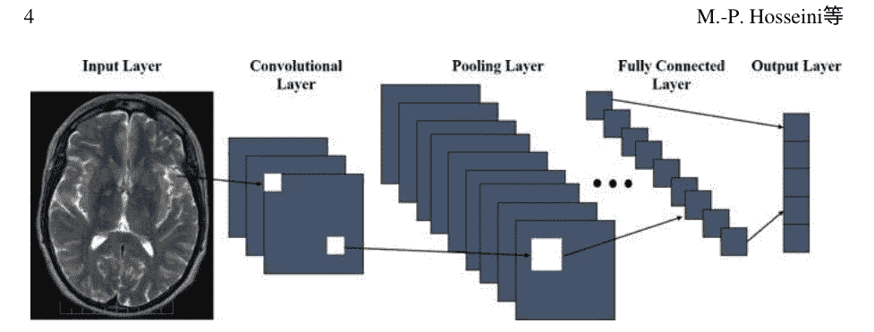

图1 卷积神经网络（CNN）的简化表示。它是一种基于3D神经元排列、相邻层神经元之间的局部连接和共享权重向量的前馈人工神经网络类型。

### 3 种深度学习分类

在下面的这一部分中，我们将讨论多种深度学习架构并解释它们的基本算法。我们将为神经网络的三个主要类别提供最新的概述，即卷积神经网络、预训练的无监督网络和循环/递归神经网络。

#### 3.1 卷积神经网络（CNNs）

CNNs受生物过程的启发，旨在模仿大脑视觉皮层中的神经连接。与传统的图像分类算法相比，它们需要较少的数据预处理，传统算法需要手工设计的预处理滤波器[6]。 CNN在图像和视频识别、推荐系统、图像分类、医学图像分析和自然语言处理（NLP）等领域有广泛的应用。

##### 3.1.1 卷积神经网络结构

CNN与传统神经网络的不同之处在于它们在至少一个层中执行卷积运算，而不是标准的矩阵乘法（图1）。它们以两个独特的属性而闻名：稀疏交互和参数共享。通过使模型的卷积核小于输入的大小，可以实现稀疏交互或连接。例如，在图像分类应用中，可能有数百万个表示高分辨率图像的像素。在这种情况下，卷积核将被配置成仅捕捉图像中更具指示性的特征，如对比度和边缘。考虑到图像的像素较少，参数数量也会减少。

图2 左侧为没有稀疏的网络，右侧为使用稀疏和卷积核为3的网络

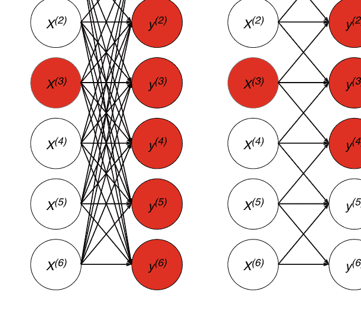

表示图像。这导致内存利用率和计算开销的降低。另一方面，传统神经网络效率较低，并为每个输入单元和输出单元之间的交互生成参数[14]。参数共享，也称为绑定权重，涉及将一个输入单元的权重值绑定到另一个输入单元的权重值。在图像分类场景中，参数共享将确保每个图像位置只学习到一组参数。这与传统神经网络不同，传统神经网络的权重没有绑定，每个位置都学习到独立的参数。

卷积网络的每一层通常执行三个步骤。在第一步中，该层并行执行多个卷积操作，生成一组线性激活。然后，第二步通常被称为检测器阶段，通过非线性激活函数处理线性激活。这样做的目的是最终推断出与输出相关的非线性映射。检测器阶段后面是由池化函数组成的第三阶段，它对该层的输出进行进一步的改变。池化函数的目的是根据附近输出的统计值修改网络中特定位置的输出[9, 10, 18]。这强调了CNN中邻域值对任何给定节点都有影响的卷积方面。对于最大池化，该操作将根据其矩形邻域区域的最大值修改输出值。其他常用的池化函数考虑邻域区域的平均值（图2）。

不同的权重被应用于不同的层，直到网络能够过滤数据并达到结果。这是通过具有主要卷积层池化的方式实现的，并基于不同的滤波器或内核构建特征映射。这些层都是全连接的，并最终实现输出。CNN主要用于视觉分类，但在文本和语言检测、物体跟踪、动作识别和其他分类方面也有许多有用的应用。下面的方程式1说明了CNN中实现的前向传播，其中ω是n x n的滤波器，ψ是非线性权重矩阵，方程式2表示每个权重的梯度分量，方程式3表示卷积层的权重[6]。

$x_{ij}^l = ψ ( Σ_{a=0}^{κ-1} Σ_{b=0}^{κ-1} ω_{ab} y_{(i+a)(j+b)}^{l-1} ) \quad (1)$

$\partial E/∂x_{ij}^l = ∂E/∂y_{ij}^l ∂y_{ij}^l/∂x_{ij}^l = ∂E/∂y_{ij}^l ∂/∂x_{ij}^l (ψ(x_{ij}^l)) \quad (2)$

$ω_{ab} = J ( Σ_{a=0}^{κ-1} Σ_{b=0}^{κ-1} ∂E/∂x_{(i-a)(j-b)}^l ∂x_{(i-a)(j-b)}^l/∂y_{ij}^{l-1} ) \quad (3)$

$J = ( Σ_{a=0}^{κ-1} Σ_{b=0}^{κ-1} ∂E/∂x_{(i-a)(j-b)}^l )^{-1} \quad (4)$

##### 3.1.2 CNN架构和应用

自从CNN的初步发展以来，已经创建了多个CNN架构。一些著名的例子包括：LeNet-5、AlexNet、ResNet和GoogLeNet。每个网络仍然采用卷积层和特征提取的相同结构，但在层数、特征映射和效率上可能有所不同。

LeNet [19]是卷积网络的第一个成功应用，由Yann LeCun在1990年代开发。在卷积神经网络中，最著名的是LeNet架构，它被用来读取邮政编码、数字等。最新的工作被称为LeNet-5，它是一个5层的卷积神经网络，在孤立字符识别方面达到了99.2%的准确率[20]。

在计算机视觉中，第一个推广卷积网络的工作是由Alex Krizhevsky、Ilya Sutskever和Geoff Hinton为多伦多大学开发的AlexNet[18]。主要区别在于AlexNet有多个卷积层，后面跟着一个POOL层。它包含八个主要层，其中前五层是卷积层，后三层是全连接层。在卷积层之后，还有额外的最大池化层，使用非饱和的修正线性单元（ReLU）激活函数，而不是双曲正切或Sigmoid激活函数。使用ReLU可以将AlexNet的速度提高六倍，同时保持类似的准确率。

残差神经网络（ResNet）是由微软研究院在[4]中提出的。这些层在学习残差函数而不是未引用的函数时进行了重新构建。因此，这些残差网络更容易优化，并且通过增加网络深度获得了相当大的准确性。

GoogLeNet是由Google的Szegedy等人设计的卷积网络[29]。与AlexNet相比，它是一个更深的CNN；GoogLeNet包含22层相比AlexNet的8层。 GoogLeNet的主要贡献是开发了一个内部层，以减少网络中的参数数量。 此外，GoogLeNet在卷积层的顶部使用了平均池化方法，进一步消除了对性能提升贡献较小的参数。 值得注意的是，与AlexNet的6000万参数相比，GoogLeNet只有400万参数。 对于GoogLeNet，有几个后续版本，其中最新的版本是Inception-v4。

虽然CNN在各种问题空间中非常灵活，但它们在架构上仍然存在一些限制。 CNN被认为容易过拟合并陷入局部最小值。 这两个问题导致模型性能降低和计算时间增加。 因此，可以考虑采用优化算法来弥补CNN的局限性。Hosseini等人提出了一种基于主成分分析（PCA）、独立成分分析（ICA）和差分搜索算法（DSA）的CNN扩展优化方法[6]。 所提出的方法可以提高CNN的效率并优化其特征提取，尤其是在处理大规模复杂数据集时。

##### 3.1.3 前向和后向传播

当数据输入神经网络时，它最初通过网络中的一系列层进行前向传播。 网络中可以有不同数量的层，代表网络的深度，并且包括一个输入向量，$x$。 每个层，$l$，还具有一个宽度，表示节点的数量。 在每个层中，我们将权重矩阵应用于激活函数；传入的数据，$a$，乘以权重，$w$，并且结果中加上偏置，$b$。在公式5中，$j$是输出节点，表示来自第$l$层的第$j$个节点，$k$表示来自前一层，第$l-1$个节点，作为输入节点[1]。 因此，$w^l_{jk}$的值是两个节点之间存在的权重关系。 当权重矩阵和偏置首次设置时，它们通过称为参数初始化的过程进行随机初始化，其中$a^0$是包含输入数据向量的层（图3）。

$$z^l_j = \sum_k w^l_{jk} a^{l-1}_k + b^l_j$$

第$l$层中第$j$个节点的加权输入，$z^l_j$，然后被输入到一个激活函数中，$f$。

$$a^l_j = f(z^l_j)$$

激活函数的作用是产生一个输出，或者从一个输入实数到一个特定范围内的实数的映射，以确定节点内的信息是否有用，即激活节点或不激活节点。它是激活函数创建神经网络的分层设计的关键；

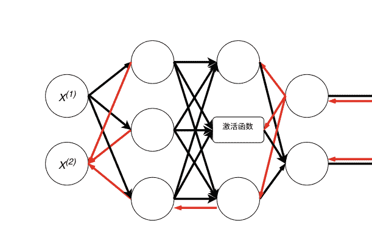

图3 使用反向传播的神经网络

激活函数作为神经网络层，对原始输入数据进行操作，并将其向前传递到下一个神经网络层（激活函数）。激活函数产生的值取决于所使用的激活函数的类型。在设计网络时，并不总是有明确或最佳的选择来决定使用哪种激活函数；这个过程需要一些试错来确定哪种激活函数会产生最优的结果。下面列出了一些常见的激活函数。

Sigmoid函数，也被称为逻辑函数，将实数映射到取值范围在0和1之间的数值。

$$ f(x) = \sigma(x) = \frac{1}{1+e^{-x}} \quad (7) $$

双曲正切函数，$tanh$，激活函数将实数映射到取值范围在$-1$和1之间的数值。

$$ f(x) = tanh(x) = \frac{(e^{x} - e^{-x})}{(e^{x} + e^{-x})} \quad (8) $$

修正线性单元（ReLU）激活函数将实数映射到取值范围从0到$\infty$的数值。

$$ f(x) = \begin{cases} 0 & \text{for } x < 0 \\ x & \text{for } x \geq 0 \end{cases} \quad (9) $$

Softmax激活函数将实数映射到取值范围从0到1的数值。

$$ f_{i}(\vec{x}) = \frac{e^{x_{i}}}{\sum_{j=1}^{i} e^{x_{j}}} \quad (10) $$

初始化的参数值是任意设置的，在网络训练过程中会进行调整。数据被前向传递到网络中，其最终结果产生一个输出向量，$\hat{y}$。然后使用输出向量计算损失（参见公式12）。

前向传播方程可以简化为简单的向量化方程

$$A^l = f(W^l A^{l-1} + b^l) \tag{11}$$

反向传播是通过最小化损失函数来训练网络的一种方法。损失函数表示网络在输入上进行准确预测的程度。有许多不同类型的损失函数可以使用，其中之一是均方误差（12）[1]。

$$C = \frac{1}{n} \sum_{i=1}^{n} (y_i - \hat{y}_i)^2 \tag{12}$$

算法1：CNN中的前向和后向传播

输入：M维数据， $\mathbf{x} = [x_1, \cdots, x_N]^T$
**开始**
对于 $l := 1 \rightarrow$ #隐藏层数 **do**
    对于 $i := 1 \rightarrow$ #层$l$中的神经元数 **do**
        对于 $j := 1 \rightarrow$ #层$l$中的列神经元数 **do**
            通过以下方式找到层激活值， $y_{ijl} = \varphi(x_{ijl} + b_{ijl})$
            计算下一层输入
        **结束**
    **结束**
**结束**
将最终输出保留为 $y^l$
计算输出层的误差。
**开始**
对于 $l :=$ #隐藏层数 $\rightarrow 1$ **do**
    通过 $\frac{\partial E}{\partial x^l}$ 找到误差的偏导数 $\frac{\partial E}{\partial x^l_{ij}} = \frac{\partial E}{\partial y^l_{ij}} \frac{\partial y^l_{ij}}{\partial x^l_{ij}} = \frac{\partial E}{\partial y^l_{ij}} \frac{\partial}{\partial x^l_{ij}} (\psi(x^l_{ij}))$
    找到前一层的误差。
**结束**
通过 $\partial w_{ab} =$ 计算误差的梯度 $\sum_{i=1}^{N-n} \sum_{j=1}^{N-n} \frac{\partial E}{\partial x^l_{ij}} \frac{\partial x^l_{ij}}{\partial w_{ab}} = \sum_{i=1}^{N-n} \sum_{j=1}^{N-n} \frac{\partial E}{\partial x^l_{ij}} y^{l-1}_{(i+a)(j+b)}$
**结束**

其中，$n$是数据点的数量。均方误差可以理解为期望输出与实际输出之间差的平方的平均值，该平均值是由网络得到的[17]。

为了通过最小化损失来优化成本函数，使用梯度下降优化算法，并将错误向上传播到网络的前端。梯度下降通过取负值来调整每个权重学习率乘以成本函数对权重的偏导数的负值 [1]。

$$\Delta w = -\eta \frac{\partial C}{\partial w} \quad (13)$$

通过反向传播，我们能够一次性计算出所有的梯度，并使用链式法则更新权重 [1]。使用链式法则，每个节点的权重相应地进行调整，通过将梯度相乘。反向传播的额外好处是大大减少了计算梯度所需的计算量，相比于正向传播。如果使用正向传播来更新权重，它会遇到一个问题，即对于每个权重，必须先计算成本函数，然后计算成本函数对权重的偏导数，这导致了一个缓慢而繁重的操作，需要通过网络进行参数的平方次迭代来计算梯度 [26]。网络必须完成整个正向迭代才能计算出每个单独节点的梯度。通过反向传播，只需要进行一次正向传播来计算损失，然后进行一次反向传播来更新与损失相关的权重，就可以更新网络。

反向传播也可以从算法1的伪代码中理解。

#### 3.2 预训练的无监督网络

数据生成和特征提取是深度学习中非常重要的应用，因为我们通常有限的训练数据。有不同的技术用于增加初始数据集，以提供一个更大的数据集来训练网络。使用一些最先进的深度学习架构，如生成对抗网络（GAN）和自编码器，我们可以基于原始数据集生成合成数据，以改善模型学习。这两种架构都属于预训练的无监督网络（PUN）家族。PUN是一种深度学习模型，它使用无监督学习来训练神经网络中的每个隐藏层，以实现对数据集的更准确拟合。无监督学习算法用于逐层训练，每次独立地使用先前训练的层作为输入。在每个层上完成预训练后，使用监督学习在整个网络上进行微调。PUN的类型包括自编码器、深度置信网络（DBN）和生成对抗网络（GAN）[25]。

##### 3.2.1 自编码器

自编码器使用无监督学习来学习降维的表示，其中输入与输出相同（图4）。自编码器的三个部分包括输入、输出和隐藏层。数据被压缩成隐藏层中的较小表示，然后解压缩以形成与输入类似的输出。这通过自编码器算法的编码和解码两个主要步骤来实现[15]。例如，以下用于表示输入层和隐藏层之间的映射函数[24]:

$$y = f_\Theta(\hat{x}) = s(W\hat{x} + b)$$

其中输入 $\hat{x}$ 被映射到隐藏层 $y$， $\theta$ 是编码参数， $W$ 是加权矩阵。因此，解码函数如下:

$$z = g_{\Theta'}(y) = x(W'y + b')$$

$z$ 将是输入 $x$ 的重构 [24]。自动编码器是一种前馈神经网络的变体，它具有额外的偏差来计算重构原始输入的误差[9]。训练后，自动编码器被用作正常的前馈神经网络进行激活。这是一种无监督的特征提取形式，因为神经网络仅使用原始输入来学习权重，而不是使用具有标签的反向传播。它们在无监督学习中使用无标签数据，并构建输入数据的压缩表示。自动编码器被训练以复制其自身的输入数据。

有不同类型的自动编码器。香草编码器是一个三层网络，其中输入和输出相同。如果一个隐藏层不够，我们可以明显地扩展自动编码器以使用更多的隐藏层，称为多层自动编码器。卷积自动编码器使用图像（3D向量）而不是平坦的1D向量。输入图像被下采样以给出较小维度的潜在表示，并迫使自动编码器学习图像的压缩版本。正则化自动编码器使用鼓励模型具有除了将输入复制到输出的能力之外的其他属性的损失函数。

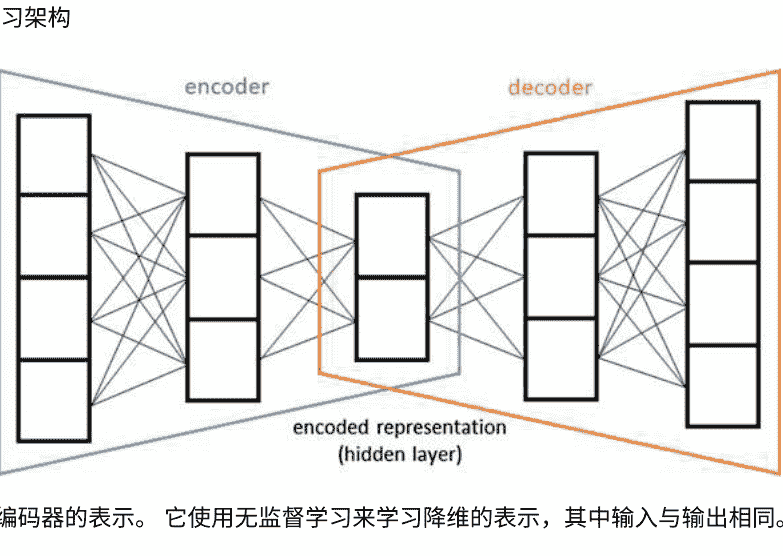

图4 自编码器的表示。它使用无监督学习来学习降维的表示，其中输入与输出相同。

##### 3.2.2 生成对抗网络（GAN）

生成对抗网络（GAN）是由蒙特利尔大学的Ian Goodfellow等人于2014年首次提出的。 GAN能够模仿任何领域的数据分布：图像、音乐、语音和散文。 GAN是使用无监督学习来训练两个模型的网络的一个例子。 GAN（以及生成模型一般）的一个关键方面是它们使用的参数数量相对于网络训练的数据量来说要小得多。 网络被迫高效地表示训练数据，使其更有效地生成类似于训练数据的数据。

GAN网络由一个判别器 D和一个生成器 G组成，它们并行操作。 生成器的目标是能够创建一个类似于真实输出的假输出，生成器通过与判别器的交互进行训练，而不是通过任何实际内容进行训练[2]。 生成器的目标是产生一个与真实数据非常接近的输出，以至于它让判别器无法区分假数据和真实数据。

GANs有三个步骤。首先，生成器接收随机数并返回图像。 这个生成的图像与从实际数据集中获取的图像流一起输入鉴别器。 其次，鉴别器接收真实和假的图像，并返回概率；接近0的输出表示生成器的数据是假的，接近1的输出表示数据是真实的。第三，鉴别器网络向生成器提供反馈，以训练并改进其输出。 GAN在许多应用中具有潜力，并且已经被用于提高图像的分辨率[22]。 使用GAN的另一个有用的应用是根据详细的标题描述创建照片，例如使用标题“一辆带有白色车门的黄色卡车”生成相应的图像[27]（图5）。

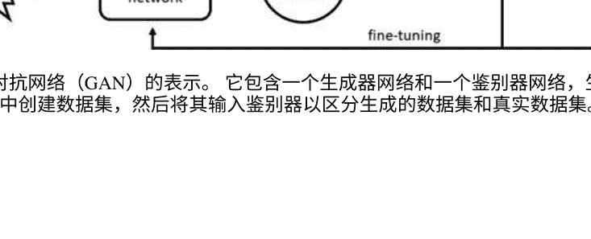

图5 生成对抗网络（GAN）的表示。它包含一个生成器网络和一个鉴别器网络，生成器从随机噪声中创建数据集，然后将其输入鉴别器以区分生成的数据集和真实数据集。

##### 3.2.3 深度置信网络

在讨论了不同的机器学习网络及其操作方式之后，我们将研究这些不同的网络是如何一起使用的。神经网络可以以不同的组合方式串联在一起。为了实现这一点，每个网络之间建立了一个链接。这被称为深度置信网络（DBN）。它通过连接多个较小的无监督神经网络来构建，并形成一个广泛的分层连接。为了进一步理解这个概念，我们必须深入研究DBN的组成部分：信念网络和受限玻尔兹曼机。

信念网络由随机生成的二进制单元层组成，每个连接的层都被分配了一个权重函数。这些二进制单元的取值范围是从“0”到“1”，取值为“1”的概率取决于其他连接单元的偏置和权重因子输入。由于逐层学习，我们可以确定一个层中的变量如何可能与另一个层中的变量相互作用。在学习过程之后，可以通过自底向上的方法有效地推断出变量的值，从底层的数据向量开始，并在相反方向上添加生成性权重函数。

受限玻尔兹曼机（RBM）是一种随机的递归神经网络（RNN），由随机生成的二进制单元组成，单元之间有无向边。由于RBM的主要限制是可扩展性，观察到它们之间的隐藏单元之间有限制的连接。

## 3.3 递归和递归神经网络

这类深度学习结构具有在时间步长上发送数据的能力。我们在这个类中介绍了4种结构：

- 1. 递归神经网络
- 2. 递归神经网络
- 3. 长短期记忆（LSTM）
- 4. 注意力。

##### 3.3.1 递归神经网络

递归神经网络（RNN）是一类基于David Rumelhart在1986年的工作的深度学习。RNN以其处理和获取序列数据的能力而受到赞誉。因此，视频分析、图像字幕、自然语言处理（NLP）和音乐分析都依赖于递归神经网络的能力。与假设数据点之间独立性的标准神经网络不同，RNN主动捕捉序列和时间之间的依赖关系数据点之间的依赖关系。

循环神经网络（RNN）最具定义性的特征之一是参数共享。如果没有参数共享，模型将为每个数据点分配唯一的参数来表示。在一个序列中，它无法对可变长度的序列进行推断。这个限制的影响在自然语言处理中可以完全观察到。例如，要解码的句子是“科比·布莱恩特是一个令人难以置信的篮球运动员”和“一个令人难以置信的篮球运动员是科比·布莱恩特”。理想的模型应该能够识别出‘科比·布莱恩特’是两个句子中讨论的篮球运动员，而不考虑单词的位置。在这种情况下，传统的多层网络将失败，因为它会为句子中的每个位置（单词）创建一个唯一权重集的语言解释。然而，循环神经网络（RNN）更适合这个任务，因为它们在时间步骤（即句子中的单词）之间共享权重，从而实现更准确的句子理解[3]（图6）。

循环神经网络通常通过连接相邻节点或时间步骤来增强传统的多层网络架构。这些循环构成了网络的内部记忆，用于评估当前数据点与过去数据点的属性。

值得注意的是，大多数传统的前馈神经网络仅限于一对一的输入和输出映射。然而，循环神经网络可以执行一对多、多对多（例如语音翻译）和多对一（例如语音识别）的映射。计算图用于描述输入到输出和损失之间的映射关系。将图展开成一系列事件可以清楚地展示网络内部的参数共享。循环关系的通用方程为

$$s^{(t)} = f(s^{(t-1)})$$

$$h^{(t)} = f(h^{(t-1)}, x^{(t)}) \quad (17)$$

其中 $h^{(t)}$ 现在用于表示状态，$x^{(t)}$ 表示来自特定时间点的输入。$h^{(t)}$ 的重要性在于它是过去输入序列中与任务相关的方面的表示 $t$[3]（图7）。

早期版本的RNN架构显示出巨大的潜力和多功能性但与某些显著缺陷相关。理论上，RNN结构能够长时间记住信息，然而，在实践中，情况并非总是如此。传统的RNN网络，也称为Vanilla RNNs，特别容易出现梯度消失和梯度爆炸的问题——这两种现象都是由于在许多时间步骤上累积的传播错误导致的。如果引用之间的间隔较小，RNN可以很好地引用信息的一部分。当引用数据之间的间隔变大时，RNN开始遇到困难并且RNN并不总能在这些数据之间建立联系。长短期记忆（LSTM）和截断的时间反向传播（TBPTT）是传统RNN架构的变体，旨在纠正这些问题。LSTM架构利用具有固定单元权重的循环边来抵消梯度消失。TBPTT架构设置了一个截断点，通过这个截断点可以传播错误来修正梯度爆炸（图8）。

其他一些RNN架构包括双向循环神经网络（BRNN）和编码器-解码器循环神经网络（EDRNN）。BRNN与大多数其他RNN框架使用的传统因果结构有所不同。它们从序列中的当前数据点推断出与过去和未来数据点相关的信息。这对于解码句子的含义特别有用，其中句子的每个单词都在整个句子的上下文中进行评估。此外，通过考虑一个词的左右邻居，可以推断出许多微妙的语言依赖关系。还需要注意的是，句子中使用的许多单词和短语可能具有不同的含义。根据句子的上下文而变化。双向视图使模型更有可能正确推断出这个上下文。除了自然语言处理外，BRNN在蛋白质组学中也特别有用——从氨基酸排序中识别蛋白质序列，以及手写识别。

EDRNN是另一个多功能的RNN框架，允许RNN将输入序列映射到可变长度的输出序列。这个框架对于解码语音以及自动化语音响应非常有用。

### 3.3.2 递归神经网络

递归神经网络（不要与RNN混淆）是一组非线性自适应模型，用于处理可变长度的数据。它们在处理数据结构输入方面特别擅长。递归网络将网络的状态反馈到自身，可以看作是一个循环。它们主要适用于图像和句子的分解。递归神经网络的架构不仅能够识别输入数据的组成部分，还能够定量确定它们之间的关系[3]。这种架构通过共享权重矩阵和二叉树结构，可以实现对解构的表示，这使得递归神经网络能够从不同长度的图像和单词序列中进行推断。此外，递归网络相对于循环网络的一个主要优势是，在相同长度的序列中，深度（以非线性操作的组合数量来衡量）可以从n大大减少到n log(n)，从而实现对长期依赖关系的高效捕捉[3]。递归神经网络通常以自底向上的前馈方法和自顶向下的传播方法而闻名。这两种机制构成了大多数递归网络中普遍存在的结构传播（图9）。

递归网络的两种常用变体包括半监督递归自编码器和监督递归神经张量。递归自编码器用于NLP应用中的句子解构，而递归神经张量主要用于计算机视觉应用。几乎所有递归神经网络都存在一个共同的缺点，即计算开销大，比循环神经网络更大。递归网络以处理包含数百万参数的大量数据而闻名，这导致训练时间长。因此，针对这些架构不断开发优化技术；此外，处理器的日益复杂和并行计算的进步使得递归神经网络能够进行大规模部署。

##### 3.3.3 LSTM

LSTM是最常见的RNN架构，可以记住任意时间间隔内的值。它于1997年由Hochreiter和Schmidhuber首次引入，并且在基于时间序列数据进行预测时表现良好，避免了传统RNN所困扰的长期依赖问题。LSTM也非常适合分类和处理任务，并且可以在Google Translate、Apple Siri和Amazon Alexa应用中找到。

如前所述，RNN存在上下文问题，这是由于消失梯度问题所致。消失梯度问题发生在梯度下降作为优化算法与反向传播一起使用时[5]。随着依赖关系之间的间隙增大，误差梯度呈指数级消失，可能导致网络训练变得非常缓慢甚至无法学习。

使用随机梯度下降，梯度是基于损失函数对权重的偏导数使用反向传播和链式法则计算的[1]。随机梯度下降是梯度下降的优化形式。梯度下降优化网络中所有训练样本的损失，但由于为每个训练样本优化损失，它是密集型的；如果有一百万个训练样本，那么梯度将被计算一百万次。使用随机梯度下降，只使用一个训练样本进行优化网络的参数，大大减少了训练网络的时间[23]。此外，还可以使用另一种方法，小批量梯度下降来优化成本。小批量梯度下降使用n个样本来更新整个网络中的参数。尽管随机梯度下降无法达到与梯度下降相比的最大优化效果，但通常情况下，准确性足够接近优化，并且在使用大型数据集训练网络时非常有益[23]（图10）。

使用链式法则来更新网络中的参数。使用链式法则，梯度是通过将每个节点的权重相对于成本函数的导数的乘积计算得出的，当它向前传播回网络的前端时。然后使用梯度来更新较早节点的函数的权重。随着层之间的时间依赖性增加，由于对权重的“消失性”小计算修正，权重只会略微更新[5]（图11）。

考虑计算梯度小于一的值；通过反向传播，权重向后调整，如果梯度包含许多小于一的小数，则梯度在网络向后传播时变得指数级小；一旦乘以学习率，它们变得更小。由于在设置网络进行训练时，权重最初设置为任意数值，它们往往最初具有更大的损失，加剧了梯度消失问题，因为权重只有微小的调整。LSTM通过其单元结构内的不同门解决了这个问题[5]。

与传统的RNN网络不同，LSTM不仅可以从当前状态中获取信息，还可以从先前的状态中获取信息[11]。LSTM模型的使用方法如下：

$$f_t = \sigma_g(W_f y_t + U_f h_{t-1} + \beta_f) \quad (18)$$
$$i_t = \sigma_g(W_i y_t + U_i h_{t-1} + \beta_i) \quad (19)$$
$$o_t = \sigma_g(W_o y_t + U_o h_{t-1} + \beta_o) \quad (20)$$
$$h_t = o_t \circ \sigma_h(c_t) \quad (21)$$
$$c_t = f_t \circ c_{t-1} + i_t \circ \sigma_c(W_c y_t + U_c h_{t-1} + \beta_c) \quad (22)$$

其中 $y_t$ 是输入向量，$h_t$ 是输出向量，$c_t$ 是细胞状态向量；$W$, $U$, 和 $\beta$ 是矩阵和向量参数；而 $f_t$, $i_t$, 和 $o_t$ 分别是遗忘门向量，输入门向量和输出门向量[12]。

LSTM的关键组成部分是记忆细胞及其门控。 LSTM有不同的变体，但它们主要包括三个门，即遗忘门、输入门和输出门。 记忆细胞的内容由输入门和遗忘门调节。 假设这两个门都关闭，记忆细胞的内容将在一个时间步和下一个时间步之间保持不变。 门控结构允许信息在许多时间步之间保留，并且因此也允许梯度在许多时间步之间流动。 这使得LSTM模型能够克服大多数递归神经网络模型中出现的梯度消失问题。 LSTM网络的展开图可以被看作是一个传送带，数据从一层传递到下一层，通过使用输入和遗忘门的线性相互作用在每一层中稍微改变。

遗忘门负责从细胞状态中删除信息，其目标是确定哪些信息不再有用并可能被遗忘。 它接收2个输入：来自上一个记忆细胞的隐藏状态，$h_{(t-1)}$，和当前输入，$x_{(t)}$，也被称为特定时间步的当前细胞状态。 输入被权重矩阵和偏置相乘。 然后，应用一个sigmoid函数；sigmoid函数负责决定哪些值保留，哪些值丢弃。 该函数输出一个值为0到1的向量；0表示遗忘门完全忘记信息，而1表示遗忘门要记住整个信息片段。

输入门涉及一个2步骤的过程，负责决定将添加哪些新信息到细胞状态中。 与遗忘门类似，sigmoid函数被应用于$h_{(t-1)}$和$x_{(t)}$。 一个双曲正切函数创建一个包含所有可能值的向量，范围从-1到1。 这个向量表示可能添加到细胞状态中的候选值。

输出门在一个3步骤的过程中从细胞状态中选择有用的信息作为输出。 在第一步中，对细胞状态应用双曲正切函数，创建一个具有从 $-1$ 到 $1$ 的缩放值的向量。 第2步是使用sigmoid函数，并使用前一个隐藏状态，$h_{(t-1)}$，和$x_{(t)}$ 作为输入创建一个调节滤波器。 在最后一步中，将第2步的调节滤波器与第1步的向量相乘，产生一个输出和隐藏状态传递给下一个细胞。 使用LSTM，网络能够最小化任何长期依赖，并能够填补超过1,000步的数据引用间隙[5]（图12）。

##### 3.3.4 注意力

大多数当代神经网络架构都使用了循环和卷积机制，以及编码器-解码器配置。注意力网络使用了一种额外的“注意力”机制，在许多架构中越来越受欢迎。注意力可以类比为我们如何集中注意力在手头的任务上。例如，如果你被要求粉刷一间房间，你会把注意力放在你正在粉刷的区域。如果你被要求修理一辆受损的车辆，那么你的注意力会集中在你当前正在工作的部分。注意力网络通过在不同的时间步骤上专注于特定区域来应用相同的概念。

使用注意力，模型可以在不考虑输入和输出序列中数据点之间的距离的情况下，找到全局依赖关系，从而显示出更高的预测准确性[30]。除了这个好处之外，注意力机制还使神经网络执行的计算更可并行化。注意力机制通常与循环和卷积结合使用；在一小部分神经网络架构中，注意力可能完全取代循环和卷积方案。Vaswani等人实现了一种没有循环的新型架构，称为Transformer。该架构利用了一种注意力机制。一种称为自注意力或内部注意力的注意力机制方案，可以在数据序列的不同位置之间推断出许多关系[30]。因此，通过从输入数据中发现更多模式，Transformer的注意力机制可以实现更强大的模型创建。

### 4 结论

深度学习模型的引入使得可以从多个模态中关联大量数据。深度学习架构的构建旨在模拟人脑中突触连接的结构，广泛用于特征提取、模式分析和数据抽象。通过监督、无监督和半监督学习任务，这些模型已经被证明比当前最先进的分析技术更好、更快。本章回顾了最近在以下三个类别中发展起来的许多常见结构。

- 1. 卷积神经网络是一种受生物过程启发的强大深度学习方法。与其他机器学习算法相比，它需要较少的预处理，传统算法需要手工设计的滤波器来预处理数据。它具有各种应用，从图像识别到自然语言处理，具有包含卷积层、池化层和全连接层的多层结构。
- 2. 预训练的无监督网络是一类深度学习算法，它们生成数据并提取特征。PUN的主要架构包括自编码器、生成对抗网络和深度置信网络。使用这些架构，我们可以从原始数据集中生成类似的数据，以提高模型的准确性。
- 3. 递归神经网络是一类深度学习结构，具有在时间步长上发送数据的能力。我们在这个类别中介绍了4种结构，包括递归神经网络、长短期记忆和注意力。

深度学习算法可以用于各种应用，包括分类、数据生成和信息理解。从自动驾驶到生物信息学，从医学图像处理到协助医学领域进行准确诊断[8, 16, 21]，深度学习算法可以在各个领域发挥作用。例如，许多卷积神经网络架构被用于图像识别任务，包括AlexNet和GoogLeNet。LSTM架构被设计用于自然语言处理，因为它们在这个应用中表现出色[28]。一种基于CNN的架构AtomNet [31]被设计用于药物发现，并成功预测了一些针对埃博拉病毒的新分子。图13。使用不同的深度学习架构对医学成像技术中的多模态进行深入研究[12]。金融服务公司开发了深度学习算法来检测欺诈和防止洗钱。 深度学习的应用范围每个月都在扩大涵盖学术界和工业界的各个领域。

### 参考文献

- 1. Boden, M.: 递归神经网络和反向传播指南。 达拉斯项目 (2002)
- 2. Creswell, A., White, T., Dumoulin, V., Arulkumaran, K., Sengupta, B., Bharath, A.A.: 生成对抗网络综述。IEEE信号处理杂志。 35(1), 53–65 (2018)
- 3. Goodfellow, I., Bengio, Y., Courville, A.: 深度学习。 MIT出版社。 http://www.deeplearningbook.org (2016)
- 4. He, K., Zhang, X., Ren, S., Sun, J.: 深度残差学习用于图像识别。 在： 计算机视觉和模式识别IEEE会议论文集, pp. 770–778(2016)
- 5. Hochreiter, S., Schmidhuber, J.: 长短期记忆. 神经计算 9(8), 1735–1780 (1997)
- 6. Hosseini, M., Pompili, D., Elisevich, K., Soltanian-Zadeh, H.: 通过物联网优化的深度学习EEG大数据和癫痫预测BCI. IEEE Trans. Big Data 3(4), 392–404 (2017)
- 7. Hosseini, M.-P.: 开发基于云的平台作为一种服务，以改善城市地区癫痫患者的公共健康。 在城市中重新构想健康：城市健康新研究方向，费城德雷塞尔大学公共卫生学院，美国 (2015)
- 8. Hosseini, M.-P.: 提出一种新的人工智能系统，用于自动检测癫痫发作。神经疾病杂志 3(4) (2015)
- 9. Hosseini, M.-P.: 基于云的脑机接口用于分析癫痫大数据以进行检测。 在：第三届新泽西大数据联盟（NJBDA）研讨会（2016年）
- 10. Hosseini, M.P.: 用于分析癫痫大数据的脑机接口。博士学位论文，罗格斯大学研究生院（2018年）
- 11. Hosseini, M.-P., Hajisami, A., Pompili, D.: 通过随机子空间集成学习从脑电图信号中实时检测癫痫发作。 在：2016年IEEE国际自主计算大会（ICAC），第209-218页。IEEE（2016年）
- 12. Hosseini, M.P., Lau, A., Lu, S., Phoa, A.: 医学影像中的深度学习综述。IEEE生物医学工程评论（2019年）
- 13. Hosseini, M.-P., Pompili, D., Elisevich, K., Soltanian-Zadeh, H.: 随机集成学习用于脑电图分类。人工智能医学 84，146-158（2018年）
- 14. Hosseini, M.P., Soltanian-Zadeh, H., Akhlagpoor, S.: 三切割法用于COPD的识别。伊朗医学行为 771-778（2013年）
- 15. Hosseini, M.-P., Soltanian-Zadeh, H., Elisevich, K., Pompili, D.: 基于云的深度学习用于大规模脑电图数据的癫痫发作预测。在：2016年IEEE全球信号和信息处理大会（GlobalSIP），第1151-1155页。IEEE（2016年）
- 16. Hosseini, M.-P., Tran, T.X., Pompili, D., Elisevich, K., Soltanian-Zadeh, H.: 使用多模式rs-fMRI和EEG大数据的边缘计算进行癫痫定位的深度学习。在：2017年IEEE国际自主计算大会（ICAC），第83-92页。IEEE（2017年）
- 17. Karmin, E.D.: 一种简单的修剪反向传播训练的神经网络的过程。IEEE Trans. Neural Net w. 1（2），239-242（1990年）
- 18. Krizhevsky, A., Sutskever, I., Hinton, G.E.: 使用深度卷积神经网络进行Imagenet分类。在：神经信息处理系统的进展，第1097-1105页（2012年）
- 19. Le Cun, Y., Jackel, L.D., Boser, B., Denker, J.S., Graf, H.P., Guyon, I., Henderson, D., Howard, R.E., Hubbard, W.: 手写数字识别：神经网络芯片和自动学习的应用。IEEE Commun .Mag. 27（11），41-46（1989年）
- 20. LeCun, Y., Bottou, L., Bengio, Y., Haffner, P.: 基于梯度的学习应用于文档识别。IEEE会议记录 86(11)，2278-2324 (1998年)
- 21. LeCun, Y., Bengio, Y., Hinton, G.: 深度学习。自然 521(7553)，436 (2015年)
- 22. Ledig, C., Theis, L., Huszár, F., Caballero, J., Cunningham, A., Acosta, A., Aitken, A., Tejani, A., Totz, J., Wang, Z., et al.: 使用生成对抗网络的照片逼真的单图像超分辨率。在：计算机视觉和模式识别IEEE会议记录，第4681-4690页（2017年）
- 23. Liang, N.-Y., Huang, G.-B., Saratchandran, P., Sundararajan, N.: 一种快速准确的在线顺序学习算法用于前馈网络。IEEE Trans. Neural Netw. 17(6)，1411-1423（2006年）
- 24. 廖，D.，卢，H.: 基于深度学习和社区结构对自发状态fMRI进行自闭症和对照组分类。在：2018年第十届国际高级计算智能会议（ICACI），第289-294页。IEEE（2018年）
- 25. 帕特森，J.，吉布森，A.: 深度学习：从业者的方法。O'Reilly Media，Inc.（2017年）
- 26. 普斯科里乌斯，G.，费尔德坎普，L.。截断的时间反向传播和卡尔曼滤波器训练用于神经控制。在：1994年IEEE国际神经网络会议（ICNN'94）论文集，第4卷，第2488-2493页。IEEE（1994年）
- 27. 里德，S.，阿卡塔，Z.，严，X.，洛格斯瓦兰，L.，希勒，B.，李，H.: 生成对抗文本到图像合成（2016年）。arXiv预印本arXiv:1605.05396
- 28. Sutskever, I., Vinyals, O., Le, Q.V.: 序列到序列学习与神经网络.在：神经信息处理系统进展，第3104-3112页（2014）
- 29. Szegedy, C., Liu, W., Jia, Y., Sermanet, P., Reed, S., Anguelov, D., Erhan, D., Vanhoucke, V., Rabinovich, A.: 用卷积更深入. 在：计算机视觉和模式识别(CVPR) (2015)
- 30. Vaswani, A., Shazeer, N., Parmar, N., Uszkoreit, J., Jones, L., Gomez, A.N., Kaiser, Ł., Polosukhin, I.: 注意力就是你所需要的。在：神经信息处理系统进展，第5998-6008页（2017）
- 31. Wallach, I., Dzamba, M., Heifets, A.: AtomNet: 用于基于结构的药物发现中的生物活性预测的深度卷积神经网络（2015）.arXiv预印本 arXiv:1510.02855

## 深度神经网络的理论特征

Piyush Kaul 与 Brejesh Lall

摘要 深度神经网络在数学上尚不完全理解，然而最近有很多研究专注于分析和理解它们在各种模式识别任务中的成功。我们描述了一些用于描述神经网络的数学技术，这些技术是基于所分配的分类或回归任务的复杂性，或者基于所学习的函数，并试图将其与神经网络的架构选择相关联。我们解释了一些可用于定义神经网络表达能力的可测量量化器，包括使用同调复杂性和曲率。我们还从散射变换的观点描述了神经网络，并分享了一些对其进行数学和直观证明的理由。最后，我们分享了一种基于黎曼曲率概念的神经网络可视化和分析技术。

关键词 深度神经网络 · 机器学习 · 表达能力 · 代数拓扑 · 贝蒂数 · 曲率 · 黎曼几何 · 散射变换

### 1 概述

深度神经网络（DNN），包括 CNN， RNN， GAN 和其他变种，是广泛范围内各种模式识别任务（包括分类、目标检测、语义分割、语音识别等）中表现最好的机器学习算法[1, 22, 23, 36, 39, 41]。对于多个隐藏层的神经网络的数学理解仍然相当有限，这是由于数学模型在有效建模复杂和非线性的层次结构方面的不足所致。这降低了工程师改进和定制的能力网络以可预测的方式工作。尽管反向传播算法和基于梯度下降的算法被广泛认为是有效的，但对于各种网络架构的优化性和泛化性了解甚少。因此，一些架构无法收敛到一个良好的广义解，而其他略有不同的层次则能很好地收敛[18]。

在本章中，我们回顾了一些利用信号处理理论和微分拓扑学技术的研究领域[6, 11, 26, 33]，以开发方法和技术来更好地分析、理解和可视化 DNN 在各种模式识别任务中的有效性。这些技术还可以扩展到神经网络架构的算法和架构改进，包括用于处理欧几里得和非欧几里得输入数据的架构。

我们首先简要描述了拓扑理论和黎曼几何中的一些数学概念，这些是理解本章其余部分的先决条件。我们还简要介绍了几何深度学习的新兴领域，该领域使用图信号处理和其他思想将深度学习扩展到非欧几里得数据，如图和流形[7, 40]。我们简要介绍，没有任何证明。

接下来，我们描述了表达能力的概念和目前已知的神经网络的 Vapnik-Chervonenkis 维度[13, 21, 43]（VC维度），这是基于代数拓扑学概念的，特别是使用 Betti 数[3-5]。我们还讨论了一些理论和实证结果，这些结果可能对神经网络架构设计具有实际意义[17]。

接下来，我们描述了通过分析简化模型使用散射变换[2, 9, 28, 29, 44]来探索神经网络的方法，这些模型由与非线性交替的小波变换层组成，并利用李群和拓扑流形的理论来模拟数据对扭曲的不变性[14]。

最后，我们讨论了利用黎曼几何的数学理解对深度神经网络的表达能力的一些最新进展。还分享了一些分析和实证结果，以展示通过神经网络传播数据在黎曼流形上的曲率变化。我们解释了通过直接计算黎曼和 Ricci 曲率张量对深度学习网络进行建模的研究，以及如何利用这些研究来表征、分析甚至可能辅助深度神经网络的设计[34, 35, 37]。

### 2 神经网络架构

尽管神经网络架构和组件的细节在其他地方已经描述过，并且不是本章的重点，但我们给出了组件的简要概述，以便能够定义基本构建块的术语和数学表示。神经网络是具有可学习参数的计算结构，可以通过有向图将多个计算层连接在一起。用于描述深度神经网络的具有多个隐藏层的深度神经网络，在数学上尚未被很好地理解。

神经网络以向量或张量作为输入，然后依次通过一系列处理层进行处理。这些层的类型各不相同，取决于网络的类型和应用。这些层包括全连接层、卷积层、池化层、非线性激活层、归一化层、损失层等。多层感知器（MLPs）仅由全连接层和非线性激活层交替组成。卷积神经网络（CNNs）在网络的初始阶段使用卷积层而不是全连接层。循环神经网络（RNNs）通过具有记忆组件（例如长短期记忆（LSTMs）和门控循环单元（GRU））与其他类别的网络区分开来。这些网络可用于对时间序列导向的数据进行分类/回归。现代神经网络，特别是 CNNs，可以非常深，具有数百层。

多层感知器（MLP）是最简单的神经网络形式，由完全连接的层和非线性组成（如图1所示）。完全连接的层可以被建模为矩阵与向量的乘积。非线性通常是逐元素的非线性操作。

卷积神经网络（CNN）由有向无环图（DAG）组成，其中的节点执行上述操作之一，例如卷积、池化等。连接可以是并行的、串行的或分层的（网络内部的网络）。在其最简单的形式中，CNN 由一系列卷积层和修正线性单元（ReLU）[15]层交替组成（见图2）。CNN 通过在空间维度上共享权重与 MLP 区分开来。在空间维度上共享权重的目的是提供空间不变性，这是处理图像输入时所需的特性。因此，卷积神经网络非常适合处理图像或视频数据集上的对象分类和检测网络，这需要空间不变性的属性。通过引入池化层来减小空间维度，从而减小空间维度的大小。池化还有助于在网络中引入平移和旋转不变性（或协方差）。卷积网络中的最后阶段还可以包括一个或多个完全连接的层，这些层相当于具有空间尺寸 1×1 的卷积层和空间尺寸 1×1 的输入。

循环神经网络（RNN）是一类用于处理序列的神经网络。类似于卷积神经网络（CNN）在图像中共享空间维度上的权重，RNN 在序列中共享时间维度上的权重。基本的构建模块由循环单元组成，它们从输出到输入有反馈连接，并且保持状态（记忆）。有许多类型的循环单元，但最常见的是门控单元，如长短期记忆（LSTM，如图3所示）和门控循环单元（GRU）。此外，除了完全连接的乘法器和非线性函数，根据学习的系数有选择地学习、遗忘和输出内部状态是这些门控单元的特点，这使它们能够在足够长的时间内保持记忆。门控单元的系数是在训练过程中学习的。

我们可以将全连接层建模为系数矩阵与输入向量的乘积，然后进行逐点非线性操作。对于 CNN，可以利用 im2col[30]类型的输入扩展将任何卷积层的输入特征图转换为2D矩阵。因此，我们可以将卷积表示为矩阵和向量之间的乘积。假设滤波器矩阵表示为 F，$\phi$ 表示扩展运算符 (im2col)，卷积层的输出可以表示如下：

$$vec(y) = vec(x^{l+1}) = vec(\phi(x^l)F). \tag{1}$$

对于一系列交替卷积和逐点操作符 $\rho$ given by $max(x, 0)$，我们可以将网络表示为

$$vec(y) = vec(...vec(\phi(vec(\phi(x^1)F_1))F_2)...F_J). \tag{2}$$

对于更复杂的有向无环图 (DAG)，可以扩展相同的表达式。神经网络通过最小化结构风险函数来训练，该函数包括用于衡量预测与由 $y^{(i)}$ 表示的神经网络和真实值 $(\hat{y})^{(i)}$ 之间的误差的项。一般来说，模型的结构风险函数由经验风险项和正则化项组成，可以表示为

$$\theta^* = \arg \min_{\theta} \mathcal{L}(\theta) + \lambda \cdot \Phi(\theta)$$

$$= \arg \min_{\theta} \frac{1}{n} \sum_{i=1}^{n} L(y^{(i)}, \hat{y}^{(i)}) + \lambda \cdot \Phi(\theta)$$

其中 $\Phi(\theta)$ 是正则化或惩罚项，$\theta$ 表示要学习的模型的参数。有许多类型的损失函数，如均方误差（MSE）、交叉熵、Kullback–Leibler 散度[12, 16]等。一个简单的平方 $l_2$ 损失函数的例子可以是以下内容：

$$\mathcal{L} = \sum_{i=1}^{n} (y^{(i)} - \hat{y}^{(i)})^2.$$

### 3 简要的数学背景

#### 3.1 拓扑和流形

拓扑学是数学的一个分支，它通过连接性来描述形状、空间和集合。在拓扑学中，我们通过它们之间的连续映射来表达两个空间之间的关系。

定义 3.1 设 $M$ 为一个集合，$\mathcal{P}(M)$ 为 $M$ 的所有子集的集合（即 $M$ 的幂集）。

一个集合 $\mathcal{O} \subseteq \mathcal{P}(M)$ 被称为一个拓扑，如果满足以下所有属性：

- (i) $\mathcal{O}$ 包含空集和集合 $M$ 本身。
- (ii) 任意 $\mathcal{O}$ 的子集的并集都包含在 $\mathcal{O}$ 中，或者更正式地说，$A \in \mathcal{O}$，$B \in \mathcal{O} \implies A \cap B \in \mathcal{O}$。
- (iii) 最后，任意 $\mathcal{O}$ 的有限个子集的交集都包含在 $\mathcal{O}$ 中，即，$U_{\alpha} \in \mathcal{O}$, $\alpha \in \mathcal{I}$ ($\mathcal{I}$ 是一个索引集合) $\implies \left( \bigcup_{\alpha \in \mathcal{I}} U_{\alpha} \right) \in \mathcal{O}$。在 $\mathcal{O}$ 中的集合被称为开集。

拓扑等价的概念（称为同胚）意味着存在一个连续映射 $f : A \rightarrow B$，其逆函数 $f^{-1}$ 也是连续的。

定义 3.2 一个函数 $f : X \rightarrow Y$ 在两个拓扑空间 $(X, \mathcal{T}_X)$ 和 $(Y, \mathcal{T}_Y)$ 之间被称为同胚，如果满足以下所有属性：

- $f$ 是一个一对一且满射的映射，
- $f$ 是连续的，
- $f$ 的逆函数也是连续的。

点 $x$ 在 $M$ 的一个邻域是一个包含一个包含该点的开集的集合 $N(x)$。一个点 $x$ 的邻域族意味着一组“接近于 $x$”的点。如果对于任意两个不同的点，总是存在不相交的邻域，那么拓扑空间被称为 **Hausdorff（分离的）空间**。

定义 3.4 流形 M 上的曲线是从实线的某个开区间 (-b, b) 到 M 的平滑（即 C^∞）映射。

在 M 中，如果两条曲线 σ₁(0) 和 σ₂(0) 在点 p 处相切，则 σ₁(0)=σ₂(0)=p，并且在某个局部坐标系中，它们以曲线在 R 中的常规意义相切。

一个切向量 p ∈ M 是 M 中曲线的等价类，其中等价关系是两条曲线在点 p 处切线。我们将特定曲线 σ 的等价类写为 [σ]（见图6）。

具有定义3.2中所定义的三个属性的函数被称为双连续函数。如果存在一个双连续函数，我们称 X 和 Y 是同胚的。对于拓扑空间，同胚构成了一个等价关系。所得到的等价类被称为同胚类。在光滑流形的情况下，保持光滑性的拓扑等价关系（同胚）被称为微分同胚。

代数拓扑将代数对象（如群、链等）分配给拓扑空间。如果分配给它们的代数对象是同构的，那么可以认为两个空间在拓扑上是等价的。在描述神经网络的背景下，可以通过数据集的拓扑连接性来进行描述。然后评估特定神经网络的表达能力，即它们产生具有相同连接性的决策区域的能力。这个方面在第4节中有更详细的解释。

#### 3.2 黎曼几何和曲率

黎曼流形是任何定义了对称张量形式 $(^0_2)$ 的光滑流形。这样的张量 $g$ 被称为度量。如果度量不是正定的，则这样的几何称为伪黎曼几何。在流形上的每个位置，这样的度量给出了向量空间和它们的对偶空间（一次形式）之间的映射。向量场是一个将向量分配给流形上任意点的向量值函数。对于任意的向量场 $A(x)$ 在点x上，度量给出了对偶向量场的映射：

$$\tilde{A} = g(A, \cdot) . \tag{6}$$

对偶向量场 $\tilde{A}$ 可以被看作作用于 $B$，这相当于一个标准的点积。即，

$$g(A, B) = \tilde{A}(B) = A \cdot B. \tag{7}$$

爱因斯坦求和约定在大多数涉及相对论和引力的数学物理文献中使用。在这里使用相同的约定，并将在下面解释。在这个约定中，指标用下标和上标表示。下标表示逆变向量，上标表示协变向量。如果方程中只出现一次，那么下标表示逆变向量，上标表示协变向量。如果一个方程中的指标在不同项的顶部和底部都重复出现，那么它们可以被缩并，即被视为求和的一部分，并且求和符号可以省略。

场的导数也用缩写表示，下标变量前的逗号表示导数是相对于该变量的：

$$\frac{\partial \psi}{\partial \alpha} = \psi_{,\alpha}. \tag{8}$$

共变向量的梯度定义如下：

$$(\partial \psi) = \left( \frac{\partial \psi}{\partial \alpha_1}, \frac{\partial \psi}{\partial \alpha_2}, \frac{\partial \psi}{\partial \alpha_3}, \frac{\partial \psi}{\partial \alpha_4} \ldots \right). \tag{9}$$

对偶向量空间的梯度的每个分量可以通过矩阵变换 \( \Lambda^{\beta}_{\;\;\alpha} \) 来表示，如下所示：

$$(\partial \psi)_{\bar{\alpha}} = \Lambda^{\beta}_{\;\;\alpha} (\partial \psi)_{\beta}, \tag{10}$$

协变导数的需求及其与标准导数的关系并不立即显而易见。为了理解这一点，我们需要注意到在曲线坐标的情况下，基向量可以在空间中变化。以矩形和极坐标为例，欧几里得三维空间中的单位基向量 \( e_z \)，在整个空间中是恒定的。当我们将其转换为极坐标时，这个场变量就会依赖于坐标，因此在空间中是变化的。

$$e_z = (\Lambda^r_{\;\;z}, \Lambda^{\phi}_{\;\;z}) = (\cos \phi, -r^{-1} \sin \phi), \tag{11}$$

在这种情况下，通过对 \( e_z \) 进行逐分量求导并不会得到零导数，尽管我们在曲线坐标系中期望导数为零。因此，对一个向量的各个分量求导的求和并不等于向量本身的导数。为了解决这种不一致性，需要引入协变导数。其定义如下：

$$\frac{\partial A}{\partial z^{\beta}} = \frac{\partial}{\partial z^{\beta}} (A^{\alpha} e_{\alpha}) \tag{12}$$

$$= \frac{\partial A^{\alpha}}{\partial z^{\beta}} e_{\alpha} + A^{\alpha} \frac{\partial e_{\alpha}}{\partial z^{\beta}}. \tag{13}$$

在这里，这两个术语分别构成了向量分量的偏导数和新坐标系中基向量的导数。这个方程是完整的，但为了简单起见，我们还额外定义了 Christoffel 符号 $\Gamma^{\gamma}_{\alpha\beta}$ 如下：

$$\frac{\partial e_{\gamma}}{\partial z^{\kappa}} = \Gamma^{\nu}_{\gamma\kappa} e_{\nu}.$$

右边的 Christoffel 符号可以推断为导数的第 $\mu$ 个分量的 $\frac{\partial e_{\gamma}}{\partial x^{\kappa}}$。我们可以将 $\gamma$ 视为被微分的基向量的指标，将 $\kappa$ 视为微分所作用的坐标。（12）中的协变导数现在是：

$$(\nabla A)^{\gamma}_{\kappa} = A^{\gamma}_{;\kappa} = A^{\gamma}_{,\kappa} + A^{\nu} \Gamma^{\gamma}_{\nu\kappa}.$$

请注意，我们在上述方程中使用的是微分符号的表示法。Christoffel 符号是从度量计算得出的[38]

$$\Gamma^{\gamma}_{\beta\mu} = 1/2 * g^{\alpha\mu}(g_{\alpha\beta,\mu} + g_{\alpha\mu,\beta} - g_{\beta\mu,\alpha}).$$

根据定义，在任何流形上，沿着由标量 $\lambda$ 参数化的路径上的矢量 $A$ 的平行传输是指矢量 $A$ 在路径上的所有点上都有定义，并且如果在无限接近的点上的矢量可以被认为几乎是平行的，即使在更远的点上的矢量不是。

在欧几里得平坦空间中，只有平行线可以平行传输切向量。在曲线空间中，我们也可以找到类似于直线的路径（称为测地线），通过施加向量在该路径上的平行传输约束。测地线的定义如下。

$$\frac{d}{d\lambda}\left( \frac{dx^{\alpha}}{d\lambda} \right) + \Gamma^{\alpha}_{\mu\beta} \frac{\partial x^{\mu}}{d\lambda} \frac{dx^{\beta}}{d\lambda} = 0.$$

根据定义，黎曼曲率可以被看作是在给定坐标空间中沿闭合回路平行传输向量时的偏差。图7展示了这样一个回路。回路的边由线段 $x = a, x = a + \delta a, y = b$ 和 $y = b + \delta b$ 组成。

当单位向量通过由点P、Q、R、S组成的回路并回到原始点P时，我们发现该向量在结束位置与起始位置的偏差。这个偏差由以下公式给出：

$$\delta V^{\alpha} = \delta a \delta b \left[ \Gamma^{\alpha}_{\mu1,2} - \Gamma^{\alpha}_{\nu2,1} + \Gamma^{\alpha}_{\nu2} \Gamma^{\alpha}_{\mu1} - \Gamma^{\alpha}_{\nu1} \Gamma^{\alpha}_{\mu2} \right] V^{\mu}.$$

从上述计算中得出的黎曼曲率是一个张量形式（$\frac{1}{3}$）如下所示。

$$R^{\alpha}_{\beta\mu\nu} = \Gamma^{\alpha}_{\beta\nu,\mu} - \Gamma^{\alpha}_{\beta\mu,\nu} + \Gamma^{\alpha}_{\sigma\mu} \Gamma^{\alpha}_{\beta\nu} - \Gamma^{\alpha}_{\sigma\nu} \Gamma^{\alpha}_{\beta\mu}.$$

图7 在坐标网格的部分循环

我们还可以直接从度量中计算黎曼曲率，而不是使用克里斯托费尔符号。

$$R^{\alpha}_{\beta\mu\nu} = \frac{1}{2}g^{\alpha\sigma}(g_{\sigma\nu,\beta\mu} - g_{\sigma\mu,\beta\nu} + g_{\beta\mu,\sigma\nu} + g_{\beta\nu,\sigma\mu}).$$

为了计算Ricci张量，我们可以将Riemann曲率在第一和第三个指标上收缩。

$$R_{\alpha\beta} = R^{\mu}_{\alpha\mu\beta}$$

进一步收缩Ricci张量得到Ricci标量。

$$R = g^{\mu\nu}R_{\mu\nu} = g^{\mu\nu}g^{\alpha\beta}R_{\alpha\mu\beta\nu}.$$

曲率度量可以被认为是内在曲率或外在曲率。只有当流形空间嵌入到更高维度时，才能测量外在曲率。对于平面上的曲线的最简单情况，为了测量点上的曲率，我们首先找到最接近该点的曲线的渐近圆Fig. 8。渐近圆的半径的倒数被认为是该点的外在曲率。另一方面，在内在曲率的情况下，我们不需要嵌入到更高维空间中，可以从流形空间内部进行测量。上述定义的曲率张量是外在曲率的形式，即Riemann和Ricci曲率张量。最基本的外在曲率形式是高斯曲率。为了找到流形中任意点p周围的高斯曲率，我们需要找到以该点为中心、半径为R的圆的周长C。然后可以计算高斯曲率为：

$$k_{\text{高斯}} = \lim_{\epsilon \to 0} \frac{6}{\epsilon^2} \left(1 - \frac{C}{2\pi \epsilon}\right)$$

即高斯曲率是一个度量圆周在流形上与平面空间中相同半径的圆的变化程度的指标 $2\pi \epsilon$。请注意，在平面空间中，上述方程将给出曲率的零值。正如上面所解释的，黎曼曲率被定义为在小平行四边形上平行传送的向量的偏离。它也可以被看作是属于多个子平面的高斯曲率的集合。给定两个非平行的向量S和T，使用黎曼曲率张量计算的以下量等于高斯曲率:

$$k_{\text{高斯}} = R_{\mu\nu\rho\sigma} S^{\mu} T^{\nu} S^{\rho} T^{\sigma}$$

因此，黎曼曲率等于子空间的高斯曲率乘以ST平行四边形的面积的平方。里奇曲率是黎曼曲率的收缩，可以看作是子平面上黎曼曲率的平均值。

#### 3.3 图上的信号处理

图可以捕捉空间和拓扑数据[7]。例如，计算机图形学，无线传感器网络，图像，引文网络分析，计算机视觉（3D物体对应），图可以用来表示流形。

我们不在后面的章节中涵盖通过图来表征神经网络的内容，但在本节中给出了进行图的深度学习的信号处理技术的概述。

假设 $G = (V, E, W)$ 是一个图，其中V表示顶点，E表示边，W表示分配给边的权重。我们还假设是无向图。然后假设

- 顶点信号是 $g(i) : V \rightarrow \mathbb{R}$。
- 图信号是 $[g(1), g(2)...g(N)]$。

令t定义邻接矩阵。它的定义如下

$$t = D - N.$$

这里，D是一个对角度矩阵，表示每个顶点连接边的数量，而N是表示每条边强度的权重矩阵。对于一个环形图，它将包含

$$D = \begin{bmatrix}2 & 0 & 0 & 0 & 0\\0 & 2 & 0 & 0 & 0\\0 & 0 & 2 & 0 & 0\\0 & 0 & 0 & 2 & 0\\0 & 0 & 0 & 0 & 2\end{bmatrix}$$

因为每个顶点连接两个其他顶点，而

$$N = \begin{bmatrix}0 & 1 & 0 & 0 & 0\\1 & 0 & 1 & 0 & 0\\0 & 1 & 0 & 1 & 0\\0 & 0 & 1 & 0 & 1\\0 & 0 & 0 & 1 & 0\end{bmatrix}$$

因为在环形图中只有相邻的顶点相连。
环形图的特征向量对应于傅里叶基。然而，对于更一般的图形，如图9所示的Peterson图，我们需要找到 $t$ 的特征向量。

让特征值表示为 $0 \ge \lambda_1 \ge \lambda_2 \ge ... \ge \lambda_{max}$。让特征向量表示为 $\mathbf{u}^{(0)}, \mathbf{u}^{(1)}, ..., \mathbf{u}^{(n-1)}$。然后，图形傅里叶变换表示为

$$\hat{g}(\lambda_l) = \sum_{i=1}^{N} g(i)u(i)^{*l},$$

并且图形的傅里叶逆变换由以下给出

$$g(i) = \sum_{l=0}^{N-1} \hat{g}(\lambda_l)u(i)^l.$$

上述定义的图形傅里叶变换存在问题，因为许多传统信号处理中的运算符不直接可用。一些例子包括：

- 平移，例如 $f(t-3)$ 在传统信号处理中是明确定义的。然而，顶点是任意分配的，因此在图形上平移将无法明确定义。
- 调制，例如 $f^{(t)} = e^{2\pi i \omega_0 t}$ 也是明确定义的。 然而，特征谱不是连续的。
- 下采样意味着减少样本，但在图的上下文中，每个其他顶点是什么意思。

例如，图谱域中的乘法定义为

$$\hat{g}_{out}(\lambda_l) = \hat{g}_{in}(\lambda_l)\hat{h}(\lambda_l). \tag{28}$$

相应的滤波也可以在顶点域中完成

$$g_{out}(i) = b_{i,i} g_{in}(i) + \sum_{i, j \in N(ik)} b_{i, j} g_{in}(j). \tag{29}$$

经典卷积定义为

$$(f * h)(t) = \int_{R} f(\tau) h(t - \tau) d\tau. \tag{30}$$

由于涉及到平移，这不能直接推广。 然而，我们可以定义

$$(g * h)(i) = \sum_{0}^{N-1} \hat{g}(\lambda_l) \hat{h}(\lambda_l) u(i)^l. \tag{31}$$

在某些常数 $\{b_{i,j}\} i, j \in V$ 的情况下，强制在顶点域中进行卷积等于在图谱域中进行乘法。无法在顶点域中进行卷积，但可以在谱域中进行。

类似的解决方案可以用于调制、膨胀、粗化和下采样。最后，CNNs可以通过利用上述运算符定义和利用频域卷积进行训练。

### 4 通过同调复杂性进行表征

### 4.1贝蒂数

让f_N: R^N → R表示一个具有N个输入和单个输出的二元分类器的前馈神经网络。

那么 f_N的复杂性可以被看作是集合 S^N = {x ∈ R^n | f_N(x) ≥ 0}的拓扑复杂性。实质上，这个集合表示了前馈神经网络给出正类的所有输入。基本上，这个集合表示了前馈神经网络给出正类的所有输入。

对于任意子集 S ⊂ R^n, 存在着由 b_i(S), 0 ≤ i ≤ n-1 表示的贝蒂数。第一个贝蒂数可以看作是集合中连通分量的数量，而第 i 个贝蒂数是 S 中 (i+1) 维空间中的孔的数量。例如，球体 (S_π) 和环面 (S_τ) 的第一个贝蒂数 b_0 = 1，因为它们都只有一个连通分量。球体的第二个贝蒂数 b1(S_π) 为 1，但环面的第二个贝蒂数 b1(S_τ) 为 2。对于球体来说，存在一个二维孔，因为只能在其表面上画出一个唯一的（可变形的）圆。然而对于环面来说，存在两个这样的二维孔，第一个是可以画在环面的中心孔上的圆，第二个是可以画在形成环面的圆柱管上的圆（见图10）。这两个孔不能相互变形成另一个孔。

贝蒂数代表了复杂性的拓扑概念。特别是神经网络中被正类别分类的区域 S_N 的贝蒂数之和由 B(S_N) = Σ 给出。这可以用作神经网络分类区域复杂性的度量。

图10球体（左）和环面（右）

表1对于具有 $h$ 隐藏神经元，$n$ 输入和 $l$ 隐藏层的网络，$\mathcal{B}(S_N)$ 的增长上下界如下。具有许多层的架构将被成为深度，具有一个隐藏层的架构将被成为浅层。表格取自[5]。

| 输入 | 隐藏层 | 激活函数 | 界限 |
|------|--------|----------|------|
| **上界** | | | |
| n | 1 | 阈值 | $O(h^n)$ |
| n | 1 | 反正切 | $O((n + h)^{n+2})$ |
| n | 1 | 多项式，次数 r | $\frac{1}{2}(2 + r)(1 + r)^{n+1}$ |
| 1 | 1 | 反正切 | $h$ |
| n | 许多 | 反正切 | $2^{h(2h-1)} O((nl + n)^{n+2h})$ |
| n | 许多 | 双曲正切 | $2^{h(h-1)/w} O((nl + n)^{n+h})$ |
| n | 许多 | 多项式，次数 r | $\frac{1}{2}(2 + r^l)(1 + r^l)^{(n-1)}$ |
| **下界** | | | |
| n | 1 | 任意的 S 型函数 | $\frac{h-1}{n} ^n$ |
| n | 许多 | 任意的 S 型函数 | $2^{l-1}$ |
| n | 许多 | 多项式，次数 r ≥ 2 | $2^{l-1}$ |

在[5]中推导出了前馈神经网络的贝蒂数之和的上下界，作为层数 $l$、隐藏神经元数 $n$ 和输入数 $n$ 的函数。 表1给出了不同层数和激活函数的表格。

存在下界 $L$ 意味着至少存在一个网络 $N$ 属于该类别，并且满足 $\mathcal{B}(S_N) < L$ ，而存在上界意味着对于该类别中的所有网络都满足 $U$，即 $\mathcal{B}(S_N) > U$ 对于所有网络都成立。

从表中可以得出两个重要的命题。

命题4.1 对于具有单隐藏层的前馈神经网络， $Betti$ 数的总和随隐藏单元数目 $h$ 的增长最多呈多项式增长，即 $\mathcal{B}(S_N) \in O(h^n)$。

命题4.2 如果存在多个隐藏单元，则 $Betti$ 数随隐藏单元数目呈指数增长，即 $\mathcal{B}(S_N) \in \Omega(2^h)$。

上述命题还与 Vapnik-Chervonenkis维度（VC维度）[43]相互关联。 已经证明，具有 $\arctan(\cdot)$ 或 $\tanh(\cdot)$ 的神经网络的VC维度是 $O(p^2)$[3]。 因此，VC维度是参数数量的多项式，与层数无关。 由于已经证明VC维度与层数本身无关，而拓扑复杂性取决于层数，可以推断出深层神经网络（与具有相同参数数量的浅层神经网络相比）能够处理更复杂的应用而不失去泛化能力。

图11单隐藏层神经网络的正标签输出，$h_{12}$和$h_{26}$，分别在训练数据集$D_1$和$D_2$上训练后，具有2个输入和12个和26个隐藏单元，红色表示正例。输出的突出区域构成了正决策区域[17]。

#### 4.2 从数据集的同源性选择架构

衡量同源性表达能力的想法涉及以下问题：给定一个学习问题（数据集），哪种架构在给定的数据集上适当地正则化和表达能力足够强大，可以学习和推广。这个问题可以通过定义数据集复杂度的度量并描述神经架构在该复杂度下学习的能力来解决。

图11给出了两个不同数据集 $D_1$ 和 $D_2$的例子，它们具有不同的同源复杂度。数据集 $D_1$从两个圆盘中采样正例样本，从它们的补集中采样负例样本。对于数据集 $D_2$，正样本由从两个圆盘和两个中空环的中心采样的点组成。我们可以看到，在 $D_2$中，没有单个隐藏层 $\leq 12$（记为 $h_{<12}$）可以表达两个洞和聚类。另一方面，对于 $D_1$，$h_{12}$和$h_{26}$都可以完美地表达决策边界。

定义4.1 给定一个拓扑空间 $U$，其Betti数 $\beta_n$定义为维度为$n$的空洞数量，我们将同调定义为序列 $H(U) = H_n(U)_{n=0}^{\infty}$其中每个 $H_n(U) = \mathbb{Z}^{\beta_n}$都是第$n$个同调群。第一个Betti数 $\beta^0$对应于拓扑空间中的连通分量数量。

从我们上面的第一个示例集中， $H(D_1)= \{\mathbb{Z}^1, 0, 0, 0, ...\}$，因为 $D_1$有2个连通分量和任何维度的空洞。对于第二个示例集 $H(D_2)= \{\mathbb{Z}^4, \mathbb{Z}^2, 0, 0, 0, ...\}$，因为它有4个连通分量和两个维度为2的空洞。

#### 4.3 计算同调

为了计算任意集合的同调，我们必须假设这些点是从一个实际的几何对象中采样得到的。由于在小尺度上，每个数据点都是孤立的，

任意离散点集的同调在 $H(D) = (Z)^M, 0,0,0..$ 中是平凡的。为了解决这个问题，Zomordian和Carlsson提出了基于持续同调[45]的解决方案，该方案基于空间的同调过滤。具体来说，空间X的过滤序列为 $X_0 \subset X_1 \subset X_2... \subset X_\infty$。一个简单的过滤方式是在每个点上以 $\epsilon$ 为半径增长球，并将 $X_\epsilon$ 作为结果过滤。随着 $\epsilon$ 的增长，各个点会合并并形成连通的几何对象，从而导致同调的变化。还会形成各种维度的新洞。除了形成洞和连通对象外，洞和连通对象也可能随着 $\epsilon$ 的增长而消失或合并。随着 $\epsilon$ 的增长，$X_\epsilon$ 的贝蒂数的变化在持续条形码图中得到总结，如图12所示。在图中，一根条的左端点是同调检测到特定组件的点，右端点是该组件变得不可区分的点。假设 $D$ 是从拓扑空间 $X \times \{0, 1\}$ 上的联合分布F中抽取的一些数据集，$X^+$ 表示正标签的分布，$X^-$ 表示负标签的分布。

然后 $H_s(f)$ 表示正决策区域 $f(x) > 0$。最后让 $\mathcal{F} = f : X \rightarrow 0,1$ 成为X上的二元分类器家族。

> 定理4.3 同调泛化. 如果 $X = X^{-1} \cup X^{+1}$ 且对于所有的 $f \in \mathcal{F}$ 有 $H_s(f) = H(X^+)$, 那么对于所有的 $f \in \mathcal{F}$ 存在 $A \subset X^+$ 使得 $f$ 误分类了 $X$ 中的每个 $x \in A$.

#### 4.4 实证测量

在[17]中的作者使用ReLU激活函数训练全连接网络每个架构的权重初始化为来自正态分布 $\mathcal{N}(0, \frac{1}{\beta_0})$。

他们在训练过程中测量错误分类的错误，并在训练结束时测量同调表达能力，后一术语定义为

$$E^p_H(f, \mathcal{D}) = \min \left\{ \frac{\beta_p(f)}{\beta_p(\mathcal{D})}, 1 \right\}$$

上述数量衡量了模型展示数据真实同调的能力。各种神经网络的收敛分析表明，它们在学习过程中会发生统计上显著的拓扑相变，这取决于数据的同调复杂性。对于任何数据集，具有l层和h hidden units的架构的最佳错误在幅度和收敛时间上受到H_phase的严格限制。作者从实验数据（见图13）中推测

$$h_{phase} \geq C\sqrt{\beta_0 \mathcal{D}}$$

为了选择一个架构(l, h_0)下界H_phase，并且将分析限制在单层网络上，得到一个下界估计，如下所示

$$\hat{h}_{\text{相位}}(\beta_0, \beta_1) \geq \beta_1 C\sqrt{\beta_0(\mathcal{D})} + 2$$

### 5 通过散射变换进行的特征提取

#### 5.1 概述

Stephane Mallat等人的一系列论文[2, 28, 29]利用群论和散射变换来分析深度学习网络，假设了一些简化条件。监督学习可以被定义为一种估计输入数据和生成标签之间映射函数的方法，利用提供的训练数据。假设有 q 个训练数据样本，估计的函数为 f̂(x)，实际函数为 f(x)，Ω 是 ℝ^d 的子集，其中 ℝ^d 是标准的d维欧几里得空间。那么：

> $\{x^i, f(x^i)\}_{i \leq q}$ 对于 $x = (x(1), ...x(d)) \in \Omega$。 (35)

对于回归问题，f(x) 在 ℝ 中，对于分类问题，f(x) 是可能的类别索引之一。如果我们不对 f 进行进一步的假设，这个问题是不明确的。为了保证 |f(x) - f(x')| ≤ ε，我们需要观察的点的数量 N(ε) 约为 ε^{-d}。这是维度诅咒的一个例子，意味着所需的样本数量随着数据维度的增加呈指数级增长。然而，如果 f 中存在已知的规律性质，我们仍然能够在不呈指数级增长样本数量的情况下估计 f(x)。假设 f 是Lipschitz的，即输出随输入的变化率是有界的，这是最简单的规律性假设。形式上，我们要求：

> $\exists C$ 使得 $\forall (x, x') |f(x) - f(x')| \leq C \|x - x'\|$。 (36)

我们可以可能找到一个收缩算子 ϕ，使得 ϕ(x) 减少了 x 的变异性。然而，算子 ϕ 必须受到约束，以便在收缩后仍然将属于不同类别的 x 分开，即 ϕ(x) = ϕ(x') if f(x) = f(x')。如果函数在某些方向上是常数，则可以通过投影到较低维子空间进行维度降低。否则，我们需要通过非线性变换 ϕ(x) 来线性化 x，使得 f(x) 在某些方向上保持常数。

然后可以进行到较低子空间的维度降低。实际上，我们需要找到 Φ(x) 使得 f̂(x) 尽可能地接近 f(x) 的估计。

> $\hat{f}(x) = p(y=1|x) = \sigma(w^T \Phi(x) + b)$ (37)

这意味着 Φ(x) 将线性化 f(x) 并且以下成立。

> $a^T (\Phi(x) - \Phi(x')) = 0 \implies f(x) = f(x')$。 (38)

对于分类问题，这意味着我们在不同类别之间保持最小距离。

$$\exists \epsilon \geq 0 \quad \forall (x, x') \in \Omega^2, |(\phi(x) - \phi(x'))| \geq \epsilon \quad if \quad f(x) = f(x') \qquad (39)$$

#### 5.2 不变量和对称性

由于输入数据位于高度弯曲的流形上，通过层级逐渐线性化输入。由于分类将输入流形的区域映射到特定的索引上，这些区域可以被视为级集，定义为 $\Omega_t = x : f(x) = t$，其中 $f$是连续的。由于在最后一层我们能够完全线性化输入，并将不同的类别映射到不同的超平面上，学习到的 $w$使得 $f(x)$被 $<\phi(x), w>$近似。如果x属于类别 $t$，则 $<\phi(x), w>\approx t$。全局对称性可以被看作是一个使 $f$不变的算子 $\varphi$：

$$对于所有的x \in \Omega, \quad f(\varphi(x)) = f(x) \qquad (40)$$

对称性的影响可以有两种不同但相关的形式：

- (i) 不变性： $\phi(\varphi(x)) = \varphi(x)$ 对于每个 $x$
- (ii) 等变性： $\phi(\varphi(x)) = \varphi(\phi(x))$ 对于每个 $x, \varphi$

为了满足上述条件，我们需要可逆的运算符 $g$，使其保持 $f$不变，即 $f(g.x) = f(x)$对于所有 $x \in \Omega$。我们注意到两个全局对称性 $g_1$和 $g_2$的组合也是一个全局对称性 $g_1.g_2$。由于恒等元素和逆元素总是存在，并且群闭合成立，这些对称性形成了一个群。具有群结构的可微流形被称为李群[14]。如果 $G$是 $f$的局部对称性的群，则我们称G为群。

$$\forall x \in \Omega, \exists C_x > 0, \quad \forall g \in G \quad with \quad |g|_G < C_x, \quad f(g.x) = f(x) \qquad (41)$$

图像的对称性示例包括

- (i) 平移 $\{\varphi_v, ; v \in \mathbb{R}^2\}$, 其中 $\varphi_v(x)(u) = x(u - v)$.
- (ii) 缩放 $\{\varphi_s; s \in \mathbb{R}_+\}$, 其中 $\varphi_s(x)(u) = s^{-1}x(s^{-1}u)$.
- (iii) 旋转 $\{\varphi_\theta; \theta \in [0, 2\pi]\}$, 其中 $\varphi_\theta(x)(u) = x(R_\theta u)$.
- (iv) 镜像对称： $\{e, M\}$, 其中 $M x(u_1, u_2) = x(-u_1, u_2)$.

所有上述变换可以在仿射群$Aff(\mathbb{R}^2)$中组合，表示中有6个自由度。

#### 5.3 平移和微分同胚

全局对称性很难找到，因此我们首先使用局部对称性。这些可以被建模为一组平移和微分同胚，它们在局部上改变信号。在图像和语音识别应用中，不存在高维对称群，但是对局部变形的稳定性是期望的（见图14）。让

$$x \in L^2(\mathbb{R}^m), \tau: \mathbb{R}^m \to \mathbb{R}^m. \qquad (42)$$

那么

$$x_\tau = \varphi_\tau(x), x_\tau(u) = x(u - \tau(u)). \qquad (43)$$

其中 $\varphi_\tau$ 是变量的变换。术语 $x_\tau$ 是对像素位置的变形，而不是像素本身。

最简单的Lic群变换是平移群 $G = \mathbb{R}^n$。由于平移由有限数量的参数定义（在图像中仅有两个，即x和y维度的偏移量），因此它们不是非常强大的对称性。此外，微分同胚对称性是应用程序和数据集特定的，例如在MNIST数字的情况下，某些变换不会改变数字，而其他变换会改变它[25]。为了线性化局部对称性，我们使用变换 $\phi(x)$ 来在局部上线性化 $g \in G$ 的作用。根据定义，如果 $\Phi$ 是Lipschitz连续的，那么

$$\exists C > 0 \, \forall (x, g) \in \Omega \times G, \|\Phi(g.x) - \Phi(x)\| \geq C |g|_G \|x\| \qquad (44)$$

这里 $|g|_G$ 衡量了 $g \in G$ 和恒等元素之间的差异，是 $g \in \mathbb{R}^n$ 的欧几里得范数。我们注意到，如果 $g$ 的范数足够小，有界算子可以很好地近似 $\phi(x) - \phi(g.x)$。

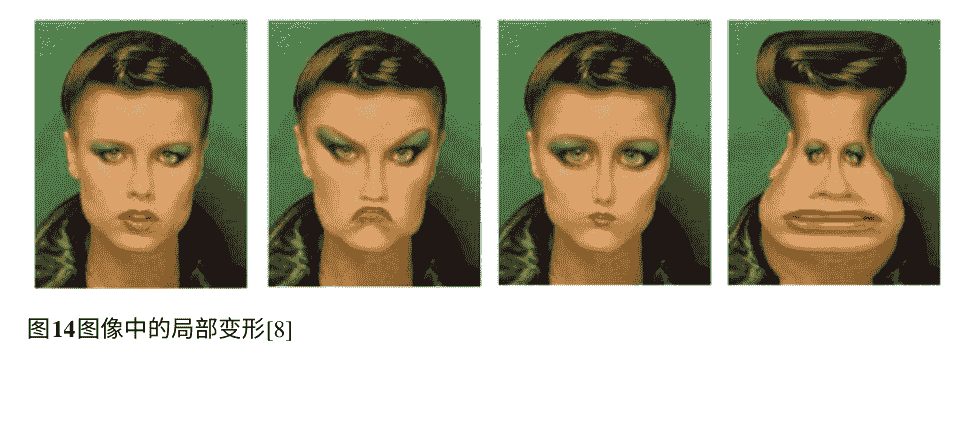

#### 5.4 通过小波进行收缩和尺度分离

为了评估稳定性，我们首先需要量化变形的程度。此外，我们需要找到一个尺度的概念：在许多应用中，我们对局部不变性感兴趣，而不是全局群不变性。深度卷积网络对平移具有协变性而不是不变性。因此，输入中的平移导致卷积层输出中的平移。然而，为了使计算对平移不变，需要分离尺度并应用非线性变换。线性算子计算平移群G的局部不变量。这是通过在轨道$\{g.x\}_{g\in G}$上取x的均值来实现的。这是通过与大小为$2^J$的核 $\phi^J(u) = 2^{-nJ}\phi(2^Ju)$进行卷积来实现的。

$$\int \phi(u)du = 1:$$

$$\phi_J x(u) = x \star \phi_J(u). \qquad (45)$$

这是可以验证的，对于所有的$x\in L^2(Rn)$在一个平移范围$2^J$内，平均化是Lipschitz连续的。然而，它消除了输入中高于$2^J$频率的变化。如果$J=\infty$，它几乎消除了所有的信息。

我们使用不同尺度的小波来分离不同尺度上的变化。
K个小波定义为$\psi_k(u)$，其中$u\in Rn$。这些通过$2^j$进行膨胀：$\psi^{j,k}(u)=$使用小波卷积，我们可以计算在尺度$2^j$上的x的平均值和在尺度$2^j\geq2^J$上的变化。这个卷积操作是收缩的，得到的表示是稀疏的。对于音频信号$n=1$，octave $2^J$内使用了$K=12$个中间频率。对于图像$n=2$，我们利用$\frac{\pi}{K}$旋转的方向。例如，我们使用J=4，K=4，如图15所示。

#### 5.5 滤波器组、相位去除和收缩

我们利用不同尺度上的级联滤波器来计算带小波的散射变换。在每个尺度上，我们使用滤波器 $w_{j,k}$来计算小波$\psi_{j,k} = w_{j,k} * \phi_{j-1}$。此外，在每个阶段，我们通过使用滤波器 $w_{j,0}$来计算 $\phi_j = w_{j,0} * \phi_{j-1}$来进行增大尺度的平均。小波系数 $x_j(u, k) = x * \psi_{j,k}(u)$在尺度$2^j$上振荡，并且将 $\phi_j$与 $x_j$进行平均将输出一个零信号。因此，需要非线性操作来去除振荡。模值($\rho(\alpha) = |\alpha|$)是一种计算正包络的非线性操作。我们还可以使用ReLU，即max(m,0)，它也是类似于模值的收缩算子。任何满足 $|\rho(\alpha) - \rho(\alpha')| \leq |\alpha - \alpha'|$的非线性算子都可以被认为是收缩的。将$\rho(x * \psi_{j,k}(u))$与$\phi_j$进行平均，输出正系数，这些系数在尺度$2^J$上具有局部不变性。语音中的梅尔频谱和图像中的SIFT都是局部多尺度不变的示例。它们由于平均而导致信息丢失，因此在小尺度（例如SIFT的$16^2$像素）上计算。由于这个原因，它们无法捕捉到大尺度结构，并且无法捕捉到尺度之间的相互作用。图16展示了使用小波模值算子的散射变换。

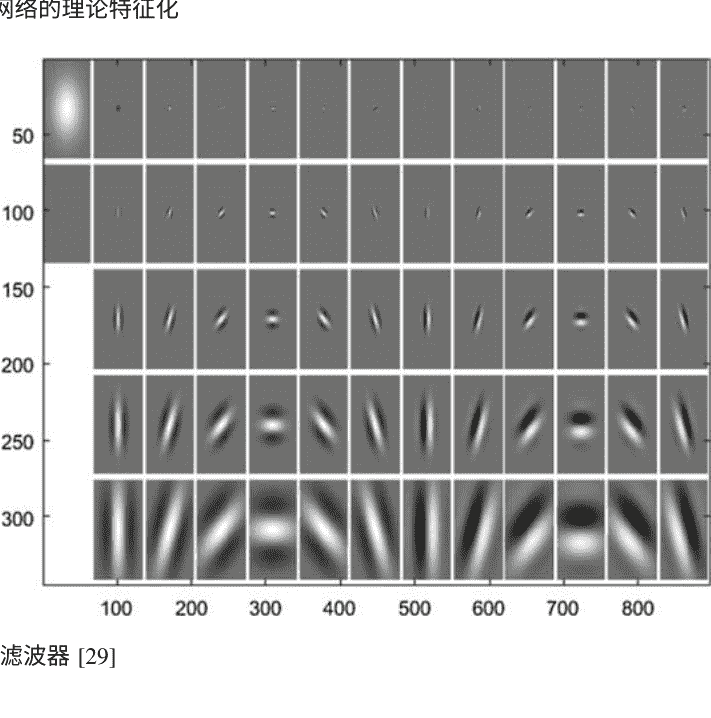

#### 5.6 平移群

深度神经网络由一系列线性滤波器（卷积或全连接）层和点乘非线性函数 $\rho$ 交替组成。为了简单起见，使用了一个架构，其中卷积滤波器不会跨输入通道相加。

假设通过将单通道 $x_{j-1}(u, k_{j-1})$ 沿着$u$卷积计算得到 $x_j(u, k_j)$，其中 $j$ 是层索引。那么 $x_j(u, k_j) = \rho(x_{j-1}(., k_{j-1}) * w_{j,h}(u))$ 其中 $k_j = (k_{j-1}, h)_。 (46)$

迭代$J$定义了一个卷积树 $x_J(u, k_J) = \rho(\rho(\rho(\rho(x * w_{1,h_1}) * ...)*) * w_{J-1,h_{J-1}}) * w_{J,h_J})). \quad (47)$

对于$\mathrm{m} =1$，系数 $x_J(u, k_J) = \rho(x * \psi_{j, k_1}) * \phi_J(u)$是小波系数。对于$\mathrm{m} = 2$， $\rho(\rho(x * \psi_{j_1, k_1}) * \psi_{j_2, k_2}) * \phi_J(u)$是互补不变量测量x在尺度$2^{j_1}$内距离$2^{j_2}$和方向和频率带由 $k_1$和 $k_2$定义。参见图17。值得注意的是，在图像和语音的情况下，大部分能量都包含在前两个阶段，即 $m \leq 2$。

如果x是稳定的，那么 $\rho(...\rho((x * \phi_{j_1,k_1}) * \psi_{j_2,k_2}...))$保持稳定，因为卷积和逐点运算保持稳定性。对于一个整流器或模数$\rho(\alpha) = \alpha$对于 $\alpha \geq 0$。所以在平均滤波器的输出处可以去除 $\rho$。对于一个带通

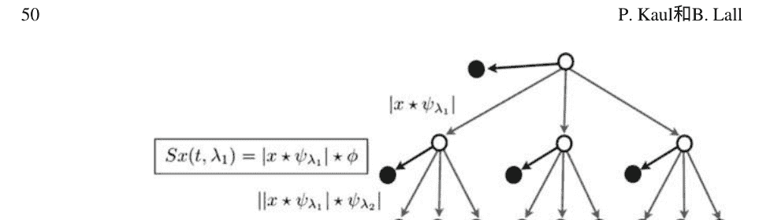

图16 散射变换包括级联的小波算子和模数算子，形成一个树状结构。在每个阶段，系数也通过低通算子 φ [2]进行平均

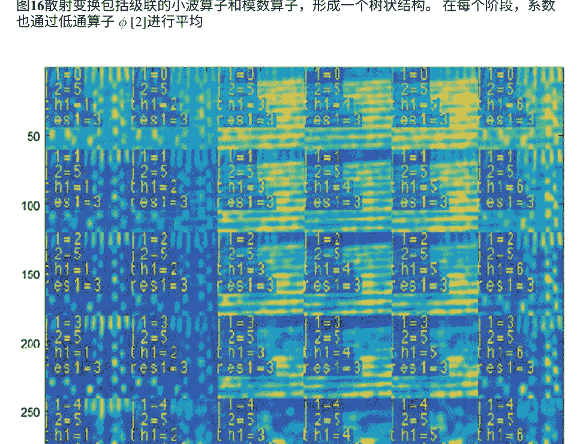

图17 散射系数

通过非线性去除相位或符号，具有强烈的收缩效应。我们可以从所有低通滤波器中去除 ρ，然后J次卷积的级联减少到m（带通滤波器的数量）。

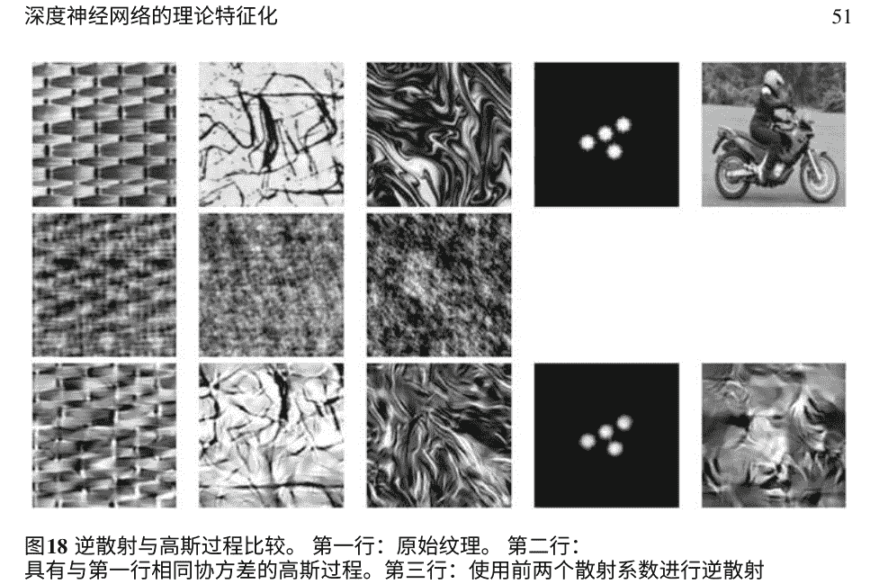

图18 逆散射与高斯过程比较。第一行：原始纹理。第二行：具有与第一行相同协方差的高斯过程。第三行：使用前两个散射系数进行逆散射[29]

#### 5.7 逆散射和稀疏性

散射变换不可逆。然而，对于给定的 $\phi_J(x)$，我们可以尝试找到 $\tilde{x}$，使得 $||\phi_J(x) - \phi_J(\tilde{x})|| < \sigma_{J0}$。这可能可以通过使用白噪声初始化 $\tilde{x}_0$，并在尝试减小 $||\phi_J(x) - \phi_J(\tilde{x}_n)||$ 时使用梯度下降来实现。在图18中，第一行是原始纹理。第二行显示了与第一行原始纹理具有相同协方差的高斯过程。第三行显示了使用散射系数进行的逆散射，其中散射系数的阶数为 $m < =2$，$2^J = N$ 和 $K =8$。从图18可以看出，散射系数能够比具有与原始图像相同的前两个矩的高斯过程更好地重现纹理的相似性。

### 6 曲率表征

#### 6.1 均值场理论和高斯曲率

在[34]中描述的方法使用Riemannian曲率和均值场理论分析深度神经网络。为了简化分析，他们假设神经网络具有随机权重。他们的直觉是DNN可以表示通用的随机函数。此外，DNN可以将输入中的曲面解缠成输出中的平面曲面。最后，深层神经网络具有相同数量的神经元可以比浅层网络更有效地进行这种解缠。

考虑一个具有D层权重 $w^1...w^D$ 和 $D+1$层向量 $x^0,...^{DNN}$对于输入$x0$，滤波器 $w$和偏置 $b^l$在层 $l$上的非线性 $\phi$的输出是：

$$x^l = \phi(h^l), \quad h^l = w^l x^{l-1} + b^l \qquad (48)$$

这里是第$l$层的滤波器输出，$\phi$是一个逐点非线性函数，作用于 $l$层的输出生成 $x^l$。权重和偏置以高斯随机变量的形式进行初始化，分布如下：

- $w_{ij}^l \sim \mathbf{N}(0, \sigma_w^2/N_{l-1})$.
- $b \sim \mathbf{N}(0, \sigma_b^2)$.

当一个简单的流形通过神经网络向前传播时，其几何形状的变化需要被测量。在第 $l$层的输入处，归一化后的平方长度被定义为

$$q^l = \frac{1}{N_l} \sum_{i=1}^{N_l} (h_i^l)^2 \qquad (49)$$

通过中心极限定理，对于大 $N_l$，这个数量将收敛到零均值的高斯随机变量。由于这个分布经过层和基于层索引$l$的迭代映射处理，可以得到方程49中的 $q^l$。

$$q^l = V(q^{l-1}|\sigma_w, \sigma_b) = \sigma_w^2 \int Dz \phi(\sqrt{q^{l-1}} z) + \sigma_b^2 \text{ 对于 } l=2, ..., D, \qquad (50)$$

其中

$$Dz = \frac{dz}{\sqrt{2\pi}} e^{-z^2/2} \qquad (51)$$

是标准高斯测度，$z$是一个虚拟变量，初始条件为

$$q^1 = \sigma_w^2 q^0 + \sigma_b^2 \qquad (52)$$

而 $q^0$表示进入第一层的长度，定义为

$$q^0 = \frac{1}{N_0} x^0 x^0. \qquad (53)$$

方程 (50) 中的函数V是迭代方差，它预测了输入通过网络时长度的变化。它是一个凹函数，其与单位线的交互确定了其固定点 $q^*(\sigma_w, \sigma_b)$。从图19可以看出

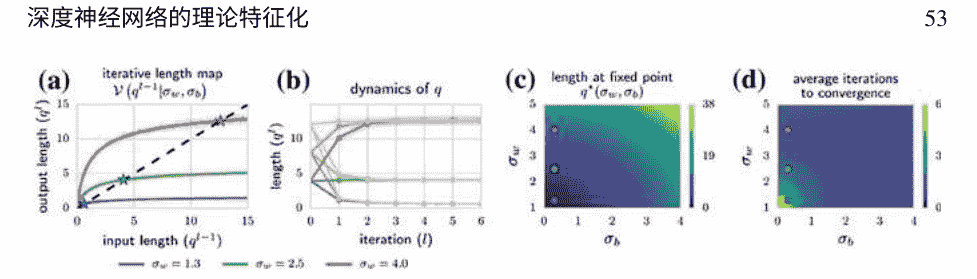

图19 具有tanh非线性和1000个隐藏单元的网络的平方 q^l 的变化。不同 σ_w 和 σ_b 下的长度映射已经显示出来。实线表示理论预测，而模拟结果用点表示。地图的固定点 q* 显示为星号。b 在几层内，长度地图会发生变化，并在所有情况下在几层内收敛到 q*（线=理论；点=模拟）。c 固定点显示为 σ_w 和 σ_b 的函数。d 在分数偏离固定点小于一的层数。在（a, b）中的（σ_b, σ_w）对应于（c, d）中的颜色匹配的圆圈[34]。

- 1. 对于 σ_b = 0，σ_w < 1，唯一的交点是 q* = 0，因此网络将所有输入收缩到零。
- 2. 对于 σ_w > 1 和 σ_b = 0，q* = 0，固定点变得不稳定，长度映射获得第二个非零但稳定的固定点，网络收缩大输入并扩展小输入。
- 3. 对于任何非零偏置 σ_b，长度映射具有单个稳定的非零固定点。在这种情况下，注入的偏置阻止信号衰减为零。

瞬态混沌：如果我们考虑两个输入，x^0,1 和 x^0,2，这两个输入的几何可以用内积给出的 2×2 矩阵表示。

$$q_{ab}^l = \frac{1}{N} \sum_{i=1}^{N_l} h_i^l(x^{0,a}) h_i^l(x^{0,b}) \quad a,b \in 1,2. \tag{54}$$

术语 q^l_1 和 q^l_22 是可以直接从方程式50中推断出的长度。对于非对角线项，可以推断出相关性图 C 用于 q^l_12 :

$$q_{12}^l = C(c_{12}^{l-1}, q_{11}^{l-1}, q_{22}^{l-1} | \sigma_w, \sigma_b) = \sigma_w^2 \int Dz_1 Dz_2 \phi(u_1) \phi(u_2) + \sigma_b^2,$$

其中

$$u_1 = \sqrt{q_{11}^{l-1}} z_1, \tag{55}$$

$$u_2 = \sqrt{q_{22}^{l-1}} \left[ c_{12}^{l-1} z_1 + \sqrt{1 - (c_{12}^{l-1})^2} z_2 \right], \tag{56}$$

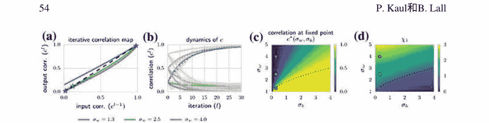

图20 随机加权网络中相关性的变化，$ c_{12}^l $，通过层传递的情况下，使用tanh非线性函数。当 $ \sigma_w $ 和 $ \sigma_b = 0.3 $，C-map如图19所示。bC-map的变化如图所示。实线表示理论，而点表示使用 $ N = 1000 $ 的模拟结果。cC-map的固定点 $ c^* $。dC-map在1处的斜率，$ \chi_1 $，将空间分为混沌区域（$ \chi_1 > 1 $， $ c^* < 1 $）和有序区域（$ \chi_1 < 1 $， $ c^* = 1 $）[34]

相关系数定义为：

$$c_{12}^l = q_{12}^l (q_{11}^l q_{22}^l)^{-1/2}.$$

这里 $ z_1 $ 和 $ z_2 $ 是不相关的高斯变量，而 $ u_1 $ 和 $ u_2 $ 是相关的高斯变量，其协方差矩阵为 $ < u_a u_b > = q_{ab}^{l-1} $。

由于每个点的长度在网络传播过程中迅速收敛到 $ q^* (\sigma_\omega, \sigma_b) $，我们可以替换这个值。我们可以通过设置 $ q_{11}^l = q_{22}^l = q^* (\sigma_\omega, \sigma_b) $ 并除以 $ q^* $ 来计算 $ c^* $。因此，我们可以得到一个C映射（相关系数映射）：

$$c_{12}^l = \frac{1}{q^*} C(c_{12}^{l-1}, q^*, q^* | \sigma_\omega, \sigma_b).$$

C映射总是有一个固定点 $ c^* = 1 $。固定点的稳定性取决于映射在1处的斜率，即

$$\chi_1 = \frac{\partial c_{12}^l}{\partial c_{12}^{l-1}} \bigg|_{c=1} = \sigma_\omega^2 \int D z [\phi' (\sqrt{q^*} z)]^2.$$

然后根据 $ \chi_1 $ 的值，有三个可能的区域（见图20）：

- 对于较小的 $ \sigma_\omega $，$ c^* = 1 $是唯一的固定点，并且在 $ \chi_1 < 1 $ 时是稳定的，任何两个点在网络中传播时都会收敛。
- 当 $ \sigma_\omega $ 增加时，$ \chi_1 $ 越过1，创建了一个新的 $ c^* $，与1不同。
- 对于较大的 $ \sigma_\omega $，强权重压倒偏差，使输入去相关和正交，导致稳定的固定点在 $ c^* = 0 $。

因此，$ \chi_1(\sigma_w, \sigma_b) = 1 $ 在 $ (\sigma_w, \sigma_b) $ 平面上产生了一个相变边界，根据分离/收敛将其分为混沌相和有序相。

我们注意到对数 $ \chi_1 $ 是动力系统理论中的Lyapunov指数。

通过深度网络传播。现在我们可以尝试跟踪流形的长度当它通过深度神经网络传播时。在第一层

$$h^l(0)=h^l(x^0(\theta)).$$
(59)

其中 $x^0(\theta)$ 是一个一维流形， $\theta$ 是内在的标量坐标。我们可以选择一个定义为圆的形状:

$$\sqrt{N_1q}[u^0cos(\theta)+u^1sin(\theta)],$$
(60)

其中 $u^0$ 和 $u^1$ 是 $R^N$ 的二维子空间的正交基。在每个点上，流形 $h(\theta)$ 具有切向量或速度向量。

$$v(\theta)=\partial_{\theta}(h(\theta)).$$
(61)

曲率与加速度有关，加速度定义为速度的变化率。

$$a(\theta)=\partial_{\theta}(v(\theta))$$
(62)

在每个点 $\theta$， $v(\theta)$和$a(\theta)$构成了 $R^N$ 的二维空间。渐近圆定义为半径为 $R(\theta)$ 的圆，它具有与$\theta$处的位置、速度和加速度相同的特性。

外曲率被定义为

$$k(\theta)=\frac{1}{R(\theta)},$$
(63)

此外，外曲率与速度和加速度有关:

$$k(\theta)=v.v-3/2\sqrt{(v.v)(a.a)-(v.a)^2}.$$
(64)

根据欧几里得度量，总曲线长度为

$$L^E=\int\sqrt{g^E(\theta)}d\theta.$$
(65)

其中

$$g^E(\theta)=v(\theta).v(\theta).$$
(66)

对于嵌入在 $\mathbb{R}^N$ 中的 $k$维流形 $\mathcal{M}$ 上的 $\theta \in M$ 的点，高斯映射将其映射到其$k$维切空间 $T_\theta M \in \mathbf{B}_{k,n}$，其中 $\mathbf{B}_{k,n}$ 是所有k维空间的Grassmanian流形。高斯映射将曲线上的点 $\theta$映射到单位速度向量 $\hat{v}(\theta)=v(\theta)/\sqrt{v(\theta).v(\theta)}$。高斯度量与外曲率和欧几里得度量有关

$$g^G(\theta) = k(\theta)^2 g^E(\theta) \quad (67)$$

高斯映射下的曲线长度为

$$L^G = \int \sqrt{g^G(\theta)} d\theta \quad (68)$$

外曲率和欧几里德度量在传播过程中迭代地改变，如下所示通过层次

$$g^{E,l} = \chi_1 g^{E,l-1},$$
$$(k^l)^2 = 3 \frac{\chi_2}{\chi_1} + \frac{1}{\chi_1} (k^{l-1})^2,$$
$$g^{E,1} = q^*,$$
$$(k^1)^2 = 1/q^*,$$
$$\chi_2 = (\sigma_\omega)^2 \int Dz [\phi''(\sqrt{q} z)]^2,$$

其中 $\chi_2$ 类似于 $\chi_1$ 定义。

如果圆被放大，即$\theta = \chi h(\theta)$，则$L_E$的长度和半径都会放大$\chi$倍，但曲率放大$\chi^{-1}$倍，所以$L^G$不会改变。然而，在深度网络中，$L^G$也会增加。在Sigmoid神经网络中，演化行为取决于$\chi_1$的值。

对于混沌相$\chi_1 > 1$：欧几里得度量$g^E$通过$\chi_1$的乘法拉伸以指数级增长，深度增加。拉伸通过$\chi_1$减弱了第$l-1$层中的任何曲率，减弱因子为$1/\chi_1$，但由于$\chi_2$引入了新的曲率，由于单个神经元的非线性。因此，与线性扩展不同，外在曲率不会丢失，而是最终趋近于$k^*$。这意味着全局曲率度量$L^G$随深度呈指数级增长（见图21）。

这表明DNNs成为高度曲率的函数，可以在简单的低维流形上计算指数凸函数。曲线的长度随深度呈指数级增长，但随宽度的增长仅为平方根。

#### 6.2 测量黎曼和里奇曲率

先前的技术依赖于对具有随机权重的神经网络的分析。然而，现实世界的网络是使用随机梯度下降进行训练的，因此并不是真正的随机。此外，上述技术不能对神经网络在各种多维流形变换中的行为进行细粒度观察。最近的一个算法[20]是基于对训练后模型进行分析的。

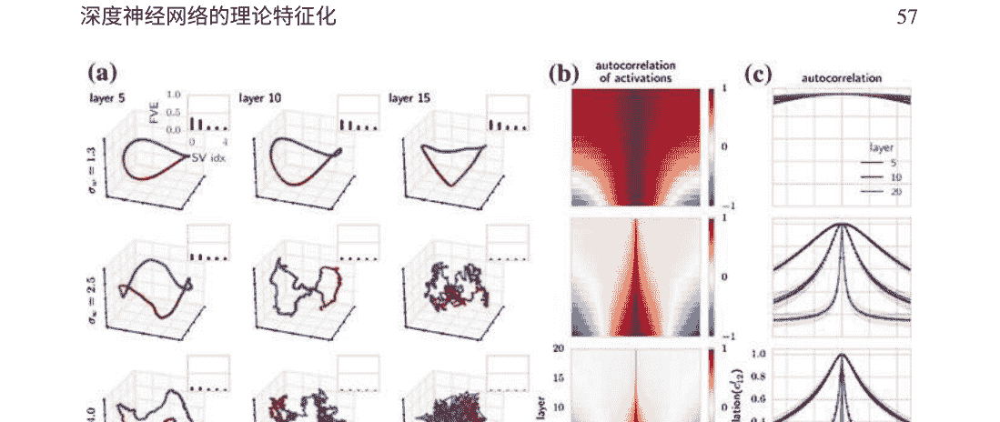

图21一个一维流形圆被输入到三个不同的神经网络中，具有不同的$\sigma_w$和固定的$\sigma_b=0.3$。在模拟中，使用主成分分析将隐藏层的输出投影到一个三维子空间中进行绘图。只显示第5、10和15层。插图显示了前五个主成分的相对能量。对于$\sigma_w=4$，最大能量奇异值更均匀分布，圆圈在每一层中变得更加纠缠。b自相关的变化，$c^1_{12}(\Delta\theta) = \int d\theta q^1(\theta; \theta+\Delta\theta)/q^*$，在多个层次上显示。c自动相关性的理论预测以及测量自相关性的均值和标准差显示在[34]中。

基于微分几何背景的神经网络试图克服这些缺点。它从以下思想和假设开始。

1. 用于各种机器学习问题的数据集在更高维空间中嵌入了低维流形。
2. 分类问题涉及对数据集中不相交的非线性流形进行分离。
3. 输入中的这些类别位于非线性流形上，因此无法使用线性方法对它们进行分离。
4. 深度学习网络通过训练期间学习的各种变换将输入的非线性流形转换为线性区域。在各种深度学习架构中，这些变换通过线性或仿射层与非线性激活函数的组合来实现。我们可以将这些组合变换视为在各种高度曲线坐标系上的基变换。
5. 一旦非线性化的输入通过这些级联变换转换为线性区域，我们可以使用简单的线性投影技术类型W x + b（其中W是权重的线性矩阵，x是输入向量，b是偏置项），这将通过超平面有效地划分空间。
6. 由于变换是在曲线基础上进行的，我们可以使用广义相对论的工具，该工具广泛使用黎曼曲率的数学。
7. 我们通过计算输出相对于输入数据中一组参数化变换的梯度来测量曲率。即 ∂o/∂t，这里 o 是输出，t 是变换参数。

我们试图对变换流形的黎曼曲率进行直接测量，该流形可以具有一个或多个维度。所选的变换取决于数据的类型，对于图像，我们可以使用平移或旋转或这些的组合进行变换。当我们将输入验证集移动到变换流形上时，我们需要使用差分方程来测量输出的梯度。这些测量的步骤如图22所示。在第3.2节中，对这些步骤进行了描述。

#### 一维流形分类器

我们在一个合成数据集上测试上述算法，并对包含单一维流形的变换进行计算。我们将这个经过变换的单一维流形输入馈送给一个预训练的MLP，该MLP经过训练可以区分两个阿基米德螺旋。

我们使用两个相隔 $\pi$ radians的阿基米德螺旋，因为它们不是线性可分的。螺旋如下所示：

$$x_i(\theta) = t \cos(\theta + d_i) + n(\theta), \quad (69)$$
$$y_i(\theta) = t \sin(\theta + d_i) + n(\theta), \quad (70)$$

其中这两个方程生成了所有角度 $\theta$从0到2π之间的两个矩形坐标，而 $t$ 是一个常数。变量 $d_i$是螺旋的初始角度，第一个螺旋选择为0，第二个螺旋选择为 $\pi$。在训练集中，我们还对生成的坐标添加了独立同分布的高斯噪声，表示为 $n(\theta)$。

为了生成神经网络的数据集，我们需要从上面生成的坐标创建一组向量。为此，我们利用两个方差为1的高斯随机向量， $u_0$和 $u_1$，每个向量的长度为1000，我们将其与先前生成的坐标相乘，以创建神经网络的输入数据集。

$$v = x_i(\theta) u_0 + y_i(\theta) u_1. \quad (71)$$

为了创建训练集，我们为每个训练样本生成随机 $\theta$，并使用该 $\theta$ 计算 $v$，如上述方程 (71) 所示。这个v是用于训练神经网络的输入训练向量。训练集的一个特定实例在图23中表示，其中红点对应于第一类，蓝点对应于第二类。对于验证数据集（用于测量曲率），我们不通过螺旋方程生成x和y，而是

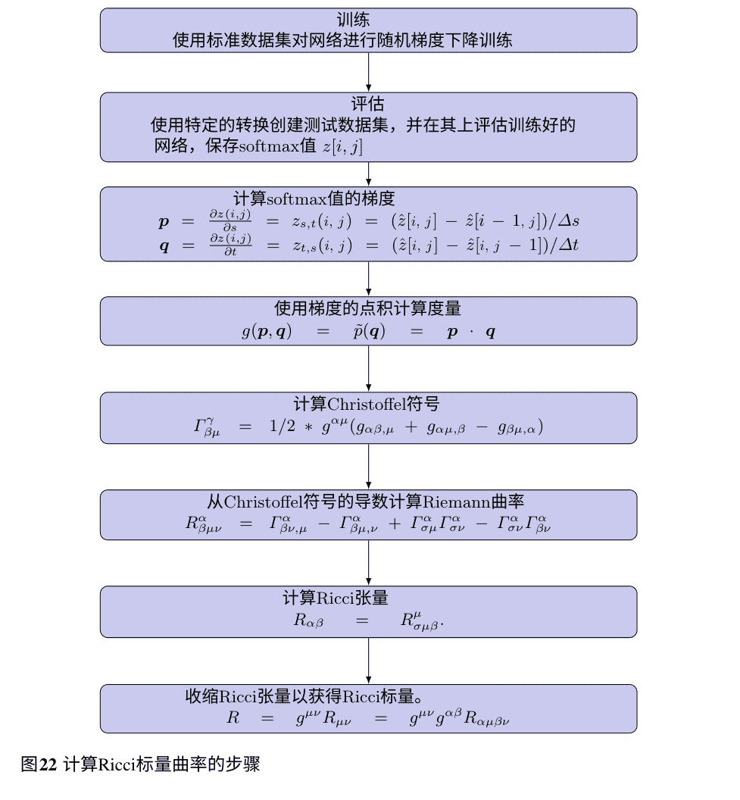

#### 图22 计算Ricci标量曲率的步骤

而是生成可能的整个网格 $x_i$ 和 $y_i$。然后我们利用方程式71生成验证向量。一旦数据集创建完毕并且网络训练完成，我们对验证集进行网络测试，并存储输出的softmax值。这个softmax输出用于找到各种梯度和曲率度量，如图22所示。首先我们注意到这两个类别在单维流形上（参数为 $\theta$），但不是线性可分的。从图24中显示的分类器区域可以推断出，网络正确地区分了这两个类别。唯一的例外是在中心，那里有一些重叠。我们在整个验证集上绘制Ricci标量值，如图25所示。我们注意到网络在分离这两个类别的边界区域学习到了非常大的曲率值。我们推断

#### Training Data for spirals

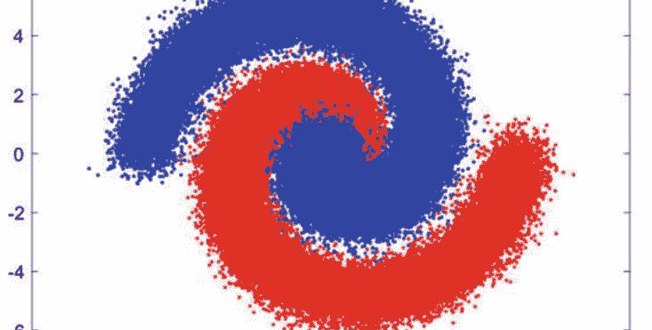

图23 红色表示类别0的训练集，蓝色表示类别1的训练集

#### Classifier Decision Regions. Red=0, Blue=1

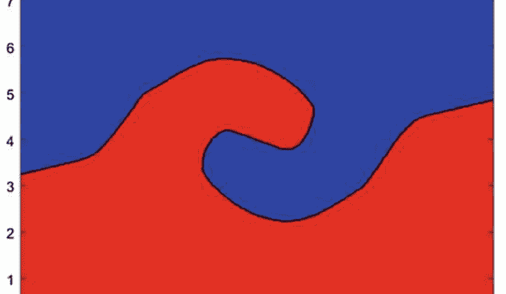

图24 经过训练的神经网络的分类区域

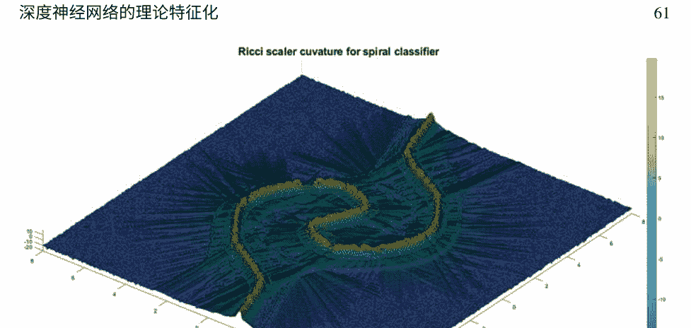

#### 图25 螺旋数据的Ricci缩放器

神经网络正在增加边界区域的类别间距，以便能够区分不同类别。

我们可以利用上述观察结果来注意到，具有小曲率的边界区域可能是输入数据发生小变形/转换可能导致分类错误的可能区域。另一个有趣的观察是，即使在我们没有提供任何训练数据的区域，神经网络也会以某种可预测的方式进行分类。

### 参考文献

1. Amodei, D., Ananthanarayanan, S., Anubhai, R., Bai, J., Battenberg, E., Case, C., Casper, J., Catanzaro, B., Cheng, Q., Chen, G., 等. 深度语音2：端到端的英语和普通话语音识别。 在：国际机器学习大会，第173-182页 (2016年)
2. Andén, J., Mallat, S.: 深度散射谱。IEEE信号处理交易。 62 (16) ，4114-4128 (2014年)
3. Bartlett, P.L., Maass, W.: 神经网络的Vapnik-Chervonenkis维度。 在：大脑理论和神经网络手册，第1188-1192页 (2003年)
4. Bengio, Y., Delalleau, O.: 深度架构的表达能力。 在：算法学习理论国际会议，第18-36页。Springer，柏林 (2011年)
5. Bianchini, M., Scarselli, F.: 浅层和深层神经网络分类器的复杂性。 在：ESANN (2014年)
6. Bredon, G.E.: 拓扑学和几何学，第139卷。Springer Science & Business Media (2013年)
7. Bronstein, M.M., Bruna, J., LeCun, Y., Szlam, A., VanderGheynst, P.: 几何深度学习：超越欧几里德数据。IEEE信号处理杂志 34 (4) ，18-42 (2017年)
8. Bruna, J.: 欧几里德域中的几何稳定性：散射变换及其扩展。https://joanbruna.github.io/MathsDL-spring18/ (2018)
9. Bruna, J., Mallat, S.: 不变散射卷积网络. IEEE Trans. Pattern Anal. Mach. Intell. 35(8), 1872–1886 (2013)
10. Cho, K., Van Merriënboer, B., Gulcehre, C., Bahdanau, D., Bougares, F., Schwenk, H., Bengio, Y.: 使用RNN编码器-解码器学习短语表示的统计机器翻译 (2014). arXiv预印本 arXiv: 1406.1078
11. Choquet-Bruhat, Cécile, Y., DeWitt-Morette, C., Dillard-Bleick, M.: 分析，流形和物理学。湾区专业出版社 (1982)
12. Cover, T.M., Thomas, J.A.: 信息论要素。 Wiley (2012)
13. Friedman, J., Hastie, T. and Tibshirani, R.: 统计学习的要素，卷1。 Springer 统计学系列。Springer, 纽约 (2001年)
14. Gilmore, R.: 李群，李代数及其应用。Courier Corporation (2012年)
15. Glorot, X., Bordes, A., Bengio, Y.: 深度稀疏整流神经网络。 在： 第十四届国际人工智能与统计学会议论文集，第315-323页 (2011年)
16. Goodfellow, I., Bengio, Y. and Courville, A.: 深度学习。 MIT Press (2016年)
17. Guss, W.H., Salakhutdinov, R.: 利用代数拓扑描述神经网络的容量 (2018年). arXiv预印本 arXiv:1802.04443
18. He, K., Zhang, X., Ren, S., Sun, J.: 深度残差学习用于图像识别。 在计算机视觉和模式识别的IEEE会议论文集中，第770-778页 (2016年)
19. Hochreiter, S., Schmidhuber, J.: 长短期记忆。神经计算。 9(8), 1735-1780 (1997年)
20. Kaul, P., Lall, B.: 深度神经网络的黎曼曲率。 IEEE Trans. Neural Netw. Learn. Syst. (2019). https://doi.org/10.1109/TNNLS.2019.2919705
21. Kearns, M.J., Vazirani, U.V., Vazirani, U.: 计算学习理论导论。 MIT Press (1994)
22. Krizhevsky, A., Sutskever, I., Hinton, G.E.: 使用深度卷积神经网络进行Imagenet分类。 在： 神经信息处理系统的进展，第1097-1105页 (2012)
23. LeCun, Y., Bengio, Y., Hinton, G.: 深度学习。 自然 521(7553), 436–444 (2015)
24. LeCun, Y., Bottou, L., Bengio, Y., Haffner, P.: 基于梯度的学习应用于文档识别。 IEEE会议记录 86(11), 2278–2324 (1998)
25. LeCun, Y., Cortes, C.: MNIST手写数字数据库 (2010)
26. Lee, J.M.: 黎曼流形： 曲率导论，卷 176。 斯普林格，纽约 (1997)
27. Lee, J.M.: 光滑流形导论，卷 218。 斯普林格，纽约 (2013)
28. Mallat, S.: 群不变散射。 纯粹与应用数学通讯 65(10), 1331–1398 (2012)
29. Mallat, S.: 理解深度卷积网络。 Phil. Trans. R. Soc. A 374(2065), 20150203 (2016)
30. Mathworks. im2col. https://in.mathworks.com/help/images/ref/im2col.html。 于2019年2月10日访问
31. Monti, F., Boscani, D., Masci, J., Rodola, E., Svoboda, J., Bronstein, M.M.: 使用混合模型CNN在图和流形上进行几何深度学习。 在： CVPR会议论文集，卷. 1, 第3页 (2017年)
32. Munkres, J.R.: 拓扑学。 Prentice Hall (2000年)
33. Nakahara, M.: 几何， 拓扑和物理学。 CRC Press (2003年)
34. Poole, B., Lahiri, S., Raghu, M., Sohl-Dickstein, J., Ganguli, S.: 通过瞬态混沌在深度神经网络中实现指数表达能力。 在： 神经信息处理系统的进展，第3360-3368页 (2016年)
35. Raghu, M., Poole, B., Kleinberg, J., Ganguli, S., Sohl-Dickstein, J.: 深度神经网络的表达能力调查 (2016). arXiv预印本 arXiv:1611.08083
36. Ren, S., He, K., Girshick, R., Sun, J.: Faster r-cnn: 基于区域建议网络的实时目标检测. 在： 神经信息处理系统的进展，第91-99页 (2015)
37. Saxe, A.M., McClelland, J.L., Ganguli, S.: 深度线性神经网络学习非线性动力学的精确解 (2013). arXiv预印本 arXiv:1312.6120

- 38. Schutz, B.: 广义相对论初级课程. 剑桥大学出版社 (2009)
- 39. Sermanet, P., LeCun, Y.: 多尺度卷积网络的交通标志识别. 在: 神经网络 (IJCNN), 第2809-2813页. IEEE (2011)
- 40. Shuman, D.I., Narang, S.K., Frossard, P., Ortega, A., Vandergheynst, P.: 信号处理在图上的新兴领域：将高维数据分析扩展到网络和其他不规则域。IEEE信号处理杂志。 **30(3)**, 83–98 (2013)
- 41. Szegedy, C., Liu, W., Jia, Y., Sermanet, P., Reed, S., Anguelov, D., Erhan, D., Vanhoucke, V., Rabinovich, A.: 用卷积更深入。 在: IEEE计算机视觉和模式识别会议论文集，第1-9页 (2015)
- 42. Topaz, C., Ziegelmeier, L., Halverson, T.: 生物聚集模型的拓扑数据分析。 PloS one. **10.** https://doi.org/10.1371/journal.pone.0126383
- 43. Vapnik, V.N., Chervonenkis, A.Y.: 关于相对频率收敛于概率的均匀性。 在: 复杂性测量，第11-30页。 Springer, Cham (2015)
- 44. Wiatowski, T., Bölcskei, H.: 用于特征提取的深度卷积神经网络的数学理论 (2015)。 arXiv预印本arXiv:1512.06293
- 45. Zomorodian, A., Carlsson, G.: 计算持久同调。 离散计算几何学。 **33 (2)**, 249-274 (2005)

## 用于深度学习模型的专用张量处理架构的缩放分析

尤里·戈尔迪恩科，尤里·科丘拉，弗拉德·塔兰，尼基塔·戈尔迪恩科，亚历山大·罗科维伊，奥列格·阿利宁和谢尔盖·斯蒂连科

摘要：专用张量处理架构（TPA）针对神经网络处理引起了近年来的广泛关注。考虑到某些深度神经网络（DNNs）算法不同组件的计算复杂性，以及它们在这种TPA上的进一步使用，通过所提出的时间和加速度依赖的训练和推理时间的缩放分析估计了各种算法不同DNNs的实际计算复杂性，以展示TPU和GPU计算架构之间的关键差异。重点放在广泛使用的算法不同的DNNs，如VGG16，ResNet50和CapsNet上，以及在基于云的TPA（实际上是Google Cloud TPUv2）上的实现。通过所提出的缩放方法展示了性能研究的结果，以估计在这种基础设施上高效使用这些DNNs。最重要和有趣的结果是时间和加速度依赖的尺度不变行为，这使我们能够使用缩放方法来预测在没有详细信息的情况下，在新的特定TPA上运行训练和推理时间甚至也是可以的。算法上不同的DNNs（VGG16、ResNet50、CapsNet）和架构上不同的计算硬件（GPU和TPU）的缩放依赖性和缩放功率是不同的。这些结果给出了TPA（如Google TPUv2）在大量计算条件下的更高性能（吞吐量）的精确估计，这些条件下计算开销低且TPU单元利用率高，通过大图像和批量大小实现。总的来说，像Google TPUv2这样的TPA的使用在增加推理和训练阶段的性能方面是有前景的，尤其是考虑到NVIDIA提供的类似的特定TPA（如Tesla V100和Titan V中的TCU）以及其他类似的TPA的可用性。

Y. Gordienko (✉) · Y. Kochura · V. Taran · N. Gordienko · A. Rokovyi · O. Alienin · S. Stirenko 乌克兰“伊戈尔·西科尔斯基·基辅理工学院”国家技术大学，基辅，乌克兰 电子邮件：yuri.gordienko@gmail.com Y. Kochura 电子邮件：iuriy.kochura@gmail.com V. Taran 电子邮件：vladtkv@gmail.com N. Gordienko 电子邮件：nik.gordiienko@gmail.com A. Rokovyi 电子邮件：alexandr.rokovoy@gmail.com O. Alienin 电子邮件：oleg.alenin@gmail.com S. Stirenko 电子邮件：sergii.stirenko@gmail.com

- 深度学习
- 张量处理架构
- 张量处理单元
- 张量核心
- 扩展
- GPU
- TPUv2
- 训练时间
- 推理时间
- 加速
- MNIST
- VGG16
- ResNet50
- CapsNet

### 1 引言

目前机器学习（ML），尤其是深度学习（DL）和深度神经网络（DNNs）的成功与高性能计算（HPC）和专用计算架构的最新进展密切相关。它允许使用它们固有的并发性和特定的能力以提高效率[1-4]。

随着ML/DL问题复杂性的增加，数据集和DNNs的大小，特征、类别和处理对象的数量也在增加。因此，对更高精度、更快的学习和推理的需求也与对更高计算能力、更大内存、更宽网络带宽等需求密切相关。为了实现这些目的，现在使用各种计算基础设施：从桌面机器（具有共享内存模型）到并行硬件架构，如高性能计算集群（具有共享和分布式内存模型），再到云计算系统（分布式内存模型），这些系统现在特别受欢迎和广泛使用。

这些基础设施的进展遵循了深度学习应用的硬件加速趋势。在过去的十年中，它与图形处理单元（GPU）作为通用处理器（GPGPU）的发展密切相关。

然而，最近出现了各种各样的替代平台：从众所周知的数字信号处理器（DSP）和现场可编程门阵列（FPGA）[5, 6]，到相当新的应用特定集成电路（ASIC）架构[7]，包括神经形态硬件[8, 9]，像NVIDIA的TCs（张量核心）[10]和Google的TPUs（张量处理单元）[11]这样的张量处理架构，专门用于机器学习应用中广泛使用的张量处理任务。

为了在这些计算基础设施上高效使用现代复杂的深度神经网络，应该考虑它们的各个方面。它们尤其重要。

对于ML/DL云计算系统（如Clarifai、Google Cloud Vision、Rekognition、Polly和Lex Amazon、Microsoft Azure Cognitive Services、IBM Watson等）上的新型计算架构非常重要，这些架构在科学界和商业应用中非常流行。与本地化解决方案相比，基于云的解决方案的主要问题是正确估计训练和推理时间，这对于商业应用至关重要。

在这项工作中，我们简要讨论了一些专用TPA，强调了它们的云实现，并展示了在这种基础设施上对一些流行的DNN的性能研究结果，并提出了用于估计在这种基础设施上高效使用这些DNN的扩展方法。

本文的主要目的是研究可用GPU和TPU的训练和推理性能的扩展，通过增加批量大小和图像大小来预测运行时间并估计专有TPA解决方案中的隐藏开销。

本章的其余部分按照以下方式组织。在第2节中，我们对张量处理和TPA的最新进展进行了简要概述。第3节包含与所选硬件、数据集、模型和指标相关的实验部分的描述。第4节报告了所获得的实验结果，第5节专门讨论了这些结果，第6节总结了所学到的经验。

### 2 背景和相关工作

与传统的高性能计算任务相比，当前的机器学习/深度学习任务主要通过GPU和FPGA等专用加速系统来解决，尽管它们以前被用于高性能计算。这些专用架构的本质在于它们有效地利用高数据并行性的能力。因此，它们在机器学习/深度学习应用中已成为事实上的标准。尽管取得了明显的进展，但仅由GPU卡加速的单机节点无法满足机器学习/深度学习问题快速增长的计算需求。为了应对这些对更高计算能力的新需求，出现了以下主流趋势：多节点架构（在集群和云系统中）、专用TPA以及它们的组合[12]。

新专用计算架构的额外需求与在各种移动设备上使用ML/DL应用程序有关，从消费者类型（如智能手机、平板电脑、可穿戴电子设备等）到工业类型（如安全系统、健康监测、自动驾驶等）。这种需求与对较低内存使用、计算操作数量以及相关能源浪费的严格要求密切相关[13-15]。为了解决这些困难，像TC [10]和TPU [11]这样的专用第三方加速器现在在消费者和工业实现中被广泛使用。

用于移动设备的DNN加速的最新趋势可以分为一些类别：优化实现、量化和结构化简化，将DNN转化为紧凑的形式[16, 17]。例如，结构化简化涵盖了几种方法，如张量分解[17]、稀疏连接[18]和通道修剪[19]。

对于DNN的高效处理，通常涉及到各种一般的观点、模型、优化算法和数据集的广泛评论。其他人考虑到与目标硬件的固有并行性相关的DNN组件的计算技术，使用一些技术来减少目标硬件上使用的总内存[19]。

在这个背景下，应用于DNN的并行性的战略愿景对于评估、实施和扩展算法和系统以支持分布式环境非常重要。最近，对这些方法进行了一些比较性的措施讨论。他们分析了并发性和平均并行性，使用了工作深度模型[12]。

#### 2.1 张量核心

张量核心（TCs）是由NVIDIA在Volta架构中提出的硬件矩阵运算加速器。张量核心提供了一个4 × 4 × 4的矩阵处理阵列，执行操作D =A * B +C，其中A、B、C和D是4 ×4的矩阵。NVIDIA的TCs与TensorRT库结合使用，可以对DNN图执行多个转换和优化操作，以提高性能。例如，它们包括消除未使用输出的层，以避免不必要的计算，将一些独立的层（卷积、偏置和激活）融合成一个单独的层，通过组合功能相似的层（具有相同源张量和相似参数的操作）进行水平层融合等。TC和TensorRT允许使用低位优化。例如，半精度（也称为FP16）算术与FP32或FP64算术相比，减少了DNN的内存占用和读写开销。它可以部署更大的DNN，并且比FP32或FP64算术更快。这是由于TC上更高效的矩阵运算，其中操作D =A * B + C可以由输入矩阵A和B实现，而累加矩阵C和D可以是FP16或FP32矩阵。此外，TensorRT会自动使用TC进行FP16算术的推理。因此，在Volta架构V100 GPU卡上使用TensorRT +TCs（使用FP16算术）可以显著加快推理时间。例如，在GPU V100 + TensorRT +TCs（FP16）上，ResNet-50 DNN模型的推理速度比单精度（FP32）推理快约4倍，比双精度（FP64）推理快约8倍，而且是在没有TensorRT +TCs的情况下使用相同卡进行的[20]。

但需要注意的是，这些结果是针对完全不同的批次大小报告的：V100（FP32）为2，V100 + TensorRT +TCs（FP16）为16，而我们的以前的基准测试结果显示了批次大小对GPU和TPU架构上某些DNN性能的巨大影响[21]。

此外，用于TCs的图灵架构不仅提供FP16/FP32算术，还增加了新的INT8和INT4算术。使用图灵架构的Tesla T4 GPU卡上的低位表示，与GPU V100 + TensorRT+TCs（FP16）相比，对于相同的批次大小128，推理速度提高了约2.5×[22]。

#### 2.2 张量处理单元

最近，Google的张量处理单元（TPUs）引起了很大的关注，作为另一种提高DNN效率和速度的TPA。TPU包含256 ×256 =总共65,536个算术逻辑单元（ALUs），每个周期可以处理65,536个8位整数的乘加操作。由于TPU运行在700 MHz，它可以计算65,536 × 7×108＝46 ×1012个乘加操作，或者每秒92 ×1012个[11]。根据公布的基准测试，TPU可以处理DNNs高达30×的速度，并且比CPU或GPU更节能高达80×[11]。这是可能的，因为TPU专门适应了每个周期比CPU和GPU更多指令的DNN处理。尽管有一些性能测试和对可用TPA的广泛评估，例如Google TPU与NVIDIA GPU K80 [11]和Google Cloud TPUv2与GPU NVIDIA V100 [23]之间的比较，但对于它们在不同规模（不同数据集大小，不同批次大小等）下的性能的系统研究除了几次以外是缺乏的[21]。

此外，TPU是唯一的TPA，因为它目前只作为云服务资源提供，具体配置如下：云TPU v2（180 teraflops，64 GB高带宽内存（HBM）），云TPU v3（420 teraflops，128 GB HBM），云TPU v2 Pod Alpha（11.5 petaflops，4 TB HBM，2-D环形网状网络）（https://cloud.google.com/tpu/）[11]。

#### 2.3 其他DNN加速器

尽管各个制造商对于用于加速DNN的新TPA表现出极高的兴趣，但它们大多是没有详细实现细节的专有解决方案，文档稀缺且可用的应用程序编程接口有限。然而，它们成为计算设备的组成部分，作为DNN加速协处理器、片上系统或专用应用特定集成电路（如计算机视觉或DSP），详细的评测和基准测试可以在其他地方找到[24-28]。

#### 2.4 并行算法和张量处理架构

在GPU计算中实现最高性能的一种方法是通过高数据级并行性来隐藏长延迟和其他计算开销，从而实现高吞吐量，例如通过高批量大小值[29, 30]。

通常，批量采样是通过对整个数据集进行洗牌来实现的，对数据集的完整遍历称为一个时代。由于完整的训练过程通常由数十到数百个这样的时代组成，使用最大可能的批量进行批量采样可以提供显著的并行化和吞吐量[31, 32]。

为了达到最高的准确性，最优批量大小代表了最小批量大小1（每次迭代一个样本）和传统梯度下降的折衷，已经证明收敛，以及最大批量（每次迭代整个数据集），当不总是证明存在收敛时[33]。然而，最优批量大小是一个复杂的优化问题，因为它受到准确性和效率要求的限制。但是经验上已知，批量大小既不应该太小，也不应该太大，以提供收敛性和泛化性[31, 34–36]。

学习中的大多数操作可以建模为张量上的操作（通常张量作为并行编程模型）。这些操作是高度的数据并行的，只有求和引入了依赖关系。这就是为什么在真实工作条件下对TPA进行定量分析可以揭示DNN和TPA本身的细节。

按照通常接受的范式，DNN可以用有向无环图（DAG）表示，其中顶点是计算，边是数据流。这种图中的计算并行性可以通过两个主要参数来描述：工作量W的大小，对应于总顶点数，以及深度D的大小，即DAG中任意最长路径上的顶点数。通常，这些参数可以描述并行系统上的计算复杂性，并获得一些先前的运行时间估计。

例如，在单个处理器上的运行时间约为~W，在无限数量的进程上的运行时间约为~D，并且平均并行度约为~W/D [12]。

除了在GPU上进行的测试[37-42]之外，最近还对Google TPU进行了彻底的性能分析，尝试估计TPU对性能的影响[11, 43]。此外，这项工作旨在回答一些问题，即在不同大小和批次大小的数据集的训练和推理阶段中何时更有效地使用GPU或TPU。下一节将给出所使用数据集、网络、设备和测量方法的简要描述。

这在深度神经网络（DNN）的超参数对其训练运行时间和性能的影响方面尤为重要[37, 38]，特别是批次大小、学习率、激活函数等方面[39-42]。

然而，这些基准测试没有考虑模型的计算复杂性，也没有评估不同情况下的训练和推理。

对象大小（例如，分类问题中的图像大小），批量大小，数据集大小等。例如，对于非常大的数据集，无法仅从内存中提供数据供应，应该使用其他方式，如从硬盘或网络中读取数据的数据生成器，包括管道和其他技术。从实际角度来看，这些估计对于各种生产DNN应用程序的实际训练和推理时间至关重要。从基本角度来看，正如下所示，批量和对象大小的基准测试可以揭示TPAs和其中使用的DNN的一些特定特征。

#### 2.5 DNN中的并行算法和计算复杂性

下面将考虑用于监督学习的DNN，即通过优化一组标记样本（训练数据）上的DNN，以便对于给定的样本（测试数据），DNN将返回具有一定概率的标签。假设训练数据和测试数据是同一数据集的不同部分。

在这项工作中，我们考虑了一种监督学习问题的类型，即分类任务，其目标是识别样本最有可能属于哪个类别，例如计算机视觉任务。在各种深度神经网络中，我们选择了几个著名的卷积神经网络（CNNs）的代表，它们的结构略有不同。在CNNs中，神经元被分组到几种不同的层中，下面将对其进行描述。在计算机视觉中，图像被用作输入，并表示为一个四维张量 N × C × H × W，其中 N是批量大小（批量中的图像数量）， H是图像的高度（图像大小）， W是图像的宽度（图像大小）， C是颜色数量（颜色通道）。

在这里考虑的DNNs（实际上是CNNs），特征的数量（通道数），以及图像的宽度和高度，在每一层都不同，这是由于应用了各种后续运算符（下面描述）[44, 45]。在卷积层中，一个3D张量形状的图像 x（即4D批次张量的一个切片，表示批次，即图像集）被卷积运算符（卷积核） C_{out} of 大小 C_{in} × K_h × K_w卷积，其中 C_{in}是层的输入， C_{out}是层的输出， K_h是卷积核的高度， K_w是卷积核的宽度。就计算复杂性而言，在这一层中执行的工作（数学运算的数量）等于：

$$W_{\text{conv}} = \text{O}\left(N\ C_{out} C_{in} H_i W_i K_x K_y\right) \quad\quad (1)$$ 其中索引 i 表示 H_i 和 W_i 的层数，因为图像的高度和宽度可以由其他操作符（如池化）改变。

池化操作符通过宽度和高度维度来减少输入张量的大小（以及模型的可训练参数数量）。池化的一般目的是在强调重要特征的同时减小模型的大小，因为在所有卷积层上进行池化可以学习高级特征。

对应于原始数据中较大区域的特征。从算法的角度来看，这个操作通过在每个卷积层上增加局部计算量来增加了工作量，但通过指数规律减少了每个卷积层上的 $H_i$ 和 $W_i$，从而减少了全局工作量。它对减小的维度的连续子区域执行一些操作，例如计算最大值或平均值，其计算复杂度如下：

$W_{\text{pool}} = O(N C_{in} H_i W_i)$ (2)

批量归一化操作使得同一批次中的图像具有零均值和方差为一，从而减少了协变量偏移并提高了收敛性，其计算复杂度如下：

$W_{\text{bn}} = O(N C_{in} H_i W_i)$ (3)

值得注意的是，还可以应用许多其他操作，例如步幅、填充和扩张，这些操作可以修改 $H_i$ 和 $W_i$ 并略微影响工作量，但这些特殊情况不在本讨论范围内。全连接层的实现是通过矩阵乘法和加法来计算的，计算复杂度如下：

$W_{\text{fcn}} = O(C_{out} \cdot C_{in} \cdot N)$ (4)

通常，DNN被表示为一些函数组合，其中一些前述的运算符应用于前一个运算符的结果（直接组合），或者一些运算符可能会重用前一个运算符的结果，并与更远层次的输出值在多个后续层次中形成快捷连接，就像残差网络（如ResNet [46]）或密集网络[47]中的情况一样。

DNN中的计算总数包括许多具有复杂关系和数据工作流的层次的计算，特别是考虑到不同层次类型的前向评估和反向传播的复杂计算。有时，每个层次中执行的工作可以渐近地占主导地位，并且可以对其计算成本进行粗略估计。就DNN层次而言，它们处理4维张量和许多局部化的操作，因此可以在层次级别上进行并行执行。在这种情况下，单个DNN运算符的运行时间很难估计，即使对高度调优的矩阵乘法实现进行了一些性能测量[48]。在其他工作中，对于各种批次大小的DNN运行时间进行了估计，在GPU [48]和CPU [49, 50]上的分布式环境中，误差约为5-20%。还提出了一些用于DNN操作计数的性能模型，误差为10-30%，以及用于估计卷积和池化运算符的通信需求[52]。

然而，总体上来说，由于大多数DNN的内在复杂性，特别是考虑到不同的可用并行性（如TPAs）和不同的硬件架构，整个DNN的计算成本很难估计。但从实际角度来看，通过增加批量大小并预测批量大小对训练和推理时间的影响，利用TPA中的内在数据并行性尤为重要。事实上，DNN中的大多数层操作符与批次中的样本数量（例如，CNN中的图像）无关，直接并行化的方式是将批次样本的工作分配给多个计算资源（例如，GPU核心和设备，或TPU核心、芯片、Pod、设备和主机）。

已经进行了几次尝试来检查更大的批量大小是否会在不损失可观准确性的情况下提高性能[31, 35, 36, 53, 54]。

在这项工作中，基于缩放方法提出了几个DNN的训练和推理时间估计结果，该方法不仅可以用于各种批处理和对象大小的运行时预测，还可以用于分析一些新的计算架构的隐藏开销，特别是基于专有解决方案，对其内部组织的了解有限，以Google Cloud TPU为例。

### 3 实验和计算细节

#### 3.1 数据集、设备、度量和模型

数据集：MNIST数据库（Modified National Institute of Standards and Technology数据库）是一个包含手写数字（28 × 28图像）的大型数据库，已成为学习、分类和计算机视觉系统的标准基准[55]。它是从一个更大的数据集中派生而来，该数据集称为NIST Special Database 19，其中包含数字、大写和小写手写字母。这些数据集的子集使用了最大可能的批处理大小（为了更好的运行时），从8个图像到60,000个图像。

设备：GPU和TPU。GPU和TPU计算资源被用于研究硬件支持量化对DNN性能的影响。在这些实验中，使用NVIDIA Tesla K80作为GPU卡，并使用Google Collaborative云资源（https://colab.research.google.com）。Google TPUv2被安排在4芯片模块中，性能为180 TFLOPS，然后将64个这样的模块组装成256芯片的机柜，总性能为11.5 PFLOPS。TPU 2.0具有针对执行Tensorflow进行优化的指令集，能够进行DNN的训练和运行。在这些实验中，使用云TPUv2版本作为TPU硬件，同时提供8个TPU核心，也是Google Collaborative云资源。

深度神经网络：在这个研究阶段使用了以下DNNs：VGG16 [56]，ResNet50 [46]，CapsNet（如图1所示）[57]。它们的理念是使用众所周知的DNNs，但将它们用于中等规模和复杂度的标准MNIST数据集，以在合理的时间内获得结果。

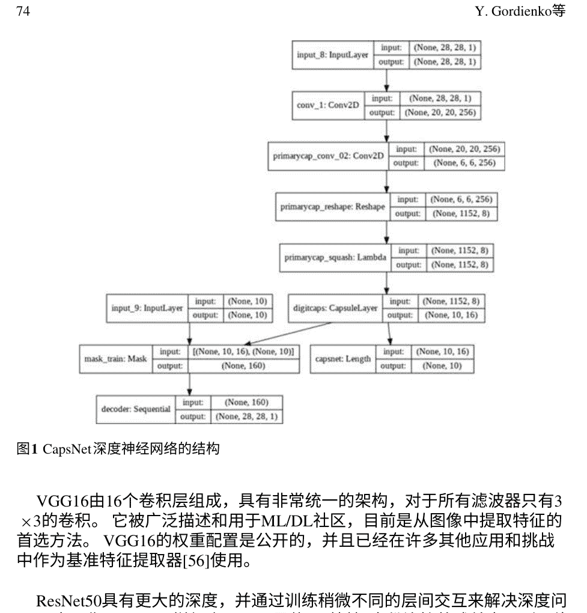

##### 图1 CapsNet深度神经网络的结构

VGG16由16个卷积层组成，具有非常统一的架构，对于所有滤波器只有3×3的卷积。它被广泛描述和用于ML/DL社区，目前是从图像中提取特征的首选方法。VGG16的权重配置是公开的，并且已经在许多其他应用和挑战中作为基准特征提取器[56]使用。

ResNet50具有更大的深度，并通过训练稍微不同的层间交互来解决深度问题。它不像VGG16那样组合层，而是使用“快捷”身份连接将残差实现到网络中。然后，系统根据它们的残差而不是原始值来训练层，从而解决了网络变得更深时的固有精度下降问题。有了ResNet50，可以训练更深的网络，深度可达152层，并进一步提高质量。

最近提出了胶囊网络，它是一组嵌套的神经层，与通常的卷积神经网络不同。在常规的卷积神经网络中，更多的层被添加到堆栈中，但在胶囊网络中，更多的层被添加到单个层（或嵌套层）中。胶囊内的神经元封装了图像中一个实体的上述属性。此外，胶囊输出一个向量来表示实体的存在，向量的方向表示实体的属性。向神经网络中的所有可能的父节点发送向量，并且对于每个可能的父节点，胶囊可以找到一个预测向量。预测向量是根据自身权重和权重矩阵的乘积计算的。具有最大标量预测向量乘积的父节点增加胶囊的连接。其余的父节点减少它们的连接。这种基于协议的路由方法优于当前的机制，如最大池化，因为最大池化是基于在较低层检测到的最强特征进行路由。

指标. 对于训练、验证和推断阶段，计算准确率和损失值，然后构建受试者工作特性（ROC）曲线，并计算每个类别的面积下曲线（AUC）作为它们的微观和宏观平均值。为了强调GPU和TPU的初始化阶段的贡献，对每次运行计算了以下每个图像的运行时间（对于GPU和TPU都是如此）：

通过将GPU运行时间除以TPU运行时间计算加速比值。
在所有试验中执行了以下操作。对于训练、验证和推断阶段，计算准确率和损失值（图2），然后构建受试者工作特性（ROC）曲线，并计算每个类别的面积下曲线（AUC）作为它们的微观和宏观平均值（图3）。下面展示了一些GPU K-80在MNIST数据集上的训练和验证历史示例（图2），TPUv2 MNIST的情况类似（它们基本相同，因此没有展示）。

ROC曲线和AUC值（图3）展示了在10个epochs中的出色预测准确性，这与TPUv2上的类似实验进行了比较。

然后，针对不同的批次和图像大小计算了训练和测试（推理）时间，并绘制成图表，例如，对于GPU K80的图4和对于TPUv2的图5。这些结果展示了这两种不同架构的训练和测试（推理）时间的根本不同的缩放行为。

与第3次迭代相比，第1次和第2次迭代的巨大差异意味着开始数据准备和模型编译过程的可用性（下面称为“开销”）。它们发生在

-   带开销的时间＝第1次迭代的墙钟时间/图像数量；
-   带开销的时间＝第2次迭代的墙钟时间/图像数量；
-   不带开销的时间＝第2次迭代的墙钟时间/图像数量。

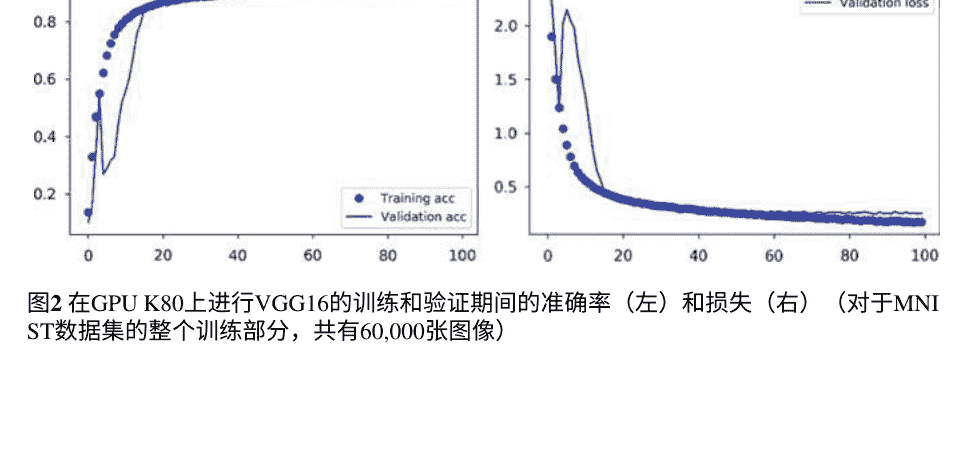

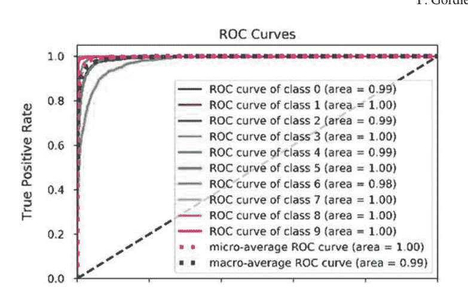

# 图3 在Google Cloud TPUv2上对ResNet50进行10类的ROC曲线和AUC值（对于MNIST数据集的测试部分-10000张图像）

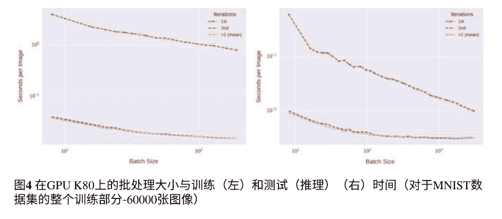

# 图4 在GPU K80上的批处理大小与训练（左）和测试（推理）（右）时间（对于MNIST数据集的整个训练部分-60000张图像）

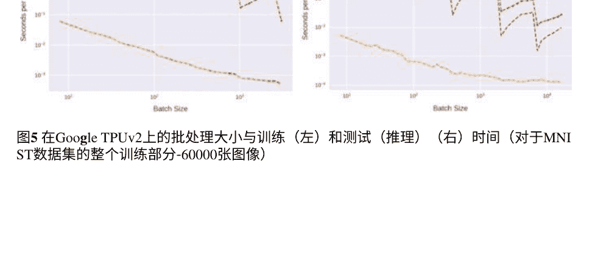

# 图5 在Google TPUv2上的批处理大小与训练（左）和测试（推理）（右）时间（对于MNIST数据集的整个训练部分-60000张图像）

在GPU硬件上的第1次迭代，但在TPU硬件上的第1次和第2次迭代期间，这些开销要长得多。这就是为什么对这些“开销”和后续迭代分别应用了下一次扩展分析。

然后，速度提升值也被计算并绘制为批处理和图像大小的函数。

下一节结果将重点关注批处理和图像大小作为函数的训练和推理时间和加速度，因为在GPU-k80和TPUv2上使用的所有DNN的准确性/损失历史-记录，ROC曲线和AUC值在误差范围内相同。

#### 3.2 DNN的计算复杂度

本研究中使用的DNN展示了计算复杂度随输入数据大小增加而不同的增长模式（输入图像的边长）。这种效应可以通过它们实现的不同算法来解释。可通过手动计算或使用Tensorflow框架[58]提供的性能分析函数计算可训练参数（w）和相应的浮点运算数（FLOPs）（N）的理论值。

例如，对于VGG16，可训练参数的数量按不同的规律增长：w ~ s^1/2对于具有池化层的模型，w ~ s^2对于没有池化层的模型（图6a）。相应的浮点运算数遵循相同的依赖关系：N ~ s^1/2对于具有池化层的VGG16和 N ~ s^2对于没有池化层的VGG16（图6b）。

对于ResNet50，使用的实现中参数数量没有改变，相应的浮点运算数量保持不变（图7a）。相比之下，在CapsNet中，可训练参数的数量随着相应的浮点运算数量的增长而增长，增长速度与w ~ s^2类似（这与没有池化层的VGG16模型相似，大部分计算是在卷积层中进行的（图7b）。

由于实际的训练和测试包括许多支持操作（如数据处理、格式化等），相关的计算开销会出现。这些开销可以极大地改变基于浮点运算数量的墙钟时间的估计，因为有时它们与数据操作的组织有关，而这在各种硬件（如GPU和TPU）中可能是不同的。此外，它们可能会对用户隐藏，特别是在云实现中（例如在Google Cloud提供的TPUv2中）。

但是，将理论预测与实际墙钟时间作为输入数据大小和批量大小的函数进行比较，可以提供真实的估计并为某些硬件的工作原理提供一些见解。这就是为什么进一步的研究与在GPU和TPU架构上对MNIST数据集进行大量训练和测试试验有关，如VGG16、ResNet50和CapsNet。主要目的是基于时间依赖性和不同输入数据大小和批量大小的加速比进行GPU和TPU的比较分析。为此，使用了在下一节中描述的缩放分析方法。

#### 3.3 缩放分析

为了展示这些计算架构（TPU和GPU）之间的主要区别，通过缩放分析估计了各种算法上不同DNN的实际计算复杂性。缩放技术广泛应用于各个科学领域[59, 60]，包括金融[61]、计算机科学和网络[62]、生物学[63]、物理学[64]、材料科学[65]、地质学[66]、聚集过程[67, 68]等。

缩放技术背后的思想是假设某些函数的尺度不变行为表征了过程对于变化的特征。假设适当的重新标准化（缩放）函数使我们能够找到描述过程在不同缩放参数值下的一般相似性。

假设我们有一些函数 f (x, …) 和其参数x的缩放因子 k改变它 k^α倍的意思是

> f (kx , . . .) = k^α f (x , . . .)

这是均匀函数的典型特征。通过对不同系统（例如，不同的未知硬件架构）的几个参数进行这样的变化，可以找到可以缩放该函数的参数，并对此缩放的原因有所了解。

回到前一节，所有网络的可训练参数数量都遵循类似的缩放规律：

> w = f (s, . . .) = s^α f_sc

和

> N = g (s, . . .) = s^β g_sc,

其中 α 和 β 在表1中给出， f_sc 和 g_sc 是 f 和 g 函数的缩放版本。

表1 各种DNN模型的可训练参数数量 (α) 和理论浮点运算数量 (β) 的幂次
| 模型 | α(参数) | β(FLOPs) |
|---|---|---|
| VGG16 | 0.50 ± 0.05 | 0.50 ± 0.05 |
| VGG16 (无MaxPool) | 1.99 ± 0.01 | 1.99 ± 0.01 |
| ResNet50 | 0.00 ± 0.00 | 0.00 ± 0.00 |
| CapsNet | 2.07 ± 0.02 | 2.11 ± 0.02 |

### 4 结果

#### 4.1 Vgg16

为了描述运行时间，将使用以下符号（对于VGG16这里和下面的所有其他DNN）：

> t_regime = f_regime (s, b, it),

其中

-   $t_{regime}$ — 一个有两种模式的运行时间：训练模式（$regime = train$）和测试或推理模式（$regime = inf$）；
- $Dd$ — 运行试验，其中$D$是两种设备之一：GPU K-80（$D = G$）和TPUv2（$D = T$），$d$是运行迭代的次数：第一次为1，第二次为2，第三次为$d > 2$；
- $s$ — 图像大小（方形图像的边长$H = W$从MNIST数据集缩放从28 × 28到96 × 96像素）；
- $b$ — 小批量（批量）大小从8到批量中可能的最大图像数量。

例如， $t_{\inf} = f_{\inf}(s, b, T1)$ 表示在TPUv2设备上进行第一次迭代时，作为图像大小$s$和批量大小$b$的函数的推理时间。

顶部图像（图8a, b）表示GPU-K80（G1和G2）和TPU（T1和T2）的第一次和第二次迭代，观察到显著的开销，底部图像（图8c, d）表示第三次迭代的开销较低。

##### 训练

##### 测试

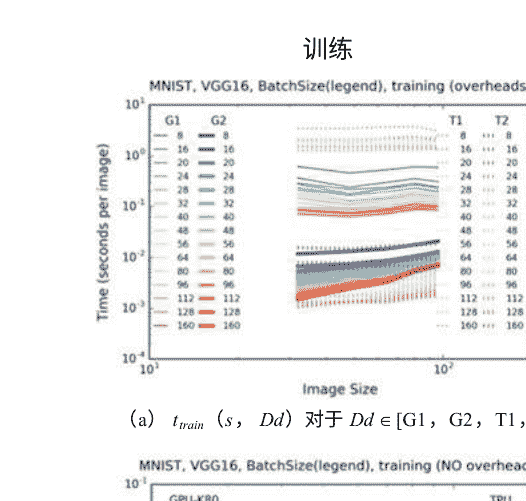

(a) $t_{train}(s, Dd)$ 对于 $Dd \in [G1, G2, T1, T2]$

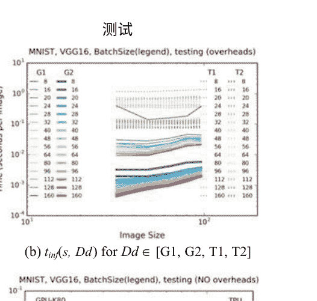

(b) $t_{inf}(s, Dd)$ for $Dd \in [G1, G2, T1, T2]$

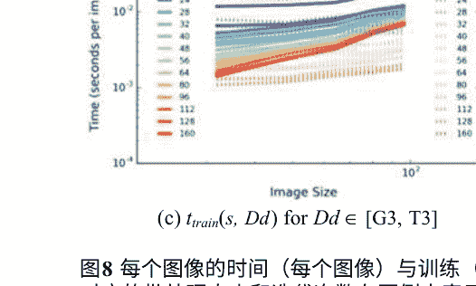

(c) $t_{train}(s, Dd)$ for $Dd \in [G3, T3]$

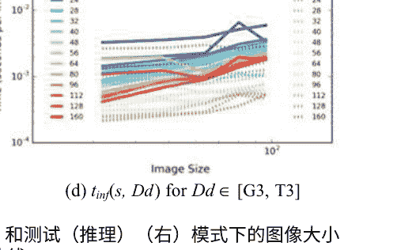

(d) $t_{inf}(s, Dd)$ for $Dd \in [G3, T3]$

# 图8 每个图像的时间（每个图像）与训练（左）和测试（推理）（右）模式下的图像大小对应的批处理大小和迭代次数在图例中表示的曲线

对于GPU和TPU架构，可以观察到以下稳定和不同的行为：

-   与GPU相比，TPU在第1（T1）和第2（T2）次迭代的训练和测试（推理）模式中产生了更大的开销（图8a，b）。这种差异在第1次迭代的延迟时间上尤为明显。
-   与后续迭代相比，TPU在第一次迭代和第二次迭代中展示了更大的开销（图8c，d）（在标准差的限制下具有相同的运行时间），但GPU仅在第一次迭代中展示了更大的开销。
-   与GPU相比，TPU在训练和测试（推理）阶段的第一（T1）和第二（T2）次迭代中都导致了巨大的开销，与第三（T3）次迭代以及所有迭代相比也是如此。
-   对于第二次迭代之后的迭代（图8c，d），与GPU相比，TPU展示了更低的运行时间。
-   每个阶段的时间与图像大小曲线阶段 = f阶段(s, b, it)在视觉上是相似的，因此提出了它们是均匀函数的假设，并将在下一节中进行检验。

###### 时间依赖的缩放

由于批量大小的范围远大于图像大小的范围，因此缩放分析是基于运行时间与批量大小曲线进行的。绘制了运行时间与批量大小的依赖关系曲线（图9a，b和10a，b），每个区域的曲线非常相似。为了进行缩放分析，采用了以下缩放过程：

```
t_{区域}^{sc}(s_i, b) = \frac{f_{区域}(s_i, b, it)}{f_{区域}(s_{最小}, b, it)} = \frac{s_i^α b^β f_{区域}^{sc}(o(s_i), o(b), it)}{s_{最小}^α b^β f_{区域}^{sc}(o(s_{最小}), o(b), it)} = s_i^α F_{区域}^{sc}(s_i, b), \\
在 F_{制度}^{sc}(s_i, b) = s_{min}^{-α} \frac{f_{区域}^{sc}(o(s_i), o(b), it)}{f_{制度}^{sc}(o(s_{最小}), o(b), it)} \quad (9)
```

在假设s_i^α和F制度(s_i, b)之间的低相关性下，即如果它们之间的协方差Cov(s_i^α, F制度(s_i, b))=0，在每个曲线平均后t制度(s_i, b)趋于b时可以得到：

```
⟨t_{制度}^{sc}(s_i, b)⟩_b = ⟨s_i^α F_{制度}^{sc}(s_i, b)⟩_b = s_i^α ⟨F_{制度}^{sc}(s_i, b)⟩_b + Cov(s_i^α, F_{制度}^{sc}(s_i, b)) ≈ s_i^α C_i, \\
其中 C_i = ⟨F_{制度}^{sc}(s_i, b)⟩_b = 常数 . \quad (10)
```

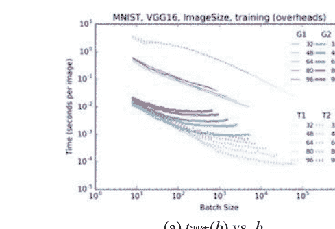

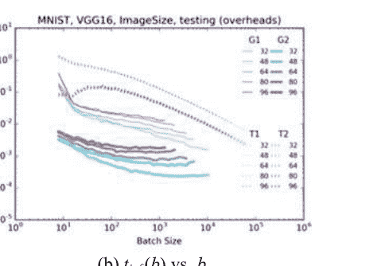

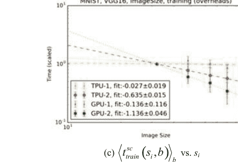

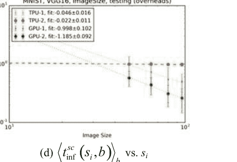

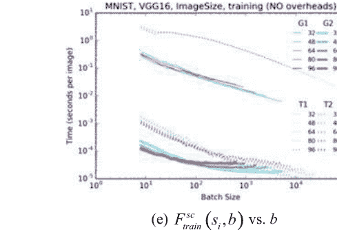

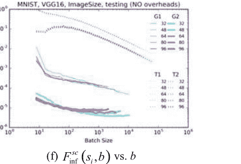

# 图9 训练（左）和测试（右）模式下每个迭代的图像时间具有很大的开销，即对于 Dd ∈ [G1, G2, T1, T2] for VGG16

然后可以通过对平均值进行对数-对数绘图来确定功率 α
⟨ t^{sc}_{制度} (s_i, b) ⟩_b 作为从图9a，b和10a，b中的每个曲线的 s_i的函数
通过直线拟合数据：

##### 训练

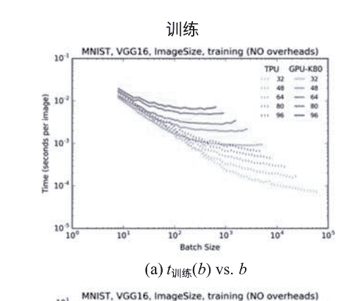

##### 测试

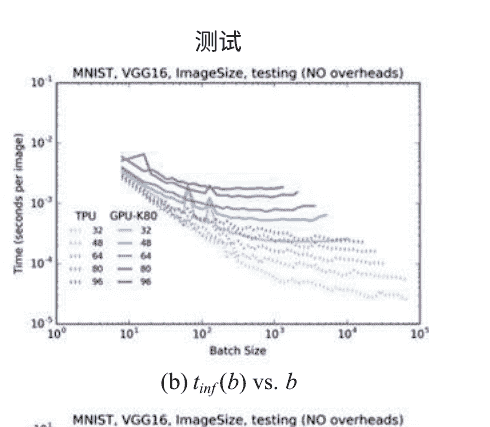

(a) $t_{训练}(b)$ vs. $b$

(b) $t_{inf}(b)$ vs. $b$

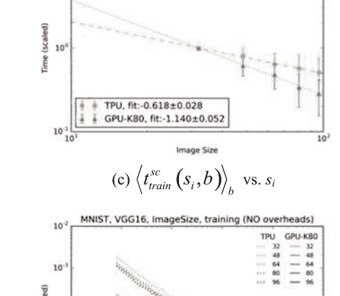

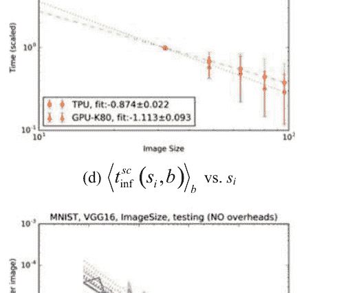

(c) $\left\langle t^{sc}_{train} (s_i,b)\right\rangle_b$ vs. $s_i$

(d) $\left\langle t^{sc}_{inf} (s_i,b)\right\rangle_b$ vs. $s_i$

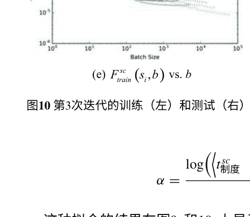

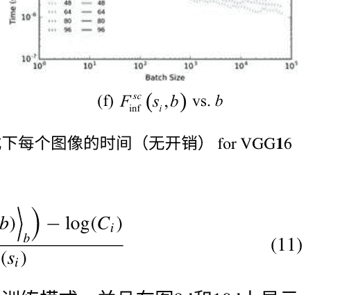

(e) $F^{sc}_{train} (s_i,b)$ vs. $b$

(f) $F^{sc}_{inf} (s_i,b)$ vs. $b$

# 图10 第3次迭代的训练（左）和测试（右）模式下每个图像的时间（无开销） for VGG16

$$ \alpha = \frac{ \log\left(\left\langle t^{sc}_{制度} (s_i, b) \right\rangle_b\right) - \log(C_i) }{ \log(s_i) } \qquad (11) $$

这种拟合的结果在图9c和10c上显示出训练模式，并且在图9d和10d上显示出测试模式。如果上述假设成立，则所有点 $\left\langle t^{sc}_{制度} (s_i, b)\right\rangle_b$ 在对数-对数图中，作为$s_i$的函数应该沿着直线分布。

直线（图9c， d和10c， d）。此外，如果上述假设成立，则实际上是通过将 $s_i$ 除以由拟合确定的幂 $\alpha$ 来重新缩放的函数 $F_{regime}^{sc}(s_i, b)$ 的所有点应该在每个模式下重叠（图9e， f和10e， f）。

$$F_{regime}^{sc}(s_i, b) = \frac{t_{\text{制度}}^{sc}(s_i, b)}{s_i^{\alpha}}$$ (12)

最后，这两个条件都成立，即点沿直线对齐（图9c， d和10c， d），并且制度曲线崩溃（图9e， f和10e， f），这证实了先前的假设并支持了关于比例依赖性的想法：

$$t_{\text{制度}}(s) \sim s^{\alpha_r}$$

其中 $\alpha_r$ 是特定制度的功率特征。

##### 加速度的比例依赖性

相同的比例缩放过程可以应用于在TPU上与在GPU上进行训练和测试的图像大小和批处理大小的加速度依赖性：

$$S_r^{sc}(s_i, b) = \frac{t_{Gd,r}(s_i, b)}{t_{Td,r}(s_i, b)} = \frac{s_i^{\alpha_{Gd,r}} b^{\beta_{Gd,r}} f_{Gd,r}^{sc}(o(s_{\text{最小}}), o(b), it)}{s_i^{\alpha_{Td,r}} b^{\beta_{Td,r}} f_{Td,r}^{sc}(o(s_i), o(b), it)} = s_i^{\alpha_{Gd,r} - \alpha_{Td,r}} b^{\beta_{Gd,r} - \beta_{Td,r}} \frac{F_{Gd,r}^{sc}(s_i, b)}{F_{Td,r}^{sc}(s_i, b)} = s_i^{\alpha_{Sd,r}} b^{\beta_{Sd,r}} S_{Sd,r}^{sc}(s_i, b), \quad (13)$$

其中

$$\alpha_{Sd,r} = \alpha_{Gd,r} - \alpha_{Td,r}$$ (14)

$$\beta_{Sd,r} = \beta_{Gd,r} - \beta_{Td,r}$$ (15)

$$S_{Sd,r}^{sc}(s_i, b) = \frac{F_{Gd,r}^{sc}(s_i, b)}{F_{Td,r}^{sc}(s_i, b)}.$$ (16)

VGG16的功率值 $\alpha_{Dd,r}$ 的总结见表2。

表2 VGG16运行时间的尺寸幂 $\alpha_{Dd,r}$ 的缩放规律

| 时间 | $\alpha_{Td,r}$, TPU |  |  | $\alpha_{Gd,r}$, GPU |  |  |
|------|----------------------|--|--|----------------------|--|--|
|      | T1                   | T2 | T3 | G1                   | G2 | G3 |
| 测试 | $-0.05 \pm 0.02$     | $0.02 \pm 0.01$ | $-0.87 \pm 0.02$ | $-1.00 \pm 0.10$ | $-1.19 \pm 0.1$ | $-1.11 \pm 0.09$ |
| 训练 | $-0.03 \pm 0.02$     | $-0.64 \pm 0.02$ | $-0.62 \pm 0.03$ | $-0.14 \pm 0.12$ | $-1.14 \pm 0.05$ | $-1.14 \pm 0.05$ |

## 表3 速度提升的尺寸幂：αSdf,r——从图表中拟合得到
##### 速度提升和αr从VGG16运行时间的缩放规律中预测得到的速度提升Sd,r

| | αSd,r = αGd,r - αTd,r 从时间缩放预测 | | | α从加速度图中拟合得到的速度 | | |
| :--- | :---: | :---: | :---: | :---: | :---: | :---: |
| | S1 | S2 | S3 | S1 | S2 | S3 |
| 测试 | -0.95 ± 0.10 | -1.21 ± 0.09 | -0.24 ± 0.09 | -0.91 ± 0.11 | -1.15 ± 0.08 | -0.40 ± 0.07 |
| 训练 | -0.11 ± 0.12 | -0.50 ± 0.05 | -0.52 ± 0.05 | -0.29 ± 0.13 | -0.70 ± 0.13 | -0.78 ± 0.08 |

通过时间和加速度的缩放分析，可以得到VGG16的功率值 $\alpha_{Sd,r}$，并在表3中进行比较。

速度曲线的批处理大小幂 (β) 可以直接从图表中计算得到 (图11a和12a， b)，除了带有开销的测试模式 (图12b) (表4)。

#### 4.2 ResNet50

顶部图像 (图13a， b) 代表GPU-K80的第一和第二次迭代 (G1和G2) 以及TPU (T1和T2)，观察到了显著的开销，底部图像 (图13c， d) 代表第三次迭代，开销较低 (图14)。

ResNet50的功率 α 的值总结在表5中。

就像VGG16网络的情况一样，批量大小的幂次 (β) 可以直接从其图表中计算得出 (为了简洁起见，此处不显示)，除了带有开销的测试模式 (表6和表7)。

#### 4.3 胶囊网络

再次，顶部图像 (图16a、b) 表示GPU-K80 (G1和G2) 和TPU (T1和T2) 的第一和第二次迭代，观察到了显著的开销，底部图像 (图16c、d) 表示第三次迭代的开销较低 (图17)。

CapsNet的功率 α 的值总结在表8中。

就像之前所述，批量大小的幂次 (β) 可以直接从其图表中计算得出 (为了简洁起见，此处不显示)，除了带有开销的测试模式 (表9和表10)。

训练

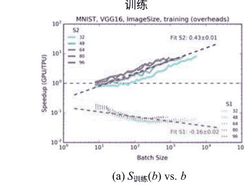

测试

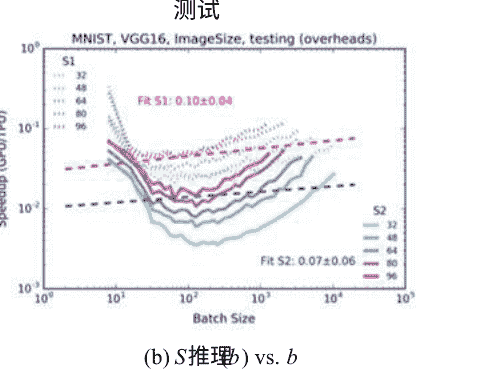

(a) $S_{训练}(b)$ vs. $b$

(b) $S_{推理}(b)$ vs. $b$

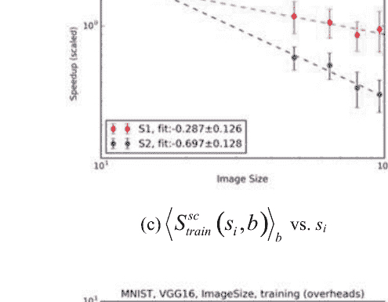

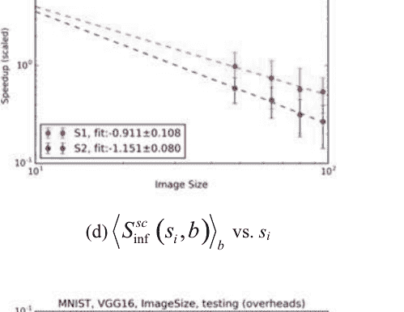

(c) $\left\langle S^{sc}_{train} (s_i,b) \right\rangle_b$ vs. $s_i$

(d) $\left\langle S^{sc}_{inf} (s_i,b) \right\rangle_b$ vs. $s_i$

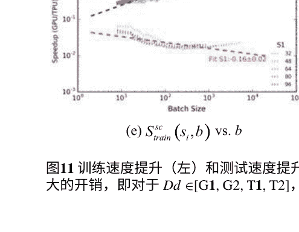

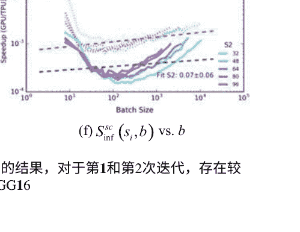

(e) $S^{sc}_{train} (s_i,b)$ vs. $b$

(f) $S^{sc}_{inf} (s_i,b)$ vs. $b$

图11 训练速度提升（左）和测试速度提升（右）的结果，对于第1和第2次迭代，存在较大的开销，即对于 $Dd \in[G1, G2, T1, T2]$，对于VGG16

训练

测试

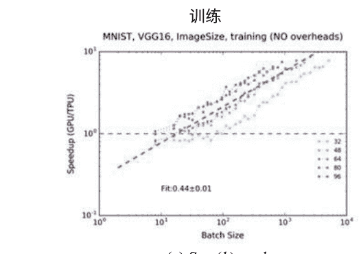

(a) $S_{训练}(b)$ vs. $b$

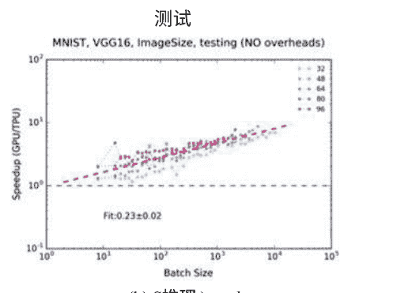

(b) $S_{推理}(b)$ vs. $b$

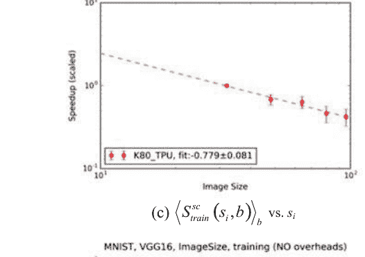

(c) $\langle S^{sc}_{train}(s_i, b) \rangle_b$ vs. $s_i$

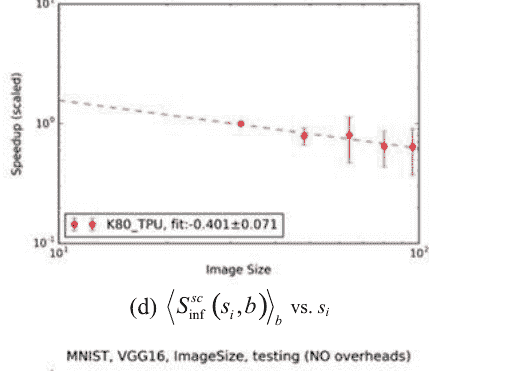

(d) $\langle S^{sc}_{inf}(s_i, b) \rangle_b$ vs. $s_i$

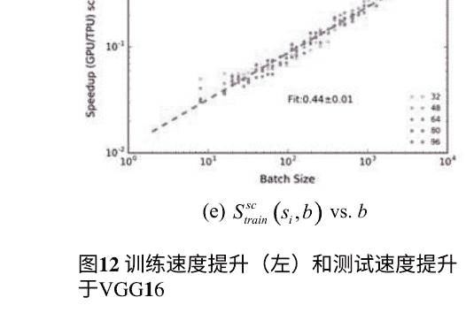

(e) $S^{sc}_{train}(s_i, b)$ vs. $b$

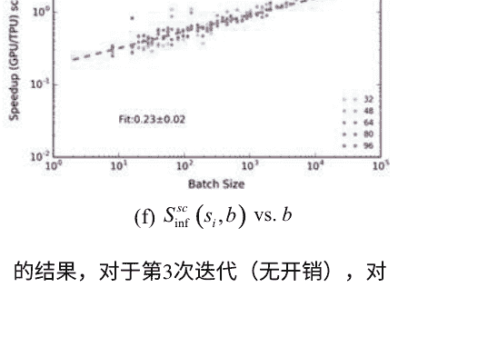

(f) $S^{sc}_{inf}(s_i, b)$ vs. $b$

图12 训练速度提升（左）和测试速度提升（右）的结果，对于第3次迭代（无开销），对于VGG16

##### 表4 批量大小的幂次（β）在VGG16的加速定律中

| 加速 | S1 | S2 | S3 |
|------|----|----|----|
| 测试 | 0.10 ± 0.04 | 0.07 ± 0.06 | 0.23 ± 0.02 |
| 训练 | 0.16 ± 0.02 | 0.43 ± 0.01 | 0.44 ± 0.01 |

表5 图像大小的幂次 αDd, 在ResNet50的运行时间加速定律中

| 时间 | αTd, r, TPU | | | αGd, r, GPU | | |
| :--- | :--- | :--- | :--- | :--- | :--- | :--- |
| | T1 | T2 | T3 | G1 | G2 | G3 |
| 测试 | -0.33 ± 0.04 | -0.36 ± 0.07 | -0.59 ± 0.07 | -0.47 ± 0.11 | -1.08 ± 0.05 | -1.19 ± 0.05 |
| 训练 | -0.04 ± 0.30 | -0.24 ± 0.01 | -0.25 ± 0.02 | 0.03 ± 0.02 | -0.94 ± 0.05 | -0.97 ± 0.04 |

表6 缩放定律中的图像尺寸幂对于加速比的影响： α^f_{Sd, r}——从速度提升的图表中拟合得到
加速比和 α^{pr}_{Sd, r}——根据ResNet50的运行时间缩放定律预测

| α^{pr}_{Sd, r} = αGd, r - αTd, r 根据时间缩放预测 | | | α^f 从加速度图中拟合得到的速度 | | |
| :--- | :--- | :--- | :--- | :--- | :--- |
| S1 | S2 | S3 | S1 | S2 | S3 |
| 测试 | -0.14 ± 0.11 | -0.72 ± 0.07 | -0.6 ± 0.07 | -0.38 ± 0.50 | -1.31 ± 0.75 | -0.76 ± 0.11 |
| 训练 | 0.07 ± 0.30 | -0.7 ± 0.05 | -0.72 ± 0.04 | 0.21 ± 0.08 | -0.85 ± 0.04 | -0.91 ± 0.04 |

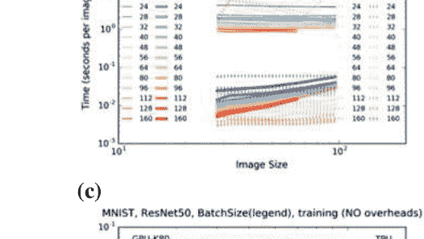

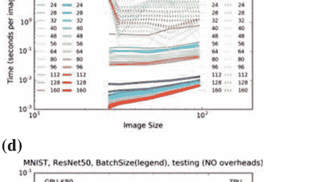

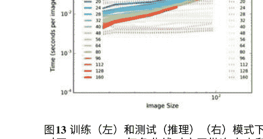

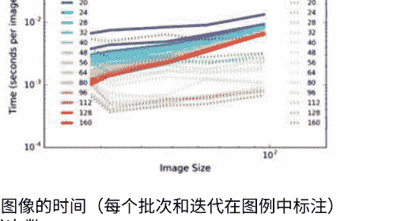

图13 训练（左）和测试（推理）（右）模式下每个图像的时间（每个批次和迭代在图例中标注）
对于ResNet50，每条曲线对应于批次大小和迭代次数

训练

测试

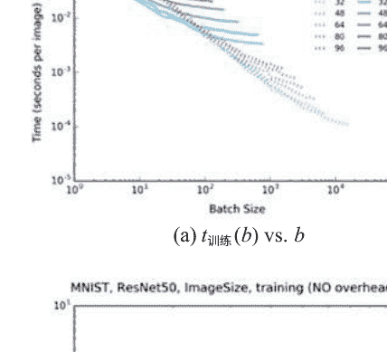

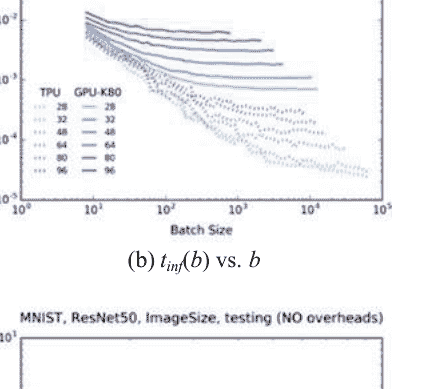

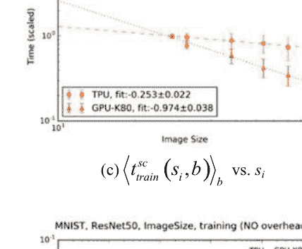

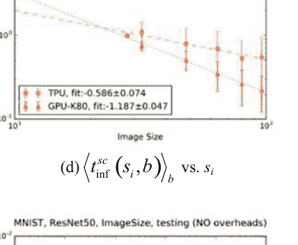

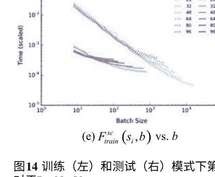

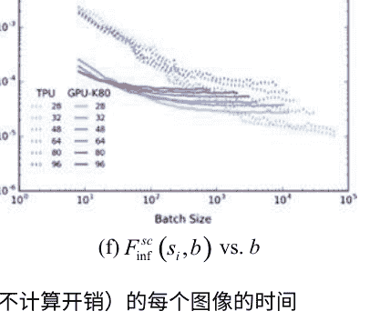

图14 训练（左）和测试（右）模式下第3次迭代（不计算开销）的每个图像的时间 对于ResNet50

训练

测试

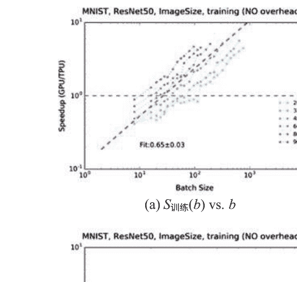

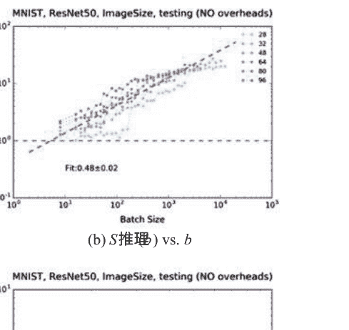

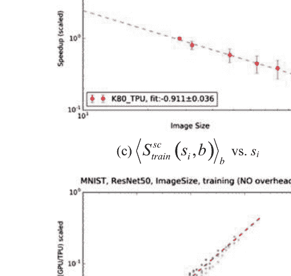

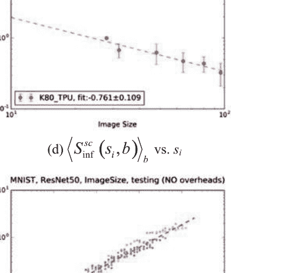

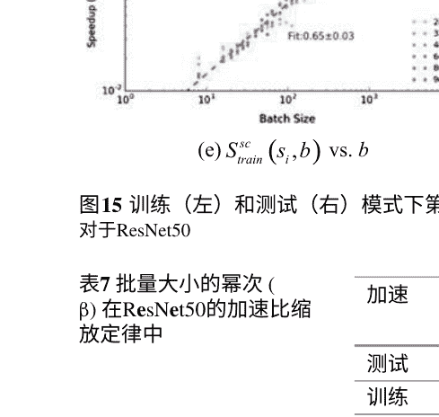

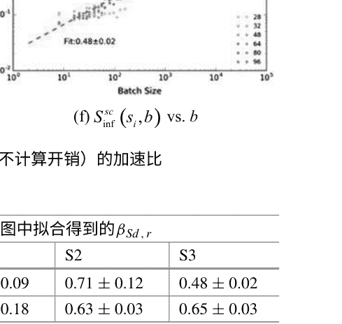

图15 训练（左）和测试（右）模式下第3次迭代（不计算开销）的加速比对于ResNet50

##### 表7 批量大小的幂次(β)在ResNet50的加速比缩放定律中

| 加速 | S1 | S2 | S3 |
| --- | --- | --- | --- |
| 测试 | 0.35 ± 0.09 | 0.71 ± 0.12 | 0.48 ± 0.02 |
| 训练 | 0.36 ± 0.18 | 0.63 ± 0.03 | 0.65 ± 0.03 |

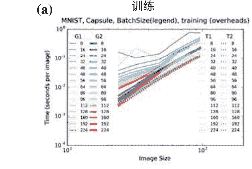

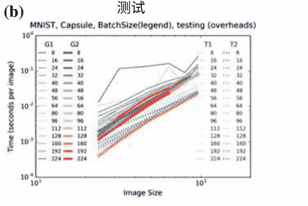

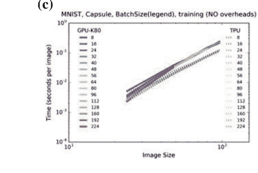

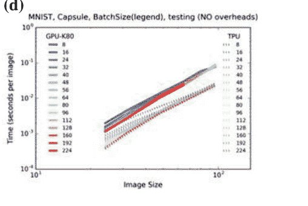

图16 训练（左）和测试（推理）（右）模式下的时间（每张图片）与图片大小的关系 每条曲线对应于图例中指定的批量大小和迭代次数

### 5 讨论

在后期迭代（>2nd）时，与GPU相比，使用TPU获得了显著的加速值，此时起始开销不会产生影响：

- VGG16-训练模式下最高可达10 ×（图12a），测试模式下最高可达10 ×（图12b）
- ResNet50-训练模式下最高可达6 ×（图15a），测试模式下最高可达30 ×（图15b）
- CapsNet-训练阶段最多2 ×（图18a），测试阶段最多4 ×（图18b）。

即使在与强大的GPU单元（NVIDIA Tesla K80）相比，仅使用极低规模的Google TPUv2单元（仅8个核心），也可以达到这些值。但是GPU和TPU架构之间的关键是特定数据准备和软件编译的延迟时间的完全不同的值（TPU更高），在第一次和第二次迭代之前。这种有利于GPU的差异就是为什么在第一次和第二次迭代中没有观察到任何模型的加速度>1的原因（图11）。

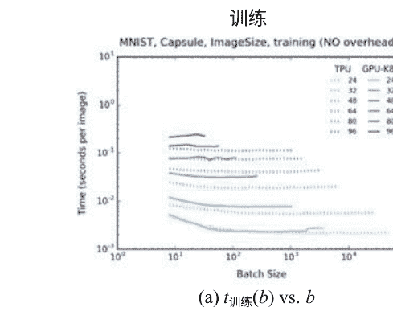

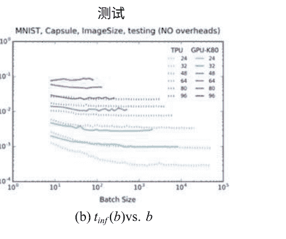

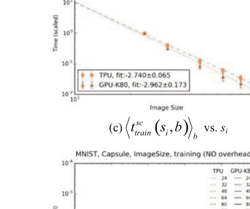

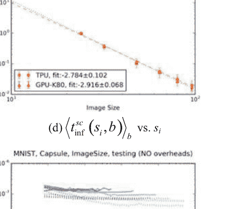

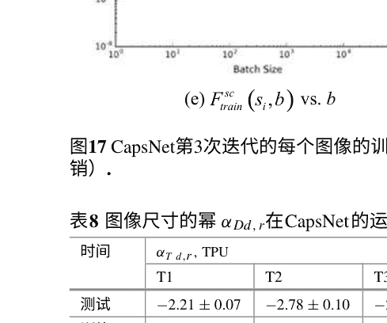

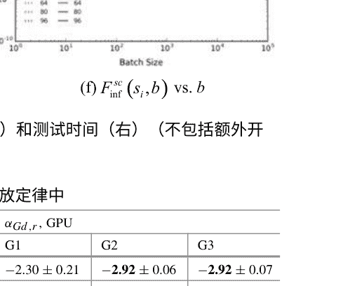

图17 CapsNet第3次迭代的每个图像的训练时间（左）和测试时间（右）（不包括额外开销）。

表8 图像尺寸的幂 $\alpha_{Dd,r}$ 在CapsNet的运行时间的缩放定律中

| 时间 | α_{T d, r}, TPU (T1) | α_{T d, r}, TPU (T2) | α_{T d, r}, TPU (T3) | α_{G d, r}, GPU (G1) | α_{G d, r}, GPU (G2) | α_{G d, r}, GPU (G3) |
|---|---|---|---|---|---|---|
| 测试 | -2.21 ± 0.07 | -2.78 ± 0.10 | -2.78 ± 0.10 | -2.30 ± 0.21 | -2.92 ± 0.06 | -2.92 ± 0.07 |
| 训练 | -2.08 ± 0.03 | -2.74 ± 0.06 | -2.74 ± 0.07 | -1.78 ± 0.14 | -2.95 ± 0.17 | -2.96 ± 0.17 |

表9 图像尺寸的幂在加速定律中 $\alpha_{Sd, r}^{f}$——从图中拟合得到速度提升和 $\alpha^{pr}$ 从CapsNet的运行时间的缩放定律中预测得到

|  | $\alpha^{pr}$ ($\alpha_{Sd, r} = \alpha_{Gd, r} - \alpha_{Td, r}$从时间缩放预测) |  |  | $\alpha^{f}$ (从加速度图中拟合得到的速度) |  |  |
|---|---|---|---|---|---|---|
|  | S1 | S2 | S3 | S1 | S2 | S3 |
| 测试 | $-0.09 \pm 0.21$ | $-0.14 \pm 0.10$ | $-0.14 \pm 0.10$ | $-0.56 \pm 0.13$ | $-0.42 \pm 0.80$ | $-0.42 \pm 0.08$ |
| 训练 | $0.3 \pm 0.14$ | $-0.21 \pm 0.17$ | $-0.22 \pm 0.17$ | $-0.36 \pm 0.15$ | $-0.42 \pm 0.10$ | $-0.44 \pm 0.10$ |

表10 批量大小的幂 ($\beta$) 在CapsNet的加速定律中

|  | 从加速图中拟合得到的$\beta_{Sd, r}$ |  |  |
|---|---|---|---|
| 加速 | S1 | S2 | S3 |
| 测试 | $0.18 \pm 0.05$ | $0.07 \pm 0.02$ | $0.07 \pm 0.02$ |
| 训练 | $0.07 \pm 0.03$ | $0.03 \pm 0.02$ | $0.05 \pm 0.02$ |

加速度值取决于TPUv2单元的利用率，并且在不同的批量和图像大小的情况下增加开始（即加速度变为>1），对于后续迭代中的相当不同的模型，当起始开销没有影响时（>2nd）：

- VGG16-对于所有批量和图像大小，除了最小图像大小和批量大小<10的训练模式（图12a），
- ResNet50-对于测试阶段的所有批次和图像大小，以及训练阶段的各种批次大小，例如对于最小图像大小（图15a）的$b>10^{2}$,
- CapsNet-对于所有批次和图像大小，除了训练阶段的最小图像大小（$s=24$）（图18a）。

这些结果表明，在低计算开销和高TPU单元利用率的条件下，使用TPA作为Google TPUv2比GPU更有效（更快）。此外，这些结果是在几种算法不同的DNN上获得的，而且对于MNIST数据集，GPU和TPU运行的准确性和损失在前三个有效数字上是相等的，并且确认了之前获得的类似结果[21]。但是需要注意的是，这些结果是在相对简单的MNIST数据集和低类别数（=10）的情况下获得的，而且没有损害准确性和损失。

目前对批处理、图像和网络大小的影响的研究正在进行中，它们的结果将在其他地方发表[69]。

最重要和有趣的结果是时间和加速度依赖的尺度不变行为，这使我们能够在没有详细信息的情况下使用这种缩放方法来预测新的特定架构上的运行时间。算法上不同的DNN（VGG16、ResNet50、CapsNet）和架构上不同的计算硬件（GPU和TPU）的缩放依赖性和缩放功率是不同的。

## 图18 CapsNet的第3次迭代的训练（左）和测试（右）模式的加速比（不包括开销）。

与第3次迭代相比，第1次和第2次迭代的关键区别在于开始数据准备和模型编译过程的可用性（下面称为“开销”）。它们发生在GPU硬件上的第1次迭代期间，但在TPU硬件上的第1次和第2次迭代期间，这些开销对于TPU硬件来说要长得多。早期迭代（第1次和第2次）的缩放加速比依赖性的复杂性以及后期迭代（>第2次）的相对简单性反映了DNN对初始条件的敏感性。

这种复杂性与数据准备和DNN编译的复杂和隐藏（在专有TPUv2硬件中）细节有关。对于TPA，DNN对其的复杂性和敏感性应该是未来深入研究的主题。

除了Google TPU架构外，其他现代GPU卡（如基于Volta微架构的NVIDIA的Tesla V100和Titan V）也提供了特定的张量处理硬件工具，配备专用的张量核心单元（640个TCU），它们对训练和推理加速的影响正在调查中，并将在其他地方报告[69]。

在模型大小受限于可用内存空间的情况下，其他技术可以用于压缩模型大小，如量化和修剪[70-72]，以及研究批量大小增加对性能的影响。这些结果可以用于优化各种ML/DL应用程序的参数，其中需要处理大批量数据，例如高级驾驶员辅助系统（ADAS），可以使用类似TPA的专用架构[73]。

### 6 结论

在这项工作中，对一些目前可用的专用张量处理架构（TPA）进行了简要回顾，这些架构针对神经网络处理。考虑了某些深度神经网络（DNN）算法不同组件的计算复杂性，以便进一步在这些TPA上使用。为了展示TPU和GPU计算架构之间的关键差异，通过所提出的时间和加速度依赖的缩放分析估计了各种算法不同DNN的实际计算复杂性，这些DNN的训练和推理时间作为批次和图像大小的函数。

重点放在广泛使用的算法不同的DNN，如VGG16、ResNet50和CapsNet，以及基于云的TPA（实际上是Google Cloud TPUv2）的实现上。通过所提出的缩放方法，展示了这些DNN在该基础设施上的有效使用的性能研究结果。

最重要和有趣的结果是时间和加速度依赖的尺度不变行为，这使我们能够使用缩放方法来预测在没有详细信息的情况下在新的特定TPA上运行的训练和推理时间。算法上不同的DNN（VGG16、ResNet50、CapsNet）和架构上不同的计算硬件（GPU和TPU）的缩放依赖性和缩放功率是不同的。这些结果对于在低开销计算和高利用TPU单元的条件下进行大量计算的TPA（如Google TPUv2）相对于GPU的更高性能（吞吐量）给出了精确的估计，通过大图像和批量大小的方式。

总的来说，像Google TPUv2这样的TPA的使用在推理和训练阶段甚至在可用性方面都被证明是非常有前途的工具，尤其是考虑到像NVIDIA提供的Tesla V100和Titan V中的类似特定TPA（如TCU）等的存在。

### 参考文献

1. LeCun, Y., Bengio, Y., Hinton, G.: 深度学习。 自然 521(7553), 436–444 (2015)
2. Schmidhuber, J.: 神经网络中的深度学习概述。神经网络 61, 85–117 (2015)
3. Wang, H., Raj, B.: 关于深度学习的起源。 arXiv预印本 arXiv:1702.07800 (2017)
4. Bengio, Y.: 表示的深度学习： 展望未来。 在： 国际会议上统计语言和语音处理，第1-37页。 Springer, Berlin, Heidelberg (2013)
5. Lacey, G., Taylor, G.W., Areibi, S.: FPGA上的深度学习： 过去、现在和未来。 arXiv预印本 arXiv:1602.04283 (2016)
6. Nurvitadhi, E.等： FPGA能否在加速下一代深度神经网络方面超越GPU？ 在： ACM/SIGDA国际场可编程门阵列研讨会论文集（FPGA '17），第5-14页（2017年）
7. Chen, T., Du, Z., Sun, N., Wang, J., Wu, C., Chen, Y., Temam, O.: DianNao：一种小型高吞吐量的普适机器学习加速器。 在：第19届ASPLOS国际会议论文集，第269-284页（2014年）
8. Akopyan, F.等： TrueNorth：一种功耗为65 mW的100万神经元可编程神经突触芯片的设计和工具流程。 IEEE Trans. Comput. Aided Design Integr. Circuits Syst. 34, 10 (2015), 1537–1557 (2015)
9. Ienne, P.: 神经计算机的架构： 回顾与性能评估。 技术报告。 EPFL，洛桑，瑞士（1993年）
10. 在： NVIDIA公司。 CUDA 9中的张量核心编程，2019年访问。 https://devblogs.nvidia.com/programming-tensor-cores-cuda-9
11. Jouppi, N.P.等： 数据中心张量处理单元的性能分析。 国际会议。 计算机架构 45（2），1-12（2017年）
12. Ben-Nun, T., Hoefler, T.: 揭秘并行和分布式深度学习： 深入并发分析。 在： 计算研究存储库（CoRR）（2018年）
13. Howard, A.G., Zhu, M., Chen, B., Kalenichenko, D., Wang, W., Weyand, T., Andreetto, M., Adam, H.: MobileNets：移动视觉应用的高效卷积神经网络。 arXiv:1704.04861 (2017)
14. Real, E., Aggarwal, A., Huang, Y., Le, Q. V.: 正则化进化用于图像分类器架构搜索。 arXiv:1802.01548 (2018)
15. Sze, V., Chen, Y.H., Yang, T.J., Emer, J.S.: 高效处理深度神经网络： 教程和调查。 IEEE会议论文 105(12), 2295–2329 (2017)
16. Han, S., Mao, H., and Dally, W.J.: 深度压缩： 通过剪枝、训练量化和哈夫曼编码压缩深度神经网络。 arXiv预印本 arXiv:1510.00149 (2015)
17. Han, S., Pool, J., Tran, J., Dally, W.: 同时学习权重和连接以实现高效神经网络。 在： 神经信息处理系统进展，第1135–1143页 (2015)
18. Mallya, A., Lazebnik, S. Packnet： 通过迭代剪枝将多个任务添加到单个网络。 在： IEEE计算机视觉和模式识别会议论文集，第7765–7773页 (2018)
19. Wang, E., 等： 用于定制硬件的深度神经网络近似： 我们过去的经历，我们将要去的地方。 arXiv预印本 arXiv:1901.06955 (2019年)
20. Kama, S., Bernauer, J., Sharma, S.: TensorRT集成加速TensorFlow推理，2019年访问。 https://devblogs.nvidia.com/tensorrt-integration-speeds-tensorflow-inference
21. Kochura, Y., Gordienko, Y., Taran, V., Gordienko, N., Rokovyı, A., Alienin, O., Stirenko, S. : 批量大小对图形和张量处理单元在训练和推理阶段性能的影响。 在： Hu, Z.等（编）ICCSEEA 2019会议论文集，AISC 938，第1-11页（2019年）
22. NVIDIA 公司。 NVIDIA AI 推理平台，2019 年访问。 https://www.nvidia.com/content/dam/en-zz/Solutions/Data-Center/tesla-product-literature/t4-inference-print-update-inference-tech-overview-final.pdf
23. 博客, R., Haußmann, E.: 比较 Google 的 TPUv2 和 Nvidia 的 V100 在 ResNet-50 上的性能，2019 年访问。 https://www.hpcwire.com/2018/04/30/riseml-benchmarks-google-tpuv2-against-nvidia-v100-gpu
24. Qi, C.: 受邀演讲摘要： 嵌入式视觉 AI 的挑战与解决方案。 在： 2018 年第一届能源高效机器学习和嵌入式认知计算研讨会（EMC2），第 2 页。 IEEE (2018)
25. Tsimpourlas, F., Papadopoulos, L., Bartsokas, A., Soudris, D.: 基于边缘设备实现的卷积神经网络的设计空间探索框架。 IEEE Trans. Comput. Aided Des. Integr. Circuits Syst. 37(11), 2212–2221 (2018)
26. Erofei, A.A., Dru.ta, C.F., C`aleanu, C.D.: 深度神经网络实现的嵌入式解决方案。 在： 2018年IEEE第12届应用计算智能与信息学国际研讨会（SACI）000425-000430。 IEEE （ 2018年）
27. Seppälä, S.: 神经网络图像分类在移动CPU和GPU上的性能，2019年访问。 https://aaltodoc.aalto.fi/bitstream/handle/123456789/31564/master_Seppälä_Sipi_2018.pdf
28. Ignatov, A., Timofte, R., Chou, W., Wang, K., Wu, M., Hartley, T., Van Gool, L.: AI基准测试： 在Android智能手机上运行深度神经网络。 在： 欧洲计算机视觉会议，第288-314页。 Springer, Cham （2018年）
29. Zhu, H., Zheng, B., Schroeder, B., Pekhimenko, G., Phanishayee, A.: DNN-Train: 基准测试和分析DNN训练，2019年访问。 http://www.cs.toronto.edu/ecosystem/papers/DNN-Train.pdf
30. Jäger, S., Zorn, H. P., Igel, S., Zirpins, C.: 并行训练深度神经网络： 当前概念和框架的比较。 在： 第二届分布式深度学习基础设施研讨会论文集，第15-20页。 ACM （2018年）
31. Goyal, P., Dollár, P., Girshick, R. B., Noordhuis, P., Wesolowski, L., Kyrola, A., Tulloch, A., Jia, Y., He, K.: 准确的大型小批量SGD： 在1小时内训练ImageNet。 arXiv:1706.02677 (2017)
32. You, Y., Zhang, Z., Hsieh, C., Demmel, J.: 100-epoch ImageNet Training with AlexNet in 24 Minutes. arXiv:1709.05011 (2017)
33. Le, Q. V., Ngiam, J., Coates, A., Lahiri, A., Prochnow, B., Ng, A. Y.: On optimization methods for deep learning. In Proceedings 28th International Conference on Machine Learning, pp. 265–272 (2011)
34. Krizhevsky, A.: One weird trick for parallelizing convolutional neural networks. arXiv preprint arXiv:1404.5997 (2014)
35. Smith, S.L., Kindermans, P., Le, Q.V.: Don’t decay the learning rate, increase the batch size. arXiv:1711.00489 (2017)
36. You, Y., Gitman, I., Ginsburg, B.: Large batch training of convolutional networks. arXiv:1708.03888 (2017)
37. Masters, D., Luschi, C.: 重新审视深度神经网络的小批量训练。 arXiv预印本 arXiv:1804.07612 (2018)
38. Devarakonda, A., Naumov, M., Garland, M.: AdaBatch: 用于训练深度神经网络的自适应批量大小。 arXiv预印本arXiv:1712.02029 (2017)
39. Smith, L. N.: 对神经网络超参数的纪律性方法： 第1部分-学习率、批量大小、动量和权重衰减。 arXiv预印本arXiv:1803.09820 (2018)
40. Kochura, Y., Stirenko, S., Alienin, O., Novotarskiy, M., Gordienko, Y., 对单线程和多线程模式下各种参数的开源机器学习框架的性能分析。 在： 智能系统和计算II的进展。 CSIT 2017。智能系统与计算的进展，689，第243-256页。斯普林格，尚姆（2017年）
41. Kochura, Y., Stirenko, S., Gordienko, Y.: 基于H2O平台的神经网络架构的比较性能分析，对于不同的激活函数。 在：2017年IEEE国际应用物理和工程青年科学家论坛，第70-73页 (2017年)
42. Kochura, Y., Stirenko, S., Alienin, O., Novotarskiy, M., Gordienko, Y.: 开源机器学习框架的比较分析，以单线程和多线程模式为例。 在：第12届IEEE国际计算机科学和信息技术科学技术会议 (CSIT)，1，第373-376页 (2017年)
43. Jouppi, N., Young, C., Patil, N., Patterson, D.: 第一个张量处理单元的动机和评估。 IEEE微 38 (3) ，10-19页 (2018年)
44. Dumoulin, V., Visin, F.: 深度学习卷积算术指南. arXiv:1603.07285 (2016)
45. Ioffe, S., Szegedy, C.: 批归一化：通过减少内部协变量转移加速深度网络训练. In: 第32届国际机器学习大会论文集, pp. 448–456 (2015)
46. He, K., Zhang, X., Ren, S., Sun, J.: 深度残差学习用于图像识别. In: IEEE计算机视觉与模式识别大会论文集, pp. 770–778 (2016)
47. Huang, G., Liu, Z., van der Maaten, L., Weinberger, K. Q.: 密集连接卷积网络. In: IEEE计算机视觉与模式识别大会论文集(2017)
48. Oyama, Y., et al.: 预测GPU超级计算机上大规模分布式深度学习系统异步SGD参数的统计数据. In: IEEE国际大数据会议 (Big Data), pp. 66–75 (2016)
49. Viebke, A., Memeti, S., Pllana, S., Abraham, A.: CHAOS: 用于在Intel Xeon Phi上训练卷积神经网络的并行化方案. J. Supercomput. (2017)
50. Yan, F., Ruwase, O., He, Y., Chilimbi, T.: 分布式深度学习系统的性能建模和可扩展性优化. 在：第21届ACM国际知识发现与数据挖掘会议论文集，第1355-1364页 (2015)
51. Qi, H., Sparks, E.R., Talwalkar, A.: Paleo: 用于深度神经网络的性能模型. 在：国际学习表示会议论文集 (2017)
52. Demmel, J., Dinh, G.: 通信最优的卷积神经网络. arXiv:1802.06905(2018)
53. Seide, F., Fu, H., Droppo, J., Li, G., Yu, D.: 关于语音DNN的随机梯度下降的并行化能力. 在：IEEE国际声学、语音和信号处理会议论文集 (ICASSP)，第235-239页 (2014)
54. Awan, A.A., Bedorf, J., Chu, C.H., Subramoni, H., Panda, D.K.: 使用TensorFlow和CUDA-Aware MPI进行可扩展的分布式DNN训练：特性、设计和性能评估. arXiv预印本arXiv: 1810.11112 (2018)
55. LeCun, Y., Cortes, C., Burges, C.J.: MNIST手写数字数据库，访问于2019年。 http://yann.lecun.com/exdb/mnist
56. Simonyan, K., Zisserman, A.: 用于大规模图像识别的非常深的卷积网络。 在：国际会议学习表示 (2015年)
57. Sabour, S., Frosst, N., Hinton, G.E.: 胶囊之间的动态路由。 在：神经信息处理系统进展，第3856-3866页 (2017年)
58. Abadi, M., 等: Tensorflow：大规模机器学习系统。 在：第12届USENIX操作系统设计与实现研讨会，第265-283页 (2016年)
59. Sornette, D.: 自然科学中的临界现象：混沌、分形、自组织和混乱：概念和工具. Springer Science & Business Media (2006年)
60. Badii, R., Politi, A.: 复杂性：物理学中的分层结构和缩放，第6卷。 剑桥大学出版社 (1999年)
61. Mantegna, R.N., Stanley, H.E.: 经济物理学：金融中的缩放及其破裂. J. Stat. Phys. 89(1–2)，469–479 (1997年)
62. Barabási, A.L., Albert, R.: 随机网络中的缩放出现. Science 286(5439), 509–512 (1999年)

63. West, G.B., Brown, J.H., Enquist, B.J.: 生物学中普遍缩放定律的起源。缩放生物学，87-112 (2000)

64. Cardy, J.: 统计物理中的缩放和重整化，第5卷。剑桥大学出版社(1996)

65. Gordienko, Y.G.: 铝纳米晶中缺陷亚结构演化和塑性变形机制的分子动力学模拟。金属物理学。最新技术。33(9), 1217-1247 (2011)

66. Torabi, A., Berg, S.S.: 断层属性的缩放：一项综述。海洋石油地质。28(8), 1444-1460 (2011)

67. Gordienko, Y.G.: 通过添加规则改变缩放和出现尺寸分布的无标度尺度聚集动力学。物理学 A 412, 1-18 (2014)

68. Gordienko, Y.G.: 迁移驱动的聚集增长的广义模型——渐近分布、幂律和表观分形性。国际物理学杂志B 26(01), 1250010 (2012)

69. 于杰，田世：基于深度网络修剪的网络压缩综述。在：第三届机电工程与信息技术国际会议(ICMEIT2019)。亚特兰蒂斯出版社(2019)

70. 程杰，王鹏石，李刚，胡庆华，陆海泉：深度卷积神经网络高效计算的最新进展。信息技术与电子工程前沿。19(1), 64–77 (2018)

71. 朱明，古普塔：修剪还是不修剪：探索模型压缩的有效性。arXiv预印本 arXiv:1710.01878 (2017)

72. Gordienko, Yu., Kochura, Yu., Taran, V., Gordienko, N., Bugaiov, A., Stirenko, S.: 加速深度神经网络的自适应迭代通道修剪。第十一届国际电子与信息技术科学实践会议，乌克兰利沃夫，2019年9月16日至18日（已接受）

73. Li, Y., Liu, Z., Xu, K., Yu, H., Ren, F.: 用于二值卷积神经网络的GPU超越FPGA加速器架构。ACM J. Emerg. Technol. Comput. Syst. 14(2), 1–16(2018)

## 自动编码器架构的评估用于数据表示

Karishma Pawar和Vahida Z. Attar

摘要 高效的数据分布学习是任何基于机器学习模型成功执行的重要组成部分。自动编码器在学习具有较低维度的数据表示方面表现良好。传统上，自动编码器被广泛用于数据压缩，以表示结构化数据。数据压缩是基于计算机视觉、信息检索、自然语言处理等应用中最重要的任务之一。数据压缩的目标是将输入数据转换为保留输入数据质量的较小表示。许多有损和无损数据压缩技术可用，如Flate/deflate压缩、Lempel–Ziv–Welch压缩、Huffman压缩、Run-length编码压缩、JPEG压缩。同样，自动编码器是用于通过数据压缩表示结构化数据的无监督神经网络。由于高端处理芯片和大型数据集的广泛可用性，深度学习在学术界、工业界和研究中心引起了广泛关注，用于解决各种问题。考虑到最新的文献，自动编码器是许多深度学习应用中广泛使用的架构，用于表示和流形学习，并作为降维的流行选择。因此，本章旨在阐明自动编码器的各种变体在多个应用领域中的适用性。在本章中，对自动编码器的基本架构和变体进行了深入研究，包括卷积自动编码器、变分自动编码器、稀疏自动编码器、堆叠自动编码器、深度自动编码器等。还讨论了深度自动编码器模型的层大小和深度对系统整体性能的影响。我们还概述了各种自动编码器架构在不同应用领域的适用性。这将帮助研究界选择适合解决问题的自动编码器架构。

关键词 自编码器 · 深度学习 · 降维 · 表示学习 · 数据表示

### 1 引言

数据表示在设计良好的模型和最终机器学习算法的成功中起着至关重要的作用。在机器学习中，表示学习允许系统自动发现从原始输入数据中提取特征所需的数据表示。学习到的数据表示的维度是一个重要的方面，因为模型的性能往往随着表示数据分布所需的维度增加而下降。因此，全球的研究人员更加重视表示学习技术，以进行特征学习和特征融合，从而得到紧凑和抽象的数据表示[1]。

为了在紧凑和高级抽象级别上学习数据的表示，已经发展出了大量领域特定的技术。最常见的技术，如主成分分析（PCA）和潜在狄利克雷分配（LDA），使用线性变换来表示数据。

自编码器（AEs）擅长数据去噪和降维。它们的工作原理类似于主成分分析（PCA）等降维技术，将高维数据投影到低维空间，并保留数据的显著特征。然而，主成分分析（PCA）和自编码器在应用的转换上有所不同。主成分分析（PCA）应用线性变换，而自编码器应用非线性变换。自编码器在压缩方面比传统方法（如JPEG、MP3和MPEG等）差。由于自编码器中使用的压缩和解压缩函数是数据特定的，自编码器在训练数据集之外的数据集上存在泛化问题。

在追求人工智能的过程中，深度学习已经成为解决自然语言处理[2]、主题建模[3, 4]、目标检测[5–7]、视频分析[8, 9]、图像分类[10]、预测[11]等领域复杂问题的首要解决方案。自编码器已成为深度学习方法中数据分布表示和流形学习的流行选择。因此，许多具有特定特征的自编码器架构被提出，适用于无监督特征学习和深度学习。

本章详细阐述了自编码器的概念、自编码器的分类、领域应用以及调节自编码器工作的因素。本章的核心主题如图1所示，并可概括如下。

- 本章对最先进的自编码器架构和变体进行了深入研究，如卷积自编码器、正则化自编码器、变分自编码器、稀疏自编码器、堆叠自编码器、深度自编码器、生成自编码器等。
- 对于设计它们所需的因素，自编码器的分类法也已经提出。
- 评估了层大小和深度对模型性能的影响。
- 不同任务中自编码器架构的适用性也以表格形式呈现。

本章的内容结构如下。 第2节概述了自编码器的一般架构和提出的分类法。第3节讨论了自编码器的变体。第4节涉及影响自编码器模型功能的训练过程和正则化策略等因素。第5节总结了自编码器的特点以及它们在应用或任务中的适用性。结论在第6节中提到。

### 2 自编码器的一般架构和分类法

自编码器是一种自监督的神经网络架构，用于进行数据压缩，其中压缩和解压函数是(i)有损的(ii)特定于数据，以及(iii)从数据本身学习。构建自编码器需要考虑三个因素，即编码函数、解码函数和距离函数。距离函数用于计算压缩表示和原始输入之间的信息损失。编码器和解码器被选择为参数化函数（通过神经网络表示），并且可以通过距离函数进行微分。这使得优化成为可能。

编码器和解码器函数中的参数数量。可以使用适当的优化器（如随机梯度下降（SGD））来最小化重构损失。

自编码器的一般思想是将输入数据传递给编码器，以生成输入的压缩表示。编码函数可以表示为 $h = f(x)$，其中 $h$ 是潜在表示。中间层，也称为“瓶颈层”，是数据的压缩表示，可以从中重构原始数据。压缩表示 $h$ 被传递给解码器，以获取重构数据 $r$。解码函数由 $r = g(h)$给出。

编码器和解码器都使用神经网络构建。整个网络通过最小化输入和输出之间的差异来进行训练。由于单元较少，可能会有一些信息丢失。整个自编码器可以用数学方式表示为 $g(f(x)) = r$。图2显示了自编码器的一般架构。

自动编码器的损失函数如下

$$L = |x - g(f(x))|$$

其中 $x$ 是输入，满足 $x \in \mathbb{R}^d$，通常对一些输入训练集进行平均。损失函数 $L$ 惩罚函数 $g(f(x))$ 与 $x$ 的差异。这个损失函数 $L$ 可以设置为它们之间的 $L^2$ 正则化。通过保持潜在表示的大小较小，并选择适当的编码和解码函数容量，可以很好地训练任何自动编码器的架构。图3描述了基于设计自动编码器所需考虑的各种因素的自动编码器的分类。图3中所示组件的详细信息将在本章的后续部分中给出。

### 3 种自动编码器的变体

根据隐藏层的数量，自动编码器可以是浅层或深层。浅层自动编码器具有输入层、单个隐藏层和输出层。深层自动编码器具有多个隐藏层。根据潜在空间向量（表示）的维度，自编码器可以分为欠完备和过完备自编码器。对于训练自编码器来执行将输入复制到输出的任务，约束潜在表示更为重要和有用。潜在空间向量的维度小于输入维度的自编码器称为欠完备自编码器。通过欠完备自编码器，模型被迫学习训练数据的最重要特征。如果编码和解码函数具有过多的容量，那么自编码器将执行将输入复制到输出的任务，而不学习数据分布的关键特征。当潜在表示的维度等于输入维度时，以及过完备自编码器的情况下，潜在表示的维度大于输入维度时，就会出现这个问题。自编码器可以作为全连接、基于卷积或基于循环的单元来实现。根据应用特定的自编码器、正则化的自编码器、对噪声具有容忍性的鲁棒自编码器和生成式自编码器的类别，讨论了自编码器的变体。许多自编码器的变体迄今为止，在每个提到的类别下已经提出了许多方法。在本章中，广泛使用的自编码器已经被讨论过。

#### 3.1 应用特定的自编码器

##### 基本自编码器

这是最简单的自编码器形式，具有3层神经网络，即用于编码的输入层，表示压缩表示的隐藏层和用于解码的输出层。图4显示了基本自编码器的架构。

通常，单层不足以从输入数据中学习判别性和代表性特征。因此，研究人员采用深度编码器（多层或深层）来进行更好的表示学习和降维。Hinton等人[11]首次提出了用于降维的深度自编码器。

##### 深度自编码器

深度自编码器[11]由两个对称的深度置信网络组成，用于编码和解码，每个网络都有4-5个浅层。受限玻尔兹曼机（RBM）是深度置信网络的基本模块。深度自编码器分为预训练、展开和微调三个阶段。

最初，使用一层用于特征检测的RBM堆栈进行预训练，以便第一个RBM输出的特征激活作为下一个RBM的输入。这些RBM在预训练后展开，得到一个可以使用反向传播进行微调的深度自编码器。图5显示了通过展开RBM堆栈获得的深度自编码器的设计。

图4 基本自编码器的架构

图5 深度自编码器[11]

##### 发散自编码器（DIVA）

发散自编码器[12]在解决N分类任务方面表现良好。它将输入转换为分布式表示空间。重构和原始输入之间的偏差用于分类。

##### 卷积自编码器（CONVAE）

卷积自编码器中使用卷积运算符而不是全连接层，从输入数据中提取有用的表示。在这种情况下，输入图像被降采样以获得具有较低维度的潜在表示，并且自编码器被迫学习图像的压缩表示。图6显示了卷积自编码器的工作原理。

编码器被实现为典型的卷积金字塔，其中每个卷积层后面跟随一个最大池化层以减小图像的维度。如图6所示，灰度输入图像的维度为28 × 28 × 1（784维向量）。通过连续应用卷积和最大池化层，图像的降维潜在表示为4 × 4 × 8。 解码器通过连续应用上采样和转置卷积，将图像的窄表示转换为具有尺寸28 × 28 × 1的宽重建图像。 卷积自编码器中的压缩是有损的。通常，将图像的窄表示转换为扩展表示可以使用两种方法，即上采样和转置卷积（反卷积）。 上采样通过拉伸图像来调整大小。上采样使用最近邻插值或双线性插值等技术。正如[13]所述，最近邻插值在上采样中效果更好。转置卷积与卷积层完全相同，但顺序相反。例如，将一个3 × 3的卷积核卷积到一个大小为3 × 3的图像块中，结果是卷积层中的一个单元。 相反，输入层中的一个图像块会扩展成一个3 × 3的图像块，在转置卷积中应用。 转置卷积在图像上的应用会导致重建图像上的棋盘伪影[13]。

为了准确地从网络中提取信息，计算机视觉、社交网络分析和自然语言处理领域中的许多问题都使用图形或网络结构来表示。基于深度的子图卷积自编码器（DS-CAE）[14]模型对节点内容信息和网络结构进行网络表示学习。它将图形映射到高维非线性空间中，同时保留原始空间中的局部和全局信息。它使用卷积滤波器通过对顶点的完整子图集进行卷积来提取局部特征。

##### 基于RNN的自动编码器

序列预测问题很具有挑战性，因为序列预测问题中输入序列的长度变化很大，并且大多数神经网络需要固定长度的输入进行处理。另一个挑战是时间顺序观察使得特征提取成为一项困难的任务，因为将输入提供给监督神经网络模型需要领域专业知识。基于预测建模的许多应用需要预测作为输出，而预测本身又是一个序列。因此，循环神经网络（RNNs）如长短期记忆（LSTM）被设计为支持序列数据作为输入。RNN编码器-解码器模型在[15]中提出，非常适用于处理类似统计机器翻译的序列预测问题。该模型中的编码器和解码器都是使用循环神经网络构建的。

在基于RNN的自动编码器中，可变长度的输入序列通过编码器映射为固定长度的向量。然后，这个固定长度的向量通过解码器映射回可变长度的输出序列。编码器和解码器都经过联合训练，以最大化给定输入序列的输出序列的概率。

##### LSTM自编码器

Srivastava等人[16]将LSTM自编码器描述为基于RNN的AE的扩展，用于学习时间序列顺序数据、音频、文本和视频的表示。在这个模型中，编码器和解码器都使用LSTM构建。编码器LSTM接受以图像或特征形式的向量序列。解码器LSTM以相反的顺序重新创建输入向量的目标序列。正如作者所声称的，以相反的顺序重新创建输入序列使得优化过程更容易处理。解码器分为有条件和无条件两种方式设计。有条件解码器将先前构建的输出帧作为输入，而无条件解码器不接收先前创建的输出帧。

##### 复合LSTM自编码器

复合LSTM自编码器[16]既可以重构视频帧序列，又可以预测下一个视频帧。在这种情况下，编码器LSTM表示了一个基于该状态的状态，可以预测接下来的几个帧，并且可以重构输入帧。

#### 3.2 正则化自编码器

##### 正则化自编码器（RAE）

正则化自编码器使用损失函数，以便模型支持以下属性：通过学习数据分布来重构输入，稀疏表示和处理噪声数据的鲁棒性[17]。尽管模型可以作为非线性和过完备自编码器，但它仍然可以从输入数据的分布中学习到显著特征。

##### 稀疏自编码器（SAE）

稀疏自编码器用于从输入数据中提取稀疏特征。

- 对表示施加稀疏约束的两种方法可以如下给出。
- 对隐藏单元的偏置施加惩罚[18, 19]
- 对潜在空间（隐藏单元）激活的输出施加惩罚[20]

在稀疏自编码器[18, 21]中，隐藏单元多于输入单元，尽管只有少数隐藏单元可以在某个时间点处于活动状态。稀疏自编码器在隐藏层上施加稀疏惩罚 Ω (h) 以及重构误差，以防止输出层复制输入数据。 因此，损失函数可以如Eq. (2) 所示，其中 Ω (h) 是稀疏惩罚。

$$L = |x - g(f(x))| + \Omega(h)$$

稀疏自编码器的一种变体，具体是9层局部连接稀疏编码器，具有池化和局部对比度归一化，已在[22]中提出。使用这个自编码器训练的模型可以使用未标记的数据进行人脸检测。 这个自编码器对平移、缩放和平面外旋转是不变的。许多研究工作都集中在从数据中学习表示的领域。 基于非负约束自编码器和SAE的特征表示算法由于重复编码和解码感受野导致特征冗余和过拟合。 基于交叉方差的正则化自编码器通过正则化特征权重向量来减轻特征冗余和减少过拟合[23]。

##### 堆叠自编码器

具有多层稀疏自编码器的神经网络被称为堆叠自编码器。 向自编码器添加更多隐藏层会导致高维数据的降维。 这使得压缩表示能够展示数据的显著特征，使得每一层比上一层具有更紧凑的表示。 在堆叠自编码器中，模型中的每一层都经过最优加权，并且是非线性的。

##### 饱和自编码器（SATAE）

饱和自编码器[24]限制了自编码器对不接近数据流形的输入数据的重构能力。 它作为潜在状态正则化器，用于具有至少一个激活函数的自编码器的潜在空间。饱和区域的梯度为零。稀疏和饱和自编码器通过正则化其潜在状态来防止自编码器学习输入数据的重构，从而专注于提高自编码器的表达能力以表示数据流形。

##### Hessian正则化稀疏自编码器（HSAE）

HSAE [25] 包括三个术语，即重构误差、稀疏约束和Hessian正则化。重构误差计算输入样本和重构样本之间的损失。稀疏约束使得学习数据的隐藏表示，并使模型对噪声具有鲁棒性。Hessian正则化保留局部结构，并控制沿数据分布流形线性变化的学习编码器。通过并行化自编码器算法，可以改进该自编码器以支持大规模多媒体数据。

##### 收缩自编码器（CAE）

Rifai等人[26]提出了一种收缩自编码器模型，旨在学习数据的鲁棒表示。在收缩自编码器的目标函数中添加显式正则化项，使模型对输入数据的轻微变化具有鲁棒性。

收缩自编码器的损失函数如方程（3）[17]所示

$$L = |x - g(f(x))| + \Omega (h) = |x - g(f(x))| + \lambda \left\| \frac{\partial f(x)}{\partial x} \right\|_F^2 \qquad (3)$$

其中惩罚项 $\Omega (h)$针对输入 $x$计算，被称为雅可比矩阵的Frobenius范数。所有元素的平方和由雅可比矩阵给出。对于特征学习，收缩自编码器优于去噪自编码器。惩罚项生成的映射导致数据的强收缩，因此被称为收缩自编码器。

##### 高阶CAE

Rifai等人[27]扩展了收缩自编码器的方法，以改善对损坏数据的鲁棒性，并在流形学习中稳定学习表示在训练点周围。他们明确地使用一阶导数（Jacobian范数）和二阶导数（Hessian范数）对潜在状态表示进行正则化，以改善特征学习和优化分类错误。

Alain等人[28]提到去噪自编码器和收缩自编码器都具有类似的训练准则，即去噪自编码器具有小的损坏噪声，可以被视为收缩自编码器的变体，其中收缩应用于整个重构函数而不仅仅是编码器。两种自编码器都支持无监督和迁移学习[29]。

##### 零偏自编码器

当在训练大量隐藏单元时使用收缩惩罚或稀疏惩罚作为显式正则化策略时，隐藏偏差会变大。

##### k-稀疏自编码器
在[31]中提出的k-稀疏自编码器是一种具有线性激活的自编码器，仅使用隐藏层中选择的k个最高神经元来重构输入。该自编码器近似了稀疏编码算法，在稀疏恢复阶段使用“迭代阈值反转法”。它在不同通道之间强制实现稀疏性，称为群体稀疏性。群体稀疏性在隐藏单元中得到完全实现，该自编码器不需要任何非线性和正则化。

##### 胜者通吃自编码器（WTA）
胜者通吃自编码器[32]提出了使用无监督学习对数据进行分层稀疏表示的方法。WTA的第一个变种是全连接WTA（FC-WTA），它通过小批量统计数据对隐藏单元激活施加了生命周期稀疏性约束[33]。生命周期稀疏性应用于整个训练样本。

另一种变种是卷积WTA（CONV-WTA），它结合了卷积网络和自编码器的优点，用于学习平移不变的稀疏数据表示。这两种变种都适用于像ImageNet这样的大型数据集进行分类和支持无监督特征学习。

##### 平滑自编码器
与传统的自编码器从编码中重构数据不同，平滑自编码器[34]通过使用每个样本的编码表示来重构样本的目标邻居。这样可以捕捉相似的局部特征并增强类别间的相似性，用于分类任务。

##### 深度核化自编码器
堆叠自编码器的变种，即深度核化自编码器[35]利用用户定义的核矩阵，并学习保持输入空间中的非线性相似性。通过这个自编码器，用户可以通过将其编码为半正定核矩阵来明确控制输入数据的相似性概念。这个自编码器对于分类任务和高维数据的可视化非常有用。

##### 图结构自编码器
在[36]中提出了一种图正则化版本的自编码器。这个自编码器的第一个变种以无监督的方式进行图像去噪。另一个变种，即低秩表示正则化图自编码器，将子空间聚类项纳入其公式中，以执行聚类任务。

图结构自编码器的第三个变种在监督设置中通过标签一致性来解决单标签和多标签分类问题。

##### 群稀疏自编码器（GSAE）
Sankaran等人[37]提出了基于组稀疏自编码器的表示学习方法。它在监督学习模式下工作，并使用ℓ1和ℓ2范数来学习特定任务的监督特征。这个自编码器中的优化函数采用了主导极大极小化方法。它使用成本敏感版本的支持向量机和径向基函数网络进行分类。

#### 3.3 鲁棒自编码器对噪声具有容忍性

##### 去噪自编码器
为了增加自编码器对输入变化的鲁棒性，Vincent [38, 39]提出了去噪自编码器。与对正则化的损失函数进行惩罚不同，噪声被添加到图像x中，并将这个带有噪声的图像x̃作为输入传递给去噪自编码器。图7给出了去噪自编码器的一般架构。在去噪自编码器中，使用随机映射进行去噪。通过引入一些噪声来创建输入数据的损坏副本。它对输入进行编码，并试图撤销应用于输入图像的损坏效果。

这个自编码器是训练用来从嘈杂的图像生成清晰图像的。由于生成清晰图像更困难，这个模型需要更深的层次和更多的特征图。在每次训练迭代中，网络计算从解码器获得的重构嘈杂图像与原始无噪声图像之间的损失，并试图最小化损失。

##### 去噪自编码器自组织映射（DASOM）
DASOM [40]解决了将神经元的非线性集成到模型中以建模更复杂函数的问题。它通过在输入空间和自组织映射的神经格之间插入一层来工作。

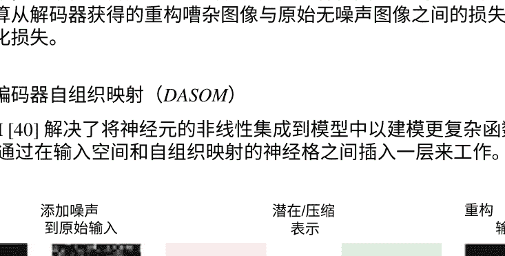
图7 去噪自编码器的架构[38]

在输入空间和自组织映射的神经格之间，隐藏表示层被插入。这个自编码器在图像和文本的光学识别中很有用。

##### 堆叠去噪自编码器 (SDAE)
创建深度网络的堆叠DAE的工作方式与深度置信网络中堆叠RBM的方式类似[11]。在SDAE中，对每个单独的层应用输入损坏进行初始去噪和训练，以学习数据中的显著特征。在学习了潜在编码函数 $f_\theta$ 之后，它被应用于未损坏的输入。为了训练模型中的下一层，上一层的未损坏输入被用作下一层的干净输入。

##### 边缘化去噪自编码器 (mDAE)
在DAE中，输入数据在训练阶段需要多次损坏，这导致训练数据的大小增加，并且需要更多的计算资源。当输入数据的维度非常高时，这个问题甚至变得更糟。边缘化去噪自编码器[41]通过在训练过程中近似边缘化数据损坏过程来解决这个问题。它在每次训练迭代中接受多个损坏的输入数据副本，并且在少数训练周期内优于DAE。mDAE不使用显式的数据损坏过程，而是隐式地边缘化了来自损坏分布（如加性高斯和无偏掩码/丢弃）的重构误差。

##### 分层自编码器
在堆叠的DAE中，只有最后一层负责重构输入样本，中间层不直接贡献于重构。

分层自编码器[42]的设计使得中间层提供互补信息，并且每层的输出被融合以获得最终重构的样本。这个自编码器基于非对称自编码器，其中堆叠的自编码器只有一个解码器。解码器的浅层特性减轻了训练多个层的需求，因此各层可以直接贡献于重构输入。

#### 3.4 生成式自编码器

##### 变分自编码器 (VAE)
在这个自编码器中，瓶颈向量（潜在向量）被两个向量取代，即均值向量和标准差向量。变分自编码器[43]基于贝叶斯推断，其中压缩表示遵循概率分布。与学习任意编码函数以获取显著特征的普通自编码器不同，变分自编码器学习模型输入训练数据的概率分布的参数；因此，VAE的性质较为复杂。编码器网络被强制生成潜在向量遵循单位高斯分布。这个约束使VAE与标准自编码器有所区别。

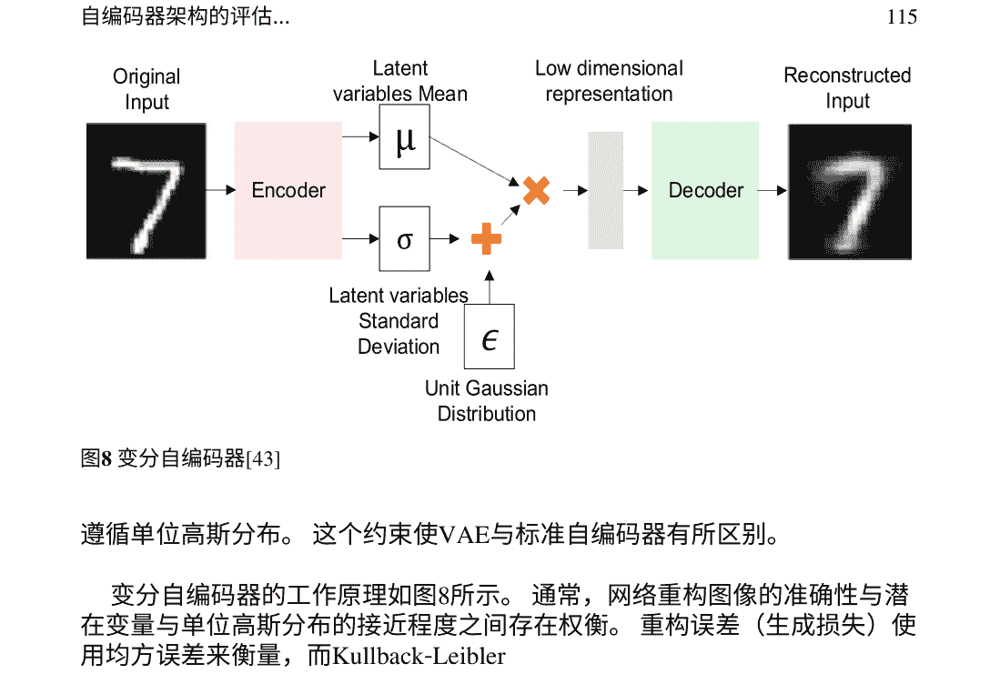
图8 变分自编码器[43]

变分自编码器的工作原理如图8所示。通常，网络重构图像的准确性与潜在变量与单位高斯分布的接近程度之间存在权衡。重构误差（生成损失）使用均方误差来衡量，而Kullback-Leibler（KL）散度损失度量潜在变量与单位高斯分布的接近程度。典型的变分自编码器基于一个强假设，即后验分布是可以使用非线性回归来近似的因子分布。

##### 重要性加权自编码器（IWAE）
重要性加权自编码器[44]是一种生成模型，是变分自编码器的一种变体。它与VAE具有相似的架构，唯一的区别在于它利用了通过重要性加权获得的严格更紧的对数似然下界，并且比VAE更好地学习数据的潜在表示。

##### 对抗自编码器
对抗自编码器[45]使用生成网络对概率自编码器中的连续和离散潜在向量进行变分推断。图9展示了对抗自编码器，它由标准自编码器和一个用于对抗训练的网络组成。标准自编码器从潜在向量中重构图像 h。对抗训练网络用于判别样本是来自隐藏代码还是用户指定的分布。VAE使用KL散度损失对自编码器的隐藏代码向量施加先验分布，而对抗自编码器则应用对抗训练方法将隐藏代码表示的聚合后验与先验分布匹配。

多视图数据中的不同分布导致视图差异。在许多实际应用中，从多视图数据中学习共同表示非常重要。Wang等人[46]提出了无监督的多视图表示学习方法，对抗相关自编码器，它从多视图数据中学习共同表示。

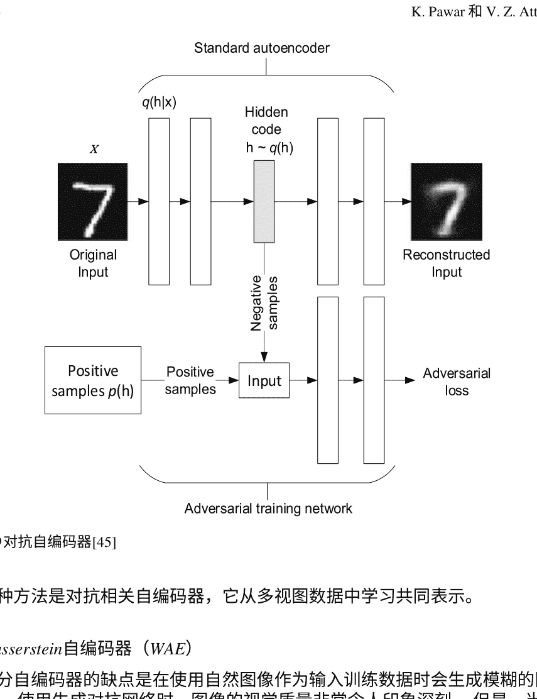
图9 对抗自编码器[45]

##### Wasserstein自编码器（WAE）
变分自编码器的缺点是在使用自然图像作为输入训练数据时会生成模糊的图像。使用生成对抗网络时，图像的视觉质量非常令人印象深刻。但是，当训练模型无法学习真实数据分布的变异性时，生成对抗网络会遇到“模式崩溃”问题。Wasserstein自编码器被设计为以统一的方式结合VAE和GAN的最佳特性。WAE [47]用于基于最优传输视角设计生成模型。它惩罚了模型分布与目标分布之间的Wasserstein距离。在这种情况下，编码的训练分布与先验分布匹配。与变分自编码器类似，WAE的目标函数由重构成本和惩罚先验分布与编码点分布之间的差异组成。

##### 对抗正则化自编码器（ARAE）
对抗正则化自编码器[48]基于WAE[47]，是对抗自编码器[45]的扩展版本，支持离散序列，如离散图像或文本序列。该模型允许在潜在空间中操作变量，以实现输出空间的变化。它还通过结合学习和固定的先验分布来处理顺序数据。

##### Dynencoder
Dynencoder是由Yan等人提出的[49]，用于表示视频的时空信息。它由三层组成。第一层将输入映射到潜在状态 h_t。下一个隐藏状态 ĥ_{t+1}由第二层使用当前状态 h_t进行预测。最后一层将预测的隐藏状态 ĥ_{t+1}映射到生成近似输入帧 x̂_{t+1}。最初，每层在预训练阶段分别进行训练。一旦预训练结束，就进行端到端的网络微调。

##### 堆叠什么-在哪里自动-编码器（SWWAE）
SWWAE [50] 综合了判别模型和生成模型的优势，并作为统一模型来支持无监督、半监督和监督表示学习，在训练过程中不使用采样。它使用卷积网络 [51] 对输入进行编码，并使用反卷积网络 [52] 进行重构。它由前馈卷积网络和反馈反卷积网络组成。编码器由具有ReLU激活的卷积层组成，后面是最大池化层。池化层将信息分为“what”和“where”两个组件，分别用最大值和位置切换来描述。“what”变量向下一层提供关于位置的不完整信息，“where”变量向相应的反馈解码器提供显著特征的位置（位置）信息。这个模型的关键在于，每当通过多对一映射显示一个层时，该模型计算用于重构输入的互补变量。

## 影响自编码器整体性能的4个因素
训练过程、正则化、激活函数等因素在任何基于自编码器的模型的成功实现中起着关键作用。

#### 4.1 训练
自编码器的所有训练过程必须在满足以下两个要求之间取得平衡。

1. 学习输入样本的潜在表示，以便通过解码器进行近似重构：期望自编码器通过遵循数据生成分布来重构输入。
2. 满足稀疏约束或正则化惩罚：稀疏约束可以限制自编码器的容量。正则化惩罚是为了在学习的编码中融入特殊的数学属性。

同时满足上述两个要求很重要，因为它们强制隐藏表示根据数据的分布捕捉显著特征。自编码器应该学习数据中的变化，以便重构输入数据。

自编码器可以被视为前馈神经网络的一种特殊情况，因此它们可以使用与前馈网络相同的技术进行训练，例如小批量梯度下降。SGD [53]及其变种Adam [54]、AdaGrad [55]和RMSProp是用于训练自编码器中的权重和偏差的一些优化算法。其他算法包括L-BFGS和共轭梯度[56]。

所有这些算法都基于梯度下降技术。梯度下降算法在函数$f$的最陡斜率方向上找到参数，并最小化代价函数。反向传播算法[57]用于计算从最后一层到神经网络中第一层的损失函数的梯度，以调整权重。

自编码器可以使用循环训练算法[58]进行训练，该算法比较网络在训练数据上的激活和重构数据上的激活。通过深度架构实现的生成模型通常遵循贪婪逐层预训练策略。训练深度模型的另一种方法是训练一堆浅层自编码器。随着大规模未标记数据的增长和对不同类型正则化器的研究需求，Zhou等人[59]提出了一种用于联合训练深度自编码器所有层的无监督学习方法。在这种方法中，训练深度自编码器的单一目标包括全局重构目标和对隐藏层的局部约束，以实现联合训练。

#### 4.2 目标函数
自编码器的目标函数包括重构误差和通过稀疏约束和/或正则化表达的惩罚项。

可以使用均方误差（MSE）、交叉熵和相关熵[60]来计算重构误差。MSE给出了实际值和预测值之间的平均平方差。交叉熵用于量化两个概率分布之间的差异。相关熵检查了两个分布的概率密度的相等性。与MSE相比，相关熵度量对异常值更具鲁棒性。

正则化有助于使模型在新的未见数据上具有良好的泛化能力。可以通过数据、网络架构、优化、误差函数和正则化项[61]来执行正则化。通过判别式正则化可以提高生成模型的效果。在这种情况下，监督学习算法增强了生成模型，以区分哪些数据特征值得表示[62]。为了了解自编码器对数据的表示情况，可以使用能量函数[63]或非归一化分数[64]，它们将自编码器与概率模型（如RBM）相关联。为了避免自编码器的过拟合，将正则化项添加到目标函数中，引起权重衰减[65]。通过选择最小的向量来超越权重向量的无关成分，权重衰减改善了泛化能力。执行正则化的其他方法包括收缩和稀疏约束。基本自编码器生成的编码不具备特殊属性。为了在这些编码中融入数学属性，一些正则化方法将惩罚函数添加到目标函数中。稀疏自编码器、去噪自编码器和收缩自编码器是一些常见的正则化自编码器的示例。正则化自编码器中的惩罚项可以是雅可比矩阵的Frobenius范数（一阶导数）或Hessian范数（高阶导数）。

正则化惩罚可以应用于隐藏单元的激活或输出层的激活。对隐藏单元的激活应用惩罚的正则化器被称为潜在状态正则化器。

在学习数据的稀疏表示时，可以在通道上对人口样本（人口稀疏约束）[31]或训练样本（生命周期稀疏约束）[33]应用稀疏约束。另一个约束，即空间稀疏约束[32]，用于正则化自编码器，它要求所有字典原子对输入数据的重构做出贡献。空间稀疏约束不是从特征图的所有隐藏单元中重构输入数据，而是从每个特征图中选择最大的隐藏单元，并将其余单元及其导数设置为零。这使得稀疏水平等于特征图的数量。解码器借助活跃的隐藏单元重构输出，并且重构误差仅通过这些活跃的隐藏单元进行反向传播。

自编码器在学习数据的属性/特征方面表现出色。为了验证自编码器构建的特征对分类任务的有用信息量，基于信息论原理提出了自编码器节点显著性方法[66]。在这种方法中，使用有监督的节点显著性方法对隐藏节点按照其与学习任务的相关性进行排名。此外，使用归一化熵差计算潜在表示的有趣程度，以验证高排名节点的分类能力。

#### 4.3 激活函数
激活函数将加权输入的总和转化为节点的激活或输出。它们在网络中起到传播梯度的重要作用。
激活函数模拟了大多数神经网络的非线性行为。Sigmoid函数（标准逻辑函数）是自编码器中最常用的激活函数。另一个Sigmoid函数——双曲正切函数在原点上对称。由于它生成更陡峭的梯度，因此应优先选择它而不是其他激活函数[67]。在深度学习模型中，ReLU作为激活函数的选择很受欢迎。由于ReLU函数对负值输出为0，它可能会通过降低解码过程中的重构质量而影响自编码器的性能。缩放指数线性单元（SELUs）[68]能够训练具有多个层的深度模型，并通过强正则化学习到鲁棒的表示。它解决了梯度消失和梯度爆炸的问题。

激活函数如线性函数、二值函数和ReLU在自编码器中很少使用。

#### 4.4 层大小和深度
虽然自编码器可以用单个编码层和单个解码层进行训练，但是使用深层进行训练以获得更好的表示学习是很重要的。如前所述，自编码器中的编码器和解码器都可以看作是前馈神经网络（FNN）；FNN中的隐藏层可以近似任何具有任意精度的函数，只要隐藏层具有足够的节点。这证明了具有单个隐藏层的自编码器可以表示遵循分布的恒等函数。但是，由于从输入到潜在状态（隐藏编码）的映射是浅层的，无法强制执行任意约束以使隐藏编码遵循稀疏表示。具有至少一个隐藏层（具有足够隐藏节点）的深度自编码器能够通过将输入数据映射到编码来近似任何输入数据。深度架构的深度降低了函数/数据表示的计算成本，并且指数级地减少了学习函数所需的输入训练数据的数量。与其浅层或线性对应物相比，深度自编码器在数据压缩方面更加优秀。

## 自编码器的5个应用
自编码器在许多任务中都被发现很有用，如分类、预测、特征学习、降维、异常检测、可视化、语义哈希、信息检索和其他领域特定特征。一些自编码器是根据要解决的问题而设计的。

降维是自编码器最常见的应用之一。较低维度的表示可以提高模型在分类等任务上的性能。自编码器的变种在文献中广泛研究了分类任务的工作方式。像基于RNN的自编码器、LSTM编码器这样的自编码器更适用于解决序列预测问题。

深度卷积自编码器等自编码器已被用于异常检测、特征工程。在异常检测的情况下，自编码器被训练用于正常训练数据，因此重构数据也遵循正常数据的分布，不能生成之前未见过的数据（异常模式）。因此，重构误差被视为异常分数。自编码器还被用于语义哈希，可应用于文本数据和图像数据。哈希通过将数据编码为二进制代码来加快搜索过程。总的来说，自编码器已广泛应用于多种任务中。

表1给出了不同自编码器的特性及其应用。

| 架构 | 特性 | 应用 |
|---|---|---|
| 深度自编码器 [11, 70] | 通过堆叠RBM进行预训练，展开结构，创建一个可以使用反向传播进行微调的深度自编码器 | 分类，回归，压缩，语义哈希，地球化学异常检测 |
| 卷积自编码器 [69, 71–73] | 通过在每个卷积层中共享权重来保留空间局部性 | 图像中缺失部分的重建，图像着色，生成超分辨率图像，异常检测，室内定位系统 |
| DS-CAE [44] | 使用卷积操作在图和网络上执行局部特征提取 | 网络和图的表示学习 |
| 基于RNN的自编码器 [15] | 处理可变长度的输入并为序列数据重新创建可变长度的输出适用于处理序列到序列的预测问题 | 统计机器翻译、图像字幕、聊天机器人、生成手势命令的顺序方式 |
| LSTM AE和复合LSTM模型[16] | 重构输入向量/帧并预测下一个向量/帧适用于处理序列到序列的预测问题 | 动作识别、文本处理 |
| 稀疏自编码器[18–20, 74] | 在隐藏层上应用稀疏惩罚以防止输出层复制输入数据 | 分类、分割、修复、压缩、插值方法用于超分辨率 |
| 饱和自编码器[24] | 适用于特征提取限制了重构不接近数据流形的输入的能力 | 分类、去噪 |
| HSAE [25] | 结合重构误差、稀疏约束和海森矩阵正则化，用于鲁棒流形学习 | 分类 |
| 零偏自编码器 [30] | 作为学习非常高维特征的隐式正则化器 | 从高维数据（如视频和图像）中学习特征 |
| k-稀疏自编码器 [31] | 在隐藏层上施加稀疏约束，并选择k个神经元进行重构 | 浅层和深层判别学习任务，无监督特征学习 |
| FC-WTA [32] | 对隐藏单元应用生命周期稀疏约束，用于稀疏数据表示 | 分类，无监督特征学习 |
| CONV-WTA [32] | 通过应用空间和生命周期稀疏约束，学习数据的平移不变稀疏表示 | 分类，无监督特征学习 |
| 平滑自编码器 [34] | 通过样本的相应编码表示重构目标邻居 | 数据流形表示，分类 |
| 去噪自编码器 [38, 39] | 从损坏或嘈杂的输入数据中重建正确的数据，支持无监督和迁移学习 | 去除水印，图像修复 |
| mDAE [41] | 考虑到多个副本的损坏数据，并隐式地对数据损坏的重建误差进行边缘化处理 | 表示学习 |
| 分层自编码器 [42] | 由于解码器的浅层特性，擅长处理分析和合成问题 | 推荐系统 |## 自编码器架构的评估...

## 表1（继续）

| 架构 | 特性 | 应用 |
| :--- | :--- | :--- |
| 变分自编码器 [43, 75, 76] | 生成新数据，增加样本数据，并作为典型的生成对抗模型工作 | 生成建模，缺失数据插补，维度情感分析 |
| IWAE [44] | 通过利用重要性加权学习比VAEs更丰富的潜在表示 | 生成建模 |
| 对抗自编码器 [45] | 使用对抗训练方法进行变分推断 | 降维，分类，无监督聚类，解开图像的风格和内容 |
| Wasserstein自编码器 [47] | 在生成模型中最小化最优传输成本 | 生成建模 |
| ARAE [48] | 作为深度潜变量模型工作，并为离散序列数据生成稳健表示，遵循WAEs和对抗自编码器 | 文本的非对齐风格转移（离散数据） |
| Dynencoder [49] | 通过时空表示捕捉视频动态 | 从视频中合成动态纹理，分类 |
| SWWAE [50] | 使用卷积和反卷积网络学习分解表示，以编码不变性和等变性属性 | 分解表示学习 |
| 收缩自编码器 [57] | 在潜在状态的激活单元中应用收缩惩罚，捕捉数据所述的变化，支持无监督和迁移学习 | 分类 |
| CFAN AE [77] | 级联自编码器用于粗到细层次处理 | 面部对齐识别 |
| 堆叠卷积自编码器 [78] | 使用在线梯度下降训练的卷积堆叠自编码器 | 分层特征提取，无监督学习，分类 |
| 词嵌入自编码器 [79] | 执行单词的编码 | 索引，排名和分类单词 |
| 二进制自编码器[80] | 通过二进制向量表示隐藏编码层，执行重构，遵循辅助坐标法 | 图像的语义哈希 |
| ARGA和ARGVA [81] | 对于表示图数据的对抗模型，将其映射到低维空间以进行图分析 | 图聚类，图可视化，链接预测 |
| AdvCAE [46] | 使用无监督学习获取多视图数据的共同表示，遵循生成建模方法 | 跨视图分类和跨视图检索 |
| 生成递归自编码器 [82] | 在编码期间通过对场景对象进行分组来学习层次化场景结构，并在解码期间生成场景 | 在大规模上生成多样化的3D室内场景 |
| 堆叠卷积自编码器，W GANs，孪生网络 [83, 84] | 使用无监督特征学习学习主题的补丁级表示 | 在医学图像处理、病理图像分析中进行异常检测 |
| 优化的深度自编码器 + 卷积神经网络 [85] | 使用卷积神经网络进行特征提取，并使用深度自编码器实时学习视频流中的时间变化 | 在线数据流分析，动作识别 |
| 光谱空间堆叠自编码器 [86] | 使用堆叠自编码器从高光谱图像中提取光谱和空间特征 | 高光谱图像分析，高光谱图像异常检测 |
| 类别特定均值自编码器 [87] | 在训练过程中使用样本数据的类信息来学习类内相似性，并进行特征提取 | 从面部图像中进行成年分类 |
| 堆叠自动编码器 [88, 89] | 从深度学习网络的不同阶段学习结构特征 | 风力发电预测，旅游需求预测 |
| 具有堆叠稀疏自动编码器的多层感知机 [90] | 捕捉输入数据中嵌入的非线性关系、复杂交互和结构 | 从基因型预测基因表达谱 |
| 堆叠收缩自动编码器 [91] | 从2D和3D图像中学习非线性子空间，处理光照变化和复杂表面形状 | 3D人脸重建 |
| 一致平均估计自动编码器 [92] | 将成本函数建模为包含重构、判别和稀疏项的多目标优化问题 | 在脑机接口领域中的信号特征提取 |
| RODEO [93] | 利用神经网络的通用函数逼近能力，并从训练数据中学习重建（非线性反演）过程 | 基于压缩感知的实时MRI和CT重建 |
| 多模态堆叠收缩自编码器[94] | 在自编码器的连续阶段中保留内部模态和跨模态的语义关系 | 多模态视频分类 |
| 深度自编码器 +DAE [95] | 通过深度自编码器和基于判别的DAE相结合，实现混响消除 | 远距离说话者识别 |
| 分布式深度卷积自编码器 [96] | 学习大数据的复杂层次结构，并利用分布式环境中的GPU处理能力 | 大型神经影像数据集的分析 |
| 深度核自编码器[35] | 通过利用用户定义的核矩阵，在输入空间中保留非线性相似性 | 高维数据的分类和可视化 |
| 图结构自编码器 [36] | 图结构自编码器的不同变体，每个变体都遵循有监督学习或无监督学习 | 图像去噪、聚类、单标签和多标签分类 |
| 组稀疏自编码器 [37] | 应用 ℓ1 和 ℓ2 范数进行有监督特征学习 | 在法医和执法应用中需要的分类、潜在指纹识别 |
| DASOM [40] | 通过整合神经元的非线性特性来建模复杂函数 | 图像和文本的光学识别 |
| 卷积交叉自编码器 [97] | 交叉自编码器处理来自社交媒体数据的跨模态元素，而CNN处理时间序列 | 跨媒体分析 |
| NGBAE [98] | 通过显式引导的潜在变量，对双语文本进行模型语义分布 | 跨语言自然语言处理应用，如双语词嵌入 |
| 模型耦合的自编码器 [99] | 将回声状态网络与自编码器相结合 | 对时间序列数据、实值序列和二进制序列进行可视化 |
| 纯净化变分自编码器 [100] | 在每个类别的流形上投影对抗样本，并确定最接近的投影作为纯净样本 | 用于净化对抗攻击的防御机制，适用于监控系统 |

### 6 结论

从数据中进行表示学习对于成功实现深度学习模型并实现更好的泛化和可接受的性能至关重要。使用神经网络设计的自编码器在从数据中进行表示学习方面表现出色。深度学习的普及导致了自编码器的广泛使用，因为它们具有固有的特征学习和降维特性。

本章的主要贡献可以总结如下。本章介绍了自编码器的基础背景和最先进的变体自编码器架构。本章提出了基于设计自编码器所需的各种因素的自编码器图形分类法。本章阐述了激活函数、神经网络的深度和层大小、自编码器的训练策略和正则化方法的作用。本章还总结了基于特征和应用的自编码器概述，并在本章中制表。

### 附录

本章中使用的缩写词列在表2中。

### 表2 缩写词列表

| 缩写词 | 含义 |
|--------|------|
| AdaGrad | 自适应梯度 |
| Adam | 自适应矩估计 |
| AdvCAE | 对抗相关自编码器 |
| AE | 自编码器 |
| ARAE | 对抗正则化自编码器 |
| ARGA | 对抗正则化图自编码器 |
| ARGVA | 对抗正则化变分图自编码器 |
| CAE | 收缩自编码器 |
| CONV AE | 卷积自编码器 |
| CONV-WTA | 卷积赢家通吃自编码器 |
| CT | 计算机断层扫描 |
| DASOM | 去噪自编码器自组织映射 |
| DIVA | 发散自编码器 |
| FC-WTA | 全连接赢家通吃自编码器 |
| FNN | 前馈神经网络 |
| GAN | 生成对抗网络 |
| GSAE | 群稀疏自编码器 |
| HSAE | 海森稀疏自编码器 |
| HSI | 高光谱图像 |
| IWAE | 重要性加权自编码器 |
| KL | 库尔巴克-莱布勒 |
| LDA | 潜在狄利克雷分配 |
| LSTM | 长短期记忆 |
| LZW | Lempel-Ziv-Welch |
| mDAE | 边缘化去噪自编码器 |
| MRI | 磁共振成像 |
| MSE | 均方误差 |
| NGBAE | 神经生成双语自编码器 |
| PCA | 主成分分析 |
| RAE | 正则化自编码器 |
| RBM | 受限玻尔兹曼机 |
| ReLUs | 修正线性单元 |
| RNN | 循环神经网络 |
| SAE | 稀疏自编码器 |
| SATAE | 饱和自编码器 |
| SDAE | 堆叠去噪自编码器 |
| SELUs | 缩放指数线性单元 |
| SGD | 随机梯度下降 |
| SWWAE | 堆叠何处何地自编码器 |
| VAE | 变分自编码器 |
| WAE | Wasserstein自编码器 |
| WTA | 胜者通吃自编码器 |

### 参考文献

1.  Bengio, Y., Courville, A., Vincent, P.: 表示学习：综述与新视角。 IEEE Trans. Pattern Anal. Mach. Intell. **35**, 1798–1828 (2013)
2.  Sutskever, I., Vinyals, O., Le, Q.V.: 序列到序列学习与神经网络。 In:神经信息处理系统的进展，第3104–3112页 (2014)
3.  Pathak, A.R., Pandey, M., Rautaray, S.: 基于深度学习的动态和时间主题建模的自适应框架。最近的专利工程。 **13**, 1 (2019). https://doi.org/10.2174/1872212113666190329234812
4.  Pathak, A.R., Pandey, M., Rautaray, S.: 使用深度学习架构从大数据中进行动态和时间主题建模的自适应模型。 Int. J. Intell. Syst. Appl. **11**(6),13–27 (MECS-Press)
5.  Pathak, A.R., Pandey, M., Rautaray, S., Pawar, K.: 使用深度卷积神经网络评估对象检测。 在： Bhalla, S., Bhateja, V., Chandavale, A.A., Hiwale,A.S., Satapathy, S.C. (eds.) 智能计算和信息与通信， pp. 457–466. Springer Singapore (2018)
6.  Pathak, A.R., Pandey, M., Rautaray, S.: 用于从图像中检测对象的深度学习方法：一项综述。 在： Pattnaik, P.K., Rautaray, S.S., Das, H., Nayak, J. (eds.) 计算、分析和网络进展， pp. 491–499. Springer Singapore (2018)
7.  Pathak, A.R., Pandey, M., Rautaray, S.: 深度学习在对象检测中的应用。 Procedia Comput. Sci. **132**, 1706–1717 (2018)
8.  Pawar, K., Attar, V.: 基于视频的异常活动检测的深度学习方法。 World Wide Web **22**, 571–601 (2019)
9.  Pawar, K., Attar, V.: 从监控视频中检测异常活动的深度学习方法。 在： CCIS。 Springer (2019年，即将出版)
10. Khare, K., Darekar, O., Gupta, P., Attar, V.Z.: 使用深度学习进行短期股票价格预测。 在：第二届IEEE国际电子、信息和通信技术近期趋势会议（RTEICT），第482-486页 (2017年)
11. Hinton, G.E., Salakhutdinov, R.R.: 使用神经网络降低数据的维度。 Science **313**, 504–507 (2006)
12. Kurtz, K.J.: 类别学习的分歧自编码器（DIVA）模型。 Psychon. Bull. Rev. **14**, 560–576 (2007)
13. Odena, A., Dumoulin, V., Olah, C.: 解卷积和棋盘伪影。 Distill (2016). https://doi.org/10.23915/distill.00003
14. Zhang, Z., et al: 基于深度的子图卷积自编码器用于网络表示学习。 Pattern Recognit. (2019)
15. Cho, K., et al.: 使用RNN编码器-解码器学习短语表示用于统计机器翻译（2014）。 http://arxiv.org/abs/1406.1078
16. Srivastava, N., Mansimov, E., Salakhutdinov, R.: 使用LSTMs进行无监督学习的视频表示。 在：国际机器学习会议上，pp. 843–852 (2015)
17. Goodfellow, I., Bengio, Y., Courville, A.: 深度学习. MIT出版社 (2016)
18. Poultney, C., Chopra, S., Cun, Y.L., 等: 基于能量模型的稀疏表示的高效学习. 在: Advances in Neural Information Processing Systems, pp. 1137–1144(2007)
19. Lee, H., Ekanadham, C., Ng, A.Y.: 用于视觉区域V2的稀疏深度信念网络模型. 在: Advances in Neural Information Processing Systems, pp. 873–880 (2008)
20. Zou, W.Y., Ng, A.Y., Yu, K.: 用时间一致性进行视觉不变性的无监督学习. 在: NIPS 2011深度学习和无监督特征学习研讨会, vol.3 (2011)
21. Jiang, X., Zhang, Y., Zhang, W., Xiao, X.: 一种新颖的用于深度无监督学习的稀疏自编码器. 在2013年第六届高级计算智能国际会议(ICACI)上, pp. 256–261 (2013)
22. Le, Q.V., 等: 使用大规模无监督学习构建高级特征（2011年）。 http://arxiv.org/abs/1112.6209
23. Chen, J., 等: 用于非冗余稀疏特征表示的交叉协方差正则化自编码器. Neurocomputing **316**, 49–58 (2018)
24. Goroshin, R., LeCun, Y.: 饱和自编码器（2013年）。 http://arxiv.org/abs/1301.3577
25. Liu, W., Ma, T., Tao, D., You, J.H.S.A.E.: 一种Hessian正则化稀疏自编码器. Neurocomputing **187**, 59–65 (2016)
26. Rifai, S., Vincent, P., Muller, X., Glorot, X., Bengio, Y.: 收缩自编码器：特征提取过程中的显式不变性. 在：第28届国际机器学习大会论文集，第833–840页（2011年）
27. Rifai, S., 等: 高阶收缩自编码器. 在：欧洲联合会议机器学习和数据库知识发现，第645-660页（2011年）
28. Alain, G., Bengio, Y.: 正则化自编码器从数据生成分布中学到了什么. 机器学习研究杂志 **15**, 3563-3593页（2014年）
29. Mesnil, G., 等: 无监督和迁移学习挑战：深度学习方法. 在：2011年无监督和迁移学习国际会议论文集研讨会，第27卷，第97-111页（2011年）
30. Konda, K., Memisevic, R., Krueger, D.: 零偏自编码器和共适应特征的好处（2014年）。 http://arxiv.org/abs/1402.3337
31. Makhzani, A., Frey, B.: K稀疏自编码器（2013年）。 http://arxiv.org/abs/1312.5663
32. Makhzani, A., Frey, B.J.: 胜者通吃自编码器. 在：神经信息处理系统进展，第2791-2799页（2015年）
33. Ng, A.: 稀疏自编码器. CS294A讲义，第72卷，第1-19页（2011年）
34. Liang, K., Chang, H., Cui, Z., Shan, S., Chen, X.: 具有平滑性的表示学习自编码器. 在：亚洲计算机视觉会议，第72-86页（2014年）
35. Kampffmeyer, M., Løkse, S., Bianchi, F.M., Jenssen, R., Livi, L.: 深度核自编码器. 应用软计算. **71**, 816-825页（2018年）
36. Majumdar, A.: 图结构自编码器. 神经网络 **106**, 271–280 (2018)
37. Sankaran, A., Vatsa, M., Singh, R., Majumdar, A.: 群稀疏自编码器. 图像视觉计算 **60**, 64–74 (2017)
38. Vincent, P., Larochelle, H., Bengio, Y., Manzagol, P.-A.: 用去噪自编码器提取和组合稳健特征. 在：第25届国际机器学习大会论文集, pp. 1096–1103 (2008)
39. Vincent, P., Larochelle, H., Lajoie, I., Bengio, Y., Manzagol, P.-A.: 堆叠去噪自编码器：在深度网络中学习有用的表示，具有局部去噪准则. 机器学习研究杂志 **11**, 3371–3408 (2010)
40. Ferles, C., Papanikolaou, Y., Naidoo, K.J.: 去噪自编码器自组织映射 (DASOM). 神经网络 **105**, 112–131 (2018)
41. Chen, M., Weinberger, K., Sha, F., Bengio, Y.: 边缘化去噪自编码器用于非线性表示. 在：国际机器学习会议，第1476–1484页 (2014)
42. Maheshwari, S., Majumdar, A.: 分层自编码器用于协同过滤。 在: 2018年国际联合神经网络大会(IJCNN)，第1–7页(2018)
43. Kingma, D.P., Welling, M.: 自编码器变分贝叶斯(2013)。 http://arxiv.org/abs/1312.6114
44. Burda, Y., Grosse, R., Salakhutdinov, R.: 重要性加权自编码器(2015)。 http://arxiv.org/abs/1509.00519
45. Makhzani, A., Shlens, J., Jaitly, N., Goodfellow, I., Frey, B.: 对抗自编码器 (2015). http://arxiv.org/abs/1511.05644
46. Wang, X., Peng, D., Hu, P., Sang, Y.: 对抗相关自编码器用于无监督多视图表示学习. 知识基础系统 (2019)
47. Tolstikhin, I., Bousquet, O., Gelly, S., Schoelkopf, B.: Wasserstein自编码器 (2017). http://arxiv.org/abs/1711.01558
48. Kim, Y., Zhang, K., Rush, A.M., LeCun, Y., et al.: 对抗正则化自编码器 (2017). http://arxiv.org/abs/1706.04223
49. Yan, X., Chang, H., Shan, S., Chen, X.: 用深度动态编码器建模视频动态。 在: 欧洲计算机视觉会议，第215-230页 (2014年)
50. Zhao, J., Mathieu, M., Goroshin, R., Lecun, Y.: 堆叠的what-where自编码器 (2015年). http://arxiv.org/abs/1506.02351
51. LeCun, Y., Bottou, L., Bengio, Y., Haffner, P., 等: 基于梯度的学习应用于文档识别。 IEEE会议记录86, 2278–2324页 (1998年)
52. Zeiler, M.D., Krishnan, D., Taylor, G.W., Fergus, R.: 反卷积网络。 在: 计算机视觉和模式识别会议，第2528-2535页。IEEE (2010年)
53. Robbins, H., Monro, S.: 一种随机逼近方法。数学和统计学年鉴，400–407页 (1951年)
54. Kingma, D.P., Ba, J.: Adam:一种用于随机优化的方法(2014)。 http://arxiv.org/abs/1412.6980
55. Duchi, J., Hazan, E., Singer, Y.:自适应次梯度方法用于在线学习和随机优化. 机器学习研究杂志 12, 2121–2159 (2011)
56. Le, Q.V., 等: 关于深度学习的优化方法. 在: 第28届国际机器学习大会论文集, pp. 265–272 (2011)
57. Rumelhart, D.E., Hinton, G.E., Williams, R.J., 等: 通过反向传播误差学习表示. 认知模型杂志 5, 1 (1988)
58. Hinton, G.E., McClelland, J.L.:通过循环学习表示. 在: 神经信息处理系统, pp. 358–366 (1988)
59. Zhou, Y., Arpit, D., Nwogu, I., Govindaraju, V.: 联合训练对深度自动编码器是否更好? (2014). http://arxiv.org/abs/1405.1380
60. Qi, Y., Wang, Y., Zheng, X., Wu, Z.: 基于最大-最小相关性准则的堆叠自动编码器的鲁棒特征学习。 在: 2014年IEEE国际声学、语音和信号处理会议 (ICASSP)，第6716–6720页 (2014年)
61. Kučka, J., Golkov, V., Cremers, D.: 深度学习的正则化: 一个分类法 (2017年)。 http://arxiv.org/abs/1710.10686
62. Lamb, A., Dumoulin, V., Courville, A.: 生成模型的判别性正则化 (2016年)。 http://arxiv.org/abs/1602.03220
63. Kamyshanska, H., Memisevic, R.: 自编码器的势能. IEEE Trans. Pattern Anal. Mach. Intell. 37, 1261–1273 (2015)
64. Kamyshanska, H., Memisevic, R.: 关于自编码器评分. In: 国际机器学习会议, pp. 720–728 (2013)
65. Krogh, A., Hertz, J.A.: 简单的权重衰减可以改善泛化能力. In: 神经信息处理系统进展, pp. 950–957 (1992)
66. Fan, Y.J.: 自编码器节点显著性: 选择相关的潜在表示. Pattern Recognit. 88, 643–653 (2019)
67. LeCun, Y.A., Bottou, L., Orr, G.B., Müller, K.-R.: 高效的反向传播. In: 神经网络：实用技巧, pp 9–48. Springer (2012)

## 编码器-解码器框架及其应用

Ahmad Asadi和Reza Safabakhsh

摘要 神经编码器-解码器框架在机器翻译方面取得了显著的进展。近年来，许多研究人员采用了基于编码器-解码器的模型来解决复杂的任务，如图像/视频字幕生成、文本/视觉问答和文本摘要。在这项工作中，我们研究了机器翻译中的基准编码器-解码器框架，并对对应对特征提取困难的编码器结构进行了简要介绍。此外，还提供了解码器生成更丰富细粒度输出句子的解决方案的经验研究。最后，研究了一种应对长期依赖和改善复杂任务中编码器-解码器性能的注意力机制。

关键词 编码器-解码器框架·机器翻译·图像字幕·视频字幕生成·问题回答·长期依赖·注意机制

### 1 引言

我们需要解决的许多问题的解决方案都属于编码器-解码器方法的范畴。我们可能希望设计非常复杂的网络来应对复杂的挑战，比如自动描述任意图像或将一种语言的句子翻译成另一种语言。神经编码器-解码器框架最近被广泛应用于自然语言处理、计算机视觉、语音处理甚至跨学科问题的解决。编码器-解码器模型可以解决的一些问题的例子包括机器翻译、自动图像和视频字幕生成，文本和视觉问答，以及音频转文本转换。

该模型中的编码器部分是一个神经结构，将原始输入映射到特征空间，并将提取的特征向量传递给解码器。解码器是另一个神经结构，它处理提取的特征向量以做出决策或为问题生成适当的输出。

提出了各种各样的编码器来编码不同类型的输入。卷积神经网络（CNN）通常用于编码图像和视频输入。循环神经网络（RNN）广泛用作编码器，其中输入是结构化数据或句子的序列。此外，还使用了不同神经网络的更复杂结构来建模输入中的复杂性。

分层CNN-RNN结构是神经组合的例子，广泛用于表示视频中的时间依赖关系，用于视频描述生成。

这种基准编码器-解码器方法的另一个潜在问题是编码器必须将输入的所有必要信息压缩成一个固定大小的张量。这可能使神经网络在输入和输出的时间依赖关系建模方面变得困难。注意机制被引入作为编码器-解码器模型的扩展，以克服固定长度特征提取的问题。这种方法与基准编码器-解码器的区别在于它不尝试将整个输入编码为单个固定大小的张量。相反，它将输入编码为一系列注释向量，并在每个步骤中自适应地选择这些向量的组合，同时解码和生成输出。

编码器-解码器模型用于解决问题的一些任务如下。

#### 1.1 机器翻译

“机器翻译”（MT）是将源语言的给定句子生成与目标语言相同意义的任务。

机器翻译存在两种不同的方法。

第一种方法称为“统计机器翻译”（SMT），其特点是使用统计机器学习技术自动将句子从源语言翻译为目标语言。在不到两个十年的时间里，SMT已经成为学术机器翻译研究的主导[1]。

第二种方法称为“神经机器翻译”（NMT）。在这个类别中，编码器-解码器框架首先由Cho等人在2014年提出。Cho等人提出的模型中，使用神经网络从输入句子中提取特征，并使用另一个神经网络从目标语言中逐词生成句子，使用提取的特征向量。

在NMT中使用的神经结构中，神经网络被训练成将输入序列（输入句子作为单词序列）映射到输出序列。这种学习被称为“序列到序列学习”。对NMT的早期模型进行评估表明，尽管生成的翻译是正确的，但在翻译长句时模型面临极大的问题[3]。建模“长期依赖关系”的问题是编码器-解码器模型中最重要的挑战之一。我们将在本章后面深入探讨并查看提出的解决方案。

#### 1.2 图像/视频字幕

图像字幕和视频字幕是将文本描述与给定图像或视频关联起来，全面描述输入中呈现的对象和事件的问题。已经提出了各种方法来解决这些问题，包括概率图模型（PGMs）和基于神经编码器-解码器的模型。

基于编码器-解码器的图像字幕模型使用CNN作为编码器从输入图像中提取特征向量，并将其传递给RNN作为解码器生成字幕。在这个任务中，模型架构与机器翻译相同，只是编码器使用CNN对图像进行编码，而不是RNN。

在视频字幕生成中，也称为“视频描述生成”，采用了基于编码器-解码器架构的类似模型来为输入视频生成字幕。在视频字幕生成模型中，编码器通常由CNN或CNN和RNN的组合来对输入视频进行编码，解码器与机器翻译和图像字幕生成中的解码器相同。

#### 1.3 文本/视觉问答

文本和视觉问答是生成关于文章和输入图像的给定问题的答案的问题。提出的模型用于解决这些问题，应该根据文章或图像以及关于它的问题生成一个简短或长的答案作为输入。基本模型架构与机器翻译相似，只是编码器需要为一对输入提取特征向量。解码器与机器翻译和图像/视频字幕生成中的解码器相同，因为它应该生成一个描述编码器生成的特征向量含义的句子。

#### 1.4 文本摘要

为了输入文本生成一个文本摘要，提出了一些模型。对输出的唯一限制是它需要描述与输入文本相同的含义，并且长度应该比输入文本短。

这些模型的基本架构与机器翻译中提出的架构相同，只是这里生成的输出来自于相同的语言。

很容易看出，机器翻译中提出的基线架构也被用于其他任务，只是有一些小的改变。此外，不同任务中的解码器相似，因为它们大多用于逐词生成句子来描述由特征向量表示的输入的含义。另一方面，为了根据不同任务中的输入类型提取适当的特征向量，使用了各种各样的编码器。

本章的下一节将讨论基线编码器-解码器模型。机器翻译中提出的第一个编码器-解码器模型在第3节中介绍。第4节详细讨论了不同类型的编码器及其在不同问题中的应用，并对编码器结构进行了总体展望。第5节对解码器结构进行了全面研究，介绍了制作更深的解码器的技术，以及它们在图像/视频字幕生成中的应用。第6节介绍了注意机制及其在机器翻译中的使用，随后对注意机制在其他问题中的实证研究进行了探讨。

### 2 基准编码器-解码器模型

在本节中，我们介绍了非常基础的编码器-解码器模型。为了清晰地展示这个想法，我们提出了解决机器翻译任务的基本结构，该模型被设计用于将一种语言的句子翻译成另一种语言。

#### 2.1 背景

编码器-解码器模型解决了自然语言处理、计算机视觉、语音识别和一些多学科问题中的各种问题。更具体地说，一些需要生成文本等经常是顺序输出的复杂问题可以通过基于编码器-解码器结构的模型来解决。

该框架的主要思想是将生成输出的过程分为以下两个子过程：

图1 编码器-解码器模型的基本方案

编码阶段：给定的输入首先通过一个称为“编码器”的投影函数投影到另一个空间中，以提供输入的“良好表示”。编码器还可以被视为从输入中提取特征的特征提取器，投影过程可以通过特征提取过程来表示。

解码阶段：在编码阶段之后，为给定的输入生成一个“潜在向量”，该向量很好地表示其含义。在第二阶段，需要另一个称为“解码器”的投影函数将潜在向量映射到输出空间。图1展示了编码器-解码器框架的基本结构。让X={X0, X1, ..., Xn}表示输入，Y={Y0, Y1, ..., Ym}表示问题的输出。解码器从输入中提取特征向量，并将其传递给解码器。然后，解码器根据编码器提取的特征生成输出。

#### 2.2 编码器-解码器模型用于机器翻译

机器翻译是一个问题，编码器-解码器模型最早被提出和应用于其中。这些模型的基本概念在机器翻译文献中得到了形成和展示。在本节中，我们介绍了Cho等人提出的用于机器翻译的基本编码器-解码器结构，以便更好地理解该模型及其基本原理。

#### 2.3 公式化

机器翻译模型的输入和输出都是句子，可以被表示为一系列单词的序列。设X={X0, X1, ..., X_L}表示输入句子，其中x_i是其中的第i个单词，假设输入句子的长度为L。

图2 样本字典中单词的one-hot向量表示

同样地，输出句子可以被表示为 $Y = \{y_0, y_1, \ldots, y_{L_o}\}$，其中 $y_i$ 是输出句子中的第 $i$ 个单词，假设它有 $L_o$ 个单词。所有的 $x_i$ 和 $y_i$ 都是从输入和输出数据集中的所有单词字典创建的 one-hot 向量。

一个 one-hot 向量是一个所有分量都为零，除了其中一个分量为一的向量。为了为每个单词创建一个 one-hot 向量，首先创建一个包含所有可用数据集中所有可能单词的字典¹。假设字典中有 N 个单词，为每个单词创建一个 N-维零向量，并将与字典中单词相同索引的分量设置为 1。图 2 展示了样本字典中每个单词的 one-hot 向量。假设字典 D 依次包含 5 个单词“I”、“cat”、“dog”、“have”、“a”，索引为 0–4，图中显示了每个单词的 one-hot 向量。

翻译过程分为以下两个子过程。

##### 2.3.1 MT中的编码阶段

RNN用于从源语言的输入句子中提取特征向量。输入句子中的所有单词都被转换为one-hot向量，并按照它们在句子中的出现顺序传递给RNN。然后，RNN根据每个单词更新其隐藏状态和输出向量。当将句子的结束（EOS）标记传递给RNN时，迭代停止。EOS标记是手动添加到输入句子末尾以指定句子的结束点的标记。然后，RNN在EOS标记后使用的隐藏状态作为输入句子的特征向量。使用源语言的单词字典创建输入句子中单词的one-hot向量。

##### 2.3.2 MT中的解码阶段

另一个RNN用于以适当的顺序生成输出句子的单词。解码器RNN被设计为在每个步骤预测源语言词典中所有可能单词的概率分布。然后，根据生成的概率分布选择一个单词作为句子中的下一个单词。当解码器生成EOS标记或生成预定义数量的单词时，迭代停止。

Cho等人提出的模型结构如图3所示。编码器提取的上下文向量用C表示，它是编码器RNN在最后一步的隐藏状态。

图3 Cho等人提出的编码器-解码器模型结构

#### 2.4 机器翻译中的编码器（特征提取）

Cho等人提出的模型中使用RNN作为编码器。让$h_e$表示编码器RNN的隐藏状态。该状态向量根据每个时间步骤的Eq. (1)进行更新，其中 $h_t^e$是时间步骤$t$处的编码器隐藏状态，$f_{encoder}$是一个非线性激活函数，可以简单到逐元素逻辑sigmoid函数，也可以复杂到长短期记忆（LSTM），and $X_t$是输入句子中第$t$个单词的one-hot向量。

$$h_t^e = f_{\text{编码器}}\left( h_{t-1}^e, x_t \right) \qquad (1)$$

假设输入句子有L_i个单词，编码器RNN应该在每个步骤上迭代每个单词并更新其隐藏状态向量。在第L_i个单词之后，RNN的隐藏状态被传递给解码器作为上下文向量C。因此，编码器提取的上下文向量可以根据公式（2）计算。

$$C = h_e^{L_i}$$

#### 2.5 机器翻译中的解码器（语言建模）

解码器应该逐个单词生成输出句子，使得句子的含义与上下文向量C表示的输入句子的含义相同。从另一个角度来看，解码器可以被看作是一个RNN，它最大化了输入句子和其生成的上下文向量在数据集中的可能性，如公式（3）所示，其中θ是所有可训练权重和模型参数的集合。

$$Pr_{\theta}\{Y|X\}$$

另一方面，根据编码器-解码器结构，随机变量C直接依赖于随机变量X，而随机变量Y直接依赖于随机变量C。图4显示了这3个随机变量之间的依赖关系图。

图4 X、C、Y之间的依赖关系图

变量C是一个“潜在变量”，因为它不是直接观察到的，而是由模型（特别是编码器）推断出来的。根据图4中显示的依赖关系，并考虑到随机变量Y直接依赖于潜在变量C的事实，解码器的训练过程可以与编码器的训练过程分开。换句话说，由于在训练解码器时给定了C，我们可以用（4）中表示的似然性替换（3）中表示的似然性。此外，假设句子中的每个单词仅依赖于句子中前面单词的含义，句子的概率可以用其单词在给定前面单词的情况下的概率的乘积来替换。

$$Pr_{\theta}\{Y|C\} = \Pi_{t=0}^{L_o} Pr\{y_t|y_{t-1}, y_{t-2}, \dots, y_0, C\}$$

> 68. Klambauer, G., Unterthiner, T., Mayr, A., Hochreiter, S.: 自正规化神经网络. 在: 神经信息处理系统的进展, 第971-980页 (2017)
> 69. Leonard, M.: 深度学习纳米学位基础课程. 自编码器讲义. Udacity (2018)
> 70. Xiong, Y., Zuo, R.: 使用深度自编码器网络识别地球化学异常. Comput. Geosci. 86, 75–82 (2016)
> 71. Leng, B., Guo, S., Zhang, X., Xiong, Z.: 使用堆叠的局部卷积自编码器进行3D物体检索. Sig. Process. 112, 119–128 (2015)
> 72. Ribeiro, M., Lazzaretti, A.E., Lopes, H.S.: 用于视频异常检测的深度卷积自编码器研究. PATTERN RECOGNIT. LETT. 105, 13–22 (2018)
> 73. Li, L., Li, X., Yang, Y., Dong, J.: 室内轨迹数据相似性分析与深度卷积自编码器。可持续城市社会 45, 588-595 (2019)
> 74. Wan, X., Zhao, C., Wang, Y., Liu, W.: 基于光谱-空间、高阶统计和多重分形谱特征的高光谱数据分类中的堆叠稀疏自编码器。红外物理技术 86, 77-89 (2017)
> 75. McCoy, J.T., Kroon, S., Auret, L.: 变分自编码器用于缺失数据插补及其在模拟铣削电路中的应用。 IFAC PapersOnLine 51, 141-146 (2018)
> 76. Wu, C., et al.: 基于变分自编码器的半监督维度情感分析。基于知识的系统 165, 30-39 (2019)
> 77. 张, J., 山, S., 侃, M., 陈, X.: 粗到细的自动编码器网络 (CFAN) 用于实时人脸对齐。在: 欧洲计算机视觉会议, 第1-16页 (2014)
> 78. Masci, J., Meier, U., Cirecsan, D., Schmidhuber, J.: 堆叠卷积自动编码器用于分层特征提取。在: 国际人工神经网络会议, 第52-59页 (2011)
> 79. 刘, C.-Y., 程, W.-C., 刘, J.-W., 刘, D.-R.: 用于单词的自动编码器。神经计算 139, 84-96页 (2014)
> 80. Carreira-Perpinan, M.A., Raziperchikolaei, R.: 使用二进制自动编码器进行哈希。在: 计算机视觉和模式识别 (CVPR) 的IEEE会议 (2015)
> 81. 潘, S., 等: 对抗性正则化图自动编码器用于图嵌入 (2018)。http://arxiv.org/abs/1802.04407
> 82. Li, M., et al.: GRAINS: 室内场景的生成递归自编码器. ACM Trans. Graph. 38, 12:1–12:16 (2019)
> 83. Alaverdyan, Z., Chai, J., Lartizien, C.: 无监督特征学习用于异常检测的堆叠卷积自编码器、连体网络和Wasserstein自编码器: 应用于癫痫检测。In: 医学图像分析和多模态深度学习临床决策支持, pp. 210–217. Springer (2018)
> 84. Hou, L., et al.: 稀疏自编码器用于无监督核心检测和表示组织病理学图像。Pattern Recognit. 86, 188–200 (2019)
> 85. Ullah, A., Muhammad, K., Haq, I.U., Baik, S.W.: 使用优化的深度自编码器和CNN进行动作识别，用于非平稳环境的监控数据流。Futur. Gener. Comput. Syst. (2019)
> 86. 赵, C., 张, L.: 基于低秩和稀疏矩阵分解的光谱空间堆叠自编码器用于高光谱异常检测。红外物理技术。92, 166–176 (2018年)
> 87. 辛格, M., 纳格帕尔, S., 瓦茨, M., 辛格, R.: 你有资格吗？通过类别特定均值自编码器从面部图像预测成年。模式识别信件。119, 121–130 (2019年)
> 88. Tasnim, S., Rahman, A., Oo, A.M.T., Haque, M.E.: 用于风力发电预测的自编码器。可再生能源风。水溶液。4, 6 (2017年)
> 89. 吕, S.-X., 彭, L., 王, L.: 基于搜索查询数据的旅游需求预测的堆叠自编码器与回声状态回归。应用软计算。73, 119–133 (2018年)
> 90. 谢, R., 温, J., Quita damo, A., 程, J., 施, X.: 基因表达预测的深度自编码器模型。BMC基因组学。18, 845 (2017年)
> 91. 张, J., 李, K., 梁, Y., 李, N.: 通过堆叠收缩自编码器从2D图像学习3D面部。神经计算 257, 67-78 (2017)
> 92. Gareis, I.E., Vignolo, L.D., Spies, R.D., Rufiner, H.L.: 应用于诱发电位处理的一致平均估计自编码器。神经计算 **240**, 47-58 (2017)
> 93. Mehta, J., Majumdar, A.: RODEO: 用于实时医学图像重建的鲁棒去混叠自编码器。模式识别。 **63**, 499-510 (2017)
> 94. 刘, Y., 冯, X., 周, Z.: 通过堆叠收缩自编码器进行多模态视频分类。信号处理。 **120**, 761–766 (2016)
> 95. Zhang, Z., 等: 基于深度神经网络的瓶颈特征和去噪自编码器-基于去混响的远距离说话者识别。EURASIP J. Audio Speech Music Process. **2015**, 12 (2015)
> 96. Makkie, M., Huang, H., Zhao, Y., Vasilakos, A.V., Liu, T.: 用于fMRI大数据分析的快速可扩展的分布式深度卷积自编码器。Neurocomputing **325**, 20–30 (2019)
> 97. Guo, Q., 等: 通过使用交叉自编码器学习跨媒体社交数据的稳健统一特征。Knowl. Based Syst. **102**, 64–75 (2016)
> 98. Su, J., 等: 用于双语词嵌入的神经生成自编码器。Inf. Sci. (Ny) **424**, 287–300 (2018)
> 99. Gianniotis, N., Kügler, S.D., Tino, P., Polsterer, K.L.: 模型耦合的自编码器用于时间序列可视化。神经计算 **192**, 139-146 (2016年)
> 100. Hwang, U., Park, J., Jang, H., Yoon, S., Cho, N.I.: PuVAE: 一种用于净化对抗性示例的变分自编码器 (2019年)。http://arxiv.org/abs/1903.00585

根据公式（4），编码器-解码器模型的训练过程可以分为两个子过程。首先，训练编码器从输入中提取适当的特征向量。然后，训练解码器根据经过训练的编码器提取的特征向量生成适当的输出。

然而，使用公式（4）允许编码器和解码器部分独立训练，它们可以以端到端的方式进行联合训练[2,4,5]。

使用公式（4）的另一个结果是解码器应该在每个步骤中生成一个关于每个单词的概率分布t，给定先前生成的单词和编码器提取的上下文向量。根据公式（5）和（6），RNN可以对概率分布进行建模。设h_d^t为解码器在时间步t的隐藏状态。设O_t为时间步t的解码器输出（一个低维向量），它是通过对解码器的隐藏状态和上下文向量C应用非线性函数g生成的。解码器的隐藏状态也是根据先前生成的单词、解码器在上一个时间步的隐藏状态和上下文向量，根据公式（7）应用非线性函数f_{decoder}生成的。通过对输出应用Softmax函数，生成一个与原始向量大小相同的向量，其各分量之和等于一，可以视为所需的概率分布。

```
$O^t = g\left(h_d^t, y_{t-1}, C\right)$
```

```
$Pr\left\{y_t|y_{t-1}, y_{t-2}, \ldots, y_0, C\right\} = SoftMax\left(O^t\right)$
```

```
$h_d^t = f_{decoder}\left(h_d^{t-1}, y_{t-1}, C\right)$
```

在每个时间步，概率分布$Pr\left\{y_t|y_{t-1}, y_{t-2}, \ldots, y_0, C\right\}$根据Eq.(6)和目标语言词典中的概率分布，解码器生成了条件概率分布，并选择下一个词。

所提出模型的两个组成部分可以联合训练，以最小化(8)中表示的负条件对数似然，其中N是数据集中的样本数，Y_n和X_n是数据集中的第n个输出和输入对，θ是所有可训练参数的集合，Loss是要最小化的损失函数。

```
$损失 = -\frac{1}{N}\sum_{n=0}^N \log Pr_\theta\left(Y_n|X_n\right)$
```

## 3种编码器结构变体

Cho等人在机器翻译中提出的基准编码器-解码器架构吸引了许多不同领域的研究人员的注意。正如之前解释的那样，几乎所有不同任务中基准架构的变体都共享一个类似的解码器，但编码器的结构根据输入类型而变化。在这个部分，我们将介绍编码器的重要结构，以对不同的输入类型进行编码。

#### 3.1 句子作为输入

对于以句子作为输入的问题，最简单的编码器是一个循环神经网络（RNN）。在机器翻译中，最早提出的编码器是一个长短期记忆网络（LSTM），它接收输入句子的所有单词，对它们进行处理，并将隐藏状态向量作为上下文向量返回。

除了循环神经网络（RNN），卷积神经网络（CNN）也被用于在编码阶段从源句子中提取特征。例如，Gehring等人提出了一种卷积编码器，用于机器翻译，以便通过使用CNN考虑附近的单词来创建更好的上下文向量[6]。在这个编码器中，使用一个卷积神经网络（CNN）和一个核大小为k =3来提取句子中每三个相邻单词的含义的组合，生成上下文向量。

此外，不同的RNN单元被用作编码器的块，用于句子输入。LSTMs [7]广泛应用，因为它们能够处理长期依赖性并记住输入序列中的远期历史[5, 8-10]。GRU [2]也被用于不同的提出的模型中，因为它具有良好的性能，并且可以被认为是LSTM的轻量级版本[2, 11-13]。

Cho等人提出的模型[2]（RNNenc），Cho等人提出的模型[3]（grConv），Sutskever等人提出的模型[5]（Moses），Bahdanau等人提出的模型[8]（RNNsearch）在英法翻译任务上进行了评估，并将结果报告在表1中。BLEU分数[14]用于评估机器翻译模型。RNNenc模型（由Cho等人[2]提出）使用了提出的RNN结构来编码输入句子，而grConv模型（由Cho等人[3]提出）则使用门控循环卷积网络作为编码器，Moses模型（由Krishevski [15]提出）使用LSTM单元作为编码器。前两个模型都使用门控循环单元作为解码器，而第三个模型则使用LSTM单元作为解码器。

根据报道的结果，由于使用了LSTM单元，Moses模型在处理提取长期依赖问题方面优于之前的模型。此外，Cho等人报告的结果表明

表1 训练和测试集上计算的BLEU分数

| 模型 | 训练的BLEU分数 | 测试的BLEU分数 |
| :--- | :--- | :--- |
| RNNenc | 21.01 | 23.45 |
| grConv | 17.09 | 18.22 |
| Moses | 32.77 | 35.63 |
| RNNsearch | - | 36.15 |

随着句子长度的增加，模型的性能大幅下降。因此，在机器翻译任务中，编码器和解码器的主要问题是提取长期依赖。RNNsearch模型（由Bahdanau等人提出）提出了一种应对长期依赖的新技术，称为“注意机制”，该技术将在本文后面介绍。

我们还将在第4.1节中讨论“长期依赖”的挑战。

#### 3.2 图像作为输入

基于编码器-解码器的架构构成了大部分提出的模型，用于生成图像的标题。在这种模型中，为输入图像生成标题的过程被分为两个步骤。第一步是编码，从图像中提取的特征向量作为上下文向量返回。第二步是解码，生成的上下文向量传递给解码器生成描述上下文的句子。

在这种问题中，编码器的最佳选择是卷积神经网络（CNN）。几乎所有基于编码器-解码器框架的图像字幕模型都使用不同类型的CNN作为编码器。基于神经编码器-解码器的图像字幕方法在解码器方面具有相同的结构，而大多数模型的编码器由单个CNN组成。因此，从图像中提取的特征向量可以用公式（9）表示，其中X是输入图像，CNN（X）是CNN网络的输出，C是传递给解码器的上下文向量。

```
C = CNN(X) (9)
```

在提出的图像字幕模型中，使用了各种各样的CNN作为编码器。由于在ImageNet数据集上预训练的VGGNet [16]和AlexNet [15]提取了图像的良好特征，适用于不同任务，并且可以在线获取，因此它们已被用作不同图像字幕模型的编码器[18-20]。此外，由于ResNet [21]在这些模型[22-24]中作为编码器表现良好，因此被广泛使用。Google的NIC Inception v3 [25]也被用于提出的模型中，因为与ResNet [26-29]相比，它具有更好的图像分类准确性。Yao等人[30]将基于属性的LSTMs（LSTM-A）与CNN集成，并以端到端的方式对它们进行训练，以提升编码器的性能。

图5说明了基于编码器-解码器框架的图像字幕模型中CNN作为编码器的使用，该框架由Vinyals等人[28]提出。其他研究中也使用类似的架构生成字幕。如图所示，模型的编码器部分由CNN从输入图像中提取特征向量。然后，提取的特征向量传递给解码器以生成适当的字幕。解码器由RNN组成，根据每个步骤的（4）生成下一个单词的概率。

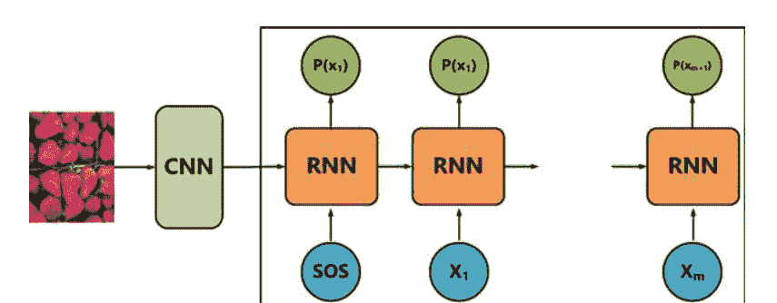

表2 基于编码器-解码器模型在MSCOCO数据集上的性能

| 模型 | B-1 | B-2 | B-3 | B-4 | METEOR | CIDEr | ROUGE<sub>L</sub> |
| :--- | :--- | :--- | :--- | :--- | :--- | :--- | :--- |
| DeepAlign | 62.5 | 45.0 | 32.1 | 23.0 | 19.5 | 66.0 | - |
| SCA-CNN | 71.9 | 54.8 | 41.1 | 31.1 | 25.0 | - | - |
| PG | 75.4 | 59.1 | 44.5 | 33.2 | 25.7 | 101.3 | 55.0 |
| NIC | - | - | - | 27.7 | 23.7 | 85.5 | - |
| VDD | 73.7 | 66.4 | 57.1 | 50.5 | 34.7 | 125.0 | 64.9 |

Karpathy等人提出的模型[18]（DeepAlign），Chen等人提出的模型[19]（SCA-CNN），Vinyals等人提出的模型[28]（NIC），Liu等人提出的模型[29]（PG），以及Asadi等人提出的模型[31]（VDD）在Lin等人提出的流行图像标题数据集MSCOCO上进行了评估。所提出的模型使用BLEU分数，METEOR分数[33]，CIDEr分数[34]和ROUGE<sub>L</sub>score [35]进行评估，并将结果报告在表2中。所有这些模型都使用CNN作为编码器。

#### 3.3 视频作为输入

另一类编码器-解码器模型在解决问题时起着重要作用的问题是以视频作为输入和生成描述性文本作为输出的问题，也被称为“视频描述生成”或“视频字幕生成”。由于创建良好的表示对于视频字幕生成模型的整体性能至关重要，因此提出了各种编码器来应对不同系统的困难和挑战。本节介绍了一些处理从视频中提取运动细节的编码器的示例。

假设输入视频 \(V\) 由 \(L_i\) 帧组成。 我们可以将视频表示为Eq. (10)，其中 \(v_i\) 是输入视频中第 \(i\) 帧的表示，\(v_{L_i}\) 是视频结束标记（<EOV>）。实际上，每个 \(v_i\) 是通过CNN从输入视频的第 \(i\) 帧提取的特征向量。

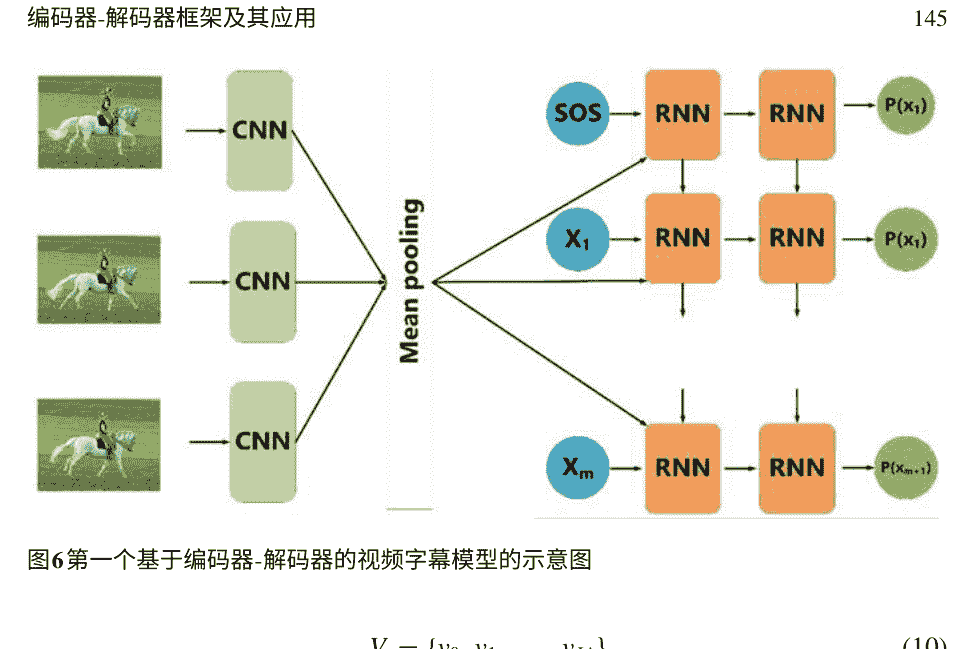

```
$V = \{ v_0, v_1, \ldots, v_{Li} \}$
```

由于在基线编码器-解码器模型中，编码器应该返回从输入中提取的“固定长度”的上下文向量，因此需要一个聚合函数来聚合视频中不同帧的特征向量，并将其作为上下文向量传递给解码器。

为视频字幕生成提出了不同的聚合方法。Venugopalan等人在2014年提出的第一个端到端编码器-解码器方法 [4] 使用了一个平均池化层来从输入视频中创建固定长度的上下文向量。在该模型中，首先对输入视频的每一帧应用CNN。然后应用平均池化层，对从每一帧提取的特征向量集合进行平均，创建一个平均特征向量。然后将平均特征向量传递给解码器生成句子。解码器使用堆叠的RNN结构。图6展示了第一个基于编码器-解码器的视频字幕模型的架构 [4]。

不同的CNN已被用来从输入视频的帧中提取特征向量。例如，Majd等人[36]提出了LSTM单元的扩展版本，称为“C2LSTM”，其中运动数据以及空间特征和时间依赖性通过将相关建模层嵌入到单元中来感知。Majd等人[37]还提出了一种新颖的网络架构，将先前提出的C2LSTM作为人体动作识别的编码器。

##### 3.3.1 3D-CNNs

从输入视频中提取好的特征是一个具有挑战性的任务，它可以极大地影响所提出模型的性能。从输入视频中提取的上下文向量应该能够很好地表达视频中的详细动作。为了创建

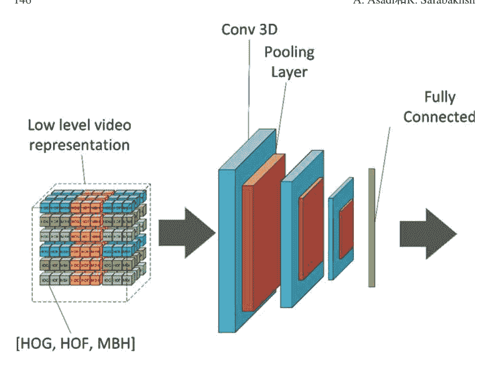

###### 图7 3D-CNN的结构

作为编码器，Yao等人提出了一种能够从视频中提取精细动作特征的3D-CNN。这个3D-CNN的结构如图7所示。

实际上，提出的3D-CNN模型对输入视频中的时空依赖进行建模。3D-CNN用于构建一个更高级的表示，保留输入视频中短帧序列的局部运动信息。这是通过首先将输入视频剪辑分成一个3D时空网格的16 * 12 * 2（宽度*高度*时间步长）立方体来实现的。每个立方体由具有33个bin的梯度直方图（HOG）、方向直方图（HOF）和运动边界直方图（MBH）进行连接表示。这种转换确保了局部时间结构和运动特征的良好提取。然后，生成的3D描述符被传递给3个卷积层，每个卷积层后面跟着一个最大池化层和一个全连接层，最后是一个softmax层，如图7所示。然后，3D-CNN的输出被传递给解码器生成适当的标题。

姚等人提出的3D-CNN [38] 在其他工作中与典型的2D-CNN一起使用。潘等人 [39] 提出了一种新颖的编码器-解码器架构，用于视频描述生成，并使用3D-CNN和典型的2D-CNN，并对每个CNN提取的特征集应用平均池化层，并将输出连接起来生成视频的上下文向量。图8说明了该模型的编码器部分。

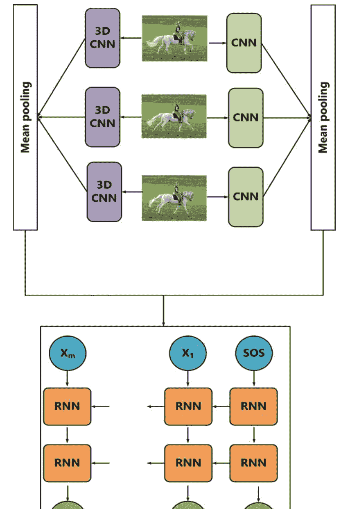

图8 展示了使用2D CNN和3D CNN的编码器结构的示意图。

##### 3.3.2 密集视频字幕生成

视频字幕生成的另一种方法包括“密集视频字幕生成”方法。尽管有些模型会为输入视频生成单个句子作为描述，但密集视频字幕生成模型首先检测和定位输入视频中存在的事件，然后为每个检测到的事件生成一个描述句子。

密集视频字幕的编码器应该首先检测输入视频中的所有现有事件。然后，对于每个事件，应该提取一个四元组< t开始, t结束, 分数, h >。t开始和t结束是指定事件的起始和结束帧编号。分数是编码器对每个事件的置信度分数。如果一个事件的分数大于阈值，则报告为一个事件，并将其四元组传递给解码器进行句子生成；否则，将被忽略。最后，h是从t开始和t结束之间的帧范围提取的特征向量，用作解码器生成事件句子的上下文向量[40]。

密集视频字幕的任务最早由Krishna等人在2017年提出。Krishna等人提出的用于密集视频字幕的编码器能够在单次传递中识别输入视频的事件，同时提出的解码器同时为每个被编码器检测到并传递的事件生成字幕。

图9展示了Krishna等人提出的编码器结构[41]用于密集视频字幕。所提出的编码器能够使用由[42]提出的深度动作提案（DAP）模块提取输入视频中的所有事件。为了实现这一点，将3D-CNN应用于输入视频帧以提取视频特征。这些视频特征被传递给DAP模块。该模块由不同的LSTM组成，应用于不同分辨率的视频特征序列，并经过训练以检测事件的起始和结束点。每个事件的置信度得分是

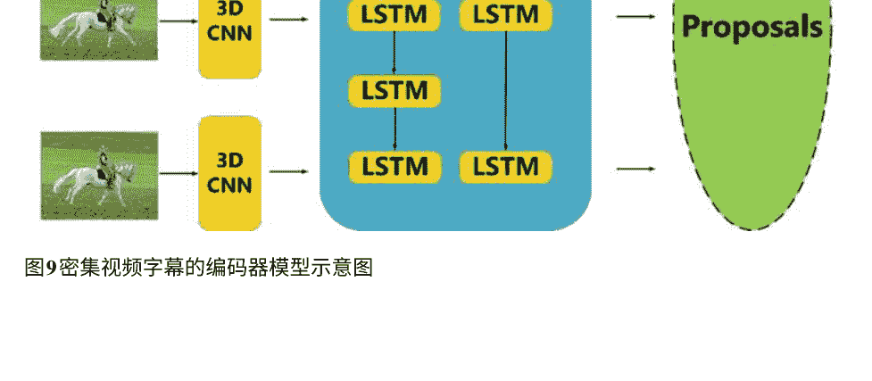

DAP还计算每个事件的置信度。然后，所提出的事件提案根据其结束点排序，并按顺序传递给解码器。每个事件的特征向量也是DAP中相应RNN的隐藏状态。然后，解码器使用其特征向量作为编码器输出为每个事件生成一个句子。Li等人[40]提出了一种新颖的端到端编码器-解码器方法，用于稠密视频字幕，统一了事件提议的时间定位和句子生成。图10展示了所提出模型的结构[40]。在这里，不使用额外的DAP模块，而是设计了一个12层卷积结构，用于从3D-CNN的输出中提取动作提议的特征。卷积结构的前3层（图10中的500D层和基础层）旨在引入非线性并减小输入维度。接下来的9层被称为“锚层”，从不同的分辨率中提取特征，用于事件预测。“预测层”由三个并行的全连接层组成，首先回归每个事件的时间坐标（tstart和tend），然后计算事件的描述性（得分），最后对事件与背景进行分类。预测层应用于所有锚层的输出，以使模型能够检测来自不同分辨率的事件。提取的提议然后传递给提议排序模块，该模块根据结束时间对事件提议进行排序。最后，事件按顺序传递给解码器进行句子生成。

为了应对密集视频字幕编码阶段的困难，提出了各种各样的模型。沈等人[43]提出了一种名为“词法FCN”的新型CNN，它以弱监督的方式在数据集中基于字幕检测事件。段等人也提出了一种新颖的方法，用于基于类似假设“每个字幕描述一个时间段，每个时间段有一个字幕”的密集视频字幕。徐等人提出了一种端到端的编码器-解码器模型，用于在输入视频中联合检测和描述事件，并适用于视频流上的密集视频字幕。周等人还提出了一种端到端的方法，使用掩蔽网络来联合定位和描述事件。王等人提出了一种新颖的架构，用于在输入视频中考虑过去和未来的帧，使用[46]双向模型来定位事件。

Venugopalan等人提出的模型[4]（LSTM-YT），Venugopalan等人提出的模型[47]（S2VT），Yao等人提出的模型[38]（3D-CNN）和Pan等人提出的模型[39]（LSTM-E）用于视频字幕生成，在Chen等人提出的Youtube2Text数据集上进行评估，其结果报告在表3中。LSTM-YT和S2VT模型使用类似的编码器。在这两个模型中，使用CNN从视频的每一帧中提取特征向量。然后，将提取的特征向量传递给平均池化层，以生成一个统一的特征向量来表示输入视频。在3D-CNN模型中，使用3D-CNN和2D-CNN来提取和表示输入视频中的运动信息。该模型中提取的特征向量包含从视频中提取的时空信息。LSTM-E模型使用LSTM单元作为编码器。因此，提取的特征向量表示输入视频的时间信息。

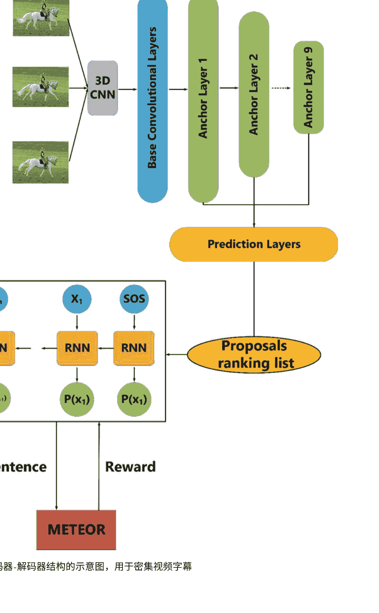

图10 编码器-解码器结构的示意图，用于密集视频字幕

| 模型 | B-1 | B-2 | B-3 | B-4 | METEOR | CIDEr |
|---|---|---|---|---|---|---|
| LSTM-YT | - | - | - | 33.29 | 29.7 | - |
| S2VT | - | - | - | - | 29.8 | - |
| 3D-CNN | - | - | - | 41.92 | 29.6 | 51.67 |
| LSTM-E | 78.8 | 66.0 | 55.4 | 45.3 | 31.0 | - |

在视频描述生成中，基于编码器-解码器的编码器中的主要挑战问题是提取输入视频的空间和时间信息的组合。

## 4种解码器结构变体

在基于编码器-解码器的模型中，解码器为给定的输入生成一个序列输出。生成的输出可能是描述性文本（机器翻译、图像/视频字幕、文本/视觉问答和语音转文本转换中的期望输出），或者是语音信号（文本到语音挑战中的期望输出）。输出是一个数值序列，传递给最后一层以生成给定输入的适当输出。因此，解码器的主要结构在不同任务中是相似的。

本节介绍了提出的不同技术，以改进具有更好生成字幕的解码器。

#### 4.1 长期依赖性

RNN的一个基本问题是“长期依赖性”问题。实际上，当输入的长度或期望输出的长度过大时，这些网络中的梯度需要在许多阶段传播。当梯度在大量阶段传播时，它往往会消失或爆炸。

此外，每个反向传播步骤中的梯度都会乘以小系数或小学习率。因此，早期阶段的梯度将接近零，并且可能对早期阶段层的权重没有显著变化。

在本节中，我们将讨论解码器中应对长期依赖性挑战的方法。

#### 4.2 LSTM
由于其在时间上保留序列信息的出色能力，LSTM在各种序列建模任务上取得了出色的结果。LSTM结构中的“记忆单元”和“遗忘门”的组合通过训练来遗忘不必要的信息（使用遗忘门）并将必要的信息保留在记忆单元中，从而提高了其对序列信息的建模能力。Cho等人[2]，Bahdanau等人[8]，Luong等人[50]，Wu等人[51]，Johnson等人[52]和Luong等人[53]将LSTM用作机器翻译模型中编码器和解码器的一部分。

#### 4.3 堆叠RNN
正如前面提到的，由于梯度消失问题，多阶段解码器很难训练。因此，大多数提出的基于编码器-解码器的模型使用单层RNN作为解码器，这导致生成丰富细粒度句子的困难。将多个RNN堆叠在一起是使解码器能够生成描述输入图像更多细节的句子的另一种方法。

Donahue等人[54]提出了一种基于编码器-解码器的图像字幕方法，该方法使用堆叠的LSTM作为解码器，以描述输入图像的更多细节。在这种方法中，一个LSTM在另一个LSTM的顶部使用，第一层LSTM将图像特征和先前生成的单词嵌入以及其先前的隐藏状态向量作为输入，并生成输出句子的粗略低级表示。在下一步中，低级LSTM的隐藏状态与其先前的隐藏状态一起作为输入传递给下一个LSTM，以生成输出的精细高级表示。然后，对生成的高级表示应用softmax层，以生成句子中下一个单词的概率分布。Gu等人[55]也使用了基于编码器-解码器的模型，其中解码器采用了两层堆叠的LSTM，以使提出的模型能够生成更好的描述。

在视频描述生成的模型中，使用堆叠的RNN结构作为解码器的想法也被采用。Venugopalan等人[4]提出了第一个基于神经编码器-解码器的视频描述生成解码器，采用了简单的堆叠结构。图11展示了一个示例堆叠解码器的架构。标有“C”的块显示了每个步骤的输入。

红线表示模型中从第一步到输出的最短路径。由于从第一步到输出的最短路径的长度与模型的测试和训练时间相关，缩短这个长度可以减少模型的测试和训练时间。

除了使用堆叠RNN作为解码器的方法外，还提出了一类模型，这些模型按照层次结构排列解码器中的RNN，以便使模型能够生成细粒度的输出序列。

此外，层次化的RNN结构也被用于使具有顺序输入的编码器能够利用和编码更详细的信息。Pan等人[56]提出了一个基于编码器-解码器的模型，用于视频描述生成，其中包含了一个层次化编码器结构。在他们的模型中，使用了两层不同的LSTM。第一层LSTM应用于所有的序列步骤，以利用低级特征，第二层LSTM应用于输入序列步骤的等大小子集的输出，以利用高级特征。

图12展示了这个架构。所示的红线显示了从第一步到输出的最短路径。将图11和图12中显示的结构进行比较，可以看出在层次化中，从第一步到输出的最短路径

表4 不同编码器-解码器模型在视频字幕生成中的性能

| 模型 | B-1 | B-2 | B-3 | B-4 | METEOR | CIDEr |
| :--- | :--- | :--- | :--- | :--- | :--- | :--- |
| LSTM-YT | – | – | – | 33.29 | 29.7 | – |
| HRNE | 79.2 | 66.3 | 55.1 | 43.8 | 33.1 | – |
| h-RNN | 81.5 | 70.4 | 60.4 | 49.9 | 32.6 | 65.8 |

模型比堆叠模型中的模型要小得多。因此，分层模型的效率要比堆叠模型高得多。

文献中还提出了更复杂的分层结构，用于不同的目的。Yu等人[57]提出了一个具有分层结构的模型，用于生成一组按照单个段落排列的句子作为输入视频的描述。

该模型中的第一层是一个简单的解码器，用于生成单个句子，第二层是一个“段落控制器”。段落控制器是另一个RNN，它根据第一层RNN的最后隐藏状态生成一个特征向量，表示要生成的下一个句子的含义。然后，第一层RNN使用第二层生成的特征向量与其他输入进行连接，以控制下一个句子的含义。

Venugopalan等人提出的模型[4]（LSTM-YT），Pan等人提出的模型[56]（HRNE）和Yu等人提出的模型[57]（h-RNN）在Chen等人提出的Youtube2Text数据集上进行评估。表4报告了该数据集上的评估结果。

LSTM-YT模型使用简单的2层堆叠解码器为输入视频生成适当的标题。HRNE模型使用分层解码器结构来减少从输入到解码器输出的最短路径的长度。h-RNN模型使用两个步骤，其中一个生成句子，另一个控制段落上下文。

根据表4中报告的结果，HRNE和h-RNN模型的METEOR分数相似，而它们优于LSTM-YT模型的分数。结果表明，分层解码器结构在从输入中提取长期依赖性方面比堆叠解码器更好。

#### 4.4 堆叠解码器中的梯度消失
尽管增加堆叠解码器结构的深度会为模型添加更多的非线性，并使其能够生成细粒度的句子，但堆叠结构中的层数是严格受限的。大多数堆叠解码器结构最多使用两层RNN [54, 56, 57]。

事实上，限制堆叠结构中层数的最重要问题是深层解码器中梯度消失的问题。反向传播的梯度会因为两个原因而消失。首先，这种架构中的梯度会在每个阶段被乘以小的乘数和小的学习率。其次，由于所提出的解码器的损失函数基于下一个单词的可能性，解码器应该预测字典中所有单词的概率分布。这意味着解码器的输出大小等于词典的大小。此外，输出层中所有组件的总和应该等于1，这意味着在最后一层计算的梯度数值较小。

总结起来，在堆叠解码器中，梯度会消失，因为在最后一层计算的梯度较小，并且在每一步都会乘以较小的乘数。

Asadi等人[31]提出了一种新的方法来训练堆叠解码器，使得最后一层的梯度足够大，以在第一层的权重中产生显著变化。主要思想是使用词嵌入向量作为解码器期望的输出，而不是使用独热向量表示。因此，优化问题从预测下一个单词的条件概率分布变为了单词嵌入回归。通过这种方式，解决了在最后一步计算的梯度值的限制问题。此外，解码器的损失函数从交叉熵变为了下一个单词的词嵌入的均方误差。

为了阐明这个问题，我们回顾一下Cho等人提出的用于机器翻译的基准编码器-解码器模型的代价函数 Loss(Y_i, D_i)。设 Y_i 为解码器对于输入句子 X_i 预测的概率分布， D_i 为给定输入的期望输出。所提出的损失函数基于通常用于分类的交叉熵损失函数。

优化问题 (11) 可用于训练模型。这个优化问题以一种方式确定模型的可训练参数 θ，即在模型为输入 X_i 生成概率分布 Y_i 的同时，最小化模型在数据集上的分类错误。请注意，在这个问题中，λ是一个正则化参数，用于控制模型的可训练参数的大小， N_x 是数据集中的记录数。

最小化   ∑_{i=0}^{N_x} 损失(Y_i, D_i) + λ|θ|²
受限于   |Y_i|² = 1           (11)

在解码器的最后一层创建更高的梯度的一种方法是从解码器的顶部移除 Softmax层。如果移除了这一层，模型生成的输出 Y_i 不再是概率分布的形式。因此，优化模型不能像(11)中所示那样被建模。

Asadi等人[31]提出了一个模型来解决这个问题，通过改变优化问题(11)。在提出的模型中，逐词生成句子的任务被视为回归而不是分类任务。

Asadi等人[31]使用一个嵌入函数 E 来增强模型，该函数为字典中的每个单词生成一个嵌入向量，并给出一个嵌入向量时返回字典中最相似的单词。使用这个嵌入函数，优化问题(11)可以从预测下一个单词的概率分布改变为回归下一个单词的嵌入向量在句子中。因此，优化问题变为(12)。

表5 不同技术应对编码器-解码器模型中梯度消失问题的性能

| 模型 | B-1 | B-2 | B-3 | B-4 | METEOR | CIDEr | ROUGE_L |
| :--- | :--- | :--- | :--- | :--- | :--- | :--- | :--- |
| VDD | 73.7 | 66.4 | 57.1 | 50.5 | 125.0 | 34.7 | 64.9 |
| 堆叠式Cap | 78.6 | 62.5 | 47.9 | 36.1 | 120.4 | 27.4 | – |
| SOT | 74.3 | 57.9 | 44.3 | 33.8 | 104.4 | 33.8 | 54.9 |
| 加权训练 | 76.8 | 60.5 | 45.8 | 34.2 | 105.5 | 26.1 | 55.5 |

最小化  (1/N_x) ∑_{i=0}^{N_x} (E(Y_i) - E(D_i))² + λ|θ|²    (12)

正如方程（12）所示，由于模型输出不再是概率分布的形式，因此对输出大小的约束被省略。此外，由于问题从分类任务变为回归任务，交叉熵损失被均方误差替代。Asadi等人提出的模型[31]应用于图像字幕的编码器-解码器模型的解码器上，并在该领域中超过了最先进的模型。

Asadi等人提出的模型[31] (VDD)，Gu等人提出的模型[55] (StackedCap)，Chen等人提出的模型[58] (SOT)和Ding等人提出的模型[59] (Weighted Train)在MSCOCO数据集上进行评估，并在表5中报告了结果。
StackedCap模型采用了一种分层结构，以粗到细的方式为图像生成标题。在该模型中，解码器由多个LSTM组成，每个LSTM都在前一个LSTM的输出上操作。该解码器为输入图像生成越来越精细的标题。SOT模型使用了基于属性的注意机制来处理长期依赖关系。

最后，WeightedTrain模型添加了一些参考知识，以帮助解码器生成更具描述性的标题。在该模型中，每个单词根据与输入图像的相关性被赋予一个权重。通过这种方式，解码器在生成标题时可以更多地关注重要的单词。

根据表5中报告的结果，将句子生成视为回归问题而不是分类问题，使解码器能够生成更好、更长的句子。VDD模型在CIDEr、METEOR、ROUGE_L和BLEU分数方面优于其他最先进的模型，除了BLEU-1。

#### 4.5 强化学习
使用对数似然模型训练解码器的一个问题是模型在训练集和测试集上的性能差异很大。这是因为训练的优化函数与测试中使用的评估指标不同。最近，强化学习已被用来减少所提出模型的训练和测试性能之间的差距。换句话说，对数似然目标的主要问题是它不能反映出翻译中的BLEU分数所衡量的任务奖励函数。

吴等人[51]提出了第一个通过强化学习训练的解码器，用于机器翻译。此后，其他研究人员使用强化学习来训练其他任务中的解码器。王等人[60]提出了第一个使用强化学习训练的解码器，在视频字幕生成中以CIDEr [34]分数作为奖励。李等人[40]还使用METEOR [33]分数作为奖励，以强化学习的方式训练解码器生成输入视频的字幕。

图13展示了王等人[60]提出的模型结构。该解码器由三个不同的模块组成，即管理器、工作者和内部评论家。这三个模块使用强化学习方法进行训练。管理器以较低的时间分辨率运行，并在需要时向工作者发出目标，工作者则根据管理器提出的目标在每个时间步生成一个单词。内部评论家确定工作者是否完成了目标，并向管理器发送二进制分段信号以帮助其更新目标。

图14展示了王等人提出的展开解码器。经理在时间步骤t上获取上下文向量c^M_t和上一个时间步骤生成的句子的特征向量h^W_{t-1}作为输入。使用LSTM模型建模

图13展示了基于编码器-解码器的模型，其中解码器使用强化学习进行训练

提取目标序列LSTM接收输入并更新其隐藏状态 h^M 然后，LSTM的隐藏状态根据非线性函数u_M（根据（13））生成下一个目标。

h_t^M = LSTM^M(h_{t-1}^M, [c_t^M, h_{t-1}^W])   (13)
g_t = u_M(h_t^M)   (14)

LSTM^M表示经理中使用的LSTM函数，u_M是将隐藏状态投影到语义目标的函数，h_{t-1}^{M}是上一个时间步骤中经理LSTM的隐藏状态，g_t是在时间步骤t生成的语义目标向量。

然后工人接收生成的目标 g_t，将[c_w]的连接作为输入，并输出所有动作α_t ∈ V的概率 π_t其中每个动作都是根据公式(15)-(17)生成的单词。

h_t^W = LSTM^W(h_{t-1}^W, [c_t^W, g_t, α_{t-1}])   (15)
x_t = u_W(h_t^W)   (16)
π_t = softmax(x_t)   (17)

内部批评家用于提供经理和工人之间的良好协调。内部批评家确实是一个分类器，用于确定工人何时完成为给定目标生成适当短语。当工人完成时，内部批评家向经理发送激活信号以生成新目标。令z_t为内部批评家的二进制信号，概率Pr(z_t)根据公式(18)和(19)计算。

h_t^I = LSTM^I([h_{t-1}^I, α_t])
Pr(z_t) = sigmoid(W_z h_t^I + b_z)

工人的目标是在时间步骤 t_{+k} 中最大化折扣回报，其中 θ_W 是工人的可训练参数集，γ 是折扣率， r_{+k} 是时间步骤 t_{+k} 的奖励。因此，解码器的损失函数可以写成(21)。

R_t = Σ_{k=0}^{∞} γ^k r_{t+k}
L(θ_W) = -E_{α_t ∼ π_{θ_W}}[R(α_t)]

非可微分的基于奖励的损失函数的梯度可以推导出来，如下所示：

∇_{θ_W} L(θ_W) = -E_{α_t ∼ π_{θ_W}}[R(α_t ∇_{θ_W} log π_{θ_W}(α_t))]

通常，损失函数的期望是通过单个样本估计的，因此可以省略期望项。此外，为了推广策略梯度，奖励可以减去基线 b_{t}^W。

∇_{θ_W} L(θ_W) ≈ -(R(α_t - b_t^W)) ∇_{θ_W} log π_{θ_W}(α_t)

经理应该经过培训，以便能够计算目标，生成具有更好BLEU分数的句子。解码器的动作由工作者产生。因此，在训练经理时，假设工作者已经完全训练，并且在训练经理时被视为黑盒。更具体地说，经理在第 i 步输出一个目标 g_t，并且工作者运行 c 步来生成预期的段 e_{t,c} = α_t α_{t+1} α_{t+2} ⋯ α_{t+c} 使用目标。然后环境以新的状态 s_{t+c} 和奖励 r(e_{t,c}) 做出响应。按照类似的数学推导，训练经理的最终梯度可以如(24)中所示推导出来。

∇_{θ_M} L(θ_M) = -(R(e_{t,c}) - b_t^M) [∑_{i=t}^{t+c-1} ∇ g_t log π(α_i)] ∇_{θ_M} μ_{θ_M}(s_t)

其中 μ_{θ_M}(s_t) 是生成目标的噪声版本，并在模型训练中用于增强探索能力。此外，奖励定义为(25)和(26)。

R(a_t) = ∑_{k=0}^{∞} γ^k [ CIDEr(sent + α_{t+k}) - CIDEr(sent) ]   (25)
R(e_t) = ∑_{n=0}^{∞} γ^n [ CIDEr(sent + e_{t+n}) - CIDEr(sent) ]   (26)

除了CIDEr之外，还可以使用其他指标，如BLEU分数。

### 5 注意机制
基于编码器-解码器框架的模型将输入编码为“固定长度向量”。这些模型中的解码器根据固定长度编码器输出中表示的信息生成输出。输出的每个元素可能与输入的特定部分更相关。在这些情况下，需要更详细的关于输入的特定部分的信息，而来自输入其他部分的额外信息可能会误导模型。

注意机制最初由Bahdanau等人在机器翻译中引入[8]，它是一种允许编码器-解码器模型在每个步骤生成输出时更加关注输入的特定部分的机制。此外，该机制使解码器能够处理长期依赖关系并生成更加细致的句子和输出。

在本节中，首先描述了机器翻译中提出的注意机制的基本思想。然后，讨论了在各种应用中提出的一些编码器-解码器架构中使用该机制。

#### 5.1 基本机制
Bahdanau等人[8]提出了第一个基于编码器-解码器的模型，配备了注意机制，以产生更好的翻译。所提出的模型的编码器和解码器部分发生了变化。编码器被修改为生成一系列称为“注释向量”的特征向量序列，并在编码器和解码器之间添加了一个额外的层称为“注意层”。注意层接收编码器生成的注释向量，并在每个步骤中创建一个固定长度的上下文向量，并将其传递给解码器，以生成句子中下一个单词的概率。

基于这些变化，解码器的目标概率分布可以表示为(27)。它表示在时间步$t$时，给定先前生成的所有单词和用于预测第$t$个单词的上下文向量，下一个单词$y_t$的概率。解码器在每个步骤计算这个概率。

Pr(y_t | y_{t-1}, …, y_0, C_t)   (27)令 L = {l0, l1, . . . , lNi}是由编码器生成的注释向量集合， Ni是生成的注释数量，上下文向量 Ct通过公式（28）在每个步骤中计算。公式（28）中的系数 αk被称为“注意权重”。

$$C_t = \Sigma_{k=0}^{N_i} \alpha_k^t l_k$$

使用注意机制在每个步骤中生成上下文向量的关键是计算每个步骤的注意权重。研究人员提出了不同的计算注意权重的方法。其中一种最常用的注意机制是“软注意力”，由Xu等人提出[10]。软注意力中的注意权重是使用公式（29）和（30）计算的。

$$\alpha_k^t = \frac{\exp(e_k^t)}{\Sigma_{j=0}^{N_i} \exp(e_j^t)}$$
$$e_k^t = f(h_{t-1}, l_j)$$

方程（30）是一个对齐模型，它评分了输出在步骤t上如何依赖于与注释向量l_j相关的输入部分。函数f（30）中的功能测量输出与输入之间的对齐程度。实现函数f的一个简单候选是一个可以建模为MLP的多层感知机:

$$f(h_{t-1}, l_j) = W_2 \tanh(W_h h_{t-1} + W_l l_j + b_1) + b_2$$

其中W2， Wh和Wl是权重矩阵，而b1和b2是偏差。所有这些参数都可以与其他可训练的模型参数一起进行联合训练。

Xu等人[10]还介绍了注意力机制的另一个版本，称为“硬注意力”，其中每一步的注意力权重中有一个等于1，其余的都等于零。

#### 5.2 扩展

Vaswani等人[61]表明，注意力机制不仅可以替代网络架构中的卷积和循环层，而且还优于它们的功能，并降低了网络训练的计算复杂度。Vaswani等人[61]提出了一种新颖的神经架构，其中网络的所有卷积和循环层都被注意力层替代。

注意力机制还用于其他任务。You等人[62]在图像字幕生成中提出了一种语义注意力。Lu等人[22]还提出了一种自适应版本的注意力机制在图像字幕生成中。Gao等人[63]提出了一种基于编码器-解码器的模型，使用注意力机制，并引入了一种新颖的方法来训练注意力权重，以减小生成字幕的语义差距。

由于注意机制使模型在生成输出时更加关注输入的一部分，它可以用作多个信息源之间的选择器。吴等人[64]提出了一种基于编码器-解码器的视频字幕模型，该模型利用了时间特征、音频特征、动作特征和语义标签特征。提出的基于注意力的分层多模态融合模型（HATT）利用了多模态特征的互补性。该模型由三个不同的注意力层组成：（1）低层注意力处理时间、动作和音频特征，（2）高层注意力处理语义标签，（3）顺序注意力从其他两个注意力层聚合信息。

在提出的模型中，提出了两种不同类型的注意机制：

+   1. 内部模态注意力：对包含来自单一模态的特征集合V应用软注意力。
    2. 跨模态注意力：对包含来自多个模态的特征集合V应用软注意力。

图15显示了吴等人提出的不同注意力层的结构[64]。在低层注意力层中，首先对时间特征应用内部模态注意力生成上下文向量C_t^{tem}。然后，模态间注意力在时间特征和运动特征之间进行选择，生成C^{mt}。同时，音频特征上应用内部模态注意力，生成上下文向量C_t^{aud}。最后，计算C^{mt}和C^{aud}的平均向量，并传递下去。在高层注意力层中，使用内部模态注意力生成语义标签的上下文向量。最后，在顺序注意力层中，使用内部模态注意力聚合低层和高层注意力层的上下文向量。

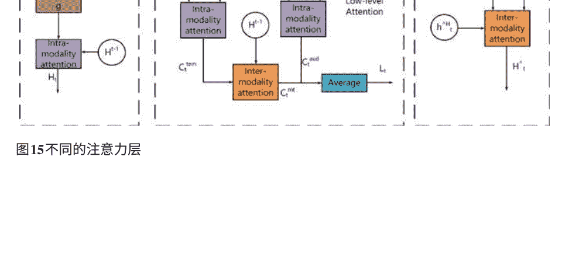

### 6 未来工作

基于编码器-解码器的模型最适合复杂任务，作为一种端到端的解决方案，并且已经完成了许多不同的改进。这为讨论和进一步研究提供了一个良好的起点。

对基于编码器-解码器的模型的进一步研究应该调查以下问题：

+   - **强化学习**
    提高基于编码器-解码器的模型性能的一种有趣方法是使用强化学习来训练它们。
+   - **长期依赖性**
    针对输入中的长期依赖性提出了各种各样的想法。当前模型面临着表示长序列的主要问题。
    我们指出了一些解决这个问题的方法，例如使用LSTM单元，使用堆叠结构作为解码器，将解码阶段视为回归问题而不是分类问题，并使用注意机制。介绍的每种技术都可以改进，还可以将新技术添加到这个列表中。
+   - **应用**
    正如前面提到的，基于编码器-解码器的模型被广泛用作复杂任务的端到端解决方案。这是一个有趣的话题，未来可以利用基于编码器-解码器的模型来解决新问题。

### 7 结论

在本章中，我们首先介绍了基线编码器-解码器模型，该模型最初用于机器翻译，后来扩展到其他应用。编码器-解码器框架的主要思想是将生成描述输入的文本输出的过程分为两个子过程。首先，编码器从输入中提取特征向量。然后，解码器使用编码器提取的特征向量逐步生成输出。

编码器的结构根据输入类型的不同而变化。当输入是文本或序列时，使用循环神经网络作为编码器。当输入是图像时，可以使用卷积神经网络对输入图像进行编码。如果输入是视频，则可以使用一种组合CNN和RNN首先从所有输入帧中提取特征，然后对不同帧之间的时间依赖关系进行建模。3D-CNN还被提出从输入中提取运动数据。还讨论了更复杂的模型来检测和定位输入视频中的事件，以进行密集视频字幕生成。

提取长期依赖关系和生成丰富细致的句子是编码器-解码器模型中解码器的主要问题。LSTM单元是能够处理长期依赖问题的最简单模型，并被用于不同任务的提出的架构中。使用堆叠的RNN结构是使解码器更深的另一种方法。这使得模型能够应对长期依赖挑战并生成更详细的句子。堆叠解码器结构的一个最重要的问题是梯度消失问题，可以通过修改解码器的优化问题来解决。应对长期依赖问题的另一种方法是使用注意机制，这是一种在每个步骤生成输出时更加关注输入不同部分的技术。

### 参考文献

+   1. Lopez, A.: 统计机器翻译. ACM Comput. Surv. 40(3), 8 (2008)
+   2. Cho, K., et al.: 使用RNN编码器-解码器学习短语表示进行统计机器翻译 (2014). http://arxiv.org/abs/1406.1078
+   3. Cho, K., Van Merriënboer, B., Bahdanau, D., Bengio, Y.: 关于神经机器翻译的性质：编码器-解码器方法 (2014). http://arxiv.org/abs/1409.1259
+   4. Venugopalan, S., Xu, H., Donahue, J., Rohrbach, M., Mooney, R., Saenko, K.: 使用深度递归神经网络将视频翻译为自然语言 (2014). http://arxiv.org/abs/1412.4729
+   5. Sutskever, I., Vinyals, O., Le, Q.V.: 序列到序列学习与神经网络. 在：神经信息处理系统进展, pp. 3104–3112 (2014)
+   6. Gehring, J., Auli, M., Grangier, D., Dauphin, Y.N.: 用于神经机器翻译的卷积编码器模型 (2016). http://arxiv.org/abs/1611.02344
+   7. Hochreiter, S., Schmidhuber, J.: 长短期记忆. 神经计算 9(8), 1735–1780 (1997)
+   8. Bahdanau, D., Cho, K., Bengio, Y.: 通过联合学习对齐和翻译的神经机器翻译 (2014). http://arxiv.org/abs/1409.0473
+   9. Luong, M.-T., Manning, C.D.: 斯坦福神经机器翻译系统用于口语领域. 在：国际口语翻译研讨会论文集,pp. 76–79 (2015)
+   10. Xu, K., et al.: 展示、关注和描述：带有视觉注意力的神经图像字幕生成. 在：机器学习国际会议, pp. 2048–2057 (2015)
+   11. Mi, H., Sankaran, B., Wang, Z., Ittycheriah, A.: 用于神经机器翻译的覆盖嵌入模型 (2016). http://arxiv.org/abs/1605.03148
+   12. He, D., 等： 机器翻译的双重学习。 在：神经信息处理系统的进展, 第820-828页 (2016年)
+   13. Tu, Z., Liu, Y., Lu, Z., Liu, X., Li, H.: 神经机器翻译的上下文门。 计算语言学协会 5, 87-99页 (2017年)
+   14. Papineni, K., Roukos, S., Ward, T., Zhu, W.-J.: BLEU：一种自动评估机器翻译的方法。 在：第40届年会上的计算语言学协会, 第311-318页 (2002年)
+   15. Krizhevsky, A., Sutskever, I., Hinton, G.E.: 使用深度卷积神经网络进行图像分类。 在：神经信息处理系统的进展，第1097-1105页 (2012年)
+   16. Simonyan, K., Zisserman, A.: 非常深的卷积网络用于大规模图像识别 (2014年)。 http://arxiv.org/abs/1409.1556
+   17. Deng, J., Dong, W., Socher, R., Li, L.-J., Li, K., Fei-Fei, L.: ImageNet: 一个大规模的分层图像数据库。 在：IEEE计算机视觉和模式识别会议，CVPR 2009，第248-255页 (2009年)
+   18. Karpathy, A., Fei-Fei, L.: 用于生成图像描述的深度视觉-语义对齐。 在：IEEE计算机视觉和模式识别会议论文集，第3128-3137页 (2015年)
+   19. Chen, L., et al.: SCA-CNN: 卷积网络中的空间和通道注意力用于图像字幕。 在：2017年IEEE计算机视觉和模式识别会议 (CVPR)，第6298-6306页 (2017年)
+   20. Pedersoli, M., Lucas, T., Schmid, C., Verbeek, J.: 图像字幕的关注区域。 在：IEEE国际计算机视觉会议论文集，第1242-1250页 (2017)
+   21. He, K., Zhang, X., Ren, S., Sun, J.: 图像识别的深度残差学习。 在：IEEE计算机视觉与模式识别会议论文集，第770-778页 (2016)
+   22. Lu, J., Xiong, C., Parikh, D., Socher, R.: 通过视觉哨兵实现自适应注意力的图像字幕。 在：2017年IEEE计算机视觉与模式识别会议 (CVPR)，第3242-3250页 (2017)
+   23. Rennie, S.J., Marcheret, E., Mroueh, Y., Ross, J., Goel, V.: 图像字幕的自我关键序列训练。 在：IEEE计算机视觉与模式识别会议论文集，第7008-7024页 (2017)
+   24. Anderson, P., 等: 自底向上和自顶向下的图像字幕和VQA注意力 (2017). http://arxiv.org/abs/1707.07998
+   25. Szegedy, C., Vanhoucke, V., Ioffe, S., Shlens, J., Wojna, Z.: 重新思考计算机视觉中的Inception架构。 在：IEEE计算机视觉和模式识别会议论文集，第2818-2826页 (2016)
+   26. Zhang, L., 等: 用于图像字幕的演员-评论者序列训练 (2017). http://arxiv.org/abs/1706.09601
+   27. Ioffe, S., Szegedy, C.: 通过减少内部协变量转移加速深度网络训练 (2015). http://arxiv.org/abs/1502.03167
+   28. Vinyals, O., Toshev, A., Bengio, S., Erhan, D.: 展示和讲述：神经图像字幕生成器。 在：IEEE计算机视觉和模式识别会议论文集，第3156-3164页 (2015)
+   29. 刘，S., 朱, Z., 叶, N., 瓜达拉马, S., 墨菲, K.: 通过蜘蛛的策略梯度优化改进图像字幕。 在：2017年IEEE国际计算机视觉会议 (ICCV)，第873-881页 (2017年)
+   30. 姚，T., 潘, Y., 李, Y., 邱, Z., 梅, T.: 通过属性提升图像字幕。 在：2017年IEEE国际计算机视觉会议 (ICCV)，第4904-4912页 (2017年)
+   31. Asadi, A., Safabakhsh, R.: 基于词嵌入回归的深度解码器结构编码器-解码器模型用于图像字幕。 在：提交给认知计算 (2019年)
+   32. 林，T.-Y., 等: Microsoft COCO: 上下文中的常见对象。 在：欧洲计算机视觉会议，第740-755页 (2014年)
+   33. Banerjee, S., Lavie, A.: METEOR:一种自动度量机器翻译评估的指标，与人类判断的相关性得到改进。 In: ACL Workshop on Intrinsic and Extrinsic Evaluation Measures for Machine Translation and/or Summarization, pp. 65–72 (2005)
+   34. Vedantam, R., Lawrence Zitnick, C., Parikh, D.: Cider:基于共识的图像描述评估。 In: IEEE Conference on Computer Vision and Pattern Recognition, pp. 4566–4575 (2015)
+   35. Lin, C.Y.: Rouge:一个用于自动评估摘要的软件包。 In: Workshop on Text Summarization Branches Out (WAS 2004) (2004)
+   36. Majd, M., Safabakhsh, R.: 相关卷积LSTM用于人类动作识别。 Neurocomputing (2019)
+   37. Majd, M., Safabakhsh, R.: 用于动作识别的运动感知ConvLSTM网络。 Appl. Intell., 1-7 (2019)
+   38. Yao, L等：利用时间结构描述视频。 在：IEEE国际计算机视觉会议论文集，pp. 4507-4515 (2015)
+   39. Pan, Y., Mei, T., Yao, T., Li, H., Rui, Y.: 联合建模嵌入和翻译以桥接视频和语言。 在：IEEE计算机视觉和模式识别会议论文集，pp. 4594-4602 (2016)
+   40. Li, Y., Yao, T., Pan, Y., Chao, H., Mei, T.: 用于密集视频字幕的联合定位和描述事件。 在：IEEE计算机视觉和模式识别会议论文集，pp. 7492-7500 (2018)
+   41. Krishna, R., Hata, K., Ren, F., Fei-Fei, L., Carlos Niebles, J.: 在视频中进行密集字幕事件。 在：IEEE国际计算机视觉会议论文集，第706-715页 (2017年)
+   42. Escorc V., Heilbron, F.C., Niebles, J.C., Ghanem, B.: Daps: 用于行动理解的深度行动提案。 在：欧洲计算机视觉会议论文集，第768-784页 (2016年)
+   43. Shen, Z., et al.: 弱监督密集视频字幕。 在：2017年IEEE计算机视觉和模式识别会议 (CVPR)，第5159-5167页 (2017年)
+   44. Duan, X., Huang, W., Gan, C., Wang, J., Zhu, W., Huang, J.: 弱监督密集事件视频字幕。 在：神经信息处理系统的进展，第3063-3073页 (2018年)
+   45. 周, L., 周, Y., 科尔索, J.J., Socher, R., 熊, C.: 端到端的密集视频字幕生成与掩码变换器。 在：计算机视觉和模式识别IEEE会议论文集，第8739-8748页 (2018年)
+   46. 王, J., 江, W., 马, L., 刘, W., 徐, Y.: 具有上下文门控的双向注意融合用于密集视频字幕生成。 在：计算机视觉和模式识别IEEE会议论文集，第7190-7198页 (2018年)
+   47. Venugopalan, S., Rohrbach, M., Donahue, J., Mooney, R., Darrell, T., Saenko, K.: 序列到序列-视频到文本。 在：计算机国际会议论文集，第4534-4542页 (2015年)
+   48. 陈, D.L., 多兰, W.B.: 收集用于释义评估的高度并行数据。 在：计算语言学协会第49届年会：人类语言技术 (HLT'11) 会议论文集 (2011年)
+   49. Goodfellow, I., Bengio, Y., Courville, A., Bengio, Y.: 深度学习, vol. 1, p. 334. MIT出版社剑桥 (2016)
+   50. Luong, M.-T., Pham, H., Manning, C.D.: 基于注意力的神经机器翻译的有效方法 (2015). http://arxiv.org/abs/1508.04025
+   51. Wu, Y., et al.: 谷歌的神经机器翻译系统：弥合人类和机器翻译之间的差距 (2016). http://arxiv.org/abs/1609.08144
+   52. Johnson, M., et al.: 谷歌的多语言神经机器翻译系统：实现零射击翻译. 计算语言学协会 5, 339–351 (2017)
+   53. Luong, M.-T., Sutskever, I., Le, Q.V., Vinyals, O., Zaremba, W.: 解决神经机器翻译中的稀有词问题 (2014). http://arxiv.org/abs/1410.8206
+   54. Donahue, J., et al.: 长期循环卷积网络用于视觉识别和描述. 在：IEEE计算机视觉和模式识别会议论文集，pp. 2625–2634 (2015)
+   55. 顾, J., 蔡, J., 王, G., 陈, T.: 堆叠字幕: 图像字幕的粗到细学习。 在：第三十二届AAAI人工智能大会 (2018)
+   56. 潘, P., 徐, Z., 杨, Y., 吴, F., 庄, Y.: 用于字幕的分层递归神经编码器的视频表示。 在：IEEE计算机视觉和模式识别会议论文集，第1029-1038页 (2016年)

Yu, H., Wang, J., Huang, Z., Yang, Y., Xu, W.: Video paragraph captioning using hierarchical recurrent neural networks. In: Proceedings of the IEEE Conference on Computer Vision and Pattern Recognition, pp. 4584–4593 (2016)
58. Chen, H., Ding, G., Lin, Z., Zhao, S., Han, J.: Show, observe and tell: Attribute-driven attention model for image captioning. In: IJCAI International Joint Conference on Artificial Intelligence (2018)
59. Ding, G., Chen, M., Zhao, S., Chen, H., Han, J., Liu, Q.: Neural image caption generation with weighted training and reference. Cognitive Computing (2018)
60. Wang, X., Chen, W., Wu, J., Wang, Y.-F., Wang, W.: Video captioning via hierarchical reinforcement learning. In: Proceedings of the IEEE Conference on Computer Vision and Pattern Recognition, pp. 4213–4222 (2018)
61. Vaswani, A., et al.: Attention is all you need. In: Advances in Neural Information Processing Systems, pp. 5998–6008 (2017)
62. You, Q., Jin, H., Wang, Z., Fang, C., Luo, J.: Image captioning with semantic attention. In: Proceedings of the IEEE Conference on Computer Vision and Pattern Recognition, pp. 4651–4659 (2016)
63. Gao, L., Guo, Z., Zhang, H., Xu, X., Shen, H.T.: Video captioning with attention-based LSTM and semantic consistency. IEEE Trans. Multimed. 19(9), 2045–2055 (2017)
64. Wu, C., Wei, Y., Chu, X., Wei, S., Su, F., Wang, L.: Hierarchical attention-based multimodal fusion for video captioning. Neurocomputing 315, 362–370 (2018)

## 深度学习用于学习图形表示

朱文武，王欣，崔鹏

摘要 挖掘图形数据已成为计算机科学中的热门研究课题，并在学术界和工业界广泛研究，鉴于近年来网络数据的增加。然而，大量的网络数据给有效分析带来了巨大挑战。这促使了图形表示的出现，它将图形映射到低维向量空间，保持原始图形结构并支持图形推理。对图形的高效表示的研究具有深远的理论意义和重要的现实意义，因此我们在本章介绍了图形表示/网络嵌入中的一些基本思想以及一些代表性模型。

- 深度学习 · 图表示 · 网络嵌入

### 1 引言

许多现实世界的系统，例如Facebook/Twitter社交系统，DBLP作者引用系统和道路交通系统等，可以用图或网络的形式来表示，因此分析这些系统等同于挖掘它们对应的图或网络。关于挖掘图或网络的文献有两个名称：图表示和网络嵌入。我们注意到，图和网络都指的是同一种结构，尽管它们各自可能有自己的术语，例如图中的顶点和边与网络中的节点和链接。因此，在本章的其余部分中，我们将交替使用图表示和网络嵌入，无需进一步解释。核心挖掘图/网络严重依赖于正确表示图/网络，使得图/网络的表示学习成为学术界和工业界的一个基础性研究问题。传统的表示方法直接基于图的拓扑结构进行表示，导致了稀疏性、高计算复杂性等许多问题，这促使了基于机器学习的方法的出现，这些方法可以在向量空间中探索能够捕捉图的拓扑结构之外的额外信息的潜在表示。因此，找到图的“好”潜在表示的能力在准确表示图方面起着重要作用。然而，学习网络表示面临以下挑战：

1.  高非线性. 正如Luo等人[43]所声称的，该网络具有高度非线性的底层结构。因此，设计一个适当的模型来捕捉这种高度非线性的结构是一项相当具有挑战性的工作。
2.  保持结构. 为了支持网络分析应用，保持网络结构对于网络嵌入是必需的。然而，网络的底层结构非常复杂[55]。由于顶点的相似性取决于局部和全局网络结构，同时保持局部和全局结构是一个棘手的问题。
3.  保持属性. 现实世界的网络通常非常复杂，它们的形成和演化伴随着各种属性，如不确定性和动态性。在图形表示中捕捉这些属性具有重要意义，并带来了巨大的挑战。
4.  稀疏性. 现实世界的网络通常过于稀疏，无法提供足够的观察链接，从而导致性能不佳[50]。

已经提出了许多网络嵌入方法，其中采用了像IsoMAP [62]、Laplacian Eigenmaps (LE) [4]和Line [61]这样的浅层模型。然而，由于表示能力有限[6]，对于它们来捕捉网络的高度非线性结构是具有挑战性的[63]。正如[76]所述，尽管一些方法采用了核技术[68]，但它们仍然属于浅层模型，无法很好地捕捉高度非线性的结构。另一方面，深度学习在处理非线性方面的成功为我们潜在向量空间中提供了巨大的机会。一个自然的问题是，我们能否利用深度学习来提升图表示学习的性能？答案是肯定的，我们将在本章讨论一些将深度学习技术与图表示学习相结合的最新进展。我们的讨论分为两类方法：深度结构导向方法和深度属性导向方法。对于结构导向方法，我们包括以下三种方法。

- 结构深度网络嵌入（SDNE）[69]专注于保持高阶接近度。
- 深度递归网络嵌入（DRNE）[66]专注于保持全局结构。
- 深度超网络嵌入（DHNE）[65]专注于保持超结构。

对于面向属性的方法，我们讨论：

- 深度变分网络嵌入（DVNE）[73]专注于不确定性属性。
- 基于深度变换的高阶拉普拉斯高斯过程（DepthLGP）的网络嵌入[44]专注于动态（即，样本外）属性。

## 面向深度结构的方法

## 2 高阶接近度保持网络嵌入

深度学习作为一种强大的工具，能够通过高效的表示学习复杂的数据结构[6]，已被广泛应用于处理与图像[38]、音频[29]和文本[58]等相关的大量任务。为了保持高阶接近度并捕捉高度非线性的结构，王等人[69]提出通过自编码器学习网络的顶点表示，受到深度神经网络的最近成功启发。具体而言，作者设计了一个包含多个非线性函数的多层架构，将数据映射到一个高度非线性的潜在空间，从而能够捕捉高度非线性的网络结构。

为了解决深度模型中的结构保持和稀疏问题，作者在学习过程中进一步提出了一种联合挖掘一阶和二阶接近性[61]的方法，其中前者捕捉了局部网络结构，仅表征了由边连接的顶点之间的局部成对相似性。然而，由于网络的稀疏性，许多合法的链接丢失了。因此，仅仅使用一阶接近性无法充分表示网络结构。因此，作者进一步提出了二阶接近性，即顶点邻域结构之间的相似性指示，以表征网络的全局结构。通过同时采用一阶和二阶接近性，该模型可以分别很好地捕捉局部和全局网络结构。作者还提出了一种半监督架构，以在深度模型中保持局部和全局网络结构，其中一阶接近性被作为监督组件利用的监督信息，保持局部信息，而二阶接近性则由无监督组件重构，保持全局信息。此外，如图1所示，具有二阶接近性的顶点对要比具有一阶接近性的顶点对多得多。因此，从描述网络结构的角度来看，引入二阶接近性可以提供更多的信息。总的来说，为了保持网络结构，SDNE能够将数据映射到高度非线性的潜在空间，同时对稀疏网络具有鲁棒性。据我们所知，SDNE是最早采用深度学习结构进行网络表示学习的方法之一。

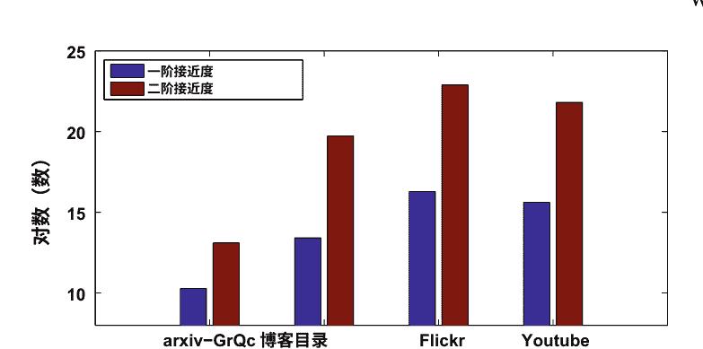

#### 2.1 问题定义

定义2.1 (图) $G = (V, E)$ 表示一个图，其中 $V=\{v_1, ..., v_n\}$ 代表顶点，$E =\{e_{i,j}\}_{i,j=1}^{n}$ 代表边。每条边 $e_{i,j}$ 关联一个权重 $s_{i,j} \geq 0$。$^{1}$对于没有通过任何边连接的 $v_i$和 $v_j$，$s_{i,j} = 0$。否则，对于无权图，$s_{i,j} =1$，对于有权图，$s_{i,j} > 0$。

网络嵌入的目标是将图数据映射到一个低维的潜在空间中。具体来说，每个顶点都被映射到一个低维向量中，以便在该潜在空间中直接进行网络计算。如前所述，保留局部和全局结构都是至关重要的。首先，第一阶接近性能够表征局部网络结构，定义如下。

定义2.2 (第一阶接近性) 第一阶接近性表示顶点之间的成对接近性。对于一个顶点对，如果 $v_i$和 $v_j$之间的第一阶接近性为正，则为正，否则为0。

自然地，网络嵌入需要保留第一阶接近性，因为这意味着在现实世界的网络中，通过观察到的边连接的两个顶点总是相似的。例如，如果一篇论文被另一篇引用，它们应该有一些共同的主题。然而，现实世界的数据集通常非常稀疏，只有一小部分是观察到的链接。网络中许多相似的顶点之间没有任何边连接。因此，仅仅捕捉第一阶接近性是不够的，这就是为什么引入第二阶接近性来表征全局网络结构。

定义2.3 (二阶接近度) 顶点对的二阶接近度表示该对的邻域结构的接近度。

让 $\mathcal{N}_u = \{s_{u,1}, ..., s_{u,|V|}\}$ 表示 $v_u$与其他顶点之间的一阶接近度。

然后，二阶接近度由 $\mathcal{N}_u$ 和 $\mathcal{N}_v$ 的相似性决定。

直观上，如果两个顶点共享许多共同的邻居，则认为它们具有相似性。在许多领域中，这样的假设被证明是合理的[18, 35]。例如，如果两个语言学单词总是具有相似的上下文，它们通常是相似的[18]。共享许多共同朋友的人往往是朋友[35]。已经证明，即使没有通过边缘连接，二阶接近度也是定义顶点对相似性的良好度量[42]，这也可以极大地改善顶点关系的丰富性。因此，考虑到二阶接近度可以使模型捕捉到全局网络结构并缓解稀疏问题。

为了在网络嵌入场景中同时保留局部和全局结构，我们现在关注的问题是如何同时集成一阶和二阶接近性，其定义如下。

定义2.4 (网络嵌入) 给定一个图 $G = (V, E)$ ，网络嵌入的目标是学习一个映射函数 $f: v_i \longrightarrow y_i \in \mathbb{R}^d$，其中 $d \ll |V|$。该函数的目标是明确地保留 $v_i$ 和 $v_j$ 的一阶和二阶接近性，以使 $y_i$ 和 $y_j$ 之间的相似性得以保留。

#### 2.2 SDNE模型

本节讨论了用于网络嵌入的半监督SDNE模型，其框架如图2所示。具体而言，为了描述高度非线性的网络结构，作者提出了一个包含许多非线性映射函数的深度架构，将输入转换为高度非线性的潜在空间。此外，为了利用一阶和二阶接近性，采用了半监督模型，旨在解决结构保持和稀疏性的问题。我们能够获得每个顶点的邻域。因此，为了通过重建每个顶点的邻域结构来保留二阶接近性，作者对无监督组件进行了投影。同时，对于一小部分顶点对，也可以获得它们的成对相似性（即一阶接近性）。因此，还采用了有监督组件，利用一阶接近性作为监督信息来改进潜在表示。通过在半监督模型中联合优化这两种接近性，SDNE能够很好地保留高度非线性的局部和全局网络结构，并且在处理稀疏网络时也具有鲁棒性。

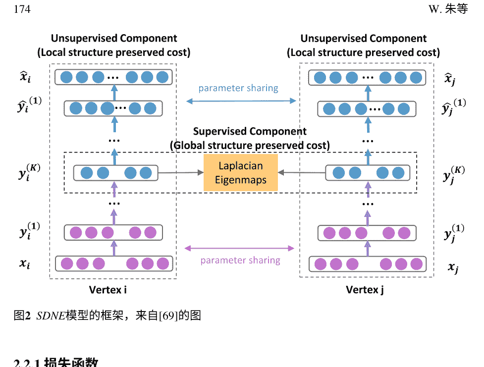

#### 图2 SDNE模型的框架，来自[69]的图

##### 2.2.1 损失函数

在定义损失函数之前，我们给出一些符号和术语的定义，稍后在表1中使用。请注意，参数上方的^符号表示解码器参数。

首先，我们描述了无监督组件如何利用二阶接近性来保持全局网络结构。

二阶接近性指的是顶点对的邻域结构的相似性。因此，为了正确捕捉它，我们需要考虑每个顶点的邻域。对于一个网络 G = (V, E)，其包含N个实例 S的邻接矩阵S可以很容易地获得。对于每个

##### 表1 术语和符号

| 符号 | 定义 |
| --- | --- |
| n | 顶点数量 |
| K | 层数 |
| S = {s1, ..., sn} | 网络的邻接矩阵 |
| X = {x_i}_{i=1}^n, \hat{X} = {\hat{x}_i}_{i=1}^n | 输入数据和重构数据 |
| Y^{(k)} = {y_i^{(k)}}_{i=1}^n | 第 k 层隐藏表示 |
| W^{(k)}, \hat{W}^{(k)} | 第 k 层权重矩阵 |
| b^{(k)}, \hat{b}^{(k)} | 第 k 层偏置 |
| \theta = {W^{(k)}, \hat{W}^{(k)}, b^{(k)}, \hat{b}^{(k)}} | 整体参数 |

实例_i = \{ s_{i,j} \}_{j=1}^n, s_{i,j} > 0 当且仅当 v_i 和 v_j 之间存在连接。因此，s_i 表示顶点 v_i 的邻域结构，即 S 包含每个顶点邻域结构的信息。基于 S，传统的深度自编码器[54]被扩展以保持二阶接近性。

我们简要回顾深度自编码器的关键思想，以便自给自足。深度自编码器是一个由编码器和解码器组成的无监督模型。这两部分都包含了许多非线性函数，编码器将输入数据映射到表示空间，解码器将表示空间映射到重构空间。每一层的隐藏表示定义如下，给定输入 \mathbf{x}_i。

$$\mathbf{y}_i^{(1)} = \sigma(\mathbf{W}^{(1)} \mathbf{x}_i + \mathbf{b}^{(1)})$$
$$\mathbf{y}_i^{(k)} = \sigma(\mathbf{W}^{(k)} \mathbf{y}_i^{(k-1)} + \mathbf{b}^{(k)}), k = 2, ..., K.$$

通过获得 \mathbf{y}_i^{(K)}，可以通过反转编码器的计算过程获得输出 \hat{\mathbf{x}}_i。自编码器的目标是最小化输入和输出之间的重构误差，为了实现这一目标，可以定义以下损失函数。

$$\mathcal{L} = \sum_{i=1}^{n} \| \hat{\mathbf{x}}_i - \mathbf{x}_i \|_2^2.$$

正如[54]所证明的那样，重构公式可以平滑地表征数据流形，从而隐式地保留它，尽管不是显式地。考虑这种情况：如果邻接矩阵 S 被输入到自编码器中，即 \mathbf{x}_i = \mathbf{s}_i，重构过程将为具有相似邻域结构的顶点输出类似的潜在表示，因为每个实例 S_i 捕捉到了顶点 v_i 的邻域结构。

然而，由于网络的一些特殊特性，这样的重构过程不能直接适应我们的问题。在网络中，一些链接是可观察到的，而许多其他合法的链接则不可观察到。这表明，虽然顶点之间的链接确实表明它们的相似性，但没有链接并不一定表明顶点之间的不相似性。此外，由于网络的稀疏性，S 中的 0 元素数量远远多于非零元素的数量。因此，通过直接将 S 输入到传统的自编码器中，有一种倾向于重构 S 中的 0 元素，这与我们的期望不符。因此，通过以下修正的目标函数，SDNE 对非零元素的重构误差施加了更大的惩罚，而对 0 元素的惩罚较小：

$$\mathcal{L}_{2nd} = \sum_{i=1}^{n} \| (\hat{\mathbf{x}}_i - \mathbf{x}_i) \odot \mathbf{b}_i \|_2^2$$
$$= \| (\hat{X} - X) \odot B \|_F^2,$$

^2在这里，作者使用了 sigmoid 函数 $\sigma(x) = \frac{1}{1 + \exp(-x)}$ 作为非线性激活函数。

其中 ⊙ 表示Hadamard乘积， b_i = {b_i, j}^n_j=1。现在通过将 S 输入到改进的深度自编码器中，具有相似邻域结构的顶点在潜在空间中具有相似的表示，这由重构公式保证。换句话说，重构顶点之间的二阶接近性使得SDNE的无监督组件能够保持全局网络结构。

如上所述，保留全局和局部网络结构在这个任务中都是必要的。为了表示局部网络结构，作者使用了一阶接近性，即用于约束顶点对的潜在表示之间的相似性的监督信息。因此，监督组件被设计用来利用这一一阶接近性。下面的损失函数定义是为了实现这个目标。^3

$$ \mathcal{L}_{1 st} = \sum_{i, j=1}^{n} s_{i, j}\left\|\mathbf{y}_{i}^{(K)}-\mathbf{y}_{j}^{(K)}\right\|_{2}^{2} = \sum_{i, j=1}^{n} s_{i, j}\left\|\mathbf{y}_{i}-\mathbf{y}_{j}\right\|_{2}^{2}. $$

当相似的顶点在潜在表示空间中被映射到较远的位置时，这个目标函数会产生惩罚，这借鉴了Laplacian Eigenmaps [4]的思想。其他关于社交网络的研究[34]也使用了类似的思想。SDNE与这些方法的不同之处在于它将这个思想融入到深度模型中，将通过边连接的顶点在潜在表示空间中彼此靠近，从而保留了一阶接近性。

为了同时保留一阶和二阶接近性，SDNE通过共同最小化目标函数将方程（4）和（3）结合起来。

$$ \begin{aligned} \mathcal{L}_{m i x} &= \mathcal{L}_{2 n d}+\alpha \mathcal{L}_{1 s t}+\nu \mathcal{L}_{r e g} \ &= \|(\hat{X}-X) \odot B\|_{F}^{2}+\alpha \sum_{i, j=1}^{n} s_{i, j}\left\|\mathbf{y}_{i}-\mathbf{y}_{j}\right\|_{2}^{2}+\nu \mathcal{L}_{r e g}, \end{aligned} $$

其中， L_{reg} 代表一个 L2 范数正则化项，如下所示，旨在避免过拟合：

$$ \mathcal{L}_{r e g}=\frac{1}{2} \sum_{k=1}^{K}\left(\left\|W^{(k)}\right\|_{F}^{2}+\left\|\hat{W}^{(k)}\right\|_{F}^{2}\right). $$

##### 2.2.2 优化

为了优化上述模型，我们将 $\mathcal{L}_{mix}$ 作为 $\theta$ 的函数进行最小化。具体来说，关键步骤是计算 $\partial \mathcal{L}_{mix} / \partial \hat{W}^{(k)}$ 和 $\partial \mathcal{L}_{mix} / \partial W^{(k)}$ 的偏导数，具体的数学形式如下：

$$
\frac{\partial \mathcal{L}_{mix}}{\partial \hat{W}^{(k)}} = \frac{\partial \mathcal{L}_{2\text{nd}}}{\partial \hat{W}^{(k)}} + \nu \frac{\partial \mathcal{L}_{reg}}{\partial \hat{W}^{(k)}}
\frac{\partial \mathcal{L}_{mix}}{\partial W^{(k)}} = \frac{\partial \mathcal{L}_{2\text{nd}}}{\partial W^{(k)}} + \alpha \frac{\partial \mathcal{L}_{1st}}{\partial W^{(k)}} + \nu \frac{\partial \mathcal{L}_{reg}}{\partial W^{(k)}}, \kappa = 1, ..., K.
\tag{6}
$$

首先，我们关注 $\partial \mathcal{L}_{2nd} / \partial \hat{W}^{(K)}$，可以重新表述如下。

$$
\frac{\partial \mathcal{L}_{2\text{nd}}}{\partial \hat{W}^{(K)}} = \frac{\partial \mathcal{L}_{2\text{nd}}}{\partial \hat{X}} \cdot \frac{\partial \hat{X}}{\partial \hat{W}^{(K)}}.
\tag{7}
$$

根据公式 (3)，对于第一项，我们有

$$
\frac{\partial \mathcal{L}_{2\text{nd}}}{\partial \hat{X}} = 2(\hat{X} - X) \odot B.
\tag{8}
$$

计算第二项 $\partial \hat{X}/\partial \hat{W}$ 很简单，因为 $\hat{X} = \sigma(\hat{Y}^{(K-1)} \hat{W}^{(K)} + b^{(K)})$，通过这个 $\partial \mathcal{L}_{2nd}/\partial \hat{W}^{(K)}$ 可用。通过反向传播方法，我们可以迭代地获得 $\partial \mathcal{L}_{2nd}/\partial \hat{W}^{(k)}, k = 1, ...K - 1$ 和 $\partial \mathcal{L}_{2nd}/\partial W^{(k)}, k = 1, ...K$ 的偏导数。

接下来，我们转向 $\partial \mathcal{L}_{1st}/\partial W^{(k)}$ 的偏导数。$\mathcal{L}_{1st}$ 的损失函数可以重新表述如下。

$$
\mathcal{L}_{1st} = \sum_{i,j=1}^n s_{i,j} \|\mathbf{y}_i - \mathbf{y}_j\|_2^2 = 2 \text{tr} (Y^T L Y),
\tag{9}
$$
其中 $L = D - S$, $D \in \mathbb{R}^{n \times n}$ 表示对角矩阵，其中 $D_{i,i} = \sum_j s_{i,j}$。

接下来，我们重点关注计算 $\partial \mathcal{L}_{1st}/\partial W^{(K)}$ first:

$$
\frac{\partial \mathcal{L}_{1st}}{\partial W^{(K)}} = \frac{\partial \mathcal{L}_{1st}}{\partial Y} \cdot \frac{\partial Y}{\partial W^{(K)}}.
\tag{10}
$$
因为 $Y = \sigma(Y^{(K-1)} W^{(K)} + b^{(K)})$，第二项的计算 $\partial Y/\partial W^{(K)}$ 很简单。对于 $\partial \mathcal{L}_{1st}/\partial Y$，我们保持

$$
\frac{\partial \mathcal{L}_{1st}}{\partial Y} = 2(L + L^T) \cdot Y.
\tag{11}
$$同样，对于 $\mathcal{L}_{1_s}$ 的偏导数的计算最终可以通过反向传播完成。

现在已经获得了所有参数的偏导数。在实现参数初始化之后，我们可以使用随机梯度下降法优化上述深度模型。值得一提的是，由于其高度非线性，该模型可能会陷入参数空间中的许多局部最优解。因此，作者首先采用深度信念网络作为预训练方法[30]，以找到参数空间中的一个良好区域，这已被证明是深度学习架构的一种基本初始化方式[24]。算法1展示了完整的算法。

#### 2.3 SDNE的分析和讨论

新的顶点。为新到达的顶点学习表示是网络嵌入的一个实际问题。如果我们知道一个新顶点 $v_k$ 与现有顶点的连接，那么它的邻接向量 $\mathbf{x}=\{s_{1,k},..., s_{n,k}\}$ 很容易获得，其中 $s_{i,k}$ 表示新顶点 $v_k$ 与现有顶点 $v_i$ 之间的相似度。然后，$\mathbf{x}$ 可以简单地输入深度模型，之后我们可以使用训练好的参数 $\boldsymbol{\theta}$ 计算 $v_k$ 的表示。对于这样的过程，时间复杂度为 $O(1)$。然而，当现有顶点和网络中的 $v_k$ 之间没有连接时，SDNE会失败。

> **算法1 SDNE的训练算法**
> 
> 输入：具有邻接矩阵 $S$ 的网络 $G=(V,E)$，参数 $\nu$ 和 $\alpha$
> 
> 输出：网络的表示Y和更新的参数 $\boldsymbol{\theta}$
> 
> 1: 使用深度置信网络预训练模型，得到参数 $\boldsymbol{\theta}=\{\boldsymbol{\theta}^{(1)},...,\boldsymbol{\theta}^{(K)}\}$
> 
> 2: $X=S$
> 
> 3: 重复
> 
> 4: 应用公式 (1) 计算 $\hat{X}$ 和 $Y=Y^K$，给定 $X$ 和 $\boldsymbol{\theta}_0$
> 
> 5: $\mathcal{L}_{mix}(X;\boldsymbol{\theta}) = \|(\hat{X}-X)\odot B\|_F^2 + 2\alpha tr(Y^TLY) + \nu \mathcal{L}_{reg}$
> 
> 6: 根据公式 (6) 利用 $\partial \mathcal{L}_{mix}/\partial \boldsymbol{\theta}$ 在整个网络中进行反向传播，计算 $\boldsymbol{\theta}$ 的更新参数
> 
> 7: 直到收敛
> 
> 8: 返回网络表示 $Y=Y^{(K)}$

训练复杂度。SDNE的复杂度为 $O(ncdI)$，其中 $n$ 表示顶点的数量，$c$ 表示网络的平均度，$d$ 表示隐藏层的最大维度，$I$ 表示迭代次数。$d$ 通常与嵌入向量的维度有关，而不是 $n$，$I$ 也与 $n$ 无关。在实际应用中，参数 $c$ 可以被视为常数。例如，在社交网络中，用户的最大朋友数始终受到限制[63]。同时，在top-k相似度图中，$c=k$。因此，$cdI$ 也与 $n$ 无关。因此，总的训练复杂度实际上是与 $n$ 线性相关的。

### 3 全局结构保持网络嵌入

正如讨论的那样，网络嵌入的一个基本问题是如何在嵌入空间中保持顶点的相似性，即如果两个顶点在原始网络中具有相似的局部结构，则它们应该具有相似的嵌入向量。为了量化网络中顶点之间的相似性，多种方法中最常见的方法之一是结构等价性[41]，其中共享许多共同网络邻居的两个顶点被认为是结构等价的。此外，通过高阶接近度[61, 69]来保持结构等价性是网络嵌入中大多数先前工作的目标，其中网络邻居被扩展到高阶邻居，例如直接邻居和邻居的邻居等。然而，在许多情况下，没有共同邻居的顶点也可以占据相似的位置或扮演相似的角色。例如，两个母亲与几个孩子和一个丈夫（父亲）连接的方式相同。即使两个母亲没有共同的亲戚，它们也共享相似的位置或角色，尽管它们不是结构等价的。这些情况导致了顶点相似性的扩展定义，即正则等价性：具有相似（即正则等价）的网络邻居的两个正则等价顶点[52]。

由于网络中的邻居关系可以递归地定义，我们指出正则等价能够反映网络的全局结构。此外，正则等价显然是结构等价的一种放松。结构等价保证正则等价，而反向则不成立。

相比之下，正则等价在涵盖与节点重要性或结构角色相关的更广泛的网络应用方面更具能力和灵活性，但在网络嵌入的先前工作中被大部分忽视。

为了保持网络嵌入中的全局结构和正则等价性，即正则等价的两个节点应具有相似的嵌入，一种简单的方法是显式计算所有顶点对的正则等价性，并保留节点对应嵌入的相似性以近似它们的正则等价性。然而，由于在大规模网络中计算正则等价性的复杂性很高，这个想法是不可行的。另一种方法是用更简单的图论度量，如中心性度量，来替代正则等价性。

虽然已经提出了许多中心性度量来描述顶点的重要性和角色，但是学习通用和与任务无关的节点嵌入仍然很困难，因为一个中心性度量只能捕捉网络角色的特定方面。此外，一些中心性度量，例如介数中心性，也具有较高的计算复杂性。因此，如何在网络嵌入中高效有效地保持正则等价仍然是一个未解决的问题。

幸运的是，正则等价定义中的递归性质启发了Tu等人[66]以递归方式学习网络嵌入，即一个节点的嵌入可以通过其邻居的嵌入进行聚合。在一个递归步骤中（图3），如果节点7和8、4和6、3和5是正则等价的，因此已经具有相似的嵌入，那么节点1和2也会具有相似的嵌入，从而导致它们的正则等价。正是这个想法启发了设计深度递归网络嵌入(DRNE)模型[66]。具体来说，一个节点的邻居被转换成一个有序序列，并且提出了一个层归一化的LSTM(长短期记忆网络)[31]，以非线性方式聚合邻居的嵌入到目标节点的嵌入中。

![图3：一个简单的图表，用来说明为什么递归嵌入可以保持正则等价性的合理性。正则等价的节点共享相同的颜色，参考文献[66]中的图。](img/7b0124477ab6b3bf032918401efb4a04_188_0.png)

#### 3.1 初步和定义

在本节中，我们讨论深度递归网络嵌入 (DRNE) 模型，其框架如图4所示。以图4中的节点0为例，我们从其邻居中随机选择三个节点1,2,3，并按度数排序为一个序列(3,1,2)。我们使用邻居序列 X₃, X₁, X₂ 的嵌入作为输入，通过一个层归一化的LSTM进行聚合，得到组合表示 H_T。通过使用聚合表示 H_T 重构节点0的嵌入 X₀，嵌入 X₀可以保持局部邻域结构。

另一方面，我们使用度 d₀ 作为中心性的弱监督信息，并将聚合表示 h_T 放入多层感知机（MLP）中来近似度 d₀。对每个其他节点进行相同的过程。当我们更新邻域的嵌入 $\mathbf{X}_{3}, \mathbf{X}_{1}, \mathbf{X}_{2}$，它会影响嵌入 $\mathbf{X}_{0}$。通过迭代更新嵌入重复此过程，嵌入 $\mathbf{X}_{0}$ 可以包含整个网络的结构信息。

![图4：深度递归网络嵌入（DRNE）。a 采样邻居。b 按照它们的度数对邻居进行排序。c 层归一化LSTM将相邻节点的嵌入聚合到目标节点的嵌入中。X_i是节点i的嵌入，LN表示层归一化。d 弱引导正则化器。来自[66]的图。](img/7b0124477ab6b3bf032918401efb4a04_188_1.png)

给定一个网络 $G=(V, E)$，其中 $V$ 表示节点集合，$E \in V \times V$ 表示边。对于节点 $v \in V$，$\mathcal{N}(v) = \{u | (v, u) \in E\}$ 表示其邻居节点的集合。学习到的嵌入被定义为 $\mathbf{X} \in \mathbb{R}^{|V| \times k}$，其中 $k$ 是维度，$\mathbf{X}_{v} \in \mathbb{R}^{k}$ 是节点 $v$ 的嵌入。节点 $v$ 的度被定义为 $d_{v} = |\mathcal{N}(v)|$，函数 $I(x)=1$ 如果 $x \geq 0$，否则为 0。结构等价和正则等价的正式定义如下。

定义 3.1（结构等价）如果节点 $u$ 和 $v$ 结构等价，则我们表示为 $s(u) = s(v)$。当且仅当 $\mathcal{N}(u) = \mathcal{N}(v)$ 时，$s(u)=s(v)$。

定义 3.2（正则等价）我们用 $r(u) = r(v)$ 表示节点 $u$ 和 $v$ 的正则等价关系。当且仅当 $\{r(i) | i \in \mathcal{N}(u)\} = \{r(j) | j \in \mathcal{N}(v)\}$ 时，$r(u) = r(v)$。

#### 3.2 DRNE模型

##### 3.2.1 递归嵌入

根据定义3.2，DRNE通过递归地学习节点的嵌入：目标节点的嵌入可以通过聚合其邻居节点的嵌入来近似，因此我们可以使用以下损失函数：

$$
\mathcal{L}_{1} = \sum_{v \in V} ||\mathbf{X}_{v} - Agg(\{\mathbf{X}_{u} | u \in \mathcal{N}(v)\})||_{F}^{2}, \quad (12)
$$

其中 $Agg$ 是聚合函数。在每个递归步骤中，目标节点的邻居的局部结构可以通过其学习到的嵌入来保留。因此，学习到的节点嵌入可以通过迭代更新学习到的表示来在全局意义上融入结构信息，这与正则等价性的定义一致。

至于聚合函数，DRNE利用了层归一化的长短期记忆（ln-LSTM）[3]，因为许多真实网络的底层结构具有高度的非线性。LSTM是一种有效的序列建模模型，众所周知。然而，在网络中，节点的邻居没有自然的排序。在这里，节点的度被采用为排序邻居的标准，原因是以度为度量邻居排序是最高效的，并且度是许多图论度量中的关键部分，特别是与结构角色相关的度量，例如Katz [47]和PageRank [49]。

假设 $\{X_1, X_2, ..., X_t, ..., X_T\}$ 是有序邻居的嵌入。在每个时间步 $t$，隐藏状态 $h_t$ 是其前一个隐藏状态 $h_{t-1}$ 和输入嵌入 $X_t$ 的函数，即 $h_t = LSTMCell(h_{t-1}, X_t)$。当 LSTM Cell 从 1 到 T 递归地处理嵌入序列时，隐藏表示 $h_t$ 的信息将变得越来越丰富。因此，$h_T$ 可以被视为来自邻居的表示的聚合。此外，带有门控机制的 LSTM 在学习长序列中的长距离相关性方面非常有效。

在 LSTM 的结构中，输入门和旧记忆一起决定了要存储在记忆中的新信息，遗忘门决定了要从记忆中丢弃的信息，输出门根据记忆决定要输出的内容。具体而言，LSTMCell，即 LSTM 的转换方程，可以写成如下形式：

$$
f_t = \sigma (W_f \cdot [h_{t-1}, X_t] + b_f), \quad (13)
$$
$$
i_t = \sigma (W_i \cdot [h_{t-1}, X_t] + b_i), \quad (14)
$$
$$
o_t = \sigma (W_o \cdot [h_{t-1}, X_t] + b_o), \quad (15)
$$
$$
\tilde{C}_t = \tanh (W_C \cdot [h_{t-1}, X_t] + b_C), \quad (16)
$$
$$
C_t = f_t * C_{t-1} + i_t * \tilde{C}_t, \quad (17)
$$
$$
h_t = o_t * \tanh (C_t), \quad (18)
$$

其中 $\sigma$ 代表 sigmoid 函数，$*$ 和 $\cdot$ 分别表示逐元素乘积和矩阵乘积，$C_t$ 表示细胞状态，$i_t$、$f_t$ 和 $o_t$ 分别表示输入门、遗忘门和输出门。$W_*$ 和 $b_*$ 是待学习的参数。

此外，DRNE 中采用了层归一化 [3] 来避免长序列作为输入时出现梯度爆炸或梯度消失的问题 [31]。层归一化的 LSTM 使得所有求和输入都具有不变性，从而导致更稳定的动态。特别是，在等式 (17) 之后，通过以下额外的归一化，重新调整和重新缩放细胞状态 $C_t$：

$$
C_t' = \frac{g}{\Sigma_t} * (C_t - \mu_t), \quad (19)
$$

其中 $\mu_t = 1/k \sum_i^k (C_{ti} - \mu_t)^2$ 是 $C_t$ 的均值和方差，$g$ 是缩放归一化激活的增益参数。

##### 3.2.2 正则化

在没有其他约束的情况下，$L_1$ 在方程 (12) 中定义的表示递归嵌入过程，根据定义 3.2。它的表达能力非常强大，我们可以得到多个满足上述递归过程的解。该模型有可能退化为一个平凡的解：所有的嵌入都变为 0。

为了避免这种退化，DRNE将节点度数作为弱引导信息，即对目标节点的学习嵌入应该能够近似其度数。因此，设计了以下正则化项：

$$
\mathcal{L}_{reg} = \sum_{v \in V} \| \log(d_v + 1) - MLP(Agg(\{\mathbf{X}_u | u \in \mathcal{N}(v)\})) \|_F^2 , \quad (20)
$$

其中节点 $v$ 的度数用 $d_v$ 表示，$MLP$ 代表以修正线性单元（ReLU）[26] 作为激活函数的单层多层感知器，其定义为 $\text{ReLU}(x) = \max(0, x)$。DRNE通过结合方程（12）中的重构损失和方程（20）中的正则化项来最小化整体目标函数：

$$
\mathcal{L} = \mathcal{L}_1 + \lambda \mathcal{L}_{reg}, \quad (21)
$$

其中 $\lambda$ 是正则器的平衡权重。请注意，在这里，度信息不作为网络嵌入的监督信息。相反，它最终是辅助性的，以避免退化。因此，$\lambda$ 的值应该设置得很小。

邻域采样。节点度数通常服从重尾分布[23]，即大多数节点的度数非常小，而少数节点的度数非常高。受到这一现象的启发，DRNE在将那些高度节点的邻居输入ln-LSTM之前对其进行下采样，以提高效率。具体而言，设置邻居数的上限为 $S$。当邻居数超过 $S$ 时，将邻居下采样为 $S$ 个不同的节点。图4a和b展示了采样过程的示例。在服从幂律分布的网络中，大度节点携带的独特结构信息比普通小度节点更多。

因此，DRNE采用了一种有偏采样策略，通过设置 $P(v) \propto d_v$ 来保留高度节点，即采样邻居节点 $v$ 的概率与其度数成比例。

##### 3.2.3 优化

为了优化DRNE，我们需要将总损失 $\mathcal{L}$ 最小化，作为嵌入 $\mathbf{X}$ 和神经网络参数集 $\theta$ 的函数。这些参数通过Adam [36]进行优化。时序反向传播算法（BPTT）[71]用于估计导数。在训练开始时，Adam的学习率 $\alpha$ 初始化为0.0025。算法2展示了整个算法。

> **算法2 深度递归网络嵌入**
> 
> 输入：网络 $G = (V, E)$
> 
> 输出：嵌入 $X$，更新的神经网络参数集 $\theta$
> 
> 1: 通过随机过程随机初始化 $\theta$ 和 $X$
> 
> 2: 当目标函数的值不收敛时执行
> 
> 3: 对于一个节点 $v \in V$ 执行
> 
> 4: 如果节点 $v$ 的度超过 $S$，则对其邻居进行下采样
> 
> 5: 按照它们的度对邻居进行排序
> 
> 6: 使用固定的聚合函数，计算偏导数 $\partial \mathcal{L} / \partial \mathbf{X}$ 来更新嵌入 $X$
> 
> 7: 使用固定的嵌入，计算偏导数 $\partial \mathcal{L} / \partial \theta$ 来更新 $\theta$
> 
> 8: 结束循环
> 
> 9: 结束执行
> 
> 10: 获取节点表示 $X$

##### 3.2.4 理论分析

可以在理论上证明，DRNE生成的嵌入可以很好地反映与常见的和典型的中心度测量相关的正则等价性。在证明过程中，可以忽略方程（20）中用于消除退化的正则化项，而不会失去一般性。

> **定理1：** 特征向量中心度[7]、PageRank中心度[49]和度中心度分别是DRNE的三个最优解。

> **引理1** 对于任何可计算函数，存在一个有限的循环神经网络（RNN）[45]可以计算它。
> 
> **证明** 这是[56]中定理1的直接推论。 $\square$

> **定理2** 如果节点 $v$ 的中心度 $C(v)$ 满足 $C(v) = \sum_{u \in \mathcal{N}(v)} F(u)C(u)$ 且 $F(v) = f(\{F(u), u \in \mathcal{N}(v)\})$ 其中 $f$ 是任何可计算函数，则 $C(v)$ 是DRNE的最优解之一。
> 
> **证明** 为简洁起见，假设LSTM对于所有激活函数都采用线性激活。通过展示存在参数设置 $\{\mathbf{W}_f, \mathbf{W}_i, \mathbf{W}_o, \mathbf{W}_C, \mathbf{b}_f, \mathbf{b}_i, \mathbf{b}_o, \mathbf{b}_C\}$ in Eqs. (13), (14), (15)和(16)，使得节点嵌入 $\mathbf{X}_u = [F(u), C(u)]$ 成为一个不动点。实际上，这些参数设置可以直接构造。假设 $\mathbf{W}_{a, i}$ 表示 $\mathbf{W}_a$ 的第i行。使用输入序列 $\{[F(u), C(u)], u \in \mathcal{N}(v)\}$，将 $\mathbf{W}_{f, 2}$ 和 $\mathbf{W}_{o, 2}$ 设置为 $[0, 0]$，$\mathbf{W}_{i, 2}$ 设置为 $[1, 0]$，$\mathbf{W}_{C, 2}$ 设置为 $[0, 1]$，$\mathbf{b}_{f, 2}$ 和 $\mathbf{b}_{o, 2}$ 设置为1，$\mathbf{b}_{i, 2}$ 和 $\mathbf{b}_{C, 2}$ 设置为0，那么我们可以轻松地得到 $\mathbf{h}_{t, 2} = \mathbf{o}_{f, 2} * \mathbf{C}_{t, 2} = \mathbf{C}_{t, 2} = \mathbf{f}_{t, 2} * \mathbf{C}_{t-1, 2} + \mathbf{i}_{t, 2} * \mathbf{C}_{t, 2} = \mathbf{C}_{t-1, 2} + F(t) * C(t)$。因此， $\mathbf{h}_{T, 2} = \sum_{u \in \mathcal{N}(v)} F(u)C(u) = C(v)$ 其中 $T$ 是输入序列的长度。此外，根据引理1，存在一个参数设置 $\{\mathbf{W}'_f, \mathbf{W}'_i, \mathbf{W}'_o, \mathbf{W}'_C, \mathbf{b}'_f, \mathbf{b}'_i, \mathbf{b}'_o, \mathbf{b}'_C\}$ 来近似 $f$。因此， $\mathbf{h}_{T} = [F(v), C(v)]$，节点嵌入 $\mathbf{X}_v = [ F(v), C(v)]$ 是一个不动点。
> 
> 证明现在已经完成。 $\square$

##### 3.2.5 分析与讨论

本节介绍了样本外扩展和复杂性分析。

样本外扩展。对于一个新到达的节点 $v$，我们可以直接将其邻居的嵌入向量输入到聚合函数中，通过公式（12）得到聚合表示，如果我们知道它与现有节点的连接关系。这个过程的复杂度为 $O(d_v k)$，其中 $d_v$ 表示节点 $v$ 的度，$k$ 表示嵌入向量的长度。

复杂性分析。对于每次训练过程中的单个节点 $v$，在梯度计算和参数更新方面的复杂度为 $O(d_v k^2)$，其中 $k$ 表示嵌入向量的长度，$d_v$ 表示节点 $v$ 的度。

上述采样过程保证了 $v$ 的度不会超过上限 $S$。因此，总的训练复杂度为 $O(|V| S k^2 I)$，其中 $I$ 表示迭代次数。嵌入向量的长度 $k$ 通常取一个较小的数值（例如32、64、128）。上限 $S$ 在 DRNE 中为300。迭代次数 $I$ 通常取一个与 $|V|$ 无关的较小数值。因此，训练过程的总时间复杂度实际上与节点数 $|V|$ 成线性关系。

### 4 结构保持的超网络嵌入

传统的成对网络是大多数网络嵌入方法的场景，其中每个边仅连接一对节点。然而，在现实世界的应用中，数据对象之间的关系要复杂得多，通常超越了成对关系。例如，杰克购买了一件尼龙材质的外套（图5a），形成了一个高阶关系（杰克，外套，尼龙）。设计用于捕捉这种高阶节点关系的网络通常被称为超网络。

为了分析超网络，将其扩展为传统的成对网络，然后应用基于成对网络的分析算法是一个典型的想法。星形扩展[1]（图5d）和团体扩展[60]（图5c）是这一类别的两种代表性技术。对于星形扩展，将超图转换为一个二分图，其中每个超边由一个实例节点表示，该节点链接到其中包含的原始节点。对于团体扩展，超边被扩展为一个团体。这些方法假设超边是可分解的，无论是隐式还是显式。换句话说，如果一组节点被视为一个超边，那么该超边包含的任何节点子集都可以构成另一个超边。在同质超网络中，这种假设是合理的，因为超边的构成大多是由相关对象之间的潜在相似性引起的，例如共同的标签。然而，当涉及到异质超网络嵌入时，解决新需求是必要的。

- 1. 不可分解性：在异构超网络中，超边通常是不可分解的。在这种情况下，超边中的节点集合具有强烈的内部关系，而其子集中的节点不一定具有。例如，在具有（用户，电影，标签）关系的推荐系统中，（用户，标签）的关系通常不强。这种现象表明，使用传统的扩展方法简单地分解超边是没有意义的。
- 2. 结构保持：网络嵌入中观察到的关系可以很容易地保持局部结构。然而，由于网络的稀疏性，当仅保留局部结构时，很难观察到全局结构。为了解决这个问题，一些全局结构，如邻域结构，被用来处理这个问题。因此，如何同时捕捉和保留超网络中的全局和局部结构仍然是一个未解决的问题。

Tu等人[65]提出了一个深度超网络嵌入（DHNE）模型来应对这些挑战。为了解决不可分解性问题，设计了一个不可分解的元组相似性函数。该函数直接定义在超边包含的节点的全集上，确保其子集不包含在网络嵌入过程中。他们提供了理论证明，不可分解的元组相似性函数不能是线性的。因此，他们将元组相似性函数实现为一个深度神经网络，添加了非线性激活函数，使其高度非线性化。为了解决结构保持问题，设计了一个深度自编码器来通过重构邻域结构来学习节点表示，确保具有相似邻域结构的节点也具有相似的嵌入。

为了解决同时这两个问题，深度自编码器与元组相似性函数进行联合优化。

#### 4.1 符号和定义

DHNE 使用的关键符号如表3所示。

定义4.1 (超网络) 一个超网络 $G = (V, E)$ 其中节点集合 $V$ 属于 $T$ 类型 $V = \{V_t\}_{t=1}^T$ 并且每个超边集合 $E$ 中的超边可能有多于两个节点 $E = \{E_i = (v_1, v_2, ..., v_{n_i})\}(n_i \geq 2)$. 当每个超边只有2个节点时，超网络退化为网络。边 $E_i$ 的类型定义是边上所有节点类型的组合。如果 $T \geq 2$，我们将超网络定义为异构超网络。

| 符号 | 含义 |
| --- | --- |
| $T$ | 节点类型数量 |
| $V = \{V_t\}_{t=1}^T$ | 节点集合 |
| $E = \{(v_1, v_2, ..., v_{n_i})\}$ | 超边集合 |
| $A$ | 超网络的邻接矩阵 |
| $X_i^j$ | 节点 $i$ 的类型 $j$ 的嵌入 |
| $S(X_1, X_2, ..., X_N)$ | $N$元相似性函数 |
| $W_j^{(i)}$ | 第$i$层类型为$j$的权重矩阵 |
| $b_j^{(i)}$ | 第$i$层类型为$j$的偏置 |

为了在超网络中获得嵌入，需要保留一个不可分解的N元关系。作者给出了不可分解结构的定义，即超网络的一阶接近性。

定义4.2 (超网络的一阶接近性) 超网络的一阶接近性衡量了节点之间的N元相似性。如果存在任意N个顶点 $v_1, v_2, ..., v_N$ 之间的超边，则这些顶点的一阶接近性定义为1。请注意，这意味着这$N$个顶点的任何子集都没有一阶接近性。

在现实世界中，第一阶接近性暗示了几个实体之间的不可分解相似性。此外，现实世界的网络总是稀疏且不完整，因此仅考虑第一阶接近性是不够的来学习节点嵌入。为了解决这个问题，我们需要考虑更高阶的接近性。为了捕捉全局结构，作者提出了超网络的第二阶接近性的定义。

定义4.3 (超网络的第二阶接近性) 超网络的第二阶接近性衡量了两个节点在其邻域结构方面的接近程度。对于任何节点 $v_i \in E_i$，$E_i \setminus v_i$ 被定义为 $v_i$ 的邻域。如果 $v_i$ 的邻域 $\{E_i \setminus v_i \text{ for any } v_i \in E_i\}$ 与 $v_j$ 的相似，则 $v_i$ 的嵌入 $\mathbf{x}_i$ 应该与 $v_j$ 的嵌入 $\mathbf{x}_j$ 相似。

例如，在图5a中，$A_1$ 的邻域集是 $\{(L_2, U_1), (L_1, U_2)\}$，而$A_2$ 的邻域集是 $\{(L_2, U_2), (L_1, U_2)\}$。因此，$A_1$ 和 $A_2$ 由于共享公共邻域$(L_1, U_2)$而具有二阶相似性。

#### 4.2 DHNE模型

本节介绍了Deep Hyper-Network Embedding (DHNE)模型，其框架如图6所示。

##### 4.2.1 损失函数

为了保持超网络的一阶接近性，嵌入空间中需要一种N元相似度度量。这种度量应满足以下要求：当N个顶点之间存在超边时，它们的N元相似度应该很大，反之亦然。

属性1 令 $\mathbf{X}_i$ 表示节点 $v_i$ 的嵌入，$S$ 作为 $N$-元组相似性函数。

- 如果 $(v_1, v_2, ..., v_N) \in E$，$S(\mathbf{X}_1, \mathbf{X}_2, ..., \mathbf{X}_N)$ 被假定为大（大于一个阈值$l$，不失一般性）。
- 如果 $(v_1, v_2, ..., v_N) \notin E$，$S(\mathbf{X}_1, \mathbf{X}_2, ..., \mathbf{X}_N)$ 被假定为小（小于一个阈值$s$，不失一般性）。

DHNE采用数据相关的 $N$-元组相似性函数，主要关注长度均匀的超边 $N = 3$，这不难扩展到$N > 3$。作者还提出了一个定理，证明线性的元组相似性函数无法满足属性1。

定理3 线性函数 $S(\mathbf{X}_1, \mathbf{X}_2, ..., \mathbf{X}_N) = \sum_i \mathbf{W}_i \mathbf{X}_i$ 不能满足属性1。

证明 使用反例法，假设定理3不成立，即线性函数 $S$ 满足属性1. 考虑具有3种类型节点的反例，每种类型有2个簇（id为1和0）。因此，当不同类型的3个节点具有相同的簇id时，存在一个超边。我们使用 $\mathbf{Y}_i^j$ 表示类型 $j$ 在簇 $i$ 中的嵌入。根据属性1，我们得到以下不等式：

$$
\begin{aligned}
&\mathbf{W}_1 \mathbf{Y}_0^1 + \mathbf{W}_2 \mathbf{Y}_0^2 + \mathbf{W}_3 \mathbf{Y}_0^3 > l \quad &(22)\\
&\mathbf{W}_1 \mathbf{Y}_1^1 + \mathbf{W}_2 \mathbf{Y}_0^2 + \mathbf{W}_3 \mathbf{Y}_0^3 < s \quad &(23)\\
&\mathbf{W}_1 \mathbf{Y}_1^1 + \mathbf{W}_2 \mathbf{Y}_1^2 + \mathbf{W}_3 \mathbf{Y}_1^3 > l \quad &(24)\\
&\mathbf{W}_1 \mathbf{Y}_0^1 + \mathbf{W}_2 \mathbf{Y}_1^2 + \mathbf{W}_3 \mathbf{Y}_1^3 < s. \quad &(25)
\end{aligned}
$$

通过结合方程 (22), (23), (24) 和 (25), 我们得到 $\mathbf{W}_1 * (\mathbf{Y}_0^1 - \mathbf{Y}_1^1) > l - s$ 和 $\mathbf{W}_1 * (\mathbf{Y}_1^1 - \mathbf{Y}_0^1) > l - s$. 这与我们的假设相矛盾，从而完成了证明。

定理3证明了N元相似性函数 $S$ 应该是非线性的，这激发了DHNE通过多层感知器来建模相似性，这包含两个部分，分别在图6的第2层和第3层中说明，其中第2层是一个完全连接的层，其激活函数是非线性的。输入嵌入（$\mathbf{X}_i^a, \mathbf{X}_j^b, \mathbf{X}_k^c$）到3个节点（$v_i, v_j, v_k$），它们可以被连接并非线性地映射到一个共同的潜在空间$L$，联合表示如下所示。

$$L_{ijk} = \sigma(\mathbf{W}_a^{(2)} * \mathbf{X}_i^a + \mathbf{W}_b^{(2)} * \mathbf{X}_j^b + \mathbf{W}_c^{(2)} * \mathbf{X}_k^c + \mathbf{b}^{(2)})$$

其中$\sigma$代表sigmoid函数。最后，将潜在表示$L_{ijk}$映射到第三层的概率空间中，以获得相似性：

$$S_{ijk} = \sigma(\mathbf{W}^{(3)} * L_{ijk} + \mathbf{b}^{(3)})$$

因此，第二层和第三层的组合可以得到一个非线性的元组相似度测量函数$S$，正如我们所希望的。为了使$S$满足属性1，我们可以写出以下目标函数

$$\mathcal{L}_1 = - \sum_{ijk} (R_{ijk} \log S_{ijk} + (1 - R_{ijk}) \log(1 - S_{ijk}))$$

其中$R_{ijk}$定义为如果$v_i, v_j$和$v_k$之间存在超边则为1，否则为0。根据目标函数，很容易指出如果$R_{ijk} = 1$，则相似度$S_{ijk}$应该很大，反之亦然。也就是说，一阶接近性得到了成功保留。

图6中第一层的设计旨在保留二阶接近性，即衡量邻域结构的相似度。在这里，为了描述邻域结构，作者定义了超网络的邻接矩阵。

具体来说，他们定义了一个$|V| \times |E|$的关联矩阵$H$，其中元素$h(v,e)=1$如果$v \in e$，否则为0。设$\mathbf{D}_v$表示包含顶点度的对角矩阵，则超图$G$的邻接矩阵$\mathbf{A}$可以定义为$\mathbf{A} = \mathbf{H}\mathbf{H}^T - \mathbf{D}_v$，其中$\mathbf{H}^T$是$\mathbf{H}$的转置。在这里，邻接矩阵$\mathbf{A}$的每个元素表示两个节点之间的同时发生次数，而$\mathbf{A}$的第$i$行表示顶点$v_i$的邻域结构。为了充分利用这些信息，DHNE利用自编码器[39]模型来保留邻域结构，并将邻接矩阵$\mathbf{A}$作为输入特征。自编码器由两个非线性映射组成：编码器和解码器，其中编码器将特征空间$\mathbf{A}$映射到潜在表示空间$\mathbf{X}$，而解码器将潜在表示$\mathbf{X}$空间映射回原始特征空间$\hat{\mathbf{A}}$，可以表示为以下形式。

$$\mathbf{X}_i = \sigma(\mathbf{W}^{(1)} * \mathbf{A}_i + \mathbf{b}^{(1)})$$
$$\hat{\mathbf{A}}_i = \sigma(\hat{\mathbf{W}}^{(1)} * \mathbf{X}_i + \hat{\mathbf{b}}^{(1)})$$

自动编码器的目标是最小化输出和输入之间的重构误差，通过这个过程，它将给出与相似邻域具有相似潜在表示的节点，从而保留了二阶接近性。请注意，输入特征，即超网络的邻接矩阵，通常非常稀疏。为了提高效率，DHNE只重构邻接矩阵中的非零元素。下面的方程显示了重构误差：

$$||\text{sign}(\mathbf{A}_i) \odot (\mathbf{A}_i - \hat{\mathbf{A}}_i)||_F^2,$$

其中 $\text{sign}$ 代表符号函数。此外，在异构超网络中，顶点通常具有不同的类型，其独特的特征要求模型为每个类型学习一个独特的潜在空间。受到这个想法的启发，DHNE为每种异构实体提供了一个自己的自编码器模型，如图6所示。

所有类型节点的损失函数定义如下。

$$\mathcal{L}_2 = \sum_{t} \sum_{i} ||\text{sign}(\mathbf{A}_i^t) \odot (\mathbf{A}_i^t - \hat{\mathbf{A}}_i^t)||_F^2,$$

其中 $t$ 是节点类型的索引。为了同时保留异构超网络的一阶接近性和二阶接近性，DHNE通过混合方程(28)和(32)来最小化损失函数：

$$\mathcal{L} = \mathcal{L}_1 + \alpha\mathcal{L}_2.$$

##### 4.2.2 优化

DHNE采用随机梯度下降（SGD）进行优化，其中关键步骤是计算参数的偏导数 $\theta=\{\mathbf{W}^{(i)}, \mathbf{b}^{(i)}, \hat{\mathbf{W}}^{(i)}, \hat{\mathbf{b}}^{(i)}\}_{i=1}^{3}$。通过反向传播算法[39]，这些导数可以很容易地估计出来。注意在大多数现实世界的网络中，只存在正向关系，因此迭代过程可能会退化为所有元组关系都相似的平凡收敛。为了解决这个问题，DHNE采样多个通过每个边的噪声分布来处理负边[46]。整个算法在算法3中展示。

算法3 深度超网络嵌入（DHNE）
输入：超网络 $G = (V, E)$，邻接矩阵 $\mathbf{A}$ 和参数 $\alpha$
输出：超网络嵌入 $\mathbf{E}$ 和更新的参数 $\theta=\{\mathbf{W}^{(i)}, \mathbf{b}^{(i)}, \hat{\mathbf{W}}^{(i)}, \hat{\mathbf{b}}^{(i)}\}_{i=1}^{3}$
1: 随机初始化参数 $\theta$
2: 当目标函数的值未收敛时执行
3:   从超边集合中生成下一个批次 $E_b$
4:   以随机方式抽样负超边
5:   使用反向传播计算偏导数 $\partial\mathcal{L}/\partial\theta$ 以更新 $\theta$。
6: 结束循环

##### 4.2.3 分析与讨论

本节介绍了样本外扩展和复杂性分析。

对于任何新的顶点 $v$，通过该顶点与其他现有顶点的连接可以轻松获得邻接向量。因此，通过将新顶点 $v$ 的邻接向量输入到与其类型对应的特定自编码器中，并应用公式（29）来获得其在嵌入空间中的潜在表示，可以解决外样本扩展问题。这些步骤的时间复杂度为 $O(d d_v)$，其中 $d$ 表示嵌入空间的维度， $d_v$ 是顶点 $v$ 的度数。

复杂度分析。在训练过程中，梯度计算和参数更新的复杂度为 $O((nd + dl + l) bI)$，其中 $n$ 表示节点数量， $d$ 表示嵌入向量的维度， $l$ 表示潜在层的大小， $b$ 表示批量大小， $I$ 表示迭代次数。

参数 $l$ 通常与 $d$ 相关，但与 $n$ 和 $I$ 无关， $b$ 通常较小。因此，训练过程的时间复杂度实际上与顶点数量 $n$ 成线性关系。

### 5 不确定性感知网络嵌入

通常，现实世界中的网络构成和演化充满了不确定性，可能比我们预期的要复杂得多。导致这种不确定性的原因有很多。例如，网络中的低度节点无法提供足够的信息，因此它们的表示比其他节点更不确定。对于那些共享许多社区的节点，其邻居之间的潜在矛盾可能比其他节点更大，导致不确定性。此外，在社交网络中，人类行为是复杂的，这也使得边的生成具有不确定性[72]。因此，如果不考虑网络中的不确定性，节点的信息在潜在空间中可能变得不完整，这使得表示对于网络分析和推断的效果较差。

然而，之前关于网络嵌入的工作主要将每个节点表示为低维连续向量空间中的一个单点，这有一个关键的限制，即无法捕捉节点的不确定性。鉴于高斯方法族能够天然地建模不确定性[67]并为每个对象提供各种距离函数，因此用高斯分布来表示节点将是有希望的，以便能够融入不确定性的特征。

因此，在使用高斯过程进行网络嵌入的过程中，为了捕捉每个节点的不确定性，有几个基本要求。首先，为了保持网络中的传递性，嵌入空间应该是一个度量空间。传递性在网络中是一个重要的属性，特别是在社交网络中[32]。例如，我朋友的朋友成为我的朋友的可能性要比从人群中随机选择的人的可能性大得多。此外，传递性衡量了网络中长度为三的回路（三角形）的密度，这对于计算聚类系数和相关属性[12]非常重要。重要的是，只要度量空间满足三角不等式，网络中的传递性就能够得到很好地保持。其次，节点的不确定性应该由方差项来描述，以便能够很好地捕捉这些不确定性，这意味着方差项应该明确与均值向量相关联。换句话说，节点的相似性应该由均值向量来捕捉，而节点的不确定性应该由方差项来建模。第三，网络结构，如高阶相似性，在丰富的实际应用中可以有效地保持和高效地处理，如[48]所示。

Zhu等人[73]提出了一种深度变分模型，称为DVNE，它满足上述要求并学习了Wasserstein空间中的高斯嵌入。Wasserstein空间[14]是一个度量空间，学习到的表示能够很好地保持网络的传递性。具体而言，相似度度量被定义为Wasserstein距离，这是一种基于最优输运理论的强大工具，广泛应用于计算机视觉[8]和机器学习[37]等领域。此外，Wasserstein距离使得高斯分布的计算变得快速[25]，在计算两个节点表示之间的相似度时具有线性时间复杂度。同时，他们使用了Wasserstein自编码器（WAE）的变体[64]来反映方差和均值之间的关系，其中WAE是一种深度变分模型，其目标是最小化原始数据分布与预测数据分布之间的Wasserstein距离。总的来说，通过保持一阶和二阶接近性，DVNE学习到的表示能够很好地捕捉局部和全局网络结构[61,69]。

#### 5.1 符号说明

$G = \{V, E\}$ 表示一个网络，其中$V = \{v_1, v_2, ..., v_N\}$是节点的集合，$N$是节点的数量。节点之间的边集合表示为$E$，其中$M = |E|$是边的数量。令$\text{Nbrs}_i = \{v_j | (v_i, v_j) \in E\}$表示$v_i$的邻居节点集合。过渡矩阵表示为$\mathbf{P} \in \mathbb{R}^{N \times N}$，其中$\mathbf{P}(:, j)$和$\mathbf{P}(i, :)$分别表示其第$j$列和第$i$行。$\mathbf{P}(i, j)$表示第$i$行第$j$列的元素。假设存在一条边连接$v_i$和$v_j$，并且$v_i$的节点度为$d_i$，我们将$\mathbf{P}(i, j)$设置为$1/d_i$，否则为零。然后，$\mathbf{h}_i = \mathcal{N}(\boldsymbol{\mu}_i, \boldsymbol{\Sigma}_i)$被定义为低维高斯嵌入。

图7 DVNE的框架，引自[73]

高斯分布嵌入节点 $v_i$，其中 $\mu_i \in \mathbb{R}^L$，$\Sigma_i \in \mathbb{R}^{L \times L}$。$L$表示嵌入维度，满足 $L \ll N$。

#### 5.2 DVNE模型

本节讨论了朱等人提出的DVNE模型[73]。DVNE的框架如图7所示。

##### 5.2.1 相似度度量

为了支持网络应用，需要定义两个节点潜在表示之间的合适相似度度量。在DVNE中，采用分布来建模潜在表示，因此这里的相似度度量应能够衡量不同分布之间的相似性。此外，相似度度量还应同时保持节点之间的传递性，因为这是网络的一个关键属性。Wasserstein距离是一个合适的候选者，能够同时衡量两个分布之间的相似性并满足三角不等式[13]，这保证了它在保持节点之间相似性传递性方面的能力。

两个概率测度ν和μ之间的第p个Wasserstein距离的定义是

```
$$W_p(\nu, \mu)^p = \inf \mathbb{E}[d(X, Y)^p]$$
```

其中，E[Z]表示随机变量 Z的期望，inf表示取所有随机变量 X和 Y的联合分布的下确界，其边际分布分别为 ν和 μ。

此外，已经证明当 p ≥1 [2] 时，Wasserstein距离可以保持度量的所有属性。度量应满足非负性、对称性、不可辨识性和三角不等式 [10]。在这种方式下，Wasserstein距离满足了作为潜在节点表示的相似度度量的要求，特别适用于无向网络。

尽管一般形式的Wasserstein距离的计算成本造成了限制，但由于DVNE中使用了高斯分布来表示潜在节点，因此可以通过二阶Wasserstein距离（简称 W2）获得闭式解。这大大降低了计算成本。

具体而言，DVNE使用以下公式计算两个高斯分布之间的 W2距离 [25]:

```
$$W_2(\mathcal{N}(\mu_1, \Sigma_1), \mathcal{N}(\mu_2, \Sigma_2))$$
$$dist^2 = \|\mu_1 - \mu_2\|_2^2 + \mathrm{Tr}(\Sigma_1 + \Sigma_2 - 2(\Sigma_1^{1/2}\Sigma_2\Sigma_1^{1/2})^{1/2})$$
```

此外，W2距离（也称为均方根二分匹配距离）在计算机图形学[9, 19]、计算机视觉[8, 14]和机器学习[15, 16]等领域广泛应用。DVNE采用对角协方差矩阵，因此 Σ1Σ2 = Σ2Σ1。在可交换的情况下，公式（35）可以简化为

```
$$W_2(\mathcal{N}(\mu_1, \Sigma_1); \mathcal{N}(\mu_2, \Sigma_2))^2 = \|\mu_1 - \mu_2\|_2^2 + \|\Sigma_1^{1/2} - \Sigma_2^{1/2}\|_F^2$$
```

根据上述方程，计算在潜在嵌入空间中两个节点之间的 W2距离的时间复杂度与嵌入维度 L呈线性关系。

当协方差矩阵不是对角矩阵时，Wang等人提出了一种快速迭代算法（即，BADMM）来解决Wasserstein距离[70]。

##### 5.2.2 损失函数

首先，需要保持一阶接近性。直观上，与 $v_i$相连的每个节点在嵌入空间中与 $v_i$的距离应该比与 $v_i$没有边连接的节点更小。更具体地说，为了保持一阶接近性，DVNE满足以下成对约束：

```
$$W_2(\mathbf{h}_i, \mathbf{h}_j) < W_2(\mathbf{h}_i, \mathbf{h}_k), \forall v_i \in \mathbf{V}, \forall v_j \in \mathbf{Nbrs}_i, \forall v_k \notin \mathbf{Nbrs}_i.$$
```

节点之间的 $W_2$ 距离越小，它们越相似。这里使用了一种基于能量的学习方法[40]，以满足上述所有成对约束。下面的方程表示数学目标函数，其中 $W_2(\mathbf{h}_i, \mathbf{h}_j)$ 表示两个节点之间的能量， $E_{ij} = W_2(\mathbf{h}_i, \mathbf{h}_j)$。

```
\mathcal{L}_1 = \sum_{(i,j,k) \in \mathbf{D}} (E_{ij}^2 + \exp(-E_{ik})) \quad (38)
```

其中 $\mathbf{D}$ 表示在公式 (37) 中给出的所有有效三元组的集合。因此，此目标函数中的能量惩罚了排名错误，使负例的能量高于正例的能量。

为了保持二阶接近性，过渡矩阵 $\mathbf{P}$ 被采用作为Wasserstein自编码器（WAE）[64]的输入特征，以保持邻域结构和均值向量和方差项的数学相关性也被暗示。更具体地说， $\mathbf{P}(i, :)$ 展示了节点 $v_i$ 的邻域结构，并被采用作为节点 $v_i$ 的输入特征来保持其邻域结构。WAE的目标包含重构损失和正则化项，其中前者有助于保持邻域结构，后者指导编码训练分布与先验分布的匹配。设 $P_X$ 表示数据分布， $P_G$ 表示编码训练分布，则WAE的目标是最小化 $P_X$ 和 $P_G$ 之间的Wasserstein距离。重构成本可以表示为

```
D_{WAE}(P_X, P_G) = \inf_{Q(Z|X) \in \mathcal{Q}} \mathbb{E}_{P_X} \mathbb{E}_{Q(Z|X)}[c(X, G(Z))] \quad (39)
```

其中， $Q$ 代表编码器， $G$ 代表解码器， $X \sim P_X$ 且 $Z \sim Q(Z|X)$。根据[64]，方程(39)最小化了 $P_X$ 和 $P_G$ 之间的 $W_2$ 距离，其中 $c(x, y) = \|x - y\|_2^2$。考虑到转移矩阵 $\mathbf{P}$ 的稀疏性，DVNE将重点放在 $\mathbf{P}$ 的非零元素上，以加速训练过程。因此，保持二阶接近性的损失函数可以定义如下。

```
\mathcal{L}_2 = \inf_{Q(Z|X) \in \mathcal{Q}} \mathbb{E}_{P_X} \mathbb{E}_{Q(Z|X)}[\|X \circ (X - G(Z))\|_2^2] \quad (40)
```

其中 $\circ$ 表示逐元素相乘。过渡矩阵 $\mathbf{P}$ 在DVNE中用作输入特征 $X$。然后通过强制具有相似邻域的节点具有相似的潜在表示来保留第二阶接近性。

为了同时保留网络的一阶接近性和二阶接近性，DVNE通过将Eqs. (38)和(40)的损失函数结合在一起来最小化它们的损失函数：

```
\mathcal{L} = \mathcal{L}_1 + \alpha \mathcal{L}_2 \quad (41)
```

##### 5.2.3 优化

在大型图中优化目标函数(38)的计算成本很高，需要计算 D 中的所有有效三元组。因此，我们从 D 中均匀采样三元组，替换 $\sum$。在每次迭代中从 D 中采样 M 个三元组来计算梯度的估计。

目标函数中的Z (40) 是从 $Q(Z|X)$ 中采样的，这是一个没有梯度的非连续操作。与变分自编码器 (VAE) [21]类似，这里使用“重参数化技巧”来优化上述目标函数，通过深度神经网络实现。首先，我们从 $\mathcal{N}(0, \mathbf{I})$ 中采样 Z。然后，我们可以计算 $Z = \mu(X) + \Sigma^{1/2}(X) * \epsilon$。因此，目标函数 (40) 在编码器 Q 和解码器 G 的参数空间中变得确定和连续，给定一个固定的 X，这意味着可以通过深度神经网络进行反向传播计算梯度。

##### 5.2.4 复杂性分析

算法4列出了DVNE的每个步骤。在训练过程中，梯度计算和参数更新的复杂度为 $O(T * M * (d_{ave}S + SL + L))$ ，其中 T 是迭代次数， M 表示边的数量， $d_{ave}$ 表示所有节点的平均度， L 表示嵌入向量的维度， S 表示隐藏层的大小。因为DVNE只重构 $x_i$ 中的非零元素，所以第一个和最后一个隐藏层的计算复杂度为 $O(d_{ave}S)$ ，而其他隐藏层的计算复杂度为 $O(SL)$ 。此外，计算分布之间的 $W_2$ 距离的复杂度为 $O(L)$ 。在实验中，可以在较少的迭代次数 T (例如， $T \le 50$ ) 内达到收敛。

```
算法 4 DVNE 嵌入
要求: 具有转移矩阵 P 的网络 G = {V, E}, 参数 $\alpha$
确保: 网络嵌入 ${h_i}_{i=1}^N$ 和更新的参数 $\theta = {W^{(i)}, b^{(i)}}_{i=1}^5$
1: 通过Xavier初始化初始化参数 $\theta$
2: 当 $\mathcal{L}$ 不收敛时
3:   从 D 中均匀采样 M 个三元组
4:   将这些三元组分成多个批次
5:   使用反向传播算法计算偏导数 $\partial \mathcal{L}/\partial \theta$ 以更新 $\theta$
6: 结束循环
```

### 6 动态感知网络嵌入

尽管网络嵌入在分类和推荐等任务中取得了令人称赞的成功，但迄今为止文献中的大多数现有算法主要设计用于静态网络，其中在学习之前已知所有节点。然而，对于大规模网络来说，每当新节点到达时重新运行网络嵌入是不可行的，特别是考虑到重新运行网络嵌入还需要重新训练所有下游分类器的事实。如何高效地推断出样本节点的正确嵌入，即在嵌入过程之后到达的节点，仍然没有得到很好的回答。

文献中的几种基于图的方法可以根据样本内的嵌入来推断出样本外的嵌入。其中许多方法通过执行信息传播[74]或优化鼓励链接节点之间平滑性的损失来推断新节点的嵌入[20, 75]。还有一些方法旨在学习将节点特征（例如文本属性或属性不可用时的邻接矩阵的行）映射到结果/嵌入的函数，同时施加从图中导出的流形正则化器[5]。然后，这些方法可以基于其特征预测出样本外节点的嵌入。

然而，现有的方法面临着几个挑战。首先，外推样本节点的推断嵌入应该保持与内推样本节点的复杂网络特性一致。例如，高阶接近性等许多属性被认为是网络嵌入[11, 48, 61]中特别重要的，因此必须由推断嵌入来反映。

其次，由于下游应用（例如分类）将同等对待内推和外推节点，推断嵌入和内推嵌入应该具有相似的特征（例如大小、均值、方差等），即属于一个同质空间，这就需要一个足够表达嵌入空间的模型。最后，保持快速预测速度至关重要，特别是考虑到现实世界网络的高度动态性。由于同时满足前两个要求的需求，这个最后一点甚至更具挑战性。

为了推断出样本外的嵌入，马等人[44]提出了一种深度转换高阶拉普拉斯高斯过程（DepthLGP）方法（见图8）

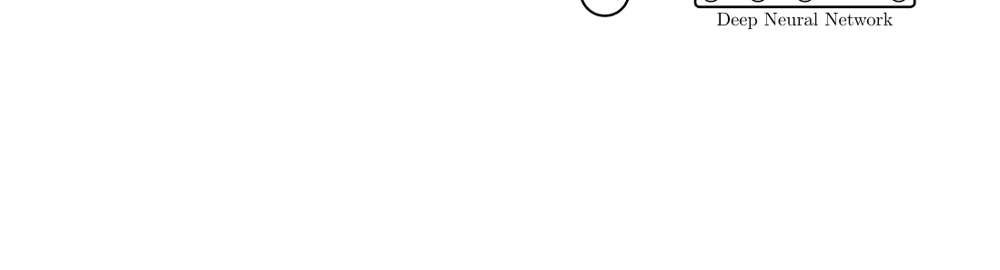

将非参数概率建模与深度神经网络相结合。更具体地说，他们首先设计了一个高阶拉普拉斯高斯过程（hLGP）先验，该先验具有精心构建的核函数，编码了重要的网络属性，如高阶接近性。每个节点都与一个遵循hLGP先验的潜在状态相关联。然后，他们使用深度神经网络从这些潜在状态到节点嵌入的非线性转换函数。引入深度神经网络增加了我们模型的表达能力，并改善了推断嵌入与样本内嵌入的一致性。推导了关于DepthLGP表达能力的理论。总体而言，他们提出的DepthLGP模型快速且可扩展，在训练过程中不需要任何关于样本外节点的知识。预测过程快速地重新访问了进化的网络，并且可以以线性的时间复杂度产生具有理想时间复杂度的推断结果。DepthLGP是一个通用解决方案，适用于任何网络嵌入算法学习的嵌入。

#### 6.1 深度LGP模型

在本节中，我们首先正式阐述了节点外样问题，并讨论了深度LGP模型以及其表达能力的理论。

##### 6.1.1 问题定义

深度LGP主要考虑无向网络。设 G为所有可能网络的集合， V为所有可能节点的集合。给定一个特定的网络 G = (V, E) ∈ G，其中节点 V = {v1, v2, ..., vn} ⊂ V和边 E，网络嵌入算法旨在学习节点 V中函数 f: V → R^d的值。随着网络随时间演化，一批新节点 V* = {v_{n+1}, v_{n+2}, ..., v_{n+ m}} ⊂ V \ V 到达，并将 G扩展为一个更大的网络 G' = ( V', E')，其中V' = V*中的节点称为样本外节点。因此，问题是推断出 V*中 f(v)的值，给定 G' = ( V', E')和 v ∈ V的 f(v)的值。

##### 6.1.2 模型描述

DepthLGP 首先假设存在一个潜在函数 f: V → R^s，并且嵌入函数 f: V → R^d是从该潜在函数转换而来的。更具体地说，让 g: R^s → R^d成为转换函数。DepthLGP 然后假设对于所有 v ∈ V，f(v) = g( h(v))。由于转换可能是高度非线性的，作者使用深度神经网络作为 g(·)。

DepthLGP进一步假设 s输出维度为 h(·)，即 h_k: V → R 对于 $k = 1, 2, \ldots, s$, 可以独立建模。换句话说，DepthLGP处理每个 $h_k(v)$ 的 $\mathbf{h}(v) = \left[ h_1(v), h_2(v), \ldots, h_s(v) \right]^{\top}$ 分开。

让我们暂时专注于 $h_k(\cdot)$。每个 $h_k(\cdot)$ 与一个核相关联它测量网络节点之间的相似性。以 $G' = (V', E')$ 为例 $V' = \{v_1, v_2, \ldots, v_{n+m}\}$ 例如，该核心生成一个核矩阵 $\mathbf{K}_k \in \mathbb{R}^{(n+m)\times(n+m)}$ for $G'$:

```
$$\mathbf{K}_k \triangleq \left[ \mathbf{I} + \eta_k \mathbf{L}(\hat{\mathbf{A}}_k) + \zeta_k \mathbf{L}(\hat{\mathbf{A}}_k \hat{\mathbf{A}}_k) \right]^{-1},$$
$$\hat{\mathbf{A}}_k \triangleq \mathrm{diag}(\boldsymbol{\alpha}_k) \mathbf{A}' \mathrm{diag}(\boldsymbol{\alpha}_k),$$
$$\boldsymbol{\alpha}_k \triangleq [a_{v_1}^{(k)}, a_{v_2}^{(k)}, \ldots, a_{v_{n+m}}^{(k)}]^{\top},$$
```

其中 $\mathbf{A}'$ 是 $G'$ 的邻接矩阵，而 $\eta_k \in [0, \infty), \zeta_k \in [0, \infty)$ 和 $a_v^{(k)} \in [0, 1]$ 是核函数的参数。$\mathrm{diag}(\cdot)$ 返回与其向量输入对应的对角矩阵，而 $\mathbf{L}(\cdot)$ 将其输入视为邻接矩阵并返回相应的拉普拉斯矩阵，即 $\mathbf{L}(\mathbf{A}) = \mathrm{diag}\left(\sum_i \mathbf{A}_{:,i}\right) - \mathbf{A}$。

所提出的核函数的参数具有明确的物理意义。$\eta_k$ 表示一阶接近度的强度（即，连接的节点可能相似），而 $\zeta_k$ 表示二阶接近度的强度（即，具有共同邻居的节点可能相似）。另一方面， $a_v^{(k)}$ 表示节点权重，即在进行预测时应该关注节点 $v$ 的程度。在训练过程中，学习样本内节点 $(v \in V)$ 的 $a_v^{(k)}$ 值，同时学习 $\eta_k$ 和 $\zeta_k$ 的值（以及神经网络 $\mathbf{g}(\cdot)$ 的参数）；在预测过程中，对于样本外节点 $(v \in V^*)$，将 $a_v^{(k)}$ 的值设为1，因为我们总是对这些新节点感兴趣，希望为它们推断嵌入。节点权重有助于DepthLGP避免无信息的节点。例如，在社交网络中，这种设计减轻了“机器人”用户的有害影响，这些用户关注大量随机人员并发送无信息的内容。

很容易看出 $\mathbf{K}_k$ 是正定的，因此是一个有效的核矩阵。在DepthLGP中，核可以被看作是正则化的拉普拉斯核[57]的一种推广，因为作者进一步引入了节点加权和二阶项。这个核被称为高阶拉普拉斯核。

DepthLGP假设每个子函数 $h_k(\cdot)$ 都遵循一个均值为零的高斯过程（GP）[51], 由高阶拉普拉斯核参数化，即 $h_k \sim \mathcal{GP}h_{k}^{Lapo}$。这等价于说：对于任意的 $G_t = (V_t, E_t) \in \mathcal{G}$, 其中 $V_t = \{v_1^{(t)}, v_2^{(t)}, \ldots, v_{n_t}^{(t)}\} \subset V$, 我们有

$$[h_k(v_1^{(t)}), h_k(v_2^{(t)}), \ldots, h_k(v_{n_t}^{(t)})]^{\top} \sim \mathcal{N}(\mathbf{0}, \mathbf{K}_k^{(t)}),$$
其中 $\mathbf{K}_k^{(t)}$ 是在 $G_t$ 上计算得到的相应高阶拉普拉斯核矩阵。

DepthLGP模型可以总结如下。

```
h_k \sim \mathcal{GP}_{h\ Lap}^{(k)}, \quad k = 1, 2, \ldots, s, \\
\mathbf{h}(v) \triangleq [h_1(v), h_2(v), \ldots, h_s(v)]^\top, \quad v \in \mathcal{V}, \\
\mathbf{f}(v) \mid \mathbf{h}(v) \sim \mathcal{N}(g(\mathbf{h}(v)), \sigma^2 \mathbf{I}), \quad v \in \mathcal{V}.
```

其中σ是一个需要手动指定的超参数。神经网络g(·)在这里是必要的，因为f(·)本身可能不完全遵循GP先验。引入g(·)允许模型更准确地拟合f(·)。

##### 6.1.3 预测

在新节点到达之前，我们有初始网络G = (V, E)，其中V = {v₁, v₂, …, vₙ}，并且知道v ∈ V的f(v)的值。预测过程假设在新节点到达之前有一个训练过程（参见第6.1.4节）在G和v ∈ V的f(v)上进行，并且训练过程学习ηₖ, ζₖ, hₖ(v), aᵥ⁽ᵏ⁾ for k = 1, 2, …, s和v ∈ V，以及变换函数g(·)的参数。

随着网络随时间演化，m新节点V* = {vₙ₊₁, vₙ₊₂, …, vₙ₊ₘ}到达并且G演化成G’ = (V’, E’)其中V’ = V ∪ V*。DepthLGP的预测例程旨在通过最大化p({f(v) : v ∈ V*} | {f(v) : v ∈ V}, {h(v) : v ∈ V})来预测v ∈ V*的f(v)，根据我们的模型，这等于

```
p(\{f(v) : v \in V^*\} \mid \{h(v) : v \in V\}).
```

然而，它需要对所有可能的h(v)进行积分，其中v ∈ V*。因此，DepthLGP通过最大化来近似它

```
p(\{f(v) : v \in V^*\}, \{h(v) : v \in V^*\} \mid \{h(v) : v \in V\}),
```

这等于

```
p(\{f(v) : v \in V^*\} \mid \{h(v) : v \in V^*\}) \times p(\{h(v) : v \in V^*\} \mid \{h(v) : v \in V\}).
```

通过首先最大化第二项，即p(\{h(v) : v \in V^*\} \mid \{h(v) : v \in V\}) = \prod_{k=1}^s p(\{h_k(v) : v \in V^*\} \mid \{h_k(v) : v \in V\}), 然后设置f(v) = g(h(v)) for v ∈ V*。

注意，第一个项p(\{f(v) : v \in V^*\} \mid \{h(v) : v \in V^*\})的最大化是通过f(v) = g(h(v))来实现的，并且这个概率密度的最大值是与h(v)无关的一个常数。因此，我们可以先专注于最大化第二个项。## 算法5 DepthLGP的预测例程

**要求：** $G' = (V', E')$
**确保：** 预测值 $\mathbf{f}(v), v \in V^*$ 的值

- $\triangleright$ 让 $V = \{v_1, v_2, \ldots, v_n\}$ 成为旧节点。
- $\triangleright$ 让 $V^* = \{v_{n+1}, v_{n+2}, \ldots, v_{n+m}\}$ 成为新节点。
- $\triangleright$ 让 $\mathbf{A}'$ 成为 $G'$ 的邻接矩阵。
- **对于** $k = 1, 2, \ldots, s$ **执行**
    - $\triangleright$ **对于** $v \in V^*$, **将** $v^{(k)}$ 的值设置为1。
    - $\boldsymbol{\alpha} \leftarrow [a_{v_1}^{(k)}, a_{v_2}^{(k)}, \ldots, a_{v_{n+m}}^{(k)}]^{\top}$
    - $\hat{\mathbf{A}} \leftarrow \text{diag}(\boldsymbol{\alpha}) \mathbf{A} \text{diag}(\boldsymbol{\alpha})$
    - $\triangleright$ 下面的函数 $\mathbf{L}(\cdot)$ 将 $\hat{\mathbf{A}}$ 和 $\hat{\mathbf{A}} \hat{\mathbf{A}}$ 视为邻接矩阵，并返回它们的拉普拉斯矩阵。
    - $\mathbf{M} \leftarrow \mathbf{I} + \eta_k \mathbf{L}(\hat{\mathbf{A}}) + \zeta_k \mathbf{L}(\hat{\mathbf{A}} \hat{\mathbf{A}})$
    - $\mathbf{M}_{*,*}$ 是 $\mathbf{M}$ 的右下方 $m \times m$ 块
    - $\mathbf{M}_{*,x}$ 是 $\mathbf{M}$ 的左下方 $m \times n$ 块
    - $\triangleright$ 让 $\mathbf{z}_x^{(k)} \triangleq [h_k(v_1), h_k(v_2), \ldots, h_k(v_n)]^{\top}$。
    - $\triangleright$ 为了提高效率，先计算 $\mathbf{M}_{*,x} \mathbf{z}_x^{(k)}$ first below。
    - $\mathbf{z}_*^{(k)} \leftarrow -\mathbf{M}_{*,*}^{-1} \mathbf{M}_{*,x} \mathbf{z}_x^{(k)}$
    - $\triangleright$ $\mathbf{z}_*^{(k)}$ 是 $[h_k(v_{n+1}), h_k(v_{n+2}), \ldots, h_k(v_{n+m})]^{\top}$ 的预测。
- **结束循环**
- **对于** $v \in V^*$, **执行以下操作**
    - $\triangleright$ 前面的行已经生成了一个预测值 $\mathbf{h}(v) = [h_1(v), h_2(v), \ldots, h_s(v)]^{\top}$。下面的行使用上述预测值进一步预测 $\mathbf{f}(v)$。
    - **计算** $g(\mathbf{h}(v))$
    - $\triangleright$ 这是一个对 $\mathbf{f}(v)$ 的预测。
- **结束循环**

现在让我们专注于子问题，即最大化

$$p(\{h_k(v) : v \in V^*\} \mid \{h_k(v) : v \in V\}). \qquad \qquad \qquad (42)$$

由于 $h_k \sim \mathcal{GP}_{h \text{ Lap}}$, 根据定义我们有

$$\begin{bmatrix} h_k(v_1), h_k(v_2), \ldots, h_k(v_n), h_k(v_{n+1}), \ldots, h_k(v_{n+m}) \end{bmatrix}^{\top} \sim \mathcal{N}(\mathbf{0}, \mathbf{K}_k),$$

其中 $\mathbf{K}_k$ 是在 $G'$ 上计算得到的相应核矩阵。然后我们有以下结果：

$$\mathbf{z}_*^{(k)} \mid \mathbf{z}_x^{(k)} \sim \mathcal{N}(\mathbf{K}_{*,x} \mathbf{K}_{x,x}^{-1} \mathbf{z}_x^{(k)}, \mathbf{K}_{*,*} - \mathbf{K}_{*,x} \mathbf{K}_{x,x}^{-1} \mathbf{K}_{*,x}^{\top}),$$
$$\mathbf{z}_x^{(k)} \triangleq \begin{bmatrix} h_k(v_1), h_k(v_2), \ldots, h_k(v_n) \end{bmatrix}^{\top},$$
$$\mathbf{z}_*^{(k)} \triangleq \begin{bmatrix} h_k(v_{n+1}), h_k(v_{n+2}), \ldots, h_k(v_{n+m}) \end{bmatrix}^{\top},$$

其中 $\mathbf{K}_{x,x}, \mathbf{K}_{*,x}, \text{和} \mathbf{K}_{*,*}$ 分别是 $\mathbf{K}_k$ 的左上方 $n \times n$, 左下方 $m \times n$, 和右下方 $m \times m$ 的块。虽然计算 $\mathbf{K}_{*,x} \mathbf{K}_{x,x}^{-1} \mathbf{z}_x^{(k)}$ 很昂贵，但幸运的是它可以被证明等价于 $-\mathbf{M}_{*,*}^{-1} \mathbf{M}_{*,x} \mathbf{z}_x^{(k)}$, 其中 $\mathbf{M}_{*,x}$ 和 $\mathbf{M}_{*,*}$ 分别是 $\mathbf{K}_k^{-1}$ 的左下方 $m \times n$ 和右下方 $m \times m$ 的块。

由于矩阵求逆被取消了，计算 $\mathbf{M}_{*}^{-1}$ 是廉价的。而且计算 $\mathbf{M}^{-1}$ 是快速的，因为 $m \ll n$。因此，方程（42）被最大化:

$$\mathbf{z}^{(k)} = -\mathbf{M}_{*}^{-1}\mathbf{M}_{*,x}\mathbf{z}^{(k)}_{x}$$

作为一个附带说明，最大化方程（42）实际上等价于最小化以下准则:

$$\begin{aligned} &\sum_{u\in V'} [h_k(u)]^2 + \\ &\frac{1}{2}\eta_k \sum_{u,v\in V'} a_u^{(k)} A'_{uv} a_v^{(k)} [h_k(u) - h_k(v)]^2 + \\ &\frac{1}{2}\zeta_k \sum_{u,v,w\in V'} a_u^{(k)} A'_{uw} a_w^{(k)} a_w^{(k)} A'_{wv} a_v^{(k)} [h_k(u) - h_k(v)]^2, \end{aligned}$$

其中 $A'_{uv}$ 是 $G'$ 中 $u$ 和 $v$ 之间的边权重（如果没有连接则为零）。这个公式从另一个角度暗示了 $\eta$, $\zeta$ 和 $a_v^{(k)}$ 的物理意义。预测过程总结如算法5所示。

##### 6.1.4 训练

训练是在初始网络 $G = (V, E)$ 上进行的，其中 $\mathbf{f}(v)$ for $v \in V$ 的值已知。由于它不依赖于演化后的网络 $G' = (V', E')$，因此可以在新节点到达之前进行。它旨在找到神经网络 $\mathbf{g}(\cdot)$ 的合适参数和 $\eta_k$, $\zeta_k$, $a_v^{(k)}$, $h_k(v)$ for $v \in V$ 和 $k=1,2,\ldots,s$ 的适当值。

作者将经验最小风险（ERM）训练应用于DepthLGP模型。虽然ERM训练一个概率模型并不像最大似然估计（MLE）和最大后验估计（MAP）那样常规，但已经被许多研究人员探索过，例如[59]。在这里使用ERM训练消除了需要指定 $\sigma$ 的需求，并且由于避免了计算行列式，因此更快且更可扩展。

训练过程列在算法6中。基本思想是首先从 $G$ 中采样一些子图，然后将每个子图中的一小部分节点视为样本外节点，并在这些训练样本上最小化经验风险（即最小化预测嵌入的均方误差）。

现在让我们描述一下如何采样每个训练样本 $G_t' = (V_t', E_t')$。DepthLGP首先从 $G$ 中随机选择一部分节点子集并沿着随机游走路径进行采样。在 $V_t^*$ 中的节点被视为“新”节点。然后，DepthLGP从 $V_t^*$ 的邻居中采样一组节点，记为 $V_t$。DepthLGP将 $V_t^*$ 的邻居定义为距离 $V_t^*$ 不超过两步的节点。最后，令 $V_t' = V_t^* \cup V_t$，并且在 $G$ 中由 $V_t'$ 诱导出的子图为 $G_t'$。

优化是通过基于梯度的方法来完成的，作者使用Adam [36] 来实现这一目的。梯度是使用反向传播[22, 53]计算的。良好的参数初始化可以大大提高收敛速度。为了方便初始化，他们使用残差网络（更严格地说，是残差块）[28]作为 $g(\cdot)$ 的服务。换句话说，DepthLGP选择 $g(\cdot)$ 的形式为 $g(\mathbf{x}) = \mathbf{x} + \tilde{g}(\mathbf{x})$，其中 $\tilde{g}(\cdot)$ 是一个前馈神经网络。在这种情况下，$s = d$。因此，它能够将 $h(v)$ 的值初始化为 $V$ 中节点的 $f(v)$ 的值。

##### 6.1.5 关于DepthLGP的表达能力

下面的定理4证明了DepthLGP的表达能力，即它可以对任意的 $f : \mathcal{V} \to \mathbb{R}^d$ 进行建模。

**定理4（表达能力）** 对于任意的 $> 0$，任意的非平凡图 $G = (V, E)$ 和任意的 $f : \mathcal{V} \to \mathbb{R}^d$，存在一组参数设置使得DepthLGP可以在删除与 $v^*$ 相关的所有信息（除了 $G$）后，通过将 $v^*$ 视为一个新节点并使用算法5在 $G$ 上，仍然可以恢复 $f(v^*)$ 并且误差小于。

**备注** 非平凡图 $G$ 表示所有连接组件都至少有三个节点。与 $v^*$ 相关的信息包括 $f(v^*)$, $h_k(v^*)$ 和 $a_v^{(k)}$，其中 $k = 1,2,\ldots,s$（注意，在预测过程中，$a_v^{(k)}$ 被替换为1，因为 $v^*$ 被视为一个新节点）。误差以 $l^2$-范数表示。可以通过基于神经网络的通用逼近性质的构造性证明来证明[17,33]。

##### 算法6 DepthLGP的训练例程

**要求**: $G = (V, E)$; $\mathbf{f}(v)$ 对于 $v \in V$
**确保**: $\eta_k, \zeta_k, a_v^{(k)}, h_k(v)$ 对于 $v \in V$ 和 $k = 1,2,\ldots,s$; 神经网络 $g(\cdot)$ 的参数
- 对于 $t = 1,2,\ldots,T$ 执行
    - $\triangleright$ 有关如何采样 $V_t^*$ 和 $V_t$ 的更多细节，请参见第6.1.4节。
    - $V_t^* \leftarrow$ 沿随机游走采样的几个节点
    - $V_t \leftarrow V_t$ 的一些节点 $V_t^*$ 的邻居
    - $V_t' \leftarrow V_t \cup V_t^*$
    - $G_t' \leftarrow G$ 中由 $V_t'$ 诱导的子图
    - 执行算法5，但使用 $G_t'$ 替换 $G'$，$V_t$ 替换旧节点，并使用 $V_t^*$ 替换新节点。将其对 $\mathbf{f}(v)$ 的预测保存为 $\tilde{\mathbf{f}}(v)$，其中 $v \in V_t^*$。
    - 损失 $\leftarrow \frac{1}{|V_t^*|} \sum_{v \in V_t^*} \|\mathbf{f}(v) - \tilde{\mathbf{f}}(v)\|_2^2$ 的损失
    - 使用反向传播计算损失对于 $\eta_k, \zeta_k, a_v^{(k)}, h_k(v)$ 和 $g(\cdot)$ 的参数相对于 $V_t$ 的梯度。
    - 应用梯度下降。
- 结束循环

下面的定理5强调了二阶接近性的重要性：尽管DepthLGP利用了神经网络的表达能力，但对于建模二阶接近性仍然是必要的。

**定理5（关于二阶接近性）** 如果DepthLGP不建模二阶接近性，则定理4不成立。也就是说，如果将ζ_k固定为零，则存在一个G = (V, E)和f: V → R^d，DepthLGP无法建模。

#### 6.2 扩展和变体

##### 6.2.1 集成到嵌入算法中

DepthLGP也可以轻松地集成到现有的网络嵌入算法中，以得到一个能够处理样本外节点的新嵌入算法。以node2vec [27]为例。对于一个输入网络 G = (V, E)，其中 V= {v_1, v_2, ..., v_n}，node2vec的训练目标可以抽象为

$$\min_{\theta,F} L_\theta(F, G),$$

其中 $F \in \mathbb{R}^{d\times n}$的列是要学习的目标节点嵌入，$\theta$包含除 $F$ 之外的参数。

让我们使用 $f_\varphi: V \to \mathbb{R}^d$来表示一个由 $\varphi$ 参数化的函数。这个函数的定义如下。对于 $v \in V$，它首先从 $v$ 的邻居中采样节点（参见第6.1.4节如何采样）并从 $G$ 中诱导出一个包含 $v$ 和这些采样节点的子图。然后将 $v$ 视为一个新节点，将从 $v$ 的邻居中采样的节点视为旧节点，并在诱导的子图上运行算法5以获得 $v$ 嵌入的预测值—这是 $f_\varphi(v)$的值。根据定义，$\varphi$ 包含神经网络的参数 $\eta_k, \zeta_k, a_v^{(k)}$和 $h_k(v)$，对于 $v \in V, k = 1, 2, ..., s$。

为了基于node2vec推导出一个新的嵌入算法，我们只需简单地改变训练目标为：

$$\min_{\theta,\varphi} L_\theta([f_\varphi(v_1), f_\varphi(v_2), ..., f_\varphi(v_n)], G).$$

作者将这个新算法命名为node2vec++，其中 $f_\varphi(v)$是节点 $v$ 的嵌入。显然，node2vec++可以像DepthLGP一样高效地处理样本外的节点。

##### 6.2.2 高效变体

当预测节点嵌入用于样本外的节点时，DepthLGP可以在一次传递中集体推断所有这些节点。然而，如果新到达的节点数量由于规模较大，以批处理的方式处理新节点更加高效（且节省内存）：对于每个未处理的新节点$v$，找到包含$v$和其他新节点（但不包括旧节点）的最大连通分量。设$V_t^*$为连通分量中的节点，$V_t$为从$V_t^*$的邻域中采样的旧节点（参见第6.1.4节中如何采样）。然后可以在由$V_t^* \cup V_t$引起的子图上运行算法5，以获得$V_t^*$中新节点的预测。重复此过程，直到所有新节点都被处理完毕。

在不牺牲太多性能的情况下，可以对DepthLGP进行一些简化，从而实现更快的收敛和更高效的实现算法5。特别是，在不同维度之间共享节点权重，即保持$a_v^{(1)} = \dots = a_v^{(s)}$，对于大多数主流嵌入算法几乎没有影响（尽管从理论上讲，这会降低DepthLGP的表达能力）。同样，对于node2vec和Deep Walk，我们可以保持$\eta_1 = \dots = \eta_s$和$\zeta_1 = \dots = \zeta_s$，因为它们同等对待节点嵌入的不同维度。然而，对于LINE算法，最好保持$\eta_1 = \dots = \eta_{\frac{s}{2}}$($\zeta_1 = \dots = \zeta_{\frac{s}{2}}$)和$\eta_{\frac{s}{2}+1} = \dots = \eta_s$($\zeta_{\frac{s}{2}+1} = \dots = \zeta_s$)分别，因为LINE生成的嵌入是将两个子嵌入（分别用于一阶和二阶接近度）连接在一起的结果。

### 7 结论和未来工作

本章介绍了图表示/网络嵌入问题以及文献中存在的挑战，即高非线性、保持结构、保持属性和稀疏性。鉴于过去十年中在处理大规模非线性数据方面取得的成功，我们指出深度神经网络（即深度学习）是解决这些挑战的合适候选方法，并强调将图表示/网络嵌入与深度神经网络相结合的有希望的潜力。我们选择了五个代表性的深度网络嵌入/图表示模型进行讨论，即结构化深度网络嵌入（SDNE）、深度变分网络嵌入（DVNE）、深度递归网络嵌入（DRNE）、基于深度Laplacian高斯过程的深度转换网络嵌入（DepthLGP）和深度超网络嵌入（DHNE）。特别是，SDNE和DRNE专注于结构感知的网络嵌入，分别保留高阶接近度和全局结构。通过将顶点对扩展为顶点元组，DHNE旨在学习异构超图中具有不同类型的顶点的嵌入，并保持相应的超结构。DVNE关注图表示中的不确定性，DepthLGP旨在学习动态网络中新节点的准确嵌入。我们的讨论集中在图表示/网络嵌入的两个方面：（i）深度结构导向的网络嵌入和（ii）深度属性导向的网络嵌入。我们希望读者能从我们的讨论中受益。

上述对最先进的网络嵌入算法的讨论高度证明了网络嵌入研究领域仍然年轻而有前途。选择合适的方法是解决实际问题的关键问题。应用网络嵌入的实际应用 这里的基础是属性和结构保持问题。如果不能保留重要的网络属性和良好地保持网络结构，嵌入空间中的重要信息可能会丢失，这会损害后续的分析。可以基于属性和结构保持的网络嵌入应用现成的机器学习方法。可用的附加信息可以输入到网络嵌入中。此外，对于某些特定的应用，领域知识也可以作为高级信息引入。最后，现有的网络嵌入方法大多针对静态网络设计，而在现实世界的应用中，许多网络随时间演化。因此，高度期望有新的网络嵌入方法来处理演化网络的动态性质。

**致谢** 我们感谢克图（DRNE和DHNE），王代新（SDNE），朱定远（DVNE）和马建新（DepthLGP）提供给我们宝贵的材料。王欣是通讯作者。本工作得到中国博士后科学基金会（编号BX201700136），国家自然科学基金重点项目（编号U1611461）和国家重点基础研究发展计划（编号2015CB352300）的支持。

### 参考文献

- 1. Agarwal, S., Branson, K., Belongie S.: Higher order learning with graphs. In: Proceedings of the 23rd International Conference on Machine Learning, pp. 17–24. ACM (2006)
- 2. Ambrosio, L., Gigli, N., Savaré, G.: Gradient Flows: in Metric Spaces and in the Space of Probability Measures. Springer Science & Business Media (2008)
- 3. Ba, J.L., Kiros, J.R., Hinton, G.E.: Layer Normalization (2016). arXiv preprint arXiv:1607.06450
- 4. Belkin, M., Niyogi, P.: Laplacian Eigenmaps for Dimensionality Reduction and Data Representation. Neural Computation 15(6), 1373–1396 (2003)
- 5. Belkin, M., Niyogi, P., Sindhwani, V.: Manifold Regularization: A Geometric Framework for Learning from Labeled and Unlabeled Examples. Journal of Machine Learning Research 7, 2399–2434 (2006)
- 6. Bengio, Y.: Learning Deep Architectures for AI. Foundations and Trends in Machine Learning 2(1), 1–127(2009)
- 7. Bonacich, P.: Some unique properties of eigenvector centrality. Social Networks 29(4), 555–564 (2007)
- 8. Bonneel, N., Rabin, J., Peyré, G., Pfister, H.: Sliced and Radon Wasserstein Barycenters of Measures. Journal of Mathematical Imaging and Vision 51(1), 22–45 (2015)
- 9. Bonneel, N., Van De Panne, M., Paris, S., Heidrich, W.: Displacement interpolation using Lagrangian mass transport. ACM Transactions on Graphics (TOG) 30, 158. ACM (2011)
- 10. Bryant, V.: Metric Spaces: Iteration and Application. Cambridge University Press (1985)
- 11. Cao, S., Lu, W., Xu, Q.: Grarep: Learning graph representations with global structural information. In: CIKM'15, pp. 891–900. ACM, New York (2015)
- 12. Chen, C., Tong, H.: Fast eigenfunctions tracking on dynamic graphs. In: Proceedings of the 2015 SIAM International Conference on Data Mining, pp. 559–567. SIAM (2015)
- 13. Clement, P., Desch, W.: An elementary proof of the triangle inequality for the Wasserstein metric. Proceedings of the American Mathematical Society 136(1), 333–339 (2008)
- 14. Courty, N., Flamary, R., Ducoffe, M.: Learning Wasserstein Embeddings (2017). arXiv preprint arXiv:1710.07457
- 15. Courty, N., Flamary, R., Tuia, D., Rakotomamonjy, A.: Optimal transport for domain adaptation. IEEE Trans. Pattern Anal. Mach. Intell. 39(9), 1853–1865 (2017)

- Cuturi, M., Doucet, A.: Fast computation of Wasserstein barycenters. In: International Conference on Machine Learning, pp. 685–693 (2014).
- Cybenko, G.: Approximation by superpositions of a sigmoidal function. Mathematics of Control, Signals, and Systems. 2(4), 303–314 (1989)
- Dash, N.S.: Context and contextual word meaning. SKASE J. Theor. Linguist. 5(2), 21–31 (2008)
- De Goes, F., Breeden, K., Ostromoukhov, V., Desbrun, M.: Blue noise through optimal transport. ACM Trans. Graph. (TOG) 31(6), 171 (2012)
- Delalleau, O., Bengio, Y., Roux, N.L.: Efficient non-parametric function induction in semi-supervised learning. In: AISTATS ’05, pp. 96–103 (2005)
- Doersch, C.: Tutorial on Variational Autoencoders (2016). arXiv preprint arXiv:1606.05908
- Dreyfus, S.: The numerical solution of variational problems. J. Math. Anal. Appl. 5(1), 30–45 (1962)
- Eom, Y.-H., Jo, H.-H.: Tail of the degree distribution in large-scale complex networks using friends. Sci. Rep. 5 (2015)
- Erhan, D., Bengio, Y., Courville, A., Manzagol, P.-A., Vincent, P., Bengio, S.: Why does unsupervised pre-training help deep learning? Journal of Machine Learning Research 11, 625–660 (2010)
- Givens, C.R., Shortt, R.M., et al.: A class of Wasserstein metrics for probability distributions. Michigan Math. J. 31(2), 231–240 (1984)
- Glorot, X., Bordes, A., Bengio, Y.: Deep sparse rectifier neural networks. In: Proceedings of the Fourteenth International Conference on Artificial Intelligence and Statistics, pp. 315–323 (2011)
- Grover, A., Leskovec, J.: Node2vec: Scalable feature learning for networks. In: KDD ’16, pp. 855–864. ACM, New York (2016)
- He, K., Zhang, X., Ren, S., Sun, J.: Deep Residual Learning for Image Recognition (2015). arXiv preprint arXiv:1512.03385
- Hinton, G., Deng, L., Yu, D., Dahl, G.E., Mohamed, A.-R., Jaitly, N., Senior, A., Vanhoucke, V., Nguyen, P., Sainath, T.N., et al.: Deep neural networks for acoustic modeling in speech recognition: The shared views of four research groups. IEEE Signal Processing Magazine 29(6), 82–97 (2012)
- Hinton, G.E., Osindero, S., Teh, Y.-W.: A fast learning algorithm for deep belief nets. Neural Computation 18(7), 1527–1554 (2006)
- Hochreiter, S., Schmidhuber, J.: Long short-term memory. Neural Computation 9(8), 1735–1780 (1997)
- Holland, P.W., Leinhardt, S.: Holland and Leinhardt reply: some evidence on the transitivity of positive interpersonal sentiment (1972)
- Hornik, K.: Approximation capabilities of multilayer feedforward networks. Neural Netw. 4(2), 251–257 (1991)
- Jamali, M., Ester, M.: A matrix factorization technique with trust propagation for recommendation in social networks. In: Proceedings of the Fourth ACM Conference on Recommender Systems, pp. 135–142. ACM (2010)
- Jin, E.M., Girvan, M., Newman, M.E.: Structure of growing social networks. Phys. Rev. E 64(4), 046132 (2001)
- Kingma, D., Ba, J.: Adam: A method for stochastic optimization (2014). arXiv preprint arXiv:1412.6980
- Kolouri, S., Park, S.R., Thorpe, M., Slepcev, D., Rohde, G.K.: Optimal mass transport: Signal processing and machine-learning applications. IEEE Signal Processing Magazine. 34(4), 43-59 (2017)
- Krizhevsky, A., Sutskever, I., Hinton, G.E.: ImageNet classification with deep convolutional neural networks. In: Advances in Neural Information Processing Systems, pp. 1097-1105 (2012)
- LeCun, Y., Bengio, Y., Hinton, G.: Deep learning. Nature 521(7553), 436-444 (2015)
- LeCun, Y., Chopra, S., Hadsell, R., Ranzato, M., Huang, F.: A tutorial on energy-based learning. Predicting. Struct. Data 1 (2006)
- Leicht, E.A., Holme, P., Newman, M.E.: Vertex similarity in networks. Phys. Rev. E 73(2), 026120 (2006)
- Liben-Nowell, D., Kleinberg, J.: The link prediction problem for social networks. J. Am. Soc. Inf. Sci. Technol. 58(7), 1019–1031 (2007)
- Luo, D., Nie, F., Huang, H., Ding, C.H.: Cauchy graph embedding. In: Proceedings of the 28th International Conference on Machine Learning (ICML-11), pp. 553–560 (2011)
- Ma, J., Cui, P., Zhu, W.: Depthlgp: Learning embeddings of out-of-sample nodes in dynamic networks. In: AAAI, pp. 370–377 (2018)
- Mikolov, T., Karafiát, M., Burget, L., Černocký, J., Khudanpur, S.: Recurrent neural network based language model. In: Eleventh Annual Conference of the International Speech Communication Association, pp. 1045–1048 (2010)
- Mikolov, T., Sutskever, I., Chen, K., Corrado, G.S., Dean, J.: Distributed representations of words and phrases and their compositionality. In: Advances in Neural Information Processing Systems, pp. 3111-3119 (2013)
- Nathan, E., Bader, D.A.: A dynamic algorithm for updating Katz centrality in graphs. In: Proceedings of the 2017 IEEE/ACM International Conference on Advances in Social Networks Analysis and Mining, pp. 149-154. ACM (2017)
- Ou, M., Cui, P., Pei, J., Zhang, Z., Zhu, W.: Asymmetric transitivity preserving graph embedding. In: Proceedings of the ACM SIGKDD International Conference on Knowledge Discovery and Data Mining, pp. 1105-1114 (2016)
- Page, L., Brin, S., Motwani, R., Winograd, T.: The PageRank citation ranking: Bringing order to the web. Stanford InfoLab Technical Report (1999)
- Perozzi, B., Al-Rfou, R., Skiena, S.: Deepwalk: Online learning of social representations. In: SIGKDD, pp. 701–710. ACM (2014)
- Rasmussen, C.E., Williams, C.K.I.: Gaussian Processes for Machine Learning (Adaptive Computation and Machine Learning). MIT Press (2005)
- Rossi, R.A., Ahmed, N.K.: Role discovery in networks. IEEE Trans. Knowl. Data Eng. 27(4), 1112–1131 (2015)
- Rumelhart, D.E., Hinton, G.E., Williams, R.J.: Neurocomputing: Foundations of research. In: Learning representations by back-propagating errors, pp. 696–699. MIT Press, Cambridge (1988)
- Salakhutdinov, R., Hinton, G.: Semantic hashing. Int. J. Approx. Reason. 50(7), 969–978 (2009)
- Shaw, B., Jebara, T.: Structure preserving embedding. In: Proceedings of the 26th Annual International Conference on Machine Learning, pp. 937-944. ACM (2009)
- Siegelmann, H.T., Sontag, E.D.: On the computational power of neural nets. Journal of Computer and System Sciences 50(1), 132-150 (1995)
- Smola, A.J., Kondor, R.: Kernels and regularization on graphs, pp. 144-158. Springer, Berlin (2003)
- Socher, R., Perelygin, A., Wu, J.Y., Chuang, J., Manning, C.D., Ng, A.Y., Potts, C.: Recursive deep models for semantic compositionality over a sentiment treebank. In: Proceedings of the Conference on Empirical Methods in Natural Language Processing (EMNLP), vol. 1631, p. 1642. Citeseer (2013)
- Stoyanov, V., Ropson, A., Eisner, J.: Empirical risk minimization of graphical model parameters given approximate inference, decoding, and model structure. In: AISTATS'11, Fort Lauderdale, April 2011
- Sun, L., Ji, S., Ye, J.: Hypergraph spectral learning for multi-label classification. In: Proceedings of the 14th ACM SIGKDD International Conference on Knowledge Discovery and Data Mining, pp. 668-676. ACM (2008)
- Tang, J., Qu, M., Wang, M., Zhang, M., Yan, J., Mei, Q.: Line: Large-scale information network embedding. In: Proceedings of the 24th International Conference on World Wide Web, pp. 1067-1077. International World Wide Web Conferences Steering Committee (2015)
- Tenenbaum, J.B., De Silva, V., Langford, J.C.: A global geometric framework for nonlinear dimensionality reduction. Science 290(5500), 2319-2323 (2000)
- Tian, F., Gao, B., Cui, Q., Chen, E., Liu, T.-Y.: Learning deep representations for graph clustering. In: Proceedings of the Twenty-Eighth AAAI Conference on Artificial Intelligence, pp. 1293-1299 (2014)
- Tolstikhin, I., Bousquet, O., Gelly, S., Schoelkopf, B.: Wasserstein Auto-Encoders (2017). arXiv preprint arXiv: 1711.01558
- Tu, K., Cui, P., Wang, X., Wang, F., Zhu, W.: Structural deep embedding for hyper-networks. In: Proceedings of the Thirty-Second AAAI Conference on Artificial Intelligence, pp. 426-433 (2018)
- Tu, K., Cui, P., Wang, X., Yu, P.S., Zhu, W.: Deep recursive network embeddings with regular equivalence. In: Proceedings of the 24th ACM SIGKDD International Conference on Knowledge Discovery and Data Mining, pp. 2357-2366. ACM (2018)
- Vilnis, L., McCallum, A.: Word representations via Gaussian embedding (2014). arXiv preprint arXiv:1412.6623
- Vishwanathan, S.V.N., Schraudolph, N.N., Kondor, R., Borgwardt, K.M.: Graph kernels. Journal of Machine Learning Research 11, 1201–1242 (2010)
- Wang, D., Cui, P., Zhu, W.: Structural deep network embedding. In: Proceedings of the 22nd ACM SIGKDD International Conference on Knowledge Discovery and Data Mining, pp. 1225–1234. ACM (2016)
- Wang, H., Banerjee, A.: Bregman alternating direction method of multipliers. In: Advances in Neural Information Processing Systems, pp. 2816–2824 (2014)
- Werbos, P.J.: Backpropagation through time: what it does and how to do it. IEEE Proceedings 78(10), 1550–1560 (1990)
- Zang, C., Cui, P., Faloutsos, P., Zhu, W.: Long short-term memory process: Modeling growth dynamics of micro social connections. In: Proceedings of the 23rd ACM SIGKDD International Conference on Knowledge Discovery and Data Mining, pp. 565-574. ACM (2017)
- Zhu, D., Cui, P., Wang, D., Zhu, W.: Deep variational network embedding in wasserstein space. In: Proceedings of the 24th ACM SIGKDD International Conference on Knowledge Discovery and Data Mining, pp. 2827-2836. ACM (2018)
- Zhu, X., Ghahramani, Z.: Learning from labeled and unlabeled data with label propagation. Technical report (2002)
- Zhu, X., Ghahramani, Z., Lafferty, J.: Semi-supervised learning using Gaussian fields and harmonic functions. In: ICML'03, pp. 912-919. AAAI Press (2003)
- Zhuang, J., Liu, I.W., Hoi S.: Two-layer multiple kernel learning. In: International Conference on Artificial Intelligence and Statistics, pp. 909-917 (2011)

## Deep Neural Networks for Corrupted Labels

Ishan Jindal, Matthew Nokleby, Daniel Pressel, Xuewen Chen and Harpreet Singh

**Abstract** The success of deep convolutional networks on image and text classification and recognition tasks depends on the availability of large, correctly labeled training datasets, but obtaining correct labels for these massive datasets is a very difficult task. To address this problem, we describe a method for learning deep networks from a dataset contaminated with unknown label noise. We attach a nonlinear noise model to a standard deep network, which is learned along with the network’s parameters. Additionally, we train the network using a loss function that encourages clustering of training images. We argue that the nonlinear noise model, while not as strict as a probabilistic model, leads to a more effective denoising operator during backpropagation. We evaluate the performance of the proposed method on image classification tasks on MNIST, CIFAR-10, CIFAR-100 and ImageNet datasets with artificially injected label noise, and on the large-scale Clothing 1M dataset which has inherent label noise. Additionally, we show that by varying initialization and regularization of the noise model, we can apply this learning process to text classification tasks. We evaluate the performance of the modified method on the TREC text classification dataset. On all these datasets, the proposed method provides significantly improved classification performance relative to state-of-the-art methods and is robust.

I. Jindal (✉) · M. Nokleby · X. Chen · H. Singh
Wayne State University, Detroit, MI, USA
e-mail: ishan.jindal@wayne.edu
M. Nokleby
e-mail: matthew.nokleby@wayne.edu
X. Chen
e-mail: xuewen.chen@wayne.edu
H. Singh
e-mail: hsingh1@wayne.edu
D. Pressel
Interactions Digital Roots, Ann Arbor, MI, USA
e-mail: dpressel@interactions.com

proportional to the label noise and the number of training examples. This approach is computationally fast, fully parallelizable, and can be easily implemented using existing machine learning libraries.

**Keywords** Label noise · Deep learning · Image classification · Text classification · E-M style label denoising · Convolutional networks

### 1 Introduction

The past decade has seen enormous progress in image classification, image captioning, and object recognition, largely due to deep convolutional neural networks (CNNs) trained on large labeled datasets [1–4]. Researchers typically benchmark the performance of these algorithms on standard, curated datasets such as MNIST, CIFAR, ImageNet, or MSCOCO [2, 5–7]. However, using curated datasets overlooks a key point: in real-world datasets, labels are not always reliable. "Crowdsourced" labels obtained from social media or other non-expert sources are prone to errors, and in subjective tasks, even humans or experts may disagree on the correct label. As deep learning systems become more complex and are trained on larger scale datasets, obtaining clean labels becomes increasingly difficult. In such scenarios, a learning method that accounts for noisy labels is needed.

Zhu and Wu [9] conducted an extensive study on the effect of label noise on classifier performance, finding that noise in training labels is more important than noise in input features.

In this work, we propose a two-pronged approach to handle image classification tasks on training sets contaminated by label noise with unknown statistics, as shown in Figure 1. The first approach is to augment the CNN architecture with a nonlinear model to handle label noise, which is learned during the training process.

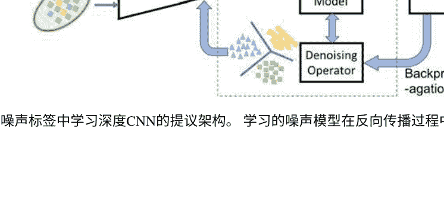

A challenge with this approach is that the model is ambiguous: when the CNN output disagrees with the provided label, it is unclear whether the CNN should update its weights to match the noisy label or update the noise model to account for the possibly erroneous label. The nonlinear model is particularly effective in handling these situations. We show that the proposed model is not strictly a transition probability from clean to noisy labels; however, it produces a better "denoising" operator for handling errors during CNN training via backpropagation.

Since the noise model is not used at test time, learning an accurate and strict noise model is less important than the effect of the noise model on CNN training. The second aspect is to enhance the standard cross-entropy loss function by encouraging the CNN to cluster images in feature space. This enables the network to learn from the natural clustering of data even when labels are unreliable.

We demonstrate the performance of the proposed method on the MNIST, CIFAR-10, CIFAR-100 and ImageNet datasets subjected to label noise. On these datasets, the proposed method demonstrates state-of-the-art performance in terms of classification accuracy on the clean test set. The results show that the proposed method is scalable to a large number of image classes. The results are robust to label noise, achieving near-optimal performance at low noise levels and maintaining classification accuracy as label noise increases. We emphasize that this robustness does not require knowledge of label noise statistics or tuning of hyperparameters. The performance of the proposed method degrades gracefully when the number of training samples is reduced, indicating that it has sufficient regularization for learning the joint noise and classification model. In fact, in some cases, performance is better when using fewer training samples, indicating that the model's sample complexity for a given dataset is sometimes too high, and in such cases, regularization via early stopping can improve performance. Finally, we evaluate the proposed method on the Clothing 1M [10] dataset which contains 1M images with noisy labels.

For text classification tasks, the noise model suffices, and we investigate the effect of varying initialization, regularization, and batch size during training on noisy labels. We observe that appropriate initialization and regularization help the noise model learn robustness to extreme noise. Finally, we use low-dimensional projections of training sample features to understand the effectiveness of the noise model.

The rest of this paper is organized as follows. First, Section 2 describes label noise in detail, followed by a review of existing literature on this topic in Section 3. Then, Section 4 describes the details of the proposed method and its different components. Finally, in Section 5, we present experimental results on various image and text classification datasets and conclude our work and future directions.

### 2 标签噪声

在标签噪声中，训练样本的标签与另一个标签交换。我们将标签翻转定义为训练样本的标签与数据集中的另一个标签交换，而异常值则是训练样本的标签与数据集中不存在的另一个标签交换。标签噪声在图2中有解释，顶部一行显示训练样本，中间一行提供与每个图像关联的真实标签（在这项工作中，我们假设分类器没有这个知识），最后一行表示提供的不可靠训练标签，其中红色文本表示标签翻转，绿色文本表示正确标签，突出显示的红色文本表示异常值。这些标签交换可以是不同类型的，例如均匀的、随机的或类条件的标签交换。在这项工作中，我们研究了标准深度网络在均匀和随机标签翻转对性能的影响。

深度学习方法的非凡性能严重依赖于大量的训练数据点的可用性。虽然很容易获得如此庞大的数据点，但获取相关的正确标签却是具有挑战性的。然而，为这么多的训练样本获取标签是一项非常费力的任务，而且往往容易出现标签错误，如标签翻转、错误标记和异常值。一种简单且成本最低的方法是使用搜索引擎和/或社交媒体网站获取注释。这导致注释的质量较差，而这些质量较差的注释是标签噪声的来源。

尽管标准的深度网络对标签噪声具有一定的鲁棒性，例如10-15%的标签噪声。但当噪声百分比高于15%时，性能会下降，如图3所示。我们绘制了随着训练数据集中标签噪声百分比的增加而变化的分类准确率，其中蓝色和橙色柱分别表示标签按照均匀和随机标签噪声进行更改时的分类准确率。对于这个实验，我们根据均匀和随机标签噪声改变Trec数据集的标签，并训练一个标准的文本深度神经网络模型[11]（更多信息请参见第5节）。从这个图中，我们可以很容易地观察到标签噪声对性能的恶化效果。

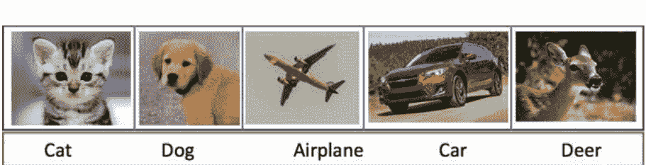

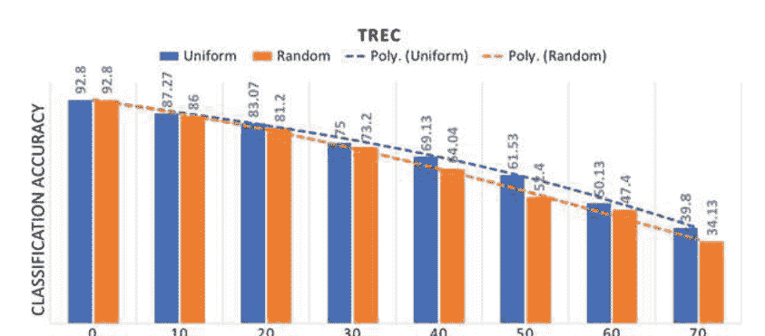

深度网络的性能和显著的性能下降可以在70%的标签噪声下看到。此外，随机标签翻转进一步降低了网络的性能。

### 3 与先前工作的关系

这个问题与半监督和弱监督学习密切相关，对此有大量的研究成果。我们将读者引用到[12]进行调查。以前的工作解决了标签为二进制且标签噪声是i.i.d.和类独立的情况下的可学习性问题[13]，并提供了以VC维度为0-1损失的样本复杂度界限。最近，[14]根据已知统计数据提供了一更般的损失函数的样本复杂度界限，以Rademacher复杂度为基础，适用于具有类条件标签噪声的情况。

这些工作的结果是，如果标签以概率 η 翻转，样本复杂度大约增加了 $1/(1-2η)^2$ 倍。等价地，泛化误差大约按照 $1/(\sqrt{n}(1-2η))$ 的比例缩放，而不是通常的 $\sqrt{1/n}$。解决这个问题的其他可能方法包括估计噪声率。在[15]中提出了一种用于估计噪声率的类条件估计器。

早期的工作考虑了一般学习算法的标签噪声。例如，[16]提出了一种从具有未知统计数据的噪声标签中学习基于核的分类器的方法。他们的方法使用EM风格的算法，同时学习生成噪声模型和分类器。类似地，[17]使用EM风格的算法来估计标签的可靠性。其他技术检测并丢弃具有异常标签的样本[18]，或重新标记错误样本[19]。与[14]类似，最近的一项工作表明，仔细选择损失函数可以导致学习对标签噪声具有稳健性的可证明结果[20]。

最近，作者开始设计用于图像分类的CNN来处理标签噪声[21, 22]。在一些方法中[23-25]，标准CNN被增强一个生成噪声模型与CNN参数同时学习的方法。在[26]中提出的联合优化框架同时学习参数并估计真实标签。如上所述，增强模型是不确定的，必须进行正则化，否则网络可能会选择将标识作为噪声转换矩阵。这些工作中的每一个都施加了不同的正则化项来鼓励非平凡的噪声模型：[23]对标签噪声转换概率矩阵的迹施加成本，而[24]使用了Dropout正则化。在[27]中，提出了一个统一的蒸馏框架来从噪声标签中学习CNN。该框架利用知识图中的标签关系和一个小的干净数据集来从噪声标签中学习分类器。参考文献[28]提出了同时训练两个神经网络的并行训练方法，只有在标签预测不一致时才更新权重。

许多研究试图解决深度网络中学习受损标签的问题。这些方法可以分为两类：使用辅助干净数据来减轻标签噪声影响的尝试，以及直接从噪声标签中学习的尝试。

- 辅助干净数据的存在：这一研究方向利用一个小的、干净的数据集来纠正受损的标签。例如，[27]使用干净数据训练一个教师网络，通过在损失函数中使用软标签对噪声标签进行重新加权。类似地，[29]将干净数据用作标签校正网络。人们可以利用这个辅助信息源对潜在的干净标签进行推理。此外，[31]模型化了噪声图像标签的辅助可信度，以减轻标签噪声的影响。

尽管这些方法显示出非常有希望的结果，但在某些情况下缺乏干净数据可能会限制这些方法的适用性。

- 直接从噪声标签中学习：这项研究通过设计鲁棒的损失函数或建模潜在标签来直接从噪声标签中学习。例如，[32]将自举应用于损失函数，以获得相似图像的一致标签预测。类似地，[33]识别并丢弃异常值，以微调预训练的卷积神经网络。同样，[34]通过适当加权损失函数使用样本数量来减轻标签噪声的影响。参考文献[35]提出了一个顺序元学习模型，它接收一系列损失值并输出标签的权重。参考文献[36]进一步探讨了损失函数的条件，使得损失函数对噪声具有容忍性。

许多方法学习从潜在标签到噪声标签的转换。例如，[37]提出了一种用于对称标签噪声的噪声适应框架。基于这项工作，其他几项工作[23, 24, 38, 39]通过在DNN的顶部学习一个噪声层来考虑标签噪声，其中学习的转换矩阵表示标签翻转的概率。类似于[14, 38]，在网络的预训练阶段以理论动机的方式估计噪声模型，然后校正损失函数。它启发式地估计转换矩阵，但是由于类别数量较多，这种估计并不容易获得。在CIFAR-10上，只要标签噪声不太强，[23]的性能就很有竞争力。

类似地，[10]提出了一个基于概率的图像条件噪声模型。参考文献[33]提出了一种图像正则化技术，用于检测和丢弃噪声标记的图像。其他方法包括构建两个并行的分类器[40]，其中一个分类器处理图像识别，另一个分类器模拟人类报告的偏见。

所提出的方法融合了[23,24]的精神-学习一个明确的噪声模型，并通过EM风格的方法对数据进行聚类。直觉是通过与相似图像的不一致性来识别错误标记的图像，这样可以对抗标签噪声并模拟无监督学习。这项工作的好处是，标签噪声模型是有益的，特别是当它在损失函数中通过无监督组件进行正则化时。然而，学习一个正确的噪声模型既不是必要的，也不足以达到最先进的性能。事实上，所提出的方法在性能上普遍优于类似[24]的神奇辅助CNN。

所提出的方法在将基本模型参数的梯度馈送到梯度之前，通过去噪算子对损失的梯度进行去噪。我们的方法产生了一个非常扩散的去噪算子，从而防止基本模型直接学习噪声标签。

### 4 提出的方法

我们考虑对属于L个图像类别之一的d维图像进行监督学习。让（无噪声的）训练集表示为

$$\mathcal{D} = \{(x_1, y_1), (x_2, y_2), \ldots, (x_n, y_n)\},$$

其中$x_i \in \mathbb{R}^d$是第$i$个图像，$y_i \in \{1, \ldots, L\}$是其标签，隐含地存在一个未知的图像/标签对的联合分布$p(x, y)$。理想情况下，我们会在训练集$\mathcal{D}$上训练一个分类器，但我们假设我们无法访问无噪声的训练集$\mathcal{D}$，而是获得了一个带有不可靠标签的训练集。让这个带噪声的训练集表示为

$$\mathcal{D}' = \{(x_1, y_1'), (x_2, y_2'), \ldots, (x_n, y_n')\},$$

其中$y_i'$是$x_i$的一个可能错误的标签。我们假设存在类条件标签噪声，其中噪声标签$y_i'$仅取决于真实标签$y_i$，而不取决于图像$x_i$或任何其他标签$y_j$或$y_j'$。在这个模型下，标签噪声由条件分布$p(y'|y)$来描述，我们通过$L \times L$列随机矩阵$\phi$来描述

$$\phi_{ij} = p(y' = j | y = i).$$

我们使用一个由标签错误的总体概率参数化的噪声模型，表示为$0 \leq p \leq 1$：

$$\phi = (1 - p)\mathbf{I} + p\Delta, \quad (1)$$

其中 $I$ 是单位矩阵，$\Delta$ 是一个对角线上为零，其余列元素从 $L-1$ 维单位单纯形中均匀独立地抽取的矩阵。 也就是说，每个类别的标签错误概率为 $p$，而错误类别中的概率分布是随机均匀抽取的。

我们的目标是使用噪声集合 $D'$ 来训练一个卷积神经网络，使其能够准确地预测给定输入图像 $x$ 的真实标签 $y$。 训练一个能够预测噪声标签的卷积神经网络是直接的。 图像 $x$ 的噪声标签的条件分布可以表示为：

$$ p(y' = \hat{y}'|x) = \sum_i p(y' = \hat{y}'|y = \hat{y}_i) p(y = \hat{y}_i|x) $$

通过在嘈杂的数据集 $D'$ 上进行标准训练，可以学习与 $p(y'=\hat{y}'|x)$ 相关的分类器。 要预测干净的标签，即学习条件分布 $p(y=\hat{y}_i|x)$ 需要更多的努力，因为在标签噪声分布未知的情况下，我们无法从嘈杂的分类器中提取“干净”的分类器。

#### 4.1 提出的方法

我们提出的框架的架构如图4所示。 我们采用了一种标准的深度卷积神经网络（我们称之为基础模型），并用一个模型来增强它，以考虑标签噪声。 基础模型和噪声模型使用 $D'$ 通过随机梯度下降进行联合训练。 噪声模型仅在训练过程中使用，在反向传播过程中有效地“去噪”与嘈杂标签相关的梯度，以改善基础模型的学习。 因为在测试图像中不需要预测噪声的标签，所以我们在测试时断开噪声模型，并仅使用基础模型进行分类。

我们在基础CNN模型的顶部叠加了一个额外的全连接处理层¹。 我们将基础模型的参数——处理层的权重和偏差等——合并为一个参数向量 $\Theta$。 基础模型输出的高级特征，我们用 $t_1(x; \Theta) \in \mathbb{R}^L$ 表示，经过常规的softmax函数处理：

$$ \sigma(z)_i = \frac{\exp(z_i)}{\sum_{j=1}^L \exp(z_j)} $$

以产生干净标签的条件分布；即 $p(y|x; \Theta) = \sigma(t_1(x; \Theta))$，通过这个分布我们可以预测图像 $x$ 的干净标签。 该方法的一个独特特点是我们估计干净标签和噪声标签之间使用了一个非线性变换。在滥用符号表示，让 $\hat{y} = \sigma(t_1)$ 表示概率 $p(y|x; \Theta)$。为了获得噪声标签的概率，记作 $\hat{y}'$，我们对 $\hat{y}$ 进行softmax回归：

$$p(y'|x; \Theta, W) := \sigma(W\sigma(t_1(x; \Theta))), \qquad (3)$$

其中 $W \in \mathbb{R}^{L \times L}$ 是一个控制转移概率的方阵。我们强调一个细微的问题：这个公式在概率上并不严格。方程(3)不正确地计算了根据(2)计算噪声标签的边际概率。为了与总概率法则保持一致，我们应该计算条件分布如下：

$$p(y' = i | y = j; W) = [\sigma(W e_j)]_i, \qquad (4)$$

其中 $e_j$ 是第 $j$ 个基本向量。从这个条件分布中， $y'$ 的分布应该是

$$p(y'|x; \Theta, W) = \sigma(W)\sigma(t_1(x; \Theta)), \qquad (5)$$

其中 $\sigma(W)$ 是应用于 $W$ 的softmax函数的每一列。这相当于[23]中使用的架构，其中学习了一个具有列随机权重矩阵的简单线性层，理想情况下与控制标签噪声的矩阵 $\phi$ 相匹配。通过对 $\hat{y}$ 进行非线性变换，而不是与转移概率相关的线性变换，我们违反了计算 $\hat{y}'$ 时的概率规律。然而，根据经验，我们发现得到的分类器具有出色的性能，在下一部分中我们将对这种方法进行解释。

现在，挑战在于同时学习卷积神经网络参数 $\Theta$ 和非线性噪声模型参数 $W$。一种方法是最小化端到端模型的标准交叉熵损失，我们称之为非线性噪声感知损失 $\mathcal{L}_{NNA}$：

$$\mathcal{L}_{\text{NNA}}(\Theta, W; \mathcal{D}') = -\frac{1}{n} \sum_{i=1}^{n} \log p(y' = \hat{y}_i' | x_i; \Theta, W)$$
$$= -\frac{1}{n} \sum_{i=1}^{n} \log[\sigma (W \sigma (t_1(x_i; \Theta)))]_{\hat{y}_i}.$$

从经验上看，这个损失函数能够很好地预测真实标签。然而，$\mathcal{L}_{\text{NNA}}$并不直接鼓励模型正确预测真实标签 $\hat{y}$，而是通过噪声标签预测 $\hat{y}'$间接判断预测结果。事实上，这种方法将 $\hat{y}$视为一个额外的隐藏层，起到信息瓶颈的作用。

为了鼓励对 $\hat{y}$的良好预测，我们需要直接将 $\hat{y}$输入到损失函数中。为了实现这一点，我们引入了一个额外的项，鼓励训练图像的“准聚类”。在特征空间中接近的图像通常具有相同的标签，这是我们在处理噪声标签时可以利用的事实。我们对预测标签和噪声标签以及预测标签本身之间的交叉熵进行惩罚，即

$$\mathcal{L}_{\text{QC}}(\Theta; \mathcal{D}') = -\frac{1}{n} \sum_{i=1}^{n} \left( \beta p(\hat{y}_i | x_i; \Theta) + (1 - \beta) y_i' \right) \times \log p(\hat{y}_i | x_i; \Theta),$$
$$= -\frac{1}{n} \sum_{i=1}^{n} \left( \beta [\sigma (t_1(x; \Theta))]_{\hat{y}_i} + (1 - \beta) y_i' \right) \times \log[\sigma (t_1(x; \Theta))]_{\hat{y}_i}.$$

这种类型的损失函数在文献中被广泛使用，例如在[32, 41, 42]中，并且它具有聚类数据的效果。对于较大的 $\beta$值，最小化这个损失函数会鼓励 $\hat{y}$向低熵向量靠拢，即大部分质量集中在一个点上。为了进行这样的自信预测，CNN需要将相似的输出特征映射到相似的类别，这相当于聚类。

最后，我们通过取两个损失的凸组合来形成非线性、噪声感知、准聚类损失，表示为 $\mathcal{L}$:

$$\mathcal{L}_{\text{NNAQC}}(\Theta, W; \mathcal{D}') = \alpha \mathcal{L}_{\text{NNA}}(\Theta, W; \mathcal{D}') + (1 - \alpha) \mathcal{L}_{\text{QC}}(\Theta; \mathcal{D}'), \quad (6)$$

通过标准反向传播算法，我们通过噪声训练集 $\mathcal{D}'$来最小化NNAQC损失。我们通过交叉验证获得 $\alpha$和 $\beta$的值。

对于文本分类任务，我们发现仅使用NNA步骤就能提供最先进的性能，并且我们探索了噪声模型不同初始化以及不同正则化对分类性能的影响。我们使用以下损失函数来训练文本分类数据集的网络。

$$\mathcal{L}_{\text{text}}(\Theta, W; \mathcal{D}') = -\frac{1}{n} \sum_{i=1}^{n} \log[\sigma (W \sigma (t_1(x_i; \Theta)))]_{\hat{y}_i} + \frac{1}{2} \lambda \|W\|_2^2. \quad (7)$$

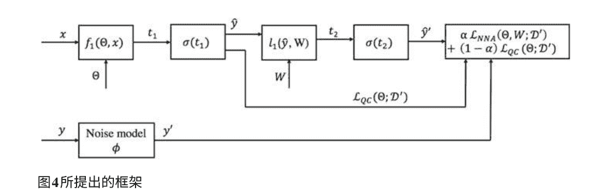

#### 4.2 证明非线性噪声模型的合理性

在本节中，我们研究了所提出的非线性噪声模型的影响。乍一看，似乎我们违反了概率的基本规律，因为我们在输出层添加了一个非线性softmax层。然而，我们强调噪声模型的作用不是对噪声标签进行准确预测，而是鼓励学习一个能够对干净标签而不是噪声标签进行准确预测的CNN。因此，噪声模型的最终测试是它对训练的改进程度。为了达到这个目的，所提出的架构的设计不是为了学习一个显式的噪声模型，而是为了学习一个有效地过滤与噪声标签相关的梯度的“去噪”操作符。为了看到这种方法的好处，我们比较了所提出架构和使用标准线性噪声模型增强的CNN的基本模型参数的反向传播梯度步骤。

在图5中，我们放大了所提出的方法的架构。对于一个输入样本$x$，我们将所有初始卷积、ReLU和池化层合并为一个函数$f_1(\Theta, x)$，其中$\Theta$是参数，通过第一个softmax层$\sigma (t_1)$获得真实标签的归一化预测$\hat{y}$。我们将干净的标签预测通过矩阵 $W$并经过softmax函数，得到噪声标签分布 $\hat{y}'$。

为了观察预测 $\hat{y}$和噪声模型参数 $W$对学习过程的影响，我们写出损失函数 $\mathcal{L}$ 相对于$\Theta$的梯度：

$$ \frac{\partial \mathcal{L}}{\partial \Theta} = \frac{\partial \mathcal{L}}{\partial \hat{y}'} \frac{\partial \sigma (t_2)}{\partial t_2} \frac{\partial l_1(\hat{y}, W)}{\partial \hat{y}} \frac{\partial \sigma (t_1)}{\partial t_1} \frac{\partial f_1(\Theta, x)}{\partial \Theta} \quad (8) $$
$$ = \frac{\partial \mathcal{L}}{\partial \hat{y}'} \left( \frac{\partial \sigma (t_2)}{\partial t_2} W \frac{\partial \sigma (t_1)}{\partial t_1} \right) \frac{\partial f_1(\Theta, x)}{\partial \Theta}. \quad (9) $$

为了比较，在图6中，我们考虑一个线性噪声模型，如(4)和(5)所述，其中矩阵 $W$通过随机矩阵$\sigma (W)$确定噪声模型。我们将梯度步骤写成与之前情况类似的形式：

$$ \frac{\partial \mathcal{L}}{\partial \Theta} = \frac{\partial \mathcal{L}}{\partial \hat{y}'} \frac{\partial l_1(\hat{y}, \sigma (W))}{\partial \hat{y}} \frac{\partial \sigma (t_1)}{\partial t_1} \frac{\partial f_1(\Theta, x)}{\partial \Theta} \quad (10) $$
$$ = \frac{\partial \mathcal{L}}{\partial \hat{y}'} \left( \sigma (W) \frac{\partial \sigma (t_1)}{\partial t_1} \right) \frac{\partial f_1(\Theta, x)}{\partial \Theta}. \quad (11) $$

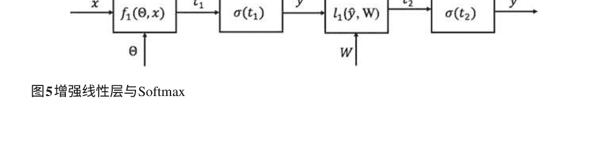

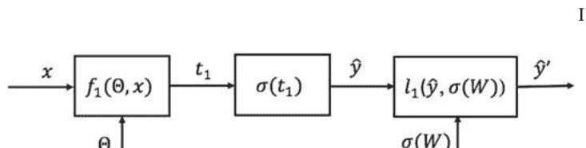

##### 图6 无softmax增强

将(9)与(11)进行比较，可以发现一些关键点。首先，在每种情况下，损失的梯度$\partial \mathcal{L}/\partial \hat{y}$在输入基本模型参数的梯度之前被一个运算符“去噪”。这是噪声模型的主要作用：防止基本模型直接学习到噪声标签。在提出的方法中，去噪运算符为$\partial \sigma(t_2)$ $\frac{\partial}{\partial t_2} W \frac{\partial \sigma(t_1)}{\partial t_1}$而在线性噪声模型中，去噪运算符为$\sigma(W)\partial\sigma(t_1)$。

其次，我们发现提出的方法的去噪运算符比线性噪声模型更加扩散。为了看到这一点，考虑一个将大部分概率放在一个类别上的估计$\hat{y}$。在提出的方法中，得到的噪声标签预测为$\hat{y}' = \sigma(W\hat{y})$；将softmax应用于$W\hat{y}$会“扩散”概率，噪声标签的预测不会像等效的线性模型那样集中在一个类别上。换句话说，非线性噪声模型本质上比严格的线性模型更不自信。因为去噪运算符包含项$\partial \sigma(t_2)$ $\frac{\partial}{\partial t_2}$，这是一个关于$\sigma(W\hat{y})$的函数，结果操作符更加分散，即其列不再集中在个别值上。

一个更加分散的操作符可以更灵活地处理卷积神经网络模型预测与噪声标签之间的分歧。考虑这样一种情况，卷积神经网络输出的预测$\hat{y}$集中在一个单一值上（比如$i$），而与之不同的（可能是错误的）训练标签$y'$（比如$j$）。在这种情况下，挑战在于决定$y'$是一个错误还是卷积神经网络预测不准确。在线性噪声模型中，去噪操作符的大部分权重集中在第$i$行上。另一方面，损失梯度$\partial \mathcal{L}/\partial \hat{y}$的所有权重都集中在第$j$行上。因此，去噪操作符会抹掉大部分梯度，结果就是忽略该样本。通过提出的方法，去噪操作符不再集中在第$i$行上，因此反向传播步骤试图从训练点中学到更多知识，即使模型预测和噪声标签存在分歧。

同样，所提出的方法防止了模型在模型和噪声标签一致时过于自信。如果CNN做出自信的预测$\hat{y}$和$i = j$，非扩散去噪算子和梯度$\partial \mathcal{L}/\partial \hat{y}$具有大幅度元素，模型过于自信地假设标签不是噪声。所提出方法得到的扩散去噪算子，另一方面，扩散了梯度，防止了过于激进的反向传播步骤。总之，所提出的方法的去噪算子在存在分歧时鼓励CNN从训练样本中学习，并在存在一致性时防止过拟合。最后，我们方法中的准聚类正则化在图4中为基础模型提供了真实信息。

通过在特征空间中聚类所有接近的样本来标记。 我们还将反向传播梯度步骤与准聚类正则化一起写成

$$
\frac{\partial \mathcal{L}}{\partial \Theta} = \gamma \frac{\partial \sigma \left(t_{1}\right)}{\partial t_{1}} \frac{\partial f_{i}(\Theta, x)}{\partial \Theta}
$$

其中，

$$
\gamma = \left(\frac{\partial \mathcal{L}}{\partial \hat{\mathbf{y}}^{\prime}} \frac{\partial \sigma\left(t_{2}\right)}{\partial t_{2}} W\right) + \frac{\partial \mathcal{L}_{\mathrm{QC}}^{\prime}}{\partial \hat{\mathbf{y}}}
$$

。

我们还考虑了当噪声模型 $\phi$ 完全已知时的学习性能。 人们可能期望使用线性噪声模型学习基本的CNN，在过渡矩阵设置为 $\phi$ 时，会提供更好的性能。 有些令人惊讶的是，[24]报告了即使这种“神助攻”方法也被超越的情况。我们观察到类似的行为；将真实噪声模型与CNN相结合的效果明显比提出的方法要差。 正如上面的分析所建议的那样，非线性噪声模型只是导致更有效的去噪算子，即使模型没有学习到底层噪声统计信息。

### 5 实验结果

在本节中，我们评估了NNAQC在各种不同的图像分类和文本分类数据集上的实证性能，并与其他方法进行了比较。

#### 5.1 一般设置

图像分类任务在所有实验中，我们使用MATLAB工具箱MatConvNet [43]。我们评估了分类器在MNIST [44]、CIFAR-10、CIFAR-100 [6]、ImageNet [7]和Clothing 1M [10]数据集上的性能。 我们使用MatConvNet为CIFAR-10和MNIST数据集提供的默认CNN架构和参数作为基准CNN模型。 对于其他数据集，我们使用在相应的干净数据集上提供最佳分类准确率的CNN架构作为基准CNN。我们在后续章节中提供了这些架构的详细信息。 对于所有的NNAQC实验，我们使用 $\alpha = 0.9$ 和 $\beta = 0.9$ 进行比较。我们将NNAQC与几种其他算法进行了比较：在 $\mathcal{D}^{\prime}$ (“基准模型”) 上训练的的标准的忽略噪声的CNN；使用真实噪声模型 $\phi$ 增强的CNN (“神奇辅助”) ；使用准聚类损失函数的神奇辅助模型 (“带QC的神奇辅助”) ；[24]中的dropout正则化模型 (“dropout”) ；[23]中的迹正则化模型 (“trace”) ；[32]中的软引导算法 (“bootstrapping”) ；以及[38]中的前向损失校正 (“F-correction”) 。我们还尝试添加dropout

对于NNAQC的噪声模型进行正则化（“regu.NNAQC”）。为了进行公平比较，我们固定了所有方法的基本模型，并在其之上实现了它们的方法。在所有实验中，我们使用批量大小为100的随机梯度下降方法对CNN进行端到端的训练。对于CIFAR-10和MNIST数据集，我们对每个设置运行实验5次，并报告平均值。

文本分类任务对于文本分类实验，我们使用一个公开可用的深度学习库 *Baseline*——一个用于自然语言处理任务的快速模型开发工具[45]。我们选择了[11]中常用的高性能模型作为基本模型，并根据（7）进行训练。为了检验所提出方法的鲁棒性，我们故意翻转了0-70%的类标签，换句话说： $p \in \{0.0, 0.1, 0.2, 0.3, 0.4, 0.5, 0.6, 0.7\}$，并观察不同类型的标签翻转（如均匀（*Uni*）和随机（*Rand*）标签翻转）以及实例相关的标签噪声的影响。对于所有实验，我们使用基于验证集准确率的早停策略，其中验证集中的类标签也被损坏。

我们使用不同的命名约定来展示不同正则化对分类性能的影响。我们在噪声标签数据集上指示标准深度网络（无噪声模型）的性能。我们还绘制了无正则化的堆叠噪声模型（*NMWoRegu*）和带正则化的堆叠噪声模型（*NMw Regu*）的结果。除非另有说明，在所有带有堆叠噪声模型的深度网络中，我们将噪声层参数初始化为单位矩阵。我们进一步分析了噪声层初始化对整体性能的影响。我们将带正则化的堆叠噪声模型（*TDwRegu*）定义为使用真实注入噪声分布进行初始化，将带正则化的堆叠噪声模型（*RandwRegu*）定义为随机初始化。我们运行了所有实验五次并报告平均准确率。

#### 5.2 人工标签噪声

为了检验NNAQC在人工注入噪声方面的鲁棒性，我们根据（1）损坏真实标签，其中 $p\in \{0, 0.05, 0.10, 0.30, 0.50, 0.70\}$。

**CIFAR-10:** 我们在CIFAR-10数据集[6]上训练我们的CNN，这是8000万个Tiny Images数据集[3]的子集。它包含来自10个不同类别的尺寸为32 × 32 ×3的自然图像。它有50K个训练图像和10K个测试图像。在干净的数据集上，基础模型CNN的分类错误率为20.49%。我们通过根据噪声分布（1）为每个值 $p$ 损坏标签，生成一个带噪声的数据集 $\mathcal{D}^{\prime}$。表1的第一行显示了使用50K个训练样本训练网络时NNAQC的比较性能。在所有情况下，NNAQC，可能通过dropout进行正则化，明显优于其他方法。这包括基于神经网络辅助的方法，支持我们的观点，即了解噪声统计数据不如学习一个有效的去噪算子进行训练重要。此外，NNAQC对噪声水平的变化具有鲁棒性，在恢复接近最优性能时

表1 不同数据集的NNAQC性能，并与其他方法相比，关于训练样本数量

| | 训练样本 | 50K | | | | | |
|---|---|---|---|---|---|---|---|
| | 噪声 % | 0 | 5 | 10 | 30 | 50 | 70 |
| CIFAR-10 | 基础模型 | 20.49 | 23.00 | 25.30 | 30.49 | 39.47 | 65.60 |
| | 辅助模型 | 20.50 | 21.07 | 24.32 | 28.09 | 39.29 | 62.38 |
| | 辅助模型 (QC) | 20.98 | 22.22 | 23.23 | 25.52 | 33.98 | 57.57 |
| | 追踪 | 22.48 | 23.00 | 23.90 | 27.20 | 39.06 | 63.00 |
| | 自举 | 23.33 | 23.76 | 25.00 | 28.64 | 35.07 | 66.14 |
| | 丢弃 | 37.29 | 36.90 | 31.30 | 25.40 | 31.28 | 63.04 |
| | F校正 | 21.00 | 21.45 | 22.10 | 23.70 | 29.12 | 58.91 |
| 我们的 | NNAQC | 21.11 | 21.85 | 22.03 | 24.20 | 28.41 | 56.12 |
| | 正则化NNAQC | 20.96 | 21.40 | 22.05 | 23.10 | 28.06 | 56.09 |
| | 训练样本 | 60K | | | | | |
| | 噪声 % | 0 | 5 | 10 | 30 | 50 | 70 |
| MNIST | 基础模型 | 00.89 | 02.67 | 03.68 | 04.50 | 34.50 | 48.80 |
| | 辅助模型 | 00.89 | 02.67 | 03.68 | 04.50 | 34.50 | 48.80 |
| | 追踪 | 01.29 | 01.40 | 01.46 | 02.12 | 03.80 | 24.20 |
| | 自举 | 01.29 | 01.30 | 01.41 | 02.00 | 03.60 | 22.20 |
| | 丢弃 | 01.29 | 01.29 | 01.32 | 01.83 | 02.83 | 24.60 |
| | F校正 | 01.12 | 01.13 | 01.19 | 01.50 | 02.23 | 21.00 |
| 我们的 | NNAQC | 01.14 | 01.15 | 01.24 | 01.83 | 02.20 | 16.42 |
| | 正则化NNAQC | 01.01 | 01.08 | 01.18 | 01.46 | 02.19 | 18.70 |

噪声很小。尽管我们注意到在某些情况下，NNAQC的性能优于具有丢弃正则化（正则化NNAQC）的NNAQC，但这种性能差距可以忽略不计。然而，我们观察到在具有超过10个类别的数据集中存在显著的性能差距。

为了评估NNAQC对不同训练数据集大小的鲁棒性，在表1中，我们展示了所有方法的性能与训练样本数量的关系。对于每个数据集，我们从原始训练样本数量开始，每次减少20K样本，如表1所示。

对于CIFAR-10数据集，在第1列中，我们使用所有的50K训练样本来训练所有的模型。我们还发现，F-correction[38]的性能接近于NNAQC，然而，当我们减少训练数据集大小时，NNAQC的性能明显优于F-correction。由于[38]的工作是通过估计噪声转移矩阵来实现的，在较小的训练集上的性能差距进一步加强了我们的观点，即在存在标签噪声的情况下，学习正确的噪声模型既不是必要的，也不足够实现最先进的性能。

我们还将NNAQC与[33]进行了比较，[33]使用预训练的AlexNet获取训练图像的高级特征，并在 $\mathcal{D}^{\prime}$ 上微调最后的softmax层。因为

他们使用了一个预训练的网络，而NNAQC和其他方法则从头开始训练CNN，因此无法直接比较结果。然而，在存在50%噪声的50K训练样本中，[33]报告了28%的分类错误率，而NNAQC的错误率为28.41%。也就是说，尽管NNAQC没有进行预训练，但它在整体上可能是一种更强大的方法。

**MNIST：**

我们在手写数字数据集MNIST上进行了类似的实验[44]，该数据集包含60K个大小为28 ×28的训练图像和10K个测试图像。在CIFAR-10情况下，我们生成了一个带噪声的数据集 $\mathcal{D}^{\prime}$。在干净的数据集上，基础模型CNN的分类错误率为0.89%。在表1中（最后一行），我们再次看到NNAQC在整体上提供了优越的性能，并且对高噪声功率和较小的训练集都具有鲁棒性。与CIFAR-10类似，我们在MNIST数据集上将NNAQC的性能与预训练/微调策略[33]进行了比较。在存在50%噪声的情况下，NNAQC的表现优于[33]，其分类错误率为2.2%，而[33]的最低分类错误率为7.63%。

**CIFAR-100：**

接下来我们展示NNAQC在一个具有更多类别的数据集上的性能，使问题更具挑战性：CIFAR-100 [6]，它包含了100个不同类别的32 ×32彩色图像，每个类别包含600张图像。每个类别有500张训练图像和100张测试图像。由于这个数据集的复杂性，我们使用了一个不同的基础CNN模型，它有两个conv+ReLU+maxpool层，两个FC层和一个softmax层。这是一个低容量的CNN网络。

> 表2 NNAQC在CIFAR-100上使用不同的CNN架构进行性能比较，并与其他方法进行比较。

| | 噪声 % | 0 | 5 | 10 | 30 | 50 | 60 |
|---|---|---|---|---|---|---|---|
| LC-CNN | 基础模型 | **50.90** | 52.48 | 53.82 | 60.38 | 68.46 | 88.20 |
| | 追踪 | 53.12 | 54.27 | 55.00 | 58.70 | 64.50 | 84.12 |
| | 自举 | 54.20 | 54.90 | 55.30 | 59.00 | 69.75 | 88.30 |
| | 丢弃 | 65.80 | 63.54 | 62.01 | 57.76 | 63.24 | 84.19 |
| | F校正 | 56.68 | 57.13 | 57.11 | 62.67 | 66.12 | 83.90 |
| 我们的 | NNAQC | 52.31 | 52.40 | 53.10 | 56.68 | 63.00 | 84.00 |
| | 正则化NNAQC | 52.29 | **52.33** | **53.00** | **56.91** | **62.20** | **83.13** |
| | 噪声 % | 0 | 5 | 10 | 30 | 50 | 60 |
| 44层ResNet | 基础模型 | **30.99** | 31.54 | 33.86 | 36.50 | 64.60 | 84.89 |
| | 追踪 | 31.56 | 31.50 | 34.10 | 36.00 | 65.41 | 84.82 |
| | 自举 | 31.60 | 31.50 | 34.06 | 36.32 | 63.45 | 84.30 |
| | 丢弃 | 55.20 | 53.04 | 52.13 | 37.68 | 64.11 | 85.00 |
| | F校正 | 31.00 | 31.13 | **33.12** | 35.80 | 61.24 | **84.00** |
| 我们的 | NNAQC | 31.00 | 31.14 | 34.01 | 35.88 | 61.35 | 85.00 |
| | 正则化NNAQC | 31.12 | **31.13** | 33.16 | **35.71** | **61.20** | 84.03 |

(LC-CNN)在干净数据集上的分类错误率为50.9%。为了验证NNAQC的鲁棒性不是由于低容量模型，我们还在一个高容量的深度残差网络(ResNet) [46]上评估了NNAQC，该网络在干净标签上的分类错误率为30.99%。我们使用深度为44的ResNet和与[38]中描述的相同的训练参数。

我们在表2中比较了CIFAR-100上的NNAQC性能。在这里，我们对整个训练数据进行训练。与之前的实验类似，我们对所有方法都使用了相同的基础模型CNN。在表2中（第一行），我们展示了NNAQC在LC-CNN上训练时相对于其他方法的竞争性能。我们观察到NNAQC在CIFAR-100上的性能与MNIST和CIFAR-10一致，证明了NNAQC的可扩展性。在这里，dropout特别提高了性能（Regu. NNAQC），可能是因为更大的标签噪声模型从正则化中受益。我们还在表2中展示了NNAQC在ResNet架构上的性能（第二行）。我们观察到，在其他方法中，只有F-correction在许多场合与NNAQC表现一样好，然而，在LC-CNN上，情况不同——NNAQC的表现优于所有其他方法。将NNAQC在ResNet上的性能与LC-CNN进行比较，可以清楚地看出NNAQC的性能与基础CNN网络架构无关。在下一节中，我们将通过对不同CNN架构的Clothing 1M数据集进行实验来进一步加强这一观点。

##### ImageNet:

我们进一步测试NNAQC在一个1000类分类问题上的可扩展性。我们展示了NNAQC在ImageNet 2012数据集[7]上的性能，该数据集包含了1000个类别的130万张带有清晰标签的图像。对于这个实验，我们使用Krizhevsky等人[1]的CNN模型作为基础模型。这个CNN模型有五个卷积+ReLU+最大池化层，两个全连接层和一个softmax层。如[23]所述，我们生成一个列随机噪声分布矩阵($\phi$)，使得对于一个特定的类别，噪声只会随机分布到其他10个随机选择的类别中。对于50%的标签噪声，每个类别有50%的正确标签，其他50%的标签随机分布在10个随机选择的类别中。由于我们的主要目的是展示NNAQC对大量类别的可扩展性，并保持简单性，我们从一个预训练的AlexNet模型中传递了前四个卷积块的参数。在训练过程中，我们保持前四个卷积块(conv+ReLU+最大池化)的参数不变/冻结，只训练最后一个卷积块、两个全连接层、一个softmax层和堆叠的NNAQC层。在表3中，我们将NNAQC性能与基本的AlexNet模型（即没有噪声模型）在验证集图像上进行比较，分别使用0、10和50%的随机分布的损坏标签。我们观察到NNAQC在“干净”标签上相对于基本模型有轻微的性能提升-可能是由于ImageNet数据集中固有的标签噪声所致。我们观察到50%的标签噪声显著损害了基本模型的性能，而NNAQC则表现出卓越的性能（相对于基本模型的明显提升约11.0%）。在这里，dropout正则化 (Regu. NNAQC) 进一步提高了整体性能2.51%。

##### 表3 ImageNet验证集分类错误率

| 类别 | 模型 | 0%噪声 | 10%噪声 | 50%噪声 |
|------|------|--------|---------|---------|
| ImageNet | 基础模型 | 19.20 | 31.21 | 53.46 |
| ImageNet | 追踪 | 19.10 | 29.00 | 46.24 |
| 我们的 | NNAQC | 19.30 | 29.10 | 44.31 |
| 我们的 | 正则化NNAQC | 18.30 | 28.21 | 41.80 |

TREC数据集参考文献[47]是一个问题分类数据集，由基于事实的问题分为广泛的语义类别。我们使用TREC数据集的六类版本。对于这个数据集，基本模型网络架构包括一个输入和嵌入层一个具有100个特征映射和丢失率为0.5的特征窗口，批量大小为10。

我们在TREC数据集上评估我们模型的性能，在表4中考虑了均匀和随机标签噪声的情况，并将性能与基准模型（WoNM）进行了比较。在所有情况下，所提出的方法对于随机和均匀标签噪声都明显优于基准方法。

对于所有数据集，在极端标签噪声的情况下，我们观察到与基准方法相比大约有30%的增益。我们观察到随着标签噪声百分比的增加，分类准确率会下降，但即使在极端标签噪声的情况下，我们的方法仍优于基准方法。有趣的是，如果我们假设存在一个oracle来确定真实噪声分布的先验知识（TDwReg u01），它并不一定会提高分类性能，特别是对于多类分类问题。除此之外，我们还观察到所提出的方法在干净标签的基准上略微提高了性能，可能是由于数据集中固有的标签噪声。

#### 5.3 真实标签噪声

最后，我们根据分类错误率评估NNAQC在真实世界噪声标签数据集Clothing 1M [10]上的性能。该数据集包含来自14个不同类别的1M带有噪声标签的图像。除了错误标记的图像外，该数据集还提供了50K干净图像用于训练；14 K用于验证；以及10K用于测试。对于这个数据集，我们使用在ImageNet上预训练的50层ResNet作为基础模型。与[38]类似，我们根据训练数据集的大小使用不同的权重-衰减参数来训练网络。在表5中，我们将NNAQC的性能与许多现有方法进行了比较。

首先，我们可以看到与AlexNet相比，ResNet的性能明显提高了~3% (#1 vs. #3)。在干净的训练图像上，NNAQC (#7) 的表现比基础模型 (#3) 更好，这是预期的。在带有ImageNet预训练的噪声图像上，通过训练，与F-correction相比，我们获得了3%的性能提升。此外，与最近的一项研究[26]（第6与第8）相比，NNAQC的性能非常有竞争力。此外，我们观察到有50k干净图像可用时对NNAQC性能的影响，即给定干净标签，NNAQC性能提高了约3%（第8与第9）。与[38]类似，我们首先在1百万噪声图像上训练NNAQC（第8），然后用50k干净图像微调网络（第10），我们观察到NNAQC在表5中优于所有方法，并且整体上非常有竞争力。

##### 表4 TREC文本分类数据集上的测试性能

###### 批量大小 10, 标签翻转 均匀

| 噪声% | WoNM(%) | TDwRegu01(%) | NMWoRegu(%) | NMwRegu001(%) | NMwRegu01(%) |
|-------|---------|--------------|-------------|---------------|--------------|
| 0     | 92.8    | 50.87        | 92.33       | 92.47         | 92.73        |
| 10    | 87.6    | 45.33        | 88.07       | 90.53         | 90.8         |
| 20    | 83.6    | 45.4         | 84.67       | 88.07         | 89.53        |
| 30    | 75.87   | 36.33        | 76.4        | 81.6          | 88.67        |
| 40    | 67.27   | 25.87        | 68.47       | 73.47         | 84.93        |
| 50    | 57.4    | 28.33        | 58.4        | 64.07         | 79.67        |
| 60    | 46.27   | 16.87        | 50.07       | 55.87         | 69.67        |
| 70    | 42.8    | 16.87        | 41.33       | 43.67         | 52.4         |

###### 批量大小 10, 标签翻转 随机

| 噪声% | WoNM(%) | TDwRegu01(%) | NMWoRegu(%) | NMwRegu001(%) | NMwRegu01(%) |
|-------|---------|--------------|-------------|---------------|--------------|
| 0     | 92.8    | 50.87        | 92.33       | 92.47         | 92.73        |
| 10    | 85.93   | 56.4         | 85.87       | 88.53         | 90.33        |
| 20    | 82.2    | 36.8         | 84.27       | 86.4          | 90.6         |
| 30    | 74.0    | 24.0         | 72.47       | 77.2          | 86.47        |
| 40    | 68.4    | 25.47        | 66.53       | 67.67         | 83.07        |
| 50    | 53.53   | 22.6         | 50.13       | 54.67         | 70.93        |
| 60    | 48.2    | 18.8         | 44.6        | 47.93         | 65.2         |
| 70    | 31.47   | 22.6         | 33.0        | 34.87         | 33.4         |

###### 批量大小 50, 标签翻转 均匀

| 噪声% | WoNM(%) | TDwRegu01(%) | NMWoRegu(%) | NMwRegu001(%) | NMwRegu01(%) |
|-------|---------|--------------|-------------|---------------|--------------|
| 0     | 92.8    | 55.73        | 92.60       | 92.53         | 92.53        |
| 10    | 87.27   | 50.4         | 87.73       | 90.73         | 91.33        |
| 20    | 83.07   | 44.73        | 83.33       | 87.20         | 90.27        |
| 30    | 75.00   | 39.6         | 76.33       | 82.53         | 88.47        |
| 40    | 69.13   | 22.27        | 70.67       | 73.93         | 83.87        |
| 50    | 61.53   | 25.67        | 56.8        | 65.07         | 77.87        |
| 60    | 50.13   | 14.93        | 48.2        | 52.87         | 68.73        |
| 70    | 39.8    | 21.00        | 39.67       | 44.60         | 55.67        |

###### 批量大小 50, 标签翻转 随机

| 噪声% | WoNM(%) | TDwRegu01(%) | NMWoRegu(%) | NMwRegu001(%) | NMwRegu01(%) |
|-------|---------|--------------|-------------|---------------|--------------|
| 0     | 92.8    | 55.73        | 92.60       | 92.53         | 92.53        |
| 10    | 86.00   | 45           | 85.27       | 88            | 90.00        |
| 20    | 81.2    | 44.93        | 83.00       | 87.2          | 90.2         |
| 30    | 76.2    | 27.73        | 73.6        | 79.07         | 85.93        |
| 40    | 64.07   | 27.87        | 65.8        | 71.2          | 82.6         |
| 50    | 52.4    | 22.6         | 50.4        | 51.67         | 71.4         |
| 60    | 47.4    | 17.87        | 45.93       | 49.00         | 67.33        |
| 70    | 34.13   | 22.6         | 30.73       | 33.40         | 37.53        |

##### 表5 Clothing 1M数据集上的NNAQC性能

#10显示最佳结果 #6是来自[26]的报告结果

Clothing 1M

| # | 模型/方法 | 初始化 | 训练 | 错误 |
| :--- | :--- | :--- | :--- | :--- |
| 1 | AlexNet/交叉- | ImageNet | 50 k | 28.17 |
| 2 | AlexNet/追踪 | #1 | 1 M, 50 k | 24.84 |
| 3 | 50-ResNet/交叉- | ImageNet | 50 K | 25.12 |
| 4 | 50-ResNet/F-corr- | ImageNet | 1 M | 30.16 |
| 5 | 50-ResNet/交叉- | #4 | 50 k | 19.62 |
| 6 | 50-ResNet/[26] | ImageNet | 1 M | 27.77 |
| 7 | 50-ResNet/NNAQC | ImageNet | 50 K | 25.10 |
| 8 | 50-ResNet/NNAQC | ImageNet | 1 M | 27.73 |
| 9 | 50-ResNet/NNAQC | ImageNet | 1百万，50千 | 24.58 |
| 10 | 50-ResNet/交叉- | #8 | 50 K | **19.45** |

#### 5.4 批量大小的影响

我们还观察了不同批量大小对性能的影响，如[48]中所述。对于所有数据集，我们确实观察到高度不均匀噪声标签的小幅性能提升，例如图7第2行的70%。然而，对于均匀标签翻转，我们并没有观察到随着批量大小的增加而带来的性能提升。

##### 表6 SVM分类

| 数据(N%) | TRB | | | TRPr | | |
| :--- | :--- | :--- | :--- | :--- | :--- | :--- |
| | WoNM | 有噪声 | 真实 | NMwRegu01 | 有噪声 | 真实 |
| SST2 (40) | 70.24 | 70.95 | 79.24 | 82.32 | 73.90 | 83.25 |
| AG (70) | 59.70 | 52.44 | 79.18 | 90.33 | 86.27 | 89.4 |
| AG (60) | 83.25 | 68.8 | 88.28 | 90.45 | 87.77 | 90.78 |
| TREC (40) | 66.80 | 63.4 | 79.0 | 73.40 | 69.6 | 83.2 |
| TREC (20) | 83.6 | 80.0 | 86.0 | 87.40 | 83.6 | 90.0 |

图7 批量大小对标签噪声分类的影响对于不同的数据集。[最佳以彩色查看]

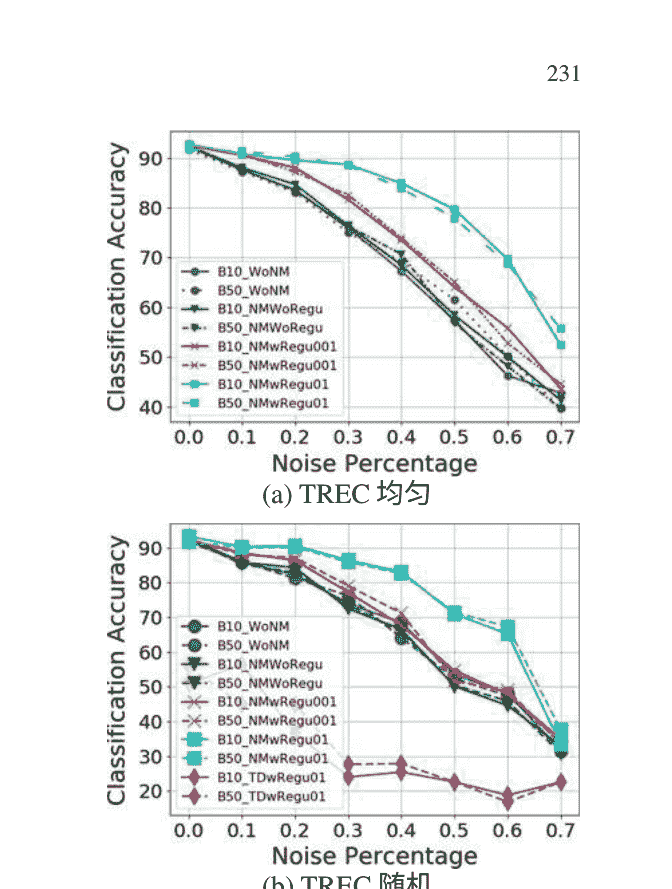

#### 5.5 理解噪声模型

为了进一步理解噪声模型，我们首先在噪声标签上训练基础模型和提出的模型。然后，我们收集所有训练样本的最后一个全连接层的激活，并将其视为输入句子的学习特征表示。我们得到两组不同的特征表示，一组对应于基础模型（TRB），另一组对应于提出的模型（TRPr）。在这些学习到的特征表示、人工注入的噪声标签和训练数据的真实标签的基础上，我们为每个模型学习两个不同的SVM，一个带有噪声，一个没有噪声。对于基础模型，对于两个SVM，我们使用TRB表示作为输入，第一个SVM使用真实标签作为目标进行训练，第二个SVM使用不可靠标签作为目标进行训练。类似地，我们为提出的模型训练两个SVM。训练后，我们在表6中评估所有学习到的SVM在干净测试数据上的性能，其中第一列表示相应模型的性能，“有噪声”和“真实”列分别表示在噪声和干净标签上训练的SVM的性能。我们针对不同的数据集和不同的标签噪声运行这些实验。

在TRB和噪声标签上训练的SVM非常接近基本模型性能（6）。这表明基本模型只是适应了噪声标签。另一方面，当我们使用真实标签作为目标，在TRPr表示上训练SVM时，SVM实现了提出的模型性能。这意味着提出的方法有助于基本模型学习更好的特征表示，即使有噪声目标，这表明这个噪声模型正在学习一个标签去噪的操作符。

我们通过绘制TRB和TRPr的t-SNE嵌入[49]来分析特征域中训练样本的表示。为了简洁起见，我们在图8中绘制了TREC数据集中50%标签噪声的t-SNE可视化。

对于每个网络，我们展示了两个不同的t-SNE图。例如，在图8a中，我们绘制了提出模型的两行t-SNE嵌入。在图8a的第一行中，每个训练样本由其对应的真实标签表示，而在第二行（噪声标签图）中，每个训练样本由其对应的噪声标签表示。我们观察到，随着学习过程的进行，噪声模型有助于基本模型在特征域中对训练样本进行聚类。在每次迭代中，我们可以看到第一行中聚类的形成。然而，在第一行中，当噪声标签叠加时，聚类并不明显分离。这意味着噪声模型去噪标签并将真实标签呈现给基网络进行学习。

在图8f中，我们绘制了TRB表示的两行t-SNE嵌入。似乎网络直接学习了噪声标签。这进一步证明了[50]的发现，即深度网络在不知道真实标签的情况下记忆数据。在图8f的第2行中，我们可以观察到网络学习了噪声特征表示，可以根据给定的噪声标签进行良好的聚类。

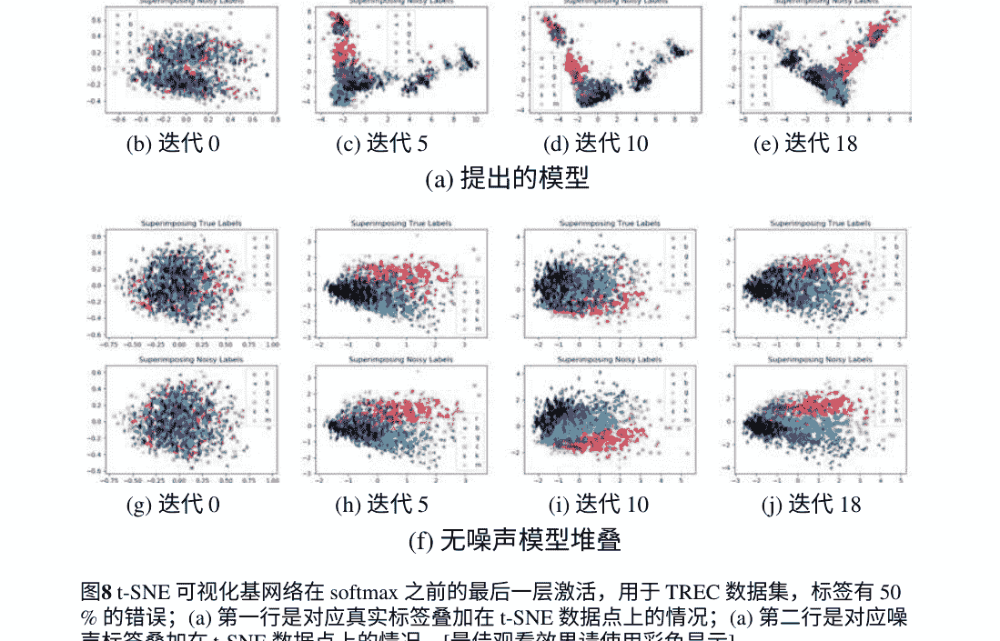

图8 t-SNE 可视化基网络在 softmax 之前的最后一层激活，用于 TREC 数据集，标签有 50 % 的错误；(a) 第一行是对应真实标签叠加在 t-SNE 数据点上的情况；(a) 第二行是对应噪声标签叠加在 t-SNE 数据点上的情况。[最佳观看效果请使用彩色显示]

### 6 结论和未来工作

在这项工作中，我们描述了一种可扩展且有效的方法，用于在噪声数据标签上训练深度网络。我们展示了这种方法在不同噪声程度和不同训练数据大小的各种不同数据集上的性能。我们观察到这种方法与模型无关，可以应用于任何深度架构。我们通过添加一个非线性噪声模型来增强标准深度神经网络。通过在最终损失函数中添加一个额外的无监督组件，进一步增强了这个噪声模型的能力。为了同时学习分类器和噪声模型，我们对最终softmax层的权重应用不同的正则化。解释这种方法的结果的一种方式是，深度网络被鼓励更多地学习将数据聚类而不是分类，这比从噪声统计中预期的要多。换句话说，让深度网络模糊地聚类带有歧义的数据比冒险学习噪声标签更好。这种现象的细节，包括哪种噪声模型对于训练准确网络来说是“理想”的，是未来研究的课题。此外，我们预计该模型也可以处理实例相关的标签噪声，即准聚类步骤可以处理实例相关的噪声，而无需学习完整的实例相关噪声模型。未来的工作应考虑分析实例相关的标签噪声。

### 参考文献

- 1. Krizhevsky, A., Sutskever, I., Hinton, G.E.: 使用深度卷积神经网络进行Imagenet分类。 在：神经信息处理系统进展，第1097-1105页（2012年）
- 2. Lin, T.Y., Maire, M., Belongie, S., Hays, J., Perona, P., Ramanan, D., Dollár, P., Zitnick, C.L.:Microsoft coco：上下文中的常见物体。 在：欧洲计算机视觉会议，第740-755页。Springer（2014年）
- 3. Torralba, A., Fergus, R., Freeman, W.T.: 8000万个小图像：一个用于非参数对象和场景识别的大型数据集。IEEE Trans. pattern Anal. Mach. Intell. 30(11), 1958-1970(2008)
- 4. Johnson, J., Karpathy, A., Fei-Fei, L.: Densecap: 全卷积定位网络用于密集字幕。 在：IEEE计算机视觉和模式识别会议论文集，第4565-4574页（2016年）
- 2 http://cogcomp.cs.illinois.edu/Data/QA/QC/

## 构建适合语义分割任务的卷积神经网络

姜亚龙和迟哲儒

摘要 尽管在许多计算机视觉任务（如图像分类、目标检测、显著性预测和深度估计）中已经取得了最先进的性能，但卷积神经网络（CNN）在一些困难的任务（如人体解析）中仍然表现不佳，这是我们研究的重点。CNN模型的不适当容量和不充分的训练数据都导致了对详细区域的语义信息感知失败。高容量模型学习到的特征表示无法适应真实世界场景中视角、人体姿势和遮挡的变化，因为会出现过拟合现象。另一方面，欠拟合问题会阻止低容量模型发展出足够表达的表示。在本章中，我们提出了一种方法来估计任务的复杂性，并将CNN模型的容量与任务的复杂性匹配，同时避免欠拟合和过拟合。首先，提出了一种新颖的训练方案，充分发掘低容量CNN模型的潜力。该方案优于现有的端到端训练方案，并使低容量模型胜过容量更高的模型。其次，提出了三种方法来优化CNN模型在任务上的容量。第一种方法基于改善卷积核之间的正交性，从而提高计算效率和性能。在第二种方法中，根据卷积层内卷积核的语义功能和对训练和测试准确性的贡献进行评估。删除仅对训练准确性有贡献但对测试准确性没有影响的卷积核，以避免过拟合。在第三种方法中，通过调整卷积核之间的依赖关系来优化CNN模型的容量。提出了一种新颖的卷积层结构，以减少在保持相似性能的同时减少参数数量。除了容量优化，我们还提出了一种评估人类解析任务复杂性的方法。为此，我们训练了一个独立的CNN模型，用于姿势估计的标签。基于图像中估计的姿势信息进行复杂性评估。复杂性评估方案在Pascal Person Part数据集和Look into Person数据集上进行，这两个数据集用于人类解析。容量优化方案在我们的人类解析模型上进行，这些模型是在这两个数据集上训练的。定量和定性结果都表明，我们提出的算法能够很好地匹配CNN模型的容量与任务的复杂性。

- 卷积神经网络（CNN）
- 欠拟合
- 过拟合
- 容量优化
- 复杂度评估

### 1 引言

深度学习的研究工作主要集中在构建具有更宽[1]或更深[2， 3]架构的模型，以在应用中实现更好的性能。只有少数论文关注了卷积神经网络在任务中所需的必要容量。例如，在[4]中提到，机器学习模型的容量衡量了它能够建模的函数的复杂程度。具有更高容量的模型可以表示变量之间更复杂的关系。此外，[5]将模型的容量定义为它可以实现的函数数量的对数。要评估基于ReLU的神经网络是否适用于任务，首先需要将推理过程等同于将数据集中的高维分布参数映射到潜在空间。图像的分布由一个多面体流形表示，该流形被分割成多个片段（单元），不同的片段独立地映射到潜在空间中。比较图像流形的修正线性复杂度和神经网络的复杂度，以决定CNN模型是否能够编码数据[5]。前者通过将图像逐片地映射到潜在空间所需的最小片段数来评估，并且由图像的分布决定。后者由CNN能够实现的分段函数数量的上界决定。只有当CNN的修正线性复杂度超过图像分布的复杂度时，CNN才能胜任任务。类似地，VC维度、增长函数、Rademacher和Gaussian复杂度、度量熵以及最小描述长度（MDL）已被提出来评估任务的复杂度和模型的容量。

尽管上述论文对CNN的容量进行了分析，但它们的结论只适用于像CIFAR-10 [6]这样的初步任务。与上述作品不同，我们尝试将模型的容量与高级视觉任务（如图像分割）的容量相匹配。我们的章节分为四个部分。首先，在引言中给出了一些常规模型的性能比较，以展示容量优化的优势。比较表明，可以在保持性能的同时简化CNN。其次，我们提出了一种方法来更好地探索CNN的潜力，以提高性能而不增加复杂性。第三，介绍了我们在估计分割任务复杂性方面的工作。最后，提出了将CNN模型的容量与任务复杂性相匹配的方法。

本章包括了新颖的训练策略、数据增强方案、改进的深度学习模型架构以及对数据集的分析。因此，本章与深度学习模型的架构设计密切相关，这是本卷主要关注的一个重点之一。

高容量模型和低容量模型所达到的性能。对于卷积神经网络（CNN），可以通过能够以不同方式转换输入的独立卷积核的数量来衡量分段映射函数的数量。同一层中的不同卷积核提取互补的线索。更高层次的卷积核允许对来自较低层次的输出进行不同的组合。CNN的架构经过多年的发展，性能和容量显著提高。例如，通过AlexNet [8]、VGG [9]、GoogLeNet [10]、ResNet [11]、DenseNet [12]、ResNeXt [13]、SE-Net [14]以及[15–17]中报道的自动设计的架构等结构，ImageNet数据集[7]的准确性得到了显著提高。此外，残差连接[11]和批量归一化[18]使得构建超过1000层的极深CNN成为可能。[5]中显示，更深的CNN具有更高的容量。图1显示了CNN在ImageNet挑战赛[7]上的准确性与容量之间的关系。图1中的CNN具有相同的架构，但容量和深度不同。

图1 具有不同容量的CNN的分类准确率。这些CNN具有相同的架构，但深度不同。准确率在[20–23]中报告。首先将训练和测试图像调整为256 × N（N × 256），最短边为256，然后裁剪为224 × 224。ResNet-i表示具有 i层的残差网络。

图1显示，容量的增加有助于在极大的ImageNet数据集上提高准确性。然而，随着容量和深度的增加，参数数量呈指数增长。因此，训练过程面临着几个突出的挑战[24]。解决高维非凸优化问题时，典型的问题如下所示：

(1) Hessian矩阵存在病态条件，梯度会卡住，即使存在强梯度，训练速度也会变慢。
(2) 存在大量的局部最小值。
(3) 损失函数的景观中有许多高成本的鞍点，可能会减慢收敛速度。
(4) 损失景观中的悬崖导致梯度爆炸。
(5) 精度的提高往往以计算资源的代价为代价。

此外，深度模型容易受到对抗性示例的攻击，这些示例是训练数据的轻微修改版本[25]。因此，最好应用更简单的模型来避免上述问题，特别是在不像ImageNet挑战那样复杂的任务上。图2显示了一个例子。在这种情况下，一个完全探索了潜力的较小模型在分割任务上可以表现得和甚至更好。评估的指标是mIOU（%）[26]，它将真正的正像素数除以真正的正像素数、假正像素数和假负像素数的总和：

$$mIOU = \frac{1}{N} \sum_{i=1}^{N} \frac{n_{ii}}{t_i + \sum_{j=i} n_{ji}} \tag{1}$$

其中 $n_{ji}$ 是预测为类别 $i$ 的类别 $j$ 的像素数，而 $t_j = \sum_{i} n_{ji} (t_i = \sum_{j} n_{ij})$ 是属于类别 $j$ 的像素总数 ($i$)。Pascal VOC 2012 分割数据集包含1,464个训练图像，共3,507个对象，以及1,449个图像，共3,422个对象用于验证。类别数为21。图像和类别的数量远远少于ImageNet分类任务中的数量，后者有超过1,000,000个图像和1,000个类别。从图2可以看出，在这个更简单的任务中，具有34层的ResNet-34的性能优于具有50层的ResNet-50。在我们的工作中，将提出方法使简单的网络表现与复杂的网络一样好。

更好地探索CNN潜力的技术。在保持计算复杂性的同时改进深度学习模型性能的现有工作可以分为两类。第一类工作集中于改进训练策略。这类工作的典型案例包括[27， 28]，前者探索梯度的适当值以帮助收敛，而后者提出逐层训练CNNs的方法。在我们的工作中，提出了一种用于优化的两步方案，以逐层训练CNNs。在第2节中将展示该方案在分割任务中优于[28]提出的方案。第二类工作涉及各种数据增强技术。在我们的工作中，研究了分割任务中训练数据和测试数据之间的差距，并在第2.1.2节中提出了基于转导学习的方法来弥合训练数据和测试数据之间的差距。

任务复杂性的估计。我们的工作研究了语义图像分割的任务，由于缺乏真实数据和存在多种类型的变异或干扰，这一直是一个具有挑战性的计算机视觉任务。可用的数据集包括Look into Person [30]， Multi-human Parsing [31]， Microsoft COCO [32]， Vistas [33]， ADE20 k [34]和Cityscapes [35]。现有的分割研究工作已经从R-CNN [36]和selective search [37]发展而来，这些方法基于检测进行分割。关于人体解析的典型的两阶段框架在[38]中进行了讨论。两阶段方法的缺点是，如果第一阶段提供错误的边界框或显著性掩码，分割一定会失败。后来的工作，如FCN [39]，提供了端到端的方案，可以同时进行定位和像素级细化。FCN被端到端训练，并在PASCAL VOC 2011 [40]上表现良好。另一个典型的端到端架构是编码器-解码器结构[41]。用于全景分割的现有端到端框架包括[42， 43]，这也是多任务学习的典型示例。

然而，几乎所有上述模型在应用中都存在限制，因为它们过于复杂，无法适应简单的任务。例如，FCNs通过引入循环神经网络（RNN）[44]改进了原始版本，但代价是效率降低。U-Net [41]在医学图像分割任务中过拟合，无法像其他模型一样表现出色。

- 5. LeCun, Y., Bottou, L., Bengio, Y., Haffner, P.: 基于梯度的学习应用于文档识别。IEEE 86(11)， 2278-2324页 (1998年)
- 6. Krizhevsky, A., Hinton, G.: 从小图像中学习多层特征 (2009年)
- 7. Deng, J., Dong, W., Socher, R., Li, L.J., Li, K., Fei-Fei, L.: ImageNet: 一个大规模的分层图像数据库。在：IEEE计算机视觉和模式识别会议，CVPR2009，第248-255页。IEEE (2009年)
- 8. Frénay, B., Verleysen, M.: 在标签噪声存在的情况下的分类问题：一项调查。IEEE Trans. Neural Netw. Learn. Syst. 25(5)， 845–869 (2014)
- 9. Zhu, X., Wu, X.: 类别噪声与属性噪声：一项定量研究。人工智能评论 22(3)， 177–210 (2004)
- 10. Xiao, T., Xia, T., Yang, Y., Huang, C., Wang, X.: 从大规模噪声标记数据中学习图像分类。在：IEEE计算机视觉和模式识别会议论文集，第2691-2699页 (2015)
- 11. Kim, Y.: 用于句子分类的卷积神经网络。在：2014年自然语言处理会议论文集，第1746-1751页 (2014)
- 12. Zhu, X.: 半监督学习文献综述 (2005年)
- 13. Aslam, J.A., Decatur, S.E.: 关于噪声容忍学习的样本复杂性。Inf. Process. Lett. 57 (4)， 189–195 (1996年)
- 14. Natarajan, N., Dhillon, I.S., Ravikumar, P.K., Tewari, A.: 带有噪声标签的学习。在：神经信息处理系统的进展，第1196–1204页 (2013年)
- 15. Liu, T., Tao, D.: 通过重要性重新加权进行带有噪声标签的分类。IEEE Trans. Pattern Anal. Mach. Intell. 38 (3)， 447–461 (2016年)
- 16. Lawrence, N.D., Schölkopf, B.: 在标签噪声存在的情况下估计非负判别。在：ICML，第1卷，Citeseer，第306–313页 (2001年)
- 17. Rebbapragada, U., Brodley, C.E.: 通过实例加权减轻类别噪声。在：欧洲机器学习大会，第708-715页。Springer (2007年)
- 18. Brodley, C.E., Friedl, M.A., 等: 识别和消除错误标记的训练实例。在：AAAI/IAAI，第1卷，第799-805页 (1996年)
- 19. Brodley, C.E., Friedl, M.A.: 识别错误标记的训练数据。人工智能研究杂志，第11卷，第131-167页 (1999年)
- 20. Manwani, N., Sastry, P.: 风险最小化下的噪声容忍。IEEE Trans. Cybern.， 第43卷，第3期，第1146-1151页 (2013年)
- 21. Ma, X., Wang, Y., Houle, M.E., Zhou, S., Erfani, S.M., Xia, S.T., Wijewickrema, S., Bailey, J.: 基于维度驱动的学习与噪声标签 (2018年)。arXiv:1806.02612
- 22. Wang, Y., Liu, W., Ma, X., Bailey, J., Zha, H., Song, L., Xia, S.T.: 迭代学习与开放式噪声标签。在：IEEE计算机视觉和模式识别大会论文集，第8688-8696页 (2018年)
- 23. Sukhbaatar, S., Bruna, J., Paluri, M., Bourdev, L., Fergus, R.: 使用带有噪声标签的卷积网络进行训练 (2014)。arXiv:1406.2080
- 24. Jindal, I., Nokleby, M., Chen, X.: 使用dropout正则化从带有噪声标签的深度网络中学习。在：2016年第16届国际数据挖掘会议(ICDM)，第967-972页。IEEE (2016)
- 25. Jindal, I., Pressel, D., Lester, B., Nokleby, M.: 用于DNN文本分类的有效标签噪声模型 (2019)。arXiv:1903.07507
- 26. Tanaka, D., Ikami, D., Yamasaki, T., Aizawa, K.: 用于学习带有噪声标签的联合优化框架。在：IEEE计算机视觉和模式识别会议论文集，第5552-5560页 (2018)
- 27. Li, Y., Yang, J., Song, Y., Cao, L., Luo, J., Li, L.J.: 通过蒸馏从嘈杂标签中学习。在：ICCV，第1928-1936页 (2017年)
- 28. Malach, E., Shalev-Shwartz, S.: 将“何时更新”与“如何更新”分离。在：神经信息处理系统进展，第961-971页 (2017年)
- 29. Veit, A., Alldrin, N., Chechik, G., Krasin, I., Gupta, A., Belongie, S.: 通过最小监督从嘈杂的大规模数据集中学习。在：计算机视觉和模式识别会议 (2017年)
- 30. Vahdat, A.: 在训练深度判别神经网络中提高对标签噪声的鲁棒性。 在：神经信息处理系统进展，第5596-5605页 (2017年)
- 31. Yao, J., Wang, J., Tsang, I.W., Zhang, Y., Sun, J., Zhang, C., Zhang, R.: 通过质量嵌入从嘈杂的图像标签中进行深度学习。IEEE图像处理交易 (2018年)
- 32. Reed, S., Lee, H., Anguelov, D., Szegedy, C., Erhan, D., Rabinovich, A.: 使用自举在嘈杂标签上训练深度神经网络 (2014年)。 arXiv:1412.6596
- 33. Azadi, S., Feng, J., Jegelka, S., Darrell, T.: 辅助图像正则化用于具有噪声标签的深度卷积神经网络 (2015). arXiv:1511.07069
- 34. Joulin, A., van der Maaten, L., Jabri, A., Vasilache, N.: 从大规模弱监督数据中学习视觉特征。 在：欧洲计算机视觉会议，第67-84页。Springer (2016)
- 35. Jiang, L., Zhou, Z., Leung, T., Li, L.J., Fei-Fei, L.: Mentornet: 在损坏的标签上对非常深的神经网络进行正则化 (2017). arXiv:1712.05055
- 36. Ghosh, A., Kumar, H., Sastry, P.: 对于深度神经网络中的标签噪声的鲁棒损失函数。 在：AAAI，第1919-1925页 (2017)
- 37. Mnih, V., Hinton, G.E.: 从嘈杂数据中学习标记航空图像。 在：机器学习国际会议(ICML-12)论文集，第567-574页(2012)
- 38. Patrini, G., Rozza, A., Menon, A.K., Nock, R., Qu, L.: 使深度神经网络对标签噪声具有鲁棒性的损失修正方法。 在：计算机视觉和模式识别(CVPR)IEEE会议论文集，第2233-2241页(2017)
- 39. Han, B., Yao, J., Niu, G., Zhou, M., Tsang, I., Zhang, Y., Sugiyama, M.: 掩蔽：嘈杂监督的新视角(2018). arXiv:1805.08193
- 40. Misra, I., Lawrence Zitnick, C., Mitchell, M., Girshick, R.: 看透人类报告偏见： 从嘈杂的人类中心标签中获得视觉分类器。 在：计算机视觉和模式识别(CVPR)IEEE会议论文集，第2930-2939页(2016)
- 41. Goldberger, J., Ben-Reuven, E.: 使用噪声适应层训练深度神经网络(2017)
- 42. Audhukhasi, K., Osoba, O., Kosko, B.: 噪声增强的卷积神经网络。 神经网络。 78， 15-23 (2016)
- 43. Vedaldi, A., Lenc, K.: Matconvnet: 用于Matlab的卷积神经网络。 在：第23届ACM国际多媒体会议论文集，pp. 689-692。ACM (2015)
- 44. LeCun, Y., Cortes, C., Burges, C.J.: 手写数字MNIST数据库 (1998)
- 45. Pressel, D., Ray Choudhury, S., Lester, B., Zhao, Y., Barta, M.: 基线：用于快速建模、实验和开发针对NLP的深度学习算法的库。 在：NLP开源软件研讨会论文集 (NLP-OSS)，计算语言学协会，pp. 34-40 (2018)
- 46. He, K., Zhang, X., Ren, S., Sun, J.: 深度残差学习用于图像识别。 在：计算机视觉和模式识别IEEE会议论文集，第770-778页 (2016年)
- 47. Voorhees, E.M., Tice, D.M.: TREC-8问答赛道评估。 在：TREC，第82卷， (1999年)
- 48. Rolnick, D., Veit, A., Belongie, S., Shavit, N.: 深度学习对大规模标签噪声具有鲁棒性 (2017年)。 arXiv:1705.10694
- 49. Van Der Maaten, L.: 使用基于树的算法加速t-sne。 机器学习研究杂志15 (1)，3221-3245页 (2014年)
- 50. Zhang, C., Bengio, S., Hardt, M., Recht, B., Vinyals, O.: 理解深度学习需要重新思考泛化 (2016年)。 arXiv:1611.03530例如。DeepSaliency [45] 中解码器的结构只能应用于有限数量的任务。语义部分分割的模型[46, 47]也受到训练数据不足的困扰。[46]中提出的算法只能应用于PASCAL人体部分数据集[48]，而EdgeNet [49]则需要训练数据同时具有部分分割标签和边界注释。此外，[50]提出的Deeplab-V2和[51]提出的Deeplab-V3都面临着训练数据不足的问题。[42, 43]中的方法在全景分割方面也面临着数据不足的问题。[52]提出仅在由弱监督和图像先验提供可靠标签的区域上进行训练。上述任务中过拟合和欠拟合的原因是缺乏对任务复杂性和CNN容量的分析。以上方法都从未考虑将模型的复杂性与任务的复杂性相匹配。

解决过拟合的现有方法包括数据增强和弱监督方法，例如BoxSup [53]和Segmenting Weakly Supervised Images [54]。在[29]中提出了三种弱监督类型。不完全监督是指标记数据仅占训练数据的一小部分的情况。基于不完全监督的半监督方法被应用于利用无标签数据，并且可以在不需要人工干预的情况下提高性能。不精确监督是指提供了一些监督信息，但不如期望的那样准确。第三种类型的监督是不准确监督，它涉及到监督不总是正确或受到噪声影响的情况。上述技术仅被应用于主观丰富训练数据。这些策略更偏向于使用较大的模型，而不是较小的模型，后者可能会遭受欠拟合的问题。此外，尚未评估添加的数据是否真的能够提供有用的信息，帮助模型开发更具普适性的特征表示。这些问题表明有必要评估训练数据的复杂性，以定量地展示数据集（任务）的复杂程度以及所需的模型复杂程度。

另一个间接解决任务复杂性的工作是Taskonomy[55]。它探索了视觉任务之间的关系，并建立了一个结构在多个任务之间。还讨论了任务之间的冗余。得出一个结论，通过重复使用相关任务的监督，解决任务所需的标记实例总数可以减少67%（与在每个任务上独立训练一个模型相比），性能几乎不变。Taskonomy的主要目标是找到任务所需的最紧凑的数据集，并消除数据中的67%冗余。同样，无监督学习关注输入域中的冗余，并利用分析形成紧凑的表示[56]。Taskonomy和无监督学习的主要贡献可以总结为两个方面。首先，对于一个具有固定大小的数据集，当其实例彼此不太相似时，它的复杂性增加。

我们的工作还将通过使用方差的数量来衡量数据集的复杂性来解决这个问题。复杂性评估实例的区分度。其次，如果数据集中存在大量冗余，可以减少训练数据而不影响数据集的复杂性以及模型的性能。在我们的工作中，这种类型的数据集具有较低的复杂性，简单的模型可以在其上表现良好。

第3节提出了三种评估数据集复杂性的方法，这反映了模型在数据集上表现良好所需的最低容量。这些方法基于不同模型预测之间的尺度、位置和一致性的方差数量。

模型容量的优化。最优容量的定义在[57]中给出。最优容量对应于欠拟合和过拟合之间的边界。现有的容量调整研究可以分为三类。第一类研究集中于评估CNN中高度、宽度和计算顺序对表达能力的贡献[58, 59]。发展性学习[60]试图使数据集不断扩大，直到CNN的容量不够表达为止。第二类工作试图计算CNN内的信息论量[61, 62]。第三种方法集中于用数学方法评估模型容量。典型的工作包括代数拓扑学[63]和线性阈值函数[4]。

第一类方法的实现包括增加CNN的宽度或高度，并对整个网络进行微调。众所周知，更深的神经元允许对现有神经元进行新的组合，而更宽的神经元则允许发现额外的任务特定线索[58]。然而，容量的增加是以效率为代价的。参考文献[59]提出引入更高阶的计算，以更好地利用现有特征而不引入额外的参数。高阶函数丰富了假设空间，并提高了现有网络模型（如ResNet[11]和WRN[64]）在CIFAR10和CIFAR100[65]上的性能。然而，过拟合更容易发生。第二类工作旨在用信息瓶颈原理描述CNN的学习。使用启发式统计物理方法计算卷积层中的熵和互信息，假设权重矩阵是独立的。在学习过程中熵和互信息的行为在[61]中进行了研究，并得出了压缩和泛化之间的关系难以捉摸的结论。

第三类工作解决了设计CNN架构的问题，通过解释架构是如何由数据集的拓扑复杂性决定的。在[63]中提供了神经网络模型的拓扑容量的经验性描述。介绍了神经网络在数据集复杂性增加时的拓扑相变。此外，[4]提供了估计典型神经元模型容量的方法，包括线性和多项式阈值门、带约束权重的线性和多项式阈值门以及ReLU神经元。然而，[4, 63]中只讨论了全连接神经网络。此外，只有非常简单的网络被研究，并且三类工作都没有关注将CNN的容量与分割等高级视觉任务的复杂性相匹配。在我们的工作中，包括了对复杂模型和高级视觉任务容量的分析。详细内容请参见第4节。

## 2种技术来充分发掘低容量网络的潜力

#### 2.1 方法论

##### 2.1.1 训练策略

- 逐层重新训练

在这部分中，我们提出了一种逐层训练方案，它优于现有的端到端训练方案以及[28]中提出的现有逐层训练方案。

通常的做法是在ImageNet数据集上以端到端的方式训练神经网络，然后在分割任务上进行微调。然而，逐阶段训练可以提升CNN模型的性能。假设CNN被分为两部分：特征提取器和任务特定层。我们提议逐层训练特征提取器（图3）。

将特征提取器的输出记为 x_K，任务特定层的预测记为 z_K。 K是特征提取器中的层数。在训练步骤1中，原始的特征提取器和任务特定层一起训练。在随后的每个步骤中，将一个额外的层添加到特征提取器中，并在新添加的层之上重新构建具有固定结构的任务特定层。逐一添加H层。特征提取器的输出和任务特定层的输出分别记为 x_{K+h} 和 z_{K+h}，其中 h = 1, ..., H。

将用于训练的数据集表示为 {x_0^n, y^n}, n = 1, ..., N其中 N是训练样本的数量。θ_h, h = 0, ..., H表示特征提取器在添加第 h层后的参数， γ_h, h = 0, ..., H表示在添加第 h层并对整个网络进行微调后的任务特定层的参数。θ_0和 γ_0对应于原始网络。第 h步（ h ≥ 1 ）的训练过程可以形式化为最小化软最大损失：

```
(θ_h^*, γ_h^*) = arg min_{θ_h, γ_h} \frac{1}{N} \sum_n L_{softmax}(z_{K+h}(x_0^n; θ_h, γ_h), y^n)
```

**Algorithm 1: Layer-wise Training Scheme**

1. 初始化 \(\theta_0\) 和 \(\gamma_0\)。训练原始网络
   \[(\theta_0^*, \gamma_0^*) = \arg \min_{\theta_0, \gamma_0} \frac{1}{N} \sum_{n} L_{softmax}(\mathbf{z}_K(\mathbf{x}_0^n; \theta_0, \gamma_0), \mathbf{y}^n)\]
2. （循环）向原始特征提取器添加第 \(h\) 层并随机初始化它（\(h \geq 1\)）。
3. （优化步骤1）仅优化第 \(h\) 层的参数：
   \[(\theta_h - \theta_h \cap \theta_{h-1})^* = \arg \min_{(\theta_h - \theta_h \cap \theta_{h-1})} \frac{1}{N} \sum_{n} L_{softmax}(\mathbf{z}_{K+h}(\mathbf{x}_0^n; (\theta_h - \theta_h \cap \theta_{h-1}), \gamma_{h-1}), \mathbf{y}^n)\]
   特征提取器中第 \(h\) 层以外的层和任务特定层保持固定。
4. （优化步骤2）优化CNN中的所有参数：
   \[(\theta_h^*, \gamma_h^*) = \arg \min_{\theta_h, \gamma_h} \frac{1}{N} \sum_{n} L_{softmax}(\mathbf{z}_{K+h}(\mathbf{x}_0^n; \theta_h, \gamma_h), \mathbf{y}^n)\]
5. 如果 \(h < H\)，则 \(h \leftarrow h + 1\) 并返回步骤2。

如算法1所示，在每次添加卷积层后，网络会重新训练两次（步骤3和步骤4）。在步骤3中，只优化新添加层的参数，而在步骤4中，整个网络会重新训练，\(\theta_h - \theta_h \cap \theta_{h-1}\)表示第\(h\)层的参数。在[28]中指出，每次添加层后重新训练有助于提高准确性，并优于端到端训练：

\[\hat{R}\left(\mathbf{z}_{K+h}; \left(\theta_{h-1}^*, (\theta_h - \theta_h \cap \theta_{h-1})^*\right), \gamma_{h-1}^*\right) \leq R\left(\mathbf{z}_{K+h-1}; \theta_{h-1}^*, \gamma_{h-1}^*\right) \tag{3}\]
其中 \(\hat{R}(\mathbf{z}_{K+h}; \theta_h^*, \gamma_h^*) = \frac{1}{N} \sum_{n} L_{softmax}(\mathbf{z}_{K+h}(\mathbf{x}_0^n; \theta_h^*, \gamma_h^*), \mathbf{y}^n)\) 并且 \(h \geq 1\)。与[28]不同的是，在添加每一层之后，CNN中的所有层都会再次进行优化：

\[\hat{R}\left(\mathbf{z}_{K+h}; \theta_h^*, \gamma_h^*\right) \leq R\left(\mathbf{z}_{K+h}; \left(\theta_{h-1}^*, (\theta_h - \theta_h \cap \theta_{h-1})^*\right), \gamma_{h-1}^*\right) \tag{4}\]
\[\hat{R}\left(\mathbf{z}_{K+h}; \theta_h^*, \gamma_h^*\right) \leq R\left(\mathbf{z}_{K+h-1}; \theta_{h-1}^*, \gamma_{h-1}^*\right) \tag{5}\]
显然，随机梯度下降（SGD）至少可以保持损失不增加（4）。从（4）和（5）可以推断出，在每一步优化添加层之后再优化整个CNN，损失可以比仅优化添加层时更低。

已经在[28]中显示，通过添加一层并在每一步中训练添加的层，一个具有11个卷积层的网络的性能与VGG-13 [9]具有13层和相同宽度但端到端训练的网络相当。此外，逐层训练的网络优于具有11层和相同宽度但端到端训练的VGG-11 [9]。因此，算法1中提出的两步优化方案比[28]中提出的一步方案对端到端训练方案有更大的改进。在Look into Person数据集[66]上进行了比较。有30,462张图片用于训练，10,000张图片用于验证，10,000张图片用于测试。在预训练的基线模型上添加了层[67]。在添加每一层后，进行了40,000次迭代的训练，并将批量大小设置为10。具有相同结构的端到端训练网络进行了40,000 ×添加的层数 ×2次的训练。

例如，如果在基线模型上添加了两个层，使用算法1构建的网络将进行40,000次迭代，仅优化第1层，40,000次迭代，优化整个网络，40,000次迭代，仅优化第2层，以及40,000次迭代，优化整个网络。端到端的对应模型将一次性进行160,000次迭代训练。初始学习率为2e-4，并采用多项式学习策略，其幂设置为0.9。[68]中提出的预处理技术应用于两个网络。比较结果显示在表1中。

从表1中可以推断出，使用算法1训练的网络优于具有相同容量但端到端训练的网络。此外，使用算法1（2步优化）训练的网络优于使用[28]中提出的方案（每层1步优化）训练的网络。因此，算法1可以更好地探索CNN的潜力，而不增加参数数量。

- 教师-学生方法

在视觉任务中，[69]指出，相较于较小的模型，较大的模型更擅长从大型数据集中提取结构。然而，大型模型所获得的知识可以转移到小型模型上，以这种方式训练的小型模型优于直接在困难的真实标签上训练的相同网络。参考文献[69]提出了一种转移泛化能力的方法，将较大模型的知识转移到较小模型上，该方法使用大模型的激活，即软最大化激活，作为训练较小模型的软目标。软目标包含训练样本之间的相似性结构。例如，狗与猫的相似性大于与花的相似性，这些相似性不能通过硬标签提供。软目标的优势来自于硬目标中不包含的额外信息。

为了解决某些类别的概率过小以至于无法影响较小网络的交叉熵损失函数的问题，[69]提出了蒸馏处理。最终软最大函数的温度 T 可以提高，直到值适合训练较小的网络：

$$ q_i = \frac{\exp(z_i / T)}{\sum_j \exp(z_j / T)} $$

q_i 表示输入图像或像素属于类别 i 的概率，而 z_i 表示相应的激活。温度 T 越高，类别分布越软。

将知识蒸馏到小模型的训练数据包括原始训练图像和无标签图像。在训练集上，目标激活是大模型产生的软目标和由真实标签产生的硬目标的加权和，温度为1。软目标在软最大函数中具有较高的温度。前者的权重应该比后者大，并且第一项的大小应该乘以 T^2 以抵消温度变化带来的影响。

在我们的工作中，采用了师生方法，将在第3节中讨论。

##### 2.1.2 数据增强策略

与分类任务中的情景不同，在分类任务中，只要训练集和测试集具有相似的分布，训练准确率和测试准确率之间的差距低于3%，而在分割任务中，这个差距总是大于10%。这表明像素特定的任务比图像特定的任务对（小）变化更敏感。图像分割任务中的变化包括姿势、颜色、光照等的变化。在我们的工作中，提出了两种方法来弥合训练数据和测试数据之间的差距。研究测试数据的变化，以丰富训练数据。通过使训练数据的变化更加全面，可以更好地探索模型的潜力。如[29]中介绍的，不完全监督关注的是有少量标记数据和大量未标记数据的情况。在这种情况下，标记数据不足以训练一个好的学习器。除了标记数据外，半监督学习还利用未标记数据来提高学习性能。由[29]提出的转导学习是一种特殊类型的半监督学习，假设可用的无标签数据正好是测试数据。我们工作中提出的两种数据增强方法与转导学习类似，通过利用无标签测试数据来提高性能。

- 弥合姿势之间的差距

数据增强的第一种方法是通过生成训练图像，这些图像与测试集中的图像具有相似的姿势。除了用于分割的CNN模型外，还训练了一个用于人体姿势分析的模型，这在我们之前的工作[68]中介绍过。骨架检测比人体部位分割更简单，可用的训练数据样本更多。因此，姿势分析模型的预测结果更具有泛化能力。在提出的方法中，首先将每个图像划分为包含一个人的区域。对于每个区域，预测一个描述姿势的向量。开发了一种算法，用于在训练数据中找到与测试数据中每个人最相似手势的人。

在匹配每对人员时，对训练图像中的人员进行单应性变换，使其更类似于测试图像中的人员。训练图像的地面真实掩码以相同的方式进行变换。变换产生了类似于测试图像但带有标签的模拟测试图像。图4显示了一些示例。为了清晰展示，人们已被分割出来。

从图4可以看出，基于训练数据生成了带有标签的模拟测试集。变换是基于预测关节的坐标进行的。

图4显示了包含具有相似姿势的人的六对图像的示例。在每对中，左图像来自测试集，右图像来自训练集。我们已经在训练集中搜索，找到与每个测试图像中的每个人具有最相似姿势的人。对前景区域进行单应性变换，来自训练图像的模拟的测试集可以丰富训练集，并弥合训练数据和测试数据之间的差距。实验证明，在训练过程中引入模拟的测试集可以提高分割性能。

为了评估姿势的相似性，我们在工作中开发了一个特征描述符。首先，14个关节的定义基于[70]中的讨论。这14个关节是：鼻子、颈部、左肩、左肘、左腕、右肩、右肘、右腕、左臀、左膝、左踝、右臀、右膝和右踝。可以通过对预测关节的坐标进行平均来计算中心点，在图5a中用红点表示。

图5描述了提出的描述符，通过计算两个直方图来描述每个人的姿势，其中包括水平和垂直平移。姿势的相似性通过两对直方图向量之间的欧氏距离之和来评估。对于具有多个人的测试图像，其模拟对应物是由不同训练图像的前景区域组成的，如图4中的Pair 6所示。其他类型的变化，如旋转、缩放或照明变化，仍可能导致训练数据和测试数据之间的差距。因此，仍然需要进行颜色变化的数据增强。

- 缩小颜色差距

除了姿势的差异，颜色的差异也导致了训练集和测试集之间的差距。在我们的工作中，采用了一种自监督的CNN进行着色

表1 mIOU（%）在人物数据集[66]上的CNN

| 逐层训练方案 | mIOU (%) |
| --- | --- |
| **在算法1中提出的2步优化** | |
| H = 0 | 45.27 |
| H = 1 | 46.61 |
| H = 2 | 47.53 |
| H = 3 | 47.93 |
| **在[28]中提出的1步优化** | |
| H = 3 | 47.26 |
| **端到端训练** | |
| H = 3 | 47.12 |
| H = 4 | 47.15 |

它基于从测试集中学习的颜色分布，将训练图像的灰度版本着色。如图4所示，训练图像可以用来生成模拟的测试图像。类似地，通过联合使用着色模型，模拟的测试图像可以更接近真实测试图像的颜色。

与人类解析类似，着色也是一个像素特定的任务。因此，我们的分割模型可以通过改变损失函数来进行着色。根据[71]中提出的方法，RGB图像首先被转换为Lab格式。L通道对应于光，而a通道和b通道对应于颜色。因此，L通道可以作为输入，而剩下的两个通道可以作为真实输出。假设输入图像的高度和宽度分别为H和W。将X^{H×W×1}表示为输入图像，将Y^{H×W×2}表示为真实值。正如[71]中所提到的，着色可以分为两个步骤。在第一步中，对于每个像素预测ab值的分布Z^∈[0,1]^{H×W×Q}，其中Q是可能的ab对的数量，在第二步中将分布转换为颜色标签：

```
$$L(\hat{Z}, Z)=-\sum_{h,w} \text{权重}(h,w)\sum_{q} Z_{h,w,q} \log(\hat{Z}_{h,w,q})$$ (7)
```

其中，权重(h, w)表示像素的权重，出现频率较高的像素被赋予较低的权重。假设所有像素都服从独立且相同的分布，该分布是来自ImageNet训练集的颜色分布P和均匀分布1/Q的和：

```
$$\text{权重}(h, w) \propto \left(0.5\mathbf{P}+\frac{0.5}{Q}\right)^{-1}$$ (8)
```

在第二步中，使用温度为0.38的软最大化函数将预测的分布掩码Z^转换为每个像素的颜色值，范围为[0, 1]^{H×W×Q}。

上述两个部分可以生成与真实测试图像在颜色和姿势上相似的模拟测试图像。在训练过程中引入生成的图像可以提高人体解析的性能，如表2所示。

表2 数据增强对姿势和颜色的mIOU改进 (%)

| 方法 | mIOU (%) |
| :--- | :---: |
| 原始Deep Lab-V2 [50] | 64.94 |
| 应用数据增强的Deep Lab-V2 [50] | 65.41 |
| 原始分割模块提出于[68] | 67.43 |
| 应用数据增强的分割模块提出于[68] | 67.94 |

从表2可以推断出，通过两种方式来弥合训练数据和测试数据之间的差距，可以提高不同模型的性能，而不增加计算复杂性。换句话说，CNN的潜力得到了更好的探索。

### 3 任务复杂性的估计

#### 3.1 方法论

##### 3.1.1 基于尺度方差的方法

与检测任务类似，分割的性能受到空间维度和平移的变化的影响。例如，在[72]中显示，关于锚框的空间维度的先验信息对于提高平均IOU很重要。空间维度包括尺度和长宽比。参考[72]表明，通过选择适合感兴趣数据集中物体大小的先验锚点，平均IOU可以比不使用先验信息的相同模型提高2.3%。此外，[72]还表明，先验越多且越准确，性能越高。也就是说，即使对象的空间维度可以通过[72]等检测模型预测，准确的先验信息也是必要的，因为性能受到模型的容量或表达能力的限制。空间维度的变化越多，任务就越困难。

在我们的工作中，提出了一种方法来评估人体解析任务中的尺度变化。我们使用姿势估计模型来评估人体解析数据集中人体对象的尺度。众所周知[46]，姿势估计和人体解析是互补的。姿势估计模型很容易受到遮挡的影响，而人体解析模型可以修复这种问题。另一方面，姿势估计模型可以提供对象级特征表示和规律性，帮助人体解析模型与实例对齐，尤其是在一些人体部位与背景颜色相同的情况下。更重要的是，姿势估计模型比人体解析模型更擅长检测小尺度的对象。

图6展示了姿势估计模型的预测结果。由于尺度较小，这三个例子中的人无法被人体解析模型检测出来。现有的用于人体解析的最先进的CNN模型，如PSPNet[73]，在图6的第三行无法将人体分割出来。然而，该模型

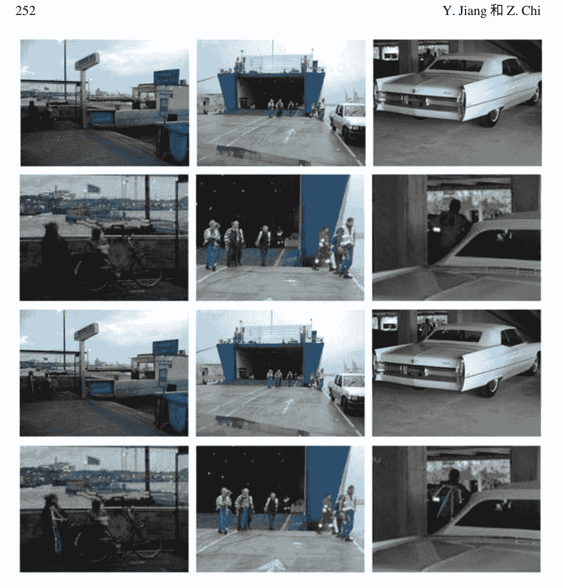

图6具有小目标的图像。第一行和第二行：输入图像。第三行和第四行：姿势估计的结果。第二行和第四行是从第一行和第三行裁剪出来的，以便清晰展示。这些图像来自Pascal VOC 2010数据集，并且骨架是通过[70]中的方法预测的。

用比[73]少得多的参数进行姿势估计[74]可以从图像中定位人物。因此，用于姿势估计的模型对尺度的变化更具鲁棒性，并且我们采用这样的模型来检测人物并基于算法2（图7）评估其尺度。

算法2：不同尺度实例上的姿势估计。

```
输入：包含各种尺度人物的图像。
输出：描述姿势的预测骨架。
1 直接将模型[74]应用于每个输入图像。
2 将步骤1的结果分为3个类别：1. 预测的骨架在图像中占据足够大的区域（预测区域的宽度不小于图像宽度的五分之一。预测区域的高度不小于图像的一半）。2. 预测区域的面积小于在上述类别中设置的阈值，但大于0。在这种情况下，从输入图像中裁剪一个矩形区域并放大它。裁剪区域以检测到的区域的质心为中心。
3. 如果没有检测到任何东西。然后根据图7（b）中的策略从输入图像中裁剪出五个区域，并放大这些区域。这五个区域大小相等。如果从裁剪的区域中没有检测到任何东西。迭代地执行该策略，直到成功检测到目标。
3 为每个检测到的人分配一个紧密的边界框，并记录相对于输入图像的宽度和高度的相对大小。
```

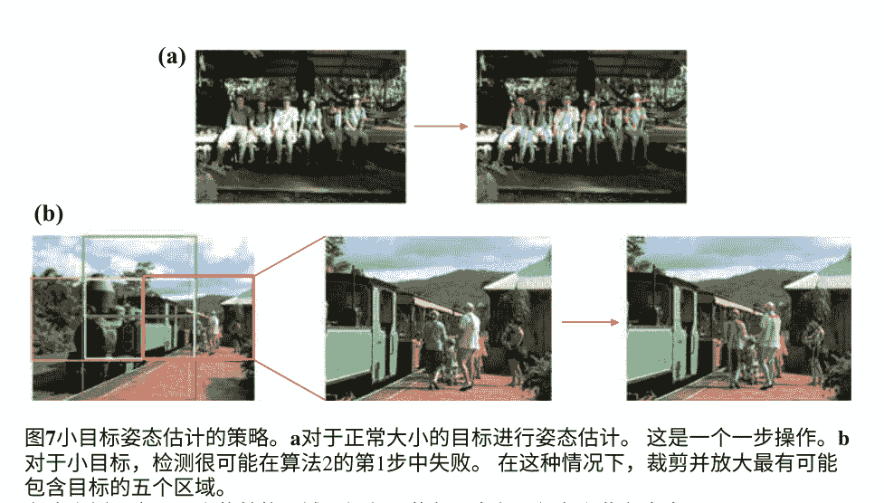

图7小目标姿态估计的策略。a对于正常大小的目标进行姿态估计。这是一个一步操作。b对于小目标，检测很可能在算法2的第1步中失败。在这种情况下，裁剪并放大最有可能包含目标的五个区域。在这个例子中，五个裁剪的区域用绿色、黄色、白色、红色和紫色突出显示。在算法2的第2步中，红色区域的检测成功。如果检测仍然失败，将进行迭代的裁剪和检测。

根据算法2，可以计算出目标在图像中所占比例。我们还对比例的分布进行了分析。分布越均匀，目标的尺度变化越大，任务就越困难。图8显示了对象在图像中所占比例的分布。水平轴表示图像中目标所占面积的比例，垂直轴表示满足条件的图像的百分比。从图8a可以看出，训练图像包含了各种尺度的对象。

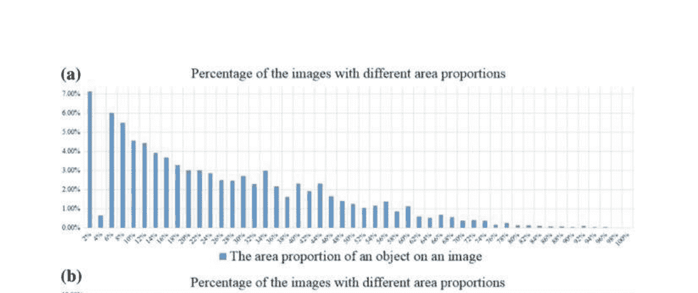

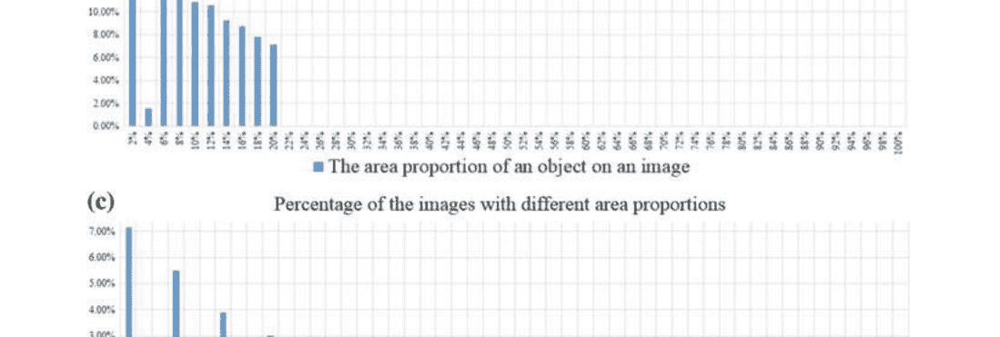

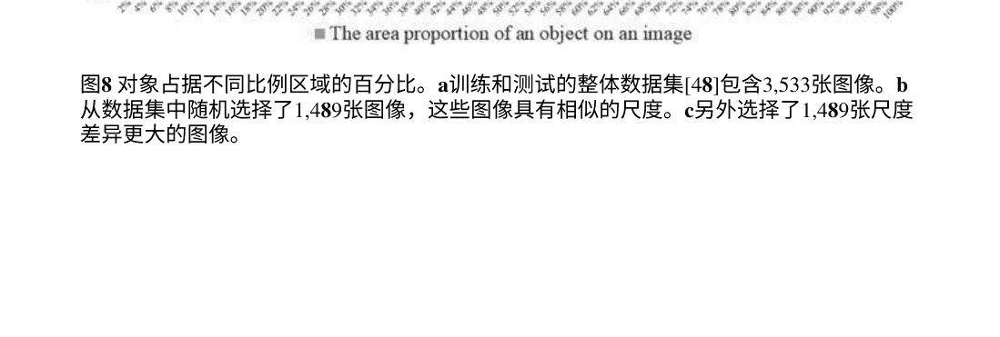

图8 对象占据不同比例区域的百分比。a训练和测试的整体数据集[48]包含3,533张图像。b从数据集中随机选择了1,489张图像，这些图像具有相似的尺度。c另外选择了1,489张尺度差异更大的图像。

表3 子集的困难程度比较

| 用于训练和测试的子集 | mIOU (%) |
|----------------------|-----------|
| 图8b中显示的子集1   | 59.47     |
| 图8c中显示的子集2   | 43.26     |

可以看出，图8b中的子集中包含具有相似尺度的对象，而图8c中的子集中包含具有显著不同尺度的对象。我们对这两个子集进行了实验。对于这两个子集，我们进行了随机划分，70%用于训练，30%用于测试。使用基于VGG-16的相同分割模型，并以相同的方式初始化。批量大小设置为10，进行了20,000次迭代进行训练。表3显示子集（b）更容易使模型良好拟合。结果表明，尺度差异是影响分割任务复杂性的重要因素。

##### 3.1.2 基于位置方差的方法

使用位置方差进行评估的方法与之类似。计算图像中物体的平移分布。分布越均匀，任务越困难。当所有图像中的物体具有相似的平移时，任务变得更容易。

##### 3.1.3 基于不同模型预测的一致性的方法

我们还提出了第三种评估数据集复杂性的方法：使用不同模型预测的一致性。在我们的案例中，评估人体解析模型和姿势估计模型之间的一致性。姿势估计模型和人体解析模型都专注于预测人的轮廓。因此，通过对预测的骨架进行膨胀，我们可以生成一个人的轮廓。对于一个足够简单的任务，两个模型都可以表现良好，因此它们预测的轮廓应该是相似的。如果一个任务变得困难，并且包含小物体或遮挡，其中一个模型可能会失败，并导致它们的预测不一致。对于一个足够困难的任务，两个模型可能以不同的方式失败，它们的预测更可能是不相似的。因此，从两个模型的预测中的相似性可以帮助我们判断任务的难度。

#### 3.2 总结

本节提出了三种评估分割任务难度的方法。当实际数据集不像训练数据集那样复杂时，这尤其有用。在这种情况下，我们可以使用尺度、位置或预测一致性的相似性来选择一个子集，该子集的复杂性与实际场景的复杂性相匹配。可以训练一个较小的模型，在实际场景中表现良好。更重要的是，我们的工作提供了一种验证数据增强技术有效性的方法。如果数据增强后数据集的复杂性没有增加，那么数据增强是无用的。

### 4 模型容量的优化

#### 4.1 方法论

##### 4.1.1 通过改善CNN中内核之间的正交性来优化容量

在CNN中，同一层中的不同内核提取互补的线索，以解决目标任务。正如[61]中所讨论的，CNN的训练可以分为拟合阶段和压缩阶段。在压缩阶段，隐藏表示与输入之间的互信息下降，而隐藏表示与真实标签之间的互信息增加。具有较少特征的表示对于输入的泛化效果更好。因此，隐藏表示和标签之间的互信息是决定CNN模型性能的关键因素。对于一个卷积层来说，独立的卷积核越多，就越不需要通道来获取固定数量的信息。因此，相互独立的卷积核可以组成一个更紧凑但同样高效的特征表示，相比之下，相关的卷积核则不然。需要更少的参数，并且其容量可以更好地匹配任务。除了容量优化之外，卷积核之间的正交性对训练过程以及CNN的性能也有重要影响。这在[3]中已经讨论过。

对于一个具有L个卷积层的CNN，假设第l（1≤l≤L）层的输入通道数为d，输出通道数为n。x表示该层的输入，h=Wl*x，其中Wl是权重矩阵，Wl∈Rn×d，且Wl*WlT=In×n。通常情况下，我们通过减去输入的均值并将结果归一化到[-1, 1]范围内。x具有零均值和单位协方差的特性：E[x]=0且cov(x)=σ^2I。然后

```
$$E_{\mathbf{h}}[\mathbf{h}] = \mathbf{W}_l^T E_{\mathbf{x}}[\mathbf{x}]=0 \tag{9}$$
```

协方差 h 的计算方法如下

```
$$ cov(\mathbf{h}) = E_{\mathbf{h}}[\mathbf{h} - E_{\mathbf{h}}[\mathbf{h}]]^2 $$
$$ = E_{\mathbf{x}}[\mathbf{W}_l(\mathbf{x} - E_{\mathbf{x}}[\mathbf{x}])]^2 $$
$$ = E_{\mathbf{x}}[\mathbf{W}_l(\mathbf{x} - E_{\mathbf{x}}[\mathbf{x}])] \cdot E_{\mathbf{x}}[\mathbf{W}_l(\mathbf{x} - E_{\mathbf{x}}[\mathbf{x}])]^T $$
$$ = \mathbf{W}_l E_{\mathbf{x}}[(\mathbf{x} - E_{\mathbf{x}}[\mathbf{x}])] \cdot E_{\mathbf{x}}[(\mathbf{x} - E_{\mathbf{x}}[\mathbf{x}])] \mathbf{W}_l^T $$
$$ = \mathbf{W}_l cov(\mathbf{x}) \mathbf{W}_l^T $$
$$ = \sigma^2 \mathbf{W}_l \mathbf{W}_l^T $$
$$ = \sigma^2 $$
(10)
```

对于具有 ReLU 非线性的网络，可以通过批归一化层和缩放层来实现 (9)。对于其他类型的非线性，如 tanh，可以直接实现 (9) 和 (10)。因此，正交权重矩阵可以保持通道之间的归一化和去相关性的特性，根据[75]。

正如[76]中所讨论的，归一化和去相关的激活对于改善每层权重的 Fisher 信息矩阵的条件有所贡献，而更好的条件加速了神经网络的学习过程。对于第 $l$ ($1 \leq l \leq L$) 层的权重矩阵 $\mathbf{W}_l$ 和输入 $\mathbf{x}$，Fisher 信息矩阵表示为：

```
$$ F_{\mathbf{W}_l} = E_{\mathbf{x} \sim p(\mathbf{x})} \left\{ E_{\mathbf{y} \sim p(\mathbf{y}|\mathbf{x}, \mathbf{W}_l)} \left[ \left( \frac{\partial \log p(\mathbf{y}|\mathbf{x}, \mathbf{W}_l)}{\partial \mathbf{W}_l} \right) \left( \frac{\partial \log p(\mathbf{y}|\mathbf{x}, \mathbf{W}_l)}{\partial \mathbf{W}_l} \right)^T \right] \right\} $$
(11)
```

为了计算方便，我们将输入 $\mathbf{x}$ 和非线性函数 $\mathbf{y}$ 的输出都离散化为区间。在二分类的情况下，$\mathbf{y}$ 的可能值分布在两个区间内。$p(\mathbf{y} = 1|\mathbf{x}, \mathbf{W}_l) = f_l(\mathbf{W}_l \mathbf{h}_{l-1} + \mathbf{b}_l)$，其中 $f_l()$ 是非线性函数。方程 (11) 可以转换为

```
$$ F_{\mathbf{W}_l} = E_{\mathbf{x} \sim p(\mathbf{x})} \left\{ E_{\mathbf{y} \sim p(\mathbf{y}|\mathbf{x}, \mathbf{W}_l)} \left[ \text{vec} \left( \boldsymbol{\delta}_l \mathbf{h}_{l-1}^T \right) \text{vec} \left( \boldsymbol{\delta}_l \mathbf{h}_{l-1}^T \right)^T \right] \right\} $$
(12)
```

其中 $\boldsymbol{\delta}_l$ 表示通过 $f_l()$ 反向传播的梯度，$\text{vec}(\mathbf{X})$ 表示包含矩阵 $\mathbf{X}$ 中所有元素的向量。它是将 $\mathbf{X}$ 中所有行的转置版本连接成的列向量。基于 $\boldsymbol{\delta}_l$ 和 $\mathbf{h}_{l-1}$ 之间的独立性，(12) 可以转换为

```
$$ F_{\mathbf{W}_l}(km, ln) = E_{\mathbf{x} \sim p(\mathbf{x})} \left\{ E_{\mathbf{y} \sim p(\mathbf{y}|\mathbf{x}, \mathbf{W}_l)} [\delta_l(k)\delta_l(l)] \right\} E_{\mathbf{x} \sim p(\mathbf{x})} [\mathbf{h}_{l-1}(m)\mathbf{h}_{l-1}(n)] $$
(13)
```

$F_{\mathbf{W}_l}(km, ln)$ 评估矩阵 $\mathbf{W}_l$ 中 $(k, m) - th$ 项和 $(l, n) - th$ 项之间的统计相关性。通过 $F_{\mathbf{W}_l}(km, ln)$ 可以通过以下约束来改善

表4 减少通道带来的mIOU (%)影响

| 方法 | mIOU (%) |
| --- | --- |
| 原始分割模型 (基于VGG-16) [50] | 56.53 |
| 使用4.1.1节中的方法对conv5_3进行压缩的分割模块 | 56.57 |
| 使用4.1.1节中的方法对conv5_3和conv5_2进行压缩的分割模块 | 56.48 |

```
$$E_{\mathbf{x} \sim p(\mathbf{x})} \left[ \mathbf{h}_{l-1} \mathbf{h}_{l-1}^T \right] = \mathbf{I}$$
```

根据(9)和(10)，正交权重矩阵可以对(14)有所贡献，从而改善Fisher信息矩阵的条件，加快学习的收敛速度。 对于(13)中的第一项，[76]中讨论了非线性函数 (如ReLU) 可能带来的相关性可以忽略不计。

此外，如果对于$\mathbf{W}_l \in \mathbb{R}^{n \times d}$，我们有$\mathbf{W}_l^T \mathbf{W}_l = \mathbf{W}_l \mathbf{W}_l^T = \mathbf{I}$和$\|\mathbf{h}\| = \|\mathbf{x}\|$。梯度的值也可以保持不变：

```
$$\left\| \frac{\partial L}{\partial \mathbf{x}} \right\| = \left\| \frac{\partial L}{\partial \mathbf{h}} \mathbf{W} \right\| = \left\| \frac{\partial L}{\partial \mathbf{h}} \mathbf{W} \mathbf{W}^T \frac{\partial L^T}{\partial \mathbf{h}} \right\| = \left\| \frac{\partial L}{\partial \mathbf{h}} \frac{\partial L^T}{\partial \mathbf{h}} \right\| = \left\| \frac{\partial L}{\partial \mathbf{h}} \right\|$$
```

因此，正交滤波器有助于保持激活和梯度的稳定性。

在我们的工作中，同时实现了更好的收敛性 (如表4所示的更高准确率) 和特征通道数量的减少。 与[3]不同，该方法从随机初始化中构建了一组正交核，我们在人体解析任务上预训练了一个CNN，然后选择了一组最压缩的正交核，几乎覆盖了与预训练核相同的空间。

压缩集合中的核数量是原始核集合的一半。
减少核数量的方法基于[75]。 它产生一组正交核，我们选择其中一半核来最好地解释预训练核中的方差。

通过比预训练层中的集合元素更少的一组核，我们实现了两个优势： (1) 减少了参数数量，而不减少突出的特征; (2) 更好的正交性确保了更好的训练效果。 在我们的实验中，预训练模型[50]中特征提取器的最后两层通道数量减少了一半。 表4显示，性能不会受到压缩的影响。

##### 4.1.2 通过减少CNN中内核之间的依赖来进行容量优化

除了卷积内核的数量之外，预训练内核之间的依赖性也是指示任务复杂性的重要因素。 对于一个固定的任务来说卷积核的数量越多，任务越复杂，对判别特征需要进行更多的非线性操作，并且需要更多独立的核来表现良好。我们建议首先在一个任务上训练一个CNN模型，以达到最高可能的准确性，然后使用主成分分析（PCA）[77]评估预训练核集中的独立组件数量。一层的核被视为高维空间中的随机变量。如果需要更多的组件来解释变量的变异性，那么任务就更复杂，反之亦然。

假设一个层的输入有$M$个通道，输出通道的数量为$N$。该层中的权重包括$M \times N$个卷积核。这些卷积核是以向量形式组成的。一个向量的大小为$1 \times K$。对于一个$K \times K$卷积核，$K$为$2$，$N$卷积核被组织成一个$K^{2} \times N$矩阵$\mathbf{X}$。我们将把关于调整线性依赖关系的讨论分为两部分。在第一部分中，我们将讨论权重的初始化方式。新的卷积层的初始化方式得到了解决。该过程在算法3中描述，并且对每个输入通道进行一次。在第二部分中，将引入具有可调节容量的新卷积层。

**Algorithm 3 Initialize the new convolutional layer with pre-trained weights**

1.  Organize the $N$ vectors and construct a $K^{2} \times N$ matrix $\mathbf{X}$.
2.  Subtract each entry by the mean of that row.
3.  Compute the normalized covariance matrix $\mathbf{C} = 1/N(\mathbf{XX}^{\top})$.
4.  Conduct singular value decomposition (SVD) on $\mathbf{C}$ and record the singular values as well as singular vectors.
5.  The variance ratio is the sum of $H$ largest singular values divided by the sum of all singular values. If a variance ratio is larger than 85%, we consider the representation power of the simplified kernels to be with enough expressive power.
6.  Construct a $H \times K^{2}$ matrix $\mathbf{P}$ whose rows are the singular vectors corresponding to the $H$ largest singular values. ($H < K^{2}$)
7.  Approximate the original $N$ vectors with the columns of $\hat{\mathbf{X}}$ where $\hat{\mathbf{X}} = \mathbf{P}^{\top}\mathbf{PX}$.

在算法3中，矩阵$\mathbf{P}$中的行向量是线性无关的。每个$\mathbf{X}$中的$N$个内核都可以用$H$个向量的线性组合表示。对于固定的方差比率，如果需要更大的$H$，预训练的内核对于任务的表现就不那么依赖，因此数据集的复杂性更高。在极端情况下，如果$H=1$，$\mathbf{X}$中的所有$N$个内核都是线性相关的。可调容量的新卷积层的结构如图9a和b所示。图9a展示了将一个传统层分解为两个子层的方式。第二层包括$1 \times 1$卷积，用线性组合的$M \times H$主成分逼近原始$M \times N$卷积核。

图9b展示了所提出的卷积层与传统卷积层的区别。


在对卷积核进行预训练并应用算法3之后，初始化的新的卷积层经历第二轮训练。在我们的实验中，如果满足以下三个条件，容量与任务的复杂性更好地匹配：（1）H个组件可以解释原始卷积核85%以上的方差。（2）重新训练后，训练准确率的损失小于1%。（3）经过数据增强和重新训练，测试准确率的损失低于1%。请注意，简化层中的可辨别特征数量少于原始层中的数量。此外，对于一个小或大的网络，只有少于100%的特征是可泛化的。因此，我们必须使简化网络中有用特征的比例大于简化之前网络中的比例，这可以通过数据增强来实现。

对于 H =3，参数数量的减少约为67%。如果任务变得更加复杂，需要更高的 H。主成分的数量可以从一到八选择。这是因为在PCA分析中，每个输入变量都是一个具有9个维度的3x3卷积核，并且具有九个组件的网络与简化之前的网络具有相同的容量。策略是从中位数八开始，即四。如果具有四个主成分的简化网络不能满足上述三个条件，则依次尝试五、六、七和八个组件；否则依次尝试一、二和三个组件。该过程递归进行。对于每个主成分数里，重新训练和测试网络。如果没有简化网络能够像原始网络一样表现出色，则必须使用原始网络进行推断。重新训练的最大次数为四次。

##### 4.1.3 通过减少卷积层中核之间的冗余来进行容量优化

假设CNN模型的容量超过了任务所需，如果CNN模型以不恰当的方式训练，或者在另一个数据集上进行了预训练，卷积核之间可能会出现冗余。也就是说，移除一些核和相关的互连对性能没有任何损害。

我们研究了一种将CNN的容量与任务匹配的方法。这是通过调整不相关特征通道的数量来实现的。我们提出的模型是在PASCAL VOC 2010人体部分数据集[48, 78]和COCO数据集[32]上进行训练的，分别包含3,533张图像和80,000张图像。这些数据集远远小于ImageNet竞赛中使用的数据集[79]，后者包含超过1,000,000张图像用于训练。因此，我们的模型不应该像Deeplab-V2模型中的特征提取器那样复杂，后者与ImageNet数据集的复杂性相匹配。

在[80]中提到，在神经网络中使用高斯混合模型来建模权重的分布是合适的。每个数据点对应一个卷积核，每个高斯分量是一组卷积核。在CNN中，同一层中的不同卷积核对应于任务的不同线索，而不同层对应于线索的不同组合。在CNN中，可以根据它们的相似性对线索和组合进行聚类。因此，CNN可以划分为功能单元。同一功能单元内的特征通道具有相似的语义含义。功能单元对任务的有用性取决于通过移除该单元对整体性能的影响。我们建议基于EM算法[81]来减少功能单元的数量。这个过程可以克服CNN模型的过拟合问题。

算法4对每一层进行一次，并首先在最高层上进行。在特征提取器中。假设某一层的输入具有 $M$个通道而输出具有 $N$ 个通道。$M$ 与每个 $N$个输出通道对应的卷积核被连接起来以产生 $\mathbf{x}_i, i=1,\ldots,N$。$\mathbf{X}=\{\mathbf{x}_1,\ldots,\mathbf{x}_N\}$。构建高斯混合模型来对连接的向量进行聚类 $N$。向量被分成 $K$ 组。$\boldsymbol{\mu}=\{\boldsymbol{\mu}_1,\boldsymbol{\mu}_2,\ldots,\boldsymbol{\mu}_K\}, \boldsymbol{\Sigma}=\{\boldsymbol{\Sigma}_1,\boldsymbol{\Sigma}_2,\ldots,\boldsymbol{\Sigma}_K\}$ 和 $\boldsymbol{\pi}=\{\pi_1,\ldots,\pi_K\}$ 表示 $K$ 个聚类的参数，其中 $\boldsymbol{\mu}_i,i=1,\ldots,K$ 表示均值向量，$\boldsymbol{\Sigma}_i,i=1,\ldots,K$ 表示协方差向量和 $\pi_i,i=1,\ldots,K$ 表示混合系数。

**Algorithm 4 Partitioning a CNN layer into functional units**

1.  Initialize $K,\boldsymbol{\mu}=\{\boldsymbol{\mu}_1,\boldsymbol{\mu}_2,\ldots,\boldsymbol{\mu}_K\}, \boldsymbol{\Sigma}=\{\boldsymbol{\Sigma}_1,\boldsymbol{\Sigma}_2,\ldots,\boldsymbol{\Sigma}_K\}$ and $\boldsymbol{\pi}=\{\pi_1,\ldots,\pi_K\}$
2.  (Outer loop) Increase $K$
3.  (Inner loop) Perform E step to evaluate the responsibilities $\gamma(z_{nk}) = \frac{\pi_k N(\mathbf{x}_n | \boldsymbol{\mu}_k, \boldsymbol{\Sigma}_k)}{\sum_{j=1}^{K} \pi_j N(\mathbf{x}_n | \boldsymbol{\mu}_j, \boldsymbol{\Sigma}_j)}$
4.  Perform M step to update $\boldsymbol{\mu}=\{\boldsymbol{\mu}_1,\boldsymbol{\mu}_2,\ldots,\boldsymbol{\mu}_K\}, \boldsymbol{\Sigma}=\{\boldsymbol{\Sigma}_1,\boldsymbol{\Sigma}_2,\ldots,\boldsymbol{\Sigma}_K\}$ and $\boldsymbol{\pi}=\{\pi_1,\ldots,\pi_K\}$
5.  Check the convergence of $\ln p(\mathbf{X}|\boldsymbol{\mu},\boldsymbol{\Sigma},\boldsymbol{\pi})$. If the convergence criterion (reaching maximum) is not satisfied, return to Step 3, else proceed.
6.  Evaluate the influence of halving the number of clusters within one layer on the performance by comparing the test accuracy before and after the process. If the drop in accuracy is below a threshold (3%), stop, else return to Step 2.

在开始时， $K =1$。将聚类减半会导致很大的精度损失，因为对于一个大的聚类，不同的功能单元被集成在聚类中，而在第6步中将聚类减半的操作导致一些功能单元完全丢失。聚类的数量 K 增加，直到每个聚类代表一个功能单元，而减半一个聚类只会导致部分丢失一个功能单元。算法中有两个循环。在外部循环中，K 增加，每个聚类中的元素数量减少。系统的准确性不会显著下降，因为所有功能单元的部分仍然保留。选择评估准确性下降的阈值为3%。

如上所述，如果删除一个功能单元对性能没有任何影响，那么可以将其删除。表5显示了从网络中删除每个功能单元对性能的影响，这些功能单元位于conv6_1、conv6_2和conv6_3层中[50]。在删除每个功能单元后，网络会重新训练一个增强的数据集。

如表5所示，每个层中都有一个功能单元，其缺失对测试准确性和训练准确性都没有任何影响。删除conv6_2中的第5个单元会提高测试准确性并降低训练准确性。可以推断该单元导致了过拟合。删除功能单元并进行迭代重新训练，直到剩下的所有功能单元对任务都是必需的。表6显示了对性能的影响。

**表5 在conv6_1、conv6_2和conv6_3层中删除功能单元时测试mIOU (%) 的变化**

|   | conv6_1 训练 (%) | conv6_1 测试 (%) | conv6_2 训练 (%) | conv6_2 测试 (%) | conv6_3 训练 (%) | conv6_3 测试 (%) |
| :--- | :--- | :--- | :--- | :--- | :--- | :--- |
| 完成 | 0.00 | 0.00 | 0.00 | 0.00 | 0.00 | 0.00 |
| 单元1 | -0.33 | -0.87 | -0.14 | -0.10 | -0.14 | -3.03 |
| 单元2 | -0.02 | -0.08 | -0.09 | -0.97 | -0.09 | -0.64 |
| 单元3 | -0.05 | -0.01 | -1.04 | -3.19 | +0.00 | +0.00 |
| 单元4 | -0.58 | -1.71 | +0.00 | -0.32 | +0.00 | +1.02 |
| 单元5 | -1.11 | -4.20 | -0.01 | +0.18 | -0.29 | -1.04 |
| 单元6 | +0.00 | +0.00 | -0.36 | -1.16 | -0.03 | -0.83 |
| 单元7 | -0.01 | -0.52 | -0.01 | -0.33 | -0.44 | -1.31 |
| 单元8 | -0.14 | +0.00 | +0.00 | +0.00 | -0.41 | -1.66 |

**表6 减少卷积核之间的依赖性和冗余性对模型容量和性能的影响。（性能通过mIOU (%) 进行评估）**

| 模块/模型 | mIOU (%) | 参数数量 |
| :--- | :--- | :--- |
| Deeplab-V2 [50] | 64.94 | 13.161e+7 |
| 具有容量减少的DeepLab-V2 [50] | 65.97 | 11.257e+7 |
| 分割模块 [68] | 65.07 | 6.559e+7 |
| 简化的分割模块 | 67.43 | 1.589e+7 |

通过减少卷积核之间的依赖性和冗余性所带来的性能提升。实验是在[68]中提到的分割模块以及Deeplab-V2模型[50]上进行的。训练数据来自于PASCAL VOC 2010人体部分数据集，用于身体部位分割[48， 78]。数据集包括3,533张图像的注释，其中1,716张用于训练。真实标签是分割掩模。训练的最大迭代次数在20,000到70,000之间变化。当平均训练准确率连续两个时期不变时，训练终止。批量大小设置为6。随着特征图数量的减少，回归需要更多的训练迭代。容量的减少分为两个步骤：（1）应用上述方法简化模型/模块。首先进行减少冗余的方法，然后进行减少依赖性的方法。

前者适用于简化已经在小数据集上训练过且存在很多冗余的卷积神经网络。第二种方法适用于简化没有明显过拟合问题或已经通过第一种方法简化过的卷积神经网络。（2）应用第1节中介绍的师生方法，在更大的训练数据上训练小模型，以较大网络的预测结果作为标准答案。

从表6可以推断出，减少卷积核之间的依赖性和冗余性的提出的方法可以应用于提高性能和减少模型复杂性。被移除的功能单元只对训练数据中的图像分割有用，对测试数据的分割没有用处。在移除冗余的功能单元并重新训练后，进行测试准确率的测量。

通过容量优化可以显著提高效率。此外，在推理过程中节省的时间超过了简化模型所花费的额外时间。这是因为训练只进行一次，而推理则进行无数次。

#### 4.2 总结

在本节中，提出了三种方法来优化CNN模型在人类解析任务中的容量。研究了卷积核之间的正交性、卷积层中的冗余以及卷积核之间的依赖关系，以减少人类解析模型中的参数数量。更重要的是，简化模型甚至略微优于原始模型。换句话说，优化了CNN模型的容量，并实现了更好的收敛性。

### 5 结论与未来工作

在本章中，我们介绍了构建适合语义分割任务的CNN的工作。我们讨论了在人类解析任务的背景下，卷积神经网络的架构设计和训练的三个主要贡献。首先，我们提出了新颖的训练策略和数据增强方案。其次，我们提出了通过分析不同类型的变化以及不同模型预测的一致性来评估分割任务复杂性的方法。第三，我们提出了三种卷积层的架构，以减少计算负担同时保持性能。本章非常符合本卷的主题“深度学习：架构、算法和应用”。我们未来的工作将重点关注数据流形的定量评估，这将有助于指导机器学习模型的发展。

### 参考文献

1.  李，J.，肖，L.，舒恩霍尔兹，S.S.，巴赫里，Y.，索尔-迪克斯坦，J.，彭宁顿，J.：任何深度的宽神经网络在梯度下降下演化为线性模型（2019年）。arXiv预印本arXiv:1902.06720
2.  罗尔尼克，D.，泰格马克，M.：更深层网络表达自然函数的能力。在：国际学习表示会议（2018年）
3.  肖，L.，巴赫里，Y.，索尔-迪克斯坦，J.，舒恩霍尔兹，S.S.，彭宁顿，J.：动力学等谱和卷积神经网络的平均场理论：如何训练10000层的普通卷积神经网络（2018年）。arXiv预印本arXiv:1806.05393
4.  皮埃尔，B.，罗曼，V.：神经元容量。在：NIPS（2018年）
5.  雷，罗，尧，顾：深度学习的几何理解（2018年）。arXiv预印本 arXiv:1805.10451
6.  Krizhevsky, A., Hinton, G.：CIFAR-10上的卷积深度置信网络。在：未发表手稿（2010年）
7.  邓，伯格，萨蒂什，苏，科斯拉，李，F.F.：2012年大规模视觉识别挑战。可用：http://www.image-net.org/challenges/ILSVRC/2012/（2012年）
8.  Krizhevsky, A., Sutskever, I., Hinton, G.E.：使用深度卷积神经网络的ImageNet分类。在：神经信息处理系统的进展，第1097-1105页（2012年）
9.  Simonyan, K., Zisserman, A.：非常深的卷积网络用于大规模图像识别（2014）。arXiv预印本 arXiv:1409.1556
10. Szegedy, C., Liu, W., Jia, Y., Sermanet, P., Reed, S., Anguelov, D., Erhan, D., Vanhoucke, V., Rabinovich, A.：用卷积更深入。在：IEEE计算机视觉和模式识别会议（2015）
11. He, K., Zhang, X., Ren, S., Sun, J.：深度残差学习用于图像识别。在：IEEE计算机视觉和模式识别会议论文集, pp. 770–778(2016)
12. Huang, G., Liu, Z., Weinberger, K.Q., van der Maaten, L.：密集连接的卷积网络。在：IEEE计算机视觉和模式识别会议论文集, vol. 1, pp. 3 (2017)
13. Xie, S., Girshick, R., Dollár, P., Tu, Z., He, K.：聚合残差变换用于深度神经网络。在：IEEE计算机视觉和模式识别会议, pp. 5987-5995（2017年）

14. Hu, J., Shen, L., Sun, G.: 挤压和激励网络 (2017年)。 arXiv预印本arXiv:1709.01507

15. Zoph, B., Vasudevan, V., Shlens, J., Le, Q.V.: 学习可扩展的可迁移架构 图像识别 (2017年)。 arXiv预印本arXiv:1707.07012

16. Liu, C., Zoph, B., Shlens, J., Hua, W., Li, L.J., Li, F.F., Yuille, A., Huang, J., Murphy, K.: 渐进式神经架构搜索 (2017年)。 arXiv预印本arXiv:1712.00559

17. Real, E., Aggarwal, A., Huang, Y., Le, Q.V.: 正则化进化用于图像分类器架构搜索 (2018年)。 arXiv预印本arXiv:1802.01548

18. Ioffe, S., Szegedy, C.: 批归一化：通过减少内部协变量转移加速深度网络训练。在：国际机器学习会议 (2015)

19. He, K., Zhang, X., Sun, J.: 深度残差网络中的身份映射。在：欧洲计算机视觉会议，第630-645页 (2016年)

20. Simon, M., Rodner, E., Denzler, J.: 使用批归一化的ImageNet预训练模型 (2016年)。 arXiv预印本arXiv:1612.01452, https://github.com/cvjena/cnn-models

21. He, K., Zhang, X., Ren, S., Sun, J.: 深度残差网络 (2015年)。可用：https://github.com/KaimingHe/deep-residual-networks

22. He, K., Zhang, X., Ren, S., Sun, J.: 具有1 K层的深度残差网络 (2016年)。可用：https://github.com/KaimingHe/resnet-1k-layers

23. He, K., Zhang, X., Ren, S., Sun, J.: 训练的ResNet torch模型 (2016年)。可用：https://github.com/facebook/fb.resnet.torch/tree/master/pretrained

24. Goodfellow, I., Bengio, Y., Courville, A.: 深度学习。麻省理工学院出版社 (2016年)

25. Kurakin, A., Goodfellow, I., Bengio, S., Dong, Y., Liao, F., Liang, M., Liang, J.: 对抗攻击和防御竞赛 (2018年)。 arXiv预印本arXiv:1804.00097

26. Everingham, M., Van Gool, L., Williams, C.K.I., Winn, J., Zisserman, A.: PASCAL视觉对象类别挑战2012 (VOC2012) 结果。可用：http://www.pascal-network.org/challenges/VOC/voc2012/workshop/index.html (2012年)

27. 罗, L., 熊, Y., 刘, Y., 孙, X.: 自适应梯度方法与动态学习速率边界 (2019年)。 arXiv预印本arXiv:1902.09843

28. 匿名: 浅层学习用于深度网络。在：双盲审查下 (2018年)

29. 周, Z.H.: 弱监督学习简介。自然科学评论 5 (1), 44-53 (2017年)

30. 龚, K., 梁, X., 张, D., 沈, X., 林, L.: 自我监督结构敏感学习和人体解析的新基准。在：IEEE计算机视觉和模式识别会议论文集，第932-940页 (2017年)

31. 龚, K., 梁, X., 李, Y., 陈, Y., 杨, M., 林, L.: 基于实例级别的人体解析通过部分分组网络。在：欧洲计算机视觉会议论文集 (2018年)

32. 林, T.Y., Maire, M., Belongie, S., Hays, J., Perona, P., Ramanan, D., Zitnick, C.L.: 微软 coco: 上下文中的常见对象。在：ECCV会议论文集 (2014年)

33. Neuhold, G., Ollmann, T., Rota Bulo, S., Kontschieder, P.: 用于街景语义理解的Mapillary Vistas数据集。在：IEEE国际计算机视觉会议论文集，第4990-4999页 (2017年)

34. Zhou, B., Zhao, H., Puig, X., Xiao, T., Fidler, S., Barriuso, A., Torralba, A.: 通过ADE20K数据集对场景进行语义理解。计算机视觉国际期刊1-20页 (2016年)

35. Cordts, M., Omran, M., Ramos, S., Rehfeld, T., Enzweiler, M., Benenson, R., Schiele, B.: 用于语义城市场景理解的Cityscapes数据集。在：IEEE计算机视觉与模式识别会议 (2016年)

36. Girshick, R., Donahue, J., Darrell, T., Malik, J.: 用于准确物体检测和语义分割的丰富特征层次结构。在：IEEE CVPR会议论文集 (2014年)

37. Uijlings, J., van de Sande, K., Gevers, T., Smeulders, A.: 用于物体识别的选择性搜索。 Int. J. Comput. Vision 104(2), 154–171 (2013)

38. 李, J., 赵, J., 魏, Y., 郎, C., 李, Y., Sim, T., 严, S., 冯, J.: 野外多人解析 (2017)。 arXiv:1705.07206

39. Everingham, M., Van Gool, L., Williams, C.K.I., Winn, J., Zisserman, A.: 可用: http://www.pascal-network.org/challenges/VOC/voc2011/workshop/index.html (2011)

40. 李, X., 陈, H., 齐, X., 麦, Q., 傅, C.W., Heng, P.A.: H-DenseUNet: 混合密集连接UNet用于CT体积的肝脏和肝肿瘤分割 (2017)。 arXiv预印本 arXiv:1709.07330

41. Kirillov, A., He, K., Girshick, R., Rother, C.: 全景分割 (2018). arXiv预印本 arXiv:1801.00868

42. de Geus, D., Meletis, P., Dubbelman, G.: 具有联合语义和实例分割网络的全景分割 (2018). arXiv预印本 arXiv:1809.02110

43. Zheng, S.: 条件随机场作为循环神经网络。 在：IEEE ICCV会议论文集 (2015)

44. Li, X., Zhao, L., Wei, L., Yang, M.H., Wu, F., Zhuang, Y., Ling, H., Wang, J.: DeepSaliency: 多任务深度神经网络模型用于显著目标检测。 IEEE Trans. Image Process. 25(8), 3919–3930 (2016)

45. 夏, F., 王, P., 陈, X., 尤尔, A.L.: 联合多人姿势估计和语义部分分割。 在：IEEE计算机视觉和模式识别会议论文集 (2017年)

46. 江, Y., 迟, Z.: 用于语义分割的全卷积框架。 在：IEEE DICTA会议论文集 (2017年)

47. 陈, X., 莫塔吉, R., 刘, X., 菲德勒, S., 乌尔塔桑, R., 尤尔, A.L.: 检测你能够：使用整体模型和身体部分检测和表示对象。 在：IEEE CVPR会议论文集 (2014年)

48. 陈, L.C., 巴伦, J.T., 帕帕安德鲁, G., 墨菲, K., 尤尔, A.L.: 语义图像分割-使用CNN和经过区分训练的域转换进行任务特定边缘检测。 在：IEEE计算机视觉和模式识别会议论文集 (2016年)

49. Chen, L.C., Papandreou, G., Kokkinos, I., Murphy, K., Yuille, A.L.: DeepLab: 带有深度卷积网络、空洞卷积和全连接CRFs的语义图像分割。 IEEE Trans. Pattern Anal. Mach. Intell. 40(4), 834–848 (2018)

50. Chen, L.C., Papandreou, G., Schroff, F., Adam, H.: 重新思考空洞卷积在语义图像分割中的应用 (2017)。 arXiv预印本 arXiv:1706.05587

51. Li, Q., Arnab, A., Torr, P.H.: 弱监督和半监督全景分割。 在：欧洲计算机视觉会议论文集，第102–118页(2018)

52. Dai, J., He, K., Sun, J.: BoxSup: 利用边界框监督卷积网络进行语义分割。 在：IEEE ICCV会议论文集(2015)

53. Zhang, L., Yang, Y., Gao, Y., Yu, Y., Wang, C., Li, X.: 一种用于分割弱监督图像的概率联想模型。 IEEE Trans. Image Process. 23(9), 4150–4159 (2014)

54. Zamir, A.R., Sax, A., Shen, W., Guibas, L.J., Malik, J., Savarese, S.: Taskonomy: 解开任务迁移学习的难题。 In: Proceedings of the IEEE Conference on Computer Vision and Pattern Recognition (2018)

55. Donahue, J., Krahenbuhl, P., Darrell, T.: 对抗特征学习 (2016). arXiv预印本 arXiv:1605.09782

56. Goodfellow, I., Bengio, Y., Courville, A.: 深度学习。 MIT Press, Massachusetts, Cambridge (2016)

57. Wang, Y.X., Ramanan, D., Hebert, M.: 通过增加模型容量进行微调：培养大脑。 在：IEEE CVPR会议记录 (2017)

58. Wang, Y., Xie, L., Liu, C., Qiao, S., Zhang, Y., Zhang, W., Yuille, A.L.: Sort: 用于视觉识别的二阶响应变换。 在：IEEE ICCV会议记录 (2017)

59. Sigaud, O., Droniou, A.: 迈向深度发展学习。 IEEE Trans. Cognit. Dev. Syst.8(2), 99–114 (2016)

60. Guss, W.H., Salakhutdinov, R.: 通过代数拓扑表征神经网络的容量 (2018). arXiv预印本 arXiv:1802.04443

61. Zagoruyko, S., Komodakis, N.: 宽残差网络 (2016). arXiv预印本 arXiv:1605.07146

62. Krizhevsky, A., Hinton, G.E.: 从微小图像中学习多层特征. 多伦多 (2009)

63. Gong, K., Liang, X., Zhang, D., Shen, X., Lin, L.: 看人：自监督结构敏感学习和人体解析的新基准. 在：IEEE计算机视觉和模式识别会议 (2017)

64. Chen, L.C., Papandreou, G., Kokkinos, I., Murphy, K., Yuille, A.L.: DeepLab：具有深度卷积网络、空洞卷积和全连接CRF的语义图像分割. IEEE Trans. Pattern Anal. Mach. Intell. 40(4), 834–848 (2018)

65. Jiang, Y., Chi, Z.: 用容量优化的CNN模型进行语义人体部分分割. IEEE Trans. Image Process. (2018)

66. Hinton, G., Vinyals, O., Dean, J.: 提取神经网络中的知识 (2015). arXiv预印本 arXiv:1503.02531

67. Cao, Z., Hidalgo, G., Simon, T., Wei, S., Sheikh, Y.: OpenPose: 实时多人2D姿势估计，使用部分亲和力场 (2018). arXiv预印本 arXiv:1812.08008

68. Zhang, R., Phillip, I., Alexei, A.E.: 多彩图像上色. 在：欧洲计算机视觉会议 (2016)

69. Redmon, J., Farhadi, A.: YOLO9000: 更好、更快、更强 (2017). arXiv预印本 arXiv:1612.08242

70. 赵, H., 史, J., 齐, X., 王, X., 贾, J.: 金字塔场景解析网络. 在：IEEE计算机视觉和模式识别会议 (2017年)

71. Andriluka, M., Pishchulin, L., Gehler, P., Schiele, B.: 2D人体姿势估计：新的基准和最新技术分析. 在：IEEE CVPR会议论文集 (2014年)

72. 黄, L., 刘, X., 郎, B., 于, A.W., 王, Y., 李, B.: 正交权重归一化：在深度神经网络中多个相关斯蒂夫尔流形优化的解决方案. 在：第三十二届AAAI人工智能大会 (2018年)

73. Desjardins, G., Simonyan, K., Pascanu, R., Kavukcuoglu, K.: 自然神经网络. 在：神经信息处理系统 (2015年)

74. Abdi, H., Williams, L.J.: 主成分分析. Wiley Interdiscip. Rev. Comput. Stat. 2(4), 433–459 (2010)

75. Everingham, M., Eslami, S.A., Van Gool, L., Williams, C.K.I., Winn, J., Zisserman, A.: The Pascal视觉对象类别挑战：回顾. Int. J. Comput. Vision 111(1), 98–136 (2015)

76. Deng, J., Berg, A., Satheesh, S., Su, H., Khosla, A., Li, F.F.: 可用：http://www.image-net.org/challenges/LSVRC/2012/ (2012)

77. Nowlan, S.J., Hinton, G.E.: 通过软权重共享简化神经网络. Neural Comput. 4(4), 473–493 (1992)

78. Moon, T.K.: 期望最大化算法. IEEE Signal Process. Mag. 13(6), 47–60 (1996)

## 使用卷积神经网络预测体育赛事结果

### 陈慕彦，陈庭轩和林书宏

摘要像FIFA世界杯和世界棒球经典赛这样的体育赛事越来越受欢迎，对这些比赛的报道和评论的热情证明了它们的广泛影响力。这些比赛是热门的讨论话题。许多关注体育的人只是临时的球迷，但即使是这些“临时”的球迷也有与所有球迷一样的期望：他们支持的球队应该能够获胜。本研究选择国家篮球协会（NBA）作为竞技球类的代表。本研究的预测基于对NBA比赛的历史记录进行的检查和统计分析。本研究将体育赛事结果预测领域与深度学习的方法论相结合，采用卷积神经网络进行研究。训练和预测的模型基于过去三年中共计4,235场比赛的统计数据。我们分析了各种模型结构的训练结果。虽然以前的研究已经将卷积神经网络应用于图像或物体识别，但我们的研究提出了一种特定的编码方法，将其与深度学习相结合，以预测未来比赛的结果。本研究模型的预测准确率约为91%，偏差约为0.2。这些强大的结果证实了我们指定的编码方法的有效性。

关键词体育预测·深度学习·卷积神经网络·美国篮球协会（NBA）

M.-Y. Chen (✉) · S.-H. Lin
国立台中科技大学信息与管理学院，台中，台湾电子邮件：mychen.academy@gmail.com
S.-H. Lin
电子邮件：abc9652000@gmail.com
T.-H. Chen
国立台中科技大学金融学院，台中，台湾
电子邮件：thchen@nutc.edu.tw

### 1 引言

每当FIFA世界杯或世界棒球经典赛开始时，全球范围内忠实或偶尔的球迷数量在整个赛季中显著增加。与比赛相关的在线搜索趋势也急剧上升。

根据谷歌趋势服务中显示的热门搜索词，很明显，竞技体育是大多数人特别是在国际锦标赛季节非常感兴趣的。图1展示了2018年7月“足球”这个搜索词在谷歌的热门趋势[1]，显示了在2018年6月中旬与FIFA世界杯有关的搜索趋势急剧上升。

《商业周刊》[2]报道称，日本的北海道日本火腿骑士队通过使用棒球运营系统（BOS）分析球员的能力，为每个位置选拔和确定最合适的球员。体育运动在类型、规则和技能方面各不相同，同时还受到各种难以量化的影响（例如天气条件、士气等）。为了排除各种不稳定因素，本研究选择了美国职业篮球联赛（NBA）的比赛作为分析对象，因为它们受到无法控制的因素的影响较小，并且数据是公开可用的。

Fong [3]预测了美国职业棒球大联盟（MLB）比赛的结果和得分。然而，由于考虑了太多的变量，模型的结果往往无法收敛，降低了预测的准确性。因此，我们选择了受到较少决定因素影响的NBA比赛。NBA也是最负盛名的职业篮球联赛之一。

深度学习的概念在近年来迅速获得了认可。在计算机Alpha Go击败韩国围棋大师李世石之后，深度学习在全球范围内变得更加有名。然而，Alpha Go很快被AlphaGo Zero取代，后者在两个程序对战时击败了Alpha Go。这表明深度学习的发展和优化速度非常快。

虽然深度学习已经应用于图像/物体识别的研究中（例如棋盘游戏符号、绘画、图片中的人物/物品/对象等），但深度学习也常用于特征提取。以往的研究很少使用深度学习方法来预测竞技体育比赛的结果。这样的结果更常通过统计回归分析、人工神经网络或支持向量机的算法来预测。因此，这

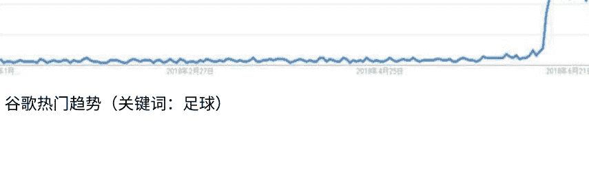研究采用深度学习方法来预测竞技体育比赛的结果。

我们使用过去三年的NBA比赛记录作为分析和研究的对象，并按照深度学习方法进行建模。本研究的目标如下：

- 减少预测结果所需的数据量。
- 将原始数据的格式转换为适合深度学习的格式。
- 比较具有不同结构的模型的预测结果的准确性。

### 2 文献综述

#### 2.1 卷积神经网络架构

卷积神经网络是一类前馈式人工神经网络。它的神经元可以对特定区域内的外围单元做出响应。它在视觉图像处理方面取得了出色的结果。卷积神经网络的结构模仿了生物大脑中的神经元。Hubel和Wiesel [4] 首次注意到，当猫在视觉上观察不同的事物时，大脑中的神经元会有不同的反应。Fukushima [5] 提出了一种无监督的概念网络，能够自主学习图形中的几何变化。

Indolia等人[6]详细介绍了卷积神经网络的架构。卷积神经网络主要由几个结构组成：输入层、卷积层、池化层、激活函数、全连接层、损失函数和输出层。该架构如图2所示。

卷积神经网络的主要结构由一个或多个卷积层组成，最后是一个全连接层。它还包括与池化层相关的权重和结果。这种结构使得卷积神经网络能够利用数据的二维结构特征。

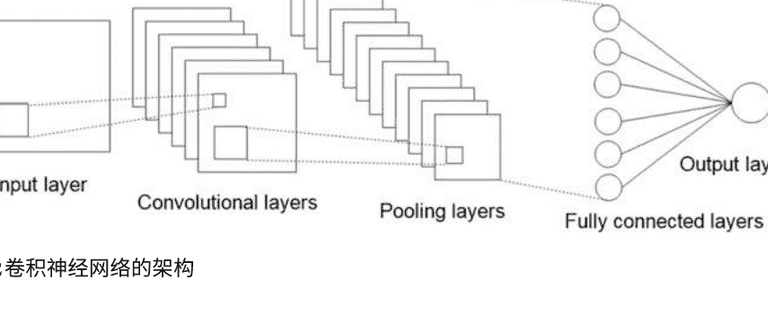

卷积神经网络可以利用数据的二维结构特征。卷积神经网络可以通过反向传播进行训练，因此需要的参数比其他深度网络少。

#### 2.2 关于体育预测的相关研究

预测研究需要访问历史数据。从现有数据中提取特征可以预测未来的目标。体育预测也不例外。

Craig等人[7]提出了美式足球比赛中球队进攻与环境温度之间的关系，并使用多层回归分析进行了分析。所采用的数据集由美国国家橄榄球联盟（NFL）提供。结果显示，足球队进攻的攻击性水平与环境温度呈正线性关系。环境温度越高，进攻的强度越大。然而，这仅适用于主场球队。

Maszczczyk等人[8]使用四个因素来预测标枪投掷距离：投掷标枪的第一步距离，身体和手臂的力量，腹部肌肉的力量和手的握力。建立了回归模型和人工神经网络模型。最终，比较了它们的结果之间的差异。人工神经网络的偏差平均为16.77米，而回归模型的偏差平均为29.45米，表明人工神经网络具有更好的预测能力。这也证明了人工神经网络的预测结果优于广泛使用的回归模型。

Bačič等人[9]使用嵌入式传感器测试高尔夫挥杆应用。记录了高尔夫球手当前的生理状态和高尔夫球的飞行路径。这些数据通过HMMA（人体运动建模与分析）进行量化。使用挥杆长度和攻击角度预测高尔夫球的路径。

Bunker和Thabtah[10]指出，机器学习在分类和预测领域非常有前景。参与体育赛事赌注的大量资金要求高度精确的预测。研究人员对机器学习的文献进行了严格的审查。然后采用人工神经网络作为一种新的框架，将机器学习作为一种学习策略。

Kipp等人[11]建立了一个人工神经网络模型，用于预测举重运动员举重时髋关节、膝关节和踝关节的净关节力矩（NJM）。使用七名大学举重运动员的数据进行训练和测试。尽管预测性能水平低于先前的文献，但杠铃运动和NJM的时间序列数据与过去高水平运动员的数据相似。这也证明了预测结果非常稳定。

现有的文献表明，对任何类型的预测研究都严重依赖于历史数据。这些数据可能还有很多列。为了做出准确的预测，必须提取重要特征。本研究使用了NBA数据。在从数据中选择更重要的列之后，使用卷积神经网络进行特征提取和模型训练。

### 3 研究方法

#### 3.1 开发环境

本研究的硬件是一台配备有64位Win7操作系统的个人电脑，具有4核CPU和8 GB RAM。我们使用Python编程语言收集和预处理游戏数据。我们还使用了Oracle VM VirtualBox虚拟机进行深度学习开发和模型建立。操作系统是Linux，编程语言也是Python，使用了Pytorch框架。

#### 3.2 研究过程

本研究的研究过程可以分为五个主要步骤：数据收集、数据预处理、数据编码、数据建模和性能评估。研究模型和过程如图3所示。

- 步骤1：数据收集

NBA比赛数据是从NBA台湾官方网站下载进行分析的。图4显示了原始数据的一个样本[12]。使用Python作为数据crawler，从2014年10月到2017年4月的时间段内收集了比赛记录，总共有4,235场比赛，涵盖了过去三个NBA赛季。在这个时期，主场球队取得了2,473场胜利和1,762场失利。

- 步骤2：数据预处理

一旦Python数据爬虫获取到数据，我们发现许多比赛中球员数量的差异，以及非首发球员，导致了缺失值和不同数量的列。在数据处理阶段，数据字段中的空值被填充为0，以完成实验目的的比赛数据。我们为每个球员收集了总共20个数据项，如表1所示。

1989年，曼利[13]提出了EFF（效率）一词来计算NBA球员的表现。EFF是基于五个加法数据项（得分、篮板、助攻、抢断和盖帽）和三个减法项（投篮不中、罚球不中和失误）计算的。我们选择只包括对其有更大影响的项目。

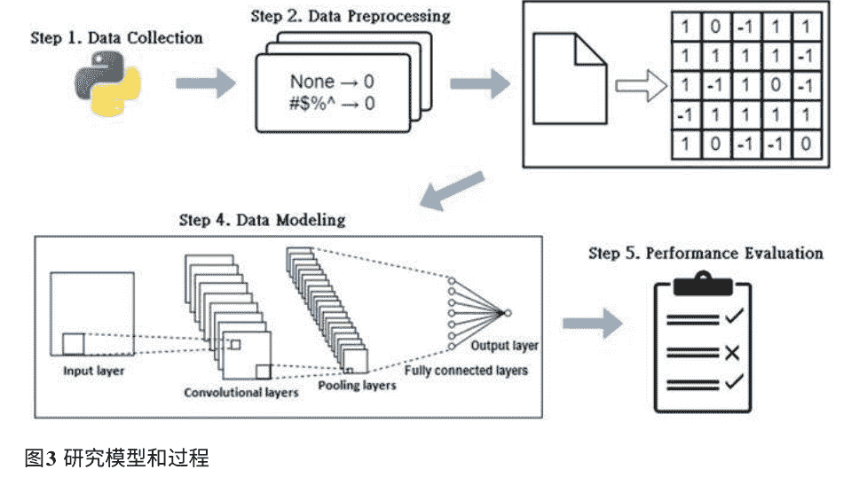

图3 研究模型和过程

整个比赛；因此，失误没有计入计算。关于在最终得分方面更有影响力的项目，本研究的得分计算包括罚球和三分球，这些都被计算为百分比。投篮命中率、三分球命中率和罚球命中率分别通过将命中次数除以出手次数来计算。

| 姓名 | 位置 | 上場時間 | 得分 | 籃板 | 助攻 | 抄截 | 阻攻 | 投籃命中 | 投籃出手 | 投籃% | 三分球命中數 | 三分球出手數 | 三分球% |
|------|------|----------|------|------|------|------|------|----------|----------|------|------------|------------|------|
| LeBron-James | 前鋒-後衛 | 41:04 | 35 | 14 | 6 | 2 | 3 | 15 | 25 | 60.0 | 1 | 4 | 25.0 |
| Rodney-Hood | 後衛 | 18:25 | 5 | 2 | 0 | 0 | 0 | 2 | 6 | 33.3 | 1 | 4 | 25.0 |
| Jeff-Green | 前鋒 | 34:48 | 16 | 5 | 4 | 0 | 0 | 5 | 12 | 41.7 | 1 | 4 | 25.0 |
| Kyle-Korver | 後衛 | 38:17 | 19 | 2 | 1 | 1 | 1 | 7 | 13 | 53.8 | 3 | 8 | 37.5 |
| George-Hill | 後衛 | 36:37 | 8 | 4 | 3 | 2 | 1 | 3 | 5 | 60.0 | 2 | 4 | 50.0 |
| JR-Smith | 後衛-前鋒 | 27:18 | 3 | 2 | 0 | 0 | 0 | 1 | 3 | 33.3 | 1 | 2 | 50.0 |
| Jordan-Clarkson | 後衛 | 24:23 | 14 | 3 | 3 | 0 | 0 | 6 | 12 | 50.0 | 1 | 5 | 20.0 |
| Ante-Zizic | 前鋒-中鋒 | 06:18 | 0 | 0 | 0 | 0 | 2 | 0 | 1 | 0.0 | 0 | 0 | 0.0 |
| John-Holland | 後衛-前鋒 | 15:48 | 5 | 2 | 0 | 0 | 0 | 2 | 3 | 66.7 | 1 | 2 | 50.0 |
| Jose-Calderon | 後衛 | 00:00 | 0 | 0 | 0 | 0 | 0 | 0 | 0 | 0.0 | 0 | 0 | 0.0 |
| London-Perrantes | 後衛 | 00:00 | 0 | 0 | 0 | 0 | 0 | 0 | 0 | 0.0 | 0 | 0 | 0.0 |
| 總計 | - | 240 | 105 | 34 | 17 | 5 | 7 | 41 | 80 | 51.3 | 11 | 33 | 33.3 |

图4 NBA单场比赛中主队的数据记录

表1 NBA比赛数据列

| 列标题 | 列标题 | 列标题 | 列标题 |
|---|---|---|---|
| 上场时间 | 盖帽 | 三分球出手次数 | 进攻篮板 |
| 得分 | 两分球命中数 | 三分球命中率 | 防守篮板 |
| 篮板 | 两分球出手次数 | 罚球命中数 | 失误 |
| 助攻 | 两分球命中率 | 罚球出手次数 | 犯规 |
| 抢断 | 三分球命中数 | 罚球命中率 | 正/负(±) |

出手次数。由于得分和出手次数已经包含在百分比中，所以这两项数据被排除在计算之外。另一方面，由于篮板数包括进攻篮板和防守篮板，所以这两项数据也被排除在计算之外。由于效率值不包括犯规次数，本研究也排除了该数据。

正负值(±)是球员在场上对比分数的影响。当球员A在场上时，他或他的队友得分2分，该值为+2。失分直接相减。正负值将附加到球员A，直到他被替换或比赛结束。正负值已经考虑了时间的影响，因此球员在场上的分钟数不包括在计算中。表2显示了本研究中使用的数据列及其计算方法。

由于在每场比赛中没有最终得分和统计数据的测量标准，并且加时赛会导致典型比赛中的时间长度不同，统计数据的最大值可能会影响计算结果。因此，数据需要在之后进行归一化处理。归一化是根据每场比赛中每个球员的每个统计数据的影响程度进行的。

最小值为0，最大值为1。归一化方法如公式（1）所示。

$$ y = \frac{x - \min(x)}{\max(x) - \min(x)} \tag{1} $$

表2 本研究中使用的比赛数据列

| 列标题 | 计算方法 | 列标题 | 计算方法 |
|---|---|---|---|
| 得分 | 加法项目 | 两分球命中率 | 加法项目 |
| 篮板 | 加法项目 | 三分球命中率 | 加法项目 |
| 助攻 | 加法项目 | 罚球命中率 | 加法项目 |
| 抢断 | 加法项目 | 失误 | 减法项目 |
| 盖帽 | 加法项目 | 正负值 | 加法项目 |

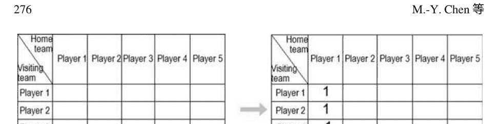

图5 矩阵编码过程的示意图

- 步骤3：数据编码

由于卷积神经网络经常被用于图像识别研究中，所以相应的数据类型与当前研究的数据类型不匹配。在这个阶段，经过归一化后计算出的玩家综合技能表现水平被编码以符合卷积神经网络的数据类型，以便进行模型构建。

在第2步中，已经计算出了每个玩家在单场比赛中对每个列的影响程度。随后，对这些归一化的列进行了计算。计算结果可以被视为每个玩家在单场比赛中的综合表现评估。然后，逐一比较主场和客场球队的球员，并对比结果进行编码。从主队的角度分别比较每个球员的综合表现值。如果主队球员的影响力大于客队球员的影响力，则编码值为1；否则为-1。

如果玩家影响的程度相等，则编码为0。编码过程如图5所示。NBA允许在一场比赛中注册最多16名球员；因此，编码矩阵的大小为16 × 16。

- 步骤4：数据建模

建模的输入数据是在步骤3中编码的矩阵数据。它是一个二维的16 × 16矩阵，表示最终的目标字段，即胜利和失败。胜利或失败是从主队的角度确定的。比赛的结果被编码为1表示胜利，0表示失败。

然后，我们根据实验的需要建立了具有不同结构和参数的卷积神经网络模型。我们希望通过调整参数来构建一个更好的模型。在这项研究中建立了四种不同架构的模型。为了防止模型过拟合，在池化层之后设置了一个丢弃层（设置值为10%）。模型的详细架构设置如表3所示。这四个模型进行了200次训练迭代，每次进行10次交叉验证。

模型的其他详细参数设置如表4所示。

表3 不同结构下的CNN架构

| CNN模型架构 | 模型1 | 模型2 | 模型3 | 模型4 |
| :--- | :--- | :--- | :--- | :--- |
| 卷积层1 | 2 × 2 | 2 × 2 | 2 × 2 | 5 × 5 |
| 池化层2 | 2 × 2 | 5 × 5 | 2 × 2 | 2 × 2 |
| Dropout设置 | 10% | 10% | 10% | 10% |
| 卷积层2 | 2 × 2 | 2 × 2 | 2 × 2 | 2 × 2 |
| 池化层2 | 2 × 2 | 2 × 2 | 2 × 2 | 2 × 2 |
| Dropout设置 | 10% | 10% | 10% | 10% |
| 卷积层3 | -- | -- | 2 × 2 | -- |
| 池化层3 | -- | -- | 2 × 2 | -- |
| Dropout设置 | -- | -- | 10% | -- |
| 全连接层 | 1 | 1 | 1 | 1 |

表4 CNN模型的参数设置

| 参数名 | 参数值 |
| :--- | :--- |
| 训练迭代次数 | 200 |
| 批量大小 | 32 |
| 学习率 | 0.0015 |
| 激活函数 | ReLU |
| 损失值计算 | 交叉熵 |
| 优化器 | Adam |

- 步骤5：性能评估

基于不同的架构、参数和数据集对卷积神经网络的结果进行了评估。还对使用不同数据集进行实验产生的结果进行了回顾和分析。我们将各种结果与人工神经网络进行了比较，以分析差异。

#### 3.3 实验设计

除了架构上的差异，还调整了其他参数以优化卷积神经网络的结果。我们比较了卷积层和池化层中卷积滤波器的大小，并将批量大小从32调整到512。学习率设置为0.0015。通过交叉熵计算损失值。我们使用了Adam优化器，它比随机梯度下降方法更常用，也可以以更稳定的方式更新权重。

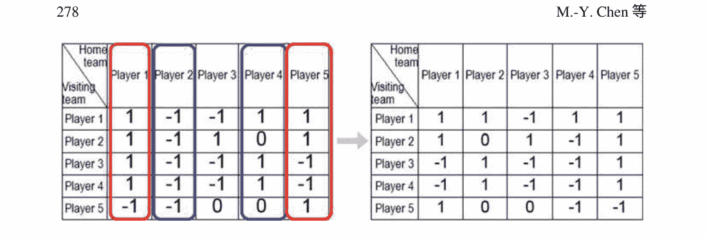

图6 水平翻转矩阵

- 实验1

实验1中使用的数据内容是由本研究的编码方法编码的二维矩阵。实验使用了前述的卷积神经网络模型，并采用了不同的架构。数据内容包含4,235条记录。

- 实验2

实验2中使用的数据内容是通过水平翻转数据集1创建的二维矩阵。图6展示了水平翻转的概念。图6的左侧是已经编码的二维矩阵，而右侧是水平翻转后的矩阵结果。

- 实验3

实验3中使用的数据内容由数据集1和数据集2组成，以便能够使用大量数据来训练卷积神经网络。我们期望通过增加数据量来提高模型的性能。数据集3共有8,470个条目，是三个数据集中最大的数据量。

- 实验4

实验4中使用的数据通过随机交换编码的二维矩阵的行和列进行处理。随机交换的概念在图7中有所说明。图7的左侧显示了编码的二维矩阵，其中红色框表示要交换的列，蓝色框表示要交换的行。图7的右侧显示了随机交换后的结果。数据集4共有4,235个条目。

在使用不同架构和参数的卷积神经网络模型进行实验后，除了对每个模型进行比较外，还将结果与反向传播神经网络的结果进行了比较。

使用Weka ver3.8建立了反向传播神经网络环境。

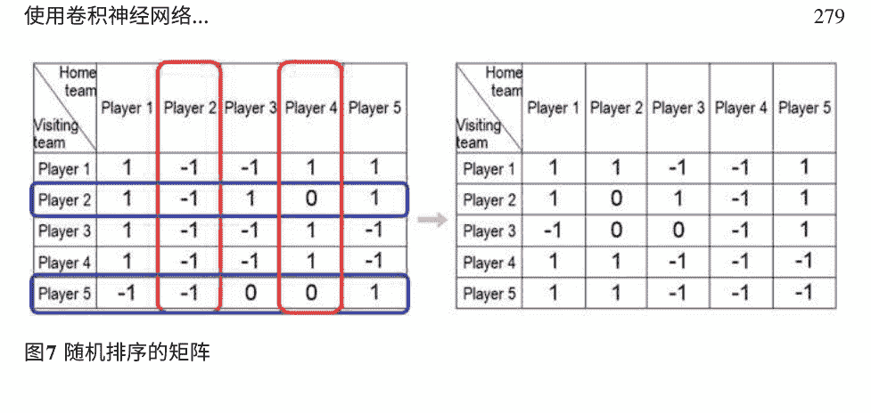

| 预测结果 | 正类 | 负类 |
|---|---|---|
| 正类 | TP（真正例） | FN（假阴性） |
| 负类 | FP（假阳性） | TN（真阴性） |

#### 3.4 性能评估

本研究将最终实验预测的准确性和损失作为评估标准。使用混淆矩阵计算准确性。如表5所示，使用公式（2）计算准确性。通过交叉熵[14]计算损失。该计算如公式（3）所示。当损失接近0时，模型预测的结果越接近实际结果。通过损失值，模型还可以进行反向传播来修改模型内部的权重和参数。损失值并不能完全代表模型的质量。它只能确定模型的预测结果是否接近实际值。

准确性 = \frac{TP + TN}{TP + FN + FP + TN}

H(p, q) = 1 \sum_x p_x \log q_x

### 4 实验结果

#### 4.1 数据集描述

本研究使用了四个内容不同的数据集进行实验。使用四个数据集旨在验证我们提出的编码方法的可行性。这四个数据集的内容分别如下。表6显示了每个数据集的内容和目的的组合。

#### 4.2 实验1和2的结果

本节展示了在不同批次大小的条件下，使用数据集1和2对四个不同架构的模型进行实验的结果。数据集1和2的数据内容已经编码成二维矩阵数据。实验结果显示在表7和表8中；内容是进行10折交叉验证实验后的平均结果。

实验1和2的结果准确率非常接近。它们的准确率约为90%，但模型2稍低，约为89%。模型1和2之间的差异在于池化层的大小。在模型2的池化层中，使用了一个5×5的卷积滤波器进行采样。结果不佳的原因可能是本研究中使用的二维矩阵大小为16×16。

与照片的像素矩阵相比，这项研究的矩阵确实太小了。直接的过度采样可能会破坏小矩阵的结构，导致特征损失，最终影响准确性。尽管如此

表6 每个数据集的描述

|  | 数据集1 | 数据集2 | 数据集3 | 数据集4 |
| :--- | :--- | :--- | :--- | :--- |
| 实验目的 | 确认本研究提出的编码方法的可行性 | 期望在矩阵翻转后保留其特征值 | 通过增加数据量来提高模型性能 | 期望本研究的编码方法不会受到排列顺序的影响 |
| 数据组成 | 本研究提出的编码方法的矩阵数据 | 水平翻转数据集1生成的结果 | 数据集1和数据集2的总和 | 通过随机交换顺序生成的矩阵 |
| 数据量 | 4,235 | 4,235 | 8,470 | 4,235 |

表7 实验1中的10折交叉验证实验结果

| 批量大小 | 实验结果 | 模型1 | 模型2 | 模型3 | 模型4 |
| :--- | :--- | :--- | :--- | :--- | :--- |
| 32 | 准确率 | 90.24% | 89.35% | 89.80% | 89.80% |
| 32 | 损失 | 0.206 | 0.213 | 0.192 | 0.224 |
| 64 | 准确率 | 90.62% | **89.49%** | 90.02% | 90.01% |
| 64 | 损失 | 0.206 | 0.215 | 0.212 | 0.216 |
| 128 | 准确率 | 90.90% | 89.17% | 90.36% | 90.34% |
| 128 | 损失 | 0.209 | 0.225 | 0.198 | 0.222 |
| 256 | 准确率 | **91.10%** | 89.41% | **90.51%** | 90.57% |
| 256 | 损失 | 0.201 | 0.226 | 0.202 | 0.194 |
| 512 | 准确率 | 90.98% | 89.17% | 90.37% | **90.65%** |
| 512 | 损失 | 0.198 | 0.237 | 0.196 | 0.186 |## 表8 实验2中的10折交叉验证实验结果

| 批量大小 | 实验结果 | 模型1 | 模型2 | 模型3 | 模型4 |
| :--- | :--- | :--- | :--- | :--- | :--- |
| 32 | 准确率 | 90.51% | 89.21% | 90.08% | 89.92% |
| | 损失 | 0.225 | 0.227 | 0.233 | 0.228 |
| 64 | 准确率 | 90.72% | 89.38% | 89.94% | 89.96% |
| | 损失 | 0.239 | 0.214 | 0.217 | 0.232 |
| 128 | 准确率 | 90.78% | 89.26% | 90.20% | 90.20% |
| | 损失 | 0.213 | 0.246 | 0.229 | 0.228 |
| 256 | 准确率 | 91.02% | **89.51%** | 90.40% | 90.52% |
| | 损失 | 0.208 | 0.227 | 0.232 | 0.208 |
| 512 | 准确率 | **91.22%** | 89.31% | **90.52%** | **90.95%** |
| | 损失 | 0.205 | 0.233 | 0.229 | 0.214 |

在模型4中，卷积滤波器的大小与模型2相同，但在卷积层中的采样方法和顺序不同；因此矩阵结构不太可能被破坏，从而确保更准确的预测。

模型3是最深的模型。通常情况下，当有更多的卷积和池化层时，性能会更好。导致挫折的原因有两个。第一个原因是数据量不足。深度学习需要大量的数据才能提高模型的性能水平。我们的数据集中大约有4,000个条目，数据量不足。第二个原因是矩阵大小不足。卷积神经网络模型最初应用于图像采样，数字图像通常可以在一侧测量超过16个像素。以常用的手写识别MNIST数据集为例，图像大小为28 × 28像素，更不用说其他研究或视频中使用的更大图像尺寸了。

增加批量大小可能会减少训练模型所需的时间。由于在较大的批量大小中可以更容易地识别偏差，并且损失值和准确性也会得到改善，因此损失值可以降低。如结果所示，批量大小必须根据模型的结构和数据特征进行调整。

#### 4.3 实验3的结果

本节展示了在不同批量大小条件下使用数据集3后四个模型的实验结果。数据集3是数据集1和2的总和。训练数据量对深度学习也非常重要。因此，实验1和2的数据集被合并并在实验3中进行训练。

实验结果如表9所示。

##### 表9 实验3中的10折交叉验证实验结果

| 批量大小 | 实验结果 | 模型1 | 模型2 | 模型3 | 模型4 |
|----------|----------|-------|-------|-------|-------|
| 32       | 准确率   | 72.80% | 71.43% | 72.32% | 71.84% |
|          | 损失     | 0.451  | 0.461  | 0.477  | 0.478  |
| 64       | 准确率   | 72.97% | 71.37% | 72.25% | 71.97% |
|          | 损失     | 0.464  | 0.468  | 0.456  | 0.473  |
| 128      | 准确率   | 73.11% | 71.18% | 72.13% | 71.81% |
|          | 损失     | 0.459  | 0.464  | 0.471  | 0.471  |
| 256      | 准确率   | 73.03% | 71.29% | 72.24% | 71.57% |
|          | 损失     | 0.457  | 0.463  | 0.459  | 0.485  |
| 512      | 准确率   | 73.19% | 71.07% | 72.01% | 71.53% |
|          | 损失     | 0.455  | 0.475  | 0.472  | 0.479  |

实验3的准确性约为70%；损失值上升到0.4甚至0.5。与实验1和2相比，准确性和损失值有很大不同。由于实验3使用了两倍的数据量进行训练，预计结果会更好，并且训练时间更长。

在将实验3的结果与实验1和2的结果进行比较后，发现集成数据集未能准确预测结果，这是因为数据集的特征不同。换句话说，当数据集1被翻转成数据集2时，结果是两个完全不同的数据集。正如实验3的结果所示，翻转的矩阵无法保留原始图像的特征。在目标识别中，识别的目标通常在左右对称，即在翻转后，仍然可以找到特征的相对位置关系。然而，在实验3中，无法找到这样的关系。这使得在实验3中难以进行准确的预测。

#### 4.4 实验4的结果

本节展示了在不同批次大小条件下使用数据集4后四个模型的实验结果。实验4的目的是确定在随机交换矩阵并具备预设条件后，数据集是否能够保留某些特征以便模型提取特征值。实验4的结果如表10所示。

实验4的结果与实验1和2的结果相似。虽然结果不如实验1和2好，但每个模型的准确率约为86%，损失值约为0.25。实验4的结果非常接近。模型之间的差异几乎与实验1和2的差异相同。原因也是相同的。

关于在实验4中随机交换二维矩阵的重要性，需要注意的是，无论如何交换矩阵内容，只有二维矩阵的行和列被用作单位进行随机交换，而不是完全随机化整个二维矩阵。换句话说，无论矩阵中行和列中每个元素的排列顺序如何，最终都会逐一比较元素。虽然实验4的预测结果不如实验1好，但预测能力相当稳定。

#### 4.5 讨论

为了验证本研究提出的编码方法的可行性，总共使用了四个不同的数据集，四个不同的卷积神经网络架构和五个不同的批量大小。只有实验3没有取得更好的性能。实验1、2和4取得了良好的性能水平。在这四个实验中，模型1表现最突出。表11显示了模型1在实验1到4中的最佳结果。

我们将其与使用Weka版本3.8建立的人工神经网络进行了比较。设置参数如表12所示。人工神经网络使用了数据集1，准确率约为91.64%。另一方面，本研究的最佳准确率约为91.78%。本研究提出的卷积神经网络的编码方法比人工神经网络效果更好。我们发现，在对数据进行编码后，卷积神经网络的区域特征提取方法能够有效地提取特征。通过本研究提出的编码方法，使用计算值来比较和分析主场和客场球员的相对能力。然后对这些值进行编码。

##### 表10 实验4中的10折交叉验证实验结果

| 批量大小 | 实验结果 | 模型1 | 模型2 | 模型3 | 模型4 |
| :---: | :---: | :---: | :---: | :---: | :---: |
| 32 | 准确率 | 86.07% | 85.59% | 85.65% | 85.09% |
| | 损失 | 0.235 | 0.280 | 0.256 | 0.259 |
| 64 | 准确率 | 86.43% | 85.72% | 85.93% | 85.63% |
| | 损失 | 0.239 | 0.285 | 0.261 | 0.249 |
| 128 | 准确率 | 86.61% | 85.74% | 85.77% | 85.71% |
| | 损失 | 0.247 | 0.284 | 0.260 | 0.244 |
| 256 | 准确率 | 86.81% | 85.69% | 85.84% | 85.89% |
| | 损失 | 0.240 | 0.282 | 0.266 | 0.259 |
| 512 | 准确率 | **87.12%** | 85.78% | 86.12% | 86.04% |
| | 损失 | 0.238 | 0.279 | 0.258 | 0.254 |

将数据转换为二维矩阵，作为卷积神经网络的输入数据进行训练和建模。通过对二维矩阵中的编码，还可以观察到选手之间实力的差异。

### 5 结论

本研究使用了四个实验来验证所提出的编码方法的可行性。最终结果与传统人工神经网络的结果进行了比较。我们发现卷积神经网络的准确性略高于人工神经网络。通过利用区域特征提取能力，卷积神经网络能够取得优于传统人工神经网络的结果。此外，本研究提出的编码方法可以通过矩阵体现选手的实力。这消除了在原始数据中单独分析和比较选手的需要。

这项研究有几个限制。首先，与其他种类的球类运动相比，篮球具有更多可控因素。此外，它的统计数据是对公众开放。因此，本研究选择篮球作为研究课题。其次，我们选择的Python套件和编程语言需要Linux操作系统的全面支持才能进行深度学习开发。第三，本研究中编码的矩阵大小限制为16 × 16，因为NBA规定一场比赛中最多只能注册16名球员。

如第3.2节所述，本研究对NBA数据的变量进行了分析。本研究的方法仅编码了篮球的特征。将来，将对更多的体育赛事进行编码，以建立卷积神经网络模型。调整模型架构也可以提高性能并增加预测结果的准确性。

##### 表11 模型1在实验1到4中的最佳结果

| 批量大小 | 实验结果 | 实验1 | 实验2 | 实验3 | 实验4 |
| :--- | :--- | :--- | :--- | :--- | :--- |
| 32 | 准确率 | 90.74% | 90.86% | 73.21% | 86.65% |
|  | 损失 | 0.182 | 0.246 | 0.421 | 0.274 |
| 64 | 准确率 | 91.31% | 91.12% | 73.31% | 86.71% |
|  | 损失 | 0.177 | 0.211 | 0.451 | 0.193 |
| 128 | 准确率 | 91.43% | 91.57% | 73.59% | 87.01% |
|  | 损失 | 0.211 | 0.183 | 0.455 | 0.253 |
| 256 | 准确率 | **91.78%** | 91.62% | 73.41% | 87.44% |
|  | 损失 | 0.207 | 0.205 | 0.457 | 0.255 |
| 512 | 准确率 | 91.24% | **91.67%** | **73.60%** | **87.48%** |
|  | 损失 | 0.172 | 0.212 | 0.450 | 0.230 |

##### 表12 与人工神经网络的比较

|  | 人工神经网络 | 卷积神经网络 |
| :--- | :--- | :--- |
| 隐藏层 | 1 | 1 |
| 迭代 | 200 | 200 |
| 批量大小 | 256 | 256 |
| 学习率 | 0.0015 | 0.0015 |
| 准确率 | 91.64% | 91.78% |

### 参考文献

+   1. 谷歌：谷歌趋势。https://trends.google.com.tw/trends/?geo=TW（2018）。于2018年6月4日访问
+   2. 赵文祥，吴海华：充满精算科学的日本。商业周刊1500（2016）
+   3. 冯瑞生：使用数据挖掘技术预测职业棒球比赛结果的研究：以MLB为例。中国文化大学信息管理系。未发表的论文（2013）
+   4. Hubel, D.H., Wiesel, T.N.: 猫视觉皮层的感受野，双眼互动和功能结构。J. Physiol. 160（1），106-154（1962）
+   5. 福岛邦彦，三宅茂：新认知机：一种自组织神经网络模型用于视觉模式识别的机制。在：神经网络中的竞争与合作，第267-285页。Springer，柏林（1982）
+   6. Indolia, S., Goswami, A.K., Mishra, S.P., Asopa, P.: 卷积神经网络的概念理解-一种深度学习方法。Procedia Comput. Sci. 132, 679–688 (2018)
+   7. Craig, C., Overbeek, R.W., Condon, M.V., Rinaldo, S.B.: NFL橄榄球罚球中温度与攻击性之间的关系。J. Sport. Health. Sci. 5(2), 205–210 (2016)
+   8. Maszczyk, A., Gola’s, A., Pietraszewski, P., Roczniok, R., Zajac, A., Stanula, A.: 运动结果预测中神经和回归模型的应用。Procedia Soc. Behav. Sci. 117, 482–487 (2014)
+   9. Ba`ci`c, B.: 迈向下一代健身游戏：灵活和个性化的评估-基于网球挥拍的识别。在：2018年国际联合神经网络会议 (2018). https://doi.org/10.1109/ijcnn.2018.8489602
+   10. Bunker, R.P., Thabtah, F.: 一种用于体育比赛结果预测的机器学习框架。Appl. Comput. Inform. 15(1), 27–33 (2019)
+   11. Kipp, K., Giordanelli, M., Geiser, C.: 使用神经网络模型预测举重运动中的净关节力矩。J. Biomech. 74, 225–229 (2018)
+   12. NBA Media Ventures: NBA官方网站。https://nba.udn.com/nba/index (2018). 访问日期：2018年6月4日
+   13. Manley, M.: Martin Manleys Basketball Heaven. Doubleday Books (1989)
+   14. Kline, D.M., Berardi, V.L.: 重新审视用于训练神经网络分类器的平方误差和交叉熵函数。Neural Comput. Appl. 14(4), 310–318 (2005)

## 深度学习的异构计算系统

Mihaela Malița，George VI‘aduț Popescu和Gheorghe M. Ștefan

摘要 深度神经网络（DNN）的各种形式的架构被用作神经启发式计算系统的深度学习工具。当前领域的计算能力、带宽和能量需求非常高。当前架构环境提供的解决方案远未达到高效。我们提出了一个混合计算系统，用于高效地运行训练和推断DNN算法。与当前解决方案相比，该系统在能源效率上更高，并实现了更高的实际性能与峰值性能比。我们异构系统的加速器部分是一个可编程的多核系统，具有Map-Scan/Reduce only the cells where架构。本章描述和评估了所提出的加速器对DNN的主要计算密集组件：全连接层、卷积层、池化层和softmax层。

关键词 深度神经网络·并行计算·异构计算 ·加速器

### 1 引言

单核计算已经无法满足深度学习应用对计算能力的不断增长的需求，因此多核和众核的方法变得不可避免。同时，两种类型的计算从通用计算的同质体中分离出来：复杂的计算和强烈计算。复杂计算由大小为S的代码定义，以行数表示，与执行时间T以时钟周期数表示的数量级相同。强烈计算的特点是 S ≪ T。为了优化功耗、执行时间和芯片面积，基于通用单核心的解决方案必须被异构系统所取代。在可能的情况下，对于复杂计算，通常的方法是使用主机引擎，而对于强烈计算，则使用加速器。主机引擎可以是单核心或多核心（多表示几个）计算引擎；然而，加速器必须是多核心（多表示不论多大n）计算引擎。

我们对异构系统的加速器部分提出的建议包括基于先前研究[2, 13, 17]、实现[16]和研究应用[1, 12, 14]的通用Map-Scan-Reduce加速器（MSRA）。

目前在深度学习应用中使用的并行计算系统存在一个主要谬论：使用一组神圣的处理核心，或者使用专用的多核引擎，或者使用专用的系统级阵列电路可能是加速DNN计算的解决方案。即使可以使用Intel的Many Integrated Core (MIC)，或者Nvidia的Graphic Processing Unit (GPU)，或者Google的Tensor Processing Unit (TPU)电路，由于各种架构不一致，结果仍然是低效的。我们提出的架构适用性可以将能量减少2−3×，并且将实际性能/峰值性能比例增加约 ~3×。

在接下来的章节中，我们描述了DNN的主要计算要求，介绍了机器学习应用中的最新硬件，我们提出的加速器，以及DNN的主要层的实现和评估。

## 2 DNN参与的计算组件 在深度学习中

本节介绍了DNN的计算组件。涉及DNN应用程序的实现面临两个相关问题：（1）计算引擎与系统主存之间的数据传输（不幸的是，冯·诺伊曼瓶颈的幽灵仍然困扰着我们），以及（2）与不同类型的DNN相关的特定计算。我们首先解决第二个问题。第一个问题将在后续的第4.5节和第5.1节中定义和使用特定函数库时讨论。深度学习作为机器学习的一个分支，使用各种类型的DNN。其中最著名的有：多层感知器（MLP），卷积神经网络（CNN），循环神经网络（RNN），长短期记忆（LSTM），深度置信网络（DBN）。在所有先前的DNN类型中，需要加速的主要计算层是：全连接神经网络层，卷积层、池化层和softmax层。简单的向量操作也必须考虑，以便正确组织所列出的层，以获得更复杂的层，如RNN或LSTM。

#### 2.1 全连接层

一个具有n个神经元的全连接层接收一个m维输入向量，并输出另一个n维向量。输入向量，x = [x1, x2, ..., xm]，与一个m×n的权重矩阵相乘，结果被提交给非线性激活函数。

形式上，神经元的传递函数为：

$o = f(\sum_{i=1}^{m} w_i x_i) = f(net)$ (1)

其中，激活函数f有各种形式。例如：

+   sigmoid函数的形式为：

$f(y) = \frac{2}{1 + exp(-\lambda y) - 1}$ (2)

其中参数λ决定了连续函数f的陡峭程度；对于较大的λ值，函数f变为：f(y) = sgn(y)

+   ReLU (修正线性单元) 的形式为：

$f(y) = max(0, y)$ (3)

神经元作为一个组合电路，执行输入向量x与权重向量w=[w1 w2 ... wm]的数量积，然后应用激活函数。激活函数f，当它需要进行复杂计算时，可以简单地使用查找表（LUT）实现。

现在，一个全连接前馈神经网络是由n个输入神经元组成的集合。每个神经元接收相同的输入向量x，并由自己的权重向量wi进行特征描述。整个神经网络提供输出向量：

$o = [o_1 o_2 ... o_n]$ (4)

每个神经元的激活函数都是相同的。因此，每个神经网络都由权重矩阵来描述：每个神经元都有自己的权重列。计算包括矩阵-向量乘法，然后在结果向量的每个分量上应用激活函数。

#### 2.2 卷积层

卷积层不是一次性地查看整个输入，而是使用一个小的 $k \times k$ 的感受野在整个输入上“扫描”。让我们考虑以下矩阵表示的二维输入平面：

$$ I = \begin{bmatrix} x_{11} & x_{12} & \ldots & x_{1p} \\ x_{21} & x_{22} & \ldots & x_{2p} \\ \vdots & \vdots & \ddots & \vdots \\ x_{p1} & x_{p2} & \ldots & x_{pp} \end{bmatrix} \tag{6} $$

其中 $x_{ij}$ 是标量（为了简化故事，我们考虑了一个方阵）。例如，$I$ 表示与彩色图像关联的一个RGB平面的8位像素。图像将被扫描，每次都会查看一个 $k \times k$ 的感受野，其形式如下：

$$ R_{ij} = \begin{bmatrix} x_{ij} & x_{i(j+1)} & \ldots & x_{i(j+k-1)} \\ x_{(i+1)j} & x_{(i+1)(j+k-1)} & & \\ \vdots & & \ddots & \\ x_{(i+k-1)(j+k-1)} & & & \end{bmatrix} \tag{7} $$

从输入平面的左上角开始，第一个感受野是 $R_{11}$。使用步幅 $s$ 水平和垂直地考虑其他感受野：

$$ i = 1, (1 + s), (1 + 2s), \ldots, (1 + ((p - k)/s)s) = 1, (1 + s), (1 + 2s), \ldots, (1 + p - k) $$
$$ j = 1, (1 + s), (1 + 2s), \ldots, (1 + p - k) $$

其中步幅可以取值 $s = 1, \ldots, k$（步幅不能大于 $k$ 因为必须扫描整个图像）。如果需要，矩阵 $I$ 将用零填充，使得 $(p - k)/s$ = 整数。

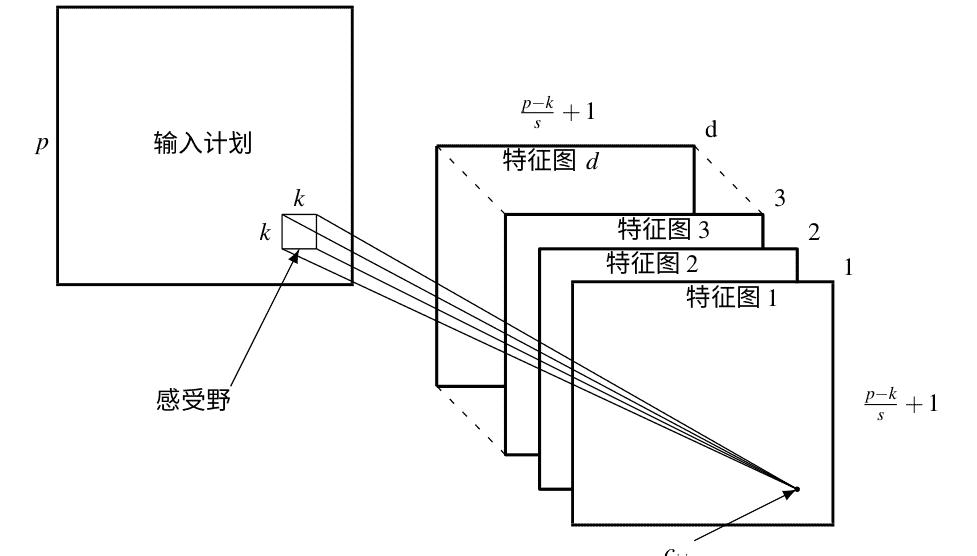

图1 卷积

神经元在整个输入平面的扫描过程中保持不变。这被称为一个滤波器，并被定义为具有与感受野相同大小的矩阵。对于每个输入平面$d$定义了滤波器：

$$F^y = \begin{bmatrix} f^y_{11} & f^y_{12} & \dots & f^y_{1k} \\ f^y_{21} & f^y_{22} & \dots & f^y_{2k} \\ \vdots & \vdots & \ddots & \vdots \\ f^y_{k1} & f^y_{k2} & \dots & f^y_{kk} \end{bmatrix}$$

对于 $y = 1, 2, \dots, d$. 每个滤波器都会在输入平面上“寻找”特定的特征，从而生成一个特征图(见图1)。应用于感受野$R_{ij}$的滤波器 $F^y$ 提供 $c^y_{ij}$，其中：

$$c^y_{ij} = \sum_{m=1}^{k} \sum_{l=1}^{k} f^y_{lm} \times x_{(i+l-1)(j+m-1)}$$

因此，应用步长为 $s$ 的滤波器提供了矩阵：

$$C^{y} = \begin{bmatrix}
c_{11}^{y} & c_{12}^{y} & \cdots & c_{1(((p-k)/s)+1)}^{y} \\
c_{21}^{y} & c_{22}^{y} & \cdots & c_{2(((p-k)/s)+1)}^{y} \\
\vdots & \vdots & \ddots & \vdots \\
c_{(((p-k)/s)+1)1}^{y} & c_{(((p-k)/s)+1)2}^{y} & \cdots & c_{(((p-k)/s)+1)(((p-k)/s)+1)}^{y}
\end{bmatrix} \quad (10)$$

卷积层由在输入平面上应用 d 个滤波器生成一个三维数组，其大小为 (((p-k)/s)+1)×(((p-k)/s)+1)×d 个标量（见图1）。对于每个滤波器，都会生成一个特征平面，其中每个感受野对应一个标量。

#### 2.3 池化层

池化层用于通过用一个标量替代（通常是）一个 q × q 的平方池化窗口的 q × q 数量的标量来减小特征平面的大小，该标量表示整个池化窗口的特征。该标量可以是池化窗口中的最大值、池化窗口中值的总和，或者能够综合池化窗口内容的其他值。通常，池化窗口在两个方向上都以步长 q 进行考虑，以覆盖整个特征平面。

步长小于 q 是可能的，但并不常考虑。

从卷积提供的特征平面开始，池化操作提供了池化后的平面。让我们考虑使用相同输入 I of p × p 数量的标量来定义池化函数。如果池化窗口是 q × q 并且步长是 q（通常情况），则结果平面是一个 p/q × p/q 的标量矩阵 P_q。

$$P_{q} = \begin{bmatrix}
y_{11} & y_{12} & \cdots & y_{1(p/q)} \\
y_{21} & y_{22} & \cdots & y_{2(p/q)} \\
\vdots & \vdots & \ddots & \vdots \\
y_{(p/q)1} & y_{(p/q)2} & \cdots & y_{(p/q)(p/q)}
\end{bmatrix} \quad (11)$$

其中 y_{ij} 通常有两种计算方式（见图3）用于 q × q 矩阵：

- 通过将所有 q × q 值相加
- 通过从 q × q 值中取最大值

在矩阵 I 中，q × q 的池化窗口标量结果为 P_q 矩阵中的一个标量（见图2）。

在当前应用中，q 的值为 2 或 4。图 3 中给出了 q = 2 的两个示例。一个使用 Max 作为池化函数，另一个使用 Add 作为池化函数。每个 2 × 2 的标量矩阵被它们的最大值或它们的和所替代。

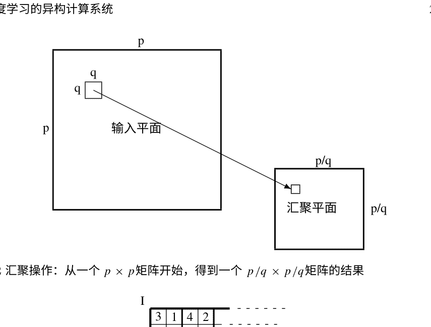

图2 池化操作：从一个 $p \times p$ 矩阵开始，得到一个 $p/q \times p/q$ 矩阵的结果

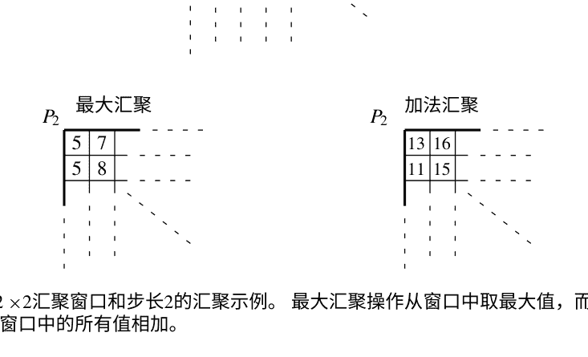

图3 使用2 ×2池化窗口和步长2的池化示例。 最大池化操作从窗口中取最大值，而加法池化操作将窗口中的所有值相加。

#### 2.4 Softmax层

Softmax层用于多类别分类，以强调最有可能的候选结果。 它应用于一个 $n$ 维向量 $V=\langle x_1, x_2, \dots, x_n \rangle$。 它的值由每个分量上的标准指数函数确定，除以应用于每个分量的指数函数之和，作为归一化常数。 因此，输出分量之和为 1:

$$\sigma_i(V) = \frac{e^{x_i}}{\sum_{i=1}^n e^{x_i}}$$

结果：

$$S_i(V) = \langle \sigma_1(V), \sigma_2(V), \ldots, \sigma_n(V) \rangle$$

在[18]中，通过避免除法运算和减少指数的定义域来简化计算。第一步是将指数进行降尺度处理：

$$\sigma_i(V) = \frac{e^{x_i}/e^{x_{max}}}{(\sum_{i=1}^n e^{x_i})/e^{x_{max}}} = \frac{e^{x_i - x_{max}}}{\sum_{i=1}^n e^{x_i - x_{max}}}$$

第二步是计算自然对数：

$$ln(\sigma_i(V)) = (x_i - x_{max}) - ln\left(\sum_{i=1}^n e^{x_i - x_{max}}\right)$$

虽然在表达式（12）中的求和容易溢出，因为指数运算产生的值很大，并且除法操作需要资源和时间，但是表达式（14）使用较小的数字工作，并避免了除法。$ln$和$exp$操作都使用LUT进行计算。

#### 2.5 将所有内容放在一起

图4展示了DNN的一个示例，其中使用了之前介绍的所有函数来定义一个特定的网络。输入是由三个颜色平面RGB表示的彩色图像。第一个具有ReLU作为激活函数的卷积层后面是一个池化层，用于缩小特征平面。我们按照类似的阶段（卷积与ReLU和池化）进行，直到最后一个池化体积被展平为应用于完全连接的NN的向量。最后一个阶段是一个softmax层，提供与可能输入图像相关的概率。

尽管前几个卷积层用于检查输入以识别特定的本地特征，但最后的全连接层提供了全局分析，而softmax输出层强调最可能的结果。

### 3 最新技术

当前硬件解决方案的主要缺点是：

1.  可编程的（CPU、MIC、GPU、DSP）解决方案在不适当的并行引擎上实现，无法有效地利用其高计算能力进行DNN所需的特定计算；
2.  特定电路解决方案在适应各种形式的DNN时缺乏足够的灵活性；
3.  基于FPGA的可重构解决方案过于昂贵，能耗过高，并且需要硬件特定的知识。

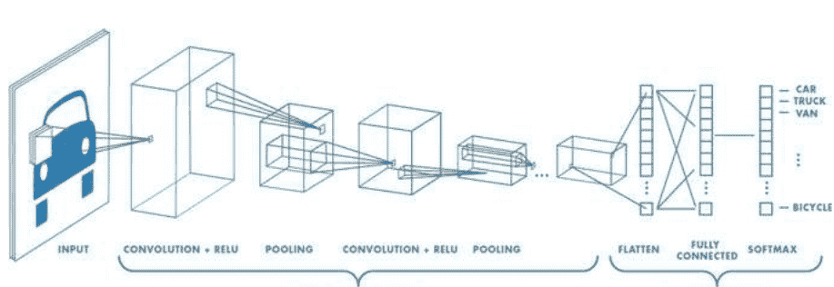

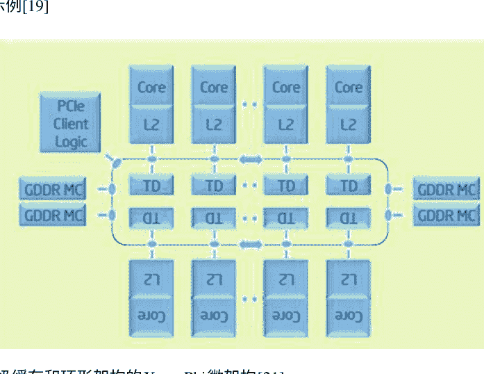

为了能够高效地适应各种形式的DNN，（1）基于“现成”计算设备的主要解决方案将被回顾。在接下来的小节中，我们将回顾基于“现成”计算设备的主要解决方案。

#### 3.1 英特尔的MIC

中央处理单元最初并不是为机器学习而设计的，但在过去几年中，制造商开始包含多个处理单元，允许并行执行不同的任务，使它们成为深度学习的良好选择。

英特尔酷睿Phi是基于英特尔MIC架构的第一个产品（见图5）。

英特尔酷睿Platinum 8180是一款多核处理器，LINPACK [10]的峰值性能为3 259 GFLOPS，SGEMM（单精度浮点通用矩阵乘法）使用AVX512 [5]的峰值性能为3.8 TFLOPS。这款28核处理器采用14纳米工艺制造，TDP为205瓦特，意味着性能为18.53 GFLOPS/W。该处理器在ResNet-50拓扑结构中进行了评估[5]，大多数层的前向和反向传播性能达到了机器峰值的70-80%。然而，由于写入输出张量的高带宽需求，某些层的性能仅为峰值的55%。一个重要的观察是，之前的性能结果是基于优化实现的直接卷积核。对于其他卷积实现，如im2col、libxsmm或autovec，性能要低得多：im2col小3倍，libxsmm小9倍，autovec小16倍。

Intel Xeon Phi 7295是一种专门用于深度学习的处理器，拥有72个核心和使用FMA4指令集的SGEMM峰值性能为11.5 TFLOPS。该处理器采用14纳米工艺制造，TDP为320瓦特，意味着FLOP/Watt性能为35.9 GFLOPS/W。这种类型的处理器也在[5]中进行了评估，性能根据滤波器尺寸而变化。例如，具有1 × 1的滤波器的层达到峰值性能的约50%，而具有3 × 3的滤波器的层达到峰值性能的70%。对于其他卷积层的实现，性能甚至比Xeon Platinum 8180更低：im2col的平均性能约为峰值的20%，使用libxsmm或autovec时，大多数层的性能仅为峰值的几个百分点。

Intel Xeon E5-2699 v3 (Haswell) CPU具有18个核心和1.3 TFLOPS的峰值性能，功耗为145瓦特（8.96 GFLOPS/W，22纳米技术）。在[8]中对其进行了六个DNN应用的评估：两个包含完全连接层的MLP网络，两个包含完全连接和逐元素操作层的LSTM网络，以及两个包含卷积、池化和完全连接层的CNN网络。性能评估显示，CNN网络使用处理器峰值计算能力的23%和46%，MLP网络使用处理器峰值计算能力的15.4%和38.5%，LSTM网络使用处理器峰值计算能力的84.6%和46%。

#### 3.2 Nvidia的GPU作为GPGPU

GPU是为计算机图形创建的处理器（见图6），由于其高核心数量和高并行性，在运行矩阵乘法（深度学习中的主要操作）方面非常有效。

最著名的GPU制造商是NVIDIA。除了常规的GPU外，在过去几年中，他们开始使他们的产品在人工智能任务中更加高效。

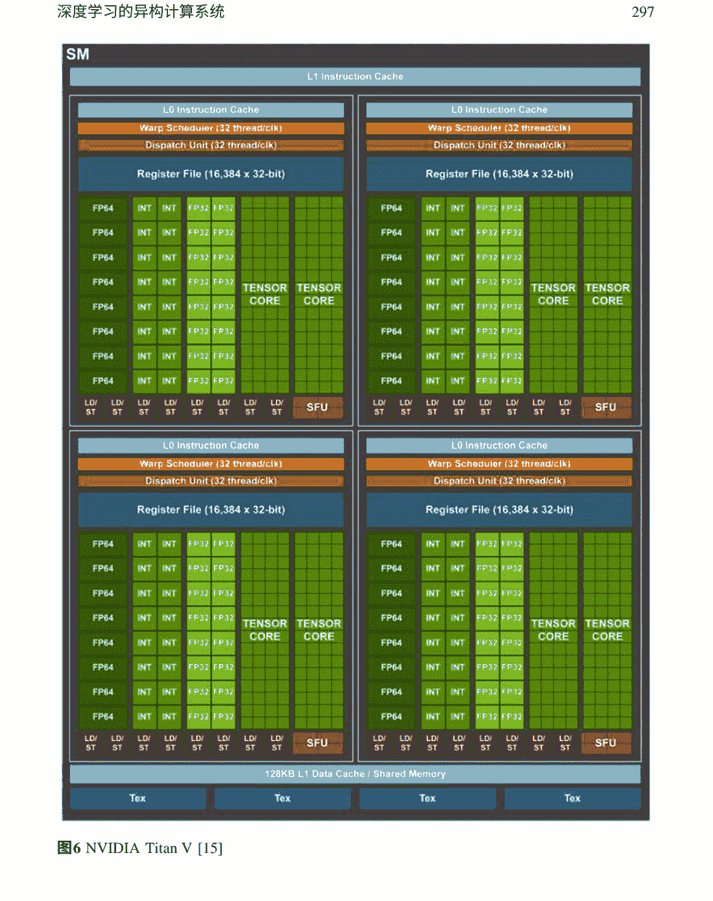

图6 NVIDIA Titan V [15]

尽管GPU具有强大的计算能力，但在深度学习应用中获得的实际性能可能远低于其峰值性能。影响计算和功耗资源有效利用的因素既可以与处理器架构有关，也可以与针对该架构的软件不优化有关。GPU的理论性能与实际性能之间存在差距，在几篇论文中已经得到了突出的提及。

NVIDIA GTX Titan Black是一款具有2880个CUDA核心和5645 GFLOPS单精度浮点（FP32）峰值性能的GPU。该GPU采用28纳米工艺制造，TDP为250瓦特，意味着每瓦特的FLOP性能为22.56 GFLOPS/W。在CNN实验中，计算性能的使用范围为峰值的9-50% [11]。

NVIDIA Tesla K40是一款具有2880个CUDA核心和4.29 TFLOPS单精度峰值性能的GPU（28纳米技术，TDP =235瓦特，18.25 GFLOPS/W）。不同的卷积层进行了测试，得到的性能范围从峰值的23%到35% [3]。

NVIDIA Geforce GTX 980是一款具有2048个CUDA核心和4.95 TFLOPS峰值单精度性能的GPU（28纳米技术，TDP =165瓦特，30 GFLOPS/W）。不同的卷积层进行了测试，得到的性能范围为30%到51% [3]。

NVIDIA Tesla K80是一款包含两个GPU的卡片，每个GPU具有2496个CUDA核心和2.8 TFLOPS峰值单精度浮点性能（28纳米技术，TDP =150瓦特，18.66 GFLOPS/W）。对两个MLP网络、两个LSTM网络和两个CNN网络进行评估，结果显示CNN网络使用峰值性能的32.1%和35.7%，MLP网络使用峰值性能的7.14%和25%，LSTM网络使用峰值性能的17.85%和25% [8]。

尽管许多应用需要高精度计算（32位浮点FP32，或64位浮点FP64），研究人员发现半精度浮点（FP16）对于深度学习训练已经足够。此外，深度学习推断可以使用8位整数计算来执行，而不会对准确性产生显著影响[6]。为了使GPU在执行不同任务时更加高效，支持多种精度模式。

从Volta一代开始，增加了专用的张量核心单元，加速矩阵乘法运算。Volta张量核心将FP16（半浮点精度）乘法与FP32（浮点精度）累加相结合。更新的Turing张量核心针对推断进行了增强，增加了新的INT8和INT4精度模式。为了评估使用这些专用核心的GPU性能，定义了一个新的性能指标：张量每秒兆次操作，TTOPS。优化用于深度学习的GPU的示例是NVIDIA Titan V（见图6）和NVIDIA Tesla V100。Titan V包含5120个CUDA核心和640个张量核心，并提供13.8 TFLOPS的单精度浮点（FP32）性能，27.6 TFLOPS的半精度浮点（FP16）性能和110 TTOPS的深度学习性能。

Tesla V100 (PCIe) 包含 5120 个 CUDA 核心和 640 个 Tensor 核心，并提供单精度浮点运算（FP32）的性能为 14 TFLOPS，半精度浮点运算（FP16）的性能为 28 TFLOPS，深度学习的性能为 112 TTOPS。

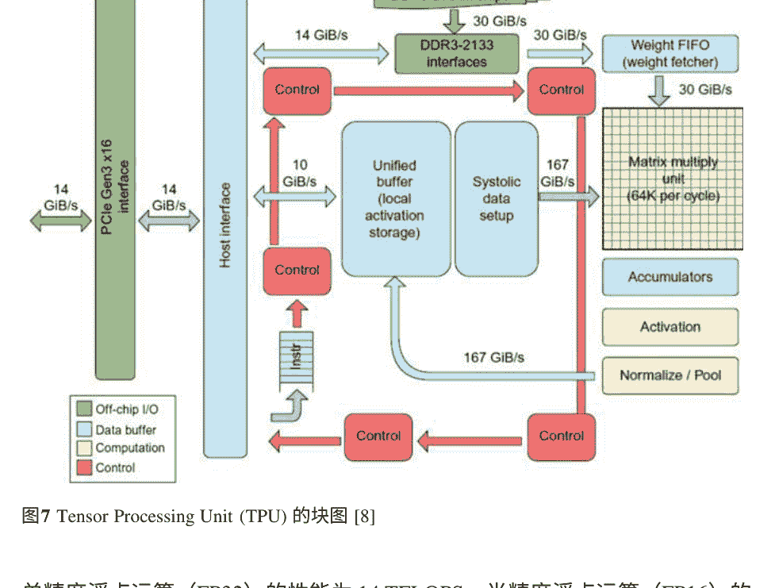

图7 Tensor Processing Unit (TPU) 的块图 [8]

#### 3.3 谷歌的 TPU

TPU 是用于神经网络推理的应用特定集成电路（ASIC），用作混合系统中的加速器，TPU 与主机之间的通信由 PCIe 总线保证。

芯片的核心（见图7）是一个 256 × 256 个8位乘法器的系统阵列，称为矩阵乘法单元（MXU），它在输入数据和权重之间执行矩阵乘法。MXU 输入数据存储在统一缓冲区中，该缓冲区保存了先前计算步骤的结果。统一缓冲区和主机内存之间的数据传输由 DMA 控制器控制。MXU 输入权重由权重先进先出（FIFO）提供。

结果产品累积在累加器中，并且非线性激活函数由激活单元计算。TPU的峰值性能为92 TTOPS，每个时钟周期以700 MHz的频率运行，并且对于8位整数进行256 × 256的乘加运算。芯片采用28纳米技术制造，TDP为75瓦特，意味着TTOPS/W性能为1.22 TTOPS/W。

TPU在[8]中对相同的六个DNN应用进行了评估。MLP网络使用其峰值计算能力的13.3%和10.5%，LSTM网络使用其峰值计算能力的4%和3%，CNN网络使用其峰值计算能力的93.4%和15.3%，平均性能为其峰值的23.24%。MLPs和LSTMs的性能受到内存带宽的限制，而其中一个CNN网络的性能较低可以通过其结构（存在全连接层和某些层的浅特征深度）来解释。

谷歌还开发了TPU v2和TPU v3。如果初始的TPU仅限于8位整数运算，新一代还可以进行浮点运算（MXU单元以降低的bfloat16精度进行乘法运算[20]），使其也可以用于神经网络训练。

第二代TPU有两个128 ×128的MXU，每个MXU连接一个8GB的高带宽内存，带宽增加到600GB/s。每个TPU v2芯片的峰值性能为45TTOPS[9]。

第三代TPU有两个核心，每个核心有两个128 ×128的MXU单元，峰值性能是上一代的两倍。

#### 3.4 关于现有技术的总结

通过前面的分析（见表1），我们可以了解到关于定义加速器的结构和架构的一些非常重要的信息。

由MICs实现的通用目的架构提供了相当不错的实际性能（平均为45%），但每瓦计算能力相对较低（平均为21 GFLOP/W）。较少的核心数（少于100个）需要简单的控制，在某些应用中，可以利用峰值性能的>80%来优化代码。但是，大多数针对通用多核的应用程序无法利用超过25%的峰值性能，其中一些应用程序仅使用很小一部分非常高的性能。通用计算机的架构设计用于广泛的应用，而对于强烈的应用则有特定的要求。通用处理器在32位浮点计算上浪费了太多资源，而通常CNN计算需要小整数运算进行推理，并接受16位浮点运算进行训练。

通用图形处理单元（GPGPU）是一个矛盾的词。诱人的是，可以使用一个多核并行处理器来解决强烈的计算问题，但同时，将一个强大的处理器用于其应用领域之外是危险的。一个图形机器不能在没有高风险的情况下转变为机器学习加速器。与通用多核架构（平均 ≈34%）相比，实际性能与峰值性能相关，由于控制和数据传输对于数百或数千个执行的困难，实际性能较低。

##### 表1 分析设备性能概览

| 芯片型号 | 制造工艺（纳米） | 峰值性能 | 每瓦性能 | 实际性能与峰值性能的百分比 |
| --- | --- | --- | --- | --- |
| 英特尔至强 Platinum 8180 | 14 | 3.8 TFLOPS | 18.53 GFLOPS/W | 5–80 |
| 英特尔至强 E5-2699 v3 | 22 | 1.3 TFLOPS | 8.96 GFLOPS/W | 15–84 |
| Intel Xeon Phi 7295 | 14 | 11.5 TFLOPS | 35.9 GFLOPS/W | 20–70 |
| NVIDIA GTX Titan Black | 28 | 5.64 TFLOPS | 22.56 GFLOPS/W | 9–50 |
| NVIDIA Tesla K40 | 28 | 4.29 TFLOPS | 18.25 GFLOPS/W | 23–35 |
| NVIDIA Geforce GTX 980 | 28 | 4.95 TFLOPS | 30 GFLOPS/W | 30–51 |
| NVIDIA Tesla K80 | 28 | 2.8 TFLOPS | 18.66 GFLOPS/W | 7–35 |
| 张量处理单元 | 28 | 92 TOPS | 1.22 TOPS/W | 3–93 |

个单位。能源使用仅有轻微改善（平均为≈22.36 GFLOP/W）。为了优化深度学习，GPU设计了专门的物理资源来处理整数、32位浮点、64位浮点和张量运算（见图6）。因此，面积效率降低，因为芯片的很大一部分未被使用。

缓存方法在帮助密集计算方面仍然存在效率低下的问题，这种计算是高度可预测的，只需要在内存层次结构设计中采用以缓冲为中心的方法。

特定的ASIC芯片，如TPU，没有足够的灵活性来支持各种DNN。因此，它们的巨大计算能力只能在少部分应用中被激活。对于大多数应用程序（根据[7]，占90%），峰值性能的使用率不超过13.4%。只有一个应用程序，在不到5%的应用中部署，可以激活峰值性能的93%。大量的算术并行单元（乘法器和加法器）在面对我们在实际应用中遇到的各种DNN时无法高效地工作。

基于缓存的内存层次结构对于密集计算是不合适的。由于程序和数据流的高可预测性。

架构不足是主要问题，通用架构、图形架构或简单的并行电路很难适应机器学习的密集计算领域的特定需求。而当加入节能标准时，问题变得更加困难。

图8 异构系统

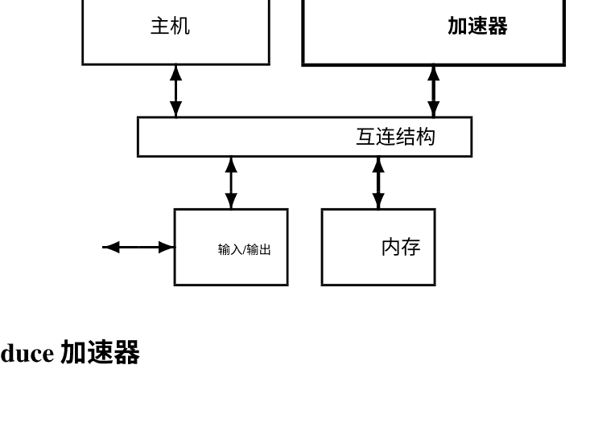

### 4 Map-Scan/Reduce 加速器

#### 4.1 异构系统

当我们开始将程序的执行分为两个紧密交织的部分时，计算变得‘混合’或异构：

- 密集计算，特点是代码短，执行时间长；这些部分被发送到加速器上执行。
- 复杂计算，代码大小和执行时间在相同数量级上；这些部分在主机上运行。

因此，HOST和ACCELERATOR这对代表了异构计算机的结构。图8中给出了一种可能的实现方式，其中：

- HOST是一个通用处理器，使用在ACCELERATOR上运行的内核库编写的函数库来运行应用程序（例如Eigen库或使用EigenKernel或TensorFlowKernel库实现的TensorFlow库）
- ACCELERATOR是我们的MSRA，运行EigenKernel或TensorFlowKernel库，即Eigen或TensorFlow库限制在高效管理的n个单元加速器中的数据结构
- INTERCONNECTION FABRIC是用于系统组件之间快速数据传输的多点互连网络
- MEMORY存储要处理的程序和数据
- I/O系统用于将异构计算机连接到外部世界。

主机处理器使用高级语言（C、C++、Python等）进行编程，而加速器的内核库在项目的早期阶段以汇编语言开发，以实现最高的性能。从内核库到目标库的实现是用高级语言完成的。

图9 Map-Scan/Reduce加速器（MSRA）：具有两个全局循环（一个通过REDUCE，另一个通过SCAN）的线性单元MAP，每个时钟周期由控制器单元发出的代码运行

#### 4.2 加速器的结构

本小节介绍了MSRA的结构。它是一个通用的可编程并行加速器，针对第2节中描述的功能要求进行了优化。该加速器被设计为异构计算系统的一部分，在该系统中，程序的复杂部分在主机计算机上运行，而应用程序的密集部分（卷积，池化，全连接NN）在加速器上运行。重点介绍了异构系统的架构和结构，以及为研究的应用领域提供的优势。

MSRA是一个n细胞引擎（参见图9中的MAP部分），具有两个全局循环：

- 一个通过一个log深度扫描电路SCAN直接关闭，SCAN从细胞阵列接收一个n分量向量并发送回一个n分量向量
- 另一个通过一个log深度的缩减电路REDUCE关闭，REDUCE从细胞阵列接收一个n分量向量并将其输出发送到CONTROLLER，CONTROLLER通过log深度网络DISTRIBUTE在每个周期中发出一个指令以在每个活动细胞中执行。

用户对MSRA的架构图像如下：

- 分布在细胞上的常量向量索引：$I X = [1, \ldots, n]$用于将细胞标识为 $cell_1, cell_2, \ldots, cell_n$
- 分布式内存：

$$ D M = \begin{bmatrix} s_{11} & s_{12} & \ldots & s_{1n} \\ s_{21} & s_{22} & \ldots & s_{2n} \\ \vdots & \vdots & \ddots & \vdots \\ s_{m1} & s_{m2} & \ldots & s_{mn} \end{bmatrix} $$ (16)

可以看作是由哪些组成的

- 全部水平向量，分布在细胞中，对于 $i = 1, \ldots, m$:
$$ H_i = [s_{i1} s_{i2} \ldots s_{in}] $$ (17)
其组成部分可以在加速器的MAP部分并行处理
- 全部垂直向量，对于 $j = 1, \ldots, n$，每个存储在相应的细胞中:
$$ V_j = \begin{bmatrix} s_{1j} \\ s_{2j} \\ \vdots \\ s_{mj} \end{bmatrix} $$ (18)
其组成部分存储在每个细胞的 m位置寄存器文件中
- 分布在细胞中的布尔向量 $B= [b_1, \ldots, b_n]$用于激活细胞当 $b_i = 1$
- 分布在细胞中的累加器向量 $ACC= [acc_1 acc_2 \ldots acc_n]$
- 控制器的数据存储器： $M= [s_1 s_2 \ldots s_u]$
- 控制器的累加器： $acc$

在控制器的程序存储器中，主机加载以二进制形式存储的程序，其中一条指令用于控制器，另一条指令用于在MAP阵列的每个活动单元中执行。 因此，在每个时钟周期中，控制器从其程序存储器中获取一条指令用于自身，并获取另一条指令用于发送到MAP阵列。 通过REDUCE网络，控制器以 $O(\log n)$的延迟接收结果。

#### 4.3 微架构

MSRA执行以下类型的操作：

- 数据传输操作
- 针对向量B的内容进行空间控制操作，其组成部分用于执行条件执行
- 对水平向量进行一元和二元条件向量操作
- 对活动单元提供的水平向量的组成部分进行约简操作
- 对由活动细胞提供的水平向量的组件进行扫描操作。

##### 4.3.1 数据传输操作

分布式内存DM（方程16）的内容可以部分或完全从MEMORY（参见图8）加载或存储。传输是一次传输一个向量，使用两个函数：

- `load(s, i, j)`：从地址`j`开始，将水平向量`H`的最左边位置`i`的标量从MEMORY加载。
- `store(s, i, j)`：将水平向量`H`的最左边标量`i`从MEMORY存储到地址`j`开始。

重要提示：DM和MEMORY之间的传输对我们的加速器执行的计算是透明的，即在传输过程中计算可以并行运行而不受干扰。我们架构的这一重要特性有助于至少部分地避免MAP阵列和MEMORY之间的“瓶颈”。巧妙地使用它，可以从MEMORY中提供数据来满足MAP阵列的数据需求。

##### 4.3.2 空间控制操作

空间控制允许通过工作在布尔向量B的值上进行预测执行。以下每个操作在一个时钟周期内执行：

- 激活：
$B \Leftarrow [1, 1, ..., 1]$
激活加速器的所有单元
- `where(cond)`：
$b_i = ((b_i == 1) \& cond_i) ? 1 : 0$
在所有活动单元中，仅保持满足条件 `cond_i` 的单元处于活动状态，其中 `cond_i` 表示单元_i中条件 `cond` 的值
- 其他地方：在最近一次仍然处于活动状态的 `where(...)` 操作之前的所有活动单元中，仅保持不满足条件 `cond_i` 的单元处于活动状态，即在活动空间中执行互补的 `where` 选择
- `endwhere`：将向量B恢复到最近一次仍然持续的状态之前 `where(...)` 的位置

嵌入 `where(...)` 是允许的。

例4.1 令$n=16$为布尔向量未初始化和累加器向量加载索引向量IX：
$$ B = [-, -, -, -, -, -, -, -, -, -, -, -, -, -, -, -] $$
$$ ACC = [1, 2, 3, 4, 5, 6, 7, 8, 9, 10, 11, 12, 13, 14, 15, 16] $$

布尔向量B在一系列空间控制操作下的演变如下：
$$ (1) 激活; => B = [1 ,1 ,1 ,1 ,1 ,1 ,1 ,1 ,1 ,1 ,1 ,1 ,1 ,1 ,1 ,1] $$
$$ (2) where(acc > 3); => B = [0 ,0 ,0 ,1 ,1 ,1 ,1 ,1 ,1 ,1 ,1 ,1 ,1 ,1 ,1 ,1] $$
$$ (3) where(acc < 14); => B = [0 ,0 ,0 ,1 ,1 ,1 ,1 ,1 ,1 ,1 ,1 ,1 ,1 ,0 ,0 ,0] $$
$$ (4) 其他地方; => B = [0 ,0 ,0 ,0 ,0 ,0 ,0 ,0 ,0 ,0 ,0 ,0 ,0 ,1 ,1 ,1] $$
$$ (5) endwhere; => B = [0 ,0 ,0 ,1 ,1 ,1 ,1 ,1 ,1 ,1 ,1 ,1 ,1 ,1 ,1 ,1] $$
$$ (6) endwhere; => B = [1 ,1 ,1 ,1 ,1 ,1 ,1 ,1 ,1 ,1 ,1 ,1 ,1 ,1 ,1 ,1] $$

在步骤（1）中，所有的单元都被激活：b_i =1，对于 i = 1, 2, ..., 16. 然后，只有当 acc_i >3 时，才保持活跃状态的单元。在下一步中，嵌入式 where操作被举例说明：只有当活跃单元中的acc_i <14时，才保持活跃状态的单元。在由 WHERE(ACC > 3)选择的活跃空间中执行 elsewhere操作。步骤（4）激活了先前由where(...)禁用的单元。步骤（5）将向量B恢复到最近一次where(...)操作之前的状态，仍然保持最后一次操作的状态：WHERE(ACC < 14)。在步骤（6）中，向量B被恢复到由操作 ACTIVATE指定的初始值。◇

##### 4.3.3 算术和逻辑运算

每个向量操作都在常数时间内执行，作用于 n 个分量的水平向量。

一元运算。某些操作仅在活动单元中执行，其中布尔向量 B 的值为 bi = 1，其他操作在所有单元中执行，与 B 的内容无关。例如：

- inc(i, k):
  $s_{ij} \leftarrow b_j ? (s_{kj} + 1) : s_{ij}$
  对于 j = 1, ..., n; 在每个活动单元中，水平向量 $H_i$ 的分量取水平向量 $H_k$ 的递增分量。
- shiftRight(i, k, input):
  $s_{ij} \leftarrow (j == 0) ? input : s_{k(j-1)}$
  对于 j = 1, ..., n; 水平向量 $H_k$ 的所有分量向右移动一位，插入 input在最左端位置，并存储为 $H_i$

二进制运算。二进制运算在活跃的细胞中以恒定时间（通常为一个时钟周期）执行，其中布尔向量 $\mathbf{B}$ 的值为 1。例如：

- `mult(k, l, m):`
  $$ s_{kj} \leftarrow (s_{lj} * s_{mj}) $$
  对于 $j=1, \dots, n$; 在每个活跃的细胞中，水平向量 $H_k$ 的分量取决于水平向量 $H_l$ 和 $H_m$ 的相应分量的乘积
- `xor(k, l, m):`
  $$ s_{kj} \leftarrow (s_{lj} \oplus s_{mj}) $$
  对于 $j=1, \dots, n$; 在每个活跃的细胞中，水平向量 $H_k$ 的分量取决于水平向量 $H_l$ 和 $H_m$ 的相应分量的按位异或

##### 4.3.4 减少操作

减少操作是在活动单元提供的值上执行的。它们是：

- `redadd(i):`
  $$ acc \leftarrow \sum_{k=1}^{n} (b_k ? s_{ik} : 0) $$
  控制器的累加器将活动单元的累加器之和作为延迟 $\mathscr{L} \in O(\log n)$。
- `redmax(i):`
  $$ acc \leftarrow Max_{k=1}^{n} (b_k ? s_{ik} : 0) $$
  控制器的累加器以延迟 $\mathscr{L} \in O(\log n)$ 接收活动单元的累加器中存储的最大值。
- `redmin(i):`
  $$ acc \leftarrow Min_{k=1}^{n} (b_k ? s_{ik} : \infty) $$
  控制器的累加器以延迟 $\mathscr{L} \in O(\log n)$ 接收活动单元的累加器中存储的最小值；符号 $\infty$ 表示应用程序中使用的最大数。
- `redbool:`
  $$ acc \leftarrow \bigvee_{k=1}^{n} b_k $$
  控制器的累加器接收来自布尔向量 $\mathbf{B}$ 的所有位的逻辑 OR（用于测试至少一个单元是否活动）的延迟 $\mathscr{L} \in O(\log n)$。

##### 4.3.5 扫描操作

扫描操作接受来自DM的向量H Vk，并返回一个向量H Vi，其组件根据H Vk的全局内容计算。例如：

- prefixadd(i, k): $H_i$ ← $[(b_1?s_{k1} : 0), (\sum_{j=1}^2 (b_j?s_{kj} : 0)), \ldots, (\sum_{j=1}^n (b_j?s_{kj} : 0))]$
- compact(i, k): $H_i$ ← $[s_{k1}, s_{k3}, \ldots, s_{k(n-3)}, s_{k(n-1)}, 0, 0, \ldots, 0]$ 对齐到$n/2$ 向左对齐向量的奇数分量。

#### 4.4 MSRA的硬件参数

硬件性能使用28纳米技术的仿真工具进行评估。使用1 GHz的MSRA仿真评估了具有32位DDR接口、32位字长、单元数n=2048和内存大小m=1024（4 KB SRAM/单元）的版本的大小和功耗。芯片的面积为9.2 × 9.2 mm² = 84.64 mm²。芯片的功耗如图10所示。根据温度结果：在80/100/120°C时为12/14/18 W。计算性能为：

- 整数运算:
  - 2048 GOPS，其中GOPS代表每秒十亿32位操作；在80°C时结果为170.66 GOPS/W
  - 4096 GOPS，用于16位操作；在80°C下结果为341.33 GOPS/W
- 对于涉及20%浮点运算和80%整数运算的应用:
  - 820 GOPS，用于32位浮点和整数运算；在80°C下结果为68.33 GOPS/W
  - 2400 GOPS，用于16位浮点和整数运算；在80°C下结果为200.33 GOPS/W
- 因为浮点运算是按照执行单元中的一系列操作顺序执行的，没有像NVIDIA Titan V中那样实现为独立的结构（参见图6）
- 用于机器学习操作：8 TOPS，其中TOPS代表每秒万亿次操作（参见第3.2节）；在80°C下结果为1.36 TOPS/W，如果架构是为机器学习应用中的张量操作设计的。

图10 功耗评估用于我们的MSA [14]

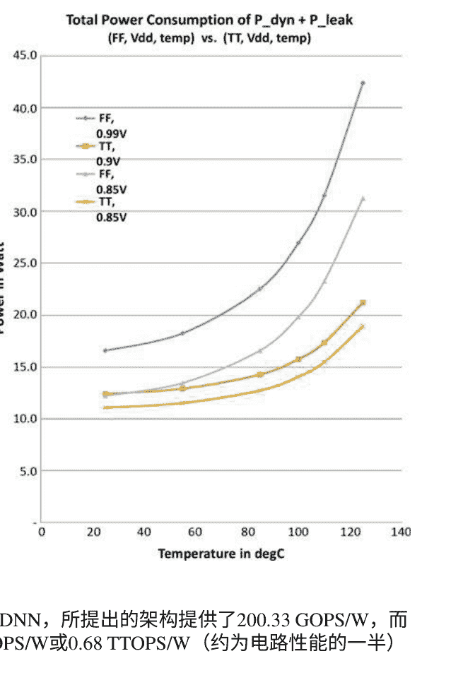

需要注意的是，对于训练DNN，所提出的架构提供了200.33 GOPS/W，而对于推理，提供了341.33 GOPS/W或0.68 TOPS/W（约为电路性能的一半）。

#### 4.5 神经核心库

对于我们的应用程序，可以使用一个小型库，我们称之为NeuralKernel，使用以下函数来实现NeuralKernel库的定义：

`instmx(M, l, c)`：在ACCELERATOR的MAP数组中实例化矩阵 M，该矩阵具有 l行和 c列，其中行是完整水平向量的部分（参见方程式17），列是完整垂直向量的部分（方程式18）

`instvt(V, l)`：在ACCELERATOR的CONTROLLER的数据存储器中实例化长度为 l的向量 V

`loadmx(M, p)`：从内存中的地址 p开始，逐行加载矩阵 M的内容，并将指针 p递增到 (p + l × c)

`storemx(M, p)`：从地址 p开始，逐行存储矩阵 M的内容到内存，并将指针 p递增到(p + l × c)

`loadvt(V, p)`：从地址 p开始，加载向量 V的内容到内存，并将指针 p递增到 (p + l)

`storevt(V, p)`：从地址 p开始，存储向量 V的内容到内存，并将指针 p递增到 (p + l)

`mnm(M1, M2, M3)`：将矩阵 M1与矩阵 M2相乘，并将结果存储为 M3

`conv(M1, V, M2, k, s)`：矩阵 M1进行卷积，步长为 s，使用向量 V中按行存储的大小为k × k的滤波器，并将结果特征平面存储为 M2

`sigmoid(M1, M2)`：将激活函数sigmoid应用于矩阵 M1，结果为 M2

`relu(M1, M2)`：将激活函数ReLU应用于矩阵 M1，结果为 M2

`pooladd(M1, M2, q, s)`：将矩阵 M1的内容池化为 q × q的窗口中值的总和，步长为 s，并将结果存储为矩阵 M2

`poolmax(M1, M2, q, s)`：将矩阵 M1的内容池化为 q × q的窗口中的最大值，步长为 s，并将结果存储为矩阵 M2

`softmax(M1, M2)`：将softmax函数应用于 M1，结果为 M2

其中矩阵和向量的大小受参数 n, m, u 的限制，这些参数在先前已定义。

### 5 实现和评估

本节介绍了在实现DNN中提出的系统的实现和评估。 粗略地说，我们使用 map资源来加速卷积，使用 scan资源来加速池化，使用 map-reduce资源来加速完全连接的神经网络。我们提出的算法用于实现DNN中的主要计算模式，并以易于加速的版本呈现。

我们对提出的架构进行的所有实验都是在一个周期精确的模拟器上进行的。功耗估计是基于对优化的可综合RTL的评估。因此，在项目的这个阶段，只实现了NeuralKernel库的主要功能，并进行了定量评估。

#### 5.1 全连接神经网络

神经网络的全连接层由矩阵向量乘法、对结果向量应用激活函数和相关数据传输过程组成。算法如图11所示。三个进程并行运行：(1)控制进程，(2)计算进程和(3)数据传输。

对于小v，执行时间主要由权重矩阵的负载（load(M, p1)）或者对于大v，由doInParallel循环所占用。如果可能的话，应该设计应用程序以最大化v的值。因此，矩阵M只需加载一次即可多次使用。

对于大v，执行时间主要由doInParallel循环中执行的最慢进程所占用。由于传输时间在O(c)的时间内执行，我们关注主要的计算过程：{mmm(M, V, W); relu(W, W);}。在图12中，矩阵向量乘法的算法-

```
/*
函数名称：FullyConnectedNeuralNetwork
- 加载矩阵 M starting with mxPointer
- 多个 M with 'v' vectors stored successively starting with
the address pointed by inVectPointer
- 应用的激活函数 ReLU
- Store the resulting 'v' vectors successively starting with the
address pointed by outVectPointer
*/
instmx(M, l, column); // define the size of the weight matrix M
instmx(V, l, column);    // define the size of the input vector V
instmx(W, l, column);    // define the size of the output vector W
inits(p1, mxPointer);    // initiate the value of matrix pointer
inits(p2, inVectPointer);// initiate the input vector pointer
inits(p3, outVectPointer); // initiate the output vector pointer
FullyConnectedNeuralNetwork(M, p1, p2, p3, n);
loadmx(M, p1); //加载加速器中的矩阵M从p1
loadmx(V, p2); //加载加速器中的第一个向量从p2
mmm(M, V, W);    // W <= M x V
relu(W, W);     // W <= ReLU(W)
loadmx(V, p2);   // 加载下一个向量从p2 + c
i = 0;
doInParallel{
    while (i < v-1)
        i = i + 1;
    mmm(M, V, W);
    relu(W, W);
    storemx(W, p3);
    loadmx(V, p2);
}
storemx(W, p3); // the last transfer of the result W
```

图11 全连接神经网络的算法

```
/* ******************************************
函数名称:矩阵-向量乘法: W <= M * V
矩阵M中的元素M[i], 其中i=1,2,...,l
****************************************** */
对于 (i=1; i<=l; i=i+1)
    shiftRight(S, S, redadd(mult(V, M[i], V)));
对于 (i=1; i<(log_2 n); i=i+1)
    nop;          // for the latency of the reduction add
W <= S;
```

图12 矩阵-向量乘法

提出了一种方法。对于shiftRight(S, S, redadd(mult(V, M[i], V)))见第4.3节,其中定义了乘法、移位和约简操作。当只执行一次时,该操作的执行时间为2 + log₂n。对于l次执行,由于涉及流水线硬件,总执行时间为2×l + log₂n,其中n是ACCELERATOR的MAP部分中的单元数。因此,将一个l×c矩阵与一个c分量的向量相乘,其中c≤n,所需的时间属于O(l),即,一个n单元的ACCELERATOR提供了属于O(n)的加速。

加速度与O(n)相关的常数是什么? 这个常数肯定大于1,因为在单核处理器中,数据传输、算术运算和控制操作是按顺序执行的,而在我们的架构中,可以通过doInParallel循环并行执行这三个过程,因为为这三个过程提供了专门的硬件。对于这个函数,我们可以断言加速度是超线性的。

#### 5.2 卷积层

##### 5.2.1 步长 s = 1

步骤1: 从内存中加载被视为输入平面的矩阵 I (方程6) , 每个矢量有p个分量,滤波器由k×k个标量组成,然后设置y ← I, b ← 1。执行时间t₁ = const × (p² + d × k²)。

步骤2: 我们将过滤器 F^f 视为k个“垂直”向量:

```
F_i^f = \begin{bmatrix} f_{1i}^f \\ \vdots \\ f_{ki}^f \end{bmatrix}
```

对于i = 1, ., k, 以及“垂直”向量:

$$I_j^b = \begin{bmatrix} x_{bj} \\ \vdots \\ x_{(b+k-1)j} \end{bmatrix}$$

对于 $j = 1, \dots, p$, 与“带”$b$相关联。然后我们计算矩阵：

$$\begin{bmatrix} I_1^b \times F_1^1 & I_2^b \times F_1^1 & \dots & I_p^b \times F_1^1 \\ I_1^b \times F_2^1 & I_2^b \times F_2^1 & \dots & I_p^b \times F_2^1 \\ \vdots & \vdots & \ddots & \vdots \\ I_1^b \times F_k^1 & I_2^b \times F_k^1 & \dots & I_p^b \times F_k^1 \end{bmatrix} = \begin{bmatrix} V_1 \\ V_2 \\ \vdots \\ V_k \end{bmatrix}$$

计算在时间 $t_2 = 4k^2$ 时钟周期内完成。

步骤3：对最后 $(k-1)$ 个向量应用以下 $(k-1)$ 个移位操作：

$$\begin{bmatrix} V_1 \\ V_2 \\ \vdots \\ V_k \end{bmatrix} \implies \begin{bmatrix} V_1 \\ V_2 << 1 \\ \vdots \\ V_k << (k-1) \end{bmatrix} = \begin{bmatrix} V_1' \\ V_2' \\ \vdots \\ V_k' \end{bmatrix} = \begin{bmatrix} v_{11}' & v_{12}' & \dots & v_{1p}' \\ v_{21}' & v_{22}' & \dots & v_{2p}' \\ \vdots & \vdots & \ddots & \vdots \\ v_{k1}' & v_{k2}' & \dots & v_{kp}' \end{bmatrix}$$

该操作在 $t_3 = 5(k-1)$ 时钟周期中执行。

步骤4：计算特征平面的行如下：

$$C_b = [c_{b1} \quad c_{b2} \quad \dots \quad c_{b(p-k+1)}]$$

其中，对于 $i = 1, 2, \dots, (p-k+1)$：

$$c_{bi} = \sum_{j=1}^k v_{ji}^t$$

计算完成 $t_4 = k+1$ 个时钟周期。

步骤5：如果 $b < p - k +1$，则 $b \leftarrow b+1$ 并转到步骤2。

步骤6：重复上述循环 $p - k +1$ 次，得到将滤波器 $F$ 应用于“图像”$I$，步长为1的结果：

$$C^f = \begin{bmatrix} c_{11} & c_{12} & \dots & c_{1(p-k+1)} \\ c_{21} & c_{22} & \dots & c_{2(p-k+1)} \\ \vdots & \vdots & \ddots & \vdots \\ c_{(p-k+1)1} & c_{(p-k+1)2} & \dots & c_{(p-k+1)(p-k+1)} \end{bmatrix}$$

它存储在外部内存中。传输的执行在 $t_6 = \text{const} \times (p - k +1)^2$ 中进行。

步骤7：如果 $f < d$, 则 $d \leftarrow d + 1$, $b \leftarrow 1$并转到步骤2。

这个循环重复执行 $d$次, 结果是外部内存中的一个三维数组, 大小为 $(1 + (p - k)/s) \times (1 + (p - k)/s) \times d$个标量。

总执行时间取决于输入计划的大小、滤波器的大小和特征的数量, 为:

$$t_{conv}(p, k, d) = t_{transfer} + t_{computation}$$

$$t_{transfer} = (const \times (p^2 + dk^2 + d(p - k + 1)^2)) \in O(dp^2)$$

$$t_{computation} = d(4(p - 2)k^2 + (6p + 10)k - 4(p + k^3 + 4)) \in O(pk^2d)$$

卷积看起来像是一个IO受限的函数。为了平衡数据传输和计算, 我们需要具有高带宽的内存 (常数值必须很小), 并且整个DCNN计算必须在发送到内存之前应用池化层来组织特征平面。

因此, 计算的权重将增加, 要传输的数据将减少。

### 5.2.2 步长 $s > 1$

对于步长 $s > 1$, 结果为3维数组的大小为:

$$(1 + (p - k)/s) \times (1 + (p - k)/s) \times d$$

因为:

- 向量 $C_i$ 在第4步计算得到的是: $C_i(s) = [c_{b1} x \ldots x c_{b(s+1)} x \ldots x c_{b(2s+1)} x \ldots x \ldots]$ 其中, $x$ 表示一个无意义的值, 必须从最终结果中删除

- 在第5步中, $b \leftarrow b + s$, 导致在第6步中, 一个 $C^f$ 矩阵只有 $1 + (p - k)/s$ 行:

$$
C^f(s) = \begin{bmatrix}
c_{11} & x \ldots x & c_{1(s+1)} & x \ldots \\
x & c_{(s+1)(s+1)} & x \ldots & \\
x & c_{(2s+1)(s+1)} & x \ldots & \\
\vdots & \vdots & \vdots & \ddots
\end{bmatrix}
$$

提供一种紧凑表示的解决方案, 通过消除 $xs$, 有两个版本, 一个是通常情况下$s$是2的幂次方, 另一个是$s$是某个值的情况。 在这两种情况下, 我们必须在步骤6中添加一些子步骤。

版本1适用于 $s = 2$ 整数的情况：在步骤6中，我们必须使用扫描操作 compact(i, j)（见第4.3.5节）。如果步长是 $s$，则在矩阵 $\mathcal{C}^f(s)$ 的每一行上应用 $\log_{2s}$ 次函数 compact(i, j) 将消除无意义的值 $x$。

$$t_{\text{comp}} = (1 + (p - k)/s) \times (2 + \log_2 n) \times \log_2 s$$

保持第6步的执行时间由传输主导。

版本2用于 $s$ 的某个值：在第6步中，我们必须添加以下子步骤：

- 子步骤6.1: 矩阵 $\mathcal{C}^f(s)$ 被转置。得到一个矩阵 $T(\mathcal{C}^f(s))$，其中包含满行的 $x_s$ 和只包含 $c_{ij}$ 标量的行。
- 子步骤6.2: 矩阵 $T(\mathcal{C}^f(s))$ 被压缩，消除了 $x_s$ 的行：
- 子步骤6.3: 矩阵 $\mathcal{H}^f(s)$ 被转置，得到滤波器 $f$ 的最终结果

$$\mathcal{H}^f(s) = \left[\begin{array}{cccc}
c_{11} & c_{(s+1)1} & c_{(2s+1)1} & \cdots \\
c_{1(s+1)} & c_{(s+1)(s+1)} & c_{(2s+1)(s+1)} & \cdots \\
\vdots & \vdots & \vdots & \ddots
\end{array}\right]$$

$$\mathcal{S}^f(s) = \left[\begin{array}{cccc}
c_{11} & c_{1(s+1)} & c_{1(2s+1)} & \cdots \\
c_{(s+1)1} & c_{(s+1)(s+1)} & c_{(s+1)(2s+1)} & \cdots \\
c_{(2s+1)1} & c_{(2s+1)(s+1)} & c_{(2s+1)(2s+1)} & \cdots \\
\vdots & \vdots & \vdots & \ddots
\end{array}\right]$$

这是一个矩阵，比 $s = 1$ 时的矩阵小两倍。步骤6的执行时间随着增加而增加。

$$t_{6+} = t_{\text{转置}} + 3p/s$$

因为，在我们的架构中 $t_{\text{转置}} \in O(p^2)$ 步骤6的执行时间保持在相同的数量级上。

#### 5.3 池化层

池化的输入是一个类型为 $I$ 的矩阵（参见公式6）。输出是一个矩阵，其大小为

$$(1 + (p - k)/s) \times (1 + (p - k)/s)$$

组件。该算法与计算卷积层中的特征图的算法类似当s > 1时。而不是在感受野上应用滤波器而是应用更简单的函数。区别在于缺少滤波器，并且发生在以下情况:

- 在第2步中，计算的是 $I_i^b \times F_k^j$ 的和 $MAX_{i=b}^{b+k-1} x_{ji}$ 或最大值 $\sum_{i=b}^{b+k-1} x_{ji}$
- 在第4步中，保持 $c_i = \sum_{j=1}^{k} v'_{ji}$ 或计算 $c_i = MAX_{j=1}^{k} v'_{ji}$

因此，计算时间的评估方式相同，但是指的是较小的输入矩阵。

#### 5.4 Softmax层

对于softmax层，使用查找表（LUTs）计算指数和对数函数，因为在神经网络领域中，这种方式提供的精度已经足够。在我们的实现中，我们使用一个对数查找表（logLUT），存储在CONTROLLER的数据内存中，还有另一个指数查找表（expLUT），在ACCELERATOR的每个单元中都有副本。

根据第2.4节中提出的解决方案，我们加速器上的算法如图13所示。执行时间为 $t_{softmax} = 9 + 4log_2 n$。循环 $MAP \rightarrow REDUCE \rightarrow CONTROLLER \rightarrow MAP$ 被关闭两次，而且，缩减和分配网络都是 $log$ 深度的。在算法的第一步中，CONTROLLER通过一个 $log$ 级管道将从MAP数组接收到的向量 V 的最大值发送回MAP数组。在算法的第二步中，CONTROLLER以 $log$ 时间接收到 $redsum$，并在同一时间将对数发送回数组。因此，该层的加速度为 $O(n/log n)$。

通过避免引入规约操作所引起的延迟，就像我们对矩阵-向量乘法所做的那样，如果函数应用于沿着单元格分布的本地内存中累积的向量流，$[V_1, V_2, ..., V_u]$，则可以避免延迟。

```
算法名称: Softmax
- input: V = <x1, ..., xp>
- output: V = <sigma_1(V), ..., sigma_p(V)>

(1) V <= V - redmax(V);
(2) V <= V - lnLUT(redsum(expLUT(V)));
(3) V <= expLUT(V);
```

图13 softmax算法

数组。然后， $max_i = redMax(V_i)$ 的值可以存储在CONTROLLER的数据内存中。如果 $n \sim u$，则此计算在 $O(u)$ 时间内完成，避免了每个 $max_i$ 的 $\log_2 n$ 的贡献。类似地处理 $redsum(expLUT(V_i))$ 的值。因此，计算将加速 $O(n)$。

### 6 结论

- 对于每个层，加速度为 $O(n)$，对于一个 $n$-单元加速器。有时，与 $O(n)$ 相关联的常数为 $>1$，即加速度是超线性的，因为控制、传输和计算是并行进行的（见第5.1节）。
- 对于微软亚洲研究院（MSRA），在执行与DNN阶段相关的计算时，$\alpha =$ 实际性能/峰值性能非常高。通常，$\alpha > 0.8$。加速器和内存之间的数据传输对计算过程是透明的。因此，加速器和内存之间的瓶颈效应得到了减轻。
- 我们可编程系统的功耗为680 TGOPS/W，与TPU电路提供的每个张量操作的功耗相差不多远。GFLOPS/Watt比许多核心高2$\times$，比多核心高3$\times$。
- 但是，在实际DNN的实现中，我们必须注意计算层如何与数据传输阶段交错。在这方面，我们架构的主要优势是MAP部分每个单元的本地内存。如果这个内存足够大，那么可以避免一些数据传输。
- 我们架构的另一个优势是可以与计算过程并行传输数据（参见图12中的矩阵-向量乘法算法）。考虑到细胞之间的本地存储器和MEMORY之间的传输（参见图8），综合 $\alpha$ 系数稍微减小，如果算法忽略了透明传输的可能性。
- 由于MSRA与流式SIMD扩展（SSE）具有一些相似特性，我们必须强调主要区别包括：
  - 在MSRA级别的控制
  - 根据每个细胞的本地状态进行预测执行
  - 扫描和归约机制，允许快速高效的全局向量到向量和向量到标量操作
  - 细胞级别的大量本地存储，而不是SSE中有限的寄存器文件系统

> 考虑到在MAP部分和REDUCE部分同时执行的操作，可以实现这种峰值性能（参见图9）。例如，在执行矩阵-向量乘法时会发生这种情况。

5. 在MSRA中，数据和程序通过类似缓冲区的内存提供，由于其内容的高可预测性，与SSE系统不同，数据和程序通过占用面积和能量的高缓存内存系统提供。

6. MSRA方法中的搜索和扫描指令有助于高级流、列表或稀疏矩阵操作。

### 参考文献

+   1. Andonie, R., Malita, M.: The connex array as a neural network accelerator. In: Proceedings of the IASTED International Conference on Computational Intelligence, Banff, Alberta, Canada, 2-4 July, pp. 163-167 (2007)
2. Andonie, R., Malita, M., Stefan, M. G.: MapReduce: from elementary circuits to cloud. In: Kreinovich, V. (ed.) Uncertainty Modeling. Studies in Computational Intelligence, pp. 1-14. Springer, Cham (2017)
3. Chetlur, S., Woolley, C., Vandermersch, P., Cohen, J., Tran, J., Catanzaro, B., Shelhamer, E.: cuDNN: efficient primitives for deep learning, https://arxiv.org/pdf/1410.0759.pdf (2014)
4. Ciresan, D. C., Meier, U., Masci, J., Gambardella, L. M., Schmidhuber, J.: Flexible, high performance convolutional neural networks for image classification. In: Proceedings of the Twenty-Second International Joint Conference on Artificial Intelligence, pp. 1237-1242 (2011)
5. Georganas, E., Avancha, S., Banerjee, K., Kalamkar, D.D., Henry, G., Pabst, H., Heinecke, A.: Anatomy of high-performance deep learning convolutions on SIMD architectures. SC. https://arxiv.org/pdf/1808.05567.pdf (2018)
6. Harris M.: 使用CUDA 8进行混合精度编程 https://devblogs.nvidia.com/mixed-precision-programming-cuda-8/ (2016年)
7. Hennessy, J.L., Patterson, D.: 计算机体系结构：定量方法，第六版 Morgan Kaufmann (2019年)
8. Jouppi, N.P., Young, C., Patil, N., Patterson, D., 等：数据中心中张量处理单元的性能分析 TM. 在：第44届国际计算机体系结构研讨会（ISCA），加拿大多伦多，6月26日。 https://drive.google.com/file/d/0Bx4haIXDDq2EMzRNcy1vSUxtcEk/view (2017年)
9. Kennedy, P.: 来自Hot Chips 29的Google TPU和GDDR5案例研究。 https://www.servethehome.com/case-study-google-tpu-gddr5-hot-chips-29/ (2017年)
10. Kumar, A., Trivedi, M.: 英特尔可扩展处理器架构深度驱动。 https://en.wikichip.org/w/images/0/0d/intel_xeon_scalable_processor_architecture_deep_dive.pdf (2017)
11. Li, C., Yang, Y., Feng, M., Chakradhar, S., Zhou, H.: 优化GPU上深度卷积神经网络的内存效率， SC'16。 In：国际高性能计算、网络、存储和分析会议论文集，盐湖城，犹他州，第633-644页。 https://arxiv.org/ftp/arxiv/papers/1610/1610.03618.pdf (2016)
12. Lorentz, I., Malita, M., Andonie, R.: 连接架构上的进化计算。 In：第22届中西部人工智能和认知科学会议论文集(MAICS 2011)，第146-153页(2011)
13. Malita, M., Stefan, G.M., Thiébaut, D.: 不是多核，而是多核：为嵌入式计算设计整体并行架构。 ACM SIGARCH Comput. Archit. News 35(5), 32-38 (2007)
14. Malita, M., Stefan, G.M.: 用于大数据的地图扫描节点加速器。 在：2017年IEEE国际大数据会议（BIGDATA），第4届大数据软件和硬件进展研讨会，2017年12月11日至14日，美国波士顿，MA，USA，pp. 3442-3447。 http://users.dcae.pub.ro/~gstefan/2ndLevel/technicalTexts/S18203.pdf (2017)
15. Smith, R., Oh, N.: NVIDIA Titan V预览-泰坦之战：泰坦之战。在：AnandTech. https://www.anandtech.com/show/12170/nvidia-titan-v-preview-titanomachy/2 (2017)
16. Stefan, G.M., Sheel, A., Mitu B., Thomson, T., Tomescu, D.: CA1024：一种完全可编程的用于成本效益高清媒体处理的系统芯片。在：斯坦福大学：Hot Chips：高性能芯片研讨会，2006年8月。 https://youtu.be/HMLT4EpKBAw 在35:00处 （2006年）
17. Stefan, G.M., Malita, M.：一芯片并行计算能否摆脱临时解决方案？基于计算模型的方法及其实现。在：第18届国际电路、系统、通信和计算机会议，第582-597页（2015年）
18. Yuan, B.：深度神经网络中softmax层的高效硬件架构。在：2016年第29届IEEE国际系统芯片会议（SOCC），第323-326页（2016年）
19. 卷积神经网络。你需要知道的3件事。 https://www.mathworks.com/solutions/deep-learning/convolutional-neural-network.html （2019年）
20. 云TPU. 系统架构. https://cloud.google.com/tpu/docs/system-architecture (2019)
21. 未来是混合计算硬件的趋势. https://www.xcelerit.com/resources/the-future-is-hybrid-trends-in-computing-hardware/ (2017)

## 基于神经网络的统计语言建模的进展

Anup Shrikant Kunte和Vahida Z. Attar

摘要 统计语言建模（LM）是许多自然语言处理（NLP）任务中的核心步骤，包括自动语音识别（ASR），统计机器翻译（SMT），句子完成，自动文本生成等等。优质的语言模型一直是许多商业NLP应用的关键成功因素之一。在过去的三十年中，心理学、神经科学、数据压缩、机器翻译、语音识别、语言学等不同的研究社区在语言建模领域取得了进展。首先，我们了解LM问题的数学背景。然后，我们按照它们被开发的顺序回顾了各种基于神经网络的LM技术。我们还回顾了基于循环神经网络（RNN）的语言模型的最新发展。ASR中早期的LM研究产生了一类被称为N-gram LM的商业成功LM。这类模型完全基于统计，缺乏利用文本本身的语言信息。随着计算能力的提升和丰富的文本数据源的可用性，基于神经网络的LM进入了领域。这些技术证明了它们的重要性，因为它们将单词标记映射到连续空间，而不是将它们视为离散的。由于NNLM的性能被证明与现有的最先进的N-gram LM相当，研究人员还成功地使用深度神经网络进行LM。研究人员很快意识到文本输入的固有顺序性使得LM问题成为使用循环神经网络（RNN）架构的良好候选。今天，RNN是大多数从业者解决LM的神经架构的选择。本章介绍了基于神经网络的LM的各种变体。

+   - 统计语言建模
- 自然语言处理
- 人工智能
- 机器学习
- 深度学习

A. S. Kunte (✉) · V. Z. Attar (✉)
印度马哈拉施特拉邦浦那市希瓦吉纳加威尔斯利路工程学院，邮编411005，
电子邮件：kas15.comp@coep.ac.in; kunte.anup@gmail.com
V. Z. Attar
电子邮件：vahida.comp@coep.ac.in
© Springer Nature Switzerland AG 2020
W. Pedrycz和S.-M. Chen（编辑），深度学习：概念与架构，计算智能研究866，https://doi.org/10.1007/978-3-030-31756-0_11

### 1 引言

统计语言建模（LM）是指创建自然语言内容的抽象模型，可用于理解语言的细微差别，自动生成语言内容或将其翻译成其他语言。在过去的三四十年中，LM受到了来自心理学、神经科学、数据压缩、机器翻译、语音识别、语言学等多个研究领域的广泛关注。SLM已经应用于许多NLP任务，包括但不限于自动语音识别、拼写纠正、文本生成、机器翻译、句法和语义处理、光学字符识别和手写识别。

由于构建简单、适用于多种语言和可用的在线语言资源数量不断增加，统计估计技术如N-gram模型成为流行的选择。这些知识贫乏但数据最优的技术在这方面发挥了作用。

N-gram模型的成功故事在一定程度上阻碍了基于语言知识的研究工作。2003年，Bengio等人的工作被广泛引用，首次成功地将人工神经网络（ANN）应用于语言模型（LM），以解决N-gram模型中存在的数据稀疏问题。除了预测下一个单词外，神经网络语言模型（NNLM）还可以为预定义词汇中的每个单词学习一个实值向量表示。从一开始，NNLM与N-gram模型几乎取得了相当的结果。当作为集成模型与某些N-gram变体一起使用时，这些模型还证明了对N-gram模型的补充作用。

我们讨论了塑造各种深度神经网络语言模型发展的重要里程碑。最初，NNLM研究的重点是设计更好的训练过程，减少训练时间和所需参数数量，同时保持模型性能不变。计算能力的增加和越来越多的语言资源的可用性意味着，NNLM很快成为许多研究人员的首选模型。研究人员使用前馈架构，并尝试在其中添加隐藏层，以使其变得更深。这些深度NNLM（DNNLM）足够成功，使研究人员对用于NNLM的网络架构进行实验产生了一定的信心。

用作LM输入的文本数据具有顺序性质。递归神经网络（RNN）架构更适合处理这种顺序数据，因此很快就开发出了RNNLM。如今，这些LM已经被许多从业者证明是首选模型。基于RNN的模型在编码长期依赖性方面表现良好，但存在梯度消失或梯度爆炸的问题，这意味着使用反向传播梯度训练它们很困难。为了解决这些问题，研究人员提出了改进的RNN架构，如长短期记忆（LSTM）和门控循环单元（GRU）。这些架构可以解决自然语言内容中存在的长期依赖性问题。

传统上，语言模型被认为是基于词作为语言单位来预测句子概率的任务，这使得这些模型受限于固定的词汇。最近，研究人员正在尝试使用子词信息来提高语言模型的训练效果。其中包括使用字符卷积神经网络、QasiRNN等方法。

在下一节中，我们将了解基于单词级别的统计语言建模的数学模型，并简要讨论长期以来非常流行的N-gram语言模型。然后我们将讨论一些基本N-gram模型的重要扩展。在下一节中，我们将介绍Bengio等人提出的NNLM模型，以便理解使用神经网络架构解决语言模型的方法。在接下来的部分中，我们将介绍研究人员用于解决语言模型的各种神经网络架构。在下一节中，我们将讨论语言模型研究人员使用的标准评估指标，并列出文献中提出的各种神经网络语言模型在流行的基准数据集上展示的最新成果。在结论部分，我们将尝试理解NNLM领域目前的发展方向。

### 2 统计语言建模

语言建模是确定语言标记序列的联合概率的艺术。我们将单词视为语言标记，因此将尝试在训练语料库中找出所有句子的概率分布。

这相当于确定每个句子$w_1, w_2, \ldots, w_n$的概率$P(w_1, w_2, \ldots, w_n)$。这里$w_i$表示句子中的第$i$个单词。通常我们通过以下方式确定句子的概率

$$P(w_1, w_2 \ldots, w_n) = \prod_{i=1}^n P(w_i | w_1 \ldots w_{i-1}) \quad (1)$$

因此，找出$P(w_i | w_1 \ldots w_{i-1})$变得很重要。随着$i$取较大的值，这个计算变得更加昂贵。为了简化这个计算，我们通常考虑马尔可夫假设，例如，可以说，序列中第$i$个单词的出现概率与任何先前的上下文单词无关，只与最后两个单词有关，即$w_{i-2}, w_{i-1}$。这简化了方程 (1) 为：

$$P(w_i | w_1 \ldots w_{i-1}) \approx P(w_i | w_{i-2}, w_{i-1}) \quad (2)$$

将其推广到N-gram模型，其中考虑前N-1个长度的单词序列来估计当前单词的概率：

$$P(w_i|w_1 \ldots w_{i-1}) \approx P(w_i|w_{i-n+1} \ldots w_{i-1})$$

#### 2.1 N-Gram 语言模型

方程（3）计算给定上下文窗口（h）中n-1个前一个单词的情况下单词（w）出现的概率P(w|h)。这可以通过最大似然估计来估计，该估计方法仅使用单词共现频率来估计P(w|h)

$$P(w|h) \approx \frac{C(w, h)}{C(h)}$$

在方程（4）中，C(w, h)表示序列(h, w)出现的次数，而C(h)表示在训练数据集中(h)出现的次数。一元模型（1-gram）是N-gram模型的下界，其中|h|=0，随后的模型是二元模型、三元模型等，随着上下文窗口长度增加一。上下文窗口的长度加一决定了模型的阶数。

观察到许多高阶N-gram的概率估计结果为零。（仅因为这些词序列在训练集中没有出现。）一种称为平滑的技术成功地解决了这个问题。平滑通过重新分配概率估计值来处理已见和未见（零频率）事件，利用了一些估计值，主要是基于单一频率的估计值，被大大高估的事实。陈等人[2]对各种平滑技术进行了详细的概述和实证比较。正如[3]中所引用的，修改的Kneser-Ney平滑（KN）被报道为在基于单词的语言模型中始终提供最佳结果的平滑技术。

简洁性是N-gram模型的显著优势之一，它们在任何领域和语言中都易于应用。迄今为止，由于以上原因，N-gram得分超过了许多先进技术。先进技术通常更加复杂，并提供微小的改进，对于基本的N-gram并不关键。

N-gram故事的缺点是被称为数据稀疏性的问题，以及它们不能轻松地扩展到更长的上下文窗口。可能的N-gram数量随着上下文长度的增加呈指数级增长，这使得它们不适合捕捉长期上下文模式。随着训练数据的增加，这个问题变得更加深刻，因为训练数据中的许多模式无法有效地由N-gram表示，并且无法在训练过程中发现。为了完整起见，下一节将介绍一些早期的语言建模技术。

##### N-Gram语言模型的3个扩展

尽管基本的N-gram模型取得了无可争议的成功，但显然这些模型无法以足够的水平描述语言。N-gram模型完全依赖于训练集中捕捉到的泛化程度。随着训练集的增加，为了捕捉泛化，模型参数也会呈指数增长，整体模型质量会受到不利影响。因此，N-gram模型缺乏从训练数据中呈现的信息中进行外推的能力。

正如前面所述，语言模型已经被不同的研究社区研究过，存在不同的语言建模技术和每种技术的变体的文献。虽然本文的范围不包括详细描述所有这些技术，但我们至少会对重要的技术进行简要介绍，并提供进一步的参考资料。

基于缓存的许多语音识别研究实证表明，如果罕见的单词最近出现过，重复的机会会显著增加。缓存模型[4]被认为是处理这种规律的方法，通常被表示为另一个N-gram模型，该模型根据最近的几百个单词的历史动态估计，并与主要的（静态）N-gram模型进行插值。缓存模型在困惑度方面提供了真正显著的改进（有时甚至超过20%），还存在许多更精细的变体，可以捕捉与基本缓存模型相同的模式，例如主题模型、基于潜在语义分析的模型[5]、触发模型[6]或动态评估模型[4, 7]。

由于使用缓存的变体模型在PPL和相对简单的构建方面表现出了显著的改进，因此在语言模型社区中非常受欢迎。在研究论文中，通常将它们与像二元或三元模型这样的弱基准进行比较，因此这些PPL的改进容易被误解，正如Goodman等人在对这些模型的许多变体进行审查时指出的那样。在他的论文中，他还解释了错误可能如何被锁定在缓存模型中，因为一个错误识别的单词可能会进入缓存并进一步损害单词错误率，尽管困惑度有很大的改进。

Goodman等人建议的解决方法是使用用户反馈仅将正确的单词存储在缓存中，但这并不是一个实际的解决方案。高级版本，如触发模型或LSA模型据报道可以提供有趣的WER降低，但这些模型在实践中并不常用。

因此，在仅基于内在度量对语言模型技术做出结论时要小心。

基于类别的高阶N-gram面临着数据稀疏的独特问题，因为大多数高阶序列在训练数据中很少出现。等价类的引入可以缓解高阶N-gram中的这个问题。在最简单的情况下，每个单词被映射到一个单一的类别，通常表示几个单词。接下来，N-gram模型在这些类别上进行训练。这样可以更好地推广到在训练数据中没有见过的新模式。

## 改进通常通过结合基于类别的模型和N-gram模型来实现。存在许多基于类别的模型的变体，通常关注类别形成的过程。

正如Goodman等人[3]所建议的，基于类别的模型在困惑度上显示出适度的改进，但在训练数据较小的情况下，它们在词错误率方面提供了相当大的改进。这使得基于类别的模型比基于缓存的模型更具吸引力。

基于类别的模型的缺点包括推理过程中的高计算复杂性（对于统计类别）或对专家知识的依赖（对于手动分配的类别）。另外，正如Goodman等人[3]所报道的，随着训练数据量的增加，改进的效果往往会消失。他们认为这些模型在生产环境中的用处较小。

##### 结构化

从它存在的第一天起，统计语言建模就受到了语言学家的严厉批评。语言学界对N-gram模型的反对通常是因为它们无法表示句子中存在的更长期的模式。句子中的单词通常是相关的，即使它们不相邻。N-gram无法有效地编码这一点，因为它们不过是有限状态机，而有限状态机本身就无法做到这一点。然而，这些模式通常可以在使用上下文无关文法（CFG）时有效地描述。

这就是结构化语言模型的动机，它试图弥合语言学理论与自然语言的统计模型之间的差异。句子被视为由上下文无关文法生成的树结构，其中叶子是单词，节点是非终结符。在构建树时采用了统计方法：推导的概率是根据训练数据估计的，因此可以为每个新句子分配生成该文法的概率。

这些模型的优势在于它们在理论上能够表示句子中的模式，跨越多个单词。此外，这些模型使语言建模对语言学界更具吸引力。然而，结构化语言模型存在许多实际上的缺点，包括计算复杂性、有时不稳定的行为、由于单个句子可能有多个解析树而导致的歧义以及应用于自发语音识别时的可疑性能。此外，它需要大量由专业语言学家完成的手工工作。

尽管进行了大量的研究工作，但这些技术的结果仍然值得怀疑。然而，可以确定的是，它们所解决的问题，即考虑自然语言中的长上下文模式，对于生成更智能的自然语言模型是重要的。

##### 最大熵

最大熵（ME）模型是一种具有指数形式的模型

$$P(w|h) = \frac{e^{\sum_i \lambda_i f_i(w,h)}}{Z(h)}$$

其中 w 是上下文中的一个词 h，而 Z(h) 用于归一化表示的概率分布

$$Z(h) = \sum_{w_j \in V} e^{\sum_j \lambda_j f_j(w_j,h)}$$

因此，它可以被看作是一个将许多特征函数 $f_i(w, h)$ 组合起来的模型。训练ME模型的问题是找到特征的权重 $\lambda_i$，并且还要获得一组好的特征，因为这些特征不能从数据中自动学习。通常的特征包括N-grams、skip-grams等。ME模型显示出很大的潜力，因为它们可以轻松地融合任何特征。Rosenfeld [8]使用触发器和词特征获得了非常大的困惑度改善，以及显著的词错误率降低。Chen等人[9]提出了模型M，这是一个基于类别的最大熵模型。据报道，该模型在广播新闻语音识别任务[10]中具有最先进的性能，当应用于经过非常精细调整的系统时，该系统在大量数据上进行训练，并使用最先进的判别性损失训练的声学模型。在许多领域和任务中，与良好的基线语言模型（4-gram与修改的Kneser-Ney平滑）相比，WER显著降低。虽然语音识别社区开发了用于训练ME模型的独特算法，但Mikolov在论文[11]中表明，ME模型可以通过随机梯度下降轻松训练。实际上，ME模型可以被看作是一个没有隐藏层的简单神经网络。

因此，ME模型可以被看作是一个非常通用的理论基础良好的技术，在许多领域已经证明了其潜力。

## 神经网络语言模型

神经网络语言模型（NNLM）是由Bengio等人提出的一组两篇后续论文，被认为是首次成功地使用基于神经网络的解决方案来解决语言模型问题的尝试。这是一种基于参数的语言模型方法，其基础是最大化训练数据的对数似然。所使用的神经网络架构具有单个隐藏层和前馈架构。

NNLM不仅通过找到单词序列的概率分布来解决语言模型问题，还学习将单词表示为连续空间中的向量表示。这为NNLM增加了很多价值，因为这些向量输入在自然语言处理的许多任务中都很有用。

现在我们将把重点转移到使用神经网络架构来解决语言模型问题。在下一节中，我们将讨论Bengio等人如何应用基于神经网络的模型来解决单词级语言模型问题。

表1 应用于LM的神经网络架构
| 使用的模型 | 神经网络架构 |
| :--- | :--- |
| 神经网络语言模型 | 单层前馈 |
| 深度神经网络语言模型 | 深度前馈 |
| 基本RNN | 循环神经网络 |
| 基于类别的RNN | 循环网络分类输出 |
| 带有LSTM单元的RNN | 长短期记忆单元RNN |
| 带有GRU单元的RNN | 门控循环单元RNN |
| 双向RNN | 双向输入RNN |
| 字符感知神经语言模型 | 带有LSTM RNN的卷积网络 |

# 基于神经网络的语言建模

从Bengio等人[1]在2003年开始，研究人员使用了各种神经网络架构来构建解决LM的模型。表1显示了一些重要的NN架构变体。

我们将简要回顾不同研究人员应用于LM问题的重要神经网络架构。

#### 4.1 神经网络语言模型（NNLM）

Bengio等人[1]引入了NNLM，这是一种基于前馈神经网络架构的参数化语言模型。该模型可以同时学习每个单词的分布式表示，以及学习以这些表示为基础的单词序列的概率分布。图1显示了Bengio等人[12]在后续论文中提出的NNLM的架构。

从图1可以看出，输入上下文单词被转换为1-hot正交向量表示，然后使用共享向量P将其投影到较低维空间，以减小输入参数的大小。如果词汇量的数量级为200K个单词，投影层的数量级为100-300。然后，该层将输入提供给隐藏层，隐藏层应用双曲正切或Sigmoid函数进行非线性变换。最后，由一个softmax层组成的输出层实现了语言模型的目标。softmax层计算如下：

$$p(w_t|w_{t-n+1}^{t-1}) = \frac{e^{h^T v'_{w_t}}}{\sum_{w_i \in V} exp(h^T v'_{w_i})}$$

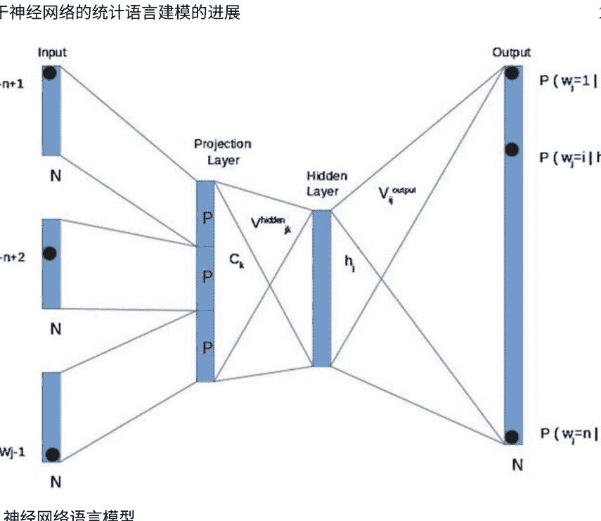

##### 图1 神经网络语言模型

内积 \(e^{h^T v_{w_i}'}\) 计算了单词 \(w_i\) 的（非标准化）对数概率，这些概率通过 \(V\) 中所有单词的对数概率之和进行归一化。因此，该网络满足语言建模的目标。该网络使用误差反向传播算法和梯度下降进行优化训练。

在后续的工作中，Bengio等人提出了改进NNLM训练过程的策略，他们使用了基于WordNet的分层输出层或预训练聚类的技术，这大大减少了输出softmax层的计算量，尽管性能略有降低。许多神经语言模型的后续工作似乎使用了类似的技术，根据所使用的架构适当进行修改，并获得了类似的结果。他们还建议使用重要性采样的思想、噪声约束估计作为完整softmax计算的替代方案，这将大大降低整体计算复杂度。他们还提供了训练过程的并行实现，大大减少了训练所需的时间。

在2012年的论文中，Arisoy等人通过增加更多隐藏层来改进NNLM架构，从而产生了深度神经网络语言模型。额外的隐藏层可以提高训练的质量，而不会显著增加训练时间，因为NNLM的计算成本主要集中在输出softmax上。他们还尝试了不同数量的隐藏单元和投影大小。

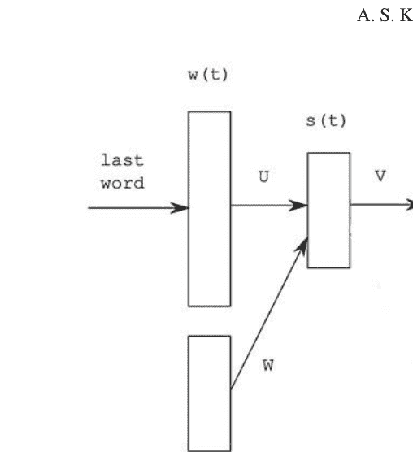

一些研究人员发现这些模型在训练数据上过拟合，深度网络中存在梯度爆炸和梯度消失的问题。为了解决上述问题，引入了不同的正则化技术，适用于浅层和深层前馈神经网络语言模型。正则化方法包括L1、L2、Dropout、Blackout等。

#### 4.2 循环神经网络语言模型（RNNLM）

循环神经网络（RNN）架构已被证明是序列编码应用的选择，因此已成为深度神经网络语言模型的流行架构选择。与FNN不同，RNN架构通过隐藏层的循环连接无限增加上下文长度。

图2显示了香草RNN架构。输入层由表示当前单词 $w_t$ 编码为V个热向量之一的向量 $\mathbf{w}(t)$ 和表示上一个时间步骤隐藏层输出值的向量 $\mathbf{s}(t - 1)$ 组成。网络训练完成后，输出层 $\mathbf{y}(t)$ 表示 $P(w_{t+1}|w_t, s(t-1))$。

网络通过随机梯度下降训练，使用常规的误差反向传播（BP）算法或误差反向传播通过时间（BPTT）[14]。网络由输入层、隐藏层和输出层以及相应的权重矩阵表示。矩阵U和W在输入层和隐藏层之间，矩阵V在隐藏层和输出层之间。层中的输出值计算如下：

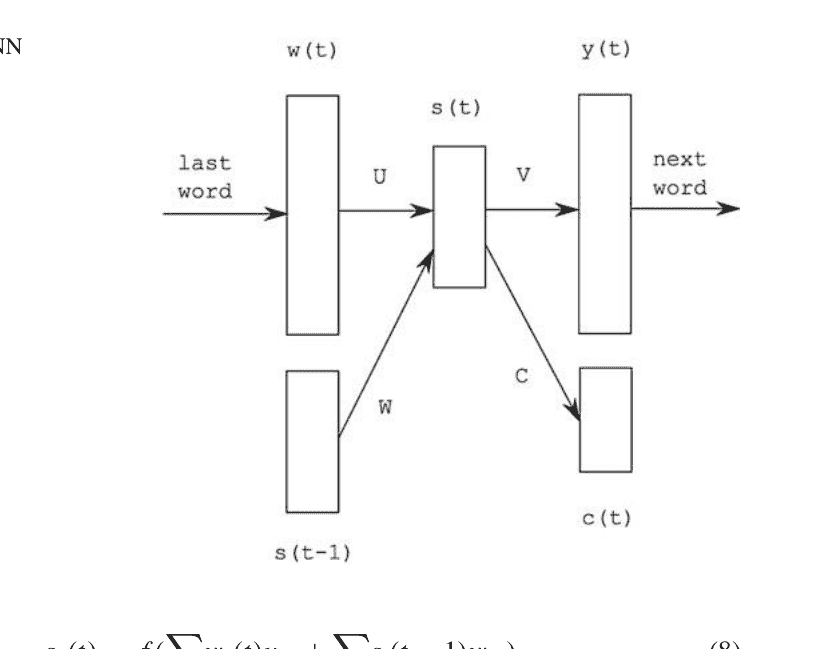

$$s_j(t)=f(\sum_{i} w_i(t)u_{ji} + \sum_{l}s_l(t-1)w_{jl})$$ (8)
$$y_k(t)=g(\sum_{j}s_j(t)v_{kj})$$ (9)

其中，$f(z)$和$g(z)$分别是sigmoid和softmax激活函数。为了简化表示，我们在这个表示中不包括偏置项。输出层$\mathbf{y}$表示下一个单词$w_{t+1}$的概率分布，给定历史。一个训练步骤的时间复杂度与之成正比：

$$\mathbf{O} = \mathbf{H} * \mathbf{H} + \mathbf{H} * \mathbf{V} = \mathbf{H} * (\mathbf{H} + \mathbf{V})$$ (10)

其中$\mathbf{H}$是隐藏层的大小，$\mathbf{V}$是词汇表的大小。图3展示了如何在RNNLM中添加基于类别的输出层。

#### 4.3 长短期记忆语言模型（LSTMLM）

当作为RNNLM使用时，循环神经网络架构在PPL改进方面与NNLM和N-gram模型一样好，这是许多研究人员所证明的。这些模型被认为通过其循环行为来捕捉语言数据中的长期依赖关系。但研究人员很快意识到，通过时间反向传播误差（BPTT）进行训练会导致更新随着你退回几步，它会减少。由于模型无法控制从历史上下文模型中记住什么，它们无法展示所承诺的潜在改进。De Mulder等人[15]对循环神经网络（RNN）在统计语言建模中的应用进行了调查。他提到了基本RNNLM的三个主要缺点：训练RNN非常缓慢，隐藏神经元数量固定，并且由于BPTT算法遇到的梯度消失问题，在实践中上下文大小较小。

长短期记忆（LSTM）包含循环连接的子网络，也称为记忆单元，旨在增加RNN的有效上下文大小。在LSTM架构中，通过用记忆块替换隐藏单元来扩展基本RNN。每个块包含一个或多个自连接的记忆单元和三个乘法单元，即输入门、输出门和遗忘门。这些乘法单元分别类似于写入、读取和重置记忆单元的操作。只要输入门的激活值接近零，单元的激活状态就不会被网络中到达的新输入覆盖，因此可以通过打开输出门在序列中的较晚阶段将其提供给网络。图4取自[16]，说明了LSTM单元的组成，图5说明了LSTMLM架构。

门控循环单元（GRU）[17]是另一种循环神经网络的变体，与LSTM非常相似。GRU没有细胞状态，而是使用隐藏状态传递信息。它只有两个门，重置门和更新门。更新门的作用类似于LSTM的遗忘门和输入门。它决定要丢弃哪些信息，要添加哪些新信息。重置门用于决定要忘记多少过去的信息。GRU的参数要少得多，因此训练速度比LSTM架构快一些。

#### 4.4 双向RNN

基本的RNN按照正向方向处理数据，即使用历史上下文来预测下一个标记。然而，对于许多自然语言处理应用程序，希望在输入中同时工作两个方向。这导致了双向循环神经网络（BRNN）架构的发展。

双向RNN（BRNN）以两个独立的隐藏层在两个方向上处理数据，然后将其馈送到相同的输出层。如[16]中的图5所示，BRNN通过从t = T到1迭代反向层，从t = 1到T迭代正向层，然后更新输出层来计算正向隐藏序列 $\vec{h}$、反向隐藏序列 $\overleftarrow{h}$ 和输出序列y。当我们在BRNN的隐藏层中使用LSTM时，就会产生双向LSTM网络。研究人员已经成功地将这种架构用于语言模型。

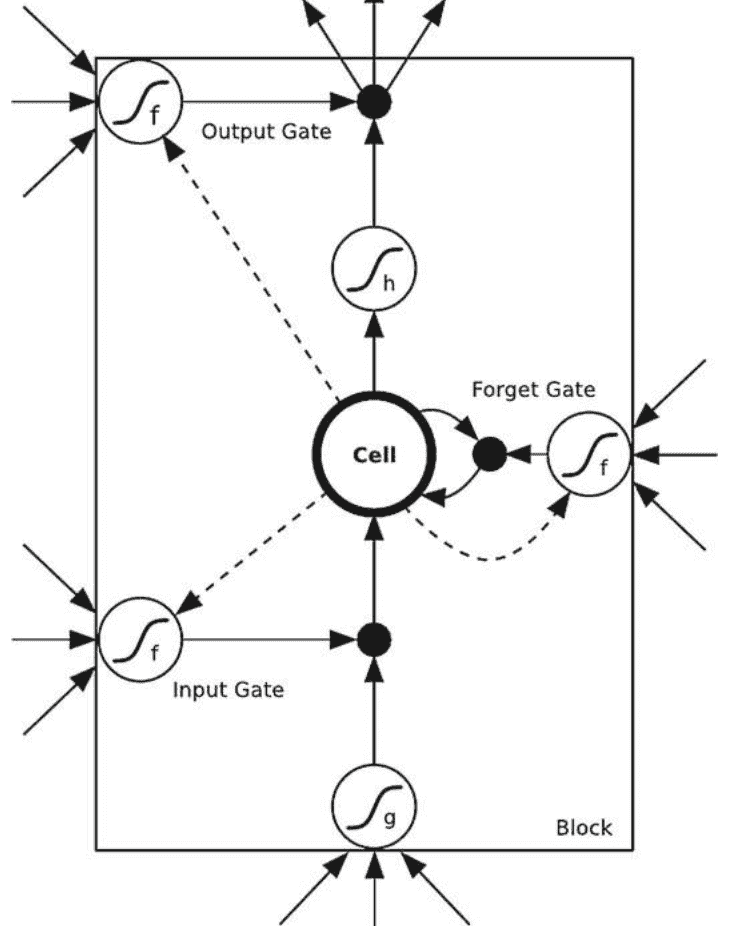
图4 简单的LSTM单元[16]

图5 LSTMLM 架构[16]
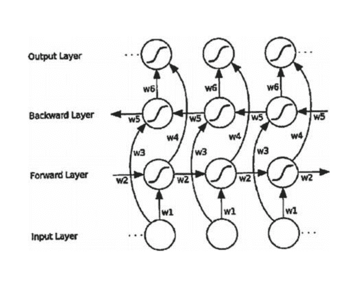

# NNLM研究的5个里程碑

在过去的十年里，NNLM受到了很多关注。在本节中，我们介绍了对NLM研究产生重要影响的研究论文。我们根据神经网络架构、训练算法、评估指标、特殊训练方法和使用的语料库对这些研究进行了比较。

表2和表3显示了这些研究中使用的重要实验设置。基于对文献调研的这些见解，我们认为任何寻求新颖的NLM技术的研究人员都必须解决以下问题：

-   加速基于神经网络的大规模LM训练过程面临独特的挑战。这可能涉及使用偏置重要性采样、噪声对比估计、分层软最大化、自标准化分区函数中的任何一种或组合。需要仔细对其进行表征。

表2 使用的各种训练方法
| 研究 | 神经网络架构 | 目标函数 | 优化器稳定性 | 训练算法 |
|------|--------------|----------|--------------|----------|
| 神经网络模型 Bengio’03 [1] | FF | 对数似然 | 学习率调度 | BP |
| 自适应重要性抽样 Bengio’06 [12] | FF | 对数似然 | 重要性抽样 | BP |
| 训练大规模NNLM Mikolov ’11 [21] | RNN | 对数似然 | 不适用 | BPTT |
| | RNNME | 判别式 | 不适用 | BPTT |
| 深度神经网络语言模型 Arisoy’12 [13] | 深度FF | 不适用 | 不适用 | BP |
| Blackout: 加速具有非常大的词汇量的RNNLM Shiao’16 [22] | RNN变种 | 判别式 | 梯度裁剪<br>学习率调度 | BPTT |
| 噪声对比估计用于大词汇量 ’16 [23] | LSTM | 对数似然 | 不适用 | BPTT |
| 语言建模的限制 ’16 [24] | LSTM | 判别式 | 梯度裁剪 | BPTT |
| | 带有Char cNN的LSTM | | | |

# 表3 文献调查分析
| 论文 | 评估度量 | 训练方法 - 参数 | 训练方法 - 加速 | 使用的语料库 | 使用的任务 |
|------|----------|-----------------|-----------------|--------------|------------|
| 神经网络模型 bengio'03 [1] | 内在的 | ~V | 并行实现 | 布朗语料库 | 不适用 |
| 自适应重要性抽样 Bengio'06 [12] | 外在的 | |V| / log|V| | 有偏的重要性 | 交换机板数据集 | LVCSR |
| | | log|V| | 分层分解 | | |
| 训练大规模 NNLM Mikolov'11 [21] | 内在的 | << V | 基于类别的输出层 | 宾夕法尼亚树库 | 不适用 |
| 深度神经网络语言模型 Arisoy'12 [13] | 外在的 | 不适用 | 不适用 | 华尔街日报 | ASR WER |
| Blackout: 加速 RNN 语言模型与非常大的词汇表 Shiao'16 [22] | 内在的 | << V | Blackout | PTB | 不适用 |
| | | | | 10亿基准 | |
| 噪声对比估计用于大词汇表 [23] | 外在的 | 不适用 | 不适用 | 华尔街日报 | ASR |
| 语言建模的限制 [24] | 内在的 | 我是V的ndp. | 重要性抽样 | 10亿基准 | 不适用 |

-   RNN LM和其他基于深度神经网络的LM在训练过程中使用BPTT，因此我们必须解决梯度消失、梯度爆炸等问题。参考文献[18]已经展示了如何处理这些问题。
-   文献表明，各种LM的集成模型总是优于基本模型。从非参数模型如N-gram [3]，到NNLMs，RNN LM [1, 7, 12, 19, 20]，都表现出相同的特点。找到一个既强大又易于训练的DNN集成模型是具有挑战性的。
-   神经机器翻译模型的另一个重要问题是处理罕见词问题，Cho等人[25]和Luong等人[26]已经研究过。

●另一个挑战是研究DNN LM在形态丰富的语言中的有效性，并提出一个字符级和词级粒度的组合模型。一项研究[27]提出了C2W（组合字符到词）模型，可以用作基于LSTM的深度LM的预处理层。

### 6 评估指标

统计语言模型可以通过内在度量或外在度量进行评估。内在度量，如困惑度，反映了所学习模型与所考虑的真实语言模型之间的质量。而外在度量，如词错误率（WER），则反映了模型对所考虑任务的适用性。大多数研究人员使用其中之一或两者来分析语言模型的成功。

1.  单词序列w的困惑度（PPL）定义为：
$$PPL = \sqrt[K]{\prod_{i=1}^{K} \frac{1}{P(w_i|w_1\dots w_{i-1})}}$$ (11)
困惑度与一些保留的测试数据和真实模型之间的交叉熵密切相关。它可以被看作是测试数据的平均每词熵（几何平均）的指数。PPL值越小，模型质量越好。
2.  词错误率（WER）定义为：
$$WER = \frac{S + D + I}{N}$$ (12)
其中S是替换的次数，D是删除的次数，I是插入的次数（每个操作都可以改变、删除或添加一个单词）。WER是为了将解码的话语$W_1$转换为参考话语W（其中包含N个单词）所需的最低操作次数而定义的。

3.  双语评估助手分数（BLEU）是机器翻译中使用的另一种外部度量标准。它是用于评估生成的句子与参考句子之间的度量标准。完全匹配得分为1.0，而完全不匹配得分为0.0。该分数是用于评估自动机器翻译系统所做的预测。它并不完美，但具有以下令人信服的优点：

+   ●计算快速且廉价。
+   ●易于理解。
+   ●语言无关。
+   ●与人类评估高度相关。

+   - 在机器翻译、语言生成、语音识别、图像字幕、文本摘要等方面被广泛采用的度量标准。

#### 6.1 最先进的PPL

对于单词级语言建模，人们会进行一些基准比较。尺寸、风格和预处理的差异导致了不同的挑战，因此也导致了不同的最先进的困惑度。

-   Penn Treebank (PTB) 包含了来自华尔街日报的文章，典型的基准是Mikolov处理过的版本。PTB的词汇量为10K，训练集有890K个标记。这里的挑战是从少量数据中学习。最先进的是由Yang等人[28]提出的47.7困惑度。他们使用了一个包含2400万参数的AWD-LSTM（Merity等人[29]）循环核心进行训练，几乎在每个地方都使用了dropout，并使用了动态评估[30]，这使得模型能够适应测试集。没有这个动态评估技巧的最先进结果是54.4。Kneser-Ney 5-gram的测试困惑度约为140。
-   十亿字基准是用于基准测试语言模型的所有数据集中最大的一个，它是从英文新闻文本[31]中编译而成。它包含了8亿个单词和一个词汇量为80万。Oleksii Kuchaiev [32]的模型仍然是最先进的，它的困惑度为24.3。它是一个带有瓶颈连接的LSTM模型，包含了3400万个循环单元上的参数。相比之下，Kneser-Ney 5-gram的困惑度为67[31]。十亿字基准对句子进行了随机化处理，这意味着模型不能利用长期依赖性或上下文。此外，随机的句子被分配给训练和测试集。由于新闻文章可能非常相似，这引发了一个问题，即训练集和测试集中可能出现非常相似的句子。因此，对于泛化来说，压缩训练数据集的非常大的模型在这个任务上表现得很好，对于泛化的重视程度较低。
-   WikiText-2是由Salesforce（Merity等人[29]）准备的数据集，包含来自维基百科的文本。训练集和测试集是独立的文章，这很好。WikiText-2也很小，它有30K个词汇，并包含2M个训练标记。它有点像2-3倍的PTB，似乎没有带来太多额外的研究见解，因为主要瓶颈是数据量很小。最先进的是Yang等人[28]的论文，ppl为40.7。
-   WikiText-103是Salesforce的另一个数据集。由于词汇量为270K，训练集包含100M个标记，因此这个数据集要大得多。测试集与WikiText-2相同，但词汇量扩展了。这里的挑战是：长期时间依赖性和大词汇量。最先进的是Rae等人2018年[33]的论文，ppl为29.2。他们提出了一种记忆启发式的softmax层，Hebbian Softmax，以更好地建模罕见的单词。模型的其余部分由一个非常简单的单层LSTM（2048个单元）组成，具有输入丢失和测试时的基于内存的适应性[34, 35]。 LSTM的总模型大小约为17M参数，输入/输出嵌入矩阵为138M参数。

### 7 结论

统计语言建模已经研究了30多年。像N-gram这样的简单语言模型在实践中证明是有效的，还有更复杂但不太实用的模型。NLM肯定比N-gram模型有所改进。由于该领域已经发展到一定程度，不同研究人员使用了共同的方法。尽管有许多变种的深度NLM可用，但经过适当调整的带有LSTM或GRU单元的RNNLm在PPL改进方面击败了许多先进的NLM。最近的研究人员正在集中使用子词信息来提供更好的单词级语言模型。使用字符级信息使这些模型不依赖于词汇表。

### 参考文献

- 1. Bengio, Y., Ducharme, R., Vincent, P., Jauvin, C.: 一个神经概率语言模型。 J. Mach. Learn. Res. 3, 1137–1155 (2003)
- 2. Chen, J.G.S.：平滑技术在语言建模中的实证研究。 在：ACL第34届年会论文集（1996年）
- 3. Joshua, T., Goodman, J.：语言建模的一点进展扩展版，微软研究院机器学习和应用统计小组技术报告，MSR-TR-2001-72（2001年）
- 4. Jelinek, F., Merialdo, B., Roukos, S., Strauss, M.：一种用于语音识别的动态语言模型。 HLT 91，293–295（1991年）
- 5. Bellegarda, J.R.：用于大词汇量语音识别的多跨度语言建模框架。 IEEE Trans. Speech Audio Process. 6（5），456–467（1998年）
- 6. Lau, R., Rosenfeld, R., Roukos, S.：基于触发器的语言模型：一种最大熵方法。 在：IEEE国际声学、语音和信号处理会议，ICASSP-93，卷2，第45–48页（1993年）
- 7. Mikolov, T., Karafiát, M., Burget, L., Cernocký, J., Khudanpur, S.：循环神经网络基于语言模型。 在：Interspeech, 卷. 2, 第3页（2010年）
- 8. Rosenfeld R.：自适应统计语言建模：最大熵方法。 博士学位论文，卡内基梅隆大学（1994年）
- 9. Chen, S.F.：缩小指数语言模型，在：人类语言技术会议论文集：北美协会计算语言学分会的2009年年会，计算语言学协会pp. 468–476（2009年）
- 10. Chen, S.F., Mangu, L., Ramabhadran, B., Sarikaya, R., Sethy, A.：基于缩小的扩展语言模型。 在：IEEE自动语音识别和理解研讨会 ASRU 2009, pp. 299–304（2009年）
- 11. Mikolov, T.：基于神经网络的统计语言模型. 博士论文, 布尔诺理工大学, 信息技术学院（2012）
- 12. Bengio, Y., Schwenk, H., Senécal, J.S., Morin, F., Gauvain, J.-L.：神经概率语言模型. 在: 机器学习创新,第137-186页, Springer (2006)
- 13. Arisoy, E., Sainath, T.N., Kingsbury, B., Ramabhadran, B.: 深度神经网络语言模型. 在: NA ACL-HLT 2012研讨会论文集: 我们真的会替代N-gram模型吗? 关于HLT的语言建模的未来, 第20-28页 (2012)
- 14. Rumelhart, D.E., Hinton, G.E., Williams, R.J.: 通过反向传播学习表示. Nature 323(6088), 533 (1986)
- 15. De Mulder, W., Bethard, S., Moens, M.-F.: 对循环神经网络在统计语言建模中的应用的调查. 计算机语音与语言学. 30(1), 61–98 (2015)
- 16. Graves, A.: 监督序列标注. 在: 监督序列标注与循环神经网络, 第5-13页. Springer (2012)
- 17. Cho, K., Van Merriënboer, B., Gulcehre, C., Bahdanau, D., Bougares, F., Schwenk, H., Bengio, Y.: 使用RNN编码器-解码器学习短语表示用于统计机器翻译 (2014). arXiv预印本 arXiv:1406.1078
- 18. Pascanu, R., Mikolov, T., Bengio, Y.: 关于训练循环神经网络的困难. ICML 3(28), 1310-1318 (2013)
- 19. Bengio, Y., Senécal, J.S.: 自适应重要性采样加速神经概率语言模型的训练. IEEE Trans. Neural Netw. 19(4), 713-722 (2008)
- 20. Bengio, Y., Boulanger-Lewandowski, N., Pascanu, R.: 优化递归网络的进展. 在: 2013年IEEE国际声学、语音和信号处理会议上, pp. 8624-8628 (2013)
- 21. Mikolov, T., Deoras, A., Povey, D., Burget, L., Černocký, J.: 大规模训练策略神经网络语言模型. 在: 2011年IEEE自动语音识别和理解研讨会 (ASRU) 上, pp. 196-201 (2011)
- 22. Ji, S., Vishwanathan, S., Satish, N., Anderson, M.J., Dubey, P.: Blackout Speeding up recurrent neural network language models with very large vocabularies (2015). arXiv预印本 arXiv:1511.06909
- 23. Zoph, B., Vaswani, A., May, J., Knight, K.: Simple, fast noise-contrastive estimation for large rnn vocabularies. NAACL HLT, pp. 1217–1222 (2016)
- 24. Jozefowicz, R., Vinyals, O., Schuster, M., Shazeer, N., Wu, Y.: Exploring the limits of language modeling (2016). arXiv预印本 arXiv:1602.02410
- 25. Cho, S.J.K., Memisevic, R., Bengio, Y.: On using very large target vocabulary for neural machine translation (2014). CoRR arXiv:1412.2007
- 26. Luong, M.T., Sutskever, I., Le, Q.V., Vinyals, O., Zaremba, W.: 在神经机器翻译中解决罕见词问题 (2014). arXiv预印本 arXiv:1410.8206
- 27. Ling, W., Luís, T., Marujo, L., Astudillo, R.F., Amir, S., Dyer, C., Black, A.W., Trancoso, I.: 在形式中找到功能: 用于开放词汇表单词表示的组合字符模型 (2015). arXiv预印本 arXiv:1508.02096
- 28. Yang, Z., Dai, Z., Salakhutdinov, R., Cohen, W.W.: 打破softmax瓶颈: 高秩RNN语言模型 (2017). arXiv预印本 arXiv:1711.03953
- 29. Merity, S., Keskar, N.S., Socher, R.: 正则化和优化LSTM语言模型 (2017). arXiv预印本 arXiv:1708.02182
- 30. Krause, B., Kahembwe, E., Murray, I., Renals, S.: 神经序列动态评估模型 (2017). arXiv预印本 arXiv:1709.07432
- 31. Chelba, C., Mikolov, T., Schuster, M., Ge, Q., Brants, T., Koehn, P., Robinson, T.: 一亿词语基准用于衡量统计语言建模的进展 (2013). arXiv预印本 arXiv:1312.3005
- 32. Kuchaiev, O., Ginsburg, B.: LSTM网络的分解技巧 (2017). arXiv预印本 arXiv:1703.10722
- 33. Rae, J.W., Dyer, C., Dayan, P., Lillicrap, T.P.: 使用激活记忆的快速参数学习 (2018). arXiv预印本 arXiv:1803.10049
- 34. Grave, E., Joulin, A., Usunier, N.: 使用连续缓存改进神经语言模型 (2016). arXiv预印本 arXiv:1612.04426
- 35. Sprechmann, P., Jayakumar, S.M., Rae, J.W., Pritzel, A., Badia, A.P., Uria, B., Vinyals, O., Hassabis, D., Pascanu, R., Blundell, C.: 基于记忆的参数适应 (2018). arXiv预印本 arXiv:1802.10542

### 索引

#### A

加速器，68，69，287，288，299，300，302–305，309，312，316–318

代数拓扑学，26，32，243

架构，1，2，4，6，7，10，14–18，21，22，25，26，41–44，49，57，65–70，72–75，78，79，81，91，93，95，101–104，106，108，113，115，118–120，126，135，136，141，143–146，149，152–154，160，161，164，171，173，178，212，218，219，221，223，226–228，233，238，239，241，243，265，271，276–278，280，283，285，287，295，298，300，301，303，305，308–310，312，315，317，321–323，327–332，334

人工智能，2，102，296

注意力机制，21，22，133，134，136，143，156，160–164

自编码器，10，11，17，22，101–121，126，171，175，176，187，190–193

#### B

贝蒂数，26，40–43

#### C

容量优化，238，239，256，258，261，264

CapsNet, 65, 66, 73, 74, 77–79, 85, 91–95

复杂度评估，238

卷积网络，5，6，48，112，142，211，328

卷积神经网络（CNN），1，2，4–7，9，22，25，27–29，40，71，73，74，134，135，142–146，149，163，212，213，215–224，226，227，237–239，241–246，248，249，251，256，258，259，261，262，264，265，269，271–273，276–278，281，283–285，288，296，298，300，334

曲率，25，26，33，35–37，51，55，56，58，59，61

#### D

数据表示，2，11，102，120

深度置信网络（DBN），10，13，22，178，288

深度学习，1，2，4，10，13，22，23，26，37，45，57，66，101，102，120，126，170，171，178，206，212，214，224，238，239，241，265，269–271，273，281，285，287，288，296，298，301

深度神经网络（DNN），25，26，49，51，52，55，65–74，77–79，93–95，187，197，199，206，214，216，287，288，294–296，300，301，310，317，321，322，329，334，335，336

降维，10，11，45，101，102，106，120，121，126

#### E

E-M风格标签去噪，217

编码器-解码器框架，133，134，137，143，144，160，163

表达能力，25，26，32，44

#### G

生成对抗网络（GAN），10, 12, 25, 116

图形处理单元（GPU），65–70, 72, 73, 75–78, 81, 84, 85, 88, 91–95, 288, 294, 296, 298, 301

#### H

异构计算，303

#### I

图像字幕，13, 135, 143, 144, 152, 156, 161, 162, 212, 337

图像分类，4, 102, 143, 211, 223, 237

推理时间，65, 67, 68, 71, 73, 77, 80, 95

#### L

标签噪声，211–219, 224, 225, 227, 228, 231–233

长短期记忆（LSTM），13, 15, 18–20, 22, 27, 109, 121, 139, 142, 143, 145, 148, 149, 152, 153, 156–158, 163, 164, 180–184, 288, 289, 296, 298, 300, 322, 328, 331, 332, 334, 336–338

长期依赖性，17, 18, 133, 135, 142, 143, 151, 154, 156, 160, 163, 164

#### M

机器学习，1, 2, 13, 22, 25, 57, 66, 101, 102, 134, 170, 193, 195, 207, 212, 238, 265, 272, 288, 295, 300, 301, 308

机器翻译，109, 133–137, 139–143, 151, 152, 155, 157, 160, 163, 321, 322, 335–337

改进的国家标准与技术研究所（MNIST），47, 73, 75, 76, 78, 80, 93, 211–213, 223–227, 281

#### N

美国国家篮球协会，269, 270, 271, 273–275, 285

自然语言处理，1, 4, 13, 14, 101, 102, 109, 133, 136, 321

#### O

过拟合，7, 110, 119, 176, 222, 237, 276, 330

#### P

并行计算，17, 71

#### Q

问答，133–135, 151

#### R

循环网络，14

递归网络，16, 17, 170, 180, 184, 206

表示学习，2, 101, 102, 106, 109, 110, 113, 115, 117, 120, 126, 170, 171

ResNet50, 65, 66, 73, 74, 76–79, 85, 88–91, 93, 95

黎曼几何，26, 33

#### S

缩放，65, 67, 69, 73, 75, 77–79, 81, 84, 85, 87, 88, 90, 92, 93, 95, 182, 249

散射变换，25, 26, 45, 48, 50, 51

加速，65, 75, 77, 78, 84–88, 90, 91, 93–95

体育预测，272

统计语言建模，321–323, 326, 332, 338

#### T

张量核心，66, 68, 69, 95, 298

张量处理架构，65, 70, 95

张量处理单元，66, 69, 288, 299, 301

文本分类，211, 213, 215, 220, 223, 224, 229

TPUv2, 65, 66, 69, 73, 75–78, 80, 91, 93, 95, 96

训练时间，17, 152, 322

#### U

欠拟合，237, 242, 243

无监督网络，2, 10, 22

#### V

VGG16, 65, 66, 73–75, 77–80, 82–87, 91, 93, 95

视频字幕生成，134, 136