# 深度学习的几何

## 前言

这个学期的开始非常不同、前所未有和奇怪，我不知道该怎么办。这个学期，我本来应该开设一门新的高级智能课程，与生物/脑工程系和数学科学系的学生共同授课。我最初计划采用一种标准的机器学习教学方法，内容是实践、经验为基础的讲座，并通过许多小项目和学期项目与学生进行互动。 不幸的是，COVID-19全球大流行彻底改变了世界，这样的互动课程大部分时间都不再可行。

因此，我考虑了给我的学生提供在线讲座的最佳方式。 我希望我的课程与其他热门在线机器学习课程不同，但仍然提供关于现代深度学习的最新信息。 然而，可选的选择并不多。大多数现有的教科书已经过时或者非常注重实现而不涉及基础知识。 一个选择是通过添加我想教授的所有最新知识来准备演示文稿。 然而，对于本科水平的课程来说，演示文件通常不足以让学生跟上课程，我们需要一本学生可以独立阅读以理解课程的教科书。 出于这个原因，我决定先写一份阅读材料，然后根据它创建演示文件，这样学生可以在在线讲座之前和之后独立学习。 这是我关于深度学习几何的一个学期长书籍项目的开始。 实际上，我坚信深度神经网络不是一个神奇的黑盒子，而是一个无尽灵感的源泉，可以带来新的数学发现。

此外，我相信艾萨克·牛顿的名言：“站在巨人的肩膀上”，并寻找深度学习的数学解释。 对我来说作为一名医学影像研究员，这个主题不仅在理论上非常重要，而且对临床决策也很关键，因为我们不希望创建出被识别为疾病的虚假特征。

2017年，在里斯本的一条街上，我对编码器-解码器神经网络中隐藏的框架结构有了一个恍然大悟的时刻。 深度卷积框架的结果解释发表在《SIAM图像杂志》上。

这篇论文对应用数学界产生了重大影响，并且自发表以来一直是下载量最多的论文之一。然而，在这项工作中，修正线性单元（ReLU）的作用并不清楚，一位医学影像期刊的审稿人一直要求我解释ReLU在深度神经网络中的作用。起初，这个问题似乎超出了医学应用论文的范围，但我对审稿人表示感谢，因为在准备回答这个问题的痛苦过程中，我意识到ReLU决定了输入空间的分区，这个分区会自动适应输入空间的流形。事实上，这一发现导致了2019年ICML论文的发表，我们揭示了框架的组合表示，这清楚地显示了与经典的压缩感知（CS）方法的关键联系。

回顾一下，我开始这本书的项目时非常勇敢，因为这只是我对深度学习几何理解的两个方面。然而，当我为深度学习的每个主题准备阅读材料时，我发现确实有许多令人兴奋的几何洞见尚未得到充分讨论。

例如，当我写反向传播章节时，我意识到矩阵微积分中分母布局约定的重要性，这导致了反向传播的美妙几何。在写这本书之前，归一化和注意机制对我来说看起来非常启发式，没有系统理解的证据，这更加令人困惑，因为它们的相似之处。例如，AdaIN、Transformer和BERT就像研究人员用自己的秘密配方开发的黑暗食谱。然而，为了准备阅读材料的深入研究揭示了它们背后非常好的数学结构，显示出它们与最优传输理论之间的密切联系和关系。

撰写关于深度神经网络几何的章节是另一个让我开心的事情，它拓宽了我的视野。在我的讲座中，我的一个学生指出，一些分区可能导致低秩映射。回顾过去，这已经在方程中了，但直到我的学生们向我提出挑战，我才认识到分区的美妙几何，它与深度神经网络的引人注目的经验观察完美契合。

最后一章关于生成模型和无监督学习，是我非常自豪的一部分。与传统的生成对抗网络（GAN）、变分自编码器（VAE）和概率工具的归一化流解释相比，我的主要关注点是用几何工具推导它们。事实上，这个努力是非常有回报的，这一章明确地将各种形式的生成模型统一为统计距离最小化和最优传输问题。

事实上，这本书的重点是给学生提供几何洞察力，帮助他们以统一的框架理解深度学习，我相信这是从这种角度写的第一本深度学习书籍之一。由于这本书是基于我为高年级本科课程准备的材料，我相信这本书可以用于一个学期的高年级本科和研究生课程。此外，我的课程是一个共享代码的课程，用于

这项工作的内容很大程度上是跨学科的，旨在吸引生物工程和数学专业的学生。

我非常感谢2020年春季BiS400C和MAS480班的助教和学生们。我特别要感谢我的优秀助教团队：Sangjoon Park, Yujin Oh, Chanyong Jung, Byeongsu Sim, Hyungjin Chung和Gyutaek Oh。特别是Sangjoon作为负责人助教，为本书的排版错误和错误提供了有组织的反馈。我还要感谢我在KAIST的生物成像、信号处理和学习实验室（BISPL）的出色团队，他们进行了开创性的研究工作，给我带来了灵感。

非常感谢我的了不起的儿子和未来科学家，Andy Sangwoo，以及我甜美的女儿和未来作家，Ella Jiwoo，对他们的爱和支持。你是我无尽的能量和灵感之源，我为你感到骄傲。最后，但并非最不重要的，我要感谢我心爱的妻子，Seungjoo (Joo)，自从我们相识以来，她对我的无尽爱和持续支持。我欠你一切，你让我成为一个好人。由衷感谢你，

大田，韩国
2021年2月

Jong Chul Ye


# 第一部分 机器学习的基本工具

> “我听到了以下观点的重申：复杂的理论不起作用；简单的算法起作用。我想证明在科学领域中一个古老的好原则仍然有效：没有什么比一个好的理论更实用。”
> 
> -弗拉基米尔·N·瓦普尼克

## 第一章 数学基础知识

在这一章中，我们简要回顾了理解本书内容所需的基本数学概念。

### 1.1 度量空间

度量空间 $(X, d)$ 是一个集合 $X$ 和集合上的度量 $d$ 的组合。在这里，度量是一个函数，它定义了集合中任意两个成员之间的距离概念，形式上定义如下。

> **定义 1.1 (度量)** 集合 $X$ 上的度量是一个称为距离 $d$ 的函数： $X \times X \to \mathbb{R}_+$，其中 $\mathbb{R}_+$ 是非负实数的集合。 对于所有的 $x, y, z \in X$，这个函数需要满足以下条件：
> 
> - $d(x, y) \geq 0$ (非负性)。
> - $d(x, y) = 0$ 当且仅当 $x = y$。
> - $d(x, y) = d(y, x)$ (对称性)。
> - $d(x, z) \leq d(x, y) + d(y, z)$ (三角不等式)。

度量空间上的度量引发了开集和闭集等拓扑性质的研究。 具体来说，关于任意点 $x$ 在度量空间 $X$ 中，我们定义以半径 $r > 0$ 为中心的开球为集合
$$B_r(x) = \{ y \in X : d(x, y) < r \}. \quad (1.1)$$
基于此，我们有开集和闭集的正式定义。

> **定义 1.2 (开集， 闭集)** 度量空间 $X$ 中的子集 $U$ 称为开集，如果对于每个 $x \in U$，存在一个 $r > 0$，使得 $B_r(x)$ 包含在 $U$ 中。 开集的补集称为闭集。

度量空间 $\mathcal{X}$ 中的序列 $(x_n)$ 如果对于每个 $\varepsilon > 0$，存在一个自然数 $N$，使得对于所有 $n > N$，有 $d(x_n, x) < \varepsilon$ 成立，则称该序列收敛于极限 $x \in \mathcal{X}$。度量空间 $\mathcal{X}$ 的子集 $S$ 是闭集，当且仅当在 $S$ 中收敛于极限的每个序列的极限也在 $S$ 中。此外，元素序列 $(x_n)$ 是柯西序列，当且仅当对于每个 $\varepsilon > 0$，存在某个 $N \geq 1$，使得
$$d(x_n, x_m) < \varepsilon, \quad \forall \quad m, n \geq N.$$

我们现在准备定义度量空间中的重要概念。

**定义 1.3（完备性）**
度量空间 $\mathcal{X}$ 如果每个 Cauchy 序列都收敛到一个极限，或者如果 $d(x_n, x_m) \rightarrow 0$，当 $n$ 和 $m$ 独立地趋向于无穷大时，那么存在某个 $y \in \mathcal{X}$ 使得 $d(x_n, y) \rightarrow 0$。

**定义 1.4（Lipschitz连续性）**
给定两个度量空间 $(\mathcal{X}, d_{\mathcal{X}})$ 和 $(\mathcal{Y}, d_{\mathcal{Y}})$，其中 $d_{\mathcal{X}}$ 表示集合 $\mathcal{X}$ 上的度量， $d_{\mathcal{Y}}$ 是集合 $\mathcal{Y}$ 上的度量，如果存在一个实数常数 $K \geq 0$，使得对于所有的 $x_1, x_2 \in \mathcal{X}$，
$$d_{\mathcal{Y}}(f(x_1), f(x_2)) \leq K d_{\mathcal{X}}(x_1, x_2). \quad \quad (1.2)$$
在这里，常数 $K$ 通常被称为 Lipschitz 常数，而具有 Lipschitz 常数 $K$ 的函数被称为 $K$-Lipschitz 函数。

### 1.2 向量空间

向量空间 $\mathcal{V}$ 是一个在有限向量加法和标量乘法下封闭的集合。在机器学习应用中，标量通常是实数或复数的成员，此时 $\mathcal{V}$ 被称为实数向量空间或复数向量空间。

例如，欧几里得空间 $\mathbb{R}^n$ 被称为实向量空间， $\mathbb{C}^n$ 被称为复向量空间。在 $\mathbb{R}^n$ 中的 $n$ 维欧几里得空间中，每个元素由 $n$ 个实数列表表示，加法是逐分量进行的，标量乘法是分别对每个项进行的乘法。更具体地说，我们将 $n$ 维实值向量 $\boldsymbol{x}$ 定义为一个由 $n$ 个实数组组成的数组，表示为
$$\boldsymbol{x} = \begin{bmatrix} x_1 \\ x_2 \\ \vdots \\ x_n \end{bmatrix} = [x_1 \; x_2 \; \cdots \; x_n]^\top \in \mathbb{R}^n,$$
其中上标 T 表示伴随。请注意，对于实向量，伴随就是转置。然后，两个向量 $\boldsymbol{x}$ 和 $\boldsymbol{y}$ 的和，表示为 $\boldsymbol{x} + \boldsymbol{y}$，定义为
$$\boldsymbol{x} + \boldsymbol{y} = [x_1 + y_1, x_2 + y_2, \cdots, x_n + y_n]^T.$$
类似地，与标量 $\alpha \in \mathbb{R}$ 的标量乘法定义为
$$\alpha \boldsymbol{x} = [\alpha x_1, \alpha x_2, \cdots, \alpha x_n]^T.$$
此外，我们正式定义向量空间中的内积和范数如下。

**定义 1.5 (内积)** 设 $\mathcal{V}$ 为定义在 $\mathbb{R}$ 上的向量空间。如果函数 $\langle \cdot, \cdot \rangle_{\mathcal{V}}: \mathcal{V} \times \mathcal{V} \to \mathbb{R}$ 是 $\mathcal{V}$ 上的内积，则满足以下条件：

- 对称性： $\langle f, g \rangle_{\mathcal{V}} = \langle g, f \rangle_{\mathcal{V}}$。
- 线性性： $\langle \alpha f + \beta g, h \rangle_{\mathcal{V}} = \alpha \langle f, h \rangle_{\mathcal{V}} + \beta \langle g, h \rangle_{\mathcal{V}}$。
- 正定性： $\langle f, f \rangle_{\mathcal{V}} \geq 0$ 并且 $\langle f, f \rangle_{\mathcal{V}} = 0$ 当且仅当 $f = 0$。

如果底层向量空间 $\mathcal{V}$ 是明显的，我们通常表示内积不带下标 $\mathcal{V}$，即 $\langle f, g \rangle$。例如，两个向量 $f, g \in \mathbb{R}^n$ 的内积定义为
$$\langle f, g \rangle = \sum_{i=1}^n f_i g_i = f^T g.$$
两个非零向量 $x, y$ 被称为正交的，当
$$\langle x, y \rangle = 0,$$
我们将其表示为 $x \perp y$。一个向量 $x$ 对于子集 $S \subset \mathcal{V}$ 是正交的，表示为 $x \perp S$，如果它对于 $S$ 中的每个元素都是正交的。子集 $S$ 的正交补，表示为 $S^\perp$，包含了 $\mathcal{V}$ 中与 $S$ 中的每个向量都正交的所有向量，即
$$S^\perp = \{x \in \mathcal{V} : \langle v, x \rangle = 0, \forall v \in S\}.$$

**定义 1.6 (范数)** 范数 $\|\cdot\|$ 是定义在向量空间上的实值函数，具有以下性质：

- $\|x\| \geq 0$，并且 $\|x\| = 0$ 当且仅当 $x = 0$。
- $\|\alpha x\| = |\alpha| \|x\|$ 对于任意标量 $\alpha$。
- 三角不等式： $\|x + y\| \leq \|x\| + \|y\|$ 对于任意向量 $x$ 和 $y$。

从内积中，我们可以得到所谓的诱导范数：
$$\|x\| = \sqrt{\langle x, x \rangle}.$$
类似地，第 1.1 节中度量的定义告诉我们向量空间 $\mathcal{V}$ 中的范数诱导了度量，即
$$d(x, y) = \|x - y\|, \quad x, y \in \mathcal{V}. \quad (1.3)$$
向量空间中的范数和内积有特殊的关系。例如，对于任意两个向量 $x, y \in \mathcal{V}$，以下的柯西-施瓦茨不等式总是成立的：
$$|\langle x, y \rangle| \leq \|x\|\|y\|. \quad (1.4)$$

### 1.3 巴拿赫和希尔伯特空间

内积空间被定义为一个配备了内积的向量空间。范数空间是一个定义了范数的向量空间。内积空间总是一个范数空间，因为我们可以将范数定义为 $\|f\| = \sqrt{\langle f, f \rangle}$，这通常被称为诱导范数。在各种形式的范数空间中，最有用的范数空间之一是巴拿赫空间。

**定义 1.7** 巴拿赫空间是一个完备的范数空间。

在这里，“完备性”在优化的角度尤为重要，因为大多数优化算法都是以迭代的方式实现的，所以迭代方法的最终解应该属于底层空间 $\mathcal{H}$。请记住，收敛性是度量空间的一个属性。因此，Banach 空间可以被看作是一个具有度量空间理想属性的向量空间。类似地，我们可以定义希尔伯特空间。

**定义 1.8** 希尔伯特空间是一个完备的内积空间。

我们可以很容易地看出，希尔伯特空间也是一个 Banach 空间，这要归功于引入的范数。向量空间、范数空间、内积空间、Banach 空间和希尔伯特空间之间的包含关系在图 1.1 中有所说明。如图 1.1 所示，希尔伯特空间具有许多良好的数学结构，如内积、范数、完备性等，因此在机器学习文献中被广泛使用。以下是希尔伯特空间的一些著名例子：

- $\ell^2(\mathbb{Z})$：由平方可加离散时间信号组成的函数空间，即
  $$\ell^2(\mathbb{Z}) = \left\{ x = \{x_l\}_{l=-\infty}^{\infty} \mid \sum_{l=-\infty}^{\infty} |x_l|^2 < \infty \right\}.$$
  在这里，内积被定义为
  $$\langle \boldsymbol{x}, \boldsymbol{y}\rangle_{\mathcal{H}} = \sum_{l=-\infty}^{\infty} x_l y_l, \text{ 对于所有的 } \boldsymbol{x}, \boldsymbol{y} \in \mathcal{H}。$$
- $L^2(\mathbb{R})$：由平方可积连续时间信号组成的函数空间，即 $L^2(\mathbb{R}) = \left\{ x(t) \mid \int_{-\infty}^{\infty} |x(t)|^2 dt < \infty \right\}$。
  在这里，内积被定义为
  $$\langle \boldsymbol{x}, \boldsymbol{y}\rangle_{\mathcal{H}} = \int x(t) y(t) dt。$$

在各种形式的希尔伯特空间中，再生核希尔伯特空间（RKHS）在经典机器学习文献中具有特殊的兴趣，这将在本书后面解释。在这里，读者们需要记住 RKHS 只是希尔伯特空间的一个子集，如图 1.1 所示，即希尔伯特空间比 RKHS 更一般。

图 1.1 RKHS， 希尔伯特空间， 巴拿赫空间和向量空间

#### 1.3.1 基和框架

如果一个向量集合 $\{\boldsymbol{x}_1, \cdots, \boldsymbol{x}_k\}$ 是线性无关的，那么线性组合表示为 $\alpha_1 \boldsymbol{x}_1 + \alpha_2 \boldsymbol{x}_2 + \cdots + \alpha_k \boldsymbol{x}_k = \boldsymbol{0}$。
意味着
$$\alpha_i = 0, \quad i = 1, \dots, k$$
由集合 $S$ 中的向量进行线性组合可达到的所有向量的集合称为 $S$ 的张成。例如，如果 $S = \{ x_i \}_{i=1}^k$，则我们有
$$\text{span}(S) = \left\{ \sum_{i=1}^k \alpha_i x_i, \forall \alpha_i \in \mathbb{R} \right\}$$
向量空间 $\mathcal{V}$ 中的元素（向量）的集合 $\mathcal{B} = \{ b_i \}_{i=1}^m$ 称为基，如果 $\mathcal{V}$ 的每个元素都可以唯一地表示为 $\mathcal{B}$ 的元素的线性组合，即对于所有 $f \in \mathcal{V}$，存在唯一的系数 $\{ c_i \}$ 使得
$$f = \sum_{i=1}^m c_i b_i. \tag{1.7}$$
如果且仅如果 $\mathcal{B}$ 的每个元素都是线性无关的且 $\text{span}(\mathcal{B}) = \mathcal{V}$，则集合 $\mathcal{B}$ 是 $\mathcal{V}$ 的基。这个线性组合的系数被称为 $\mathcal{B}$ 上的展开系数或向量的坐标。基的元素被称为基向量。一般来说，对于 $m$ 维空间，基向量的数量为 $m$。例如，当 $\mathcal{V} = \mathbb{R}^2$ 时，以下两个集合是一些基的例子：
$$\left\{ \begin{bmatrix} 1 \\ 0 \end{bmatrix}, \begin{bmatrix} 0 \\ 1 \end{bmatrix} \right\}, \quad \left\{ \begin{bmatrix} 1 \\ 1 \end{bmatrix}, \begin{bmatrix} 1 \\ -1 \end{bmatrix} \right\}. \tag{1.8}$$
对于函数空间，基向量的数量可以是无限的。例如，对于周期为 $T$ 的周期函数组成的空间 $\mathcal{V}_T$，以下复数正弦函数构成其基：
$$\mathcal{B} = \{ \varphi_n(t) \}_{n=-\infty}^{\infty}, \quad \text{其中} \quad \varphi_n(t) = e^{j\frac{2\pi n t}{T}}. \tag{1.9}$$
这样，任何函数 $x(t) \in \mathcal{V}_T$ 都可以表示为
$$x(t) = \sum_{n=-\infty}^{\infty} a_n \varphi_n(t). \tag{1.10}$$
其中展开系数由以下公式给出
$$a_n = \frac{1}{T} \int_T x(t) \varphi_n^*(t) dt. \tag{1.11}$$
事实上，这种基展开通常被称为傅里叶级数。

与基不同，导致唯一展开的框架由冗余的基向量组成，允许多种表示。例如，在 $\mathbb{R}^2$ 中考虑以下框架：
$$\{v_1, v_2, v_3\} = \{ [1;0], [0;1], [1;1] \}. \tag{1.12}$$
然后，我们可以很容易地看到该框架允许多种表示，例如，$x= [2,3]^T$ 如下所示：
$$x = 2v_1 + 3v_2 = v_2 + 2v_3. \tag{1.13}$$
框架也可以扩展到处理函数空间，在这种情况下，框架元素的数量是无限的。

形式上，一组函数
$$\Phi = [\varphi_k]_{k\in\Gamma} = [ \cdots \varphi_{k-1} \ \varphi_k \cdots ]$$
在希尔伯特空间 $\mathcal{H}$ 中，如果满足以下不等式[1]，则称为框架：
$$\alpha\|f\|^2 \leq \sum_{k\in\Gamma} |\langle f, \varphi_k\rangle|^2 \leq \beta\|f\|^2, \quad \forall f \in \mathcal{H}, \tag{1.14}$$
其中 $\alpha, \beta > 0$ 被称为框架边界。如果 $\alpha = \beta$，则称框架为紧框架。事实上，基是紧框架的特例。

### 1.4 概率空间

我们现在从测度论[2]中开始给出概率空间及相关术语的正式定义。

**定义 1.9（概率空间）** 概率空间是一个三元组 $(\Omega, \mathcal{F}, \mu)$，由样本空间 $\Omega$，事件空间 $\mathcal{F}$ (由 $\Omega$ 的子集组成，通常称为 $\sigma$-代数) 和概率测度（或分布）$\mu : \mathcal{F} \to [0, 1]$ 组成的函数组成，满足以下条件：

- $\mu$ 必须满足可数可加性质，对于所有可数集合 $\{E_i\}$ 的两两不相交集合：$\mu(\cup_i E_i) = \sum_i \mu(E_i)$。
- 整个样本空间的度量等于一：$\mu(\Omega) = 1$。

事实上，概率度量是测度论中一般“测度”的特例[2]。具体而言，“测度”这个一般术语的定义与上述概率度量的定义类似，只需满足正性和可数可加性两个性质。测度的另一个重要特例是计数测度 $\nu(A)$，它是将其值赋为集合 $A$ 中元素的个数的测度。

为了理解概率空间的概念，我们给出两个例子：一个是离散情况，另一个是连续情况。

> **例子（离散概率空间）**
> 如果实验只是一次公平硬币的抛掷，那么结果要么是正面要么是反面：$\{H, T\}$。因此，样本空间是 $\Omega= \{H, T\}$。$\sigma$-代数或事件空间包含 4 个事件，即 $\{H\}$（“正面”），$\{T\}$（“反面”），$\emptyset$（“既不是正面也不是反面”）和 $\{H, T\}$（“正面或反面”）；换句话说，$\mathcal{F} = \{\emptyset, \{H\}, \{T\}, \{H, T\}\}$。抛硬币出现正面的概率是 50%，出现反面的概率也是 50%，因此这个例子中的概率度量是 $P(\emptyset) = 0$, $P(\{H\}) = 0.5$, $P(\{T\}) = 0.5$, $P(\{H, T\}) = 1$。

> **例子（连续概率空间）**
> 在这种情况下，事件空间可以由以下生成：（i）开区间 $(a, b)$ 在 $[0, 1]$ 上；（ii）闭区间 $[a, b]$；（iii）半开半闭 $(a, b]$，以及它们的并集、交集、补集等。最后，度量 $\mu$ 是勒贝格测度，定义为包含在 $\mathcal{F}$ 中的区间长度之和，即 $\mu((0.2,0.5])=0.3$，$\mu((0,0.2]\cup(0.5,0.8])=0.5$，$\mu([0,1])=1$。

我们现在定义 Radon-Nikodym 导数，这是一种数学工具，用于在严格的环境中推导连续域的概率密度函数（pdf）或离散域的概率质量函数（pmf）。这在推导统计距离中也很重要，特别是散度。

为此，我们需要理解绝对连续测度的概念。

**定义 1.10（绝对连续测度）** 如果 $\mu$ 和 $\nu$ 是任何事件集 $\mathcal{F}$ of $\Omega$ 上的两个测度，我们说 $\nu$ 相对于 $\mu$ 是绝对连续的，或者 $\nu \ll \mu$，如果对于每个可测集 $A$，$\mu(A) = 0$ 意味着 $\nu(A) = 0$。

**定理 1.1（Radon-Nikodym定理）** 让 $\lambda$ 和 $\nu$ 是任何事件集 $\mathcal{F}$ of $\Omega$ 上的两个测度。如果 $\lambda \ll \nu$，则存在一个非负函数 $g$ 在 $\Omega$ 上，使得
$$\lambda(A) = \int_A d\lambda = \int_A g d\nu, \quad A \in \mathcal{F}. \tag{1.15}$$

函数 $g$ 被称为 $\lambda$ 相对于 $\nu$ 的 Radon-Nikodym 导数或密度，并且用 $d\lambda/d\nu$ 表示。在概率论中，一种常见的 Radon-Nikodym 导数是概率密度函数（pdf）或概率质量函数（pmf），如下所讨论。

对于概率空间 $(\Omega, \mathcal{F}, \mu)$，随机变量是定义为从可能结果集 $\Omega$ 到可测空间 $M$ 的函数 $X: \Omega \to M$。对于随机变量 $X$，我们现在可以定义其函数的均值：

```math
\mathbb{E}_{\mu}[g(X)] = \int_X g(x) d\mu(x).
```

### 1.5 矩阵代数

接下来，我们介绍一些在理解本书材料中有用的矩阵代数。

矩阵是一个由大写字母表示的数字矩阵，例如 $A$。具有 $m$ 行和 $n$ 列的矩阵称为 $m \times n$ 矩阵，表示为

```math
A = \begin{bmatrix}
a_{11} & a_{12} & \cdots & a_{1n} \\
a_{21} & a_{22} & \cdots & a_{2n} \\
\vdots & \vdots & \ddots & \vdots \\
a_{m1} & a_{m2} & \cdots & a_{mn}
\end{bmatrix}.
```

矩阵 $A$ 的第 $k$ 列通常用 $\boldsymbol{a}_k$ 表示。矩阵 $A$ 的线性独立列的最大数量称为矩阵的秩。很容易证明

```math
\text{秩} \ (A) = \dim \text{span} ([\boldsymbol{a}_1, \cdots, \boldsymbol{a}_n]).
```

方阵 $A \in \mathbb{R}^{n \times n}$ 的迹，表示为 $\text{Tr}(A)$，定义为 $A$ 主对角线上元素的和（从左上到右下）：

```math
\text{Tr}(A) = \sum_{i=1}^{n} a_{ii}.
```

- **定义1.11 (范围空间)** 矩阵 $A \in \mathbb{R}^{m \times n}$ 的范围空间，表示为 $\mathcal{R}(A)$，定义为 $\mathcal{R}(A) := \{A\mathbf{x} | \forall \mathbf{x} \in \mathbb{R}^n\}$。

- **定义1.12 (零空间)** 矩阵 $A \in \mathbb{R}^{m \times n}$ 的零空间，表示为 $\mathcal{N}(A)$，定义为 $\mathcal{N}(A) := \{\mathbf{x} \in \mathbb{R}^n \mid A\mathbf{x} = \mathbf{0}\}$。

向量空间的子集如果在加法和标量乘法下都是封闭的，则称为子空间。我们可以很容易地看出范围空间和零空间都是子空间。此外，我们可以证明以下基本性质：

$$\mathcal{R}(A)^{\perp} = \mathcal{N}(A^{\top}), \quad \mathcal{N}(A)^{\perp} = \mathcal{R}(A^{\top}). \qquad (1.17)$$

如果一个向量空间 $\mathcal{V}$ 是希尔伯特空间，那么已知对于子空间 $S \in \mathcal{V}$ 和向量 $y \in \mathcal{V}$，离 $y$ 最近的 $S$ 中的点存在且唯一，且由以下公式给出：

$$\hat{y} = \mathcal{P}_{S} y$$

其中 $\mathcal{P}_{S}$ 是与子空间 $S$ 相关的投影算子。特别地，如果子空间 $S$ 有一组基 $\boldsymbol{B}$，则 $S$ 的投影算子由以下公式给出：

$$\mathcal{P}_{S} = \boldsymbol{B}(\boldsymbol{B}^{\top}\boldsymbol{B})^{-1}\boldsymbol{B}^{\top}.$$

一个方阵的特征分解定义如下：

### 定义1.13 (特征分解) $A$ 是一个方阵 $\boldsymbol{A} \in \mathbb{C}^{n \times n}$ 的 (非零) 特征向量 $\boldsymbol{v} \in \mathbb{C}^{n}$，如果它满足线性方程式：

$$\boldsymbol{A}\boldsymbol{v} = \lambda \boldsymbol{v}, \qquad (1.18)$$

其中 $\lambda$ 是一个标量，称为与 $\boldsymbol{v}$ 对应的特征值。

我们现在定义矩阵 $\boldsymbol{A}$ 的奇异值分解 (SVD)。

### 定理1.2 (SVD定理) 如果 $\boldsymbol{A} \in \mathbb{C}^{m \times n}$ 是一个秩为 $r$ 的矩阵，则存在矩阵 $\boldsymbol{U} \in \mathbb{C}^{m \times r}$ 和 $\boldsymbol{V} \in \mathbb{C}^{n \times r}$ 使得 $\boldsymbol{U}^{\top}\boldsymbol{U} = \boldsymbol{V}^{\top}\boldsymbol{V} = \boldsymbol{I}_{r}$ 且 $\boldsymbol{A} = \boldsymbol{U} \boldsymbol{\Sigma} \boldsymbol{V}^{\top}$，其中 $\boldsymbol{I}_{r}$ 是 $r \times r$ 单位矩阵，$\boldsymbol{\Sigma}$ 是一个 $r \times r$ 对角矩阵其对角线上的元素称为奇异值，满足

$$\sigma_{1} \ge \sigma_{2} \ge \cdots \ge \sigma_{r} > 0.$$

分解可以写成

$$\boldsymbol{A} = [\boldsymbol{u}_{1} \cdots \boldsymbol{u}_{r}] \begin{bmatrix} \sigma_{1} & 0 & \cdots & 0 \\ 0 & \sigma_{2} & \ddots & \vdots \\ \vdots & \ddots & \ddots & 0 \\ 0 & \cdots & 0 & \sigma_{r} \end{bmatrix} [\boldsymbol{v}_{1} \cdots \boldsymbol{v}_{r}]^{\top} = \sum_{k=1}^{r} \sigma_{k} \boldsymbol{u}_{k} \boldsymbol{v}_{k}^{\top},$$

其中 $\boldsymbol{u}_{k}$ 和 $\boldsymbol{v}_{k}$ 被称为左奇异向量和右奇异向量，分别。

使用奇异值分解，我们可以轻松地证明以下内容：

```math
\[ \mathcal{P}_{\mathcal{R}(A)} = U U^\top, \quad \mathcal{P}_{\mathcal{R}(A^\top)} = V V^\top. \]
```

使用奇异值分解，我们可以定义矩阵范数。在矩阵 $X \in \mathbb{R}^{n \times n}$的各种形式的矩阵范数中，谱范数 $\|X\|_2$ 和核范数 $\|X\|_*$ 经常被使用，它们的定义如下

```math
\[ \|X\|_2 = \sigma_{\max}(X) = (\lambda_{\max}(X^\top X))^{1/2}, \]
```

```math
\[ \|X\|_* = \sum_{i} \sigma_i(X) = \sum_{i} (\lambda_i(X^\top X))^{1/2}, \]
```

其中 $\sigma_{\max}(\cdot)$ 和 $\lambda_{\max}(\cdot)$ 分别表示最大奇异值和特征值。

下面的矩阵求逆引理[3]非常有用。

> 引理 1.1 (矩阵求逆引理)

```math
\[ (I + UCV)^{-1} = I - U \left( C^{-1} + V U \right)^{-1} V, \]
```

```math
\[ (A + UCV)^{-1} = A^{-1} - A^{-1}U \left( C^{-1} + V A^{-1}U \right)^{-1} V A^{-1}. \]
```

#### 1.5.1 克罗内克积

在数学中，克罗内克积，有时用 ⊗ 表示，是对两个任意大小的矩阵进行操作，得到一个分块矩阵。其形式定义如下。

> 定义1.14 (Kronecker乘积) 如果 A 是一个 m × n矩阵，而 B 是一个 p × q 矩阵，那么Kronecker乘积 A ⊗ B 是一个 pm × qn分块矩阵:

```math
\[ A \otimes B = \begin{bmatrix} a_{11}B & \cdots & a_{1n}B \\ \vdots & \ddots & \vdots \\ a_{m1}B & \cdots & a_{mn}B \end{bmatrix}. \]
```

Kronecker乘积具有许多重要的性质，可以用来简化许多与矩阵相关的运算。以下引理提供了一些基本性质。这些引理的证明是直接的，可以在标准线性代数教材[4]中找到。

### 引理1.2

$$A \otimes (B + C) = A \otimes B + A \otimes C.$$

$$(B + C) \otimes A = B \otimes A + C \otimes A.$$

$$A \otimes B = B \otimes A.$$

$$(A \otimes B) \otimes C = A \otimes (B \otimes C).$$

$$(A \otimes B)^\top = A^\top \otimes B^\top.$$

$$(A \otimes B)^{-1} = A^{-1} \otimes B^{-1}.$$

引理1.3 如果 A, B, C和 D是可以形成矩阵乘积 AC和 BD的矩阵，那么

$$(A \otimes B)(C \otimes D) = AC \otimes BD.$$

Kronecker乘积的一个重要用途之一是矩阵的向量化操作。为此，我们首先定义以下两个操作。

### 定义1.15 如果 $A = [a_1 \cdots a_n] \in \mathbb{R}^{m \times n}$, 那么

$$\mathrm{VEC}(A) = \begin{bmatrix} a_1 \\ \vdots \\ a_n \end{bmatrix} \in \mathbb{R}^{mn},$$

$$\mathrm{UNVEC}(\mathrm{VEC}(A)) = \mathrm{UNVEC}\left( \begin{bmatrix} a_1 \\ \vdots \\ a_n \end{bmatrix} \right) = A.$$

从这些定义中，我们可以得到以下两个引理，在这里将被广泛使用。

### 引理1.4 ([4]) 对于矩阵 A, B, C 具有适当的大小，我们有

$$\mathrm{VEC}(C A B) = (B^\top \otimes C) \mathrm{VEC}(A),$$

其中 $\mathrm{VEC}(\cdot)$ 是按列向量化操作。

### 引理1.5 对于向量 x ∈ R^m, y ∈ R^n, 我们有

$$\mathrm{VEC}(x y^\top) = (y \otimes I_m)x,$$

其中 $I_m$ 表示 $m \times m$ 单位矩阵。

证明 通过将 $C = I_m$, $A = x$ 和 $B = y^\top$ 代入(1.34)，我们得出结论。证明完毕。$\square$

#### 1.5.2 矩阵和向量微积分

在计算标量、向量或矩阵关于标量、向量或矩阵的导数时，我们应该保持符号的一致性。实际上，有两种不同的约定：分子布局和分母布局。例如，对于给定的标量 $y$ 和列向量 $\boldsymbol{x} = [x_1, \cdots, x_n]^\top \in \mathbb{R}^n$，分子布局有以下约定：
$$
\frac{\partial y}{\partial \boldsymbol{x}} = \left[ \frac{\partial y}{\partial x_1} \cdots \frac{\partial y}{\partial x_n} \right], \quad \frac{\partial \boldsymbol{x}}{\partial y} = \begin{bmatrix} \frac{\partial x_1}{\partial y} \\ \vdots \\ \frac{\partial x_n}{\partial y} \end{bmatrix},
$$
这意味着行数与分子的行数相同。另一方面，分母布局符号提供了

$$
\frac{\partial y}{\partial \boldsymbol{x}} = \begin{bmatrix} \frac{\partial y}{\partial x_1} \\ \vdots \\ \frac{\partial y}{\partial x_n} \end{bmatrix}, \quad \frac{\partial \boldsymbol{x}}{\partial y} = \left[ \frac{\partial x_1}{\partial y} \cdots \frac{\partial x_n}{\partial y} \right],
$$
结果行数的数量与分母的行数相同。任何一种布局约定都可以，但我们在使用约定时应保持一致。
在这里，我们将遵循分母布局约定。使用分母布局的主要动机来自于对矩阵的导数。更具体地说，对于给定的标量 $c$ 和矩阵 $W \in \mathbb{R}^{m \times n}$，根据分母布局，我们有
$$
\frac{\partial c}{\partial W} = \begin{bmatrix} \frac{\partial c}{\partial w_{11}} & \cdots & \frac{\partial c}{\partial w_{1n}} \\ \vdots & \ddots & \vdots \\ \frac{\partial c}{\partial w_{m1}} & \cdots & \frac{\partial c}{\partial w_{mn}} \end{bmatrix} \in \mathbb{R}^{m \times n}.
\tag{1.36}
$$
此外，这种表示法导致了以下熟悉的结果：
$$
\frac{\partial a^\top x}{\partial x} = \frac{\partial x^\top a}{\partial x} = a.
\tag{1.37}
$$引理1.7 ([5]) 让 $x$, $a$ 和 $B$ 分别表示具有适当大小的向量和矩阵。那么，我们有
$$\frac{\partial \boldsymbol{x}^{\top} \boldsymbol{a}}{\partial \boldsymbol{x}}=\frac{\partial \boldsymbol{a}^{\top} \boldsymbol{x}}{\partial \boldsymbol{x}}=\boldsymbol{a}, \tag{1.44}$$
$$\frac{\partial \boldsymbol{x}^{\top} \boldsymbol{B} \boldsymbol{x}}{\partial \boldsymbol{x}}=\left(\boldsymbol{B}+\boldsymbol{B}^{\top}\right) \boldsymbol{x}. \tag{1.45}$$

对于给定的标量函数 $f: \boldsymbol{x} \in \mathbb{R}^{n} \rightarrow \mathbb{R}$，导数通常被称为梯度，可以用分母布局表示：
$$\nabla:=\frac{\partial}{\partial \boldsymbol{x}} \in \mathbb{R}^{n}.$$

### 1.6 凸优化的元素

#### 1.6.1 一些定义

设 $\mathcal{X}$、$\mathcal{Y}$ 和 $\mathcal{Z}$ 为非空集合。在 $\mathcal{H}$ 上的恒等算子记作 $I$，即 $Ix = x$，对于 $\forall x \in \mathcal{H}$。设 $\mathcal{D} \subset \mathcal{H}$ 为非空集合。一个算子 $\mathcal{T}: \mathcal{D} \rightarrow \mathcal{D}$ 的不动点集合记作
$$\operatorname{Fix} \mathcal{T}=\{\boldsymbol{x} \in \mathcal{D} \mid \mathcal{T} \boldsymbol{x}=\boldsymbol{x}\}.$$

设 $\mathcal{X}$ 和 $\mathcal{Y}$ 为实数范数向量空间。作为算子的特例，我们定义了一组线性算子 $\mathcal{B}$：
$$\mathcal{B}(\mathcal{X}, \mathcal{Y})=\{\mathcal{T}: \mathcal{X} \rightarrow \mathcal{Y} \mid \mathcal{T} \text { 是线性且连续的}\}$$

设 $f: \mathcal{X} \rightarrow[-\infty, \infty]$ 为一个函数。函数 $f$ 的定义域是
$$\operatorname{dom} f=\{\boldsymbol{x} \in \mathcal{X}| f(\boldsymbol{x}) < \infty\},$$

函数 $f$ 的图像是
$$\operatorname{gra} f=\{(\boldsymbol{x}, y) \in \mathcal{X} \times \mathbb{R}| f(\boldsymbol{x})=y\},$$

函数 $f$ 的上拓扑图是
$$\operatorname{epi} f=\{(\boldsymbol{x}, y): \boldsymbol{x} \in \mathcal{X}, y \in \mathbb{R}, y \geq f(\boldsymbol{x})\}.$$

指示函数 $\iota_C: \mathcal{X} \to [-\infty, \infty]$ 对于 $C \subset \mathcal{X}$的定义如下
$$
\iota_C(\mathbf{x}) = \begin{cases}
0, & \text{if } \mathbf{x} \in C, \\
\infty, & \text{otherwise}.
\end{cases}
\qquad (1.46)
$$

我们经常使用另一种指示函数的定义:
$$
\chi_C(\mathbf{x}) = \begin{cases}
1, & \text{if } \mathbf{x} \in C, \\
0, & \text{否则}.
\end{cases}
\qquad (1.47)
$$

集合 $C$的支撑函数定义为
$$
S_C (\mathbf{x}) = \sup\{\langle \mathbf{x}, \mathbf{y} \rangle | \mathbf{y} \in C\}.
$$

仿射函数表示为
$$
\mathbf{x} \to \mathcal{T}\mathbf{x} + \mathbf{b}, \quad \mathbf{x} \in \mathcal{X}, \quad \mathbf{y} \in \mathcal{Y}, \quad \mathcal{T} \in \mathcal{B} (\mathcal{X}, \mathcal{Y}).
$$

函数 $f$在点 $x_0$处被称为下半连续，如果对于每个$\varepsilon >0$，存在一个邻域 $\mathcal{U}$包含 $\mathbf{x}_0$，使得对于所有的 $\mathbf{x} \in \mathcal{U}$，有$f(\mathbf{x}) \geq f(\mathbf{x}_0) - \varepsilon$。这可以表示为
$$
\liminf_{\mathbf{x} \to \mathbf{x}_0} f(\mathbf{x}) \geq f(\mathbf{x}_0).
$$

如果一个函数的所有下层集合 $\{\mathbf{x} \in \mathcal{X} : f(\mathbf{x}) \leq \alpha\}$都是下半连续的，$\mathcal{X}$是闭合的。或者，$f$是下半连续的，当且仅当$f$的上凸集是闭合的。如果 $-\infty \notin f(\mathcal{X})$且 $\text{dom} f = \varnothing$ (图1.2) 。

一个算子 $\mathscr{A}: \mathcal{H} \to \mathcal{H}$是半正定的，当且仅当
$$
\langle \mathbf{x}, \mathscr{A}\mathbf{x} \rangle \geq 0, \quad \forall \mathbf{x} \in \mathcal{H}.
$$

一个算子 $\mathscr{A}: \mathscr{H} \rightarrow \mathscr{H}$ 是正定的当且仅当
$$
\langle \boldsymbol{x}, \mathscr{A}\boldsymbol{x}\rangle > 0, \quad \forall \boldsymbol{x} \in \mathscr{H}.
$$
为简单起见，我们用 $\mathscr{A} \succeq 0$ （或 $\mathscr{A} \succ 0$）表示正半定（或正定）算子。如果 $\mathscr{A}: \mathbb{C}^{n} \rightarrow \mathbb{C}^{n}$，则 $\mathbb{S}_{++}^{n}$ 和 $\mathbb{S}_{+}^{n}$ 分别表示集合 $n \times n$ 正定和半正定矩阵。在这里，正半定（或正定）的特征值都是实数且非负（或正）的。

#### 1.6.2 凸集，凸函数

如果 dom $f$ 是凸集，则函数 $f(\boldsymbol{x})$ 是凸函数，且
$$
f(\theta \boldsymbol{x}_1 + (1 - \theta) \boldsymbol{x}_2) \leq \theta f(\boldsymbol{x}_1) + (1 - \theta) f(\boldsymbol{x}_1)
$$
一个凸集是一个包含集合中任意两点之间线段的集合（见图1.3）。具体来说，如果集合 $C$ 是凸的，那么对于所有的 $0 \leq \theta \leq 1$，如果 $\boldsymbol{x}_1, \boldsymbol{x}_2 \in C$，那么 $\theta \boldsymbol{x}_1 + (1 - \theta)\boldsymbol{x}_2 \in C$。凸函数和凸集之间的关系也可以用它的上拓扑来表示。具体来说，如果一个函数 $f(\boldsymbol{x})$ 是凸的，那么它的上拓扑 $\mathrm{epi} f$ 是一个凸集。凸性在各种操作下是保持不变的。例如，如果 $\{f_i\}_{i \in I}$ 是一组凸函数，那么，$\sup_{i \in I} f_i$ 是凸的。此外，一组凸函数对于严格正实数的加法和乘法也是封闭的。此外，收敛序列的极限点也是凸函数。凸函数的重要例子总结在表1.1中。

### 表1.1 凸函数的例子

| 名字 | $f(\boldsymbol{x})$ |
|------|---------------------|
| 指数 | $e^{a x}, \quad \forall a \in \mathbb{R}$ |
| 二次线性 | $x^2 / y, \quad (x, y) \in \mathbb{R} \times \mathbb{R}_{++}$ |
| Huber函数 | $\begin{cases} |x|^2 / 2\mu, & \text{if } |x| < \mu \\ |x| - \mu / 2, & \text{if } |x| \geq \mu \end{cases}$ |
| 相对熵 | $y \log y - y \log x, \quad (x, y) \in \mathbb{R}_{++} \times \mathbb{R}_{++}$ |
| 指示函数 | $\iota_C(\boldsymbol{x}), \quad C: \text{凸集}$ |
| 支撑函数 | $S_C(\boldsymbol{x}) = \sup\{\langle \boldsymbol{x}, \boldsymbol{y} \rangle | \boldsymbol{y} \in C\}$ |
| 到集合的距离 | $d(\boldsymbol{x}, S) = \inf_{\boldsymbol{y} \in S} \|\boldsymbol{x} - \boldsymbol{y}\|$ |
| 仿射函数 | $\boldsymbol{T} \boldsymbol{x} + \boldsymbol{b}, \quad \boldsymbol{x} \in \mathbb{R}^n$ |
| 二次函数 | $\boldsymbol{x}^\top \boldsymbol{Q} \boldsymbol{x} / 2, \quad \boldsymbol{x} \in \mathbb{R}^n, \boldsymbol{Q} \in \mathbb{S}_+$ |
| $p$-范数 | $\|\boldsymbol{x}\|_p = \left( \sum_i |x_i|^p \right)^{1/p}, p \geq 1$ |
| $l_\infty$-范数 | $\|\boldsymbol{x}\|_\infty = \max_i |x_i|$ |
| 最大函数 | $\max\{x_1, \cdots, x_n\}$ |
| 对数-和-指数 | $\log \left( \sum_{i=1}^n e^{x_i} \right), \boldsymbol{x} = (x_1, \cdots, x_n) \in \mathbb{R}^n$ |
| 高斯数据保真度 | $\|\boldsymbol{y} - \boldsymbol{A} \boldsymbol{x}\|^2, \quad \boldsymbol{x} \in \mathscr{H}$ |
| 泊松数据保真度 | $\langle \mathbf{1}, \boldsymbol{A} \boldsymbol{x} \rangle - \langle \boldsymbol{y}, \log(\boldsymbol{A} \boldsymbol{x}) \rangle, \quad \boldsymbol{x} \in \mathbb{R}^n, \mathbf{1} = (1, \cdots, 1) \in \mathbb{R}^n$ |
| 谱范数 | $\|\boldsymbol{X}\|_2 = \sigma_{\max}(\boldsymbol{X}) = (\lambda_{\max}(\boldsymbol{X}^\top \boldsymbol{X}))^{1/2}, \boldsymbol{X} \in \mathbb{R}^{n \times n}$ |
| 核范数 | $\|\boldsymbol{X}\|_* = \sum_i \sigma_i(\boldsymbol{X}) = \sum_i (\lambda_i(\boldsymbol{X}^\top \boldsymbol{X}))^{1/2}, \boldsymbol{X} \in \mathbb{R}^{n \times n}$ |

### 表1.2 凹函数的例子

| 名字 | $f(\boldsymbol{x})$ |
|------|---------------------|
| 幂 | $x^p, \quad 0 \leq p \leq 1, \quad x \in \mathbb{R}_{++}$ |
| 几何平均 | $\left( \prod_{i=1}^n x_i \right)^{\frac{1}{n}}$ |
| 对数 | $\log x, \quad x \in \mathbb{R}_{++}$ |
| 对数行列式 | $\log \det(\boldsymbol{X}), \quad \boldsymbol{X} \in \mathbb{S}_{++}$ |

如果 $-f$ 是凸函数，则函数 $f$ 是凹函数。 很容易证明仿射函数 $f(\boldsymbol{x}) = \boldsymbol{A} \boldsymbol{x} + \boldsymbol{b}$ 既是凸函数也是凹函数。 在本教材中经常使用的凹函数示例可以在表1.2中找到。

#### 1.6.3 亚微分

函数 $f$ 在点 $\boldsymbol{x} \in \operatorname{dom} f$ 沿着方向 $\boldsymbol{y} \in \mathscr{H}$ 的方向导数定义为
$$f'(\boldsymbol{x}; \boldsymbol{y}) = \lim_{\alpha \downarrow 0} \frac{f(\boldsymbol{x} + \alpha \boldsymbol{y}) - f(\boldsymbol{x})}{\alpha} \quad (1.48)$$
如果极限存在。如果对于所有的 y ∈ H, 极限存在，则称 f 在 x 处可 Gâteaux 微分。假设 f'(x; ·) 在 H 上是线性且连续的。那么，存在唯一的梯度向量 ∇f(x) ∈ H，使得 $f'(x; y) = \langle y, \nabla f(x) \rangle$, 对于所有的 y ∈ H 成立。

如果一个函数是可微的，函数的凸性可以通过以下方式轻松检查：使用一阶和二阶可微性，如下所述：命题1.1 设 f : H → (-∞, ∞] 是适当的。假设 f 的定义域 dom f 是开放的且凸的，并且 f 在 dom f 上是 Gâteaux 可微的。那么，以下陈述等价：
- 1. f 是凸的。
- 2. (一阶): $f(y) \geq f(x) + \langle y - x, \nabla f(x) \rangle$, $\forall x, y \in H$.
- 3. (梯度的单调性): $\langle y - x, \nabla f(y) - \nabla f(x) \rangle \geq 0$, $\forall x, y \in H$.

如果(1.48)中的收敛对有界集合上的 y 均匀成立，即
$$\lim_{\mathbf{y} \to \mathbf{0}} \frac{f(x+y) - f(x) - \langle y, \nabla f(x) \rangle}{\|y\|} = 0, \quad (1.49)$$
那么 f 是弗雷歇可微的且 ∇f(x) 被称为 f 在 x 处的弗雷歇梯度。如果 f 是可微且凸的，那么显然
$$x \in \arg \min f \Leftrightarrow \nabla f(x) = \mathbf{0}.$$

然而，如果 f 不可微分，我们需要一个更一般的框架来描述极小值点。函数 f 的次微分是一个定义为集合值的算子，表示为
$$\partial f(x) = \{u \in H : f(y) \geq f(x) + \langle y - x, u \rangle, \quad \forall y \in H\}. \quad (1.50)$$
次微分 ∂f(x) 的元素被称为 f 在 x 处的次梯度。次微分的另一个重要作用来自于费马定理，它描述了全局极小值点 (图1.4)：

#### 定理1.3 (费马定理) 设 f : H → (-∞, ∞] 是适当的。那么，
$$\arg \min f = \text{zer} \partial f := \{x \in H \mid \mathbf{0} \in \partial f(x)\}. \quad (1.51)$$

#### 1.6.4 凸共轭

凸共轭或凸对偶对于经典和现代凸优化技术都是非常重要的概念。形式上，共轭函数 $f^*: \mathcal{H} \to [-\infty, \infty]$上的函数$f: \mathcal{H} \to [-\infty, \infty]$的定义为
> $$ f^*(u) = \sup_{x \in \mathcal{H}} \{ \langle \boldsymbol{u}, \boldsymbol{x} \rangle - f(\boldsymbol{x}) \}. \quad\quad (1.52) $$
(1.52) 中的变换通常被称为Legendre-Fenchel变换。图1.5a展示了当ℋ=ℝ时的凸共轭的几何解释。例如，当f(x) = x^2 - x时，凸共轭 f^*(u) 在 u = 1 处是 g(x) = x 和 f(x) = x^2 - x之间的最大差异，在这个例子中在 x = 1 处达到最大差异。这个差异也等于f(x)在x=1处支撑超平面的 y-截距的大小。图1.5b展示了另一个直观的例子。在这里，f(x) = bx + c。在这种情况下，线 g_1(x) = u_1 x和f(x)之间的差异在 x → -∞时变为无穷大。同样，线 g_2(x) = u_2 x和f(x)之间的差异在 x → ∞时变为无穷大。只有当u = b时，最大距离才变为有限，并且等于 -c。因此，# 1.6 凸优化的要素

表1.3 经常在成像问题中使用的凸共轭对的例子。在这里，$D \subset \mathcal{H}$并且我们使用解释$0\log 0 = 0$

| $f(x)$ | $\text{dom } f$ | $f^*(u)$ | $\text{dom } f^*$ |
|---|---|---|---|
| $f(ax)$ | $D$ | $f^*(u/a)$ | $D$ |
| $f(x + b)$ | $D$ | $f^*(u) - \langle b, u \rangle$ | $D$ |
| $af(x), a > 0$ | $D$ | $af^*(u/a)$ | $D$ |
| $bx + c$ | $D$ | $\begin{cases} -c, & u = b \\ +\infty, & u \neq b \end{cases}$ | $\{b\}$ |
| $1/x$ | $\mathbb{R}_{++}$ | $-2\sqrt{-u}$ | $-\mathbb{R}_{+}$ |
| $-\log x$ | $\mathbb{R}_{++}$ | $-(1 + \log(-u))$ | $-\mathbb{R}_{++}$ |
| $x \log x$ | $\mathbb{R}_{+}$ | $e^{u-1}$ | $\mathbb{R}$ |
| $\sqrt{1 + x^2}$ | $\mathbb{R}$ | $-\sqrt{1 - u^2}$ | $[-1, 1]$ |
| $e^x$ | $\mathbb{R}$ | $u \log(u) - u$ | $\mathbb{R}_{+}$ |
| $\log(1 + e^x)$ | $\mathbb{R}$ | $u \log(u) + (1 - u) \log(1 - u)$ | $[0, 1]$ |
| $-\log(1 - e^x)$ | $\mathbb{R}_{--}$ | $u \log(u) + (1 + u) \log(1 + u)$ | $\mathbb{R}_{+}$ |
| $\frac{|x|^p}{p}, p > 1$ | $\mathbb{R}$ | $\frac{|u|^q}{q}, \frac{1}{p} + \frac{1}{q} = 1$ | $\mathbb{R}$ |
| $\|x\|_1$ | $\mathbb{R}^n$ | $\begin{cases} 0, & \|u\|_{\infty} \le 1 \\ \infty, & \|u\|_{\infty} > 1 \end{cases}$ | $\{u \in \mathbb{R}^n : \|u\|_{\infty} \le 1\}$ |
| $\langle a, x \rangle + b$ | $\mathbb{R}^n$ | $\begin{cases} -b, & u = a \\ \infty, & u \neq a \end{cases}$ | $\{a\} \subset \mathbb{R}^n$ |
| $\frac{1}{2}x^T Qx, \quad Q \in \mathbb{S}^n_{++}$ | $\mathbb{R}^n$ | $\frac{1}{2}u^T Q^{-1} u$ | $\mathbb{R}^n$ |
| $\iota_C(x)$ | $C$ | $s_C(u)$ | $\mathcal{H}$ |
| $\log (\sum_{i=1}^n e^{x_i})$ | $\mathbb{R}^n$ | $\sum_{i=1}^n u_i \log u_i, \quad \sum_{i=1}^n u_i = 1$ | $\mathbb{R}^n_{+}$ |
| $-\log \det X^{-1}$ | $\mathbb{S}^n_{++}$ | $\log \det (-U)^{-1} - n$ | $-\mathbb{S}^n_{++}$ |

凸共轭$f (x) = bx + c$的

$$f^*(u) = \begin{cases} -c, & u = b, \\ \infty, & u \neq b. \end{cases}$$

表1.3总结了这些结果，适用于各种常用的函数。

很明显，$f^*$是凸的，因为$f^*$是凸函数$y$的逐点上确界。一般来说，如果$f : \mathcal{H} \to [-\infty, \infty]$，则以下成立：

1. 对于$\alpha \in \mathbb{R}_{++}$，我们有
$$(\alpha f)^* = \alpha f^*(\cdot/\alpha).$$
2. Fenchel-Young不等式：
$$f(x) + f^*(y) \ge \langle y, x \rangle, \quad \forall x, y \in \mathcal{H}.$$
3. 设 $f, g$ 是从 $\mathcal{H}$ 到 $(-\infty, \infty]$ 的适当函数。那么，对于任意的 $\boldsymbol{x}, \boldsymbol{u} \in \mathcal{H}$，有
$$f(\boldsymbol{x}) + g(\boldsymbol{x}) \geq -f^{*}(\boldsymbol{u}) - g^{*}(-\boldsymbol{u}). \tag{1.55}$$
4. 如果 $f$ 是凸的、适当的和下半连续的，则以下性质成立：
$$f^{**} = f, \tag{1.56}$$
$$\boldsymbol{y} \in \partial f(\boldsymbol{x}) \iff f(\boldsymbol{x}) + f^{*}(\boldsymbol{y}) = \langle \boldsymbol{x}, \boldsymbol{y} \rangle \iff \boldsymbol{x} \in \partial f^{*}(\boldsymbol{y}). \tag{1.57}$$

#### 1.6.5 拉格朗日对偶形式

凸共轭的最重要的用途之一是获得对偶形式。更具体地说，对于给定的原始问题 $(P)$，
$$(P): \min_{\boldsymbol{x} \in \mathcal{H}} f(\boldsymbol{x}) + g(\boldsymbol{x}), \tag{1.58}$$
我们可以使用(1.55)获得相关的对偶问题：
$$(D): -\min_{\boldsymbol{u} \in \mathcal{H}} f^{*}(\boldsymbol{u}) + g^{*}(-\boldsymbol{u}). \tag{1.59}$$
原始问题和对偶问题之间的差距被称为对偶间隙。

# 示例：复合函数的对偶

对于给定的原始问题：
$$(P): \min_{\boldsymbol{x} \in \mathbb{R}^n} f(\boldsymbol{x}) + g(\boldsymbol{Ax}), \tag{1.60}$$
其中 $\boldsymbol{A} \in \mathbb{R}^{n \times m}$，对偶问题为
$$(D): -\min_{\boldsymbol{u} \in \mathbb{R}^m} f^{*}(\boldsymbol{A}^{\top} \boldsymbol{u}) + g^{*}(-\boldsymbol{u}).$$
证明 注意 $(P)$ 等价于以下约束最小化问题：
$$\min_{\boldsymbol{x}, \boldsymbol{y}} f(\boldsymbol{x}) + g(\boldsymbol{y})$$
满足条件 $\boldsymbol{Ax} = \boldsymbol{y}$。提供
$$\min_{x \in \mathbb{R}^n} f(x) + g(Ax) \leq \min_{x,y} f(x) + g(y) + u^\top (Ax - y)$$
$$\leq \min_{x} \{ f(x) + (A^\top u)^\top x \} + \min_{y} \{ g(y) - u^\top y \}$$
$$= -f^*(A^\top u) - g^*(-u).$$

因此，对偶问题为
$$-\min_{u \in \mathbb{R}^m} f^*(A^\top u) + g^*(-u).$$
证明到此结束。

# 例子：仿射约束下的二次规划

考虑以下优化问题：
$$P : \min \frac{1}{2} x^\top x \text{ 受限于 } b = Ax$$
其中 $A \in \mathbb{R}^{n \times n}$。现在，我们定义 $C = \{0\}$ 使得 $b - Ax \in C$。然后，原始最小化问题变为最小化
$$\min_{x,y} \iota_C(y) + \frac{1}{2} x^\top x \text{ 受限于 } y = b - Ax.$$
因此，我们有最小化
$$\min_{x} \iota_C(Ax - b) + \frac{1}{2} x^\top x \leq \min_{x,y} \iota_C(y) + \frac{1}{2} x^\top x + u^\top (Ax - b - y)$$
$$\leq \min_{y} \iota_C(y) - u^\top y + \min_{x} \frac{1}{2} x^\top x - u^\top A x + u^\top b$$
$$\leq \min_{y \in \{0\}} -u^\top y + \min_{x} \frac{1}{2} x^\top x - u^\top A x + u^\top b$$
$$= \frac{1}{2} u^\top A A^\top u + u^\top b,$$
其中最后一个等式来自于 $x = A^T u$ 在最小化时。因此，对偶问题变为
$$D: \underset{u \in \mathbb{R}^m}{\text{最小化}} \frac{1}{2} u^T A A^T u + u^T b.$$
为什么这个对偶形式很有用？假设 $A$ 非常病态，比如说 $n=1000$ 且 $m=1$。那么，对偶问题(D)是一个一维问题，计算成本比原始问题(P)的维度 $n=1000$ 要低得多。在获得对偶解 $\hat{u}$ 之后，原始解就是 $\hat{x} = A^T \hat{u}$。

我们正式定义一个拉格朗日对偶问题。

# 定义1.16 ([6])
假设原始问题为
$$ \min_{x} f_0(x) $$
$$ \text{受限于} \quad f_i(x) \le 0, \quad i=1, \cdots, n, \tag{1.61} $$
$$ \quad h_i(x) = 0, \quad i=1, \cdots, p. \tag{1.62} $$
那么，相关的拉格朗日对偶问题被定义为
$$ \max_{\alpha, \nu} g(\alpha, \nu) \tag{1.63} $$
$$ \text{受限于} \quad \alpha \ge \mathbf{0}, \tag{1.64} $$
其中 $\alpha=[\alpha_1, \cdots, \alpha_n]$ 和 $\nu=[\nu_1, \cdots, \nu_p]$ 被称为对偶变量或拉格朗日乘子，$\alpha \ge \mathbf{0}$ 意味着每个元素都是非负的，而拉格朗日 $g(\alpha, \nu)$ 被定义为
$$ g(\alpha, \nu) := \inf_{x} \left\{ f_0(x) + \sum_{i=1}^{n} \alpha_i f_i(x) + \sum_{j=1}^{p} \nu_j h_j(x) \right\}. \tag{1.65} $$
在凸优化理论中，一个重要的发现是，如果原始问题是凸的，那么我们有以下强对偶性：
$$ g(\alpha^*, \nu^*) = f_0(x^*), \tag{1.66} $$
其中 $x^*$ 和 $\alpha^*, \nu^*$ 分别是原始问题和对偶问题的最优解。通常情况下，对偶问题的表达式比原始问题更容易求解。此外，还有一个有趣的几何解释，稍后将进行解释。

### 1.7 练习

-   1. 证明当0< p <1时，an l_p norm不是一个范数。
-   2. 证明等式(1.17)中的相等性。
-   3. 证明矩阵求逆引理，方程(1.23)。
-   4. 然后，证明以下内容：
$$\hat{x} = \arg\min_{x\in\mathbb{R}^n} \|y - Ax\|^2 + \lambda\|x\|^2$$
$$= (A^T A + \lambda I)^{-1} A^T y$$
$$= A^T (A A^T + \lambda I)^{-1} y,$$
其中 A^T 表示 A 的转置，I 是一个适当大小的单位矩阵。（提示：对于最后一个等式，你需要使用矩阵求逆引理。）
-   5. 证明引理1.2。
-   6. 证明(1.31)。
-   7. 证明引理1.4。
-   8. 证明引理1.7。
-   9. 证明如果 L 是仿射映射且 f 是凸函数，则 f ◦ L 也是凸函数，其中 ◦ 表示复合函数。
-   10. 找出至少三个不是半连续的函数的例子。
-   11. 在表1.1中，证明相对熵、指示函数、支撑函数、p-范数（其中 p ≥ 1）和最大函数都是凸函数。
-   12. 设 f : H → (-∞, ∞] 是适当的。假设 dom f 是开集且凸集，且 f 在 dom f 上是 Gâteaux 可微的。那么，证明以下命题等价：a. f 是凸函数。 b. f (y) ≥ f (x) + ⟨y - x, ∇f (x)⟩, ∀x, y ∈ H. c. ⟨y - x, ∇f (y) - ∇f (x)⟩ ≥ 0, ∀x, y ∈ H. d. 此外，如果 f 在 dom f 上是两次 Gâteaux 可微的，∇²f (x) ≥ 0, ∀x ∈ dom f.
-   13. 令 f (x) = |x| 且 x ∈ [-1, 1]。找出它的次微分 ∂f (x)。
-   14. 证明定理1.3中的费马法则。
-   15. 证明次微分具有以下性质： a. 如果 f 可微，则 ∂f (x) = {∇f (x)}。 b. 令 f 为适当函数。那么，对于任意 x ∈ dom f，∂f (x) 是闭合且凸的。 c. 令 λ ∈ R_{++}。那么，∂(λ f) = λ ∂f。 d. 设 f, g 为凸函数和下半连续函数，L 是一个线性算子。那么 ∂(f + g ◦ L) = ∂f + L* ◦ (∂g) ◦ L. (1.67)
-   16. 证明等式 (1.53)。
-   17. 求凸共轭 $f^*(x)$。
-   18. 设 $f$ 是从 $\mathcal{H}$ 到 $(-\infty, \infty]$ 的一个适当函数。证明 $f(x) + f^*(y) \geq \langle y, x \rangle, \quad \forall x, y \in \mathcal{H}$。
-   19. 如果 $f$ 是凸函数和下半连续函数，则证明 $(\partial f)^{-1} = \partial f^*$。
-   20. 我们经常有以下形式的原始问题： $$(P) : \min_{x \in \mathbb{R}^n} f(x) + g(Ax), \quad (1.68)$$ 其中 $g(Ax) = \|Ax\|_1, \quad f(x) = \|y - x\|_2^2$ 使用算子 $A : \mathbb{R}^n \to \mathbb{R}^m$。证明相关的对偶问题是 $$\min_{u \in \mathbb{R}^m} -u^\top AA^\top u + y^\top A^\top u$$ 受限于 $\|u\|_2 \leq 1$。

# 第2章 线性和核分类器

### 2.1 引言

分类是机器学习中最基本的任务之一。 在计算机视觉中，图像分类器被设计用于将输入图像分类到相应的类别中。尽管这个任务对人类来说似乎很简单，但是对于计算机算法来说，自动分类存在相当大的挑战。

例如，让我们考虑识别“狗”图像。 这里的一个最初的技术问题是，狗图像通常以JPEG、PNG等数字格式的形式进行拍摄。除了数字格式中使用的压缩方案外，图像基本上只是一个二维网格上的数字集合，其取值范围为0到255。 因此，计算机算法应该读取这些数字，以决定这些数字集合是否对应于“狗”的高级概念。 然而，如果改变视角，数组中数字的组合将完全改变，这给计算机程序带来了额外的挑战。 更糟糕的是，在自然环境中，很少能在白色背景上找到一只狗；相反，狗在草坪上玩耍，或在客厅里打盹，或躲在家具下面，或闭着眼睛咀嚼，这使得数字的分布因情况而异。 计算机识别狗的额外技术挑战来自各种来源，如不同的照明条件、不同的姿势、遮挡、类内变化等，如图2.1所示。因此，设计一个对这些变化具有鲁棒性的分类器是计算机视觉文献中的一个重要主题，已经有几十年的研究。

事实上，ImageNet大规模视觉识别挑战(ILSVRC) [7]是为了评估各种计算机算法在大规模图像分类方面的表现而发起的。 ImageNet是一个大型的视觉数据库，专为视觉对象识别软件研究而设计 [8]。 该项目已经手动注释了超过1400万张图像，以指示所描绘的对象，并且至少有100万张图像还具有边界框。 特别是，ImageNet包含超过由几百个图像组成的20,000个类别。自2010年以来，ImageNet项目每年组织一次软件竞赛，即ImageNet大规模视觉识别挑战（ILSVRC），软件程序在其中竞争对象和场景的正确分类和识别。主要动机是允许研究人员比较更广泛的对象分类进展。自2012年引入AlexNet [9]以来，它是第一个赢得ImageNet挑战的深度学习方法，现在最先进的图像分类方法都是深度学习方法，甚至超过了人类观察者的表现。

在我们详细讨论最近的深度学习方法之前，我们重新审视经典分类器，特别是支持向量机（SVM）[10]，以讨论其数学原理。尽管SVM已经是一种古老的经典技术，但对它的回顾很重要，因为对SVM的数学理解可以帮助读者理解现代深度学习方法与经典方法的密切关系。

具体来说，考虑二元分类问题，其中来自两个不同类别的数据集如图2.2a、b、c所示分布。请注意，在图2.2a中，这两个集合是完全可分的，可以使用线性超平面进行分离。对于图2.2b的情况，不存在完全分离两个数据集的线性超平面，但可以找到一个线性边界，只有一小部分数据被错误分类。

然而，图2.2c中的情况则完全不同，因为不存在线性边界可以分离这两个类别的大多数元素。相反，可以找到一个非线性类边界，可以以较小的误差分离这两个集合。

支持向量机理论使用硬间隔线性分类器、软间隔线性分类器和核支持向量机方法处理图2.2a、b、c中的所有情况。在接下来的内容中，我们详细讨论每个主题。

### 2.2 硬间隔线性分类器

#### 2.2.1 可分情况下的最大间隔分类器

对于图2.2a中的线性可分情况，存在无限多个线性超平面的选择。其中，最常用的分类边界选择是最大化两个类之间的间隔。这通常被称为最大间隔线性分类器[10]。

为了推导出这个结果，我们引入一些符号。令\(\{x_i, y_i\}_{i=1}^{N}\)表示具有二元标签\(y_i \in \{1, -1\}\)的数据集 \(x_i \in \mathcal{X} \subset \mathbb{R}^d\)。我们现在在\(\mathbb{R}^d\)中定义一个超平面：

$$\langle w, x \rangle + b = w^\top x + b = 0, \tag{2.1}$$

其中\(^\top\)表示转置，\(\langle \cdot, \cdot \rangle\)是内积，\(b \in \mathbb{R}\)是偏置项。更多细节请参见图2.3。如果两个类是可分离的，则存在集合\(S_1\)和\(S_{-1}\)，使得具有\(y_i = 1\)和\(y_i = -1\)的数据集属于集合\(S_1\)和\(S_{-1}\)。

分别为：

$$S_1 = \{ x \in \mathbb{R}^d \mid \langle w, x \rangle + b \geq 1 \}, \quad (2.2)$$

$$S_{-1} = \{ x \in \mathbb{R}^d \mid \langle w, x \rangle + b \leq -1 \}. \quad (2.3)$$

然后，两个集合之间的边界被定义为 $S_1$和 $S_{-1}$的最小距离。为了计算这个，我们需要以下引理：

- **引理2.1** 两个平行超平面 $\Pi_1: \langle w, x \rangle + c_1 = 0$ 和 $\Pi_2: \langle w, x \rangle + c_2 = 0$之间的距离为
$$m := \frac{|c_1 - c_2|}{\|w\|}. \quad (2.4)$$

证明 设 $m$为两个平行超平面 $\Pi_1$和 $\Pi_2$之间的距离，那么存在两个点 $x_1 \in \Pi_1$和 $x_2 \in \Pi_2$使得 $\|x_1 - x_2\| = m$。然后，根据勾股定理，向量 $v := x_1 - x_2$应该沿着超平面的法向量方向。

$$m = \|x_1 - x_2\| = |\langle w/\|w\|, x_1 \rangle - \langle w/\|w\|, x_2 \rangle|,$$

因为 $w/\|w\|$是超平面的单位法向量。因此，我们有

$$m = \frac{|\langle w, x_1 \rangle - \langle w, x_2 \rangle|}{\|w\|} = \frac{|c_1 - c_2|}{\|w\|}.$$

证毕。 $\square$ 由于 $\langle w, x \rangle + b - 1 = 0$ 和 $\langle w, x \rangle + b + 1 = 0$对应于 $S_1$和 $S_{-1}$的线性边界，引理2.1告诉我们两个类之间的间隔由以下给出

$$\text{间隔} := \frac{2}{\|w\|}. \quad (2.5)$$

因此，对于给定的训练数据集 $\{x_i, y_i\}_{i=1}^n$，其中 $x_i \in \mathcal{X} \subset \mathbb{R}^d$ 且二元标签 $y_i \in \{1, -1\}$，最大间隔线性二元分类器设计问题可以如下所示：

$$(\mathrm{P}) \quad \min_w \quad \frac{1}{2}\|w\|^2 \quad (2.6)$$

$$\text{subject to } 1 - y_i (\langle w, x_i \rangle + b) \leq 0, \quad \forall i. \quad (2.7)$$

请注意，(2.6)中$\|\boldsymbol{w}\|^2/2$的最小化等价于间隔$2/\|\boldsymbol{w}\|$的最大化，并且通过注意到$S_1$和$S_{-1}$分别对应于$y_i=1$和$-1$的集合，我们可以看到(2.7)对应于期望的约束条件。这里还要注意的是，尽管(P)中的成本最小化是关于$\boldsymbol{w}$的，但对$b$的依赖在这个公式中是隐藏的。对$b$的显式依赖在其下述的对偶形式中更加明显。

#### 2.2.2 双重表述

优化问题（P）是一个带有不等式约束的约束优化问题。对于约束优化问题，一种常见的方法是使用拉格朗日对偶表述[6]。接下来，我们正式定义一个拉格朗日对偶问题。

定义2.1[6] 假设原始问题给定为

$$\begin{aligned}
& \min_{\boldsymbol{x}} \quad f_0(\boldsymbol{x}) \\
& \text{满足} \quad f_i(\boldsymbol{x}) \leq 0, \; i=1, \cdots, n \quad &(2.8) \\
& \quad\quad h_i(\boldsymbol{x}) = 0, \; i=1, \cdots, p. \quad &(2.9)
\end{aligned}$$

那么，相关的拉格朗日对偶问题被定义为

$$\begin{aligned}
& \max_{\boldsymbol{\alpha}, \boldsymbol{\nu}} \quad g(\boldsymbol{\alpha}, \boldsymbol{\nu}) \quad &(2.10) \\
& \text{受限于} \quad \boldsymbol{\alpha} \geq \boldsymbol{0}, \quad &(2.11)
\end{aligned}$$

其中$\boldsymbol{\alpha}=[\alpha_1, \cdots, \alpha_n]$和$\boldsymbol{\nu}=[\nu_1, \cdots, \nu_p]$被称为对偶变量或拉格朗日乘子，$\boldsymbol{\alpha} \geq \boldsymbol{0}$表示每个元素都是非负的，而拉格朗日函数$g(\boldsymbol{\alpha}, \boldsymbol{\nu})$被定义为

$$g(\boldsymbol{\alpha}, \boldsymbol{\nu}) := \inf_{\boldsymbol{x}} \left\{ f_0(\boldsymbol{x}) + \sum_{i=1}^n \alpha_i f_i(\boldsymbol{x}) + \sum_{j=1}^p \nu_j h_j(\boldsymbol{x}) \right\}. \quad (2.12)$$

在凸优化理论中，一个重要的发现是，如果原始问题是凸的，那么我们有以下强对偶性：

$$g(\boldsymbol{\alpha}^*, \boldsymbol{\nu}^*) = f_0(\boldsymbol{x}^*), \quad (2.13)$$

其中$\boldsymbol{x}^*$和$\boldsymbol{\alpha}^*$, $\boldsymbol{\nu}^*$分别是原始问题和对偶问题的最优解。通常情况下，对偶问题的表达式比原始问题更容易求解。此外，还有有趣的几何解释。

我们的二元分类问题（P）在（2.6）中是一个凸优化问题，对于 $\boldsymbol{w} \in \mathbb{R}^d$，因为目标函数和约束集都是凸的。因此，根据定义2.1，原始问题可以转化为一个对偶问题：

(D)  $\max_{\boldsymbol{\alpha}} \; g(\boldsymbol{\alpha})$  
subject to $\boldsymbol{\alpha} \geq \boldsymbol{0}$,

其中 $\boldsymbol{\alpha}= [\alpha_1, \dots, \alpha_n]$ 是相对于原始变量 $\boldsymbol{w}$ 和 $b$ 的对偶变量，以及

$$g(\boldsymbol{\alpha}) = \min_{\boldsymbol{w}, b} \; \frac{\|\boldsymbol{w}\|^2}{2} + \sum_{i=1}^{n} \alpha_i \bigl(1 - y_i(\langle \boldsymbol{w}, \boldsymbol{x}_i \rangle + b)\bigr). \tag{2.14}$$

在（2.14）的最小值点，对 $\boldsymbol{w}$ 和 $b$ 的导数应该为零，这导致了以下一阶必要条件（FONC）：

$$\boldsymbol{w} = \sum_{i=1}^{n} \alpha_i y_i \boldsymbol{x}_i, \quad \quad \sum_{i=1}^{n} \alpha_i y_i = 0. \tag{2.15}$$

方程（2.15）中的FONCs具有非常重要的几何解释。例如，（2.15）中的第一个方程清楚地显示了如何使用对偶变量构建超平面的法向量。第二个方程导致了平衡条件。这些将在后面更详细地解释。

将这些FONCs代入（2.14）中，对偶问题（D）变为

$$\max_{\boldsymbol{\alpha}} \; \sum_{i=1}^{n} \alpha_i - \frac{1}{2} \sum_{i=1}^{n} \sum_{j=1}^{n} \alpha_i \alpha_j y_i y_j \langle \boldsymbol{x}_i, \boldsymbol{x}_j \rangle \tag{2.16}$$
受限于 $\displaystyle \sum_{i=1}^{n} \alpha_i y_i = 0, \quad \alpha_i \geq 0, \quad \forall i$.

让 $\boldsymbol{w}^*$, $b^*$ 和 $\boldsymbol{\alpha}^*$ 表示原始问题和对偶问题的解。那么，得到的二元分类器为

$$y \leftarrow \text{sign}\bigl(\langle \boldsymbol{w}^*, \boldsymbol{x} \rangle + b^*\bigr) \tag{2.17}$$

对于原始形式的情况，或者

$$y \leftarrow \text{sign}\left( \sum_{i=1}^{n} \alpha_i^* y_i \langle \boldsymbol{x}_i, \boldsymbol{x} \rangle + b^* \right) \tag{2.18}$$

对于对偶形式的情况，其中 $\text{sign}(x)$ 表示 $x$ 的符号。

#### 2.2.3 KKT条件和支持向量

为了在(2.13)中实现强对偶性，应满足所谓的Karush-Kuhn-Tucker (KKT)条件[6]。关于KKT条件的更多细节可以在标准凸优化教材[6]中找到，所以在这里我们简要介绍与最大间隔线性分类器的几何理解直接相关的核心条件。

更具体地说，假设 $x^*$ 和 $\alpha^*$ , $\nu^*$ 分别表示原始问题和对偶问题的最优解。然后，我们有

$$g(\alpha^*, \nu^*) = f_0(x^*) + \sum_{i=1}^n \alpha_i^* f_i(x^*) + \sum_{j=1}^p \nu_j^* h_j(x^*) = f_0(x^*) + \sum_{i=1}^n \alpha_i^* f_i(x^*), \quad (2.19)$$

其中最后一个等式来自原始问题中的约束条件 $h_j(x^*) =0$。为了使(2.19)等于 $f_0(x^*)$，即对应于强对偶性(2.13)，应满足以下条件：

$$\alpha_i^* > 0 \implies f_i(x^*) = 0 \quad \text{或} \quad f_i(x^*) < 0 \implies \alpha_i^* = 0. \quad (2.20)$$

这是关键的KKT条件。

如果将(2.20)应用于我们的分类器设计问题，我们有

$$\alpha_i^* > 0 \implies y_i(\langle w^*, x_i \rangle + b) = 1, \quad (2.21)$$

这意味着在使用(2.15)构建超平面的法向量方向 $w^*$ 时，只有类边界上的训练数据起作用：

$$w^* = \sum_{i=1}^n \alpha_i^* y_i x_i = \sum_{i \in I^+} \alpha_i^* x_i - \sum_{i \in I^-} \alpha_i^* x_i, \quad (2.22)$$

其中 $I^+$ 和 $I^-$ 是索引集，满足

$$I^+ = \{i \in [1, \cdots, n] \mid \langle w^*, x_i \rangle + b = 1\}, \quad (2.23)$$
$$I^- = \{i \in [1, \cdots, n] \mid \langle w^*, x_i \rangle + b = -1\}. \quad (2.24)$$

另一方面，对于训练数据 $x_i$ 在类边界内的情况，$y_i(\langle w, x_i \rangle +b) >1$。因此，相应的拉格朗日变量 $\alpha_i$ 变为零。这种情况在图2.3中有所说明。在这里，训练数据集 $x_i$ 的集合与 $i \in I^+$ 或 $i \in I^-$ 经常被称为支持向量，这就是为什么相应的分类器经常被称为支持向量机(SVM) [10]。

最后，在（2.15）中的第二个方程导致了额外的几何关系非零对偶变量之间：

$$ \sum_{i \in I^+} \alpha_i^* = \sum_{i \in I^-} \alpha_i^* $$

它说明了对偶变量之间的平衡条件。换句话说，支持向量的加权参数应该在每个类边界上保持平衡。

### 2.3 软间隔线性分类器

#### 2.3.1 带噪声的最大间隔分类器

如图2.2b所示，许多实际的分类问题通常包含无法通过超平面完全分离的数据集。当两个类别不是线性可分的（例如由于噪声），最优超平面的条件可以通过包含额外的项来放宽：

$$ y_i((\mathbf{w}, \mathbf{x}_i) + b) \geq 1 - \xi_i, \quad \xi_i \geq 0 \quad \forall i, \qquad (2.25) $$

其中 $\xi_i$ 通常被称为松弛变量。松弛变量的作用是允许分类中的错误。然后，优化目标是找到具有最大间隔和最小错误的分类器，如图2.4所示。

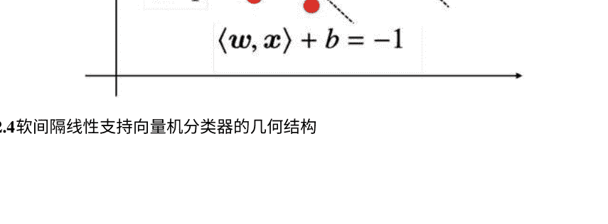

相应的原始问题可以表示为

$$(P') \min_{w,\xi} \frac{1}{2}\|w\|^2 + C\sum_{i=1}^n \xi_i$$

满足条件 $1 - y_i (\langle w, x_i \rangle + b) \leq \xi_i$, $\xi_i \geq 0$, $\forall i,$

在这个优化问题中，与偏置项b有隐含的依赖关系。以下定理表明，相应的对偶问题与硬间隔分类器(2.16)非常相似，只是在对偶变量的约束条件上有所不同。

**定理2.1** 原始问题在(2.26)中的拉格朗日对偶形式为

$$\max_{\alpha} \sum_{i=1}^n \alpha_i - \frac{1}{2}\sum_{i=1}^n\sum_{j=1}^n \alpha_i\alpha_j y_i y_j \langle x_i, x_j \rangle$$

受限于 $\sum_{i=1}^n \alpha_i y_i = 0$, $0 \leq \alpha_i \leq C$, $\forall i.$

证明 对于给定的原始问题(2.26)，相应的拉格朗日对偶问题为

$$\max_{\alpha,\gamma} g(\alpha,\gamma)$$

满足条件 $\alpha \geq 0$, $\gamma \geq 0$

$$g(\alpha,\gamma) = \min_{w,b,\xi} \left\{ \frac{1}{2}\|w\|^2 + C\sum_{i=1}^n \xi_i + \sum_{i=1}^n \alpha_i (1 - y_i (\langle w, x_i \rangle + b) - \xi_i) - \sum_{i=1}^n \gamma_i \xi_i \right\}$$

关于w, b和$\xi$的一阶必要条件(FONCs)导致以下方程:

$$w = \sum_{i=1}^n \alpha_i y_i x_i$$

和

$$ \sum_{i=1}^{n} \alpha_i y_i = 0, \quad \alpha_i + \gamma_i = C. $$

将(2.30)和(2.31)代入方程(2.29)，我们得到

$$ g(\alpha, \gamma) = \sum_{i=1}^{n} \alpha_i - \frac{1}{2} \sum_{i=1}^{n} \sum_{j=1}^{n} \alpha_i \alpha_j y_i y_j \langle x_i, x_j \rangle, $$

这证明了命题。 □

另一种表示原始问题(2.26)的方法是使用所谓的 hinge损失[10, 11]:

$$ \text{hinge}(y, \hat{y}) = \max\{0, 1 - y\hat{y}\}, $$

其中图2.5给出了一个形象的描述。具体地，我们定义了松弛变量:

$$ \xi_i := 1 - y_i(\langle w, x_i \rangle + b). $$

为了使松弛变量表示数据集 \((x_i, y_i)\) 在类边界内的分类错误，\(\xi_i\) 应该在数据已经被很好地分类时为零，但在存在分类错误时为正。这导致了松弛变量的以下定义:

$$ \xi_i = \max\{0, 1 - y_i(\langle w, x_i \rangle + b)\} = \text{hinge}(y_i, \langle w, x_i \rangle + b). $$

然后，(2.26)中的原始问题可以表示为

$$ \min_{w,b} \frac{1}{2} \|w\|^2 + C \sum_{i=1}^{n} \text{hinge}(y_i, \langle w, x_i \rangle + b). $$

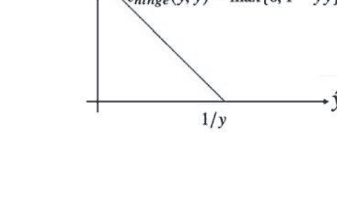稍后，我们将展示这种表示与所谓的表示定理 [11]密切相关。

### 2.4 使用核支持向量机的非线性分类器

#### 2.4.1 特征空间中的线性分类器

现在考虑一个在 $\mathbb{R}^2$ 中的分类问题，如图2.6或2.2c所示，其中不存在可以分离两个类别的线性超平面。具体来说，类别1中的数据在一个椭圆内：

$$S_1 = \{\boldsymbol{x} = (x_1, x_2) \mid (x_1 + x_2)^2 + x_2^2 \leq 2\}, \tag{2.35}$$

而类别2的数据位于椭圆外部。这意味着虽然两类数据不能被单一超平面分开，但是(2.35)中的非线性边界可以将两类数据分开。

有趣的是，非线性边界的存在意味着我们可以在更高维空间中找到相应的线性超平面。具体来说，假设我们有一个非线性映射 $\varphi: \boldsymbol{x} = [x_1, x_2]^\top \to \varphi(\boldsymbol{x})$ 到特征空间 $\mathbb{R}^3$，使得

$$\varphi(\boldsymbol{x}) = [\varphi_1, \varphi_2, \varphi_3]^\top = [x_1^2, x_2^2, \sqrt{2} x_1 x_2]^\top. \tag{2.36}$$

然后，我们可以很容易地看出 $S_1$ 可以在特征空间中表示为

$$S_1 = \{(\varphi_1, \varphi_2, \varphi_3) \mid \varphi_1 + 2\varphi_2 + \sqrt{2}\varphi_3 \leq 2\}. \tag{2.37}$$

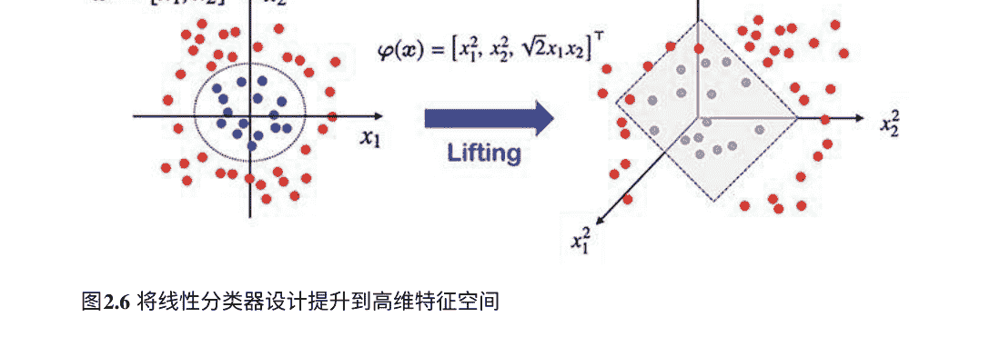

图2.6 将线性分类器设计提升到高维特征空间

因此，在$\mathbb{R}^3$中存在一个线性分类器，使用特征空间映射$\varphi(\boldsymbol{x})$，如图2.6所示。

一般来说，为了允许线性分类器的存在，特征空间应该在比环境输入空间更高维的空间中。从这个意义上讲，特征映射$\varphi(\boldsymbol{x})$作为一个提升操作，将数据的维度提升到更高维度。通过特征映射$\varphi(\boldsymbol{x})$在提升的特征空间中，二元分类器设计问题可以定义为

$$ \max_{\boldsymbol{\alpha}} \sum_{i=1}^{n} \alpha_i - \frac{1}{2} \sum_{i=1}^{n} \sum_{i=j}^{n} \alpha_i \alpha_j y_i y_j \langle \varphi(\boldsymbol{x}_i), \varphi(\boldsymbol{x}_j) \rangle \qquad (2.38) $$

受限于

$$ \sum_{i=1}^{n} \alpha_i y_i = 0, \quad 0 \le \alpha_i \le C, \quad \forall i. $$

通过将(2.18)从线性分类器扩展，与优化问题(2.38)相关的非线性分类器可以类似地定义为

$$ y \leftarrow \mathrm{sign} \left( \sum_{i=1}^{n} \alpha_i^* y_i \langle \varphi(\boldsymbol{x}_i), \varphi(\boldsymbol{x}) \rangle + b \right), \qquad (2.39) $$

其中$\alpha_i^*$和$b$是对偶问题的解。

#### 2.4.2 核技巧

尽管(2.38)和(2.39)是(2.27)和(2.18)的很好的推广，但存在一些技术问题。其中最关键的问题之一是，为了存在一个线性分类器，提升操作可能需要一个非常高维的甚至是无限维的特征空间。因此，对特征向量$\varphi(\boldsymbol{x})$的显式计算可能会计算量很大或者不可能。

所谓的核技巧可以通过绕过显式构造提升操作[11]来解决这个技术问题。具体来说，如式(2.38)和(2.39)所示，计算线性分类器所需的只是两个特征向量之间的内积。具体来说，如果我们定义核函数$K$：

$\mathcal{X} \times \mathcal{X} \rightarrow \mathbb{R}$ 如下所示：

$$ K(\boldsymbol{x}, \boldsymbol{x}') := \langle \varphi(\boldsymbol{x}), \varphi(\boldsymbol{x}') \rangle \qquad (2.40) $$

那么(2.38)和(2.39)可以转化为

$$\max_{\alpha} \sum_{i=1}^{n} \alpha_i - \frac{1}{2} \sum_{i=1}^{n} \sum_{j=1}^{n} \alpha_i \alpha_j y_i y_j K(\boldsymbol{x}_i, \boldsymbol{x}_j) \quad (2.41)$$

受限于 $\sum_{i=1}^{n} \alpha_i y_i = 0, \quad 0 \leq \alpha_i \leq C, \quad \forall i$

并且得到的分类器是

$$y \leftarrow \text{sign} \left( \sum_{i=1}^{n} \alpha_i^* y_i K(\boldsymbol{x}_i, \boldsymbol{x}) + b \right). \quad (2.42)$$

例如(2.36)，相应的核函数为

$$K(\boldsymbol{x}, \boldsymbol{y}) = x_1^2 y_1^2 + x_2^2 y_2^2 + 2 x_1 x_2 y_1 y_2 = (\langle \boldsymbol{x}, \boldsymbol{y} \rangle)^2,$$

这对应于一个二次多项式函数。因此，在SVM文献中，通常的做法是直接设计核函数，而不是从底层特征映射中获得它。以下是核SVM中经常使用的代表性示例。

- 具有精确度为 $p$ 的多项式核函数：
  $$K(\boldsymbol{x}, \boldsymbol{y}) = (\boldsymbol{x}^\top \boldsymbol{y})^p.$$
- 多项式核函数，度数最高为 $p$：
  $$K(\boldsymbol{x}, \boldsymbol{y}) = (\boldsymbol{x}^\top \boldsymbol{y} + 1)^p.$$
- 径向基函数核函数，宽度为 $\sigma$：
  $$K(\boldsymbol{x}, \boldsymbol{y}) = \exp(-\|\boldsymbol{x} - \boldsymbol{y}\|^2/(2\sigma^2)).$$
- Sigmoid核函数:
  $$\tanh(\eta \boldsymbol{x}^\top \boldsymbol{y} + \nu).$$

然而，需要注意的是，并非所有的核函数都可以用于支持向量机。要成为可行的选择，核函数应该源自特征空间映射 $\varphi(\boldsymbol{x})$。事实上，如果核函数满足所谓的Mercer条件[11]，则存在相关的特征映射。满足Mercer条件的核函数通常被称为正定核函数。Mercer条件的详细信息可以在标准的支持向量机文献[11]中找到，并将在后面的上下文中解释，与表示定理相关。

### 2.5 图像分类的经典方法

虽然支持向量机（SVM）及其核扩展是美丽的凸优化框架，没有局部极小值问题，但在使用这些方法进行图像分类时存在根本性挑战。特别是，在SVM中，环境空间X不应该过大，因为计算上的复杂优化过程。因此，使用SVM框架的一个重要步骤是特征工程，它对输入图像进行预处理，以获得显著较小维度的向量x∈X，可以捕捉输入图像的所有关键信息。例如，图像分类任务的经典流程可以总结如下（见图2.7）：

- 处理数据集，基于图像物理学、几何学和其他分析工具提取手工特征，
- 或者通过将数据输入到一组标准特征提取器中提取特征，例如SIFT（尺度不变特征变换）[12]、SURF（加速稳健特征）[13]等。
- 根据您的领域专业知识选择核函数。
- 将由手工特征和标签组成的训练数据放入核支持向量机中以学习分类器。

在这里，主要的技术创新通常来自特征提取，往往基于幸运研究生的偶然发现。此外，核函数的选择也需要之前进行了广泛研究的领域专业知识。我们将在后面看到，现代深度学习方法的主要创新之一是不再需要手工设计特征和核函数，因为它们可以从训练数据中自动学习。这种简单性可能是深度学习成功的主要原因之一，从而导致了新的深度技术公司的泛滥。

到目前为止，我们主要讨论了二元分类问题。请注意，在实践中，超越二元分类器的更一般形式的分类器也很重要：例如，ImageNet有超过20,000个类别。对于这样的设置，线性分类器的扩展是重要的，但将在稍后讨论。


## 2.6 练习题

1.  对于给定的二次多项式核函数，
$$k(\boldsymbol{x}, \boldsymbol{y}) = (\boldsymbol{x}^\top \boldsymbol{y} + c)^2, \quad \boldsymbol{x}, \boldsymbol{y} \in \mathbb{R}^2,$$
对应的特征映射是什么，使得 $k(\boldsymbol{x}, \boldsymbol{y}) = \langle \varphi(\boldsymbol{x}), \varphi(\boldsymbol{y}) \rangle$?
2.  证明径向基函数的特征空间维度是无限的。
3.  假设我们有以下正标记的数据点：
$$\boldsymbol{x}_1 = [2, 1]^\top, \boldsymbol{x}_2 = [2, -1]^\top, \boldsymbol{x}_3 = [3, 1]^\top, \qquad (2.43)$$
以及以下负标记的数据点：
$$\boldsymbol{x}_4 = [1, 0]^\top, \boldsymbol{x}_5 = [0, 1]^\top, \boldsymbol{x}_6 = [0, -1]^\top. \qquad (2.44)$$
a. 这两个类是否线性可分？通过在 $\mathbb{R}^2$ 中可视化它们的分布来回答这个问题。
b. 现在，我们有兴趣设计一个硬间隔线性支持向量机。支持向量是什么？请通过观察回答这个问题。你必须给出你的推理。
c. 使用原始形式，通过手工计算计算线性支持向量机分类器的闭式解。你必须展示计算的每一步。通过利用支持向量和KKT条件，可以简化不等式约束。
d. 使用对偶形式，通过手工计算计算线性支持向量机分类器的闭式解。你必须展示计算的每一步。通过利用支持向量和KKT条件，可以简化不等式约束。
4.  假设我们给出了以下正标记的数据点：
$$\boldsymbol{x}_1 = [0.5, 0]^\top, \boldsymbol{x}_2 = [1.5, 1]^\top, \boldsymbol{x}_3 = [1.5, -1]^\top, \boldsymbol{x}_4 = [2, 0]^\top, \qquad (2.45)$$
以及以下负标记的数据点：
$$\boldsymbol{x}_5 = [1, 0]^\top, \boldsymbol{x}_6 = [0, 1]^\top, \boldsymbol{x}_7 = [0, -1]^\top, \boldsymbol{x}_8 = [-1, 0]^\top. \qquad (2.46)$$
a. 这两个类是否线性可分？通过在 $\mathbb{R}^2$ 中可视化它们的分布来回答这个问题。
b. 现在，我们对设计软间隔线性支持向量机感兴趣。使用MATLAB，绘制不同选择的决策边界 $C$。
c. 当 $C \to \infty$ 时，你观察到了什么？
5.  假设我们有以下正标记的数据点：
$$\boldsymbol{x}_1 = [3, 3]^\top, \boldsymbol{x}_2 = [3, -3]^\top, \boldsymbol{x}_3 = [-3, -3]^\top, \boldsymbol{x}_4 = [-3, 3]^\top, \quad (2.47)$$
以及以下负标记的数据点：
$$\boldsymbol{x}_5 = [1, 1]^\top, \boldsymbol{x}_6 = [1, -1]^\top, \boldsymbol{x}_7 = [-1, -1]^\top, \boldsymbol{x}_8 = [-1, 1]^\top. \quad (2.48)$$
a. 这两个类是否线性可分？ 通过在 $\mathbb{R}^2$ 中可视化它们的分布来回答这个问题。
b. 在特征空间 $F$ 中找到一个特征映射 $\varphi : \mathbb{R}^2 \to F \subset \mathbb{R}^3$，使得两个类在特征空间中是线性可分的。 通过在 $F$ 中绘制数据分布来展示这一点。
c. 对应的核函数是什么？
d. 在 $F$ 中有哪些支持向量？
e. 使用对偶形式，通过手工计算得出核支持向量机分类器的闭式解。 你必须展示计算的每一步。 通过利用支持向量和KKT条件，可以简化不等式约束。

## 第三章 线性、逻辑和核回归

### 3.1 引言

在机器学习中，回归分析是指估计因变量和自变量之间关系的过程。这种方法主要用于预测和找到变量之间的因果关系。例如，在线性回归中，研究人员试图根据某种数学准则找到最适合数据的直线（见图3.1a）。另一个重要的回归问题是逻辑回归。例如，在图3.1b中，因变量是二进制属性，如对于给定问题的是或否，目标是使用连续变化的自变量拟合二进制数据。很容易理解，这个问题与二分类问题密切相关。对于图3.1c的情况，技术问题与其他两个问题有些不同。在这里，分布不能被线性线回归出来。此外，因变量不是二进制的，而是具有连续值。事实上，更好的回归方法是使用平滑变化的曲线拟合数据。事实上，这直接涉及到非线性回归问题。

尽管回归分析是一种经典方法，可以追溯到1805年Legendre的最小二乘法和1809年Gauss的方法，但回归分析仍然是深度学习方法的一个关键思想，稍后将进行讨论。因此，我们将讨论经典回归方法，以讨论三种具体的回归分析形式：线性回归、逻辑回归和核回归。随后，这个概述将有助于理解使用深度神经网络的现代回归方法。

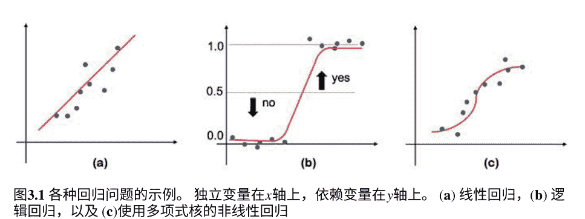

图3.1 各种回归问题的示例。独立变量在$x$轴上，依赖变量在$y$轴上。(a) 线性回归，(b) 逻辑回归，以及 (c) 使用多项式核的非线性回归

### 3.2 线性回归

#### 3.2.1 普通最小二乘法 (OLS)

线性回归使用线性模型，如图3.1a所示。更具体地说，依赖变量可以通过输入变量的线性组合来计算。通常也将线性模型称为普通最小二乘法 (OLS) 线性回归或最小二乘法 (LS) 回归。例如，一个简单的线性回归模型可以表示为

$$y_i = \beta_0 + \beta_1x_i + \epsilon_i, \quad i=1, \cdots, n \qquad (3.1)$$

目标是从训练数据 $\{x_i, y_i\}_{i=1}^n$ 中估计参数集$\boldsymbol{\beta} = \{\beta_0, \beta_1\}$。
一般来说，线性回归问题可以表示为

$$y_i = \langle \boldsymbol{x}_i, \boldsymbol{\beta} \rangle + \epsilon_i, \quad i=1, \cdots, n. \qquad (3.2)$$

其中 $(\boldsymbol{x}_i, y_i) \in \mathbb{R}^p \times \mathbb{R}$ 是第$i$个训练数据，而 $\boldsymbol{\beta} \in \mathbb{R}^p$ 被称为回归系数。这可以用矩阵形式表示为

$$\boldsymbol{y} = \boldsymbol{X}^\top\boldsymbol{\beta} + \boldsymbol{\epsilon}, \qquad (3.3)$$

其中

$$\boldsymbol{y} := \begin{bmatrix} y_1 \ \vdots \ y_n \end{bmatrix}, \quad \boldsymbol{X} := [\boldsymbol{x}_1 \cdots \boldsymbol{x}_n], \quad \boldsymbol{\epsilon} := \begin{bmatrix} \epsilon_1 \ \vdots \ \epsilon_n \end{bmatrix}.$$

在这个数学表达式中， $x_i$ 对应于自变量，
而 $y_i$ 是因变量。

然后，可以通过使用 l2损失或均方误差（MSE）损失进行回归分析

$$\min_{\beta} \mathcal{L}(\beta), \quad \mathcal{L}(\beta) := \frac{1}{2} \| \boldsymbol{y} - \boldsymbol{X}^{\top} \boldsymbol{\beta} \|^2, \tag{3.4}$$

其中损失可以进一步展开为

$$\begin{aligned}
\mathcal{L}(\beta) := \frac{1}{2} \| \boldsymbol{y} - \boldsymbol{X}^{\top} \boldsymbol{\beta} \|^2 \\
= \frac{1}{2} (\boldsymbol{y} - \boldsymbol{X}^{\top} \boldsymbol{\beta})^{\top} (\boldsymbol{y} - \boldsymbol{X}^{\top} \boldsymbol{\beta}) \\
= \frac{1}{{2}} \left( \boldsymbol{y}^{\top} \boldsymbol{y} - \boldsymbol{y}^{\top} \boldsymbol{X}^{\top} \boldsymbol{\beta} - \boldsymbol{\beta}^{\top} \boldsymbol{X} \boldsymbol{y} + \boldsymbol{\beta}^{\top} \boldsymbol{X} \boldsymbol{X}^{\top} \boldsymbol{\beta} \right),
\end{aligned}$$

将MSE损失最小化的参数可以通过将损失对 β的梯度设置为零来找到。为了计算向量值函数的梯度，以下引理很有用。

> 引理3.1 [5] 让 $\boldsymbol{x}$, $\boldsymbol{a}$和 $\boldsymbol{B}$分别表示具有适当大小的向量和矩阵。那么，我们有

$$\frac{\partial \boldsymbol{x}^{\top} \boldsymbol{a}}{\partial \boldsymbol{x}} = \frac{\partial \boldsymbol{a}^{\top} \boldsymbol{x}}{\partial \boldsymbol{x}} = \boldsymbol{a}, \tag{3.5}$$

$$\frac{\partial \boldsymbol{x}^{\top} \boldsymbol{B} \boldsymbol{x}}{\partial \boldsymbol{x}} = (\boldsymbol{B} + \boldsymbol{B}^{\top}) \boldsymbol{x}. \tag{3.6}$$

使用引理3.1，我们有

$$\left. \frac{\partial \mathcal{L}(\beta)}{\partial \boldsymbol{\beta}} \right|_{\boldsymbol{\beta} = \hat{\boldsymbol{\beta}}} = -\boldsymbol{X} \boldsymbol{y} + \boldsymbol{X} \boldsymbol{X}^{\top} \hat{\boldsymbol{\beta}} = \boldsymbol{0},$$

其中 $\hat{\boldsymbol{\beta}}$是最小化器。如果 $\boldsymbol{X} \boldsymbol{X}^{\top}$ 可逆，或者 $\boldsymbol{X}$具有满秩行，那么我们有

$$\hat{\boldsymbol{\beta}} = \left( \boldsymbol{X} \boldsymbol{X}^{\top} \right)^{-1} \boldsymbol{X} \boldsymbol{y}. \tag{3.7}$$

满秩条件对于矩阵求逆的存在非常重要，这将在岭回归中再次讨论。

这个回归设置与一般线性模型（GLM）密切相关，已成功用于统计分析。例如，GLM分析是功能性磁共振成像数据分析的主要工具之一[14]。功能性磁共振成像的主要思想是在给定任务（例如运动任务）期间获取大脑的多个时间帧的磁共振图像，然后分析每个体素位置的磁共振值的时间变化是否与给定任务相关。

## 图3.2 功能性磁共振成像的一般线性模型分析

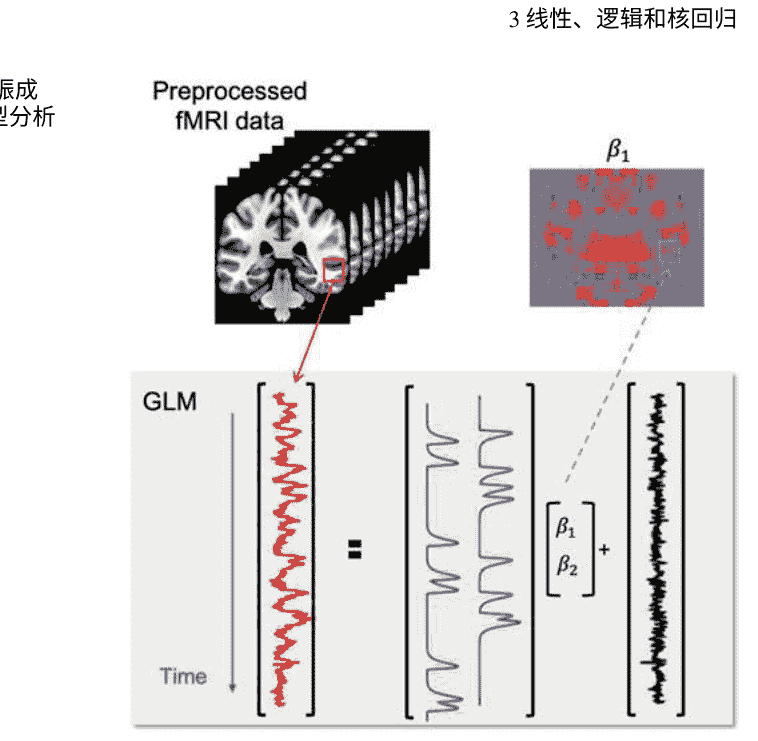

每个体素位置的磁共振值的时间变化被分析，以检查其时间变化是否与给定任务相关。这里，来自一个体素的时间序列数据$\boldsymbol{y}$被描述为模型（$\boldsymbol{X}^\top$）的线性组合，该模型通常被称为“设计矩阵”，其中包含一组回归器，如图3.2所示，表示独立变量和残差（即误差），然后结果以体素为单位存储、显示和可能进一步分析，如图3.2右上方所示，当$\boldsymbol{\beta}=[\beta_1, \beta_2]^\top$时。

### 3.3 逻辑回归

#### 3.3.1 对数几率和线性回归

与图3.1b中的示例类似，有许多重要问题的因变量具有有限的值。例如，在分析吸烟行为的二元逻辑回归中，因变量是一个虚拟变量：编码为0（未吸烟）或1（吸烟）。在另一个例子中，人们对事件发生的概率拟合一个线性模型感兴趣。在这种情况下，因变量只能取0到1之间的值。在这种情况下，转换自变量并不能解决所有潜在问题。相反，逻辑回归的关键思想是转换因变量。

具体而言，我们定义术语几率：

$$
\text{几率} = \frac{q}{1 - q}, \quad (3.8)
$$

其中 q是0-1范围内的概率。几率的范围是0-∞，大于1的值表示事件发生的可能性比不发生的可能性更高，小于1的值表示事件发生的可能性较低。

然后，术语 logit被定义为对数几率的对数：

$$
\text{logit} := \log(\text{odds}) = \log\left(\frac{q}{1 - q}\right).
$$

这种转换很有用，因为它创建了一个变量，其范围从 -∞到∞，其中零与事件发生和不发生的可能性相等相关。将因变量进行这种转换的重要优势之一是解决了我们在拟合线性模型到概率时遇到的问题。 如果我们将概率转换为logits，那么logit的范围不受限制，因此我们可以应用标准线性回归。

具体来说，使用logits转换，概率的线性回归模型为

$$
\log\left(\frac{q}{1 - q}\right) = \beta_0 + \beta_1 x, \quad (3.9)
$$

由此我们得到

$$
q = \frac{1}{1 + e^{-(\beta_0 + \beta_1 x)}} = \text{Sig}(\beta_0 + \beta_1 x), \quad (3.10)
$$

其中 Sig(x)表示sigmoid函数：

$$
\text{Sig}(x) = \frac{1}{1 + e^{-x}},
$$

其形状如图3.3所示。值得注意的是，尽管非线性变换最初是应用于线性回归的因变量，但最终结果是在线性项之后引入了非线性。 事实上，这与现代深度神经网络密切相关，其在线性层之后具有非线性。

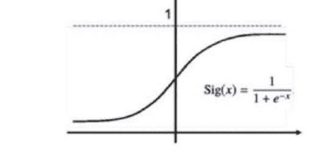

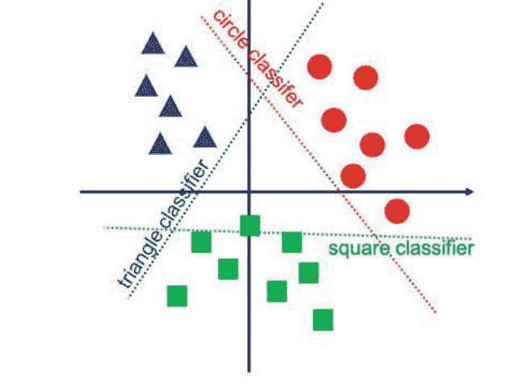

#### 3.3.2 使用逻辑回归进行多类别分类

在SVM中，我们主要讨论了二分类问题，其中定义了一个超平面来分离两个类别。现在，考虑图3.4，我们希望定义三个超平面，将数据分成多个类别。

支持向量机（SVM）的直接扩展用于多类分类器设计问题是考虑超平面的所有组合组合。更具体地说，数据 \(x_i\) 可以在超平面的任一侧，因此在图3.4中给定三个超平面，可以设计一个能够潜在地分类 \(2^3=8\) 个类别的分类器。

尽管这种方法可以减少给定类别数 \(c\) 的超平面数量，但这种SVM扩展的主要技术困难之一是我们需要考虑约束集的所有组合组合，这很难实现。

解决这个多类分类器设计问题的快速方法是使用逻辑回归。更具体地说，对于给定的 \(c\) 类别，我们定义一个概率向量 \(\boldsymbol{q} = [q_1, \cdots, q_c]^\top \in \mathbb{R}^c\)，其中 \(q_i \in [0, 1]\) 表示数据属于类别 \(i\) 的概率。然后，通过将（3.9）扩展为向量值概率

对于给定的因变量 $\boldsymbol{x} \in \mathbb{R}^{p}$，我们有

$$
\left[\begin{array}{c}
\log \left(\frac{q_{1}}{1-q_{1}}\right) \\
\vdots \\
\log \left(\frac{q_{c}}{1-q_{c}}\right)
\end{array}\right]=\boldsymbol{W}^{\top} \boldsymbol{x}+\boldsymbol{b}
\qquad (3.11)
$$

其中 $\boldsymbol{W} \in \mathbb{R}^{p \times c}$ 表示由 $c$ 个正交向量组成的矩阵在 $p$ 维空间中，$\boldsymbol{b} \in \mathbb{R}^{c}$ 是相关的偏置项。 然后，我们可以很容易地看出相应的概率向量由以下给出

$$
\boldsymbol{p}=\operatorname{Sig}\left(\boldsymbol{W}^{\top} \boldsymbol{x}+\boldsymbol{b}\right),
\qquad (3.12),
$$

其中 $\operatorname{Sig}(\cdot)$ 是逐元素的 sigmoid 函数。 然后，通过对概率的大小进行排名，可以将数据分类到相应的类别中。 事实上，这种技术是使用深度神经网络进行现代分类器设计的标准方法。 我们将在稍后重新讨论这个问题。

### 3.4 岭回归

回想一下，在线性回归解 (3.7) 中的基本假设是 $\boldsymbol{X}^{\top}$ has full column rank or $\boldsymbol{X}$ has the full row rank. 然而，当 $\boldsymbol{X}^{\top}$ 是高维的时候，$\boldsymbol{X}^{\top}$ 的列可能是共线的，在统计术语中指的是两个（或多个）协变量高度线性相关的事件。 因此，$\boldsymbol{X}^{\top}$ 可能不是满列秩的，或者接近不是满列秩的，我们不能使用标准的线性回归。 为了解决这个问题，岭回归是有用的。

具体来说，解决了以下正则化最小二乘问题：

$$
\min _{\boldsymbol{\beta}} \text{ 岭 }(\boldsymbol{\beta}),
$$

其中

$$
\text{ 岭 }(\boldsymbol{\beta}):=\frac{1}{2}\|\boldsymbol{y}-\boldsymbol{X}^{\top} \boldsymbol{\beta}\|^{2}+\frac{\lambda}{2}\|\boldsymbol{\beta}\|^{2},
\qquad (3.13),
$$

其中 $\lambda>0$ 是正则化参数。 这种类型的正则化通常被称为 Tikhonov 正则化。 使用引理 3.1，我们可以轻松地证明

$$
\left.\frac{\partial \text { 岭 }(\boldsymbol{\beta})}{\partial \boldsymbol{\beta}}\right|_{\boldsymbol{\beta}=\hat{\boldsymbol{\beta}}}=-\boldsymbol{X} \boldsymbol{y}+\boldsymbol{X} \boldsymbol{X}^{\top} \hat{\boldsymbol{\beta}}+\lambda \hat{\boldsymbol{\beta}}=\mathbf{0},
$$

这导致

$$
\hat{\beta} = (XX^\top + \lambda I)^{-1} Xy \quad (3.14)
$$

使用以下矩阵求逆引理[3]，

$$
(I + U C V)^{-1} = I - U (C^{-1} + V U)^{-1} V \quad (3.15)
$$

方程 (3.14)也可以等价地写为

$$
\begin{aligned}
\hat{\beta} &= (XX^\top + \lambda I)^{-1} Xy \\
&= \frac{1}{\lambda} (XX^\top / \lambda + I)^{-1} Xy \\
&= \frac{1}{\lambda} \left\{ I - X (\lambda I + X^\top X)^{-1} X^\top \right\} Xy \\
&= \frac{1}{\lambda} X \left\{ I - (\lambda I + X^\top X)^{-1} X^\top X \right\} y \\
&= \frac{1}{\lambda} X (\lambda I + X^\top X)^{-1} \left\{ (\lambda I + X^\top X) - X^\top X \right\} y \\
&= X (X^\top X + \lambda I)^{-1} y.
\end{aligned}
\quad (3.16)
$$

特别是，在(3.16)中的表达式在 X是一个高矩阵时非常有用，因为矩阵求逆的大小比(3.14)要小得多。即使不是这种情况，在(3.16)中的表达式也非常有用，可以推导出核岭回归，这是下一节的主题。

### 3.5 核回归

回想一下，非线性核支持向量机是基于以下观察开发的：原始输入空间中的非线性决策边界通常可以在高维特征空间中表示为线性边界。回归问题可以使用类似的思路解决。具体而言，目标是在高维特征空间中实现线性回归，但最终的回归结果在原始空间中变为非线性（见图3.5）。

为了使用类似于核支持向量机中使用的核技巧，让我们重新审视 (3.2) 中的线性回归问题。使用岭回归中的参数估计

回归（3.16），给定一个独立变量 $x \in \mathbb{R}^p$，估计的函数 $\hat{f}(x)$ 为

$$
\hat{f}(x) := x^T \hat{\beta} = x^T X(X^T X + \lambda I)^{-1} y = [\langle x, x_1 \rangle \cdots \langle x, x_n \rangle] \left( \begin{bmatrix} \langle x_1, x_1 \rangle & \cdots & \langle x_1, x_n \rangle \\ \vdots & \ddots & \vdots \\ \langle x_n, x_1 \rangle & \cdots & \langle x_n, x_n \rangle \end{bmatrix} + \lambda I \right)^{-1} y, \quad (3.17)
$$

我们使用

$$
x^T X = [\langle x, x_1 \rangle \cdots \langle x, x_n \rangle]
$$

和

$$
X^T X = \begin{bmatrix} x_1^T \\ \vdots \\ x_n^T \end{bmatrix} [x_1 \cdots x_n] = \begin{bmatrix} \langle x_1, x_1 \rangle & \cdots & \langle x_1, x_n \rangle \\ \vdots & \ddots & \vdots \\ \langle x_n, x_1 \rangle & \cdots & \langle x_n, x_n \rangle \end{bmatrix}.
$$

由于一切都是由输入向量的内积表示的，我们现在可以使用 $\varphi(x)$ 将数据 $x$ 提升到特征空间中，以计算高维特征空间中的内积。然后，使用核技巧，特征空间中的内积可以被核函数替代：

$$
\langle x, x_i \rangle \rightarrow k(x, x_i) := \langle \varphi(x), \varphi(x_i) \rangle. \quad (3.18)
$$

因此，(3.17)可以扩展到特征空间中：

$$
\hat{f}(x) = [k(x, x_1) \cdots k(x, x_n)] (K + \lambda I)^{-1} y, \quad (3.19)
$$

其中 $K \in \mathbb{R}^{n \times n}$ 是给定的核格拉姆矩阵

$$
K := \begin{bmatrix} k(\boldsymbol{x}_1, \boldsymbol{x}_1) & \cdots & k(\boldsymbol{x}_1, \boldsymbol{x}_n) \\ \vdots & \ddots & \vdots \\ k(\boldsymbol{x}_n, \boldsymbol{x}_1) & \cdots & k(\boldsymbol{x}_n, \boldsymbol{x}_n) \end{bmatrix} . \quad (3.20)
$$

同样地，(3.19)可以从以下具有核的回归问题推导出来：

$$
y_i = \sum_{j=1}^{p} \alpha_j k(\boldsymbol{x}_i, \boldsymbol{x}_j) + \epsilon \quad (3.21)
$$

这是(3.2)的非线性扩展。然后，使用以下优化问题得到(3.19)：

$$
\min_{\boldsymbol{\alpha} \in \mathbb{R}^{p}} \sum_{i=1}^{n} \left( y_i - \sum_{j=1}^{p} \alpha_j k(\boldsymbol{x}_i, \boldsymbol{x}_j) \right)^{2} + \lambda \boldsymbol{\alpha}^{\top} K \boldsymbol{\alpha} . \quad (3.22)
$$

其中 $K$是(3.20)中的核格拉姆矩阵。这意味着正则化项应该通过核函数加权，以考虑特征空间中的变形。更严格的推导可以从所谓的表示定理中得到(3.22)，这是下一章的主题。

图3.6展示了使用多项式和径向基函数(RBF)核的线性回归和核回归的示例。我们可以清楚地看到非线性核回归更好地跟随趋势。

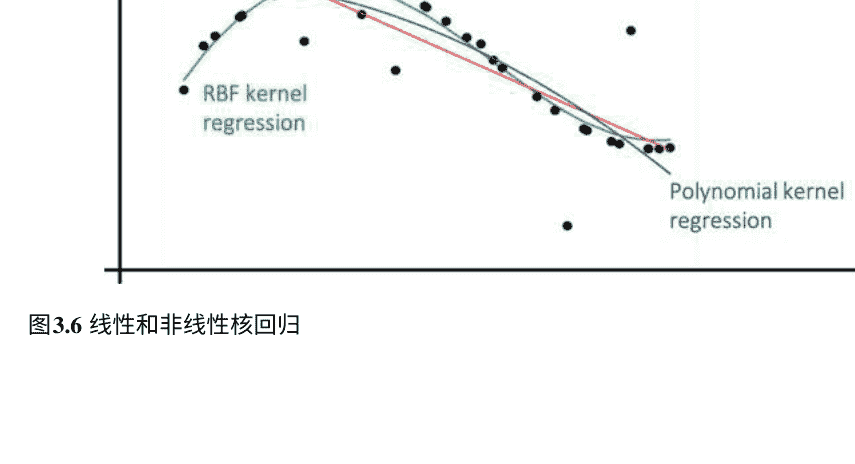

图3.6 线性和非线性核回归

### 3.6 回归中的偏差-方差权衡

在本节中，我们将讨论回归分析中偏差和方差权衡的重要问题。

让 $\{x_i, y_i\}_{i=1}^n$ 表示训练数据集，其中 $x_i \in \mathbb{R}^p \subset \mathcal{X}$ 是一个自变量，$y_i \in \mathbb{R} \subset \mathcal{Y}$ 是一个依赖变量，它依赖于 $x_i$。我们使用粗体字符 $x_i$ 和 $y_i$ 的原因是它们可以是向量。在回归分析中，因变量通常表示为与自变量的函数关系：

$$
y_i = f_{\Theta}(x_i) + \epsilon_i, \quad (3.23)
$$

其中 $\epsilon_i$ 表示可能代表未建模部分的附加误差项，$f_{\Theta}(\cdot)$ 是一个回归函数（可以是非线性函数），其输入变量为 $x_i$，并由 $\Theta$ 参数化。为了简便起见，当参数的依赖关系明显时，我们经常使用 $f := f_{\Theta}$ 的符号滥用。

在 (3.23) 中，$\Theta$ 是应该从训练数据集中估计的回归参数集。通常，通过最小化损失来估计这个参数集。例如，最流行的损失函数之一是 $\ell_2$ 或均方误差损失，这种情况下参数估计问题可以表示为

$$
\min \frac{1}{2} \sum_{i=1}^n \| y_i - f_{\Theta}(x_i) \|^2. \quad (3.24)
$$

在回归分析中经常使用的另一个流行工具是正则化。在正则化回归分析中，会添加一个额外的项来对参数施加约束。更具体地说，解决以下优化问题来估计参数：

$$
\min \frac{1}{2} \sum_{i=1}^n \| y_i - f_{\Theta}(x_i) \|^2 + \lambda R(\Theta), \quad (3.25)
$$

其中 $R(\cdot)$ 和 $\lambda$ 通常被称为正则化函数和正则化参数。

通过估计的参数 $\hat{\Theta}$，估计的函数 $\hat{f}$ 被定义为

$$
\hat{f}(x) := f_{\hat{\Theta}}(x). \quad (3.26)
$$

假设噪声是零均值独立同分布的高斯噪声，方差为 $\sigma^2$。那么，回归问题的均方误差为

$$
\begin{aligned}
E\| y - \hat{f} \|^2 &= E\| f + \epsilon - \hat{f} \|^2 \\
&= E\| f + \epsilon - \hat{f} + E[\hat{f}] - E[\hat{f}] \|^2 \\
&= E\| f - E[f] \|^2 + E\| \hat{f} - E[f] \|^2 + E\| \epsilon \|^2 \\
&= \| f - E[f] \|^2 + E\| \hat{f} - E[f] \|^2 + E\| \epsilon \|^2 \\
&= \| \text{Bias}(\hat{f}) \|^2 + \text{Var}(\hat{f}) + p\sigma^2, \quad (3.27)
\end{aligned}
$$

我们在第三个等式中使用以下内容：

$$
\begin{aligned}
E[ \epsilon^\top (f - E[f]) ] &= 0, \\
E[ \epsilon^\top (\hat{f} - E[f]) ] &= 0, \\
E[ (\hat{f} - E[f])^\top (f - E[f]) ] &= 0,
\end{aligned}
$$

第四个方程来自于 f 和 E[ \hat{f} ]是确定性的事实。

方程(3.27)清楚地显示了预测误差的MSE表达式由偏差和方差组成。这导致了所谓的偏差-方差权衡问题，在回归问题中可以通过以下示例详细解释。

#### 3.6.1 示例

在这里，我们将研究线性回归问题的偏差和方差权衡，其中回归函数给出为

$$
f(x) = \langle x, \beta \rangle = x^\top \beta. \quad (3.28)
$$

通过定义期望操作 E[·]，可以计算出OLS在(3.7)中的偏差和方差，计算如下：

$$
\begin{aligned}
\text{偏差}(f) &:= x^\top \beta - E[x^\top \hat{\beta}] \\
&= x^\top \beta - x^\top E[(XX^\top)^{-1} X y] \\
&= x^\top \beta - x^\top (XX^\top)^{-1} X E[y] \\
&= x^\top \beta - x^\top (XX^\top)^{-1} XX^\top \beta = 0,
\end{aligned}
$$

由于偏差为零，$\hat{f}$通常被称为无偏估计。类似地，可以通过以下方式计算协方差：

$$
\begin{aligned}
\text{Var}(\hat{f}) &:= E\left[ x^\top (\hat{\beta} - \beta)(\hat{\beta} - \beta)^\top x \right] \\
&= E\left[ x^\top (XX^\top)^{-1} X \epsilon \epsilon^\top X^\top (XX^\top)^{-1} x \right]
\end{aligned}
$$## 3.6 回归中的偏差-方差权衡

```
= \boldsymbol{x}^\top (\boldsymbol{X}\boldsymbol{X}^\top)^{-1} \boldsymbol{X} \boldsymbol{E}[\epsilon\epsilon^\top] \boldsymbol{X}^\top (\boldsymbol{X}\boldsymbol{X}^\top)^{-1} \boldsymbol{x} \n= \sigma^2 \boldsymbol{x}^\top (\boldsymbol{X}\boldsymbol{X}^\top)^{-1} \boldsymbol{x}.
```

另一方面，在（3.14）中岭回归的偏差和协方差由以下给出

```
\mathrm{Bias}(\hat{f}) := \boldsymbol{x}^\top \boldsymbol{\beta} - E[\boldsymbol{x}^\top (\boldsymbol{X}\boldsymbol{X}^\top + \lambda \boldsymbol{I})^{-1} \boldsymbol{X} \boldsymbol{y}] \n= \boldsymbol{x}^\top \left( \boldsymbol{I} - (\boldsymbol{X}\boldsymbol{X}^\top + \lambda \boldsymbol{I})^{-1} \boldsymbol{X}\boldsymbol{X}^\top \right) \boldsymbol{\beta} \n= \lambda \boldsymbol{x}^\top (\boldsymbol{X}\boldsymbol{X}^\top + \lambda \boldsymbol{I})^{-1} \boldsymbol{\beta},
```

和

```
\mathrm{Var}(\hat{f}) = E\left[ \boldsymbol{x}^\top (\boldsymbol{X}\boldsymbol{X}^\top + \lambda \boldsymbol{I})^{-1} \boldsymbol{X} \epsilon\epsilon^\top \boldsymbol{X}^\top (\boldsymbol{X}\boldsymbol{X}^\top + \lambda \boldsymbol{I})^{-1} \boldsymbol{x} \right] \n= \sigma^2 \boldsymbol{x}^\top (\boldsymbol{X}\boldsymbol{X}^\top + \lambda \boldsymbol{I})^{-1} \boldsymbol{X}\boldsymbol{X}^\top (\boldsymbol{X}\boldsymbol{X}^\top + \lambda \boldsymbol{I})^{-1} \boldsymbol{x}, \quad (3.29)
```

其中我们使用 \( E[\epsilon\epsilon^\top] = \sigma^2 \boldsymbol{I} \)。

因此，我们可以看到当 \( \lambda \) 变大时，方差减小，偏差增加，如图3.7所示。这意味着岭回归的偏差-方差权衡取决于正则化参数。可以找到导致总预测误差最小的最佳偏差-方差权衡的最优参数 \( \lambda^* \)。寻找这个最优超参数是经典岭回归问题中的一个重要研究课题之一。

图3.7 岭回归中的偏差-方差权衡

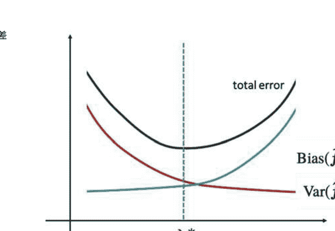

## 3.7 练习题

- 证明方程（3.15）中的矩阵求逆引理。
- 7位患者的血压（y，mmHg）和年龄（x，岁）如下表所示：

| 患者编号 | 1 | 2 | 3 | 4 | 5 | 6 | 7 |
|---|---|---|---|---|---|---|---|
| x | 42 | 70 | 45 | 30 | 55 | 25 | 57 |
| y (mmHg) | 98 | 130 | 121 | 88 | 182 | 80 | 125 |

  - a. 计算关于年龄的最小二乘估计的血压。
  - b. 在散点图上绘制回归线。
- 机械零件在不同的温度条件下进行测试。下表总结了在10次试验中对该零件的观测数据，除了温度（以度为单位）外，所有其他实验条件都相同。

Damaged表示损坏零件的数量，Undamaged表示未损坏零件的数量。

| 试验编号 | 1 | 2 | 3 | 4 | 5 | 6 | 7 | 8 | 9 | 10 |
|---|---|---|---|---|---|---|---|---|---|---|
| 温度 | 53 | 57 | 58 | 63 | 66 | 67 | 67 | 67 | 68 | 69 |
| 损坏 | 5 | 1 | 1 | 1 | 0 | 0 | 0 | 0 | 0 | 1 |
| 未损坏 | 7 | 6 | 5 | 6 | 8 | 8 | 7 | 6 | 5 | 6 |

  - a. 写出逻辑回归模型。
  - b. 给定温度 T，估计的故障概率是多少？
- 证明(3.14)中的岭回归等价于具有以下增广依赖和独立变量的线性回归：

```
$$ \tilde{y} = \begin{bmatrix} y \\ \sqrt{\lambda} I \end{bmatrix}, \quad \tilde{X} = \begin{bmatrix} X \\ \sqrt{\lambda} I \end{bmatrix}, $$
其中 \( I \) 是 \( p \times p \) 单位矩阵。
```

- 考虑以下表中的回归问题，其中 \( x \) 是自变量， \( y \) 是因变量。

| x | 11 | 22 | 32 | 41 | 55 | 67 | 78 | 89 | 100 | 50 | 71 | 91 |
|---|---|---|---|---|---|---|---|---|---|---|---|---|
| y | 2330 | 2750 | 2309 | 2500 | 2100 | 1120 | 1010 | 1640 | 1931 | 1705 | 1751 | 2002 |

  - a. 进行线性回归。剩余的残差误差是多少？
  - b. 考虑以下高斯核函数：

```
$$K(x, x_i) = \frac{1}{h\sqrt{2\pi}} \exp\left(-\frac{1}{2}\left(\frac{x-x_i}{h}\right)^2\right).$$
```

  - c. 使用 h = 5, 10和15进行核回归。你观察到了什么？
- 通过直接求解(3.22)，推导出(3.17)中的核回归。
- 证明(3.29)中的核回归的方差随着正则化参数 λ的减小而增加。

## 第四章 再生核希尔伯特空间，表示定理

### 4.1 引言

机器学习中的一个关键概念是特征空间，通常被称为潜在空间。特征空间通常是一个比原始空间更高或更低维度的空间，输入数据位于其中（通常被称为环境空间）。回想一下，在核支持向量机中，通过将数据提升到更高维的特征空间，可以找到一个线性分类器来分离两个不同类别的样本（见图4.1a）。类似地，在核回归中，与其在环境空间中寻找能够拟合数据的非线性函数，主要思想是在更高维的特征空间中计算一个线性回归器，如图4.1b所示。另一方面，在主成分分析（PCA）中，输入信号通过奇异向量分解投影到一个较低维的特征空间上（见图4.1c）。

在这一部分中，我们正式定义了一个具有良好数学性质的特征空间。在这里，“良好”的数学性质指的是具有内积、完备性、再生性等明确定义结构的特征空间。事实上，具有这些性质的特征空间通常被称为再生核希尔伯特空间（RKHS）[11]。尽管RKHS只是希尔伯特空间的一个小子集，但它的数学性质非常多样化，这使得算法的开发更加简单。

RKHS理论具有广泛的应用，包括复分析、谐波分析和量子力学。再生核希尔伯特空间在机器学习理论领域中尤为重要，因为它涉及到著名的表示定理[11, 15]，该定理指出在RKHS中最小化经验风险函数的每个函数都可以写成训练样本上核函数的线性组合。事实上，表示定理在经典机器学习问题中起到了关键作用，因为它提供了一种将无限维优化问题简化为可处理的有限维问题的方法。


图4.1 特征空间嵌入的示例，(a) 核支持向量机，(b) 核回归，以及 (c) 主成分分析

在本章中，我们回顾了RKHS理论和表示定理。然后，我们重新审视分类器和回归问题，展示了如何从表示定理中推导出核支持向量机和回归。然后，我们讨论了核机器的局限性。后面我们将展示现代深度学习方法如何在很大程度上克服了这些核机器的局限性。

### 4.2 再生核希尔伯特空间（RKHS）

由于RKHS理论源自核心数学，严格的定义非常抽象，对于从事机器学习应用的学生来说往往难以理解。因此，本节试图解释这个概念。

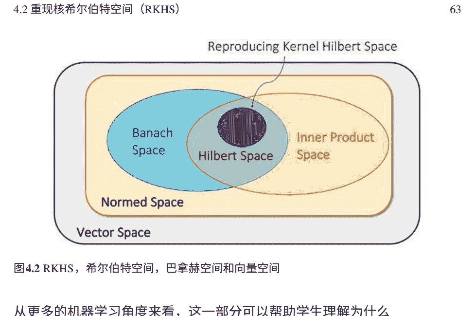

图4.2 RKHS，希尔伯特空间，巴拿赫空间和向量空间

从更多的机器学习角度来看，这一部分可以帮助学生理解为什么RKHS理论一直是经典机器学习理论的主要工具。在深入细节之前，读者需要记住RKHS只是希尔伯特空间的一个子集，如图4.2所示，即希尔伯特空间比RKHS更加普遍。关于希尔伯特空间的正式定义，请参考第1章。

#### 4.2.1 特征映射和核函数

在这里，我们从核函数的正式定义开始：

定义4.1 设 X 为一个非空集合。如果存在一个希尔伯特空间 ℋ 和一个特征映射 φ : X → ℋ，使得对于任意的 x, x' ∈ X，函数 k : X × X → ℝ 被称为一个核函数，满足以下条件：

```
$$ k(x, x') := \langle \phi(x), \phi(x') \rangle_{\mathcal{H}} $$
```

例如，我们用来解释核支持向量机的特征映射是

```
$$ \phi(x) = [\phi_1, \phi_2, \phi_3]^\top = [x_1^2, x_2^2, \sqrt{2} x_1 x_2]^\top $$
```

其中 $\mathcal{X} = \mathbb{R}^2$（见图4.1a）。我们还证明了相应的核函数是

```
k(\boldsymbol{x}, \boldsymbol{y}) = \langle \phi(\boldsymbol{x}), \phi(\boldsymbol{y}) \rangle\\= x_1^2 y_1^2 + x_2^2 y_2^2 + 2x_1x_2y_1y_2\\= (\langle \boldsymbol{x}, \boldsymbol{y}\rangle)^2,
```

对于所有的 $\boldsymbol{x}=[x_1\ x_2]^\top$, $\boldsymbol{y}= [y_1\ y_2]^\top \in \mathbb{R}^2$，对应于一个二次多项式核函数。还要注意，特征空间可以是无限维的，比如在这种情况下，使用 $\ell^2(\mathbb{Z})$ 中的内积定义（见（1.5）），核函数定义为

```
k(\boldsymbol{x}, \boldsymbol{x}') = \sum_{l=-\infty}^{\infty} \phi_l(\boldsymbol{x})\phi_l(\boldsymbol{x}'),
```

其中 $\phi = \{\phi_l\}_{l=-\infty}^{\infty} \in \mathcal{H}$。

在这里，重要的是强调 $\mathcal{X}$ 上几乎没有任何条件，即 $\mathcal{X}$ 不需要内积等。另一方面，特征空间 $\mathcal{H}$ 应该是一个希尔伯特空间。这意味着特征映射对数据集施加了一个数学结构，而数据集本身不一定具有数学结构。

这是一个重要的机器学习工具，因为它为实践中的所有数据提供了一个多功能工具来设置数学结构。例如，用于文档分类的词袋（BOW）核[16]就是一个为非结构化数据（如文档）设置数学结构的例子（见图4.3）。

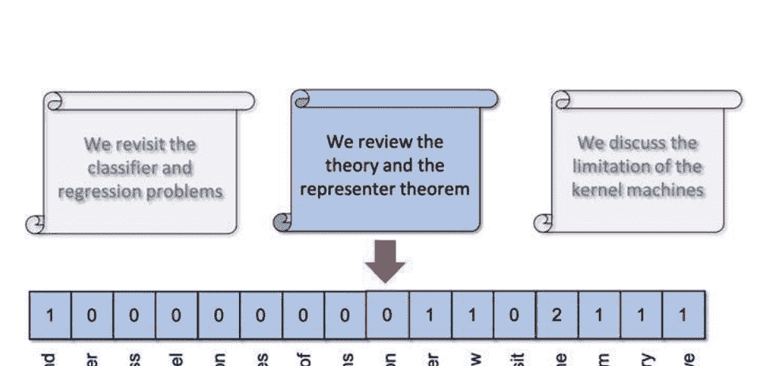

> 例子（词袋核）
假设特征映射 \( \phi(x) \) 的第 \( l \) 个元素表示文档中出现的第 \( l \) 个单词（来自字典）的数量。
这里，\( x \) 表示文档中出现的第 \( l \) 个单词（来自字典）的数量。如果我们
想通过单词计数来对文档进行分类，我们可以使用核函数 \( k(x, y) = \langle \phi(x), \phi(y) \rangle \)。

定义4.2 对称函数 \( k : \mathcal{X} \times \mathcal{X} \to \mathbb{R} \) 如果 \( \forall n \geq 1, \)
\( \forall (a_1, \cdots, a_n) \in \mathbb{R}^n, \forall (x_1, \cdots, x_n) \in \mathcal{X}^n, \) 则它是正定的。

\( \sum_{i=1}^n \sum_{j=1}^n a_i a_j k(x_i, x_j) \geq 0 \) (4.3)

虽然这个条件既是必要的又是充分的，但正向的方向更直观，可以理解为
什么核函数应该是正定的。
更具体地说，如果我们将核函数定义为(4.1)，我们有

\( \sum_{i=1}^n \sum_{j=1}^n a_i a_j k(x_i, x_j) = \sum_{i=1}^n \sum_{j=1}^n a_i a_j \langle \phi(x_i), \phi(x_j) \rangle_{\mathcal{H}} \)
\( = \left\| \sum_{i=1}^n a_i \phi(x_i) \right\|_{\mathcal{H}}^2 \geq 0 \)

因此，特征映射的存在保证了核的正定性。

#### 4.2.2 RKHS的定义

通过核函数和特征映射的定义，我们现在可以定义再生核希尔伯特空间。为
了实现这个目标，让我们重新审视一下我们用来解释核支持向量机的特征映
射：

\( \phi(x) = [\phi_1, \phi_2, \phi_3]^T = [x_1^2, x_2^2, \sqrt{2} x_1 x_2]^T \)

假设我们通过特征映射定义了一个函数 $f : \mathcal{X} \to \mathbb{R} :$

```
$$f(\boldsymbol{x}) = \sum_{l=1}^{3} f_l \phi_l(\boldsymbol{x}) = f_1 x_1^2 + f_2 x_2^2 + f_3 \left( \sqrt{2} x_1 x_2 \right).$$
```

用特征空间坐标表示，$f$ 由 $f(\cdot)$ 表示：

```
$$f = f(\cdot) := [f_1, f_2, f_3]^\top,$$
```

因此，$f(\boldsymbol{x})$ 可以表示为内积：

```
$$f(\boldsymbol{x}) = \langle f(\cdot), \phi(\boldsymbol{x}) \rangle_{\mathcal{H}}, \quad (4.4)$$
```

其中特征映射 $\phi(\boldsymbol{x})$ 在RKHS文献中通常被称为点评估函数。

现在，RKHS的关键要素是，我们不考虑整个Hilbert空间 $\mathcal{H}$，而是考虑由评估函数 $\phi$ 生成的其子集 $\mathcal{H}_{\phi}$ (参见图4.2)。更具体地说，对于所有 $f(\cdot) \in \mathcal{H}_{\phi}$，存在一个集合 $\{\boldsymbol{x}_i\}_{i=1}^{n}$，$\boldsymbol{x}_i \in \mathcal{X}$ 使得

```
$$f(\cdot) = \sum_{i=1}^{n} \alpha_i \phi(\boldsymbol{x}_i). \quad (4.5)$$
```

这等价于说 $\mathcal{H}_{\phi}$ 是 $\{\phi(\boldsymbol{x}) : \boldsymbol{x} \in \mathcal{X}\}$ 的线性张量空间。然后，通过将(4.5)代入(4.4)，我们有

```
$$\begin{aligned} f(\boldsymbol{x}) &= \langle f(\cdot), \phi(\boldsymbol{x}) \rangle_{\mathcal{H}} \\ &= \sum_{i=1}^{n} \alpha_i \langle \phi(\boldsymbol{x}_i), \phi(\boldsymbol{x}) \rangle_{\mathcal{H}} \\ &= \sum_{i=1}^{n} \alpha_i k(\boldsymbol{x}_i, \boldsymbol{x}). \quad (4.6) \end{aligned}$$
```

作为一个特例，我们可以很容易地看到，在特征空间中，给定 $\boldsymbol{x}' \in \mathcal{X}$，核函数的坐标 $k(\boldsymbol{x}', \cdot)$ 存在于RKHS $\mathcal{H}_{\phi}$ 中，因为我们有

```
$$k(\boldsymbol{x}', \boldsymbol{x}) = \langle k(\boldsymbol{x}', \cdot), \phi(\boldsymbol{x}) \rangle_{\mathcal{H}} = \langle \phi(\boldsymbol{x}'), \phi(\boldsymbol{x}) \rangle, \quad (4.7)$$
```

其中最后一个等式来自核函数的定义。因此，我们可以看到

$k(x',\cdot)=\phi(x')$，
(4.8)

这对应于(4.5)中的$n=1$。因此，我们可以用底层希尔伯特空间中的内积来表示核函数：

$k(x, x') = \langle k(x, \cdot), k(x', \cdot) \rangle_{\mathcal{H}}$，
(4.9)

此外，我们可以将(4.4)写成如下形式：

$f(x) = \langle f(\cdot), k(x, \cdot) \rangle_{\mathcal{H}}$，
(4.10)

这被称为再生性质[11]。

因此，对于所有的$f(\cdot), g(\cdot) \in \mathcal{H}_\phi$，我们可以证明存在$\{\alpha_i\}_{i=1}^r$和$\{\beta_i\}_{i=1}^s$使得$f(\cdot) = \sum_{i=1}^r \alpha_i k(x_i, \cdot)$和$g(\cdot) = \sum_{i=1}^s \beta_i k(x_i, \cdot)$，因为$\phi(x) = k(x, \cdot)$。因此，我们经常可以互换使用$\mathcal{H}_k$来表示$\mathcal{H}_\phi$，如果核函数$k(x, x')$被指定。这导致了它们内积的显式表示：

$\langle f, g \rangle_{\mathcal{H}} = \sum_{i=1}^r \sum_{j=1}^s \alpha_i \beta_j \langle k(x_i, \cdot), k(x_j', \cdot) \rangle$
(4.11)

$= \sum_{i=1}^r \sum_{j=1}^s \alpha_i \beta_j k(x_i, x_j')$。
(4.12)

然后，通过引入范数，可以定义诱导范数

$\|f\|_{\mathcal{H}} = \sqrt{\langle f, f \rangle_{\mathcal{H}}} = \sqrt{\sum_{i=1}^r \sum_{j=1}^r \alpha_i \alpha_j k(x_i, x_j)}$。
(4.13)

总结这些发现后，我们可以直观地定义RKHS。

### 定义4.3 设$k: \mathcal{X} \times \mathcal{X} \to \mathbb{R}$为一个正定核函数。由核函数$k$生成的RKHS，$\mathcal{H}_k$，是$\{k(x, \cdot): x \in \mathcal{X}\}$的线性张量空间，配备内积

$\langle f, g \rangle_{\mathcal{H}} = \sum_{i=1}^r \sum_{j=1}^s \alpha_i \beta_j k(x_i, x_j')$，
(4.14)

其中$f(\cdot) = \sum_{i=1}^r \alpha_i k(x_i, \cdot)$和$g(\cdot) = \sum_{i=1}^s \beta_i k(x_i', \cdot)$。

从（经典）机器学习的角度来看，使用RKHS的最重要原因是方程（4.5），它说明目标函数的特征映射可以表示为 \(\{k(\mathbf{x}, \cdot) : \mathbf{x} \in \mathcal{X}\}\) 的线性张量积，或者等价地， \(\{\phi(\mathbf{x}) : \mathbf{x} \in \mathcal{X}\}\)。这意味着只要我们有足够数量的训练数据，我们就可以通过估计它们的特征空间坐标来估计目标函数。事实上，现代神经网络方法的一个重要突破之一是放松了目标函数的特征映射应该表示为线性空间的假设。这个问题将在后面详细讨论。

### 4.3 表示定理

给定核函数和RKHS的定义，表示定理是一个简单的推论。回想一下，在机器学习问题中，损失被定义为实际目标和估计目标之间的误差能量。例如，在线性回归问题中，给定训练数据 \(\{\mathbf{x}_i, y_i\}_{i=1}^n\)，MSE损失被定义为

```
math
\mathcal{L}\left(\{\mathbf{x}_i, y_i, f(\mathbf{x}_i)\}_{i=1}^n\right) = \sum_{i=1}^{n} \| y_i - f(\mathbf{x}_i) \|^2,
```

其中

```
math
f(\mathbf{x}_i) = \langle \mathbf{x}_i, \boldsymbol{\beta} \rangle,
```

其中 \(\boldsymbol{\beta}\) 是要估计的未知参数。在软间隔支持向量机中，损失函数由铰链损失给出：

```
math
\text{铰链} \left(\{\mathbf{x}_i, y_i, f(\mathbf{x}_i)\}_{i=1}^n\right) = \sum_{i=1}^{n} \max\{0, 1 - y_i f(\mathbf{x}_i)\},
```

其中

```
math
f(\mathbf{x}_i) = \langle \mathbf{w}, \mathbf{x}_i \rangle + b,
```

其中 \(\mathbf{w}\) 和 \(b\) 表示要估计的参数。对于一般的损失函数，著名的表示定理如下：

**定理 4.1** \[11, 15\] 考虑一个正定的实值核函数 \(k: \mathcal{X} \times \mathcal{X} \rightarrow \mathbb{R}\) 在一个非空集合 \(\mathcal{X}\) 上，具有相应的RKHS \(\mathcal{H}_k\)。给定训练数据集 \(\{\mathbf{x}_i, y_i\}_{i=1}^n\)，其中 \(\mathbf{x}_i \in \mathcal{X}\) 且 \(y_i \in \mathbb{R}\)，以及一个严格递增的实值正则化函数 \(R: [0, \infty) \rightarrow \mathbb{R}\)。那么，对于任意的损失函数 \((\{\boldsymbol{x}_i, y_i, f(\boldsymbol{x}_i)\}_{i=1}^n)\)，对于以下优化问题的任何最小化器：

$$f^* = \arg \min_{f \in \mathcal{H}_k} \left( \{\boldsymbol{x}_i, y_i, f(\boldsymbol{x}_i)\}_{i=1}^n \right) + R(\|f\|_{\mathcal{H}}) \qquad (4.17)$$

可以表示为以下形式：

$$f^*(\cdot) = \sum_{i=1}^n \alpha_i k(\boldsymbol{x}_i, \cdot) = \sum_{i=1}^n \alpha_i \phi(\boldsymbol{x}_i) \qquad (4.18)$$

对于一些 $\alpha_i \in \mathbb{R}, i = 1, \cdots, n$; 或者等价地表示为

$$f^*(\boldsymbol{x}) = \sum_{i=1}^n \alpha_i k(\boldsymbol{x}_i, \boldsymbol{x}). \qquad (4.19)$$

表示定理的证明可以在标准的机器学习教材[11]中轻松找到，因此我们在这里不再赘述。相反，我们简要介绍一下证明的主要思想，因为它也突出了核机器的局限性。

具体来说，最小化器 $f^*$的特征空间坐标，用 $f^*(\cdot)$表示，应该由训练数据 $\{\phi(\boldsymbol{x}_i)\}_{i=1}^n$及其正交补的特征映射的线性组合表示。但是当我们在训练阶段使用内积对 $\{\phi(\boldsymbol{x}_i)\}_{i=1}^n$进行点评估时，正交补的贡献消失了，这导致了(4.18)中的最终形式。

### 4.4 表示定理的应用

在本节中，我们重新访问了核支持向量机和回归，以展示表示定理如何简化推导过程。

#### 4.4.1 核岭回归

回想一下，岭回归由以下优化问题给出：

$$\min_{\boldsymbol{\beta}} \sum_{i=1}^n \|y_i - \langle \boldsymbol{x}_i, \boldsymbol{\beta} \rangle\|^2 + \lambda \|\boldsymbol{\beta}\|^2.$$

通过将其扩展为非参数形式, 核岭回归由以下最小化问题给出:

$$ \min_{f \in \mathcal{H}_k} \sum_{i=1}^n \| y_i - f(\boldsymbol{x}_i) \|^2 + \lambda \| f \|_{\mathcal{H}}^2, \quad (4.20) $$

其中 $\mathcal{H}_k$ 是具有正定核 $k$ 的RKHS。 根据定理4.1, 我们知道最小化问题的解应具有以下形式:

$$ f(\cdot) = \sum_{j=1}^n \alpha_j \phi(\boldsymbol{x}_j). \quad (4.21) $$

使用(4.4), 均方误差损失变为

$$ \begin{aligned}
\sum_{i=1}^n \| y_i - f(\boldsymbol{x}_i) \|^2 &= \sum_{i=1}^n \| y_i - \langle f(\cdot), \phi(\boldsymbol{x}_i) \rangle \|^2 \\
&= \sum_{i=1}^n \left\| y_i - \sum_{j=1}^n \alpha_j \langle \phi(\boldsymbol{x}_j), \phi(\boldsymbol{x}_i) \rangle \right\|^2 \\
&= \sum_{i=1}^n \left\| y_i - \sum_{j=1}^n \alpha_j k(\boldsymbol{x}_j, \boldsymbol{x}_i) \right\|^2 \\
&= \| \boldsymbol{y} - \boldsymbol{K} \boldsymbol{\alpha} \|^2,
\end{aligned} $$

其中 $\boldsymbol{K} \in \mathbb{R}^{n \times n}$ 表示核格拉姆矩阵

$$ \boldsymbol{K} = \begin{bmatrix}
k(\boldsymbol{x}_1, \boldsymbol{x}_1) & \cdots & k(\boldsymbol{x}_1, \boldsymbol{x}_n) \\
\vdots & \ddots & \vdots \\
k(\boldsymbol{x}_n, \boldsymbol{x}_1) & \cdots & k(\boldsymbol{x}_n, \boldsymbol{x}_n)
\end{bmatrix} \quad (4.22) $$

和

$$ \boldsymbol{y} = [y_1 \cdots y_n]^\top, \quad \boldsymbol{\alpha} = [\alpha_1 \cdots \alpha_n]^\top. \quad (4.23) $$

同样地, 正则化项变为

$$ \begin{aligned}
\| f \|_{\mathcal{H}}^2 &= \langle f(\cdot), f(\cdot) \rangle \\
&= \sum_{i=1}^n \sum_{j=1}^n \alpha_i \alpha_j \langle \phi(\boldsymbol{x}_i), \phi(\boldsymbol{x}_j) \rangle \\
&= \sum_{i=1}^{n} \sum_{j=1}^{n} \alpha_i \alpha_j k(\boldsymbol{x}_i, \boldsymbol{x}_j) \\
&= \boldsymbol{\alpha}^T \boldsymbol{K} \boldsymbol{\alpha}.
\end{aligned} $$

因此，(4.20)可以等价地表示为有限维度的优化问题:

$$\hat{\boldsymbol{\alpha}} := \arg \min_{\boldsymbol{\alpha} \in \mathbb{R}^n} \|\boldsymbol{y} - \boldsymbol{K} \boldsymbol{\alpha}\|^2 + \lambda \boldsymbol{\alpha}^T \boldsymbol{K} \boldsymbol{\alpha}. \qquad (4.24)$$

这个问题是凸的；因此，使用一阶必要条件，我们有

$$(\boldsymbol{K}^2 + \lambda \boldsymbol{K}) \hat{\boldsymbol{\alpha}} = \boldsymbol{K} \boldsymbol{y}.$$

其中我们使用 $\boldsymbol{K}^T = \boldsymbol{K}$ due to the symmetry of the Gram matrix. 如果 $\boldsymbol{K}$ 可逆 (通常是标准核函数的情况), 我们有

$$\hat{\boldsymbol{\alpha}} = (\boldsymbol{K} + \lambda \boldsymbol{I})^{-1} \boldsymbol{y}.$$

最后，使用(4.4)和(4.21)我们有

$$ \begin{aligned} f^*(\boldsymbol{x}) &= \langle f(\cdot), \phi(\boldsymbol{x}) \rangle \\
&= \sum_{i=1}^{n} \alpha_i \langle \phi(\boldsymbol{x}_i), \phi(\boldsymbol{x}) \rangle \\
&= [k(\boldsymbol{x}_1, \boldsymbol{x}) \cdots k(\boldsymbol{x}_n, \boldsymbol{x})] (\boldsymbol{K} + \lambda \boldsymbol{I})^{-1} \boldsymbol{y} \end{aligned}$$

，这是我们之前得到的。

#### 4.4.2 核支持向量机

回想一下，软间隔支持向量机（无偏差）可以表示为

$$\min_{\boldsymbol{w}} \frac{1}{2} \|\boldsymbol{w}\|^2 + C \sum_{i=1}^{n} \text{hinge} (y_i, \langle \boldsymbol{w}, \boldsymbol{x}_i \rangle). \qquad (4.25)$$

其中 $\text{hinge}$ 是hinge损失

$$\text{hinge}(y, \hat{y}) = \max\{0, 1 - y \hat{y}\}. \qquad (4.26)$$

这个问题可以使用表示定理来解决。具体来说，在RKHS中，（4.25）的扩展形式为

$$\min_{f \in \mathcal{H}_k} \frac{1}{2} \|f\|_{\mathcal{H}}^2 + C \sum_{i=1}^{n} \text{铰链} (y_i, f(x_i)).$$

其最小化函数 f 有以下特征空间坐标:

$$f(\cdot) = \sum_{j=1}^{n} \alpha_j k(x_j, \cdot).$$

利用这个，铰链损失项变为

$$\text{铰链} (y_i, f(x_i)) = \max\{0, 1 - y_i \sum_{j=1}^{n} \alpha_j k(x_j, x_i)\}.$$

同样地，正则化项变为

$$\|f\|_{\mathcal{H}}^2 = \boldsymbol{\alpha}^\top \boldsymbol{K} \boldsymbol{\alpha},$$

其中 K 是 (4.22) 中的核格拉姆矩阵。现在，(4.27) 可以表示为约束形式

$$\min_{\boldsymbol{\alpha}, \boldsymbol{\xi}} \frac{1}{2} \boldsymbol{\alpha}^\top \boldsymbol{K} \boldsymbol{\alpha} + C \sum_{i=1}^{n} \xi_i \\ \text{subject to } 1 - y_i \sum_{j=1}^{n} \alpha_j k(x_j, x_i) \leq \xi_i, \quad \xi_i \geq 0, \quad \forall i.$$

对于给定的原始问题(4.30)，相应的拉格朗日对偶问题为

$$\max_{\boldsymbol{\lambda}, \boldsymbol{\gamma}} g(\boldsymbol{\lambda}, \boldsymbol{\gamma}) \\ \text{满足条件 } \boldsymbol{\lambda} \geq 0, \boldsymbol{\gamma} \geq 0,$$

$$g(\lambda, \gamma) = \min_{\alpha, \xi} \left\{ \frac{1}{2} \boldsymbol{\alpha}^\top \boldsymbol{K} \boldsymbol{\alpha} + C \sum_{i=1}^n \xi_i + \sum_{i=1}^n \lambda_i \left(1 - y_i \sum_{j=1}^n \alpha_j k(\boldsymbol{x}_j, \boldsymbol{x}_i) - \xi_i\right) - \sum_{i=1}^n \gamma_i \xi_i \right\}, \quad (4.32)$$

可以进一步简化为

$$g(\lambda, \gamma) = \min_{\alpha, \xi} \left\{ \frac{1}{2} \boldsymbol{\alpha}^\top \boldsymbol{K} \boldsymbol{\alpha} + \sum_{i=1}^n \lambda_i (1 - \xi_i) + (C - \gamma_i) \xi_i - \boldsymbol{r}^\top \boldsymbol{K} \boldsymbol{\alpha} \right\}, \quad (4.33)$$

其中

$$\boldsymbol{r} = [y_1 \lambda_1 \cdots y_n \lambda_n]^\top.$$

关于$\boldsymbol{\alpha}$和$\xi$的一阶最优性条件导致以下方程:

$$\boldsymbol{K} \boldsymbol{\alpha} = \boldsymbol{K} \boldsymbol{r} \implies \boldsymbol{\alpha} = \boldsymbol{r} \quad (4.34)$$

和

$$\lambda_i + \gamma_i = C. \quad (4.35)$$

将(4.34)和(4.35)代入方程(4.32)，我们有

$$g(\lambda, \gamma) = \sum_{i=1}^n \lambda_i - \frac{1}{2} \sum_{i=1}^n \sum_{j=1}^n \lambda_i \lambda_j y_i y_j k(\boldsymbol{k}_i, \boldsymbol{k}_j)$$

其中$0 \leq \lambda_i \leq C$，分类器由以下给出

$$f(\boldsymbol{x}) = \sum_{j=1}^n y_j \lambda_j k(\boldsymbol{x}_j, \boldsymbol{x}), \quad (4.36)$$

这等价于我们之前推导的核SVM。

### 4.5 核机器的优缺点

核机器具有许多重要的优点，值得进一步讨论。这种方法基于RKHS的美妙理论，通过表示定理实现了设计分类器和回归器的闭式解。

定理。因此，经典的研究问题不在于机器学习算法本身，而在于找到能够有效表示环境空间中数据的特征空间嵌入。

话虽如此，经典核机器存在一些限制。 首先，使得以表示定理为闭合形式解的原因是假设特征空间形成一个RKHS。这意味着从特征空间到最终函数的映射被假设为线性的。 这种方法在某种程度上是不平衡的，因为只有从环境空间到特征空间的映射是非线性的，而特征空间表示是线性的。 此外，正如之前讨论的，RKHS只是底层希尔伯特空间的一个子集；因此，将特征空间限制在RKHS内严重减少了底层希尔伯特空间中可用的函数类（见图4.2）。因此，它限制了学习算法和结果表达能力的灵活性。

最后，经典机器学习方法中的特征映射和相关的核主要是基于人类直觉或数学建模来进行自上而下的选择，这些选择无法从数据中自动学习。 事实上，核机器学习的学习部分是针对表示器中的线性加权参数（即（4.18）中的 αi）的，而特征映射本身在自上而下选择核后是确定性的。

这严重限制了学习的能力。 后面，我们将探讨现代深度学习方法如何缓解核机器的这种限制。

### 4.6 练习

1.  证明以下核函数是正定的。
    a. 余弦核函数：\(k(x, y) = \cos(x - y)\) 对于 \(\forall x, y \in \mathbb{R}\)。
    b. 具有最高次数为 \(p\) 的多项式核函数：
    \[k(\mathbf{x}, \mathbf{y}) = (\mathbf{x}^\top \mathbf{y})^p.\]
    c. 具有最高次数为 \(p\) 的多项式核函数：
    \[k(\mathbf{x}, \mathbf{y}) = (\mathbf{x}^\top \mathbf{y} + 1)^p.\]
    d. 具有宽度 \(\sigma\) 的径向基函数核函数：
    \[k(\mathbf{x}, \mathbf{y}) = \exp(-\|\mathbf{x} - \mathbf{y}\|^2/(2\sigma^2)).\]
    e. Sigmoid核函数：
    \[\tanh(\eta \mathbf{x}^\top \mathbf{y} + \nu).\]

- 设 $k_1$ 和 $k_2$ 是集合 $\mathcal{X}$ 上的两个正定核函数，$\alpha$, $\beta$ 是两个正标量。证明 $\alpha k_1 + \beta k_2$ 是正定的。

- 设 $k_1$ 是集合 $\mathcal{X}$ 上的正定核函数。对于任意非负系数的多项式 $p(\cdot)$，证明以下也是集合 $\mathcal{X}$ 上的正定核函数：$$k(x, y) = p(k_1(x, y)), \quad x, y \in \mathcal{X}.$$

- 设 $\{X_i\}_{i=1}^p$ 是一系列集合，$k_i$ 是 $\mathcal{X}_i$ 上相应的正定核函数。然后，证明$$k(x_1, \cdots, x_p; y_1, \cdots, y_p) = k_1(x_1, y_1) \cdots k_p(x_p, y_p), \quad x_i, y_i \in \mathcal{X}_i, \forall i$$是空间 $\mathcal{X} := \mathcal{X}_1 \times \cdots \times \mathcal{X}_p$ 上的核函数。

- 设 $\mathcal{X}_0 \subset \mathcal{X}$，那么 $k$ 在 $\mathcal{X}_0 \times \mathcal{X}_0$ 上的限制也是一个再生核函数。

- 设 $k$ 是 $\mathcal{X}$ 上的一个有效核函数。下面的归一化函数是否是一个有效的正定核函数？$$k_{\text{norm}}(x, y) = \begin{cases} 0, & \text{如果 } k(x, x) = 0 \text{ 或 } k(y, y) = 0 \\ \frac{k(x, y)}{\sqrt{k(x, x)} \sqrt{k(y, y)}}, & \text{否则} \end{cases}, \quad \forall x, y \in \mathcal{X}.$$

- 考虑一个归一化的核函数 $k$ 使得对于所有的 $x \in \mathcal{X}$，有 $k(x, x) = 1$。定义一个在 $\mathcal{X}$ 上的伪度量为$$d_{\mathcal{X}}(x, y) = \|k(x, \cdot) - k(y, \cdot)\|_{\mathcal{H}}. \tag{4.37}$$
  - a. 证明$$d_{\mathcal{X}}(x, y) = 2(1 - k(x, y)).$$
  - b. 证明 $d_{\mathcal{X}}(x, y)$ 不是一个度量。它违反了度量的哪个性质？

- 定义特征空间的均值$$\mu_{\phi} = \frac{1}{n} \sum_{i=1}^n \phi(x_i).$$
  - a. 证明$$\|\mu_{\phi}\|_{\mathcal{H}}^2 = \frac{1}{n^2} \sum_{i=1}^{n} \sum_{j=1}^{n} k(x_i, x_j).$$
  - b. 证明$\sigma_{\phi}^{2} := \frac{1}{n} \sum_{i=1}^{n} \|\phi(x_i) - \mu_{\phi}\|_{\mathcal{H}}^{2} = \frac{1}{n} \operatorname{Tr}(K) - \|\mu_{\phi}\|_{\mathcal{H}}^{2}$, 其中$\operatorname{Tr}(\cdot)$表示矩阵迹， $K$是核Gram矩阵
    $K = \begin{bmatrix} k(x_1, x_1) & \cdots & k(x_1, x_n) \\ \vdots & \ddots & \vdots \\ k(x_n, x_1) & \cdots & k(x_n, x_n) \end{bmatrix}$。

- 在(4.27)中，核SVM公式通常称为1-SVM。在这个问题中，我们对获取2-SVM感兴趣，其定义如下
  $\min_{f \in \mathcal{H}_k} \frac{1}{2} \|f\|_{\mathcal{H}}^{2} + C \sum_{i=1}^{n} \text{2铰链} (y_i, f(x_i))$ ,
  其中 $^2_{hinge}$ 是平方损失:
  $^2_{hinge}(y, \hat{y}) = (\max\{0, 1 - y\hat{y}\})^2$.
  编写与2-SVM相关的原始问题和对偶问题，并与1-SVM的结果进行比较。

- 考虑以下核回归问题:
  $\min_{f \in \mathcal{H}_k} \frac{1}{2} \|f\|_{\mathcal{H}}^{2} + C \sum_{i=1}^{n} \text{logit} (y_i, f(x_i))$ ,
  其中 $\text{logit}$ 是逻辑回归损失函数:
  $\text{logit}(y, \hat{y}) = \log(1 + e^{-y\hat{y}})$.
  编写对偶问题，并尽可能简单地找到解决方案。

## 第二部分

## 深度学习的构建模块

> “当我们发现一种使神经网络变得更好的方法，并且这与大脑的工作方式密切相关时，我感到非常兴奋。”

– Geoffrey Hinton

## 第5章 生物神经网络

### 5.1 引言

生物神经网络由一组相连的神经元组成。单个神经元可以连接到许多其他神经元，网络中的神经元和连接总数可能非常高。生物神经网络的一个令人惊奇的方面是，当神经元彼此连接时，无法从单个神经元中观察到的更高级的智能会出现。从神经网络中智能的确切机制是神经科学家、生物学家和工程师一直以来的研究热点，目前尚未完全理解。事实上，对生物神经网络的计算建模和数学分析是计算神经科学这一学科的重要组成部分，这也与人工神经网络社区密切相关。这一学科的主要假设是通过计算建模可以揭示生物网络的可能工作机制。此外，理解生物神经网络的工作原理被认为是设计高性能人工神经网络的开启之门。

因此，在本章中，我们将回顾有关个体神经元及其网络的基本神经生物学，并介绍一些启发了人工神经网络的有趣的神经科学发现。然而，这些入门材料绝不是详尽无遗的，因此建议感兴趣的读者阅读神经科学的标准教科书[17-19]。

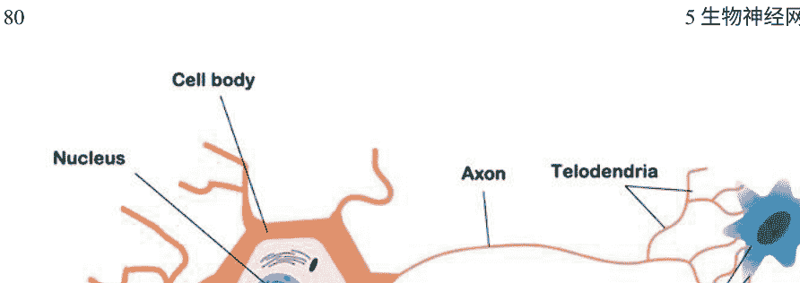

### 5.2 神经元

#### 5.2.1 神经元的解剖学

典型的神经元由细胞体（胞体）、树突和单个轴突组成（见图5.1）。轴突和树突是从细胞体伸出的纤维。树突通常分支繁重，从细胞体延伸数百微米。轴突从轴突丘离开细胞体，并在人类中延伸至1米或更多。轴突的末梢分支称为末梢树突。在轴突的末梢分支的极端端点处是突触，神经元可以通过突触向另一个细胞传递信号。

细胞体内的内质网（ER）执行许多一般功能，包括折叠蛋白分子和将合成的蛋白质通过囊泡运输到高尔基体。在内质网中合成的蛋白质被包装进囊泡，然后与高尔基体融合。这些货物蛋白质在高尔基体中被修饰，并通过胞吐途径分泌或在细胞内使用，如图5.2所示。

#### 5.2.2 信号传递机制

神经元通过突触将信号传递给个体靶细胞。在突触处，突触前神经元的膜与突触后细胞的膜紧密接触（见图5.3）。虽然也存在电突触，其中突触前和突触后神经元直接融合在一起。

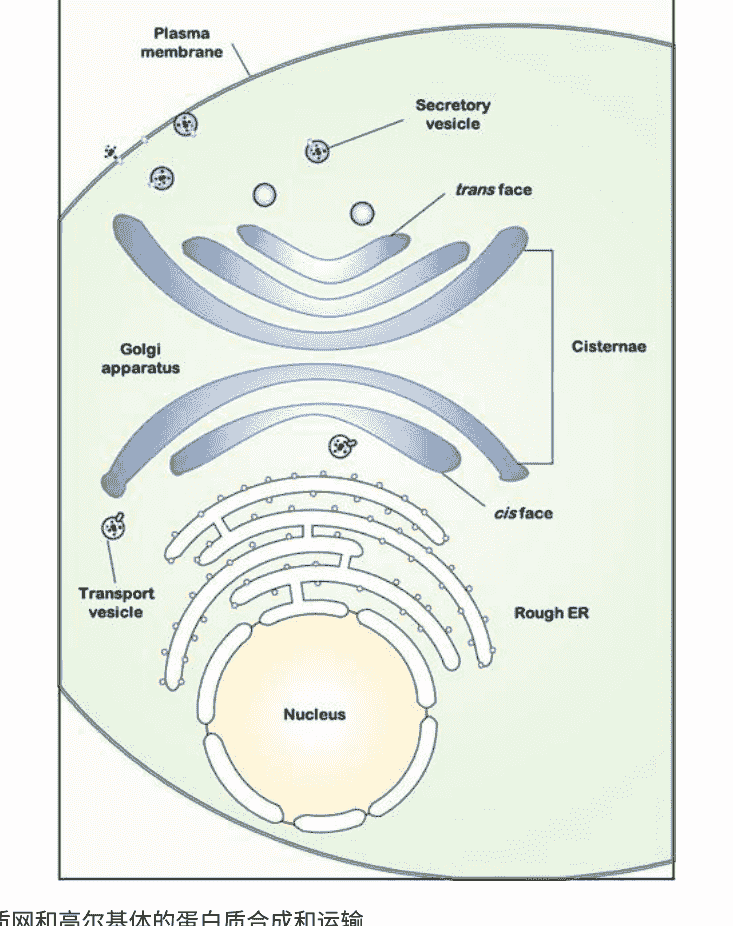

图5.2 内质网和高尔基体的蛋白质合成和运输

对于快速的电信号传输[18, 19]，通过神经递质传递动作电位的化学突触是最常见的，也是人工神经网络中非常感兴趣的。

如图5.3所示，在化学突触中，神经前体细胞中的电活动被转化为神经递质的释放，这些神经递质结合在神经后体细胞的膜上。神经递质通常被包装在突触囊泡中，如图5.3所示。因此，神经递质在神经后体终端的实际数量是每个囊泡中神经递质数量的整数倍，因此这种现象通常被称为量子释放。释放受电压依赖的钙通道调节。

释放的神经递质然后结合到神经后体树突上的受体，可以触发产生兴奋性突触后电位（EPSPs）或抑制性突触后电位（IPSPs）的电响应。

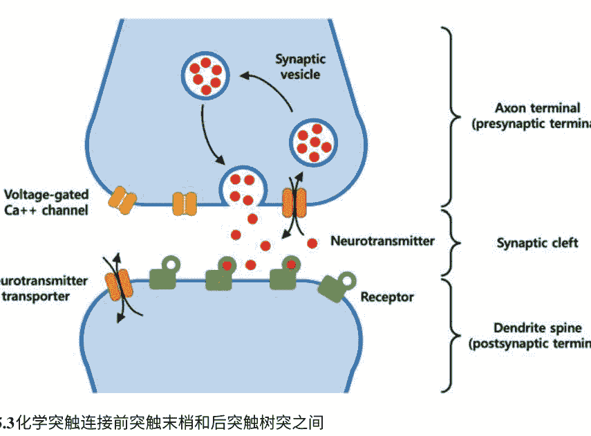

图5.3化学突触连接前突触末梢和后突触树突之间

轴突丘（见图5.1）是细胞体的一个特殊部分，与轴突相连。IPSP和EPSP都在轴突丘中求和，一旦超过触发阈值，动作电位就会传播到轴突的其余部分。轴突丘的这种切换行为在神经网络的信息处理中起着非常重要的作用，将在第6章中详细讨论。

#### 5.2.3 突触可塑性

突触可塑性是突触随着时间的推移而增强或减弱的能力，随着它们的活动增加或减少。事实上，突触可塑性是学习和记忆的重要神经化学基础之一，经常被人工神经网络模仿。

神经元细胞中两种最好研究的突触可塑性形式是长期增强（LTP）和长期抑制（LTD）。具体而言，LTP是基于最近活动模式的突触持续增强。

这些是导致两个神经元之间信号传递长时间增强的突触活动模式。LTP的相反是长期抑制（LTD），它导致突触强度长时间减弱。

与人工神经网络相比，生物神经元中的突触可塑性变化通常是通过简单的权重变化来建模，而生物神经元中的突触可塑性变化往往是由突触上的神经递质受体数量的变化引起的。例如，如图5.4所示，


图5.4 LTP和LTD的生物机制

在LTP期间，额外的受体通过胞吐作用与细胞膜融合，然后通过细胞膜内的侧向扩散移动到突触后树突上。另一方面，在LTD的情况下，一些多余的受体通过细胞膜内的侧向扩散移动到内吞作用区域，然后通过内吞作用被细胞吸收。

由于学习和突触可塑性的动力学，很明显，这些受体的转运是满足神经元各个突触位置上需求和供应的重要机制。神经生物学家正在密集研究各种机制。例如，组装的受体离开内质网（ER）并通过高尔基网络到达神经表面。新生受体的包裹物沿着微管轨道从细胞体运输到突触位点，通过微管网络。图5.5展示了受体组装、转运、胞内转运、缓慢释放和插入突触的关键步骤。

### 5.3 生物神经网络

#### 5.3.1 视觉系统

视觉系统是中枢神经系统的一部分，使生物能够处理视觉细节，即视力。它从可见光中检测和解释信息，以创建环境的表示。视觉系统执行许多复杂的任务，从捕捉光线到识别和分类视觉对象。

如图5.6所示，物体反射的光线照射在视网膜上。视网膜使用光感受器将这个图像转换为电脉冲。然后，视神经通过视神经管传递这些脉冲。到达视交叉时，神经纤维交叉（左边变成右边）。大多数视神经纤维终止于外侧膝状核（LGN）。LGN将脉冲转发到视觉皮层的V1区域。LGN还向V2和V3发送一些纤维。V1执行边缘检测以理解空间组织。V1还创建一个自下而上的显著性地图来引导注意力。

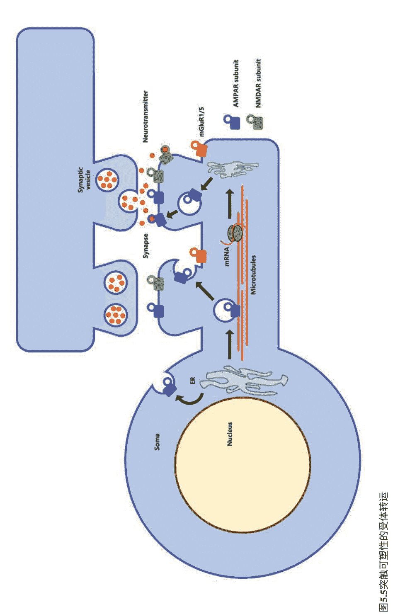

图5.5 突触可塑性的受体转运

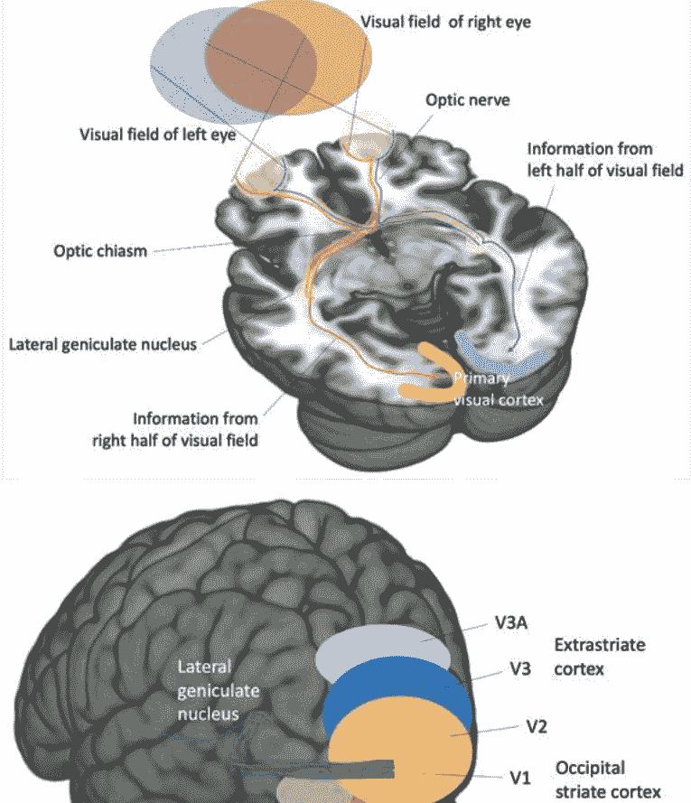

图5.6 视觉系统和信息处理的解剖学


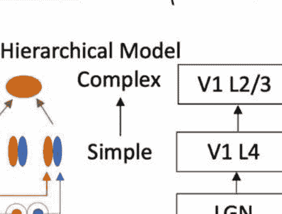

图5.7 Hubel和Wiesel主视觉皮层模型

它们在相对较小的感受野内对其位置和相位的响应（图5.7）。他们意识到，简单细胞的这种响应可以通过汇集具有相同感受野的一小组输入细胞的活动来获得，这与LGN细胞中观察到的感受野类似。他们还观察到V1 L2/L3的复杂细胞，虽然也对定向条和边缘有选择性，但倾向于具有较大的感受野，并且对其感受野内的确切位置有一定的容忍度。Hubel和Wiesel发现，复杂细胞层的位置容忍度可以通过将下一层的简单细胞分组，这些简单细胞具有相同的首选方向但位置略有不同来获得。后面将讨论的是，汇集具有相同感受野的LGN细胞的操作类似于卷积操作，

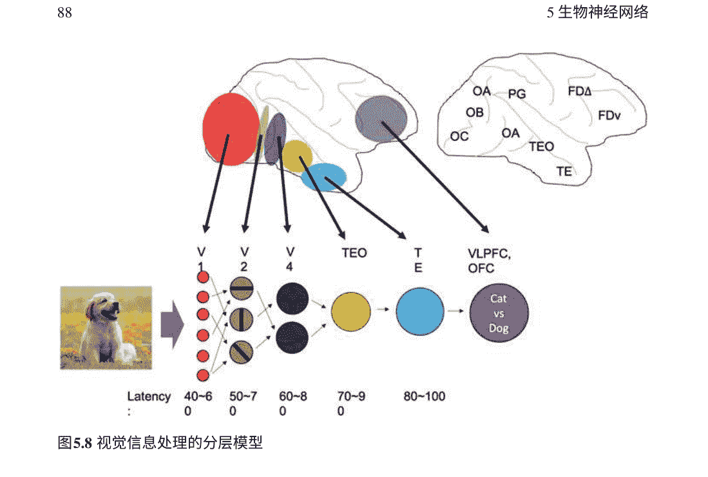

图5.8 视觉信息处理的分层模型

受到Yann LeCun的启发，他发明了用于手写邮编识别的卷积神经网络[21]。

从初级视觉皮层扩展到视觉皮层的更高区域，引出了一类物体识别模型，即前馈分层模型[22]。具体来说，如图5.8所示，从V1到TE，感受野的大小增加，响应的延迟增加。这意味着沿着这条路径存在神经连接，形成了神经层次结构。更令人惊讶的发现是，沿着这条路径，神经元对于不受变换影响的更复杂的输入变得敏感。

### 5.3.3 珍妮弗·安妮斯顿细胞

信息处理层次结构的一个极端形式或令人惊讶的例子是所谓的“珍妮弗·安妮斯顿细胞”的发现[23]，它代表了一个复杂但特定的概念或对象。对于那些不了解珍妮弗·安妮斯顿的人来说，她是20世纪90年代最受欢迎的美国女演员之一，曾主演美国最受喜爱的情景喜剧《老友记》。

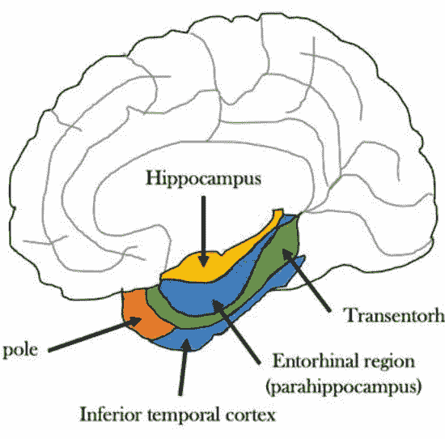

该研究涉及八名癫痫患者，他们暂时植入了一个单细胞记录装置，以监测中颞叶脑细胞的活动。中颞叶包含一组解剖相关的结构，对于陈述性记忆（对事实和事件的有意识记忆）至关重要。该系统由海马区（Ammon角（CA）区域、齿状回和海马旁核复合体）以及相邻的周边边缘、内侧边缘和副海马皮质组成（见图5.9）。

在单细胞记录过程中，[23]中的作者注意到他们的一个参与者的中颞叶脑部出现了奇怪的模式。每当患者看到詹妮弗·安妮斯顿的照片时，大脑中的一个特定神经元就会被激活。他们试图展示“詹妮弗·安妮斯顿”这个词，结果又触发了。他们尝试用其他方法在其他情况下召唤詹妮弗·安妮斯顿，每次都会触发。结论是不可避免的：对于这个特定的人来说，存在一个单一的神经元体现了詹妮弗·安妮斯顿的概念。

实验表明，MTL中的个别神经元对某些人的面孔有反应。研究人员表示，这些类型的细胞参与了视觉处理的复杂方面，例如识别一个人，而不仅仅是简单的形状。这个观察引发了一个基本问题：一个单一的神经元能够体现一个单一的概念吗？尽管这个问题将在整本书中进行深入研究，但简短的答案是“不行”，因为它不是孤立的单一神经元，而是来自密集连接的神经网络中的神经元才能提取高层次的概念。

### 5.4 练习

- 解释神经元中以下结构的作用:
  - a. 索玛
  - b. 树突
  - c. 内质网
  - d. 高尔基体
  - e. 轴突结节
  - f. 突触
- 了解细胞组分的相对数量级非常重要。请为突触指定每个物理参数。
  - a. 囊泡直径
  - b. 突触宽度
  - c. 每个动作电位激活区释放的囊泡数
  - d. 突触间隙宽度
- 解释电学突触和化学突触之间的区别。
- 解释不同类型的神经递质及其作用。
- 解释离子通道受体和代谢型受体之间的区别。
- 解释LTD和LTP的机制。
- 神经递质转运的作用是什么？
- 逐步解释视觉信息处理的步骤。
- 解释为什么Hubel和Wiesel模型暗示了视觉皮层中的卷积处理。
- 詹妮弗·安妮斯顿细胞的主要观察结果是什么？

## 第6章 人工神经网络和反向传播

### 6.1 引言

受生物神经网络的启发，我们在这里讨论其数学抽象，即人工神经网络（ANN）。尽管已经努力使用数学模型来建模生物神经元的所有方面，但并不是所有方面都是必要的：相反，在建模神经元时有一些关键方面不应被忽视。这包括权重调整和非线性。事实上，没有它们，我们不能期望任何学习行为。

在本章中，我们首先描述了单个神经元的数学模型，并使用前馈神经网络解释了其实现。然后，我们讨论了常用的权重更新方法，通常称为神经网络训练。神经网络训练中最重要的部分之一是梯度计算，因此本章的其余部分详细讨论了主要的权重更新技术，即反向传播。

### 6.2 人工神经网络

#### 6.2.1 符号

由于人工神经网络的数学描述涉及到神经元、层、训练样本等多个指标，因此我们在这里想要总结它们以供参考，以便在本章的其余部分中使用。

首先，通常将每个训练数据集表示为粗体小写字母加下标 n：例如，以下用于表示第 n 个训练数据相关的变量：

$$x_n, y_n, \{x_n, y_n\}_{n=1}^N, o_n, g_n$$

其次，稍微滥用符号的下标 $i$ 和 $j$ 表示轻体小写字母的第 $i$ 个和第 $j$ 个元素：
例如，$o_i$ 是向量 $\boldsymbol{o} \in \mathbb{R}^d$ 的第 $i$ 个元素：

$$ o_i = [\boldsymbol{o}]_i, \quad \text{或者} \quad \boldsymbol{o} = [o_1 \cdots o_d]^\top . $$

同样，双下标 $ij$ 表示矩阵的第$(i, j)$个元素：例如，
$w_{ij}$ 是矩阵 $\boldsymbol{W} \in \mathbb{R}^{p \times q}$ 的第$(i, j)$个元素：

$$ w_{ij} = [\boldsymbol{W}]_{i,j} \quad \text{or} \quad \boldsymbol{W} = \begin{bmatrix} w_{11} & \cdots & w_{1q} \\ \vdots & \ddots & \vdots \\ w_{p1} & \cdots & w_{pq} \end{bmatrix} . $$

这种索引表示法经常用于指代神经网络每一层中的第 $i$ 个或第 $j$ 个神经元。
为了避免潜在的混淆，如果我们提到的是第 $i$ 个元素
第$n$个训练数据向量 $\boldsymbol{x}_n$ 被称为 $(\boldsymbol{x}_n)_i$。接下来，为了表示第$l$层，使用下标符号如下所示：

$$ \boldsymbol{g}^{(l)}, \boldsymbol{W}^{(l)}, \boldsymbol{b}^{(l)}, d^{(l)} . $$

因此，通过结合训练索引$n$，例如 $\boldsymbol{g}^{(l)n}$ 表示第$l$层的 $\boldsymbol{g}$ 向量对应第$n$个训练数据。
最后，使用优化器（例如随机梯度法）进行第$t$次更新可以表示为 $[t]$，例如：

$$ [t], \boldsymbol{V}[t] $$

分别表示参数映射的第$t$次更新和 $\boldsymbol{V}$ 的更新。

#### 6.2.2 建模单个神经元

考虑图6.1中的典型生物神经元及其数学图示图6.2。设 $o_j, \ j = 1, \cdots, d$ 表示来自第$j$个树突突触的突触前电位。为了数学简化，我们假设电位同步发生，并同时到达轴突丘。在轴突丘处，它们被求和，并且如果求和信号大于特定阈值，则产生动作电位。这个过程可以数学建模为

$$ \text{net}_i = \sigma \left( \sum_{j=1}^d w_{ij} o_j + b_i \right) , \quad (6.1) $$

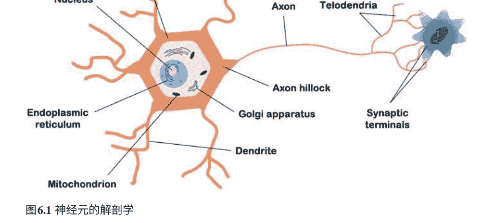

## 图6.1 神经元的解剖学

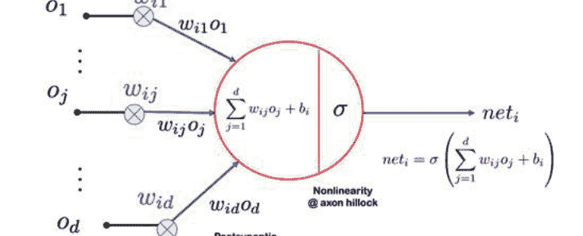

## 图6.2 单个神经元的数学模型

其中，net_i表示到达第i个突触末梢的动作电位，而b_i是轴突小丘处非线性函数σ(·)的偏置项。注意w_ij是由突触可塑性确定的权重参数，正值表示w_ij*o_j是兴奋性突触后电位（EPSPs），而负权重对应抑制性突触后电位（IPSPs）。

在人工神经网络（ANNs）中，非线性函数σ(·)在（6.1）中以不同的方式进行建模，如图6.3所示。这种非线性函数通常被称为激活函数。非线性可能是神经网络最重要的特征，因为没有非线性就不会发生学习和适应。这个论证的数学证明有些复杂，所以讨论将推迟到以后。

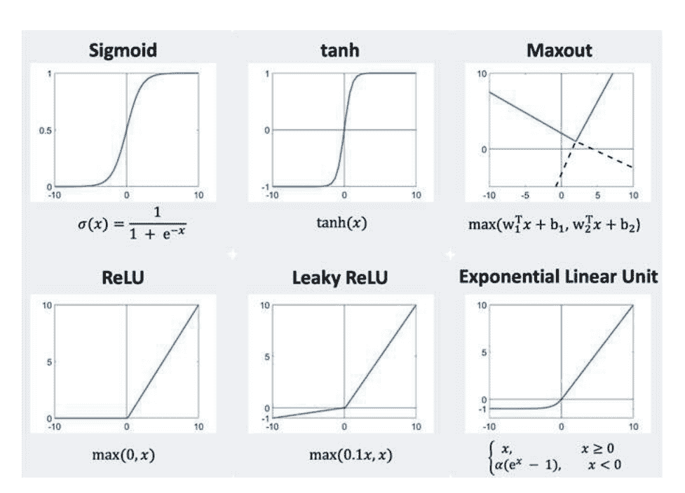

## 图6.3 各种激活函数的形式

在各种激活函数中，现代深度学习中最成功的之一是修正线性单元（ReLU），其定义为[24]

$$ \sigma (x) = \text{ReLU}(x) := \max\{0, x\}. \tag{6.2} $$

ReLU激活函数在输出非零时被称为活跃的。人们认为正值范围内的非消失梯度对现代深度学习的成功起到了贡献。具体来说，我们有

$$ \frac{\partial \text{ReLU}(x)}{\partial x} = \begin{cases} 1, & \text{if } x > 0 \\ 0, & \text{否则} \end{cases}, \tag{6.3} $$

这表明ReLU处于活跃状态时梯度始终为1。请注意，根据惯例，我们将梯度在 $x=0$ 处设为0，因为ReLU在该点不可微。

在评估激活函数 $\sigma (x)$ 时，输入/输出比率的增益函数也很有用：

$$ \gamma (x) := \frac{\sigma (x)}{x}, \quad x \neq 0. \tag{6.4} $$

例如，ReLU满足以下重要属性：

$$ \gamma (x) = \frac{\partial \sigma (x)}{\partial x} = \begin{cases} 1, & \text{if } x > 0 \\ 0, & \text{否则} \end{cases}, \tag{6.5} $$

这将在后面分析反向传播算法时使用。

与其他非线性函数相比，使用ReLU的另一个优点是：如后面将详细解释的那样，ReLU将输入和特征空间分为两个不相交的集合，即活跃区域和非活跃区域，从而在分区几何上实现了非线性映射的分段线性逼近。因此，每个分区内的神经网络可以被视为局部线性的，尽管整体映射是高度非线性的。这是我们在本书中想要强调给读者的深度神经网络的几何图像。

#### 6.2.3 前馈多层人工神经网络

生物神经网络由多个相互连接的神经元组成。这种连接可以具有复杂的拓扑结构，如循环连接、异步连接、神经元间连接等。

神经网络连接中最简单的形式之一是多层前馈神经网络，如图6.4和6.8所示。具体来说，让 $o_j^{(l-1)}$ 表示第 $(l-1)$ 层神经元的第 $j$ 个输出，它作为第 $l$ 层神经元的第 $j$ 个树突前突输入，而 $w_{ij}^{(l)}$ 则对应于第 $l$ 层的突触权重。然后，通过扩展模型(6.1)，我们得到

$$ o_i^{(l)} = \sigma \left( \sum_{j=1}^{d^{(l-1)}} w_{ij}^{(l)} o_j^{(l-1)} + b_i^{(l)} \right), \tag{6.6} $$

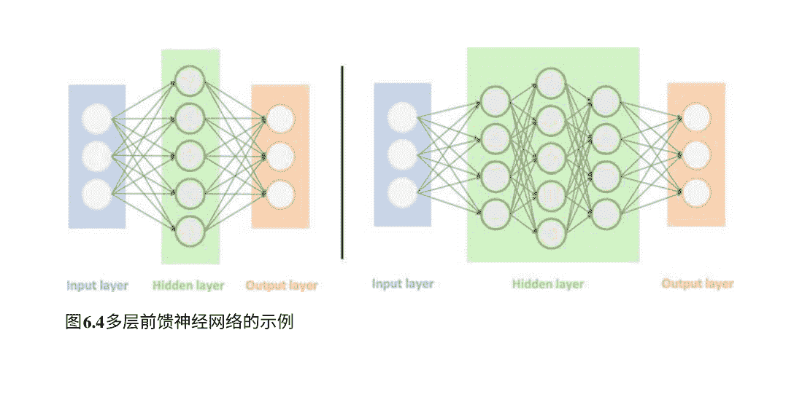

对于 $i = 1,\cdots, d^{(l)}$，其中 $d^{(l)}$ 表示第 $l$ 层神经元的树突数量。这可以用矩阵形式表示

$$ o^{(l)} = \sigma \left( W^{(l)} o^{(l-1)} + b^{(l)} \right), \quad (6.7) $$

其中 $W^{(l)} \in \mathbb{R}^{d^{(l)} \times d^{(l-1)}}$ 是权重矩阵，其 $(i, j)$ 元素为 $w_{ij}^{(l)}$， $\sigma(\cdot)$ 表示对向量的每个元素应用的非线性函数 $\sigma(\cdot)$，并且

$$ o^{(l)} = \left[ o_1^{(l)} \cdots o_{d^{(l)}}^{(l)} \right]^T \in \mathbb{R}^{d^{(l)}}, \quad (6.8) $$
$$ b^{(l)} = \left[ b_1^{(l)} \cdots b_{d^{(l)}}^{(l)} \right]^T \in \mathbb{R}^{d^{(l)}}. \quad (6.9) $$

简化多层表示的另一种方法是使用线性层之间的隐藏节点。具体而言，可以使用隐藏节点 $g^{(l)}$ 来递归表示 $L$ 层前馈神经网络。

$$ o^{(l)} = \sigma(g^{(l)}), \quad g^{(l)} = W^{(l)} o^{(l-1)} + b^{(l)}, \quad (6.10) $$

对于 $l = 1,\cdots, L$。

### 6.3 人工神经网络训练

#### 6.3.1 问题表述

对于给定的训练数据 $\{x_n, y_n\}_{n=1}^{N}$，神经网络训练问题可以如下表述：

$$ \hat{\Theta} = \arg \min_{\Theta} c(\Theta), \quad (6.11) $$

其中成本函数由给出

$$ c(\Theta) := \sum_{n=1}^{N} \ell(y_n, f_\Theta(x_n)). \quad (6.12) $$

这里， $\ell(\cdot, \cdot)$ 表示损失函数， $f_\Theta(x_n)$ 是一个由参数集合 $\Theta$ 参数化的回归函数，其输入为 $x_n$。

对于一个 $L$ 层前馈神经网络的情况，回归函数 $f_\Theta(x_n)$ 在(6.12)中可以表示为

$$ f_\Theta(x_n) := \left( \sigma \circ g^{(L)} \circ \sigma \circ g^{(L-1)} \cdots \circ g^{(1)} \right)(x_n), \quad (6.13) $$

参数集合由每个层的突触权重和偏置组成：

$$ \Theta = \begin{bmatrix} W^{(1)}, b^{(1)} \\ \vdots \quad \vdots \\ W^{(L)}, b^{(L)} \end{bmatrix}. \quad (6.14) $$

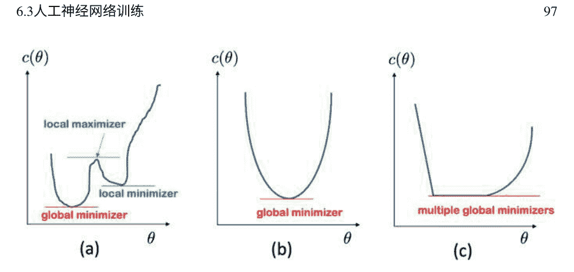

如前所述，在第4章中对于核机器，(6.11)中的公式是如此通用，以至于可以通过简单地改变损失函数（例如，用于回归的 $l_2$ 损失和用于分类的铰链损失）来涵盖分类、回归等问题。不幸的是，与核机器相比，神经网络训练的主要困难之一是成本函数 $c(\Theta)$ 不是凸函数，实际上存在许多局部极小值（见图6.5）。因此，神经网络训练严重依赖于优化算法、初始化、步长等的选择。

#### 6.3.2 优化器

鉴于参数化神经网络在（6.13）中，关键问题是如何找到优化问题（6.11）的最小化器。正如已经提到的，这个最小化问题的主要技术挑战是存在许多局部最小值，如图6.5a所示。另一个棘手的问题是有时存在许多全局最小值，如图6.5c所示。虽然在训练阶段所有全局最小值都可以同样好，但每个全局最小值在测试阶段可能具有不同的泛化性能。这个问题很重要，稍后将讨论。此外，根据特定优化器的选择，可以实现不同的全局最小值，这通常被称为优化算法的隐式偏差或归纳偏差。这个主题稍后也会讨论。

在设计优化算法时，最重要的观察之一是局部极小值点满足以下一阶必要条件（FONC）。

> **引理 6.1** 设 $c : \mathbb{R}^p \to \mathbb{R}$ 是一个可微函数。如果 $\theta^*$ 是一个局部极小值点，那么
> $$ \frac{\partial c}{\partial \theta}\bigg|_{\theta = \theta^*} = 0. \tag{6.15} $$

事实上，各种优化算法都利用了FONC，它们之间的主要区别在于它们如何避免局部最小值并提供快速收敛。接下来，我们将从经典的梯度下降法和其随机扩展——随机梯度下降法（SGD）开始讨论，之后将讨论各种改进方法。

##### 6.3.2.1 梯度下降法

对于给定的训练数据 $\{x_n, y_n\}_{n=1}^N$，成本函数（6.12）的梯度为

$$ \frac{\partial c}{\partial \theta}(\theta) = \frac{\partial \left( \sum_{n=1}^N \ell(y_n, f_\theta(x_n)) \right)}{\partial \theta} = \sum_{n=1}^N \frac{\partial}{\partial \theta} \ell(y_n, f_\theta(x_n)), \tag{6.16} $$

这等于每个训练数据点的梯度之和。由于梯度是成本函数增加的最陡峭方向，陡降算法是将参数更新为其相反方向：

$$ \theta[t + 1] = \theta[t] - \eta \frac{\partial c}{\partial \theta}(\theta) \bigg|_{\theta = \theta[t]} = \theta[t] - \eta \sum_{n=1}^N \frac{\partial}{\partial \theta} \ell(y_n, f_\theta(x_n)) \bigg|_{\theta = \theta[t]}, \tag{6.17} $$

其中 $\eta > 0$ 表示步长， $\theta[t]$ 是参数的第 $t$ 次更新。图6.6a说明了为什么梯度下降是解决凸优化问题的一种好方法，以最小化成本。由于成本的梯度指向成本的上坡方向，参数更新应该朝着其负方向进行。

经过一小步，计算出一个新的梯度并找到一个新的搜索方向。通过迭代该过程，我们可以达到全局最小值。

梯度下降方法的一个缺点是，当梯度在局部极小值点 $\theta[t^*]$ 处变为零时，更新方程式(6.17)会使迭代停滞在局部极小值点，即：
$$ \theta[t + 1] = \theta[t], \quad t \geq t^*. $$

例如，图6.6b、c展示了梯度下降的潜在局限性。在图6.6b的情况下，在通往全局最小值的路径中存在无法通过梯度方法克服的上坡方向。另一方面，图6.6c显示，根据初始化的不同，梯度下降可以找到不同的局部极小值点，这是由于不同的中间路径。实际上，图6.6b、c中的情况更有可能出现在神经网络训练中，因为由于非线性的级联连接，优化问题是高度非凸的。此外，尽管使用相同的初始化，优化器可以根据步长或某些优化算法收敛到完全不同的解。事实上，算法偏差是现代深度学习中的一个重要研究课题，通常被称为归纳偏差。

这也可能是神经网络训练困难且依赖于训练模型的人的另一个原因。例如，即使给多个学生相同的训练集、网络架构、GPU等，通常观察到一些学生成功地训练神经网络，而其他学生则没有。造成这种差异的主要原因通常是他们的承诺和自信心不同，这导致了具有不同归纳偏差的优化算法。成功的学生通常会尝试不同的初始化、优化器、学习率等，直到模型正常工作，而不成功的学生通常会一直坚持使用相同的参数，而不试图仔细地改变它们。相反，他们经常声称失败不是他们的错，而是因为他们开始时使用了错误的模型。如果训练问题是凸的，那么无论他们在训练中有什么归纳偏差，所有的学生都可以成功。不幸的是，神经网络训练是高度非凸的，因此它高度依赖于学生的归纳偏差。好消息是，一旦学生学会如何使模型工作，他们从这样的经验中获得的直觉通常适用于训练更复杂的神经网络。

事实上，优化深度神经网络的算法进展可以被视为克服算子依赖性的一种方式。以下描述了系统地减少训练神经网络中算子依赖性的各种方法，尽管同样的问题仍然存在，但由于问题的非凸性，问题的规模已经减小。

#### 6.3.2.2 随机梯度下降（SGD）方法

我们说（6.17）中的更新方程是基于全梯度的，因为在每次迭代中，我们需要计算关于整个数据集的梯度。然而，如果 $N$ 很大，梯度计算的计算成本非常高。此外，通过使用全梯度，很难避免局部极小值，因为梯度下降方向总是指向更低的成本值。为了解决这个问题，SGD算法使用训练数据的一个小子集来计算梯度的容易估计值。尽管有点噪音，这个噪音梯度甚至可以帮助避免局部极小值。例如，让 $I[t] \subset \{1, \cdots, N\}$ 表示索引集合 $\{1, \cdots, N\}$ 的一个随机子集，在第 $t$ 次更新时。那么，我们在第 $t$ 次迭代时对全梯度的估计如下：

$$ \frac{\partial c}{\partial \theta}(\theta) \bigg|_{\theta = \theta[t]} \simeq \frac{N}{|I[t]|} \sum_{i \in I[t]} \frac{\partial}{\partial \theta} \ell(y_i, f_\theta(x_i)) \bigg|_{\theta = \theta[t]} , \quad (6.19) $$

其中 $|I[t]|$ 表示 $I[t]$ 中的元素数量。由于SGD在计算梯度时使用了原始训练数据集的一个小的随机子集（即 $|I[t]|$ 个样本），所以每次更新的计算复杂度要比原始的梯度下降方法小得多。此外，它并不完全与真实的梯度方向相同，因此产生的噪音可以提供一种逃离局部最小值的手段。

##### 6.3.2.3 动量法

克服局部最小值的另一种方法是将之前的更新作为额外的项考虑进去，以避免陷入局部最小值。具体来说，一个理想的更新方程可以写成

$$ \theta[t + 1] = \theta[t] - \eta \sum_{s=1}^{t} \beta^{t-s} \frac{\partial c}{\partial \theta}(\theta[s]) , \quad (6.20) $$

对于适当的遗忘因子 $0<\beta<1$。这意味着在计算当前更新方向时，过去梯度的贡献逐渐减少。然而，使用(6.20)的主要限制是需要保存所有过去梯度的历史记录，这需要大量的GPU内存。相反，通常使用以下递归公式，提供等效的表示：

$$
\begin{aligned}
V[t] &= \beta V[t-1] - \eta \frac{\partial c}{\partial \theta} (\theta[t]), \\
\theta[t+1] &= \theta[t] + V[t].
\end{aligned}
\tag{6.21} $$

这种方法被称为动量法，当与SGD结合时特别有用。SGD的更新轨迹例如图6.7b所示。与波动路径相比，动量法通过过去梯度的平均效应提供了平滑的解决路径，从而实现快速收敛。

##### 6.3.2.4 其他变体

在神经网络中，经常使用几种其他变体的优化器，其中ADAGrad [25]，RMS prop [26]和Adam [27]最受欢迎。这些变体的主要思想是，不再使用固定的步长 $\eta$ 来处理梯度的所有元素，而是使用逐元素自适应步长。例如，在（6.17）中的最陡下降的情况下，我们使用以下更新方程：

$$ \theta[t+1] = \theta[t] - \Upsilon[t] \odot \frac{\partial c}{\partial \theta} (\theta[t]), \tag{6.22} $$

其中 $\Upsilon[t]$ 是一个具有步长的矩阵，$\odot$ 是逐元素相乘。实际上，这些算法的主要区别在于如何在每次迭代中更新矩阵 $\Upsilon[t]$。有关特定更新规则的更多详细信息，请参阅原始论文[25-27]。

### 6.4 反向传播算法

在前一节中，基于梯度 $\frac{\partial c}{\partial \theta}(\theta[t])$ 的计算，讨论了用于神经网络训练的各种优化算法。然而，鉴于前馈神经网络的复杂非线性性质，梯度的计算并不简单。

在机器学习中，反向传播（backpropagation，简称BP）[28]是一种计算前馈神经网络训练中梯度的标准方法，通过提供一种明确且计算高效的梯度计算方法。术语反向传播及其在神经网络中的一般用法最初来源于Rumelhart、Hinton和Williams的论文[28]。他们的主要思想是，尽管多层神经网络由具有大量未知权重的神经元之间的复杂连接组成，但多层神经网络在（6.10）中的递归结构适合于计算高效的优化方法。

#### 6.4.1 反向传播算法的推导

以下引理在第一章中已经介绍过，对于推导BP算法很有用：

> **引理 6.2** 设 $A \in \mathbb{R}^{m \times n}$ 和 $x \in \mathbb{R}^n$。那么，我们有 $\frac{\partial A x}{\partial \text{VEC}(A)} = x \otimes I_m$. (6.23)

> **引理 6.3** 对于向量 $x \in \mathbb{R}^m$ 和 $y \in \mathbb{R}^n$，我们有 $\text{VEC}(xy^\top) = (y \otimes I_m)x$, (6.24) 其中 $I_m$ 表示 $m \times m$ 单位矩阵。

为了推导反向传播算法，我们暂时假设偏置项为零，即 $b^{(l)} = 0$，其中 $l = 1, \cdots, L$。在这种情况下，神经网络中的参数（6.14）可以简化为

$$ \Theta = \begin{bmatrix} W^{(1)} \\ \vdots \\ W^{(L)} \end{bmatrix}, \tag{6.25} $$

使用第1章中解释的分母布局，我们有

$$ \frac{\partial c}{\partial \Theta} = \left[\begin{array}{c} \frac{\partial c}{\partial \mathbf{W}^{(1)}} \\ \vdots \\ \frac{\partial c}{\partial \mathbf{W}^{(L)}} \end{array}\right], \quad (6.26) $$

因此，第 $l$ 层的权重可以通过增量进行更新：

$$ \Delta \Theta = \left[\begin{array}{c} \Delta \mathbf{W}^{(1)} \\ \vdots \\ \Delta \mathbf{W}^{(L)} \end{array}\right], \quad \text{其中 } \Delta \mathbf{W}^{(l)} = -\eta \frac{\partial c}{\partial \mathbf{W}^{(l)}}. \quad (6.27) $$

因此，应该指定 $\partial c/\partial \mathbf{W}^{(l)}$。更具体地说，对于给定的训练数据集 $\{\boldsymbol{x}_n, \boldsymbol{y}_n\}_{n=1}^{N}$，回想一下成本函数 $c(\Theta)$ 在(6.12)中给出

$$ c(\Theta) = \sum_{n=1}^{N} \ell \left(\boldsymbol{y}_n, f_{\Theta}(\boldsymbol{x}_n)\right), \quad (6.28) $$

其中 $f_{\Theta}(\boldsymbol{x}_n)$ 在(6.13)中定义。现在根据第 $n$ 个训练数据定义第 $l$ 层变量：

$$ \boldsymbol{o}_n^{(l)} = \sigma(\boldsymbol{g}_n^{(l)}), \quad \boldsymbol{g}_n^{(l)} = \mathbf{W}^{(l)} \boldsymbol{o}_n^{(l-1)}, \quad (6.29) $$

对于 $l = 1, \cdots, L$，初始化如下：

$$ \boldsymbol{o}_n^{(0)} := \boldsymbol{x}_n, \quad (6.30) $$

其中偏置为零。然后，我们有

$$ \boldsymbol{o}_n^{(L)} = f_{\Theta}(\boldsymbol{x}_n), $$

使用链式法则进行分母约定（参见公式（1.40））

$$ \frac{\partial c(\boldsymbol{g}(\boldsymbol{u}))}{\partial \boldsymbol{x}} = \frac{\partial \boldsymbol{u}}{\partial \boldsymbol{x}} \frac{\partial \boldsymbol{g}(\boldsymbol{u})}{\partial \boldsymbol{u}} \frac{\partial c(\boldsymbol{g})}{\partial \boldsymbol{g}} \quad (6.31) $$

我们有

$$\frac{\partial c}{\partial \text{VEC}(\mathbf{W}^{(l)})}=\sum_{n=1}^{N}\frac{\partial \mathbf{g}_{n}^{(l)}}{\partial \text{VEC}(\mathbf{W}^{(l)})}\frac{\partial\left(\mathbf{y}_{n}, \mathbf{o}_{n}^{(L)}\right)}{\partial \mathbf{g}_{n}^{(l)}}.$$

此外，引理6.2告诉我们

$$\frac{\partial \mathbf{g}_{n}^{(l)}}{\partial \text{VEC}\left(\mathbf{W}^{(l)}\right)}=\mathbf{o}_{n}^{(l-1)} \otimes \boldsymbol{I}_{d^{(l)}}.$$  (6.32)

我们进一步定义术语：

$$\delta_{n}^{(l)}:=\frac{\partial\left(\mathbf{y}_{n}, \mathbf{o}_{n}^{(L)}\right)}{\partial \mathbf{g}_{n}^{(l)}},$$  (6.33)

可以使用链式法则 (6.31) 计算如下：

$$\begin{aligned}\delta_{n}^{(l)} &=\frac{\partial \mathbf{o}_{n}^{(l)}}{\partial \mathbf{g}_{n}^{(l)}} \frac{\partial \mathbf{g}_{n}^{(l+1)}}{\partial \mathbf{o}_{n}^{(l)}} \cdots \frac{\partial \mathbf{o}_{n}^{(L)}}{\partial \mathbf{g}_{n}^{(L)}} \frac{\partial\left(\mathbf{y}_{n}, \mathbf{o}_{n}^{(L)}\right)}{\partial \mathbf{o}_{n}^{(L)}} \\ &=\boldsymbol{\Lambda}_{n}^{(l)} \mathbf{W}^{(l+1) \top} \boldsymbol{\Lambda}_{n}^{(l+1)} \mathbf{W}^{(l+2) \top} \cdots \mathbf{W}^{(L) \top} \boldsymbol{\Lambda}_{n}^{(L)} \delta_{n}^{(L)}\end{aligned}$$  (6.34)

对于 $l=1, \cdots, L$ ，误差项 $\delta_n^{(L)}$ 通过以下方式计算：

$$\delta_{n}^{(L)}=\frac{\partial\left(\mathbf{y}_{n}, \mathbf{o}_{n}^{(L)}\right)}{\partial \mathbf{o}_{n}^{(L)}}.$$

在 (6.34) 中，我们使用

$$\boldsymbol{\Lambda}_{n}^{(l)}:=\frac{\partial \mathbf{o}_{n}^{(l)}}{\partial \mathbf{g}_{n}^{(l)}}=\frac{\partial \sigma\left(\mathbf{g}_{n}^{(l)}\right)}{\partial \mathbf{g}_{n}^{(l)}} \in \mathbb{R}^{d^{(l)} \times d^{(l)}},$$  (6.35)

这是使用第1章中解释的分母布局计算的

$$\frac{\partial \mathbf{g}_{n}^{(l+1)}}{\partial \mathbf{o}_{n}^{(l)}}=\frac{\partial \mathbf{W}^{(l+1)} \mathbf{o}_{n}^{(l)}}{\partial \mathbf{o}_{n}^{(l)}}=\mathbf{W}^{(l+1) \top},$$  (6.36)

这是使用分母约定得到的（见第1章中的(1.41)）。因此，我们有

$$\begin{aligned}
\frac{\partial c}{\partial \text{VEC}(\mathbf{W}^{(l)})} &= \sum_{n=1}^{N} \frac{\partial \mathbf{g}_n^{(l)}}{\partial \text{VEC}(\mathbf{W}^{(l)})} \frac{\partial \left( \mathbf{y}_n, \mathbf{o}_n^{(L)} \right)}{\partial \mathbf{g}_n^{(l)}} \\
&= \sum_{n=1}^{N} \left( \mathbf{o}_n^{(l-1)} \otimes \boldsymbol{I}_{d^{(l)}} \right) \boldsymbol{\delta}_n^{(l)} \\
&= \sum_{n=1}^{N} \text{VEC} \left( \boldsymbol{\delta}_n^{(l)} \mathbf{o}_n^{(l-1)\mathsf{T}} \right),
\end{aligned}$$

在第二个等式中，我们使用(6.32)和(6.33)，在最后一个等式中使用引理6.3。

最后，我们有关于 $\mathbf{W}^{(l)}$ 的成本导数如下：

$$\begin{aligned}
\frac{\partial c}{\partial \mathbf{W}^{(l)}} &= \text{UNVEC}\left( \frac{\partial c}{\partial \text{VEC}(\mathbf{W}^{(l)})} \right) \\
&= \text{UNVEC}\left( \sum_{n=1}^{N} \text{VEC} \left( \boldsymbol{\delta}_n^{(l)} \mathbf{o}_n^{(l-1)\mathsf{T}} \right) \right) \\
&= \sum_{n=1}^{N} \boldsymbol{\delta}_n^{(l)} \mathbf{o}_n^{(l-1)\mathsf{T}},
\end{aligned}$$

在最后一个等式中，我们使用UNVEC(·)运算符的线性性。因此，权重更新增量为

$$\Delta \mathbf{W}^{(l)} = -\eta \frac{\partial c}{\partial \mathbf{W}^{(l)}} = -\eta \sum_{n=1}^{N} \boldsymbol{\delta}_n^{(l)} \mathbf{o}_n^{(l-1)\mathsf{T}}.$$ (6.37)

#### 6.4.2 BP算法的几何解释

在BP中，(6.37)中的权重更新方案是关键。不仅(6.37)中的权重更新形式非常简洁，而且它还具有非常重要的几何意义，值得进一步讨论。特别地，更新完全由两个项 $\boldsymbol{\delta}_n^{(l)}$ 和 $\mathbf{o}_n^{(l-1)\mathsf{T}}$ 的外积决定，即 $\boldsymbol{\delta}_n^{(l)} \mathbf{o}_n^{(l-1)\mathsf{T}}$。

为什么这些术语如此重要？ 这是本节的主要讨论点。

首先，回想一下 $\mathbf{o}_n^{(l-1)}$ 是由(6.29)给出的 $(l-1)$ 层神经网络输出。由于这个术语是在神经网络的前向路径中计算的，它实际上就是 $l$ 层神经元的前向传播输入。其次，回想一下

$$ \boldsymbol{\delta}_n^{(L)} = \frac{\partial \left( \mathbf{y}_n, \mathbf{o}_n^{(L)} \right)}{\partial \mathbf{o}_n^{(L)}} $$

如果我们使用 $\ell_2$ 损失函数，这个项变成

$$ \boldsymbol{\delta}_n^{(L)} = \frac{\partial \left( \frac{1}{2} \| \mathbf{y}_n - \mathbf{o}_n^{(L)} \|^2 \right)}{\partial \mathbf{o}_n^{(L)}} = \mathbf{o}_n^{(L)} - \mathbf{y}_n, $$

这实际上是神经网络输出的估计误差。因为我们有

$$ \boldsymbol{\delta}_n^{(l)} = \mathbf{\Lambda}_n^{(l)} \mathbf{W}^{(l+1)\top} \mathbf{\Lambda}_n^{(l+1)} \mathbf{W}^{(l+2)\top} \ldots \mathbf{W}^{(L)\top} \mathbf{\Lambda}_n^{(L)} \boldsymbol{\delta}_n^{(L)} , \quad (6.38) $$

这意味着 $\boldsymbol{\delta}_n^{(l)}$ 确实是向后传播的估计误差，传播到第 $l$ 层。因此，我们可以发现权重更新由前向传播的输入和后向传播的估计误差的外积确定。

在计算方面，前向和后向项 $\mathbf{o}_n^{(l-1)}$ 和 $\boldsymbol{\delta}_n^{(l)}$ 可以使用递归公式高效计算。更具体地说，我们有

$$ \mathbf{o}_n^{(l-1)} = \sigma \left( \mathbf{W}^{(l-1)} \mathbf{o}_n^{(l-2)} \right) , \quad (6.39) $$

$$ \boldsymbol{\delta}_n^{(l)} = \mathbf{\Lambda}_n^{(l)} \mathbf{W}^{(l+1)\top} \boldsymbol{\delta}_n^{(l+1)} , \quad (6.40) $$

通过初始化

$$ \mathbf{o}_n^{(0)} = \mathbf{x}_n, \quad \boldsymbol{\delta}_n^{(L)} = \boldsymbol{\delta}_n^{(L)}. \quad (6.41) $$

图6.8中展示了几何解释和递归公式。

#### 6.4.3 BP算法的变分解释

变分原理是一种科学原理，在变分微积分中使用，它发展了寻找使依赖于这些函数的数量的值最小化的函数的一般方法。变分微积分是由艾萨克·牛顿开创的数学分析领域，它使用变分来减少能量函数。

根据(6.37)中的增量变化，我们对是否它确实减少了能量函数感兴趣。为此，让我们考虑一个简化的具有 $\ell_2$ 损失和 $N =1$ 的损失函数形式。在接下来的内容中，我们将展示对于具有ReLU激活函数的神经网络，BP算法确实等价于变分方法。

更具体地说，让基线能量函数，即扰动之前的成本函数，为

$$ \mathcal{L}(\mathbf{y}, \mathbf{o}^{(L)}) = \frac{1}{2} \| \mathbf{y} - \mathbf{o}^{(L)} \|^2, \tag{6.42} $$

这里为简单起见，忽略了训练数据索引的下标 $n$

$$ \mathbf{o}^{(L)} := \sigma \left( \mathbf{W}^{(L)} \mathbf{o}^{(L-1)} \right), \tag{6.43} $$

一个重要的观察是对于ReLU的情况，(6.43)可以表示为

$$ \mathbf{o}^{(L)} := \mathbf{\Gamma}^{(L)} \mathbf{g}^{(L)}, \text{其中 } \mathbf{g}^{(L)} = \mathbf{W}^{(L)} \mathbf{o}^{(L-1)}, \tag{6.44} $$

其中 $\mathbf{\Gamma}^{(L)} \in \mathbb{R}^{d^{(L)} \times d^{(L)}}$ 是一个由0和1值给出的对角矩阵

$$ \mathbf{\Gamma}^{(L)} = \left[\begin{array}{cccc} \gamma_1 & \cdots & 0 & \cdots & 0 \\ \vdots & \ddots & \vdots & \ddots & \vdots \\ 0 & \cdots & \gamma_j & \cdots & 0 \\ \vdots & \ddots & \vdots & \ddots & \vdots \\ 0 & \cdots & 0 & \cdots & \gamma_{d^{(L)}} \end{array}\right], \tag{6.45} $$

其中

$$\gamma_j = \gamma \left( [\mathbf{g}^{(L)}]_j \right), \tag{6.46}$$

其中 $[\mathbf{g}^{(L)}]_j$ 表示向量 $\mathbf{g}^{(L)}$ 的第 $j$ 个元素，$\gamma (\cdot)$ 在 (6.4) 中定义。由于 (6.5)，我们有

$$\boldsymbol{\Gamma}^{(l)} = \boldsymbol{\Lambda}^{(l)}, \quad l = 1, \cdots, L, \tag{6.47}$$

其中 $\boldsymbol{\Lambda}^{(l)}$ 在 (6.35) 中定义为激活函数的导数。因此，使用递归公式，我们有

$$\mathbf{o}^{(L)} = \boldsymbol{\Lambda}^{(L)} \mathbf{W}^{(L)} \cdots \boldsymbol{\Lambda}^{(l)} \mathbf{W}^{(l)} \mathbf{o}^{(l-1)}, \tag{6.48}$$

使用这个，我们现在研究扰动后的权重是否会降低成本

$$\Delta \mathbf{W}^{(l)} = -\eta \boldsymbol{\delta}^{(l)} \mathbf{o}^{(l-1)\top}, \tag{6.49}$$

当步长 $\eta$ 足够小时，ReLU 激活模式从 $\mathbf{W}^{(l)} + \Delta \mathbf{W}^{(l)}$ 不会改变与 $\mathbf{W}^{(l)}$ 相同的模式（这个问题将在后面讨论），因此新的成本函数为

$$\mathcal{L}(\mathbf{y}, \mathbf{o}^{(L)}) := \left\| \mathbf{y} - \boldsymbol{\Lambda}^{(L)} \mathbf{W}^{(L)} \cdots \boldsymbol{\Lambda}^{(l)} (\mathbf{W}^{(l)} + \Delta \mathbf{W}^{(l)}) \mathbf{o}^{(l-1)} \right\|^2.$$

回想一下我们有

$$\begin{align*} \boldsymbol{\delta}^{(L)} &= \mathbf{o}^{(L)} - \mathbf{y} \\ &= \boldsymbol{\Lambda}^{(L)} \mathbf{W}^{(L)} \cdots \boldsymbol{\Lambda}^{(l)} \mathbf{W}^{(l)} \mathbf{o}^{(l-1)} - \mathbf{y}. \end{align*}$$

因此，我们有

$$\begin{align*} \mathcal{L}(\mathbf{y}, \mathbf{o}^{(L)}) &= \left\| -\boldsymbol{\delta}^{(L)} - \boldsymbol{\Lambda}^{(L)} \mathbf{W}^{(L)} \cdots \boldsymbol{\Lambda}^{(l)} \Delta \mathbf{W}^{(l)} \mathbf{o}^{(l-1)} \right\|^2 \tag{6.50} \\ &= \left\| -\boldsymbol{\delta}^{(L)} + \eta \boldsymbol{\Lambda}^{(L)} \mathbf{W}^{(L)} \cdots \boldsymbol{\Lambda}^{(l)} \boldsymbol{\delta}^{(l)} \mathbf{o}^{(l-1)\top} \mathbf{o}^{(l-1)} \right\|^2 \\ &= \left\| \left( \mathbf{I} - \eta \left\| \mathbf{o}^{(l-1)} \right\|^2 \mathbf{M}^{(l)} \right) \boldsymbol{\delta}^{(L)} \right\|^2, \end{align*}$$

在这里我们使用 $\left\| \mathbf{o}^{(l-1)} \right\|^2 = \mathbf{o}^{(l-1)\top} \mathbf{o}^{(l-1)}$ 和

$$\mathbf{M}^{(l)} = \boldsymbol{\Lambda}^{(L)} \mathbf{W}^{(L)} \cdots \mathbf{W}^{(l+1)} \boldsymbol{\Lambda}^{(l)} \boldsymbol{\Lambda}^{(l)} \mathbf{W}^{(l+1)\top} \cdots \mathbf{W}^{(L)\top} \boldsymbol{\Lambda}^{(L)},$$

这来自于(6.38)。现在，我们可以很容易地看到对于所有的 $\boldsymbol{x} \in \mathbb{R}^{d^{(L)}}$，我们有

$$\boldsymbol{x}^\top \boldsymbol{M}^{(l)} \boldsymbol{x} = \|\boldsymbol{\Lambda}^{(l)} \boldsymbol{W}^{(l+1)\top} \dots \boldsymbol{W}^{(L)\top} \boldsymbol{\Lambda}^{(L)} \boldsymbol{x}\|^2 \geq 0$$  (6.51)

所以 $\boldsymbol{M}^{(l)}$ 是半正定的，即其特征值非负。此外，我们还有

$$\left\| \left( \boldsymbol{I} - \eta \| \boldsymbol{o}^{(l-1)} \|^2 \boldsymbol{M}^{(l)} \right) \boldsymbol{\delta}^{(L)} \right\|^2 \leq \lambda^2_{\text{max}} \left( \boldsymbol{I} - \eta \| \boldsymbol{o}^{(l-1)} \|^2 \boldsymbol{M}^{(l)} \right) \times \| \boldsymbol{\delta}^{(L)} \|^2$$  (6.52)

其中 $\lambda_{\text{max}} (\boldsymbol{A})$ 表示 $\boldsymbol{A}$ 的最大特征值。此外，我们还有

$$\lambda^2_{\text{max}} \left( \boldsymbol{I} - \eta \| \boldsymbol{o}^{(l-1)} \|^2 \boldsymbol{M}^{(l)} \right) = \left( 1 - \eta \| \boldsymbol{o}^{(l-1)} \|^2 \lambda_{\text{max}} \left( \boldsymbol{M}^{(l)} \right) \right)^2$$

因此，如果最大特征值满足

$$0 \leq \lambda_{\text{max}} \left( \boldsymbol{M}^{(l)} \right) \leq \frac{2}{\eta \| \boldsymbol{o}^{(l-1)} \|^2}$$  (6.53)

我们可以证明

$$\mathcal{L}(\boldsymbol{y}, \boldsymbol{o}^{(L)}) \leq \| \boldsymbol{\delta}^{(L)} \|^2 = \mathcal{L}(\boldsymbol{y}, \boldsymbol{o}^{(L)})$$

所以成本函数值随扰动而减小。 重要的是要强调，这种强收敛结果是由于ReLU在（6.47）中的独特属性，其他激活函数从不满足该属性。这可能是现代深度学习中ReLU成功的另一个原因。话虽如此，需要注意的是，这个论证只对足够小的步长 $\eta$ 成立，以使扰动后的ReLU激活模式不改变。实际上，这可能是在优化算法中选择适当步长的另一个原因。

#### 6.4.4 本地变分公式

理解BP的另一种方式是通过成本函数的传播。如图6.8所示，在输入和误差的前向和后向传播之后，在第$l$层的权重更新的结果优化问题为

$$\min_{\boldsymbol{W}} \| \boldsymbol{\delta}^{(l)} - \boldsymbol{W} \boldsymbol{o}^{(l-1)} \|^2$$  (6.54)请注意，在(6.50)中，我们在 $\delta^{(l)}$ 前面有一个负号。通过检查，我们可以很容易地看出(6.54)的最优解为

$$W^{*} = -\frac{1}{\|\boldsymbol{o}^{(l-1)}\|^{2}} \delta^{(l)} \boldsymbol{o}^{(l-1)\top},$$ (6.55)

因此，权重更新的最优搜索方向应该是 由于将(6.55)代入(6.54)会使成本函数为零，所以最优搜索方向为

$$\Delta W^{(l)} = -\eta \delta^{(l)} \boldsymbol{o}^{(l-1)\top},$$ (6.56)

这相当于(6.49)。这里的要点是，只要我们能够获得反向传播的误差和前向传播的输入，我们就可以得到一个局部变分形式，可以通过任何方法求解。

### 6.5 练习

- 1. 推导满足以下微分方程的激活函数$\sigma(x)$的一般形式：

$$\frac{\sigma(x)}{x} = \frac{\partial \sigma(x)}{\partial x}$$

- 2. 证明(6.21)等价于(6.20)。

- 3. 回顾一下，$L$层前馈神经网络可以通过递归表示为

$$\boldsymbol{o}^{(l)} = \sigma(\boldsymbol{g}^{(l)}), \quad \boldsymbol{g}^{(l)} = W^{(l)} \boldsymbol{o}^{(l-1)} + \boldsymbol{b}^{(l)},$$ (6.57)

对于 $l = 1, \cdots, L$。 当训练数据大小为1时，权重更新为

$$\Delta W^{(l)} = -\gamma \delta^{(l)} \boldsymbol{o}^{(l-1)\top},$$ (6.58)

其中$\gamma > 0$是步长，而

$$\delta^{(l)} := \frac{\partial \left(\boldsymbol{y}, \boldsymbol{o}^{(L)}\right)}{\partial \boldsymbol{g}^{(l)}}.$$ (6.59)

- a. 推导出与偏置项类似于(6.58)的更新方程，即 $\Delta \boldsymbol{b}^{(l)}$。

- b. 假设权重矩阵 $W^{(l)}, l = \cdots, L$ 是一个对角矩阵。 类似于图6.8，绘制网络连接架构。然后，推导出对于权重矩阵的对角项，假设偏置为零，推导出反向传播算法。你必须使用链式法则来推导这个。

- 4. 假设一个两层ReLU神经网络 f 在每一层的输入和输出维度为 $\mathbb{R}^2$, 即 $f : x \in \mathbb{R}^2 \to f (x) \in \mathbb{R}^2$. 假设网络的参数由权重和偏置组成:

```
$\Theta = \{ W^{(1)}, W^{(2)}, b^{(1)}, b^{(2)} \},$
```

这些被初始化如下：

```
$W^{(1)} = W^{(2)} = \begin{bmatrix} 1 & -1 \\ 0 & 1 \end{bmatrix}, \quad b^{(1)} = b^{(2)} = \begin{bmatrix} 1 \\ 0 \end{bmatrix}.$
```

然后，对于给定的 $l_2$ 损失函数

```
$\mathcal{L}(x, y) = \frac{1}{2} \| y - f(x) \|^2$
```

和训练数据

```
$x = [1, -1]^T, \quad y = [1, 0]^T,$
```

计算反向传播算法的前两次迭代的权重和偏置更新。建议使用单位步长，即 $\gamma =1$。

- 5. 我们现在对由 $N$ 个样本组成的训练数据扩展(6.54)感兴趣。

- a. 证明对于局部变分公式，以下等式成立：

```
$\min_W \sum_{n=1}^{N} \| - \delta_n^{(l)} - W o_n^{(l-1)} \|^2 = \min_W \| - \Delta^{(l)} - W O^{(l-1)} \|_F^2,$
```

其中$\| \cdot \|_F$表示Frobenius范数，

```
$\Delta^{(l)} = [\delta_1^{(l)} \ldots \delta_N^{(l)}], \quad O^{(l-1)} = [o_1^{(l-1)} \ldots o_N^{(l-1)}].$
```

- b. 证明存在一个步长 $\gamma > 0$，使得权重扰动

```
$\Delta W^{(l)} = -\gamma \sum_{n=1}^{N} \delta_n^{(l)} o_n^{(l-1)T}$
```

能够减小(6.64)中的代价值。

- 6. 假设我们的激活函数是sigmoid函数。 推导出L层神经网络的BP算法。 BP算法与具有ReLU的网络相比的主要区别是什么？ 这是一个优势还是劣势？ 以变分视角回答这个问题。

- 7. 现在我们对模型(6.6)感兴趣，希望将其扩展为卷积神经网络模型。

$$ o_i^{(l)} = \sigma \left( \sum_{j=1}^{d^{(l)}} h_{i-j}^{(l)} o_j^{(l-1)} + b_i^{(l)} \right), \quad (6.65) $$

对于 $i = 1,\cdots, d^{(l)}$，其中 $h_i^{(l)}$是filter $h^{(l)}$的第 $i$ 个元素，即 $[h_1^{(l)}, \cdots, h_p^{(l)}]^\top$。

a. 如果我们想要以矩阵形式表示这个卷积神经网络，

$$ \boldsymbol{o}^{(l)} = \sigma \left( \boldsymbol{W}^{(l)} \boldsymbol{o}^{(l-1)} + \boldsymbol{b}^{(l)} \right), \quad (6.66) $$

对应的权重矩阵 $\boldsymbol{W}^{(l)}$是什么？ 请明确地展示 $\boldsymbol{W}^{(l)}$的结构，以 $\boldsymbol{h}^{(l)}$的元素表示。

b. 推导出filter更新 $\Delta \boldsymbol{h}^{(l)}$的反向传播算法。

### 7.1 引言

卷积神经网络（CNN或ConvNet）是一类广泛用于分析和处理图像的深度神经网络。多层感知器（我们在前一章中讨论过）通常需要全连接网络，其中每个神经元在一层中与下一层中的所有神经元相连。不幸的是，这种连接方式不可避免地增加了权重的数量。在卷积神经网络中，可以通过它们的共享权重架构来显著减少权重的数量，这种架构源于卷积的平移不变特性。

卷积神经网络最初由Yann LeCun为手写邮政编码识别[21]而开发，受到Hubel和Wiesel对猫的主要视觉皮层[20]进行的著名实验的启发。回想一下，Hubel和Wiesel发现猫的主要视觉皮层中的简单细胞对特定方向、位置和相位的边缘样刺激有最佳响应，而且它们的感受野相对较小。Yann LeCun意识到LGN（外侧膝状核）细胞在相同感受野内的聚集类似于卷积操作，这使他构建了一个神经网络，该网络由卷积、非线性和图像子采样的级联应用组成，然后是确定特征空间中的线性超平面用于分类任务的全连接层。所得到的网络架构如图7.1所示，被称为LeNet [21]。

虽然算法有效，但学习10个数字需要3天！许多因素导致了速度缓慢，包括消失梯度问题，稍后将进行讨论。因此，在1990年代和2000年代，使用任务特定的手工特征的简单模型，如支持向量机（SVM）或核机器[11]，成为流行选择，因为人工神经网络（ANN）的计算成本高，对其工作机制缺乏理解。事实上，对ANN的缺乏理解一直是许多当代科学家的主要批评，包括著名的弗拉基米尔·瓦普尼克。

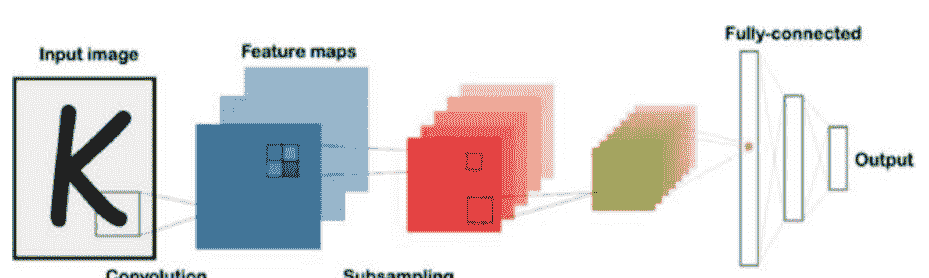

图7.1 LeNet：由Yann LeCun提出的第一个用于邮政编码识别的CNN [21]

SVM的发明者。在他的经典著作《统计学习理论的本质》[10]的前言中，Vapnik表达了他的担忧，他说：“在人工智能研究者中，强硬派有着相当大的影响力（正是他们宣称复杂理论不起作用，简单算法才有效）。”

具有讽刺意味的是，SVM和核机器的出现导致了神经网络研究的长期衰退，通常被称为“人工智能寒冬”。在人工智能寒冬期间，神经网络研究人员被普遍认为是伪科学家，甚至在获得研究资金方面也遇到了困难。尽管在人工智能寒冬期间有几篇值得注意的神经网络论文，但卷积神经网络研究的复兴，达到了公众普遍接受的水平，直到在ILSVRC（ImageNet大规模视觉识别竞赛）上取得了一系列深度神经网络的突破。

在下一节中，我们简要介绍了现代CNN研究的历史，这对神经网络研究的复兴做出了贡献。

### 7.2 现代CNN的历史

#### 7.2.1 AlexNet

ImageNet是一个用于视觉对象识别软件研究的大型视觉数据库[8]。ImageNet包含超过20,000个类别，由几百个图像组成。自2010年以来，ImageNet项目每年都有一个软件竞赛，即ImageNet大规模视觉识别挑战（ILSVRC）[7]，软件程序竞争正确分类和检测对象和场景。大约在2011年，基于经典机器学习方法的ILSVRC分类错误率约为27%。

在2012年的ImageNet挑战中，Krizhevsky等人提出了一个CNN架构，如图7.2所示，现在被称为AlexNet。AlexNet架构由五个卷积层和三个全连接层组成。事实上，AlexNet的基本组件与LeNet几乎相同，除了使用修正线性单元（ReLU）的新非线性函数。AlexNet在挑战中的Top-5错误率（在其前5个预测中未找到给定图像的真实标签的比率）为15.3%。挑战中的下一个最佳结果基于经典的核机器，远远落后（26.2%）。事实上，AlexNet的胜利宣告了数据科学的“新时代” 的开始，根据Google Scholar截至2021年1月的数据，已经有超过75k次引用。随着AlexNet的引入，世界不再相同，随后的ImageNet挑战的所有获胜者都是深度神经网络，如今CNN在ImageNet分类中超过了人类观察者。接下来，我们介绍几个在深度学习研究中做出重大贡献的后续CNN架构。

#### 7.2.2 GoogLeNet

GoogLeNet [30]是2014年ILSVRC比赛的冠军（见图7.2）。正如名字所示，“GoogLeNet”来自Google，但人们可能会想知道为什么它没有写成“GoogleNet”。这是因为“GoogLeNet”的研究人员试图向Yann LeCun的LeNet [21]致敬，其中包含了“LeNet”这个词。由于所谓的内部模块[30]，网络架构与AlexNet非常不同，如图7.3所示。具体来说，在每个内部模块中，对于相同的输入，存在不同大小/类型的卷积和堆叠-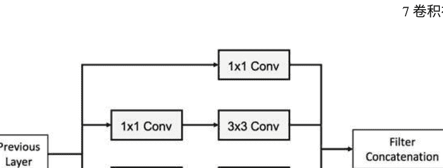

图7.3 GoogLeNet中的内部模块

ing所有的输出。这个想法受到了2010年著名的科幻电影“盗梦空间”的启发，莱昂纳多·迪卡普里奥主演。在电影中，著名导演克里斯托弗·诺兰想要探索“人们共享梦境空间的想法。....这使您能够访问某人的潜意识。”GoogLeNet从电影中借鉴的关键概念是“梦中的梦”策略，这导致了“网络中的网络”策略，从而提高了整体性能。

#### 7.2.3 VGGNet

VGGNet [31]是由牛津大学的VGG（Visual Geometry Group）于2014年ILSVRC比赛中发明的（见图7.2）。尽管VGGNet在2014年ILSVRC比赛中并非冠军（当时冠军是GoogLeNet，而VGGNet获得了第二名），但由于其模块化和简单的架构，VGGNet在机器学习社区产生了长期的影响，并且在性能上相比于AlexNet [9]有了显著的改进。事实上，预训练的VGGNet模型捕捉到了许多重要的图像特征；因此，它仍然被广泛用于诸如感知损失[32]等各种用途。稍后我们将使用VGGNet来可视化CNN。

如图7.2所示，VGGNet由多层卷积、最大池化、ReLU激活函数以及全连接层和softmax层组成。VGGNet最重要的观察之一是，通过用多个3×3大小的卷积核替换大尺寸的卷积核，它在性能上超越了AlexNet。正如稍后将展示的那样，对于给定的感受野大小，级联应用较小尺寸的卷积核并跟随ReLU激活函数使得神经网络比具有较大卷积核尺寸的网络更具表达能力。这就是为什么尽管结构简单，VGGNet在性能上提供了显著的改进，相比于AlexNet。

#### 7.2.4 ResNet

在ILSVRC的历史中，残差网络（ResNet）[33]被认为是另一个杰作，截至2020年1月，其引用记录超过68k。由于深度神经网络的表示能力随着网络深度的增加而增强，因此增加网络深度引起了强烈的研究兴趣。例如，2012年ILSVRC的AlexNet [9]只有五个卷积层，而2014年ILSVRC的VGG网络[31]和GoogLeNet [30]分别有19层和22层。然而，人们很快意识到更深的神经网络很难训练。这是因为梯度消失问题，梯度可以很容易地反向传播到靠近输出的层，但是由于重复的乘法可能使梯度变得非常小，它很难反向传播到离输出层较远的层。如前一章所讨论的，ReLU非线性函数在一定程度上缓解了这个问题，因为前向和反向传播是对称的，但是深度神经网络仍然很难训练，因为存在不利的优化空间[3,4]；这个问题将在后面进行讨论。

如图7.2所示，ResNet中存在绕过（或跳过）连接，表示一个恒等映射。绕过连接的提出是为了促进梯度反向传播。由于跳过连接的存在，ResNet可以训练数百甚至数千层，实现了显著的性能提升。最近的研究表明，绕过连接还改善了前向传播，使表示更具表达性[35]。此外，绕过连接可以显著改善其优化景观，消除许多局部最小值[35, 36]。

#### 7.2.5 DenseNet

DenseNet（密集卷积网络）[37]利用了绕过连接的极端形式，如图7.4所示。在DenseNet中，每个层都存在来自所有前面层的绕过连接，以获得额外的输入。

由于每个层都接收来自所有前面层的输入，网络的表示能力显著增强，使网络更加紧凑，从而减少通道数。通过密集连接，作者证明相比ResNet，可以实现更少的参数和更高的准确性[37]。

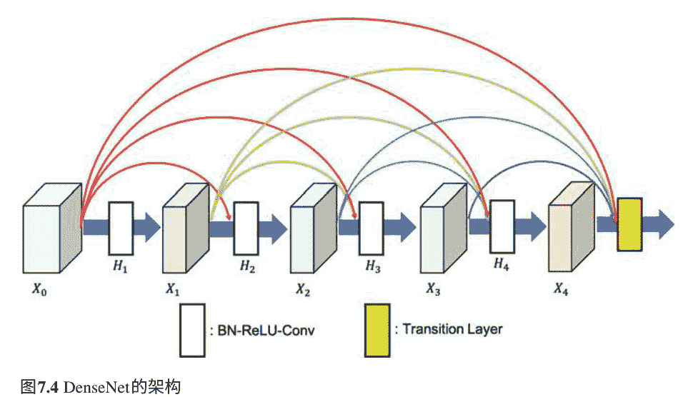

图7.4 DenseNet的架构

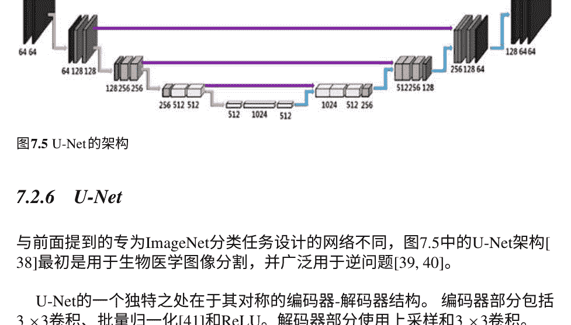

图7.5 U-Net的架构

#### 7.2.6 U-Net

与前面提到的专为ImageNet分类任务设计的网络不同，图7.5中的U-Net架构[38]最初是用于生物医学图像分割，并广泛用于逆问题[39, 40]。

U-Net的一个独特之处在于其对称的编码器-解码器结构。编码器部分包括3×3卷积、批量归一化[41]和ReLU。解码器部分使用上采样和3×3卷积。此外，还有最大池化层和通过通道连接的跳跃连接。

U-Net的多尺度架构显著增加了感受野，这可能是U-Net在分割、逆问题等方面取得成功的主要原因，这些问题需要来自图像各个部分的全局信息来更新局部图像信息。这个问题将在后面讨论。此外，跳跃连接对于保留输入信号的高频内容非常重要。

### 7.3 卷积神经网络的基本构建模块

尽管前面提到的卷积神经网络结构看起来复杂，但仔细观察可以发现它们只是由卷积、池化/反池化、ReLU等简单构建模块的级联组合而成。这些组件在信号处理中甚至被认为是基本或“原始”的工具。事实上，基本工具的组合产生卓越性能的出现是深度神经网络的一个谜团，这将在后面进行广泛讨论。同时，本节详细解释了卷积神经网络的基本构建模块。

#### 7.3.1 卷积

卷积是源于线性时不变（LTI）或线性空间不变（LSI）系统的基本特性的操作。具体而言，对于给定的LSI系统，设h表示冲激响应，则输出图像y相对于输入图像x可以通过以下计算得到

```
$y = h * x,$ (7.1)
```

其中*表示卷积操作。例如，对于2D图像的3×3卷积情况，可以逐个元素表示如下：

```
$y[m, n] = \sum_{p,q=-1}^{1} h[p, q]x[m - p, n - q],$ (7.2)
```

其中y[m, n], h[m, n]和x[m, n]分别表示矩阵Y, H和X的(m, n)元素。计算这个卷积的一个示例如图7.6所示，其中滤波器已经翻转以进行可视化。

需要注意的是，CNN中使用的卷积比(7.1)和图7.6中的简单卷积更加丰富。例如，一个三通道的输入信号可以生成一个单通道的输出，如图7.7a所示，这通常被称为多输入单输出(MISO)卷积。另一个示例如图7.7b所示，使用一个5×5的滤波器核从3个(或6个)输入通道生成6个(或10个)输出通道。这通常被称为多输入多输出(MIMO) 卷积。最后，在图7.7c中，使用1 ×1的滤波器核从64个输入通道生成32个输出通道。所有这些看似不同的卷积操作都可以用一般的MIMO卷积形式表示：

$$y_i = \sum_{j=1}^{c_{in}} h_{i,j} * x_j, \quad \text{其中} \quad i = 1, \cdots, c_{out}, \tag{7.3}$$

其中$c_{in}$和$c_{out}$分别表示输入通道和输出通道的数量，$x_j$, $y_i$分别指代第j个输入和第i个输出通道的图像，而$h_{i,j}$是通过与第j个输入通道图像卷积来对第i个通道输出做出贡献的卷积核。 对于1 ×1卷积的情况，滤波器核变为

$$h_{i,j} = w_{ij} \delta[0,0],$$

这样，(7.3) 可以表示为以下输入通道图像的加权和：

$$y_i = \sum_{j=1}^{c_{in}} w_{ij} x_j, \quad i = 1, \cdots, c_{out}. \tag{7.4}$$

#### 7.3.2 池化和反池化

池化层用于逐渐减小表示的空间尺寸，以减少网络中的参数数量和计算量。池化层独立地操作每个特征图。 池化中最常用的方法是最大池化和平均池化，如图7.8b所示。在这种情况下，池化层总是会减小每个特征的大小。

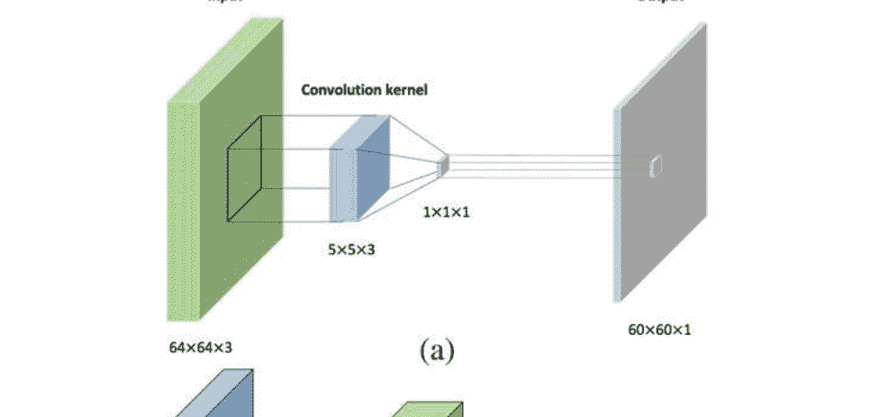

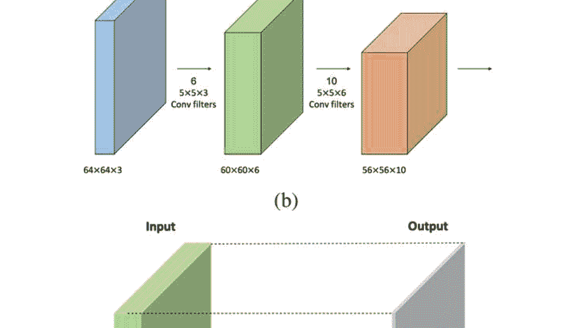

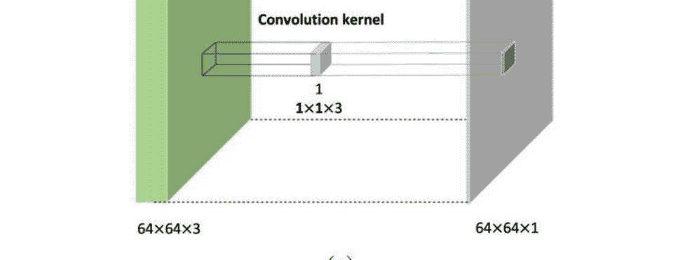

## 图7.7 CNN中使用的各种卷积。(a) 多输入单输出 (MISO) 卷积, (b) 多输入多输出 (MIMO) 卷积, (c) 1 × 1 卷积

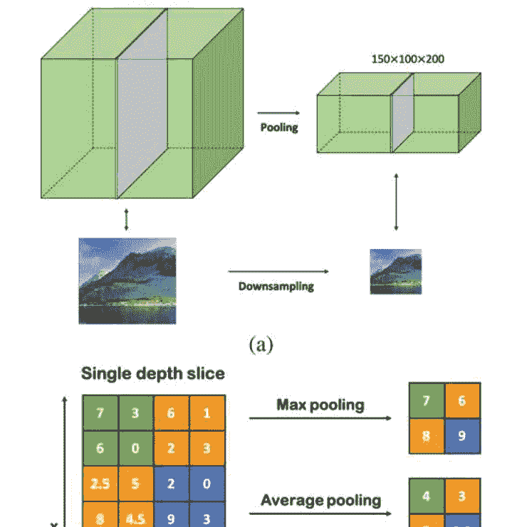

## 图7.8 (a) 池化和反池化操作，(b) 最大池化和平均池化操作

缩小2倍的地图。例如，图7.8b中的最大（平均）池化层应用于一个16 × 16的输入图像，产生一个8 × 8的输出池化特征图。

另一方面，反池化是一种图像上采样的操作。例如，在最大池化的狭义定义中，可以将原始位置处的最大池化信号复制到相同位置，如图7.9a所示。或者可以执行转置操作，将所有池化信号复制到扩大的区域中，如图7.9b所示，这通常被称为反卷积。无论定义如何，反池化都试图放大下采样的图像。

人们认为，在分类任务中，池化层是必要的，以实现空间不变性[43]。这种说法的主要依据是，在输入图像中，特征的微小移动将导致卷积操作后的不同特征图，因此空间不变的对象分类可能会很困难。因此，将输入信号下采样到一个较低分辨率的版本，而不考虑细节可能对分类任务有用，因为它能够实现对平移的不变性。

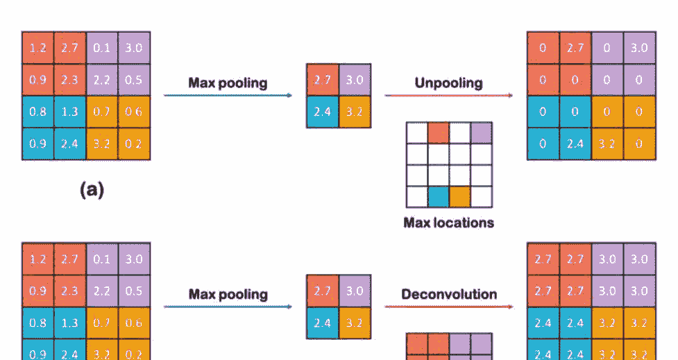

然而，这些经典观点甚至受到了深度学习之父Geoffrey Hinton的质疑。在Reddit的“问我任何事”专栏中，他说：“卷积神经网络中使用的池化操作是一个大错误，而且它能够如此出色地工作实际上是一场灾难。”如果池不重叠，池化会丢失关于物体位置的宝贵信息。我们需要这些信息来检测物体部分之间的精确关系。...

尽管Geoffrey Hinton的评论颇具争议，但池化层的不可否认的优势来自于感受野的增大。例如，在图7.10a,b中，我们比较了有效感受野的大小，它决定了输入图像中影响输出图像中特定点的区域，分别是单分辨率网络和U-Net。我们可以清楚地看到，感受野的大小在没有池化的情况下线性增加，但在池化层的帮助下可以呈指数级扩展。在许多计算机视觉任务中，较大的感受野大小对于实现更好的性能是有用的。因此，在这些应用中，池化和解池化非常有效。

在我们继续下一个主题之前，一个未解决的问题是是否存在一种池化操作，既不丢失任何信息，又能指数级增加感受野的大小。如果存在的话，那么它确实解决了Geoffrey Hinton的担忧。幸运的是，简短的答案是肯定的，因为在深度神经网络的几何理解方面存在重要的进展[40, 42]。当我们研究数学原理时，我们将在稍后讨论这个问题。

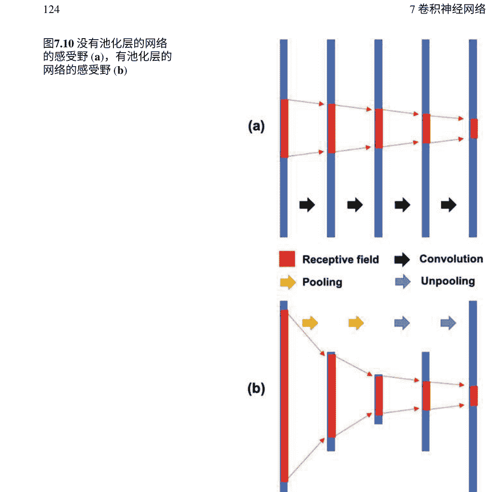

#### 7.3.3 跳跃连接

另一个重要的构建模块，由ResNet [33]和U-Net [38]首创，是跳跃连接。例如，如图7.11所示，从内部块输出的特征图由以下公式给出

```
y = \mathcal{F}(x) + x,
```

其中 \(\mathcal{F}(x)\)是卷积神经网络中标准层的输出，关于输入 \(x\)，而输出中的附加项 \(x\)直接来自输入。由于跳跃分支，ResNet [33] 可以轻松近似恒等映射，而使用标准的卷积神经网络块则很难实现。稍后我们将展示跳跃连接的额外优势来自于消除局部极小值，从而使训练更加稳定 [35, 36]。

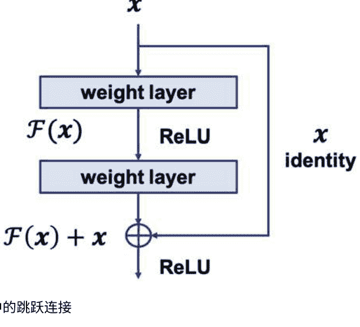

图7.11 ResNet中的跳跃连接

### 7.4 训练卷积神经网络

#### 7.4.1 损失函数

选择CNN架构后，应估计滤波器核。通常在训练阶段通过最小化损失函数来完成。具体而言，给定输入数据 $x$ 和其标签 $y \in \mathbb{R}^m$，平均损失定义为

$$ c(\theta) := E[\ell(y, f_\Theta(x))], \tag{7.5} $$

其中 $E[\cdot]$ 表示平均值， $\ell(\cdot)$ 是损失函数，而 $f_\Theta(x)$ 是具有输入 $x$ 的CNN，其由滤波器核参数集合 $\Theta$ 参数化。在 (7.5) 中，平均值通常是从训练数据中经验性地获得的。对于使用CNN的多类分类问题，最常用的损失之一是softmax损失[44]。这是我们之前研究过的二元逻辑回归分类器的多类扩展。softmax分类器产生归一化的类概率，并且还具有概率解释。具体来说，我们执行softmax变换:

$$ p(\theta) = \frac{e^{f_{\Theta}(x)}}{\mathbf{1}^{\top} e^{f_{\Theta}(x)}}, \tag{7.6} $$

其中 $e^{f_{\Theta}(x)}$ 表示指数的逐元素应用。然后，使用softmax损失，通过计算平均损失来得到。

$$c(\theta) = -E\left[\sum_{i=1}^{m} y_i \log p_i(\theta)\right], \quad \text{(7.7)}$$

其中 $y_i$ 和 $p_i$ 分别表示 $\boldsymbol{y}$ 和 $\boldsymbol{p}$ 的第 $i$ 个元素。如果类别标签 $\boldsymbol{y} \in \mathbb{R}^m$ 被归一化为具有概率意义，即 $\mathbf{1}^\top \boldsymbol{y} = 1$，则 (7.7) 确实是目标类别分布和估计类别分布之间的交叉熵。

对于使用CNN进行回归问题的情况，CNN通常用于图像处理任务，如去噪，损失函数通常由范数定义，即

$$c(\theta) = E\|\boldsymbol{y} - f_{\Theta}(\boldsymbol{x})\|_p^p, \quad \text{(7.8)}$$

其中 $p = 1$ 表示 $l_1$ 损失， $p = 2$ 表示 $l_2$ 损失。

#### 7.4.2 数据分割

在训练CNN时，可用的数据集应首先分为三个类别：训练集、验证集和测试集，如图7.12所示。训练数据还被分成小批量，以便每个小批量可以用于随机梯度计算。然后使用训练数据集来估计CNN滤波器核，并使用验证集来监测训练中是否存在过拟合问题。

例如，图7.13a展示了可以通过使用验证数据在训练过程中监测到的过拟合示例。如果发生这种类型的过拟合，应采取几种方法来实现稳定的训练行为，如图7.13b所示。下一节将讨论这种策略。


图7.12 可用数据分为训练、验证和测试数据集

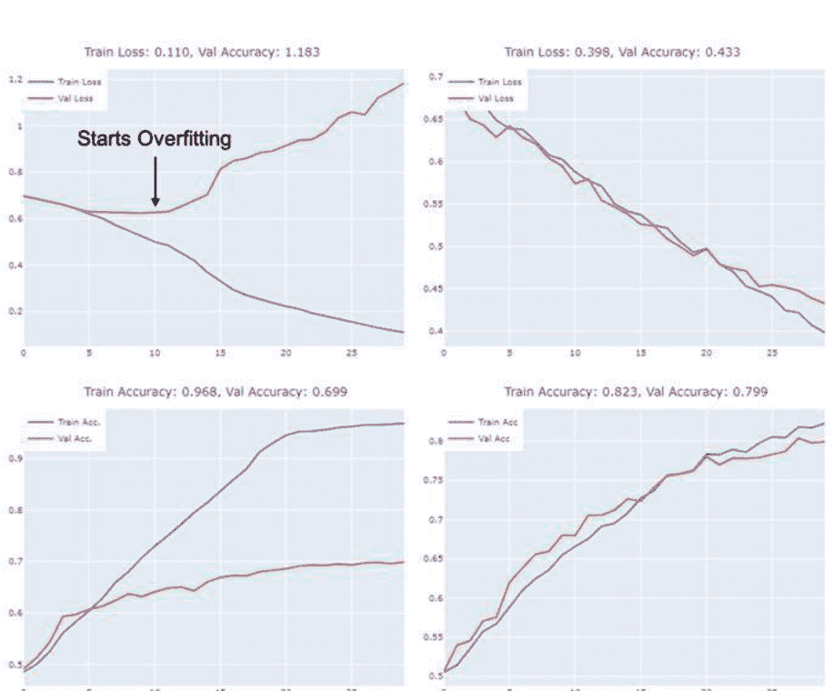

## 图7.13 神经网络训练动态: (a) 过拟合问题, (b) 无过拟合

#### 7.4.3 正则化

当我们观察到类似于图7.13a的过拟合行为时，最简单的解决方案是增加训练数据集。然而，在许多实际应用中，训练数据是稀缺的。在这种情况下，有几种方法可以对神经网络训练进行正则化。

##### 7.4.3.1 数据增强

使用数据增强生成人工训练实例。这些是通过对原始图像应用几何变换（例如镜像、翻转、旋转）而创建的新的训练实例，以保持标签信息不变。

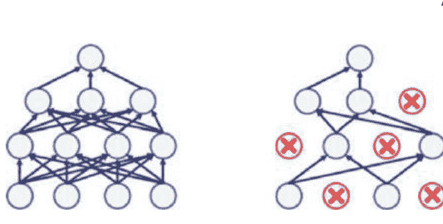

##### 7.4.3.2 参数正则化

缓解过拟合问题的另一种方法是为原始损失添加正则化项。 例如，我们可以将（7.5）中的损失转换为以下形式：

$$c_{reg}(\theta) := E[\ell(y, f_\Theta(x))] + R(\theta), \quad \text{(7.9)}$$

其中 $R(\theta)$ 是一个正则化函数。 回想一下，在核机器中也使用了类似的技术。

##### 7.4.3.3 Dropout

深度学习中使用的另一种独特的正则化方法是dropout [45]。 dropout的思想相对简单。 在训练过程中，每次迭代时，神经元以概率 $p$ 被临时“丢弃”或禁用。 这意味着在当前迭代中，某些神经元的所有输入和输出都将被禁用。 在每个训练步骤中，被丢弃的神经元以概率 $p$ 重新采样，因此在一个步骤中被丢弃的神经元可能在下一个步骤中处于活动状态。 参见图7.14。 dropout防止过拟合的原因是在随机丢弃过程中，每一层的输入信号都会发生变化，从而产生额外的数据增强效果。

### 7.5 可视化卷积神经网络

正如已经提到的，层次化特征在大脑中的视觉信息处理过程中出现。 类似的现象可以在卷积神经网络中观察到，一旦它被正确训练。 特别是，VGGNet提供了与大脑中的视觉信息处理密切相关的直观信息。

例如，图7.15说明了在VGGNet的特定通道和层上最大化滤波器响应的输入信号[31]。 请记住，滤波器大小为3×3，因此不是可视化滤波器，而是显示激活最多的输入图像，用于特定通道和层滤波器。实际上，这类似于Hubel和Wiesel的实验，他们分析了最大化神经元激活的输入图像。

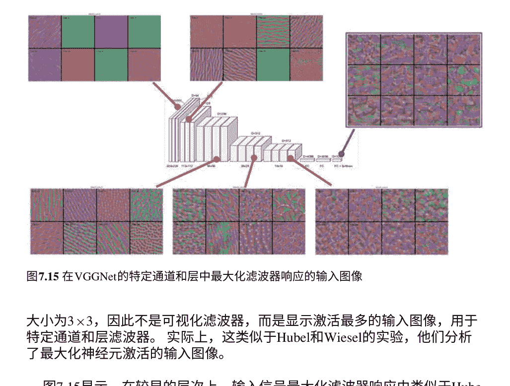

## 图7.15 在VGGNet的特定通道和层中最大化滤波器响应的输入图像

图7.15显示，在较早的层次上，输入信号最大化滤波器响应由类似于Hubel和Wiesel实验的方向边缘组成。随着我们深入网络，滤波器会相互叠加并学习编码更复杂的模式。有趣的是，随着层次的加深，最大化滤波器响应的输入图像变得更加复杂。在一个滤波器集中，我们可以看到不同方向上的几个对象，因为图片中的特定位置并不重要，只要它在滤波器激活的某个地方显示即可。因此，滤波器试图通过在多个位置对其进行编码来识别对象。

最后，图7.15中的蓝色框显示了在特定类别中最大化特定类别上的响应的输入图像。实际上，这对应于最大化类别的输入图像的可视化。在某个特定的类别中，一个对象在图像中显示了多次。从简单边缘到高级概念的分层特征的出现类似于大脑中的视觉信息处理。

最后，图7.16展示了VGGNets不同层级上的特征图与一张猫图片的关系。由于卷积层的输出是一个三维体积，我们只会可视化其中的一些图像。从图7.16可以看出，特征图从猫的边缘特征发展到具有较低分辨率的信息，描述了猫的位置。在后续层级中，特征图与概率图一起工作，概率图可以定位猫的位置。

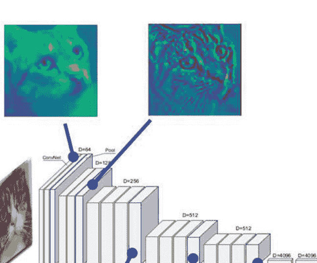

### 7.6 CNN的应用

在现代人工智能时代，CNN是最广泛使用的神经网络架构。类似于大脑中的视觉信息处理，CNN的滤波器经过训练，可以有效地捕捉到分层特征。这可能是CNN在许多图像分类问题、低级图像处理问题等方面取得成功的原因之一。

除了在无人驾驶车辆、智能手机、商业电子产品等商业应用中，另一个重要的应用领域是医学成像。CNN已成功应用于疾病诊断、图像分割和配准、图像重建等方面。

例如，图7.17显示了用于癌症分割的分割网络架构。在这里，标签是癌症的二进制掩模，骨干CNN基于U-Net架构，在末尾存在一个softmax层进行像素级分类。然后，网络被训练用于对背景和癌症区域进行分类。

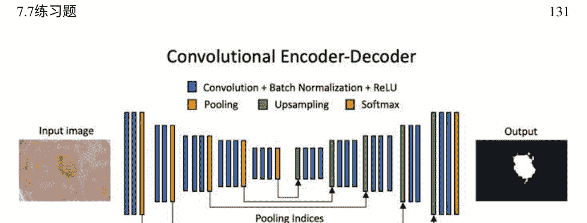

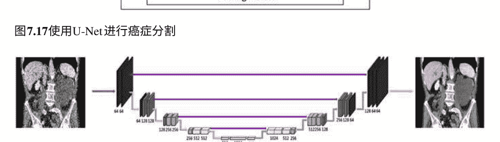

和癌症区域。非常相似的架构也可以用于低剂量CT图像的噪声去除，如图7.18所示。网络不使用softmax层，而是使用高质量、低噪声图像作为参考，通过$l_1$或$l_2$回归损失进行训练。事实上，深度学习中令人惊奇且神秘的一部分是，通过改变训练数据，相似的架构可以适用于不同的问题。

由于设计和训练CNN的简单性，有许多令人兴奋的新创企业致力于AI在医学应用领域的创新。随着COVID-19大流行，全球医疗保健的重要性日益增加，医学影像和一般医疗保健无疑是AI的最重要领域之一。因此，对于将AI应用于健康领域，机会是如此之多，我们需要许多年轻、聪明的研究人员投入他们的时间和精力进行AI研究，以改善人类的健康保健。

## 7.7 练习题

- 1. 考虑图7.2中的VGGNet。在其原始实现中，卷积核为3 × 3。
  a. VGGNet中的卷积滤波器集的总数是多少?
  b. 那么，VGGNet中可训练参数的总数是多少，包括卷积滤波器和全连接层？（提示：对于全连接层，参数的数量应为输入维度 × 输出维度。）
- 2. 让你的神经网络代码用于修改后的国家标准与技术研究所数据库（MNIST）分类，表示为 $f_\Theta(x)$，其中 $\Theta$ 表示可训练参数，$x$是输入图像。你的神经网络的最后一层应该是softmax层，表示为

$$p(\theta) = \frac{e^{f_\Theta(x)}}{\mathbf{1}^\top e^{f_\Theta(x)}}, \quad \text{(7.10)}$$

其中 $e^{f_\Theta(x)}$表示指数的逐元素应用。
  a. softmax层的意义是什么？
  b. 假设你为MNIST分类器定义了损失函数，表示为

$$c(\theta) = -E\left[\sum_{i=1}^{10} y_i \log p_i(\theta)\right], \quad \text{(7.11)}$$

其中 $p_i$ 表示 $\boldsymbol{p}$的第$i$个元素。 那么， $\{y_i\}_{i=1}^{10}$的含义是什么？ 当标签的值为1和5时，给出答案。
- 3. 对于图7.5中给定的U-Net架构，计算有效感受野的大小。 现在，假设不存在池化层。 有效感受野的大小是多少？
- 4. 我们定义两个向量之间的循环卷积：

$$(u \circledast v)[n] = \sum_{i=0}^{n-1} u[n-i] v[n],$$

其中假设了周期边界条件。 现在，对于任意的向量 $\boldsymbol{x} \in \mathbb{R}^{n_1}$ 和 $\boldsymbol{y} \in \mathbb{R}^{n_2}$，其中 $n_1, n_2 \leq m$，在 $\mathbb{R}^n$中定义它们的循环卷积：

$$\boldsymbol{x} \circledast \boldsymbol{y} = \boldsymbol{x}^0 \circledast \boldsymbol{y}^0,$$

最后，对于任意的 $\boldsymbol{v} \in \mathbb{R}^{n_1}$，$n_1 \leq n$，定义翻转 $\overline{\boldsymbol{v}}[n] = \boldsymbol{v}^0[-n]$。
  a. 对于输入信号 $\boldsymbol{x} \in \mathbb{R}^n$ 和滤波器 $\overline{\boldsymbol{\psi}} \in \mathbb{R}^n$，证明

$$\boldsymbol{y} = \boldsymbol{x} \circledast \overline{\boldsymbol{\psi}} = \mathbb{H}_r^n(\boldsymbol{x})\boldsymbol{\psi}, \quad \text{(7.12)}$$

其中 $\mathbb{H}_r^n(\boldsymbol{x}) \in \mathbb{R}^{n \times r}$ 是一个环绕汉克尔矩阵：

$$\mathbb{H}_r^n(\boldsymbol{x}) = \begin{bmatrix}
x[0] & x[1] & \cdots & x[r-1] \\
x[1] & x[2] & \cdots & x[r] \\
\vdots & \vdots & \ddots & \vdots \\
x[n-1] & x[n] & \cdots & x[r-2]
\end{bmatrix}. \qquad (7.13)$$
  b. 对于输入信号 $\boldsymbol{x} \in \mathbb{R}^n$和滤波器 $\boldsymbol{\psi} \in \mathbb{R}^r$，其中 $r \leq n$，证明在 $\mathbb{R}^n$中的循环卷积中的以下交换关系：

$$\boldsymbol{x} \circledast \overline{\boldsymbol{\psi}} = \mathbb{H}_r^n(\boldsymbol{x}) \boldsymbol{\psi} = \mathbb{H}_n^n(\boldsymbol{\psi}) \boldsymbol{x} = \boldsymbol{\psi} \circledast \overline{\boldsymbol{x}}. \qquad (7.14)$$
  c. 对于给定的 $\boldsymbol{f}, \boldsymbol{u} \in \mathbb{R}^n$和 $\boldsymbol{v} \in \mathbb{R}^r$，其中 $r \leq n$，证明

$$\boldsymbol{u}^{\top} \boldsymbol{F} \boldsymbol{v} = \boldsymbol{u}^{\top} (\boldsymbol{f} \circledast \overline{\boldsymbol{v}}) = \boldsymbol{f}^{\top} (\boldsymbol{u} \circledast \boldsymbol{v}) = \langle \boldsymbol{f}, \boldsymbol{u} \circledast \boldsymbol{v} \rangle, \qquad (7.15)$$

其中 $\boldsymbol{F} = \mathbb{H}_r^n(\boldsymbol{f})$。
  d. 假设多输入单输出（MISO）的循环卷积为 $p$-通道输入 $\boldsymbol{Z}= [\boldsymbol{z}_1, \cdots, \boldsymbol{z}_p] \in \mathbb{R}^{n \times p}$，输出为 $\boldsymbol{y} \in \mathbb{R}^n$，定义如下

$$\boldsymbol{y} = \sum_{j=1}^{p} \boldsymbol{z}_j \circledast \overline{\boldsymbol{\psi}^j}, \qquad (7.16)$$

其中 $\boldsymbol{\psi}^j \in \mathbb{R}^r$表示一个 $r$维向量，$\overline{\boldsymbol{\psi}^j} \in \mathbb{R}^n$表示其翻转。
然后，证明 (7.16) 可以用矩阵形式表示：

$$\boldsymbol{y} = \boldsymbol{Z} \circledast \boldsymbol{\Psi} = \mathbb{H}_{r|p}^n(\boldsymbol{Z}) \boldsymbol{\Psi}, \qquad (7.17)$$

其中

$$\boldsymbol{\Psi} = \begin{bmatrix}
\boldsymbol{\psi}^1 \\
\vdots \\
\boldsymbol{\psi}^p
\end{bmatrix}$$

和

$$\mathbb{H}_{r|p}^n(\boldsymbol{Z}) := \left[ \mathbb{H}_r^n(\boldsymbol{z}_1) \; \mathbb{H}_r^n(\boldsymbol{z}_2) \; \cdots \; \mathbb{H}_r^n(\boldsymbol{z}_p) \right]. \qquad (7.18)$$

e. 让多输入多输出（MIMO）循环卷积为 $p$-通道输入 $\mathbf{Z} = [\mathbf{z}_1, \cdots, \mathbf{z}_p] \in \mathbb{R}^{n \times p}$ 和 $q$ 通道输出 $\mathbf{Y} = [\mathbf{y}_1, \cdots, \mathbf{y}_q] \in \mathbb{R}^{n \times q}$ 被定义为

$$ \mathbf{y}_i = \sum_{j=1}^{p} \mathbf{z}_j \circledast \overline{\boldsymbol{\psi}}_{i,j}, \quad i = 1, \cdots, q, \qquad (7.19) $$

其中 $p$ 和 $q$ 分别是输入和输出通道的数量；$\boldsymbol{\psi}_{i,j} \in \mathbb{R}^r$ 表示一个 $r$ 维向量，$\overline{\boldsymbol{\psi}}_{i,j} \in \mathbb{R}^n$ 指的是它的翻转。然后，证明 (7.19) 可以用矩阵形式表示为

$$ \mathbf{Y} = \sum_{j=1}^{p} \mathbb{H}_{r}^{n}(\mathbf{z}_j)\boldsymbol{\Psi}_j = \mathbb{H}_{r|p}^{n}(\mathbf{Z}) \boldsymbol{\Psi}, $$

其中

$$ \boldsymbol{\Psi} = \begin{bmatrix} \boldsymbol{\Psi}_1 \ \vdots \ \boldsymbol{\Psi}_p \end{bmatrix} \quad \text{其中} \quad \boldsymbol{\Psi}_j = \begin{bmatrix} \boldsymbol{\psi}_{1,j} & \cdots & \boldsymbol{\psi}_{q,j} \end{bmatrix}. $$

f. 在卷积神经网络（CNN）中，$1 \times 1$ 卷积通常跟随卷积层。对于1维信号，这个操作可以写成

$$ y_i = \sum_{j=1}^{p} w_j \left( z_j \circledast \overline{\psi}_{i,j} \right), \quad \text{其中} \quad i = 1, \cdots, q, \qquad (7.20) $$

其中 $w_j$ 表示 $1 \times 1$ 卷积滤波器权重的第 $j$ 个索引。证明这可以用矩阵形式表示为

$$ \mathbf{Y} = \sum_{j=1}^{p} w_j \mathbb{H}_{r}^{n}(\mathbf{z}_j)\boldsymbol{\Psi}_j = \mathbb{H}_{r|p}^{n}(\mathbf{Z}) \boldsymbol{\Psi}^w, \qquad (7.21) $$

其中

$$ \boldsymbol{\Psi}^w = \begin{bmatrix} w_1 \boldsymbol{\Psi}_1 \ \vdots \ w_p \boldsymbol{\Psi}_p \end{bmatrix}. \qquad (7.22) $$

# 第8章 图神经网络

### 8.1 引言

许多重要的现实世界数据集以图形或网络的形式存在：社交网络、全球网络（WWW）、蛋白质相互作用网络、脑网络、分子网络等。在图8.1中可以看到一些例子。实际上，真实系统中的复杂相互作用可以用不同形式的图形来描述，因此图形可以成为表示复杂系统的普遍工具。

图8.2显示了一个由节点和边组成的图。尽管看起来很简单，但在许多有趣的现实世界问题中，节点和边的数量非常大，无法通过简单的检查来追踪。因此，人们对从图表中提取有用信息的不同形式的机器学习方法感兴趣。

例如，使用机器学习工具可以对复杂图表中的每个节点进行节点分类，为其分配不同的标签。这可以用于对交互网络中的蛋白质功能进行分类（参见图8.3a）。链接分析是图机器学习中的另一个重要问题，它涉及查找节点之间的缺失链接。如图8.3b所示，链接分析可用于为新类型的病原体或疾病重新配置药物。

图分析的另一个重要目标是社区检测。例如，可以识别由疾病蛋白质组成的子网络（参见图8.3c）。尽管可能应用范围广泛，但图中神经网络的方法不如其他图像、声音等神经网络研究成熟。这是因为图数据的处理和学习需要对神经网络有新的视角。

例如，如图8.4所示，卷积神经网络（CNN）的基本假设是图像具有规则网格上的像素值，但是图形具有不规则的节点和边结构，因此基本模块（例如卷积、池化等）的应用并不容易。另一个严重的问题是，尽管CNN的训练数据由相同大小的图像或其补丁组成，但是图神经网络的训练数据通常包含具有不同节点数量、网络拓扑等的图。例如，在用于检测药物候选物毒性的图神经网络方法中，训练数据集中的化学物质可以具有不同数量的分子。这引出了图机器学习任务中的一个基本问题：我们从训练数据中学到了什么？

事实上，神经网络方法相对于其他机器学习方法（如压缩感知[46]和低秩矩阵分解[47]等）的主要优势在于神经网络方法是归纳的，这意味着训练好的神经网络不仅适用于网络所在的数据，还适用于训练过程中未见过的其他数据。

然而，考虑到训练数据中的每个图在结构上都是不同的（例如，具有不同的节点和边数，甚至拓扑结构），我们能从图神经网络训练中获得什么样的归纳信息呢？尽管普遍逼近定理[48]保证神经网络可以逼近任何非线性函数，但图神经网络试图逼近的非线性函数甚至都不清楚是什么样的。

因此，本章的主要目的是回答这些令人困惑的问题。事实上，我们将重点关注机器学习研究人员在训练阶段如何提出了独立于不同图结构的归纳学习的精彩思想。

### 8.2 数学预备知识

在讨论图神经网络之前，我们将回顾图论中的基本数学工具。

#### 8.2.1 定义

我们用顶点集 $V(G)=\{1,\cdots,N\}$ 和边集 $E(G)=\{e_{ij}\}$ 来表示图 $G=(V, E)$, 其中边 $e_{ij}$ 连接顶点 $i$ 和 $j$ 如果它们是相邻的。顶点 $v$ 的邻域集合表示为 $N(v)$。对于带权图，边 $e_{ij}$ 具有实数值。如果 $G$ 是一个无权图，则 $E$ 是一个稀疏矩阵，其元素要么为0，要么为1。

对于一个简单的无权图，其顶点集为 $V$，邻接矩阵是一个正方形的 $|V| \times |V|$ 矩阵 $A$，其元素 $a_{uv}$ 在顶点 $u$ 到顶点 $v$ 之间存在边时为1，否则为0。参见图8.5中一些无向图的邻接矩阵示例。请注意，邻接矩阵的维度取决于图中节点的数量。

#### 8.2.2 图同构

一个图可以以不同的形式存在，具有相同数量的顶点、边以及相同的边连接。这样的图被称为同构图。形式上，如果两个图 $G$ 和 $H$ 满足以下条件，则它们被称为同构：（1）它们的组件数量（顶点和边）相等，（2）它们的边连接相同。图8.6中展示了一些同构图的示例。图同构在许多需要识别图形相似性的领域中被广泛使用。在这些领域中，图同构问题通常被称为图匹配问题。图同构的一些实际应用包括在不同配置中识别相同的化合物，检查电子设计中的等效电路等。

不幸的是，测试图同构并不是一个简单的任务。即使节点的数量相同，两个同构图可以有不同的邻接矩阵，因为同构图中节点的顺序可以是任意的，但是它们的邻接矩阵的结构严重依赖于节点的顺序。事实上，图同构问题是少数几个复杂性仍未解决的标准问题之一。

#### 8.2.3 图着色

节点着色是一个函数$V(G) \rightarrow \Sigma$，其中$\Sigma$是任意的值域。然后，一个节点着色或着色图$(G, l)$是一个带有节点着色的图 $G$。我们说 $l(v)$是 $v \in V(G)$的颜色。图8.7展示了分子系统中图着色的一个例子[49]。在初始阶段，每个节点都被着色为由各种化学性质组成的特征向量。在这种情况下，值域是 $\Sigma \subset \mathbb{R}^{5}$。使用机器学习方法，可以通过考虑相邻节点的颜色信息来顺序更新节点颜色，以提取分子的有用全局特性。

### 8.3 相关工作

由于训练数据中的每个图表都具有不同的配置，图的机器学习的主要关注点是将潜在向量分配给图、子图或节点，以便可以将标准CNN、感知器等应用于潜在空间进行推断或回归。这个过程通常被称为图嵌入，如图8.8所示。图神经网络中最重要的研究课题之一是找到一种适用于具有不同节点数、拓扑结构等的图嵌入的归纳规则。不幸的是，与图相关的困难之一是它们是无结构的。实际上，在日常生活中我们会遇到很多无结构的数据，而最重要的无结构数据类别之一就是自然语言。

因此，许多图形机器学习技术都是从自然语言处理（NLP）中借鉴的。因此，本节解释了自然语言处理的关键思想。

#### 8.3.1 词嵌入

词嵌入是自然语言处理中最流行的表示之一。基本上，它是一个特定单词的向量表示，可以捕捉到单词在文档中的上下文、语义和句法相似性以及与其他单词的关系等。

例如，考虑一个词汇“国王”。从其语义意义上，可以得出以下结论：

> 国王 - 男人 + 女人 = 女王。 (8.1)

然而，在自然语言中没有数学运算可以正式推导出（8.1）。因此，词嵌入的思想是通过潜在空间中的向量运算来执行此操作。具体来说，让$\mathcal{V}$（.）表示将词汇映射到$\mathbb{R}^d$中的向量的映射。然后，词嵌入的目标是找到映射$\mathcal{V}$，使得

$\mathcal{V}$（King） - $\mathcal{V}$（Man） + $\mathcal{V}$（Woman） = $\mathcal{V}$（Queen）。（8.2）

这个概念在图8.9中有所说明。有几种嵌入单词的方法。这里的主要问题是将大文本中的每个单词表示为向量，使得相似的单词在潜在空间中靠近。

在各种进行词嵌入的方法中，所谓的word2vec是最常用的方法之一[50, 51]。Word2vec由两层神经网络组成。该网络以两种互补的方式进行训练：连续词袋（CBOW）和跳字模型。这些方法的关键思想是自然语言中的单词之间存在重要的因果关系和冗余信息，这些信息可以用来将单词嵌入到向量空间中。接下来，我们详细描述它们。

##### 8.3.1.1 CBOW

CBOW假设一个缺失的单词可以从句子中的周围单词中找到。例如，考虑一个句子：大狗正在追逐小兔子。CBOW的思想是，句子中的目标单词（通常是中心单词），例如图8.10中的“狗”，可以从上下文窗口中的附近单词估计出来（例如，在上下文窗口大小$c=1$的情况下使用“大”和“正在”）。一般来说，对于给定的上下文窗口大小$c$，第$i$个单词$x_i$被假设为使用窗口内的相邻单词来估计，即$\{x_j \mid j \in I_c(i)\}$，如图8.10所示，其中

$I_c(i) := \{i - c, \cdots, i - 1, i + 1, \cdots, i + c\}$。（8.3）

现在，接下来是有趣的部分。在CBOW中，它不直接估计单词 $x_i$，而是采用编码器-解码器结构，如图8.11所示。具体来说，一个编码器，用共享权重 $\boldsymbol{W}$表示，将输入 $x_n$转换为相应的潜在空间向量，然后解码器用权重 $\widetilde{\boldsymbol{W}}$将潜在向量转换为目标单词的估计值 $\hat{x}_i$。此外，CBOW的一个最重要的假设是缺失单词的潜在向量表示为相邻单词的潜在向量的平均值，即

$$ \boldsymbol{h}_i = \frac{1}{2c-1} \sum_{k \in \mathcal{I}_c(i)} \boldsymbol{W} \boldsymbol{x}_k $$

具体来说，使用$2c -1$个输入向量和共享的编码器权重，我们生成$2c -1$个潜在向量，然后计算它们的平均值。然后，通过从平均潜在向量解码，估计出中心词，解码时使用权重 $\widetilde{W}$:

$$\hat{x}_i = \widetilde{W}^\top h_i. (8.5)$$

请注意，在CBOW的隐藏层中除了网络输出中的softmax单元（稍后将解释）之外，没有非线性变换。

首先，需要构建语料库词汇表，其中我们可以将每个词汇映射到唯一的数值标识符 $x_i$。例如，如果语料库大小为 $M$，则 $x_i$ 是一个 $M$ 维的独热向量编码，如图8.12所示。一旦CBOW神经网络训练完成，可以使用网络的编码器部分简单地进行词嵌入。

非常严格的假设是中心词可能与潜在空间中的周围词汇的平均值相似，这种假设非常有效，CBOW是最受欢迎的经典词嵌入技术之一[50, 51]。

##### 8.3.1.2 Skip-Gram

Skip-gram可以看作是CBOW的一种补充思想。Skip-gram模型的主要思想是：一旦神经网络训练完成，由焦点词生成的潜在向量可以高概率地预测窗口中的每个词。例如，图8.13展示了我们如何在不同的窗口大小内提取焦点词和目标词的示例。这里的绿色词是焦点词，通过它可以估计窗口中的目标词。

与CBOW类似，神经网络训练以潜在向量的形式进行。特别是，使用权重为 $\boldsymbol{W}$ 的编码器将焦点词编码为独热向量，然后使用共享权重 $\widetilde{\boldsymbol{W}}^\top$ 的并行解码器网络将潜在向量解码，如图8.14所示。因此，skip-gram的基本假设可以表示为

$$x_{j} \simeq \widetilde{\boldsymbol{W}}^{\top} \boldsymbol{h}_{i}, \quad \forall j \in I_{c}(i), \qquad\qquad(8.6)$$

其中潜在向量 $\boldsymbol{h}_i$ 由以下给出

$$\boldsymbol{h}_{i}=\boldsymbol{W} \boldsymbol{x}_{i}. \qquad\qquad(8.7)$$

同样，在skip-gram的隐藏层中除了网络输出中的softmax单元外，没有非线性变换。

#### 8.3.2 损失函数

word2vec神经网络训练的损失函数值得进一步讨论。与分类问题类似，损失函数基于目标词和解码器生成词之间的交叉熵。

特别是在CBOW的情况下，应该记住目标向量 $x_i$ 也是一个独热编码向量。设 $t_k$ 表示词汇向量 $x_k$ 的非零索引。那么，CBOW的损失函数可以写成一个softmax函数：

$$
\text{CBOW}(W, \widetilde{W}) = -\log \left( \frac{e^{\widetilde{w}_{t_i}^{\top} h_i}}{\sum_{k=1}^{M} e^{\widetilde{w}_{t_k}^{\top} h_i}} \right) = -\widetilde{w}_{t_i}^{\top} h_i + \log \left( \sum_{k=1}^{M} e^{\widetilde{w}_{t_k}^{\top} h_i} \right), \quad (8.8)
$$

其中潜在向量 $h_i$ 由(8.4)中的平均潜在向量给出。另一方面，skip-gram的损失函数由以下给出

$$
\text{skipgram}(W, \widetilde{W}) = -\log \left( \prod_{j \in I_c(i)} \frac{e^{\widetilde{w}_{t_j}^{\top} h_i}}{\sum_{k=1}^{M} e^{\widetilde{w}_{t_k}^{\top} h_i}} \right) = -\sum_{j \in I_c(i)} \widetilde{w}_{t_j}^{\top} h_i + C \log \left( \sum_{k=1}^{M} e^{\widetilde{w}_{t_k}^{\top} h_i} \right), \quad (8.9)
$$

其中潜在向量 $h_i$ 由(8.7)给出。

| 矩阵1 | 矩阵2 | 矩阵3 |
|-------|-------|-------|
| 0 1 0 1 | 0 0 1 0 | 0 1 0 0 |
| 1 0 0 1 | 0 0 1 1 | 1 0 1 0 |
| 0 0 0 1 | 1 1 0 1 | 0 1 0 1 |
| 1 1 1 0 | 0 1 1 0 | 0 0 1 0 |## 8.4 图嵌入

与词嵌入类似，图嵌入用于将节点、子图和它们的特征转换为潜在空间中的向量，以便相似的节点、子图和特征在潜在空间中靠近。

如图8.15所总结的，目前存在三种类型的图嵌入方法：矩阵分解、随机游走和神经网络方法[52]。在接下来的内容中，我们首先简要回顾前两种方法，然后详细讨论神经网络方法。

#### 8.4.1 矩阵分解方法

图嵌入中矩阵分解方法的主要假设是邻接矩阵可以分解为低秩矩阵。更具体地说，对于给定的邻接矩阵 \( A \in \mathbb{R}^{N \times N} \)，它的低秩矩阵分解是找到 \( U, V \in \mathbb{R}^{N \times d} \)，使得

\( A \simeq U V^\top, \) (8.10)

其中 \( d \) 是潜在空间的维度。然后，在潜在空间中，第 \( i \) 个节点的嵌入为 \(\mathbb{R}^d\) 给出

$$\boldsymbol{h}_i = \mathbf{V}^{\top} \boldsymbol{x}_i \in \mathbb{R}^{d},$$

其中 \(\boldsymbol{x}_i \in \mathbb{R}^N\) 再次是编码的独热向量 \( i \) 个节点向量。

除了矩阵分解的计算复杂度之外，作为图嵌入的矩阵分解方法还有一些限制。首先，要使用矩阵分解方法，节点的数量必须相同。

其次，该方法不是归纳的，而是转导的。这意味着学习到的嵌入变换只适用于具有相同邻接矩阵的图，如果连接性发生变化，则嵌入不再有效。

#### 8.4.2 随机游走方法

图嵌入的随机游走方法与词嵌入非常相关，特别是word2vec [50, 51]。在这里，我们回顾两种强大的随机游走方法：DeepWalks [53] 和 node2vec [54]。

#### 8.4.2.1 DeepWalks

DeepWalks [53] 的主要直觉是随机游走与 word2vec 方法中的句子相似，因此可以使用 word2vec 来嵌入图的每个节点。更具体地说，如图8.16所示，该方法基本上包括三个步骤：

- 采样：对图进行随机游走采样。从每个节点开始执行一些特定长度的随机游走。
- 训练 skip-gram：通过将随机游走中的节点作为独热向量输入和目标来训练 skip-gram 网络。
- 节点嵌入：从训练好的 skip-gram 的编码器部分，将图中的每个节点嵌入到潜空间中的向量中。

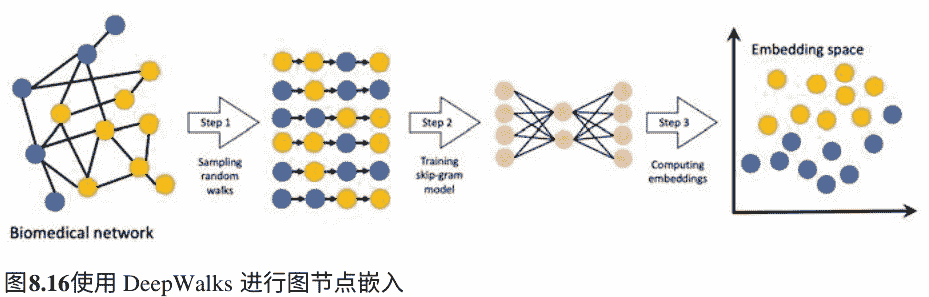

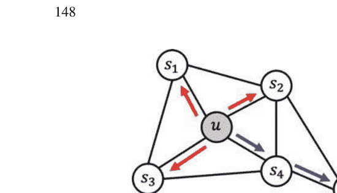

##### 8.4.2.2 Node2vec

Node2vec是DeepWalks的一种修改，具有微妙但重要的区别。Node2vec由两个参数 p和q参数化。参数 p优先考虑广度优先搜索（BFS）过程，而参数 q优先考虑深度优先搜索（DFS）过程。因此，下一步行走的决策受到概率1/p或1/q的影响。如图8.17所示，BFS对于学习局部邻居是理想的，而DFS对于学习全局变量更好。

Node2vec可以根据任务切换到这两个优先级。其他的过程，如使用skip-gram，与DeepWalks完全相同。

#### 8.4.3 神经网络方法

最近，在图神经网络（GNNs）方面取得了显著进展和日益增长的兴趣，它由深度神经网络执行的图操作组成。例如，谱图卷积方法[55]，图卷积网络（GCN）[56]，图同构网络（GIN）[57]，graphSAGE [58]，仅举几例。

尽管这些方法是基于不同的假设和近似推导出来的，但通常的GNNs会在每一层上整合特征，以将每个节点的特征嵌入到下一层的预定义特征向量中。整合过程是通过选择适当的函数来聚合邻居节点的特征来实现的。由于GNN中的一个级别会聚合其1-hop邻居的特征，每个节点特征都会与图中的其 k-hop邻居的特征一起嵌入到 k个聚合层之后的图中。然后，通过应用读取函数来提取这些特征以获得节点嵌入。

具体来说，让 \( x^{(t)}_v \) 表示第 \( t \) 次迭代中第 \( v \) 个节点的特征向量。然后，这个图操作通常由AGGREGATE和COMBINE函数组成：

$$a^{(t)}_v = AGGREGATE\left(\left\{x^{(t-1)}_u : u \in \mathcal{N}(v)\right\}\right)$$

$$x^{(t)}_v = COMBINE\left(x^{(t-1)}_v, a^{(t)}_v\right)$$

其中，AGGREGATE函数收集邻居节点的特征，以提取聚合特征向量 \( a^{(t)}_v \)，然后COMBINE函数将上一个节点的特征 \( x^{(t-1)}_v \) 与聚合节点特征 \( a^{(t)}_v \)一起输出节点特征 \( x^{(t)}_v \)。

作为图嵌入方法，设计GNNs的最重要考虑之一是AGGREGATE函数是一个关于 \(\{\cdot\}\) 的函数，表示多重集合。多重集合是一个集合（元素的顺序不重要），元素可以出现多次。因此，AGGREGATE函数应该能够处理各种节点集合，并且不依赖于集合中元素的顺序。

条件的重要性在图8.18中得到了很好的说明。例如，在 \( t=1 \) 时，每个节点都有不同的邻居节点集合，因此神经网络可以适用于所有这些节点配置，并共享权重。类似的情况可能发生在 \( t=2 \) 时，因为节点A和B分别有三个和两个连接节点。一个简单的示例是AGGREGATE满足这一要求的函数是求和操作：

$$\boldsymbol{a}_v^{(t)} = AGGREGATE\left(\left\{\boldsymbol{x}_u^{(t-1)} : u \in \mathcal{N}(v)\right\}\right) = \sum_{u \in \mathcal{N}(v)} \boldsymbol{x}_u^{(t-1)}.$$
(8.11)

尽管这种求和操作是GNN中最流行的方法之一，但我们可以考虑一种具有理想属性的更一般形式的操作。这是下一节的主要内容。

### 8.5 WL测试，图神经网络

与矩阵分解和随机游走方法相比，使用神经网络进行图嵌入的成功显得神秘。这是因为为了成为有效的嵌入，语义上相似的输入应该在潜在空间中紧密相邻，但不清楚图神经网络是否产生这样的行为。

对于矩阵分解的情况，嵌入变换是从假设潜在向量应该存在于低维子空间中获得的。对于随机游走的情况，嵌入的基本直觉与word2vec类似。因此，这些方法保证在潜在空间中保留语义信息。那么，我们如何知道基于神经网络的图嵌入也传达了语义信息呢？

这种理解特别重要，因为GNN算法通常是一种经验算法，而不是基于自上而下的原则，以实现所需的嵌入属性。最近，一些作者[57, 59-62]已经证明GNN确实是Weisfeiler-Lehman (WL) 图同构测试[63]的神经网络实现。这意味着如果GNN的嵌入向量彼此不同，则相应的图不是同构的。因此，在嵌入过程中，GNN可能保留有用的语义信息。在本节中，我们将更详细地介绍这一令人兴奋的发现。

#### 8.5.1 Weisfeiler-Lehman同构测试

如前所述，确定两个图是否同构是一个具有挑战性的问题。甚至不知道是否存在一个多项式时间算法来确定图是否同构。

从这个意义上讲，Weisfeiler-Lehman (WL) 算法[63]是一种有效地分配相对独特属性的机制。Weisfeiler-Lehman的核心思想同构测试是为每个图中的每个节点找到一个基于节点周围邻居的签名。然后可以使用这些签名来找到两个图中节点之间的对应关系。具体来说，如果两个图的签名不等价，则这两个图明确不同构。

现在我们正式描述WL算法。对于给定的彩色图 \( G \)，WL根据上一次迭代的着色计算节点着色 \( c_v^{(t)}: V(G) \rightarrow \Sigma \)。为了迭代算法，我们为每个节点分配一个元组，其中包含节点的旧压缩标签（或颜色）和节点邻居的压缩标签（颜色）的多重集合：

$$m_v^{(t)} = \left\{ c_v^{(t)}, \left\{ c_u^{(t)} \mid u \in \mathcal{N}(v) \right\} \right\}, \tag{8.12}$$

其中 \(\{\cdot\}\) 表示多重集，它是一个集合（元素的顺序不重要）中可能出现多次的元素。然后，\(HASH(\cdot)\) 将上述对映射到以前迭代中未使用的唯一压缩标签：

$$c_v^{(t+1)} = HASH\left(m_v^{(t)}\right). \tag{8.13}$$

如果两次迭代之间颜色的数量没有改变，则算法结束。该过程如图8.19所示。

为了测试两个图 \( G \) 和 \( H \) 是否同构，我们在两个图上同时运行上述算法。如果两个图在WL算法中被着色的节点数不同，则可以得出这两个图不同构的结论。在上述算法中，“压缩标签”起到了签名。然而，可能存在两个非同构图具有相同的签名，因此仅凭此测试无法提供两个图同构的确凿证据。然而，已经证明WL测试在图同构测试中可以以很高的概率成功。这是WL测试如此重要的主要原因[63]。

#### 8.5.2 图神经网络作为WL测试

回想一下，GNN计算图 \(G = (V, E)\) 的一系列向量嵌入 \(\{\mathbf{x}_v^{(t)}\}_{v \in V}\)，其中 \(t \geq 0\)。在最一般的形式中，嵌入是递归计算的。

$$\mathbf{a}_v^{(t)} = \text{AGGREGATE}^{(t)}\left(\left\{\mathbf{x}_u^{(t-1)}: u \in \mathcal{N}(v)\right\}\right), \tag{8.14}$$

其中 \(\{\cdot\}\) 是多重集合，聚合函数在其参数中是对称的，更新的特征向量由以下给出。

$$\mathbf{x}_v^{(t)} = \text{COMBINE}^{(t)}\left(\mathbf{x}_v^{(t-1)}, \mathbf{a}_v^{(t)}\right). \tag{8.15}$$

从(8.14)和(8.15)与(8.12)和(8.13)的比较，如果我们将 \(\mathbf{x}_v^{(t)}\) 视为第 \(t\) 次迭代的着色，即 \(c_v^{(t)}\)，则我们可以看到GNN更新和WL算法在参数方面有显著的相似之处，它们由多重集邻域和先前的节点组成。实际上，这些不是偶然的发现；它们之间存在根本的等价关系。

例如，在图卷积神经网络（GCNs）[56]和图-SAGE [58]中，AGGREGATE函数由平均操作给出，而在图同构网络（GIN）[57]中，它只是一个简单的求和。可以使用逐元素最大操作作为AGGREGATE函数，甚至可以使用长短期记忆（LSTM）[58]。类似地，可以使用简单的求和，然后是多层感知机（MLP）作为COMBINE函数，或者可以使用加权求和或连接，然后是MLP [58, 59]。一般来说，GNN操作可以表示为

$$\mathbf{x}_v^{(t+1)} = \sigma\left(\mathbf{W}_1^{(t)} \mathbf{x}_v^{(t)} + \sum_{u \in \mathcal{N}(v)} \mathbf{W}_2^{(t)} \mathbf{x}_u^{(t)}\right), \tag{8.16}$$

对于一些矩阵 \(\mathbf{W}_1^{(t)}, \mathbf{W}_2^{(t)}\) 和非线性 \(\sigma(\cdot)\)[59]。在[59]中的一个重要发现是，对于给定的着色 \(\{\mathbf{x}_v^{(t-1)}\}_{v \in V}\)，总是存在矩阵 \(\mathbf{W}_1^{(t)}\) 和 \(\mathbf{W}_2^{(t)}\) 使得更新 (8.16) 等价于 (8.12) 和 (8.13) 中的WL算法。因此，GNN确实是一个神经网络WL算法的图同构测试实现，以及GNN生成节点嵌入的方式是将图映射到可用于测试图匹配的签名中。

### 8.6 总结与展望

到目前为止，我们已经讨论了图神经网络方法作为一种现代的图嵌入方法。最重要的发现是GNN实际上是WL测试的神经网络实现。因此，GNN满足嵌入的重要属性：如果潜在空间中的两个特征向量不同，则底层图形不同。

使用GNN对图进行嵌入并不完整。为了获得真正有意义的图嵌入，潜在空间中的向量操作应具有与原始图表相同的语义含义，类似于词嵌入。然而，目前尚不清楚基于GNN的图嵌入是否能够导致这种多功能属性。

因此，图形神经网络领域仍然是一个广阔的研究领域，下一步的突破将需要年轻和热情的研究人员提出许多好的想法。

### 8.7 练习

- 1. 证明每个具有 \( n \) 个顶点的连通图至少有 \( n - 1 \) 条边。
- 2. 对于CBOW的情况，回想一下目标向量 \( x_i \) 也是一个独热编码的向量。让 \( t_k \) 表示词汇向量 \( x_k \) 的非零索引。然后，证明CBOW的损失函数可以写成一个softmax函数：
$$CBOW(W, \widetilde{W}) = -\log \left( \frac{e^{\widetilde{w}_{t_i}^\top h_i}}{\sum_{k=1}^M e^{\widetilde{w}_{t_k}^\top h_i}} \right) = -\widetilde{w}_{t_i}^\top h_i + \log \left( \sum_{k=1}^M e^{\widetilde{w}_{t_k}^\top h_i} \right), \tag{8.17}$$
其中潜在向量 \( h_i \) 由平均潜在向量给出。
- 3. 分类，同构地，所有具有5个顶点和5条边的连通图（简单或非简单）。你可能会发现，每个具有5个顶点和5条边的简单连通图与这五种情况中的一种同构。
- 4. 设 \( G \) 为一个具有4个连通分量和20条边的图。\( G \) 中可能的顶点数的最大可能值是多少?
- 5. GIN被提出作为适用于图分类任务的空间GNN的特殊情况。该网络将聚合和组合函数实现为节点特征的总和：
$$x_v^{(k)} = MLP^{(k)}\left( (1 + \epsilon^{(k)}) \cdot x_v^{(k-1)} + \sum_{u \in \mathcal{N}(v)} x_u^{(k-1)} \right)$$
其中 \(\epsilon^{(k)} = 0.1\)，而 \(MLP\) 是具有ReLU非线性的多层感知器。
    - a. 绘制相应的图形，其邻接矩阵由以下给出：
    $$A = \begin{bmatrix} 0 & 1 & 1 & 0 \\ 1 & 0 & 1 & 1 \\ 1 & 1 & 0 & 0 \\ 0 & 1 & 0 & 0 \end{bmatrix}.$$
    - b. 假设输入节点特征是一个独热特征矩阵：
    $$X^{(0)} = \begin{bmatrix} 1 & 0 & 0 & 0 \\ 0 & 1 & 0 & 0 \\ 0 & 0 & 1 & 0 \\ 0 & 0 & 0 & 1 \end{bmatrix}$$
    而MLP权重矩阵 \( W^{(1)} = W^{(2)} \) 由以下给出：
    $$W^{(1)} = \begin{bmatrix} 0.1 & -0.2 & -0.3 & 0.4 \\ -0.1 & 0.2 & -0.3 & 0.4 \\ 0.4 & 0.3 & 0.2 & -0.1 \\ -0.4 & 0.3 & 0.2 & -0.1 \end{bmatrix}.$$
    然后，假设每个MLP中不存在偏差，得到下一层的特征矩阵 \( X^{(1)} \) 和 \( X^{(2)} \)。

### 9.1 引言


### 9.1 引言

在本章中，我们将讨论深度学习中非常令人兴奋和快速发展的技术领域：归一化和注意力。

归一化起源于批归一化技术[41]，通过减少协变量偏移来加速随机梯度方法的收敛。这个想法已经进一步扩展到各种形式的归一化，例如层归一化[64]、实例归一化[65]、组归一化[66]等。除了用于改善随机梯度的收敛性的原始归一化用途外，自适应实例归一化(AdaIN)[67]是另一个例子，归一化技术可以作为一种简单但强大的风格转移和生成模型工具。

另一方面，人们对基于直觉的计算机视觉应用引起了关注，即在处理大量信息时我们会“关注”特定部分[68-72]。注意力在自然语言处理（NLP）的最新突破中起到了关键作用，例如Transformer [73]，Google的双向编码器表示来自Transformer（BERT）[74]，OpenAI的生成式预训练Transformer（GPT）-2 [75]和GPT-3 [76]等。对于初学者来说，归一化和注意机制看起来非常启发式，没有任何系统理解的线索，由于它们的相似性更加令人困惑。此外，理解AdaIN、Transformer、BERT和GPT就像阅读研究人员用自己的秘密酱料开发的食谱一样。

然而，深入研究揭示了它们背后非常好的数学结构。

在本章中，我们首先回顾经典和当前最先进的归一化和注意技术，然后讨论它们在各种深度学习架构中的具体实现，例如风格转移[77-83]，多领域图像转移[84-87]，生成对抗网络（GAN）[71, 88, 89]，Transformer [73], BERT [74]和GPT [75, 76]。 然后，我们通过提供一个统一的数学视角来理解归一化和注意力。

#### 9.1.1 符号

在深度神经网络中，特征图被定义为每层的滤波器输出。例如，VGGNet的特征图如图9.1所示，输入图像为一只猫。由于每层存在多个通道，因此特征图实际上是一个3D体积。此外，在训练过程中，从一个小批量中获得多个3D特征图。

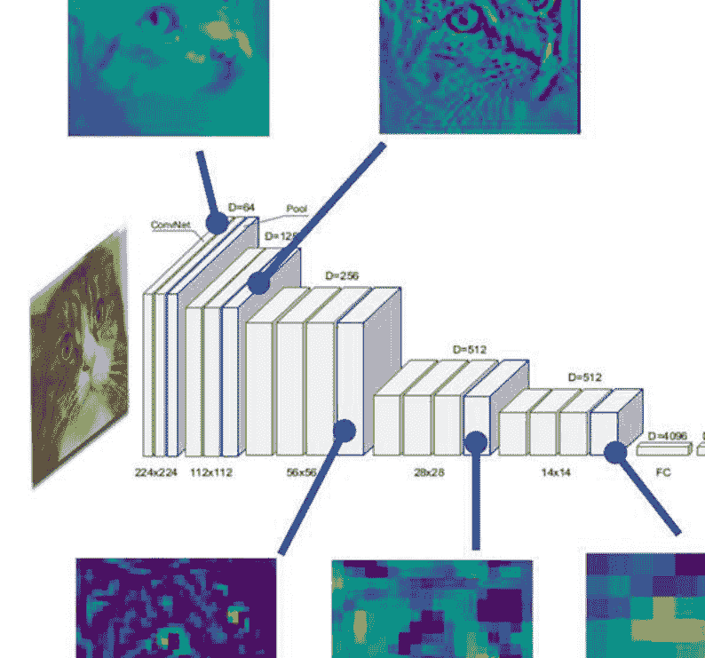

图9.1 VGGNet每个层的一个通道上的特征图示例为了简化数学分析的符号表示，在本章中，每个通道的特征图被向量化。此外，我们经常忽略特征中与层相关的索引。具体而言，一层上的特征图表示为

$$X = [x_1 \dots x_C] \in \mathbb{R}^{H W \times C}, \tag{9.1}$$

其中 $x_c \in \mathbb{R}^{H W \times 1}$ 表示 $X$ 的第 $c$ 列向量，它表示了大小为 $H \times W$ 的向量化特征图在第 $c$ 个通道上的值。我们经常使用 $N := H W$ 来表示像素的数量。方程(9.1)通常用行向量表示，以明确显示行的依赖关系：

$$X = \begin{bmatrix} x^1 \ \vdots \ x^{HW} \end{bmatrix} \in \mathbb{R}^{H W \times C}, \tag{9.2}$$

其中 $x^i \in \mathbb{R}^{1 \times C}$ 表示第$i$行向量，表示通道维度在第$i$个像素位置的特征。

## 9.2 标准化

归一化的基本思想是通过重新居中和重新缩放来归一化输入/特征层，尽管具体细节因算法而异。也许最有影响力的一篇论文是关于批归一化的，它开创了归一化研究领域，截至2021年2月已被引用了25k次。因此，我们首先回顾批归一化技术，并讨论它如何演变为不同形式的归一化技术。

#### 9.2.1 批归一化

批归一化最初是为了减少内部协变量偏移，提高人工神经网络的速度、性能和稳定性而提出的。在网络的训练阶段，如果前一层的特征分布发生变化，当前层的输入分布也会相应变化，因此当前层必须不断适应新的分布。这个问题在深层网络中尤为严重，因为浅层隐藏层的微小变化会随着网络的传播而放大，导致深层隐藏层发生显著的偏移。批归一化的方法被提出来减少这些不希望的偏移，通过重新居中和缩放。

具体而言，批量归一化通过以下变换进行：

$$ y_c = \frac{\gamma_c}{\bar{\sigma}_c} (x_c - \bar{\mu}_c \mathbf{1}) + \beta_c \mathbf{1}, \quad (9.3) $$

对于所有的 $c = 1, \cdots, C$, 其中 $\mathbf{1} \in \mathbb{R}^{H W}$ 表示全为1的向量， $\gamma_c$ 和 $\beta_c$ 是可训练参数，表示第 $c$ 个通道的均值和标准差， $\bar{\mu}_c$ 和 $\bar{\sigma}_c$ 是由小批量统计量定义的

$$ \bar{\mu}_c = \frac{1}{H W} \mathbb{E}[\mathbf{1}^\top x_c], \quad (9.4) $$

$$ \bar{\sigma}_c = \sqrt{\frac{1}{H W} \mathbb{E}[\|x_c - \bar{\mu}_c \mathbf{1}\|^2]}, \quad (9.5) $$

其中期望 $\mathbb{E}[\cdot]$ 是对小批量进行的。以矩阵形式表示，(9.3)可以表示为

$$ \boldsymbol{Y} = \boldsymbol{X} \boldsymbol{T} + \boldsymbol{B}, \quad (9.6) $$

其中

$$ \boldsymbol{T} = \begin{bmatrix} \frac{\gamma_1}{\bar{\sigma}_1} & \cdots & 0 \\ \vdots & \ddots & \vdots \\ 0 & \cdots & \frac{\gamma_C}{\bar{\sigma}_C} \end{bmatrix} \in \mathbb{R}^{C \times C}, \quad (9.7) $$

$$ \boldsymbol{B} = \overbrace{[\mathbf{1} \cdots \mathbf{1}]}^{C} \begin{bmatrix} \beta_1 - \frac{\gamma_1 \bar{\mu}_1}{\bar{\sigma}_1} & \cdots & 0 \\ \vdots & \ddots & \vdots \\ 0 & \cdots & \beta_C - \frac{\gamma_C \bar{\mu}_C}{\bar{\sigma}_C} \end{bmatrix}. $$

除了减少内部协变量偏移外，批量归一化还被认为具有许多其他优点。通过这个额外的操作，网络可以使用更高的学习率，而不会出现梯度消失或爆炸的问题。此外，批量归一化似乎具有正则化效果，使网络改善其泛化性能，因此不需要使用dropout来减少过拟合。还观察到，通过批量归一化，网络对不同的初始化方案和学习率变得更加稳健。

例如，图9.2显示了在DenseNet [37]的结构中使用批量归一化（BN）层来改善ImageNet分类任务的学习率。类似地，[90]中提出了一个强大的CNN图像去噪器，只需将BN层、ReLU层和滤波层级联，如图9.3所示。

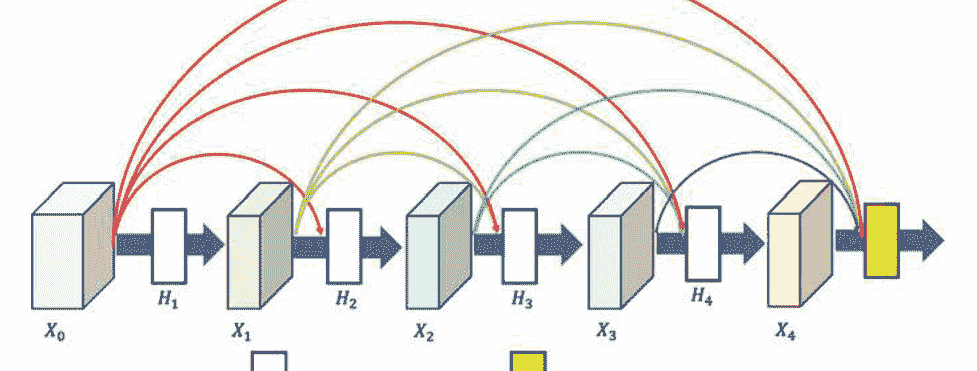

图9.2 DenseNet中的批量归一化层

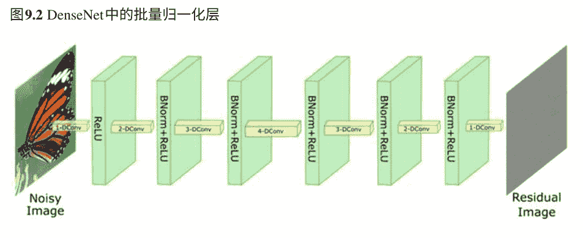

图9.3 CNN去噪器中批量归一化的使用

#### 9.2.2 层和实例归一化

批量归一化是一个强大的工具，但也有其局限性。批量归一化的主要限制是在计算(9.4)和(9.5)时依赖于小批量。那么，我们如何缓解批量归一化的问题呢？

为了理解这个问题，让我们看一下图9.4中沿着小批量堆叠的特征图的体积。图9.4的左列显示了批量归一化中的归一化操作，其中阴影区域用于计算均值和标准差以进行居中和重新缩放。这里，B表示小批量的大小。

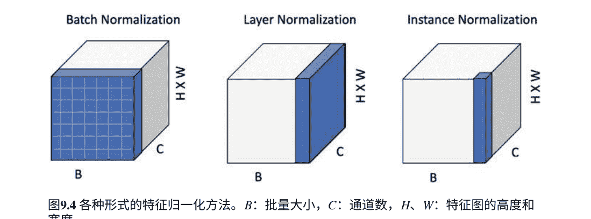

图9.4各种形式的特征归一化方法。$B$：批量大小，$C$：通道数，$H$、$W$：特征图的高度和宽度

事实上，批量归一化的图片显示有几种归一化选项。例如，层归一化[64]在不考虑小批量的情况下，沿着通道和图像方向计算均值和标准差。

更具体地说，我们有

$$y_c = \frac{\gamma}{\sigma} (x_c - \mu \mathbf{1}) + \beta \mathbf{1}, \tag{9.8}$$

对于所有的 $c = 1, \cdots, C$。在这里，$\gamma$和$\beta$是独立于通道的可训练参数，而$\mu$和$\sigma$是通过计算得到的。

$$\mu = \frac{1}{H W C} \sum_{c=1}^{C} \mathbf{1}^\top x_c, \tag{9.9}$$

$$\sigma = \sqrt{\frac{1}{H W C} \sum_{c=1}^{C} \|x_c - \mu \mathbf{1}\|^2}. \tag{9.10}$$

在层归一化中，小批量中的每个样本都有不同的归一化操作，可以使用任意大小的小批量。实验结果表明，层归一化在循环神经网络中表现良好[64]。

另一方面，实例归一化将特征数据归一化为每个样本和通道，如图9.4右侧所示。更具体地说，我们有

$$y_c = \frac{\gamma_c}{\sigma_c} (x_c - \mu_c \mathbf{1}) + \beta_c \mathbf{1}, \tag{9.11}$$

对于所有 $c = 1, \cdots, C$, 其中

$$\mu_c = \frac{1}{H W} \mathbf{1}^\top \mathbf{x}_c,$$

$$\sigma_c = \sqrt{\frac{1}{H W} \|\mathbf{x}_c - \mu_c \mathbf{1}\|^2},$$

而 $\gamma_c$ 和 $\beta_c$ 是通道 $c$ 的可训练参数。以矩阵形式，(9.11) 可以表示为

$$Y = X T + B,$$

其中 $T$ 和 $B$ 类似于(9.7)，但是针对每个样本计算。

#### 9.2.3 自适应实例归一化 (AdaIN)

通过AdaIN [67]，开启了一种新的归一化方法，超越了旨在提高性能和减少对学习率的依赖的经典归一化方法。AdaIN最重要的发现是(9.11)中的实例归一化转换为风格迁移提供了重要线索。

在我们讨论AdaIN的细节之前，我们首先解释图像样式转换的概念。图9.5展示了使用AdaIN进行图像样式转换的示例[67]。这里，顶部行显示与内容特征$X=[\mathbf{x}_1,\cdots,\mathbf{x}_C]$相关联的内容图像，而最左列对应于与样式特征$S=[s_1,\cdots,s_C]$相关联的样式图像。图像样式转换的目标是将内容图像转换为由某个样式图像引导的风格化图像。在这种情况下，AdaIN如何管理样式转换？

主要思想是使用实例归一化（9.11）中的$\gamma_c$和$\beta_c$，但是这些值不是由其自身的特征计算得到的，而是作为样式图像的标准差和均值计算得到的。

$$\beta_c^s = \frac{1}{H W} \mathbf{1}^\top \mathbf{s}_c,$$

$$\gamma_c^s = \sqrt{\frac{1}{H W} \|\mathbf{s}_c - \beta_c^s \mathbf{1}\|^2},$$

其中 $\mathbf{s}_c$ 是样式图像的第$c$个通道特征图。以矩阵形式，AdaIN可以表示为

$$Y = X T_x T_s + B_{x,s},$$

其中 $T_x$ 和 $T_s$ 是从 $X$ 和 $S$ 计算得到的对角矩阵：

$$
T_x = \begin{bmatrix} \frac{1}{\sigma_1} & \cdots & 0 \\ \vdots & \ddots & \vdots \\ 0 & \cdots & \frac{1}{\sigma_C} \end{bmatrix} \in \mathbb{R}^{C \times C} \quad (9.18)
$$

$$
T_s = \begin{bmatrix} \gamma_1^s & \cdots & 0 \\ \vdots & \ddots & \vdots \\ 0 & \cdots & \gamma_C^s \end{bmatrix} \in \mathbb{R}^{C \times C}, \quad (9.19)
$$

而 $B_{x,s}$ 是使用 $X$ 和 $S$ 计算的偏置项：

$$ B_{x,s} = \left[\begin{array}{c} \beta_1^s - \frac{\gamma_1^s}{\sigma_1} \mu_1 \cdots 0 \\ \vdots \quad \ddots \quad \vdots \\ 0 \quad \cdots \beta_C^s - \frac{\gamma_C^s}{\sigma_C} \mu_C \end{array}\right] \quad (9.20) $$

样式特征图的生成可以使用相同的编码器完成，如图9.6所示，其中内容图像和样式图像都作为输入提供给VGG编码器进行特征向量提取，然后通过AdaIN层使用上述AdaIN操作改变样式。

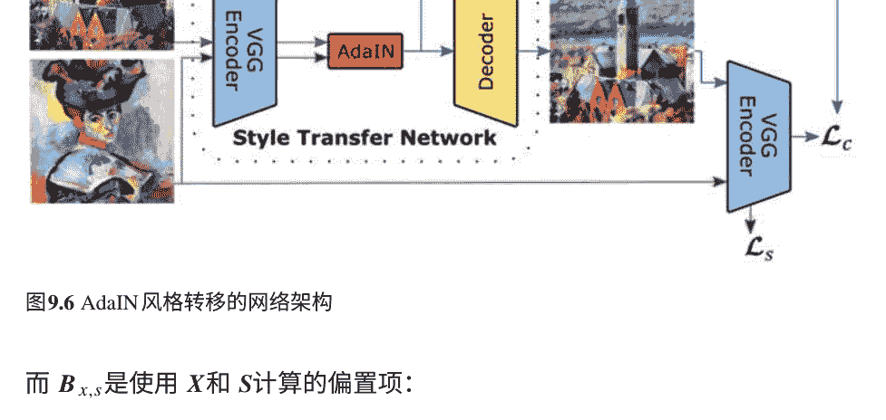

图9.6 AdaIN风格转移的网络架构

### 9.2.4 白化和着色变换（WCT）

白化和着色变换（WCT）是另一种强大的图像样式转换方法[79]，它由白化变换和着色变换组成。数学上，可以写成

$$ Y = X T_x T_s + B_{x,s}, \quad (9.21) $$

其中 $B_{x,s}$ 与 (9.20) 相同，白化变换 $T_x$ 和着色变换 $T_s$ 分别由 $X$ 和 $S$ 计算：

$$ T_x = U_x \Sigma_x^{-\frac{1}{2}} U_x^\top, \quad T_s = U_s \Sigma_s^{\frac{1}{2}} U_s^\top, \quad (9.22) $$

其中 $U_x, \Sigma_x$ 和 $U_s, \Sigma_s$ 来自于 $X$ 和 $S$ 的协方差矩阵的特征分解：

$$X^{\top} X = U_x \Sigma_x U_x^{\top}, \quad S^{\top} S = U_s \Sigma_s U_s^{\top} \qquad (9.23)$$

因此，我们可以很容易地看出，当协方差矩阵是对角矩阵时，AdaIN是WCT的一个特例。

### 9.3 注意力

在认知神经科学中，注意力被定义为行为和认知过程，其中一个选择性地关注信息的一个方面并忽略其他可感知的信息。在本节中，我们描述了神经元水平上的注意力的生物类比，并讨论了其数学形式化。

#### 9.3.1 代谢型受体：生物类比

众所周知，神经递质受体分为两种类型：离子通道受体和代谢型受体[91]。离子通道受体是跨膜分子，可以“打开”或“关闭”通道，以便不同类型的离子在细胞内外迁移，如图9.7a所示。另一方面，代谢型受体的激活只间接影响离子通道的开闭。特别地，当配体结合到代谢型受体上时，受体会立即激活G蛋白。一旦激活，G蛋白本身会继续激活另一种被称为“次级信使”的分子。次级信使会移动直到与位于膜上不同位置的离子通道结合并打开它们（见图9.7b）。重要的是要记住，代谢型受体没有离子通道，配体的结合可能会或可能不会导致膜上不同位置的离子通道的开启。

从数学上讲，这个过程可以建模如下。设 $x_n$ 为与第 $n$ 个突触结合的神经递质的数量。在第 $n$ 个突触生成的G蛋白与代谢型受体的敏感性成正比，用 $k_n$ 表示。然后，G蛋白生成与第 $m$ 个突触上的离子通道结合的次级信使，其敏感性为 $q_m$。由于次级信使是从不同突触的代谢型受体生成的，所以从第 $m$ 个突触进入的离子总量由以下求和确定。

$$y_m = \sum_{n=1}^{N} q_m k_n x_n, \quad m = 1, \dots, N, \qquad (9.24)$$

可以用向量形式表示为

$$y = Tx, \quad 其中 \quad T := qk^T \tag{9.25}$$

请注意，矩阵 T在 (9.25) 中是从 x到 y的变换矩阵。事实上，变换矩阵 T是一个秩为1的矩阵。因此，输出 y被限制在列向量的线性子空间中，即 $\mathcal{R}(q)$，其中 $\mathcal{R}(·)$表示范围空间。这意味着神经元中的激活模式遵循离子通道敏感性模式 $q$，而它们的幅度受到 $k$的调节。这可能解释了代谢型受体的另一个作用。特别是，代谢型受体更多地起作用于它们的长时间激活， 而不是离子型受体的短期激活，因为激活模式是由离子通道分布决定的，而不是由原始神经递质释放的特定位置决定的。因此， $q$和 $k$的协同组合决定了神经元激活的一般行为。

#### 9.3.2 空间注意力的数学建模

在(9.25)中，向量 $q$和 $k$通常被称为查询和关键字。令人惊讶的是，即使使用相同的关键字 $k$，通过改变查询向量 $q$，可以得到完全不同的激活模式。事实上，这是注意力机制的核心思想。通过解耦查询和关键字，我们可以动态地调整神经元的激活模式以适应我们的目的。 接下来，我们将基于这个概念回顾注意力的一般形式。

在人工神经网络中，模型(9.24)被推广为矢量量的形式。具体而言，第 $m$个像素点的行向量输出 $y^m \in \mathbb{R}^C$由查询的矢量版本 $q^m \in \mathbb{R}^d$ ，关键字 $k^n \in \mathbb{R}^d$和值 $x^n \in \mathbb{R}^C$决定：

$$y^m = \sum_{n=1}^N a_{mn}x^n \tag{9.26}$$

其中 $m = 1, \cdots, N$，且

$$a_{mn} := \frac{\exp(\text{score}(q^m, k^n))}{\sum_{n'=1}^N \exp(\text{score}(q^m, k^{n'}))} \tag{9.27}$$

在这里，score(·,·)决定了两个向量之间的相似性。 以矩阵形式表示，(9.26)可以表示为

$$Y = AX \tag{9.28}$$其中

$$ X = \begin{bmatrix} x^1 \\ \vdots \\ x^N \end{bmatrix}, \quad Y = \begin{bmatrix} y^1 \\ \vdots \\ y^N \end{bmatrix}, \quad (9.29) $$

和

$$ A = \begin{bmatrix} a_{11} & \cdots & a_{1N} \\ \vdots & \ddots & \vdots \\ a_{N1} & \cdots & a_{NN} \end{bmatrix}, \quad (9.30) $$

用于注意力的各种形式的得分函数：

- 点积：\(\text{score} (\boldsymbol{q}^m, \boldsymbol{k}^n) := \langle \boldsymbol{q}^m, \boldsymbol{k}^n \rangle\).
- 缩放点积：\(\text{score} (\boldsymbol{q}^m, \boldsymbol{k}^n) := \langle \boldsymbol{q}^m, \boldsymbol{k}^n \rangle / \sqrt{d}\).
- 余弦相似度：\(\text{score} (\boldsymbol{q}^m, \boldsymbol{k}^n) := \frac{\langle \boldsymbol{q}^m, \boldsymbol{k}^n \rangle}{\|\boldsymbol{q}^m\| \|\boldsymbol{k}^n\|}\).

例如，在点积注意力中，查询向量和键向量通常使用线性嵌入生成。更具体地说，

$$ \boldsymbol{q}^n = \boldsymbol{x}^n W_Q, \quad \boldsymbol{k}^n = \boldsymbol{x}^n W_K, \quad n = 1, \cdots, N, \quad (9.31) $$

其中 \(W_Q, W_K \in \mathbb{R}^{C\times d}\) 在所有索引中共享。查询和键的矩阵形式表示如下

$$ Q = X W_Q, \quad K = X W_K, \quad (9.32) $$

其中 \(Q, K \in \mathbb{R}^{N\times d}\) 给定为

$$ Q = \begin{bmatrix} \boldsymbol{q}^1 \\ \vdots \\ \boldsymbol{q}^N \end{bmatrix}, \quad K = \begin{bmatrix} \boldsymbol{k}^1 \\ \vdots \\ \boldsymbol{k}^N \end{bmatrix}, \quad (9.33) $$

我们经常对将 \(\boldsymbol{x}^n\) 嵌入到一个低维向量 \(\boldsymbol{v}^n \in \mathbb{R}^{d_v}\) 感兴趣，这导致了值的矩阵表示：

$$ \boldsymbol{v}^n = \boldsymbol{x}^n W_V \quad \in \mathbb{R}^{d_v}, \quad (9.34) $$

其中 \(W_V \in \mathbb{R}^{C\times d_v}\) 是值的线性嵌入矩阵。然后，注意力是通过计算得到的

$$ \boldsymbol{y}^m = \sum_{n=1}^{N} a_{mn} \boldsymbol{v}^n, \quad (9.35) $$

其中

$$ a_{mn} := \frac{\exp\left(\left\langle \boldsymbol{x}^{m} \boldsymbol{W}_{Q}, \boldsymbol{x}^{n} \boldsymbol{W}_{K}\right\rangle\right)}{\sum_{n'=1}^{N} \exp\left(\left\langle \boldsymbol{x}^{m} \boldsymbol{W}_{Q}, \boldsymbol{x}^{n'} \boldsymbol{W}_{K}\right\rangle\right)} \quad (9.36) $$

或者以矩阵形式表示，我们有

$$ \boldsymbol{Y} = \boldsymbol{A} \boldsymbol{X} \boldsymbol{W}_{V} \quad (9.37) $$

其中 \(X, Y\) 和 \(A\) 分别由(9.29)和(9.30)定义。

#### 9.3.3 通道注意力

到目前为止，我们已经讨论了空间注意力的数学形式。空间注意力的一个缺点是我们需要对注意力图 \(A\) 进行一个 \(N \times N\) 大小的矩阵乘法，这可能计算量很大。为了解决这个问题，发展出了通道注意力技术。通道注意力的一个最著名的方法是所谓的压缩与激励网络(SENet)，它在2017年的ImageNet挑战中获胜[68]。

SENet由两个步骤组成：挤压和激励（见图9.8）。在挤压步骤中，通过平均池化生成一个 \(1 \times C\) 维向量 \(z\)，如下所示：

$$ z = \frac{1}{N} \mathbf{1}^{\top} \boldsymbol{x} \quad (9.38) $$

在激励步骤中，使用神经网络 \(F\) 从 \(z\) 生成一个 \(1 \times C\) 权重向量 \(w\)，该神经网络由以下参数化：

$$ \boldsymbol{w} = \boldsymbol{F}(z) \quad (9.39) $$

然后，最终的关注图由以下给出：

$$ Y = XW, \quad \text{其中 } W := [\operatorname{diag}(w)], \quad (9.40) $$

其中 \(\operatorname{diag}(w)\) 是一个对角矩阵，其对角元素由向量 \(w\) 获得。可以很容易地看出相关的计算复杂度是最小的。然而，SENet提供了高效的通道注意机制，显著提高了神经网络的性能[68]。

### 9.4 应用

在本节中，我们将介绍归一化和注意力在现代深度学习中的令人兴奋的应用。

#### 9.4.1 StyleGAN

CVPR 2019中最令人兴奋的发展之一是Nvidia推出的一种新型生成对抗网络（GAN）——StyleGAN [89]。如图9.9所示，StyleGAN可以生成逼真到令人震惊的高分辨率图像。

虽然生成模型，特别是GAN，将在第13章中讨论，但我们在这里介绍StyleGAN，因为StyleGAN的主要突破来自AdaIN。图9.10的右侧神经网络生成潜在代码用作风格图像特征向量，而左侧网络从随机噪声生成内容特征向量。然后，AdaIN层将风格特征和内容特征结合起来，以生成更加逼真的每个分辨率的特征。实际上，这种架构与我们稍后将介绍的标准GAN架构根本不同，标准GAN架构只由内容生成器（例如左侧的生成器）生成虚假图像。通过与另一个风格生成器的协同组合，StyleGAN成功地生成了非常逼真的图像。

#### 9.4.2 自注意力生成对抗网络

注意机制的一个重要优势是对查询和键向量的分离控制。在自注意力的情况下，查询和键都来自同一数据集。在这种情况下，注意力试图从相同的输入信号中提取全局信息，以找出需要关注的信号的哪个部分。

在自注意力生成对抗网络（SAGAN）[71]中，将自注意力层添加到生成对抗网络中，以便生成器和鉴别器能够更好地捕捉空间区域之间的模型关系（见图9.11）。应该记住，在卷积神经网络中，接收域的大小受到滤波器大小的限制。考虑到这一点，自注意力是学习像素与所有其他位置之间关系的好方法，甚至可以轻松地捕捉到相距较远的全局依赖关系。因此，带有自注意力的生成对抗网络预计能够更好地处理细节。

更具体地说，让 \(X \in \mathbb{R}^{N \times C}\) 是具有 \(N\) 像素和 \(C\) 通道的特征图，\(x^m \in \mathbb{R}^C\) 表示 \(X\) 的第 \(m\) 行向量，表示在第 \(m\) 个像素位置的特征向量。然后，查询、键和值图像如下生成：

$$ q^m = x^m W_Q, \quad k^m = x^m W_K, \quad v^m = x^m W_V \quad (9.41) $$

对于所有像素索引 \(m = 1, \cdots, N\)。注意，\(W_Q, W_K, W_V \in \mathbb{R}^{C \times C}\) 矩阵可以使用 \(1 \times 1\) 卷积实现（见图9.11）。然后，类似于（9.37），注意力图像由以下表示：

$$ Y = A V = A X W_V, \quad (9.42) $$

其中

$$ V = \begin{bmatrix} v^1 \\ \vdots \\ v^N \end{bmatrix}, \quad (9.43) $$

而 \(A\) 矩阵的 \((m, n)\) 元素由以下给出

$$ a_{mn} := \frac{\exp\left( \langle q^m, k^n \rangle \right)}{\sum_{n'=1}^N \exp\left( \langle q^m, k^{n'} \rangle \right)}. \quad (9.44) $$

然后，最终的自注意特征图由以下计算得出

$$ O = Y W_O \quad (9.45) $$

也可以使用 \(1 \times 1\) 卷积来实现。

如（9.42）和（9.45）所示，新的特征向量 \(o^m\) 是通过对整个图像中的值向量 \(\{v^n\}_{n=1}^{N}\) 进行加权线性组合，在第 \(m\) 个像素位置生成的，权重由注意力图 \(A\) 的元素确定。因此，自注意力图的感受野是整个图像，这使得图像生成更加有效。然而，一个缺点是我们需要对注意力图 \(A\) 进行一个 \(N \times N\) 大小的矩阵乘法，这可能计算上代价高昂。

#### 9.4.3 注意力生成对抗网络：文本到图像生成

在注意力生成对抗网络（AttnGAN）[72]中，作者提出了一种基于注意力的架构，用于文本到图像的生成（见图9.12）。除了对细粒度翻译的详细结构外，AttnGAN的关键思想是使用跨领域的注意力。特别地，查询向量是从图像区域生成的，而关键向量是从单词特征生成的。通过结合查询和关键，AttnGAN可以自动选择单词级条件来生成图像的不同部分[72]。

#### 9.4.4 图注意力网络

在图注意力网络（GAT）[69]中，主要关注的是一个神经网络应该更多地访问的节点，以实现中间节点的更好嵌入（图9.13）。为了融入图的连通性，作者建议对查询、关键和值向量进行特定的约束，如下所示：

$$ q^v = x^v W, \quad k^u = v^u = x^u W, \quad u \in \mathcal{N}(v). \quad (9.46) $$

从这个中，节点之间的注意力系数通过计算得到

$$ e_{vu} = \text{score}(q^v, k^u), $$

其中 \(\text{score}(\cdot)\) 表示特定的注意机制。为了使系数在不同节点之间容易访问，系数通过以下方式进行归一化

$$ \alpha_{vu} = \frac{\exp(e_{vu})}{\sum_{u' \in \mathcal{N}(v)} \exp(e_{vu'})}. \quad (9.47) $$

然后，图神经网络由归一化的连接系数表示:

$$ x^v = \sigma \left( \sum_{u \in N(v)} \alpha_{vu} x^u W \right) $$

#### 9.4.5 变压器

变压器是一种深度机器学习模型，于2017年引入，最初用于自然语言处理（NLP）[73]。在NLP中，传统上使用循环神经网络（RNN），如长短期记忆（LSTM）[92]。在RNN中，数据按顺序使用内部的记忆单元进行处理。尽管变压器被设计用于处理有序数据序列，例如语音，但与RNN不同，变压器可以并行处理整个序列，以减少路径长度，从而更容易学习序列中的长距离依赖关系。自从问世以来，变压器已成为NLP中大多数最先进架构的基石，导致了著名的最先进的双向编码器表示来自变压器（BERT）[74]，生成式预训练变压器3（GPT-3）[76]等的发展。如图9.14所示，基于变压器的语言翻译包括编码器和解码器架构。变压器的主要思想是前面讨论的注意机制。特别地，注意机制中的查询、键和值向量的本质被充分利用，以便编码器可以学习语言嵌入，解码器执行语言翻译。

特别是，例如英语的句子被用于编码器上，以学习如何嵌入句子中的每个单词。为了学习句子内单词之间的长程依赖关系，编码器上使用了自注意力机制。当然，自注意力机制还不足以执行复杂的语音嵌入任务。因此，在编码器块的附加单元之后，还有额外的残差连接、层归一化和神经前馈网络（见图9.15）。一旦训练完成，Transformer的编码器生成包含每个单词在句子中结构角色的词嵌入。

在解码器中，现在使用来自编码器的这些嵌入向量来生成关键向量，如图9.14和9.16所示。这与从目标语言（如法语）生成的查询向量相结合。然后，这种混合组合创建了注意力图，通过考虑它们的结构角色，将单词在两种语言之间进行转换的转换矩阵。

Transformer的另一个重要组成部分是位置编码（参见图9.14和9.15中的位置编码块）。与RNN和LSTM相比，Transformer同时处理句子中的每个单词，以捕捉句子中的长程依赖关系，因此模型本身对每个单词的位置没有任何概念。然而，句子中单词的位置很重要，因为它决定了句子的语法和语义。因此，有必要考虑单词的顺序，位置编码就是用来解决这个问题的。要成为有效的位置编码，一种方法应该输出句子中每个单词位置的唯一编码，并且能够轻松推广到更长的句子。

在各种可能的方法中，Transformer的原始作者使用了不同频率的正弦和余弦函数[73]。更具体地说，让 \(n\) 成为输入句子中的期望位置， \(p_n \in \mathbb{R}^d\) 为其相应的编码，其中 \(d\) 是选择的编码维度，应为偶数。

然后，位置编码向量由以下给出

$$ \boldsymbol{p}_n = \begin{bmatrix} \sin(\omega_1 n) \\ \cos(\omega_1 n) \\ \sin(\omega_2 n) \\ \cos(\omega_2 n) \\ \vdots \\ \sin(\omega_{d/2} n) \\ \cos(\omega_{d/2} n) \end{bmatrix} \in \mathbb{R}^d, \quad \text{其中} \quad \omega_k = \frac{1}{10000^{2k/d}}. $$

然后将此位置编码向量添加到词嵌入向量 \(\boldsymbol{x}_n \in \mathbb{R}^d\) 以获得位置编码的词嵌入向量:

$$ \boldsymbol{x}_n \leftarrow \boldsymbol{x}_n + \boldsymbol{p}_n, $$

然后将其馈送到Transform中的自注意模块中。

读者可能会想为什么将位置编码向量与单词嵌入相加而不是连接起来。尽管在原始论文[73]中经验性地使用了这种方法，但最近的理论分析表明，具有加性位置编码的Transformer架构是图灵完备的[93]，并且可以重新参数化以表示任何卷积层[94]。

Transformer是一个巧妙地结合了完整的数学原理的注意力机制，它使用单独的查询向量和键向量来实现语言翻译的特定目的。因此，Transformer已成为现代自然语言处理的主要工具。

#### 9.4.6 BERT

自然语言处理的最新里程碑之一是BERT（双向编码器表示来自Transformer）的发布[74]。BERT的发布甚至可以看作是自然语言处理新时代的开始。BERT的一个独特特点是其结果结构与FPGA（现场可编程门阵列）芯片一样规则，因此可以通过简单地更改训练方案来将BERT单元用于不同的目的和语言。

BERT的主要架构是双向Transformer编码器单元的级联连接，如图9.17所示。由于使用了Transformer架构的编码器部分，输入和输出特征的数量保持不变，而每个特征向量的维度可能不同。例如，输入特征可以是一个独热编码的单词，其特征维度取决于语料库词汇的大小。输出可能是在上下文中总结单词作用的低维嵌入。使用双向Transformer编码器的原因是基于这样的观察：即使句子中单词的顺序不同，人们也能理解句子的意思。

以下是根据图片描述整理的表格：

| 模型/组件 | 描述 | 对应图片 |
| :--- | :--- | :--- |
| Deep Attentional Multimodal Similarity Model (DAMSM) | 用于文本到图像生成的注意力模型组件 | 图9.12的一部分 |
| Attentional Generative Network | 包含多个注意力模块（F0, F1, F2）和生成器（G0, G1, G2）以及判别器（D0, D1, D2）的网络 | 图9.12的一部分 |
| Image Encoder | 图像编码器，用于提取局部图像特征 | 图9.12的一部分 |
| Text Encoder | 文本编码器，用于提取单词特征和句子特征 | 图9.12的一部分 |
| 输入句子示例 | "The white puppy is sitting on the green grass." | 图9.12的一部分 |
| 生成图像分辨率 | 3x64x64, 3x128x128, 3x256x256 | 图9.12的一部分 |

## 图9.17 BERT架构

## 图9.18 BERT训练的预训练和微调方案

反转。通过考虑逆序，可以更好地总结上下文中每个单词的作用，从而得到更高效的单词嵌入的注意力图。 BERT的另一个美妙之处在于训练。 具体而言，如图9.18所示，BERT训练包括两个步骤：预训练和微调。 在预训练步骤中，任务的目标是猜测输入句子中的掩码单词。 图9.19展示了对这个掩码单词估计的更详细解释。 来自维基百科的输入句子中大约有15%的单词被掩码为特定的标记（在本例中为[MASK]），训练的目标是从相同位置的嵌入输出中估计出掩码单词。 由于BERT输出只是一个嵌入特征，我们需要一个额外的全连接神经网络（FFNN）和softmax层来估计具体的单词。 有了这个额外的网络，我们可以正确地预训练BERT单元。

一旦BERT预训练完成，BERT单元就会使用监督学习任务进行微调。 例如，图9.20显示了一个监督学习任务。 在这里， Classification output at the masked token's position is used to predict the masked token

| Word | Probability |
|------|-------------|
| aakaua | 0.01% |
| boy | 14% |
| zxzzyz | 0.02% |

All possible English words

Feed Forward & Softmax

## BERT

- 1. <CLS>
- 2. The
- 3. girl
- 4. wanted
- 5. the
- 6. <MASK>
- 7. to
- 8. hug
- 9. her
- ...

Input tokens
15% Randomly masked tokens

- 1. <CLS>
- 2. The
- 3. girl
- 4. wanted
- 5. the
- 6. boy
- 7. to
- 8. hug
- 9. her
- ...

## 图9.19用于BERT训练的掩码词的估计

## 图9.20 BERT微调的下一个句子估计的监督学习任务

BERT的输入由两个句子组成，分别用另一个标记[SEP]分隔。 监督学习的目标是评估第二个句子是否是第一个句子的正确延续。 这个输出现在嵌入在BERT输出1中，然后作为全连接神经网络的输入，接着是一个softmax层，用于估计第二个句子是否是下一个。 由于在BERT中输入和输出相同的数字，输入记录的第一个单词应该是一个指示空缺单词[CLS]的标记。

另一个有监督的微调示例是对句子是否为垃圾邮件进行分类，如图9.21所示。在这种情况下，只使用一个句子作为BERT的输入，并使用BERT的输出1来分类输入的句子是否为垃圾邮件。

实际上，有多种利用BERT单元进行有监督微调的方法，这是BERT的另一个重要优势[74]。

### 9.4.7 生成式预训练变换器（GPT）

生成式预训练变换器（GPT）是由OpenAI开发的语言模型，可以生成类似人类文本的文本。 特别是第三代模型GPT-3，由于其令人难以置信的能力，能够生成与人类写作无法区分的文本，因此被认为是自然语言处理中最强大且具有争议的人工智能模型[76]。

回想一下，BERT需要对大量文本进行预训练，然后对特定任务进行微调。然而，对于一个特定任务，需要一个经过精细调整的训练数据集，其中包含成千上万个示例，这通常是相当苛刻的要求。这与人类非常不同，人类通常能够使用少量示例完成新的语言任务。

基于观察到缩放语言模型极大地改善了任务无关的少样本性能，并且有时甚至与之前的微调方法竞争。GPT-2 [75]和GPT-3 [76]是基于这一观察而开发的。GPT训练的目标与BERT预训练类似，即根据句子中前面的单词来估计下一个单词。 因此，GPT代表生成式预训练Transformer。 例如，通过使用前面的单词“最新的语言模型GPT-3是”作为输入，GPT被训练生成单词“很棒”。尽管这种纯预训练方案并没有改善BERT的性能，但GPT-2特别是GPT-3的成功主要原因之二是其庞大的架构，使得生成式预训练比微调更加强大。与拥有约3.4亿参数的最大BERT架构相比，GPT-3的参数数量极其庞大，约为1750亿。

回想一下，在语言翻译中，可以通过Transformer解码器对下一个单词进行生成估计。 因此，GPT-3由96个Transformer解码器层堆叠而成，与BERT的仅编码器架构不同（见图9.22）。每个解码器层由多个组成。

## 图9.22 BERT和GPT架构的区别

## 图9.23 GPT解码器块的架构

## 图9.24 BERT中的自注意力和GPT-3中的掩码自注意力的区别

解码器块由2048个令牌宽度的掩码自注意力块和前馈神经网络组成（见图9.23）。如图9.24所示，掩码自注意力使用前面的单词计算注意力矩阵，用于估计下一个单词。

为了训练1750亿个权重，GPT-3使用了4990亿个标记或单词进行训练。训练数据集中的60%来自于4100亿个标记的经过筛选的Common Crawl版本。其他来源包括来自WebText2的190亿个标记，来自Books1的120亿个标记，来自Books2的550亿个标记，以及来自维基百科的30亿个标记。尽管如此，GPT-3的性能可能会受到训练数据质量的影响。例如，有报道称当GPT-3被要求讨论犹太人、女性、黑人和大屠杀时，它会生成性别歧视、种族歧视和其他有偏见和负面的语言。

#### 9.4.8 视觉Transformer

受到Transformer架构成为自然语言处理领域的最新技术的启发，研究人员探索了其在计算机视觉中的应用。如前所述，在计算机视觉中，通常将注意力应用于卷积网络，以便用注意力替换卷积网络的某些组件，同时保持其整体结构。在[96]中，作者们表明这种对CNN的依赖并非必要，直接将纯Transformer应用于图像块序列在图像分类任务中可以很好地工作。

他们的模型，称为Vision Transformer（ViT），如图9.25所示。为了处理2D图像，输入图像x被重新调整为一系列扁平化的2D块，然后每个块使用可训练的线性投影嵌入到一个D维向量中。Transformer在所有层中都使用恒定的潜在向量大小D。位置嵌入被添加到块嵌入中以保留位置信息。嵌入向量的结果序列作为编码器的输入。关于前面的[Class]标记，在Transformer编码器输出的嵌入块序列中，一个可学习的嵌入用作整个图像表示。在预训练和微调期间，都会附加一个分类头来训练网络以获得最佳分类结果的嵌入图像表示。

ViT中的Transformer编码器由多头自注意力和MLP块的交替层组成。在每个块之前和之后分别应用层归一化和残差连接。MLP包含两个具有GELU非线性的层。通常，ViT在大型数据集上进行训练，并对（较小的）下游任务进行微调。为此，我们移除预训练的预测头，并附加一个零初始化的D×K前馈层，其中K是下游类别的数量。

### 9.5 归一化和注意力的数学分析

到目前为止，我们已经讨论了归一化和注意力。归一化最初是为了加速随机梯度方法的发展，并已扩展到风格转移、图像生成等领域。另一方面，由于其学习长距离关系和通过操作查询和键的灵活性，注意力已成功扩展到各种应用，引领着自然语言处理方法的突破，如BERT、GPT-3等

在阅读过程中，您可能已经注意到归一化和注意力可能具有非常相似的数学公式。例如，对于给定的特征图$X \in \mathbb{R}^{H \times W \times C}$，实例归一化、AdaIN和WCT可以表示如下：

$$Y = XT + B,$$ (9.51)

其中通道方向变换$T$和偏置$B$是从特征图的统计学中学习得到的。实例归一化、AdaIN和WCT之间唯一的区别在于它们估计$T$和$B$的具体方式。例如，在实例归一化的情况下，$T$的所有元素都是从输入特征中估计得到的，而在AdaIN和WCT的情况下，它们是从内容和风格图像的统计学中估计得到的。WCT、实例归一化和AdaIN之间的主要区别在于对于WCT来说，$T$是一个密集的矩阵，而实例归一化和AdaIN使用对角矩阵。

另一方面，空间注意力可以表示为

$$Y = AX,$$ (9.52)

其中$A$是根据自身特征计算得到的，用于自注意力的情况，或者是根据其他领域特征的帮助计算得到的，用于跨领域注意力的情况。类似地，如SENet所示的通道注意力可以计算为

$$Y = XT,$$ (9.53)

其中对角矩阵$T$再次从$X$计算得到。
这意味着归一化和注意力，除了在生成$A$、$T$、$W$和$B$方面存在特定差异外，可以被视为以下转换的特例：

$$Y = AXT + B.$$ (9.54)

从数学上讲，$A$修改了$X$的列空间，而$T$控制了$X$的行空间。因此，注意力图$A$与$T$不同，并控制着不同的因素和特征$X$的变化。

基于这一观察，Kwon等人提出了所谓的对角GAN。这是基于以下直觉：尽管$A$是从原始自注意力中的$X$获得的稠密矩阵，但AdaIN的洞察力可以用于从新的注意力代码生成器中获得高效的对角注意力图$A$来进行内容控制。具体而言，他们引入了一种新的对角注意力(DAT)模块来操纵内容特征图，如图9.26b所示。该方法的一个重要优点是，由于(9.54)中的对称性，AdaIN和DAT都可以应用于每一层，从而实现图像内容和风格可以独立调节。这导致生成图像中内容和风格组件的有效解耦。此外，所提出的方法通过选择性地控制生成图像的空间属性，在任意分辨率下改变分层注意力图具有灵活性。

如图9.27所示，AdaIN和DAT的组合非常令人印象深刻。对于图9.27a中给定的源图像，这些图像是从任意风格和内容代码生成的，(b)显示了具有不同风格代码和固定内容代码的样本。请注意，发型和身份变化，而面部方向和表情相似。另一方面，如果我们生成具有不同内容代码和固定风格的样本，同一个人或动物的面部方向和表情会发生变化。最后，如果内容和风格代码都如(c)所示变化，面部方向、表情、发型和人物身份也会相应变化。

这清楚地显示了风格和内容之间的解耦。人们可能会想知道在图9.26b的styleGAN的每一层中添加噪声是否起到了类似的内容变化的作用。事实上，对于原始的styleGAN来说，添加噪声是出于类似的动机，正如作者所指出的，右侧的网络是从随机噪声中生成内容特征向量的。尽管如此，应该记住，添加的噪声项基本上是对(9.54)中的偏置项的加法，这与调制列空间的A是根本不同的。事实上，额外的偏置项同时影响X的行空间和列空间，导致风格和内容之间的纠缠调制。

### 9.6 练习

- 1. 找出(9.22)中的WCT变换在何种条件下简化为AdaIN。
- 2. 假设给定像素数为$H \times W =4$和通道数为$C =3$的特征图。

```
X = \begin{bmatrix}
1 & 2 & 3 \\
-1 & -3 & 0 \\
5 & -2 & 1 \\
0 & 0 & -5
\end{bmatrix}
```

- a. 对 $X$进行层归一化。
- b. 对 $X$进行实例归一化。

图9.27 (顶部) 由我们的方法生成的1024×1024图像，使用CelebA-HQ数据集进行训练。(底部) 由我们的方法生成的512×512图像，使用AFHQ数据集进行训练。(a) 从任意风格和内容代码生成的源图像。(b) 具有不同风格代码和固定内容代码的样本。(c) 使用不同内容代码和固定风格生成的样本。(d) 使用不同内容和风格代码生成的样本。

- 3. 此外，假设风格图像的特征映射由以下给出

```
$$ S = \begin{bmatrix} 0 & 1 & 1 \\ -1 & -1 & 1 \\ 1 & 0 & 0 \\ -1 & 1 & 1 \end{bmatrix} $$ (9.56)
```

- a. 对于(9.55)中给定的特征映射，将 X 从 S 的风格进行自适应实例归一化。
- b. 对于(9.55)中给定的特征映射，将 X 从 S 的风格进行WCT风格转移。

- 4. 使用(9.55)中的特征映射，我们对计算自注意力图感兴趣。让 W_Q 和 W_k 分别为查询和键的嵌入矩阵：

```
$$ W_Q = \begin{bmatrix} 2 & 1 \\ 0 & \frac{1}{2} \\ 0 & 0 \end{bmatrix}, \quad W_K = \begin{bmatrix} \frac{1}{3} & 0 \\ 1 & -1 \\ 10 & 5 \end{bmatrix} $$ (9.57)
```

- a. 使用点积得分函数，计算注意力矩阵 A。
- b. 什么是关注特征图，即 Y = AX？
- c. 对于GPT-3中的掩码自注意力情况，计算注意力掩码 A 和关注特征图 Y = AX。

- 5. 对于具有编码维度 d = 10 的Transformer中给定的位置编码(9.49)，计算位置编码向量 p_n，其中 n = 1, ..., 10.
- 6. 详细解释以下句子：“BERT只有编码器结构，而GPT-3只有解码器架构。”
- 7. 对于给定的特征图 X ∈ R^{N×C}，证明经过AdaIN和噪声处理后的styleGAN特征图表示为

```
$$ Y = XT + B $$ (9.58)
```

指定矩阵 T 和 B 的结构。

- 8. 对于给定的特征图 X ∈ R^{N×C}，证明经过AdaIN、DAT和噪声处理后的Diagonal GAN特征图表示为

```
$$ Y = AXT + B $$ (9.59)
```

指定矩阵 A、T 和 B 的结构以及它们的数学作用。

## 深度学习的高级主题

> > “我真的很困惑。我每天都在改变我的观点，似乎无法确定对这个难题有一个坚定的看法。不，我不是在谈论世界政治或者当前的美国总统，而是关于对人类和我们作为工程师和研究人员的存在和工作更为关键的事情。我在谈论的是...深度学习。”
> – 迈克尔·埃拉德

## 第10章 深度学习的几何

### 10.1 引言

在这一章中，数学内容较多，我们将尝试回答机器学习中最重要的问题：深度神经网络学到了什么？深度神经网络，特别是卷积神经网络，如何实现这些目标？对于这些基本问题的完整答案还有很长的路要走。以下是我们在追求这一目标过程中获得的一些见解。特别是，我们解释了为什么传统的机器学习方法，如单层感知器或核机器，不足以实现目标，以及为什么现代的卷积神经网络成为一个有前途的工具。

回想一下，在深度学习革命的早期阶段，大多数卷积神经网络架构，如AlexNet、VGGNet、ResNet等，主要是为ImageNet挑战等分类任务而开发的。然后，卷积神经网络开始广泛应用于低级计算机视觉问题，如图像去噪[90, 98]、超分辨率[99, 100]、分割[38]等，这些问题被视为回归任务。事实上，分类和回归是机器学习中最基本的两个任务，可以统一在函数逼近的范畴下。回想一下，表示定理[15]表明，对于给定的测试数据集 {(x_i, y_i)}^n_{i=1}，一个分类器设计或回归问题可以通过解决以下优化问题来解决：

$$ \min_{f \in \mathcal{H}_k} \frac{1}{2} \|f\|_{\mathcal{H}}^2 + C \sum_{i=1}^{n} \ell(y_i, f(x_i)), $$

其中 $\mathcal{H}_k$ 表示具有核 $k(\boldsymbol{x}, \boldsymbol{x}')$ 的再生核 Hilbert 空间 (RKHS)，$\| \cdot \|_{\mathcal{H}}$ 是 Hilbert 空间范数，而 $(\cdot, \cdot)$ 是损失函数。再生核定理的一个最重要的结果是最小化 $f$ 具有以下闭合形式表示：

$$ f (\boldsymbol{x}) = \sum_{i=1}^{n} \alpha_i k(\boldsymbol{x}_i, \boldsymbol{x}), \qquad (10.2) $$

其中 $\{\alpha_i\}_{i=1}^{n}$ 是从训练数据集中学习到的参数。例如，如果使用 hinge 函数作为损失函数，解决方案将变为核 SVM，而如果使用当 $l_2$ 函数被用作损失函数时，它变成了核回归。

一般来说，方程 (10.2) 中的解 $f(\boldsymbol{x})$ 是输入 $\boldsymbol{x}$ 的非线性函数，基于核 $k(\boldsymbol{x}_j, \cdot)$，这个核函数是非线性依赖于 $\boldsymbol{x}$ 的。核函数的非线性使得方程 (10.2) 中的表达更加丰富，从而在 RKHS $\mathcal{H}_k$ 中生成了各种各样的函数。

尽管如此，方程 (10.2) 中的表达仍然有根本性的限制。首先，RKHS $\mathcal{H}_k$ 是通过自上而下选择核函数来指定的，据我们所知，没有办法从数据中自动学习。其次，一旦核机器被训练，参数 $\{\alpha_i\}_{i=1}^{n}$ 就被固定下来，在测试阶段无法调整。这些缺点导致了神经网络的根本性限制，即能够逼近任何函数的能力。当然，可以通过增加学习机器的复杂性来增加表达能力，例如通过组合多个核机器。然而，我们的目标是在给定复杂性约束下实现更好的表达能力，在这个意义上，核机器存在问题。

#### 10.1.1 机器学习的期望

鉴于核机器的局限性，我们可以陈述以下的期望——即一个终极学习机应该满足的期望：

- 数据驱动模型：学习机能够表示的函数空间应该是从数据中学习而来的，而不是由自上而下的数学模型指定的。
- 自适应模型：即使在机器学习之后，学习到的模型也应该能够适应测试阶段的输入数据。
- 表达性模型：模型的表达能力应该比模型复杂性的增加更大。
- 归纳模型：训练数据中学到的信息应该在测试阶段使用。

接下来，我们将回顾两种经典方法—单层感知器和框架表示，并解释为什么这些经典模型未能满足期望。后面我们将展示现代深度学习方法是如何通过充分利用这些经典方法的固有优势来克服它们的缺点而发展起来的。

### 10.2 案例研究

#### 10.2.1 单层感知器

单层感知器是多层感知器（MLP）的特例，它由单个隐藏层上的全连接神经元组成。具体而言，让 φ : ℝ → ℝ是一个非常数、有界且连续的激活函数。让 X ⊂ ℝ^m表示输入空间。那么，单层感知器 f : X → ℝ可以表示为

$$f (\boldsymbol{x}) = \sum_{i=1}^{d} v_i \varphi \left( \boldsymbol{w}_i^{\top} \boldsymbol{x} + b_i \right), \quad \text{其中 } \boldsymbol{x} \in \mathcal{X}, \quad (10.3)$$

其中 $\boldsymbol{w}_i \in \mathbb{R}^m$ 是一个权重向量，$v_i, b_i \in \mathbb{R}$ 是实数常数，且 $\{ (\boldsymbol{w}_i, v_i, b_i) \}_{i=1}^d$ 表示神经网络的参数。然后，通过使用训练数据 $\{(\boldsymbol{x}_i, y_i)\}_{i=1}^N$ 来解决以下优化问题来估计参数：

$$\min \sum_{i=1}^{n} \ell(y_i, f (\boldsymbol{x}_i)) + \lambda R(\Theta), \quad (10.4)$$

其中 $\lambda$ 是正则化参数，$R(\Theta)$ 是关于参数集 $\Theta$ 的正则化函数。

关于单层感知器的表示能力的经典结果之一可以追溯到1989年[48]。它表明具有单个隐藏层的前馈网络，在激活函数的温和假设下，可以在紧致子集上逼近连续函数。

**定理10.1 (通用逼近定理[48])** 设 $\mathcal{X}$ 上的实值连续函数空间为 $C(\mathcal{X})$。那么，对于给定的 $\varepsilon > 0$ 和任意的 $g \in C(\mathcal{X})$，存在一个整数 $d$，使得 (10.3) 中的单层感知器是函数 $g$ 的近似实现；即，

$$| f (\boldsymbol{x}) - g(\boldsymbol{x}) | < \varepsilon$$

对于所有的 $\boldsymbol{x} \in \mathcal{X}$。

#### 10.2.2 帧表示

现在，我们回顾另一类函数表示，称为 frame[1]。为了理解 frame 的数学概念，我们从其简化形式——basis开始。

在数学中，如果一个向量空间 V 的一个元素（向量）集合 $B = \{\boldsymbol{b}_i\}_{i=1}^{m}$ 被称为基，那么对于 $V$ 的每个元素 $\boldsymbol{f}$，都存在唯一的系数 $\{a_i\}$ 使得

$$f = \sum_{i=1}^{m} a_i \boldsymbol{b}_i. \tag{10.5}$$

与基不同，框架由冗余的基向量组成，允许多重表示。框架也可以扩展到处理函数空间，此时框架元素的数量是无限的。形式上，一组函数

$$\boldsymbol{\Phi} = [\phi_k]_{k\in\Gamma} = [\cdots \phi_{k-1} \phi_k \cdots]$$

在希尔伯特空间 H中，如果满足以下不等式[1]，则称为 frame：

$$\alpha \|f\|^2 \le \sum_{k \in \Gamma} |\langle f, \phi_k \rangle|^2 \le \beta \|f\|^2, \quad \forall f \in H. \tag{10.6}$$

其中\(\alpha, \beta >0\)被称为框架界限。如果\(\alpha = \beta\)，则称该框架是紧密的。实际上，基是紧密框架的特例。

通过将 \(c_k := \langle f, \phi_k\rangle\)作为关于 \(k\)-th帧向量 \(\phi_k\)的展开系数，并定义帧系数向量

$$\boldsymbol{c} = [c_k]_{k \in \Gamma} = \boldsymbol{\Phi}^{\top} f,$$

(10.6)可以等价地表示为

$$\alpha \|f\|^2 \le \|\boldsymbol{c}\|^2 \le \beta \|f\|^2, \quad \forall f \in H. \tag{10.7}$$

这意味着展开系数的能量应该受到原始信号能量的限制，并且对于紧框架的情况，展开系数的能量与原始信号能量相同，只是缩放因子不同。

当帧下界 \(\alpha\)非零时，可以通过使用由 \(\widetilde{\boldsymbol{\Phi}}\)给出的对偶帧算子 \(\boldsymbol{c} = \boldsymbol{\Phi}^{\top}f\)来恢复原始信号。

$$\widetilde{\boldsymbol{\Phi}} = [\cdots \widetilde{\phi}_{k-1} \widetilde{\phi}_{k} \cdots], \tag{10.8}$$

满足所谓的框架条件的

$$\widetilde{\boldsymbol{\Phi}} \boldsymbol{\Phi}^{\top} = \boldsymbol{I}, \tag{10.9}$$

因为我们有

$$\hat{f} := \widetilde{\boldsymbol{\Phi}} \boldsymbol{c} = \boldsymbol{\Phi} \boldsymbol{\Phi}^{\top} f = f,$$

或者等价地,

$$f = \sum_{k \in \Gamma} c_k \widetilde{\phi}_k = \sum_{k \in \Gamma} \langle f, \phi_k \rangle \widetilde{\phi}_k. \tag{10.10}$$

请注意，(10.10)是一个线性信号展开，因此对于机器学习任务没有用处。然而，当它与非线性正则化相结合时，会发生更有趣的事情。例如，考虑一个回归问题，从噪声测量中估计一个无噪声信号 \(\boldsymbol{y}\):

$$\boldsymbol{y} = \boldsymbol{f} + \boldsymbol{w}, \tag{10.11}$$

其中 $\boldsymbol{w}$ 是附加噪声， $\boldsymbol{f}$ 是要估计的未知信号。 如果我们将损失函数定义如下：

$$ \min_{\boldsymbol{f}} \frac{1}{2} \|\mathbf{y} - \boldsymbol{f}\|^2 + \lambda \|\mathbf{\Phi}^{\top} \boldsymbol{f}\|_1, \tag{10.12}$$

其中$\|\cdot\|_1$是$l_1$范数，那么解满足以下条件[106]:

$$ \widehat{\boldsymbol{f}} = \sum_{k \in \Gamma} \rho_\lambda \left( \langle \mathbf{y}, \boldsymbol{\phi}_k \rangle \right) \widetilde{\boldsymbol{\phi}}_k, \tag{10.13}$$

其中 $\rho_\lambda(\cdot)$是一个非线性阈值函数，它依赖于正则化参数 $\lambda$。 这意味着信号表示会根据输入 $\mathbf{y}$ 的不同而改变，因为在非线性阈值处理后，只有一小部分系数 $\langle \mathbf{y}, \boldsymbol{\phi}_k \rangle$会变为非零，信号只由一小部分对应于非零扩展系数的对偶基 $\widetilde{\boldsymbol{\phi}}_k$表示。

在过去几十年中，信号处理中最常用的框架表示之一是小波框架或框架波[106]，其中其基函数捕捉多分辨率尺度和位移相关特征。 例如，图10.1展示了不同尺度参数 $j$下的Haar小波基函数。 随着尺度的增加，基函数 $\phi_k$的支持变窄，以便在应用内积后捕捉到信号的更局部行为。 更具体地说，图10.2展示了无噪声原始信号 $f$及其带噪声版本 $\mathbf{y}$以及它们的小波展开系数。 在这里， $d_s(n)$表示 $s$尺度小波展开系数。 如图10.2所示，对于平滑无噪声信号，大部分小波展开系数都是零，只有一些低尺度的展开系数不为零。 另一方面，对于带噪声信号，小幅度非零小波展开系数在所有尺度上都存在。 因此，小波收缩信号去噪[107]的主要思想是使用阈值操作 $\rho_\lambda(\cdot)$将小幅度小波系数置零，并保留具有重要信号特征的超过阈值的大系数。 因此，使用公式(10.13)进行重构可以恢复底层无噪声信号。

将这个想法扩展到信号去噪之外，信号处理理论中的其他成功工具是压缩感知或稀疏恢复技术[46]。 特别是，压缩感知理论基于这样的观察：当图像通过基或帧的表示时，在许多情况下，它们可以表示为基或帧的稀疏组合，如图10.3所示。 由于稀疏表示，即使测量值远远低于经典极限（如奈奎斯特极限），通过寻找生成与测量数据一致的稀疏表示来获得反问题的稳定解，如图10.3所示。 因此，图像重建问题的目标是找到适用于给定测量数据的最佳稀疏基函数集。 这就是为什么经典方法通常被称为基追踪[46]。

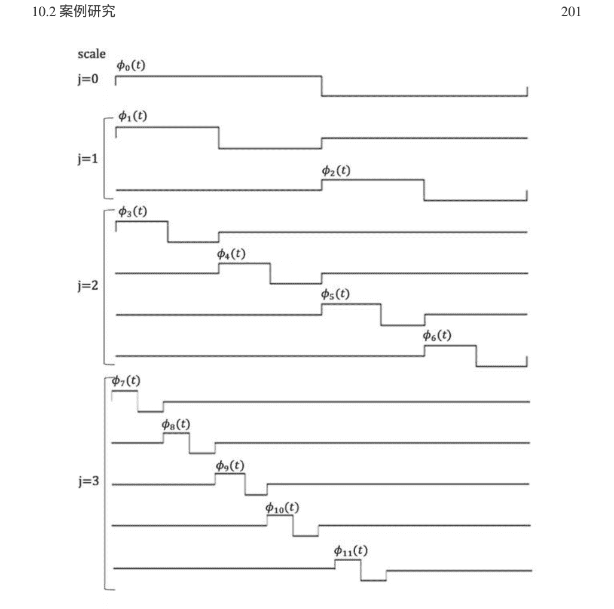

与（10.2）中的核机器相比，使用框架表示的基追踪具有几个独特的优势。首先，基追踪可以生成的函数空间通常比（10.2）中的RKHS更大。实际上，这个空间通常被称为子空间的并集[108]，它是Hilbert空间的一个大子集。

其次，在给定的框架中，选择活动对偶框架基 $\widetilde{\phi_k}$ 完全取决于数据。因此，基追踪表示是一种自适应模型。此外，基追踪的展开系数 $\rho_\lambda(\langle \mathbf{y}, \phi_k \rangle)$ 也完全取决于输入 $\mathbf{y}$，从而生成比具有固定展开系数的核机器更多样化的表示。

话虽如此，基追踪方法（10.13）的一个最基本的限制是它是传导的（transductive），不允许归纳学习。

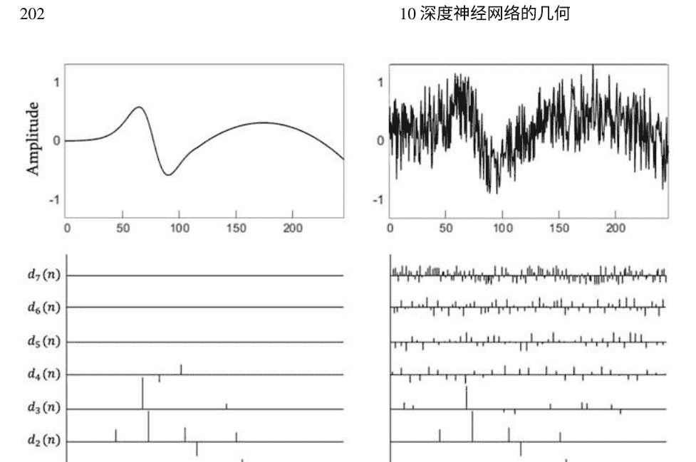

图10.2 两个信号在不同尺度上的小波系数

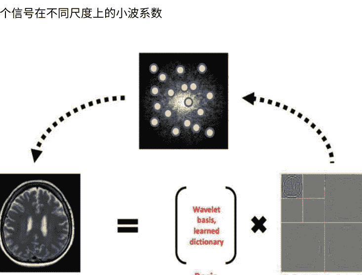

图10.3 压缩感知的重构原理

来自训练数据。一般来说，应该对每个数据集解决（10.12）中的基追踪回归问题，因为非线性阈值函数应该通过优化方法找到每个数据集。因此，将学习从一个数据集转移到另一个数据集是困难的。

### 10.3 卷积框架

在深度卷积框架[42]的理论中，我们简要回顾了卷积神经网络之前的线性框架展开，这是理解CNN几何的重要基石。为了简单起见，我们考虑了理论的1-D版本。

#### 10.3.1 卷积和汉克尔矩阵

假设一个N维信号 $x \in \mathbb{R}^N$ 可以表示为

$$ x = [x[0] \cdots x[N - 1]]^T \in \mathbb{R}^N. $$

然后，以下结果在信号处理中是标准的：

-   给定两个向量 $x, h \in \mathbb{R}^N$，循环卷积定义为
$$ (x \circledast h)[i] = \sum_{k=0}^{N-1} x[(i - k) \mod N]h[k], \quad (10.14) $$
在 $x$ 上施加适当的周期边界条件。
-   对于任意的 $v \in \mathbb{R}^{n_1}$ 和 $w \in \mathbb{R}^{n_2}$，其中 $n_1, n_2 \le N$，在 $\mathbb{R}^N$ 中定义卷积为
$$ v \circledast w = v^0 \circledast w^0, $$
其中
$$ v^0 = \left[v^T \ \mathbf{0}_{N-n_1}^T\right]^T, \quad w^0 = \left[w^T \ \mathbf{0}_{N-n_2}^T\right]^T. $$
-   对于任意的 $v \in \mathbb{R}^{n_1}$，其中 $n_1 \le N$，定义 $v$ 的翻转为 $\bar{v}[n] = v[(-n) \mod N]$，其中我们使用周期边界条件。

使用这些符号，输入 $\boldsymbol{x}$ 和滤波器 $\boldsymbol{\psi} \in \mathbb{R}^r$ (其中 $r \leq N$) 的单输入单输出 (SISO) 循环卷积可以表示为:

$$y[i] = (\boldsymbol{x} \circledast \overline{\boldsymbol{\psi}})[i] = \sum_{k=0}^{N-1} x[(i - k) \mod N] \psi[(-k) \mod N]. \qquad (10.15)$$

通过定义一个Hankel矩阵 $\mathbb{H}^N_{r}(\boldsymbol{x}) \in \mathbb{R}^{N \times r}$ 为

$$\mathbb{H}^N_{r}(\boldsymbol{x}) = \begin{bmatrix} x[0] & x[1] & \cdots & x[r - 1] \\ x[1] & x[2] & \cdots & x[r] \\ \vdots & \vdots & \ddots & \vdots \\ x[N - 1] & x[N] & \cdots & x[r - 2] \end{bmatrix} \qquad (10.16)$$

(10.15) 中的卷积可以通过紧凑表示为

$$\boldsymbol{y} = \boldsymbol{x} \circledast \overline{\boldsymbol{\psi}} = \mathbb{H}^N_{r}(\boldsymbol{x}) \boldsymbol{\psi}. \qquad (10.17)$$

然后，我们可以得到以下关键等式[109]，其证明在此重复给出以供教育目的:

#### 引理10.1

对于给定的 $\boldsymbol{f} \in \mathbb{R}^N$，让 $\mathbb{H}^N_{r}(\boldsymbol{f}) \in \mathbb{R}^{N \times r}$ 表示相关的Hankel矩阵。那么，对于任意向量 $\boldsymbol{u} \in \mathbb{R}^N$ 和 $\boldsymbol{v} \in \mathbb{R}^r$ (其中 $r \leq N$) 以及Hankel矩阵 $F := \mathbb{H}^N_{r}(\boldsymbol{f})$，我们有

$$\boldsymbol{u}^{\top} F \boldsymbol{v} = \boldsymbol{u}^{\top} (\boldsymbol{f} \circledast \overline{\boldsymbol{v}}) = \boldsymbol{f}^{\top} (\boldsymbol{u} \circledast \boldsymbol{v}) = \langle \boldsymbol{f}, \boldsymbol{u} \circledast \boldsymbol{v} \rangle, \qquad (10.18)$$

其中 $\bar{v}[n] := v[(-n) \mod N]$ 表示向量 $v$ 的翻转版本。

**证明** 我们只需要证明第二个等式。这可以表示为

$$\begin{aligned}
\boldsymbol{f}^{\top} (\boldsymbol{u} \circledast \boldsymbol{v}) &= \boldsymbol{f}^{\top} \left( \boldsymbol{u} \circledast \boldsymbol{v}^0 \right) \\
&= \sum_{i=0}^{N-1} f[i] \left( \sum_{k=0}^{N-1} u[k] v^0[(i - k) \mod N] \right) \\
&= \sum_{k=0}^{N-1} u[k] \left( \sum_{i=0}^{N-1} v^0[(i - k) \mod N] f[i] \right) \\
&= \sum_{k=0}^{N-1} u[k] \left( \sum_{i=0}^{N-1} v^0[(-(k - i)) \mod N] f[i] \right)
\end{aligned}$$

$$=\sum_{k=0}^{N-1} u[k](\boldsymbol{f} \circledast \bar{\boldsymbol{v}})[k]$$
$$= \mathbf{u}^{\top} (\boldsymbol{f} \circledast \bar{\boldsymbol{v}}).$$

证明到此结束。

#### 10.3.2 卷积框架展开

引理10.1为卷积框架展开提供了重要线索。 具体而言，对于给定的信号 $\boldsymbol{f} \in \mathbb{R}^N$，考虑以下两组矩阵，$\widetilde{\boldsymbol{\Phi}}, \boldsymbol{\Phi} \in \mathbb{R}^{N \times N}$ 和 $\widetilde{\boldsymbol{\Psi}}, \boldsymbol{\Psi} \in \mathbb{R}^{r \times r}$，使得它们满足以下框架条件[42]:

$$\widetilde{\boldsymbol{\Phi}} \boldsymbol{\Phi}^{\top}=I_N, \quad \widetilde{\boldsymbol{\Psi}} \boldsymbol{\Psi}^{\top}=I_{r}. \tag{10.19}$$

然后，我们有以下平凡等式:

$$\mathbb{H}_{r}^{N}(\boldsymbol{f})=\widetilde{\boldsymbol{\Phi}} \boldsymbol{\Phi}^{\top} \mathbb{H}_{r}^{N}(\boldsymbol{f}) \boldsymbol{\Psi} \widetilde{\boldsymbol{\Psi}}^{\top}=\widetilde{\boldsymbol{\Phi}} \boldsymbol{C} \widetilde{\boldsymbol{\Psi}}^{\top}, \tag{10.20}$$

其中

$$\boldsymbol{C}=\boldsymbol{\Phi}^{\top} \mathbb{H}_{r}^{N}(\boldsymbol{f}) \boldsymbol{\Psi} \quad \in \mathbb{R}^{N \times r}, \tag{10.21}$$

其中 $(i, j)$-th 元素由以下给出:

$$c_{i j}=\boldsymbol{\phi}_{i}^{\top} \mathbb{H}_{r}^{N}(\boldsymbol{f}) \boldsymbol{\psi}_{j}=\langle \boldsymbol{f}, \boldsymbol{\phi}_{i} \circledast \boldsymbol{\psi}_{j}\rangle, \tag{10.22}$$

其中 $\boldsymbol{\phi}_{i}$ 和 $\boldsymbol{\psi}_{j}$ 分别表示 $\boldsymbol{\Phi}$ 和 $\boldsymbol{\Psi}$ 的 $i$-th 和 $j$-th 列向量，最后一个等式 (10.22) 来自引理 10.1。现在，我们定义一个逆 Hankel 算子 $\mathbb{H}_{r}^{N(-)}: \mathbb{R}^{N \times r} \rightarrow \mathbb{R}^{N}$ such that for any $\boldsymbol{f} \in \mathbb{R}^{N}$, the following equality satisfies
$$\boldsymbol{f}=\mathbb{H}_{r}^{N(-)}\left(\mathbb{H}_{r}^{N}(\boldsymbol{f})\right). \tag{10.23}$$

Then, the following key equality can be obtained [42]:

$$\mathbb{H}_{r}^{N(-)}\left(\widetilde{\boldsymbol{\Phi}} \boldsymbol{C} \widetilde{\boldsymbol{\Psi}}^{\top}\right)=\frac{1}{r} \sum_{j=1}^{r}\left(\widetilde{\boldsymbol{\Phi}} \boldsymbol{c}_{j}\right) \circledast \widetilde{\boldsymbol{\psi}}_{j} \tag{10.24}$$
$$=\frac{1}{r} \sum_{i, j} c_{i j}\left(\widetilde{\boldsymbol{\phi}}_{i} \circledast \widetilde{\boldsymbol{\psi}}_{j}\right). \tag{10.25}$$

通过结合(10.25)和(10.20)以及(10.22)，我们有

$$f = \frac{1}{r} \sum_{i,j} \langle f, \phi_i \circledast \psi_j \rangle (\widetilde{\phi_i} \circledast \widetilde{\psi_j}). \tag{10.26}$$

这意味着 $\{\phi_i \circledast \psi_j\}_{i,j}$ 构成了 $\mathbb{R}^n$ 的框架，而 $\{\widetilde{\phi_i} \circledast \widetilde{\psi_j}\}_{i,j}$ 对应于其对偶框架。此外，对于许多有趣的实际应用中的信号 $f$，Hankel矩阵 $H^n_r(f)$ 具有低秩结构[110–112]，这使得展开系数 $c_{ij}$ 仅在小的指标集上非零。因此，卷积框架展开是一种简洁的信号表示，类似于小波框架[42, 109]。

在卷积框架中，函数 $\phi_i, \widetilde{\phi}_i$ 对应于全局基础，而 $\psi_i, \widetilde{\psi}_i$ 是局部基础函数。因此，通过全局和局部基础之间的卷积来生成新的框架基础，卷积框架可以利用信号的局部和全局结构[42, 109]，这是信号表示理论中的一个重要进展。

#### 10.3.3 与CNN的联系

尽管卷积框架是一个线性表示，但我们如此关注它的原因是它揭示了池化和卷积滤波器在CNN中的作用。更具体地说，使用(10.17)，我们可以证明卷积框架系数矩阵 $C$ 在(10.21)中可以表示为

$$C = [c_1 \cdots c_r] = \Phi^{\top} \mathbb{H}^n_r(f) \Psi = \Phi^{\top} (f \circledast \overline{\Psi}), \tag{10.27}$$

其中

$$f \circledast \overline{\Psi} := [f \circledast \overline{\psi_1} \cdots f \circledast \overline{\psi_r}] \tag{10.28}$$

这对应于单输入多输出（SIMO）卷积。请注意，卷积操作是局部的，因为滤波器权重与接收域内的像素相乘。在卷积操作之后， $\Phi^{\top}$ 与滤波器输出的所有元素相乘，这对应于全局操作。

另一方面，通过将 (10.24) 与 (10.20) 结合，我们有

$$f = \frac{1}{r} \sum_{j=1}^{r} (\widetilde{\Phi} c_j) \circledast \widetilde{\psi}_j, \tag{10.29}$$

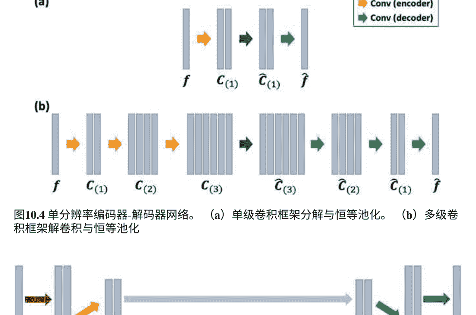

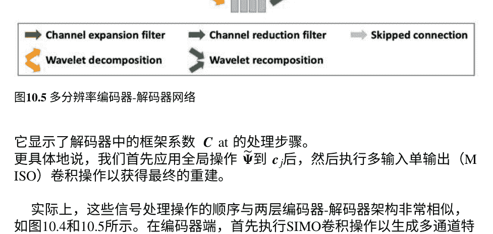

它显示了解码器中的框架系数 $C$ 的处理步骤。更具体地说，我们首先应用全局操作 $\Psi$ 到 $c_j$ 后，然后执行多输入单输出（MISO）卷积操作以获得最终的重建。

实际上，这些信号处理操作的顺序与两层编码器-解码器架构非常相似，如图10.4和10.5所示。在编码器端，首先执行SIMO卷积操作以生成多通道特征图，然后执行全局池化操作。在解码器端，首先对特征图进行反池化，然后执行MISO卷积。因此，我们可以很容易地看出重要的类比：卷积框架系数类似于CNN中的特征图，$\Phi, \widetilde{\Phi}$ 分别作为池化和反池化层，$\Psi, \widetilde{\Psi}$ 分别对应编码器和解码器滤波器。这意味着池化操作定义了全局基础，而卷积滤波器确定了局部基础，CNN试图利用信号的全局和局部结构。

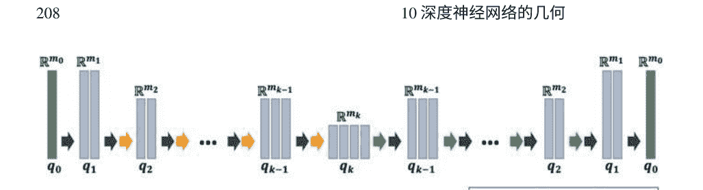

此外，通过简单地改变全局基础，我们可以获得各种网络架构。例如，在图10.4中，我们使用 $\Phi = \bar{\Phi} = I_n$，而在图10.5的情况下，我们使用Haar小波变换作为全局池化。

#### 10.3.4 深度卷积框架

现在，我们准备解释多层卷积框架，我们称之为深度卷积框架[42]。为简单起见，我们考虑没有跳跃连接的编码器-解码器网络，如图10.6所示，尽管分析同样适用于存在跳跃连接的情况。此外，我们假设对称配置，使得编码器和解码器具有相同的层数，假设为 $\kappa$；编码器层 $\mathcal{E}^l$ 和解码器层 $\mathcal{D}^l$ 的输入和输出维度是对称的：

$$ \mathcal{E}^l : \mathbb{R}^{d_{l-1}} \rightarrow \mathbb{R}^{d_l}, \quad \mathcal{D}^l : \mathbb{R}^{d_l} \rightarrow \mathbb{R}^{d_{l-1}}, \quad l \in [\kappa], \qquad (10.30) $$

其中 $[n]$ 表示集合 $\{1, \cdots, n\}$。在第 $l$ 层， $m_l$ 和 $q_l$ 分别表示信号的维度和滤波器通道的数量。滤波器的长度被假设为 $r$。

我们现在定义了编码器层的第 $l$ 层输入信号，其来自于 $q_{l-1}$ 个输入通道，

$$ z^{l-1} := \begin{bmatrix} z_1^{l-1\top} & \cdots & z_{q_{l-1}}^{l-1\top} \end{bmatrix}^{\top} \in \mathbb{R}^{d_{l-1}}, \qquad (10.31) $$

其中 $^\top$ 表示转置，并且 $z_j^l \in \mathbb{R}^{m_{l-1}}$ 指的是维度为 $m_{l-1}$ 的第 $j$ 个通道输入。第 $l$ 层的输出信号 $z^l$ 同样被定义。请注意，在（10.31）中，滤波后的输出现在被堆叠为单列向量，这与卷积框架中以前的处理方式不同，其中每个通道的滤波器输出被堆叠为额外的列。事实证明，在（10.31）中的符号表示使得多层卷积神经网络的数学推导比以前的符号表示更加可追踪，尽管在以前的表示中全局和局部基础的作用是明显的。

### 10.3 卷积框架

然后，对于没有跳跃连接的线性编码器-解码器CNN，如图10.6a所示，在第 l 个编码器层我们有以下线性表示[35]：

$$z^{l} = E^{l\top} z^{l-1} \tag{10.32}$$

其中

$$E^{l} = \begin{bmatrix} \mathbf{\Phi}^{l} \circledast \boldsymbol{\psi}_{1,1}^{l} & \cdots & \mathbf{\Phi}^{l} \circledast \boldsymbol{\psi}_{q_l,1}^{l} \\ \vdots & \ddots & \vdots \\ \mathbf{\Phi}^{l} \circledast \boldsymbol{\psi}_{1,q_l-1}^{l} & \cdots & \mathbf{\Phi}^{l} \circledast \boldsymbol{\psi}_{q_l,q_l-1}^{l} \end{bmatrix}, \tag{10.33}$$

其中 $\mathbf{\Phi}^{l}$ 表示第 $m_l \times m_l$ 矩阵，表示池化操作在第 l 层，而 $\boldsymbol{\psi}_{i,j}^{l} \in \mathbb{R}^{r}$ 表示第 l 层编码器滤波器，从第 j 个通道输入的贡献生成第 i 个通道的输出，并且 $\mathbf{\Phi}^{l} \circledast \boldsymbol{\psi}_{i,j}^{l}$ 表示单输入多输出（SIMO）卷积[35]：

$$\mathbf{\Phi}^{l} \circledast \boldsymbol{\psi}_{i,j}^{l} = \left[ \phi_{1}^{l} \circledast \boldsymbol{\psi}_{i,j}^{l} \cdots \phi_{n}^{l} \circledast \boldsymbol{\psi}_{i,j}^{l} \right]. \tag{10.34}$$

请注意，通过将额外的行包含到 $E^{l}$ 中，可以轻松地包含偏差，并通过将 $z^{l-1}$ 的最后一个元素增加1来增加偏差。

同样，第 l 个解码器层可以表示为

$$\hat{z}^{l-1} = D^{l} \hat{z}^{l}, \tag{10.35}$$

其中

$$D^{l} = \begin{bmatrix} \tilde{\mathbf{\Phi}}^{l} \circledast \tilde{\boldsymbol{\psi}}_{1,1}^{l} & \cdots & \tilde{\mathbf{\Phi}}^{l} \circledast \tilde{\boldsymbol{\psi}}_{1,q_l}^{l} \\ \vdots & \ddots & \vdots \\ \tilde{\mathbf{\Phi}}^{l} \circledast \tilde{\boldsymbol{\psi}}_{q_l-1,1}^{l} & \cdots & \tilde{\mathbf{\Phi}}^{l} \circledast \tilde{\boldsymbol{\psi}}_{q_l-1,q_l}^{l} \end{bmatrix}, \tag{10.36}$$

其中，$\tilde{\mathbf{\Phi}}^{l}$ 表示在第 $m_l \times m_l$ 矩阵中表示解池化操作的第l层，而 $\tilde{\boldsymbol{\psi}}_{i,j}^{l} \in \mathbb{R}^{r}$ 表示第 l 层解码器滤波器从第 j 个通道输入的贡献生成第 i 个通道输出。

然后，编码器-解码器CNN相对于输入 $z$ 的输出 $v$ 可以用以下表示[35]：

$$v = \mathcal{T} (z) = \sum_{i} \langle \boldsymbol{b}_{i}, z \rangle \boldsymbol{b}_{i} \tag{10.37}$$

其中，表示所有编码器和解码器卷积滤波器，$\boldsymbol{b}_i$ 和 $\tilde{\boldsymbol{b}}_i$ 分别表示以下矩阵的第 $i$ 列：

$$B = E^1 E^2 \cdots E^K , \quad \tilde{B} = D^1 D^2 \cdots D^K$$

注意，这种表示完全是线性的，因为一旦网络参数被训练，表示就不会变化。此外，考虑以下池化和过滤层的多层框架条件：

$$\tilde{\Phi}^l (\Phi^{l})^{\mathsf{T}} = \alpha I_{m_{l-1}} , \quad \Psi^l (\tilde{\Psi}^{l})^{\mathsf{T}} = \frac{1}{r\alpha} I_{r q_{l-1}} , \quad \forall l,$$

其中 $I_n$ 表示单位矩阵，$\alpha > 0$ 是一个非零常数，且

$$\Psi^l = \begin{bmatrix} \psi^l_{1,1} & \cdots & \psi^l_{q_l,1} \\ \vdots & \ddots & \vdots \\ \psi^l_{1,q_{l-1}} & \cdots & \psi^l_{q_l,q_{l-1}} \end{bmatrix}$$

$$\tilde{\Psi}^l = \begin{bmatrix} \tilde{\psi}^l_{1,1} & \cdots & \tilde{\psi}^l_{1,q_l} \\ \vdots & \ddots & \vdots \\ \tilde{\psi}^l_{q_{l-1},1} & \cdots & \tilde{\psi}^l_{q_{l-1},q_l} \end{bmatrix}$$

在这些框架条件下，我们在[35]中证明了(10.37)满足完美重构条件，即

$$z = \mathcal{L}(z) := \sum_i \langle b_i, z \rangle b_i,$$

因此，相应的深度卷积框架确实是一个框架表示，类似于小波框架[113]。

在深度卷积框架中，所有的编码器和解码器滤波器都可以从训练数据集中估计得到；因此，它是一个数据驱动模型。更具体地说，对于给定的训练数据 $\{x_i, y_i\}_{i=1}^n$，CNN参数通过解决以下优化问题来估计：

$$\min \sum_{i=1}^n (y_i, \mathcal{L}(x_i)) + \lambda R(\cdot)$$

一旦参数学习完毕，编码器和解码器矩阵 $E^l$ 和 $D^l$ 就被确定下来。因此，这些表示完全是数据驱动的，并且依赖于从训练数据集中学习到的滤波器集合，这与经典的核机器或基 Pursuit 方法不同，在这些方法中，底层的核或框架是自上而下指定的。

也就是说，深度卷积框架尚未满足机器学习的要求，因为一旦训练完毕，框架表示就不会变化，因此无法进行数据驱动的适应。在下一节中，我们将展示最后一个缺失的元素是ReLU等非线性函数，在机器学习中起着关键作用。

### 10.4 CNN的几何

#### 10.4.1 非线性的作用

事实上，使用ReLU非线性函数的深度卷积框架的几何分析结果是一个简单的修改，但它提供了对深度神经网络几何结构的非常基本的洞察。

具体来说，在[35]中我们证明了即使使用ReLU非线性函数，表达式(10.37)仍然成立。唯一的变化是基础矩阵在编码器、解码器和跳跃块之间有额外的ReLU模式块。例如，表达式(10.38)的变化如下：

$$B(z) = E^1 \Lambda^1(z) E^2 \Lambda^2(z) \cdots \Lambda^{K-1}(z) E^K, \quad (10.44)$$
$$\tilde{B}(z) = D^1 \tilde{\Lambda}^1(z) D^2 \tilde{\Lambda}^2(z) \cdots \Lambda^{K-1}(z) D^K, \quad (10.45)$$

其中 $\Lambda^l(z)$ 和 $\tilde{\Lambda}^l(z)$ 是具有0和1元素的对角矩阵，表示ReLU激活模式。

因此，线性表示式(10.37)应该被修改为非线性表示式：

$$v = \mathcal{T}(z) = \sum_{i} \langle b_i(z), z \rangle b_i(z), \quad (10.46)$$

由于输入相关的ReLU激活模式，我们现在对 $b_i(z)$ 和 $\tilde{b}_i(z)$ 有明确的依赖关系，这使得表示变为非线性。

再次，通过在(10.46)中用 $\mathcal{T}_{\Theta}(z)$ 替换(10.43)中的 $\mathcal{L}_{\Theta}(z)$ 来解决优化问题，从而估计出滤波器参数。因此，这些表示完全是数据驱动的。

#### 10.4.2 非线性是归纳学习的关键

在(10.44)和(10.45)中，编码器和解码器的基矩阵明确依赖于输入的ReLU激活模式。在这里，我们将展示

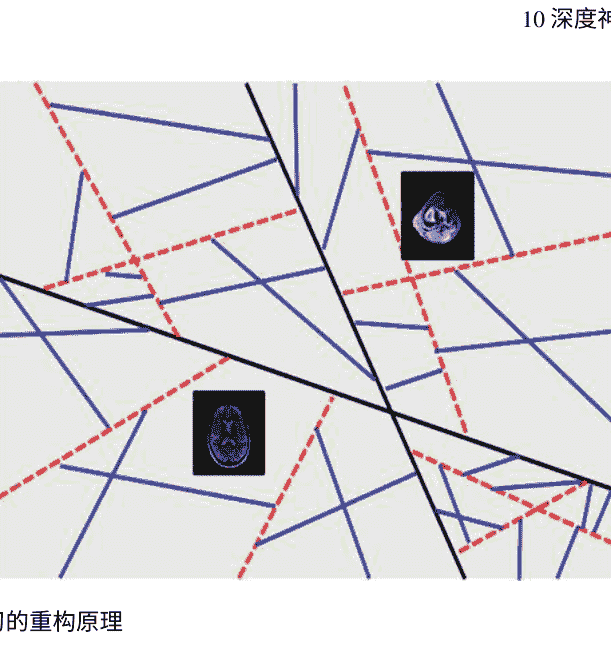

图10.7 深度学习的重构原理

这个ReLU激活相关的对角矩阵在实现归纳学习中起到了关键作用。

具体来说，非线性函数是在卷积操作之后应用的，因此每个ReLU的开启和关闭模式决定了在卷积所确定的超平面上每一层特征空间的二进制划分。

因此，在深度神经网络中，输入空间被划分为多个不重叠的区域，以便每个区域的输入图像共享相同的线性表示，但在划分之间不共享。这意味着两个不同的输入图像会自动切换到两个不同的线性表示，如图10.7所示。

这带来了一个重要的洞察：尽管CNN方法和图10.3中的基追踪似乎是两种完全不同的方法，但两者之间存在着非常密切的关系。具体来说，CNN确实类似于经典的基追踪算法，该算法为每个输入寻找不同的线性表示，但与基追踪不同的是，CNN是归纳的，因为它不会为新的输入解决优化问题，而是通过改变ReLU激活模式来切换到不同的帧表示。这种从学习到的滤波器系数中的归纳性是对经典信号处理方法的重要进展。

#### 10.4.3 表达能力

鉴于CNN的分区依赖性框架几何，我们可以很容易地预期，随着输入空间分区的数量增加，非线性函数逼近

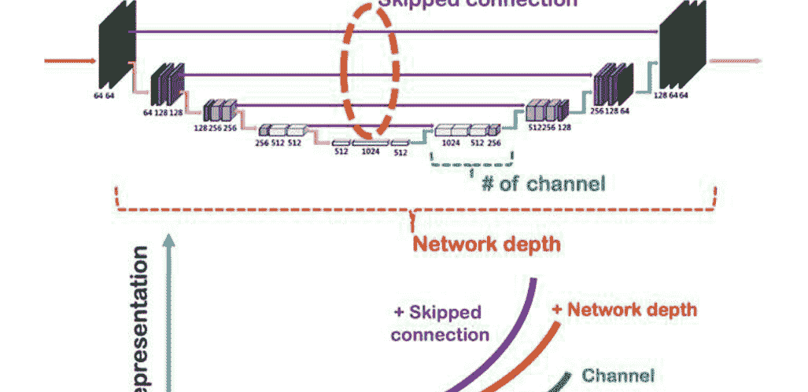

通过分段线性框架表示，逼近更加准确。 因此，分段线性区域的数量与神经网络的表达能力或表示能力直接相关。 如果每个ReLU激活模式都与其他模式无关，则不同ReLU激活模式的数量为2^（神经元的数量），其中神经元的数量由整个特征的数量确定。 因此，随着深度、宽度和跳跃连接的增加，不同线性表示的数量呈指数增长，如图10.8 [35]所示。

这再次证实了CNN由于ReLU非线性的表达能力。

#### 10.4.4 特征的几何意义

神经网络中一个有趣的问题是理解每一层神经网络的中间特征的含义。 尽管这些很大程度上被视为潜在变量，但据我们所知，对每个潜在变量的几何理解仍然不完整。

在本节中，我们展示了这个中间特征与相对于分割前一层特征的超平面的坐标直接相关。

为了理解这个论断，让我们首先重新审视编码器层每个神经元的ReLU操作。让$\mathbf{E}_i^l$表示编码器矩阵$\mathbf{E}^l$的第$i$列，$\mathbf{z}_i^l$表示$\mathbf{z}^l$的第$i$个元素。然后，一个激活的神经元的输出可以表示为：

$$z_i^l = \frac{|\langle \mathbf{E}_i^l, \mathbf{z}^{l-1} \rangle|}{\|\mathbf{E}_i^l\|} \times \|\mathbf{E}_i^l\|, \tag{10.47}$$

其中超平面的法向量可以被识别为

$$\mathbf{n}^l = \mathbf{E}_i^l. \tag{10.48}$$

这意味着激活神经元的输出是特征向量$\mathbf{z}^{l-1}$空间中将活动区域和非活动区域分隔开的超平面距离的缩放版本。因此，神经网络的作用可以理解为使用相对于多个超平面的相对距离，用一个坐标向量来表示输入数据。

事实上，对于特征的上述解释可能并不新颖，因为可以使用类似的解释来解释线性框架系数的几何意义。相反，最重要的区别之一来自于多层表示。为了理解这一点，考虑下面的两层神经网络：

$$z_i^l = \sigma (\mathbf{E}_i^{l\top} \mathbf{z}^{l-1}), \tag{10.49}$$

其中

$$\mathbf{z}^{l-1} = \sigma \left( \mathbf{E}^{(l-1)\top} \mathbf{z}^{l-2} \right) = \mathbf{\Lambda}(\mathbf{z}^{l-1}) \mathbf{E}^{(l-1)\top} \mathbf{z}^{l-2}, \tag{10.50}$$

其中$\mathbf{\Lambda}(\mathbf{z}^{l-1})$编码了ReLU激活模式。利用内积和伴随算子的性质，我们有

$$\begin{aligned} z_i^l &= \sigma (\mathbf{E}_i^{l\top} \mathbf{z}^{l-1}) \\ &= \sigma \left( \mathbf{E}_i^{l\top} \mathbf{\Lambda}(\mathbf{z}^{l-1}) \mathbf{E}^{(l-1)\top} \mathbf{z}^{l-2} \right) \\ &= \sigma \left( \left\langle \mathbf{\Lambda}(\mathbf{z}^{l-1}) \mathbf{E}_i^{l}, \mathbf{E}^{(l-1)\top} \mathbf{z}^{l-2} \right\rangle \right). \end{aligned} \tag{10.51}$$

这表明在来自上一层的无约束特征向量空间上（即不假设ReLU），超平面法向量现在已经改变为

$$\mathbf{n}^l = \mathbf{\Lambda}(\mathbf{z}^{l-1}) \mathbf{E}_i^{l}. \tag{10.52}$$

## 图10.9 每层有两个神经元的两层神经网络。蓝色箭头表示超平面的法向量。黑线是第一层的超平面，红线对应第二层的超平面

这意味着当前层的超平面会根据输入数据自适应地改变，因为上一层的ReLU激活模式即 $A(z^{l-1})$，可能会因输入而异。这是与线性多层框架表示的一个重要区别，其超平面结构不受不同输入的影响。

例如，图10.9显示了一个由两层神经网络组成的 $\mathbb{R}^2$ 的分区几何结构。第二层超平面的法向量方向由ReLU激活模式确定，使得非活跃神经元的坐标值变为退化。更具体地说，在第一层有两个活跃神经元的(A)象限中，我们可以通过滤波器系数确定任意法向量方向上的两个超平面。然而，在第二个神经元非活跃的(B)象限中，情况就不同了。

具体来说，根据(10.52)，法向量的第二个坐标，对应于非活跃神经元，变为退化。这导致了两个平行的超平面，仅通过偏置项来区分。在第一个神经元非活跃的(C)象限中也发生了类似的现象。在两个神经元都非活跃的(D)象限中，法向量变为零，不存在分区。因此，我们可以得出结论，超平面的几何结构是由前一层的特征向量自适应确定的。

在接下来的内容中，我们提供了几个玩具示例，其中分区几何可以很容易地计算出来。

## 图10.10 一个示例的两层神经网络

### 问题10.1 (二层神经网络在 $\mathbb{R}^2$ 中的分区几何)

考虑一个具有ReLU非线性的两层全连接网络 $f_{\Theta} : \mathbb{R}^2 \rightarrow \mathbb{R}^2$，如图10.10所示。

- (a) 假设权重矩阵和偏置项如下给出
$$W^{(0)} = \begin{bmatrix} 2 & -1 \\ 1 & 1 \end{bmatrix}, \quad b^{(0)} = \begin{bmatrix} 1 \\ -1 \end{bmatrix},$$
$$W^{(1)} = \begin{bmatrix} 1 & 2 \\ -1 & 1 \end{bmatrix}, \quad b^{(1)} = \begin{bmatrix} -9 \\ -2 \end{bmatrix}.$$
绘制相应的输入空间分区，并计算每个输入分区中输入向量 $(x, y)$ 的输出映射。请明确推导出所有步骤。

- (b) 在问题(a)中，假设偏置项为零。计算输入空间分区和输出映射。与有偏置项的情况相比，你观察到了什么？

- (c) 在问题(a)中，假设第二层的权重和偏置发生了变化
$$W^{(1)} = \begin{bmatrix} 1 & 2 \\ 0 & 1 \end{bmatrix}, \quad b^{(1)} = \begin{bmatrix} 0 \\ 1 \end{bmatrix}.$$
绘制相应的输入空间划分，并计算关于每个输入划分中的输入向量 $(x, y)$ 的输出映射。与(a)中的原始问题相比，你观察到了什么？

## 解决方案10.1

(a) 让 $\boldsymbol{x} = [x, y]^{\top} \in \mathbb{R}^2$。在第一层，输出信号由以下给出
$$\boldsymbol{o}^{(1)} = \sigma\left(\boldsymbol{W}^{(0)}\boldsymbol{x}+\boldsymbol{b}^{(0)}\right) = \begin{bmatrix} \sigma(2x - y + 1) \\ \sigma(x + y - 1) \end{bmatrix},$$
其中 $\sigma$ 是ReLU函数。现在，在第二层，我们需要考虑每个ReLU函数处于激活或非激活状态的所有情况。

(i) 如果 $2x - y + 1 < 0$ 且 $x + y - 1 < 0$，则 $\boldsymbol{o}^{(1)} = [0, 0]^{\top}$， $\boldsymbol{o}^{(2)} = \sigma\left(\boldsymbol{W}^{(1)}\boldsymbol{o}^{(1)}+\boldsymbol{b}^{(1)}\right) = \sigma[-9, -2]^{\top} = [0, 0]^{\top}$。

(ii) 如果 $2x - y + 1 \geq 0$ 且 $x + y - 1 < 0$，则 $\boldsymbol{o}^{(1)} = [2x - y + 1, 0]^{\top}$。因此， $\boldsymbol{o}^{(2)} = \sigma\left(\boldsymbol{W}^{(1)}\boldsymbol{o}^{(1)}+\boldsymbol{b}^{(1)}\right) = \sigma ([2x - y - 8, -2x + y - 3])^{\top}$。因此，
$$\boldsymbol{o}^{(2)} = \begin{cases} [0, 0]^{\top}, & 2x - y - 8 < 0, \\ [2x - y - 8, 0]^{\top}, & \text{否则}. \end{cases}$$

(iii) 如果 $2x - y + 1 < 0$ 且 $x + y - 1 \geq 0$，则 $\boldsymbol{o}^{(1)} = [0, x + y - 1]^{\top}$ 且 $\boldsymbol{o}^{(2)} = \sigma\left(\boldsymbol{W}^{(1)}\boldsymbol{o}^{(1)}+\boldsymbol{b}^{(1)}\right) = \sigma ([2x + 2y - 11, x + y - 3])^{\top}$。因此，
$$\boldsymbol{o}^{(2)} = \begin{cases} [0, 0]^{\top}, & x + y - 3 < 0, \\ [0, x + y - 3]^{\top}, & 2x + 2y - 11 < 0, \, x + y - 3 \geq 0, \\ [2x + 2y - 11, x + y - 3]^{\top}, & \text{otherwise}. \end{cases}$$

(iv) 如果 $2x - y + 1 \geq 0$ 并且 $x + y - 1 \geq 0$，那么 $\boldsymbol{o}^{(1)} = [2x - y + 1, x + y - 1]^{\top}$ 并且 $\boldsymbol{o}^{(2)} = \sigma\left(\boldsymbol{W}^{(1)}\boldsymbol{o}^{(1)}+\boldsymbol{b}^{(1)}\right) = \sigma ([4x + y - 10, -x + 2y - 4])^{\top}$。因此，
$$\boldsymbol{o}^{(2)} = \begin{cases} [0, 0]^{\top}, & 4x + y - 10 < 0, \, -x + 2y - 4 < 0, \\ [4x + y - 10, 0]^{\top}, & 4x + y - 10 < 0, \, -x + 2y - 4 \geq 0, \\ [0, -x + 2y - 4]^{\top}, & 4x + y - 10 \geq 0, \, -x + 2y - 4 < 0, \\ [4x + y - 10, -x + 2y - 4]^{\top}, & \text{otherwise}. \end{cases}$$

图10.11显示了结果输入空间的划分，其中显示了相应的线性映射及其秩。请注意，在两个全秩划分周围，存在与秩为1的映射划分相连的秩为0的映射划分。

## 图10.11 问题的输入空间划分（a）情况

(b) 在第一层，输出信号由以下给出
$$\boldsymbol{o}^{(1)} = \sigma \left( \boldsymbol{W}^{(0)} \boldsymbol{x} + \boldsymbol{b}^{(0)} \right) = \begin{bmatrix} \sigma (2x - y) \\ \sigma (x + y) \end{bmatrix}$$
其中 $\sigma$ 是ReLU函数。在第二层，我们再次考虑每个ReLU函数处于激活或非激活状态的所有情况。

- (i) 如果 $2x - y < 0$ 且 $x + y < 0$, 则 $\boldsymbol{o}^{(1)} = [0, 0]^\top$, $\boldsymbol{o}^{(2)} = \sigma(\boldsymbol{W}^{(1)} \boldsymbol{o}^{(1)}) = [0, 0]^\top$。

(ii) 如果 $2x - y \geq 0$ 并且 $x + y < 0$, 则 $\boldsymbol{o}^{(1)} = [2x - y, 0]^\top$。因此, $\boldsymbol{o}^{(2)} = \sigma \left( \boldsymbol{W}^{(1)} \boldsymbol{o}^{(1)} \right) = \sigma ([2x - y, -2x + y]^\top) = [2x - y, 0]^\top$。

(iii) 如果 $2x - y < 0$ 并且 $x + y \geq 0$, 则 $\boldsymbol{o}^{(1)} = [0, x + y]^\top$ 并且 $\boldsymbol{o}^{(2)} = \sigma \left( \boldsymbol{W}^{(1)} \boldsymbol{o}^{(1)} \right) = \sigma ([2x + 2y, x + y]^\top) = [2x + 2y, x + y]^\top$。

(iv) 如果 $2x - y \geq 0$ 且 $x + y \geq 0$, 则 $\boldsymbol{o}^{(1)} = [2x - y, x + y]^\top$ 且 $\boldsymbol{o}^{(2)} = \sigma \left( \boldsymbol{W}^{(1)} \boldsymbol{o}^{(1)} \right) = \sigma ([4x + y, -x + 2y]^\top)$。因此, $\boldsymbol{o}^{(2)} = \begin{cases} [4x + y, 0]^\top, & -x + 2y < 0, \\ [4x + y, -x + 2y]^\top, & \text{otherwise.} \end{cases}$

## 图10.12 问题（b）情况下的输入空间划分

图10.12显示了所得到的输入空间划分，其中显示了相应的线性映射及其秩。与问题（a）类似，在两个全秩划分周围，存在秩为1的映射划分，它们与秩为0的映射划分相连。由于没有偏置项，所有的超平面都应该包含原点。此外，没有具有相同法向量的超平面，因为没有偏置项，无法形成平行的超平面。

因此，与（a）相比，输入空间的划分变得更简单。

(c) 在第一层，输出信号由以下给出
$$\boldsymbol{o}^{(1)} = \sigma\left(\boldsymbol{W}^{(0)}\boldsymbol{x} + \boldsymbol{b}^{(0)}\right) = \begin{bmatrix} \sigma\left(2x - y + 1\right) \\ \sigma\left(x + y - 1\right) \end{bmatrix}$$
其中 $\sigma$ 是ReLU函数。现在，在第二层，我们需要考虑每个ReLU函数处于激活或非激活状态的所有情况。

- (i) 如果 $2x - y + 1 < 0$ 且 $x + y - 1 < 0$，则 $\boldsymbol{o}^{(1)} = [0, 0]^\top$，$\boldsymbol{o}^{(2)} = \sigma\left(\boldsymbol{W}^{(1)}\boldsymbol{o}^{(1)} + \boldsymbol{b}^{(1)}\right) = \sigma[0, 1]^\top = [0, 1]^\top$。

(ii) 如果 $2x - y + 1 \geq 0$ 且 $x + y - 1 < 0$，则 $\boldsymbol{o}^{(1)} = [2x - y + 1, 0]^\top$。因此，$\boldsymbol{o}^{(2)} = \sigma\left(\boldsymbol{W}^{(1)}\boldsymbol{o}^{(1)} + \boldsymbol{b}^{(1)}\right) = \sigma\left([2x - y + 1, 1]\right)^\top = [2x - y + 1, 1]^\top$。

(iii) 如果 $2x - y + 1 < 0$ 且 $x + y - 1 \geq 0$，则 $\boldsymbol{o}^{(1)} = [0, x + y - 1]^\top$ 且 $\boldsymbol{o}^{(2)} = \sigma\left(\boldsymbol{W}^{(1)}\boldsymbol{o}^{(1)} + \boldsymbol{b}^{(1)}\right) = \sigma\left([2x + 2y - 2, x + y]\right)^\top = [2x + 2y - 2, x + y]^\top$。

(iv) 如果 $2x - y + 1 \ge 0$ 并且 $x + y - 1 \ge 0$，那么 $\boldsymbol{o}^{(1)} = [2x - y + 1, x + y - 1]^\top$ 并且 $\boldsymbol{o}^{(2)} = \sigma(\boldsymbol{W}^{(1)}\boldsymbol{o}^{(1)} + \boldsymbol{b}^{(1)}) = \sigma([4x + y - 1, x + y]^\top) = [4x + y - 1, x + y]^\top$。图10.13 显示了结果输入空间的划分，其中显示了相应的线性映射及其秩。第二层没有形成超平面。这说明权重和偏置如何改变输入划分的复杂性。

#### 10.4.5 自编码器的几何理解

我们现在对深度神经网络在回归问题中的几何学进行更深入的讨论，特别是自编码器。自编码器具有相同的输入和输出域，通常用于低级计算机视觉问题，如图像去噪[90, 98]、超分辨率[99, 100]等。虽然我们对自编码器进行了讨论，但类似的几何理解也可以应用于其他输入和输出域不同的回归问题。稍后我们将展示自编码器的几何理解也能清晰地揭示分类器的几何结构。

根据目前的讨论，我们现在了解到具有ReLU非线性的深度神经网络将输入数据空间划分为分段线性区域。事实上，这种观点与数据的流形结构直接相关，我们相信解释深度学习成功的主要基本原则是其对数据中流形结构的高效利用。

首先，我们提供一些微分几何定义。

## 图10.14 自动编码器的流形几何[114]

### 定义10.1

一个 $n$维流形是一个拓扑空间，由一组开集 $\Sigma\subset U_\alpha$ 覆盖。对于每个开集 $U_\alpha$，存在一个同胚映射 $\varphi_\alpha : U_\alpha \to \mathbb{R}^n$，并且这对 $(U_\alpha, \varphi_\alpha)$构成一个图表。图表的并集形成一个图册 $\mathscr{A} = \{(U_\alpha, \varphi_\alpha)\}$。

如图10.14所示，假设 $\mathcal{X}$是环境空间， $\mu$是定义在 $\mathcal{X}$上的概率分布。
$$\Sigma(\mu) := \{x \in \mathcal{X} : \mu(x) > 0\} \tag{10.53}$$
是一个低维流形在 $\mathcal{X}$中。对于给定的局部图 $(U_\alpha, \varphi_\alpha)$, $\varphi_\alpha : U_\alpha \to \mathcal{F}$ 被称为编码器，其中 $\mathcal{F}$被称为潜空间或特征空间。一个点 $x \in \Sigma$被称为一个样本；它的映像 $\varphi_\alpha(x)$是 $x$的相应特征。逆映射 $\psi_\alpha := \varphi_\alpha^{-1} : \mathcal{F} \to \Sigma$被称为解码器[114]。然后，自编码器由两部分组成，编码器和解码器。编码器接收一个样本 $x \in \mathcal{X}$并将其映射到特征映射 $z \in \mathcal{F}$, $z = \varphi(x)$。编码器 $\varphi : \mathcal{X} \to \mathcal{F}$将 $\Sigma$映射到其潜在表示 $D = \varphi(\Sigma)$同态地。之后，解码器 $\psi : \mathcal{F} \to \mathcal{X}$将 $z$映射到重构 $\hat{x}$ 与 $x$ 形状相同， $$x = \psi(z) = \psi \circ \varphi(x).$$ 这个关系可以在下面的交换图[114]中看到：

在实践中，编码器和解码器都使用参数进行参数化，因此自编码器可以描述为
$$\hat{x} = \mathcal{T}(x) = \psi \circ \varphi (x)$$
参数估计问题可以通过以下方式解决：
$$\min \sum_{i=1}^n \mathcal{L}(y_i, \mathcal{T}(x_i)) + \lambda R(\Theta), \quad (10.54)$$
这与CNN的训练相同。

图10.14显示了具有ReLU非线性的自编码器每个步骤的几何示例。在这里，环境空间$\mathcal{X}$是$\mathbb{R}^3$，特征空间是二维的，即$\mathcal{F} \subset \mathbb{R}^2$。样本$x$是一个三维点，因此输入流形$M := \Sigma(\mu) \subset \mathcal{X}$是$\mathbb{R}^3$中的二维曲面，即低维的（见图10.14）。输入样本使用参数化编码器$\varphi$在图10.14中映射到特征空间流形。然后，这个特征流形通过参数化解码器$\psi$映射回原始环境空间，如图10.14所示。由于ReLU非线性，输入流形$M$被分割成分段线性区域$\mathcal{D}(\varphi)$。

#### 10.4.6 分类器的几何理解

自动编码器的几何理解现在清楚地描述了深度神经网络分类器中发生的情况。在这种情况下，我们只有一个编码器将其映射到潜空间，这导致了一个简化的可交换图表：
$$\{(\mathcal{X}, x), \mu, \Sigma\} \xrightarrow{\varphi} \{(\mathcal{F}, z), D\}.$$
由于编码器也是参数化的，并且配备了ReLU，输入流形也被分割成分段线性区域，如图10.14d所示。然后，线性层后面的softmax为每个分段线性单元分配类概率。

### 10.5 开放问题

到目前为止，我们的讨论揭示了深度神经网络确实被训练成将输入数据流形分割成分段线性区域，以便每个分段线性区域上的线性映射能够有效地执行机器学习任务，如分类、回归等。因此，我们坚信揭示深度神经网络之谜的线索来自对高维流形结构及其分段线性分割的理解，以及如何控制这些分割。

事实上，许多机器学习理论家一直在关注这一点，从而产生了许多有趣的理论和实证观察[115-118]。例如，尽管我们提到线性区域的数量可能随着网络复杂性呈指数级增加，但他们观察到特定任务的实际分段线性表示数量要小得多。例如，图10.16显示，随着迭代次数的增加，线性区域的数量确实收敛到较小的值，与初始化相比[115, 116]。

图10.16 在这里，作者[115, 116]展示了通过输入空间的二维平面相交的线性区域，深度为3，宽度为64的网络在MNIST上的训练结果

图10.17 使用不同优化技术训练的模型的线性区域和分类区域[117]

请注意，只有训练轮数决定了分段线性区域的数量，而且根据优化算法的选择，线性区域的数量也会有所变化。例如，图10.17显示了线性区域的数量因优化算法的不同而变化，从而导致了不同的分类边界。在底部一行中，灰色曲线是分隔不同线性区域的过渡边界，颜色表示相应线性区域的激活率。在顶部一行中，不同的颜色表示不同的分类区域，由决策边界分隔开。这些模型是在向量化的MNIST数据集上进行训练的，该图显示了输入空间的二维切片。

实际上，这种现象可以理解为数据驱动的自适应，以消除机器学习任务中的不必要的分区。请注意，分区边界可能会坍缩，导致分区数量减少。

如问题10.1(c)所讨论的，人们认为在分段线性区域的数量方面，逼近误差和神经网络的鲁棒性之间存在一种折衷。这些问题中的许多仍然没有答案，许多研究工作需要清楚地了解神经网络的分区几何。

最后，在我们的讨论中，对于CNNs的情况，由于卷积关系，超平面的选择进一步受到限制。例如，要使用具有过滤器系数 [1, 2]的 r =2卷积过滤器在 ℝ³中编码数据流形，以下三个向量确定了三个超平面的法线方向：

$$ n_1' = [1\ 2\ 0], \quad n_2' = [0\ 1\ 2], \quad n_3' = [2\ 0\ 1], \tag{10.55} $$

在这里，我们假设循环卷积和无池化操作（即 $\Phi' = I_3$）。这意味着卷积滤波器的每个通道确定了底层特征空间的一个正半轴，而特征向量与结果正半轴上的坐标直接相关。因此，要理解CNN中的分段线性区域，需要更深入地理解高维几何，这可能是另一个非常令人兴奋的研究课题。

### 10.6 练习

- 1. 证明（10.24）。
- 2. 证明等式（10.25）。
- 3. 填写（10.26）中缺失的步骤。
- 4. 证明（10.29）。
- 5. 我们的目标是推导出编码器中的输入-输出关系（10.32）。
    (a) 证明
        $$ (\boldsymbol{\Phi}^l \circledast \boldsymbol{\psi}_{j,k}^l)^T \boldsymbol{z}_k^{l-1} = \boldsymbol{\Phi}^{l\top}(\boldsymbol{z}_k^{l-1} \circledast \bar{\boldsymbol{\psi}}_{j,k}^l). \tag{10.56} $$
    (b) 使用(10.56)证明(10.32)。
- 6. 我们的目标是在解码器中推导出输入-输出关系(10.35)。
    (a) 证明
        $$ (\tilde{\boldsymbol{\Phi}}^l \circledast \tilde{\boldsymbol{\psi}}_{j,k}^l) \bar{\boldsymbol{z}}_k^l = \boldsymbol{\Phi}^l \bar{\boldsymbol{z}}_k^l \circledast \tilde{\boldsymbol{\psi}}_{j,k}^l. \tag{10.57} $$
    (b) 使用(10.57)证明(10.35)。
- 7. 在框架条件(10.39)下，推导出完美重构条件(10.42)。
- 8. 考虑一个具有ReLU非线性的三层全连接网络 \( f_{\Theta} : \mathbb{R}^2 \rightarrow \mathbb{R}^2 \)。
    (a) 假设权重矩阵和偏置项如下给出
    ```
    W^{(0)} = \begin{bmatrix} 1 & -1 \\ 1 & 1 \end{bmatrix}, \quad b^{(0)} = \begin{bmatrix} 1 \\ -1 \end{bmatrix},
    W^{(1)} = \begin{bmatrix} 2 & 2 \\ 1 & 1 \end{bmatrix}, \quad b^{(1)} = \begin{bmatrix} 0 \\ 1 \end{bmatrix},
    W^{(2)} = \begin{bmatrix} 1 & 2 \\ -1 & 1 \end{bmatrix}, \quad b^{(2)} = \begin{bmatrix} -1 \\ -1 \end{bmatrix}.
    ```
    绘制相应的输入空间划分，并计算对于每个输入划分中的输入向量\((x, y)\)的输出映射。请明确推导出所有步骤。
    (b) 在问题(a)中，假设偏置项为零。计算输入空间分区和输出映射。与有偏置项的情况相比，你观察到了什么？
    (c) 在问题(a)中，由于微调，最后一层的权重 \( \boldsymbol{W}^{(2)} \)和偏置 \( \boldsymbol{b}^{(2)} \)发生了变化。请给出一个 \( \boldsymbol{W}^{(2)} \)和偏置 \( \boldsymbol{b}^{(2)} \)的例子，使得划分的数量最小。

## 第11章 深度学习优化

### 11.1 引言

在第6章中，我们讨论了深度神经网络训练的各种优化方法。尽管它们以各种形式存在，但这些算法基本上是基于梯度的局部更新方案。然而，整个社区认识到的最大障碍是深度神经网络的损失曲面极其非凸且不平滑。这种非凸性和不平滑性使得优化分析变得难以承受，主要关注的是流行的基于梯度的方法是否会陷入局部最小值。

令人惊讶的是，现代深度学习的成功可能归功于基于梯度的优化方法的显著有效性，尽管其优化问题的非凸性质。近年来进行了大量研究，以提供对这一现象的理论理解。特别是，最近的几项研究[119–121]指出了超参数化的重要性。事实上，研究表明，当深度网络的隐藏层中的神经元数量远大于训练样本数量时，梯度下降或随机梯度会收敛到具有零训练误差的全局最小值。虽然这些结果令人着迷，并为理解深度神经网络训练中简单的局部搜索算法为何成功提供了重要线索，但仍不清楚为什么简单的局部搜索算法可以成功地训练深度神经网络。

事实上，深度学习优化领域是一个快速发展的研究领域，有太多不同的方法无法在一章中涵盖。本章不是以杂乱无章的方式介绍各种技术，而是仅仅为了引发思考，解释了两种不同的研究方向：一种基于损失函数的几何结构，另一种基于李雅普诺夫稳定性的结果。尽管这两种方法密切相关，但它们具有不同的优点和缺点。通过解释这两种方法，我们可以涵盖一些研究探索的关键主题，如优化景观[122–124]、超参数化[119, 125–129]和神经切向核(NTK)。

### 11.2 问题形式化

在第6章中，我们指出神经网络训练中的基本优化问题可以被表述为

$$ \min_{\theta \in \mathbb{R}^n} f(\theta), \quad (11.1) $$

其中 $\theta$ 表示网络参数， $f: \mathbb{R}^n \rightarrow \mathbb{R}$ 是损失函数。在使用均方误差（MSE）损失的监督学习情况下，损失函数被定义为

$$ f(\theta) := \frac{1}{2} \| y - f_{\theta}(x) \|^2, \quad (11.2) $$

其中 $x, y$ 表示网络输入和标签对， $f_{\theta}(\cdot)$ 是由可训练参数 $\theta$ 参数化的神经网络。对于一个 $L$ 层前馈神经网络，回归函数 $f_{\theta}(x)$ 可以表示为

$$ f_{\theta}(x) := \left( \sigma \circ g^{(L)} \circ \sigma \circ g^{(L-1)} \dots \circ g^{(1)} \right)(x), \quad (11.3) $$

其中 $\sigma(\cdot)$ 表示逐元素非线性函数，而

$$ g^{(l)} = W^{(l)} o^{(l-1)} + b^{(l-1)}, \quad (11.4) $$
$$ o^{(l)} = \sigma(g^{(l)}), \quad (11.5) $$
$$ o^{(0)} = x, \quad (11.6) $$

对于 $l = 1, \cdots, L$。这里，第 $l$ 层隐藏神经元的数量，通常称为宽度，用 $d^{(l)}$ 表示，因此 $g^{(l)}, o^{(l)} \in \mathbb{R}^{d^{(l)}}$ 和 $W^{(l)} \in \mathbb{R}^{d^{(l)} \times d^{(l-1)}}$。

使用梯度下降的流行局部搜索方法使用以下更新规则：

$$ \theta[k+1] = \theta[k] - \eta_k \left. \frac{\partial f(\theta)}{\partial \theta} \right|_{\theta = \theta[k]}, \quad (11.7) $$

其中 $\eta_k$ 表示第 k 次迭代步长。以微分方程形式，更新规则可以表示为

$$\dot{\theta}[t] = -\frac{\partial f(\theta[t])}{\partial \theta}, \quad (11.8)$$

其中 $\dot{\theta}[t] = \partial \theta[t] / \partial t$。

正如之前解释的，优化问题 (11.1) 是强非凸的，并且已知使用 (11.7) 和 (11.8) 的基于梯度的局部搜索方案可能会陷入局部最小值。有趣的是，许多深度学习优化算法似乎避免了局部最小值，甚至导致训练误差为零，表明算法达到了全局最小值。接下来，我们将介绍两种不同的方法来解释梯度下降方法的这种迷人行为。

## **11.3 Polyak-Łojasiewicz型收敛分析**

据说损失函数是强凸的（SC）如果

$$f(\theta') \geq f(\theta) + \langle \nabla f(\theta), \theta' - \theta \rangle + \frac{\mu}{2} \|\theta' - \theta\|^2, \quad \forall \theta, \theta'. \quad (11.9)$$

众所周知，如果 f 是 SC，则梯度下降算法可以实现全局线性收敛速率[133]。请注意，(11.9) 中的 SC 是比命题1.1中的凸性更强的条件，命题1.1中的凸性是

$$f(\theta') \geq f(\theta) + \langle \nabla f(\theta), \theta' - \theta \rangle, \quad \forall \theta, \theta'. \quad (11.10)$$

我们的出发点是观察到上述凸分析不是分析深度神经网络的正确方法。非凸性对于分析是必要的。这种情况激发了各种替代方案以证明收敛性，而不是凸性。其中最古老的条件之一是Luo和Tseng的误差界（EB）[134]，但其他条件也已经最近考虑过，包括基本强凸性（ESC）[135]，弱强凸性（WSC）[136]和受限切线不等式（RSI）[137]。

请参见它们在表11.1中的具体条件形式。另一方面，还有一个更古老的条件，称为Polyak-Łojasiewicz（PL）条件，最初由Polyak[138]引入，并发现是Łojasiewicz不等式[139]的特例。具体来说，我们将说一个函数满足PL不等式，如果对于某个 $\mu > 0$，以下条件成立：

$$\frac{1}{2}\|\nabla f(\theta)\|^2 \geq \mu(f(\theta) - f^*), \quad \forall \theta. \quad (11.11)$$

## 表11.1 梯度下降（GD）收敛条件的示例。所有这些定义都涉及某个常数 μ > 0（可能不相同），θ* 表示在解集 𝒳 上的投影，并且 f* 表示最小成本

| 名字 | 条件 |
|------|------|
| 强凸性 (SC) | $f(\theta') \geq f(\theta) + \langle \nabla f(\theta), \theta' - \theta \rangle + \frac{\mu}{2} \|\theta' - \theta\|^2, \quad \forall \theta, \theta'$ |
| 基本强凸性 (ESC) | $f(\theta') \geq f(\theta) + \langle \nabla f(\theta), \theta' - \theta \rangle + \frac{\mu}{2} \|\theta' - \theta\|^2, \quad \forall \theta, \theta' \text{ s.t. } \theta_p = \theta'_p$ |
| 弱强凸性 (WSC) | $f^* \geq f(\theta) + \langle \nabla f(\theta), \theta_p - \theta \rangle + \frac{\mu}{2} \|\theta_p - \theta\|^2, \quad \forall \theta$ |
| 受限制切线不等式 (RSI) | $\langle \nabla f(\theta), \theta - \theta_p \rangle \geq \mu \|\theta_p - \theta\|^2, \quad \forall \theta$ |
| 误差界 (EB) | $\|\nabla f(\theta)\| \geq \mu \|\theta_p - \theta\|, \quad \forall \theta$ |
| Polyak-Łojasiewicz (PL) | $\frac{1}{2} \|\nabla f(\theta)\|^2 \geq \mu (f(\theta) - f^*), \quad \forall \theta$ |

请注意，此不等式意味着每个稳定点都是全局最小值。但与SC不同，它并不意味着存在唯一解。我们将在后面重新讨论这个问题。

与表11.1中的其他条件类似，PL是梯度下降实现线性收敛速率的充分条件[122]。实际上，PL是其中最温和的条件。具体而言，以下条件之间存在以下关系[122]：

$(SC) \rightarrow (ESC) \rightarrow (WSC) \rightarrow (RSI) \rightarrow (EB) \equiv (PL)$。

如果存在Lipschitz连续梯度，即存在 $L > 0$，使得

$$\|\nabla f(\theta) - \nabla f(\theta')\| \le L \|\theta - \theta'\|, \quad \forall \theta, \theta'.$$ (11.12)

接下来，我们提供了使用PL条件的梯度下降方法的收敛证明，这在非凸深度学习优化问题中是一个重要工具。

## **定理11.1 (Karimi等人[122])** 考虑问题 (11.1)，其中 f 具有一个 $L$-Lipschitz连续梯度，一个非空解集，并且满足 PL 不等式 (11.11)。 然后使用步长为 $1/L$ 的梯度法：

$$\theta[k + 1] = \theta[k] - \frac{1}{L}\nabla f(\theta[k])$$ (11.13)

具有全局收敛速度

$$f(\theta[k]) - f^* \le \left(1 - \frac{\mu}{L}\right)^k ( f(\theta[0]) - f^*).$$

证明使用引理11.1 (见下一节)， $L$-Lipschitz连续梯度的损失函数意味着该函数

$$g(\theta) = \frac{L}{2}\|\theta\|^2 - f(\theta)$$

是凸的。因此，命题1.1中的凸性的一阶等价性导致了以下结果：

$$\frac{L}{2}\|\theta'\|^2 - f(\theta') \ge \frac{L}{2}\|\theta\|^2 - f(\theta) + \langle \theta' - \theta, L\theta - \nabla f(\theta) \rangle$$
$$= -\frac{L}{2}\|\theta\|^2 - f(\theta) + L\langle \theta', \theta \rangle - \langle \theta' - \theta, \nabla f(\theta) \rangle.$$
$$= -\frac{L}{2}\|\theta\|^2 - f(\theta) + L\langle \theta', \theta \rangle - \langle \theta' - \theta, \nabla f(\theta) \rangle.$$

通过整理项，我们得到

$$f(\theta') \leq f(\theta) + \langle \nabla f(\theta), \theta' - \theta \rangle + \frac{L}{2} \|\theta' - \theta\|^2, \quad \forall \theta, \theta'.$$

通过设置 $\theta' = \theta[k+1]$ 和 $\theta = \theta[k]$ 并使用更新规则 (11.13)，我们得到

$$f(\theta[k+1]) - f(\theta[k]) \leq -\frac{1}{2L} \|\nabla f(\theta[k])\|^2. \quad (11.14)$$

使用PL不等式 (11.11)，我们得到

$$f(\theta[k+1]) - f(\theta[k]) \leq -\frac{\mu}{L} ( f(\theta[k]) - f^* ).$$

重新排列并从两边减去 $f^*$ 得到

$$f(\theta[k+1]) - f^* \leq \left(1 - \frac{\mu}{L}\right) ( f(\theta[k]) - f^* ).$$

递归应用这个不等式得到结果。

这个证明的美妙之处在于我们可以用基于PL不等式[122]的简单证明替换其他条件的冗长复杂的证明。

## 11.3.1 损失函数空间和超参数化

在定理11.1中，我们使用了损失函数的两个条件： (1) 满足PL条件和 (2) 梯度是Lipschitz连续的。尽管这些条件比损失函数的凸性要弱得多，但它们仍然对损失函数施加了几何约束，值得进一步讨论。

引理11.1 如果梯度 ($\nabla f(\theta)$) 满足 $L$-Lipschitz条件在 (11.12) 中，那么由此得到的函数 $g: \mathbb{R}^n \to \mathbb{R}$ 定义为

$$g(\theta) := \frac{L}{2} \theta^\top \theta - f(\theta) \quad (11.15)$$

是凸的。

证明 使用柯西-施瓦茨不等式，(11.12) 意味着

$$\langle \nabla f(\theta) - \nabla f(\theta'), \theta - \theta' \rangle \leq L \|\theta - \theta'\|^2, \quad \forall \theta, \theta'.$$

这等价于以下条件：

$$\langle \boldsymbol{\theta}' - \boldsymbol{\theta}, \nabla g(\boldsymbol{\theta}') - \nabla g(\boldsymbol{\theta}) \rangle \geq 0, \quad \forall \boldsymbol{\theta}, \boldsymbol{\theta}', \qquad (11.16)$$

其中

$$g(\boldsymbol{\theta}) = \frac{L}{2} \|\boldsymbol{\theta}\|^2 - \ell(\boldsymbol{\theta}).$$

因此，利用命题1.1中梯度等价的单调性，我们可以证明 $g(\boldsymbol{\theta})$ 是凸的。 $\square$

引理11.1表明，虽然不是凸的，但通过(11.15)进行转换的函数可以是凸的。图11.1a展示了这样一个例子。损失函数空间的另一个重要几何考虑来自于PL条件。

更具体地说，在（11.11）中的PL条件意味着每个稳定点都是一个全局极小值点，尽管全局极小值点可能不唯一，如图11.1b，c所示。虽然PL不等式并不意味着的凸性，但它确实意味着的较弱条件的 $invexity$[122]。如果一个函数是可微的，并且存在一个向量值函数 $\eta$ such，使得对于任意的 $\boldsymbol{\theta}$ 和 $\boldsymbol{\theta}'$ in $\mathbb{R}^n$ ，以下不等式成立：

$$\ell(\boldsymbol{\theta}') \geq \ell(\boldsymbol{\theta}) + \langle \nabla \ell(\boldsymbol{\theta}), \eta(\boldsymbol{\theta}, \boldsymbol{\theta}') \rangle. \qquad (11.17)$$

凸函数是invex函数的特例，因为当我们设置 $\eta(\boldsymbol{\theta}, \boldsymbol{\theta}') = \boldsymbol{\theta}' - \boldsymbol{\theta}$ 时，（11.17）成立。已经证明，如果一个光滑函数是invex的，那么只有当的每个稳定点都是全局最小值时才成立[140]。由于PL条件意味着每个稳定点都是全局极小值点，满足PL条件的函数是一个invex函数。凸函数、invex函数和PL函数之间的包含关系在图11.2中说明。

损失景观，其中每个稳定点都是全局极小值点，意味着没有虚假的局部极小值。这通常被称为良性优化景观。寻找良性优化景观的条件

图11.1 函数 $(x)$ 的损失景观，其中(a) (11.15) 是凸的，而(b, c) PL条件

神经网络的理论兴趣对于机器学习理论家来说是非常重要的。 最初由Kawaguchi [141]、Lu和Kawaguchi [142]以及Zhou和Liang [143]观察到，线性神经网络的损失曲面，其激活函数都是线性函数，在某些条件下没有任何虚假的局部极小值，所有局部极小值都是同样好的。

不幸的是，当激活函数是非线性时，这种良好的性质不再存在。 Zhou和Liang [143]表明，具有一个隐藏层的ReLU神经网络存在虚假的局部极小值。 Yun等人 [144]证明了当输出是一维时，具有一个隐藏层的ReLU神经网络存在无限多个虚假的局部极小值。

这些有些负面的结果令人惊讶，并似乎与神经网络优化的经验成功相矛盾。事实上，后来证明，如果激活函数是连续的，损失函数是凸的且可微的，过参数化的全连接深度神经网络不会有任何虚假的局部最小值[145]。

分析过参数化神经网络的良性优化景观是通过研究全局最小值的几何形态来进行的。Nguyen [123] 发现，如果神经网络足够过参数化，全局最小值是相互连接且集中在一个唯一的谷中的。刘等人[124]也得到了类似的结果。事实上，他们发现过参数化系统的解集通常是一个正维度的流形，损失函数的Hessian矩阵是正半定的但不是正定的。这样的景观与凸性不兼容，除非解集是一个线性流形。然而，具有全局最小值曲线零曲率的线性流形不太可能出现，因为底层优化问题本质上是非凸的。因此，梯度型算法可以收敛到任何一个全局最小值，尽管收敛点的确切位置取决于具体的优化算法。优化算法的这种隐含偏好是深度学习中的另一个重要的理论主题，将在后面的章节中介绍。相比之下，欠参数化的景观通常具有几个孤立的局部最小值，损失函数的Hessian矩阵是正定的，函数在局部上是凸的。这在图11.3中有所说明。

图11.3 (a)欠参数化模型和(b)过参数化模型的损失景观

### 11.4 Lyapunov型收敛分析

现在让我们介绍一种不同类型的收敛分析，具有不同的数学特点。与上述讨论的方法相比，这里不需要分析全局损失景观。相反，解轨迹上的局部损失几何是这种分析的关键。

事实上，这种收敛分析是基于由(11.8)描述的解动力学的Lyapunov稳定性分析[146]。具体而言，对于给定的非线性系统，

$$\dot{\theta}[t] = g(\theta[t]), \tag{11.18}$$

Lyapunov稳定性分析关注的是解轨迹 $\theta[t]$ 是否在 $t \to \infty$ 时收敛于零。为了提供这个问题的一般解，我们首先定义Lyapunov函数$V(z)$，它满足以下属性：定义11.1 一个函数 $V: \mathbb{R}^n \to \mathbb{R}$是正定的（PD）如果

- $V(z) \ge 0$ 对于所有 $z$。
- $V(z) = 0$ 当且仅当 $z = \mathbf{0}$。
- 所有 $V$ 的子级集都是有界的。

Lyapunov函数 $V$ 类似于经典动力学的势函数，$\dot{V}$ 可以被视为相关的广义耗散函数。此外，如果我们设置 $z := \theta[t]$ 来分析非线性动态系统在(11.18)中，那么 $\dot{V}: \mathbb{R}^n \to \mathbb{R}$ 通过以下方式计算

$$\dot{V}(z) = \left( \frac{\partial V}{\partial z} \right)^{\top} \dot{z} = \left( \frac{\partial V}{\partial z} \right)^{\top} g(z). \tag{11.19}$$

下面的Lyapunov全局渐近稳定性定理是动态系统稳定性分析的关键之一：

### **定理11.2 (Lyapunov全局渐近稳定性 [146])** 假设存在一个函数 $V$ 满足以下条件：1) $V$ 是正定的，2) $\dot{V}(z) < 0$ 对于所有 $z = 0$ 和 $\dot{V}(0) = 0$。那么，每条轨迹 $\theta[t]$ 的 $\dot{\theta} = g(\theta)$ 当 $t \rightarrow \infty$ 时收敛于零。即系统是全局渐近稳定的。

**例子：1-D微分方程**
考虑以下常微分方程：

$$
\dot{\theta} = -\theta.
$$

我们可以轻松地证明该系统是全局渐近稳定的，因为解为 $\theta[t] = C \exp(-t)$，其中 $C$ 是某个常数，且 $\theta[t] \rightarrow 0$，当 $t \rightarrow \infty$。
现在，我们想要使用定理11.2来证明这一点，而不需要解微分方程。
首先，选择一个Lyapunov函数

$$
V(z) = \frac{z^2}{2},
$$

我们可以轻松地证明 $V(z)$ 是正定的。此外，我们有

$$
\dot{V} = z \dot{z} = -(\theta[t])^2 < 0, \quad \text{对于所有 } \theta[t] \neq 0.
$$

因此，使用定理11.2，我们可以证明 $\theta[t]$ 当 $t \rightarrow \infty$ 时收敛于零。

Lyapunov稳定性分析的一个美妙之处在于我们不需要对损失函数的全局形态有明确的了解来证明收敛性。相反，我们只需要了解解路径上的局部动态。为了理解这个论断，我们将Lyapunov分析应用于梯度下降动态的收敛分析：

$$\dot{\theta}[t] = -\frac{\partial}{\partial \theta} (\theta[t]).$$

$$\dot{\theta}[t] = -\frac{\partial f_{\theta[t]}(\mathbf{x})}{\partial \theta} (\mathbf{y} - f_{\theta[t]}(\mathbf{x})). \quad \text{(11.20)}$$

现在让

$$e[t] := f_{θ[t]}(x) - y,$$

并考虑以下正定的李雅普诺夫函数

$$V(z) = \frac{1}{2} z^\top z,$$

其中 z = e[t]。然后，我们有

$$\dot{V}(z) = \left( \frac{\partial V}{\partial z} \right)^\top \dot{z} = z^\top \dot{z}.$$

使用链式法则，我们有

$$\dot{z} = \dot{e}[t] = \left( \frac{\partial f}{\partial \theta} \right)^\top \dot{\theta}[t] = -K_t e[t],$$

其中

$$K_t = K_{\theta[t]} := \left. \left( \frac{\partial f_\theta}{\partial \theta} \right)^\top \frac{\partial f_\theta}{\partial \theta} \right|_{\theta=\theta[t]}$$

通常称为神经切向核(NTK)[130-132]。将其代入 (11.21)中，我们有

$$\dot{V} = -\eta e[t]^\top K_t e[t].$$

因此，如果对于所有的 t，NTK是正定的，那么V˙( z) <0。因此，e[t] → 0，使得 f(θ[t]) → y当 t→ ∞。这证明了梯度下降方法的收敛性。

#### 11.4.1 神经切向核 (NTK)

在前面的讨论中，我们证明了Lyapunov分析只需要沿着解轨迹的NTK是正定的。虽然这相对于PL类型分析来说是一个很大的优势，后者需要对全局损失函数进行分析，但是NTK是一个随时间变化的函数，因此获得沿着解轨迹的NTK正定性的条件非常重要。

为了理解这一点，我们对NTK的显式形式感兴趣，以了解梯度下降方法的收敛行为。

使用第6章的反向传播，我们可以得到以下的权重更新：

$$\frac{\partial \mathcal{L}}{\partial \mathrm{VEC}(\mathbf{W}^{(l)})} = \frac{\partial g_n^{(l)}}{\partial \mathrm{VEC}(\mathbf{W}^{(l)})} \frac{\partial o_n^{(l)}}{\partial g_n^{(l)}} \frac{\partial g_n^{(l+1)}}{\partial o_n^{(l)}} \cdots \frac{\partial o_n^{(L)}}{\partial g_n^{(L)}}$$
$$= (\vec{\delta}^{(l)} \otimes \mathbf{\Lambda}_n^{(l)}) \mathbf{W}^{(l+1)\top} \mathbf{\Lambda}_n^{(l+1)} \mathbf{\Lambda}_n^{(l+2)\top} \cdots \mathbf{\Lambda}_n^{(L)\top} \mathbf{\Lambda}_n^{(L)}.$$
同样地，我们有
$$\frac{\partial \mathcal{L}}{\partial \mathbf{\Lambda}^{(l)}} = \frac{\partial g_n^{(l)}}{\partial \mathbf{\Lambda}^{(l)}} \frac{\partial o_n^{(l)}}{\partial g_n^{(l)}} \frac{\partial g_n^{(l+1)}}{\partial o_n^{(l)}} \cdots \frac{\partial o_n^{(L)}}{\partial g_n^{(L)}}$$
$$= \mathbf{\Lambda}_n^{(l)} \mathbf{W}^{(l+1)\top} \mathbf{\Lambda}_n^{(l+1)} \mathbf{\Lambda}_n^{(l+2)\top} \cdots \mathbf{\Lambda}_n^{(L)\top} \mathbf{\Lambda}_n^{(L)}.$$
因此，NTK可以通过以下方式计算
$$\mathbf{\Theta}(\theta) := \left.\left(\frac{\partial f_{\theta}}{\partial \theta}\right)^{\top} \frac{\partial f_{\theta}}{\partial \theta}\right|_{\theta=\theta[t]}$$
$$= \sum_{l=1}^{L} \left( \frac{\partial \mathcal{L}}{\partial \mathrm{VEC}(\mathbf{W}^{(l)})} \right)^{\top} \frac{\partial \mathcal{L}}{\partial \mathrm{VEC}(\mathbf{W}^{(l)})} + \left( \frac{\partial f_{\theta}}{\partial \mathbf{\Lambda}^{(l)}} \right)^{\top} \frac{\partial f_{\theta}}{\partial \mathbf{\Lambda}^{(l)}}$$
$$= \sum_{l=1}^{L} (\|\vec{\delta}^{(l)}[\mathbf{x}]\|^{2} + 1)\mathbf{M}^{(l)}[\mathbf{x}].$$
其中
$$\mathbf{M}^{(l)}[\mathbf{x}] = \mathbf{\Lambda}^{(l)}\mathbf{W}^{(l)}[\mathbf{x}] \cdots \mathbf{W}^{(l+1)}[\mathbf{x}]\mathbf{\Lambda}^{(l)}\mathbf{\Lambda}^{(l)}\mathbf{W}^{(l)}[\mathbf{x}]^{\top} \cdots \mathbf{W}^{(l+1)}[\mathbf{x}]^{\top}\mathbf{\Lambda}^{(l)}.$$
因此，NTK的正定性来自于 $\mathbf{M}^{(l)}[t]$ 的性质。特别地，如果对于任意的 $l$, $\mathbf{M}^{(l)}[t]$ 是正定的，那么得到的NTK也是正定的。此外，如果以下敏感性矩阵是满秩的， $\mathbf{M}^{(l)}[t]$ 的正定性可以很容易地得到证明：
$$\mathbf{S}^{(l)} := \mathbf{\Lambda}^{(L)}\mathbf{W}^{(L)}[t] \cdots \mathbf{W}^{(l+1)}[t]\mathbf{\Lambda}^{(l)}.$$

#### 11.4.2 无限宽度极限下的NTK

尽管我们使用反向传播导出了NTK的显式形式，但是由于权重和ReLU激活模式的随机性质，(11.24)中的分量矩阵仍然很难分析。

为了解决这个问题，[130]中的作者计算了无限宽度限制下的NTK，并证明了它满足正定性。具体而言，他们考虑了神经网络更新的以下归一化形式：

$$o_n^{(0)} = x,$$ $$g^{(l)} = \frac{1}{\sqrt{d^{(l)}}} W^{(l)} o_n^{(l-1)} + \beta b^{(l-1)},$$ $$o^{(l)} = \sigma(g^{(l)}),$$

对于 $l = 1, \cdots, L$, 和 $d^{(l)}$ 表示第 $l$ 层的宽度。此外，他们考虑了有时称为LeCun初始化的方法，取 $W_{i_j}^{(l)} \sim \mathcal{N}\left(0, \frac{1}{d^{(l)}}\right)$ 和 $b$ 然后，可以得到NTK的以下渐近形式。

### 定理11.3 (Jacot等人[130])

对于初始化时深度为 $L$ 的网络，具有Lipschitz非线性 $\sigma$，并且在层宽度 $d^{(1)}, \cdots, d^{(L-1)} \rightarrow \infty$ 的极限情况下，神经切向核 $K^{(L)}$ 以概率收敛到一个确定性的极限核：

$$K^{(L)} \rightarrow \kappa_{\infty}^{(L)} \otimes I_{d_L}.$$

在这里，标量核函数 $\kappa_{\infty}^{(L)} : \mathbb{R}^{d^{(0)} \times d^{(0)}} \rightarrow \mathbb{R}$ 通过递归方式定义

$$\kappa_{\infty}^{(1)}(x, x') = \frac{1}{d^{(0)}} x^{\top} x' + \beta^2,$$ $$\kappa_{\infty}^{(l+1)}(x, x') = \kappa_{\infty}^{(l)}(x, x') \dot{\nu}^{(l+1)}(x, x') + \nu^{(l+1)}(x, x'),$$

其中

$$\nu^{(l+1)}(x, x') = \mathbb{E}_g[\sigma(g(x))\sigma(g(x'))] + \beta^2,$$ $$\dot{\nu}^{(l+1)}(x, x') = \mathbb{E}_g[\dot{\sigma}(g(x))\dot{\sigma}(g(x'))],$$

其中期望是关于协方差为中心的高斯过程 $g$ of的 $\nu^{(l)}$, 并且 $\dot{\sigma}$ 表示 $\sigma$ 的导数。

注意，NTK的渐近形式是正定的，因为 $\kappa_{\infty}^{(L)} > 0$。因此，使用无限宽度的NTK进行梯度下降会收敛到全局最小值。同样，我们可以清楚地看到超参数化在大网络宽度方面的好处。

#### 11.4.3 适用于一般损失函数的NTK

现在，我们有兴趣将上述示例扩展到具有多个训练数据集的一般损失函数。对于给定的训练数据集 \(\{x_n\}_{n=1}^N\)，(11.7)中的梯度动力学可以扩展到

\[ \dot{\theta} = - \sum_{n=1}^{N} \frac{\partial \left( f_{\theta}(x_n)\right)}{\partial \theta} = - \sum_{n=1}^{N} \frac{\partial f_{\theta}(x_n)}{\partial \theta} \frac{\partial \left( x_n\right)}{\partial f_{\theta}(x_n)}, \]

其中 \((x_n) := (f(x_n))\)稍微滥用符号。这导致

\[ \begin{aligned} \dot{f}_{\theta}(x_m) &= \left( \frac{\partial f_{\theta}(x_m)}{\partial \theta} \right)^{\top} \dot{\theta} \\ &= - \sum_{n=1}^{N} \left( \frac{\partial f_{\theta}(x_m)}{\partial \theta} \right)^{\top} \frac{\partial f_{\theta}(x_n)}{\partial \theta} \frac{\partial \left( x_n\right)}{\partial f_{\theta}(x_n)} \\ &= - \sum_{n=1}^{N} K_{t}(x_m, x_n) \frac{\partial \left( x_n\right)}{\partial f_{\theta}(x_n)}, \end{aligned} \]

其中 \(K_{t}(x_m, x_n)\)表示第\((m, n)\)个块NTK定义为

\[ K_{t}(x_m, x_n) := \left. \left( \frac{\partial f_{\theta}(x_m)}{\partial \theta} \right)^{\top} \frac{\partial f_{\theta}(x_n)}{\partial \theta} \right|_{\theta = \theta[t]}. \]

现在，考虑以下的Lyapunov函数候选：

\[ V(z) = \sum_{m=1}^{N} \left( f_{\theta}(x_m)\right) = \sum_{m=1}^{N} \left( z_m + f_m^*\right), \]

其中

\[ z = \begin{bmatrix} z_1 \\ z_2 \\ \vdots \\ z_N \end{bmatrix} = \begin{bmatrix} f_{\theta}(x_1) - f^*(x_1) \\ f_{\theta}(x_2) - f^*(x_2) \\ \vdots \\ f_{\theta}(x_N) - f^*(x_N) \end{bmatrix}, \]

而 $f^*(x_m)$指的是 $f_{\theta^*}(x_m)$，其中 $\theta^*$是全局最小值。我们进一步假设损失函数满足以下性质： $(f_{\theta}(x_n))>0$，如果 $f_{\theta}(x_n)=f_n^*$ $(f_{n^*})=0$，

这样 $V(z)$ 就是一个正定函数。在这个假设下，我们有

$$\dot{V}(z) = \sum_{m=1}^N \left( \frac{\partial (f_{\theta}(x_m))}{\partial z_m} \right)^\top \dot{z}_m = \sum_{m=1}^N \left( \frac{\partial (x_m)}{\partial f_{\theta}(x_m)} \right)^\top \dot{f}_{\theta}(x_m) \bigg|_{\theta=\theta[t]} = -\sum_{m=1}^N \sum_{n=1}^N \left( \frac{\partial (f_{\theta}(x_m))}{\partial f_{\theta}(x_m)} \right)^\top \boldsymbol{K}_t(x_m, x_n) \frac{\partial (f_{\theta}(x_n))}{\partial f_{\theta}(x_n)} \bigg|_{\theta=\theta[t]} = -\boldsymbol{e}[t]^\top \mathcal{K}[t] \boldsymbol{e}[t],$$

其中

$$\boldsymbol{e}[t] = \begin{bmatrix} \frac{\partial (f_{\theta}(x_1))}{\partial f_{\theta}(x_1)} \\ \vdots \\ \frac{\partial (f_{\theta}(x_N))}{\partial f_{\theta}(x_N)} \end{bmatrix}_{\theta=\theta[t]}, \quad \mathcal{K}[t] = \begin{bmatrix} \boldsymbol{K}_t(x_1, x_1) & \cdots & \boldsymbol{K}_t(x_1, x_N) \\ \vdots & \ddots & \vdots \\ \boldsymbol{K}_t(x_N, x_1) & \cdots & \boldsymbol{K}_t(x_N, x_N) \end{bmatrix}.$$

因此，如果对于所有的 $t$，NTK $\mathcal{K}[t]$ 是正定的，那么李亚普诺夫稳定性理论保证梯度动力学会收敛到全局最小值。

### 11.5 练习

- 1. 证明光滑函数 $(\theta)$ 是凸的当且仅当 $(\theta)$ 的每个驻点都是全局最小值。
- 2. 证明凸函数是凸的。
- 3. 令 $a>0$. 证明 $V(x,y)=x^2+2y^2$ 是该系统的李亚普诺夫函数 $\dot{x}=ay^2-x$, $\dot{y}=-y-ax^2$。
- 4. 证明 $V(x,y)=\ln(1+x^2)+y^2$ 是该系统的李亚普诺夫函数 $\dot{x}=x(y-1)$, $\dot{y}=-\frac{x^2}{1+x^2}$。
- 5. 考虑一个具有ReLU非线性函数的两层全连接网络 $f_{\Theta}: \mathbb{R}^2 \rightarrow \mathbb{R}^2$, 如图10.10所示。

### (a) 假设权重矩阵和偏置项如下给出

$$W^{(0)} = \begin{bmatrix} 2 & -1 \\ 1 & 1 \end{bmatrix}, \quad b^{(0)} = \begin{bmatrix} 1 \\ -1 \end{bmatrix}$$

$$W^{(1)} = \begin{bmatrix} 1 & 2 \\ -1 & 1 \end{bmatrix}, \quad b^{(1)} = \begin{bmatrix} -9 \\ -2 \end{bmatrix}.$$

给定图10.11中相应的输入空间划分，计算每个划分的神经切向核。它们是正定的吗？

### 在问题（a）中，假设第二层的权重和偏置发生了变化

$$W^{(1)} = \begin{bmatrix} 1 & 2 \\ 0 & 1 \end{bmatrix}, \quad b^{(1)} = \begin{bmatrix} 0 \\ 1 \end{bmatrix}.$$

给定相应的输入空间划分，计算每个划分的神经切向核。它们是正定的吗？

## 第12章 深度学习的泛化能力

### 12.1 引言

深度神经网络取得巨大成功的主要原因之一是它们惊人的泛化能力，从经典机器学习的角度来看，这似乎是神秘的。特别是，在深度神经网络中，可训练参数的数量通常大于训练数据集，这种情况在经典统计学习理论的观点下被认为是过拟合的典型情况。然而，实证结果表明，深度神经网络在测试阶段具有良好的泛化能力，对未见过的数据表现出高性能。

这个明显的矛盾引发了关于机器学习的数学基础及其对从业者的相关性的质疑。已经发表了一些理论论文，以了解深度学习模型中引人注目的泛化现象[147-153]。研究深度学习中泛化的最简单方法是证明一个泛化界限，通常是测试误差的上限。这些泛化界限中的一个关键组成部分是复杂度度量的概念：一种与泛化的某个方面单调相关的数量。不幸的是，很难找到能够解释深度神经网络泛化能力的紧密界限。

最近，[154, 155]的作者在一个统一的框架中提出了具有突破性意义的工作，可以调和经典理解和现代实践。所谓的“双下降”曲线扩展了经典的U形偏差-方差权衡曲线，表明在插值点之外增加模型容量会提高测试阶段的性能。特别是，优化算法（如随机梯度下降SGD）引起的偏差提供了在过参数化区域改善泛化的更简单的解决方案。

机器学习模型的算法和结构之间的关系描述了经典分析的限制，并对机器学习的理论和实践产生了影响。

本章还提出了新的结果，表明基于算法的鲁棒性的泛化界限可以成为理解ReLU网络的泛化能力的有希望的工具。特别地，我们声称它可以潜在地提供一个紧密的泛化界限，该界限取决于深度神经网络的分段线性特性和优化算法的归纳偏差。

### 12.2 数学预备知识

设Q为任意分布，其中z := (x, y)，其中x ∈ X且y ∈ Y表示学习算法的输入和输出，Z := X × Y表示样本空间。设F为一个假设类，(f, z)为一个损失函数。对于使用均方误差损失的回归问题，损失可以定义为

$$\mathcal{L}(f, z) = \frac{1}{2} \| y - f(x) \|^2.$$

在选择一个i.i.d.训练集S := \{z_n\}_{n=1}^N，该集合根据Q进行采样，一个算法A返回估计的假设

$$f_S = \mathcal{A}(S). \tag{12.1}$$

例如，从流行的经验风险最小化（ERM）原则[10]得到的估计假设为

$$f_{ERM} = \arg \min_{f \in \mathcal{F}} \hat{R}_N(f), \tag{12.2}$$

其中经验风险\hat{R}_N(f)由以下定义

$$\hat{R}_N(f) := \frac{1}{N} \sum_{n=1}^{N} \mathcal{L}(f, z_n), \tag{12.3}$$

假设其均匀收敛于定义如下的总体（或期望）风险：

$$R(f) = \mathbb{E}_{z \sim Q} \mathcal{L}(f, z). \tag{12.4}$$

如果均匀收敛成立，则经验风险最小化器（ERM）是一致的，即ERM的总体风险收敛到最优总体风险，并且问题被认为是可通过ERM学习的[10]。

事实上，满足这种性能保证的学习算法被称为可能近似正确 (PAC) 学习 [156]。形式上，PAC可学习性定义如下。

**定义12.1 (PAC可学习性[156])** 一个概念类 $\mathcal{C}$ 如果存在某个算法 $\mathcal{A}$ 和一个多项式函数 $poly(\cdot)$，使得以下条件成立。选择任意目标概念 $c \in \mathcal{C}$。选择任意输入分布 $\mathcal{P}$ over $\mathcal{X}$。选择任意 $\epsilon, \delta \in [0, 1]$。定义 $S := \{x_n, c(x_n)\}_{n=1}^{N}$ 其中 $x_n \sim \mathcal{P}$ 是独立同分布的样本。给定 $N \ge poly(1/\epsilon, 1/\delta, \dim(\mathcal{X}), \text{size}(c))$ ，其中 $\dim(\mathcal{X}), \text{size}(c)$ 表示表示输入 $x \in \mathcal{X}$ 和目标 $c$ 的计算成本，泛化误差被限制为

$$\mathbb{P}_{x \sim \mathcal{Q}} \{\mathcal{A}_S(x) = c(x)\} \le \epsilon, \qquad (12.5)$$
其中 $\mathcal{A}_S$ 表示算法 $\mathcal{A}$ 使用训练数据 $S$ 学到的假设。

PAC可学习性与泛化界限密切相关。更具体地说，只有当训练误差和泛化误差之间的差异 (称为泛化间隙) 足够小时，ERM 才能被视为解决机器学习问题或PAC可学习。这意味着以下概率应该足够小：

$$\mathbb{P} \left\{ \sup_{f \in \mathcal{F}} |R(f) - \mathcal{R}_N(f)| > \epsilon \right\}. \qquad (12.6)$$

请注意，这是最坏情况的概率，所以即使在最坏情况下，我们也会尽量减小经验风险和期望风险之间的差异。

用集中不等式来限制 (12.6) 中的概率是一种常见的技巧。例如，Hoeffding不等式很有用。

**定理12.1 (Hoeffding不等式[157])** 如果 $x_1, x_2, \cdots, x_N$ 是 $N$ 独立同分布的随机变量 $X$ 的样本，由 $\mathcal{P}$ 分布，且对于每个 $n$，有 $a \le x_n \le b$，则对于一个小的正非零值 $\epsilon$：

$$\mathbb{P} \left\{ \left| \mathbb{E}[X] - \frac{1}{N} \sum_{n=1}^{N} x_n \right| > \epsilon \right\} \le 2 \exp \left( \frac{-2N\epsilon^2}{(b-a)^2} \right). \qquad (12.7)$$

假设我们的损失在0和1之间，并使用0/1损失函数或通过将任何其他损失压缩在0和1之间，可以使用Hoeffding不等式来界定（12.6）如下：

$$
\begin{aligned}
\mathbb{P} \left\{ \sup_{f \in \mathcal{F}} |R(f) - \mathcal{R}_N(f)| > \epsilon \right\} &= \mathbb{P} \left\{ \bigcup_{f \in \mathcal{F}} |R(f) - \mathcal{R}_N(f)| > \epsilon \right\} \\
&\overset{(a)}{\leq} \sum_{f \in \mathcal{F}} \mathbb{P} \left\{ |R(f) - \mathcal{R}_N(f)| > \epsilon \right\} \quad (12.8) \\
&= 2|\mathcal{F}| \exp(-2N\epsilon^2),
\end{aligned}
$$

其中 |\mathcal{F}|是假设空间的大小，我们在(a)中使用并集边界得到不等式。 通过将上述不等式的右边定义为 \delta，我们可以说至少以概率1 - \delta，我们有

$$
R(f) \leq \mathcal{R}_N(f) + \frac{\sqrt{\ln |\mathcal{F}| + \ln \frac{2}{\delta}}}{2N}. \quad (12.9)
$$

实际上，(12.9)是一种最简单的泛化界限形式之一，但仍然揭示了经典统计学习理论中的基本偏差-方差权衡。 例如，对于给定的函数类 \mathcal{F}的ERM，得到最小的经验损失：

$$
\hat{\mathcal{R}}_N(f_{ERM}) = \min_{f \in \mathcal{F}} \hat{\mathcal{R}}_N(f), \quad (12.10)
$$

随着假设类 \mathcal{F}的增大，它趋近于零。 另一方面，在(12.9)中的第二项随着 |\mathcal{F}| 的增加而增长。 关于假设类大小 |\mathcal{F}|的泛化界限的这种权衡在图12.1中有所体现。尽管(12.9)中的表达式看起来很好，但事实证明该界限非常松弛。这是由于项 |\mathcal{F}|来自假设类 \mathcal{F}中所有元素的并集边界。 接下来，我们将讨论一些代表性的经典方法来获得更紧密的泛化界限。

### 12.2.1 Vapnik–Chervonenkis（VC）界限

Vapnik和Chervonenkis [10]的工作中的一个关键思想是用更简单的经验分布的并集边界替换(12.8)中所有假设类的并集边界。 这个思想在历史上非常重要，所以我们将在对这里进行回顾。

更具体地说，考虑独立样本 $z'_n := (x'_n, y'_n)$ 对于 $n = 1, \cdots, N$，这些样本通常被称为“幽灵”样本。相关的经验风险由以下公式给出

$$\hat{R}'_N(f) = \frac{1}{N} \sum_{n=1}^{N} \mathcal{L}(f, z'_n). \tag{12.11}$$

然后，我们有以下对称化引理。

> **引理12.1 (对称化[10])** 对于给定的样本集 $S := \{x_n, y_n\}_{n=1}^N$ 和其幽灵样本集 $S' := \{x'_n, y'_n\}_{n=1}^{N}$ 来自分布 $Q$，并且对于任意 $\epsilon > 0$ 满足 $\epsilon \ge \sqrt{2/N}$，我们有
> $$\mathbb{P} \left\{ \sup_{f \in \mathcal{F}} |R(f) - \mathcal{R}_N(f)| > \epsilon \right\} \le 2\mathbb{P} \left\{ \sup_{f \in \mathcal{F}} |\mathcal{R}'_N(f) - \mathcal{R}_N(f)| > \frac{\epsilon}{2} \right\}. \tag{12.12}$$

Vapnik和Chervonenkis [10]使用对称化引理得到了一个更紧的泛化界限：

$$
\begin{aligned}
\mathbb{P} \left\{ \sup_{f \in \mathcal{F}} |R(f) - \mathcal{R}_N(f)| > \epsilon \right\} &\le 2\mathbb{P} \left\{ \sup_{f \in \mathcal{F}_{S,S'}} |\mathcal{R}'_N(f) - \mathcal{R}_N(f)| > \frac{\epsilon}{2} \right\} \\
&= 2\mathbb{P} \left\{ \bigcup_{f \in \mathcal{F}_{S,S'}} |\mathcal{R}'_N(f) - \mathcal{R}_N(f)| > \epsilon \right\}
\end{aligned}
$$## 12.2 数学预备知识

$$\leq 2G_{\mathcal{F}}(2N) \cdot \mathbb{P}\left\{|R'_{N}(f) - R_{N}(f)| > \epsilon\right\}$$

$$\leq 2G_{\mathcal{F}}(2N) \exp\left(-N\epsilon^{2}/8\right),$$

最后一个不等式是通过Hoeffding不等式得到的，其中 $\mathcal{F}_{S, S'}$ 表示对于 $S, S'$ 的经验分布的假设类的限制。在这里，$G_{\mathcal{F}}(\cdot)$ 被称为增长函数，定义为

$$G_{\mathcal{F}}(2N) := |\mathcal{F}_{S, S'}|, \tag{12.13}$$

它代表了使用假设类 $\mathcal{F}$ 在来自 $S$ 和 $S'$ 的任意 $2N$ 点上可能的最大二分集的数量。生长函数的发现是Vapnik和Chervonenkis [10] 的重要贡献之一。这与 shattering 的概念密切相关，其形式定义如下。

**定义12.2 (Shattering)** 如果 $\mathcal{F}$ 能够 shatter $S$，则我们说 $\mathcal{F}$ shatters $S$，其中 $|\mathcal{F}| = 2^{|S|}$。

事实上，生长函数 $G_{\mathcal{F}}(N)$ 通常被称为 shattering number: 使用假设类 $\mathcal{F}$ 在任意 $N$ 点上可能的最大二分集的数量。下面，我们展示了生长函数的几个事实:

- 根据定义，shattering number 满足 $G_{\mathcal{F}}(N) \leq 2^N$。
- 当 $\mathcal{F}$ 是有限的时候，我们总是有 $G_{\mathcal{F}}(N) = |\mathcal{F}|$。
- 如果 $G_{\mathcal{F}}(N) = 2^N$，那么存在一组 $N$ 个点，使得函数类 $\mathcal{F}$ 可以在这些点上生成任何可能的分类结果。图12.2展示了一个这样的情况，其中 $\mathcal{F}$ 是线性分类器的类。

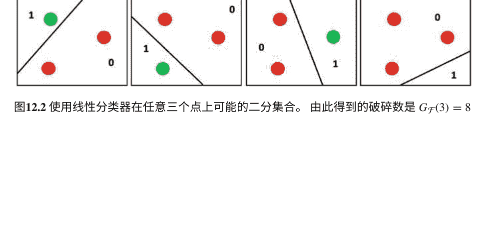

因此，我们得到以下经典的VC界限[10]：

**定理12.2（VC界限）** 对于任意δ > 0，至少以概率1−δ，我们有

$$R(f) \leq R_N(f) + \frac{\sqrt{8 \ln G_{\mathcal{F}}(2N) + 8 \ln \frac{2}{\delta}}}{N} \tag{12.14}$$

Vapnik和Chervonenkis的工作的另一个重要贡献是，生长函数可以通过所谓的VC维度来限制，对于我们无法获得所有可能的二分法的数据点的数量（=VC维度 +1）被称为断点。

**定义12.3（VC维度）** 假设类\(\mathcal{F}\)的VC维度是最大的\(N = d_{VC}(\mathcal{F})\)，使得

$$G_{\mathcal{F}}(N) = 2^N$$

换句话说，函数类\(\mathcal{F}\)的VC维度是它可以粉碎的最大集合的基数。

这意味着VC维度是可以从统计二元分类算法中学习的一组函数的容量（复杂性、表达能力、丰富性或灵活性）的度量。它被定义为算法可以以零训练误差对最大数量的点进行分类的基数。在接下来的内容中，我们展示了几个可以明确计算VC维度的例子。

**例子：半边区间**

考虑任意形式的函数\(\mathcal{F} = \{ f(x) = \chi(x \leq \theta), \theta \in \mathbb{R} \}\)。它可以打破两个点，但是任意三个点都无法打破。因此，\(d_{VC}(\mathcal{F}) = 2\)。

**例子：半平面**

考虑由半平面组成的假设类\(\mathcal{F}\)在\(\mathbb{R}^d\)中。它可以打破\(d + 1\)个点，但是任意\(d + 2\)个点都无法打破。因此，\(d_{VC}(\mathcal{F}) = d + 1\)。

### 例子：正弦曲线

$f$是一个单参数正弦分类器，即对于某个参数$\theta$，分类器$f_{\theta}$返回1，如果输入数字$x$大于$\sin(\theta x)$，否则返回0。$f$的VC维度是无穷大，因为它可以打破集合$\{2^{-m} \mid m \in \mathbb{N}\}$的任意有限子集。

最后，我们可以使用VC维度推导出泛化界限。为此，以下由Sauer提出的引理是关键要素。

### 引理12.2 (Sauer引理[158])

假设 $\mathscr{F}$ 具有有限的VC维度 $d_{VC}$。那么

$$G_{\mathscr{F}}(n) \leq \sum_{i=1}^{d_{VC}} \binom{n}{i} \tag{12.15}$$

对于所有的 $n \geq d_{VC}$ ,

$$G_{\mathscr{F}}(n) \leq \left( \frac{en}{d_{VC}} \right)^{d_{VC}}. \tag{12.16}$$

### 推论12.1 (使用VC维度的VC界限)

让 $d_{VC} \geq N$。那么，对于任意的$\delta > 0$，至少以概率 $1 - \delta$ ，我们有

$$R(f) \leq \mathscr{R}_N(f) + \frac{\sqrt{8d_{VC} \ln \frac{2eN}{d_{VC}} + 8 \ln \frac{2}{\delta}}}{N}. \tag{12.17}$$

证明这是定理12.2和引理12.2的直接结果。 $\square$

VC维度已经被研究用于深度神经网络以理解它们的泛化行为[159]。Bartlett等人[160]证明了具有潜在权重共享的分段线性网络的VC维度界限。尽管当架构发生变化时，这个度量可能具有预测性，但这仅发生在深度和宽度超参数类型中，[159]中的作者还发现它与泛化差距呈负相关，这与广泛已知的经验观察相矛盾，即过参数化改善了深度学习的泛化[159]。

#### 12.2.2 Rademacher复杂度界限

另一个重要的经典方法是广义误差界的Rademacher复杂度[161]。为了理解这个概念，考虑以下示例。让 $\mathcal{S} := \{(\boldsymbol{x}_n, y_n)\}_{n=1}^{N}$ 表示训练样本集，其中 $y_n \in \{-1, 1\}$。然后，训练误差可以通过以下方式计算：

```
err_N(f) = \frac{1}{N} \sum_{n=1}^{N} \mathbf{1}[f(\boldsymbol{x}_n) = y_n]
```

其中 $\mathbf{1}[\cdot]$ 是由以下方式计算的指示函数：

```
\mathbf{1}[f(\boldsymbol{x}_n) = y_n] = \begin{cases} 1, & \{f(\boldsymbol{x}_n), y_n\} = \{1, -1\}, \{-1, 1\} \\ 0, & \{f(\boldsymbol{x}_n), y_n\} = \{1, 1\}, \{-1, -1\} \end{cases}
```

那么，（12.18）可以等价地表示为

```
err_N(f) = \frac{1}{N} \sum_{n=1}^{N} \frac{1 - y_n f(\boldsymbol{x}_n)}{2} = \frac{1}{2} - \frac{1}{N} \sum_{i=1}^{N} y_n f(\boldsymbol{x}_n).
```

因此，最小化训练误差等价于最大化相关性。现在，Rademacher复杂性的核心思想是考虑一个游戏，其中一个玩家生成随机目标 $\{y_n\}_{n=1}^{N}$，另一个玩家提供假设以最大化相关性：

```
\sup_{f \in \mathcal{F}} \frac{1}{N} \sum_{n=1}^{N} y_n f(\boldsymbol{x}_n).
```

请注意，这个想法与VC分析中的破碎密切相关。具体来说，如果假设类 $\mathcal{F}$ 破碎 $\mathcal{S} = \{\boldsymbol{x}_n, y_n\}_{n=1}^{N}$，那么相关性变为最大。然而，与考虑最坏情况的VC分析相反，Rademacher复杂性分析处理平均情况分析。

形式上，我们定义了所谓的Rademacher复杂性[161]。

**定义12.4 (Rademacher复杂度[161])**

让 \(\sigma_1, \cdots, \sigma_N\) 是独立的随机变量 \(\mathbb{P}\{\sigma_n = 1\} = \mathbb{P}\{\sigma_n = -1\} = \frac{1}{2}\)。然后，\(\mathcal{F}\) 的经验Rademacher复杂度定义为

$$Rad_N(\mathcal{F}, S) = \mathbb{E}_{\sigma} \left[ \sup_{f \in \mathcal{F}} \frac{1}{N} \sum_{n=1}^{N} \sigma_n f(\mathbf{x}_n) \right], \quad\quad (12.22)$$

其中 \(\sigma = [\sigma_1, \cdots, \sigma_N]^\top\)。此外，Rademacher复杂度的一般概念是通过计算得到的

$$Rad_N(\mathcal{F}) := \mathbb{E}_{S} [Rad_N(\mathcal{F}, S)]. \quad\quad (12.23)$$

Rademacher复杂度的另一个重要优势是它可以很容易地推广到向量目标的回归问题。例如，(12.23) 可以如下推广：

$$Rad_N(\mathcal{F}) = \mathbb{E} \left[ \sup_{f \in \mathcal{F}} \frac{1}{N} \sum_{n=1}^{N} \langle \boldsymbol{\sigma}_n, f(\mathbf{x}_n) \rangle \right], \quad\quad (12.24)$$

其中 \(\{\boldsymbol{\sigma}_n\}_{n=1}^N\) 指的是独立的随机向量。在接下来的内容中，我们提供一些可以明确计算Rademacher复杂度的例子。

**例子：最小Rademacher复杂度**

当假设类只有一个元素时，即 \(|\mathcal{F}|=1\)，我们有

$$Rad(\mathcal{F}) = \mathbb{E} \left[ \sup_{f \in \mathcal{F}} \frac{1}{N} \sum_{n=1}^{N} \sigma_n f(\mathbf{x}_n) \right] = f(\mathbf{x}_1) \cdot \mathbb{E} \left[ \frac{1}{N} \sum_{n=1}^{N} \sigma_n \right] = 0,$$

其中第二个等式来自于当 \(|\mathcal{F}|=1\) 时 \(f(\mathbf{x}_n)=f(\mathbf{x}_1)\) 的事实。最终的方程式来自于随机变量 \(\sigma_n\) 的定义。

**例子：最大Rademacher复杂度**

当 \(|\mathcal{F}| = 2^N\) 时，我们有

$$Rad(\mathcal{F}) = \mathbb{E} \left[ \sup_{f \in \mathcal{F}} \frac{1}{N} \sum_{n=1}^{N} \sigma_n f(\mathbf{x}_n) \right] = \mathbb{E} \left[ \frac{1}{N} \sum_{n=1}^{N} \sigma_n^2 \right] = 1,$$

第二个等式来自于我们可以找到一个假设使得 \(f(x_n) = \sigma_n\) 对于所有的 \(n\)。最终的方程来自于随机变量 \(\sigma_n\) 的定义。

尽管Rademacher复杂度最初是针对二元分类器推导的，但它也可以用来评估回归的复杂度。下面的例子展示了如何得到封闭形式的Ridge回归的Rademacher复杂度。

**例子：Ridge回归**

设 \(\mathcal{F}\) 为线性预测器类，给定 \(y = \boldsymbol{w}^\top \boldsymbol{x}\)，并且满足约束条件 \(\|\boldsymbol{w}\| \leq W\) 和 \(\|\boldsymbol{x}\| \leq X\)。那么，我们有

$$ Rad(\mathcal{F}, S) = \mathbb{E}_{\sigma} \left[ \sup_{\|\boldsymbol{w}\| \leq W} \frac{1}{N} \sum_{n=1}^N \sigma_n \boldsymbol{w}^\top \boldsymbol{x}_n \right] = \frac{1}{N} \mathbb{E}_{\sigma} \left[ \sup_{\|\boldsymbol{w}\| \leq W} \boldsymbol{w}^\top \left( \sum_{n=1}^N \sigma_n \boldsymbol{x}_n \right) \right] = \frac{W}{N} \mathbb{E}_{\sigma} \left\| \sum_{n=1}^N \sigma_n \boldsymbol{x}_n \right\| \leq \frac{W}{N} \sqrt{\sum_{n=1}^N \mathbb{E}_{\sigma} \|\sigma_n \boldsymbol{x}_n\|^2} = \frac{W}{N} \sqrt{\sum_{n=1}^N \|\boldsymbol{x}_n\|^2} \leq \frac{W X}{\sqrt{N}}, $$

其中(a)来自于 \(l_1\) 范数的定义，(b)来自于Jensen不等式。

使用Rademacher复杂度，我们现在可以推导出一种新的泛化界限类型。首先，我们需要以下浓度不等式。

### 引理12.3 (McDiarmid不等式[161])

设 \(x_1, \cdots, x^N\) 为取值在集合 \(\mathcal{X}\) 中的独立随机变量，\(c_1, \cdots, c_n\) 为正实数常数。如果 \(\varphi : \mathcal{X}_N \to \mathbb{R}\) 满足

$$ \sup_{x_1, \cdots, x_N, x'_n \in \mathcal{X}} |\varphi(x_1, \cdots, x_n, \cdots, x_N) - \varphi(x_1, \cdots, x'_n, \cdots, x_N)| \leq c_n, $$

对于 $1 \leq n \leq N$，那么

$\mathbb{P}\{|\varphi(x_{1},\cdots,x_{N}) - \mathbb{E}\varphi(x_{1},\cdots,x_{N})|\geq\epsilon\}\leq 2\exp\left(-\dfrac{2\epsilon^{2}}{\sum_{n=1}^{N}c_{n}^{2}}\right)$。 (12.25)

特别地，如果 $\varphi(x_{1},\cdots,x_{N})=\sum_{=1}^{Nn}x_{n}/N$，不等式 (12.25)简化为 Hoeffding不等式。

使用McDiarmid不等式和使用“幽灵样本”进行对称化，我们可以得到以下的泛化界限。

**定理12.3 (Rademacher界限)** 设 $S:=\{x_{n},y_{n}\}_{=1}^{Nn}$表示训练集，$f(\boldsymbol{x})\in[a,b]$。对于任意$\delta>0$，以至少 $1-\delta$的概率，我们有

$R(f)\leq\mathcal{R}_{N}(f)+2Rad_{N}(\mathcal{F})+(b-a)\dfrac{\sqrt{\ln 1/\delta}}{2N}$, (12.26)

和

$R(f)\leq\mathcal{R}_{N}(f)+2Rad_{N}(\mathcal{F},S)+3(b-a)\dfrac{\sqrt{\ln 2/\delta}}{2N}$. (12.27)

不幸的是，许多使用Rademacher复杂性来理解深度神经网络的理论努力都没有成功[159]，这通常导致了类似于使用VC界限的尝试的空泛界限。因此，获得更紧密的界限的需求正在增加。

#### 12.2.3 PAC-Bayes界限

到目前为止，我们讨论的性能保证适用于训练和测试数据从相同分布独立抽取的情况。实际上，满足这种性能保证的学习算法被称为可能近似正确（PAC）学习[156]。已经证明，如果概念类 $C$的VC维度是有限的，那么它是PAC可学习的[162]。

除了PAC学习，现代学习理论还有另一个重要领域——贝叶斯推断。贝叶斯推断适用于根据指定先验生成训练和测试数据的情况。然而，并没有保证存在一个实验环境，其中训练和测试数据是根据不同于之前的概率分布生成的。事实上，现代学习理论的很大一部分可以分解为贝叶斯推断和PAC学习。这两个领域都研究使用训练数据的学习算法将输入作为输出生成一个概念或模型，然后可以在测试数据上进行测试。

这两种方法之间的区别可以看作是一种在普遍性和性能之间的权衡。 我们将“实验设置”定义为对训练和测试数据的概率分布。 PAC性能保证适用于广泛的实验设置类别。 贝叶斯正确性定理仅适用于与算法先前使用的实验设置相匹配的实验设置。 然而，在这个受限的设置类别中，贝叶斯学习算法可以是最优的，并且通常优于PAC学习算法。

PAC-Bayesian理论结合了贝叶斯和频率学派的方法[163]。 PAC-Bayesian理论基于关于自然界中发生的“情况”的先验概率分布，而“规则”则表达了学习者对某些规则优于其他规则的偏好。 学习者对规则的偏好与自然分布之间没有假定的关系。 这与贝叶斯推断不同，贝叶斯推断的起点是规则和情况的共同分布，从而在某些情况下引发了规则的条件分布。

在这种设置下，可以得到以下PAC-Bayes泛化界。

**定理12.4 (PAC-Bayes泛化界) [163]**

设 Q是任意的分布，其中 $z := (x, y) \in \mathcal{Z} := \mathcal{X} \times \mathcal{Y}$。 设 $\mathcal{F}$ 是一个假设类，$\ell$是一个损失函数，对于所有的 $f$ 和 $z$，我们有 $\ell(f, z) \in [0, 1]$。 设 $\mathcal{P}$ 是一个先验分布，$\delta \in (0, 1)$。 那么，以至少 $1 - \delta$ 的概率选择一个独立同分布的训练集 $S := \{z_n\}_{n=1}^{N}$，根据 Q进行采样，对于所有的分布 $Q$ over $\mathcal{F}$ (即使依赖于 $S$)，我们有

$$ \mathbb{E}_{f \sim Q}[R(f)] \leq \mathbb{E}_{f \sim Q}\left[\hat{R}_{N}(f)\right] + \sqrt{\frac{KL(Q\|\mathcal{P}) + \ln N/\delta}{2(N - 1)}}, \quad (12.28) $$

其中

$$ KL(Q\|\mathcal{P}) := \mathbb{E}_{f \sim Q} [\ln Q(f)/\mathcal{P}(f)] \quad (12.29) $$

是Kullback-Leibler散度。

最近，PAC-Bayes方法已广泛研究，以解释神经网络的泛化能力[149, 153, 164]。 根据最近的大规模实验，测试不同度量与深度模型泛化的相关性[159]，作者确认了PAC-Bayesian界限的有效性，并将其作为破解泛化难题的有希望的方向。 PAC-Bayes界限的另一个好应用是通过最小化上界来找到最优分布 $Q^{\star}$。这种技术已经成功地用于线性分类器设计[164]等。

### 12.3 通过双下降模型调和泛化差距

回想一下，ERM估计的以下误差界可以得到 (12.2)：

$$R(f^*_{ERM}) \leq \hat{R}_N(f^*_{ERM}) + O\left(\sqrt{\frac{c}{N}}\right), \quad \text{(12.30)}$$

- 经验风险（训练误差）：对应 \(\hat{R}_N(f^*_{ERM})\)
- 复杂性惩罚：对应 \(O\left(\sqrt{\frac{c}{N}}\right)\)

其中 \(O(\cdot)\) 表示“大O”符号，\(c\) 表示模型复杂性，如VC维度、Rademacher复杂性等。
在 (12.30) 中，随着假设类大小 \(|\mathcal{F}|\) 的增加，经验风险或训练误差减小，而复杂性惩罚增加。因此，通过选择 \(\mathcal{F}\)（例如选择神经网络架构）可以明确地控制函数类容量。这在经典的U形风险曲线中得到了总结，该曲线显示在图12.3a中，并经常用作模型选择的指南。从这条曲线上广泛接受的观点是，具有零训练误差的模型对训练数据过拟合，通常泛化能力较差[10]。因此，经典思维处理在欠拟合和过拟合之间寻找“最佳点”。

最近，这个观点受到了看似神秘的实证结果的挑战。例如，在[165]中，作者们使用真实数据的副本对几种标准架构进行了训练，真实标签被随机标签替换。他们的核心发现可以总结如下：深度神经网络很容易适应随机标签。更准确地说，如果神经网络在真实数据的完全随机标记上进行训练，它们可以实现零训练误差。尽管这个观察很容易表达，但从统计学习的角度来看，它具有深远的影响：神经网络的有效容量足以存储整个数据集。尽管函数类别的容量很高，并且几乎完美地适应训练数据，但这些预测器在测试阶段通常对新数据给出非常准确的预测。

这些观察结果排除了VC维度、Rademacher复杂度等描述泛化行为的可能性。特别是，在插值区域的Rademacher复杂度，即训练误差为0的情况下，假设最大值为1，正如之前的例子中所解释的。因此，经典的泛化界限是无效的，无法解释神经网络的惊人泛化能力。

Belkin等人在“双下降”风险曲线[154, 155]的最新突破将经典的偏差-方差权衡与观察到的行为相结合，在大量机器学习模型的过参数化区域中。特别是当函数类容量低于“插值阈值”时，学习的预测器显示出图12.3a中的经典U形曲线，其中函数类容量被认为是指定类内函数所需的参数数量。U形风险的底部可以在

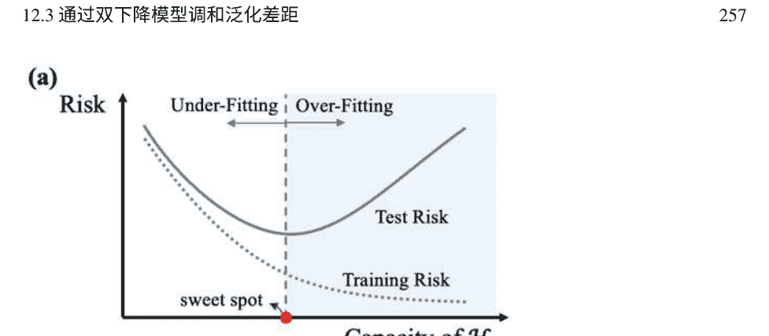

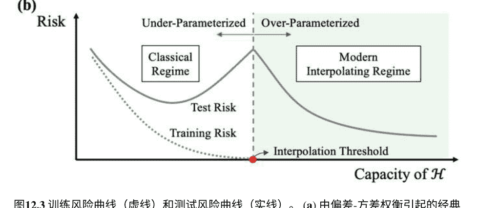

图12.3 训练风险曲线（虚线）和测试风险曲线（实线）。（a）由偏差-方差权衡引起的经典U形风险曲线。（b）双下降风险曲线将U形风险曲线（即“经典”区域）与使用高容量函数类的观察行为（即“现代”插值区域）结合起来，由插值阈值分隔。插值阈值右侧的预测器具有零训练风险。

最佳点是平衡拟合训练数据和过拟合敏感性的最佳点。当我们通过增加神经网络架构的大小来增加函数类容量时，学习到的预测器几乎可以完美拟合训练数据。尽管在插值阈值处获得的学习预测器通常具有较高的风险，但超过这一点的函数类容量增加会导致风险降低，通常低于“经典”区域中的最佳点的风险（参见图12.3b）。在下面的示例中，我们提供了简单线性回归模型背景下的具体和明确的双下降行为证据。分析显示了从欠参数化到过参数化区域的过渡。它还允许我们比较曲线上任意点的风险，并解释过参数化区域的风险如何低于欠参数化区域的任何风险。

## 例子：回归中的双重下降[155]

我们考虑以下线性回归问题：

$$ y = x^T \beta + \epsilon, \quad (12.31) $$

其中 $\beta \in \mathbb{R}^D$, $x$和$\epsilon$分别是一个正态随机向量和一个变量，其中给定训练数据 $\{x_n, y_n\}_{n=1}^N$，我们使用仅具有基数为 $p$ 的子集 $T \subset [D]$ 来拟合数据的线性模型，设 $X = [x_1, \cdots, x_N] \in \mathbb{R}^{D \times N}$ 为设计矩阵，$y = [y_1, \cdots, y_N]^T$ 为响应向量。对于一个子集 $T$，我们使用$\beta_T$来表示其从 $T$ 中取出的 $|T|$ 维子向量；我们还使用 $X_T$ 来表示由 $T$ 中的列组成的一个 $N \times p$ 子矩阵。那么，$\hat{\beta}$的风险，其中 $\hat{\beta}_T = X_T^\dagger y$ 且 $\hat{\beta}_c = 0$，由以下给出：

$$ \mathbb{E}\left[(y - x^T \hat{\beta})^2\right] = \begin{cases} \left(\|\beta_{T^c}\|^2 + \sigma^2\right) \left(1 + \frac{p}{N-p-1}\right); & \text{如果 } p \leq N - 2 \\ \infty; & \text{如果 } N - 1 \leq p \leq N + 1 \\ \|\beta_T\|^2 \left(1 - \frac{N}{p}\right) + \left(\|\beta_{T^c}\|^2 + \sigma^2\right) \left(1 + \frac{N}{p-N-1}\right); & \text{如果 } p \geq N + 2. \end{cases} \quad (12.32) $$

证明：回想一下，$x$被假设为具有零均值和单位协方差的高斯分布，因此均方预测误差可以写成

$$ \mathbb{E}\left[(y - x^T \hat{\beta})^2\right] = \mathbb{E}\left[(x^T \beta + \sigma \epsilon - x^T \hat{\beta})^2\right] = \sigma^2 + \mathbb{E}\|\beta - \hat{\beta}\|^2 = \sigma^2 + \|\beta_{T^c}\|^2 + \mathbb{E}\|\beta_T - \hat{\beta}_T\|^2, $$

其中 $\beta$ 表示真实的回归参数，我们使用测试阶段回归器 $x$ 和训练阶段设计矩阵 $X$ 的独立性。我们的目标是推导出第二项的闭式表达式。

(经典情况)对于给定的训练数据集，我们有

$$ \hat{\beta}_T = (X_T X_T^T)^{-1} X_T y = (X_T X_T^T)^{-1} X_T X_T^T \beta_T + (X_T X_T^T)^{-1} X_T \eta = \beta_T + (X_T X_T^T)^{-1} X_T \eta, $$

其中

$$\eta := y - X_T^{\top} \beta_T = X_{T^c}^{\top} \beta_{T^c}.$$
将其代入第二项，我们有
$$\mathbb{E} \| \beta_T - \hat{\beta}_T \|^2 = \mathbb{E} \left[ \eta^{\top} P_{\mathcal{R}(X_T)} \eta \right] = \operatorname{Tr}\left( \mathbb{E} \left[ P_{\mathcal{R}(X_T)} \right] \mathbb{E} \left[ \eta \eta^{\top} \right] \right). $$

此外，我们还有

$$\mathbb{E} \left[ \eta \eta^{\top} \right] = \mathbb{E} \left[ \sigma^2 I_N \right] + \mathbb{E} \left[ X_{T^c}^{\top} \beta_{T^c} \left( X_{T^c}^{\top} \beta_{T^c} \right)^{\top} \right] = (\sigma^2 + \| \beta_{T^c} \|^2) \boldsymbol{I}_N$$

，其中 $\mathcal{R}(X_T)$ 表示 $X_T$的范围空间，而 $P_{\mathcal{R}(X_T)}$ 表示对 $X_T$的范围空间的投影。此外，$P_{\mathcal{R}(X_T)}$ 是Hotelling的T-平方分布，参数为 $p$ 和 $N - p + 1$，因此

$$\operatorname{Tr} \mathbb{E} \left[ P_{\mathcal{R}(X_T)} \right] = \begin{cases} \dfrac{p}{N - p - 1}, & \text{if } p \le N - 2, \\ +\infty, & \text{如果 } p = N - 1 \end{cases} \tag{12.33}$$

因此，将它们放在一起，我们得出了经典情况的证明。

**（现代插值情况）** 我们考虑 $p \ge N$。然后，我们有

$$\hat{\beta}_T = X_T^{\top} (X_T X_T^{\top})^{-1} y = X_T^{\top} (X_T X_T^{\top})^{-1} X_T^{\top} \beta_T + X_T^{\top} (X_T X_T^{\top})^{-1} \eta$$
$$= X_T^{\top} (X_T X_T^{\top})^{-1} X_T^{\top} \beta_T + X_T^{\top} (X_T X_T^{\top})^{-1} \eta$$
$$= P_{\mathcal{R}(X_T^{\top})} \beta_T + X_T^{\top} (X_T X_T^{\top})^{-1} \eta,$$

其中

$$\eta := y - X_T^{\top} \beta_T = X_{T^c}^{\top} \beta_{T^c}.$$
因此，
$$\mathbb{E} \left[ \| \beta_T - \hat{\beta}_T \|^2 \right] = \mathbb{E} \left[ \| P_{\mathcal{R}(X_T^{\top})}^{\perp} \beta_T \|^2 \right] + \mathbb{E} \left[ \eta^{\top} (X_T X_T^{\top})^{-1} \eta \right].$$

此外，我们还有

$$ \mathbb{E}\left[\left\|P_{\mathscr{R}\left(X_{T}^{\top}\right)}^{\perp} \boldsymbol{\beta}_{T}\right\|^{2}\right]=\left(1-\frac{n}{p}\right)\left\|\boldsymbol{\beta}_{T}\right\|^{2} $$
$$ \mathbb{E}\left[\boldsymbol{\eta}^{\top}\left(X_{T} X_{T}^{\top}\right)^{-1} \boldsymbol{\eta}\right]=\operatorname{Tr}\left(\mathbb{E}\left(X_{T} X_{T}^{\top}\right)^{-1} \mathbb{E}\left[\boldsymbol{\eta} \boldsymbol{\eta}^{\top}\right]\right), $$
在这里，我们使用了 $X_T$ 和 $X_{T^c}$ 之间的独立性，并且对于第二个等式。
此外，我们还有

$$ \mathbb{E}\left[\boldsymbol{\eta} \boldsymbol{\eta}^{\top}\right]=\mathbb{E}\left[ \sigma^2 I_N \right]+\mathbb{E}\left[\boldsymbol{X}_{T^{c}}^{\top} \boldsymbol{\beta}_{T^{c}}\left(\boldsymbol{X}_{T^{c}}^{\top} \boldsymbol{\beta}_{T^{c}}\right)^{\top}\right] $$
$$ =\left(\sigma^{2}+\left\|\boldsymbol{\beta}_{T^{c}}\right\|^{2}\right) \boldsymbol{I}_{N} . $$
最后，$P := (X_T X_T^\top)^{-1}$ 的分布是具有单位缩放矩阵 $I_N$ 和 $p$ 自由度的逆-Wishart分布。因此，我们有

$$ \operatorname{Tr}\left(\mathbb{E}\left(X_{T} X_{T}^{\top}\right)^{-1}\right)= \begin{cases}\frac{N}{p-N-1}, & \text { if } p \geq N+2 \\ +\infty, & \text { 如果 } p=N, N+1\end{cases} $$
将它们放在一起，我们有

$$ \mathbb{E}\left[\left(y-\boldsymbol{x}^{\top} \hat{\boldsymbol{\beta}}\right)^{2}\right]=\left(1-\frac{N}{p}\right)\left\|\boldsymbol{\beta}_{T}\right\|^{2}+\left(\sigma^{2}+\left\|\boldsymbol{\beta}_{T^{c}}\right\|^{2}\right)\left(1+\frac{N}{p-N-1}\right), $$
对于 $p \geq N$ 和 $\mathbb{E}\left[\left(y-\boldsymbol{x}^{\top} \hat{\boldsymbol{\beta}}\right)^{2}\right] = \infty$ 对于 $p = N, N+1$。这证明了证明。$\square$

图12.4展示了线性回归问题的一个参数集的示例图。

### 12.4 优化的归纳偏差

所有学习得到的预测器在插值阈值右侧完全适配训练数据，并且没有经验风险。那么，为什么一些特别是来自较大函数类的预测器应该具有比其他预测器更低的测试风险，以便更好地泛化？答案是函数类容量，如VC维度或Rademacher复杂度，并不一定反映适用于手头问题的预测器的归纳偏差。实际上，一个

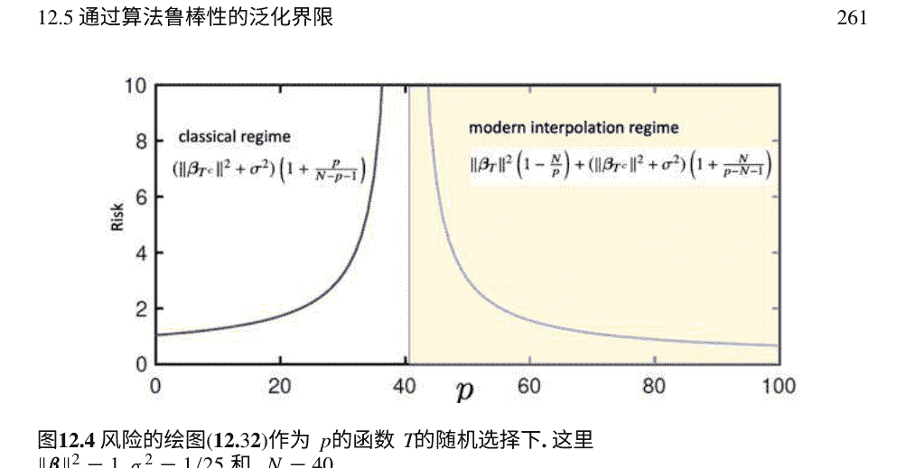

图12.4 风险的绘图 (12.32) 作为 $p$ 的函数，在 $T$ 的随机选择下。这里 $||\beta||^2 = 1$, $\sigma^2 = 1/25$ 和 $N = 40$。

在前面的线性回归问题中，出现双下降模型的一个潜在原因是我们施加了归纳偏差来选择最小范数解 \(\hat{\beta}_T = X_T (X_T^T X_T)^{-1} y\) 用于过参数化区域，从而得到平滑解。

在各种插值解决方案中，选择与观测数据完全匹配的平滑或简单函数是奥卡姆剃刀的一种形式：应该优先选择与观测一致的最简单的解释。通过考虑包含更多与数据兼容的候选预测变量的较大函数类，我们可以找到“更简单”的插值函数。增加函数类容量可以提高分类器的性能。选择更简单的解决方案的一个重要优势是可以通过避免数据中的不必要的过拟合来进行简单的泛化。将函数类容量增加到过参数化区域可以提高所得分类器的性能。

然后，剩下的问题之一是：训练网络变得平滑或简单的基本机制是什么？这与诸如梯度下降、随机梯度下降（SGD）等优化算法的归纳偏差（或隐式偏差）密切相关。[166-171] 事实上，这是一个活跃的研究领域。例如，[168]中的作者表明，线性分类器的梯度下降对于特定损失函数导致最大间隔SVM分类器。其他研究人员表明，深度神经网络训练中的梯度下降导致简单的解决方案[169-171]。

### 12.5 通过算法鲁棒性的泛化界限

另一个重要问题是如何以泛化误差界限的形式量化算法的归纳偏差。在本节中，我们介绍一种用于量化泛化误差的算法鲁棒性的概念，

最初在[172]中提出，但在深度学习研究中被大部分忽视。事实证明，基于算法鲁棒性的泛化界限具有量化深度神经网络迷人的泛化行为所需的所有要素，因此它可以成为研究泛化的有用工具。

回想一下，经典泛化界限的基本假设是经验风险收敛到其期望值的均匀收敛[10]，这提供了通过假设集的复杂性来限制期望风险和经验风险之间差距的方法。另一方面，鲁棒性要求在接近训练样本的样本上进行测试时，预测规则具有可比较的性能。这个形式上的定义如下。

**定义12.5 (算法鲁棒性[172])**

算法 $\mathcal{A}$ 被称为 $(K, \epsilon(\cdot))$-鲁棒的，其中 $K \in \mathbb{N}$ 且 $\epsilon(\cdot) : \mathcal{Z} \to \mathbb{R}$，如果 $\mathcal{Z} := \mathcal{X} \times \mathcal{Y}$ 可以被划分为 $K$ 个不相交的集合，记为 $\{C_i\}_{i=1}^K$，对于所有的训练集 $S \subset \mathcal{Z}$，以下条件成立：

$$\forall s \in \mathcal{S}, \forall z \in \mathcal{Z}; \text{if } s, z \in C_i, \text{then } |\ell(\mathcal{A}_S, s) - \ell(\mathcal{A}_S, z)| \leq \epsilon(\mathcal{S}) \quad (12.34)$$

对于所有的 $i = 1, \cdots, K$, 其中 $\mathcal{A}_S$ 表示使用数据集 $S$ 训练的算法 $\mathcal{A}$，$\ell$ 表示损失函数。

然后，我们可以根据算法的鲁棒性得到泛化界限。

首先，我们需要以下浓度不等式。

**引理12.4 (Bretagnolle-Huber-Carol不等式[173])**

如果随机向量 $(N_1, \cdots, N_k)$ 服从多项分布，参数为 $N$ 和 $(p_1, \cdots, p_k)$，则

$$\mathbb{P} \left\{ \sum_{i=1}^k |N_i - Np_i| \geq 2\sqrt{N\lambda} \right\} \leq 2^k \exp(-2\lambda^2), \quad \lambda > 0. \quad (12.35)$$

**定理12.5** 如果学习算法 $\mathcal{A}$ 是 $(K, \epsilon(\cdot))$-鲁棒的，并且训练样本集 $S$ 是由概率测度 $\mu$ 的 $N$ 个独立同分布样本生成的，那么对于任意 $\delta > 0$，至少以概率 $1 - \delta$ 我们有

$$|R(\mathcal{A}_S) - \mathcal{R}_N(\mathcal{A}_S)| \leq \epsilon(\mathcal{S}) + M \sqrt{\frac{2K \ln 2 + 2 \ln(1/\delta)}{N}}, \quad (12.36)$$

其中

$$M := \max_{z \in \mathcal{Z}} |\ell(\mathcal{A}_S, z)|.$$

证明 设 $N_i$ 为 $S$ 中落在 $C_i$ 中的点的索引集合。注意到 $(|N_1|, \cdots, |N_K|)$ 是一个具有参数 $N$ 和的独立同分布多项式随机变量 $(\mu(C_i), \cdots, \mu(C_K))$。然后，根据引理12.4，以下成立。

$$\mathbb{P}\left\{\sum_{i=1}^{K} \left| \frac{|N_i|}{N} - \mu(C_i) \right| \geq \lambda \right\} \leq 2^K \exp \left( -\frac{N\lambda^2}{2} \right). \tag{12.37}$$

因此，以下至少以概率 $1 - \delta$ 成立，

$$\sum_{i=1}^{K} \left| \frac{|N_i|}{N} - \mu(C_i) \right| \leq \frac{\sqrt{2K \ln 2 + 2\ln(1/\delta)}}{N}. \tag{12.38}$$

然后，泛化误差由以下给出

$$\begin{aligned} |R(\mathcal{A}_S) - \mathcal{R}_N(\mathcal{A}_S)| &\leq \left| \sum_{i=1}^{K} \mathbb{E}_{\mathbf{z} \sim \mu} (\mathcal{A}_S, \mathbf{z} | \mathbf{z} \in C_i) \mu(C_i) - \frac{1}{N} \sum_{n=1}^{N} (\mathcal{A}_S, s_i) \right| \\ &\overset{(a)}{\leq} \left| \sum_{i=1}^{K} \mathbb{E}_{\mathbf{z} \sim \mu} (\mathcal{A}_S, \mathbf{z} | \mathbf{z} \in C_i) \frac{|N_i|}{N} - \frac{1}{N} \sum_{n=1}^{N} (\mathcal{A}_S, s_i) \right| \\ &\quad + \left| \sum_{i=1}^{K} \mathbb{E}_{\mathbf{z} \sim \mu} (\mathcal{A}_S, \mathbf{z} | \mathbf{z} \in C_i) \mu(C_i) - \sum_{n=1}^{N} \mathbb{E}_{\mathbf{z} \sim \mu} (\mathcal{A}_S, \mathbf{z} | \mathbf{z} \in C_i) \frac{|N_i|}{N} \right| \\ &\overset{(b)}{\leq} \frac{1}{N} \left| \sum_{i=1}^{K} \sum_{j \in N_i} \max_{\mathbf{z}_2 \in C_j} | (\mathcal{A}_S, \mathbf{s}_j) - (\mathcal{A}_S, \mathbf{z}_2) | \right| \\ &\quad + \max_{\mathbf{z} \in \mathcal{Z}} | (\mathcal{A}_S, \mathbf{z}) | \sum_{i=1}^{K} \left| \frac{|N_i|}{N} - \mu(C_i) \right| \\ &\overset{(c)}{\leq} \epsilon(S) + M \sum_{i=1}^{K} \left| \frac{|N_i|}{N} - \mu(C_i) \right| \\ &\overset{(d)}{\leq} \epsilon(S) + M \frac{\sqrt{2K \ln 2 + 2\ln(1/\delta)}}{N}, \end{aligned}$$

其中 (a), (b) 和 (c) 是由三角不等式、$N_i$的定义以及$\epsilon(S)$和 $M$的定义得出的。

□

请注意，鲁棒性的定义要求(12.34)对每个训练样本都成立。 参数 $K$和 $\epsilon(\cdot)$量化了算法的鲁棒性。 由于$\epsilon(\cdot)$是训练样本的函数，算法对不同的训练模式可能具有不同的鲁棒性特性。 例如，分类算法对具有更大间隔的训练集更具鲁棒性。 由于(12.34)包括了训练解 $\mathcal{A}_S$和训练集 $S$，鲁棒性是学习的一个属性。

算法，而不是“有效假设空间”的属性。这就是为什么鲁棒性基于的泛化界可以解释算法的归纳偏差。

例如，对于单层ReLU神经网络 $f_\Theta : \mathbb{R}^2 \rightarrow \mathbb{R}^2$ 具有以下权重矩阵和偏置：

$$W^{(0)} = \begin{bmatrix} 2 & -1 \\ 1 & 1 \end{bmatrix}, b^{(0)} = \begin{bmatrix} 1 \\ -1 \end{bmatrix}$$

相应的神经网络输出为

$$\boldsymbol{o}^{(1)} = \begin{cases} [0, 0]^\top, & 2x - y + 1 < 0, x + y - 1 < 0, \\ [2x - y + 1, 0]^\top, & 2x - y + 1 \ge 0, x + y - 1 < 0, \\ [0, x + y - 1]^\top, & 2x - y + 1 < 0, x + y - 1 \ge 0, \\ [2x - y + 1, x + y - 1]^\top, & 2x - y + 1 \ge 0, x + y - 1 \ge 0. \end{cases}$$

这里，分区的数量为 $K = 4$。

另一方面，考虑一个具有给定权重矩阵和偏置的两层ReLU网络

$$W^{(0)} = \begin{bmatrix} 2 & -1 \\ 1 & 1 \end{bmatrix}, b^{(0)} = \begin{bmatrix} 1 \\ -1 \end{bmatrix},$$
$$W^{(1)} = \begin{bmatrix} 1 & 2 \\ 0 & 1 \end{bmatrix}, b^{(1)} = \begin{bmatrix} 0 \\ 1 \end{bmatrix}.$$

相应的神经网络输出为

$$\boldsymbol{o}^{(2)} = \begin{cases} [0, 1]^\top, & 2x - y + 1 < 0, x + y - 1 < 0, \\ [2x - y + 1, 1]^\top, & 2x - y + 1 \ge 0, x + y - 1 < 0, \\ [2x + 2y - 2, x + y]^\top, & 2x - y + 1 < 0, x + y - 1 \ge 0, \\ [4x + y - 1, x + y]^\top, & 2x - y + 1 \ge 0, x + y - 1 \ge 0. \end{cases}$$

因此，尽管参数大小是两倍，分区数$K = 4$，与单层神经网络相同。因此，就泛化界限而言，这两个算法的上界相同，直到参数 $\epsilon(S)$。这个例子清楚地证明了泛化是学习算法的属性，而不是有效假设空间或参数数量的属性。

### 12.6 练习

- 1. 计算以下函数类的VC维度：
(a) 区间 [a, b]。
(b) 平面上的圆盘 R²。
(c) 平面上的半空间 Rᵈ。
(d) 轴对齐的矩形。

- 2. 证明分类器 $f_{\theta}$，如果输入数字 $x$ 大于 $\sin(\theta x)$ 则返回1，否则返回0，可以打破集合 $\{2^{-m} \mid m \in \mathbb{N}\}$ 的任何有限子集。

- 3. 证明Rademacher复杂度的以下性质：
(a) (单调性) 如果 $\mathcal{F} \subset \mathcal{G}$，则 $Rad_N(\mathcal{F}) \leq Rad_N(\mathcal{G})$。
(b) (凸包) 让 $conv(\mathcal{F})$ 是 $\mathcal{F}$ 的凸包。 那么 $Rad_N(\mathcal{F}) = Rad_N(conv(\mathcal{F}))$。
(c) (缩放和平移) 对于任何函数类 $\mathcal{F}$ 和 $c, d \in \mathbb{R}$。 $Rad_N(c\mathcal{F} + d) = |c| Rad_N(\mathcal{F})$。
(d) (Lipschitz组合) 如果 $\phi$ 是一个 $L$-Lipschitz函数， 那么 $Rad_N(\phi \cdot \mathcal{F}) \leq L \cdot Rad_N(\mathcal{F})$。

- 4. 让 $\mathcal{F}$ 是由 $y = w^T x$ 给出的线性预测器类，其中限制条件为 $\|w\|_1 \leq W_1$ 和 $\|x\|_{\infty} \leq X_{\infty}$ 对于 $x \in \mathbb{R}^d$。然后，证明
\[Rad_N(\mathcal{F}) \leq \frac{W_1 X_{\infty} \sqrt{2 \ln(d)}}{\sqrt{N}}\].

- 5. 设 $\mathcal{A}$ 为 $\mathbb{R}^m$ 中的一组 $N$ 向量， 设 $\bar{a}$ 为 $\mathcal{A}$ 中向量的平均值。 那么：
\[Rad_N(\mathcal{A}) \leq \max_{a \in \mathcal{A}} \|a - \bar{a}\|_2 \cdot \frac{\sqrt{2 \log N}}{m}\].
特别地， 如果 $\mathcal{A}$ 是一组二进制向量，
\[Rad_N(\mathcal{A}) \leq \frac{\sqrt{2 \log N}}{m}\].

- 6. 对于度量空间 $S$， $\rho$ 和 $\mathcal{T} \subset S$， 如果 $\hat{\mathcal{T}} \subset S$ 是 $\mathcal{T}$ 的一个 $\epsilon$-覆盖， 则对于每个 $t \in \mathcal{T}$， 存在 $t' \in \mathcal{T}$ 使得 $\rho(t, t') \leq \epsilon$。 覆盖数 $\epsilon$ 是 $\mathcal{T}$ 的一个定义
\[N(\epsilon, \mathcal{T}, \rho) = \min\{|\mathcal{T}'| : \mathcal{T}' \text{是} \mathcal{T} \text{的一个} \epsilon \text{-覆盖}\}\].
如果 $\mathcal{Z}$ 相对于度量 $\rho$ 是紧致的，那么 $(\mathcal{A}_S, \cdot)$ 是利普希茨连续的，具有利普希茨常数 $c(\mathcal{S})$，即

$$| (\mathcal{A}_S, z_1) - (\mathcal{A}_S, z_2) | \leq c(\mathcal{S}) \rho(z_1, z_2), \quad \forall z_1, z_2 \in \mathcal{Z},$$

则证明 $\mathcal{A}$ 是 $(K, \epsilon(\mathcal{S}))$-鲁棒的，其中

$$K = N(\gamma/2, \mathcal{Z}, \rho), \quad \epsilon(\mathcal{S}) = c(\mathcal{S})\gamma$$

对于 $\gamma > 0.$

## 第13章
生成模型和无监督学习

### 13.1 引言

我们对深度学习几何的理解的最后部分可能涉及到深度学习最令人兴奋的方面-生成模型。
生成模型涵盖了广泛的研究活动，包括变分自动编码器 (VAE) [174, 175]，生成对抗网络 (GAN) [88, 176, 177]，归一化流[178–181]，最优传输 (OT) [182–184]等。这个领域发展非常迅速，在任何机器学习会议上，如NeurIPS，CVPR, ICML, ICLR等，您可能会看到超越现有方法的令人兴奋的新进展。 事实上，这可能是写这一章节被推迟到最后一刻的借口之一，因为在写作过程中可能会有新的更新。

例如，图13.1显示了从2014年的GAN[88]到2018年的styleGAN[89]生成的各种生成模型生成的假人脸的示例。 您可能会惊讶地看到这些图像在如此短的时间内变得如此逼真且具有如此多的细节。 事实上，这可能是为什么生成模型的DeepFake已经成为现代深度学习时代的一个社会问题的另一个原因。

除了创建假面孔之外，生成模型之所以如此重要，还因为它是设计无监督学习算法的系统手段。 例如，在Yann LeCun在NeurIPS 2016上著名的蛋糕类比中，他强调了无监督学习的重要性，他说：“如果智能是一个蛋糕，大部分蛋糕是无监督学习，蛋糕上的糖霜是监督学习，蛋糕上的樱桃是强化学习 (RL) 。” Yann LeCun提到GAN时说它是“过去10年中机器学习中最有趣的想法”，并预测它可能成为现代无监督学习中最重要的引擎之一。

尽管它们很受欢迎，但生成模型难以理解的原因之一是有很多变体，例如VAE [174]，$\beta$-VAE [175]。


## 图13.1 使用生成模型进行四年人脸生成

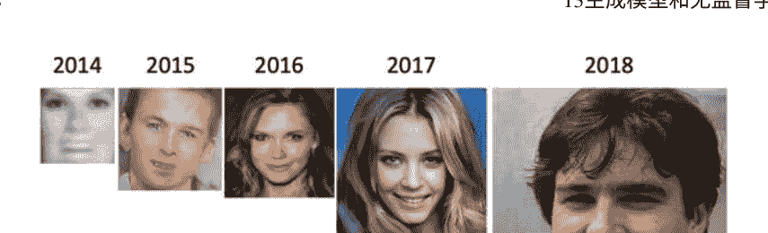

## 图13.2 生成模型的几何形状

GAN [88]， f-GAN [176]， W-GAN [177]， 归一化流[178–180]， GLOW[181]， 最优传输[182–184]， cycleGAN [185]， W-GAN [177]， starGAN [87]， CollaGAN [186]， 仅举几例。此外，现代深度生成模型，特别是GANs，被公众媒体描述为可以从无中生成任何东西的神奇黑盒子。因此，本章的主要目标之一是通过提供一种连贯的几何图像来揭示生成模型的公众信仰。

具体来说，我们的统一几何视角从图13.2开始。在这里，环境图像空间是 X，我们可以用真实数据分布 μ进行采样。如果潜在空间是 Z，生成器 G可以被视为从潜在空间到环境空间的映射， G : Z → X，通常通过一个具有参数 θ的深度网络来实现，即 G := G_θ。让 ζ 是潜在空间上的一个固定分布，例如均匀分布或高斯分布。生成器 G_θ将 ζ 推向环境空间 X中的一个分布 μ_θ = G_θ#ζ（暂时不用担心“推向”这个术语，稍后会解释）。然后，生成模型训练的目标是使 μ_θ尽可能接近真实数据分布 μ。

此外，对于自编码生成模型的情况，生成器作为解码器工作，并存在额外的编码器。更具体地说，编码器 F从样本空间映射到潜空间 F : X → Z，由 φ参数化，即 F = F_φ，使得编码器将 μ推向分布 ζ_φ = F_φ#μ在潜空间中。

因此，额外的约束再次是最小化 $\xi$ 和 $\zeta$ 之间的距离。使用这个统一的几何模型，我们可以证明各种类型的生成模型，如VAE、$\beta$-VAE、GAN、OT、归一化流等，只在 $\mu_{\theta}$ 和 $\mu$ 之间的距离选择以及如何训练生成器和编码器以最小化距离方面有所不同。
通过保持源代码和数学符号，我们可以展示出各种类型的生成模型，如VAE、$\beta$-VAE、GAN、OT、归一化流等，只在 $\mu_{\theta}$ 和 $\mu$ 之间的距离选择以及如何训练生成器和编码器以最小化距离方面有所不同。

因此，这一章的结构与传统的描述生成模型的方法有所不同。我们不直接深入到每个生成模型的具体细节，而是试图首先提供一个统一的理论视角，然后将每个生成模型作为一个特例推导出来。具体而言，我们首先简要回顾概率论、统计距离和最优传输理论[182, 184]。利用这些工具，我们详细讨论了如何通过简单地改变统计距离的选择来推导出每个具体算法。

### 13.2 数学基础

在本节中，我们假设读者对基本的概率和测度论[2]有所了解。有关概率空间的正式定义和测度论中相关术语的更多背景知识，请参阅第1章。

### 定义13.1 (测度的推前)
设 $(\mathcal{X}, \mathcal{F}, \mu)$ 是一个概率空间，$\mathcal{Y}$ 是一个集合，$f: \mathcal{X} \rightarrow \mathcal{Y}$ 是一个函数。通过 $f$ 的推前，$\mu$ 的推前是概率测度 $\nu: f(\mathcal{F}) \rightarrow [0, 1]$ 定义如下：

$$ \nu(S) = \mu(f^{-1}(S)), $$

通常用 $\nu = f_\# \mu$ 表示。

作为一个重要的例子，一个随机变量 $X: \Omega \rightarrow M$ 从可能的结果集合 $\Omega$ 到可测空间 $M$ 可以被看作是一个测度的推前。更具体地说，在一个概率空间 $(\Omega, \mathcal{F}, \mu)$ 上，一个概率测度表示随机变量 $X$ 取值于集合 $S \subset M$ 的概率 $\nu$ 写作

$$ \begin{aligned}
\nu(S) &:= \nu(\{X \in S\}) \\
&= \mu(\{\omega \in \Omega \mid X(\omega) \in S\}) \\
&= \mu(X^{-1}(S)).
\end{aligned} $$

因此，我们可以将随机变量 $X$ 看作是将测度 $\mu$ 从 $\Omega$ 推前到 $\mathbb{R}$ 的测度 $\nu$。

### 示例（推前测度）

考虑示例1.4。我们现在引入一个实值随机变量：

$X(\omega) = \begin{cases} 1, & \text{如果 } \omega = H, \\ 0, & \text{如果 } \omega = T. \end{cases}$

那么，推前测度 $Q = X_\#P$由以下给出：

$Q(\emptyset) = 0, \quad Q(\{1\}) = 0.5, \quad Q(\{0\}) = 0.5, \quad Q(\{0,1\}) = 1.$

我们现在定义Radon-Nikodym导数，这是一种数学工具，在严格的环境中推导连续域的概率密度函数（pdf）或离散域的概率质量函数（pmf）非常重要。这在推导统计距离，特别是散度时也非常重要。

为此，我们需要理解绝对连续测度的概念。

### 定义13.2（绝对连续测度）

如果 $\mu$ 和 $\nu$ 是两个测度在任何事件集 $\mathcal{F}$ of $\Omega$上，我们说 $\nu$ 相对于 $\mu$ 是绝对连续的，或者 $\nu \ll \mu$，如果对于每个可测集 $A$，$\mu(A) = 0$ 意味着 $\nu(A) = 0$。

图13.3a显示了 $\nu$ 相对于 $\mu$ 不是绝对连续的情况，而图13.3b对应于 $\nu \ll \mu$ 的情况。除了是存在Radon-Nikodym导数的先决条件外，绝对连续性还重要，因为它验证了在设计特定生成模型时是否适用特定的散度。

### 定理13.1（Radon-Nikodym定理）

让 $\lambda$ 和 $\nu$ 是任何事件集 $\mathcal{F}$ of $\Omega$上的两个测度。如果 $\lambda \ll \nu$，则存在一个非负函数 $g$ 在 $\Omega$上，使得

$\lambda(A) = \int_A d\lambda = \int_A g d\nu, \quad A \in \mathcal{F}. \tag{13.3}$

函数 $g$ 被称为Radon-Nikodym导数或密度 $\lambda$ 相对于 $\nu$ 和 用 $d\lambda/d\nu$ 表示。在概率中，一种流行的Radon-Nikodym导数之一

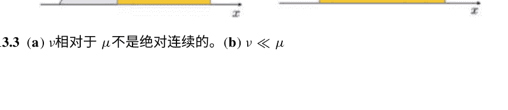

### 图13.3 (a) v相对于 μ 不是绝对连续的。(b) v ≪ μ理论上的概率密度函数 (pdf) 或概率质量函数 (pmf) 如下所述。Radon-Nikodym 导数也是定义一个 $f$-散度作为统计距离度量的关键。

### 例子 (离散概率测度的 Radon-Nikodym 导数)

设 $a_1 < a_2 < \cdots$ 是一系列实数，并且设 $p_n, n=1,2,\cdots$, 是一系列正数，使得 $\sum_{n=1}^{\infty} p_n = 1$。那么，

$$
F(x) = \begin{cases}
\sum_{i=1}^{n} p_i, & a_n \le x < a_{n+1}, \\
0, & -\infty < x < a_1.
\end{cases}
\tag{13.4}
$$

这通常被称为离散累积分布函数 (cdf)，对于这种离散情况，它是逐步增加的。然后，相应的概率测度是

$$
P(A) = \sum_{i: a_i \in A} p_i.
\tag{13.5}
$$

设 $\nu$ 为计数测度。那么，

$$
P(A) = \int_A f d\nu = \sum_{a_i \in A} f(a_i)。
\tag{13.6}
$$

通过观察 (13.5) 和 (13.6)，我们可以看到 Radon-Nikodym 导数由以下给出

$$
f(a_i) = p_i, \quad i = 1, 2, \cdots,
\tag{13.7}
$$

这通常被称为概率质量函数 (pmf)。

### 例子 (连续概率测度的 Radon-Nikodym 导数)

回想一下，连续域累积分布函数 (cdf) $F$ 是由以下给出的

$$
F(x) = \int_{-\infty}^{x} f(y)dy, \quad x \in \mathbb{R},
\tag{13.8}
$$

其中 $f(y)$ 是概率密度函数（pdf）。然后，对应的概率属于一个区间 $A$ 可以通过以下计算得到

$$P(A) = \int_A f(y)dy \tag{13.9}$$

对于任何区间 $A$。因此，我们可以很容易地看出，pdf $f$ 是相对于勒贝格测度的 Radon-Nikodym 导数。

尽管 Radon-Nikodym 导数用于推导 pdf 和 pmf，但它是一个更一般的概念，经常用于相对于测度的任何积分操作。下面的命题对于计算相对于推前测度的积分非常有帮助。

> 命题 13.1 (变量变换公式) 设 $(X, \mathcal{F}, \mu)$ 是一个概率空间，$f : X \to Y$ 是一个函数，使得通过 $\nu = f_\# \mu$ 定义了一个推前测度 $\nu$。那么，我们有

$$\int_Y g d\nu = \int_X g \circ f d\mu, \tag{13.10}$$

其中 $\circ$ 表示函数的复合。

### 13.3 统计距离

正如之前讨论的，概率空间中的距离是理解生成模型的关键概念之一。在统计学中，统计距离量化了两个统计对象之间的距离，可以是两个随机变量，或者是两个概率分布或样本。距离可以是个体样本点与总体或更广泛的样本点之间的距离。

#### 13.3.1 f-散度

在概率空间中定义度量通常是复杂的，甚至是不可能的。因此，通常使用松弛形式的度量。例如，满足定义 1.1 的 1) 和 2) 的统计距离被称为散度，在统计学和机器学习中经常使用。机器学习中最广泛使用的一种散度形式是 f-散度，其定义如下。

定义 13.3 (f-散度) 让 $\mu$ 和 $\nu$ 是两个概率分布，定义在一个空间 $\Omega$，使得 $\mu \ll \nu$。那么，对于一个凸函数 $f$，使得 $f(1)=0$，从 $\nu$ 到 $\mu$ 的 f-散度被定义为

$$ D_f(\mu||\nu) := \int_{\Omega} f \left( \frac{d\mu}{d\nu} \right) d\nu, \quad (13.11) $$

其中 $d\mu/d\nu$ 是关于 $\nu$ 的 Radon-Nikodym 导数。如果 $\mu \ll \xi$ 和 $\nu \ll \xi$ 是一个共同的测度 $\xi$ 在 $\Omega$ 上，那么它们的概率密度 $p$ 和 $q$ 满足 $d\mu = p d\xi$ 和 $d\nu = q d\xi$。在这种情况下，f-散度可以写成

$$ D_f(P||Q) := \int_{\Omega} f \left( \frac{p(x)}{q(x)} \right) q(x) d\xi(x). \quad (13.12) $$

有一件非常重要且需要小心处理的事情是条件 $\mu \ll \nu$。例如，如果 $\mu$ 是原始数据的度量，$\nu$ 是生成数据的分布，则首先应检查它们相对连续性以选择正确的散度形式。

对于离散情况，当 $Q(x)$ 和 $P(x)$ 分别成为概率质量函数时，f-散度可以写成

$$ D_f(P||Q) := \sum_{x} Q(x) f \left( \frac{P(x)}{Q(x)} \right). \quad (13.13) $$

根据凸函数 $f$ 的选择，我们可以得到各种特殊情况。一些代表性的特殊情况如下。

##### 13.3.1.1 Kullback-Leibler (KL) 散度

相应的生成器 $f$ 给出如下

$$ f(t) = t \log t. $$

在离散情况下，KL 散度可以表示为

$$ D_{KL}(P||Q) = \sum_{x} Q(x) \frac{P(x)}{Q(x)} \log \frac{P(x)}{Q(x)} = \sum_{x} P(x) \log \frac{P(x)}{Q(x)} = -\sum_{x} (P(x) \log Q(x) - P(x) \log P(x)) = H(P, Q) - H(P), \quad (13.14) $$

其中 $H(P, Q)$ 是 $P$ 和 $Q$ 的交叉熵，$H(P)$ 是 $P$ 的熵：
$$H(P) = -\sum_{x} P(x) \log P(x), \quad (13.15)$$
$$H(P, Q) = -\sum_{x} P(x) \log Q(x). \quad (13.16)$$
因此，KL 散度通常被称为相对熵。

#### 13.3.1.2 Jensen–Shannon (JS) Divergence

这对应于 $f$-散度的特殊情况，其生成器为

$$ f(t) = (t+1) \log \left( \frac{2}{t+1} \right) + t \log t. $$

使用这个，我们可以证明 JS 散度与 KL 散度密切相关，如下所示：

$$ D_{JS}(P||Q) = \frac{1}{2} D_{KL}(P||M) + \frac{1}{2} D_{KL}(Q||M), \quad (13.17) $$

其中 $M = (P+Q)/2$。

请注意，JS 散度相对于 KL 散度具有重要优势。由于 $M = (P+Q)/2$，我们总是可以保证 $P \ll M$ 和 $Q \ll M$。因此，在 (13.11) 中可以得到 $f$-散度的 Radon-Nikodym 导数 $dP/dM$ 和 $dQ/dM$ 总是明确定义的。另一方面，要使用 KL 散度 $D_{KL}(P||Q)$ 或 $D_{KL}(Q||P)$，我们应该有 $P \ll Q$ 或 $Q \ll P$，这在实践中很难事先知道。

其他形式的 $f$-散度的生成器在表 13.1 中定义。稍后，我们将展示根据生成器的选择出现各种类型的 GAN 架构。

#### 13.3.2 Wasserstein 度量

与 $f$-散度不同，Wasserstein 度量是满足定义 1.1 中度量的四个属性的度量。因此，这成为了在概率空间中测量距离的强大方式。例如，要定义一个 $f$-散度，我们应该始终检查彼此之间的绝对连续性，这在实践中是困难的。在 Wasserstein 度量中，这样的麻烦不再需要。

设 $(M, d)$ 是一个具有度量 $d$ 的度量空间。对于 $p \geq 1$，设 $P^p(M)$ 表示具有有限 $p$ 阶矩的所有概率测度 $\mu$ 在 $M$ 上的集合。那么，两个概率测度 $\mu$ 和 $\nu$ 在 $P^p(M)$ 中的 $p$ 范数 Wasserstein 距离定义为

$$ W_p(\mu, \nu) := \left( \inf_{\pi \in \Pi(\mu, \nu)} \int_{M \times M} d(x, y)^p d\pi(x, y) \right)^{1/p} \quad (13.18) $$
$$ = \left( \inf_{\pi \in \Pi(\mu, \nu)} \mathbb{E}_\pi [d(X, Y)^p] \right)^{1/p} \quad (13.19) $$

其中 $\Pi(\mu, \nu)$ 表示 $M \times M$ 上所有满足边际分布为 $\mu$ 和 $\nu$ 的测度集合，$X, Y$ 是具有联合分布 $\pi$ 的随机向量，$\mathbb{E}_\pi[\cdot]$ 表示关于联合测度 $\pi$ 的期望，定义为

$$ \mathbb{E}_\pi [f(X, Y)] = \int_{M \times M} f(x, y) d\pi(x, y). \quad (13.20) $$

当 $p =1$ 时，通常称为“地球移动距离”或 Wasserstein-1 度量。在接下来的内容中，我们提供一些例子，其中可以得到 (13.18) 中 Wasserstein 距离的闭式解。

> ### 例子：1 维情况

让 $\mu$ 和 $\nu$ 分别表示具有累积分布函数 $F$ 和 $G$ 的 1 维概率测度。那么，我们有

$$ W_p(\mu, \nu) = \left( \int_0^1 |F^{-1}(z) - G^{-1}(z)|^p dz \right)^{\frac{1}{p}}. \quad (13.21) $$

> ### 例子：正态分布

如果 $\mu \sim N(m_1, \Sigma_1)$ 和 $\nu \sim N(m_2, \Sigma_2)$ 是两个正态分布。那么，我们有

$$ W_2(\mu, \nu) = \|m_1 - m_2\|^2 + B^2(\Sigma_1, \Sigma_2), \quad (13.22) $$

其中

$$ B^2(\Sigma_1, \Sigma_2) = \text{Tr}(\Sigma_1) + \text{Tr}(\Sigma_2) - 2 \text{Tr} \left[ \left( \Sigma_1^{1/2} \Sigma_2 \Sigma_1^{1/2} \right)^{1/2} \right], \quad (13.23) $$

其中 $\text{Tr}(\cdot)$ 表示矩阵的迹。

一般来说，直接计算 (13.18) 中的距离通常很困难。下一节将展示通过对偶形式计算 Wasserstein 度量的更可管理的方法。事实上，这导致了最优输运理论 [182, 184]。

### 13.4 最优输运

#### 13.4.1 蒙日原始公式

最优输运提供了在两个概率测度之间进行操作的数学方法 [182, 184]。形式上，我们说 $T: \mathcal{X} \to \mathcal{Y}$ 将概率测度 $\mu \in P(\mathcal{X})$ 输运到另一个测度 $\nu \in P(\mathcal{Y})$，如果

$$\nu(B) = \mu\left(T^{-1}(B)\right), \text{ 对于所有的 } B, \qquad (13.24)$$

这只是测度的推前，即 $\nu=T_\#\mu$。参见图 13.4，了解最优输运的一个例子。

假设存在一个代价函数 $c: \mathcal{X} \times \mathcal{Y} \to \mathbb{R} \cup \{\infty\}$，使得 $c(x, y)$ 表示从 $x \in \mathcal{X}$ 到 $y \in \mathcal{Y}$ 转移一单位质量的代价。蒙日原始输运问题 [182, 184] 是要找到一个输运映射 $T$，以最小的总输运代价将 $\mu$ 输运到 $\nu$:

$$\min_T \quad \mathbb{M}(T) := \iint_{\mathcal{X}} c(x, T(x)) d\mu(x) \qquad (13.25)$$
满足 $\nu=T_\#\mu$。

非线性推前约束 $\nu=T_\#\mu$ 很难处理，有时会导致无法分配不可分割质量的问题 [182, 184]。

在接下来的内容中，我们提供一些例子，其中可以得到最优传输映射的闭合形式解。

图 13.4 从一个分布（测度）$\mu$ 到另一个测度 $\nu$ 的最优传输

### 例子：1 维情况

使用变量变换 $x = F^{-1}(z)$，(13.21) 中的 Wasserstein-$p$ 度量可以表示为：
$$
\begin{aligned}
W_p(\mu, \nu) &= \left( \int_0^1 |F^{-1}(z) - G^{-1}(z)|^p dz \right)^{\frac{1}{p}} \\
&= \left( \int_{\mathbb{R}} |x - G^{-1}(F(x))|^p dF(x) \right)^{\frac{1}{p}}.
\end{aligned}
$$ (13.26)
因此，对于给定的传输成本 $c(x, y) = |x - y|^p$，我们可以看到蒙日最优传输映射为
$$T(x) = G^{-1}(F(x)).$$

### 例子：正态分布

如果 $\mu \sim N(m_1, \Sigma_1)$ 和 $\nu \sim N(m_2, \Sigma_2)$ 是两个正态分布。那么，最优传输映射 $T$ 满足 $T_{\#} \mu = \nu$ 的表达式为
$$T: x \rightarrow m_2 + A(x - m_1),$$ (13.27)
其中
$$A = \Sigma_1^{-1/2} \left( \Sigma_1^{1/2} \Sigma_2 \Sigma_1^{1/2} \right)^{1/2} \Sigma_1^{-1/2}.$$ (13.28)
特别是，如果 $\Sigma_1 = \sigma_1 I$ 和 $\Sigma_2 = \sigma_2 I$，则最优输运映射为给定的
$$T: x \rightarrow m_2 + \frac{\sigma_2}{\sigma_1} (x - m_1).$$ (13.29)

#### 13.4.2 康托洛维奇公式

康托洛维奇通过考虑从源头向多个目标进行质量分割的概率传输来放松了原始的 OT [182, 184]。具体而言，康托洛维奇引入了一个联合测度 $\pi \in P(\mathcal{X} \times \mathcal{Y})$，使得原始问题可以放松为

$$
\min_{\pi} \quad \int_{\mathcal{X}\times\mathcal{Y}} c(x, y)d\pi(x, y) \qquad (13.30)
$$

$$\text{受限于} \quad \pi(A \times \mathcal{Y}) = \mu(A), \quad \pi(\mathcal{X} \times B) = \nu(B)$$

对于所有可测集合 $A \in \mathcal{X}$ 和 $B \in \mathcal{Y}$。在这里，最后两个约束来自于观察，即从任何可测集合中移除的总质量必须等于边际分布 [182, 184]。

Kantorovich 公式的另一个重要优势是其对偶形式，如下定理所述：

### 定理 13.2 (Kantorovich 对偶定理) [182, 定理 5.10, 第 57-59 页]

设 $(\mathcal{X}, \mu)$ 和 $(\mathcal{Y}, \nu)$ 是两个概率空间，$c: \mathcal{X} \times \mathcal{Y} \to \mathbb{R}$ 是一个连续的成本函数，使得 $|c(x, y)| \le c_\mathcal{X}(x) + c_\mathcal{Y}(y)$ 对于某些 $c_\mathcal{X} \in L^1(\mu)$ 和 $c_\mathcal{Y} \in L^1(\nu)$，其中 $L^1(\mu)$ 表示具有积分函数的 Lebesgue 空间与测度 $\mu$。那么，存在一个对偶关系：

$$\min_{\pi \in \mathcal{M}(\mu,\nu)} \int_{\mathcal{X}\times\mathcal{Y}} c(x, y)d\pi(x, y)$$

$$= \sup_{\varphi \in L^1(\mu)} \left\{ \int_{\mathcal{X}} \varphi(x)d\mu(x) + \int_{\mathcal{Y}} \varphi^c(y)d\nu(y) \right\} \qquad (13.31)$$

$$= \sup_{\psi \in L^1(\nu)} \left\{ \int_{\mathcal{X}} \psi^c(x)d\mu(x) + \int_{\mathcal{Y}} \psi(y)d\nu(y) \right\}, \qquad (13.32)$$

其中

$$\mathcal{M}(\mu, \nu) := \{\pi \mid \pi(A \times \mathcal{Y}) = \mu(A), \quad \pi(\mathcal{X} \times B) = \nu(B)\}, \qquad (13.33)$$

并且上述最大值是在所谓的 Kantorovich potentials $\varphi$ 和 $\psi$ 上取得的，它们的 $c$-transforms 被定义为

$$\varphi^c(y) := \inf_{x} \{c(x, y) - \varphi(x)\}, \qquad (13.34)$$

$$\psi^c(x) := \inf_{y} \{c(x, y) - \psi(y)\}. \qquad (13.35)$$

在 Kantorovich 对偶形式中，计算 $c$ 变换 $\varphi^c$ 是重要的。在接下来的内容中，我们展示几个重要的例子。

#### 表格 13.1 各种实现 f-GANs

| 发散名称 | 生成器 $f(u)$ | $f(t)$ | $\text{dom } f^*$ | $g_f(v)$ | $f^*(g_f(v))$ |
| --- | --- | --- | --- | --- | --- |
| Kullback-Leibler (KL) | $u \log u$ | $\exp(t - 1)$ | $\mathbb{R}$ | $v$ | $\exp(v - 1)$ |
| 反向 KL | $-\log u$ | $-1 - \log(-t)$ | $\mathbb{R}_-$ | $-\exp(-v)$ | $-1 + v$ |
| Pearson $\chi^2$ | $(u - 1)^2$ | $\frac{1}{4}t^2 + t$ | $\mathbb{R}$ | $v$ | $\frac{1}{4}v^2 + v$ |
| 平方 Hellinger | $(\sqrt{u} - 1)^2$ | $\frac{t}{1 - t}$ | $t < 1$ | $1 - \exp(-v)$ | $\exp(v) - 1$ |
| Jensen-Shannon | $(u + 1) \log \frac{u + 1}{2} + u \log u$ | $-\log(2 - \exp(t))$ | $t < \log(2)$ | $\log(2) - \log(1 + \exp(-v))$ | $-\log(2) - \log\left(1 - \frac{1}{1 + \exp(-v)}\right)$ |

### 例子：情况

$c(x, y) = \|x - y\|$

对于任意的1-Lipschitz函数 $\varphi$，如果$c(x, y) = \|x - y\|$，那么我们有 $\varphi^c = -\varphi$。

证明：根据 $c$ 变换的定义：

$$
\varphi^c(y) = \inf_{x} \{\|x - y\| - \varphi(x)\} \leq -\varphi(y),
$$

其中最后一个不等式是通过取 $x = y$ 得到的。此外，

$$
\varphi^c(y) = \inf_{x} \{\|x - y\| - \varphi(x)\} \geq \inf_{x} \{\|x - y\| - \|x - y\| - \varphi(y)\} = -\varphi(y)
$$

通过利用 $\varphi$ 的1-Lipschitz性质，因此， $\varphi^c = -\varphi$。

### 例子：情况

$c(x, y) = \frac{1}{2}\|x - y\|^2$

对于给定的运输成本$c(x, y) = \frac{1}{2}\|x - y\|^2$，我们有

$$
\varphi^c(x) = \frac{x^2}{2} - \left(\frac{x^2}{2} - \varphi(x)\right)^*,
$$

其中 $(\cdot)^*$ 表示凸共轭。

证明：从 $c$ 变换的定义，我们有

$$
\varphi^c(y) = \inf_{x} \frac{1}{2}\|x - y\|^2 - \varphi(x) = \inf_{x} \frac{x^2}{2} + \frac{y^2}{2} - \langle x, y \rangle - \varphi(x)
$$

，这导致

$$
\frac{y^2}{2} - \varphi^c(y) = \sup_{x} \langle x, y \rangle - \left(\frac{x^2}{2} - \varphi(x)\right) = \left(\frac{y^2}{2} - \varphi(y)\right)^*.
$$

因此，我们有

$$
\varphi^c(x) = \frac{x^2}{2} - \left(\frac{x^2}{2} - \varphi(x)\right)^*.
$$

特别是，当$c(x, y) = \|x - y\|$时，我们可以将$\varphi$的可能候选简化为1-Lipschitz函数，从而我们可以将 $\varphi^c$简化为 $-\varphi[182]$。利用这一点，Wasserstein-1范数可以表示为

$$W_1(\mu, \nu) := \min_{\pi \in (\mu, \nu)} \int_{\mathcal{X} \times \mathcal{X}} \|x - y\| d\pi(x, \, y) \quad \quad \quad \quad \quad \quad (13.36)$$
$$= \sup_{\varphi \in \mathrm{Lip}_1(\mathcal{X})} \left\{ \int_{\mathcal{X}} \varphi(x) d\mu(x) \ - \int_{\mathcal{X}} \varphi(y) d\nu(y) \right\}, \quad \quad \quad \quad \quad \quad (13.37)$$

其中$\mathrm{Lip}_1(\mathcal{X})= \{\varphi \in L^{1}(\mu): |\varphi(x) - \varphi(y)| \leq \|x - y\|\}$。与原始形式 (13.36) 相比，它需要与联合测度相关的积分，而在 (13.37) 中的对偶形式只需要边缘 $\mu$ 和 $\nu$，这使得计算更加可行。这就是为什么对偶形式在生成模型中更广泛使用的原因。

#### 13.4.3 熵正则化

解决可计算的最优传输问题的另一种方法是使用所谓的Sinkhorn距离[183]。与解决对偶问题不同，主要思想是使用熵正则化来计算关于联合分布 $\pi$ 的最优传输映射，从而通过解决一个正则化的原始问题来找到。正如论文标题所示（“Sinkhorn distances: 光速计算最优传输”）[183]，熵正则化的引入导致了一个计算效率高的优化问题。

尽管最初的表述是针对离散度量的，但在这里我们提供了连续度量的Sinkhorn距离的表述，以使用类似的符号表示。更具体地说，连续域熵正则化的最优传输由[187]给出的公式来表述。

$$\inf_{\pi \in (\mu, \nu), \pi > 0} \int_{\mathcal{X} \times \mathcal{Y}} c(x, \, y) d\pi(x, \, y) \ + \gamma \int_{\mathcal{X} \times \mathcal{Y}} \pi(x, \, y) (\log \pi(x, \, y) - 1) d(x, \, y), \quad \quad (13.38)$$

其中$(\mu, \nu)$表示边缘分布为 $\mu(x)$和 $\nu(y)$的联合分布的集合。然后，以下命题表明，相关的对偶问题具有非常有趣的表述。

### 命题13.2 原始问题在 (13.38) 中的对偶问题为

$$\sup_{\phi, \varphi} \int_{\mathcal{X}} \phi(x) d\mu(x) \ + \int_{\mathcal{Y}} \varphi(y) d\nu(y) \ - \gamma \int_{\mathcal{X} \times \mathcal{Y}} \exp \left( \frac{-c(x, \, y) + \phi(x) + \varphi(y)}{\gamma} \right) d(x, \, y). \quad \quad (13.39)$$

通过在第1章中使用凸共轭公式的证明，我们知道 $e^x$ 是 $x>0$ 的 $x \log x - x$ 的凸共轭。因此，我们有

\begin{aligned}
& \sup_{\phi, \varphi} \int_{\mathcal{X}} \phi d\mu + \int_{\mathcal{Y}} \varphi d\nu - \gamma \int_{\mathcal{X} \times \mathcal{Y}} \exp \left(\frac{-c + \phi + \varphi}{\gamma}\right) d(x, y) \\
& = \sup_{\phi, \varphi} \int_{\mathcal{X}} \phi d\mu + \int_{\mathcal{Y}} \varphi d\nu + \int_{\mathcal{X} \times \mathcal{Y}} \inf_{\pi>0} \left[ (c-\phi-\varphi) d\pi + \gamma (\pi \log \pi - \pi) \right] d(x, y) \\
& = \inf_{\pi>0} \int_{\mathcal{X} \times \mathcal{Y}} c\pi + \gamma \pi (\log \pi - 1) d(x, y) \\
& \quad + \inf_{\pi>0} \sup_{\phi, \varphi} \int_{\mathcal{X}} \phi d\mu - \int_{\mathcal{X} \times \mathcal{Y}} \phi d\pi + \int_{\mathcal{Y}} \varphi d\nu - \int_{\mathcal{X} \times \mathcal{Y}} \varphi d\pi.
\end{aligned}

在 $\pi \in (\mu, \nu)$ 的约束下，最后四项消失。因此，我们有

\begin{aligned}
& \sup_{\phi, \varphi} \int_{\mathcal{X}} \phi(x) d\mu(x) + \int_{\mathcal{Y}} \varphi(y) d\nu(y) - \gamma \int_{\mathcal{X} \times \mathcal{Y}} \exp \left(\frac{-c(x, y) + \phi(x) + \varphi(y)}{\gamma}\right) d(x, y) \\
& = \inf_{\pi \in (\mu, \nu), \pi>0} \int_{\mathcal{X} \times \mathcal{Y}} c(x, y) d\pi(x, y) + \gamma \int_{\mathcal{X} \times \mathcal{Y}} \pi(x, y) (\log \pi(x, y) - 1) d(x, y).
\end{aligned}

证明到此结束。 □

Sinkhorn距离的形式可以通过对偶问题（13.39）的变量变换得到。具体来说，对于 $\phi, \varphi > 0$，考虑以下变量变换：

\[\alpha(x) = e^{\frac{\phi(x)}{\gamma}}, \quad \beta(y) = e^{\frac{\varphi(y)}{\gamma}}, \qquad (13.40)\]

这导致

\[\sup_{\alpha, \beta} \gamma \int_{\mathcal{X}} \log \alpha(x) d\mu(x) + \gamma \int_{\mathcal{Y}} \log \beta(y) d\nu(y) - \gamma \int_{\mathcal{X} \times \mathcal{Y}} \alpha(x) \exp \left( - \frac{c(x, y)}{\gamma} \right) \beta(y) d(x, y). \qquad (13.41)\]

利用变分计算，对于给定的扰动 $\alpha \rightarrow \alpha + \epsilon \delta \alpha$，一阶变分为

\begin{aligned}
& \int_{\mathcal{X}} \frac{\delta \alpha(x)}{\alpha(x)} \frac{d\mu(x)}{dx} dx - \int_{\mathcal{X}} \delta \alpha(x) \int_{\mathcal{Y}} \exp \left( - \frac{c(x, y)}{\gamma} \right) \beta(y) dy dx \qquad (13.42) \\
& = \int_{\mathcal{X}} \delta \alpha(x) \left( \frac{1}{\alpha(x)} \frac{d\mu}{dx}(x) - \int_{\mathcal{Y}} \exp \left( - \frac{c(x, y)}{\gamma} \right) \beta(y) dy \right) dx = 0. \qquad (13.43)
\end{aligned}

因此，我们有

$$
\alpha(x) = \frac{ \frac{d\mu}{dx}(x) }{ \int_{\mathcal{Y}} \exp \left( -\frac{c(x,y)}{\gamma} \right) \beta(y) dy } . \tag{13.44}
$$

同样地，我们有

$$
\beta(y) = \frac{ \frac{d\nu}{dy}(y) }{ \int_{\mathcal{X}} \exp \left( -\frac{c(x,y)}{\gamma} \right) \alpha(x) dx } . \tag{13.45}
$$

事实上，更新规则（13.44）和（13.45）是Sinkhorn的主要迭代[183]。

### 13.5 生成对抗网络

在数学背景设定好之后，我们现在准备讨论生成模型的具体形式，并解释它们如何在一个统一的理论框架中推导出来。在本节中，我们主要描述解码器类型的生成模型，简称生成模型。 稍后，我们将解释如何将这种分析扩展到自编码器类型的生成模型。

#### 13.5.1 最早的GAN形式

生成对抗网络（GAN）[88]的原始形式受到了判别模型在分类方面的成功的启发。 特别地，Goodfellow等人[88]将生成模型的训练形式化为一个极小极大博弈，其中一个生成网络（生成器）将随机潜在向量映射到环境空间中的数据，而一个判别网络则试图区分生成的样本和真实样本。 令人惊讶的是，这种深度生成模型的极小极大形式可以将深度判别模型的成功转化为生成模型，从而显著提高生成模型的性能[88]。 事实上，GAN的成功引起了对生成模型的广泛兴趣，随之而来的是许多突破性的想法。

在我们从一个统一的框架中解释GAN及其变体的几何结构之前，我们简要介绍一下GAN的原始解释，因为这对一般公众来说更直观。 让 $\mathcal{X}$ 和 $\mathcal{Z}$ 分别表示带有度量 $\mu$ 和 $\zeta$ 的环境和潜在空间（回顾几何图像在图13.2中）。
然后，GAN的原始形式解决了以下极小极大博弈：

$$
\min_{G} \max_{D} \mathrm{GAN}(D, G), \tag{13.46}
$$

其中

$$
\mathrm{GAN}(D, G) := \mathbb{E}_\mu [\log D(x)] + \mathbb{E}_\zeta [\log(1 - D(G(z)))]
$$

其中 $D(x)$ 是鉴别器，它以样本作为输入并输出一个标量在 $[0, 1]$ 之间， $G(z)$ 是生成器，它将潜在向量 $z$ 映射到环境空间向量，并且

$$
\mathbb{E}_\mu [\log D(x)] = \int_{\mathcal{X}} \log D(x) d\mu(x),
$$
$$
\mathbb{E}_\zeta [\log(1 - D(G(z)))] = \int_{\mathcal{Z}} \log(1 - D(G(z))) d\zeta(z).
$$

(13.46) 的含义是生成器试图欺骗鉴别器，而鉴别器希望最大化真实样本和生成样本之间的区分能力。在生成对抗网络中，鉴别器和生成器通常被实现为由网络参数 $\phi$ 和 $\theta$ 参数化的深度网络，即 $D(x) := D_\phi(x), G(z) := G_\theta(z)$。因此，(13.46) 可以被表述为关于 $\theta$ 和 $\phi$ 的极小极大问题。

图13.5展示了GANs从这个极小极大优化中生成的一些样本，这些样本出现在他们的原始论文[88]中。按照当前的标准，这些结果看起来非常差，但是当它们在2014年发表时，它们震惊了世界，被认为是最先进的技术。我们再次可以看到生成模型技术的光速进步。

自从首次发表以来，关于GAN的一个令人困惑的问题是极小极大问题的数学起源以及其重要性。事实上，对于理解这些问题的追求一直非常有收获，并且已经导致了许多关键结果的发现，这些结果对于理解GAN的几何结构至关重要。

其中，两个最显著的结果是 $f$-GAN [176]和Wasserstein GAN (W-GAN) [177]，将在下面的章节中进行回顾。这些研究揭示了GAN确实源于使用对偶形式来最小化统计距离。这两种方法在统计距离和相关的对偶形式的选择上只有细微差别。

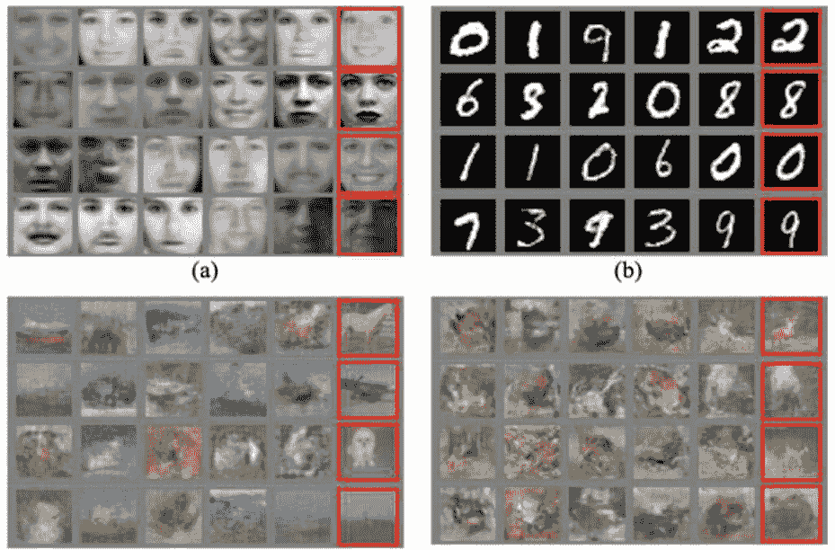

### 13.5.2  $f$-GAN

在 GAN 的早期历史中，$f$-GAN [176]可能是最重要的理论结果之一，清楚地证明了统计距离和对偶形式的重要性。 正如其名所示，$f$-GAN从 $f$-散度开始。

回想一下 $f$-散度的定义是

$$
D_f(\mu||\nu) = \int_{\Omega} f\left( \frac{d\mu}{d\nu} \right) d\nu \quad (13.47)
$$

$f$-GAN的主要思想（包括原始GAN）是使用 $f$-散度作为真实数据分布 $\mathcal{X}$与测度 $\mu$之间的统计距离，并将合成数据分布在环境空间 $\mathcal{X}$中的测度 $\nu := \mu_\theta$，使得概率测度 $\nu$接近 $\mu$（见图13.2，在符号简化的情况下，$\mu_\theta$现在被视为$\nu$）。 关键观察是，如果我们制定其对偶问题，而不是直接最小化 $f$-散度，会出现非常有趣的情况。 更具体地说，作者利用了以下是 $f$-散度的双重表述[176]，其证明在此重复供教育目的。回顾以下凸共轭的定义（更多细节见第1章）：

### 定义13.4 ([6]) 对于给定的函数 $f: I \to \mathbb{R}$，其凸共轭定义为

$$
f^*(u) = \sup_{\tau \in I} \{ u\tau - f(\tau) \}.
$$

如果 $f$ 是凸函数，则其凸共轭的凸共轭是函数本身，即

$$
f(u) = f^{**}(u) = \sup_{\tau \in I^*} \{ u\tau - f^*(\tau) \},
$$

这是我们在以下引理中需要的性质。

### 引理13.1 ([176]) 设 $\mu \ll \nu$。 那么，对于任何从 $\tau$ 映射到的函数类 $\mathcal{X}$ 到 $\mathbb{R}$，我们有下界

$$
D_f(\mu||\nu) \geq \sup_{\tau \in I^*} \int_{\mathcal{X}} \tau(x) d\mu(x) - \int_{\mathcal{X}} f^*(\tau(x)) d\nu(x),
$$

其中 $f^* : I^* \to \mathbb{R}$ 是 $f$ 的凸共轭函数。

证明：该证明是凸共轭的简单结果。 更具体地说，我们有

$$
\begin{aligned}
D_f(\mu||\nu) &= \int_{\mathcal{X}} f\left( \frac{d\mu}{d\nu} \right) d\nu \\
&= \int_{\mathcal{X}} \sup_{\tau \in I^*} \left\{ \tau \frac{d\mu}{d\nu} - f^*(\tau) \right\} d\nu \\
&\geq \sup_{\tau \in I^*} \int_{\mathcal{X}} \left\{ \tau \frac{d\mu}{d\nu} - f^*(\tau) \right\} d\nu \\
&= \sup_{\tau \in I^*} \int_{\mathcal{X}} \tau d\mu - f^*(\tau) d\nu \\
&= \sup_{\tau \in I^*} \int_{\mathcal{X}} \tau(x) d\mu(x) - \int_{\mathcal{X}} f^*(\tau(x)) d\nu(x).
\end{aligned}
$$

□## 13.5 生成对抗网络

式 (13.50) 中的下界是紧密的，并且可以在

$$
\tau = f' \left( \frac{d\mu}{d\nu} \right) = f' \left( \frac{p(x)}{q(x)} \right), \quad (13.51)
$$

当 $d\mu = p d\xi$ 和 $d\nu = q d\xi$ 时，最后一个等式成立[176]。

虽然 (13.50) 中的下界很直观，但在 $f$-GAN 的推导中，一个复杂之处在于函数 $\tau$ 应该在 $f^*$ 的定义域内，即 $\tau \in I^*$。 为了解决这个问题，[176]中的作者提出了以下技巧：

$$
\tau(x) = g_f(V(x)), \quad (13.52)
$$

其中 $V : \mathcal{X} \rightarrow \mathbb{R}$ 没有任何对输出范围的约束， $g_f : \mathbb{R} \rightarrow I^*$ 是一个将输出映射到 $f^*$ 的定义域的输出激活函数。然后，$f$-GAN 可以如下形式化：

$$
\min_{G} \max_{g_f} f_{GAN}(G, g_f), \quad (13.53)
$$

其中

$$
f_{GAN}(G, g_f) := \mathbb{E}_{\mu}[g_f(V(x))] - \mathbb{E}_{\xi}[f^*(g_f(V(G(z))))].
$$

例如，如果我们选择

$$
f(t) = -(t+1)\log(t+1) + t \log t,
$$

那么它的凸共轭由以下给出

$$
f^*(u) = \sup_{t \in \mathbb{R}_+} \{ ut + (t+1)\log(t+1) - t \log t \} = -\log(1 - e^u).
$$

共轭函数 $f^*$ 的定义域应为 $\mathbb{R}_-$ 以使得 $1 - e^u > 0$。 其中一个允许这种情况的函数 $g_f$ 如下所示

$$
g_f(V) = \log \left( \frac{1}{1 + e^{-V}} \right) = \log \text{Sig}(V),
$$

其中 $\text{Sig}(\cdot)$ 是 sigmoid 函数。因此，我们有

$$
f^*(g_f(V)) = -\log \left( 1 - e^{\log \text{Sig}(V)} \right) = -\log(1 - \text{Sig}(V)).
$$

因此，如果我们使用一个带有 sigmoid 作为最后一层的鉴别器，我们有 $D(x) = \text{Sig}(V(x))$，这导致了以下的 $f$-GAN 代价函数：

$$
\sup_{\tau \in I^*} \int_X \tau(x) d\mu(x) - \int_X f^*(\tau(x)) d\nu(x) = \sup_{g_f, V} \int_X g_f(V(x)) d\mu(x) - \int_X f^*(g_f(V(x))) d\nu(x) = \sup_D \int_X \log D(x) d\mu(x) + \int_X \log(1 - D(x)) d\nu(x).
$$

最后，测度 $\nu$ 是来自潜在空间 $Z$ 的样本的测度 $\zeta$ 通过生成器 $G(z), z \in Z$，所以 $\nu$ 是推前测度 $G_\#\zeta$ (见图13.2)。使用命题13.1中的变量变换公式，最终损失函数为

$$
(D, G) := \sup_D \int_X \log D(x) d\mu(x) + \int_Z \log(1 - D(G(z))) d\zeta(z).
$$

这等同于原始的 GAN 成本函数。通过改变生成器 $f$，我们现在可以获得各种类型的 GAN 变体。表13.1总结了 $f$-GAN的各种形式。

#### 13.5.3 Wasserstein GAN (W-GAN)

请注意， $f$-GAN 将 GAN 训练解释为形式上的双重公式的统计距离最小化。然而，它的主要限制是 $f$-散度不是度量，限制了基本性能。类似的最小化思想被用于 Wasserstein GAN，但现在在概率空间中使用了实际的度量。更具体地说，W-GAN 最小化了以下 Wasserstein-1 范数：

$$
W_1(\mu, \nu) := \min_{\pi \in (\mu,\nu)} \int_{\mathcal{X} \times \mathcal{X}} \|x - x'\| d\pi(x, x'), \quad (13.54)
$$

其中 $\mathcal{X}$ 是环境空间， $\mu$ 和 $\nu$ 分别是实际数据和生成数据的测度， $\pi(x, x')$ 是具有边际测度 $\mu$ 和 $\nu$ 的联合分布 (回顾 (13.33) 中 $(\mu, \nu)$ 的定义)。

与 $f$-GAN 类似，不是解决复杂的原始问题，而是解决对偶问题。回顾 Kantorovich 对偶形式，得到 Wasserstein 1-范数的以下对偶形式：

$$
W_1(\mu, \nu) = \sup_{\varphi \in \text{Lip}_1(X)} \left\{ \int_X \varphi(x)d\mu(x) - \int_X \varphi(x')d\nu(x') \right\}, \tag{13.55}
$$

其中 $\text{Lip}_1(X)$ 表示定义域为 $X$ 的 1-Lipschitz 函数空间。再次提醒，测度 $\nu$ 是来自潜在空间 $\mathcal{Z}$ 的生成样本的测度 $\zeta$ 通过生成器 $G(z), z \in \mathcal{Z}$，因此 $\nu$ 可以被视为推前测度。
使用命题13.1中的变量变换公式，最终损失函数为

$$
W_1(\mu, \nu) = \sup_{\varphi \in \text{Lip}_1(X)} \left\{ \int_X \varphi(x)d\mu(x) - \int_{\mathcal{Z}} \varphi(G(z))d\zeta (z) \right\}. \tag{13.56}
$$

因此，Wasserstein 1-范数最小化问题可以等价地表示为以下 minmax 形式：

$$
\begin{aligned}
&\min_{\nu} W_1(\mu, \nu) \\
&= \min_{G} \max_{\varphi \in \text{Lip}_1(X)} \left\{ \int_X \varphi(x)d\mu(x) - \int_{\mathcal{Z}} \varphi(G(z))d\zeta (z) \right\}.
\end{aligned}
$$

其中，$G(z)$ 被称为生成器，Kantorovich 势函数 $\varphi$ 被称为判别器。

因此，在 W-GAN [177] 中，对判别器施加一个 1-Lipschitz 条件是必要的。有很多方法来解决这个问题。例如，在原始的 W-GAN 论文[177]中，使用权重剪辑来施加 1-Lipschitz 条件。另一种方法是使用谱归一化[188]，它利用幂迭代方法对每一层的权重矩阵的最大奇异值施加约束。另一种流行的方法是带有梯度惩罚的 W-GAN（WGAN-GP），其中 Kantorovich 势函数的梯度被约束为 1 [189]。具体而言，对于 minmax 问题，使用以下修改后的损失函数：

$$
\begin{aligned}
&\quad W\text{-}GAN(G; \varphi) \tag{13.57} \\
&= \left( \int_X \varphi(x)d\mu(x) - \int_{\mathcal{Z}} \varphi(G(z))d\zeta (z) \right) \\
&\quad - \eta \int_X (\|\nabla_{\tilde{x}}\varphi(x)\|_2 - 1)^2 d\mu(x),
\end{aligned}
$$

其中 $\eta >0$ 是正则化参数，用于对判别器施加 1-Lipschitz 性质，并且 $\tilde{x} = \alpha x + (1-\alpha)G(z)$，其中 $\alpha$ 是从均匀分布 $[0, 1]$ 中的随机变量[189]。

#### 13.5.4 StyleGAN

正如之前提到的，CVPR 2019 中最令人兴奋的发展之一是由 Nvidia 提出的新型生成对抗网络（GAN）StyleGAN [89]，它可以生成非常逼真的高分辨率图像。

除了各种复杂的技巧，StyleGAN 还从理论角度引入了重要的创新。例如，StyleGAN 的一个主要突破来自于 AdaIN。图13.6 中的神经网络生成用作风格图像特征向量的潜在代码。然后，AdaIN 层将风格特征和内容特征结合在一起，以在每个分辨率上生成更真实的特征。
StyleGAN 的另一个突破性想法是在每一层中引入噪音，以创建随机变化，如图13.6所示。回想一下，大多数 GAN 从简单的潜在向量 $z$ 开始，作为生成器的输入。
另一方面，StyleGAN 每一层的噪音可以被视为一个更复杂的潜在空间，这样从一个更复杂的输入潜在空间到数据域的映射就能产生更真实的图像。事实上，通过引入一个更复杂的潜在空间，StyleGAN 能够在像素级别进行局部变化，并以随机变化的方式生成局部特征的变体。

### 13.6 自编码器型生成模型

虽然我们已经讨论了生成模型，如 GAN，但从历史上看，自编码器类型的生成模型先于 GAN 类型的模型。事实上，自编码器类型的生成模型可以追溯到去噪自编码器[190]，它是一种确定性的编码器-解码器网络形式。

实际上，真正的生成自编码器模型源自变分自编码器（VAE）[174]，它通过使用随机样本改变潜在变量来生成目标样本。变分自编码器（VAE）中的另一个突破来自归一化流[178–181]，它通过允许可逆映射显著改善生成样本的质量。在本节中，我们以统一的几何框架来回顾这两个思想。为了做到这一点，我们首先解释变分推断中的重要概念——证据下界（ELBO）或变分下界[191]。

#### 13.6.1 ELBO

在变分推断中，例如 VAE，我们的模型分布 $p_{\theta}(x)$ 是通过将简单分布 $p(z)$ 与一族条件分布 $p_{\theta}(x|z)$ 相结合得到的，因此我们的目标可以写成

$$
\log p_{\theta}(x) = \log \left( \int p_{\theta}(x, z) dz \right) = \log \left( \int p_{\theta}(x|z) p(z) dz \right). \tag{13.58}
$$

在这里，目标是找到参数 $\theta$ 以最大化使用给定数据集 $x \in \mathcal{X}$ 的对数似然。

尽管 $p(z)$ 和 $p_\theta(x|z)$ 通常是简单的选择，但由于需要解决对数中的积分，可能无法解析计算对数 $p_\theta(x)$。解决这个问题的一个技巧是引入一个由 $\phi$ 参数化并以 $x$ 为条件的分布 $q_\phi(z|x)$。

$$
\log p_\theta(x) = \log \left( \int p_\theta(x|z) \frac{p(z)}{q_\phi(z|x)} q_\phi(z|x) dz \right) \geq \int \log \left( p_\theta(x|z) \frac{p(z)}{q_\phi(z|x)} \right) q_\phi(z|x) dz,
$$

在这里，我们使用 Jensen 不等式[192]。因此，我们有

$$
\log p_\theta(x) \geq \int \log p_\theta(x|z) q_\phi(z|x) dz - \int \log \left( \frac{q_\phi(z|x)}{p(z)} \right) q_\phi(z|x) dz = \int \log p_\theta(x|z) q_\phi(z|x) dz - D_{KL}(q_\phi(z|x) \| p(z)),
$$

这通常被称为证据下界（ELBO）或变分下界[191]。

由于后验分布 $q_\phi(z|x)$ 的选择可以是任意的，变分推断的目标是找到 $q_\phi$ 以最大化 ELBO，或者等价地最小化以下损失函数：

$$
\text{ELBO}(x; \theta, \phi) := - \int \log p_\theta(x|z) q_\phi(z|x) dz + D_{KL}(q_\phi(z|x) \| p(z)), \tag{13.59}
$$

其中第一项是似然项，第二项 KL 项可以解释为惩罚项。然后，变分推断试图找到 $\theta$ 和 $\phi$ 以最小化给定 $x$ 的损失，或者对所有 $x$ 的平均损失。

#### 13.6.2 变分自编码器 (VAE)

使用 ELBO，我们现在准备推导 VAE。然而，我们的推导与原始的 VAE [174]的推导有所不同，因为原始的推导使得难以展示与归一化流[178-181]的联系。以下推导源自 $f$-VAE [193]。

具体而言，在 ELBO 的各种 $q_\phi(z|x)$ 选择中，我们选择以下形式：

$$
q_\phi(z|x) = \int \delta(z - F_\phi^x(u)) r(u) du, \tag{13.60}
$$

其中 $r(u)$ 是标准高斯函数，而 $F_\phi^x(u)$ 是给定的编码器函数 $x$ 是另一个带有噪声输入 $u$ 的变量。参见图13.7a中编码器 $F_\phi^x(u)$ 的概念。对于给定的编码器函数，我们有以下关键结果 ELBO损失。

**命题 13.3** 对于给定的编码器 (13.60), ELBO损失 (13.59) 可以表示为

$$
\text{ELBO} (x; \theta, \phi) := - \int \log p_{\theta}(x|F_{\phi}^{x}(u)) r(u) du + \int \log \left( \frac{r(u)}{p(F_{\phi}^{x}(u))} \right) r(u) du - \int \log \left| \det \left( \frac{\partial F_{\phi}^{x}(u)}{\partial u} \right) \right| r(u) du. \quad (13.61)
$$

**证明** 让我们从 ELBO 开始:

$$
\text{ELBO} (x; \theta, \phi) := \int \log \left( p_{\theta}(x|z) \frac{p(z)}{q_{\phi}(z|x)} \right) q_{\phi}(z|x) dz,
$$

可以表示为

$$
\text{ELBO} (x, \phi) := \int \left( \log \left( p_\theta(x|z) p(z) \right) - \log q_\phi(z|x) \right) q_\phi(z|x) dz. \quad (13.62)
$$

使用编码器表示式(13.60), (13.62)的第一项变为

$$
\begin{aligned}
&\int \int \log \left( p_\theta(x|z) p(z) \right) \delta(z - F_\phi^x(u)) r(u) du dz \\
&= \int \log \left( p_\theta(x|F_\phi^x(u)) p(F_\phi^x(u)) \right) r(u) du \\
&= \int \log p_\theta(x|F_\phi^x(u)) r(u) du + \int \log p(F_\phi^x(u)) r(u) du.
\end{aligned}
$$

同样，(13.62)的第二项变为

$$
\begin{aligned}
&\int \int \log \left( \int \delta(z - F_\phi^x(u')) r(u') du' \right) \delta(z - F_\phi^x(u)) r(u) du dz \\
&= \int \log \left( \int \delta(F_\phi^x(u) - F_\phi^x(u')) r(u') du' \right) r(u) du.
\end{aligned}
$$

现在，使用以下变量的改变：

$$
v = F_\phi^x(u'), \quad u' = H_x(v),
$$

相应的雅可比行列式由以下给出

$$
\det \left( \frac{du'}{dv} \right) = \frac{1}{\det \left( \frac{dv}{du'} \right)} = \frac{1}{\det \left( \frac{\partial F_\phi^x(u')}{\partial u'} \right)}.
$$

然后，我们有

$$
\begin{aligned}
&\int \log \left( \int \delta(F_\phi^x(u) - F_\phi^x(u')) r(u') du' \right) r(u) du \\
&= \int \log \left( \int \delta(F_\phi^x(u) - v) \frac{r(H_x(v))}{\left| \det \left( \frac{\partial F_\phi^x(u')}{\partial u'} \right) \right|} dv \right) r(u) du \\
&= \int \log \left( \frac{r(H_x(F_{\phi}^{x}(u)))}{\left|\det\left(\frac{\partial F_{\phi}^{x}(u')}{\partial u'}\right)\right|_{v=F_{\phi}^{x}(u)}} \right) r(u) du \\
&= \int \log r(u) r(u) du - \int \log \left| \det \left( \frac{\partial F_{\phi}^{x}(u)}{\partial u} \right) \right| r(u) du.
\end{aligned}
$$

通过将项收集在一起，我们有

$$
\text{ELBO}(x, \phi) := - \int \log p_{\theta}(x|F_{\phi}^{x}(u)) r(u) du + \int \log \left( \frac{r(u)}{p(F_{\phi}^{x}(u))} \right) r(u) du - \int \log \left| \det \left( \frac{\partial F_{\phi}^{x}(u)}{\partial u} \right) \right| r(u) du.
$$

证明到此结束。 □

命题13.3是一个普适的结果，可以应用于 VAE、归一化流等。它们之间的主要区别来自于编码器$F_{\phi}^{x}(u)$的选择。特别是对于 VAE [174]的情况，使用以下形式的编码器函数$F_{\phi}^{x}(u)$：

$$
z = F_{\phi}^{x}(u) = \mu_{\phi}(x) + \sigma_{\phi}(x) \odot u, \quad u \sim \mathcal{N}(0, I_d), \quad\quad (13.63)
$$

其中$I_d$是$d \times d$的单位矩阵，$d$是潜在空间的维度。
这在原始 VAE 论文[174]中被称为重参数化技巧。
在这个选择下，(13.61)中的第二项变为

$$
\begin{aligned}
&\int \log \left( \frac{r(u)}{p(F_{\phi}^{x}(u))} \right) r(u) du \\
&= - \int \frac{1}{2} \|u\|^2 r(u) du + \int \frac{1}{2} \|\mu(x) + \sigma(x) \odot u\|^2 r(u) du \\
&= \frac{1}{2} \sum_{i=1}^{d} (\sigma_i^2(x) + \mu_i^2(x) - 1), \quad\quad (13.64)
\end{aligned}
$$而第三项变为

$-\int \log \left| \det \left( \frac{\partial F_{\phi}^{x}(u)}{\partial u} \right) \right| r(u) du = -\frac{1}{2} \sum_{i=1}^{d} \log \sigma_{i}^{2}(x).$ (13.65)

最后，式(13.61)中的第一项是似然项，可以通过假设高斯分布来表示如下:

$\begin{aligned} -\int \log p_{\theta}(x|F_{\phi}^{x}(u))r(u)du &= \int \frac{1}{2} \|x - G_{\theta}(F_{\phi}^{x}(u))\|^{2} r(u)du \\ &= \frac{1}{2} \int \|x - G_{\theta}(\mu_{\phi}(x) + \sigma_{\phi}(x) \odot u)\|^{2} r(u) du. \end{aligned}$ (13.66)

因此，VAE的编码器和解码器参数优化问题可以得到如下结果:

$\min_{\theta,\phi} VAE(\theta, \phi),$

其中

$VAE(\theta, \phi) = \frac{1}{2} \int_{\mathcal{X}} \int \|x - G_{\theta}(\mu_{\phi}(x) + \sigma_{\phi}(x) \odot u)\|^{2} r(u) du d\mu(x) + \frac{1}{2} \sum_{i=1}^{d} \int_{\mathcal{X}} (\sigma_{i}^{2}(x) + \mu_{i}^{2}(x) - \log \sigma_{i}^{2}(x) - 1) d\mu(x).$ (13.67)

一旦神经网络训练完成，VAE的一个非常重要的优势是我们可以通过改变随机样本来简单地控制解码器的输出。更具体地说，解码器的输出现在由以下给出

$\hat{x}(u) = G_{\theta}(\mu_{\phi}(x) + \sigma_{\phi}(x) \odot u),$ (13.68)

它明确地依赖于随机变量 $u$。因此，对于给定的 $x$，通过绘制样本 $u$，我们可以改变输出 $x$。

## 13.6.3 $\beta$-VAE

通过观察 (13.67) 中的VAE损失，我们可以很容易地看出第一项表示生成样本和真实样本之间的距离，而第二项表示是真实潜在空间测度和后验分布之间的KL距离。因此，VAE损失是考虑了潜在空间和真实样本之间的环境空间的距离的度量。

实际上，这个观察很好地符合我们在图13.2中对自编码器的几何视图。这里，环境图像空间是 $\mathcal{X}$，真实数据分布是 $\mu$，而自编码器输出数据分布是 $\mu_\theta$。潜在空间是 $\mathcal{Z}$。在自编码器中，生成器 $G_\theta$ 对应于解码器，它是从潜在空间到样本空间的映射 $G_\theta: \mathcal{Z} \to \mathcal{X}$，由一个深度网络实现。然后，解码器训练的目标是使推进测度 $\mu_\theta = G_{\theta \#} \zeta$ 尽可能接近真实数据分布 $\mu$。此外，编码器 $F_\phi$ 将真实数据从 $\mathcal{X}$ 映射到潜在空间 $F_\phi: \mathcal{X} \to \mathcal{Z}$，以便编码器将测度 $\mu$ 推向潜在空间中的分布 $\zeta_\phi = F_{\phi \#} \mu$。因此，VAE设计问题可以通过最小化两个距离的和来进行表述，这两个距离分别通过平均样本距离和KL距离来衡量。

与给予两个距离相同的权重不同，$\beta$-VAE [175] 放宽了 VAE 的约束。遵循 VAE 中的相同激励，我们希望最大化生成真实数据的概率，同时保持真实和估计后验分布之间的距离小（例如，小于一个小常数）。这导致了以下$\beta$-VAE成本函数：

$$
\beta\text{-VAE}(\theta, \phi) = \frac{1}{2} \int_{\mathcal{X}} \int \| x - G_\theta(\mu_\phi(x) + \sigma_\phi(x) \odot u) \|^2 r(u) du d\mu(x) \\
+ \frac{\beta}{2} \sum_{i=1}^{d} \int_{\mathcal{X}} (\sigma_i^2(x) + \mu_i^2(x) - \log\sigma_i^2(x) - 1) d\mu(x),
$$

其中$\beta$现在控制着潜在空间中距离度量的重要性。当$\beta=1$时，它与VAE相同。当$\beta>1$时，它对潜在空间施加了更强的约束。

较高的$\beta$对潜在空间施加更多约束，结果潜在空间更具可解释性和可控性，这被称为解缠。更具体地说，如果推断的潜在表示中的每个变量只对一个生成因子敏感，并且对其他因子相对不变，我们将说这种表示是解缠或因子化的。解缠表示通常带来的一个好处是良好的可解释性和对各种任务的易于泛化。对于一些条件独立的生成因子，保持它们解缠是最有效的表示方式，而$\beta$-VAE提供了更多解缠的表示。例如，原始VAE生成的人脸具有各种方向，而$\beta$-VAE生成的人脸朝特定方向，这意味着人脸方向的因子已成功解缠[175]。

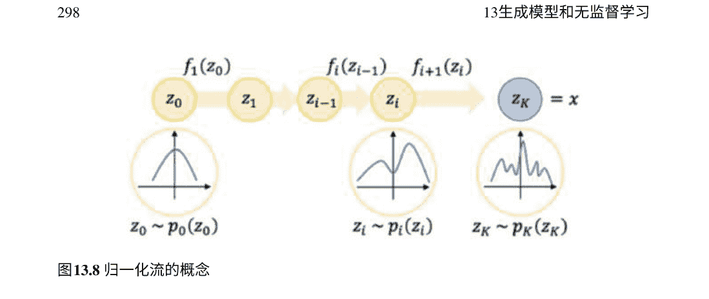

#### 13.6.4 正则化流，可逆流

归一化流(NF) [178–181] 是克服VAE限制的一种现代方法。如图13.8所示，归一化流通过应用一系列可逆变换函数，将简单分布转化为复杂分布。

通过一系列变换，我们根据变量替换定理反复替换变量，最终得到目标变量的概率分布。这种可逆变换序列是“归一化流”名称的来源[179]。

归一化流的代价函数的推导也从(13.60)的ELBO和编码器模型开始。然而，归一化流选择了不同的编码器函数：

$$
z = F_\phi^x(u) = F_\phi(\sigma u + x), \tag{13.70}
$$

其中 $F_\phi$ 是一个可逆函数。在这里，可逆性是关键组成部分，所以该算法通常被称为可逆流。具体来说，如果我们选择解码器作为编码器函数的逆函数，即 $G_\theta = F_\phi^{-1}$，会发生一个非常有趣的现象。更具体地说，(13.61)式中的第一项可以简化为以下形式：

$$
-\int \log p_\theta(x|F_\phi^x(u)) r(u) du \\
= \frac{1}{2} \int \|x - G_\theta(F_\phi^x(u))\|^2 r(u) du \\
= \frac{1}{2} \int \|x - G_\theta(F_\phi(\sigma u + x))\|^2 r(u) du \\
= \frac{1}{2} \int \|\sigma u\|^2 r(u) du = \frac{\sigma^2}{2},
$$

这变成了一个常数。因此，在参数估计中不再需要考虑解码器部分。因此，除了常数项之外，(13.61)式中的ELBO损失可以简化为

$$
f_{\text{flow}}(x, \phi) = -\int \log\left(p(F_{\phi}^{x}(u))\right)r(u)du - \int \log\left|\det\left(\frac{\partial F_{\phi}^{x}(u)}{\partial u}\right)\right|r(u)du, \tag{13.71}
$$

我们还删除了 $\int \log r(u)r(u)du$ 项，因为这也是一个常数。对于 $p(z)$ 的高斯假设，(13.71)可以进一步简化为

$$
f_{\text{flow}}(x, \phi) = \frac{1}{2}\int \|F_{\phi}(\sigma u + x)\|^2 r(u)du - \int \log\left|\det\left(\frac{\partial F_{\phi}(\sigma u + x)}{\partial u}\right)\right|r(u)du. \tag{13.72}
$$

现在，NF的主要技术困难来自于最后一项，它涉及到一个巨大矩阵的复杂行列式计算。如前所述，NF主要关注编码器函数 $F_{\phi}$(以及解码器 $G$)，它由一系列变换组成：

$$
F_{\phi}(u) = (h_K \circ h_{K-1} \circ \cdots \circ h_1)(u), \tag{13.73}
$$

使用变量变换公式，

$$
\frac{\partial F_{\phi}(u)}{\partial u} = \frac{\partial h_K}{\partial h_{K-1}} \cdots \frac{\partial h_2}{\partial h_1} \frac{\partial h_1}{\partial u}, \tag{13.74}
$$

我们有

$$
\log\left|\det\left(\frac{\partial F_{\phi}(u)}{\partial u}\right)\right| = \sum_{i=1}^{K} \log\left|\det\left(\frac{\partial h_i}{\partial h_{i-1}}\right)\right|, \tag{13.75}
$$

因此，目前大部分关于NF的研究工作都集中在如何设计一个可逆块，使得行列式计算简单。现在，我们回顾一些代表性的技术。

NICE (非线性独立成分估计) [178]是基于学习数据空间和潜在空间之间的非线性双射变换。架构由一系列块组成，定义如下，其中 $x_1$ 和 $x_2$ 是每层输入的分区， $y_1$ 和 $y_2$ 是输出的分区。

然后，NICE更新如下

$$
\begin{aligned}
y_1 &= x_1, \\
y_2 &= x_2 + \mathscr{F}(x_1), \qquad \qquad (13.76)
\end{aligned}
$$

其中$\mathscr{F}(\cdot)$是一个神经网络。 然后，块翻转可以很容易地完成

$$
\begin{aligned}
x_1 &= y_1, \\
x_2 &= y_2 - \mathscr{F}(y_1). \qquad \qquad (13.77)
\end{aligned}
$$

此外，很容易看出它的雅可比行列式为单位，并且在（13.72）中的成本函数及其梯度可以被可靠地计算。然而，这种架构对网络能够表示的函数施加了一些限制；例如，它只能表示保体积映射。后续工作[180]通过引入一种新的可逆变换来解决了这个限制。更具体地说，他们使用以下操作[180]扩展了这些模型的空间，使用实值非体积保持（real NVP）变换。

$$
\begin{aligned}
y_1 &= x_1, \\
y_2 &= x_2 \odot \exp(s(x_1)) + t(x_1), \qquad \qquad (13.78)
\end{aligned}
$$

其中，$s$表示逐点缩放，$t$被称为平移网络，$\odot$表示逐元素乘法。 然后，相应的雅可比矩阵由以下给出

$$
\frac{\partial y}{\partial x} = \begin{bmatrix} I_d & 0 \\ \frac{\partial y_2}{\partial x_1} & \text{diag}(\exp(s(x_1))) \end{bmatrix}. \qquad \qquad (13.79)
$$

鉴于这个雅可比矩阵是上三角形的，我们可以高效地计算其行列式

$$
\det\left(\frac{\partial y}{\partial x}\right) = \exp\left(\sum_j s(x_1[j])\right), \qquad \qquad (13.80)
$$

其中，$x_1[j]$表示$x_1$的第$j$个元素。 变换的逆也可以很容易地实现

$$
\begin{aligned}
x_1 &= y_1, \\
x_2 &= (y_2 - t(y_1)) \odot \exp(-s(y_1)). \qquad \qquad (13.81)
\end{aligned}
$$

相应的块架构如图13.9所示。

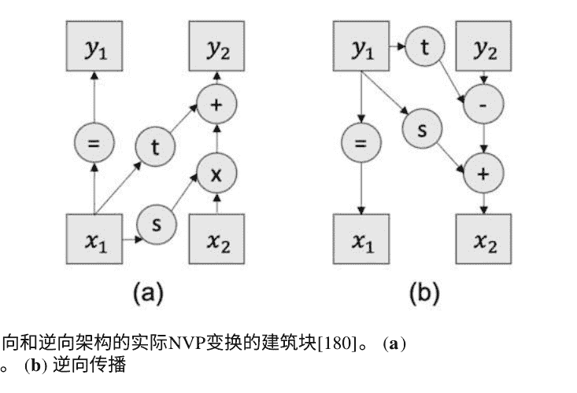

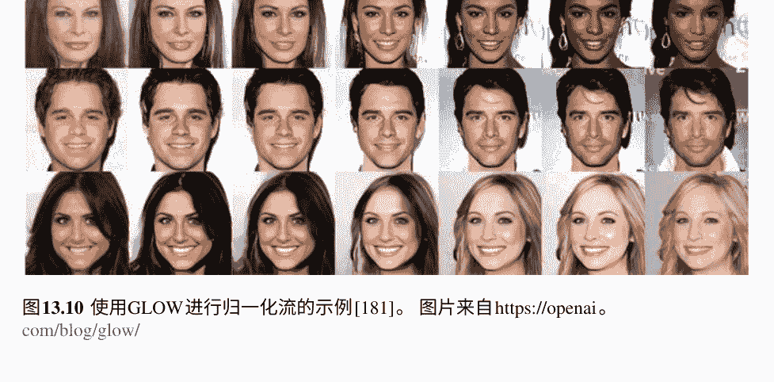

由于连续应用变换，NF的一个重要优势是分布的逐渐变化。图13.10显示了使用GLOW的示例-使用1 × 1可逆卷积[181]的生成流。正如名称所示，GLOW具有额外的1 × 1可逆卷积块，以增加网络的表达能力。

### 13.7 通过图像转换进行无监督学习

到目前为止，我们已经讨论了从噪声中生成样本的生成模型。生成模型也可以将一个分布转换为另一个分布。这就是为什么生成模型成为无监督学习任务的主要工具。

在各种无监督学习任务中，本节我们主要关注图像翻译，这是一个非常活跃的研究领域。

#### 13.7.1 Pix2pix

Pix2pix [194]是由伯克利的研究人员在2016年提出的，他们在他们的作品“基于条件对抗网络的图像到图像翻译”中介绍了这个方法。这并不是无监督学习本身，因为它需要匹配的数据集，但它开启了图像翻译的新时代，所以我们在这里进行了回顾。

图像处理和计算机视觉中的大多数问题可以被看作是将输入图像转化为相应的输出图像。例如，一个场景可以被渲染为RGB图像、梯度场、边缘图、语义标签图等。类比于自动语言翻译，我们将自动图像到图像翻译定义为在给定大量训练数据的情况下，将一个场景的一种可能表示翻译为另一种表示的任务。

Pix2pix使用生成对抗网络（GAN）[88]来学习一个函数，将输入图像映射到输出图像。该网络由两个主要部分组成，生成器和判别器。生成器将输入图像转换为输出图像。判别器测量生成图像与数据集中目标图像的相似度，并尝试猜测生成图像是否由生成器产生。

例如，在图13.11中，生成器从草图中生成了一个逼真的鞋子图像，判别器则试图区分生成的图像是来自草图的真实照片还是伪造的照片。

Pix2pix的好处是它是通用的，不需要用户定义两种图像之间的任何关系。它不对关系做任何假设，而是通过在训练过程中比较定义的输入和输出来学习目标。这使得Pix2pix非常适应各种情况，包括那些不容易通过口头或明确定义我们想要建模的任务的情况。

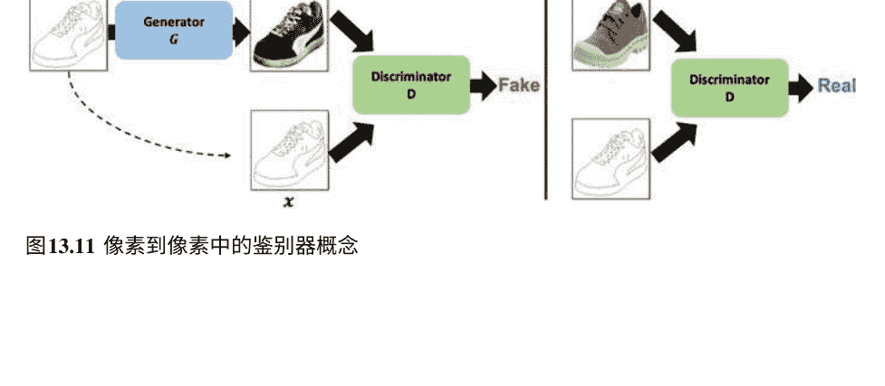

话虽如此，pix2pix的一个缺点是它需要成对的数据集来学习它们之间的关系，而这些数据集在实践中往往很难获得。 这个问题在cycleGAN [185]中得到了很大程度的解决，下一节将讨论这个主题。

#### 13.7.2 CycleGAN

图像到图像的转换是计算机视觉和图形问题中的一个重要任务。例如：

- 将夏季风景转换为冬季风景（或反之亦然）
- 将绘画转换为照片（或反之亦然）
- 将马转换为斑马（或反之亦然）

如前所述，pix2pix [194] 是为这些任务设计的，但它需要成对的示例，具体来说，需要一个大型数据集，其中包含许多输入图像领域 $\mathcal{X}$（例如鞋子的草图）和相同图像的期望输出图像领域 $\mathcal{Y}$（例如鞋子的照片）的示例（参见图13.12的左列）。成对训练数据集的要求是一个限制。这些数据集具有挑战性，甚至是不可能收集的，例如具有完全相同姿势、大小等的斑马和马的照片。相反，图13.12中的非成对情况更加现实，其中包含了图像领域 $\mathcal{X}$（例如照片）和图像领域 $\mathcal{Y}$（例如莫奈的绘画）的非成对集合。因此，图像转换的目标是转换 $\mathcal{X}$ 和 $\mathcal{Y}$ 之间的分布，反之亦然。事实上，朱等人的cycleGAN [185]证明了这种非成对图像转换是可能的。

cycleGAN问题很好地适应了我们对自动编码器的几何视图，如图13.2所示，图13.13重新绘制了一个使用域 $\mathcal{Y}$ 的图。因此，最优输运（OT）[182, 184]提供了一种严格的数学工具，用于通过cycleGAN理解无监督学习的几何结构。

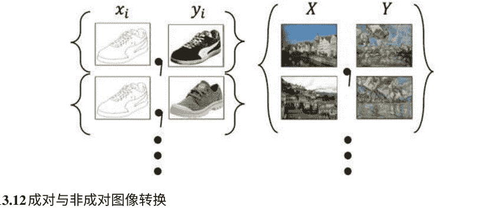

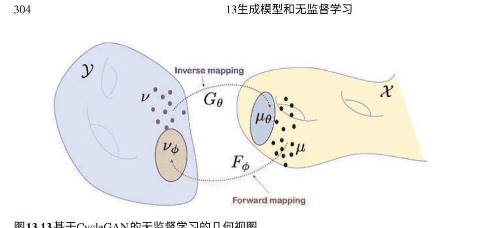

## 图13.13基于CycleGAN的无监督学习的几何视图

在这里，目标图像空间$\mathcal{X}$配备了概率测度$\mu$，而原始图像空间$\mathcal{Y}$配备了概率测度$\nu$。由于没有成对的数据，无监督学习的目标是匹配概率分布，而不是每个个体样本。这可以通过找到将测度$\mu$运输到$\nu$，反之亦然的输运映射来实现。更具体地说，从一个测度空间$(\mathcal{Y}, \nu)$到另一个测度空间$(\mathcal{X}, \mu)$的输运是由一个由参数化为$\theta$的深度网络实现的生成器$G_\theta : \mathcal{Y} \to \mathcal{X}$。

然后，生成器$G_\theta$将测度$\nu$在$\mathcal{Y}$中“推向”目标空间$\mathcal{X}$中的测度$\mu_\theta$[182, 184]。类似地，从$(\mathcal{X}, \mu)$到$(\mathcal{Y}, \nu)$的传输是由另一个神经网络生成器$F_\phi$执行的，使得生成器$F_\phi$将测度$\mu$在$\mathcal{X}$中推向原始空间$\mathcal{Y}$中的$\nu_\phi$。然后，无监督学习的最优输运映射可以通过最小化统计距离$\text{dist}(\mu_\theta, \mu)$和$\mu$和$\mu_\theta$之间的距离，以及$\text{dist}(\nu_\phi, \nu)$和$\nu$和$\nu_\phi$之间的距离来实现，我们的建议是使用Wasserstein-1度量作为测量统计距离的手段。

更具体地说，对于度量选择$d(x, x') = \|x - x'\|$ in $\mathcal{X}$, Villani [182], Peyr等人[184]计算了$\mu$和$\mu_\theta$之间的Wasserstein-1度量。

$$
W_1(\mu, \mu_\theta) = \inf_{\pi \in \Pi(\mu, \nu)} \int_{\mathcal{X} \times \mathcal{Y}} \|x - G_\theta(y)\| d\pi(x, y). \tag{13.82}
$$

同样，$\nu$和$\nu_\phi$之间的Wasserstein-1距离由以下给出

$$
W_1(\nu, \nu_\phi) = \inf_{\pi \in \Pi(\mu, \nu)} \int_{\mathcal{X} \times \mathcal{Y}} \|F_\phi(x) - y\| d\pi(x, y). \tag{13.83}
$$与其分别最小化(13.82)和(13.83)中具有不同联合分布的问题，更好的方法是使用相同的联合分布π一起最小化它们：

$$\inf_{\pi \in (\mu, \nu)} \int_{\mathcal{X} \times \mathcal{Y}} \| x - G_{\theta}(y) \| + \| F_{\phi}(x) - y \| d\pi(x, y). \qquad (13.84)$$

[195]的最重要贡献之一是展示了无监督学习在(13.84)中的原始表达可以通过对偶表达来表示：min

$$\max_{\phi, \theta} \min_{\psi, \varphi} cycleGAN(\theta, \phi; \psi, \varphi), \qquad (13.85),$$

其中

$$cycleGAN(\theta, \phi; \psi, \varphi) := \lambda \ cycle(\theta, \phi) + \ Disc(\theta, \phi; \psi, \varphi), \qquad (13.86),$$

其中λ >0 是超参数，并且循环一致性项由以下给出

$$cycle(\theta, \phi) = \int_{\mathcal{X}} \| x - G_{\theta}(F_{\phi}(x)) \| d\mu(x) + \int_{\mathcal{Y}} \| y - F_{\phi}(G_{\theta}(y)) \| d\nu(y),$$

而第二项为

$$Disc(\theta, \phi; \psi, \varphi) = \max_{\varphi} \int_{\mathcal{X}} \varphi(x) d\mu(x) - \int_{\mathcal{Y}} \varphi(G_{\theta}(y)) d\nu(y) + \max_{\psi} \int_{\mathcal{Y}} \psi(y) d\nu(y) - \int_{\mathcal{X}} \psi(F_{\phi}(x)) d\mu(x). \qquad (13.87).$$

在这里，φ, ψ经常被称为Kantorovich势函数，并满足1-Lipschitz条件（即

$$|\varphi(x) - \varphi(x')| \leq \| x - x' \|, \forall x, x' \in \mathcal{X},$$
$$|\psi(y) - \psi(y')| \leq \| y - y' \|, \forall y, y' \in \mathcal{Y}.$$

在机器学习的背景下，1-Lipschitz势函数 φ 和 ψ对应于Wasserstein-GAN（W-GAN）判别器[177]。具体而言， φ 对应于一个判别器，用于区分真实和生成图像中的假样本在X中，而 ψ 是一个判别器，用于区分域Y中的真假样本。此外，循环一致性项 cycle用于强制实施一对一原始域和目标域之间的对应关系，消除了GAN的模式坍缩行为。相应的网络架构可以在图13.14中表示。具体来说， φ试图找到真实图像 x 和生成图像 G θ(y)之间的差异，而 ψ试图找到由合成测量过程生成的虚假测量数据Fφ(x)。实际上，这个公式与cycleGAN公式[185]等价，只是使用了1-Lipschitz鉴别器。

CycleGAN在各种无监督学习任务中取得了很大的成功。图13.15展示了两种不同绘画风格之间的无监督风格转换的示例。

#### 13.7.3 StarGAN

在图13.15中，cycleGAN的一个缺点是我们需要为每对域训练单独的生成器。例如，如果绘画中有 N 种不同的风格，那么应该有 N(N-1) 个不同的生成器来翻译图像（参见图13.16a）。

为了克服cycleGAN可扩展性的限制，提出了starGAN [87]。具体而言，如图13.16b所示，通过添加表示目标域的掩码向量，训练一个生成器，使其能够翻译到多个域。这个掩码向量使用one-hot向量编码沿通道方向进行增强。

给定来自两个不同域的训练数据，这些模型学习将图像从一个域翻译到另一个域。例如，将一个人的头发颜色（属性）从黑色（属性值）变为金色（属性值）。我们将一个域表示为共享相同属性值的图像集合。黑发的人组成一个域，金发的人组成另一个域。在这里，鉴别器有两个任务。它应该能够识别图像是否为假。借助辅助分类器的帮助，鉴别器还可以预测输入到鉴别器的图像的域（参见图13.17）。

通过辅助分类器，鉴别器从数据集中学习原始图像及其对应领域的映射关系。当生成器根据目标领域 c（比如金发）生成新的图像时，鉴别器可以预测生成图像的领域，因此生成器会一直生成新的图像，直到鉴别器能够将其预测为目标领域 c（金发）。图13.18展示了使用单个starGAN生成器进行多领域翻译的示例。

#### 13.7.4 协同生成对抗网络

在许多需要多个输入才能得到所需输出的应用中，如果任何一个输入数据缺失，往往会引入大量的偏差。尽管已经开发出许多用于填补缺失数据的技术，但由于自然图像的复杂性，图像填补仍然具有一定的困难。为了解决这个问题，提出了一种新颖的协作生成对抗网络（CollaGAN）[186]。

具体而言，CollaGAN将图像填充问题转化为多域图像到图像的转换任务，以便单个生成器和鉴别器网络能够成功利用剩余的干净数据集来估计缺失的数据。更具体地说，CycleGAN和StarGAN的目标是将一幅图像转换为另一幅图像，如图13.19a、b所示，而不考虑剩余的域数据集。然而，在图像填充问题中，缺失的数据并不经常出现，目标是利用其他干净数据集来估计缺失的数据。因此，图像填充问题可以如图13.19c所示正确描述，其中一个生成器可以利用剩余的数据估计缺失的数据。

干净的数据集。由于缺失数据域在先验上不难估计，所以缺失数据的填补算法应该设计成一个算法可以通过利用其它域的数据来估计任何域的缺失数据。

由于具体的应用，CollaGAN不是一种无监督学习方法。然而，CollaGAN中的一个关键概念是多个输入的循环一致性，这对于其他应用是有用的。具体来说，由于输入是多个图像，循环损失应该重新定义。特别地，对于N-域数据，从生成的输出中，我们应该能够生成N -1个新的组合作为生成器的反向流的其它输入（图13.20）。

例如，当 \(N = 4\) 时，有三种多输入和单输出的组合，我们可以使用生成器的反向流重构原始域的三个图像。关于鉴别器，鉴别器应该有一个分类器头部，与StarGAN的鉴别器部分类似。

图13.21显示了一个缺失域插补的示例，CollaGAN生成非常逼真的图像。

### 13.8 总结与展望

到目前为止，我们已经讨论了令人兴奋的深度学习领域-生成模型。尽管如此，这仍然是一个包容性的评论，因为还有许多其他令人兴奋的算法。在这里，主要重点是提供一个统一的数学视角来理解各种算法。正如本章强调的那样，这个领域的重要性不仅在于花哨的应用，还在于扎实的数学基础。正如Yann LeCun所说，无监督学习是深度学习的核心，因此将有许多令人兴奋的新应用和发展新理论的机会，所以年轻的研究人员被邀请参与这个令人兴奋的领域。

### 13.9 练习

-   1. 展示以下等式：

```
$$ D_{JS}(P||Q) = \frac{1}{2}D_{KL}(P||M) + \frac{1}{2}D_{KL}(Q||M), \quad (13.88) $$
```

其中 \( M = (P + Q)/2 \).

-   2. 证明对于JS散度，绝对连续性是不必要。

-   3. 对于以下生成函数 $f(u)$，从 $f$-散度形式（1）和使用凸对偶的 $f$-GAN公式（2）推导出来。
    (a) $f(u) = (u + 1)\log$
    
    (b) $f(u) = u \log u$.
    (c) $f(u) = (u - 1)^2$.

```
$$\frac{2}{u+1} + u \log u.$$
```

-   4. 让 $\mu$ 和 $\nu$ 表示具有累积分布函数 $F$ 和 $G$ 的1维概率测度。证明Wasserstein-$p$距离（13.21）给出了$\mu$和$\nu$之间的距离。

-   5. 证明等式（13.22）。

-   6. 证明等式（13.26）。

-   7. 推导出两个高斯分布之间的最优传输映射 $T$（13.27）的几何性质。

-   8. 证明AdaIN可以解释为两个独立同分布的高斯分布之间的最优传输。

-   9. 假设传输成本 $c(x, y) : \mathcal{X} \times \mathcal{Y} \to \mathbb{R} \cup \{\infty\}$ 由 $c(x, y) = h(x - y)$ 定义，其中 $h$ 是严格凸函数。
    (a) 证明存在一个Kantorovich势函数 $\varphi$，使得将测度 $\mu$ 从 $\mathcal{X}$ 传输到 $\mathcal{Y}$ 的最优传输计划 $T$ 可以表示为
    $$T(x) = x - (\nabla h)^{-1} \nabla \varphi(x). \tag{13.89}.$$
    其中 $(\nabla h)^{-1}$ 表示 $\nabla h$ 的逆函数。
    (b) 作为一个特例，如果 $h(x - y) = \frac{1}{2} \|x - y\|^2$，证明最优输运映射可以表示为
    $$y = T(x) = \nabla u(x),$$
    其中 $u(x) := x^2/2 - \varphi(x)$ 是某个函数 $\varphi(x)$ 的凸函数。

-   10. 证明 (13.64)。

-   11. 证明 (13.66)。

-   12. 对于VAE中给定的重新参数化技巧
    $$z = F_{\phi}^{x}(u) = \mu_{\phi}(x) + \sigma_{\phi}(x) \odot u, \quad u \sim \mathcal{N}(0, I_d), \tag{13.90}$$
其中 $x \in \mathbb{R}^n$, $z, u \in \mathbb{R}^d$, $\mu_\phi(\cdot)$, $\sigma_\phi(\cdot): \mathbb{R}^n \to \mathbb{R}^d$, $\odot$是逐元素乘法，证明以下等式：

$$-\int \log \left| \det \left( \frac{\partial F_\phi^x(u)}{\partial u} \right) \right| r(u) du = -\frac{1}{2} \sum_{i=1}^d \log \sigma_i^2(x),$$

其中 $r(u)$是概率密度函数。

-   13. $\beta$-VAE相对于VAE的优缺点是什么？

-   14. 考虑给出的正态流的NICE更新

$$y_1 = x_1, \quad y_2 = x_2 + \mathcal{F}(y_1).$$

(a) 为什么雅可比项变成了单位矩阵？请明确推导。

(b) 假设我们对一个更具表达能力的网络感兴趣，给出的网络为

$$y_1 = x_1 + \mathcal{G}(x_2), \quad y_2 = x_2 + \mathcal{F}(y_1)$$

其中 $\mathcal{G}$是某个函数。逆操作是什么？如何使得相应的正态流代价函数在雅可比计算方面简单？你可能需要将更新分为两个步骤来简化推导。

## 第14章 总结与展望

近年来，深度学习取得了巨大的成功，数据科学领域发生了前所未有的变化，可以被视为一场“革命”。尽管深度学习在各个领域取得了巨大的成功，但我们对于为什么深度学习方法表现良好的严格数学基础的理解仍然非常缺乏。事实上，深度学习的最新发展在很大程度上是经验主义的，解释其成功的理论仍然严重滞后。因此，直到最近，深度学习被严谨的科学家，包括数学家，视为伪科学。

事实上，深度学习的成功显得非常神秘。尽管近年来许多研究人员提出了复杂的网络架构，但深度神经网络的基本构建模块是卷积、池化和非线性，从数学角度来看，这些被视为非常原始的工具，类似于“石器时代”。然而，深度学习最神秘的一点是，这些“石器时代”工具的级联连接导致了远远超过复杂数学工具的卓越性能。

如今，为了开发高性能的数据处理算法，我们不需要雇佣受过高等教育的博士生或博士后，只需要给本科生提供TensorFlow和大量的训练数据。这是否意味着数学的黑暗时代？那么，在这个数据驱动的世界中，数学家的角色是什么？

深度神经网络成功的一个流行解释是，神经网络是通过模仿人脑发展起来的，因此注定会成功。事实上，正如第5章讨论的那样，一个最著名的数值实验是当深度神经网络被训练用于分类人脸时，层次特征的出现。有趣的是，这种现象在人脑中也有类似的观察，即在视觉信息处理过程中，物体的层次特征会出现。基于这些数值观察，一些人工神经网络的“强硬派”甚至声称，我们需要研究大脑的生物学，以设计更复杂的人工神经网络并理解其工作原理。

人工神经网络。然而，当神经科学家（尤其是计算神经科学家）被问及为什么大脑提取这种分层特征时，令人惊讶的是他们通常依赖于人工神经网络的数值模拟来解释分层特性是如何在大脑中产生的。从数学的角度来看，这是一个典型的“循环证明”的例子，一种表面上的逻辑谬误。

那么，我们如何填补经验成功和理论缺失之间的差距呢？事实上，从科学史中我们学到的一个教训是，经验观察和理论缺失之间的差距并不是限制因素，而是新科学诞生的暗示。例如，在二十世纪初的“物理学黄金时代”，物理学中一些最令人兴奋的经验发现是量子现象。实验物理学家发现了许多无法用牛顿力学或相对论物理学解释的奇特量子现象。事实上，理论物理学在解释新发现的量子现象方面存在严重滞后。

数学模型得到了进一步的发展、质疑和推翻，通过经验观察得出结论。即使是最伟大的阿尔伯特·爱因斯坦也说他无法相信量子物理学，因为“上帝不与宇宙玩骰子”。在这些努力解释似乎无法解释的经验观察的过程中，严谨形成了新的量子力学理论，产生了众多的诺贝尔奖得主；而新的数学如函数分析、谐波分析等已成为现代数学的主流。事实上，科学家们的这些努力完全改变了物理学和数学的格局。

同样，现在迫切需要发展数学理论来解释深度神经网络的巨大经验成功。事实上，从实现工作的计算机科学家和工程师就像给予无尽灵感的实验物理学家，而数学家和信号处理器则像理论物理学家，试图找到统一的数学理论来解释经验发现。因此，与我们处于数学的黑暗时代的错误观念相反，我们现在实际上生活在一个“黄金时代”，准备发现能够彻底改变数学领域的深度学习的美丽数学理论。因此，本书旨在探索深度学习的数学理论，打开深度学习的黑匣子，开启数学的新时代。

深度学习领域是一门跨学科的学科，包括数学、数据科学、物理学、生物学、医学等。因此，数学与其他领域之间的合作研究至关重要。这是因为实证结果不仅给出了数学理论的灵感，还提供了验证数学理论是否正确的手段。因此，尽管本书主要关注于发现深度学习的基本数学原理，但希望它能在物理学、生物学、化学、地球物理学等基础科学中发挥重要作用，利用深度学习激发读者对新的实证问题的灵感，以获得更好的数学模型。

## 第15章 参考文献

-   1. R. J. Duffin和A. C. Schaeffer, “一类非谐波傅里叶级数”, 《美国数学学会交易》, 第72卷, 第2期, 第341-366页, 1952年。
-   2. P. R. Halmos, 测度论. Springer, 2013, vol. 18.
-   3. W. H. Press, S. A. Teukolsky, W. T. Vetterling, and B. P. Flannery, 数值计算法第三版: 科学计算的艺术. Cambridge University Press, 2007.
-   4. R. A. Horn, R. A. Horn, and C. R. Johnson, 矩阵分析的主题. Cambridge University Press, 1994.
-   5. K. Petersen, M. Pedersen等, “矩阵手册, 第7卷”, 丹麦技术大学, vol. 15, 2008.
-   6. S. Boyd, S. P. Boyd, and L. Vandenberghe, 凸优化. Cambridge University Press, 2004.
-   7. O. Russakovsky, J. Deng, H. Su, J. Krause, S. Satheesh, S. Ma, Z. Huang, A. Karpathy, A. Khosla, M. Bernstein等, “ImageNet大规模视觉识别挑战.” 国际计算机视觉杂志, vol. 115, no. 3, pp. 211–252, 2015.
-   8. J. Deng, W. Dong, R. Socher, L.-J. Li, K. Li, and L. Fei-Fei, “ImageNet: 一个大规模分层图像数据库,” in 2009 IEEE计算机视觉和模式识别会议. IEEE, 2009, pp. 248–255.
-   9. A. Krizhevsky, I. Sutskever, and G. E. Hinton, “ImageNet分类与深度卷积神经网络,” in 神经信息处理系统进展, 2012, pp. 1097–1105.
-   10. V. Vapnik, 统计学习理论的本质. Springer Science & Business Media, 2013.
-   11. B. Schölkopf, A. J. Smola, F. Bach等, 使用核函数的学习: 支持向量机, 正则化, 优化等. MIT Press, 2002.
-   12. D. G. Lowe, “尺度不变关键点的独特图像特征,” 国际计算机视觉杂志, vol. 60, no. 2, pp. 91–110, 2004.
-   13. H. Bay, T. Tuytelaars, and L. Van Gool, “SURF: 加速鲁棒特征,” in 欧洲计算机视觉会议 (ECCV). Springer, 2006, pp. 404–417.
-   14. W. D. Penny, K. J. Friston, J. T. Ashburner, S. J. Kiebel, and T. E. Nichols, 统计参数映射: 功能脑图像分析. Elsevier, 2011.
-   15. B. Schölkopf, R. Herbrich, and A. J. Smola, “广义表示定理,” 在 计算学习理论国际会议. Springer, 2001, 页码 416–426.
-   16. G. Salton 和 M. McGill, 现代信息检索导论. McGraw Hill Book Company, 1983.

## 15 参考文献

17. E. R. Kandel, J. H. Schwartz, T. M. Jessell, S. Siegelbaum, 和 A. Hudspeth, 神经科学原理. McGraw-Hill 纽约, 2000, 卷 4.

18. G. M. Shepherd, 神经生物学. 牛津大学出版社, 1988年。

19. J. G. Nicholls, A. R. Martin, B. G. Wallace, 和 P. A. Fuchs, 从神经元到大脑. Sinauer Associates Sunderland, MA, 2001年, 第271卷。

20. D. H. Hubel 和 T. N. Wiesel, “猫的纹状皮层单个神经元的感受野,” 《生理学杂志》, 第148卷, 第3期, pp. 574–591, 1959年。

21. Y. LeCun, B. Boser, J. S. Denker, D. Henderson, R. E. Howard, W. Hubbard, 和 L. D. Jackel, “反向传播应用于手写邮政编码识别,” 《神经计算》, 第1卷, 第4期, pp. 541–551, 1989年。

22. M. Riesenhuber 和 T. Poggio, “皮层中物体识别的分层模型”, 自然神经科学, 卷2, 第11期, 页1019-1025, 1999年。

23. R. Q. Quiroga, L. Reddy, G. Kreiman, C. Koch 和 I. Fried, “人脑中单个神经元的不变视觉表示”, 自然, 卷435, 第7045期, 页1102-1107, 2005年。

24. V. Nair 和 G. E. Hinton, “修正线性单元改进了受限玻尔兹曼机”, 在第27届国际机器学习会议 (ICML-10) 论文集中, 2010年, 页807-814。

25. J. Duchi, E. Hazan 和 Y. Singer, “自适应次梯度方法用于在线学习和随机优化”, 机器学习研究杂志, 卷12, 第7期, 页2121-2159, 2011年。

26. T. Tieleman 和 G. Hinton, “Lecture 6.5-RMSprop: 将梯度除以其最近幅度的运行平均值”, COURSERA: 神经网络机器学习, 第4卷, 第2期, 第26-31页, 2012年。

27. D. P. Kingma 和 J. Ba, “Adam: 一种随机优化方法”, arXiv预印本 arXiv:1412.6980, 2014年。

28. D. E. Rumelhart, G. E. Hinton 和 R. J. Williams, “通过反向传播错误来学习表示”, 《自然》, 第323卷, 第6088期, 第533-536页, 1986年。

29. I. M. Gelfand, R. A. Silverman 等, 变分计算. Courier Corporation, 2000年。

30. C. Szegedy, W. Liu, Y. Jia, P. Sermanet, S. Reed, D. Anguelov, D. Erhan, V. Vanhoucke, 和 A. Rabinovich, “通过卷积深入研究,” 在IEEE计算机视觉与模式识别会议, 2015, pp. 1–9.

31. K. Simonyan 和 A. Zisserman, “用于大规模图像识别的非常深的卷积网络,” arXiv预印本 arXiv:1409.1556, 2014.

32. J. Johnson, A. Alahi, 和 L. Fei-Fei, “感知损失用于实时风格转换和超分辨率,” 在欧洲计算机视觉会议 (ECCV), 2016, pp. 694–711.

33. K. He, X. Zhang, S. Ren, 和 J. Sun, “深度残差学习用于图像识别,” 在IEEE计算机视觉与模式识别会议, 2016, pp. 770–778.

34. H. Li, Z. Xu, G. Taylor, C. Studer, 和 T. Goldstein, “可视化神经网络的损失景观,” 在神经信息处理系统进展, 2018, pp. 6389–6399.

35. J. C. Ye 和 W. K. Sung, “理解编码器-解码器CNN的几何,” 在机器学习国际会议, 2019, pp. 7064–7073.

36. Q. Nguyen 和 M. Hein, “深度CNN的优化景观和表达能力,” arXiv 预印本 arXiv:1710.10928, 2017.

37. G. Huang, Z. Liu, L. Van Der Maaten, 和 K. Q. Weinberger, “密集连接卷积网络,” 在IEEE计算机视觉和模式识别会议论文集, 2017, pp. 4700–4708.

38. O. Ronneberger, P. Fischer, 和 T. Brox, “U-Net: 用于生物医学图像分割的卷积网络,” 在国际医学图像计算和计算机辅助干预会议. Springer, 2015, 页码 234–241.

39. K. H. Jin, M. T. McCann, E. Froustey, 和 M. Unser, “用于成像逆问题的深度卷积神经网络,” IEEE 图像处理, 卷26, 号9, 页码4509–4522, 2017.

40. Y. Han 和 J. C. Ye, “通过深度卷积框架对 U-Net 进行建模: 应用于稀疏-视图 CT,” IEEE 医学成像, 卷37, 号6, 页码 1418–1429, 2018.

41. S. Ioffe 和 C. Szegedy, “批量归一化: 通过减少内部协变量偏移来加速深度网络训练,” arXiv 预印本 arXiv:1502.03167, 2015.

42. J. C. Ye, Y. Han, 和 E. Cha, “深度卷积框架: 一种逆问题的通用深度学习框架,” SIAM Journal on Imaging Sciences, vol. 11, no. 2, pp. 991–1048, 2018.

43. J. Bruna 和 S. Mallat, “不变散射卷积网络,” IEEE Transactions on Pattern Analysis and Machine Intelligence, vol. 35, no. 8, pp. 1872–1886, 2013.

44. I. Goodfellow, Y. Bengio, 和 A. Courville, 深度学习. MIT Press, 2016.

45. N. Srivastava, G. Hinton, A. Krizhevsky, I. Sutskever, 和 R. Salakhutdinov, “Dropout: 一种简单的方法来防止神经网络过拟合,” The Journal of Machine Learning Research, vol. 15, no. 1, pp. 1929–1958, 2014.

46. D. L. Donoho, “《压缩感知》”, IEEE信息论, 卷52, 号4, 页1289-1306, 2006年。

47. E. J. Candès 和 B. Recht, “凸优化的精确矩阵补全”, Found. Comput. Math., 卷9, 号6, 页717-772, 2009年。

48. G. Cybenko, “通过S型函数的叠加逼近”, 控制、信号和系统的数学, 卷2, 号4, 页303-314, 1989年。

49. S. Ryu, J. Lim, S. H. Hong 和 W. Y. Kim, “使用注意力和门增强的图卷积网络深度学习分子结构-性质关系”, arXiv预印本 arXiv:1805.10988, 2018年。

50. T. Mikolov, I. Sutskever, K. Chen, G. S. Corrado, 和 J. Dean, “Distributed representations of words and phrases and their compositionality,” in Advances in Neural Information Processing Systems, 2013, pp. 3111–3119.

51. T. Mikolov, K. Chen, G. Corrado, 和 J. Dean, “Efficient estimation of word representations in vector space,” arXiv preprint arXiv:1301.3781, 2013.

52. W. L. Hamilton, R. Ying, 和 J. Leskovec, “Representation learning on graphs: Methods and applications,” arXiv preprint arXiv:1709.05584, 2017.

53. B. Perozzi, R. Al-Rfou, 和 S. Skiena, “DeepWalk: Online learning of social representations,” in Proceedings of the 20th ACM SIGKDD International Conference on Knowledge Discovery and Data Mining, 2014, pp. 701–710.

54. A. Grover 和 J. Leskovec, “Node2vec: 可扩展的网络特征学习”, 在第22届ACM SIGKDD国际会议上的知识发现和数据挖掘, 2016年, 第855-864页。

55. M. M. Bronstein, J. Bruna, Y. LeCun, A. Szlam 和 P. Vandergheynst, “几何深度学习: 超越欧几里德数据”, IEEE信号处理杂志, 第34卷, 第4期, 第18-42页, 2017年。

56. T. N. Kipf 和 M. Welling, “带有图卷积网络的半监督分类”, arXiv预印本 arXiv:1609.02907, 2016年。

57. K. Xu, W. Hu, J. Leskovec 和 S. Jegelka, “图神经网络有多强大?” arXiv预印本 arXiv:1810.00826, 2018年。

58. W. Hamilton, Z. Ying, 和 J. Leskovec, “大规模图的归纳表示学习,” 在神经信息处理系统进展, 2017, 页码 1024–1034.

59. C. Morris, M. Ritzert, M. Fey, W. L. Hamilton, J. E. Lenssen, G. Rattan, 和 M. Grohe, “Weisf eiler 和 Leman 转向神经网络: 高阶图神经网络,” 在人工智能AAAI会议论文集, vol. 33, 2019, 页码 4602–4609.

60. Z. Chen, S. Villar, L. Chen, 和 J. Bruna, “图同构测试与GNN的函数逼近等价性,” 在神经信息处理系统进展, 2019, 页码 15868–15876.

61. P. Barceló, E. V. Kostylev, M. Monet, J. Pérez, J. Reutter, and J. P. Silva, “图神经网络的逻辑表达能力,” in 国际学习表示会议, 2019.

62. M. Grohe, “word2vec, node2vec, graph2vec, x2vec: 向结构化数据的向量嵌入理论迈进,” arXiv预印本 arXiv:2003.12590, 2020.

63. N. Shervashidze, P. Schweitzer, E. J. Van Leeuwen, K. Mehlhorn, and K. M. Borgwardt, “Weisfeiler–Lehman图核函数,” 机器学习研究杂志, vol. 12, no. 77, pp. 2539–2561, 2011.

64. J. L. Ba, J. R. Kiros, and G. E. Hinton, “层归一化,” arXiv预印本 arXiv:1607.06450, 2016.

65. D. Ulyanov, A. Vedaldi, and V. Lempitsky, “实例归一化: 快速风格化的缺失要素,” arXiv预印本 arXiv:1607.08022, 2016.

66. Y. Wu and K. He, “组归一化,” 在欧洲计算机视觉会议 (ECCV) 的论文集, 2018, pp. 3–19.

67. X. Huang and S. Belongie, “自适应实例归一化的实时任意风格转换,” 在IEEE国际计算机视觉会议的论文集, 2017, pp. 1501–1510.

68. J. Hu, L. Shen, 和 G. Sun, “挤压激励网络”, 在计算机视觉和模式识别的IEEE会议论文集, 2018年, 页码7132-7141。

69. P. Veličković, G. Cucurull, A. Casanova, A. Romero, P. Lio, 和 Y. Bengio, “图注意力网络”, arXiv预印本 arXiv:1710.10903, 2017年。

70. X. Wang, R. Girshick, A. Gupta, 和 K. He, “非局部神经网络”, 在计算机视觉和模式识别的IEEE会议论文集, 2018年, 页码7794-7803。

71. H. Zhang, I. Goodfellow, D. Metaxas, 和 A. Odena, “自注意力生成对抗网络”, 在国际机器学习会议, PMLR, 2019年, 页码7354-7363。

72. T. Xu, P. Zhang, Q. Huang, H. Zhang, Z. Gan, X. Huang 和 X. He, “AttnGAN: 带有注意力生成对抗网络的细粒度文本到图像生成”, 在2018年计算机视觉和模式识别IEEE会议论文集中, 第1316-1324页。

73. A. Vaswani, N. Shazeer, N. Parmar, J. Uszkoreit, L. Jones, A. N. Gomez, Ł. Kaiser 和 I. Polosukhin, “注意力就是你所需要的”, 在2017年神经信息处理系统进展中, 第5998-6008页。

74. J. Devlin, M.-W. Chang, K. Lee 和 K. Toutanova, “BERT: 深度双向转换器的预训练用于语言理解”, arXiv预印本 arXiv:1810.04805, 2018年。

75. A. Radford, J. Wu, R. Child, D. Luan, D. Amodei, 和 I. Sutskever, “语言模型是无监督多任务学习者,” OpenAI 博客, 第1卷, 第8期, 第9页, 2019年。

76. T. B. Brown, B. Mann, N. Ryder, M. Subbiah, J. Kaplan, P. Dhariwal, A. Neelakantan, P. Shyam, G. Sastry, A. Askell 等, “语言模型是少样本学习者,” arXiv 预印本 arXiv:2005.14165, 2020年。

77. L. A. Gatys, A. S. Ecker, 和 M. Bethge, “使用卷积神经网络进行图像风格转换,” 在计算机视觉和模式识别的 IEEE 会议论文集, 2016年, 第2414–2423页。

78. Y. Taigman, A. Polyak, and L. Wolf, “无监督的跨领域图像生成”, arXiv 预印本 arXiv:1611.02200, 2016年。

79. Y. Li, C. Fang, J. Yang, Z. Wang, X. Lu, and M.-H. Yang, “通过特征转换的通用风格转移”, 在神经信息处理系统进展, 2017年, 第386-396页。

80. Y. Li, M.-Y. Liu, X. Li, M.-H. Yang, and J. Kautz, “逼真图像风格化的闭式解”, 在欧洲计算机视觉会议论文集 (ECCV), 2018年, 第453-468页。

81. D. Y. Park and K. H. Lee, “具有风格注意力网络的任意风格转移”, 在 IEEE计算机视觉和模式识别会议论文集, 2019年, 第5880-5888页。

82. J. Yoo, Y. Uh, S. Chun, B. Kang, and J.-W. Ha, “通过小波变换实现逼真的风格转移”, 在 2019年IEEE国际计算机视觉会议论文集中, 第9036-9045页。

83. T. Park, M.-Y. Liu, T.-C. Wang, and J.-Y. Zhu, “具有空间自适应归一化的语义图像合成”, 在2019年IEEE计算机视觉和模式识别会议论文集中, 第2337-2346页。

84. X. Huang, M.-Y. Liu, S. Belongie, and J. Kautz, “多模态无监督图像到图像的转换”, 在2018年欧洲计算机视觉会议论文集中, 第172-189页。

85. J.-Y. Zhu, R. Zhang, D. Pathak, T. Darrell, A. A. Efros, O. Wang, and E. Shechtman, “走向多模态图像到图像的转换”, 在2017年神经信息处理系统进展中, 第465-476页。

86. H.-Y. Lee, H.-Y. Tseng, J.-B. Huang, M. Singh, and M.-H. Yang, “通过解耦表示进行多样化的图像到图像翻译”, 在欧洲计算机视觉会议 (ECCV) 的论文集中, 2018年, 第35-51页。

87. Y. Choi, M. Choi, M. Kim, J.-W. Ha, S. Kim, and J. Choo, “StarGAN: 统一的生成对抗网络用于多领域图像到图像翻译”, 在IEEE计算机视觉和模式识别会议的论文集中, 2018年, 第8789-8797页。

88. I. Goodfellow, J. Pouget-Abadie, M. Mirza, B. Xu, D. Warde-Farley, S. Ozair, A. Courville, 和 Y. Bengio, “生成对抗网络”, 在神经信息处理系统的论文集中, 2014年, 第2672-2680页。

89. T. Karras, S. Laine, and T. Aila, “一种基于风格的生成器架构用于生成对抗网络”, 在计算机视觉和模式识别IEEE会议论文集, 2019年, 第4401-4410页。

90. K. Zhang, W. Zuo, Y. Chen, D. Meng, and L. Zhang, “超越高斯去噪器: 深度卷积神经网络的残差学习用于图像去噪”, IEEE图像处理期刊, 第26卷, 第7期, 第3142-3155页, 2017年。

91. M. Bear, B. Connors, and M. A. Paradiso, 神经科学: 探索大脑. Jones & Bartlett Learning, LLC, 2020年。

92. K. Greff, R. K. Srivastava, J. Koutník, B. R. Steunebrink, and J. Schmidhuber, “LSTM: 一次搜索空间的奥德赛”, IEEE神经网络和学习系统期刊, 第28卷, 第10期, 第2222-2232页, 2016年。

93. J. Pérez, J. Marinković, and P. Barceló, “关于现代神经网络结构的图灵完备性”, 在国际学习表示会议, 2018年。

94. J.-B. Cordonnier, A. Loukas, and M. Jaggi, “关于自注意力和卷积层之间的关系”, arXiv预印本 arXiv:1910.03584, 2019年。

95. G. Marcus and E. Davis, “GPT-3, 浮夸者: OpenAI的语言生成器对自己说的话一无所知”, Technology Review, 2020年。

96. A. Dosovitskiy, L. Beyer, A. Kolesnikov, D. Weissenborn, X. Zhai, T. Unterthiner, M. Dehghani, M. Minderer, G. Heigold, S. Gelly 等, “一幅图像价值16×16个单词: 用于大规模图像识别的Transformer”, arXiv预印本 arXiv:2010.11929, 2020年。

97. G. Kwon 和 J. C. Ye, “对角线注意力和基于样式的GAN用于内容-样式解缠的图像生成和翻译”, arXiv预印本 arXiv:2103.16146, 2021年。

98. J. Xie, L. Xu 和 E. Chen, “使用深度神经网络的图像去噪和修复”, 在神经信息处理系统进展中, 2012年, 第341-349页。

99. C. Dong, C. C. Loy, K. He 和 X. Tang, “使用深度卷积网络的图像超分辨率”, IEEE模式分析与机器智能交易, 第38卷, 第2期, 第295-307页, 2015年。

100. J. Kim, J. K. Lee 和 K. Lee, “使用非常深的卷积网络进行准确的图像超分辨率”, 在计算机视觉和模式识别IEEE会议论文集中, 2016年, 第1646-1654页。

101. M. Telgarsky, “深度前馈网络的表示优势”, arXiv预印本 arXiv:1509.08101, 2015年。

102. R. Eldan 和 O. Shamir, “前馈神经网络的深度优势”, 在第 29届学习理论年会, 2016年, 页码907-940。

103. M. Raghu, B. Poole, J. Kleinberg, S. Ganguli 和 J. S. Dickstein, “深度神经网络的表达能力”, 在第34届国际机器学习会议. JMLR, 2017年, 页码2847-2854。

104. D. Yarotsky, “使用深度ReLU网络进行逼近的误差界限”, 神经网络, 卷94, 页码103-114, 2017年。

## 15 参考文献

105. R. Arora, A. Basu, P. Mianjy, 和 A. Mukherjee, “理解具有修正线性单元的深度神经网络,” arXiv预印本 arXiv:1611.01491, 2016.

106. S. Mallat, 信号处理的小波之旅. 学术出版社, 1999.

107. D. L. Donoho, “软阈值去噪,” IEEE信息论杂志, vol. 41, no. 3, pp. 613–627, 1995.

108. Y. C. Eldar 和 M. Mishali, “从结构化子空间中稳健地恢复信号,” IEEE信息论杂志, vol. 55, no. 11, pp. 5302–5316, 2009.

109. R. Yin, T. Gao, Y. M. Lu, 和 I. Daubechies, “两个基的故事: 在图像块上的局部-非局部正则化与卷积框架,” SIAM图像科学杂志, vol. 10, no. 2, pp. 711–750, 2017.

110. J. C. Ye, J. M. Kim, K. H. Jin, 和 K. Lee, “使用湮灭滤波器为基础的低秩插值的压缩采样,” IEEE信息论杂志, 卷63, 第2期, 页777-801, 2016年.

111. K. H. Jin 和 J. C. Ye, “基于湮灭滤波器的低秩Hankel矩阵方法用于图像修复.” IEEE图像处理杂志, 卷24, 第11期, 页3498-3511, 2015年.

112. K. H. Jin, D. Lee, 和 J. C. Ye, “使用湮灭滤波器为基础的低秩Hankel矩阵的压缩感知和并行MRI的通用框架.” IEEE计算成像杂志, 卷2, 第4期, 页480-495, 2016年.

113. J.-F. Cai, B. Dong, S. Osher 和 Z. Shen, “图像恢复：总变差，小波框架和更多,” 《美国数学学会杂志》, 第25卷, 第4期, 第1033-1089页, 2012年.

114. N. Lei, D. An, Y. Guo, K. Su, S. Liu, Z. Luo, S.-T. Yau 和 X. Gu, “深度学习的几何理解,” 《工程学》, 2020年.

115. B. Hanin 和 D. Rolnick, “深度网络中线性区域的复杂性,” 在《国际机器学习会议》中. PMLR, 2019年, 第2596-2604页.

116. B. Hanin 和 D. Rolnick, “深度ReLU网络意外地具有很少的激活模式,” 《神经信息处理系统进展》, 第32卷, 第361-370页, 2019年.

117. X. 张 和 D. 吴, “深度神经网络中线性区域的经验研究,” arXiv预印本 arXiv:2001.01072, 2020年.

118. G. F. Montufar, R. Pascanu, K. Cho 和 Y. Bengio, “深度神经网络的线性区域数量,” 于 Advances in Neural Information Processing Systems, 2014年, 页码：2924–2932.

119. Z. Allen-Zhu, Y. Li 和 Z. Song, “通过过参数化实现深度学习的收敛理论,” 于国际机器学习会议. PMLR, 2019年, 页码：242–252.

120. S. Du, J. Lee, H. Li, L. Wang 和 X. Zhai, “梯度下降找到深度神经网络的全局最小值,” 于国际机器学习会议. PMLR, 2019年, 页码：1675–1685.

121. D. Zou, Y. Cao, D. Zhou, 和 Q. Gu, “随机梯度下降优化过参数化的深度ReLU网络,” arXiv预印本 arXiv:1811.08888, 2018.

122. H. Karimi, J. Nutini, and M. Schmidt, “在Polyak-lojasiewicz条件下梯度和近端梯度方法的线性收敛性,” in 机器学习和数据库知识发现的联合欧洲会议. Springer, 2016, pp. 795–811.

123. Q. Nguyen, “关于深度学习中的连接子水平集,” in 国际机器学习会议. PMLR, 2019, pp. 4790–4799.

124. C. Liu, L. Zhu, and M. Belkin, “针对过参数化非线性方程系统的优化理论：深度学习的教训,” arXiv预印本 arXiv:2003.00307, 2020.

125. Z. Allen-Zhu, Y. Li, and Y. Liang, “学习和泛化在超参数化神经网络中，超越两层,” arXiv预印本 arXiv:1811.04918, 2018年.

126. M. Soltanolkotabi, A. Javanmard, and J. D. Lee, “对超参数化浅层神经网络优化景观的理论洞察,” IEEE信息论, 第65卷, 第2期, 页码742-769, 2018年.

127. S. Oymak and M. Soltanolkotabi, “超参数化非线性学习：梯度下降选择最短路径？”在国际机器学习会议中. PMLR, 2019年, 页码4951-4960.

128. S. S. Du, X. Zhai, B. Poczos, and A. Singh, “梯度下降可证明优化超参数化神经网络,” arXiv预印本arXiv:1810.02054, 2018年.

129. I. Safran, G. Yehudai, and O. Shamir, “轻微过参数化对浅层ReLU神经网络优化景观的影响,” arXiv预印本arXiv:2006.01005, 2020年.

130. A. Jacot, F. Gabriel, and C. Hongler, “神经切线核：神经网络的收敛和泛化”在《第32届国际神经信息处理系统会议》, 2018年, 第8580-8589页.

131. S. Arora, S. S. Du, W. Hu, Z. Li, R. Salakhutdinov, and R. Wang, “关于无限宽神经网络的精确计算,” arXiv预印本arXiv:1904.11955, 2019年.

132. Y. Li, T. Luo, and N. K. Yip, “通过神经切线层次结构（NTH）逐渐理解残差网络,” arXiv预印本arXiv:2007.03714, 2020年.

133. Y. Nesterov, 《凸优化导论：基础课程》. Springer Science & Business Media, 2003年, 第87卷.

134. Z.-Q. Luo和P. Tseng, “可行下降方法的误差界和收敛分析：一种通用方法,” 《运筹学报》, 1993年, 第46卷, 第1期, 第157-178页.

135. J. Liu, S. Wright, C. R., V. Bittort和S. Sridhar, “一种异步并行随机坐标下降算法,” 在《国际机器学习会议》中. PMLR, 2014年, 第469-477页.

136. I. Necoara, Y. Nesterov和F. Glineur, “非强凸优化的一阶方法的线性收敛,” 《数学规划》, 2019年, 第175卷, 第1期, 第69-107页.

137. H. Zhang和W. Yin, “凸优化的梯度方法：在较弱条件下更好的收敛速度,” arXiv预印本arXiv:1303.4645, 2013年.

138. B. T. Polyak, “最小化泛函的梯度方法,” 《计算数学与数学物理学杂志》, 第3卷, 第4期, 第643-653页, 1963年.

139. S. Lojasiewicz, “实解析子集的拓扑性质,” 《法国国家科学研究中心集会，偏微分方程》, 第117卷, 第87-89页, 1963年.

140. B. D. Craven和B. M. Glover, “Invex函数和对偶性,” 《澳大利亚数学学会杂志》, 第39卷, 第1期, 第1-20页, 1985年.

141. K. Kawaguchi, “没有贫瘠的局部极小值的深度学习,” arXiv预印本arXiv:1605.07110, 2016年.

142. H. Lu和 K. Kawaguchi, “深度不会产生坏的局部极小值,” arXiv预印本arXiv:1702.08580, 2017年.

143. Y. Zhou和Y. Liang, “神经网络的临界点：分析形式和景观特性,” arXiv预印本arXiv:1710.11205, 2017年.

144. C. Yun, S. Sra和A. Jadbabaie, “激活函数中的小非线性产生坏的局部极小值,” arXiv预印本arXiv:1802.03487, 2018年.

145. D. Li, T. Ding和R. Sun, “过参数化的深度神经网络对于任何连续激活函数都没有严格的局部极小值,” arXiv预印本arXiv:1812.11039, 2018年.

146. N. P. Bhatia和G. P. Szegö, 《动力系统的稳定性理论》. Springer Science & Business Media, 2002年.

147. B. Neyshabur, R. Tomioka和N. Srebro, “基于范数的神经网络容量控制,” 在《学习理论会议》上. PMLR, 2015年, 页码1376-1401.

148. P. Bartlett, D. J. Foster和M. Telgarsky, “神经网络的谱归一化边界,” arXiv预印本arXiv:1706.08498, 2017年.

149. V. Nagarajan和J. Z. Kolter, “通过泛化噪声鲁棒性实现深度网络的确定性PAC-Bayesian泛化界,” arXiv预印本arXiv:1905.13344, 2019年.

150. C. Wei和T. Ma, “通过Lipschitz增强的深度神经网络的数据相关样本复杂性,” arXiv预印本arXiv:1905.03684, 2019年.

151. S. Arora, R. Ge, B. Neyshabur和Y. Zhang, “通过压缩方法获得深度网络的更强泛化界限”在国际机器学习会议中. PMLR, 2018年, pp. 254-263.

152. N. Golowich, A. Rakhlin和O. Shamir, “神经网络的大小无关样本复杂性,” 在《学习理论会议》中. PMLR, 2018年, pp. 297-299.

153. B. Neyshabur, S. Bhojanapalli和N. Srebro, “用于神经网络的谱归一化边界的pac-Bayesian方法,” arXiv预印本arXiv:1707.09564, 2017年.

154. M. Belkin, D. Hsu, S. Ma, 和 S. Mandal, “调和现代机器学习实践和经典的偏差-方差权衡,” 《国家科学院会议论文集》, vol. 116, no. 32, pp. 15 849–15 854, 2019.

155. M. Belkin, D. Hsu, 和 J. Xu, “弱特征的双下降的两个模型,” 《SIAM数据科学数学杂志》, vol. 2, no. 4, pp. 1167–1180, 2020.

156. L. G. Valiant, “可学习性的理论,” ACM通信, vol. 27, no. 11, pp. 1134–1142, 1984.

157. W. Hoeffding, “有界随机变量和的概率不等式,” in 《Wassily Hoeffding的集成作品》. Springer, 1994, pp. 409–426.

158. N. Sauer, “关于集合族的密度,” 《组合理论杂志》, A系列, 卷13, 第1期, 页145-147, 1972年.

159. Y. Jiang, B. Neyshabur, H. Mobahi, D. Krishnan和S. Bengio, “奇妙的泛化度量及其发现方法,” arXiv预印本arXiv:1912.02178, 2019年.

160. P. L. Bartlett, N. Harvey, C. Liaw和A. Mehrabian, “几乎紧密的VC维度和分段线性神经网络的伪维度界限.” 《机器学习研究杂志》, 卷20, 第63期, 页1-17, 2019年.

161. P. L. Bartlett和S. Mendelson, “Rademacher和Gaussian复杂性: 风险界限和结构结果,” 《机器学习研究杂志》, 卷3, 页463-482, 2002年.

162. A. Blumer, A. Ehrenfeucht, D. Haussler, and M. K. Warmuth, “可学习性和Vapnik-Chervonenkis维度,” 《ACM期刊(JACM)》, 第36卷, 第4期, 页码929-965, 1989年.

163. D. A. McAlIester, “一些PAC-Bayesian定理,” 《机器学习》, 第37卷, 第3期, 页码355-363, 1999年.

164. P. Germain, A. Lacasse, F. Laviolette, and M. Marchand, “PAC-Bayesian学习线性分类器,” 在《第26届国际机器学习年会论文集》中, 2009年, 页码353-360.

165. C. Zhang, S. Bengio, M. Hardt, B. Recht, and O. Vinyals, “理解深度学习需要重新思考泛化,” arXiv预印本arXiv:1611.03530, 2016年.

166. A. Bietti和J. Mairal, “神经切向核的归纳偏差,” arXiv预印本arXiv:1905.12173, 2019年.

167. B. Neyshabur, R. Tomioka和N. Srebro, “寻找真正的归纳偏差: 深度学习中的隐式正则化作用,” arXiv预印本arXiv:1412.6614, 2014年.

168. D. Soudry, E. Hoffer, M. S. Nacson, S. Gunasekar和N. Srebro, “梯度下降在可分数据上的隐式偏差,” 《机器学习研究杂志》, 第19卷, 第1期, 第2822-2878页, 2018年.

169. S. Gunasekar, J. Lee, D. Soudry和N. Srebro, “线性卷积网络上梯度下降的隐式偏差,” arXiv预印本arXiv:1806.00468, 2018年.

170. L. Chizat和F. Bach, “用于逻辑损失训练的宽两层神经网络的梯度下降的隐式偏差”在《学习理论会议》上. PMLR, 2020年, 第1305-1338页.

171. S. Gunasekar, J. Lee, D. Soudry和N. Srebro, “用优化几何来表征隐式偏差”在《国际机器学习会议》上. PMLR, 2018年, 第1832-1841页.

172. H. Xu和S. Mannor, “鲁棒性和泛化,” 《机器学习》, 第86卷, 第3期, 第391-423页, 2012年.

173. A. W. Van Der Vaart和J. A. Wellner, “弱收敛,” in 《弱收敛和经验过程》. Springer, 1996年, 第16-28页.

174. D. P. Kingma和 M. Welling, “自动编码变分贝叶斯,” *arXiv*预印本 *arXiv:1312.6114*, 2013年.

175. I. Higgins, L. Matthey, A. Pal, C. Burgess, X. Glorot, M. Botvinick, S. Mohamed和A. Lerchner, “β-VAE: 使用约束变分框架学习基本视觉概念”在《国际学习表示会议》上, 卷2, 号5, 第6页, 2017年.

176. S. Nowozin, B. Cseke和R. Tomioka, “f-GAN: 使用变分散度最小化训练生成神经采样器”在《神经信息处理系统进展》中, 2016年, 第271-279页.

177. M. Arjovsky, S. Chintala和 L. Bottou, “Wasserstein GAN,” *arXiv*预印本 *arXiv:1701.07875*, 2017年.

178. L. Dinh, D. Krueger, and Y. Bengio, “NICE: 非线性独立成分估计,” *arXiv*预印本 *arXiv:1410.8516*, 2014.

179. D. J. Rezende and S. Mohamed, “具有归一化流的变分推断,” *arXiv*预印本 *arXiv:1505.05770*, 2015.

180. L. Dinh, J. Sohl-Dickstein, and S. Bengio, “使用真实NVP的密度估计,” *arXiv*预印本 *arXiv:1605.08803*, 2016.

181. D. P. Kingma and P. Dhariwal, “GLOW: 具有可逆1 × 1卷积的生成流”在 *《Advances in Neural Information Processing Systems》*中, 2018, pp. 10 215–10 224.

182. C. 维拉尼, 《最优输运: 新与旧》. Springer Science & Business Media, 2008年, 卷. 338.

183. M. Cuturi, “Sinkhorn距离: 最优输运的高速计算”在 *《Advances in Neural Information Processing Systems》*中, 2013年, 第2292-2300页.

184. G. Peyré, M. Cuturi等, “计算最优输运,” 《Foundations and Trends in Machine Learning》, 第11卷, 第5-6期, 第355-607页, 2019年.

185. J.-Y. Zhu, T. Park, P. Isola和A. A. Efros, “无配对图像到图像的转换使用cycle-consistent对抗网络”在 *《Proceedings of the IEEE international conference on computer vision》*中, 2017年, 第2223-2232页.

186. D. Lee, J. Kim, W.-J. Moon, 和 J. C. Ye, “CollaGAN: 协作生成对抗网络用于缺失图像数据填补”在 *《IEEE计算机视觉和模式识别会议》*中, 2019, pp. 2487–2496.

187. C. Clason, D. A. Lorenz, H. Mahler, 和 B. Wirth, “连续最优输运问题的熵正则化,” 《数学分析与应用杂志》, vol. 494, no. 1, p. 124432, 2021.

188. T. Miyato, T. Kataoka, M. Koyama, 和 Y. Yoshida, “用于生成对抗网络的谱归一化,” *arXiv*预印本 *arXiv:1802.05957*, 2018.

189. I. Gulrajani, F. Ahmed, M. Arjovsky, V. Dumoulin, 和 A. C. Courville, “改进的Wasserstein GANs训练”在《神经信息处理系统进展》中, 2017, pp.5767–5777.

190. P. Vincent, H. Larochelle, I. Lajoie, Y. Bengio, 和 P.-A. Manzagol, “堆叠去噪自编码器: 在具有局部去噪准则的深度网络中学习有用的表示,” 《机器学习研究杂志》, 卷 11, 号 12, 页 3371–3408, 2010.

191. M. J. Wainwright, M. I. Jordan等, “图形模型, 指数族, 和变分推断,” 《机器学习基础与趋势》, 卷 1, 号 1-2, 页 1–305, 2008.

192. T. M. Cover 和 J. A. Thomas, 《信息论要素》. John Wiley & Sons, 2012.

193. J. Su 和 G. Wu, “f-VAEs: 用条件流改进 VAEs,” *arXiv* 预印本 *arXiv:1809.05861*, 2018.

194. P. Isola, J.-Y. Zhu, T. Zhou, 和 A. A. Efros, “具有条件的图像到图像翻译的对抗网络”在 *《计算机视觉和模式识别的IEEE会议论文集》*中, 2017, 页码 1125–1134.

195. B. Sim, G. Oh, J. Kim, C. Jung, 和 J. C. Ye, “基于最优传输的CycleGAN用于无监督学习逆问题,” 《SIAM图像科学杂志》, 卷 13, 号 4, 页码 2281–2306, 2020.

## 索引

- β-VAE, 297
- σ-代数, 9
- c-变换, 279
- f-GAN, 285
- f-散度, 272, 285
- A
- 绝对连续, 270
- 绝对连续测度, 10
- 动作电位, 82
- 激活函数, 93
- 自适应实例归一化（AdaIN）, 161
- 邻接矩阵, 138
- 伴随, 5
- 仿射函数, 18
- AlexNet, 114
- 算法鲁棒性, 261
- 环境空间, 61
- 地图集, 221
- 注意力, 164
- 注意力生成对抗网络（AttnGAN）, 172
- 自编码器, 220
- 辅助分类器, 307
- 平均池化, 120
- 轴突, 80
- 轴突冠, 80, 82
- B
- 反向传播, 102
- 反向传播的估计误差, 106
- 词袋（BOW）核, 64
- Banach空间, 6
- 基, 8
- 基追踪, 200
- 基向量, 8
- 批量归一化（BN）, 158
- 批量归一化, 157
- 良性优化景观, 233
- 偏差-方差权衡, 56
- 双向编码器表示转换器（BERT）, 178
- 生物神经网络, 79
- 断点, 249
- C
- 变分法, 106
- 柯西-施瓦茨不等式, 6
- 柯西序列, 4
- 通道注意力, 168
- 图表, 221
- 化学突触, 81
- 分类器, 29
- 协作生成对抗网络（CollaGAN）, 307
- 彩色图, 139
- 社区检测, 135
- 完全, 4
- 压缩感知, 200
- 凹形, 20
- 浓度不等式, 245
- 内容图像, 161
- 连续词袋（CBOW）, 141
- 凸形, 19
- 凸共轭, 21
- 卷积, 119
- 卷积神经网络（CNN）, 113
- 卷积框架, 205
- 语料库词汇, 143
- 计数测度, 10
- 协变量偏移, 158
- 跨领域注意力, 172
- 交叉熵, 274
- 循环一致性, 305
- 循环生成对抗网络, 303
- D
- 数据增强, 127
- 深度卷积框架, 208
- DeepWalks, 147
- 树突, 80
- 分母布局, 15
- 稠密卷积网络 (DenseNet), 117
- 因变量, 46
- 鉴别器, 284
- 解缠, 297
- 散度, 272
- 域, 17
- 双下降, 256
- 丢弃, 128
- 双重框架, 199
- 对偶间隙, 24
- E
- 地球移动距离, 276
- 边缘, 135, 138
- 特征值分解, 12
- 电突触, 80
- 经验风险最小化 (ERM), 244
- 编码器-解码器卷积神经网络, 209
- 熵正则化, 281
- 证据下界 (ELBO), 292
- 兴奋性突触后电位 (EPSPs), 81
- 表达能力, 196, 212
- F
- 特征工程, 42
- 特征空间, 61
- 前馈神经网络, 95
- 一阶必要条件 (FONC), 34
- 不动点, 17
- 前向传播输入, 106
- 弗雷歇可微分, 21
- 帧, 9, 198
- 帧条件, 199
- 帧图, 200
- G
- 广义线性模型 (GLM), 47
- 生成对抗网络 (GAN), 283
- 生成模型, 267
- 生成预训练变压器 (GPT), 182
- 生成器, 284
- GLOW, 301
- GoogLeNet, 115
- 梯度下降法, 98
- 格拉姆矩阵, 54
- 图, 135
- 图注意力网络 (GAT), 172
- 图着色, 139
- 图嵌入, 139
- 图同构, 138
- 图神经网络 (GNNs), 148
- 增长函数, 248
- H
- 哈尔小波, 200
- 汉克尔矩阵, 204
- 希尔伯特空间, 6
- 铰链损失, 38
- 霍夫丁不等式, 245
- Hubel和Wiesel模型, 86
- I
- ImageNet, 114
- 图像风格转移, 161
- 隐式偏差, 234, 261
- Inception模块, 115
- 自变量, 46
- 指示函数, 18
- 诱导范数, 6
- 归纳偏差, 260
- 抑制性突触后电位 (IPSPs), 81
- 内积, 5
- 实例归一化, 160
- 插值阈值, 256
- 凸性, 233
- 离子通道受体, 164
- J
- 詹妮弗·安妮斯顿细胞, 88
- Jensen-Shannon (JS) 散度, 274
- K
- Kantorovich公式, 278
- Karush-Kuhn-Tucker (KKT) 条件, 35
- 核函数, 63
- 核SVM, 41
- 核技巧, 40
- 关键字, 166
- Kronecker积, 13
- Kullback-Leibler (KL) 散度, 273
- L
- 拉格朗日对偶问题, 26
- 拉格朗日乘子, 26
- 潜空间, 61
- 层归一化, 160
- 最小二乘 (LS) 回归, 46
- LeNet, 113
- 提升, 40
- 线性独立, 7
- 线性算子, 17
- 链接分析, 135
- 利普希茨连续, 4
- 逻辑回归, 48
- 逻辑函式, 49
- 长期抑制 (LTD), 82
- 长期增强 (LTP), 82
- 损失景观, 232
- 损失曲面, 227
- 李雅普诺夫函数, 235
- 李雅普诺夫全局渐近稳定性定理, 236
- 李雅普诺夫稳定性分析, 235
- M
- 流形, 221
- 掩蔽自注意力, 184
- 矩阵分解, 146
- 矩阵求逆引理, 13
- 矩阵范数, 13
- 最大间隔线性分类器, 31
- 最大池化, 120
- 均方误差 (MSE), 47
- 代谢型受体, 164
- 度量, 3
- 度量空间, 3
- 小批量, 126
- 动量法, 101
- 多输入多输出 (MIMO) 卷积, 120
- 多输入单输出 (MISO) 卷积, 119
- 多重集, 149
- N
- 自然语言处理 (NLP), 139
- 神经切线核 (NTK), 237
- 神经元, 80
- 神经递质, 81
- 节点, 135
- 节点分类, 135
- 节点着色, 139
- Node2vec, 147
- 非线性独立成分估计 (NICE), 299
- 范数, 5
- 归一化流 (NF), 298
- 零空间, 11
- 分子布局, 15
- O
- 赔率, 49
- 最优输运, 277
- 正交补空间, 5
- 过参数化, 227
- 过拟合, 126
- P
- PAC-Bayes界限, 254
- 感知损失, 116
- 完美重构条件, 210
- 分段线性划分, 223
- Pix2pix, 302
- 点评估函数, 66
- Polyak-Lojasiewicz (PL)条件, 229
- 池化, 120
- 总体风险, 244
- 位置编码, 177
- 正定, 19
- 正定核, 41, 65
- 半正定, 18
- 概率测度, 9
- 概率空间, 9
- 可能近似正确 (PAC) 学习, 245
- 投影器, 12
- 测度的推前, 269
- Q
- 查询, 166
- R
- Rademacher复杂度, 251
- Radon-Nikodym导数, 10, 270
- 随机变量, 11, 269
- 随机游走, 147
- 范围空间, 11
- 等级, 11
- 实值非体积保持（real NVP）变换, 300
- 感受野, 87
- 修正线性单元（ReLU）, 94
- 回归分析, 45
- 正则化, 55
- 相对熵, 274
- 重参数化技巧, 295
- 表示定理, 68
- 再生核希尔伯特空间（RKHS）, 62
- 再生性质, 67
- 残差网络（ResNet）, 117
- 岭回归, 51
- S
- Sauer引理, 250
- 得分函数, 167
- 自注意力GAN（SAGAN）, 171
- 破碎, 248
- Sigmoid函数, 49
- 单输入单输出（SISO）循环卷积, 204
- 奇异值分解（SVD）, 1
- Sinkhorn距离, 281
- 跳跃连接, 117, 124
- Skip-gram, 141
- Softmax损失, 125
- Soma, 80
- Span, 8
- 稀疏恢复, 200
- 空间注意力, 166
- 谱归一化, 289
- 挤压激励网络（SENet）, 168
- StarGAN, 307
- 统计距离, 272
- 随机梯度下降（SGD）, 98
- 强对偶性, 26
- 强凸（SC）, 229
- StyleGAN, 169, 290
- 样式图像, 161
- 次微分, 21
- 子空间, 12
- 支持向量, 35
- 支持向量机（SVM）, 35
- 对称化引理, 247
- 突触, 80
- 突触末梢, 80
- Telodendria, 80
- 测试, 126
- 紧框架, 9
- Tikhonov正则化, 51
- 迹, 11
- 训练, 126
- 变压器, 174
- 运输成本, 277
- 运输图, 277
- 无偏估计, 56
- U
- U-Net, 118
- 联合界限, 246
- 子空间的并集, 201
- 通用逼近定理, 197
- 反池化, 122
- 无监督学习, 301
- 无权图, 138
- V
- 验证, 126
- 梯度消失问题, 117
- 变分自动编码器（VAE）, 291
- VC界限, 249
- VC维度, 249
- 向量空间, 4
- 顶点, 138
- VGGNet, 116
- 视觉变换器（ViT）, 185
- W
- Wasserstein GAN (W-GAN), 288
- Wasserstein度量, 274
- Wasserstein-1度量, 276
- 小波框架, 200
- 小波收缩, 200
- 权重剪辑, 289
- 加权图, 138
- Weisfeiler-Lehman (WL) 同构测试, 150
- 带有梯度惩罚的W-GAN（WGAN-GP）, 289
- 白化和着色变换（WCT）, 163
- 词嵌入, 140
- Word2vec, 141