# 深度学习的演化


## 自然计算系列

Hitoshi Iba
Nasimul Noman编辑

深度学习与进化计算


## 自然计算系列

系列编辑：Thomas Back    Lila Kari

自然计算是计算机科学中最令人兴奋的发展之一，有越来越多的共识认为它将成为本世纪的一个重要领域。该系列包括专著、教材和最新的集合，涵盖了自然计算的整个领域，从理论到应用。

有关该系列的更多信息，请访问[http://www.springer.com/series/4190](http://www.springer.com/series/4190)

Hitoshi Iba • Nasimul Noman

编辑

## 深度神经进化

### 深度学习与进化计算


编辑

Hitoshi Iba

东京大学信息科学与技术研究科东京，日本

纽卡斯尔大学电气工程与计算机学院新南威尔士州卡拉汉，澳大利亚

ISSN 1619-7127

自然计算系列

ISBN 978-981-15-3684-7

ISBN 978-981-15-3685-4 (电子书)

https://doi.org/10.1007/978-981-15-3685-4

© Springer Nature Singapore Pte Ltd. 2020
本作品受版权保护。出版商保留全部或部分材料的权利，包括翻译、重印、插图重用、朗读、广播、微缩胶片复制或以任何其他实体方式复制、信息传输和存储检索、电子适应、计算机软件或类似或不同的方法，无论是现在已知还是今后开发的。

本出版物中使用的一般描述性名称、注册名称、商标、服务标志等，并不意味着即使在没有明确声明的情况下，这些名称不受相关保护法律和法规的限制，因此可以自由使用。

出版商、作者和编辑可以安全地假设本书中的建议和信息在出版日期时是真实准确的。出版商、作者或编辑对本书中所包含的材料不提供明示或暗示的保证，也不对可能存在的任何错误或遗漏负责。出版商在已发表的地图和机构隶属方面保持中立。

这本斯普林格印记由注册公司斯普林格自然新加坡私人有限公司出版。注册公司地址为：新加坡189721海滩路152号，#21-01/04 Gateway East。

## 前言

设计使用神经网络（NN）和进化计算（EC）的协同系统的科学兴趣早在很久以前就开始了，这创造了神经进化领域。这个人工智能子领域的最终目标是创建能够展示智能行为的最佳设计的神经网络，几乎没有或最少的人为干预。为了实现这个目标，在过去几十年中，神经进化的概念已经与各种神经网络模型和进化算法有效地结合起来，产生了很多有益的应用。

在过去的十年中，深度学习（DL）以其在各个应用领域中创下的纪录性能，彻底改变了机器学习领域。对DL的大量研究和投资导致了许多强大的模型和算法，以指数级的速度推动了该领域的发展。DL研究的非凡进展也揭示出一些需要立即关注的局限性和弱点。本书的重点是欧洲委员会社区的合作努力，以解决深度学习面临的一些挑战，从而催生了深度神经进化领域。

深度神经进化这一新兴领域主要集中在自动设计最优深度神经网络（DNN）上。在网络设计的规模上，手动设计过程繁琐且难以处理。因此，目前的努力主要应用于DNN超参数优化、架构设计和权重训练。最近，EC在DL研究的其他方面也出现了一些令人兴奋的应用。本书的目的是向读者介绍深度神经进化的当代研究主题，以促进该领域的发展。

本书介绍的概念预计对不同类别的读者都有用和有价值。本书的内容选择旨在促进和便利DL与EC的理论和实践研究。本书还介绍了一些在实际问题中的有趣应用。本书的章节涵盖了深度神经网络和进化计算等前沿研究主题。

因此，来自不同计算机科学领域（例如，机器学习、人工智能、进化计算）的研究人员和实践者将会对这本书感兴趣。从EC的基础知识开始，本书涵盖了该领域的最新研究方法以及不断增长的研究趋势。因此，预计该书将对初学者、中级读者和相关领域的专家读者同样具有吸引力。

为了满足来自不同研究背景的读者的需求，我们将本书分为五个部分。本书的不同部分的大纲如下。

第一部分只包含两章，介绍了该领域的背景。考虑到来自不同研究背景的读者，第一章为EC的初学者提供了一个概论。本章介绍了不同类别的进化算法和受自然启发的算法，其中许多算法及其变体和混合算法在后续章节中被使用。随后，第二章介绍了对于初学者来说必要的深度学习概念和概念。本章讲述了DNN从人工神经网络（ANN）演化而来的起源，并使读者熟悉不同的DNN模型、它们的架构特点以及用于学习这些模型的各种算法。本章讨论的大多数DNN模型出现在本书的后续章节中。

本书的第二部分介绍了使用EC和基于元启发式方法来优化DNN中超参数的方法。这些方法通常与固定的DNN架构一起工作，并应用元算法来找到其超参数的最佳设置。EC方法已被证明通过超参数调整有效地提高DNN的性能，并且本书的本节中介绍了三个这样的工作。第三章介绍了各种进化和自然启发式算法在二进制图像重建的背景下调整深度置信网络超参数的比较研究。第4章使用单目标和多目标进化算法来优化基于DNN的口语处理系统的超参数优化。本部分的最后一章展示了启发式方法在时间序列预测中构建深度置信网络的应用。

本书的第三部分关注使用EC进行DNN的架构设计。DNN的性能严重依赖于使用的网络层数和类型以及它们的组织方式；然而，对于给定任务来说，确定DNN的最佳架构是困扰人的。第6章描述了一种有效编码卷积神经网络（CNN）架构的编码策略，并利用粒子群优化（PSO）算法来学习可变长度的CNN架构。该方法用于单目标和多目标设置下的图像分类，其中目标是分类准确度和计算成本。在第7章中，使用笛卡尔遗传编程（CGP）来设计高性能的CNN架构，其中包含预定义的模块。通过将CGP-based CNN架构设计技术应用于图像分类和图像恢复两种类型的计算机视觉任务中，验证了该技术的成功。在第8章中，使用遗传算法（GA）来优化卷积神经网络结构中的块数和层数以及其他一些超参数，用于图像分类。

本书的第四部分编写了关于EC在深度神经进化中的应用，包括DNN架构的自动构建和优化以及权重训练。在深度神经进化中，EC可以作为唯一的权重训练方法，也可以与传统的反向传播算法结合使用。在第9章中，使用基于遗传编程的方法对长短期记忆（LSTM）节点的结构进行了优化。研究表明，通过进化优化LSTM可以得到比人类设计更复杂和强大的结构。第10章研究了使用EC来进化递归神经网络（RNNs）中的深度递归连接，该网络由一组记忆单元和简单神经元组成。第11章探讨了EC在生成对抗网络（GANs）的结构设计和训练中应用的可行性。

最后，本书的最后一部分聚焦于DNN与EC的实际和有趣的应用，以及EC在当代DNN研究中的其他用途。这些应用利用了DNN的表示能力和进化计算在创建复杂系统方面的能力。这些用途显示出了一个值得进一步研究和探索的新的研究哲学和方法论的有希望的迹象。第12章介绍了一种用于检测X射线图像中危险物体的网络结构自动构建的进化框架。第13章利用进化搜索确定了用于恶意软件分类的DNN的架构和超参数调整。在第14章中，研究了在空间分布的进化GAN训练框架上使用少量数据训练GAN的方法。第15章重点介绍了在设计对抗性示例以及提高DNN对对抗攻击的鲁棒性方面应用进化计算的方法。

所有章节都由知名研究人员和经验丰富的从业者撰写。因此，他们的知识、经验和指导将揭示该领域的当前状态、未来的前景和障碍，以及将该领域推向下一个水平所需的解决方案和变通方法。

我们希望读者能够在这本书中扩展所解释的主题，并在进化计算和深度学习方面进行学术探索。

日本东京
澳大利亚纽卡斯尔
2020年2月
Hitoshi Iba
Nasimul Noman

## 目录

### 第一部分：初步

- #### 1 进化计算和元启发式
Hitoshi Iba
3

- #### 2 深度神经网络的浅显介绍
Nasimul Noman
35

### 第二部分：超参数优化

- #### 3 关于自然启发元启发式评估的研究
优化技术来微调深度信念网络.
Leandro Aparecido Passos, Gustavo Henrique de Rosa, Douglas Rodrigues, Mateus Roder和João Paulo Papa
67

- #### 4 基于DNN的口语语言的自动开发
使用进化算法的系统.
Takahiro Shinozaki, Shinji Watanabe和Kevin Duh
97

- #### 5 搜索启发式算法用于时间序列的DBN优化
预测.
Takashi Kuremoto, Takaomi Hirata, Masanao Obayashi, Kunikazu Kobayashi, and Shingo Mabu
131

### 第三部分：结构优化

- #### 6 用于图像分类的粒子群优化进化深度
卷积神经网络:
单目标和多目标方法.
Bin Wang, Bing Xue, and Mengjie Zhang
155

- #### 7 使用设计卷积神经网络架构
笛卡尔遗传编程.
Masanori Suganuma, Shinichi Shirakawa, and Tomoharu Nagao
185

- #### 8 用于图像分类的CNN架构的快速进化。
Ali Bakhshi, Stephan Chalup, and Nasimul Noman
209

### 第四部分：深度神经进化

- #### 9 发现门控循环神经网络架构。
Aditya Rawal, Jason Liang, and Risto Miikkulainen
233

- #### 10 研究深度循环连接和循环使用神经进化的记忆细胞
Travis Desell, AbdElRahman A. ElSaid和Alexander G. Ororbia
253

- #### 11 生成对抗网络的神经进化。
Victor Costa, Nuno Lourenço, João Correia和Penousal Machado
293

### 第五部分：应用和其他

- #### 12 演化深度神经网络用于基于X射线的检测危险物体
Ryotaro Tsukada， Lekang Zou和Hitoshi Iba
325

- #### 13 演化DNN的架构和超参数用于恶意软件检测
Alejandro Martín和David Camacho
357

- #### 14 GAN训练中的数据减肥
Jamal Toutouh, Erik Hemberg和Una-May O'Reilly
379

- #### 15 单像素攻击：理解和改进深度神经网络与进化计算
Danilo Vasconcellos Vargas
401

- 索引
431

## 缩写

- - ABC: 人工蜜蜂群优化
- ACO: 蚁群优化
- AI: 人工智能
- AMT: 自动音乐转录
- ANN: 人工神经网络
- APK: 安卓应用程序包
- BCE: 二进制交叉熵
- BN: 批归一化
- BPTT: 时间反向传播
- CD: 对比散度
- CGP: 笛卡尔遗传编程
- CMA-ES: 协方差矩阵适应进化策略
- CNN: 卷积神经网络
- COEGAN: 协同生成对抗网络
- CS: 布谷鸟搜索
- DE: 差分进化
- DNN: 深度神经网络
- DSF: 差分状态框架
- EC: 进化计算
- EMO: 嵌入式内存顺序
- ES: 进化策略
- EXAMM: 增强记忆模型的进化探索
- FA: 萤火虫算法
- FFNN: 前馈神经网络
- FID: Fréchet初始距离
- FN: 假阴性
- FP: 假阳性
- FSM: 有限状态机
- GA: 遗传算法
- GAN: 生成对抗网络
- GP: 遗传编程

- **GRU** - 门控循环单元
- **HS** - 和谐搜索
- **IGD** - 反向生成距离
- **IoU** - 交并比
- **IS** - 初始分数
- **JSD** - Jensen-Shannon散度
- **LSTM** - 长短时记忆
- **mAP** - 平均精度
- **MGU** - 最小门控单元
- **MLM** - 音乐语言模型
- **MLP** - 多层感知机
- **Mustangs** - 突变空间GANs
- **NAS** - 神经架构搜索
- **NEAT** - 增强拓扑的神经进化
- **NES** - 自然进化策略
- **NGAFID** - 国家通用航空飞行信息数据库
- **PCD** - 持续对比散度
- **PR曲线** - 精确率-召回率曲线
- **PSO** - 粒子群优化
- **PTB** - 宾夕法尼亚树库
- **RBM** - 受限玻尔兹曼机
- **ReLU** - 修正线性单元
- **RL** - 强化学习
- **RNN** - 循环神经网络
- **RTRL** - 实时递归学习
- **SGD** - 随机梯度下降
- **SMRNN** - 分段记忆循环神经网络
- **SOC** - 自组织分类器
- **SOM** - 自组织映射
- **SUNA** - 光谱多样化统一神经进化架构
- **TBPTT** - 截断BPTT
- **TP** - 真正的正例
- **TSP** - 旅行推销员问题
- **UGRNN** - 更新门RNN

# 第一部分 前提条件

# 第1章 进化计算和元启发式算法

Hitoshi Iba

摘要 本章介绍了几种进化计算和元启发式算法的方法。进化计算是一种模仿生命的进化机制来选择、变形和卷积数据结构的计算技术。由于其高度的通用性，它的应用领域广泛。本章描述的元启发式算法被认为是群体智能的代表，如粒子群优化(PSO)、人工蜂群优化(ABC)、蚁群优化(ACO)、萤火虫算法、布谷鸟搜索等。这些方法的好处是全局搜索和局部搜索。

当使用梯度方法（如最陡下降搜索）时，局部最小值或鞍点的存在可能导致局部最优解。相比之下，本章所描述的方法可以通过各种操作逃离这种局部解。进化计算和元启发式方法与深度学习相结合，建立了深度神经进化的框架，这将在后面的章节中进行描述。

## 1.1 引言

让我们考虑以下问题：

- “为什么孔雀的羽毛如此美丽？”
- “为什么长颈鹿的脖子变得如此长？”
- “如果一只工蜂不能有自己的后代，为什么它要如此努力地为蜂王服务？”

如果我们认真努力回答这些谜团，我们会意识到我们正在解决每个物种的优化问题，即物种的进化过程。生物启发方法的目标是利用这个概念，建立一个有效的计算系统。进化计算（EC）和元启发式试图“借用”自然的问题解决方法，并广泛应用于优化问题的解决方案，自动合成程序，并完成其他AI（人工智能）任务，以实现有效的学习和假设形成。这些方法模仿生物体的进化或生物机制来创建、组合和选择数据结构。它们广泛应用于深度神经进化领域。在接下来的章节中，我们将详细解释这些方法。

H. Iba (✉)
东京大学信息科学与技术研究生院，日本东京
e-mail: iba@iba.t.u-tokyo.ac.jp

## 1.2 进化算法：从子弹列车到金融和机器人

进化计算是一种模仿生物进化机制并将其应用于数据结构的变形、合成和选择的工程方法。使用这种方法，我们旨在解决优化问题并生成有益的结构。这种方法的常见例子是被称为遗传算法（GA）和遗传编程（GP）的计算算法。

进化计算中的基本数据结构基于遗传学的知识。接下来，我们将对这些进行解释。

进化计算中使用的信息是由PTYPE和GTYPE的两层结构形成的。GTYPE（基因型，也称为遗传密码，相当于细胞内的染色体）是一组低级、局部调节的集合，类似于遗传类型的类比。这是稍后描述的进化计算要操作的内容。PTYPE是表型，它表达了在GTYPE环境中发展伴随着广泛区域内的行为和结构的出现。适应度由PTYPE适应其环境来确定，选择依赖于PTYPE的适应度（图1.1）。在一段时间内，适应度得分越高越好。因此，对于适应度为1.0和0.3的个体来说，前者可以更好地适应其环境，更容易生存下来（然而，在本书的其他领域中，有时得分较小更好）。

我们将根据上述描述（图1.2）解释进化计算的基本框架。在这里，我们配置一个包含几只狗的集合。我们将称之为这一代 t。这只狗对于每个GTYPE都有一个遗传密码，其适应度根据生成的PTYPE来确定。在图表中，每只狗的适应度显示在狗附近的值上（记住，数值越大越好）。这些狗会繁殖并在下一代 t +1中产生后代。就繁殖而言，适应度越好（越高），它们能够创造的后代就越多，适应度越差（越低），它们就越容易灭绝（在生物学术语中，这指的是选择和筛选）。在图表中，表现型发生轻微变化的元素由于繁殖而绘制成示意图。因此，预计以下一代中每个个体的适应度将优于上一代。此外，整体上看，适应度也在增加。同样地，下一代中的狗成为父母，并产生下一代的后代。随着重复进行和

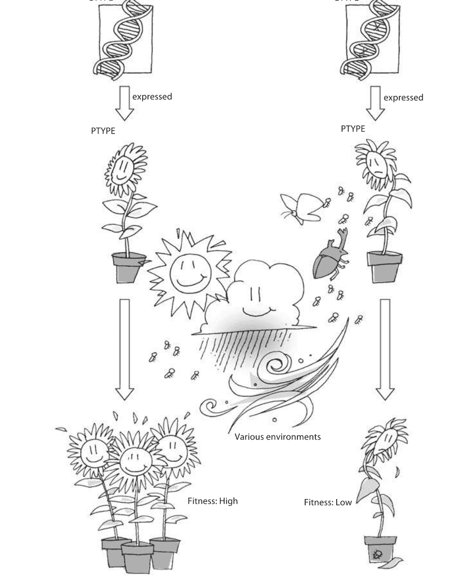

### 图1.1 GTYPE和PTYPE

随着世代的进展，整体上改进，这是进化计算的基本机制。

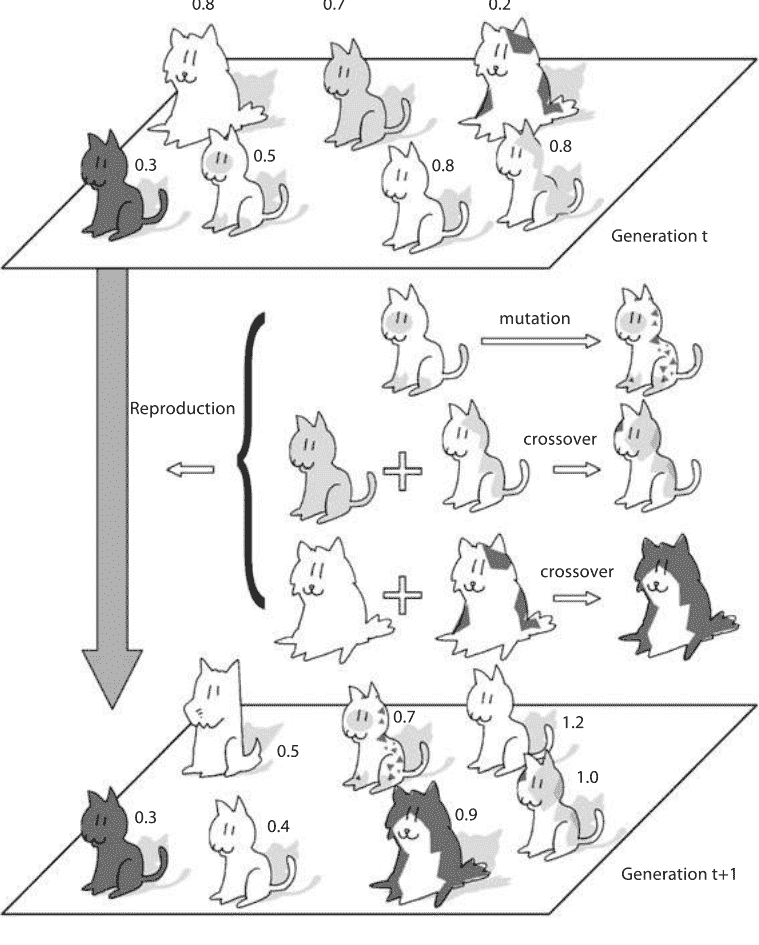

在繁殖的情况下，将图1.3中所示的运算符应用于GTYPE，并产生下一代的GTYPE。为了简化问题，在这里，GTYPE被表示为一维矩阵。每个运算符都是对生物体中的基因重组和突变等的类比。这些运算符的应用频率和应用领域通常是随机确定的。

通常，以下几种方法被用于选择。

- 轮盘选择：这是一种按照适应度比例选择个体的方法。创建一个与适应度成比例的轮盘。旋转这个轮盘，选择它所停留的位置上的个体。

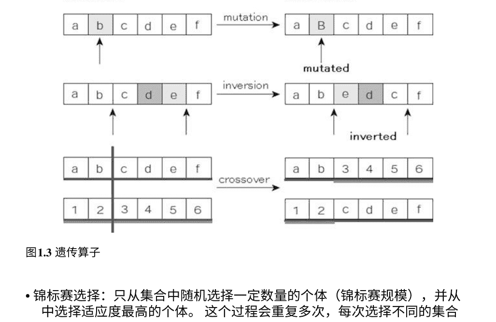

- 锦标赛选择：只从集合中随机选择一定数量的个体（锦标赛规模），并从中选择适应度最高的个体。这个过程会重复多次，每次选择不同的集合。

- 精英策略：将适应度最高的几个个体保留到下一代。这可以防止适应度最高的个体被意外地选择和淘汰。这个策略与上述两种方法结合使用。

通过精英策略，只要环境不发生变化，结果在下一代中不会变差。因此，在工程应用中经常使用。然而，需要注意的是，这样做会导致多样性的丧失。

总结一下，在进化计算中，世代变化如图1.4所示。在图中，G是精英率（上层个体被复制并留下结果的比率）。我们可以将繁殖率称为1 - G。在生物学上，关于拟态的进化还存在许多谜题。通过使用进化计算的计算机模拟，研究解决这些谜团正在蓬勃发展。

进化计算在我们日常生活的各个领域中被使用。例如，日本N700系列子弹列车的前车厢模型在创造原始形式（图1.5a）方面起着重要作用。N700具有以270公里的速度通过曲线的性能，比前一款车型快20公里。然而，在传统的前车厢形式中，加速意味着隧道中的微气象波增加，这是噪音的原因。为了解决这个困难，通过使用进化计算进行了约5000次模拟，得出了被称为“Aero double wing”的原始形式。此外，在机翼设计中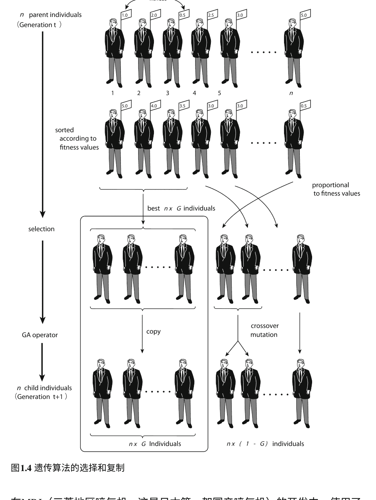

### 图1.4 遗传算法的选择和复制

在MRJ（三菱地区喷气机，这是日本第一架国产喷气机）的开发中，使用了一种称为多目标进化计算的方法（图1.5b）。使用这种方法，同时优化了改善客机设备燃油效率和减少发动机外部噪音的两个目标。

同时，他们成功地改善了性能，与竞争模型相比。

除了工程领域之外，在金融领域等其他领域，进化计算方法的使用正在扩展。投资基金正在将其作为投资组合构建和市场预测的实用技术使用（有关详细信息，请参见[10]）。此外，它在诸如护士排班设计以优化工作班次和飞机分配机组等实际应用领域中具有实际应用。另一个使用进化计算的领域是进化机器人领域。例如，图1.5c是进化人形机器人合作工作（协作运输）的一个例子。在这里，使用了一个应用共同进化到进化计算的学习模型。此外，模块化机器人通过组合模块根据地理特征、环境和工作内容自行修改自己，引起了人们的关注。这项技术甚至被美国国家航空航天局（NASA）用于研究在火星有限环境中进行勘测的优化机器人的形态。我们所了解的生物形态可能只是地球上剩下的那些物种。这些可能是与地球环境相匹配的类型，并且不知道这些是否是最优的。通过进化计算，如果我们能够在计算机上重现进化过程，可能会出现我们尚未了解的新形态。这可能导致与火星和未知行星兼容的机器人的进化（参见[17]）。

## 1.3 多目标优化

进化算法可以考虑竞争目标。它遵守用户关于这些目标的限制和偏好的任何政策。处理多个目标的进化算法通常被称为多目标进化算法（MOEAs）。假设你从事一个城镇的交通规划[6]。减少交通事故的方法包括安装交通信号灯，增加交通标志，调控交通，以及设置检查站（图1.6）。每种方法都涉及不同的成本，选择的交通事故数量也会有所不同。

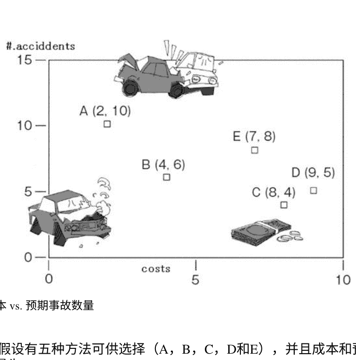

### 图1.6 成本 vs. 预期事故数量

方法。假设有五种方法可供选择（A，B，C，D和E），并且成本和预测的事故数量为

+   $A=(2,10)$ $B=(4,6)$ $C=(8,4)$ $D=(9,5)$ $E=(7,8)$

其中第一个元素是成本，第二个元素是预测的事故数量，如图1.6所示。自然冲动是希望同时实现两个目标：最低成本和最低预测事故数量。不幸的是，并不一定能够通过相同的方式同时实现这两个目标，因此无法同时优化两者。

在这种情况下，“帕累托最优性”这个概念非常有用。对于一个给定的发展事件来表示帕累托最优解，必须满足不存在其他同样或更可取的发展事件，对于所有评估函数，即适应度函数。

让我们再次看一下图1.6。请注意，图中的点随着向左下方移动而变得越来越理想。特别是A，B和C似乎是不错的候选人。这三个候选人都不是两个维度中最好的，也就是说，在两个“评估”中都没有其他更好的候选人。这些点被称为“非支配”点。相比之下，点D和E都被其他点“支配”，因此不太理想。E是由于B在两个评估中都比E好，所以B占主导地位:

B的成本 (4) < E的成本 (7)
B的预测事故(6) < E的预测事故(8).

D同样被C所主导。因此，在这个例子中，帕累托最优解是A，B和C。正如这个例子所示，帕累托最优解的概念不能用来从一组候选人中选择一个，因此不能得出A，B和C中哪一个是最好的结论。

帕累托最优性可以更正式地定义如下。假设存在一个$n$维搜索空间中的两个点 $x =(x_1, \ldots, x_n)$和 $y = (y_1, \ldots, y_n)$，其中每个维度表示一个目标（评估）函数，并且目标是尽可能地最小化每个函数。因此，$y$被 $x$支配（表示为 $x <_p y$）可以定义为

$$x <_p y \Longleftrightarrow (\forall i)(x_i \leq y_i) \wedge (\exists i)(x_i < y_i)$$. (1.1)

在接下来的内容中，我们将把 $n$（不同评估函数的数量）称为“维度数”。任何不劣于其他点的点都被称为“非劣”或“非劣解”，由帕累托最优解集合形成的曲线（或曲面）被称为“帕累托前沿”。多目标进化算法面临的主要问题是如何将多个目标组合成一个可用于选择的度量。换句话说，在选择一个世代中的个体进行交叉时，如何考虑所有目标。

读者应参考[2, 5, 13]来了解多目标优化方法的研究。

## 1.4 遗传编程及其基因组表示

### 1.4.1 基于树的遗传编程表示

遗传编程（GP）的目标是将遗传形式从遗传算法（GA）扩展到树和图的表达，并将其应用于程序的合成和假设或概念的形成。研究人员正在使用GP来改进他们用于控制系统和机器人结构设计的软件。

GP中扩展了GA的过程，以处理图结构（特别是树结构）。树结构通常用LISP中的S-表达式进行描述。因此，在GP中处理LISP程序作为“基因”是相当常见的。只要用户理解程序是以树形式表示的，那么阅读LISP程序应该没有太大困难（用户应该回顾流程图的原则）。下面的解释是为了让不了解LISP的读者能够快速理解。树是一个具有以下结构的图形，不包含循环：


更准确地说，树是一个无环连接图，其中一个节点被定义为树的根。树结构可以用带括号的表达式表示。上述树可以写成以下形式：

```
(A (B) (C (D))) .
```

此外，上述内容可以简化为以下表达式：

```
(A B (C D)) .
```

在LISP中，这种表示法被称为“S表达式”。以下术语将用于树结构：

+   - 节点：用A、B、C、D等符号表示。
    - 根：A
    - 终端节点：B，D（也称为“终端符号”或“叶节点”）
    - 非终端节点：A，C（也称为“非终端符号”和“S表达式的参数”）
    - 子节点：从A的视角来看，节点B和C是子节点（也称为“函数A的参数”）
    - 父节点：C的父节点是A

其他常用短语也会被用作方便之处，包括“子节点数量”，“参数数量”，“孙子节点”，“后代”和“祖先”。这些在此处不做解释，因为从上下文中应该可以理解其含义。下面的遗传算子作用于树结构中：

+   1.  基因突变改变节点标签
    2.  基因倒置兄弟节点重新排序
    3.  基因交叉子树交换

这些是现有遗传算子的自然扩展，作用于位序列。这些算子在下面的示例中应用于LISP表达式树（S表达式）（图1.7）。下划线部分是被操作的表达式：

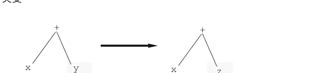

**突变 父代 : (+乘以 x y) ⇒ 子代: (+乘以 x z)**

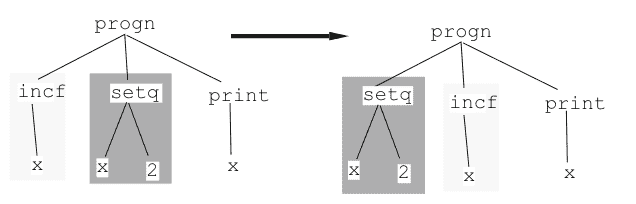

**反转**

父代: (progn (incf x) (setq x 2) (print x)) ⇒ 子代: (progn (setq x 2) (incf x) (print x))

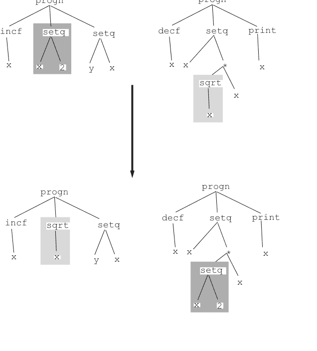

**交叉**

表1.1 由于遗传编程操作符的程序更改

| 操作符 | 操作前的程序 | 操作后的程序 |
| :--- | :--- | :--- |
| 突变 | 添加 x和 y | 添加 x和 z |
| 反转 | 1. 将 x加1<br>2. 设置 x = 2<br>3. 打印 x(= 2)并返回2 | 1. 设置 x = 2<br>2. 将 x加1<br>3. 打印 x(= 3) 并返回3 |
| 交叉 | 父亲 1:<br>1. 将1加到 x<br>2. 设置 x = 2<br>3. 设置 y = x(= 2)并返回2<br>父亲 2:<br>1. 从x中减去1<br>2. 设置 x = √x × x 并返回值. | 孩子 1:<br>1. 将 x加1<br>2. 取x的平方根<br>3. 设置 y = x并返回值<br>孩子 2:<br>1. 从x中减去1<br>2. 设置 x =2和它的值 (=2) 被乘以 x(= 2). 结果值 (=4) 被再次设置为 x again3. 打印 x<br>3. 打印 x(= 4) 并返回4. |

```
G交叉
父亲 1:(progn (incf x) (setq x 2) (setq y x))
父亲 2:(progn (decf x) (setq x (* (sqrt x) x)) (print x))
↓
Child1:(progn (incf x) (sqrt x) (setq y x))
Child2:(progn (decf x) (setq x (* (setq x 2) x)) (print x)).
```

表1.1提供了程序由于这些运算符而发生变化的总结。“progn”是一个按照参数顺序处理参数并返回最后一个参数值的函数。函数“setq”将第一个参数的值设置为第二个参数的计算值。通过检查这个表格，可以看出突变导致程序的行为发生了轻微变化，而交叉导致了所有父程序中部分程序的行为被替换。遗传算子的操作产生了具有个体特征的子程序。

### 1.4.2 笛卡尔遗传编程 (CGP)

CGP [18] 是由米勒等人提出的一种遗传编程 (GP) 技术。CGP使用前馈型网络表示树结构。这是一种通过预先描述所有节点的基因型来优化连接关系的方法。这旨在解决膨胀问题，即由于遗传操作的数量而导致树结构过大的问题。此外，通过重复使用部分树，可以紧凑地表示树结构。

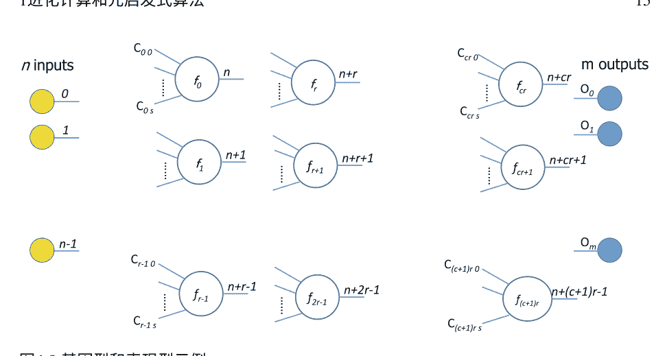

```
0 0 1 1 0 0 1 3 1 2 0 1 0 4 4 2 5 4 2 5 7 3
```

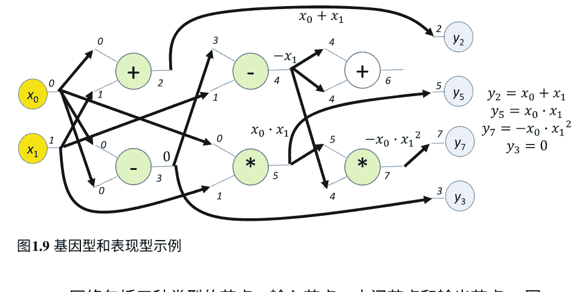

CGP网络包括三种类型的节点：输入节点、中间节点和输出节点。图1.8显示了一个具有n个输入、m个输出和r×c个中间层的CGP配置。在同一列中连接节点是不允许的。CGP网络也受限于只能是前馈网络。

CGP使用一维数字字符串表示基因型。这些描述中间节点的功能类型和连接方法，以及输出节点的连接方法。通常，所有函数都将最大的参数作为输入，并忽略未使用的连接。例如，考虑CGP配置图1.9中的以下基因型。

```
0 0 1 1 0 0 1 3 1 2 0 1 0 4 4 2 5 4 2 5 7 3
```

函数符号数字0、1、2和3（上面有下划线）分别对应加法、减法、乘法和除法。此时对应基因型的网络如图1.9所示。例如，第一个节点0的输入是输入0和输入1，加法计算是有效的。请注意，第五个节点的输出在任何地方都没有被使用（0 4 4），因此它是一个内含子（即非编码区域）。

## 1.5 蚁群优化 (ACO)

蚂蚁排成一长队。一端有食物，另一端有巢穴。这是花园和道路上一个熟悉的场景，但是人类直到几十年前才意识到这些小昆虫的复杂分布式控制。行军是一种合作的蚂蚁行为，可以通过信息素路径模型（图1.10，[12]）来解释。

基于蚂蚁集体行为的优化算法被称为蚁群优化 (ACO) [3]。使用信息素路径模型的ACO用于TSP

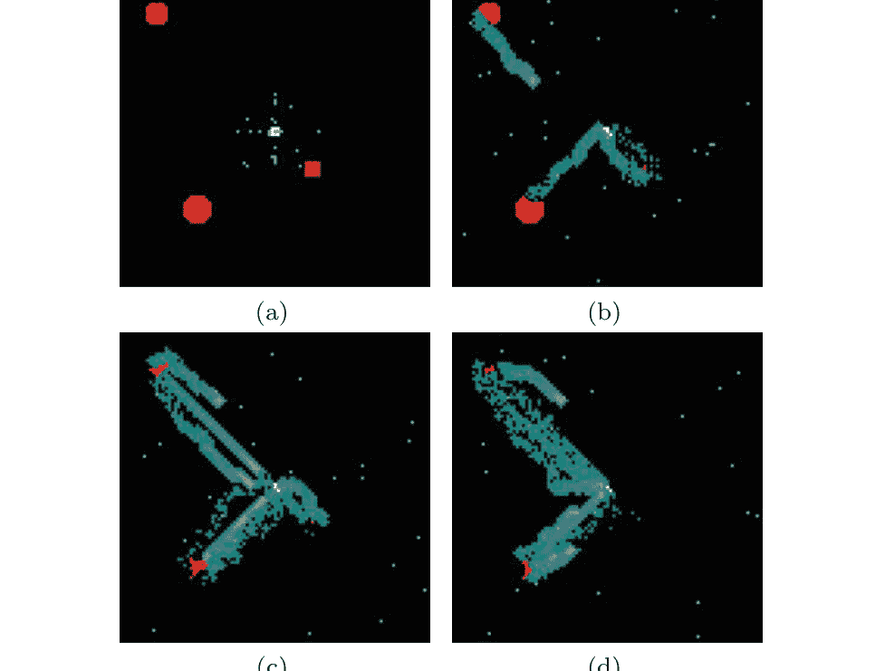

图1.10 蚂蚁的信息素路径 (a) 第一阶段随机搜索。(b) 发现更接近右下角和左下角的食物，并形成信息素路径。左上角在中间位置。(c) 为所有三个来源形成信息素路径，使运输更加高效。右下角的来源几乎被完全采摘。(d) 右下角的食物来源完成，信息素路径已经消散。因此，对左侧的两个来源进行了积极的运输。

使用以下算法来优化旅行路径：

+   - 步骤1 蚂蚁随机放置在每个城市中。
    - 步骤2 蚂蚁移动到下一个城市。目的地根据信息素和给定条件的信息以概率方式确定。
    - 步骤3 重复直到所有城市都被访问过。
    - 步骤4 完成一次完整循环的蚂蚁根据路径长度分泌信息素。
    - 步骤5 如果没有得到满意的解决方案，则返回到步骤1。

蚁群优化（ACO）算法可以概述如下。将$\eta_{ij}$视为城市$i$和$j$之间的距离（图1.11）。蚂蚁$k$在城市$i$中移动到城市$j$的概率$p_{ij}^{k}(t)$由距离的倒数和信息素的量$\tau_{ij}(t)$决定，如下所示：$1/\eta_{ij}$和信息素量$\tau_{ij}(t)$如下所示：

$$p_{ij}^{k}(t) = \frac{\tau_{ij}(t) \times \eta_{ij}^{\alpha}}{\sum_{h \in J_i^k} \tau_{ih}(t) \times \eta_{ih}^{\alpha}}$$ (1.2)

在这里，$J_i^k$是蚂蚁$k$在城市$i$可以移动到的所有城市的集合（尚未访问）。蚂蚁更有可能选择具有更多信息素的路径，这反映了过去搜索的正反馈以及寻找更短路径的启发式。因此，ACO可以包含与问题相关的适量知识。

信息素表通过以下方程进行更新：

$$Q(k) = 蚂蚁k找到的路径的倒数$$ (1.3)

$$\Delta\tau_{ij}(t) = \sum_{k \in A_{ij}} Q(k)$$ (1.4)

$$\tau_{ij}(t+1) = (1 - \rho) \cdot \tau_{ij}(t) + \Delta\tau_{ij}(t)$$ (1.5)

图1.11 蚂蚁的路径选择规则

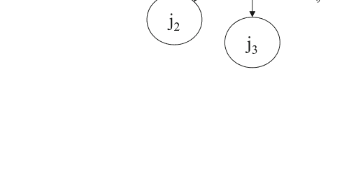

每次迭代后添加到每条路径上的信息素量与蚂蚁找到的路径长度成反比（方程（1.3））。所有通过一条路径移动的蚂蚁的结果都反映在该路径上（方程（1.4））。这里，$A_{ij}$是从城市 $i$ 到城市 $j$ 移动的所有蚂蚁的集合。为避免局部解，采用负反馈作为蒸发系数（方程（1.5）），过去路径上的信息素量或信息从过去减少一个固定因子（$\rho$）。

与其他搜索策略相比，蚁群优化是解决旅行商问题（TSP）的有效方法。专门方法在静态问题中表现更好的特点也被许多元启发式方法所共享（高层策略指导底层启发式方法以提高性能）。对于复杂问题，如城市间距离不对称或城市动态变化的TSP问题，没有已建立的程序，而蚁群优化被认为是最有希望的方法之一。

## 1.6 粒子群优化 (PSO)

肯尼迪等人设计了一种有效的优化算法，利用了鸟群集群行为的机制 [16]。这被称为粒子群优化 (PSO)，并且有很多应用报告。

经典的PSO旨在应用于优化问题。它模拟了大量个体（或“粒子”）在多维空间中的运动 [16]。每个个体都存储着自己的位置向量 ($\mathbf{x}_{i}$)、速度向量 ($\mathbf{v}_{i}$) 和个体获得最高适应度值的位置 ($\mathbf{p}_{i}$)。所有个体还共享关于群体中具有最高适应度值的位置的信息 ($\mathbf{p}_{g}$)。

随着世代的进展，每个个体的速度会使用到目前为止整个群体获得的最佳整体位置和到目前为止该个体获得的最佳位置进行更新。这个更新使用以下公式进行：

$\mathbf{v}_{i} = \chi \left( \omega \mathbf{v}_{i} + \phi_{1} \cdot (\mathbf{p}_{i} - \mathbf{x}_{i}) + \phi_{2} \cdot (\mathbf{p}_{g} - \mathbf{x}_{i}) \right).$ (1.6)

PSO的整体流程如图1.12所示。现在让我们考虑每个个体的具体移动（见图1.13）。假设有一群鸟在飞行中。我们关注其中一个个体（步骤1）。在图中，$\bigcirc$符号和连接线段表示鸟的位置和路径。附近的$\bigcirc$符号（在其路径上）表示个体路径上具有最高适应度值的位置（步骤2）。远处的$\bigcirc$符号（在其他鸟的路径上）标记着群体具有最高适应度值的位置（步骤2）。人们预计下一个状态将沿着步骤3中箭头所示的方向到达。向量1$\bigcirc$显示了之前步骤中的方向；向量2$\bigcirc$指向群体具有最高适应度的位置；以及向量③个点指向个体迄今为止获得最高适应度的位置。因此，在第3步中，这些向量①，②和③被求和以获得下一步中的实际移动方向（参见第4步）。

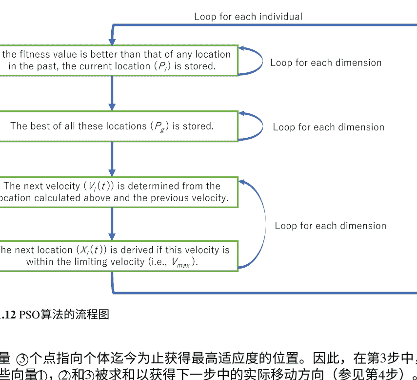

这种类型的PSO搜索的效率肯定很高，因为在相对简单的搜索空间中可以进行集中搜索。然而，经典的PSO算法在多模态问题中经常陷入局部最优解。因此，在应用PSO解决具有多个尖峰的问题时，需要进行某种适应性调整。

为了克服上述限制，可以将类似遗传算法的突变与PSO结合起来[8]。这种混合PSO不遵循简单PSO的每个个体以预定概率在搜索区域内移动到另一个位置的过程，而是在下一代的转变中留下一定的不确定性，这是由于高斯突变引起的。

这种技术采用以下方程：

```
mut(x) = x × (1 + 高斯函数(σ)), (1.7)
```

其中\( \sigma \)被设置为搜索空间在一个维度上的长度的0.1倍。个体根据预定的概率被选择，并且它们的位置根据高斯分布的概率确定。在初始搜索阶段可以进行广泛的搜索，通过逐渐减少初始阶段高斯变异的出现比例，可以提高搜索效率。图1.14展示了具有PSO搜索过程的情况

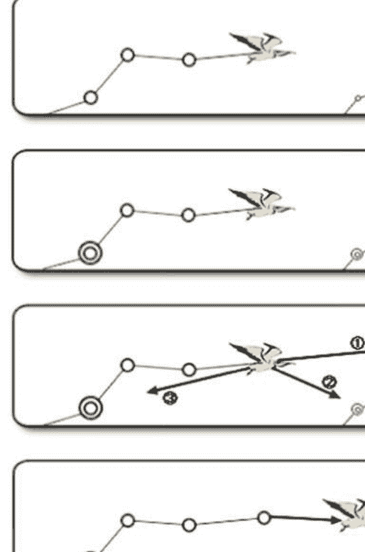

图1.14 PSO搜索过程的概念与高斯变异

高斯变异。在图中，$V_{lbest}$表示基于局部最佳的速度即，$\mathbf{p}_i - \mathbf{x}_i$在方程(1.6)中，而$V_{gbest}$表示基于全局最佳的速度即，$\mathbf{p}_g - \mathbf{x}_i$。

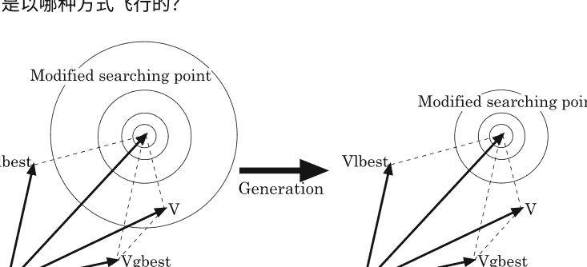

图1.13 鸟是以哪种方式飞行的？

## 1.7 人工蜜蜂群优化（ABC）

蜜蜂和蚂蚁是众所周知的社会昆虫的例子。蜜蜂被分为三种类型：

- 雇佣蜜蜂
- 旁观蜜蜂
- 侦察蜜蜂

雇佣蜜蜂在它们识别出的饲养地附近飞行，向旁观蜜蜂发送关于食物的信息。旁观蜜蜂利用雇佣蜜蜂的信息从饲养地进行有选择性的搜索，寻找最好的食物来源。当关于一个饲养地的信息在一段时间内没有更新时，它的雇佣蜜蜂会放弃它并成为寻找新的饲养地的侦察蜜蜂。蜜蜂群的目标是找到评分最高的饲养地。

蜜蜂群中大约一半是雇佣蜜蜂和侦察蜜蜂（总数的10-15%），其余是旁观蜜蜂。

雇佣蜜蜂通过摇晃后腿和指示太阳位置的角度来向旁观蜜蜂传递信息，这被称为蜜蜂摇摆舞（图1.15）。舞蹈包括水平向右摇摆，并指示太阳在直线飞向食物来源时的位置，太阳表示为直立。例如，水平向右摇摆的摇摆舞表示“与太阳成90°角度向左飞行”。

图1.15 摇摆舞

摇动后部的速度表示食物的距离；当后部快速摇动时，食物源非常近，而当慢慢摇动时，食物原则很远。类似的舞蹈也用于花粉和水的收集，以及选择新蜂巢的位置。

人工蜜蜂群（ABC）算法[14, 15]最初由Karaboga等人提出，它是一种模拟蜜蜂觅食行为的群体优化算法。自从设计了ABC算法以来，已经证明ABC算法具有较少的控制参数，非常有效且与其他搜索技术（如遗传算法（GA）、粒子群优化（PSO）和差分进化（DE）[9]）竞争力强。

在ABC算法中，人工群体被分为雇佣蜜蜂、旁观蜜蜂和侦察蜜蜂。问题的$N$ $d$维解决方案候选者在域中随机初始化，并称为食物源。每个雇佣蜜蜂被分配到特定的食物源$x_i$，并通过以下运算符搜索新的食物源$v_i$：

$$v_{ij} = x_{ij} + \text{rand}(-1, 1) \times (x_{ij} - x_{kj})$$

其中$k\in\{1,2,\ldots,N\}$, $k \neq i$，而$j\in\{1,2,\ldots,d\}$是随机选择的索引。$v_{ij}$是向量$v_i$的第$j$个元素。如果通往食物源的路径在域外，它将被重置为可接受的值。获得的$v_i$然后被评估并与$x_i$竞争以求生存。蜜蜂更喜欢更好的食物源。

与雇佣蜜蜂不同，每个观察蜜蜂根据食物源的适应度选择一个更可取的源，以便在食物空间中进行进一步的搜索，使用方程式(1.8)。这种偏好方案基于雇佣蜜蜂的适应度反馈信息。在经典的ABC[14]中，可以开发的食物源$x_i$的概率表示为

$$p_i = \frac{fit_i}{\sum_{j=1}^{N} fit_j}$$

其中$fit_i$是第$i$个食物源的适应度，$x_i$。为了简单起见，我们假设适应度值为非负数，且越大越好。如果路径$v_i$在盈利能力方面优于$x_i$，这个观察蜜蜂会通知与第$i$个食物源$x_i$相关的雇佣蜜蜂，以更新其记忆并忘记旧的路径。如果在预定的迭代次数内无法改进食物源，即Limit，该食物源将被放弃。正在利用这个食物地点的蜜蜂成为侦察兵，并与一个新的食物地点相关联，该地点是通过某种原则选择的。在经典的ABC[14]中，侦察兵通过随机初始化寻找新的食物地点。

ABC算法的详细信息如下。算法的伪代码如图1所示。

### 算法1 ABC算法

```
要求： T_{max}，雇用蜜蜂数量（=观察蜜蜂数量），限制
初始化食物源
评估食物源
i = 1
当 i < T_{max} 时执行
    使用雇佣蜜蜂产生新的解决方案
    评估新的解决方案并应用贪婪选择过程
    使用观察蜜蜂产生新的解决方案
    评估新的解决方案并应用贪婪选择过程
    计算概率值使用适应度值
    确定废弃的解决方案并使用侦察兵随机生成新的解决方案
    记住迄今为止找到的最佳解决方案
    i = i + 1
结束循环
返回最佳解决方案
```

步骤0: 准备工作搜索点的总数（N），旅行的总数 ($T_{max}$)和一个侦察控制参数(Limit)被初始化。雇用蜜蜂和观察蜜蜂的数量被设置为与搜索点的总数(N)相同。目标函数 f的值被认为是非负的，较大的值更好。

步骤1: 初始化1 行程计数器 k设置为1，并且搜索点更新数量 s_i设置为0。每个搜索点的初始位置向量 $x_i = (x_{i1}, x_{i2}, x_{i3}, \ldots, x_{id})^T$被赋予随机值。这里，下标 i (i = 1, \ldots, N) 是搜索点的索引，d是搜索空间的维数。

步骤2: 初始化2 确定初始最佳解 best。

$$i_g = \arg\max_i f(\mathbf{x}_i)$$

$$\mathbf{best} = x_{i_g}$$

步骤3: 雇用蜜蜂搜索 使用以下方程从当前位置向量 x_{ij}计算新的位置向量 v_{ij}:

$$\mathbf{v}_{ij} = \mathbf{x}_{ij} + \phi \cdot (\mathbf{x}_{ij} - \mathbf{x}_{kj})$$

在这里，j是一个随机选择的维度数，k是除i之外的某个随机选择的搜索点的索引，\phi是在范围[-1, 1]内的均匀随机数。位置向量 x_i和搜索点更新次数s_i根据以下方程确定:

$$I = \{ i | f(\mathbf{x}_i) < f(\mathbf{v}_i) \}$$

$$x_i = \begin{cases} 
v_i & i \in I \\
x_i & i \notin I 
\end{cases} \tag{1.14}$$

$$s_i = \begin{cases} 
0 & i \in I \\
s_i + 1 & i \notin I 
\end{cases} \tag{1.15}$$

第4步：观察蜜蜂搜索执行以下两个步骤。

1.  搜索点的相对排名
    相对概率 $P_i$ 是根据每个搜索点的评估分数计算得出的适应度 $fit_i$。注意 $fit_i = f(x_i)$。观察蜜蜂搜索计数器 $l$ 被设置为1。

    $$P_i = \frac{fit_i}{\sum_{j=1}^N fit_j} \tag{1.16}$$

2.  轮盘选择和搜索点更新
    基于计算得到的概率 $P_i$，选择要更新的搜索点。选择了搜索点之后，按照步骤3中的过程更新搜索点的位置向量。然后，令 $l = l + 1$，并重复执行，直到 $l = N$。

第5步：侦查蜜蜂搜索 给定一个搜索点，如果 $s_i \geq \text{Limit}$，则使用随机数交换生成的搜索点。

第6步：更新最佳解 更新最佳解 $\text{best}$。

$$i_g = \argmax_i f(x_i) \tag{1.17}$$

$$\text{best} = x_{i_g} \quad \text{当} \quad f(x_{i_g}) > f(\text{best}) \tag{1.18}$$

第7步：结束判断 如果 $k = T_{\text{max}}$，则结束。否则，令 $k = k + 1$，并返回步骤3。

ABC最近在许多方面得到了改进。例如，我们分析了ABC的机制，展示了使用参数扰动可能存在的缺点。为了克服这个缺陷，我们提出了一个新的非可分离算子，并将其嵌入到蜜蜂觅食合作机制的主框架中（详见[7]）。

## 1.8 萤火虫算法

萤火虫因具有发光器官而发光并飞行。这种发光是为了吸引雌性。每只萤火虫产生的光亮度因个体而异，取决于

### 算法2 萤火虫算法

```
初始化一个萤火虫种群 x_i ( i = 1,2,...,n)   ▷最小化目标函数 f(x), x = (x_1,...,x_d)^T.
定义光吸收系数 γ
t = 1   ▷迭代次数。
当 t < 最大迭代次数且停止准则未满足时 do
    对于 i = 1 到 n do   ▷对于所有的 n 萤火虫
        对于 j = 1 到 n do   ▷对于所有的 n 萤火虫
            光强度 I_i, I_j 在 x_i, x_j 处由 f 决定
            如果 I_i > I_j 则
                将萤火虫 i 向 j 在所有的 d 维度移动
            结束如果
            吸引力随距离 r 变化通过 e^{-γ r}
            评估新解并更新光强度
        结束对于
    结束对于
    对萤火虫进行排序并找到当前最佳
    t = t + 1
结束循环
后处理结果和可视化
```

每个昆虫个体都具有吸引力，并且认为它们遵循以下规则吸引其他昆虫：

- 吸引力的程度与亮度成比例。
- 雌性萤火虫更容易被发出强烈发光的雄性吸引。
- 亮度随距离的增加而减小。

萤火虫算法（FA）是一种基于闪烁萤火虫的搜索方法[22]。该算法不区分性别。也就是说，所有的萤火虫都互相吸引。在这种情况下，亮度由一个客观函数决定。为了解决最小化问题，具有较低功能值（适应性更好）的萤火虫发光更强烈。最亮的萤火虫随机移动。

算法2描述了FA的概要。被萤火虫 j吸引的萤火虫 i的移动公式如下：

$$\mathbf{x}_i^{new} = \mathbf{x}_i^{old} + \beta_{i,j} (\mathbf{x}_j - \mathbf{x}_i^{old}) + \alpha \left( rand(0,1) - \frac{1}{2} \right) \tag{1.19}$$

其中rand(0,1)是0到1之间的均匀随机数。α是一个参数，用于确定随机数的大小，而β_{i,j}表示吸引力

发光的萤火虫 j对萤火虫 i有吸引力，即

$$ \beta_{i,j} = \beta_0 e^{-\gamma r_{i,j}^2} $$

变量β0表示当r i, j=0时，萤火虫的吸引力，这表示两者处于相同的位置。由于r i, j表示萤火虫 i和j之间的欧几里德距离，它们的吸引力取决于它们之间的距离。

最亮的萤火虫根据以下公式随机移动：

$$ \mathbf{x}_k(t+1) = \mathbf{x}_k(t) + \alpha \left( rand(0,1) - \frac{1}{2} \right) $$

这是因为整个种群在初始分配中收敛到局部最佳解。

随着距离的增加，吸引力变得较弱。因此，在萤火虫算法下，萤火虫之间形成一定距离的群体，而不是聚集在一个地点。

萤火虫算法适用于多模态优化问题，并且与使用PSO获得的结果相比，被认为能够产生更好的结果。它还有另一种扩展，将萤火虫分为两组，并限制对同一组中的萤火虫的影响。这使得全局解和局部解可以同时进行搜索。

## 1.9 杜鹃搜索

杜鹃搜索（CS）[23]是基于寄生行为的元启发式算法。寄生行为是一种动物行为，其中动物依赖于另一物种的成员（或诱导此行为）来孵化它的蛋。一些杜鹃鸟物种通常被认为表现出这种行为。它们将自己的蛋放在其他鸟类的巢中，如大苇鹩莺、西伯利亚草地鹀、牛头伯劳、蓝翅喜鹊等。在离开之前，它们展示了一种有趣的行为，称为模仿蛋：它们取出巢中已经存在的一枚宿主鸟（寄养父母）的蛋，并放下一枚与巢中其他蛋相似的蛋，以保持数量平衡。这是因为当宿主鸟确定所下的蛋不是自己的时，会丢弃这个蛋。

1.  被寄生的物种几乎总是对于每只雌鹊固定的。
2.  此外，刚孵化的鹊雏会驱逐宿主的所有蛋。因此，鹊雏的背部有一个坑，用来放置寄主的蛋，爬进巢里并把蛋扔出巢外。这种行为是由爱德华·詹纳发现的，他因研发天花疫苗而闻名。

杜鹃雏有一个异常大而明亮的喙，因此会被寄养父母过度喂养。这被称为“超常刺激”。此外，翅膀后部有一个暴露的皮肤区域，颜色与喙相同。当寄养父母携带食物时，杜鹃雏会展开翅膀，以使父母注意到这个区域。寄养父母会误以为它是自己的幼崽。因此，父母认为自己有更多的幼崽需要喂养，于是携带更多的食物到巢里。这被认为是杜鹃鸟的一种进化策略，以便根据它们的体型获得相应的食物，因为成年杜鹃鸟比寄主大很多倍。

计算机科学模拟了杜鹃鸟的寄生行为，基于以下三个规则描述：

### 算法3 杜鹃搜索

```
初始化一个包含n个宿主巢穴的种群▷最小化目标函数
f (x), x = (x₁, ···, xₙ)ᵀ.
在每个宿主 i = 1, ···, n 中产生一个蛋 xᵢ⁰
▷迭代次数。
当 t < 最大迭代次数且停止准则未满足时，随机选择一个巢穴i
    通过执行 Lévy 飞行产生一个新的蛋 xᵢᵗ▷杜鹃的寄生者。
    随机选择一个巢穴j，并让其蛋为 xⱼᵗ⁻¹
    如果 f (xⱼᵗ⁻¹) > f (xᵢᵗ) 则▷新的蛋更好。
        用新的蛋替换j的蛋，即 xᵢᵗ
    结束如果
    根据它们蛋的表现对巢穴进行排序
    一部分（pa）较差的巢穴被放弃，通过进行 Lévy flights
    t = t + 1 来建造新的巢穴
结束循环
后处理结果和可视化
```

- 杜鹃鸟一次只下一个蛋，并将其放在随机选择的巢穴中。
- 最高质量的蛋（宿主鸟难以察觉）被传承给下一代。
- 巢穴的数量是固定的，宿主鸟以一定的概率察觉到寄生蛋。在这种情况下，宿主鸟要么丢弃蛋，要么重新建造巢穴。

算法3展示了CS算法。基于这个算法，杜鹃鸟根据Lévy flight在随机选择的巢穴中下一个新蛋。这种飞行主要是短距离的随机行走，没有规律。然而，它有时会展示出长距离的移动。这种移动已经在几个地方被确认。

动物和昆虫。 它被认为能够表示各种自然和物理现象中观察到的随机波动，如飞行模式、进食行为等。

具体而言，Lévy分布由图1.16中引用的以下概率密度函数表示：

$$f(x;\mu, \sigma) = \begin{cases} \sqrt{\frac{\sigma}{2\pi}} \exp\left[ -\frac{\sigma}{2(x-\mu)} \right] (x-\mu)^{-3/2} & (\mu < x), \\ 0 & (\text{otherwise}), \end{cases} \tag{1.22}$$

其中 $\mu$表示位置参数， $\sigma$ 表示尺度参数。

基于这个分布，Lévy飞行主要呈现短距离移动，同时也以一定的概率呈现随机行走的长距离移动。 对于优化问题，与使用随机行走（高斯飞行）相比，它能够提供更有效的搜索方法[23]。

让我们考虑一个表示为$f(\mathbf{x})$的目标函数，其中 $\mathbf{x} = (x_1, \ldots, x_d)^T$。然后，杜鹃鸟根据以下方程为巢穴创建一个新的解决方案候选：

$$\mathbf{x}_i^{t+1} = \mathbf{x}_i^{t} + \alpha \otimes Lvy(\lambda), \tag{1.23}$$

其中 $\alpha(>0)$与问题的规模有关。在大多数情况下， $\alpha = 1$。 运算 $\otimes$表示将每个元素乘以 $\alpha$。 Lvy($\lambda$)表示一个随机数向量，其中每个元素都遵循Lévy分布，而这个

$$ Lvy(\lambda) \sim rand(0,1) = t^{-\lambda} \quad 1 < \lambda \leq 3, \tag{1.24}$$

其中rand(0,1)是0和1之间的均匀随机数。这个公式本质上是一个具有幂次步骤和重尾分布的随机游走。因此，它包括无限平均值和无限标准差。

指数分布的指数通常从-1到-3，用于Lévy飞行的长距离移动。

Pa表示为切换概率，它的一部分较差的巢穴被宿主鸟抛弃，新的巢穴通过进行Lévy飞行来建造。这个概率在探索和利用之间取得平衡。

与PSO和ACO相比，CS被认为更加稳健[1]。

## 1.10 和谐搜索（HS）

和谐搜索（HS）[4]是一种基于爵士乐会话（人类即兴创作的生成过程）的元启发式算法。音乐家通常使用以下任一方法进行即兴演奏：

- 使用已知的音阶（存储在他们的记忆中）。
- 部分改变或修改已知的音阶。在他们的记忆中存储的音阶旁边演奏。
- 创建新的音阶。在可演奏范围内随机演奏音阶。

音乐家将他们记忆中的各种音阶组合起来进行作曲的过程被视为一种优化。虽然许多元启发式算法基于鱼、昆虫等生命的群体智能，但和它们相比，HS在利用音乐过程中的思想来寻求和谐方面有显著的不同，根据审美标准。

和谐搜索算法（以下简称“HS”）根据以下三个规则模仿音乐家的过程来寻找最优解：

- 从HS记忆中选择任意值。
- 从HS记忆中选择一个与任意值相邻的值。
- 在可选择范围内选择一个随机值。

在HS中，解候选向量被称为和声，一组解候选被称为和声记忆（HM）。解候选通过特定顺序在HM中替换。这个过程重复一定次数

### 算法4 和谐搜索

```
对于 i =1 到 H MS执行
   对于 j =1 到 n执行
      随机初始化 x_j^i在 HM 中
   结束对于
结束对于
当停止准则未满足时执行
   对于 j =1 到 n执行
      如果 rand(0,1) < H MCR则
         令 x_j在 x中为随机选择的一个 HM 成员的第 j 维
         如果 rand(0,1) < P AR则
            应用音高调整距离 b w对 x_j进行变异
            x_j = x_j ± rand(0, 1) × b w
         结束如果
      否则
         令 x_j在 x中为一个随机值
      结束如果
   结束对于
   评估 x的适应度通过 f(x)
   如果 f(x)比最差的HM成员的适应度更好那么
      用 x替换最差的HM成员
   否则
      忽略 x
   结束如果
结束循环
后处理结果和可视化
```

重复（或直到满足终止条件），最后，在HM中存活的解中选择最佳和声作为最终解。

算法4展示了一种和声搜索算法。H MCR（和声记忆考虑率）表示从HM中选择和声的概率，而P AR（音高调整率）表示从HM中选择和声时修正的概率。H MS是和声（集合）的数量，通常设置在50到100之间。

基于H MCR从HM中生成一个新的解候选（和声）。H MCR是选择组成元素的概率，其中元素是当前HM中的元素数量。因此，新元素以概率1-H M CR随机生成。随后，根据P AR的概率发生变异。bw参数（带宽）表示变异的最大尺寸。如果新生成的解候选（和声）比HM中最差的解更好，则替换它们。

这种方法也类似于遗传算法（GA）；然而，它在这一点上有所不同，即在HS中，HM的所有成员都成为父代候选人，而在GA中，只有一个或两个现有范围的染色体（父代个体）用于生成子代染色体。

这里使用的系数是收敛系数 \( \chi \)（介于0.9和1.0之间的随机值）和衰减系数 \( \omega \)，而 \( \phi_1 \) 和 \( \phi_2 \) 是每个个体和维度独特的随机值，最大值为2。当计算得到的速度超过某个限制时，它将被最大速度 \( V_{\max} \) 替换。这个过程允许我们在搜索过程中保持个体在搜索区域内。

每一代都会根据以下公式更新每个个体的位置：

```
\( \mathbf{x}_{\mathbf{i}} = \mathbf{x}_{\mathbf{i}} + \mathbf{v}_{\mathbf{i}}. \)  \(\quad\) (1.25)
```

## 1.11 结论

本章介绍了在深度神经进化中使用的几种进化计算和元启发式方法。

总结时，我们将描述一些针对元启发式方法的重要观点和进一步的讨论。

元启发式方法经常使用与自然相关的不寻常的名称、术语和隐喻。例如，在和声搜索中，使用了以下术语：

- 和声，
- 音高, 音符,
- 听起来更好。

然而，这只是用另一种方式表达以下列出的词语：

- 解决方案,
- 决策变量,
- 具有更好的目标函数值。

尽管批评者坚称这些替换词语会引起困惑[19, 20]，但被认为隐喻表达本身并不影响理解的容易程度。例如，David Hilbert<sup>4</sup>在讨论数学形式时引用了几何学即使将点、线和面表达为桌子、椅子和啤酒杯也能工作。也就是说，在精确讨论时，这完全无关紧要，因为它是公理化定义的。然而，我们应该谨慎坚持元启发式方法的新颖性。重要的是要认识到与现有方法的明显区别，以便进行进一步的讨论。Weyland有批评者认为和声搜索只是进化策略 (μ + 1) ES [21]的一个特殊例子。

研究人员提出元启发式方法时，不认可其他类似方法是很重要的[19]。在开发新方法时，我们从未忽视过过去研究的基础进行讨论（有关详细讨论，请参见[11]）。

## 参考文献

1.  Civicioglu, P., Besdok, E.: Cuckoo-search、粒子群优化、差分进化和人工蜂群算法的概念比较。人工智能评论。 **39(4)**, 315–346 (2013)
2.  Deb, K.D., Pratap, A., Agarwal, S., Meyarivan, T.: 一个快速且精英的多目标遗传算法: NS GA-II. IEEE Trans. Evol. Comput. **6(2)**, 182–197 (2002)
3.  Dorigo, M., Gambardella, L.M.: 蚂蚁群算法解决旅行商问题。 Technical Report IRIDIA/97-12, Universite Libre de Bruxelles, Belgium (1997)
4.  Geem, Z.W., Kim, J.H., Loganathan, G.V.: 一种新的启发式优化算法: 和声搜索。 Simulation 76(2), 60–68 (2001). Physical Review E 79 (2009)
5.  Ghosh, A., Dehuri, S., Ghosh, S. (eds.): 面向数据库知识发现的目标进化算法。 Springer, Berlin (2008)
6.  Goldberg, D.E.: 遗传算法在搜索、优化和机器学习中的应用。 Addison Wesley, Reading (1989)
7.  He, C., Noman, N., Iba, H.: 具有非可分离运算符的改进人工蜂群算法。 在: 国际融合与混合信息技术会议论文集, 第203-210页。 Springer, Berlin (2012)
8.  Higashi, N., Iba, H.: 具有高斯变异的粒子群优化。 在: IEEE Swarm Intelligence Symposium (SIS03) 论文集, 第72-79页。 IEEE Press, New York (2003)
9.  Iba H., Noman, N.: 进化算法的新前沿: 理论和应用。 WorldScientific, Singapore (2011)。 ISBN-10: 1848166818
10. Iba, H., Aranha, C.C.: 将进化计算应用于金融工程: 预测、交易和对冲的稳健技术。 Springer, Berlin (2012)
11. Iba, H.: 机器学习和深度神经网络的进化方法——神经进化和基因调控网络。 Springer, Berlin (2018)。 ISBN 978-981-13-0199-512
12. Iba, H.: AI和SWARM: 应急智能的进化方法。 CRC Press, WestPalm Beach (2019)。 ISBN-13: 978-0367136314
13. 石浏, H., 埝本, N., 野岛, Y.: 进化多目标优化: 简短评论。 在: IEEE进化计算大会论文集, 第2419-2426页 (2008)
14. Karaboga, D., Basturk, B.: 一种强大而高效的数值函数优化算法: 人工蜜蜂群 (ABC) 算法。 全球优化杂志 **39**, 459-471页 (2007)
15. Karaboga, D., Gorkemli, B., Ozturk, C., Karaboga, N.: 一项综合调查: 人工蜜蜂群 (ABC) 算法及其应用。 人工智能评论 (2012)。 https://doi.org/10.1007/s10462-012-9328-0
16. 肯尼迪, J., 埃伯哈特, R.C.: 粒子群优化。 在: IEEE国际神经网络会议论文集, 第1942-1948页 (1995)
17. Lipson, H., Pollack, J.B.：自动设计和制造机器人生命形态。Nature **406**, 974–978 (2000)
18. Miller, J.F. (ed.)：笛卡尔遗传染程。Springer, 柏林 (2011年)
19. Srensen, K.：元启发式-暴露的隐喻。Int. Trans. Oper. Res. **22**(1), 3–18 (2015年)
20. Srensen, K., Sevaux, M., Glover, F.：元启发式的历史。arXiv:1704.00853v1 [cs.AI] 2017年4月4日，将出现在Mart, R., Pardalos, P., Resende, M., Handbook of Heuristics. Springer, 柏林。
21. Weyland, D.: 对和声搜索算法的严格分析——研究界如何被“新颖”方法误导。应用元启发式计算国际期刊 1(2),50–60 (2010)
22. Yang, X.: 自然启发元启发式算法, 第二版. Luniver Press, Frome (2010)
23. Yang, X.-S., Deb, S.: 2009 Cuckoo search via Levy flights. 在: 自然和生物启发计算世界大会论文集 (NaBIC 2009), pp. 210–214. IEEE, 纽约(2009)

# 第二章
## 深度神经网络的浅显介绍

Nasimul Noman

摘要 深度学习是人工智能领域中两个分支之一，它与进化计算相结合形成了深度神经进化领域。 另一个分支是在前一章中介绍的进化计算。 深度学习是机器学习中最活跃的研究领域之一，它是一种使用多个抽象层次学习和处理数据的强大计算模型。 在过去的几年中，深度学习方法在各种应用领域展现出了惊人的性能。 本章介绍了常用的深度神经网络的主要类别，包括CNN（卷积神经网络）、RNN（循环神经网络）、DBN（深度置信网络）、深度自编码器、GAN（生成对抗网络）和深度递归网络。对于每个网络类别，我们介绍了其架构、层类型、处理单元、学习算法和其他相关信息。 本章旨在为读者提供深度学习的必要背景知识，以便理解本书后续章节中介绍的深度神经进化的现代研究。

## 2.1 引言

深度学习（DL）是当下最热门的词汇之一。 2013年，它首次进入麻省理工学院的10项突破性技术之一，从那时起，几乎每年深度学习及其相关研究都进入了这个榜单，直接或间接地。 毫无疑问，深度学习在从语音识别到自动游戏玩耍等各个领域以超人水平取得的惊人成功，使其成为关注的中心。

深度学习是机器学习的一个分支，属于人工智能领域。有些问题人们可以轻松而稳定地解决，但很难解释他们是如何解决这些问题的，比如面部和物体识别，口语解释等。传统的机器学习和模式识别方法在这些任务中取得了有限的成功，主要是因为它们依赖于数据表示或特征。由于机器学习的基本思想是“从数据中学习”，数据的表示对学习算法的性能尤其重要。制定最有效的特征并不是一件简单的事情，而且它需要与任务相关的人类专业知识和先验知识，这使得学习过程依赖于人类。

表示学习已经成为特征工程的一种替代方法，能够自动提取有用的表示[1]。使用表示学习，原始数据可以映射到有用的表示，使得后续的学习任务对分类器或预测器更容易。深度学习是一种通过聚合简单表示来学习复杂表示的形式化方法，而这些简单表示又依赖于其他更简单的表示，以此类推。通过利用这种复杂映射的层次结构，深度神经网络可以学习非常复杂的概念，并展现出类似人类的智能[2]。

深度学习的出现引发了人工智能的复兴。关于这个主题正在进行的研究量以及发表的研究论文数量是巨大的，这为该领域的深度和广度做出了贡献。在一本书甚至一章中不可能涵盖所有内容。正如标题所示，本章的目的是对该领域的主要方法进行简要概述。接下来的章节将介绍各种优化深度神经网络的自然启发算法。对于新手来说，本章介绍的深度神经网络概念对于理解后续章节非常有用。关于这个主题有许多综述和系统性的评论[3–6]，以及应用特定的评论[7–14]，读者可以找到非常有用。

考虑到本章的上述目的，我们将本章的内容组织如下。首先在第2.2节中，我们介绍了神经网络的基本概念和训练算法。第2.3节解释了通用深度神经网络的概念。第2.4节介绍了深度神经网络中的重要架构，随后在第2.5节中介绍了它们的应用。最后，在第2.6节中我们总结了本章内容。

## 2.2 （浅层）神经网络

神经网络（NNs）的历史可以追溯到1940年代，当时McCulloch和Pitts创建了第一个数学模型来模拟人脑的工作[15]。从那个基本模型开始，NNs的容量、能力和应用取得了巨大的进展，直到上个世纪末出现了两次重要的停滞期，即所谓的AI寒冬。

本节在介绍下一节深度神经网络之前，对浅层NNs进行了简要概述。

神经网络（NNs）又称为人工神经网络（ANNs），是由许多简单的信息处理单元（称为神经元）组成的计算模型。一个神经元 $N_j$，就像生物神经元一样，通过连接链路接收输入信号 $(x_i;\ i = 1,\dots,n)$。每个连接都有一个权重 $w_{ij}$ 来调节相应的输入 $x_i$。输入的加权和加上一个偏置项 $b_j$ 通过激活函数 $\varphi(\cdot)$ 映射，生成神经元的输出 $y_j$，如下所示：

$$ y_j = \varphi(z_j) = \varphi\left(\sum_{i=1}^{n} x_i w_{ij} + b_j\right). \tag{2.1} $$

偏置项 $b_j$ 用于控制输入到激活函数的净输入。通过将偏置项 $b_j$ 重命名为 $w_{0j}$ 并设置 $x_0=1$，可以以更紧凑的形式表示方程（2.1）。

$$ y_j = \varphi(z_j) = \varphi\left(\sum_{i=0}^{n} x_i w_{ij}\right). \tag{2.2} $$

激活函数 $\varphi(\cdot)$，也称为传递函数，限制神经元的输出范围并且需要非线性激活函数来展示复杂行为。传统上，sigmoid函数（方程（2.3）），也称为逻辑函数，被用作激活函数。其他常用的激活函数包括双曲正切函数和修正线性单元（ReLU）。图2.1a显示了神经元的模型。

$$ \varphi(z_j) = \frac{1}{1+exp(-z_j)}. \tag{2.3} $$

前馈神经网络（FFNN），也松散地称为多层感知机（MLPs），由神经元组织成层（图2.1b）。网络的最左边和最右边的层分别称为输入层和输出层，中间的层称为隐藏层。特定层中的神经元与后续层中的所有或部分神经元相连接。

图2.1b展示了一个完全连接的FFNN，具有一个3个神经元的输入层，一个4个神经元的隐藏层和一个2个神经元的输出层（为简单起见，偏差未显示）。输入层中的神经元（以虚线圆圈表示）不对接收到的数据进行任何处理，只是将其传递给下一层。当输入数据放置在FFNN的输入层时，它会传递给连接的神经元，这些神经元会处理输入并生成输出。生成的输出作为下一层的输入。

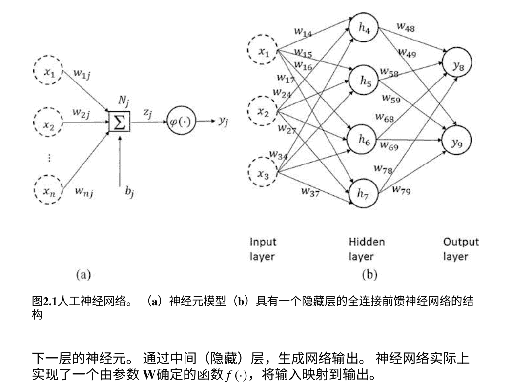

下一层的神经元。通过中间（隐藏）层，生成网络输出。神经网络实际上实现了一个由参数 **W** 确定的函数 $f(\cdot)$，将输入映射到输出。

### 2.2.1 反向传播算法用于训练神经网络

在一个监督学习问题中，我们给定一组输入-输出配对样本 $\{\mathbf{x}^{(k)}, \mathbf{y}^{(k)}; k = 1, \dots, K\}$ 并且我们需要学习基于神经网络参数的潜在函数。一种优雅的算法称为反向传播位于不同类型的神经网络中的参数学习的核心。反向传播算法是一种基于梯度的方法，它搜索网络参数以最小化给定数据中神经网络预测输出和目标输出之间的差异。常用的误差函数用于衡量我们与目标之间的距离是

> $$E^{(k)} = \frac{1}{2}\sum_{j \in L}\left(e_j^{(k)}\right)^2 = \frac{1}{2}\sum_{j \in L}\left(y_j^{(k)} - \hat{y}_j^{(k)}\right)^2$$ (2.4)

其中 $y_j^{(k)}$ 和 $\hat{y}_j^{(k)}$ 分别是目标输出和神经网络在第 $j$ 个输出单元对输入 $\mathbf{x}^{(k)}$ 的响应产生的输出；$e_j^{(k)}$ 表示相应的误差。$L$ 表示输出层中的神经元集合。在反向传播算法中，这个错误信号通过网络逐层向后传播，对连接权重进行连续调整。

假设我们有一个 $L+1$ 层的前馈神经网络，其中 $l = 0$ 表示输入层，$L$ 表示输出层，而 $l = 1, \dots, L-1$ 表示隐藏层。对于给定的训练数据集 $\{ \mathbf{x}^{(k)}, \mathbf{y}^{(k)} \}; k=1, \dots, K$，反向传播算法可以描述如下：

#### 步骤1:
初始化：在没有任何先验信息的情况下，网络的权重和偏置被初始化为从均匀分布中抽样的小随机数。

#### 步骤2:
遍历训练样本批次：直到满足终止条件，对于给定的 $K$ 训练样本中的每个示例 $\{\mathbf{x}^{(k)}, \mathbf{y}^{(k)}\}$，按照某种特定顺序执行步骤2.1和2.2中描述的前向传播和反向传播。

#### 步骤 2.1: 前向传播:
在这一步中，输入 $\mathbf{x}$ 被呈现给网络，并且计算出不同神经元的输出（逐层进行）从输入层到输出层。

```
$$y_j = \begin{cases} x_j & \text{: if $y_j$ 是输入层的神经元} \\ \varphi(z_j) & \text{: if $y_j$ 是隐藏层或输出层的神经元}, \end{cases} \qquad (2.5)$$
```

其中 $z_j$ 表示神经元输入的加权和和偏差如公式 (2.2) 所示。接下来从网络输出中计算出误差信号

```
$$e_j = y_j - \hat{y}_j. \qquad (2.6)$$
```

#### 步骤 2.2: 反向传播:
在这个阶段，通过调整网络的权重和偏差（逐层进行）从输出层向输入层传播误差。网络连接到节点 $N_j$ 在层 $l$ 的权重, $w_{ij}$, 被调整为

```
$$w_{ij} = w_{ij} + \eta \delta_j y_i, \qquad (2.7)$$
```

其中 $\eta$ 是学习率参数，通常取值在 0.0 和 1.0 之间。$\delta_j$ 是网络的局部梯度，定义为

```
$$\delta_j = \begin{cases} \varphi'_j(z_j)e_j & \text{:如果 $N_j$ 是输出层的神经元} \\ \varphi'_j(z_j) \sum_i \delta_i w_{ji} & \text{:如果 $N_j$ 是隐藏层的神经元}, \end{cases} \qquad (2.8)$$
```

其中$\varphi'_j(\cdot)$表示对参数的微分。对于Sigmoid函数，方程(2.8)的形式如下：

$$\delta_j = \begin{cases} y_j(1 - y_j)e_j & :\text{如果 } N_j\text{是输出层的神经元} \\ y_j(1 - y_j)\sum_i \delta_i w_{ji} & :\text{如果 } N_j\text{是隐藏层的神经元} \end{cases} \quad (2.9)$$

其中 $y_j(1 - y_j)$是sigmoid函数的导数。

上述算法中的权重调整方法，在每个训练样本中更新网络权重，被称为在线更新。或者，在将一批样本呈现给网络后更新权重。这种设置被称为批量更新。当所有训练数据集的 $K$个样本都被呈现给网络时，称为一次训练的周期。网络会一次又一次地进行训练，直到满足终止条件。在本节中，我们只介绍了FFNN——最广为人知的NN类型。还有其他几种类型的NN，如循环神经网络（RNN）、自编码器（AE）、受限玻尔兹曼机（RBM）、时延神经网络（TDNN）等，这些类型的NN已经被研究人员研究了很多年。其中许多模型已经扩展到了深度架构。这些NN的相关模型将在第2.4节中介绍，同时介绍它们的深度架构。

## 2.3 深度神经网络：什么，为什么和如何？

基于前一节中对神经网络的简要介绍，深度学习架构可以被定义为一种表示学习技术，它关注于在一系列处理单元（神经元）的层序中逐步学习更有意义的表示。因此，深度学习的核心思想在于利用许多非线性信息处理层进行有用特征提取和转换，以进行监督或无监督学习。因此，它是经典多层感知器（MLP）的逻辑扩展。如今，深度神经网络可以利用数百甚至数千层来共同学习一系列表示。根据层数来严格区分浅层和深层神经网络并没有明确的划分；然而，任何超过两三层的架构都可以被视为深层。理想情况下，我们希望神经网络在不同的抽象层次上学习大量信息，并利用这些信息来展示类似人类的智能，解决不同的复杂问题。让我们考虑来自Kaggle$^1$竞赛的著名的猫和狗照片分类问题。我们打算捕捉不同的

$^1$www.kaggle.com.

共同特征，例如眼睛、耳朵，以及区分特征，例如脸部形状、眼睛和鼻子的相对位置等，在我们的网络中利用这些特征来解决任务。无论是浅层还是深层的神经网络，都是通用的，即它们可以在紧凑的 $R^n$ 域上近似任何连续函数。现在，使用深层架构相比浅层架构有哪些优点/缺点？

通过表示学习，我们希望从原始数据中提取有用的信息，以供我们使用。以分层方式创建抽象表示的一个直接好处是较低层次表示的共享和可重用性。通过使用许多层的递增抽象，深层架构可以为任务学习非常复杂和有效的表示。

语音转文本转录问题的实验结果表明，在固定数量的参数下，深层模型明显优于浅层模型。此外，深度学习同时学习这些递增表示的能力使其成为一种高效的学习方法。神经网络架构的深度还与学习函数的“紧凑性”以及学习所需的数据有关。根据理论结果，可以在深层架构中紧凑地表示的函数可能需要指数级的元素来在浅层架构中表示。此外，表示中元素的增加可能需要大量的训练示例来调整它们。有人建议深层架构更适合表示高度变化的函数（需要大量元素进行分段逼近的函数）。尽管深度学习的理论在20世纪80年代就为人工智能界所熟知，但它直到最近才开始蓬勃发展。现代深度学习时代的开始是由Hinton等人提出的深度置信网络逐层学习的提议。但是深度学习的实际应用和成功直到2012年才变得显著。在这一成就背后，三个领域的进展起到了推动力：数据可用性、计算能力和算法进步。与任何机器学习方法一样，数据是将抽象模型转化为智能机器的关键要素。在过去的20年中，存储硬件的容量呈指数增长，价格下降，互联网和通信技术也得到了巨大的增长，使得大规模数据集的收集、存储和分发成为可能。从1990年代以来，CPU的速度增加了数千倍。然而，主要的飞跃来自于使用GPU（图形处理单元），它们能够进行深度学习所需的大规模并行操作。如今，使用标准GPU可以在不到一小时的时间内训练具有数百万参数的深度学习网络。数据和硬件的可用性使得对深度神经网络进行实验成为可能，研究人员在开发改进的激活函数、优化方案和权重初始化方案方面取得了显著进展。这些算法改进有助于克服训练深度神经网络中的一个关键障碍——梯度在深度神经网络的层堆栈中的传播。

## 2.4 深度网络的架构

在前一节中，深度神经网络（DNN）被介绍为FFNN的逻辑扩展；然而，深度网络经常通过使用特殊类型的层或通过将较小的网络组装成较大的网络来构建，将其作为构建块。根据其架构特点，DNN可以被广泛分类为不同类型。在本节中，我们将根据其架构设计介绍DNN的主要变体。

### 2.4.1 卷积神经网络

卷积神经网络（CNN）是最著名和广泛使用的DNN架构之一，在各种计算机视觉应用中取得了巨大的成功。CNN受到动物视觉系统的启发，特别是受到Hubel和Wiesel提出的由简单和复杂细胞组成的模型的启发[19, 20]。Neocognitron是一种通过图像的分层有序转换来工作的ANN模型，被认为是CNN的前身[21]。

CNN是前馈神经网络，通过多个层次的序列转换输入以生成输出，然而它们之间存在一些值得注意的架构差异。CNN由多个层类型组成，与FFNN中的一个层类型相比，这是一个关键区别。CNN和FFNN之间的另一个关键区别是，CNN中的层由三维体积中组织的神经元组成。CNN的其他特点包括神经元的局部连接性和连接之间的权重共享，这将在以下子节中解释。

- 1. 卷积层
- 2. 池化层
- 3. 全连接层

图2.2显示了用于图像分类任务的基本CNN架构的流水线。如图2.2所示，输入本身就是一个三维实体，例如图象的尺寸是宽度、高度和颜色通道。

考虑到一个三维实体，例如图像的尺寸是宽度、高度和颜色通道。一旦原始输入数据（图像）放置在网络的输入层中，它经过多个卷积和池化层的阶段，然后由一个或多个全连接层处理生成表示，以生成网络的最终输出，用于对图像进行分类。

#### 2.4.1.1 卷积层

卷积层被认为是卷积神经网络的核心构建模块，本质上是特征提取器。卷积层中的每个神经元通过一组可训练的权重与前一层中的一个小区域（称为感受野）相连接。卷积层中神经元的一组可训练权重被称为过滤器或内核，它通过前一层的全部深度连接到神经元。通过将相同的过滤器复制到整个视觉场（即前一层的宽度和高度），可以创建一个特征图。通过将输入与学习到的过滤器进行卷积，生成特征图，实际上表示给定卷积层对相同特征的响应。通过使用多个过滤器，可以从相同的感受野中提取各种特征，并创建多个特征图。学习到的过滤器的数量决定了卷积层的深度维度的范围。

设计卷积层需要选择许多超参数的值。卷积层的深度取决于我们想要从前一层学习的滤波器数量。输出体积的宽度和高度由滤波器大小、步幅大小和零填充控制。滤波器的空间维度称为滤波器大小或内核大小。步幅大小决定我们滑动滤波器以创建特征图的步幅，并在输入边界上用零填充输入，我们可以控制输出体积的空间大小。尽管传统上在ANN中使用Sigmoid和双曲正切函数，但ReLU及其后继函数，如Leaky ReLU（LReLU），Parametric ReLU（PReLU），指数线性单元（ELU）可以改善CNN的性能。因此，选择最佳激活函数已成为CNN的另一个设计参数。

#### 2.4.1.2 池化层

池化层用于实现对平移的空间不变性。通常，在连续的卷积层之间插入池化层以减小特征图的空间尺寸。池化层逐渐减少参数数量和计算量，并有助于控制过拟合。

池化函数沿着输入体积的空间维度操作，并进行下采样，但保持深度不变。

最大池化和平均池化是CNN中最常用的池化类型。与卷积类似，池化操作使用滤波器大小和步长大小进行。具有2×2滤波器大小和2步长大小的最大池化操作将把特征图从8×8减小到4×4。该操作在空间上移动滤波器，在滤波器的2×2区域上执行最大操作。在相同的设置下，平均池化只是用平均值替换最大值操作。与池化层相关的其他知名方法包括随机池化、空间金字塔池化和def-pooling [8]。

#### 2.4.1.3 全连接层

在多次连续的卷积和池化层运行之后，卷积神经网络从输入数据中提取出非常高级的特征。为了基于提取的表示进行高级推理，最后使用了几个全连接层。与前馈神经网络类似，全连接层是一维的，全连接层的每个神经元与前一层的每个神经元相连接。全连接层包含了卷积神经网络的大部分参数，并对训练造成了计算负担[8]。

除了这三层之外，在卷积神经网络中还使用了许多类型的归一化层，其中批归一化是最常见的。一些研究表明，批归一化可以加快训练速度，减少对权重初始化的敏感性[22]。

#### 2.4.1.4 训练策略

卷积神经网络可以使用之前介绍的反向传播算法进行训练。然而，由于参数数量庞大，训练深度神经网络面临着过拟合的主要挑战。为了解决过拟合问题，提出了各种正则化技术。Dropout是其中一种最有效的正则化方法，在训练期间，隐藏单元以一定的概率随机被省略，这个概率被称为dropout率。这样可以防止训练数据上的复杂特征共适应，从而提高泛化能力。在测试期间，所有隐藏单元都乘以dropout率，从而产生强烈的正则化效果，减少过拟合。数据增强是另一种常用的技术，可以在不增加标注成本的情况下创建额外的数据。通过应用平移、翻转和改变图像通道强度，可以创建补充样本，从而提高分类性能。除了正则化技术、网络参数的预训练和微调，利用权重衰减和权重绑定可以提高网络的泛化能力[8, 9]。

#### 2.4.1.5 流行的CNN模型

在过去的几年里，各种CNN架构都提出了一些创新的想法。 利用新颖的架构设计、正则化技巧和处理单元的重新组织，提出了一些强大的CNN模型，已经成为该领域广泛认可的标准。 本节简要介绍了一些最重要的CNN架构。

AlexNet是由Krizhevsky等人提出的[23]，它在2012年的ILSVRC（ImageNet大规模视觉识别挑战赛）中获胜，并在计算机视觉领域推广了CNN。 AlexNet具有相对简单的架构，包括五个卷积层、最大池化层、ReLU和三个全连接层以及dropout。 Szegedy等人在他们开发的GoogLeNet架构中引入了inception模块的概念，该架构在2014年的ILSVRC中获胜[24]。 他们的提议表明，CNN层可以以非传统的顺序方式排列。 VGGNet是由牛津大学的Visual Geometry Group（VGG）提出的CNN模型[25]。 在该模型的几个版本中，VGG-16和VGG-19分别由16个和19个权重层组成，因此变得非常流行。 ResNet是由微软开发的，在2016年的ILSVRC中获胜[26]。 ResNet网络以其非常深的架构（152层）和引入残差块而闻名。 在他们的Xception模型中，谷歌将inception假设推到了极致，因此得名[27]。 在这种架构中，inception模块被修改的深度可分离卷积所取代，该卷积是先进行逐点卷积，然后进行深度卷积。 Khan等人引入了通道增强的概念，通过从多个输入通道和迁移学习中学习来提高DNN的代表能力。 他们设计的通道增强CNN（CB-CNN）架构在复杂分类问题上表现出优越的性能，相比许多现有方法[28]。

### 2.4.2 循环神经网络

循环神经网络（RNN）与其他前馈神经网络不同，它们具有随时间选择性地传递信息的能力。 循环连接是RNN的一个显著特征，它使它们能够基于先前状态和当前输入更新当前状态。 因此，它们可以用来建模不独立的元素序列。 自然地，RNN在文本、音频和视频等序列处理相关应用中被广泛使用。

#### 2.4.2.1 RNN架构

RNN是一种前馈神经网络，其中隐藏层被由循环节点（也称为循环单元）组成的循环层取代。 循环单元具有跨相邻时间步骤的连接，融入了概念模型的时间。细胞的设计决定了其在记忆先前信息方面的能力。此外，循环层可以以不同的方式组织，从而产生不同的RNN架构。因此，通过混合不同类型的细胞和架构，可以设计出不同的RNN，这显然会导致具有不同特征的RNN [29]。

简单的循环细胞是一个标准神经元，增加了循环连接，使其状态受到网络过去状态（通过循环连接）和当前输入（通过前馈连接）的影响。换句话说，循环连接将循环神经元的输出作为输入连接到同一层中的循环神经元（图2.3a）。简单循环细胞的数学表达式如下：

$$\boldsymbol{h}(t) = \varphi \left( \boldsymbol{W}^{xh} \boldsymbol{x}(t) + \boldsymbol{W}^{hh} \boldsymbol{h}(t - 1) + \boldsymbol{b}^{h} \right) \qquad \text{(2.10)}$$
$$\boldsymbol{y}(t) = \boldsymbol{h}(t) \qquad \text{(2.11)}$$

其中，$\boldsymbol{x}(t)$，$\boldsymbol{h}(t)$和$\boldsymbol{y}(t)$分别表示输入、循环信息和细胞输出在时间 $t$。$\boldsymbol{W}^{xh}$是输入和隐藏层之间的权重矩阵，$\boldsymbol{W}^{hh}$是隐藏层和自身之间的循环权重矩阵。$\boldsymbol{b}^{h}$表示偏置向量。图2.3b展示了网络在时间步骤上的动态，通过展开图2.3a的网络来直观理解。展开的网络可以被视为一个深度网络，信息在时间上以前馈的方式流动，但权重保持不变。

#### 2.4.2.2 RNN训练

考虑到RNN的展开表示，可以理解在反向传播算法中网络可以在许多时间步骤上进行训练。这个算法被称为透过时间的反向传播（BPTT）。BPTT被称为‘透过时间’，是因为它会有来自未来时间步骤和上层的错误信号向后传播。使用BPTT训练RNN在计算上是昂贵的，而且在训练深度神经网络时出现的两个众所周知的问题，即梯度消失和梯度爆炸问题（在许多层之间进行反向传播时出现）是显而易见的。一种称为截断BPTT（TBPTT）的BPTT变体可以限制错误传播的时间步骤，可以更好地处理上述问题。然而，通过限制错误的传播，TBPTT可能会减少学习到的依赖长度[30]。

#### 2.4.2.3 存储单元

一般来说，对于简单循环单元来说，很难捕捉到数据中的长期依赖性——随着相关输入之间的间隔增加，学习它变得困难。一类改进的单元被设计用来增强简单循环单元的记忆能力，通过在单元中引入门控机制。这个家族中最早也是最著名的成员是由Hochreiter和Schmidhuber提出的长短期记忆（LSTM）[31]。图2.4展示了最常用的LSTM变体：带有遗忘门的LSTM[32]。其他著名的变体包括没有遗忘门的LSTM和带有窥视孔连接的LSTM。

LSTM单元如图2.4所示，由三个门组成：遗忘门、输入门和输出门。遗忘门决定从其内部细胞状态中丢弃哪些信息，输入门选择将哪些信息存储在细胞状态中，输出门根据细胞状态决定哪些信息要暴露出来。带有遗忘门的LSTM单元的数学模型为：

$$f(t) = \sigma \left( W^{fh} \boldsymbol{h}(t-1) + W^{fx} \boldsymbol{x}(t) + \boldsymbol{b}^f \right) \tag{2.12}$$
$$i(t) = \sigma \left( W^{ih} \boldsymbol{h}(t-1) + W^{ix} \boldsymbol{x}(t) + \boldsymbol{b}^i \right) \tag{2.13}$$
$$\tilde{c}(t) = \tanh \left( W^{\tilde{c}h} \boldsymbol{h}(t-1) + W^{\tilde{c}x} \boldsymbol{x}(t) + \boldsymbol{b}^{\tilde{c}} \right) \tag{2.14}$$
$$\boldsymbol{c}(t) = \boldsymbol{f}(t) \cdot \boldsymbol{c}(t-1) + \boldsymbol{i}(t) \cdot \tilde{\boldsymbol{c}}(t) \tag{2.15}$$
$$\boldsymbol{o}(t) = \sigma \left( W^{oh} \boldsymbol{h}(t-1) + W^{ox} \boldsymbol{x}(t) + \boldsymbol{b}^o \right) \tag{2.16}$$
$$\boldsymbol{h}(t) = \boldsymbol{o}(t) \cdot \tanh (\boldsymbol{c}(t)) \tag{2.17}$$

几项研究发现，使用LSTM单元构建的RNN在处理长期依赖性方面比简单单元更好。然而，由于LSTM单元具有额外的参数，使用LSTM进行学习在计算上是昂贵的。Cho等人提出的另一种记忆单元，名为门控循环单元（GRU），因其简单的架构和在许多应用中的竞争性表现而变得流行。GRU的数学方程为：

$$r(t) = \sigma(W^{rh}h(t-1) + W^{rx}x(t) + b^r) \tag{2.18}$$
$$z(t) = \sigma(W^{zh}h(t-1) + W^{zx}x(t) + b^z) \tag{2.19}$$
$$\tilde{h}(t) = \tanh(W^{\tilde{h}h}(r(t) \cdot h(t-1)) + W^{\tilde{h}x}x(t) + b^{\tilde{h}}) \tag{2.20}$$
$$h(t) = (1 - z(t)) \cdot h(t-1) + z(t) \cdot \tilde{h}(t). \tag{2.21}$$

GRU单元实际上由两个门组成：重置门和更新门，其中更新门本质上是LSTM的输入门和遗忘门的组合。近年来还出现了一些GRU的变体和其他记忆单元。

当在时间上展开时，RNN可以被视为一个深度神经网络。RNN中的这些无限层次是为了记忆而不是层次化处理，而其他DNN中则是这种情况[34]。构建最明显的方法通过堆叠循环层，深度RNN可以实现，然而，RNN还可以通过其他方式扩展为深度RNN。Pascanu等人通过扩展RNN的输入到隐藏函数、隐藏到隐藏转换和隐藏到输出函数提出了新的深度神经网络架构[35]。

### 2.4.3 深度自动编码器

自编码器是一种特殊类型的人工神经网络，用于学习数据集的压缩表示。它们是用于降维或学习给定数据集的高效编码的流行模型。自编码器是一种在无监督学习中用于将输入重构为输出的人工神经网络。学习将输入复制到输出可能看起来很简单，但通过对网络结构施加一些约束，自编码器可以捕捉数据的最重要的方面，过滤噪音。

在结构上，自编码器与前馈神经网络非常相似：在最简单的形式中，它们有一个输入层，一个隐藏层和一个输出层。与前馈神经网络的关键结构差异在于自编码器的输入层和输出层具有相同数量的节点。图2.5显示了一个具有一个隐藏层的自编码器。如图2.5所示，自编码器由两部分组成：编码器和解码器。编码器使用神经网络将输入数据x映射到不同的表示h。

$$h = \varphi (W^1 x + b^1) \tag{2.22}$$

其中 $W^{1}$ 和 $b^{1}$ 分别表示编码器网络的权重和偏置。解码器的任务是将 $\boldsymbol{h}$ 映射到与 $\boldsymbol{x}$ 具有相同维度的 $\hat{\boldsymbol{x}}$：

$$\hat{\boldsymbol{x}} = \varphi \left( W^{2} \boldsymbol{h} + \boldsymbol{b}^{2} \right)$$

其中 $W^{2}$ 和 $\boldsymbol{b}^{2}$ 分别表示解码器网络的权重和偏置。为了重构 $\boldsymbol{x}$，自编码器的权重被调整以最小化 $\boldsymbol{x}$ 和 $\hat{\boldsymbol{x}}$ 之间的差异，也称为损失：

$$J = \sum_{k} ||\boldsymbol{x} - \hat{\boldsymbol{x}}||^{2},$$

其中 $k$ 是输入样本的数量。当数据非常非线性时，我们可以使用多个隐藏层来设计自编码器，我们称之为深度自编码器。

自动编码器和前馈神经网络之间的一个主要区别在于它们的学习过程-自动编码器利用未标记的数据进行训练，而前馈神经网络则使用标记的数据。自动编码器使用反向传播算法进行无监督训练。使用反向传播训练具有许多隐藏层的深度自动编码器存在问题。当这些错误向输入层反向传播时，它们变得非常小，无法对网络权重进行有效调整。这导致学习速度非常慢且效果差。可以使用逐层训练的方法来学习深度自动编码器，下一节将对此进行解释。

为了提取更有效和复杂的表示，已经开发了不同变体的自动编码器。压缩自动编码器（CAE）用于学习数据的紧凑或压缩表示。通常通过在隐藏层中使用较少的节点数量来实现，少于输入层中的节点数量。这种瓶颈强制CAE在扩展回输出之前提取输入特征，例如输入数据中的相关性。

稀疏自编码器（SAE）在不减少隐藏层节点数量的情况下创建信息瓶颈，甚至可能增加隐藏层节点数量。然而，它们施加了一种稀疏约束，要求隐藏单元的平均激活非常小。通过利用KL散度和使用正则化项，可以实现激活的稀疏性。去噪自编码器（DAE）通过使用部分损坏的输入进行训练，并尝试重构原始未损坏的输入。正如其名称所示，DAE的目标是从输入中过滤噪音。通过将损坏的输入映射到隐藏表示并检索它，DAE提取数据的更强鲁棒特征[36]。变分自编码器（VAE）在自编码器家族中在数学上与其他成员最不相似。图2.6显示了一个VAE，并阐明了VAE与其他自编码器之间的相似之处在于它们的架构。它们之间的第二个相似之处是这些模型可以使用反向传播算法进行训练。VAE是生成模型，可以通过学习其分布来生成输入数据的示例。要从模型中生成样本，VAE首先绘制一个样本。从先验分布中生成随机变量 $z^{i} \sim p(z)$，然后从条件分布中生成数据实例 $x^{i} \sim p(x|z)$。在变分自编码器中，编码器用于近似计算条件分布 $p(z|x)$，解码器用于近似计算条件分布 $p(x|z)$。还有其他类型的自编码器，如收缩自编码器、非线性预测自编码器等。

### 2.4.4 深度信念网络（DBN）

深度信念网络（DBN）是一种可以使用贪婪逐层学习算法来学习输入数据模型的图模型。DBN的层是使用受限玻尔兹曼机（RBM）构建的，RBM是一种概率图模型。玻尔兹曼机是由Geoffrey Hinton和Terry Sejnowski发明的一类随机递归神经网络，它们基于物理系统，由具有两种可能状态0或1的随机神经元组成。RBM是玻尔兹曼机的简化版本，对连接性施加了限制。

RBM是一个无向图模型，由两种类型的神经元组成：可见单元和隐藏单元。RBM中的两层神经元形成一个二分图，如图2.7a所示。换句话说，RBM不允许同一层神经元之间的连接-这是它对网络架构施加的限制。让我们考虑图2.7a中所示的RBM，其中有$m$个可见节点$v = \{v_1, v_2, ..., v_m\}$和$n$个隐藏节点$h = \{h_1, h_2, ..., h_n\}$，其中$v_i, h_j \in \{0, 1\}$。作为一种基于能量的模型，RBM将一个标量能量与之关联。

每个变量配置以捕捉变量之间的依赖关系[37]。 能量函数由以下给出

$$E(\mathbf{v}, \mathbf{h}, \boldsymbol{\theta}) = -\sum_{i=1}^{m} a_i v_i - \sum_{j=1}^{n} b_j h_j - \sum_{i=1}^{m} \sum_{j=1}^{n} w_{ij} v_i h_j, \quad (2.25)$$

其中 $\boldsymbol{\theta} = \{W, a, b\}$是模型参数： $W$, $a$和$b$分别表示可见节点和隐藏节点上的连接权重和偏置。 模型分配给特定可见向量 $\mathbf{v}$的概率由以下给出

$$p(\mathbf{v}|\boldsymbol{\theta}) = \frac{1}{Z(\boldsymbol{\theta})} \sum_{\mathbf{h}} exp\left(-E(\mathbf{v}, \mathbf{h}, \boldsymbol{\theta})\right), \quad (2.26)$$

其中 $Z(\boldsymbol{\theta})$ 是一个由以下给出的归一化项

$$Z(\boldsymbol{\theta}) = \sum_{\mathbf{v}} \sum_{\mathbf{h}} exp\left(-E(\mathbf{v}, \mathbf{h}, \boldsymbol{\theta})\right). \quad (2.27)$$

激活单个可见神经元 \((v_i)\) 或隐藏神经元 \((h_j)\) 的条件概率由以下给出

$$p(v_i = 1|\boldsymbol{h}) = \varphi \left( \sum_{j=1}^{n} w_{ij} h_j + a_i \right)$$

$$p(h_j = 1|\boldsymbol{v}) = \varphi \left( \sum_{i=1}^{m} w_{ij} v_i + b_j \right),$$

其中 \(\varphi\)表示Sigmoid函数 (方程 (2.3))。RBM具有以下特性：给定可见单元，所有隐藏单元变得独立，反之亦然。因此，隐藏和可见变量的条件概率为

$$p(\boldsymbol{h}|\boldsymbol{v}) = \prod_{j=1}^{n} p(h_j|\boldsymbol{v}) \quad \text{和} \quad p(\boldsymbol{v}|\boldsymbol{h}) = \prod_{i=1}^{m} p(v_i|\boldsymbol{h})$$

RBM训练的目标是调整权重和偏置，以最大化给定数据的平均对数似然。通常通过对对数似然进行梯度下降来实现。对于权重的对数似然导数采用简单形式，给出了非常简单的参数更新学习规则 [38]:

$$\Delta w_{ij} = \eta \left( \langle v_i h_j \rangle_{\text{数据}} - \langle v_i h_j \rangle_{\text{模型}} \right),$$

其中 \(\eta\)表示学习率，\(\langle \cdot \rangle\)表示数据和模型的期望，可见单元 \(v_i\)和隐藏单元 \(h_j\) 在数据和模型的分布下一起出现。对于偏置项，可以推导出类似但简单的更新规则。计算 \(\langle v_i h_j \rangle_{\text{数据}}\)很简单，但 \(\langle v_i h_j \rangle_{\text{模型}}\)可以使用吉布斯采样来估计。然而，使用吉布斯采样进行每个参数更新可能需要很长时间，并且计算成本很高。

对比散度 (CD) [39]提供了一种更快的学习机制，其中使用了两个技巧来加速采样过程 (1) 通过将可见单元设置为训练样本来启动吉布斯链，(2) 只运行吉布斯链 \(k\)步骤 (在实践中 \(k=1\)通常使用)。持续对比散度 (PCD) [40]是CD的直接后代。PCD使用持久的马尔可夫链 (即链在参数更新之间不重新初始化)。对于每个参数更新，链运行k步以获得新样本；然后链的状态保留为下一次更新。PCD通过允许马尔可夫链更快地接近热平衡来使训练更高效。

DBN由多个中间层的RBM组成，它们模拟了许多隐藏因果变量的层。RBM可用于从训练数据中提取特征。其隐藏层的输出可以作为可见层的输入。另一个RBM的层。这个过程可以看作是从先前从数据中提取的特征中提取更高级别的特征。通过重复这个过程，DBN可以从训练数据中提取分层特征。图2.7b显示了通过堆叠三个RBM构建的DBN（DBN通常从上到下绘制，而不是从左到右）。顶部两层具有无向对称连接，底层具有自上而下的有向连接。

Hinton等人[18]开发了一种贪婪的逐层无监督训练过程，用于DBN，其工作非常高效。该方法首先训练DBN的第一层作为一个RBM，模拟输入数据$x = h^0$。在学习参数$W^0$之后，冻结它并使用此RBM的输出作为下一层的输入数据，并将第二层作为一个RBM进行训练。通过重复此过程，我们得到一个训练有素的DBN，其参数用于提取数据的更高级复杂特征。该算法可以在其他学习过程之后进行，以便更好地调整网络权重以实现更好的泛化。DBN的训练是无监督的；然而，学习到的表示可以用于监督预测。例如，通过添加一个额外的网络层并使用反向传播进行训练，可以使用DBN的提取特征进行分类。

### 2.4.5 生成对抗网络（GAN）

生成对抗网络（GAN）是基于博弈论的深度生成模型，在创新的机器学习方法中引起了很大的关注。与任何生成模型一样，GAN的目标是尽可能准确地学习给定训练数据集的潜在分布。生成模型试图明确地学习概率分布（即方法通过使用显式概率密度函数，因此其似然性的评估是直接的）或隐式地学习概率分布（即方法不明确地表示似然性，但能够使用一些采样机制生成数据）[41]。GAN主要属于第二类，并利用生成器和判别器两个对抗网络形式上的极小极大博弈。

生成器的目标是通过创建逼真的样本来欺骗判别器，这些样本旨在来自训练数据集的分布。另一方面，判别器的任务是正确地将呈现的样本分类为真实或伪造的。通过同时训练生成器和判别器网络，GAN框架驱使他们在各自的目标上改进，直到伪造的样本与真实样本无法区分[42]。图2.8显示了GAN框架及其组件之间的交互。

#### 2.4.5.1 GAN 架构

GAN 是基于博弈论原理的，其中鉴别器（D）与生成器（G）竞争，直达到纳什均衡，即每个网络在其他方面达到最佳性能。给定一个分布$z \sim p_z$，$G$学习数据$x$上的概率分布$p_g$。鉴别器$D$和生成器$G$分别由两个函数$D(\boldsymbol{x}; \theta_d)$和$G(\boldsymbol{z}; \theta_g)$表示，其中$\theta_d$和$\theta_g$为参数。$G$将噪声向量$\boldsymbol{z}$映射到伪样本，$G(\boldsymbol{z})$，它是一个多维向量，而$D$将真实样本和来自$G$的伪样本映射到一个标量。鉴别器$D$和生成器$G$都由深度神经网络表示，并可以通过反向传播算法进行训练。鉴别器的损失函数可以表示为[43]

$$J^{(D)} = -\frac{1}{2} \mathbb{E}_{\boldsymbol{x} \sim p_{data}} \log D(\boldsymbol{x}) - \frac{1}{2} \mathbb{E}_{\boldsymbol{z} \sim p_z} \log(1 - D(G(\boldsymbol{z}))). \qquad (2.32)$$

其中$p_{data}$表示使用的数据集。在零和游戏中，两个玩家的损失之和为零，生成器的损失函数为

$$J^{G} = -J^{(D)}. \qquad (2.33)$$

因此，GAN的优化转化为具有值函数$V(D, G)$的两人零和博弈：

$$\min_G \max_D V(D, G) = \mathbb{E}_{\boldsymbol{x} \sim p_{data}} \log D(\boldsymbol{x}) + \mathbb{E}_{\boldsymbol{z} \sim p_z} \log(1 - D(G(\boldsymbol{z}))). \qquad (2.34)$$

#### 2.4.5.2 GAN训练

为了训练GAN，使用迭代方法实现了极小极大博弈（算法1）[42]。如算法1所示，在训练鉴别器期间，生成器保持不变。同样地，在训练生成器期间，鉴别器也不会改变。训练过程在生成器和鉴别器之间交替进行。

优化鉴别器的$k$步和优化生成器的一步。在原始提案中，Goodfellow等人使用$k=1$来保持计算效率。

算法1: 生成对抗网络（GANs）的训练

初始化；
对于i次迭代，对
    于k步进行
        从噪声先验中抽取m个伪样本（z）的小批量。
        从数据集中抽取m个示例（x）的小批量。
        更新θd以减少鉴别器的损失函数。
    结束
    从噪声先验中抽取m个伪样本（z）的小批量。
    更新θg以减少生成器的损失函数。
结束

成本最小值[42]。 可以使用任何随机梯度下降方法来更新生成器和鉴别器的权重。

在GAN训练中，如果生成器的性能变得更好，那么鉴别器的性能就变得更差，因为鉴别器很难区分真实样本和伪样本。 如果生成器在生成伪样本方面达到完美，那么鉴别器的准确率会降到50%。 这对于GAN训练的收敛是有问题的，因为如果鉴别器的准确率下降，那么生成器接收到的反馈就变得不好，从而导致其质量下降。 因此，在实践中，GANs经常出现振荡而无法收敛到平衡点。

#### 2.4.5.3 GAN研究的进展

在过去几年中，GAN的研究工作得到了显著的关注，主要集中在克服一些众所周知的GAN问题上。

GAN中最著名的问题是模式崩溃，生成器无法学习完整数据集的分布，而是集中在少数甚至一个模型上。 结果是生成样本的多样性不足。

正如前面提到的，如果其中一个网络（例如鉴别器）变得非常准确，那么生成器的训练可能会因为梯度消失而失败。在鉴别器和生成器之间保持平衡是另一个挑战。 解决这些问题通常有两种形式：（1）设计新的架构和（2）提出新的损失函数。 我们将简要介绍一些重要的提案。

Goodfellow等人在他们的原始提案中使用了全连接的神经网络作为生成器和鉴别器。 随后，为了改善不同应用中的性能，提出了几种GAN的架构变体。

深度卷积生成对抗网络（DCGAN）通过一些修改提出，例如使用步幅卷积（判别器）和分数步幅卷积（生成器），批量归一化，使用ReLU激活（生成器）和LeakyReLU激活（判别器）等，用于生成高分辨率图像[44]。边界平衡生成对抗网络（BEGAN）提出使用自编码器作为判别器，旨在匹配自编码器的损失分布而不是直接匹配数据分布[45]。渐进式生成对抗网络的关键思想是通过逐渐添加新层来扩展生成器和判别器的网络架构。该方法可以以更高的速度生成高质量图像，并实现稳定的训练[46]。自注意力生成对抗网络（SAGAN）将自注意力机制融入到GAN框架中，该机制被证明在建模长程依赖性方面是有效的[47]。受到风格转移文献的启发，NVIDIA的研究人员提出了GAN的另一种替代生成架构[48]。与传统生成器相比，基于风格的生成器首先将输入潜在代码映射到中间潜在空间，然后使用自适应实例归一化来控制生成器。

Wasserstein GAN（WGAN）是香草GAN提案的一种变体，它使用Wasserstein距离来衡量模型和目标分布之间的差异[49]，而不是使用Jensen-Shannon散度。为了克服梯度消失问题，最小二乘GAN（LSGAN）的作者提出了使用最小二乘损失函数来替代原始提案中使用的sigmoid交叉熵损失函数的方法[50]。Unrolled GAN（UGAN）在训练过程中使用鉴别器目标的展开优化来解决不稳定优化和模式崩溃的问题[51]。UGAN的基本思想是通过添加一个梯度项来更新生成器，该梯度项捕捉到鉴别器对生成器变化的反应。在Loss-Sensitive生成对抗网络（LS-GAN）中，作者引入了一个损失函数来衡量生成样本的质量。通过利用约束条件，它确保真实样本的损失应该小于生成样本的损失[52]。

在GAN动物园中可以找到不同的GAN架构和损失函数的综合列表。[2]

### 2.4.6 递归神经网络

递归神经网络是一类神经网络模型，它在结构化输入上操作，特别是在有向无环图上。与循环神经网络（RNN）类似，递归神经网络用于处理可变长度的输入，然而，它们可以被看作是对RNN的一般化[53]。递归神经网络可以识别数据集中的层次结构，因此已经应用于自然语言处理、图像分析、定理证明、生物信息学等领域[54]。

递归神经网络类中最简单的成员是标准递归神经网络，其中相同的权重集在结构设置中递归应用以生成结构化预测。给定一个位置有向无环图（例如二叉树），它将通过递归地对子节点表示进行变换，以自底向上的方式生成父节点表示。图2.9展示了递归神经网络用于情感分析的模型。如果子节点已经计算出表示，则递归神经网络模型将计算内部节点的表示。因此，在图2.9的示例中，它将按顺序计算父节点表示 $p_1$ 和 $p_2$。

$$p_1 = \varphi\left(W \begin{bmatrix} x_2 \\ x_3 \end{bmatrix}\right) \quad \text{和} \quad p_2 = \varphi\left(W \begin{bmatrix} x_1 \\ p_1 \end{bmatrix}\right), \quad (2.35)$$

其中 $W$ 是权重矩阵（为简单起见，偏差未显示），$\varphi(\cdot)$ 表示常用的激活函数，通常是双曲正切函数。父节点表示必须具有相同的维度，以便可以递归地生成更高级别的表示。该模型还应用了从表示中给出的任务特定输出

$$y_i = \varphi'(W' p_i), \quad (2.36)$$

其中 $W'$ 表示输出权重矩阵，$y_i$ 表示在监督学习中的类别标签的预测。与许多其他深度架构一样，深度递归神经网络是通过将递归层堆叠在一起构建的。

递归神经网络使用一种称为结构反向传播（BPTS）的反向传播变体进行训练[56]。前向传播从叶节点开始自底向上进行，而反向传播从根节点开始自顶向下进行。与标准反向传播类似，BPTS可以以批处理或在线模式运行。深度递归神经网络的训练可以被视为标准反向传播和BPTS的交替应用，标准反向传播在多个堆叠层之间进行，而BPTS则在层的结构中进行[53]。

递归神经网络有许多变体。最突出的是递归自编码器和递归神经张量网络。

## 2.5 深度学习的应用

凭借其令人羡慕的性能，深度学习已经在各个领域中得到了应用。在很短的时间内，深度学习的范围已经从计算机视觉和自然语言处理领域扩展到了科学、工程、商业、医学甚至艺术领域。深度学习正在定期应用于新问题，并展示出超越其他传统机器学习和非机器学习方法的惊人性能。在本节中，我们将列举深度学习的主要应用领域。

计算机视觉：应用包括图像分类、图像分割、目标检测/定位/跟踪、人脸/动作/姿势识别、风格转移、图像重建、图像合成、图像增强、图像字幕生成。由于其在特征学习方面的独特能力，大多数方法在计算机视觉的不同应用中使用了卷积神经网络。在计算机视觉中使用的其他深度学习模型包括深度自编码器、深度置信网络、深度玻尔兹曼机和生成对抗网络。

自然语言处理：应用包括命名实体识别（NER）、句子分类、情感分析、讽刺检测、查询-文档匹配、语义匹配、自然语言生成、语言建模等。由于它们能够处理序列，循环神经网络（RNN）及其变体在各种自然语言处理应用中被广泛使用。卷积神经网络（CNN）及其变体已经被用于简单的自然语言处理任务，如命名实体识别（NER），以及涉及不同长度文本的更复杂任务。递归神经网络已经被用于解析、语义关系分类、句子相关性等。

语音和音频处理：应用包括电话识别、语音识别、语音合成、音乐信号处理、音乐信息检索、音乐分析、音乐相似度估计、声学监控、声源定位和跟踪、声源分离、音频增强等。在这些应用中，已经应用了不同类型的深度学习模型，如深度神经网络（DNN）、卷积神经网络（CNN）、循环神经网络（RNN）、受限玻尔兹曼机（RBM）、深度置信网络（DBN）、生成对抗网络（GAN）、变分自编码器（VAE）及其混合模型。

生物学：深度学习在高通量生物学和基因组学研究中有许多应用，例如分子靶点预测、蛋白质结构预测、蛋白质残基-残基接触预测、功能基因组学元素（例如启动子）预测、基因表达数据分析等。在这些应用中，最常用的深度学习模型是CNN、深度RNN和去噪自编码器。

健康和医学：应用领域包括医学、生物图像分类、药物发现、新药靶点预测、疾病亚型划分、疾病早期诊断、患者分类、信息检索、电子健康记录。分析等。在这些应用中，最常用的模型是CNN、深度自编码器、DBN和RNN。

商业应用：在商业领域中，DNN最突出的应用包括股市分析、金融欺诈检测、移动广告、客户关系管理、社交营销、推荐系统、异常检测、风险预测、网络安全等。其中大多数应用使用CNN和RNN。

此外，深度神经网络在控制工程、机器人技术、智能制造、自动游戏玩耍、网络安全、大数据分析、视觉艺术处理、军事和国防等领域中找到了许多应用。

## 2.6 结论

深度学习是机器学习中增长最快的分支，已经在不同的现实应用中取得了显著的成就，这些应用在过去机器一直以来都取得有限的成功。深度学习在各个领域的蓬勃应用足以证明其强大和多样性。然而，这个领域的最终目标远远超出了在特定任务中的超人表现。为了实现这个目标，我们需要整合和统一从机器学习和人工智能其他分支中获得的知识。

尽管深度学习在许多领域中取得了惊人的性能，超过了现有技术的方法，但它并不能解决我们希望人工智能为我们解决的所有问题。研究人员正在努力理解和增强深度学习的能力，他们正在确定该领域需要克服的挑战和限制，以实现类似人类智能的目标。深度学习面临一些众所周知的批评，包括对大量训练数据的需求、难以解释的知识、无法转移的提取模式/知识和缺乏常识。

在本章中，我们对深度学习进行了非常普遍和初步的介绍。本章的主要目标是引导读者了解在各种应用中使用的深度神经网络的主要类别。从基本的DNN开始，我们介绍了CNN、RNN、DBN、深度自编码器、GAN和递归神经网络。介绍了这些深度神经网络的架构，以及其中使用的不同类型的层和处理单元。

还介绍了不同架构的主要变体和基本学习算法。在本书的其余部分，读者将了解到在设计这些深度架构和优化它们的各个方面时，前一章介绍的不同进化和元启发式算法的最新研究成果。

## 参考文献

1. Bengio, Y., Courville, A., Vincent, P.: 表示学习：综述与新视角。 IEEE Trans. Pattern Anal. Mach. Intell. 35(8), 1798–1828 (2013)
2. LeCun, Y., Bengio, Y., Hinton, G.: 深度学习。 Nature 521(7553), 436 (2015)
3. Bengio, Y., 等: 学习深度架构用于人工智能。Found. Trends® Mach. Learn. 2(1), 1–127 (2009)
4. Deng, L.: 深度学习的架构、算法和应用的教程综述。 APSIPA Trans. Signal Inf. Process. 3, e2 (2014). https://doi.org/10.1017/atsip.2013.9
5. Schmidhuber, J.: 神经网络中的深度学习概述。Neural Netw. 61, 85–117 (2015)
6. Vargas, R., Mosavi, A., Ruiz, R.: 深度学习综述。Adv. Intell. Syst. Comput. (2017). https://eprints.qut.edu.au/127354/
7. Ling, Z.-H., Kang, S.-Y., Zen, H., Senior, A., Schuster, M., Qian, X.-J., Meng, H.M., Deng, L. : 参数化语音生成中声学建模的深度学习：现有技术和未来趋势的系统综述。IEEE Signal Process. Mag. 32(3), 35–52 (2015)
8. Guo, Y., Liu, Y., Oerlemans, A., Lao, S., Wu, S., Lew, M.S.: 视觉理解的深度学习综述。 Neurocomputing 187, 27–48 (2016)
9. Rawat, W., Wang, Z.: 深度卷积神经网络用于图像分类的综述。 神经计算 29(9), 2352–2449 (2017)
10. Miotto, R., Wang, F., Wang, S., Jiang, X., Dudley, J.T.: 医疗保健的深度学习:综述, 机遇和挑战。 简明. 生物信息学 19(6), 1236–1246 (2017)
11. Garcia-Garcia, A., Orts-Escolano, S., Oprea, S., Villena-Martinez, V., Garcia-Rodriguez, J.: 深度学习技术应用于语义分割的综述 (2017). arXiv 预印本:1704.06857
12. Ain, Q.T., Ali, M., Riaz, A., Noureen, A., Kamran, M., Hayat, B., Rehman, A.: 使用深度学习技术的情感分析:综述。 高级计算机科学应用国际期刊 8(6), 424(2017)
13. Voulodimos, A., Doulamis, N., Doulamis, A., Protopapadakis, E.: 深度学习在计算机视觉中的应用: 一个简要回顾。 计算智能神经科学 2018(2018). https://doi.org/10.1155/2018/7068349
14. Fawaz, H.I., Forestier, G., Weber, J., Idoumghar, L., Muller, P.-A.: 深度学习在时间序列分类中的应用:一篇综述。 数据挖掘与知识发现 33(4), 917–963 (2019)
15. McCulloch, W.S., Pitts, W.: 神经活动中内在思想的逻辑演算。 数学生物物理学报 5(4), 115–133 (1943)
16. Seide, F., Li, G., Yu, D.: 使用上下文相关的深度神经网络进行对话语音转录。 在: 第十二届国际语音通信协会年会 (2011)
17. Mhaskar, H., Liao, Q., Poggio, T.: 深度神经网络何时以及为什么比浅层网络更好? 在: 第三十一届AAAI人工智能大会 (2017年)
18. Hinton, G.E., Osindero, S., Teh, Y.-W.: 一种用于深度信念网络的快速学习算法。神经计算 18(7), 1527–1554 (2006年)
19. Hubel, D.H., Wiesel, T.N.: 猫的条纹皮层中单个神经元的感受野。生理学杂志 148(3), 574-591 (1959年)
20. Hubel, D.H., Wiesel, T.N.: 猫的视觉皮层中的感受野、双眼交互作用和功能结构。生理学杂志 160(1), 106-154 (1962年)
21. 福岛, K.: Neocognitron: 一种不受位置偏移影响的自组织神经网络模型。 生物控制论. 36(4), 193–202 (1980)
22. Ioffe, S., Szegedy, C.: 批归一化: 通过减少内部协变量偏移加速深度网络训练 (2015). arXiv预印本:1502.03167
23. Krizhevsky, A., Sutskever, I., Hinton, G.E.: 使用深度卷积神经网络进行ImageNet分类。 在: 神经信息处理系统的进展, pp. 1097–1105(2012)
24. Szegedy, C., Liu, W., Jia, Y., Sermanet, P., Reed, S., Anguelov, D., Erhan, D., Vanhoucke, V., Rabinovich, A.: 通过卷积进行更深入的研究。 在: IEEE计算机视觉和模式识别会议论文集, pp. 1–9 (2015)
25. Simonyan, K., Zisserman, A.: 非常深的卷积神经网络用于大规模图像识别 (2014)。 arXiv预印本: 1409.1556
26. He, K., Zhang, X., Ren, S., Sun, J.: 深度残差学习用于图像识别。 在: 计算机视觉和模式识别IEEE会议论文集, 第770-778页 (2016)
27. Chollet, F.: Xception: 使用深度可分离卷积的深度学习。 在: 计算机视觉和模式识别IEEE会议论文集, 第1251-1258页 (2017)
28. Khan, A., Sohail, A., Ali, A.: 使用迁移学习的新通道增强卷积神经网络 (2018). arXiv预印本: 1804.08528
29. Yu, Y., Si, X., Hu, C., Zhang, J.: 循环神经网络综述: LSTM单元和网络架构。 神经计算 。 31 (7) , 1235-1270 (2019)
30. Lipton, Z.C., Berkowitz, J., Elkan, C.: 对递归神经网络进行序列学习的关键评论 (2015). arXiv预印本:1506.00019
31. Hochreiter, S., Schmidhuber, J.: 长短期记忆。 神经计算 9(8), 1735–1780 (1997)
32. Gers, F.A., Schmidhuber, J., Cummins, F.: 学会遗忘: LSTM的持续预测。 神经计算 12(10), 2451–2471 (2000)
33. Cho, K., Van Merrienboer, B., Gulcehre, C., Bahdanau, D., Bougares, F., Schwenk, H., Bengio,Y.: 使用RNN编码器-解码器学习短语表示进行统计机器翻译 (2014). arXiv预印本:1406.1078
34. Hermans, M., Schrauwen, B.: 训练和分析深度递归神经网络。 在: 神经信息处理系统进展, 第190-198页 (2013年)
35. Pascanu, R., Gulcehre, C., Cho, K., Bengio, Y.: 如何构建深度递归神经网络 (2013年)。 arXiv预印本: 1312.6026
36. Marchi, E., Vesperini, F., Squartini, S., Schuller, B.: 基于深度递归神经网络的声学新颖性检测自动编码器。 计算智能神经科学。 2017 (2017年)。 https://doi.org/10.1155/2017/4694860
37. LeCun, Y., Chopra, S., Hadsell, R., Ranzato, M., Huang, F.: 基于能量的学习教程。 预测结构数据 1 (0) (2006年)。 http://yann.lecun.com/exdb/publis/orig/lecun-06.pdf
38. Hinton, G.E.: 训练受限玻尔兹曼机的实用指南。 在: 神经网络: 行业内的技巧, 第599-619页。 斯普林格, 柏林 (2012年)
39. Hinton, G.E.: 通过最小化对比散度训练专家产品。 神经计算 14 (8) , 1771-1800 (2002年)
40. Tieleman, T.: 使用对似然梯度的近似训练受限玻尔兹曼机。 在: 第25届国际机器学习大会论文集, 第1064-1071页。 ACM, 纽约 (2008年)
41. Goodfellow, I., Bengio, Y., Courville, A.: 深度学习。 麻省理工学院出版社, 剑桥 (2016年)。 http://www.deeplearningbook.org
42. Goodfellow, I., Pouget-Abadie, J., Mirza, M., Xu, B., Warde-Farley, D., Ozair, S., Courville, A., Bengio, Y.: 生成对抗网络。 在: 神经信息处理进展, 第2672-2680页 (2014年)
43. Goodfellow, I.: Nips 2016 教程: 生成对抗网络 (2016). arXiv 预印本:1701.00160
44. Radford, A., Metz, L., Chintala, S.: 无监督表示学习与深度卷积生成对抗网络 (2015). arXiv 预印本:1511.06434
45. Berthelot, D., Schumm, T., Metz, L.: BEGAN: 边界平衡生成对抗网络 (2017). arXiv 预印本:1703.10717
46. Karras, T., Aila, T., Laine, S., Lehtinen, J.: 渐进式增长的GANs以提高质量、稳定性和变化性 (2017). arXiv 预印本:1710.10196
47. Zhang, H., Goodfellow, I., Metaxas, D., Odena, A.: 自注意力生成对抗网络 (2018). arXiv 预印本:1805.08318
48. Karras, T., Laine, S., Aila, T.: 用于生成对抗网络的基于风格的生成器架构。 在: 计算机视觉和模式识别IEEE会议论文集, 第4401-4410页 (2019年)
49. Arjovsky, M., Chintala, S., Bottou, L.: Wasserstein GAN (2017年). arXiv预印本: 1701.07875
50. Mao, X., Li, Q., Xie, H., Lau, R.Y., Wang, Z., Paul Smolley, S.: 最小二乘生成对抗网络。 在: IEEE国际计算机视觉会议论文集, 第2794-2802页 (2017年)
51. Metz, L., Poole, B., Pfau, D., Sohl-Dickstein, J.: 未卷积生成对抗网络。 CoRR, 卷abs/1611.02163 (2016年). http://arxiv.org/abs/1611.02163
52. Qi, G.-J.: 基于Lipschitz密度的损失敏感生成对抗网络 (2017年). arXiv 预印本: 1701.06264
53. Irsoy, O., Cardie, C.: 用于语言组合性的深度递归神经网络。 在: 神经信息处理系统的进展, 第2096-2104页 (2014年)
54. Bianchini, M., Maggini, M., Sarti, L., Hawkes, P.: 递归神经网络及其在图像处理中的应用。 Adv. Imaging Electron Phys. 140, 1 (2006年)
55. Socher, R., Perelygin, A., Wu, J., Chuang, J., Manning, C.D., Ng, A., Potts, C.: 用于情感树库的递归深度模型。 在: 2013年自然语言处理经验方法会议论文集, 第1631-1642页 (2013年)
56. Goller, C., Kuchler, A.: 通过结构反向传播学习任务相关的分布式表示。 在: 神经网络国际会议论文集 (ICNN'96), 卷I, 第347-352页。IEEE, 皮斯卡塔韦 (1996年)

今天，NNs是AI中最大、最发达的分支，它在我们追求在机器中创造类似人类智能方面取得了最大的成功。

## 第二部分

## 超参数优化

## 第三章
关于评估受自然启发的元启发式优化技术对深度置信网络进行微调的研究

Leandro Aparecido Passos, Gustavo Henrique de Rosa, Douglas Rodrigues, Mateus Roder和Joao Paulo Papa

摘要机器学习技术能够对几乎任何主题进行对话、解释、创造和推理。 此外，由于硬件架构的进步，它们的学习能力在过去几年里呈指数级增长。 然而，大多数这些模型在实际使用中仍然存在困难，因为它们需要正确选择超参数，而这些超参数通常是经验性选择的。 当涉及到深度学习模型时，这些要求变得更加严格，因为它们通常需要更多的超参数。

一些以自然启发为基础的优化技术，被称为元启发式算法，成为解决这些问题的简单解决方案，因为它们不使用导数，从而减轻了计算负担。 因此，本研究提出了几种元启发式优化技术在深度置信网络超参数微调的比较。 在二进制图像重建任务中，对三个公共数据集进行了实验设置，并展示了一致的结果，将元启发式技术作为解决该问题的合适选择。

## 3.1 引言

在过去的几年中，基于多媒体的应用促进了大量数据的生成。 这些数据为机器学习应用提供了广泛的机会，涉及医学、金融市场、智能制造和事件分类等多个领域。

学习方法，深度学习方法因其出色的结果而受到了重视，通常甚至超过了人类。
深度学习模型试图模拟人脑的信息处理行为。基本思想是使用多个层次逐步提取更高级别的特征，其中每个层次学习将输入数据转化为更抽象的表示。关于图像处理领域的应用，较低层次可以识别边缘，而较高层次可以识别人脸和物体等有意义的物品。在最常用的方法中，可以包括卷积神经网络（CNNs）[8]，深度置信网络（DBNs）[5]和深度玻尔兹曼机（DBMs）[23]等。

由于“深度”在深度学习中指的是架构的复杂性，它变得越复杂，需要拟合的超参数数量就越多。例如，Yosinski和Lipson[36]强调了一些可用于可视化单个受限玻尔兹曼机（RBM）[24]行为的方法，RBM是一种能够用于构建DBNs和DBMs的基于能量的模型，并提供了对这种复杂性的概述。通常使用自动学习工具来解决这个问题，这些工具将参数微调与特征选择技术相结合。尽管如此，它也可以被看作是一个优化任务，其中一个想要选择合适的超参数。

因此，元启发式算法已成为解决优化问题的可行替代方案，因为它们的实现简单。例如，Kuremoto等人[7]将粒子群优化（PSO）[6]应用于有关RBM的超参数微调的上下文中，而Liu等人[10]和Levy等人[9]则应用遗传算法（GA）[29]进行模型选择和自动绘画师分类。后来，Rosa等人[22]将萤火虫算法应用于微调DBN超参数。最后，Passos等人[15, 16]提出了一种类似的方法，比较了几种元启发式技术在微调DBM、无限受限玻尔兹曼机[13, 18]和基于RBM的模型[14]的超参数方面的效果。

在这个想法的基础上，本章介绍了在微调DBN超参数的背景下，十种不同的群体和差分进化元启发式算法的比较。我们在三个公共数据集上讨论了这些方法的可行性，并通过Wilcoxon符号秩检验进行了统计评估。本章的其余部分组织如下。第3.2节介绍了关于RBM和DBN的理论背景。第3.4节和第3.5节分别介绍了方法论和实验结果。最后，第3.6节总结了结论和未来工作。

## 3.2理论背景

在本节中，我们介绍了关于受限玻尔兹曼机和深度置信网络的理论背景。

### 3.2.1 受限玻尔兹曼机

受限玻尔兹曼机是一种众所周知的受物理统计力学定律启发的随机性神经网络，其概念参数化为能量和熵。这些网络通常用于无监督学习领域，至少有两层神经元，即一个可见层和一个隐藏层。

受限玻尔兹曼机的基本结构由一个可见层 $\mathbf{v} = \{v_1, v_2, ..., v_m\}$ 和一个隐藏层 $\mathbf{h} = \{h_1, h_2, ..., h_n\}$ 组成，其中包含 $m$ 个单元和 $n$ 个单元。此外，一个实值矩阵 $W_{m \times n}$ 负责建模可见单元和隐藏单元之间的受限连接，即权重，其中 $w_{ij}$ 表示可见单元 $v_i$ 和隐藏单元 $h_j$ 之间的连接。图3.1描述了基本的RBM架构。

关于学习过程，由可见单元组成的层表示要处理的输入数据，而隐藏层用于从这些数据中提取深层模式和信息。此外，可见单元和隐藏单元都只假设二进制值，即 $\mathbf{v} \in \{0, 1\}^m$ 和 $\mathbf{h} \in \{0, 1\}^n$，因为采样过程源自伯努利分布[4]。最后，训练过程通过最小化系统的能量来考虑可见层和隐藏层单元以及与每个层相关联的偏置。能量可以计算如下：

$$ E(\mathbf{v}, \mathbf{h}) = -\sum_{i=1}^{m} a_i v_i - \sum_{j=1}^{n} b_j h_j - \sum_{i=1}^{m} \sum_{j=1}^{n} v_i h_j w_{ij} $$

其中 $a$ 和 $b$ 分别代表可见单元和隐藏单元的偏置。由于计算成本的原因，计算系统的概率是一个棘手的任务。然而，通过在马尔可夫链上进行吉布斯采样，可以估计激活单个可见神经元 $i$ 的概率，给定隐藏单元，如下所示：

$$ P(v_i = 1|\mathbf{h}) = \phi \left( \sum_{j=1}^{n} w_{ij} h_j + a_i \right) $$

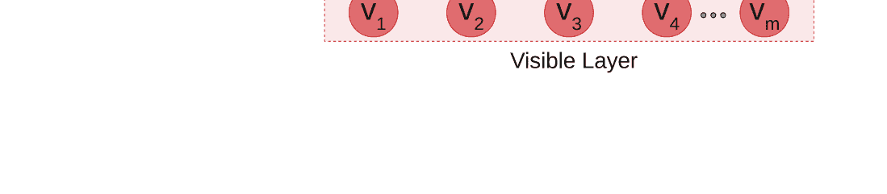

类似地，给定可见单元，激活单个隐藏神经元 $j$ 的概率如下所示：

$$ P(h_j = 1|\mathbf{v}) = \phi \left( \sum_{i=1}^{m} w_{ij}v_i + b_j \right), $$

其中 $\phi(\cdot)$ 代表逻辑sigmoid函数。

训练过程包括最大化给定一组参数 $\theta = (W, a, b)$ 和数据概率分布的概率乘积，以及训练样本上的数据概率分布。这样的过程可以使用对比散度（CD）[3]或持续对比散度（PCD）[27]算法轻松计算。

### 3.2.2 对比散度

Hinton [3] 提出了一种更快的方法来计算基于对比散度的系统能量。这个想法是用训练样本初始化可见单元，使用方程（3.3）计算隐藏单元的状态，然后使用方程（3.2）计算可见单元的状态（重构步骤）。简而言之，这相当于使用 $k =1$ 执行Gibbs采样，并使用训练样本初始化链。

因此，下面的方程导致了一个简单的学习规则，用于更新权重矩阵 $\mathbf{W}$，偏置 $\mathbf{a}$ 和 $\mathbf{b}$ 在迭代 $t$ 时：

$$ \mathbf{W}^{t+1} = \mathbf{W}^{t} + \eta(\mathbf{P} (\mathbf{h}|\mathbf{v})\mathbf{v}^{T} - \mathbf{P} (\tilde{\mathbf{h}}|\tilde{\mathbf{v}})\tilde{\mathbf{v}}^{T}) + \Phi, \tag{3.4} $$

$$ \mathbf{a}^{t+1} = \mathbf{a}^{t} + \eta(\mathbf{v} - \tilde{\mathbf{v}}) + \varDelta\mathbf{a}^{t-1}, \tag{3.5} $$

$$ \mathbf{b}^{t+1} = \mathbf{b}^{t} + \eta(\mathbf{P} (\mathbf{h}|\mathbf{v}) - \mathbf{P} (\tilde{\mathbf{h}}|\tilde{\mathbf{v}})) + \varDelta\mathbf{b}^{t-1}. \tag{3.6} $$

其中 $\eta$ 代表学习率， $\varphi$ 表示动量， $\tilde{\mathbf{v}}$ 表示给定 $\mathbf{h}$ 的可见层重构， $\tilde{\mathbf{h}}$ 表示给定 $\mathbf{v}$ 的隐藏向量估计。简而言之，方程式(3.4)、(3.5)和(3.6)展示了优化算法，即著名的梯度下降法。方程式(3.4)中的附加项 $\Phi$ 用于控制矩阵 $\mathbf{W}$ 在收敛过程中的值，并且描述如下：

$$ \Phi = -\lambda\mathbf{W}^{t} + \varphi\Delta\mathbf{W}^{t-1}, \tag{3.7} $$

其中 $\lambda$ 代表权重衰减。

### 3.2.3 持久对比散度

与对比散度方法相关的大部分问题涉及用于将模型近似到真实数据的迭代次数。尽管由Hinton [3]提出的方法取 $k =1$，在实际问题中表现良好，但可以为 $k$[1]设置不同的值[^1]。

然而，当马尔可夫链具有“低混合”时，对比散度的收敛性可能变差，而且只在早期迭代中收敛良好，在迭代进行时变得较慢，因此需要使用参数衰减。

因此，Tieleman [27] 提出了持续对比散度 (Persistent Contrastive Divergence)，这是一种有趣的对比散度的替代方法，使用更高的 $k$ 值，同时保持计算负担相对较低。这个想法非常简单：在CD-1中，每个训练样本都被用来启动一个RBM，并在单次Gibbs采样迭代后重新构建模型。一旦每个训练样本都被呈现给RBM，我们就有了一个所谓的时代。这个过程对于每个下一个时代都会重复，即使用相同的训练样本来喂养RBM，并且在每个时代重新启动马尔可夫链。

### 3.2.4 深度信念网络

深度信念网络[5]是由可见层和 $L$ 个隐藏层组成的图模型，每个层通过权重矩阵 $W_l$ 与后一层相连，$l \in \{1, 2, ..., L\}$，同一层的单元之间没有连接。简而言之，可以将每组相邻的两层视为以贪婪方式训练的RBM，使得底层RBM的训练隐藏层馈送给下一个RBM的可见层，依此类推。图3.2描述了这个模型。注意 $v$ 和 $h_l$ 分别代表可见层和第 $l$ 个隐藏层。

尽管这项工作侧重于图像重建，但人们可以使用DBNs进行监督分类任务。这种方法需要在上述贪婪前馈传递之后，使用反向传播或梯度下降来进行网络权重的微调。然后，在模型的顶部添加一个softmax层来确定预测的标签。

[^1]: 通常，使用单次迭代的对比散度被称为CD-1。

图3.2 具有两个隐藏层的 DBN架构

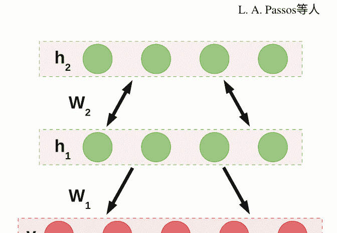

## 3.3 元启发式优化算法

本节介绍了本工作中使用的元启发式优化技术的简要描述。

- 改进的和声搜索 (IHS) [11]: 和声搜索优化算法的改进版本，采用动态值来调整音高调整率 (PAR)，考虑范围内的值 $[PAR_{min}, PAR_{max}]$，以及和声记忆考虑率 (HMCR)，其取值范围在范围 $[HMCR_{min}, HMCR_{max}]$ 内。此外，该算法使用带宽变量 $\varrho$ 在范围 $[\varrho_{min}, \varrho_{max}]$ 内计算PAR。
- 自适应惯性权重粒子群优化算法 (AIWPSO) [12]: 粒子群优化的改进版本，通过自适应惯性权重在每个粒子上进行搜索空间，旨在平衡全局探索和局部利用。注意该方法使用变量 $c_1$ 和 $c_2$ 来控制粒子的加速度。
- 花传粉算法 (FPA) [21, 35]: 一种模拟花朵传粉过程的元启发式优化算法。该算法采用四个基本规则：(1) 交叉传粉，代表鸟类和昆虫进行的传粉，(2) 自传粉，代表风散播或类似方法进行的传粉，(3) 鸟类/昆虫的恒定性，代表繁殖的概率，以及 (4) 局部和全局传粉的相互作用，由概率参数 $p$ 控制。此外，该算法还使用额外的参数 $\beta$ 来控制分布的幅度。
- 蝙蝠算法 (BA) [34]: 基于蝙蝠的回声定位系统，在寻找食物和猎物时。该算法利用一群虚拟蝙蝠在不同速度下随机飞行在搜索空间中，甚至采用随机行走方法进行局部搜索强化。此外，它根据与目标的距离动态更新波长频率在范围 $\{f_{min}, f_{max}\}$ 内，同时还应用音量 $A$ 和脉冲率 $r$。
- 萤火虫算法 (FA) [31]: 该算法基于萤火虫吸引潜在猎物和交配伴侣的方法。它利用吸引力参数 $\beta$，该参数影响每个代理的亮度，取决于其位置和光吸收系数 $\gamma$。 此外，该模型采用随机扰动 $\alpha$ 来进行随机行走并避免局部最优解。
- 布谷鸟搜索 (CS) [20, 32, 33]: 该模型将一些布谷鸟物种的寄生行为与马尔可夫链上的随机游走相结合。它采用了三个基本概念：(1) 每只布谷鸟在另一只鸟的随机选择的巢中放置一个蛋，用于迭代；(2) $p_a \in [0, 1]$ 定义了这只鸟发现并丢弃布谷鸟蛋或放弃它并创建一个新的巢穴（即新的解决方案）的概率；(3) 拥有最佳蛋的巢穴将传递到下一代。
- 差分进化 (DE) [25]: 进化算法维护一个候选解的种群，在后续的迭代中将其组合和改进，以找到最适合问题的特征。该算法使用一个变异因子来控制变异幅度，以及一个参数来控制交叉概率。
- 回溯搜索优化算法 (BSA) [2, 17]: 一种演化算法，通过随机选择历史种群进行变异和交叉操作，基于过去的经验生成新的个体种群。该算法通过混合率（混合率）参数控制要变异的元素数量，以及通过参数 $F$ 控制搜索方向矩阵的振幅。
- 基于协方差矩阵学习和双峰分布参数设置算法 (CoBiDE) [28]: 一种差分进化模型，根据概率参数 $P_b$ 表示搜索空间坐标系，并使用 $P_s$ 变量表示在过程中使用的个体比例。此外，它采用二项分布来控制变异和交叉率，以实现更好的开发和探索平衡。
- 自适应差分进化与可选外部存档 (JADE) [19, 37]: JADE是一种基于差分进化的算法，采用“DE/current-to-p-best”策略，即只使用 $p$–best 代理进行变异过程。此外，该算法同时使用历史种群和控制参数，并进行自适应更新。最后，它需要适当选择适应率参数 $c$ 和变异贪婪度参数 $g$。

## 3.4 方法论

本节介绍了用于DBN超参数微调的预期过程。此外，它还描述了使用的数据集和实验设置。

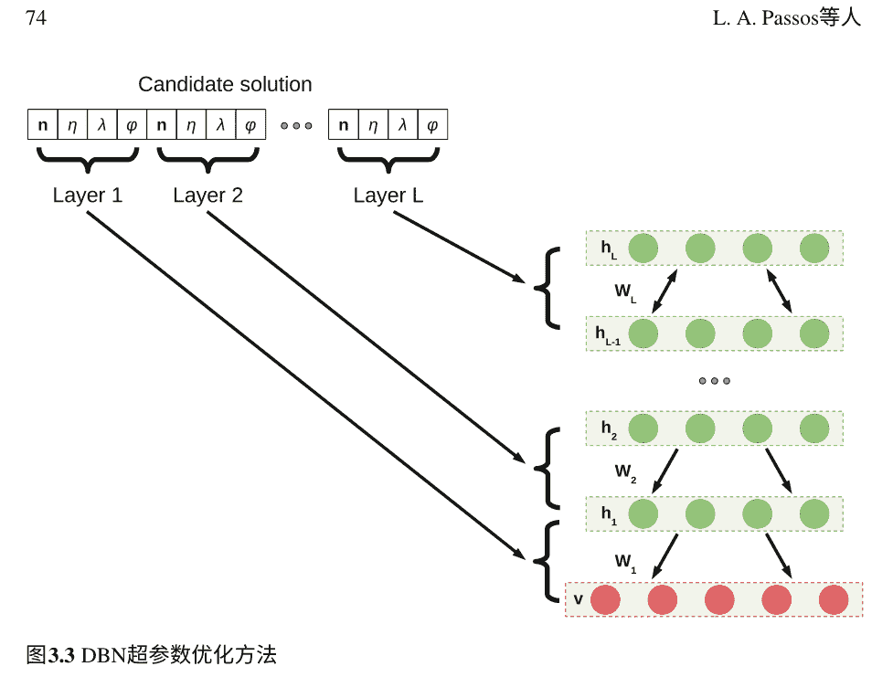

### 3.4.1 建模DBN超参数微调

每个RBM的学习过程使用了四个超参数，如第3.2.1节中所指定的学习率 $\eta$，权重衰减 $\lambda$，动量 $\varphi$ 和隐藏单元数量 $n$。由于DBN是由RBM块构建的，它们使用类似的过程来逐层微调。简而言之，应为每个层选择一个由三个实数和一个整数数值变量组成的四维搜索空间。请注意，变量值本质上是实数，因此需要进行类型转换以获得最近的整数。这种方法旨在选择最小化训练图像重构误差（用最小平方误差MSE表示）的DBN超参数组合。

随后，选择的参数集被应用于重建测试集中未见的图像。图3.3描述了该过程。

### 3.4.2 数据集

我们使用了三个数据集，如下所述：

- MNIST 数据集：由‘0’-‘9’手写数字图像组成的数据集[^2]。关于预处理，图像从灰度转换为二进制，并调整大小为 $14 \times 14$。 此外，由于计算负担的要求，训练是在训练集的2%上进行的，即1200张图像。 此外，完整的10,000张图像集用于测试。
- Semeion手写数字数据集[^3]：类似于MNIST，Semeion也是由1593个图像组成的‘0’-‘9’手写数字图像数据集。在本文中，我们将样本调整为 $16 \times 16$，并对每个像素进行二值化处理。
- CalTech 101 Silhouettes数据集[^4]：这是一个由101个类别的轮廓图组成的数据集，分辨率为 $28 \times 28$。 图像样本没有经过预处理步骤。

图3.4显示了上述数据集中的一些训练样本。

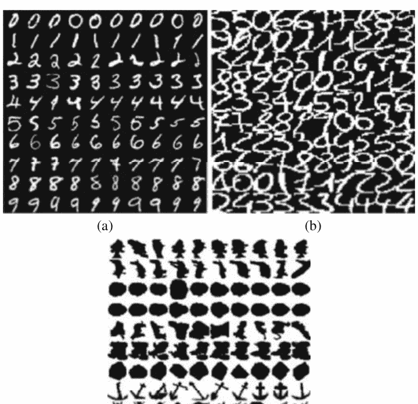

图3.4 (a) MNIST, (b) Semeion和(c) CalTech 101 Silhouettes数据集的一些训练示例

| 算法 | 参数 |
| :--- | :--- |
| IHS | $HMCR=0.7$ \| $PAR_{MIN}=0.1$ \| $PAR_{MAX}=0.7$ \| $\varrho_{MIN}=1$ \| $\varrho_{MAX}=10$ |
| AIWPSO | $c_1=1.7$ \| $c_2=1.7$ \| $w=0.7$ \| $w_{MIN}=0.5$ \| $w_{MAX}=1.5$ |
| FPA | $\beta=1.5$ \| $p=0.8$ |
| BA | $f_{\min}=0$ \| $f_{\max}=100$ \| $A=1.5$ \| $r=0.5$ |
| FA | $\alpha=0.2$ \| $\beta=1.0$ \| $\gamma=1.0$ |
| CS | $\beta=1.5$ \| $p=0.25$ \| $\alpha=0.8$ |
| BSA | 混合_速率$=1.0$ \| $F=3$ |
| CoBiDE | $P_b=0.4$ \| $P_s=0.5$ |
| DE | 突变_因子$=0.8$ \| 交叉_概率$=0.7$ |
| JADE | $c=0.1$ \| $g=0.05$ |

### 3.4.3 实验设置

实验进行了20次运行和2倍交叉验证，使用Wilcoxon符号秩检验[30]进行统计分析，显著性水平为5%。每种元启发式技术使用5个代理（粒子）进行50次迭代，以实现收敛，对于三种配置，即具有1、2和3层的DBNs。此外，本文比较了不同的技术，包括音乐创作过程、基于群体的和进化启发式方法，在DBN超参数微调的背景下，如第3.3节所述：表3.1展示了每种元启发式技术的参数配置。

最后，每个DBN层由一个RBM组成，其超参数根据以下范围随机初始化：$n \in [5, 100], \eta \in [0.1, 0.9], \lambda \in [0.1, 0.9], \text{and } \varphi \in [10^{-5}, 10^{-1}]$。此外，实验还进行了三种不同的深度配置，即由1、2和3个RBM层组成的DBNs，这意味着需要对一个4-，8-和12-维的超参数集进行微调。我们还使用 $T=10$ 作为DBN学习权重过程的迭代次数，每个迭代使用大小为20的小批量数据。为了进行更深入的实验验证，所有DBNs都使用对比散度（CD）[3]和持续对比散度（PCD）[27]进行训练。图3.5展示了本文提出的流程。

> 5 请注意，这些值是根据作者的定义经验性选择的。

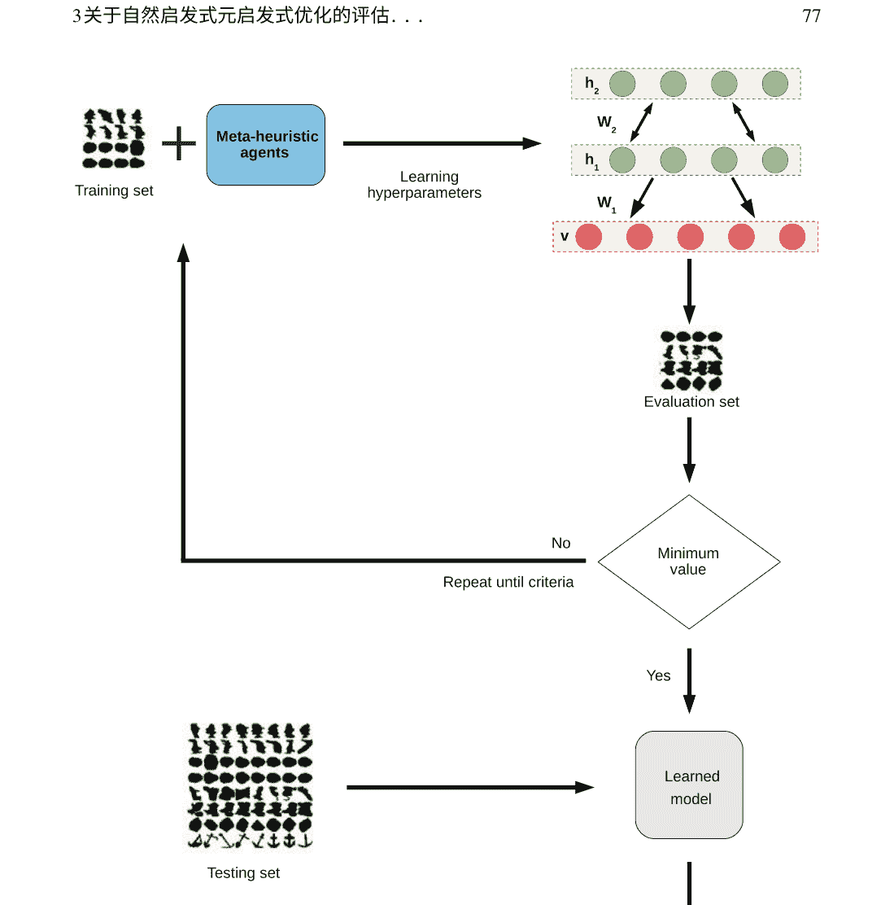

图3.5 提出的用于DBN超参数微调任务的流程图

## 3.5 实验结果

本节介绍了实验过程中获得的结果。 此外，还提供了关于它们的详细讨论。表3.2、3.3和3.4分别展示了MNIST、Semeion手写数字和CalTech 101 Silhouettes数据集的平均MSE和标准差。 根据Wilcoxon符号秩检验，以5%的显著性水平为基础，最佳结果以粗体呈现。

### 表3.2 考虑MNIST数据集的平均MSE值

| 层 | 统计 | IHS | AIWPSO | BA | CS | FA | FPA | BSA | CoBiDE | DE | JADE | RANDOM |
| :---: | :--- | :--- | :--- | :--- | :--- | :--- | :--- | :--- | :--- | :--- | :--- | :--- |
| \multirow{4}{*}{1} | CD平均值 | **0.08759** | 0.08765 | 0.08762 | 0.08764 | 0.08764 | **0.08759** | 0.08763 | 0.08763 | 0.08762 | 0.08761 | 0.08763 |
| | 标准差 | 0.00008 | 0.00006 | 0.00007 | 0.00005 | 0.00007 | 0.00009 | 0.00005 | 0.00006 | 0.00005 | 0.00007 | 0.00006 |
| | PCD平均值 | 0.08762 | 0.08762 | 0.08763 | 0.08764 | 0.08765 | 0.08761 | 0.08762 | 0.08762 | 0.08763 | 0.08763 | 0.08764 |
| | 标准差 | 0.00008 | 0.00005 | 0.00006 | 0.00007 | 0.00006 | 0.00007 | 0.00007 | 0.00007 | 0.00006 | 0.00006 | 0.00005 |
| \multirow{4}{*}{2} | CD平均值 | 0.08762 | 0.08764 | **0.08763** | 0.08764 | 0.08764 | 0.08762 | 0.08763 | 0.08764 | 0.08763 | 0.08763 | 0.08763 |
| | 标准差 | 0.00005 | 0.00006 | 0.00007 | 0.00007 | 0.00006 | 0.00006 | 0.00006 | 0.00005 | 0.00005 | 0.00006 | 0.00004 |
| | PCD平均值 | 0.08763 | 0.08763 | 0.08765 | 0.08765 | 0.08763 | 0.08766 | 0.08764 | 0.08764 | 0.08762 | 0.08765 | 0.08764 |
| | 标准差 | 0.00006 | 0.00005 | 0.00005 | 0.00006 | 0.00006 | 0.00006 | 0.00006 | 0.00005 | 0.00005 | 0.00006 | 0.00005 |
| \multirow{4}{*}{3} | CD平均值 | 0.08763 | 0.08763 | 0.08765 | 0.08764 | 0.08764 | 0.08762 | 0.08763 | 0.08763 | 0.08763 | 0.08763 | 0.08764 |
| | 标准差 | 0.00007 | 0.00004 | 0.00005 | 0.00007 | 0.00006 | 0.00006 | 0.00006 | 0.00006 | 0.00006 | 0.00007 | 0.00007 |
| | PCD平均值 | 0.08763 | **0.08762** | 0.08765 | 0.08765 | 0.08763 | 0.08763 | 0.08763 | 0.08763 | 0.08763 | 0.08764 | 0.08764 |
| | 标准差 | 0.00006 | 0.00005 | 0.00007 | 0.00008 | 0.00006 | 0.00004 | 0.00007 | 0.00006 | 0.00007 | 0.00007 | 0.00006 |

粗体数值表示平均均方误差最低或Wilcoxon's p值大于0.05的值，即统计上相似的值

[^2]: http://yann.lecun.com/exdb/mnist/。
[^3]: 未提供具体引用，保留原文表述。
[^4]: 未提供具体引用，保留原文表述。

### 表格 3.3 考虑 Semeion 手写数字数据集的平均 MSE 值

| 层 | 算法 | IHS | CD | PCD平均值 | AIWPSO | BA | CS | FA | FPA | BSA | CoBiDE | DE | JADE | RANDOM |
| :--- | :--- | :--- | :--- | :--- | :--- | :--- | :--- | :--- | :--- | :--- | :--- | :--- | :--- | :--- |
| 1 | 平均值 | 0.19359 | 0.00137 | 0.20009 | 0.20045 | 0.20743 | 0.20529 | 0.20638 | 0.19526 | 0.19571 | 0.19328 | 0.19470 | 0.19893 | 0.19711 |
| | 标准差 | 0.00137 | 0.00137 | 0.00197 | 0.00686 | 0.00449 | 0.00495 | 0.00492 | 0.00456 | 0.00365 | 0.00133 | 0.00513 | 0.00789 | 0.00313 |
| 2 | 平均值 | 0.20009 | 0.00137 | 0.20096 | 0.20274 | 0.20763 | 0.20648 | 0.20895 | 0.19895 | 0.20003 | 0.19896 | 0.19950 | 0.20166 | 0.20362 |
| | 标准差 | 0.00197 | 0.00137 | 0.00359 | 0.00939 | 0.00274 | 0.00356 | 0.00209 | 0.00223 | 0.00254 | 0.00148 | 0.00377 | 0.00532 | 0.00184 |
| 3 | 平均值 | 0.20096 | 0.00137 | 0.20961 | 0.20959 | 0.20963 | 0.20966 | 0.20966 | 0.20961 | 0.20962 | 0.20963 | 0.20962 | 0.20963 | 0.20962 |
| | 标准差 | 0.00359 | 0.00137 | 0.00401 | 0.00353 | 0.00339 | 0.00400 | 0.00041 | 0.00035 | 0.00036 | 0.00035 | 0.00037 | 0.00036 | 0.00036 |
| | PCD平均值 | 0.20961 | 0.00401 | 0.20966 | 0.20964 | 0.20965 | 0.20961 | 0.20964 | 0.20961 | 0.20960 | 0.20964 | 0.20961 | 0.20964 | 0.20961 |
| | 标准差 | 0.00401 | 0.00401 | 0.00039 | 0.00039 | 0.00038 | 0.00036 | 0.00036 | 0.00036 | 0.00036 | 0.00036 | 0.00037 | 0.00036 | 0.00036 |

粗体数值表示平均均方误差最低或Wilcoxon's p值大于0.05的值，即统计上相似的值

### 表格 3.4 考虑 CalTech 101 Silhouettes 数据集的平均 MSE 值

| 层 | 算法 | IHS | AIWPSO | BA | CS | FA | FPA | BSA | CoBiDE | DE | JADE | RANDOM |
| :--- | :--- | :--- | :--- | :--- | :--- | :--- | :--- | :--- | :--- | :--- | :--- | :--- |
| 1 | CD | **0.15554** | 0.15641 | 0.15923 | 0.15923 | 0.16003 | 0.15607 | 0.15600 | 0.15638 | 0.15726 | 0.15608 | 0.15676 |
| | | 0.00211 | 0.00241 | 0.00167 | 0.00171 | 0.00156 | 0.00230 | 0.00154 | 0.00191 | 0.00172 | 0.00184 | 0.00162 |
| | PCD平均值 | **0.15731** | 0.15825 | 0.16009 | 0.15993 | 0.15957 | 0.15810 | 0.15775 | 0.15800 | 0.15726 | 0.15790 | 0.15846 |
| | 标准差 | 0.00158 | 0.00231 | 0.00076 | 0.00103 | 0.00118 | 0.00192 | 0.00151 | 0.00121 | 0.00172 | 0.00135 | 0.00122 |
| 2 | CD | 0.16058 | 0.16056 | 0.16059 | 0.16057 | 0.16061 | 0.16062 | 0.16056 | 0.16059 | 0.16058 | 0.16058 | 0.16060 |
| | | 0.00020 | 0.00020 | 0.00020 | 0.00019 | 0.00021 | 0.00024 | 0.00020 | 0.00023 | 0.00020 | 0.00020 | 0.00020 |
| | PCD平均值 | 0.16054 | 0.16060 | 0.16058 | 0.16062 | 0.16058 | 0.16065 | 0.16057 | 0.16058 | 0.16058 | 0.16058 | 0.16062 |
| | 标准差 | 0.00029 | 0.00022 | 0.00021 | 0.00023 | 0.00021 | 0.00038 | 0.00022 | 0.00022 | 0.00020 | 0.00020 | 0.00019 |
| 3 | CD | 0.16059 | 0.16058 | 0.16060 | 0.16060 | 0.16061 | 0.16058 | 0.16058 | 0.16060 | 0.16057 | 0.16059 | 0.16057 |
| | | 0.00022 | 0.00022 | 0.00019 | 0.00021 | 0.00023 | 0.00022 | 0.00021 | 0.00021 | 0.00021 | 0.00019 | 0.00020 |
| | PCD平均值 | 0.16059 | 0.16058 | 0.16060 | 0.16061 | 0.16058 | 0.16060 | 0.16058 | 0.16059 | 0.16057 | 0.16058 | 0.16057 |
| | 标准差 | 0.00021 | 0.00021 | 0.00020 | 0.00020 | 0.00021 | 0.00024 | 0.00020 | 0.00020 | 0.00021 | 0.00021 | 0.00022 |

粗体数值表示平均均方误差最低或Wilcoxon's p值大于0.05的值，即统计上相似的值

表3.2呈现了关于MNIST数据集的结果。使用对比散度算法在一个单层上，IHS获得了最低的错误率。BA和AIWPSO分别使用PCD算法在两个和三个层上获得了统计上相似的结果。可以注意到，使用CD在单层上的FPA也获得了与IHS相同的平均错误率，尽管Wilcoxon符号秩检验并未认为它们在统计上相似。此外，进化算法也获得了良好的结果，尽管在统计上并不相似。

关于Semeion手写数字数据集，表3.3展示了使用CoBiDe技术在一个层上的CD算法获得的最佳结果。值得指出的是，其他方法都没有达到类似的统计结果，这证实了基于进化的元启发式优化算法的稳健性。

与MNIST数据集类似，使用CD算法在单层DBN上的IHS方法获得了最佳结果，如表3.4所示。IHS也是唯一一个获得最低错误率的技术，因为其他方法都没有获得统计上相似的结果。

### 3.5.1 训练评估

图3.6描述了考虑MNIST数据集的学习步骤。除了BA算法（和随机搜索）之外，所有技术在初始迭代后都收敛到相同的点。注意FA在第20次迭代时表现出色，达到了最低的错误率。然而，训练误差回归到初始值，这表明问题存在一个难以超越的局部最优解，给定一组优化参数。

图3.7描绘了一个有趣的行为。可以观察到AIWPSO在十次迭代后比其他技术更快地收敛，平均均方误差为0.2。然而，在大约15次迭代后，AIWPSO卡住了，并被JADE和DE超越。此外，DE仍然在性能上改进，直到在近40次迭代时达到最优解。这种行为在测试集上没有观察到，虽然DE取得了不错的结果，但CoBiDE是最准确的技术。

关于Caltech 101 Silhouettes，图3.8显示的学习曲线表明AIWPSO在Semeion数据集上表现出了类似的行为，并且在最初的15次迭代中收敛速度更快，但在之后被JADE超越。请注意，IHS和FPA也展示了良好的收敛性，这是预期的，因为IHS在测试集上取得了最好的结果，而FPA则取得了非常接近的结果。此外，CoBiDE和BSA也是与JADE和DE一起最好的技术，这证实了进化技术在DBN元参数微调任务中的鲁棒性。

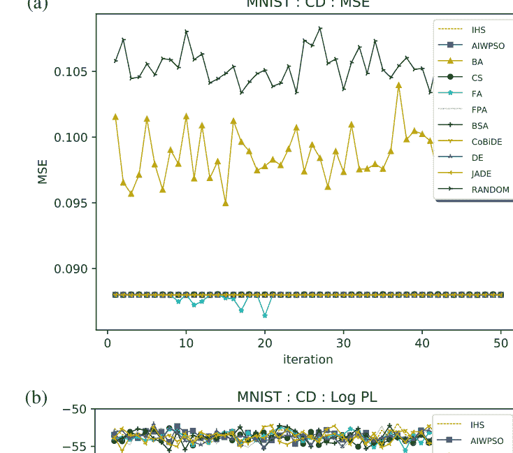

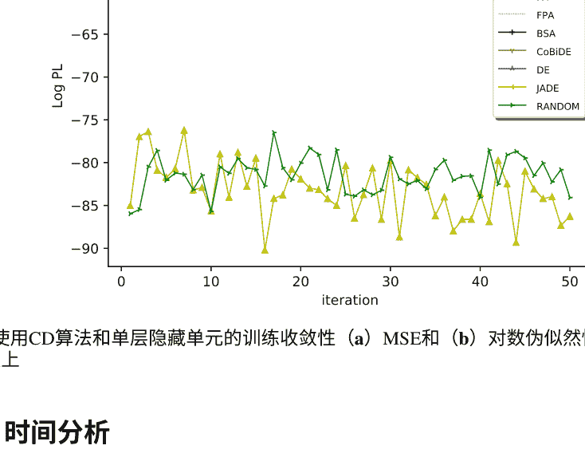

图3.6 使用CD算法和单层隐藏单元的训练收敛性（a）MSE和（b）对数伪似然性在MNIST数据集上

### 3.5.2 时间分析

表3.5、3.6和3.7分别展示了MNIST、Semeion Handwritten Digit和Caltech 101 Silhouettes数据集的计算负担，以小时为单位。可以观察到CS是最快的技术，其次是IHS。这样的结果是预期的，因为IHS在每次迭代中评估一个解决方案，而CS则使用概率来评估每个解决方案。另一方面，剩余的技术在每次迭代中评估每个解决方案，导致更高的计算负担。

此外，进化算法一般比群体算法具有更高的计算负担。AIWPSO代表一个例外，由于其更新机制，它是所有其他技术中最昂贵的技术。

在大多数情况下，使用单层和CD算法获得最佳结果。这种行为可能与有限的迭代次数有关。

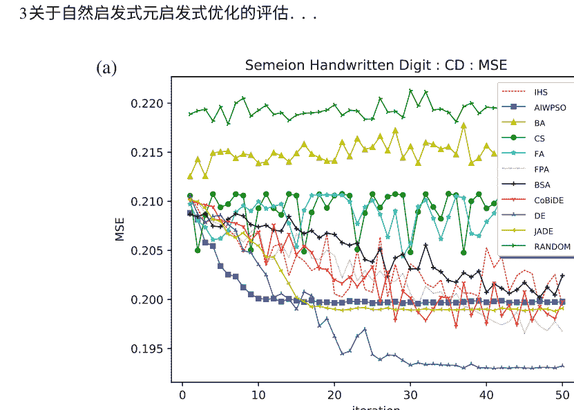

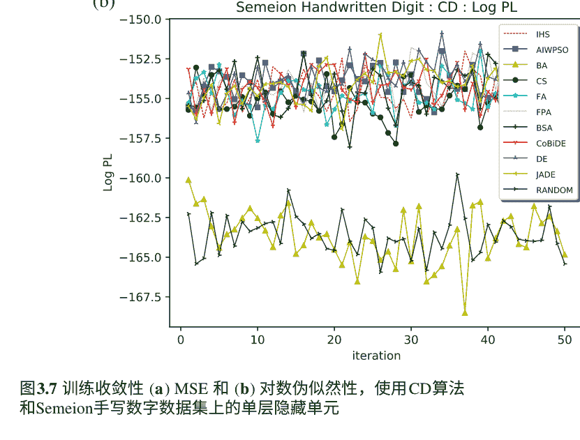

图3.7 训练收敛性 (a) MSE 和 (b) 对数伪似然性，使用CD算法和Semeion手写数字数据集上的单层隐藏单元

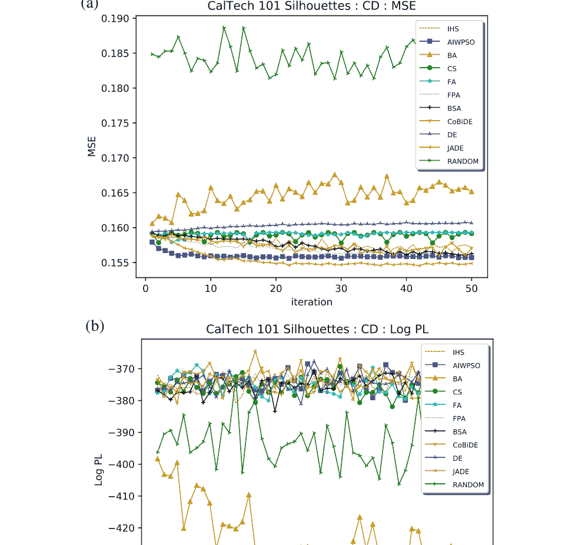

### 图3.8 训练收敛性 (a) MSE 和 (b) 对数伪似然性，使用CD算法和CalTech 101 Silhouettes数据集上的单层隐藏单元

用于训练的模型更复杂，由更多层组成，需要更多的迭代次数才能收敛，而不是本研究中使用的10个迭代次数。然而，在这种情况下运行实验是不可行的，因为在本章中进行的比较需要大量的执行。对于PCD算法也是如此。

### 表3.5 考虑MNIST数据集的平均计算负担（以小时为单位）

| 层 | 算法 | IHS | AIWPSO | BA | CS | FA | FPA | BSA | CoBiIDE | DE | JADE |
| :--- | :--- | :--- | :--- | :--- | :--- | :--- | :--- | :--- | :--- | :--- | :--- |
| 1 | CD | 0.18229 | 1.15104 | 0.53797 | 0.15625 | 0.39062 | 0.58773 | 0.58982 | 0.65554 | 0.92451 | 0.52083 |
| 1 | PCD | 0.13020 | 1.18750 | 0.54166 | 0.23437 | 0.77604 | 0.66907 | 0.59709 | 0.67061 | 0.95791 | 0.84895 |
| 2 | CD | 0.31250 | 1.76562 | 0.57388 | 0.25520 | 0.71354 | 0.78310 | 0.58333 | 0.80579 | 1.09327 | 1.00520 |
| 2 | PCD | 0.27083 | 1.39583 | 0.78111 | 0.23437 | 0.67708 | 0.80880 | 0.36979 | 0.83888 | 1.28069 | 0.91666 |
| 3 | CD | 0.28125 | 2.24479 | 1.30138 | 0.24479 | 1.16145 | 1.03157 | 0.77083 | 1.14248 | 1.40536 | 0.69791 |
| 3 | PCD | 0.29166 | 2.46354 | 1.53472 | 0.15104 | 1.15625 | 0.85460 | 0.74479 | 1.09691 | 1.80823 | 0.88020 |

粗体数值表示平均方误差最低或Wilcoxon's p值大于0.05的值，即统计上相似的值

### 表3.6 考虑Semeion手写数字数据集的平均计算负担（以小时为单位）

| 层 | 算法 | IHS | AIWPSO | BA | CS | FA | FPA | BSA | CoBiIDE | DE | JADE |
| :--- | :--- | :--- | :--- | :--- | :--- | :--- | :--- | :--- | :--- | :--- | :--- |
| 1 | CD | 0.08421 | 0.59375 | 0.44277 | 0.13756 | 0.25925 | 0.40037 | 0.31366 | 0.41404 | 0.70628 | 0.28571 |
| 1 | PCD | 0.10052 | 0.52910 | 0.26055 | 0.09523 | 0.39153 | 0.39609 | 0.32504 | 0.38522 | 0.52661 | 0.11640 |
| 2 | CD | 0.12169 | 0.85185 | 0.58083 | 0.13756 | 0.32804 | 0.30717 | 0.28571 | 0.41388 | 0.53883 | 0.13227 |
| 2 | PCD | 0.10416 | 0.74603 | 0.65111 | 0.12698 | 0.51851 | 0.41691 | 0.23280 | 0.40367 | 0.45277 | 0.42328 |
| 3 | CD | 0.14814 | 1.13756 | 0.73333 | 0.14834 | 0.94382 | 0.44263 | 0.43915 | 0.46728 | 0.57517 | 0.19576 |
| 3 | PCD | 0.14583 | 0.95238 | 0.80250 | 0.12169 | 0.60317 | 0.37777 | 0.48677 | 0.47605 | 0.69325 | 0.68253 |

粗体数值表示平均方误差最低或Wilcoxon's p值大于0.05的值，即统计上相似的值

### 表3.7 考虑CalTech 101 Silhouettes数据集的平均计算负担（以小时为单位）

| 层 | 算法 | IHS | AIWPSO | BA | CS | FA | FPA | BSA | CoBiDE | DE | JADE |
| :--- | :--- | :--- | :--- | :--- | :--- | :--- | :--- | :--- | :--- | :--- | :--- |
| 1 | CD | 0.93181 | 5.03977 | 2.16003 | **0.88068** | 1.92045 | 3.47451 | 3.75112 | 3.34347 | 6.12850 | 4.68181 |
| | PCD | 0.83522 | 5.36363 | 2.37611 | **0.57386** | 2.99431 | 3.63909 | 3.13693 | 3.20528 | 6.12850 | 2.44886 |
| 2 | CD | 0.72727 | 5.34659 | 3.41027 | **0.52840** | 3.55113 | 2.68115 | 3.43181 | 3.12311 | 5.45633 | 4.38068 |
| | PCD | 0.77840 | 5.59832 | 2.12305 | 1.42613 | 1.85795 | 2.95302 | 3.18181 | 3.14890 | 5.45633 | 2.32954 |
| 3 | CD | 0.64204 | 6.34659 | 4.78611 | 0.82954 | 2.03409 | 2.73834 | 2.40340 | 3.19263 | 5.90374 | 2.59659 |
| | PCD | **0.60227** | 4.51704 | 3.98444 | 0.76704 | 4.59090 | 3.03666 | 2.57386 | 3.34851 | 5.90374 | 5.35795 |

粗体数值表示平均均方误差最低或Wilcoxon's p值大于0.05的值，即统计上相似的值

### 3.5.3 超参数分析

本节提供了在执行每个可能的实验配置期间获得的超参数的平均值的完整列表。注意粗体字表示根据Wilcoxon符号秩检验获得最佳结果的配置。

## 3.6 结论和未来工作

本章讨论了通过元启发式方法对深度信念网络的超参数进行参数微调的问题。实验使用了三种架构，即一层（朴素RBM）、两层和三层，这些架构使用了对比散度和持续对比散度算法进行训练。此外，还比较了十种技术的性能，以及随机搜索在三个公共二进制图像数据集上的性能。结果表明，改进的和谐搜索在三个数据集中获得了最佳结果，而CoBiDE在Semeion手写数字数据集方面获得了最佳值，显示了基于差分进化的技术的效率。就训练步骤而言，总体而言，AIWPSO收敛更快。

### 表3.8 考虑MNIST数据集的平均超参数值

| 层 | 算法 | 统计 | 参数 | IHS | AIWPSO | BA | CS | FA | FPA | BSA | CoBiDE | DE | JADE | RANDOM |
| :--- | :--- | :--- | :--- | :--- | :--- | :--- | :--- | :--- | :--- | :--- | :--- | :--- | :--- | :--- |
| 1 | CD | 1 | 隐藏单元 | 24 | 47 | 39 | 53 | 32 | 22 | 29 | 25 | 27 | 30 | 40 |
| 1 | CD | 1 | 学习率 | 0.40108 | 0.58222 | 0.39295 | 0.49517 | 0.45688 | 0.45357 | 0.53070 | 0.55669 | 0.49457 | 0.52729 | 0.60503 |
| 1 | CD | 1 | 权重衰减 | 0.50896 | 0.63658 | 0.50958 | 0.56223 | 0.55476 | 0.46455 | 0.62393 | 0.66229 | 0.62942 | 0.59766 | 0.64491 |
| 1 | CD | 1 | 动量 | 0.00538 | 0.00468 | 0.00438 | 0.00575 | 0.00412 | 0.00496 | 0.00422 | 0.00458 | 0.00517 | 0.00514 | 0.00471 |
| 1 | PCD | 1 | 隐藏单元 | 31 | 49 | 58 | 54 | 45 | 26 | 30 | 33 | 28 | 35 | 36 |
| 1 | PCD | 1 | 学习率 | 0.58896 | 0.49638 | 0.46768 | 0.56154 | 0.60276 | 0.54862 | 0.59345 | 0.47164 | 0.59364 | 0.63215 | 0.44548 |
| 1 | PCD | 1 | 权重衰减 | 0.61429 | 0.70234 | 0.68814 | 0.42895 | 0.61434 | 0.57970 | 0.68172 | 0.54690 | 0.56728 | 0.64276 | 0.57213 |
| 1 | PCD | 1 | 动量 | 0.00532 | 0.00497 | 0.00563 | 0.00355 | 0.00570 | 0.00558 | 0.00480 | 0.00469 | 0.00526 | 0.00586 | 0.00575 |
| 2 | CD | 1 | 隐藏单元 | 33 | 38 | 35 | 57 | 39 | 39 | 29 | 23 | 23 | 34 | 47 |
| 2 | CD | 1 | 学习率 | 0.63873 | 0.48991 | 0.52931 | 0.53659 | 0.51596 | 0.46246 | 0.48493 | 0.40542 | 0.53679 | 0.52998 | 0.56503 |
| 2 | CD | 1 | 权重衰减 | 0.65397 | 0.67948 | 0.60555 | 0.61635 | 0.60650 | 0.69145 | 0.72092 | 0.64380 | 0.73774 | 0.73380 | 0.67747 |
| 2 | CD | 1 | 动量 | 0.00518 | 0.00552 | 0.00511 | 0.00568 | 0.00414 | 0.00475 | 0.00317 | 0.00529 | 0.00542 | 0.00452 | 0.00401 |
| 2 | CD | 2 | 隐藏单元 | 61 | 55 | 53 | 60 | 62 | 52 | 56 | 54 | 65 | 49 | 55 |
| 2 | CD | 2 | 学习率 | 0.55104 | 0.50505 | 0.50505 | 0.45789 | 0.59360 | 0.50327 | 0.43345 | 0.46479 | 0.44132 | 0.49408 | 0.42773 |
| 2 | CD | 2 | 权重衰减 | 0.52753 | 0.50562 | 0.45094 | 0.51444 | 0.51906 | 0.41652 | 0.51250 | 0.41738 | 0.54725 | 0.42865 | 0.48087 |
| 2 | CD | 2 | 动量 | 0.00503 | 0.00490 | 0.00464 | 0.00492 | 0.00414 | 0.00412 | 0.00457 | 0.00481 | 0.00597 | 0.00387 | 0.00526 |
| 2 | PCD | 1 | 隐藏单元 | 36 | 40 | 40 | 43 | 47 | 35 | 35 | 25 | 24 | 47 | 43 |
| 2 | PCD | 1 | 学习率 | 0.56116 | 0.59384 | 0.51544 | 0.54896 | 0.60736 | 0.53856 | 0.49305 | 0.55222 | 0.69303 | 0.47322 | 0.48475 |
| 2 | PCD | 1 | 权重衰减 | 0.74886 | 0.65189 | 0.64484 | 0.49600 | 0.61311 | 0.64874 | 0.63995 | 0.58538 | 0.72703 | 0.66851 | 0.71593 |
| 2 | PCD | 1 | 动量 | 0.00406 | 0.00559 | 0.00516 | 0.00417 | 0.00500 | 0.00477 | 0.00459 | 0.00512 | 0.00406 | 0.00528 | 0.00430 |
| 2 | PCD | 2 | 隐藏单元 | 51 | 58 | 44 | 47 | 59 | 45 | 56 | 53 | 56 | 52 | 44 |
| 2 | PCD | 2 | 学习率 | 0.52316 | 0.55521 | 0.43453 | 0.55172 | 0.55607 | 0.44427 | 0.46964 | 0.49459 | 0.49107 | 0.46367 | 0.60980 |
| 2 | PCD | 2 | 权重衰减 | 0.48901 | 0.54542 | 0.44236 | 0.44567 | 0.53144 | 0.511670 | 0.51330 | 0.51885 | 0.52582 | 0.48421 | 0.54849 |
| 2 | PCD | 2 | 动量 | 0.00455 | 0.00410 | 0.00375 | 0.00575 | 0.00500 | 0.00490 | 0.00486 | 0.00424 | 0.00611 | 0.00428 | 0.00471 |
| 3 | CD | 1 | 隐藏单元 | 29 | 40 | 44 | 51 | 43 | 30 | 30 | 30 | 29 | 38 | 43 |
| 3 | CD | 1 | 学习率 | 0.33715 | 0.48692 | 0.40539 | 0.39280 | 0.56626 | 0.63316 | 0.43006 | 0.57987 | 0.51192 | 0.56590 | 0.47168 |
| 3 | CD | 1 | 权重衰减 | 0.76890 | 0.64490 | 0.59879 | 0.54979 | 0.61017 | 0.59380 | 0.69188 | 0.67870 | 0.70871 | 0.70026 | 0.68841 |
| 3 | CD | 1 | 动量 | 0.00451 | 0.00573 | 0.00385 | 0.00512 | 0.00592 | 0.00430 | 0.00491 | 0.00464 | 0.00474 | 0.00597 | 0.00494 |
| 3 | CD | 2 | 隐藏单元 | 54 | 64 | 59 | 65 | 42 | 51 | 52 | 55 | 40 | 57 | 48 |
| 3 | CD | 2 | 学习率 | 0.62897 | 0.54763 | 0.53962 | 0.50163 | 0.60940 | 0.58996 | 0.52708 | 0.52667 | 0.48958 | 0.51287 | 0.43878 |
| 3 | CD | 2 | 权重衰减 | 0.52169 | 0.47783 | 0.50376 | 0.50002 | 0.58921 | 0.59686 | 0.46750 | 0.45819 | 0.58481 | 0.56367 | 0.50658 |
| 3 | CD | 2 | 动量 | 0.00454 | 0.00517 | 0.00357 | 0.00493 | 0.00592 | 0.00472 | 0.00516 | 0.00479 | 0.00454 | 0.00488 | 0.00480 |
| 3 | CD | 3 | 隐藏单元 | 47 | 44 | 63 | 54 | 53 | 65 | 59 | 51 | 51 | 56 | 56 |
| 3 | CD | 3 | 学习率 | 0.56236 | 0.60001 | 0.40769 | 0.56111 | 0.60791 | 0.52334 | 0.50628 | 0.46757 | 0.50156 | 0.44181 | 0.44104 |
| 3 | CD | 3 | 权重衰减 | 0.47333 | 0.43488 | 0.47475 | 0.54808 | 0.52987 | 0.57111 | 0.47501 | 0.50394 | 0.47855 | 0.44166 | 0.45783 |
| 3 | CD | 3 | 动量 | 0.00529 | 0.00450 | 0.00619 | 0.00404 | 0.00592 | 0.00542 | 0.00475 | 0.00483 | 0.00520 | 0.00493 | 0.00503 |
| 3 | PCD | 1 | 隐藏单元 | 24 | 38 | 46 | 55 | 47 | 31 | 25 | 25 | 28 | 38 | 25 |
| 3 | PCD | 1 | 学习率 | 0.51945 | 0.59828 | 0.55540 | 0.48854 | 0.61870 | 0.59200 | 0.52847 | 0.52223 | 0.51159 | 0.59228 | 0.56341 |
| 3 | PCD | 1 | 权重衰减 | 0.73241 | 0.70840 | 0.61023 | 0.63885 | 0.63205 | 0.72091 | 0.64644 | 0.69680 | 0.74135 | 0.63626 | 0.66017 |
| 3 | PCD | 1 | 动量 | 0.00594 | 0.00535 | 0.00537 | 0.00604 | 0.00636 | 0.00531 | 0.00540 | 0.00621 | 0.00517 | 0.00462 | 0.00654 |
| 3 | PCD | 2 | 隐藏单元 | 53 | 60 | 43 | 42 | 47 | 41 | 54 | 50 | 60 | 45 | 52 |
| 3 | PCD | 2 | 学习率 | 0.45762 | 0.45897 | 0.47631 | 0.46645 | 0.65033 | 0.56477 | 0.48949 | 0.42149 | 0.39934 | 0.51284 | 0.49131 |
| 3 | PCD | 2 | 权重衰减 | 0.49819 | 0.50317 | 0.52903 | 0.50410 | 0.55894 | 0.49775 | 0.49806 | 0.50538 | 0.52402 | 0.49927 | 0.43492 |
| 3 | PCD | 2 | 动量 | 0.00486 | 0.00520 | 0.00497 | 0.00436 | 0.00636 | 0.00464 | 0.00507 | 0.00548 | 0.00440 | 0.00552 | 0.00603 |
| 3 | PCD | 3 | 隐藏单元 | 45 | 46 | 52 | 56 | 47 | 43 | 65 | 45 | 67 | 60 | 50 |
| 3 | PCD | 3 | 学习率 | 0.42481 | 0.48181 | 0.46640 | 0.50393 | 0.58703 | 0.44242 | 0.47473 | 0.48108 | 0.44318 | 0.53141 | 0.51465 |
| 3 | PCD | 3 | 权重衰减 | 0.43727 | 0.57752 | 0.51211 | 0.52331 | 0.63729 | 0.46758 | 0.44450 | 0.51499 | 0.48335 | 0.52187 | 0.46255 |
| 3 | PCD | 3 | 动量 | 0.00395 | 0.00417 | 0.00566 | 0.00533 | 0.00636 | 0.00505 | 0.00418 | 0.00417 | 0.00595 | 0.00519 | 0.00500 |

> 粗体数值表示平均均方误差最低或Wilcoxon's p值大于0.05的值，即统计上相似的值

### 表3.8 考虑MNIST数据集的平均超参数值（续）

| 层 | 算法 | 参数 | IHS | AIWPSO | BA | CS | FA | FPA | BSA | CoBiDE | DE | JADE | RANDOM |
| :--- | :--- | :--- | :--- | :--- | :--- | :--- | :--- | :--- | :--- | :--- | :--- | :--- | :--- |
| 1 | CD | 隐藏单元 | 0.48848 | 0.42688 | 0.48042 | 0.47405 | 0.39179 | 0.41753 | 0.45060 | 0.39458 | 0.45125 | 0.45550 | 0.46821 |
| 1 | CD | 学习率 | 0.10000 | 0.30207 | 0.39280 | 0.25304 | 0.45168 | 0.13612 | 0.13876 | 0.10128 | 0.16786 | 0.32846 | 0.10972 |
| 1 | CD | 权重衰减 | 0.00455 | 0.00357 | 0.00401 | 0.00499 | 0.00274 | 0.00455 | 0.00424 | 0.00409 | 0.00444 | 0.00518 | 0.00606 |
| 1 | CD | 动量 | 0.00439 | 0.00430 | 0.00446 | 0.00449 | 0.00491 | 0.00435 | 0.00505 | 0.00517 | 0.00538 | 0.00471 | 0.00577 |
| 1 | PCD | 隐藏单元 | 0.44052 | 0.60338 | 0.48166 | 0.48278 | 0.44034 | 0.61623 | 0.47053 | 0.42232 | 0.41345 | 0.51677 | 0.44187 |
| 1 | PCD | 学习率 | 0.10010 | 0.18887 | 0.33532 | 0.20518 | 0.47422 | 0.10000 | 0.14014 | 0.10291 | 0.14620 | 0.29313 | 0.11509 |
| 1 | PCD | 权重衰减 | 0.00439 | 0.00430 | 0.00446 | 0.00449 | 0.00491 | 0.00435 | 0.00505 | 0.00517 | 0.00538 | 0.00471 | 0.00577 |
| 1 | PCD | 动量 | 0.00439 | 0.00430 | 0.00446 | 0.00449 | 0.00491 | 0.00435 | 0.00505 | 0.00517 | 0.00538 | 0.00471 | 0.00577 |
| 2 | CD | 隐藏单元 | 0.64269 | 0.50740 | 0.63046 | 0.48661 | 0.60856 | 0.51439 | 0.63148 | 0.60708 | 0.67221 | 0.51436 | 0.54418 |
| 2 | CD | 学习率 | 0.77736 | 0.73480 | 0.70937 | 0.62454 | 0.66910 | 0.71700 | 0.64489 | 0.77167 | 0.78755 | 0.76895 | 0.71001 |
| 2 | CD | 权重衰减 | 0.00558 | 0.00509 | 0.00446 | 0.00395 | 0.00647 | 0.00346 | 0.00714 | 0.00491 | 0.00401 | 0.00445 | 0.00555 |
| 2 | CD | 动量 | 0.00558 | 0.00509 | 0.00446 | 0.00395 | 0.00647 | 0.00346 | 0.00714 | 0.00491 | 0.00401 | 0.00445 | 0.00555 |
| 2 | PCD | 隐藏单元 | 0.47364 | 0.48705 | 0.51975 | 0.56356 | 0.59650 | 0.52145 | 0.51645 | 0.46144 | 0.46614 | 0.59406 | 0.50009 |
| 2 | PCD | 学习率 | 0.51644 | 0.45940 | 0.51385 | 0.51220 | 0.56529 | 0.47774 | 0.56552 | 0.38143 | 0.35235 | 0.54786 | 0.49230 |
| 2 | PCD | 权重衰减 | 0.00435 | 0.00559 | 0.00488 | 0.00487 | 0.00666 | 0.00460 | 0.00519 | 0.00420 | 0.00528 | 0.00508 | 0.00409 |
| 2 | PCD | 动量 | 0.00435 | 0.00559 | 0.00488 | 0.00487 | 0.00666 | 0.00460 | 0.00519 | 0.00420 | 0.00528 | 0.00508 | 0.00409 |

### 表格 3.9 (续)

| 层算法 | 隐藏单元 | 学习率 | 权重衰减 | 动量 | IHS | AIWPSO | BA | CS | FA | FPA | BSA | CoBIDE | DE | JADE | RANDOM |
|--------|----------|--------|----------|------|-----|--------|----|----|----|-----|-----|--------|----|------|--------|
| CD     | 隐藏单元 1 | -      | -        | -    | 25  | 31     | 35 | 40 | 36 | 21  | 15  | 21     | 13 | 23   | 19     |
| CD     | -        | 学习率 | -        | -    | 0.45623 | 0.47945 | 0.44844 | 0.49554 | 0.65543 | 0.58816 | 0.46255 | 0.49091 | 0.67924 | 0.43849 | 0.47585 |
| CD     | -        | -      | 权重衰减 | -    | 0.83627 | 0.71301 | 0.70618 | 0.67923 | 0.72174 | 0.68005 | 0.65421 | 0.70858 | 0.77792 | 0.70635 | 0.73262 |
| CD     | -        | -      | -        | 动量 | 0.00534 | 0.00587 | 0.00421 | 0.00549 | 0.00650 | 0.00438 | 0.00502 | 0.00411 | 0.00471 | 0.00575 | 0.00480 |
| CD     | 隐藏单元 2 | -      | -        | -    | 48  | 66     | 57 | 57 | 57 | 55  | 56  | 53     | 46 | 65   | 43     |
| CD     | -        | 学习率 | -        | -    | 0.49218 | 0.50469 | 0.51419 | 0.47704 | 0.61155 | 0.51277 | 0.44383 | 0.47918 | 0.40487 | 0.58144 | 0.49837 |
| CD     | -        | -      | 权重衰减 | -    | 0.56203 | 0.64634 | 0.56889 | 0.50804 | 0.61125 | 0.60213 | 0.53538 | 0.42734 | 0.46880 | 0.48684 | 0.51269 |
| CD     | -        | -      | -        | 动量 | 0.00515 | 0.00493 | 0.00434 | 0.00419 | 0.00650 | 0.00340 | 0.00399 | 0.00607 | 0.00549 | 0.00560 | 0.00537 |
| CD     | 隐藏单元 3 | -      | -        | -    | 49  | 47     | 47 | 50 | 63 | 54  | 53  | 47     | 60 | 48   | 52     |
| CD     | -        | 学习率 | -        | -    | 0.44241 | 0.47279 | 0.46076 | 0.48646 | 0.63866 | 0.45881 | 0.44885 | 0.42203 | 0.44067 | 0.52481 | 0.51374 |
| CD     | -        | -      | 权重衰减 | -    | 0.58616 | 0.41996 | 0.51011 | 0.48673 | 0.65420 | 0.42822 | 0.53627 | 0.48018 | 0.52056 | 0.55745 | 0.57896 |
| CD     | -        | -      | -        | 动量 | 0.00420 | 0.00641 | 0.00507 | 0.00636 | 0.00650 | 0.00510 | 0.00398 | 0.00436 | 0.00383 | 0.00396 | 0.00475 |
| PCD    | 隐藏单元 1 | -      | -        | -    | 25  | 35     | 34 | 32 | 35 | 13  | 29  | 29     | 13 | 24   | 21     |
| PCD    | -        | 学习率 | -        | -    | 0.54736 | 0.50874 | 0.44835 | 0.46830 | 0.58631 | 0.61603 | 0.63401 | 0.55630 | 0.55689 | 0.53534 | 0.52184 |
| PCD    | -        | -      | 权重衰减 | -    | 0.78853 | 0.75428 | 0.68738 | 0.65386 | 0.70350 | 0.72065 | 0.68351 | 0.76314 | 0.76541 | 0.71391 | 0.66489 |
| PCD    | -        | -      | -        | 动量 | 0.00391 | 0.00437 | 0.00521 | 0.00560 | 0.00406 | 0.00551 | 0.00545 | 0.00458 | 0.00342 | 0.00440 | 0.00514 |
| PCD    | 隐藏单元 2 | -      | -        | -    | 52  | 39     | 53 | 45 | 53 | 51  | 60  | 57     | 55 | 45   | 58     |
| PCD    | -        | 学习率 | -        | -    | 0.54361 | 0.44707 | 0.51948 | 0.52628 | 0.63192 | 0.49611 | 0.45516 | 0.44575 | 0.51724 | 0.44793 | 0.52341 |
| PCD    | -        | -      | 权重衰减 | -    | 0.41558 | 0.50275 | 0.46625 | 0.47226 | 0.59228 | 0.52341 | 0.46947 | 0.53055 | 0.38021 | 0.46047 | 0.57222 |
| PCD    | -        | -      | -        | 动量 | 0.00463 | 0.00524 | 0.00428 | 0.00471 | 0.00406 | 0.00451 | 0.00453 | 0.00533 | 0.00473 | 0.00380 | 0.00560 |
| PCD    | 隐藏单元 3 | -      | -        | -    | 52  | 53     | 55 | 60 | 50 | 51  | 53  | 50     | 43 | 47   | 61     |
| PCD    | -        | 学习率 | -        | -    | 0.39714 | 0.56683 | 0.58973 | 0.55100 | 0.56347 | 0.50745 | 0.46446 | 0.53937 | 0.44090 | 0.64079 | 0.55210 |
| PCD    | -        | -      | 权重衰减 | -    | 0.49576 | 0.54001 | 0.42108 | 0.44537 | 0.63785 | 0.51183 | 0.51329 | 0.58296 | 0.49074 | 0.57689 | 0.47675 |
| PCD    | -        | -      | -        | 动量 | 0.00502 | 0.00462 | 0.00547 | 0.00427 | 0.00406 | 0.00498 | 0.00474 | 0.00450 | 0.00489 | 0.00481 | 0.00305 |

> 粗体数值表示平均均方误差最低或Wilcoxon's p值大于0.05的值，即统计上相似的值

### 表3.10 考虑CalTech 101 Silhouettes 数据集的平均超参数值

| 层算法 | L.统计学 | IHS | AIWPSO | BA | CS | FA | FPA | BSA | CoBiDE | DE | JADE | RANDOM |
|--------|----------|-----|--------|----|----|----|-----|-----|--------|----|------|--------|
| CD | 隐藏单元 | 79 | 63 | 63 | 62 | 43 | 80 | 79 | 77 | 74 | 85 | 65 |
| PCD | 隐藏单元 | 70 | 54 | 52 | 35 | 49 | 72 | 63 | 71 | 74 | 65 | 62 |
| CD | 学习率 | 0.42075 | 0.50650 | 0.53685 | 0.52474 | 0.33131 | 0.50059 | 0.32520 | 0.36895 | 0.44642 | 0.44917 | 0.38533 |
| PCD | 学习率 | 0.48994 | 0.51606 | 0.53898 | 0.54823 | 0.30069 | 0.43238 | 0.39707 | 0.49553 | 0.44642 | 0.46906 | 0.43330 |
| CD | 权重衰减 | 0.10000 | 0.14979 | 0.28279 | 0.31002 | 0.36294 | 0.16180 | 0.11270 | 0.11124 | 0.14447 | 0.10524 | 0.11622 |
| PCD | 权重衰减 | 0.10063 | 0.18316 | 0.36682 | 0.27416 | 0.18867 | 0.10048 | 0.11245 | 0.10605 | 0.14447 | 0.10451 | 0.11558 |
| CD | 动量 | 0.00395 | 0.00575 | 0.00579 | 0.00480 | 0.00301 | 0.00448 | 0.00581 | 0.00595 | 0.00445 | 0.00615 | 0.000439 |
| PCD | 动量 | 0.00556 | 0.00484 | 0.00517 | 0.00496 | 0.00449 | 0.00445 | 0.00425 | 0.00566 | 0.00445 | 0.00411 | 0.00547 |
| CD | 隐藏单元 | 52 | 53 | 50 | 41 | 59 | 48 | 43 | 59 | 67 | 50 | 50 |
| PCD | 隐藏单元 | 47 | 64 | 37 | 48 | 51 | 66 | 38 | 50 | 32 | 64 | 38 |
| CD | 学习率 | 0.43484 | 0.42893 | 0.48042 | 0.47495 | 0.55443 | 0.47328 | 0.49388 | 0.52195 | 0.51051 | 0.53284 | 0.57386 |
| PCD | 学习率 | 0.68476 | 0.73549 | 0.62374 | 0.64525 | 0.63411 | 0.67390 | 0.72068 | 0.68482 | 0.65160 | 0.64469 | 0.71296 |
| CD | 权重衰减 | 0.00515 | 0.00535 | 0.00552 | 0.00368 | 0.00600 | 0.00390 | 0.00425 | 0.00344 | 0.00533 | 0.00444 | 0.00454 |
| PCD | 权重衰减 | 0.00365 | 0.00453 | 0.00564 | 0.00387 | 0.00600 | 0.00450 | 0.00590 | 0.00431 | 0.00544 | 0.00540 | 0.00597 |
| CD | 动量 | 0.00515 | 0.00453 | 0.00564 | 0.00387 | 0.00600 | 0.00450 | 0.00590 | 0.00431 | 0.00544 | 0.00540 | 0.00597 |
| PCD | 动量 | 0.00578 | 0.00584 | 0.00575 | 0.00512 | 0.00554 | 0.00428 | 0.00399 | 0.00565 | 0.00544 | 0.00572 | 0.00495 |

| 类别 | 子类别 | 数据1 | 数据2 | 数据3 | 数据4 | 数据5 | 数据6 | 数据7 | 数据8 | 数据9 | 数据10 | 数据11 | 数据12 |
|------|--------|-------|-------|-------|-------|-------|-------|-------|-------|-------|--------|--------|--------|
| CD | 1隐藏单元 | 0.52239 | 0.71342 | 0.00431 | 49 | 0.52924 | 0.61271 | 0.00442 | 55 | 0.51658 | 0.39922 | 0.00594 | 56 |
| CD | 学习率 | 0.51207 | 0.72279 | 0.00514 | 54 | 0.51316 | 0.48068 | 0.00495 | 52 | 0.48736 | 0.52719 | 0.00399 | 53 |
| CD | 权重衰减 | 0.52097 | 0.61374 | 0.00497 | 52 | 0.53610 | 0.44030 | 0.00597 | 55 | 0.45940 | 0.58714 | 0.00633 | 49 |
| CD | 动量 | 0.48690 | 0.62583 | 0.00553 | 41 | 0.42102 | 0.44930 | 0.00473 | 63 | 0.53802 | 0.45855 | 0.00518 | 51 |
| CD | 2隐藏单元 | 0.63751 | 0.68437 | 0.00428 | 43 | 0.49939 | 0.57062 | 0.00428 | 46 | 0.55106 | 0.58377 | 0.00428 | 49 |
| CD | 学习率 | 0.52362 | 0.67406 | 0.00600 | 47 | 0.52684 | 0.53085 | 0.00505 | 67 | 0.53752 | 0.58716 | 0.00457 | 58 |
| CD | 权重衰减 | 0.51773 | 0.69570 | 0.00446 | 49 | 0.50960 | 0.40449 | 0.00604 | 50 | 0.55456 | 0.54719 | 0.00588 | 51 |
| CD | 动量 | 0.42346 | 0.68193 | 0.00391 | 49 | 0.57533 | 0.46727 | 0.00419 | 59 | 0.51279 | 0.51086 | 0.00396 | 37 |
| CD | 3隐藏单元 | 0.38359 | 0.67821 | 0.00512 | 61 | 0.57925 | 0.56396 | 0.00422 | 57 | 0.55418 | 0.42597 | 0.00575 | 59 |
| CD | 学习率 | 0.47503 | 0.71961 | 0.00546 | 49 | 0.52413 | 0.40061 | 0.00506 | 51 | 0.55914 | 0.54949 | 0.00387 | 48 |
| CD | 权重衰减 | 0.56581 | 0.73120 | 0.00577 | 44 | 0.54938 | 0.44172 | 0.00605 | 55 | 0.50365 | 0.49739 | 0.00523 | 49 |
| CD | 动量 | 0.50365 | 0.49739 | 0.00523 | 49 | 0.49811 | 0.65155 | 0.00444 | 51 | 0.52403 | 0.51342 | 0.00446 | 50 |
| PCD | 1隐藏单元 | 0.46399 | 0.69432 | 0.00341 | 56 | 0.51054 | 0.55409 | 0.00586 | 59 | 0.49215 | 0.53427 | 0.00522 | 49 |
| PCD | 学习率 | 0.40623 | 0.63476 | 0.00550 | 51 | 0.42227 | 0.42987 | 0.00452 | 49 | 0.53762 | 0.55750 | 0.00467 | 52 |
| PCD | 权重衰减 | 0.37432 | 0.59465 | 0.00477 | 51 | 0.52618 | 0.47076 | 0.00493 | 42 | 0.52214 | 0.46411 | 0.00540 | 42 |
| PCD | 动量 | 0.50307 | 0.51970 | 0.00531 | 52 | 0.55580 | 0.46793 | 0.00378 | 42 | 0.59451 | 0.45421 | 0.00457 | 42 |
| PCD | 2隐藏单元 | 0.48364 | 0.59724 | 0.00451 | 59 | 0.50243 | 0.42596 | 0.00451 | 42 | 0.45669 | 0.51050 | 0.00451 | 42 |
| PCD | 学习率 | 0.59600 | 0.63553 | 0.00472 | 40 | 0.42248 | 0.43440 | 0.00623 | 55 | 0.49241 | 0.51246 | 0.00454 | 50 |
| PCD | 权重衰减 | 0.53473 | 0.61455 | 0.00516 | 52 | 0.57549 | 0.47748 | 0.00508 | 50 | 0.58855 | 0.47173 | 0.00527 | 50 |
| PCD | 动量 | 0.44439 | 0.60310 | 0.00504 | 49 | 0.55893 | 0.49206 | 0.00499 | 49 | 0.51762 | 0.51046 | 0.00536 | 57 |
| PCD | 3隐藏单元 | 0.38359 | 0.67821 | 0.00512 | 61 | 0.57925 | 0.56396 | 0.00422 | 57 | 0.55418 | 0.42597 | 0.00575 | 59 |
| PCD | 学习率 | 0.43948 | 0.63087 | 0.00408 | 40 | 0.56304 | 0.54592 | 0.00492 | 44 | 0.48230 | 0.52163 | 0.00434 | 50 |
| PCD | 权重衰减 | 0.49811 | 0.65155 | 0.00444 | 51 | 0.52403 | 0.51342 | 0.00446 | 50 | 0.58397 | 0.44847 | 0.00619 | 55 |

粗体数值表示平均均方误差最低或 Wilcoxon's p 值大于 0.05 的值，即统计上相似的值比其他方法在初始迭代中更好。然而，在大约15次迭代后，它被进化技术超越。最后，人们还可以验证CS是最快的技术，其次是IHS。另一方面，AIW PSO是最慢的。

关于未来的工作，我们打算比较元启发式方法来微调DBNs以进行分类任务。

致谢本研究部分资助来自巴西高等教育协调委员会（CAPES）—财务代码001。作者还感谢FAPESP资助项目#2013/07375-0, #2014/12236-1, #2016/19403-6, #2017/02286-0, #2017/25908-6, #2018/21934-5和#2019/02205-5，以及CNPq资助项目307066/2017-7和427968/2018-6。

## 参考文献

- 1. Carreira-Perpin, M.A., Hinton, G.E.: 对比散度学习。在: Cowell,R.G., Ghahramani, Z. (eds.) Proceedings of the Tenth International Workshop on Artificial Intelligence and Statistics. Society for Artificial Intelligence and Statistics, pp. 33–40 (2005)
- 2. Civicioglu, P.: 回溯搜索优化算法用于数值优化问题。Appl. Math. Comput. 219(15), 8121–8144 (2013)
- 3. Hinton, G.E.: 通过最小化对比散度训练专家产品。神经计算。 14(8), 1771–1800 (2002)
- 4. Hinton, G.E.: 训练受限玻尔兹曼机的实用指南。 在: Montavon, G., Orr, G., Müller, K.R. (eds.) Neural Networks: Tricks of the Trade. Lecture Notes in Computer Science, vol. 7700, pp. 599–619. Springer, Berlin (2012)
- 5. Hinton, G.E., Osindero, S., Teh, Y.W.: 深度置信网络的快速学习算法. 神经计算 18(7), 1527–1554 (2006)
- 6. Kennedy, J., Eberhart, R.C.: 群体智能. Morgan Kaufmann Publishers Inc., 旧金山 (2001)
- 7. Kuremoto, T., Kimura, S., Kobayashi, K., Obayashi, M.: 使用受限玻尔兹曼机的时间序列预测. 在: 智能计算国际会议, pp. 17–22. Springer, 柏林 (2012)
- 8. LeCun, Y., Bottou, L., Bengio, Y., Haffner, P.: 基于梯度的学习应用于文档识别. IEEE会议 86(11), 2278–2324 (1998)
- 9. Levy, E., David, O.E., Netanyahu, N.S.: 遗传算法和深度学习用于自动画家分类. 在: 2014年遗传和进化计算年会论文集, pp. 1143–1150. ACM, 纽约 (2014)
- 10. 刘, K., 张, L.M., 孙, Y.W.: 基于遗传算法的深度玻尔兹曼机辅助设计。 在: 应用力学和材料, 第568卷, 第848-851页。 Trans Tech, Clausthal (2014年)
- 11. Mahdavi, M., Fesanghary, M., Damangir, E.: 一种改进的和声搜索算法用于解决优化问题。应用数学计算。 188 (2), 1567-1579 (2007年)
- 12. Nickabadi, A., Ebadzadeh, M.M., Safabakhsh, R.: 一种具有自适应惯性权重的新型粒子群优化算法。应用软计算。 11, 3658-3670 (2011年)
- 13. Passos, L.A., Papa, J.P.: 微调无限受限玻尔兹曼机。 在: 2017年第30届SIBGRAPI图形, 模式和图像会议 (SIBGRAPI), 第63-70页。IEEE, 纽约 (2017年)
- 14. Passos, L.A., Papa, J.P.: 关于基于受限玻尔兹曼机的模型的训练算法。博士论文, 圣卡洛斯联邦大学 (2018年)
- 15. Passos, L.A., Papa, J.P.: 一种元启发式驱动的方法来微调深度玻尔兹曼机。应用软计算，105717（2019年，即将出版） https://www.sciencedirect.com/science/article/abs/pii/S1568494619304983
- 16. Passos, L.A., Rodrigues, D.R., Papa, J.P.: 通过元启发式方法来微调深度玻尔兹曼机。在：2018年第12届应用计算智能与信息学国际研讨会（SACI），第000,419-000,424页。IEEE，纽约（2018年）
- 17. Passos, L.A., Rodrigues, D., Papa, J.P.: 基于四元数的回溯搜索优化算法。在：2019年IEEE进化计算大会。IEEE，纽约（2019年）
- 18. Passos, L.A., de Souza Jr L.A., Mendel, R., Ebigbo, A., Probst, A., Messmann, H., Palm, C., Papa, J.P.: 使用无限受限玻尔兹曼机进行Barrett食管分析。J. Vis. Commun. Image Represent. 59, 475–485（2019年）
- 19. Pereira, C.R., Passos, L.A., Rodrigues, D., Nunes, S.A., Papa, J.P.: 基于JADE的特征选择用于非技术损失检测。在：第七届ECCOMAS计算视觉和医学图像处理专题会议：VipIMAGE 2019（2019）
- 20. Rodrigues, D., Pereira, L.A.M., Almeida, T.N.S., Papa, J.P., Souza, A.N., Ramos, C.O., Yang, X.S.: BCS：一种用于特征选择的二进制布谷鸟搜索算法。在：IEEE国际电路与系统研讨会，第465-468页（2013年）
- 21. Rodrigues, D., de Rosa, G.H., Passos, L.A., Papa, J.P.: 自适应改进的花传粉算法用于全局优化。在：数据挖掘和机器学习中的自然启发计算，第1-21页。Springer，柏林（2020年）
- 22. Rosa, G., Papa, J.P., Costa, K., Passos, L.A., Pereira, C., Yang, X.S.: 通过萤火虫算法学习深度置信网络中的参数。在：IAPR模式识别中的人工神经网络研讨会，第138-149页。Springer，柏林（2016年）
- 23. Salakhutdinov, R., Hinton, G.: 深度Boltzmann机。在：人工智能和统计学，第448-455页（2009年）
- 24. Smolensky, P.: 并行分布式处理：认知微结构的探索。在：动力系统中的信息处理：和谐理论的基础，第194-281页。MIT Press，剑桥（1986年）
- 25. Storn, R., Price, K.: 差分进化-一种用于连续空间全局优化的简单高效的启发式算法。J. Glob. Optim. 11(4), 341-359（1997年）
- 26. Thornton, C., Hutter, F., Hoos, H.H., Leyton-Brown, K.: Auto-WEKA: 组合选择和超参数优化的分类算法。在：第19届ACM SIGKDD国际知识发现与数据挖掘会议论文集，第847-855页。ACM，纽约（2013年）
- 27. Tieleman, T.: 使用似然梯度的受限玻尔兹曼机训练的近似方法。在：第25届国际机器学习会议（ICML'08），第1064-1071页。ACM，纽约（2008年）
- 28. Wang, Y., Li, H.X., Huang, T., Li, L.: 基于协方差矩阵学习和双峰分布参数设置的差分进化。Appl. Soft Comput. 18, 232-247（2014年）
- 29. Whitley, D.: 遗传算法教程。Stat. Comput. 4（2），65-85（1994年）
- 30. Wilcoxon, F.: 排名方法进行的个体比较。生物学公报 1（6），80-83（1945年）
- 31. Yang, X.S.: 萤火虫算法，随机测试函数和设计优化。国际生物启发计算 2（2），78-84（2010年）
- 32. Yang, X.S., Deb, S.: 通过Lévy飞行进行布谷鸟搜索。在：自然和生物启发计算（NaBIC 2009）。世界大会，第210-214页。IEEE，纽约（2009年）
- 33. Yang, X.S., Deb, S.: 通过布谷鸟搜索进行工程优化。国际数学模型和数值优化 1，330-343（2010年）
- 34. Yang, X.S., Gandomi, A.H.: 蝙蝠算法：一种全局工程优化的新方法。工程计算 29（5），464-483（2012年）
- 35. Yang, X.S., Karamanoglu, M., He, X.: 花传粉算法：一种新的多目标优化方法。Eng. Optim. 46(9)，1222-1237（2014年）
- 36. Yosinski, J., Lipson, H.: 通过3D示例对受限玻尔兹曼机训练进行可视化调试。 在：表示学习研讨会，第29届国际机器学习大会（2012年）
- 37. Zhang, J., Sanderson, A.C.: JADE: 自适应差分进化与可选外部存档。IEEE Trans. Evol. Comput. 13(5)，945-958（2009年）

# 第4章 使用进化算法自动开发基于DNN的口语语言系统

Takahiro Shinozaki, Shinji Watanabe和Kevin Duh

摘要口语语言处理是最近神经网络研究复兴中做出重要贡献的研究领域之一。例如，语音识别一直是深度学习研究的前沿，发明了各种新颖的模型。与以前的最先进实现相比，它们的性能显著提高，导致口语语言系统今天在各种应用中得到部署。然而，这些系统需要对其网络设计和训练设置进行大量调整才能达到最佳性能。人类专家的辛勤努力正在成为系统开发中的一个突出障碍。在本章中，我们首先解释口语语言处理系统的基本概念和基于神经网络的实现。将描述几种类型的神经网络模型。然后，我们介绍了使用进化算法自动调整系统元参数的努力。

## 4.1 口语处理系统

自动语音识别系统将话语的波形信号作为输入，并将相应的文本作为识别结果输出。它在功能上对应于人类的耳朵。相反，语音合成系统以文本作为输入，并将合成声音的波形信号作为输出，对应于人类的嘴巴。根据应用的不同，它们可以作为独立的系统使用，应用或作为其他系统的子组件，如口语对话系统和口语翻译系统。

### 4.1.1 语音识别原理

在语音识别系统中，输入波形通常通过短时傅里叶变换进行分析，通过重叠的短窗口对波形进行分段，如图4.1所示。窗口宽度和移动通常为25和10毫秒，以平衡频率和时间分辨率，捕捉子音单元频率模式的时间变化。通过分析，波形被转换为固定维度向量的时间序列，其中速率对应于窗口移动的倒数。获得的频率模式向量可以直接使用，或进一步分析以获得梅尔频率倒谱系数（MFCC）[1]或感知线性预测（PLP）[2]。无论哪种情况，结果都是包含语音识别有用信息的向量序列，其中向量的时间位置称为帧。该过程称为特征提取。

令 O= ⟨o1, o2, ⋯, oT⟩为从话语中提取的长度为 T的声学特征向量序列，W= ⟨w1, w2, ⋯, wN⟩为长度为 N的单词序列或文本。语音识别被定义为寻找最大化条件概率 P(W|O) 的问题，如公式 (4.1) 所示，或者从 P(W|O) 中抽取样本 \tilde{W}，如公式 (4.2) 所示。

`\hat{W} = \arg\max_W P(W|O)`

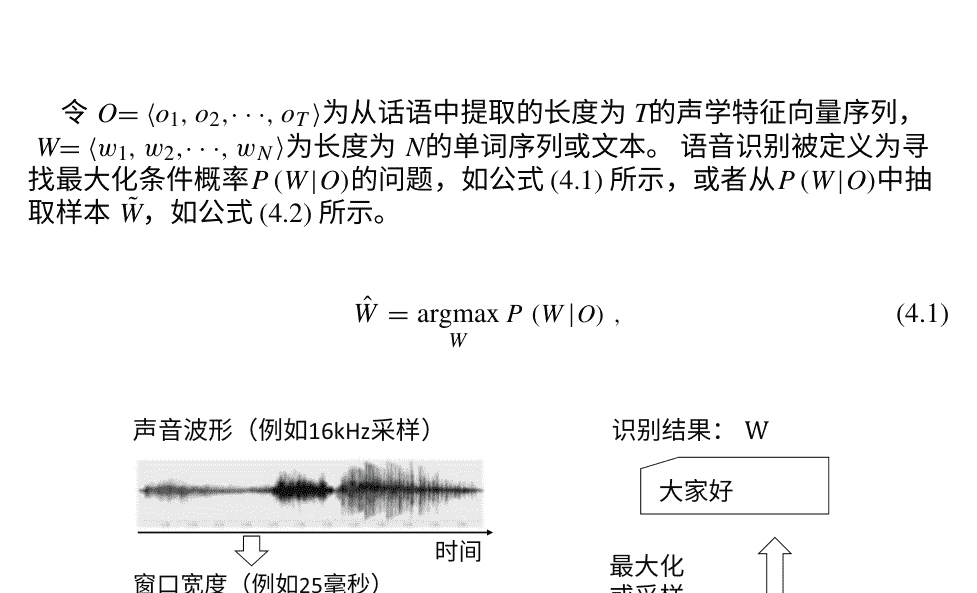

`\tilde{W} \sim P(W|O) \quad (4.2)`

找到 Ŵ意味着输出最有可能的识别假设，而抽取样本 Ŵ则根据概率输出假设。虽然前者更直接地达到语音识别的目标，但后者在模型训练中有时具有优势。

条件概率 P(W|O)可以直接或间接地建模。在后一种情况下，贝叶斯规则如公式(4.3)所示。

`$$P(W|O) = \frac{P(O|W) P(W)}{P(O)} \propto P(O|W) P(W) \quad (4.3)$$`

P(O|W)和P(W)的模型分别被称为声学模型和语言模型。声学模型描述了给定文本 W的声学特征序列 O的生成分布，而语言模型描述了文本 W的分布。在最大化或采样过程中，可以忽略方程（4.3）中的分母 P(O)，因为它是一个常数。在传统语音识别系统中，隐马尔可夫模型 （HMM）长期以来一直被用于声学建模。直接建模 P(W|O)在大词汇语音识别中一直很复杂，直到最近才有所发展。然而，随着深度学习的进展，这种方法正在迅速发展成为端到端语音识别的一种方法。

### 4.1.2 基于隐马尔可夫模型的声学建模

HMM由一组有限的内部状态 {0, 1, ..., F}，一组发射分布 {P(o|s)}，其中每个分布与一个状态 s相关联，以及一组状态转移概率 {P(s'|s)}从一个状态 s到另一个状态 s'，如图4.2所示。初始状态 s = 0和最终状态 s = F分别表示状态转移的开始和结束，它们没有发射分布。HMM给出了联合概率模型 P(O, S)，如公式(4.4)所示，其中 S = (s0 = 0, s1, s2, ..., sT, sT+1 = F)是以初始状态开始并以最终状态结束的状态序列。通过对所有可能的状态序列 S 进行边际化，可以得到观测到特征序列的概率，如公式(4.5)所示。

`$$P_{\theta}(O, S) = P_{\theta}(s_{T+1}|s_T) \prod_{t=1}^{T} P_{\theta}(s_t|s_{t-1}) P_{\theta}(o_t|s_t) \quad (4.4)$$`

`$$P_{\theta}(O) = \sum_{S} P_{\theta}(O, S) \quad (4.5)$$`

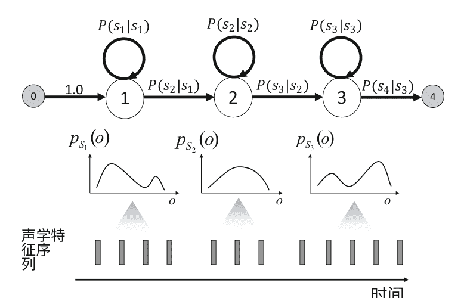

图4.2 隐马尔可夫模型。圆圈表示状态，有向弧表示转移。这个例子的HMM具有从左到右的结构，有三个发射状态和一个初始和一个最终状态。

其中Θ表示发射分布和转移概率的所有参数的集合。通过为每个单词序列W准备一个HMM来获得声学模型P_Θ(O|W)，如公式(4.6)所示。

`$$P_{\Theta}(O|W) = P_{\theta_W}(O) = \sum_{S} P_{\theta_W}(O, S) ,$$`

其中θ_W表示W依赖参数集合，Θ是所有θ_W的并集。由于可能的单词序列数量与序列长度呈指数关系，为每个序列单独准备一个HMM在所需的内存和有限训练数据的参数估计方面都是不可行的。相反，一组HMM被准备用于对每个音素p进行建模，并且根据单词序列的发音将音素HMM连接起来形成一个话语HMM，如图4.3所示。音素HMM集合被称为单音模型。

单音模型的一个限制是在话语中无论周围的音素上下文如何，都使用相同的音素HMM。由于人类声音是通过移动嘴巴调制声道形状来产生的，这种变化不是瞬时的。因此，一个音素的频谱模式受到周围音素的影响。例如，同一个音素/ih/在“big”和“bit”的发音中出现时，其频谱模式明显不同。为了提高建模准确性，使用上下文相关的音素模型，为相同的音素在不同的前后音素上下文中准备单独的HMM。最流行的上下文相关音素建模是三音素模型，为一个音素准备一组HMM。

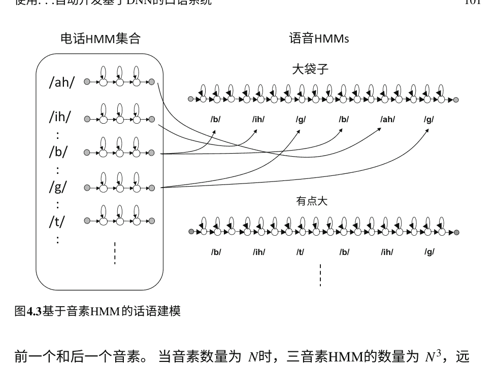

图4.3 基于音素HMM的话语建模

前一个和后一个音素。当音素数量为N时，三音素HMM的数量为N³，远大于单音素模型的数量N。这在模型参数估计中引起了问题，特别是对于罕见的上下文和音素对，因为训练集中几乎没有或者根本没有样本可用。为了解决这个问题，通过合并HMM状态对上下文相关的HMM状态进行聚类，以控制模型的复杂性[3]。

状态发射分布P(o|s)传统上被建模为高斯混合分布（GMM），如公式4.7所示，其中w_i是混合权重（0 < w_i和∑ w_i =1）和N(o|μ_i, Σ_i)是一个高斯分布，其均值为μ_i，方差为Σ_i。

`$$P(o|s) = \sum_{i} w_i N(o|\mu_i, \Sigma_i)$$`

后来，它被深度神经网络（DNNs）所取代，如方程4.8所示，其中P(s|o)是由神经网络获得的。

`$$P(o|s) = \frac{P(s|o) p(o)}{P(s)} \propto \frac{P(s|o)}{P(s)}$$`

图4.4显示了DNN-HMM的整体结构。当有更多的训练数据可用时，DNN-HMM通常优于GMM-HMM的识别性能。聚类HMM状态的数量，神经网络结构以及它们的学习条件是系统开发过程中需要调整的元参数。

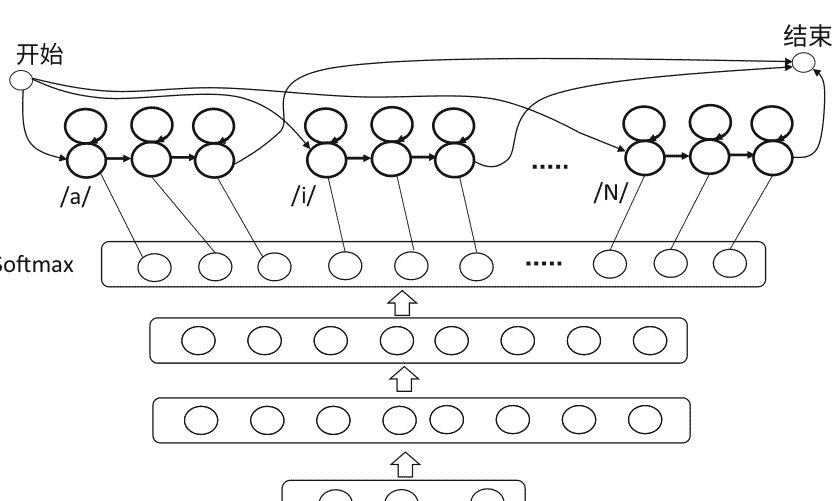

### 4.1.3 端到端语音识别系统

对于一个简单的语音识别任务，例如从单个特征向量中识别元音，其中 \(W\)是元音的集合而不是变长的单词序列，而 \(O\)是一个固定维度的向量而不是向量序列，\(P(W|O)\)的概率可以直接通过一个简单的前馈神经网络进行建模，如图4.5所示。对于一般情况下，\(O\)是一个特征向量序列，\(W\)是一个单词序列，需要处理变长的输入和输出。神经网络通过一些独特的架构实现了这一点，例如带有注意机制的编码器-解码器网络[4]和连接主义时间分类（CTC）[5]。图4.6显示了一个简单的编码器-解码器网络的架构，没有注意机制。它由一个编码器网络和一个解码器网络组成。编码器网络接受变长输入并将其嵌入到一个固定维度的向量中。解码器网络通过估计给定当前单词 \(w_t\)的下一个单词的概率分布来工作，从中通过随机抽样获得一个输出单词 \(w_{t+1}\)。最初，一个表示话语开始的特殊单词 \(<S>\)作为 \(w_0\)输入，并抽样一个单词 \(w_1\)。然后，使用 \(w_1\)作为输入获得 \(w_2\)。该过程重复进行，直到抽样到表示话语结束的特殊单词 \(</S>\)。该架构具有处理顺序输入和输出的通用性，可以通过简单地更改训练数据和输入/输出表示来用于翻译[6]和对话系统[7]等。此外，具有注意机制的扩展架构可以明确处理输入和输出之间的对齐问题[8]。

### 图4.5 使用前馈神经网络进行逐帧元音识别。该网络直接建模 $P(W|O)$

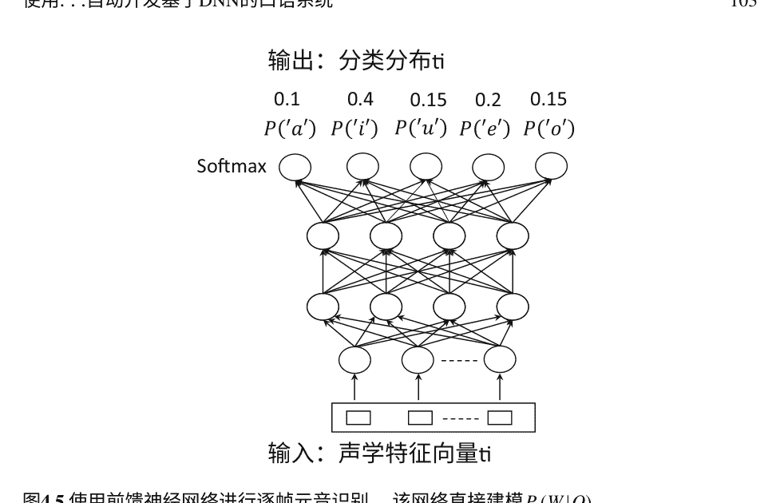

### 图4.6 基于简单的编码器-解码器网络的端到端语音识别系统没有注意机制

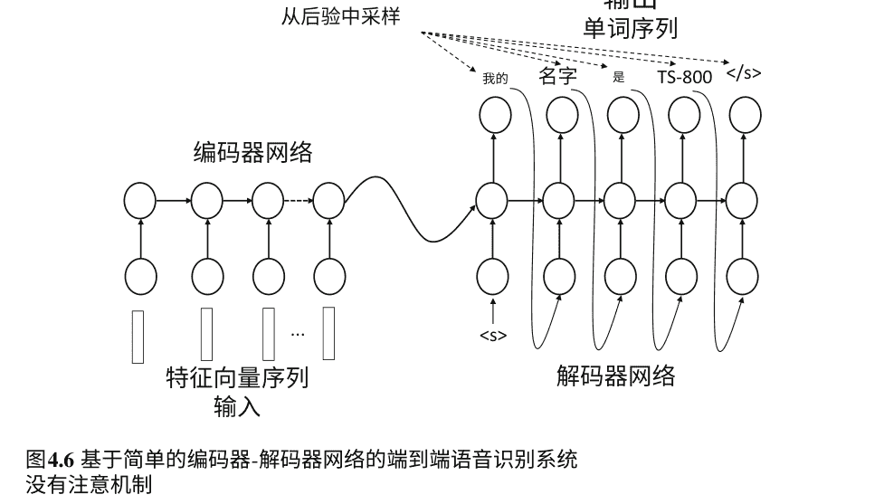

这些系统被称为端到端系统，因为它们直接通过一个整体神经网络来建模从 $O$ 到 $W$ 的输入/输出关系，与从分别优化的子模型（如声学模型和语言模型）构建系统的方法相对应，如第4.1.1节所讨论的。编码器和解码器网络中的隐藏层数量，每个隐藏层的神经元单元数量，学习条件等都是要调整的元参数。

### 4.1.4 评估指标

通过将识别假设 $R = \langle h_1, h_2, \cdots, h_m \rangle$ 与参考词序列 $R = \langle r_1, r_2, \cdots, r_n \rangle$ 进行比较，评估语音识别结果。其中 $m$ 和 $n$ 是它们的长度。当我们对假设和参考进行逐词对齐时，$h_j$ 对应于 $r_i$。图4.7显示了对齐的一个示例。如果单词 $h_i$ 与 $r_i$ 相同，则将其视为正确识别；如果不同，则视为错误替换为另一个单词。如果没有 $h_j$ 对应于 $r_i$，则将其视为删除错误；如果没有 $r_i$ 对应于 $h_j$，则将其视为插入错误。基于对齐，词错误率 ($WER$) 由公式 (4.9) 定义。

$$\text{WER} = \frac{N_s + N_i + N_d}{n} = \frac{N_s + N_i + N_d}{N_c + N_s + N_d}, \tag{4.9}$$

其中 $N_c$ 是正确识别的单词数量，而 $N_s$、$N_i$、$N_d$ 分别是替换、插入和删除错误的数量。WER分数取决于对齐，最低分数被用作识别假设的评估分数。通过使用动态规划[9]算法，可以高效地搜索最佳对齐。较小的WER表示更好的识别性能，最小WER分数为0.0。由于插入错误的存在，WER可以取得比1.0更大的值。另一个度量是单词准确率 ($WACC$)，通过取反WER并加上1.0来计算，较大的WACC表示更好的性能。

$$\text{WACC} = 1.0 - \text{WER}. \tag{4.10}$$

对于开发集和评估集，评估WER（或WACC）。前者用于系统的元参数调整训练，后者用作最终性能度量。对于对话和翻译系统，正确答案不唯一，还可以使用其他度量标准，如BLEU[10]，以更宽松的方式比较系统输出和参考答案的对齐情况。

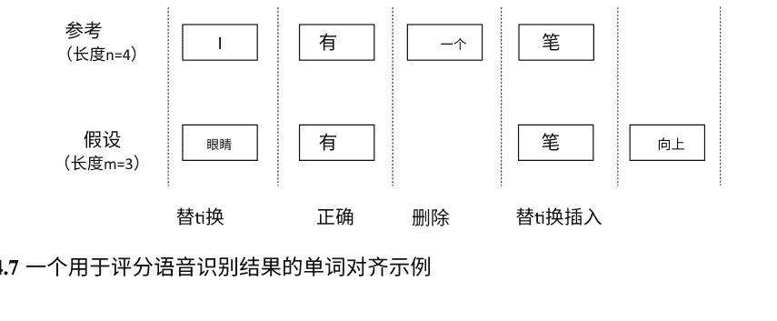

| 算法1 遗传算法（GA） |
| :--- |
| 1: 对于 k =1 到 K0 执行 |
| 2: 初始化 xk |
| 3: 结束循环 |
| 4: 当不收敛时 执行 |
| 5: 对于 k从1 到 K（对于第一次迭代，K为0）执行 |
| 6: 将基因 xk 解码为配置 Ck |
| 7: 评估配置 Ck以获得得分 yk = f(Ck) |
| 8: 结束循环 |
| 9: 从当前（父代）基因 {xk}_{k=1}^{K}及其得分 {yk}_{k=1}^{K}生成子代基因 {xk}_{k=1}^{K}通过选择、交配和变异 |
| 10: 结束当 |
| 11: 返回 提取最佳基因 x* |

## 4.2 进化算法

设 y = f(x) 为表示语音识别系统（或某种口语处理系统的性能度量）的评估函数，该系统是通过调整由 D维向量 x表示的元参数构建的。找到最佳调整参数 x* 以最大化准确性的过程可以被表述为以下优化问题：

$$ x^* = \arg\max_{x \in \hat{X}} f(x), \quad (4.11) $$

其中 $\hat{X}$ 是 x的候选集。由于语音识别系统非常复杂，没有解析解。我们必须在不假设 f具体知识的情况下解决这个优化问题，即将 f视为黑盒。这个问题的另一个重要方面是，评估函数值 f(x)是昂贵的，因为训练一个大型词汇模型并计算其开发集准确率可能需要很长时间。

因此，黑盒优化的关键是生成一个适当的假设集 $\hat{X}$ 以尽可能少的训练和评估步骤（f(x)) 找到最佳的x*。

### 4.2.1 遗传算法

遗传算法（GA）是一种受生物进化过程启发的搜索启发式算法。该算法基于以下原理：

1.  根据得分选择基因（也称为“染色体表示法”），剪枝下一代中较差的基因；
2.  配对基因形成子代基因，混合父母的特性；
3.  突变基因的一部分产生新的基因。

一种流行的选择方法，在后续的实验中我们将使用的是锦标赛方法。该方法首先从总共K个基因中随机生成一个子集M(< K)的假设，然后通过它们的分数选择子集中的最佳基因 $x_{k^*}$，即

$$\boldsymbol{x}_{k^*} = \argmax_{\boldsymbol{x}_{k'} \subset \hat{\mathcal{X}}_k} f(\boldsymbol{x}_{k'}). \tag{4.12}$$

随机子集提取步骤可以提供基因的变异，不仅给最佳基因一个生存的机会，还给优秀的基因一个生存的机会，而在子集中的最佳选择步骤可以保证排除劣质基因。这个过程重复K次以获得一组存活的基因。

对于交配过程，一个典型的方法是单点交叉，首先找到一对（父母）基因 $(\boldsymbol{x}_{k_1}^{\mathrm{p}}$ 和 $\boldsymbol{x}_{k_2}^{\mathrm{p}})$ 从选定的基因中提取，并交换这两个向量的 $\{1,\cdots,d\}$ 元素与 $\{d+1,\cdots,D\}$ 元素，得到以下新的（子代）基因对（ $\boldsymbol{x}_{k_1}^{\mathrm{c}}$ 和 $\boldsymbol{x}_{k_2}^{\mathrm{c}})$：

$$\boldsymbol{x}_{k_1}^{\mathrm{c}} = \begin{bmatrix} x_{k_1,1}^{\mathrm{p}} \\ \vdots \\ x_{k_1,d}^{\mathrm{p}} \\ x_{k_2,d+1}^{\mathrm{p}} \\ \vdots \\ x_{k_2,D}^{\mathrm{p}} \end{bmatrix}, \quad \boldsymbol{x}_{k_2}^{\mathrm{c}} = \begin{bmatrix} x_{k_2,1}^{\mathrm{p}} \\ \vdots \\ x_{k_2,d}^{\mathrm{p}} \\ x_{k_1,d+1}^{\mathrm{p}} \\ \vdots \\ x_{k_1,D}^{\mathrm{p}} \end{bmatrix}. \tag{4.13}$$

位置d是随机抽样的。随着迭代次数的增加，这些过程提供了编码最优DNN配置的适当基因。

算法1总结了GA过程。该过程重复进行，直到评估分数收敛，并提取出最佳基因 $x^*$。

### 4.2.2 进化策略

进化策略（ES）是一种基于群体的元启发式优化算法，类似于GA。与GA的不同之处在于ES通过实值向量表示基因 $\boldsymbol{x}$。协方差矩阵适应ES（CMA-ES）[11]是一种与自然ES[12]密切相关的ES。尽管CMA-ES和自然ES都有几个变体，但已经证明它们的核心部分在数学上是等价的[13]。CMA-ES比自然ES提出得更早，但自然ES的数学动机更简洁。在这里，我们按照自然ES的推导来解释CMA-ES。

CMA-ES使用多元高斯分布 $\mathcal{N}(\boldsymbol{x} | \boldsymbol{\theta})$ 来表示基因分布，其中 $\boldsymbol{\theta}= \{\boldsymbol{\mu}, \boldsymbol{\Sigma}\}$，$\boldsymbol{\mu}$ 是一个D维均值向量， $\Sigma$ 是一个 $D \times D$ 维协方差矩阵， $D$ 是基因大小。它寻求一个在高值区域集中的分布，以便从分布中采样得到更好的基因。分布的搜索被表述为在高斯分布 $N(\boldsymbol{x}|\boldsymbol{\theta})$ 下的期望值最大化问题，如公式(4.14)和(4.15)所示。

$$\mathbb{E}[f(\boldsymbol{x})|\boldsymbol{\theta}] = \int f(\boldsymbol{x}) N(\boldsymbol{x}|\boldsymbol{\theta}) d\boldsymbol{x}, \tag{4.14}$$

$$\hat{\boldsymbol{\theta}} = \underset{\boldsymbol{\theta}}{\text{argmax}}\; \mathbb{E}[f(\boldsymbol{x})|\boldsymbol{\theta}]. \tag{4.15}$$

为了最大化期望，可以使用梯度上升法从初始参数集 $\boldsymbol{\theta}_0$ 开始迭代更新当前参数集 $\boldsymbol{\theta}_n$，如公式 (4.16) 所示。

$$\hat{\boldsymbol{\theta}}_n = \boldsymbol{\theta}_{n-1} + \epsilon \nabla_{\boldsymbol{\theta}} \mathbb{E}[f(\boldsymbol{x})|\boldsymbol{\theta}]\;|_{\boldsymbol{\theta}=\boldsymbol{\theta}_{n-1}}, \tag{4.16}$$

其中 $n$ 是迭代索引， $\epsilon (> 0)$ 是步长。为了评估梯度，CMA-ES使用 $\nabla_{\boldsymbol{\theta}} \log N(\boldsymbol{x}|\boldsymbol{\theta})$ 的关系，即 $\nabla_{\boldsymbol{\theta}} N(\boldsymbol{x}|\boldsymbol{\theta}) = N(\boldsymbol{x}|\boldsymbol{\theta}) \nabla_{\boldsymbol{\theta}} \log N(\boldsymbol{x}|\boldsymbol{\theta})$ ，这被称为“对数技巧”。通过在应用对数技巧后对积分进行采样逼近，梯度可以用公式 (4.19) 表示。

$$\nabla_{\boldsymbol{\theta}} \mathbb{E}[f(\boldsymbol{x})|\boldsymbol{\theta}]\;|_{\boldsymbol{\theta}=\boldsymbol{\theta}_{n-1}} \tag{4.17}$$
$$= \int \left( f(\boldsymbol{x}) \nabla_{\boldsymbol{\theta}} \log N(\boldsymbol{x}|\boldsymbol{\theta}_{n-1}) \right) N(\boldsymbol{x}|\boldsymbol{\theta}_{n-1}) d\boldsymbol{x} \tag{4.18}$$
$$\approx \frac{1}{K} \sum_{k}^{K} y_k \nabla_{\boldsymbol{\theta}} \log N(\boldsymbol{x}_k|\boldsymbol{\theta}_{n-1}), \tag{4.19}$$
$$\boldsymbol{x}_k \sim N(\boldsymbol{x}|\boldsymbol{\theta}_{n-1}),$$

其中 $\boldsymbol{x}_k$ 是从先前估计的分布 $N(\boldsymbol{x}|\boldsymbol{\theta}_{n-1})$ 中采样的基因，而 $y_k$ 是函数 $y_k = f(\boldsymbol{x}_k)$ 的评估值。在演化中，一个迭代步骤中的 $K$ 个样本对应于一代中的一组个体。

通过重复世代，预期获得优秀个体。

注意，该公式与强化学习密切相关。如果我们将高斯分布解释为一个不需要输入、假设世界是恒定的策略函数，并将基因视为一个动作，那么它是基于策略梯度的强化学习的特例[14]。

尽管可以直接使用获得的梯度进行简单的梯度上升，但CMA-ES使用自然梯度 $\nabla^{\sim}_{\boldsymbol{\theta}} \mathbb{E}[f(\boldsymbol{x})|\boldsymbol{\theta}] = F^{-1} \nabla_{\boldsymbol{\theta}} \mathbb{E}[f(\boldsymbol{x})|\boldsymbol{\theta}]$ 而不是原始梯度 $\nabla_{\boldsymbol{\theta}} \mathbb{E}[f(\boldsymbol{x})|\boldsymbol{\theta}]$ 来提高收敛速度。其中 $F$ 是由方程(4.20)定义的费舍尔信息矩阵。

$$F(\boldsymbol{\theta}) = \int \mathcal{N}(\mathbf{x}|\boldsymbol{\theta}) \nabla_{\boldsymbol{\theta}} \log \mathcal{N}(\mathbf{x}|\boldsymbol{\theta}) \nabla_{\boldsymbol{\theta}} \log \mathcal{N}(\mathbf{x}|\boldsymbol{\theta})^T dx \tag{4.20}$$

通过将具体的高斯形式替换为 $\mathcal{N}(\mathbf{x}|\boldsymbol{\theta})$，可以得到 $\hat{\boldsymbol{\mu}}_{n}$ 和 $\hat{\boldsymbol{\Sigma}}_{n}$ 的更新公式如式(4.21)所示。

$$\begin{cases} \hat{\boldsymbol{\mu}}_n = \hat{\boldsymbol{\mu}}_{n-1} + \epsilon_\mu \sum_{k=1}^{K} w(y_k)(\mathbf{x}_k - \hat{\boldsymbol{\mu}}_{n-1}), \\ \hat{\boldsymbol{\Sigma}}_n = \boldsymbol{\Sigma}_{n-1} + \epsilon_\Sigma \sum_{k=1}^{K} w(y_k) \\ \quad \cdot ((\mathbf{x}_k - \hat{\boldsymbol{\mu}}_{n-1})(\mathbf{x}_k - \hat{\boldsymbol{\mu}}_{n-1})^\mathbf{T} - \boldsymbol{\Sigma}_{n-1}), \end{cases} \tag{4.21}$$

其中 $\mathbf{T}$ 是矩阵的转置。请注意，如同[11]中所述，式(4.19)中的 $y_k$ 在式(4.21)中被近似为权重函数 $w(y_k)$，其定义如下：

$$w(y_k) = \frac{\max\{0, \log(K/2 + 1) - \log(\mathbf{R}(y_k))\}}{\sum_{k'=1}^{K} \max\{0, \log(K/2 + 1) - \log(\mathbf{R}(y_{k'}))\}} - \frac{1}{K} \tag{4.22}$$

其中 $\mathbf{R}(y_k)$ 是一个返回 $y_k$ 在 $y_{1:K}$ 中降序排列的排名函数（即，对于最高的 $y_k$ ，$\mathbf{R}(y_k)=1$，对于最小的 $y_k$，$\mathbf{R}(y_k)=K$，依此类推）。这个方程只考虑了 $y$ 的顺序，这使得更新对评估测量不太敏感（例如，防止使用单词准确性和错误计数的负号产生不同的结果）。

算法2总结了CMA-ES优化过程，逐渐从初始值中采样相邻的调整参数。因为CMA-ES使用实值向量作为基因，所以自然适合调整连续值元参数。要调整离散值元参数，需要通过某种方式进行离散化。对于每个评估的 $f(\mathbf{x}_k)$，可以独立执行 $k$。因此，它很容易适应并行计算环境，如云计算服务，以缩短周转时间。样本数 $K$，可以根据 $\mathbf{x}$ 的维度数量自动确定[11]，或者我们可以通过考虑计算资源来手动设置。

### 4.2.3 贝叶斯优化

尽管贝叶斯优化（BO）的动机与ES和GA不同，但在实践中存在一些相似之处。特别是当它被拼音化时，一组个体在每个更新阶段被评估，其中一个固定维度的向量指定了个体的配置。

虽然CMA-ES涉及调整参数的分布 $\mathbf{x}$ 对 $\mathbf{x}$ 的期望，BO使用输出的概率模型 $y$ 来评估一个获取函数，该函数评估 $\mathbf{x}$ 的好坏。几个获取函数已经提出了[15]。在这里，我们使用预期改进，这是一个实际的选择[16]。预期改进被定义为：

$$a^{EI}(\boldsymbol{x}_k) = \int \max\{0, y - y^*_{k-1}\} p(y | D_{1:k-1}, \boldsymbol{x}_k) dy, \quad (4.23)$$

其中 $\max \{0, y - y^*_{k-1}\}$ 是基于最佳分数 $y^*_{k-1} = \max_{1 \leq k' \leq k-1} y_{k'}$ 的改进度量，在 $k-1$ 个先前分数中，并且 $p (y | D_{1:k-1}, \boldsymbol{x}_k)$ 是给定 $\boldsymbol{x}_k$ 和已观察到的数据集 $D_{1:k-1} = \{\boldsymbol{x}_{1:k-1}, y_{1:k-1}\}$ 的预测分布，由高斯过程[17]建模。

然后，BO通过最大化预期改进来确定下一个候选 $\hat{\boldsymbol{x}}_k$ 的确定性搜索。

$$\hat{\boldsymbol{x}}_k = \arg\max_{\boldsymbol{x}_k} a^{EI}(\boldsymbol{x}_k). \quad (4.24)$$

方程（4.24）选择可能导致 $y_k$ 得分较高的 $\boldsymbol{x}_k$。高斯过程模型将 $k$ 个得分 $[\boldsymbol{y}^\top_{1:k-1}, y]^\top$ 的联合概率建模为具有零均值向量和Gram矩阵 $\boldsymbol{K}$ 作为协方差矩阵的k维多元高斯分布：

$$p(\boldsymbol{y}_{1:k-1}, y | \boldsymbol{x}_{1:k}) = \mathcal{N}\left( \begin{bmatrix} \boldsymbol{y}_{1:k-1} \\ y \end{bmatrix} \middle| \boldsymbol{0}, \boldsymbol{K} \right), \quad (4.25)$$

$$\boldsymbol{K} = \begin{bmatrix} \boldsymbol{G} & \boldsymbol{g}(\boldsymbol{x}_k) \\ \boldsymbol{g}(\boldsymbol{x}_k)^{\top} & g(\boldsymbol{x}_k, \boldsymbol{x}_k) \end{bmatrix}, \quad (4.26)$$

其中 $g(\boldsymbol{x}, \boldsymbol{x}')$ 是一个核函数，$\boldsymbol{G}$ 是一个元素为 $G_{i,j} = g(\boldsymbol{x}_i, \boldsymbol{x}_j)$ 的格拉姆矩阵，对于 $1 \leq i, j \leq k-1$，而 $\boldsymbol{g}(\boldsymbol{x}_k) = [g(\boldsymbol{x}_1, \boldsymbol{x}_k), \ldots, g(\boldsymbol{x}_{k-1}, \boldsymbol{x}_k)]^\top$。通过使用贝叶斯定理，给定 $\boldsymbol{y}_{1:k-1}$ 的预测分布是一个单变量高斯分布：

$$p(y | D_{1:k-1}, \boldsymbol{x}_k) = p(y | \boldsymbol{y}_{1:k-1}, \boldsymbol{x}_{1:k}) = \mathcal{N}(y | \mu(\boldsymbol{x}_k), \sigma^2(\boldsymbol{x}_k)), \quad (4.27)$$

| 算法2 CMA-ES |
| :--- |
| 1: 初始化 $\hat{\boldsymbol{\mu}}_0$ 和 $\hat{\boldsymbol{\Sigma}}_0$，并且 $y^*_0 = \varnothing$ |
| 2: 对于 $n = 1$ 到 $N$ 执行 |
| 3:     对于 $k = 1$ 到 $K$ 执行 |
| 4:         从 $\mathcal{N}(\boldsymbol{x} | \hat{\boldsymbol{\mu}}_{n-1}, \hat{\boldsymbol{\Sigma}}_{n-1})$ 中采样 $\boldsymbol{x}_k$ |
| 5:         评估 $y_k = f(\boldsymbol{x}_k)$ |
| 6:     结束循环 |
| 7:     对 $\{y_k\}_{k=1}^K$ 进行排序 |
| 8:     更新 $\hat{\boldsymbol{\mu}}_n$ 和 $\hat{\boldsymbol{\Sigma}}_n$ |
| 9:     存储 $y^*_n = \max\{y_{1:K}, y^*_{n-1}\}$ 对应的 $\boldsymbol{x}^*_n$ |
| 10: 结束循环 |
| 11: 返回 $\{\boldsymbol{x}^*_N, y^*_N\}$ |

### 算法3 贝叶斯优化（BO）

```
1: 设置域 X of x̂₀，并且 ŷ₀ = ∅
2: 对于 k=1 到 K执行
3:     计算    x̂_k = argmax_{x_k} a^{EI}(x_k)
4:     评估    y_k = f(x̂_k)
5:     存储    y_k^* = max{y_k, y_{k-1}^*} 对应的    x_k^*
6: 结束循环
7: 返回    {x_K^*, y_K^*}
```

其中均值 μ(x_k) 和方差 σ²(x_k) 如下所示：

\begin{cases}
\mu(x_k) = g(x_k)^{\top} G^{-1} y_{1:k-1} \\
\sigma^2(x_k) = g(x_k, x_k) - g(x_k)^{\top} G^{-1} g(x_k)
\end{cases}
(4.28)

基于这个预测分布，我们可以通过将等式（4.27）代入（4.23）来分析地评估预期改进^{EI}(x_k)，并通过等式（4.24）数值地获得x̂_k。

BO的基本算法如算法3所示。虽然对于CMA-ES，需要为 x 设置初始值，但对于BO，需要为 x 设置定义域。在计算带有蒙特卡罗采样的预期改进函数^{EI}(x_k)时，可以进行并行化。然而，BO产生的贪婪搜索经常选择参数域的边缘上的调整参数，这导致当 x 的维度很大时，函数评估非常耗时。我们观察到这些实际上使得评估在我们的实验中变得困难。

## 4.3 Pareto最优的多目标优化

在第4.2节中，我们解释了针对单目标（如识别准确率）的元参数优化方法。有时，在实际应用中，其他目标也很重要。例如，较小的DNN大小更可取，因为它影响训练和解码的计算成本。在本节中，我们解释了具有Pareto最优性的多目标CMA-ES。

### 4.3.1 帕累托最优性

不失一般性，假设我们希望最大化 J 目标关于 x 的联合，定义如下：

$$F(x) \triangleq [f_1(x), f_2(x), \dots, f_J(x)]. \tag{4.29}$$

由于目标可能存在冲突，我们采用一种被称为帕累托最优性的优化概念 [18]。为了联合优化多个目标，需要满足以下条件：

\begin{cases}
f_j(\mathbf{x}_k) \geq f_j(\mathbf{x}_{k'}) \quad \forall j = 1, \ldots, J \\
f_j(\mathbf{x}_k) > f_j(\mathbf{x}_{k'}) \quad \exists j = 1, \ldots, J.
\end{cases}

然后，我们说 $x_k$ 支配 $x_{k'}$ 并写作 $F(x_k) \succ F(x_{k'})$. 给定一组候选解， $x_k$ 是帕累托最优的当且仅当不存在其他 $x_{k'}$ 使得 $F(x_{k'}) \succ F(x_k)$.

帕累托最优性将直觉形式化为如果没有其他解在所有目标上表现更好（支配）的话，解就是好的。给定一组候选者，通常存在多个帕累托最优解；这被称为帕累托边界。 请注意，另一种方法是通过加权线性组合将多个目标合并为一个目标：

$$\sum_j \beta_j f_j(\mathbf{x}),$$

其中 $\sum_j \beta_j = 1$ 且 $\beta_j \ge 0$。帕累托定义的优势在于不需要指定权重 $\beta_j$ ，并且更加通用，即通过任何 $\beta_j$ 的设置获得的最优解都保证包含在帕累托边界中。可以使用帕累托边界对每个 $\{x_{1:K}\}$ 进行排名，这可以适应元启发式算法。

### 4.3.2 带有帕累托最优性的CMA-ES

通过修改在公式（4.22）中使用的排名函数 $R(y_k)$，我们实现了一个低 WER 和小模型大小的多目标 CMA-ES。给定一组解决方案 $\{x_k\}$，我们首先将排名=1 分配给 Pareto 边界上的解决方案。然后，我们排除这些排名为 1 的解决方案，并为剩余的解决方案再次计算 Pareto 边界，将它们分配为排名 2。这个过程迭代直到没有 $\{x_k\}$ 剩下，最终我们根据多个目标获得了所有解决方案的排名。CMA-ES 的其余部分保持不变；通过这种修改，未来的世代将被吸引来优化多个目标而不是单个目标。通过一些记录，可以在 $O(J \cdot K^2)$ [19] 的时间复杂度下高效地计算出这个排名。

算法 4 总结了具有 Pareto 优化的 CMA-ES 优化过程，用于对多个目标 $F(x_k)$ 进行排名。获得的排名被用于更新 CMA-ES 的均值向量和协方差矩阵。CMA-ES 逐渐从初始值中采样相邻的调整参数，并最终提供一组解决方案 $\{x, F(x)\}$，它们位于所有存储的 $N \times K$ 样本的 Pareto 边界（排名 1）上。

```
算法4 多目标CMA-ES
1：初始化 $\hat{\boldsymbol{\mu}}_0$ 和 $\hat{\boldsymbol{\Sigma}}_0$
2：对于 $n = 1$ 到 $N$ 执行
3：    对于 $k = 1$ 到 $K$ 执行
4：        从 $\mathcal{N}(\boldsymbol{x} | \hat{\boldsymbol{\mu}}_{n-1}, \hat{\boldsymbol{\Sigma}}_{n-1})$ 中采样 $\boldsymbol{x}_k$
5：        评估 $J$ 目标 $F(\boldsymbol{x}_k) \triangleq [f_1(\boldsymbol{x}_k), f_2(\boldsymbol{x}_k), \dots, f_J(\boldsymbol{x}_k)]$
6：    结束循环
7：    根据帕累托最优性对 $\{ F(\boldsymbol{x}_k) \}$ 进行排序并分配排名
8：    更新 $\hat{\boldsymbol{\mu}}_n$ 和 $\hat{\boldsymbol{\Sigma}}_n$
9：结束循环
10：返回存储的所有 $N \times K$ 样本中位于帕累托边界（排名1）上的解集 $\{\boldsymbol{x}, F(\boldsymbol{x})\}$
```

### 4.3.3 多目标方法的替代方案

遗传算法有丰富的多目标方法文献。参考文献[20, 21]了解各种技术。一类方法利用帕累托最优性来估计每个解的适应度 $F(\boldsymbol{x})$。例如，广泛使用的NSGA-II [19]，以及我们在第4.3.2节中描述的帕累托CMA-ES方法采用了非常类似的方法。

还有一些不使用帕累托适应度概念的多目标遗传算法。例如，VEGA [22]将后代选择分为不同目标的独立组，然后允许组间进行交叉操作。HGLA [23]在目标的线性组合上运行遗传算法；组合权重不固定，而是与解决方案同时演化。所有这些方法都可以应用于自动优化DNN元参数的问题，但我们不知道是否有大规模的实证评估。

对于贝叶斯优化，[24]提出了一种获取函数，选择能够最大程度降低帕累托集上后验分布的熵的点。这已经在MNIST图像分类的速度和准确性的自动优化中进行了评估，结果很有希望。还有一些基于将多个目标组合为单个目标的方法，例如[25]。

## 4.4 实验设置

### 4.4.1 通用设置

我们应用进化算法来调整大词汇量的语音识别系统[26]。图4.8显示了整个调整过程。实验使用了Kaldi语音识别工具包和来自自发性日语语料库(CSJ)[27]，这是一个流行的日语语音数据集。我们进行了两个单独的实验，使用不同数量的训练集：一个包含240小时的学术演讲，而另一个是100小时的子集。GA，CMA-ES和BO使用一个共同的开发集，其中包含10个学术演讲，以评估黑盒优化的个体。在CSJ中定义的官方评估集包括10个学术演讲，总计110分钟，作为评估集。通过最大似然估计首先创建GMM-HMM，然后通过预训练和微调使用GMM-HMM生成的对齐来构建DNN-HMM。对于系统的性能评估，DNN-HMM被用作最终模型。语言模型是在CSJ上训练的3-gram模型，包括学术和其他类型的演讲，总计750万个单词。词汇量为72k。语音识别使用OpenFST WFST解码器[28]进行。作为初始配置，我们借用了Switchboard语料库的Kaldi配方的设置（即egs/swbd/s5b）。我们选择了这个配方，因为任务相似，但语言不同，并且因为它经过了手动调优并且是公开可用的。

对于实验，使用了TSUBAME 2.5超级计算机。通过消息传递并行使用了最多44个NVIDIA K20X GPGPUs接口(MPI)。我们使用了Spearmint包²进行BO，并使用了Hansen的Python版本实现³进行CMA-ES。此外，我们进行了两个额外的实验，利用了Kaldi的新版本和CSJ配方来确认进化的效果⁴。其中一个基于nnet1脚本，另一个基于chain脚本。虽然nnet1采用基本的神经网络结构，chain采用TDNN。训练和评估集的定义与之前相同，但开发集不同。原因是配方脚本内部通过保留训练集的子集来创建开发集，而新的配方脚本与旧的实现不同。新的开发集共计6.5小时，包含来自39个学术演讲的4000个话语。实验使用了TSUBAME 3.0，在并行使用了30个P100 GPGPUs。

### 4.4.2 自动优化

在进化实验中，特征类型、DNN结构和学习参数被优化。表4.1的第一列和第二列描述了这些变量。我们为GMM-HMM和DNN-HMM模型指定了三种基本特征类型（feat_type）：MFCC、PLP和滤波器组（FBANK）。这些特征的维度分别为13、13和36。首先，使用指定的基本特征及其delta [29]和delta-delta对GMM-HMM进行直接训练。然后，使用从基本特征的9帧连接而成的复合特征获得的40维LDA [30]压缩和MLLT [31]转换特征对其进行重新训练，并进行基于fMLLR [31]的说话人自适应训练。DNN-HMM使用再次从fMLLR特征扩展的特征进行训练，将5个前后上下文帧进行拼接。其他设置与Kaldi配方中使用的设置相同。

CMA-ES使用以实值向量表示的基因，根据参数需要进行从实数标量值到所需类型的映射。对于映射，我们使用ceil(10^x)将正连续值转换为整数（例如，splice）。类似地，我们使用10^x来表示正实数值（例如，学习率），并使用mod(ceil(abs(x) * 3), 3)来表示多项选择（特征类型）。例如，如果基因中的特征类型（feat_value）的值为 -1.7，则映射为0，表示MFCC。如果为1.4，则映射为2，对应于我们的实现中的PLP。表4.1的第三列呈现了基准设置，也用作初始元参数配置。基于MFCC的基准系统使用240小时的训练集和K20X GPGPU，RBM预训练需要12小时，微调需要70小时。

黑盒优化的种群大小为100小时训练集为20，240小时训练集为44。优化使用的WER是使用开发集进行评估的。对于每个个体的评估，在每一代的训练时间上引入了一个限制。如果一个系统在100小时训练集和240小时训练集上的训练没有在2.5天和4天内完成，训练将被中断，并且在那个时候的迭代反向传播训练中使用最后一个模型作为最终模型。基于WER和DNN大小进行的GA优化，以下实验中称为GA(WER, Size)。手动准备了十个初始基因(= N0)。基本上，如果基因A的WER低于基因B，则基因A胜过基因B。然而，如果WER的差异小于0.2%且基因A的DNN大小小于基因B的90%，则基因A具有较高的WER胜过基因B。锦标赛大小M为三。对于突变过程，将具有零均值和0.05标准差的高斯噪声均匀添加到基因中。对于CMA-ES，进行了两种类型的实验。一种是基于WER的单目标实验，另一种是基于WER和DNN大小的多目标实验，使用帕累托最优性。在接下来的实验中，前者称为CMA-ES，后者称为CMA-ES+P。在两种情况下，多变量高斯的初始均值向量设置为基线设置相等。对于CMA-ES+P，最大WER阈值被设置为每一代训练中包括前1/2和1/3的种群。分别使用100小时和240小时数据集进行训练。基于WER作为目标进行了BO优化调优。元参数的搜索范围设置为基线配置的20%到600%。

对于使用更新版本的Kaldi进行额外实验，我们减少了元参数的数量；我们的动机是在更多条件下评估演化的细节。对于使用nnet1的实验，优化的元参数是splice、nn_depth、hid_dim、learn_rate和momentum。这些是现代架构中最重要的一部分元参数，见表4.1。作为演化的初始配置，我们再次从SWB配方中借用了值。对于使用chain的额外实验，我们使用了CSJ配方中使用的初始值。

在这些演化实验中，使用无格栅MMI [32]训练了TDNNs，没有基于权重平均的并行处理⁵。初始的TDNN结构从其原始版本稍作修改，以便为可变层数的元参数设置提供更简单的设置，如图4.9所示。在原始结构中，第2到第4层的子采样结构与其他层不同，而在我们的实验中，所有层都具有相同的子采样结构。注意，如果需要，可以为每个层准备单独的元参数，以允许不同的结构。总共优化了表4.5中显示的7个元参数。与CSJ配方中当前发布的nnet1脚本不同，我们的进化结果已经整合，到目前为止，链式系统的调优都是基于Kaldi社区的人力努力，这是第一个基于进化的优化。训练集是240小时的数据集。初始的nnet1和chain系统分别花费了14小时和18小时，使用了一块P100 GPGPU。如果一个系统在进化过程中无法在24小时内完成训练，训练将被中断，并使用那时的最后一个模型作为最终模型。种群大小为30。

## 4.5 结果

表4.2显示了使用默认配置的系统的WER和DNN大小使用100小时和240小时的训练集中的三种特征之一。在这些特征中，MFCC是Switchboard配方中的默认设置，而且它对于这两个训练集，MFCC在开发集上产生了最低的WER。相应的评估集WER分别为13.1%和12.5%，对应于100小时和240小时的训练集。

图4.10、4.11、4.12和4.13展示了每种优化方法在100小时训练数据上的结果。水平轴是DNN大小，垂直轴是评估集的WER。图上标记的基准线是基于MFCC的系统。理想情况下，当进行WER基于单目标优化（CMA-ES，BO）时，我们希望系统位于图的下部；当进行WER和模型大小基于多目标优化（GA，CMA-ES+P）时，我们希望系统位于图的左下部。图4.10是GA（WER，大小）在使用100小时训练数据时的结果，图4.11是使用100小时训练数据时的CMA-ES结果。

---
² https://github.com/JasperSnoek/spearmint.
³ https://www.lri.fr/~hansen/cmaes_inmatlab.html.
⁴ 我们在2015年进行了主要实验，并在2018年进行了额外实验。
⁵ 我们在我们的环境中禁用了并行训练的默认选项，以使实验可行，因为它需要大量的GPU。

表4.1 元参数优化及其使用240小时训练数据的自动调整结果
| 元参数名称描述 | 基准 | gen1 | gen2 | gen3 | gen4 | gen5 | gen6 |
| :--- | :---: | :---: | :---: | :---: | :---: | :---: | :---: |
| 特征类型 | MFCC | MFCC | MFCC | MFCC | MFCC | MFCC | MFCC |
| 拼接 | 5 | 6 | 9 | 10 | 17 | 21 | 18 |
| nn_depth | 6 | 7 | 6 | 6 | 6 | 5 | 7 |
| hid_dim | 2048 | 1755 | 1907 | 2575 | 1905 | 2904 | 3304 |
| param_stddev_first | 1.0E-1 | 1.1E-1 | 1.3E-1 | 1.1E-1 | 1.2E-1 | 0.7E-1 | 0.6E-1 |
| param_stddev | 1.0E-1 | 1.0E-1 | 1.3E-1 | 1.0E-1 | 2.3E-1 | 1.9E-1 | 1.6E-1 |
| rbm_lrate | 4.0E-1 | 5.2E-1 | 5.7E-1 | 4.1E-1 | 4.7E-1 | 3.6E-1 | 3.6E-1 |
| rbm_lrate_low | 1.0E-2 | 1.3E-2 | 1.1E-2 | 0.8E-2 | 0.7E-2 | 0.8E-2 | 1.1E-2 |
| rbm_l2penalty | 2.0E-4 | 2.1E-4 | 2.2E-4 | 1.2E-4 | 1.6E-4 | 1.9E-4 | 1.5E-4 |
| 学习率 | 8.0E-3 | 7.3E-3 | 6.5E-3 | 7.8E-3 | 4.4E-3 | 5.3E-3 | 3.7E-3 |
| 动量 | 1.0E-5 | 0.9E-5 | 0.9E-5 | 0.4E-5 | 0.9E-5 | 0.4E-5 | 0.7E-5 |
| 使用帕累托CMA-ES(CMA-ES+P)进行自动调优 | | | | | | | |

表4.2 基础系统的WER
| 训练数据 | 开发集 | 评估集 |
| :--- | :---: | :---: |
| MFCC 100小时 | 14.4 | 13.1 |
| PLP 100小时 | 14.5 | 13.1 |
| FBANK 100小时 | 15.1 | 13.8 |
| MFCC 240小时 | 13.5 | 12.5 |
| PLP 240小时 | 13.6 | 12.5 |
| FBANK 240小时 | 14.1 | 13.0 |

+ 元参数
- 隐藏层的数量 (初始值 M= 9)
- 每层的单元数 (初始值 N= 625)

图4.8 ASR系统的进化调整过程
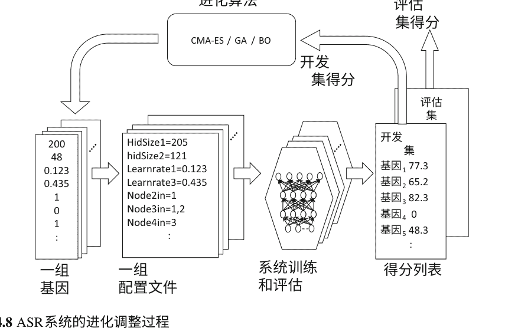

图4.9 基于链式系统的TDNN模型结构。(a) 是CSJ配方中使用的原始结构，(b) 是我们进化实验中使用的初始配置。带有隐藏层的箭头表示时间切片索引
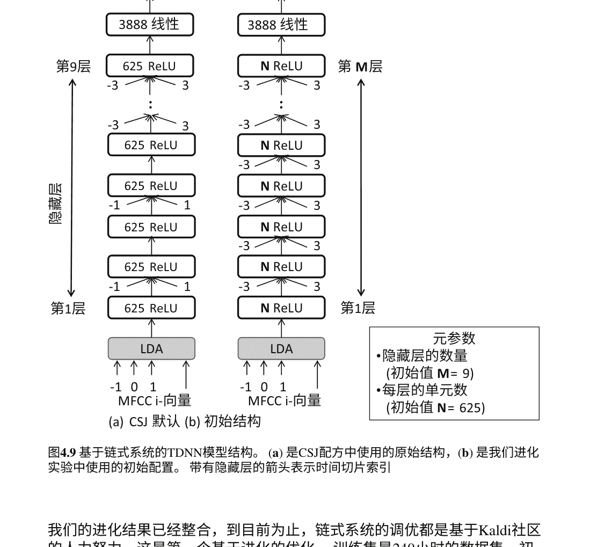

图4.10 GA（WER，大小）在使用100小时训练数据时的结果
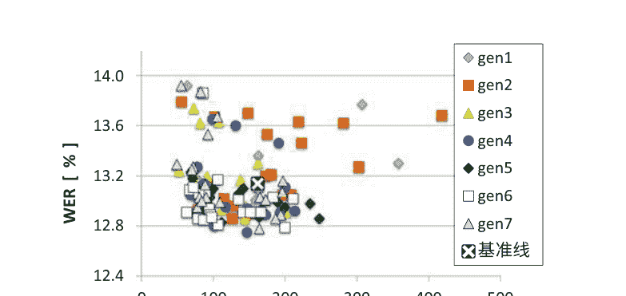

图4.11 使用100小时训练数据时的CMA-ES结果
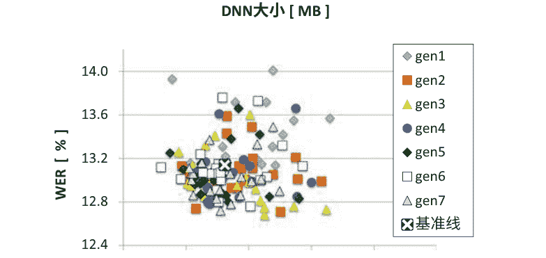

图4.12 使用 Pareto 最优性的 CMA-ES+P 在使用100小时训练数据时的结果

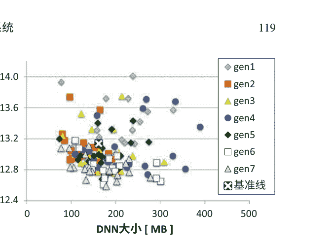

图4.13 使用100小时训练数据时的 BO 结果

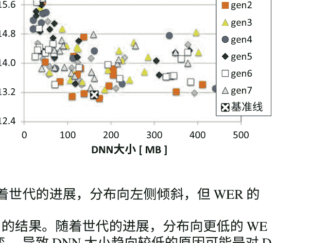

GA(WER, 大小) 的散点图。随着世代的进展，分布向左侧倾斜，但 WER 的减少相对较小。

图4.11 展示了单目标 CMA-ES 的结果。随着世代的进展，分布向更低的 WER 和更低的 DNN 文件大小转变。导致 DNN 大小趋向较低的原因可能是对 DNN 训练施加的时间限制。在进化过程中，达到限制的个体比例约为35%。如果个体的 DNN 大小较大，则很可能达到限制。然后，在反向传播收敛之前，使用当时的 DNN 评估 WER，这对该个体是一个不利因素。图4.12 展示了多目标 CMA-ES+P 的结果。结果与使用 CMA-ES 相似，但分布更倾向于图的左下方。

图4.13展示了使用BO进行优化的结果。在这种情况下，初始配置没有直接指定，但是元参数的范围被指定。我们发现，指定一个合适的范围实际上并不简单，需要对问题有一定的了解。也就是说，如果范围太宽，那么初始样本在空间中分布较粗，系统的性能可能较低。与此同时，如果范围太窄，那么最优配置可能不在搜索空间中。因此，BO的改进效果比CMA-ES要小。

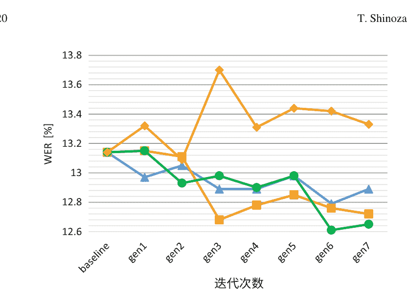

图4.14 迭代次数和评估集WER。在每个条件下，通过使用开发集选择最佳系统。

表格 4.3 WER 和 DNN最佳系统的大小在使用100小时的训练数据时

| 优化方法          | WER [%] 开发 | 评估 | DNN 大小 [MB] |
|-------------------|--------------|------|---------------|
| 基准              | 14.4         | 13.1 | 161.8         |
| GA(WER, 大小)     | 14.1         | 13.0 | 234.5         |
| CMA-ES            | 14.0         | 12.7 | 225.5         |
| CMA-ES+P          | 14.0         | 12.7 | 202.4         |
| BO                | 14.2         | 13.1 | 110.6         |

仔细设置范围可能解决问题，但又需要假设专家人类知识。

图4.14显示了基于开发集选择的最佳系统的评估集的WER。CMA-ES比GA(WER,大小)和BO进化得更高效。表4.3显示了通过开发集WER选择的最佳系统的评估结果，跨所有世代。

通过CMA-ES和CMA-ES+P的评估集WER都是12.7%。⁶然而，使用CMA-ES与Pareto得到了更小的DNN模型大小。CMA-ES的DNN模型大小为225.5 MB，而使用CMA-ES+P时为202.4 MB，相当于前者的89.8%。所选特征类型为除了第7代之外的所有MFCC，第7代为PLP。

在表中，我们对通过所有世代中给出最低开发集WER的系统进行了评分。因此，它们不一定与图4.14中显示的世代评估集WER的最小值相同。

图4.15显示了使用240小时训练数据的CMA-ES+P的结果。大约70%的个体在4天内完成了训练。这个图表显示随着世代的进展，分布向较低的WER和较低的DNN文件大小转变。

图4.16显示了在使用240小时训练集时，每一代选择的最佳系统的WER基于开发集WER。尽管开发集错误率随着世代数量的增加而单调下降，但评估集错误率在第四次之后似乎趋于饱和。

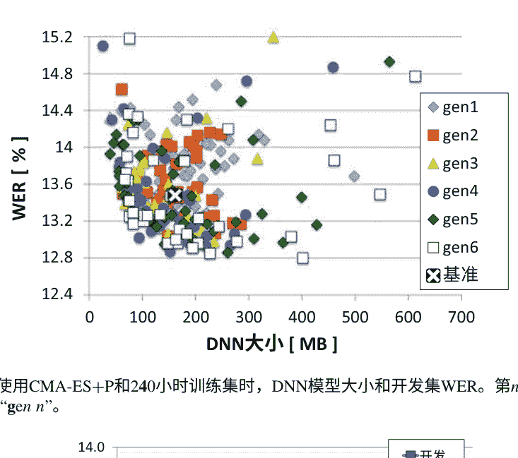

图4.15 当使用CMA-ES+P和240小时训练集时，DNN模型大小和开发集WER。第n代的结果标记为“gen n”。

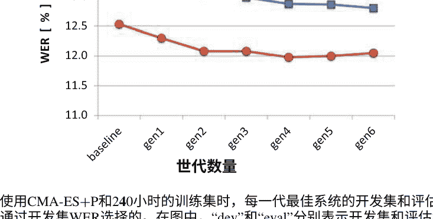

图4.16 当使用CMA-ES+P和240小时的训练集时，每一代最佳系统的开发集和评估集WER。系统是通过开发集WER选择的。在图中，“dev”和“eval”分别表示开发集和评估集的结果

图4.17 通过使用240小时的训练数据从初始到第6代得出的帕累托前沿。在图中，“dev”和“eval”分别表示开发集和评估集的结果

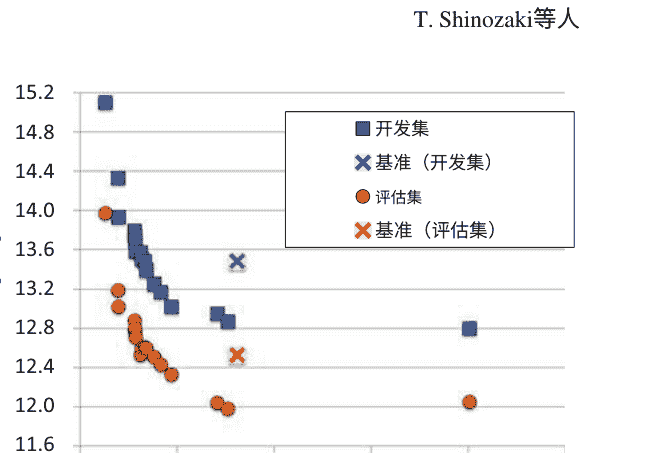

可能是由于对开发集过拟合导致的第6代结果最佳。开发集的最低WER在第6代获得。优化系统与基准系统之间评估集WER的差异为0.48%，在MAPSSWE显著性检验[33]下具有统计学意义。相对WER为3.8%。

如果需要的话，我们可以从帕累托前沿中选择一个系统，该系统最能满足WER和模型大小的平衡要求。图4.17显示了使用240小时训练数据从初始到第6代得出的帕累托前沿。这个图表显示，如果我们选择一个与初始模型大致相同的WER的系统，那么我们可以获得一个只有基准模型大小41%的缩小模型。也就是说，模型大小减少了59%。通过缩小模型，评估集的解码时间为79.5分钟，相当于基准模型的93.5分钟的85.4%。同样，缩小模型的训练时间是基准模型的54.3%。

表4.1的第4到9列显示了使用240小时训练集进行演化得到的元参数配置。这些配置在每一代中产生了最低的开发集WER。当我们分析得到的元参数时，虽然大多数元参数的变化不是单调的，但我们发现切割大小比初始模型增加了三倍以上。我们还注意到学习率从初始条件下降了一半以上。

作为补充实验，使用第4代的最佳模型作为初始模型进行顺序训练[34]。由于顺序训练计算量大，额外花费了7天时间。训练后，WER进一步降低，评估集的WER为10.9%。这个值低于使用基线作为初始模型进行顺序训练得到的11.2%的WER。这种差异在统计上是显著的，这证实了所提出方法的有效性。

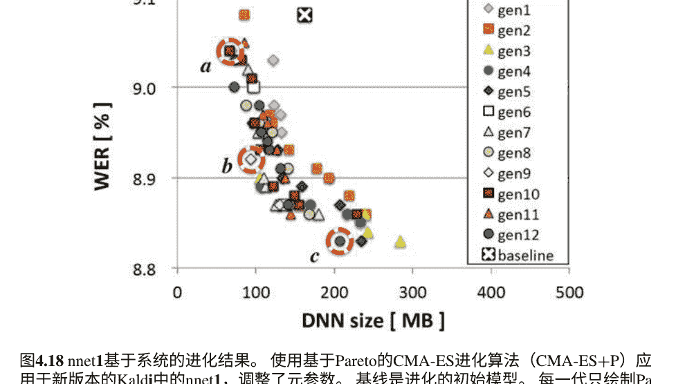

图4.18展示了使用减少的元参数的新版本Kaldi对nnet1进行附加实验的结果。该图显示了开发集WER和DNN模型大小的变化。进化过程由CMA-ES与Pareto (CMA-ES+P)执行，并且该过程重复了12代。

大约77%的个体在24小时内完成了训练。在图中，仅绘制了每一代Pareto边界上的基因结果，以提高可视性。标记为“a”的基因给出了最小的DNN大小，而标记为“c”的基因给出了最低的WER（有三个具有最小WER的基因，“c”是其中DNN大小最小的）。基因“b”比初始系统具有更小的DNN大小和更小的WER。表4.4描述了这些代表性基因的属性。在这个实验中，即使在基线初始配置的情况下，评估集WER的改进也很小。

表4.4 附加nnet1实验中三个代表性基因的总结，使用CMA-ES+P
| 基因 | 代 | WER [%] 开发 | WER [%] 评估 | DNN大小[MB] | 解码时间[分钟] |
| :--- | :--- | :--- | :--- | :--- | :--- |
| 基准 | 0 | 9.1 | 11.9 | 161.0 | 90.5 |
| a | 10 | 9.0 | 12.0 | 66.5 | 70.9 |
| b | 9 | 8.9 | 11.8 | 93.6 | 80.4 |
| c | 12 | 8.8 | 11.8 | 207.3 | 99.4 |

基因 a 给出了最小的模型大小，基因 c 给出了最低的开发集 WER。基因 b 平衡了模型大小和 WER 的减少。请参见图 4.18 以了解它们的位置

选择开发集中WER最低的基因。我们推测这可能是因为初始元参数在WER方面已经接近最优。元参数数量的减少也可能限制了改进的空间，尽管我们根据之前的实验选择了我们认为重要的那些。然而，进化对DNN大小有影响。当选择基因“b”时，在评估集上的WER稍微降低，DNN大小大大减小至93.6 MB，仅为初始模型161.0 MB的58%。如果选择基因“a”，评估集的WER略有增加，从11.9%增加到12.0%，但模型大小减小至66.5 MB，仅为初始模型的40%。因此，评估集的解码时间从90.5减少至70.9分钟。

图4.19显示了基于链式脚本的进化优化结果。大约63%的个体在24小时内完成了训练。在这种情况下，相对于nnet1，无论是在降低WER还是模型大小方面，都取得了更大的改进。图4.20显示了基于开发集WER选择的最佳系统的WER。虽然评估集WER存在一些随机行为，但总体上，开发集和评估集的WER都呈现出一致的降低趋势。表4.5显示了相应的元参数变化。与变化不同

图4.19是基于链式系统的进化结果。CMA-ES与基于Pareto的进化（CMA-ES+P）被应用于Kaldi的新版本的链式脚本。每一代只绘制Pareto边界上的个体以便于观察。

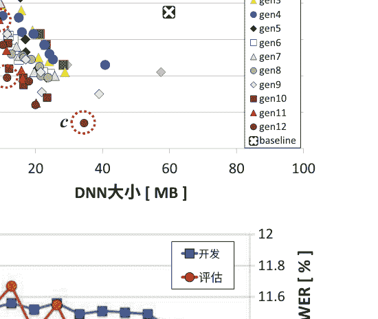

图4.20 最佳TDNN-based系统在每一代的开发和评估集WERs与CMA-ES+P的发展集WER选择的系统。开发集和评估集的结果分别用“dev”和“eval”表示

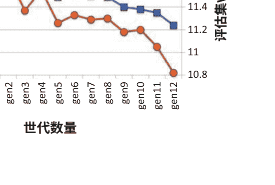

表4.5 使用帕累托CMA-ES（CMA-ES+P）进行自动调优。每一代选择一个在开发集上表现最好的基因

| 描述 | 基准 | gen1 | gen2 | gen3 | gen4 | gen5 | gen6 | gen7 | gen8 | gen9 | gen10 | gen11 | gen12 |
| :--- | :--- | :--- | :--- | :--- | :--- | :--- | :--- | :--- | :--- | :--- | :--- | :--- | :--- |
| **数值** | | | | | | | | | | | | | |
| 隐藏层的数量 | 9 | 8 | 12 | 9 | 8 | 11 | 9 | 8 | 9 | 10 | 9 | 12 | 12 |
| 每层单元数 | 625 | 641 | 308 | 396 | 518 | 320 | 354 | 384 | 349 | 461 | 311 | 282 | 427 |
| 初始迭代期间的学习率 | 1.0E-3 | 1.1E-3 | 1.0E-3 | 1.5E-3 | 1.5E-3 | 1.2E-3 | 1.9E-3 | 1.4E-3 | 1.8E-3 | 3.0E-3 | 1.3E-3 | 7.0E-3 | 1.1E-2 |
| 最终迭代期间的学习率 | 1.0E-4 | 0.7E-4 | 1.4E-4 | 1.4E-4 | 0.8E-4 | 1.1E-4 | 0.9E-4 | 0.9E-4 | 0.6E-4 | 0.6E-4 | 0.7E-4 | 0.4E-4 | 0.9E-4 |
| 交叉熵损失的权重 | 1.0E-1 | 1.1E-1 | 0.7E-1 | 1.6E-1 | 1.7E-1 | 1.3E-1 | 1.4E-1 | 1.3E-1 | 1.4E-1 | 0.9E-1 | 1.5E-1 | 1.2E-1 | 1.4E-1 |
| L2范数的系数 | 5.0E-5 | 3.5E-5 | 5.5E-5 | 4.4E-5 | 3.2E-5 | 3.0E-5 | 2.1E-5 | 2.7E-5 | 1.7E-1 | 1.5E-1 | 2.9E-5 | 0.5E-5 | 0.7E-5 |
| 泄漏hmm的系数 | 1.0E-1 | 1.5E-1 | 1.1E-1 | 1.5E-1 | 1.0E-1 | 1.9E-1 | 2.1E-1 | 1.6E-1 | 3.0E-1 | 4.7E-1 | 1.0E-1 | 4.0E-1 | 4.0E-1 |

表4.6 总结 三个代表性的基因在额外的链实验

| 基因 | 代 | WER [%] 开发 | WER [%] 评估 | DNN大小[MB] | 解码时间[分钟] |
| :--- | :--- | :--- | :--- | :--- | :--- |
| CSJ 默认 | | 9.3 | 11.7 | 53.7 | 22.6 |
| 基准 | 0 | 9.3 | 12.0 | 59.7 | 23.0 |
| a | 11 | 9.2 | 11.9 | 9.1 | 13.1 |
| b | 12 | 8.9 | 11.5 | 11.5 | 13.4 |
| c | 12 | 8.6 | 10.8 | 34.5 | 16.1 |

基因 a 给出了最小的模型大小，基因 c 给出了最低的开发集 WER。基因 b 平衡了模型大小和 WER 的减少。请参见图 4.19 以了解它们的位置

从 WER 的结果来看，它们的变化都不是单调的，揭示了它们之间的复杂相互作用。在经过 12 代之后，隐藏层中的单元数（每层的单元数）从基准的 625 个减少到 427 个，这是一个显著的变化。

在图 4.19 中，三个代表性的基因标记为 nnet1 的结果中的标记。表 4.6 描述了它们的详细信息。基因 b 的评估集 WER 为 11.5%，比基准初始结构低了 0.5%。与 CSJ 默认值（11.7%）相比，改进仅为 0.2%，但模型大小的减小显著，从 53.7 MB 减小到 11.5 MB。当使用基因 c 时，评估集 WER 为 10.8%，相对减少分别为 7.8% 和 9.7%，与 CSJ 默认值和基准初始配置相比。它们的差异在 MAPSSWE 测试中都是显著的。此外，模型大小减小到原始大小的 57.7%。CSJ 默认设置的解码时间从 22.6 分钟减少到 16.1 分钟。

## 4.6 结论

在本章中，我们介绍了口语语言处理的基本原理，重点关注语音识别。我们使用进化算法进行了元参数的自动优化，无需人工专家的详细说明。在使用 100 小时的训练集进行实验时，比较了多目标遗传算法、CMA-ES、带有帕累托的 CMA-ES（CMA-ES+P）和 BO。CMA-ES 方法和 GA 方法都比基准线产生了更低的 WER。其中，CMA-ES 和 CMA-ES+P 的 WER 比 GA 更低。通过使用 CMA-ES+P 来同时最小化 WER 和 DNN 模型大小，可以获得比单目标 CMA-ES 更小的 DNN 大小，同时保持 WER。CMA-ES 比需要指定元参数范围的 BO 更方便优化语音识别系统。此外，我们还使用更新版本的 Kaldi 工具包进行了额外的实验，并展示了基于 CMA-ES+P 的方法的一致有效性。特别是，调整后的链系统在WER和模型大小方面明显优于默认系统。除了这里介绍的实验外，我们还将CMA-ES应用于语言建模和神经机器翻译，并取得了自动性能改进[35, 36]。

当应用元参数调整到神经网络训练时，存在学习的双重结构；一种是神经网络连接权重的估计，另一种是网络结构和学习条件的元参数调整。目前，调整过程仅使用性能评分，并且每一代都丢弃了学习到的网络权重参数。未来的工作包括通过引入一种机制将祖先学到的知识传递给后代，从而提高优化效率。

## 参考文献

- 1. Davis, S.B., Mermelstein, P.: 在连续语音句子中单音节词识别的参数表示比较。IEEE Trans. Acoust. Speech Signal Process.28(4), 357–366 (1980)
- 2. Hermansky, H.: 语音的感知线性预测（PLP）分析。J. Acoust. Soc. Am. 87(4), 1738–1752 (1990)
- 3. Odell, J.J.: 在大词汇量语音识别中使用上下文，剑桥大学博士论文 (1995)
- 4. Chorowski, J.K., Bahdanau, D., Serdyuk, D., Cho, K., Bengio, Y.: 基于注意力的语音识别模型。 在：神经信息处理系统（NeurIPS）进展，pp. 577–585 (2015)
- 5. Graves, A., Mohamed, A.-R., Hinton, G.: 使用深度递归神经网络的语音识别。 在：2013年IEEE国际声学、语音和信号处理会议(ICASSP), pp. 6645–6649. IEEE, Piscataway (2013)
- 6. Sutskever, I., Vinyals, O., Le, Q.V.: 序列到序列学习与神经网络. 在: 神经信息处理系统进展 (NeurIPS) , 第3104-3112页 (2014)
- 7. Vinyals, O., Le, Q.: 一个神经对话模型. 预印本. arXiv:1506.05869 (2015)
- 8. Bahdanau, D., Cho, K., Bengio, Y.: 通过联合学习对齐和翻译的神经机器翻译. 预印本. arXiv:1409.0473 (2014)
- 9. Bellman, R.E., Dreyfus, S.E.: 应用动态规划. Princeton大学出版社, 普林斯顿 (1962)
- 10. Papineni, K., Roukos, S., Ward, T., Zhu, W.-J.: BLEU: 一种自动评估机器翻译的方法. 在: 第40届年会上的计算语言学协会会议论文集, 斯特劳斯堡, ACL '02, 第311-318页. 计算语言学协会, 斯特劳斯堡 (2002)
- 11. Hansen, N., M ller, S.D., Koumoutsakos, P.: 通过协方差矩阵适应（CMA-ES）减少随机演化策略的时间复杂性。Evol. Comput. 11(1),1–18 (2003)
- 12. Wierstra, D., Schaul, T., Glasmachers, T., Sun, Y., Peters, J., Schmidhuber, J.: 自然演化策略。 J. Mach. Learn. Res. 15(1), 949–980 (2014)
- 13. Akimoto, Y., Nagata, Y., Ono, I., Kobayashi, S.: CMA演化策略和自然演化策略之间的双向关系。 在: Parallel Problem Solving fromNature (PPSN)会议论文集, pp. 154–163 (2010)

# 第5章 搜索启发式算法用于时间序列预测的DBN优化

Takashi Kuremoto, Takaomi Hirata, Masanao Obayashi, Kunikazu Kobayashi, and Shingo Mabu

摘要Hinton和Salakhutdinov于2006年提出了一种具有多层受限玻尔兹曼机（RBM）的深度信念网络（DBN），用于降低数据的维度。与传统方法（如主成分分析（PCA））相比，DBN的卓越性能引起了模式识别研究人员的极大关注，甚至引发了人工智能（AI）的新时代，关键词为“深度学习”（DL）。深度神经网络（DNN），如DBN，深度自编码器（DAE）和卷积神经网络（CNN），已成功应用于降维，图像处理，模式识别等领域，然而，它们还可以应用于更多的AI学科，如计算认知，行为决策，预测等。此外，传统深度模型的架构通常是手工设计的，即DNN结构的优化仍然是一个问题。在本章中，我们主要介绍了DBN如何首次应用于时间序列预测系统的原始研究，并讨论了两种启发式优化方法来构建DBN：粒子群优化（PSO），一种著名的群体智能方法；和随机搜索（RS），这是一种更简单和有用的高维超参数探索算法。

## 5.1 引言

近年来，人类水平的软件，如游戏控制[1]、Alpha-Go[2， 3]的开发，吸引了全世界的人们。深度学习和强化学习[4]是这些重要发明的关键技术。

T. Kuremoto (✉) · T. Hirata · M. Obayashi · S. Mabu
山口大学，宇部，日本
电子邮件： wu@yamaguchi-u.ac.jp; m.obayas@yamaguchi-u.ac.jp; mabu@yamaguchi-u.ac.jp

K. Kobayashi
爱知县立大学，名古屋市，日本
电子邮件： kobayashi@ist.aichi-pu.ac.jp

深度学习（DL）是指一种使用多层人工神经网络的机器学习方法，自2000年代中期开始研究。Hinton等人提出了一种堆叠自编码器（SAE），它使用多个受限玻尔兹曼机（RBM）（一种随机神经网络）成功地组成了深度置信网络（DBN），并应用于降维和高维数据分类[5-7]。自从深度传统神经网络（DCNN）[8]赢得了2012年图像识别竞赛ILSVRC [9]的冠军以来，深度学习已成为最流行的人工智能（AI）研究方法。

然而，深度学习的一个问题是如何为不同的任务配置最优的深度学习模型。单元的数量和层数严重影响模型的性能，在学习过程中，即包括单元之间连接的权重和合适的学习速率的参数优化也非常重要。因此，深度神经网络（DNN）的结构已经通过网格和手动搜索进行设计，甚至被称为“艺术品”。在[10]中，Bergstra和Bengio提出了一种更高效的随机搜索方法。在[11]中，Ba和Frey提出了一种用于优化DNN的dropout方法，现在广泛使用。最近，Nowakowski，Dorogyy和Doroga-Ivaniuk提出使用遗传算法（GA）构建和优化DNNs [12]。在我们之前的研究中[13-15]，我们采用了粒子群优化（PSO）[16]，这是Kennedy和Eberhart于1995年提出的一种著名的群智能方法，用于找到不同受限玻尔兹曼机（RBM）中的最优单元数量，这些RBM用于时间序列预测的DBN。然而，基于PSO的DBN架构优化的主要问题是计算成本很高，因为每个DBN都需要通过RBM的学习和DBN的微调进行训练，而一个粒子代表一个DBN。在我们的实验中，使用一台个人电脑（3.2 GHz×1 CPU，8 GB×2 RAM）进行5000个数据的训练，需要近1周的时间[13，14]。我们使用Bergstra和Bengio的随机搜索（RS）来确定DBN中RBM的单元数量和层数，这些DBN由RBM或RBM和多层感知机（MLP）组成。

RS算法比PSO更简单，并且比传统的网格搜索（GS）更容易获得最优超参数，即手动探索。对于实验中的同一问题，RS花费的时间只有PSO训练DBN的一半[17-19]。对于其他最先进的DL模型，如VGG16 [20]，ResNet [21]，直到2年前[22, 23]，它们的架构也是通过试错设计的。在[22]中，王等人首次通过PSO进化了CNN架构。最近，Fernandes Junior和Yen提出了一种新颖的PSO算法，用于CNN架构优化，其粒子大小可变[23]。

在本章中，首先根据我们一系列的原创作品[13-15, 17-19]，一致地解释了如何通过PSO或RS优化DBN的架构。使用混沌时间序列（如Lorenz混沌[24]和Hénon映射[25]）以及基准CATS数据[26, 27]的实验结果显示了优化的DBNs的有效性。

## 5.2 使用RBM和MLP的DBN

Hinton等人提出的深度置信网络（DBN）[5-7]启发了深度学习的研究。DBN由多个受限玻尔兹曼机（RBM）组成，具有对高维数据（如图像和音频处理）的表示能力。在[5]中，Hinton和Salakhutdinov展示了具有4个RBM作为编码器和4个RBM作为解码器的DBN的强大压缩和重构功能，与传统的主成分分析（PCA）相比。

### 5.2.1 RBM

RBM是玻尔兹曼机的一种变体，是一种随机神经网络，但只有2层：可见层和隐藏层（见图5.1）。RBM中单元（神经元）之间的连接仅限于不同层中的连接，并且这些突触连接的权重在两个方向上是相同的，即 $w_{ij} = w_{ji}$。可见层和隐藏层中每个单元的输出为0或1，

$p(h_j=1|\mathbf{v}) = \frac{1}{exp(-b_j - \sum_i v_i w_{ij})},$\qquad\qquad\qquad\qquad\qquad\qquad\qquad(5.1)

$p(v_i=1|\mathbf{h}) = \frac{1}{exp(-b_i - \sum_j h_i w_{ji})},$\qquad\qquad\qquad\qquad\qquad\qquad\qquad(5.2)

所以各层的似然函数如下所示。

$p(\mathbf{h}|\mathbf{v}) = \prod_j p(h_j|\mathbf{v}),$\qquad\qquad\qquad\qquad\qquad\qquad\qquad\qquad(5.3)

$p(\mathbf{v}|\mathbf{h}) = \prod_i p(v_j|\mathbf{h}).$

RBM的网络能量由以下公式给出

$$E(\mathbf{v}, \mathbf{h}) = -\sum_i b_i v_i - \sum_j b_j h_j - \sum_{ij} v_i h_j w_{ij}.$$

为了表示输入向量，使用马尔可夫链蒙特卡洛（MCMC）方法对RBM进行采样。隐藏层的状态 $\mathbf{h}$ 可以通过采样得到，采样概率为 $p(\mathbf{h}|\mathbf{v})$。然后根据概率 $p^{(1)}(\mathbf{v}|\mathbf{h})$ 得到可见层的新状态 $\mathbf{v}^{(1)} \in \{0, 1\}$ 可以通过随机采样获得。重复这个过程后 $k = 1, 2, \ldots, \infty$ 步骤，即MCMC过程，RBM的状态收敛到稳定状态。

### 5.2.2 RBM和DBN的训练

RBM的参数 $(w_{ij}, b_i, b_j) \equiv \theta$ of 被对数似然函数的梯度优化。

$$\theta \leftarrow \theta + \alpha \frac{\partial p(\mathbf{v}, \mathbf{h})}{\partial \theta},$$

其中 $0 \leq \alpha \leq 1$ 是学习率。

事实上，RBM的学习规则如下。

$$\Delta w_{ij} = p^{(k-1)}(v_i = 1)p^{k-1}(h_j = 1) - p^{(k)}(v_i = 1)p^{(k)}(h_j = 1),$$
$$\Delta b_j = p^{k-1}(h_j = 1) - p^{(k)}(h_j = 1),$$
$$\Delta b_i = p^{k-1}(v_i = 1) - p^{(k)}(v_i = 1),$$

其中 $k = 1, 2, \ldots, K$是MCMC的步骤。在实践中，当训练迭代次数（epochs）足够大时，$K = 1$也能很好地工作，这种对比散度（CD）算法称为CD-1。此外，可以将原始数据输入可见单元的方式改为“在上一个模型结束时初始化一个马尔可夫链的状态”，这种训练算法称为持续对比散度（PCD）[28, 29]。

对于DBN训练，每个RBM都使用上述学习规则分别进行训练作为预训练，然后使用误差反向传播（BP）[30]进行微调以修改从预训练中获得的参数。

现在，让 $v_i^L \in \{0, 1\}$ 和 $h^{Lj} \in \{0, 1\}$ 分别表示第 $L$ 层的可见单元 $i$ 和隐藏单元 $j$ 的状态以及 $i$ 和 $j$ 之间的连接权重 $w_{ij}^L = w_j^{iL} \in [0,1]$，以及偏置 $b_i^L = b_j^L$，对于这些参数的修改的BP训练规则如下所示。

$$ \Delta w_{ij}^L = -\epsilon \left( \sum_i \frac{\partial E}{\partial w_{ji}^{L+1}} w_{ji}^{L+1} \right) \left(1 - h_j^L \right) v_i^L, \tag{5.10} $$

$$ \Delta b_i^L = -\epsilon \left( \sum_i \frac{\partial E}{\partial w_{ji}^{L+1}} w_{ji}^{L+1} \right) \left(1 - h_j^L \right), \tag{5.11} $$

其中 $E = \sum_{t=1}^T (y_t - \hat{y}_t)^2$ 是网络输出的平方误差。

### 5.2.3 用于时间序列预测的DBNs

已经有成千上万的研究使用人工神经网络进行时间序列预测[31, 32]。神经预测系统的原理如图5.2所示。对于时间序列数据 $y(t), t = 1, 2, \ldots, T, n \leq T$ 数据被用作神经网络的输入： $\mathbf{x}(t) = (y(t), y(t-\tau), y(t-2\tau), \ldots, y(t-n\tau))$, 其中 $n\tau \leq T$, $\tau$ 是表示时间滞后的整数， $n$ 是输入的维度。网络的输出是一个标量 $\hat{y}(t+\tau)$。使用 $N$ 个样本 $(x(t), y(t + \tau)), (x(t + 1), y(t + 1 + \tau)), \ldots, (x(t + N - 1), y(t + N - 1 + \tau))$

图5.2 通过人工神经网络进行时间序列预测

神经网络可以通过损失（误差）函数或交叉熵函数的梯度方法进行训练。

例如，一个前馈神经网络（见图5.2），具有输入层、隐藏层和输出层，被称为多层感知器（MLP）[30]，可以通过BP算法进行训练，具体步骤如下。

### 算法I: 误差反向传播（BP算法）

- 步骤1 输入数据 $\mathbf{x}(t) = (y(t), y(t - \tau), \ldots, y(t - n\tau))$ 到MLP。
- 步骤2 根据公式（5.12）和（5.13）预测未来数据 $y(t + \tau)$。

$$f(y + \tau) = \frac{1}{1 + \exp \left( -\sum_{j=1}^{K+1} w_j f(z_j) \right)}, \quad (5.12)$$

$$f(z_j) = \frac{1}{1 + \exp \left( -\sum_{i=0}^{n} v_i y(t - i\tau) \right)}, \quad (5.13)$$

其中 $v_i$ 和 $w_j$ 是输入单元与隐藏单元之间的连接权重，以及隐藏单元与输出单元之间的连接权重。

- 步骤3 计算连接权重的修改，$\Delta w_j$, $\Delta v_{ji}$ 根据公式(5.14)和(5.15)。

$$\Delta w_j = -\epsilon (y(t + \tau) - \hat{y}(t + \tau)) y(t + \tau) (1 - y(t + \tau)) z_j, \quad (5.14)$$

$$\Delta v_{ji} = -\epsilon (y(t + \tau) - \hat{y}(t + \tau)) y(t + \tau) (1 - y(t + \tau)) z_j w_j (1 - z_j) x_i. \quad (5.15)$$

- 步骤4 修改连接，$w_j \leftarrow w_j + \Delta w_j$, $v_{ji} \leftarrow v_{ji} + \Delta v_{ji}$.
- 步骤5 对于下一个时间步骤 $t + 1$, 返回第1步。

由于DBN具有RBM的强大表示能力，它被用于捕捉时间序列数据的特征，然后预测未来值。在[13-15]中，首次提出了具有2-4个RBM的DBN在时间序列预测领域中，(图5.3展示了一个具有2个RBM的DBN的示例)，在[17-19]中，构建了具有0-3个RBM和一个多层感知器(MLP)的DBN作为预测系统。(图5.4展示了一个具有1个RBM和1个MLP的DBN的示例)。DBN与RBM和MLP的训练与仅具有RBM的DBN相同，如5.2.2节中所介绍的，但是在MLP中添加了BP训练，如算法I所示。

## 参考文献

14. Sutton, R.S., McAllester, D., Singh, S., Mansour, Y.: 用函数逼近进行强化学习的策略梯度方法。 在: 第12届神经信息处理系统国际会议, NIPS’99, pp. 1057–1063 (1999)
15. Brochu, E., Cora, V.M., De Freitas, N.: 昂贵成本的贝叶斯优化教程, 应用于主动用户建模和分层强化学习。 预印本。 arXiv:1012.2599 (2010)
16. Snoek, J., Larochelle, H., Adams, R.P.: 实用的贝叶斯优化机器学习算法。 在: 神经信息处理系统25的进展 (2012)
17. Rasmussen, C.E., Williams, C.K.I.: 机器学习的高斯过程。 MIT出版社, 剑桥 (2006)
18. Miettinen, K.: 非线性多目标优化。 Springer, 柏林 (1998)
19. Deb, K., Pratap, A., Agarwal, S., Meyarivan, T.: 快速且精英的多目标遗传算法: NSGA-II。 IEEE Trans. Evol. Comput. 6(2), 182–197 (2002)
20. Deb, K., Kalyanmoy, D.: 使用进化算法的多目标优化。 约翰·威利和儿子公司, 纽约 (2001年)
21. Zitzler, E., Thiele, L.: 多目标进化算法: 比较案例研究和强度帕累托方法。 IEEE进化计算杂志 3 (4), 257-271 (1999年)
22. David Schaffer, J.: 使用向量评估的遗传算法进行多目标优化。 在: 遗传算法第一届国际会议论文集, 希尔斯代尔, 第93-100页. L. Erlbaum Associates Inc., 马霍 (1985年)
23. Hajela, P., Lin, C.Y.: 多准则最优设计中的遗传搜索策略。 结构优化4 (2), 99-107 (1992年)
24. Hernandez-Lobato, D., Hernandez-Lobato, J., Shah, A., Adams, R.: 用于多目标贝叶斯优化的预测熵搜索。 在: Balcan, M.F., Weinberger, K.Q. (eds.) 第33届国际机器学习大会论文集, 纽约, 6月20-22日。 机器学习研究的论文集, 卷48, 第1492-1501页 (2016年)
25. Knowles, J.: ParEGO: 一种用于昂贵多目标优化问题的混合算法, 具有在线景观近似。 IEEE进化计算杂志 10 (1), 50-66 (2006年)
26. Moriya, T., Tanaka, T., Shinozaki, T., Watanabe, S., Duh, K.: 基于进化策略的高性能语音识别系统开发自动化。 IEEE/ACM音频语音语言处理杂志 27 (1), 77-88 (2019年)
27. Furui, S., Maekawa, K., Isahara, H.: 一个关于自发语音语料库和处理技术的日本国家项目 In: ASR'00会议论文集, 第244-248页 (2000年)
28. Allauzen, C., Riley, M., Schalkwyk, J., Skut, W., Mohri, M.: OpenFST: 一个通用且高效的加权有限状态转换器库。 In: 自动机的实现和应用, 第11-23页. Springer, Berlin (2007)
29. Furui, S.: 使用语音频谱的动态特征进行说话人无关的孤立词识别。 IEEE Trans. 声学语音信号处理, 34, 52-59 (1986)
30. Haeb-Umbach, R., Ney, H.: 用于改进大词汇连续语音识别的线性判别分析。 In: 国际声学、语音和信号处理会议论文集, 第1卷, 第13-16页 (1992)
31. Gales, M.J.F.: 基于HMM的语音识别的最大似然线性变换。 Comput. Speech Lang. 12, 75–98 (1998)
32. Povey, D., Peddinti, V., Galvez, D., Ghahremani, P., Manohar, V., Na, X., Wang, Y., Khudanpur, S.: 基于无网格的MMI的纯序列训练神经网络的ASR。 在: Interspeech, pp. 2751–2755 (2016)
33. Gillick, L., Cox, S.: 在语音识别算法比较中的一些统计问题。 在: 国际声学、语音和信号处理会议论文集, pp. 532–535 (1989)
34. Vesely, K., Ghoshal, A., Burget, L., Povey, D.: 深度神经网络的序列判别训练。 在: Interspeech会议论文集, pp. 2345–2349 (2013)
35. 田中，T.，森谷，T.，篠崎，T.，渡辺，S.，堀，T.，Duh，K.：基于进化策略的神经网络语言模型的自动结构发现和参数调整。 在：2016年IEEE口语技术研讨会论文集，第665-671页（2016年）
36. 秦，H.，篠崎，T.，Duh，K.：基于进化策略的神经机器翻译系统的自动调整。 在：国际口语翻译研讨会（IWSLT）论文集，第120-128页（2017年）

图5.3 具有2个RBM的DBN [14]

图5.4 具有2个RBM和MLP的DBN [17]

## 使用PSO或随机搜索设计DBN

### 使用PSO设计DBN

为了设计DBN的最优结构，采用了肯尼迪和埃伯哈特的粒子群优化（PSO）[16][13-15]。

PSO是一种用于优化问题的著名进化计算方法。让候选解（粒子）$\boldsymbol{x}^k_i \in \mathbb{R}^n$在时间$k$时处于超参数空间中的位置$i = 1,2,\dots$，其中，m是粒子的数量。它们通过成本函数$\min_{\boldsymbol{x}} f(\boldsymbol{x})$使用其历史最佳位置$\boldsymbol{pbest}^k_i$和群体中的最佳粒子$\boldsymbol{gbest}^k$进行评估和改进。

$\boldsymbol{x}^{k+1}_i = \boldsymbol{x}^k_i + \boldsymbol{v}^k_i$  (5.16)

$\boldsymbol{v}^{k+1}_i = w\boldsymbol{v}^k_i + c_1 r_1 \left( \boldsymbol{pbest}^k_i - \boldsymbol{x}^k_i \right) + c_2 r_2 \left( \boldsymbol{gbest}^k - \boldsymbol{x}^k_i \right)$  (5.17)

其中，初始值$\boldsymbol{x}$和$\boldsymbol{v}$是随机数，$k = 1,2,\dots$，K是迭代次数，阻尼系数$w \geq 0$，参数$c_1, c_2 \geq 0, r_1, r_2 \in [0,1]$是随机数。重复公式 (5.16) 和 (5.17)，$\boldsymbol{gbest}^k$被修改并收敛到最优解。

对于DBN结构设计，层数、单元数和不同RBM的学习率被设置为PSO的输入向量的元素。成本函数是教师数据$y(t+\tau)$和DBN输出$\hat{y}(t+\tau)$之间的均方误差（MSE）。DBN架构设计的PSO过程如算法II所示。

### 算法II: 使用PSO设计DBN

- 步骤1 选择超参数，例如RBM的数量，不同RBM中的单元数，RBM预训练的学习率，DBN微调的学习率，作为$PSO$粒子的探索空间。
- 步骤2 决定粒子的种群大小$P$和迭代次数的限制$I$。
- 步骤3 初始化起始位置$\boldsymbol{x}_i^{k=0}$和$\boldsymbol{v}_i^{k=0}$使用随机整数或实数在超参数空间的探索范围内。
- 步骤4 通过均方误差（MSE）评估每个粒子的预测值$\hat{y}(t+\tau)$和教师数据$y(t+\tau)$之间的差异，并从其历史记录中找到粒子的最佳位置$\boldsymbol{pbest}^k_i$以及群体的最佳粒子位置$\boldsymbol{gbest}^k$。
- 第5步 更新位置$\boldsymbol{x}_i^{k+1}$和速度$\boldsymbol{v}_i^{k+1}$通过方程（5.16）和（5.17）分别更新粒子的位置和速度。请注意，这些向量中的整数元素需要四舍五入以进行第4步。
- 第6步 完成：如果评估函数（训练数据的预测MSE）收敛，或$k = I$；否则返回第4步。

### 5.3.2 使用RS设计DBN

为了找到神经网络的最佳架构，通常使用网格搜索（GS）。层数、每层单元数和学习率等被视为超参数向量空间中的元素。在GS中，根据网络损失函数的减少来调整每个元素的值，而其他元素的值在先前的值中被固定，这个过程对超参数空间中的所有元素进行迭代。由于GS的调整间隔通常是固定的，连续空间中的最优参数可能会泄漏（见图5.5）。

作为GS的替代方案，Bergstra和Bengio在[10]中提出了一种随机搜索（RS）方法。如图5.6所示，可以选择超参数元素的各种值作为候选项，并重复此过程足够多次，可以找到神经网络的最佳架构，比GS更有效。在[17-19]中，RS被用于找到RBM的数量，单元的数量，学习RBM的速率以及构建具有多个RBM和MLP而不是PSO的DBN的微调学习速率。RS算法非常简单，如算法III所示。

### 算法III：使用RS设计DBN

- 步骤1 选择超参数，例如RBM的数量，不同RBM中的单元数量，RBM预训练的学习速率，DBN微调的学习速率，作为RS的探索空间。
- 步骤2 决定探索的迭代次数 I。
- 步骤3：使用随机实数（在不同元素的有限区间内）初始化超参数向量 \(\mathbf{x}^{k=0}\)。
- 步骤4：存储当前预测值 \(\hat{y}(t+\tau)\) 和教师数据 \(y(t+\tau)\) 之间的均方误差（MSE）。
- 步骤5：将存储的MSE与最小值进行比较，并使用相应的超参数 \(\mathbf{x}^{k}\) 作为DBN的最优结构。
- 步骤6：结束条件：如果评估函数（训练数据的预测MSE）收敛，或 \(k = I\)；否则返回步骤3。

## PSO和RS的实验比较

本节报告了使用PSO和RS构建的不同DBN进行时间序列预测实验。实验中使用了三个时间序列数据：Lorenz混沌[24]，Hénon映射[25]和CATS基准[26, 27]。混沌是一种复杂的非线性现象，动态状态对初始条件非常敏感，在一般情况下无法进行长期预测。在我们的实验中，对于混沌时间序列预测（洛伦兹混沌和Hénon映射），进行了一步预测。同时，对于CATS数据，执行长期预测，即使用预测值的输出作为下一个输入到DBN。

### 5.4.1 洛伦兹混沌的一步预测

洛伦兹混沌[24]由以下三维非线性公式给出。

$$
\begin{cases}
\frac{dx}{dt} = \sigma x + \sigma y; \\
\frac{dy}{dt} = -xz + rx - y; \\
\frac{dz}{dt} = xy - bz.
\end{cases}
\quad (5.18)
$$

图5.7 洛伦兹混沌[24]

设参数 \(\sigma = 10\), \(b = 28\), \(r = 8/3\), \(\Delta t = 0.01\)，可以得到一个吸引子，即著名的“蝴蝶效应”，如图5.7所示。

洛伦兹混沌的混沌时间序列在预测实验中使用，其中x轴为混沌时间序列的时间，y轴为混沌时间序列的值。时间序列的长度为1000，其中600个数据用作训练样本，200个用于验证，200个未知数据用作测试集。

RBM的数量探索范围为1-4，具有RBM的DBN和具有RBM和MLP的DBN的数量探索范围为0-4。DBN的输入层和隐藏层的单元数量范围为2-20。RBM和MLP的学习率范围为0.1-0.00001，RBM的预训练的训练迭代次数限制为5000次，使用BP算法进行微调的训练迭代次数限制为10000次。

#### 5.4.1.1 PSO决定的洛伦兹混沌DBN

通过PSO算法优化了四个神经网络，用于洛伦兹混沌的预测：一个MLP，一个具有2个RBM的DBN [13, 14]，一个具有1个RBM和1个MLP的DBN [15]，以及一个具有2个RBM和1个MLP的DBN [15]。粒子（种群）数量为10，迭代次数为15，每个层中单元数量的探索范围为[2-20]，输出层为1个单元。时间滞后间隔 \(\tau=1\)，RBM和BP的学习率范围为[\(10^{-1}\), \(10^{-5}\)]。RBM的预训练的训练迭代次数上限为5000次，使用BP算法进行微调的训练迭代次数上限为10000次。PSO的探索结果显示在表5.1中。由PSO决定的2个RBM DBN的训练和一步预测结果显示在图5.8和图5.9中。详细的预测准确率（MSE）显示在表5.2中，其中由1个RBM和1个MLP组成的模型具有最低的训练和预测误差（加粗值）。

表5.1 通过PSO优化的Lorenz混沌的超参数

| 模型 | 结构 | RBM1的学习率 | RBM2的学习率 | BP MLP的学习率 |
| :--- | :--- | :--- | :--- | :--- |
|  | 5-2-1 | - | - | 0.1 |
| 2个RBM | 7-7-1 | 0.093 | 0.074 | 0.092 |
| 1个RBM + MLP | 5-9-2-1 | 0.1 | - | 0.1 |
| 2个RBM + MLP | 7-12-19-2-1 | 0.09 | 0.22 | 0.089 |

#### 5.4.1.2 由RS决定的Lorenz混沌的DBN

与第5.4.1.1节中报告的实验不同，RBMs和MLP也被采用在DBN的超参数空间中进行架构决策。因此，第5.4.1.1节中描述的四个模型能够在一个优化过程中进行研究。在这个实验中使用的其他条件与Lorenz混沌时间序列预测的PSO情况相同。探索的超参数如表5.3所示，这意味着DBN的最佳架构由一个RBM (5-11)和MLP (11-2-1)组成，即5-11-2-1，并且RBM (CD-1学习)和BP学习的学习率分别为0.042和0.091。

Lorenz混沌的DBN的预测准确率显示在表5.4中。训练MSE ($= 0.94 \times 10^{-5}$)低于PSO方法 ($= 1.0 \times 10^{-5}$)，但RS的预测MSE高于PSO ($RS = 0.5 \times 10^{-5}$, $PSO = 0.3 \times 10^{-5}$)。

表5.2 通过PSO优化的不同模型对Lorenz混沌的预测准确率 (MSE)

| 模型 | 训练误差 | 预测误差 |
| :--- | :--- | :--- |
| MLP | 2.7 | 1.0 |
| 2个RBM | 3.2 | 1.3 |
| **1 RBM + MLP** | **1.0** | **0.3** |
| 2 RBMs + MLP | 1.6 | 0.7 |
单位: ×10⁻⁵

表5.3 通过RS优化的超参数用于Lorenz混沌模型

| 模型 | 结构 | RBM的学习率 | BP的学习率 |
| :--- | :--- | :--- | :--- |
| 1 RBM + MLP | 5-11-2-1 | 0.42 | 0.1 |

表5.4 通过RS给出的最优模型对Lorenz混沌进行预测准确度 (MSE)

| 模型 | 训练误差 | 预测误差 |
| :--- | :--- | :--- |
| 1 RBM + MLP | 0.94 | 0.5 |
单位: ×10⁻⁵

### 5.4.2 Hénon Map的一步预测

Hénon [25]由以下二维非线性公式给出。

$$
\begin{cases}
x(t+1)=1-ax(t)^{2}+y(t); \\
y(t+1)=bx(t).
\end{cases}
\quad (5.19)
$$

设参数 $a = 1.4, b = 0.3$, 可以得到吸引子如图5.10所示。使用Hénon映射的混沌时间序列的 $x$ –轴作为输入。时间序列的长度为1000，其中600个数据用作训练样本，200个用于验证，200个未知数据用作测试集。使用具有2个RBM和MLP通过RS结构化的DBN的训练和一步预测结果如图5.11所示。

在使用PSO/RS进行Hénon映射时间序列预测的实验条件与洛伦兹混沌情况（第5.4.1节）相同。通过PSO和RS优化的DBN的超参数如表5.5和5.6所示。从表5.6可以看出，与洛伦兹混沌情况相同，通过RS选择了具有1个RBM和1个MLP的DBN，同时选择了具有2个RBM和1个MLP被PSO选择。使用Hénon映射数据结构化的DBNs的一步预测准确率（MSE）在表5.7中列出，其中使用PSO和RS。DBN通过1个RBM和RS找到的MLP实现了最高的训练准确率和预测准确率，其MSE为5.52 × 10^{-5}和9.09 × 10^{-5}（粗体值）。

表5.5 通过PSO优化的超参数用于Hénon映射

| 模型 | 结构 | RBM1的学习率 | RBM2的学习率 | BP MLP的学习率 |
|------|------|--------------|--------------|----------------|
| 2个RBM | 2-16-1 | - | - | 0.1 |
| 2个RBM | 2-16-1 | 0.025 | 0.082 | 0.041 |
| 1 RBM + MLP | 2-9-9-1 | 0.1 | - | 0.1 |
| 2 RBMs + MLP | 2-11-20-15-1 | 0.1 | 0.1 | 0.085 |

表5.6 通过RS优化的超参数用于Hénon映射模型

| 模型 | 结构 | RBM的学习率 | BP的学习率 |
|------|------|-------------|------------|
| 1 RBM + MLP | 14-18-14-1 | 0.0001 | 0.0895 |

表5.7 使用Hénon映射，PSO和RS之间的准确性（MSE）比较

| 模型 | 训练误差 PSO/RS | 预测误差 PSO/RS |
|------|-----------------|-----------------|
| MLP | 288/- | 79/- |
| 2 RBMs | 3912/- | 918/- |
| **1 RBM + MLP** | **135/5.52** | **36/9.09** |
| 2 RBMs + MLP | 130/- | 31/- |
单位: ×10^{-5}

### 5.4.3 CATS基准的长期预测

自1980年代中期以来，已经有成千上万的时间序列预测出版物使用人工神经网络（ANN）的方法。在2004年国际神经网络联合会议（IJCNN'04）上，Lendasse等人组织了一个时间序列预测竞赛，使用了基准数据CATS [26]，并在[27]中报告了结果。CATS包括5000个时间点的数据，分为5个块，每个块的最后20个数据被组织者隐藏（见图5.12）。

竞争的评估是预测准确性，即五个名为E1的块的平均MSE和前四个块的平均MSE E2。因此，对于未知的20个数据，需要进行长期预测，即将预测器的输出作为输入进行递归。

$$
\begin{aligned}
E_1 = & \frac{\sum_{t=981}^{1000} (y_t - \hat{y}_t)^2}{100} + \frac{\sum_{t=1981}^{2000} (y_t - \hat{y}_t)^2}{100} + \frac{\sum_{t=2981}^{3000} (y_t - \hat{y}_t)^2}{100} \\
& + \frac{\sum_{t=3981}^{4000} (y_t - \hat{y}_t)^2}{100} + \frac{\sum_{t=4981}^{5000} (y_t - \hat{y}_t)^2}{100}
\end{aligned}
\quad (5.20)
$$

$$
E_2 = \frac{\sum_{t=981}^{1000} (y_t - \hat{y}_t)^2}{80} + \frac{\sum_{t=1981}^{2000} (y_t - \hat{y}_t)^2}{80} \qquad (5.22)
$$

$$
\quad + \frac{\sum_{t=2981}^{3000} (y_t - \hat{y}_t)^2}{80} + \frac{\sum_{t=3981}^{4000} (y_t - \hat{y}_t)^2}{80}. \qquad (5.23)
$$

传统方法和使用PSO和RS的DBN的预测结果显示在表5.8中。与使用卡尔曼平滑方法[27]的IJCNN'04的最佳 E_1 = 408相比，由RS构建的DBN取得了显著进展， E_1 = 257。 在 E_2 的情况下， DBN的准确性与使用集成模型[27]的IJCNN'04的最佳相似。 使用PSO和RS优化的不同块数据的DBN的超参数显示在表5.9中。从表5.8可以看出， RS的预测准确性优于PSO；然而，事实是在[13, 14]中， PSO优化的DBN中没有组合MLP。

表5.8 PSO和随机搜索(RS)在CATS基准上的准确性比较(MSE)

| 模型 | E1 | E2 |
|---|---|---|
| IJCNN'04的最佳[27] | 408 | 222 |
| 使用PSO的2个RBM的DBN [13, 14] | 125 979 | |
| 使用RS的1个RBM和MLP的DBN | 257 | 252 |
*长期预测

表5.9 使用PSO和RS优化的超参数用于CATS基准测试

| 模型 | 结构 PSO/RS | RBM的学习率 PSO/RS | BP的学习率 PSO/RS |
| :--- | :--- | :--- | :--- |
| 第一个块 | 20-18-1/18-20-14-1 | 0.47, 0.99/0.083 | 0.96/0.082 |
| 第二个块 | 11-3-1/16-19-15-1 | 0.85, 0.95/0.0046 | 0.99/0.076 |
| 第三个块 | 8-13-1/18-18-13-1 | 0.90, 0.77/0.046 | 0.87/0.088 |
| 第四个块 | 20-7-1/18-14-19-1 | 0.92, 0.88/0.12 | 0.53/0.083 |
| 第五个块 | 20-14-1/19-19-17-1 | 0.17, 0.19/0.079 | 0.39/0.075 |

图5.13和5.14分别显示了DBN（18-20-14-1）的训练结果和长期预测（20个未知数据）DBN由RS提供，其中包括1个RBM和1个MLP。RBM的输入单元数为18，输出单元数为20。MLP单元数为20，隐藏单元数为14，输出单元数为1。RBM和MLP的学习率分别为0.083和0.082。CATS不同块的DBN的详细信息显示在表5.9中。通过训练迭代观察PSO和RS的效率变化预测误差（MSE）的变化。例如，RS学习优化的DBN的MSE变化显示在图5.15中，PSO算法中10个粒子的演化训练过程中的变化可以通过图5.16确认。RBM的输入层和隐藏层的数量的变化由PSO探索过程中最佳粒子产生（参见图5.17和5.18）。

图5.14 DBN的长期预测结果，由RS结构化的第一个块的CATS

图5.15 RS学习中MSE的变化，用于具有1个RBM和1个MLP的DBN

### 使用DBN的5.5高级预测系统

时间序列预测的研究历史悠久，因为它在金融、经济、工业等社会活动以及自然科学中起着重要作用。最著名的线性预测模型是自回归综合移动平均模型（ARIMA），该模型于1970年代提出[33]。自1980年代以来，人工神经网络（ANN）作为非线性模型成为新颖高效的预测器。

图5.16 PSO学习中粒子的演化，用于具有2个RBM的DBN

图5.17 输入单元的数量

[26, 27, 31]。考虑到时间序列数据的线性和非线性特征，张提出了一种混合预测方法，该方法使用ARIMA来预测未来的未知数据，然后使用经过训练的ANN来预测ARIMA预测数据的残差。在[17, 34]中，张的混合模型通过使用DBN进行了修改，该DBN由第5.3节介绍的RS结构化，用于预测未来的未知数据，然后使用ARIMA来预测残差。通过比较实验，确认ARIMA+DBN和DBN+ARIMA混合模型优先于单独使用ARIMA或DBN。针对实时时间序列预测，最近提出了一种具有强化学习方法“随机梯度上升（SGA）”的DBN[35][19, 36]。SGA被用作微调方法，而不是传统的BP方法。在预测实验中，使用了Aalto大学[37]和Hyndman [38]提供的太阳黑子数量、海平面气压、大气CO2浓度等数据。所有这些先进的DBN都是通过RS算法设计的，即算法III，以及

图5.18 隐藏单元的数量

原因是RS可以被认为是一种简化的PSO，其中种群大小为1，过程比PSO简单。然而，它们之间的精度和计算成本的比较仍然有待完成。

## 5.6 结论

为了找到深度神经网络（DNN）的最优结构，本章介绍了粒子群优化（PSO）和随机搜索（RS）方法。
作为一种新颖的非线性时间序列预测模型，由多个受限玻尔兹曼机（RBM）和多层感知机（MLP）组成的深度置信网络（DBN）通过PSO和RS进行结构化，根据混沌时间序列和基准数据的预测实验结果，这些DBN优于传统方法。然而，正如我们所知，进化计算，包括群体智能方法，发展迅速，与此同时，这里提到的论文中使用的PSO和RS是原始版本。因此，采用先进的优化方法来确定DNN的最优结构非常有趣。

## 参考文献

- 1. Mnih, V., 等: 通过深度强化学习实现人类水平的控制。 自然 **518**, 529–533 (2015年)
- 2. Sivler, D., 等: 通过深度神经网络和树搜索掌握围棋。 自然 **529**, 484–489 (2016年)
- 3. Sivler, D., 等: 在没有人类知识的情况下掌握围棋。 自然 **550**, 354–359 (2017年)
- 4. Williams, R.J., 简单的统计梯度跟踪算法用于连接主义强化学习。机器学习。 8，229–256 (1992年)
- 5. Hinton, G.E., Salakhutdinov, R.R.: 用神经网络降低数据的维度。科学 **313**, 504–507 (2006年)
- 6. Hinton, G.E., Osindero, S., The, Y.W.: 一种更快的深度信念网络学习算法。神经计算。 **1** (7) , 1527–1544 (2006年)
- 7. Roux, N.L., Bengio, Y.: 受限玻尔兹曼机和深度信念网络的表征能力. 神经计算 **20**(6), 1631–1649 (2008)
- 8. Krizhevsky, A., Sutskever, I., Hinton, G.E.: 使用深度卷积神经网络进行ImageNet分类. 在: 第25届神经信息处理系统国际会议论文集 (NIPS’12), vol.1, pp. 1097–1105 (2012)
- 9. IMAGENET大规模视觉识别挑战 (2012). http://www.image-net.org/challenges/LSVRC/2012/
- 10. Bergstra, J., Bengio, Y.: 超参数优化的随机搜索. 机器学习杂志研究 **13**, 281–305 (2012)
- 11. Ba, J., Frey, B.: 用于训练深度神经网络的自适应dropout. 在: 神经信息处理系统进展 (NIPS2013), vol. 26, pp. 3084–3092 (2013)
- 12. Nowakowski, G., Dorogyy, Y., Doroga-Ivaniuk, O.: 神经网络结构优化算法. 自动化与移动机器人智能系统杂志 **12**(1), 5–13 (2018)
- 13. Kuremoto, T., Kimura, S., Kobayashi, K., Obayashi M.: 使用受限Boltzmann机器进行时间序列预测。 在: 第8届国际智能计算大会(ICIC 2012)的论文集中。 计算机与信息科学通讯(CCIS), vol.304, pp. 17–22. Springer, Berlin (2012)
- 14. Kuremoto, T., Kimura, S., Kobayashi, K., Obayashi, M.: 使用受限Boltzmann机器的深度信念网络进行时间序列预测。 神经计算 **137**(5), 47–56 (2014)
- 15. Kuremoto, T., Hirata, T., Obayashi, M., Mabu, S., Kobayashi, K.: 通过DBNs预测混沌时间序列数据。 在: 第7届国际图像与信号处理大会(CISP 2014)的论文集中, pp. 1304–1309 (2014)
- 16. 肯尼迪, J., 埃伯哈特, R.C.: 粒子群优化。 在: IEEE国际会议神经网络, 第1942-1948页 (1995年)
- 17. 平田, T., 幕本, T., 小林, M., 马布, S.: 使用DBN和ARIMA的时间序列预测。在: 国际计算机应用技术会议 (CCATS 2015) , 第24-29页 (2015年)
- 18. 平井, T., 吳本, T., 小林, M., 馬部, S., 小林, K.: 使用强化学习的深度信念网络及其在时间序列预测中的应用。 在: 国际神经信息处理会议 (ICONIP'16) 论文集。计算机科学讲义 (LNCS) , 卷9949, 第30-37页。Springer, 柏林 (2016年)
- 19. 平井, T., 幕本, T., 小林, M., 马布, S., 小林, K.: 使用深度置信网络和强化学习预测实时数据。机器人网络人工生命 **4**(4), 260-264(2018)。 https://doi.org/10.2991/jrnal.2018.4.4.1
- 20. Simonyan, K., Zisserman, A.: 用于大规模图像识别的非常深的卷积网络。arXiv预印本: 1409.15566, CISP2014
- 21. He, K., Zhang, X., Ren, S., Sun, J.: 用于图像识别的深度残差学习。 在: 2016年IEEE计算机视觉和模式识别会议 (CVPR) , 第770-778页 (2016)
- 22. 王, B., 孙, Y., 薛, B., 张, M.: 通过可变长度粒子群优化演化深度卷积神经网络进行图像分类。在: 2018年IEEE进化计算大会 (CEC) , 第1514-1521页 (2018)
- 23. Fernandes Jr., F.E., Yen, G.G.: 粒子群优化深度神经网络架构用于图像分类。Swarm Evol . Comput. **49**, 62–73 (2019)
- 24. Lorenz, E.N.: 确定性非周期流动。 J. Atmos. Sci. **20**, 1 30–141 (1963)
- 25. Henon, M.: 具有奇怪吸引子的二维映射。Commun. Math. Phys. **50**(1), 69–77 (1976)
- 26. Lendasse, A., Oja, E., Simula, O., Verleysen, M.: 时间序列预测竞赛：CATS基准。 In: 国际神经网络联合会议论文集(IJCNN’04),pp. 1615–1620 (2004)
- 27. Lendasse, A., Oja, E., Simula, O., Verleysen, M.: 时间序列预测竞赛：CATS基准。 Neurocomputing 70, 2325–2329 (2007)
- 28. Tieleman, T.: 使用对似然梯度的近似训练受限玻尔兹曼机。 在： 第25届国际机器学习大会 (ICML '08) 论文集，第1064-1071页 (2008年)
- 29. Kuremoto, T., Tokuda, S., Obayashi, M., Mabu, S., Kobayashi, K.: 使用不同学习方法的深度信任网络的实验比较。 在：2017年RISP国际非线性电路、通信和信号处理研讨会 (NCSP 2017) 论文集，第637-640页 (2017年)
- 30. Rumelhart, D.E., Hinton, G.E., Williams, R.J.: 通过反向传播错误学习表示。 Nature 232(9), 533-536页 (1986年)
- 31. NN3: http://www.neural-forecasting-competition.com/NN3/index.htm
- 32. Kuremoto, T., Obayashi, M., Kobayashi, M.: 神经预测系统。 在： Weber, C., Elshaw, M., Mayer, N.M. (eds.) 强化学习，理论与应用，第1章，第1-20页 (2008年)。 InTech
- 33. Box, G.E.P., Pierce, D.A.: 自回归-积分移动平均时间序列模型中残差自相关的分布。 J. Am. Stat. Assoc. 65(332), 1509-1526 (1970年)
- 34. Hirata, T., Kuremoto, T., Obayashi, M., Mabu, S., Kobayashi, K.: 一种使用深度学习和线性模型进行时间序列预测的新方法。 IEEEJ Trans. Electron. Inf. Syst. 136(3), 248-356 (2016年, 日文)
- 35. 木村, H., 小林, S.: 使用随机梯度上升的连续动作强化学习。 在：第5届智能自主系统会议 (IAS-5) 论文集，第288-295页 (1998年)
- 36. Kuremoto, T., Hirata, T., Obayashi, M., Mabu, S., Kobayashi, K.: 使用强化学习训练深度神经网络进行时间序列预测。 在：时间序列分析-数据，方法和应用，InTech Open (2019年)
- 37. 阿尔托大学机器学习应用小组数据集。 {http://research.ics.aalto.fi/eiml/datasets.shtml} (01-01-17)
- 38. Hyndman, R.J.: 时间序列数据库 (TSDL) (2013年)。 {http://robjhyndman.com/TSDL/} (01-01-13)

# 第三部分
结构优化

# 第六章
粒子群优化
用于演化深度卷积神经网络
进行图像分类：
单目标和多目标方法

Bin Wang, Bing Xue, and Mengjie Zhang

摘要卷积神经网络（CNN）是解决图像分类问题最有效的深度学习方法之一，但CNN架构的设计主要是手动完成的，这非常耗时，并且需要在问题领域和CNN方面具有专业知识。在本章中，我们将描述一种使用粒子群优化（PSO）自动搜索和学习最佳CNN架构的方法。我们将提供一种受计算机网络启发的编码策略，用于编码CNN层，并允许所提出的方法仅关注最大化分类准确性的单一目标，从而学习可变长度的CNN架构。将使用一个替代数据集来加速进化学习过程。我们还将在本章中介绍一种多目标的PSO演化CNN架构的方法。基于PSO的算法在多个广泛使用的图像分类基准数据集上进行了检验和比较，与最先进的算法进行了比较。实验结果表明，所提出的算法在分类错误方面与最先进的算法相比具有很强的竞争力。所提出方法的一个主要优势是在不需要人工干预的情况下自动设计CNN架构，并且学习到的CNN具有良好的性能。

## 6.1 引言

图像分类引起了学术界和工业界研究人员的越来越多的兴趣，这是因为图像的数量和分辨率呈指数增长，并且从图像中提取出的有意义的信息。卷积神经网络（CNNs）已经被研究用于解决

图像分类任务被认为是图像分类的最先进方法。然而，为特定任务设计CNN的架构可能非常复杂，这可以从研究人员的一些现有努力中看出，例如LeNet [20, 21]，AlexNet [17]，VGGNet [27]和GoogLeNet [34]。此外，不能指望通过在各种任务上应用相同的架构来获得最佳性能，CNN架构需要针对每个特定任务进行调整，这将带来巨大的工作量，因为在工业界存在大量类型的图像分类任务。

为了解决卷积神经网络(CNN)架构设计的复杂问题，最近开始利用进化计算(Evolutionary Computation, EC)来自动设计架构，减少人力投入。对于使用遗传编程(Genetic Programming, GP) [31]和遗传算法(Genetic Algorithms, GAs) [30, 33]等方法进行卷积神经网络(CNN)架构自动设计的研究人员已经做出了出色的工作，例如Google最近提出的大规模图像分类器进化方法(LEIC) [24]，这些方法表明进化计算(EC)可以用于学习与人类设计的最先进算法相竞争的CNN架构。然而，对于大规模数据的学习过程由于大部分方法的高计算成本而过慢，可能不适用于工业应用。为了改进使用进化计算(EC)来演化CNN架构的方法，已经做了很多工作，例如最近提出的使用遗传算法(GAs)的EvoCNN [32]。EvoCNN的一个改进之处是在适应度评估过程中，不同于LEIC中对模型进行25600步的训练，而是只对每个个体进行10个epochs的训练，从而大大加快了学习过程。EvoCNN使用10个epochs的原理是研究人员认为训练10个epochs可以获得一个良好CNN架构的主要趋势，这对于模型的最终性能是决定性的，这一点已经通过他们的实验证实了。

然而，并没有很多研究使用其他进化计算方法来演化卷积神经网络的架构，因此我们希望引入另一种进化计算方法来演化卷积神经网络的架构，而不需要任何人为干预。由于粒子群优化（PSO）具有易于实现、计算成本低和参数调整较少的优点，本章将介绍一种PSO方法。由于传统PSO中粒子的固定长度编码对于演化不同任务的最优卷积神经网络架构是一个巨大的挑战，因此将引入一种受计算机网络启发的伪可变长度PSO和灵活编码方案，以打破固定长度的限制。为了减少计算成本，将使用一个小的子集从训练数据集中采样作为替代数据集，以加速PSO方法的演化过程。

由于硬件容量的快速发展，近年来在困难问题上的分类准确率得到了显著提高，这使得训练非常深的卷积神经网络成为可能。几年前，被认为是非常深的卷积神经网络的VGG [27]只有19层，但最近提出的ResNet [10]和DenseNet [12]能够有效地训练超过100层的卷积神经网络。

层，大大降低了分类错误率。然而，将CNNs部署到现实应用中很困难，主要是因为需要在分类准确性和推理延迟之间进行权衡，这对应用开发人员来说很难决定。以DenseNet为例，尽管已经手动评估了几种DenseNet架构[12]，但在将DenseNet应用于现实应用中存在两个障碍：首先，超参数可能没有经过优化，对于不同的任务，最优模型并不固定，因此在将DenseNet集成到应用程序之前，需要对超参数进行微调，这可能非常复杂；其次，由于特定任务的最优DenseNet可能非常深，鉴于有限的硬件资源，在一些现实应用程序（如Web应用程序或移动应用程序）中，推理延迟可能过长。这意味着为了将推理延迟降低到可接受的时间范围内，可能需要通过减少DenseNet的复杂性来牺牲分类准确性。本章还将包括一种多目标PSO方法来演化CNN架构，该方法将生成一组帕累托解，以便真实世界的最终用户可以根据计算资源和分类要求选择其中之一。

### 6.1.1 目标

- 1. 本章的第一个总体目标是展示如何开发一种有效且高效的粒子群优化（PSO）方法，以自动发现卷积神经网络（CNN）的良好架构。该目标的具体目标如下：
    (a) 设计一种新的粒子编码方案，能够有效地编码CNN架构，并基于新的编码策略开发一种新的PSO算法。
    (b) 设计一种方法，打破传统PSO中固定长度编码的限制，以学习可变长度的CNN架构。我们将引入一个称为禁用层的新层，以实现伪可变长度粒子。
    (c) 开发一种使用替代数据集而不是整个数据集进行适应度评估的方法，以显著加速进化过程。
- 2. 第二个总体目标是描述一种多目标粒子群优化（MOPSO）方法，以平衡分类准确性和推理延迟之间的权衡，该方法被命名为MOCNN。MOCNN自动调整CNN的超参数，并部署训练好的模型以获得更好的工业应用。具体而言，将开发一种MOPSO方法来搜索模型的帕累托前沿。因此，工业用户可以根据其图像分类任务和目标设备，获得最适合其特定问题的模型。该目标的具体目标如下：

(a) 由于DenseNet在达到了与最先进方法相媲美的分类准确率后，为了减少搜索空间，本研究将专注于通过预定义每个密集块的超参数来优化每个密集块的数量，例如每个密集块的增长率和每个密集块的层数。将引入一种编码策略来编码密集块；
(b) 分类准确率和计算成本是神经网络性能的决定性因素之二。将开发一个多目标粒子群优化算法应用来同时考虑分类准确率和计算成本来优化密集块的超参数。两个具体目标是分类准确率和FLOPs（浮点运算次数），其中FLOPs可以反映训练和推理的计算成本。

## 6.2 背景

### 6.2.1 CNN 架构

图6.1展示了一个具有两个卷积(Conv)层、两个池化层和两个全连接层（一个隐藏层和一个输出层）的CNN的一般架构[14]。众所周知，在设计深度CNN架构时，必须正确定义卷积层、池化层和最后输出层之前的卷积层、池化层和全连接层的数量、位置和配置。不同类型的层具有不同的配置，如下所示：卷积层的配置主要属性是过滤器大小、步幅大小和特征图；池化层的配置重要参数是核大小、步幅大小和池化类型（最大池化或平均池化）；全连接层的关键属性是神经元的数量。

### 6.2.2 网际协议地址

互联网协议地址（IP地址）是分配给连接到使用互联网协议进行通信的计算机网络上的每个设备的数字标签[23]。为了识别IP地址的网络，引入了子网，通常以CIDR（无类别域间路由）样式[7]，通过组合起始IP地址和子网掩码的长度来描述。用于识别主机的IP地址和用于区分不同网络的相应子网都由网络接口承载。

例如，一个标准的32位数字的IP地址可以是192.168.1.251，而一个标准的子网承载起始IP地址和子网掩码的长度可以是192.168.1.0/8，表示子网中的IP地址从192.168.1.0开始，子网掩码的长度为8，定义了从192.168.1.0到192.168.1.255的IP范围。

尽管IP地址的外观是由一系列以句点分隔的十进制数组成的，但底层的二进制字符串实际上用于网络标识，这激发了新的PSO编码方案。由于每种类型的CNN层的配置中有几个属性，每个属性都是在一个范围内的整数值，因此属性的每个值都可以平滑地转换为二进制字符串，并且可以将几个表示属性值的二进制字符串连接成一个大的二进制字符串来表示特定层的整个配置。很明显，二进制字符串适用于将CNN层编码为粒子的要求。然而，这样做的话，从二进制字符串转换而来的一个巨大数字将不得不作为粒子向量的一个维度使用，这可能导致PSO中可怕的搜索时间。另一方面，在IP结构中，为了使IP地址可读且易记，而不是使用一个巨大的整数来标记大型网络中设备的标识（ID），它将一个巨大的ID号码分成几个小于256的十进制值，并将每个值存储在IP地址的一个字节中。

通过这种方式，二进制字符串可以被分成几个字节，每个字节包含粒子向量的一个维度。PSO的收敛可以通过将一个大数的一个维度分割成几个小数的维度来加快，因为在每一轮粒子更新中，所有维度都可以同时学习，并且一个分割维度的搜索空间要小得多。在本章中，新的粒子编码方案将使用这个思想将各种类型的层编码到一个粒子中，并大大缩短学习过程，这将在下一节中描述。

### 6.2.3 DenseNet

DenseNet由几个密集块组成，这些块由一个卷积层和一个池化层连接，在第一个密集块之前，输入是通过卷积层进行过滤。图6.2概述了由三个密集块组成的DenseNet的示例。除了密集块之外，其他层的超参数是固定的。第一个块之前的卷积层的超参数是基于问题特定的，根据图像大小来减小输入特征图的图像大小，而块之间的层的超参数是问题无关的，包括一个1×1的卷积层和一个2×2的平均池化层。然而，密集块的超参数因具体的图像分类任务而异，包括密集块中的层数和密集块的增长率。增长率是密集块中每个卷积层的输出特征图数量。

输出 xl根据公式（6.1）计算，其中 [x0, x1, ..., xl-1]表示从第0层、第1层等获得的特征图的连接，l-1, 和Hl表示三个连续操作的复合函数，它们是批量归一化（BN）[13]、修正线性单元（ReLU）[9]和3×3卷积（Conv）

```
xl = Hl([x0, x1, ..., xl-1])    (6.1)
```

**算法1 OMOPSO**

- 1. P, A ← 初始化群体，初始化空 ε-存档；
- 2. g ← 将当代 g设置为0；
- 3. L ← 从 P中选择领导者；
- 4. 将 L发送到 A；
- 5. 拥挤 (L)
- 6. 当g < g_max时
- 7. 对于粒子在 P中执行
- 8. 选择领导者，更新，变异和评估
- 9. 更新 pbest
- 10. 结束循环
- 11. L ← 更新领导者
- 12. 将 L发送到 A；
- 13. 拥挤 (L)
- 14. g ← g + 1
- 15. 结束循环
- 16. 在 A中报告结果

### 6.2.4 OMOPSO

OMOPSO [26]是一种基于帕累托支配的多目标优化方法。除了帕累托支配之外，拥挤距离被建立为第二个判别准则来选择领导者。为了计算特定解的拥挤距离，它计算了特定解两侧的两个相邻点在每个目标上的平均距离。OMOPSO的伪代码写在算法1中。算法中有几个需要指出的项目。首先，算法使用了两个存档：第一个存档存储用于执行更新的当前领导者，另一个存档则存储最终解决方案。最终解决方案是根据 ϵ-帕累托支配[19]的非支配解。此外，当超过最大领导者数时，使用拥挤距离[6,22]来过滤领导者，以保持领导者数在最大数限制内。算法1中选择的领导者组成的解集由 L表示，算法1中称为 ϵ-存档的最终解集由 A表示。第三，对于每个粒子，在选择OMOPSO的更新领导者时，基于拥挤距离的二进制锦标赛被应用。最后，对领导者执行PSO更新。然后，将粒子分为三个相等大小的部分，并分别对这三个部分应用三种变异方案。第一部分没有变异，第二部分采用均匀变异（即每个决策变量允许的变异范围在世代间保持不变），第三部分采用非均匀变异（即每个决策变量允许的变异范围随时间减小）。

## 6.3 方法

本节详细介绍了两种主要方法，一种是单目标方法，另一种是多目标方法。

### 6.3.1 单目标PSO方法

在本小节中，将详细介绍一种新的基于IP的PSO（IPPSO）方法，该方法专注于分类准确性的单一目标。

#### 6.3.1.1 算法概述

```
算法2 IPPSO的框架
P ← 使用提议的粒子编码策略初始化种群;
P_{id} ← 空;
P_{gd} ← 空;
当终止准则未满足时执行
    更新算法4中每个粒子的速度和位置;
    评估每个粒子的适应度值;
    更新 P_{id}和 P_{gd};
结束循环
```

算法2概述了单目标PSO方法的框架。主要包括四个步骤，即使用粒子编码策略初始化种群，更新位置和速度，评估适应度值，以及检查终止准则是否满足。

#### 6.3.1.2 粒子编码策略用于编码CNN层

IPPSO编码策略受到网络IP地址工作方式的启发。

尽管CNN架构由三种类型的层组成 - 卷积层、池化层和全连接层，并且不同类型的层的编码信息在参数数量和每个参数的范围方面有所不同，如表6.1所示，但可以设计一个具有足够容量的固定长度的网络IP地址来容纳所有类型的CNN。

表6.1 不同类型的CNN层 - 卷积层、池化层、全连接层和禁用层的参数，示例列中有一个示例层类型
| 类型 | 参数 | 范围 | 位数 | 示例值 |
| :--- | :--- | :--- | :--- | :--- |
| 卷积 | 滤波器大小 | [1,8] | 3 | 2(001) |
| 卷积 | 特征图数量 | [1,128] | 7 | 32(000 1111) |
| 卷积 | 步长大小 | [1,4] | 2 | 2(01) |
| 卷积 | 摘要 | | 12 | 001 000 1111 01 |
| 池化 | 核大小 | [1,4] | 2 | 2(01) |
| 池化 | 步幅大小 | [1,4] | 2 | 2(01) |
| 池化 | 类型：1（最大值），2（平均值） | [1,2] | 1 | 2(1) |
| 池化 | 占位符 | [1,128] | 6 | 32(00 1111) |
| 池化 | 摘要 | | 11 | 01 01 00 00 1111 |
| 全连接 | 神经元数量 | [1,2048] | 11 | 1024(011 11111111) |
| 全连接 | 摘要 | | 11 | 011 11111111 |
| 禁用 | 占位符 | [1,2048] | 11 | 1024(011 11111111) |
| 禁用 | 摘要 | | 11 | 011 11111111 |

层，然后网络IP可以被划分为许多子集，每个子集可以用来定义特定类型的CNN层。

首先，需要设计基于IP的编码方案下二进制字符串的长度。关于卷积层，首先，在表6.1的参数列中列出了三个关键参数——滤波器大小、特征图数量和步幅大小，这些是影响CNN性能的基本因素。其次，根据基准数据集的大小，上述三个参数的范围分别设置为[1,8]、[1,128]和[1,4]，如表6.1的范围列所示。第三，以滤波器大小为2、特征图数量为7和步幅大小为2的CNN架构为例，十进制值可以转换为二进制字符串001、000 1111和01，其中从十进制值转换的二进制字符串填充0直到长度达到相应的位数，如表6.1的示例值列所示。最后，在表6.1的卷积层的汇总行中显示了总位数为12和样本二进制字符串001 000 1111 01，通过连接三个参数的二进制字符串获得。对于池化层和全连接层，可以通过遵循与卷积层相同的过程获得总位数和样本二进制字符串，这些在表6.1的池化和全连接层的汇总行中列出。由于表6.1中表示一层的最大位数为12，并且IP地址的单位是一个字节——8位，因此需要2个字节来容纳12位IP地址。

此外，所有类型的CNN层的子网需要根据表6.1中每个层的位数来定义，并且CIDR样式将用于表示子网。由于有三种类型的CNN层，我们需要定义三个具有足够容量来表示所有类型层的子网。

从Conv层开始，0.0被设计为子网的起始IP地址；此外，设计的2字节IP地址的总长度为16，Conv层所需的总位数为12，因此子网掩码长度为4，通过从IP地址的长度中减去总位数来计算，将子网表示为0.0/4，范围从0.0到15.255。关于池化层，起始IP地址为16.0，通过将Conv层的最后一个IP地址加1获得，子网掩码长度的计算方式与Conv层相同，结果为16.0/5，范围从16.0到23.255作为池化层的子网表示。同样地，子网24.0/5，范围从24.0到31.255被设计为全连接层的子网。为了使子网清晰，所有子网都在表6.2中描述。

#### 6.3.1.3 通过引入禁用层的伪变长表示

由于PSO的粒子长度在初始化后是固定的，为了应对CNN架构的可变长度，一种有效的禁用一些层的方法

表6.2 分布在三种类型的CNN层和禁用层上的四个子网

| 层类型 | 子网（CIDR） | IP范围 |
| :--- | :--- | :--- |
| 卷积层 | 0.0/4 | 0.0-15.255 |
| 全连接层 | 16.0/5 | 16.0-23.255 |
| 池化层 | 24.0/5 | 24.0-31.255 |
| 禁用层 | 32.0/5 | 32.0-39.255 |

表6.3 CNN层类型的IP地址示例

| 层类型 | 二进制（填充为2字节） | IP地址 |
| :--- | :--- | :--- |
| 卷积层 | (0000)001 000 1111 01 | 2.61 |
| 池化层 | (00000)01 01 0 00 1111 | 18.143 |
| 全连接层 | (00000) 011 11111111 | 27.255 |
| 禁用层 | (00000)01111111111 | 35.255 |

编码粒子向量中的层将用于实现此目的。因此，引入了另一种称为禁用层的层类型和相应的禁用子网。为了实现禁用层的可比概率，将三种类型的CNN层中最少的11位总位数设置为禁用层的位数，因此禁用子网为32.0/5，范围从32.0到39.255，如表6.2所示，其中每个层将被编码为一个2字节的IP地址。表6.3显示了如何通过将每个特定层的所有参数的二进制字符串组合成一个二进制字符串，填充组合的二进制字符串直到达到2字节的长度，对二进制字符串应用子网掩码，并将最终的二进制字符串转换为以一个字节为单位以句点分隔的IP地址，对表6.1中的示例进行编码。例如，表6.1中的Conv层的示例二进制字符串为001 000 1111 01，将其填充为0000 001 000 111101以达到2字节的长度。然后，通过应用子网掩码，可以得到2字节的二进制字符串-0000 0010和00111101，其中子网的起始IP地址添加到二进制字符串中。最后，通过将第一个字节转换为十进制值2和第二个字节转换为61，得到IP地址2.61。

#### 6.3.1.4 编码策略示例

将每个层转换为2字节的IP地址后，可以定义PSO的位置和速度。然而，有一些需要提及的参数，首先是max_length（CNN层的最大数量），max_fully_connected（至少有一个全连接层的最大全连接层数）在表6.4中列出。位置和速度的编码数据类型将是一个长度为max_length × 2的字节数组，每个字节将被视为粒子的一个维度。

表6.4 参数列表

| 参数名称 | 参数含义 | 值 |
| :--- | :--- | :--- |
| max_length | CNN层的最大长度 | 9 |
| max_fully_connected | 给定的最大全连接层数<br>至少有一个全连接层 | 3 |
| N | 种群大小 | 30 |
| k | 在评估之前的训练周期数<br>训练过的CNN | 10 |
| 批次数量 | 用于评估CNN的批次大小 | 200 |
| c1 | 加速系数数组用于 \(P_{id}\) | [1.49618,1.49618] |
| c2 | 加速系数数组用于 \(P_{gd}\) | [1.49618,1.49618] |
| w | 更新速度的惯性权重 | 0.7298 |
| \(v_{max}\) | 最大速度 | [4,25.6](0.1 × 搜索范围) |

> 图6.3 一个示例IP地址及其对应的粒子向量。(a) 一个包含5个CNN层的粒子中IP地址的示例。(b) 一个具有5个CNN层编码的粒子向量的示例。

这是一个粒子向量的示例，用于解释CNN架构的编码方式以及如何处理可变长度的CNN架构。假设max_length为5，通过使用表6.3中的示例IP地址，可以将表示具有最大5层的CNN架构的IP地址序列编码为图6.3a中的5个IP地址，其中C表示卷积层，P表示池化层，F表示全连接层，D表示禁用层。具有10维度的相应粒子向量显示在图6.3b中。由于示例中有一个禁用层，实际层数为4。然而，在几次PSO更新之后，粒子向量的第七维和第八维可能分别变为18和143，这将使第三个IP地址表示一个池化层，因此更新后的粒子携带了一个具有5层的CNN架构。相反，在几次更新之后，粒子向量的第五维和第六维可能分别变为35和255，这使得第三个IP地址落入禁用子网，因此实际层数为3。总之，如本例所示，具有IPPSO编码方案的粒子能够表示CNN的可变长度架构——在本例中为3、4和5层。

#### 6.3.1.5 种群初始化

就种群初始化而言，在设置种群大小之后，个体将随机创建，直到达到种群大小。对于每个个体，首先初始化一个空向量，并且其中的每个元素将用于存储包含IP地址和子网信息的网络接口。第一个元素将始终是一个卷积层。从第二个到（最大长度-最大全连接）层，每个元素可以填充为卷积层、池化层或禁用层。从（最大长度-最大全连接）到（最大长度-1）层，可以填充为四种类型的层之一，直到添加第一个全连接层，之后只允许全连接层或禁用层。最后一个元素将始终是一个与类别数量相同的全连接层。此外，每个层将以随机设置生成-在有效子网中的随机IP地址。

#### 6.3.1.6 适应度评估

```
算法 3 适应度评估
输入: 种群 P, 训练时期数 k, 训练集 D_train, 适应度评估数据集 D_fitness, 批量大小 batch_size;
输出: 具有适应度的种群 P;
对于种群中的个体 ind, 执行以下操作:
    设 i ← 1;
    当 i ≤ k 时执行以下操作:
        训练个体 ind 所代表的 CNN 的连接权重;
        i ← i + 1;
    结束循环
    accy_list ← 使用批量大小为 batch_size 的数据集 D_fitness 对训练好的模型进行批量评估, 并存储每个批次的准确率;
    计算 accy_list 的平均值, 并将其赋给 mean;
    将 mean 赋给 fitness;
    在种群 P 中更新个体 ind 的适应度;
结束循环
返回 P;
```

为了加快卷积神经网络训练过程中的适应度评估，从整个训练数据集中随机抽取一个小的子集，作为替代数据集。然后将替代数据集分为训练集 D_train 和适应度评估数据集 D_fitness，如算法3所示。在进行适应度评估之前，必须选择适当的权重初始化方法，Xavier权重初始化[8]被选择，因为它已被证明是一种有效的方法，并且已经在大多数深度学习框架中实现。关于适应度评估（如算法3所示），每个个体都被解码为一个具有其设置的卷积神经网络架构，将在训练的第一部分上进行 k epochs的训练数据集。然后，部分训练过的卷积神经网络将在训练数据集的第二部分上进行批量评估，这将产生一系列准确率。最后，我们计算每个个体的准确率的平均值，并将其存储为个体的适应度。

#### 6.3.1.7 更新带速度约束的粒子

$$v_{id}(t+1) = w*v_{id}(t) + c_1*r_1*(P_{id}-x_{id}(t)) + c_2*r_2*(P_{gd}-x_{id}(t)) \quad (6.2)$$
$$x_{id}(t+1) = x_{id}(t) + v_{id}(t+1) \quad (6.3)$$

**算法4 更新带速度约束的粒子**
输入：粒子个体向量ind，加速系数数组P_id c1，加速系数数组P_gd c2，惯性权重w，最大速度数组v_max；
输出：更新后的个体向量ind；
对于ind中的每个元素interface，执行 i ← 0；
**对于** i < IP地址的字节数的接口 **do**
    x ← IP地址中的第i个字节的接口；
    (r1, r2) ← 在[0, 1]之间均匀生成r1, r2；
    v新 ← 根据公式6.4更新速度；
    v新 ← 使用vmax进行速度限制；
    x新 ← x + v新
    **如果** x新 > 255**则**
        x新 ← x新 - 255；
    **结束如果**
**结束循环**
**结束循环**
适应度 ← 评估更新的个体ind；
(P_id, P_gd) ← 通过比较它们的适应度更新pbest和gbest；
**返回** ind；

在算法4中，每个层被编码为一个具有2个字节的接口，在粒子向量中，我们想要控制每个字节的加速系数，所以需要两个大小为2的浮点数组来实现加速系数，如公式6.4所示。v和x是2字节IP地址的第i个字节及其对应的速度的十进制值，Pid和Pgd是本地最佳和全局最佳的IP地址的第i个字节的十进制值，w、r1和r2与公式6.2中的传统PSO相同。主要区别在于加速系数的实现方式——c1[i]和c2[i]是IP地址的第i个字节的加速系数，其中i在2字节IP编码的情况下为1或2，而不是每个加速系数的单一值在传统PSO中，将加速系数分离为接口的每个字节的原因是不同的参数可能落在IP地址的不同字节中，当微调学习过程时，可能需要比其他参数更多地探索特定参数的能力。

在定义了系数之后，速度被初始化为全零向量。然后，我们遍历粒子中的每个字节，并使用该字节对应的系数来更新速度和位置。更新后的位置可能是一个实数数组，但我们提出的字节数组必须包含整数值，因此更新后位置的每个字节都需要四舍五入以实现字节数组。

由于粒子向量中的每个接口都有一些约束，例如，第二个接口只能是卷积层、池化层或禁用层，如果新接口不在有效子网中，则需要用一个具有随机IP地址的接口替换新接口。在更新了所有字节之后，评估新粒子，并将适应度值与局部最佳和全局最佳进行比较，以便在需要时更新这两个最佳值。

$$v_{new} = w \times v + c_1[i] \times r_1 \times (P_{id} - x) + c_2[i] \times r_2 \times (P_{gd} - x) \quad (6.4)$$

#### 6.3.1.8 最佳个体选择和解码

PSO的全局最佳将被报告为最佳个体。在解码方面，可以从全局最佳的粒子向量中提取存储在每2个字节中的网络接口列表，从左到右。根据表6.2中的子网，可以区分出层的类型，然后根据表6.1，可以将IP地址解码为不同的二进制字符串集，这些字符串集表示层的参数值。在解码全局最佳中的所有接口后，可以通过按照粒子向量中接口的顺序连接所有解码的层来获得最终的CNN架构。

### 6.3.2 多目标PSO方法

本小节描述了一种用于进化CNN的多目标方法。

#### 6.3.2.1 算法概述

名为MOCNN的多目标PSO方法的框架有三个步骤。第一步是基于提出的粒子编码策略初始化种群。在第二步中，应用名为OMOPSO的多目标PSO算法[26]来优化两个目标，即分类准确率和FLOPs。最后，从帕累托集中检索非支配解。

用户可以根据使用要求从中选择一个。

图6.4显示了系统的整体结构。数据集被分为训练集和测试集，训练集进一步分为梯度训练集和进化训练集。梯度训练集和进化训练集被传递给提出的OMOPSO方法进行目标评估。提出的OMOPSO方法产生了非支配解，即优化的CNN架构。根据分类准确率和硬件资源能力之间的权衡，可以选择其中一个非支配解进行实际使用。需要对所选CNN架构进行微调，并使用整个训练集和测试集来获得最终的分类准确率。

#### 6.3.2.2 粒子编码策略

在DenseNet中，需要优化的超参数包括每个块中的层数、每个块中的层数以及每个块的增长率。对于每个块，一个长度为2的向量可以表示块中的层数和增长率。一旦确定了块的数量，每个块中的层数和增长率可以编码成长度为2 ×块数量的向量。图6.5显示了一个向量的示例，它携带了具有3个块的DenseNet的超参数。

#### 6.3.2.3 种群初始化

在初始化种群之前，首先需要根据网络的效果和硬件资源的容量确定每个维度的范围。如果块中的层数太小，例如层数小于2，则在稠密块中不会建立任何快捷连接，并且非常少的特征图，即太小的增长率，也不会产生有效的特征图。另一方面，如果层数或增长率太大，则运行实验所需的硬件资源可能超过硬件的实际容量。我们实验中每个维度的具体范围将在第6.4.3节中设计和列出。

初始种群是根据每个维度的范围随机生成的，其伪代码在算法5中组成。更具体地说，在随机生成个体时，根据从第一个维度到最后一个维度的每个维度的范围生成一个随机值；通过重复个体生成过程直到满足种群大小，将成功生成具有固定种群大小的整个初始种群。

```
算法5 种群初始化
输入: 粒子维度 d, 种群大小 p, 维度值范围列表 r;
1: P ← 空种群集合;
2: i ← 0;
3: 当 i < p 时执行
4:     ind ← 空粒子;
5:     当 j < d 时执行
6:         ind[j] ← 在范围 r[j] 内生成随机数;
7:     结束循环
8:     P ← 将 ind 添加到 P 中;
9: 结束循环
10: 返回 P;
```

#### 6.3.2.4 目标评估

由于MOCNN同时优化分类准确率和FLOPs，在MOCNN的目标评估中，两者都会被计算并作为算法6中个体的目标返回。在获取分类准确率时，在使用特定超参数表示的DenseNet进行训练之前，训练数据集被分为两部分，即梯度训练集和进化训练集，然后个体在梯度训练集上进行训练，并使用自适应学习率的反向传播算法Adam优化[15]在进化训练集上进行评估，其默认设置为 α = 0.001，β₁ = 0.9，β₂ = 0.999。

MOCNN的优化目标是最大化分类准确率；在计算成本方面，FLOPs被计算出来对于个体来说，它被用作第二个目标，而MOCNN将尽量减少FLOPs的数量。由于FLOPs的数量在CNN架构定义后是固定的，所以可以在任何阶段进行FLOPs的计算，而不受CNN训练过程的影响。

### 算法6 目标评估

```
输入：个体ind，最大迭代次数emax，训练CNN的准确率列表acc_saved；
1: 如果ind在acc_saved中
2:     最佳准确率acc_best ← 从acc_saved中获取ind的准确率；
3: 否则
4:     最佳准确率acc_best, 最佳迭代次数e_best, 迭代次数e ← 0, 1, 0;
5:     当 e < emax 时
6:         应用Adam优化[15]来训练个体在梯度训练集上 dt;
7:         acc_t ← 在进化训练集上评估训练好的个体的准确率 dt;
8:         如果 acc_t > acc_best 则
9:             acc_best, e_best ← acc_t, e;
10:        否则如果 e - e_best > 10 则
11:            跳出循环
12:        结束如果
13:    结束循环
14:    将个体和最佳准确率acc_best添加到 acc_saved中；
15: 结束如果
16: 计算个体的FLOPs flops;
17: 通过 acc_best 和 flops 更新个体的准确率和FLOPs ind;
18: 返回个体；
```

由于训练CNNs所需的时间比计算FLOPs的时间长得多，为了减少计算成本，已经实现了一些方法来降低获取分类准确率的计算成本。首先，采用了一个提前停止的准则，在接下来的10个epochs中准确率不增加时终止训练过程，这有可能减少训练过程的epochs，从而减少训练时间。这对于搜索CNN架构特别有效，因为不同个体的复杂性可能会有很大差异，可能需要不同数量的epochs来完全训练不同的个体。例如，CNN架构可以非常简单，只有一两层，特征图的数量非常小，训练CNN所需的epochs数量可以非常小。当CNN架构非常复杂，包含数百层，每层特征图数量非常大时，完全训练复杂的CNN将需要更多的epochs。因此，很难定义一个固定的epochs数量来用于目标评估训练具有不同复杂性的CNNs。相反，MOCNN设置了一个足够大的最大epochs数量，以完全训练我们搜索空间中最复杂的CNN，并利用提前停止准则在较早的阶段停止训练过程，以节省计算成本。

此外，由于每个个体都将在每一代中通过客观评估进行评估，整个进化过程中可能会评估大量的卷积神经网络。在整个进化过程中，可能会有代表相同卷积神经网络架构的个体进行重复训练和评估。为了防止相同的卷积神经网络进行重复训练，客观评估中每个个体获得的分类准确率存储在内存中，并在程序结束前持久化，然后在程序开始时加载。在客观评估中，在训练个体之前，首先在存储的分类准确率中搜索个体，只有当搜索结果为空时才执行训练过程。

Adam优化[15]被选择为反向传播算法，并且整个训练数据集被用来评估CNN。据我们所知，在使用EC方法自动设计CNN架构的领域中，还发现了另外两种客观评估方法。第一种方法在[24]中使用随机梯度下降（SGD）[3]和预定的学习率，例如在前150个epoch之前学习率为0.1，在第150和200个epoch时学习率分别除以10。从训练VGGNet [27]、ResNet [10]和DenseNet [12]的SGD设置中可以观察到，SGD设置是非常不同的，这意味着一组SGD设置可能对于特定类型的CNNs很好，但对于其他类型的CNNs可能效果不佳。因此，在需要使用不同设置的SGD来优化的两种不同CNN之间进行公平比较非常困难，这导致EC算法中对一组特定CNN的偏好。第二种方法是在[2, 36, 37, 39]中使用较少的epoch来训练CNN。通过限制训练epoch的数量，它加快了训练过程，这依赖于一个假设，即在开始时具有良好性能的CNN架构在最后也会表现良好，但据我们所知，无论是理论研究还是实证研究都没有找到强有力的证据来证明这个假设。因此，进化过程可能更倾向于在开始时表现良好的CNN架构，而没有任何保证能够在最后达到良好的分类准确性，但应该使用最后的分类准确性来选择CNN架构。这两种方法都可能对一组特定的CNN架构引入一些偏见。然而，通过使用Adam优化在整个训练数据集上训练CNN，可以减轻甚至消除上述两种方法的偏见，因为学习率将根据CNN架构和数据集在训练过程中自动适应，并且训练过程将在Adam优化的收敛时停止。

因此，在MOCNN中，期望能够通过客观评价方法来减少偏差。

## 6.4 实验设计

### 6.4.1 基准数据集

为了检验IPPSO方法的性能，从广泛使用的图像分类基准数据集中选择了三个数据集。它们分别是MNIST基础数据集（MB）[18]，带有旋转数字和背景图像的MNIST（MRDBI）[18]和凸集（CS）[18]。

前两个基准数据集是MNIST [21]的两个变体，用于对10个手写数字（即0-9）进行分类。使用MNIST变体而不是MNIST有几个原因。首先，由于MNIST的分类准确率已达到97%，为了挑战算法，将不同的噪声（例如随机背景、旋转）添加到这些从MNIST到MNIST变体的数据集中，以提高数据集的复杂性。其次，这些变体中有12,000个训练图像和50,000个测试图像，由于训练数据较少但测试数据较多，这进一步挑战了分类算法。

第三个基准数据集用于识别物体的形状（凸形或非凸形），包含8,000个训练图像和50,000个测试图像。由于它是一个二分类问题，与MNIST数据集的10个类别相比，图像中包含的是形状而不是数字，因此选择它作为对两个MNIST变体的补充基准来全面测试IPPSO的性能。这些基准中的每个图像的尺寸为28 ×28。选择这三个基准数据集的另一个原因是不同的算法已经报告了它们的有希望的结果，因此方便与这些现有算法进行性能比较IPPSO。

然而，为了检查MOCNN的性能，基于需要评估的算法的计算成本和运行实验的硬件资源，将选择CIFAR-10数据集作为基准数据集。它由60,000个尺寸为32 ×32的彩色图像组成，分为10个类别，每个类别包含6,000个图像。整个数据集被分为包含50,000个图像的训练数据集和包含10,000个图像的测试数据集[16]。

### 6.4.2 同行竞争者

在IPPSO的实验中，选择了在所选基准测试中报告了有希望的分类错误的最先进算法作为IPPSO的同行竞争者。具体来说，三个基准测试的同行竞争者是CAE-2 [25]，TIRBM [28]，PGBM+DN1 [29]，ScatNet-2 [4]，RandNet-2 [5]，PCANet-2 (softmax) [5]，LDANet-2 [5]，SVM+RBF [18]，SVM+Poly [18]，NNet [18]，SAA-3 [18]和DBN-3 [18]，这些来自最近的文献[5]。

表6.5 参数列表

| 参数 | 数值 |
| :--- | :--- |
| **目标评估** | |
| 初始学习率 | 0.1 |
| 批量大小 | 128 |
| 最大迭代次数 | 300 |
| **粒子编码** | |
| 块的数量 | 4 |
| 所有四个块中生长率的范围 | 8到32 |
| 第一个块中层数的范围 | 4到6 |
| 第二个块中层数的范围 | 4到12 |
| 第三个块中层数的范围 | 4到24 |
| 第四个块中层数的范围 | 4到16 |
| **OMOPSO** | |
| ϵ格式为[准确率，FLOPs]的值 | [0.01, 0.05] |

已发布和基准提供者。¹然而，对于MOCNN，我们将专注于帕累托集的质量，并将非支配解与DenseNet的最佳分类准确率进行比较。

### 6.4.3 参数设置

IPPSO的所有参数设置都基于PSO [35]和深度学习 [11]社区中的惯例，列在表6.4中。IPPSO是在TensorFlow [1]中实现的，代码的每个副本都在配备有两个相同型号GTX1080的GPU卡的计算机上运行。由于IPPSO的随机性质，对每个基准数据集进行30次独立运行，并使用平均结果进行比较，除非另有说明。

由于多目标PSO方法由两部分组成，即称为OMOPSO的多目标EC算法和在目标评估中训练深度CNN的过程，根据EC和深度学习社区的惯例，考虑到MOCNN方法中搜索空间的计算成本和复杂性，表6.5中列出的参数被设置。

¹http://www.iro.umontreal.ca/~lisa/twiki/bin/view.cgi/Public/DeepVsShallowComparisonICML2007.

然而，几个参数是特定于MOCNN方法的，这将在下面的段落中详细讨论。

首先，由于所提出的粒子编码策略是专门为MOCNN设计的，这些参数是为了有效和高效地运行我们的MOCNN实验而定制的。由于MOCNN的目的是探索深度CNN的多目标问题的帕累托前沿，MOCNN并不专注于设定一个新的分类准确性基准。DenseNet-121是DenseNet论文中报告的最简单的DenseNet，由于我们的内存、计算资源和时间限制，我们选择将其作为MOCNN搜索的最复杂的CNN。尽管DenseNet-121不是其论文中报告的最佳DenseNet，但其分类准确性仅略低于更复杂的DenseNet，并且训练DenseNet-121的计算成本非常高，因此将最简单的DenseNet设置为最大复杂度，因为在进化过程中需要执行400次（20个个体times20个世代）训练过程。因此，块的数量被固定为4；DenseNet-121的增长率32被设置为增长率的最大值；第一、第二、第三和第四个块的最大层数分别配置为6、12、24和16，与DenseNet-121相同。在参数的下限方面，如果一个块中的层数太少，密集连接将无法有效工作，如果增长率太小，将导致提取的特征数量非常有限，无法为分类算法提供足够的有用特征。因此，每个块的层数下限和增长率下限分别选择为4和8。

此外，根据在搜索空间中训练最复杂的CNN所使用的纪元数量，目标评估中用于训练CNN的最大纪元数设置为300。更具体地说，我们检查了训练DenseNet-121的100、200和300个纪元，以确定是否可以完全训练DenseNet-121。结果表明，在我们的实验中，将DenseNet-121训练300个纪元可以保证在作为基准数据集的CIFAR-10数据集上收敛。

此外，ε值定义了非支配解的数量，这在第6.2.4节中有所展示。我们对每个目标进行了几个ε值的研究。较小的ε值会产生较少的非支配解，而增加ε值会获得更多的非支配解。然而，ε值不会影响MOCNN的进化过程，因此ε值纯粹基于首选在最终结果中显示的非支配解的数量进行配置，实际工业用户可以通过考虑分类准确性和计算成本来选择最佳解决方案。

最后，需要为实验设计种群大小和最大迭代次数。根据EC社区的惯例和我们实验的高计算成本，选择了20和50这两个广泛使用的种群大小。运行两个具有不同种群大小的实验的原因是探索种群大小对MOCNN方法结果的影响。由于时间限制，使用了400到500次评估，可能需要2周的时间。因此，拥有20个个体的实验将运行20代，而拥有50个个体的实验将运行10代。为了更好地参考这两个实验，将拥有20个个体和20代的实验称为EXP-20-20，而EXP-50-10表示拥有50个个体和10代的实验。

## 6.5 结果与分析

### 6.5.1 单目标PSO方法的结果与分析

#### 6.5.1.1 总体性能

在所有三个基准数据集上的实验结果如表6.6所示，其中最后三行表示IPPSO在30次运行中得到的平均分类错误率、最佳分类错误率和分类错误率的标准差，其他行显示了同行竞争对手报告的最佳分类错误率。²为了方便比较，提供了“(+)”和“(–)”这两个术语，用于指示IPPSO生成的结果是比相应同行竞争对手获得的最佳结果更好还是更差。

术语“—”表示提供者没有报告可用结果或无法计算。

从表6.6中可以清楚地看出，通过比较IPPSO的平均分类错误率与同行竞争对手的最佳性能，可以发现IPPSO在MB数据集上表现第二好，仅略逊于LDA Net-2。IPPSO在MDRBI数据集上表现最好，这是这三个数据集中最复杂的数据集，并且在CS数据集上表现第五好，虽然不理想但非常有竞争力。

#### 6.5.1.2 进化的卷积神经网络架构

尽管IPPSO在每个基准测试中进行了30次独立运行，但在本描述中只选择了一个基准测试，如表6.7所示。由于在解码过程中已经删除了禁用的层，因此它们不会出现在学习到的卷积神经网络架构中。因此，IPPSO能够学习到可变长度的卷积神经网络架构，这一点从列出的架构中可以明显看出——MB和CS基准测试的卷积神经网络层为6层，MDRBI基准测试的卷积神经网络层为8层。

表6.6 IPPSO对MB、MDRBI和CS基准数据集上的同行竞争者的分类错误率

| 分类器 | MB | MDRBI | CS |
| :--- | :---: | :---: | :---: |
| CAE-2 | 2.48(+) | 45.23(+) | — |
| TIRBM | — | 35.50(+) | — |
| PGBM + DN-1 | — | 36.76(+) | — |
| ScatNet-2 | 1.27(+) | 50.48(+) | 6.50(−) |
| RandNet-2 | 1.25(+) | 43.69(+) | 5.45(−) |
| PCANet-2 (softmax) | 1.40(+) | 35.86(+) | 4.19(−) |
| LDANet-2 | 1.05(−) | 38.54(+) | 7.22(−) |
| SVM + RBF | 3.03(+) | 55.18(+) | 19.13(+) |
| SVM + Poly | 3.69(+) | 56.41(+) | 19.82(+) |
| NNet | 4.69(+) | 62.16(+) | 32.25(+) |
| SAA-3 | 3.46(+) | 51.93(+) | 18.41(+) |
| DBN-3 | 3.11(+) | 47.39(+) | 18.63(+) |
| IPPSO(mean) | 1.21 | 34.50 | 12.06 |
| IPPSO(best) | 1.13 | 33 | 8.48 |
| IPPSO(standard deviation) | 0.103 | 2.96 | 2.25 |

表6.7 MB基准的进化架构

| 层类型 | 配置 |
| :--- | :--- |
| **MB基准的进化架构** | |
| 卷积 | 过滤器大小：2，步幅大小：1，特征图：26 |
| 卷积 | 过滤器大小：6，步幅大小：3，特征图：82 |
| 卷积 | 过滤器大小：8，步幅大小：4，特征图：114 |
| 卷积 | 过滤器大小：7，步幅大小：4，特征图：107 |
| 全连接 | 神经元：1686 |
| 全连接 | 神经元：10 |
| **用于MDRBI基准测试的进化架构** | |
| 卷积 | 过滤器大小：2，步幅大小：1，特征图：32 |
| 卷积 | 过滤器大小：6，步幅大小：3，特征图：90 |
| 卷积 | 过滤器大小：7，步幅大小：4，特征图：101 |
| 卷积 | 过滤器大小：7，步幅大小：4，特征图：97 |
| 池化 | 核大小：4，步幅大小：4，类型：平均 |
| 卷积 | 过滤器大小：5，步幅大小：3，特征图：68 |
| 全连接 | 神经元：1577 |
| 全连接 | 神经元：10 |
| **用于CS基准测试的进化架构** | |
| 卷积 | 过滤器大小：1，步幅大小：1，特征图：11 |
| 卷积 | 过滤器大小：7，步幅大小：4，特征图：108 |
| 卷积 | 过滤器大小：1，步幅大小：1，特征图：8 |
| 卷积 | 过滤器大小：6，步幅大小：3，特征图：92 |
| 全连接 | 神经元：906 |
| 全连接 | 神经元：2 |### 6.5.1.3 可视化

为了更好地理解IPPSO，我们可视化了PSO向量的准确性分布，其中编码了CNN的架构，以及进化过程中的PSO轨迹。

在准确性分布方面，首先，我们从10次实验中获得了PSO向量及其对应的准确性；此外，我们提取了主成分分析（PCA）的前两个主成分，以供可视化使用。绘制了包含前两个主成分和相应准确性的三维三角化表面，如图6.6a所示。观察到表面上有许多陡峭的山丘，其顶峰处于相似的水平，这意味着存在许多局部最优解，但大多数局部最优解非常接近彼此，这意味着这些局部最优解作为任务的良好解是可接受的。

关于轨迹，从实验的每一代中获得的粒子的最佳结果和每一代中的全局最佳结果分别在图6.6b中以蓝色和红色绘制。可以看到，在仅经过几代之后，全局最佳结果就被找到了，之后粒子仍然在搜索空间中飞行，但没有一个粒子能够获得更好的准确性，这意味着PSO在仅经过几步之后就达到了最优解。尽管图6.6a所示的优化任务表面非常复杂，但只有30个粒子的PSO方法可以迅速达到最优解，这证明了PSO在优化任务上的有效性和效率。

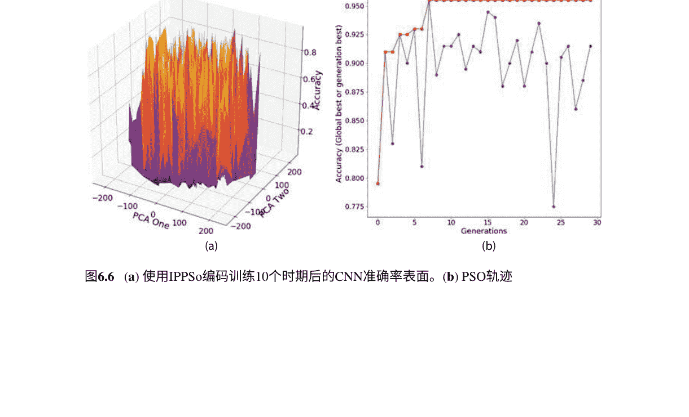

### 6.5.2 多目标PSO方法的结果和分析

#### 6.5.2.1 Pareto优化性分析

图6.7和6.8分别展示了 EXP-20-20和 EXP-50-10的实验结果，每个实验结果由四个子图组成。 从左到右，第一个子图包含了通过进化过程评估的所有解决方案，其中 x轴表示FLOPs的负值， y轴表示准确性。基于 ϵ- Pareto支配[19]的非支配解决方案以橙色表示，蓝色点表示其他解决方案。

第二个子图说明了基于 ϵ- Pareto支配的非支配解决方案在每一代中的准确性进化过程，其中 x轴表示代数， y轴表示分类准确性。 第三个子图展示了基于 ϵ- Pareto支配的非支配解决方案在进化过程中FLOPs的变化，其中FLOPs的负值朝向垂直轴绘制，代数朝向水平轴绘制。 第四个子图将第二个和第三个子图合并成一个三维图，其中 x轴， y轴和 z轴分别表示代数， FLOPs的负值和分类准确性。 透明度的级别反映了三维图中的深度，即FLOPs的负值。

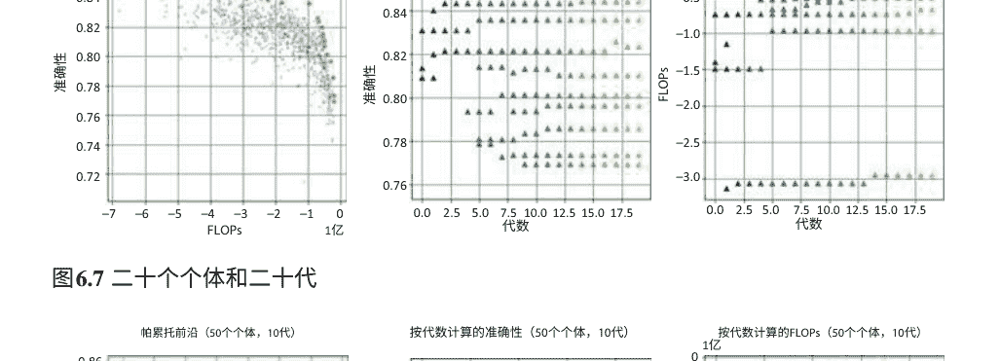

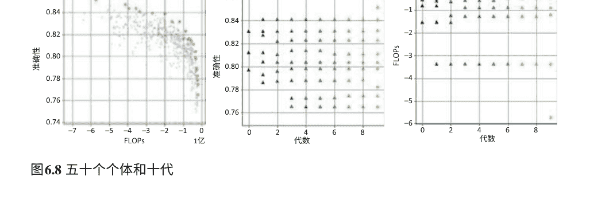

由透明度较低的点表示的负载小于由透明度较高的点表示的负载。

可以观察到在图中绘制了FLOPs的负值而不是正值，这是因为通过使用FLOPs的负值，将此目标的优化转化为最大化问题，以使其与最大化分类准确性的其他目标保持一致。

转换后，两个目标具有相同的优化方向，更易于理解和分析。通过查看图6.7和6.8的第一个子图，实验都实现了非支配解，形成了明确的曲线，定义了帕累托前沿。进一步研究帕累托前沿时，可以发现两个目标在某些阶段相互矛盾，即在不增加卷积神经网络复杂度的情况下无法提高分类准确率，这意味着优化分类准确率和FLOPs两个目标的问题是一个明显的多目标优化问题。通过比较两个实验的帕累托前沿，特别是具有最低FLOPs和最高准确率的点，可以得知EXP-50-10提供了更多多样化的非支配解，这也意味着EXP-50-10的非支配解覆盖范围比EXP-20-20更大，即使EXP-50-10的最大迭代次数只有EXP-20-20的一半，因此，在MOCNN中使用更大的种群规模往往会产生更多多样化的非支配解，从而为工业用户提供更多选择。

关于收敛性分析，第二和第三个子图可以用来分析分类准确率和FLOPs的收敛性，而第四个子图则呈现了两个目标的收敛概况。首先，EXP-20-20可以被认为是两个目标都收敛了。分类准确率在前7代的进化过程中变化很大，然后开始有些波动，直到进化过程结束。在第12代之后，只有很少数的非支配解有轻微的变动，因此可以认为EXP-20-20在分类准确率方面已经收敛。如图6.7的第三个子图所示，在第8代之前，非支配解的数量迅速增长，FLOPs的值迅速扩散到两个方向，但在第14代之后稳定下来，之后FLOPs几乎不再变动。因此，EXP-20-20的FLOPs也收敛了。

在第四张图中可以注意到两个目标的收敛进展在图6.7中。其次，由于世代数量较少，EXP-50-10无法收敛。从第二个子图中可以看出，在第1、3和10代之间有明显的变化，而在这些代之间，变化很少发生，这表明使用50个个体进行实验的收敛速度要慢得多，并且需要更多的世代来达到分类准确性的收敛。对于FLOPs，也可以找到相同的模式，即在第1和10代中，非支配解的变化明显可见，而其他代的变化很少发生，因此FLOPs的目标也需要更多的时间来收敛。因此，EXP-50-10尚未达到收敛状态，这也可以在图6.8的3D子图中观察到。为了总结一下，使用20个个体的实验收敛速度比使用50个个体的实验要快，但是使用50个个体的实验往往能提供更多的非支配解，从而获得更多的潜在解的覆盖率。

#### 6.5.2.2 MOCNN与DenseNet-121的比较

如第6.3.2.2节所述，DenseNet-121被设置为优化的CNN的最大复杂性，因此DenseNet-121被设置为基准，用于与具有最佳准确性的优化非支配解进行比较。由于他们的论文中没有报告DenseNet-121在CIFAR-10上的分类准确率，因此需要评估并与优化的MOCNN进行比较。采用相同的训练过程和[12]中指定的常用数据增强方法来训练DenseNet-121和优化的MOCNN。DenseNet-121的分类准确率为94.77%，优化的MOCNN的分类准确率为95.51%，这表明在CIFAR-10数据集上，优化的MOCNN在分类准确率和计算成本方面优于DenseNet-121。在[12]中报告了40层的DenseNet(k=12) (DenseNet40) 和100层的DenseNet(k=12) (DenseNet100_12) 的分类准确率，分别为94.76%和95.90%。优化的MOCNN的性能优于DenseNet40，但略逊于DenseNet100_12。然而，DenseNet100_12超出了搜索空间，因为它比DenseNet-121更复杂。因此，在搜索空间内，优化的MOCNN在DenseNet中取得了令人满意的结果，并且如果将搜索空间扩展到包括DenseNet100_12，它可能会超过DenseNet100_12。

#### 6.5.2.3 计算成本

如第6.3.2.4节所述，由个体表示的CNN完全通过Adam优化进行训练，这需要相当大量的计算。在开始时，实验EXP-20-20在一张GPU卡上进行尝试，需要将近3周的时间才能完成实验，因此采用了服务器-客户端基础架构[38]，以利用多台机器上的多个GPU卡来减少墙上时钟运行时间。实验EXP-20-20在8张GPU卡上运行了约3天才完成进化过程，而实验EXP-50-10也是在10张GPU卡上运行了3天才获得的结果。

## 6.6 结论

本章的第一个目标是开发一种具有可变长度的新PSO方法，以自动演化用于图像分类问题的CNN架构。通过提出一种新的编码方法，成功实现了这一目标。使用包含IP地址及其对应子网的网络接口来传输CNN层的配置方案，设计了四个子网，其中包括一个禁用子网，以模拟伪可变长度PSO，并使用替代数据集进行高效的适应度评估方法。该方法在三个常用的深度学习基准数据集上与12个同行竞争对手进行了检验和比较，实验结果表明IPPSO在MDRBI基准数据集上表现出色，在MNIST基准数据集上排名第二，在CS基准数据集上排名中上。

本章的第二个目标是提出一种多目标EC方法MOCNN，通过优化分类准确率和反映计算成本的FLOPs两个目标，搜索Pareto前沿上的非支配解。MOCNN通过设计一种新的编码策略来编码CNN，选择对CNN性能评估至关重要的两个目标，并应用一种多目标粒子群优化算法OMOPSO进行设计和开发。MOCNN生成的非支配解可以提供给工业用户，以便他们选择最适合自己使用的解决方案，从而实现了简化使用最先进的CNN进行图像分类的总体目标。

本章仅提供了两个使用PSO进行卷积神经网络架构自动设计的示例作品，并且结果表明进化计算技术在此类自动机器学习任务中起到了重要作用。显然，这只是这项工作的早期阶段，但进化计算技术的潜力已经得到了证明。将来，我们将继续进行这样的研究，使进化计算成为自动机器学习的通用工具/方法。

## 参考文献

1.  Abadi, M., Agarwal, A., Barham, P., Brevdo, E., Chen, Z., Citro, C., Corrado, G.S., Davis, A., Dean, J., Devin, M., et al.: TensorFlow:大规模机器学习在异构分布式系统上的应用. 预印本. arXiv:1603.04467 (2016)
2.  Assunção, F., Lourenço, N., Machado, P., Ribeiro, B.: 演化大规模深度神经网络的拓扑结构. 在:遗传编程欧洲会议, pp. 19-34. Springer, Berlin (2018)
3.  Bottou, L.: 使用随机梯度下降的大规模机器学习. 在: COMPSTAT’2010会议论文集, 第177-186页. Springer, Berlin (2010)
4.  Bruna, J., Mallat, S.: 不变散射卷积网络. IEEE模式分析与机器智能 35(8), 1872-1886 (2013)
5.  Chan, T.H., Jia, K., Gao, S., Lu, J., Zeng, Z., Ma, Y.: PCANet: 一个简单的深度学习基准用于图像分类? IEEE图像处理 24(12), 5017-5032 (2015)
6.  Deb, K., Pratap, A., Agarwal, S., Meyarivan, T.: 一个快速且精英的多目标遗传算法: NSGA-II. IEEE进化计算 6(2), 182-197 (2002)
7.  Fuller, V., Li, T., Yu, J., Varadhan, K.: 无类别互联网路由 (CIDR) : 一种地址分配和聚合策略 (1993年)
8.  Glorot, X., Bengio, Y.: 理解训练深度前馈神经网络的困难. 在:第十三届国际人工智能和统计学会议论文集, 第249-256页 (2010年)
9.  Glorot, X., Bordes, A., Bengio, Y.: 深度稀疏整流器神经网络. 在:第十四届国际人工智能和统计学会议论文集, 第315-323页 (2011年)
10. He, K., Zhang, X., Ren, S., Sun, J.: 深度残差学习用于图像识别. CoRR abs/1512.03385 (2015年). http://arxiv.org/abs/1512.03385
11. Hinton, G.E.: 训练受限玻尔兹曼机的实用指南. 在:神经网络:技巧的交易, 第599-619页. Springer, 柏林 (2012年)
12. Huang, G., Liu, Z., Weinberger, K.Q.: 密集连接的卷积网络. CoRR abs/1608.06993 (2016年). http://arxiv.org/abs/1608.06993
13. Ioffe, S., Szegedy, C.: 批量归一化:通过减少内部协变量转移来加速深度网络训练. 预印本. arXiv:1502.03167 (2015年)
14. Jones, M.T.: 深度学习架构与人工智能的崛起. IBM DeveloperWorks, 阿蒙克 (2017年)
15. Kingma, D.P., Ba, J.: Adam:一种随机优化方法. 预印本. arXiv:1412.6980 (2014年)
16. Krizhevsky, A., Hinton, G.: 从小图像中学习多层特征. 技术报告. Citeseer (2009)
17. Krizhevsky, A., Sutskever, I., Hinton, G.E.: 使用深度卷积神经网络进行ImageNet分类. 在:神经信息处理系统进展, 第1097-1105页 (2012)
18. Larochelle, H., Erhan, D., Courville, A., Bergstra, J., Bengio, Y.: 对具有多个变化因素的问题进行深度架构的实证评估. 在:第24届国际机器学习会议论文集, 第473-480页. ACM, 纽约 (2007)
19. Laumanns, M., Thiele, L., Deb, K., Zitzler, E.: 结合收敛性和多目标进化优化的多样性. Evol. Comput. 10(3), 263-282 (2002)
20. LeCun, Y., Boser, B., Denker, J.S., Henderson, D., Howard, R.E., Hubbard, W., Jackel, L.D.: 反向传播应用于手写邮政编码识别. 神经计算. 1(4), 541-551 (1989)
21. LeCun, Y., Bottou, L., Bengio, Y., Haffner, P., 等: 基于梯度的学习应用于文档识别. IEEE会议记录 86(11), 2278–2324 (1998)
22. 李, X.: 用于多目标优化的非支配排序粒子群优化器. 在:遗传和进化计算会议, 第37–48页. Springer, 柏林 (2003)
23. Postel, J.: DoD标准互联网协议 (1980)
24. Real, E., Moore, S., Selle, A., Saxena, S., Suematsu, Y.L., Tan, J., Le, Q.V., Kurakin, A.: 大规模图像分类器的演化. 在:第34届国际机器学习会议论文集, 第70卷, 第2902–2911页. JMLR. org (2017)
25. Rifai, S., Vincent, P., Muller, X., Glorot, X., Bengio, Y.: 收缩自编码器:在特征提取过程中显式的不变性. 在:第28届国际机器学习大会论文集, 第833-840页. Omnipress, 麦迪逊 (2011)
26. Sierra, M.R., Coello, C.A.C.: 使用群体智能、变异和 ε-支配改进基于PSO的多目标优化. 在:进化多准则优化国际会议, 第505-519页. Springer, 柏林 (2005)
27. Simonyan, K., Zisserman, A.: 用于大规模图像识别的非常深的卷积网络. CoRR abs/1409.1556 (2014). http://arxiv.org/abs/1409.1556
28. Sohn, K., Lee, H.: 使用局部变换学习不变表示. 预印本. arXiv:1206.6418 (2012)
29. Sohn, K., Zhou, G., Lee, C., Lee, H.: 使用逐点gated Boltzmann machines共同学习和选择特征. 在:国际机器学习会议, 第217-225页 (2013年)
30. Stanley, K.O., Miikkulainen, R.: 通过增加拓扑结构进化神经网络. Evol. Comput. 10(2), 99–127 (2002)
31. Suganuma, M., Shirakawa, S., Nagao, T.: 一种基于遗传编程的卷积神经网络架构设计方法. 在:遗传和进化计算会议论文集, 第497-504页. ACM, 纽约 (2017年)
32. Sun, Y., Xue, B., Zhang, M., Yen, G.G.: 进化深度卷积神经网络进行图像分类. IEEE Trans. Evol. Comput. 24(2), 394–407 (2019). https://doi.org/10.1109/TEVC.2019.2916183
33. 孙, Y., 严, G.G., 易, Z.: 进化无监督深度神经网络学习有意义的表示. IEEE Trans. Evol. Comput. 23(1), 89-103 (2019年). https://doi.org/10.1109/TEVC.2018.2808689
34. Szegedy, C., Liu, W., Jia, Y., Sermanet, P., Reed, S., Anguelov, D., Erhan, D., Vanhoucke, V., Rabinovich, A.: 通过卷积深入研究. 在:IEEE计算机视觉和模式识别会议论文集, 第1-9页 (2015年)
35. Van den Bergh, F., Engelbrecht, A.P.: 粒子群优化粒子轨迹的研究. Inf. Sci. 176(8), 937-971 (2006年)
36. 王, B., 孙, Y., 薛, B., 张, M.: 通过变长粒子群优化进化深度卷积神经网络进行图像分类. 在:2018年IEEE进化计算大会（CEC）, 第1-8页. IEEE, 皮斯卡塔韦 (2018年)
37. 王, B., 孙, Y., 薛, B., 张, M.: 一种混合差分进化方法用于设计深度卷积神经网络进行图像分类. 在:澳大利亚联合会议人工智能, 第237-250页. 斯普林格, 柏林 (2018年)
38. 王, B., 孙, Y., 薛, B., 张, M.: 通过多目标粒子群优化演化深度神经网络进行图像分类. 在:遗传和进化计算会议论文集, GECCO'19, 第490-498页. ACM, 纽约 (2019年). https://doi.org/10.1104/3321707.3321735
39. 王, B., 孙, Y., 薛, B., 张, M.: 一种混合GA-PSO方法用于演化深度卷积神经网络的架构和短连接. 在:Nayak, A.C., Sharma, A. (eds.) PRICAI 2019:人工智能趋势, 第650-663页. Springer International Publishing, Cham (2019年)

# 第7章 使用笛卡尔遗传编程设计卷积神经网络架构

Masanori Suganuma, Shinichi Shirakawa, and Tomoharu Nagao

摘要 卷积神经网络（CNN）是深度学习模型中的一种，在各种计算机视觉任务中取得了显著的进展，例如图像识别、恢复和生成。CNN中的网络架构应该事先手动设计。研究人员和实践者已经开发出各种神经网络结构来提高性能。尽管网络架构对性能有很大影响，但架构的选择和设计是繁琐的，并且需要反复试验，因为最佳架构取决于目标任务和数据量。进化算法已成功应用于自动化CNN架构设计过程。

本章旨在解释进化算法如何支持CNN架构的自动设计。我们介绍了一种基于笛卡尔遗传编程（CGP）的CNN架构设计方法。CGP是一种基于遗传编程的形式，用于搜索网络结构化程序。我们通过组合预定义模块来表示CNN架构，并基于CGP搜索高性能架构。该方法通过重复进行架构生成、训练和评估来寻找更好的架构。通过图像分类和图像恢复两种计算机视觉任务，证明了基于CGP的CNN架构搜索的有效性。

图像分类的实验结果表明，该方法可以找到一个表现良好的卷积神经网络结构。对于图像恢复任务的实验，我们展示了该方法可以找到一个简单但高性能的卷积自编码器结构，它是一种卷积神经网络。

## 7.1 引言

在过去几年中，研究人员开发了许多种类的卷积神经网络架构，旨在在计算机视觉任务上取得良好的成绩。尽管卷积神经网络取得了成功，但是最近的发展引发了一个问题：什么样的卷积神经网络架构是好的，我们如何设计这样的架构？解决这个问题的一个可能方向是神经网络架构搜索（NAS）[5]，其中卷积神经网络架构由进化计算和强化学习等算法自动设计，以在目标任务上最大化性能。

NAS可以自动化神经网络的设计过程，并有助于减少开发者的试错。

本章基于[34-36]的工作，介绍了一种基于遗传编程的自动设计卷积神经网络架构的方法。在下一节中，我们将简要回顾NAS方法，并将其分为三种方法：进化计算、强化学习和梯度下降。然后，我们将介绍基于Cartesian遗传编程（CGP）的NAS方法，该方法被归类为基于进化计算的方法。在第7.3节中，我们将解释用于图像分类的基于CGP的架构搜索方法，称为CGP-CNN。在第7.4节中，我们将基于CGP的架构搜索方法扩展到卷积自编码器（CAE），一种用于图像恢复的卷积神经网络。

## 7.2 神经架构搜索的进展

神经网络结构的自动设计是一个活跃的话题，最初在几十年前提出，例如，[30, 33, 45]。这些方法使用进化算法优化低层神经元的连接权重和/或网络结构，也被称为进化神经网络。这些传统的结构优化方法针对相对较小的神经网络，而最近的深度神经网络，包括CNN，具有一百万个参数，尽管架构仍然由人类专家设计。为了实现深度神经网络架构的自动设计，自2017年以来已经开发了各种架构搜索方法。现在，深度神经网络架构的自动设计方法被称为神经架构搜索（NAS）[5]。

为了解决大规模架构问题，神经网络架构使用某种搜索方法进行设计，但网络权重通过反向传播的随机梯度下降方法进行优化。进化算法经常用于搜索这些架构。Real等人[28]使用进化算法优化了大规模神经网络，并在图像分类任务中取得了比现代CNN更好的性能。在这种方法中，他们将CNN架构表示为图结构，并通过进化算法进行优化。

现架构的连接权重通过随机梯度下降进行优化，这是典型的神经网络训练方法；架构评估数据集的准确性被分配为适应度。Miikkulainen等人[20]提出了一种称为CoDeepNEAT的方法，它是NeuroEvolution of Augmenting Topologies (NEAT)的扩展版本。该方法使用蓝图和模块来设计网络架构。蓝图染色体是一个图，其中每个节点都指向特定的模块物种。每个模块染色体都是表示小型DNN的图。具体而言，蓝图中的每个节点都被指向的特定物种中选择的模块替换。

在评估阶段，模块和蓝图被组合在一起生成组装网络，并对网络进行评估。Xie和Yuille [42]使用二进制字符串表示法设计了CNN架构。

他们提出了一种方法，用于将网络结构编码，其中每一层的连接性由二进制字符串表示。在这种方法中，每一层的类型、通道数量和感受野的大小都不会发生变化。

本章介绍的方法也是一种基于进化算法的神经架构搜索方法。与前面的方法不同，它基于遗传编程优化架构，并采用精心设计的模块作为节点函数。

另一种方法是使用强化学习来搜索神经架构。在[49]中，使用了循环神经网络（RNN）来生成神经网络架构。RNN通过基于策略梯度的强化学习进行训练，以最大化学习任务上的预期准确性。Baker等人[2]提出了一种基于强化学习的元建模方法，用于生成CNN架构。一个Q学习代理通过贪婪策略和经验回放来探索和利用模型架构空间。

由于这些方法需要神经网络训练来评估候选架构，因此它们通常需要相当大的计算成本。例如，[49]的工作使用了800个图形处理单元（GPU）。降低NAS的计算成本是一个活跃的研究领域。一种有前途的方法是联合优化架构参数和连接权重。这种方法被称为一次性NAS（也称为权重共享），在单次训练中找到更好的架构。

在一次性NAS中，由离散架构参数组成的不可微目标函数通过连续的[17, 43]或随机松弛[1, 27, 31]转化为可微目标函数；架构参数和连接权重都通过基于梯度的优化器进行优化。

## 7.3 设计用于图像分类的CNN架构

在本节中，我们介绍基于CGP的图像分类架构搜索方法。我们将该方法称为CGP-CNN。在CGP-CNN中，我们直接基于CGP对CNN架构进行编码，并使用高度功能化的模块作为节点函数。由CGP定义的CNN架构通过随机梯度下降使用模型训练数据集进行训练，并根据适应度值进行评估。

另一个训练数据集的准确性（即架构评估数据集）然后，使用进化算法优化架构，以最大化架构评估数据集的准确性。图7.1显示了CGP-CNN的概述。接下来，我们将描述CGP-CNN中使用的网络表示和进化算法。

### 7.3.1 CNN架构的表示

对于CNN架构的表示，我们使用CGP编码方案，将CNN的架构表示为具有二维网格的有向无环图。CGP是在[22]中提出的遗传编程的一般形式。与表型对应的图被编码为称为基因型的字符串，并使用进化算法进行优化。

让我们假设网格有 $N_r$ 行和 $N_c$ 列；那么中间节点的数量是 $N_r \times N_c$，输入和输出的数量取决于任务。基因型由固定长度的整数字符串组成，每个基因确定节点的功能类型和节点之间的连接。第$c$列的节点只能从第 $(c-1)$ 到第 $(c-l)$ 列的节点连接，其中 $l$ 被称为级别回退参数。图7.2展示了基因型、表型和相应的CNN架构的示例。如图7.2所示，CGP编码方案存在一种可能性，即不是所有节点都连接到输出节点（例如图7.2中的节点5）。我们将这些节点称为非活动节点。而CGP中的基因型是一个固定长度的表示，表型网络中的节点数量因为非活动节点而变化。

### 使用CGP设计CNN架构的方法

图7.2 基因型和表型的示例。基因型（左侧）定义了CNN的架构（右侧）。左侧的第5个节点是非活动的，不会出现在从输入到输出的路径中。求和节点将第一个输入进行最大池化，使其与第二个输入的大小相同

这是一个理想的特性，因为可以使用进化算法确定层数。

参考现代CNN架构，我们选择高度功能模块作为节点功能。CNN中经常使用的过程是卷积和池化；卷积处理使用局部连接性和空间共享可学习权重，而池化是非线性下采样。我们准备了六种类型的节点功能，称为ConvBlock、ResBlock、最大池化、平均池化、连接和求和。这些节点对三维（3-D）张量（也称为特征图）进行操作，其定义由行、列和通道的维度确定。

ConvBlock由一个步长为1的卷积层组成，后面是批量归一化[10]和修正线性单元(ReLU)[23]。为了保持输入的大小，在进行卷积操作之前，我们在边界周围用零值填充输入。因此，ConvBlock接收 $M \times N \times C$ 张量作为输入，并生成 $M \times N \times C'$张量，其中 $M, N, C$和 $C'$分别是行数、列数、输入通道数和输出通道数。在CGP的函数集中，我们准备了几个具有不同输出通道和感受野大小(卷积核大小)的ConvBlock。

### 图7.3 ResBlock架构

如图7.3所示，ResBlock由ConvBlock、批量归一化、ReLU和张量求和组成。ResBlock是现代成功的CNN架构的构建块，例如[8, 47]和[13]。遵循最近人类架构设计的趋势，我们决定在CGP-CNN中使用ResBlock作为构建块。ResBlock通过快捷连接执行身份映射，如[8]中所述。在卷积之后，输入的行和列大小与ConvBlock的行和列大小保持一致。

如图7.3所示，ResBlock的输出特征图通过ReLU激活和与输入的求和来计算。ResBlock以$M \times N \times C$张量作为输入，并产生$M \times N \times C'$张量。我们在CGP的函数集中准备了几个具有不同输出通道和感受野大小（卷积核大小）的ResBlock。

最大池化和平均池化分别对特征图的局部邻居执行最大和平均操作。我们使用具有2×2感受野大小和步长为2。池化层接收 $M \times N \times C$张量并产生 $M' \times N' \times C$张量，其中 $M' = \lfloor M/2 \rfloor$且 $N' = \lfloor N/2 \rfloor$。

连接函数接受两个特征图，并在通道维度上将它们连接起来。当将具有不同行和列数的特征图进行连接时，我们通过最大池化对较大的特征图进行下采样，使它们与输入的大小相同。假设我们有两个输入，大小为 $M_1 \times N_1 \times C_1$和 $M_2 \times N_2 \times C_2$，那么输出特征图的大小为$\min(M_1, M_2) \times \min(N_1, N_2) \times (C_1 + C_2)$。

求和操作对两个特征图进行逐元素求和，按通道进行。与连接类似，当对具有不同行和列数的两个特征图进行求和时，我们通过最大池化对较大的特征图进行下采样。此外，如果输入具有不同的通道数，我们通过用零填充来扩展特征图的通道数，使其具有较小的通道大小。假设我们有两个尺寸为 $M_1 \times N_1 \times C_1$和$M_2 \times N_2 \times C_2$的输入，则输出特征图的尺寸为 $\min(M_1, M_2) \times \min(N_1, N_2) \times \max(C_1, C_2)$。在图7.2中，求和节点将第一个输入进行最大池化，使其与第二个输入的尺寸相同。通过使用求和和连接操作，我们的方法可以表达GoogLeNet [37]和残差网络（ResNet）[8]中使用的快捷连接或分支层。

输出节点表示softmax函数，用于生成目标类别的分布。输出节点与输入的所有元素完全连接。实验中使用的节点函数列在表7.1中。

### 表7.1 节点函数和实验中使用的缩写符号

| 节点类型 | 符号 | 变异 |
| :--- | :--- | :--- |
| ConvBlock | CB ($C'$, $k$) | $C' \in \{32, 64, 128\}$<br>$k \in \{3\times3, 5\times5\}$ |
| ResBlock | RB ($C'$, $k$) | $C' \in \{32, 64, 128\}$<br>$k \in \{3\times3, 5\times5\}$ |
| 最大池化 | MP | – |
| 平均池化 | AP | – |
| 连接 | 连接 | – |
| 求和 | 求和 | – |
| $C'$: 输出通道数<br>$k$: 接受域大小（卷积核大小） | | |

### 7.3.2 进化算法

按照标准CGP，我们使用点突变作为遗传操作符。根据突变率，每个节点的函数和连接随机变换为有效值。CNN架构的适应度评估涉及CNN训练，在我们的设置中大约需要0.5到1小时。因此，我们需要在每一代中并行地高效评估一些候选解。

为了高效利用计算资源，我们在活动节点不变的情况下重复应用突变操作符，并获得待评估的候选解。我们将这种突变称为强制突变。此外，为了保持中性漂移，对于CGP进化[21, 22]是有效的，如果后代的适应度没有改善，我们通过中性突变修改父代。中性突变仅对非活动节点的基因进行操作，不改变表现型。

我们在实验中使用修改后的 $(1 + \lambda)$进化策略（其中 $\lambda = 2$）来使用上述技巧。我们的进化算法的步骤如下所示：算法1。

在CGP中，默认的 $(1 + \lambda)$进化策略是一种具有较少策略参数的算法：变异率和后代数量。我们不需要花费大量精力来调整这种策略参数。因此，我们在CGP-CNN中使用了 (1 + λ)进化策略。

### 算法1 CGP-CNN和CGP-CAE的进化算法

```
1: 输入: G(迭代次数), r(变异概率), λ(子代数量), S(训练集), V(架构评估集)。
2: 初始化:(i) 生成一个父代, (ii) 在训练集 S上训练模型, (iii) 使用集合V分配适应度 F_p。
3: 对于 g 从 1 到 G 进行循环
4:     对于 i = 1 到 λ 执行
5:         子代 i ← 突变( 父代 , r) # 强制突变
6:         模型 i ← 训练(子代 i, S)
7:         适应度 i ← 评估( 模型 i, V)
8:     结束循环
9:     最佳 ← argmax_{i=1,2,...,λ} {适应度 i}
10:    如果适应度最佳 ≥ F_p 则
11:        父代 ←子代最佳
12:        F_p ←适应度最佳
13:    否则
14:        父代 ← 修改( 父代, r ) # 中性突变
15:    结束如果
16: 结束循环
17: 输出 :父代(进化搜索找到的最佳架构).
```

### 7.3.3 图像分类任务实验

#### 7.3.3.1 实验设置

我们将CGP-CNN应用于CIFAR-10和CIFAR-100数据集，这两个数据集分别包含了60,000个彩色图像（32×32像素），分为10个和100个类别。每个数据集被分成一个包含50,000个图像的训练集和一个包含10,000个图像的测试集。我们从训练集中随机抽取45,000个样本来训练CNN，剩下的5000个样本用于架构评估（即CGP的适应度评估）。为了给候选的CNN架构分配适应度值，我们使用随机梯度下降（SGD）以128个样本为一批进行训练。我们使用softmax交叉熵损失作为损失函数。我们使用[7]中描述的方法初始化权重，并使用Adam优化器[11]，初始学习率 α = 0.01，动量 β1 = 0.9和 β2 = 0.999。我们对每个CNN进行50个epochs的训练，并将最后10个epochs的最大准确率作为适应度值。

我们在第30个时期将学习率降低10倍。

我们对数据进行像素均值减法预处理。为了防止过拟合，我们使用权重衰减系数为1.0 × 10^{-4}的权重衰减。我们还使用基于[8]的数据增强方法：在每个边缘填充4个像素，并随机裁剪一个32×32的补充图像或其水平翻转图像的补丁。

### 表7.2 CGP-CNN在图像分类任务上的参数设置

| 参数 | 值 |
| :--- | :--- |
| 变异率 | 0.05 |
| # 后代 (λ) | 2 |
| # 行 (N_r) | 5 |
| # 列 (N_c) | 30 |
| 最小活跃节点数 | 10 |
| 最大活跃节点数 | 50 |
| 回溯级别 (l) | 10 |

CGP的参数设置如表7.2所示。我们使用相对较大的列数来生成深层架构。CGP个体中的活跃节点数受限制。因此，我们应用变异算子，直到生成满足活跃节点数限制的CNN架构为止。后代大小 λ 为2，与我们实验机器中的GPU数量相同。我们对CGP-CNN进行了两个节点函数集的测试，分别称为ConvSet和ResSet。ConvSet包含表7.1中的ConvBlock、最大池化、平均池化、求和和连接操作，而ResSet包含ResBlock、最大池化、平均池化、求和和连接操作。这两个函数集之间的区别在于是否包含ConvBlock或ResBlock。ConvSet的迭代次数为500，ResSet的迭代次数为300。

通过CGP过程得到的最佳CNN架构使用训练集中的所有50,000张图像进行重新训练。然后，我们计算测试准确率。我们使用不同的训练过程对得到的架构的权重进行500个时期的优化；我们使用动量为0.9的SGD，小批量大小为128，并且权重衰减为5.0×10⁻⁴。根据[8]中的学习率计划，我们从0.01开始学习率，并在第5个时期将其设置为0.1。我们在第250个和370个时期将其减小10倍。我们将第500个时期的测试准确率报告为最终性能。

我们使用Chainer框架[40] (版本1.16.0) 实现CGP-CNN，并在一台拥有两个NVIDIA GeForce GTX 1080或两个GTX 1080 Ti GPU的机器上运行。我们分别在CIFAR-10和100数据集上使用GTX 1080和1080 Ti。由于内存限制，候选CNN有时会占用GPU内存，导致网络训练过程因内存不足而失败。在这种情况下，我们将候选架构的适应度设为零。

#### 7.3.3.2 实验结果

我们在每个数据集上运行CGP-CNN 10次，并报告分类错误率。我们将分类性能与手动设计的CNN和使用架构搜索方法自动设计的CNN在CIFAR-10和100数据集上进行比较。分类性能的总结如下表7.3和7.4。Maxout、Network in Network、VGG、ResNet、FractalNet和Wide ResNet是手动设计的CNN架构，而MetaQNN、神经架构搜索、大规模进化、遗传CNN和CoDeepNEAT是使用架构搜索方法获得的模型。其他模型的值（除了CIFAR-100上的VGG和ResNet）参考自文献。我们在CIFAR-100上实现了VGG网络和ResNet，因为它们在[32]和[8]的数据集上没有应用。VGG的架构与[32]中的D配置相同。在表7.3和7.4中，还列出了模型中可学习权重参数的数量。在CGP-CNN中，报告了最佳架构的可学习权重参数数量。

### 表7.3 在CIFAR-10数据集上比较错误率（%），可学习权重参数数量和搜索成本

| 模型 | # 参数 | 测试错误 | GPU天 |
| :--- | :--- | :--- | :--- |
| Maxout [6] | - | 9.38 | - |
| 网络中的网络[15] | - | 8.81 | - |
| VGG [32] | 15.2 M | 7.94 | - |
| ResNet [8] | 1.7 M | 6.61 | - |
| FractalNet [14] | 38.6 M | 5.22 | - |
| Wide ResNet [47] | 36.5 M | 4.00 | - |
| CoDeepNEAT [20] | - | 7.30 | - |
| 遗传CNN [42] | - | 7.10 | 17 |
| MetaQNN [2] | 3.7 M | 6.92 | 80–100 |
| 大规模进化 [28] | 5.4 M | 5.40 | 2750 |
| 神经架构搜索 [49] | 37.4 M | **3.65** | 16,800–22,400 |
| CGP-CNN (ConvSet) | 1.50 M | 5.92 (6.48 ± 0.48) | 31 |
| CGP-CNN (ResSet) | 2.01 M | 5.01 (6.10 ± 0.89) | 30 |

分类错误以“最佳（平均±标准差）”的格式报告。在CGP-CNN中，报告了最佳架构的可学习权重参数数量。其他模型的值参考自文献。粗体值表示在比较的模型中的最佳测试错误。

在CIFAR-10数据集上，CGP-CNNs在大多数手动设计的模型上表现出色，并在分类错误和参数数量之间保持良好的平衡。CGP-CNN（ResSet）相比于CGP-CNN（ConvSet）表现更好。与其他架构搜索方法相比，CGP-CNN（ConvSet和ResSet）优于MetaQNN [2]，Genetic CNN [42]和CoDeep-NEAT [20]。CGP-CNN（ResSet）的最佳架构优于Large-Scale Evolution [28]。神经架构搜索[49]实现了最佳错误率，但该方法使用了800个GPU，并且需要相当大的计算成本来搜索最佳架构。表7.3还列出了GPU天数（实验期间的计算时间乘以使用的GPU数量）用于架构搜索。如图所示，CGP-CNN可以找到一个良好的架构。

### 表格 7.4 错误率（%）和可学习权重参数数量的比较 CIFAR-100 数据集

| 模型 | # 参数 | 测试错误 |
|------|--------|----------|
| Maxout [6] | – | 38.57 |
| 网络中的网络 [15] | – | 35.68 |
| VGG [32] | 15.2 M | 33.45 |
| ResNet [8] | 1.7 M | 32.40 |
| FractalNet [14] | 38.6 M | 23.30 |
| Wide ResNet [47] | 36.5 M | **19.25** |
| CoDeepNEAT [20] | – | – |
| 神经架构搜索 [49] | 37.4 M | – |
| 遗传卷积神经网络 [42] | – | 29.03 |
| MetaQNN [2] | 3.7 M | 27.14 |
| 大规模进化 [28] | 40.4 M | 23.0 |
| CGP-CNN (ConvSet) | 2.01 M | 26.7 (28.1 ± 0.83) |
| CGP-CNN (ResSet) | 4.60 M | 25.1 (26.8 ± 1.21) |

分类错误以“最佳（平均 ±标准差）”的格式报告。在CGP-CNN中，报告了最佳架构的可学习权重参数数量。除了VGG和ResNet之外，其他模型的数值均参考文献。粗体数值表示在比较的模型中的最佳测试错误。

一个合理的计算成本。我们假设CGP-CNN，特别是使用ResSet，可以减少搜索空间并在早期迭代中找到更好的架构。CIFAR-100数据集是一个非常具有挑战性的任务，因为有很多类别。CGP-CNN在合理的计算时间内找到了竞争性的网络架构。尽管所得到的架构与最先进的架构不在同一水平上，但它在分类错误和参数数量之间取得了良好的平衡。

架构搜索方法（不仅仅是CGP-CNN）的错误率并没有达到Wide ResNet的水平，即人工设计的架构。然而，这些人工设计的架构是在巨大的人力投入下开发出来的。架构搜索方法的一个优点是它们可以自动为新的数据集找到一个好的架构。CGP-CNN的另一个优点是在发现的架构中的权重参数数量比人工设计的架构少，这在我们想要在移动设备上实现CNN时是有益的。请注意，我们没有在适应度函数中引入任何架构复杂性的标准。通过在适应度函数中引入惩罚项，可能可以找到更紧凑的架构，这是一个重要的研究方向，例如[4, 29, 39]中的方法。

图7.4展示了通过CGP-CNN（ConvSet和ResSet）获得的CNN架构的示例。图7.4展示了复杂的架构，这些架构很难手动设计。具体而言，CGP-CNN（ConvSet）使用求和和连接节点，导致网络变宽，并允许形成跳跃连接。因此，CGP-CNN（ConvSet）架构比与CGP-CNN（ResSet）相比。此外，我们还观察到CGP-CNN（ResSet）与ResNet [8]的结构类似。ResNet由两种类型的模块组成：一个具有多个卷积和无下采样的快捷连接的模块，以及一个步长为2的下采样卷积。尽管CGP-CNN在ConvBlock和ResBlock中无法进行下采样，但我们可以看到CGP-CNN（ResSet）使用池化层作为下采样卷积的替代方法。我们可以说CGP-CNN能够找到与人类专家设计的架构类似的架构。

### 图7.4显示了通过CGP-CNN使用ConvSet（左）和ResSet（右）在CIFAR-10数据集上获得的CNN架构

## 7.4 设计用于图像恢复的CNN架构

在本节中，我们将CGP-based架构搜索方法应用于从受损版本中恢复清晰图像的图像恢复任务。我们将此方法称为CGP-CAE。最近，基于CNN的学习方法已经应用于图像恢复任务，并且显著提高了最先进的性能。研究人员主要从三个方向解决了这个问题：设计新的网络架构，损失函数和训练策略。在本节中，我们专注于设计一种新的网络架构，报告了通过进化算法设计的简单卷积自编码器（CAEs）可以胜过现有的手动设计的图像恢复方法。

### 7.4.1 网络架构的搜索空间

在这项工作中，我们只考虑由卷积层、下采样和跳跃连接构建的CAEs。此外，我们使用对称的CAEs，使得它们的前半部分（编码器部分）对称于后半部分（解码器部分）。最后一层连接到解码器部分的顶部，以获得固定通道数的图像（即单通道灰度或三通道彩色图像），其中使用3×3大小的一个或三个滤波器。因此，仅指定CAE的编码器部分就可以确定其整个架构。

编码器部分可以具有任意数量的卷积层，最多可以选择由进化算法选择的指定最大数量。每个卷积层可以具有任意数量和大小的滤波器，并且在ReLU[23]之后。此外，每个层可以具有可选的跳跃连接[8, 18]，将该层与解码器部分中的对应层连接起来。具体而言，该层的输出特征图（在ReLU之后获得）被传递并逐元素添加到对应层的输出特征图（在ReLU之前获得）。根据任务，我们可以在每个卷积层之后使用额外的下采样。是否使用下采样是事先确定的，因此不是由架构搜索选择的，稍后会解释。

### 7.4.2 CAE架构的表示

根据[34]，我们通过一个定义在二维网格上的有向无环图来表示CAE的架构。这个图被进化算法优化，其中图被称为表型，由一个称为基因型的数据结构编码。

图7.5 CGP-CAE的基因型和表型示例。表型是网络架构的图表示，基因型编码了表型。它们只编码CAE的编码器部分，解码器部分会自动创建，以使其与编码器部分对称。在这个例子中，表型定义在一个三行三列的网格上。

图7.5展示了CGP-CAE的基因型和表型的示例。图中的每个节点代表CAE中的一个卷积层，后面跟着一个ReLU。连接两个节点的边表示对应层之间的连接。该图还有两个额外的特殊节点，称为输入节点和输出节点。前者代表CAE的输入层，后者代表编码器部分的输出，或者等效地说，是CAE的解码器部分的输入。

由于每个节点的输入最多连接到一个节点，从输入节点到输出节点存在一条唯一的路径。这条唯一的路径确定了CAE的架构，如图7.5中间行所示。请注意，相邻两列中的节点不一定连接。因此，CAE的层数可以根据节点的连接方式而不同。由于CAE的编码器部分的最大层数为 N_max，总层数为 2N_max + 1，包括输出层。为了控制层数的选择，我们引入了一个超参数，称为level-back l，使得第 c 列中的节点可以连接到第 c - l 到第 c - 1列中的节点。如果使用较小的 l，那么得到的CAE将更深。

基因型编码表现型，并由进化算法进行操作。编码具有 N_r 行和 N_c 列的表现型的基因型具有 N_r N_c +1个基因，每个基因表示具有两个整数（即类型和连接）的节点的属性。类型通过整数编码指定节点的过滤器数量 F 和大小 k，以及该层是否具有跳跃连接。连接指定连接到该节点输入的节点。最后的 (N_r N_c + 1) -st 基因表示仅存储连接确定连接到输出节点的节点的输出节点。图7.5顶行显示了基因型的示例，其中 F ∈ {64, 128, 256}, k∈ {1×1, 3×3, 5×5}。我们使用与前一节中使用的进化算法相同的算法在架构空间中进行搜索（参见算法1）。

### 7.4.3 图像恢复任务的实验

我们进行了实验来测试CGP-CAE的有效性。我们选择了两个任务：图像修复和降噪。

#### 7.4.3.1 实验设置

##### 修复

我们按照[46]中建议的实验设计程序进行。我们使用了三个基准数据集：CelebFaces Attributes数据集（CelebA）[16]，Stanford Cars数据集（Cars）[12]和Street View House Numbers（SVHN）[24]。

CelebA包含202,599张图像，我们随机选择了100,000张、1000张和2000张图像用于训练、架构评估和测试。所有图像都被裁剪以适当地包含整个脸部，并调整大小为64 ×64像素。对于Cars和SVHN，我们使用了提供的训练和测试分割。Cars的图像根据提供的边界框进行裁剪，并调整大小为64 ×64像素。SVHN的图像调整大小为64 ×64像素。

我们生成了具有以下三种类型缺失区域的图像：中央方块遮罩（中心），随机像素遮罩，其中所有像素的80%被随机遮罩（像素），以及半图像遮罩，其中随机选择图像的垂直或水平一半被遮罩（一半）。对于后两种情况，每个训练小批次和每个测试图像都会随机生成一个遮罩。

考虑到这个任务的性质，我们考虑了带有下采样的CAEs。具体来说，我们采用了相同数量的下采样和上采样，步长=2，使整个网络具有对称的沙漏形状。为了简单起见，我们以独占的方式使用跳跃连接和下采样；换句话说，每个层（在编码器部分）都使用了跳跃连接或下采样。

##### 去噪

我们按照[18, 38]中描述的实验步骤进行。我们使用属于BSD500数据集[19]的灰度300和200张图像来生成训练和测试图像。对于每个图像，我们随机提取64 × 64的补丁，对每个补丁添加不同的高斯噪声σ = 30,50和70。如前期研究所使用的，我们对所有不同噪声水平训练了一个单一模型。

对于这个任务，我们使用了没有下采样的CAE模型，遵循之前的研究[18, 38]。我们在每个卷积层中对计算的输入特征图进行了零填充，以保持输入和输出特征空间的大小不变。

##### 架构搜索的配置

对于进化算法，我们选择了突变概率为r = 0.1，子代数量为λ = 4，代数数量为G = 250。对于表型，我们使用了具有Nr = 3, Nc = 20和级别回退l = 5的图。对于每一层的滤波器数量F和大小k，我们从{64, 128, 256}和{1 × 1, 3 × 3, 5 × 5}中选择。

在进化过程中，我们对每个CAE进行了I = 20, 000次迭代训练，使用了大小为b = 16的小批量。我们将ADAM优化器的学习率设置为0.001。对于训练损失，我们使用恢复图像与其真实图像之间的均方误差（MSE）：

$$ L(\theta_D) = \frac{1}{|S|} \sum_{i=1}^{|S|} \| D(y_i; \theta_D) - x_i \|_2^2, \quad (7.1) $$

其中CAE和其权重参数分别为 D和 θ_D；S是训练集, x_i是真实图像, y_i是损坏图像。对于进化算法的适应度函数，我们使用峰值信噪比（PSNR），较高的值表示更好的图像恢复。

在进化过程完成后，我们使用额外的500,000次迭代对最佳CAE进行微调，其中学习率在第200,000次和第400,000次迭代时减小10倍。然后我们使用测试集的图像计算其性能。我们使用PyTorch [25]实现了CGP-CAE，并使用四个P100 GPU进行实验。对于修复任务，执行进化算法和最佳模型的微调大约需要3天；对于去噪任务，大约需要4天。

#### 7.4.3.2 修复任务的结果

我们使用两个标准评估指标，即峰值信噪比（PSNR）和结构相似性指数（SSIM）[41]，来评估恢复的图像。这些指标的较高值表示图像恢复效果更好。

表7.5 修复结果

| 数据集 | 类型 | PSNR Rand | PSNR BASE | PSNR CE | PSNR SII | PSNR CGP-CAE | SSIM Rand | SSIM BASE | SSIM CE | SSIM SII | SSIM CGP-CAE |
| :--- | :--- | :--- | :--- | :--- | :--- | :--- | :--- | :--- | :--- | :--- | :--- |
| CelebA | Center | 15.3 | 27.1 | 28.5 | 19.4 | **29.9** | 0.740 | 0.883 | 0.912 | 0.907 | **0.934** |
| | Pixel | 25.5 | 27.5 | 22.9 | 22.8 | **27.8** | 0.766 | 0.836 | 0.730 | 0.710 | **0.887** |
| | Half | 12.7 | 11.8 | 19.9 | 13.7 | **21.1** | 0.549 | 0.604 | 0.747 | 0.582 | **0.771** |
| Cars | Center | 17.1 | 19.5 | 19.6 | 13.5 | **20.9** | 0.704 | 0.767 | 0.767 | 0.721 | **0.846** |
| | Pixel | 17.0 | 19.2 | 15.6 | 18.9 | **19.5** | 0.533 | 0.679 | 0.408 | 0.412 | **0.738** |
| | Half | 13.0 | 11.6 | 14.8 | 11.1 | **16.2** | 0.511 | 0.541 | 0.576 | 0.525 | **0.610** |
| SVHN | Center | 23.5 | 29.9 | 16.4 | 19.0 | **33.3** | 0.819 | 0.895 | 0.791 | 0.825 | **0.953** |
| | Pixel | 29.0 | 40.1 | 30.5 | 33.0 | **40.4** | 0.687 | 0.899 | 0.888 | 0.786 | **0.969** |
| | Half | 11.3 | 12.9 | 21.6 | 14.6 | **24.8** | 0.574 | 0.617 | 0.756 | 0.702 | **0.84** |

8两个基准架构（RAND和BASE），上下文自编码器（CE）[26]，语义图像修复（SII）[46]，以及使用三个数据集和三个遮罩模式由CGP-CAE设计的CAEs的比较。粗体数值表示与比较架构中的最佳性能。

如前所述，我们遵循[46]中采用的实验程序。在论文中，作者报告了他们提出的方法语义图像修复（SII）和上下文自编码器（CE）[26]的性能。然而，我们发现CE相比[46]中报告的PSNR结果要好得多。因此，我们在这里报告了通过运行作者提供的代码获得的CE的PSNR和SSIM值。¹为了计算SII的SSIM值（[46]中未报告），我们运行了作者的代码²来计算SII的SSIM值。

为了进一步验证进化搜索的有效性，我们评估了两个基准架构；一个是随机搜索生成的架构（RAND），另一个是与CGP-CAE找到的最佳架构具有相同深度的架构，但每层具有固定数量（64）的大小为3 ×3的滤波器，并带有跳跃连接（BASE）。在随机搜索中，我们随机生成10个架构，与我们的搜索空间相同，并报告它们的平均PSNR和SSIM值。所有其他实验设置都相同。

表7.5显示了使用五种方法在三个数据集和三种掩蔽模式下获得的PSNR和SSIM值。我们运行了三次进化算法，并报告了三个优化的CAE的平均准确度值。如图所示，CGP-CAE在每个数据集-掩蔽组合中都优于其他四种方法。值得注意的是，CE和SII在推理中使用掩蔽模式。具体来说，它们的网络仅估计由提供的掩蔽指定的缺失区域的像素值，然后将其与未掩蔽的区域的干净像素合并。因此，未掩蔽区域的像素强度与其真实值相同。另一方面，CGP-CAE不使用掩蔽，但输出完整的图像，使得缺失的区域能够被正确修复。

然后，我们计算输出图像与未识别缺失区域的真实图像之间的PSNR。这种差异应该有助于CE和SII实现高PSNR和SSIM值，但是CGP-CAE的表现更好。

通过CGP-CAE获得的修复图像示例，以及掩蔽输入和真实图像显示在图7.6中。观察到CGP-CAE总体稳定表现；对于所有类型的掩蔽，输出图像没有大误差。对于随机像素掩蔽（图7.6的中间列），它表现特别好；图像逼真而清晰。观察到CGP-CAE倾向于对具有填充区域的缺失像素图像产生较少清晰的图像。然而，CGP-CAE能够准确推断它们的内容，如图7.6中数字修复图像的示例所示。

#### 7.4.3.3 去噪任务的结果

我们将CGP-CAE与两种基准架构（即RAND和BASE，在第7.4.3.2节中描述）以及两种最先进的方法RED [18]和MemNet [38]进行比较。

表7.6 在BSD200上的降噪结果

| 噪声 σ | Rand PSNR | BASE PSNR | RED PSNR | MemNet PSNR | CGP-CAE PSNR | Rand SSIM | BASE SSIM | RED SSIM | MemNet SSIM | CGP-CAE SSIM |
|--------|-----------|-----------|----------|-------------|--------------|-----------|-----------|----------|-------------|--------------|
| 30     | 27.25     | 27.00     | 27.95    | 28.04       | **28.23**    | 0.7491    | 0.7414    | 0.8019   | **0.8053**  | 0.8047       |
| 50     | 25.11     | 24.88     | 25.75    | 25.86       | **26.17**    | 0.6468    | 0.6229    | 0.7167   | 0.7202      | **0.7255**   |
| 70     | 23.50     | 23.22     | 24.37    | 24.53       | **24.83**    | 0.5658    | 0.5349    | 0.6551   | 0.6608      | **0.663**    |

6两种基准架构（RAND和BASE）、RED [18]、MemNet [38]和CGP-CAE的结果比较。粗体数值表示在比较的架构中表现最好。

表7.6显示了具有不同噪声水平 σ = 30,50和70的BSD200测试集的PSNR和SSIM值，其中RED和MemNet的性能值来自[38]。除了一个情况（σ =30时的MemNet），CGP-CAE在所有情况下都取得了最佳性能。值得注意的是，RED和MemNet的网络分别具有30和80层，而我们最好的CAE只有15层（包括解码器部分）。

图7.7 CGP-CAE对去噪任务进行重建的图像示例。第一列显示了带有噪声水平 σ = 50的输入图像。

并且输出层），表明我们的进化方法能够找到更简单的架构，从而提供更准确的结果。 图7.7展示了CGP-CAE恢复的一幅图像的示例。正如我们所看到的，CGP-CAE能够正确去除噪声，并产生与真实图像一样清晰的图像。

#### 7.4.3.4 优化架构的分析

表7.7展示了CGP-CAE在CelebA数据集上使用中心掩码进行图像修复任务和去噪任务时设计的五个最佳架构，以及它们在测试数据集上的性能。每个任务中表现最佳的架构之一如图7.8所示。我们可以看到，尽管它们的整体结构看起来并不独特，主要是因为CAEs的搜索空间有限，但是各层的滤波器数量和大小差异很大，这是很难手动确定的。

虽然很难对每一层的参数选择提供一般性解释，但我们可以得出以下观察结果：

- （1）无论任务如何，几乎所有的网络在第一层都有跳跃连接，这意味着输入图像包含产生准确输出所需的重要信息；
- （2）1×1卷积对于两个任务都很重要；1×1卷积层主导去噪网络，而所有的修复网络都采用了两个1×1卷积层；
- （3）比较修复网络和去噪网络时，以下差异是明显的：尺寸为5×5的最大滤波器在前者中的使用频率比后者更高（平均2.8层对比0.8层），而1×1滤波器在前者中的使用频率比后者更低（平均2.0层对比3.2层）。

### 表7.7 最佳表现的五种CGP-CAE架构

| 架构（修复） | 峰值信噪比 | SSIM |
|---|---|---|
| $CS(128, 3) - C(64, 3) - CS(128, 5) - C(128, 1) - CS(256, 5) - C(256, 1) - CS(64, 5)$ | 29.91 | 0.9344 |
| $C(256, 3) - CS(64, 1) - C(128, 3) - CS(256, 5) - CS(64, 1) - C(64, 3) - CS(128, 5)$ | 29.91 | 0.9343 |
| $CS(128, 5) - CS(256, 3) - C(64, 1) - CS(128, 3) - CS(64, 5) - CS(64, 1) - C(128, 5) - C(256, 5)$ | 29.89 | 0.9334 |
| $CS(128, 3) - CS(64, 3) - C(64, 5) - CS(256, 3) - C(128, 3) - CS(128, 5) - CS(64, 1) - CS(64, 1)$ | 29.88 | 0.9346 |
| $CS(64, 1) - C(128, 5) - CS(64, 3) - C(64, 1) - CS(256, 5) - C(128, 5)$ | 29.63 | 0.9308 |

| 架构（去噪） | 峰值信噪比 | SSIM |
|---|---|---|
| $CS(64, 3) - C(64, 1) - C(128, 3) - CS(64, 1) - CS(128, 5) - C(128, 3) - C(64, 1)$ | 26.67 | 0.7313 |
| $CS(64, 5) - CS(256, 1) - C(256, 1) - C(64, 3) - CS(128, 1) - C(64, 3) - CS(128, 1) - C(128, 3)$ | 26.28 | 0.7113 |
| $CS(64, 3) - C(64, 1) - C(128, 3) - CS(64, 1) - CS(128, 5) - C(128, 3) - C(64, 1)$ | 26.28 | 0.7107 |
| $CS(128, 3) - CS(64, 1) - C(64, 3) - C(64, 3) - CS(64, 1) - C(64, 3)$ | 26.20 | 0.7047 |
| $CS(64, 5) - CS(128, 1) - CS(256, 3) - CS(128, 1) - CS(128, 1) - C(64, 1) - CS(64, 3)$ | 26.18 | 0.7037 |

$C(F, k)$表示该层具有 $F$个大小为 $k \times k$的过滤器，没有跳跃连接。$CS$表示该层具有跳跃连接。此表仅显示CAEs的编码器部分。对于去噪，显示了三个噪声水平的平均PSNR和SSIM值。

图7.8 表7.7中给出的最佳性能架构之一，用于修复（上）和去噪（下）任务

## 7.5 总结

本章介绍了一种用于CNN的神经架构搜索：基于CGP的方法来设计深度CNN架构。具体来说，解释了图像分类的CGP-CNN方法和图像恢复的CGP-CAE方法。这些方法基于CGP编码方案生成CNN架构，并使用进化算法来寻找好的架构。通过数值实验验证了CGP-CNN和CGP-CAE的有效性和潜力。图像分类的实验结果表明，CGP-CNN能够找到一个性能良好的CNN架构。在图像恢复任务的实验中，我们展示了CGP-CAE能够找到一个简单但性能优秀的CAE架构。我们相信进化计算是NAS的一个有前景的解决方案。

DNN架构搜索的瓶颈是计算成本。在[36]中可以找到简单而有效的加速技术，称为丰富的初始化和网络训练的早期终止。另一种可能的加速技术是从小数据量开始，并随着生成的进展增加神经网络的训练数据。此外，为了简化和压缩CNN架构，我们可以在架构搜索过程中引入正则化技术。或者，我们可以通过删除冗余或效果较差的层来手动简化获得的CNN架构。

对于经典卷积网络的架构搜索空间仍有很大的探索空间，这可能适用于其他任务，如单幅图像上色[48]、深度估计[3, 44]和光流估计[9]。

## 参考文献

1. Akimoto, Y., Shirakawa, S., Yoshinari, N., Uchida, K., Saito, S., Nishida, K.: 自适应随机自然梯度方法用于一次性神经架构搜索。在：第36届国际机器学习大会 (ICML) 论文集，第97卷，第171-180页 (2019)
2. Baker, B., Gupta, O., Naik, N., Raskar, R.: 使用强化学习设计神经网络架构。在：第5届国际学习表示会议 (ICLR) 论文集 (2017)
3. Eigen, D., Puhrsch, C., Fergus, R.: 使用多尺度深度网络从单张图像预测深度图。在：神经信息处理系统27 (NIPS '14)中的进展，第2366-2374页 (2014年)
4. Elsken, T., Metzen, J.H., Hutter, F.: 通过Lamarckian进化实现高效的多目标神经架构搜索。在：第7届国际学习表示会议 (ICLR) 论文集 (2019年)
5. Elsken, T., Metzen, J.H., Hutter, F.: 神经架构搜索综述。机器学习研究杂志20 (55), 1-21页 (2019年)
6. Goodfellow, I.J., Warde-Farley, D., Mirza, M., Courville, A., Bengio, Y.: Maxout网络。在：第30届国际机器学习大会 (ICML) 论文集，第1319-1327页 (2013年)
7. 何凯明，张翔宇，任少杰，孙剑峰：深入研究整流器：在ImageNet分类上超越人类水平的性能。在：国际计算机视觉大会（ICCV）论文集，第1026-1034页（2015年）
8. 何凯明，张翔宇，任少杰，孙剑峰：深度残差学习用于图像识别。在：IEEE计算机视觉与模式识别大会（CVPR）论文集，第770-778页（2016年）
9. Ilg, E., Mayer, N., Saikia, T., Keuper, M., Dosovitskiy, A., Brox, T.: Flownet 2.0：基于深度网络的光流估计的演进。在：IEEE计算机视觉与模式识别大会（CVPR）论文集（2017年）
10. Ioffe, S., Szegedy, C.: 批归一化：通过减少内部协变量偏移加速深度网络训练。在：第32届国际机器学习大会（ICML）论文集，第448-456页（2015年）
11. Kingma, D.P., Ba, J.: Adam：一种用于随机优化的方法。在：第3届国际学习表示大会（ICLR）论文集（2015年）
12. Krause, J., Stark, M., Deng, J., Fei-Fei, L.: 用于细粒度分类的3D物体表示。在：计算机视觉研讨会（ICCVW）论文集，第554-561页（2013年）
13. Kupyn, O., Budzan, V., Mykhailych, M., Mishkin, D., Matas, J.: DeblurGAN：使用条件对抗网络进行盲目运动去模糊。在：IEEE计算机视觉与模式识别大会（CVPR）论文集，第8183-8192页（2018年）
14. Larsson, G., Maire, M., Shakhnarovich, G.: Fractal Net: 无残差的超深度神经网络。在：第5届国际学习表示大会（ICLR）论文集（2017年）
15. 林，M.，陈，Q.，严，S.：网络中的网络。在：第二届国际学习表示会议（ICLR）论文集（2014年）
16. 刘，Z.，罗，P.，王，X.，唐，X.：野外深度学习人脸属性。在：计算机视觉国际会议（ICCV）论文集，第3730-3738页（2015年）
17. 刘，H.，Simonyan, K.，杨，Y.：Darts：可微分架构搜索。在：国际学习表示会议（ICLR）论文集（2019年）
18. 毛，X.，沈，C.，杨，Y.：使用具有对称跳跃连接的非常深的卷积编码器-解码器进行图像恢复。在：神经信息处理进展（NIPS）论文集，第2802-2810页（2016年）
19. 马丁，D.，福尔克斯，C.，塔尔，D.，马利克，J.：人类分割自然图像数据库及其在评估分割算法和测量生态统计方面的应用。在：计算机视觉国际会议（ICCV）论文集，第416-423页（2001年）
20. Miikkulainen, R., Liang, J.Z., Meyerson, E., Rawal, A., Fink, D., Francon, O., Raju, B., Shahrzad, H., Navruzayan, A., Duffy, N., Hodjat, B.: 进化深度神经网络。预印本。arXiv:1703.00548（2017年）
21. Miller, J.F., Smith, S.L.: 在笛卡尔遗传编程中的冗余性和计算效率。IEEE Trans. Evol. Comput. 10(2), 167-174 (2006)
22. Miller, J.F., Thomson, P.: 笛卡尔遗传编程。在：Proceedings of the European Conference on Genetic Programming (EuroGP), pp. 121–132 (2000)
23. Nair, V., Hinton, G.E.: 矫正线性单元改进了受限玻尔兹曼机。在：Proceedings of the 27th International Conference on Machine Learning (ICML), pp. 807–814 (2010)
24. Netzer, Y., Wang, T., Coates, A., Bissacco, A., Wu, B., Ng, A.Y.: 用无监督特征学习在自然图像中读取数字。在：Advances in Neural Information Processing Systems (NIPS) Workshop on Deep Learning and Unsupervised Feature Learning (2011)
25. Paszke, A., Chanan, G., Lin, Z., Gross, S., Yang, E., Antiga, L., Devito, Z.: 在PyTorch中的自动differentiation。在：Autodiff Workshop in Thirty-first Conference on Neural Information Processing Systems (NIPS) (2017)
26. Pathak, D., Krahenbuhl, P., Donahue, J., Darrell, T., Efros, A.A.: 上下文编码器：通过修复学习特征。在：IEEE计算机视觉和模式识别（CVPR）会议论文集，第2536-2544页（2016年）
27. Pham, H., Guan, M.Y., Zoph, B., Le, Q.V., Dean, J.: 通过参数共享实现高效的神经架构搜索。在：第35届国际机器学习会议（ICML）论文集，第80卷，第4095-4104页（2018年）
28. Real, E., Moore, S., Selle, A., Saxena, S., Suematsu, Y.L., Le, Q.V., Kurakin, A.: 图像分类器的大规模进化。在：第34届国际机器学习会议（ICML）论文集，第2902-2911页（2017年）
29. 斋藤，S.，白川，S.：在神经网络结构的概率模型动态优化中控制模型复杂性。在：第28届国际人工神经网络会议论文集（ICANN），第二部分（2019年）
30. Schaffer, J.D., Whitley, D., Eshelman, L.J.: 遗传算法和神经网络的组合：现状调查。在：国际遗传算法和神经网络组合研讨会论文集（COGANN '92），第1-37页（1992年）
31. 白川，S.，岩田，Y.，秋元，Y.: 使用概率建模的神经网络结构动态优化。在：第32届AAAI人工智能大会论文集（AAAI-18），第4074-4082页（2018年）
32. Simonyan, K., Zisserman, A.: 非常深的卷积神经网络用于大规模图像识别。在：第三届国际学习表示会议(ICLR)论文集(2015)
33. Stanley, K.O., Miikkulainen, R.: 通过增加拓扑结构来进化神经网络。Evol. Comput. 10(2), 99–127 (2002)
34. Suganuma, M., Shirakawa, S., Nagao, T.: 一种用于设计卷积神经网络结构的遗传编程方法。在：遗传和进化计算会议(GECCO)论文集，页码497–504 (2017)
35. Suganuma, M., Ozay, M., Okatani, T.: 通过进化搜索利用标准卷积自编码器进行图像恢复的潜力。在：第35届国际机器学习会议(ICML)论文集，卷80，页码4771–4780 (2018)
36. Suganuma, M., Kobayashi, M., Shirakawa, S., Nagao, T.: 使用笛卡尔遗传编程进化深度卷积神经网络。进化计算。 (2019). https://doi.org/10.1162/evco_a_00253. 提前访问
37. Szegedy, C., Liu, W., Jia, Y., Sermanet, P., Reed, S., Anguelov, D., Erhan, D., Vanhoucke, V., Rabinovich, A.: 用卷积深入研究。在：IEEE计算机视觉和模式识别（CVPR）会议论文集，第1-9页（2015年）
38. Tai, Y., Yang, J., Liu, X., Xu, C.: MemNet: 一种用于图像恢复的持久性内存网络。在：IEEE计算机视觉和模式识别（CVPR）会议论文集，第4539-4547页（2017年）
39. Tan, M., Chen, B., Pang, R., Vasudevan, V., Sandler, M., Howard, A., Le, Q.V.: MnasNet: 面向移动设备的神经架构搜索。在：IEEE计算机视觉和模式识别（CVPR）会议论文集（2019年）
40. Tokui, S., Oono, K., Hido, S., Clayton, J.: Chainer: 一个面向深度学习的下一代开源框架(2015) 在：机器学习系统研讨会论文集(LearningSys) 在第二十九届神经信息处理系统年会（NIPS）中（2015）
41. Wang, Z., Bovik, A., Sheikh, H., Simoncelli, E.: 图像质量评估: 从误差可见性到结构相似性。IEEE图像处理期刊 13(4), 600–612 (2004)
42. Xie, L., Yuille, A.: 遗传卷积神经网络. 在：计算机视觉国际会议论文集（ICCV）, pp. 1388–1397 (2017)
43. Xie, S., Zheng, H., Liu, C., Lin, L.: SNAS: 随机神经架构搜索. 在:学习表示国际会议论文集（ICLR）(2019)
44. Xu, D., Ricci, E., Ouyang, W., Wang, X., Sebe, N.: 多尺度连续CRF作为序列化深度网络用于单目深度估计. 在：IEEE计算机视觉与模式识别会议论文集（CVPR）, pp. 5354–5362 (2017)
45. Yao, X.: 进化人工神经网络. IEEE会议论文集 87(9), 1423–1447 (1999)
46. Yeh, R.A., Chen, C., Lim, T.Y., Schwing, A.G., Hasegawa-Johnson, M., Do, M.N.: 用深度生成模型进行语义图像修复。在：IEEE计算机视觉和模式识别（CVPR）会议论文集，第6882-6890页（2017）
47. Zagoruyko, S., Komodakis, N.: 宽残差网络。在：英国机器视觉会议（BMVC）论文集，第87.1-87.12页（2016）
48. Zhang, R., Isola, P., Efros, A.A.: 多彩图像上色。在：欧洲计算机视觉大会（ECCV）2016。计算机科学讲义，第9907卷，第649-666页。Springer，柏林（2016）
49. Zoph, B., Le, Q.V.: 用强化学习进行神经架构搜索。在：第5届国际学习表示会议（ICLR）论文集（2017）

# 第8章
### 用于图像分类的CNN架构的快速进化

Ali Bakhshi, Stephan Chalup, and Nasimul Noman

摘要 卷积神经网络（CNN）在图像分类和其他应用中的性能改进已成为一年一度的事件。一般来说，有两个因素导致了这种令人羡慕的成功：堆叠更多的层导致巨大的网络，以及使用更复杂的网络架构，例如模块、跳跃连接等。由于这些最先进的CNN模型是手动设计的，因此找到最优化的模型并不容易。近年来，进化和其他自然启发算法已成为自动设计CNN和其他深度网络的人类竞争对手。然而，这些方法面临的一个挑战是计算成本非常高。在本章中，我们研究是否可以在经典CNN架构中找到一个优化的CNN模型，并且是否可以以较低的成本自动完成。为了实现这个目标，我们提出了一种遗传算法来优化经典CNN架构中的块和层数以及其他网络超参数。通过对CIFAR10、CIFAR100和SVHN数据集进行实验，发现所提出的遗传算法演化的CNN模型与其他最佳模型具有竞争力。

## 8.1 引言

近年来，许多研究都致力于设计深度神经网络（DNNs）。DNNs的性能非常依赖于其架构和超参数的设置。最先进的DNN模型是由各个机器学习领域的专家设计的。

此外，所有这些网络都是为特定问题或数据而设计的。例如，卷积神经网络（CNNs）在计算机视觉的各种图像相关应用中被广泛使用。尽管文献中提出的最先进的DNNs可以用于解决类似的问题，但是像迁移学习这样的技术，同一个网络模型不适用于各种问题类别。为了获得最佳性能，我们需要设计一个适合考虑的问题的DNN。因此，许多研究人员正在致力于能够识别适合的DNN架构和超参数的自动方法。

进化算法（EAs）是一类通用的基于群体的元启发式优化算法，可用于识别适合的网络架构和超参数[1]。文献中有很多值得注意的工作使用了进化算法的变体，如遗传算法（GA）和粒子群优化（PSO）来解决各种优化问题[2]。考虑到人工神经网络（ANNs）和进化算法在解决不同的机器学习问题方面的成功，寻找将这两种方法结合起来的高效方法已经成为过去二十年来的一个活跃研究领域。存在一份很好的调查报告，将将ANN和GA结合的不同方法分为两类：支持组合和协作组合[3]。在支持组合中，GA或ANN是主要的问题解决者，而另一个则在完成任务时提供帮助；而在协作组合中，GA和ANN共同协作解决问题。支持组合的一个例子是使用GA为神经网络选择特征，而协作组合的一个例子是使用GA设计ANN拓扑结构。

随着深度神经网络(DNNs)作为一种强大的机器学习方法在解决不同问题方面的出现，设计和训练这些网络使用进化算法的兴趣日益增长。考虑到梯度基础算法在训练DNNs方面的成功，以及其他一些考虑因素，如非常大的搜索空间，对使用进化算法训练DNNs的兴趣有限。尽管存在使用遗传算法(GA)训练强化学习中的深度神经网络的杰出努力的例子[4]，但大多数研究集中在进化DNN架构和找到一系列分类和回归任务的最佳超参数组合[1]。

卷积神经网络(CNN)是最成功的深度架构之一，其在许多实际应用中取得了显著成就。由经验丰富的研究人员设计的最先进的CNN架构，如VGGNet[5]，ResNet[6]，GoogLeNet[7]，表现出与人类相媲美的性能。然而，打造如此强大和精心设计的网络需要广泛的领域知识和神经网络设计专业知识。

这些要求经常使得对于经验不足的研究人员和应用工程师来说，根据问题和可用数据设计合适的架构变得困难。因此，近年来我们看到了几次使用进化算法自动设计CNN架构以及网络超参数的尝试。

在这项工作中，我们使用传统的遗传算法来演化优化的CNN架构，并找到多个数据集上图像分类任务的最佳超参数组合。我们考虑了经典CNN架构（即VGG-like网络）的优化，包括卷积层的块。所提出的遗传算法被用来优化卷积块的数量，以及每个块中的层数。使用固定大小的染色体，我们探索了具有可变层数的CNN架构的搜索空间。

该算法还从选定的范围中搜索网络的最佳超参数集。

所有类型的深度神经网络进化中的一个特殊挑战是高计算成本。计算负担源于进化算法中每个个体的适应度评估，这需要训练许多深度神经网络。最近的研究表明，部分训练足以估计卷积神经网络架构的质量[8, 9]。在这项工作中，我们采用了这种策略，在进化阶段对卷积神经网络架构进行了几个时期的训练。随后，最佳进化的卷积神经网络模型被完全训练以评估其性能。所提出的遗传算法应用于三个著名数据集，并将进化的卷积神经网络模型与许多由人类和自动设计的现有模型进行了比较。

本章的其余部分组织如下。第8.2节简要介绍了卷积神经网络。第8.3节回顾了相关工作。第8.4节描述了所提出的遗传算法。第8.5节详细介绍了实验设置，实验结果在第8.6节中呈现。第8.7节对结果进行了简要讨论，第8.8节总结了本章。

## 8.2 卷积神经网络简要概述

卷积神经网络（CNN）受到动物皮层组织的启发[10]，主要用于二维数据，如图像。CNN由三种主要类型的网络层组成，即：卷积层、池化层和全连接层。卷积层的学习依赖于三个概念：稀疏交互、等变表示和参数共享[11]。与利用整个层的矩阵乘法将输入与输出相关联的前馈神经网络层不同，卷积层通过使用小于输入的滤波器来实现稀疏交互。通过在输入表面上共享相同的滤波器，卷积层可以实现空间等变性，并且可以大大减少计算量。使用多个可学习的滤波器，卷积层可以从输入中学习不同的特征。池化层通常放置在一个或多个卷积层之后，以减少数据的维度。使用多个卷积和池化层块从数据中提取分层特征。此外，根据问题的性质，最后一个卷积或池化层之后可以跟随一个或多个全连接或递归层。

设计CNN架构涉及许多超参数，如卷积块中的层数，卷积层的核大小、步长大小和通道大小（特征图的数量），池化层的步长大小，池化操作的类型，全连接层的数量层数，全连接层中的节点数等。在人工设计的CNN中，这些超参数是根据对这些层功能的先前知识进行试错选择的。如第8.3节所讨论的，元启发式算法可以帮助自动选择给定任务中CNN的最佳超参数集。

## 8.3 相关工作

近年来，我们在进化计算社区中看到了对DNN架构及其超参数的越来越大的兴趣。David和Greental [12]提出了一种简单的GA辅助方法来提高MNIST数据集上深度自编码器的性能。他们将自编码器的权重集合存储在GA种群的染色体中。然后，通过计算每个染色体对训练样本的均方根误差（RMSE），将每个个体的适应度评分设置为RMSE的倒数。在将所有染色体从适应度最高到适应度最低排序后，他们使用反向传播调整排名较高的染色体的权重，并用排名较高的染色体的后代替换排名较低的成员。然而，他们只是将适应度评分作为移除排名较低成员的标准，并且选择是均匀实施的，并应用于具有相等可能性的优秀染色体。作者表明，与传统的反向传播相比，GA辅助方法在重构误差和网络稀疏性方面表现更好。

Suganuma等人[8]使用笛卡尔遗传编程（CGP）构建了卷积神经网络（CNN）的结构和网络连接性。为了减少搜索空间，他们使用高级功能模块，如卷积块和张量连接，作为CGP的节点函数。在使用训练数据训练网络后，他们将验证准确性作为适应度评分。通过评估在CIFAR10数据集上演化的CNN模型的性能，他们分别实现了CGP-CNN（ConvSet）和CGP-CNN（ResSet）的错误率为6.34%和6.05%。Loshchilov和Hutter [13]引入了协方差矩阵适应进化策略（CMA-ES）作为选择深度神经网络（DNN）超参数的优化方法。在他们的实验中，评估了CMA-ES和其他最先进的算法来调整MNIST数据集上DNN的19个超参数的性能。他们指出CMA-ES算法在并行评估方面表现出竞争性能，特别是在并行评估方面。

在另一项研究中，Sun等人[14]使用遗传算法（GA）自动设计了用于图像分类的CNN架构。他们使用了跳跃层，由两个卷积层和一个从ResNet [6]借用的跳跃连接组成，以增加网络的深度。此外，他们对所有卷积层使用相同的滤波器大小和步长，并通过他们的方法选择了特征图的数量。他们的模型中省略了全连接层，但使用了池化层。他们在几个流行的基准测试中评估了他们模型的性能，例如CIFAR10和CIFAR100。

Sun等人[15]进行的另一项工作利用了ResNet和DenseNet块[16]来自动演化CNN架构。在他们的方法中，使用了三种不同的单元组合，即ResNet块单元、DenseNet块单元和池化层单元，来生成CNN架构。在他们的编码策略中，为了增加网络的深度以及通过改变网络的深度来加快启发式搜索的速度，每个ResNet或DenseNet单元由多个ResNet和DenseNet块组成。他们通过将他们模型生成的结果与CIFAR10和CIFAR100数据集上的18种最先进的算法进行比较，展示了他们模型的优越性。Ali等人[17]提出了一个GA模型来演化CNN架构和其他网络超参数。他们使用通用的GA来找到最佳的网络超参数组合，例如层数、学习率和权重衰减因子。通过对基因型到表型映射的一些设计规则和约束，他们在CIFAR10数据集上演化了一个CNN架构。他们将他们方法演化出的最佳CNN架构的性能与其他13个模型在分类准确率和GPU天数方面进行了比较。Sun等人[9]引入了一个GA模型，用于演化图像分类任务中的CNN架构以及连接权重初始化值。他们使用了一种高效的可变长度基因编码方法，表示各种构建模块，以找到CNN的最佳深度。此外，为了避免陷入局部最小值，这是梯度下降训练中的一个主要问题，他们引入了一种新的表示方案来初始化DNN的连接权重。通过将他们的结果与涉及最先进模型的22种现有算法进行比较，他们展示了他们提出的方法的有效性。在九个流行的图像分类任务上。

## 8.4 提出的用于设计CNN的遗传算法

在这项工作中，我们使用遗传算法演化出了具有最佳超参数组合的CNN架构，用于图像分类任务。我们的遗传算法在VGG-like架构的搜索空间中操作，即我们假设CNN架构由一系列卷积块组成，每个卷积块后面跟着一个池化层，并在末尾有一个全连接层。遗传算法用于优化卷积块的数量，每个块中的卷积层数量以及CNN架构的一些其他超参数。关于CNN架构组织的假设限制了遗传算法只能发现传统的CNN模型，即它不允许设计具有更复杂模块（如残差块[6]或Inception模块[7]）的CNN架构。然而，通过探索有限的搜索空间，提出的遗传算法能够设计出与其他最先进的CNN模型具有竞争性能的CNN。

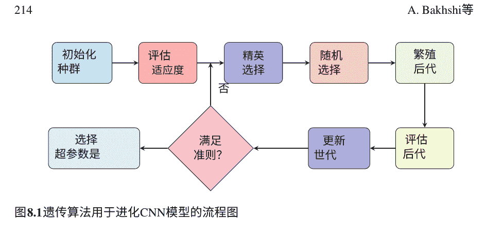

优化CNN架构的提出算法在通用的遗传算法框架中使用标准的遗传算法操作（图8.1）。算法从每个个体的基因的随机选择开始创建初始种群。每个个体的染色体唯一确定了CNN的架构以及一些超参数。然后，使用训练数据集对每个CNN模型进行训练和验证，并将网络在验证阶段的平均分类准确率作为个体的适应度得分。接下来，按照适应度得分降序对个体的种群进行排序。然后，通过应用精英选择、随机选择和新成员的繁殖等一系列遗传操作，创建下一代种群。

这个过程重复进行，直到满足终止准则。遗传算法用于CNN架构优化的伪代码如算法1所示，每个模块的详细信息在以下子节中介绍。

**算法1：提出的用于进化CNN模型的遗传算法框架**

```
输入：种群大小（N_P），最大迭代次数（G_max），选择的超参数的值范围（L_H），训练数据集的RGB图像
输出：具有其超参数的最佳CNN架构
1. 使用超参数的随机组合初始化种群[算法2]
2. 训练种群中每个个体指定的CNN模型，并计算相应的适应度得分[算法3]
3. 将个体及其适应度得分存储在名为 P 的列表中
4. N_G <- 0
5. 当 N_G < G_max 时执行
6.     创建由精英个体、随机个体和由 P 创建的后代组成的新一代 P_new[算法4]
7.     评估个体在 P_new 的适应度
8.     设置 P <- P_new 和 N_G <- N_G + 1
9. 结束
10. 返回 P 中最好的CNN架构以及其超参数
```

| LR | WD | M | DR | B1 | B2 | B3 | B4 | B5 | F1 | F2 | F3 | F4 | F5 |
|----|----|---|----|----|----|----|----|----|----|----|----|----|----|
| 0.01 | 0.001 | 0.8 | 0.25 | 2 | 0 | 3 | 2 | 4 | 256 | 128 | 32 | 512 | 256 |

图8.2 个体的染色体显示CNN模型的不同超参数

### 8.4.1 种群初始化

如前所述，所提出的遗传算法用于在经典CNN架构的搜索空间中寻找最优CNN模型。我们将CNN中的最大卷积层数限制为20，分为最多5个块B1, B2, B3, B4, B5。每个块可以有0到4个层。每个块的特征图数量也通过遗传算法进行优化，可以从{32, 64, 128, 256, 512}中选择。通过我们的遗传算法优化的其他超参数包括学习率（LR）、权重衰减（WD）、动量（M）和丢弃率（DR）。染色体的结构如图8.2所示。从染色体结构可以清楚地看出，所提出的遗传算法使用的是固定大小的染色体。然而，通过允许块大小为零，遗传算法实际上可以搜索具有可变长度的CNN模型，其中块的数量和层数可以在0到20之间变化。图8.2中的示例展示了一个具有11层的CNN架构，其中第一个块由2个卷积层组成，特征图大小为256。第二个块不存在，第三、第四和第五个块分别有3、2和4个层，它们对应的特征图大小分别为32、512和256。

在基因型到表型映射中，每个CNN模型都添加了几个额外的层。每个卷积块后面都跟着一个核大小为2、步长为2的最大池化层，最后一个最大池化层后面添加了一个核大小为2、步长为1的平均池化层，并在网络末尾放置了一个线性全连接层。此外，每个卷积层后面都跟着一个批归一化层[18]和一个修正线性单元（ReLU）层[19]，每个卷积块的末尾添加了一个dropout层。

算法2总结了GA的种群初始化过程。染色体中的每个基因可以取一系列的值，提出的GA通过进化过程寻找这些值的最优组合。每个基因的可能取值范围（在表8.1中显示）根据使用CNN进行不同分类问题的先前经验进行选择。在随机选择超参数后，CNN架构被创建，没有对卷积层或特征图的数量或顺序施加任何约束。

通常，人工设计的卷积神经网络结构是根据一些规则创建的，例如，连续的卷积块中使用了越来越多的特征图。然而，在提出的遗传算法模型中，没有施加这样的限制，卷积神经网络的结构完全由染色体引导。

**算法2: 生成初始种群**

```
输入: 种群大小 N_P
输出: 初始化的种群 P_init
数据: 不同超参数的取值范围存储在名为 L_H 的列表中
1. P_init <- ∅
2. 当 |P_init| < N_P 时
3.     从 L_H[LR] 中随机选择学习率 (lr)
4.     从 L_H[WD] 中随机选择权重衰减因子 (wd)
5.     从 L_H[M] 中随机选择动量 (m)
6.     从 L_H[DR] 中随机选择 dropout (d)
7.     从 L_H[NL] 中随机选择每个块中的卷积层数 {B1, B2, B3, B4, B5}
8.     从 L_H[NF] 中随机选择每个块对应的特征图数量 {F1, F2, F3, F4, F5}
9.     使用选定的超参数创建一个个体 (Ind)
10.    P_init <- P_init ∪ Ind
11. 返回 P_init
```

表8.1 不同超参数的可能值范围，由遗传算法搜索

| 超参数 | 值 |
|--------|-----|
| 学习率 (LR) | 0.1, 0.01, 0.001, 0.0001 |
| 权重衰减 (WD) | 0.1, 0.01, 0.001, 0.0001, 0.00001 |
| 动量 (M) | 0.5, 0.55, 0.6, 0.65, 0.7, 0.75, 0.8, 0.85, 0.9 |
| 丢弃率 (DR) | 0.25, 0.5, 0.75 |
| 块大小 (NL) 在B1-B5 | 0, 1, 2, 3, 4 |
| 特征图大小 (NF) 在F1-F5 | 32, 64, 128, 256, 512 |

最后，值得注意的是染色体结构和算法足够灵活，可以通过考虑优化其他超参数，例如激活函数，每个卷积块的单个内核大小等，使其更加通用。然而，增加搜索空间大小将需要更广泛的搜索。我们对染色体的一些变体进行了一些初步研究，但后来固定了那些超参数值（例如，将卷积层的内核大小固定为3）以减少计算负担。

### 8.4.2 适应度评估

为了评估由个体的染色体构建的CNN模型的质量，我们需要对其进行训练和评估其分类性能。训练和评估深度神经网络是任何深度神经进化算法中计算成本最高的部分。最近的研究表明，可以根据CNN模型的架构质量进行粗略评估，基于其部分训练后评估 [8, 9]。因此，在进化过程中，我们仅对CNN网络进行了部分训练，仅训练了 N_epoch = 10 个epoch，这显著加速了遗传算法的执行。

**算法3：对个体进行适应度评估**

1. 输入：个体 (Ind)，训练数据 (D_train)，验证数据 (D_valid)，训练阶段的epoch数 (N_epoch)
   输出：个体的适应度得分
2. 根据 Ind 的超参数创建CNN模型 (net)，包括池化、全连接、批归一化、ReLU和dropout层（详见第8.4.1节）
3. Acc <- ∅
4. step <- 0
5. Acc_avg <- 0
6. **当** step < N_epoch **时执行**
7.     使用 D_train 训练模型 net
8.     使用 D_valid 计算分类准确率 (acc)
9.     Acc <- Acc ∪ acc
10.    step <- step + 1
11. **结束**
12. Acc_avg <- Acc中准确率的平均值
13. **返回** Acc_avg

我们使用构建的CNN模型的平均验证准确率作为相应个体的适应度评分。在训练阶段使用90%的训练数据，剩下的10%用于验证。构建的CNN模型通过随机梯度下降 (SGD) 算法[20]进行训练，对于一个常数的迭代次数 (N_epoch = 10)，验证阶段的平均分类准确率被用作个体的适应度评分。在所有实验中，在训练阶段使用交叉熵损失作为损失函数，并且在进化阶段后的完整训练中，学习率每10个迭代次数减小10倍。个体的适应度评估细节总结在算法3中。

### 8.4.3 创建新一代

在提出的遗传算法中，下一代个体是通过精英选择、随机选择和后代生成从当前一代个体中创建的。首先，根据其适应度分数对当前一代个体进行排序。从当前种群中选择前 e% 的个体，即精英个体，并将其添加到下一代中。为了保持种群的多样性并防止过早收敛，还会添加一些随机个体[21, 22]。

具体而言，从当前种群的其余个体中，以概率 p_r 随机选择个体，并将其添加到下一代中。最后，选定的精英个体和随机个体组成了繁殖后代的父代池。

### 算法4: 创建新一代个体

输入：具有适应度分数的当前个体种群（P），保留为精英的种群百分比（e），从当前个体种群的非精英部分保留个体的概率（p_r），变异的概率（p_m），种群大小（N_p）输出：新的个体种群（P_new）

- 1 P_new ← ∅
- 2 按照适应度分数降序对个体在 P中进行排序
- 3 从 P中添加前 e% 的个体到新种群 P_new
- 4 以概率 p_r 从 P 的底部选择 (1 - e)% 的个体，并将它们添加到 P_new
- 5 P_parent ← P_new
- 6 当 |P_new| < N_p do
- 7     Par1 ← 从 P_parent 中随机选择一个个体
- 8     Par2 ← 从 P_parent 中随机选择一个个体
- 9     如果 Par1 = Par2 则
- 10        使用均匀交叉操作从选定的父代创建两个子代
- 11        并将它们保存在 Children 中
- 12        对于每个 Child 中的个体 do
- 13            r ← 从范围(0,1)中随机生成一个数
- 14            如果 p_m > r 则
- 15                随机替换 Child 中的一个基因为随机选择的值
- 16            结束
- 17        结束
- 18        P_new ← P_new ∪ Children
- 19    结束
- 20 返回 P_new

生成后代的过程始于从父代池中随机选择两个不同的个体。所选的父母参与均匀交叉操作以创建两个后代。每个子代可能从父母那里继承各种基因的组合，因为它的基因是随机从父母中选择的。然后，子代以预定义的突变概率 p_m 进行突变操作。如果满足突变条件，则在后代染色体中随机选择一个基因，并从一组预定义的值（在表8.1中显示）中随机修改。新创建的后代被添加到下一代中。创建新子代的过程重复进行，直到新一代中的个体数量达到种群大小。最后，由父代池和子代池组成的新一代取代当前一代。代际交替的过程重复 G_max 次，以便遗传算法可以搜索最佳的网络架构和超参数。从当前一代创建新一代的过程如算法4所示。

## 8.5 实验设置

### 8.5.1 数据集

在这项工作中，我们使用了三个流行的数据集CIFAR10、CIFAR100和SVHN作为图像分类问题的基准。 这些数据集已经在许多研究中被用于评估最先进的深度神经网络模型，这使得我们的进化模型与这些模型可比较。

CIFAR10数据集包括60,000个彩色RGB图像，属于10个类别，主要用于图像分类任务。 这些图像的尺寸为32 × 32，分为训练集和测试集。 训练集包含50,000张图像，其余的10,000张图像用作测试集。每个类别的训练样本和测试样本数量相等。

CIFAR100数据集与CIFAR10类似，只是有100个类别，每个类别分为20个超类，每个超类包含五个类别。 每个类别只有500个训练图像和100个测试图像，使得在这个数据集上的分类更具挑战性。

SVHN（街景房屋号码）数据集可以被认为是与MNIST数据集本质上相似，但具有更多标记数据，分别包含73257个和26032个数字用于训练和测试。与MNIST数据集相比，SVHN数据集源自一个更困难的现实世界问题。 该数据集包含来自Google街景图像中的房屋号码的原始、彩色和可变分辨率图像。 然而，所有房屋号码的数字都已调整为固定分辨率32 × 32，并来自10个不同的类别[23]。

### 8.5.2 实验环境

在这项工作中，我们在所有实验中使用了Python编程语言（版本3.7）的PyTorch框架（版本1.2.0）。 此外，我们在纽卡斯尔大学使用高性能计算（HPC）服务和DGX工作站机器运行了代码。所有代码在所有阶段都使用了两个GPU，包括各种CNN架构的演化、选择模型的完整训练以及测试最佳性能模型。

### 8.5.3 参数选择

正如之前所述，我们提出的框架非常灵活，可以增加搜索空间。 换句话说，许多超参数可以通过遗传算法框架进行演化，但由于计算资源的限制，我们只演化了一些选定的超参数。此外，根据我们之前的实验结果，遗传算法总是为某些超参数选择特定的值，即激活函数和优化器。因此，在所有实验中，都使用了ReLU激活函数和SGD优化器。此外，卷积层的卷积核大小设置为3，卷积层和最大池化层的步长设置为2。

遗传算法的参数设置如下：最大迭代次数 \(G_{max}\) =40，种群大小 \(N_{p}\) =30，保留为精英的种群百分比 \(e\) =40%，从非精英部分保留个体的概率 \(p_{r}\) = 0.1，变异的概率 \(p_{m}\) = 0.2。这些参数是基于我们对进化算法的经验和一些初步研究进行设置的。此外，为了减少计算负担并加快进化过程，在进化过程中，我们使用较少的迭代次数对网络进行训练 \(N_{epoch}\) =10。进化阶段结束后，最佳的CNN模型在完全训练之前会使用测试数据集进行评估。准确地说，由遗传算法演化出的最佳模型会使用完整的训练集进行更多次数的训练 \(N_{epoch}\) =350。

## 8.6 实验结果

在我们的实验中，我们应用了提出的遗传算法来演化每个数据集的卷积神经网络架构。考虑到算法的随机性质，我们重复了每个实验5次，并在每次实验中演化出最佳的卷积神经网络模型，然后对相应的数据集进行完全训练和测试。表8.2展示了不同数据集中演化模型的性能，包括平均准确率、标准差、最佳准确率和最差准确率。遗传算法设计的卷积神经网络模型在所有三个数据集上都能取得良好的性能。根据表8.2中显示的平均准确率、最佳准确率、最差准确率以及标准差，可以明显看出进化算法在多次实验中找到了相似质量的卷积神经网络模型，具有相当可靠性。

图8.3和8.4展示了遗传算法从单个代表性运行中的平均收敛曲线，适用于所有三个数据集。请注意，这些图中的适应度分数是每一代卷积神经网络模型的平均验证准确率。

表8.2 最佳CNN模型在每个数据集上通过多次GA运行进化得到的平均准确率、标准差、最佳准确率和最差准确率
| 数据集 | 平均准确率 | 标准差 | 最佳准确率 | 最差准确率 |
|---|---|---|---|---|
| CIFAR10 | 94.75 | 0.650 | 95.82 | 94.01 |
| CIFAR100 | 75.90 | 0.521 | 76.79 | 75.34 |
| SVHN | 95.11 | 0.48 | 95.57 | 94.52 |
每个网络训练了 350个epochs

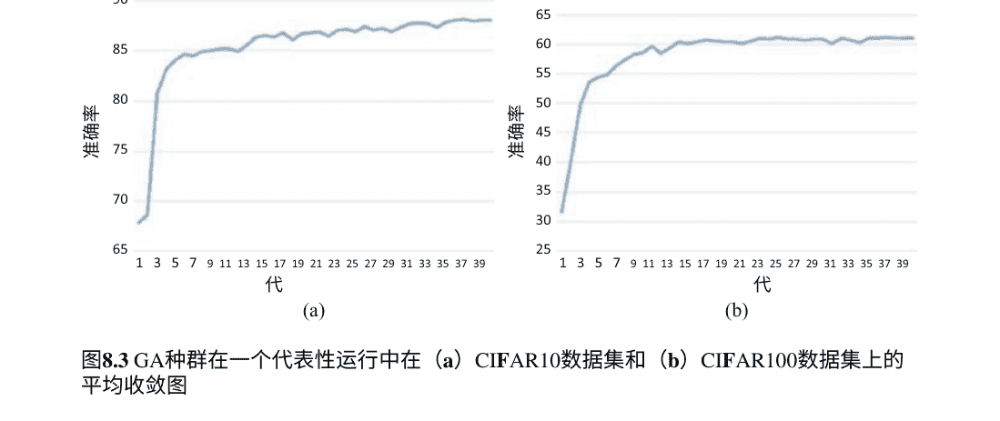

图8.3 GA种群在一个代表性运行中在（a）CIFAR10数据集和（b）CIFAR100数据集上的平均收敛图

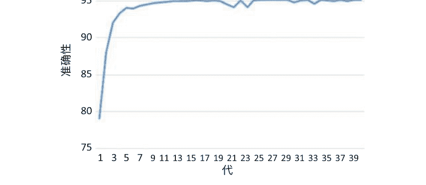

图8.4 GA种群在一个代表性运行中在SVHN数据集上的平均收敛图

仅训练了10个epochs。从这些图表中可以看出，所提出的算法成功地改善了所有数据集上种群的整体适应度。种群的适应度在前10代迅速提高，然后逐渐减缓。然而，这种行为是预期的，因为精英主义策略的高选择压力和精英个体参与后代生成。

表8.3显示了在不同遗传算法运行中进化出的最佳网络的结构，每个数据集都有不同的运行。表8.3的每一行都显示了卷积神经网络的体系结构，包括每个块中的卷积层数量、每个块中的特征图大小。卷积块之间用逗号分隔，在每个块中，我们显示了该块中每个层的层数和特征图大小（用括号表示）。例如，在表8.3的第一行中，4 × (128)表示CNN的第一个卷积块由4个层和特征图大小为128的层组成。

表8.3 不同数据集上通过多次GA运行进化得到的最佳CNN模型的结构
| 数据集 | 网络ID | 参数数量 | 进化的体系结构 |
|---|---|---|---|
| CIFAR10 | 网络1 | 14.3百万 | [4 × (128), 4 × (256), 2 × (256), 3 × (512), 2 × (512)] |
| CIFAR10 | 网络2 | 25.4百万 | [4 × (512), 3 × (512), 4 × (512), 2 × (256)] |
| CIFAR10 | 网络3 | 5.8 百万 | [2 × (512), 4 × (256), 2 × (128)] |
| CIFAR10 | 网络4 | 6.7 百万 | [2 × (256), 3 × (512), 2 × (32)] |
| CIFAR10 | 网络5 | 20.7 百万 | [3 × (512), 2 × (512), 4 × (512), 2 × (256)] |
| CIFAR100 | 网络1 | 1.7 百万 | [4 × (256), 2 × (512), 4 × (256)] |
| CIFAR100 | 网络2 | 14.2 百万 | [3 × (512), 4 × (512)] |
| CIFAR100 | 网络3 | 11.2 百万 | [2 × (256), 4 × (512), 4 × (512)] |
| CIFAR100 | 网络4 | 18.3 百万 | [3 × (512), 3 × (512), 4 × (256)] |
| CIFAR100 | 网络5 | 14.8 百万 | [2 × (256), 2 × (512), 3 × (512)] |
| SVHN | 网络1 | 19 百万 | [3 × (512), 4 × (512), 4 × (256)] |
| SVHN | 网络2 | 7.8 百万 | [3 × (32), 3 × (512), 4 × (512), 2 × (512)] |
| SVHN | 网络3 | 17.1 百万 | [3 × (32), 3 × (512), 4 × (512), 4 × (512)] |
| SVHN | 网络4 | 23.8 百万 | [3 × (256), 3 × (256), 2 × (256), 4 × (512)] |
| SVHN | 网络5 | 11.9 百万 | [3 × (32), 3 × (512), 4 × (512), 2 × (512)] |

每个卷积层都有128个特征图的4层卷积层。完整的CNN模型是通过添加ReLU、批归一化、dropout、平均池化层和完全连接层来构建的，如第8.4.1节所述。该表还显示了不同进化模型的可训练参数数量。对于CIFAR10、CIFAR100和SVHN数据集，每个进化网络的其他超参数如表8.4、8.5和8.6所示。图8.5可视化了在三个数据集上通过遗传算法演化的最佳CNN模型的架构，在五次重复运行中。

从表8.3可以看出，即使对于相同的数据集，不同的进化运行也会以块的数量、层数和可训练参数的数量等方面演化出完全不同的卷积神经网络结构。然而，通过这些不同的架构，模型在各自的数据集上实现了非常相似的准确性，如表8.4、8.5和8.6所示。遗传算法演化出的架构中一个有趣的观察是不同块中的特征图大小。在人工设计的架构中，通常随着卷积块的增加，特征图大小会增加，就像我们在不同的VGG模型中看到的那样。在一些演化出的模型中，我们注意到了相同的特征，例如CIFAR10的Net 1，然而，总体上，这种顺序在演化出的模型中没有得到保持。一些架构按照递减顺序排列（CIFAR10的Net 3），而一些架构没有特定的顺序（CIFAR10的Net 4）。从这个观察中，我们可以推断出在设计良好的卷积神经网络架构中，后续卷积块中的特征图大小的增加并不是绝对必要的。

为了进一步评估进化模型的价值，我们对每个进化模型进行了训练，并测试了其准确性。具体而言，表8.4展示了CIFAR10数据集的最佳进化模型，并应用于CIFAR10、CIFAR100和SVHN数据集。 类似地，表8.5和8.6分别显示了CIFAR100和SVHN数据集上演化模型的性能，在所有三个数据集上。

表8.4 不同遗传算法运行演化的前五个CNN模型的超参数，用于CIFAR10数据集
| 网络名称 | 学习率 | 权重衰减 | M | DR | 块数 | 层数 | CIFAR10 准确性 | CIFAR100 准确性 | SVHN 准确性 |
| :--- | :--- | :--- | :--- | :--- | :--- | :--- | :--- | :--- | :--- |
| 网络1 | 0.01 | 0.01 | 0.65 | 0.5 | 5 | 15 | 95.82 | 79.48 | 96.93 |
| 网络2 | 0.01 | 0.001 | 0.8 | 0.5 | 4 | 13 | 95.09 | 76.95 | 96.60 |
| 网络3 | 0.1 | 0.001 | 0.7 | 0.25 | 3 | 8 | 94.64 | 74.41 | 95.64 |
| 网络4 | 0.01 | 0.01 | 0.7 | 0.5 | 3 | 7 | 94.21 | 71.53 | 92.80 |
| 网络5 | 0.01 | 0.0001 | 0.8 | 0.5 | 4 | 11 | 94.01 | 76.07 | 96.27 |

表8.5 不同遗传算法运行演化的前五个CNN模型的超参数，用于CIFAR100数据集
| 网络名称 | 学习率 | 权重衰减 | M | DR | 块数 | 层数 | CIFAR10 准确性 | CIFAR100 准确性 | SVHN 准确性 |
| :--- | :--- | :--- | :--- | :--- | :--- | :--- | :--- | :--- | :--- |
| 网络1 | 0.01 | 0.001 | 0.8 | 0.5 | 3 | 10 | 93.28 | 76.79 | 96.03 |
| 网络2 | 0.1 | 0.0001 | 0.75 | 0.5 | 2 | 7 | 94.14 | 76.04 | 95.87 |
| 网络3 | 0.01 | 0.0001 | 0.8 | 0.5 | 3 | 10 | 94.66 | 75.59 | 96.54 |
| 网络4 | 0.01 | 0.001 | 0.8 | 0.25 | 3 | 10 | 94.56 | 75.52 | 96.35 |
| 网络5 | 0.01 | 0.0001 | 0.9 | 0.5 | 3 | 7 | 94.34 | 75.34 | 96.03 |

表8.6 不同遗传算法运行演化的前五个CNN模型的超参数，用于SVHN数据集
| 网络名称 | 学习率 | 权重衰减 | M | DR | 块数 | 层数 | CIFAR10 准确率 | CIFAR100 准确率 | SVHN 准确率 |
| :--- | :--- | :--- | :--- | :--- | :--- | :--- | :--- | :--- | :--- |
| 网络1 | 0.01 | 0.0001 | 0.9 | 0.25 | 3 | 11 | 95.10 | 73.95 | 95.57 |
| 网络2 | 0.01 | 0.0001 | 0.7 | 0.5 | 4 | 12 | 93.21 | 73.53 | 95.51 |
| 网络3 | 0.01 | 0.0001 | 0.7 | 0.5 | 4 | 14 | 92.58 | 72.89 | 95.43 |
| 网络4 | 0.01 | 0.001 | 0.7 | 0.5 | 4 | 12 | 94.19 | 73.18 | 94.53 |
| 网络5 | 0.01 | 0.0001 | 0.8 | 0.5 | 4 | 12 | 94.05 | 73.10 | 94.52 |

预计演化出的模型在特定数据集上会表现出最佳性能。 然而，我们注意到一般情况下，CIFAR10数据集上演化出的模型表现最佳（表8.4）。 我们假设对于像CIFAR100和SVHN这样更复杂的数据集，10个周期的训练不足以评估网络架构的质量，因此，演化出的模型在相应的数据集中表现不佳。 值得注意的是，表8.4、8.5和8.6中的演化运行相当一致地选择了网络超参数。 例如，几乎在每个模型中，丢失率选择为0.5，学习率选择为0.01。

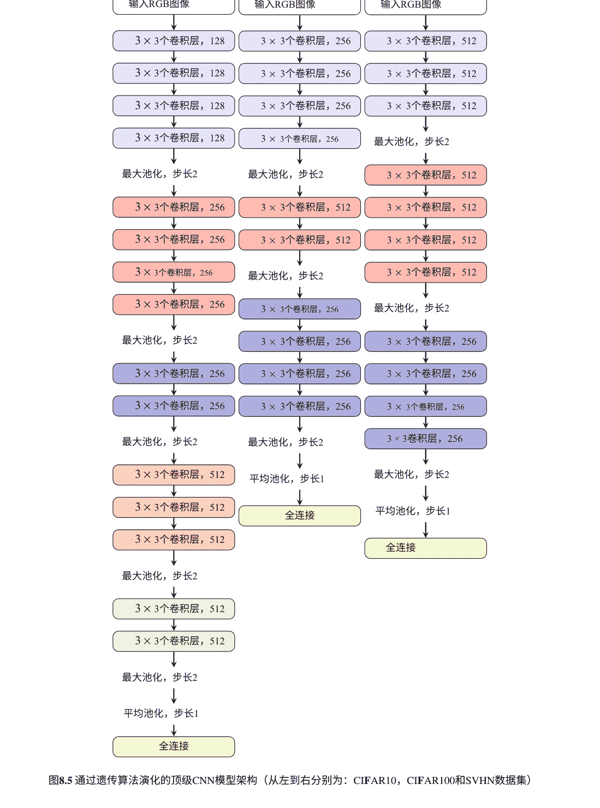

图8.5 通过遗传算法演化的顶级CNN模型架构（从左到右分别为：CIFAR10，CIFAR100和SVHN数据集）

表8.7 通过遗传算法演化的CNN模型与现有最先进的CNN算法在分类准确率方面的比较（%）
| 名称 | CIFAR10 准确性 | CIFAR100 准确性 | GPU 天 | 参数设置 |
|:---|:---:|:---:|:---:|:---:|
| VGG16 | 93.05 | 74.94 | - | 手动 |
| VGG19 | 92.59 | 74.04 | - | 手动 |
| ResNet101 | 94.08 | 75.39 | - | 手动 |
| DenseNet | 94.52 | 76.61 | - | 手动 |
| Maxoutᵃ | 90.70 | 61.40 | - | 手动 |
| 遗传卷积神经网络ᵃ | 92.90 | 70.97 | 17 | 半自动 |
| 分层进化ᵃ | **96.37** | - | 300 | 半自动 |
| 块-QNN-Sᵃ | 95.62 | 79.35 | 90 | 半自动 |
| 大规模进化ᵃ | 94.60 | 77 | 2750 | 自动 |
| CGP-CNNᵃ | 94.02 | - | 27 | 自动 |
| NASᵃ | 93.99 | - | 22,400 | 自动 |
| Meta-QNNᵃ | 93.08 | 72.86 | 100 | 自动 |
| CNN-GAᵃ | 95.22 | 77.97 | 35 | 自动 |
| Fast-CNN [17] | 94.70 | 75.63 | 14 | 自动 |
| 本文 (CIFAR10) | 95.82 | **79.48** | 6 | 自动 |

ᵃ该算法在[14]中报告的值

在进化阶段对不同模型进行部分训练（较少的训练轮数）的目的是为了减少计算负担。一些其他工作[8, 9]和我们之前的实验[17]表明，这种部分训练足以评估图像分类中的网络架构。在本研究中，我们的目标是通过仅训练网络10个轮次来进一步研究这一点。

毫无疑问，它极大地加速了进化过程-网络进化的平均时间仅为6个GPU天。然而，基于为CIFAR100和SVHN数据集进化的网络的性能，我们推断这样的最小训练对于简单数据集可能是有用的，但对于评估复杂数据集中网络的质量来说是不足够的。

最后，为了评估GA进化模型与其他最先进的CNN模型的竞争力，我们在表8.7中比较了它们的性能（最佳性能以粗体显示）。我们对三类网络的性能进行了对比，手动设计的网络、半自动设计的网络和完全自动设计的网络[14]。手动设计的网络包括VGG16 [5]、VGG19 [5]、ResNet101 [6]、DenseNet [16]和Maxout [24]。半自动设计的网络包括遗传CNN、分层进化、块-QNN-S，完全自动设计的网络包括大规模进化、CGP-CNN、NAS、Meta-QNN、CNN-GA和Fast-CNN [17]。我们比较了由提出的GA进化的最佳模型在CIFAR10数据集上在CIFAR10和CIFAR100数据集上的性能（最后一行）。除了比较这些模型在CIFAR10和CIFAR100数据集上的准确性之外，对于自动设计的网络，我们还从以下方面进行了比较。设计这些网络所需的GPU天数。GPU天数是确定算法速度的粗略估计，但不适用于手动设计的模型。值得注意的是，我们已经复制了一些结果，而其他结果（在表脚注中标明）只是从[14]复制过来的。

从表8.7可以看出，我们提出的遗传算法演化的CNN模型在CIFAR10数据集中明显优于VGG模型以及其他人工设计的CNN模型。该CNN模型也优于所有其他自动设计的模型。在CIFAR10数据集中，它的性能在比较的模型中排名第二。在CIFAR10数据集上，通过分层演化设计的模型展现出最佳性能，这是一种半自动设计的网络。

在CIFAR100数据集上，本研究中演化的模型在准确性方面表现最好，相比于所有其他CNN模型，无论是手动设计的、半自动设计的还是自动设计的。最后，从所需的计算能力来看，与其他半自动和自动方法相比，我们提出的遗传算法在寻找最优CNN架构方面速度非常快，仅需6个GPU天。尽管半自动类别中的分层演化模型在CIFAR10上显示出更好的分类准确性，但其GPU天数比本研究中提出的方法所需的GPU天数大50倍。

## 8.7 讨论

本章主要研究遗传算法是否能够帮助找到优化的类似VGG的卷积神经网络模型，用于图像分类。使用固定长度的染色体，提出的遗传算法探索了由可变数量的层组成的CNN架构的搜索空间，这些层被分为可变数量的块。

对三个广泛使用的数据集进行的实验表明，提出的遗传算法能够设计优化结构和超参数的CNN模型。进化出的模型比经典的VGG模型和其他人工设计的CNN模型更好。尽管具有类似VGG的架构，但遗传算法设计的模型与半自动和自动方法设计的其他最先进的CNN模型也非常有竞争力。此外，遗传算法设计的CNN模型有时具有与人类设计的模型不同的结构特征。我们还评估了由遗传算法演化的CNN模型在一个数据集上对其他数据集的性能。模型在其他数据集上的高质量性能表明了遗传算法演化的架构的优越性。基于这些结果，我们得出结论，提出的遗传算法能够优化经典的CNN模型以获得更高的性能。

对于我们的第二个问题的答案，如果我们可以通过对模型进行部分训练来减少演化卷积神经网络架构的高成本，我们评估了几个训练周期后网络的性能。通过对CIFAR10数据集的实验，我们发现只进行几个训练周期的模型部分训练对于找到非常好的架构是有益的。然而，为CIFAR10数据集演化的模型在CIFAR100和SVHN数据集上表现出了更好的性能。基于这些结果，我们假设部分训练在评估复杂数据集中网络性能方面可能不够有效。然而，需要在多个数据集上通过改变训练周期进行更详细的研究，以得出更一般和准确的结论。

在我们的实验中，一些CNN的结构参数和超参数被保持不变。尽管所提出的框架已经准备好扩展到这些参数的演化，但搜索空间的扩大将需要更多的计算能力来找到最佳的CNN模型。另一方面，以此为代价，可能有可能找到一个更高效的CNN模型。此外，与许多其他架构相比，演化网络的大小较大，因为没有采取措施限制网络大小。当前的框架也可以扩展到单目标或多目标设置中纳入该准则。优化更大的参数集也有助于找到更小的网络模型。

## 8.8 结论和未来工作

在本章中，我们展示了如何使用简单的遗传算法（GA）来自动发现优化的CNN模型。通过探索经典CNN模型的搜索空间，提出的GA优化了每个块中的卷积层数，每个块的特征图大小以及其他与训练相关的超参数，如dropout率、学习率、权重衰减和动量。为了减少模型训练中的计算负担，这是所有深度神经进化算法的共同挑战，我们在进化过程中部分训练了模型。在三个流行的数据集CIFAR10、CIFAR100和SVHN上评估时，提出的GA在多次重复实验中设计出了非常高质量的CNN模型。通过分类准确率和GPU天数，将进化的CNN模型与来自不同类别的14个最先进的模型进行比较。在CIFAR10数据集上进化出的最佳CNN模型在分类准确率上与其他人设计和自动设计的CNN模型非常有竞争力，并且在GPU天数方面更好地进化它们。

所提出的遗传算法框架可以用于搜索更多与卷积神经网络相关的结构和训练超参数，例如卷积核大小、步长大小、激活函数、优化器选择等，只需进行非常少量的修改。此外，该框架还可以扩展为在参数数量方面寻找更小的网络模型。

此外，所提出的遗传算法的性能还可以在其他卷积神经网络的应用中进行测试，以及用于优化其他类型的深度神经网络。

## 参考文献

- 1. Darwish, A., Hassanien, A.E., Das, S.: 用于深度学习的群体和进化计算方法综述. 人工智能评论, 1–46 (2019)
- 2. Iba, H., Noman, N.: 进化算法的新前沿：理论与应用. 伦敦帝国学院出版社, 伦敦 (2011年)
- 3. Schaffer, J.D., Whitley, D., Eshelman, L.J.: 遗传算法和神经网络的组合：现状综述. 在：国际遗传算法和神经网络组合研讨会, 1992年. OGANN-92, 第1-37页. IEEE, 皮斯卡特维 (1992年)
- 4. Such, F.P., Madhavan, V., Conti, E., Lehman, J., Stanley, K.O., Clune, J.: 深度神经进化：遗传算法是训练深度神经网络进行强化学习的竞争性选择。预印本。arXiv:1712.06567 (2017)
- 5. Simonyan, K., Zisserman, A.: 非常深的卷积网络用于大规模图像识别。预印本。arXiv:1409.1556 (2014)
- 6. He, K., Zhang, X., Ren, S., Sun, J.: 深度残差学习用于图像识别。在：IEEE计算机视觉和模式识别会议论文集，第770-778页 (2016)
- 7. Szegedy, C., Liu, W., Jia, Y., Sermanet, P., Reed, S., Anguelov, D., Erhan, D., Vanhoucke, V., Rabinovich, A.: 用卷积更深入。在：IEEE计算机视觉和模式识别会议 (CVPR) (2015)
- 8. 菅沼, M., 白川, S., 永尾, T.: 一种用于设计卷积神经网络结构的遗传编程方法。在：遗传和进化计算会议论文集, 第497-504页. ACM, 纽约 (2017年)
- 9. 孙, Y., 薛, B., 张, M., Yen, G.G.: 演化深度卷积神经网络用于图像分类。IEEE Trans. Evol. Comput. 24(2), 394-407 (2020年)
- 10. 松谷, M., 森, K., 三谷, Y., 金田, Y.: 使用卷积神经网络进行主观独立的面部表情识别，使用稳健的面部检测。神经网络。16(5-6), 555-559 (2003年)
- 11. Goodfellow, I., Bengio, Y., Courville, A., Bengio, Y.: 深度学习, 第1卷. MIT Press, 剑桥 (2016年)
- 12. David, O.E., Greental, I.: 用于进化深度神经网络的遗传算法。在：《2014年遗传和进化计算年度会议同伴出版物》的论文集, 第1451-1452页. ACM, 纽约 (2014年)
- 13. Loshchilov, I., Hutter, F.: 用于深度神经网络超参数优化的CMA-ES。预印本。arXiv:1604.07269 (2016年)
- 14. Sun, Y., Xue, B., Zhang, M., Yen, G.G.: 使用遗传算法自动设计CNN架构进行图像分类。预印本。arXiv:1808.03818 (2018年)
- 15. Sun, Y., Xue, B., Zhang, M.: 基于模块自动演化CNN架构。预印本。arXiv:1810.11875 (2018年)
- 16. Huang, G., Liu, Z., Van Der Maaten, L., Weinberger, K.Q.: 密集连接卷积神经网络。在：2017年IEEE计算机视觉和模式识别会议 (CVPR), pp. 2261-2269。IEEE, 皮斯卡塔韦 (2017年)
- 17. Bakhshi, A., Noman, N., Chen, Z., Zamani, M., Chalup, S.: 使用遗传算法快速自动优化图像分类的CNN架构。在：2019年IEEE进化计算大会 (CEC), pp. 1283-1290。IEEE, 皮斯卡塔韦 (2019年)
- 18. Ioffe, S., Szegedy, C.: 批量归一化：通过减少内部协变量偏移加速深度网络训练。预印本。arXiv:1502.03167 (2015年)
- 19. Glorot, X., Bordes, A., Bengio, Y.: 深度稀疏整流器神经网络。在：第十四届人工智能与统计学国际会议论文集, pp. 315-323 (2011年)
- 20. Bottou, L.: 使用随机梯度下降的大规模机器学习. 在: COMPSTAT’2010会议论文集, 第177–186页. Springer, Berlin (2010)
- 21. Anderson-Cook, C.M.: 实用遗传算法. J. Am. Stat. Assoc. **100**(471), 1099–1099 (2005)
- 22. Malik, S., Wadhwa, S.: 使用DGCA和精英技术防止遗传算法过早收敛. Int. J. Adv. Res. Comput. Sci. Softw. Eng. **4**(6) (2014)
- 23. Netzer, Y., Wang, T., Coates, A., Bissacco, A., Wu, B., Ng, A.Y.: 使用无监督特征学习在自然图像中读取数字. 在: NIPS深度学习和无监督特征学习研讨会 (2011)
- 24. Goodfellow, I.J., Warde-Farley, D., Mirza, M., Courville, A., Bengio, Y.: Maxout网络. 预印本. arXiv:1302.4389 (2013)

# 第四部分 深度神经进化


# 第九章 发现门控循环神经网络结构

Aditya Rawal, Jason Liang, and Risto Miikkulainen

摘要门控循环网络，如由长短期记忆（LSTM）节点组成的网络，最近已被用于改进许多顺序处理任务，如语音识别和机器翻译的最新技术。然而，LSTM节点的基本结构与25年前首次提出时基本相同。最近，进化和强化学习机制已被用于创建这种结构的新变体。本章提出了一种新方法，即基于树状编码的门控记忆节点的进化，并表明它能够比其他方法更有效地探索新的变体。该方法发现了具有多个循环路径和多个记忆单元的节点，这导致了在标准语言建模基准任务中的显著改进。本章还展示了如何通过训练LSTM网络来加快搜索过程，以估计候选结构的性能，并鼓励探索新颖的解决方案。因此，复杂神经网络结构的进化设计有望提高深度学习架构的性能，超越人类的能力。

## 9.1 引言

在许多工程设计领域，系统变得如此复杂，以至于人类无法再对其进行优化，而需要自动化方法。这在VLSI设计中一直是事实，但在软件工程中也变得引人注目：“通过优化进行编程”的想法是，人类只应设计框架，而细节应留给自动化方法，如优化[1]。最近出现了类似的限制开始在深度学习中出现。神经网络架构变得如此复杂，以至于人类无法再对其进行优化；超参数甚至整个架构现在都通过梯度下降[2]、贝叶斯参数优化[3]、强化学习[4, 5]和进化计算[6-8]自动优化。这些自动化方法的改进是显著的：网络的结构很重要。

这项工作表明，相同的方法可以用来改进几十年来基本没有改变的架构。以长短期记忆（LSTM）网络为例[9]。它最初是在1997年提出的；随着计算能力的大幅提升，它最近被证明是一种强大的顺序任务方法，如语音识别、语言理解、语言生成和机器翻译，在某些情况下比传统方法提高了40%的性能[10]。在这个过程中，基本的LSTM结构几乎没有改变，对其变体的彻底比较得出结论，进一步修改它几乎没有什么收益[11, 12]。

然而，最近关于元学习方法的研究，如神经架构搜索和进化优化，已经表明LSTM的性能可以通过进一步复杂化来提高[4, 6]。本章基于这些思路开发了一种新方法，认识到可以构建更复杂的节点结构的大搜索空间可能是有益的。该方法基于节点结构的树编码，以便可以使用遗传编程进行高效搜索。事实上，这种方法发现了比以前更复杂的结构，并且它们的表现确实更好：在标准语言建模基准测试中，目标是预测大型语言语料库中的下一个单词，其困惑度比标准LSTM [13] 提高了6个困惑度点，并且比基于强化学习的神经架构搜索 [4] 提高了0.9个困惑度点。

通过从单个门控循环节点设计构建一个均匀分层的网络架构，实现了这些改进。这项工作的第二个创新表明，通过从多种不同的设计构建这样的网络，可以进一步改进。作为第一步，将不同类型的LSTM节点分配到网络中的插槽中，可以将性能提高0.5个困惑度点。这个结果表明，通过更广泛的网络级搜索，可以进一步改进。

这项工作的第三个贡献是展示了使用LSTM网络来预测候选神经网络的性能，可以显著加快神经网络架构的演化速度。在训练候选网络几个时期后，这样的元LSTM网络预测出完全训练网络的性能。然后，可以将该预测用作候选网络的适应度，在这些实验中将演化速度提高四倍。这项工作的第四个贡献是通过使用已经探索过的区域的存档来鼓励探索。这种效果类似于新颖性搜索，但不需要单独的新颖性目标，简化了搜索过程。

有趣的是，当用于语言建模的循环节点应用于另一个任务，音乐建模时，它表现不佳。然而，它可以为该任务演化出另一个解决方案，而该解决方案表现良好。作为第五个贡献，本研究的结果表明，节点中的增加的复杂性并不是唯一重要的因素，而是正确的类型，即为每个任务定制的复杂性。

因此，对复杂深度学习架构进行进化优化是一种有前途的方法，可以超越人类的能力带来显著的改进。

## 9.2 背景和相关工作

近年来，基于LSTM的循环网络已被用于在监督序列学习问题中取得强大的结果，例如语音识别[10]和机器翻译[10]。还开发了进一步的技术来通过集成[13]、共享嵌入[14]和丢弃[15]来提高这些模型的性能。

相比之下，先前的研究表明修改LSTM设计本身并没有提供任何显著的性能提升[12, 16, 17]。然而，Zoph和Le的最新论文[4]表明，策略梯度可以用来训练LSTM网络以找到更好的LSTM设计。网络的奖励基于其生成的设计的性能。虽然这种方法可以用来创建表现良好的新设计，但其探索能力有限（在第9.3.3节中有更详细的描述）。本文中使用了Zoph和Le的设置[4]进行比较。在随后的一篇论文[18]中，相同的策略梯度方法被用来发现新的循环高速公路网络，以实现更好的结果。

神经进化方法如NEAT [19]是策略梯度方法的替代方案，并且在架构搜索问题[6, 7]中也被证明是成功的。例如，笛卡尔遗传编程最近被用于在CIFAR-10中取得最先进的结果。在类似的思路下，本文使用基于树的遗传编程的变体来演化循环节点。这些树可以在结构上生长并且也可以被修剪，从而提供了灵活的表示。

新颖性搜索是一种特别有用的技术，可以增加进化优化中的探索[21]。新颖性通常被视为一个次要目标，需要进行优化。它允许在不立即产生适应度方面的即时好处的区域进行搜索，但可以发现可以组合成更好解决方案的跳板。本文提出了一种替代方法：保留已经访问和利用的区域的存档，实现类似的目标而无需额外的优化目标。

大多数架构搜索方法通过在部分训练之后评估个体来减少计算时间[7, 20]。本章提出了一个元-LSTM框架，根据部分训练结果来预测最终网络性能。

这些技术将在下一节中详细描述。

## 9.3 方法

进化循环神经网络是一个有趣的问题，因为它需要搜索节点和网络的架构。正如最近的研究所示[4, 14]，循环节点本身可以被视为一个深度网络。在本章中，遗传编程（GP）被用来演化这样的节点架构。

在第一个实验中，整体网络架构是固定的，即通过重复一个进化的节点来形成一个层（图9.1b）。在第二个实验中，通过将几种不同类型的节点组合成一个层来进化网络（图9.1c）。在未来，还可以采用更复杂的共同进化方法。

评估进化的节点和网络是昂贵的。在1080 NVIDIA GPU上，对网络进行40个时期的训练需要2小时。开发了一种称为meta-LSTM的序列到序列模型来加速评估。下面的章节详细描述了这些方法。

### 9.3.1 用于循环节点的遗传编程

如图9.1a所示，循环节点可以表示为树结构，因此可以使用遗传编程来进化它。然而，标准的遗传编程可能不够足够强大。特别是，它无法在种群中保持足够的多样性。类似于Trujillo等人的GP-NEAT方法[22]，可以借鉴NEAT物种化的思想。

一个循环节点通常有两种类型的输出。第一个，用符号h在图9.1a中表示，是主要的循环输出。第二个，通常用c表示，是本地存储单元的输出。值h被加权并传送到三个位置：

1. 在同一时间步骤中传送到网络的更高层
2. 传送到其他节点中
3. 在下一个时间步骤中，值（3）传送到网络的节点本身。在传播之前，h与前一层的加权激活（例如语言建模中的输入词嵌入）结合起来，生成八个节点输入（由Zoph和Le [4]称为base eight）。相比之下，标准的LSTM节点有四个输入（见图9.6a）。本地内存单元的输出被反馈，仅在下一个时间步骤中传递给节点本身，而不进行加权。循环单元内部的连接不可通过反向传播进行训练，它们都具有固定的权重1.0。

因此，即使没有明确的循环回路，循环节点也可以表示为一棵树。树中有两种类型的元素：（1）具有二元性质的线性激活（加法、乘法），以及（2）具有一元性质的非线性激活（双曲正切、Sigmoid、ReLU）。

实验中有三种突变操作：（1）随机替换一个元素为相同类型的元素，（2）随机在树的随机位置插入一个新的分支。选择位置处的子树作为新创建子树的子节点。（3）随机选择一个分支并用该分支的参数之一（也是随机选择的）替换它，从而缩小树的大小。这些突变也在图9.2b中描述了。

标准树的一个限制是它只能有一个输出：根节点。通过使用树的一个修改表示，可以克服这个问题，该表示由Modi输出[23]组成。在这种方法中，以一定的概率p_m (称为Modi率)，非根节点可以连接到任何可能的输出之一。更高的

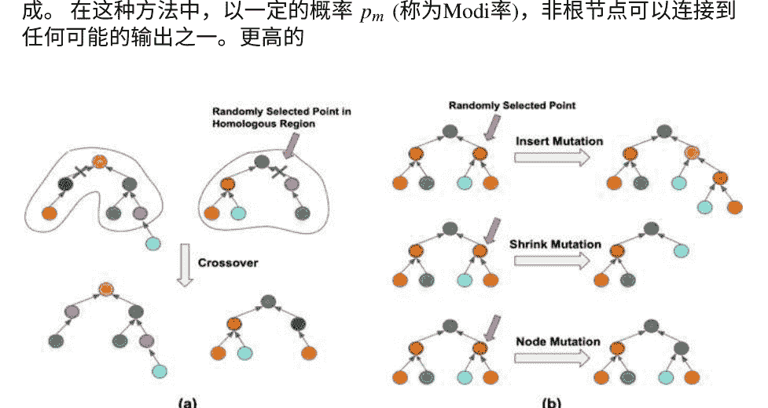

图9.2 (a)同源交叉：顶部的两棵树看起来不同，但实际上它们几乎是彼此的镜像。因此，这两棵树属于同一物种。画在树周围的线标记了两者之间的同源区域。随机选择一个交叉点并执行单点交叉。底部的两个网络是结果的后代。(b)突变：从上到下显示了三种突变算子。对于每个突变算子，随机选择现有树中的一个节点。插入突变可以在选定的节点处添加新的子树。缩小突变可以用其分支之一替换选定的节点。节点突变可以用相同类型的另一个节点替换选定的节点。

莫迪率将导致许多子树节点连接到不同的输出。只有当其子树从本地内存单元输入中有路径时，节点才被分配给莫迪（即连接到内存单元输出$c$或$d$）。
这种表示允许在GP中搜索各种循环节点结构。

### 9.3.2 物种分化和交叉

一点交叉是GP中最常见的交叉类型。然而，由于它不考虑树结构，它经常具有破坏性。一种替代方法，称为同源交叉[24]，旨在通过交叉树中的公共区域来避免这个问题。在种群中，类似的树结构可以分组成物种，这在NEAT[22]中经常使用。

物种分化实现了两个目标：（1）使同源交叉有效，因为物种内的个体相似，（2）它有助于保持种群的多样性，因为选择在每个物种中单独进行。Tujillo等人提出的一种树距离度量用于确定树的相似程度。

$$\delta(T_i, T_j) = \beta \frac{N_{i,j} - 2n_{S_{i,j}}}{N_{i,j} - 2} + (1 - \beta) \frac{D_{i,j} - 2d_{S_{i,j}}}{D_{i,j} - 2}, \quad (9.1)$$

其中
- $n_{T_x}$ = GP树$T_x$中的节点数，
- $d_{T_x}$ = GP树$T_x$的深度，
- $S_{i,j}$ = GP树$T_i$和$T_j$之间的共享树，
- $N_{i,j} = n_{T_i} + n_{T_j}$，
- $D_{i,j} = d_{T_i} + d_{T_j}$，
- $\beta \in [0,1]$，
- $\delta \in [0,1]$。

在公式（9.1）的右侧，第一项衡量了大小的差异，而第二项衡量了深度的差异。因此，设置$\beta = 0.5$给予大小和深度相等的重要性。如果两棵树的结构相同（不考虑实际元素类型），它们的距离将为零。

在大多数遗传编程实现中，存在左分支和右分支的概念。这项工作的一个关键扩展是通过比较所有可能的树旋转（即左分支和右分支的交换）来计算树之间的距离。如果没有进行全面的树分析，两个镜像对称的树可能会演化成不同的物种。这种方法通过不搜索冗余的树来减少搜索空间。它还确保交叉可以真正是同源的（图9.2a）。

在遗传编程中，结构突变（即插入和缩小）可能导致同一结构在多个世代中重复出现。为了避免这种重复出现，在进化过程中，维护了一个名为“Hall of Shame”的存档（图9.3）。该存档包含了代表停滞物种的个体，即在架构空间中已经被进化发现但不再被主动搜索的区域。在繁殖过程中，新的后代会反复发生突变，直到产生一个不属于“Hall of Shame”的个体。导致“Hall of Shame”的突变不会被丢弃，而是被用作生成更好个体的跳板。这种基于记忆的进化类似于新颖性搜索。然而，与新颖性搜索[21]不同的是，这里没有额外的适应度目标，只有一个存档。

### 9.3.3 搜索空间：节点

递归节点的遗传编程进化始于一个简单的全连接树。在进化过程中，由于插入突变和缩小突变，树的大小会增加和减小。树的最大可能高度固定为15。

然而，树的最大宽度没有限制。

节点的搜索空间比以前的方法更加多样化且数量级更大。具体来说，与现有的神经架构搜索（NAS）[4]相比，主要区别如下：

1. NAS搜索固定高度为10层的树；GP搜索高度在六（完全连接简单树的大小）和十五之间变化（对GP添加的约束）。
2. 与NAS不同，GP中不同的叶元素可以出现在不同的深度上。
3. NAS对树结构添加了几个约束。例如，树中的线性元素总是跟随一个非线性元素。GP只防止连续的非线性元素（因为它们会导致信息丢失，因为单元内的连接没有加权）。

在NAS中，树的输入只使用一次；在GP中，输入可以在一个节点内多次使用。
大多数门控循环节点架构由单个本地内存单元组成（在图9.1a中用输出 c 表示）。这个内存单元是LSTM比简单RNN表现更好的主要原因。这项工作引入的一个关键创新是在节点内允许多个本地内存单元（例如，请参见图9.6 c中的输出 c和d）。内存单元的输出在下一个时间步骤中被反馈为输入，没有任何修改，即这个循环回路本质上是一个跳跃连接。
因此，在节点中添加另一个内存单元不会影响可训练参数的数量：它只增加了节点的表示能力。
此外，由于额外的循环跳跃连接是由于额外的内存单元引入的，因此在将具有不同内存单元数量的不同循环节点组合成单个异构层时不需要额外的逻辑开销（如下一节所述）。

### 9.3.4 搜索空间：网络

标准循环网络由重复一种类型的节点形成的层组成。然而，通过进化寻找更好的循环节点往往会导致具有类似任务性能但结构非常不同的解决方案。通过组合这些不同的节点解决方案来形成循环层是一个潜在的强大思想，与集成的思想相关，即将不同的模型组合在一起以更好地解决任务。

在本章中，通过将不同的进化节点组合成一个层来构建这样的异构循环网络（图9.1c）。创建一个候选人群体，其中包含结构与其他节点非常不同的表现最佳的进化节点。使用先前详细介绍的树距离公式计算结构差异。通过从候选人群体中随机选择节点来构建每个异构层。每个节点在层中重复20次；因此，如果层的大小为100，则可以由五种不同的节点类型组成，每种类型的基数为20。

随机搜索是对这个想法的初步测试。如第9.5节所述，在将来的研究中，计划使用遗传算法来搜索这样的异质循环网络。

### 9.3.5 元-LSTM 用于适应性预测

在节点和网络架构搜索中，完全训练一个网络需要大约2小时，直到40个时期。在有足够的计算能力的情况下，可以做到这一点：例如，Zoph和Le [4] 使用了800个GPU来训练多个这样的解决方案并行。然而，如果训练时间能够缩短，无论有什么资源可用，这些资源都可以更好地利用。对于这种情况，一种常见的策略是提前停止[20]，即基于部分训练选择网络。例如，在循环网络的情况下，如果可以基于第10个时期的验证损失而不是第40个时期选择最佳网络，训练时间将减少四分之一。然而，图9.4表明这不是一个好策略。在初始时期训练速度更快的网络最终往往会有更高的最终损失。

最近的网络性能预测方法包括贝叶斯模型拟合[26]和回归曲线拟合[27]。上述方法所应用的学习曲线比进化发现的结构的学习曲线要简单得多。请注意，元LSTM是单独训练的，仅在进化过程中使用。因此，网络可以部分训练，速度提高4倍，并且与完全训练时几乎相同的准确性进行评估。

## 9.4 实验

为语言建模和音乐建模任务构建了神经网络结构。在第一个实验中，使用单个进化的循环节点构建了同质网络；在第二个实验中，使用多个进化的循环节点构建了异质网络。这两个实验都针对语言建模任务。在第三个实验中，为音乐建模任务构建了由单个进化的循环节点组成的同质网络。

### 9.4.1 自然语言建模任务

实验重点是预测Penn Tree Bank语料库（PTB）中的下一个单词，这是一个著名的语言建模基准测试[28]。一般来说，LSTM架构在这个任务中表现良好，改进它们是困难的[12, 13, 15]。数据集包含929k个训练词，73k个验证词和82k个测试词，词汇量为10k个。训练过程中，使用大小为20的连续小批量数据依次遍历训练集。

### 9.4.2 音乐建模任务

音乐由一系列音符组成，通常表现出时间上的依赖关系。因此，基于先前的音符来预测未来的音符可以被视为一种序列预测问题。类似于自然语言，音乐结构可以通过音乐语言模型（MLM）来捕捉。就像自然语言模型是语音识别系统的重要组成部分一样，多声部音乐语言模型是自动音乐转录（AMT）的一个重要组成部分。AMT被定义为从音乐信号中提取符号表示的问题，通常以时间-音高表示形式的钢琴卷轴或类似MIDI的表示形式。

MLM预测下一个时间步骤中音符的概率分布。在给定的时间步骤中，可以同时打开多个音符以演奏和弦。输入是一个钢琴卷帘表示，以88× T矩阵 M的形式表示，其中 T是时间步骤的数量，88对应于钢琴上的键数，介于MIDI音符A0和C8之间。 M是二进制的，当且仅当在时间步骤 t上音高 p处于活动状态时， M[p, t]=1。特别地，保持的音符和重复的音符没有区别。输出的形式相同，只是它只有T –1个时间步骤（由于没有先前的信息，第一个时间步骤无法预测）。

数据集piano-midi.de用作基准数据。该数据集包含来自不同作曲家的307首古典钢琴音乐作品。它是通过手动编辑量化的MIDI文件的速度和速度曲线来赋予它们自然的解释和感觉[29]。MIDI文件编码了音乐乐谱的显式时间、音高、速度和乐器信息。

### 9.4.3 网络训练细节

在进化过程中，每个网络都有两层，每层有540个单元，并且展开为35个步骤。隐藏状态初始化为零；当前小批量的最终隐藏状态被用作后续小批量的初始隐藏状态。前馈连接的丢失率为0.4，循环连接的丢失率为0.15[15]。网络权重的L2惩罚为0.0001。进化的网络以学习率1进行10个时期的训练；在六个时期后，每个时期的学习率减少0.9倍。梯度的范数（按小批量大小归一化）被剪辑在10以内。在NVIDIA 1080 GPU上，训练一个网络需要大约30分钟。以下实验是在40个这样的GPU上进行的。

元LSTM由两层组成，每层有40个节点。为了生成训练数据，从初步节点进化实验中获得了1000个样本，代表了进化发现的设计的抽样。这些样本网络中的每一个都经过了40个时期的语言建模训练集的训练；在前10个时期和40个时期测量了语言建模验证集上的困惑度。然后，元LSTM网络被训练来预测在40个时期时的困惑度，给定前10个时期的困惑度序列作为输入。使用另外500个网络的验证集来决定何时停止训练元LSTM，并使用另外500个网络来测量其准确性。

表9.1 Penn Tree Bank测试集上单一模型的困惑度

| 模型 | 参数 | 测试困惑度 |
|------|------|------------|
| Gal和Ghahramani [15]—变分LSTM | 66M | 73.4 |
| Zoph和Le [4] | 20M | 71.0 |
| GP节点进化 | 20M | 68.2 |
| Zoph和Le [4] | 32M | 68.1 |
| GP节点进化 | 32M | 66.5 |
| Zilly等人[14]，共享嵌入 | 24M | 66.0 |
| Zoph和Le [4]，共享嵌入 | 25M | 64.0 |
| GP进化，共享嵌入 | 25M | 63.0 |
| 异构，共享嵌入 | 25M | 62.2 |
| Zoph和Le [4]，共享嵌入 | 54M | 62.9 |

使用GP演化的节点在各种配置中优于NAS (Zoph和Le [4]) 和递归高速公路网络 (Zilly等人[14]) 发现的节点

与元LSTM训练一致，在演化过程中，每个候选人都会进行10个时期的训练，并在每个时期对验证集进行测试。这样的验证困惑值序列被输入到训练好的元LSTM模型中，以获得其在第40个时期的预测困惑值；然后将此预测用作该候选人的适应度。在30代之后，具有最佳适应度的个体被缩放为一个更大的网络，每层有740个节点。此设置与Zoph和Le [4]使用的3200万参数配置相匹配。对丢失率进行网格搜索，以微调模型。在训练180个时期后，报告其性能作为最终结果（表9.1）。

### 9.4.4 实验1：递归节点的进化

使用交叉率为0.6，插入和缩小变异概率分别为0.6和0.3，以及Modi率（即新添加的节点连接到内存单元输出的概率）为0.3，对大小为100的种群进行了30代的进化。使用0.3的兼容性阈值进行物种分化；如果其候选者中的最佳适应度在四代中没有改善，则将物种标记为停滞并添加到Hall of Shame。每个节点允许有三个输出：一个主要的递归输出（h）和两个本地内存单元输出（c和d）。

图9.6显示了最佳进化节点。进化节点重复使用输入，并利用额外的内存单元路径。如表9.1所示，进化节点（在表中称为GP节点进化）在Penn Tree Bank上的2000万参数配置下实现了68.2的测试性能。这比NAS（Zoph和Le [4]在表中）在相同配置下发现的节点的测试性能提高了2.8个困惑度点。进化节点在3200万配置下也优于NAS（66.5对68.1）。最近的研究表明，共享神经网络语言模型的输入和输出嵌入权重矩阵可以改善性能[30]。在表9.1中，包含此方法后获得的实验结果标记为共享嵌入。

还很重要理解在演化中使用元-LSTM的影响。为了这个目的，进行了额外的进化实验，其中每个个体的适应度被赋予其第10个时期的验证困惑度。随着进化的进行，在每一代中，最好的个体被完全训练到第40个时期。类似地，启用了元-LSTM的进化实验中的最佳个体被完全训练。这两种情况下的第40个时期的验证困惑度已在图9.5b中绘制出来。这个图表表明，基于元-LSTM预测选择的个体比仅使用部分训练选择的个体表现更好。

### 9.4.5 实验2：异构循环网络

从实验1的10次运行中收集了前10%的个体，共100个节点。从中选择了最不同的20个个体，即与其他个体具有最大树距离的个体，用于构建异构层（如图9.1c所示）。从这个池中随机选择节点，形成2000个这样的网络。再次使用元-LSTM来加速评估。

在超参数调整之后，最佳网络（对于2500万参数配置）的困惑度达到了62.2，比由最佳进化节点构建的同质网络好0.8。这个网络的困惑度也比最佳NAS网络的两倍（5400万参数）好0.7个点。

有趣的是，最佳异质网络对超参数的变化也比同质网络更具鲁棒性。这个结果表明，多样性不仅提高了性能，还增加了内部表示的灵活性。因此，异质网络方法为未来的工作奠定了有希望的基础，接下来将进行讨论。

### 9.4.6 实验3：音乐建模

piano-midi.de数据集被分为训练集（60%）、测试集（20%）和验证集（20%）。音乐模型由一个宽度为128的单个循环层组成。输入和输出层每个都有88个宽度。该网络以0.01的学习率使用Adam进行50个时期的训练。网络通过最小化网络输出和真实值之间的交叉熵来进行训练。评估时，使用测试数据计算F1分数。F1分数是精确度和召回率的调和平均值（越高越好）。由于网络较小，不需要正则化。

注意，这个设置与Ycart和Benetos [29]的类似。这个实验的目标不是为了达到最先进的结果，而是在一个新的领域（即音乐）中进行LSTM节点和进化节点（用于语言）的苹果对苹果比较。

在这个转移实验中，构建了三个网络：第一个是带有LSTM节点的，第二个是带有NAS节点的，第三个是带有进化节点的。所有三个网络都在前一节中描述的相同设置下进行训练。三个模型的F1分数如表9.2所示。LSTM节点优于NAS和进化节点。这个结果很有趣，因为在语言建模任务中，NAS和进化节点都明显优于LSTM节点。这个结果表明，NAS和进化节点是特定领域的定制解决方案，并不一定适用于其他领域。

表格 9.2 F1 分数在 Piano-Midi 数据集上计算

| 模型 | F1 分数 |
|------|----------|
| LSTM | 0.548 |
| Zoph 和 Le [4] | 0.48 |
| GP 进化 (语言) | 0.49 |
| GP 进化 (音乐) | 0.59 |

LSTM 在语言方面优于进化节点和 NAS 节点，但对于音乐，它不如专门为音乐进化的节点，这表明该方法发现了针对任务定制的解决方案

然而，为自然语言演化循环节点开发的框架也可以转移到音乐领域。设置是相同的，即在每一代中，以树表示的循环节点种群将在音乐领域中评估其性能。从相应的树节点构建的网络的验证性能将被用作节点适应度。网络在音乐领域的性能度量是F1得分，因此它被用作网络适应度值。

进化参数与语言建模中使用的参数相同。

对于这个演化实验，不使用Meta-LSTM，因为每个网络的运行时间相对较短（<600秒）。演化定制节点用于音乐的结果显示在表9.2中。定制节点（GP演化（音乐））在F1得分上比LSTM（图9.7）提高了五个点。因此，演化能够发现音乐建模领域的定制结构，并且与语言领域的结构不同。

## 9.5 讨论和未来工作

本章的实验演示了进化优化如何发现那些在过去25年中基本没有改变的设计的改进。由于它是一种基于群体的方法，它可以比其他元学习技术（如强化学习、贝叶斯参数优化和梯度下降）更广泛地进行探索。因此，它处于一种位置能够发现难以手工开发或通过渐进改进的新颖创新解决方案。令人惊讶的是，在语言建模中表现良好的节点在音乐建模中表现不佳，但进化能够发现在音乐中表现良好的不同节点。显然，这种方法发现了每个任务中的规律，并开发了适应它们的节点结构，从而为每个领域单独定制节点。分析这些规律是什么以及这些结构如何编码它们是未来工作的一个有趣方向。

本章中的GP-NEAT进化搜索方法在与NAS [4]使用的相同搜索空间中运行，从而取得了显著的改进。在最近的一篇论文[18]中，NAS搜索空间还扩展到包括循环高速公路连接，进一步改善了结果。未来工作的一个有趣方向是以类似的方式扩展GP-NEAT搜索空间，预计会取得类似的改进。

当前的实验集中在优化门控循环节点的结构，将它们克隆成一个固定的分层架构，形成实际的网络。通过从一组不同的节点中选择来形成异构层的简单方法被证明可以进一步改善网络。因此，一个引人注目的下一步是进化网络架构，并进一步与LSTM节点[6]一起共同进化。

## 9.6 结论

通过进化优化LSTM节点，可以发现比原始的25年前设计更好的新变体。基于树状编码和遗传编程的方法使得能够高效地探索更大的设计空间，从而得到比手工设计或基于强化学习的神经架构搜索更复杂、更强大的结构。此外，这些结构还可以根据具体领域进行定制。除了节点结构之外，通过训练LSTM网络来估计候选者的最终性能，而不是完全训练它们，并通过存档来鼓励新颖性，可以进一步提高该方法在网络层面上的优化。因此，进化神经架构搜索是扩展深度学习网络能力以应对越来越具有挑战性任务的一种有前途的方法。

## 参考文献

1.  Hoos, H.: 通过优化进行编程. Commun. ACM **55**, 70–80 (2012)
2.  Andrychowicz, M., Denil, M., Colmenarejo, S.G., Hoffman, M.W., Pfau, D., Schaul, T., Shillingford, B., de Freitas, N.: 通过梯度下降学习梯度下降. 在: Proceedings of the 30th International Conference on Neural Information Processing Systems, NIPS’16, pp. 3988–3996. Curran Associates Inc., Red Hook (2016). 可用: http://dl.acm.org/citation.cfm?id=3157382.3157543
3.  Malkomes, G., Schaff, C., Garnett, R.: 用于自动模型选择的贝叶斯优化. 在: Proceedings of the 30th International Conference on Neural Information Processing Systems, NIPS’16, pp. 2900–2908. Curran Associates Inc., Red Hook (2016). 可用: http://dl.acm.org/citation.cfm?id=3157382.3157422
4.  Zoph, B., Le, Q.V.: 用强化学习进行神经架构搜索 (2016). 可用: https://arxiv.org/pdf/1611.01578v1.pdf
5.  Baker, B., Gupta, O., Naik, N., Raskar, R.: 使用强化学习设计神经网络架构 (2016). 可用: https://arxiv.org/pdf/1611.02167v2.pdf
6.  Miikkulainen, R., Liang, J.Z., Meyerson, E., Rawal, A., Fink, D., Francon, O., Raju, B., Shahrzad, H., Navruzyan, A., Duffy, N., Hodjat, B.: 进化深度神经网络. CoRR, vol. abs/1703.00548 (2017). 可用: http://arxiv.org/abs/1703.00548
7.  Real, E., Moore, S., Selle, A., Saxena, S., Suematsu, Y.L., Tan, J., Le, Q.V., Kurakin, A.: 大规模图像分类器的演化. 在: 第34届国际机器学习会议论文集 - 第70卷, ICML’17, JMLR.org, pp. 2902–2911 (2017). 可用: http://dl.acm.org/citation.cfm?id=3305890.3305981
8.  Fernando, C.: PathNet: 进化引导超级神经网络中的梯度下降 (2017). 可用: https://arxiv.org/abs/1701.08734
9.  Hochreiter, S., Schmidhuber, J.: 长短期记忆. 神经计算 **9**(8), 1735–1780 (1997). 可用: http://dx.doi.org/10.1162/neco.1997.9.8.1735
10. Bahdanau, D., Cho, K., Bengio, Y.: 通过联合学习对齐和翻译的神经机器翻译. 预印本 (2014). arXiv:1409.0473
11. Klaus, G., Srivastava, R., Koutnik J., Steunebrink, R., Schmidhuber, J.: LSTM: 一次搜索空间的奥德赛. 预印本, vol. arxiv/1503.04069 (2014)
12. Jozefowicz, R., Zaremba, W., Sutskever, I.: 循环网络结构的实证探索. In: 第32届国际机器学习大会论文集, pp. 2342–2350 (2015)
13. Zaremba, W., Sutskever, I., Vinyals, O.: 循环神经网络正则化. 预印本, vol. arxiv/1409.2329 (2014)
14. Zilly, J.G., Srivastava, R.K., Koutnik J., Schmidhuber, J.: 循环高速公路网络. In: Precup, D., Teh, Y.W. (eds.) 第34届国际机器学习大会论文集. 机器学习研究论文集, 2017年8月6日-11日, vol. 70, pp. 4189–4198. 悉尼国际会议中心, 悉尼 (2017). 可获取: http://proceedings.mlr.press/v70/zilly17a.html
15. Gal, Y., Ghahramani, Z.: 在递归神经网络中理论上有根据的dropout应用. 在: 第30届神经信息处理系统国际会议论文集, NIPS'16, 第1027-1035页. Curran Associates Inc., Red Hook (2016年). 可用: http://dl.acm.org/citation.cfm?id=3157096.3157211
16. Bayer, J., Wierstra, D., Togelius, J., Schmidhuber, J.: 用于序列学习的进化记忆细胞结构. 在: 人工神经网络ICANN, 第755–764页 (2009年)
17. Cho, K., van Merrienboer, B., Gulcehre, C., Bougares, F., Schwenk, H., Bengio, Y.: 使用RNN编码器-解码器学习短语表示用于统计机器翻译. CoRR, vol. abs/1406.1078 (2014年). 可用: http://arxiv.org/abs/1406.1078
18. Pham, H., Guan, M., Zoph, B., Le, Q., Dean, J.: 通过参数共享实现高效的神经架构搜索. 在: Dy, J., Krause, A. (eds.) Proceedings of the 35th International Conference on Machine Learning. Proceedings of Machine Learning Research, PMLR, 10–15 July 2018, vol. 80, pp. 4095–4104. Stockholmms san, 斯德哥尔摩 (2018). 可用: http://proceedings.mlr.press/v80/pham18a.html
19. Stanley, K.O., Miikkulainen, R.: 通过增加拓扑结构进化神经网络. Evol. Comput. 10(2), 99–127 (2002). 可用: http://nn.cs.utexas.edu/?stanley:ec0220
20. Suganuma, M., Shirakawa, S., Nagao, T.: 一种基于遗传编程的卷积神经网络架构设计方法. 在: Proceedings of the Genetic and Evolutionary Computation Conference, GECCO ’17, pp. 497–504. ACM, 纽约 (2017). 可用: http://doi.acm.org/10.1145/3071178.3071229
21. Lehman, J., Stanley, K.O.: 放弃目标: 通过寻找新颖性进行进化. 进化计算 19(2), 189–223 (2011)
22. Trujillo, L., Muñoz, L., López, E.G., Silva, S.: 精确遗传编程: 自然地控制膨胀. 信息科学 333, 21–43 (2016)
23. Zhang, Y., Zhang, M.: 遗传编程中的多输出程序树结构. 技术报告 (2004)
24. Francone, F.D., Conrads, M., Banzhaf, W., Nordin, P.: 遗传编程中的同源交叉. 在: 遗传和进化计算的第一届年会论文集- 第2卷, GECCO’99, pp. 1021–1026. Morgan Kaufmann Publishers Inc., 旧金山(1999). 可用: http://dl.acm.org/citation.cfm?id=2934046.293405925
25. Sutskever, I., Vinyals, O., Le, Q.V.: 序列到序列的神经网络学习. 在:神经信息处理系统第27届国际会议论文集- 第2卷, NIPS’14, pp. 3104–3112. MIT出版社, 剑桥 (2014). 可用: http://dl.acm.org/citation.cfm?id=2969033.2969173
26. Klein, A., Falkner, S., Springenberg, J.T., Hutter, F.: 使用贝叶斯神经网络进行学习曲线预测. 在: ICLR会议论文 (2017年)
27. Baker, B., Gupta, O., Raskar, R., Naik, N.: 用于早停的实用神经网络性能预测. CoRR, vol. abs/1705.10823 (2017年). 可用: http://arxiv.org/abs/1705.10823
28. Marcus, M.P., Marcinkiewicz, M.A., Santorini, B.: 构建一个大型的英语标注语料库: 宾夕法尼亚树库. 计算机语言学. 19 (2), 313-330 (1993年)
29. Ycart, A., Benetos, E.: 使用受节拍限制的LSTM网络进行多声部音乐序列转换. 在: 2018年IEEE国际声学、语音和信号处理会议 (ICASSP), 第386-390页, 2018年4月
30. Press, O., Wolf, L.: 使用输出嵌入来改进语言模型. 预印本, vol. arxiv/1608.05859 (2016)

# 第10章 使用神经进化研究深度递归连接和递归记忆单元

Travis Desell, AbdElRahman A. ElSaid和Alexander G. Ororbia

摘要 神经架构搜索是统计学习中最困难的问题之一，给定极其广阔的架构搜索空间。对于递归神经网络（RNNs），这个问题进一步复杂化，因为架构中的每个节点都可以通过递归连接与任何其他节点相连，通过加权连接将信息从RNN的先前传递中传递。大多数现代RNNs专注于通过使用称为记忆单元的门控结构从紧接着的传递中传递信息的递归连接; 然而，也可以存在更远的时间，或者深度递归连接。一种名为EXAMM的新型神经进化元启发式算法被用于进行大量实验，进化由一套记忆单元和简单神经元组成的RNNs，带有和不带有深度递归连接。这些实验进化和训练了1056万个RNNs，结果显示具有深度递归连接的网络比没有这些连接的网络表现得更好，在某些情况下，最好的进化RNNs仅由简单神经元和深度递归连接组成。这些结果强烈表明，在RNNs中利用复杂的递归连接模式值得进一步研究，并展示了使用神经进化元启发式算法作为理解和训练有效RNNs的工具的巨大潜力。

## 10.1 引言

近年来，人工神经网络的研究取得了巨大的突破，通过使用它们来解决图像分类[1, 2]、视频分类[3]、句子建模[4]和语音识别[5]等任务中的问题。这一成功主要得益于高度工程化、精心设计的网络，例如在计算机视觉中的卷积架构


如AlexNet [1]，VGGNet [6]，GoogleNet [7]和最近的ResNet [8]。此外，为了处理具有时间依赖性的顺序数据建模，例如自然语言处理中的循环神经网络（RNNs）变得非常有用，特别是那些利用复杂记忆单元结构捕捉长期依赖性的RNN单元[9]，门控循环单元（GRUs）[10]，长短期记忆单元（LSTMs）[11]，最小门控单元（MGUs）[12]和更新门控RNN单元（UGRNNs）[13]。

由于确定给定学习任务的最佳神经网络架构的问题很难处理，神经进化[14-29]和神经架构搜索算法[30-34]变得越来越受欢迎。这项工作的很大一部分集中在前馈架构（如卷积神经网络），限制自己于选择层次结构中的网络参数。然而，人工神经网络（ANNs）可以表示为完全无结构的图形（没有层），其中每个节点表示一个神经元，每个边表示神经连接，甚至可以经典地认为[35]，在同时计算复杂性较低的情况下，可能更具表达能力（并在数据上展现更好的泛化）。不幸的是，当放宽此类网络可能具有的拓扑组织约束时，潜在架构的搜索空间会大幅扩展。

对于神经进化来说，循环神经网络(RNNs)在处理潜在的非常长的时间序列输入数据时提供了特别独特的挑战。这就需要设计更复杂的内部记忆单元结构或者使用从过去的不同时间延迟传输信息的循环连接。

结果，架构搜索空间变得更大，因为神经元不仅通过复杂的前馈模式相互连接，而且还通过复杂的循环路径连接，这些路径可能跨越不确定的时间段。大多数现代RNNs通过使用门控记忆单元来避免复杂的循环连接结构，这是基于这样一个假设：尽管这些记忆单元内部的循环连接仅明确地回到前一个时间步，但它们的内部门可能提供了一种准确捕捉长期信息并确保良好预测能力的方法。尽管如此，存在一些文献表明，跳过超过一个时间步的循环连接（我们将其称为深度循环连接）在RNN设计中可以发挥重要作用，以更好地捕捉顺序数据中的长期依赖关系[27, 36-42]。

本研究通过使用一种名为EXAMM（增强记忆模型的进化探索）的新型神经进化算法，调查了递归记忆单元和深度递归连接的能力[43]。

我们不仅仅测试了一些采用不同记忆单元类型并且使用或不使用深度递归连接的手工设计的RNN，而是采用了一种神经进化的方法来进行实验过程 - 我们允许EXAMM搜索连接模式并进行记忆单元选择，使得每个特定的设计选择都能进化出最适合它的架构，从而提供更严格的分析。进行了各种实验，演化出由LSTM、GRU、MGU、UGRNN、Δ-RNN记忆单元以及简单神经元组成的RNN，使得EXAMM能够设计出不同复杂性的深度递归连接模式。这些RNN被演化出来用于对四个真实世界基准问题进行时间序列数据预测。总共训练了10.56百万个RNN，以收集我们在本章中报告的结果。

我们的神经进化架构搜索结果表明，具有深度循环连接的RNN比没有这些连接的RNN表现显著更好，在某些情况下，最好的RNN仅由简单的神经元和深度循环连接组成，换句话说，不需要记忆单元就能达到强大的预测性能。这些结果强烈表明，在RNN中利用深度循环连接进行时间序列数据预测不仅值得进一步研究，而且展示了神经进化作为研究、理解和训练有效的RNN模型的潜在强大工具。

此外，关于记忆单元类型，我们发现EXAMM揭示出最近提出的更简单的Δ-RNN单元在建模序列时表现更好、更可靠，而其他记忆单元则不如它。

## 10.2 相关工作

### 10.2.1 Elman、Jordan和任意循环连接

Elman和Jordan RNN是传统的RNN架构，已经得到广泛研究。通常只有一个隐藏层。Elman RNN [44] 的隐藏层节点是（循环地）自连接的，同时也与同一层中的所有其他隐藏节点完全连接。Jordan RNN [45] 的输出节点与所有隐藏层节点之间存在循环连接。在这两种RNN类型中，每个隐藏节点可以被视为一个简单的神经元，这意味着在神经计算过程中没有使用内部门控或锁存结构。

在EXAMM中，简单神经元被表示为具有可能具有递归和前馈输入的点状神经元。我是所有与简单神经元 j 具有前馈连接的节点集合，而 R 是所有与简单神经元 j 具有递归连接的节点集合。在时间步骤 t 中，神经元 j 的输入信号是所有前馈输入的加权总和，其中 w_ij 是连接节点 i 到节点 j 的前馈权重，加上所有递归输入的加权总和，其中 v_rjk 是从时间步骤 t - k 的节点 r 到节点 j 的递归权重，其中 k 是递归连接的时间跨度。因此，计算简单神经元的状态函数。

是

$$s_j(t) = \phi_s \left( \sum_{i \in I} w_{ij} \cdot s_i(t) + \sum_{r \in R, k} v_{rj\ k} \cdot s_r(t - k) \right) \qquad (10.1)$$

其中$s_i(t)$表示神经元单元在时间步骤$t$时的状态。整体状态是投影输入和过去向量摘要的仿射变换的线性组合。后激活函数$\phi_s(\cdot)$可以是任何可微的逐元素函数；然而，在本章中，它被限制为双曲正切函数$\phi(v) = tanh(v) = (e^{(2v)} - 1)/(e^{(2v)} + 1)$。

从根本上讲，当EXAMM的*add recurrent edgemutation*操作符将一个回归边从简单神经元返回到自身时（参见第10.3节），EXAMM元启发式算法具有进化Elman-style连接的能力。当EXAMM决定将一个回归边从输出连接到任何简单神经元时，就会添加Jordan-style连接（我们将其推广到包括连接回输入神经元以及其他输出神经元）。EXAMM通过引入时间跳跃来支持Elman和Jordan-style连接模式的泛化（传统上仅跨越一个时间步长）- 可以实现不同时间延迟的深度回归连接。图10.1描述了一个由各种连接组成的RNN（所有这些连接都可以由EXAMM进化）。实质上，EXAMM可以自动构建具有任意前馈和回归连接拓扑结构的RNN，使网络能够利用深度回归连接在时间和结构上提供的增强计算能力。

### 10.2.2 循环记忆单元

较为常用的循环神经元类型之一是由Hochreiter和Schmidhuber于1997年开发的长短期记忆（LSTM）单元[11]。

LSTM的最初动机是为了实现“恒定误差激活”，以解决梯度消失的问题。这意味着长期记忆可以通过单独的细胞状态$c_t$来明确表示。使用之前介绍的符号表示法（第10.2.1节），LSTM状态函数（不包括

为了清晰简明起见，省略了偏差的表示。

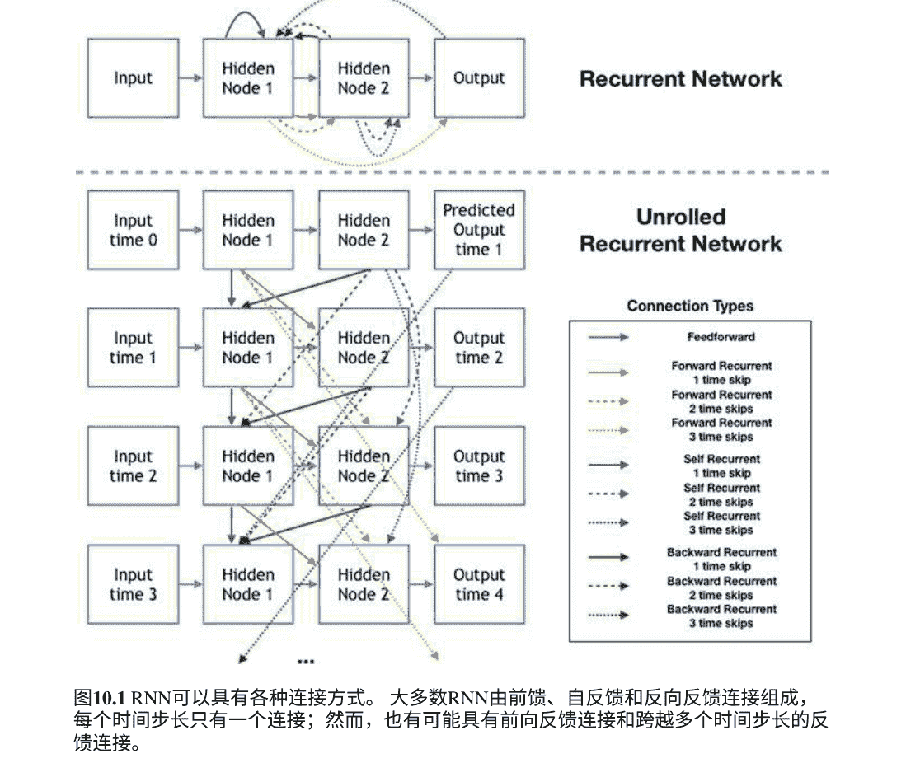

图10.1 RNN可以具有各种连接方式。大多数RNN由前馈、自反馈和反向反馈连接组成，每个时间步长只有一个连接；然而，也有可能具有前向反馈连接和跨越多个时间步长的反馈连接。

扩展，例如“窥视孔”连接，由以下方程实现：

```
f_j = \sigma \left( \sum_{i \in I} w_{ij}^f \cdot s_i(t) + \sum_{r \in R, k} v_{rjk}^f \cdot s_r(t - k) \right) \quad (10.2)
i_j = \sigma \left( \sum_{i \in I} w_{ij}^i \cdot s_i(t) + \sum_{r \in R, k} v_{rjk}^i \cdot s_r(t - k) \right) \quad (10.3)
\widetilde{c_j} = \tanh \left( \sum_{i \in I} w_{ij}^c \cdot s_i(t) + \sum_{r \in R, k} v_{ijk}^c \cdot s_r(t - k) \right) \quad (10.4)
$$ o_j = \sigma \left( \sum_{i \in I} w_{ij}^o \cdot s_i(t) + \sum_{r \in R,k} v_{ijk}^o \cdot s_r(t - k) \right) $$ (10.5)
$$ c_j(t) = f_j(t) \cdot c_j(t - 1) + i_j \cdot \tilde{c}_j, \quad s_j(t) = o_j \cdot \phi_s(c_j(t)) $$ (10.6)
```

在这里，我们将神经状态的计算分解为四个内部计算的组合，即遗忘门（$\mathbf{f}_t$），输入门（$\mathbf{i}_t$），细胞状态建议（$\tilde{\mathbf{c}}_t$），以及输出门（$\mathbf{o}_t$）。这种细胞结构在概念上很有吸引力，但在计算上非常复杂，每个细胞都有11个可训练参数（以及8个权重和3个偏差）。

在最近的一段时间里，由Cho等人于2014年开发的门控循环单元（GRU; [10]）可以看作是简化LSTM细胞的早期尝试。在所做的改变中，该模型将LSTM的输入门和遗忘门融合为一个单一的门，将细胞状态和隐藏状态重新合并在一起。GRU的状态函数使用以下方程计算：

```
$$ z_j = \sigma \left( \sum_{i \in I} w_{ij}^z \cdot s_i(t) + \sum_{r \in R,k} v_{ijk}^z \cdot s_r(t - k) \right) $$ (10.7)
$$ r_j = \sigma \left( \sum_{i \in I} w_{ij}^r \cdot s_i(t) + \sum_{r \in R,k} v_{ijk}^r \cdot s_r(t - k) \right) $$ (10.8)
$$ \tilde{s}_j(t) = \phi_s \left( \sum_{i \in I} w_{ij}^s \cdot s_i(t) + \sum_{r \in R,k} v_{ijk}^s \cdot (r_j \cdot s_r(t - k)) \right) $$ (10.9)
$$ s_j(t) = z_j \cdot \tilde{s}_j + (1 - z_j) \cdot s_j(t - 1) $$ (10.10)
```

注意到 $\phi_s(v) = \tanh(v)$。注意GRU所需的内部操作比LSTM单元少，因此只需要调整9个可训练参数。

MGU模型是由周等人在2016年提出的，其结构与GRU非常相似，通过将重置门和更新门合并为一个遗忘门来减少所需的参数数量[12]。然后，状态计算如下进行：

```
$$ f_j = \sigma \left( \sum_{i \in I} w_{ij}^f \cdot s_i(t) + \sum_{r \in R,k} v_{ijk}^f \cdot s_r(t - k) \right) $$ (10.11)
$$ \tilde{s}_j(t) = \phi_s \left( \sum_{i \in I} w_{ij}^s \cdot s_i(t) + \sum_{r \in R,k} v_{ijk}^s \cdot (f_j \cdot s_r(t - k)) \right) $$ (10.12)
$$ s_j(t) = z_j \cdot \tilde{s}_j + (1 - z_j) \cdot s_j(t - 1). $$ (10.13)
```

MGU是较简单的记忆单元之一，只有6个可训练参数。

更新门RNN单元（UGRNNs）是由Collins等人于2016年引入的[13]。
UGRNN的更新方式如下所示：

```
$c_j = \phi_s \left( \sum_{i \in I} w_{ij}^c \cdot s_i(t) + \sum_{r \in R, k} v_{ijk}^c \cdot s_r(t - k) \right) \quad (10.14)$
$g_j = \sigma \left( \sum_{i \in I} w_{ij}^g \cdot s_i(t) + \sum_{r \in R, k} v_{ijk}^g \cdot s_r(t - k) \right) \quad (10.15)$
$s_j(t) = g_j \cdot s_j(t-1) + (1 - g_j) \cdot c_j. \quad (10.16)$
```

UGRNNs需要与MGUs相同数量的可训练参数（6）；然而，它还需要一个较少的乘法，使其在计算上更快一些。UGRNN是一个简单的单元，基本上与Elman-RNN非常相似，但只有一个更新门。这个额外的门决定了隐藏状态是从上一个时间步长传递过来还是应该更新。

最近，Δ-RNN单元是从最近开发的差分状态框架（DSF）[9]中派生出来的，从中可以进一步派生出所有其他更复杂的门控RNN单元，包括LSTM、GRU和MGU。Δ-RNN是提出的最简单的RNN模型之一，只有一些额外的偏置向量参数来控制其内部部门，使其在计算效率上最接近Elman-RNN，同时在从语言建模[9,46]到图像解码[47]的问题任务中具有竞争力的泛化能力。通过{α, β1, β2, bj}作为可学习的系数标量，Δ-RNN状态被定义为：

```
$e_j^w = \sum_{i \in I} w_{ij} \cdot s_i(t), \quad e_j^v = \sum_{r \in R, k} v_{rjk} \cdot s_r(t - k) \quad (10.17)$
$d_j^1 = \alpha \cdot e_j^v \cdot e_j^w, \quad d_j^2 = \beta_1 \cdot e_j^v + \beta_2 \cdot e_j^w \quad (10.18)$
$\widetilde{s_j}(t) = \phi_s(d_j^1 + d_j^2), \quad r_j = \sigma (e_j^w + b_j) \quad (10.19)$
$s_j(t) = \Phi_s ((1 - r_j) \cdot \widetilde{s_j}(t) + r_j \cdot s_j(t-1)) \quad (10.20)$
```

Δ-RNN细胞只需要6个可训练参数，虽然在矩阵-向量中它们被证明比大多数现代门控细胞类型更高效，但从单个神经元细胞的角度来看，它们在标量参数复杂性方面与UGRNN和MGU相等。从功能角度来看，Δ-RNN比UGRNN和MGU都更非线性，因为它可能需要多达三个激活函数，即状态提议函数的内部激活（tanh），状态混合函数的外部激活（tanh）以及sigmoid门的激活（σ）。

### 10.2.3 时间跳跃连接

由于记忆单元在捕捉序列数据中的一些较长期依赖性方面已被证明非常有用，因此人工神经网络研究主要选择专注于它们。然而，存在着大量经典工作已经显示了深度循环或时间跳跃连接的实用性，即明确回溯比上一个时间步长更久远的循环连接。

其中一些先前的努力甚至表明相当深的循环连接可以获得最佳性能[40, 41]，甚至显示这些类型的连接甚至可以超越使用记忆单元架构的RNN预测模型[41]。这项工作的结果提供了证据，至少在时间序列数据预测的情况下，深度循环连接可能是一个被忽视的重要因素，可能会显著提高RNN的预测能力。Lin等人研究了局部循环和全局循环RNN，以及具有递增嵌入式记忆阶数（EMO）的NARX神经网络，其中涉及到连接到更早时间的节点或层的循环连接[36, 37]。例如，具有EMO为1的网络将其单元连接到时间步骤t−1，具有EMO为2的单元将连接到时间t−1和t−2，具有EMO为3的单元将连接到t−1，t−2和t−3。全局循环网络的隐藏层根据其EMO完全连接回到过去，并且由于这种复杂性，仅测试了EMO为3的情况。

局部循环RNN和NARX所需的递归突触较少，因此被测试到EMO为6。这些网络在一个锁存问题上进行了测试，其中序列的类仅取决于前几个时间步（或子序列的模式），然后是均匀噪声（向量）。此外，这些模型还在一个语法推断问题上进行了测试，其中序列类仅依赖于在预定时间发生的输入符号。增加EMO会显著提高两个测试问题的性能。进一步的工作表明，NARX网络的顺序在确定RNN泛化能力方面起着关键作用，允许学习复杂的时间函数，当EMO接近目标的顺序时，未知的递归系统/数据生成过程[38, 39]。

El Hihi和Bengio还研究了RNN具有跨多个时间步的递归连接，以确定它们的包含是否改善了RNN提取长期顺序数据依赖性的能力[48]。他们的分层RNN由具有不同时间尺度回路的神经元组成（最多过去六个时间步）。与Lin等人的工作不同，在那里节点和/或层与所有先前的时间步骤（直到它们的嵌入内存顺序）进行递归连接，这项工作中，每个神经元的回路连接是到特定的时间步骤，换句话说，这一章重点关注的是深度递归突触连接。同样，这项工作发现了当使用更深的递归连接时，网络性能显著提高。根据他们的实验结果，仅使用RNN模型明确跨越一个时间步骤的循环不足以很好地推广，而跨越$k$个步骤的循环则能够更好地推广。
Kalini和Sagiroglu通过将其与Elman循环突触相结合（在后续时间步骤中具有完全连接的隐藏层之间的循环连接集）[49]，扩展了Lin等人开发的嵌入式内存NARX RNNs（如上所述）。该研究利用了与其学习识别的线性和非线性系统的顺序类似的EMOs，即高达3的EMO。通过向Elman网络添加嵌入式内存，他们发现在尝试识别这些系统时，识别性能得到了提高，改善了模型训练以及内存存储容量，特别是与其他四种ANNs（它们是Elman和Jordan RNNs的变体）相比。Diaconescu利用嵌入式内存NARX RNNs对由混沌Mackney-Glass、分形Weierstrass和BET-index基准时间序列过程生成的混沌时间序列进行建模[40]。该研究还表明，NARX模型的EMO（在本研究中称为时间窗口）是至关重要的——最佳结果在EMO范围为12-30之间。此外，对于这些时间序列预测问题，更稀疏的网络和更少的神经元往往表现更好。

最后，他们注意到训练这些RNN的挑战，是由于基于反向传播（backprop）的梯度估计器的广泛变化（还使用了随机重启），以及由于梯度消失和梯度爆炸[50]。陈和Chaudhari随后提出了一个分段记忆循环神经网络（SMRNN）[41]，它利用了一个两层循环结构，首先将输入符号传递给符号层，然后将符号层连接到分段层。符号层和分段层都有自我循环连接。前$1..d$个符号传递给第一个分段（其中$d$是分段宽度），之后下一个$d+1..2d$个符号传递给下一个分段，依此类推。第一个隐藏层（符号层）的状态在每个符号之后更新，而第二个隐藏层（分段层）的状态仅在每个$d$个符号之后更新，从而创建了不同速度的时间尺度。SMRNN在latching问题（如上所述），将输入序列分类为两类的两序列问题以及蛋白质二级结构（PSS）问题上与Elman RNN和LSTM RNN进行了比较，并且在适应/学习更快的同时实现了更高的准确性。这项工作表明，间隔$10 <= d <= 50$在这些数据上提供了最佳结果，因为较低的$d$每次迭代需要更多的计算，即分段使用得太频繁，导致收敛速度变慢。相反，在较高的$d$值时，模型近似于传统的RNN，即根本不使用分段层。在这项工作中，分段间隔$d$的操作方式与深度循环连接非常相似，信息可以有效地从过去状态向前展开的网络中传递。SMRNN最初是在原始研究中使用实时递归学习（RTRL）[51]的变体扩展RTRL（eRTRL）算法进行训练的。
eRTRL过程后来被GI ge等人用称为扩展BPTT（eBPTT）的BPTT变体所取代，从而进一步改进了模型的泛化能力和信息锁存能力。在更长的时间段内，模型的泛化能力和信息锁存能力得到了进一步改进[52]。

ElSaid等人后来利用嵌入式内存顺序与LSTM单元的组合，设计了能够从飞行数据记录仪中获取的时间序列数据中预测发动机振动的RNNs[42]。这个数据集特别具有挑战性，因为数据中包含了与之前数据相比以尖锐的尖峰形式出现的发动机振动事件，并且使用了26个相关的数据序列作为输入。这项工作研究了许多架构，并发现一个具有10个EMO/时间窗口的两级架构能够很好地预测未来20秒内的发动机振动。这种架构与Chen和Chaudhari提出的SMRNNs非常相似，只是每个神经元都是LSTM单元，并且该模型利用了多个输入（时间）序列。与大多数其他时间序列研究不同的是，这项工作研究了RNN在超过1个时间步长的预测能力（超过1个时间步长向未来预测）的能力。

### 10.2.4 进化循环神经网络

虽然神经进化（将进化过程应用于自动开发人工神经网络）已经成功应用于涉及静态输入的前馈和卷积架构的任务[14-22, 34]，但在探索操作复杂的时间数据序列的循环记忆结构的进化方面，付出的努力要少得多。通过神经进化可以发现的最佳模型的形式和结构在很大程度上是未知的，这是本章工作的主要动机。

已经搜索和部署了几种进化人工神经网络拓扑结构的方法，以及突触权重值，其中神经进化增强拓扑（NEAT）[21]可能是最著名的算法之一。

EXAMM元启发式算法与NEAT有很大的不同，它包括更高级的节点级变异（见第10.3.1.2节），利用Lamarckian权重初始化（见第10.3.2节），并集成了BPTT来在本地进化候选模型的权重（而不是使用遗传策略来调整权重）。

值得注意的是，EXAMM的一个特点是其专注于大规模并发，即采用了异步稳态方法，使其能够自然地扩展到可能的数百万个计算节点 [53]。

Rawal和Miikkulainen的其他相关工作研究了一种信息最大化目标[23]策略来演化RNNs。这种策略基本上使用了带有LSTM单元的NEAT，而不是常规神经元。虽然强大，但EXAMM在研究RNN模型组成方面具有更强的潜力，因为它已经选择了简单的神经元和一个更大且易于扩展的不仅仅是LSTM单元的不同细胞结构库。Rawal和Miikkulainen还利用基于树的编码[24]来演化由层次结构构建的固定架构中的循环细胞结构进化的细胞类型。将细胞结构的演化与EXAMM的整体RNN结构调整相结合，我们认为这是有趣的未来工作。

蚁群优化（ACO）也被研究为选择哪些连接应该在RNN和LSTM RNN中使用的一种方法，由Desell和ElSaid [25–27]进行了调查。特别是，这种ACO方法被证明可以将可训练连接的数量减少一半，同时在引擎振动预测方面提供了显著的改进[26]。然而，这种方法只在固定的RNN架构内运行，无法演化整体的RNN结构。

最近，提出了蚁群神经进化元启发式算法[54]，将一种新颖的自然启发式优化过程与神经进化的关键元素相结合，形成了蚁群角色专业化的形式化。值得注意的是，这项工作提供了实证数据，证实了经典结果（前面描述的）证明利用深度循环连接模式来建模长序列模式的价值。

## 10.3 增强记忆模型的进化探索

本文中介绍的EXAMM算法是在两个早期算法的基础上进行扩展的：演化增强LSTM拓扑结构（EXALT）[25]可以演化具有简单神经元或LSTM单元的RNN，以及演化增强卷积拓扑结构（EXACT）可以演化用于图像分类的卷积神经网络[28, 55]。它进一步改进了EXALT的变异操作，通过使用从父代RNN基因组中提取的统计信息来减少对各种超参数的需求。此外，EXALT仅使用单个稳态种群，而EXAMM则在此基础上扩展为使用多个基于岛屿的种群，这已经被Alba和Tomassini证明可以极大地提高分布式进化算法的性能，甚至可能实现超线性加速[56]。

图10.2提供了EXAMM异步操作的高级视图。一个主进程维护每个岛屿的种群，并以循环方式从岛屿中生成新的RNN候选模型。候选模型根据工作人员的请求进行本地训练。当工作人员完成对一个RNN的训练时，只有当该RNN在验证数据上的适应度（均方误差）优于岛屿中最差的适应度得分时，才将该RNN插入到它所生成的岛屿中。然后，在岛屿中插入这个RNN之后，将删除岛屿中最差的RNN。这种异步性特别重要，因为生成的RNN将具有不同的架构，每个架构的训练时间也不同。它允许工作人员以任何速度完成对生成的RNN的训练，从而产生一个自然负载平衡的算法。与同步并行进化策略不同，EXAMM可以轻松扩展到可用处理器的数量，允许独立于处理器可用性的种群大小。

图10.2 EXAMM是使用异步岛屿进化策略设计的。每个工作进程独立请求和训练一个RNN，在训练后报告其适应度（验证数据上的均方误差（MSE）），并根据需要请求新的工作请求。主进程以循环方式向岛屿创建的突变（岛内或岛间交叉）生成新的RNN，以满足工作请求。如果新的RNN优于种群中表现最差的RNN（然后将其删除），则将其插入到其岛屿种群中。工作进程的数量完全独立于岛屿数量和其种群大小。

EXAMM代码库具有适用于多核CPU的多线程实现，以及允许EXAMM使用高性能计算资源的MPI [57]实现。

### 10.3.1 突变和重组操作

RNNs通过边级操作和NEAT中的方式以及EXALT和EXACT中最初提出的新的高级节点突变进化。而NEAT只需要创新编号来创建新的边，EXAMM需要创新编号来创建新的节点、新的边和新的循环边。主进程跟踪所有节点、边和循环边的创新，这些创新是在没有图匹配算法的情况下进行线性时间交叉操作所必需的。图10.3、10.4、10.5、10.6、10.7、10.8、10.9、10.10、10.11

图10.3 分割边:选择在输入1和输出1之间的边进行分割。创建一个创新编号为1的新节点

图10.4 添加边:选择在输入3和节点1之间创建并添加一条边

图10.5 启用边:输入3和输出1之间的边被启用

图10.12展示了EXAMM使用的所有变异操作的视觉演示。图10.13提供了交叉操作本身的视觉示例。突出显示用于修改的节点和边（RNN中的新元素以绿色显示）。为了清晰起见，不显示边的创新编号。启用的边为黑色，禁用的边为灰色。

值得注意的是，在下一节中描述的操作中，除非另有说明，每当添加一条边时，它都会以概率选择成为一个循环连接，循环概率如下所示： \(p = \frac{n_{re}}{ff+n_{re}}\)，其中

$n_{re}$是启用的递归边的数量，$n_{ff}$是启用的前馈边的数量。递归连接将跨越随机选择的时间步数，边界由搜索参数指定（在本研究中，我们允许1到10个时间步骤之间），从而允许变量时间跨度的递归连接。任何新创建的节点都是随机选择的。

可以是一个简单的神经元，也可以是根据EXAMM输入参数指定的内存单元类型。

#### 10.3.1.1 边突变

- 分割边（图10.3）：此操作随机选择一个启用的边并将其禁用。它创建一个新节点和两条新边，并将分割边的输入节点连接到新节点，将新节点连接到分割边的输出节点。该节点的深度是分裂边的输入节点和输出节点的平均值。如果分裂边是循环的，则新边也将是循环的（具有相同的时间跳跃）；否则它们将是前馈的。

- 添加边 (图10.4) : 此操作随机选择RNN基因组中的两个节点 $n_1$ 和 $n_2$，使得深度$_n$ < 深度$_n$ 并且在此RNN基因组中这些节点之间还没有边。然后从 $n_1$ 到 $n_2$ 添加一条边。

- 启用边（图10.5）：如果RNN基因组中存在禁用的边或循环边，则此操作随机选择一个禁用的边或循环边并启用它。

- 添加循环边(图10.6)：此操作随机选择RNN基因组中的两个节点 $n_1$ 和 $n_2$ 然后从 $n_1$ 到 $n_2$ 添加一个循环边(选择一个时间跨度，如前所述)。相同的两个节点可以通过多个循环连接连接，每个连接跨越不同的时间长度。然而，该边不会创建具有相同时间跨度的重复循环连接。

- 禁用边(图10.7)：此操作随机选择RNN基因组中的一个启用边或循环边，并将其禁用，以便不使用它。该边仍然存在于基因组中。鉴于*disable edge*操作可能使输出节点无法到达，在生成子RNN基因组之后执行所有变异操作时，如果任何输出节点无法到达，则丢弃该RNN基因组而不进行训练。

#### 10.3.1.2 节点突变

- 添加节点(图10.8)：此操作选择一个介于0和1之间（不包括0和1）的随机深度。鉴于输入节点始终位于深度0，而输出节点始终位于深度1，该深度将把RNN分为两部分。在该深度创建一个新节点，并使用均值和方差相等于父RNN中所有节点的输入/输出边和递归边的均值和方差生成输入和输出边和递归边的数量。

父RNN中所有节点的输入/输出边和递归边的均值和方差。

- 分割节点（图10.9）：此操作随机选择一个非输入非输出节点并将其分割。此节点被禁用（与禁用节点操作相同），并在与其父节点相同的深度上创建两个新节点。每个新节点都分配至少一个输入边和一个输出边，都是与父节点相同类型的副本。其他边随机分配，确保新创建的节点具有输入和输出。

- 合并节点（图10.10）：此操作随机选择两个非输入、非输出节点并将它们合并。选择的节点被禁用（与禁用节点操作相同），并在其父节点的平均深度处创建一个新节点。该节点与其父节点的输入和输出连接，连接类型与父节点相同，其中输入边连接到较低深度节点，输出边连接到较大深度节点。

- 启用节点（图10.11）：此操作选择一个随机（禁用的）节点，并启用该节点及其所有传入和传出边。

- 禁用节点（图10.12）：此操作选择一个随机的非输出节点，并禁用该节点及其所有传入和传出边。请注意，这样做可以删除输入节点，当之前不知道哪些输入参数与输出相关时，这可能非常有用。

#### 10.3.1.3 其他操作

- 交叉（图10.13）：该操作使用两个父代的所有可达节点和边创建一个子代RNN。如果存在从输入节点到自身的启用节点和边的路径，以及从自身到输出节点的启用节点和边的路径，则节点或边是可达的。换句话说，只有当节点或边实际影响RNN时，它才是可达的。交叉操作可以在岛内（岛内）或岛间（岛间）进行。岛间交叉在目标岛中选择一个随机父代以及其他岛中最好的RNN。

- 克隆：该操作创建父代基因组的副本（使用与父代相同的权重进行初始化）。这允许特定基因组在进一步训练可能比仅进行突变或交叉操作更有益的情况下继续训练。

### 10.3.2 拉马克权重初始化

对于在种群初始化期间生成的RNN，权重在-0.5和0.5之间随机均匀初始化。新节点和边的偏置和权重从基于父节点权重的平均值μ和方差σ^2的正态分布中初始化。然而，通过突变或交叉生成的RNN会重复使用父节点的权重。这使得RNN能够从父节点的位置开始训练，即“拉马克”权重初始化方案。

在交叉过程中，如果边或节点同时存在于两个父节点中，则子节点的权重通过重新组合父节点的权重来生成。给定一个随机数-0.5<=r<=1.5，子节点的权重wc被设置为wc=r(wp2-wp1)+wp1，其中wp1是来自更适应的父节点的权重，wp2是来自较不适应的父节点的权重。这使得子节点RNN的权重可以沿着由其两个父节点的权重计算得出的梯度进行设置。

这种权重初始化策略特别重要，因为在这个方案中，新生成的RNN不需要完全从头开始重新训练。实际上，这些RNN只需要训练几个时期来研究新添加结构的好处。在这项工作中，生成的RNN只训练了10个时期（见第10.5.2节）。相比之下，从头开始训练一个静态的手工设计的RNN结构通常需要数百甚至数千个时期才能达到良好的泛化能力。

## 10.4 数据集

这项工作利用两个数据集来评估EXAMM演化的记忆单元和RNN。第一个数据集来自国家通用航空飞行信息数据库（NGAFID）的10次航班数据选择。2另一个数据集来自一座燃煤电厂的12个燃烧器的数据选择（该电厂要求保持匿名）。这两个数据集都是多变量的（分别有26个和12个参数），非季节性的，并且参数记录之间不是独立的。此外，这些时间序列样本非常长——航空时间序列的范围从每秒数据的1到3小时，而电厂数据由每分钟读数的10天组成。这些数据集通过EXAMM GitHub存储库公开提供，部分是为了可重现性，同时也为领域提供了宝贵的资源。据作者所知，这种规模和尺度的真实世界时间序列数据集并不是免费提供的。

### 10.4.1 航空飞行记录仪数据

经过许可，从NGAFID中提取了10次飞行的数据。每个飞行数据文件持续一个小时以上，包含每秒的数据记录。26个参数：

- 1. 离地高度 (AGL)
- 2. 发动机1汽缸头温度1 (E1 CHT1)
- 3. 发动机1汽缸头温度2 (E1 CHT2)
- 4. 发动机1汽缸头温度3 (E1 CHT3)
- 5. 发动机1汽缸头温度4 (E1 CHT4)
- 6. 发动机1排气温度1 (E1 EGT1)
- 7. 发动机1排气温度2 (E1 EGT2)
- 8. 发动机1排气温度3 (E1 EGT3)
- 9. 发动机1排气温度4 (E1 EGT4)
- 10. 发动机1油压 (E1 OilP)
- 11. 发动机1油温 (E1 OilT)
- 12. 发动机1每分钟转数 (E1 RPM)
- 13. 左燃油量 (FQtyL)
- 14. 右燃油量 (FQtyR)
- 15. 地速 (GndSpd)
- 16. 指示空速 (IAS)
- 17. 横向加速度 (LatAc)
- 18. 纵向加速度 (NormAc)
- 19. 外界气温 (OAT)
- 20. 俯仰
- 21. 横滚
- 22. 真空速 (TAS)
- 23. 电压1 (volt1)
- 24. 电压2 (volt2)
- 25. 垂直速度 (VSpd)
- 26. 垂直速度Gs (VSpdG)

这些文件包含了识别信息（舰队标识符、尾号、日期和时间，以及纬度/经度坐标），为了保护飞行员的身份，这些信息已被删除。数据是未经归一化处理的。

从航空数据中选择了RPM和俯仰作为预测参数因为RPM是发动机活动的产物，与其他发动机相关的参数相关联。俯仰本身直接受飞行员控制的影响。因此，这两个目标变量都特别难以预测。图10.14展示了来自该数据集第8次飞行的RPM和俯仰时间序列的示例。

此外，俯仰参数表示飞机相对水平的倾斜角度。因此，该参数通常保持在一个固定值附近，约为0；然而，它会根据飞行员控制和外部条件的上升或下降而增加或减少。另一方面，RPM主要在怠速和飞行速度之间变化，包括起飞和降落之间的一些变化。由于NGAFID中的大多数飞行（以及提供的样本中的所有飞行）都是学生训练飞行，数据中可以找到多次练习起飞和降落。这导致了两种不同类型的时间序列，它们都依赖于其他飞行参数，但每个时间序列都具有高度不同的特征，为评估RNN提供了出色的时间序列基准。

图10.14 来自NGAFID数据集的飞行8的示例参数

### 10.4.2 燃煤电厂数据

该数据集包含从该电厂的12个燃烧器中提取的10天每分钟的数据读数。这12个数据文件中的每个文件都有12个时间序列数据参数：

- 1. 空调进口温度
- 2. 空调出口温度
- 3. 煤给料速率
- 4. 主空气流量
- 5. 主空气分流
- 6. 系统二次空气总流量
- 7. 二次空气流量
- 8. 二次空气分流
- 9. 三次空气分流
- 10. 总合并空气流量
- 11. 辅助燃料流量
- 12. 主火焰强度

为了保护提供数据的电厂的机密性（以及任何其他敏感数据元素），数据集中的所有识别数据都已被清除（例如日期、时间、位置和设施名称）。这些数据已经归一化到范围[0, 1]，这是另一个额外的数据匿名化步骤。因此，尽管无法通过逆向工程来识别出数据的来源电厂或实际参数值，但它仍然提供了一个极其有价值的时间序列数据预测测试平台，因为它由高度复杂的相互依赖的数据流组成的‘野外’数据。

对于煤炭发电厂的数据，主燃烧强度和辅助燃料流量被选为感兴趣的参数。图10.15提供了数据集中Burner #2的这两个参数的示例。主燃烧强度主要是由燃烧器内部条件和与煤质相关的参数所决定的，因此会随时间变化而变化。然而，有时会发生计划停机或燃烧器条件恶化到一定程度，导致燃烧器暂时关闭。在这些情况下，关闭期间会出现尖峰，持续一段时间，然后燃烧器重新启动（参数值急剧增加）。

在燃烧器重新启动之前（参数值急剧增加）的未指定时间段内，可能会出现尖峰。燃烧器还可以根据发电需求以不同的输出水平运行。因此，观察到阶梯状行为。

另一方面，补充燃料流量保持相对稳定。尽管如此，它对植物操作员的决策产生突然而剧烈的波动。当燃烧器的条件变差，由于煤质或其他影响，操作员可能需要提供补充燃料以防止燃烧器关闭。特别有趣的是，看看循环神经网络是否能成功学习在其他参数条件下检测这些波动。与NGAFID数据中选择的关键参数（RPM和螺距）类似，主火焰强度主要是燃烧器内部条件的产物，而补充燃料流量更直接受人为操作控制。尽管存在这些相似之处，这些时间序列的特征与NGAFID飞行数据以及彼此之间都不同，提供了额外的独特的基准预测挑战。

图10.15 煤炭数据集中燃烧器2的示例参数

## 10.5 结果

### 10.5.1 实验

第一组（5）个实验只允许使用单个记忆细胞类型，即独占 Δ-RNN、GRU、LSTM、MGU或UGRNN（每种类型一个实验），而不允许使用简单神经元。所有这些实验只允许在细胞节点之间生成前馈连接（这些实验被标记为delta, gru, lstm, mgu 或 ugrnn）。第二组（2）个实验进行了其中第一个只允许使用简单神经元和前馈连接（标记为 simple），而第二个则允许EXAMM同时使用前馈连接、简单神经元和任何记忆细胞类型的选择（标记为 all）。下一组实验（5）与第一组实验完全相同，唯一的例外是EXAMM可以在简单神经元和一个指定的特定记忆细胞类型之间进行选择（这些实验附加了一个 +simple，即lstm+simple）。最后一组（12）个实验包括采用前面12个（5 + 2 + 5）次运行的设置，并重新运行它们，但修改为允许EXAMM生成具有不同时间延迟的深度递归连接（这些运行附加了一个 +rec）。

例如，在前一组实验中，lstm是lstm+rec，在本组实验中，lstm+simple是lstm+simple+rec。

对于每个预测参数（RPM、pitch、主火焰强度和辅助燃料流量），进行了完整的24次实验。对于每个预测参数，进行了 K折交叉验证，每折大小为2。这导致NGAFID数据有5个折叠（因为有10个飞行数据文件），燃煤电厂数据有6个折叠（因为有12个燃烧器数据文件）。每个折叠和EXAMM实验重复了10次。总共，每个24个EXAMM实验都进行了220次（NGAFID参数每次50次）k折交叉验证，每个煤炭数据参数进行60次 k折交叉验证），总共进行了5280次独立的EXAMM实验/模拟。

### 10.5.2 EXAMM和反向传播超参数

所有的RNN都是使用反向传播通过时间（BPTT）[58]和随机梯度下降（SGD）以相同的超参数进行本地训练的。SGD的学习率为 η = 0.001，使用Nesterov动量 mu = 0.9。由于之前的研究表明，在训练时间序列预测的RNN时，使用dropout正则化会导致性能下降[26]，因此没有使用dropout正则化。对于EXAMM可以使用的LSTM单元，遗忘门的偏置值为加上了1.0，因为[59]表明这样做可以显著提高（LSTM）的训练时间。否则，RNN的权重是通过EXAMM的Lamarckian策略进行初始化的。

为了控制梯度爆炸和梯度消失问题，我们对RNN的完整梯度进行重新缩放，即对所有权重相对于成本函数的偏导数进行重新缩放（对于标准RNN来说，这相当于将所有单独的导数矩阵展平并连接成一个单一的梯度向量）。重新缩放是通过以下方式完成的，因为EXAMM演化出的RNN是非结构化/非分层的。计算稳定化的梯度的过程如下：

$$g = \begin{cases} g \cdot \frac{t_h}{\|g\|_2}, & \text{如果} \|g\|_2 > t_h \\ g \cdot \frac{t_l}{\|g\|_2}, & \text{如果} \|g\|_2 < t_l \\ g, & \text{否则} \end{cases}$$

需要注意的是，||·||₂是欧几里德范数运算符。t_h是用于防止梯度值发散的（高）阈值，而t_l是用于防止梯度值收缩的（低）阈值。从本质上讲，上述公式由两种类型的梯度重新缩放组成。第一部分是将梯度重新投影到单位高斯球中（如Pascuanu等人[60]所建议的“梯度剪裁”），当梯度范数超过阈值t_h = 1.0时。另一方面，第二部分是我们提出的一种技巧，称为“梯度增强”，当梯度范数低于阈值t_l = 0.05时，我们将其放大||g||/t_l倍。

对于EXAMM，每个神经进化运行包括10个岛屿，每个岛屿的人口规模为5。通过岛内交叉（以20%的比率）、变异（以70%的比率）和岛间交叉（以10%的比率）生成了新的RNN。除了分割边缘运算符之外，所有的EXAMM变异操作都被使用，每个操作的选择概率均为10%。被标记为all的实验能够随机选择任何类型的记忆细胞或简单（Elman）神经元，每种类型的选择概率相等。每个EXAMM运行生成2000个RNN，每个RNN在本地进行训练（使用上述BPTT设置）进行10个时期。可以选择能够跨越1到10个时间跳跃的循环连接（以均匀随机的方式选择）。这些运行是利用20个并行处理器进行的，平均需要大约0.5个计算小时。总共，我们报告的结果来自于训练10,560,000个RNN，需要大约52,800个CPU小时的计算时间。

### 10.5.3 实验结果

图10.16显示了在所有EXAMM实验中找到的最佳RNN的适应度值范围。这结合了所有折叠和所有试验重复的结果-盒形图中的每个盒子代表110个不同的适应度值。盒形图按平均适应度（计算为平均绝对误差或MAE）对RNN进行排序，该平均适应度是该实验/设置（在所有折叠中）的最差性能模拟设置的最高平均MAE，底部包含最低平均MAE，即最佳性能设置。

均值由绿色三角形表示，中位数由橙色条表示。具有深度递归连接的运行类型名称以红色突出显示。还通过计算每个重复实验中每个折叠的所有最佳进化适应度分数的平均值和标准差来分析实验运行。这样做是因为测试数据的每个折叠具有不同的范围。

图10.16 最佳神经网络在火焰数据集、燃料流量、俯仰和转速预测参数上的适应度范围（平均绝对误差）的合并范围，对于每个实验的24个折叠中的所有6个折叠，每个折叠有10次重复。运行类型按平均值从上到下排序

潜在的最佳结果。 然后可以根据与平均值的偏差对模拟进行排名（提供了一种不那么有偏见的改进度量）。 表10.1以每个实验在其平均情况下的性能与平均值相差多少个标准偏差来展示。 表10.2以每个实验在最佳情况下的性能与平均值相差多少个标准偏差来展示。 使用深度循环连接（+rec）的搜索类型以粗体显示。

### 10.5.4 内存单元性能

表10.3显示了在实验的平均RNN适应度分数和最佳RNN适应度分数中，特定内存单元实验/设置在前三个（前三个）或后三个（后三个）槽位（在排名列表中）中出现的频率，针对每个预测参数。 简单行只包括简单和简单+rec运行，而所有行包括所有和所有+rec运行，而其他内存单元行包括+simple和+rec版本（例如，delta行包括delta，delta+simple，delta+rec和delta+simple+rec的出现）。

基于这些计数结果， Δ-RNN内存单元表现最好，在平均和最佳情况下各出现4次。 此外，它在平均和最佳情况下都没有出现在最后3个位置，使得这些特定的内存单元比其他内存单元更可靠。 MGU内存单元表现次佳，在平均情况下出现2次，在最佳情况下出现3次。

然而，它们在底部出现了4次，在平均情况下出现3次，在最佳情况下出现1次。 有趣的，虽然流行的LSTM内存单元在平均性能情况下频繁出现（3次），但在最佳RNN中没有出现在前3名中。它们在平均性能的最后3名中出现1次，在最佳性能的最后3名中出现2次。

实验结果表明，当与深度循环连接结合时，简单的神经元表现出色。 在平均情况下，简单+循环配置出现1次，在最佳情况下出现2次。

当简单的神经元出现在底部3个时，只有在不允许深度循环连接的实验中才会出现。 因此，除了Δ和MGU记忆细胞外，简单+循环比其他更复杂的记忆细胞（如LSTM、GRU）表现更好，并且更可靠比MGU细胞。

GRU记忆细胞的性能令人着迷-它们在最佳情况下的RNN中出现了3次，在平均情况下的前3次运行中没有出现，但在平均和最佳情况下的底部3次中分别出现了2次和5次。 这似乎表明，虽然GRU记忆细胞有潜力找到性能良好的网络，但对于这些时间序列数据集来说，它们是非常不可靠的。 我们假设这可能是由于对初始化条件的高敏感性或对它们门控/携带时间信息的未知限制。

表10.1 EXAMM 实验按照它们的平均适应度在多少个标准差中表现排名(a) Flame 标准差: 平均 MAE类型

| 类型 | 与平均值的差异 | 类型 | 与平均值的偏差 |
| :--- | :---: | :--- | :---: |
| gru+simple | 0.45466 | simple | 0.21337 |
| gru | 0.38537 | mgu+simple | 0.18593 |
| mgu+simple | 0.27395 | ugrnn+simple | 0.17120 |
| ugrnn+simple | 0.26383 | **all+rec** | 0.12609 |
| ugrnn | 0.24459 | lstm | 0.11196 |
| all | 0.22218 | delta | 0.08607 |
| mgu | 0.21171 | **lstm+simple+rec** | 0.07886 |
| lstm+simple | 0.05836 | **mgu+rec** | 0.07732 |
| delta+simple | 0.04819 | gru | 0.04823 |
| lstm | 0.03707 | ugrnn | 0.04216 |
| simple | 0.01420 | **gru+rec** | 0.03564 |
| delta | 0.00741 | **simple+rec** | 0.01922 |
| **ugrnn+simple+rec** | -0.04944 | lstm+simple | 0.01803 |
| **mgu+rec** | -0.05957 | mgu | 0.00344 |
| **lstm+rec** | -0.09531 | **ugrnn+simple+rec** | -0.00456 |
| **all+rec** | -0.10439 | all | -0.00649 |
| **delta+rec** | -0.13052 | **ugrnn+rec** | -0.02236 |
| **gru+rec** | -0.15598 | delta+simple | -0.03849 |
| **gru+simple+rec** | -0.16988 | **delta+rec** | -0.08420 |
| **ugrnn+rec** | -0.18138 | **gru+simple+rec** | -0.12883 |
| **mgu+simple+rec** | -0.20289 | **gru+simple** | -0.13948 |
| **simple+rec** | -0.30881 | **delta+simple+rec** | -0.22414 |
| **lstm+simple+rec** | -0.33808 | **lstm+rec** | -0.28345 |
| **delta+simple+rec** | -0.42524 | **mgu+simple+rec** | -0.28552 |

表10.1 (继续) (b) 燃料流量标准差：平均 MAE

| 类型 | 与平均值的偏差 |
| :--- | :---: |
| lstm+simple | 0.23909 |
| mgu+simple | 0.20029 |
| ugrnn+simple | 0.14481 |
| simple | 0.14432 |
| gru+simple | 0.13351 |
| gru | 0.13152 |
| delta | 0.10322 |
| all+rec | 0.09201 |
| all | 0.06990 |
| delta+simple | 0.05982 |
| simple+rec | 0.03136 |
| ugrnn+rec | 0.00369 |
| lstm+rec | -0.03673 |
| lstm | -0.03996 |
| delta+rec | -0.06630 |
| mgu+rec | -0.08360 |
| mgu+simple+rec | -0.08452 |
| gru+rec | -0.11290 |
| gru+simple+rec | -0.11699 |
| ugrnn | -0.13281 |
| lstm+simple+rec | -0.14307 |
| delta+simple+rec | -0.15425 |
| ugrnn+simple+rec | -0.18647 |
| mgu | -0.19593 |

(c) 俯仰标准差：平均 MAE

| 类型 | 与平均值的偏差 |
| :--- | :---: |
| ugrnn+simple | 0.49582 |
| ugrnn | 0.32738 |
| mgu | 0.30650 |
| simple | 0.26625 |
| mgu+simple | 0.23401 |
| gru+simple | 0.20177 |
| gru | 0.19246 |
| delta | 0.17695 |
| all | 0.10472 |
| lstm | 0.02485 |
| lstm+simple | 0.01335 |
| delta+simple | 0.00523 |
| ugrnn+simple+rec | -0.00490 |
| lstm+rec | -0.02911 |
| mgu+rec | -0.06871 |
| all+rec | -0.08791 |
| ugrnn+rec | -0.09029 |
| delta+simple+rec | -0.15970 |
| gru+simple+rec | -0.17044 |
| simple+rec | -0.21730 |
| gru+rec | -0.27053 |
| delta+rec | -0.36819 |
| mgu+simple+rec | -0.40717 |
| lstm+simple+rec | -0.47505 |

(d) RPM 标准差：平均 MAE

| 类型 | 与平均值的偏差 |
| :--- | :---: |
| ...（原文此处数据缺失或未完整提供）... |

较低的值表示更好的性能

最后，UGRNN记忆单元在整体上表现最差。它们只在平均情况下出现一次，并且在最佳情况下根本没有出现在前三名中。同时，在平均和最佳情况下，它们在最后三名中分别出现了4次和3次。

由于其特定搜索空间的大小，所有配置都没有出现在前3个或后3个位置。考虑到从大量不同的存储单元类型中选择的额外选项，EXAMM神经进化过程可能需要更长的时间来决定哪种单元类型会产生更好/更高性能的网络。

表10.2 EXAMM实验按其最佳适应度得分相对于所有实验均值的标准差排名(a) Flame标准差：最佳MAE类型

(b) 燃料流量标准差：最佳MAE

| 类型 | 与均值的差异 |
| :--- | :--- |
| **gru+rec** | -1.10116 |
| ugrnn+simple | -1.18567 |
| lstm+simple | -1.18625 |
| **mgu+rec** | -1.18778 |
| **lstm+simple+rec** | -1.21500 |
| mgu+simple | -1.21509 |
| all | -1.22138 |
| gru+simple | -1.27796 |
| **gru+simple+rec** | -1.29070 |
| **simple+rec** | -1.29699 |
| simple | -1.30479 |
| ugrnn | -1.30559 |
| **ugrnn+simple+rec** | -1.31366 |
| delta | -1.33034 |
| **delta+rec** | -1.35481 |
| **all+rec** | -1.37338 |
| lstm | -1.38003 |
| delta+simple | -1.38368 |
| **lstm+rec** | -1.38510 |
| **ugrnn+rec** | -1.42369 |
| mgu | -1.45259 |
| **mgu+simple+rec** | -1.50962 |
| gru | -1.53812 |
| **delta+simple+rec** | -1.54667 |

表10.2（续）(c) 俯仰标准差：最佳MAE

| 类型 | 与平均值的偏差 |
|---|---|
| ugrnn+simple | -0.99073 |
| gru | -1.01889 |
| lstm+simple | -1.09707 |
| gru+simple | -1.10143 |
| delta | -1.19651 |
| lstm | -1.24966 |
| all | -1.25872 |
| delta+rec | -1.42943 |
| mgu+simple | -1.48976 |
| all+rec | -1.55755 |
| ugrnn+rec | -1.58235 |
| mgu+rec | -1.60397 |
| lstm+rec | -1.63888 |
| ugrnn+simple+rec | -1.64192 |
| mgu | -1.67690 |
| ugrnn | -1.70299 |
| delta+simple+rec | -1.77567 |
| delta+simple | -1.78042 |
| gru+rec | -1.81352 |
| lstm+simple+rec | -1.89858 |
| simple | -2.05128 |
| mgu+simple+rec | -2.09451 |
| gru+simple+rec | -2.09545 |
| simple+rec | -2.24764 |

(d) RPM 标准差：最佳 MAE

| 类型 | 与均值的差异 |
|---|---|
| gru | -0.94516 |
| simple | -0.99991 |
| gru+simple | -1.08121 |
| mgu | -1.17371 |
| ugrnn+simple | -1.19714 |
| all+rec | -1.34347 |
| ugrnn | -1.36917 |
| ugrnn+simple+rec | -1.44366 |
| gru+simple+rec | -1.49508 |
| mgu+simple | -1.49991 |
| lstm | -1.50167 |
| delta+simple+rec | -1.51271 |
| delta+simple | -1.51795 |
| mgu+rec | -1.52494 |
| delta | -1.57259 |
| lstm+simple | -1.64965 |
| all | -1.69526 |
| lstm+simple+rec | -1.71450 |
| ugrnn+rec | -1.72680 |
| lstm+rec | -1.74024 |
| simple+rec | -1.74335 |
| gru+rec | -1.88070 |
| mgu+simple+rec | -1.89718 |
| delta+rec | -2.05063 |

较小的值表示更好的性能

表10.3 在最佳和平 均情况下，记忆细胞类型 在前三个或后三个实 验中出现的频率

| cell | 平均-前3 | 最佳-前3 | 平均-后3 | 最佳-后3 |
|---|---|---|---|---|
| all | 0 | 0 | 0 | 0 |
| simple | 1 | 2 | 1 | 1 |
| delta | 4 | 4 | 0 | 0 |
| gru | 0 | 3 | 2 | 5 |
| lstm | 3 | 0 | 1 | 2 |
| mgu | 2 | 3 | 4 | 1 |
| ugrnn | 1 | 0 | 4 | 3 |

表10.4 性能改进（标准差中的从平均值）添加简单神经元

| 类型 | 平均偏差 | 最佳偏差 |
|------|----------|----------|
| delta | -0.07663 | -0.07420 |
| gru | -0.02369 | 0.04575 |
| lstm | -0.02973 | 0.02485 |
| mgu | -0.03463 | -0.18857 |
| ugrnn | 0.07991 | 0.15908 |
| 总体 | -0.02365 | -0.02018 |

表10.5 性能改进（标准差中的从平均值）添加深度循环连接

| 类型 | 平均偏差 | 最佳偏差 |
|------|----------|----------|
| all | -0.09113 | -0.01828 |
| simple | -0.27842 | -0.40014 |
| delta | -0.25571 | -0.30079 |
| gru | -0.31534 | -0.43257 |
| lstm | -0.14463 | -0.24462 |
| mgu | -0.11507 | 0.01901 |
| ugrnn | -0.19291 | -0.08625 |
| 总体 | -0.19903 | -0.20909 |

### 10.5.5 简单神经元的影响

表10.4提供了添加简单神经元后不同内存单元类型性能变化的测量结果。在表中，我们展示了在计算mgu to mgusimple和mgurecto mgusimplerec的差异的平均值时，平均情况下移动了多少个标准差（对于所有四个预测参数）。在平均情况下，添加简单神经元似乎确实带来了一些改进，总体上将平均值的偏差改善了-0.02，并且改善了除UGRNN之外的所有内存单元的平均值偏差。添加简单神经元对于找到的最佳RNNs也有类似的整体改进；然而，这导致了更大的方差。尽管存在这种方差，但在找到的3个最佳网络中，有2个选项是+simple，第三个是simple+rec。这似乎表明大多数内存单元类型都可以通过与简单神经元混合或组合来受益。

### 10.5.6 深度递归连接的影响

表10.5提供了EXAMM设置的类似测量结果，允许在不同的内存单元类型中添加深度递归边缘，以及所有和简单运行。与添加+简单相比，+rec设置显示了数量级的差异，总体上改善了对平均值的偏差为-0.2。此外，对于每个预测参数，最佳的RNN都使用了深度递归连接。查看前3个最佳和前3个平均情况的RNN，共有11个使用了深度递归连接。

图10.17显示了最佳RNN的适应度与其递归连接的平均时间跳跃之间的散点图（带有适应度趋势线），其中包括了火焰、油、音高和RPM数据集。

其中有12个使用了深度递归连接。类似地，在最差的3个情况中，+rec出现了两次，并且在平均情况的3个运行类型中根本不出现。对于火焰和RPM参数，在平均情况下，即使是性能最差的运行类型也比没有+rec的任何模拟/实验表现更好。图10.17绘制了每个EXAMM运行中最佳RNN的所有递归连接（不包括内存单元内的递归连接）的平均时间跳跃与其适应度之间的关系。平均值为0的RNN是那些没有任何时间跳跃递归连接的RNN。尽管所有这些RNN的平均时间跳跃连接数都集中在5.5左右（这是有道理的，因为时间跳跃的深度范围从1到10，并且是均匀随机选择的），但许多搜索类型显示出负趋势线，表明更深的时间跳跃导致更准确的RNN，其中RPM预测表现出特别强的趋势线。

## 10.6 讨论

本章所呈现的结果为基于递归神经网络的时间序列数据预测领域提供了一些重要的见解。本研究的主要发现包括：

- 深度时间跳跃连接：递归神经网络（RNN）性能的最显著改进是在包含深度时间跳跃连接的网络中展示的，在某些实验中比使用记忆单元更重要，即简单+rec搜索类型表现得相当强劲。对于所有四个基准数据集，最好的RNN都包含深度递归连接。总体而言，将深度递归连接添加到进化过程中导致了从平均测量值的标准差方面的大幅改善。这些结果特别重要，因为通常所说的共同故事是，只有LSTM和其他记忆单元在其内部连接仅回到单个时间步长时才能有效捕捉长期时间依赖性。
- 强大的简单+递归性能：另一个非常有趣的发现是，仅使用简单的神经元和深度时间跳跃连接而没有任何记忆单元（简单+递归搜索类型）可以表现得相当好，在Pitch数据集的情况下找到最佳的RNN，在Flame数据集上排名第二，在RPM数据集上排名第四。这表明，至少在某些情况下，有效利用深层时间/递归连接可能比使用更复杂的记忆单元更重要。
- 强大的 Δ-RNN记忆单元性能：虽然统计学习中没有免费的午餐，但较新的Δ-RNN记忆单元确实表现出色，优于其他记忆单元。在四个数据集中，基于它的运行找到了最佳的RNN，并且在平均情况下，这些运行进入了所有四个数据集的前三个搜索类型。此外，与其他记忆单元搜索类型不同，基于Δ-RNN的搜索在任何搜索类型中都没有在平均或最佳情况下排名倒数第三。唯一另一个在最佳性能中排名前三且没有在倒数第三性能中排名的搜索类型是简单+递归搜索类型。然而，在平均情况下，它的表现并不好，只出现了两次在前三名中。尽管它是一种相对较新的记忆单元，但这些结果表明，在未来设计和开发基于RNN的预测器时，应该认真考虑Δ-RNN单元。

## 10.7 未来工作

这项工作提出了一些需要进一步研究的问题。诚然，在1和10之间随机选择时间跳跃深度的选择是有些随意的。考虑到一些实验表明，随着循环连接的平均时间跳跃深度的增加，适应度有了显著的提高，进一步的研究探索更深的时间跳跃/延迟可能是提高预测准确性的一种途径。此外，基于先前表现良好的连接选择时间跳跃范围的自适应方法可能提供更好的准确性，同时消除对这些超参数的任何外部调整的需求。也许最有趣的研究方向是扩展门控神经结构和记忆单元，利用比上一个时间步骤更远的突触连接（明确地）回溯时间。这可能会提高记忆保持和泛化能力，甚至可能减轻进化驱动选择额外深度时间跳跃连接的需求（这是在本研究中必要的）。

超参数优化的一般问题也是特别感兴趣的，因为有很多参数可以调整以提高EXAMM的性能，例如选择各种变异和交叉操作的概率以及选择不同内存单元类型的速率。这些速率可以在运行时进行调整，以更好地生成新的神经网络（逐步增加）。然而，这样做存在挑战，正如之前的工作中所指出的，基于如何改进进化种群的局部内存单元类型的选择并不一定会选择最适合当前问题的内存单元类型[43]。此外，研究（局部）反向传播超参数与网络拓扑/结构的共同进化可能特别有价值，如其他工作中所示，可以进化出更高效的卷积神经网络[61]。

简单+递归搜索类型的强大性能也可能表明，使用Lamarckian权重初始化的进化过程生成和训练RNNs可能会使具有非门控循环连接的RNNs的训练更容易，因为使用反向传播调整权重的RNNs会进入搜索空间的较差区域，通常是由于梯度消失和梯度爆炸问题。在神经进化中，这些RNN将被丢弃，因此不会被添加到用于生成子代的种群中-这意味着进化过程将倾向于保留训练良好的RNN。在未来的工作中，将通过从头开始重新训练找到的最佳架构并比较它们的性能来进行研究。

最近，Camero等人的工作表明，均方误差（MAE）随机抽样策略可以提供RNN性能的良好估计[62]，并成功地用它来加速LSTM RNN的神经进化[63]。通过确定RNN的随机初始化的抽样MAE，可以以潜在更快的方式估计性能，而不是使用反向传播（局部）本身。在这项工作中，EXAMM训练了RNN进行10个时期，而Camero等人的工作则利用了100个前向传递样本，因此这种估计方法更加复杂（假设一个反向传播时期大约等于两个采样前向传递）。然而，有趣的是，看看估计是否可能更准确地估计RNN的性能，因为不知情的随机反向传播可能通过搜索空间遍历一个贫瘠的路径，舍弃可能表现良好的RNNs。

使用EXAMM作为分析工具的一个核心动机之一是，它有可能演化出比使用单一记忆单元类型的方法更好的RNNs（因为EXAMM从不同类型的池中选择，将它们与复杂的循环连接结构混合在一起），同时更加稳健。虽然all和all+rec搜索类型在任何情况下都表现不差-它们避免了最佳和平均情况下的最差3个结果-但它们也没有找到表现最佳的RNNs，并且在最佳或平均情况下也没有出现在前3名。这可能部分是因为这些搜索类型引发了一个更大的搜索空间，其中add node突变从七个可能的神经元中选择（每个记忆单元和简单神经元），而不仅仅是一个或两个。这种额外的复杂性会减慢进化过程，因此值得研究一下，看看如果分配更多的计算时间，all或all+rec是否能够胜过其他搜索类型。

增强EXAMM的另一个潜在途径是利用基于层的突变。先前的研究表明，添加节点级突变（在第10.3.1.2节中描述）可以增加进化的速度，使神经进化元启发式方法能够找到性能更好的ANN结构[28, 61]。这将意味着一种更高级别的突变类型，即一次添加多个记忆单元类型的层。引入这样一种机制可能会提供模型的泛化改进，同时进一步改善EXAMM在搜索复杂空间时摆脱局部最小值的能力。

## 10.8 结论

尽管神经进化领域的大部分工作都集中在进化能够胜过手工设计的人工神经网络上，但这项工作展示了神经进化在不同目的上的潜力：对不同神经网络组件（在本章中是循环记忆单元）的性能能力进行稳健的分析和研究。对一个新的神经网络组件进行严格的研究可能非常具有挑战性，因为它的性能可能与它所使用的架构密切相关。对于大多数工作来说，新的架构组件或策略通常只会在少数几个选择的架构中进行研究。这可能并不一定代表这样一个新组件的性能如何 given the much wider range of possible architectures. 神经进化可以帮助缓解这个问题，通过允许具有给定组件的最成功的网络来指导架构的设计，从而提供更公平的比较。简而言之，神经进化元启发式算法可以用于开发一种自动化的和强大的实验方法，用于研究各种机器学习方法，特别是基于复杂的黑盒模型，如循环神经网络。

致谢本材料部分得到美国能源部的支持，科学办公室高级燃烧系统办公室，奖励编号为#FE0031547，以及联邦航空管理局国家通用航空飞行信息数据库(NGAFID)奖励。我们还要感谢Microbeam Technologies, Inc.，以及Mark Dusenbury、James Higgins、Brandon Wild在北达科他大学的帮助，他们帮助收集和准备燃煤电厂和NGAFID数据。

## 参考文献

1. Krizhevsky, A., Sutskever, I., Hinton, G.E.: 使用深度卷积神经网络进行ImageNet分类。在：Pereira, F., Burges, C., Bottou, L., Weinberger, K. (eds.) Advances in Neural Information Processing Systems 25, pp. 1097–1105. Curran Associates, Inc., RedHook (2012). 可用：http://papers.nips.cc/paper/4824-imagenet-classification-with-deep-convolutional-neural-networks.pdf
2. LeCun, Y., Bottou, L., Bengio, Y., Haffner, P.: 基于梯度的学习应用于文档识别。
3. Karpathy, A., Toderici, G., Shetty, S., Leung, T., Sukthankar, R., Fei-Fei, L.: 使用卷积神经网络进行大规模视频分类。在：Proceedings of the IEEE Conference on Computer Vision and Pattern Recognition, pp. 1725–1732 (2014)
4. Kim, Y.: 用于句子分类的卷积神经网络。预印本，arXiv:1408.5882(2014)
5. Hinton, G., Deng, L., Yu, D., Dahl, G.E., Mohamed, A.-R., Jaitly, N., Senior, A., Vanhoucke, V., Nguyen, P., Sainath, T.N., 等：用于语音识别中声学建模的深度神经网络：四个研究小组的共同观点。IEEE信号处理杂志 29(6), 82–97 (2012)
6. Simonyan, K., Zisserman, A.: 用于大规模图像识别的非常深的卷积网络。预印本，arXiv:1409.1556 (2014)
7. Szegedy, C., Liu, W., Jia, Y., Sermanet, P., Reed, S., Anguelov, D., Erhan, D., Vanhoucke, V., Rabinovich, A.: 用卷积更深入。在：IEEE计算机视觉和模式识别会议论文集，第1-9页 (2015)
8. He, K., Zhang, X., Ren, S., Sun, J.: 深度残差学习用于图像识别。在:IEEE计算机视觉和模式识别会议论文集，第770-778页 (2016年)
9. Ororbia, A.G. II, Mikolov, T., Reitter, D.: 用差分状态框架学习更简单的语言模型。神经计算。 0(0), 1-26页 (2017年)。PMID: 28957029。可用:https://doi.org/10.1162/neco_a_01017
10. Chung, J., Gulcehre, C., Cho, K., Bengio, Y.: 对序列建模中的门控循环神经网络进行实证评估。预印本，arXiv:1412.3555 (2014年)
11. Hochreiter, S., Schmidhuber, J.: 长短期记忆。神经计算。 9(8), 1735-1780页 (1997年)
12. 周, G.-B., 吴, J., 张, C.-L., 周, Z.-H.: 循环神经网络的最小门控单元. 自动计算国际期刊 13(3), 226–234 (2016)
13. Collins, J., Sohl-Dickstein, J., Sussillo, D.: 循环神经网络的容量和可训练性. 预印本, arXiv:1611.09913 (2016)
14. Gomez, F., Schmidhuber, J., Miikkulainen, R.: 通过合作进化的突触加速神经进化. 机器学习研究期刊 9, 937–965 (2008)
15. Salama, K., Abdelbar, A.M.: 用于构建神经网络拓扑的新型蚁群算法. 在: 群体智能, pp. 1–12. Springer, Berlin (2014)
16. Xie, L., Yuille, A.: 遗传卷积神经网络. 预印本, arXiv:1703.01513 (2017)
17. 营沼，M.，白川，S.，永尾，T.：一种基因编程方法用于设计卷积神经网络架构。在：遗传和进化计算会议论文集，GECCO '17，第497-504页。ACM，纽约（2017年）。可用：http://doi.acm.org/10.1145/3071178.3071229
18. 孙，Y.，薛，B.，张，M.：演化深度卷积神经网络用于图像分类。CoRR，vol. abs/1710.10741（2017年）。可用：http://arxiv.org/abs/1710.10741
19. Miikkulainen，R.，Liang，J.，Meyerson，E.，Rawal，A.，Fink，D.，Francon，O.，Raju，B.，Shahrzad，H.，Navruzyan，A.，Duffy，N.，Hodjat，B.：演化深度神经网络。预印本，arXiv:1703.00548（2017年）
20. Real，E.，Moore，S.，Selle，A.，Saxena，S.，Suematsu，Y.L.，Le，Q.，Kurakin，A.：大规模图像分类器的进化。预印本，arXiv:1703.01041（2017）
21. Stanley，K.，Miikkulainen，R.：通过增加拓扑结构演化神经网络。Evol. Comput. 10(2), 99–127 (2002)
22. Stanley，K.O.，D’Ambrosio，D.B.，Gauci，J.：用于演化大规模神经网络的超立方体编码。Artif. Life 15(2), 185–212 (2009)
23. Rawal，A.，Miikkulainen，R.：使用信息最大化目标演化深度LSTM记忆网络。在：2016年遗传和进化计算会议论文集，pp. 501–508. ACM，纽约 (2016)
24. Rawal，A.，Miikkulainen，R.：从节点到网络：演化递归神经网络。CoRR，vol. abs/1803.04439 (2018). 可用：http://arxiv.org/abs/1803.04439
25. Desell，T.，Clachar，S.，Higgins，J.，Wild，B.：使用蚁群优化演化深度递归神经网络。在：欧洲进化组合优化会议，第86-98页。Springer，柏林 (2015年)
26. ElSaid，A.，El Jamiy，F.，Higgins，J.，Wild，B.，Desell，T.：使用蚁群优化优化长短期记忆递归神经网络以预测涡轮发动机振动。Appl. Soft Comput. 73，969-991 (2018年)
27. ElSaid，A.，Jamiy，F.E.，Higgins，J.，Wild，B.，Desell，T.：使用蚁群优化优化长短期记忆递归神经网络。在：遗传和进化计算会议论文集，第13-20页。ACM，纽约 (2018年)
28. Desell，T.：使用节点级突变和表观遗传权重初始化加速卷积神经网络的演化。在：遗传和进化计算会议论文集，第157-158页。ACM，纽约 (2018年)
29. ElSaid，A.，Benson，S.，Patwardhan，S.，Stadem，D.，Travis，D.：演化递归神经网络用于煤电厂参数的时间序列数据预测。在：第22届国际进化计算应用会议，莱比锡，2019年4月
30. Elsken，T.，Metzen，J.H.，Hutter，F.：神经架构搜索：一项调查。预印本，arXiv:1808.05377 (2018年)
31. Real，E.，Aggarwal，A.，Huang，Y.，Le，Q.V.：用于图像分类器架构搜索的正则化进化。在：AAAI人工智能会议论文集，卷。33，页。4780-4789 (2019年)
32. Pham，H.，Guan，M.Y.，Zoph，B.，Le，Q.V.，Dean，J.：通过参数共享进行高效的神经架构搜索。预印本，arXiv:1802.03268 (2018)
33. Liu，C.，Zoph，B.，Neumann，M.，Shlens，J.，Hua，W.，Li，L.-J.，Fei-Fei，L.，Yuille，A.，Huang，J.，Murphy，K.：渐进式神经架构搜索。在：欧洲计算机视觉大会论文集 (ECCV)，页。1 9-34 (2018年)
34. Zoph，B.，Le，Q.V.：用强化学习进行神经架构搜索。预印本，arXiv:1611.01578 (2016)
35. McClelland，J.L.，Rumelhart，D.E.，P. R. Group，et al.：并行分布式处理，第2卷。麻省理工学院出版社，剑桥 (1987)
36. Lin，T.，Horne，B.G.，Tino，P.，Giles，C.L.：在NARX循环神经网络中学习长期依赖关系。IEEE Trans. Neural Netw. 7(6)，1329–1338 (1996)
37. Lin，T.，Horne，B.G.，Giles，C.L.：嵌入式记忆在循环神经网络架构中如何帮助学习长期时间依赖关系。神经网络。11(5)，86 1–868 (1998)
38. Lin, T., Horne, B.G., Giles, C.L., Kung, S.-Y.: 记住什么：记忆顺序如何影响NARX神经网络的性能。 在：1998年IEEE国际联合会议神经网络会议论文集。IEEE世界计算智能大会 (Cat. No.98CH36227), 第2卷, 第1051-1056页。IEEE, 皮斯卡维 (1998)
39. Giles, C.L., Lin, T., Horne, B.G., Kung, S.-Y.: 过去很重要：一种确定NARX神经网络中内存结构的方法。 在：1998年IEEE国际联合会议神经网络会议录。IEEE世界计算智能大会 (Cat. No.98CH36227), 第3卷, 1834-1839页。IEEE, 皮斯卡塔韦 (1998年)
40. Diaconescu, E.: 使用NARX神经网络预测混沌时间序列。WSEAS计算机研究交易 3(3), 182-191页 (2008年)
41. Chen, J., Chaudhari, N.S.: 分段内存循环神经网络。IEEE Trans. Neural Netw. 20(8), 1267-1280页 (2009年)
42. ElSaid, A., Wild, B., Higgins, J., Desell, T.: 使用LSTM循环神经网络预测飞机发动机中的过度振动事件。 在：2016年第12届国际电子科学会议 (e-Science), 260-269页。IEEE, 皮斯卡塔韦 (2016年)
43. Ororbia, A., ElSaid, A., Desell, T.: 使用神经进化研究循环神经网络记忆结构。 在: 遗传和进化计算会议论文集，GECCO'19，第446-455页。ACM, 纽约 (2019年)。可用：http://doi.acm.org/10.1145/3321707.3321795
44. Elman, J.L.: 在时间中寻找结构。认知科学 14 (2), 179-211 (1990年)
45. Jordan, M.I.: 串行顺序：一种并行分布式处理方法。心理学进展 121, 471-495 (1997年)
46. Ororbia, I., Alexander, G., Linder, F., Snoke, J.: 使用神经生成模型发布具有降低用户风格特征识别性的合成推特语料库。预印本，arXiv:1606.01151 (2018年)
47. Ororbia, A.G., Mali, A., Wu, J., O’Connell, S., Miller, D., Giles, C.L.: 为有损图像压缩系统学习的迭代解码。 在：数据压缩会议。IEEE, Piscataway (2019)
48. El Hihi, S., Bengio, Y.: 用于长期依赖性的分层递归神经网络。在：神经信息处理系统的进展，第493-499页。MIT出版社，剑桥 (1996)
49. Kalinli, A., Sagiroglu, S.: 嵌入式记忆的Elman网络用于系统识别。J. Inf. Sci. Eng. 22(6), 1555-1568 (2006)
50. Bengio, Y., Simard, P., Frasconi, P.: 用梯度下降学习长期依赖性是困难的。IEEE Trans. Neural Netw. 5(2), 157-166 (1994)
51. Williams, R.J., Zipser, D.: 一种用于持续运行完全循环神经网络的学习算法。神经计算。 1(2), 270–280 (1989)
52. Glä, S., Bäck, R., Palm, G., Wendemuth, A.: 用误差反向传播学习分段存储记忆循环神经网络中的长期依赖关系。神经计算141, 54–64 (2014)
53. Desell, T.: 用于大规模计算的异步全局优化。博士学位论文，伦斯勒理工学院 (2009)
54. ElSaid, A.A., Ororbia, A.G., Desell, T.J.: 用于优化循环网络的蚁群神经进化过程。预印本，arXiv:1909.11849 (2019)
55. Desell, T.: 使用志愿计算进行卷积神经网络的大规模进化。CoRR, 卷。 abs/1703.05422 (2017年)。可用：http://arxiv.org/abs/1703.05422
56. Alba, E., Tomassini, M.: 并行性和进化算法。IEEE Trans. Evol. Comput. 6 (5), 443–462 (2002年)
57. 消息传递接口论坛：MPI：一种消息传递接口标准。Int. J. Super-comput. Appl. High Perform. Comput. 8 (3/4), 159–416 (1994年秋/冬季)
58. Werbos, P.J.: 时间反向传播：它的作用和如何做到。Proc. IEEE 78 (10), 1550–1560 (1990年)
59. Jozefowicz, R., Zaremba, W., Sutskever, I.: 循环网络结构的实证探索。在：国际机器学习会议，pp. 2342–2350 (2015年)

60. Pascanu, R., Mikolov, T., Bengio, Y.: 训练循环神经网络的困难性。 在：国际机器学习会议，第1310-1318页（2013年）

61. Desell, T.: 开发一个志愿计算项目来演化卷积神经网络及其超参数。 在：第13届IEEE国际电子科学会议（eScience 2017），第19-28页，2017年10月

62. Camero, A., Toutouh, J., Alba, E.: 低成本循环神经网络预期性能评估。 预印本，arXiv:1805.07159（2018年）

63. Camero, A., Toutouh, J., Alba, E.: 一种使用平均绝对误差随机抽样设计循环神经网络的专门进化策略。 预印本，arXiv:1909.02425（2019年）

# 第11章 生成对抗网络的神经进化

Victor Costa, Nuno Lourenço, João Correia和Penousal Machado

摘要 生成对抗网络（GAN）是一种对抗模型，在过去几年中变得相关，并在生成任务中展示出令人印象深刻的结果。GAN结合了两个神经网络，一个鉴别器和一个生成器，以对抗的方式进行训练。鉴别器学习区分输入数据集的真实样本和伪造样本。生成器创建伪造样本，旨在欺骗鉴别器。训练过程迭代进行，导致产生可以误导鉴别器的逼真样本。尽管结果令人印象深刻，GAN很难训练，通常采用试错方法来获得一致的结果。自原始GAN提案以来，研究不仅致力于提高生成结果的质量，还致力于克服训练问题并提供稳健的训练过程。然而，即使在GAN模型的进展中，训练GAN仍然存在稳定性问题。神经进化是将进化算法应用于神经网络的一种策略，最近被提出用于训练和演化GAN。这些提案利用进化压力来指导GAN的训练，构建稳健的模型，提高结果的质量，并提供更稳定的训练。此外，这些提案可以自动提供有用的架构定义，避免了为GAN手动发现合适模型的过程。我们展示了在进化算法和GAN使用方面的当前进展，介绍了与此背景相关的最新提案。最后，我们讨论了进化算法和GAN在进一步进展方面的展望和可能的方向。

## 11.1 引言

生成对抗网络（GAN）[16]是一种对抗模型，它利用神经网络根据输入分布生成样本。GANs可以应用于多种情境，例如图像、视频、声音和文本的生成，能够产生令人印象深刻的样本质量。这个模型在最近几年获得了很大的关注，引起了社区对改进原始提议的兴趣。尽管GANs可以用作生成组件，在各个领域生成样本，但在图像领域的应用更为频繁，通过生成逼真的样本，代表了与其他方法相比的重大进展[3, 21, 51]。因此，本章重点介绍了GAN在图像领域的应用。然而，这里介绍的技术可以扩展和适应其他情境。

尽管GAN取得了令人难以置信的结果，但它们的训练具有挑战性，并且存在诸如梯度消失和模式崩溃等问题是常见的[7, 13]。鉴别器和生成器之间的平衡经常是这些问题的原因。在梯度消失的情况下，鉴别器变得非常强大，几乎可以完美地区分由生成器创建的样本和真实样本。之后，由于GAN中使用的训练方法，过程停滞不前。关于模式崩溃，当生成器无法捕捉输入鉴别器的整个表示时，问题就会发生。这是一种不希望的行为，因为我们不仅希望能够生成逼真的样本，还希望能够生成输入分布的多样性。尽管有各种各样的策略和技术来最小化这些问题的影响，但它们仍然影响GAN的训练[17, 39]。大多数提出的解决方案都利用数学模型来应对这些问题，例如使用更强大的损失函数和稳定的神经网络层[3, 5, 27, 51]。其他提议还致力于改进神经网络的架构，以避免这些问题[31, 35]。

尽管存在这些问题，但也进行了研究以改进原始的GAN模型，以提高结果的质量，并将其提升到令人印象深刻的水平[3, 21, 27]。其他研究还提出了对模型进行改变以引入条件输入[20, 29, 32, 37]。因此，人们正在努力改进GAN，不仅要克服原始模型上的困难，还要将初始概念扩展到不同的目标上。

在GAN中，对抗特性和生成器与判别器之间的平衡的必要性使得网络的设计对结果的质量至关重要。因此，生成器和判别器的神经网络的拓扑结构和超参数对于在训练过程中保持它们之间的平衡非常重要。如果一个组件比另一个更强大，GAN的训练可能会变得不稳定，并且可能无法产生期望的结果。在这种情况下，神经网络的设计对于实现训练的收敛至关重要。

神经网络的设计通常是通过经验的手工定义的，基于专家知识，这需要花费人力在重复的任务上，如实验和微调[7]。实验被用来验证和微调模型，旨在找到产生特定问题的神经网络的高效架构。然而，一些方法可以用来自动化这个过程。在进化计算领域，神经进化可以用来设计和优化神经网络[28, 42, 50]。进化算法（EA）基于自然界中的进化机制，使用它来进化一群潜在的解决方案，为给定的问题产生更好的结果[41]。在神经进化中，这个概念被适应到神经网络的背景中。在这种情况下，种群由编码的个体组成通过基因型来表示，以某种抽象水平表示神经网络。

基因型用于创建个体的转化过程，该个体表达了神经网络的具体实现。与常规的进化算法一样，表型用于评估和选择个体进行繁殖，形成下一代可能更好的解决方案。

神经进化可以应用于演化网络架构（例如拓扑结构、超参数和优化方法）和内部参数（例如权重）[50]。增强拓扑神经进化（NEAT）[42]是一种著名的神经进化方法，可以演化神经网络的权重和拓扑结构。DeepNEAT [28] 是对 NEAT 模型的进一步改进，将 NEAT 扩展到更大的搜索空间，例如深度神经网络。

尽管神经进化通常应用于独立的神经网络，但这些概念也可以应用于 GAN 的背景下。此外，在 GAN 模型的机制中，生成器和判别器在创建和区分真实和虚假样本的任务中进行零和博弈。因此，竞争模型可以适用于表示 GAN 中个体的群体。在进化算法中，共同进化是至少两个不同物种的同时进化[19, 36, 43]。在竞争共同进化中，这些物种的个体相互竞争，它们的适应度函数直接表示这种竞争。因此，可以通过在EA中使用竞争共进化环境来评估训练GANs的适用性[9, 10, 14, 46]。

近年来，研究人员一直在应用EA的概念来改进GANs的性能，采用不同的策略[1, 9, 10, 14, 46, 47]。作者们不仅在结果质量方面取得了进展，还解决了GANs训练中的稳定性问题。本章介绍了这些提案的最新进展，讨论了它们的主要优势和缺点，并提出了进一步的改进方向。本章将介绍以下提案：E-GAN [47]，Pareto GAN [14]，Lipizzaner [1]，Mustangs [46]和COEGAN [9, 10]。

本章的其余部分组织如下。第11.2节介绍了GANs的概念，介绍了这一领域的挑战和进展。第11.3节总结了在GANs的背景下应用EAs的可能性。第11.4节介绍了目前使用EAs的GANs提案。第11.5节讨论了在GANs中应用EAs，特别关注每种方法的优缺点，并提出了进一步改进的方向。最后，第11.6节对这一主题进行了最终的总结。

## 11.2 生成对抗网络

生成对抗网络（GAN）[16]是一种对抗模型，在图像领域的生成任务中取得了显著的改进，相比其他生成方法有了很大的性能提升。在本节中，我们介绍了模型定义，训练GAN时遇到的常见问题，以及如何使用最先进的度量标准评估和比较GANs。

### 11.2.1 定义

GAN将两个神经网络结合在一个统一的训练算法中：一个判别器 D和一个生成器 G。判别器 D 旨在区分真实和伪造的示例。生成器 G 输出伪造的样本，试图捕捉 D 训练中使用的输入分布。

判别器和生成器都使用反向传播和梯度下降进行GAN训练。因此，GAN组件中使用不同的损失函数。判别器的损失函数定义如下：

$$J^{(D)}(D, G)= -\mathbb{E}_{x\sim p_{data}}[\log D(x)] - \mathbb{E}_{z\sim p_{z}}[\log(1 - D(G(z)))]. \quad (11.1)$$

对于生成器，损失函数的非饱和版本定义如下：

$$J^{(G)}(G)= -\mathbb{E}_{z\sim p_{z}}[\log(D(G(z)))]. \quad (11.2)$$

在方程 (11.1) 中， $p_{data}$ 表示作为鉴别器输入的数据集。在方程 (11.1) 和 (11.2) 中， $z$ 是作为生成器输入的潜在空间， $p_{z}$ 是潜在分布， $G$ 是生成器， $D$ 表示鉴别器。

GANs很难训练，训练稳定性是一个系统性问题，会对结果产生影响。因此，为了在训练中取得良好的结果，经常采用试错的方法。一些研究开发了一套技术来训练GANs，以提高收敛的概率[35, 39]。然而，这些策略只是最小化了通常在训练过程中出现的问题的影响。提出了几种改进原始GAN模型的其他变体，以改善这些问题的影响[3, 17, 21, 27, 31]。在第11.2.2节中，我们描述了关于GANs训练的一些问题。

### 11.2.2 GAN训练中的常见问题

梯度消失和模式崩溃是训练GAN时最常见的问题之一，它们在稳定性方面具有广泛影响，对于在不同领域应用GAN来获得有用的表示形式构成了重大挑战。这些问题通常是一个更大问题的一部分：在训练过程中鉴别器和生成器之间的平衡。尽管有几种方法试图最小化这些障碍，但它们仍然影响训练并且尚未解决[3, 17, 39]。接下来，我们将描述模式崩溃和梯度消失问题，介绍它们如何影响GAN的训练。

#### 11.2.2.1 模式崩溃

在模式崩溃问题中，生成器仅捕获作为鉴别器输入的数据集分布的一小部分。这种减少的表示形式是不可取的，因为期望生成模型能够复现整个数据分布以实现输出样本的多样性。

图11.1代表了在使用MNIST数据集[24]训练生成器失败后生成的图像。这些图像中清楚地可以看到模式坍塌的影响。我们可以在图11.1左侧的样本中看到只有数字9和7被表示出来。然而，在右侧的样本中，无法正确识别数字。生成器只创建了数字的叠加组合。这些示例中展示的缺乏变异性表明了模式坍塌的问题。

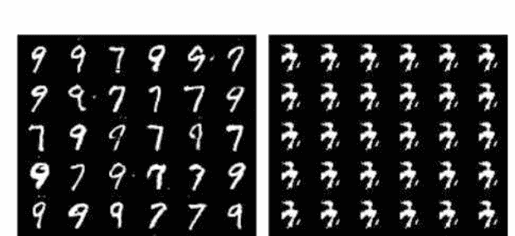

#### 11.2.2.2 梯度消失

当GAN的一个组件，即鉴别器或生成器，变得足够强大以至于对训练所需的平衡产生伤害时，就会出现梯度消失问题。例如，当区分假样本和真实样本时，鉴别器可能变得过于强大，无法再被生成器欺骗。因此，损失函数过小，梯度无法通过生成器的神经网络流动，导致GAN的进展停滞。在GAN训练中，鉴别器和生成器之间的平衡对于训练的收敛至关重要。当这种平衡以不可逆的方式被破坏时，梯度消失问题就会发生。

图11.2展示了一个遭受梯度消失问题的GAN训练的示例。我们可以在这个图中看到生成器和鉴别器在迭代过程中的损失变化。请注意，当鉴别器的损失变为零（由虚线垂直线标记）时，生成器停止改进并停滞到训练结束。因此，生成器创建的样本的质量将不再提高。重要的是要注意，生成器和鉴别器之间的分歧，即损失，不一定需要始终减少[13]。即使损失增加，训练最终也可以达到一个好的解决方案。因此，关于梯度消失问题，只有当损失接近于零时才会发生。GAN模型可以容忍损失减少的步骤而不会失去收敛能力。

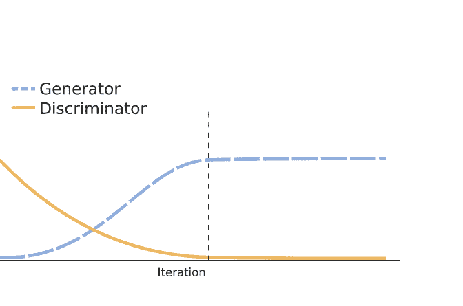

### 11.2.3 评估指标

可以使用多个指标来量化GAN的性能[6, 49]。由于生成器通常是GAN中最相关的组件，因此这些指标通常针对它们。然而，在执行生成任务时衡量性能是一个相关的问题，目前在社区中还没有达成共识，关于使用哪个最佳指标。我们在这里强调了GAN文献中最常报告的两个指标：Inception Score和Fréchet Inception Distance（FID）分数。其他指标，如技能评级[33]，已经进行了评估并获得了相关结果。尽管如此，它们在社区中仍然没有被广泛使用，因此很难将它们用于与其他作品进行比较研究。然而，在进化计算的背景下，它们仍然可以作为比较解决方案的标准，也可以作为适应度函数来指导进化。

#### 11.2.3.1 Inception分数

Inception分数（IS）[39]是一种自动度量，用于评估基于输入数据集创建的合成图像样本。该方法使用Inception网络[44,45]获取由生成算法（如GAN）创建的图像的条件标签分布。该网络应该事先使用数据集进行训练，通常是ImageNet数据集[38]。因此，Inception分数定义为：

IS(x, y) = exp(𝔼_x KL(p(y|x) || p(y))), (11.3)

其中，x是输入数据，y是数据的标签，p(y)是标签分布，p(y| x)是条件标签分布，KL是分布p(y| x)和p(y)之间的Kullback-Leibler散度。建议在大量样本（例如50,000个）上评估IS指标，以提供足够的多样性给分数[39]。IS指标存在一些缺点，比如对计算中使用的Inception网络的权重敏感[4]。此外，Inception Score中使用的网络是在ImageNet数据集上训练的，可能在其它数据集上的性能不一致。

#### 11.2.3.2 Fréchet Inception距离

Fréchet Inception距离（FID）[18]是比较GAN生成组件的最先进指标。FID分数在多样性和质量方面优于其他指标，如Inception Score [26]。与Inception Score一样，FID在计算过程中也使用了经过训练的Inception网络。在FID分数中，Inception Net的一个隐藏层（通常也在ImageNet上训练）用于将图像转换为特征空间，该空间被解释为连续的多元高斯分布。这个转换应用于真实数据集的一个子集和生成方法生成的样本。估计这两个结果高斯分布的均值和协方差，并计算这两个高斯分布之间的Fréchet距离。

FID(x, g) = ||μ_x - μ_g||_2^2 + Tr(Σ_x + Σ_g - 2(Σ_x Σ_g)^{1/2}), (11.4)

在方程（11.4）中，$\mu_x$, $\Sigma_x$, $\mu_g$和$\Sigma_g$分别表示实际数据集$x$和伪样本$g$的均值和协方差估计。总之，FID分数由实际样本和伪样本之间的均值和协方差的范数以及迹组成。

## 11.3 探索GAN的进化

GAN模型的几个方面可以作为进化算法中的可进化组件。然而，重要的是要记住，进化算法应该保持这些组件的平衡，以解决第11.2.2节中列出的问题。我们在本节讨论将进化算法应用于GAN模型的可能性。与神经进化相关的选项和GAN的方面将被提出作为设计算法的可能选择。

### 11.3.1 神经进化

神经进化是在神经网络进化中应用进化算法的方法。它可以用于进化神经网络的权重、拓扑结构和超参数 [50]。当用于发现网络拓扑结构时，一个重要的好处是将架构设计和参数决策自动化，将人工努力转化为自动过程。随着深度学习的兴起，这种自动化变得更加关键，因为深度学习产生了更深的模型并增加了搜索空间 [28]。然而，搜索空间的增加也是神经进化面临的挑战。这些方法的执行时间较长，可能导致其应用不可行。

神经进化可以完全应用于GAN的背景下。鉴别器和生成器的拓扑结构的进化应考虑到它们之间的平衡对训练过程的收敛至关重要。神经网络的结构（即层数和它们之间的连接）以及每个层的内部特性都可以成为进化的对象。例如，一个层的类型（如卷积或全连接），输出特征的数量以及激活函数（如ReLU、ELU、Tanh）都可以成为个体的变量。网络的其他相关方面也可以作为个体的变量，例如训练中使用的优化器的选择、学习率、批量大小和训练迭代次数。

我们还可以利用其他关于神经进化的进化计算技术，例如协同进化。协同进化是至少两个不同种群（也称为物种）的同时进化[19, 36]。协同进化算法有两种类型：合作和竞争。在合作协同进化中，不同物种的个体合作寻找高效解决方案，并且每个物种的适应度函数被设计为奖励这种合作。在竞争共同进化中，不同物种的个体在寻找更好的解决方案时相互竞争。在这里，它们的适应度函数直接表示了物种之间的竞争，得分与物种之间的关系成反比。 例如，NEAT成功应用于竞争共同进化环境[43]。

在进化算法中使用的共同进化方法可能会导致一些问题，例如不传递性和脱节[2, 30]。 当一个解决方案 $a$ 比 $b$ 好， $b$ 比 $c$ 好，但这并不意味着$a$比 $c$ 好。 这个问题会导致在进化过程中这些解决方案之间的循环，阻止个体朝着最优解的进展。 脱节发生在种群之间的平衡被打破的情况下。 在这种情况下，一个种群中的个体要比另一个种群中的个体好得多，导致进展不顺利。

GAN可以被建模为一个竞争共进化问题。 我们可以将一组鉴别器视为生成器的竞争对手。 因此，进化算法可以利用竞争共进化的概念，在评估阶段匹配这两个群体中的个体。 此外，我们可以将经常影响GAN训练的问题（ 第11.2.2节）与共进化问题联系起来。例如，梯度消失问题可以与脱离问题相关联。 因此，可以探索将共进化与其他技术（例如神经进化）结合使用，以解决GAN训练过程中的挑战。

### 11.3.2 GAN的变体

最近提出了对原始GAN模型的几项改进。 这些提议不仅关注提高生成样本的质量，还关注提高训练的稳定性。 这些提议可以分为两个主要类别：架构改进和替代损失函数[34, 48]。

- 在生成器和鉴别器中使用批归一化；
- 在生成器的所有隐藏层中使用ReLU激活函数；
- 在鉴别器的所有层中使用LeakyReLU。

在DCGAN的实验中，训练稳定性得到了改善，但在某些执行中仍存在模式崩溃问题[35]。

其他提案将不同的方面引入了原始GAN模型[5，7，11，12，15，21，22，51]。我们可以将其中一些策略作为启发，用于EA。例如，[21]中描述的方法使用预定义的策略在训练过程中逐渐增加GAN的规模。主要思想是逐步增加模型的层数，同时增加鉴别器和生成器的层数。这个机制会在训练过程中使模型变得更加复杂，从而在每个阶段生成更高分辨率的图像。然而，这些层是以预先配置的方式逐步添加的，即它们不是通过随机过程产生的。这些概念可以扩展到在EA中使用。鉴别器和生成器的进展可以由进化引导，使用适应度函数来防止和丢弃不适合的个体。

其他方法使用多个组件而不是仅有一个生成器和一个判别器。例如，GMAN [11]提出了一个模型，在训练算法中使用了多个判别器。另一方面，MAD-GAN [15]探索了在 GAN 训练中使用多个生成器的方法。通过提出一个包含两个完全不同的判别器和生成器种群的解决方案，EA 可以与这些概念保持一致。

克服训练问题并改进原始 GAN 模型的另一种策略是使用替代损失函数。提出了各种替代损失函数来最小化问题并提高结果的质量，例如 WGAN [3]、LSGAN [27] 和 SN-GAN [31]。 WGAN 提出使用 Wasserstein 距离来建模损失函数。 LSGAN 使用最小二乘函数作为判别器的损失函数。 SN-GAN 提出使用谱归一化来改进判别器的训练。 EA 可以利用这些变化，并将损失函数作为可互换的组件使用。

## 11.4 当前提案

我们在本节中介绍了进化算法在GAN中的最新应用。这些提案与第11.3节中提出的可能性相一致，提供了应用它们并改进GAN训练过程的解决方案。据我们所知，在GAN的背景下，这些是使用进化算法的提案：E-GAN [47]，Pareto GAN [14]，Lipizzaner [1]，Mustangs [46]和COEGAN [9，10]。在本节中，我们描述了这些解决方案，重点关注进化算法和GAN特征方面的选择。因此，我们报告了与选择方法、适应度函数、变异算子、评估和实验相关的算法特征。

### 11.4.1 E-GAN

提出了一种名为E-GAN<sup>2</sup>的模型来在GAN中使用进化算法[47]。该方法将进化算法应用于GAN，使用一个只能切换生成器损失函数的变异算子。因此，进化仅发生在生成器中，并且一个固定的判别器被用作生成器种群的对抗者。生成器和判别器的网络架构是固定的，基于DCGAN [35]。

生成器的种群包含具有不同损失函数的个体。进化过程中使用的变异算子可以将个体的损失函数改变为预定义集合中选择的另一个函数。预定义集合中的每个损失函数都专注于帮助GAN学习过程中的一个目标。

使用最小的个体种群来捕捉预定义损失的所有可能性，并为训练提供自适应目标。在这种情况下，生成器的种群由三个个体组成，每个个体代表可能的损失之一。

损失的可能性通过三个变异算子实现：极小化、启发式和最小二乘变异。极小化变异遵循方程（11.2）给出的原始GAN目标，最小化判别器检测假样本的概率。另一方面，启发式变异旨在最大化判别器在假样本方面犯错误的概率。最小二乘变异基于LSGAN [27]中使用的目标函数。E-GAN算法中只有这些操作可用，不使用交叉操作。

在算法的评估阶段中，使用了两个标准作为适应度。第一个标准称为质量适应度分数，定义如下：

$$F_q = \mathbb{E}_z[(D(G(z)))]$$ 	(11.5)

这类似于原始GAN模型生成器中使用的损失函数（方程（11.1））。第二个标准称为多样性适应度分数，定义如下：

$$F_d = - \log \|\nabla_D - \mathbb{E}_x[\log(D(x))] - \mathbb{E}_z[\log(1 - D(G(z)))]\|.$$ 	(11.6)

在方程（11.5）和（11.6）中，$z$, $G$和$D$分别表示潜在空间、生成器和判别器。这两个适应度标准的组合如下：

$$F = F_q + \gamma F_d$$ 	(11.7)

其中 $\gamma$参数用于调节多样性标准对最终适应度的影响。

> 2代码可在https://github.com/WANG-Chaoyue/EvolutionaryGAN找到。

在每一代中，个体根据其特定的损失函数进行评估，只有最适应的生成器才能在下一步中存活。在下一代中，幸存的个体用于训练鉴别器并生成下一次评估的三个子代。

E-GAN模型在CIFAR-10、LSUN和CelebA数据集上进行了评估。Inception Score被用作分析结果的度量标准。如E-GAN所指定的，实验中使用的种群由一个鉴别器和三个生成器组成。作者得出结论，E-GAN改善了训练稳定性并在某些场景中表现出令人满意的性能，超过了其他方法。

## ### 11.4.2 Pareto GAN

在[14]中提出了一种用于训练GAN的神经进化方法。虽然作者没有给出具体名称，但我们将这个解决方案称为Pareto GAN。³该提案使用遗传算法来演化生成器和判别器的神经网络架构。在进化算法中，一个单独的个体 $(G_i, D_i)$被用来代表生成器和判别器。

交叉操作符将两个父代的判别器和生成器进行交换。例如，将个体 $(G_1, D_1)$和 $(G_2, D_2)$进行交叉操作会产生子代 $(G_1, D_2)$和 $(G_2, D_1)$。交叉操作符不会改变每个个体中生成器和判别器的内部状态。为了实现这一点，在创建新一代时，会对个体应用一组可能的突变。

关于神经网络的架构，突变可以改变、添加或删除一层。突变还可以改变一层的内部状态，如权重或激活函数。一些突变操作符也适用于GAN算法级别。有一个操作符可以通过使用预定义的可能性集合来改变GAN算法中使用的损失函数。另一种可能性是改变算法的特性。在将GAN训练算法应用于个体时，可以改变生成器和判别器的迭代次数。

还提出了基于Pareto集近似问题的GAN基准[14]。通过比较解的Pareto前沿和真实前沿来评估样本的质量，还可以识别问题，如模式崩溃问题。因此，倒置的生成距离（IGD）[8]被用作驱动进化算法的适应度。IGD衡量了真实帕累托前沿点和帕累托前沿近似点之间的最小距离由以下公式给出

$$IGD = \frac{1}{|R|} \left( \sum_{r \in R} \min_{a \in A} d(r, a)^p \right)^{\frac{1}{p}}, \quad d(r, a) = \left( \sum_{k=1}^{m} (r_k - a_k)^2 \right)^{\frac{1}{2}} \quad (11.8)$$

其中 $R$ 是真实帕累托前沿，$A$ 是帕累托近似，$m$ 是 $R$ 中的向量数量。

评估阶段将把每个个体 $(G_i, D_i)$ 转化为一个具体的GAN，由鉴别器和生成器组成，将根据常规的GAN算法进行训练。计算适应度，并使用帕累托支配来组成下一代的后代。

提出的解决方案使用双目标函数作为输入数据进行评估，每个函数都有10个输入变量。在实验中使用了一个包含20个个体的种群，评估了500代。作者得出结论，该算法能够发现改进判别器和生成器 Pareto 集近似的架构。实验中没有使用图像数据集进行评估。然而，也进行了与 MNIST 数据集相同维度的实验，即使用了784个输入变量。作者证明了该解决方案在这个维度上是可扩展的，因为结果表明在这种情况下也找到了有用的架构。

### 11.4.3 雷皮扎纳

一个名为 Lipizzaner^4 的模型定义了一个共进化框架来训练和演化 GANs [1]。在 Lipizzaner 中，演化仅发生在生成器和判别器的内部参数上，例如它们神经网络的权重。因此，判别器和生成器中使用的网络架构是固定的，并且是预先定义的。架构随实验中使用的数据集而变化。

对于MNIST，使用了由四层和700个神经元组成的MLP网络。另一方面，基于DCGAN的架构用于CelebA数据集的实验。

Lipizzaner中生成器和判别器使用的适应度基于GAN目标函数，定义如下 :

$$L(u, v) = \mathbb{E}_{x \sim p_{data}} [\phi(D_v(x))] + \mathbb{E}_{x \sim G_u} [\phi(1 - D_v(x))], \quad (11.9)$$

其中 φ是区间[0,1]上的凹函数， $p_{data}$是输入数据集， $G_u$是具有参数u的生成器， $D_v$表示具有参数v的判别器。

在评估步骤中，对于每对$(G_i, D_j)$，计算 $L(u_i, v_j)$，并更新适应度值 $f_{u_i} -= L(u_i, v_j)$ 和 $f_{v_j} += L(u_i, v_j)$分别用于生成器和判别器。

空间共进化被用于设计训练和进化生成器和判别器的算法。个体分布在一个二维环形网格上，每个单元格包含来自生成器和判别器种群的个体。在评估阶段，遗传算法根据共进化配对方法，在相邻单元格中匹配个体。使用一个五个单元格的邻域来确定这些相互作用。图11.3显示了Lipizzaner中使用的空间共进化策略的一个3×3网格的示例。生成器是在这个邻域中的生成器的混合物。

Lipizzaner使用了两个变异算子。第一个算子变异了生成器和判别器中使用的优化方法的学习率。在这种情况下，正态分布被用来在每一代中以小步骤改变学习率。第二个算子是基于梯度的变异，更新生成器和判别器种群中个体的权重。

Lipizzaner使用Adam优化器[23]来更新权重。此外，结合性能度量（例如Inception Score或FID）的进化策略用于更新权重的混合。

该模型在MNIST和CelebA数据集上进行了评估，使用2×2的网格，形成了4个生成器和4个判别器的种群。这些种群经过了400代的进化。作者发现Lipizzaner在大多数实验中能够避免模式崩溃问题。该模型能够从模式崩溃问题中恢复并在训练进展中不断改进通过下一代。

### 11.4.4 马斯坦格

模型E-GAN和Lipizzaner被结合在一种混合方法中，用于训练和进化GANs，称为突变空间GANs（Mustangs）5[46]。与Lipizzaner和E-GAN一样，在算法中生成器和鉴别器的拓扑结构是固定的，即架构不是进化算法的目标。

Mustangs结合了E-GAN中使用的突变算子和Lipizzaner中使用的空间共进化机制。目标是增加种群中基因组的多样性。因此，生成器的损失函数可以通过突变算子进行修改，就像E-GAN中一样。就像Lipizzaner一样，个体之间的匹配发生在一个环形网格中，并且神经网络的内部权重是基于邻域计算的。

Mustangs模型使用了与Lipizzaner相同的适应度策略，即适应度基于GAN目标函数 $\mathcal{L}(u, v)$，由公式(11.9)定义。因此，在评估步骤中，对于每对 $(G_i, D_j)$，也计算了值 $\mathcal{L}(u_i, v_j)$，并且适应度值也被更新为 $f_{u_i} -= \mathcal{L}(u_i, v_j)$ 和 $f_{v_j} += \mathcal{L}(u_i, v_j)$ 分别用于生成器和判别器。

Mustangs中使用的运算符是Lipizzaner和E-GAN中使用的运算符的组合。因此，与E-GAN一样，个体的损失函数可以被改变。然而，这里使用的策略是随机选择三种损失函数中的一种，而不是使用所有损失函数来评估个体。Lipizzaner中使用的变异运算符也适用于Mustangs。Mustangs还应用了一种进化策略来更新权重。这个提案中没有使用交叉操作。

评估阶段遵循Lipizzaner的相同提案。Mustangs使用空间共进化来配对鉴别器和生成器，使用环形网格来空间分布个体。因此，个体使用网格邻域来计算适应度并评估每个个体。与Lipizzaner一样，在这个邻域中生成器被确定为生成器的混合物。

Mustangs使用MNIST和CelebA数据集进行评估。由于组成GAN的神经网络的架构是固定和预定义的，作者根据实验中使用的数据集选择了不同的拓扑结构。对于MNIST实验，使用了一个具有700个神经元的四层MLP网络和基于DCGAN的架构用于CelebA数据集的实验。对于MNIST，使用了一个 $3 \times 3$ 的网格大小和9小时的时间限制。对于CelebA，实验在一个 $2 \times 2$ 的网格上进行了20个时期。对标准GAN、E-GAN、Lipizzaner和Mustangs进行了比较。

5代码可在https://github.com/mustang-gan/mustang找到。

作者发现Mustangs能够生成关于FID得分的最佳结果。他们还得出结论，空间共进化是一种有效的模拟生成器和判别器的种群的方法，用于训练GAN。

## ## 11.4.5 COEGAN

协同进化生成对抗网络（COEGAN）是我们在[9, 10]中提出的一种结合了神经进化和协同进化来训练和进化GAN的方法。这种方法受到DeepNEAT [28]的启发，将EA适应和扩展到GAN的上下文中。

COEGAN的基因组由一系列基因组成。基因型-表型映射将这个数组转化为一系列层，以组成神经网络。每个基因代表线性、卷积或转置卷积层（也称为反卷积层）。此外，每个基因还具有一些常见的内部参数，例如激活函数，从以下集合中选择：ReLU、Leaky ReLU、ELU、Sigmoid和Tanh。代表卷积或转置卷积层的基因只有输出通道数作为可变参数。输入通道数是根据前一层的设置动态计算的。步幅和内核大小是预先定义的，但会根据层的输出大小动态调整。类似地，线性层只有输出特征数作为可变参数。前一层还用于计算输入特征数。因此，受变异操作影响的参数是激活函数、输出特征数和输出通道数。

图11.4展示了鉴别器和生成器的基因型示例。鉴别器的基因型由卷积部分和线性部分（由全连接层组成）组成。与原始GAN模型一样，鉴别器输出输入样本是真实样本（从数据集中抽取）的概率。生成器的基因型由线性部分和转置卷积部分（也称为卷积部分）组成。生成器输出一个具有与真实样本相同特征（即维度和通道）的伪样本。

竞争共进化被用来建模算法。因此，COEGAN由两个独立的子种群组成：一个生成器种群，其中每个$G_j$表示一个生成器；一个鉴别器种群，其中每个$D_j$表示一个鉴别器。每个子种群都使用受NEAT启发的物种形成机制来促进创新。物种形成机制确保最近修改的个体有足够的世代存活下来，以与之前世代的个体一样强大。为此，每个种群根据相似性划分为物种。 > > 6代码可在https://github.com/vfcosta/coegan 找到。

函数（用于将相似个体分组）。因此，创新，通过将新基因添加到基因组中来表示，可能会导致创建新物种，以适应包含这些新基因的个体。属于新物种的个体将有更高的生存机会，因为它们不会直接与其他物种的更强大个体竞争。

COEGAN只关注神经网络架构的演化。因此，表型中的层参数（例如权重和偏差）不是演化的一部分，而是通过梯度下降方法进行修改。变异算子专注于网络拓扑的演化。

COEGAN中使用了不同的生成器和判别器适应度函数。对于判别器，适应度基于原始GAN模型的损失函数，即适应度等同于公式（11.1）（第11.2节）。在生成器上使用了相同的方法，使用公式（11.2）（第11.2节），但是初步结果表明在使用此策略时存在不稳定性，因此不适合作为适应度。因此，生成器使用FID分数[18]作为适应度，即适应度由公式（11.4）（第11.2.3节）表示。FID是比较GAN的最先进指标，优于其他指标，如Inception Score[39]。使用FID分数作为适应度在COEGAN中施加选择压力，并将种群的演化导向更好的生成器的创建，从而获得更好的判别器。

只有突变被用作COEGAN的变异操作符。突变过程由三个操作组成：添加一个新层，删除一个层，和改变一个现有层。在添加操作中，一个新层是随机选择的从可能的层集合中（鉴别器的线性或卷积层和生成器的线性或转置卷积层）。删除操作随机选择一个现有层并将其从基因型中排除，调整前一层和下一层之间的连接。更改操作作用于激活函数和层的特定属性。激活函数是随机选择的从可能性集合中。线性和卷积层的输出特征数和输出通道数可以通过突变进行改变。

这些属性使用预定义范围的均匀分布进行突变以限制可能的值。交叉也在初步实验中进行了尝试和评估，但由于它会促使不稳定性，降低系统的性能，因此被舍弃了。

COEGAN在可能的情况下保留参与突变操作的基因的参数（权重和偏差）。因此，新个体将携带来自先前世代的信息，并从上次状态继续训练，模拟深度神经网络中使用的迁移学习机制。然而，在某些情况下，这些参数无法保留，例如当线性层或卷积层的参数发生变化时。在这些情况下，新层的设置与先前的配置不兼容，并且新层将从头开始训练。

在EA的评估步骤中，鉴别器和生成器的种群中的个体必须配对进行训练和计算个体的适应度。配对策略对于共同进化至关重要，并且一些挑战可能与GAN训练中出现的问题有关（参见第11.3.1节）。COEGAN使用了两种配对策略进行评估：全部对全部和全部对前k个最佳个体。

在all vs. all中，每个鉴别器与每个生成器配对，导致所有可能的匹配。在这种情况下，鉴别器的适应度是通过与每个生成器进行训练所得到的损失的平均值。由于FID分数在计算中不使用鉴别器，配对策略不会影响生成器的适应度。全对全策略对于促进GAN训练中的多样性以及提高鉴别器和生成器的环境变异性非常重要。然而，这种方法的执行时间是一个权衡因素。在[9]中所呈现的实验中采用了全对全的方法。

在all vs. k-best中，从一个种群中选择k个个体与另一个种群中的所有个体进行匹配。因此，每个生成器与前一代中的k个最佳鉴别器配对，同样地，每个鉴别器与k个最佳生成器配对。对于第一代，使用随机方法，即在初始评估中选择k个随机个体进行配对。

这种方法在训练中提供了较少的变异性，但更高效，因为每一代执行的匹配较少。所有与k最好的方法，其中k=3在[10]中的实验中使用。所有与所有策略相比，COEGAN的训练效果更好[9]，呈现出更稳定的训练。

## # 11 生成对抗网络的神经进化

对于选择阶段，COEGAN使用基于NEAT [42]的策略。 生成器和判别器的种群使用基于NEAT中使用的分种策略进行划分。每个物种由具有相似基因组的个体组成，即具有相似的网络结构。 因此，个体之间的相似性仅基于组成基因组的每个基因的参数，排除了相似性计算的权重。 两个基因组i和j之间的距离δ定义为仅存在于 i或 j中的基因的数量。 分种方法使用距离根据δt阈值对个体进行聚类。 该阈值在每个生成器中计算，以适应先前选择的物种数量。 适应度共享用于调整每个物种内个体的适应度。 个体根据所属物种的平均适应度按比例选择。除此之外，在每个物种中，对 kt个体进行锦标赛，最终选择繁殖和组成下一个种群的个体。

为了评估COEGAN提案，使用MNIST和Fashion MNIST数据集进行了实验。这些实验比较了COEGAN，一种基于DCGAN的解决方案，和使用FID分数、Incep-tion分数和均方根误差（RMSE）指标的随机搜索方法。基因组的大小被限制为六层。变异操作符的概率分别为20%、10%和10%，用于添加、删除和更改突变。输出特征和通道的数量遵循均匀分布，由区间[32，1024]和 [16，128]界定。实验运行了50代，使用10个个体作为生成器和判别器的种群。

图11.5展示了MNIST数据集上的FID分数结果（分数越低越好）。我们可以看到COEGAN优于其他方法。随机这种方法在这个度量标准上呈现出较高的变异性和较差的结果。这证明COEGAN对于适应函数的选择提供了足够的进化压力，以引导进化达到更好的结果。

图11.6显示了COEGAN训练过程后生成器创建的样本。我们可以看到这个图中的样本与MNIST中的数据相似。在COEGAN的实验中没有发现梯度消失的证据，而模式崩溃只在部分执行中发生。

COEGAN通过使用进化压力来丢弃失败的个体，避免了这些问题。由于这些个体的表现不如其他个体，它们最终不会被选择，它们的问题也不会在后代中持续存在。生成器和判别器群体提供的多样性也是防止这些问题发生的因素之一。与单个生成器和判别器相比，使用多个生成器和判别器进行训练的可变性可以提供更强大和稳定的GAN训练方式。

为了评估解决方案在复杂数据集中的适用性，我们扩展了COEGAN的实验，包括CelebA数据集[25]的结果。

为此，我们使用与[9]中应用的实验设置类似的实验设置。然而，为了简单起见，当添加新基因时，我们只使用卷积和转置卷积层，将线性层排除在可能性集合之外。

此外，我们只允许ReLU和Leaky ReLU作为可能的激活函数在变异算子中。生成器和判别器的种群分别包含10个个体，分为三个物种。使用100批次64张图像对每对进行训练的全对全配对策略。CelebA数据集中的图像被重新缩放为64 × 64。每个实验重复三次，并且所呈现的结果是这些执行的平均值，置信区间为95%。

图11.7展示了COEGAN的FID分数随着世代的变化。正如预期的那样，我们可以注意到FID分数的下降趋势，类似于MNIST结果中的行为（图11.5）。这表明COEGAN在处理像CelebA这样更复杂的数据集时具有泛化能力。COEGAN在最后一代达到的平均FID分数为89.8 ± 17.2。在实验中没有发现梯度消失和模式崩溃的证据。

## 11.5 讨论

第11.4节介绍了在GAN的背景下应用进化算法的当前提案。我们可以看到在这些提案中经常使用了EAs中经常使用的各种技术，这些技术在第11.3节中介绍。接下来，我们将就GAN模型的方面、EA的选择以及实验结果等方面介绍和讨论这些特征。

### 11.5.1 GAN模型的特点

表11.1介绍了每个提案中使用的GAN模型的选择。这些提案从四个属性的角度进行比较：算法中使用的鉴别器数量，生成器数量，每个组件的架构以及用于训练GAN的损失函数。除了E-GAN之外，所有提案在其模型中使用了多个鉴别器。

对于生成器，所有提案都使用了多个生成器，其中E-GAN使用了三个生成器，对应于算法中设计的可能损失函数的数量。因此，E-GAN使用较小的种群，限制了通过世代演化可能出现的选择。另一方面，Mustangs成功地将E-GAN模型适应到了更大的种群中，使用了Lipizzaner的空间共进化方法来处理个体。

关于架构，只有Pareto GAN和COEGAN使用了可进化的方法。其他提案使用了预定义和固定的生成器和鉴别器神经网络架构。因此，Pareto GAN和COEGAN使用更大的搜索空间，因为EA可以产生大量可能的架构。它们还有可能通过算法来增强生成器和鉴别器之间的平衡，因为架构的复杂性是由算法确定的。

Lipizzaner和COEGAN在GAN训练中使用固定的损失函数。E-GAN，Pareto GAN和Mustangs使用可进化的方法来处理损失函数。这种方法使用一组预定义的可能性来选择和分配损失函数给个体。也可以使用更灵活的方法，而不是预定义的集合，使用遗传编程来发现更好的GAN损失函数。然而，本章分析的提案没有探索这种方法。

表11.1 评估提案中使用的GAN的方面
| 算法 | 判别器 | 生成器 | 架构 | 损失函数 |
|------|--------|--------|------|----------|
| E-GAN | 单一固定 | 三个 | 基于DCGAN的 | 可进化化的^a |
| Pareto GAN | 许多 | 许多 | 可进化化的 | 可进化化的^a |
| Lipizzaner | 许多 | 许多 | 基于MLP和DCGAN的^b | 原始GAN |
| Mustangs | 许多 | 许多 | 基于MLP和DCGAN的^b | 可进化化的^a |
| COEGAN | 许多 | 许多 | 可进化化的 | 原始GAN |

^a 使用预定义的一组可能性选择损失函数
^b 使用CelebA数据集和更简单的方法应用了基于DCGAN的架构MNIST数据集（参见第11.4.3节和第11.4.4节）

### 11.5.2 进化算法的方面

表11.2介绍了在第11.4节中提出的解决方案之间的比较，重点关注进化算法的方面。对进化算法的四个方面进行了分析：配对方法、变异算子、适应度函数和选择方法。

由于所有提议中都使用了多个生成器和/或判别器，并且GAN训练使用生成器和判别器作为对抗性，因此必须使用一种方法来配对个体。除了Pareto GAN之外，所有其他解决方案都使用单独的个体来表示判别器和生成器。在E-GAN中，由于只有一个判别器和三个生成器，配对策略是使用判别器评估所有三个生成器。在COEGAN中，使用了全对全和全对k个最佳的策略。Lipizzaner和Mustangs使用相同的空间共进化策略来匹配生成器和判别器。值得注意的是，Lipizzaner和Mustangs中应用的空间共进化机制使用邻域中的权重混合来组成每个单元中生成器的权重，利用多个个体来产生一个模型。其他解决方案没有应用类似的机制来组合来自不同个体的权重。COEGAN和Pareto GAN在种群中具有不同的架构特征，阻止了为Lipizzaner和Mustangs设计的混合机制的使用。

变异算子对于在进化算法中寻找良好解决方案的多样性至关重要。Pareto GAN使用交叉和变异作为算子。它也是提供了最多变异性的解决方案，可以通过进化代际来演变EA中的元素。由于Pareto GAN将其个体建模为整个GAN的表示，即将判别器和生成器编码到基因型中，交叉通过交换生成器和判别器来形成后代。其他解决方案使用独立的基因型来表示生成器和判别器的GAN。因此，这种方法不适用于它们。COEGAN还评估了一种应用交叉的策略，使用切割点来共享神经网络的部分父代之间。然而，这种策略在该方法中被证明不高效。

表11.2 评估提案中使用的进化算法的方面
| 算法 | 配对 | 变异操作符 | 适应度 | 选择 |
| :--- | :--- | :--- | :--- | :--- |
| E-GAN | 一对三 | 突变（损失） | 自定义 | 最佳个体 |
| Pareto GAN | – | 交叉和突变 | IGD | Pareto优势 |
| Lipizzaner | 空间共进化 | 突变（权重）^a | GAN目标空间 | |
| Mustangs | 空间共进化 | 突变（权重，损失） | GAN目标空间 | |
| COEGAN | 全部对全部（全部k-最佳）^b | 突变（架构） | FID和损失 | 基于NEAT |

注：^a FID分数用作进化Mustangs中权重混合的性能度量
^b COEGAN使用全部对全部和全部对k-最佳两种方法进行实验

COEGAN和Pareto GAN是唯一具有可进化神经网络架构的解决方案。突变操作符用于在这些架构中提供小的变化，这些架构通过多代产生强大的判别器和生成器。E-GAN，Lipizzaner和Mustangs使用受限突变策略。在E-GAN中，只能切换损失函数。在Lipizzaner中，梯度-基于突变被应用于更新生成器和判别器的权重。

此外，Lipizzaner使用进化策略来更新生成器的权重混合用于生成器的权重。Mustangs结合了E-GAN和Lipizzaner的运算符。与Lipizzaner和Mustangs不同，COEGAN不直接对权重应用变异运算符。然而，当梯度下降训练停滞不前时，可以探索这个选项来开发一种混合方法，即在一定数量的世代中演化权重。

在提案中，适应度的选择是多样的。E-GAN使用一个自定义函数来表示所创建样本的质量和多样性。由于只有生成器受到进化的影响，鉴别器没有相关的适应度。
Pareto GAN基于Pareto前沿的概念来确定适应度，使用倒生成距离（IGD）来表示适应度值。Lipizzaner和Mustangs使用GAN目标函数来计算个体的适应度。此外，在[46]中使用FID分数作为性能度量来演化权重混合。COEGAN采用了不同的适应度函数方法。

原始GAN模型的判别器损失函数被用作其适应度。在生成器中，FID分数被用作适应度。COEGAN利用FID距离的能力来表示生成样本的多样性和质量。由于FID常被研究人员用来比较GAN，将该度量指标应用于进化算法中可以自动提供关于方法产生的解决方案的洞察。

E-GAN中使用的选择方法基于选择最佳生成器。由于E-GAN只有三个生成器，每个生成器都有一个特定的损失函数，适应度通过选择最适合当前环境的函数来引导进化。通过代际间的函数切换，E-GAN获得了足够的训练多样性以实现收敛。在Pareto GAN中，Pareto支配被用作选择个体形成下一代的策略。Lipizzaner和Mustangs采用了基于空间共进化机制的选择策略。邻域被用来根据适应度评估和替换中心个体。COEGAN使用基于经典NEAT选择的方法。因此，物种分化被用来确保来自不同物种的个体有机会发展所需的生存技能。这些策略中的一些可以结合成一个更强大的算法。例如，Lipizzaner和Mustangs用于指导选择的机制可以应用于COEGAN中，以减少评估阶段的复杂性并带来空间共进化的优势。

### 11.5.3 实验和结果

表11.3比较了在实验设置的角度下各个提案的贡献。介绍了四个实验属性：训练中使用的数据集，种群中生成器和判别器的数量，训练中使用的代数数量以及用于评估结果的度量标准。

除了Pareto GAN之外，所有提案都在实验中使用了图像数据集。Pareto GAN使用双目标函数来验证模型，还包括一个模拟MNIST数据集维度的函数。在图像类别中，MNIST是一个简单的数据集，应该谨慎使用以得出关于解决方案性能的普遍结论。CelebA数据集可能是验证GANs最常用的数据集。因此，评估Pareto GAN在该数据集上的性能非常重要。

在实验中使用的种群在各个提案中变化很大。除了E-GAN之外，在实验中的解决方案使用了多个个体来代表两个种群。虽然在E-GAN中可以使用更多的个体，但实验中只使用了一个判别器和三种可能的生成器（代表每种可能的损失函数）。在Pareto GAN中，一个个体完全代表一个GAN。因此，使用了20个个体，意味着通过多代训练了20个独立的GAN，每个GAN都有自己的生成器和判别器。Lipizzaner和Mustangs使用空间共进化将个体分布在2 × 2的MNIST数据集网格中。对于CelebA，Mustangs使用了一个3 × 3的网格。由于这些网格中每个单元格只包含一个生成器和一个判别器，所以2 × 2和3 × 3的种群分别由4个和9个个体组成。

分别是3 × 3个设置。由于应用了五个细胞邻域，空间共进化减少了评估个体所需的迭代次数。因此，可以使用更多的个体来评估Lipizzaner和Mustangs。此外，COEGAN可以采用空间共进化方法来减少训练时间并增加实验中的个体数量。

表11.3 提案中所呈现的实验比较
| 算法 | 数据集 | 种群（D × G）| 代 | 度量 |
| :--- | :--- | :--- | :--- | :--- |
| E-GAN | CIFAR-10, LSUN, CelebA | 1 × 3 | 200,000 | Inception分数 |
| Pareto GAN | 双目标函数 | 20^a | 500 | IGD |
| Lipizzaner | MNIST, CelebA | 4 × 4 | 400 | - |
| Mustangs | MNIST, CelebA | 4 × 4, 9 × 9 | 时间限制, 20 | FID分数 |
| COEGAN | MNIST, 时尚 MNIST, CelebA | 10 × 10 | 30, 50 | FID分数 |

^a 在 Pareto GAN 中，一个个体完全代表一个 GAN，即它包含了一个生成器和一个判别器

用于评估每种方法所使用的代数也具有很高的变异性。每种方法都根据其内部特性调整了实验所使用的代数。例如，由于 E-GAN 使用较小的种群，所以需要更多的代数才能收敛。另一方面，COEGAN 在 MNIST 和 Fashion MNIST 实验中只使用了50代。对于 CelebA 实验（第11.4.5节），COEGAN 运行了30代。Mustangs 在 MNIST 实验中采用了9小时的时间限制策略，并在 CelebA 实验中限制了20代。在 MNIST 实验中使用的时间限制方法相当于超过150代。

因为COEGAN使用了10个个体的生成器和判别器，并采用了全对全的配对方法，每个个体在每一代中将执行十次训练过程。此外，COEGAN在每一代训练一对生成器和判别器时使用了多个批次。Mustangs使用一个五细胞邻域来训练个体，在每个训练步骤中的样本数量较COEGAN少。然而，值得注意的是，COEGAN还演化了神经网络的架构，需要更多的样本来实现收敛。

另一方面，Mustangs中的生成器和判别器的架构是固定的。因此，Mustangs在每个训练步骤中使用的样本数量更高效，但COEGAN也为解决方案中的判别器和生成器提供了神经网络架构搜索。

通常使用一个度量标准来评估生成器创建的样本。COEGAN和Mustangs使用FID分数来报告和分析结果。如第11.2.3节所讨论的，FID分数目前是评估和比较GAN的最先进指标。Inception Score，曾经最常用的GAN指标，在E-GAN实验中应用。Pareto GAN采用IGD作为度量标准，这是适合其基于Pareto集合近似的方法。Lipizzaner通过视觉检查分析结果，并没有提供与某些客观测量相关的评估。

由于提案使用不同的度量标准，我们无法直接比较所有提案的结果。只有COEGAN和Mustangs在结果评估中使用相同的度量标准。COEGAN [10]和Mustangs [46]对MNIST实验报告的平均FID分别为49.2和42.235。进一步的COEGAN [9]实验得到了平均FID分数为42.6。

然而，COEGAN和Mustangs的平均FID分数之间的差异很小，应该进行具有相同条件的实验以更好地比较这些解决方案。

对于CelebA数据集，Mustangs实验中报告的FID分数为36.148，优于COEGAN获得的89.8的FID分数。然而，通过对两种解决方案生成的样本进行视觉检查，这种差异并不明显。

## 11.6 结论

本章介绍了应用于生成对抗网络（GANs）的进化算法的最新技术。GANs概述介绍了训练方法的挑战以及常见问题如何影响结果性能。我们还探讨了进化计算概念在GANs环境中的适用性，展示了可以在进化算法中积极参与并发挥作用的组件。这些概念体现在文献中的最新GANs进化算法提案中。我们讨论了这些提案的特点，展示了存在的缺点和进一步研究的可能改进方向。

尽管GAN在最近取得了进展，但仍然存在一些未解决的问题。训练的稳定性仍然是一个挑战，研究人员采用不同的方法来解决，例如提出新的损失函数和/或替代架构。GAN是一个相对较新的模型，在这个领域中使用进化算法还处于早期阶段。随着计算能力的提升和应用强大的机器学习技术（如深度学习）的新方法，进化算法可以被视为训练和演化GAN的一种强大方式。因此，本章提出的建议在进化算法和GAN之间的结合方面显示出优势。他们使用了一系列不同的技术，对GAN模型和进化算法的选择也不同。GAN和进化计算中的策略的多样性为探索提供了大量的开放可能性。

作为未来的工作，本章提出的建议中使用的技术可以在开发新解决方案时进行组合。例如，Mustangs和Lipizzaner中使用的空间共同进化策略可以适应其他提案。另一方面，Pareto GAN和COEGAN中使用的神经进化技术也可以在其他解决方案中进行评估。此外，建议的解决方案可以在更大的实验中进行探索。算法可以在更多的世代上运行，并且在可能的情况下，使用更大的生成器和鉴别器人口。这些实验可以评估结果的质量以及提案的可扩展性。还可以使用复杂的数据集来评估所提出解决方案的稳健性。还可以将与GAN相关的不同技术纳入算法中。例如，使用替代损失函数（如WGAN [3]），谱归一化[31]或GAN的自注意模块[51]。关于神经网络，还可以尝试其他技术，例如最近提出的竞争梯度下降算法[40]。还可以研究替代的适应度函数，以更好地引导GAN在进化算法中的进展。例如，技能评级度量[33]使用将游戏中玩家的技能分类的机制来量化生成器和鉴别器在GAN中的性能。GAN的对抗特性和竞争共同进化环境可以利用这个度量的优势，提供对生成器和鉴别器人口中个体的高效评估。

## 参考文献

- 1. Al-Dujaili, A., Schmiedlechner, T., Hemberg, E., O’Reilly, U.M.: 迈向分布式共同进化GANs。 在：AAAI 2018秋季研讨会 (2018年)
- 2. Antonio, L.M., Coello, C.A.C.: 共同进化多目标进化算法：现状调查。IEEE Trans. Evol. Comput. 22（6），851-865 (2018年)
- 3. Arjovsky, M., Chintala, S., Bottou, L.: Wasserstein生成对抗网络。 在：国际机器学习大会，pp. 214-223 (2017年)
- 4. Barratt, S., Sharma, R.: 关于初始分数的说明。 预印本，arXiv:1801.01973 (2018年)
- 5. Berthelot, D., Schumm, T., Metz, L.: BEGAN：边界平衡生成对抗网络。 预印本，arXiv:1703.10717 (2017年)
- 6. Borji, A.: GAN评估指标的利与弊. 计算机视觉与图像理解 179, 41–65 (2019)
- 7. Brock, A., Donahue, J., Simonyan, K.: 大规模GAN训练用于高保真度自然图像合成. 在：第七届国际学习表示会议, ICLR 2019, 新奥尔良, 2019年5月6日至9日
- 8. Coello, C.A.C., Sierra, M.R.: 一个共进化多目标进化算法并行化研究. 在: 墨西哥国际人工智能会议, 第688–697页. Springer, 柏林 (2004)
- 9. Costa, V., Lourenço, N., Correia, J., Machado, P.: COEGAN: 评估生成对抗网络中的共进化效应. 在: 遗传与进化计算会议论文集, 第374–382页. ACM, 纽约 (2019)
- 10. Costa, V., Lourenço, N., Machado, P.: 生成对抗网络的共同进化。 在：国际进化计算应用会议（EvoStar的一部分），pp. 473–487。Springer, 柏林 (2019年)
- 11. Durugkar, I., Gemp, I., Mahadevan, S.: 生成多对抗网络。 预印本，arXiv:1611.01673 (2016年)
- 12. Elgammal, A., Liu, B., Elhoseiny, M., Mazzone, M.: CAN: 创造性对抗网络，通过学习风格并偏离风格规范来生成“艺术”。预印本，arXiv:1706.07068 (2017年)
- 13. Fedus, W., Rosca, M., Lakshminarayanan, B., Dai, A.M., Mohamed, S., Goodfellow, I.: 达到平衡的多条路径：GAN不需要在每一步都减小差异。 在：第六届国际学习表示会议, ICLR 2018, 温哥华, 2018年4月30日-5月3日，会议论文集 (2018年)
- 14. Garcıarena, U., Santana, R., Mendiburu, A.: 进化的GAN用于生成Pareto集近似。 在: 遗传和进化计算会议论文集, GECCO'18, 第434-441页。ACM, 纽约 (2018)
- 15. Ghosh, A., Kulharia, V., Namboodiri, V.P., Torr, P.H., Dokania, P.K.: 多智能体多样性生成对抗网络。 在: IEEE计算机视觉和模式识别会议论文集, 第8513-8521页 (2018)
- 16. Goodfellow, I., Pouget-Abadie, J., Mirza, M., Xu, B., Warde-Farley, D., Ozair, S., Courville, A., Bengio, Y.: 生成对抗网络。 在: 神经信息处理系统的进展, 第2672-2680页 (2014)
- 17. Gulrajani, I., Ahmed, F., Arjovsky, M., Dumoulin, V., Courville, A.C.: 改进的Wasserstein GANs训练。在: 神经信息处理系统进展, 第5769-5779页 (2017年)
- 18. Heusel, M., Ramsauer, H., Unterthiner, T., Nessler, B., Hochreiter, S.: GANs通过两个时间尺度更新规则训练，收敛到局部NASH均衡。 在: 神经信息处理系统进展, 第6629-6640页 (2017年)
- 19. Hillis, W.D.: 共同进化的寄生虫改善了模拟进化作为优化过程。Physica D 42（1-3），228-234页 (1990年)

- 20. Isola, P., Zhu, J.Y., Zhou, T., Efros, A.A.: 带条件对抗网络的图像到图像转换。 在: IEEE计算机视觉和模式识别会议论文集, 第1125-1134页 (2017年)
- 21. Karras, T., Aila, T., Laine, S., Lehtinen, J.: 渐进式增长的GANs以提高质量、稳定性和变化性。 在: 第六届国际学习表示会议, ICLR 2018, 温哥华, 2018年4月30日至5月3日, 会议跟踪论文集 (2018年)
- 22. Karras, T., Laine, S., Aila, T.: 用于生成对抗网络的基于风格的生成器架构。 预印本, arXiv:1812.04948 (2018年)
- 23. Kingma, D.P., Ba, J.: Adam: 一种用于随机优化的方法。 在: 第三届国际学习表示会议, ICLR 2015年, 圣地亚哥, 2015年5月7日至9日, 会议跟踪论文集 (2015年)
- 24. LeCun, Y.: 手写数字的MNIST数据库。 http://yann.lecun.com/exdb/mnist/ (1998年)
- 25. 刘, Z., 罗, P., 王, X., 唐, X.: 深度学习野外人脸属性。 在: IEEE国际计算机视觉会议论文集, 第3730-3738页 (2015年)
- 26. Lucic, M., Kurach, K., Michalski, M., Gelly, S., Bousquet, O.: GAN是否平等? 一项大规模研究。 预印本, arXiv:1711.10337 (2017年)
- 27. 毛, X., 李, Q., 谢, H., 刘, R.Y., 王, Z., Smolley, S.P.: 最小二乘生成对抗网络。 在: 2017年IEEE国际计算机视觉会议 (ICCV), 第2813-2821页。IEEE, 皮斯卡塔韦 (2017年)
- 28. Miikkulainen, R., Liang, J., Meyerson, E., Rawal, A., Fink, D., Francon, O., Raju, B., Navruzyan, A., Duffy, N., Hodjat, B.: 进化深度神经网络。 预印本, arXiv:1703.00548 (2017年)
- 29. Mirza, M., Osindero, S.: 条件生成对抗网络。 预印本, arXiv:1411.1784 (2014年)
- 30. Mitchell, M.: 具有空间分布种群的共进化学习。 在: 计算智能: 原理与实践, 第137-154页。IEEE计算智能学会, Piscataway (2006年)
- 31. Miyato, T., Kataoka, T., Koyama, M., Yoshida, Y.: 用于生成对抗网络的谱归一化。 在: 第六届国际学习表示会议, ICLR 2018, 温哥华, 2018年4月30日-5月3日, 会议跟踪论文集 (2018年)
- 32. Odena, A., Olah, C., Shlens, J.: 带辅助分类器GAN的条件图像合成。 在: 第34届国际机器学习大会论文集-第70卷, 第2642-2651页。JMLR.org (2017年)
- 33. Olsson, C., Bhupatiraju, S., Brown, T., Odena, A., Goodfellow, I.: 生成模型的技能评级。 预印本, arXiv:1808.04888 (2018年)
- 34. Pan, Z., Yu, W., Yi, X., Khan, A., Yuan, F., Zheng, Y.: 生成对抗网络 (GANs) 的最新进展: 一项调查。 IEEE Access 7, 36322–36333 (2019年)
- 35. Radford, A., Metz, L., Chintala, S.: 无监督表示学习与深度卷积生成对抗网络。 预印本, arXiv:1511.06434 (2015年)
- 36. Rawal, A., Rajagopalan, P., Miikkulainen, R.: 使用共同进化构建竞争和合作代理行为。 在: 2010年IEEE计算智能和游戏研讨会 (CIG), 第107-114页 (2010年)
- 37. Reed, S., Akata, Z., Yan, X., Logeswaran, L., Schiele, B., Lee, H.: 生成对抗文本到图像的合成。 预印本, arXiv:1605.05396 (2016年)
- 38. Russakovsky, O., Deng, J., Su, H., Krause, J., Satheesh, S., Ma, S., Huang, Z., Karpathy, A., Khosla, A., Bernstein, M., 等: ImageNet大规模视觉识别挑战。 Int. J. Comput. Vis. 115(3), 211–252 (2015年)
- 39. Salimans, T., Goodfellow, I., Zaremba, W., Cheung, V., Radford, A., Chen, X.: 改进的训练GANs技术。 在: 神经信息处理系统的进展, pp.2234–2242 (2016年)
- 40. Schäfer, F., Anandkumar, A.: 竞争梯度下降。 预印本, arXiv:1905.12103 (2019年)
- 41. Sims, K.: 通过竞争进化的3D形态和行为。 人工生命 1(4), 353-372 (1994年)
- 42. Stanley, K.O., Miikkulainen, R.: 通过增加拓扑结构进化神经网络。 Evol. Comput. **10**(2), 99–127 (2002)
- 43. Stanley, K.O., Miikkulainen, R.: 通过进化复杂化实现竞争共进化。 人工智能研究杂志 **21**, 63-100 (2004)
- 44. Szegedy, C., Liu, W., Jia, Y., Sermanet, P., Reed, S., Anguelov, D., Erhan, D., Vanhoucke, V., Rabinovich, A.: 用卷积更深入。 在：IEEE计算机视觉和模式识别会议论文集，第1-9页 (2015)
- 45. Szegedy, C., Vanhoucke, V., Ioffe, S., Shlens, J., Wojna, Z.: 重新思考计算机视觉中的Inception架构。 在：IEEE计算机视觉和模式识别会议论文集，第2818-2826页 (2016年)
- 46. Toutouh, J., Hemberg, E., O'Reilly, U.M.: 空间进化生成对抗网络。 预印本，arXiv:1905.12702 (2019年)
- 47. Wang, C., Xu, C., Yao, X., Tao, D.: 进化生成对抗网络。 预印本，arXiv:1803.00657 (2018年)
- 48. Wang, Z., She, Q., Ward, T.E.: 生成对抗网络： 一项调查和分类。 预印本，arXiv:1906.01529 (2019年)
- 49. Xu, Q., Huang, G., Yuan, Y., Guo, C., Sun, Y., Wu, F., Weinberger, K.: 生成对抗网络评估指标的实证研究。 预印本，arXiv:1806.07755 (2018)
- 50. Yao, X.: 进化人工神经网络。 IEEE会议录 **87**(9), 1423-1447 (1999)
- 51. Zhang, H., Goodfellow, I., Metaxas, D., Odena, A.: 自注意力生成对抗网络。 预印本，arXiv:1805.08318 (2018)

# 第五部分 应用和其他

# 第12章 基于X射线的危险物体检测的进化深度神经网络

Ryotaro Tsukada, Lekang Zou和Hitoshi Iba

摘要 近年来，具有额外卷积层的神经网络，即卷积神经网络（CNN），在图像识别领域被广泛认可为有效的。在大多数以前的研究中，网络的结构是通过手工设计的，并且基于经验。然而，目前还没有建立起解释如何构建具有更高学习能力的网络的理论。在本章中，我们提出了一个框架，通过各种核心技术的组合，自动获取具有最高学习能力的图像识别网络结构。我们采用进化计算（EC）来自动提取和合成网络结构。此外，我们尝试在生成变化过程中逐渐增加训练时期的数量，以在更大的参数空间中进行有效搜索。为了展示我们方法的有效性，我们将所提出的方法应用于X射线图像数据集中检测危险物体的任务。与以前的结果相比，我们在mAP值上取得了改进。我们还可以在实际获得的结构中找到几个旁路。

## 12.1 引言

近年来，使用神经网络的机器学习方法在图像识别[5]、语音识别[2]和自然语言处理[1]等领域明显优于传统方法。

具有额外卷积层的神经网络，称为卷积神经网络（CNN），被广泛认为在图像识别领域非常有效。在2012年的ILSVRC 2012全球图像识别竞赛中，Hinton等人[5]使用了一种图像识别方法。基于卷积神经网络，在识别准确率方面取得了超过10%的显著改进（与以前的方法）。

随后，这一成就引发了很多基于卷积神经网络的主动研究；这导致了许多提议和性能改进，其中包括更复杂和多样化结构的神经网络，如GoogLeNet [18]，ResNet [4]和YOLO [12]。

图像识别是从现实世界中获取的图像中提取特征，以识别出现在图像中的对象，如字符、符号、人脸和动物，它具有广泛的应用领域。因此，构建具有越来越高识别准确性的系统是必要的。

卷积神经网络的一个特点是可以通过组合执行特定功能的层来构建网络，就像组合块一样。在以往的大多数卷积神经网络图像识别研究中，网络的结构是根据经验手动设计的。在这种情况下，通过使用dropout、批量归一化、GoogLeNet的inception模块[18]和ResNet中引入的残差学习等各种核心技术，各种网络的学习能力得到了经验验证的提高。然而，目前还没有一个确立的理论来解释如何结合这些技术来构建具有更高学习能力的网络。事实上，目前展现出最高学习水平的网络包含大量参数，而且是深度和复杂的。

因此，专家们必须在特定数据集上进行大量的试错和手工工作，以获得最高的学习能力。因此，目前正在进行使用遗传编程(GP) [9, 17]进行网络结构的自动设计以及使用神经网络[11]进行网络结构搜索的研究。

目前的研究重点是通过上述各种核心技术的组合，自动获取具有最高学习能力的图像识别网络结构。我们使用遗传算法（GA）来自动提取和合成网络结构。遗传算法在本研究中的优势在于，一个简单的网络可以在搜索过程中逐渐演化成一个复杂的网络，而几乎不需要人为的先验输入。此外，我们尝试在生成变化过程中逐渐增加每个个体评估的训练周期数，以在更大的参数空间中进行搜索。

## 12.2 相关研究

### 12.2.1 神经进化

广义上讲，神经进化是通过进化计算方法生成神经网络的尝试[9]。在本研究中，我们的目标是通过使用遗传算法来优化卷积神经网络的结构。这个过程可以类比为进化计算；因此，这种方法可以被视为一种神经进化的形式。

NEAT（增强拓扑神经进化[16]）方法是神经进化的一个例子。该方法的特点是随着优化，小结构逐渐发展成大结构。使用遗传算法（GA），网络通过交叉和变异进行进化，分别导致更好的结构和节点之间连接关系的变化。NEAT中由突变引起的结构变化的示例见图12.1。

### 12.2.2 遗传卷积神经网络

遗传卷积神经网络（Genetic CNN）[19]是使用遗传算法进行卷积神经网络结构搜索的一个示例。在遗传卷积神经网络中，由多个卷积层和后续池化层组成的阶段会重复多次。每个阶段中的卷积层以有向无环图的形式连接。如图12.2所示，二进制值0或1表示编码为一个序列，指定连接到自身的前一个卷积层。这些编码被视为“基因”，使用遗传算法搜索具有更高学习能力的网络结构的过程被称为遗传卷积神经网络。阶段的数量和每个阶段中的卷积层数量是预设的；因此，构成基因的序列的长度也是固定的。

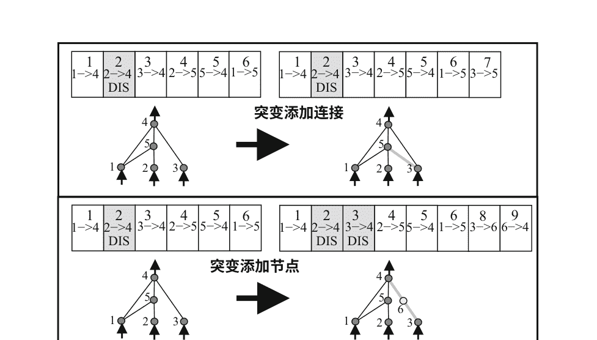

图12.2 遗传卷积神经网络中的网络结构编码示例[19]

为了表示遗传算法的适应度，我们使用基于特定数据集的学习所产生的网络对个体的识别准确率。交叉是通过交换序列之间的位来实现的，突变是通过位反转来执行的。选择过程采用轮盘赌选择，选择概率与相对于适应度最低的个体的适应度差成比例。因此，具有产生更高准确率结构的网络的个体更有可能存活到下一代。这样，涉及网络结构和突变组合的试错最终导致具有最高准确率的个体的输出。遗传卷积神经网络算法的描述如算法1所示：

### 12.2.3 激进选择和变异

在遗传卷积神经网络中，训练是从头开始评估个体的。在代际变化过程中，这个过程会对所有个体重复多次。因此，如果最终的代际数为 $T$，每个代际中的个体数为 $N$，训练会重复 $T \times N$次，直到代际变化过程结束。然而，卷积神经网络的训练通常需要相当长的时间才能完成一轮。因此，这些重复的缺点是需要相当长的时间。

此外，由于采用了轮盘赌选择方案，其中选择概率与个体适应度与最低适应度的差异成比例，因此可能会导致具有弱结构的个体（其不太可能进一步提高准确性）避免被选择淘汰并存活下来。

此外，在卷积层中与连接无关的元素（例如池化层的布局、每层的通道数、滤波器大小和步幅等）必须事先确定，从而导致参数搜索空间较小。

在[7]中，上述问题通过以下方式得到解决：

- (i) 通过使用少量的训练周期对个体进行训练，从而加速个体的评估；
- (ii) 通过引入一种称为“积极选择和变异”的选择和变异方案，可以早期淘汰弱个体，从而更容易产生基于强个体的新个体；
- (iii) 通过增加受突变影响的元素来扩大要搜索的参数空间。

卷积神经网络的训练是通过反复将相同的训练数据输入网络来完成的。这种重复的次数被称为“迭代次数”。通常，如果网络使用较少的迭代次数进行训练，很难达到足够的识别准确性。然而，为了估计遗传算法中的代际变化的参考适应度，只需要对较少的迭代次数进行粗略估计即可。

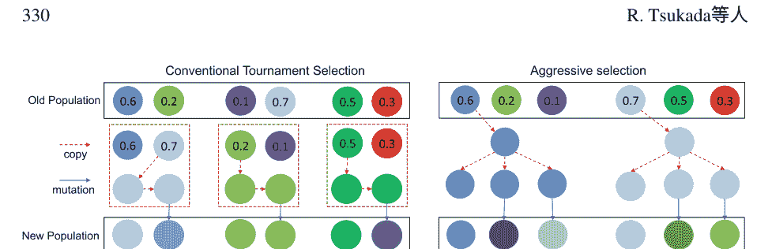

图12.3 不同的策略。右侧显示了N=6和k=2的积极选择和突变。

积极选择和突变方法仅选择父代中具有高适应度的k（≪N）个个体，用克隆补充缺失部分，并对这些克隆体进行突变。该方法类似于随机突变爬山法，因为它仅基于突变来搜索解决方案。图12.3展示了N=6和k=2的积极选择和突变的示例。

在遗传卷积神经网络中，只有卷积层中的连接关系被设置为优化的目标。然而，在激进的选择和变异中，可以使用各种类型的变异操作，例如添加或删除除卷积层以外的层，或者改变卷积层本身的预设值（超参数）。通过这种方法，参数搜索空间得到了显著的扩展。

因此，寻找最佳个体所需的时间显著减少，并且最佳个体的识别准确率显著提高。激进选择和变异算法在算法2中描述。

```
算法2 激进选择和变异
1: 输入: 数据集 $\mathcal{D}$, 最终代数 $T$, 每代个体数 $N$, 下一代中要添加的精英个体数 $k$, 个体之间的距离阈值 $d$
2: 初始化: 第0代由具有固定初始结构的 $N$ 个个体组成。每个个体的适应度被评估（稍后解释）。
3: 对于 $t = 1, 2, \ldots, T$ do
4:     选择: 从第 $k$ 代开始，按顺序选择适应度高的个体，直到第 $t-1$ 代。除非与已添加到第 $t$ 代的个体之间的距离小于 $d$，否则将个体添加到第 $t$ 代。添加了 $N - k$ 个个体的克隆。
5:     突变: 选择并应用突变操作到每个 $N - k$ 个个体的克隆。对剩余的 $k$ 个体不进行任何操作。
6:     评估: 对每个个体的网络在数据集 $\mathcal{D}$ 上进行训练，并将测试图像的识别准确率作为适应度值存储。
7: 结束循环
8: 输出: 最终代的个体和这些个体的识别准确率。
```

关于初始结构和突变方法的详细信息在第12.4节中解释。

### 12.2.4 YOLO

YOLO是单次目标检测CNN模型之一。YOLO首先将输入图像调整为正方形，并使用 $S \times S$ 网格将其分割成相等大小的区域。每个网格将预测 $B$ 个边界框和 $C$ 个类别的概率值。以 $S = 7$，$B = 2$，和 $C = 20$ 为例，如图12.4 [13]所示。每个边界框需要用五个参数表示：在x和y轴上的中心点坐标，边界框的高度 $h$ 和宽度 $w$，以及置信度值 $c$。最后，YOLO选择具有最高置信度值的预测框作为检测结果。为了避免对同一对象进行多次检测，YOLO使用非最大抑制方法确保每个对象只被检测一次。

如图12.4所示，整个YOLO网络由卷积层和全连接层组成，没有任何子网络结构。在这里，YOLO的输出维度为 $7 \times 7 \times 30$。这是因为当 $S = 7$，$B = 2$，和 $C = 20$ 时，每个网格预测两个边界框，20个类别的概率值，每个边界框总共需要五个参数 $\{x, y, h, w, c\}$，总共需要 $7 \times 7 \times (5 \times 2 + 20) = 7 \times 7 \times 30$ 个参数。

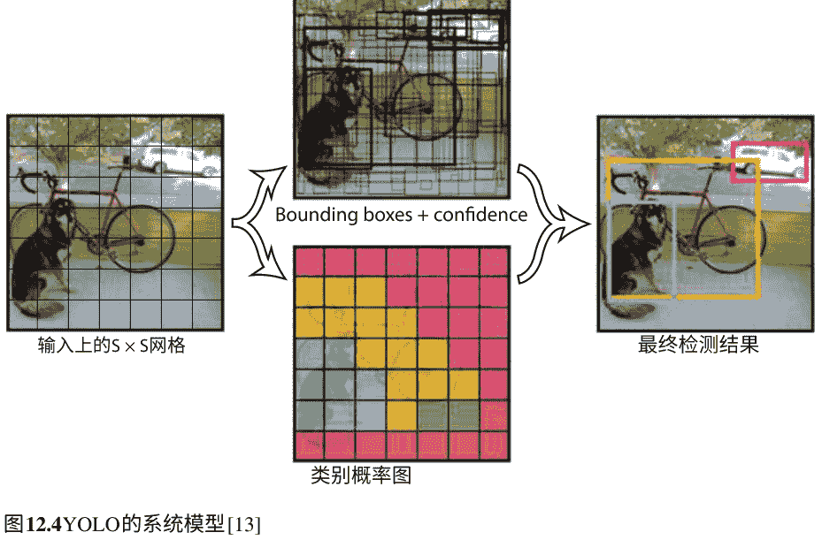

### 12.2.5 迁移学习

迁移学习[10]是机器学习中的一个框架，其中使用相关问题的数据和派生知识来有效地解决目标问题。知识的发送者和接收者被称为源域和目标域。

人类通过迁移学习学习各种事物。例如，当一个会弹钢琴的人和一个不会弹钢琴的人同时开始学习电子琴时，前者可以更好地学会弹奏电子琴，并且所需时间更短。在迁移学习的框架下，钢琴是源领域，电子琴是目标领域，熟练掌握钢琴有助于学习电子琴。

迁移学习应用于自然语言处理、语音识别和图像处理等各个领域。

图12.5显示了迁移学习的大致流程。在这个例子中，源任务涉及女性语音的训练，目标任务是识别男性的语音。学习是通过使用与源领域和目标领域问题相关的数据和知识，最终高效准确地解决目标领域的问题。通常假设源领域和目标领域之间存在某种结构关系。

当目标领域中的训练数据很少而源领域中有大量数据时，迁移学习非常有效。此外，从与目标领域非常相似的领域转移知识会导致更高效的学习。相反，从与目标领域相似性较低的源领域转移知识会导致学习性能下降，这被称为负迁移。

在迁移学习中，训练领域中的学习性能的最大限制通常受到源领域中的学习性能的限制。换句话说，在源领域中具有更高的学习精度会更有可能提高目标领域的学习效率。

迁移学习中的一个重要问题是确定要转移的知识。如果源领域的数据是必要的，最明显的方法是适当地映射数据并在目标领域中使用它进行学习。另一方面，也可以转移源领域和目标领域中都存在的特征值或参数。可以转移哪些知识以及哪些知识成功起作用取决于每个领域，确定应用哪些知识是困难的。

## 12.3 提出的方法

在第12.2节中，我们已经解释了激进的选择和变异方案[7]。在本节中，我们进一步介绍了一种扩展方法，我们称之为ASM+，其中通过增加评估训练期间的时代数量来执行世代交替。

让$n_{\text{min}}$，$n_{\text{max}}$和$T$分别表示最小时代数，最大时代数和总世代数。在我们的ASM+方法中，与时代$t$相关的时代数$n(t)$由以下方程定义：

$$ n(t) = \frac{(T - t) \cdot n_{\text{min}} + t \cdot n_{\text{max}}}{T} $$

因此，$n(0) = n_{\text{min}}$和$n(T) = n_{\text{max}}$之间的间隔是均匀的，并且取决于最终的世代数$T$。

由于与时代数相关的斜率，进化的世代变化周期在开始时更快，从而能够在广泛范围内评估具有各种结构的个体。随后，在进化结束时展现出良好结构的个体将以更高的准确性进行局部评估。

## 12.4 进化合成卷积神经网络的实验

实验使用了两种数据集和任务的组合。首先，通过使用MNIST [6]作为数据集，评估了提出的ASM+方法的有效性，用于相对简单的手写数字分类任务。其次，我们还将ASM+应用于模拟行李检查的X射线图像数据集中检测危险物体的任务。

### 12.4.1 MNIST手写数字分类实验

对于第一个实验，使用了MNIST [6]数据集。MNIST是一个广泛使用的数据集，用于手写数字的分类。选择MNIST是因为可以与第12.2节中提到的之前的研究[19]和[7]进行比较。此外，该任务简单，并且可以通过少量计算来评估方法的有效性。

MNIST数据集包含60,000个用于训练和10,000个用于测试的图像。每个图像由一个28×28大小的灰度图像组成，对应于0到9之间的阿拉伯数字，这些数字均匀地绘制在图像上。

#### 12.4.1.1 初始生成

如图12.6所示，初始生成中的个体由3层组成：输入层、全局最大池化层和全连接层。全局最大池化是从输入特征图的所有通道中选择最大值的过程，输出为一个1×1大小的特征图，通道数与输入相同。对于初始生成的结构，在MNIST数据集上的准确率约为11%，与仅输出随机结果的网络几乎相同。选择这个网络作为初始结构是为了确认在搜索范围中不需要引入限制，包括人为干预。

#### 12.4.1.2 变异操作

在[7]中，使用了以下15种操作来进行变异操作。在下文中，“随机”指的是以均匀概率选择候选人。

- `add_convolution`: 在随机位置插入一个具有32个通道、一个步长、3×3滤波器大小和一个像素填充的卷积层。在此操作之前和之后，输入和输出的特征图的维数不会改变。使用的激活函数是ReLU。
- `remove_convolution`: 随机选择一个卷积层并删除它。
- `alter_channel_number`: 随机选择一个卷积层，并随机选择一个通道号码，范围为{8,16,32,48,64,96,128}，用于替换。
- `alter_filter_size`: 随机选择一个卷积层，并从{1×1,3×3或5×5}中随机选择一个滤波器大小进行替换。
- `alter_stride`: 随机选择一个卷积层，并随机选择{1或2}中的一个步长进行替换。
- `add_dropout`: 随机选择一个卷积层，并在其后插入一个dropout层。dropout比例固定为0.5。
- `remove_dropout`: 随机选择一个dropout层进行删除。
- `add_pooling`: 随机选择一个卷积层，并在其后插入一个池化层。最大池化被采用，核大小固定为2×2。
- `remove_pooling`: 随机选择一个池化层进行删除。
- `add_skip`: 插入一个残差网络，该网络在ResNet [4]中引入。它精确地选择一对输出特征图维度相同的随机层，并插入一个输出由这些输出之和形成的层。
- `remove_skip`: 随机选择一个上面的跳过层并删除它。
- `add_concatenate`: 像`add_skip`一样，它选择一个随机的层对，其中输出的特征图具有相同的维度（但通道数可能不同），并插入一个由前面的输出连接而成的层。
- `remove_concatenate`: 随机选择一个上面的连接层并删除它。
- `add_fully_connected`: 在其他全连接层或最后一层之后随机选择一个位置，并插入一个全连接层。输出的维度从{50,100,150,200}中随机选择。
- `remove_fully_connected`: 随机选择一个全连接层并删除它。

从上述15种操作中选择并应用一种被视为一次突变。然而，为了促进向更复杂结构的演化，在我们的ASM+方法中，选择`add_convolution`、`add_skip`、`add_concatenate`、`alter_stride`、`alter_filter_size`和`alter_channel_number`的概率是其他操作的两倍。

在某些情况下，可能无法应用某个操作。例如，对于没有卷积层的个体，无法应用`remove_convolution`操作。在这种情况下，重新选择该操作。在其他情况下，由于给定个体的网络结构可能被认为是无效的，因此在实际评估训练开始后，由于维度不匹配而导致无法执行。在这种情况下，这种个体的适应度被设为0。

#### 12.4.1.3 实验结果

实验在Google Colaboratory的单个GPU上进行。两个模式定义如下：在卷积层之后插入批归一化过程的模式和不插入批归一化过程的模式。

其他设置为：$T=30$（最终代数），$N=10$（每代个体数），$k=1$（添加到下一代的精英个体数），$n_{min}=3$（最小时代数），$n_{max}=12$（最大时代数）。

图12.7显示了最佳个体（或图像识别准确度）的适应度在每个模式的演化过程中是如何变化的。表12.1显示了在最终一代中重新评估的最佳个体的识别准确度，使用最大迭代次数 $n_{max}$和整个演化过程所需的时间。

| 方法 | 识别准确度 | 计算时间 |
|------|------------|----------|
| 遗传卷积神经网络[19] | 0.9966 | 48 GPUH |
| 激进选择和变异[7] | 0.9969 | 35 GPUH |
| ASM +（不使用批归一化） | 0.9932 | N.A. |
| ASM +（使用批归一化） | 0.9913 | 9 GPUH |

图12.8显示了最终一代中最佳个体的网络结构（使用批归一化）。`InputLayer`表示输入层；`Conv2D`是一个二维卷积层。`BatchNormalization`表示批归一化，`Activation`表示激活函数（ReLU）的应用。`GlobalMaxPooling2D`表示在所有通道上进行的二维最大池化操作，`Dense`表示全连接层。输入和输出字段中的值分别是输入和输出的维度，分别表示批大小、高度、宽度和通道数。“None”表示批大小是任意的。请注意，全连接层既没有高度也没有宽度，因此在Dense层之前和之后不显示高度和宽度符号。

图12.8显示了通过插入批归一化获得的最终一代中最佳个体的网络结构。表12.2列出了每一代中选择的所有突变操作，以及导致该个体的突变操作。图12.9以树状图的形式展示了每一代中最佳个体的进化过程。

### 表12.2 每一代中最佳个体的突变操作（带有批归一化）

| 索引 | 突变操作 | 最大识别准确率 |
|---|---|---|
| 0 | 初始化 | 0.1135 |
| 1 | 添加卷积 | 0.6254 |
| 2 | - | 0.6254 |
| 3 | 改变通道数 | 0.7398 |
| 4 | - | 0.7398 |
| 5 | - | 0.7398 |
| 6 | 改变滤波器大小 | 0.7558 |
| 7 | 添加卷积 | 0.7695 |
| 8 | 添加卷积 | 0.9559 |
| 9 | 改变滤波器大小 | 0.9728 |
| 10 | 改变滤波器大小 | 0.9783 |
| 11 | 改变通道数 | 0.9825 |
| 12 | - | 0.9825 |
| 13 | - | 0.9825 |
| 14 | 改变滤波器大小 | 0.9873 |
| 15 | - | 0.9873 |
| 16 | 改变步长 | 0.9911 |
| 17 | - | 0.9911 |
| 18 | - | 0.9911 |
| 19 | - | 0.9911 |
| 20 | 改变步长 | 0.9916 |
| 21 | - | 0.9916 |
| 22 | - | 0.9916 |
| 23 | - | 0.9916 |
| 24 | 改变通道数 | 0.9922 |
| 25 | - | 0.9922 |
| 26 | - | 0.9922 |
| 27 | - | 0.9922 |
| 28 | 改变通道数 | 0.9933 |
| 29 | - | 0.9933 |
| 30 | - | 0.9933 |

空白字段表示该代中最佳个体没有进行任何操作。

### 12.4.2 在X射线图像中检测危险物体的实验

下一阶段涉及对由Zou [20]创建的X射线图像数据集进行的实验。该数据集包含6121个具有3种类型的X射线图像：危险物品（剪刀、刀具、PET瓶）的图像，每个图像都有相关的注释。¹

将6121张图像分为两组进行实验：一组用于训练，另一组用于测试。训练和测试图像的比例约为6:4（表12.3）。这个比例与之前的研究[20]相同。²

### 表12.3 将X射线图像分为训练组和测试组

| | 训练图像 | 测试图像 | 总计 |
| :--- | :--- | :--- | :--- |
| 自然图像 | 662<br>(10.82%) | 442<br>(7.22%) | 1104<br>(18.04%) |
| 合成图像 | 3010<br>(49.17%) | 2007<br>(32.79%) | 5017<br>(81.96%) |
| 总计 | 3672<br>(59.99%) | 2449<br>(40.01%) | 6121<br>(100.00%) |

#### 12.4.2.1 初始生成

初始生成中的个体定义为具有表12.4中描述的网络结构的个体。该网络与YOLOv2[12]中使用的网络相同，专门用于对象检测。在原始的YOLOv2中，另一个包含表上方双线指示的层的网络是先前在ImageNet [15]数据集上进行训练，从中获得了提取物体识别特征的能力。随后，双线以下的层被表12.4中的层所替换，并重复进行物体识别训练，从而表征了一种迁移学习方法（见图12.11）。根据这个参考，只有双线以下的层成为进化的目标。输出是一个 $13 × 13 × 40$ 的张量，因为 $B =5$ 和 $C =3$，类似于12.2.4节中提到的情况，这里，$C =3$代表剪刀、刀子和PET瓶子这三类。

由于评估来自这个初始生成的个体的适应度（mAP，参见12.4.2.4节）需要一定的时间，与MNIST实验中描述的初始生成（12.4.1.1节）不同，这个过程被跳过了。因此，初始生成的个体群只是形式上的。实验实质上是从第一代的个体群开始的，这些个体是通过对初始生成进行变异操作得到的。

### 表12.4 初始生成中个体的网络结构

| 类型 | 滤波器 | 大小/步长 | 输出 |
|------|--------|------------|------|
| 卷积 | 32 | 3 × 3 | 416 × 416 |
| 最大池化 | | 2 × 2/2 | 208 × 208 |
| 卷积 | 64 | 3 × 3 | 208 × 208 |
| 最大池化 | | 2 × 2/2 | 104 × 104 |
| 卷积 | 128 | 3 × 3 | 104 × 104 |
| 卷积 | 64 | 1 × 1 | 104 × 104 |
| 卷积 | 128 | 3 × 3 | 104 × 104 |
| 最大池化 | | 2 × 2/2 | 52 × 52 |
| 卷积 | 256 | 3 × 3 | 52 × 52 |
| 卷积 | 128 | 1 × 1 | 52 × 52 |
| 卷积 | 256 | 3 × 3 | 52 × 52 |
| 最大池化 | | 2 × 2/2 | 26 × 26 |
| 卷积 | 512 | 3 × 3 | 26 × 26 |
| 卷积 | 256 | 1 × 1 | 26 × 26 |
| 卷积 | 512 | 3 × 3 | 26 × 26 |
| 卷积 | 256 | 1 × 1 | 26 × 26 |
| 卷积(*) | 512 | 3 × 3 | 26 × 26 |
| 最大池化 | | 2 × 2/2 | 13 × 13 |
| 卷积 | 1024 | 3 × 3 | 13 × 13 |
| 卷积 | 512 | 1 × 1 | 13 × 13 |
| 卷积 | 1024 | 3 × 3 | 13 × 13 |
| 卷积 | 512 | 1 × 1 | 13 × 13 |
| 卷积 | 1024 | 3 × 3 | 13 × 13 |
| 卷积 | 1024 | 3 × 3 | 13 × 13 |
| 卷积 | 1024 | 3 × 3 | 13 × 13 |
| 连接(**) | 1024 + 256 | - | 13 × 13 |
| 卷积 | 1024 | 3 × 3 | 13 × 13 |
| 卷积 | 40 | 1 × 1 | 13 × 1 |

³结构与YOLOv2 [12]的网络相同。带有 (*) 标记的卷积层的输出也连接到带有 (**) 标记的连接层，沿着通道数的方向进行组合。在这里，输出 (*) 通过执行 $1 × 1$ 卷积的64个滤波器减少到64个通道。此外，为了获得 $13 × 13$ 的输出高度和宽度，它们分别减少了 $1/2$，并且通道数转换为64 $× 2^2 =256$。在第12.2.4节中描述的旁路通过这个连接层实现。

#### 12.4.2.2 变异操作

与12.4.1.2节中一样，选择了基于[7]的以下九种变异操作。如12.2.4节所述，为了输出与物体识别相关的结果，最后一层的输出大小是固定的。此外，在YOLO中引入了批归一化来避免过拟合，因此不需要dropout [12]。由于这些限制，删除了六种操作，即`add_dropout`, `remove_dropout`, `add_skip`, `remove_skip`, `add_fully_connected`, `remove_fully_connected`。

在下文中，“随机”被定义为每个候选人的选择具有均匀概率。

- `add_convolution`：在随机位置插入一个具有1024个通道、一个步长、一个3×3的滤波器大小和一个像素填充的卷积层。在此操作之前和之后，输入和输出的特征图的维度数量不会改变。使用的激活函数是Leaky ReLU [8]。
- `remove_convolution`：随机选择一个卷积层并删除它。
- `alter_channel_number`：随机选择一个卷积层，并从{512, 1024或2048}中随机选择一个通道号进行替换。

¹我们使用便携式X射线设备（见图12.10），而不是昂贵而笨重的多视角X射线设备。多视角设备需要对图像进行着色，而我们的设备可以实时采集单视角X射线图像。

²更准确地说，用于训练和测试的实际图像每次都会随机更改，并且系统会从第1次运行到第20次运行20次。在这里，我们使用与第11次运行相对应的图像集，其结果最能代表平均水平。

alter_filter_size: 随机选择一个卷积层，并从 {1 × 1, 3 × 3或5 × 5 }中随机选择一个滤波器大小进行替换。
alter_stride: 随机选择一个卷积层，并随机选择一个步长 out of {1 or 2}进行替换。
add_pooling: 在随机位置插入一个池化层。最大池化被调整，核大小固定为2×2。
remove_pooling: 随机选择一个池化层进行删除。
add_concatenate: 选择表12.4上方和下方的层。然后插入一个输出由这些层连接而成的层。插入点位于所选下层之后。
remove_concatenate: 随机选择一个上面的连接层并删除它。

这里将突变定义为选择并应用上述九种操作之一。与第12.4.1.2节一样，选择操作add_convolution、add_concatenate、alter_stride、alter_filter_size和alter_channel_number的概率设置为其他操作的两倍，以帮助促进个体网络结构的进化为更复杂的结构。

#### 12.4.2.3 由于突变导致网络结构的重组

12.4.1.3 节的结果表明，在某些情况下，由于输入和输出层的维度限制，随机选择的突变操作无法应用。对于这些情况，我们引入了一种方法，通过尽可能重组网络来增强选择的操作能够应用的概率，以使维度匹配，当选择添加连接作为突变操作时。

重组算法如算法3所示。该算法模拟了表12.4中标有（**）的连接层中进行的操作。

#### 12.4.2.4 适应度（mAP）计算方法

在12.4.1节提到的MNIST手写分类任务中，分类准确度被用作适应度的衡量标准。然而，在目标检测任务中，不仅需要对物体进行分类，还需要估计物体存在的位置和面积。因此，不可能直接引入正确和错误的检测结果的概念。因此，需要重新定义适应度的概念。

### 算法 3 重构网络结构以应用添加连接

1: 输入: 来自前一层的输入（高度 $h_{\mathrm{in}}$，宽度 $w_{\mathrm{in}}$，通道数 $c_{\mathrm{in}}$），来自源层的输入（高度 $h_{\mathrm{source}}$，宽度 $w_{\mathrm{source}}$，通道数 $c_{\mathrm{source}}$）
2: **if** $h_{\mathrm{source}} = m \cdot h_{\mathrm{in}}$ **or** $h_{\mathrm{source}} = \frac{1}{n} \cdot h_{\mathrm{in}}$ ($m, n \in \mathbb{N}$) **then**
3: 逐点卷积: 将来自源层的输入连接到具有64个通道、步长为1、$1 \times 1$滤波器大小和一个像素填充的卷积层。由于这个操作，来自源层的输入的通道数被固定为64。因此，参数的数量减少了，并且下一个操作的通道数增长被抑制了。
4: 重组: 执行一个转换，其中输入的高度和宽度分别由源层减少 $\frac{1}{m}$ (放大了 $n$倍)，通道数乘以 $m^{2}$ (减少了 $\frac{1}{n^{2}}$)。由于这个操作的结果，我们有 $h_{\mathrm{source}} = h_{\mathrm{in}}$, $w_{\mathrm{source}} = w_{\mathrm{in}}$和两个层输入的高度和宽度维度相同。在此操作之前和之后，参数数量不变。
5: 连接: 将高度和宽度维度相同的两个层的输入沿着通道数方向连接起来形成该层的输出。
6: **else**
7: 失败: 由于无法进行重组，选择另一种变异操作。
8: **end if**
9: 输出: 由两个层的输入沿着通道数方向连接形成

目标检测任务有几个性能评估标准，但在这里我们将mAP (平均精度均值) 作为适应度度量。下面是mAP计算方法的解释[3]。为简单起见，检测的对象只有一种类型。

如果将目标检测的图像输入到网络中，将获得几个方形区域（一组数字，表示中心坐标、宽度和高度）。输出还包括每个矩形区域中存在对象的概率（置信度）。在上述情况下，我们只考虑置信度大于或等于阈值 $c$ 的矩形区域。下面定义了三个术语：

真正例 预测区域被正确“检测”的数量
假正例 预测区域被错误地未“检测”的数量
假负例 本应被“检测”但未被检测的区域数量。

如果交并比（IoU）的值等于或大于0.5，则预测区域“检测”到了正确区域。请注意，IoU是两个区域之间重叠的度量。图12.12显示了IoU的定义。因此，IoU是两个区域的交集与并集面积的比率。如果几个预测区域覆盖了一个正确区域，则只计算其中一个预测区域为真正例；其他所有预测区域都计为假正例。

### 图12.12 IoU的定义

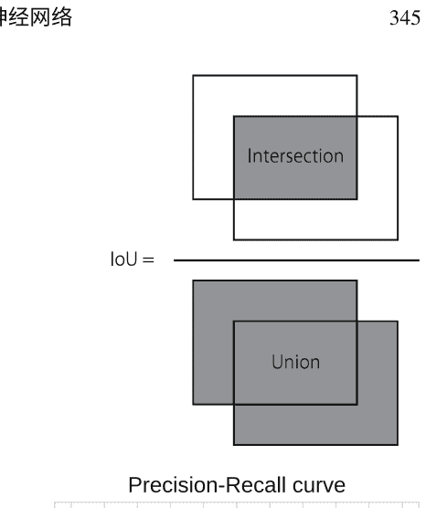

### 图12.13 PR曲线的示例。蓝色区域表示AP

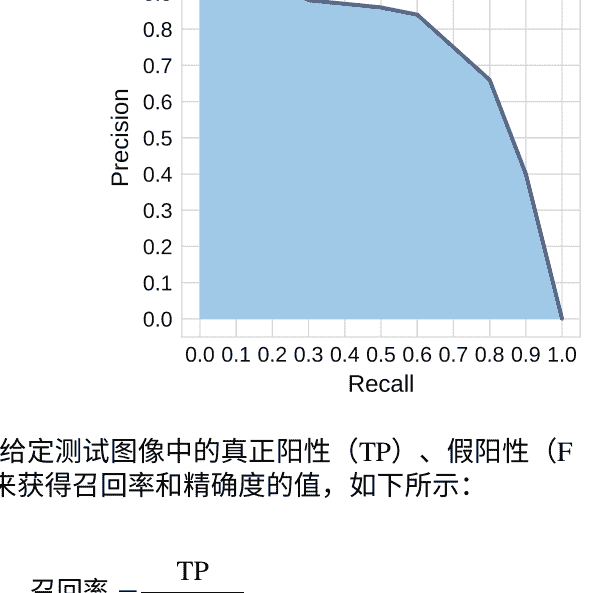

根据上述定义，通过计算给定测试图像中的真正阳性（TP）、假阳性（FP）和假阴性（FN）的数量来获得召回率和精确度的值，如下所示：

```
召回率 = \frac{TP}{TP + FN}
精确度 = \frac{TP}{TP + FP}
```

召回率是“实际检测到的对象数量与待检测对象总数之比”，而精确度是“实际存在对象的区域与预测存在对象区域之比”。在这里，如果阈值c改变，被考虑的预测区域数量也会改变。因此，TP、FP和FN的值也会改变，召回率和精确度的值也会改变。因此，可以通过将召回率绘制在水平轴上，垂直轴上精度，并连接当阈值 c从0变化到1时获得的点，得到类似图12.13（PR曲线：精确度-召回率曲线）的图形。

由PR曲线和坐标轴所限定的区域称为AP（平均精度），其取值范围在0到1之间。 AP的值越高，检测准确性越高。

即使要检测的类别数量增加，也可以计算每个类别的AP值。 mAP是计算每个类别的AP的平均值。

#### 12.4.2.5 改变每一代精英群体中个体的评估方法

在第12.4.1节描述的实验中，当来自精英群体的个体在其一代中具有最高适应度时，它们被克隆到下一代，其适应度只是继承而不重新评估。 这导致了ASM+提出的方法中的一个问题，即评估的时期数量随着每一代的增加而增加。 此外，当精英群体中的个体处于过拟合状态时，其适应度不随时期数量的增加而改善，它们不会被更新并进入局部停滞状态。 然而，通过像其他个体一样使用与代数相对应的时期数量，重新评估精英群体中的这些个体，解决了这个问题。 因此，与MNIST实验不同，最佳个体的适应度在一些情况下随着代数的增加而减少。

#### 12.4.2.6 实验结果

实验在NVIDIA GeForce GTX 1080 Ti GPU上进行。使用的参数如表12.5所示。

| 参数 | 值 |
|---|---|
| 最终代数编号 $T$ | 4 |
| 每代个体数量 $N$ | 4 |
| 下一代中要添加的精英个体数量 $k$ | 1 |
| 批量大小 $b$ | 64 |
| 训练图像数量 $L_{\text{train}}$(表12.3) | 3672 |
| 测试图像数量 $L_{\text{test}}$(表12.3) | 2449 |
| 最小迭代次数 $i_{\text{min}}$ | 10,000 |
| 最大迭代次数 $i_{\text{max}}$ | 25,000 |

出于实现相关原因，最小的迭代次数 $n_{\min}$和最大的迭代次数 $n_{\max}$被分别定义为最小和最大的迭代次数$i_{\min}$和$i_{\max}$。

将迭代次数表示为 $i$，将周期数表示为 $n$，使用下面的公式将周期数转换为迭代次数:

```
n = \frac{b \cdot i}{L_{\text{训练}}}
```

由于批次大小 $b = 64$， $L_{\text{训练}} = 3672$，如果我们将 $i_{\min} = 10,000$和 $i_{\max} = 25,000$设置，这几乎等同于将 $n_{\min} = 174$， $n_{\max} = 436$设置。

即使将周期数替换为迭代次数，仍然可以以相同的方式应用第12.3节中提出的ASM+方法。因此，为了使 $i_{\min}$和 $i_{\max}$之间的间隔在代数编号 $T = 4$的情况下均匀分割，迭代次数从第一代到第四代按照以下顺序变化：10,000、15,000、20,000和25,000。

图12.14显示了一个个体的适应度（mAP）在每一代中的变化。表12.6显示了通过进化获得的最佳个体的mAP；它还显示了整个过程所需的计算时间。

表12.7显示了每一代中选择的突变操作。

### 图12.14 每一代中所有个体的适应度变化。红点是参考文献[20]的结果（Exp. 5/Run 11，包括训练期间的数据），在转换为相应的代数后绘制了评估时的时期数。

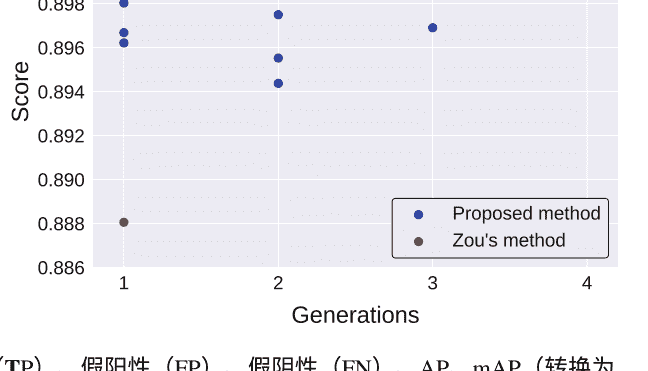

### 表12.6 每种方法的真正阳性（TP）、假阳性（FP）、假阴性（FN）、AP、mAP（转换为%）和计算时间的比较。

| 方法 | TP | AP | FP | FN | 剪刀 | 刀具 | PET瓶 | mAP | 计算时间 |
| :--- | :--- | :--- | :--- | :--- | :--- | :--- | :--- | :--- | :--- |
| 邹 [20] | 5474 | 517 | 469 | 90.46% | 88.82% | 90.67% | 89.98% | 7 GPUH |
| ASM+ | 5485 | 459 | 458 | 90.32% | 89.16% | 90.60% | 90.03% | 84 GPUH |

用于计算TP、FP和FN的阈值为 $c = 0.25$

### 表12.7 变异操作在每一代的最佳个体上执行

| 代 | 变异操作 | 最大mAP |
|---|---|---|
| 0 | 初始化 | - |
| 1 | 添加_连接 | 0.8988 |
| 2 | - | 0.8997 |
| 3 | 添加卷积 | 0.9003 |
| 4 | 添加_连接 | 0.8999 |

空白字段表示在特定个体/代中没有进行更新

下图12.15和12.16显示了进化过程中表现最好和次好的个体的网络结构。

图12.17是描述每一代最佳个体的进化过程的树状图。

然而，请注意，在图12.15、12.16和12.17中，批量归一化和Leaky ReLU被应用于除最后一层外的所有层中的所有Conv2D（二维卷积层）之后；然而，这在图中被省略了。

## 12.5 讨论

### 12.5.1 使用MNIST的手写数字分类实验

与遗传卷积神经网络[19]和激进选择和突变[7]相比，最佳个体的识别准确率稍低；然而，达到的准确度水平大致相当。

从最终获得的网络的每一层特征图中发生的维度变化中，我们观察到卷积层的输出特征图的垂直和水平维度减小，而通道数增加。这种结构在经典网络中也可以看到，例如LeNet [6]，它被认为反映了通过改变尺度来抓取图像的局部特征的过程。

然而，最终的网络由两个卷积层组成，结构非常简单。没有池化层、dropout或者旁路，这些结构可以通过添加池化、dropout和旁路来引入。这可能归因于应用突变的严格条件；因此，不选择涉及添加这些结构的操作。此外，从图12.9和表12.2中，我们观察到在进化的早期阶段添加卷积层会产生显著效果。

对识别准确性的影响进行了详细分析；随后，只选择改变卷积层超参数的操作(alter_stride, alter_filter_size, alter_channel_number)作为导致更好个体诞生的操作。

此外，从图12.7可以观察到进化在第15代左右达到饱和。同样，对该代个体应用的操作选择受限，导致选择局部优化解决方案。

另一个因素是随着世代的增加，迭代次数也增加，新个体容易出现过拟合现象，而最好的个体则不再更新。

相反，整个进化过程的计算时间比之前的结果[19]和[7]要短。这可能是因为只有具有简单结构且需要较短训练时间的网络才能被获取。

批量归一化的有无对结果没有产生显著差异。

### 12.5.2 X射线图像中危险物体的检测实验

与Zou [20]使用的方法相比，获得了mAP值提高0.05%的个体（表12.6）。“检测到”的危险物体（真阳性）数量也增加了。此外，错误地将其他物体检测为危险物体（假阳性）的数量减少了，未检测到的危险物体（假阴性）的数量也减少了。因此，在危险物体检测任务中，“召回率”和“精确率”都有所提高，这表明性能明显提高。图12.18显示了一个危险物体的例子，它没有被Zou的方法检测到，但被提出的ASM+方法检测到了。在图12.17的树状图中，我们可以找到由实际获得的结构中的add_concatenate生成的几个绕过。这与MNIST手写数字分类任务的情况形成对比，在该任务中由于变异操作的应用限制，没有观察到绕过。我们的假设是在应用了Sect. 12.4.2.3中引入的网络结构重构算法add_concatenate后产生了有效结果。

在图12.16中显示的最后一代中，产生了两个个体中的一个，其网络结构比邹的方法的mAP更好。对这个结构进行了仔细的研究。在这个结构中，有三条旁通线从一个具有26×26（宽度、高度）输出的层伸向一个更靠近最终层的具有13×13输入的层。这个结构类似于U-Net [14]的U型结构，在医学图像分割中产生了良好的结果。正如在第12.2.4节中提到的，通过从具有大特征的高分辨率输出层进行旁通，映射到具有小特征图的层有助于提高检测小物体的能力（见图12.19）。

### 图12.15 第三代中表现最好的个体的网络结构，其适应度为0.9003。有关符号的说明，请参见图12.8

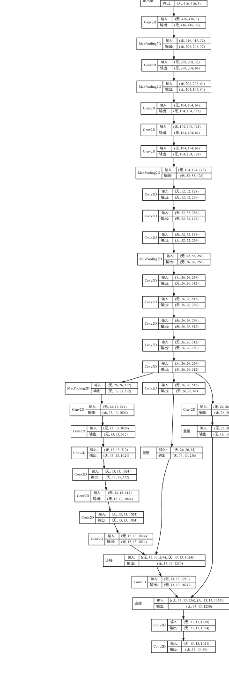

### 图12.16 个体的网络结构来自第四代在所有个体中，该网络结构的适应度排名第二(适应度 = 0.8999)

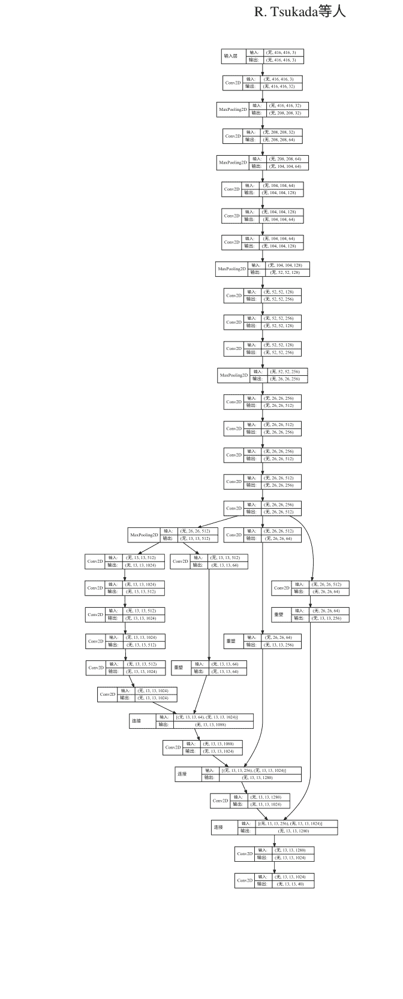

### 图12.17 树状图显示每一代最佳个体的进化过程。伴随个体网络结构图像的值表示其适应性(mAP)。红色标注的个体是下一代选择的个体。彩色箭头表示选择流程。红色箭头表示突变的发生，蓝色箭头表示克隆。

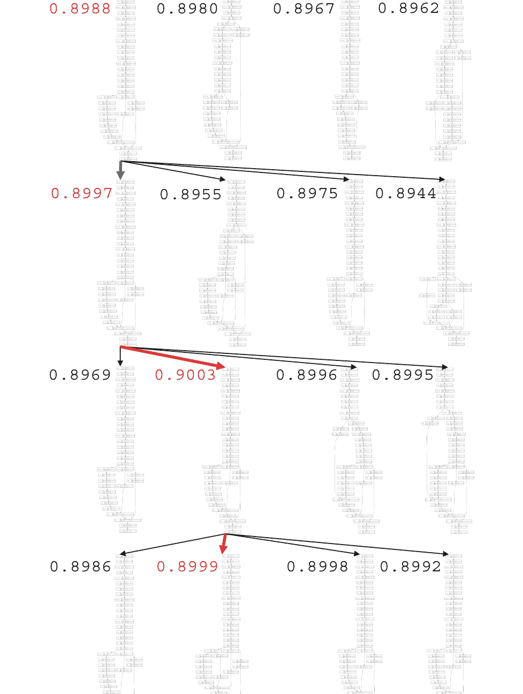

接下来，从图12.14可以看出，第4代最佳个体的适应度低于第3代。 这表明在评估中使用的大量epochs导致过拟合和下一代中克隆的个体的mAP值下降。

因此，提出的ASM+方法随着世代的推进增加epochs的数量，有助于找到不会导致过拟合的最佳epochs数量。

### 图12.18例子说明了被邹的方法[20]忽视的图像被提出的ASM+方法正确检测到。两个PET瓶子和一把刀的图像在图像的中心重叠。 (a) 邹的方法的检测结果。 (b) ASM+的检测结果。

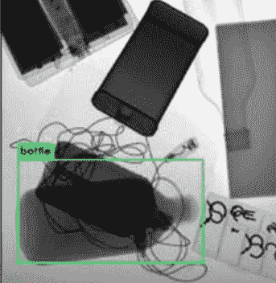

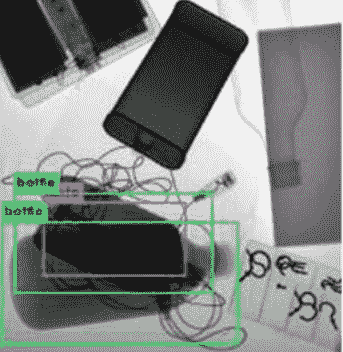

### 图12.19 进化网络结构的比较。 (a) 激进选择和突变。 (b) U-Net [14]

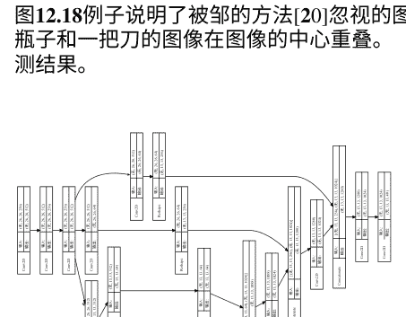

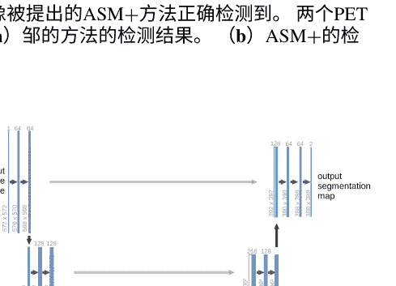

## 12.6 结论

优化卷积神经网络的结构是一个需要高级专业知识和大量试错工作的任务。为了使用遗传算法自动搜索最佳网络结构，我们在本研究中提出了一种名为ASM+的方法，在进化过程中随着世代数的增加，评估时的迭代次数也增加。

在MNIST手写数字分类实验中，我们展示了ASM+在计算时间方面相对较快，但识别准确率稍低。然而，这可能是因为算法无法搜索到复杂的结构。

在与X射线图像中检测危险物体相关的实验中，我们引入了一种方法，使个体在突变方面更容易，考虑到在MNIST实验中只出现简单结构的结果。因此，我们可以评估具有多个旁路结构的个体，从而扩大了搜索空间。此外，对于属于精英群体的克隆个体，我们引入了一种改变，即重新评估适应度时使用更多的迭代次数，而不是继承到下一代。

由于这个改变，我们避免了个体在增加的迭代次数中过拟合的问题，并陷入局部解。此外，我们可以因此检测到不会导致过拟合的最佳迭代次数。

未来的任务是加速进化。所提出的ASM+方法所需的计算量至少比Zou的方法[20]多10倍，如表12.6所示。Pham等人[11]，如ASM+所示，尝试通过使用神经网络而不是遗传算法来优化卷积神经网络结构。通过一种权重参数在一定程度上共享的迁移学习方法，可能可以大大减少评估个体所需的计算量。

### 致谢
我们要感谢T&S公司的Shin Yokoshima和Yoji Nikaido为我们提供的X射线数据收集环境。

## 参考文献

1. Collobert, R., Weston, J., Bottou, L., Karlen, M., Kavukcuoglu, K., Kuksa, P.: 自然语言处理（几乎）从零开始。机器学习研究杂志 **12**, 2493–2537 (2011)
2. Dahl, G.E., Yu, D., Deng, L., Acero, A.: 上下文相关的预训练深度神经网络用于大词汇语音识别。IEEE音频语音语言处理交易 **20** (1), 30–42 (2012)
3. Everingham, M., Van Gool, L., Williams, C.K., Winn, J., Zisserman, A.: 2012年PASCAL视觉对象类别挑战（VOC2012）。http://host.robots.ox.ac.uk/pascal/VOC/voc2012/index.html（2012年）。于2019年2月7日访问## 第13章 演化DNN的架构和超参数用于恶意软件检测

Alejandro Martín和David Camacho

摘要深度学习模型在高度复杂的领域中始终提供出色的成果。其深层的层次结构使其能够解决传统机器学习方法无法解决或无法提供足够好解决方案的问题。然而，这些深度模型通常涉及复杂的拓扑结构和超参数，必须仔细定义，通常是通过网格搜索，以达到最有利的配置。神经进化提供了一个完美的工具，可以通过进化搜索来追求这种配置。通过对超参数(激活函数、初始化方法和优化器)和网络拓扑(层数和类型以及单元数)进行进化，可以深入探索解空间，以找到最合适的架构。在这种方法的多个应用中，本章重点关注Android恶意软件检测问题。这个领域在过去十年中进行了大量研究，具有有趣的特点，使得神经进化成为确定最佳架构以更好地区分恶意和良性应用的逻辑方法。在这项研究中，我们利用EvoDeep的修改版本，这是一个用于演化有效深层序列的框架，使用遗传算法作为手段来实现这种进化搜索。为了评估这种方法，我们使用OmniDroid数据集，这是从22,000个恶意和良性Android应用程序中提取的大量静态和动态特征。结果表明，基于神经进化的策略应用可以构建提供高准确率的深度学习模型，高于传统机器学习方法所获得的准确率。

## 13.1 引言

恶意软件的检测构成了一个庞大、开放且关键的问题。每年新开发的恶意软件数量的figure没有停止增长。值得考虑的另一个因素是这些恶意程序的日益复杂化。这两个事实表明需要自动化和复杂的检测工具，能够识别最精心制作的恶意软件形状。

为此，许多方法依赖于机器学习技术来构建准确的恶意软件检测器。

在文献中提出的不同技术中，深度神经网络代表了一种广泛研究和应用的工具。然而，与其他监督过程不同，这些模型需要定义架构和一系列超参数。这通常涉及测试不同的配置，以找到最合适的选项。根据所采用的恶意软件分析技术和表示方案，可能涉及不同的层：全连接、卷积、循环或丢弃等。

在恶意软件分析方面，有两种主要方法来从良性软件和恶意软件样本中提取相关特征。静态分析是指在不执行恶意软件的情况下从恶意软件可执行文件中提取特征的过程。这包括API调用、声明的权限、意图或从字节码级别提取的信息。第二个选项是提取动态特征，即通过监控代理捕获可疑样本执行时执行的所有操作。

尽管静态分析主要提取独立特征（由二进制或计数值组成），但动态方法将提供带有时间戳的事件序列（即带有时间戳的磁盘操作列表）。一旦提取了必要的特征集（静态、动态或两者兼有），就需要找到一个能够从这些信息中进行泛化的机器学习算法来构建一个新模型。尽管某些模型需要少量技术调整（例如基于决策树的算法），但其他模型（如深度学习模型）需要设置大量超参数并定义一个拓扑结构，其中有很多选项可供选择。

此外，可以确定与恶意软件检测场景相关的两个不同任务：检测和分类。前者指的是检测恶意软件本身，其中需要将可疑样本分类为良性软件或恶意软件。第二个任务与将恶意样本分类到恶意软件家族相关。这是一个重要的过程，其中样本与具有共同特征的已知组相关联。尽管检测恶意软件是检测和预防感染的关键步骤，但将其分类到家族中仍然是一个重要的障碍，以避免恶意样本的扩散并了解样本能够采取的行动。

本章介绍并评估了一种基于遗传算法的新方法，用于演化深度神经网络架构，以用于检测Android恶意软件。主要目标是展示遗传算法和一般情况下的演化算法如何帮助定义适当的架构和超参数，以构建准确而强大的恶意软件检测方法。

进化算法可以帮助定义适当的架构和超参数，以构建准确而强大的恶意软件检测方法。为此，考虑了全连接层和dropout层。在之前的工作[1]中，专注于将恶意软件分类为家族，使用进化算法演化了拓扑结构和超参数，使用了特定设计的个体编码和遗传算子。我们通过部署EvoDeep [2]来扩展这个想法。

EvoDeep利用遗传算法和有限状态机来搜索能够在特定问题中最大化深度神经网络性能的超参数和层次结构配置。遗传算法包括动态个体编码，表示超参数和可变大小的层次结构序列。有限状态机生成有效的层次结构序列。由于EvoDeep最初设计用于构建卷积神经网络架构，因此需要调整有限状态机，以仅生成考虑全连接和dropout层的层次结构序列。该工具还需要定义每个参数的广泛取值范围，这将构成搜索空间。由于每个个体代表一个特定的网络，其适应度通过训练和评估该模型来计算。

为了训练架构并评估所提出的方法，使用了OmniDroid数据集[3]，该数据集是由从恶意和良性Android应用程序中提取的静态和动态特征组成的特征向量的集合。OmniDroid数据集是使用AndroPyTool框架构建的。在这项研究中，只考虑了静态特征。

本章的主要贡献总结如下：

- 对文献进行分析，重点关注使用神经进化和深度学习架构构建Android恶意软件检测和分类算法和方法。
- 基于EvoDeep框架的修改，提出了一种新的方法，用于自动定义深度学习架构，以将可疑的Android应用程序分类为良性或恶意。遵循基于大量静态特征的样本表示。
- 使用最近发布的包含11,000个恶意软件和11,000个良性样本的数据集对所提出的方法进行评估。该数据集提供了大量已提取的特征，包括API调用、声明的权限、系统命令、操作码或使用FlowDroid工具执行的污点分析。
- 使用基于进化搜索的方法对生成的架构进行全面评估。

本章的其余部分组织如下：第13.2节介绍了最新的文献。然后，第13.3节描述了我们在Android恶意软件检测领域中应用神经进化的方法。第13.4节总结了实验设置和第13.5节介绍了实验和结果。最后，在第13.6节中提供了一系列结论。

## 13.2 基于深度学习的Android恶意软件检测和分类方法

在九十年代，不同的研究引入了进化计算来定义人工神经网络的超参数或拓扑结构。这种组合被称为神经进化。通过使用不同的表示方案，采用进化策略并关注神经网络的不同方面，这一研究领域展示了在各个领域生成准确模型的巨大潜力。然而，在神经网络和应用于Android恶意软件检测的深度学习模型中，神经进化的应用非常有限。在下面的段落中，描述了一些解决恶意软件检测问题的最重要的方法，这些方法使用了这些学习模型。

大部分关于恶意软件检测或分类工具的大量文献都使用了经典的机器学习算法[4]。然而，基于深度学习的方法在文献中越来越多地出现。用于表示样本行为的大量特征、这些特征的复杂性或不同的表示方案（如调用图[5]、几何方案[6]或马尔可夫链[7]）使得使用这些技术来构建准确的分类器成为一种自然的选择。

Yuan等人[8, 9]首次评估了深度学习在这一领域中的应用，他们提出了Droid-Sec。这是一种基于静态和动态特征的Android恶意软件检测方法。学习分为两个阶段。在第一个阶段，使用深度置信网络（DBN）作为无监督的预训练步骤。在第二阶段，通过监督过程对模型进行微调。结果表明，与SVM或C4.5等经典方法相比，DL架构的准确性提高了10%。DBN已经被许多其他作者广泛研究。DroidDeep [10]依赖于静态特征（权限、API调用和组件部署）来构建一个包含30,000个特征的搜索空间。使用深度置信网络来过滤这些特征，找出最重要的特征。然后通过SVM分类器进行检测。DroidDelver [11]也使用了DBN，这次是通过按照smali代码中定义的方式组织API调用块来构建的。根据作者的说法，这些块代表了一个完整的函数，从而创建了每个样本行为的更高级别表示。将DBN与堆叠自动编码器（SAEs）进行了比较，结果显示前者的效果更好。DeepFlow [12]专注于使用FlowDroid [13]提取的数据流，FlowDroid是一种静态污点分析工具，可以找到敏感API调用（源和汇）之间的连接。按照先前文献使用的方法，首先使用DBN以无监督的方式对特征进行结构化。然后，使用监督过程对模型进行训练。

其他文献已经使用和比较了其他架构，例如典型的DNNs、CNNs或LSTMs。关于第一个架构，Fereidooni等人[14]测试了由全连接层和静态特征（包括意图、权限、系统命令、可疑API调用或恶意活动）组成的深层架构的使用。与AdaBoost、Random Forest或SVM等传统方法进行比较，深度神经架构取得了出色的结果，仅在这种情况下被XGBoost改进。通过更复杂的特征表示方案，Deep4MalDroid [15]在内核级别动态提取的系统调用上构建了有向图。节点表示系统内核级别调用，节点的大小表示其频率，节点之间的连接定义了该顺序调用对的概率。图的特征被用来训练一个具有堆叠自编码器的深度学习模型。Kim等人[16]也在该领域研究了多模态深度学习。通过使用不同组特征（字符串、操作码、API调用、共享函数和向量组合权限、组件和环境信息）训练五个不同的深度网络，并最终将这些模型与另一个DNN模型结合。

卷积模型也已经被用于恶意软件检测任务。McLaughlin等人的研究[17]使用了来自反汇编代码的操作码序列。CNN的性能表明，与基于n-gram特征的方法相比，这些模型在计算上更高效。DeepClassifyDroid [18]执行三步分类过程：从Android清单和反汇编代码中提取静态特征，特征嵌入和检测。在最后一步中，具有两个卷积块的CNN架构能够达到很高的结果，与kNN或线性SVM相比有所改进。Wang等人[19]采用静态特征和深度自编码器作为预训练步骤的混合模型，以减少训练时间。然后，CNN负责检测步骤。CNN的使用也与长短期记忆（LSTM）架构和基于n-gram的方法进行了比较[20]。结果表明，CNN和LSTM都能提高基于n-gram的方法的准确性水平，并且CNN优于LSTM。研究还专注于单独研究LSTM网络。DeepRefiner [21]专注于Android字节码中的语义结构，并训练LSTM网络。结果表明，这种方法能够比其他最先进的方法取得更高的结果，并且对混淆技术具有鲁棒性。LSTM也被Vinayakumar等人[22]用作分类方法，选择权限序列作为特征。在这项研究中，作者强调了需要测试不同架构和不同网络参数的需求，以找到合适的模型。其他作者更倾向于实现新的专门设计的架构。在MalDozer [23]中，样本由汇编代码中的API调用序列表示，用于进行恶意软件检测以及识别恶意软件家族。在设计的深度模型的最后一步中，选择一个单元的输出配置以进行检测，在家族分类的情况下选择n个单元。

尽管之前介绍的一些最先进的文献提到了深度模型的结构或超参数的定义困难，但最近的文献对这个问题进行了进一步的分析。Booz等人[24]进行了一项研究，只使用权限作为特征。为了定义深度学习架构，作者们进行了一次网格搜索，以设置参数的组合。以前曾使用遗传算法来解决相同的问题，以搜索最佳的深度架构，这种情况下主要是针对恶意软件分类为家族[1]。此外，进化方法还直接应用于Android恶意软件检测领域，以构建新的分类器[25]或改进经典机器学习算法[26]。

在本章中，我们介绍了神经进化在演化深度学习架构和超参数方面的应用，以生成准确的Android恶意软件检测模型。这种组合在最先进的文献中研究得很少。EvoDeep框架用于指导遗传搜索，其中特定的交叉和变异算子修改个体。同时，有限状态机定义了有效的层序列。

## 13.3 进化深度神经网络的架构和参数用于恶意软件检测

为了构建一个能够准确检测Android恶意软件的深度神经网络模型，我们利用EvoDeep [2]。我们修改了这个框架以生成完全连接和丢弃层的序列。通过进化过程，该框架将创建、组合和变异不同的个体，代表潜在的深度模型，目标是最大化分类准确性。与基于网格搜索的方法相比，其中会测试过多且难以管理的不同拓扑和超参数组合，启发式搜索可以减少搜索时间并提供接近最优的解决方案。通过评估每个创建的个体，交叉或变异，这意味着训练由个体编码定义的整个深度模型，进化过程将逐步生成更好的解决方案。为了训练这些模型，使用了OmniDroid数据集，该数据集包含从22,000个Android恶意软件和良性软件样本中提取的特征[3]。

### 13.3.1 遗传算法描述

EvoDeep使用的遗传算法实现了一个($\mu + \lambda$)策略，其中从上一代选择$\mu$个个体，而每一代都会创建新的$\lambda$个个体。图13.1表示了这个算法的工作流程。

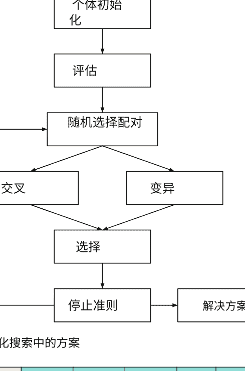

图13.1 遗传算法在进化搜索中的方案

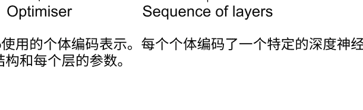

图13.2 EvoDeep使用的个体编码表示。每个个体编码了一个特定的深度神经网络配置，包括优化器、层结构和每个层的参数。

个体池最初是随机创建的。在这个初始步骤中，唯一的限制是个体从最小的架构开始，也就是说，预定义了最少的层数。这旨在避免不必要的复杂和过大的架构，这些架构往往容易过拟合。这个决策的目的是让遗传算法选择更多的层，如果这能带来更好的解决方案。

这些个体的编码如图13.2所示。它分为两个部分，一个表示优化器 O，第二个动态部分表示变量数量的层 L_i。此外，每个层都定义了一系列参数 P_i^k (例如激活或初始化函数)。

对于模型的超参数，个体只编码了优化器，可以是以下算法之一：Adam，SGD，RMSprop，Adagrad，Adamax或 Nadam. 其他超参数已经通过实验固定。因此，迭代次数和批次大小分别固定为300和1000。在迭代次数方面，当最后30次迭代中没有观察到改进时，动态停止准则会结束执行。在层级参数方面，每种类型的层都涉及特定的变量。全连接或 Dense层定义了单位的数量，范围在10到500之间，步长为50；激活函数有以下选项：ReLU，softmax，softplus，softsign，tanh，sigmoid，hard_sigmoid和linear；还有一个核初始化函数，可选择以下替代方案：uniform，lecun_uniform，normal，zero，glorot_normal，glorot_uniform，he_normal，he_uniform。第二种类型的层是dropout，只需要定义一个丢弃率。这个值的范围是 [0.1,0.8]，步长为0.1。

### 13.3.2 遗传算子

在搜索过程中，两个特别设计的遗传算子在每一代中对种群进行修改。由于个体中存在两个级别的参数（优化器和第一级别中的层序列以及第二级别中每个层的参数），这些算子被设计为在每一代中进行操作。

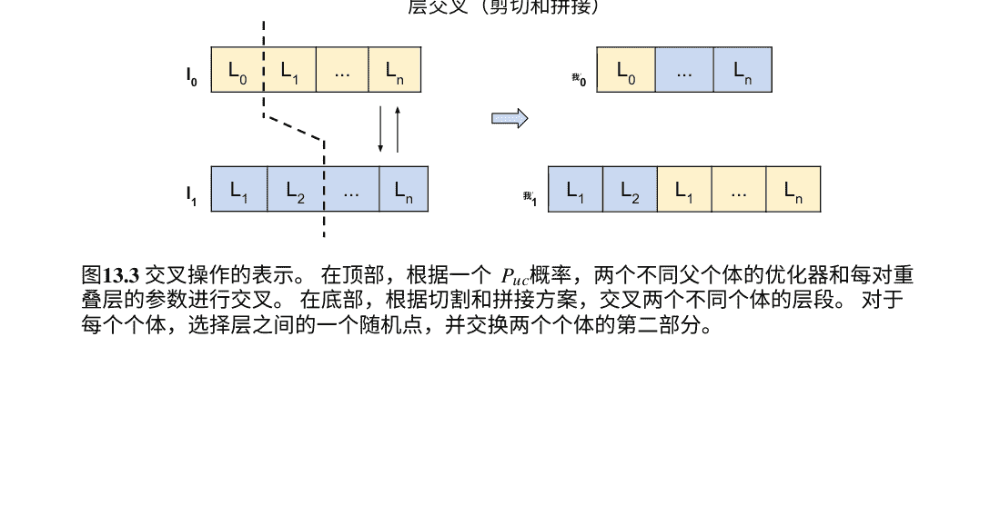

## 参考文献

1. He, K., Zhang, X., Ren, S., Sun, J.: 深度残差学习用于图像识别。在：2016年IEEE计算机视觉和模式识别会议论文集 (2016年)
2. Krizhevsky, A., Sutskever, I., Hinton, G.: 使用深度卷积神经网络的ImageNet分类。在：第25届国际神经信息处理系统会议论文集 (NIPS12)，第1097-1105页 (2012年)
3. LeCun,Y., Bottou, L., Bengio, Y., Haffner, P.: 基于梯度的学习应用于文档识别。IEEE 86(11), 2278-2324页 (1998年)
4. 李, Z., 熊, X., 任, Z., 张, N., 王, X., 杨, T.: 一种具有计算约束的神经网络结构搜索的进化计算方法 (2018). 预印本 arXiv:1806.00851
5. Maas, A.L., Hannun, A.Y., Ng, A.Y.: 整流器非线性改善神经网络声学模型。在：国际机器学习会议(ICML)论文集，卷30, 第1期(2013)
6. 聂, Y., 伊巴, H.: 使用自修改的笛卡尔遗传编程演化卷积神经网络架构。硕士学位论文, 东京大学信息科学与技术研究生院, 2019
7. 潘, S.J., 杨, Q.: 迁移学习综述。IEEE Trans. Knowl. Data Eng. 22(10), 1345–1359 (2010)
8. Pham, H., Guan, M.Y., Zoph, B., Le, Q.V., Dean, J.: 通过参数共享实现高效的神经架构搜索 (2018). 预印本 arXiv: 1802.03268
9. Redmon, J., Farhadi, A.: YOLO9000: 更好、更快、更强 (2016). 预印本 arXiv: 1612.08242
10. Redmon, J., Divvala, S., Girshick, R., Farhadi, A.: 你只需要看一次：统一的实时目标检测 (2015). 预印本 arXiv: 1506.02640
11. Ronneberger, O., Fischer, P., Brox, T.: U-Net：用于生物医学图像分割的卷积网络 (2015). 预印本 arXiv: 1505.04597
12. Russakovsky, O., Deng, J., Su, H., Krause, J., Satheesh, S., Ma, Z., Huang, Z., Karpathy, A., Khosla, A., Bernstein, M., Berg, A.C., Fei-Fei, L.: ImageNet大规模视觉识别挑战. Int. J. Comput. Vis. 115(3), 115–211 (2015)
13. Stanley, K.O., Miikkulainen, R.: 通过增加拓扑结构进化神经网络. Evol. Comput. 10(2), 99–127 (2002)
14. Suganuma, M., Shirakawa, S., Nagao, T.: 一种基于遗传编程的卷积神经网络架构设计方法. 在: 遗传和进化计算会议2017 (GECCO2017) 论文集, pp. 497–504 (2017)
15. Szegedy, C., Liu, W., Jia, Y., Sermanet, P., Reed, S., Anguelov, D., Erhan, D., Vanhoucke, V., Rabinovich, A.: 通过卷积深入研究. 在: 2015年IEEE计算机视觉和模式识别会议 (CVPR) 论文集, pp.1–9 (2015)
16. 谢, L., 尤伊尔, A.: 遗传卷积神经网络。在：2017年IEEE国际计算机视觉会议(ICCV)论文集, 第1388-1397页(2017)
17. 邹, L., 田中, Y., 伊庭, H.: 使用卷积神经网络检测X射线图像中的危险物体。在：杨, C.N., 彭, S.L., 贾恩, L. (编): 智能计算与大数据服务安全(SICBS2018)。智能系统与计算进展, 第895卷, 第714-728页。斯普林格, 香槟(2019)

逐层进行。交叉运算符（参见图13.3）负责将两个父个体组合成一个新的解决方案对。它在之前提到的两个层级上操作。在外部，对优化器应用均匀交叉，而对两个个体的层集合使用切割和拼接方法进行交叉。这个最后的操作在每个个体的层结构中选择一个随机点来创建两个片段。然后，交换每个个体的右部分，生成一对新的层结构作为父代的组合。这个操作确保了创建具有不同层结构和大小的新个体，始终保持第一个和最后一个层不变，并检查新序列是否仍然有效。在内部层面上，也均匀交叉每对重叠层的参数。

变异算子（见图13.4）具有类似的行为。在外部层面上，每个全局参数都按照均匀方案进行变异，同时可以在任意现有层之间随机添加一组新的层。内部操作根据给定的概率对每个层参数进行变异。

图13.4表示变异操作。在顶部，优化器和每个层的内部参数根据概率进行变异。在底部，一组新的层以随机位置插入个体中。

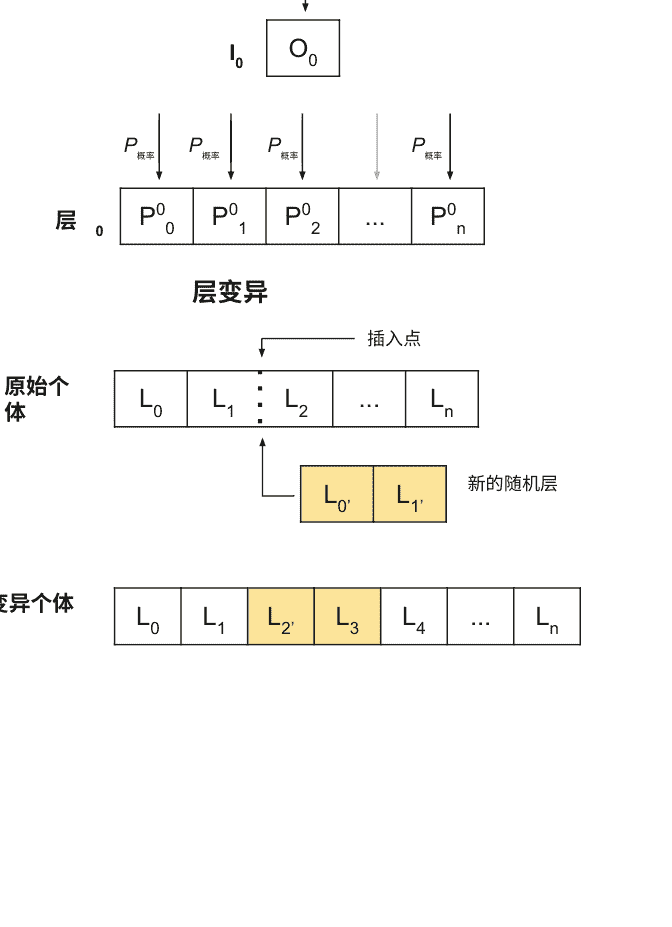

### 13.3.3 有限状态机

EvoDeep使用有限状态机（FSM）来生成有效的层序列，从而创建可训练和可应用的网络模型。同时，这个FSM也被交叉和变异算子合作使用，以检查新个体是否编码了有效的层序列。鉴于本章面临的问题的特点，我们修改了这个FSM，如图13.5所示，其中只涉及全连接或稠密层和dropout层（原始实现包括部署卷积循环所需的层，在恶意软件检测领域不必要）。这个新有限状态机的设计将可能的层序列限制为最小长度为两个，其中最后一层必须是全连接类型。图13.6显示了在启发式搜索期间设计的新FSM可以生成的不同层序列示例。

### 13.3.4 适应度函数

每个个体的适应度函数定义了其作为深度学习分类模型在准确分类Android恶意软件方面的潜力。因此，在训练和评估个体编码的架构之后计算适应度。为此，通过基因组定义的架构在训练集中实施和训练。然后，为了避免过拟合，在验证集中评估并将结果分配给适应度函数。

图13.5 FSM设计用于生成由全连接和dropout层组成的深度学习模型

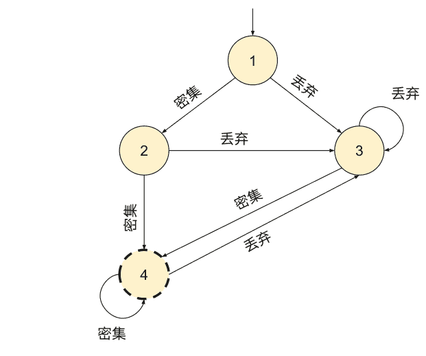

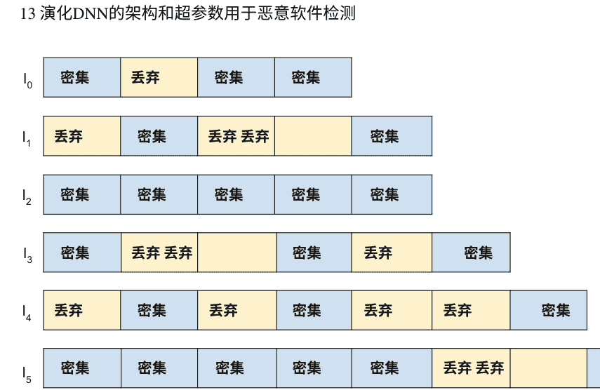

图13.6 EvoDeep在启发式搜索中能够生成的不同层序列示例，该搜索使用针对Android恶意软件检测问题设计的新FSM

下一小节介绍了生成的不同模型和结果的情况。

## 13.4 实验设置

本节描述了一系列实验，旨在评估前一节中介绍的基于进化搜索的方法的性能。为此，选择了Android恶意软件检测领域：给定一个可疑的APK（Android应用程序包），需要确定其是否具有恶意意图（恶意软件）或无害（良性）。一旦描述了下一小节中使用的数据集，描述了不同执行的结果，生成的架构以及与传统方法的比较。

### 13.4.1 数据集

在这项研究中，使用了OmniDroid数据集[3]，以评估遗传算法找到最合适的深度学习模型的能力。该数据集是从22,000个Android良性软件和恶意软件样本中提取的静态和动态特征的集合。它包含了大量特征提取：

- 1. API调用：确定代码中调用的Android操作系统的重要功能。
- 2. 操作码：可以揭示重要的行为模式的低级信息。
- 3. 权限：在Android清单中声明的权限列表。此信息报告应用程序可能使用的功能。
- 4. 意图：与应用程序可以触发或监听的操作和事件相关的数据。
- 5. 字符串：在代码中找到的字符串，可能揭示隐藏的代码部分。
- 6. 系统命令：可以用于执行特定操作（如权限提升）的Linux级命令。
- 7. FlowDroid：使用FlowDroid [13]运行的基于污点的分析。它报告了作为数据源或数据接收器的API调用之间的连接。

OmniDroid数据集还包括使用Droid-Box提取的动态特征；然而，在这项研究中，我们只考虑了静态特征。

### 13.4.2 算法参数化

在执行遗传算法之前，只需要定义一些超参数。所有这些超参数都经过实验确定，试图不限制算法探索搜索空间的能力，并同时允许进行精细的优化过程以提供准确的解决方案。最大的迭代次数设置为200，但当最近5代没有观察到改进时，执行会提前终止。μ和λ分别被实验性地设定为5和10。尽管这两个参数将进化搜索限制在少数个体中，但观察到遗传搜索在时间和彻底性方面得到了改进。选择50%的概率进行突变和交叉概率，并考虑30%的变化来添加或删除个体的层。

为了运行EvoDeep，还需要定义搜索空间的限制。表13.1总结了每个超参数使用的值范围。

**表13.1 为每个超参数定义的值范围**

| 超参数 | 值范围 |
|--------|--------|
| 核初始化器 | 均匀分布，Lecun均匀分布，正态分布，零初始化，Glorot正态分布，Glorot均匀分布，He正态分布，He均匀分布 |
| 激活函数 | Relu, Softmax, Softplus, Softsign, Tanh, Sigmoid, Hard sigmoid, 线性 |
| 单元数量 | 10 <= n <= 500，步长50 |
| Dropout率 | 0.1 <= p <= 0.8，步长0.1 |
| 优化器 | Relu, Softmax, Softplus, Softsign, Tanh, Sigmoid, Hard Sigmoid, Linear |
| 层数 | 3 <= n <= 10，步长1 |

### 13.4.3 实验环境

所有执行都在一台EVGA GeForce GTX 1060 6 GB上运行。代码是用Python实现的，并使用Keras库[4]来训练和评估遗传搜索期间生成的深度模型。为了与经典机器学习算法进行实验比较，使用了Scikit-learn库[28]。

## 13.5 结果

本节总结了在先前描述的遗传算法的40次执行后获得的结果和生成的架构。在每次执行中，进化搜索运行直到满足停止准则或达到最大迭代次数（300）。图13.7显示了所有执行的演化过程。如图所示，所实现的方法是EvoDeep算法的扩展，具有出色的收敛特性，在验证集上仅需要一次迭代即可达到接近90%的准确率。从第一次迭代开始，进行平滑的微调过程。没有一次执行超过31代，这意味着停止准则在所有情况下都被提前应用。

所采用的方法允许定义最适合解决恶意软件检测问题的架构。尽管进化搜索从最小解开始，但个体预计会朝着更复杂的解演化，以提供准确的解决方案。图13.8显示了每次执行的最佳个体的层数。可以看出，解决方案之间存在很大的变异性：最小层数为3，而最大层数为9。这是由搜索过程引起的，其中一些解决方案通过包含更多的单元或修改一些超参数来改进，而其他解决方案则通过使用更多的层数进行升级。

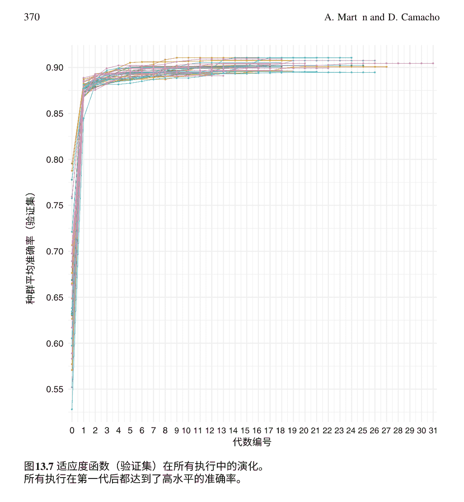

图13.7 适应度函数（验证集）在所有执行中的演化。所有执行在第一代后都达到了高水平的准确率。

为了评估复杂性是否存在较大变化，图13.9表示每次执行后生成的最佳模型的单元数。与图13.8相比，单元数在执行之间变得更加稳定，并保持在范围 [9575,11,165]，平均值为10,173.65 ±359.12。这表明，尽管生成的解决方案的架构可能有很大的差异，但最终的复杂性非常相似。

还研究了使用三个数据集划分的情况，目的是评估是否正确评估个体并避免过拟合。图13.10显示了这些数据集中达到的准确率。虽然在训练集中评估产生了高准确率，与其他数据集相比有显著差异，但验证集可以更接近地估计每个个体的真实性能（在测试集中体现）。

为了进一步评估使用基于EvoDeep方法生成的模型，相同的数据集被用来训练和测试经典机器学习模型。

## 13 演化DNN的架构和超参数用于恶意软件检测

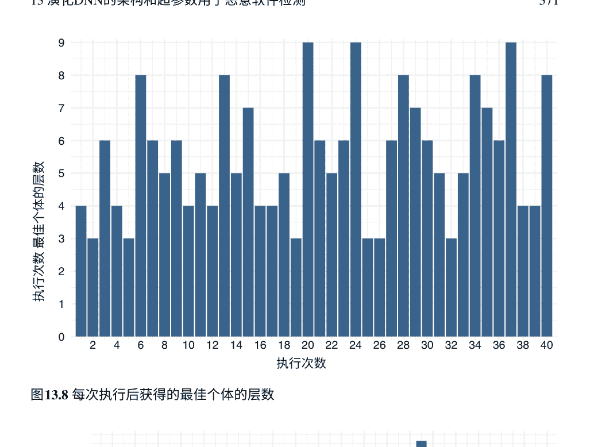

图13.8 每次执行后获得的最佳个体的层数

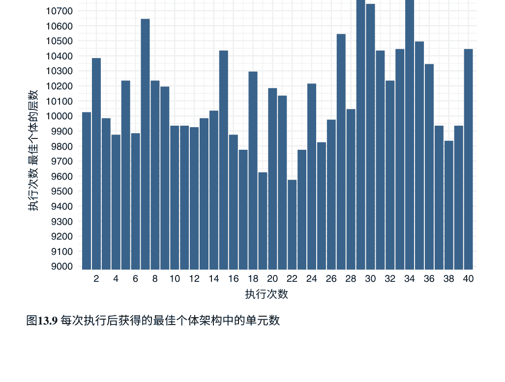

图13.9 每次执行后获得的最佳个体架构中的单元数

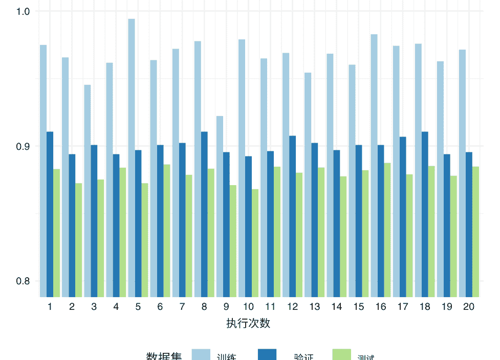

图13.10 在训练、验证和测试集中获得的准确度值。仅显示20个随机执行以获得更好的可视化效果

表13.2 应用EvoDeep进化深度学习模型和其他经典机器学习方法的结果总结分类器

| 模型 | 准确性 | 平均值 | 最大值 | 最小值 |
|------|--------|--------|--------|--------|
| 决策树 | 测试 | 85.23 ± 0.32 | 85.82 | 84.61 |
| 决策树 | 训练 | 99.79 ± 0.02 | 99.83 | 99.75 |
| 最近邻 | 测试 | 82.32 ± 0.34 | 82.93 | 81.85 |
| 最近邻 | 训练 | 87.47 ± 0.18 | 87.77 | 87.08 |
| 随机森林 | 测试 | 87.5 ± 0.23 | 87.93 | 87.09 |
| 随机森林 | 训练 | 99.02 ± 0.09 | 99.2 | 98.88 |
| 标准DNN模型 | 测试 | 80.90 ± 10.65 | 85.38 | 50 |
| 标准DNN模型 | 训练 | 81.43 ± 10.86 | 86.37 | 50 |
| 进化深度学习模型 | 测试 | **87.92 ± 0.55** | 88.77 | 86.81 |
| 进化深度学习模型 | 训练 | 96.42 ± 1.63 | 99.43 | 92.22 |
| 注释：测试集中获得的最佳值以粗体显示 | | | | |

模型。特别是决策树、最近邻、随机森林和具有两个内部层的DNN架构（200个单元），这些是与Android相关的最常见的分类器之一，这些分类器在最新的相关文献中非常流行。

恶意软件检测。结果显示在表13.2中。遗传算法在不同执行中交付的最佳个体的平均值达到了87.92%的准确率，而最大值为88.77%。在这两种情况下，这些都是分类器中获得的最高值。第二好的选择，随机森林，在文献中已经显示出了出色的结果，但无法超越深度学习模型的性能。

图13.11表示遗传搜索的一个执行的最终种群的架构和超参数。正如已经提到的，层数的数量存在很大的变异性。然而，它们都具有类似的准确率。总的来说，可以看到搜索引入了具有一定数量单元的层，这些单元在个体之间共享。这就是310个单元的密集层的情况，在整个最终种群中以不同的位置存在。这个事实表明，表现出色的层将在接下来的迭代中传播到整个种群中。

使用丢弃层的作用是避免过拟合，这也是非常重要的。在大多数解决方案中，这种类型的层至少占架构的50%。值得注意的是，几乎所有个体都以这种类型的层开始。这可以看作是一个特征过滤步骤，负责减少后续层中的特征数量。唯一不遵循这种模式的个体（Ind. 2）在第一个完全连接层之后有三个连续的丢弃层。在最后一层之前，可以看到类似的模式，所有情况下都由丢弃组件组成。

关于隐藏层，一些个体包括最多3个隐藏组件（即Ind. 3和6）。然而，只需要一个隐藏层就可以提供最佳结果（Ind. 8）。由于遗传搜索的操作，提供了一个最终种群，可以应用不同的限制来选择解决方案。在这种情况下，可以选择具有较少隐藏层的个体。

关于内核初始化函数，没有明显的趋势，尽管在所有个体的第一个完全连接层中，he_uniform函数具有一定的的重要性。在最后一层中，使用了广泛的函数，这意味着这在实现更好的结果方面具有特殊的相关性。在激活函数方面，在第一层中没有观察到明显的对齐，而在最后一层中，主要的函数是sigmoid和softmax。

最后，还分析了计算时间。图13.12显示了执行的40次中每一代的平均时间。如图所示，随着世代的增加，进化逐渐增加，尽管每一代的平均时间始终在2000到4500秒之间。这些高值的原因在于每个个体的评估首先需要训练其编码定义的模型，然后在验证集中评估性能。

| 指标 | 第0层 | 第1层 | 第2层 | 第3层 | 第4层 | 第5层 | 第6层 | 第7层 |
|------|-------|-------|-------|-------|-------|-------|-------|-------|
| 指标0<br>rmsprop<br>88.4% | 丢弃<br>速率: 0.4 | 稠密310<br>激活函数: sigmoid<br>初始化: 零 | 丢弃<br>速率: 0.5 | 稠密2<br>激活函数: sigmoid<br>初始化: 均匀 |  |  |  |  |
| 指标1<br>nadam<br>88.23% | 丢弃<br>速率: 0.4 | 稠密310<br>激活函数: sigmoid<br>初始化: he_unif | 丢弃<br>速率: 0.1 | 稠密2<br>激活函数: sigmoid<br>初始化: 零 |  |  |  |  |
| 指标2<br>rmsprop<br>86.71% | 稠密60<br>激活函数: 线性<br>初始化: he_unif | 丢弃<br>速率: 0.2 | 丢弃<br>速率: 0.1 | 丢弃<br>速率: 0.7 | 稠密310<br>激活函数: sigmoid<br>初始化: he_unif | 丢弃<br>速率: 0.4 | 稠密2<br>激活函数: sigmoid<br>初始化: 正态分布 |  |
| 指标3<br>rmsprop<br>87.98% | 丢弃<br>速率: 0.2 | 稠密310<br>稠密110<br>行动: 线性<br>初始化: he_unif | 行动: relu<br>初始化: glorot | 丢弃<br>速率: 0.4 | 稠密110<br>行动: tanh<br>初始化: glorot | 丢弃<br>速率: 0.3 | 丢弃<br>速率: 0.2 | 稠密2<br>行动: softmax<br>初始化: lecun |
| 指数4<br>nadam<br>87.71% | 丢弃<br>速率: 0.4 | 密集210<br>激活函数: sigmoid<br>初始化: 正态分布 | 丢弃<br>速率: 0.7 | 丢弃<br>速率: 0.4 | 稠密2<br>行动: softmax<br>初始化: zero |  |  |  |
| 指数5<br>nadam<br>88.1% | 丢弃<br>速率: 0.8 | 稠密310<br>行动: softplus<br>初始化: zero | 丢弃<br>速率: 0.1 | 稠密2<br>激活函数: sigmoid<br>初始化: 零 |  |  |  |  |
| 指数6<br>nadam<br>87.64% | 丢弃<br>速率: 0.4 | 稠密310<br>稠密110<br>行动: tanh<br>初始化: he_unif | 行动: relu<br>初始化: glorot | 丢弃<br>速率: 0.4 | 稠密110<br>行动: tanh<br>初始化: he_unif | 丢弃<br>速率: 0.3 | 丢弃<br>速率: 0.2 | 稠密2<br>行动: softmax<br>初始化: lecun |
| 指数7<br>rmsprop<br>88.33% | 丢弃<br>速率: 0.4 | 密集310<br>密集310<br>行动: tanh<br>初始化: he_unif | 行动: sigmoid<br>初始化: he_unif | 丢弃<br>速率: 0.7 | 稠密2<br>行动: softmax<br>初始化: normal |  |  |  |
| 指数8<br>nadam<br>88.99% | 丢弃<br>速率: 0.4 | 稠密310<br>激活函数: sigmoid<br>初始化: he_unif | 丢弃<br>速率: 0.1 | 稠密2<br>行动: softmax<br>初始化: zero |  |  |  |  |
| 指数9<br>rmsprop<br>87.84% | 丢弃<br>速率: 0.2 | 丢弃<br>速率: 0.1 | 丢弃<br>速率: 0.7 | 稠密310<br>行动: linear<br>初始化: he_unif | 丢弃<br>速率: 0.3 | 稠密2<br>激活函数: sigmoid<br>初始化: 正态分布 |  |  |

图13.11 遗传搜索的一次执行中获得的10个个体的架构和超参数。为每个个体提供了在测试集中的准确率。

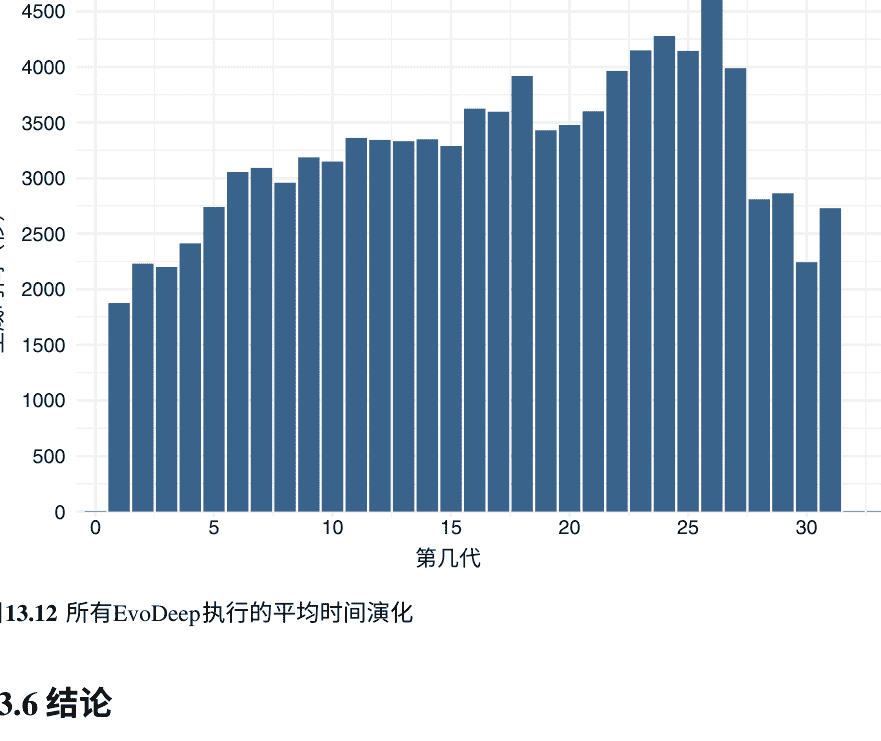

## 13.6 结论

本章介绍了神经进化在检测Android恶意软件的准确深度学习架构设计中的应用。EvoDeep框架使用的有限状态机的修改使得能够实现生成有效的全连接和dropout层的模型序列。实验证明，这种方法能够成功地定义提供高准确率的架构，并且它们优于通常在最新文献中使用的经典机器学习方法。此外，所采用的方法具有很强的避免过拟合的能力，使用验证集来指导进化搜索。在未来的工作中，我们的目标是通过实现多目标算法来改进遗传搜索，使模型的准确性最大化，但模型的大小（单位和层数）最小化。这有助于创建具有更好泛化能力的新解决方案。

致谢 这项工作得到了几项研究资助：西班牙科学与教育部TIN2014-56494-C4-4-P资助（DeepBio）和马德里自治区P2018/TCS-4566资助（CYNAMON）。

## 参考文献

1.  Martín, A., Fuentes-Hurtado, F., Naranjo, V., Camacho, D.: Evolving deep neural network architectures for Android malware classification. In: 2017 IEEE Congress on Evolutionary Computation (CEC), pp. 1659–1666. IEEE, Piscataway (2017)
2.  Martín, A., Lara-Cabrera, R., Fuentes-Hurtado, F., Naranjo, V., Camacho, D.: EvoDeep: a new evolutionary approach for automatic deep neural network parametrizations. J. Parallel Distrib. Comput. 117, 180–191 (2018)
3.  Martín, A., Lara-Cabrera, R., Camacho, D.: Android malware detection through hybrid features fusion and ensemble classifiers: The AndroPyTool framework and the OmniDroid dataset. Inf. Fusion 52, 128–142 (2019)
4.  Martín, A., Calleja, A., Menéndez, H.D., Tapiador, J., Camacho, D.: Adroit: Android malware detection using meta-information. In: 2016 IEEE Symposium Series on Computational Intelligence (SSCI), pp. 1–8. IEEE, Piscataway (2016)
5.  Zhang, M., Duan, Y., Yin, H., Zhao, Z.: Semantic aware android malware classification using weighted contextual API dependency graphs. In: Proceedings of the 2014 ACM SIGSAC Conference on Computer and Communications Security, pp. 1105–1116. ACM, New York (2014)
6.  Arp, D., Spreitzenbarth, M., Hubner, M., Gascon, H., Rieck, K., CERT Siemens: DREBIN: Effective and explainable detection of android malware in your pocket. In: Network and Distributed System Security Symposium (NDSS), vol. 14, pp. 23–26 (2014)
7.  Martín, A., Rodríguez-Fernández, V., Camacho, D.: CANDYMAN: Classifying android malware families by modelling dynamic traces with markov chains. Eng. Appl. Artif. Intell. 74, 121–133 (2018)
8.  Yuan, Z., Lu, Y., Wang, Z., Xue, Y.: Droid-Sec: deep learning in android malware detection. SIGCOMM Comput. Commun. Rev. 44(4), 371–372 (2014)
9.  Yuan, Z., Lu, Y., Xue, Y.: DroidDetector: android malware characterization and detection using deep learning. Tsinghua Sci. Technol. 21(1), 114–123 (2016)
10. Su, X., Zhang, D., Li, W., Zhao, K.: A deep learning approach to android malware feature learning and detection. In: 2016 IEEE Trustcom/BigDataSE/ISPA, pp. 244–251. IEEE, Piscataway (2016)
11. Hou, S., Saas, A., Ye, Y., Chen, L.: DroidDeliver: android malware detection and classification based on deep belief network. In: International Conference on Web-Age Information Management, pp. 54–66. Springer, Berlin (2016)
12. Zhu, D., Jin, H., Yang, Y., Wu, D., Chen, W.: DeepFlow: deep learning-based malware detection by mining android application for abnormal usage of sensitive data. In: 2017 IEEE Symposium on Computers and Communications (ISCC), pp. 438–443. IEEE, Piscataway (2017)
13. Arzt, S., Rasthofer, S., Fritz, C., Bodden, E., Bartel, A., Klein, J., Le Traon, Y., Octeau, D., McDaniel, P.: FlowDroid: precise context, flow, field, object-sensitive and lifecycle-aware taint analysis for android apps. Acm Sigplan Notices 49(6), 259–269 (2014)
14. Fereidooni, H., Conti, M., Yao, D., Sperduti, A.: ANASTASIA: android malware detection using static analysis. In: 2016 8th IFIP International Conference on New Technologies, Mobility and Security (NTMS), pp. 1–5. IEEE, Piscataway (2016)
15. Hou, S., Saas, A., Chen, L., Ye, Y.: Deep4MalDroid: a deep learning framework for android malware detection based on linux kernel system call graphs. In: 2016 IEEE/WIC/ACM International Conference on Web Intelligence Workshops (WIW), pp. 104–111. IEEE, Piscataway (2016)
16. Kim, T., Kang, B., Rho, M., Sezer, S., Gruhl, E.: A multimodal deep learning method for android malware detection using various features. IEEE Trans. Inf. Foren. Sec. 14(3), 773–788 (2018)

17. 麦克劳林, N., 马丁内斯德尔林康, J., 康, B., 叶里马, S., 米勒, P., 塞泽尔, S., 萨法伊, Y., 特里克尔, E., 赵, Z., 杜佩, A., 等: 深度安卓恶意软件检测. 在: 第七届ACM数据和应用安全与隐私会议论文集, pp. 301–308. ACM, 纽约 (2017)

18. 张, Y., 杨, Y., 王, X.: 一种基于卷积神经网络的新型安卓恶意软件检测方法. 在: 第二届国际密码学, 安全与隐私会议论文集, pp. 144–149. ACM, 纽约 (2018)

19. 王， 王， 赵: 基于深度自动编码器和卷积神经网络的有效安卓恶意软件检测. J. Amb. Intel. Hum. Comp. **10**(8), 3035–3043 (2019年)

20. Nix， 张: 使用深度神经网络对安卓应用程序和恶意软件进行分类. 在: 2017年国际联合神经网络会议 (IJCNN) , 第1871-1878页. IEEE, Piscataway (2017年)

21. 徐, 李, 邓, 陈: DeepRefiner: 应用深度神经网络的多层安卓恶意软件检测系统. 在: 2018年IEEE欧洲安全与隐私研讨会 (EuroS&P) , 第473-487页. IEEE, Piscataway (2018年)

22. Vinayakumar, Soman, Poornachandran: 深度安卓恶意软件检测和分类. 在: 2017年计算, 通信和信息学国际会议 (ICACCI) , 第1677-1683页. IEEE, Piscataway (2017年)

23. Karbab, E.B., Debbabi, M., Derhab, A., Mouheb, D.: MalDozer: 使用深度学习进行自动框架的安卓恶意软件检测. 数字调查. **24**, S48–S59 (2018) 24. Booz, J., McGiff, J., Hatcher, W.G., Yu, W., Nguyen, J., Lu, C.: 为安卓恶意软件检测调整深度学习性能. 在: 2018年第19届IEEE / ACIS国际软件工程, 人工智能, 网络和并行/分布式计算会议 (SNPD) , 第140-145页. IEEE, Piscataway (2018年)

25. Mart n, A., Men ndez, H.D., Camacho, D.: MOCDroid: 用于安卓恶意软件检测的多目标进化分类器. 软计算. **21**(24), 7405–7415 (2017)

26. Martin, A., Men ndez, H.D., Camacho, D.: 基因增强分类用于恶意软件检测. 在: 2016年IEEE进化计算大会 (CEC) , 第1030-1037页. IEEE, Piscataway (2016年)

27. Mart n, A., Lara-Cabrera, R., Camacho, D.: 一种用于静态和动态安卓恶意软件分析的新工具. 在: 数据科学和知识工程用于感知决策支持, 第509-516页 (2018年)

28. Pedregosa, F., Varoquaux, G., Gramfort, A., Michel, V., Thirion, B., Grisel, O., Blondel, M., Prettenhofer, P., Weiss, R., Dubourg, V., et al.: Scikit-learn: Python中的机器学习. J. Machine Learn. Resea. **12** (Oct) , 2825-2830 (2011年)

# 第14章 生成对抗网络训练中的数据减肥

Jamal Toutouh, Erik Hemberg和Una-May O'Reilly

## 摘要
我们研究了使用较少数据训练生成对抗网络（GANs）的方法。训练数据集的子集可以表达经验样本的多样性，同时减少训练资源需求，例如时间和内存。 我们询问了数据减少对生成器性能的影响，并评估了生成器集合的附加价值。 除了考虑独立的GAN训练和生成器模型集合，我们还考虑了一种名为Redux-Lipizzaner的进化GAN训练框架上的减少数据训练。Redux-Lipizzaner通过在空间2D网格上利用重叠邻域训练使GAN训练更加稳健和准确。我们使用MNIST和CelebA数据集对Redux-Lipizzaner进行了实证实验。

### 第14.1节 引言
在生成对抗网络（GAN）训练中，可以通过使用进化方法[25, 27]来克服模式和鉴别器崩溃等病态现象。 特别是一种名为 Lipizzaner的进化GAN训练方法已经被用于创建强大而准确的生成模型[25]。 我们使用Redux-Lipizzaner，这是 Lipizzaner的一个后代。 根据 Lipizzaner的说法，Redux-Lipizzaner在空间分布的生成器和判别器群体上运行。 它在一个抽象的2D空间网格上执行异步竞争共进化算法，这个网格由重叠的Moore邻域组织成。 在每个单元格上，有一组生成器和另一组判别器，这些生成器和判别器是从单元格及其相邻邻居聚合而来的。 神经网络模型的参数是通过随机梯度下降进行更新的，遵循传统的机器学习方法。 在训练周期之间，子群体会进行更新。


通过从细胞的邻域请求最佳神经网络模型的副本重新初始化。这种隐式的异步信息交换依赖于重叠的邻域。与Lipizzaner不同，在最终时期之后，仅在Redux-Lipizzaner中，通过使用进化策略优化每个生成器集合（由一个细胞及其邻居组成）的概率权重。

根据权重，以概率方式选择集合中的一个模型来生成样本。

虽然已经证明GAN的混合效果很好[6]，但依赖于多个生成器的一个缺点是训练它们可能需要大量资源。在训练过程中减少资源使用的一种简单方法是使用更少的数据。例如，可以在训练数据集的不同子样本上训练不同的GAN。使用较少的训练数据可以减少存储需求，包括磁盘和RAM，并依赖于生成器的集合来限制由于训练数据减少而导致的性能损失。在Redux-Lipizzaner的情况下，还存在通过在重叠邻域上进行训练并在每个训练周期后使用最佳生成器更新细胞的潜在好处。这引出了以下研究问题：

- 1. 当数据集大小减小时，生成器的准确性在空间分布的网格中如何变化？
- 2. 在模型独立训练或在具有隐式通信的网格上训练的情况下，集合如何支持使用较少的数据进行训练？

本章的贡献包括：

- Redux-Lipizzaner，一种资源高效的进化GAN训练方法，
- 通过进化策略优化GAN生成器集合混合权重的方法
- 分析数据规模对MNIST和CelebA数据集上GAN训练的影响
- 在数据子集上进行GAN训练后的集成价值分析

我们按照以下步骤进行。本章的符号在第14.2节中介绍。在第14.3节中，我们描述相关工作。Redux-Lipizzaner在第14.4节中进行了描述。实证实验在第14.5节中报告。最后的结论和未来工作在第14.6节中。

## 14.2 通用GAN训练
在本研究中，我们采用类似于[5, 17]的符号表示。让$\mathcal{G}=\{G_g, g \in \mathcal{U}\}$和$\mathcal{D}=\{D_d, d \in \mathcal{V}\}$表示生成器和判别器的类别，其中$G_g$和$D_d$是由$g$和$d$参数化的函数。$\mathcal{U}, \mathcal{V} \subseteq \mathbb{R}^p$表示生成器和判别器的参数空间。最后，让$G_*$成为我们想要拟合生成模型的目标未知分布。

形式上，GAN训练的目标是找到参数 $g$ 和 $d$ 以优化目标函数。

$$\min_{g\in\mathcal{U}} \max_{d\in\mathcal{V}} \mathcal{L}(g, d), \text{其中}$$

$$\mathcal{L}(g, d) = \mathbb{E}_{x\sim G_*}[\phi(D_d(x))] + \mathbb{E}_{x\sim G_g}[\phi(1 - D_d(x))], \quad (14.1)$$

而 $\phi: [0, 1] \rightarrow \mathbb{R}$，是一个凹的测量函数。在实践中，我们可以访问到有限数量的训练样本 $x_1, \ldots, x_m \sim G_*$。因此，一个经验版本 $\frac{1}{m} \sum_{i=1}^m \phi(D_d(x_i))$ 用于估计 $\mathbb{E}_{x\sim G_*}[\phi(D_d(x))]。同样也适用于 $G_g$。

## 14.3 相关工作

### 进化计算和GANs竞争性共进化算法
具有对抗性种群（通常为两个），同时演化[12]种群解决方案相互对抗。与经典进化算法不同，它们采用相对于对手种群评估解决方案的适应度函数。从形式上讲，这些算法可以用极小极大化的形式描述[2,9]这使它们类似于GANs。

空间共进化算法空间（环形）共进化是控制共进化中对抗性种群混合的有效手段算法。每个邻域通常有五个细胞（一个中心和四个相邻细胞）[15]。通过这种分布式进化的概念，每个邻域可以朝不同的方向演化，探索搜索空间中更多的多样性点。对空间共进化的价值进行了额外的研究由[20, 29]进行。

### 为机器学习扩展进化计算 OpenAI团队
[22]应用了简化版的自然进化策略(NES) [28]并采用了一种新颖的通信策略来解决一系列强化学习(RL)基准问题。由于在数千个核心上更好地并行化，他们实现了比流行的RL技术更快的训练时间(挂钟时间)。同样，Uber AI团队[23]展示了使用遗传算法训练的具有四百万参数的深度卷积网络也可以达到与使用OpenAI的NES和其他RL算法训练的结果相竞争的水平。

OpenAI在一个由80台机器和1440个CPU核心组成的计算集群上运行他们的实验[22]，而Uber AI则使用了数百到数千个CPU核心(取决于可用性)。EC-Star [14]是另一个大规模进化计算系统的例子。通过每一代仅对少量训练样本评估种群个体，Morse等人[21]展示了一个简单的进化算法可以优化神经网络。

在超过1000个维度上，与梯度下降算法一样有效。FCUBE，参见https://flexgp.github.io/FCUBE/，是一个基于云的建模系统，使用遗传编程[4]。

### 集成-进化计算和GANs进化模型集成
在上述FCUBE系统中已经进行了探索。FCUBE因素将不同的数据拆分到云实例中，使用符号回归进行建模。这些实例绘制变量和适应度函数的子集，并进行弱学习。在学习之后，最佳模型被过滤以消除最弱的模型，并使用集成融合来统一预测。

Bagging对模型集合的输出应用加权平均进行预测并假设所有模型使用相同的输入变量。随机森林将Bagging与使用随机子集的决策树相结合，这些子集是输入变量的随机子集。Redux-Lipizzaner的集成技术具有权重，偏向于概率选择集合中的一个模型以生成样本，与这些技术相比，这些技术考虑所有模型的输出并对其进行平均。还有其他将GAN组合成集合的方法。例如，王等人引入了“自我集成”的GAN，这些GAN是基于相同的网络初始化构建的，而在训练过程中迭代次数不同。

同样的作者还介绍了级联GAN，其中一个GAN无法很好地对训练数据进行建模，因此将其重定向到后续的GAN。其他例子包括提升，如[7]和[24]提出的AdaGAN，它在每一步中通过在重新加权的样本上运行GAN算法来向混合模型中添加一个新的组件。MD-GAN [8]将GAN分布到多个工作节点上进行训练，以便可以训练分布在多个工作节点上的数据集。它提出了一种新颖的学习过程来适应这种分布式设置，而Lipizzaner则使用传统的基于梯度的训练和概率混合模型。在K-GANS [3]中，使用半离散最优传输理论训练了一组GAN。引用作者的话，“每个生成网络模拟了一个点质量（狄拉克测度）与数据分布在Voronoi镶嵌的一个瓦片上的限制之间的传输映射。”我们迭代地训练生成网络和点质量直到收敛。”MGAN [13]在给定克服模式崩溃的特定目标的情况下进行多生成器训练。他们在架构中添加了一个分类器，并使用它来指定样本来自哪个生成器。基本上，内部样本是从多个生成器创建的，然后随机选择一个生成器来提供样本。为了提供完整的保证模式覆盖，[30]使用乘法权重更新规则构建了生成器混合。

下一节介绍Redux-Lipizzaner：一种可扩展的、分布式的共进化GAN训练框架，用于减少训练数据的使用。

## 14.4 进化GAN训练中的数据减少
本节描述了Redux-Lipizzaner，这是一种空间分布的共进化GAN训练方法，其中每个单元的GAN使用整个训练数据集的子集进行训练。Redux-Lipizzaner的关键输出是最佳表现的生成器混合。

首先，我们在第14.4.1节中描述了用于进化训练GAN的空间拓扑。接下来，在第14.4.2节中介绍了我们如何对训练数据进行子采样。然后，在第14.4.3节中描述了如何确定最终的生成器混合权重。最后，在第14.4.4节中，我们对Redux-Lipizzaner算法进行了形式化。

### 14.4.1 Redux-Lipizzaner概述
Redux-Lipizzaner是Lipizzaner的扩展，通过在两个种群之间进行对抗性竞争，一个是生成器的种群，另一个是判别器的种群，来解决GAN的稳定训练问题。在接下来的讨论中，我们使用术语对抗性种群来表示这两个种群。因此，我们定义了一个生成器的种群$g = \{g_1, ..., g_Z\}$和一个判别器的种群$d = \{d_1, ..., d_Z\}$，其中 $Z$是种群的大小。这两个种群相互训练。种群的使用是多样性的一个来源，已经证明可以有效地处理一些GAN的训练问题[1]。

Redux-Lipizzaner定义了一个环形网格。在每个单元格中，它放置了一个GAN（一个生成器-判别器对），被命名为$center$。每个单元格都有一个邻域，形成了模型的一个子种群：$g$（生成器）和$d$（判别器）。这些子种群的大小用$s$表示。在这项研究中，Redux-Lipizzaner使用了五个单元格的Moore邻域（$s = 5$），即邻域包括了单元格本身（$center$）以及$west$、$north$、$east$和$south$的单元格。

对于网格中的第$k$个邻域，我们将其中心单元格中的生成器称为$g_{k, 1} \subset g$，其余邻域单元格中的生成器集合称为$g_{k, 2}, ..., g_{k, s}$。此外，我们用$g_k = \cup_{i=1}^{s} g_{k,i} \subseteq g$来表示这些集合的并集，表示第$k$个生成器邻域。请注意，给定一个大小为$m \times m$的网格，有$m^2$个邻域。

图14.1展示了$4 \times 4$环形网格上一些重叠邻域的示例以及每个单元格子群的构建（$G_{1,1}$和$D_{1,1}$）。使用这个网格来训练模型解决了基于基本对抗竞争算法的二次计算复杂性问题。在本研究中，我们不失一般性地考虑大小为$m \times m$的正方形网格。

由于在共同进化算法中应用的选择和替换操作符，重叠邻域定义了训练过程中不同细胞之间可能的信息交换。

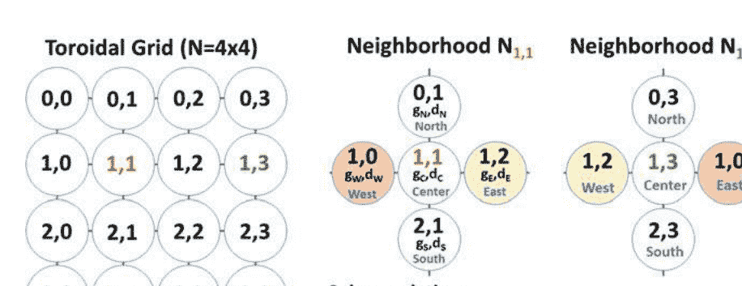

图14.1展示了环形网格上的重叠邻域。当细胞收集其邻居时，N<sub>1,2</sub>的细胞更新可以传达给N<sub>1,1</sub>和N<sub>1,3</sub>。如果N<sub>1,1</sub>被N<sub>1,2</sub>的更新值更新，那么该值已经传播。如果传播继续向左移动一个细胞到N<sub>1,0</sub>，该值将进入N<sub>0,0</sub>和N<sub>2,0</sub>的范围。传播在水平和垂直方向上进行。我们还展示了基于邻域的细胞生成器和鉴别器亚种群的示例，以N<sub>1,1</sub>为例。

Redux-Lipizzaner是基于以下基础构建的：选择和替换，适应度评估，以及基于GAN训练的繁殖。

选择和替换选择在更新子种群时促进高性能解决方案。Redux-Lipizzaner应用锦标赛选择来更新细胞的中心。首先，具有更新的邻居副本的子种群评估所有GAN生成器-鉴别器对，然后随机选择 τ 个生成器和 τ 个鉴别器，并将细胞的中心设置为从所选的 τ 个中最适合的生成器和鉴别器（算法2的第1到6行）。完成所有GAN训练后，再次评估所有模型，并应用锦标赛选择将子种群中最不适合的生成器和鉴别器替换为最适合的生成器和鉴别器，并将它们设置为细胞的中心（算法2的第20到27行）。

适应度评估 进化算法中的搜索和优化是通过评估适应度来引导的，适应度是评估解决问题的好坏的度量。在Redux-Lipizzaner中，一种对抗性方法，模型的性能取决于对手。给定生成器（判别器）的性能是通过某个损失函数 M 来评估的。Redux-Lipizzaner使用二元交叉熵（BCE）损失（参见公式14.2），模型的目标是最小化真实数据分布（p）和虚假数据分布（q）之间的Jensen-Shannon散度（JSD），即JSD(p ∥ q)。在Redux-Lipizzaner中，模型的适应度 L（g<sub>i</sub> ∈ g 或 d<sub>j</sub> ∈ d）是其平均值。

对所有对手的性能。

$$M^{BCE} = \frac{1}{2}\mathbb{E}_{x \sim G_g}[\log(1 - D_d(x))].$$

变异—GAN训练通过GAN训练来进行模型变异，以更新模型的参数。随机梯度下降训练对模型的参数（网络权重）进行基于梯度的更新。此外，基于高斯的更新会创建新的学习率值 $n_\delta$。

中心生成器（判别器）针对从判别器（生成器）子种群中随机选择的对手进行训练（分别是算法2的第9行和第14行）。

### 14.4.2 在Redux-Lipizzaner中的数据集采样
与Lipizzaner不同，Redux-Lipizzaner对每个子种群不使用整个训练数据集进行训练，而是采用带替换的随机抽样方法，将数据划分为 $m^2$ 个不同的子集（分区），用作每个单元的训练数据集（见图14.2）。因此，每个单元都有自己的训练子集。

### 14.4.3 进化生成器混合权重
Redux-Lipizzaner搜索并返回由邻域组成的生成器混合物。生成器混合物是邻域中不同生成器的融合，由训练数据集的子集进行训练。选择定义混合集合的最佳权重是困难的。Redux-Lipizzaner使用ES-(1+1)算法[19，算法2.1]来演化每个邻域的混合权重向量 $\mathbf{w}$，以优化融合生成模型的性能，详见算法3。

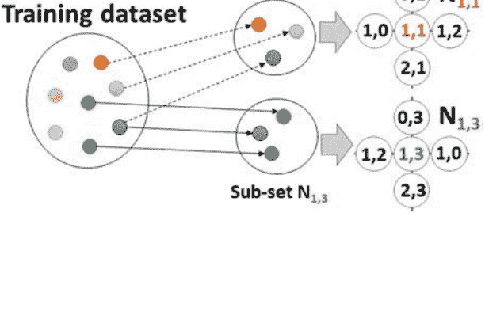

图14.2 显示了如何对训练数据集进行采样，以生成用于训练网格上不同邻域的训练数据子集($N_{1,1}$和$N_{1,3}$)在使用Redux-Lipizzaner进行图像生成时，使用Fréchet Inception Distance (FID)分数[10]来评估生成模型的准确性。注意，可以使用不同的度量标准，例如Inception Score。

设维混合权重向量 \(\mathbf{w}\) 定义如下：

\[\mathbf{g}^*, \mathbf{w}^* = \underset{\mathbf{g}^k, \mathbf{w}^k: 1\leq k\leq m^2}{\text{argmin}} \sum_{\mathbf{g}_i \in \mathbf{g}^k \mathbf{w}_i \in \mathbf{w}^k} w_i F I D_{g_i}, \tag{14.3}\]

其中 \(w_i\) 表示数据点来自邻域中的 \(i\)th 生成器的概率，并且 \(\sum_{\mathbf{w}_i \in \mathbf{w}^k} w_i = 1\)。

### 14.4.4 Redux-Lipizzaner算法

算法1规范化了Redux-Lipizzaner的主要步骤。首先，它通过初始化它们自己的学习超参数（即学习率和混合权重）和分配它们自己的训练子集（第2行和第3行）来启动每个单元的并行执行训练。然后，训练过程，参见算法2，由一个循环组成，有两个主要步骤：首先，收集GAN（邻居）以构建子种群（邻域），然后，通过对训练子集中的所有小批量应用协同进化GAN训练方法来更新中心。这些步骤重复 \(T\)（代或训练周期）次。之后，每个单元通过应用进化策略来优化其混合权重，以优化由邻域定义的集合的性能，参见算法3。最后，选择整个网格中表现最好的集合，并将其作为最终解返回，包括其概率权重。

第14.5节接下来介绍了关于Redux-Lipizzaner如何在集成支持下进行数据减少的结果。

## 14.5 实验分析

在本节中，我们进行了实验。我们使用第14.5.1节来介绍我们的实验设置。然后我们研究以下研究问题：

**RQ1:** 当使用较少的数据集进行训练时，空间分布的网格有多稳健？

**RQ2:** 在使用集成的情况下，如果我们在每个单元格中减少数据量，那么在什么时候集成将无法将生成的模型融合以达到足够的准确性？

算法1 Redux-Lipizzaner：并行地，对于每个单元格，初始化设置然后迭代每一代。每一代，检索邻居单元格以构建生成器和判别器子种群，使用SGD演化生成器和判别器用最好的替换最差的并更新自身，最后演化邻域混合模型的权重。

- 输入：T：总代数，E：网格单元，k：邻域大小，θ_D：训练数据集，θ_p：数据集部分的采样大小，θ_{COEV}：coevolveAndTrainModels的参数，θ_{EA}：Mixture_{EA}的参数
- 返回：n：邻域，ω：混合权重

```
1: parfor c ∈ E do
2:     ds ← getDataSubset(θ_D, θ_p)                     ▷创建数据集的子集
3:     n, ω ← initializeCells(c, k, ds)                 ▷初始化单元
4:     for generation do ∈ [0, ..., T]                  ▷迭代代数
5:         n ← copyNeighbours(c, k)                     ▷收集子种群的邻居细胞
6:         n ← LipizzanerTraining(n, θ_{COEV})          ▷ 使用算法 2 进行共同进化 GANs
7:     结束循环
8:     ω ← MixtureEA(ω, n, θ_{EA})                     ▷ 进化混合权重，  算法 3
9: 结束 parfor
10: 返回 (n, ω)*                                        ▷最佳生成器混合细胞
```

### 14.5.1 实验设置

我们使用GAN文献中的两个常见图像数据集：MNIST [16] 和 CelebA [18]。MNIST已被广泛使用，它包含低维手写数字图像。更大的CelebA数据集包含超过200,000张人脸图像。为了获得模型准确性的绝对度量，我们从计算的生成模型中绘制假图像样本，并使用Frechet inception距离（FID）[11]对它们进行评分。FID分数是一个黑盒子，与鉴别器无关的，度量并表达与训练中使用的样本的图像相似性。

对于网格的每个单元格，采样数据的过程是独立的，并且它是在训练数据集中随机选择不同的小批量。在网格的背景下，给定网格大小，每个样本都有一个期望至少被抽取一次。这可以被认为是对网格的100%覆盖，尽管不是在任何单元格上。当子集大小较小和/或网格较小时，完整数据集的预期覆盖仍然高于单独训练的单个GAN的子集。

算法2 利皮扎纳训练：从当前邻域中选择一个新的邻域。每个小批量训练鉴别器对抗随机选择的生成器和生成器对抗随机选择的鉴别器，使用随机梯度下降。使用最小损失作为值来评估它们之间的所有对抗，并选择最佳替换最差的并更新中心。返回这个新的邻域。

- 输入：τ: 锦标赛大小，X: 输入训练数据集，β: 变异概率，n: 细胞邻域子种群，ds: 训练数据集的子集
- 返回：n: 细胞邻域子种群

```
1: B ← 获取小批量( ds)                                 ▷加载小批量
2: B ← 获取随机小批量( B)                              ▷获取一个随机的小批量来评估GAN对
3: 对于 g, d ∈ g × d do                                ▷评估所有GAN对
4:    L_{g,d} ← 评估( g, d, B)                        ▷评估GAN
5: 结束循环
6: g, d ← 选择(n, τ)                                   ▷最小损失锦标赛选择(L)作为适应度
7: 对于 B ∈ B                                          ▷循环遍历批次
8:    n_δ ← 变异学习率( n_δ, β)                       ▷更新邻域学习率
9:    d ← 获取随机对手( d)                             ▷获取均匀随机鉴别器
10:   对于 g ∈ g                                       ▷评估生成器并使用SGD进行训练
11:      ∇_g ← 计算梯度( g, d)                        ▷计算邻域中心的梯度
12:      g ← 更新NN( g, ∇_g, B)                       ▷使用梯度更新
13:   结束循环
14:   g ← 获取随机对手( g)                             ▷获取均匀随机生成器
15:   对于 d ∈ d                                       ▷评估鉴别器并使用SGD进行训练
16:      ∇_d ← 计算梯度( d, g)                        ▷计算邻域中心的梯度
17:      d ← updateNN(d, ∇_d, B)                      ▷使用梯度更新
18: 结束循环
19: 结束循环
20: 对于 g, d ∈ g × d 进行                             ▷评估所有更新的GAN对
21:    L_{g,d} ← 评估( g, d, B)                       ▷评估GAN
22: 结束循环
23: L_g ← min(L_{.,d})                                 ▷生成器的适应度是平均损失值(L)
24: L_d ← min(L_{g,.})                                 ▷判别器的适应度是平均损失值(L)
25: n ← replace(n, g)                                  ▷用最差的损失替换生成器
26: n ← replace(n, d)                                  ▷用最差的损失替换判别器
27: n ← setCenterIndividuals(n)                        ▷最好的生成器和判别器放置在中心
28: 返回 n
```

梯度是在更好的信息上估计的，但频率较低。迄今为止，没有明确的、有根据的程序，甚至没有启发式方法来设置小批量大小。

我们通过使用相同的小批量预算来使所有实验处于同等地位，同时保持小批量大小（即每个小批量的示例数）不变。我们通过实验改变每个单元或GAN的训练集大小，并调整生成的数量以达到小批量预算。参见公式14.4。

\[batches\_to\_train = \frac{training\_dataset\_size}{mini-batch\_size} \times data\_portion \times generations. \tag{14.4}\]

## 14 GAN训练中的数据减少

算法3 混合进化算法：使用ES-(1+1)进化混合权重 ω。
- 输入： GT: 进化权重的总代数， μ: 突变率， n: 细胞邻域子种群， ω: 混合权重
- 返回: ω: 混合权重

```
1: **对于** generation do∈ [0, . . . , GT]      ▷循环迭代代数
2:    ω' ← 突变 (ω, μ)                      ▷高斯突变混合权重
3:    ω'_{f} ← 评估混合( ω', n)             ▷评估生成器混合分数，例如图像的FID
4:    **如果** ω'_{f} < ω_{f} **则**            ▷ 替换如果新的混合权重更好
5:        ω ← ω'                            ▷更新混合权重
6:    **结束如果**
7: **结束循环**
8: **返回** ω
```

表14.1 在相同计算预算下进行实验比较的批次和代数(以批次表示)

| 数据部分 | 100% | 75% | 50% | 25% |
| :--- | :--- | :--- | :--- | :--- |
| **MNIST (计算预算 = 1.20×10⁵)** | | | | |
| 小批次数 | 600 | 450 | 300 | 150 |
| 代数数量 | 200 | 267 | 400 | 800 |
| **CelebA (计算预算 = 31.66×10³)** | | | | |
| 小批次数 | 1583 | 1187 | 792 | 396 |
| 迭代次数 | 20 | 27 | 40 | 80 |

例如，给定1.2 × 10⁵个小批次的预算和每个小批次的大小为100，在每个单元的训练集大小为60,000时，每代将有600个小批次。因此，我们训练200代以达到1.2 × 10⁵个小批次的预算。当我们将训练集大小减少到30,000（50%）时，每代只有300个小批次，因此我们训练400代以达到1.2 × 10⁵个小批次的训练预算。

考虑到图像数据集的大小（MNIST中为60,000，CelebA中为202,599），恒定的批次大小为100（表14.2），以及相对训练数据子集的大小，我们在表14.1中提供了执行的代数数量。使用100%的数据训练MNIST的总批次数为1.20 × 10⁵， CelebA为31.66 × 10³。

在这个分析中，我们使用不同的网格大小（4 × 4和5 × 5用于MNIST， 3 × 3用于CelebA）与单个GAN训练方法比较了Redux-Lipizzaner。这些不同的网格大小使我们能够探索Redux-Lipizzaner根据不同的细胞重叠程度的性能。所选的数据集MNIST和CelebA对GAN训练提出了不同的挑战：首先，MNIST每个样本的大小（784个实数向量）小于CelebA的大小（12,288个实数向量）；其次，MNIST数据集的样本数量少于CelebA；第三，CelebA生成模型（生成器-判别器）的大小比MNIST大得多。这使得解决CelebA所需的计算资源比解决MNIST更高。因此，我们在实验分析中考虑了这些因素。

表14.2 实验设置与 Redux-Lipizzaner 在MNIST和CelebA上的参数

| | MNIST | CelebA |
| :--- | :--- | :--- |
| **共进化设置** | | |
| 代数 | 参见表格 14.1 | |
| 每个单元的种群大小 | 1 | 1 |
| 锦标赛大小 | 2 | 2 |
| 网格大小 | 1 × 1, 4 × 4 和 5 × 5 | 3 × 3 |
| **混合进化** | | |
| 混合突变尺度 | 0.01 | 0.01 |
| 世代 | 5000 | 5000 |
| **超参数突变** | | |
| 优化器 | Adam | Adam |
| 初始学习率 | 0.0002 | 0.00005 |
| 突变率 | 0.0001 | 0.0001 |
| 突变概率 | 0.5 | 0.5 |
| **网络拓扑** | | |
| 网络类型 | MLP | DCGAN |
| 输入神经元 | 64 | 100 |
| 隐藏层数量 | 2 | 4 |
| 每个隐藏层的神经元数 | 256 | 16,384-131,072 |
| 输出神经元 | 784 | 64 × 64 × 3 |
| 激活函数 | tanh | tanh |
| **训练设置** | | |
| 小批量大小 | 100 | 128 |

不同的重叠模式和数据集，以及可用的计算资源。

所有这些方法都根据表14.2中显示的参数化进行配置。为了扩展我们的分析，我们对Single GANs和Redux-Lipizzaner进行了一次引导过程的比较。因此，我们随机生成了30个16个和25个生成器的种群（网格），这些生成器是通过使用Single GAN方法计算得到的。然后，我们计算它们的FID并创建混合物，将这些结果与Redux-Lipizzaner 4 × 4和Redux-Lipizzaner 5 × 5进行比较。我们将这些变体命名为引导 4 × 4 和 引导 5 × 5。

所有方法都已在 Python3 和 pytorch中实现。¹实验是在云上进行的，该云提供了16个英特尔Cascade Lake核心，最高3.8 GHz，64 GB RAM和一个GPU，分别是带有8 GB RAM的NVIDIA Tesla P4 GPU或带有16 GB RAM的NVIDIA Tesla P100 GPU。所有实现使用相同的Python库和版本来最小化由于使用云计算而产生的计算差异。

¹Pytorch 网站—https://pytorch.es/.

### 14.5.2 研究问题1：当数据集大小减小时，生成器的准确性如何变化在空间分布的网格中？

我们首先通过训练单个GAN并检查结果的FID分数来建立非网格基线，参见表14.3和图14.3，以及使用Wilcoxon秩和检验进行成对统计显著性检验，α = 0.01. 我们可以明显地看到，随着GAN在较少的数据上训练，FID分数增加（性能变差）。在30次单个GAN训练中，使用25%的数据，平均FID分数非常高：574.6，而FID分数的标准差为51.3%，包括最佳FID分数35.1. 当数据子集增加到50%时，平均FID分数下降到71.2，但观察到的标准差更高（104.6%）。最佳FID分数下降到30.1. 平均FID分数在75%的数据中显著改善（从71.2提高到39.8），但在最佳FID分数方面改善很小（30.1 vs. 30.2），参见表14.4. 标准差显著减少（104.6–12.4%）。在所有情况下，较小的训练子集无法与使用100%的数据进行训练时的性能匹配，其中最佳FID分数为27.4，平均FID分数为38.8，参见表14.3和14.4. 这些结果可以通过较小的数据量无法充分覆盖潜在分布来直接解释。

我们现在可以考虑竞争性共同进化的网格训练GAN，每个单元格都有一个GAN，在执行结束时选择该单元格的最佳训练结果（见表14.3）。这些数据使我们能够分离出进化训练的通信价值与（1）我们之前评估的独立训练的GAN以及（下面）（2）集成性能的影响。回想一下，重叠的邻域有助于信号传播。在一个邻域表现良好的GAN会迁移到其相邻和重叠的邻域，以一种通信的形式。在相同的训练预算下，网格训练的GAN比独立训练的GAN获得更好的FID分数[25]。在4 ×4网格的情况下，实验平均FID分数为37.3，标准差为15.1%，最佳生成器的FID分数为26.4。在5 ×5网格中，与独立训练的GAN相比，实验平均FID分数为34.3，标准差为19.9%，最佳生成器的FID分数为20.8。一个可能的解释是，通信间接地导致数据子样本（独立且可替换地绘制）的混合，从而有效地改善了数据的覆盖范围。

图14.3展示了在使用相同数量的数据时，不同方法的统计分析结果。当使用最小的训练数据集（MNIST 25%）时，使用更大的网格和允许标志的Redux-Lipizzaner可以显著提高性能。

表14.3显示了在30次独立运行中，网格中最佳FID的平均值（±std）。

| 数据集 | 变体 | 25% | 50% | 75% | 100% |
|--------|------|-----|-----|-----|------|
| MNIST | 单个GAN | 574.6±51.3% | 71.2±104.6% | 39.8±12.4% | 38.8±17.0% |
| MNIST | 单个GAN集合 | 44.2±9.5% | 35.4±8.0% | 34.4±10.0% | 38.6±12.3% |
| MNIST | Bootstrap 4×4 | 578.0±12.3% | 73.5±25.3% | 39.7±3.0% | 38.9±4.0% |
| MNIST | Bootstrap 4×4集合 | 44.2±9.0% | 35.4±5.1% | 34.5±6.6% | 35.9±7.4% |
| MNIST | Redux-Lipizzaner 4×4 | 47.0±19.2% | 42.0±16.5% | 36.5±19.2% | 37.3±15.1% |
| MNIST | Redux-Lipizzaner 4×4合奏 | 44.1±21.9% | 40.5±15.4% | 33.6±16.7% | 30.7±17.3% |
| MNIST | 引导程序5×5 | 573.2±9.5% | 74.8±22.6% | 39.7±2.3% | 38.7±3.3% |
| MNIST | 引导程序5×5合奏 | 43.3±8.3% | 33.3±6.3% | 33.0±5.4% | 34.6±6.7% |
| MNIST | Redux-Lipizzaner 5×5 | 39.9±15.6% | 34.4±9.1% | 32.9±14.2% | 34.3±19.9% |
| MNIST | Redux-Lipizzaner 5×5合奏 | 36.2±16.9% | 31.8±12.6% | 30.1±15.9% | 26.3±16.7% |
| CelebA | Redux-Lipizzaner 3×3 | 51.9±29.8% | 50.3±25.7% | 51.3±26.6% | 46.5±7.3% |
| CelebA | Redux-Lipizzaner 3×3合奏 | 49.1±1.4% | 44.7±6.8% | 40.3±3.9% | 43.2±0.9% |# 图14.3 应用不同方法比较相同数据量的统计分析。黑色表示没有显著性，α=0.01。 (a) MNIST 25%。 (b) MNIST 50%。 (c) MNIST 75%。 (d) MNIST 100%

结果的显著改进。当应用混合权重优化时，Redux-Lipizzaner提供的结果也有所改善。对于更大的数据集（MNIST 75%），Redux-Lipizzaner 4×4提供与5×5相当的结果。当使用全部数据来训练GAN时，也观察到类似的情况。

图14.4显示了在使用不同大小的训练数据时，这里分析的方法对性能的影响的统计分析。当减少训练数据量为25%时（即MNIST 100%和MNIST 75%），Redux-Lipizzaner 4×4提供类似的结果。当网格大小增加时，即Redux-Lipizzaner 5×5，使用一半或更多的训练数据集在结果上没有统计差异。然而，混合的应用使得使用100%的数据的结果最具竞争力。

仔细检查表14.3，图14.3和14.4表明，在一个大的5×5的网格上，Redux-Lipizzaner表现出最佳的训练数据大小。

### 表14.4 在不同数据子集的网格中，30次独立运行的最佳FID的最小值

| 数据集 | 变体 | 数据子集 25% | 数据子集 50% | 数据子集 75% | 数据子集 100% |
| :--- | :--- | :--- | :--- | :--- | :--- |
| MNIST | 单个GAN | 35.1 | 30.1 | 30.2 | 27.4 |
| MNIST | 单个GAN集合 | 33.7 | 30.0 | 26.9 | 27.1 |
| MNIST | Bootstrap 4 × 4 | 395.5 | 47.0 | 37.0 | 36.1 |
| MNIST | Bootstrap 4 × 4 集合 | 33.6 | 32.7 | 30.7 | 28.0 |
| MNIST | Redux-Lipizzaner 4 × 4 | 31.8 | 28.8 | 27.1 | 26.4 |
| MNIST | Redux-Lipizzaner 4 × 4 集合 | 26.5 | 28.1 | 24.6 | 21.1 |
| MNIST | Bootstrap 5 × 5 | 440.8 | 48.0 | 37.6 | 34.9 |
| MNIST | Bootstrap 5 × 5 集合 | 34.8 | 28.1 | 28.0 | 29.8 |
| MNIST | Redux-Lipizzaner 5 × 5 | 30.5 | 26.8 | 27.3 | 26.3 |
| MNIST | Redux-Lipizzaner 5 × 5 集合 | 26.3 | 21.9 | 21.2 | 20.8 |
| CelebA | Redux-Lipizzaner 3 × 3 | 39.3 | 39.0 | 39.4 | 42.0 |
| CelebA | Redux-Lipizzaner 3 × 3 集合 | 48.3 | 42.4 | 38.9 | 42.7 |

图14.4 对MNIST实验中相同方法在不同数据大小下的统计分析进行比较。黑色表示与 α = 0.01 无显著性。图(b)、(c)、(e)和(f)展示了Redux-Lipizzaner及其混合的结果。图(a)和(d)展示了Bootstrap及其混合的结果。

此外，Redux-Lipizzaner 4×4在减少训练数据大小时表现良好。CelebA的结果表明，Redux-Lipizzaner在另一个数据集上对数据减少有类似的响应。将Redux-Lipizzaner应用于更大的网格大小来解决CelebA的未来工作将允许我们来确认这个陈述。这些结果支持了一个假设，即在训练过程中的通信可以加速小训练数据集的影响。对于我们所研究的数据集，我们可以肯定地回答是的，对于Redux-Lipizzaner来说。

### 14.5.3 研究问题2：如果我们 在每个单元格中减少数据量，那么在什么时候集合将无法统一产生高准确性的模型？

现在我们可以考虑两个方向的调查，它们的顺序并不重要，在演化GAN训练的网格环境中发生。此外，网格上每个单元格的邻域定义了一组生成器和一组判别器的子种群，它们相互训练。这自然地暗示了邻域应该是网格中每个中心单元格的生成器与其北、南、西和东边的单元格邻居的融合。因此，我们可以将基于邻域的集合与每个单元格的FID分数进行比较。

因此，我们将基于网格的集合与基于独立训练的GANs生成的集合之间的通信隔离开来。对于表格结果，请参见表14.3。为了衡量集合在这种情况下，即独立训练的GANs中的影响，我们从30个不同的训练运行中抽取5个GANs的集合进行训练。我们对训练数据集的不同部分进行实验（即25%，50%，75%和100%的样本）。我们以个体方式（非群体方式）训练GANs，使用与在Lipizzaner中训练GANs时相同的训练算法。

我们首先测量给定方法 m (Δ(m)) 使用混合 (m集合) 所带来的改进。这个度量指标以百分比形式评估，即 m的平均FID与应用混合F I D(m集合) 时相同方法的平均FID之间的差异，参见公式14.5。

$$\Delta(m) = \frac{\overline{FID(m)} - \overline{FID(m_{ensemble})}}{\overline{FID(m)}} \%$$ (14.5)

我们预计这些结果与[6]一致，他们观察到混合生成器的优势。我们从每个数据子集的30次独立训练中开始得到一组生成器。对于每个数据子集的集合，我们通过ES-(1+1)对从中随机选择的5个生成器的权重进行5000代的优化，并报告30次独立抽样的FID分数的均值、最小值和标准差。我们发现对于某些数据子集（25%和75%），存在统计上显著的改进，见表14.5。25%子集的平均集成FID分数为44.2，而单个生成器的平均FID分数为574.6，改进了92.3%。

### 表14.5 通过加权集成的30次独立运行（方程式14.5）对不同数据子集的Δ(m)进行平均FID改进

| 数据集 | 变体 | 25% | 50% | 75% | 100% |
|--------|------|-----|-----|-----|------|
| MNIST | 单个GAN | 92.3% | 50.2% | 13.7% | 0.7% |
| MNIST | Bootstrap 4 × 4 | 92.4% | 51.8% | 13.1% | 7.6% |
| MNIST | Redux-Lipizzaner 4 × 4 | 6.2% | 3.6% | 8.0% | 17.5% |
| MNIST | Bootstrap 5 × 5 | 92.4% | 55.5% | 16.9% | 10.6% |
| MNIST | Redux-Lipizzaner 5 × 5 | 9.3% | 7.4% | 8.5% | 23.5% |
| CelebA | Redux-Lipizzaner 3 × 3 | 5.3% | 11.1% | 21.5% | 7.1% |

### 表14.6 不同数据子集的30次独立运行中平均FID的最小值

| 数据集 | 变体 | 25% | 50% | 75% | 100% |
|--------|------|-----|-----|-----|------|
| MNIST | Bootstrap 4 × 4 | 395.5 | 47.0 | 37.0 | 36.1 |
| MNIST | Redux-Lipizzaner 4 × 4 | 38.3 | 33.9 | 32.9 | 28.6 |
| MNIST | Bootstrap 5 × 5 | 440.8 | 48.0 | 37.6 | 34.9 |
| MNIST | Redux-Lipizzaner 5 × 5 | 34.0 | 29.3 | 30.3 | 27.2 |
| CelebA | Redux-Lipizzaner 3 × 3 | 58.2 | 58.6 | 59.4 | 49.0 |

改进在50%-50.2%时减弱，75%-13.7%时再次减弱，最终只有0.7%。当所有数据用于训练时，虽然改进不大，但仍然有改进。

这些结果是可以预期的，因为在训练和生成器融合中使用了不同的子集。有趣的是，Redux-Lipizzaner几乎具有混合效应的反向进展，参见表14.5，混合使Redux-Lipizzaner的性能随着可用的训练数据越来越好。

此外，我们研究了使用第14.4.3节中提出的融合方法（参见算法3）从GANs中单独训练的生成模型的容量。表14.6和14.7显示了每个生成器的最佳和平均FID。随着训练数据规模的增加，FID得到了改善。这再次突显了使用更多训练数据的单独生成器在生成样本的准确性上的改进。

最后，表14.6和14.7中的结果（较高的FID）与表14.4和14.3中的结果相比较不具竞争力。这涉及到使用混合物时结果的改进的想法。图14.5说明了MNIST-4×4独立运行结束时的FID分数分布。我们无法将不同数据规模的结果进行比较，因为我们选择了一个随机的独立运行，因此这些结果不符合上述一般观察结果。这个图展示了混合优化的影响。在这里，我们可以观察到ES(1+1)是如何优化混合FID值的。

### 表14.7 网络中的平均(±标准差)平均FID值，对于不同的数据子集进行30次独立运行

| 数据集 | 变体 | 数据子集: 25% | 数据子集: 50% | 数据子集: 75% | 数据子集: 100% |
|--------|------|---------------|---------------|---------------|----------------|
| MNIST | Bootstrap 4 × 4 | 578.0 ± 12.3% | 73.5 ± 25.3% | 39.7 ± 3.0% | 38.9 ± 4.0% |
| MNIST | Redux-Lipizzaner 4 × 4 | 55.3 ± 21.4% | 49.7 ± 16.9% | 43.4 ± 14.8% | 40.4 ± 20.0% |
| MNIST | Bootstrap 5 × 5 | 573.2 ± 9.5% | 74.8 ± 22.6% | 39.7 ± 2.3% | 38.7 ± 3.3% |
| MNIST | Redux-Lipizzaner 5 × 5 | 46.3 ± 16.7% | 37.0 ± 15.2% | 38.7 ± 12.0% | 34.2 ± 14.1% |
| CelebA | Redux-Lipizzaner 3 × 3 | 64.4 ± 9.8% | 60.9 ± 3.8% | 64.5 ± 7.3% | 51.6 ± 4.6% |

对于每个单元格，它设法改进大多数单元格（网格的最佳单元格始终得到改进）。

## 14.6 结论和未来工作

使用较少的训练数据可以减少存储要求，包括磁盘和RAM，同时依赖于生成器集合来限制由于训练数据减少而导致的性能损失。在Redux-Lipizzaner的情况下，还存在通过在重叠邻域上进行训练并在训练周期后使用最佳生成器更新单元格的潜在好处。我们的方法，Redux-Lipizzaner，用于空间分布的进化GAN训练利用邻域之间的信息交换来生成高性能的生成器混合物。空间分布的网格允许使用较少的数据集进行训练，因为信号传播导致信息交换和在训练数据减少时改善性能，与普通并行GAN训练相比。此外，当训练数据减少时，集合会失去性能，但是在数据的75%情况下，它们仍然出奇地稳健。

未来的工作将研究将数据的不同模式（例如，类别）分配给不同的单元所产生的影响。此外，将评估更多的数据集，以及对训练数据量进行更精细的减少。

## 参考文献

- 1. Al-Dujaili, A., Schmiedlechner, T., Hemberg, E., O’Reilly, U.M.: 迈向分布式共同进化GANs。在：AAAI 2018秋季研讨会（2018年）
- 2. Al-Dujaili, A., Srikant, S., Hemberg, E., O’Reilly, U.M.: 关于Danskin定理在无导数极小化优化中的应用。在：国际全局优化研讨会（2018）
- 3. Ambrogioni, L., G `gl , U., van Gerven, M.: k-GANs: 具有半离散最优传输的生成模型集合（2019）。arXiv:abs/1907.04050
- 4. Arnaldo, I., Veeramachaneni, K., Song, A., O’Reilly, U.M.: 带上你自己的学习者：基于云的、数据并行的机器学习共同体。IEEE Comput. Intel. Mag. 10(1), 20–32(2015)
- 5. Arora, S., Ge, R., Liang, Y., Ma, T., Zhang, Y.: 生成对抗网络（GANs）中的泛化和均衡（2017年）。预印本 arXiv:1703.00573
- 6. Arora, S., Risteski, A., Zhang, Y.: GANs是否学习了分布？一些理论和实证。在：国际学习表示会议（2018年）。 https://openreview.net/forum?id=BJehNfW0-
- 7. Grover, A., Ermon, S.: 增强生成模型（2017年）。 arXiv:abs/1702.08484
- 8. Hardy, C., Merrer, E.L., Sericola, B.: MD-GAN: 用于分布式数据集的多鉴别器生成对抗网络。 在：2019年IEEE国际并行与分布式处理研讨会（IPDPS），第866-877页（2018年）
- 9. Herrmann, J.W.: 用于极小化优化问题的遗传算法。在：CEC，卷2, pp. 1099–1103。IEEE，皮斯卡塔韦（1999年）
- 10. Heusel, M., Ramsauer, H., Unterthiner, T., Nessler, B.: 通过两个时间尺度的更新规则训练的GAN收敛到局部纳什均衡（2017年）。 预印本arXiv: 1706.08500
- 11. Heusel, M., Ramsauer, H., Unterthiner, T., Nessler, B., Klambauer, G., Hochreiter, S.: 通过两个时间尺度的更新规则训练的GAN收敛到局部纳什均衡。在：神经信息处理系统30（NIPS 2017），pp. 6626–6637（2017年）
- 12. Hillis, W.D.: 共同进化的寄生虫改进了模拟进化作为优化过程。Physica D Nonlinear Phenomena 42 (1)，228–234（1990年）。https://doi.org/10.1016/0167-2789 (90) 90076-2
- 13. Hoang, Q., Nguyen, T.D., Le, T., Phung, D.Q.: MGAN: 使用多个生成器训练生成对抗网络 . 第六届国际学习表示会议，ICLR 2018年，（2018）
- 14. Hodjat, B., Hemberg, E., Shahrzad, H., O’Reilly, U.M.: 维护长时间运行的分布式遗传编程系统以解决需要大数据的问题.遗传编成理论与实践XI，第65-83页。Springer，柏林（2014）
- 15. Husbands, P.: 用于多标准和多约束优化的分布式共进化遗传算法。在：AISB进化计算研讨会，第150-165页。Springer，柏林（1994）
- 16. LeCun, Y.: 手写数字MNIST数据库（1998年）。 http://yann.lecun.com/exdb/mnist/
- 17. 李，J.，马德里，A.，皮布尔斯，J.，施密特，L.：走向理解生成对抗网络的动力学（2017年）。预印本arXiv:1706.09884
- 18. 刘，Z.，罗，P.，王，X.，唐，X.：野外深度学习面部属性。在：国际计算机视觉会议（ICCV）论文集（2015年）
- 19. Loshchilov，I：辅助进化算法。博士论文，巴黎南大学；国家计算机科学和自动化研究所-INRIA（2013年）
- 20. 米切尔，M.：空间分布种群的共进化学习。在：计算智能：原理与实践（2006年）
- 21. 莫尔斯，G.，等：简单的进化优化可以与随机梯度下降在神经网络中媲美。 在：遗传和进化计算会议论文集2016年，第477-484页。ACM，纽约（2016年）
- 22. Salimans, T., Ho, J., Chen, X., Sutskever, I.: 进化策略作为可扩展的替代方案强化学习 (2017). arXiv:1703.03864
- 23. Stanley, K.O., Clune, J.: 欢迎深度神经进化时代 - Uber工程博客 (2017). https://eng.uber.com/deep-neuroevolution/
- 24. Tolstikhin, I.O., Gelly, S., Bousquet, O., Simon-Gabriel, C.J., Sch lkopf, B.: ADAGAN:提升生成模型。 在：神经信息处理系统的进展 (2017)
- 25. Toutouh, J., Hemberg, E., O'Reilly, U.M.: 空间进化生成对抗网络。 在：遗传和进化计算会议的论文集，GECCO'19，第472-480页。ACM，纽约（2019）
- 26. Wang, Y., Zhang, L., van de Weijer, J.: 生成对抗网络的集成 (2016). arXiv:abs/1612.00991
- 27. Wang, C., Xu, C., Yao, X., Tao, D.: 进化生成对抗网络 (2018). 预印本 arXiv:1803.00657
- 28. Wierstra, D., Schaul, T., Peters, J., Schmidhuber, J.: 自然进化策略. 在: 2008IEEE进化计算大会 (IEEE世界计算智能大会), pp. 3381–3387. IEEE, Piscataway (2008)
- 29. Williams, N., Mitchell, M.: 探究空间共进化的成功. 在: 第7届遗传和进化计算年会论文集, pp. 523–530. ACM,纽约 (2005)
- 30. 钟，P.，莫，Y.，肖，C.，陈，P.，郑，C.：重新思考生成覆盖：一种逐点保证的方法 (2019) 。 arXiv: abs/1902.04697

# 第15章 一像素攻击：理解和改进深度神经网络与进化计算

Danilo Vasconcellos Vargas

摘要 最近，一像素攻击表明深度神经网络（DNNs）可以通过改变一个像素来错误分类。除了漏洞，通过演示如何轻松引起类别变化，它揭示了DNNs并没有学习预期的高级特征，而是不太稳健的特征。在本章中，将介绍最近的研究结果，进一步证实上述论断，并概述当前的攻击和防御。此外，将展示进化计算作为一种研究DNNs稳健性以及通过混合系统、架构演化等方式改善其稳健性的承诺。

## 15.1 引言

在撰写本章的时刻，世界上被深度神经网络（DNNs）所主导，一些研究人员认为这是智能系统的第三波。深度学习的结果表明，当提供大量数据集时，DNNs可以获得极高的准确性。它们是第一个也是目前唯一能够处理高维问题（如图像和语音识别）的系统。此外，DNNs在图像识别准确性方面超过了人类，在许多具有挑战性的任务中，DNNs表现出色（例如，围棋，Atari游戏等）。

然而，在2017年，arXiv上发表了一篇论文，显示出深度神经网络虽然极其准确，但通过改变一个像素可以欺骗它们[1]。令人惊讶的是，即使在如此低的鲁棒性下，也能实现高准确性。以人类为例，这就好比说一个人在数学问题上可以正确回答大多数问题，但如果在文本中插入一些拼写错误，可能会失败。

单像素攻击是指只改变一个像素就能欺骗深度神经网络的攻击，它是不同类型攻击中的一种。在深入研究单像素攻击和其他不同类型的攻击之前，我将简要介绍一些用于研究这些攻击的领域中使用的概念，称为对抗机器学习。

## 15.2 对抗机器学习：简介

对抗机器学习是研究对所有类型的机器学习进行攻击的领域。攻击基本上是寻找能够欺骗深度神经网络的更接近的输入的过程。换句话说，攻击可以被看作是一个受原始样本周围区域约束的错误最大化的约束优化问题。

令$f(x) \in \mathbb{R}^k$为机器学习算法的输出，用函数$f$表示，其中$x \in \mathbb{R}^{m \times n \times 3}$为算法的输入和输出，分别具有大小$m \times n \times 3$（考虑三通道图像）和$k$。对于非定向攻击，对抗机器学习可以定义为以下优化问题：

$$
\begin{aligned}
& \text{最小化} & & f(x+\delta)_c \\
& \text{满足条件} & & \|\delta\| \leq \varepsilon
\end{aligned}
\tag{15.1}
$$

其中$f()_c$表示正确类别$c$的软标签，$\varepsilon$是一个阈值，$\delta \in \Delta$是添加到输入中的小扰动。上述定义涉及黑盒非定向攻击，对于定向攻击，有几种可能的目标函数。例如，可以最大化目标类别的软标签$tc$：

$$
\begin{aligned}
& \text{最大化} & & f(x+\delta)_{t_c} \\
& \text{满足条件} & & \|\delta\| \leq \varepsilon
\end{aligned}
\tag{15.2}
$$

要验证给定的攻击是否成功，必须检查正确类别的软标签是否减少足够，导致分类发生变化。对于导致类别变化的这个修改后的样本，被称为对抗样本。对抗样本$x'$的显式定义如下：

$$
\begin{aligned}
& x' = x + \delta \\
& \{x' \in \mathbb{R}^{m \times n \times 3} \mid \underset{j}{\text{argmax}}(f(x')) = \underset{i}{\text{argmax}}(f(x))\},
\end{aligned}
\tag{15.3}
$$

其中$i$和$j$是输出中具有最大值的索引，对应于所选类别。还有白盒攻击。它们基于使用DNN的梯度信息来寻找对抗样本。

然而，这些类型的攻击在现实世界的情况下不太现实，因为人们无法获得这样的信息。此外，梯度可以被掩盖以防御此类攻击。最后，进化计算更适用于需要平衡探索和利用的多模态黑盒问题，而不是直接搜索策略。

### 15.2.1 约束条件

优化问题中的约束条件（$\|\delta\| \leq \varepsilon$）具有非常重要的意义。它的目标是阻止可能使得$x$变得不可识别或更改其正确类别的扰动。因此，约束条件本身是对什么构成不可察觉扰动的数学定义。

此外，方程式15.1中的范数可以是任何类型，每种类型都有完全不同的含义。文献中使用了许多不同的范数（例如，$L_0$, $L_1$, $L_2$和$L_\infty$）。这导致了对什么是不可察觉的扰动有不同的定义，影响了搜索空间并允许不同类型的攻击。直观上，这些范数允许不同类型的攻击。$L_0$允许攻击强烈地扰动少数像素，$L_\infty$允许所有像素稍微改变，而两者都$L_1$和$L_2$都允许混合使用这两种策略。

## 15.3 单像素攻击

单像素攻击旨在通过仅改变一个像素来欺骗深度神经网络（图15.1）。因此，可以通过略微改变初始的对抗机器学习公式来定义单像素攻击。通过将范数修改为$L_0$并将其限制为最大值为1，即$\varepsilon =1$，可以定义单像素攻击。

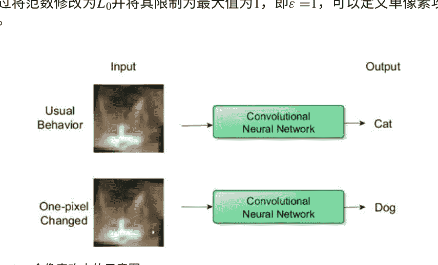

数学上：

$$
\begin{aligned}
& \text{最小化} & & f(x+\delta)_c \\
& \text{满足} & & \|\delta\|_0 \leq 1
\end{aligned}
\tag{15.4}
$$

为了解决上述优化问题，一个像素攻击使用了差分进化（DE）算法。DE是一种通过使用候选解（称为个体）的种群来优化函数的进化算法。更多细节请参考[2, 3]。

图15.2显示了对CIFAR数据集的攻击示例。这些对抗样本成功欺骗了各种类型的DNN，准确率相似（表15.1）。总体而言，在测试的所有网络中，大约三分之一的样本被发现至少有一个像素可以正确扰动以引起类别变化。此外，这些结果不仅限于小输入。

图15.3显示了通过攻击在ImageNet上学习的DNN找到的一些对抗性示例（表15.2）。

表15.1 在原始的CIFAR-10测试集上进行单像素攻击的准确率，包括有目标和无目标攻击

|          | AllConv | NIN   | VGG16 |
|----------|---------|-------|-------|
| 有目标攻击 | 3.41%   | 4.78% | 5.63% |
| 无目标攻击 | 22.60%  | 35.20%| 31.40%|
| 置信度   | 56.57%  | 60.08%| 53.58%|

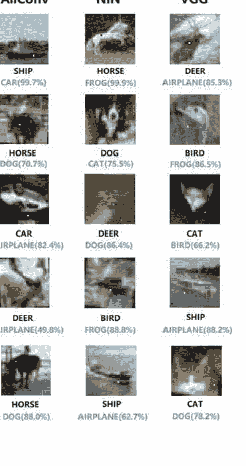

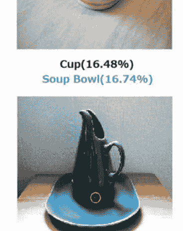

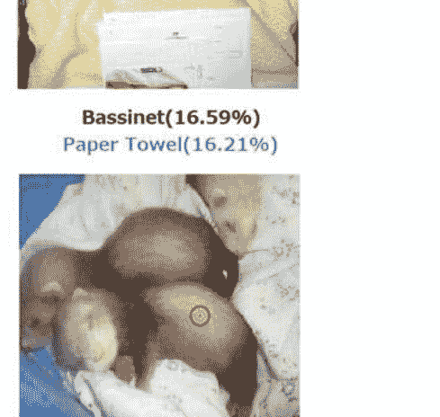

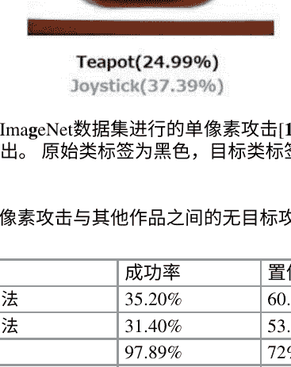

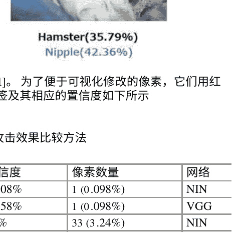

图15.3 对ImageNet数据集进行的单像素攻击[1]。为了便于可视化修改的像素，它们用红色圆圈标出。原始类标签为黑色，目标类标签及其相应的置信度如下所示

表15.2 单像素攻击与其他作品之间的无目标攻击效果比较方法

| 方法     | 成功率  | 置信度 | 像素数量     | 网络 |
|----------|---------|--------|--------------|------|
| 我们的方法 | 35.20%  | 60.08% | 1 (0.098%)   | NIN  |
| 我们的方法 | 31.40%  | 53.58% | 1 (0.098%)   | VGG  |
| LSA[4]   | 97.89%  | 72%    | 33 (3.24%)   | NIN  |
| LSA[4]   | 97.98%  | 77%    | 30 (2.99%)   | VGG  |
| FGSM[5]  | 93.67%  | 93%    | 1024 (100%)  | NIN  |
| FGSM[5]  | 90.93%  | 90%    | 1024 (100%)  | VGG  |

表15.3 一个像素攻击在附近像素和一个随机选择的单个像素上的成功率

| | LENET | RESNET |
| --- | --- | --- |
| 原始单像素攻击 | 59% | 33% |
| 随机像素上的单像素攻击 | 4.9% | 3.1% |
| 附近像素上的单像素攻击 | 33.1% | 31.3% |

这个实验是按照以下方式进行的。首先执行单像素攻击。然后，使用相同的扰动来修改原始图像的一个随机或附近的像素，并评估方法的成功率。为了获得统计上相关的结果，在CIFAR-10数据集的5000个样本中，对于每次成功攻击，随机像素攻击和附近像素攻击都会重复一次（对于ResNet有1638次成功攻击，对于LeNet有2934次成功攻击）

单像素攻击以其能够用极小的扰动愚弄深度神经网络而广为人知。然而，扰动像素的位置到什么程度重要？在表15.3中，显示了在随机扰动附近像素时愚弄网络的大约30%的机会。换句话说，像素本身的确切位置不是主要因素。为了解释这个实验，我们必须研究初始层的内部工作原理。回想一下，深度神经网络使用卷积处理初始输入，因此附近像素对卷积的影响（线性函数）是相似的。因此，很有可能找到附近的像素会导致相同的漏洞。

因此，被单像素攻击突出显示的神经网络的脆弱部分是卷积。这在不同架构上的相似准确率进一步证明了这一点。

### 15.3.1 这是怎么可能的？

请注意，所有被攻击的网络在测试中都具有最先进的性能准确性。显而易见的问题是，高度准确的模型如何会对如此小的扰动产生脆弱性？从最近的结果中还引发了许多其他问题。

- **DNNs是混沌系统吗？** —混沌系统的定义是对输入具有高度敏感性。因此，我们是否正在处理某种混沌学习系统？
- **DNNs学习高级特征吗？** —回想一下，DNN的成功源于自动开发比手动编码更适合的特征。人们曾经相信并在某种程度上证明了高级特征在DNN内部发展出来；然而，最近的结果显示了反例。那么，到底学到了哪些特征？

在接下来的章节中，我们将更深入地探讨上述问题。为了理解并试图展望我们面前的未来。

### 15.3.2 深度神经网络是混沌系统吗？

“巴西的蝴蝶拍动翅膀会引发德克萨斯的龙卷风吗？”在混沌理论中，这是一个有点揭示反直觉谜题的问题。这是一个小扰动可能导致最终状态有很大差异的谜题。这就是为什么天气预报在长时间内不太准确的原因。在混沌理论中，这就是对具有一个正的李雅普诺夫指数的动力系统所能说的（李雅普诺夫指数基本上计算预测是否与目标系统的误差在时间上呈指数级差异）。正如之前所展示的，对输入的小扰动足以使算法完全改变其输出。因此，机器是混沌系统吗？

如果我们将混沌系统定义为动力系统中最初的定义，答案是否定的。首先，机器学习系统在大多数情况下不是动力系统。即使处理动态问题如游戏，这也是正确的。因此，大部分的定义和其他相关概念在这里无法应用。

然而，对于那些对扰动有些敏感的非动力系统，我们能说些什么呢？关键在于混沌的起源可以追溯到许多复杂的迭代过程。这许多迭代过程与无限的时间相连，并且在有限的空间中的一些迭代过程（少量节点之间的相互作用）也相连。如果我们考虑的不是无限的时间，而是无限的空间和有限的时间呢？结果可能是一种不同类型的混乱。很多事情需要重新思考，因为当时间有限时，例如轨迹就变得不那么有意义了。此外，当时间有限时，将混乱定义为指数级分离的轨迹也是自然而然地不适用的。因此，严格遵循当前定义的话，它们不是混沌机器。然而，它们可能适用于在无限空间而不是时间上定义的不同类型的混沌系统。对此的进一步讨论超出了本章的主题。

## 15.4 深度神经网络学习高级特征吗？

使用DNN的主要原因是它们能够学习那些无法手动编码的特征。DNN会自动学习这些特征，并且基于这些特征在许多任务上实现高准确率。其中许多特征被认为是高级特征，例如识别身体部位以将图像的一部分分类为人类，或者识别眼睛和鼻子以将图像块分类为人脸。然而，高级特征不应该仅仅因为一个像素的变化而改变。换句话说，如果一个单独的像素可以改变最终的分类结果，那么DNN可能没有识别出高级特征。下面的小节将评估并尝试理解DNN，以回答“DNN是否学习了高级特征？”这个问题。

### 15.4.1 传播图

为了评估一个像素变化对给定DNN的各层的影响，让我们定义一个对抗扰动输入和原始输入之间的层之间差异的映射。将特征图之间的差异映射称为传播图[6]。考虑一个三维数组$O$的元素级最大值，用于描述索引$a$、$b$和$k$：

$M_{a,b} = \max_{k} \{ O_{a,b,0}, O_{a,b,1}, \dots, O_{a,b,k} \},$

其中$M$是结果的二维数组。具体来说，传播图$P M_i$被定义为层$i$的：

$P M_i = \max_{k} \{ F M_{i,k} - F M_{i,k}^{adv} \},$

其中$F M_{i,k}$和$F M_{i,k}^{adv}$分别是层$i$和内核$k$的自然（原始）和对抗样本的特征图。图15.4显示了给定对抗样本的传播图的示例。特征图之间的差异表明，一个像素的变化不仅保持强烈，而且在各个层中传播。这种行为表明，深度神经网络对输入中的细微变化非常关注。此外，这些变化对于处理即使在本应处理更高级特征的深层也是重要的。

### 15.4.2 基于纹理的特征

在ImageNet上的结果表明，不需要形状信息就可以达到与最先进技术相媲美的准确性[7]。作者表明，在ImageNet上，一个简单的局部特征包就足以获得高准确性。事实上，这个结果表明当前的深度神经网络不需要更多的纹理模式识别，可能受限于此。在[8]中，作者表明当前的深度神经网络在只给出物体的轮廓或轮廓的情况下学习效果不好。图15.5展示了从常规图像到仅保留形状的图像时准确性的变化。有趣的是，当只显示物体的纹理时，当前深度神经网络的结果观察到的变化不大。因此，这两个结果表明当前的深度神经网络只处理纹理。对纹理的依赖可能是缺乏鲁棒性的罪魁祸首，因为一些纹理可能会因为几个像素或一些弱噪声而改变，但形状不会改变。

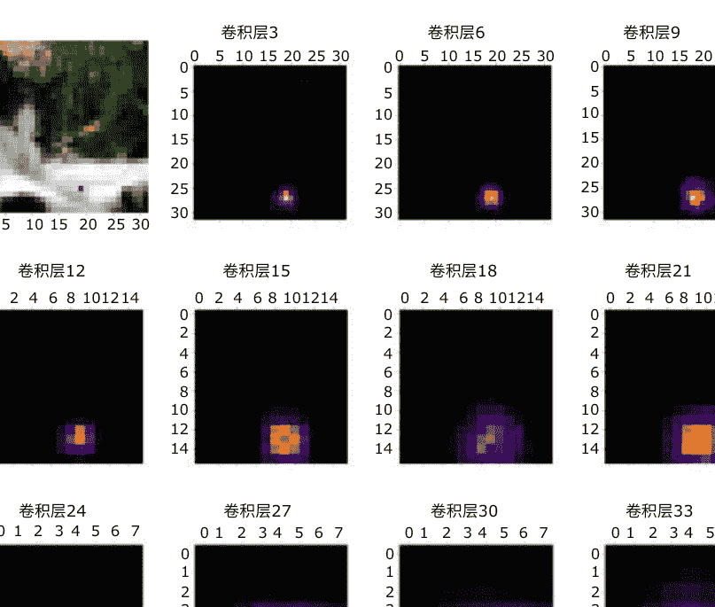

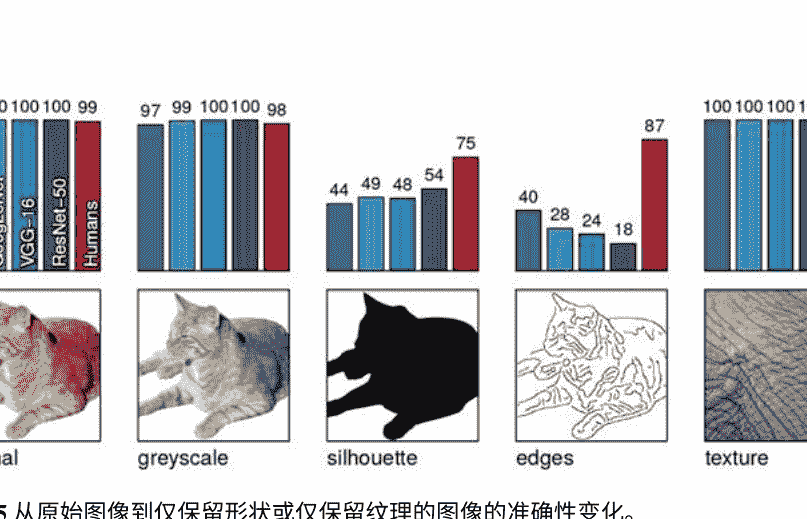

图15.4 使用CIFAR样本的ResNet传播图（PM）。上面的样本在图像中的一个像素改变后被错误地分类为汽车。值被缩放，每个特征图层的最大值是颜色图中可达到的最大值。因此，亮值显示激活差异接近特征图中的最大值，展示了前者的强度。

图15.5 从原始图像到仅保留形状或仅保留纹理的图像的准确性变化。

### 15.4.3 非鲁棒特征就足够了

在[9]中，作者进一步证明了DNN使用的是非鲁棒特征。此外，在一个实验中，训练集仅由对抗样本及其对应的错误类别组成，结果显示在这个数据集上训练仍然能够得到高准确率。基于这些结果，可以说学到的非鲁棒特征足以预测真实标签。因此，算法没有动力去寻找鲁棒特征。自然地，前面的信息考虑到当前的DNN能够学习到这样的鲁棒特征，但这未必是真实情况。

在深入理解DNN的弱点和限制之前，有必要更深入地了解鲁棒性的含义。下一节明确地将鲁棒性定义为一个不同的目标，有时可能与准确性相冲突。

## 15.5 鲁棒性 vs. 准确性：不同的目标

对于人类来说，对抗样本的鲁棒性和准确性是同一个目标。然而，对于算法来说，这并不是真实的。在经典的分类设置中，分类器的目标是实现低期望损失：

$\mathbb{E}_{(x,y)\sim D} [\mathcal{L}(x, y; \theta)]$  (15.7)

对抗性攻击的鲁棒性是一个稍微不同的设置。为了在这种情况下实现高鲁棒性，在噪声$\delta \in \Delta^1$中，分类器应该具有较低的对抗性损失：

$\mathbb{E}_{(x,y)\sim D} [\mathcal{L}(x + \delta, y; \theta)]$  (15.8)

这两个目标有时是相互矛盾的。这就是为什么许多解决方案最终会在准确性和鲁棒性之间进行权衡，而不是同时改善两者。

¹在这里，我们使用噪声中的错误作为对抗性损失，而不是最坏情况下的错误，请参考[10]了解噪声中的错误和对抗样本之间的关系的讨论。

## 15.6 对深度神经网络的攻击

有许多攻击被证明是有效的，这里将简要回顾其中一些。 所有攻击可以分为两种类型的攻击：

- **逃避攻击** - 在这种情况下，攻击者只能在机器学习算法学习之后才能访问。 因此，攻击涉及对输入进行微小的修改，以引起算法行为的变化。

有目标的攻击旨在将类别更改为特定定义的类别，而无目标的攻击没有目标，只是为了愚弄算法。 这是最常见的攻击类型，也是本章将详细介绍的攻击类型。

- **毒害攻击** - 大多数机器学习算法需要事先在给定的数据集上进行训练。 使用的数据集有时是公开的，并且可能会被攻击者修改。 此外，还有一些算法会在整个应用程序中使用信息来改进自身。 在这两种情况下，毒害攻击是指攻击者通过修改数据集引入漏洞。 本章不涉及此类攻击。

该主题的第一篇论文可以追溯到2013年，当时发现深度神经网络在几乎相同的图像上表现出奇怪的行为[11]。 图15.6展示了第一批实验中发现的漏洞示例，其中在图像的所有像素上添加了少量噪声。

随后发现了一系列的漏洞。 在[12]中，作者证明了当DNNs面对纹理和随机噪声时，会输出高置信度（图15.7）。 这表明当前DNNs的置信度比以前认为的要少有意义。 解决这个问题的方法是稍微改变问题的表述，增加一个新的未知类别。 这个解决方案将在后面关于防御的部分进行讨论。

已经证明可以对大多数样本添加单一对抗扰动来欺骗DNNs[13]。 这种类型的对抗扰动被称为通用对抗样本。 图15.8展示了通用对抗样本的示例。 请注意，找到的通用扰动在不同的网络之间是不同的。 它们只在单个DNN内部是恒定的。 到目前为止，扰动的形式是在整个图像或单个像素中添加的小噪声。 2017年，研究人员发现添加小补丁可以欺骗分类器[14]（图15.9）。 即使一个像素能够欺骗分类器，添加补丁可能不那么令人惊讶。 然而，开发的补丁是有针对性的攻击，因此对DNNs来说是真正的威胁。 换句话说，有人可以使用对抗性补丁伪装成一个对象或其他人。

到目前为止，示例都是与需要图像作为输入的机器学习算法相关的。然而，这绝不是一个要求。例如，文本输入也可以通过稍微改变字母来进行操作。图15.10展示了一个针对文本输入的对抗样本的例子。在文本输入中，有一个等效于单像素攻击的攻击方式，即交换两个字母（图15.11）。实际上，攻击不需要局限于单个扰动的开发。可以创建自动和更智能的模型来改变输入并创建具有高置信度的对抗样本。例如，图15.12展示了如何开发规则来自动创建针对文本输入的对抗示例的例子。该规则由许多模式匹配段组成，每个段由搜索和更改过程组成。有关更多信息，请参考[16]，用于演化此规则的技术是一种共同进化算法的类型。

图15.7 通过DNNs [12]高度自信地识别出的随机噪声。图像下方的名称表示它们被DNN分类的类别。

### 15.6.1 这些攻击在现实世界中可行吗？

这里展示的所有攻击都是在实验室中执行的。其中一些攻击是白盒攻击，攻击者甚至可以获得更多信息，如DNN的梯度。因此，自然而然的问题是“这些攻击能在现实世界中使用吗？”甚至，DNN的鲁棒性缺失有多严重和危险？

图15.8 说明了如何使用单个扰动来欺骗与样本无关的DNN [13]。

在[17]中，作者们展示了当前的攻击可以通过简单地打印它们转化为现实世界的威胁。他们证明了打印出来的对抗样本仍然有效，因为许多对抗样本对不同的光照条件具有鲁棒性。此外，精心制作的眼镜也可以成为攻击[18]，甚至还展示了可能存在通用的3D对抗物体[19]。可以使用3D打印机构建3D对抗物体，并揭示了这样的物体存在并可以被恶意用户利用。

图15.9 对抗性贴片的示例，其中分类器将分类从香蕉改为烤面包机[14]

> The Old Harbor Reservation Parkways are three historic roads in the Old Harbor area of Boston. Some exhibitions of Navy aircrafts were often held here. They are part of the Boston parkway system designed by Frederick Law Olmsted. They include all of William J. Day Boulevard running from Castle Island to Kosciuszko Circle along Pleasure Bay and the Old Harbor shore. The part of Columbia Road from its northeastern end at Farragut Road west to Pacuska Circle (formerly called Preble Circle). Old Harbor Reservation

图15.10 使用[15]中提出的扰动生成的对抗性文本样本。通过插入一个无关的事实：这里经常举行海军飞机的展览。（红色）删除一个HTP：历史（蓝色），修改一个HSP：城堡（红色）。成功将输出分类从建筑物更改为交通工具。Li等人[15]

> The r cok is destined to be the 21st century's new 'conan' and that he's going to make a splash even greater than Arnold Schwarzenegger, jean-claud van damme or steven segal.

图15.11 通过交换两个字母（扰动的两个元素，显示为红色）生成的对抗性文本样本

图15.12 用于愚弄文本分类的精心制作的通用规则（基于原型匹配的扰动过程序列）。使用本文提出的技术，可以制作一个通用规则，自动创建对抗性样本，即一旦制作了通用规则，就不再需要搜索。事实上，通用规则只会进行几次几乎不可察觉的打字错误扰动。在图中，通过一个通用对抗规则生成对抗性样本（对原始样本的更改以不同的颜色显示。交换显示为红色，删除显示为绿色，插入显示为蓝色。）[16]

## 15.7 防御系统

许多防御系统和检测系统被提出来缓解先前描述的攻击。然而，目前还没有解决方案或有希望的解决方案。关于防御系统，提出了一种防御蒸馏方法，即一个较小的神经网络压缩原始网络学到的内容[20]；然而，在[21]中证明它不够稳健。

对抗训练也提出了使用对抗样本来增加训练数据集。对抗训练的主要思想是在数据集中包含对抗样本，以便让深度神经网络进行训练，并能够正确分类它们。事实上，这种防御方式被证明可以增加鲁棒性[22-24]。然而，由此产生的神经网络仍然容易受到攻击[25]。

此外，[26]研究表明对抗样本会对所使用的对抗样本类型产生偏见。例如，与 $L_\infty$攻击相关的对抗样本会增加对 $L_\infty$的鲁棒性。然而，对 $L_0$类型的鲁棒性不会增加，甚至可能会降低。

有许多其他的防御变体[27, 28]，这些变体在[29, 30]中经过仔细分析，并解释了它们的许多缺点。简而言之，许多防御措施是基于隐藏深度神经网络(DNNs)的梯度，称为梯度掩盖。这些修改导致了对白盒攻击更加困难的DNNs，白盒攻击依赖于这些信息。然而，研究表明梯度掩盖给人一种虚假的安全感，因为它们并没有消除漏洞，而只是隐藏了它。不依赖于梯度的方法可以绕过梯度掩盖技术，从而不会提高鲁棒性。

另一种类型的防御系统不是基于先前DNNs的变体，而是结构上甚至是革命性的修改。例如，添加未知类别以正确分类纯噪声示例。OpenMax层被提议作为一种能够学习这个额外类别的层[31]。

实际上，有许多新型的机器学习算法可能是鲁棒的，但从未经过测试。其中一个例子是CapsNet [32]，最近被证明相对更鲁棒。因此，部分解决方案可能存在于不太常见的地方，甚至可能已经存在，但仍然很难找到。

### 15.7.1 检测系统

检测系统是防御的一个子领域。它们的目标是识别恶意样本的存在，而不是消除漏洞。关于检测系统，[33]的一项研究揭示了对抗样本通常具有不同的统计特性，可以用于检测。在[34]中，作者提出了一个系统，将分类器的预测与相同输入但“压缩”（颜色或空间平滑）的预测进行比较。这种技术使得分类器能够检测到具有小扰动的对抗样本。

话虽如此，许多检测系统在对抗样本与测试条件不同时可能会失败[35, 36]。因此，检测系统的明显好处仍然没有定论。

## 15.8 鲁棒性的当前状态概述：评估算法和防御措施

前面的章节展示了许多攻击和防御措施，但未能对它们的鲁棒性进行综述。为了实现这一点，基于[26]的两种攻击将基于不同的目标进行定义。这些攻击之间的差异将用于从两个不同的角度分析最先进的DNN和防御措施。我们将看到鲁棒性会根据所使用的攻击类型而改变。请注意，这里的目标不是实现100%的攻击准确率（只要插入足够的噪声就可以实现），而是评估在非常受限的 $L_0$ 和 $L_\infty$ 攻击下的DNN。这些受限的 $L_0$ 和 $L_\infty$ 攻击具有几个优点，例如 (a) 使用相同固定扰动量评估所有DNN和防御措施，以及 (b) 不产生错误的对抗样本。图15.13显示了一个具有非常少扰动量的错误对抗样本的示例，这在大多数基于 $L_1$ 和 $L_2$ 的攻击中是允许的。

### 15.8.1 阈值攻击（$L_\infty$ 黑盒攻击）

阈值攻击通过优化约束优化问题来定义Eq. 15.1，其中约束为 $\|\delta\|_\infty \leq \epsilon$，即使用 $L_\infty$ 范数。$\epsilon$ 是一个阈值在这里设置为以下值之一 $\{1, 3, 5, 10\}$。阈值攻击将解码为像素变化的矩阵。因此，搜索空间与输入空间相同，因为变量可以是任何变化，只要阈值得到尊重，输入的任何一部分都可以被接受。因此，算法搜索发生在 $\mathbb{R}^{m \times n \times 3}$ 空间中。阈值攻击使用最先进的黑盒优化算法，称为协方差矩阵适应进化策略（CMA-ES）[37]。为了满足约束条件，使用了剪切函数将值保持在可行区域内，即采用了一种简单的修复方法，超过最小/最大值的像素被调整为最小/最大值。

### 15.8.2 少像素攻击（ $L_0$ 黑盒攻击）

少像素攻击是一种一像素攻击的变体[1]。它优化了在等式15.1中定义的约束优化问题。然而，所使用的约束是 $\|\delta\|_0 \leq \varepsilon$，即使用 $L_0$ 范数。$\varepsilon$ 是一个阈值，可以是以下值之一 $\{1, 3, 5, 10\}$。少量像素攻击使用一个搜索变量，该变量是像素值（3个值）和位置（2个值）的组合，适用于所有像素（$\varepsilon$ pixels）。因此，搜索空间比具有 $\mathbb{R}^{5 \times \varepsilon}$ 维度的阈值攻击要小。为了进行优化，我们使用CMA-ES。²约束始终得到满足，因为参数的数量本身就是根据约束进行建模的。换句话说，当寻找一个像素扰动时，变量的数量被固定为像素值（三个值）加上位置值（两个值）。因此，它总是只修改一个像素，遵守约束。由于优化是在实值上进行的，为了强制值在范围内，使用了一个简单的剪切函数来处理像素值。对于位置值，执行模运算。

²请注意，我们没有使用DE优化算法，该算法在原始版本的单像素攻击中使用。原因是DE在阈值攻击中表现不佳，阈值攻击和少像素攻击理想情况下应该使用相同的优化算法。

### 15.8.3 分析与讨论

表15.4显示了各种最先进的DNN的结果：WideResNet [38], DenseNet [39], ResNet [40], Network in Network (NIN)[41], All Convolutional Network (AllConv) [42], CapsNet[32]和LeNet[43]。它揭示了它们在所有层面上都容易受到各种攻击。这表明尽管当前的DNN之间的鲁棒性可能有所不同，但没有一个能够完全克服甚至最低级别的扰动。与最低距离为五的结果被认为是同样好的。这些结果以粗体字写出。CapsNet和AllConv可以被认为是最稳健的，有五个粗体结果。稳健性排名第三的模型只有三个粗体结果，因此与表现最好的模型相差较远。

$L_0$和$L_\infty$的行为在最稳健的深度神经网络中有所不同，显示出稳健性是通过一些权衡来实现的。此外，这进一步证明了使用这两个度量指标来评估深度神经网络的重要性。

防御也可以以类似的准确性被攻击。表15.5显示了对抗训练（AT）[24]、总方差最小化（TVM）防御[28]和特征挤压（FS）[34]的少像素和阈值攻击的准确性。

关于对抗训练，使用少像素攻击比使用阈值攻击更容易攻击。这个结果应该源于训练中使用的对抗样本主要包含来自$L_\infty$类型的攻击的图像。这是因为用于对抗训练创建对抗样本的投影梯度下降（PGD）是一种$L_\infty$攻击。因此，它表明在攻击偏差与用于训练网络的不变性偏差不同的情况下，攻击很容易成功。关于TVM，攻击的成功率较低，但使用TVM训练的模型的原始准确性也不高。因此，即使攻击百分比只有24%，结果模型的准确率是35%。对特征压缩的攻击具有相对较高的准确率。这是真的，对于L_0和L_∞攻击都是如此。此外，两种类型的攻击具有相似的准确性，揭示了防御系统中的缺乏偏见。

总之，迄今为止提出的防御系统在考虑到所有类型的攻击时并没有给出相关的改进。在本节中，介绍了7年研究后的当前结果，即自从首篇关于对抗机器学习的论文被提出以来。这个开放性问题仍然是一个最近的问题，但它是一个具有巨大社会经济影响的研究领域的一部分（自动驾驶汽车和其他应用需要解决这个问题才能可靠）。因此，如果存在DNN的解决方案，它可能不是一个平凡的解决方案。

## 15.9 深入兔子洞：表示问题

研究人员对于DNN缺乏鲁棒性的原因并不一致。然而，最近的研究结果表明问题可能在于DNN学习到的错误表示[44]。结果显示表示质量与攻击准确性是一致的。在进入结果的细节之前，将介绍表示度量及其与学习算法错误的关系。

### 15.9.1 表示度量

根据方程式15.8，并将损失视为均方误差（MSE），我们有

$$\mathbb{E}_{(x, y) \sim D}[\mathcal{L}(x+\delta, y; \theta)] = \mathbb{E}_{(x, y) \sim D}[(f(x+\delta)-h(x+\delta))^2] + \mathbb{E}_{(x, y) \sim D}[(h(x+\delta)-\hat{y}(x+\delta))^2],$$

其中 $h(x) = E[h_D(x)]$是在许多数据集上平均时的预测行为的期望值，$f(x)$ 是真实值，而 $\hat{y}(x) = h_D(x)$是在给定数据集 $D$上学习后的输出。为了增加鲁棒性，对抗训练要求数据集中应该有许多噪声样本，即，$x + \delta \in D$。然而，随着图像中添加的噪声越多，$D$越接近于所有可能的尺寸为 $M \times N$的图像集合，即，$\mathbb{R}^{M \times N}$：

$$\lim_{\Delta \to \infty} D = \mathbb{R}^{M \times N}. \tag{15.9}$$

然而，对于 $D \in \mathbb{R}^{M \times N}$，$f(x)$是未定义的，在其中$y \notin C$表示已知类别集合$C$。即使有少量噪音也足以导致$y \notin C$，从而使$f(x)$未定义。因此，以下问题出现了。是否可能在没有明确定义的$y$的情况下评估模型的鲁棒性和/或质量？

为了回答这个问题，我们考虑一个理想的表示 $z$和模型学习到的表示 $\hat{z}$：

$$\mathbb{E}[(f(x+\delta; z) - h(x+\delta; \hat{z}))^2] + \mathbb{E}[(h(x+\delta; \hat{z}) - \hat{y}(x+\delta; \hat{z}))^2]. \tag{15.10}$$

有趣的是，尽管 $y$未定义，$z$表示学习到的特征并且对于任何输入都是明确的。此外，通过将学习到的类别视为在 $z$空间中聚类，可以使用无监督学习评估来评估 $z$，即使没有明确定义的 $y$。我们在这里使用一个著名的聚类分析指数来评估$z$中的聚类，通过它们的簇内距离。在 $z$中，还可以评估已知和未知类别的表示，它们应该具有共同的特征。此外，我们在这里假设未知类别应该以较小的偏差评估 $z$，因为从输入到输出的直接映射不存在。可以使用输入在任何特征映射或输出层中的任何投影作为 $z$。为了考虑整个投影，我们在这里使用 $z$作为输入到类别的最终投影，即 $z$是软标签数组 $e$。

因此，为了评估表示质量，我们根据未知类别的软标签数组的聚类分析定义了Davies-Bouldin度量。具体定义如下。

表15.4 少像素攻击（$L_0$黑盒攻击）和阈值攻击的攻击准确率结果（$L_\infty$黑盒攻击）[26]

| 模型 (准确率) | $L_0$ 攻击的 $\varepsilon$ | | | |
| :--- | :---: | :---: | :---: | :---: |
| | 1 | 3 | 5 | 10 |
| WideResNet (95.12) | **11%** | 55% | 75% | 94% |
| DenseNet (94.54) | **9%** | 43% | 66% | 78% |
| ResNet (92.67) | **12%** | 52% | 73% | 85% |
| NIN (90.87) | 18% | 62% | 81% | 90% |
| AllConv (88.46) | **11%** | **31%** | 57% | 77% |
| CapsNet (79.03) | 21% | 37% | **49%** | **57%** |
| LeNet (73.57) | 58% | 86% | 94% | 99% |
| | $L_\infty$ 攻击的 $\varepsilon$ | | | |
| 模型 (准确率) | 1 | 3 | 5 | 10 |
| WideResNet (95.12) | 15% | 97% | 98% | 100% |
| DenseNet (94.54) | 23% | 68% | **72%** | **74%** |
| ResNet (92.67) | 33% | 71% | **76%** | 83% |
| NIN (90.87) | **11%** | 86% | 88% | 92% |
| AllConv (88.46) | **9%** | 70% | **73%** | **75%** |
| CapsNet (79.03) | **13%** | **34%** | **72%** | 97% |
| LeNet (73.57) | 44% | 96% | 100% | 100% |

列显示了被攻击的模型，括号内是分类准确率。攻击是使用CMA-ES优化算法对CIFAR数据集中的100个随机样本进行的。粗体字表示最低攻击准确率，其他结果与最低准确率相差不超过五个。

表15.5 少像素（$L_0$）和阈值攻击（$L_\infty$黑盒攻击）对对抗训练（AT）[24]、总方差最小化（TVM）[28]和特征压缩（FS）[34]的准确性结果

| | $L_0$攻击的 $\epsilon$ | | | |
| :--- | :---: | :---: | :---: | :---: |
| | 1 | 3 | 5 | 10 |
| AT (87%) | 22% (67%) | 52% (41%) | 66% (29%) | 86% (12%) |
| TVM (47%) | 16% (39%) | 12% (41%) | 20% (37%) | 24% (35%) |
| FS (92%) | 17% (72%) | 49% (44%) | 69% (26%) | 78% (19%) |
| | $L_\infty$攻击的 $\epsilon$ | | | |
| | 1 | 3 | 5 | 10 |
| AT (87%) | 3% (84%) | 12% (76%) | 25% (65%) | 57% (37%) |
| TVM (47%) | 4% (45%) | 4% (45%) | 6% (44%) | 14% (40%) |
| FS (92%) | 26% (64%) | 63% (32%) | 66% (29%) | 74% (22%) |

%）在最左列，原始攻击在括号内。其他列中括号内的数字是在受到攻击时防御的准确性结果。对于修改后的准确性，该值通过将原始准确性乘以一减去攻击准确性来计算。

攻击是在CIFAR数据集[26]中的100个正确分类样本上执行的。

#### 15.9.1.1 Davies-Bouldin度量：聚类假设

分类器的软标签组成了一个空间，在这个空间中，给定的图像将被分类为关于先前学习的类的加权向量。考虑到这个空间中的一个簇将构成一个类，我们可以使用聚类验证技术来评估表示。在这里，为了简单起见，我们选择了内部聚类验证中最常用的度量标准，Davies-Bouldin指数（DBI）。DBI的定义如下：

```
$$DBI = \left(\frac{1}{n_e} \sum_{j=1}^{n_e} |\mathbf{e}_j - \mathbf{cn}|^2\right)^{1/2},$$
(15.11)
```

其中 $\mathbf{cn}$ 是聚类的质心，$\mathbf{e}$ 是一个软标签，$n_e$ 是样本的数量。

有趣的是，这个度量与公式15.10中的方差相似，这是唯一定义的部分（对于未定义的 $y$ 不存在偏差误差）。如果质心 $\mathbf{cn}$ 不随数据集变化，那么两个公式是相同的。因此，DBI度量可以看作是方差的近似。然而，在这里，只使用未知类别，以避免直接学习输入-输出映射所带来的任何偏差。

### 15.9.2 分析

为了评估未知类别上的DBI度量，首先在 $c-1$ 个类别上训练一个分类器，然后在剩下的一个类别上进行测试。这个过程对所有 $c$ 个类别重复进行。表15.6显示了CIFAR数据集中攻击与DBI度量之间的皮尔逊相关系数。大多数结果显示出强烈的相关性。此外，它们表明两者呈负相关，这是预期的，因为较高的DBI意味着稀疏的聚类，因此表示更差，而较高的L2意味着更高的鲁棒性。

## 15.10 进化计算的角色

进化计算已被证明能够攻击深度神经网络。进化算法非常适合黑盒攻击，其中对神经网络的了解非常少，甚至没有。事实上，这些攻击类型更加现实，因为攻击者对深度神经网络的结构和内部了解很少。

此外，攻击也可以用来研究深度神经网络。因此，正如之前的例子所示，进化计算可以用来攻击和理解深度神经网络。

### 表15.6 DBI和L2得分之间的皮尔逊相关系数

| 模型 | 牛顿愚弄 | PGD | 虚拟 | FGM | 深度愚弄 | BIM | Carlini | JSMA | 全部 |
|------|----------|-----|------|-----|----------|-----|---------|------|------|
| WideResNet | -0.58 (0.08) | -0.61 (0.06) | -0.62 (0.06) | -0.64 (0.05) | -0.62 (0.06) | -0.68 (0.03) | -0.69 (0.03) | -0.68 (0.03) | -0.11 (0.31) |
| DenseNet | -0.51 (0.13) | -0.68 (0.03) | -0.58 (0.08) | -0.71 (0.02) | -0.61 (0.06) | -0.76 (0.01) | -0.74 (0.02) | -0.60 (0.07) | -0.10 (0.35) |
| ResNet | -0.55 (0.10) | -0.60 (0.06) | -0.56 (0.09) | -0.55 (0.10) | -0.55 (0.10) | -0.65 (0.04) | -0.66 (0.04) | -0.70 (0.02) | -0.10 (0.37) |
| NetInNet | -0.64 (0.05) | -0.71 (0.02) | -0.59 (0.07) | -0.66 (0.04) | -0.61 (0.06) | -0.74 (0.01) | -0.76 (0.01) | -0.73 (0.02) | -0.13 (0.25) |
| AllConv | -0.70 (0.02) | -0.65 (0.04) | -0.67 (0.03) | -0.74 (0.01) | -0.71 (0.02) | -0.75 (0.01) | -0.75 (0.01) | -0.59 (0.07) | -0.12 (0.28) |
| CapsNet | -0.80 (0.01) | -0.78 (0.01) | -0.81 (0.00) | -0.81 (0.00) | -0.76 (0.01) | -0.74 (0.01) | -0.73 (0.02) | -0.46 (0.18) | -0.18 (0.11) |
| LeNet | -0.57 (0.08) | -0.59 (0.07) | -0.57 (0.09) | -0.60 (0.07) | -0.56 (0.09) | -0.56 (0.09) | -0.60 (0.07) | -0.02 (0.95) | -0.10 (0.38) |
| DBI和L2得分之间的皮尔逊相关系数（p值） | - | - | - | - | - | - | - | - | - |

在本节中，目标是概述进化计算在解决对抗机器学习问题时所允许的可能性，超越对DNN的理解和攻击。换句话说，在这里将讨论许多学习系统的可能性。这些学习系统可能为固有鲁棒学习系统的部分甚至完整解决方案铺平道路。

### 15.10.1 进化鲁棒架构

有许多可能的DNN架构。然而，手动搜索和测试每一个架构是困难的。为了解决这个问题，在[45]中，作者提出使用进化计算来搜索架构。搜索空间包括许多类型的层，多个分支，甚至是卷积和全连接层的任意组合，即多个瓶颈是可能的。

找到的架构其漏洞减少到其他架构搜索方法的大约一半的值（表15.7）。此外，这些结果仅基于修改架构，即没有对抗性训练。因此，当包括其他防御措施时，可能实现更高的鲁棒性。这是一个有前途的研究方向，目前仅仅起步。

### 15.10.2 神经进化

先前已经表明，错误的表示可能是缺乏鲁棒性的主要原因。神经进化是关于神经网络在权重和拓扑结构上的进化的领域[48]。换句话说，神经进化方法不仅仅局限于搜索更好的权重，其中一些方法还搜索更好的拓扑结构。其中一些方法还搜索神经元模型和连接类型。其中少数几种方法之一是光谱多样化统一神经进化架构（SUNA）[49]。

### 表15.7 错误率（ER）在测试数据集和对抗样本上的表现，以及在评估函数中找到的最佳架构时的表现，该函数同时考虑了测试数据和对抗样本的准确性

| 架构 | 测试ER | 对抗搜索中的ER |
| :--- | :--- | :--- |
| DeepArchitect [46] | 25% | 75% |
| Smash [47] | 23% | 82% |
| 我们的 | 18% | 42% |

该测试是在CIFAR数据集上进行的，并且对抗样本也是使用CIFAR数据集的一些样本创建的。一个DeepArchitect和Smash的评估函数都被修改为测试样本和对抗样本准确性之和。

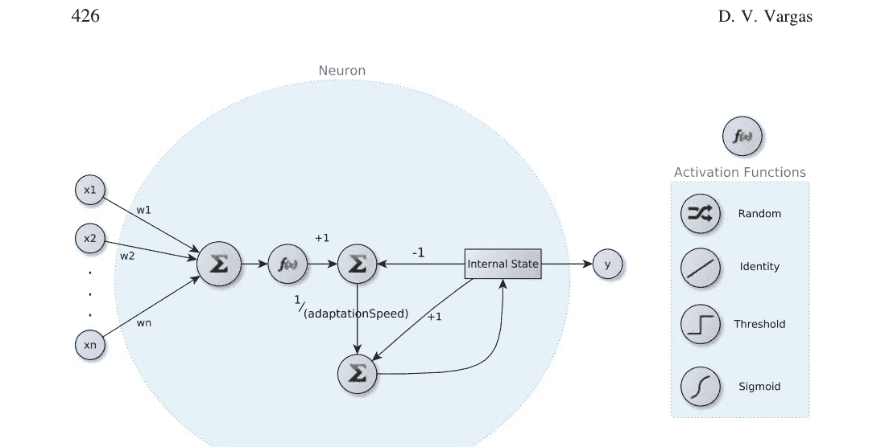

### 图15.14 神经元激活过程和SUNA可能的激活函数

图15.14展示了SUNA提出和使用的统一神经元模型。请注意，这个统一神经元模型具有内部状态，可以定义较慢或较快的神经元。此外，SUNA的架构还可以进行神经调节连接和神经元。所有这些功能的解释以及关于架构和结果的更多细节超出了本章的范围。要了解更多关于SUNA以及它如何在不改变任何参数的情况下解决了五个完全不同的难题，请参考[49]。

### 15.10.3 自组织分类器

正如第15.10.2节中提到的，学习复杂的表示可能有所帮助。然而，这些表示不容易适应新问题。它们也不容易学习和增量。这是其整体复杂性的一个结果。自组织分类器（SOC）引入了一个将输入分成不同组（子群体）的映射[50]。每个组在呈现与过去经验足够不同的输入时都可以发生变化。此外，在每个组中，有一群神经网络进化以适应其接收到的输入类型。由于每个组的输入类型不同，神经网络可以专门化，因此更简单。图15.15说明了SOC的架构。

这种使用神经网络的分而治之方法允许一组相对简单的模型解决复杂问题。有趣的是，由于每个组都是专门化的，可以以模块化的方式添加更多的知识。

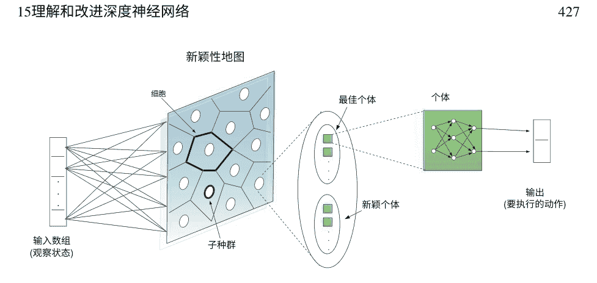

图15.15 展示了SOC的结构。新颖性地图可以与自组织映射交换；然而，已知新颖性地图能够产生更好的结果[51]。

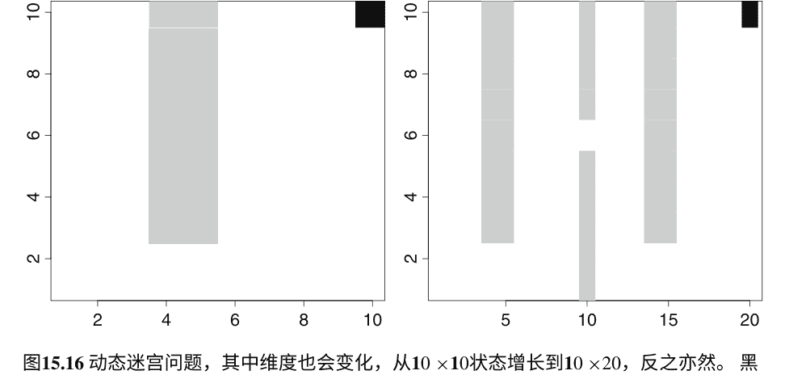

图15.16 动态迷宫问题，其中维度也会变化，从10 ×10状态增长到10 ×20，反之亦然。黑色方块是目标，而灰色方块是墙。有关实验的更多细节和算法的性能，请参阅[53]。

仅通过添加新的群组。SOC的许多变体已经发布，进一步改进了其最初的版本[51, 52]。例如，包括更强大的群组更新等升级。这些改进使SOC能够解决非常具有挑战性的问题，例如动态迷宫（迷宫随时间变化，类似于用于测试小鼠学习能力的迷宫）。图15.16展示了一个迷宫的解决方案[53]。

### 15.10.4 混合

在前面的小节中描述的所有方法都纯粹使用进化算法进行学习（在SUNA和SOC的情况下）或者使用进化来搜索仅使用基于梯度的方法进行训练的架构。然而，大多数在DNN中使用的基于梯度的优化方法可以以多种方式用于进化算法的中间。神经进化可以使用已经通过基于梯度的方法学习的神经网络的部分，并且SOC方法甚至可以从梯度和非梯度的神经网络之间的竞争中受益。选择是无限的，我们只是开始探索它们。

## 15.11 未来展望

在本章中，回顾了对抗机器学习，揭示了其当前最先进的攻击和防御。我们看到，尽管研究人员付出了很多努力，鲁棒性几乎没有改善。然而，自从研究领域在2013年开始以来，我们对抗对抗样本的鲁棒性的含义和原因有了更深入的理解。

此外，还指出了解决对抗机器学习问题的许多途径。这些解决方案涉及进化机器学习和混合模型，其模型的复杂性没有限制。这种进化机器学习算法的例子是SUNA和SOC，它们具有更复杂的模型和更适应性的模块化模型。

致谢本工作得到了JST、ACT-I Grant Number JP-50166的支持，日本。

## 参考文献

- 1. Su, J., Vargas, D.V., Kouichi, S.: 用于愚弄深度神经网络的单像素攻击. IEEE Trans. Evol. Comput. **23**, 828–841 (2019)
- 2. Storn, R., Price, K.: 差分进化-一种用于全局优化的简单高效的启发式算法. J. Glob. Optim. **11**(4), 341–359 (1997)
- 3. Das, S., Suganthan, P.N.: 差分进化：现状综述. IEEE Trans. Evol. Comput. **15**(1), 4–31 (2011)
- 4. Narodytska, N., Kasiviswanathan, S.: 对深度神经网络的简单黑盒对抗攻击。在：2017年IEEE计算机视觉和模式识别研讨会(CVPRW)，第1310-1318页。IEEE，皮斯卡塔韦(2017)
- 5. Goodfellow, I.J., Shlens, J., Szegedy, C.: 解释和利用对抗样本(2014)。预印本arXiv:1412.6572
- 6. Vargas, D.V., Su, J.: 理解单像素攻击：传播图和局部性分析(2019)。预印本arXiv:1902.02947
- 7. Brendel, W., Bethge, M.: 用局部特征模型近似CNN在ImageNet上表现出惊人的效果(2019)。预印本arXiv:1904.00760
- 8. Geirhos, R., Rubisch, P., Michaelis, C., Bethge, M., Wichmann, F.A., Brendel, W.: ImageNet-trained CNNs are biased towards texture; increasing shape bias improves accuracy and robustness. 在：2019年国际学习表示会议 (2019)
- 9. Ilyas, A., Santurkar, S., Tsipras, D., Engstrom, L., Tran, B., Madry, A.: Adversarial examples are not bugs, they are features (2019). 预印本arXiv:1905.02175
- 10. Gilmer, J., Ford, N., Carlini, N., Cubuk, E.: Adversarial examples are a natural consequence of test error in noise. 在：国际机器学习会议，第2280-2289页 (2019)
- 11. Szegedy, C., et al.: 神经网络的有趣特性。 在：国际学习表示会议。Citeseer (2014)
- 12. Nguyen, A., Yosinski, J., Clune, J.: 深度神经网络很容易被愚弄：对于无法识别的图像的高置信度预测。 在：IEEE计算机视觉和模式识别会议论文集，第427-436页 (2015年)
- 13. Moosavi-Dezfooli, S.-M., Fawzi, A., Fawzi, O., Frossard, P.: 通用对抗扰动。 在：2017年IEEE计算机视觉和模式识别会议 (CVPR)，第86-94页。IEEE，皮斯卡塔韦 (2017年)
- 14. Brown, T.B., Man, D., Roy, A., Abadi, M., Gilmer, J.: 对抗性贴片 (2017年)。 预印本arXiv:1712.09665
- 15. Liang, B., Su, M., You, W., Shi, W., Yang, G.: 破解用于逃避的分类器：对Google钓鱼页面过滤器的案例研究。 在：第25届国际万维网会议论文集。国际万维网会议指导委员会，第345-356页 (2016年)
- 16. Li, D., Vargas, D.V., Kouichi, S.: 欺骗深度神经网络的通用规则基于文本分类。 在：IEEE ECEC 2019会议记录 (2019)
- 17. Kurakin, A., Goodfellow, I., Bengio, S.: 物理世界中的对抗性示例。 预印本arXiv:1607.02533 (2016)
- 18. Sharif, M., Bhagavatula, S., Bauer, L., Reiter, M.K.: 为犯罪配件：对最先进人脸识别的真实和隐秘攻击。 在：2016年ACM SIGSAC计算机与通信安全会议论文集，第1528-1540页。ACM，纽约(2016)
- 19. Athalye, A., Sutskever, I.: 合成强健的对抗性示例。 在：国际机器学习会议 (2018)
- 20. Papernot, N., McDaniel, P., Wu, X., Jha, S., Swami, A.: 作为对深度神经网络的对抗扰动的防御的蒸馏。 在：2016年IEEE安全与隐私研讨会(SP)，第582-597页。IEEE，皮斯卡特韦 (2016年)
- 21. Carlini, N., Wagner, D.: 评估神经网络的鲁棒性。 在：2017年IEEE安全与隐私研讨会(SP)，第39-57页。 IEEE，皮斯卡特韦 (2017年)
- 22. Goodfellow, I.J., Shlens, J., Szegedy, C.: 解释和利用对抗样本(2014年)。 预印本arXiv:1412.6572。
- 23. Huang, R., Xu, B., Schuurmans, D., Szepesvári, C.: 与强对手学习(2015年)。预印本 arXiv:1511.03034
- 24. Madry, A., Makelov, A., Schmidt, L., Tsipras, D., Vladu, A.: 面向对抗攻击的深度学习模型. 在: 国际机器学习会议 (2018)
- 25. Tramèr, F., Kurakin, A., Papernot, N., Goodfellow, I., Boneh, D., McDaniel, P.: 集成对抗训练: 攻击和防御. 在: 国际学习表示会议 (2018)
- 26. Vargas, D.V., Kotyan, S.: 对抗机器学习的鲁棒性评估: 问题、解决方案和当前神经网络和防御的调查 (2019). 预印本 arXiv:1906.06026
- 27. Ma, X., Li, B., Wang, Y., Erfani, S.M., Wijewickrema, S., Schoenebeck, G., Song, D., Houle, M.E., Bailey, J.: 利用局部内在维度性质表征对抗子空间 (2018). 预印本 arXiv:1801.02613
- 28. Guo, C., Rana, M., Cisse, M., van der Maaten, L.: 使用输入转换对抗性图像进行对抗. 在: 国际学习表示会议 (2018)
- 29. Athalye, A., Carlini, N., Wagner, D.: 混淆梯度给出了一种虚假的安全感: 规避对抗性示例的防御. 在: 国际机器学习会议 (2018)
- 30. Uesato, J., O’Donoghue, B., Kohli, P., Oord, A.: 对抗风险和评估弱攻击的危险. 在: 国际机器学习会议, 第5032-5041页 (2018)
- 31. Bendale, A., Boult, T.E.: 开放集深度网络的研究. 在: IEEE计算机视觉和模式识别会议论文集, 第1563-1572页 (2016)
- 32. Sabour, S., Frosst, N., Hinton, G.E.: 胶囊之间的动态路由. 在: 神经信息处理系统进展, 第3856-3866页 (2017)
- 33. Grosse, K., Manoharan, P., Papernot, N., Backes, M., McDaniel, P.: 对(统计)检测对抗样本的研究 (2017). 预印本 arXiv:1702.06280
- 34. Xu, W., Evans, D., Qi, Y.: 特征压缩: 检测深度神经网络中的对抗样本. 在: 网络和分布式系统安全研讨会 (NDSS) (2018)
- 35. Carlini, N., Wagner, D.: 对抗样本不容易被检测到: 绕过十种检测方法. 在: 第10届ACM人工智能与安全研讨会论文集, pp. 3–14. ACM, 纽约 (2017)
- 36. Carlini, N., Wagner, D: 磁铁和“对抗攻击的高效防御”对抗对抗样本不具有鲁棒性 (2017). 预印本 arXiv:1711.08478
- 37. Hansen, N., Müller, S.D., Koumoutsakos, P.: 通过协方差矩阵适应 (CMA-ES) 减少随机演化策略的时间复杂度. Evol. Comput. 11(1),1–18 (2003)
- 38. Zagoruyko, S., Komodakis, N.: 宽残差网络 (2016)。 预印本 arXiv:1605.07146
- 39. Iandola, F., Moskewicz, M., Karayev, S., Girshick, R., Darrell, T., Keutzer, K.: DenseNet: 实现高效的ConvNet描述符金字塔 (2014)。 预印本 arXiv:1404.1869
- 40. He, K., Zhang, X., Ren, S., Sun, J.: 深度残差学习用于图像识别. 在: IEEE计算机视觉和模式识别会议论文集, 第770–778页 (2016)
- 41. Lin, M., Chen, Q., Yan, S.: 网络中的网络 (2013)。 预印本arXiv:1312.4400
- 42. Springenberg, J.T., Dosovitskiy, A., Brox, T., Riedmiller, M.: 追求简单: 全卷积网络 (2014)。 预印本arXiv:1412.6806
- 43. LeCun, Y., Bottou, L., Bengio, Y., Haffner, P., 等: 基于梯度的学习应用于文档识别. IEEE 86 (11) , 2278-2324 (1998)
- 44. Vargas, D.V., Kotyan, S., Matsuki, M.: 表示质量解释对抗性攻击。 预印本arXiv:1906.06627 (2019)
- 45. Vargas, D.V., Kotyan, S.: 进化稳健的神经架构以抵御对抗性攻击 (2019)。 预印本arXiv:1906.11667
- 46. Negrinho, R., Gordon, G.: DeepArchitect: 自动设计和训练深度架构 (2017). 预印本 arXiv:1704.08792
- 47. Brock, A., Lim, T., Ritchie, J.M., Weston, N.: Smash: 通过超网络进行一次性模型架构搜索 (2017). 预印本 arXiv:1708.05344
- 48. Floreano, D., Dürr, P., Mattiussi, C.: 神经进化: 从架构到学习. 进化智能 1(1), 47–62 (2008)
- 49. Vargas, D.V., Murata, J.: 具有统一神经模型的光谱多样性神经进化. IEEE Trans. Neural Netw. Learn. Syst. 28(8), 1759–1773 (2017)
- 50. Vargas, D.V., Takano, H., Murata, J.: 自组织分类器和分化适应度. 在:遗传和进化计算第十五届年会论文集, pp. 1109–1116. ACM, 纽约 (2013)
- 51. Vargas, D.V., Takano, H., Murata, J.: 创新组织分类器的团队个体多目标强化学习方法. 在: 2014年SICE年会会议论文集, 第1785-1792页. IEEE, 皮斯卡塔韦 (2014年)
- 52. Vargas, D.V., Takano, H., Murata, J.: 在嘈杂和动态环境中创新组织分类器的团队. 在: 2015年IEEE进化计算大会 (CEC), 第2937-2944页. IEEE, 皮斯卡塔韦 (2015年)
- 53. Vargas, D.V., Takano, H., Murata, J.: 自组织分类器: 结构化进化机器学习的第一步. Evol. Intel. 6(2), 57-72 (2013年)

# 索引

- 抽象表示, 41
- 加速系数, 165, 167, 168
- 声学特征向量, 98
- 声学模型, 99, 100, 103, 113
- 激活函数, 37, 41, 43, 58, 216, 220, 227, 256, 259, 300, 301, 304, 308, 310, 312, 335, 337, 342, 363, 364, 373, 390, 426
- Adam, 247, 363
- Adam优化器, 192, 200, 306, 390
- 对抗性机器学习, 402-403, 421, 425, 428
- 激进选择和变异, 328-331, 333, 336, 348, 353
- AlexNet, 45, 156, 254
- Android, 358-362, 366-368, 372, 375
- Android应用程序包（APK）, 367
- 蚁群优化（ACO）, 16-18, 29, 263
- API调用, 358-361, 368
- ε-存档, 160, 161
- 人工蜜蜂群优化（ABC）, 21-24
- 人工智能（AI）, v, 4, 36, 37, 41, 60, 132
- 人工神经网络（ANN）, 37, 38, 42, 43, 49, 132, 135, 145, 148, 149, 210, 253, 254, 260-262, 287, 360, vi
- ASM+, 333, 335, 346, 347, 352-354
- 异步竞争协同进化, 379
- 异步基于岛屿的进化策略, 264
- 自编码器（AE）, 40, 49-51, 57, 59, 60, 187, 197, 201, 212, 360, 361
- 自动音乐转录（AMT）, 241
- AutoML, 182
- 自回归移动平均（ARIMA）, 148, 149
- 平均池化, 44, 158, 160, 189-191, 193, 215, 222
- 航空飞行记录仪数据, 272-273
- 反向传播, vii, 38-40, 44, 47, 50, 54, 55, 58, 71, 116, 119, 134, 136, 186, 188, 212, 237, 261, 275-276, 296
- 结构反向传播（BPTS）, 58
- 时间反向传播（BPTT）, 47, 261, 262, 275, 276
- 回溯搜索优化算法（BSA）, 73, 76, 78-83, 86-92
- 装袋, 382
- 蝙蝠算法（BA）, 72, 76, 78-81, 85-92
- 批量归一化（BN）, 44, 56, 57, 160, 189, 190, 215, 217, 222, 301, 326, 336-338, 342, 348, 352
- 批量更新, 40
- 贝叶斯建模, 243
- 贝叶斯优化, 108-110, 112
- 伯努利分布, 69
- 二元交叉熵（BCE）, 384
- 黑盒优化, 105, 113, 116, 419
- BLEU, 104
- 提升, 45, 276, 382
- 自助法, 390, 394
- 蝴蝶效应, 141

### C

- CalTech 101 Silhouettes数据集, 75, 77, 80-82, 84, 86, 87, 92
- CapsNet, 417, 419, 420, 424
- Cars数据集, 199
- 笛卡尔遗传编程（CGP）, vi, 14-16, 185-205, 212, 235
- CATS数据, 132, 140
- CelebFaces属性数据集（CelebA）, 199, 201, 203, 304-307, 312-314, 317, 318, 380, 387, 389, 390, 392, 394, 396, 397
- 细胞状态提议, 258
- CGP-CAE, 192, 197-205
- CGP-CNN, 186-188, 190, 192-196, 205, 212, 225
- 混沌, 140, 407
- 混沌时间序列, 132, 140-142, 144, 150, 261
- 染色体表示, 187
- CIFAR, 404, 409, 420, 421, 423, 425

### D

- 数据增强, 192
- Davies-Bouldin指标（DBI）, 422-424
- 决策树, 358, 372, 382
- 解码器网络, 50, 102, 103
- 深度自动编码器, 49-51, 59, 60, 212, 361
- 深度置信网络（DBN）, vi, 41, 51-54, 59, 60, 67-94, 131-150, 360
- 深度玻尔兹曼机（DBMs）, 59, 68
- 深度卷积生成对抗网络（DCGAN）, 56, 301, 303, 305, 307, 311, 314, 390
- DeepNEAT, 295, 308
- 深度神经网络（DNN）, v, vi, vii, 35-60, 97-127, 132, 150, 186, 187, 205, 209-213, 216, 227, 295, 310, 325-354, 357-375, 401-428
- 深度递归连接, vii, 253-287
- 支配, 10, 11, 401
- 下采样卷积, 196, 197
- 丢失率 (DR), 44, 215, 216, 223, 227, 244, 245, 369
- 动态迷宫, 427

### E

- 边缘突变, 256, 267-269
- E-GAN, 295, 302-304, 307, 314-318
- 精英率, 7
- 精英选择, 214, 217
- 精英策略, 7-9
- 嵌入式内存顺序 (EMO), 260-262
- 雇用的蜜蜂, 21-23
- 编码器网络, 50, 102, 103
- 编码策略, vi, 157, 158, 162-165, 168, 169, 175, 182, 213
- 基于能量的模型, 51, 68
- 集成, 146, 243, 380, 382, 383, 385, 386, 391, 392, 394-398
- 时代, 40, 71, 76, 83, 84, 134, 141, 156, 165, 171, 172, 174, 175, 178, 192, 193, 211, 217, 219-221, 223, 225-227, 234, 236, 240-247, 271, 276, 286, 307, 326, 329, 333, 336, 346, 347, 352-354, 364, 369, 379, 380, 386, 387, 398
- ES-(1+1)算法, 385
- 逃避攻击, 411
- EvoDeep, 359, 362, 363, 366–370, 372, 375
- 进化算法 (EAs), v, vi, 4–9, 83, 97–127, 186–189, 191–192, 197, 199–202, 205, 210, 211, 220, 263, 295, 296, 299–304, 306–308, 310, 313–316, 319, 359, 381, 384, 404, 412, 428
- 进化计算 (EC), v–vii, 3–32, 138, 150, 156, 172, 174, 175, 182, 186, 212, 234, 300, 319, 327, 360, 401–428
- 进化增强记忆模型 (EXAMM), 254–256, 262–265, 267, 271, 275–276, 279–281, 283, 284, 286, 287
- 进化策略, 380, 386
- 进化训练集, 169–171
- (1 +λ) 进化策略, 191, 192
- 进化策略 (ES), 27, 32, 106–108, 191, 192, 264, 306, 307, 315, 316, 360, 380, 386
- 梯度爆炸, 47, 261, 275, 286
- 扩展BPTT (eBPTT), 261
- 扩展RTRL (eRTRL), 261

### F

- 假阴性 (FN), 344, 345, 347
- 假阳性 (FP), 344, 345, 347, 352
- 特征工程, 36
- 特征提取, 40, 54, 98
- 特征图, 43, 44, 190, 215, 216, 221, 222, 334, 348, 352, 353, 409
- 特征压缩 (FS), 420, 421
- 前馈神经网络 (FFNN), 37, 39, 40, 42, 44, 45, 49, 50, 102, 103, 136, 211
- 少像素攻击, 419, 420
- 滤波器, 43, 44, 50, 161, 197, 199-201, 203, 204, 211, 341, 360
- 滤波器大小, 43, 44, 158, 162, 163, 177, 329, 335, 342-344
- 有限状态机 (FSM), 359, 362, 366, 367, 375
- 萤火虫算法 (FA), 24-26, 73, 76, 78-81, 85, 86, 88-92
- 固定长度编码, 156, 157
- 固定长度表示, 188
- 浮点运算 (FLOPs), 158, 168, 170, 171, 174, 179, 180, 182
- 花传粉算法 (FPA), 72, 76, 78-81, 85-92
- 强制突变, 191
- 遗忘门, 47, 48, 258, 275
- Fréchet Inception Distance (FID), 298-300, 306, 308-313, 315-318, 386, 387, 389, 391, 392, 394-398
- F1得分, 247, 248
- 全连接层, 42, 44, 45, 158, 162-166, 212, 222, 308, 331, 334, 335, 337, 361

### G

- 遗传算法辅助, 212
- 门控循环单元 (GRU), 48, 254, 255, 258, 259, 274, 278
- 基于高斯分布的更新, 385
- 高斯分布, 19, 101, 106, 107, 109
- 基因交叉, 12-14
- 生成对抗网络 (GAN), vii, 54-60, 293-319, 379-398
- 生成器, 54-57, 294-312, 314-319, 379, 380, 382-391, 395, 396, 398
- 遗传算法 (GA), vi, 4, 8, 11, 19, 22, 30, 68, 105, 106, 108, 112, 113

### H

- 耻辱之殿, 239, 245
- 海明距离, 419
- 和谐搜索 (HS), 29-32, 72, 87
- Hénon映射, 132, 140, 143-145
- HGLA, 112
- 隐藏层, 37-40, 45, 46, 49, 50, 53, 69, 71, 72, 103, 115, 117, 125, 126, 133, 134, 136, 141, 147, 158, 255, 260, 261, 299, 301, 373, 390
- 隐藏马尔可夫模型, 99, 100
- 分层特征, 54, 211
- 高级特征, 44, 54, 68, 406-408
- 同源交叉, 237, 238
- 超参数, v-vii, 68, 73, 74, 76, 77, 87, 88, 90, 92, 132, 138, 139, 142-147, 157, 158, 160, 169, 170, 198, 209-220, 222, 223, 226, 227, 234, 241, 247, 263, 275, 286, 294, 295, 300, 329, 330, 357-375, 386, 390

### I

- 图像分类, vi, 42, 59, 112, 155-182, 186, 187, 192, 193, 205, 209-227, 263
- 图像修复, 199, 201, 203
- ImageNet, 45, 299, 341, 404, 405, 408
- ImageNet大规模视觉识别挑战 (ILSVRC), 45, 132, 325
- 图像重建, 59, 71, 74
- 图像恢复, vi, 186, 197, 199, 200, 205
- 非活动节点, 188, 191
- Inception网络, 299
- Inception分数 (IS), 298, 299, 304, 306, 309, 317, 318, 386
- 输入门, 47, 48, 258
- 意图, 358, 361, 367, 368
- 互联网协议, 159
- 交并比, 344, 345
- 野外数据, 273
- 不传递性, 301
- 反向生成距离 (IGD), 304, 305, 315–318
- IP地址, 159, 162–168, 182

### J

- JADE, 73, 76, 78–81, 85, 86, 88–92
- Jensen-Shannon散度 (JSD), 57, 384

### K

- Kaldi配方, 113, 114
- 内核, 43, 109, 158, 162, 177, 190, 191, 211, 215, 216, 220, 227, 308, 309, 335, 343, 361, 364, 369, 373, 408
- 内核函数, 109
- Kullback-Leibler散度, 299

### L

- Lamarckian权重初始化, 262, 271, 286
- 语言模型, 99, 103, 113, 127, 234, 237, 243–245, 248, 249, 259
- 大规模图像分类器的进化 (LEIC), 156
- LDA, 114, 117
- Leaky ReLU, 43, 308, 312, 342, 348
- 学习率, 39, 53, 70, 74, 88-93, 114, 115, 122, 125, 134, 138, 139, 141-143, 145, 147, 170, 172, 174, 192, 193, 213, 215-217, 223, 244, 247, 275, 306, 385, 386, 388, 390
- LeNet, 156, 348, 406, 419, 420, 424
- Lévy飞行, 27-29
- 利皮扎纳, 295, 302, 305-307, 314-319, 379, 380, 382-398
- LISP, 11, 12
- 局部利用, 72
- 位置向量, 18
- 长短时记忆 (LSTM), vii, 47, 48, 234-237, 240-249, 255, 256, 258, 259, 261-263, 274, 275, 278, 285, 286, 361
- 长期预测, 140, 145, 147
- 洛伦兹混沌, 132, 140-145
- 损失函数, 55-57, 139, 192, 197, 217, 294, 296, 298, 301-304, 307, 309, 314, 316, 317, 319, 384
- 李雅普诺夫指数, 407

### M

- 恶意软件检测, 357-375
- 马尔可夫链, 53, 69, 71, 73, 134, 360
- 马尔可夫链蒙特卡罗 (MCMC), 134
- 最大池化, 44, 45, 158, 215, 220
- 平均精度 (mAP), 342-344, 346-348, 351-353
- 均方误差 (MSE), 74, 78-80, 82-86, 89, 91, 93, 138, 139, 141-143, 145-148, 200, 241, 263, 264, 422
- 梅尔频率倒谱系数 (MFCCs), 98, 114, 115, 117, 118, 120
- 记忆细胞, vii, 47, 48, 236-238, 240, 245, 246, 248, 253-288
- 消息传递接口 (MPI), 113, 264
- 元启发式算法, 68, 76, 212
- 元启发式算法, vi, 3-32, 67-94, 106, 111, 212
- 元LSTM, 234-236, 240, 241, 243-246, 248
- 元参数优化, 110, 112, 116, 126
- MIDI, 244, 247
- 小批量, 76, 192, 193, 199, 200, 387-390
- 最小门控单元 (MGUs), 254, 255, 258, 259, 274, 278
- 最小平方误差 (MSE), 74, 77-86, 89, 91, 93, 138, 139, 141-143, 145-148, 200, 241, 264, 422
- 三菱地区喷气机 (MRJ), 8, 9
- MLLT, 114
- MNIST, 74, 75, 77, 78, 81, 82, 85, 87, 88, 112, 173, 182, 212, 219, 297, 305-307, 311, 312, 314, 317, 318, 333, 334, 342, 343, 346, 348, 352, 354, 380, 387, 389-394, 396-398
- 旋转数字和背景图像的MNIST (MRDBI), 173
- 模式崩溃, 56, 57, 294, 297, 301, 304, 306, 307, 312, 313, 382
- 动量, 70, 74, 88-93, 115, 116, 192, 193, 215, 216, 227, 275
- 多层感知器 (MLPs), 37, 40, 132, 133, 136, 137, 139, 141-148, 150, 305, 307, 314, 390
- 多目标进化算法 (MOEA), vi, 8, 9, 111, 168
- 多目标计算, 8
- 多目标方法, 112, 161, 180
- 多目标优化, 9, 11, 110, 118, 161, 180
- 音乐语言模型 (MLM), 244
- 突变, 6, 14, 19, 20, 30, 73, 105, 116, 160, 161, 191-193, 200, 218, 220, 237-239, 245, 256, 262-265, 267, 269-271, 276, 286, 287, 303, 304, 306, 307, 310-312, 315, 316, 327-331, 333-339, 342-344, 347, 348, 351-354, 362, 363, 365, 366, 368, 388-390
- 突变概率, 192, 200, 218, 245, 388, 390
- 突变空间GAN (MustGAN), 295, 302, 307, 308, 314-319

### N

- N700, 7, 9
- NARX网络, 260
- 国家通用航空飞行信息数据库 (NGAFID), 271-275, 288
- 自然ES, 106
- 自然进化策略 (NES), 381
- 自然启发式优化, 67-94, 263
- 最近邻居, 372
- 神经架构搜索 (NAS), 186, 194, 195, 205, 234, 239, 249
- 神经网络, v, 36-40, 49, 51, 57, 101-103, 114, 127, 132, 133, 135, 136, 139, 141, 145, 185-205, 210, 233-249

# 索引
- 增强拓扑的神经进化 (NEAT), 187, 194, 235, 236, 238, 262, 264, 295, 301, 308, 311, 315, 316, 327
- 神经元, 37-40, 42-44, 46, 51, 53, 69, 70, 103, 133, 158, 162, 177, 186, 254-256, 259-263, 267, 274-276, 278, 283, 285, 287, 305, 307, 390, 425, 426, vii
- 中性漂移, 191
- 中性突变, 191, 192
- 节点突变, 237, 264, 269, 287
- 注意, 7, 10, 16, 24, 31, 76, 107, 108, 111, 116, 122, 195, 198, 220, 223, 243, 244, 247, 258, 267, 270, 297, 298, 311, 312, 315, 318, 337, 344, 348, 383, 384, 386, 396
- 新颖性地图, 427
- 迭代次数, 76, 83, 84, 171, 172, 175, 217, 220, 225, 329, 333, 336, 346, 347, 352-354, 364

### O
- 后代生成, 217, 221
- 一步预测, 140-145
- 一像素攻击, 401-428
- 一点交叉, 106, 237, 238
- 在线更新, 40
- 观察蜜蜂, 21-24
- 操作码, 359, 361, 368
- 输出门, 47, 258

### P
- 配对策略, 310, 312
- 并行化, 110, 381
- ε-帕累托支配, 161, 179
- 帕累托边界, 111, 112, 122-124
- 帕累托生成对抗网络, 295, 302, 304-305, 314-319
- 帕累托最优性, 10, 11, 110-112, 116, 119, 179-181
- 帕累托集合, 157, 168, 174, 304, 305, 318
- 粒子编码策略, 162-163, 168, 169, 175
- 粒子群优化 (PSO), vi, 18-20, 22, 26, 29, 68, 72, 132, 137-147, 149, 150, 155-182, 210
- 峰值信噪比 (PSNR), 200-202, 204
- 窥视孔连接, 47, 257
- 宾夕法尼亚树库 (PTB), 243
- 持续对比散度 (PCD), 53, 70, 71, 76, 78-81, 84-93, 134
- 扰动, 24, 73, 402, 403, 406, 407, 411, 412, 414-419
- 表型, 4, 15, 188, 189, 191, 197, 198, 200, 213, 215, 295, 308, 309
- 信息素轨迹, 16
- 钢琴-Midi数据集, 244, 247
- 音高, 31, 244, 272, 274, 275, 277, 280, 282, 284, 285
- 毒性攻击, 411
- 池化层, 42-44, 158-160, 162-168, 190, 196, 211-213, 222, 327, 329, 334, 335, 343, 348
- 种群初始化, 166, 170, 215-216, 271
- 精确率-召回率 (PR) 曲线, 345, 346
- 预训练, 44, 113, 134, 138, 139, 141, 360, 361
- 主成分分析 (PCA), 133, 178
- 概率模型, 108
- 问题无关, 160
- 投影梯度下降 (PGD), 420, 424
- 传播图 (PM), 408, 409
- 伪变长, 156, 157, 163-164, 182
- PTYPE, 4, 5
- PyTorch, 200, 219

### R
- RAM, 132, 380, 387, 390, 398
- 随机森林, 361, 372, 373, 382
- 随机噪声, 413
- 随机搜索 (RS), 16, 81, 87, 132, 137-150, 201, 240, 311
- 随机选择, 73, 214, 215, 217, 218
- 实时递归学习 (RTRL), 261
- 感受野, 43, 187, 190, 191
- 修正线性单元 (ReLU), 37, 43, 45, 56, 160, 189, 190, 197, 198, 215, 217, 220, 222, 237, 300, 301, 308, 312, 335, 337, 342, 348, 364
- 循环细胞, 45-47, 237
- 循环连接, vii, 46, 244, 253-287
- 循环高速公路网络, 235, 245, 249
- 循环神经网络 (RNNs), vii, 40, 45-49, 51, 57, 59, 60, 187, 233-249, 254-266, 268-272, 274-276, 278, 283-287
- 循环节点, 45, 234-240, 243, 245-246, 248, 249
- 循环概率, 265
- 递归神经网络, 57-56
- 强化学习 (RL), 107, 149, 186, 187, 210, 234, 248, 249, 381
- 表示学习, 36, 40, 41
- 繁殖率, 7
- ResBlock, 189-191, 193, 196
- 残差块, 45, 213
- ResSet, 193-196, 212
- 受限玻尔兹曼机 (RBM), 40, 51-54, 59, 68-71, 74, 76, 87, 114, 115, 132-139, 141-150
- Δ-RNN, 254, 255, 259, 274, 278, 285
- 鲁棒性, vii, 81, 319, 401, 408, 410, 413, 417-423, 425, 428
- 轮盘选择, 6, 24

### S
- 侦察蜜蜂, 21, 24
- 分段记忆循环神经网络 (SMRNN), 261, 262
- 选择, 4, 6, 8, 11, 17, 22, 23, 68, 73, 105, 106, 112, 168, 212, 219-221, 238, 271, 286, 302, 305, 309, 311, 315, 316, 328-331, 333, 334, 336, 339, 342, 348, 351-353, 363, 382-385
- 自组织分类器(SOC), 426-428
- 自组织映射(SOM), 427
- 语义图像修复(SII), 201, 202
- Semeion手写数字数据集, 75, 77, 79, 81-83, 85, 87, 90
- 序列到序列(seq2seq)模型, 242, 243
- S表达式, 12
- 浅层神经网络, 36-40
- Sigmoid函数, 37, 40, 53
- 跳跃连接, 195, 197, 199, 201, 203, 204, 212, 240, 260-262, 284-286
- Softmax层, 71
- 稀疏自编码器(SAE), 50
- 空间共进化, 306-308, 314-317, 381
- 空间网格细胞, 379
- 物种形成, 236, 238-239, 245, 308, 311, 316
- 物种, 3, 9, 26, 73, 187, 237-239, 245, 295, 300, 301, 308, 309, 311, 312, 316
- 光谱多样性统一神经进化架构 (SUNA), 425-428
- 堆叠自编码器 (SAE), 132, 360, 361
- 随机梯度下降 (SGD), 56, 172, 187, 192, 193, 217, 220, 263, 275, 379, 385, 387, 388
- (μ + λ) 策略, 362

### T
- 阈值攻击, 418-421
- 时延神经网络 (TDNN), 40, 114, 116, 117, 124, 125
- 时间序列预测, vi, 131-150
- 环形网格, 306, 307, 383, 384
- 总方差最小化 (TVM), 420, 421
- 锦标赛方法, 106
- 锦标赛选择, 7, 384, 388
- 训练轮次, 40, 156, 165, 166, 172, 217, 226, 227, 326, 379, 380, 386, 398
- 迁移学习, 45, 57, 210, 310, 332-333, 341, 342, 354
- 旅行推销员问题 (TSP), 16, 18
- 基于树的表示, 11-14, 236
- 三音素, 100, 101
- 真阳性 (TP), 344, 345, 347, 352
- 截断BPTT (TBPTT), 47

### U
- U-Net, 352, 353
- 更新门循环神经网络 (UGRNN), 254, 255, 259, 274, 280, 283

### V
- 消失梯度, 47, 56, 57, 256, 275, 294, 297, 298, 301, 312
- 变分自编码器 (VAE), 50, 51, 59
- 变异算子, 302, 309-311, 315
- VEGA, 112
- 速度限制, 167-168
- 速度向量, 18
- VGG16, 132, 225, 405
- VGGNet, 45, 156, 172, 210, 254
- 可见层, 53, 54, 69-71, 133, 134
- Voronoi tessellation, 382

### W
- 摇摆舞, 21
- 权重衰减 (WD), 44, 70, 74, 88-93, 192, 193, 215, 216, 223, 227
- WFST解码器, 113
- 白盒攻击, 402, 413, 417
- Wilcoxon秩和检验, 391
- Wilcoxon符号秩检验, 68, 76, 77, 81, 87
- 单词准确率, 104, 108
- 单词错误率 (WER), 104, 111, 116-127

### X
- X射线图像, vii, 333, 338, 340, 354

### Y
- YOLO, 326, 331, 342

### Z
- 零填充, 43