# 深度学习的计算方法
## 理论、实践和应用


魏琪燕


## 计算机科学中的文本

系列编辑

David Gries, 康奈尔大学计算机科学系，纽约州伊萨卡，美国

Orit Hazzan, 以色列海法理工学院科技与科学教育学院

有关该系列的更多信息，请访问http://www.springer.com/series/3191

魏琪燕

# 深度学习的计算方法
## 理论、实践和应用

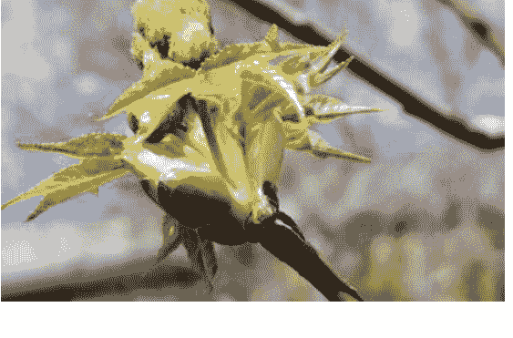

魏琪燕
奥克兰理工大学，新西兰奥克兰

ISSN 1868-0941
ISSN 1868-095X（电子版）
计算机科学文本
ISBN 978-3-030-61080-7
ISBN 978-3-030-61081-4（电子书）
https://doi.org/10.1007/978-3-030-61081-4
©编辑（如适用）和作者，独家许可给Springer Nature Switzerland AG 2021

本作品受版权保护。所有权利仅由出版商独家许可，无论是整体还是部分材料，具体包括翻译、再版、插图重用、朗读、广播、微缩胶片复制或以任何其他物理方式复制、传输或信息存储和检索、电子适应、计算机软件或类似或不同的已知或今后开发的方法。

本出版物中使用的一般描述性名称、注册名称、商标、服务标志等，并不意味着即使在没有具体声明的情况下，这些名称不受相关保护法律和法规的约束，因此可以自由使用。

出版商、作者和编辑可以安全地假设本书中的建议和信息在出版日期时被认为是真实和准确的。出版商、作者或编辑对本文中包含的材料不提供明示或暗示的保证，也不对可能存在的任何错误或遗漏承担责任。出版商在已发表的地图和机构 affiliations 方面保持中立。

这本施普林格印记由注册公司施普林格自然瑞士股份有限公司出版，注册公司地址为：瑞士Cham市Gewerbestrasse 11号，6330

# 前言

本书是根据我最近在新西兰奥克兰理工大学（AUT）为我们的研究生学生进行的讲座、演讲和研讨会而起草的。我们将深度学习和机器学习的材料以及人工神经网络集成在一起，对内容进行了重新调整，并出版了这本书，以便更多的研究生学生，特别是那些正在为他们的论文工作的学生，能够从我们的研究和教学工作中受益，以启发他们的项目。

在本书中，我们按照数学的易于困难的顺序组织我们的内容，并从机器智能的角度准备我们的内容进行知识传递。我们从理解人工神经网络的设计和激活函数开始，然后用先进的数学解释深度学习的机制。在每章的结尾，我们特别强调如何使用基于Python的平台和最新的MATLAB工具箱来实现深度学习算法；我们还列出了我们关注的问题，供思考和讨论。

在阅读本书之前，我们强烈建议读者学习研究生数学知识，特别是那些基础学科，如数学分析、线性代数、优化、计算方法、微分几何、流形、信息论以及基础代数、泛函分析、图模型等。计算机知识将帮助我们不仅理解本书，还能理解相关的期刊文章和会议论文，涉及到深度学习领域。

本书是为研究生和工程师以及对深度学习的计算方法和理论分析感兴趣的计算机科学家编写的。更一般地说，本书也适合对机器智能、模式分析、计算机视觉、自然语言处理（NLP）和机器人技术感兴趣的研究人员。

新西兰奥克兰
2020年9月
魏琪燕

# 致谢

感谢我们的同行和学生们提供的参考资料，并对本书提出宝贵的意见。特别感谢我的研究生们：王先生、张博士、卢先生、沈先生、郑先生、任小姐、李先生、李先生、刘先生、沈小姐、王小姐、辛先生、张小姐、刘先生、肖小姐、刘先生、宋先生、马先生、孙先生、付小姐、安小姐、张小姐、顾博士，以及我的同事阮博士、克莱特教授。

# 目录

- 1 引言 ................................................................. 1
   - 1.1 引言 ................................................................. 1
   - 1.2 深度学习 ............................................................. 3
   - 1.3 深度学习编年史 ....................................................... 6
   - 1.4 我们的深度学习项目 ................................................... 12
   - 1.5 深度学习中的获奖作品 ................................................. 14
   - 1.6 问题 ................................................................ 15
   - 参考文献 ................................................................ 15
- 2 深度学习平台 ............................................................ 21
   - 2.1 引言 ................................................................ 21
   - 2.2 MATLAB用于深度学习 ................................................... 22
   - 2.3 TensorFlow用于深度学习 ................................................ 26
   - 2.4 数据增强 .............................................................. 31
   - 2.5 基础数学 .............................................................. 32
   - 2.6 问题 ................................................................ 36
   - 参考文献 ................................................................ 37
- 3 卷积神经网络和循环神经网络 ................................................ 39
   - 3.1 卷积神经网络和YOLO .................................................... 39
       - 3.1.1 R-CNN ........................................................... 40
       - 3.1.2 Mask R-CNN ....................................................... 41
       - 3.1.3 YOLO ............................................................ 42
       - 3.1.4 SSD .............................................................. 43
       - 3.1.5 DenseNets和ResNets ................................................ 43
   - 3.2 循环神经网络和时间序列分析 .............................................. 44
   - 3.3 HMM ................................................................. 45
       - 3.3.1 RNN: 循环神经网络 ................................................ 46
       - 3.3.2 时间序列分析 ..................................................... 50
   - 3.4 函数空间 .............................................................. 53
       - 3.4.1 度量空间 ......................................................... 53
- 3.5 向量空间 ........................................ 54
   - 3.5.1 范数空间 ........................................ 57
   - 3.5.2 希尔伯特空间 ........................................ 58
- 3.6 问题 ........................................ 60
- 参考文献 ........................................ 60
- 4 自编码器和生成对抗网络 ........................................ 65
   - 4.1 自编码器 ........................................ 65
   - 4.2 正则化和自编码器 ........................................ 66
   - 4.3 生成对抗网络 ........................................ 68
   - 4.4 信息论 ........................................ 71
   - 4.5 问题 ........................................ 75
   - 参考文献 ........................................ 76
- 5 强化学习 ........................................ 77
   - 5.1 引言 ........................................ 77
   - 5.2 贝尔曼方程 ........................................ 78
   - 5.3 深度 Q-学习 ........................................ 80
   - 5.4 优化 ........................................ 83
   - 5.5 数据拟合 ........................................ 83
   - 5.6 问题 ........................................ 86
   - 参考文献 ........................................ 87
- 6 CapsNet和流形学习 ........................................ 89
   - 6.1 CapsNet ........................................ 89
   - 6.2 流形学习 ........................................ 92
   - 6.3 问题 ........................................ 95
   - 参考文献 ........................................ 97
- 7 玻尔兹曼机 ........................................ 99
   - 7.1 玻尔兹曼机 ........................................ 99
   - 7.2 限制玻尔兹曼机 ........................................ 99
   - 7.3 深度玻尔兹曼机 ........................................ 102
   - 7.4 概率图模型 ........................................ 102
   - 7.5 问题 ........................................ 107
   - 参考文献 ........................................ 107
- 8 迁移学习和集成学习 ........................................ 109
   - 8.1 迁移学习 ........................................ 109
       - 8.1.1 迁移学习 ........................................ 109
       - 8.1.2 任务学习 ........................................ 110
   - 8.2 同李神经网络 ........................................ 111
   - 8.3 集成学习 ........................................ 112
   - 8.4 深度学习中的重要工作 ........................................ 115
- 8.5 深度学习中的获奖工作 .......................... 118
- 8.6 问题 ............................................. 118
- 参考文献 ............................................. 118
- 术语表 ............................................. 121
- 索引 ............................................. 127

# 关于作者

鄢伟琪 奥克兰理工大学，新西兰奥克兰。鄢伟琪博士是新西兰奥克兰理工大学（AUT）的副教授，他的专长是智能监控、深度学习、计算机视觉和多媒体技术；他是奥克兰理工大学机器人与视觉中心的主任。他曾担任国际数字犯罪与取证学（IJDCF）的主编，现为主编荣誉退休；他曾是新西兰皇家学会（RSNZ）与中国科学院（CAS）之间的交流计算机科学家；他是中国科学院的客座（兼职）教授，负责博士生导师工作；他曾是新西兰马塞大学、奥克兰大学和新加坡国立大学的访问教授。

# 符号和缩写

## 符号

| 符号 | 解释 |
| --- | --- |
| $\mathscr{Z}$ | 整数集合 |
| $\mathscr{Z}^+$ | 正整数集合 |
| $\overline{1,n}$ | $1,2,\cdots,n$ |
| $\mathscr{R}$ | 实数集合 |
| $\cup$ | 集合的并 |
| $\cap$ | 集合的交 |
| $\in$ | 成员 |
| $\subset$ | 真子集 |
| $\subseteq$ | 子集 |
| $\exists$ | 存在 |
| $\forall$ | 对于所有 |
| $\perp$ | 垂直 |
| $\triangleq$ | 定义 |
| $\rightarrow$ | 映射 |
| $\pm$ | 加或减 |
| $\sum$ | 和 |
| $\prod$ | 乘积 |
| $\infty$ | 无穷 |
| $\|\cdot\|$ | 范数函数 |
| $det(\cdot)$ | 行列式 |
| $\mathbf{N}(\cdot)$ | 高斯分布 |
| $\sigma(\cdot)$ | 激活函数 |
| $< \cdot >$ | 内积或点积 |
| $L(\cdot)$ | 损失函数 |
| $J(\cdot)$ | 成本函数 |
| $\text{对数}(\cdot)$ | 以10为底的对数 |
| $\text{自然对数}(\cdot)$ | 自然对数 |
| $\text{指数函数}(\cdot)$ | 指数函数 |
| $\text{双曲正切}(\cdot)$ | 双曲正切函数 |
| $\text{最大值}(\cdot)$ | 最大值函数 |
| $\frac{df}{dx}$ | 导数 |
| $\frac{\partial f}{\partial x}$ | 偏导数 |
| $\int$ | 积分 |
| $C^1$ | 一阶参数连续性 |
| $C^2$ | 二阶参数连续性 |
| $C^\infty$ | 无穷连续性 |
| $E(\cdot)$ | 期望值函数 |
| $p(y|x)$ | 条件概率 |
| $\mu$ | 均值 |
| $\sigma$ | 方差 |
| $\text{argmax}(\cdot)$ | 最大值的参数 |
| $\text{sign}(\cdot)$ | 符号函数 |
| $w_{ij}$ | 矩阵 $\mathbf{W}$ 的元素 $w_{ij}$ |
| $b_i$ | 向量 $\mathbf{b}$ 的元素 $b_i$ |
| $\mathbf{W}$ | 权重矩阵 $\mathbf{W}$ |
| $\mathbf{W}^\tau$ | 矩阵转置 |
| $\mathbf{b}$ | 位移向量 $\mathbf{b}$ |
| $\mathbf{b}^\tau$ | 向量转置 |
| $\mathbf{P}$ | 点 $\mathbf{P}$ |
| $\mathbf{S}$ | 集合 $\mathbf{S}$ |

## 首字母缩写

| 缩写 | 解释 |
| --- | --- |
| ACM | 计算机协会 |
| AdaBoost | 自适应增强 |
| AI | 人工智能 |
| ANN | 人工智能神经网络 |
| ASCII | 美国信息交换标准代码 |
| Bagging | 自助聚合 |
| CNN | 卷积神经网络 |
| ConvLSTM | 卷积长短期记忆 |
| ConvNet | 卷积神经网络 |
| CVPR | 国际计算机视觉会议 |
| DBM | 深度Boltzmann机器 |
| DBN | 深度信念网络 |
| DMRF | 深度马尔可夫随机场 |
| FAIR | Facebook人工智能研究 |
| FCN | 完全卷积网络 |
| FCNN | 全连接神经网络 |
| FN | 假阴性 |
| FP | 假阳性 |
| FRU | 完全门控单元 |
| GAN | 生成对抗网络 |
| GPU | 图形处理单元 |

- GRU 门控循环单元
- HOG 方向梯度直方图
- ICCV 计算机视觉国际会议
- LBP 本地二进制模式
- LSTM 长短期记忆
- MC 蒙特卡洛方法
- MCNN 多通道卷积神经网络
- MDP 马尔可夫决策过程
- MGU 最小门控单元
- MNIST 修改后的NIST数据库
- MRF 马尔可夫随机场
- MRI 磁共振成像
- MRP 马尔可夫随机过程
- NIST 国家标准与技术研究所
- NLP 自然语言处理
- PCA 主成分分析
- PDF 概率密度函数
- R-CNN 基于区域的卷积神经网络
- ReLU 修正线性单元
- ResNet 深度残差网络
- RNN 循环神经网络
- ROI 感兴趣区域
- RPN 区域提案网络
- SARSA 状态-动作-奖励-状态-动作
- SGD 随机梯度下降
- SSD 单次多框检测器
- ST-GCN 时空图卷积网络
- SVM 支持向量机
- TD 时间差异
- TN 真阴性
- TP 真阳性
- VAE 变分自编码器
- WCSS 簇内平方和
- YOLO 你只看一次

## 1.1 介绍

深度学习在信息技术的多年演变之后出现，如传感器网络、云计算、大数据、万维网（WWW）、移动技术、超级计算等。传感器网络为我们提供了大量的数据，以便我们能够充分接触和理解这个网络世界，云计算为这些数据提供了存储空间。通过使用WWW和互联网技术，可以对大数据进行可视化和分析，而移动电话可以使用我们的拇指查看或操作数据处理。经过这么多年的知识积累和演变，深度学习出现并成为这个数字时代的标志性技术。我们可以说深度学习是历史必然性的一个子序列。

深度学习是当前炙手可热的技术，被认为是人工神经网络（ANNs）和人工智能（AI）的核心技术。深度学习也被称为深度神经网络（DNNs），人工神经网络是人工智能的核心内容。人工智能的最新发展已经在深度学习中得到了体现。

ACM 2018年图灵奖已授予三位计算机科学家：Yoshua Bengio, Geoffrey Hinton和Yann LeCun，以表彰他们在概念和工程方面的突破，使得深度神经网络成为2019年计算的关键组成部分。图灵奖通常被认为是计算机界的诺贝尔奖，是由计算机协会（ACM）每年颁发给在计算机领域做出持久和重大技术贡献的人员的奖项。

这组计算机科学家在《自然》[1]和《科学》[2]杂志上发表的文章展示了他们在这个领域的独特贡献。这些出版物被认为是这个领域的经典之作。麻省理工学院出版社[3]出版的名为《深度学习》的书概述了这个研究领域，并激发了许多年轻学生和爱好者的兴趣。正如书中所述，对于深度神经网络（DNNs），通常会导入输入数据，并计算出这些激活函数的输出，以模拟神经元的刺激，这些激活函数包括ReLU函数、Sigmoid函数、Logistic函数等。转移函数从用于转换目的的名称转换中，即从输入节点到神经元的输出。另一方面，激活函数检查输出是否满足阈值，并输出零或一。神经网络的输入数据和输出数据之间的差异应该被最小化。

2011年，ReLU激活函数 \(y = x^{+} = \max(x, 0), x \in (-\infty, +\infty)\) 被发现比Tanh激活函数 \(y = \tanh(x), x \in (-\infty, +\infty)\) 在解决消失梯度问题方面更好，为深层神经网络的进一步发展铺平了道路[4]。

通常，我们使用反向传播，包括前向传播和后向传播，来调整卷积神经网络的权重。机器学习中的DNN算法已经分为有监督学习和无监督学习。

有监督学习与标记数据或真实数据相关。公共网站，如NIST（国家标准与技术研究所），还提供经过验证的数据集MNIST（改进的NIST数据库）用于深度学习模型的训练和测试。

相反，无监督学习受到相似性函数的影响，例如聚类是一种典型的无监督学习方法。在深度学习中，无监督学习方法包括主成分分析（PCA）、自编码器、流形学习等。无监督学习方法已经应用于降维。降维，或者降维度，是将数据从高维空间转换为低维空间，使得低维表示保留原始数据的有意义特性，理想情况下接近其内在维度。

著名的游乐场软件Tinker已经被应用于理解ANNs，如图1.1所示，它展示了DNNs的工作原理，相关参数和结果明确地链接到一个网页上。提供了四种示例数据集进行演示。任何输入参数的调整都会反映在分类和回归可视化结果的变化中。网络架构可以手动调整，网络的节点可以由网络设计师自由添加或删除。提供了L1和L2正则化进行选择。其他选项包括四种激活函数、学习率和迭代次数。

在反向传播过程中，我们需要基于优化计算随机梯度，通常采用SGD（随机梯度下降）算法。SGD是一种用于优化具有适当平滑性属性（例如可微分或次可微分）的目标函数的迭代方法。因此，需要使用函数微分的链式法则。同时，各种参数优化中已经考虑了小批量处理。

在深度学习中，最热门的研究课题现在分布在流形学习、强化学习、生成对抗网络（GAN）等领域。这些典型方法已经应用于自动化或自动控制、机器视觉、自然语言处理、智能监控、推荐系统等领域。

深度学习更新非常快。Github.com网站提供了各种项目的相关源代码和数据集。从技术角度来看，有两个非常流行的软件平台：MATLAB和基于Python的TensorFlow，可以轻松实现深度学习项目。

## 1.2 深度学习

深度学习，也称为深度神经网络，起源于对生物视觉和大脑信息处理的建模。深度学习是机器学习或机器智能的一部分内容。AlexNet迈出了深度学习的第一步，它已经应用于著名的MNIST数据集的手写识别中，即AlexNet由Alex Krizhevsky设计，并与Ilya Sutskever和Geoffrey Hinton一起发表。AlexNet在2012年9月的ImageNet大规模视觉识别挑战赛中获得了竞争。该网络的前5个错误率为15.3%，低于亚军。2015年，AlexNet赢得了ImageNet 2015比赛。ImageNet是一个按照WordNet层次结构组织的图像数据库，层次结构的每个节点都由数百或数千个图像描述。

深度学习与数学密切相关，特别是优化、图论、数值分析、函数分析、概率论、数理统计、信息论等。这些学科可以为神经网络模型提供分析。通常，在测量神经网络或评估算法时，我们考虑其在数值分析中的鲁棒性、稳定性和收敛性。

在深度学习中，我们使用梯度下降来更新深度学习模型的参数。梯度下降是一种用于寻找函数局部最小值的一阶迭代优化算法。例如，梯度下降用于将线性方程组求解为二次最小化问题，例如使用线性最小二乘法。方程组的解 $\mathbf{Ax} - \mathbf{b} = 0$ (1.1)的定义是最小化函数 $F(\mathbf{x}) = \|\mathbf{Ax} - \mathbf{b}\|^2_2$。 (1.2)

在线性最小二乘法中，对于实数 $\mathbf{A}$ 和 $\mathbf{b}$，使用欧几里得范数, $\nabla F(\mathbf{x}) = 2\mathbf{A}^T (\mathbf{Ax} - \mathbf{b}).$ (1.3)

基于这个观察，我们从一个猜测 $\mathbf{x}_0$开始，用于寻找局部最小值 $F$，并考虑序列 $\mathbf{x}_0, \mathbf{x}_1, \mathbf{x}_2, \ldots$等等 $\mathbf{x}_{n+1} = \mathbf{x}_n - \gamma \nabla F(\mathbf{x}_n), n \geq 0,$ (1.4) 其中 $\gamma \in \mathscr{R}^+$ 足够小，步长 $\gamma$的值可以在每次迭代中进行调整。

如果我们有一个需要最小化的成本或误差函数 $F(\mathbf{w})$，梯度下降告诉我们 要沿着 $F(\mathbf{w})$的最陡下降方向修改权重，权重衰减方程为 $\mathbf{w}_{n+1} = \mathbf{w}_n - \gamma \nabla F(\mathbf{w}_n), n \geq 0,$ (1.5) 其中 $\gamma$是学习率， $\mathbf{w}_n$表示DNN的权重。在数值分析[8]中，方程(1.5)的迭代终止条件是预设的循环次数或运行时间以及给定的结果估计和相邻循环之间的误差。

在深度学习中，我们仍然面临着优化问题，例如解的存在性、稳定性、鲁棒性和权重衰减的收敛性，就像大多数计算方法中的现有问题一样。深度学习中的两个问题是梯度消失问题和梯度爆炸问题。

目前，SGD中的梯度消失问题和梯度爆炸问题可以通过使用多层次网络限制玻尔兹曼机、生成模型、长短期记忆（LSTM）、残差网络（ResNets）来解决，而梯度爆炸问题可以通过使用重新设计的网络、ReLU激活函数、RNN中的LSTM、梯度裁剪、权重正则化等方法来避免。

正则化是为了避免梯度爆炸和消失[3, 9]。正则化被定义为对学习算法进行修改，以减少其泛化误差而不是训练误差。正则化将有助于减少过拟合并将权重驱动到较低的值。

正则化的目标函数是 $\hat{J}(\theta; \mathbf{X}, \mathbf{y}) = J(\theta; \mathbf{X}, \mathbf{y}) + \alpha \cdot \Omega(\theta),$ (1.6) 其中 $\alpha\in [0, \infty)$是超参数或正则化率； $\theta$表示所有参数。通过使用 $\theta^*=\arg \min\nabla_\theta \hat{J}(\theta; \mathbf{X}, \mathbf{y})$,
$$\nabla_\theta \hat{J}(\theta; \mathbf{X}, \mathbf{y}),\tag{1.7}$$
典型的正则化方法包括Tikhonov正则化、稀疏正则化、Lagrangian正则化等。

Tikhonov正则化或 $L_2$正则化是
$$\Omega(\theta) = \frac{1}{2}\|\mathbf{w}\|_2^2.\tag{1.8}$$
因此，
$$\hat{J}(\mathbf{w}; \mathbf{X}, \mathbf{y}) = J(\mathbf{w}; \mathbf{X}, \mathbf{y}) + \frac{\alpha}{2}\mathbf{w}^\tau \mathbf{w}.\tag{1.9}$$
梯度，
$$\nabla_{\mathbf{w}} \hat{J}(\mathbf{w}; \mathbf{X}, \mathbf{y}) = \nabla_{\mathbf{w}} J(\mathbf{w}; \mathbf{X}, \mathbf{y}) + \alpha \cdot \mathbf{w}.\tag{1.10}$$
更新权重，
$$\mathbf{w} \leftarrow \mathbf{w} - \epsilon \cdot \nabla_{\mathbf{w}} \hat{J}(\mathbf{w}; \mathbf{X}, \mathbf{y}), \epsilon \in (0, 1).\tag{1.11}$$

稀疏正则化或 $L_1$正则化指的是
$$\Omega(\theta) = \|\mathbf{w}\|_1 = \sum_i |\omega_i|\tag{1.12}$$
$L_1$ 正则化是
$$\hat{\mathbf{J}}(\mathbf{w}; \mathbf{X}, \mathbf{y}) = \alpha\|\mathbf{w}\|_1 + J(\mathbf{w}; \mathbf{X}, \mathbf{y}).\tag{1.13}$$
关于梯度的问题，
$$\nabla_{\omega} \hat{\mathbf{J}}(\mathbf{w}; \mathbf{X}, \mathbf{y}) = \alpha \cdot Sign(\mathbf{w}) + \nabla_{\omega} J(\mathbf{w}; \mathbf{X}, \mathbf{y})\tag{1.14}$$
$$\mathbf{w} \leftarrow \mathbf{w} - \epsilon \cdot \nabla_{\mathbf{w}} \hat{J}(\mathbf{w}; \mathbf{X}, \mathbf{y}), \epsilon \in (0, 1).\tag{1.15}$$

拉格朗日正则化意味着一个广义的拉格朗日函数（或乘子）和一个常数 $k$ 满足
$$\mathscr{L}(\theta, \alpha; X, y) = J(\theta; X, y) + \alpha \cdot (\Omega(\theta) - k).\tag{1.16}$$
当我们寻求权重衰减的最大值时，我们无法保证所有的权重都存在，这些权重可以直接找到。 但是经过正则化后，如果我们使用随机梯度下降（SGD），我们可以更好地获得峰值点并避免困难问题。
数学正则化有很多优点，通过增加偏差来减少方差，正则化可以减少过拟合并将权重驱动到较低的值。 正则化和dropout一样有效。

## 1.3 深度学习编年史

深度学习在解决实际问题方面显示出其有效性和优越性。 当使用与大数据相关的技术时，它在视觉对象检测和识别、图像分割、语音识别、自然语言处理和机器人控制方面特别成功，超过了我们人类的能力。

1995年，卷积神经网络（CNN）作为典型的神经网络已经被用于邮政编码识别[10-12]，或者在银行支票上手写数字的识别。 CNN可以帮助我们找到感兴趣的区域（ROI）和显著区域，这是基于模拟我们人类神经系统的机制。 端到端的结构和精细调整的优点激发了我们在像素级别上识别细小物体的能力[13]。 通常，LeNet-5是由LeCun Yann等人于1998年创建的具有7个级别的卷积网络，用于识别32 ×32像素图像上的手写数字，被几家银行应用。

1997年，AdaBoost算法被提出用于从弱分类器中提升一个强分类器[15, 16]。 这使得集成学习可以应用于机器学习[17]或深度学习[3]。

随机森林是一种集成学习方法，用于分类和回归通过在训练时构建多个决策树并输出分类回归的模式。 随机森林[18]基于决策树，随机森林如图1.2所示。当多个树被集成在一起时形成了随机森林[19]。 决策树通常用于决策[17]。

自1995年以来，SVM（支持向量机）[20]已成为一种流行的机器学习算法，用于基于特定特征的模式分类以及超平面和超参数[17]。 与机器学习中的SVM [20]不同，深度学习算法使用多个类别，具有最高概率的类别将被视为神经网络的输出[21]。 深度学习[3]基于神经网络的端到端框架，这是一个设计良好的主题不仅在编程和数据收集方面，还在数学理论和网络结构方面。

深度置信网络（DBN）是一个有向网络[22, 23]，其中边和节点具有不同的权重；另一方面，深度马尔可夫随机场[24]是一个无向网络，其中所有边都是双向的。深度玻尔兹曼机器（DBM）是一种具有多层隐藏随机变量的二进制成对马尔可夫随机场（无向概率图模型）。它是一个具有对称耦合的随机二进制单元的网络[25, 26]。DBM已成功应用于模式分类、回归和时间序列建模。

AlexNet是一个早期的简单神经网络[6]。AlexNet包含八层，前五层是卷积层，后面是最大池化层，最后三层是全连接层。作为机器学习和机器智能的里程碑，AlexNet赢得了2012年的ImageNet挑战。在其后续版本中，深度学习在与计算机视觉相关的测试中超越了我们的人类视觉系统。

AlexNet在其早期的深度学习工具箱中使用MATLAB实现，并且已经发展成为迁移学习的一部分。

AlexNet是一个基于ImageNet数据库中超过一百万张图像进行训练的CNN网络。该网络有八层深度，可以将图像分类为包括键盘、鼠标、铅笔和许多动物在内的1,000个对象类别。该网络的图像输入尺寸为227 ×227。

R-CNN是基于区域的CNN。在传统CNN的基础上，将提议添加到了这个神经网络结构中。建议的感兴趣区域已被推荐用于减少处理时间。

Fast [27–29]和Faster R-CNN [30, 31]是基于区域的CNN（R-CNN），它起源于CNN（ConvNets），但R-CNN已被应用于基于区域分割和ROI [30]快速查找对象。如果区域可以更早地给出，将加快视觉对象定位和分类的计算速度。

R-CNN的最大问题是其训练时间非常长，因为它首先需要获取1,000-2,000个提议并保存它们；这些提议需要在所有前面的层中计算。此外，全连接层期望所有向量具有相同的大小，所有提议需要调整大小使用裁剪或包装，两种策略都不适用，因为裁剪可能导致提议没有完全提取，而包装可能改变对象的比例。

Fast R-CNN是在2015年提出的，它克服了R-CNN的几个问题。Fast R-CNN所做的是替换ROI池化层，并且对分类应用了softmax。softmax是将逻辑回归函数扩展到多类别分类问题的一种方法。

在Fast R-CNN之后，提出了Faster R-CNN来提高Fast R-CNN的训练速度。从R-CNN到Faster R-CNN，目标检测的四个步骤最终统一到一个网络中。Faster R-CNN不使用选择性搜索来获取区域提议。相反，它利用区域提议来执行相同的任务。没有重复，所有计算都是使用GPU [30, 31]执行的。

近年来，YOLO [32] (Darknet) 已成为非常流行的深度网络。Darknet是一个开源框架。它快速、易于安装，支持CPU和GPU计算。YOLOv3是YOLO系列的第三个版本 (https://pjreddie.com/darknet/)。在YOLOv3之前，YOLO和YOLOv2已经被开发用于深度学习中的视觉目标检测，特别是行人检测[33]。2020年，YOLOv4提出了用于目标检测的最佳速度和准确性。

YOLO是一种快速的目标检测器，它创建网格单元，每个单元将预测边界框和该框的置信度分数。为了评估YOLO，定义了一个7×7的边界框和20个标记类别，这意味着它只提取了98个建议。YOLO比需要2,000个建议的R-CNN更快。

YOLO使用整个图像而不是区域建议来训练和测试，这样可以降低背景错误率。与PASCAL VOC 2007上的另一个实时系统相比，YOLO具有压倒性的优势。Fast R-CNN每张图像生成边界框建议的时间约为2秒。最准确的模型Faster R-CNN达到了7fps，而较小的模型(Faster R-CNN)的m PAof为62.1，达到了18fps。但是YOLO可以达到45 fps，比R-CNN快两倍，甚至具有更高的m PAof 63.4。YOLO的局限性在于每个单元格只能预测边界框，但只能检测到一个类别，这使得小物体很难被检测到。

SSD（单次多框检测器）[34, 35]以在分辨率和速度之间取得平衡而闻名，如图1.3所示。同时，YOLO [32]和YOLOv2在使用7×7块进行操作以实现快速检测物体方面表现出色。现在，YOLOv3被认为克服了缺点，并成为了一个非常优秀的目标检测方法。

深度残差网络 (ResNet) [36, 37]的设计目的是避免梯度消失和梯度爆炸的问题，通过重复使用前一层的激活直到相邻层学习到它的权重。ResNets利用跳跃连接或者快捷方式来跳过一些层。

## 1.4 我们的深度学习项目

基于深度学习的项目有很多[66–74]。这些开发的特点与传统的机器学习或模式分类不同。我们想在下面列出其中一些。

已经开发了一个用于人脸检测和识别的项目[70, 75,76]。在这个项目中，我们从多个视角拍摄了更多的人脸照片，并使用数据增强训练了inception网络。如果无法检测到人脸，我们将迅速切换到人体步态识别。如果人脸被部分遮挡，我们仍然可以使用训练有素的模型和训练数据集进行检测。

在基于人脸识别的年龄估计[77]中，我们提出了一种改进的端到端学习算法，通过使用深度CNNs来解决多类别分类和回归的聚合问题。我们的贡献是采用最新的注意力和归一化机制来平衡所提出模型的效率和准确性。此外，由于其紧凑的尺寸和卓越的性能，我们的模型适合部署在移动设备上。将来，我们将探索将此机制应用于与面部信息相关的其他应用。

提出了一种名为时空图卷积网络（ST-GCN）的动态骨架模型，通过自动学习视觉数据中的空间和时间模式来实现人类行为识别。

它基于视频进行姿势估计，并构建骨架序列的时空图。时空图卷积的多层逐渐在图上生成高级特征图。通过将标准的softmax分类器应用于相应的类别进行分类。

人体步态识别是最有前景的生物特征技术之一，尤其适用于不显眼的视频监控和远距离人体识别[76, 80–83]。为了提高识别率，我们研究了使用深度学习的步态识别，并提出了一种基于多通道卷积神经网络（MCNN）和卷积长短期记忆（ConvLSTM）的方法。

人手指运动可以用于莫尔斯电码输入[84, 85]。在某种情况下，如果我们不被允许大声说话，我们可以使用手势或莫尔斯电码与他人联系。在桌面上写莫尔斯电码不会引起太多注意。使用人体手势识别的计算机视觉技术可以帮助在静音模式下进行相互无声的交流。

近年来，深度神经网络在解决复杂问题方面取得了显著进展。深度神经网络适用于处理与时间序列分析相关的问题，如语音识别和自然语言处理。视频动态检测是一个时间相关的例子。显然，视频动态检测需要利用给定视频的当前、前一个和后一个帧。如果发生帧变化，它会触发视频事件是否发生。我们可以使用RNN和GRU实现高精度和实时的视频动态检测，还可以应用CNN来减小视频大小并提取关键信息。我们将CNN和RNN结合在一起，显著减小了视频数据的大小和训练时间[86]。

移动车辆的盲点检测[87]已经作为一个研究项目开发出来。司机经常回头看动作可以减少，监控系统可以自动及时计算盲点中的移动物体，并在任何时候向司机报告潜在的危险。

火焰检测[72, 88]是我们多年来开发的一系列项目；可以识别燃烧火灾和可燃材料产生的火焰。在这个项目中，我们通过深度学习的微调来检测火焰区域。已经发现自然火灾的特征可以区分正确或错误的火焰。

货币和硬币的检测、识别和取证仍然非常重要[89, 90]。到目前为止，我们可以通过物体检测快速找到货币。我们主要使用基于深度学习的SSD模型作为框架，采用CNN提取纸币的特征，从而可以准确识别货币和硬币的面额，包括正反面。

我们使用深度学习方法来去除图像中的噪声。在训练神经网络模型之后，我们可以获得参数来使任何图片变得平滑，包括经过JPEG有损压缩后的图片。深度学习具有重建图像的能力。

阿尔茨海默病（AD）是一种神经退行性疾病，导致记忆和行为受损[91-93]。早期发现和诊断可以延缓该疾病的进展。深度学习已应用于阿尔茨海默病的诊断。提出了一种用于磁共振成像（MRI）早期诊断AD的具有注意力机制的选择性核网络（SKANet）。注意力机制已成为各种任务中引人注目的序列建模和转导模型的重要组成部分，允许对输入或输出序列的距离进行依赖建模。注意力机制被添加到块的底部，以强调重要特征并抑制不必要的特征，以获得网络的准确表示[94]。

深度学习可以帮助水果识别，并使计算机自动检测水果的新鲜度和成熟度[95]。苹果成熟度识别是一种模式分类的类型。在这个项目中，将使用DNN来检测苹果的成熟度，并使用CNN。目标是验证深度学习在苹果识别方面的能力，以减少工人的人力劳动。

此外，深度学习可以应用于食品安全评估，我们已经将深度学习应用于肉质分析[73, 74, 96, 97]。

## 1.5 深度学习中的获奖作品

在本节中，我们主要强调IEEE CVPR（计算机视觉和模式识别国际会议）和IEEE ICCV（计算机视觉国际会议）上的获奖作品。IEEE ICCV（1987年至今）有最佳论文奖-马尔奖。该奖被认为是计算机视觉研究人员的最高荣誉之一。

在2019年，论文“SinGAN: 从单一自然图像学习生成模型”被选中并在ICCV'19上获奖，生成式深度学习模型已经得到深入研究，并出现在大多数模式识别会议和研讨会上。

在2017年，论文“来自Facebook AI Research (FAIR)的Mask R-CNN”被选中。Mask R-CNN很容易训练，只会给Faster R-CNN [31]增加一点点额外开销。Mask R-CNN在每个任务上都超过了所有现有的单模型结果。

在2015年，来自微软剑桥研究院（英国）的论文“深度神经决策森林”[18]获得了该奖项，该方法将分类树与来自深度卷积网络的表示学习功能统一起来，通过端到端的训练使它们相互关联。

IEEE CVPR（1985年至今）会议被认为是世界上最大的学术会议，对所有论文的接受率通常不超过30%，对口头报告的接受率不超过5%。该会议通常在6月举行，一般在美国西部、中部和东部轮流举办。一篇好的论文在很多方面都能体现出来，如其思想、写作、参考文献、方程式、表格和图表等。关键在于论文如何吸引读者以及它对读者的影响。

这项工作可能产生的影响。近年来，在CVPR会议上获奖的深度学习论文数量很多。2018年，CVPR的最佳论文是“Taskonomy: Disentangling Task TransferLearning”[46]。由于深度学习的热门研究，迁移学习已经发表。2017年，题为“密集连接卷积网络”的论文被选中并获奖。DensNet [98]被认为是那一年最重要的工作。2016年，来自微软研究的论文“Deep Residual Learning for Image Recognition from Microsoft Research”获奖。ResNet [53]被认为是那一年的重要贡献。同时，著名的学术期刊Nature和Science发表了多篇与深度学习相关的论文[1, 41, 99-101]和[2, 102, 103]。这些出版物推动了研究，并使深度学习研究工作更加深入。

## 1.6 问题

-   问题1. 深度学习的起源在哪里？
-   问题2. 为什么深度学习在人工智能研究中如此重要？
-   问题3. 深度学习中的梯度消失和梯度爆炸是什么？如何避免它们？
-   问题4. 深度学习方法与支持向量机（SVM）之间有什么区别？
-   问题5. 为什么深度学习对计算机视觉、图像和视频技术影响如此之大？

# 参考文献

-   1. LeCun Y, Bengio Y, Hinton G (2015) 深度学习. 自然 521:436–444
-   2. Hinton GE, Salakhutdinov RR (2006) 用神经网络降低数据的维度. 科学 313(5786):504–507
-   3. Goodfellow I, Bengio Y, Courville A (2016) 深度学习. MIT出版社, 剑桥
-   4. Glorot X, Bordes A, Bengio Y (2011) 深度稀疏整流器神经网络. 在: 人工智能和统计学国际会议, pp 315–323
-   5. Krizhevsky A, Sutskever I, Hinton GE (2012) 使用深度卷积神经网络进行ImageNet分类。在: 神经信息处理系统的进展, 第1097-1105页
-   6. Krizhevsky A, Sutskever I, Hinton G (2017) 使用深度卷积神经网络进行ImageNet分类. ACM通信60(6): 84-90
-   7. Kriegeskorte N (2015) 深度神经网络：建模生物视觉和脑信息处理的新框架. Ann Rev Vis Sci 24: 417-446
-   8. Stoer J, Bulirsch R (1991) 数值分析导论, 第2版. Springer, 柏林
-   9. Wan L, Zeiler M, Zhang S, Le Cun Y, Fergus R (2013) 使用DropConnect对神经网络进行正则化. 在: 机器学习国际会议上, 第1058-1066页
-   10. LeCun Y, Boser B, Denker JS, Henderson D, Howard RE, Hubbard W, Jackel LD (1989) 反向传播应用于手写邮政编码识别. 神经计算1(4): 541-551
-   11. Tang A, Lu K, Wang Y, Huang J, Li H (2015) 使用深度神经网络的实时手势识别系统. ACM智能系统技术交易(TIST)6(2): 2112
-   12. LeCun Y, Bengio Y (1995) 用于图像、语音和时间序列的卷积网络. 在: 《脑理论和神经网络手册》, 第3361卷, 第10期. 麻省理工学院出版社, 剑桥
-   13. Li CY, Gallagher PW, Tu Z (2016年) 卷积神经网络中的泛化池化函数: 混合, 门控和树. 在: 人工智能和统计学, 第464-472页
-   14. LeCun Y, Bottou L, Bengio Y, Haffner P (1998年) 基于梯度的学习应用于文档识别. Proc IEEE 86 (11) : 2278-2324
-   15. Ertel W (2017年) 人工智能导论. Springer International Publishing, 柏林
-   16. Norvig P, Russell S (2016年) 人工智能: 现代方法. 第3版. 普林斯顿大学出版社, 上桑德尔河
-   17. Alpaydin E (2009年) 机器学习导论. 麻省理工学院出版社, 剑桥
-   18. Kontschieder P, et al (2015) 深度神经决策森林. ICCV
-   19. Gottschalk S, Lin MC, Manocha D (1996) OBBTree: 一种用于快速干涉检测的分层结构. 在: 计算机图形学和交互技术会议, pp171–180
-   20. Yeh CY, Su WP, Lee SJ (2011) 采用多核支持向量机进行假币识别. Appl Soft Comput 11(1):1439–1447
-   21. Zanaty EA (2012) 支持向量机 (SVM) 与多层感知器 (MLP) 在数据分类中的比较. Egypt Inf J 13(3):177–183
-   22. Hinton GE, Osindero S, Teh YW (2006) 一种用于深度信念网络的快速学习算法. Neural Comput 18(7):1527–1554
-   23. Sarikaya R, Hinton GE, Deoras A (2014) 深度置信网络在自然语言理解中的应用. IEEE/ACM Trans Audio Speech Lang Process 22(4):778–784
-   24. Blake A, Rother C, Brown M, Perez P, Torr P (2004) 使用自适应GMMRF模型的交互式图像分割. 在: 计算机视觉欧洲会议, 第428–441页. Springer, 柏林
-   25. Fischer A, Igel C (2012) 限制玻尔兹曼机的介绍. 在: 伊比利亚模式识别大会, 第14–36页
-   26. Ackley DH, Hinton GE, Sejnowski TJ (1987) 玻尔兹曼机的学习算法. 在: 计算机视觉读物, 第522–533页
-   27. Girshick R, Donahue J, Darrell T, Malik J (2016) 基于区域的卷积网络用于准确的目标检测和分割. IEEE Trans Pattern Anal Mach Intell 38(1):142–158
-   28. Girshick R (2015) 快速 R-CNN. 在: IEEE国际计算机视觉会议上, pp 1440–1448
-   29. Gkioxari G, Girshick R, Malik J (2015) 带有 R-CNN 的上下文动作识别. 在: IEEE ICCV, pp 1080–1088
-   30. Ren S, He K, Girshick R, Sun J (2015) 更快的 R-CNN: 面向实时目标检测的区域建议网络. 在: 神经信息处理系统的进展, pp 91–993
-   31. He K, Gkioxari G, Dollar P, Girshick R (2017) 面具 R-CNN. 在: ICCV, pp 2980–2988
-   32. Redmon J, Divvala S, Girshick R, Farhadi A (2016) 你只看一次: 统一的实时目标检测. 在: IEEE CVPR, pp 779–788
-   33. Molchanov VV, Vishnyakov BV, Vizilter YV, Vishnyakova OV, Knyaz VA (2017) 使用完全卷积YOLO神经网络进行视频监控中的行人检测. 在: 自动视觉检测和机器视觉II, 卷10334

34. Liu W, Anguelov D, Erhan D, Szegedy C, Reed S, Fu CY, Berg AC (2016) SSD: 单次拍摄多盒检测器。 在: 欧洲计算机视觉会议, 第21-37页
35. Nie GH, Zhang P, Niu X, Dou Y, Xia F (2017) 使用迁移学习的单次拍摄多盒检测器进行船只检测。 在: ITM网络会议, 卷12, 第01006页
36. He K, Zhang X, Ren S, Sun J (2016) 用于图像识别的深度残差学习。 在: IEEE CVPR, 第770-778页
37. He K, Zhang X, Ren S, Sun J (2016) 深度残差网络中的身份映射。 在: 欧洲计算机视觉会议, 第630-645页
38. Goodfellow I, Pouget-Abadie J, Mirza M, Xu B, Warde-Farley D, Ozair S, Courville A, Bengio Y (2014) 生成对抗网络。 在: 神经信息处理系统国际会议 (NIPS), 第2672-2680页
39. Shrivastava A, et al (2017) 通过对抗训练从模拟和无监督图像中学习。 在: CVPR'17
40. Mnih V et al (2015) 通过深度强化学习实现人类级别的控制。 自然 518:529-533
41. Littman M (2015) 强化学习通过评估反馈改善行为。 自然 521:445-451
42. Hasselt HV (2011) 双Q学习. Adv Neural Inf Process Syst. 23:2613–2622
43. Cho K (2013) 简单稀疏化改进稀疏去噪自编码器在去噪高度损坏的图像中。 在: 国际机器学习会议, 第432–440页
44. Zeng K, Yu J, Wang R, Li C, Tao D (2017) 耦合深度自编码器用于单幅图像超分辨率。 IEEE Trans Cybern 47(1):27–37
45. Xing C, Ma L, Yang X (2016) 基于堆叠去噪自编码器的特征提取和分类用于高光谱图像。 J Sens
46. Zamir A, et al (2018) Taskonomy: 解开任务迁移学习。 在: CVPR'18
47. Hoo-Chang S, Roth HR, Gao M, Lu L, Xu Z, Nogues I, Summers RM (2016) 深度卷积神经网络用于计算机辅助检测: CNN架构, 数据集特征和迁移学习。 IEEE Trans Med Imag 35(5):1285
48. Li S (2009) 马尔可夫随机场建模在图像分析中。 Springer, 柏林
49. Koller D, Friedman N (2009) 概率图模型。 MIT Press, 剑桥, MA
50. Detwarasiti A, Shachter RD (2005) 用于团队决策分析的影响图。 Decis Anal 2(4):207–228
51. Wu B, Iandola F, Jin PH, Keutzer K (2017) SqueezeNet: 统一的、小型的、低功耗的全卷积神经网络, 用于实时目标检测和自动驾驶。 在:IEEE计算机视觉和模式识别研讨会上, 第129-137页
52. Guan Y, Li C, Roli F (2015) 降低步态识别中协变因素影响的方法: 一个分类器集成方法。 IEEE Trans Pattern Anal Mach Intell 37(07):1521–1529
53. Veit A, Wilber MJ, Belongie S (2016) 残差网络表现得像相对较浅的网络集合。 在: 神经信息处理系统的进展, 第550-558页
54. De Boer PT, Kroese DP, Mannor S, Rubinstein RY (2005) 交叉熵方法的教程。 Ann Operat Res 134(1):19–67
55. Dunne RA, Campbell NA (1997) 关于softmax激活和交叉熵惩罚函数的配对以及softmax激活函数的推导。 在: 澳大利亚神经网络会议, 墨尔本, 第181卷, 第185页
56. Cover T, Thomas J (1991) 信息论要素。 John Wiley & Sons Inc., 霍博肯
57. Baeza-Yates R, Ribeiro-Neto B (2011) 现代信息检索: 搜索背后的概念和技术, 第2版。 Addison-Wesley, 波士顿, 英国
58. Manning C, Raghavan P, Schutze H (2008) 信息检索导论。 剑桥大学出版社, 剑桥
59. McCulloch WS, Pitts W (1943) 神经活动中固有思想的逻辑演算。 Bull Math Biophys 5(4):115–133
60. Itskov M (2011) 张量代数和张量分析工程师, 第四版。 斯普林格, 柏林

61. Abadi M, Barham P, Chen J, Chen Z, Davis A, Dean J, Kudlur M (2016) TensorFlow：一个用于大规模机器学习的系统。在：美国操作系统设计和实现 (OSDI) USENIX研讨会，第16卷，第265-283页
62. Muscat J (2014) 函数分析。斯普林格，柏林
63. Jacobson N (2009) 抽象代数，第二版。多佛出版社，米尼奥拉
64. LeCun Y, Ranzato M (2013) 深度学习教程。在：国际机器学习会议 (ICML'13)
65. Schmidhuber J (2015) 神经网络中的深度学习概述。神经网络61：85-117
66. Kim Y (2014) 卷积神经网络用于句子分类。在：基于经验的自然语言处理会议上，pp 1746-1751
67. Liu Z, Yan WQ, Yang ML (2018) 基于CNN模型的图像去噪。在：国际控制，自动化和机器人会议 (ICCAR)，pp 389-393
68. Liu Z (2018) 图像加密算法的比较评估。硕士论文，奥克兰理工大学，奥克兰
69. Ren Y (2017) 使用ANN进行实时纸币识别。硕士论文，奥克兰理工大学，奥克兰，新西兰
70. Wang H (2018) 基于深度学习的实时人脸检测和识别。硕士论文，奥克兰理工大学，奥克兰
71. Zhang Q (2018) 使用深度学习进行货币识别。硕士论文，奥克兰理工大学，奥克兰，新西兰
72. Xin C (2018) 使用深度学习进行多个火焰的检测和识别。硕士论文，奥克兰理工大学，新西兰奥克兰
73. Al-Sarayreh M (2020) 高光谱成像和深度学习用于食品安全评估。博士论文，奥克兰理工大学，新西兰奥克兰
74. Al-Sarayreh M, Reis M, Yan W, Klette R (2019) 用于高光谱图像中的异物检测的顺序CNN方法。在：CAIP'19, pp 271-283
75. Cui W (2014) 复杂环境中的人脸识别方案。硕士论文，奥克兰理工大学，新西兰奥克兰
76. Wang X, Yan W (2020) 基于集成学习的多视角步态识别。Springer神经计算应用32: 7275-7287
77. Song C, He L, Yan W, Nand P (2019) 用于年龄估计的改进的选择性面部提取模型。在：IVCNZ'19
78. 陆杰 (2016年) 人类行为分析的经验方法。硕士论文，奥克兰理工大学，新西兰奥克兰
79. 安恩 (2020年) 使用孪生神经网络进行异常检测和跟踪。硕士论文，奥克兰理工大学，新西兰奥克兰
80. 王翔，严伟 (2019年) 使用多通道卷积神经网络进行步态识别。斯普林格神经计算与应用
81. 王翔，严伟 (2020年) 基于逐帧步态能量图和卷积长短期记忆的人体步态识别。神经系统国际杂志30 (1) : 1950027: 1-1950027: 12
82. 王翔，严伟 (2019年) 基于SAHMM的人体步态识别。IEEE/ACM生物生物信息学交易
83. 刘超，严伟 (2020年) 使用深度学习进行步态识别。在：多媒体网络安全研究手册 (IGI Global)，第214-226页
84. 李 R (2017) 使用手势识别输入莫尔斯码的计算机。硕士论文，奥克兰理工大学，新西兰奥克兰
85. 张 Y (2016) 基于手指识别的虚拟键盘实现。硕士论文，奥克兰理工大学，新西兰奥克兰
86. 郑 K, 严 WQ, 南 P (2018) 使用深度神经网络进行视频动态检测。IEEE Trans Emerg Topics Comput Intell 2(3):224–234
87. 沈 Y, 严 W (2018) 使用深度学习进行盲点监测。在：IEEE IVCNZ'18

88. 沈 D，陈 X，阮 M，严 WQ (2018) 使用深度学习进行火焰检测。 在: 国际控制、自动化和机器人技术会议 (ICCAR)，第416-420页
89. 张 Q，严 W，Kankanhalli M (2019) 使用深度学习的货币识别概述。 J银行金融技术3(1):59–69
90. 马 X (2020) 使用深度学习进行纸币序列号识别。 硕士论文，奥克兰理工大学，新西兰 奥克兰
91. 季 H，刘 Z，严 W，克莱特 R (2019) 使用深度学习进行阿尔茨海默病的早期诊断。 在: ICCV'19，第87-91页
92. 季 H，刘 Z，严 W，克莱特 R (2019) 基于选择性核网络和空间注意力的阿尔茨海默病早期诊断。 在: ACR'19，第503-515页
93. 孙 S (2020) 使用深度学习进行阿尔茨海默病的早期诊断的实证分析。 硕士论文，奥克兰理工大学，新西兰奥克兰
94. Vaswani A等 (2017) 注意力就是一切。 在: 神经信息处理系统会议(NIPS)，美国
95. 傅 Y (2020) 使用深度学习进行水果新鲜度分级。 硕士论文，奥克兰大学，奥克兰，新西兰
96. Al-Sarayreh M, Reis M, Yan W, Klette R (2018) 使用深度光谱空间特征在高光谱图像中检测红肉掺假。 J Imag 4 (5) : 63
97. Al-Sarayreh M, Reis M, Yan W, Klette R (2020) 深度学习和快照高光谱成像在肉类物种分类中的潜力。 食品控制117: 107332
98. Huang G, Liu Z, Weinberger K Q, van der Maaten L (2017) 密集连接的卷积神经网络。 在: IEEE CVPR，卷1，号2，第3页
99. Rumelhart DE, Hinton GE, Williams RJ (1986) 通过反向传播错误学习表示。 自然323 (6088) : 533–536
100. Webb S (2018) 生物学的深度学习。 自然 554:555–557
101. Zhu B, et al (2018) 领域变换流形学的图像重建。 自然 555:487–492
102. George D et al (2017) 一种具有高数据效率的生成视觉模型，打破基于文本的CAPTCHA。 科学 358(6368):eaag2612
103. Jordan MI, Mitchell TM (2015) 机器学习: 趋势、观点和前景。 科学 349(6245):255–260

# 深度学习平台

## 2.1 引言

有许多可用的深度学习平台，如Caffe（图2.1），TensorFlow，MXNet，Torch和Theano。

Caffe（快速卷积架构特征嵌入）是一个深度学习框架，最初在加利福尼亚大学伯克利分校开发。Caffe支持使用CNN，R-CNN，LSTM和全连接神经网络进行视觉对象检测和分类以及图像分割。Caffe支持基于GPU和CPU的加速。Caffe2包括新功能，如循环神经网络。在2018年3月底，Caffe2被合并到PyTorch中。

PyTorch是一个开源的机器学习库，用于计算机视觉和自然语言处理等应用。它主要由Facebook的AI研究实验室（FAIR）开发。PyTorch定义了一个名为Tensor的类，用于存储和操作同质多维矩形数组的数字。

MXNet被亚马逊网络服务采用，支持多种编程语言，如C++，Python，R，Julia等。MXNet是一个灵活且可扩展的深度学习框架，包含了深度学习中的最新技术，包括卷积神经网络（CNN）和长短期记忆网络（LSTM）。MXNet还可以应用于命令式和符号式编程。

Theano是一个基于Python的优化编译器，用于数学表达式，特别是矩阵值表达式，由蒙特利尔学习算法研究所（MILA）开发。Theano是最稳定的库之一，它允许使用其Python接口进行自动函数梯度计算。

通常Python包括诸如NumPy（N维数组包装），SciPy（科学计算的基本库），Matplotlib（全面的2D绘图），Scikit-learn（机器学习库）等库。

### Caffe Demos

The Caffe neural network library makes implementing state-of-the-art computer vision systems easy.

### Classification

Click for a Quick Example

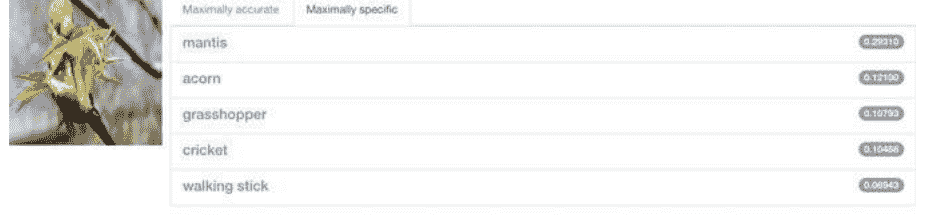

CNN took 0.070 seconds.

图2.1 使用Caffe进行视觉对象分类

NumPy是用于Python科学计算的基本包。除了其明显的科学用途外，NumPy还可以用作高效的多维通用数据容器。可以定义任意数据类型。这使得NumPy能够与各种数据库无缝快速集成。

Matplotlib是Python编程的绘图库及其数学扩展，是数据可视化的平台。根据官方网站，该平台是Python中创建静态、动画和交互式可视化的综合库。Matplotlib使得困难的事情变得可能。

Scikit-learn (scikits.learn或sklearn) 是Python编程的免费机器学习库，包括支持向量机 (SVM)、随机森林、梯度提升、k-means等各种分类、回归和聚类算法。它还基于NumPy、SciPy和Matplotlib等提供了各种数据拟合、预处理、模型选择和评估工具。

## 2.2 MATLAB用于深度学习

MATLAB是一种多范式数值计算环境和专有的编程语言，由MathWorks开发。MATLAB允许矩阵操作、函数和数据的绘图、算法的实现、用户界面的创建以及与其他语言编写的程序的接口。

MathWorks的标志是一个变种的特征函数的表面图 L-形膜。如果 t ∈ (0, ∞)是时间，x ≥0和 y ≥0是空间坐标单位选择使得波传播速度等于一，则波的振幅满足偏微分方程(2.1)

$$
\frac{\partial^2 u}{\partial t^2} = \frac{\partial^2 u}{\partial x^2} + \frac{\partial^2 u}{\partial y^2}.
$$

(2.1)

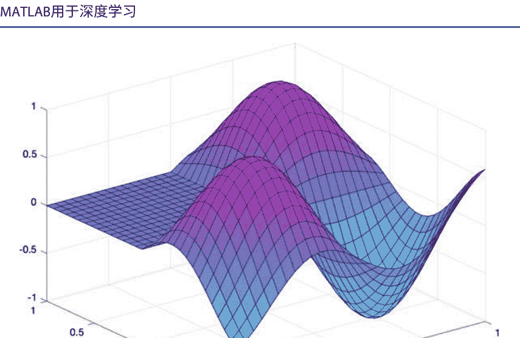

图2.2 带参数$k = 3$的MATLAB膜函数

### 周期性时间行为给出的解形式

$u(t, x, y) = sin(y\sqrt{t})v(x, y), \quad (2.2)$

其中

$\frac{\partial^2 v}{\partial x^2} + \frac{\partial^2 v}{\partial y^2} + \lambda v = 0, \quad (2.3)$

其中$\lambda$是特征值，相应的函数$v(x, y)$是特征函数。

在MATLAB中，使用如图2.2所示的膜函数来生成MATLAB标志。$L = membrane(k), k = 1, 2, .........,12$是$k$th特征函数的$L$形膜。

MATLAB利用工具箱和命令行窗口来运行程序。特别是，深度学习工具箱在2017年被添加到MATLAB中。在2019年，MATLAB可以构建生成对抗网络（GAN），Siamese网络，变分自编码器和注意力网络。MATLAB深度学习工具箱还可以结合CNN和LSTM层以及包含3D CNN层的网络[1]。

MATLAB在图2.3中展示了其在线版本。MATLAB在线版本和离线版本的界面几乎相同。如果许可证已经授权并可用，访问软件系统并生成结果非常方便。MATLAB提供演示、文档和源代码供进一步开发[1]。

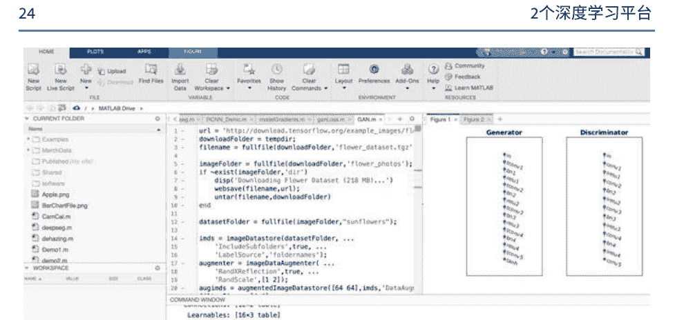

图2.3 MATLAB在线版本的界面

MATLAB在早期提供了ANN（人工神经网络）工具箱，告诉我们如何处理真实应用，通常是函数拟合（nftool）、模式分类（nprtool）、聚类（nctool）、时间序列预测和建模（ntstool）等。

通常，我们需要收集训练数据作为基本步骤，配置网络，初始化权重并训练网络；我们需要最小化差异，验证分类。混淆矩阵用于评估结果。基于分类，计算ROC（接收者操作特征曲线）和AUC（曲线下面积）。ROC曲线是根据TPR和FPR绘制的，其中TPR在y轴上，FPR在x轴上。

$$TPR = \frac{TP}{TP + FN} \quad (2.4)$$
其中$TP$是真正的阳性，$FN$是假阴性。

$$FPR = \frac{FP}{TN + FP} \quad (2.5)$$
其中$FP$是假阳性，$TN$是真阴性。

一个优秀的模型的AUC接近1.0，这意味着它具有良好的可分性测量。一个糟糕的模型的AUC接近0，这意味着它具有最差的可分性测量。

深度学习工具箱提供了一个设计和实现深度神经网络的框架，包括算法、预训练模型和应用程序。MATLAB自2017年以来就有这个工具箱，包括迁移学习、用于时间序列分析的LSTM网络等。最新版本包括AlexNet、GoogleNet、VGG-16/VGG-19、ResNet 101、Inception v2、生成对抗网络（GAN）、强化学习等。MATLAB可以使用多个GPU、并行计算、集群计算、云计算等来加速深度学习过程。

MATLAB可以应用于时间序列分析和预测。时间序列分析包括用于提取数据的有意义统计和其他特征的方法。时间序列预测是使用模型根据先前观察到的数据来预测未来值。时间序列分析的典型方法包括谱分析、小波分析、自相关和互相关分析。MATLAB提供自回归（AR）和自回归移动平均模型（ARIMA）以及状态空间模型。在MATLAB深度学习工具箱中，LSTM网络作为一种循环神经网络（RNNs）已应用于时间序列分析和自然语言处理（NLP），可以帮助我们编写或纠正文本。

MATLAB提供计算机视觉工具箱，特别适用于自动驾驶车辆、视觉对象检测、语义分割、数字图像处理等。MATLAB还有一个用于训练数据的软件图像标注器，可以减少我们的人力劳动。图像标注器和视频标注器提供了一种简单的方式来标记视频或图像序列中感兴趣的矩形区域（ROI）标签、折线ROI标签、像素ROI标签和场景标签。视频标注器使用自动化算法（例如基于点跟踪的Kanade-Lucas-Tomasi（KLT）算法）自动标记图像帧，如图2.4所示。按照以下步骤进行操作（加载图像，感兴趣区域，标记，数据增强，导出结果等），我们可以标记所有采样图像。感兴趣区域（ROI）将被标记并输出用于训练和分类。这将用于告诉计算机场景中的对象是什么[3]。

MATLAB提供了迁移学习的功能。这意味着，一个网络，例如AlexNet已经训练得很好，我们可以先使用训练好的参数，并将其应用于一个新的网络。我们需要加载预训练的网络，替换最后的层，再次训练网络。 在这次迁移之后，如果我们再次训练新的网络，我们可以得到更好的结果。 这将减少计算时间。 MATLAB还可以在优化后使神经网络更快。

MATLAB已经嵌入了Fast R-CNN和Faster R-CNN算法（具有卷积神经网络的区域），已经提供了一个停止标志检测的示例，作为最简单的深度学习网络的11行源代码可以解决指定的任务[4, 5]。

目前，MATLAB可以使用桌面版和在线版运行大多数深度学习算法，如图2.3所示。如果注册了账户，登录就很容易。MATLAB用户甚至可以开发自己的工具箱。MATLAB为用户提供了GUI界面，方便交互。MATLAB可以以可视化的方式展示我们的结果。 我们可以使用GUI界面来开发我们的应用程序。

MATLAB深度学习可以用于生物特征识别，例如人脸识别、指纹识别、声音识别、年龄识别、步态识别、DNA识别等。原因是深度学习可以发现数据集背后的潜在模式。

MATLAB提供云计算和并行计算支持。 这种支持可以用于人脸检测、视觉目标检测、车辆检测、车道检测、行人检测等。

在最新版本中，MATLAB支持人工智能、基于事件的建模等。在最新版本的深度学习中，MATLAB用户现在可以构建生成对抗网络（GANs）、Siamese网络、变分自编码器和注意力网络。

## 2.3 TensorFlow用于深度学习

TensorFlow（https://www.tensorflow.org/）是由Google开发的平台，已应用于深度学习。 TensorFlow在桌面（MS Windows，Mac OS，Linux等）或在线Colaboratory（Colab）上运行，如图2.5所示。Colab可以在线提供GPU服务，并完全在云端运行。 通过Colab，我们可以编写和执行代码，保存和共享我们的经验，开发Web，并在浏览器中访问强大的计算资源，无需复杂的配置。

张量是向量和矩阵的一般化，可以具有更高的维度。一般来说，在张量中，向量或矩阵的元素仍然是标量、向量或矩阵。 TensorFlow是一个定义和运行涉及张量的计算的框架。

TensorFlow特别为大数据处理和可视化开发，使用TensorBoard [6]进行图形化，可以从TensorFlow中找到数值方法。TensorFlow将张量表示为n维数组，使用基本数据类型。这些类型揭示了不同数据集之间的关系。

TensorFlow不仅具有常规的数据类型，还包括特殊类型，如形状、变量、常量、占位符等。概念等级指的是标量、向量、矩阵等数学实体。

```
python
y_2 = regr_2.predict(X)
### Plot the results
plt.figure()
plt.scatter(X, y, c="k", label="training samples")
plt.plot(X, y_1, c="g", label="n_estimators=1", linewidth=2)
plt.plot(X, y_2, c="r", label="n_estimators=300", linewidth=2)
plt.xlabel("data")
plt.ylabel("target")
plt.title("Boosted Decision Tree Regression")
plt.legend()
plt.show()

```

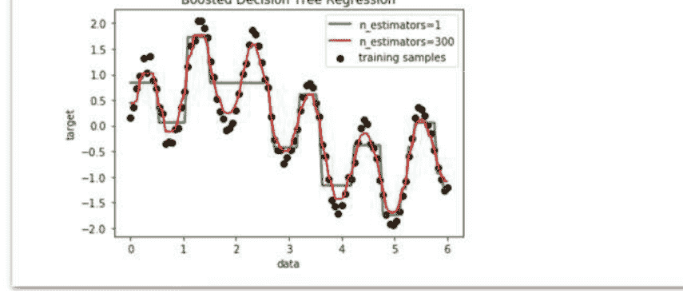

图2.5 Google协作平台

TensorFlow的安装基于Mac OS/Unix、Microsoft Windows、Ubuntu等操作系统。在Python 3.0之后，使用pip3来安装基于Python的应用程序。

```
C:> pip3 install - - upgrade tensorflow
```

TensorFlow需要一个会话来显示输出，通常与print命令一起使用来显示变量的输出，例如，著名的“Hello, TensorFlow!”程序如图2.6所示。

TensorFlow会话封装了运行时和操作的状态。会话表示客户端程序与本地机器和远程设备之间使用分布式TensorFlow运行时访问硬件设备的连接。

我们有示例源代码来展示实例“add”，“multiply”，“dotproduct”，“zero”等。“优化器”可以帮助我们使用SGD（随机梯度下降）算法中的权重或变量快速找到适当的梯度。对于

例如，如果 $z = x^2 + x y, x, y, z \in \mathbb{R}$, 那么梯度是

$$
\begin{cases} \frac{\partial z}{\partial x} = 2x + y \\ \frac{\partial z}{\partial y} = x. \end{cases}
$$

为了最小化函数 $z(\cdot)$, 标准梯度下降方法将执行以下迭代或批处理

$$
\begin{cases} x' = x - \eta \cdot \frac{\partial z}{\partial x} \\ y' = y - \eta \cdot \frac{\partial z}{\partial y} \end{cases}
$$

其中 $\eta$ 是机器学习中的步长或学习率。给定 $\eta = 0.1$, 我们随机选择 $x = 5$, $y=3$, 使用方程 (2.7) , 然后 $x' = 3.7$ 和 $y' = 2.5$. 我们重复这个过程, 让 $(x, y) \leftarrow (x', y')$ since $\eta < 1.0$, $(x, y)$ 将收敛并接近局部极值点, 即

$$
\begin{cases} x_{n+1} = x_n - \eta \cdot \frac{\partial z}{\partial x_n} \\ y_{n+1} = y_n - \eta \cdot \frac{\partial z}{\partial y_n} \end{cases}
$$

其中 $n = 1,2,\ldots$, $\lim_{n \to \infty}(x_{n+1} - x_n) = 0$, $\lim_{n \to \infty}(y_{n+1} - y_n) = 0$, $\lim_{n \to \infty}(x_n, y_n) = (x_p, y_p)$, $\mathbf{P}(x_p, y_p)$ 是局部极值点。

TensorFlow图用于显示计算网络结构。节点(操作)和边缘(张量)表示如何组合各个操作。TensorFlow集合使用元数据存储。TensorBoard通过浏览器 (如IE、Google Chrome等) 来渲染计算图。通过以下命令行启动TensorBoard:

```
c:> tensorboard - - logdir="...\tensorflow \ graph"
```

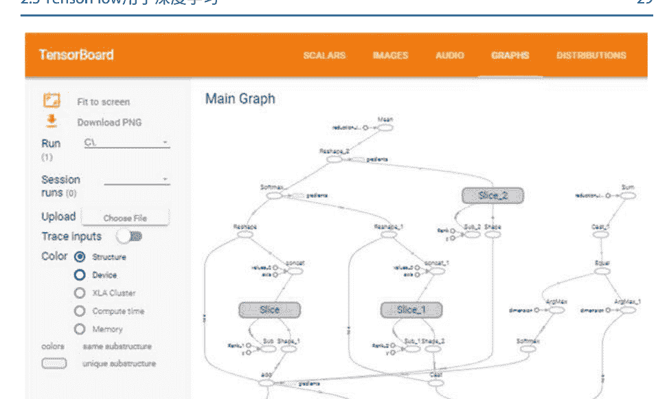

图2.7 一个TensorFlow网络结构的图

在此之前，我们需要使用函数“tf.summary.FileWriter(·)”将计算图保存到摘要文件中。 TensorBoard在http服务器的支持下，在浏览器中可视化图的结构。可视化结果可以从网站http://localhost:6006/#graphs下载。

我们展示了一个TensorFlow应用程序的神经网络结构图，如图2.7所示，TensorFlow应用程序的训练准确性如图2.8所示。我们列出了两个来自TensorBoard的图，如图2.9所示，这些图揭示了使用TensorFlow和TensorBoard进行数据集可视化。

MNIST数据库是一个用于训练各种图像处理系统的大型手写数字数据库。MNIST数据库包含60,000个训练图像和10,000个测试图像。2017年发布了一个类似于MNIST的扩展数据集，名为EMNIST，其中包含240,000个训练图像和40,000个手写数字和字符的测试图像。

例如，MNIST（改进的NIST）数据集的卷积神经网络估计器的步骤如下所示

- 步骤1. 加载训练和评估数据。
- 步骤2. 创建估计器/调用CNN模型函数。
- 步骤3. CNN模型函数：卷积层，池化层和全连接层。
- 步骤4. 设置预测的日志记录。
- 步骤5. 训练模型。
- 步骤6. 评估模型并打印结果。

使用MNIST数据集的RNN例程的步骤如下所示：

- 步骤1. 设置超参数。
- 步骤2. TensorFlow图输入。
- 步骤3. 定义权重。
- 步骤4. 运行RNN模型函数。
- 步骤5. 隐藏层用于输出作为最终结果。

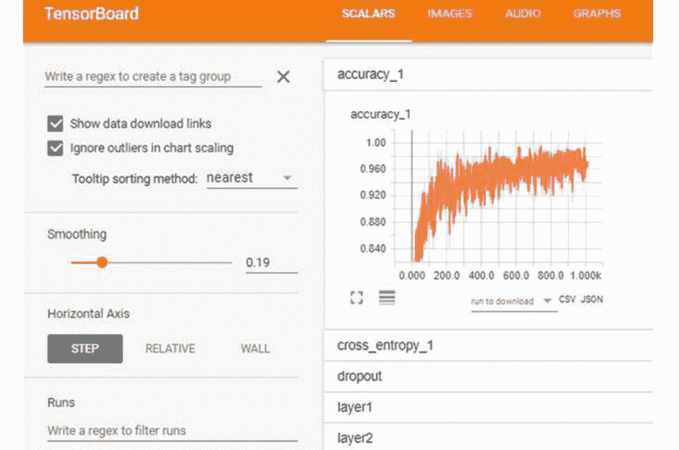

图2.8 TensorFlow训练的准确性图

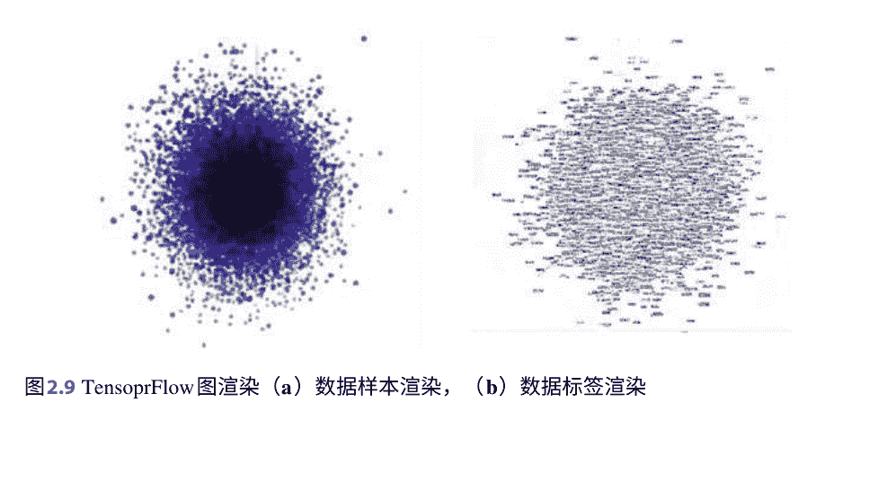

图2.9 TensorFlow图渲染 (a) 数据样本渲染, (b) 数据标签渲染

## 2.4 数据增强

图像增强是一组数字图像处理选项，例如裁剪、调整大小、旋转、拉伸和剪切、翻转和反射，以及镜头畸变、添加噪声和模糊等伪影。

在我们的项目中，已经应用了两种不同形式的数据增强来进行人脸检测，以生成图像的平移和水平反射，并改变训练图像中RGB通道的强度[7]。在货币识别[8]和火焰检测[9]的项目中，考虑了诸如缩放到统一大小、裁剪或扩展、裁剪、随机旋转和颜色调整等图像处理操作。在银行票据序列号识别[10]的项目中，图像增强方法包括图像旋转、平移、颜色抖动和添加高斯噪声。

颜色抖动使我们能够通过应用随机颜色变化来改变图像的颜色。例如，我们可以为随机颜色指定色调、饱和度和增益（HSV）的范围。我们还可以通过使用图像的每个颜色矩阵的PCA算法来计算主成分，并通过向主成分添加偏移量来生成新的变化。图2.10展示了颜色抖动的示例。

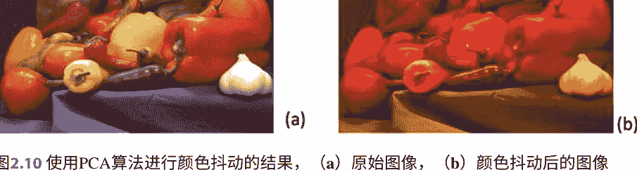

在项目异常检测和目标跟踪[11]中，数据增强包括几何变换、仿射变换、噪声注入和随机擦除等。在项目与车辆相关的场景理解[3]中，离线增强和在线增强被视为两类数据丰富。在线增强包括旋转、平移、翻转等。离线增强通常用于小数据集，通过使用等于执行的转换数量的因子来增加数据集的大小。在大多数情况下，多种转换方法被合并在一起，以实现更全面的扩展。

在项目中水果新鲜度评分[12]中，图像增强包括图像缩放、旋转、裁剪和根据观察结果添加随机噪声。对于添加随机噪声，顺序是随机亮度调整、随机对比度和数字图像的随机擦除。

MATLAB通过使用图像处理工具箱提供图像增强技术：随机图像变形转换、裁剪转换、颜色转换、合成噪声、合成模糊。已经为图像增强的一组预处理选项设计了图像数据增强器，例如调整大小、旋转和反射。

## 2.5 基本数学

MATLAB主要用于数值分析，特别是MATLAB中的所有变量都是数组或向量。TensorFlow源于对多维数据数组的操作，这些数组被称为张量。为了更好地理解在MATLAB中实现深度学习算法，我们介绍与MATLAB相关的数学基础知识。

对于任意两个实数，我们有关于两个实数的结合和交换关系等规则。在分析中，我们有无穷大（正无穷大：+∞，负无穷大：-∞），我们还定义了运算：∞ ± ∞， ∞ / ∞，等等

在实分析中，我们谈论概念集。基于实数集，我们构建从一个集合到另一个集合的函数映射。一个函数在区间 [a, b]上连续，当且仅当 \(\lim_{x \to x_0} f(x) = f(x_0)\) 如果 \(f(x)\) 和 \(g(x) \in C[a, b]\)，那么 \(f(x) \pm g(x) \in C[a, b]\)， \(f(x) \times g(x) \in C[a, b]\)， \(f(x) \div g(x) \in C[a, b]\)。可微的意思是

$$
f'(x_0) = \lim_{x \to x_0} \frac{f(x) - f(x_0)}{x - x_0} = f'(x_0^+) = f'(x_0^-) = \frac{d f(x)}{dx} \bigg|_{x=x_0}. \quad (2.9)
$$

如果 \(f'(x)\) 和 \(g'(x) \in C[a, b]\)，那么 \(f'(x) \pm g'(x) \in C[a, b]\)， \(f'(x) \times g'(x) \in C[a, b]\)， \(f'(x) \div g'(x) \in C[a, b]\)。

在链式法则中，如果 $f(x) = g(y), y = h(x)$, 那么 $f(x) = g(h(y))$,

$$\frac{\partial f(x)}{\partial x} = \frac{\partial g(y)}{\partial y} \cdot \frac{\partial y}{\partial x} = \frac{\partial g(y)}{\partial y} \cdot \frac{\partial h(x)}{\partial x}. \tag{2.10}$$

关于泰勒展开，给定 $f(x) \in C[a, b]$, 我们有

$$f(x) = f(x_0) + f'(x_0)(x - x_0) + \frac{1}{2!}f^{(2)}(x - x_0)^2 + \cdots + \frac{1}{k!}f^{(k)}(x - x_0)^k + \cdots. \tag{2.11}$$

这意味着所有定义在 $[a, b]$上的连续函数都可以转化为多项式。通常，当 $x$趋近于0时，$\sin x$趋近于0。  当$x= 1$时，$\sin x \approx x$

我们使用给定的支持点进行曲线插值。典型的多项式包括二次曲线、三次多项式、样条函数、贝塞尔函数等。对于拉格朗日插值函数，我们有一个次数为 $n$的多项式。

$$f(x) = \sum_{i=0}^{n} \prod_{\substack{j=0 \\ j \neq i}}^{n} \frac{(x - x_i)}{(x_j - x_i)} \cdot y_i, \tag{2.12}$$
其中 $(x_i, y_i), y_i = f(x_i), i = 0, 1 \ldots, n.$

向量空间是一个满足以下公理的集合 $\mathbf{V}$:

- $\mathbf{x} + \mathbf{y} = \mathbf{y} + \mathbf{x}$ （加法满足交换律）
- $(\mathbf{x} + \mathbf{y}) + \mathbf{z} = \mathbf{x} + (\mathbf{y} + \mathbf{z})$ （加法满足结合律）
- $\exists$一个唯一的零向量 $\mathbf{0}$, 使得 $\mathbf{0} + \mathbf{x} = \mathbf{x}$, 对于所有的 $\forall \mathbf{x} \in \mathbf{V}$.
- $\forall$对于所有的$\forall \mathbf{x} \in \mathbf{V}$, 存在一个唯一的负向量 $-\mathbf{x}$, 使得 $\mathbf{x} + (-\mathbf{x}) = \mathbf{0}$.

对于每一对 $\alpha$ （实数） 和 $\mathbf{x}$ （向量） ，存在一个称为标量积的向量 $\alpha\mathbf{x}$，满足

- $\alpha(\beta\mathbf{x}) = (\alpha\beta)\mathbf{x}$ （标量乘法满足结合律）
- $1\mathbf{x} = \mathbf{x}$
- $\alpha(\mathbf{x} + \mathbf{y}) = \alpha\mathbf{x} + \alpha\mathbf{y}$ （对于向量加法满足分配律）
- $(\alpha + \beta)\mathbf{x} = \alpha\mathbf{x} + \beta\mathbf{x}, \alpha, \beta \in \mathbf{R} \text{ and } \mathbf{x} \in \mathbf{V}$ (对于标量加法满足分配律)

向量空间具有以下特性:

- 向量空间 $\mathbf{V}$中的一组基 $\mathbf{G}= \{\mathbf{g}_1, \mathbf{g}_2, \ldots, \mathbf{g}_n\} \subset \mathbf{V}$是一组线性无关的向量，使得 $\mathbf{V}$中的每个向量都可以表示为$\mathbf{G}$中元素的线性组合。
- 如果向量空间 $\mathbf{V}$是有限维的，则 $\|\mathbf{V}\| < \infty$, 当且仅当它有一个有限的基 $\mathbf{G} =\{\mathbf{g}_1, \mathbf{g}_2, \ldots, \mathbf{g}_n\}$, 其中 $< \infty$。
- 有限维向量空间 $\mathbf{V}$的维数是基 $\{\mathbf{g}_1, \mathbf{g}_2, \ldots, \mathbf{g}_n\}$ of $\mathbf{V}$中的元素数量，即 $\|\mathbf{V}\| = n$。

令 $\mathbf{G} = \{\mathbf{g}_1, \mathbf{g}_2, \ldots, \mathbf{g}_n\}$ 是一个 $n$ 维向量空间 $\mathbf{V}$ 的基。那么，$\mathbf{x} = \sum_{i=1}^n x^i \mathbf{g}_i$ 是爱因斯坦求和约定，$\mathbf{x} \in \mathbf{V}$。标量（内）积是一个将两个向量 $\mathbf{x}$ 和 $\mathbf{y}$ 映射到实数的函数，在一个向量空间 $\mathbf{V}$ 中。

- $\mathbf{x} \cdot \mathbf{y} = \mathbf{y} \cdot \mathbf{x}$（交换律）
- $\mathbf{x} \cdot (\mathbf{y} + \mathbf{z}) = \mathbf{x} \cdot \mathbf{y} + \mathbf{x} \cdot \mathbf{z}$（分配律）
- $\alpha(\mathbf{x} \cdot \mathbf{y}) = (\alpha \mathbf{x}) \cdot \mathbf{y} = \mathbf{x} \cdot (\alpha \mathbf{y}), \quad \forall \alpha \in \mathbb{R}, \quad \forall \mathbf{x}, \mathbf{y}, \mathbf{z} \in \mathbf{V}$（标量乘法的结合律）
- $\mathbf{x} \cdot \mathbf{x} \geq 0, \forall \mathbf{x} \in \mathbf{V}, \mathbf{x} \cdot \mathbf{x} = 0$ 当且仅当 $\mathbf{x} = \mathbf{0}$。
- 欧几里得长度（也称为范数）的向量 $\mathbf{x}$, $\|\mathbf{x}\| = \sqrt{\mathbf{x} \cdot \mathbf{x}}$
- 两个非零向量 $\mathbf{x}$ 和 $\mathbf{y}$ 被称为正交 $\mathbf{x} \perp \mathbf{y}$，如果 $\mathbf{x} \cdot \mathbf{y} = 0$。
- 欧几里得空间 $\mathbf{E}_n$ 的基 $\mathbf{E} = \{\mathbf{e}_1, \mathbf{e}_2, \ldots, \mathbf{e}_n\}$ 是正交的，如果 $\mathbf{e}_i \cdot \mathbf{e}_j = \delta_{ij}, \quad i, j = 1, 2, \ldots, n$。

$\delta_{ij} = \delta^i_j = \delta^j_i = \delta^{ij} = \begin{cases} 1 & i = j \\ 0 & i \neq j \end{cases}$ (Kronecker delta)

- $\mathbf{e}_1 = \frac{\mathbf{x}_1}{\|\mathbf{x}_1\|}, \ldots, \mathbf{e}_n = \frac{\mathbf{e}'_n}{\|\mathbf{e}'_n\|}$ 是格拉姆-施密特过程，其中 $\mathbf{e}'_n = \mathbf{x}_n - (\mathbf{x}_n, \mathbf{e}_{n-1})\mathbf{e}_{n-1} - \cdots - (\mathbf{x}_n, \mathbf{e}_1)\mathbf{e}_1$。

设 $\mathbf{G} = \{\mathbf{g}_1, \mathbf{g}_2, \ldots, \mathbf{g}_n\}$ 是 $n$ 维欧几里得空间 $\mathbf{E}^n$ 中的一组基，$\mathbf{G}' = \{\mathbf{g}'_1, \mathbf{g}'_2, \ldots, \mathbf{g}'_n\}$ 是对偶于基 $\mathbf{G}$ 的基，如果 $\mathbf{g}_i \cdot \mathbf{g}'_j = \delta_{ij}$，对于 $i, j = 1, 2, \ldots, n$。$\mathbf{g}_i$ 线性无关，如果 $\sum \alpha_i \mathbf{g}_i = \mathbf{0}$，则 $\alpha_i = 0$。

向量 $\mathbf{x}$ 的长度可以表示为 $\|\mathbf{x}\| = \sqrt{\{\mathbf{e}_2 \times \overline{\mathbf{e}}_3, \mathbf{e}_3 \times \mathbf{e}_1, \mathbf{e}_1 \times \mathbf{e}_2\}}$ 例如，$\mathbf{G} = \{\mathbf{e}_1, \overline{\mathbf{e}}_2, \mathbf{e}_3\}$。

如果 $<\mathbf{x}, \mathbf{y}> = \mathbf{x} + \mathbf{i}\mathbf{y}, \mathbf{i} = \sqrt{-1}$，那么 $<\alpha + \mathbf{i}\beta><\mathbf{x}, \mathbf{y}> = <\alpha \mathbf{x} - \beta \mathbf{y}, \beta \mathbf{x} + \alpha \mathbf{y}>$, $\mathbf{x}, \mathbf{y} \in \mathbf{E}^n, \mathbf{z} = \mathbf{x} + \mathbf{i}\mathbf{y} \in \mathbf{C}^n$, $\mathbf{A}(\mathbf{x} + \mathbf{i}\mathbf{y}) = \mathbf{A}\mathbf{x} + \mathbf{i}(\mathbf{A}\mathbf{y})$, $\mathbf{A} \in \mathbf{L}^n$。

对于一个张量空间，让 $\mathbf{L}^n$ 是一个将一个向量映射到另一个向量的线性映射的集合在 $\mathbf{E}^n$ 内，$\mathbf{y} = \mathbf{A}\mathbf{x}, \quad \mathbf{x}, \quad \mathbf{y} \in \mathbf{E}^n, \quad \mathbf{A} \in \mathbf{L}^n$：

- 张量的线性性质：$\mathbf{A}(\mathbf{x} + \mathbf{y}) = \mathbf{A}\mathbf{x} + \mathbf{A}\mathbf{y}, \forall \mathbf{x}, \mathbf{y} \in \mathbf{E}^n, \forall \mathbf{A} \in \mathbf{L}^n$
- 张量与标量的乘积：$\mathbf{A}(\alpha \mathbf{x}) = \alpha(\mathbf{A}\mathbf{x}), \quad \forall \mathbf{x} \in \mathbf{E}^n, \quad \forall \alpha \in \mathbb{R}, \quad \forall \mathbf{A} \in \mathbf{L}^n$
- 张量与标量数的乘积：$(\alpha \mathbf{A})\mathbf{x} = \alpha(\mathbf{A}\mathbf{x}) = \mathbf{A}(\alpha \mathbf{x}), \quad \forall \mathbf{x} \in \mathbf{E}^n$
- 张量的和：$(\mathbf{A} + \mathbf{B})\mathbf{x} = \mathbf{A}\mathbf{x} + \mathbf{B}\mathbf{x}$
- 负张量：$-\mathbf{A} = (-1)\mathbf{A}$
- 零张量：$\mathbf{0}\mathbf{x} = \mathbf{0}, \forall \mathbf{x} \in \mathbf{E}^n$。
- 加法交换律：$\mathbf{A} + \mathbf{B} = \mathbf{B} + \mathbf{A}$
- 加法结合律：$\mathbf{A} + (\mathbf{B} + \mathbf{C}) = (\mathbf{A} + \mathbf{B}) + \mathbf{C}$
- 元素 $\mathbf{0}: \mathbf{0} + \mathbf{A} = \mathbf{A}, \mathbf{A} + (-\mathbf{A}) = \mathbf{0}$
- 标量乘法是结合的：$\alpha(\beta \mathbf{A}) = (\alpha\beta)\mathbf{A}$
- 元素 $\mathbf{1}: 1\mathbf{A} = \mathbf{A}$
- 标量乘法对张量加法是分配的：$\alpha(\mathbf{A} + \mathbf{B}) = \alpha\mathbf{A} + \alpha\mathbf{B}$
- 标量乘法对标量加法是分配的: $(\alpha + \beta)\mathbf{A} = \alpha\mathbf{A} + \beta\mathbf{A}, \alpha, \beta \in \mathbb{R}, \mathbf{A}, \mathbf{B} \in \mathbf{L}^n$
- 向量在 $\mathbf{E}^3$ 中的乘积, 即 $\mathbf{z} = \mathbf{x} \times \mathbf{y}$, 其中 $\mathbf{x}, \mathbf{y}, \mathbf{z} \in \mathbf{E}^3$
- 旋转张量: $\mathbf{R}(a)$, 其中 $a \in \mathbf{E}^3$ 且 $\mathbf{R} \in \mathbf{L}^3$

对于张量函数:

* 函数连续性:
$$\lim_{t \to t_0} \mathbf{x}(t) = \mathbf{x}(t_0), \tag{2.13}$$
$$\lim_{t \to t_0} \mathbf{A}(t) = \mathbf{A}(t_0). \tag{2.14}$$

* 可微:
$$\frac{d\mathbf{x}(t)}{dt} = \lim_{s \to 0} \frac{\mathbf{x}(t + s) - \mathbf{x}(t)}{s}, \tag{2.15}$$
$$\frac{d\mathbf{A}(t)}{dt} = \lim_{s \to 0} \frac{\mathbf{A}(t + s) - \mathbf{A}(t)}{s}. \tag{2.16}$$

* 标量函数与向量或张量值函数的乘积:
$$\frac{d}{dt}[u(t)\mathbf{x}(t)] = \frac{du}{dt}\mathbf{x}(t) + \frac{d\mathbf{x}}{dt}u(t), \tag{2.17}$$
$$\frac{d}{dt}[u(t)\mathbf{A}(t)] = \frac{du}{dt}\mathbf{A}(t) + \frac{d\mathbf{A}}{dt}u(t). \tag{2.18}$$

* 两个向量或张量值函数的标量积:
$$\frac{d}{dt}[\mathbf{x}(t) \cdot \mathbf{y}(t)] = \frac{d\mathbf{x}}{dt} \cdot \mathbf{y}(t) + \mathbf{x}(t) \cdot \frac{d\mathbf{y}}{dt}, \tag{2.19}$$
$$\frac{d}{dt}[\mathbf{A}(t) : \mathbf{B}(t)] = \frac{d\mathbf{A}}{dt} : \mathbf{B}(t) + \mathbf{A}(t) : \frac{d\mathbf{B}}{dt}. \tag{2.20}$$

* 两个张量值函数的组合:
$$\frac{d}{dt}[\mathbf{A}(t)\mathbf{B}(t)] = \frac{d\mathbf{A}}{dt}\mathbf{B}(t) + \mathbf{A}(t)\frac{d\mathbf{B}}{dt}. \tag{2.21}$$

* $\lambda$ 是张量 $\mathbf{A}$ 的特征值, $g(\mathbf{A}) = \sum_{k=0}^m a_k \mathbf{A}^k$, 那么
$$g(\lambda) = \sum_{k=0}^m a_k \lambda^k. \tag{2.22}$$

* 链式法则:
$$\frac{d}{dt}\mathbf{x}[u(t)] = \frac{d\mathbf{x}}{du}\frac{du}{dt}, \tag{2.23}$$
$$\frac{d}{dt}\mathbf{A}[u(t)] = \frac{d\mathbf{A}}{du}\frac{du}{dt}. \tag{2.24}$$

* 多个参数函数的链式法则：
$$\frac{d}{dt}\mathbf{x}[u(t), v(t)] = \frac{d\mathbf{x}}{du}\frac{du}{dt} + \frac{d\mathbf{x}}{dv}\frac{dv}{dt}, \qquad (2.25)$$
$$\frac{d}{dt}\mathbf{A}[u(t), v(t)] = \frac{d\mathbf{A}}{du}\frac{du}{dt} + \frac{d\mathbf{A}}{dv}\frac{dv}{dt}, \qquad (2.26)$$
$$\frac{d}{dt}[\mathbf{A}(t)\mathbf{B}(t)] = \frac{d\mathbf{A}}{dt}\mathbf{B}(t) + \frac{d\mathbf{B}}{dt}\mathbf{A}(t). \qquad (2.27)$$

* 方向导数：
$$\mathbf{r} = (\theta_1, \cdots, \theta_n), \theta_i \in \mathbf{R}. \qquad (2.28)$$
对于标量场：
$$\frac{d}{ds} (\mathbf{r} + s\mathbf{a}) = \text{grad} \cdot \mathbf{a}, \forall \mathbf{a} \in \mathbf{E}^n, s \in \mathbf{R} \qquad (2.29)$$
对于向量场：
$$\frac{d}{ds}\mathbf{x}(\mathbf{r} + s\mathbf{a}) = \text{grad}\mathbf{x} \cdot \mathbf{a}, \forall \mathbf{a} \in \mathbf{E}^n, s \in \mathbf{R} \qquad (2.30)$$
对于张量场：
$$\frac{d}{ds}\mathbf{A}(\mathbf{r} + s\mathbf{a}) = \text{grad}\mathbf{A} \cdot \mathbf{a}, \forall \mathbf{a} \in \mathbf{E}^n, s \in \mathbf{R} \qquad (2.31)$$

## 2.6 问题

1. 我们应该使用PyChem还是只用IDE？
2. 如何利用GitHub网站上的源代码和数据集？
3. 深度学习和机器学习之间的关系是什么？什么是监督学习和无监督学习？
4. 如何有效地选择算法进行车辆检测、行人检测和垃圾检测？
5. 什么是Mask R-CNN [5]？
6. 人工智能和深度学习之间的关系是什么？
7. 如何处理项目开发中论文和源代码之间的关系？
8. 为什么数学在深度学习和人工智能中如此重要？

# 参考文献

1. Vedaldi A, Lenc K (2015) MatConvNet:用于Matlab的卷积神经网络。 在：ACM国际多媒体会议，pp 689-692
2. Klette R (2014) 简明计算机视觉：理论和算法导论。Springer，伦敦，英国
3. 刘X (2019) 使用深度学习进行车辆相关场景理解。 硕士论文，奥克兰科技大学，新西兰
4. Ren S, He K, Girshick R, Sun J (2015) 更快的R-CNN：面向实时目标检测的区域建议网络。 在：神经信息处理系统的进展，第91-99页
5. He K, Gkioxari G, Dollar P, Girshick R (2017) Mask R-CNN。 在：ICCV，第2980-988页
6. Abadi M, Barham P, Chen J, Chen Z, Davis A, Dean J, Kudlur M (2016) TensorFlow：用于大规模机器学习的系统。 在：操作系统设计和实现（OSDI）的USENIX研讨会，美国，第16卷，第265-283页
7. 王H (2018) 基于深度学习的实时人脸检测和识别。 硕士论文，奥克兰科技大学，奥克兰
8. 张Q (2018) 使用深度学习进行货币识别。 硕士论文，奥克兰理工大学 奥克兰，新西兰
9. 辛C (2018) 使用深度学习进行多个火焰的检测和识别。 硕士论文，奥克兰理工大学 奥克兰，新西兰
10. 马X (2020) 使用深度学习进行纸币序列号识别。 硕士论文，奥克兰理工大学 奥克兰，新西兰
11. 安N (2020) 使用孪生神经网络进行异常检测和跟踪。 硕士论文，奥克兰理工大学 奥克兰，新西兰
12. 付Y (2020) 使用深度学习进行水果新鲜度分级。 硕士论文，奥克兰大学，奥克兰，新西兰

## 3.1 卷积神经网络和YOLO

自2015年以来，所有研究人员的重点已转向深度学习，即深度神经网络，特别是在AlexNet [1]在ImageNet [2–4]的视觉对象检测和识别比赛中获得奖项之后。2015年，世界顶级期刊Nature还发表了一篇与深度学习相关的综述论文 [5]。在此之前，大多数人对于使用支持向量机（SVM）进行模式分类[6, 7]感兴趣。

自1995年以来，卷积神经网络（CNN）已被应用于数字图像处理[8]。卷积核通常是大小为3 × 3、5 × 5、7 × 7、9 × 9等的掩模。卷积操作生成卷积神经网络的特征图[4, 9–11]。感受野对应于原始图像的一个区域[12]。在数学中，卷积是对两个函数进行的一种数学运算，它产生一个表示一个函数形状如何被另一个函数修改或过滤的第三个函数。给定 $H = (h_{i,j}^{(k)})_{m \times m}$ 在级别 $k$，$a^{(k)}, b^{(k)}, c^{(k)}, d^{(k)} \in \mathscr{R}$，$g(\cdot)$ 是一个非线性函数，卷积操作是
$$h_{i,j}^{(k+1)} = g(a^{(k)} \cdot h_{i,j}^{(k)} + b^{(k)} \cdot h_{i+1,j}^{(k)} + c^{(k)} \cdot h_{i,j+1}^{(k)} + d^{(k)} \cdot h_{i+1,j+1}^{(k)})$$

平均池化包括计算特征图的每个补丁的平均值。对于具有下采样的平均池化[13],
$$\bar{h}^{(k+1)} = \frac{1}{4}(a^{(k)} \cdot h_{i,j}^{(k)} + b^{(k)} \cdot h_{i+1,j}^{(k)} + c^{(k)} \cdot h_{i,j+1}^{(k)} + d^{(k)} \cdot h_{i+1,j+1}^{(k)})$$

对于具有下采样的最大池化[14],
$$h_{\max}^{(k+1)} = \max(a^{(k)} \cdot h_{i,j}^{(k)}, b^{(k)} \cdot h_{i+1,j}^{(k)}, c^{(k)} \cdot h_{i,j+1}^{(k)}, d^{(k)} \cdot h_{i+1,j+1}^{(k)})$$

其中最大池化通过对初始表示的非重叠子区域应用最大滤波器 $max(·)$进行。在深度学习中，卷积操作‘⋆’被表示为
$$s(t) = (x \star w)(t) = \sum_{a=-\infty}^{\infty} x(a)w(t-a)$$
其中函数 $x(a)$是输入， $w(t)$代表核函数， $s(t)$ 代表特征图。对于图像 $I(i, j)$， $i = 1,2, \ldots, W$, $j = 1,2, \ldots, H$, $W$ 是图像的宽度， $H$是图像的高度。卷积操作为
$$S(i, j) = (I \star K)(i, j) = \sum_{m} \sum_{n} I(m,n)K(i-m, j-n)$$
其中 $K(·)$是核函数。 通常，高斯核函数在 $n \in \mathbb{Z}^+$维度中为 $G_n(\mathbf{X}, \sigma) = \frac{1}{\sigma\sqrt{2\pi}} \exp\left(-\frac{\|\mathbf{X}\|^2}{2\sigma^2}\right)$, 其中 $\mathbf{X} = (x_1, x_2, \ldots, x_n)$, $\sigma$是方差。例如 ，如果 $n = 1$, $G_1(x, \sigma) = \frac{1}{\sigma\sqrt{2\pi}} \exp\left(-\frac{x^2}{2\sigma^2}\right)$。

在卷积操作中，填充是为了填补图像边界的区域，这是为了用零填充边缘区域，这将确保所有卷积操作都可以在图像的边缘区域进行[13]。同时，步幅的概念是卷积操作的步长。

卷积操作是模拟我们的人类视觉系统。 像大多数哺乳动物，如猫或狗一样，我们的人类视觉系统（HVS）可以通过使用著名的Gabor函数来模拟。 Gabor函数已被应用于描述纹理分析中的纹理共现[15]。
$$G(x, y, \alpha, \beta_x, \beta_y, f, \phi, x_0, y_0, \tau) = \alpha \cdot \exp\left(-\beta_x x'^2 - \beta_y y'^2\right) \cdot \cos(f x' + \phi)$$
其中 $\alpha, \beta_x, \beta_y, f, \phi, x_0, y_0$, 和 $\tau$ 是参数,
$$x' = (x - x_0) \cos(\tau) + (y - y_0) \sin(\tau)$$
$$y' = -(x - x_0) \sin(\tau) + (y - y_0) \cos(\tau)$$

卷积神经网络（即CNN）还包括局部连接、共享权重、池化[13,16]和多层神经网络（MLP）[17, 18]。 它以其精细调整和池化技术而闻名[13]。

### 3.1.1 区域卷积神经网络（R-CNN）

下一个是基于区域的卷积神经网络（R-CNN）。 我们需要理解概念：图像中的视觉对象检测的交并比（IoU），通过以下方式计算
$$IoU = \frac{\mathcal{A}(A \cap B)}{\mathcal{A}(A \cup B)}$$
其中锚框是具有多分辨率、多尺度和多方位比例等特征的框。

R-CNN[19, 20]快速找到特征提取的对象框所在的ROI（感兴趣区域），分类器仍然是SVM，回归用于迭代地对区域提议进行分类。Warp是指将每个对象提议非各向异性地缩放到CNN输入尺寸。R-CNN很慢，因为它对每个对象提议执行一次ConvNet前向传递而不共享计算[21]。训练是一个多阶段的流程；这意味着我们需要一步一步地工作；因此，它是昂贵且耗时的。

在MATLAB中，R-CNN检测器首先生成区域建议。建议区域从图像中裁剪出来并调整大小。CNN对裁剪和调整大小的区域进行分类。最后，使用CNN特征对区域建议边界框进行细化。

Fast R-CNN的训练[22, 23]是通过使用多任务损失进行单阶段训练的。回归已经被用于边界框训练[17, 24, 25]。训练可以更新所有网络层。池化层使用最大池化将任何有效ROI内的特征转换为具有固定空间范围的小特征图，大小为7×7区域。

在MATLAB中，Fast R-CNN处理整个图像并汇集与每个区域建议相对应的CNN特征。总的来说，Fast R-CNN比R-CNN更高效，这是这个深度学习模型的设计目的。

Faster R-CNN [26, 27] 将区域建议网络（RPN）和快速 R-CNN 合并为一个单一网络，通过共享它们的卷积特征。RPN 是一个完全卷积网络，可以同时预测每个位置的物体边界和物体性质得分。

通过使用 Faster R-CNN [26], 将 softmax 函数 [28] 应用于目标检测。
$$f(x) = \frac{e^{x_i}}{\sum_i e^{x_i}}, x \in (-\infty, \infty). \tag{3.10}$$

在 MATLAB 中，Faster R-CNN 添加了一个 RPN，直接在网络中生成区域建议。RPN 使用锚框进行视觉目标检测。在网络中生成区域建议更快。

### 3.1.2 Mask R-CNN

Mask R-CNN 是 Faster R-CNN 的直观扩展，正确构建掩码分支对于生成良好结果至关重要[29]。

Mask R-CNN 通过添加一个分支来预测每个感兴趣区域（RoI）上的分割掩码，与现有的分类和边界框回归分支并行。

掩码分支是一个小型的全卷积网络（FCN），应用于每个ROI，以像素级的方式预测分割掩码。Mask R-CNN在Faster R-CNN框架的基础上实现和训练起来很简单，这为各种灵活的架构提供了便利。

Mask R-CNN因其简单、灵活和通用的目标实例分割框架而被评为深度学习中的最佳工作。 来自Facebook AI Research团队在2017年威尼斯国际计算机视觉会议（ICCV）上获得了最佳论文奖（Marr Prize）。

### 3.1.3 YOLO

YOLO [30] (You Only Look Once) 是一种单次通过的神经网络，直接优化神经网络；给定一张图像，立即只使用7 ×7的分割进行图像分割；因此，YOLO非常快速。

YOLO网络有24个卷积层，后面跟着2个全连接层，它使用交替的1 ×1卷积层来减少层之间的特征空间。 卷积层通过使用ImageNet数据集进行预训练进行分类。 YOLO采用了泄漏整流线性激活（ReLU）函数$\phi(x) \in C^0(-\infty, \infty)$）
$$\phi(x) = \begin{cases} x, & x > 0 \\ 0.1x, & \text{其他} \end{cases}$$ (3.11)

YOLOv2使用逻辑激活函数来预测位置和精度（也称为sigmoid函数）$\sigma(\cdot)$。即，
$$f(x) = \sigma(x) = \frac{1}{1 + e^{-x}}, x \in C^\infty(0, 1).$$ (3.12)

对于这个单调函数的导数关于 $x$，
$$f'(x) = f(x)(1 - f(x)), x \in C^\infty(0, 1).$$ (3.13)

YOLO v2 还使用 448 × 448 的图像来微调基于 ImageNet 的分类网络。 批量归一化（BN）基于 YOLOv2 中的所有卷积层。 DarkNet-19 具有 19 层深度，可以基于 ImageNet 数据库中的超过一百万张图像进行训练。 预训练网络可以将图像分类为 1000 个物体类别。 DarkNet-19 经常被用作 YOLO 工作流程的基础网络。

YOLOv2 使用 $k$均值聚类，这导致了良好的 IoU 分数。 数学上， $k$均值聚类将 $n$个观测值分成 $k \leq n$个集合 $S= \{S_1, S_2, \ldots, S_k\}$，以最小化簇内平方和（WCSS）。 换句话说，
$$S_K = \arg \min_S \sum_{i=1}^k \sum_{\mathbf{x} \in S_i} \|\mathbf{x} - \mu_i\|^2,$$ (3.14)
其中 $\mu_i$ 是 $S_i$中点的平均值。 在MATLAB中，YOLOv2目标检测器利用单阶段目标检测网络和锚框来检测图像中的视觉对象类别。 对于每个锚框，YOLOv2提供IoU、锚框偏移和类别概率等信息。

YOLO9000可以使用WordTree实时检测超过9000个视觉对象类别[31]。 WordTree具有将类别和子类别链接在一起的分层树结构。 YOLO9000提供了将MS COCO和ImageNet结合在一起的方法。 YOLOv3使用Darknet，它是在ImageNet上训练的53层网络。YOLOv3在三个尺度上进行预测，分别通过将输入图像的尺寸缩小32、16和8来精确确定。 YOLOv3总共利用了九个锚框。

YOLOv4比其他基于Microsoft COCO数据集的实时神经网络更快、更准确。 MSCOCO数据集包括三个部分：训练集（120,000张图像）、验证集（5,000张图像）、测试集（41,000张图像）。 通过使用Darknet框架，YOLOv4每秒能处理分辨率为608×608的62帧，并达到43.5%的AP准确率。

YOLOv4是实时目标检测的最佳选择。 通常，最低速度为每秒30帧或更高。 为了检测多个具有不同大小和精确位置的对象，需要更高的感受野来保留更多的视觉对象细节。

## 3.1.4 SSD

SSD [32, 33]是单次多框检测器（SSD）。 单次表示在网络的单次前向传递中完成了视觉对象定位和分类的任务。 MultiBox是一种边界框回归技术的名称。 该网络是一个视觉对象检测器，还对这些检测到的对象进行分类。 SSD的架构基于受尊敬的VGG-16架构，但丢弃了全连接层。 一组辅助卷积层被添加并用于在多个尺度上提取特征，逐渐减小每个后续层的输入大小。 SSD利用默认的纵横比，并可应用于实时视觉目标跟踪[34, 35]。

有一些SSD的实现可在网上找到，包括原始的Caffe代码。 基于TensorFlow的SSD代码可从GitHub下载。

## 3.1.5 DenseNets和ResNets

DenseNets缓解了梯度消失问题，增强了特征传播，鼓励特征重用，并大大减少了参数数量[36]。 对于每一层，所有前面层的特征图被用作输入，它自己的特征图被用作所有后续层的输入。 DenseNets在具有相同特征图大小的任意两个层之间引入了直接连接，这在自然情况下可以扩展到数百层，而不会出现优化困难。 因此，DenseNets需要更少的参数和更少的计算量来实现最先进的性能。 DenseNets允许网络中的特征重用，从而学习更紧凑和更准确的模型。

在深度学习中存在着退化问题；即随着网络深度的增加，准确性会饱和。然而，ResNets由于其良好设计的结构，可以轻松获得准确性的提升，即使网络深度大大增加。
$$y = F(x, \{W_i\}) + x, (3.15)$$
其中 x 和 y 是层的输入和输出向量，F(·)是残差映射，例如，F = W_{2\sigma}(W_1 x)，$\sigma$是ReLU函数。

## 3.2 循环神经网络和时间序列分析

循环神经网络（RNN）是深度神经网络之一，由于其独特的结构，在处理序列数据时非常有帮助和有益，因此现在广泛应用于许多方面。

RNN结构中的循环隐藏层连接到下一步的隐藏层。与其他多层神经网络相比，RNN可以随时间产生影响。为了更详细地解释这一点，从输入单元到隐藏单元有一个单向信息流，而从隐藏单元到输出单元也有一个单向信息流。此外，隐藏层的输入还包含先前隐藏层的状态；隐藏层的节点可以自连接或互连。

LSTM [37] 网络是一种递归神经网络（RNN），它学习序列数据的长期依赖关系。LSTM 网络的核心组件是序列输入层和 LSTM 层。输入层将序列或时间序列数据导入网络。LSTM 网络可以记住网络的状态。

在 MATLAB 中，LSTM 网络支持具有不同序列长度的输入数据。在通过网络传递数据时，网络会填充、截断或拆分序列，以使每个小批量中的所有序列具有指定的长度。

如果 x 是输入层，o 是输出层，t 是时间步数，s 是隐藏层，V、W 和 U 都是权重，隐藏层在时间 t 的状态可以计算为
$$S_t = f(U \cdot x_t + W \cdot S_{t-1}), (3.16)$$
其中 f(·)是激活函数。

如果有一系列的输入 $x_1, x_2, ..., x_T \in \mathbb{R}^n$，由网络计算得到的隐藏状态序列为 $h_1, h_2, ..., h_T \in \mathbb{R}^m$，预测序列为 $y_1, y_2, ..., y_T \in \mathbb{R}^k$，使用以下方程进行迭代：
$$t_i = W_h^x x_i + W_h^h x_{i-1} + b_h, (3.17)$$
$$h_i = e(t_i), (3.18)$$
$$s_i = W_{yh}h_i + b_y,$$
$y_i = g(s_i)$，其中 $W_{h^x}, W_{h^h}$ 和 $W_{y^h}$ 是权重矩阵；$t_i$ 序列表示隐藏单元的输入，

## 3.3 隐马尔可夫模型

我们通常使用有限状态机和隐马尔可夫模型（hidden Markov model）[38-41]来检测事件。隐马尔可夫模型通常被用来预测那里会发生什么。一个典型的例子是使用概率来预测一个人在一天内是否健康或发烧。根据天气变化，这将有助于医院根据季节准备药物。

随机自动机是：
(1) 初始概率：$\pi_i \equiv p(q_1 = S_i)$，$\sum_{i=1}^{N} \pi_i =1$；$\pi = (\pi_1, \pi_2, \ldots, \pi_N)$。
(2) 转移矩阵：$\mathbf{A} = (a_{ij})_{N \times N}$, $a_{ij} \equiv p(q_{t+1} = S_j|q_t=S_i) \in [0, 1]$，且 $\sum_{j=1}^{N} a_{ij} = 1$

HMM模型 $\lambda = (\mathbf{A}, \mathbf{B}, \pi)$ 与
- 1. 状态: $\mathbf{S} = \{S_1, S_2, \ldots, S_N\}$
- 2. 观测: $\mathbf{V} = \{v_1, v_2 \cdots, v_M\}$
- 3. 转移矩阵: $\mathbf{A} = (a_{ij})_{N \times N}, a_{ij} \equiv p(q_{t+1} = S_j|q_t = S_i)$
- 4. 发射概率: $\mathbf{B} = (b_j(m))_M, b_j(m) \equiv p(O_t = v_m|q_t = S_j)$
- 5. 初始概率: $\pi = (\pi_i)_N, \pi_i \equiv p(q_1 = S_i)$
- 6. 输出: $\mathbf{O} = \{O_1 O_2 \cdots O_T\}$
- 7. 潜在变量: $\mathbf{Q} = \{Q_1 Q_2 \cdots Q_T\}$

HMM有两个非常重要的算法：维特比算法和鲍姆-韦尔奇（BM）算法。维特比算法可以帮助我们快速找到最佳路径，它已经应用于信息论编码中。

给定 $\mathbf{Q} = \{q_1, \ldots, q_T\}$ 和 $\mathbf{O} = \{o_1, \ldots, o_T\}$,
$$\delta_t(i) = \max p(q_1 q_2 \cdots q_{t-1}, q_t = S_i, O_1 \cdots O_t | \lambda).$$

在计算上，
- 1. 初始化: $\delta_1(i) = \pi_i b_i(O_1), \psi_1(i) = 0$
- 2. 递归: $\delta_t(j) = \max_i(\delta_{t-1}(i) \cdot a_{ij})b_j(O_t), \psi_t(j) = \arg \max_i (\delta_{t-1}(i) \cdot a_{ij})$
- 3. 终止: $p^* = \max_i \delta_T(i), q_T^* = \arg \max_i$ 路径
- 4. 路径回溯: $q_t^* = \psi_{t+1}(q_{t+1}^*), t = T - 1, T - 2, \ldots, 1$通过使用EM算法，BW算法用于预测参数的最高概率。给定 λ = (A, B, )，使用Baum-Welch (BW) 算法寻找λ* =arg max p(χ|λ)，

E-step,

$$
\gamma_t(i) = \sum_{j=1}^{N} \xi_t(i, j); \xi_t(i, j) \equiv p(q_t = S_i, q_{t+1} = S_j|\mathbf{O}, \lambda); \quad (3.22)
$$

M-step,

$$
p(\chi|\lambda) = \sum_{k=1}^{K} p(O^k|\lambda) \quad (3.23)
$$

$$
\hat{a}_{ij} = \frac{\sum_{t=1}^{T-1} \xi_t(i, j)}{\sum_{t=1}^{T-1} \gamma_t(i, j)}; \quad b_j(m) = \frac{\sum_{t=1}^{T} \gamma_t(j)\mathbf{1}(O_t = v_m)}{\sum_{t=1}^{T} \gamma_t(j)}. \quad (3.24)
$$

HMM在每一步使用转移概率来预测事件的发生。FSM在状态转换期间捕捉事件，没有概率预测。

HMM不是一个神经网络，它没有神经元和激活函数。RNNs [42-44]是一类用于处理序列数据的人工神经网络，它是一个由外部驱动的动态系统 $x^{(t)}$，

$$
h^{(t)} = f(h^{(t-1)}, x^{(t)}; \theta) = g^{(t)}(x^{(t)}, x^{(t-1)}, \ldots, x^{(1)}), \quad (3.25)
$$
其中 $t = 1, 2 \ldots, \tau$，$h$是状态。这告诉我们可以在每个时间步展开时使用相同的转移函数和相同的参数。

## 3.3.1 RNN: 循环神经网络

RNN [43-46] 指的是循环神经网络；大部分情况下，我们展开神经网络，通常使用不动点定理来模拟该过程。我们使用损失函数来计算差异。损失函数是成本函数的一部分，成本函数是一种目标函数的类型。以下简称为概念，损失函数、成本函数和目标函数之间有微小差异。

损失函数 $L(y_i, \hat{y}_i)$ 指的是数据集中的单个样本，$\hat{y}_i$是神经网络模型的输出，$y_i$是真实值或者标准答案。成本函数 $J(\cdot)$ 表示整个训练数据集的所有样本，$J = \sum L(y_i, \hat{y}_i)$，$i = 1, 2, \ldots, n$，例如，梯度下降中的小批量使用训练集的所有样本。目标函数是一个函数 $f(\cdot)$，通过优化算法进行优化，受到约束条件的限制。

在数学中，损失函数 [47] 的基本概念是距离。最流行的是欧几里得距离，但熵 $e = -\sum_{i=1}^{n} h_i \log h_i = -\mathbf{E}(\log h_i)$，$h_i \in (0, 1]$ 已被应用于使用对数函数的数学期望计算距离。

softmax函数 $\quad f(x) = \frac{e^{x_i}}{\sum_i e^{x_i}} \quad$ 已经用于计算 [28, 48, 49]。

损失函数通常有0~1损失函数、平方损失函数、绝对值损失函数、平均损失函数、铰链损失函数等。0~1损失函数是

$$L(Y, f(X)) = \begin{cases} 1 & Y = f(X) \\ 0 & Y = f(X) \end{cases}$$ (3.26)

平方误差成本函数或二次成本函数表示为

$$J = \|\mathbf{Y}, f(\mathbf{X})\|^2 = \sum_{i=1}^{n} (y_i - f(x_i))^2,$$ (3.27)

, $n$是给定点的集合，$\mathbf{X} = (x_1, x_2, \ldots, \ldots, \ldots, \ldots, \ldots, \ldots, \ldots, x_n)^{\tau}$, $Y = (y_1, y_2, \ldots, \ldots, \ldots, \ldots, \ldots, \ldots, \ldots, y_n)^{\tau}$, $y_i$ 与 $f(x_i)$不同。

平方成本函数在线性代数中占有重要地位。例如，对于一条直线 $y = ax + b$，其中参数 $a$ 和 $b$ 是未知的，如果你有 $n$ 2D 采样点 $\mathbf{p} = (x_i, y_i)^{\tau}, i = 1, 2, \ldots, n$，我们可以将 $\theta = (a, b)^{\tau}$ 看作参数，可以通过线性回归来估计。因此，

$$J(a, b) = \sum_{i=1}^{n} (ax_i + b - y_i)^2.$$ (3.28)

我们将方程(3.28)重写为二次多项式，二次多项式是一个二次的多项式，一个二元二次多项式的形式为 $J(a, b) = A \cdot a^2 + B \cdot b^2 + C \cdot ab + D \cdot a + E \cdot b + F,$ (3.29)

其中 $A, B, C, D, E,$ 和 $F$ 是常数 ($A = 0$)，它们与 $(x_i, y_i)$ 有关，$n = 1, 2, \ldots, n$。二元多项式是研究圆锥曲线的基础，圆锥曲线通过将表达式 $L(a, b)$ 等于零来进行特征化。因此，我们修改方程(3.29)并得到

$$J(a, b) = a^2 + \frac{B}{A} \cdot b^2 + \frac{C}{A} \cdot ab + \frac{D}{A} \cdot a + \frac{E}{A} \cdot b + \frac{F}{A}, A = 0.$$ (3.30)

此外，我们将方程(3.30)简化为矩阵形式

$$J(a, b) = (a, b, 1)\mathbf{M}(a, b, 1)^{\tau},$$ (3.31)

其中 $\mathbf{M} = (m_{i,j})_{3 \times 3}$，$m_{i,j}$ 是由常数 $A, B, C, D, E$ 和 $F$ 导出的。我们可以看到矩阵可以用来表示二次多项式，线性代数可以应用于平方损失函数。

绝对损失函数表示为

$$L(Y, f(X)) = |Y - f(X)|.$$ (3.32)

对数损失函数是

$$L(Y, p(Y|X)) = - \log p(Y|X),$$ (3.33)

其中 $p(Y|X)$ 是条件概率。平均成本函数是

$$\bar{J} = \frac{1}{m} \sum_{i=1}^{m} L(x_i, y_i),$$ (3.34)

其中集合 $T= \{(x_i, y_i)\}(i=1,2, \ldots, m)$是训练数据集， $X=(x_1, x_2, \ldots, x_m)$, $Y=(y_1, y_2, \ldots, y_m)$。

在机器学习中，使用铰链损失函数来训练分类器。 对于一个输出 $t= \pm 1$ 和一个分类器得分 $x$，预测的铰链损失 $L(x)$被定义为

$L(x) = \max(0, 1 - t \cdot x)$

因此，$\text{sgn}(x) \cdot \text{sgn}(t) = -1$, $L(x) = 1 + x > 0$, 其中 $\text{sgn}(\cdot)$是符号函数，返回 $+1$ 或 $-1$。 也就是说，$\text{sgn}(x) = +1$ 如果 $x > 0$; $\text{sgn}(x) = -1$ 如果 $x < 0$。

这意味着，$0 \le x < 1$, $L(x) = 1 - x > 0$; 如果 $-1 < x \le 0$, $L(x) = 1 + x > 0$。

总结一下，如果 $\text{sgn}(x) \cdot \text{sgn}(t) = -1$, 那么 $L(x) = 1 + x > 0$; 如果 $\text{sgn}(x) \cdot \text{sgn}(t) = +1$, $|x| < 1$, 那么 $L(x) = 1 + x > 0$; 如果 $\text{sgn}(x) \cdot \text{sgn}(t) = +1$, $|x| > 1$, $1 - |x| < 0$, 那么 $L(x) = 0$。

在一个损失函数 $y = f(x)$中，我们通常需要计算导数 $y' = \frac{df(x)}{dx}$，因此，如果 $x = s(t)$，那么我们就应用链式法则

$y' = \frac{df(x)}{dx} = \frac{df(x)}{dx} \cdot \frac{dx(t)}{dt}$    (3.36)

在大多数情况下，我们确保函数的连续性，但不能保证导数存在。 LSTM [46, 50-54]已被用于避免梯度消失或梯度爆炸的问题。 LSTM (长短期记忆)是一种典型的RNN神经网络。

$$
\begin{aligned}
\mathbf{f}_t &= \sigma_g(\mathbf{W}_f \cdot \mathbf{x}_t + \mathbf{U}_f \cdot \mathbf{h}_{t-1} + \mathbf{b}_f) \quad (3.37) \\
\mathbf{i}_t &= \sigma_g(\mathbf{W}_i \cdot \mathbf{x}_t + \mathbf{U}_i \cdot \mathbf{h}_{t-1} + \mathbf{b}_i) \quad (3.38) \\
\mathbf{o}_t &= \sigma_g(\mathbf{W}_o \cdot \mathbf{x}_t + \mathbf{U}_o \cdot \mathbf{h}_{t-1} + \mathbf{b}_o) \quad (3.39) \\
\mathbf{c}_t &= \mathbf{f}_t \cdot \mathbf{c}_{t-1} + \mathbf{i}_t \circ \sigma_c(\mathbf{W}_c \cdot \mathbf{x}_t + \mathbf{U}_c \cdot \mathbf{h}_{t-1} + \mathbf{b}_c) \quad (3.40) \\
\mathbf{h}_t &= \mathbf{o}_t \circ \sigma_h(\mathbf{c}_t), \quad (3.41) \\
\text{其中 } \mathbf{x}_t \text{和} \mathbf{h}_t \text{分别是输入和输出向量； } \mathbf{c}_0 = 0, \mathbf{h}_0 = 0; \ \mathbf{f}_t, \mathbf{i}_t, \text{和} \mathbf{o}_t \text{分别是遗忘门、输入门和输出门的激活向量； } \mathbf{W}, \mathbf{U}, \mathbf{b} \text{分别是权重矩阵和偏置向量； } \mathbf{c}_t \text{是细胞状态向量；} \\
\text{‘}\circ\text{’表示Hadamard乘积，即} \\
\mathbf{A}_{m \times n} \cdot \mathbf{B}_{m \times n} = (a_{ij})_{m \times n} \cdot (b_{ij})_{m \times n} = (a_{ij} \cdot b_{ij})_{m \times n}, \quad (3.42)
\end{aligned}
$$

其中 $\sigma_g(\cdot)$, $\sigma_c(\cdot)$ 和 $\sigma_h(\cdot)$ 是激活函数。

ConvLSTM (卷积LSTM) [54] 使用了时空关系,

$$\mathbf{f}_t = \sigma_g(\mathbf{W}_f \star \mathbf{x}_t + \mathbf{U}_f \star \mathbf{h}_{t-1} + \mathbf{V}_f \circ \mathbf{c}_{t-1} + \mathbf{b}_f)$$

$$\mathbf{i}_t = \sigma_g(\mathbf{W}_i \star \mathbf{x}_t + \mathbf{U}_i \star \mathbf{h}_{t-1} + \mathbf{V}_i \circ \mathbf{c}_{t-1} + \mathbf{b}_i)$$

$$\mathbf{o}_t = \sigma_g(\mathbf{W}_o \star \mathbf{x}_t + \mathbf{U}_o \star \mathbf{h}_{t-1} + \mathbf{V}_o \circ \mathbf{c}_{t-1} + \mathbf{b}_o)$$

$$\mathbf{c}_t = \mathbf{f}_t \cdot \mathbf{c}_{t-1} + \mathbf{i}_t \circ \sigma_c(\mathbf{W}_c \star \mathbf{x}_t + \mathbf{U}_c \star \mathbf{h}_{t-1} + \mathbf{b}_c)$$

$$\mathbf{h}_t = \mathbf{o}_t \circ \sigma_h(\mathbf{c}_t)$$

其中, $\mathbf{x}_t$ 和 $\mathbf{h}_t$ 分别是输入和输出向量, $\mathbf{c}_0 = \mathbf{0}$, $\mathbf{h}_0 = \mathbf{0}$; $\mathbf{f}_t$, $\mathbf{i}_t$ 和 $\mathbf{o}_t$ 分别是遗忘门、输入门和输出门的激活向量; $\mathbf{W}$, $\mathbf{U}$, $\mathbf{V}$, $\mathbf{b}$ 分别是权重矩阵和偏置向量; $\mathbf{c}_t$ 是细胞状态向量; ‘$\circ$’ 表示哈达玛积, ‘$\star$’ 表示卷积运算。$\sigma_g(\cdot)$, $\sigma_c(\cdot)$ 和 $\sigma_h(\cdot)$ 是激活函数。

此外，我们还有窥视孔LSTM,

$$\mathbf{f}_t = \sigma_g(\mathbf{W}_f \cdot \mathbf{x}_t + \mathbf{U}_f \cdot \mathbf{c}_{t-1} + \mathbf{b}_f)$$

$$\mathbf{i}_t = \sigma_g(\mathbf{W}_i \cdot \mathbf{x}_t + \mathbf{U}_i \cdot \mathbf{c}_{t-1} + \mathbf{b}_i)$$

$$\mathbf{o}_t = \sigma_g(\mathbf{W}_o \cdot \mathbf{x}_t + \mathbf{U}_o \cdot \mathbf{c}_{t-1} + \mathbf{b}_o)$$

$$\mathbf{c}_t = \mathbf{f}_t \cdot \mathbf{c}_{t-1} + \mathbf{i}_t \circ \sigma_c(\mathbf{W}_c \cdot \mathbf{x}_t + \mathbf{U}_c \cdot \mathbf{h}_{t-1} + \mathbf{b}_c)$$

$$\mathbf{h}_t = \mathbf{o}_t \circ \sigma_h(\mathbf{c}_t)$$

其中 $\mathbf{x}_t$ 和 $\mathbf{h}_t$ 分别是输入向量和输出向量, $\mathbf{c}_0 = \mathbf{0}$, $\mathbf{h}_0 = \mathbf{0}$; $\mathbf{f}_t$、$\mathbf{i}_t$ 和 $\mathbf{o}_t$ 分别是遗忘门、输入门和输出门的激活向量; $\mathbf{W}$、$\mathbf{U}$和$\mathbf{b}$是权重矩阵和偏置向量; $\mathbf{c}_t$是细胞状态向量; ‘$\circ$’是Hadamard乘积; $\sigma_g(\cdot)$、$\sigma_c(\cdot)$和$\sigma_h(\cdot)$是激活函数。

同时，我们有完全门控单元（FRU） ，其步骤如下:

最初， $t = 0, \mathbf{h}_0 = \mathbf{0}$,

$$\mathbf{z}_t = \sigma_g(\mathbf{W}_z \cdot \mathbf{x}_t + \mathbf{U}_z \cdot \mathbf{h}_{t-1} + \mathbf{b}_z)$$ (更新门)

$$\mathbf{r}_t = \sigma_g(\mathbf{W}_r \cdot \mathbf{x}_t + \mathbf{U}_r \cdot \mathbf{h}_{t-1} + \mathbf{b}_r)$$ (重置门)

$$\tilde{\mathbf{h}}_t = \sigma_h(\mathbf{W}_h \cdot x_t + \mathbf{U}_h (\mathbf{r}_t \circ \mathbf{h}_{t-1}) + \mathbf{b}_h)$$ (新记忆)

$$\mathbf{h}_t = (1 - \mathbf{z}_t) \circ \mathbf{h}_{t-1} + \mathbf{z}_t \circ \tilde{\mathbf{h}}_t$$ (隐藏状态)

其中 $\mathbf{x}_t$ 和 $\mathbf{h}_t$ 分别是输入和输出向量， $\mathbf{W}$, $\mathbf{U}$, 和 $\mathbf{b}$ 是权重矩阵和向量；‘$\circ$’是 Hadamard 乘积。$\sigma_g(\cdot)$ 和 $\sigma_h(\cdot)$ 分别是 sigmoid 函数和 tanh 函数。

为了简化问题，最小门控单元（MGU）具有以下步骤:

最初， $t = 0, \mathbf{h}_0 = \mathbf{0}$,

$\mathbf{f}_t = \sigma_g(\mathbf{W}_f \cdot \mathbf{x}_t + \mathbf{U}_f \cdot \mathbf{h}_{t-1} + \mathbf{b}_f)$ (3.57)

$\mathbf{h}_t = \mathbf{f}_t \circ \mathbf{h}_{t-1} + (1 - \mathbf{f}_t) \circ \sigma_h(\mathbf{W}_h \cdot \mathbf{x}_t + \mathbf{U}_h(\mathbf{f}_t \circ \mathbf{h}_{t-1}) + \mathbf{b}_h)$, (3.58)

其中 $\mathbf{x}_t$ 和 $\mathbf{h}_t$ 分别是输入和输出向量， $\mathbf{f}_t$ 是遗忘向量； $\mathbf{W}$, $\mathbf{U}$, 和 $\mathbf{b}$ 是权重矩阵和向量；‘$\circ$’是 Hadamard 乘积。$\sigma_g(\cdot)$ 和 $\sigma_h(\cdot)$ 分别是 sigmoid 函数，tanh 是激活函数。

## 3.3.2 时间序列分析

随着时间的变化，状态将会改变。时间序列分析 [55] 被应用于处理这些状态变化的问题。例如，时间序列分析已经被应用于水质控制或空气质量评估中的时间变化。在模式观察之后，我们需要找出时间序列分析背后的模式。

观察是人工智能（AI）的步骤之一，除了学习、展示和推理之外。AI可以根据已经发生的事情预测将要发生的事情，我们也称之为预测 [56, 57]。

时间序列分析有两个主要目标：通过使用一系列观察结果来确定所表示现象的性质；预测是预测时间序列变量的未来值。

大多数时间序列模式是用一类基本组件来描述的：趋势分析（平滑、拟合函数等）、季节性分析（自相关图、检查自相关图、偏自相关图、去除序列依赖等）

在时间序列分析中，我们使用季节性的概念，这意味着模式通常会按年度季节性地变化。我们可以利用时间序列中的数据变化来分析模式。

在时间分析中，对于一个序列 $x(1), x(2), \ldots, x(t), \ldots$, 存在

- 均值: $\mu_t = \mathrm{E}(X(t))$ (3.59)
- 方差: $\sigma^2 = \mathrm{Var}(X(t))$ (3.60)
- 自协方差: $\gamma(t_1, t_2) = \mathrm{E}\{[X(t_1) - \mu(t_1)][X(t_2) - \mu(t_2)]\}$ (3.61)

## 3.3 时间序列分析

在时间序列分析中，我们通常需要去除采集数据中的噪声。通常，卷积操作需要使用一个卷积核[58]。卷积操作将减少噪声并使信号平滑。

在时间分析中，我们通常需要使用频谱分析。傅里叶级数[58]已经应用于基于三角函数的信号分解和多分辨率分析，因为正弦和余弦函数构成了一个正交函数系统。

$$ f(t) \approx \frac{a_0}{2} + \sum_{r=1}^{k} (a_r \cos rt + b_r \sin rt) \quad (3.76) $$

其中

$$ a_0 = \frac{1}{\pi} \int_{-\pi}^{\pi} f(t) dt \quad (3.77) $$

$$ a_r = \frac{1}{\pi} \int_{-\pi}^{\pi} f(t) \cos rt dt \quad (3.78) $$

$$ b_r = \frac{1}{\pi} \int_{-\pi}^{\pi} f(t) \sin rt dt. \quad (3.79) $$

- 自协方差滞后:
$$\gamma(\tau) = E\{[X(t) - \mu][X(t + \tau) - \mu]\} \tag{3.62}$$

- 自协方差函数:
$$\rho(\tau) = \gamma(\tau) / \gamma(0) \tag{3.63}$$
$$\rho(\tau) = \rho(-\tau), |\rho(\tau)| < 1 \tag{3.64}$$

- 随机游走:
$$X_t = X_{t-1} + Z_t \tag{3.65}$$

- MA(q) 过程:
$$X_t = \beta_0 Z_t + \beta_1 Z_{t-1} + \cdots + \beta_q Z_{t-q} \tag{3.66}$$

- AR(p) 过程:
$$X_t = \alpha_1 X_{t-1} + \cdots + \alpha_p X_{t-p} + Z_t. \tag{3.67}$$

- 混合自回归移动平均模型 (ARMA)(p, q):
$$X_t = \alpha_1 X_{t-1} + \cdots + \alpha_p X_{t-p} + Z_t + \beta_0 Z_t + \cdots + \beta_q Z_{t-q} \tag{3.68}$$

- 指数平滑:
$$S(x_t) = \sum_{j=0}^{\infty} \alpha (1 - \alpha)^j x_{t-j} \tag{3.69}$$

- 残差:
$$R(x_t) = x_t - S(x_t) \tag{3.70}$$
$$a_j = \alpha (1 - \alpha)^j. \tag{3.71}$$

- 卷积:
$$\{c_k\} = \{a_r\} \star \{b_j\} \Leftrightarrow c_k = \sum_r a_r \cdot b_{k-r} \tag{3.72}$$
$$z_t = \sum_k c_k \cdot x_{t+k} = \sum_j b_j \cdot y_{t+j}. \tag{3.73}$$

- 加性季节性:
$$X_t = m_t + S_t + \varepsilon_t. \tag{3.74}$$

- 乘性季节性:
$$X_t = m_t \cdot S_t + \varepsilon_t. \tag{3.75}$$

卡尔曼滤波器是用于目标跟踪或信号滤波的线性模型。卡尔曼滤波器具有更新函数和预测函数。动态更新已被应用于更新参数以实现预测和校正的目的。

- 预测方程：
  $$ \theta_{t|t-1} = G_t \theta_{t-1} \quad (3.80) $$
  和
  $$ P_{t|t-1} = G_t P_{t-1} G_t^\tau + w_t. \quad (3.81) $$

- 更新方程：
  $$ \theta_t = \theta_{t|t-1} + K_t e_t \quad (3.82) $$
  和
  $$ P_t = P_{t|t-1} - K_t h_t^\tau P_{t|t-1}, \quad (3.83) $$
  其中
  $$ K_t = P_{t|t-1} h_t / [h_t^\tau P_{t|t-1} h_t + \sigma_n^2]. \quad (3.84) $$

对于时间序列分析中的非线性系统，我们有

- 非线性自回归模型（NLAR）：
  $$ X_t = f(X_{t-1}, X_{t-2}, \ldots, X_{t-p}) + Z_t. \quad (3.85) $$

- 阈值自回归模型：
  $$ X_t = \begin{cases} \alpha_1 X_{t-1} + Z_t & \text{如果 } X_{t-1} < r \\ \alpha_2 X_{t-1} + Z_t & \text{如果 } X_{t-1} \geq r \end{cases} \quad (3.86) $$

- 人工神经网络：
  $$y = \phi_0[\sum_{j} w'_{j} \phi_{h}(\sum_{i} w_{ij} x_{i}) + w'_{0}], \quad (3.87)$$
  其中 $y$ 是输出， $v_{j} = \sum_{i} w_{ij} x_{i}, \phi_{h}$是激活函数。

LSTM已经应用于时间序列分析进行预测，特别是MATLAB已经提供了一个用于预测或预测的程序；同时，LSTM可以为预测提供RMS误差。当使用观察值而不是预测值更新网络状态时，预测结果更准确。

为了预测序列未来时间步的值，我们训练一个回归LSTM网络，其中响应变量是通过向前移动一个时间步的训练序列。也就是说，在输入序列的每个时间步，LSTM网络学习预测下一个时间步的值。

如果我们可以访问到预测之间的实际时间步长的值，那么我们可以用观察到的值来更新网络状态。对于每个预测，我们使用前一个时间步的观察值来预测下一个时间步。我们计算均方根误差（RMSE）。

异常检测或异常检测是时间序列分析的典型应用[59]。

## 3.4 函数空间

在深度学习中，我们需要计算损失函数；实际上，它是一种距离。在本节中，我们将介绍如何在函数空间中测量距离。

### 3.4.1 度量空间

度量空间[60]被认为是非常基础的，其中收敛和连续性的概念存在。距离或度量是衡量两个元素之间接近程度的度量[57]。

度量空间$\mathbf{X}$上的距离（或度量）是一个函数：$d: \mathbf{X}^{2} \rightarrow \mathbf{Y} \subset \mathcal{R}^{+}; (x, y) \mapsto d(x, y) = \|x - y\|$, $x, y, z \in \mathbf{X}$。

- 三角不等式：$d(x, y) \leq d(x, z) + d(z, y)$
- 对称性：$d(x, y) = d(y, x)$
- 相等性：$d(x, y) = 0 \Leftrightarrow x = y$。

因此，

- $d(x, y) \geq |d(x, z) - d(z, y)|$
- $x_1, x_2, \ldots, x_n \in \mathbf{X}, d(x_1, x_n) \leq \sum_{i=1}^{n-1} d(x_i, x_{i+1})$。

序列 $(x_n)$ 在度量空间 $\mathbf{X}$ 中收敛到极限 $x$，表示为 $\lim_{n \to \infty} x_n = x$，当 $\forall \varepsilon > 0$时，$\exists N$， $n \gg N \Rightarrow x_n \in B_{\varepsilon}(x)$。

在度量空间之间的函数 $f: \mathbf{X} \to \mathbf{Y}$ 是连续的，当它保持收敛性时，$x_n \to x \in \mathbf{X} \Rightarrow f(x_n) \to f(x) \in \mathbf{Y}$。如果函数 $f$ 是连续的，它是可逆的，其逆函数 $f^{-1}(x)$ 也是连续的。

柯西序列是这样一个序列，即当 $n, m \to \infty$ 时，$d(x_n, x_m) \to 0$；换句话说，对于任意 $\varepsilon > 0$，存在 $N$，如果 $n, m \geq N$，则 $d(x_n, x_m) < \varepsilon$。

一个序列 $x_1, x_2, \ldots, x_n, \ldots$ 如果且仅如果，每个子序列都渐近于该序列，那么它是柯西序列。

一个一致连续的函数将任何柯西序列映射到柯西序列。一个函数是一致连续的，这意味着 $\delta$ 独立于 $x_i$。

一个函数 $f: \mathbf{X} \to \mathbf{Y}$ 是一个 $Lipschitz$ 映射，当 $\exists c > 0, \forall x, x' \in \mathbf{X}, d_{\mathbf{Y}}(f(x), f(x')) \leq c \cdot d_{\mathbf{X}}(x, x')$。

一个度量空间是完备的，当每个柯西序列收敛，例如，实数空间是完备的。

一个度量空间是可分的，当它包含一个可数的稠密子集，$\exists \mathbf{A} \subseteq \mathbf{X}$，$\mathbf{A}$ 是可数的且 $\overline{\mathbf{A}} = \mathbf{X}$。

一个集合 $\mathbf{B}$ 是有界的，当集合中任意两点之间的距离有一个上界。$\exists r > 0, \forall x, y \in \mathbf{B}, d(x, y) \leq r$。

最小的上界被称为集合的直径：直径 $\mathbf{B} := \sup_{x, y \in \mathbf{B}} d(x, y)$。

给定任何球的覆盖，集合 $\mathbf{K}$ 是紧致的，存在一个有限的子集合仍然覆盖集合（一个子覆盖）$K \subseteq \bigcup_{i} B_{\varepsilon_i}(a_i) \Rightarrow K \subseteq \bigcup_{n=1}^{N} B_{\varepsilon_{i_n}}(a_{i_n})$。

## 3.5 向量空间

距离是一个标量值。给定两个 $n$ 维向量 $\mathbf{x} = (x_1, x_2, \ldots, x_n)^\tau$ 和 $\mathbf{y} = (y_1, y_2, \ldots, y_n)^\tau$，欧几里得距离是

$$ d = \sqrt{\sum_{i=1}^{n} (x_i - y_i)^2}. \tag{3.88} $$

曼哈顿距离是

$$ d = \sum_{i=1}^{n} (|x_i - y_i|). \tag{3.89} $$

切比雪夫距离是

$$d = \max_{i=1}^{n}(|x_i - y_i|). \tag{3.90}$$

闵可夫斯基距离是一种度量，它是欧几里德距离和曼哈顿距离的推广。

$$d = \lim_{n\rightarrow+\infty}\left(\sum_{i=1}^{n}(x_i - y_i)^p\right)^{\frac{1}{p}} = \max_{i=1}^{n}(|x_i - y_i|) \tag{3.91}$$

和

$$d = \lim_{n\rightarrow-\infty}\left(\sum_{i=1}^{n}(x_i - y_i)^p\right)^{\frac{1}{p}} = \min_{i=1}^{n}(|x_i - y_i|). \tag{3.92}$$

给定集合 $\mathbf{A}$ 和 $\mathbf{B}$，Jaccard指数，也称为交并比（IoU），或Jaccard相似系数是

$$J(\mathbf{A}, \mathbf{B}) = \frac{\mathbf{A} \cap \mathbf{B}}{\mathbf{A} \cup \mathbf{B}}. \tag{3.93}$$

# Jaccard距离衡量样本集之间的不相似性

$$J_d(\mathbf{A}, \mathbf{B}) = 1 - J(\mathbf{A}, \mathbf{B}) = 1 - \frac{\mathbf{A} \cap \mathbf{B}}{\mathbf{A} \cup \mathbf{B}}$$

马哈拉诺比斯距离被定义为两个 n-维向量 \(\mathbf{x} = (x_1, x_2, \ldots, x_n)^\tau\) 和 \(\mathbf{y} = (y_1, y_2, \ldots, y_n)^\tau\) 的不相似度测量，它们具有协方差矩阵 \(\Sigma\)

$$d(\mathbf{x}, \mathbf{y}) = \sqrt{(\mathbf{x} - \mathbf{y})^\tau \Sigma^{-1} (\mathbf{x} - \mathbf{y})} = \sqrt{\frac{\sum_{i=1}^{n} (x_i - y_i)^2}{\sigma_i^2}}$$

其中 \(\sigma_i\) 是样本集合中 \(x_i\) 和 \(y_i\) 的标准差。

在统计学中，皮尔逊相关系数或双变量相关度量两个 n维变量 \(\mathbf{x} = (x_1, x_2, \ldots, \ldots, \ldots, x_n)\) 和 \(\mathbf{y} = (y_1, y_2, \ldots, y_n)\) 之间的线性相关性。

$$d(\mathbf{x}, \mathbf{y}) = \frac{cov(\mathbf{x}, \mathbf{y})}{\sigma_{\mathbf{x}} \sigma_{\mathbf{y}}} = \frac{\mathscr{E}(\mathbf{x} - \bar{\mathbf{x}})(\mathbf{y} - \bar{\mathbf{y}})}{\sigma_{\mathbf{x}} \sigma_{\mathbf{y}}} = \frac{\sum_{i=1}^{n} (x_i - \bar{x})(y_i - \bar{y})}{\sqrt{\sum_{i=1}^{n} (x_i - \bar{x})^2} \sqrt{\sum_{i=1}^{n} (y_i - \bar{y})^2}}$$

其中 \(\bar{x} = \frac{\sum_{i=1}^{n} x_i}{n}\) 而 \(\bar{y} = \frac{\sum_{i=1}^{n} y_i}{n}\) 是均值，\(cov(\mathbf{x}, \mathbf{y})\) 是协方差，\(\sigma_{\mathbf{x}}\) 是 \(\mathbf{x}\) 的标准差，\(\sigma_{\mathbf{y}}\) 是 \(\mathbf{y}\) 的标准差，\(\mathscr{E}\) 是期望值。

一个向量空间[60] \(\mathbf{V}\) over a field \(\mathbf{F}\) 是一个集合，其中定义了向量加法操作 \(+: \mathbf{V}^2 \rightarrow \mathbf{V}\) 满足结合律、交换律、零元和逆元公理：

- 对于每个 \(x, y, z \in V\),
  \(x + (y + z) = (x + y) + z; x + y = y + x;\)
  \(0 + x = x; x + (-x) = 0;\)
- 标量乘法运算 \(\mathbf{F} \times V \rightarrow V\) 满足相应的分配律。
- 对于每个 \(\lambda, \mu \in F\),
  \(\lambda(x + y) = \lambda x + \lambda y; (\lambda + \mu)x = \lambda x + \mu x;\)
  \((\lambda \mu)x = \lambda(\mu x); 1x = x.\)

每个向量都有一个基。对于一个 n维向量 \(\mathbf{V} = (v_1, v_2, \ldots, \ldots, v n)^\tau\), 我们有相应的 p范数 \(\|\mathbf{V}\|_p = (\sum_{i=1}^{n} v_i^p)^{1/p}, p = 0, 1, 2, \ldots, \ldots, \infty\)。 如果 p = 1, 那么它是1范数 \(\|\mathbf{V}\|_1 = (\sum_{i=1}^{n} |v_i|)\)； 如果 p = 0, 那么它是零范数 \(\|\cdot\|_0 = min_i(|v_i|)\)； 如果 p = \(\infty\), 那么它是无穷范数或最大范数 \(\|\cdot\|_{\infty} = max_i(|v_i|)\)。

### 3.5.1 范数空间

对于实数向量空间 **X** 上的范数是一个函数：$\mathbf{X} \rightarrow \mathscr{R}$，$\mathbf{u} \rightarrow \|\mathbf{u}\|$，

- 对于任意的 $\mathbf{u} \in \mathbf{X}$， $\|\mathbf{u}\| \ge 0$。
- 对于任意的 $\mathbf{u} \in \mathbf{X}$， $\alpha \in \mathbf{R}$， $\|\alpha\mathbf{u}\| = |\alpha|\|\mathbf{u}\|$。
- 对于任意的 $\mathbf{u}, \mathbf{v} \in \mathbf{X}$， $\|\mathbf{u}+\mathbf{v}\| \le \|\mathbf{u}\| + \|\mathbf{v}\|$ (闵可夫斯基不等式)

一个范数空间 $\mathbf{X}$ 是一个在 $\mathbf{F} = \mathbf{R}$ 或 $\mathbf{C}$ 上的向量空间，具有一个被称为范数的函数 $\|\cdot\| : \mathbf{X} \rightarrow \mathscr{R}$，对于任意的 $x, y \in \mathbf{X}$，$\lambda \in \mathbf{F}$， $\|x + y\| \le \|x\| + \|y\|$，$\|\lambda x\| = |\lambda| \|x\|$， $\|x\| = 0 \Leftrightarrow x =0$。 因此，

$$\|x - y\| \ge \|x\| - \|y\|$$

和

$$\|x_1 + x_2 + \cdots + x_n\| \le \|x_1\| + \|x_2\| + \cdots + \|x_n\|.$$

给定

$$\|(a_n)\|_2 = \sqrt{\sum_{n=0}^{\infty} |a_n|^2}$$

和

$$\|(b_n)\|_2 = \sqrt{\sum_{n=0}^{\infty} |b_n|^2}.$$

Cauchy不等式是

$$\left| \sum_{n=0}^{\infty} a_n b_n \right| \le \|(a_n)\|_2 \|(b_n)\|_2$$

和

$$\sqrt{\sum_{n=0}^{\infty} |a_n + b_n|^2} \le \|(a_n)\|_2 + \|(b_n)\|_2.$$

- 向量加法，标量乘法和范数是连续的。
- 当 $(x_n)$ 和 $(y_n)$ 收敛时， $(x_n + y_n)$， $(\lambda x_n)$ 和 $(\|x_n\|)$ 收敛， 即，

$$\lim_{n\to\infty} (x_n + y_n) = \lim_{n\to\infty} x_n + \lim_{n\to\infty} y_n$$

$$\lim_{n\to\infty} (\lambda x_n) = \lambda \lim_{n\to\infty} x_n$$

$$\lim_{n\to\infty} \|x_n\| = \| \lim_{n\to\infty} x_n \|.$$

## 3.5.2 希尔伯特空间

希尔伯特空间是带有从标量积[60]导出的范数的巴拿赫空间。
对于（实数）向量空间 $X$ 上的标量积是一个函数：$(u, v) \in X \times X \rightarrow \mathbb{R}$，
$(u, v) \rightarrow (u|v)$。

- $\forall u \in X, (u|u) \geq 0$.
- $\forall u, v, w \in X, \alpha, \beta \in \mathbb{R}, (\alpha u + \beta v|w) = \alpha (u|w) + \beta (v|w)$. $\|u\| = \sqrt{(u|u)}$.

Hilbert空间是一个作为度量空间完备的内积空间。
向量空间上的内积是一个正定的共轭双线性形式：$<, >:$
$X \times X \mapsto F$. 对于 $x, y, z \in X, \lambda \in F$

- $< x, y + z > = < x, y > + < x, z >$；$< x, \lambda y > = \lambda < x, y >$；
$< x, y > = < y, x >$；$< x, x > \geq 0$；$< x, x > = 0 \Rightarrow x = 0$.

- 柯西-施瓦茨不等式：
$| < x, y > | \leq \|x\| \|y\|$
(3.106)

- 毕达哥拉斯定理：
$\|x + y\| \leq \|x\| + \|y\|.$
(3.107)

- 内积是连续的：
$\lim_{n \to \infty} < x_n, y_n > = < \lim_{n \to \infty} x_n, \lim_{n \to \infty} y_n > .$
(3.108)

- 如果且仅当，从内积导出一个范数时，它对于所有向量
$x, y \in X$成立。
$\|x + y\|^2 + \|x - y\|^2 = 2(\|x\|^2 + \|y\|^2).$
(3.109)

子集 $A$ 的正交空间 $A \subseteq X$

$A^\perp := \{\forall x \in X, < x, a >= 0, \forall a \in A\}$
(3.110)满足，
$A \cap A^\perp \subseteq \{0\}; A \subseteq B \Leftrightarrow B^\perp \subseteq A^\perp; A \subseteq A^{\perp\perp}; A^\perp$ 是 $X$ 的一个闭子空间。

如果 $M$ 是Hilbert空间 $H$ 的一个闭凸子集，则 $H$ 中的任意点都有一个最接近它的唯一点，可以通过最小二乘逼近来找到。

Hilbert空间 $H$ 的一个正交归一基是一组正交向量 $E$，其张成是稠密的：$\forall e_i$, $e_j \in E, < e_i, e_j > = \delta_{ij}$.

Parseval恒等式（傅里叶级数）：如果 $x = \sum_{i=1}^n \alpha_i e_i, y = \sum \beta_i e_i, \{e_i\}$ 是正交的，那么 $x, y \in H, x = \sum \alpha_i e_i, < x, y >= \sum < x, e_i >< e_i, y >$
$\sum | < x, e_i > |^2 = \|x\|^2$.

Bessel不等式：$x = \sum \alpha_i e_i, \sum | < x, e_i > |^2 \leq \|x\|^2$.

希尔伯特空间中的一个实例是傅里叶变换，它既指频域表示，也指将频域表示与时间函数相关联的数学操作[61]。傅里叶变换是傅里叶级数的扩展。
如果我们增加区间的长度傅里叶级数，那么傅里叶系数开始类似于傅里叶变换。时间函数的傅里叶变换是一个复值函数，其幅度（绝对值）表示原始函数中存在的该频率的量，其参数是该频率中基本正弦波的相位偏移。

函数 $f$ 的傅里叶变换通常用 $\hat{f}$ 表示，可表示为可积函数 $f : \mathscr{R} \rightarrow \mathscr{C}$ 的傅里叶变换，

$$\hat{f}(\xi) = \int_{-\infty}^{\infty} f(x) e^{-2\pi i x \xi} \,dx,$$

对于任意实数 $\xi$。

当自变量 $x$ 表示时间时，变换变量 $\xi$ 表示频率，$f$ 通过逆变换确定

$$f(x) = \int_{-\infty}^{\infty} \hat{f}(\xi) e^{2\pi i x \xi} \,d\xi$$

对于任意实数 $x$。

2D离散傅里叶变换（DFT）将标量图像 $I$ 从空间域映射到复值傅里叶变换 $\mathbf{I}$ 在频率域中。

$$\mathbf{I}(u, v) = \frac{1}{W \cdot H} \sum_{x=0}^{W-1} \sum_{y=0}^{H-1} I(x, y) \exp \left[-i 2\pi \left(\frac{x \cdot u}{W} + \frac{y \cdot v}{H}\right)\right],$$

其中 $u = 0, 1, \dots, W-1$ 和 $v = 0, 1, \dots, H-1, i = \sqrt{-1}$ 作为复数的虚数单位。图像的宽度和高度分别为 $W$ 和 $H$。

逆2D DFT将频域中的傅里叶变换 $\mathbf{I}$ 映射回空间域。

$$I(x, y) = \sum_{u=0}^{W-1} \sum_{v=0}^{H-1} \mathbf{I}(u, v) \exp \left[i 2\pi \left(\frac{x \cdot u}{W} + \frac{y \cdot v}{H}\right)\right].$$

图像 $I$ 的离散傅里叶变换（DFT）满足Parseval定理

$$\frac{1}{|\Omega|} \sum_{\Omega} |\mathbf{I}(u, v)|^{2}=\sum_{\Omega} |\mathbf{I}(u, v)|^{2},$$

其中 $\Omega = [1, W] \times [1, H]$。屏幕截图显示在图3.2中。图3.2a显示了1D傅里叶变换，图3.2b表示2D傅里叶变换。

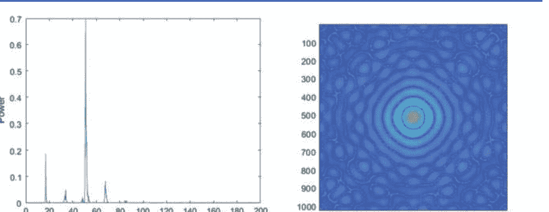

## 3.6 问题

- 问题1. YOLOv2能够处理小目标检测和分类吗，例如细胞？
- 问题2. 请解释深度学习概念之间的关系：RNN，LSTM，GRU，FGU。
- 问题3. 如何合并或融合不同的网络，如U-net和YOLOv2？
- 问题4. 在深度学习中，如何选择适当的目标检测算法？
- 问题5. HMM和RNN之间有什么区别？
- 问题6. 如何在深度学习中选择损失函数？
- 问题7. 对于时间序列分析，深度学习方法有哪些优势？
- 问题8. 如何理解人工神经网络的代价函数是功能空间中的一种度量或距离？
- 问题9. 从功能分析的角度来看，规范和正则化在深度学习中有什么关系？
- 问题10. 如何理解傅里叶变换和希尔伯特空间之间的关系？

# 参考文献

1. Krizhevsky A, Sutskever I, Hinton G (2017) 使用深度卷积神经网络的ImageNet分类。Commun ACM 60(6):84–90
2. Krizhevsky A, Sutskever I, Hinton GE (2012) 使用深度卷积神经网络的ImageNet分类。在：神经信息处理系统进展，第1097–1105页
3. Rastegari M, Ordonez V, Redmon J, Farhadi A (2016) 使用二值卷积神经网络的ImageNet分类。在：欧洲计算机视觉会议，第525–542页。Springer，柏林
4. Russakovsky O, Deng J, Su H, Krause J, Satheesh S, Ma S, Berg AC (2015) ImageNet大规模视觉识别挑战。Int J Comput Vis 115(3):211-252
5. LeCun Y, Bengio Y, Hinton G (2015) 深度学习。Nature 521:436-444
6. Vapnik VN (1995) 统计学习理论的本质。Springer，柏林
7. Zanaty EA (2012) 支持向量机（SVM）与多层感知器（MLP）在数据分类中的比较。Egyptian Informatics Journal 13(3):177-183
8. LeCun Y, Bengio Y (1995) 卷积网络用于图像、语音和时间序列。Handbook of Brain Theory and Neural Networks 3361(10):1995
9. Aizenberg NN, Aizenberg IN, Krivosheev GA (1996) 基于通用二进制神经元的CNN：具有纠错功能的学习算法，并应用于灰度图像上的脉冲噪声滤波。在：IEEE国际细胞神经网络及其应用研讨会，pp 309-314
10. Rekeczky C, Tahy A, Vegh Z, Roska T (1999) 基于CNN的时空非线性滤波和超声心动图内膜边界检测。Int J Circuit Theory Appl 27(1):171-207
11. Sahiner B, Chan HP, Petrick N, Wei D, Helvie MA, Adler DD, Goodsitt MM (1996) 乳房组织的肿块和正常组织的分类：具有空间域和纹理图像的卷积神经网络分类器。IEEE Trans Med Imag 15(5):598-610
12. Hubel DH, Wiesel TN (1962) 猫的视觉皮层中的感受野、双眼互动和功能结构。J Physiol 160(1):106-154
13. Lee CY, Gallagher PW, Tu Z (2016) 在卷积神经网络中泛化池化函数：混合、门控和树。在：人工智能和统计学，第464-472页
14. Giusti A, Ciresan DC, Masci J, Gambara della LM, Schmidhuber J (2013) 使用深度最大池化卷积神经网络进行快速图像扫描。在：IEEE国际图像处理会议，第4034-4038页
15. Heikkila M, Pietikainen M (2006) 一种基于纹理的建模背景和检测移动物体的方法。IEEE Trans Pattern Anal Mach Intel 28(4):657-662
16. He K, Zhang X, Ren S, Sun J (2014) 深度卷积网络中的空间金字塔池化用于视觉识别。在：计算机视觉欧洲会议，第346-361页。Springer，柏林
17. Merrienboer B, Bahdanau D, Dumoulin V, Serdyuk D, Warde-Farley (2014) 块梯度用于优化深度神经网络。arXiv preprint arXiv:1412.6806
18. Taud H, Mas JF (2018) 多层感知器（MLP）。在：地理信息方法用于建模土地变化情景，第451-455页。Springer，柏林
19. Dai J, Li Y, He K, Sun J (2016) R-FCN：基于区域的全卷积神经网络进行目标检测。在：神经信息处理系统的进展，第379-387页
20. Girshick R, Donahue J, Darrell T, Malik J (2016) 基于区域的卷积网络进行准确的目标检测和分割。IEEE Trans Pattern Anal Mach Intel 38(1):142-158
21. Gkioxari G, Girshick R, Malik J (2015) 具有R-CNN的上下文动作识别。在：IEEE ICCV，第1080-1088页
22. Girshick R (2015) 快速R-CNN。在：IEEE国际计算机视觉会议，第1440-1448页
23. Gu Q, Yang J, Yan W, Li Y, Kitler R (2017) 复杂交通场景中面向对象的局部快速R-CNN流进行事件识别。在：太平洋图像和视频技术研讨会，第439-452页
24. Kivinen J, Warmuth MK (1998) 多维回归问题的相对损失界限。在：神经信息处理系统的进展，第287-293页
25. Friedman J, Hastie T, Tibshirani R (2000) 加法逻辑回归：提升的统计视角。Ann Stat 38(2):337-374
26. Ren S, He K, Girshick R, Sun J (2015) 更快的R-CNN：基于区域建议网络的实时目标检测。在：神经信息处理系统的进展，第91-99页
27. Ren Y, Zhu C, Xiao S (2018) 基于快速/更快的RCNN的目标检测，采用完全卷积架构。Mathematical Problems in Engineering
28. Dunne RA, Campbell NA (1997) 关于softmax激活和交叉熵惩罚函数的配对以及softmax激活函数的推导。在：澳大利亚神经网络会议，墨尔本，第181卷，第185页
29. Takeda F, Omatu S (1995) 一种使用优化掩码的神经纸币识别方法通过遗传算法。在：IEEE国际系统、人和控制论大会，第5卷，第4367-4371页
30. Redmon J, Divvala S, Girshick R, Farhadi A (2016) 你只看一次：统一的实时物体检测。在：IEEE CVPR，第779-788页
31. Redmon J, Farhadi A (2017) YOLO9000：更好、更快、更强。在：IEEE CVPR，第6517-6525页
32. Liu W, Anguelov D, Erhan D, Szegedy C, Reed S, Fu CY, Berg AC (2016) SSD：单次拍摄多盒检测器。在：欧洲计算机视觉大会，第21-37页
33. Cao G, Xie X, Yang W, Liao Q, Shi G, Wu J (2018) 特征融合SSD：快速检测小物体。在：国际图形和图像处理会议（ICGIP），第10615卷
34. Hager GD, Dewan M, Stewart CV (2004) 使用SSD进行多核跟踪。在：CVPR
35. Jeong J, Park H, Kwak N (2017) 通过连接特征图来增强SSD以进行目标检测。在：BMVC '17
36. Huang G, Liu Z, Weinberger KQ, van der Maaten L (2017) 密集连接的卷积神经网络。在：IEEE CVPR，卷1，期2，第3页
37. Hochreiter S, Schmidhuber J (1997) 长短期记忆。Neural Computation 9(8):1735-1780
38. Rabiner L, Juang B (1986) 隐马尔可夫模型简介。IEEE ASSP Magazine 3(1):4-16
39. Hassanpour H, Farahabadi PM (2009) 使用隐马尔可夫模型进行纸币识别。Expert Syst Appl 36(6):10105-10111
40. Chatzis SP, Kosmopoulos DI (2011) 利用学生-t混合的隐马尔可夫模型的变分贝叶斯方法。Pattern Recognition 44(2):295–306
41. Toselli AH, Vidal E, Romero V, Frinken V (2016) 基于HMM单词图的手写文档图像关键词检测。Inf Sci 370:497–518
42. Gal Y, Ghahramani Z (2016) 在递归神经网络中理论上基于丢弃的应用。在：神经信息处理系统进展，第1019-1027页
43. Mikolov T, Karafiat M, Burget L, Cernocky J, Khudanpur S (2010) 基于递归神经网络的语言模型。在：Interspeech，第2卷，第3页
44. Martens J, Sutskever I (2011) 使用无Hessian优化学习递归神经网络。在：机器学习国际会议，贝尔维尤
45. Gers FA, Schmidhuber J (2000) 时间和计数的循环网络。在：IEEE-INNS-ENNS国际联合神经网络会议论文集，第3卷，第189-194页
46. Gers FA, Schraudolph NN, Schmidhuber J (2002) 学习LSTM循环网络的精确时序。J Mach Learn Res 3:115-143
47. Basu AP, Ebrahimi N (1991) 使用非对称损失函数的寿命测试和可靠性估计的贝叶斯方法。J Stat Plann Inf 29(1-2):21-31
48. Liu W, Wen Y, Yu Z, Yang M (2016) 用于卷积神经网络的大边界softmax损失。在：ICML，第507-516页
49. Zhang K, Zhang D, Jing C, Li J, Yang L (2017) 用于人脸验证的可扩展softmax损失。在：系统与信息学国际会议，第491-496页
50. Fu R, Zhang Z, Li L (2016) 使用LSTM和GRU神经网络方法进行交通流预测。在：中国自动化学会青年学术年会（YAC）
51. Gers FA, Schmidhuber J, Cummins F (2000) 学会遗忘：LSTM的持续预测。Neural Computation 12(10):2451-2471
52. Gers FA, Schmidhuber E (2001) LSTM循环网络学习简单的无上下文和有上下文语言。IEEE Trans Neural Netw 12(6):1333-1340
53. Wang MS, Song L, Yang XK, Luo CF (2016) 并行融合RNN-LSTM架构用于图像标题生成。在：国际图像处理会议，第4448-4452页
54. Xingjian SHI, Chen Z, Wang H, Yeung DY, Wong WK, Woo WC (2015) 卷积LSTM网络：一种用于降水预测的机器学习方法。在：神经信息处理系统进展，第802-810页
55. Chatfield C (2004) 时间序列分析：介绍。Chapman & Hall/CRC，亚特兰大
56. Ertel W (2017) 人工智能导论。Springer International Publishing，纽约
57. Norvig P, Russell S (2016) 人工智能：现代方法，第3版。Prentice Hall，Upper Saddle River
58. Yan WQ (2017) 智能监控导论：监控数据采集，传输，和分析。Springer，柏林
59. Chen J, Kang X, Liu Y, Wang Z (2015) 基于卷积神经网络的中值滤波取证。IEEE Signal Processing Letters 22(11):1849–1853
60. Muscat J (2014) 函数分析。Springer，柏林
61. Hu X (2017) 基于频率的纹理特征描述符。博士论文，奥克兰理工大学，新西兰

# 自编码器和生成对抗网络

## 4.1 自编码器

基本自编码器[1-3]是一种前馈和非循环神经网络，它是无监督学习。这意味着我们的计算机可以自我学习。给定一组训练数据，如何对数据进行编码并消除其中的噪声，这是自编码器的典型应用。我们深度自编码器的目标是降低维度[4]并最小化编码数据与解码数据之间的差异。因此，自编码器是一种生成网络，其优势之一是将输出作为输入进行测试并降低原始数据的维度[4]。数学上，对于 $\mathbf{x} \in \mathcal{R}^d, \mathbf{z} \in \mathcal{R}^p, \mathbf{z} = \sigma(\mathbf{W} \cdot \mathbf{x} + \mathbf{b})$

和

$$\mathbf{x}' = \sigma'(\mathbf{W}' \cdot \mathbf{z} + \mathbf{b}')$$

为了最小化重构误差，我们有

$$L(\mathbf{x}, \mathbf{x}') = \|\mathbf{x} - \mathbf{x}'\|^2 = \|\mathbf{x} - \sigma'(\mathbf{W}' \cdot \sigma(\mathbf{W} \cdot \mathbf{x} + \mathbf{b}) + \mathbf{b}')\|^2.$$

因此，全局损失函数[5]为

$$J_{AE}(\Theta) = \sum_{\mathbf{x}} L(\mathbf{x}, \mathbf{x}'),$$

其中 $\Theta = (\mathbf{W}, \mathbf{b}, \mathbf{W}', \mathbf{b}')^T$。衰减方程为

$$\Theta_{i+1} := \Theta_i - \alpha \cdot \frac{\partial L_{AE}(\Theta_i)}{\partial \Theta_i},$$

其中 $\alpha \geq 0$是学习率。

## 4.2 正则化和自动编码器

对于 L2正则化 [6]，如果 λ 是权重衰减的参数（wd），那么

$$J_{AE+wd}(\Theta) = J_{AE}(\Theta) + \lambda \cdot \sum_{w_{i,j} \in \mathbf{W}} w_{i,j}^2. \quad (4.6)$$

对于稀疏正则化（sp）[7]，使用 KL 散度[8]，如果 β 是稀疏权重的参数，那么

$$J_{AE+sp}(\Theta) = J_{AE}(\Theta) + \beta \cdot \sum_{j=1}^{m} K L(\rho \| \hat{\rho}_j), \quad (4.7)$$

其中

$$K L(\rho \| \hat{\rho}_j) \triangleq \rho \cdot \log \frac{\rho}{\hat{\rho}_j} + (1-\rho) \cdot \log \frac{1-\rho}{1-\hat{\rho}_j} \quad (4.8)$$

和

$$\hat{\rho}_j = \frac{1}{N} \sum_{i=1}^{N} h_j(x^{(i)}) \quad (4.9)$$

根据定义，我们知道 $K L(\rho \| \hat{\rho}_j) = K L(\hat{\rho}_j \| \rho)$。此外，

$$J_{AE+wd+sp}(\Theta) = J_{AE}(\Theta) + \lambda \cdot \sum_{w_{i,j} \in \mathbf{W}} w_{i,j}^2 + \beta \cdot \sum_{j=1}^{m} K L(\rho \| \hat{\rho}_j). \quad (4.10)$$

因此，

$$J_{AE+wd+sp}(\Theta) = J_{AE+wd}(\Theta) + \beta \cdot \sum_{j=1}^{m} K L(\rho \| \hat{\rho}_j) \quad (4.11)$$

和

$$J_{AE+wd+sp}(\Theta) = J_{AE+sp}(\Theta) + \lambda \cdot \sum_{w_{i,j} \in \mathbf{W}} w_{i,j}^2. \quad (4.12)$$

通过使用自动编码器进行去噪[9]，数据损坏意味着

$$\mathbf{x}' = \mathbf{x} + \varepsilon, \quad (4.13)$$

其中 $\varepsilon \sim \mathbf{N}(\mu, \delta) \rightarrow \mathbf{N}(0, \delta^2 \mathbf{I})$, $\mathbf{N}(0, \delta^2 \mathbf{I})$ 是加性各向同性高斯噪声。在收缩自动编码器（CAE）中，

$$J_{C AE}(\Theta) = J_{AE}(\Theta) + \lambda \cdot \| J_f \|^2, \quad (4.14)$$

其中 $\| J_f \|_F$ 是Frobenius范数，

$$J_f = (a_{ij})_{m \times n} \triangleq \left( \frac{\partial h_i}{\partial x_j} \right)_{m \times n} \quad (4.15)$$

和

$$\|J_f\|_F^2 = \sum_{i=1}^{m} \sum_{j=1}^{n} \left( \frac{\partial h_i}{x_j} \right)^2, \quad (4.16)$$

其中

$$h_i = \sigma (\mathbf{W} \cdot \mathbf{x} + \mathbf{b}). \quad (4.17)$$

因此，

$$\|J_f\|_F^2 = \sum_{i=1}^{m} h_i \cdot (1 - h_i) \cdot \sum_{j=1}^{n} w_{ij}^2. \quad (4.18)$$

对于变分自编码器（VAE）[10, 11]，我们将Kullback-Leibler（KL）散度[8]定义为

$$K L(Q \| P) \stackrel{\Delta}{=} \sum_{x \in \mathcal{X}} Q(x) \cdot \log \frac{Q(x)}{P(x)} \stackrel{\Delta}{=} \int_{x \in \mathcal{X}} Q(x) \frac{Q(x)}{P(x)} dx. \quad (4.19)$$

贝叶斯定理[12]是

$$P(x|z) = \frac{P(z|x) \cdot P(x)}{P(z)} = \frac{P(z|x) \cdot P(x)}{\sum_{x \in \mathcal{X}} P(z|x) \cdot P(x)}, \quad (4.20)$$

其中概率 $P(x|z)$, $P(z|x)$, $P(x)$ 和 $P(z)$ 分别指后验概率、似然、先验和证据。因此，我们有变分推断[12]。如果 $Q(z) = P(x|z)$, 那么

$$K L(Q(z) \| P(z|x)) = K L(Q(z) \| P(z)) - \sum_{z \in \mathcal{Z}} Q(z) \log P(x|z) + \log P(x). \quad (4.21)$$

现在，我们定义VAE。如果 $x \sim \mathbf{N}(\mu, \delta)$, $z = x + \varepsilon = g(x, \varepsilon)$, 那么 $z \sim \mathbf{N}(\mu + \varepsilon, \delta)$, $\mathbf{N}(\mu, \delta)$ 是正态或高斯分布，$\mu$ 是均值，$\delta$ 是方差，

$$Q(z) = P(x|z) = P(\varepsilon). \quad (4.22)$$

此外，

$$L_{VAE}(Q, P) = K L(Q(z) \| P(z|x)) \quad (4.23)$$

$$= K L(Q(z) \| P(z)) - \sum_{\mathbf{z} \sim N(\mu+\varepsilon, \delta)} Q(z) \log P(x|z) + \log P(x) \quad (4.24)$$

$$= K L(Q(z) \| P(z)) - \sum P(\varepsilon) \log P(x|g(x, \varepsilon)) + \log P(x), \quad (4.25)$$

其中 $g(x, \varepsilon)$ 是一个编码器模型，$P(x|z)$ 是一个解码器模型。因此，成本函数是

$$\min[K L(Q(z) \| P(z|x))] \Leftrightarrow$$

$$\min K L(Q(z) \| P(z)) - \text{最大} \sum_{\mathbf{z} \sim N(\mu+\varepsilon, \delta)} Q(z) \log P(x|z), \quad (4.26)$$

$x \in \mathcal{X}$在$z \in \mathcal{Z}$上是独立的[12]。

简而言之，VAE由编码器、解码器和损失函数组成。术语“变分”来自统计学中正则化和变分推断方法之间的密切关系。VAE为每个维度输出具有均值和标准差的高斯概率分布。对于一组可能的编码器和解码器，VAE在编码时寻找保留最大信息量的编码器和在解码时具有最小重构误差的解码器。VAE通过使用梯度下降来优化对编码器和解码器参数的损失进行训练。

自编码器是一种可以通过输入数据学习表示的自监督学习模型。LSTM自编码器[13]是使用编码器-解码器LSTM架构对序列数据进行自编码的实现。

LSTM自编码器可以学习序列数据的表示。对于给定的序列数据集，编码器-解码器LSTM被配置为读取输入序列、对其进行编码、解码并重新创建。LSTM自编码器的性能是根据模型重新创建输入序列的能力进行评估的。

自编码器已被应用于去除图像噪声，例如去雾；最终被用于实现图像修复，例如电视标志去除，因为输出可以作为输入进行迭代。

在MATLAB中，自编码器是一个神经网络，它将输入复制为输出。当隐藏层中的神经元数量小于输入的大小时，自编码器学习输入的压缩表示。这个自编码器使用正则化器在第一层学习稀疏表示。正则化器通过设置各种参数来控制。有一个用于图像分类的MATLAB自编码器训练示例可用。

## 4.3 生成对抗网络

生成对抗网络（GAN）学习以与给定训练集具有相同统计特性的新数据。生成网络生成候选数据，而判别网络对其进行评估。生成器通常是一个反卷积神经网络，判别器是一个卷积神经网络[14, 15]。

GAN被应用于数字取证，从伪造品中找到真实的。

给定 ∀{x1, x2, ..., xm} ∼ Pdata(x), Pdata(x) ≈ PG(x,Θ), 对于 xi 在 PG(x,Θ) 的最大似然估计是

$$L = \prod_{i=1}^{m} P_G(x_i, \Theta). \quad (4.27)$$

对于参数优化，

$$\Theta^* = \arg \max_{\Theta} \prod_{i=1}^{m} P_G(x_i, \Theta). \quad (4.28)$$

因此，

$$\Theta^* = \arg \max_{\Theta} \sum_{i=1}^{m} \log P_G(x_i, \Theta). \quad (4.29)$$

此外，

$$\Theta^* = \arg \max_{\Theta} KL(P_{data}(x) || P_G(x, \Theta)) \quad (4.30)$$

- 生成器 $G$: 从 $z$ 生成 $x$。
- 判别器 $D$: 通过函数评估 $P_{data}(x)$ 和 $P_G(x, \Theta)$ 之间的差异。

$$V(G, D) \triangleq \mathbb{E}_{x \sim P_{data}} (\log D(x)) + \mathbb{E}_{x \sim P_G} (\log(1 - D(x))) \quad (4.31)$$

$$G^* = \arg \min_G \max_D V(G, D). \quad (4.32)$$

给定 $G$, 如果

$$D^*(x) = \frac{P_{data}(x)}{P_{data}(x) + P_G(x)}, \quad (4.33)$$

因为

$$V(G, D^*) = \max V(G, D) = -2 \log 2 + 2 JS(P_{data}(x) || P_G(x)). \quad (4.34)$$

Jensen-Shannon (JS) 散度是

$$JS(P||Q) = \frac{1}{2} KL(P||M) + \frac{1}{2} KL(Q||M), \quad (4.35)$$

其中 $M = \frac{P+Q}{2}$ 和 $JS(P||Q) = JS(Q||P)$, 然而, $KL(P||Q) \neq KL(Q||P)$.

因此,

$$G^* = \arg \min_G \max_{D^*} V(G, D^*) \quad (4.36)$$

$$L(G) = \max_{D^*} V(G, D^*), \quad (4.37)$$

因此,

$$G^* = \arg \min_G L(G). \quad (4.38)$$

因此,

$$\Theta_G := \Theta_G - \beta \cdot \frac{\partial L(G)}{\partial \Theta_G}, \quad (4.39)$$

其中 $\beta \geq 0$ 是学习率. 我们通过以下方式解决这个问题:

- 给定 $G_0$,
  $$D_1 = \arg \max_D V(G_0, D) \quad (4.40)$$
- 给定 $D_1$,
  $$G_1 = \arg \max_G V(G, D_1). \quad (4.41)$$

• .....
• $G_i \Rightarrow D_{i+1}$; $D_{i+1} \Rightarrow G_{i+1}$.
• .....

$$G^* = \arg \min_G \max_D V(G, D), \quad (4.42)$$

其中

$$V = \mathbb{E}_{x\sim P_{data}} [\log D(x)] + \mathbb{E}_{x\sim P_G}[\log(1 - D(x))]. \quad (4.43)$$

离散地,

$$V = \frac{1}{m} \cdot \sum_{i=1}^m \log D(x_i) + \frac{1}{m} \cdot \sum_{i=1}^m \log[1 - D(\hat{x}_i)] \quad (4.44)$$

其中 $x_i \sim P_{data}$ 和 $\hat{x}_i \sim P_G$。因此我们有

$$\Theta_D := \Theta_D - \beta \cdot \frac{\partial V}{\partial \Theta_D}. \quad (4.45)$$

如果 $z_i \sim N(0, 1)$, $\hat{x}_i = G(z_i)$, 则

$$V = \frac{1}{m} \cdot \sum_{i=1}^m \log[1 - D(G(z_i))]. \quad (4.46)$$

因此，我们有

$$\Theta_G := \Theta_G - \beta \cdot \frac{\partial V}{\partial \Theta_G}. \quad (4.47)$$

因此，我们使用方程(4.46)和(4.47)来实现GAN。如果我们以图像处理为例，GAN可以使用现有细节使图像清晰，GAN还可以去除数字图像的伪影等。MATLAB提供了如何训练GAN模型的示例。

SimGAN [15] 优化神经网络模拟器的输出。我们需要最小化合成图像与优化图像之间的差异，并交替更新鉴别器。

SimGan 使用未标记的真实数据来优化合成图像，训练一个优化网络向合成图像中添加随机数，进一步稳定 GAN 训练，并防止优化网络产生伪影，同时通过在优化输出图像上训练深度神经网络生成无需人工注释的结果。总体损失函数为

$$L_R(\theta) = \sum_i X_i l_{real}(\theta; \mathbf{x}_i, L) + \lambda l_{reg}(\theta; \mathbf{x}_i), \quad (4.48)$$

其中

$$l_{real}(\theta; \mathbf{x}_i, L) = - \log(1 - D_{\phi}(R_{\theta}(\mathbf{x}_i))) \quad (4.49)$$

和

$$l_{reg}(\theta; \mathbf{x}_i) = \|\psi(\tilde{\mathbf{x}}) - \mathbf{x}\|, \quad (4.50)$$

其中 $y_i \in \mathbf{y}$ 是一个未标记的真实图像， $x_i \in \mathbf{x}$ 是一个合成的训练图像。

鉴别器通过最小化损失函数来更新其参数

$$L_D(\phi) = - \sum_i \log(D_\phi(x_i)) - \sum_j \log(1 - D_\phi(x_i)) \quad (4.51)$$

其中 $x_i$ 是一个合成图像。

## 4.4 信息论

文本处理被应用于自然语言处理。文本信息具有熵，信息容量通过熵来衡量，即使是文本短消息（SMS）也可以通过熵来衡量，即使只有144个字母。

$$H = - \sum_{i=1}^m p_i \ln p_i = \mathbf{E} \ln \frac{1}{p_i} \quad (4.52)$$

其中 H是熵， $p_i \in [0, 1]$是概率，可以是256个字母（ASCII码）的直方图或经过归一化后具有256个灰度强度的像素。

概率通常在0和1之间， v.i.z., $p \in [0, 1]$. 熵可以用数学期望的方式来表示 $\mathbf{E} (\cdot)$; 相应地，我们定义了联合熵、条件熵、相关熵。

我们将条件概率表示为 $p(x|y)$. 给定 $x$，条件熵 $h(x|y)$与给定 $y$的熵不同。因此，我们定义了联合熵和互信息熵。

联合概率是 $h(x, y)$. 信息容量被定义为 $c = \max I(x, y)$. 在互联网上，信息理论和熵有着广泛的应用。

相关熵也被称为 $p$ 和 $q$之间的KL散度，它反映了 $p$ 和 $q$之间的信息距离，

$$KL(p||q) = - \sum_{i=1}^m p_i \ln \frac{p_i}{q_i}$$ 再次， $KL(p||q) \neq KL(q||p)$.

互信息是基于联合概率定义的。KL散度已经在深度学习中用于基于熵的损失函数和距离计算。

在图形模型中，我们使用相关熵、联合熵和互信息。互信息有多个定义，它们相等，并且如果每个元素的概率是独立的，可以用乘积形式表示。

联合熵和互熵在Venn图中显示（也称为主图、集合图或逻辑图），它显示了一组不同集合之间的所有可能的逻辑关系。关于这些熵的概念，对于无限情况，我们有链式规则。相应地，我们使用条件熵。

根据贝叶斯定理，我们有联合熵、条件熵、相关熵和互信息之间的关系。

Jassen的不等式告诉我们什么是凸函数或凹函数。如果曲线上的点总是位于直线的一侧，我们称该曲线是凸的。在数学上，

$$f(\alpha \cdot x_1 + (1-\alpha)x_2) \leq \alpha \cdot f(x_1) + (1-\alpha) \cdot f(x_2), \alpha \in [0, 1]. \quad (4.53)$$

如果一个函数是凸的，可以应用二阶导数来判断它是否是这样的函数。$f'(x) \geq 0$ 且 $f''(x) \geq 0$。 假设我们有 $p(x)$ 和 $q(x)$，对于任意两个函数，我们有相关的熵

$$H(p||q) = -p \ln \frac{p}{q}.$$

另一个概念是熵率

$$H(p) = -\frac{1}{n} \sum_{i=1}^{m} \ln p_i.$$

一般来说，离散随机变量 $X$ 的熵 $H(X)$ 的定义是通过使用

$$H(X) = -\sum_{x \in \mathbf{X}} p(x) \log p(x) = -\mathbf{E} \log p(X) = \mathbf{E} \log \frac{1}{p(X)}.$$

一对离散随机变量 $(X, Y)$ 的联合熵 $H(X, Y)$ 与联合分布 $p(x, y)$ 定义为 $H(X, Y) = -$

$$\sum_{x \in \mathbf{X}, y \in \mathbf{Y}} p(x, y) \log p(x, y) = \mathbf{E} \log \frac{1}{p(X, Y)}.$$

如果 $(X, Y) \sim p(x, y)$, 那么条件熵 [8] $H(Y|X)$ 是

$$H(Y|X) = \sum_{x \in X} p(x)H(Y|X = x)$$

$$= -\sum_{x \in \mathbf{X}} p(x) \sum_{y \in \mathbf{Y}} p(y|x) \log p(y|x) = \mathbf{E}_{p(x,y)} \log \frac{1}{p(Y|X)}.$$

推论，

$$H(X|Y) = H(Y|X).$$

等价地，我们表示

$$\log p(X, Y) = \log p(X) + \log p(Y|X).$$

对于熵的链式法则，

$$H(X, Y) = H(X) + H(Y|X)$$

和

$$H(X, Y|Z) = H(X|Z) + H(Y|X, Z).$$

互信息 [8] $I(X; Y)$ 是衡量两个随机变量之间依赖关系的度量，它是对称的且始终非负。

$$I(X; Y) = H(X) - H(X|Y)$$

和

$$I(X; Y) = H(X) - H(X|Y) = H(Y) - H(Y|X).$$

对于一个输入为 $X$，输出为 $Y$ 的通信信道，容量 $C$ 被定义为

$$ C = \max_{p(x)} I(X; Y) \tag{4.66} $$

容量是我们在通道上发送信息的最大速率，并以极低的错误概率在输出端恢复信息。

相对熵（KL散度）[8]是两个概率质量函数 $p$ 和 $q$ 之间的“距离”度量。

$$ D(p||q) = \sum_{x \in \mathbf{X}} p(x) \log \frac{p(x)}{q(x)} = \mathbb{E}_{p(X)} \log \frac{p(X)}{q(X)}, \tag{4.67} $$

互信息[8] $I(X; Y)$ 是联合分布和乘积分 $p(x)q(y)$ 之间的相对熵。

$$ I(X;Y) = \sum_{x \in \mathbf{X}} \sum_{y \in \mathbf{Y}} p(x,y) \log \frac{p(x,y)}{p(x)p(y)} \tag{4.68} $$

$$ = D(p(x,y)||p(x)p(y)) = \mathbb{E}_{p(x,y)} \log \frac{p(X,Y)}{p(X)p(Y)}. \tag{4.69} $$

同时，

$$ I(X;Y) = H(X) - H(X|Y) = H(Y) - H(Y|X) \tag{4.70} $$

$$ I(X;Y) = H(X) + H(Y) - H(X,Y). \tag{4.71} $$

根据贝叶斯定理[12],

$$ p(x_1, x_2) = p(x_2)p(x_1|x_2) = p(x_1)p(x_2|x_1) \tag{4.72} $$

$$ H(X_1, X_2) = H(X_1) + H(X_2|X_1) \tag{4.73} $$

$$ H(X_1, X_2, X_3) = H(X_1) + H(X_2, X_3|X_1) = H(X_1) + H(X_2|X_1) + H(X_3|X_2, X_1). \tag{4.74} $$

因此，

$$ H(X_1, X_2, X_3, \ldots, X_n) = \sum_{i=1}^{N} H(X_i|X_{i-1}, \ldots, X_2, X_1). \tag{4.75} $$

相对熵的链式法则，

$$ D(p(x,y)||q(x,y)) = D(p(x)||q(x)) + D(p(y|x)||q(y|x)), \tag{4.76} $$

其中

$$ D(p(y|x)||q(y|x)) = \sum_{\mathbf{x}} p(x) \sum_{\mathbf{y}} p(y|x) \log \frac{p(y|x)}{q(y|x)} = \mathbb{E} \log \frac{p(y|x)}{q(y|x)}. \tag{4.77} $$

如果 $f(·)$ 是一个凸函数，$X$ 是一个随机变量，那么

$$
E f(X) \geq f(E(X)).
$$

一个函数 $f(x)$ 在区间 $(a, b)$ 上是凸函数，如果对于每一个 $x_1, x_2 \in (a, b)$ 和 $0 \leq \lambda \leq 1$,

$$
f[\lambda x_1 + (1-\lambda)x_2] \leq \lambda f(x_1) + (1-\lambda) f(x_2).
$$

如果 $f(·)$ 是一个凸函数，$X$ 是一个随机变量，那么

$$
E f(X) \geq f(E(x)).
$$

如果函数 $f(·)$ 在每个地方都有二阶导数 $f''(x) \geq 0$，那么函数是凸的（严格凸的）。设 $p(x), q(x), x \in \mathbf{X}$ 是两个概率质量函数，那么 $D(p||q) \geq 0, D(p(x|y)||q(x|y)) \geq 0$。对于任意两个随机变量 $X$ 和 $Y$，$I(X; Y) \geq 0$ 且 $I(X; Y|Z) \geq 0$；此外，因为 $I(X; Y) = H(X) - H(X|Y) \geq 0$，$H(X) \geq H(X|Y)$。

$$ H(X_1, X_2, \ldots, X_n) = \sum_{i=1}^{N} H(X_i|X_{i-1}, \ldots, X_1) \leq \sum_{i=1}^{N} H(X_i). $$

对于 $i$, $b_i \geq 0$, $i = 1, 2, \ldots, n$

$$ \sum_{i=1}^{N} a_i \log \frac{a_i}{b_i} \geq \sum_{i=1}^{N} a_i \log \frac{\sum_{i=1}^{N} a_i}{\sum_{i=1}^{N} b_i} $$

$$ D(p||q) = \sum_{i=1}^{N} p(x) \log \frac{p(x)}{q(x)} \geq \sum p(x) \log \frac{\sum p(x)}{\sum q(x)}. $$

因此，

因此，$H(X)$ 是一个凸函数，$I(X; Y)$ 是一个凹函数[16]。

随机过程 $X_i$ 的熵率定义为

$$ H(\mathbf{X}) = \lim_{n \to \infty} \frac{1}{n} H(X_1, X_2, \ldots, X_n). $$

熵率的相关量[8]:

$$ H'(\mathbf{X}) = \lim_{n \to \infty} \frac{1}{n} H(X_n|X_{n-1}, \ldots, X_1). $$

对于一个平稳随机过程,

$$ H'(\mathbf{X}) = H(\mathbf{X}) \Rightarrow $$

$$ \lim_{n \to \infty} H(X_n|X_{n-1}, \ldots, X_1) = \lim_{n \to \infty} H(X_n|X_{n-1}) = H(X_2|X_1). $$

让 $X_i, i = 1, 2, \ldots$ 成为一个具有平稳分布 $\mu$ 和转移矩阵 $\mathbf{P} = (P_{ij})$ 的平稳马尔可夫链。那么熵率为

$$ H(\mathbf{X}) = - \sum_{ij} \mu_i P_{ij} \log P_{ij}. $$

两个状态马尔可夫链的熵率是

$$H(\mathbf{X}) = H(X_2|X_1) = \frac{\alpha}{\alpha+\beta} \cdot H(\beta) + \frac{\beta}{\alpha+\beta} \cdot H(\alpha)$$

熵不仅以离散方式定义，还以连续方式定义。以前，它是基于求和函数，现在是基于积分运算。以前，熵是 $H$，现在是 $h$。如果 $f(\cdot)$ 是连续函数，熵函数将是连续的。连续熵是

$$h = -\int p(x)\ln p(x)dx = -\mathbf{E} \ln \frac{1}{p(x)}$$

连续条件熵是

$$h = -\int p(x|y)\ln p(x|y)dx = -\mathbf{E} \ln \frac{1}{p(x|y)}$$

连续联合熵是

$$h = -\int p(x, y)\ln p(x, y)dx = -\mathbf{E} \ln \frac{1}{p(x, y)}$$

连续熵率是

$$h = -\frac{1}{L} \int p(x, y)\ln p(x, y)dx = -\frac{1}{L} \mathbf{E} \ln \frac{1}{p(x, y)}$$

## 4.5 问题

- 1. 问题 1.自动编码器如何生成与原始图像相似的图像？
- 2. 问题 2.自动编码器和生成对抗网络之间的关系是什么？
- 3. 问题 3.如何衡量生成器和判别器在生成对抗网络中的性能？
- 4. 问题 4.相对熵的链式法则是什么？
- 5. 问题 5.使用相对熵（KL 散度）作为两个概率质量函数之间的度量的优缺点是什么？如何解决这个问题？

# 参考文献

- 1. Xing C, Ma L, Yang X (2016)基于堆叠去噪自编码器的特征提取和分类超光谱图像。J Sens 2016
- 2. Masci J, Meier U, Cirean D, Schmidhuber J (2011)基于堆叠卷积自编码器的分层特征提取。在:国际人工神经网络会议。Springer,柏林，页52-59
- 3. Wang J, Zhang C (2018)基于RNN编码器-解码器的深度学习模型的软件可靠性预测。Re liab Eng Syst Saf 170:73-82
- 4. Hinton GE, Salakhutdinov RR (2006)用神经网络降低数据的维度。Science 313(5786):504-507
- 5. Ko YH, Kim KJ, Jun CH (2005)一种基于新损失函数的多响应优化方法。J Qual Technol 37(1):50-59
- 6. Wan L, Zeiler M, Zhang S, Le Cun Y, Fergus R (2013) 使用DropConnect对神经网络进行正则化。在：机器学习国际会议，第1058-1066页
- 7. Poultney C, Chopra S, Cun YL (2007)使用基于能量的模型高效学习稀疏表示。在：神经信息处理系统进展，第1137-1144页
- 8. Cover T, Thomas J (1991)信息论要素。Wiley，纽约
- 9. Li CP, Qin PY, Zhang JJ (2017) 基于深度卷积神经网络的图像去噪研究。计算机工程43(3)
- 10. Marreiros AC, Daunizeau J, Kiebel SJ, Friston KJ (2008) 人口动态：方差和Sigmoid激活函数。神经影像学42 (1)：147-157
- 11. Welling M, Kingma D (2019) 变分自动编码器简介。Found Trends Mach Learn 12(4):307–392
- 12. Koller D, Friedman N (2009) 概率图模型。麻省理工学院出版社，剑桥
- 13. Marchi E, Vesperini F, Squartini S, Schuller B (2017) 基于深度递归神经网络的自动编码器用于声学新颖性检测。Comput Intell Neurosci Hindawi (文章编号4694860)
- 14. Ng AY, Jordan MI (2002) 关于判别式与生成式分类器的比较：逻辑回归和朴素贝叶斯。在：神经信息处理系统的进展，第841–848页
- 15. Shrivastava A等人通过对抗训练从模拟和无监督图像中学习，在：CVPR’17
- 16. Muscat J (2014) 函数分析。斯普林格，柏林

## 5.1 引言

从互动中学习是几乎所有学习和智能理论的基本思想。强化学习是学习如何将情境映射到行动的过程。行动不仅可能影响即时奖励，还可能影响下一个情境和所有随后的奖励。强化学习与动态系统相关，具体而言，与最优控制和马尔可夫决策过程（MDP）相关。强化学习明确考虑了一个目标导向代理与不确定环境交互的整个问题。强化学习寻求探索和利用之间的权衡。

强化学习系统包括策略、奖励信号、价值函数和环境模型。策略定义了学习代理在给定时间的行为方式。奖励信号定义了强化学习问题的目标。价值函数指定了从长远来看什么是好的。一个状态的价值是代理可以期望在未来从该状态开始累积的总奖励量。奖励确定了环境状态的即时内在可取性。强化学习的最后一个要素是环境的模型。

谷歌街景可以在室外环境中为我们导航，但在建筑物内部，谷歌街景如何帮助我们？强化学习[1,2]可以在这个室内环境中为我们导航。强化学习是三种基本的机器学习范例之一，另外两种是监督学习和无监督学习。假设我们有一张建筑物地图，一个机器人如何引导我们离开这个建筑物或者在这个建筑物中找到一个房间？成功解决这个问题可以帮助我们快速找到购物中心或地下商场中的最短路径，而无需GPS信息。在大学中，它还可以帮助学生快速找到他们的会议室或教室，并迅速帮助机器人在室内环境中到达目的地。

总之，强化学习在状态和策略上非常依赖，这是一种理解和自动化目标导向学习的计算方法。

## 5.2 贝尔曼方程

强化学习中的研究问题包括赌徒问题、有限马尔可夫决策问题、贝尔曼方程和值函数。贝尔曼最优方程是特殊的一致性条件，可以相对容易地确定最优策略。在有限马尔可夫决策问题中，考虑了动态规划、蒙特卡洛方法和时序差分学习方法等研究方法。

我们将一个软件机器人称为代理，它具有自主决策的智能能力，代理生活在一个环境中。我们需要一个具有策略、动作、相关奖励、效果、惩罚和状态的环境。状态被认为是策略和动作的输入。通过优化可以获得最佳策略和最佳奖励[3]。

假设我们有一个代理和一个环境，我们用一个代理的动作 $a$，一个奖励 $r$，一个策略 $\pi$，一个状态 $s$ 和一个动作来表示，该动作由策略和状态定义，即，$a \stackrel{\Delta}{=} \pi(s)$。我们将样本表示为 $\{s_1, a_1, r_1, \dots, s_t\}, t = 1, 2, \dots$；因此，强化学习是为了找到最大值($r$)，满足 $\{s_1, a_1, r_1, \dots, \dots, \dots, \dots, s_t\} \rightarrow \pi$。有限MDP是具有有限状态、动作和奖励集合的MDP。回报是代理寻求在期望值中最大化的未来奖励的函数。马尔可夫决策过程（MDP）只影响下一个时间，对当前序列的影响不大[4]，这意味着，

- 如果 $P(s_{t+1}|s_t) = P(s_{t+1}|s_1, \dots, s_t)$，则状态 $s_t$ 是马尔可夫的。
- 价值函数 $v(s) \stackrel{\Delta}{=} \mathbf{E}(G_t|s_t)$
- 回报 $G_t \stackrel{\Delta}{=} \sum_{k=0}^{\infty} \lambda^k \cdot r_{t+k+1}$，$\lambda$ 是折扣因子。

行动-值函数的定义如下

$$Q^{\pi}(s, a) \stackrel{\Delta}{=} \mathbf{E}_{s'}(r + \lambda \cdot Q^{\pi}(s', a')|s, a). \tag{5.1}$$

因此，最优动作值函数为

$$Q^{*}(s, a) = \mathbf{E}_{s'}(r + \lambda \cdot \max_{a'} Q^{*}(s', a')|s, a). \tag{5.2}$$

迭代地,

$$Q_{i+1}(s, a) = \mathbf{E}_{s'}(r + \lambda \cdot \max_{a'} Q_{i}(s', a')|s, a) \rightarrow Q^{*}(i \rightarrow \infty), \tag{5.3}$$

其中 $\mathbf{E}(\cdot)$ 是概率期望，我们将方程(5.3)称为贝尔曼方程。

奖励由行动决定。动作值函数 $Q(a, s)$ 由行动和状态定义。最佳 $Q$ 取决于行动 $a$ 和状态 $s$。这个过程

寻找最佳 Q 被称为 Q学习。 我们使用 Q学习来寻找优化的策略并最大化奖励。Q学习是一个简化的贝尔曼方程，如果α∈[0, 1],

$Q(s_t, a_t) \leftarrow Q(s_t, a_t) + \alpha(r_{t+1} + \lambda \cdot \max_{a} Q(s_{t+1}, a) - Q(s_t, a_t))$

最佳策略、状态和奖励彼此相关。 对于一个深度网络 w.r.t. Q 和权重 $w$,

$Q(s, a, w) = Q^\pi(s, a)$

因此，损失或目标函数为

$L(w) = \mathbb{E}\left(\left[r + \gamma \cdot \max_{a'} Q(s', a', w) - Q(s, a, w)\right]^2\right)$

梯度是

$\frac{\partial L(w)}{\partial w} = \mathbb{E}\left(\left[r + \gamma \cdot \max_{a'} Q(s', a', w) - Q(s, a, w)\right]\right) \cdot \frac{\partial Q(s, a, w)}{\partial w}$

强化学习是使用值函数来组织和结构化寻找良好策略的方法。 蒙特卡洛方法（MC）是基于平均样本回报来解决强化学习问题的方法。 每次出现在一个回台中的状态被称为一次访问。 在一个回合中第一次访问被称为第一次访问。 第一次访问MC方法估计了第一次访问后的回报的平均值。

MC方法的策略迭代自然地在每个情节上交替进行评估和改进。 在每个情节之后，观察到的回报用于策略评估，然后在情节中访问的所有状态上改进策略。 在MC方法中，我们使用首次访问MC方法来估计当前策略的动作值函数。

使用MC方法时，必须等到情节结束，因为只有在那时才知道回报，而使用时序差分（TD）学习方法时，只需要等待一个时间步骤。 TD方法可以直接从原始经验中学习，无需环境动态模型，它基于其他学习估计更新估计，而不需要等待最终结果。

最简单的TD方法在转换到 $S_{t+1}$和接收 $R_{t+1}$时立即进行更新。

$V(S_t) \leftarrow V(S_t) + \alpha\left[R_{t+1} + \gamma \cdot V(S_{t+1}) - V(S_t)\right]$

TD误差度量了估计值 $S_t$和更好估计 $\delta_t \doteq R_{t+1} + \gamma V(S_{t+1}) - V(S_t)$之间的差异。在梯度下降方法中， $\mathbf{w} = (w_1, \ldots, w_d)^\tau$,

$\mathbf{w}_{t+1} = \mathbf{w}_t + \alpha\left[\nu_\pi(S_t) - \hat{y}(S_t, \mathbf{w}_t)\right]\nabla \hat{y}(S_t, \mathbf{w}_t)$

其中 $\alpha$是一个正的步长参数， $\nabla \hat{y}(S_t, \mathbf{w}_t)$是相对于 $\mathbf{w}$的梯度。 这导致了以下用于状态值预测的通用SGD方法:

$\mathbf{w}_{t+1} = \mathbf{w}_t + \alpha\left[U_t - \hat{y}(S_t, \mathbf{w}_t)\right]\nabla \hat{y}(S_t, \mathbf{w}_t)$因为状态的真实值是回报的期望值，所以MC目标 $U_t \dot{=} G_t$。

线性方法通过使用内积来近似状态值函数

$\hat{\nu}(s, \mathbf{w}) = \mathbf{w}^\tau \mathbf{x}(s) = \sum_{i=1}^d w_i x_i(s)$

其中 $\hat{\nu}(\cdot, \mathbf{w})$ 是权重向量 $\mathbf{w}$ 的线性函数， $\mathbf{x}(s) = (x_1(s), x_2(s), \dots, x_d(s))^\tau$ 是实值向量， $\mathbf{x}(s)$ 被称为表示状态 s 的特征向量。

近似值函数的梯度是 $\nabla \hat{\nu}(s, \mathbf{w}) = \mathbf{x}(s)$。通常的SGD更新是

$\mathbf{w}_{t+1} = \mathbf{w}_t + \alpha [U_t - \hat{\nu}(S_t, \mathbf{w})] \mathbf{x}(s_t)$. (5.11)

近似值函数的梯度是 $\nabla \hat{\nu}(s, \mathbf{w}) = \mathbf{x}(s)$。通常的SGD更新是

$\mathbf{w}_{t+1} = \mathbf{w}_t + \alpha [U_t - \hat{\nu}(S_t, \mathbf{w})] \mathbf{x}(s_t)$. (5.12)

例如：

$\mathbf{w}_{t+n} = \mathbf{w}_{t+n-1} + \alpha [G_{t:t+n} - \hat{\nu}(S_t, \mathbf{w}_{t+n-1})] \nabla \hat{\nu}(S_t, \mathbf{w}_{t+n-1})$

其中 $G_{t:t+n} = R_{t+1} + \gamma \cdot R_{t+2} + \cdots + \gamma^{n-1} \cdot R_{t+n} + \gamma^n \cdot \hat{\nu}(S_{t+n}, \mathbf{w}_{t+n-1})$， $0 \leq t \leq T - n$。

## 5.3 深度 Q-学习

强化学习可以学习最佳策略并最大化总奖励。强化学习的关键是最大化奖励，问题是如何获得最佳行动以实现最佳奖励。因此，行动序列将具有最大的累积奖励。对于每个策略 $\pi$，存在一个奖励 $v^{\pi}(s_t)$，我们希望找到最优策略。

$v^*(s_t) = \max_{\pi} (v^\pi(s_t)), \forall s_t$. (5.13)

在简单情况下，行动 $a(t) \triangleq \pi(s_t)$， $Q(a_t) = r(a_t) > 0$。如果奖励 $r(a)$ 是奖励

$Q(a_{t+1}) \leftarrow Q_t(a_t) + \eta \cdot [r(a_{t+1}) - Q(a_t)]$. (5.14)

在完全强化学习中，策略 $\pi$ 定义了在任何状态下要采取的动作

$a_t^* = \arg \max_{a_t} Q(s_t, a_t), \quad (5.17)$

$\pi^*(s_t^*) = a_t^*. \quad (5.18)$

值迭代是

$|v^{(l+1)}(s) - v^{(l)}(s)| < \delta, \quad (5.19)$

其中 $\delta > 0; l = 1, 2, 3, \ldots$ and

$v(s_t) \leftarrow v(s_t) + \eta \cdot [r_{t+1} + \gamma \cdot v(s_{t+1}) - v(s_t)]. \quad (5.20)$

策略迭代是

$\pi \leftarrow \pi' = \arg \max_{\pi} (v^\pi(s')); \quad (5.21)$

和

$v^\pi(s) \leftarrow v^\pi(s'). \quad (5.22)$

奖励和行动是

$Q(a_t, s_t) = r_{t+1} + \gamma \cdot \max_{a_{t+1}} Q(a_{t+1}, s_{t+1}). \quad (5.23)$

这个迭代已经被用来近似最佳值。因此，我们进一步发展这个迭代：

- Episode: $\exists T, (s_1, a_1, r_2, \ldots, s_T) \to \pi$
- 蒙特卡洛方法: 使用经验均值替代贝尔曼方程，而不是期望回报，即，

$v_\pi(s) = \frac{1}{T} \sum_{t=1}^T (G_t | s_t = s), \quad (5.24)$

其中 $G_t = \sum_{k=-1}^T \lambda^{k-1} r_{t+k}$。因此，

$\pi(s) \leftarrow \arg \max_a Q(s, a) \quad (5.25)$

$v(s_t) \leftarrow v(s_t) - \alpha \cdot (G_t - v(s_t)) \quad (5.26)$

- 时间差分 (TD) :

$v(s_t) \leftarrow v(s_t) - \alpha \cdot (r_{t+1} + \gamma \cdot v(s_{t+1}) - v(s_t)), \quad (5.27)$

其中 $r_{t+1} + \gamma \cdot v(s_{t+1}) - v(s_t)$ 是TD误差和 $r_{t+1} + \gamma \cdot v(s_{t+1})$是TD目标。

为了获得最佳收敛性，我们使用Q学习和双Q学习来寻找最佳策略和动作：

- Episode: $\exists T, (s_1, a_1, r_2, \ldots, s_T) \rightarrow \pi$
- SARSA (状态-动作-奖励-状态-动作) 算法：
$Q(s, a) \leftarrow Q(s, a) + \alpha \cdot [r + \gamma \cdot Q(s', a') - Q(s, a)], \quad (5.28)$
其中 $s \leftarrow s'$ 和 $a \leftarrow a'$。
- Q学习: 一种离策略TD控制算法。
$Q(s, a) \leftarrow Q(s, a) + \alpha \cdot [r + \gamma \cdot \max_a Q(s', a) - Q(s, a)], \quad (5.29)$
在哪里 $s \leftarrow s'$
- 双Q学习:
$Q_1(s, a) \leftarrow Q_1(s, a) + \alpha \cdot [r + \gamma \cdot Q_2(s', \arg \max_a Q_1(s', a)) - Q_1(s, a)] \quad (5.30)$
和
$Q_2(s, a) \leftarrow Q_2(s, a) + \alpha \cdot [r + \gamma \cdot Q_1(s', \arg \max_a Q_2(s', a)) - Q_2(s, a)], \quad (5.31)$
在哪里 $s \leftarrow s'$。

这种控制方法与卡尔曼滤波非常相似，但卡尔曼滤波是用于信号滤波的线性动态系统。
强化学习使计算机能够在没有人为干预和没有明确编程的情况下，通过一系列决策来最大化任务的累积奖励。MATLAB列出了所有强化学习的例子。

一个例子是使用图像观察来摆动和平衡摆杆，可以在以下网址找到：https://au.mathworks.com/help/deeplearning/ug/train-ddpg-agent-to-swing-up-and-balance-pendulum-with-image-observation.html。屏幕截图显示在图5.1中，图5.1(a–c)显示了摆杆在不同位置摆动时的情况。

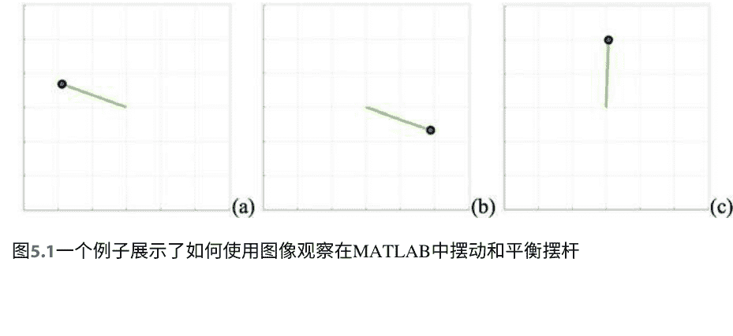

## 5.4 优化

优化是深度神经网络的核心技术。优化包括基于线性规划、基于非线性规划、基于动态规划或基于神经网络的方法等。局部优化和全局优化是优化的主要问题。优化算法中总是寻求局部最小值和全局最小值。

优化有两个类别：无约束优化和约束优化。无约束优化是指没有约束条件的优化。而约束优化是指具有约束条件的优化。大多数带有约束条件的优化问题，因此是约束优化。约束通常是关于（即，w.r.t.）或受制于（即，s.t.）约束条件。

线性规划问题是

$\mathbf{x}^* = \arg \max f(\mathbf{x}), (5.32)$

它受到（s.t.）条件 $\mathbf{Ax} = \mathbf{b}$的限制。

在线性规划中，如果我们改变参数如 $\mathbf{A}$, $\mathbf{b}$将会变为 $\mathbf{A} + \Delta\mathbf{A}$和 $\mathbf{b} + \Delta\mathbf{b}$，其中$\Delta\mathbf{A}$和$\Delta\mathbf{b}$是小的变化，我们需要检查它们如何影响我们的优化，找出这个优化问题的解是否受控。

在优化中，我们有多目标规划问题。如何找到这个多目标规划问题的最佳解决方案是一个关键问题在数学优化中。通常，我们需要寻找导数。有时，如果我们无法找到函数的导数来寻找局部优化解决方案，我们可以通过使用数学正则化来扩展问题[5]。

对于动态优化，我们还需要计算导数。如果无法找到导数，其中一种解决方案是利用遗传算法（GA）。现代优化指的是受自然启发的计算。通常，现代优化算法包括遗传算法（GA）、模拟退火、粒子群优化、蚁群优化等[6]。

## 5.5 数据拟合

, m, m > n, 最佳解决方案是最小化

$\varepsilon(x_1, \dots, x_n) = \sum_{i=1}^{m} (y_i - f(z_i, x_1, \dots, x_n))^2 (5.33)$

或

$\varepsilon(x_1, \dots, x_n) = \sum_{i=1}^{m} (y_i - f_i(x_1, \dots, x_n))^2. (5.34)$

因此，

$\frac{\partial \varepsilon(x_1, \dots, x_n)}{\partial x_i} = \frac{\partial}{\partial x_i} \sum_{i=1}^{m} (y_i - f_i(x_1, \dots, x_n))^2.\tag{5.35}$

线性最小二乘问题：如果函数 $f_k(x_1, \dots, x_n), k=1, \dots, m$是线性的，那么

$\|\mathbf{y} - \mathbf{A}\mathbf{x}\|^2 = (\mathbf{y} - \mathbf{A}\mathbf{x})^\tau (\mathbf{y} - \mathbf{A}\mathbf{x})$

被最小化，其中 $\mathbf{x} = (x_1, \dots, x_n)^\tau$，即，

$\min_{\mathbf{x} \in \mathbf{R}^n} \|\mathbf{y} - \mathbf{A}\mathbf{x}\|$

$\Rightarrow \nabla_\mathbf{x}[(\mathbf{A}\mathbf{x} - \mathbf{y})^\tau (\mathbf{A}\mathbf{x} - \mathbf{y})] = 2\mathbf{A}^\tau\mathbf{A}\mathbf{x} - 2\mathbf{A}^\tau\mathbf{y} = 0$

$\Rightarrow \mathbf{A}^\tau\mathbf{A}\mathbf{x} - \mathbf{A}^\tau\mathbf{y} = 0$

$\Rightarrow \mathbf{x} = (\mathbf{A}^\tau\mathbf{A})^{-1}\mathbf{A}^\tau\mathbf{y}.\tag{5.36}$

如果函数 $f(\mathbf{x}) = (f_1, \dots, f_m)^\tau$是非线性的，$\mathbf{y} = (y_1, \dots, y_m)^\tau$, 让 $\|\mathbf{y} - f(\mathbf{x})\|^2$最小化为 $\mathbf{x} = (x_1, \dots, x_n)^\tau$,那么雅可比矩阵是

$\frac{\partial \mathbf{J}(\mathbf{x})}{\partial \mathbf{x}} = \begin{bmatrix} \frac{\partial f_1}{\partial x_1} & \cdots & \frac{\partial f_1}{\partial x_n} \\ \cdots & \cdots & \cdots \\ \frac{\partial f_m}{\partial x_1} & \cdots & \frac{\partial f_m}{\partial x_n} \end{bmatrix} = 0\tag{5.37}$

非线性最小二乘问题的解 $\bar{\mathbf{x}}$满足

$\|\mathbf{y} - f(\bar{\mathbf{x}})\|^2 \leq \|\mathbf{y} - f(\mathbf{x})\|^2.\tag{5.38}$

使用高斯-牛顿方法给出解

$\mathbf{x}^{(i+1)} := \mathbf{x}^{(i)} - \nabla^{-1}f(\mathbf{x}^{(i)})f(\mathbf{x})^{(i)}.\tag{5.39}$

对于非线性函数，如果

$f(\xi) = f(\mathbf{x}_0) + f'(\mathbf{x}_0)(\xi - \mathbf{x}_0) = 0,\tag{5.40}$

然后

$\xi = \mathbf{x}_0 - \frac{f(\mathbf{x}_0)}{f'(\mathbf{x}_0)}.\tag{5.41}$

解决方程组的广义牛顿法给出

$\mathbf{x}_{i+1} = \mathbf{x}_i - \frac{f(\mathbf{x}_i)}{f'(\mathbf{x}_i)}\tag{5.42}$

其中 $i=0,1,2,\dots$。

如果对于每个$\varepsilon>0$，存在一个$N(\varepsilon)$，使得$|x_l - x_m|<\varepsilon, \forall l, m \geq N(\varepsilon)$，则序列$\mathbf{x}_i \in \mathbf{R}^n$收敛。

### 定理5.1 一般收敛定理

设函数 $\mathbf{y} = \mathbf{\Phi}(\mathbf{x})$, $\mathbf{x}, \mathbf{y} \in \mathbf{R}^n$ 有一个不动点 $\mathbf{\xi} = \mathbf{\Phi}(\mathbf{\xi})$, 且 $S_r(\mathbf{\xi}) = \{\mathbf{x}: \|\mathbf{x} - \mathbf{\xi}\| < r\}$ 是 $\mathbf{\xi}$ 的邻域，如果 $\Phi(\cdot)$ 在 $S_r(\mathbf{\xi})$ 中是一个压缩映射， 即 $\|\mathbf{\Phi}(\mathbf{x}) - \mathbf{\Phi}(\mathbf{y})\| \le K\|\mathbf{x} - \mathbf{y}\|$, (5.43) 其中 $K \in [0, 1]$, $\mathbf{x}, \mathbf{y} \in S_r(\mathbf{\xi})$。

对于生成的序列 $\mathbf{x}_i = \mathbf{\Phi}(\mathbf{x}_i)$, $i = 0, 1, 2, \dots$, $\mathbf{x}_i \in S_r(\mathbf{\xi})$, $$\|\mathbf{x}_{i+1} - \mathbf{\xi}\| \le K\|\mathbf{x}_i - \mathbf{\xi}\|. \tag{5.44}$$

如果函数 $\mathbf{y} = f(\mathbf{x})$, $\mathbf{x} \in S_r(\mathbf{x}_0) = \{\mathbf{x}: \|\mathbf{x} - \mathbf{x}_0\| < r\}$ 具有以下属性:

- $\|f'(\mathbf{x}) - f'(\mathbf{y})\| < \gamma \|\mathbf{x} - \mathbf{y}\|$, $\forall \mathbf{x}, \mathbf{y} \in S_r(\mathbf{x}_0)$, $\gamma \in [0, 1]$.
- $f'(\mathbf{x})^{-1}$ 存在, $\|f'(\mathbf{x})^{-1}\| < \beta$, $\forall \mathbf{x} \in S_r(\mathbf{x}_0)$, $\beta \in [0, 1]$.
- $\|f'(\mathbf{x}_0)^{-1} f(\mathbf{x}_0)\| < \alpha$, $\alpha \in [0, 1]$.

然后

- $$\mathbf{x}_{i+1} := \mathbf{x}_i - f'(\mathbf{x}_i)^{-1} f(\mathbf{x}_i), \tag{5.45}$$ 其中 $\mathbf{x}_i \in S_r(\mathbf{x}_0)$, $i = 0, 1, \dots$.
- $$\lim_{k \to \infty} x_k = \xi, \tag{5.46}$$ 其中 $\xi \in S_r(\mathbf{x}_0)$, $f(\xi) = 0$.
- 对于所有 $k \ge 0$, $$\|\mathbf{x}_k - \mathbf{\xi}\| < \eta \cdot \frac{h^{2k-1}}{1-h^{2k}}, \tag{5.47}$$ 其中 $\eta \in [0, 1]$.

给定一个矩阵 $\mathbf{A} = (a_{ij})_{n \times n}$, 找到 $\lambda \in \mathbf{C}$, 使得线性方程组有一个非平凡解 $\mathbf{x} \neq \mathbf{0}$。

$(\mathbf{A} - \lambda \mathbf{I})\mathbf{x} = \mathbf{0}, \tag{5.48}$

其中 $\lambda$ 是矩阵 $\mathbf{A}$ 的特征值，$\mathbf{x}$ 是与特征值 $\lambda$ 相关的矩阵 $\mathbf{A}$ 的特征向量，所有特征值的集合称为矩阵 $\mathbf{A}$ 的谱。

$\phi(\mu) = \det(\mathbf{A} - \mu \mathbf{I}) \tag{5.49}$

被称为特征多项式

$\phi(\mu) = (\mu - \lambda_1)^{\sigma_1} (\mu - \lambda_2)^{\sigma_2} \cdots (\mu - \lambda_k)^{\sigma_k}, \tag{5.50}$

其中 $\sigma_i = \sigma(\lambda_i)$, $\sigma_1 + \sigma_2 + \cdots + \sigma_k = n$. 特别地， $$\phi(\mathbf{A}) = \mathbf{0}. \tag{5.51}$$

## 5.6 问题
- 1. 如何理解监督学习、无监督学习和强化学习之间的关系？
- 2. 什么是马尔可夫决策过程？为什么强化学习与马尔可夫决策过程相关？
- 3. 请解释一下探索和利用的概念是什么？强化学习如何在探索和利用之间寻求权衡？
- 4. 什么是贝尔曼方程？贝尔曼方程中的相关概念有哪些？
- 5. 什么是强化学习中的一个回合？
- 6. 强化学习与梯度下降方法有什么关系？
- 7. Q-learning 和双 Q-learning 用于什么？
- 8. 线性规划是什么？非线性规划是什么？动态规划是什么？
- 9. 现代优化算法是什么？请列举其中三个。
- 10. 广义牛顿法用于解决方程组的方法是什么？

# 参考文献
- 1. Littman M (2015) 强化学习通过评估反馈改善行为。自然 521:445–451
- 2. Mnih V et al (2015) 通过深度强化学习实现人类水平控制。自然 518:529–533
- 3. Alpaydin E (2009) 机器学习导论。麻省理工学院出版社，剑桥
- 4. Koller D, Friedman N (2009) 概率图模型。麻省理工学院出版社，剑桥
- 5. Goodfellow I, Bengio Y, Courville A (2016) 深度学习。麻省理工学院出版社，剑桥
- 6. Rao S (2009) 工程优化：理论与实践，第4版。ISBN: 978-0-470-18352-6

## 6.1 CapsNet
2017年，Hinton和他的团队引入了胶囊网络（CapsNets）的动态路由机制[1]。胶囊是一组神经元，它们分别对视觉对象的各种属性进行激活。CapsNet被用于更好地建模层次关系，能够解决“毕加索问题”，即那些拥有所有正确部分但空间关系不正确的图像。

CapsNet的输出是一个由观测概率（例如位置、大小、方向）、变形、速度等组成的向量。CapsNets用向量输出胶囊替代了标量输出。因为每个胶囊是独立的，当多个胶囊达成一致时，正确检测或置信度的概率会更高。

胶囊的输出通过以下方式更新：

$$b_{ij} \leftarrow b_{ij} + \hat{u}_{j|i} \cdot v_j, \quad (6.1)$$

其中 $b_{ij}$ 指的是胶囊 $i$ 在层 $l$ 连接到胶囊 $j$ 在层 $l+1$ 的先验概率。

$$\hat{u}_{j|i} = W_{ij} u_i, \quad (6.2)$$

其中 $W_{ij}$ 是一个权重矩阵。姿态向量 $u_i$ 通过使用 $W_{ij}$ 进行旋转和平移，得到预测父胶囊的向量 $\hat{u}_j$。

在胶囊网络中，压缩函数为

$$v_j(s_j) = \frac{\|s_j\|^2}{1 + \|s_j\|^2} \frac{s_j}{\|s_j\|}, \quad (6.3)$$

其中 $v_j$ 是胶囊 $j$ 的向量输出。下一层的胶囊 $s_j$ 是由前一层所有胶囊的预测之和输入的，具有耦合系数 $c_{ij}$。

$$s_j = \sum_{i} c_{ij} \hat{u}_{j|i}$$ (6.4)

和

$$c_{ij} = softmax(\mathbf{b}_i) = \frac{\exp(b_{ij})}{\sum_{k} \exp(b_{ik})}$$ (6.5)

其中 $c_{ij}$ 是耦合系数，$b_{ij}$ 是先验概率的对数，初始值为 0。最终，网络通过最小化损失函数进行训练

$$L_k = T_k \max(0, m^+ - \|\mathbf{v}_k\|)^2 + \lambda(1 - T_k) \max(0, \|\mathbf{v}_k\| - m^-)^2$$ (6.6)

其中 $m^+ = 0.9, m^- = 0.1$, 且 $\lambda = 0.5$

$$T_k = \begin{cases} \text{类别 } k \text{的1位数字} & \\ 0 & \text{其他.} \end{cases}$$

CapsNets具有多个概念上的优势，可以学习拓扑关系，网络以分层方式组织。CapsNets具有视点不变性和对新视点更好的泛化能力。此外，CapsNets已应用于图像分割，类似于SegNets和U-Nets的工作原理。这两个深度学习网络专门设计用于图像分割。

U-Nets [2, 3]也应用于像素级回归和小尺寸目标的检测和识别。U-Net是一个由收缩路径和扩张路径组成的卷积神经网络。收缩路径遵循典型的卷积网络架构。该网络具有U形架构，由重复应用卷积操作、ReLU激活函数和最大池化操作组成。设计基于完全卷积网络（FCN），并通过较少的训练图像进行修改和扩展，以实现更精确的分割。U-Net使用像素级softmax交叉熵作为损失函数。softmax函数定义如下

$$p_k(\mathbf{p}) = \frac{\exp(a_k(\mathbf{p}))}{\sum \exp(a_k(\mathbf{p}))}$$ (6.7)

其中 $p_k(\mathbf{p})$ 是像素 $\mathbf{p}$ 在特征通道 $k$ 中的softmax函数，$k = 1, 2, \ldots, K$, $K$是类别的数量；$a_k(\mathbf{p})$ 是像素位置 $\mathbf{p} = (x, y) \in \Omega = [a, b] \times [c, d] \subset \mathscr{R}^2$, $x \in [a, b]$ 和 $y \in [c, d]$分别是图像区域在水平和垂直方向上的间隔。

像素级的softmax交叉熵是

$$L(p) = \sum_{\mathbf{p} \in \Omega} w(\mathbf{p}) \log p(a_l(\mathbf{p}))$$ (6.8)

其中 $a_l(\mathbf{p})$ 是具有通道标签 $l$, $0 < l \le K$ 的softmax函数在像素 $\mathbf{p}$ 处的；$w(\mathbf{p})$ 是像素 $\mathbf{p}$ 处的权重映射，该映射具有像素级的损失权重，强制U-Net网络从边界像素中学习。权重映射的计算方式为

$$w(\mathbf{p}) = w_c(\mathbf{p}) + w_0(\mathbf{p}) \exp\left( - \frac{(d_1(\mathbf{p}) + d_2(\mathbf{p}))^2}{2\sigma^2} \right), \quad (6.9)$$

其中 $w_c(\mathbf{p})$、$w_0(\mathbf{p})$ 和 $\sigma = 0$ 是参数，被视为常数。$d_1(\mathbf{p})$ 和 $d_2(\mathbf{p})$ 是像素 $\mathbf{p}$ 到其边界像素的第一最长距离和第二最长距离。

同时，SegNet [4] 使用了VGG [5] 神经网络的所有预训练卷积层权重作为预训练权重，这些权重是由英国剑桥大学开发的。编码器网络由13个卷积层组成，对应于VGG16网络的前13个卷积层。

每个编码器层都有一个对应的解码器层，因此解码器网络有13层。最终的解码器输出被输入到一个多类别softmax分类器中，为每个像素独立地产生类别概率。交叉熵损失函数被用作训练SegNet的目标函数，损失函数在一个小批量中的所有像素上求和。SegNet只存储特征图的最大池化索引，并在其解码器网络中使用它们以实现良好的性能。

此外，SegNet [4] 是一种用于多类别像素分割的深度编码器-解码器架构。SegNet对于实时城市道路场景分割以及室内场景理解非常有效。该架构由一系列非线性处理层（编码器）和相应的解码器集合，以及像素级分类器组成。通常，每个编码器由一个或多个卷积层、批归一化和ReLU非线性激活函数组成，然后是非重叠的最大池化和下采样。SegNet的一个关键组成部分是在解码器中对低分辨率特征图进行上采样（双线性插值）。

整个架构可以通过使用随机梯度下降进行训练。

下采样是通过使用最大池化、平均池化等池化操作来实现的。关于上采样，使用最近邻插值、双线性插值和双三次插值方法[6]来进行操作。对于双线性插值，我们有一个区域 $\Omega = [a, b] \times [c, d]$ 和一个区域 $\Omega' = [a', b'] \times [c', d']$ 在图像 $I$ 和 $I'$ 中，参数 $s \in [0, 1]$ 和 $t \in [0, 1]$ 建立了区域 $\Omega \subset I$ 到 $\Omega' \subset I'$ 之间的映射关系。也就是说，给定像素 $\mathbf{p} \in \Omega \subset I$，我们将通过参数 $s_0, t_0 \in [0, 1]$ 得到相应的像素 $\mathbf{p}' \in \Omega' \subset I'$。因此 $\mathbf{p}(s, t) = \mathbf{p}'(s, t)$，对于所有的 $s, t \in [0, 1]$，即，

$$\mathbf{p}_A = \mathbf{p}(0, 0) = \mathbf{p}'(0, 0) = \mathbf{p}_{A'}, \quad (6.10)$$
$$\mathbf{p}_B = \mathbf{p}(1, 0) = \mathbf{p}'(1, 0) = \mathbf{p}_{B'}, \quad (6.11)$$
$$\mathbf{p}_C = \mathbf{p}(0, 1) = \mathbf{p}'(0, 1) = \mathbf{p}_{C'}, \quad (6.12)$$
$$\mathbf{p}_D = \mathbf{p}(1, 1) = \mathbf{p}'(1, 1) = \mathbf{p}_{D'}, \quad (6.13)$$

其中四个角点 $\mathbf{p}_A, \mathbf{p}_B, \mathbf{p}_C, \mathbf{p}_D \in \Omega$ 对应于四个角点 $\mathbf{p}_{A^{\prime}}, \mathbf{p}_{B^{\prime}}, \mathbf{p}_{C^{\prime}}, \mathbf{p}_{D^{\prime}} \in \Omega^{\prime}$。因此，

$$
\begin{aligned}
\mathbf{p}^{\prime}\left(s_0, t_0\right) & =t_0 \cdot\left[s_0 \cdot \mathbf{p}^{\prime}(0,0)+(1.0-s_0) \cdot \mathbf{p}^{\prime}(1,0)\right]+(1.0-t_0) \cdot\left[s_0 \cdot \mathbf{p}^{\prime}(1,0)+(1.0-s_0) \cdot \mathbf{p}^{\prime}(1,1)\right] .
\end{aligned}
$$ (6.14)

以矩阵形式表示，

$$
\mathbf{p}^{\prime}\left(s_0, t_0\right)=\left(t_0,1.0-t_0\right) \mathbf{M}^{\prime}\left(s_0, 1-s_0\right)^{\tau}
$$ (6.15)

其中

$$
\mathbf{M}^{\prime}=\left[\begin{array}{ll}
\mathbf{p}^{\prime}(0,0) & \mathbf{p}^{\prime}(1,0) \\
\mathbf{p}^{\prime}(0,1) & \mathbf{p}^{\prime}(1,1)
\end{array}\right] .
$$ (6.16)

同时，

$$
\begin{aligned}
\mathbf{p}\left(s_0, t_0\right) & =t_0 \cdot\left[s_0 \cdot \mathbf{p}(0,0)+(1.0-s_0) \cdot \mathbf{p}(1,0)\right]+(1.0-t_0) \cdot\left[s_0 \cdot \mathbf{p}(1,0)+(1.0-s_0) \cdot \mathbf{p}(1,1)\right] .
\end{aligned}
$$ (6.17)

同样，在矩阵形式中，

$$
\mathbf{p}\left(s_0, t_0\right)=\left(t_0, 1.0-t_0\right) \mathbf{M}\left(s_0, 1-s_0\right)^{\tau},
$$ (6.18)

其中

$$
\mathbf{M}=\left[\begin{array}{ll}
\mathbf{p}(0,0) & \mathbf{p}(1,0) \\
\mathbf{p}(0,1) & \mathbf{p}(1,1)
\end{array}\right]
$$ (6.19)

## 6.2 流形学习
流形[7-9]是曲线和曲面的推广，一条线是1D流形，一条曲线是2D流形，一个曲面是3D流形，$n$维流形是$n$维流形。在流形中，图表是欧几里得空间中的一个重要概念，与邻域有关。Atlas是一个局部欧几里得空间，是具有无限连续性的拓扑学的集合。如果一个流形是光滑的，我们称之为光滑流形。流形包括解析流形、复流形、欧几里得流形、拓扑流形等。

在流形中，如果函数 $f(x) \in[a, b], x \in \mathscr{H}$ 的左连续性等于右连续性，即

$$
\lim _{x \rightarrow x_0^{+}} f(x) = f(x_0) = \lim _{x \rightarrow x_0^{-}} f(x),
$$ (6.20)

其中 $C^k$ 是连续的，如果 $f^k(x)$ 具有阶数 $k \in \mathscr{Z}^{+}$ 的导数。$C^\infty$ 是连续的当 $k$ 趋于无穷大时，即 $k \rightarrow \infty$。

拓扑流形在具有欧几里得距离的豪斯多夫空间中定义。拓扑空间具有基础，$n$-流形具有维度为 $n$ 的基础，这是可数的；因此，拓扑流形是可数的。

如果我们有可逆函数 $\Psi^{-1}(\cdot)$ 和 $\Phi^{-1}(\cdot)$，那么两个图表之间存在兼容关系，$x \in C_1$ 和 $y \in C_2$，$y = \Phi(x)$，$\Phi^{-1}\Phi(x)=x$，$\Psi^{-1}\Phi\Psi(x) = \Phi(x)$ 和 $\Phi^{-1}\Psi\Phi(x) = \Psi(x)$。
同态是保持关系的映射
对于任意的 $u, v \in \mathbf{A}$，有 $\Phi(u \cdot v) = \Phi(u) \circ \Phi(v)$ (6.21)
在映射之前和之后，定义的操作保持不变。

流形是同态映射，这意味着流形定义在连续的域上。黎曼流形是基于导数或切向量的光滑流形。流形的中心被定义为集合 $\mathbf{C} = \{x : ax = xa = 0, x \in \mathbf{K}, a \in \mathbf{A}\}$。

基于流形的映射，如果我们有两个函数 $f(\cdot)$ 和 $g(\cdot)$，都是 $C^{\infty}$ 的，那么复合函数 $f \circ g$ 将是无限连续的 $C^{\infty}$，即 $f \circ g \in C^{\infty}$。流形学习已经应用于医学图像处理、数据压缩、数据维度降低、噪声去除等领域。PCA（主成分分析）是一种线性维度降低方法，而流形学习是一种非线性维度降低方法，可以应用于噪声去除。数据维度降低已经被应用于解决“维度灾难”问题。

PCA（主成分分析）是指一种正交线性变换，将给定的数据转换到一个新的坐标系，使得通过给定数据的标量投影在主成分上具有最大方差。

原始向量 $\mathbf{x}$ 的主成分分解为

$$\mathbf{b} = \mathbf{x}\mathbf{A}, \qquad (6.22)$$

其中 $\mathbf{A} = (a_{ij})_{p \times p}$ 是一个权重矩阵，$p \in \mathscr{L}$，$a_{ij} \in \mathscr{R}$。该变换将一个原始空间中的数据向量 $\mathbf{x} = (x_{ij})_{1 \times p}$ 映射到一个新空间中的向量 $\mathbf{b} = (b_{ij})_{1 \times p}$，$x_i, b_{ij} \in \mathscr{R}$。如果我们有 $0 < l < p$，$l, p \in \mathscr{L}$，我们有另一个映射

$$\mathbf{b}_l = \mathbf{x}\mathbf{A}_l, \qquad \text{(6.23)}$$

期望将平方重构误差最小化

$$\varepsilon = \|\mathbf{x} - \mathbf{x}_l\|_2^2, \quad \text{其中 } \mathbf{x}_l \text{ 的维度比向量 } \mathbf{x} \text{ 低，即 } l < p\text{。}$$ (6.24)

因此，原始数据的主要成分被保留，原始数据的维度被降低。

为了通过协方差方法使用PCA实现降维，我们寻找协方差矩阵的特征向量和特征值

$$\mathbf{B} = \mathbf{X} - \mathbf{h}\mathbf{u}^{\tau}, \qquad (6.25)$$

其中 $\mathbf{X} = (x_{ij})_{n \times p}$ 是由给定向量 $\mathbf{x}_i = (x_{ij})_{1 \times p}$ 组成的矩阵，$\mathbf{h} = (h_{ij})_{1 \times n}$, $h_{ij} = 1$, $\mathbf{u} = (u_{ij})_{1 \times p}$。

$$u_{1,j} = \frac{1}{n} \sum_{i=1}^{n} x_{i,j}$$ (6.26)

其中 $j = 1, 2, \ldots, p$, $i = 1, 2, \ldots, n$。因此，我们从矩阵 $\mathbf{B}$ 得到协方差矩阵 $\mathbf{C}$

$$\mathbf{C} = \frac{1}{n-1} \mathbf{B}^* \mathbf{B}$$ (6.27)

其中“$*$”是共轭转置运算符。因此，

$$\mathbf{V}^{-1} \mathbf{C} \mathbf{V} = \text{diag}(\lambda_1, \lambda_2, \ldots, \lambda_n)$$ (6.28)

其中 $\mathbf{V}$ 是由特征向量组成的矩阵，是对角矩阵，由 $\mathbf{C}$ 的特征值组成，$\lambda_i = 0$, $i = 1, 2, \ldots, n$ 是特征值。也就是说，特征值满足特征多项式

$$f(\lambda) = |\mathbf{C} - \lambda \mathbf{I}| = 0$$ (6.29)

其中 $\mathbf{I}$ 是单位矩阵。我们按降序对特征值进行排序；因此，相应特征向量的顺序被交换。因此，我们使用公式 (6.30) 选择主要成分

$$\delta = \frac{\sum_{i=1}^{l} |\lambda_i|}{\sum_{i=1}^{p} |\lambda_i|} > 0, \quad (p \geq l > 0)$$ (6.30)

例如，如果 $\delta > 0.90$，那么 $\lambda_i$, $i = 1, 2, \ldots, l$ ($p \geq l > 0$) 是矩阵 $\mathbf{C}$ 的主要成分。

$$\mathbf{V}_l^{-1} \mathbf{C}_l \mathbf{V}_l = \text{diag}(\lambda_1, \lambda_2, \ldots, \lambda_l)$$ (6.31)

其中 $\mathbf{V}_l$ 是由对应于特征值 $\lambda_1, \lambda_2, \ldots, \lambda_l$ 的特征向量组成的矩阵。相应地，我们找到了满足 $l \in \mathbb{Z}^+$ 的值，使得 $\mathbf{b}_i = \mathbf{x} \mathbf{C}_l$, $\forall \mathbf{x}$。

在流形学习中，我们总是假设我们可以通过降维找到低维数据。我们假设最低维的数据被隐藏或嵌入在嘈杂的数据中。这是我们使用流形学习的基本观点或假设，或者直接称之为流形学习。

在流形学习中，我们构建节点或顶点 $x_i$ 和 $x_j$ 之间的关系矩阵，$i,j=1,2,\ldots$ 给定图 $G$ 的数据集 $W= \{w_{ij}\}$ 是相似性或亲和性矩阵。给定一个具有训练样本 $X=\{x_i\}_{i=1}^n$, $x_i \in \mathbb{R}^d$ 的数据集，$G=\langle X, W \rangle$ 是一个无向图，$W=(w_{ij})_{n \times n}$ 是相似性或亲和性矩阵，$w_{ij} \in [0,1]$

$$w_{ij} = \exp\left( -\frac{\|x_i - x_j\|^2}{\gamma_i \gamma_j} \right)$$ (6.32)

## 6.2 流形学习

其中 γ_i = ||x_i - x_{i_k}|| 是数据样本 x_i 在 x_i 的 k 最近邻 x_{i_k} 附近的局部尺度。图拉普拉斯算子是

L = D - W, (6.33)

其中 D = (d_{ij})_{n×n}, d_{ii} = ∑_j w_{ij}, ∀i。

对于数据样本的降维 {y_i}_{i=1}^n, y_i ∈ R^d, d ≪ D, 基于特征谱的方法是

Ly = λBy, (6.34)

其中 yBy^T = I, I 是单位矩阵。因此，我们通过求解

y* = arg min_{yBy^T=I} yLy^T (6.35)

来得到降维结果。

给定一个图，边权重的矩阵 W = (w_{ij})_{n×n}, 数据点 x_i ∈ R^d,

L = D - W, (6.36)

其中 D = (d_{ii})_{n×n}, d_{ii} = ∑_j w_{ij},

w_{ij} = { exp(-||x_i - x_j||^2/(2σ^2)) if x_j ∈ N(i); 0 otherwise } (6.37)

其中 w_{ij} 是高斯核函数，N(i) 是 x_i 的邻域。

Ly = λDy, (6.38)

其中 Y = (y_i)_{i=1}^n 是输出。

流形学习的一个示例可从网站获取：https://scikit-learn.org。Python已被应用于实现这些方法，示例应用于减少瑞士卷数据的维度（图6.1）。

有一个MATLAB示例可用于演示流形学习中的拉普拉斯特征映射，网址为：https://www.mathworks.com/matlabcentral/fileexchange/36141-laplacian-eigenmap-diffusion-map-manifold-learning。结果显示在图6.2中，用于恢复低维几何结构的目的。

## 6.3 问题

1.  问题1. CNN和CapsNets之间有什么区别？CapsNets能给我们带来什么？
2.  问题2. CapsNets的损失函数是什么？CapsNets的压缩函数是什么？
3.  问题3. 流形学习中的三个关键概念是什么？
4.  问题4. 请列举数据降维的算法，并给出它们之间的区别。
5.  问题5. 为什么流形学习可以应用于降维？

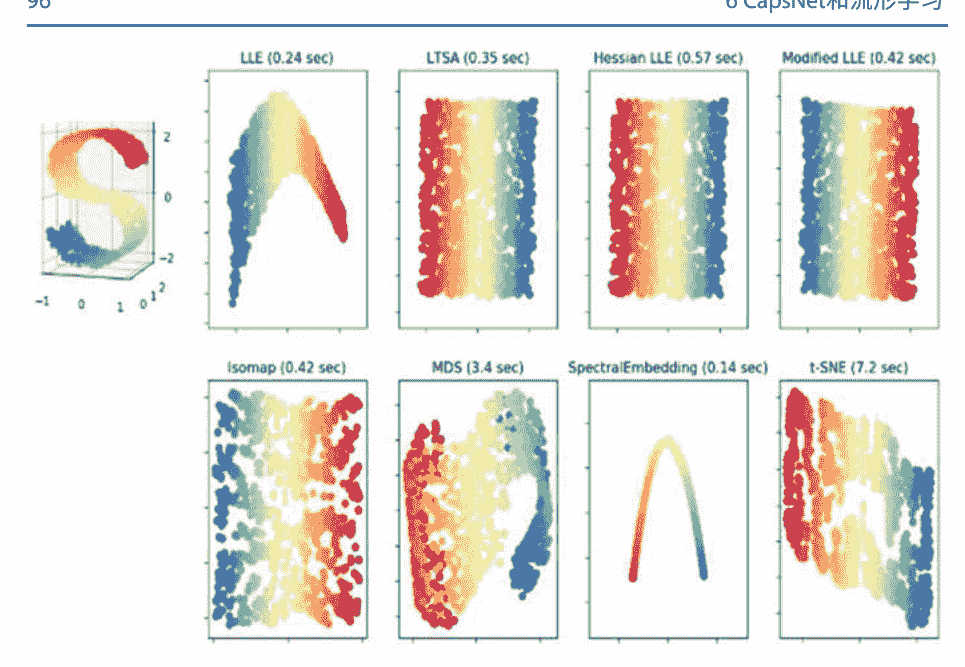

图6.1 使用流形学习对瑞士卷进行降维的Python示例

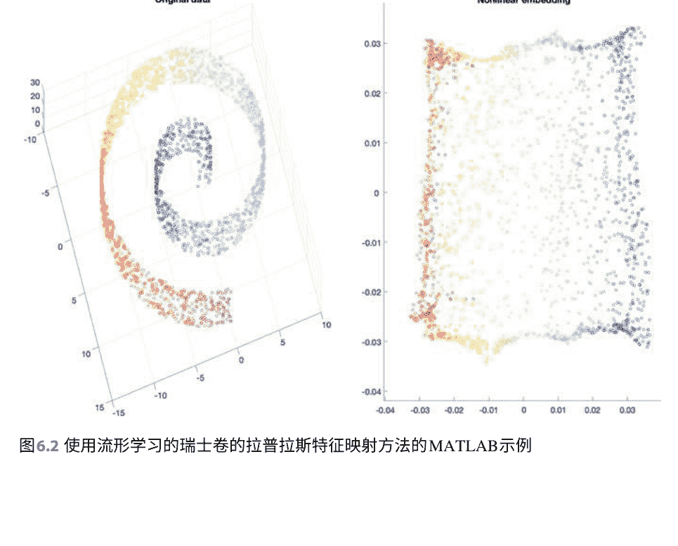

图6.2 使用流形学习的瑞士卷的拉普拉斯特征映射方法的MATLAB示例

# 参考文献

1.  Sabour S, Frosst N, Hinton G E (2017) Dynamic routing between capsules. In: Advances in Neural Information Processing Systems (NIPS), USA
2.  Yao W, Zeng Z, Lian C, Tang H (2018) Pixel-wise regression using U-Net and its application on panchromatic sharpening. Neurocomputing 312:364–371
3.  Ronneberger O, Fischer P, Brox T (2015) U-Net: Convolutional networks for biomedical image segmentation. In: International Conference on Medical Image Computing and Computer-Assisted Intervention. Springer, pp 234–241
4.  Badrinarayanan V, Handa A, Cipolla R (2017) SegNet: A deep convolutional encoder-decoder architecture for robust semantic pixel-wise labelling. IEEE Trans Pattern Anal Mach Intell 39(12):2481–2495
5.  Simonyan K, Zisserman A (2015) Very deep convolutional networks for large-scale image recognition. In: International Conference on Learning Representations
6.  Keys R (1981) Cubic convolution interpolation for digital image processing. IEEE Trans Acoust Speech Signal Process 29(6):1153–1160
7.  Zhu B et al (2018) Image reconstruction by domain-transform manifold learning. Nature 555:487–492
8.  Zheng N, Xue J (2009) Statistical Learning and Pattern Analysis for Image and Video Processing. Springer, Berlin
9.  Tu L (2011) An Introduction to Manifolds, Second Edition

## Boltzmann机

### 7.1 Boltzmann机

Hopfield网络是典型的神经网络。关于这个网络，在一个等距圆上，我们将所有节点连接在一起。Boltzmann机[1]被视为Hopfield网络的随机生成对应物。

Boltzmann机是学习任意概率分布的一般“连接主义”方法。对于一个 $d$ 维二进制随机向量 $\mathbf{x} \in \{0, 1\}^d$，一个基于能量的模型是
$$ P(\mathbf{x}) = \frac{\exp(-E(\mathbf{x}))}{Z} \tag{7.1} $$
$$ E(\mathbf{x}) = -\mathbf{x}^\top \mathbf{U} \mathbf{x} - \mathbf{b}^\top \mathbf{x}, \tag{7.2} $$
其中 $E(\mathbf{x})$ 是能量函数，$Z$ 是配分函数，满足 $\sum_{\mathbf{x}} P(\mathbf{x}) = 1$，$\mathbf{U}$ 是权重参数，$\mathbf{b}$ 是偏置参数。单位 $\mathbf{x}$ 可以分解为可见 $\mathbf{v}$ 和隐藏（潜在）$\mathbf{h}$ 单元

$$ E(\mathbf{v}, \mathbf{h}) = -\mathbf{v}^{\top} \mathbf{R} \mathbf{v} - \mathbf{v}^{\top} \mathbf{W} \mathbf{h} - \mathbf{h}^{\top} \mathbf{S} \mathbf{h} - \mathbf{b}^{\top} \mathbf{v} - \mathbf{c}^{\top} \mathbf{h}. \tag{7.3} $$

### 7.2 限制玻尔兹曼机

限制玻尔兹曼机 (RBM) [2] 进一步限制了玻尔兹曼机，使其没有可见-可见和隐藏-隐藏的连接。深度玻尔兹曼机 (DBM) 是一种具有多层隐藏随机变量的二元成对 MRF (无向概率图模型) [3, 4]。

玻尔兹曼机中的全局能量 $E$ 与 Hopfield 网络的形式相同。数学上，

$$ E \triangleq -\left( \sum_{i<j} w_{ij} s_i s_j + \sum_i \theta_i s_i \right) \quad (7.4) $$

其中

- $w_{ij}$ 是单元 $j$ 和单元 $i$ 之间的连接强度。
- $s_i$ 是单元 $i$ 的状态， $s_i \in \{0, 1\}$。
- $\theta_i$ 是全局能量函数中单元 $i$ 的偏置。
- $w_{ij}$ 表示为对角线上为零的对称矩阵 $\mathbf{W} = (w_{ij})_{N \times N}$。

第 $i$ 个单元的概率是

$$ p_i \triangleq \frac{1}{1 + \exp\left( -\frac{E_i}{T} \right)} \quad (7.5) $$

RBM [2] 是二部图，其能量函数是

$$ E(\mathbf{v}, \mathbf{h}) = -\mathbf{v}^{\top} \mathbf{W} \mathbf{h} - \mathbf{b}^{\top} \mathbf{v} - \mathbf{c}^{\top} \mathbf{h} \quad (7.6) $$

因此，

$$ P(\mathbf{v} = v, \mathbf{h} = h) = \frac{\exp(-E(\mathbf{v}, \mathbf{h}))}{Z} \quad (7.7) $$

并且

$$ Z = \sum_{\mathbf{v}} \sum_{\mathbf{h}} \exp(-E(\mathbf{v}, \mathbf{h})) \quad (7.8) $$

限制玻尔兹曼机（RBM）[2]是一种可以从其输入集合中学习概率分布的生成性神经网络。乘积专家（POE）[5]的能量函数是

$$ E(v, h) = -\sum_{ij} w_{ij} h_i v_j - \sum_{j} b_j v_j + \sum_{i} c_i h_i \quad (7.9) $$

概率是

$$ p(v) \triangleq \frac{\sum_h e^{-E(v,h)}}{\sum_{v,h} e^{-E(v,h)}} \quad (7.10) $$

$$ p(h) \triangleq \frac{\sum_v e^{-E(v,h)}}{\sum_{v,h} e^{-E(v,h)}} \quad (7.11) $$

和

$$ p(v, h) \triangleq \frac{e^{-E(v,h)}}{\sum_{v,h} e^{-E(v,h)}} \quad (7.12) $$

因此，

$$ p(v|h) = \frac{e^{-E(v,h)}}{\sum_v e^{-E(v,h)}} \quad (7.13) $$

损失函数是
$$ L(\theta) = \prod_{v} p(v), \quad \theta = (\mathbf{W}, \mathbf{b}, \mathbf{c}). \tag{7.14} $$

导数是
$$ \frac{\partial L(\theta)}{\partial \theta} = \sum_{v} \frac{\partial \ln p(v)}{\partial \theta}, \tag{7.15} $$
$$ \ln p(v) = \ln \left( \sum_{h} e^{-E(v, h)} \right) - \ln \left( \sum_{v, h} e^{-E(v, h)} \right), \tag{7.16} $$

和
$$ \frac{\partial L(\theta)}{\partial \theta} = E_{p(h|v)} \left( -\frac{\partial E(v, h)}{\partial \theta} \right) - E_{p(h,v)} \left( -\frac{\partial E(v, h)}{\partial \theta} \right). \tag{7.17} $$

来自乘积专家（POE）[5]的能量函数是
$$ E(v, h) = -\sum_{i j} w_{i j} h_i v_j - \sum_{j} b_j v_j + \sum_{i} c_i h_i \tag{7.18} $$
$$ \frac{\partial \ln p(v)}{\partial w_{i j}} = p(h_i = 1|v)v_j - \sum_{v} p(v) p(h_i = 1|v)v_j \tag{7.19} $$
$$ \frac{\partial \ln p(v)}{\partial b_j} = v_j - \sum_{v} p(v)v_j \tag{7.20} $$

和
$$ \frac{\partial \ln p(v)}{\partial c_i} = p(h_i = 1|v) - \sum_{v} p(v)p(h_i = 1|v). \tag{7.21} $$

DBM是一种基于能量的模型
$$ P(v, h) = \frac{1}{Z(\theta)} \exp(-E(v, h^{(1)}, h^{(2)}, h^{(3)}, h^{(4)}; \theta)) \tag{7.22} $$
其中 $E(\cdot)$ 是能量函数，$v$ 是可见层，$h^{(i)}$ 是隐藏层，$i = 1, 2, 3$
$$ E(v, h; \theta) = -v^\top W^{(1)}h^{(1)} - h^{(1)\top}W^{(2)}h^{(2)} - h^{(2)\top}W^{(3)}h^{(3)}. \tag{7.23} $$

在有两个隐藏层的情况下，
$$ P(v_i = 1|h^{(1)}) = \sigma (W_{i,:}^{(1)}h^{(1)}), \tag{7.24} $$
$$ P(h_i^{(1)} = 1|v, h^{(2)}) = \sigma (v^\top W_{:,i}^{(1)} + W_{i,:}^{(2)}h^{(2)}), \tag{7.25} $$
和
$$ P(h_k^{(2)} = 1|h^{(1)}) = \sigma (h^{(1)}W_{:,k}^{(2)}). \tag{7.26} $$

受限玻尔兹曼机（RBM）是由Geoff Hinton创建的用于无监督学习的。RBM的目标是通过仅使用两个层（可见层和隐藏层）来重建输入数据中的模式。用于实现RBM的MATLAB和Python源代码都是可用的。来自网站https://scikit-learn.org/的示例展示了如何使用RBM提高分类准确性。

## 7.3 深度玻尔兹曼机

深度玻尔兹曼机（DBM）是一种具有多层隐藏随机变量的二进制成对MRF，它是一种对称耦合的随机二进制单元网络。分配给向量 $v$ 的概率是

$$ P(v) = \frac{1}{Z} \sum_{h} \exp\left[ \sum_{ij} (W^{(1)}_{ij} v_i h^{(1)}_j) + \sum_{jl} (W^{(2)}_{jl} h^{(1)}_j h^{(2)}_l) + \sum_{lm} (W^{(3)}_{lm} h^{(2)}_l h^{(3)}_m) \right], \quad \quad (7.27) $$

其中 $\mathbf{h} = \{\mathbf{h}^{(1)}, \mathbf{h}^{(2)}, \mathbf{h}^{(3)}\}$ 是隐藏单元的集合， $\mathbf{W} = \{W^{(1)}, W^{(2)}, W^{(3)}\}$ 是模型参数， $p(h_i|v)$ 和 $p(v_i|h)$ 是独立的。

$$ p(h_i|v) = \sigma \left( \sum_{j} W_{ij}^{(1)} v_j \right), \quad \quad (7.28) $$

其中 $\sigma(x) = 1/(1+e^{-x})$ 并且

$$ p(h|v) = \prod_{i} p(h_i|v), \quad p(v|h) = \prod_{i} p(v_i|h). \quad \quad (7.29) $$

对于DBM，如果 $p(h_i|v)$ 和 $p(v_i|h)$ 是独立的，那么 $p(h|v) = \prod_{i} p(h_i|v)$ 或 $p(v|h) = \prod_{i} p(v_i|h)$。
DBM被理解为具有受限玻尔兹曼机的多层感知器。深度置信网络被认为 是具有深层玻尔兹曼机的贝叶斯置信网络[6, 7]。在机器学习中，

$$ \mathbf{Y} = F(\mathbf{X}, \theta), \quad \quad (7.30) $$

其中 $\theta$ 是参数向量， $\mathbf{X}$ 是输入， $\mathbf{Y}$ 是标记的数据集。

$$ E_A(\theta) = \frac{1}{N} \sum_{i=1}^{N} E(x_i, d_i, \theta), \quad \quad (7.31) $$

其中 $\{(x_i, d_i)\}$ 是训练集， $x_i \in \mathbf{X}, d_i \in \mathbf{D}$。

$$ \theta_{k+1} := \theta_k - \varepsilon \cdot \frac{\partial E(\theta)}{\partial \theta}, \quad k=1,2,\dots. \quad \quad (7.32) $$

## 7.4 概率图模型

图模型无处不在，它不仅仅是深度学习，而且比深度学习模型更广泛。有两种类型的图：有向图和无向图。贝叶斯网络和HMM是有向网络，马尔可夫随机场(MRF)是典型的无向模型。实际上，我们有基于模板的图形模型，我们需要创建和填充我们的内容。基于模板的模型是通用的，不具体的。同时，生成模型是创建一个 新模型，而判别模型是调整或修改模型以适应我们的要求。混合模型是将所有这些模型结合在一起。我们的变量包括目标变量（输出），可观察变量（输入）和潜在变量（隐藏）。推断包括精确推断和近似推断。不确定性是机器学习中的典型概念。图形推断可以帮助我们从我们所知道的推断出我们不知道的。推断可以帮助我们测试模型并找到敏感性和错误。

为什么要研究图形模型？图形模型是可视化概率模型结构的简单方法，可以用于设计和激励新模型[5]。

在图形模型中，我们有各种表达方式，我们需要找到哪个模型最适合解决我们的问题。

在图形模型中，我们有参数学习，特征学习和知识学习。延迟指的是我们不知道的隐藏层。

通过检查图形可以获得模型的图形模型洞察，包括条件独立性属性。

在复杂模型中进行推理和学习所需的复杂计算可以用图形操作来表示，在其中隐含地进行数学表达。

贝叶斯定理是现代模式分类的基石[8]。从先验概率、似然和证据推断出类的后验概率。

贝叶斯模型是机器学习中一种简单而高效的模式分类方法。联合概率为

$$ P(G, S, R) = P(G|S, R) \cdot P(S|R) \cdot P(R). \tag{7.33} $$

同时，条件概率为

$$ P(G = T | R = T) = \frac{P(R = T, G = T)}{P(R = T)} = \frac{P(G = T, S, R = T)}{P(G = T, S, R)}. \tag{7.34} $$

朴素贝叶斯模型是一类基于贝叶斯定理和强（朴素）特征假设的简单概率分类器家族。朴素贝叶斯模型已被应用于使用出现在电子邮件中的单词进行垃圾邮件分类。

影响图[9, 10]是一种在不确定性下进行决策的决策论图框架，贝叶斯网络是一个有向无环图（DAG）。

马尔可夫随机场（MRF）[4]是具有概率分布的无向图。因子图包括贝叶斯网络和马尔可夫网络。

因子分解是图中团上的因子的乘积[5]。

$$ P(X = x) = \frac{1}{Z} \exp \sum_{k} \sum_{i=1}^{N_k} w_{ki} f_{ki} (x_{\{k\}}). \tag{7.35} $$

和

$$ Z = \sum_{x \in \mathcal{X}} \exp \sum_{k} \sum_{i=1}^{N_k} w_{ki} f_{ki} (x_{\{k\}}). \tag{7.36} $$

分布 $P_{\Phi}$ 是由一组因子 $\Phi = (\phi_1(D_1), \dots, \phi_k(D_k))$参数化的吉布斯分布，如果它被定义为

$$ P_{\Phi} = (X_1, \dots, X_n) = \frac{1}{Z} \phi_1(D_1) \times \dots \times \phi_m(D_m), \quad (7.37) $$

其中 $Z = \sum_{X_1, X_2, \dots, X_n} \phi_1(D_1) \times \dots \times \phi_m(D_m)$是一个称为分区函数的归一化常数。

条件随机场（CRF）是一个无向图[11, 12]，网络被注释为一组因子 $\phi_1(D_1), \dots, \phi_m(D_m)$，条件分布是

$$ P(Y|X) = \frac{1}{Z} \prod_{i=1}^{m} \phi_i(Y_i, Y_{i+1}) \quad (7.38) $$

和

$$ Z = \sum_{Y} \prod_{i=1}^{m} \phi_i(X_i, Y_i). \quad (7.39) $$

一个关于 $X = \{X_1, X_2, \dots, X_n\}, Y=\{0, 1\}$的CRF,

$$ \phi_i(X_i, Y) = \exp(w_i\mathbf{I}(X_i = 1, Y = 1)) \quad (7.40) $$

和

$$ P(Y = 1|x_1, \dots, x_k) = \sigma \left(w_0 + \sum_{i=1}^{k} w_i x_i \right), \quad (7.41) $$

其中 $\sigma(\cdot)$ 是一个sigmoid函数。

逻辑CPD是

$$ P(Y = 1|X_1, \dots, X_n) = \sigma \left(w_0 + \sum_{i=1}^{N} w_i \right), \quad (7.42) $$

其中$\sigma(\cdot)$是一个sigmoid函数。逻辑分布只有两个标签：‘0’和‘1’。

线性或多元高斯分布是

$$ p(Y|\mathbf{x}) = \mathbf{N}(\beta_0 + \beta\mathbf{x}; \sigma^2). \quad (7.43) $$

条件贝叶斯网络是

$$ P(Y|X) = \sum_{Z} P(Y, Z|X) = \prod_{X \in Y \cup Z} P(X|P_X). \quad (7.44) $$

多元高斯分布是

$$ P(X) = \frac{1}{(2\pi)^{(n/2)} |\Sigma|^{1/2}} e^{(X-\mu)^{\top} \Sigma^{-1}(X-\mu)}. \quad (7.45) $$

一个关于 $\{X, Y\}$的联合正态分布是 $P(X, Y) \sim \mathbf{N}(\mu, \Sigma)$，

$$ \mu_{(n+m) \times 1} = \begin{pmatrix} (\mu_X)_{n \times 1} \\ (\mu_Y)_{m \times 1} \end{pmatrix} \quad (7.46) $$

和

$$\Sigma_{(n+m)\times(n+m)} = \begin{pmatrix} (\Sigma_{XX})_{n\times n} & (\Sigma_{XY})_{n\times m} \\ (\Sigma_{YX})_{m\times n} & (\Sigma_{YY})_{m\times m} \end{pmatrix} \quad (7.47)$$

对于高斯贝叶斯网络，如果

$$p(Y|x) \sim \mathbf{N}(\beta_0 + \beta^T x; \sigma^2) \quad (7.48)$$

然后

$$p(Y) \sim \mathcal{N}(\mu_Y; \sigma_Y^2) \quad (7.49)$$

$$\mu_Y = \beta_0 + \beta^T x \quad (7.50)$$

和

$$\sigma_Y^2 = \sigma^2 + \beta^T \beta \quad (7.51)$$

条件密度是

$$P(Y|X) \sim \mathbf{N}(\beta_0 + \beta^T X; \sigma^2) \quad (7.52)$$

其中

$$\beta_0 = \mu_Y - \gamma_{YX} \Sigma_{XX}^{-1} \mu_X \quad (7.53)$$

$$\beta = \Sigma_{XX}^{-1} \gamma_{YX} \quad (7.54)$$

和

$$\sigma^2 = \Sigma_{YY} - \gamma_{YX} \Sigma_{XX}^{-1} \gamma_{XY} \quad (7.55)$$

高斯分布是

$$P(x) = \frac{1}{\sqrt{2\pi}\sigma} \exp\left\{ -\frac{(x-\mu)^2}{2\sigma^2} \right\} \quad (7.56)$$

我们将其推广为

$$P(x) = \frac{1}{Z(\mu, \sigma^2)} \exp( < t(\theta), \tau(x) > ) \quad (7.57)$$

其中 $\tau(x) = < x, x^2 >, t(\mu, \sigma^2) = < \frac{\mu}{\sigma^2}, -\frac{1}{2\sigma^2} >,$

$$Z(\mu, \sigma^2) = \sqrt{2\pi}\sigma \exp\left( \frac{\mu^2}{2\sigma^2} \right) \quad (7.58)$$

线性指数族是

$$P_\theta(x) = \frac{1}{Z(\theta)} \exp( < t(x), \theta > ) \quad (7.59)$$

其中

$$\Theta = \left\{ \theta \in \mathbb{R}^k, \int \exp( < t(x), \theta > ) dx < \infty \right\} \quad (7.60)$$

指数因子族是

$$\phi_\theta(x) = A(x) \exp( < t(\theta), \tau(x) > ) \quad (7.61)$$

和

$$P_{\theta}(x) \propto \prod_i \phi_{\theta_i}(x) = \prod_i A_i(x) \exp \left( \sum_i < t_i(\theta_i), \tau_i(x) > \right) \quad (7.62)$$

贝叶斯网络可以以相应的方式编写，

$$P(x|u) = \exp( < t_{P(\mathbf{X}|\mathbf{U})}(\theta), \tau_{P(\mathbf{X}|\mathbf{U})}(x, u) > ). \quad (7.63)$$

熵是

$$\mathrm{H}(X) = \ln Z(\theta) - < \mathrm{E}(\tau(X)), t(\theta) >. \quad (7.64)$$

相对熵是

$$\mathrm{D}(P_{\theta_1} \| P_{\theta_2}) = \mathrm{E}_{P_{\theta_1}} \left[ \ln \left( \frac{P_{\theta_1}(\mathscr{X})}{P_{\theta_2}(\mathscr{X})} \right) \right] = -\ln \frac{Z(\theta_1)}{Z(\theta_2)} + < \mathrm{E}_{P_{\theta_1}}(\tau(\mathscr{X})), t(\theta_1) - t(\theta_2) >. \quad (7.65)$$

信息投影是

$$Q^{I} = \arg \min_{Q \in \mathscr{Q}} D(Q \| P). \quad (7.66)$$

矩阵投影是

$$Q^{M} = \arg \min_{Q \in \mathscr{Q}} D(P \| Q). \quad (7.67)$$

如果$G_\phi$是一个空图, $Q^{M} = \arg \max_{Q \in \mathrm{G}_\phi} D(P \| Q)$ ,那么

$$Q^{M}(X_1, X_2, \ldots, X_n) = P(X_1) P(X_2) \ldots P(X_n). \quad (7.68)$$

因此,

$$\mathrm{D}(P \| Q) = -\mathrm{H}_P(\mathscr{X}) + \mathrm{E}_P[\ln Q(\mathscr{X})] \geq \mathrm{D}(P \| Q^{M}). \quad (7.69)$$

此外，当且仅当 $Q_i(X) = P_i(X)$ 时，

$$\mathrm{D}(P \| Q) = \mathrm{D}(P \| Q^{M}), \quad (7.70)$$

即, $Q = Q^{M}$ , 此外,

$$\mathrm{D}(P \| Q_{\theta}) - \mathrm{D}(P \| Q_{\theta'}) = \mathrm{D}(Q_{\theta'} \| Q_{\theta}) \geq 0. \quad (7.71)$$

## 7.5 问题

- 1. 限制玻尔兹曼机器（RBMs）的目标和特点是什么？ 为什么深度玻尔兹曼机被认为是具有限制玻尔兹曼机的多层感知机？
- 2. 有向图和无向图有什么区别？ 请给出每个类别的一个例子。
- 3. MRF和CRF之间有什么区别？
- 4. 线性指数族是什么？ 请举个例子。
- 5. 相对熵、信息投影和矩阵投影之间有什么关系？

# 参考文献

- 1. Ackley DH, Hinton GE, Sejnowski TJ (1987) 用于Boltzmann机的学习算法。 在： 计算机视觉读物，第522–533页
- 2. Fischer A, Igel C (2012) 限制性Boltzmann机入门。 在： Iberoamerican模式识别大会，第14-36页
- 3. Blake A, Rother C, Brown M, Perez P, Torr P (2004) 使用自适应GMMRF模型的交互式图像分割。 在： 欧洲计算机视觉大会。 Springer，第428-441页
- 4. Li S (2009) 图像分析中的马尔可夫随机场建模。 Springer，柏林
- 5. Koller D, Friedman N (2009) 概率图模型。 MIT Press，剑桥
- 6. Hinton GE, Osindero S, Teh YW (2006) 深度信念网络的快速学习算法。 神经计算18（7）：1527-1554
- 7. Sarikaya R, Hinton GE, Deoras A (2014) 深度信念网络在自然语言理解中的应用。 IEEE / ACM Trans Audio Speech Lang Process 22（4）：778-784
- 8. Goodfellow I, Bengio Y, Courville A (2016) 深度学习。 麻省理工学院出版社，剑桥
- 9. Ertel W (2017) 人工智能导论。 Springer International Publishing, New York
- 10. Norvig P, Russell S (2016) 人工智能：现代方法，第3版。 Prentice Hall, Upper Saddle River
- 11. Chen LC, Papandreou G, Kokkinos I, Murphy K, Yuille AL (2018) DeepLab：具有深度卷积网络，空洞卷积和完全连接CRF的语义图像分割。 IEEE Trans Pattern Anal Mach Intell 40（4）：834-848
- 12. Zheng S, Jayasumana S, Romera-Paredes B, Vineet V, Su Z, Du D, Torr PH (2015) 条件随机场作为循环神经网络。 在： IEEE ICCV, pp 1529–1537

# 迁移学习和集成学习

## 8.1 迁移学习

### 8.1.1 迁移学习

在本章中，我们将介绍如何使用训练有素的参数来测试一个新的模型。我们希望迁移学习能够节省我们的计算时间和成本。在迁移学习之后，新模型的性能可能好，也可能不好，因此我们必须再次训练新模型，并使用新数据集改进模型。

迁移学习是一种新的机器学习模型，用于改变训练目标。我们重复使用以前训练过的模型，并节省我们的计算资源。在过去，已经有很多关于深度学习的工作。CVPR'18的最佳论文是关于基于迁移学习的Taskonomy。在迁移学习中，问题是：什么是迁移学习？什么将被转移？何时转移？如何实施转移？

迁移学习是一种机器学习方法，其中为一个任务开发的模型被重复使用作为第二个任务模型的起点[1]。迁移学习从一个任务中提取知识（即参数、特征、样本、实例等），并将其应用于一个新任务。迁移学习以其独特的模型特征和参数的可用性而闻名。经过简单的调整，参数可以被确认并应用于新的应用程序。

在迁移学习中，根据发现的知识，我们有样本迁移、实例迁移、参数迁移、特征迁移等。根据可用的标签和领域知识，我们将迁移学习分为许多类别，例如，监督学习、无监督学习、强化学习。

迁移增强 (TrAdBoost) 是一个典型的例子。

迁移学习取决于源任务和目标任务的标签。迁移学习允许训练和测试中使用的领域D、任务T和分布不同。因为领域是不同的，所以任务也会不同。

给定域 D= {X, P(X), X ∈ X}, D_S = D_T 意味着 X_S = X_T 或 P_S(X) = P_S(Y).

给定任务 T = {Y, P(Y|X), Y ∈ Y}, T_S = T_T 意味着 Y_S = Y_T 或 P(Y_S|X_S) = P(Y_T|X_T).
如果 D_S = D_T，则 T_S = T_T。
如果 D_S = D_T，那么 T_S = T_T 或 P(X_S) = P(X_T)。
如果 T_S = T_T，那么 Y_S = Y_T 或 P(Y_S|X_S) = P(Y_T|X_T)，Y_S ∈ Y_S，Y_T ∈ Y_T。我们有三种迁移学习：归纳学习、转导学习和无监督学习（聚类），它们的领域、任务和算法都不同。相应地，有多种迁移学习方法：基于样本的迁移学习、基于特征的迁移学习、基于参数的迁移学习等。

归纳迁移学习[1]旨在利用 D_S 和 T_S 中的知识来改进目标预测函数 f_T(·) 在 D_T 中的学习，其中 T_S = T_T。在归纳迁移学习中，我们转移样本、知识和参数。

转导学习[1]指的是在训练时需要看到所有的测试数据，并且学习到的模型不能用于未来的数据。
转导学习可以应用于知识和参数传递。
转导迁移学习旨在利用 D_S 和 T_S 中的知识来改善目标预测函数 f_T(·) in D_T 的学习，其中 D_S = D_T 且 T_S = T_T。

无监督迁移学习（聚类或降维）[1]旨在利用 D_S 和 T_S 中的知识来改善目标预测函数 f_T(·) in D_T 的学习，其中 T_S = T_T 且 Y_S 和 Y_T 不可观测。在训练中，源域和目标域中都没有观察到有标签的数据。

对于迁移学习，除了训练数据和训练算法外，还需要一个网络。在训练网络时，应该指定训练选项。
大部分时间需要训练数据，这需要大量的工作量来收集训练数据和数据增强。训练速率与网络收敛速度和网络的最终训练参数有关。

在迁移学习中，我们需要估计和评估迁移学习的结果。我们需要确保结果会更好。

### 8.1.2 任务分类

任务分类论文（解开任务迁移学习）发表于IEEE CVPR 2018 [2]，并获得最佳论文奖。在这项工作中，使用了四个步骤创建了分类法：

- 第一步.任务特定建模：为每个任务训练一个任务特定的网络。
- 第二步.迁移建模：训练所有源和目标之间可行的迁移。
- 第三步.序数归一化：从迁移函数性能中获得的任务亲和性进行归一化。
- 第四步.计算全局分类法：合成了一个超图，可以预测任何转移策略的性能，并优化为最佳策略。

在任务学习中，转移操作是这样一个函数，一个小的读出函数 $D_{s \rightarrow t}$ 被训练成将源任务的冻结编码器的表示映射到目标任务的标签。

给定一个源任务 $s$ 和一个目标任务 $t$，其中 $s \in \mathbf{S}$ 且 $t \in \mathbf{T}$，一个转移网络学习了一个针对 $t$ 的小的读出函数，给定了为 $s$ 计算的统计图像。

$$D_{s \rightarrow t} = \arg \min_{\theta} \mathbb{E}_{I \in D} (\mathbf{L}_t(D_{\theta}(E_s(I)), f_t(I))),$$
其中 $f_t(I)$ 是图像 $I$ 的 $t$ 的真实值。$D_{s \rightarrow t}$ 由 $\theta_{s \rightarrow t}$ 参数化，通过最小化损失 $\mathbf{L}_t$ 来实现。

## 8.2 同胞神经网络

与迁移学习不同，同胞网络或双胞胎网络通常用于涉及找到两个可比较和相似事物之间关系的任务，例如手写支票、人脸识别、物体跟踪和相似文档匹配等。基于一对双胞胎网络使用相似度度量。同胞网络的目标是为每个图像输出一个特征向量，使得相似图像的特征向量相似，不相似图像的特征向量不同。通过这种方式，网络可以区分两个输入图像。

同胞网络在类别数较多但观测数较少的情况下特别有用。同胞网络也可以应用于降维。

同胞网络是一种深度学习网络，它使用两个或更多具有相同架构和共享相同参数和权重的相同子网络。在这种情况下，将计算两个不同的输入向量以比较输出向量，其中一个输出向量被视为基准，另一个将通过计算距离进行比较。损失函数使用平方欧氏距离进行定义。同胞网络的目标是最小化相似对象的距离度量，并最大化不同对象的距离度量。

$$L(i, j) = \begin{cases} \min(\| f(i) - f(j) \|_2)_{i=j} \\ \max(\| f(i) - f(j) \|_2)_{i \neq j} \end{cases}$$
对于一个半孪生网络，
$$L(i, j) = \begin{cases} \min(\| f(i) - g(j) \|_2)_{i=j} \\ \max(\| f(i) - g(j) \|_2)_{i \neq j} \end{cases}$$
其中 $i$ 和 $j$ 是来自同一数据集的两个输入向量的索引，$f(\cdot)$ 和 $g(\cdot)$ 是通过使用孪生网络和半孪生网络实现的评分函数## 8.3 集成学习

网络，分别。更一般地，损失函数通常被近似为线性空间的马氏距离

$$L(\mathbf{x}_i, \mathbf{x}_j) = (\mathbf{x}_i - \mathbf{x}_j)^\tau \cdot \mathbf{M} \cdot (\mathbf{x}_i - \mathbf{x}_j), \quad (8.4)$$

其中 $\mathbf{M}$ 是来自孪生网络的矩阵。

降维后的特征使网络能够区分相似和不相似的图像。MATLAB提供了一个孪生网络的演示，用于比较图像和降维的示例。

孪生网络降低输入图像的维度，并输出具有相同标签的降维图像。该网络能够区分相似和不相似的图像。由于两个输入和相似度测量，孪生网络已经应用于计算机视觉中的视觉对象跟踪。通过测量示例和搜索图像的每个部分之间的相似度，可以使用孪生网络生成相似度分数图。

追踪对象被视为学习相似性问题。如果Siamese网络被选择为追踪网络[3, 4]，该算法仅适用于单目标追踪，但可以与其他深度学习算法（如全连接神经网络（FCNN），区域建议网络（RPN），LSTM等）相结合。SiamRPN + LSTM算法具有最高的MOTA（多目标追踪准确性）。

在机器学习中，一个分类器是不够的，因为它只反映了一方面并且可能存在错误或缺陷。多个学习器共同工作将使分类更好。在集成学习之后，之前较弱的分类器将变得更强大。至少一个分类器的分类应该超过50%，更强的分类应该超过50%。基本的集成学习方法包括平均、加权平均和多数投票。

平均法是一种基于所有分类器预测的简单平均的方法。加权平均法基于权重，这些权重与分类器的能力和性能成比例。在多数投票方法中，预测基于最频繁的类别。

一组不同的学习器在决策上有所不同，因此它们相互补充。[5] 我们结合多个学习器，摆脱了做出决策的束缚。

1. 从给定样本或训练数据集中随机抽取训练集（例如，装袋等）
2. 进一步训练基本学习器（例如，提升，级联等）
3. 混合多个专家。

$$y = f(d_1, d_2, \ldots, d_L | \Phi), \quad (8.5)$$

$$c = \arg \max_{i=1,2,\ldots,K} y_i, \quad (8.6)$$

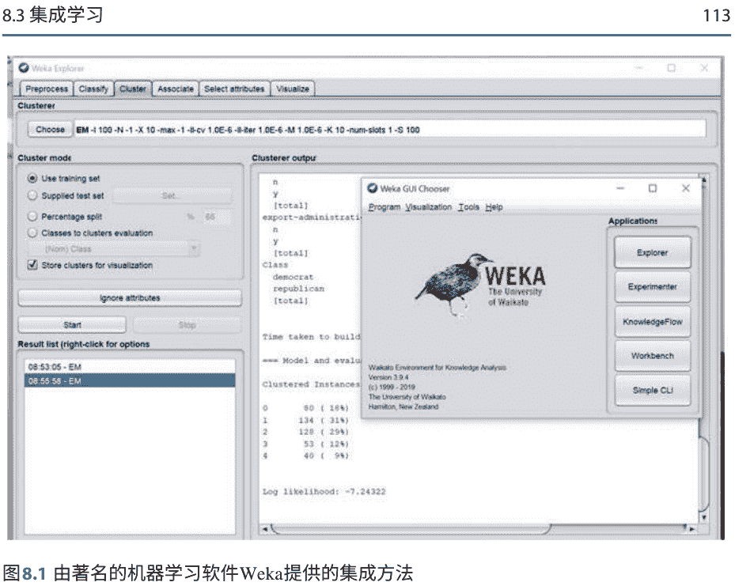

图8.1 由著名的机器学习软件Weka提供的集成方法

其中 $f(\cdot)$ 是具有 $\Phi$ 表示其参数的组合函数，$c$ 是返回的类别编号。分类器组合规则包括操作 $\sum(\cdot)$，$\max(\cdot)$，$\min(\cdot)$，$\prod(\cdot)$ 和简单投票 $w_i = w_j \in \{1, 0\}$。如果我们使用组合 $\sum(\cdot)$，混合多个学习器

$$y_i = \sum_j w_j d_{ji}, \sum_j w_j = 1, \quad w_j \ge 0.$$

我们有多种方法将学习器组合在一起。应用程序将决定采用哪种组合方式。

堆叠指的是堆叠标准化。所有类别具有相同的属性。堆叠将多个模型和多个属性组合在一起。堆叠通过元模型[5]混合多个模型。元模型是基学习器输出的基础上进行训练的。堆叠比使用单个分类器实现更高的准确性。

堆叠源代码可供公众使用。Weka还具有相应的功能。此外，Weka提供的集成学习方法包括Bag-ging、随机森林、AdaBoost和投票。请参见图8.1中使用集成方法的Weka界面。

自助法[5]是依赖于带替换的随机抽样的任何测试或度量。自助法对重新抽样数据的样本进行推断。自助法是一种直接推导标准误差和置信区间估计的方法。

Bagging（自助聚合）[5]是一种投票方法，通过在各种训练集上训练它们来使基本学习器不同。

Bagging中的每个模型都以相等的权重进行投票。如果学习算法具有高方差，则学习算法是不稳定的算法。

如果对同一数据集的重新抽样版本上的同一算法的不同运行导致具有高正相关性的学习器，则学习算法是稳定的。

森林是决策树的集合 $\mathbf{F} = \{T_1, T_2, \ldots, T_n\}$，通过对每棵树的输出进行平均来为样本 $x$ 提供预测,

$$p_{\mathcal{F}}(y|x) = \frac{1}{k} \sum_{h=1}^{k} p_{T_h}(y|x). \tag{8.8}$$

提升 [5] 是通过在前一次学习者的错误上进行下一次学习者的训练来生成互补的基学习者。

提升算法将弱学习者组合成强学习者。提升是通过训练每个新模型来逐步构建集成学习，以强调先前模型错误分类的训练。减少错误分类是提升分类的有效方法。在提升分类中，分类的权重是不同的。

提升被解释为基于适当成本函数的优化算法。对于训练集 $\{(x_i, y_i)\}, i=1, \ldots, n,$

$$F(x) \triangleq \sum_{i=1}^{M} \gamma_i \cdot h_i, \tag{8.9}$$

其中 $h_i$ 是基学习器。

$$\hat{F}(x) = \arg\max_F \mathbf{E}_{x,y}[L(y, F(x))], \tag{8.10}$$

其中 $L(\cdot)$ 是成本函数。

使用最陡下降 $\nabla_F$ $_{m-1}L(\cdot), m=1,2,\ldots,$ 我们有

$$F_m(x) = F_{m-1}(x) - \gamma_m \cdot \sum_{i=1}^{n} \nabla_{F_{m-1}} L(y_i, F_{m-1}(x_i)), \tag{8.11}$$

其中

$$\gamma_m = \arg\max_{\gamma} \sum_{i=1}^{n} L(y_i, F_{m-1}(x_i)) - \gamma \nabla_{F_{m-1}} L(y_i, F_{m-1}(x_i))). \tag{8.12}$$

因此，需要计算导数或梯度。这个算法可以用可计算的源代码编写。

AdaBoost（自适应增强）反复使用相同的训练集，分类器应该简化，以免过拟合。数据集不应该被改变。AdaBoost可以基于权重组合任意数量的基学习器。AdaBoost的成功在于其增加边界的显著特性。

级联是一种多阶段方法，其中有一系列的分类器，只有在前面的分类器不自信时才使用下一个[5]。级联已经应用于人脸检测，这种集成学习可以应用于一般的视觉目标检测。级联生成一个规则（或规则）来尽可能廉价地解释大部分实例，并将其余部分存储为异常。

对于集成学习，所有开放的Python源代码都可以从scikit-learn.org网站上获得：https://scikit-learn.org/stable/modules/classes.html# module-sklearn。请参阅图8.2中scikit集成方法的屏幕截图。Scikit-learn是一个免费的Python编程语言的机器学习库。该库是基于NumPy，SciPy和matplotlib开发的。

MATLAB可以通过使用集成学习将许多弱学习器的结果融合成一个高质量的集成预测器。这些方法包括自助聚合（Bagging）、随机森林、提升算法等。提升算法包括自适应提升、温和自适应提升、自适应逻辑回归、线性规划提升、最小二乘提升、鲁棒提升、随机欠采样提升等。请参见图8.3中基于回归树的MATLAB集成方法的屏幕截图。

## Ensemble methods

Examples concerning the sklearn.ensemble module.

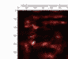

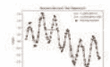

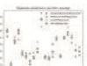


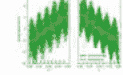


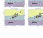

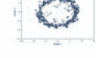

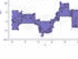

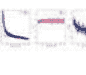

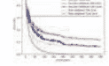


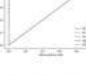

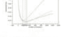

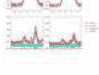

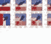

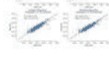

图8.2由scikit-learn提供的集成方法

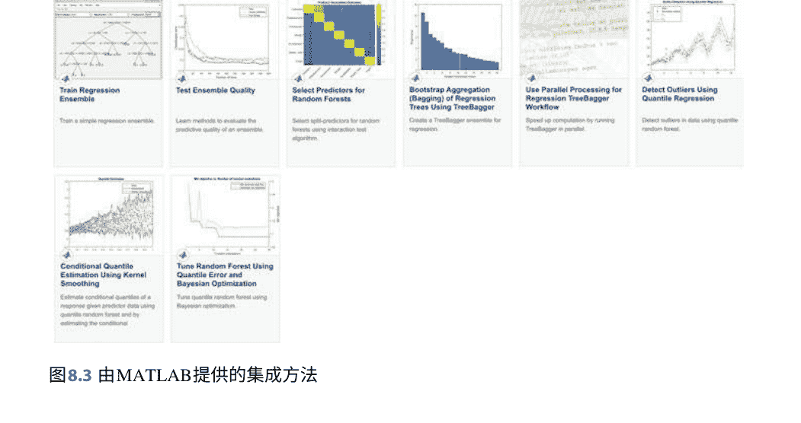

## **图8.3 由MATLAB提供的集成方法**

贝叶斯分类器、Boosting等。深度神经网络是多层网络，具有阈值单元。深度学习利用基于梯度的优化算法根据输出处的错误调整多层网络中的参数。深度网络的内部层可以被视为提供输入数据的学习表示。

无监督学习主要应用于解决聚类和降维等问题，这些数学方法包括PCA（线性降维方法）、流形学习（非线性降维方法）、自编码器等。

强化学习是三种基本机器学习范例之一，与监督学习和无监督学习并列。在强化学习中，训练数据提供的信息介于监督学习和无监督学习之间。强化学习中的训练数据仅仅提供一个指示，表明一个动作是否正确；如果一个动作不正确，仍然存在找到正确动作的问题。

在输入序列的情况下，奖励信号被假设与整个序列相关。强化学习通常利用控制理论中熟悉的思想，如策略迭代、值迭代、模拟和方差减少，同时创新出解决机器学习特定需求的方法。

推荐系统基于指示用户（例如人）和物品（例如产品）之间链接的数据。机器学习问题是基于所有用户的数据为给定用户建议其他物品。

## 8.4 深度学习中的重要工作

在本节中，我们将详细介绍在《自然》和《科学》杂志上发表的工作。《自然》杂志上的出版物包括：

- B. Zhu等（2018）通过域变换流形学习进行图像重建。《自然》，555: 487–492
- S. Webb（2018）生物学的深度学习。《自然》，554: 555–557
- Y. LeCun，Y. Bengio，G. Hinton（2015）深度学习。《自然》，521: 436–444
- M. Littman (2015) 强化学习通过评估反馈改善行为，自然，521: 445-451
- V. Mnih等人（2015）通过深度强化学习实现人类水平的控制，自然，518: 529-533
- D. Rumelhart，G. Hinton等人（1986）通过反向传播错误学习表示，自然，323: 533-536

在《科学》杂志上发表的作品包括：

- D. George等人（2017）一种以高数据效率训练并破解基于文本的CAPTCHA的生成视觉模型。科学，358（6368）
- M. I. Jordan和T. M. Mitchell。（2015）机器学习：趋势，观点和前景。科学，349（6245）: 255-260
- G. Hinton，R. Salakhutdinov。（2006）用神经网络降低数据的维度。科学，313（5786）: 504-507

深度学习被认为可以应用于计算机视觉、自然语言处理、机器人控制和其他应用[6]。监督学习方法包括决策树/森林、逻辑回归、深度神经网络，

### 8.5 深度学习中获奖的工作

在这一部分中，我们主要强调IEEE CVPR和IEEE ICCV会议上的工作。IEEE ICCV有最佳论文奖：Marr奖。Marr奖是由IEEE会议ICCV颁发的计算机视觉领域的两年一度的会议奖项。该奖项是计算机视觉研究人员的最高荣誉之一。

一篇好的论文在很多方面都有所体现，如思想、写作、参考文献、方程、表格和图形等。关键是论文如何吸引读者以及从这篇论文中能产生什么影响。

- 解开任务迁移学习，IEEE CVPR 2018 [2]
- SimGAN [7]
- Mask R-CNN [8]
- DenseNets [9]。

### 8.6 问题

1. 什么是知识发现？如何在迁移学习中使用所学的知识？
2. 根据标签，如何对迁移学习模型进行分组？
3. 如何训练多个多标签分类？
4. DenseNets和ResNets之间有什么区别？
5. 深度神经网络在集成学习中的应用有哪些？

# 参考文献

1. Pan S, Yang Q (2010) 关于迁移学习的调查. IEEE Trans Knowl Data Eng 22(10):1345–1359
2. Zamir A等人。 Taskonomy: 解开任务迁移学习的难题。 在：CVPR'18
3. An N (2020) 使用Siamese神经网络进行异常检测和跟踪。 硕士论文，奥克兰理工大学，新西兰
4. Valmadre J, Bertinetto L, Henriques J, Vedaldi A, Torr P (2017) 基于相关滤波器的端到端表示学习。 在：IEEE计算机视觉和模式识别会议（CVPR），pp 2805–2813
5. Alpaydin E (2009) 机器学习导论。麻省理工学院出版社，剑桥
6. Jordan MI，Mitchell TM（2015）机器学习：趋势，观点和前景。科学 349（6245）：255-260
7. Shrivastava A等。通过对抗训练从模拟和无监督图像中学习。在：CVPR'17
8. Takeda F，Omatu S（1995）一种使用优化掩模的神经纸币识别方法 通过遗传算法。在：IEEE国际系统，人和控制论会议，卷5，第4367-4371页
9. Huang G，Liu Z，Weinberger KQ，van der Maaten L（2017）密集连接的卷积网络。在：IEEE CVPR，卷1（2），第3页

# 术语表

激活函数在人工神经网络中，节点的激活函数定义了给定输入或一组输入的节点的输出。

AdaBoost 自适应增强，一种用于训练增强分类器的投票方法Autoencoder 自编码器是一种神经网络，它学习将输入复制到输出。

平均池化 计算特征图中每个补丁的平均值。 Atlas 特定的图表集合，覆盖了一个流形Bagging 自助聚合，一种用于提高统计分类和回归中机器学习算法的稳定性和准确性的机器学习集成元算法Banach空间 完备的范数向量空间

贝叶斯推断 一种统计推断方法，利用贝叶斯定理在获得更多证据或信息时更新假设的概率

贝叶斯学习 使用贝叶斯定理确定给定证据或观察的假设的条件概率

贝叶斯网络 决策网络，一种统计模型，通过有向无环图（DAG）表示一组变量及其条件依赖关系

玻尔兹曼机隐含单元的随机Hopfield网络，一种随机循环神经网络

玻尔兹曼分布该分布最大化熵。

提升一种集成元算法，主要用于减少偏差，并在监督学习中减少方差[1]，以及一族将弱学习器转化为强学习器的机器学习算法

自助法一种使用有放回随机抽样的测试或度量方法CapsNet胶囊神经网络，一种用于更好地建模对象的层次关系的人工神经网络（ANN）Capsule 一组神经元，用于激活对象的各种属性的类型

级联一种基于多个分类器输出的信息连接的集成学习特例，将从给定分类器的输出收集的所有信息作为下一个分类器的附加信息

图表一个在流形的子集和简单空间之间的可逆映射，使得映射及其逆映射都保持所需的结构团树联结树算法，一种从一般图中提取边际化的机器学习方法CNN卷积神经网络

凸函数图上任意两点之间的线段位于两点之间的图的一侧

ConvNet卷积神经网络
卷积一种数学运算，将两个函数产生一个表达式，表示一个函数的形状如何被另一个函数修改

DAG有向无环图，一个没有有向循环的有限有向图DBM深度玻尔兹曼机，一种具有多层隐藏随机变量的无向概率图模型

决策树 一种决策支持工具，使用决策和可能的后果的树状模型，包括机会事件结果、资源成本和效用

决策规则 将观察映射到适当行动的函数。

深度学习 深度神经网络具有非线性处理的强大能力，使用多层级网络进行特征转换和端到端学习。

DRL 深度强化学习，使用深度学习和强化学习原理创建高效算法

双Q学习 一种离策略强化学习算法，其中用于值评估的策略与选择下一个动作的策略不同

动态贝叶斯网络 贝叶斯网络表示变量的序列。

EKF 扩展卡尔曼滤波器，非线性卡尔曼滤波器，围绕当前均值和协方差的估计进行线性化

集成学习 通过策略生成和组合多个模型来解决特定的计算智能问题熵 状态 的不可预测性的度量，或者等效地，其平均信息内容。

事件 在文本主题检测和提取中，事件是在某个时间发生在某个地方的事情。

指数族 一组分布，其中具体的分布随参数变化

分解 图中团的因子的乘积

傅里叶变换 一种将函数分解为其组成频率的数学变换

模糊优化 一种处理过渡不确定性和信息不足不确定性的数学模型

最大公约数 两个或多个非零整数的最大正整数，它能整除每个整数。

遗传算法 一种受自然选择过程启发的元启发式算法，属于进化算法的更大类别。

吉布斯分布 概率分布或概率测度吉布斯测度 最大化能量期望值固定的熵的唯一统计分布

全局优化 找到实现目标的绝对最佳可接受条件的任务，以数学方式表达豪斯多夫空间 一种拓扑空间，其中每对不同的点由一个不相交的开集分隔

希尔伯特空间作为度量空间完备的内积空间诱导子图 G[S]是顶点集为 S 且边集为 E中两个端点都在 S ⊂ G = (V, E)的图。

影响图决策情境的紧凑图形和数学表示

等距变换度量空间之间保距的变换，通常假设为双射

联合熵一组变量相关的不确定性度量卡尔曼滤波器线性系统模型中具有加性独立白噪声的最优线性估计器KL散度库尔巴克-莱布勒散度或相对熵，衡量一个概率分布与第二个和参考概率分布的差异

潜在变量 这些变量不是直接观察到的，而是通过数学模型从其他观察到的变量中推断出来的（直接测量）

LCM 两个整数a和b的最小公倍数是能够同时被a和b整除的最小正整数。

Lipschitz连续性 函数的一种强形式的一致连续性线性动力系统 所有依赖关系都是线性高斯的动态贝叶斯网络

线性规划 一种用于优化线性目标函数的技术，受到线性等式和线性不等式约束的限制LSTM 长短期记忆网络

MAP 最大后验概率估计，未知数量的估计值，等于后验分布的众数

流形 具有每个点都有邻域的拓扑空间，是一个局部同胚于欧几里德空间的可数第二可数豪斯多夫空间。

流形学习一种非线性降维方法马尔可夫链
一种描述可能事件序列的随机模型，在其中每个事件的概率仅取决于前一个事件所达到的状态。

马尔可夫过程
满足马尔可夫性质的随机过程。

最大池化
对初始表示的非重叠子区域应用最大滤波器。

**MDP** 马尔可夫决策过程
一种离散时间随机控制过程。

元数据
关于数据的数据，即给定数据集的附加信息。

度量
定义集合中任意两个成员之间距离概念的函数，通常称为点度量。

空间
集合与集合上的度量一起。

MGU 最小门控单元

**MLE** 最大似然估计
一种通过最大化似然函数来估计概率分布参数的方法，在假设的统计模型下，观察数据最有可能。

MNIST
修改后的国家标准与技术研究所（NIST）数据集。

**MRF** 马尔可夫随机场
它是一组具有马尔可夫性质的随机变量，由一个无向图描述。

多目标规划
数学规划的一部分，处理使用多个冲突目标函数的决策问题，这些目标函数在可行决策集上进行优化。

互信息
两个变量之间相互依赖程度的度量。

朴素贝叶斯模型
一类基于贝叶斯定理和强独立性假设的简单概率分类器。

NLAR 非线性自回归模型

范数
在向量空间上定义的实值函数。

范数空间
在实数或复数上定义了范数的向量空间。

可观测变量
统计学中的显性变量，可以直接观察和测量。

奥比福尔德
流形的一种推广，允许在拓扑中存在“奇点”。

填充
将图像边界的填充区域应用于用零填充边缘区域。

参数估计
使用样本数据估计所选分布的参数的过程。

粒子群优化
一种通过迭代改进候选解的计算方法，根据给定的质量度量，使用候选解的群体在搜索空间中移动粒子的位置和速度。

分区函数
各种随机变量函数的期望值的生成函数。

PGM 概率图模型
或结构化概率模型，是用于表示随机变量之间条件依赖结构的模型的图。

Q-learning
一种无模型的强化学习算法，用于学习在什么情况下代理应该采取什么行动。

随机森林
一种用于分类和回归的集成学习方法，在训练时构建多个决策树，并输出分类回归的个体树的模式。

RBM 限制玻尔兹曼机
玻尔兹曼机的一种变体，其神经元必须形成二分图的限制。

正则化
添加信息以解决不适定问题或防止过拟合的过程。

强化学习
近似动态规划或神经动态规划，通过告诉软件代理其表现如何来教它在环境中如何行为。

ResNet 深度残差网络

奖励函数
定义代理目标的函数。

RNN 循环神经网络

多项式的根
使多项式求值为零的变量值。

SARSA
状态-动作-奖励-状态-动作，用于学习马尔可夫决策过程策略的算法，用于机器学习中的强化学习领域。

孪生神经网络
双子神经网络，一种人工神经网络，使用相同的权重在两个不同的输入向量上同时工作以计算可比较的输出向量。

单次拍摄
视觉对象定位和分类任务在网络的单次前向传递中完成。

压缩函数
将输入压缩到一个小区间的端点之一的函数。

SSD 单次拍摄多框检测器

步长
卷积操作的步长长度。

目标变量
其值由其他变量建模和预测的变量。

时差学习
一类无模型强化学习方法，通过从当前值函数的估计进行自举学习。

张量
向量和矩阵的推广，可以是更高维度的。

TensorFlow
一个用于定义和运行涉及张量的计算的框架，将张量表示为基本数据类型的n维数组。

时间序列分析
分析时间序列数据以提取有意义的统计信息和其他数据特征。

时间序列预测
基于先前观察到的值使用模型来预测未来值的方法。

传递函数
这个函数用于将输入节点转换为神经元的输出。

迁移学习
一种机器学习方法，其中一个模型被开发用于一个任务，并被重复使用作为第二个任务模型的起点。

YOLO
你只需要看一次。

# 索引

+   绝对损失函数，10，47
- 动作，77，78
- 激活函数，49，53
- 自适应增强（AdaBoost），6，11，114，115
- 自适应逻辑回归，115
- AdBoost，109
- 加法季节性，51
- 仿射变换，32
- 亲和矩阵，94
- 年龄估计，12
- 代理，78
- 衰老识别，26
- AlexNet, 7, 24, 25, 39
- 代数，12
- 阿尔茨海默病，14
- 解析流形，92
- 锚框，41，43
- ANN工具箱，24
- 异常检测，53
- 蚁群优化，83
- 近似推理，103
- 曲线下面积（AUC），24
- 伪影去除，31
- 人工智能，26
- 人工神经网络（ANN），24，53
- 关联，32
- 关联性，56
- 图集，92
- 注意机制，14
- 注意力网络，23，26
- 自相关分析，25
- 自相关相关图，50
- 自相关，50
+   自协方差，50
- 自协方差滞后，51
- 自编码器，10，65，117
- 自动化，3
- 自动驾驶车辆，25
- 自回归（AR），25
- 自回归积分移动平均（ARIMA），25
- 自回归移动平均（ARMA），51
- 平均成本函数，47
- 平均损失函数，10
- 平均池化，39
- 平均化，112
+   反向传播，2
- 反向传递，2
- 装袋，11，112，113，115
- 巴拿赫空间，58
- 赌徒问题，78
- 基本代数，12
- 批归一化，42
- 鲍姆-韦尔奇算法，45
- 贝叶斯分类器，117
- 贝叶斯模型，103
- 贝叶斯网络，102，103，106
- 贝叶斯定理，67，71，73，103
- 贝尔曼方程，78
- 贝塞尔不等式，58
- 偏置向量，48
- 大数据，1，12
- 二元配对MRF，99
- 生物特征，26
- 二分图，100
+   双变量相关, 56
- 盲点检测, 13
- 模糊, 31
- 玻尔兹曼机, 99
- 提升, 112, 115, 117
- 自助聚合, 113
- 自助法, 113
- 边界框回归, 41
- 亮度调整, 32

# C

+   Caffe, 21
- Caffe2, 21
- 微积分, 12
- 容量, 73
- CapsNet, 89
- 级联, 112, 114
- 柯西-施瓦茨不等式, 58
- 柯西序列, 54
- 柯西不等式, 57
- 链式法则, 35, 36, 48, 71-73
- 特征多项式, 94
- 切比雪夫距离, 55
- 剪辑, 31
- 团, 103
- 云计算, 1, 12, 24
- 集群计算, 24
- 聚类, 24, 110, 117
- 卷积神经网络, 21
- Colab, 26
- 颜色调整, 31
- 颜色抖动, 31
- 交换律, 32
- 交换规则, 34
- 交换性, 56
- 复杂流形, 92
- 复数, 59
- 压缩网络, 11
- 计算机视觉, 12
- 计算机视觉工具箱, 25
- 凹函数, 74
- 条件贝叶斯网络, 104
- 条件密度, 105
- 条件熵, 11, 71, 72
- 条件概率, 103
- 条件随机场 (CRF), 104
- 混淆矩阵, 24
- 常数, 26
- 约束优化, 83
- 连续条件熵, 75
- 连续熵率, 75
+   连续函数, 33, 54
- 连续联合熵, 75
- 收缩自编码器, 66
- 收缩映射, 85
- 控制理论, 117
- 凸函数, 71
- 凸函数, 74
- ConvNet, 6, 39
- 卷积, 51
- 卷积长短期记忆 (ConvLSTM), 13, 49
- 卷积神经网络 (CNN), 6, 13, 39
- 卷积操作, 40, 52
- 相关图, 50
- 余弦函数, 52
- 成本函数, 4, 46
- 可数的, 54
- 裁剪, 31
- 交叉相关分析, 25
- CVPR, 14, 118

# D

+   Darknet-19, 42
- Darknet-53, 43
- 数据增强, 12, 25
- 数据损坏, 66
- 决策森林, 115
- 决策制定, 6
- 决策树, 6, 115
- 深度置信网络, 102
- 深度置信网络 (DBN), 6
- 深度玻尔兹曼机 (DBM), 7, 99, 101, 102
- 深度编码器-解码器架构, 91
- 深度马尔可夫随机场 (DMRF), 6
- Deepmind, 12
- 深度神经决策森林, 14
- 深度神经网络 (DNNs), 13, 115
- 深度Q学习, 80
- 去噪自编码器, 66
- DenseNet, 15, 43, 118
- 直径, 54
- 可微分, 32, 35
- 降维, 93, 110, 117
- 有向无环图 (DAG), 103
- 有向图, 102
- 有向网络, 11
- 方向导数, 36
- 离散傅里叶变换 (DFT), 59
- 离散随机变量, 72
+   E
- EM算法, 46
- EMNIST, 29
- 空图, 106
- 端到端, 6
- 基于能量的模型, 101
- 能量函数, 99, 100
- 集成学习, 6, 11
- 熵, 11, 46, 106
- 熵率, 72, 74
- 环境, 78
- 剧集, 79
- 相等性, 53
- 欧几里得距离, 46, 54, 93
- 欧几里得范数, 4
- 欧几里得空间, 92
- 基于事件的建模, 26
- 证据, 103
- 精确推理, 103
- 扩展, 31
- 开发, 77
- 探索, 77
- 指数因子族, 105
- 指数平滑, 51
+   F
- 人脸识别, 26, 111
- Facebook AI研究 (FAIR), 21
- 因子图, 103
- 快速R-CNN, 7, 8, 26, 41
- 更快的R-CNN, 7, 14, 41
- 特征学习, 103
- 特征图, 39
- 特征转移, 109
- 前馈, 65
- 微调, 6
- 指纹识别, 26
+   G
- Gabor函数, 40
- 步态识别, 12
- 门控循环单元 (GRU), 13
- 高斯贝叶斯网络, 105
- 高斯分布, 105
- 高斯核, 40, 95
- 高斯噪声, 31, 66
- 高斯牛顿法, 84
- 一般收敛定理, 85
- 广义牛顿法, 84
- 生成对抗网络 (GAN), 3, 9, 23, 24, 26, 68
- 生成模型, 4, 102
- 生成网络, 68
- 生成神经网络, 100
- 生成器, 68
- 遗传算法, 83
- 温和自适应提升, 115
- 几何变换, 32
- 吉布斯分布, 104
- Github, 3
- 全局损失函数, 65
- 全局优化, 83
- 目标导向代理, 77
- GoogleNet, 24
- 梯度裁剪, 4
+   梯度下降，3
- 梯度爆炸，4，48
- 梯度消失，4，43，48
- 格拉姆-施密特过程，34
- 图形模型，71，102，103
- 图形理论，3
- 图拉普拉斯，95
- 图，26

# H

+   哈达玛积，48，50
- 豪斯多夫空间，93
- 隐马尔可夫模型（HMM），45，102
- 层次关系，89
- 希尔伯特空间，58
- 铰链损失函数，48
- 方向梯度直方图（HOG），12
- 同态，93
- Hopefiled网络，99
- 混合模型，103

# I

+   ICCV，118
- IDFT，59
- 图像增强，31
- 图像标记器，25
- ImageNet，3，39，42，43
- 虚数单位，59
- Inception，24
- 归纳学习，110
- 推理，50
- 无穷连续性，92
- 影响图，11，103
- 信息投影，106
- 信息论，3，11
- 内积，58，80
- 内积空间，58
- 实例转移，109
- 智能监控，3
- 国际计算机视觉会议（ICCV），14，118
- 交并比（IoU），40，42，55
- 逆离散傅里叶变换（Inverse DFT），59
- 可逆函数，93

# J

+   Jaccard距离，56
- Jaccard指数，55
- Jassen不等式，71
- 联合熵，11，71，72
- 联合正态分布，104

# K

+   卡尔曼滤波器，52
- 卡尔曼滤波，82
- Kanade-Lucas-Tomasi (KLT)算法，25
- KL散度，11，66，67，71，73
- 知识学习，103
- Kronecker δ，34

# L

+   拉格朗日正则化，5
- 车道检测，26
- 拉普拉斯特征映射，95
- 延迟，103
- 潜在变量，45，103
- 学习，50
- 最小二乘逼近，58
- 最小二乘提升，115
- LeNet，24
- 似然函数，103
- 线性代数，12
- 线性相关性，56
- 线性降维，93
- 线性动态系统，82
- 线性指数族，105
- 线性最小二乘，4
- 线性最小二乘问题，84
- 线性模型，52
- 线性规划，83
- 线性规划提升，115
- 线性规划问题，83
- Lipschitz映射，54
- 局部二进制模式（LBP），12
- 局部优化，83
- 对数函数，46
- 对数损失函数，47
- 逻辑CPD，104
- 逻辑函数，1
- 逻辑回归，8，115
- 长短期记忆（LSTM），4，21，24，48，53，112
- 损失函数，46，79，90
- 0-1损失函数，47

# M

+   机器学习，12
- 机器视觉，3
- 磁共振成像（MRI），14
+   马氏距离, 56
- 多数投票, 112
- 曼哈顿距离, 54
- 流形, 92
- 流形学习, 3, 93, 117
- 马尔可夫决策过程 (MDP), 77, 78
- 马尔可夫随机场 (MRF), 11, 102, 103
- 马尔可夫随机过程 (MRP), 11
- 马尔奖, 14, 118
- 掩蔽区域卷积神经网络 (Mask R-CNN), 14, 41, 118
- 数学期望, 46
- 数学, 3
- MATLAB, 3, 11, 22, 23, 44, 53
- MATLAB在线版, 23
- Matplotlib, 21, 115
- 最大池化, 90
- 最大似然估计, 68
- 最大池化, 39, 40
- 均值, 50
- 膜函数, 23
- 元数据, 28
- 度量空间, 53
- 小批量, 3
- 最小门控单元 (MGU), 50
- 闵可夫斯基距离, 55
- 移动技术, 1
- 修改后的NIST数据库 (MNIST), 2, 3, 29, 31
- 矩阵投影, 106
- 单调, 42
- 蒙特卡洛方法, 78, 79
- 蒙特利尔机器学习算法研究所 (MILA), 21
- MS COCO, 43
- 多方位比例, 41
- MultiBox, 43
- 多通道卷积神经网络 (MCNN), 13
- 多类像素级分割, 91
- 多层神经网络, 40
- 多层感知器, 102
- 多目标规划问题, 83
- 多目标跟踪准确度 (MOTA), 112
- 乘法季节性, 51
- 多分辨率分析, 52
- 多尺度, 41
- 多级流水线, 41
- 多变量高斯分布, 104
- 互信息熵, 71
- 互信息, 11, 72
- MXNet, 21
- N
- 朴素贝叶斯模型, 103
- 国家标准与技术研究所 (NIST), 2
- 自然语言处理 (NLP), 3, 25
- 负对数, 11
- 网络退化, 9, 44
- n流形, 92
- 噪声注入, 32
- 噪声去除, 93
- 噪声, 31
- 非线性自回归模型 (NLAR), 52
- 非线性降维, 93
- 非线性函数, 84
- 非线性最小二乘问题, 84
- 非线性规划, 83
- 规范空间, 57
- 数值分析, 3
- 数值方法, 26
- NumPy, 21, 115
- O
- 目标检测, 40
- 目标函数, 46
- 目标跟踪, 52, 111, 112
- 可观测变量, 103
- 观察, 50
- 离线增强, 32
- 在线增强, 32
- 在线协作, 26
- OpenCV, 11
- 最优控制, 77
- 优化, 3, 83
- 正交空间, 58
- 正交系统, 52
- 正交基, 58
- P
- 填充, 40
- 行人检测, 26
- 并行计算, 24
- 参数学习, 103
- 参数传递, 109
- Parseval恒等式, 58
- 粒子群优化, 83
- 分区函数, 99
- PASCAL VOC, 8
- 模式分类, 12, 24
- 皮尔逊相关系数, 56
- Peephole LSTM, 49
- 毕加索问题, 89
+   逐像素回归，90
- 占位符，26
- 策略，78
- 策略迭代，79，117
- 多项式，33
- 邮政编码识别，6
- 后验概率，103
- 预测方程，52
- 演示，50
- 主成分分析（PCA），31，93，117
- 先验概率，103
- 概率图模型，102
- 概率质量函数，11，74
- 概率论，3
- 专家之积（POE），100
- 勾股定理，58
- Python，3
- PyTorch，21
- Q学习，81
- 二次成本函数，47
- 二次最小化问题，4
- 随机对比度，32
- 随机擦除，32
- 随机擦除，32
- 随机森林，6，115
- 随机欠采样增强，115
- 随机游走，51
- 排名，26
- 读出函数，111
- 实分析，32
- 推理，50
- 接收操作特征曲线（ROC），24
- 感受野，39
- 推荐系统，3
- 推荐系统，117
- 修正线性激活（ReLU），4，9，42，90
- 修正线性单元，90
- 循环神经网络（RNN），13，25，31，44，46
- 反射，31
- 基于区域的卷积神经网络（R-CNN），7
- 感兴趣区域（ROI），6，25，41
- 区域建议网络（RPN），41，112
- 区域建议，41
- 基于区域的卷积神经网络（R-CNN），40，41
+   回归，41
- 正则化，4，66，83
- 强化学习，3，9，24，77，117
- 相对熵，73，106
- 相关熵，71
- ReLU函数，1，2
- 残差，51
- 调整大小，31
- ResNet，4，8，15，24，44
- 受限玻尔兹曼机（RBM），4，99，100
- 回报，78
- 奖励，78
- 奖励集，78
- 黎曼流形，93
- 均方根误差，53
- 机器人技术，3
- 鲁棒增强，115
- 展开，117
- 均方根误差（RMSE），53
- 旋转，31
- 样本传输，109
- 标量场，36
- 标量乘法，57
- 标量积，33，35，58
- 缩放，31
- Scikit-learn，21，115
- SciPy，21，115
- 季节性，50
- SegNets，90
- 选择性核网络，14
- 语义分割，25
- 传感器网络，1，12
- 可分离，54
- SGD方法，79
- SGD更新，80
- 形状，26
- 剪切，31
- Siamese网络，23，26，111
- SiamRPN，112
- Sigmoid函数，1，42，50
- 信号分解，52
- 信号过滤，52
- SimGAN，70，118
- 相似性度量，111
- 模拟退火，83
- 正弦函数，52
- SinGAN，14
- 单次拍摄，43
+   单次多框检测器（SSD），8，13，43
- 平滑，50
- 平滑流形，92
- Softmax，8
- Softmax交叉熵，90
- Softmax函数，41，46
- 稀疏正则化，5，66
- 空间域，59
- 时空图卷积网络（ST-GCN），13
- 时空图卷积，13
- 频谱分析，25
- 光谱分析，52
- 平方误差成本函数，47
- 平方损失函数，10
- 压缩函数，89
- Squeezenets，11
- 堆叠，113
- 状态，78
- 状态空间模型，25
- 状态值预测，79
- 平稳马尔可夫链，74
- 平稳随机过程，74
- 统计学，3
+   随机梯度下降（SGD），3，6，27，91
- 拉伸，31
- 步幅，40
- 超级计算，1
- 超分辨率，70
- 监督学习，2
- 支持向量机（SVM），6，39，41
- 对称性，53

# T

+   双曲正切函数，2
- 目标变量，103
- 任务学习，15，109，110，118
- TD误差，79
- 时序差分学习方法，78
- 时序差分方法，79
- 张量，26
- 张量代数，12
- TensorBoard，26
- 张量场，36
- TensorFlow，3，12，21，26
- 张量线性性，34
- 张量空间，34
- 纹理分析，40
- Theano，21
- 阈值自回归模型，52
- Tikhonov正则化，5
- 时间序列分析，24，25，50
- 时间序列预测和建模，24
- 拓扑流形，92，93
- 拓扑空间，93
- Torch，21
- TrAdBoost，109
- 传导学习，110
- 迁移学习，10，15，24，109
- 转移矩阵，45，74
- 翻译，31
- 三角不等式，53
- 三角函数，52
- 双子网络，111
- Tyler展开，33

# U

+   不确定性，103
- 无约束优化，83
- 无向图，94，102
- 无向概率图模型，99
- U-Net，90
- 均匀连续性，54
- 无监督学习，2，65，110，117
- 更新方程，52
- 上界，54
- U形架构，90

# V

+   价值函数，78
- 价值迭代，117
- 梯度消失，2
- 变量，26
- 方差，50
- 方差减少，117
- 变分自编码器（VAE），23，26，67
- 变分推断，67
- 向量加法，57
- 向量场，36
- 向量积，35
- 向量空间，33，56
- 车辆检测，26
- 维恩图，71
- VGG，24，91
- 视频动态检测，13
- 维特比算法，45
- 语音识别，26
- 投票，113

# W

+   Warp，41- 小波分析，25
- 权重衰减，4, 66
- 加权平均，112
- 权重矩阵，48
- 权重正则化，4
- Weka, 113
- WordTree, 43

万维网，1

# Y

- YOLO9000, 43
- YOLOv2, 42
- YOLOv3, 8, 43
- You Only Look Once (YOLO), 8, 42