# 深度学习：算法和应用


## 计算智能研究 865

Witold Pedrycz
Shyi-Ming Chen 编辑

Springer

---

### 计算智能研究
### 第 865 卷

**系列编辑**
Janusz Kacprzyk, 波兰科学院, 华沙, 波兰

该系列“计算智能研究”(SCI)迅速且高质量地出版计算智能各个领域的新发展和进展。其目的是涵盖计算智能的理论、应用和设计方法，以及工程、计算机科学、物理学和生命科学等领域中嵌入其中的方法论。该系列包含神经网络、连接主义系统、遗传算法、进化计算、人工智能、细胞自动机、自组织系统、软计算、模糊系统和混合智能系统等计算智能领域的专著、讲义和编辑卷。对于投稿者和读者来说，短时间的出版周期和全球分发都具有特别的价值，这使得研究成果能够广泛而迅速地传播。

该系列的书籍已提交至 Web of Science、EI-Compendex、DBLP、SCOPUS、Google Scholar 和 Springerlink 进行索引。

有关该系列的更多信息，请访问 http://www.springer.com/series/7092

---

**Witold Pedrycz · Shyi-Ming Chen 编辑**

# 深度学习：算法和应用

**编辑**
- Witold Pedrycz：电气与计算机工程系，阿尔伯塔大学，加拿大埃德蒙顿
- Shyi-Ming Chen：计算机科学与信息工程系，台湾科技大学，台北，台湾

ISSN 1860-949X 
ISSN 1860-9503（电子版）
计算智能研究
ISBN 978-3-030-31759-1
ISBN 978-3-030-31760-7（电子书）
https://doi.org/10.1007/978-3-030-31760-7

© Springer Nature Switzerland AG 2020

本作品受版权保护。出版商保留全部或部分材料的翻译、复制、插图重用、朗读、广播、微缩胶片复制或以任何其他物理方式复制、传输或信息存储和检索、电子适应、计算机软件或类似或不同的方法学的权利。

本出版物中使用的一般描述性名称、注册名称、商标、服务标志等，并不意味着即使在没有明确声明的情况下，这些名称不受相关保护法律和法规的约束，因此可以自由使用。

出版商、作者和编辑可以安全地假设本书中的建议和信息在出版日期时被认为是真实和准确的。出版商、作者或编辑对本文中包含的材料不提供明示或暗示的保证，也不对可能存在的任何错误或遗漏承担责任。出版商对已发表的地图和机构隶属不持立场。

这个 Springer 印记是由注册公司 Springer Nature Switzerland AG 出版的。
注册公司地址是：Gewerbestrasse 11, 6330 Cham, Switzerland

---

## 前言

深度学习已经进入了一个设计、实现和部署密集和多样化应用的时期，这些应用现在在许多领域中都可见。成功的案例研究成为了审慎、精心起草的基本概念的结果，这些概念改变了现实世界问题被感知、形式化和解决的方式，达到了机器为中心和自动化的增加水平。在所有追求中，算法是实现深度学习原则的有效方式。算法通过解决计算需求和选择/调整整体算法设置的方式，与实际问题的应用性质紧密对齐。

该卷由 11 章组成，反映了深度学习算法及其在各个领域的应用研究，包括成像、地震层析、功率序列预测、智能电网、监控、安全、医疗保健、环境工程和海洋科学等。

我们要向系列编辑 Janusz Kacprzyk 教授表示感谢。他一直对这个项目充满热情并给予了高度支持。我们要感谢 Springer 的专业人员；团队高效完成了整个制作过程，并及时完成。

Witold Pedrycz（加拿大埃德蒙顿）
Shyi-Ming Chen（台北，台湾）

---

## 目录

### 激活函数 (1)
Mohit Goyal, Rajan Goyal, P. Venkatappa Reddy 和 Brejesh Lall
- 1 介绍 (1)
- 1.1 固定激活函数的缺点 (4)
- 2 现有的激活函数 (4)
    - 2.1 线性激活 (4)
    - 2.2 二进制阶跃激活 (5)
    - 2.3 Sigmoid 和 Softmax (6)
    - 2.4 双曲正切（Tanh） (8)
    - 2.5 ReLU 家族 (10)
    - 2.6 Softplus (15)
    - 2.7 Maxout (16)
    - 2.8 Swish 激活函数 (17)
- 3 激活函数比较 (18)
- 4 学习激活函数 (20)
    - 4.1 学习自适应分段线性（APL）激活函数 (20)
    - 4.2 SLAF：学习激活的非线性逼近函数 (21)
- 5 结论 (27)
- 6 未来工作 (28)
- 参考文献 (28)

### 深度神经网络中的对抗性示例：概述 (31)
Emilio Rafael Balda, Arash Behboodi 和 Rudolf Mathar
- 1 引言 (32)
- 1.1 符号和预备知识 (33)
- 2 对抗性扰动设计 (34)
    - 2.1 白盒攻击 (37)
    - 2.2 黑盒攻击和通用对抗性扰动 (44)
- 3 对对抗性示例性质的理论解释 (47)
    - 3.1 线性假设和决策边界的曲率 (49)
    - 3.2 边界倾斜和其他解释 (52)
    - 3.3 特征选择和对抗性的无免费午餐定理鲁棒性 (54)
    - 3.4 对对抗性示例的泛化界限 (56)
- 4 对对抗性攻击的防御措施 (58)
    - 4.1 模糊梯度和对抗性训练 (58)
    - 4.2 鲁棒正则化 (59)
- 5 未来的方向 (61)
- 参考文献 (62)

### 在功率时间序列预测中的表示学习 (67)
Janosch Henze, Jens Schreiber 和 Bernhard Sick
- 1 引言 (68)
- 2 功率时间序列预测中的回归 (69)
    - 2.1 可再生能源时间序列预测 (70)
    - 2.2 功率时间序列预测的挑战 (71)
- 3 表示学习的基础 (72)
    - 3.1 传统的降维技术 (73)
    - 3.2 潜在特征提取的深度架构 (76)
- 4 在回归任务中的表示学习评估 (81)
    - 4.1 回归模型的评估 (82)
    - 4.2 学习到的特征表示的评估 (83)
- 5 应用于功率时间序列预测的表示学习 (85)
    - 5.1 功率时间序列 (85)
    - 5.2 表示学习实验 (86)
    - 5.3 主成分分析用于特征提取 (88)
    - 5.4 用于特征提取的深度架构 (92)
    - 5.5 功率预测的微调 (95)
    - 5.6 关键见解 (98)
- 6 结论 (98)
    - 6.1 如何构建表示学习模型 (99)
- 参考文献 (99)

### 深度学习应用：智能电网大数据中的负载预测 (103)
Abdulaziz Almalaq 和 Jun Jason Zhang
- 1 引言 (104)
- 2 背景 (106)
    - 2.1 电力负载 (107)
    - 2.2 负载预测 (107)
    - 2.3 负载预测模型的影响因素 (109)
- 3 智能电网中的预测建模问题 (110)
    - 3.1 负荷预测建模的一般问题 (111)
    - 3.2 传统负荷预测模型 (111)
    - 3.3 深度学习负荷预测模型 (117)
- 4 解决方案和建议 (118)
    - 4.1 建模问题的指南和解决方案 (118)
    - 4.2 案例研究 (121)
- 5 结论和未来趋势 (125)
- 参考文献 (126)

### 通过深度学习进行快速准确的地震层析成像 (129)
Mauricio Araya-Polo, Amir Adler, Stuart Farris 和 Joseph Jennings
- 1 引言 (130)
- 2 地震层析问题 (131)
    - 2.1 地震数据 (131)
    - 2.2 地震层析 (133)
- 3 通过深度学习进行地震层析 (135)
    - 3.1 逆向成像问题的深度神经网络 (135)
    - 3.2 速度相似性作为深度网络的输入特征 (138)
- 4 基于相似性的卷积神经网络结果 (139)
    - 4.1 实验设置 (139)
    - 4.2 定量指标 (141)
    - 4.3 结果和分析 (141)
- 5 行业基准：全波形反演 (143)
    - 5.1 行业 VMB 方法 (143)
    - 5.2 全波形反演 (144)
    - 5.3 基准比较设置 (146)
    - 5.4 实验 (147)
    - 5.5 结果 (147)
    - 5.6 讨论 (148)
- 6 无特征提取的结果 (152)
- 7 结论 (154)
- 参考文献 (154)

### 高动态范围下的交通信号灯和车辆信号识别：距离成像和深度学习 (157)
王建刚和周鲁兵
- 1 引言 (158)
- 2 高动态范围成像交通灯检测 (160)
    - 2.1 高动态范围成像 (160)
    - 2.2 用于检测交通灯候选的暗图像 (161)
    - 2.3 显著性图滤波 (163)
    - 2.4 用于非受控照明的自动曝光 (164)
    - 2.5 兴趣区域 (ROI) (165)

- 3 深度学习交通灯识别 167
  - 3.1 双通道机制 167
  - 3.2 自定义卷积神经网络 168
- 4 时间轨迹分析 170
- 5 实验结果 172
  - 5.1 性能评估 172
  - 5.2 与现有算法的比较 173
- 6 HDR成像车辆信号识别 183
  - 6.1 相关方法 185
  - 6.2 两阶段车辆信号识别 185
  - 6.3 车辆检测 185
  - 6.4 刹车灯模式和识别 186
  - 6.5 实验结果 187
- 7 结论和未来工作 189
- 参考文献 190

## 深度学习在海洋科学中的应用 193

Miguel Martin-Abadal, Ana Ruiz-Frau, Hilmar Hinz 和 Yolanda Gonzalez-Cid

- 1 引言 194
- 2 方法论 195
- 3 海草分割 197
  - 3.1 深度学习方法 199
  - 3.2 实验框架 202
  - 3.3 分类结果 207
- 4 水母检测和识别 213
  - 4.1 深度学习方法 214
  - 4.2 实验框架 218
  - 4.3 结果 223
- 5 结论 226
- 参考文献 227

## 不平衡训练数据的深度学习案例研究：用于自动鸟类识别 231

Juha Niemi 和 Juha T. Tanttu

- 1 引言 232
- 2 系统 233
- 3 相关工作 234
- 4 数据 235
  - 4.1 数据增强 237
  - 4.2 数据分组 238
- 5 分类 240
  - 5.1 超参数选择 241
  - 5.2 特征提取 241
  - 5.3 更深的CNN模型测试 244
  - 5.4 处理不平衡数据 244
  - 5.5 分层和级联模型的混合 246
  - 5.6 顶层分类 248
  - 5.7 水禽的分类 252
  - 5.8 鸥类和燕鸥的分类 253
- 6 结果 256
- 7 讨论 260
- 参考文献 261

## 在监控视频中的人员再识别的深度学习算法应用 263

Swathi Jamjala Narayanan, Boominathan Perumal, Sangeetha Saman and Aditya Pratap Singh

- 1 引言 264
- 2 深度神经网络的基础 265
- 3 人员再识别数据集 280
- 4 人员再识别的深度学习架构 280
- 5 实验设置 289
- 6 结论和未来工作 292
- 参考文献 293

## 用于安全和医疗保健的步态分析中的深度学习 299

Omar Costilla-Reyes, Ruben Vera-Rodriguez, Abdullah S. Alharthi, Syed U. Yunas and Krikor B. Ozanyan

- 1 引言 300
- 2 步态分析综述 301
  - 2.1 非可穿戴传感器 303
  - 2.2 可穿戴传感器 305
  - 2.3 步态的地板传感器系统和数据集综述分析 306
- 3 深度学习用于步态分析 307
  - 3.1 卷积神经网络 309
- 4 深度学习在医疗保健中的应用：双任务案例研究 311
  - 4.1 目标和一般方法 311
  - 4.2 背景 312
  - 4.3 方法论 312
  - 4.4 年龄相关分类的实验 313
  - 4.5 时空深度学习模型 314
  - 4.6 年龄相关差异的结果 315
  - 4.7 实验三和七的分析 317
  - 4.8 讨论 317
  - 4.9 未来方向 320
- 5 深度学习在安全领域的应用：生物特征案例研究 321
  - 5.1 目标和一般方法 321
  - 5.2 步态数据作为生物特征 322
  - 5.3 深度残差网络模型 323
  - 5.4 空间和时间架构 325
  - 5.5 验证系统评估 326
  - 5.6 结果 326
  - 5.7 家庭场景：基准 B3 327
  - 5.8 讨论 327
- 6 结论 329
- 参考文献 330

## 利用深度学习进行建筑物占用估计：环境传感器 335

郑华陈, 朝阳江, 穆斯塔法·K·马苏德, Yeng Chai Soh, Min Wu 和 Xiaoli Li

- 1 引言 336
- 2 文献综述 337
- 3 方法论 338
  - 3.1 概述 338
  - 3.2 卷积操作 340
  - 3.3 深度双向 LSTM 341
  - 3.4 占用推断层 344
  - 3.5 CDBLSTM 的训练过程 344
- 4 评估结果 345
  - 4.1 数据收集 346
  - 4.2 评估设置 347
  - 4.3 评估结果 348
  - 4.4 超参数 351
  - 4.5 噪声的影响 352
  - 4.6 泛化性能 353
  - 4.7 使用来自另一个环境的数据进行额外评估 354
- 5 结论 355

参考文献 355

索引 359

## 激活函数

**Mohit Goyal, Rajan Goyal, P. Venkatappa Reddy 和 Brejesh Lall**

**摘要**：激活函数是深度神经网络的核心，使其能够学习任意复杂的映射。如果没有任何激活函数，神经网络只能学习输入和期望输出之间的线性关系。

本章介绍了激活函数的用途以及它们在深度学习中的重要性。本章详细调查了几种现有的激活函数，包括它们的功能形式、原始动机、优点和缺点。本章还讨论了可学习激活函数的领域，并提出了一种新颖的激活函数“SLAF”，其形状在神经网络训练过程中学习。本章提供了 SLAF 的工作模型，并在 XOR 和 MNIST 分类任务上实验性地展示了其性能。

**关键词**：
- 激活函数
- 神经网络
- 深度神经网络学习
- 自适应激活函数
- ReLU
- SLAF

### 1 引言

神经网络（NNs）是强大的信息处理工具，可以隐式和高效地学习数据表示 [1]。因此，这些网络在统计模式识别等任务上表现出色，如分类、时间序列预测等 [2, 3]。

图 1 描述神经元和神经网络组件的卡通图。神经网络的功能灵感来自人脑的工作方式。由于大脑中有数万亿个神经元彼此之间密切相连，神经网络中也是如此，为信息流动提供了路径。与人类类似，神经网络也可以从示例中学习，并根据观察到的趋势进行预测/决策。类似于大脑中只有特定的神经元发放，任何神经网络的隐藏层中只有一些节点对输入刺激做出反应。神经元的发放来自于动作电位这个术语 [4]。它在细胞间通信中起着重要作用，通过协助信号沿神经元的轴突传播。

图 1 显示了一个非常简化的模型（源自 [5]）。神经元从其他神经元的轴突终端接收信号 ($x_0$)，这些信号通过树突收集。这些信号在树突中进行乘法交互 ($W_0x_0$)，基于突触强度 ($W_0$)。请注意，当 $W$ 为正时，$W$ 可以是兴奋性的，当 $W$ 为负时，$W$ 可以是抑制性的。如果得到的最终和 ($\sum W_ix_i + b$) 大于阈值，则神经元发放。这种发放频率是由神经网络中的激活函数建模的。这个模型不能推广到所有类型的神经元，并且需要满足某些假设，这些假设在实际神经元中可能不成立。有兴趣的读者可以参考 [6] 以获取更多见解。

早期的神经网络之一是感知器。它是由 Frank Rosenblatt [7] 在康奈尔航空实验室开发的，用于图像分类任务。网络的权重存储在物理电位计中，并且在神经网络的训练阶段通过电动机的帮助来更新这些权重。从技术上讲，感知器被设计用于学习从输入空间（即图像的像素）到对应于图像所属类别的二进制空间的映射。为了实现这种映射，需要一个只有两种可能结果的阈值函数。因此，在输出处使用了阶跃函数，对于正输入给出单位值，对于负输入给出零值。后来，当随机梯度下降 [8] 变得流行时，阶跃函数的一个可微和连续的近似函数称为 Sigmoid 取而代之。它是一个双饱和非线性函数，其输出被限制在零和一之间。这导致了逻辑回归成为分类任务的事实标准。与阶跃函数不同，Sigmoid 的输出可以解释为属于特定类别的概率。

图 2 (a) XOR 问题的线性决策边界 (b) XOR 问题的最佳决策边界。尽管逻辑回归简单易用，但当类别不是线性可分时，它也存在一个主要缺点。为了更好地理解类别的线性可分性，让我们来看一下 XOR（异或）分类问题。很容易看出它不是线性可分的（图 2），线性分类器只能正确分类百分之七十五的点（图 2a）。另一方面，完美的决策边界必须是非线性的。图 2b 显示了 XOR 问题的一个可能边界，由两条直线将完整的特征空间分为三个区域。中间区域属于标记为 1 的类别，另外两个属于标记为 0 的类别。

为了增加神经网络的表示能力，使其能够学习非线性边界，在输入和输出之间引入了一个隐藏层，读者在本书的前几部分已经学过了。这为神经网络（NN）提供了学习更复杂和高度非线性函数的能力，在本章中非正式地称为增加 NN 的容量。众所周知，增加宽度和深度可以增加神经网络的表示能力。因此，问一个问题变得很重要，即“激活函数的选择是否会影响深度神经网络（DNN）的容量和宽度或深度之间的关系？”通用函数逼近定理表明，我们可以通过足够宽的架构和任何被接受的激活函数来学习任何函数。但是是否存在更好的激活函数，以及如何对其进行表征？

本章的另一个目标是让读者不仅能选择正确的激活函数，而且能理解为什么某个特定的激活函数可能表现更好。众所周知，长短期记忆（Long Short Term Memory, LSTM）是循环神经网络的变体，使用双曲正切作为激活函数和 Sigmoid 作为门控机制的激活函数。由于 Sigmoid 函数在概率解释方面具有重要意义，因此在门控或二分类问题中使用它是直观的。在本章的后半部分，我们将了解到 Sigmoid 函数存在梯度消失问题。另一方面，双曲正切由于其数学特性，在较少的迭代次数内收敛，这就是为什么在 LSTM 中使用它而不是 Sigmoid 的原因。这些特性对于开发新的架构和激活函数的研究人员来说是重要的。

#### 1.1 固定激活函数的缺点

调整网络的宽度和深度，应用正则化惩罚 [9, 10]，使用归一化方法 [11] 已被证明有助于改善深度神经网络（DNNs）的性能。另一个影响神经网络性能的重要参数是激活函数的类型。正如我们将在本章的后面部分看到的那样，即使在相同的架构下，没有两个激活函数表现相同，选择正确的激活函数可能变得至关重要。

因此，它可以被视为一个超参数，可以针对任务和数据集进行特定调整。一种可能的方法是在架构上尝试所有现有的激活函数，并比较它们的性能。然而，当考虑在每一层甚至每一个节点使用不同的激活函数时，这将是不切实际的。固定激活函数中的另一个问题是它们将不可避免地在架构中提供一些非线性。例如，使用神经网络无法学习恒等操作。保持激活函数固定，无法恢复输入而不丢失信息。这可以被视为自动编码器中的一个重要问题。即使使用高维编码，结果输出总是有损的。有人可能会说，如果激活函数是线性的，这个问题就不会发生。这些因素成为使用和研究自适应/可学习激活函数的动力。在本章的最后一节，我们将看到这些激活函数的设计，并了解它们的实际重要性。

### 2 现有的激活函数

在本节中，我们将尝试理解文献中各种激活函数的含义。我们将研究它们是如何被提出的，为什么它们有优势，以及如何发展出新的激活函数。虽然我们远未完全理解神经网络内部到底发生了什么，但对这些非线性的数学分析可以提供神经网络内部可能发生的基础和直觉。人们必须将激活函数视为使神经网络工作的工具，同时也理解它们的理论意义。

#### 2.1 线性激活

配备线性激活函数的神经网络通常被称为线性神经网络。它们已被广泛研究，以系统地研究深度学习的学习动态 [13, 14]。它们具有分析重要性，并有助于理解神经网络的性质。具有多个隐藏层的线性神经网络等效于具有单个隐藏层的神经网络。它们用于线性回归任务，并且存在闭式解。线性激活函数被定义为：

$$y = x \qquad (1)$$

其中，$x$ 是激活函数的输入，$y$ 是其输出。从方程 (1) 可以清楚地看出，线性激活函数的梯度是 1。图 3a 以图形方式显示了激活函数及其梯度。

#### 2.2 二值阶跃激活

二值阶跃函数类似于阈值函数，可用于二元分类任务 [15, 16]。尽管这个函数很古老，但在机器学习中仍具有历史重要性。它在使用信号处理方法进行分类任务时被使用。数学上定义如下（阈值为 0）：

$$\text{B.Step}(x) = \begin{cases} 1 & \text{如果 } x > 0 \\ -1 & \text{如果 } x \le 0 \end{cases}$$

它的梯度可以写成：

$$\frac{d(\text{B.Step}(x))}{dx} = \begin{cases} \text{未定义} & \text{如果 } x = 0 \\ 0 & \text{其他情况} \end{cases}$$

这个函数在零点（或一般的阈值）是不可微的，并且在所有其他点上梯度为零。因此，它与随机梯度下降一起使用时存在困难。这导致了一个更平滑、可微的近似，称为 Sigmoid。通过 Sigmoid，梯度可以向后传播。让我们看看 Sigmoid 及其多类别变体的样子。

#### 2.3 Sigmoid 和 Softmax

Sigmoid 最初设计用于二分类，但现在在与注意力模型相关的任务以及有界输出回归中也有广泛应用 [17, 18]。数学上，Sigmoid 定义为：

$$\text{sigmoid}(x) = \sigma(x) = \frac{1}{1 + e^{-x}}$$

Sigmoid 的输出范围在 [0, 1]，因此可以解释为概率。有趣的是，它的梯度计算非常简单，可以用原始激活本身来表示：

$$\frac{d(\sigma(x))}{dx} = \frac{e^{-x}}{(1 + e^{-x})^2} = \sigma(x) \cdot (1 - \sigma(x))$$

我们将在下面讨论的主要问题是 Sigmoid 函数的消失梯度问题。如图 4 所示，Sigmoid 激活函数的梯度在远离零时趋于零，并且上界为 0.25。这个特性使得当所有的激活函数都是 Sigmoid 时，深度神经网络的训练变慢。

图 4 Sigmoid 激活函数及其对应的梯度。在我们讨论 Sigmoid 的性能细节之前，有人会问这个问题：为什么有人会专门使用这种形式的 Sigmoid？有多种逼近二进制阶跃函数的方法，那为什么要选择这个呢？为了回答这个问题，我们可以看一下 [19] 中提出的论点。

考虑一个用随机变量 $X$ 表示的生成模型，其中 $x$（$X$ 的一个实现）可以属于类 $\mathcal{C}_1$ 或 $\mathcal{C}_2$。这个模型可以用先验概率分布 $P(\mathcal{C}_1)$，$P(\mathcal{C}_2)$ 和类条件概率密度函数 $p(x|\mathcal{C}_1)$，$p(x|\mathcal{C}_2)$ 来表示。现在，可以利用贝叶斯定理来写出关于输入属于任一类的后验概率估计，如下所示：

$$\begin{aligned} p(\mathcal{C}_1|x) &= \frac{p(x|\mathcal{C}_1) \cdot P(\mathcal{C}_1)}{p(x|\mathcal{C}_1) \cdot P(\mathcal{C}_1) + p(x|\mathcal{C}_2) \cdot P(\mathcal{C}_2)} \\ &= \frac{1}{1 + \exp(-a)} = \sigma(a) \end{aligned} \qquad (2)$$

其中，$a = \ln\left(\frac{p(x|\mathcal{C}_1) \cdot P(\mathcal{C}_1)}{p(x|\mathcal{C}_2) \cdot P(\mathcal{C}_2)}\right)$，通常被称为“logits”。

上述思想被扩展为多类别的后验概率的表示（假设有 $K$ 个类别 $\mathcal{C}_1, \mathcal{C}_2, \dots, \mathcal{C}_K$）。这导致了 Softmax 激活函数 [19]：

$$\begin{aligned} p(\mathcal{C}_k|x) &= \frac{p(x|\mathcal{C}_k) \cdot P(\mathcal{C}_k)}{\sum_{i=1}^K p(x|\mathcal{C}_i) \cdot P(\mathcal{C}_i)} \\ &= \frac{\exp(z_k)}{\sum_{i=1}^K \exp(z_i)} = \text{softmax}(\bar{z}) \end{aligned} \qquad (3)$$

其中，$\bar{z}$ 是一个包含 $K$ 个逻辑回归输出的 $k$ 维向量。这总结了两个最重要的激活函数 Sigmoid 和 Softmax。Softmax 的梯度也可以用原始函数本身来表示：

$$\frac{d(\text{softmax}(z_i))}{dz_j} = \begin{cases} s(z_i) \cdot (1 - s(z_i)) & \text{if } i = j \\ -s(z_i) \cdot s(z_j) & \text{if } i \neq j \end{cases} \qquad (4)$$

鉴于 Sigmoid 激活函数与重要的意义相关联，它们在隐藏层中的使用最初是一种启发式方法（受生物启发）。后来发现 Sigmoid 导致了梯度消失问题。对于每个节点的每个隐藏层中的级联 Sigmoid 激活（将最外层称为 $h_1$，其激活输出为 $o_1$，边的传入权重为 $w_1$，使得 $h_k = w_k \cdot o_{k+1}$ 和 $o_k = \sigma(h_k)$），第 $k$ 层的相应梯度为：

$$\frac{do_1}{dh_k} = \frac{do_1}{dh_1} \cdot w_1 \cdot \dots \cdot \frac{do_{k-1}}{dh_{k-1}} \cdot w_{k-1} \cdot \frac{do_k}{dh_k} \qquad (5)$$

现在，每个 $\frac{do_i}{dh_i}$ 都是 Sigmoid 的导数，上界为 0.25。这些连续的乘法导致在较浅的层中出现越来越小的值。这使得对于较浅的参数学习速度较慢。通过使用双曲正切激活函数可以克服 Sigmoid 激活函数的这个缺点。它具有有趣的数学特性，即使其特性与 Sigmoid 激活函数相似。

### 2.4 双曲正切函数 (Hyperbolic Tan)

双曲正切函数是另一种激活函数，也可以称为对称的 S 型函数 [20]。它是一个以零为中心的、双向饱和的激活函数（在两个方向上都饱和）。它的数学定义如下：

$$\tanh(x) = \frac{e^x - e^{-x}}{e^x + e^{-x}} \qquad (6)$$

它的梯度可以表示为：

$$\frac{d(\tanh(x))}{dx} = \frac{4}{(e^x + e^{-x})^2} = 1 - \tanh^2(x) \leq 1.0 \qquad (7)$$

上述方程表明 $\tanh$ 的梯度上界为 1，这是 Sigmoid 激活函数的四倍。因此，由于更大的梯度，对称 S 型函数通常收敛更快（图 5）。

图 5 双曲正切激活函数及其对应的梯度。另一个有助于 $\tanh$ 相对于 Sigmoid 激活函数表现优越性的特性是它的零中心性质。这意味着如果我们从 $\mathbb{R}$ 中均匀采样点，然后对它们应用 $\tanh$ 函数，输出的均值理论上应该为零。下面给出的 [21] 的论证将帮助我们理解这是如何导致神经网络更快地训练的。

**命题 1**：考虑一个非线性或激活函数，表示为 $f(.)$，在使用随机梯度下降训练的神经网络中使用。如果激活函数不是零中心的，即 $\sum_{x \in \mathbb{R}} f(x) \neq 0$，则激活函数将导致有偏的梯度，从而网络将缓慢训练并在更多迭代中达到最优解。

**证明**：考虑一个具有 $N$ 个隐藏层的多层神经网络，非线性向量变换定义为 $F(.)$。这个变换接受一个向量，并在每个分量上应用激活函数 $f(.)$。神经网络的 $(n - 1)$ 层（具有 $k$ 个输入）与第 $n$ 层（具有 $r$ 个输入）之间的关系可以写成：

$$Y_n = W_n X_{n-1} \qquad (8)$$
$$X_n = F(Y_n) \qquad (9)$$

其中，$W_n$ 是形状为 $(r \times k)$ 的权重矩阵，而 $X_n$ 是应用激活函数 $F(.)$ 后的第 $n$ 个隐藏层。可以从以下递推关系计算导数：

$$\frac{\partial E^p}{\partial y_n^i} = f'(y_n^i) \frac{\partial E^p}{\partial x_n^i} \qquad (10)$$
$$\frac{\partial E^p}{\partial x_{n-1}^i} = \sum_{j=1}^k w_n^{j,i} \frac{\partial E^p}{\partial y_n^j} \qquad (11)$$
$$\frac{\partial E^p}{\partial w_n^{i,j}} = x_{n-1}^j \frac{\partial E^p}{\partial y_n^i} \qquad (12)$$

在这里，$x^i, y^i, w^{i,j}$ 分别表示向量 $X, Y$ 的分量和矩阵 $W$，$E$ 是目标函数。在 Sigmoid 激活函数的情况下，$X_{n-1}$ 始终为正。从公式 (12) 可以轻松推断出，如果偏导数 $\frac{\partial E^p}{\partial y_n^i}$ 的符号对于所有 $i$ 都相同，则权重的梯度将具有相同的符号。因此，梯度的更新方向受限，为了改变权重的方向，随机梯度下降所遵循的路径是一个之字形。更一般地，当激活函数不以零为中心时，会出现这种效应。通常，激活函数偏向于正值或负值，这最终会转化为梯度，导致收敛时间更长。因此，最好使用以零为中心的激活函数。这种特性也可以通过使用归一化技术明确地提供，这使得在应用归一化的每一层中，激活值都是以零为中心的。 □

双曲正切是一个以零为中心的激活函数，在循环神经网络中有重要应用，因为在这种情况下，梯度消失的问题更加突出。需要注意的是，如果激活函数的梯度大于 1，这将导致梯度爆炸现象 [22]。这会导致训练过程中的不稳定性，并且永远无法达到稳定状态的收敛。梯度剪裁等技术 [22] 可以确保在梯度爆炸事件中适当地缩放梯度至较低的值。

#### 2.5 ReLU 家族

ReLU 是最流行和广泛使用的激活函数之一。已经提出了许多版本的 ReLU 激活函数。下面我们讨论属于这个家族的激活函数。

##### 2.5.1 ReLU

ReLU 是在 [23, 24] 中提出的，并且被证明可以稳定模拟电路中的反馈。他们证明，在一定条件下，配备 ReLU 非线性的网络始终收敛到稳定状态。数学上，ReLU 被定义为：

$$\text{ReLU}(x) = \max(0, x)$$

它的梯度给出为：

$$\frac{d(\text{ReLU}(x))}{dx} = \begin{cases} 1 & \text{如果 } x > 0 \\ 0 & \text{如果 } x < 0 \end{cases}$$

ReLU 是一个连续函数，在除零点外的所有点上都可微分。看起来 ReLU 似乎与随机梯度下降不兼容，然而，只有在架构的随机初始化以及应用激活之前存在偏置项的情况下，才有可能以实际的零输入结束到这个激活函数中。实际上，ReLU 是最广泛采用的激活函数。有几个原因使 ReLU 激活函数具有优势（图 6）。

图6 ReLU 激活函数及其相应的梯度

- 1. 梯度稳定性：从公式 (5) 可以看出，无论我们深入多深，ReLU 的梯度（当输入为正时）始终为 1，因此不会消失。可以使用公式 (10)、(11)、(12) 来写出更通用的表达式。因此，当隐藏层中的所有 ReLU 输出都为零时，ReLU 的梯度消失的情况会发生。
- 2. 计算成本更低：其他激活函数需要计算指数和执行除法运算。然而，ReLU 是一个更简单的激活函数，因为它只需要执行最大值操作来生成输出。对于梯度计算来说，同样的论点是有效的。这是 ReLU 优于其他复杂激活函数的另一个原因。
- 3. 稀疏性：ReLU 在层中产生稀疏性，因为如果输入变为零，连接对模型来说就变得无关紧要。这允许分析重要的特征或变量。然而，它是否真的能提高泛化或性能仍然是一个问题。

与 ReLU 的上述优点相反，也存在一些缺点。如果特定激活的输出变为零，ReLU 可能导致神经元失活，那么它的梯度可能永远为零。由于反向传播的梯度也为零，一个本来可能有很大贡献的神经元可能永远无法恢复。ReLU 的另一个问题是它的非零中心性，因此激活值偏向于正值。如果 ReLU 是以零为中心的，它肯定会加速训练过程。

### 2.5.2 Leaky ReLU

一种称为 Leaky ReLU 的新激活函数 [25] 用于避免 ReLU 中的死亡问题。ReLU 的主要缺点是当它未激活时，它会饱和为零。这导致梯度为零，从而导致训练速度变慢。为了解决这个问题，激活函数中添加了一个泄漏而不是硬零。数学上，LReLU 定义为：

$$LReLU(x) = \begin{cases} x & \text{if } x \geq 0 \\ 0.01x & \text{if } x < 0 \end{cases} \quad (15)$$

这个泄漏有助于增加 ReLU 的范围。Leaky ReLU 的梯度可以表示为：

$$\frac{dLReLU(x)}{dx} = \begin{cases} 1 & \text{if } x \geq 0 \\ 0.01 & \text{if } x < 0 \end{cases} \quad (16)$$

Leaky ReLU 及其梯度的特性如图 7a 所示。

### 2.5.3 PReLU（参数化ReLU）

参数化修正线性单元 (PReLU) 是 ReLU 的一种新的推广，引入自 [26]。它最初是为卷积神经网络 (CNNs) 定义的。PReLU 是：

$$PReLU(x_i) = \begin{cases} x_i & \text{如果 } x_i \geq 0 \\ \alpha_i x_i & \text{if } x_i < 0 \end{cases} \quad (17)$$

其中，$\alpha_i$ 是在训练过程中学习到的参数。这里，下标 $i$ 表示卷积神经网络中的第 $i$ 个通道。对于每个特征图，$\alpha_i$ 是共享的，从而减少了过拟合的机会。LReLU 使用 $\alpha_i = 0.01$，但是 PReLU 自适应地学习负部分的斜率。在使用 PReLU 时，存在计算成本的权衡，其动机是学习更好和专门的激活函数。

PReLU 的梯度是：

$$\frac{dPReLU(x_i)}{dx_i} = \begin{cases} 1 & \text{if } x_i \geq 0 \\ \alpha_i & \text{if } x_i < 0 \end{cases} \quad (18)$$

PReLU 及其梯度的特性如图 7b 所示。参数 $\alpha_i$ 的更新公式由链式法则推导得出。要编写参数 $\alpha_i$ 的更新规则，考虑以下方程：

$$\frac{\partial E}{\partial \alpha_i} = \sum_{x_i} \frac{\partial E}{\partial PReLU(x_i)} \frac{\partial PReLU(x_i)}{\partial \alpha_i} \quad (19)$$

其中，$E$ 表示目标函数。项 $\frac{\partial E}{\partial PReLU(x_i)}$ 是从更深层传播回来的梯度。具有 $\alpha_i$ 的激活函数的梯度为：

$$\frac{\partial PReLU(x_i)}{\partial \alpha_i} = \begin{cases} 0 & \text{if } x_i > 0 \\ x_i & \text{if } x_i \leq 0 \end{cases} \quad (20)$$

当 $\alpha$ 在通道和特征图之间共享时，其梯度为：

$$\frac{\partial E}{\partial \alpha} = \sum_i \sum_{\alpha_i} \frac{\partial E}{\partial PReLU(x_i)} \frac{\partial PReLU(x_i)}{\partial \alpha} \quad (21)$$

PReLU 激活函数的作者建议使用动量优化器来更新参数 $\alpha_i$。因此，第 $n$ 次迭代的更新可以表示为：

$$\delta \alpha_i^n = \mu \delta \alpha_i^{n-1} + \epsilon \frac{\partial E}{\partial \alpha_i} \quad (22)$$
$$\alpha_i^n = \alpha_i^{n-1} - \delta \alpha_i^n \quad (23)$$ 

其中，$\mu$ 代表动量，$\epsilon$ 代表学习率。由于 $\alpha_i$ 的符号没有限制，PReLU 不一定需要是单调的。

##### 2.5.4 ELU (指数线性单元)

ELU 是由 Clevert 等人提出的，作为 ReLU 激活函数及其变种 (LReLU 和 PReLU) 的改进。ELU 激活函数的定义如下：

图 8 a 指数线性单元（ELU） $\alpha = 1$ 及其对应的梯度。b 缩放指数线性单元（SELU） $\alpha = 1.6733$ 和 $\lambda = 1.0507$, 及其对应的梯度。

$$elu(x) = \begin{cases} x & \text{如果 } x > 0 \\ \alpha(e^x - 1) & \text{if } x \leq 0 \end{cases} \quad (24)$$

其中，$\alpha$ 是一个控制负输入值的超参数。ELU 的梯度由以下公式给出：

$$\frac{delu(x)}{dx} = \begin{cases} 1 & \text{如果 } x > 0 \\ elu(x) + \alpha & \text{if } x \leq 0 \end{cases} \quad (25)$$

ELU 通过对所有正输入具有单位梯度，解决了 ReLU 中梯度消失的问题。而对于负输入，其梯度非零，将激活函数的均值推向零附近。正如命题 1 中所讨论的，这导致神经网络的训练速度更快。ELU 相对于 LReLU 和 PReLU 的主要改进来自于其对负输入的饱和行为。

这使得激活函数的变化相对较小，从而使其对噪声更具鲁棒性。此外，ELU 激活在监督和无监督机器学习任务中都显示出比 ReLU 更好的结果。图 8a 显示了超参数 $\alpha = 1$ 时的 ELU 激活函数及其梯度。

### 2.5.5 SELU（缩放指数线性单元）

众所周知，尽管全连接神经网络（FNNs）是高度复杂的机器学习算法，但它们在现实生活中无法达到它们的声誉。然而，借助 CNNs 和 RNNs 的支持，NNs 可以实现最先进的结果。这可以归因于 CNNs 和 RNNs 在特征图和单元之间具有参数共享，结合批归一化和层归一化等标准化技术。由于图像和时间序列数据在空间和时间上都具有结构，这些参数被高效地共享，并且大大降低了复杂性。在 [28] 中，作者发现 FNNs 性能不佳的原因是它们在不同的训练样本之间具有高方差，并对扰动敏感。这就引出了 SNNs 的概念。SNNs（自归一化神经网络）在网络的各层中传播激活函数时保持归一化。SNNs 需要两个条件才能工作，第一个是自定义的权重初始化和 SELU 作为激活函数。权重初始化允许每层的均值和方差分别为零和一。

使用 ReLU、sigmoid、tanh 和 leaky ReLU 无法推导出 SNNs。SELU 是通过将指数线性单元与参数 $\lambda$ 相乘得到的，该参数 $\lambda$ 保持大于 1 以确保斜率大于 1。SELU 的作者提供了任何激活函数理想情况下应具备的四个条件（SELU 满足）：

- 1. 激活函数的范围应包含正值和负值，以使均值为零。
- 2. 激活函数中的饱和区域可以减小输出的方差。
- 3. 激活函数中的斜率应大于 1，以便网络需要时可以增加方差。
- 4. 激活函数应连续。

SELU（缩放指数线性单元）的数学定义为：

$$selu(x) = \begin{cases} \lambda x & \text{如果 } x > 0 \\ \lambda\alpha(e^x - 1) & \text{if } x \leq 0 \end{cases} \quad (26)$$

其中，$\alpha$ 和 $\lambda$ 是从输入中得出的两个固定参数。对于标准缩放的输入，作者提供了 $\alpha$ 的最佳值为 1.6733，$\lambda$ 的最佳值为 1.0507。SELU 的梯度可以表示为：

$$\frac{dselu(x)}{dx} = \begin{cases} \lambda & \text{如果 } x > 0 \\ \lambda\alpha + selu(x) & \text{if } x \leq 0 \end{cases} \quad (27)$$

SELU 的特性如图 8b 所示。SELU 具有自我归一化的特性，可以训练具有多层的高学习率网络。这个激活函数没有梯度爆炸和梯度消失的问题。

## 2.6 软加 (Softplus)

软加是在 [24] 中提出的另一种激活函数。它是 ReLU 的平滑近似，它的数学定义为：

$$Softplus(x) = \log(1 + e^x) \quad (28)$$

Softplus 的梯度可以写成一个 sigmoid 单元：

$$\frac{d(Softplus(x))}{dx} = \frac{e^x}{1 + e^x} = \frac{1}{1 + e^{-x}} = \sigma(x) \quad (29)$$ 

Softplus 激活函数在计算上比较复杂，但相比其他激活函数具有许多优势：

- 由于 softplus 单元的导数是 sigmoid 函数，因此它不会出现梯度消失的问题。
- 在整个实数域的近一半范围内，梯度都不会消失。与 ReLU 不同，当输入为负数时，梯度不会立即变为零。因此，神经网络没有太多的死神经元。如 ReLU 中所述，量化神经网络中的稀疏效应是有问题的。在下一小节中，我们将讨论没有激活稀疏性的 maxout 网络，然而它们的性能比 ReLU 激活函数更好（图 9）。

#### 2.7 Maxout

Maxout 是由 Goodfellow [29] 提出的一种完全不同的激活函数类别。我们首先看到 maxout 的数学描述，然后再看它的具体优势。我们考虑一个具有 $t$ 个神经元的隐藏层，其中每个神经元被表示为 $h_i (i \in \{1, \dots, t\})$。应用 maxout 后的神经元 $h_i$ 可以写成：

$$h_i = \max_{j \in \{1, \dots, k\}} z_{ij} \quad (30)$$
$$z_{ij} = x^T W_{\dots ij} + b_{ij} \quad (31)$$

**图 10 图片来源：[29]。maxout 如何逼近任意一元函数。同样，maxout 也可以逼近多元函数。**

其中，输入 $x \in \mathbb{R}^d$，$W$ 是形状为 $(d \times t \times k)$ 的权重张量，$b$ 是形状为 $(t \times k)$ 的矩阵。在卷积神经网络中，maxout 单元在 $k$ 个不同的特征图上实现。这将导致在空间域上进行最大池化操作，并在通道上进行 maxout 操作。参考文献 [29] 提到，类似于多层感知器网络，maxout 网络也是一个通用的函数逼近器。他们表明，给定足够的仿射组件（层的 $t$ 个），$k=2$ 足以逼近任意连续函数。他们利用了任何连续函数都可以使用分段线性函数（误差为 $\epsilon$）逼近的事实。重要的是要注意，maxout 将学习一个分段线性函数，它将作为神经网络的激活函数，如图 10 所示。maxout 网络还具有与 dropout 正则化技术的兼容性优势。Dropout 基本上是随机地将网络的神经元置零。它通过使用与隐藏层相同维度的零和一的张量来屏蔽隐藏层。Dropout 会产生多个较弱模型的集合，提供正则化效果。当使用 dropout 训练 maxout 时，输出在不同的 dropout 掩码下变化相对较少。Maxout 网络基本上扩大了它们的线性区域，因此即使某些单元被丢弃，maxout 的输入仍然位于同一线性区域内。这种不变性很容易通过 maxout 网络实现，使其成为一个优秀的激活函数。

maxout 网络的一个缺点是需要更大的架构尺寸来实现 maxout 操作。额外的维度 $k$，会在一定程度上增加模型的参数。然而，与 ReLU 相比，它们的性能在考虑到这种非平凡的非线性形式时是显著的。

#### 2.8 Swish 激活函数

到目前为止，我们已经看到了各种激活函数，这些函数大多是手动设计的，以改善 ReLU 激活函数的某些特性。在 [30] 中，作者提出了一种使用自动强化学习发现新型激活函数的方法。

基于学习的搜索。该方法的核心思想是设计一个由各种现有激活函数组合而成的复合组合，并在标准数据集上对每个复合组合进行实验比较，以找到最佳的激活函数。换句话说，设计一个由现有函数组合而成的搜索空间，然后将每个复合组合与其他组合进行比较。该方法的关键在于设计现有函数的复合组合。使用穷举搜索，即尝试所有激活函数的组合，会导致一个非常大的搜索空间，使得搜索在实际中不可行。因此，在 [30] 中，作者使用了一个 RNN 控制器来预测激活函数的不同组成部分，并将其反馈给预测相同新激活函数的其他组成部分。

现在，一旦找到了激活函数，就会使用一个子网络在 CIFAR-10 数据集上进行测试。维护一个性能最佳的函数列表，以跟踪最佳性能的激活函数。这种方法导致了各种新颖的激活函数，在 CIFAR-10 数据集上至少使用子网络优于 ReLU。发现激活函数 $f(x) = x \cdot \sigma(\beta x)$ 在 CIFAR-10 和 CIFAR-100 上在各种深度架构上优于 ReLU。函数 $f(x) = x \cdot \sigma(\beta x)$ 被称为 Swish 激活函数。这里，$\beta$ 是一个常数或可训练的参数，$\sigma(z) = (1 + \exp(-z))^{-1}$。图 11 显示了不同 $\beta$ 值下的 Swish 激活函数及其一阶导数。可以看出，对于 $\beta=0, f(x) = \frac{x}{2}$，类似于恒等函数。当 $\beta \rightarrow \infty$ 时，$f(x) \rightarrow \max(0, x)$，即 $f(x)$ 表现为 ReLU 激活函数。这表明，Swish 激活函数可以被粗略地视为 ReLU 激活函数的平滑版本。

### 3 激活函数的比较

在了解各种现有的激活函数之后，重要的是要看看这些激活函数在不同的架构下的表现。为了比较它们，我们在 CIFAR-10 和 CIFAR-100 数据集上展示了这些激活函数的结果。使用 3 种不同的最先进的架构。CIFAR-10 和 CIFAR-100 数据集分别包含 60,000 张彩色图像，分属于 10 个和 100 个类别。其中 50,000 张图像属于训练集，其余 10,000 张是测试图像。任务是根据训练数据集准确分类测试图像。使用的 3 种不同架构是 ResNet-164 [31]，Wide ResNet 28-10 (WRN) [32] 和 DenseNet 100-12 [33]。所示结果来自 [30]。

表 1 和 2 展示了几种非线性激活函数在三种不同架构上的测试准确率。很明显，没有单一的激活函数在每个架构上都表现最好。例如，在 CIFAR-10 数据集的情况下，当使用 ResNet 作为底层架构时，Softplus 优于所有其他激活函数，但在与其他激活函数相比时，它在 Wide ResNet 上的表现较差。这就在如何选择任何架构的最佳激活函数方面产生了困境。

因此，我们希望一个可以根据数据集和架构自适应的激活函数。在下一节中，我们将重点讨论这样的激活函数，并讨论可以用来学习激活函数的两种不同方法。

## 表 1 CIFAR-10 测试准确率

| 模型 | ResNet | WRN | DenseNet |
| :--- | :--- | :--- | :--- |
| LReLU | 94.2 | 95.6 | 94.7 |
| PReLU | 94.1 | 95.1 | 94.5 |
| Softplus | 94.6 | 94.9 | 94.7 |
| ELU | 94.1 | 94.1 | 94.4 |
| SELU | 93.0 | 93.2 | 93.9 |
| ReLU | 93.8 | 95.3 | 94.8 |
| Swish | 94.5 | 95.5 | 94.8 |

## 表 2 CIFAR-100 测试准确率

| 模型 | ResNet | WRN | DenseNet |
| :--- | :--- | :--- | :--- |
| LReLU | 74.2 | 78.0 | 83.3 |
| PReLU | 74.5 | 77.3 | 81.5 |
| Softplus | 76.0 | 78.4 | 83.7 |
| ELU | 75.0 | 76.0 | 80.6 |
| SELU | 73.2 | 74.3 | 80.8 |
| ReLU | 74.2 | 77.8 | 83.7 |
| Swish | 75.1 | 78.0 | 83.9 |

### 4 学习激活函数

到目前为止，我们已经讨论了从恒等函数到 Swish 的各种激活函数。在本节中，我们将把重点从固定的激活函数转移到可以学习的激活函数上。学习激活函数意味着函数的形状不是固定的，而是由可学习的权重参数化的，在神经网络的训练过程中学习。由于它们具有自适应能力，它们也被称为“自适应激活函数（AAFs）”。参考文献 [34-37] 展示了设计 AAFs 的不同方法。在下面，我们讨论两种不同的方法来学习激活函数。第一种方法使用了一种“自适应分段线性激活函数”[37]，它通过梯度下降独立地为每个神经元学习。接下来，我们提出了一种独特的技术，旨在使用非线性逼近技术学习激活函数。我们称之为“自学习激活函数（SLAF）”。

### 4.1 学习自适应分段线性（APL）激活函数

正如其名称所示，该方法为神经网络中的每个神经元学习一个分段线性激活函数。它将激活函数表示为：

$$f(x) = \max(0, x) + \sum_{s=1}^{S} a_i^s \max(0, -x + b_i^s) \tag{32}$$

其中，$S$ 是一个超参数，变量 $a_i^s$ 和 $b_i^s$（对于 $i \in 1, ..., S$）使用与其他网络权重学习相同的算法进行学习。请注意，该方法旨在学习给定数据集和架构的最佳分段线性函数。因此，方程 (32) 应该涵盖整个连续分段线性函数的空间。

**定理1**：任何连续分段线性函数 $g(x)$ 都可以通过方程 (32) 表示，如果它满足以下两个条件：
- 1. 存在一个标量 $u$，使得 $g(x) = x$，对于 $x \ge u$。
- 2. 存在两个标量 $\alpha$ 和 $v$，使得 $\nabla_x g(x) = \alpha$ 对于所有 $x < v$。

我们不提供上述定理的证明，但读者可以参考 [37] 了解更多关于上述结果的细节。图12展示了当方程 (32) 中的求和只有1项时的 APL 激活函数。有趣的是，除了 (b) 之外的所有曲线都显示出激活函数的非单调行为，这与固定激活函数（除了 Swish 激活函数）的行为相反。

此外，图 12b 显示了激活函数的非凸行为。这表明了 APL 激活函数根据任务的不同自适应的自由性。上述激活函数在各种数据集上也优于 ReLU。在 [37] 中提到，使用 APL 激活函数的 CIFAR-10 最佳错误率为 7.51%，而使用网络中的网络（NIN）架构 [38] 的 ReLU 错误率为 7.73%。同样，在 CIFAR-100 数据集上使用相同的架构，APL 通过达到 30.83% 的错误率，比 ReLU 高出约 2%。上述方法使神经网络能够学习多样化的激活函数。

所有这些学习到的激活函数都是分段线性的。因此，该方法探索的搜索空间仅限于分段线性函数。下面，我们讨论一种更通用的学习激活函数的方法，该方法不对激活函数的性质做任何固有假设。

#### 4.2 SLAF：学习非线性近似激活函数

在一个函数空间中，每个连续函数都可以被写成相同函数空间中基函数的线性组合 [39]。如果 $\phi_i$ 是基元素，那么带有输入 $x$ 的函数 $f(x)$ 可以表示为：

$$f(x) = \sum_{i=0}^{\infty} a_i \phi_i(x) \tag{33}$$

在这里，$a_i$ 是基元素的系数，且对于 $f(x)$ 是唯一的。如果我们固定基函数并使用适当的算法学习它们的系数，我们可以有效地学习 $f(x)$。唯一的问题是，表达式包含无限个元素，而学习所有这些元素在实际上是不可能的。限制基元素的数量会导致函数的近似。具有 $N$ 个基元素的函数 $f(x)$ 的适当近似可以表示为：

$$\tilde{f}(x) = a_0 \phi_0(x) + a_1 \phi_1(x) + \dots + a_{N-1} \phi_{N-1}(x) \tag{34}$$

其中，$\phi_i$ 是基元素，$a_i$ 是对应的系数。如果我们将 $f(x)$ 作为我们要学习的激活函数，学习 $\{a_0, \dots, a_{N-1}\}$ 最终会学到 $\tilde{f}(x)$。由于这种方法旨在学习近似函数 $\tilde{f}(x)$ 而不是实际函数 $f(x)$，因此找到一个提供良好近似的基函数成为首要问题。尽管基函数有很多选择，但我们使用偶镜傅里叶非线性 (Even Mirror Fourier Non-linear, EMFN) 滤波基函数，因为它具有强大的近似能力。

#### 4.2.1 偶镜傅里叶非线性 (EMFN) 滤波器

EMFN 滤波器 [40] 可以用于近似任何连续函数 $f(x)$ 在区间 $[-1, 1]$ 内。因此，通过将其周期性的偶镜重复，考虑了 $f(x)$ 在整个实轴 $\mathbb{R}$ 上的扩展。为了做到这一点，取在 $[-1, 1]$ 之间的 $f(x)$ 的值，并在整个实线上重复。重复是为了满足以下两个属性：
- $f(1+x) = f(1-x)$ : 偶镜性质
- $f(x) = f(x+4)$ : 周期性扩展 $\tag{35}$

EMFN 滤波器使用正弦和余弦函数作为基元。由于 $f(x)$ 具有周期 4，因此可以写出 $f(x)$ 的傅里叶级数展开式。傅里叶级数展开式包含以下基元：
$$\{1, \cos(\frac{\pi}{2}x), \sin(\frac{\pi}{2}x), \cos(\pi x), \sin(\pi x), \cos(\frac{3\pi}{2}x), \sin(\frac{3\pi}{2}x), \cos(2\pi x), \sin(2\pi x), \cos(\frac{5\pi}{2}x), \dots\} \tag{36}$$

现在，由于基本元素 $\{\cos(\frac{\pi}{2}x), \sin(\pi x), \cos(\frac{3\pi}{2}x), \sin(2\pi x)\}$ 不满足函数 $f(x)$ 的镜像性质，它们可以从基函数中移除。因此，结果基函数和相应的函数逼近可以表示为：
$$\{1, \sin(\frac{\pi}{2}x), \cos(\pi x), \sin(\frac{3\pi}{2}x), \cos(2\pi x), \dots\} \tag{37}$$
$$f(x) \approx a_0 + a_1 \sin(\frac{\pi}{2}x) + a_2 \cos(\pi x) + a_3 \sin(\frac{3\pi}{2}x) + \dots \tag{38}$$

也可以找到上述基函数的扩展来近似函数在 $N$ 维度上的应用，但由于缺乏相关性，我们将限制我们的讨论在一维上。

##### 4.2.2 模型设置

我们希望使用 EMFN 滤波器逼近方法来学习激活函数，该方法可以根据任务和架构自适应。首先，我们将现有的预定义的“激活函数”块替换为“自学习激活函数（SLAF）”块。这个“自学习激活函数块”应该最终学习到任何给定网络的最佳激活函数的良好近似。假设网络的最佳激活函数为 $F$，对 $F$ 的近似可以由公式 (38) 给出。公式 (38) 中的系数可以理论上表示 $F$，并且具有任意小的误差。此外，对于固定的输入和固定的基函数（EMFN 基函数），公式 (38) 中的唯一变量是系数。因此，如果我们学习这些系数，我们最终将学习到最佳的激活函数。因此，我们现在可以将学习激活函数的目标简化为找到一个模型，可以在激活函数的位置上插入近似方程，并学习正确的系数集合以及其他网络权重。

设 $x$ 为激活函数的输入，$f(x)$ 表示其输出。我们知道，使用 EMFN 滤波器对 $f(x)$ 进行逼近的定义域是 $[-1, 1]$。一般来说，神经网络中激活函数的输入可以取任意实数范围内的值 $(-\infty, \infty)$。因此，在使用 EMFN 滤波器逼近之前，我们首先需要将输入 $x$ 限制在 $[-1, 1]$ 的范围内。这可以通过将输入张量 $X$（$X$ 是 $x$ 的张量表示，包含 $B$ 个 $x$，其中 $B$ 是批量大小）除以其绝对最大值（对于每个特征在批量中）来实现。这将使转换后的张量的范围限制在 $[-1, 1]$ 之间。我们还将这个转换后的张量除以一个可学习的参数 $m$，以进一步缩小其范围在 $[-1, 1]$ 之间。这样做是为了避免在 $x = -1$ 和 $x = 1$ 附近 EMFN 滤波器的突变行为。这给我们提供了转换后的张量 $\hat{X}_1$：
$$\hat{X}_1 = \frac{X}{m \cdot \max(|X|)} \tag{39}$$

在训练阶段，可能会出现 $\max(|X|)$ 为 0 或非常小的正数量，这将导致方程 (39) 中的除以 0。因此，我们在方程 (39) 的分母中添加一个小的可学习参数 $\epsilon$，得到最终的转换张量 $\hat{X}$：
$$\hat{X} = \frac{X}{m \cdot \max(|X|) + \epsilon} \tag{40}$$

我们将 $m$ 和 $\epsilon$ 都作为可学习参数，因为它们都依赖于数据集。现在，我们可以使用这个缩放后的输入张量来近似我们的激活函数。据此，我们可以将激活函数定义为：
$$f(x) = f_{SLAF}(\hat{x})$$
$$f_{SLAF}(\hat{x}) = W_0\phi_0(\hat{x}) + \dots + W_{n-1}\phi_{n-1}(\hat{x}) \tag{41}$$

其中 $W_i$ 是可学习的，$\phi_i$ 属于 EMFN 基函数，$\hat{x}$ 是 $\hat{X}$ 的一个元素（与 $X$ 的形状相同）。注意，$W_i$ 将在整个张量 $X$ 上共享，以避免过拟合。这在图 13 中有提示。

##### 4.2.3 训练例程

EMFN 滤波器具有很强的表达能力，这意味着模型学习到的基函数的系数可以高度拟合训练数据集，导致泛化能力差。为了避免这种情况，我们需要改进的训练例程。我们提出以下方法，可以与 SLAF 一起使用以提高泛化能力：

- 1. **正则化**：这是一种常用的技术，用于减少机器学习中的过拟合。L2 正则化 [9] 用于正在学习的系数。参考文献 [41] 指出了使用 Adam 优化器 [42] 进行 L2 正则化的问题。因此，如果 Adam 优化器用于优化网络权重，则需要使用单独的优化器进行正则化损失。下面的实验部分使用了 SGD 优化器进行正则化损失，并使用 Adam 优化器来最小化交叉熵或均方损失。
- 2. **学习率衰减**：学习率衰减 [43, 44] 对于使用自学习激活函数的神经网络来说非常重要，有助于避免局部最小值。
- 3. **调整基元数量**：基元数量的变化会改变网络的表达能力。较高数量的基元不仅会导致过拟合，还会引起收敛问题。下面的实验仅使用了 3 或 4 个基元。

##### 4.2.4 实验

在这个小节中，我们展示了一系列实验，比较了固定激活函数和自学习激活函数在不同任务上的结果。

- 1. **异或 (XOR)**：异或是一个逻辑运算符，它接受两个二进制输入并输出一个二进制值。表 3 展示了这个分类（“x”和“o”表示两个不同的类）。很明显，异或操作是不可线性分离的，因此，不使用隐藏层或者仅仅使用“感知器”是无法学习它的。用于这个实验的架构首先对输入进行加权组合，然后在那个加权组合的输出上应用一个激活函数（作为非线性）。使用这种架构的主要原因是看现有的激活函数是否有足够的能力来学习这个决策边界。表 4 显示，使用 ReLU 可以达到的最大准确率为 75%，而 SLAF 可以以 100% 的准确率对这个数据集进行分类。这是因为 SLAF 可以根据数据集来适应任务。两个激活函数学习到的最终决策边界如图 14 所示。
- 2. **MNIST**：MNIST 数据集包含 70,000 个 $28 \times 28$ 像素的图像，每个图像都包含一个从 0 到 9 的手写数字。我们使用由 2 个卷积层和 2 个全连接层组成的卷积神经网络（CNN）[45] 来训练我们的模型。该架构使用 3 个激活函数。我们用 SLAF 替换了所有三个激活函数，并对 SLAF 权重使用 L2 正则化和学习率衰减，实现了 99.46% 的准确率。

**表3 XOR 运算符**

| | 0 | 1 |
| :--- | :--- | :--- |
| 0 | x | o |
| 1 | o | x |

**表4 XOR 问题的结果。$k_1$, $k_2$ 分别是用于正弦和余弦项的元素数量**

| 激活函数 | 准确率 |
| :--- | :--- |
| ReLU | 0.75 |
| EMFN 滤波器 ($k_1 = 3, k_2 = 3$) | 1.0 |

**图14 使用两种不同的激活函数通过训练周期学习的决策边界的比较。‘o’（点）表示标记为零的类别，‘x’（叉）表示标记为一的类别。a) 使用 ReLU，b) 使用 SLAF**

**图15 在 MNIST 数据集上使用不同的激活函数进行迭代的测试准确率比较**

使用相同的架构，使用 ReLU 获得的最佳准确率为 99.34%。图 15 显示，使用 SLAF 的测试准确率几乎始终优于 ReLU。此外，与 ReLU 相比，使用 SLAF 的神经网络的准确率曲线波动很小，显示出更强的泛化能力。

### 5 结论

在本章中，我们首先了解了神经网络的生物学动机，然后了解了激活函数在神经网络中的作用。激活函数是从一个子空间到另一个子空间的非线性映射，允许神经网络学习任意复杂的函数，这构成了深度学习的基础。在第二部分中，我们详细介绍了迄今为止提出的所有流行的激活函数，并看到这个领域的发展相对较少的数学证据。这些函数的性质严重影响训练动态，这就是为什么研究人员在过去十年中一直致力于设计更好的激活函数。激活函数的归一化、梯度爆炸和梯度消失等概念在合成新的激活函数方面起到了关键作用。我们还了解到不同的激活函数导致神经网络的不同性能。在本章的后面部分，介绍了可学习的激活函数的范例。我们讨论了自适应分段激活和一种新颖的自学习激活函数。这两种方法都强调了根据数据集、任务和网络类型来学习激活函数的方式。

由于众所周知，在切换不同的激活函数时会出现性能高度变化，因此断言在所有情况下固定激活函数都能胜过其他任何激活函数是不正确的。因此，提出了一种算法，可以在连续函数的整个空间中搜索最佳激活函数。读者应该注意，本章提出的 SLAF 算法在当前形式中使用了镜像傅里叶非线性滤波器基，但这可能不是学习最佳激活函数的唯一方式。然而，它确实指向了一个有希望的方向。激活函数仍然是驱动神经网络性能的关键组件，本工作引入的学习方法旨在为这些非线性性质创造一个数学基础。

### 6 未来工作

本章强调了可学习的激活函数的重要性，并讨论了学习它们的两种完全不同的方法。在简单的数据集上展示了 SLAF 的性能。为了进一步验证 SLAF 的有用性，必须在更复杂的数据集上进行实验，如 CIFAR-100 和 ImageNet。本节讨论了 EMFN 滤波器用于学习激活函数的非线性逼近的基本方法。可以使用不同的基函数来代替 EMFN 滤波器，以经验性地找到最合适的基函数。必须为每个基函数设计适当的模型设置。可以提出更多的训练例程，例如，在激活系数上应用 Dropout 和不同的正则化技术，以实现神经网络的更快优化。本章仅关注 DNN 的一个模块，即激活函数。人们始终可以将学习的概念扩展到神经网络中的其他非线性组件。

### 参考文献

- 1. Bengio, Y., Aaron, C., Courville, Vincent, P.: 无监督特征学习和深度学习：综述与新视角。CoRR abs/1206.5538 (2012). arXiv:1206.5538. http://arxiv.org/abs/1206.5538
- 2. Zhang, G.P.: 神经网络分类：一项调查。IEEE Trans. Syst. Man Cybern. Part C Appl. Rev. 30(4), 451–462 (2000). ISSN 1094-6977. https://doi.org/10.1109/5326.897072
- 3. Tian, G.P., Pan, L.: 通过长短期记忆循环神经网络预测短期交通流量。在：2015年IEEE国际智能城市/社交/可持续发展(SmartCity)会议，第153–158页(2015)。
- 4. Wiki. 激活电位 | 维基百科，自由的百科全书。https://en.wikipedia.org/wiki/Action_potential (2018).
- 5. 斯坦福 CS231n — 用于视觉识别的卷积神经网络。http://cs231n.github.io/neural-networks-1/. 访问日期：2019年5月1日
- 6. London, M., Häusser, M.: 树突计算。年度回顾神经科学 28(1), 503–532 (2005). https://doi.org/10.1146/annurev.neuro.28.061604.135703
- 7. 维基百科. 激活函数 | 维基百科，自由的百科全书。https://en.wikipedia.org/wiki/Activation_function (2018).
- 8. Robbins, H., Monro, S.: 一种随机逼近方法。数学与统计学年鉴 22(3), 400–407 (1951). https://doi.org/10.1214/aoms/1177729586
- 9. Krogh, A., Hertz, J.A.: 简单的权重衰减可以改善泛化能力。在：第4届神经信息处理系统国际会议论文集，NIPS’91，pp.950–957。摩根考夫曼出版社 (1991). ISBN 1-55860-222-4
- 10. Zou, H., Hastie, T.: 通过弹性网络进行正则化和变量选择。J. R. Stat. Soc. Ser. B 67, 301–320 (2005).
- 11. Ioffe, S., Szegedy, C.: 批量归一化：通过减少内部协变量偏移来加速深度网络训练。CoRR abs/1502.03167 (2015). arXiv:1502.03167.
- 12. 自动编码器。https://en.wikipedia.org/wiki/Autoencoder. 访问日期：2019年9月5日

13. Saxe, A.M., McClelland, J.L., Ganguli, S.: 深度线性神经网络学习非线性动力学的精确解 (2013年)
14. Arora, S., 等: 梯度下降法在深度线性神经网络中的收敛分析。在: CoRR abs/1810.02281 (2018). arXiv:1810.02281. http://arxiv.org/abs/1810.02281
15. Toms, D.J.: 通过误差反向传播训练二进制节点前馈神经网络。Electron. Lett. 26(21), 1745–1746 (1990)
16. Muselli, M.: 关于二进制神经网络的顺序构建. IEEE Trans. Neural Netw. 6(3), 678–690 (1995)
17. Ito, Y.: 用阶跃函数或Sigmoid函数的叠加来表示函数及其在神经网络理论中的应用. Neural Netw. 4(3), 385–394 (1991)
18. Kwan, H.K.: 适用于数字硬件实现的简单Sigmoid样式激活函数. Electron. Lett. 28(15), 1379–1380 (1992)
19. Bishop, C.M.: 模式识别与机器学习. 信息科学与统计学. Springer, Berlin (2006). ISBN 0387310738
20. Parkes, E.J., Duffy, B.R.: 一种用于寻找非线性演化方程孤立波解的自动tanh函数方法. Comput. Phys. Commun. 98(3), 288–300 (1996)
21. LeCun, Y., et al.: 高效的反向传播. 在：神经网络：诀窍，本书是1996年NIPS研讨会的产物，第9-50页. Springer, Berlin (1998). ISBN: 3-540-65311-2. http://dl.acm.org/citation.cfm?id=645754.668382
22. Pascanu, R., Mikolov, R., Bengio, Y.: 理解梯度爆炸问题。In: CoRR abs/1211.5063 (2012). arXiv:1211.5063. http://arxiv.org/abs/1211.5063
23. Hahnloser, R.H.R., et al.: 数字选择和模拟放大在一个类似于皮层的硅电路中共存。Nature 405, 947 (2000). https://doi.org/10.1038/35016072
24. Nair, V., Hinton, G.E.: 矫正线性单元改进了受限玻尔兹曼机。In: Proceedings of the 27th International Conference on Machine Learning. ICML’10, pp. 807–814. Omnipress, Haifa, Israel (2010). ISBN 978-1-60558-907-7. http://dl.acm.org/citation.cfm?id=3104322.3104425
25. Maas, A.L.: 整流非线性改善神经网络声学模型。在: ICML, 卷。30 (2013年)
26. He, K.等: 深入研究整流器：在ImageNet图像分类上超越人类水平的性能。在: IEEE国际计算机视觉会议论文集，pp. 1026-1034 (2015年)
27. Clevert, D.A., Unterthiner, T., Hochreiter, S.: 通过指数线性单元 (ELUs) 快速准确地进行深度网络学习。在: arXiv预印本 (2015年)。arXiv:1511.07289
28. Klambauer, G.等: 自标准化神经网络。在: 神经信息处理系统的进展, pp. 971-980 (2017年)
29. Goodfellow, I.等: 最大输出网络。在: Dasgupta, S., McAllester, D. (eds.) 第30届国际机器学习会议论文集，卷 28。机器学习研究的论文集3。美国乔治亚州亚特兰大: PMLR，2013年6月，pp. 1319-1327。http://proceedings.mlr.press/v28/goodfellow13.html
30. Ramachandran, P., Zoph, B., Le, Q.V.: 寻找激活函数 (2018)
31. He, K., et al.: 深度残差网络中的身份映射. 在: CoRR abs/1603.05027 (2016). arXiv:1603.05027. http://arxiv.org/abs/1603.05027
32. Zagoruyko, S., Komodakis, N.: 宽残差网络. 在: CoRR abs/1605.07146 (2016). arXiv:1605.07146. http://arxiv.org/abs/1605.07146
33. Huang, G., et al.: 密集连接卷积网络. 在: 2017年IEEE计算机视觉和模式识别会议 (CVPR), pp. 2261–2269 (2017). https://doi.org/10.1109/CVPR.2017.243.
34. Yu, C.C., Tang, Y.C., Liu, B.D.: 一种适应性激活函数用于多层前馈神经网络。在: 2002年IEEE第10区计算机、通信、控制和电力工程会议。TENCOM'02。https://doi.org/10.1109/TENCON.2002.1181357.
35. Qian, S., et al.: 卷积神经网络中的自适应激活函数。Neurocomput 272, 204–212 (2018). ISSN 0925-2312. https://doi.org/10.1016/j.neucom.2017.06.070.
36. Hou, L., 等：用于回归的平滑自适应激活函数的ConvNets。在：Singh, A., Zhu, J. (编)：第20届人工智能和统计国际会议论文集。卷54。机器学习研究论文集。佛罗里达州劳德代尔堡，美国：PMLR，第430-439页（2017年）。http://proceedings.mlr.press/v54/hou17a.html
37. Agostinelli, F., 等：学习激活函数以改进深度神经网络。在：CoRR abs/1412.6830（2014年）。arXiv:1412.6830。http://arxiv.org/abs/1412.6830
38. 林, M., 陈, Q., 严, S.：网络中的网络。在：第二届学习表示国际会议，ICLR 2014，Banff，AB，加拿大，2014年4月14-16日，Conference Track Proceedings，（2014年）。http://arxiv.org/abs/1312.4400
39. 基函数。2018年6月。https://en.wikipedia.org/wiki/Basis_function
40. Carini, A., Sicuranza, G.L.：甚至镜像傅里叶非线性滤波器。在：IEEE国际会议声学，语音和信号处理（ICASSP），第5608-5612页（2013年）
41. Loshchilov, L., Hutter, F.：修复Adam中的权重衰减正则化。在：CoRR abs/1711.05101（2017年）。arXiv：1711.05101。http://arxiv.org/abs/1711.05101
42. Kingma, D.P., Ba, J.：Adam：一种随机优化方法。在：第三届学习表示国际会议，ICLR 2015，圣地亚哥，加利福尼亚州，美国，2015年5月7-9日，Conference Track Proceedings，（2015年）。http://arxiv.org/abs/1412.6980
43. Duchi, J., Hazan, E., Singer, Y.：自适应次梯度方法用于在线学习和随机优化。J. Mach. Learn. Res. 12, 2121–2159 (2011). ISSN 1532-4435. http://dl.acm.org/citation.cfm?id=1953048.2021068
44. Zeiler, M.D.：ADADELTA：一种自适应学习率方法。In: CoRR abs/1212.5701 (2012). arXiv:1212.5701. http://arxiv.org/abs/1212.5701
45. Krizhevsky, A., Sutskever, I., Hinton, G.E.：使用深度卷积神经网络进行图像分类。In: Pereira, F., et al. (eds.) Advances in Neural Information Processing Systems 25. Curran Associates, Inc., pp. 1097–1105 (2012). http://papers.nips.cc/paper/4824-imagenet-classification-with-deep-convolutional-neural-networks.pdf

## 深度神经网络中的对抗性示例：概述

**Emilio Rafael Balda, Arash Behboodi 和 Rudolf Mathar**

**摘要** 深度 learning 架构容易受到对抗性扰动的影响。这些扰动被添加到输入中，并且极大地改变了深度网络的输出。这些实例被称为对抗性示例。它们在从监督学习到无监督学习和强化学习的各种学习任务中都有观察到。在本章中，我们回顾了对抗性示例的理论和实践中最重要的亮点。重点是设计对抗性攻击，对抗性示例性质的理论研究，以及建立对抗性攻击的防御措施。对抗性攻击设计中的一个共同线索是学习算法的扰动分析。许多现有的算法隐式地依赖于扰动分析来生成对抗性示例。这里介绍了最强大的攻击的总结。我们概述了关于对抗性示例存在的各种理论，以及考虑泛化误差和对抗性鲁棒性之间关系的理论。最后，还讨论了各种对抗性示例的防御措施。

**关键词** 对抗性示例 · 深度学习 · 分类 · 回归 · 扰动分析 · 统计学习 · 对抗性训练 · 对抗性防御

E. R. Balda · A. Behboodi (✉) · R. Mathar  
理论信息技术研究所 (TI)，亚琛工业大学, ICT cubes, Kopernikusstraße 16, 52074 Aachen, 德国  
e-mail: behboodi@ti.rwth-aachen.de

E. R. Balda  
e-mail: balda@ti.rwth-aachen.de

R. Mathar  
e-mail: mathar@ti.rwth-aachen.de

© Springer Nature Switzerland AG 2020  
W. Pedrycz 和 S.-M. Chen (eds.)，深度学习：算法和应用，计算智能研究 865，  
https://doi.org/10.1007/978-3-030-31760-7_2

### 1 引言

人工智能正在崛起，深度神经网络（DNN）是其中的重要组成部分。无论是在语音分析 [29] 还是视觉任务 [26, 34, 58, 68] 中，它们展现出超出十年前想象的性能。它们的成功是不可否认的，然而在它们的性能中发现了一个缺陷。它们对敌对扰动不稳定 [69]。敌对扰动是有意设计的最坏情况下的噪声，旨在将 DNN 的输出更改为不正确的输出。这些扰动大多数时候是如此微小，以至于普通观察者甚至可能都没有注意到，即使是最先进的 DNN 在对这些敌对示例的分类上也非常自信，但是错误的。这种现象在图1中有所描述，摘自 [24]，其中微小的敌对扰动能够改变分类结果。对敌对扰动的鲁棒性与对随机噪声的鲁棒性 [19] 不同，后者可以通过 DNNs 实现。敌对扰动的存在在机器学习算法 [9] 中是已知的，然而在深度学习研究中首次在 [69] 中被注意到。

这些发现引起了研究人员对 DNN 不稳定性的兴趣，他们探索了各种攻击并设计了多种防御措施。尽管跟上这个领域的结果进展非常困难，但有许多优秀的调查报告涉及这个主题。例如，调查报告 [1, 78] 涵盖了许多存在对抗性示例的有趣实例。在本章中，我们还概述了关于 DNN 对抗性示例的一些最重要的发现。然而，我们采用了不同的方法。我们不是创建现有攻击和防御的目录，而是提出了一个足够通用的框架，可以恢复许多现有的攻击。此外，还介绍了关于对抗性示例性质的理论发现。在这个背景下，我们在本章中解决了三个问题，即对抗性攻击、它们的理论解释和对抗性防御。

第一个问题是生成对抗性示例和设计攻击。这在本章的第一部分中进行了讨论。从历史上看，这些例子首先用于分类任务，并且基于 DNN 的一阶近似。这些方法需要模型参数的知识，因此有时被称为白盒攻击。我们概述了一些最重要的攻击，包括迭代和非迭代方法，以及单像素和多像素攻击。

图1：使用 FGSM 生成的对抗性示例的 [24] 演示。通过添加一个几乎不可察觉的向量，我们可以改变 GoogLeNet 对图像的分类。

我们的目标不是列举不同的攻击，而是提供一个统一的框架来生成对抗性示例。该框架超越了分类问题，基于对抗性输入生成的凸优化公式。此外，我们还概述了黑盒攻击，其中仅有部分模型参数的知识可用于生成对抗性示例。通用对抗扰动和对抗性示例的可转移性是本部分讨论的其他主题。

第二个问题是关于对抗性示例的本质。为什么 DNN 和其他机器学习模型容易受到对抗性示例的攻击？在第二部分中，我们概述了一些理论上对这个问题的研究尝试。在许多研究中，对抗性脆弱性被归因于机器学习模型的某些属性。一些例子包括模型的线性性、分类器决策边界的曲率和权重矩阵的低 $\ell_1$-范数。在回顾了一些这些理论之后，我们讨论了探索对抗鲁棒性与机器学习模型的泛化能力之间关系的统计学习理论方法。通过这项研究，我们得出了设计对抗性鲁棒算法的新指南，这也引出了本章的第三个问题。

我们如何设计有效的防御措施来对抗对抗性示例？这些防御措施采用了不同的方法，从修改训练过程到改变训练集，再到添加新的正则化项或考虑新的 DNN 架构，或者前面方法的组合。最近在这个方向上的一些最新贡献在最后一部分中进行了讨论。

#### 1.1 符号和预备知识

我们首先介绍本章中使用的符号以及一些基本定义，这些定义在本章中需要使用。字母 $\mathbf{x}, \mathbf{y}, \dots$ 用于表示向量，$\mathbf{A}, \mathbf{B}, \dots$ 用于表示矩阵，$\mathcal{X}, \mathcal{Y}, \dots$ 用于表示集合。我们用 $[n]$ 表示集合 $\{1, \dots, n\}$ 其中 $n \in \mathbb{N}$。对于任意向量 $\mathbf{x} = (x_1, \dots, x_n)^\top \in \mathbb{R}^n$ 和 $p \in \mathbb{N}$，$\mathbf{x}$ 的 $\ell_p$-范数定义为：

$$\|\mathbf{x}\|_p := \left( \sum_{i=1}^n |x_i|^p \right)^{1/p}.$$

当 $p$ 趋近于零时，上述定义收敛于向量的非零条目数。这被称为滥用术语的 $\ell_0$-范数。显式定义如下：

$$\|\mathbf{x}\|_0 := \sum_{i=1}^n \mathbf{1}(x_i \neq 0).$$

$\ell_0$-范数给出了向量 $\mathbf{x}$ 的稀疏度顺序。当 $p \to \infty$ 时，向量 $\mathbf{x}$ 的 $\ell_\infty$-范数被定义为：

$$\|\mathbf{x}\|_\infty := \max_{i \in [n]} |x_i|.$$

矩阵 $\mathbf{X} \in \mathbb{R}^{m \times n}$ 的范数同样被定义。矩阵 $\mathbf{X}$ 的 Frobenius 范数被表示为 $\|\mathbf{X}\|_F$ 并定义为：

$$\|\mathbf{X}\|_F := \left( \sum_{i=1}^m \sum_{j=1}^n X_{ij}^2 \right)^{1/2}.$$

矩阵 $\mathbf{X}$ 的 Schatten $p$-范数等于奇异值向量 $(\sigma_1, \dots, \sigma_{\min(m,n)})$ 的 $\ell_p$-范数，即：

$$\|\mathbf{X}\|_p := \left( \sum_{i=1}^{\min(m,n)} \sigma_i^p \right)^{1/p}.$$

矩阵 $\mathbf{X}$ 的 Frobenius 范数等于奇异值向量的 $\ell_2$-范数。奇异值向量的 $\ell_1$-范数被称为核范数。$\ell_0$-范数类似地定义了矩阵 $\mathbf{X}$ 的秩。

考虑一个函数 $f : \mathbb{R}^n \to \mathbb{R}^m$，定义为 $f(\mathbf{x}) = (f_1(\mathbf{x}), \dots, f_m(\mathbf{x}))$，其中 $f_i : \mathbb{R}^n \to \mathbb{R}$。函数 $f$ 在点 $\mathbf{x}$ 的雅可比矩阵表示为 $J_f(\mathbf{x})$，定义为：

$$J_f(\mathbf{x}) := \left( \frac{\partial f}{\partial x_1}(\mathbf{x}), \dots, \frac{\partial f}{\partial x_n}(\mathbf{x}) \right) = \left[ \frac{\partial f_i}{\partial x_j}(\mathbf{x}) \right]_{i \in [m], j \in [n]}.$$

### 2 对抗扰动设计

对抗攻击普遍遵循相同的模式。假设对抗攻击者可以访问系统输入。这可以是 DNN 的输入。它在一个额外且重要的约束下对系统输入应用扰动。扰动应在某种意义上受限制。对于基于图像的任务，这意味着一个普通观察者至少在短时间内无法察觉到图像及其标签的显著变化。更一般地说，这个约束条件使得管理员难以检测到扰动。最后，最重要的是，系统性能，例如其分类准确性，应该严重下降。[24, 47, 57]中的攻击遵循类似的准则。可以设想两类对抗攻击，即白盒攻击和黑盒攻击。在白盒攻击中，攻击者了解目标算法的架构，尽管也有一些只有部分架构知识的攻击。相反，黑盒攻击不需要关于目标神经网络的任何信息，参见[62]。

在[69]的开创性工作中，攻击基于找到使输出的预测误差最大化的对抗扰动。扰动通过最小化扰动的 $\ell_2$-范数来近似。如果多类分类器映射由 $f : \mathbb{R}^n \to [K]$ 定义，Szegedy等人[69]最小化扰动 $\eta$ 的 $\ell_2$-范数，使得分类器的输出改变为目标标签 $l \in [K]$，即 $f(\mathbf{x} + \eta) = l$。扰动 $\eta$ 被限制在盒子 $[0, 1]^n$ 内。对抗性示例是通过将扰动 $\eta$ 添加到输入向量 $\mathbf{x}$ 中获得的。

在下一个攻击中，FGSM[24]使用成本函数的梯度的符号来设计扰动，这些扰动被缩放以具有有界的 $\ell_\infty$-范数，因此几乎不可检测。如果用于训练的成本函数为 $c(\mathbf{x})$，则扰动由 $\eta = \epsilon \operatorname{sign}(\nabla c(\mathbf{x}))$ 给出。扰动的 $\ell_\infty$-范数为 $\epsilon$。FGSM的示例如图1所示。

迭代过程或随机化可以显著增强对抗性攻击。DeepFool[47]算法提出了DNN的迭代线性化，以生成最小的 $\ell_p$-范数扰动，其中 $p > 1$。迭代方法继续添加具有有界 $\ell_p$-范数的扰动，直到分类器的输出发生改变。在[35]中提出了FGSM的迭代版本，称为基本迭代方法（BIM）。投影梯度下降（PGD）攻击是之前技术的扩展，提出了[43]，其中还引入了随机性来计算对抗扰动。PGD攻击可以绕过许多防御措施，并且在[43]中被用来设计对抗性示例的防御方法。基于PGD的迭代算法结合随机化在[5]中被引入，并且已经被用来破坏许多防御措施[4]。生成对抗性示例的另一种常见方法是限制扰动的 $\ell_0$-范数。只操纵少数条目的这些攻击类型被称为单像素攻击[66]和多像素攻击[52]。

在接下来的内容中，为了生成对抗性示例，我们提供了一个统一的框架，该框架包含了上述技术。该框架的主要组成部分是扰动分析。给定一个分类器函数，该函数的扰动分析量化了当已知扰动应用于其输入时，其输出被扰动了多少。通常使用函数的一阶泰勒近似来获得该输出误差的近似值，假设输入扰动的范数较小。对抗性示例适合于这个框架，因为它们是原始输入的扰动版本，扰动很小，并且所涉及的函数自然来自模型。

例如，考虑[24]中给出的FGSM。所提出的攻击旨在最大化由其一阶泰勒近似估计的训练损失函数。类似地，[24, 47]的作者通过最大化由输入扰动引起的相关函数的错误来构造对抗性示例。迭代方法，如DeepFool方法[47]、BIM [35]、PGD方法[43]和基于梯度的范数约束方法(GNM) [8]，使用连续的一阶近似来最大化输出扰动。关于连接这些方法之间的区别在[8]中提供。基于这个框架，我们在本节中提出了生成对抗性示例的问题。

让我们首先确定本节中使用的术语。分类器的输入用 $\mathbf{x}$ 表示。然后，通过向该输入添加与 $\mathbf{x}$ 相同维度的对抗扰动 $\eta$ 来构造对抗性示例。对于具有 $K$ 个类别的多类别分类，分类器将输入映射到离散的标签集 $[K]$。

基于DNN模型的分类器通常基于一组函数进行决策，这些函数通常是可微分的，称为得分函数。这些函数可以替代不可微分的分类函数，对于这些函数，无法进行一阶泰勒近似，因为梯度没有正确定义。得分函数和分类函数的定义如下。

## 定义1 (得分函数和分类器函数)

分类器由映射 $k: \mathbb{R}^M \rightarrow [K]$ 定义，将输入 $\mathbf{x} \in \mathbb{R}^M$ 映射到其估计的类别 $k(\mathbf{x}) \in [K]$。映射 $k(\cdot)$ 本身被定义为
$$k(\mathbf{x}) = \mathop{\text{argmax}}_{l \in [K]} \{ f_l(\mathbf{x}) \}, \qquad (1)$$ 
其中 $f_l(\mathbf{x}): \mathbb{R}^M \rightarrow \mathbb{R}$ 表示类别属于的概率。对于许多分类器，向量 $(f_1(\mathbf{x}), \dots, f_K(\mathbf{x}))^T$ 给出的函数 $f(\mathbf{x})$ 被称为得分函数，并且几乎处处可微分。

寻找对抗性示例相当于寻找改变分类器输出的扰动。然而，由于它们是难以察觉的，这样的对抗性扰动不应该显著修改输入。通过将图像分类任务作为例子，可以更好地理解对抗性示例的不可检测性。

例如，在图1中，我们观察到人眼无法区分原始图像和对抗性图像。一种常见的限制是将对抗性扰动限制为一定范围内的不可察觉的扰动。例如，FGSM的作者限制了扰动的 $\ell_{\infty}$-范数，而DeepFool方法中，范数逐渐增加直到输出分类器发生变化。需要注意的是，DeepFool可能会产生可察觉的扰动，而FGSM可能无法欺骗分类器。

另一种实现对抗样本不可检测性的方法是对输入扰动进行限制，以保持基准真实分类器的结果[74]，也被称为神谕分类器。在许多应用中，神谕分类器指的是人脑。与定义1类似，将神谕分类器的得分函数表示为 $g: \mathbb{R}^M \rightarrow \mathbb{R}^K$，它输出一个具有条目 $g_l: \mathbb{R}^M \rightarrow \mathbb{R}$ 的向量，其中 $l=1, \dots, K$。如果对抗扰动 $\eta$ 是不可检测的，则称其为不可检测的：
$$L_g(\mathbf{x}, \boldsymbol{\eta}) = g_{k(\mathbf{x})}(\mathbf{x} + \boldsymbol{\eta}) - \max_{l \neq k(\mathbf{x})} g_l(\mathbf{x} + \boldsymbol{\eta}) > 0. \qquad (2)$$ 

使用这个概念，找到对抗性示例的问题可以归结为以下问题。

### 定义2 (对抗生成问题) 
对于给定的 $\mathbf{x} \in \mathbb{R}^M$，对抗生成问题包括找到扰动 $\boldsymbol{\eta} \in \mathbb{R}^M$ 来欺骗分类器 $k(\cdot)$ 的对抗样本 $\hat{\mathbf{x}} = \mathbf{x} + \boldsymbol{\eta}$，使得 $k(\mathbf{x}) \neq k(\hat{\mathbf{x}})$ 且神谕分类器没有改变，即

找到: $\boldsymbol{\eta}$
s. t. 
- $L_f(\mathbf{x}, \boldsymbol{\eta}) = f_{k(\mathbf{x})}(\mathbf{x} + \boldsymbol{\eta}) - \max_{l \neq k(\mathbf{x})} f_l(\mathbf{x} + \boldsymbol{\eta}) < 0$
- $L_g(\mathbf{x}, \boldsymbol{\eta}) = g_{k(\mathbf{x})}(\mathbf{x} + \boldsymbol{\eta}) - \max_{l \neq k(\mathbf{x})} g_l(\mathbf{x} + \boldsymbol{\eta}) > 0 \qquad (3)$

然而，由于神谕分类器通常是未知的，这个问题对于实际目的来说并不有趣。为了克服这个问题，在接下来的部分中将展示如何通过可处理的松弛来近似解决这个问题。

#### 2.1 白盒攻击

白盒设置对应于攻击者同时知道分类函数 $f(\cdot)$ 和输入 $\mathbf{x}$ 的情况。因此，对抗扰动是在完全了解目标系统的情况下设计的。

非迭代方法如上所述，由于神谕分类器不可用，因此无法计算 (3) 中的神谕函数的约束。为了解决这个问题，这些约束被近似为将可能的对抗扰动限制在已知的子集上。最常见的选择是将 $\boldsymbol{\eta}$ 限制为具有有界 $\ell_p$ 范数的向量集，其中 $p \geq 1$。将 $p$ 的值限制为 $p \geq 1$，以便对于任何 $\epsilon > 0$，集合 $\|\boldsymbol{\eta}\|_p \leq \epsilon$ 是凸的。

请注意选择 $p$ 将决定所得对抗性示例的结构。当 $p = \infty$ 时，这已成为近年来的研究重点。即使在 (3) 上替换了对 $\mathbf{x}$ 的约束，使用凸约束，问题仍然是非凸的。对于白盒攻击的情况，可以通过近似 $L_f(\mathbf{x}, \cdot)$ 为其一阶泰勒展开来进行类似的放松。这是可能的，因为我们假设对 $\mathbf{x}$ 和函数 $f(\cdot)$ 有完全的了解。

为此，$L_f(\mathbf{x}, \cdot)$ 的一阶泰勒展开式在 $\mathbf{0}$ 附近展开：
$L_f(\mathbf{x}, \boldsymbol{\eta}) = L_f(\mathbf{x}, \mathbf{0}) + \boldsymbol{\eta}^\top \nabla_{\boldsymbol{\eta}} L_f(\mathbf{x}, \mathbf{0}) + \mathcal{O}(\|\boldsymbol{\eta}\|_2^2),$

其中 $\mathcal{O}(\|\boldsymbol{\eta}\|^2)$ 包含高阶项。因此，通过将(3)中的预测函数约束替换为 $\|\boldsymbol{\eta}\|_p \leq \epsilon$，对于足够小的 $\epsilon \in \mathbb{R}^+$，我们得到

找到: $\boldsymbol{\eta}$
满足条件: $L_f(\mathbf{x}, \mathbf{0}) + \boldsymbol{\eta}^\top \nabla_{\boldsymbol{\eta}} L_f(\mathbf{x}, \mathbf{0}) < 0, \quad \|\boldsymbol{\eta}\|_p \leq \epsilon, \quad (4)$

这是(3)中暴露的问题的一种放松版本。这个问题的表述可以用来构建文献中已知的对抗性攻击。这将在第2.1节详细讨论。然而，以下定理表明这个问题并不总是可行的。

### 定理1 
优化问题 (4) 如果对于 $q = \frac{p}{p-1}$，满足以下条件，则不可行：
$$\epsilon \|\nabla_{\eta} L_f(\mathbf{x}, \mathbf{0})\|_q < L_f(\mathbf{x}, \mathbf{0}). \hfill (5)$$ 
证明可以从[27]的结果以及[7]中获得。

该定理指出，可能没有足够小的扰动可以改变输出标签。这个推论符合直觉，不应该期望用任意小的 $\epsilon$ 来欺骗分类器，同时满足扰动的范数约束。这个结果表明，如果我们只能施加其中一个约束，并尽可能保持另一个约束，那么可以得到一个可行的问题。为此，需要一个适当的目标函数来惩罚与原始约束的偏离，并将其最小化。这引出了以下两个问题，作为(4)的可行对应物。

首先，在 (4) 中施加了范数约束，导致以下优化问题，称为GNM [7]中的问题。它最小化 $L_f(\mathbf{x}, \mathbf{0}) + \boldsymbol{\eta}^\text{T} \nabla_{\eta} L_f(\mathbf{x}, \mathbf{0})$ 为：
$$\min_{\eta} L_f(\mathbf{x}, \mathbf{0}) + \boldsymbol{\eta}^\text{T} \nabla_{\eta} L_f(\mathbf{x}, \mathbf{0}) \quad \text{s.t.} \quad \|\boldsymbol{\eta}\|_p \leq \epsilon. \hfill (6)$$ 

使用这种方法，我们可以在范数约束下找到最佳的扰动。然而，必须事先选择适当的 $\epsilon$ 值，以确保扰动不被察觉。此外，这个问题有一个闭合形式的解，可以高效地计算，如下定理所述。

### 定理2 
如果 $\nabla_{\eta} L_f(\mathbf{x}, \boldsymbol{\eta}) = (\frac{\partial L_f(\mathbf{x}, \boldsymbol{\eta})}{\partial \eta_1}, \dots, \frac{\partial L_f(\mathbf{x}, \boldsymbol{\eta})}{\partial \eta_M})$，问题 (6) 的最小化问题的闭式解为：
$$\boldsymbol{\eta} = -\epsilon \frac{1}{\|\nabla_{\eta} L_f(\mathbf{x}, \mathbf{0})\|_q^{q-1}} \operatorname{sign}(\nabla_{\eta} L_f(\mathbf{x}, \mathbf{0})) \odot |\nabla_{\eta} L_f(\mathbf{x}, \mathbf{0})|^{q-1} \hfill (7)$$ 
对于 $q = \frac{p}{p-1}$，其中 $\operatorname{sign}(\cdot)$ 和 $|\cdot|^{q-1}$ 是逐元素应用的，$\odot$ 表示逐元素（Hadamard）乘积。特别地，对于 $p = \infty$，我们有 $q=1$，解为：
$$\boldsymbol{\eta} = -\epsilon \operatorname{sign}(\nabla_{\eta} L_f(\mathbf{x}, \mathbf{0})). \hfill (8)$$ 

证明可以在[7]中找到。使用 (6) 的一个优点是除了具有闭式解之外，还可以在问题中添加对扰动的额外约束。此外， (7) 中显示的解可以在其他选择的情况下重复使用。$L_f(\mathbf{x}, \cdot)$ 可以根据情况选择更合适的。例如，FGSM选择 $L_f(\mathbf{x}, \cdot)$ 为训练中使用的损失函数的负值，通常在分类问题中是交叉熵损失。然后，最小化 $L_f(\mathbf{x}, \cdot)$ 对应于最大化损失。一个注意事项是使用问题 (6) 确保具有有界范数的扰动，但这样的扰动可能无法欺骗分类器。

将(4)转化为可行问题的第二种方法是保持关于 $L_f(\mathbf{x}, \cdot)$ 的约束条件，并对 $\boldsymbol{\eta}$ 的范数进行最小化。因此，(4)的问题被替换为：
$$\min_{\boldsymbol{\eta}} \|\boldsymbol{\eta}\|_p \quad \text{s.t.} \quad L_f(\mathbf{x}, \mathbf{0}) + \boldsymbol{\eta}^\top \nabla_{\boldsymbol{\eta}} L_f(\mathbf{x}, \mathbf{0}) \le 0. \qquad (9)$$

这种方法在DeepFool算法的每次迭代中被[47]使用（更多细节见第2.1节）。类似于(6)，这个问题也有一个闭式解，如下定理所示。

### 定理3 
如果 $\nabla_{\boldsymbol{\eta}} L_f(\mathbf{x}, \boldsymbol{\eta}) = (\frac{\partial L_f(\mathbf{x}, \boldsymbol{\eta})}{\partial \eta_1}, \dots, \frac{\partial L_f(\mathbf{x}, \boldsymbol{\eta})}{\partial \eta_M})$，则问题 (9) 的闭式解为：
$$\boldsymbol{\eta} = -\frac{L_f(\mathbf{x}, \mathbf{0})}{\|\nabla_{\boldsymbol{\eta}} L_f(\mathbf{x}, \mathbf{0})\|_q^{q-1}} \operatorname{sign}(\nabla_{\boldsymbol{\eta}} L_f(\mathbf{x}, \mathbf{0})) \odot |\nabla_{\boldsymbol{\eta}} L_f(\mathbf{x}, \mathbf{0})|^{q-1} \qquad (10)$$
对于 $q = \frac{p}{p-1}$。

观察到定理3中的扰动与定理2中的解决方案类似，只是梯度的范数不同。为了确保误导分类器，(10)中的扰动可能会无限增长，这使得它可以被预测器察觉到。还有其他类似的计算对抗性示例的方法，这些方法依赖于其他与性能相关函数的一阶近似。后来证明这些算法只是本节介绍的方法的轻微变化。此外，使用当前的表述，我们可以通过重复优化问题来构建迭代过程，直到分类器的输出发生变化。在第2.1节中，我们比较了不同的方法，这些方法被形式化为(6)和(9)的迭代版本。

有一些方法依赖于在生成过程中添加随机性。PGD攻击，来自[43]，是一个众所周知的例子。对于PGD攻击，第一阶近似不是在 $\boldsymbol{\eta}=\mathbf{0}$ 周围取值，而是在一个随机点 $\boldsymbol{\eta}^\sim$ 周围取值，其范数受到某个 $\epsilon^\sim$ 的限制，即 $\epsilon^\sim \le \|\boldsymbol{\eta}^\sim\|_p \le \epsilon_{\text{o}}$。简而言之，目标函数 $L_f(\mathbf{x}, \cdot)$ 在点 $\boldsymbol{\eta}^\sim$ 附近被其线性对应物近似，该点位于距离 $\boldsymbol{\eta}=\mathbf{0}$ 的 $\epsilon^\sim$ 半径范围内。分布 $\boldsymbol{\eta}^\sim$ 可以任意选择，只要不违反范数约束。常见的选择是使用有界 $\ell_p$ 范数的向量集上的均匀分布。我们将这种技术称为抖动。此外，将一阶近似的中心从 $\mathbf{0}$ 移到 $\boldsymbol{\eta}^\sim$ 并不会导致与迄今为止给出的解不同。这是因为 $L_f(\mathbf{x}, \boldsymbol{\eta}) \approx L_f(\mathbf{x}, \boldsymbol{\eta}^\sim) + (\boldsymbol{\eta} - \boldsymbol{\eta}^\sim)^\top \nabla_{\boldsymbol{\eta}} L_f(\mathbf{x}, \boldsymbol{\eta}^\sim)$ 导致以下问题：$$\min_{\eta} L_f(\mathbf{x}, \tilde{\eta}) + (\eta - \tilde{\eta})^{\top} \nabla_{\eta} L_f(\mathbf{x}, \tilde{\eta}) \quad \text{s.t.} \quad \|\eta\|_p \leq \epsilon,$$

对应于求解

$$\min_{\eta} \eta^{\top} \nabla_{\eta} L_f(\mathbf{x}, \tilde{\eta}) \quad \text{s.t.} \quad \|\eta\|_p \leq \epsilon. \tag{11}$$

在使用对抗性示例训练模型时，通过在计算过程中添加随机性，可以增加对抗性扰动的多样性，这在量化文献中使用抖动技术时也是如此[72]。有关使用对抗性示例进行训练的详细信息，请参见第4.1节。

### 单子集攻击

在图像识别领域，通过限制攻击者可以改变的像素数量来建模不可检测性是常见的做法。

为了达到这个目的，引入了单像素和多像素攻击。对于灰度图像的情况，只改变输入向量的一个值等同于单像素攻击。然而，这并不是一个普遍规律。如果输入是RGB图像，每个像素将被定义为三个值的子集。

由于对抗性攻击超越了基于图像的系统，我们将那些目标仅为子集的攻击称为单子集攻击。假设扰动属于 $\mathbb{R}^M$，让我们将 $[M] = \{1, \dots, M\}$ 划分为 $S$ 个可能的子集 $S_1, \dots, S_S$。

这些集合的大小可能不同，但为了清晰起见，让我们假设它们具有相同的基数 $Z = M/S$，其中 $S_s = \{i^1_s, \dots, i^Z_s\} \subseteq [M]$。定义向量的混合零-$S$范数 $\|\cdot\|_{0,S}$，对于划分 $\mathcal{S} = \{S_1, \dots, S_S\}$，为包含至少一个与非零项 $\mathbf{x}_j$ 相关的索引的子集的数量。$^1$

$$\|\mathbf{x}\|_{0,S} = \sum_{i=1}^S \mathbb{1}(\|\mathbf{x}_{S_i}\| \neq 0),$$

其中 $\mathbb{1}(\cdot)$ 表示指示函数。因此，范数 $\|\eta\|_{0,S}$ 计算受攻击者改变的子集数量。此外，我们可以通过将其作为(3)中的附加约束来保证只有一个子集保持活动状态，从而得到

$$\min_{\eta} L_f(\mathbf{x}, \eta) \quad \text{s.t.} \quad \|\eta\|_{\infty} \leq \epsilon, \ \|\eta\|_{0,S} = 1. \tag{12}$$

作为一种备注，混合范数 $\|\cdot\|_{0,S}$ 在信号处理和压缩感知中广泛用于促进群组稀疏性[57]。与第2.1节类似，我们采用近似 $L_f(\mathbf{x}, \eta) \approx L_f(\mathbf{x}, \tilde{\eta}) + (\eta - \tilde{\eta})^{\top} \nabla_{\eta} L_f(\mathbf{x}, \tilde{\eta})$，得到以下线性规划形式的(12)：

$$\min_{\eta} \eta^{\top} \nabla_{\eta} L_f(\mathbf{x}, \tilde{\eta}) \quad \text{s.t.} \quad \|\eta\|_{\infty} \leq \epsilon, \ \|\eta\|_{0,S} = 1. \tag{13}$$

$^1$ 类似于所谓的 $\ell_0$-范数，这不是一个适当的范数。

给定一个子集 $S_s$ 我们定义 $\eta_s$ 为

$$\eta_s = \text{argmin}_{\eta} \nabla_\eta L_f(\mathbf{x}, \tilde{\eta})^\top \eta \quad \text{s.t. } \|\eta\|_\infty \le \epsilon, (\eta)_{i^z_s} = 0 \ \forall i^z_s \notin S_s .$$

注意我们对 $\eta_s$ 有一个闭式解，即

$$\eta_s = -\epsilon \sum_{z=1}^Z \text{sign}((\nabla_\eta L_f(\mathbf{x}, \tilde{\eta}))_{i^z_s}) \mathbf{e}_{i^z_s} ,$$

这意味着 $\nabla_\eta L_f(\mathbf{x}, \tilde{\eta})^\top \eta_s = -\sum_{z=1}^Z |(\nabla_\eta L_f(\mathbf{x}, \tilde{\eta}))_{i^z_s}| .$ 然后，这个问题有闭式解

$$\eta^* = \eta_{s^*} , \quad \text{ with } s^* = \text{argmax}_s \sum_{z=1}^Z |(\nabla_\eta L_f(\mathbf{x}, \tilde{\eta}))_{i^z_s}| . \tag{14}$$

### 迭代方法和随机化

在前一节中，我们总结了生成对抗扰动问题的不同版本。这些方法的概述如表1所示。在本节中，我们将使用这些解决方案来设计使用迭代逼近的对抗扰动。由于(6)和(9)中的方法原理相同，我们只关注(6)。

然而，将本节中介绍的算法扩展为使用(9)代替是微不足道的。在算法1中，介绍了一种基于(6)的迭代方法。这个迭代版本的(6)类似于梯度下降法来最小化 $L_f(\mathbf{x}, \eta)$ over $\eta$，其具有固定的迭代次数和相等的步长 $\ell_p$-范数。为此，需要一组参数 $\tilde{\epsilon}_1, \dots, \tilde{\epsilon}_T$ 来控制用于抖动的随机噪声的范数。如果对于所有的 $i=1, \dots, T$，将 $\tilde{\epsilon}_i$ 设置为零，则没有抖动。著名的PGD攻击在初始迭代中使用抖动。在这种攻击中， $\tilde{\epsilon}_2 = \dots = \tilde{\epsilon}_T = 0$，随机($\tilde{\epsilon}_1$)生成一个半径为 $\tilde{\epsilon}_1$ 的 $\ell_p$-球中均匀分布的随机向量（以 $\mathbf{0}$ 为中心）。

**算法 1** 迭代扩展 $\ell_p$ 约束方法
***
**输入**：$\mathbf{x}, f(\cdot), T, \epsilon, \tilde{\epsilon}_1, \dots, \tilde{\epsilon}_T.$
**输出**：$\eta^*.$
1. 初始化：$\eta_1 \leftarrow \mathbf{0}.$
2. **对于** $t = 1, \dots, T$ **执行**
3. $\quad \tilde{\eta}_t \leftarrow \eta_t + \text{随机数}(\tilde{\epsilon}_t)$
4. $\quad \eta^*_t \leftarrow \text{argmin}_\eta \eta^\top \nabla_\eta L_f(\mathbf{x}, \tilde{\eta}) \text{ 满足 } \|\eta\|_p \le \epsilon/T$ （见表1）
5. $\quad \eta_{t+1} \leftarrow \eta_t + \eta^*_t$
6. **结束循环**
7. **返回**：$\eta^* \leftarrow \eta_T$
***

**表 1 获得的闭式解总结**

| 攻击类型 | 放松问题 | 闭式解 |
| :--- | :--- | :--- |
| $\ell_2 / \ell_\infty$ 受限 | (6) | (7) |
| 单子集攻击 | (13) | (14) |

**表 2 使用该框架恢复现有的分类攻击**

| 算法 | 目标函数 $L$ | 迭代 | 抖动 |
| :--- | :--- | :--- | :--- |
| FGSM [24] | 交叉熵 | $\times$ | $\times$ |
| DeepFool [47] | (2)中选择 $l$, 使用 $\hat{\rho}_1(f)$ 进行 | $\checkmark$ | $\times$ |
| BIM [35] | 交叉熵 | $\checkmark$ | $\times$ |
| PGD [43] | 交叉熵 | $\checkmark$ | $\checkmark$ |
| 有目标的 | (2)中 $l$ 固定为目标 | $\checkmark$ | $\checkmark$ |
| GNM [7] | (2) | $\checkmark$ | $\checkmark$ |
| 回归[8] | 输出扰动的 $\ell_2$ 范数 | $\checkmark$ | $\checkmark$ |

最后，在算法1中使用附加约束 $\| \boldsymbol{\eta} \|_{0,S} = 1$ 计算 $\boldsymbol{\eta}_i^*$，得到多子集攻击。对于这种攻击，还必须从 $S$ 中减去之前修改过的子集。这导致每次迭代都会改变一个新的子集。类标签 $\bar{l} \in [K]$，将目标函数改为

$$L_f(\mathbf{x}, \boldsymbol{\eta}) = f_{k(\mathbf{x})}(\mathbf{x} + \boldsymbol{\eta}) - f_{\bar{l}}(\mathbf{x} + \boldsymbol{\eta})$$

导致有针对性的攻击，即目标是应用扰动，使得分类的结果始终是某个“目标”类 $\bar{l}$。

正如我们所看到的，算法1的不同配置导致了来自文献中已知的对抗性攻击。表2总结了算法1的配置及其对应的来自文献中的攻击。在分类中，通常使用愚弄比率（fooling ratio）来比较这些方法，即在添加对抗性扰动时，被正确分类的输入被错误分类的百分比。经常使用可视化不同 $\epsilon$ 值的愚弄比率来经验性地评估对抗性攻击的性能。例如，在图2中，我们观察到不同攻击对标准DNN（未经过对抗性攻击训练）的愚弄比率。

## 回归问题和其他学习任务

目标是

$$L_f(\mathbf{x}, \boldsymbol{\eta}) = - \| f(\mathbf{x} + \boldsymbol{\eta}) - f(\mathbf{x}) \|_2$$

也可以用于攻击回归问题。这种可能性在[8]中进行了研究，其目标是尽可能扰乱回归模型的输出。在图3中，使用自编码器和着色 DNNs 提供了两个示例。在该图中，我们观察到对抗性扰动严重扭曲了回归的结果。

使用本节中阐述的原则，已经开发出了针对其他类型学习系统的其他算法。在计算机视觉领域，[28]构建立了对图像分割的攻击，而[76]设计了对目标检测的攻击。Houdini攻击[12]旨在扭曲语音识别系统。此外，[53]为循环神经网络量身定制了一种攻击，[40]则针对强化学习。对于概率方法，也存在对抗性示例。例如，[33]展示了生成模型存在对抗性示例。对于回归问题，[70]设计了一种针对变分自编码器的攻击。

### 鲁棒性度量

回到第2.1节的定义，定理1表明给定一个向量 $\mathbf{x}$ 和一个得分函数 $f(\cdot)$，对抗性扰动应该至少具有 $\ell_p$-范数等于 

$$\frac{L_f(\mathbf{x}, \mathbf{0})}{\|\nabla_\eta L_f(\mathbf{x}, \mathbf{0})\|_q}$$

才能欺骗线性化版本的 $f(\cdot)$。在这种意义上，定理1提供了对分类器稳定性的洞察。如果比率 $\frac{L_f(\mathbf{x}, \mathbf{0})}{\|\nabla_\eta L_f(\mathbf{x}, \mathbf{0})\|_q}$ 较小，则更容易欺骗网络。因此，通过对损失函数进行正则化可能会导致对抗性鲁棒性。

此外，还可以通过正则化来包含抖动，使用一些随机选择的 $\tilde{\eta}$ 来计算 $\frac{L_f(\mathbf{x}, \tilde{\eta})}{\|\nabla_\eta L_f(\mathbf{x}, \tilde{\eta})\|_q}$。

在[47]中，作者建议可以将分类器的鲁棒性测量为

$$\hat{\rho}_1(f) = \frac{1}{|\mathcal{D}|} \sum_{\mathbf{x} \in \mathcal{D}} \frac{\|\mathbf{\hat{r}}(\mathbf{x})\|_p}{\|\mathbf{x}\|_p},$$

其中 $\mathcal{D}$ 表示测试集，$\mathbf{\hat{r}}(\mathbf{x})$ 是改变分类器输出所需的最小扰动。命题 1 建议也可以使用以下作为鲁棒性的度量：

$$\hat{\rho}_2(f) = \frac{1}{|\mathcal{D}|} \sum_{\mathbf{x} \in \mathcal{D}} \frac{L_f(\mathbf{x}, \mathbf{0})}{\|\nabla_\eta L_f(\mathbf{x}, \mathbf{0})\|_q} .$$

较低的 $\hat{\rho}_2(f)$ 意味着更容易欺骗分类器，因此对于对抗性示例的鲁棒性较低。根据[7]中的实验结果，如表3所示，这两个鲁棒性度量似乎在测量非对抗性训练的深度神经网络的鲁棒性时是一致的。

**表 3 不同 DNN 在 MNIST 和 CIFAR-10 数据集上的鲁棒性度量**
(缩写 FCNN 表示标准的全连接神经网络，NIN 指的是网络内网络架构，LeNet-5 和 DenseNet 与前文一致)

| 模型 (数据集) | 测试错误率 (%) | $\hat{\rho}_1(f)$ [47] | $\hat{\rho}_2(f)$ [7] | 被愚弄 > 99% |
| :--- | :--- | :--- | :--- | :--- |
| FCNN (MNIST) | 1.7 | 0.036 | 0.034 | $\epsilon = 0.076$ |
| LeNet-5 (MNIST) | 0.9 | **0.077** | **0.061** | $\epsilon = \mathbf{0.164}$ |
| NIN (CIFAR-10) | 13.8 | **0.012** | **0.004** | $\epsilon = \mathbf{0.018}$ |
| DenseNet (CIFAR-10) | 5.2 | 0.006 | 0.002 | $\epsilon = 0.010$ |

#### 2.2 黑盒攻击和通用对抗扰动

到目前为止，我们假设对抗攻击者对目标分类器函数 $f(\cdot)$ 以及输入 $\mathbf{x}$ 有完美的了解。通过放宽这些要求，转向更现实的假设，出现了新类型的算法，即：

- **黑盒攻击**：这些方法对应于目标分类器 $f(\cdot)$ 未知但输入 $\mathbf{x}$ 可能为攻击者所知的情况。
- **通用对抗扰动**：这些扰动被设计为无论输入 $\mathbf{x}$ 如何都能起作用，假设输入 $\mathbf{x}$ 是未知的。然而，分类器 $f(\cdot)$ 可能对攻击者可用。

如果目标模型 $f(\cdot)$ 和输入 $\mathbf{x}$ 对攻击者都是未知的，那么对抗攻击将成为黑盒攻击和通用对抗扰动。通过假设对输入 $\mathbf{x}$ 和分类器 $f(\cdot)$ 的部分或间接知识，这些攻击仍然可能发生。例如，攻击者可能可以访问一组独立实现 $\{\mathbf{x}_1, \mathbf{x}_2, \ldots\}$ 的输入，这提供了关于输入分布 $P_{\mathbf{x}}$ 的知识。同样，通过观察对 $(\mathbf{x}_1, f(\mathbf{x}_1)), (\mathbf{x}_2, f(\mathbf{x}_2)), \ldots$ 的独立实现，可以推断出关于分类器的隐式信息。最后，我们可能还对所使用的分类器的结构（层数、连接类型、激活函数等）有所了解。

令人意外的是，某些对抗扰动在不同的输入和不同的DNN架构上产生相同的效果，尽管它们是为特定模型生成的。这些通用对抗扰动在[24, 57]中由报道，作者展示了这些扰动在各种数据集和DNN上的存在。这一现象表明，在攻击系统时，对抗扰动存在某些共同的特性，解释了为什么某些扰动能够同时欺骗不同输入的目标DNN。

对抗样本确实是可传递的。在[72]中，作者构建了一种攻击方法，使得对抗样本可以从一个神经网络的随机实例传递到另一个神经网络。令人惊讶的是，这些方法被证明对知名的DNN也是有效的。由于计算这些扰动不需要对DNN权重有明确的知识，它们可以被视为黑盒攻击。此外，作者还展示了将这些黑盒对抗样本包含在训练集中可以显著提高神经网络的鲁棒性。最后，[45]中的作者展示了存在既是通用又是黑盒的对抗样本，即与目标DNN和输入无关的扰动。

### 黑盒攻击

如前所述，在黑盒设置中，分类器函数 $f(\cdot)$ 是未知的，因此我们无法计算算法1所需的梯度。一个常见的解决方法是通过选择一个替代模型 $\tilde{f}$ 来估计梯度，希望它能以类似未知模型 $f(\cdot)$ 的方式行为。这个概念是在[51]中引入的，在输入 $\mathbf{x}$ 已知的假设下，以及 $(\mathbf{x}, f(\mathbf{x}))$ 的独立实现 $(\mathbf{x}_1, f(\mathbf{x}_1)), \ldots, (\mathbf{x}_n, f(\mathbf{x}_n))$。该方法包括以下两个步骤：- 1. 训练一个替代模型 $\tilde{f}$，预测 $f(\mathbf{x})$，使其类似于目标分类器。
- 2. 对替代模型 $\tilde{f}$ 进行白盒攻击，并希望其能转移到目标模型 $f(\cdot)$ 上。

这个概念在 [41] 中得到了扩展，作者利用了几个替代模型，即 $\tilde{f}_1, \dots, \tilde{f}_r$，其中 $r > 1$。在那项工作中，对一组损失函数近似求解以下优化问题来计算对抗扰动：

$$\min_{\boldsymbol{\eta}} - \log \left( \sum_{i=1}^r \alpha_i \mathcal{L}_{\tilde{f}_i}(\mathbf{x}, \boldsymbol{\eta}) \right) + \lambda \| \boldsymbol{\eta} \|_p, $$

其中 $\lambda > 0$, $\alpha_i \ge 0$, 并且 $\mathcal{L}_{\tilde{f}_i}(\cdot, \cdot)$ 是某个正的损失函数，比如 $f(\cdot)$ 在点 $(\mathbf{x} + \boldsymbol{\eta})$ 处的交叉熵损失。这种方法的关键思想是，能够欺骗分类器 $\tilde{f}_1, \dots, \tilde{f}_r$ 的扰动 $\boldsymbol{\eta}$ 很可能也能欺骗未知的分类器 $\tilde{f}_{r+1} \triangleq f$。注意，也可以通过近似求解来生成约束版本的该方法：

$$\min_{\boldsymbol{\eta}} - \log \left( \sum_{i=1}^r \alpha_i \mathcal{L}_{\tilde{f}_i}(\mathbf{x}, \boldsymbol{\eta}) \right) \text{ s.t. } \| \boldsymbol{\eta} \|_p \le \epsilon \quad\quad (15)$$ 

使用表1中描述的相同方法。

### 通用对抗扰动

给定 $0 < \delta < 1$，设计通用对抗扰动 $\mathbf{u}$ 的范例可以总结如下：

$$\begin{aligned} & \text{寻找：} \mathbf{u} \\ & \text{s.t.} \|\mathbf{u}\|_p \le \epsilon \\ & P_{\mathbf{x}}(k(\mathbf{x} + \mathbf{u}) \neq k(\mathbf{x})) \ge 1 - \delta \text{。} \end{aligned}$$

请注意，为了近似解决这个问题，需要关于输入的分布信息。在设计通用扰动时，常见的假设是攻击者对分类器 $k(\cdot)$ 有完全了解，但只对 $P_{\mathbf{x}}$ 有部分了解，以 $\mathcal{X}_n = \{\mathbf{x}_1, \dots, \mathbf{x}_n\}$ 的形式提供 $\mathbf{x} \sim P_{\mathbf{x}}$ 的独立实现。

这个问题首先在 [45] 中通过迭代地聚合扰动来解决，这些扰动将 $\mathbf{x}_1, \dots, \mathbf{x}_n$ 移动到它们对应的决策边界。给定输入 $\mathbf{x}_i$，这些扰动通过以与算法1相同的方式迭代地解决 (9) 来计算。为了保持 $\ell_p$ 范数约束，这些扰动被投影到半径为 $\epsilon$ 的 $\ell_p$ 球中。该方法的摘要在算法2中显示。此外，图4展示了一些示例图片，展示了该算法的有效性。请注意，对于任意选择的 $\delta$，该算法不会收敛，因此需要额外的停止准则。

**算法2：具有受限 $\ell_p$ 范数的通用对抗扰动**

---

- **输入：** $\mathbf{x}_1, \dots, \mathbf{x}_n, k(\cdot), \epsilon, \delta$。
- **输出：** $\mathbf{u}^*$。
- **初始化：** $\mathbf{u}^* \leftarrow \mathbf{0}$。
- **当** 满足终止条件前：
    - **对于** $i=1$ 到 $n$ 执行：
        - **如果** $k(\mathbf{x}_i + \mathbf{u}^*) = k(\mathbf{x}_i)$ **则**：
            - 计算将 $\mathbf{x}_i + \mathbf{u}^*$ 发送到决策边界的最小扰动：
              $\eta^* \leftarrow \text{argmin}_\eta \|\eta\|_2$ 满足 $k(\mathbf{x}_i + \mathbf{u}^* + \eta) \neq k(\mathbf{x}_i)$
            - 将扰动后的方向投影到半径为 $\epsilon$ 的 $\ell_p$ 球中：
              $\mathbf{u}^* \leftarrow \text{argmin}_{\mathbf{u}} \|\mathbf{u}^* + \eta^* - \mathbf{u}\|_2$ 满足 $\|\mathbf{u}\|_p \le \epsilon$
        - **结束如果**
    - **结束循环**
- **返回：** $\mathbf{u}^*$

---

通过最小化和目标函数的集合，可以得到类似于 (15) 中的通用对抗扰动：

$$\min_{\eta} \sum_{i=1}^n L_f (\mathbf{x}_i, \eta) \text{ 满足 } \|\eta\|_p \leq \epsilon,$$

其中 $L_f (\mathbf{x}, \cdot)$ 是类似于 (2) 中的某个目标函数。选择 $L_f$ 为 $L_f (\mathbf{x}, \eta) = \| f(\mathbf{x}) - f(\mathbf{x}+\eta) \|_p$ 并使用近似值 $\| f(\mathbf{x}) - f(\mathbf{x}+\eta) \|_p \approx \| J_f (\mathbf{x}) \eta \|_p$，其中 $J_f (\mathbf{x})$ 表示 $f(\cdot)$ 在 $\mathbf{x}$ 处的雅可比矩阵，该方法是在 [32] 中提出的。该方法基于这样的洞察力：成功欺骗多个已知输入的扰动很可能也会欺骗一个未知输入。

## 3 对对抗性示例的本质的理论解释

在对对抗性示例的本质方面，有各种理论。可以分为两个方向。一条研究线聚焦于分类器的局部特性，例如分类器的决策边界及其几何特性。一个显著的例子是线性假设，由 [24] 中的作者提出，其中对抗性图像的存在归因于分类器的近似线性性质。

另一条研究线试图通过分类器的全局特性来解释这种现象，例如特征空间的拓扑维度或 DNN 中权重矩阵的稀疏性。我们介绍这两个方向上的一些最重要的结果。

然而，文献中还提出了另一个理论问题。在一些实验结果中，对抗性示例与某种相反的关系被观察到。

![图4 [45]中的作者添加了一个通用扰动（中间图像），能够误导多个图像的分类。](img/c1b0b51af2e255ebd3df0709f303579b_59_0.png)

关于鲁棒性和泛化性，研究人员正式讨论了深度神经网络 (DNNs) 的泛化性质与对抗鲁棒性之间的联系。核心问题是对抗鲁棒性是否只能以更差的泛化性为代价实现。这个问题是本节的最后一部分的主题。

#### 3.1 线性假设和决策边界的曲率

如何解释对抗性示例的存在？实验结果表明，神经网络在使用不同数据集或不同超参数训练时，对抗性示例也会被错误分类。因此，这种现象不能归因于特定模型的过拟合。在 [24] 中首次猜测，对抗性示例之所以存在，是因为神经网络在局部上可以很好地近似为线性分类器。这个假设被称为线性假设，通过对神经网络的一阶近似来轻松生成对抗性示例，支持了这个假设。

对于深度神经网络，这个说法主要是通过实验证实的。对神经网络的线性近似应用的攻击能够有效地生成错误分类的例子，因此，根据 [24]，一阶近似攻击的有效性证明了这些模型的线性。

为了阐明这个说法，考虑一个用于二分类任务的线性分类器，其参数 $\mathbf{w} \in \mathbb{R}^M$。分类规则简单地由 $(\mathbf{w}^\top \mathbf{x})$ 的符号给出。在这个线性设置中，FGSM 提供了最佳的 $\ell_\infty$ 有界对抗扰动，其由 $\eta = \epsilon \text{sign}(\mathbf{w})$ 给出。在输出处引起的总扰动是 $\eta^\top \mathbf{w}$，等于 $\epsilon \|\mathbf{w}\|_1$。$\|\mathbf{w}\|_1$ 的值可以达到 $M$ 倍于 $\mathbf{w}$ 的单位范数。因此，一个小的 $\ell_\infty$ 扰动可以被放大。从这个例子中可以得出两个初步结论。首先，对于高维线性分类器，小的输入扰动可能导致大的输出扰动。

在 [24] 中的作者据此论证了对抗性示例的存在。高维近似线性分类器可以放大输出的小扰动。根据 [24] 的说法，卷积神经网络（CNN）的近似线性性质解释了 ImageNet 分类问题中对抗性示例的存在。尽管 CNN 具有许多非线性，但训练后的 CNN 参数被选择为减弱架构的非线性。

第二个结论指出参数 $\mathbf{w}$ 的 $\ell_1$-范数是控制 $\ell_\infty$ 攻击有效性的关键，我们稍后将看到它可以用于设计鲁棒的神经网络。一般来说，$\ell_q$-范数控制着 $\mathbf{w}$ 的输出扰动，用于 $\ell_p$-攻击，其中 $(p, q)$ 是对偶的。$^3$ 然而，这个例子只是显示对于一些线性分类器，小的输入扰动会显著改变输出。

线性假设并未没有受到挑战。毕竟，非线性的机器学习算法同样容易受到对抗性示例的攻击。[59] 通过在 DNN 中扰动图像的隐藏表示和来自不同类别的图像的隐藏表示之间施加相似性约束来生成对抗性示例。优化问题用于最小化隐藏表示之间的差异，并对扰动施加约束。该方法生成的对抗性图像与其他对抗性图像不同，因为它们甚至没有隐含地依赖于模型的线性逼近。它们不能通过线性逼近生成。线性假设无法解释这些对抗图像的存在。

对于 CNNs 的 ImageNet 分类问题，[42] 中的作者通过比较 $f(\eta)$ 和 $f(\mathbf{x} + \eta) - f(\mathbf{x})$ 来检验线性假设。对于线性分类器，这两个值相等，因此它被用来衡量 CNNs 的线性性。这项研究的结论与线性假设相悖。这些项的实验研究并没有显示 CNNs 具有任何线性结构。根据 [42] 中提出的修改后的线性假设，CNNs 在模型识别的对象周围是局部线性的。这里的局部性假设至关重要。深度神经网络一般是非线性的，不能完全被线性分类器替代。然而，局部线性假设声称在一个实例的邻域内，这些模型可以被线性分类器近似。此外，CNNs 在那些模型无法识别的实例周围也可以是非线性的。

局部线性假设意味着一个实例周围的决策边界可以用线性边界来近似。表征曲面线性性质的几何概念是其曲率，因为二元分类器的决策边界是高维空间中的曲面。微分几何概念中的曲率对于深度神经网络来说很难进行表征。因此，在 [19] 中，作者提出了一个曲率的替代定义。考虑一个二元分类问题的决策边界，其中分类器 $f(\cdot)$ 定义为

$$\mathcal{B} = \{ \mathbf{x} : f(\mathbf{x}) = 0 \},$$

决策区域由以下给出：

$$\mathcal{R}_1 = \{ \mathbf{x} : f(\mathbf{x}) > 0 \} \text{ 和 } \mathcal{R}_{-1} = \{ \mathbf{x} : f(\mathbf{x}) < 0 \}.$$

决策边界 $\mathcal{B}$ 相对于 $\ell_q$-范数的曲率定义为：

$$\begin{aligned} \kappa_q(\mathcal{B}) &= \frac{1}{r_{\min}} \\ \text{其中 } r_{\min} &= \inf_{\mathbf{x} \in \mathcal{B}} \min_{i \in \{-1,1\}} \sup_{\mathbf{x}_o \in \mathbb{R}^M} \{ \|\mathbf{x}_o - \mathbf{x}\|_q : \mathbf{B}_q(\mathbf{x}_o, \|\mathbf{x}_o - \mathbf{x}\|_q) \subseteq \mathcal{R}_i \} \end{aligned}$$

而 $B_q(\mathbf{x}, \epsilon)$ 表示以 $\mathbf{x}$ 为中心、半径为 $\epsilon$ 的 $\ell_q$-球。换句话说，$r_{\min}$ 是通过首先在决策边界上的每个点 $\mathbf{x}$ 上找到包含 $\mathbf{x}$ 但被包含在 $\mathcal{R}_1$ 和 $\mathcal{R}_{-1}$ 中的最大半径的 $\ell_q$-球来获得的。当决策边界是平坦的时候，对于所有 $q \ge 1$，半径都是无穷大，这意味着局部曲率在这一点上等于零。对于所有的 $\mathbf{x}$，这样的半径的最小值是 $r_{\min}$，位于曲面最弯曲部分的点上。曲面 $\mathcal{B}$ 的全局曲率是 $r_{\min}$ 的倒数。线性分类器的决策边界具有零曲率，而小曲率的曲面在大部分点上可能完全平坦。事实证明，曲率 $\kappa_q(\mathcal{B})$ 决定了对 $\ell_p$-攻击的鲁棒性，其中 $(p,q)$ 是一个对偶对。$^4$

基于这种曲率概念，作者在 [19] 中比较了分类器对随机噪声和对抗性噪声的鲁棒性，并根据决策边界的曲率进行了表征。$^5$ 随机噪声被建模为一个随机方向，对于 $\mathbf{x}$ 的随机噪声的鲁棒性，表示为 $\rho_M(\mathbf{x})$，由需要改变 $\mathbf{x}$ 的标签的最小 $\ell_2$ 范数的随机向量定义。对抗性鲁棒性，表示为 $\rho(\mathbf{x})$，是一种特别设计用于改变标签的扰动的最小 $\ell_2$ 范数。

**定理4** ([19, 定理2])：假设对于一个二分类器，曲率 $\kappa_2(\mathcal{B})$ 满足

$$\kappa_2(\mathcal{B}) \le \frac{0.2}{\zeta_2(\delta) M \rho(\mathbf{x})},$$

那么至少以概率 $1 - 4\delta$ 成立：

$$\begin{aligned} (1 - 0.625 M \rho(\mathbf{x}) \kappa_2(\mathcal{B}) \zeta_2(\delta)) \sqrt{M \zeta_1(\delta)} &\le \frac{\rho_M(\mathbf{x})}{\rho(\mathbf{x})} \\ &\le (1 + 2.25 M \rho(\mathbf{x}) \kappa_2(\mathcal{B}) \zeta_2(\delta)) \sqrt{M \zeta_2(\delta)}, \end{aligned}$$

其中

$$\begin{aligned} \zeta_1(\delta) &= \left( 1 + 2\sqrt{\ln(1/\delta)} + 2\ln(1/\delta) \right)^{-1}, \\ \zeta_2(\delta) &= \left( \max \left( (1/e)\delta^2, 1 - \sqrt{2(1 - \delta^2)} \right) \right)^{-1}. \end{aligned}$$

该定理意味着，如果决策边界的曲率足够小，随机噪声的鲁棒性将按比例相对于对抗扰动缩小 $1 / \sqrt{M}$。换句话说，在更高的维度中，具有平坦边界的分类器可以对随机噪声具有鲁棒性，即使它们对对抗性示例不具有鲁棒性。请注意，非平滑边界的曲率可能很大，使得上述定理无法提供信息。然而，多类别分类的曲率由两两边界的曲率所决定，不包括高曲率的交叉点。这些边界的交集可能具有高曲率，但在上述定理中，这个问题并不重要，因为只考虑了两两边界。

尽管只针对 $\ell_2$-攻击，但这个结果在 [21] 中被扩展到 $\ell_p$-攻击，其中小曲率条件被一个称为局部近似平坦决策边界的条件所取代。在 [46] 中进一步研究了决策边界的几何特性，用于通用对抗扰动。通用对抗扰动存在于平坦和曲线决策边界中。通用对抗扰动的存在必须沿着曲面正曲率的共享方向。上述结果比较了随机噪声和对抗扰动。这个结果依赖于决策边界的低曲率假设。结论可以带有“维度的祝福”的味道。也就是说，在更高维度中，局部平坦分类器对随机噪声更具鲁棒性。

本地线性假设在 [16] 中进一步细化。决策边界的平坦性在某些方向上可能被违反，然而，对抗性脆弱性仍然存在。作者表明，如果边界在大多数方向上是平坦的，并且只在少数方向上高度弯曲，那么对抗性示例是存在的。这一观点还得到了 [20, 55] 的支持，其中深度网络的曲率特征被数值化描述，并且显示出高度稀疏，这意味着边界并不总体上是平坦的，而只是在大多数方向上有效。

关于线性假设的讨论还值得一提，最近的研究结果对线性在对抗鲁棒性中的作用提出了一些疑问和问题。与上述所有观点相反， [46] 的研究表明，对抗性训练作为一种强大而一致的对抗攻击防御方法，会导致损失函数曲率的显著降低。连接在两个方向上运行，使用曲率正则化训练深度神经网络倾向于提高对抗鲁棒性。只要损失函数的曲率影响决策边界的曲率，这个结果就是对线性假设的一个强有力的反驳，并为其带来了新的挑战。

### 3.2 边界倾斜和其他解释

线性假设并不是唯一可用的理论。其他理论将对抗鲁棒性归因于分类器的其他特征。从我们对线性分类器的讨论中已经出现了一个简单的直觉。对于具有单位范数参数 $\mathbf{w}$ 的线性分类器的 $\ell_{\infty}$-攻击生成的扰动等于 $\epsilon \|\mathbf{w}\|_1$。因此，在所有单位范数 $\mathbf{w}$ 中，最鲁棒的分类器是具有最小 $\ell_1$-范数的分类器，这也可能是最稀疏的向量。

对于二元分类问题， [25] 中的作者在理论上证明了当 $\mathbf{w}$ 的 $\ell_1$-范数增加时，对抗鲁棒性会降低。在陈述定理之前，我们引入一些定义。假设实例和标签 $(\mathbf{x}, y)$ 遵循分布 $P_{\mathbf{x},y}$。这个概率模型的对抗鲁棒性被定义为

$$\rho_{\infty} = P_{\mathbf{x},y}[y = \text{sign}(\mathbf{w}^\mathsf{T} \mathbf{x}_{\text{adv}})],$$

其中 $\mathbf{x}_{\text{adv}}$ 是被 $\ell_{\infty}$ 扰动的实例，由 $\mathbf{x}_{\text{adv}} = \mathbf{x} - \epsilon y \text{sign}(\mathbf{w})$ 给出。让我们定义 $\mu_k$ 对于 $k \in \{1, -1\}$ 如下：

---
$^3$ 我们称这对 $(p, q)$ 为对偶，如果相应的范数是对偶的。特别地，$1/p + 1/q = 1$。
$^4$ 在本节中，我们主要关注二元分类示例，假设结果可以轻松扩展到多类分类问题。
$^5$ 见 [19] 以获取更多细节。

$$\boldsymbol{\mu}_k = \mathbb{E}(\mathbf{x} | y = k, \text{sign}(\mathbf{w}^\top \mathbf{x}) = k).$$

现在我们可以陈述定理。

**定理5** ([25, 定理3.1]) 对于一个均匀分布标签的二分类问题，如果一个分类器的准确率为 $t$，则对于 $\epsilon$ 有界的 $\ell_\infty$ 攻击，对抗鲁棒性 $\rho_\infty$ 为

$$\rho_\infty \le \frac{t \mathbf{w}^\top (\boldsymbol{\mu}_{+1} - \boldsymbol{\mu}_{-1})}{2 \epsilon \|\mathbf{w}\|_1}.$$

右侧界限的分母包含 $\mathbf{w}$ 的 $\ell_1$-范数。因此，正如[25]中的作者所认为，在具有类似区分能力的线性分类器中，具有最小 $\ell_1$-范数的分类器在 $\ell_\infty$-攻击下表现更好。小的 $\ell_1$-范数意味着更大的 $\rho_\infty$，这意味着更好的鲁棒性。

然而，该定理只提供了一个上界，虽然它可以描述 $\ell_1$-范数对鲁棒性的负面影响，但不能保证小的 $\ell_1$-范数促进鲁棒性，也不能保证小的 $\ell_1$-范数必然导致稀疏的 $\mathbf{w}$。然而，实验结果似乎支持这一观点，即权重的稀疏性促进对抗性鲁棒性。

此外，由于差异 $\boldsymbol{\mu}_{+1} - \boldsymbol{\mu}_{-1}$ 与 $\mathbf{w}$ 的范数无关，内积 $\mathbf{w}^\top (\boldsymbol{\mu}_{+1} - \boldsymbol{\mu}_{-1})$ 与 $\mathbf{w}$ 的范数成比例。从这个角度来看，该定理的另一种解读是，在所有单位 $\ell_1$-范数 $\mathbf{w}$ 中，使得内积 $\mathbf{w}^\top (\boldsymbol{\mu}_{+1} - \boldsymbol{\mu}_{-1})$ 限制鲁棒性最小的是最小的。总结该定理，线性分类器鲁棒性的第一步是找到最小的 $\ell_1$-范数 $\mathbf{w}$，使得内积 $\mathbf{w}^\top (\boldsymbol{\mu}_{+1} - \boldsymbol{\mu}_{-1})$ 足够高。

另一种对抗性示例的解释是在[71]中引入的，假设数据在高维空间中的低维流形上，存在许多具有相似准确性的分类器。这在图5中用线性流形和线性分类器的简单示例中得到了证明。我们假设数据位于线性子空间上，虚线表示数据分布的最优贝叶斯线性分类器的边界，且误差为零。然而，这个线性分类器的旋转版本，例如边界为实线的版本，具有相同的准确性。这些分类器之间的主要区别是它们对对抗性示例的鲁棒性。如果线性边界倾斜，以至于它接近数据子空间，较小的 $\ell_\infty$-范数扰动可以欺骗分类器。这可以在图5中看到，与原始未倾斜的分类器相比，与倾斜分类器接触的 $\ell_\infty$-球更小。这被称为边界倾斜假设。在这个假设下，分类器的对抗性脆弱性来自接近数据流形的倾斜分类边界。进一步探索线性分类器的示例可以揭示一些倾斜边界确实可以提高鲁棒性。

**图5** 倾斜边界的对抗鲁棒性：
- **a** 虚线是地面真实数据支持的分类器 $\mathcal{X}$。
- **b** 实线是倾斜边界，与地面真实实线具有相同的风险，但是容易通过较小的 $\ell_\infty$ 扰动被欺骗。

## 3.3 特征选择和无免费午餐定理对于对抗鲁棒性

许多分类器函数可以明确地分解为特征提取和分类部分。在[74]中，对抗鲁棒性受到模型的特征选择部分的影响。[74]的结果依赖于一个假设，即存在一个oracle分类器函数 $g(\mathbf{x})$ 生成地面真实标签。

对于图像分类问题，它就是人眼。分类器 $f(\cdot)$，特别是 $g(\cdot)$，被分解为特征提取部分 $f_f(\cdot)$ 和分类器部分 $c_f(\cdot)$。分类器的特征空间是定义域集合 $\mathcal{X}$ 在特征提取 $f_f(\cdot)$ 下的像。特征空间被假设为度量空间。将oracle特征空间表示为 $(\mathcal{X}_g, d_g)$，其中 $d_g$ 是相应的度量，$(\mathcal{X}_f, d_f)$ 类似地表示分类器 $f(\cdot)$ 的特征空间。

对抗扰动不会改变预测结果，即 $g(\mathbf{x}) = g(\mathbf{x} + \boldsymbol{\eta})$，也不会改变特征提取结果：
$$d_g(e_g(\mathbf{x}), e_g(\mathbf{x} + \boldsymbol{\eta})) < \delta.$$

然而，分类器被欺骗了 ($f(\mathbf{x}) \neq f(\mathbf{x} + \boldsymbol{\eta})$)。如果对于所有的 $\mathbf{x}, \mathbf{y} \in \mathcal{X}$ 满足 $g(\mathbf{x}) = g(\mathbf{y})$ 且 $d_g(e_g(\mathbf{x}), e_g(\mathbf{y})) < \epsilon$，则分类器被称为 $(\epsilon, \delta)$-鲁棒的，且至少以概率 $1 - \delta$ 成立 $f(\mathbf{x}) = f(\mathbf{y})$。

**定理6** ([74, 定理3.2–3.4]) 设一个分类器 $f(\cdot)$ 在几乎处处连续，而 $g(\cdot)$ 是预测分类器。如果且仅如果特征空间的拓扑结构 $(\mathcal{X}_f, d_f)$ 比预测特征空间的拓扑结构 $(\mathcal{X}_g, d_g)$ 更精细，那么分类器 $f(\cdot)$ 对于对抗样本是 $(\epsilon, \delta)$-鲁棒的。

根据上述定理的直接推论，当两个特征空间都是欧几里得空间，维度分别为 $n_g$ 和 $n_f$ 时，分类器 $h(\cdot)$ 是鲁棒的，当且仅当 $n_f < n_g$。上述定理首先暗示了对于对抗鲁棒性，特征和特征空间的选择至关重要。尽管对于预测函数和唯一合适的特征空间的假设可能会受到质疑，但该定理适用于任何两个分类器，并且表明如果一个扰动不能欺骗 $g(\cdot)$ 那么它也不能欺骗 $f(\cdot)$。因此，在对抗鲁棒性方面，那些具有更精细的拓扑结构或在欧几里得空间中维度较低的分类器是更受青睐的。

选择适当特征的重要性在其他作品中得到了解决，例如 [17, 18]。[17, 18] 中使用了一个玩具示例，展示了线性分类器无法使用图像的更强鲁棒特征进行对抗鲁棒分类，而二次分类器在该示例中更具鲁棒性。对于 $\ell_2$-攻击，作者指出对抗鲁棒性与所谓的类别可区分性度量和分类器的风险直接相关。可区分性度量可以被看作是一般分类器相对于分类任务的困难程度的低灵活性。我们使用定理 4 中的 $\rho(\mathbf{x})$ 的定义，给出了线性分类器的一个简化版本的定理陈述。

**定理7** ([17, 定理 4.1]) 对于一个具有均匀分布标签和 $\|\mathbf{x}\|_2 \le B \text{ a.e.}$ 的二元分类任务，线性分类器 $sign(\mathbf{w}^\top\mathbf{x})$ 的对抗鲁棒性满足准确性 $t$：

$$\mathbb{E}(\rho(\mathbf{x})) \le \frac{1}{2} \|\mathbb{E}_{P_{\mathbf{x}|y=+1}}(\mathbf{x}) - \mathbb{E}_{P_{\mathbf{x}|y=-1}}(\mathbf{x})\|_2 + 2Bt.$$

可区分性度量 $\|\mathbb{E}_{P_{\mathbf{x}|y=+1}}(\mathbf{x}) - \mathbb{E}_{P_{\mathbf{x}|y=-1}}(\mathbf{x})\|_2$ 是一个分类问题的特征，不依赖于分类器。然而，定理的一个意外结论是，如果分类任务很困难，即可区分性度量很小，则分类器的风险在上界中占主导地位，并与鲁棒性成反比。因此，对于困难的分类任务，低风险的分类器具有较低的对抗鲁棒性。

通过 [73] 进一步探讨了风险和鲁棒性的逆向关系，通过一个二元分类示例。数据的一个实例由 $\mathbf{x} = (x_1, \dots, x_n, x_{n+1})^\top$ 给出，并且与其标签 $y$ 随机相关如下：第一个条目是一个伯努利随机变量，其概率为 $P(x_1 = y) = p$，其他条目 $x_i$ 是具有均值 $\xi y$ 和单位方差的正态分布随机变量。线性分类器 $\mathbf{w} = (0, 1/n, \dots, 1/n)$ 可以证明如果 $\xi = \Theta(1/\sqrt{n})$，则可以达到超过 0.99 的准确率。

然而，这个分类器在 $\ell_\infty$-攻击下的对抗准确率最多为 0.01，其中 $\epsilon = 2\xi$。然而，如果只使用第一个特征 $x_1$ 进行分类，标准和对抗准确率都为 0.7。数据包括一方面具有较低准确性的鲁棒特征，另一方面包括信息丰富且非鲁棒的特征。我们可以问是否可以通过巧妙地组合特征来规避这种紧张关系，以使对抗鲁棒性不以准确性为代价。[73] 的作者通过陈述对于对抗鲁棒性不存在“免费午餐定理”来否定这一点。

**定理8** ([73, 定理 2.1]) 在上述问题中，任何标准准确率至少为 $1 - \delta$ 的分类器不能达到比 $1 - p$ 更高的对抗准确率——对于 $\|\boldsymbol{\eta}\|_{\infty} \ge 2\xi$ 的 $\ell_{\infty}$-有界扰动，$p \ge \delta$ 的对抗性攻击。

在[73]中已经强调了特征选择对于对抗鲁棒性的重要性。在满足 $W_2$-Talagrand 运输成本不等式的一类数据分布中，得到了类似的结果[15]。该条件在直观上与决策区域的曲率有关，并与之前提到的低曲率决策边界导致对抗性脆弱性的直觉相匹配。从另一个角度来看，$\epsilon$-有界 $\ell_p$-对抗性攻击成功地改变了包含在决策区域的 $\epsilon \ell_p$-边界上的实例的标签。因此，对对抗性问题的形式化自然地可以被看作是决策区域的爆炸性质的研究——这是一个通过浓度结果和等周不等式进行深入研究的问题。对于遵循高斯分布和超立方体上均匀分布的实例，[14, 22, 44]采用了类似的方法。

#### 3.4 对抗样本的泛化界限

无免费午餐定理指出，机器学习算法的对抗鲁棒性通常与其风险不一致。深度神经网络的对抗训练实际上证实了这一点，即对抗鲁棒性是以降低泛化能力为代价的。根据[43]中的一个例子，对于在 CIFAR-10 数据集上训练的 ResNet 模型，对抗准确率为 96%，而测试准确率为 47%。

在[67]中，作者将这种权衡归因于对抗鲁棒性的定义。他们提出了另一种对抗鲁棒性的定义，并观察到在此定义下对抗鲁棒性和准确性之间没有权衡。

因此，从这些迹象中出现了关于对抗鲁棒算法的泛化性质的问题。我们总结了一些在这个方向上的进展，这些进展使用统计学习理论作为研究学习算法泛化性质的框架。有兴趣的读者可以参考 [2, 64] 这些优秀的手册，其介绍了统计学习理论的基本概念。

统计学习理论使用 VC 维度、Rademacher 复杂度和一致收敛等概念解释了许多经典学习算法的泛化性质。然而，类似的方法不能直接应用于理解神经网络的泛化。DNN 中大量的参数使得这些界限最终变得无用，因为这些模型能够适应任意数量的随机实例和随机标签[79]。一种解决方案是使用适当的归一化。已经证明基于边界的归一化可以通过 Rademacher 复杂度或 PAC-Bayesian 方法获得更紧密的泛化界限 [3, 10, 23, 49]。

我们已经讨论了一些关于对抗鲁棒性和准确性的作品，所有这些作品都是针对一类数据分布推导出来的。在本节中，我们将重点关注对抗鲁棒泛化的样本复杂性界限，并看看现有的界限是否证明了训练对抗鲁棒且准确的模型具有困难性。这方面的第一个迹象可以追溯到[63]，其中显示对于数据的高斯模型，鲁棒学习的样本复杂度为 $M$ 维数据是 $\Theta(\sqrt{M})$ 比标准学习大，因此更难以学习。这种差距是信息理论上的。对于对抗性设置的 PAC 学习是一个开放的问题，尽管一些界限存在于二进制线性分类器的 VC 维度中 [13]。然而，前者的结果表明，鲁棒训练对泛化没有负面影响，与上述直觉相反。当对抗扰动的集合是有限的时候，[6]中也得到了一个泛化界限。二分类的样本复杂度取决于 $k \log(k)\text{VC}(\mathcal{H})$，其中 $\text{VC}(\mathcal{H})$ 是假设类 $\mathcal{H}$ 的 VC 维度，$k$ 是不同对抗扰动的数量。然而，这个结果不直接适用于标准的对抗攻击，其中可能的扰动集合是无限的；然而，它指出了鲁棒学习的样本复杂度更大。

当将 VC 维度界限应用于 DNN 时存在困难。正如[77]中所解释的那样，VC 维度界限通常取决于模型参数的数量，而 DNN 的模型参数非常多。相应的样本复杂度界限在典型可用数据集之外变得不合理地大。另一方面，Rademacher 复杂度界限主要取决于权重矩阵的范数等固有较小的量，因此更适用于建立 DNN 的泛化性质。

在 [31, 77] 中获得了对抗鲁棒性的 Rademacher 复杂度界限。它们使用不同的技术来推导其界限，并具有不同的适用范围。尽管如此，这两个研究都包含了对二元和多类分类的 Rademacher 复杂度界限，并适用于神经网络。这两个研究都使用了替代对抗损失。特别是，[77] 中的作者基于 [56] 的半定规划（SDP）松弛技术。我们不详细展开技术结果，而是定性地陈述这些结果的一些影响。

正如我们之前简要讨论的，Rademacher 复杂度的界限主要取决于权重矩阵的范数。然而，神经网络在 [77] 中对于鲁棒训练的 Rademacher 复杂度的下界还额外依赖于维度对于 $\ell_\infty$-攻击的影响。只有当第一层的权重矩阵具有有界的 $\ell_1$-范数时，这种依赖关系才会消失。在没有这个假设的情况下，这个界限证实了鲁棒训练比标准训练更困难的假设。然而，在 [31] 中使用的技术得到的上界中，对抗扰动的影响表现为泛化界限中的一个附加项。因此，作者得出结论，同时获得高度的对抗鲁棒性和高准确性并非不可能。虽然目前还没有最终的结论，但这些泛化界限带来了新的正则化技术，可以在训练过程中用于高准确性的鲁棒学习。

### 4 对抗攻击的防御

存在多种对抗性示例的防御方法，以及绕过这些方法的后续方法。在撰写本章时，很难确定对抗性示例的有效防御方法，可能唯一的例外是对抗性训练。例如，[11] 中的作者提出了三种攻击方法来绕过对抗扰动的防御蒸馏 [54]。此外，[5] 中的攻击绕过了 ICLR 2018 中声称为白盒安全的 9 种非认证防御中的 7 种。然而，对抗性训练将对抗性示例添加到训练集中，是最常被接受的对抗性攻击防御方法。接下来，我们将讨论对抗性训练的一些困难，以及那些仅通过正则化技术来提高鲁棒性的方法。

### 4.1 模糊梯度和对抗训练

计算机视觉中对抗扰动的崛起促使进一步研究如何防御这些扰动。为此，设计了几种防御对抗样本的方法，例如 [38, 60, 65]。由于许多对抗攻击利用分类器相对于某个目标函数的梯度（如算法1所示），最初的对抗防御工作依赖于扭曲和隐藏有关该梯度的信息。在 [5] 中，这些技术被称为梯度混淆（Gradient Obfuscation）。更准确地说，梯度混淆可以通过以下任一方式来实现：

- **破碎梯度**：当防御机制不可微分、数值不稳定或故意具有误导性梯度时出现。
- **随机梯度**：当防御方法基于引入预测中的随机性时出现。添加这种随机性是为了防止攻击者估计梯度。
- **梯度爆炸**：当防御算法由 DNN 函数的递归评估组成时发生。换句话说，一个 DNN 评估的输出是下一个评估的输入。这种计算隐式地将原始 DNN 转化为一个极深的神经网络，在推理过程中可能导致梯度爆炸（或消失）。

尽管这种类型的防御似乎取得了成功，但在 [5] 中表明这种机制给人一种虚假的安全感。这种现象背后的主要原因是，模型的梯度混淆并不一定增加其对抗性扰动的鲁棒性，而是阻止特定算法找到它们。

换句话说，对于这样的模型，对抗性扰动仍然存在；只是使用某些方法更难找到它们。因此，尽管具有混淆梯度的模型可能对特定的对抗性攻击具有鲁棒性，但仍然可能存在漏洞。使用这个想法，[5] 中的作者提供了以下条件来识别出表现出这个问题的模型：

- 一步攻击比迭代攻击更好。
- 黑盒攻击比白盒攻击更好。
- 具有大 $\epsilon$ 的攻击无法达到 100% 的欺骗比例。
- 随机抽样能找到对抗性示例，而对抗性攻击则不行。

如果一个模型满足上述条件之一，它就会受到混淆梯度问题的影响。使用这些准则，作者确定了 2018 年 ICLR 接受的 9 个防御中有 7 个被认为是白盒安全的，但仍然受到这个问题的影响。此外，作者使用定制的攻击欺骗了这些防御措施。

到目前为止，对抗性攻击最成功的防御措施是将对抗性示例添加到训练集中。这被称为对抗性训练。最初使用 FGSM 进行对抗性训练的尝试被证明受到混淆梯度的影响。这是因为仅使用 FGSM 训练的 DNN 学会了粉碎接近数据样本的梯度，使得用于 FGSM 的梯度指向误导性的方向。虽然这个过程可能会误导 FGSM，但它仍然容易受到其他扰动的攻击，例如黑盒攻击。为了克服这个问题，在 [43] 中采用了 PGD 攻击的抖动机制，并在对抗性训练过程中使用了大 $\epsilon$ 值⁶。这种方法提供了多样的随机对抗性示例集，防止 DNN 在数据样本周围粉碎梯度以获得低欺骗比例。换句话说，PGD 攻击中起始点的随机性防止了模型对扰动进行过度拟合。

从这些初步结果可以得出结论，对于训练来说，对抗性示例的多样性是必要的，以防止深度神经网络过度拟合特定类型的扰动。为此，在 [72] 中，作者将黑盒扰动纳入训练集中。这是通过使用替代模型以及这些模型的集合在白盒攻击（如 PGD）的目标函数中进行的，如第 2.2 节所述。

#### 4.2 鲁棒正则化

尽管对抗训练在促进鲁棒性方面取得了成功，但这些方法要么受到模糊梯度的困扰（例如，当使用 FGSM 时），要么被认为计算成本高昂，因为迭代方法需要多次评估 DNN 函数才能计算出一个对抗性示例。

[43] 观察到对抗训练会使得使用 MNIST 数据集训练的 CNN 的第一个卷积滤波器的权重稀疏化。类似地，[36] 中的作者观察到对抗训练会在模型中引入低秩结构。

---
⁶ 在那项工作中，使用 $\ell_\infty$ 约束 $\|\eta\|_\infty \le \epsilon = 0.3$ 来训练模型，其中输入值介于 0 和 1 之间。

图6 经过自然训练和对抗训练后的DNN的重塑输入权重矩阵 $\mathbf{W}^1 \in \mathbb{R}^{20 \times 784}$，来自[36]，以及 $\epsilon = 0.05$。在对抗训练后，权重中同时存在低秩和稀疏结构。

DNN的权重矩阵以及稀疏性。例如，作者提供了DNN第一层权重的可视化，如图6所示，可以清楚地看到这些权重同时具有低秩和稀疏结构。通过观察输入和各层之间的互信息，可以进一步确认这一点。从信息论的角度来看，增加对抗鲁棒性与减少互信息相一致，这表明输入在隐藏层中更加压缩。这些结果为将研究目标定位于寻找导致DNN鲁棒性的关键特性提供了动力。思路是提出一个衡量鲁棒性的度量，并在训练过程中加以促进。在训练过程中，促进特定特性的常见技术是在损失函数中添加一个惩罚项，即正则化项，用于惩罚分类器函数的不良特性。

这里有一些鲁棒正则化的例子。

- **稀疏性**：在[25, 75]中，作者认为DNN的权重矩阵的稀疏性有助于对抗性示例的鲁棒性。他们建议在涉及的权重矩阵的 $\ell_1$-范数上添加一个正则化项，这被认为能够促进近似稀疏解。此外，作者还使用剪枝[^7]来施加任意的稀疏水平。
- **低秩性**：在[36, 61]中观察到对抗训练会在DNN的权重矩阵上引入低秩结构。受到这一现象的启发，提出了低秩正则化技术。在[61]中，作者明确指出在用于训练的优化算法中，约束权重矩阵的秩。另一方面，在[36]中，权重矩阵的核范数被用作训练损失的正则化项。矩阵的核范数可以写成奇异值向量的 $\ell_1$范数，因此将其作为正则化项可以促进奇异值向量的稀疏性（即低秩性）。
- **网络雅可比矩阵的 $\ell_2$范数**：在[50]中，作者旨在最小化输出扰动的 $\ell_2$范数，即 $\|f(\mathbf{x}) - f(\mathbf{x}+\boldsymbol{\eta})\|_2$。假设 $\|\boldsymbol{\eta}\|_2 \le \epsilon$，对这个函数的近似进行上界估计得到：
$$\|f(\mathbf{x}) - f(\mathbf{x}+\boldsymbol{\eta})\|_2 \approx \|\mathbf{J}f(\mathbf{x})\boldsymbol{\eta}\|_2 \le \epsilon \|\mathbf{J}f(\mathbf{x})\|_{\text{F}}$$
在这个结果的启发下，作者提出使用雅可比矩阵的 Frobenius 范数作为正则化项来促进鲁棒性。Frobenius 范数是输出扰动的 $\ell_2$-范数的上界。如果在训练过程中通过适当的正则化限制它，它可以限制 $\ell_2$-扰动。
- **曲率**：在第3.1节中，论证了决策边界和损失函数的低曲率是鲁棒性的期望特性。受到这个讨论的启发，[48]的作者提出对训练数据周围的损失函数高曲率的解决方案进行惩罚。

[^7]: 剪枝是将给定权重矩阵中最小的权重（绝对值）设为零，从而强制实现一定程度的稀疏性。要设为零的权重数量是任意选择的。通常，剪枝需要额外的重新训练阶段（对剩余的非零权重进行微调），以弥补由于初始权重操作引起的性能下降。

### 5 未来方向

对于安全关键应用来说，对抗性样本似乎是普遍应用深度神经网络的一个潜在障碍。然而，即使对于MNIST图像分类这样一个简单的任务，最终的解决方案似乎仍然难以实现。对抗训练是这种情况下已知的最佳防御方法，但它带来了两个额外的问题。它在计算上代价高昂，并且降低了深度神经网络的泛化能力。未来的研究可以探索通过不同的训练技术解决后一个问题，或者泛化能力的降低是为了更强的鲁棒性而必须付出的代价。对于对抗性样本的本质以及分类器的哪些特征在对抗性鲁棒性中起着核心作用，目前还没有共识。有许多迹象与实验结果偶尔一致。然而，最近的统计学习理论方法为同时解决泛化和鲁棒性提供了一个有希望的途径。对于对抗性鲁棒性的充分解释虽然迄今尚未实现，但在未来几年中将成为一个令人兴奋的研究领域。

致谢：作者们要感谢审稿人给予的宝贵反馈意见。

### 参考文献

- 1. Akhtar, N., Mian, A.: 计算机视觉中深度学习的对抗攻击威胁: 一项调查。IEEE Access **6**, 14410–14430 (2018)
- 2. Anthony, M., Bartlett, P.L.: 神经网络学习: 理论基础。剑桥大学出版社, 剑桥 (2009)
- 3. Arora, S., Ge, R., Neyshabur, B., Zhang, Y.: 通过压缩方法获得深度网络更强的泛化界限。在: 国际机器学习会议, 第254–263页 (2018)
- 4. Athalye, A., Carlini, N.: 关于CVPR 2018白盒对抗样本防御的鲁棒性 (2018年4月)。arXiv:1804.03286
- 5. Athalye, A., Carlini, N., Wagner, D.: 模糊梯度给人一种虚假的安全感: 规避对抗样本的防御。在: 国际机器学习会议 (2018)
- 6. Attias, I., Kontorovich, A., Mansour, Y.: 改进的鲁棒学习的泛化界限. 在: 算法学习理论, 第162-183页 (2019)
- 7. Balda, E.R., Behboodi, A., Mathar, R.: 利用凸规划生成对抗性示例. 在: 第52届Asilomar信号系统和计算机会议, 第1-6页. 美国加利福尼亚州太平洋格罗夫 (2018年10月)
- 8. Balda, E.R., Behboodi, A., Mathar, R.: 学习算法的扰动分析: 从分类到回归的对抗性示例生成. IEEE信号处理. (2018)
- 9. Barreno, M., Nelson, B., Joseph, A.D., Tygar, J.D.: 机器学习的安全性. 机器学习 **81**(2), 121–148 (2010)
- 10. Bartlett, P.L., Foster, D.J., Telgarsky, M.J.: 神经网络的谱归一化边界. 在: 神经信息处理系统进展, 卷30, 页6240-6249. Curran Associates, Inc. (2017)
- 11. Carlini, N., Wagner, D.: 评估神经网络的鲁棒性. 在: 2017年IEEE安全与隐私研讨会 (SP), 页39-57. IEEE (2017)
- 12. Cisse, M., Adi, Y., Neverova, N., Keshet, J.: Houdini: 欺骗深度结构预测模型 (2017). arXiv:1707.05373
- 13. Cullina, D., Bhagoji, A.N., Mittal, P.: 对抗者存在下的PAC学习. 在: 神经信息处理系统进展, 卷31, 页228-239. Curran Associates, Inc. (2018)
- 14. Diochnos, D., Mahloujifar, S., Mahmoody, M.: 对抗风险和鲁棒性: 一般定义和对均匀分布的影响. 在: 神经信息处理系统进展, 页10359-10368 (2018)
- 15. Dohmatob, E.: 对抗鲁棒性的局限性: 强无免费午餐定理 (2018年10月) 。 arXiv:1810.04065 [cs, stat]
- 16. Fawzi, A., Moosavi-Dezfooli, S.M., Frossard, P.: 深度网络的鲁棒性: 几何视角。IEEE信号处理杂志 **34**(6), 50-62 (2017年)
- 17. Fawzi, A., Fawzi, O., Frossard, P.: 对抗鲁棒性的基本限制。 在: ICML会议论文集, 深度学习研讨会 (2015年)
- 18. Fawzi, A., Fawzi, O., Frossard, P.: 分类器对对抗扰动的鲁棒性分析。 机器学习 **107**(3), 481-508 (2018年)
- 19. Fawzi, A., Moosavi-Dezfooli, S.M., Frossard, P.: 分类器的鲁棒性: 从对抗性到随机噪声。在: 神经信息处理系统的进展, 第29卷, 第1632-1640页。 Curran Associates, Inc. (2016)
- 20. Fawzi, A., Moosavi-Dezfooli, S.M., Frossard, P., Soatto, S.: 深度神经网络的分类区域 (2017年5月)。 arXiv:1705.09552
- 21. Franceschi, J.Y., Fawzi, A., Fawzi, O.: 分类器对均匀 $\ell_p$和高斯噪声的鲁棒性。在: 第21届人工智能与统计学国际会议 (AISTATS) , 第84卷, 第9页。西班牙萨罗特岛 (2018年)
- 22. Gilmer, J., Metz, L., Faghri, F., Schoenholz, S., Raghu, M., Wattenberg, M., Goodfellow, I.: 对抗球体。在: ICLR 2018-研讨会论文集 (2018年)
- 23. Golowich, N., Rakhlin, A., Shamir, O.: 神经网络的大小无关样本复杂性。在：Bubeck, S., Perchet, V., Rigollet, P. (eds.) 第31届学习理论会议论文集。机器学习研究的论文集，卷75，第297-299页。PMLR (2018年7月)
- 24. Goodfellow, I.J., Shlens, J., Szegedy, C.: 解释和利用对抗性示例。在：国际学习表示会议 (2014年12月)
- 25. Guo, Y., Zhang, C., Zhang, C., Chen, Y.: 具有改进对抗鲁棒性的稀疏DNN。在：神经信息处理系统进展，卷31，第240-249页。Curran Associates, Inc. (2018年)
- 26. He, K., Zhang, X., Ren, S., Sun, J.: 深度残差学习用于图像识别。在：2016年IEEE计算机视觉和模式识别会议 (CVPR)，第770-778页 (2016年6月)
- 27. Hein, M., Andriushchenko, M.: 对抗操纵下分类器的鲁棒性的形式保证。在：NIPS (2017年)
- 28. Hendrik Metzen, J., Chaithanya Kumar, M., Brox, T., Fischer, V.: 用于语义图像分割的通用对抗扰动。在：IEEE国际计算机视觉会议论文集，第2755-2764页 (2017年)
- 29. Hinton, G., Deng, L., Yu, D., Dahl, G.E., Mohamed, A.R., Jaitly, N., Senior, A., Vanhoucke, V., Nguyen, P., Sainath, T.N., Kingsbury, B.: 用于语音识别中声学建模的深度神经网络：四个研究小组的共同观点。IEEE信号处理杂志。29 (6)， 82-97 (2012年)
- 30. Huang, G., Liu, Z., Weinberger, K.Q., van der Maaten, L.: 密集连接的卷积神经网络。在：2017年IEEE计算机视觉和模式识别会议论文集
- 31. Khim, J., Loh, P.L.: 通过函数变换的对抗风险界限 (2018年10月)。arXiv:1810.09519
- 32. Khrulkov, V., Oseledets, I.V.: 奇异向量和通用对抗扰动的艺术。在：2018年IEEE/CVF计算机视觉和模式识别会议上，第8562-8570页
- 33. Kos, J., Fischer, I., Song, D.: 生成模型的对抗性示例。在：2018年IEEE安全与隐私研讨会上，第36-42页 (2018年5月)
- 34. Krizhevsky, A., Sutskever, I., Hinton, G.E.: 使用深度卷积神经网络进行Imagenet分类。在：神经信息处理系统的进展，第1097-1105页
- 35. Kurakin, A., Goodfellow, I., Bengio, S.: 物理世界中的对抗性示例 (2016). arXiv:1607.02533
- 36. Langenberg, P., Balda, E.R., Behboodi, A., Mathar, R.: 低秩权重对神经网络对抗鲁棒性的影响 (2019). arXiv:1901.10371
- 37. LeCun, Y., Haffner, P., Bottou, L., Bengio, Y.: 基于梯度学习的目标识别。在：计算机视觉中的形状、轮廓和分组，第319-345页。Springer (1999)
- 38. Liao, F., Liang, M., Dong, Y., Pang, T., Hu, X., Zhu, J.: 使用高级表示引导去噪器防御对抗性攻击. 在：IEEE计算机视觉与模式识别会议 (CVPR) (2018年6月)
- 39. 林，M.，陈，Q.，严，S.：网络中的网络（2013）。arXiv: 1312.4400
- 40. 林，Y.C.，洪，Z.W.，廖，Y.H.，施，M.L.，刘，M.Y.，孙，M.：对深度强化学习代理的对抗性攻击策略。在：第26届国际联合人工智能大会论文集，第3756-3762页。IJCAI’17，AAAI出版社，墨尔本，澳大利亚（2017年）
- 41. 刘，Y.，陈，X.，刘，C.，宋，D.：深入研究可转移的对抗性示例和黑盒攻击。在：ICLR 2017（2017年）
- 42. 罗，Y.，博伊克斯，X.，罗伊格，G.，波吉奥，T.，赵，Q.：基于凹凸的机制缓解对抗性示例（2015年11月）。arXiv: 1511.06292
- 43. Madry, A., Makelov, A., Schmidt, L., Tsipras, D., Vladu, A.: 面向对抗攻击的深度学习模型. 在：国际学习表示会议 (2018年)
- 44. Mahloujifar, S., Diochnos, D.I., Mahmoody, M.: 强健学习中的集中度诅咒：来自测度集中的逃避和污染攻击. 在：第三十三届AAAI人工智能大会（AAAI）（2019年）
- 45. Moosavi-Dezfooli, S.M., Fawzi, A., Fawzi, O., Frossard, P.: 通用对抗扰动. 在：IEEE计算机视觉和模式识别会议论文集 pp. 1765–1773（2017年）
- 46. Moosavi-Dezfooli, S.M., Fawzi, A., Fawzi, O., Frossard, P., Soatto, S.: 分类器对通用扰动的鲁棒性：几何视角. 在：国际学习表示会议（2018年）
- 47. Moosavi Dezfooli, S.M., Fawzi, A., Frossard, P.: Deepfool: 一种简单而准确的方法来愚弄深度神经网络。在：2016年IEEE计算机视觉和模式识别会议论文集（CVPR）（2016年）
- 48. Moosavi-Dezfooli, S.M., Fawzi, A., Uesato, J., Frossard, P.: 通过曲率正则化实现鲁棒性，反之亦然（2018年11月）。 arXiv:1811.09716 [cs, stat]
- 49. Neyshabur, B., Bhojanapalli, S., Srebro, N.: 一种基于PAC-Bayesian方法的神经网络谱归一化边界。在：国际学习表示会议（2018年）
- 50. Novak, R., Bahri, Y., Abolafia, D.A., Pennington, J., Sohl-Dickstein, J.: 神经网络的敏感性和泛化性：一项实证研究。在：国际学习表示会议（2018年）
- 51. Papernot, N., McDaniel, P., Goodfellow, I., Jha, S., Celik, Z.B., Swami, A.: 对机器学习的实际黑盒攻击. 在：2017年亚洲计算机与通信安全会议论文集，第506-519页。ACM（2017年）
- 52. Papernot, N., McDaniel, P., Jha, S., Fredrikson, M., Celik, Z.B., Swami, A.: 深度学习在对抗环境中的局限性. 在：2016年IEEE欧洲安全与隐私研讨会论文集，第372-387页。IEEE（2016年）
- 53. Papernot, N., McDaniel, P., Swami, A., Harang, R.: 为递归神经网络创建对抗性输入序列. 在：军事通信会议，MILCOM 2016-2016 IEEE，第49-54页。IEEE（2016年）
- 54. Papernot, N., McDaniel, P., Wu, X., Jha, S., Swami, A.: 作为对深度神经网络的对抗扰动的防御的蒸馏。在：2016年IEEE安全与隐私研讨会(SP)，第582-597页。IEEE (2016)
- 55. Poole, B., Lahiri, S., Raghu, M., Sohl-Dickstein, J., Ganguli, S.: 通过瞬态混沌在深度神经网络中实现指数表达能力。在：神经信息处理系统进展，第29卷，第3360-3368页。Curran Associates, Inc. (2016)
- 56. Raghunathan, A., Steinhardt, J., Liang, P.: 对抗性示例的认证防御。在：国际学习表示会议 (2018)
- 57. Rao, N., Recht, B., Novak, R.: 结构稀疏信号恢复的通用测量界限。在：人工智能与统计学，第942-950页 (2012年3月)
- 58. Ren, S., He, K., Girshick, R., Sun, J.: Faster R-CNN: 基于区域建议网络的实时目标检测。IEEE Trans. Pattern Anal. Mach. Intell. 39(6), 1137-1149页 (2017)
- 59. Sabour, S., Cao, Y., Faghri, F., Fleet, D.J.: 对深度表示的对抗性操纵。在: ICLR 2016 (2016)
- 60. Samangouei, P., Kabkab, M., Chellappa, R.: Defense-GAN：使用生成模型保护分类器免受对抗攻击。在：国际学习表示会议 (2018)
- 61. Sanyal, A., Kanade, V., Torr, P.H.S.: 学习表示的有趣属性 (2018)
- 62. Sarkar, S., Bansal, A., Mahbub, U., Chellappa, R.: 打破高性能图像分类器的困惑和愤怒 (2017)。 arXiv:1707.01159
- 63. Schmidt, L., Santurkar, S., Tsipras, D., Talwar, K., Madry, A.: 对抗鲁棒性的泛化需要更多数据。在：神经信息处理系统进展，第5014-5026页 (2018)
- 64. Shalev-Shwartz, S., Ben-David, S.: 机器学习的理论与算法理解。剑桥大学出版社，纽约，美国（2014年）

65. Song, Y., Kim, T., Nowozin, S., Ermon, S., Kushman, N.: 利用生成模型理解和防御对抗样本的 PixelDefend. 在: 国际学习表示会议 (2018年)

66. Su, J., Vargas, D.V., Sakurai, K.: 用于愚弄深度神经网络的单像素攻击. IEEE 进化计算交易 (2019年)

67. Suggala, A.S., Prasad, A., Nagarajan, V., Ravikumar, P.: 重新审视对抗风险 (2018年6月). arXiv:1806.02924 [cs, stat]

68. Szegedy, C., Liu, W., Jia, Y., Sermanet, P., Reed, S., Anguelov, D., Erhan, D., Vanhoucke, V., Rabinovich, A.: 用卷积更深入. 在: IEEE计算机视觉和模式识别会议论文集, 第1-9页 (2015年)

69. Szegedy, C., Zaremba, W., Sutskever, I., Bruna, J., Erhan, D., Goodfellow, I., Fergus, R.: 神经网络的有趣性质. 在: 国际学习表示会议 (2014年)

70. Tabacof, P., Tavares, J., Valle, E.: 变分自动编码器的对抗性图像 (2016年). arXiv:1612.00155

71. Tanay, T., Griffin, L.: 对抗性示例现象的边界倾斜视角 (2016年8月). arXiv:1608.07690 [cs, stat]

72. Tramèr, F., Kurakin, A., Papernot, N., Goodfellow, I., Boneh, D., McDaniel, P.: 集成对抗训练: 攻击与防御。在: 国际学习表示会议 (2018年)

73. Tsipras, D., Santurkar, S., Engstrom, L., Turner, A., Madry, A.: 鲁棒性可能与准确性相矛盾。In: 国际学习表示会议 (2019)

74. Wang, B., Gao, J., Qi, Y.: 关于 (深度) 分类器对抗性示例的鲁棒性的理论框架。In: 国际学习表示会议 (2017)

75. Wang, L., Ding, G. W., Huang, R., Cao, Y., Lui, Y. C.: 剪枝神经网络的对抗鲁棒性 (2018). https://openreview.net/forum?id=SJGrAisIz

76. Xie, C., Wang, J., Zhang, Z., Zhou, Y., Xie, L., Yuille, A.: 语义分割和目标检测的对抗性示例。In: 国际计算机视觉会议。IEEE (2017)

77. Yin, D., Ramchandran, K., Bartlett, P.: 对抗鲁棒泛化的 Rademacher 复杂性 (2018年10月). arXiv:1810.11914 [cs, stat]

78. Yuan, X., He, P., Zhu, Q., Li, X.: 深度学习的对抗性样本: 攻击与防御. IEEE Trans. Neural Netw. Learn. Syst. 1–20 (2019)

79. Zhang, C., Bengio, S., Hardt, M., Recht, B., Vinyals, O.: 理解深度学习需要重新思考泛化. 在: ICLR 2018 (2017)

## 功率时间序列预测中的表示学习

Janosch Henze, Jens Schreiber 和 Bernhard Sick

**摘要** 可再生能源已成为许多国家电力供应的基本组成部分。在德国，可再生能源占能源组合的29%。然而，与这些可变能源资源的整合相关的挑战是多样的。其中一些任务包括短期和长期的发电预测、负荷预测、多个数值天气预报（NWP）模型的整合、多个可再生能源场和区域的同时发电预测、可再生能源发电情景生成等等。所有这些任务的难度取决于输入特征的表示方式。以物理定律为例，它们可以表达复杂问题的因果关系。类似于这些公式的表达能力，深度学习提供了一种适合当前任务的数据表示框架。一旦神经网络以监督或半监督的方式学习了这种数据表示，就可以在可再生能源的各种可用任务中利用这种表示。在本章中，我们介绍了不同的技术来获取可再生能源发电预测任务的适当表示，展示了深度学习技术与传统算法（如（核）PCA）之间的相似性和差异。我们通过对可再生能源的公开数据集（如GEFCOM 2014数据、欧洲风电场数据和德国太阳能场数据）的评估来支持理论基础。最后，我们给出了一个建议，帮助读者在可再生能源以外的领域构建和选择表示学习算法。

**关键词** 表示学习 · 深度学习 · 可再生能源 · 时间序列

### 1 引言

在过去几年中，对于未来电力生产或消费的预测信息越来越受到关注，因为许多国家的能源系统正在从传统的集中式系统转变为更加分散的系统。这种变化正在发生，因为我们在电网中引入了许多可变的能源生产者和消费者。为了维持稳定的电网，我们需要可靠的未来电力生产和消费信息。这些信息可以根据实际情况规划能源储存和消费，以实现发电和消费的平衡。

在提前一天的电力预测中，尤其是在可再生能源预测中，我们经常依赖于NWP模型，并使用关于未来风速或温度等信息来预测未来的电力产量和消耗。目前，主要有两种不同的方法：第一种是基于风电场或家庭等特征创建物理模型。第二种方法是使用机器学习（ML）模型，如人工神经网络（ANN）或支持向量机，根据NWP数据执行预测未来消耗或产量的任务。

关于何时以及何地更好地实施物理模型或ML算法存在持续的争论。物理模型的优点是它们针对特定类型的家庭或特定的可再生能源发电厂（如风力涡轮机）进行了强力建模，并且可以在不使用历史数据的情况下应用。ML模型的优点是我们不需要了解可再生能源发电厂、风力涡轮机或我们想要建模的建筑物的特定物理特征。ML模型学习将输入数据映射到我们期望的输出，即将NWP数据映射到电力时间序列。当然，这种数据驱动的方法使得模型适应（嘈杂的）输入数据，但降低甚至禁用了这些模型的可解释性。然而，ML模型，特别是深度学习（DL）模型，在预测电力时间序列时能够产生更小的误差，优于其物理对应物 [6]。

尽管机器学习算法从输入和目标数据之间的映射中获益，但它们仍然极大地受益于特征选择和手动工程从所有输入中提取关键特征 [4]。通常，人类或所谓的过滤器和包装器算法需要选择最佳的输入特征来完成任务。找到最重要的特征可能会非常缓慢，并且通常需要对解决的任务有背景知识。当使用特征工程方法通过领域知识为机器学习任务创建附加特征时，类似的挑战会出现 [4, 30]。

选择和工程特征的整个过程是繁琐的，并且可能需要多个选择、评估和工程周期。因此，整个过程非常耗时，并且需要大量的计算能力。

表示学习（RL）试图克服这些缺点，作为一种专门的机器学习领域，利用自动数据驱动的特征工程和特征选择方法。在 RL 期间，我们学习潜在（或隐藏）特征。潜在特征以足够准确的方式描述数据，并且通常提供原始输入特征的潜在分布，这有助于机器学习任务的更好执行。寻找和构建潜在特征也被称为特征提取 [28]。RL 可以看作是手动特征工程和选择的进步，因为我们不需要使用领域知识来选择关键特征，或者提出描述特征之间关系的数学模型。相反，在 RL 期间，我们可以使用深度神经网络来学习关于输入数据的潜在特征。

通过 RL 获得的潜在特征模型通常可以进一步改进使用潜在特征表示作为输入的任务。这些使用潜在特征的任务不一定需要预测功率时间序列，也可以是图像分类，或者使用不同的传感器输入预测汽车轨迹。为了介绍在功率时间序列预测和其他领域中适用的 RL 领域的概念，本章旨在：

- 讨论电力时间序列预测中的主要挑战；
- 介绍电力时间序列的表示学习方法；
- 通过引入表示学习的评估方法，展示了表示学习对电力时间序列预测的影响；
- 提供了各种示例。

由于本章将介绍表示学习在时间序列中的一般概念，我们不包括与传统的特征选择和特征工程技术的比较研究。

本章的剩余部分结构如下：第2节基于三个电力时间序列示例定义了一个预测任务。第3节更详细地解释了特征提取，介绍了传统算法以及用于表示学习的深度架构。第4节根据前面提到的定义，针对可再生能源预测中的表示学习提出了几种评估策略。第5节展示了电力时间序列预测中的几个表示学习示例。它利用算法和评估指标提供了电力时间序列预测中的表示学习示例。第6节总结了本章，并给出了如何将表示学习应用于其他机器学习问题的一些建议。它还提供了如何设计你的 RL 网络和选择适当参数的见解。

### 2 功率时间序列预测中的回归

本节在可再生能源的背景下定义了时间序列预测。基于这些定义，介绍了这些时间序列的挑战。

#### 2.1 可再生能源时间序列预测

在这里，我们使用术语功率时间序列来表示三种不同类型的数据：风力、太阳能和负载时间序列。预测数据目标的整个过程通常是一个两步法。

第一步是使用典型的时间步长为 $k = 72$ 小时来预测天气特征 [5]。NWP 为功率时间序列预测提供的一些重要输入特征包括：风速、气压、风向、温度、湿度、太阳辐照度、降雨、雪覆盖等等。基于 NWP 模型创建这些特征在计算上是昂贵的。第二步将天气特征集映射到风力发电厂的发电量、家庭的负载量或太阳能发电厂的输出。在第二步中预测功率时间序列，例如使用神经网络、支持向量机或线性回归，涉及到找到将输入特征映射到功率的回归模型。

尽管第二步可以被视为一个“经典”的回归问题，没有建模特定的时间依赖性，但包括第一步的整个过程被称为时间序列问题 [5]。然而，在大多数情况下，第二步也被视为时间序列问题，因为它包括所谓的时间偏移特征，可以提高预测质量。

相应地，两种类型的数据，NWP 和生成的功率，都是由有序元组组成的时间序列：

$$T = \{(t_0, \mathbf{x}_0), \dots, (t_k, \mathbf{x}_k), \dots, (t_n, \mathbf{x}_n)\}, \text{ 其中} \quad (1)$$
$$\mathbf{x}_k = (x_0, \dots, x_D)。$$

- 每个元组由时间戳 $t \in \mathbb{R}$ 和特征向量 $\mathbf{x} \in \mathbb{R}^D$ 组成，该向量收集该时间步的所有 $D$ 个数据点。在功率或负载时间序列的情况下，$\mathbf{x}$ 是一个标量，即 $D=1$。
- 在 NWP 时间序列的情况下，它是天气特征列表中提到的项目的相关混合。
- 数据样本可以在时间上等距离或不等距离。为了简单起见，我们在这里假设前者。

在功率和负载时间序列预测中，通常会引入一种称为时间偏移的天气特征。这些时间偏移特征是先前或未来时间步的天气特征。考虑到未来值是可能的，因为 NWP 中的特征本身是预测的。通过同时包括天气特征 $(t_{k-1}, \mathbf{x}_{k-1})$ 和 $(t_{k+1}, \mathbf{x}_{k+1})$ 来预测时间步 $t_k$ 的功率，引入了先前和未来时间步的时间依赖性，从而减小了预测误差。

如上所述，在第二步的回归过程中，我们试图找到一个将一个时间序列的数据映射到另一个时间序列的数据的函数。在我们的情况下，我们试图找到一个将 NWP 时间序列映射到功率时间序列的函数。如公式 (2) 所示，在线性回归的情况下，我们希望找到一组权重 $\mathbf{w}$，将其与输入的 NWP 数据 $\mathbf{x}$ 相乘，得到当前的功率，并允许 $\varepsilon$ 的特定方差 [24, p. 19]：

$$\text{功率}(\mathbf{x}) = \mathbf{w}^{\mathrm{T}} \mathbf{x} + \varepsilon. \quad (2)$$

在使用（深度）神经网络进行回归时，我们尝试学习神经网络的参数，以便能够将输入映射到相应的输出。神经网络将方程 (2) 的线性回归任务扩展为多个层次组合的回归模型（包括非线性激活函数），这些模型使用不同层次的不同输入。借助神经网络的帮助，我们还能够学习 NWP 数据和功率时间序列之间的非线性关系，因为我们可以使用非线性激活函数，如逻辑函数（Logistic function）。

#### 2.2 功率时间序列预测的挑战

功率时间序列预测面临着能源系统转型带来的重大挑战。以前的集中式电网正在转变为更加分散的电网 [22]。这些分散式电网通常在能源消耗地附近设有可再生能源发电厂。这不仅给整个电网带来了重大挑战，还产生了关于预测的新挑战。

随着越来越多的可再生能源电厂接入电网，我们不能仅仅依赖于对聚合功率输出的预测（例如对于一个地区的所有风力发电厂），而是必须对每个发电厂进行预测。根据它们与电网的连接，每个电厂影响本地电网的特定部分 [18]。随着家庭安装的太阳能电池板或在家充电的电动汽车，这些挑战变得更加复杂。

由于智能电网及其智能测量基础设施的存在，另一个挑战出现了 [13]。这种测量基础设施增加了我们的模型需要处理的可用数据量。除了数据复杂性，额外的（智能）测量基础设施还允许我们创建更详细的电网模型。

随着可用数据量的增加和需要进行预测的电厂数量的增加，我们必须考虑允许轻松集成和处理这一大量数据的算法。此外，算法需要能够将嵌入式知识适应不同的电厂。解决这些挑战的一种方法可以是表示学习，并在此基础上进行多任务学习。

### 3 表示学习的基础

通过创建表示或选择相关特征，例如从复杂数据中选择传感器数据，可以提高机器学习算法的性能 [2]。特征的提取和选择有助于机器学习算法在特定任务中取得更好的结果，与直接使用原始数据相比 [3, p. 268]。确定合适特征的研究领域被称为表示学习 [2, 14]。

通常，表示要么在比原始输入更高维度的空间中，要么在比原始输入更低维度的空间中。在本章中，我们特别关注基于深度学习的方法中的后一种情况，因为这样的表示一旦学习到，可以减少计算工作量。此外，对于某些深度架构，较低维度的表示更适合训练。然而，一些传统算法，如核主成分分析（Kernel PCA），首先将数据转换到更高维度的空间，然后再将其降低到较低维度的空间中。

在机器学习的背景下，特征降维是从输入特征中提取或选择重要特征 $k$ 的过程，其中典型地 $k$ 小于 $n$。此外，这个降维过程旨在找到一组非冗余且信息丰富的 $k$ 个特征。通常，降维技术要么来自特征提取领域，要么来自特征选择领域，具有以下优势：

- 减少训练机器学习模型的计算工作量；
- 提高预测质量。

图1 显示了一个通用的数据挖掘过程，使用特征工程、选择、提取和学习的术语进行注释。一些项目只有一个或两个术语，因为一些算法既进行特征选择又进行特征提取。

在特征选择中，我们使用过滤器（Filter）和包装器（Wrapper）等方法来减少给定特征的数量。这两种方法从所有特征的集合中选择一个子集 $k$（共 $n$ 个特征）[20]。过滤器是基于信息论的方法，可以根据熵选择相关特征。过滤器与 ML 算法无关，而包装器算法则依赖于 ML 算法，并根据算法的最佳评估和当前特征集选择特征。

尽管过滤器和包装器可以减少相关特征的数量，但特征工程仍然是获得良好预测质量的关键概念 [4]。在特征工程中，我们以一种有助于机器学习算法提高性能的方式创建特征。这种工程可以由具有领域知识的人工专家或算法自动完成。在后一种情况下，它被称为表示学习或特征提取。

RL，也称为特征学习，是一种用于推导与算法最相关的特征的方法。通常，这个过程被描述为确定解释数据潜在或隐藏特征的过程。通过学习这些潜在特征，理想情况下，可以实现比手动特征工程和基于过滤器及包装器的方法更优越的预测性能。同时，RL 通过减少特征数量来减少计算工作量。

在视觉和自然语言处理等领域，基于深度学习的表示学习方法相比传统方法和基于领域知识的手动特征工程显著提高了预测质量。在 2012 年至 2015 年期间，通过利用基于深度学习的表示学习方法，ImageNet-2012 数据集上的分类准确率从 16.4% 的错误率提高到 3.57% [1]。

#### 3.1 传统的降维技术

以下我们重点介绍一些传统的特征降维技术。它们在某种程度上可以被称为传统方法，因为它们已经被广泛应用了很长时间，但与基于深度学习的方法相比，在提取和选择（潜在）特征方面的解决方案也有一定的局限性。

例如，过滤器和包装器方法只能限制相关特征的数量，而不能提取解释底层分布的特征。特别是，过滤器和包装器方法是特征选择方法，但不是特征提取技术。

相比之下，主成分分析（PCA）允许提取潜在特征。这些特征是基于一个假设派生出来的，即重要特征是原始特征空间中方差最大的方向。有关特征降维方法的详细信息，请参考 [2, 20, 32]。

**过滤器和包装器：** 过滤器是根据给定的度量选择一组相关特征的方法，集合的大小可以变化。通常，我们区分相似性、信息论和统计度量 [20]。在选择合适的度量之后，根据所选的度量对特征进行评估和排序。然后，算法或人工选择最相关的特征。与其他降维技术相比，这个过程提供了一个可解释的特征选择，计算开销较小。缺点是：

- 过滤器通常选择冗余特征；
- 过滤器忽略与 ML 算法的关系；
- 过滤器只减少可见特征的数量，并不能确定潜在特征。

虽然过滤器独立于 ML 算法运行，但包装器算法依赖于它 [10]。特别是，它们通过在特征子集上迭代训练 ML 算法，然后评估 ML 模型的性能并选择表现最佳的特征集。在顺序特征前向选择中，首先使用一个空的特征集。最能改善 ML 算法的特征被迭代地添加到相关特征集中，直到预先定义的 $k$ 个特征被选择为止 [9]。其他方法从所有特征集开始，然后逐步删除最不重要的特征。结果是，随着特征数量的增加，工作量迅速增加，且提取潜在特征是不可能的。

**主成分分析：** PCA 是一种旨在提取线性不相关的正交特征的算法。PCA 假设重要特征具有高方差。算法的各个步骤如下：

1. 从所有特征中去除均值。
2. 计算所有原始特征的协方差矩阵。
3. 计算协方差矩阵的特征值和特征向量。
4. 按特征值对特征向量进行排序（最高特征值对应于相应特征向量方向上的最高方差）。
5. 选择 $k$ 个最高特征值进行降维。
6. 使用特征向量将原始输入数据转换为新的特征空间。

转换后的特征也称为主成分，它们是算法提取的隐藏特征。

图2带有两个颜色编码类标签的核PCA输入

图3带有线性核的核PCA输出

图4 核主成分分析的输出，使用径向基函数核

图5 核主成分分析的输出，使用余弦核

然而，通常应用非线性主成分分析（例如核主成分分析）是有益的。如果输入特征不遵循线性模式，如图2所示，则非线性是有益的。在这种情况下，线性主成分分析无法找到关键组成部分，如图3所示。因此，核主成分分析隐式地计算输入的高维表示的协方差矩阵。著名的Vapnik-Chervonenkis理论[35]指出，将数据转换为更高维的空间通常会提供线性可分的特征。

因此，我们首先使用核函数将输入数据转换为更高维的表示。在第二步中，核函数计算转换后的数据的点积，以获得协方差矩阵[3, 29, 36]。非线性变换和点积的组合被称为核技巧。计算转换后数据的协方差矩阵后，应用主成分分析算法。

我们可以将核主成分分析的结果特征向量解释为从高维空间投影到主成分上的投影。应用核主成分分析后，我们通常可以获得更好的特征，如图4所示。

每个核函数都有不同的特点，例如，径向基函数（RBF）核函数得到的高维特征具有无限维度[3, p. 297]，而其他核函数具有不同的特点。因此，选择最适合数据的核函数非常重要。图2显示了不同主成分分析示例的输入。输入具有两个特征，$\mathbf{x}_1$和$\mathbf{x}_2$。这里展示的圆形数据有两个颜色编码的标签，用于指示与类别标签相关的合理和不合理的转换。

图3显示了一个不合理的结果，线性主成分分析无法提取有意义的潜在特征 $\mathbf{z}_1$ 和 $\mathbf{z}_2$。在图4中，我们看到了应用于输入数据的RBF核函数的结果。我们观察到单个主成分分量（$\mathbf{z}_2$）足以将不同类别分开，而在图5中，与原始输入相比，两个颜色编码类别的可分性甚至降低了。有关核函数和特别是核主成分分析的更多信息，请参考[3]。

## 3.2 深度架构用于潜在特征提取

在本节中，我们解释了允许进行潜在特征学习的深度架构。在上面的章节中，我们解释了来自特征选择和提取领域的传统算法，而本节重点介绍允许提取有用特征的现代架构。

我们专注于能够通过约束学习过程或表示来学习原始输入 $\mathbf{x}$ 的表示 $\mathbf{z}$ 的自编码器。具体而言，我们对允许确定潜在特征的方法感兴趣，同时减少特征数量以进行进一步处理并保持相关信息[2, 8]。正如前面所述，减少特征数量以减少计算工作量是特征提取中的一个重要概念。因此，本节重点介绍欠完备自编码器，以学习数据的压缩表示。

欠完备自编码器学习一个比原始输入 $\mathbf{x}$ 更小的表示 $\mathbf{z}$。这种架构与过完备自编码器相反，过完备自编码器中数据的表示比输入特征的数量更高维。此外，欠完备自编码器更为常见，因为一旦我们学习到了压缩表示，与原始输入和过完备表示相比，进一步处理的计算工作量就会减少。

在接下来的几节中，我们区分了生成模型和判别模型。生成自编码器学习的是最有可能解释数据的分布，而判别自编码器学习的是高效的数据编码。判别自编码器更方便实现，并且对于大多数任务来说已经足够了。生成自编码器的优势在于我们可以用它们来去噪、填补缺失值和采样数据。

学习潜在特征的另一种方法是深度置信网络（DBN）及其基础的受限玻尔兹曼机（RBM）。它们从潜在特征的分布中学习，从而可以生成输入数据的新样本。在强化学习环境中，它们通过对比散度进行预训练，然后使用随机梯度下降等方法对回归或分类任务进行微调。在这个微调阶段，DBN和RBM的行为类似于普通的多层感知器（MLP），因此与去噪自编码器（DAE）等没有太大区别。由于这种相似性，我们决定不再详细解释RBM和DBN。

因此，在接下来的几节中，我们将解释三种类型的判别式自编码器，介绍自编码器的概念。在最后一节中，我们通过生成方法扩展了这个想法。

### 自编码器
自编码器（AE）是MLP的一种变体，它学习了一个编码 $\mathbf{z} = f(\mathbf{x})$ 和一个解码 $\mathbf{x} = h(\mathbf{z})$，其中 $\mathbf{x}$ 是输入特征， $\mathbf{z}$ 是编码版本的 $\mathbf{x}$。由于从 $\mathbf{z}$ 重构 $\mathbf{x}$，输入和输出层具有相同的大小[8]。

尽管AE的架构多种多样，但最常见的架构可能是欠完备的AE，如图6所示。欠完备的自编码器从输入层开始逐层减少维度。这一侧被称为编码侧，学习使用函数 $f$ 对 $\mathbf{x}$ 进行编码的映射。在中心，也被称为AE的瓶颈，层被镜像以产生AE的解码侧，以函数 $h$ 重构 $\mathbf{x}$。

也就是说，自动编码器被训练成在输出端重构输入。这个想法是，瓶颈作为输入数据的特征提取器。由于瓶颈处的降维，自动编码器被迫学习潜在特征或有效编码，以足够重构原始特征。特别是，与 $\mathbf{x}$ 相比， $\mathbf{z}$ 的较小维度确保MLP不会学习恒等函数。下面的函数通常描述了训练的目标[8]:
$$L(\mathbf{x}, h(f(\mathbf{x})))$$

其中 $L$ 是一个损失函数，例如平方损失，惩罚了 $\mathbf{x}$ 和重构 $h(f(\mathbf{x}))$ 之间的差异。

训练完自动编码器后，我们截断网络在瓶颈层之后，并连接一个传统的机器学习算法。将学到的编码作为回归或分类模型的输入，类似于使用核PCA的组件。甚至可以证明，当解码器是线性的，并且使用平方误差损失函数时，自动编码器的潜在特征与PCA的子空间类似。此外，通过使用奇异值分解，可以重构原始的PCA组件[27]。[27]中的结果详细说明了PCA和自动编码器的相似之处。为了能够将从自动编码器获得的预测结果与更先进的技术（如非线性PCA）进行比较，我们进一步将自动编码器的思想应用于更复杂的结构，充分利用深度架构进行表示学习。

### 去噪自编码器
如上所述，欠完备的自编码器通过经过瓶颈层来学习潜在特征。我们通过向输入特征添加噪声项来实现类似的限制。DAE是所谓的正则化自编码器，即使使用过完备的架构也能获得类似的结果。

然而，在实践中，使用欠完备的DAE来最小化以下损失函数：
$$L(\mathbf{x}, h(f(\tilde{\mathbf{x}})))$$

其中 $\tilde{\mathbf{x}}$ 是 $\mathbf{x}$ 的损坏版本。因此，我们通常从单位高斯分布中抽取，以获得与原始输入数据类似形状的矩阵。在下一步中，我们将随机数据按常数 $c$ 进行缩放，并将缩放后的随机数据添加到原始输入中。常见的 $c$ 值为 0.1。通过从损坏的特征中重构原始输入特征，DAE 学习了输入分布的结构。正则化和欠完备架构的组合产生了以下特性：

- 瓶颈最小化了计算工作量，一旦 DAE 训练完成。
- 正则化去除了常见的噪声，例如传感器数据中的噪声。
- Bengio 等人 [2] 报告称，DAE 通常通过减少噪声来提高学习到的隐藏特征的质量。

### 卷积自编码器
在下一节中，我们强调了卷积神经网络（CNN）在自编码器 [23] 中的特点。因此，我们首先回顾了 CNN 的基本原理，并解释了如何在时间序列的上下文中提取相关特征，并继续解释了如何与 AE 一起使用。尽管在自然语言处理（NLP）或视觉的上下文中，二维和三维 CNN 更常见，但我们将限制解释为一维 CNN。这种限制使解释更容易。此外，二维和三维 CNN 在其更高维度上重复使用滤波器权重，因此在每个卷积步骤中使用不同特征的信息。这种行为在图像处理中是期望的，但在时间序列（例如传感器数据或 NWP 数据）中可能导致特征稀疏。这些条件限制了学习到的特征的有效性，在时间序列问题中是不可取的。

在图 7 中，我们看到一个卷积神经网络层的示例，其过滤器大小为 $1 \times 3$，应用于 $1 \times 10$ 的输入矩阵的内积。我们可以将输入矩阵视为具有十个时间步的单个输入特征。将过滤器应用于输入特征矩阵主要提取了十个时间步的特征。通过应用 $1 \times 3$ 的过滤器大小和 1 的步幅大小，我们得到一个输出形状为 $1 \times 8$。通过包括填充 1，在时间序列的开头和结尾添加了零，将大小增加到 $1 \times 12$。当我们将过滤器应用于时间序列时，与原始输入数据相比，我们避免了维度的降低，并且在过滤器应用之后，保持了原始输入形状为 $1 \times 10$。

如果 CNN 层有多个过滤器，我们会得到一个输出 $t_0, \dots, t_9$ 对于每一个这些过滤器。通过应用这些过滤器，CNN 能够提取时间特征。这些过滤器通常是有益的，因为它们保持了当前和未来时间步之间的关系 [34, 37]。

如果在编码器中使用相同的内核大小重复这个过程，并且在每一层中，一个过滤器的输出维度会减小，如图 8 所示。此外，通过减少每一层中过滤器的数量，可以获得瓶颈处的潜在特征表示。在这个瓶颈中，学习到的特征表示考虑了简单的时间特征来表示数据。值得注意的是，我们没有使用池化层，因此只减少了输入特征的数量并在时间上进行卷积。

图7 一个应用于输入时间序列大小为1×10的一维CNN示例，滤波器大小为1×3，附加填充。附加填充允许保持时间序列的维度并提取相关信息。

图8 一个卷积自编码器的示例拓扑结构。卷积自编码器通过在编码器的每一层中减少维度，并通过填充保留时间信息。在瓶颈处，潜在特征表示是提取的隐藏特征，包括输入的时间表示，用于在解码器中重构原始时间序列。

更详细的概述关于不同数据及其对应的 $n$ 维卷积的详细信息可参考[8]。在解码器端，使用所谓的反卷积层来重构原始时间序列。反卷积使用逆卷积来重构原始时间序列，例如，使用与第3.2节中解释的普通自编码器相同的损失函数。卷积自编码器的特性可以总结如下：

- 在时间序列应用中，一维滤波器就足够了，因为更高的维度对特征的顺序有限制[8, p. 349]。
- CNN和AE的结合迫使算法学习足够简单的时间特征来重构原始时间序列。

### 变分自编码器
前面章节中判别式架构的缺点是不能用于重构缺失值或生成新样本。变分自编码器（VAE）是一种生成方法，通过对编码部分添加约束来生成属性。

编码部分被迫学习高斯分布的均值 $\mu$ 和标准差 $\sigma$，如图9所示。$\mu$ 和 $\sigma$ 被用来通过从以学习的 $\mu$ 和 $\sigma$ 为尺度的单位高斯分布中采样来创建潜在特征 $\mathbf{z}$；也被称为重参数化技巧[16]。缩放后的样本被用来用函数 $h$ 重构原始特征 $\mathbf{x}$。更正式地说，可以使用损失函数来完成这个过程：
$$L(\mathbf{x}, h(q(\mathbf{z}|\mathbf{x}))) - D_{KL}(q(\mathbf{z}|\mathbf{x}) \parallel p(\mathbf{z}))$$

其中 $q(\mathbf{z}|\mathbf{x})$ 是给定当前输入 $\mathbf{x}$ 的缩放版本的单位高斯分布，$Kullback-Leibler$ 散度 $D_{KL}$（参见第4.2节）惩罚了学习到的分布 $q$ 与单位高斯分布之间的偏差。通过应用重新参数化技巧，可以扩展原始的自编码器的思想，并实现以下属性：

- 通常，将生成网络与编码器结合在一起会迫使VAE在一个更低维空间中学习表示，参见[8, p. 699]和[16]。
- 解码器和潜在向量提供了一个生成框架。

### 4 回归任务中表示学习的评估

要评估幂级数预测中的表示学习，我们需要考虑三个方面。首先，我们需要评估特征学习器的整体性能。其次，我们需要评估实际回归模型的性能。

由于特征学习器和回归模型的性能评估方法相似，因此两者在同一部分中详细介绍。第三，我们需要衡量我们的潜在特征的表现如何。这种潜在特征的性能度量需要揭示我们学到的表示保留了多少信息，以及这种表示在预测任务中的表现如何。

#### 4.1 回归模型的评估

为了衡量回归问题的解决方案的性能，我们可以计算模型输出 $\hat{T}$ 和实际时间序列 $T$ 之间的差异。这种性能度量也称为时间序列尺度量，通常比较每个时间点上的数据时间序列。如第2节所述，我们处理等距时间序列。因此，均方根误差（RMSE）或平均绝对误差（MAE）是比较 $\hat{T}$ 和 $T$ 的好指标。其他指标包括相关时间序列的时间信息，例如动态时间规整或时间弯曲编辑距离[3, 31]。

$$RMSE(T, \hat{T}) = \sqrt{\frac{1}{N} \sum_{i}^{N} (\mathbf{x}_i - \hat{\mathbf{x}}_i)^2} \qquad (3)$$
$$MAE(T, \hat{T}) = \frac{1}{N} \sum_{i}^{N} |\mathbf{x}_i - \hat{\mathbf{x}}_i| \qquad (4)$$

RMSE，如公式（3）所示，和MAE，如公式（4）所示，使用模型输出 $\hat{T}$ 和实际时间序列 $T$ 的数据。它们首先计算两个数据点之间的差异。然后，RMSE对这个差异进行平方，求平均值，并取平均值的平方根。因此，RMSE是非负的，并给出数据点与模型输出之间的平均距离。MAE类似于RMSE，它是非负的，因为它取回归时间序列和原始时间序列的绝对差异，并对所有数据点进行平均。这两个度量之间的主要区别在于，RMSE比MAE更严厉地惩罚两个时间序列之间的差异[17]。

在表示学习器的训练过程中，我们使用均方根误差（RMSE）来评估重构损失。随后，我们还使用均方根误差（RMSE）来比较不同学习表示模型的质量。

#### 4.2 学习特征表示的评估

评估特征对回归模型输出的影响是评估回归模型输入特征的另一种方式。这种评估使用一组特征，例如学习的特征表示，来确定它们在与另一组特征，例如原始输入特征，相比的性能。此外，我们可以获取有关压缩量、包含信息和特征改善回归的能力的信息。我们解释了三种不同的度量方法来比较特征表示，无论是否学习。这些度量方法是压缩率、Kullback-Leibler散度（KLD）和基于相关性的度量方法。

首先，我们开始提供有关我们实现的压缩率的测量信息。这些信息使我们能够将具有相似压缩率的算法分组，并在这些组内进行评估。
$$\text{压缩率} = \frac{\text{未压缩大小}}{\text{压缩后大小}} = \frac{\text{输入特征数}}{\text{潜在特征数}} \tag{5}$$

如公式（5）所示，压缩率是输入数据和输出数据之间的比率。在我们的案例中，我们将输入层的特征数与编码后的特征数进行比较。这种比较允许我们在压缩率分组的不同数据集上比较几个度量标准。

评估学习到的特征表示的一个重要指标是互信息，它基于KLD。KLD允许我们测量两个分布的相似性。互信息允许我们测量每个潜在特征对回归模型输出的影响[3]。为简单起见，我们将解释限制在离散分布的情况下。
$$D_{KL}(P \parallel Q) = \sum_{x \in \mathcal{X}} P(x) \log \left( \frac{P(x)}{Q(x)} \right) \tag{6}$$
$$MI(X; Y) = D_{KL}(P(X, Y) \parallel P(X)P(Y)) \tag{7}$$

方程 (6) 中的KLD用于比较两个离散分布 $Q$ 和 $P$。它衡量了两个随机变量 $X$ 和 $Y$ 的相似性，其中 $x \in X$ 和 $y \in Y$。KLD不对称，即 $D_{KL}(P \parallel Q) \neq D_{KL}(Q \parallel P)$。如果 $P$ 和 $Q$ 都是特征表示，我们可以获得它们相对熵的信息。使用互信息 (MI)，参见方程 (7)，其中 $X$ 是特征表示而 $Y$ 是原始功率时间序列，我们可以获得关于 $Y$ 如何使用当前特征表示 $X$ 进行编码的信息[19]，从而可以比较不同学习到的特征表示在对回归模型输出的贡献能力方面的差异。

KLD可以用于计算MI或两个分布的相对熵，例如，在特征空间中比较分布，或计算原始输入特征与学习特征之间的信息损失的线性模型。这种方法类似于t-SNE的工作方式[33]。

此外，我们可以应用相关性度量，例如皮尔逊相关系数，如公式 (8) 所示。相关系数量化了我们学到的特征与功率时间序列的线性相关程度。因此，我们在线性回归任务中识别这些特征表示。
$$\rho_{X,Y} = \frac{\text{cov}(X, Y)}{\sigma_X \sigma_Y} \tag{8}$$

除了相关系数之外，我们还可以使用方差分析 (ANOVA) [4]来衡量不同潜在特征的影响。ANOVA允许我们确定某些特征对功率时间序列的影响。因此，我们可以创建一个衡量，用于确定表示的所有特征是否都对回归任务有贡献，或者只有少数特征有贡献。对于一个好的特征表示，所有特征应该对回归模型有相等的贡献。

此外，相关性分析还可以与简单的可视化技术相结合，例如散点图，如图10所示，这些技术允许我们在回归任务中评估我们学到的特征与目标变量之间的关系。

### 5 表示学习在电力时间序列预测中的应用

在本节中，我们详细介绍了电力时间序列预测中的强化学习过程。我们利用前一节中描述的信息，为电力时间序列预测提供数据分析过程。本节的重点是强化学习及其在可再生能源任务中的评估。然而，我们提供通用描述，以便在其他领域中可以定义类似的评估过程。

### 5.1 电力时间序列

总共，我们评估了三个不同的电力时间序列数据集。所有这些数据集都是NWP模型和实际功率产生或消耗的结合。这些数据集包括:

- 欧洲风电场数据集
- 德国太阳能场数据集
- GEFCOM 2014数据集

欧洲风电场和德国太阳能场的数据集可以从我们的网站上下载$^2$，而GEFCOM 2014也可以在网上公开获取$^3$。这些数据集使我们的数据非常多样化，我们涵盖了广泛的电力时间序列预测范围。

**欧洲风电场数据集：** 欧洲风电场数据集包含了分布在欧洲各地的45个风力发电厂的数据。该数据集提供了NWP数据以及根据安装容量进行归一化的相应功率输出。除了数据集中已有的特征外，我们还使用了1小时和2小时的时间偏移特征来增加可用特征，用于考虑未来和过去天气的时间相关变化，详见第2.1节。

**德国太阳能场数据集：** 德国太阳能场数据集包含了德国21个光伏设施的数据。它们的额定装机功率范围在100到8500千瓦之间。这些光伏设施从安装在屋顶上的光伏板到完整的太阳能场都有。所有这些设施分布在德国各地[6]。与欧洲风电场数据集类似，它们提供了相应的NWP和功率时间序列，这些数据都经过了相应的安装容量归一化处理。同样，我们还使用了3小时的时间偏移特征来增加可用特征，包括太阳位置、太阳高度、晴空和辐射。

---
$^2$ https://www.ies.uni-kassel.de, 最后访问时间：2019年4月。  
$^3$ http://dx.doi.org/10.1016/j.ijforecast.2016.02.001, 最后访问时间：2019年4月。

**Gefcom 2014数据集**：GEFCOM，即全球能源预测竞赛，是基于GEFCOM2014预测挑战[11]的数据集。在2014年的竞赛中，有四个不同的赛道可供选择，即电力负荷、电力价格、风力发电和太阳能发电预测。在2014年的挑战中，主要任务是概率预测。在这项工作中，我们只使用与确定性预测相关的风力发电赛道的数据。在GEFCOM数据集中，我们没有考虑时间偏移特征。

#### 5.2 表示学习实验

在下一节中，我们逐步解释表示学习（RL）实验的步骤。图11总结了一个单独实验的训练过程：

- 我们将数据集分为训练集、验证集和测试集。
- 我们在训练集上使用RL技术，并根据公式 (5) 计算压缩率。
- 在测试不同超参数变量的情况下，我们根据验证集的评估结果选择最佳模型。使用RMSE作为评估指标可以评估原始特征的重构质量，详见第4.1节。
- 在选择RL模型后，我们在验证集的潜在特征和功率上训练功率预测模型。
- 最后，我们在测试集上评估ML模型。

针对第5.1节中提到的每个数据集，我们选择RL技术以及2到9个潜在特征（对应不同的压缩率）重复整个过程，具体取决于数据集中包含的输入特征数量。我们将评估指标集中在两个方面，因为这些是更高级技术（如KLD和基于相关性的指标）的基础：
1. 我们展示了重构损失与压缩率之间的关系示例。
2. 我们评估了模型的预测误差（RMSE）与压缩率的关系。

**数据预处理**：我们将所有数据集分成训练、验证和测试集。这种分割使得可以根据训练和验证集选择最佳模型。然后使用最后一个分割的测试集对未见过的数据进行最终评估回归任务。在预处理中，我们确保将数据归一化为零均值和标准差为1。训练数据集的标准化参数值随后应用于验证和测试数据集。此外，我们通过每个农场的最大发电量将生成的功率归一化到0到1之间。

我们还避免使用分类输入特征，因为这些特征只粗略描述天气现象，但对AE的训练过程，特别是重构过程有很大影响。通常情况下，当我们使用分类特征时，AE会学习重构这些分类特征，而无法重构隐藏表示中的名义天气特征。因此，在所有实验中我们避免使用分类特征。通过添加时间偏移特征，我们允许具有时间依赖性的特征，因为这些特征对于时间序列预测是相关的。有关详细信息，请参阅第2.1节。在欧洲风电场数据集中，我们使用了四个不同的时间偏移特征（风速100m，风速10m，风向纬向100m，风向经向100m）。同样，在德国太阳能场数据集中添加了四个偏移特征（太阳辐射直接，太阳辐射散射，太阳高度角，太阳方位角）。

**应用机器学习模型**：在实验中，我们始终使用相同的超参数集合来训练支持向量回归 (SVR) 和多层感知机 (MLP) 模型。对于这两个模型，我们使用 *scikit-learn* 框架 [26] 中提供的标准参数。SVR使用RBF核函数进行训练，没有对迭代次数设置硬限制。MLP使用一个具有100个神经元的隐藏层，使用 *ReLU* 激活函数。我们使用Adam优化器 [15] 进行最多200次迭代的训练。

**应用时间序列测量**：在所有实验中，我们使用重构损失和预测误差，详见第4节。重构损失允许我们衡量表示中保留的信息。预测误差允许我们确定潜在特征表示在预测任务中的表现如何。这两个测量是预测任务中最直观和最知名的测量方法。

**训练指南**：本节将研究训练过程，为其他领域提供指南。如前所述，我们根据验证数据集的重构损失选择表现最佳的模型。在选择RL模型之后，我们将输入特征 **x** 编码为潜在特征 **z**。然后，**z** 作为ML模型的新输入。通过使用验证数据集，我们最小化了RL模型对训练数据过拟合的风险，从而避免其在未见过的数据上泛化能力较差。此外，使用验证数据集可以确保ML学习到未在RL训练中见过的数据。我们使用测试数据集和第4.2节介绍的指标评估最终模型。

在我们的实验中，评估的RL模型之间存在一个重要差异，即潜在特征的生成方式。在PCA的情况下，潜在特征是数字，通过使用核函数将输入数据转换为更高维度的空间组件。对于自动编码器（AE）和去噪自动编码器（DAE）（见第3.2节），潜在特征的数量等于瓶颈层中的神经元数量。对于变分自动编码器（VAE）（见第3.2节），潜在特征的数量等于学习到的正态分布的参数 $\mu$ 的数量，在实践中 $\mu$ 足够作为期望值。对于卷积自动编码器（CAE）（见第3.2节），由于特征表示包括24个时刻的NWP信息，重要的是要注意，在所有基于深度学习的架构中，我们都没有将数据转换为更高维度的特征空间。还要注意，将时间偏移的特征包含在输入中会强制表示学习模型确定包括输入特征时间依赖性的潜在特征。

在未来的应用中，可能需要根据重构损失选择具有特定压缩率的RL模型（参见图12）。选择具有特定压缩率的适当模型可以减少某些ML模型的计算工作量，因为它们的计算工作量随输入特征数量的增加而增加。

在接下来的章节中，我们描述了实验结果，并详细介绍了功率时间序列预测中RL的训练过程和超参数。我们展示了不同的RL方法与传统方法的性能比较。因此，我们在数据集上应用了四种不同类型的AE，以及线性和非线性PCA来学习和提取新特征。我们将潜在特征作为回归预测模型的输入。该模型将NWP数据的潜在特征映射到功率时间序列。特别是，我们有兴趣展示评估的RL方法的优势和劣势。我们使用最先进的机器学习框架 *scikit-learn* [26] 与 *PyTorch* [25] 相结合，以确保实验的可重复性。

在下一节中，我们首先在第5.3节中评估传统的特征提取技术——主成分分析（PCA）。然后，在第5.4节中评估用于特征提取的RL方法。在第5.6节中，我们讨论了两种方法取得的结果。通过对传统和RL方法进行分开评估，我们旨在得出关于如何将RL应用于功率时间序列预测的建议。

## 5.3 主成分分析用于特征提取

在本节中，我们强调了通过PCA获得的结果。我们将PCA用作参考，因为它可以提取隐藏特征并同时减少它们的数量（见第3.1节）。这种提取和选择过程允许其与基于深度架构的RL方法进行比较。相比之下，过滤器和包装器方法不允许提取新的隐藏特征（见第3.1节）。此外，通过评估不同的核函数，我们展示了它们在压缩率和回归任务方面的特性。

图12、13和14显示了应用于德国太阳能农场数据集的三种不同核PCA的重构损失。在所有情况下，我们观察到随着压缩率的增加，重构损失也增加。这个观察结果是可以预料的，因为隐藏特征数量的减少会限制重构过程中可用的信息。换句话说，在主成分分析中，组件的数量不足以重构数据的全部方差。

然而，这些图表展示了应用核函数时的不同行为。在图12中，线性核函数的重构损失几乎保持不变，然后迅速增加。相比之下，RBF核函数的重构损失在压缩率大于8之后迅速增加。余弦核函数的重构损失在中位数重构损失为0.41或0.43的情况下基本保持不变，直到压缩率达到11.2，然后损失增加，达到均方根误差为0.49。我们还注意到，对于余弦核函数，每个压缩率至少有两个异常值。比较所有技术，我们观察到RBF核函数具有最低的重构误差，其次是余弦核函数和线性核函数。

图15和图16总结了MLP和SVR的结果。我们通过对每个核PCA提取的特征训练ML模型来实现这些结果，适用于所有压缩率。相应地，这些图表显示了预测误差与压缩率之间的关系。结果显示线性核具有最大的RMSE偏差。MLP的线性核的中位数RMSE随着压缩率的增加而增加。RBF是MLP表现最佳的核，因为它具有与其他核相比最低的中位数RMSE。非线性核的RMSE行为与MLP模型类似，在较低的压缩率下只有轻微变化。SVR显示出类似的RMSE行为，但在不同的压缩率下变化更大。

欧洲风电场数据集的结果显示在图17和18中。压缩率在2.67和12.0之间变化。线性核在所有压缩率上都具有最低的中位数预测误差，直到压缩率为8。从压缩率为8开始，余弦核似乎在所有ML模型中表现更好。值得注意的是，所有核都显示出一些预测误差的异常值。

图19和20显示了GEFCOM2014风数据集的结果。由于输入特征的数量限制，压缩率在1.44和6.5之间变化。可以看出，对于大多数压缩率，余弦核在两个ML模型中表现良好。余弦核的中位误差在MLP模型中变化在0.225和0.26之间，在SVR模型中变化在0.21和0.26之间。

## 5.4 特征提取的深度架构

基于深度架构的RL通常提供其他算法无法实现的降噪和推断缺失值等附加特性。然而，我们需要仔细选择相关的超参数和预处理步骤以获得良好的结果。本节首先对超参数进行全面的理论依据，然后评估不同自编码器类型的性能。请注意，自编码器的重构损失结果与PCA的结果相似，因此未在结果中显示。

**自编码器实验中的常见参数**：在许多情况下，选择一组能够获得优秀结果的超参数是复杂的。然而，最近一些技术（例如Adam、Xavier初始化和批归一化）使得在最小化需要调整的超参数数量的同时获得优秀结果成为可能。以下是重要参数的选择：

- 我们在9和2之间变化潜在特征的数量。这些数字提供了一个广泛的压缩率范围，取决于数据集。
- 对于AE、DAE和VAE，评估学习率为0.001、0.0005和0.0001。对于CAE，我们测试学习率为0.01、0.001和0.0001。
- 使用Leaky ReLU作为激活函数。
- 使用Adam优化器来训练网络。
- 在每一层中，神经元的数量减少了0.8倍，从而可以创建逐渐减少到所需潜在特征数量的深度网络。
- 使用Xavier作为初始化的方法，这是一种最先进的权重初始化方法，可以最小化梯度爆炸的风险[7]。
- 我们在每一层中使用批归一化[12]。初步检查结果显示，对于AE、DAE和VAE，使用批归一化至少可以获得类似的好结果。

**AE、DAE、VAE和CAE架构的评估结果总结**：德国太阳能农场数据集的深度架构结果如图21和22所示。在所有情况下，AE和DAE具有相似的中位数RMSE和预测误差偏差。与其他RL模型相比，CAE在两个ML模型中具有最高的中位数RMSE值，而VAE在两个ML模型中具有最小的中位数RMSE值。对于MLP，VAE获得了与PCA实验相当的中位数RMSE。

图23和24展示了欧洲风电场数据集的结果。AE和DAE具有最小的中位数预测误差，其中DAE稍微更小。对于较小的压缩率，两个模型与PCA的结果相似，但在较高的压缩率下略有改进。对于所有压缩率和预测模型，VAE具有类似的预测误差。CAE的表现略差于AE和DAE。全部RL模型都产生了一些异常值。

### 关于预测误差
GEFCOM2014风数据集的结果显示在图25和26中。AE和DAE在两个预测模型上表现相似，这两个RL模型在较小的压缩率下也具有最佳性能。对于更明显的压缩率，VAE表现最好。CAE是表现最差的模型，整体RMSE较高。

## 5.5 功率预测的微调

在前一节中，我们直接使用学习到的特征表示，并基于这些特征训练机器学习模型。然而，微调提供了一种更复杂的方法来提升预测能力。之前提到的方法存在的问题是，自动编码器的权重对于预测问题并不是最优的，因为重构任务属于无监督学习。微调试图通过部分更新训练好的自动编码器权重来克服这个问题，用于监督任务的功率时间序列预测。

对于我们的场景，这意味着我们部分重新训练先前学习的编码器。首先，我们在AE的瓶颈层中添加一个与先前实验中的MLP相等的线性层，包含100个神经元的隐藏层连接到编码器的潜在特征。此外，我们添加一个输出层将这100个神经元映射到功率时间序列。其次，在微调过程中，我们限制权重的调整范围仅限于最后四层：MLP的输出层、MLP的隐藏层以及已经训练好的AE的最后两层。这种限制最小化了训练工作量，并充分利用了先前学习到的表示。

图27展示了上述过程的结果。在AE和DAE中我们使用了0.2的权重衰减。此外，我们使用2048的批量大小进行了2000个时期的训练。微调改进了图21中显示的先前结果，中位数RMSE值改善到0.09左右。与其他微调模型相比，VAE的中位数RMSE大约高出0.01。与图15中的PCA结果相比，可以看到对于高于6.2的压缩率，微调的AE和DAE具有更小的中位数RMSE值。此外，微调模型的预测误差标准差也更小。

欧洲风电场数据集在图28中取得了更大的改进。中位数RMSE在压缩率为6时降至0.15，然后在最佳模型中增加至0.19。这些结果优于最佳PCA（其最小中位数RMSE为0.1755）。在GEFCOM2014风数据集上也获得了类似的改进（图29），几乎所有压缩率下的中位数RMSE约为0.175，显著优于最佳PCA的0.225。

#### 5.6 关键见解

在前面的章节中，我们介绍了使用表示学习技术进行电力时间序列预测的实验。对于特征提取过程，我们从PCA开始。与深度架构相比，核PCA首先将输入数据转换为更高维度的空间。来自核PCA的特征向量可以被视为从更高维度空间的投影，对于所有评估的数据集都能得到合理的预测结果。

这个概念与第一个自编码器实验中使用的架构相反，后者在每一层中直接减少维度。在第一个深度学习实验中，自动编码器的表现稍微差一些或者与核PCA相似。这些结果可能是由于核PCA将数据转换到了更高维度的空间中，Vapnik-Chervonenkis理论[35]可以描述这些效果。然而，通过利用微调，我们能够优化已经学习到的表示，以达到优于核PCA的结果。

总体而言，GEFCOM2014数据集的结果相对于其他数据集来说最差。这可能与缺少引入时间依赖性的时间平移特征有关。

### 6 结论

本章提出在功率时间序列预测的背景下引入表示学习（RL）。我们通过引入传统的预处理方法，如特征选择和特征工程，来实现这一目标。我们不再手动寻找适用于机器学习任务的有用输入特征，而是应用表示学习算法，特别是具有深度结构的人工神经网络（ANNs），来自动学习潜在特征。

我们还展示了如何在有和没有连续机器学习算法的情况下评估表示，以找到良好的表示学习模型。在大多数情况下，我们区分了基于分布的测量和应用于在特征表示上训练的机器学习模型的输出测量。最后，我们展示了在可再生能源预测领域中表示学习的各种示例。表示学习可以被看作是每个机器学习任务的起点，因为它消除了对领域知识的需求，并允许机器学习模型自动提取核心特征。提高准确性。尽管我们在本章中专注于预测功率时间序列，但我们在可能的情况下提供了通用概念，并通过提供有关如何构建成功的 $RL$ 模型的见解来结束本章。

#### 6.1 如何构建表示学习模型

正如我们在前面的章节中所展示的，$RL$ 取代了数据挖掘过程中的特征工程和特征选择。因此，它避免了手动进行特征工程和选择的必要性。在本节中，我们提出了一些简单的约定，以便尽可能方便地将 $RL$ 应用于回归或预测应用中。

首先，选择自动编码器（AE）对性能几乎不会产生影响，因为所有选择的 $RL$ 技术的表现都与甚至比我们的基准更好。要选择最佳的 $RL$ 解决方案，需要确定数据的特征。根据这些特征，可以选择相应的自动编码器（AE）。如第3节所述，一些提议包括：

- CAE 擅长维护和提取时间特征，并应与循环网络等结合使用，以充分利用这些特征。
- VAE 可以推断缺失的数据。
- DAE 可以减少潜在特征中的噪音量。

在获得这些信息的帮助下，并了解数据的特性，可以确定所需的自编码器类型。下一步是选择将潜在特征映射到目标数据的机器学习技术。我们已经证明，即使是简单的算法，如线性回归、SVR 或 MLP，也会改善问题的基本指标。对于 MLP 模型，还应考虑添加一个微调步骤，用于任务特定的权重调整，如第5.5节所示。这个额外的步骤使得人工神经网络能够更进一步地专注于最终的机器学习任务目标，并显著改善初始结果。

致谢：本工作得到了 Prophesy 项目（0324104A）和 c/sells RegioFlexMarkt Nordhessen 项目（03SIN119）的支持，该项目由德国联邦经济和能源部（BMWi）资助。

### 参考文献

- 1. Alom, M.Z., Taha, T.M., Yakopcic, C., Westberg, S., Sidike, P., Nasrin, M.S., Van Essen, B.C., Awwal, A.A.S., Asari, V.K.: 历史始于AlexNet：关于深度学习方法的综述。CoRR arXiv:1803.01164 (2018)
- 2. Bengio, Y., Courville, A., Vincent, P.: 表示学习：一项综述和新视角。CoRR arXiv:1206.5538 (2012)
- 3. Bishop, C.M.: 模式识别与机器学习。斯普林格, 纽约 (2006)
- 4. 多明戈斯，P.：关于机器学习的几个有用的知识。ACM通讯 55(10), 78 (2012)
- 5. 根斯勒，A.：风力发电集合预测。卡塞尔大学博士论文 (2018)
- 6. 根斯勒，A.，亨泽，J.，西克，B.，拉贝，N.：太阳能发电预测的深度学习——使用AutoEncoder和LSTM神经网络的方法。在：2016年IEEE国际系统、人类和控制会议上，第002858-002865页 (2016)
- 7. 格洛罗特，X.，本吉奥，Y.：理解训练深度前馈神经网络的困难。AIStats 9, 249–256页 (2010)
- 8. 古德费洛，I.，本吉奥，Y.，库尔维尔，A.：深度学习。麻省理工学院出版社 (2016)
- 9. Freedman, D.A.：统计模型：理论与实践，第二版。剑桥大学出版社 (2005年)
- 10. Hastie, T., Tibshirani, R., Friedman, J.：统计学习的要素，第27卷。斯普林格出版社 (2017年)
- 11. Hong, T., Pinson, P., Fan, S., Zareipour, H., Troccoli, A., Hyndman, R.J.：概率能源预测：2014年及以后的全球能源预测竞赛。国际预测学报 32 (3)，896–913 (2016年)
- 12. Ioffe, S., Szegedy, C.：批归一化：通过减少内部协变量偏移加速深度网络训练。CoRR arXiv:1502.03167 (2015年)
- 13. Joy, J., Jasmin, E.A., John, V.：智能电网的挑战。国际高级研究电气电子测量工程学报 2 (3)，2320–3765 (2013年)
- 14. Khalid, S., Khalil, T., Nasreen, S.：机器学习中特征选择和特征提取技术的调查。在：科学与信息会议，第372-378页。IEEE (2014)
- 15. Kingma, D.P., Ba, J.: Adam: 一种随机优化方法。CoRR arXiv:1412.6980 (2014)
- 16. Kingma, D.P., Welling, M.: 自动编码变分贝叶斯。CoRR arXiv:1312.6114 (2013)
- 17. Kirchgässner, G., Wolters, J.: 现代时间序列分析导论。Springer, 柏林 (2007)
- 18. Kohler, S., Agricola, A.C., Seidl, H.: dena-Netzstudie II. 技术报告，德国能源机构 (dena)，柏林 (2010)
- 19. Kraskov, A., Stögbauer, H., Grassberger, P.: 估计互信息。物理评论E统计物理、等离子体、流体和相关跨学科主题 69(6), 16 (2004)
- 20. Li, J., Cheng, K., Wang, S., Morstatter, F., Trevino, R., Tang, J., Liu, H.: 特征选择：数据视角。CoRR arXiv:1601.07996 (2016)
- 21. Loshchilov, I., Hutter, F.: 解耦的权重衰减正则化。CoRR arXiv:1711.05101 (2017)
- 22. Lund, H., Østergaard, P.A.: 具有集中和分布式常规CHP和风力发电的电网和热规划场景。能源 25(4), 299–312 (2000)
- 23. Masci, J., Meier, U., Ciresan, D., Schmidhuber, J.: 堆叠卷积自编码器用于分层特征提取。在：国际人工智能网络会议，第52–59页。Springer, 柏林 (2011)
- 24. Murphy, K.P.：机器学习：概率观点。麻省理工学院出版社 (2012年)
- 25. Paszke, A., Gross, S., Chintala, S., Chanan, G., Yang, E., DeVito, Z., Lin, Z., Desmaison, A., Antiga, L., Lerer, A.：PyTorch中的自动微分。在：神经信息处理系统 (2017年)
- 26. Pedregosa, F., Varoquaux, G., Gramfort, A., Michel, V., Thirion, B., Grisel, O., Blondel, M., Prettenhofer, P., Weiss, R., Dubourg, V., Vanderplas, J., Passos, A., Cournapeau, D., Brucher, M., Perrot, M., Duchesnay, É.：Scikit-learn：Python中的机器学习。机器学习杂志 12, 2825-2830 (2011年)
- 27. Plaut, E.: 从主要子空间到线性自编码器的主要成分。CoRR arXiv:1804.10253 (2018)
- 28. Rifai, S., Vincent, P., Muller, X., Glorot, X., Bengio, Y.: 收缩自编码器：特征提取过程中的显式不变性。在：第28届国际机器学习大会 (ICML-11) 论文集，卷1, 第833-840页 (2011年)
- 29. Schölkopf, B., Smola, A., Müller, K.R.: 核主成分分析。在：国际人工神经网络大会，第583-588页 (1997年)
- 30. Seide, F., Li, G., Chen, X., Yu, D.: 上下文相关深度神经网络中的特征工程。在：自动语音识别与理解研讨会，第24-29页。IEEE (2011年)
- 31. Serrà, J., Arcos, J.L.: 对于时间序列分类的相似度度量的实证评估。CoRR arXiv:1401.3973 (2014)
- 32. Stańczyk, U., Lakhmi, J.C. (eds.) 数据和模式识别的特征选择，第一版。
- 33. Van Der Maaten, L., Hinton, G.: 使用 t-SNE 可视化数据。
- 34. Van den Oord, A., Dieleman, S., Zen, H., Simonyan, K., Vinyals, O., Graves, A., Kalchbrenner, N., Senior, A., Kavukcuoglu, K.: WaveNet：一种用于原始音频的生成模型。CoRR arXiv:1609.03499 (2016)
- 35. Vapnik, V.N.: 统计学习理论的本质。斯普林格，纽约 (2000年)
- 36. 王琦：核主成分分析及其在人脸识别和主动形状模型中的应用。CoRR arXiv:1207.3538 (2012年)
- 37. 郑勇，刘强，陈鄂，葛宇，赵建林：使用多通道深度卷积神经网络进行时间序列分类。计算机科学讲义，卷 8485 (2014年)

## 深度学习应用：智能电网大数据中的负载预测

Abdulaziz Almalaq 和 Jun Jason Zhang

摘要：智能电网中的负载预测仍处于探索阶段；尽管智能电网技术和能源保护研究不断增加，但在使用大数据或大规模数据集进行准确负载预测方面仍面临许多挑战。本章讨论如何利用近年来在各个学科中取得显著进展的深度学习方法来改进智能电网中负载预测的结果。深度学习方法具有提取与问题相关的特征和捕捉复杂大规模数据分布的潜力。

现有的负荷预测研究往往集中在使用小型历史数据集和智能电网中负荷消费者的行为来寻找预测负荷。此外，目前应用传统深度学习方法进行负荷预测的研究表明，其性能优于传统负荷预测方法。然而，目前很少有证据表明研究人员已经解决了在智能电网中混合不同深度学习方法进行复杂大规模负荷预测的问题，目的是构建一个强大的预测模型，并理解不同预测模型和深度学习方法之间的关系。因此，本章的目的是提供一个概述，说明如何改进智能电网中使用深度学习方法进行负荷预测的性能。

关键词：能源消耗预测 · 深度学习 · 负荷预测 · 智能电网

### 1 引言

今天的电力系统基础设施已经通过不同方面的新技术得到发展和改进。电力系统网格的新概念“智能网格”是一种现代化的电力系统基础设施，旨在构建稳健、可靠、高效的电网并降低生产成本。通过利用可再生能源资源、自动化控制和通信技术来增强电网，为智能电网提供了提高效率、可靠性和安全性的可能手段。智能电网的目标是通过投资于电力和数据的双向流动，大幅推进技术和通信的使用。智能电网基础设施充满了先进的感知、通信和计算能力，可以在不同的电力系统部分、发电和配电中以互操作的方式工作[1]。

基础设施方案如图1所示。智能电网的有效性依赖于三个主要角色，可以帮助维护和管理电网，如下所示：

- 动态定价。
- 需求侧管理。
- 负荷预测。

这些角色所带来的影响强调了需要考虑电力系统的规划和运营。动态定价提供实时定价和控制[1]。需求侧管理的一个应用是需求响应，可以分为以下三个方面[2]:

- 峰值削减：减少峰值负荷，避免超过变电站的容量。
- 谷值填充：在低谷负荷期间促进能量存储设备。
- 负载转移：通过使用储能设备将能量消耗从高峰负载时间转移到低峰负载时间。

图1 智能电网方案概述。智能电网的物理部分包括发电、输电、配电和电力负荷。发电后电力流向升压，输电后电力流向降压。配电电力通过安装在最终用户端的智能电表进行测量。信息流是从发电机端到最终用户的双向流动。

负载预测是一项重要任务，它预测未来能量消耗，以满足智能电网的主要功能。在电力系统的规划、运行和控制中，负载预测是一个至关重要的主要元素，用于定义未来系统需要获得的配电系统能力。

如果负载预测应用不准确，所有相关步骤都会影响未来负载的规划，整个规划和运行都面临风险。准确的负载预测不仅有助于优化未来的发电设备，还可以节省未来电力设施的投资，并帮助定义规划、运行和控制任务中的风险因素。此外，电力价格预测为使用发展中的竞价系统的电力供应商和客户提供有用的信息。

供应商和客户都需要准确的价格预测，以制定他们的竞标策略，以最大化他们的利润和收益。因此，为了实现智能电网的目标，准确和高效的负荷和价格预测已经成为一项关键技术。

尽管使用了不同的物理和统计模型进行了大量研究，但准确的电力负荷预测仍然是智能电网中的一个挑战。各种人工智能技术和机器学习算法在负荷预测问题中的应用仍然不足以准确预测所需形式的负荷。此外，大多数这些模型都是基于小数据集，并且它们的预测误差相对较高。将深度学习方法应用于智能电网中的负荷预测将提供准确的预测和高效的预测建模，如图2所示。

在本章中，我们将探讨负荷预测在能源行业和电力系统中的重要性；特别是能源消耗和电力负荷如何反映智能电网中的关键决策。我们将研究传统的深度学习方法在智能电网中用于负荷预测，并使用真实的大数据集调查应用于负荷预测的混合深度学习方法。

图2 负载预测方案概述。聚合的电力负载通过智能电表表示为负载曲线。基于 CPU 的计算机用于数据预处理，例如数据清洗和数据归一化。基于 GPU 的计算机用于处理深度学习方法。电力负载和负载曲线在第2节中进行了说明。数据预处理和预测模型在第4节中进行了说明。

在下一节中，我们将演示负载预测如何成为能源扩展的重要贡献者，具有不同的周期目标，受到各种影响因素的影响，并且在随机时间序列方面存在重大挑战。在第三节中，我们将广泛回顾使用传统方法、机器学习方法和深度学习方法进行负载预测的现有研究，突出现有问题的见解，并使用重要的深度学习方法缩小现有研究的差距。在第四节中，我们将详细介绍使用混合深度学习方法的不同有前途的负载预测模型，并将其结果与现有的负载预测方法进行比较。

在最后一节中，我们将总结一下，对智能电网中负荷预测的贡献进行平衡评估，并为未来的研究方向提供一个路线图。

本章的内容对于对电力市场预测感兴趣的研究人员以及研究电气工程问题的研究生非常有用；特别是对负荷预测和能源消耗预测感兴趣的研究生。

### 2 背景

全球范围内智能电网等智能系统的发展给公用事业提供商、家庭和企业带来了新的挑战和机遇。在这一发展之前，能源供应商和综合公用事业面临较少的财务风险和能源管理冒险；此外，终端用户只能从当地供应商购买基于成本的电力合同，没有其他选择。在所有评估中，供应商管理并将所有关税和成本传递给他们的客户。

后来，发展起来的电力市场在竞争市场中面临了一个新的挑战，允许任何能源供应商购买电力和天然气。随后，公用事业成本从基于成本的 tariffs 变为基于市场的 tariffs，为终端客户提供了基于不同费率的多个相同公用事业的选择。在供应商方面，这个竞争市场带来了各种风险，如燃料价格和电力价格的波动以及可再生能源资源的不确定性。此外，在终端用户方面，能源消耗是主要风险，因为客户生活方式的现代化。这一因素带来了客户负荷和峰值需求的巨大不确定性挑战。

由于燃料价格、可再生能源和需求的风险因素和巨大不确定性，准确的负荷预测已成为能源市场参与者（如供应商和终端用户）的一项重要技术。除了这些风险因素外，准确的预测的重要性还基于其他几个因素。例如，解决电力需求和确定高峰时间对于供应商来说是必要的原因，而避免高电价并减少能源消耗对于终端客户来说是关键原因。

#### 2.1 电力负荷

配电级别的电力负荷是振荡的，并且会因人类活动遵循每日、每周和每月的事件周期而发生变化。例如，白天和傍晚的负荷通常较高，但在深夜和清晨较低。这意味着客户打开或关闭的每个电器或灯泡都会直接影响配电线上的电力负荷。一般来说，客户从供应商购买电力来为他们的最终产品供电。因此，配电系统的存在是为了以电器设备、照明、供暖、制冷以及商业和工业部门的其他需求的形式向客户提供需求能源。智能电网的配电系统必须满足客户需求，以提供高质量的服务。

同时，电力容量是在理想条件下由特定能源资源产生的最大电力。容量代表了确保在任何时候都能满足负载峰值所需的充足资源的需求。

发电容量通常以千瓦（kW）或兆瓦（MW）为单位进行衡量。例如，如果一个风力发电场发电厂产生了当地发电容量的 6%（2 MW），这并不意味着它在任何条件下都为公共事业提供了 2 MW 的电力，而是在理想条件下，并且这并不是必要的实际数量。事实上，电力发电是在特定时间段内产生的能量量，通常以千瓦时（kWh）或兆瓦时（MWh）为单位进行衡量。例如，如果风力发电场发电厂以其最大容量连续运行三个小时，该风力发电场将产生 6 兆瓦时的能量。如果风力发电场在这三个小时内只运行其最大容量的一半，它将产生 3 兆瓦时的能量。一般来说，许多能源资源并不总是以其最大容量运行。因此，所产生的能量可能会根据发电厂的条件而变化。

因此，电力负荷需求是服务质量和电力发电能力之间的权衡。此外，燃料、可再生能源和实际负荷需求的不确定性是供应商考虑的重要风险因素。因此，能源供应商需要充分的规划模型和高效的预测模型来确定实际负荷并满足客户需求。

#### 2.2 负荷预测

负荷预测是能源供应商通常用来预测未来能源消耗量，以满足负荷需求和供需平衡的技术。家庭业主、商业部门的建筑管理者或工业部门的能源监管人员也使用负荷预测来满足他们的能源需求和制定竞标策略。因此，负荷预测策略对于所有活跃的能源市场参与者来说都是必不可少的。

一般来说，预测技术用于预测负荷、电价、化石燃料、风能和太阳能。在本章中，我们将重点关注文献综述和我们的案例研究模型中的负荷预测。我们将详细介绍应用于负荷预测的深度学习方法。

图3 不同类型的负荷预测。每个类别的时间范围以应用目的进行说明。STLF 的平均时间间隔为天，MTLF 为月，LTLF 为年。

负荷预测的不同类别在时间范围的观点上有所不同。这些负荷预测将来时间的预测目的分类，如图3所示。我们将三个主要类别及其目标定义如下[3,4]：

- 长期负荷预测（LTLF）：这种类型的预测时间间隔从未来的五年到几十年。LTLF 应用的目标主要是为了发电和输电系统，旨在通过规模和成本效益来规划未来的电力容量或电网。
- 中期负荷预测（MTLF）：这种类型的预测时间间隔从一个月到五年。MTLF 的目的主要是为了规划近期的发电厂，并展示智能电网的动态。
- 短期负荷预测（STLF）：这种类型处理从一个小时到几周的时间范围。STLF 对于发电厂的调度是必要的。此外，这种类型的预测的应用包括实时控制、能量转移调度、经济调度和需求响应。

#### 2.3 负载预测模型的影响因素

负载预测的基本目的是为了节省成本、更好地规划和运营，预测未来的负载模式。影响负载模式的影响因素的先验知识是准确负载预测的重要关键。电力负载和能源需求的不同影响因素在文献[5-7]中被识别、研究和利用。这些因素很难确定，因为不同类型的时间预测模型可能会影响短期负载预测、中期负载预测和长期负载预测。在建模负载预测时应考虑以下重要因素：

- **时间因素**：电力负载随客户活动变化。在每天的负载模式或能源消耗中，值得注意的是某些时间点的能源需求较高。一般来说，白天的负载需求比夜晚的负载需求更高。例如，工业和商业能源消耗在工作时间较高，而居民能源消耗在晚上较高。工作时间和工作日对负载模式的变化至关重要。早上的工作时间比中午的工作时间消耗较少。同样，周末的能源消耗比工作日较少。由于活动不频繁，假期的能源消耗更难预测。每个时间分辨率（如每日、每周、每月或每年）的负载曲线是周期性的，但是变化和不一致的。负载曲线始终具有一天中最高的时间、一周中的某一天、一个月中的某一周和一年中的某一月。
- **天气因素**：显著的天气条件对负荷预测有影响。天气条件包括温度、湿度、风速和云量。这些条件主要用于短期负荷预测建模。夏季高温会影响顾客的舒适度，他们会消耗更多的能源来制冷。同样，冬季低温会影响顾客的感受，他们会使用更多的能源来供暖。因此，夏季高温与能源消耗之间存在强正相关，冬季低温与能源消耗之间存在强负相关。湿度是与高温和低温感受程度相关的天气条件。因此，在显著的湿度和温度条件下，顾客会增加能源消耗。因此，湿度是负荷预测中一个重要的组成部分。
- **顾客因素**：有不同类型的顾客，他们为不同的目的消耗能源，如居民、商业和工业顾客。能源消耗活动因客户类型而异。然而，大多数类型的负荷曲线略有相似。客户因素主要取决于物业的大小、类型、居住人数和电器数量。然而，同一类型的不同消费者之间的电器使用和能源消耗可能有所不同。

### 表1 负荷预测模型的不同影响因素

| 因素 | 包括 | 预测类别 |
| :--- | :--- | :--- |
| 时间 | 负荷模式：分钟、小时、日、周、月、季度和年 | 短期负荷预测和中长期负荷预测 |
| 天气 | 重要条件：温度、湿度、风速和云量 | 短期负荷预测和中长期负荷预测 |
| 经济 | 增加的因素：化石燃料价格、电力价格、工业和商业发展以及人口增长 | 长期负荷预测 |
| 其他 | 大型社会活动、体育赛事和工业实验 | 长期负荷预测 |

- **经济因素**：经济因素对负荷预测尤为重要，特别是对于长期负荷预测模型。
    - 经济因素包括化石燃料价格、电力价格、工业和商业发展以及人口增长。
    - 燃料价格可以通过增加电力价格来影响负荷曲线，从而影响客户的消费。
    - 同样，低电力价格会增加能源消耗，因此负荷需求增加。特定地区的工业和商业发展以及人口增长的增加都会增加能源消耗。

- **其他因素**：其他因素可能会影响负载需求，主要是非周期性的场合和消耗大量能量的事件，例如大型社交活动、体育赛事和工业实验。这些高能耗类型很难预测，导致预测模型中平均预测误差较高。

简而言之，这些因素可能不会以相同的方式影响每个负载预测模型，但它们是需要考虑的关键因素。因此，最关键的因素是时间，它直接影响最终用户的活动。此外，温度和湿度是负载预测中相关的影响因素，因为人类对天气条件的感受和活动直接影响着供暖和制冷。因此，表1总结了不同的影响因素及其在每个负载预测模型中的使用情况。

## 智能电网中的预测建模问题

在本节中，我们将重点介绍负载预测的现有问题，广泛回顾使用传统统计方法、机器学习方法和深度学习方法进行的负载预测的现有研究，并通过重要的深度学习方法来弥补现有研究的差距。首先，我们将简要介绍一些当前负载预测建模的一般问题。然后，我们将对最常遇到的方法进行简要描述，并突出每种方法的优缺点。最后，我们将重点关注深度学习方法应用于负荷预测，展示了它们的关键概念和算法特征，并缩小了现有方法之间的差距。我们将概述它们的预测结果、研究领域、地点、规模、使用的数据集、使用的模型和发表年份。

#### 3.1 负荷预测建模的一般问题

一般来说，良好的负荷预测模型和准确的预测是适当规划、运营和控制的重要因素。由于上述许多挑战和影响因素，所有负荷预测类别在规划期间都很难建模。因此，由于以下困难，准确的预测仍然具有挑战性：

- 与天气条件的大相关性。有时，天气条件是不可预测的，会变得出乎意料。
- 由于不可预测的事件和活动，客户之间的能源消耗差异很大。此外，缺乏使用智能电表高效记录能源消耗。
- 单个客户负荷预测比预测电网负荷更困难。这种困难存在是因为单个客户缺乏大量历史数据，并且客户活动具有随机效应。
- 电负荷的非平稳时间序列效应。这些效应没有恒定的均值和方差。
- 由于季节性和时间因素的变化，电负荷的波动性很高。有时，同一季节在不同年份之间是不同的。

#### 3.2 传统负荷预测模型

#### 基于统计的模型

到目前为止，已经研究了各种应用于负荷预测的基于统计的技术，它们的成功程度各不相同。有传统的预测模型，如相似日法、指数平滑、线性回归、多元回归、自回归滑动平均（ARMA）和自回归积分滑动平均（ARIMA）。由于本文的范围限于基于深度学习的方法，我们将简要介绍一些基于统计的方法。

- **相似日方法**：这是一种最简单的负荷预测方法，因为该方法依赖于在过去搜索相似的日子。例如，我们在历史负荷数据中搜索具有相似特征的日子，并对它们进行平均，以得到预测的结果。这种方法快速且易于获取整体负荷行为；然而，它缺乏对电网扩展和结构变化的获取。
- **指数平滑**：这种方法通过使用过去负荷观测值的指数加权移动平均值来平滑时间序列。这种方法稳健且准确；然而，它缺乏对多个季节模式的适应。这种方法在[8]中应用于负荷预测。
- **线性和多元回归**：回归是一种统计工具，用于估计因变量与自变量之间的关系。它有助于理解因变量与自变量变化的关系，以及哪个自变量与因变量更相关。线性回归是一种简单的回归方法，适用于一个因变量和一个自变量，并将因变量预测为自变量的函数。它找到这些变量之间的最佳拟合直线，并称为回归线。多元回归是简单回归的扩展，适用于一个因变量和多个自变量。因变量可以是一定时间内的测量负荷数据，而自变量可以是任何影响因素，例如一周的某一天、温度、人口规模等。回归方法易于建模和计算，但对数据异常值和线性假设敏感。
- **ARMA和ARIMA**：自回归 (AR) 模型和移动平均 (MA) 模型有助于理解因变量和自变量之间的相关性，并预测因变量的未来值。AR模型利用观察值与其自身滞后值之间的关联，而MA模型利用滞后观察值的移动平均值，并找到残差误差。高级模型ARIMA包括积分 (I)，将当前观察值减去过去观察值，使时间序列平稳。这些模型通常根据其阶数来命名，如ARMA (p, q) 和ARIMA (p, d, q)。滞后阶数p表示模型中包含的滞后观察值的数量，差分程度d表示原始观察值的时间差，移动平均阶数q表示窗口的大小。因此，模型的成功取决于开发者选择正确的阶数的经验和技能。这种方法在负荷预测中被广泛使用，特别是在[9, 10]中的短期负荷预测中。

#### 基于机器学习的模型

同样，基于机器学习的技术被广泛认为具有适应复杂系统、非线性模型和非平稳时间序列的能力。这些优势使基于机器学习的模型在准确的负荷预测方面超越了传统的统计模型，后者必须具有先验的影响因素、知识和建模经验。基于机器学习的技术是自学习方法，可以通过算法自动分类和预测输入和输出数据。此外，没有必要通过对预测模型的经验和知识，实现准确的负载预测。文献中基于机器学习的技术在负载预测问题上的相关发现显示出可接受的预测误差；然而，这些尝试并没有比基于深度学习的方法提供更好的性能。由于本文集中讨论基于深度学习的负载预测技术，我们将简要介绍一些基于机器学习的技术：

- **决策树回归**：该方法基于将数据划分为形成树结构的子集来构建预测回归模型。它将数据划分为越来越小的子集，而决策树在每个阶段增加。树结构具有决策节点和叶节点，分别由两个或多个分支和一个数值目标组成。树中的分支表示观测的属性值。决策树回归具有目标变量的连续值。该方法在[11]中用于LTLF，[12]中用于建筑物能源需求建模。
- **支持向量回归**：它是一种监督学习方法，将数据观测表示为数据类别空间中的点。映射的点通过类别之间的超平面进行分隔和划分。理想情况下，超平面应该是大而清晰的。该方法在[13–15]中用于负荷预测。
- **人工神经网络**：该方法是机器学习中广泛使用的技术之一。它受到大脑启发，模仿人类自学习的过程。该方法的架构包括一个输入层、一个隐藏层和一个输出层；然而，当它有多个隐藏层时，被认为是深度神经网络或深度学习。通常，人工神经元之间的连接称为边，其具有神经元的连接权重。学习过程由权重和非线性激活函数计算。这种方法在[16-20]中被广泛用于负荷预测。

#### 基于深度学习的模型

先进的机器学习技术被称为深度学习，因为它们具有更深的神经网络，可以使用多层非线性函数计算更复杂的系统。与机器学习相比，深度学习模型的优势在于更复杂的特征提取、更少的建模以及更准确的预测；然而，它的计算成本比机器学习和统计模型更高。深度学习模型在许多重要问题中取得了最高的准确性记录。尽管有一些关于负荷预测的深度学习模型的努力，例如多层感知器、卷积神经网络、循环神经网络、长短期记忆和门控循环单元，并产生了更准确的预测，但大多数这些尝试都是基于传统的实现。由于本论文集中讨论基于深度学习的负荷预测技术，我们将简要回顾一些基于深度学习的方法及其应用，以及详细阐述了它们在负荷预测应用中的关键概念和算法特征。

- **多层感知器**：对人工神经网络的后续研究表明，它们能够具有多个隐藏层并执行许多非线性激活函数。这个后续工作被称为多层感知器（MLP），它包括一个输入层，多个隐藏层和一个输出层。这种方法通常用于监督学习的分类和预测问题。由于它是一类人工神经网络，它具有学习过程的相同属性，使用连接权重和非线性激活函数。该方法的训练过程涉及模型的权重和偏差，以最小化预测误差。该过程包括前向传递，计算相对预测误差，和反向传递，计算相对预测误差的梯度下降。反向传递通常使用反向传播算法计算激活函数相对于权重和偏差的偏导数。总的来说，MLP方法旨在自学习复杂模型并最小化预测误差。该方法已经应用于负荷预测[21]和电力价格预测[22, 23]。
在负载预测的背景下，多层感知机在输入的时间数据 $X(t)$ 上进行训练，以预测目标负载 $L(t)$。$X(t)$ 可以是任何单变量时间序列或包含影响因素和历史负载数据的多变量时间序列。$L(t)$ 可以是单变量时间序列或多变量时间序列的时间偏移。在时间步骤 $t$ 处，输入层处理 $X(t)$ 的特征，因此，时间向量如下所示:
$$X = \{X_0, X_1, \dots, X_T\} \quad (1)$$
其中 $X(t)$ 是时间 $t$ 处的历史数据，$t \in \{1, 2, \dots, T\}$。负载预测输出 $L(t)$ 的计算如下所示:
$$L(t) = f(W \times X(t) + b), \quad (2)$$
其中，$f(\cdot)$ 表示激活函数，通常由 sigmoid 函数、双曲正切函数或修正线性单元实现。$W$ 和 $b$ 分别是权重矩阵和偏置向量。

- **卷积神经网络**：类似地，卷积神经网络（CNN）与多层感知机（MLP）相似，都有一个输入层、多个隐藏层和一个输出层。然而，这种方法中的隐藏层是卷积层，应用输入神经元的互相关计算。这种方法通常用于处理包含像素网格的网格数据拓扑结构，用于图像数据构建[24]。然而，时间序列数据的构建是按时间间隔的一维网格。因此，负荷预测应用中使用一维卷积神经网络，而数学卷积运算至少在其中一个隐藏层中被使用[24]。
这种方法被用于负荷预测[25–28]。一维卷积神经网络可以用交叉相关函数或滑动点积来描述[24]:
$$S(t) = (X * W)(t) = \sum_{\alpha=-\infty}^{\infty} X(\alpha) W(t - \alpha), \qquad (3)$$
$$L(t) = f(W_L \times S(t) + b_L), \qquad (4)$$
其中，$X$ 表示输入，$W$ 是加权函数（卷积核滤波器），$\alpha$ 是加权平均值，$S$ 是卷积输出，也被称为连续时间 $t$ 的特征图。$L(t)$ 表示负荷预测输出，$f(\cdot)$ 表示激活函数，$W_L$ 表示隐藏层到输出层的权重，$b_L$ 是隐藏层到输出层的偏置向量。

- **循环神经网络**：循环神经网络（RNN）是另一种特殊类型的多层感知器（MLP），它有一个输入层，多个隐藏层和一个输出层。这些隐藏层具有循环连接，使它们适合顺序计算。循环连接是从隐藏层的输出到输入的。它通常应用于时间序列，因为它在架构中具有一个记忆状态，有助于处理顺序数据。这种方法被用于多个负载预测问题，例如在[29–31]中。RNN 的数学表示如下所示:
$$h(t) = f((W_h \times h(t - 1) + b_h) + (W_X \times X(t) + b_X)), \qquad (5)$$
$$L(t) = f(W_L \times h(t) + b_L), \qquad (6)$$
其中 $f(\cdot)$ 表示激活函数，$X(t)$ 表示输入，$L(t)$ 表示负载预测输出，$h(t)$ 表示隐藏状态，$h(t-1)$ 表示上一个隐藏状态，$W_X$ 表示输入到隐藏层的权重，$W_h$ 表示隐藏层到隐藏层的权重，$W_L$ 表示隐藏层到输出层的权重，$b_h$ 是隐藏层到隐藏层的偏置向量，$b_L$ 是隐藏层到输出层的偏置向量。

- **长短期记忆**：通常，长短期记忆（LSTM）的工作方式与 RNN 基本相同，但它使用更多的门来控制循环神经元，包括遗忘门、更新门和输出门，以及更多的内部处理单元称为细胞。每个门在细胞中有特定的功能。例如，遗忘门从先前状态中丢弃不需要的信息，更新门使用新的候选值更新状态，细胞过滤当前状态并找到所需和不需要的信息，输出门从细胞输出中选择必要的信息。这种方法因其在准确建模方面的卓越性能而受到关注。它在负载预测中被广泛应用[25, 32–35]。由于 RNN 方法仅使用一个非线性函数，在 LSTM 技术中，该函数在同一单元中施加了五个不同的非线性函数。在负荷预测的背景下，数学表示如下所示：
$$i_t = g_1(W_{i,n} \times X(t) + W_{i,m} \times L(t - 1) + b_i), \quad (7)$$
$$f_t = g_1(W_{f,n} \times X(t) + W_{f,m} \times L(t - 1) + b_f), \quad (8)$$
$$o_t = g_1(W_{o,n} \times X(t) + W_{o,m} \times L(t - 1) + b_o), \quad (9)$$
$$U = g_2(W_{U,n} \times X(t) + W_{U,m} \times L(t - 1) + b_U), \quad (10)$$
$$C(t) = f_t \times C(t - 1) + i_t \times U, \quad (11)$$
$$L(t) = o_t \times g_2(C(t)), \quad (12)$$
其中 $g_1$ 表示 sigmoid 激活函数，$g_2$ 表示双曲正切激活函数，$X(t)$ 是输入向量，$i_t$ 是输入门，$f_t$ 是遗忘门，$o_t$ 是输出门，$U$ 是更新信号，$C(t)$ 是计算时刻 $t$ 的状态值，而 $L(t)$ 是用于负荷预测的细胞输出。$W_{(\cdot)}$ 和 $b_{(\cdot)}$ 分别是权重矩阵和偏置向量。权重对应于特定变量的当前状态值，表示为 $W_{(\cdot), n}$，先前状态信号表示为 $W_{(\cdot), m}$。

- **门控循环单元（GRU）**：类似地，门控循环单元（GRU）是另一种最近流行的门控神经网络架构，能够自适应地捕捉时间序列的依赖关系和特征。它还解决了梯度消失的问题。这种方法与 LSTM 的主要区别在于它只有一个更新门和一个重置门。更新门 $z_t$ 将 LSTM 方法中的遗忘门和输入门结合起来，控制不需要的和需要的信息。重置门 $r_t$ 用下一个处理的输入重构细胞记忆。这种方法在[36]中表现优于 LSTM。此外，它还被用于 [37, 38] 中的负荷预测问题。负荷预测上下文的数学表示定义如下：
$$z_t = g_1(W_{z,n} \times X(t) + W_{z,m} \times L(t - 1) + b_z), \quad (13)$$
$$r_t = g_1(W_{r,n} \times X(t) + W_{r,m} \times L(t - 1) + b_r), \quad (14)$$
$$U = g_2(W_{U,n} \times X(t) + W_{U,m} \times [r_t \odot L(t - 1)] + b_U), \quad (15)$$
$$L(t) = (1 - z_t) \odot L(t - 1) + z_t \odot U, \quad (16)$$
其中，$g_1$ 表示 sigmoid 激活函数，$g_2$ 表示双曲正切激活函数，$X(t)$ 表示输入向量，$L(t)$ 表示负载预测的输出向量，$U$ 表示更新信号，$\odot$ 表示逐元素乘法。$W_{(\cdot)}$ 和 $b_{(\cdot)}$ 分别是权重矩阵和偏置向量。

由于这些方法是 RNN 的子类别，它们是解决顺序问题（如时间序列预测和负载预测）的合适工具。此外，它们通过避免对最近观察结果的任何偏见，解决了 RNN 中梯度消失的问题。

#### 3.3 建立深度学习模型的挑战

建立基于深度学习的负荷预测模型并不是一件容易的事情。有很多选择和参数需要适当地进行调整，以实现适当的建模和准确的预测。然而，很少有指导方针可以帮助开发者克服这些挑战。我们将在下一节中介绍这些指导方针，但现在我们将这些挑战分类如下：

- **数据规模**：历史负荷的数据规模是影响基于深度学习建模的一个重要因素。这个因素可以影响模型的预测，因为可能存在以下任何一种情况：
    - 异常值和缺失值：如果数据规模较小，即使有少量异常值或缺失值，也会对模型产生显著的改变。
    - 训练和测试数据：为了正确评估模型，模型将数据分为训练数据和测试数据。每个部分都应有足够的数据观测量来进行适当的训练和测试。然而，如果原始数据规模较小，每个部分可能没有足够的观测量来进行正确的操作。
- **数据预处理**：通常，在将数据作为深度学习模型的输入之前，数据预处理是一个重要的步骤。这一步有助于解决预测模型问题并避免数据的过度波动。
- **设计基于深度学习的模型**：选择合适的深度学习方法是设计合适模型的第一步。有许多深度学习技术的架构被用于时间序列预测和电力负荷预测。
- **适当的隐藏层和神经元数量**：确定隐藏层和神经元的大小可能是设计基于深度学习的模型中最具挑战性的任务。这个问题的出现是因为模型需要适应并且...具有较低的计算成本。隐藏层和神经元的规模较小可能导致模型在处理数据时性能不灵活。另一方面，隐藏层和神经元的数量过多可能增加模型与数据过拟合的机会。此外，隐藏层和神经元的规模越大，计算复杂度就越高。

- 模型过拟合和验证：当模型在训练数据上学到了细节，但在未见过的测试数据上表现不佳时，就会出现过拟合问题。虽然检查模型是否过拟合是确定优秀预测模型的好策略，但使用其他测试来验证模型是实现足够深度学习模型进行负荷预测的必要条件。
- 离线建模：通常，基于深度学习的模型是为离线训练和测试而设计的。这种技术一次性学习所有数据，并使用一部分数据进行模型评估，即测试数据。另一方面，在线建模是一种动态模型，它在每个时间步骤上学习全新的数据，并根据最新数据更新预测模型。

### 4 解决方案和建议

由于以往的负荷预测研究大多集中在小规模历史数据集上，并使用传统建模方法，对于使用大数据、混合不同重要的基于深度学习的模型以及通过使用进化计算算法找到最优深度学习参数等不同解决方案的重视较少。初步分析能够找到使用深度学习方法进行精确时间序列预测的强大技术的证据。

我们假设在智能电网中，将两种或更多基于深度学习的方法混合使用，可以产生更准确的负荷预测，并为明确的广泛负荷预测模型奠定基础。此外，使用不同的进化计算方法寻找最优的深度学习参数，可以形成深度学习参数的初步搜索空间。

在本节中，我们将提出一些针对建模深度学习为基础范式的问题的指导方针和解决方案。我们将详细介绍使用混合深度学习方法的不同有前途的负荷预测模型的案例研究，并将其结果与现有的负荷预测方法进行比较。

#### 4.1 建模问题的指导方针和解决方案

由于基于深度学习的模型对大量选择和参数敏感，找到合适的模型是关键问题。因此，在找到合适的模型方面，遵循一些指导方针以及在文献中已经被使用的成功解决方案是一个关键要素。这些指导方针和建议可以帮助模型设计者快速实现他们的目标，但并不是每个指导方针都能与每个负荷预测模型有效地配合。这些指导方针和建议根据我们之前提到的建模问题进行了列举：

- **数据规模**：现在由于智能电网中电力负荷和价格的大数据，负荷预测设计师需要新的方法和技术来实现他们的目标。一般来说，大数据或大规模数据集具有大量的信息和复杂的数据结构，无法使用传统的负荷预测模型进行处理。大规模数据集有助于公用事业提供商和能源管理运营商全面分析他们的系统。此外，他们可以使用深度学习模型设计具有高计算技术的预测模型，通过批量训练在大数据上表现良好。本章的主要目标是使用大规模数据集设计基于深度学习的预测模型。
- **数据预处理**：数据预处理是指在原始数据输入深度学习模型之前的所有处理技术。在模型学习数据集之前，需要应用一些预处理技术。这些预处理技术有助于模型表现更好并减少计算时间。下面列出了一些用于深度学习方法的常见数据预处理技术：
    - **数据清洗**：由于基于深度学习的模型对数据集中的缺陷样本敏感，因此数据清洗技术对于提高深度学习性能至关重要。该技术可能包括删除或修复缺失的数据和异常值。
    - **数据归一化**：归一化数据集特征可以避免属性值范围差异过大的问题，并帮助模型准确地进行预测。由于大多数电力负荷数据集包含不同的值范围和各种数量，例如负载曲线、天气数据和燃料价格，在将这些值输入深度学习模型之前对其进行归一化处理可以提供更容易的学习和较少的计算成本。数据归一化的数学表示如下：
      $$X'(t) = \frac{X(t) - min}{max - min} \qquad (17)$$
      其中，$X(t)$是输入数据集的原始值，$X'(t)$是归一化后的值，范围为[0, 1]，$max$是特征的最大值，$min$是特征的最小值。
- **设计基于深度学习的模型**：选择适当的深度学习架构是负荷预测模型的第一步。由于各种研究论文都应用了深度学习方法进行负荷预测，因此回顾这些论文，分析它们的技术并比较它们的结果是一个重要的步骤。找到最佳技术是一个具有挑战性的任务。有时候，一个成功的技术在一个特定的模型中表现良好，但在另一个数据集中却不表现出同样的效果。因此，找到最佳模型对于负荷预测模型的建模者来说是一项具有挑战性的任务。在大多数被审查的论文中，作者们根据他们的试验和经验测试做出了选择。
    - **适当的隐藏层和神经元数量**：一般来说，隐藏层的数量对深度学习模型的性能影响较小且较简单，而隐藏层中的神经元数量对性能影响较大。一个隐藏层对输入权重求和并将其乘以非线性激活函数。额外的隐藏层可以平滑并近似先前隐藏层的映射特征，从而得到更好的预测输出，但并非在所有情况下都适用。隐藏神经元的数量对最终的预测输出影响更大，而不是隐藏层的数量。大量的神经元会导致过拟合问题，而少量的神经元会导致欠拟合问题。选择隐藏层的数量和隐藏神经元的数量没有固定的规则，但有一些技术可以使用，例如试验和错误、修剪技术和进化计算算法。进化计算算法的能力在于它们可以演化深度学习模型并优化隐藏神经元的数量，例如[39, 40]中的遗传算法。
    - **模型过拟合和验证**：为了改善模型验证并避免过拟合问题，在建模之后应用交叉验证技术是一项必要的任务。交叉验证将数据集分成k折子集，以估计预测模型的整体性能，并了解模型如何将独立变量推广到整个数据集。该方法重复将数据集分成训练和测试部分k次，其中测试数据部分的大小保持不变，但在原始数据集中移动；剩余部分作为每次折叠的训练数据集。
    - **在线建模**：应用并行计算技术，如MapReduce，可以减少基于深度学习模型的时间消耗，使用计算框架之一，例如Apache Hadoop和Apache Spark。此外，将并行计算技术应用于提出的模型可以提供实时预测范式，例如实时功率预测，可以离线训练历史输入变量并在线更新和测试当前输入变量。

为了高效地使用大数据和深度学习方法建模负荷预测，需要实施四个关键步骤以获得准确的预测结果。这些步骤从确定可能包括负荷数据和其他影响因素的大数据开始。然后，数据预处理包括数据清洗、归一化和将数据分割成训练集和测试集。选择适合预测问题的深度学习方法并正确设计深度学习模型是第三个步骤。最后，可以使用可视化工具来可视化预测结果，以评估模型性能和预测效果。

图4展示了基于深度学习的模型流程概述。该流程包括四个主要部分。第一部分是选择一个包含影响因素数据的电力负荷数据集。第二部分是使用基于CPU的计算机进行数据预处理。这意味着预处理不需要高计算处理。第三部分是预测模型，它是深度学习算法之一。这一步需要高计算工具，如基于GPU的计算机。最后一步展示了预测结果和预测误差，这一步需要可视化工具来可视化输出，例如预测图表、训练和测试性能以及比较图表。

如果预测误差不合理，可以修改或更改深度学习模型以提高预测准确性。此外，可以将该模型与其他深度学习方法进行比较。

#### 4.2 案例研究

在这个案例研究中，我们考虑了一个大型数据集，该数据集以商业建筑中的功耗形式存在。首先，我们进行一些分析和预处理技术，以了解时间序列数据集的性质，并使其准备好用于预测模型。然后，我们建立了一个基于深度学习的混合模型，用于提前一小时、提前一天和提前一周的短期负荷预测。我们将预测结果与传统的统计模型、机器学习模型和深度学习模型进行比较。

#### 商业建筑数据

商业建筑中的大规模功耗数据集已在[41]中公开发布。时间序列数据集包括2010年的一年，每15分钟记录一次。数据集包括功耗（kW）和室外温度（F）。本研究选择的建筑物是加利福尼亚州弗里蒙特市的一座零售建筑物。图5显示了2010年平均功耗的变化。

#### 混合深度学习模型

参考图7所示的建模过程，我们的建模包括预处理和混合深度学习模型在内的四个主要部分。

图5展示了商业建筑每日平均功耗负载曲线（单位：千瓦）。

数据预处理部分将数据集中收集的输入特征准备给混合深度学习模型使用。预处理部分包括三个主要步骤，第一步是对原始数据集进行归一化处理（如式（17）所示），第二步是为监督学习技术准备输入数据，第三步是将归一化的监督数据集分成训练集、验证集和测试集。

为了准确评估所提出模型的性能，训练数据用于训练过程，验证数据用于验证模型性能，测试数据仅用于使用未见过的数据进行预测过程。

第三步中的混合深度学习模型基于编码器和解码器，分别是CNN模型和LSTM模型。CNN-LSTM的输入是经过预处理分析的商业建筑物功耗数据集的记录，输出是对未来一天和下周的功耗预测。它不同于传统的CNN或LSTM模型，因为它将这两种优秀的方法混合在一起以改进学习过程。前半部分是CNN，用于提取输入特征并将其编码为(5)和(6)，后半部分是LSTM，用于分析从CNN中提取的特征并解码特征以预测未来一段时间的功耗。该方法包括两层一维CNN以改进提取输入特征，一层一维池化层以收集提取的特征，以及两层LSTM以分析收集的提取特征并预测输出，如图6所示。

该CNN-LSTM模型使用Python 2.7、Keras深度学习框架[42]和scikit-learn框架[43]实现。我们使用与图6中显示的相同参数和激活函数配置了模型网络。由于CNN模型在神经元数量上有几个选择，我们选择了第一个卷积层中的64个隐藏神经元，第二个卷积层中的32个隐藏神经元和池化层中的16个神经元。因此，解码器阶段将隐藏神经元的数量反转为32个和64个隐藏神经元。应用的优化器函数是Adam，应用的损失函数是均方误差。训练的总轮数为1000。

#### 结果和讨论

为了评估预测性能结果，我们利用原始数据集的70%来训练方法模型，利用原始数据集的20%来验证模型的性能，利用原始数据集的最后10%来测试模型的预测结果。在我们的实验中，使用传统的度量指标来评估预测模型的性能。传统的度量指标包括均方根误差（RMSE），均方根误差的变异系数（NRMSE）和平均绝对百分比误差（MAPE），定义如下：

$$R M S E=\sqrt{\sum_{t=1}^T(L(t)-X(t))^2}, \quad (18)$$

图7展示了CNN-LSTM模型的能耗预测图结果。一小时前的预测曲线以虚线表示，跟随原始负载曲线。

$$N R M S E=\frac{R M S E}{\bar{X}} \times 100 \%,\quad (19)$$

$$M A P E=\frac{1}{T} \sum_{t=1}^{T} \frac{|X(t)-L(t)|}{|X(t)|} \times 100 \%,\quad (20)$$

其中 $T$ 表示时间序列数据集中的总时间步数，$L(t)$ 是时间序列的预测输出，$X(t)$ 是数据集中实际测量的时间序列，$\bar{X}$ 是功耗实际值的平均值。

如图7所示，预测结果以虚线曲线和三角形表示，原始数据以实线曲线表示。值得注意的是，预测曲线与原始曲线几乎一致，除了几个突变点。这表明CNN-LSTM预测模型的有效性。

将交叉验证方法应用于CNN-LSTM模型，在每个折叠中使用数据集中的每个观测进行训练和测试，可以产生稳健的平均预测。我们在我们的预测模型中使用了三个时间序列交叉验证器[43]进行10折交叉验证。通过应用这种方法，我们避免了模型的过拟合问题，并通过在每个折叠中测试未见过的数据来验证预测模型。此外，我们将我们的模型与传统的统计、机器学习和深度学习模型进行了比较，如表2所示。值得注意的是，对于一小时和一天的预测，最佳的预测模型性能是CNN-LSTM。此外，一维CNN模型的表现优于其他模型。LSTM和GRU模型在时间预测分辨率上表现相似。GRU的性能在两个预测步骤中略优于LSTM。决策树模型在我们的案例研究中表现最差。因此，CNN-LSTM模型展示了其在预测方面的优势，因为它将两个成功的深度学习模型进行了混合。

表2 传统模型和混合深度学习模型之间的提前一小时预测和提前一天预测的比较。预测误差以NRMSE和MAPE的百分比表示，并表示交叉验证误差的平均值。

| 模型 | 提前一小时 NRMSE (%) | 提前一小时 MAPE (%) | 提前一天 NRMSE (%) | 提前一天 MAPE (%) |
| :--- | :---: | :---: | :---: | :---: |
| ARIMA | 9.979 | 7.680 | 6.250 | 4.644 |
| 决策树 | 14.410 | 12.176 | 7.141 | 5.054 |
| KNN | 11.242 | 8.549 | 6.649 | 4.465 |
| MLP | 9.017 | 7.373 | 6.597 | 3.966 |
| CNN | 7.559 | 5.570 | 5.893 | 4.108 |
| LSTM | 9.002 | 7.213 | 6.388 | 4.719 |
| GRU | 8.969 | 7.011 | 6.500 | 4.673 |
| **CNN-LSTM** | **6.672** | **4.096** | **5.211** | **3.693** |

### 5 结论和未来趋势

能源市场的基础设施近年来发生了巨大变化。随着智能技术在电网中的应用，可再生能源和分布式能源资源的引入，能源市场参与者需要更新他们的规划、运营和控制电力负荷和能源消耗的方法。本章重点介绍了深度学习在智能电网负荷预测中的应用，因此我们对智能电网和电力负荷模式的背景进行了概述。我们讨论了负荷预测在能源市场中的重要性以及影响负荷预测建模的因素。

在这个概述中，我们回顾了传统的负载预测方法，如统计方法、机器学习方法和深度学习方法。我们探讨了应用于负载预测的深度学习方法的关键概念和算法方面，并讨论了深度学习建模的一般问题。此外，我们对大数据和混合深度学习模型在商业建筑负载预测中进行了案例研究。我们发现CNN-LSTM模型优于其他传统深度学习模型。

从文献综述中，我们得出结论：对于每个预测问题，没有特定的深度学习模型优于其他深度学习模型。因此，最佳的架构选择取决于预测任务和挑战。LSTM和GRU模型在性能上非常接近，因为它们都是RNN的子类，适用于顺序问题。它们通常能够实现与传统模型相比更准确的预测。作为建议，从文献中混合两个优秀的模型是一种在负荷预测建模中取得良好性能的优秀技术，正如我们在案例研究中的结果所示。

强化学习是负荷预测和能源管理的可能未来研究课题。这种方法可以使能源模型自动调整参数并减少能源消耗。此外，通过整合包括许多电力负荷特征的大数据，不仅可以预测传统的聚合负荷和能源消耗，还可以实现许多能源系统的全面交互预测，如运行能源参数和电动车充电。此外，智能预测系统在实际系统中的实施可以促进智能电网的发展并增强实际未来的智能应用。

### 参考文献

- 1. Gungor, V.C., et al.: 智能电网技术：通信技术和标准。IEEE Trans. Ind. Inf. 7(4), 529–539 (2011)
- 2. Deng, R., Yang, Z., Chow, M., Chen, J.: 智能电网需求响应综述：数学模型和方法。IEEE Trans. Ind. Inf. 11(3), 570–582 (2015)
- 3. Almalaq, A., Edwards, G.: 应用于负荷预测的深度学习方法综述。In: 2017年第16届IEEE国际机器学习和应用会议(ICMLA), pp. 511–516 (2017)
- 4. Raza, M.Q., Khosravi, A.: 基于人工智能的智能电网和建筑负荷需求预测技术综述。可再生与可持续能源评论。50, 1352–1372 (2015)
- 5. Khatoon, S., Ibraheem, Singh, A.K., Priti: 电力负荷预测中各种因素的影响：概述。在：2014年第六届IEEE印度国际电力会议（PI ICON），第1-5页（2014年）
- 6. Fahad, M.U., Arbab, N.: 影响短期负荷预测的因素。清洁能源技术杂志。2(4), 305–309 (2014)
- 7. Feinberg, E.A., Genethliou, D.: 负荷预测。在：Chow, J.H., Wu, F.F., Momoh, J. (编) 应用于重组电力系统的应用数学：优化、控制和计算智能，第269-285页。Springer US, Boston, MA (2005)
- 8. Ji, P., Xiong, D., Wang, P., Chen, J.: 用于负荷预测的指数平滑模型研究。在：2012年亚太电力与能源工程会议，第1-4页（2012年）
- 9. Amjady, N.: 使用具有峰值负荷估计能力的时间序列建模进行短期小时负荷预测。IEEE Trans. Power Syst. 16(3), 498–505 (2001)
- 10. Hagan, M.T., Behr, S.M.: 短期负荷预测的时间序列方法. IEEE Trans. Power Syst. 2(3), 785–791 (1987)
- 11. Ding, Q.: 决策树方法进行长期负荷预测. In: 2006 IEEE PES Power Systems Conference and Exposition, pp. 1541–1543 (2006)
- 12. Yu, Z., Haghighat, F., Fung, B.C.M., Yoshino, H.: 用于建筑能源需求建模的决策树方法. Energy Build. 42(10), 1637–1646 (2010)
- 13. Chen, B.-J., Chang, M.-W., et al.: 使用支持向量机进行负荷预测：对EUNITE竞赛2001的研究. IEEE Trans. Power Syst. 19(4), 1821–1830 (2004)
- 14. Pai, P.-F., Hong, W.-C.: 使用模拟退火算法的支持向量机在电力负荷预测中的应用. Energy Convers. Manag. 46(17), 2669–2688 (2005)
- 15. Zhu, Z, Sun, Y., Li, H.: EMD和SVM的混合方法用于短期负荷预测. In: 2007. ICCA 2007. IEEE国际控制与自动化会议，第1044-1047页（2007年）
- 16. Park, D.C., El-Sharkawi, M.A., Marks, R.J., Atlas, L.E., Damborg, M.J.: 使用人工神经网络进行电力负荷预测。IEEE Trans. Power Syst. 6(2), 442-449（1991年）

17. Hayati, M., Shirvany, Y.: 伊拉姆地区短期负荷预测的人工神经网络方法。World Acad. Sci. Eng. Technol. 28, 280-284（2007年）
18. Kandil, N., Wamkeue, R., Saad, M., Georges, S.: 使用人工神经网络进行短期负荷预测的高效方法。Int. J. Electr. Power Energy Syst. 28(8), 525-530 (2006年)
19. Zhang, G., Patuwo, B.E., Hu, M.Y.: 人工神经网络预测：现状. 国际预测学报 14(1), 35–62 (1998)
20. González, P.A., Zamarreño, J.M.: 基于反馈人工神经网络的建筑物小时能耗预测。能源建筑学报 37(6), 595–601 (2005)
21. Tsakoumis, A.C., Vladov, S.S., Mladenov, V.M.: 多层感知器和Elman神经网络的电力负荷预测. 在：第6届神经网络在电气工程中的应用研讨会, pp. 87–90 (2002)
22. Dudek, G.: GEFCom2014概率电力价格预测的多层感知器. 国际预测学报 32(3), 1057–1060 (2016)
23. 郭, P.-H.，黄, C.-J.：一种混合结构深度神经网络的电力价格预测模型。可持续性 10(4), 1280 (2018)
24. Goodfellow, I., Bengio, Y., Courville, A.：深度学习。MIT出版社（2016）
25. Amarasinghe, K., Marino, D.L., Manic, M.：用于能源负荷预测的深度神经网络。在：2017年IEEE第26届工业电子学国际研讨会（ISIE），第1483-1488页（2017）
26. Khan, S., Javaid, N., Chand, A., Khan, A.B.M., Rashid, F., Afridi, I.U.：使用深度CNN对每周每天的电力负荷进行预测。在：Kalbitzer, U., Jack, K.M. (eds.) 灵长类动物生活史、性别角色和适应性, 第1107-1119页。Springer国际出版社, Cham (2019)
27. Kollia, I., Kollias, S.: 电力系统负荷需求预测的深度学习方法. 在：2018年IEEE计算智能研讨会（SSCI），印度班加罗尔, 第912-919页 (2018年)
28. Dong, X., Qian, L., Huang, L.: 基于CNN的短期负荷预测的包装学习方法。在：2017年IEEE智能世界，普适智能计算，高级可信计算，可扩展计算通信，云大数据计算，人与物联网和智能城市创新（智能世界/SCALCOM/UIC/ATC/CBDCom/IOP/SCI），第1-6页（2017年）
29. Shi, H., Xu, M., Li, R.: 用于家庭负荷预测的深度学习—一种新颖的汇聚深RNN。IEEE智能电网 9 (5) , 5271-5280 (2018年)
30. 于, Z., 牛, Z., 唐, W., 吴, Q.: 深度学习用于日常峰值负荷预测的新型门控循环神经网络结合动态时间弯曲。IEEE Access 7, 17184–17194 (2019)
31. 贝迪, J., 托什尼瓦尔, D.: 深度学习框架用于电力需求预测。
32. 孔, W., 董, Z.Y., 希尔, D.J., 罗, F., 徐, Y.: 基于居民行为学习的短期住宅负荷预测。
33. 马里诺, D.L., 阿马拉辛格, K., 曼尼克, M.: 使用深度神经网络进行建筑能源负荷预测。在：IECON 2016-第42届IEEE工业电子学学会年会, pp. 7046–7051 (2016)
34. 甘, D., 王, Y., 张, N., 朱, W.: 使用分位数长短期记忆增强短期概率住宅负荷预测。J. Eng. 2017(14), 2622-2627 (2017)
35. 郑, J., 徐, C., 张, Z., 李, X.: 使用基于长短期记忆的递归神经网络进行智能电网负荷预测。在：2017年第51届信息科学与系统年会(CISS), 第1-6页(2017)
36. 钟, J., Gülçehre, Ç., Cho, K., Bengio, Y.: 对门控循环神经网络在序列建模中的实证评估。在：CoRR (2014)。http://arxiv.org/abs/1412.3555
37. 库马尔, S., 侯赛因, L., 巴纳吉, S., 雷扎, M.: 使用深度学习方法-LSTM和GRU在Spark集群中进行能量负荷预测。在：2018年第五届新兴信息技术应用国际会议(EAIT), 第1-4页(2018)
38. 高, X., 李, X., 赵, B., 吉, W., 景, X., 何, Y.: 基于EMD-GRU和特征选择的短期电力负荷预测模型。能源 **12**(6), 1140 (2019)
39. Almalaq, A., 张, J.J.: 基于进化深度学习的建筑能耗预测。IEEE Access **7**, 1520–1531 (2019)
40. Bouktif, S., Fiaz, A., Ouni, A., Serhani, M.A.: 基于特征选择和遗传算法的最优深度学习LSTM模型用于电力负荷预测：与机器学习方法的比较。能源 **11**(7) (2018)
41. 11个商业建筑的长期能耗和室外空气温度-Openei数据集。Openei.org (2019)
42. Chollet, F.等: Keras。GitHub (2015)
43. Pedregosa, F., et al.: Scikit-learn: Python中的机器学习. J. Mach. Learn. Res. **12**, 2825–2830 (2011)

## 通过深度学习实现快速准确的地震层析成像

Mauricio Araya-Polo, Amir Adler, Stuart Farris和Joseph Jennings

**摘要** 本章介绍了一种基于卷积神经网络（CNN）的新型地震层析成像方法，该方法广泛应用于速度模型构建（VMB）中。VMB是地球物理勘探中的关键步骤，需要一个地下模型，例如在石油和天然气行业的油气勘探中。

VMB的主要产品是地下模型的初始模型，随后在地震成像和解释工作流程中使用。现有的解决方案依赖于波动方程的数值解，需要高度复杂的计算和领域专家的资源。相比之下，我们提出并实现了一种新颖的3D CNN解决方案，绕过这些复杂的步骤，直接从记录的地震数据中生成准确的地下模型。由此产生的预测模型将数据空间与最终地球模型空间之间的关系进行映射。

地下模型在几秒钟内重建，即比现有解决方案快几个数量级。重建的模型没有人为偏见，因为不需要初始模型或数值技术调整。本章是对先前发表材料的重要扩展，详细解释了地震层析成像问题以及以前从未发表的3D卷积神经网络架构、训练工作流程和与最先进技术的比较。

**关键词** 深度学习 · 勘探地球物理学 · 地震成像 · 层析成像 · 逆问题 · 卷积神经网络

M. Araya-Polo · S. Farris · J. Jennings
数据科学和机器学习研发，Shell国际勘探与生产公司，休斯顿，德克萨斯州，美国

A. Adler (✉)
大脑、思维和机器中心（CBMM），麻省理工学院，剑桥，马萨诸塞州，美国
e-mail: adleram@mit.edu

S. Farris · J. Jennings
斯坦福大学地球物理系，美国加利福尼亚州斯坦福

© Springer Nature Switzerland AG 2020
W. Pedrycz和S.-M. Chen（编辑），深度学习：算法和应用，计算智能研究865, https://doi.org/10.1007/978-3-030-31760-7_5

### 1 引言

油气勘探的主要工作流程始于获取现场数据，这些数据包括对地下对人工干扰的响应的记录。在数据采集之后，几个学科[1]，地质学、地球物理学、岩石物理学、等等，共同努力产生地球模型（见图1，右上角），该模型可能或可能没有明确的含油气迹象。在墨西哥湾等地区，油气往往会在盐体附近积累，这使得盐体成为地球模型构建的关键地质结构[2]。这个地球模型是决策过程的关键部分，在勘探项目中非常重要。行业的平均成功率很低，因此避免不必要的开支，比如钻井，可以节省数百万美元。因此，加快决策时间和提高成功率的技术至关重要。我们在本章中提出的方法超越了目前在勘探地球科学中取得进展的机器学习（ML）技术，该技术被应用于标准油气勘探工作流程的特定步骤（图1，红色箭头）。大部分进展发生在模型的解释[3, 4]上，而不是在模型的生成上。或者，我们的方法是一个端到端的解决方案，直接从未经处理的地震数据生成地球模型。

我们的方法与当前的速度建模方法、地震层析成像[5]（类似于医学层析成像，但穿透波是地震波）或基于波动方程的建模/反演方法不同，我们的方法是自动的，没有人为干预。所采用的深度学习（DL）技术遵循最近的研究[6, 7]，证明了这种新方法，该方法使用深度神经网络（DNN）统计模型，将原始输入地震数据直接转换为2D或3D模型空间中的最终映射。所提出方法的计算成本主要是由训练阶段造成的，该阶段仅发生一次且离线。训练后，速度模型重建的计算成本可以忽略不计，因此整体计算需求仅为传统技术的一小部分，特别是涉及偏微分方程（PDE）模拟的技术。

作为初步步骤，速度相似性[8]被用作输入特征空间，这个特征空间提供了地球模型的明显地震速度（主要属性）信息用于训练过程。虽然我们进行特征提取，但与使用原始数据不同，这个特征提取步骤是自动化的，不受人为偏见的影响。后来，我们将这种方法扩展到直接处理原始记录，从而摆脱特征提取，并使用完全接受的未经处理的地震数据作为输入。

主要的设计关注点与基于深度学习的解决方案的泛化能力有关，这基本上表示经过训练的模型能够准确预测未知数据的程度。为了解决这个问题，我们预见到模型将使用属于不同主要勘探区域的特定数据进行训练，例如：盐前（巴西海上）或亚盐（墨西哥湾或西非）。关于未来的油气勘探工作流程，人们可以想象在数据采集（现场记录）之后就使用这种技术，然后将训练好的模型加载到云端，解释员可以从中访问实现，从而在反馈时进行在线场景测试。他们的模型修改。这种预期的工作流程完全基于机器学习，灵活且将领域专家置于关键决策过程的中心。最后，我们预见这种技术也可以应用于地球科学中出现的其他层析成像问题，如全球地震学、浅层危险等。

本章的组织如下：第2节介绍地震层析成像问题和地震数据采集原理。第3节介绍深度学习方法和相似地球物理特征。第4节介绍使用2D合成地震数据的实验结果。第5节将我们的深度学习结果与行业首选工具的最新结果进行比较。第6节介绍我们从数据中提取特征之前的初步结果。最后，第7节提供结论和未来研究。

图1 新勘探地球物理工作流程的整体视图（绿色箭头），底部显示了传统方法（红色箭头）

### 2 地震层析成像问题

为了提供地球模型构建问题的完整背景，在深入研究我们提出的基于深度学习的解决方案之前，本节通过本章节中将要使用的数据进行解释，并简洁地回顾了科学问题。

#### 2.1 地震数据

地震数据是通过位于地球表面的源和接收器（地震仪）进行采集的，对于陆上情况而言。在海上情况下，源和接收器（水听器）由船拖曳，如图2所示。

### Seismic changes
The search for oil nearly always involves seismic imaging — determining what lies underground or beneath the seafloor by evaluating echoes from blasts of sound. In recent years, offshore seismic operators have put a few twists on the process.

### The basics
Conventional offshore seismic surveying uses a single vessel towing arrays of sensors called streamers in a series of parallel lines.

图2 海上地震数据采集（来源：休斯顿纪事报，BP，斯伦贝谢，费尔菲尔德诺达尔）

当能量从源发射出来时，它通过高度非均质介质（即地下）传播，从而产生反射、折射和衍射效应，这些效应在接收器（传感器）位置记录下来。由于这些记录的事件是由地下岩石性质的变化所产生的，它们本质上包含了关于它们起源地下的信息。地震层析成像和地震成像的目标是重建产生记录的地震数据的地下（地球模型）。

只有一个源发射和有限数量的接收器，只能对感兴趣的井下目标进行有限的采样。因此，为了充分照亮井下地层，需要将源和接收器阵列放置在多个空间位置。在反射地震术语中，从单个位置 $\mathbf{x}_s$ 发射的数据转化为接收器阵列 $\mathbf{x}_{r_i}, i=1, \dots, N_r$ 其中 $N_r$ 是在源发射期间记录的接收器总数，被称为“射线聚集”。现代工业用途的反射地震数据由数十万个射线聚集组成。图3显示了与单层井下模型和合成数据相关的射线路径（波前的离散近似），这些数据是由位于位置 $\mathbf{x}_s$ 的点源进行有限差分建模后记录的。请注意，随着源沿着表面移动并配备密集的接收器阵列，井下地层的情况会发生变化。

图3（左）地震射线路径，采集于平坦地层。（右）使用有限差分模拟的数据。线性事件对应于直接从源到接收器沿表面传播的波。双曲事件对应于波从层界面反射。

点将被多次照亮。为了利用这种数据冗余，地震数据通常通过以下关系转换为中点和半偏移坐标：

$$\begin{aligned} \mathbf{x}_{m_{i}} & =\frac{\mathbf{x}_{s_{i}}+\mathbf{x}_{r_{i}}}{2}, \\ \mathbf{x}_{h_{i}} & =\frac{\mathbf{x}_{s_{i}}-\mathbf{x}_{r_{i}}}{2}. \end{aligned}$$

其中 $\mathbf{x}_{m_{i}}$ 和 $\mathbf{x}_{h_{i}}$ 分别是中点和半偏移坐标。图4显示了将图3中的数据按中点和半偏移域排序后得到的射线路径和数据。由于这组记录是针对一个固定的中点和多个偏移量，所以这种类型的数据被称为共中点采集。一般情况下，地震数据用于速度模型构建时会转换为中点和半偏移坐标。

在图5中，展示了一个更复杂的地下记录中的一组选择的轨迹。根据来源，现场记录可能像上面描述的那样或更复杂，因此无法直接解释地下结构，这就产生了将这些数据转化为可用模型的高级技术的需求。

图4 （左）地震共中点采集的射线路径在一个平坦的地层地球上获取。（右）来自图3的合成数据按中点和半偏移坐标排序，并对直达波进行了静音处理。

图5 （左）在一个复杂的地下模型上模拟的射击采集中的时间和空间窗口，因此信噪比非常高。（右）来自左侧射击采集的选择的轨迹，以波形形式呈现，显示了信号的特征。

### 2.2 地震层析成像

地震层析成像的研究已经延续了几十年，并且仍然是正在进行的研究的一部分[9]。虽然有很多方法可以制定这个重建问题[10-12]，最一般地可以表示为以下最小化问题：

$$\min_{\mathbf{m}} \{ L(f(\mathbf{m}), \mathbf{d}) \}, \quad (1)$$

其中 $\mathbf{m}$ 表示我们希望恢复的地球模型，$\mathbf{d}$ 表示记录的地震数据，$f(\mathbf{m})$ 是基于物理的模拟，从预设的地球模型生成合成数据，$L$ 是衡量记录数据和模拟数据之间不匹配的损失函数，$\mathbf{m}^*$ 是最小化损失 $L$ 的最优地球模型。虽然通常希望得到一个高度复杂的 $\mathbf{m}$，以了解许多不同的地球属性（弹性模量、密度、粘弹性参数等），$\mathbf{m}$ 通常表示一个三维声波速度模型。这种选择的 $\mathbf{m}$ 通常导致标量声波方程成为我们基于物理的模拟 $f(\mathbf{m})$ 的选择。进一步简化可以在标量声波方程的高频极限下进行，从而得到势方程[13]。虽然波动方程描述了波的传播并计算合成地震图（波形），但势方程基于射线理论并计算走时。

无论模型参数化和基于物理的正演模型用于拟合记录的地球物理数据，数据和期望地球模型之间的关系都是非线性的。因此，需要非线性优化算法来最小化损失函数（在公式 (1) 中）。此外，由于计算 $f(\mathbf{m})$ 通常非常昂贵，必须使用基于局部/梯度的优化方法，而不是全局优化方法。仅使用损失函数的梯度信息可能导致收敛到局部最小值，因此得不到令人满意的解。此外，由于反射地震勘探数据是在地球表面记录的，数据不包含定义任意空间变化的速度模型所需的所有信息。因此，这意味着公式 (1) 定义了一个非线性的逆问题优化问题。在使用深度学习方法时，虽然我们仍然面临非线性和逆问题的挑战，但我们不依赖于波动方程的准确解，而是直接从许多训练样本中学习一个层析运算符，其中包括地震数据作为特征和速度模型作为标签。

### 3 通过深度学习进行地震层析成像

#### 3.1 深度神经网络用于逆问题成像

地震层析成像是一个逆问题成像，其中观测模型可以表示为：

$$\mathbf{d} = f(\mathbf{m}) + \epsilon, \quad (2)$$其中 $\mathbf{d}$ 是观测到的地震数据，$\mathbf{m}$ 是未知的地球模型，$f()$ 是一个映射算子，$\epsilon$ 是噪声。尽管逆问题成像可以使用解析模型来解决，但最近的研究 [14-16]（以及其中的参考文献）认为，使用深度学习方法可以获得各种逆问题成像的最先进结果。在这一研究方向上，我们提出了一种新颖的方法 [7]，该方法使用卷积神经网络（CNN）来实现层析算子，并通过数据驱动的方法学习其系数 [17]。层析过程如图 6 所示，它从原始地震道或从原始地震道计算的特征中进行速度模型的重建。

在实际应用中，无法获得真实模型，层析成像算子的设计目的是最小化重建速度模型与（不可用的）真实模型之间的差异。层析成像算子的输入 $\mathbf{T}(\mathbf{d}; \theta)$ 是一组地震道迹（或其特征）$\mathbf{d}$，并且由一个系数向量 $\theta$ 参数化。层析成像算子近似逆映射算子 $f^{-1}()$，其输出是预测速度模型 $\mathbf{\hat{m}}$。在统计学习框架中，层析成像算子使用一组 $N$ 个训练示例对进行学习 $\{\mathbf{d}_i, \mathbf{m}_i\}^N_{i=1}$，其中数据 $\mathbf{d}_i$ 表示一组地震道迹（即地震采集）或其特征，由波传播模拟使用第 $i$ 个速度模型 $\mathbf{m}_i$（第 $i$ 个标签）生成。地面真实模型与其预测版本之间的平均误差，也称为经验风险，由以下公式定义：

$$\mathbf{J}(\theta) = \frac{1}{N} \sum_{i=1}^N L(\mathbf{m}_i, \mathbf{\hat{m}}_i), \quad (3)$$

其中 $L(\mathbf{m}_i, \mathbf{\hat{m}}_i)$ 是衡量地面真实速度模型与其预测 $\mathbf{\hat{m}}_i = \mathbf{T}(\mathbf{d}_i; \theta)$ 之间不匹配的损失函数。层析成像算子通过最小化经验风险来学习：

$$\hat{\theta} = \arg\min_{\theta} \mathbf{J}(\theta). \quad (4)$$

本文中使用的损失函数是像素差的平方 $L_2$-范数的平方差，表示为： $L(\mathbf{m}_i, \mathbf{\hat{m}}_i) = \|\mathbf{m}_i - \mathbf{\hat{m}}_i\|^2_2$，这在回归问题中经常使用，并导致以下风险最小化问题：

$$\hat{\theta} = \arg\min_{\theta} \frac{1}{N} \sum_{i=1}^N \|\mathbf{m}_i - \mathbf{T}(\mathbf{d}_i; \theta)\|_2^2. \quad (5)$$

此外，网络参数的正则化 [18] 可以通过额外的项 $\mathbf{R}(\theta)$ 进行选择性应用，从而导致以下最小化问题：

$$\hat{\theta} = \arg\min_{\theta} \frac{1}{N} \sum_{i=1}^N \|\mathbf{m}_i - \mathbf{T}(\mathbf{d}_i; \theta)\|_2^2 + \lambda\mathbf{R}(\theta), \quad (6)$$

图 6 从记录的地震数据中重建速度模型的层析成像

图 7 卷积神经网络（CNN）：a 具有两个卷积层和一个全连接层的CNN；b 放大第一个卷积层（来源 [20]）

其中 $\lambda \geq 0$ 控制正则化项 $\mathbf{R}(\theta)$ 的权重，通常将其定义为岭回归 $\mathbf{R}(\theta) = \|\theta\|^{2}$ 或套索回归 $\mathbf{R}(\theta) = \|\theta\|_1$。

层析运算符由 CNN 实现，因此可以表示为一个分层组合的 $k$ 个非线性函数，每个函数代表网络的一层：

$$\mathbf{T}(\mathbf{d}; \theta) = g_k(g_{k-1}(\cdots g_2(g_1(\mathbf{d}; \theta_1); \theta_2); \theta_{k-1}); \theta_k), \quad (7)$$ 

其中 $\theta = [\theta_1, \theta_2, \cdots, \theta_{k-1}, \theta_k]^T$，每个函数代表一个全连接（FC）或卷积层 [1, 7, 19]，如图 7 所示。

#### 3.2 作为深度网络输入特征的速度相似性

特征提取是我们工作流程中的一个可选步骤，它可以通过为 CNN 提供最相关的数据来加速训练。我们的 ML 平台能够处理各种网络架构和数据，但鉴于我们专注于从数据中学习层析运算符，我们进行了所谓的速度（主要的地下模型属性）分析，并将其输出用作输入特征空间。

为了进行速度分析，我们首先将数据转换为之前讨论过的中点半偏移坐标。然后，我们对每个共中点采集的偏移 $h$ 进行时间偏移，以便沿着偏移方向使反射（具有双曲线形状）变平。这个时间偏移是半偏移 $h$ 和介质中的速度 $V$ 的函数，并可以通过以下关系计算：

$$t^{2}(h, V)=t_{0}^{2}+\frac{h^{2}}{V^{2}}, \quad (8)$$

其中 $t$ 是双曲线事件的旅行时间，$t_{0}$ 是记录数据的时间。请注意，方程式 8 描述了一个双曲线的形状，这正是图 4 中显示的记录反射的形状。执行这个时间偏移需要事先知道介质速度（在 VMB 的情况下不知道）。

因此，为了使反射事件变平，试验速度被规定，然后使用以下相干性度量来测量时间偏移事件的平坦度：

$$s[i]=\frac{\sum_{j=i-M}^{i+M}\left(\sum_{k=0}^{N-1} q[j, k]\right)^{2}}{N \sum_{j=i-M}^{i+M} \sum_{k=0}^{N-1} q[j, k]^{2}}, \quad (9)$$

其中，$q[j, k]$ 是特定速度 $V$ 的时间偏移共中点采集，$j$ 和 $k$ 分别是时间和偏移索引。对所有 $N$ 个偏移进行内部求和，沿着偏移方向对时间偏移事件进行求和。因此，事件越平坦（或者规定速度越接近真实速度），求和的输出越大。外部求和是在时间上对一个窗口内的 $2M+1$ 个样本进行平均。输出的相干性度量 $s[i]$ 被称为相似度 [8]，通常是构建反射地震学速度模型的第一步。对多个中点执行此计算，可以创建一个具有时间、速度和中点轴的相似度立方体。图 8 的右半部分显示了图 8 左半部分所示速度模型的一个相似度立方体示例。请注意，相似度立方体对于速度模型的分辨率信息不是很高。相反，它提供了从中点到中点深度如何随深度增加而增加的整体趋势。

## 4 基于相似性的CNN结果

在本节中，我们首先描述了实验设置，包括网络架构、数据集、硬件和软件以及用于定量分析的度量标准。其次，我们提供定性和定量结果和讨论。

#### 4.1 实验设置

网络架构由四个 3D 卷积层 (64 个滤波器，内核大小为 6 × 6 × 6) 和两个全连接层组成。每个层都采用 ReLU 激活函数。此外，每个卷积层后都使用最大池化、批归一化和丢弃 (丢弃概率为 0.25)，如图 9 所示。损失函数为均方误差，使用 Nesterov ADAM [21, 22] 优化器。该网络使用 TensorFlow [23] 和 Keras [24] 作为支持框架进行 Python 实现。

训练在大约 250 个时期左右达到了早停止，在约 6 小时的运行时间内，在一个高性能计算 (HPC) 节点上运行，该节点配备了四个通用图形处理单元 (GPGPUs) NVIDIA K80 [25]，以数据并行的方式。在这种并行执行模式下，模型被复制到所有计算单元中，然后训练数据均匀分割并分配给计算单元进行求解。每个模型的推理时间只需几秒钟，这在预测大量数据或研究多个速度场景时非常吸引人。

图 9 基于相似性的 3D CNN 架构：相似性立方体是网络的输入特征，包括四个 3D 卷积层和两个全连接层。每个卷积层由 3D 卷积核、ReLU 激活函数、最大池化、批量归一化和 Dropout 层组成。

图 10 (左) 该图显示了训练时间内的指标值。垂直轴表示指标值，水平轴表示时期单位的时间，其中一个时期是对训练数据集的完整扫描。(右) 左图在感兴趣区域周围的详细视图。图表共享颜色代码，mb 代表小批量。

我们为训练和测试模型准备了两个数据集。在第一个数据集中，速度模型只包含随深度增加的速度层。此外，这些层还呈现出波动和倾角（图 11）。第二个数据集包含与第一个数据集类似的速度模型，但现在在部分模型中已经添加了盐体。为了增加这些模型的真实感，盐体的形状是从墨西哥湾真实勘探项目的地球模型中提取的。此外，该数据集还包含没有盐体的速度模型。每个数据集包含 6400 个相似性立方体和 100 × 100 网格点（输出层的大小）的相应速度模型标签。为了验证和测试目的，我们分离了 1600 个数据/标签配对。

#### 4.2 定量指标

在模型质量比较的定量指标方面，我们决定采用在以图像为主的领域中广泛接受的标准指标，即结构相似性指数（SSIM）[26] 和 峰值信噪比（PSNR）。SSIM 与传统的客观指标不同，它基于图像的结构退化而不是错误或一般失真。

从统计角度来看，模型的稳健性是用 $R^2$ 分数（确定系数）来衡量的。

#### 4.3 结果与分析

对于第一个数据集（仅包含层的地球模型），在测试集上的预测准确度指标为 $R^2$ 分数为 0.812，SSIM 为 0.919。第二个数据集的测试集为 0.741，SSIM 为 0.892。从图 10 中可以观察到这些指标随着 epoch 的收敛情况。收敛曲线显示了不同批次大小对性能的影响，尽管对于两个指标来说，对性能的影响最明显的是 $R^2$ 指标，它的收敛比 SSIM 指标稍晚。如预期的那样，预测带有盐体模型的任务比较困难，因此数据集二的性能较数据集一低。从输入数据空间中学习这些盐体的大小、形状和位置是困难的。此外，对于当前任务来说，数据集相对较小。获得更多训练数据的主要障碍是通过有限差分波传播生成特征和计算相似度特征的计算成本较高的步骤。

图 11（顶部左侧）是测试数据集的模型 1，包括具有高速度且倾向于扭曲经典建模的盐体。盐体是海上油气勘探的关键。（顶部右侧）是预测结果，其中纵轴表示深度，横轴表示横向偏移。（底部左侧）是 $x=400$ 时速度剖面的比较，其中纵轴表示深度（以米为单位）。（底部中间）是地面真实值与预测值之间的绝对误差，（底部右侧）是相应的误差分布。

图 12 通过训练数据集进行学习过程，改善模型重建（对于测试数据集中的一个模型）。

从定性上看，整体性能趋势是积极的，盐体大多数情况下被正确地定位，并且周围的地层与结构和速度值的标签相似（见图 11），从而使得预测模型有效。预测模型的主要结构元素与实际情况相匹配。在图 11 中，盐体的预测表达和位置是显著的。特别是，速度剖面显示速度趋势完全恢复，只是在层之间的尖锐界面上有所缺失。在图 12 中，我们观察到随着网络训练的进行（按照 epochs 计算），验证集中的模型被学习。

第一次预测（图 12，顶行）显示了一个在梯度背景中具有低速度且有许多未解决样本（蓝色点）的模型。经过几个 epochs 后（图 12，中间行），预测模型将深层部分修正为更高的速度，并且盐体被清晰地重建。最后，模型的预测是完整的（图 12，底行），甚至盐体的细节也令人满意地解决了。

## 5 行业基准：全波形反演

### 5.1 行业VMB方法

存在许多地震学技术来估计地球浅层的材料特性。射线追踪方法依赖于高频射线理论近似和体波的拾取到达时间，以反演出最佳的剪切和压力速度模型 [27, 28]。这些技术仅适用于光滑介质预测，并且在地表波振幅主导体波到达时效果不佳 [29]。

全波形反演（FWI）试图通过迭代模拟地震实验并更新地球模型，直到模拟地震数据以最小二乘的方式与记录的地震数据相匹配 [30]。通过完全建模能量在地下的传播方式，FWI 比其他方法更有可能找到地球材料特性的准确表示 [31]。

### 5.2 全波形反演

FWI 使用完整的地震波场记录，即所有记录的频率和位置，来反演地表下的地球模型参数。FWI 的目标是找到一些地球模型，使得模拟地震数据（作为地球模型的函数）与记录的地震数据（在现场收集的）之间的距离最小。当我们改变地球模型以使模拟数据与记录数据非常相似时，我们假设我们已经找到了一个代表真实地球模型的地球模型。Albert Tarantola [30] 是第一个提出使用这种逆解法求解地球参数的人。在勘探地球物理学中，FWI 是一个研究的焦点，并且是从地震数据构建地球模型的前沿 [32]。尽管如此，它受到许多限制的困扰，包括计算成本高、对起始模型选择极其敏感以及收敛到错误地球模型解的问题。

此外，当这些限制得到适当考虑和解决时，FWI 被认为是一个可以纠正低波数和高波数地球模型构建之间差距并代表一个全面解决地震勘探问题的发展领域。出于这个原因，我们选择它作为与之前定义的机器学习方法的速度模型预测结果进行比较的基准方法。如果机器学习能够与当前尖端行业技术竞争，它肯定会在勘探界引起轰动。

更详细地说，考虑地震勘探中第 $i$ 个地点的观测数据模拟数据 $\mathbf{d}_i^{mod}$，它是第 $i$ 个观测实验的合成再现。我们可以将观测数据和模拟数据之间的距离定义为这两个向量的 $L_2$ 范数：

$$L_2(\mathbf{d}_i^{mod}, \mathbf{d}_i^{obs}) = ||\mathbf{d}_i^{mod} - \mathbf{d}_i^{obs}||_2. \quad (10)$$

为了创建建模数据，我们使用一些波动方程算子 $f_i$，它表示一个单独的地震实验。$f_i$ 是地球模型的一个函数 $\mathbf{m}$，并且从地球模型空间映射到数据空间，$f_i(\mathbf{m}) = \mathbf{d}_i^{mod}$。在我们的情况下，$\mathbf{m}$ 表示每个地下点上的压力波速度的倒数 $1/v^2$。许多波动方程形式可以模拟地震能量如何在地球中传播。一般来说，波动方程越复杂、越准确，波动建模的计算成本就越高。对于我们的目的，我们使用声学、恒定密度、各向同性的波动方程 [33]：

$$(\mathbf{A} - \mathbf{M} \mathbf{D}_2) \mathbf{p} = \mathbf{f}, \quad (11)$$

其中 $\mathbf{A}$ 是一个拉普拉斯算子，$\mathbf{D}_2$ 是一个二阶时间导数算子，$\mathbf{M}$ 由 $nt$ 个展开的 $\mathbf{m}$ 组成，其中 $nt$ 是地震记录中的总时间样本数，$\mathbf{p}$ 是压力波场，$\mathbf{f}$ 是注入的地震源。这个波动方程假设地球可以用一个单一的弹性参数表示，压力波速度是各向同性的，具有恒定的密度，并且具有零剪切模量。我们可以用一个矩阵 $H(\mathbf{m})$ 来表示这个波动方程算子，并求解波场 $\mathbf{p}_i$：

$$H(\mathbf{m})\mathbf{p}_i = \mathbf{f}_i \quad (12)$$
$$\mathbf{p}_i = H^{-1}(\mathbf{m})\mathbf{f}_i, \quad (13)$$

其中 $\mathbf{p}_i$ 表示整个域中第 $i$ 次地震实验产生的波场。我们可以使用一个算子 $K$ 来提取接收点位置处的波场，得到模拟数据 $\mathbf{d}_i^{mod}$：

$$\mathbf{d}_i^{mod} = K\mathbf{p}_i = KH^{-1}(\mathbf{m})\mathbf{f}_i = f_i(\mathbf{m}). \quad (14)$$

使用这个波动方程算子，我们可以定义一个标量函数 $J(\mathbf{m})$，它求和了所有实验中模拟和观测地震数据之间的 $L_2$ 差异：

$$J(\mathbf{m}) = \sum_{i=1}^N || f_i(\mathbf{m}) - \mathbf{d}_i^{obs} ||_2^2. \quad (15)$$

在这里，我们得到了所谓的 FWI 目标函数。达到这个目标函数最小值的模型是 FWI 问题的解，也是我们对地表下速度剖面的最佳估计模型。

解决这个反问题，即找到最小化 $J(\mathbf{m})$ 的模型，因为各种原因而非常困难。主要原因是目标函数对 $\mathbf{m}$ 是非线性的，这意味着地球模型的扰动不会线性映射到模拟数据上。因此，对于我们来说，解决线性最小二乘反问题的众多、经过充分研究的策略是无用的。相反，我们必须求助于非线性回归技术，而这方面没有找到寻找最优模型参数的一般理论 [34]。迭代方法是解决非线性反问题的一种常见选择，依赖于当前模型迭代 $\mathbf{m}_j$ 的目标函数梯度，来更新模型参数以找到下一个模型迭代 $\mathbf{m}_{j+1}$：

$$\mathbf{m}_{j+1} = \mathbf{m}_j + \alpha_j \mathbf{s}_j. \quad (16)$$

下一个模型 $\mathbf{m}_{j+1}$ 是通过将当前模型 $\mathbf{m}_j$ 与某个搜索方向 $\mathbf{s}_j$ 按步长 $\alpha_j$ 进行缩放后相加得到的。有很多种方法可以计算搜索方向 $\mathbf{s}_j$。我们使用非线性共轭梯度法，其中：

$$\mathbf{s}_j = \mathbf{s}_{j-1} + \beta \nabla J(\mathbf{m}_j), \quad (17)$$

其中，$\mathbf{s}_{j-1}$ 是上一个搜索方向，$\beta$ 是共轭方向系数，$\nabla J(\mathbf{m}_j)$ 是当前模型的目标函数的梯度。

此外，$B(\mathbf{m}_j)^*$是围绕当前模型迭代线性化的波动方程算子的共轭，应用于建模和观测数据之间的差异：

$$\nabla J(\mathbf{m}_j) = - \sum_{i=1}^{N} B(\mathbf{m}_j)^*(f_i(\mathbf{m}) - \mathbf{d}_i^{obs}) \tag{18}$$

简而言之，在FWI的每次迭代中，我们使用目标函数的梯度来更新地球模型，以减小目标函数的值。当目标函数达到零或者更现实地说，当它停止减小时，我们停止迭代。

然而，FWI目标函数的非线性意味着它对地球模型不是凸的。梯度下降方法，如上述所述，会陷入局部最小值，即找到一个地球模型，在该模型上目标函数停止减小，但并不代表目标函数的全局最小值。为了避免局部最小值，反演方案中使用的初始模型 $\mathbf{m}_0$ 必须与真实模型相当接近。这就是FWI的最大限制之一，也就是我们必须从一个与真实模型相当接近的地球模型开始，以便梯度优化算法能够收敛到真实解。

存在许多方法，并且广泛的研究继续寻找避免这些收敛问题的方法。一种高效且广泛接受的方法是多尺度FWI ([35])，该技术通过尺度分解FWI问题，并使用逐渐增加的源波和观测数据的带通滤波进行传统FWI。

#### 5.3 基准比较设置

为了比较基于CNN的方法和FWI的速度模型预测，创建了四个合成地震勘探，并将其用作输入。目的是保持输入数据的一致性，以便在每种方法之间进行公平比较（[36]）。下面描述了数据生成、三个实验的参数以及用于比较模型结果的定量方法。

用于生成地震数据的合成模型在 x 方向上为 1.8 km，在 z 方向上为 1.4 km，网格单元离散化为 10 m。模型参数使用的是随深度增加的压力波速，并包含不同形状和大小的盐体。速度范围为 2.0 到 4.5 km/s。这四个模型中的所有模型都具有层状背景，代表地壳的上部。四个比较的模型中有三个包含高速区域，约为 4500 m/s，这是较大盐体的特征，通常会困住迁移的油气。因此，该行业对于发现和解决这些盐体非常感兴趣。

数据本身是由 19 个表面上间距为 40 米的射击产生的，在 520 米处开始沿 x 方向。射击波是一个 15 Hz 的 Ricker 峰值。表面上有 144 个接收器记录压力数据。它们从 x = 180 米开始，间距为 10 米。波传播建模假设为声学，密度恒定的地球，并在时间上使用二阶近似，在空间上使用八阶近似。图 13 说明了用于比较每种方法的四个模型。注意，数据是在 1.8 × 1.4 km 模型上生成的，但速度预测是在原始模型的 1.0 × 1.0 km 子集上进行的。

#### 5.4 实验

第一个实验是使用传统的 FWI 进行的；使用所有模拟射击的所有频率进行了 1000 次非线性共轭梯度迭代。起始模型是从 2.0 到 4.5 km/s 的线性速度梯度。这个实验的一个变种是，在使用 CNN 预测模型作为 FWI 的起始模型的情况下，进行了 200 次共轭梯度迭代。第二个实验是多尺度 FWI，对所有建模的震源进行了 150 次共轭梯度反演，分为 5 个频带。数据的前 4 个频带在 4、8、16 和 32 Hz 处平滑过渡。第五次反演使用了所有频率。4 Hz 反演的起始模型是从 2.0 到 4.5 km/s 的线性速度梯度。每个逐渐更高的频带反演使用前一个频带反演的最终模型。第三个实验的结果是通过将训练好的神经网络应用于未见过的数据，即通过我们的伪随机速度模型生成器创建的速度模型的未见过的相似度立方体。

#### 5.5 结果

我们对图 13 中的速度模型生成的四个地震数据集进行了比较分析。由于 FWI 的计算成本很高，所以比较仅限于四个数据集。实际上，检索一个多尺度 FWI 结果的时间比训练用于 ML 方法的 CNN 更长。创建训练好的 CNN 的前期成本之后，几乎可以立即进行单个模型预测。这说明了 ML 相对于 FWI 的计算成本。

图 14、15 和 16 以视觉和数值的方式展示了三种 VMB 方法在四个模型上的结果。在图 14 和 15 中，行对应于不同的模型，列对应于 VMB 方法。由于盐体在石油和天然气界具有很大的兴趣，还对包含这些体的地球模型的窗口部分进行了比较。图 16 更详细地展示了模型 0 的结果，通过计算真实模型与每个 VMB 方法结果之间的差异图来提供直观感受。这可以说明每种方法相对于其他方法的表现优劣。它还显示了误差直方图，以说明速度误差的分布。

#### 5.6 讨论

如果有一种方法能够比 FWI 更有效地构建地球模型，那么在勘探地震学界将会产生很大的影响。我们声称已经找到了一种利用机器学习的方法，在合成实验中展示了有希望的结果。我们的方法成功地克服了 FWI 的失败之处，因为机器学习更加稳健，没有人为偏见，并且计算成本更低。

为了支持这一观点，我们必须在图 14、15 和 16 中对实验结果进行视觉和数值分析。当比较这三种方法的结果时，我们观察到卷积神经网络（CNN）预测和多尺度 FWI 都能够准确恢复原始速度模型，而传统的 FWI 方法陷入了局部最小值，无法恢复合理的速度解。例如，观察图 15 的第二行和第三行中模型 3 的全景和放大视图结果。CNN 和多尺度 FWI 方法都能够正确解析盐体的位置，而传统的 FWI 完全错误地判断了盐体的深度和形状。此外，CNN 更好地预测了盐体的复杂轮廓，包括在真实世界应用中非常困难的底部。总体而言，我们发现深度神经网络（DNN）输出的速度比多尺度 FWI 估计的速度更加平滑。这在图 16 的差异图中得到了突出展示。可以看到多尺度 FWI 方法在解析层间界面方面表现更好。这可能是因为在计算输入相似度立方体时，会进行平滑处理，从而限制了相似度立方体中的最大频率。然而，多尺度 FWI 试图匹配可能具有更广泛频率范围的模拟和预测数据。

图 14 和 15 确实显示，总体上，根据 SSIM 指标，多尺度 FWI 优于我们的 ML 结果。但我们在视觉上发现，ML 方法从油气解释的角度来看，盐体的分辨率更令人印象深刻和吸引人。

尽管 DL 的结果还很初步，但它们已经与 FWI 具有竞争力。考虑到每种方法中存在的偏差。为了使 FWI 成功，我们需要使用多尺度方案。还有几十种其他正则化方法，可能会或可能不会根据具体实验而起作用。这取决于地球物理学家的决定。此外，对起始模型的敏感性意味着必须了解地球结构的先验信息。在实际的世界场景中，这些实验中使用的起始模型，即随深度线性增加的速度剖面，是不够的。地球物理学家必须事先构建一个相当详细的起始模型。另外，ML 方法不需要对输入数据进行任何手动正则化，也不需要起始模型。ML 在没有任何人为偏见的情况下获得了有竞争力的结果。此外，FWI 已经发展了 20 年，我们的 ML 方法还处于初级阶段。

如果我们能够通过机器学习恢复更精确的速度模型结果，从而击败 FWI 结果，没有什么能阻止机器学习取代 FWI。除了比较速度模型结果之外，我们还必须解决一个同样重要的方面：计算效率。ML 和 FWI 的结果是在不同的高性能计算机集群设施上计算的，这使得直接进行计算比较变得困难。但是，我们会发现检查精确的时钟周期并不是必要的，因为通过粗略估计，机器学习的效率要高出几个数量级。考虑到执行 1000 次非线性共轭梯度以恢复多尺度 FWI 结果需要大约两天的时间（在繁忙的斯坦福大学计算机集群上）。

现在，当然，所使用的建模和反演代码是为学术目的而设计的，因此并没有完全优化。但是，按照行业标准，所使用的地球模型也相当小（$1 \text{ km} \times 1 \text{ km}$）。如果在更大的模型上使用更高效的代码，计算时间很可能仍然在同一数量级上，即几天。

现在，考虑到训练 CNN 模型从相似度立方体到速度模型的映射需要大约一天的时间才能完成。如果使用更大的模型，这可能会增加。无论如何，可以得出结论，这两种方法的效率几乎相同，都需要几天的时间才能完成。但是，这两种方法之间存在一个关键的区别：CNN 模型是可重复使用的。一旦训练完成，从单个新数据集到速度模型的映射几乎是即时的。而使用多尺度 FWI 进行新数据集的映射需要几天的时间才能完成。机器学习方法的成本是全部预置的，这个方法可以提前准备并且可以无限次地重复使用，以进行即时预测。FWI 的每个应用都是独立的，没有重复利用，同样昂贵。

图 14 速度模型构建结果比较：(第一行) 模型 0, (第二行) 放大到模型 0 中的盐体, (第三行) 模型 1; 以及 (第四行) 放大到模型 1 中的盐体。

图 15 速度模型构建结果比较：(第一行) 模型 2；和 (第二行) 模型 3, (第三行) 放大到模型 3 中的盐体。

图 16 DL 和 FWI 的层析成像结果比较。最左列显示地面真实情况（标签），左二显示 DL 的预测结果（顶部）、多尺度（MS）FWI 结果（中部）和标准 FWI 结果（底部）。左三列显示地面真实情况与预测结果之间的速度误差百分比。最后一列以直方图形式显示每个样本的速度误差百分比。将 DNN 的预测结果与 MS FWI 结果进行比较，我们发现 DNN 在解决尖锐界面方面存在困难。还要注意，使用 MS FWI 方法是为了避免传统 FWI 结果中的循环跳跃（cycle skipping）现象。

我们展示了一种新的使用机器学习进行层析成像的方法，摆脱了人类偏见和高计算成本的限制。虽然机器学习的结果具有竞争力，但仍然被正则化的 FWI 方法超越。但是，我们的机器学习方法还处于初级阶段，而 FWI 已经发展了 20 多年。进一步的进展可能会产生一种机器学习方法，可以在所有方面（包括模型质量上）超越 FWI。同时利用这两种技术的协同方法也是一个有趣且更现实的建议。利用机器学习的无偏结果作为起始模型，FWI 可以用更少的迭代次数填补剩余的锐利对比度。这可以快速生成完全没有人类偏见的高质量模型。我们在这里提出的更广泛的论点是工业勘探工作流程的革命。我们看到许多中间步骤可以被机器学习驱动的方法吸收，地震层析成像是这一过程的一个跳板。

### 6 特征提取结果

当真正遵循深度学习范式时，不希望出现人为偏见的特征提取，这种范式鼓励从原始数据的相关元素到真实值的端到端学习过程。在基于相似性的方法取得初步成功之后，对网络进行了实验，使用了一个修改过的版本（如图 9 所示），该版本接受未经处理的地震聚集作为输入（图 17，右侧）。标签数据集（图 17，左侧）由前几节中描述的速度模型组成。与第 4 节中介绍的网络相比，网络的主要变化在于输入层。现在输入是原始地震射线聚集，其维度为（射线数量 $\times$ 接收器数量 $\times$ 时间样本）。每个数据/标签配对由后面描述的 3D 地震聚集和相应的速度模型作为标签组成。此外，该网络的训练使用了 Nesterov 优化器 ADAM（NAdam），学习率为 1e-03，每个 GPGPU 的批量大小为 20，并且使用 MSE 损失函数进行了 250 个时期的实验。训练时间不到两个小时，推理只需几秒钟。

从图 18 可以观察到，用作标签的速度模型比第 4 节中使用的模型更大，并且在特征（速度变化）方面更丰富。这是因为这些速度模型属于墨西哥湾勘探中使用的数据集（由于保密原因，实际地理位置不能共享）。因此，生成的地震数据更接近实际的现场记录。选择使用这些数据并非随机，最终目的是将机器学习方法应用于真实的现场数据，并因此跨越研究的门槛。

成为经过工业测试的工具。数据准备的一个步骤是对标签和数据进行降采样，特别是将数据降采样以适应 GPGPU 内存，这些实验中使用的是三个具有 16 GB 内存的 NVIDIA V100。所使用的输入数据维度为 31 × 256 × 300。标签和预测模型的维度为 100 × 100 个样本，其中第一个维度表示水平轴，第二个维度表示深度或垂直维度。训练数据集的总大小为 960 个样本，其中 80 个样本用于验证，另外 80 个样本用于测试。

图 18 没有预先计算特征的训练模型的结果示例。（顶部左）显示了真实值，（顶部右）显示了相应的预测值。（底部左）显示了在 x=500 时速度剖面的比较，垂直轴表示深度（以米为单位）。

没有预先计算特征的训练结果（在图 18 中）至少与第 4 节中呈现的结果相当。在定性上，预期重建模型的所有主要特征都存在，并且误差范围相似。从定量上看，测试数据集的 SSIM 指标为 0.8181，$R^2$ 指标为 0.8272。这两个数字略低于第 4 节中报告的数字，主要原因有三个：复杂的速度模型、较小的数据集和强制降采样的数据。从定性上看，最大的错误出现在盐体的细粒轮廓周围，这也是传统方法的情况。正如第 5 节所示，该技术的结果更加优越，因为预期的重建模型更加详细，因此更难预测，而且这些速度模型基本上是在地震成像工作流程中用于勘探地球物理学的。

### 7 结论

本章介绍了一种新颖的深度学习方法来解决关键的地球科学问题 [5, 37]。通过利用深度学习，可以直接从记录的地震数据中预测地球模型。本质上，我们正在用数据驱动的学习过程取代非线性反问题。使用合成数据的结果在视觉准确性上达到了很高的水平，无论是结构相似性图像度量（SSIM）还是峰值信噪比（PSNR）。这个解决方案可以快速完成现在需要几周才能完成的勘探工作流程，从而使领域专家能够专注于数据中最复杂的前景。所提出的方法可以扩展到其他需要准确地球模型的相关地球科学问题。未来的工作有两个方面：扩展到三维层析成像，即重建三维地下模型，以及使用现场记录的地震数据进行验证。

致谢：作者要感谢 Shell 国际勘探与生产公司对我们的支持和允许我们分享这些材料。

### 参考文献

- 1. Alpak, F.O., Araya-Polo, M.: 机器学习时代的大循环。在：第81届EAGE会议和展览（2019年）
- 2. Farmer, P., Miller, D., Pieprzak, A., Rutledge, J., Woods, R.: 探索亚盐层。石油领域评论。50-64（1996年）
- 3. AlRegib, G., Deriche, M., Long, Z., Di, H., Wang, Z., Alaudah, Y., Shafiq, M.A., Alfarraj, M.: 使用计算解释和学习进行地下结构分析：视觉信号处理的视角。IEEE信号处理杂志。**35**（2），82-98（2018年）
- 4. Di, H., Wang, Z., AlRegib, G.: 为什么使用CNN进行地震解释？一项调查。在：SEG，第2216-2220页（2018年）
- 5. Rawlinson, N., Pozgay, S., Fishwick, S.: 地震层析成像：深地的窗口。物理地球学国际 **178**（3），101-135（2010年）
- 6. Araya-Polo, M., Dahlke, T., Frogner, C., Zhang, C., Poggio, T., Hohl, D.: 无需地震处理的自动故障检测。Lead. Edge **36**（3），208-214（2017年）
- 7. Araya-Polo, M., Jennings, J., Adler, A., Dahlke, T.: 深度学习层析成像。Lead. Edge **37**（1），58-66（2018年）
- 8. Claerbout, J.F.: 直尺测定区间速度（1978年）
- 9. Virieux, J., Brossier, R., Métivier, L., Etienne, V., Operto, S.: 全波形反演中的数据、模型和优化挑战。在：第74届EAGE会议和展览-研讨会（2012年）
- 10. Stork, C., Clayton, R.W.: 层析速度分析的线性方面。地球物理学 56(4), 483-495 (1991)
- 11. Sava, P., Biondi, B.: 波动方程迁移速度分析。I. 理论。地球物理勘探。 52(6), 593-606 (2004)
- 12. Tromp, J., Tape, C., Liu, Q.: 地震层析成像，伴随方法，时间反演和香蕉-甜甜圈核。地球物理学杂志。 160(1), 195-216 (2005)
- 13. Fomel, S.: 使用线性化的 Eikonal 方程计算走时。Stanf. 探索项目报告。 94, 123-131 (1997)
- 14. Jin, K.H., McCann, M.T., Froustey, E., Unser, M.: 用于成像中的逆问题的深度卷积神经网络。IEEE信号处理杂志。 26(9), 4509–4522 (2017)
- 15. Lucas, A., Iliadis, M., Molina, R., Katsaggelos, A.K.: 使用深度神经网络解决成像中的逆问题：超越分析方法。IEEE信号处理杂志。 35(1), 20–36(2018)
- 16. McCann, M.T., Jin, K.H., Unser, M.: 卷积神经网络在成像逆问题中的应用：一篇综述. IEEE信号处理杂志 34(6), 85–95 (2017)
- 17. Goodfellow, I., Bengio, Y., Courville, A.: 深度学习. MIT出版社. http://www.deeplearningbook.org (2016)
- 18. Hastie, T., Tibshirani, R., Friedman, J.H.: 统计学习的要素: 数据挖掘、推理和预测. 统计学系列. Springer, 纽约 (2009)
- 19. LeCun, Y., Bengio, Y., et al.: 图像、语音和时间序列的卷积网络. 在: 脑理论和神经网络手册, vol. 3361, no. 10 (1995)
- 20. Couchot, J.F., Couturier, R., Guyeux, C., Salomon, M.: 使用大型卷积滤波器的卷积神经网络进行隐写分析(2016). CoRR, arXiv:1605.07946
- 21. Kingma, D., Ba, J.: Adam:一种随机优化方法。在：国际学习表示会议（ICLR），第5卷（2015年）
- 22. Dozat, T.: 将 Nesterov 动量纳入 Adam。在：ICLR 研讨会论文集（2016年）
- 23. Abadi, M., et al.: TensorFlow: 异构系统上的大规模机器学习（2015年）。软件可从 www.tensorflow.org 获得
- 24. Chollet, F., et al.: Keras。 https://keras.io (2015年)
- 25. nVIDIA, 用于服务器的 Tesla K40 和 K80 GPU 加速器。 http://www.nvidia.com/object/tesla-servers.html (2014年)
- 26. Wang, Z., Bovik, A.C., Sheikh, H.R., Simoncelli, E.P.: 图像质量评估：从误差可见性到结构相似性。IEEE Trans. Image Process. 13 (4), 600–612 (2004年)
- 27. Červený, V.: 地震射线方法。剑桥大学出版社 (2001年)
- 28. Vidale, J.: 有限差分计算旅行时间。Bull. Seismol. Soc. Am. 78 (6), 2062–2076 (1988年)
- 29. Ellefsen, K.J.: 相位反演和走时层析成像在处理近地表折射走时方面的比较。地球物理学 74 (6), WCB11–WCB24 (2009年)
- 30. Tarantola, A.: 声学近似下地震反射数据的反演。地球物理学 49 (8), 1259–1266 (1984年)
- 31. Romdhane, A., Grandjean, G., Brossier, R., Réjiba, F., Operto, S., Virieux, J.: 通过 2D 弹性全波形反演进行浅层结构表征。地球物理学 76(3), R81–R93 (2011)
- 32. Virieux, J., Operto, S.: 勘探地球物理学中全波形反演的概述。地球物理学 74(6), WCC1–WCC26 (2009)
- 33. Aki, K., Richards, P.G.: 定量地震学
- 34. Aster, R.C., Borchers, B., Thurber, C.H.: 参数估计和反问题。爱思唯尔 (2005)

35. Bunks, C., Saleck, F.M., Zaleski, S., Chavent, G.: 多尺度地震波形反演。地球物理学 60(5), 1457–1473 (1995)
36. Farris, S.: 层析成像：深度学习与全波形反演的比较。在：第一届EAGE拉丁美洲上游高性能计算研讨会 (2018)
37. Taner, M.T., Koehler, F.: 速度谱——数字计算机推导速度函数的应用。地球物理学 34(6), 859–881 (1969)

## 使用高动态范围成像和深度学习进行交通信号灯和车辆信号识别

王建刚和周鲁兵

**摘要** 自动驾驶车辆的使用旨在最终减少由人类造成的机动车死亡人数。深度学习在实现这一目标中起着重要作用，因为它可以利用来自自动驾驶汽车传感器的大量训练数据。自动识别交通信号灯和车辆信号是自动驾驶车辆的关键感知模块，因为如果车辆无法遵守交通信号灯或车辆信号，可能发生致命的车祸。

实际的交通信号灯识别 (TLR) 或车辆信号识别 (VSR) 面临一些挑战，包括不同的照明条件、误报和长时间计算。在本章中，我们提出了一种新颖的方法来实时识别交通信号灯 (TL) 和车辆信号 (VS)，采用高动态范围成像和深度学习。与现有方法不同，我们使用高动态范围相机提供的高曝光/亮和低曝光/暗图像。由于具有干净的暗背景，可以从低曝光/暗帧中鲁棒地检测到交通信号灯候选者。然后，通过卷积神经网络准确地对连续的高曝光/亮帧上的交通信号灯候选者进行分类。双通道机制可以取得有希望的结果，因为它使用低曝光/暗帧的无畸变颜色和形状信息以及高曝光/亮帧的丰富纹理。此外，通过结合时间轨迹跟踪方法，提高了交通信号灯识别的性能。为了加快处理速度，生成了一个感兴趣区域，以减少交通信号灯候选者的搜索区域。在一个大型双通道数据库上的实验结果已经证明我们的双通道方法优于仅使用明亮图像的现有技术。受到TLR出色表现的鼓舞，我们将双通道方法扩展到车辆信号识别。本章报告的算法已经集成到我们的自动驾驶车辆中，通过数据分发服务（DDS）在实际道路上稳定运行。

**关键词：** 交通灯识别 · 车辆信号识别 · 高动态范围成像 · 深度学习 · 自动驾驶车辆 · 数据分发服务

> 这项工作得到了新加坡自主系统项目的A*STAR资助。两位作者对这项工作做出了同等的贡献。这项工作是在周鲁兵还在信息通信研究所时完成的。他现在在新加坡139954的nuTonomy工作。
> 
> J.-G. 王 ( ✉️)
> 新加坡138632融合极塔1号座Connexis南塔机器人部门，信息通信研究所，电子邮件：jgwang@i2r.a-star.edu.sg
> 
> L.-B. 周
> 新加坡138632融合极塔1号座Connexis南塔自主车辆部门，信息通信研究所，电子邮件：zlubing@gmail.com

### 1 引言

交通灯识别（TLR）从图像中定位交通灯，然后估计灯光信号的状态。车辆信号识别（VSR）从图像中估计前方车辆的信号。自动识别交通灯和车辆信号是高级驾驶辅助系统（ADAS）或自动驾驶车辆（AV）的两个感知功能，因为未能遵守交通灯或车辆信号可能导致严重事故。关于TLR已经进行了许多研究。然而，对实际TLR问题的关注不多。TLR最具挑战性的问题包括计算时间、昼夜光照条件、尾灯或其他环境光的混淆、低图像分辨率和车辆遮挡。大多数现有的TLR方法对光照条件敏感，因为只使用明亮的图像。在确保实时条件的前提下，本章关注在不同光照条件和尾灯混淆下的TLR问题。提出了一个两阶段的方法来解决这些问题：在低曝光/暗图像中检测交通灯候选区域，这对光照条件不敏感，然后在高曝光/亮图像中识别它们的交通灯状态，这具有丰富的纹理。采用深度学习可以显著提高识别准确性。

关于TLR的一些好的调查可以在[1-3]中找到。现有的TLR方法可以大致分为三类：(1)模板匹配；(2)圆形提取；和(3)颜色分布。在第一类中，红色或绿色的模板与提取的区域进行匹配。第二类中使用霍夫变换从图像中检测圆形形状。第三类主要是颜色分割。这三类方法的一个主要缺点是对光照条件的高敏感性。使用颜色和形状信息来检测TL候选者[4-7]。在将候选者输入分类器之前，对其进行一些图像预处理。在使用形状、时间、边缘和对称性修剪候选者之前，采用HSV [8]或RGB [9]空间中的图像分割。为了稳健地识别交通灯状态，提出了一种自适应模板匹配方法[10]。

为了提高检测准确性，使用感兴趣区域（ROI）来减少搜索区域。地图和GPS（标注）用于生成ROI [11,12]。一些非被动方法，例如车辆到信号灯或车到车 [13–15] 也被提出。然而，它们并没有被广泛采用，因为需要特殊的基础设施。

高动态范围（HDR）成像能够呈现比传统成像技术更大范围的亮度。这可以通过捕捉并结合同一主题的几个不同、较窄范围的曝光来实现。传统相机捕捉具有有限曝光范围的图像，称为LDR。与HDR相比，LDR会导致高光或阴影中细节的丢失。

我们在HDR的研究中以不同的方式使用HDR。我们不是从多个曝光图像生成HDR图像，而是独立地使用不同亮度范围的图像。提出了一种双通道方法来检测和识别交通信号灯和车辆信号。低曝光和高曝光图像分别用于检测光线和识别光线状态。

我们注意到，从低曝光/暗图像中检测光线比从高曝光/亮图像中检测光线更加稳健（对环境照明敏感）。在本章中，使用了一台高动态范围相机，可以提供多个具有不同曝光的图像。据我们所知，这是第一次在交通信号灯或车辆信号识别中使用高动态范围相机。作者[17]通过融合简单的颜色阈值分割和SVM [18]（使用梯度直方图特征）使用了两个通道。他们在城市场景图像上进行了一些实验，但在论文中没有报告准确度。据我们所知，阈值颜色分割对室外照明非常敏感。

与深度学习特征[19]相比，像HOG这样的手工特征即使提供更多的训练样本也不能期望更高的准确度。在本章中，我们广泛研究了高动态范围成像和深度学习在TLR和VLR中的应用。使用低曝光/暗图像执行TL候选检测，这对环境照明快速且稳健。一旦找到TL候选，可以通过应用机器学习算法（如Adaboost [4]）来识别TL状态。深度学习是一种先进的机器学习方法。

深度学习相对于传统技术的优势在于准确性不会随着训练样本数量的增加而饱和。研究发现，传统机器学习（如SVM）的准确性即使在添加更多训练样本时也不会提高。此外，随着计算机硬件的进步，深度学习已广泛应用于实时应用中。在本章中，给定一个TL候选区域，将其在亮图像中的对应部分传递给卷积神经网络（CNN）以识别交通状态。此外，通过结合跟踪技术，TLR的准确性得到了提高。

交通信号灯和车辆信号灯识别[4, 20, 21]本质上是一个计算机视觉问题。机器学习可以通过一些预处理或后处理（如图像处理或几何估计）来增强。由于普通道路是平坦的，可以通过一些几何属性（如相机与道路之间的透视投影）来减少TL候选者的数量。这可以显著节省计算成本，因为每个候选者都需要进行分类。

图1显示了我们交通信号灯识别系统的图表。HDR相机使得可以为不同通道设置不同的参数以覆盖动态范围。为了加快识别处理速度，候选对象通过显著性图和感兴趣区域（ROI）进行修剪。我们的方法中的ROI是通过以下方式确定的： (1) 校准相机与地面世界坐标的关系； (2) 对交通信号灯的物理高度的了解。最后，基于时间轨迹分析，我们开发了一种跟踪技术。通过这样做，交通信号灯识别的鲁棒性和准确性得到了提高。

本章是三篇论文[20,22,23]的技术摘要，分别使用相关技术进行交通信号灯识别和车辆信号识别。原始方法可以参考这些论文。

本章的剩余部分组织如下。基于HDR成像的交通信号灯检测将在第2节中讨论。第3节讨论了CNN交通信号灯识别。第4节讨论了跟踪技术。实验结果在第5节中给出。将双通道方法扩展到车辆信号识别在第6节中讨论。结论和未来工作在第7节中讨论。

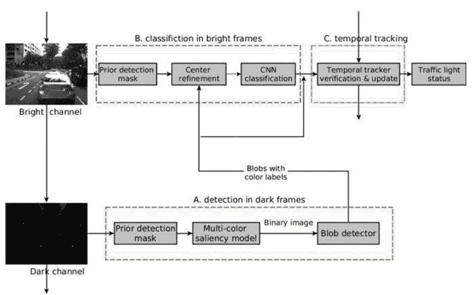
图1 交通信号灯识别系统的图表[22]

## 2 高动态范围成像交通灯检测

#### 2.1 高动态范围成像

高动态范围（HDR）成像是将图像合成和色调映射，以扩展超出捕捉能力的能力 [16]。HDR技术已成功应用于照片和电视中，使图像/帧在亮暗之间具有更大的对比度。与通过组合亮暗图像来提高视觉质量的现有HDR应用不同，我们分别使用双通道，并使用两个通道之间的关联将它们组合起来。

我们采用HDR的动机是暗图像具有更高的检测能力和亮图像具有更高的识别能力。尽管暗图像和亮图像不是同时捕捉的，但它们之间的相对时间差可以忽略不计。换句话说，我们可以很容易地找到亮图像和连续暗图像之间的对应区域，反之亦然。这帮助我们将在暗图像中检测到的交通灯候选对象与亮图像中的位置关联起来。如前所述，暗图像用于交通灯候选检测，亮图像用于识别。至于车辆信号识别，亮图像用于车辆检测，暗图像用于车辆信号识别。

### 2.2 暗图像用于检测交通灯候选

从图像中检测交通灯候选是成功的交通灯状态分类/跟踪系统的一个关键步骤。目前，大多数交通灯识别系统仅使用亮图像进行交通灯检测。然而，与其他检测问题类似，它们的性能对环境光照条件非常敏感，并且容易与前方车辆的尾灯或其他类似的环境光混淆，例如交通标志、临时路障、行人。如何在不同的光照条件下稳健地检测交通灯候选仍然是一个未解决的问题。在本章中，我们提出了一种新方法，不使用单个图像，而是使用由HDR相机提供的双通道（低曝光和高曝光）。与以前的HDR成像不同，我们的方法将这些通道分别用于检测和识别交通灯。如 2.1 节所述，HDR相机比普通相机具有更大的动态范围，可以这样使用连续的两个通道，分别设置为高曝光和低曝光。在暗图像中检测到的交通灯候选可以很容易地在亮通道中定位，因为它们在非常短的时间间隔内捕获，对于我们的相机，每秒25帧，高清串行数字接口（HD-SDI），大约为40毫秒。在高速移动的情况下，暗图像和亮图像上的候选区域之间的关联不会受到很大影响。无论如何，在本章中提出了一种重新定位亮图像上的交通灯候选检测结果的方法，将在3.1节中讨论。

我们使用HDR成像的方式使得交通灯候选检测比其他方法更加稳健，因为在低曝光图像上，交通灯具有干净的黑色背景。通过使用这种HDR双通道机制，可以获得无畸变的颜色和在暗图像上利用形状信息，在亮图像上利用丰富的上下文信息。

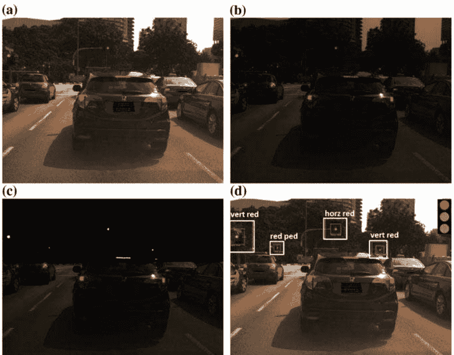
图2使用双通道机制的交通灯检测和识别[22]。a高曝光/亮图像；b低曝光/暗图像；c带有感兴趣区域显著性图的暗图像；d交通灯候选检测和识别结果。交通灯状态结果显示在右上方

图2显示了双通道交通灯识别的示例。我们可以看到，在暗图像中，包括交通灯和车辆尾灯在内的灯光非常突出。丰富的上下文信息可以从亮图像中看到。

在使用HDR识别交通信号灯时，低光照条件是一个具有挑战性的问题。在[17]中，通过简单的颜色阈值分割从暗图像中检测到交通信号灯候选区。由于很难通过阈值来适应不断变化的光照条件，检测性能可能不可靠。本章采用了一个显著性地图滤波器来处理低光照问题，该滤波器旨在将图像的表示简化和/或改变为更有意义和更容易分析的形式[24]。

### 2.3 显著性地图滤波

大多数现有的交通信号灯识别方法通过调整阈值来检测交通信号灯（颜色斑点）。颜色信息用于定位和识别交通信号灯状态。为了实现这一目的，本章考虑使用YCbCr [25]而不是RGB，因为颜色和强度在RGB颜色空间s的三个通道中混合在一起。

通常，用于识别交通信号灯状态（红色、绿色和黄色）的参数对环境光照条件非常敏感。由于需要对每个像素进行验证以确定状态，所以随着颜色数量的增加，时间消耗呈线性增加。为了加快处理速度，本章提出了一个非参数 model，可以同时提取各种颜色的斑点。本章中使用RGB颜色空间来说明我们的方法的鲁棒性，尽管当采用HSV或其他空间时，性能可能会更好[17]。

我们的方法包含以下步骤。首先，将3D RGB颜色空间划分为网格，$M \times M \times M$。本章中，$M$设置为32（不进行微调）。其次，从样本中计算每个状态（包括红色、绿色和黄色）的直方图。让我们将红色、绿色和黄色的归一化直方图定义为 $H_r, H_g, H_a$。为了防止单个颜色分箱的极端占主导地位，将 $H_r, H_g$ 和 $H_a$ 中大于0.1的值截断。然后对结果直方图进行重新归一化到 [0, 1]。给定输入图像 I，计算红色通道中像素 (i, j) 的显著性分数：

$$S_r(i, j) = \sum_{(i',j') \in N_d(i,j)} H_r(i', j') \qquad (1)$$

其中 $N_d(i, j)$ 表示像素点 $(i, j)$ 在最大距离 $d$ 内的邻域。通过对 $S_r$ 应用阈值 $T$，可以得到显著性掩模。在本章中，$d$ 被设为 2，$T$ 被设为 0.2。这些设置没有进行细调。尽管可以使用直方图模型分别计算不同光照类型的显著性图，但对于每个颜色的每个像素计算显著性分数在计算上是冗余的。在我们的方法中，提出了一个 Max 运算符来组合三种交通信号灯状态（红色、绿色和黄色）的直方图：

$$H = \max(H_r, H_g, H_a) \qquad (2)$$

通过用 $H$ 替换方程（1）中的 $H_r$，得到最终的显著性图 $S$：

$$S(i, j) = \sum_{(i',j') \in N_d(i,j)} H(i', j') \qquad (3)$$

如果像素的显著性值超过阈值，则使用三通道直方图模型重新计算通道显著性分数。将像素分配给具有最大通道显著性分数的类型。按照上述方式，大多数像素可以通过最终的显著性分数进行过滤，其他像素的类型可以通过个别显著性模型确定。图3展示了所提出的显著性模型的一个示例。

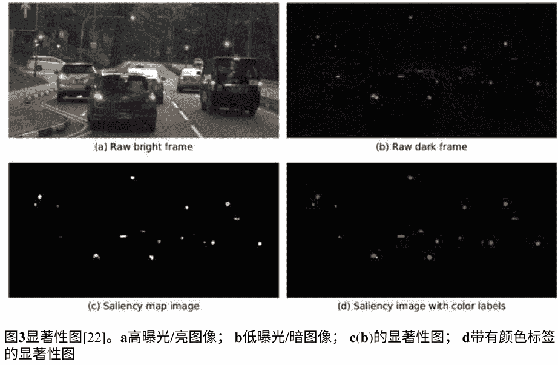

使用OpenCV [26]中的函数 findContours() 从结果二值图像中提取斑点的轮廓。可以根据形状分析（例如面积或圆度）选择性地删除一些明显不正确的斑点。

### 2.4 自动曝光对非受控照明的应用

尽管许多研究人员致力于计算机视觉中的照明问题，但在不同的光照条件下，视觉系统仍然面临挑战。如上所述，调整相机曝光可以是检测交通信号灯的有效方法。本章中使用的HDR相机Zebra2（2.8 MP彩色GigE Vision）[27]提供自动曝光功能。然而，当启用高动态范围设置时，此功能将被禁用。由于真实场景（例如阳光和天空光）的动态范围可能比相机设置的范围更宽，因此TL候选检测可能不稳定。尽管显著性图可以使在大范围光照变化下的检测比简单阈值更可靠，但仍需考虑在非受控室外环境下的严重光照变化。

自动曝光，即自动调整曝光参数（如增益或快门速度），应有助于保持图像特征。在这里，将考虑双通道的自动曝光。自动曝光已在文献中进行了研究[28-30]。然而，我们需要一种快速的自动曝光方法来应用于我们的自动驾驶车辆。在本章中，我们提出了一种实时自动曝光方法。通过观察图像掩模的平均强度与参考值之间的差异来调整曝光。

令 $I_t$ 表示期望的平均图像强度，$I_c$ 表示当前帧的平均强度，定义一个因子为：

$$f = \frac{I_t}{I_c} \qquad (4)$$

我们的目标是让方程 (4) 中的 $f$ 趋近于1，即 $I_c$ 趋近于 $I_t$，通过更新增益或快门。

为了获得期望的 $f$，快门和增益在各自的范围 $[s_{\min}, s_{\max}]$ 和 $[g_{\min}, g_{\max}]$ 内进行联合调整。在实际实现中，先调整快门，因为噪声可能与较大的增益值一起出现。调整快门将导致一个因子：

$$f_s = \frac{s_t}{s_c} \qquad (5)$$

其中 $s_c$ 表示当前快门值，$s_t$ 表示更新后的快门值。众所周知，快门值与强度成正比。如果只通过调整快门值在其范围内实现所需的因子 $f$，即 $f_s = f$，则不需要进行增益调整。然而，如果 $f_s$ 不能达到目标图像强度，则快门将被更新到其范围内的极值，并且增益将被调整以覆盖剩余部分的因子，即 $f = f_s f_g$，其中 $f_g$ 是增益因子。

通过根据一个常见观察来调整增益，可以轻松实现剩余的因子：当增益调整（增加或减少）约为 6 db 时，强度加倍或减半。

### 2.5 感兴趣区域（ROI）

实时性是实际TLR系统的要求。加速TL检测的一种方法是对图像中的交通灯位置有一些先验知识。通过将相机与3D世界进行校准，可以确定图像上可能包含交通灯候选区域。相机的前景投影可以表示为一个变换矩阵。3D世界和2D图像之间的关系可以表示为一个变换矩阵：

$$\begin{bmatrix} ut \\ vt \\ t \end{bmatrix} = \begin{bmatrix} a_{11} & a_{12} & a_{13} & a_{14} \\ a_{21} & a_{22} & a_{23} & a_{24} \\ a_{31} & a_{32} & a_{33} & 1 \end{bmatrix} \begin{bmatrix} x \\ y \\ z \\ 1 \end{bmatrix} \qquad (6)$$

其中 $(x, y, z)$ 和 $(u, v)$ 分别表示世界坐标和图像坐标。在本章中，世界坐标系定义为 $XY$ 位于地面上，$Z$ 轴向上且垂直于 $XY$。$XYZ$ 坐标的原点对应于主车辆的前中点；X 轴指向主车辆的前方。$Y$ 轴向左，遵循右手法则，使得 $XYZ$ 坐标系成立。校准是估计方程 (6) 中的 $3 \times 4$ 矩阵中的十一个未知参数 $a$ 的过程。至少需要四组 3D 和 2D 坐标来进行校准。在实际中，可以使用多于四组的 3D 和 2D 坐标来进行相机校准。这些数据组通过解决最小二乘拟合问题来估计十一个参数。在本章中，这些数据组是通过读取几个已知尺寸校准物体的坐标来获得的。

当给定车辆的定位和地图上交通灯的三维定位时，可以估计图像上交通灯的位置。然而，这种方法需要高精度的地图和定位估计，这使得它难以在实际应用中采用。在本章中，我们采用了感兴趣区域 (ROI) 方法来加速交通灯检测，而不是依赖精确的地图和车辆定位。

在我们的实验中，我们没有对地图、交通灯位置或主车辆姿态做出任何假设。当没有提供定位信息时，大致的 x、y、z 方向范围和一个非常粗略的二维 GPS 位置仍然是有用的。基于这些三维范围，可以生成一个密集的三维网格，并相应地生成二维图像 ROI。换句话说，采用与最远距离对应的 ROI，可以找到交通灯候选区域。

在本章中，垂直悬挂的交通灯在 XYZ 中的检测范围如下定义。X (纵向) : [0米, 70米]; Y (横向) : [-8米, 8米]和 Z (向上) : [2.5米, 4米]。这些参数是基于新加坡正常交通灯情况下设置的。为了估计可能的 ROI，(x, y, z) 可以在范围内变化。图4g和h显示了水平悬挂的交通灯的两个检测掩模或 ROI，通过在 [4.5米, 7米] 范围内改变 Z 获得。如果车辆姿态或交通灯位置可访问，则可以进一步缩小此 ROI。图4a-f显示了对应于不同范围的更多 ROI 示例。图4g用作 ROI。

通过 ROI 的帮助，检测交通信号灯候选者的计算成本可以显著降低。我们可以从第5节讨论的实验结果中看到这一点。低计算成本对于实时应用非常重要，比如自动驾驶车辆，需要同时运行几个模型，例如感知、导航。除了节省时间，交通信号灯识别的准确性也得到了提高，因为一些位于 ROI 之外的误报可以被防止。

## 使用深度学习进行交通信号灯识别

由于大量可用的数据和硬件进步，深度学习作为一种先进的机器学习技术，在计算机视觉（例如目标检测、数据增强）、语音识别和自然语言等方面取得了非常有希望的结果。深度架构可以学习训练数据的分层表示，而不是手工设计的特征。

在本章中，我们采用深度学习来识别图像中的交通信号灯状态。与其他深度学习应用类似，本章的思想是卷积神经网络（CNN）能够高效地将交通信号灯候选对象分类为交通信号灯状态。在本章中，我们展示了当深度模型和参数经过精心设计时，开发实时高准确性的交通信号灯识别系统是可能的。

正如我们在第2节中讨论的那样，通过在暗图像上的位置确定交通信号灯候选对象在亮图像上的位置，因为连续的亮/暗帧之间的时间间隔非常短，可以忽略不计。首先，我们将在下一节中讨论亮通道和暗通道之间的对应关系。

#### 3.1 双通道机制

正如我们所知，通过低曝光和高曝光通道捕获的两幅图像不是同步的，即它们不是同时捕获的，尽管两个通道的时间戳之间的间隔非常短。车辆的运动使得从暗图像中检测到的交通信号灯候选对象很难与亮图像对齐，特别是当无法忽略车辆的振动（由于运动）时。因此，需要一种方法来重新定位亮图像上的交通信号灯候选对象检测结果。

通过在暗帧上检测候选区域，我们的目标是在下一个纹理更丰富的亮帧上找到相应的区域。考虑到时间在连续帧之间的间隔中，可能需要在明亮图像上重新确定新的区域中心，以确保从明亮图像中裁剪出的区域与TL候选者相对应。在本章中，TL候选者的中心位置 $p$ 和半径 $r$，可以用来估计以下明亮帧上的新中心。具体而言，在以 $p$ 为中心的窗口内搜索新的中心，本章中为 $12r \times 12r$。TL候选者的中心通常具有窗口内像素中最高的亮度值和颜色方差。对于RGB空间，亮度图像 $I$ 的计算方式为：

$$I = 0.2126 \times R + 0.7152 \times G + 0.07221 \times B \qquad (7)$$

方差图像 $V$ 的计算如下：

$$V = |R - I| + |G - I| + |B - I| \qquad (8)$$

新的中心可以在加权和图像中找到最高响应 [32, 33]：

$$\alpha V + (1 - \alpha)I \qquad (9)$$

其中 $\alpha$ 是权重。由于光照条件的变化会导致亮度显著变化，本章中将 $\alpha$ 设置为0.7。如上所述，以每个新中心为中心的一个 $12r \times 12r$ 窗口从亮帧中裁剪出来，并用作TL状态分类的候选区域。

### 3.2 自定义卷积神经网络

虽然大多数情况下可以在TL候选检测阶段将其去除，但是误报可能是可能的，例如由于前方车辆的刹车灯或其他颜色与TL相似的物体。为了进一步提高鲁棒性，使用CNN分类器来识别真正的阳性和误报。

准确性和速度是我们选择CNN分类器的两个考虑因素。作为自动驾驶车辆中的感知模型之一，运行速度是选择深度学习模型的一个重要问题，因为它将与其他模型共享有限的资源，例如目标检测、车道检测等。CaffeNet [34]，见图6，是AlexNet [35]的1-GPU版本，其中AlexNet中的两条路径合并为一条路径。本章采用了类似于CaffeNet [34]的定制版本CNN模型。输出层（最后一层）的数量被定义为13，即十二个正类和一个背景类。正类是基于可能的交通信号灯类型进行定义的：

- (1) HARL 水平对齐红灯
- (2) VARL 垂直对齐红灯
- (3) HAGL 水平对齐绿灯
- (4) VAGL 垂直对齐绿灯
- (5) LVL 左车灯
- (6) RVL 右车灯
- (7) GAL 绿箭灯
- (8) RAL 红箭灯
- (9) AL 黄灯
- (10) GPL 绿色行人灯
- (11) RPL 红人灯
- (12) OFRL 其他虚假红灯

图5显示了在一张图像上的注释结果，其中真正的阳性标记为蓝色，假阳性标记为红色。通过上述定义可以减少类内方差。例如，通过定义水平和垂直灯，可以区分红色交通灯和假阳性，例如LVL、RVL和OFRL。这种定义的另一个优点是减少了数据收集和注释的工作量。

CaffeNet包含八层。前五层是传统层，通过可微分函数将一个激活体积转换为另一个激活体积。卷积层的参数由一组可学习的滤波器（卷积核）组成。每个滤波器在空间上很小（沿宽度和高度），但在输入体积的整个深度上延伸。在第一层和第二层中添加了两个过程：最大池化和局部响应归一化。最后三层是全连接层。根据图6中的架构，需要训练6000万个参数。

CNN分类器的权重是通过精细调整策略进行训练的。训练过程中所需的参数是基于实验设置的。在我们的方法中，CNN模型的基本学习率和衰减率分别设置为0.001和0.0005。对于修改后的层，学习率的乘数，即第一个卷积层和输出层，在前2000次迭代中设置为10，其他层设置为1。总共进行了50000次迭代的训练过程。

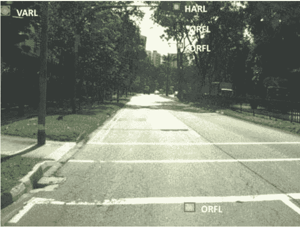
图5 在图像上标注TL样本[22]

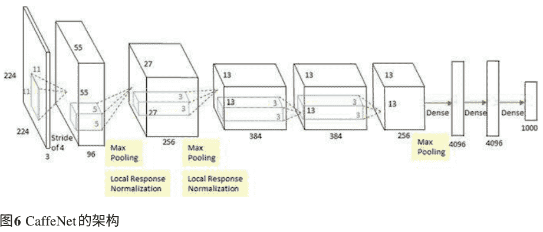

### 4 时间轨迹分析

在本章中，我们提出了一种简单但高效的时间轨迹分析方法，用于提高交通信号灯识别的准确性和鲁棒性，而不是使用常规的跟踪技术，如卡尔曼滤波器或粒子滤波器。

如第2.4节所述，本章使用了一台HDR相机，Zebra2 [27]。这台高速相机确保图像上的目标在每一帧中不断变化。在这种情况下，可以使用时间空间分析来检查当前帧中检测到的目标是否曾经在几乎相同的区域中找到过，以跟踪目标。通过在一定时间内保持交通灯状态来控制交通。因此，无论车辆是移动还是静止，光的区域在图像序列上都是空间连续的。基于这些观察，交通灯识别可以从两个方面受益于适当的时间空间跟踪：（1）平滑性得到改善，因为可能会填补丢失或低置信度的交通灯状态；（2）孤立的误报可以被移除。

我们将轨迹定义为交通灯实例的历史。一个轨迹由几个组成部分组成：

- (1) 类型；
- (2) 历史位置；
- (3) 生命周期；
- (4) 不连续性。

轨迹根据灯的状态和稳定性进行分组。因此，定义了六种轨迹类型：

- (1) 稳定红色；
- (2) 稳定绿色；
- (3) 稳定黄色；
- (4) 临时红色；
- (5) 临时绿色；
- (6) 临时黄色。

例如，“稳定红色”表示轨迹被确认为红色交通灯状态（无论是水平还是垂直红灯）。另一个项目，生命周期，描述了自第一个实例被检测到以来的轨迹的时间段。图7显示了轨迹分析的一个示例。垂直绿灯的轨迹被绘制在一个帧上。


图7 垂直绿灯的轨迹（用绿色标记的点）绘制在一个帧上[22]

轨迹池不断更新。在最开始，一旦发现一个新的目标，就会为其初始化一个临时轨迹。要将临时轨迹更新为稳定轨迹，需要满足最小生存时间（在我们的实验中为一秒）和最小实例数（在我们的实验中为五个）。需要注意的是，这些参数是基于我们的实验设置的。如果轨迹的生存时间超过阈值（在我们的实验中为七十秒），则会从池中删除该轨迹。在当前的交通信号灯控制系统中，红灯、绿灯或黄灯的生存时间都低于这个阈值。有时，红灯的持续时间可能超过这个阈值，在这种情况下，将历史记录分成两个轨迹是可行的。

当给出一个新的帧时，会检测交通信号灯。然后将新的目标添加到池中。假设从一帧中识别出红灯状态，将检查池中具有红灯的轨迹。如果新位置到轨迹的距离是池中红色轨迹中最小的，并且低于预定义的阈值（在我们的实验中为六十像素），则将其添加到轨迹中。如果找不到这样的轨迹，将从这个新目标开始创建一个新的临时红色轨迹。如果找到稳定的轨迹，则新目标成为稳定的红灯。否则，将记录新目标（可能是误报）作为临时红灯。

### 5 实验结果

在本节中，将对所提出的方法在大型数据库上进行数量分析（以精确度和召回率为指标）。通过与现有技术的比较，展示了我们方法的优势。对数据库和实际道路进行的实验表明，我们的TLR方法满足自动驾驶车辆的速度和准确性要求。

#### 5.1 性能评估

精确度和召回率是标准的性能评估方法之一。它们定义如公式（10）和（11）所示：

$$ \text{精确度} = \frac{TP}{TP + FP} \quad (10) $$
$$ \text{召回率} = \frac{TP}{TP + FN} \quad (11) $$

其中，$TP$ 表示真正例样本的数量，$FP$ 表示假正例样本的数量，$FN$ 表示假负例样本的数量。

在本节中，将对我们的方法在精确度和召回率方面进行定量分析。为此，使用我们的自动驾驶车辆收集了一个大型数据库。使用公式 (10) 和 (11) 计算真正例、假正例和假负例的数量，以计算精确度和召回率。

数据库包含4,142张图像。选择的图像使得每个类别包含的样本数量几乎相同。这些图像上手动标注了21,070个框。每个类别大约有1,750个框。训练集包含3,722张图像（约90%）。评估集包含420张图像。

为了训练网络，我们从上述种子样本中生成了约一百万个样本。采用了尺度和平移技术从种子样本生成新样本。虽然对于训练样本的生成没有特殊要求，但在实验中我们发现样本数量的平衡会影响性能。新样本的生成如下所示：

在本章中，原始图像的分辨率为1600 × 1200。采用均匀随机分布来移动和缩放原始TL区域以生成新的训练样本。交通灯候选区域的中心从候选矩形的宽度或高度的-0.2倍移动到0.2倍，并将区域的大小从1调整到1.2倍。最终将新样本调整为111 × 111的大小。

为了评估我们的系统，算法在63个新的视频序列上运行（每个视频约4分钟）。测试视频包含不同条件下的样本，条件包括：白天、天气、高速公路和城市道路。从上述视频序列中选择了1,800张图像，采样间隔为80帧。这些图像中的真实情况包含了5,229个样本。考虑到ROI，有3,099个样本。

表1给出了实验结果，其中ROI的测试结果记录在括号中。

从表1可以看出，车辆信号灯的识别准确率比其他类别要低。原因可能是与交通灯样本相比，车辆信号灯样本数量不足。另一个原因可能是车辆灯的类型比其他类型要多得多。如果我们想提高车辆信号灯的识别准确率，就必须收集更多的训练样本，以涵盖更多种类的车辆灯。无论如何，通过应用第2.5节中讨论多ROI，大多数车辆灯将从结果中移除，因为它们位于图像的下部（见表1）。

根据表1给出的结果，得到了精确度和召回率，并在表2中给出了结果。从表2中，我们可以看到平均召回率和精确度的准确性从98.04%提高到99.03%，从97.45%提高到98.91%。交通信号灯候选的检测率计算如下：

$$D = (TP + FN)/G \qquad (12)$$

其中 $G$ 表示真实值的数量。

每个类别的真实值在表3的第一行给出。根据表1和公式（12），计算并列出了检测率在表3中。当应用ROI时，平均检测率从96%提高到97.85%，见表3。

#### 5.2 与现有算法的比较

为了证明我们方法的优势，我们比较了我们方法和现有技术的性能。据我们所知，没有公开可用的HDR TLR基准数据库可用于此类比较。大多数已发表的TLR系统使用单个彩色摄像机收集自己的数据库进行评估。我们从文献中找到的一个例外是[17]，他们使用多曝光图像。他们在几个城市场景上进行了实验，但没有报告准确性。

然而，我们的方法和最先进的深度学习目标检测方法在本章中进行了比较。为了达到这个目的，我们将比较仅使用我们的测试数据的高曝光图像所得出的结果。为了公平比较，我们使用与我们的TLR相同的训练数据库重新训练最先进的深度学习检测器。

对于自动驾驶应用，对象检测器基于两个标准进行选择：(1) 实时性；(2) 高准确性。尽管已经有一些深度学习对象检测器，如Faster-RCNN [36]，但大多数不能实时运行。在本章中，我们采用You Only Look Once (YOLO) [37]作为与我们方法进行比较的最新技术。YOLO可以实时运行，其新版本(YOLOv2) [38]的性能优于其他方法，如Faster R-CNN [36]和单次多框检测器(SSD) [39]。

YOLOv1的架构如图8所示。它有24个卷积层，后面跟着2个全连接层。交替的1 × 1卷积层减少了前面层的特征空间。卷积层在ImageNet分类任务上进行了预训练，输入图像分辨率为224 × 224，然后将分辨率加倍进行检测。YOLO的最终输出是一个7 × 7 × 30的预测张量。YOLO在测试时查看整个图像，因此其预测受到图像中的全局上下文的影响。它还可以通过单个网络评估进行预测，而不像R-CNN那样需要数千个图像。这使得YOLO非常快，比R-CNN快1000倍以上，比Fast R-CNN快100倍以上。

通过HDR和YOLOv2获得的一些实验结果分别显示在图9a和b中。使用YOLOv2进行的测试结果，与上一节中的HDR类似，显示在表4、5和6中。

通过考虑检测率，即将精确率或召回率与检测率相乘，计算出精确率和召回率的真实准确性。表7列出了YOLOv2和我们方法的真实精确率和召回率，其中ROI的比率记录在括号中。与YOLOv2相比，我们的方法在有或没有ROI的情况下都可以取得更好的性能。

# 表1 HDR：无/有ROI的混淆矩阵；ROI的结果在括号中记录 [22]

| | HARL | VARL | HAGL | VAGL | LVL | RVL | GAL | RAL | AL | GPL | RPL | OFRL |
| :--- | :--- | :--- | :--- | :--- | :--- | :--- | :--- | :--- | :--- | :--- | :--- | :--- |
| **HARL** | **441(441)** | | | | | | | | | | | |
| **VARL** | | **783(783)** | | | | | | | | | | |
| **HAGL** | | | **568(468)** | 9(9) | | | | | | | | |
| **VAGL** | | | | **549(549)** | | | | | | 9(9) | | |
| **LVL** | | 18(0) | | | **1152(66)** | 72(0) | | | | | | |
| **RVL** | | | | | 18(0) | **864(33)** | | | | | | |
| **GAL** | | | | 6(6) | | | **180(180)** | | | | | |
| **RAL** | | | | | | | | **90(90)** | | | | |
| **AL** | | | | | | | | | **72(72)** | | | |
| **GPL** | | | | 6(6) | | | | | | **117(117)** | | |
| **RPL** | | | | 3(3) | | | | | | | **162(162)** | |
| **OFRL** | | 3(0) | | | | | | | | | | **33(39)** |

# 表2 无/有ROI的精确度和召回率；ROI的结果在括号中记录 [22]

| | HARL | VARL | HAGL | VAGL | LVL | RVL | GAL | RAL | AL | GPL | RPL | OFRL | 平均 |
| :--- | :--- | :--- | :--- | :--- | :--- | :--- | :--- | :--- | :--- | :--- | :--- | :--- | :--- |
| **召回率 (%) 无 ROI/ (有ROI)** | 100 (100) | 97.4 (100) | 98.1 (98.1) | 97.3 (97.3) | 98.5 (100) | 92.3 (100) | 100 (100) | 100 (100) | 100 (100) | 92.9 (92.9) | 100 (100) | 100 (100) | 98 (99) |
| **精确度 (%) 无 ROI/ (有ROI)** | 100 (100) | 100 (100) | 100 (100) | 96.8 (96.8) | 92.8 (100) | 98 (100) | 96.8 (96.8) | 100 (100) | 100 (100) | 95.1 (95.1) | 98.2 (98.2) | 91.7 (100) | 97.5 (98.9) |

# 表3 HDR：无/有ROI的检测率；ROI的测试结果在括号中记录 [22]

| | HARL | VARL | HAGL | VAGL | LVL | RVL | GAL | RAL | AL | GPL | RPL | OFRL | 平均 |
| :--- | :--- | :--- | :--- | :--- | :--- | :--- | :--- | :--- | :--- | :--- | :--- | :--- | :--- |
| **无ROI/(有ROI)真实值** | 447 (447) | 804 (804) | 477 (477) | 567 (567) | 1311 (66) | 921 (36) | 192 (192) | 93 (93) | 72 (72) | 132 (132) | 174 (174) | 39 (39) | - |
| **无ROI/(有ROI)检测率(%)** | 98.7 (98.7) | 97.4 (97.4) | 98.1 (98.1) | 100 (100) | 94.7 (100) | 95.8 (100) | 96.9 (96.9) | 96.8 (96.8) | 100 (100) | 93.2 (93.2) | 94.8 (94.8) | 92.3 (100) | 96 (97.9) |

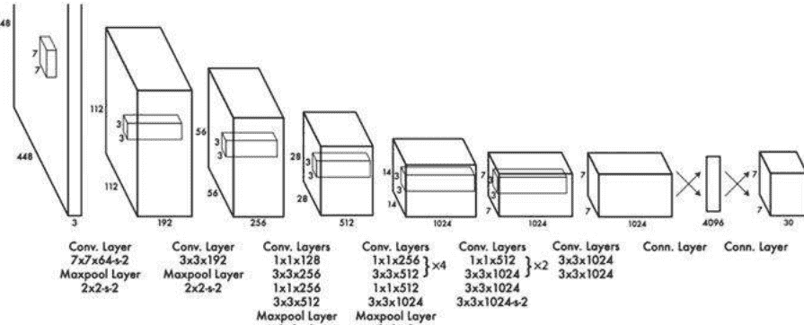
图8 YOLO的架构[37]。YOLO有24个卷积层，后面跟着2个全连接层。交替的1 × 1卷积层将特征空间从前面的层中减少。卷积层在ImageNet分类任务上进行了预训练，输入图像的分辨率为一半（224 × 224），然后将分辨率加倍进行检测。YOLO的最终输出是一个7 × 7 × 30的预测张量。

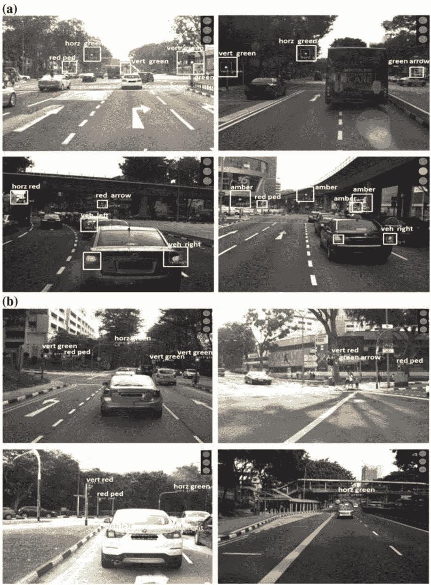
图9 通过HDR和YOLOv2 [22]获得的一些实验结果

## 表4 YOLOv2: 测试结果的混淆矩阵 (无/有ROI) ； ROI的测试结果记录在方括号中 [22]

| | HARL | VARL | HAGL | VAGL | LVL | RVL | GAL | RAL | AL | GPL | RPL | OFRL |
| :--- | :--- | :--- | :--- | :--- | :--- | :--- | :--- | :--- | :--- | :--- | :--- | :--- |
| HARL | **423 (423)** | 9 (9) | | | | | | | | | | |
| VARL | 9 (9) | **771 (771)** | | | | | | | | | | |
| HAGL | | | **456 (456)** | 6 (6) | | | | | | | | |
| VAGL | | | 6 (6) | **543 (543)** | 3 (3) | | | | | | | |
| LVL | | 3 (3) | | | **1161 (63)** | 63 (0) | | | | | | |
| RVL | | | | | 51 (0) | **864 (36)** | | | | | | |
| GAL | | | | 6 (6) | | | **177 (177)** | | | | | |
| RAL | | 6 (6) | | | | | | **78 (78)** | | | | |
| AL | | | | | | | | | **69 (69)** | | | |
| GPL | | | 3 (3) | 6 (6) | | | | | | **121 (121)** | | |
| RPL | | | | 3 (3) | | | | | | | **162 (162)** | |
| OFRL | | 3 (3) | 3 (3) | | | | | | | | | **30 (33)** |

## 表5 YOLOv2: 无/有ROI的精确度和召回率; ROI的结果记录在方括号中 [22]

| | HARL | VARL | HAGL | VAGL | LVL | RVL | GAL | RAL | AL | GPL | RPL | OFRL | 平均 |
| :--- | :---: | :---: | :---: | :---: | :---: | :---: | :---: | :---: | :---: | :---: | :---: | :---: | :---: |
| 召回率 (%) 无 ROI/ (有ROI) | 97.9 (97.9) | 97.3 (97.3) | 97.4 (97.4) | 96.3 (96.3) | 95.6 (95.5) | 93.2 (100) | 100 (100) | 100 (100) | 100 (100) | 90.2 (90.2) | 100 (100) | 100 (100) | 97.3 (97.9) |
| 精确度 (%) 无 ROI/ (有ROI) | 97.9 (97.9) | 98.8 (98.8) | 98.7 (98.7) | 96.3 (96.3) | 94.6 (95.5) | 94.4 (100) | 96.7 (96.7) | 92.9 (92.9) | 100 (100) | 92.5 (92.5) | 98.2 (98.2) | 83.3 (84.6) | 95.4 (95.5) |

## 表6 YOLOv2: 无/有ROI的检测率；ROI的测试结果记录在方括号中[22]

| | HARL | VARL | HAGL | VAGL | LVL | RVL | GAL | RAL | AL | GPL | RPL | OFRL | 平均 |
| :--- | :--- | :--- | :--- | :--- | :--- | :--- | :--- | :--- | :--- | :--- | :--- | :--- | :--- |
| 无ROI/(有ROI)的真实值 | 447 (447) | 804 (804) | 477 (477) | 567 (567) | 1311 (66) | 921 (36) | 192 (192) | 93 (93) | 72 (72) | 132 (132) | 174 (174) | 39 (39) | |
| 无ROI/(有ROI)的检测率(%) | 96.6 (96.6) | 97.0 (97.0) | 96.9 (96.9) | 99.5 (99.5) | 93.6 (95.6) | 99.3 (100) | 95.3 (95.3) | 90.3 (90.3) | 95.8 (95.8) | 90.9 (90.9) | 94.8 (94.8) | 92.3 (100) | 95.2 (96.1) |

## 表7 HDR和YOLOv2的精确度和召回率比较；ROI的结果在方括号中记录 [22]

| | YOLOv2 | HDR |
| :--- | :--- | :--- |
| 召回率 (%) | 92.6 (94.3) | 94.1 (**96.9**) |
| 精确度 (%) | 90.8 (92.5) | 93.6 (**96.8**) |

具体来说，使用ROI后，精确度和召回率的提升分别为92.5%到96.8%和94.3%到96.9%。

使用暗通道来检测交通灯候选区域是一种有效的方法，可以防止交通标志、阳光、行人的衣物等造成的许多误报。这是因为在暗图像上，它们对应的区域不太可见。图10、11和12给出了一些例子，显示出仅使用单色摄像头时检测到的一些误报可以通过我们的双通道方法来防止。在图10中，YOLOv2的结果包含两个误报：公交车车身上的交通灯反射和建筑物上的阳光。我们的双通道方法成功地防止了这两个误报，因为在图10的暗图像中找不到这两个误报的响应。

图10 YOLOv2对比HDR [22]。左图：YOLOv2，两个误报（用红圈标出），分别是交通灯在公交车车身上的反射和建筑物上的阳光；中图：HDR，YOLOv2中的这两个误报被防止了，因为在暗图像中没有对这两个误报的响应（右图）

图11 YOLOv2与HDR的比较 [22]。左图：YOLOv2，一个误报（红圈内）；中间图：HDR，YOLOv2中的误报在HDR中被阻止，因为在暗图像中对于这个误报没有响应（右图）。

图12 YOLOv2（顶部）与HDR（底部）的比较 [22]。顶部的误报是由交通标志和行人引起的，而底部可以防止这些误报。

## 表8 HDR和YOLOv2之间的计算成本比较（每帧）[22]

| | 使用ROI（毫秒） | 不使用ROI（毫秒） | 节省时间 |
| :--- | :--- | :--- | :--- |
| HDR | 35 | 130 | 77% |
| YOLOv2 | 40 | 40 | 0 |

在相同数据集上获得的结果表明，本章提出的方法在速度和准确性方面优于现有技术。

本文中介绍的双通道算法是在Mini-PC（技嘉，NVIDIA GeForce GTX 760）上用C++实现的，可以在图像上的交通灯数量约为30-40帧每秒的速度运行。使用ROI技术可以显著节省处理时间，见表8。相反，YOLOv2即使使用ROI也不能节省时间，因为该网络需要固定大小的图像作为输入。

我们的方法已经在真实道路上使用A*STAR IIR AV [40]通过数据分发服务(DDS) [41]进行了演示。其中一个测试结果如图13所示，在十帧间隔的视频中提供了几个帧。对于感兴趣的读者，请参考[22]或链接获取更多视频演示：https://www.youtube.com/watch?v=HQqaAvuJI_I

## 6 HDR成像车辆信号识别

车辆跟随是自动驾驶车辆的基本功能之一。检测和识别尾灯信号对于防止自动驾驶车辆发生追尾碰撞或事故非常重要。虽然可以使用声学声纳或商业化的高级驾驶辅助系统(ADAS)产品如Mobileye等传感器来进行追尾碰撞警告，但我们期望一种经济实惠的方法。

图13 一个视频的尾灯识别结果 [22]。这些帧以十帧间隔显示，从左到右，从上到下。

受到在TLR中良好表现的鼓舞，我们将本章中提出的双通道方法扩展到车辆信号识别（VSR）[20, 23]。类似于交通信号灯的车辆信号灯可以从干净背景的暗通道中稳定地识别出来。与TLR类似，我们的VSR是一个两阶段的方法：使用深度学习检测器从亮图像中检测出车辆，然后使用CNN从暗图像中识别出信号灯。与先前的车辆信号识别方法不同，我们使用车辆外观图像而不是明确提取成对的尾灯。

由于长度限制，本章仅讨论了刹车灯识别（BLR）。其他信号灯，例如左转或右转，可以通过类似于刹车灯识别的方式进行识别，尽管需要视频序列分析，例如LSTM [42]，而不是单个图像。

#### 6.1 相关方法

车辆信号识别已经通过各种方法进行了探索。现有的方法可以大致分为两类：时间信息 [43-48] 或单个图像 [49-52]。其中大部分方法使用红色特征来检测信号灯，然后尝试使用对称性质来配对尾灯。崔等人 [49] 提出了一种分层方法来在白天检测车辆和尾灯。他们采用了可变形零件模型（DPM）[53] 来从图像中检测车辆。然后，在候选框的边界框内，在HSV颜色空间中对像素进行聚类，以找到红色灯的候选项。在基于先验知识关于车辆外观的基础上，通过配对尾灯来学习稀疏字典来分类信号灯。这种方法很难应用于自动驾驶车辆，因为处理速度慢，可能存在遮挡和可能的误报。除了DPM的慢检测问题外，这种方法的一个严重问题是尾灯可能被遮挡，从而导致尾灯配对失败。此外，城市道路环境中的噪声，例如交通信号灯、路灯，可能会影响尾灯的检测。

#### 6.2 两阶段车辆信号识别

我们的双通道机制的使用使得将检测和识别作为两个阶段分开成为可能，这两个阶段可以在不同的曝光图像中运行。类似于上面提到的TLR，我们将VSR分为两个阶段：车辆检测和信号灯识别。第一阶段将使用高曝光/亮图像执行，第二阶段将使用低曝光/暗图像运行。

#### 6.3 车辆检测

尽管深度学习目标检测取得了非常有希望的结果，但只有其中很少一部分可以实时运行。基于非常深的VGG-16模型 [54]，更快的RCNN [36] 是最先进的目标检测器之一，但每秒只能达到5帧的帧率，远远不符合AV的要求（至少需要每秒10帧，因为更多的感知模块可以共享计算资源）。YOLO [37] 和SSD [39] 是可以实时运行的目标检测器的例子。在YOLO中，检测被定义为回归问题。由于它只访问图像一次，因此实现了快速的帧率。在本章中，与第5.1节中的比较一致，我们采用YOLOv2 [38] 作为最先进的目标检测器，用于从信号图像中检测车辆。正如我们在第5.2节中提到的，YOLOv2 [38] 的性能比其他方法（如更快的R-CNN [36] 和 SSD [39]）更好。

图14 使用YOLOv2进行车辆检测

我们使用我们的自动驾驶车辆在真实道路上收集的数据库对YOLOv2检测器进行重新训练。我们标注了21,000张图像，得到了超过100,000个车辆样本（每张图像中大约有四到五辆车）。我们定义了八个对象类别：（1）汽车；（2）卡车；（3）货车；（4）皮卡；（5）公共汽车；（6）摩托车；（7）自行车；（8）行人。图14展示了车辆检测结果的两个示例。

### 6.4 制动灯模式和识别

与现有的BLR方法需要明确提取左右尾灯不同，本章提出了基于外观的深度学习方法来识别制动灯。换句话说，在YOLOv2检测器检测到的边界框内，我们直接使用这些区域（在本章中称为制动灯模式）来识别制动灯。

深度学习在许多图像识别基准数据库上取得了最先进的性能，例如ILSVRC-2012 [55]。与前几节介绍的TLR类似，我们认为刹车灯在暗图像中的学习效果比在亮图像中好。除了暗图像的干净背景使得灯光识别更加稳健，使用本章提出的BLPs（见图15）可以在一定程度上克服遮挡问题，而不仅仅依赖于一对尾灯。此外，BLP中包含的中央刹车灯大多位于车辆的后窗上，使得识别比仅使用左右尾灯更可靠。之前的方法没有使用这个中央灯，因为相对于左右尾灯来说，提取这个相对较暗的灯光比较困难。

图15显示了一个例子。车辆的BLPs对应于它们在左侧（亮图像）的边界框，在右侧（暗图像）显示。刹车灯在暗图像中可以被准确识别，因为在暗图像上，“刹车”和“正常”之间的差异要比在亮图像上大得多。

图15 车辆的刹车灯模式（BLP）（右侧，暗图像）对应于左侧（亮图像）中显示的车辆检测边界框

#### 6.5 实验结果

与TLR类似，刹车灯识别没有公开的基准测试。尤其是HDR基准测试。大多数刹车灯识别系统仅使用亮图像。然而，在本章中，我们基于我们自己的数据库对我们提出的双通道方法进行了定量分析。与仅使用亮图像的方法进行比较，以展示我们方法的优势。

与TLR中使用的相同视频用于训练和评估刹车灯识别。由于先前方法和我们的方法的车辆检测结果相同（相同的亮图像和相同的检测器），因此比较了先前方法中使用亮图像和我们方法中使用暗图像的刹车灯识别结果。

地面真实情况（“正常”或“刹车”）来自包含1,001个图像的2,123个样本。为了训练网络，我们使用第5.1节中描述的相同方法从上述种子样本中生成约一百万个样本。图16显示了一些训练样本。上排和下排分别显示了具有“正常”和“刹车”模式的图像。

图16 从种子图像生成的一些训练样本，上排为“正常”，下排为“刹车”

我们采用十折交叉验证来测试准确性。结果列在表9中。

我们的方法的平均准确率为97.5%，比之前的方法89%（使用亮图像）要好得多。车辆检测率为99.5%。

图17和图18是刹车灯识别实验的两个示例。当车辆被识别为“正常”或“刹车”时，其边界框标记为绿色或红色。该方法可以解决部分遮挡问题（图18），因为使用的是一个模式而不是一对灯光。

## 表9 之前方法（亮图像）和我们的方法（双通道）的比较

| | 之前的方法（仅亮图像） | 我们的方法（双通道） |
| :--- | :--- | :--- |
| 准确率（%） | 89 | 97.5 |

图17 刹车灯识别结果 [20]。左: "正常" (绿色) ；右: "刹车" (红色)

图18 在部分遮挡条件下的刹车灯识别 [20]。即使右侧尾灯完全被遮挡，也可以识别右侧车辆的刹车状态

与第5节介绍的TLR类似，本章中为VSR开发的算法已经集成到我们的自动驾驶车辆A*STAR IIR AV [40]中。在真实道路上进行的演示，包括车辆跟随、避障等，表明准确性和速度都满足自动驾驶车辆的要求。在同一台PC上运行VSR和TLR，即在第5.2节中介绍的Mini-PC（GIGABYTE，2.5 GHz CPU，GTX 760）上，我们在图像上实现了每秒25-35帧，具体取决于交通灯和车辆信号灯的数量。

### 7 结论和未来工作

本章提出了一种基于高动态范围成像和深度学习的实时TLR系统，用于检测和识别TL。充分利用了HDR相机的优势，即多曝光图像。我们的方法可以克服现有技术的缺点，因为低曝光图像具有干净的背景（暗色），可以可靠地检测到TL。此外，由于丰富的上下文可用，可以高精度地识别与暗图像上的候选人对应的高曝光图像上的候选人。通过使用显著性图和ROI，CNN识别的TL候选人数量显著减少，使其快速且对噪声（例如车辆尾灯）具有鲁棒性。

最后，通过开发跟踪技术进一步提高了准确性和可靠性。通过在从真实道路收集的大型数据库上执行该方法，我们证明了我们的方法的性能优于现有技术。受到TLR的良好性能的鼓舞，我们将我们的双通道方法扩展到VSR。从亮图像中检测到车辆，并从对应的暗图像中识别车辆信号灯。与TLR类似，我们取得了良好的VSR性能。我们的自动驾驶车辆上的在线测试已经成功完成。验证了我们的方法满足自动驾驶车辆的速度和准确性要求。

关于使用暗图像和亮图像作为CNN网络输入的研究将在不久的将来进行。夜间的定量性能可以完成。实际上，在实际道路测试中，我们观察到我们的双通道方法在夜间是可行的。这是因为我们从暗图像中检测交通信号灯时，夜间效果并不高。适当的相机参数和重新训练的夜间数据的CNN模型将足以实现夜间性能。我们需要做的就是适当调整相机参数并使用夜间数据重新训练CNN。最后，未来可以采用RNDF（路由网络定义文件）来定位交通信号灯。很明显，通过与RNDF信息融合，假阳性可以显著减少。

**致谢**：我们从与我们的前同事Yu Pan、Serin Lee、Zhi-Wei Song、Boon-Siew Han和Vincensius-Billy Saputra的思想和讨论中获益匪浅。

### 参考文献

1. Jensen, M.B., Philipsen, M.P., Trivedi, M., Mogelmose, A., Moeslund, T.: 视觉对交通信号灯的研究：问题、调查和展望。IEEE智能交通系统杂志 17(7), 1800-1815 (2016)
2. Diaz, M., Pirlo, G., Ferrer, M.A., Impedovo, D.: 交通信号灯检测综述。在：ICIAP 2015图像分析和处理新趋势研讨会论文集，计算机科学讲义，第9281卷，201-208页 (2015)
3. Philipsen, M.P., Jensen, M.B., Mogelmose, T., Moeslund, T.B., Trivedi, M.M.: 交通信号灯的持续研究：检测和评估。在：第12届IEEE国际高级视频和信号监控会议（AVSS）论文集 (2015)
4. 龚, J., 江, Y., 熊, G., 关, C., 陶, G., 陈, H.: 基于颜色分割和CAMSHIFT的智能车辆交通灯识别和跟踪。在：IEEE智能车辆研讨会论文集 (2010年)
5. Siogkas, G., Skodras, E., Dermatas, E.: 使用颜色、对称性和时空信息在恶劣条件下进行交通灯检测。在：计算机视觉理论和应用国际会议论文集, 第620-627页 (2012年)
6. Charette, R. Nashashibi, F.: 与学习过程相比，使用图像处理进行交通灯识别。在：IEEE/RSJ国际机器人与系统会议论文集, 第333-338页 (2009年)
7. Diaz-Cabrera, M., Cerri, P., Sanchez-Medina, J.: 使用颜色特征进行悬挂交通灯检测和距离估计。在：IEEE智能交通系统国际会议论文集, 第1315-1320页 (2012年)
8. Levinson, J., Askeland, J., Dolson, J., Thrun, S.: 自主车辆的交通灯映射、定位和状态检测。在：国际IEEE机器人与自动化会议(ICRA)论文集, 第5784-5791页 (2011)
9. Haltakov, V., Mayr, J., Unger, C., Ilic, S.: 基于语义分割的白天和夜晚交通灯检测。在：德国模式识别大会论文集, 计算机科学讲义, 第9358卷, 第446-457页 (2015)
10. Charette, R., Fawzi Nashashibi, F.: 基于聚光灯检测和自适应交通灯模板的实时视觉交通灯识别。在：IEEE智能车辆研讨会论文集 (2009)
11. Fairfield, N., Urmson, C.: 交通灯映射和检测。在：国际IEEE机器人与自动化会议(ICRA)论文集，第5421-5426页 (2011)

12. 约翰, V., 米田, K., 齐, B., 刘, Z., 三田, S.: 使用深度学习和显著性图的不同照明条件下的交通信号识别。在: 国际IEEE智能交通系统会议 (ITSC) 论文集 (2014年)

13. Gradinescu, V., Gorgorin, C., Diaconescu, R., Cristea, V., Iftode, L.: 使用车到车通信的自适应交通信号灯。在: 第65届IEEE车载技术会议论文集, 第21-25页 (2007年)

14. Kumar, N., Lourenco, N., Terra, D., Alves, L.N., Aguiar, R.L.: 智能交通系统中的可见光通信。在: IEEE智能车辆研讨会论文集, 第748-753页 (2012年)

15. Dresner, K., Stone, P.: 一种多智能体方法, 用于自主交叉口管理。人工智能研究, 31, 591-656页 (2008年)

16. 高动态范围。https://en.wikipedia.org/wiki/High-dynamic-range_imaging

17. Jang, C., Kim, C., Kim, D., Lee, M., Sunwoo, M.: 基于多曝光图像的交通信号灯识别。在: IEEE智能车辆研讨会论文集, 第1313-1318页 (2014年)

18. Dalal, N., Triggs, B.: 用于人体检测的方向梯度直方图。在: 国际IEEE计算机视觉与模式识别会议论文集, 第886-893页 (2005年)

19. Wang, J., Song, Y., Leung, T., Rosenberg, C., Wang, J., Philbin, J., Chen, B., Wu, Y.: 用深度排序学习细粒度图像相似性。在: IEEE计算机视觉与模式识别会议论文集, 第1386-1393页 (2014年)

20. 王建国, 周立波, 潘阳, 李斯, 韩斌松, 比利维: 基于外观的刹车灯识别。在: IEEE智能车辆研讨会论文集 (2016)

21. Casares, M., Almagambetov, A., Velipasalar, S.: 一种用于检测车辆转向信号和刹车灯的鲁棒算法。在: 国际IEEE高级视频和信号监控会议论文集, 第386-391页 (2012)

22. 王建国, 周立波: 利用高动态范围成像和深度学习的交通信号灯识别。IEEE智能交通系统杂志 20 (4), 1341-1352页 (2019)

23. 王建国, 周立波, 宋志伟, 表明亮: 实时车辆信号灯识别与HDR相机。在: IEEE物联网国际会议论文集 (2016)

24. 显著性图。https://en.wikipedia.org/wiki/Saliency_map

25. Kim, H.-K., Park, J.H., June, H.-Y.: 白天实时驾驶辅助系统的有效交通信号识别方法。Int. J. Electr. Comput. Eng. 5(11), 1429–1432 (2011)

26. Bradski, D.: Dr. Dobb's 软件工具杂志

27. Zebra2 相机。https://www.ptgrey.com/zebra2-28-mp-color-gige-hd-sdi-sony-icx687-camera

28. Lu, H., Zhang, H., Yang, S., Zheng, Z.: 用于稳健机器人视觉的相机参数自动调整技术。在: 国际IEEE机器人与自动化会议论文集, pp. 1518–1523 (2010)

29. Agarwal, V., Abidi, B.R., Koschan, A., Abidi, M.A.: 色彩恒常性算法概述。J. Pattern Recogn. Res. 1(1), 42–54 (2006)

30. Shim, I., Lee, J.-Y., Kweon, I.S.: 使用梯度信息为户外机器人自动调整相机曝光。在: IEEE/RSJ 国际智能机器人与系统会议论文集, 第1011-1017页 (2014年)

31. 深度学习。维基。https://en.wikipedia.org/wiki/Deep_learning

32. Hu, Y., Xie, X., Ma, W.-Y., Chia, L.-T., Rajan, D.: 使用基于人类视觉注意模型的加权特征图进行显著区域检测。在: 太平洋多媒体会议论文集 (2004年)

33. Achanta, R., Hemami, S., Estrada, F., Susstrunk, S.: 频率调谐显著区域检测。在: IEEE 计算机视觉与模式识别会议论文集 (2009年)

34. Krizhevsky, A., Sutskever, L. Hinton, G.E.: 使用深度卷积神经网络进行 ImageNet 分类。在: NIPS 会议论文集 (2012年)

35. 贾, Y., 谢尔哈默, E., 多纳休, J., 卡拉耶夫, S., 朗, J., 吉尔希克, R., 瓜达拉玛, S., 达雷尔, T.: Caffe: 用于快速特征嵌入的卷积架构。在: ACM 国际多媒体会议论文集, 第675-678页 (2014年)

36. 任, S., 何, K., 吉尔希克, R., 孙, J.: 更快的 R-CNN: 面向实时目标检测的区域建议网络。https://arxiv.org/abs/1506.01497

37. YOLO: 实时目标检测。https://pjreddie.com/darknet/yolov1/

38. Redmon, J., Farhadi, A.: YOLO9000: 更好，更快，更强。https://arxiv.org/abs/1612.08242

39. 刘, W., 安格洛夫, D., 埃尔汉, D., 塞杰迪, C., 里德, S., 符, C.-Y., 伯格, A.C.: SSD: 单次多框检测器。https://arxiv.org/abs/1512.02325

40. IIRAV. https://www.a-star.edu.sg/i2r/RESEARCH/AUTONOMOUS-SYSTEMS

41. 数据分发服务。https://en.wikipedia.org/wiki/Data_Distribution_Service

42. 长短期记忆。https://en.wikipedia.org/wiki/Long_short-term_memory

43. Koller, D., Weber, J., Malik, J.: 具有遮挡推理的鲁棒多车辆跟踪。Springer, 柏林 (1994年)

44. She, K., Bebis, G., Gu, H., Miller, R.: 使用颜色和形状在线融合的车辆跟踪。在: 第7届IEEE国际智能交通系统会议论文集, 第731-736页 (2004年)

45. Chan, Y.-M., Huang, S.-S., Fu, L.-C., Hsiao, P.-Y.: 在不同照明条件下通过粒子滤波器进行车辆检测。在: IEEE 智能交通系统会议论文集, 第534-539页 (2007年)

46. Malley, R., Jones, E., Glavin, M.: 夜间条件下低曝光彩色视频中的车尾灯车辆检测和跟踪。IEEE 智能交通系统杂志 11(2), 453–462 (2010)

47. Casares, M., Almagambetov, A., Velipasalar, S.: 一种用于检测车辆转向信号和刹车灯的鲁棒算法。在: 第九届 IEEE 国际高级视频和信号监控会议论文集, 第386–391页 (2012)

48. Almagambetov, A., Casares, M., Velipasalar, S.: 车辆尾灯的自主跟踪和刹车和转向信号的检测。在: IEEE 计算智能安全与防御应用研讨会论文集, 第1–7页 (2012)

49. Cui, Z.-Y., Yang, S.-W., Tsai, H.-M.: 一种基于视觉的自主前车尾灯检测和信号识别的分层框架。在: 第18届 IEEE 国际智能交通系统国际会议论文集, 第931–937页 (2015)

50. Thammakaroon, P., Tangamchit, P.: 使用尾灯特征在夜间进行预测性刹车警告。在: IEEE 工业电子学国际研讨会论文集, 第217–221页 (2009)

51. 明, Q., Jo, K.-H.: 使用尾灯分割的车辆检测。在: 第6届 IEEE 国际战略技术论坛 (IFOST) 论文集, 第2卷, 第729-732页 (2011)

52. Nagumo, S., Hasegawa, H., Okamoto, N.: 使用亮度信息通过前置摄像头提取前方车辆。在: IEEE 加拿大电气和计算机工程会议论文集, 第2卷, 第1243-1246页 (2003)

53. Felzenszwalb, P.F., Girshick, R.B., McAllester, D.: 具有可变形部件模型的级联目标检测。在: IEEE 计算机视觉和模式识别会议论文集, 第2241-2248页 (2010)

54. Simonyan, K., Zisserman, A.: 用于大规模图像识别的非常深的卷积网络。arXiv:1409.1556

55. Russakovsky, O., Deng, J., Su, H., Krause, J., Satheesh, S., Ma, S., Huang, Z., Karpathy, A., Khosla, A., Bernstein M.: ImageNet 大规模视觉识别挑战。arXiv:1409.0575 (2014)

## 深度学习在海洋科学中的应用

Miguel Martin-Abadal, Ana Ruiz-Frau, Hilmar Hinz 和 Yolanda Gonzalez-Cid

**摘要**：生态学研究越来越多地使用视频图像数据来研究生物的分布和行为。特别是在海洋科学中，摄像机被用于进入水下环境。迄今为止，图像数据一直由人类观察者处理，这是昂贵的，而且经常代表重复的乏味工作。能够自动分类对象的深度学习技术可以增加数据处理的速度和数量。这最终将使生态学研究中的图像处理更具成本效益，使研究能够投资更大、更强大的采样设计。因此，深度学习将成为生态研究的一个改变游戏规则的因素，有助于提高可以收集的数据的质量和数量。在本章中，我们介绍了两个案例研究，以展示深度学习技术在海洋生态学研究中的应用。第一个例子演示了深度学习在地中海一个重要的水下生态系统（Posidonia oceanica 海草草地）的检测和分类中的应用，另一个展示了沿海地区几种水母物种的自动识别。这两个应用在检测和识别研究对象方面显示出了高水平的准确性，这对于这些方法在海洋生态学研究中的适用性来说是令人鼓舞的结果。尽管具有潜力，但深度学习在生态学研究中尚未被广泛采用。信息技术专家和自然科学家需要更积极地合作，推动这个科学领域的发展。具有成本效益的数据在需要大量数据来检测和适应全球环境变化的时候，迫切需要收集解决方案。

**关键词**：深度学习 · 应用 · 海洋 · 海底植物 · 水母 · 语义分割 · 目标检测

M. Martin-Abadal (✉) · Y. Gonzalez-Cid  
Departament de Ciències Matemàtiques i Informàtica, Systems Robotics and Vision Group, Universitat de les Illes Balears, Ctra. Valldemossa Km 7.5, 07122 Palma, Spain  
e-mail: miguel.martin@uib.es

Y. Gonzalez-Cid  
e-mail: yolanda.gonzalez@uib.es

A. Ruiz-Frau · H. Hinz  
Department of Marine Ecosystem Dynamics, Esporles (Illes Balears), IMEDEA (CSIC-UIB), Institut Mediterrani d’ Estudis Avançats, Miquel Marquès 21, 07190 Esporles, Spain  
e-mail: anaruiz@imedea.uib-csic.es

H. Hinz  
e-mail: hhinz@imedea.uib-csic.es

© Springer Nature Switzerland AG 2020  
W. Pedrycz 和 S.-M. Chen（编辑），深度学习：算法和应用，计算智能研究 865, https://doi.org/10.1007/978-3-030-31760-7_7

### 1 引言

在生态学研究中，传统的数据收集通常依赖于人类的视觉观察，以检测生物的出现并将其与其环境或人为因素相关联。同样，视觉观察对于描述物种内个体和其他生物之间的行为互动至关重要。进行这种生态观察通常耗时、劳动密集，因此成本高昂 [1-3]。

进行生态观察的高昂成本通常限制了可以收集的数据量，从而限制了研究的稳健性和可以从结果中得出的结论。随着相对便宜的视频记录技术的出现，现在可以同时在多个站点进行视觉观察，覆盖更大的空间和时间尺度，达到以前无法进行人类观察的环境。这对于研究栖息在水下海洋生态系统中的生物特别重要。在这里，基于人类的观察受到深度和时间的限制。通过潜水员进行的基于人类的观察通常仅限于约 30 米的深度，并且可能只持续几个小时（取决于深度），而更深的深度只能通过越来越复杂的技术安全到达 [4-6]。相比之下，视频摄像机可以轻松部署到任何深度和任何类型的平台上（例如 [7-11]）。视频观察因此极大地增加了海洋科学中数据收集的潜力。

然而，这些进展尚未导致以图像作为数据源的生态学研究成本的降低。虽然现在可以收集更多的数据，但其后续的解释和分析通常仍由人类完成。这个过程非常重复，通常需要与记录原始图像的时间相同或更长的时间，从而使成本上升 [12, 13]。

使用深度学习的计算机辅助自动图像分类可以显著提高图像数据解释和分析的速度，从而降低成本。虽然仍然需要专业知识来训练和质量检查计算机辅助图像解释，但自动化处理可以在人类观察者所需时间的一小部分内处理更大的数据集。此外，与人类相比，计算机辅助解释通常具有更高的精度 [14]。

近年来，生态学中对自动图像分类的兴趣越来越大，但目前仍有很少的科学家采用这些技术进步，可能是由于跨学科的专业知识边界。生态学和新信息技术之间的联系（但参见例如 [15-19]）。然而，随着面向最终用户的界面变得更加用户友好，这种缺乏采用可能在未来得到克服。

通过深度学习技术进行自动图像分类和分割对于使用基于图像的数据进行生态研究来说是一个改变游戏规则的因素。它打开了将数据收集和处理提升到全新水平的可能性，有潜力以极低的成本提供更强大和统计上可靠的数据。降低的成本也可能为维护或建立高度重要的长期数据收集提供解决方案，这是在人类活动变化的背景下 [20]。到目前为止，由于高昂的成本和最初的低科学回报，长期数据的收集在空间和时间尺度上一直缺乏政府和科学家的承诺 [21]。

在本章中，我们提供了两个案例研究，使用深度学习自动处理水下图像，旨在展示这些方法在改进生态数据收集和处理方面的潜力。所提出的研究为两个与社会高度相关的海洋生物的数据收集和处理提供了有希望的解决方案。

第一个案例研究展示了使用语义分割从自主水下航行器（AUV）记录的视频序列中识别海草牧场，如 *Posidonia oceanica*。海草牧场为社会提供了广泛的益处，如减弱波浪能量，从而有助于维持沙滩的稳定，同时为许多商业和非商业物种提供了栖息地。借助深度学习的帮助，可以为长期监测生成更大更精确的栖息地地图，这对于管理和保护这一栖息地至关重要。

第二个案例研究展示了如何使用目标检测深度学习算法识别和分类不同种类的水母，其中一些对社会有负面影响。这种水母的检测和评估与增加我们对水母生态学的理解以及提供沿海监测系统减轻水母对人类的影响的潜力相关。

### 2 方法论

深度学习使得由多个处理层组成的计算模型能够学习具有不同抽象级别的数据表示。深度学习是机器学习的一个子领域，近年来取得了令人瞩目的进展，在不同学科领域取得了出色的结果。

特别是卷积神经网络（CNN 或 ConvNet）[22] 在图像、视频和音频处理方面取得了重要的里程碑，并被广泛应用于计算机视觉领域。CNN 是一种特殊类型的深度神经网络，由输入层、输出层和多个隐藏层组成。隐藏层是 CNN 的核心组成部分。CNN 的隐藏层包括不同的卷积层、RELU 激活层、池化层、全连接层和归一化层。

CNN 在计算机视觉中的算法和应用可以分为四种主要类型：

- **分类**：给定一张原始图像，任务是识别图像所属的类别。
- **分类和定位**：给定一张只有一个物体的原始图像，任务是找到物体在图像中的位置。
- **目标检测**：任务是识别图像中多个物体的位置。物体可能属于同一类别，也可能完全属于不同的类别。
- **图像分割**：对组成图像的每个像素进行分类，并分配给特定的类别。图像分割也被称为语义分割。

在实施用于图像处理目的的 CNN 时，主要的方法和一般要求因我们是用于分类、目标检测还是分割而有所不同。

由于训练深度学习架构所需的大量资源或深度学习模型应该训练的大型且具有挑战性的数据集，通常使用迁移学习而不是从头设计模型。在迁移学习中，为了执行第二个相关任务，对一个已经训练好的模型进行重新训练，这样可以在建模第二个任务时获得更好的性能。

因此，使用迁移学习的第一步是从已有的模型中选择一个最适合应用需求的预训练源模型。如果你的问题领域的数据集与 ImageNet 数据集 [23] 相似，可以使用在该数据集上预训练的模型。最常用的预训练模型有 VGG net [24]（19 或 16 层）、ResNet [25]（152、101、50 层或更少）、DenseNet [26]（201、169 和 121 层）、Inception [27] 或 Xception [28]。

下一步是组织训练所需的数据以训练所选模型。数据应该分为两个子集，即训练集和测试集。还应该生成两个子集的基准真值（GT）。GT 图像是由专家使用直接观察标记的图像，在训练过程中网络将从中学习。

训练深度神经网络是困难的。为了正确训练和获得最佳模型，需要知识和专业技能。不同的模型训练算法可能需要不同的超参数调整。超参数会改变一些网络的特征或其训练过程，并在训练过程开始之前固定。一般来说，超参数的值是通过多次使用不同的值训练网络并评估结果来选择的。

此外，在训练过程中，有不同的方法可以用来改善验证。其中最常用的方法之一是交叉验证。对于每个超参数组合，使用 $K$ 折交叉验证方法 [29] 对模型进行训练，将数据分成 $X$ 个相同大小的子集，并训练网络 $X$ 次，每次使用一个子集来测试网络，剩下的 $X-1$ 个子集用于训练。这种方法可以减少结果的变异性，在验证过程中获得更准确的性能估计。

对于应用于一组 $H$ 超参数的每次交叉验证训练，生成 $X$ 个模型，其中 $H = 1, 2, \dots, h$ 表示超参数组合编号，$i = 1, 2, \dots, X$ 表示模型索引。随后，对这 $X$ 个模型分别在对应的测试子集上执行，得到预测结果 $P_{Hi}$。根据这些预测结果，评估每个模型的性能，得到 $R^i_H$。请注意，根据训练的模型及其输出（分类、定位、目标检测或图像分割），所使用的度量标准和评估过程可能会有所不同。最后，通过计算其 $X$ 个模型性能 $R^i_H$ 的平均值，得到每组 $H$ 超参数的性能 $R_H$。

评估每个超参数集性能的工作流程如图 1 所示。

图 1：超参数集“H”工作流程。网络使用训练数据集和 k-折交叉验证方法进行 $X$ 次训练，输出 $X$ 个模型（这里 $X=5$）。接下来，对测试数据集进行模型评估。最后，从 $X$ 个模型的平均性能计算评估指标。

下面的章节展示了两种不同的深度卷积神经网络的训练和验证过程，分别用于自动 *Posidonia oceanica* 分割和水母检测及分类。

### 3 海草分割

*Posidonia oceanica* 是地中海特有的海草物种，形成茂密而广泛的海草草场，生长深度可达 45 米。从社会生态学的角度来看，这个生态系统非常重要，因为它在维护沿海过程和功能方面起着关键作用，并为社会提供一系列的益处和服务 [30, 31]。最近的研究表明，*P. oceanica* 在全球范围内都在下降 [32, 33]。基于前述观点，欧洲委员会指令 92/43/CEE 将 *P. oceanica* 确定为优先自然栖息地。

对于 *P. oceanica* 的管理和恢复策略在很大程度上依赖于诸如草甸覆盖和状态的监测和绘制等方面。这些方面对于评估 *P. oceanica* 的保护状况至关重要，可以提前检测到下降趋势，或评估应用的保护和恢复措施的有效性。

目前，监测任务主要由潜水员进行，手动测量草甸参数，如下限深度、枝条密度或范围 [34]。然而，这些数据的收集速度慢且成本高昂。

其他监测方法包括利用多光谱卫星图像 [35]、声学测深 [36] 或配备传感器的自主水下车辆 (AUV) 从 *P. oceanica* 草甸中获取不同的参数 [37, 38]。这些技术存在一些缺点，其中一些是在深海区域的效果不佳，无法区分 *P. oceanica* 和其他藻类类型，或者无法自主进行检测。

在 [39] 中，通过将传统图像描述符与机器学习 (ML) 和支持向量机 (SVM) 相结合，实现了自主检测。此外，在 [40] 中，探索了使用卷积神经网络 (CNN) 进行 *P. oceanica* 检测的想法。这些方法也存在一些不便之处，它们都不是以像素级别进行分类，而是将图像分成较小的块，将每个块分类为 *P. oceanica* 或背景。这会导致信息丢失和较低的预测分辨率，因为所有块的像素都被强加了它们所属的块的分类类别。深度学习技术的应用允许使用具有更多隐藏层的神经网络架构，以及语义分割分类，可以执行像素级别的分类，而不是基于块的分类，避免信息丢失，并获得全图分辨率的分类，从而在分类任务中获得更高的准确性。

在这个案例研究中，主要目标是对海底图像中的 *P. oceanica* 草甸进行自动分割。以下部分描述了使用的深度神经网络及其主要特征，公开了不同的研究案例和超参数组合，数据采集和处理，验证和评估过程，最后是分类结果。

#### 3.1 深度学习方法

为了确定 *P. oceanica* 存在的区域，使用了语义分割架构。随后，我们描述了网络的架构及其训练细节。

#### 网络架构

所使用的架构被称为 VGG16-FCN8，它是一个完全卷积网络，可以对图像任务（如语义分割）进行像素级预测。这些架构分为两个模块：编码器和解码器。

编码器利用一系列卷积层从输入图像中提取空间特征。这些层通过在输入上扫描内核并将结果传递给下一层来应用卷积。在这个过程中，使用不同的内核对相同的输入进行 $X$ 次卷积，生成 $X$ 个特征图。此外，编码器实现了最大池化层，用于减少特征图的维度，从而提供更好的计算性能，因为参数数量减少了。

所选的架构使用了 VGG16 编码器 [24]，去除了最后的分类层，并将最后两个全连接层转换为卷积层。它包含六个不同的部分，前五个部分由两个或三个卷积层和一个最大池化层构成。最后一个部分包含两个卷积层和两个丢弃层交错。这个结构允许从图像中提取低级粗糙信息，在应用更多的卷积和最大池化层之后，特征图缩小到原始图像大小的 1/32，融入更复杂的高级信息。最后一个部分的卷积层保持解码器中的空间信息，并生成低分辨率的分割，而丢弃层有助于减少过拟合。

解码器的目的是将编码器的低分辨率分割输出上采样到原始图像大小，从而获得高分辨率的分割结果。为了完成这个任务，使用了一系列的转置卷积层。这些层对输入应用逆卷积，将每个像素上采样到卷积核的大小。解码器还包含跳跃连接层 [41]，用于将编码器的低层特征与转置卷积层的高层粗糙信息集成在一起。最后，一个激活层获得最终的语义分割结果。

所选的架构使用了 FCN8 解码器 [42]，其中包含了三个前面提到的转置卷积层和三个交错的跳跃连接层。通过调整转置卷积层的卷积核大小和步长，将缩小的特征图上采样到原始图像大小。最后，一个 softmax 激活层获得最终的概率分割图。所解释的架构如图 2 所示。

图 2：VGG16-FCN8 神经网络架构。编码器由卷积层（蓝色）、池化层（红色）和丢弃层（黑色）组成。解码器由跳跃层（紫色）、转置卷积层（绿色）和 softmax 层（橙色）组成。对于每一层，都指示了特征图的数量（下方）和它们的形状（上方）。

这种架构已经被用于其他分割任务，比如 [43] 中的自动驾驶道路分割或 [42] 中的 PASCAL VOC 2011-2 数据集的类别分割。始终呈现出很好的结果。

#### 训练细节

为了训练 VGG16-FCN8 架构，编码器和解码器都应该被训练。它们的训练是通过调整卷积层和转置卷积层的核值来进行的。这种架构允许使用相同的反向传播函数来训练编码器和解码器，使得每次迭代都可以进行单次前向和后向传播的训练。

训练过程使用包含 *P. oceanica* 的图像和它们对应的标签地图，其中每个类别用不同的颜色标记。

为了训练网络，需要一个反向传播函数，指示变化的方向和大小。在这种情况下，使用交叉熵损失函数 [44]，当预测的概率与真实标签偏离时，损失增加。此外，为了帮助训练达到全局最小误差，实现了 Adam 优化算法 [45]。最后，为了防止过拟合 [46]，在编码器的全连接层之间插入了两个 dropout 层。

为了从迁移学习的优势中受益，编码器层使用在 ImageNet [47] 上训练的 VGG 网络预训练权重进行初始化。解码器的转置卷积层使用双线性上采样进行初始化。最后，跳跃连接使用截断高斯初始化。这个网络的初始化参数在 [43] 中已经取得了很好的结果。

训练是在一台配备有 Intel Core i7-7700 处理器、GeForce GTX 1080 显卡和 16 GB 内存的计算机上进行的。

#### 3.2 实验框架

本节描述了本应用程序中遵循的实验框架。首先，描述了图像获取和标记过程，以及数据集的使用。接下来，介绍了研究的不同超参数组合。最后，我们描述了验证和评估过程。

#### 数据集

**获取**

用于训练和测试架构的图像是从安装在水下机器人上的摄像头记录的视频序列中提取的。水下机器人在马略卡岛西部和西北部的 *P. oceanica* 床位上导航（图 3），获取了在不同的 *P. oceanica* 条件下的图像，如健康状态、草地密度和颜色；或者水深、照明和浑浊度。图 4 展示了收集到的图像样本。

图 3：研究区域地图，显示了西地中海的马略卡岛。箭头表示采样点。

**标记**

从获取的图像中，手动构建了标签地图。带有 *P. oceanica* 的区域标记为白色，背景区域标记为黑色。这些标签地图被用作收集图像的基础，并用于训练和测试网络。图 5 显示了一张图像及其对应的标签地图。

图 4：*Posidonia oceanica* 图像展示了各种 *P. oceanica* 和环境条件。
图 5：a 原始图像。b 标签地图。

#### 数据集安排

为了构建我们的数据集，进行了六个不同的 AUV 任务，共获得了 483 张图像。这些图像代表了采样过程中遇到的不同环境和草地条件。

从收集的图像中，我们生成了两个数据集，即混合数据集（包含 460 张图像）和额外数据集（包含 23 张图像）。表 1 显示了每个任务的位置、获取月份、使用的相机、图像数量和相应的数据集。

表 1：数据集安排

| 任务 | 位置 | 月份 | 相机 | 图像数量 | 集合 |
| :--- | :--- | :--- | :--- | :--- | :--- |
| 1 | 帕尔马湾 | 三月 | 曼塔 G283 | 164 | 混合 |
| 2 | 卡拉布拉瓦 | 八月 | 曼塔 G283 | 30 | 混合 |
| 3 | 瓦勒德莫萨 | 十一月 | GoPro | 157 | 混合 |
| 4 | 瓦勒德莫萨 | 十月 | 曼塔 G283 | 68 | 混合 |
| 5 | 瓦勒德莫萨 | 九月 | 曼塔 G283 | 41 | 混合 |
| 6 | 瓦勒德莫萨 | 六月 | BumbleBee2 | 23 | 额外 |

混合数据集（460 张图像）用于训练（80% 的图像）和测试（20% 的图像）网络，它提供了广泛的 *P. oceanica* 和环境条件，确保了网络训练的稳健性。

额外数据集（23 张图像）是使用不同的相机录制的，与混合数据集不同。额外数据集被用作额外的测试。它有助于检测训练过拟合，提供关于网络在包含不同未见条件的图像上的训练泛化能力的信息（使用的相机和 *P. oceanica* 或环境条件）。

#### 超参数组合

为了找到提供最佳性能的超参数，网络使用不同的数值和组合进行训练，如表 2 所示。首先，网络在应用数据增强之前和之后进行训练，数据增强是一种通过对训练图像应用对比度、亮度、颜色和形态学变换来训练更多样化数据的技术，有助于减少过拟合 [48]。其次，设置了两个不同的学习率，通过调整训练步长来最小化损失 [49]。最后，使用了两个不同的迭代次数，即网络反向传播和训练的次数 [49]。

表 2：超参数组合

| 索引 | 数据增强 | 学习率 | 迭代次数 |
| :--- | :--- | :--- | :--- |
| 1 | 0 | 1e-05 | 8 k |
| 2 | 0 | 1e-05 | 16 k |
| 3 | 0 | 5e-04 | 8 k |
| 4 | 0 | 5e-04 | 16 k |
| 5 | 1 | 1e-05 | 8 k |
| 6 | 1 | 1e-05 | 16 k |
| 7 | 1 | 5e-04 | 8 k |
| 8 | 1 | 5e-04 | 16 k |

#### 实验

按照第 2 节中解释的方法，进行了八个不同的实验 $K = 1, 2, \dots, 8$，每个实验评估一个超参数组合的性能，使用相应的超参数并应用 5-折交叉验证 $i = 1, 2, \dots, 5$。在每个交叉验证中，使用混合数据集的 4 个子集（80% 的数据）来训练网络，剩下的一个子集（20% 的数据）用于测试。同时，整个额外数据集用于测试网络。该过程如图 6 所示。

图 6：实验 K-验证过程。对于每个研究案例，网络使用 k-折交叉验证方法进行了五次训练，生成了五个模型。每个模型都在混合测试数据和额外整个数据集上进行了评估。最终实验结果是其五个模型的平均性能。

每个模型的评估过程始于将其概率输出进行二值化，我们决定在九个等间隔的阈值上进行二值化，$j = 1, 2, \dots, 9$（图 7）。然后，我们对每个二值化输出与其相应的标签图进行比较，作为基准真实值。

通过这个比较，我们生成了混淆矩阵，它表示了正确识别的 *P. oceanica* 像素数量（真正例，$TP$）和错误识别的数量（假正例，$FP$），以及正确识别的背景像素数量（真反例，$TN$）和错误识别的数量（假反例，$FN$）。根据这些值，计算出模型的准确率、精确率、召回率和误报率。最后，生成一个接收者操作特征曲线（ROC 曲线）[50]，表示分类器在不同阈值下的召回率和误报率值。对 ROC 曲线下面积 (AUC) 的分析提供了分类器性能的度量。图 8 表示评估模型的过程。

#### 3.3 分类结果

本节介绍了每个实验的结果以及超参数选择过程。

在本节中，我们使用三位数的注释来指代每个实验，表示其超参数。第一位数字表示是否使用数据增强（1）或不使用（0）。第二位数字表示使用的学习率是 1e−05（1）还是 5e−04（5）。最后一位数字表示迭代次数是 8000（8）还是 16000（16）。

#### 实验性能

**混合数据集结果**

图 9 显示了对混合测试集进行评估的结果。在图 9a 中，呈现了每个实验的 ROC 曲线及其 AUC 值。而在图 9b 中，以柱状图表示了在最佳二值化阈值下的精确度和准确度值。最佳二值化阈值被选为在召回率和误报率之间具有更高权衡的阈值，计算公式如下：

$$\text{折衷} = \text{召回率} + \frac{(1 - \text{误报率})}{2} \quad (1)$$

所有实验的 ROC 曲线显示的 AUC 值都超过 95%，最高达到了 98.7%（对于 1_1_16 实验）。根据 [51] 中建立的标准，这些值代表了优秀的分类器。

所有实验的精确度和准确度值都大于 90%。实验 1_1_8 取得的最大精确度为 97.5%，最低精确度为 92.2%。对于准确度来说，实验 1_1_16 取得的最大准确度为 96.5%。

基于超参数的不同实验的比较结果显示：
- 学习率较低的实验比学习率较高的实验具有更好的精确度、准确度和 AUC 值。
- 迭代次数的影响几乎可以忽略不计，当训练了 16,000 次迭代时，指标稍微好一些。
- 数据增强的应用与迭代次数类似，当应用数据增强时，有一点点的好处。

这些几乎可以忽略不计的影响可能是由于我们应用的特定条件，例如网络在 8,000 次迭代后已经训练好，训练集本身已经多样化等。图 10 展示了在混合测试集上的定性结果。

图 9：混合测试集结果。a ROC 曲线和相应的 AUC。b 在最佳二值化阈值下获得的精确率和准确度指标。
图 10：从混合测试集中获得的定性结果。第一行显示了两个原始图像。第二行图像以红色叠加显示了原始图像及其对应的真实标注。最后一组图像以绿色叠加显示了分割结果与原始图像。

**额外数据集结果**

在混合数据集上获得的结果是令人鼓舞的，但正如第 3.2 节所提到的，测试图像是从用于训练网络的相同浸泡中提取的，包含类似的环境条件。为了评估每个模型在未知条件下的性能，我们在额外数据集上对其进行了评估，结果如图 11 所示。

使用学习率为 5e–04 的实验的 AUC 值比混合测试集评估结果低，达到约 92%。另一方面，使用学习率为 1e–05 的实验能够保持在混合数据集上获得的良好结果。在网络训练了 16,000 次迭代时，AUC 值约为 97.7%，8,000 次迭代时为 97.0%。这些结果表明，模型不会过拟合训练图像，能够将其训练推广到使用不同相机拍摄的图像，包含不同未见环境和 *P. oceanica* 条件。

对于精确率和准确度，可以看到相同的趋势。使用较高学习率的实验在这两个指标上的值约为 85%，而使用较低学习率的实验能达到 96% 和 95% 左右。还可以看到，迭代次数设置为 16,000 的实验结果稍微更高一些。图 12 显示了对额外数据集测试图像的定性结果。

图 11：额外测试集结果。a ROC 曲线和相应的 AUC。b 在最佳二值化阈值下获得的精确度和准确度指标。
图 12：从额外数据集中获得的定性结果。在第一行中，显示了两个原始图像。图像的第二行以红色叠加显示了原始图像及其对应的真实分割结果。最后，最后一组图像显示了分割结果以绿色叠加到原始图像上。

#### 超参数评估

我们对所有实验的评估结果进行了基于超参数的总体比较，找到了提供更好性能的超参数。

结果明确表明，使用较低的学习率进行的实验获得了更好的 AUC、精确度和准确度结果。最佳学习率为 1e−05。此外，可以看出使用较大步数进行的实验往往具有稍好的性能。最佳迭代次数为 16,000。最后，我们决定应用数据增强，以便将训练推广到未来的新条件中。

### 4 水母检测和识别

过去几十年来，人们对水母数量的社会和科学关注不断增加。这可以从水母报道的数量上看出，在过去的二十年里，媒体和新闻报道的数量大幅增加了 500% [52]，通常伴有危言耸听的标题 [53]。

与此同时，关于水母数量是否增加的科学辩论正在进行中。一方面，一些科学家认为水母数量正在增加，原因是一系列自然和人为因素 [54, 55]；而另一方面，一些科学家则认为水母数量在时间上保持不变 [53]。缺乏基准数据来支持结论，使得支持任何一个论点都变得困难。

无论辩论的结果如何，沿海人口都在增加，全球有 40% 的人口居住在距离海岸 100 公里以内的地方 [56]，还有更多人在沿海地区度假和休闲。沿海地区的使用和相关资源、利益的增加，导致了人类与水母之间的相遇率增加，带来了所有相关的社会经济后果 [57]。水母聚集等现象已知会对沿海旅游产生负面影响，对旅游收入和旅游业产生影响 [58]。

大量的水母聚集会对渔业操作造成干扰。当渔民将渔具拉上船时，水母的重量会对渔网造成破坏或损坏捕获物 [59]。据报道，大量的水母聚集在水产养殖中已经导致鱼类死亡 [60, 61]。海水淡化和发电厂也因大量水母的存在而遭受后果，水母会堵塞海水进水口屏幕，导致电力减少和停机 [62, 63]。

因此，有必要开发新技术，以实现对这些生物的自动检测，以便设计适应性管理策略，以减轻水母相关影响。此外，这种技术的发展将极大地促进长期监测数据的成本效益收集。

到目前为止，大多数旨在监测和评估水母存在的研究都依赖于手动方法，例如从船只 [64] 或小型飞机 [65] 进行的目视计数，或者结合视频录制和随后基于人工的手动计数 [13]。然而，手动方法在空间和时间上都极大地限制了研究的范围。

自动计算机辅助图像分类对于观测生态学研究来说是一个里程碑[17]，因为它可以处理上述限制。

在韩国和日本，大型水母聚集体的存在经常干扰沿海人类利用，因此已经开始尝试基于图像中物体的自动检测来对抗这些生物的存在。在韩国，创建了一个自动水母消除系统，无人机配备摄像头可以识别水面上的水母，并使用刀片系统将其消除[66]。在日本，正在进行开发自动水母检测系统的初步尝试，但目前该系统仅在人工生成的水母图像上进行了测试[67]。

在这里，我们介绍了深度学习技术在水母检测中的应用。深度学习技术已经成为一种有前景的方法，可以实现水母的自动检测和数量化，同时还可以开发水母存在的预警系统。作为一个例子，通过视频数据进行水母的识别和数量化分析，可以在沿海地区用于检测水母的数量，并决定关闭海滩的最佳时机，以避免不良的社会经济影响。

从科学的角度来看，使用自动检测技术将能够以经济高效的方式创建和维护急需的长期数据系列。

该案例研究位于马略卡岛 (巴利阿里群岛，西地中海盆地) (图3)。马略卡岛是欧洲主要的旅游目的地之一，水母的存在有时会对旅游满意度产生不良影响。该示例重点介绍了巴利阿里群岛水域中最常见的三种水母物种，即夜光海蜇（*P. noctiluca*）、圆盘海蜇（*C. tuberculata*）和肺水母（*R. pulmo*） (图17)。夜光海蜇在春夏季节可能会非常丰富，并且具有相当痛苦的蛰刺，可能会让人望而却步。圆盘海蜇虽然在夏末时节很常见，但对人类无害。最后，肺水母的蛰刺较轻微，但由于其相对较大的体型 (半径可达40厘米) 和坚实的外观，游泳者通常能够在被蛰之前发现它。

下面的章节将解释所使用的深度网络架构及其特性，不同的案例研究，数据处理，模型调优和验证过程，最后是分类结果。

#### 4.1 深度学习方法

在这个应用中，使用了目标检测架构来检测和分类不同的水母物种。在下一节中，将介绍网络架构和训练细节。

图13 Inception 模块，显示输入如何通过三种不同的内核大小进行卷积：$1 \times 1$，$3 \times 3$ 和 $5 \times 5$。为了限制输入通道的数量，在$3 \times 3$和$5 \times 5$卷积之前添加了额外的$1 \times 1$卷积。

### 网络架构

所使用的架构是Inception-Resnet V2 [68]，一个非常深的卷积神经网络，具有超过450层，可以有效地学习识别图像上的对象，并输出实例边界框并将其分类为指定类别之一，并给出置信度百分比。

在检测图像上的对象时，一个主要问题是选择卷积层的核大小，因为同一对象可能在不同实例之间具有巨大的大小和形状变化。对于更大、更全局的实例，更喜欢使用较大的核，对于较小的实例，更喜欢使用较小的核。

为了解决这个问题，该架构使用不同的核大小进行多个并行卷积，使网络变得“更宽”而不是“更深”。包含这些卷积的层块被称为Inception模块[69]，如图13所示。

网络的另一个特点是使用残差连接[70]，将Inception模块的卷积操作的输出添加到输入中。这在模型中引入了快捷方式，并且可以得到更优化和准确的网络。图14显示了残差连接的结构。这种架构将Inception模块与残差连接相结合，得到了所谓的Inception-ResNet模块。图15显示了这些模块的一个示例。

通过这些Inception-ResNet模块，构建了主体架构。图16展示了架构的压缩视图。

### 训练细节

Inception-ResNet V2架构通过调整卷积层中的核值，通过在softmax层上计算的预测上反向传播的损失来进行训练。

由于层数较多，损失变小且不足以适当更新核值。为了防止网络中间部分在反向传播过程中“死亡”，在Inception-ResNet模块的第二个块的输出处应用了辅助分类器。这样，计算出一个辅助损失并将其添加到之前的损失中，如公式2所示。

$$总\_损失 = 主\_损失 + 辅\_损失 \times 0.3 \qquad (2)$$

为了训练网络和调整核权重，需要一个反向传播函数。对于这种情况，使用了平滑的L1位置损失函数，其损失随着预测的边界框位置与地面真值的偏离而增加。此外，动量优化算法以及梯度剪裁策略[71]也被实现，以帮助训练过程达到全局最小误差。

用于此应用的架构已经在COCO数据集[72]上进行了训练。要重新训练网络以获得所需的类别，需要一组包含不同水母物种及其相应地面真值的图像。在这种情况下，地面真值是每个图像的一个文本文件，其中指示了图像中每个水母实例的边界框和类别。

训练是在第3.1节提到的同一台计算机上进行的。

图15 Inception-ResNet-A模块。Inception模块的最大池化分支被残差连接所替代。$5 \times 5$卷积被分成两个等效的$3 \times 3$卷积，提高了计算机和准确性性能（神经网络在卷积不会大幅改变输入维度时表现更好）。最后，为了使残差求和工作，卷积后的输入和输出必须具有相同的维度，因此，在原始卷积之后应用了$1 \times 1$卷积，以匹配深度大小。

图16 神经网络架构，主要由Inception-ResNet-A/B/C模块和其他补充模块组成。关于这种架构的更深入的信息可以在[68]中找到。

#### 4.2 实验框架

本节描述了所遵循的实验框架。首先，描述了图像获取、组织和标记过程。随后，介绍了使用的不同案例研究和超参数。最后，我们描述了验证和评估细节。

### 数据集

#### 获取

训练和测试图像是从考虑的三个物种的水下视频序列中提取的。目标是构建一个包含不同条件下的三个物种的数据集，如水色、浑浊度、照明和不同的水母位置和大小，以确保训练过程的稳健性。

生成了一个包含842个图像的数据集，数据集的80%用于训练网络（674个图像），剩余的20%用于测试目的（168个图像）。图17展示了数据集中展示不同条件的样本图像。

#### 标记

对于数据集中的每个图像，使用LabelImg工具[73]生成了一个注释文件，该文件包含图像中每个实例的位置和分类。图18展示了一个原始图像及其对应的“.xml”文本文件。

```xml
<注释>
  <文件夹>Tuberculata</文件夹>
  <文件名>IMG_00012.jpg</文件名>
  <路径>D:\Jellyfish\Tuberculata\IMG_00012.jpg</路径>
  <来源>
    <数据库>未知</数据库>
  </来源>
  <尺寸>
    <宽度>1280</宽度>
    <高度>720</高度>
    <深度>3</深度>
  </尺寸>
  <分割>0</分割>
  <对象>
    <名称>tuberculata</名称>
    <姿势>未指定</姿势>
    <截断>0</截断>
    <困难>0</困难>
    <边界框>
      <最小x>616</最小x>
      <最小y>127</最小y>
      <最大x>973</最大x>
      <最大y>525</最大y>
    </边界框>
  </对象>
</注释>
```
图18 a原始图像。b对应的ground truth “.xml”文件，指定了水母的位置和类别。

### 案例研究

按照第3.2节中使用的相同过程，使用不同的超参数集对网络进行训练。首先，网络在实施数据增强和不实施数据增强的情况下进行训练，其次，设置了两个不同的学习率，最后，使用两个迭代次数的值对网络进行训练。表3展示了不同超参数组合的结果。

表3 案例研究。在应用数据增强时，会进行随机旋转和水平垂直翻转。衰减学习率是指在训练的前50%应用学习率为5e-04，然后将其降低到5e-05。

| 案例 | 数据增强 | 学习率 | 迭代次数 (k) |
| :--- | :--- | :--- | :--- |
| 1 | 0 | 5e-04 | 10 |
| 2 | 0 | 5e-04 | 20 |
| 3 | 0 | 5e-04 | 40 |
| 4 | 0 | 衰减 | 10 |
| 5 | 0 | 衰减 | 20 |
| 6 | 0 | 衰减 | 40 |
| 7 | 1 | 5e-04 | 10 |
| 8 | 1 | 5e-04 | 20 |
| 9 | 1 | 5e-04 | 40 |
| 10 | 1 | 衰减 | 10 |
| 11 | 1 | 衰减 | 20 |
| 12 | 1 | 衰减 | 40 |

### 实验

根据第2节中描述的方法，并在第3.2节中实施的先前应用程序中，进行了12个不同的实验 $K = 1, 2, \dots, 12$，每个实验评估一个案例研究的性能，使用其相应的超参数并应用5折交叉验证 $i = 1, 2, \dots, 5$，如图19所示。

为了评估每个模型的性能，使用交并比（IoU）方法和平均精度指标（AP）[74]，这些是目标检测中最常用的评估方法，用于目标检测竞赛，如PASCAL VOC [75]，ImageNet [76]或COCO [72]。

图17数据集中显示了三种不同环境条件下的水母物种的图像。顶部：*P. noctiluca*，中间：*R. pulmo*，底部：*C. tuberculata*。

IoU度量指示了预测边界框与真实边界框之间的相似性，定义为边界框交集的面积除以边界框并集的面积（见公式3）。图20说明了如何计算预测的IoU。

$$IoU = \frac{交集面积}{并集面积} \tag{3}$$

图19 实验“K”验证过程。对于每个研究案例，使用k折交叉验证方法对网络进行了五次训练。输出模型在测试数据上运行和评估。最终实验结果是其五个模型性能的平均值。

图20 表示了如何计算预测和真实边界框之间的IoU。IoU的值将被计算为：$IoU = \frac{B}{A + B + C}$。

一旦计算出预测的IoU值，为了确定该预测是TP（真阳性）还是FP（假阳性），需要建立一个IoU阈值。根据PASCAL VOC挑战赛中的标准，该阈值被设定为 $thr_{iou} = 0.5$。如果预测的IoU值与任何真实边界框的IoU值大于阈值，并且预测的类别与相应的真实类别匹配，则将该预测分类为TP；否则，该检测将被标记为FP。以下方程表示了这个标准：

$$检测 = \begin{cases} TP, & if\ IoU \ge thr_{iou}\ \&\ C_{pred} = s_{gt} \\ FP, & otherwise \end{cases} \quad (4)$$

此外，没有与任何预测具有 $IoU > thr_{iou}$ 的真实实例被标记为FN（假阴性）。

根据TP、FP和FN的值，计算所有类别的精确度和召回率指标。最后，根据这些指标，得到每个类别的AP和平均AP（mAP）。AP可以理解为不同召回率值下最大精确度的平均值，或者是 $max(Precision)$-Recall曲线下的面积。图21示例了一系列检测的AP计算过程。

| 检测 $t_i$ | TP/FP | 精确度 | 召回率 |
| :--- | :--- | :--- | :--- |
| 1 | TP | 1 | 0.2 |
| 2 | TP | 1 | 0.4 |
| 3 | FP | 0.67 | 0.4 |
| 4 | FP | 0.5 | 0.4 |
| 5 | FP | 0.4 | 0.4 |
| 6 | TP | 0.5 | 0.6 |
| 7 | TP | 0.57 | 0.8 |
| 8 | FP | 0.5 | 0.8 |
| 9 | FP | 0.44 | 0.8 |
| 10 | TP | 0.5 | 1 |

图21 一系列检测的AP示例计算。蓝线表示精确度-召回率曲线。橙线表示最大(精确度)-召回率曲线。AP值等于最大(精确度)-召回率曲线下的面积（橙色区域）。

图22 实验“K”评估过程的模型“i”。将检测输出与相应的真实值进行比较，得到FP、FN和TP值。从这些值计算出精确率、召回率和mAP值。

#### 4.3 结果

本节展示了每个实验的结果和超参数的评估。

### 实验性能

在对应的测试集上评估每个实验的五个模型时，得到的平均结果如表4所示，显示了每个类别的AP和mAP值。

表4 显示了对测试集进行评估得到的所有实验的结果，显示了每个类别的AP和所有类别的mAP。

| 实验 | 数据增强 | 学习率 | 迭代次数 | AP noctiluca (%) | AP pulmo (%) | AP tuberculata (%) | mAP (%) |
| :--- | :--- | :--- | :--- | :--- | :--- | :--- | :--- |
| 1 | 0 | 0.0005 | 10 | 74.2 | 96.5 | 96.5 | 89.1 |
| 2 | 0 | 0.0005 | 20 | 75.3 | 95.7 | 96.8 | 89.3 |
| 3 | 0 | 0.0005 | 40 | 74.4 | 96.5 | 96.8 | 89.3 |
| 4 | 0 | 衰减 | 10 | 75.6 | 97.3 | 96.4 | 89.7 |
| 5 | 0 | 衰减 | 20 | 76.5 | 97.7 | 96.3 | 90.2 |
| 6 | 0 | 衰减 | 40 | 77.1 | 98.1 | 96.3 | 90.5 |
| 7 | 1 | 0.0005 | 10 | 72.9 | 98.1 | 96.6 | 89.2 |
| 8 | 1 | 0.0005 | 20 | 76.4 | 97.7 | 96.7 | 90.3 |
| 9 | 1 | 0.0005 | 40 | **77.3** | 98.0 | 96.6 | **90.6** |
| 10 | 1 | 衰减 | 10 | 73.7 | 98.5 | 96.9 | 89.7 |
| 11 | 1 | 衰减 | 20 | 74.8 | **98.6** | **97.1** | 90.1 |
| 12 | 1 | 衰减 | 40 | 76.2 | 98.5 | 96.8 | 90.5 |

所有实验显示的mAP值都在90%左右，实验9达到了最高值90.6%，实验1的最低值为89.1%。从三个物种的AP值来看，可以看出 *R. pulmo* 和 *C. tuberculata* 的mAP值要比 *P. noctiluca* 高得多。这可能是因为 *R. pulmo* 和 *C. tuberculata* 是较大的标本，它们的身体形状在游泳时保持相对不变，因此更容易识别。

相反，在 *P. noctiluca* 中，触手相对于主体（伞）的相对位置随动物的运动而更大程度地改变，因此采用了多种形状，从而更难以识别。

应用数据增强的实验往往具有稍微更好的性能。相同的情况也发生在迭代次数上，训练20k或40k次迭代的实验性能略有提高。对学习率应用衰减技术似乎对性能没有显著影响。图23展示了对测试数据集进行水母检测过程的定性结果。

图23 从测试集图像中获得的水母检测可视化。绿色边界框表示*P. noctiluca*的检测结果，蓝色框对应*R. pulmo*，橙色框对应*C. tuberculata*。

### 5 结论

本章介绍的两个应用清楚地展示了深度学习在生态研究中辅助分类和处理大型图像数据集方面的潜力。在第一个研究示例中，我们展示了深度语义分割神经网络架构在自动检测栖息地形成的海草物种 *P. oceanica* 方面的应用。

为了找到提供最佳指标的超参数配置，我们测试了多种不同的配置。模型的评估结果表明，当应用数据增强并以1e-05的学习率进行16,000次迭代训练时，可以获得最佳指标。可以在[77]观看展示网络语义分割的视频。

这项研究的结果令人鼓舞，并表明深度学习技术可以成为自动分类水下栖息地的有用工具。未来的研究应该在这一能力上进行扩展，并构建能够检测和分类沿海地区多种栖息地类型的网络。

在第二个示例研究中，使用了目标检测深度网络来自动识别地中海中三种常见的水母物种。

再次，测试了各种不同的超参数配置，以找到提供最佳指标的配置。在这种情况下，模型的评估结果显示，当应用数据增强并且网络进行了40,000次迭代训练，并采用递减的学习率时，可以获得最佳指标。可以在[78]观看展示网络语义分割的视频。

这些结果显示了目标检测在图像数据中识别海洋物种的潜力，不仅适用于水母，还适用于许多其他在水下环境中拍摄到的物种。关于水母的检测，这些结果将用于训练网络以识别更多的物种。演示的自动检测方法将直接应用于监测靠近海滩的水母。

总之，深度学习技术在支持生态学研究方面具有巨大潜力。一旦神经网络在栖息地或物种检测方面达到高精度，它们可以应用于来自其他地方的其他数据集，从而为更广泛、潜在地全球的科学家群体提供图像数据处理的帮助。同样，在专家提供分类图像的帮助下，现有的神经网络可以在未来扩展以包括更多的栖息地或物种。然而，要进一步推动这一发展，信息技术专家和自然科学家需要更积极地与其他领域进行合作和寻求合作。深度学习技术在将生态学研究推向新水平方面发挥着重要作用，在需要大量数据来检测和适应全球环境变化的时候，提供更具成本效益的数据收集解决方案。

致谢：本工作部分得到了经济和竞争力部（AEI, FEDER, UE）的支持，合同编号为TIN2017-85572-P，DPI2017-86372-C3-1-R。H. Hinz 由西班牙经济和竞争力部和巴利阿里群岛自治区教育、文化和大学事务部的拉蒙·伊·卡哈尔奖学金支持。我们要感谢夏洛特·詹宁斯在识别和标记水下图像中的水母方面的帮助。

### 参考文献

- 1. Caughlan, L.: 长期生态监测的成本考虑。生态指标。1(2), 123–134 (2001)
- 2. Barrio Froján, C.R.S., Cooper, K.M., Bolam, S.G.: 迈向海洋底栖生物监测的综合方法。海洋污染通报。104(1–2), 20–28 (2016)
- 3. Del Vecchio, S., Fantinato, E., Silan, G., Buffa, G.: 栖息地监测中采样工作量与数据质量之间的权衡。生物多样性保护。28(1), 55–73 (2018)
- 4. Bennett, M., Acott, C., Richardson, K., Bowen, S., Smart, D., Smith, P., Sharp, F., Bryson, P., Goble, S.: 休闲技术潜水第一部分：技术潜水方法和活动简介。南太平洋水下医学会欧洲水下医学会。43(4), 86–93 (2013)
- 5. Hissmann, K., Schauer, J.: 有人潜水器JAGO。大型研究设施杂志。3, A110 (2017)
- 6. Sagalevich, A.M.：Mir潜水器在海洋作业中的30年经验。深海研究。第二部分。海洋研究。155(2017), 83-95(2017)
- 7. Rosenkranz, G.E., Byersdorfer, S.C.：美国阿拉斯加东部的扇贝调查视频。渔业研究。69(1), 131-140(2004)
- 8. Lambert, G.I., Jennings, S., Hinz, H., Murray, L.G., Parrott, L., Kaiser, M.J., Hiddink, J.G.：两种快速评估海洋栖息地复杂性的技术比较。方法生态学与进化。4(3), 226-235(2013)
- 9. Santana-Garcon, J., Newman, S.J., Harvey, E.S.：一种用于研究大洋鱼类群落的中水饵料立体视频技术的开发和验证。实验性海洋生物学与生态学。452, 82-90(2014)
- 10. Gallo, N.D., Cameron, J., Hardy, K., Fryer, P., Bartlett Douglas, H., Levin Lisa, A.: 在马里亚纳和新不列颠海沟中观察到的潜水器和着陆器的群落模式：生产力和深度对底栖和食腐动物群落的影响。深海研究。第一部分海洋研究论文。99, 119-133 (2015)
- 11. Sheehan, E., Vaz, S., Pettifer, E., Foster, N., Nancollas, S., Cousens, S., Holmes, L., Facq, J.-V., Germain, G., Attrill, M.: 使用物种指标、底栖影响和性能对三种拖曳式水下视频系统进行实验比较。方法生态学与进化。7(07) (2016)
- 12. Langlois, T.J., Harvey, E.S., Fitzpatrick, B., Meeuwig, J.J., Shedrawi, G., Watson, D.L.: 成本-高效的鱼类群落采样：诱饵视频站和潜水员视频横断面的比较。水生生物学。9(2), 155-168 (2010)
- 13. Holmes, T.H., Wilson, S.K., Travers, M.J., Langlois, T.J., Evans, R.D., Moore, G.I., Douglas, R.A., Shedrawi, G., Harvey, E.S., Hickey, K.: 在西澳大利亚的热带和温带海洋水域中，基于视觉和立体视频的鱼类群落评估方法的比较。Limnol. Ocean. Methods 11(7), 337–350 (2013)
- 14. Martin-Abadal, M., Guerrero-Font, E., Bonin-Font, F., Gonzalez-Cid, Y.: 在AUV中进行深度语义分割，用于在线识别海底海草牧场。IEEE Access 6, 60956–60967 (2018)
- 15. Gray, P.C., Fleishman, A.B., Klein, D.J., McKown, M.W., Bézy, V.S., Lohmann, K.J., Johnston, D.W.: 用于在无人机图像中检测海龟的卷积神经网络。Methods Ecol. Evol., 1–11 (2018). 在审查中
- 16. Kotta, J., Valdivia, N., Kutser, T., Toming, K., Rätsep, M., Orav-Kotta, H.: 预测偏远地区潮间带大型藻类的覆盖和丰富度：南极半岛的案例研究。生态与进化。8(17), 9086–9094 (2018)

- 17. Wäldchen, J., Mäder, P.: 基于图像的物种识别的机器学习方法。方法生态与进化。9(11), 2216–2225 (2018)
- 18. Weinstein, B.G.: 用于基于视频的生物多样性检测的场景特定卷积神经网络。方法生态与进化。9(6), 1435–1441 (2018)
- 19. Willi, M., Pitman, R.T., Cardoso, A.W., Locke, C., Swanson, A., Boyer, A., Veldthuis, M., Fortson, L.: 使用深度学习和公众科学在相机陷阱图像中识别动物物种。方法生态与进化, 1–12 (2018)
- 20. Mieszkowska, N., Sugden, H., Firth, L.B., Hawkins, S.J.: 持续观测在追踪环境变化对海洋生物多样性和生态系统影响中的作用。Philos. Trans. R. Soc. A Math. Phys. Eng. Sci. 372(2025) (2014)
- 21. Gouraguine, A., Moranta, J., Ruiz-Frau, A., Hinz, H., Reñones, O., Ferse, S.C.A., Jompa, J., Smith, D.J.: 公民科学在数据和资源有限地区的应用：检测长期生态系统变化的工具。Plos One 14(1), e0210007 (2019)
- 22. LeCun, Y., Boser, B., Denker, J.S., Henderson, D., Howard, R.E., Hubbard, W., Jackel, L.D.: 带反向传播网络的手写数字识别。Adv. Neural Inf. Process. Syst. 2, 396–404 (1990)
- 23. Russakovsky, O., Deng, J., Hao, S., Krause, J., Satheesh, S., Ma, S., Huang, Z., Karpathy, A., Khosla, A., Bernstein, M., Berg, A.C., Fei-Fei, L.: ImageNet大规模视觉识别挑战。Int. J. Comput. Vis. 115(3), 211–252 (2015)
- 24. Simonyan, K., Zisserman, A.: 非常深的卷积网络用于大规模图像识别。arXiv:1409.1556, 2014年9月
- 25. He, K., Zhang, X., Ren, S., Sun, J.: 深度残差学习用于图像识别。arXiv:1512.03385, 2015年12月
- 26. Huang, G., Liu, Z., van der Maaten, L., Weinberger, K.Q.: 密集连接卷积网络, 2016年8月
- 27. Szegedy, C., Liu, W., Jia, Y., Sermanet, P., Reed, S., Anguelov, D., Erhan, D., Vanhoucke, V., Rabinovich, A.: 用卷积更深入. arXiv:1409.4842, 2014年9月
- 28. Chollet, F.: Xception: 用深度可分离卷积进行深度学习. arXiv:1610.02357, 2016年10月
- 29. Geisser, S.: 具有应用的预测样本重用方法. J. Am. Stat. Assoc. 70(350), 320–328 (1975)
- 30. Diaz-Almela, E., Duarte, C.: 管理Natura 2000栖息地1120, (Posidonia Oceanicae). 技术报告, 欧洲委员会 (2008)
- 31. Ruiz-Frau, A., Gelcich, S., Hendriks, I.E., Duarte, C.M., Marbà, N.: 海草生态系统服务的现状：研究和政策整合. Ocean. Coast. Manag. 149, 107–115 (2017)
- 32. Marba, N., Duarte, C.: 地中海变暖引发海草（Posidonia oceanica）枝干死亡. Glob. Chang. Biol. 16(8), 2366–2375 (2010)
- 33. Telesca, L., Belluscio, A., Criscoli, A., Ardizzone, G., Apostolaki, E.T., Fraschetti, S., Gristina, M., Knittweis, L., Martin, C.S., Pergent, G., Alagna, A., Badalamenti, F., Garofalo, G., Gerakaris, V., Pace, M.L., Pergent-Martini, C., Salomidi, M.: 海草草场（海底海草）的分布和变化轨迹。科学报告 (2015)
- 34. Lerroux y Royo, C.L., Pergent, G., Pergent-Martini, C., Casazza, G.: 西地中海海草（海底海草）监测：对管理和保护的影响。环境监测评估 171, 365-380 (2010)
- 35. Sagawa, T., Komatsu, T.: 基于辐射传输模型的卫星图像模拟海草床制图。海洋科学杂志 50(2), 335–342 (2015)
- 36. Montefalcone, M., Rovere, A., Parravicini, V., Albertelli, G., Morri, C., Bianchi, C.N.: 评估海草草地变化：侧扫声纳地图的时间比较。水生植物学 104, 204–212 (2013)
- 37. Vasilijevic, A., Miskovic, N., Vukic, Z., Mandic, F.: 通过轻型自主水下机器人监测海草：以克罗地亚Murter岛周围的海草为例。地中海控制与自动化会议, pp. 758–763, 2014年6月
- 38. Rende, F.S., Irving, A.D., Lagudi, A., Bruno, F., Scalise, S., Cappa, P., Montefalcone, M., Bacci, T., Penna, M., Trabucco, B., Di Mento, R., Cicero, A.M.: 3D水下测绘技术在Posidonia oceanica (L.) delile海草草甸中的初步应用。ISPRS - Int. Arch. Photogramm. Remote. Sens. Spat. Inf. Sci., 177-181 (2015)
- 39. Bonin-Font, F., Burguera, A., Lisani, J.-L.: 使用轻型AUV进行Posidonia oceanica的视觉识别和大面积测绘。IEEE Access 5, 24479-24494 (2017)
- 40. Gonzalez-Cid, Y., Burguera, A., Bonin-Font, F., Matamoros, A.: 机器学习和深度学习策略用于识别水下图像中的Posidonia海草草甸。IEEE Oceans, 1-5 (2017)
- 41. Dumoulin, V., Visin, F.: 深度学习卷积算法指南. arXiv:1603.07285, 2016年3月
- 42. Long, J., Shelhamer, E., Darrell, T.: 全卷积网络用于语义分割. 在：IEEE计算机视觉与模式识别会议（CVPR），3431–3440页，2015年6月
- 43. Teichmann, M., Weber, M., Zoellner, M., Cipolla, R., Urtasun, R.: MultiNet: 实时联合语义推理用于自动驾驶. arXiv:1612.07695, 2016年12月
- 44. Buja, A., Stuetzle, W., Shen, Y.: 用于二元类概率估计和分类的损失函数：结构和应用. 技术报告，宾夕法尼亚大学统计学系，2005年1月
- 45. Kingma, D.P., Ba, J.: Adam: 一种用于随机优化的方法. arXiv:1412.6980, 2014年12月
- 46. Srivastava, N., Hinton, G., Krizhevsky, A., Sutskever, I., Salakhutdinov, R.: Dropout: 一种简单的防止神经网络过拟合的方法. 机器学习研究杂志. 15, 1929–1958 (2014)
- 47. Deng, J., Dong, W., Socher, R., Li, L.-J., Li, K., Li, F.-F.: ImageNet: 一个大规模的分层图像数据库. 在：IEEE计算机视觉与模式识别会议上, 第248–255页, 2009年6月
- 48. Taylor, L., Nitschke, G.: 使用通用数据增强改进深度学习. arXiv:1708.06020, 2017年8月
- 49. Bengio, Y.: 深度架构基于梯度的训练的实用建议。在：神经网络：行业内的技巧 (2012)
- 50. Provost, F., Fawcett, T., Kohavi, R.: 反对使用准确度估计来比较归纳算法的案例。在：机器学习国际会议论文集，2001年4月
- 51. Powers, D.M.W.: 从准确率、召回率和F-measure到ROC、信息度量、标记度量和相关的评估。国际机器学习技术杂志 2, 37–63 (2011)
- 52. 欧洲委员会：评估地中海水母的社会经济影响：对管理的影响，Horizon 2020，2017年5月
- 53. Condon, R.H., Graham, W.M., Duarte, C.M., Pitt, K.A., Lucas, C.H., Haddock, S.H.D., Sutherland, K.R., Robinson, K.L., Dawson, M.N., Decker, M.B., Mills, C.E., Purcell, J.E., Malej, A., Mianzan, H., Uye, S.-I., Gelcich, S., Madin, L.P.: 对世界海洋中胶状浮游动物增长的质疑。生物科学 62(2), 160–169 (2012)
- 54. Richardson, A.J., Bakun, A., Hays, G.C., Gibbons, M.J.: 水母之旅：更多明胶未来的原因、后果和管理响应。生态与进化趋势 24(6), 312–322 (2009)
- 55. Condon, R.H., Duarte, C.M., Pitt, K.A., Robinson, K.L., Lucas, C.H., Sutherland, K.R., Mianzan, H.W., Bogeberg, M., Purcell, J.E., Decker, M.B., Uye, S.-I., Madin, L.P., Brodeur, R.D., Haddock, S.H.D., Malej, A., Parry, G.D., Eriksen, E., Quinones, J., Acha, M., Harvey, M., Arthur, J.M., Graham, W.M.: 复发性水母大量繁殖是全球振荡的结果。美国国家科学院院刊 110(3), 1000–1005 (2013)
- 56. 联合国：人与海洋事实表，第1-2页。https://www.un.org/sustainabledevelopment/wp-content/uploads/2017/05/Ocean-fact-sheet-package.pdf (2017)
- 57. Macrokanis, C., Hall, N., Mein, J.: 澳大利亚西北部的伊鲁卡安吉综合征：一个新兴的健康问题。澳大利亚医学杂志 181, 699-702 (2004)
- 58. Fenner, P.J., Lippmann, J., Gershwin, L.A.: 泰国水域致命和非致命的严重海蜇蛰伤。旅行医学杂志 17(2), 133-138 (2010)
- 59. Purcell, J.E., Ichi Uye, S.-I., Tseng Lo, W.-T.: 海蜇大量繁殖的人为原因及其对人类的直接影响：一项综述。海洋生态进展系列 350, 153-174 (2007)
- 60. Purcell, J.E., Baxter, E.J., Fuentes, V.L.: 水产养殖中的水母作为产品和问题。在：水产孵化技术的进展，第404-430页。爱思唯尔出版社（2013）
- 61. Merceron, M., Le Fèvre-Lehoerff, G., Bizouarn, Y., Kempf, M.: 法国布列塔尼地区的鱼类和水母。Equinoxe 56, 6-8 页（1995年）
- 62. Lee, J.H., Choi, H.W., Chae, J., Kim, D.S., Lee, S.B.: 对电厂进水屏幕上海洋生物质量冲击的性能分析。海洋极地研究 28, 385-393页（2006年）
- 63. Matsumura, K., Kamiya, K., Yamashita, K., Hayashi, F., Watanabe, I., Murao, Y., Miyasaka, H., Kamimura, N., Nogami, M.: 日本若狭湾入侵电力站成年水母和野生珊瑚虫的遗传多态性。英国海洋生物学协会杂志 85(3), 563-568页（2005年）
- 64. Ferraris, M., Berline, L., Lombard, F., Guidi, L., Elineau, A., Mendoza-Vera, J.M., Lilley, M. K. S., Taillandier, V., Gorsky, G.: Pelagia noctiluca（刺胞动物门，水螅虫纲）在利古里亚海（地中海西北部）的分布。浮游生物研究杂志。34(10)，874-885 (2012)
- 65. Barrado, C., Fuentes, J.A., Salamí, E., Royo, P., Olariaga, A.D., López, J., Fuentes, V.L., Gili, J.M., Pastor, E.: 使用遥控飞机在海岸线上监测水母。在：IOP会议系列：地球与环境科学，第17卷，第12195页（2014）
- 66. Kim, Donghoon, Shin, J.U., Kim, H., Kim, H., Lee, D., Lee, S.M., Myung, H.: 自主水母检测和清除机器人系统的开发和实验测试。国际控制与自动化系统杂志。14(1)，312-322 (2016)
- 67. Matsuura, F., Fujisawa, N., Ishikawa: 水下图像分析中的水母检测和去除. J. Vis. 10(3), 259–260 (2007)
- 68. Szegedy, C., Ioffe, S., Vanhoucke, V.: Inception-v4, inception-resnet和残差连接对学习的影响。在：AAAI人工智能会议，2016年2月
- 69. Szegedy, C., Liu, W., Jia, Y., Sermanet, P., Reed, S., Anguelov, D., Erhan, D., Vanhoucke, V., Rabinovich, A.: 通过卷积进行更深入的研究. 在：2015年IEEE计算机视觉与模式识别会议（CVPR），第1-9页，2015年6月
- 70. He, K., Zhang, X., Ren, S., Sun, J.: 深度残差学习用于图像识别. 在：2016年IEEE计算机视觉与模式识别会议（CVPR），第770-778页（2016年）
- 71. Pascanu, R., Mikolov, T., Bengio, Y.: 关于训练循环神经网络的困难. 在：第30届国际机器学习大会论文集，第28卷，第III–1310–III–1318页（2013年）
- 72. 林天宇, Maire, M., Belongie, S.J., Bourdev, L.D., Girshick, R.B., Hays, J., Perona, P., Ramanan, D., Dollár, P., Lawrence Zitnick, C.: Microsoft COCO: 上下文中的常见对象。在：ECCV（2014年）
- 73. Tzutalin, D.: LabelImg. https://github.com/tzutalin/labelImg (2018)
- 74. 朱明：召回率、精确率和平均精确率。技术报告，统计学和精算学系，滑铁卢大学，加拿大滑铁卢，2004年9月
- 75. Everingham, M., Van Gool, L., Williams, C.K.I., Winn, J., Zisserman, A.: PASCAL视觉对象类别（VOC）挑战。计算机视觉国际期刊。88(2)，303–338（2010年）
- 76. Deng, J., Dong, W., Socher, R., Li, L.-J., Li, K., Fei-Fei, L.: ImageNet: 一个大规模的分层图像数据库。在: CVPR09 (2009)
- 77. Martin-Abadal, M.: 视频：在线海草分割。http://srv.uib.es/po-identification/, 2018年5月
- 78. Martin-Abadal, M.: 视频：水母目标检测。http://srv.uib.es/jellyfish-object-detection/, 2018年12月

## 不平衡训练数据上的深度学习案例研究：自动鸟类识别

Juha Niemi 和 Juha T. Tanttu

**摘要** 鸟类与风力发电机的碰撞可能是风力发电场的一个重要问题。需要实际的防护方法来防止这些碰撞。然而，在给定区域内，单一的防护方法可能不适用于所有鸟类物种。需要一个自动鸟类识别系统来开发鸟类物种级别的防护方法。该系统是最终能够监测鸟类活动、识别鸟类物种和采取防护措施的整体的第一部分。该系统包括用于检测鸟类的雷达系统、带有长焦镜头的数码单反相机、用于控制相机的电动视频云台以及基于深度学习算法对图像进行分类的卷积神经网络。我们使用不平衡数据，因为捕获图像的分布自然上是不平衡的。我们应用训练数据集的分布来估计测试区域中鸟类物种的实际分布。物种识别基于图像分类器，该分类器是分层和级联模型的混合体。主要思想是在鸟类物种群组上训练分类器，在这些群组中，物种在形态学（颜色和形状）上与其他物种相比更相似。本研究的结果表明，开发的图像分类器模型在测试区域中能够足够准确地识别鸟类物种。当将混合分层模型应用于不平衡数据集时，所提出的系统产生了非常好的结果。

**关键词** 机器学习 · 深度学习 · 卷积神经网络 · 分类 · 数据增强 · 智能监控系统

### 1 引言

最近对风力发电场自动鸟类识别系统的需求增加了。这种系统尤其适用于海上风力发电场。这个应用的目标是双重的：首先，它必须检测两个关键的鸟类物种，这些物种在环境许可证的监测中特别需要；其次，在第一部分仍然有效的情况下，对尽可能多的其他鸟类物种进行分类。这两个关键物种是白尾海雕（*Haliaeetus albicilla*）和小黑背鸥（*Larus fuscatus fuscatus*）。正在开发一个自动识别系统，该系统由一个独立的商用雷达系统用于检测鸟类，一个带有长焦镜头的数码单反相机用于拍摄图像，一个用于控制相机的电动视频云台，以及一个基于图像的卷积神经网络（CNN）和深度学习算法用于图像分类。

传统的方法是假设等分布的数据被输入到分类器中进行图像分类。然而，这是一个现实世界的应用，很难和耗时地收集每个类别的大量图像。由于这个应用的性质，可以合理地利用不平衡的数据，因为捕获的图像分布自然上是不平衡的，即测试区域中存在常见和稀有的鸟类物种。这种方法还可以将稀有类别包含在分类过程中。研究人员针对类别不平衡问题提出了一种类别不平衡感知的损失函数。这个损失函数在正常的 softmax 损失函数上添加了一个额外的类别不平衡感知的正则化项 [1]。然而，我们已经应用了训练数据集的分布来估计测试区域中鸟类物种的实际分布。训练数据集和测试数据集都共享这个分布。

物种识别基于图像分类器，该分类器是分层和级联模型的混合。主要思想是在鸟类物种群组上训练分类器，在形态学上，该物种与该群组外的任何其他物种相比更相似。第一个分类器是分层的，确定测试图像所属的群组，群组内的后续分类器是级联的。我们还应用了数据增强方法，根据所需的色温旋转和转换图像。混合的分层和级联模型与两个单一分类器进行了比较。其中一个分类器是在平衡数据集上训练的，另一个分类器是在不平衡数据集上训练的，没有进行分组。

CNN 已成功应用于图像分类问题 [2]。图像分类中的训练样本数量通常很大。在处理实际应用时，这可能会导致问题，因为收集大量图像并不总是可能的。因此，通常需要进行一些数据增强 [3, 4]。级联 CNN 已成功应用于人脸检测和道路标志分类系统 [5, 6]。

本章的其余部分按照以下方式组织。在第 2 节中，我们介绍了用于自动收集图像的系统及其组件。在第 3 节中讨论了相关工作。我们在第 4 节中描述了我们的数据、其分组和数据增强算法。应用了 CNN 模型和特征提取的分类算法。在第 5 节中描述了层次和级联 CNN 模型的混合结果，该模型在不平衡数据集上进行了训练，并与传统 CNN 模型进行了比较。在第 6 节中介绍了结果。然后在第 7 节中提出了结论。

## 2 系统

所提出的系统由多个硬件和软件模块组成。请参见图 1 进行说明。首先，有雷达系统，它连接到局域网（LAN），因此能够与运行各种程序的服务器进行通信。

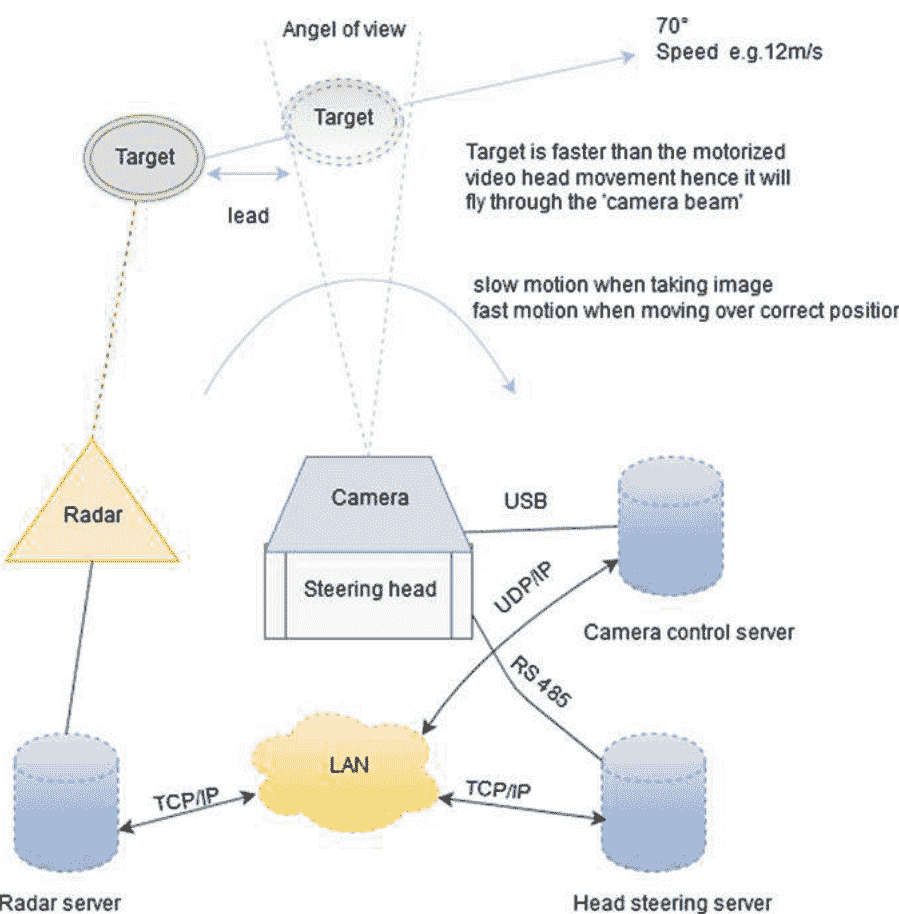

图 1 系统的硬件和将飞鸟捕捉到相机框架区域的原理

我们使用 Robin Radar Systems B.V. 提供的雷达系统，因为他们提供了能够检测鸟类的鸟类雷达系统。他们还有用于跟踪检测到的物体的算法（在脉冲之间）。我们使用的模型是 ROBIN 3D FLEX v1.6.3，实际上是两个雷达和一个软件包的组合，用于实现各种算法，如跟踪算法 [7]。

雷达的作用是检测飞行中的鸟类，并将目标鸟的 WGS84 坐标传递给视频云台控制软件。系统包括 2B Security Systems 的 PT-1020 中型电动云台。视频云台由 Pelco-D 控制协议 [8] 操作，并由我们开发了控制软件。系统使用具有 20.2 百万像素传感器的 Canon EOS 7D II 相机和 Canon EF 500/f4 IS 镜头。图像的正确对焦依赖于镜头和相机的自动对焦系统。还应用了自动曝光。相机由相机制造商的应用程序可编程接口（API）控制，并且我们开发了控制软件。此外，雷达系统提供了一些参数，可以应用于提高分类器的性能。这些参数是目标的三维距离（米），目标的速度（米/秒）和目标的轨迹（WGS84 坐标）。有关系统硬件的详细信息，请参阅 [9]。

### 3 相关工作

研究人员提出了一种多传感器数据融合方法，通过声学、红外相机和海洋雷达进行鸟类监测。其目标是通过观察鸟类和蝙蝠在迁徙期间的活动和行为，保护鸟类和蝙蝠，特别是那些濒危物种。该研究主要不针对物种级别的识别。他们通过一种基于模糊贝叶斯的多传感器数据融合方法来解决这个问题，以提供关于鸟类（鸟类和蝙蝠）监测目标活动的信息 [10]。

研究人员已经在雷达数据上实施了机器学习（ML）算法，用于鸟类物种分类。他们使用从葡萄牙的两个位置收集的数据，使用两个海洋雷达天线（体积搜索雷达 VSR 和高灵敏度接收 HSR）。测试了六种广泛使用的 ML 算法：随机森林（RF），支持向量机（SVM），人工神经网络，线性判别分析，二次判别分析和决策树（DT）。他们发现，所有算法在将鸟类与非生物目标（如车辆、雨水或风力涡轮机）分开时表现良好（接收器操作特性下的面积和准确度 > 0.80, P < 0.001），但是当它们对不同的鸟类功能组或鸟类物种（例如苍鹭与鸥类）进行分类时，算法的性能差异较大。在这项研究中，只有 RF 能够在所有分类任务中保持准确度 > 0.80，尽管 SVM 和 DT 也表现良好。所有算法正确分类了 86% 和 66%（分别为 VSR 和 HSR）的目标点，而所有算法错误分类的点仅占这些点的 2% 和 4%。结果表明，机器学习算法适用于雷达分类，将鸟类作为目标，从其他非生物目标中分离出来。这些算法在正确识别鸟类物种功能组之间的能力较弱 [11]。

时间间隔摄影是一种方法，其拍摄图像序列的帧率高于查看序列的帧率。时间间隔图像可以使微妙的与时间相关的过程变得明显，并且被分析的过程可能对人眼来说过快或过慢。时间间隔图像已被用于检测风电场周围的鸟类。使用摄像机的基于图像的检测已被应用于构建鸟类监测系统。该系统利用了在风电场周围收集的开放式时间间隔图像数据集。该系统应用了以下算法：AdaBoost、Haar-like、方向梯度直方图 (HOG) 和 CNN。AdaBoost 是一种基于特征选择和加权多数投票的二分类器。强分类器是许多弱分类器的加权和，得到的分类器是浅层但稳健的 [12]。Haar-like 是一种利用图像对比度的图像特征。它通过使用黑白图案提取对象的光和阴影 [13]。HOG 是用于抓取对象近似形状的特征。首先，它计算图像的空间梯度，并在每个局部区域（称为图像中的单元）中制作梯度的量化方向直方图。随后，它将相邻单元组（块）中的单元的直方图连接起来，并通过在每个块中除以其欧氏范数来进行归一化 [14]。检测的最佳方法是 Haar-like，分类的最佳方法是 CNN。该系统仅在两个鸟类功能组（鹰和乌鸦）上进行了测试，并且仅取得了中等性能 [15]。

## 4 数据

该应用程序的输入数据包括数字图像。用于训练卷积神经网络（CNN）的所有图像都是在不同的天气条件下手动拍摄的。该位置与将用于自动拍摄图像的相机安装位置相同。收集到的图像集被分为两个数据集：一个用于训练分类器的原始数据集，一个用于测量分类器的泛化能力的测试集，在训练过程中，分类器不会看到这些测试图像。两个数据集都被分为 14 个类别。在图像收集过程中，明显发现最稀有的鸟类图像数量较少，导致某些类别的数据示例非常少。因此，为了能够对最稀有的鸟类进行分类，所有收集到的图像都被包括在内，尽管结果数据集可能存在不平衡性。每个类别的图像数量分布被用作对测试区域鸟类实际分布的估计。这是因为图像是在四个季节和白天的所有时间段内收集的。从鸟类普查的角度来看，这个估计可能不太可靠，因为只考虑了通常与风力涡轮机大致相同高度飞行的鸟类物种，但在这两个应用程序的上下文中是足够的。

原始数据集中的图像总数为 24631，测试数据集中的图像数量为 439。测试数据集是通过随机选择所有类别的图像创建的。测试数据集中的图像数量遵循原始数据集的分布，从而反映了测试场地的实际分布。每个类别的原始数据集的类别标签和图像数量在表 1 中呈现。在这个表中，有三个类别在物种级别上没有定义：LNSP，SWSP 和 CATE。前两种情况是因为在这个背景下没有必要进一步区分潜鸟物种或天鹅物种，尽管测试区域中存在两种常见和两种罕见的潜鸟物种，类似地，天鹅也有两种常见和一种罕见的物种。第三种情况也适用于常见/北极燕鸥。此外，由于很难区分这两种燕鸥物种 [16]，因此考虑到收集所需时间，所需的数据示例（图像）数量可能太大。

表 1 原始数据集分为 14 个类别

| # 图像 | # 测试图像 | 类名 (英文) | 类名 (拉丁文) | 类标签 |
| :--- | :--- | :--- | :--- | :--- |
| 396 | 7 | 潜鸟物种 | *Gavia sp* | LNSP |
| 260 | 5 | 天鹅物种 | *Cygnus sp* | SWSP |
| 5612 | 100 | 大鸬鹚 | *Phalacrocorax carbo* | GRCO |
| 979 | 17 | 普通海鸭 | *Somateria mollissima* | COEI |
| 1164 | 21 | 普通金眼鸭 | *Bucephala clangula* | COGO |
| 236 | 4 | 天鹅绒海番鸭 | *Melanitta fusca* | VESC |
| 263 | 5 | 红胸秋沙鸭 | *Mergus serrator* | RBME |
| 2450 | 44 | 白尾海雕 | *Haliaeetus albicilla* | WTEA |
| 512 | 9 | 大黑背鸥 | *Larus marinus* | GBBG |
| 4053 | 72 | 银鸥 | *Larus argentatus* | HEGU |
| 1481 | 26 | 小黑背鸥 | *Larus fuscus fuscus* | LBBG |
| 3648 | 65 | 普通鸥 | *Larus canus* | COGU |
| 1803 | 32 | 红嘴鸥 | *Larus ridibundus* | BHGU |
| 1774 | 32 | 普通/北极燕鸥 | *Sterna hirundo/paradisaea* | CATE |

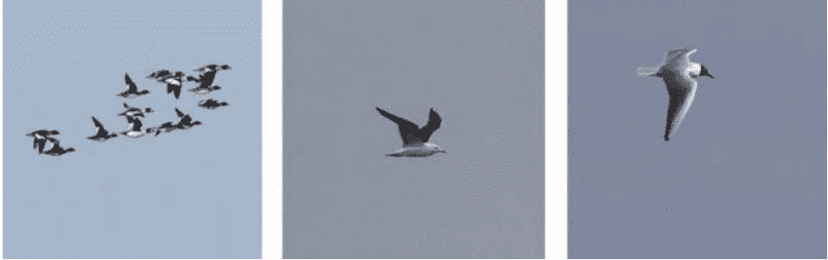

图 2 普通金眼鸭、黑头鸥和小黑背鸥的数据示例

ENP 取决于相机的传感器分辨率和镜头的焦距，如果传感器分辨率固定，选择一个长（以焦距计）的远摄镜头可以增加 ENP。另一个优点是不需要用大尺寸（以像素计）的图像来训练分类器。有关分割的更多细节，请参见 [9]。图 2 展示了原始数据集图像的示例。这个图中的第一张图说明图像中可能有多只鸟。测试区域中有一些物种习惯于紧密飞行，这种情况下，结果（以数据示例计）是一张包含多只鸟的图像。此外，这些鸟群中可能不止一种鸟类。紧密飞行的习惯对于某些鸟类的识别是一个重要特征 [17]。分割的结果是，当图像中有稀疏的鸟群时，只剩下一只鸟。在稀疏鸟群的情况下，保留离图像中心最近的鸟，因此当稀疏鸟群中有多种鸟类时，随机选择保留的鸟类。在紧密的群体情况下，识别是基于整个群体的，因此对群体中最多的鸟类有偏见。

#### 4.1 数据增强

数据增强应用于原始数据集。我们使用了自己的方法，根据步长将图像转换为各种色温。色温的下限和上限分别为 2000K 和 15000K。例如，如果 $s=50$（以 K 为单位），增强数据集的数据示例数量为 $(15000-2000)/50+1 \times 24631 = 6,453,322$。更多细节，请参见 [9]。除了颜色转换外，图像还会随机旋转一个在 -20° 和 20° 之间的角度，该角度是从均匀分布中抽取的。这样做的动机是 CNN 对小的平移是不变的，但对图像旋转不是 [18]。当 $s=50$ 和 $s=200$ 时，增强数据集中每个物种（类别）的图像数量分别在表 2 中呈现。图 3 呈现了增强算法的输出数据示例。原始图像输入到数据增强中，算法的色温为 5800 K，两个增强图像的色温分别为 3800 K 和 7800 K。

表 2 增强数据集中每个类别的图像数量

| 类别标签 | # 原始 | # s = 50 | # s = 200 |
| :--- | :--- | :--- | :--- |
| WTEA | 2450 | 641900 | 164150 |
| SWSP | 260 | 68120 | 17420 |
| LNSP | 396 | 103752 | 26532 |
| GRCO | 5612 | 1470344 | 376004 |
| COEI | 979 | 256498 | 65593 |
| COGO | 1164 | 304968 | 77988 |
| VESC | 236 | 61832 | 15812 |
| RBME | 263 | 68906 | 17621 |
| GBBG | 512 | 134144 | 34304 |
| HEGU | 4053 | 1061886 | 271551 |
| LBBG | 1481 | 388022 | 99227 |
| COGU | 3648 | 955776 | 244416 |
| BHGU | 1803 | 472386 | 120801 |
| CATE | 1774 | 464788 | 118858 |

#### 4.2 数据分组

我们在整个数据集上训练了第一个分类器模型，该数据集被分成与数据物种相同数量的类别。然而，有些类别更容易分离，有些类别更难分离（通过人眼评估），这导致了将那些在人眼看来相似的物种分组在一起的想法，因此我们在这方面的提议是分层的 [19]。在这种方法中，类别的数量在分类器层次结构的顶层上减少了，从而使数据集的可分性更好。组内的分类在级联中处理 [20]。图 4 展示了明显可分和弱可分类的示例。白尾海雕和疣鼻天鹅是明显可分的类的例子，而银鸥和普通鸥是弱可分的类的例子。

在分类器层次结构的顶层有四个组。其中两个组实际上是单一明显可分的物种：天鹅（在这里被视为单一物种）和白尾海雕。银鸥、燕鸥和水禽（包括潜鸟和普通鸬鹚）分别形成另外两个组。为了进行物种级别的分类，下面定义了更多的组。将类别划分为组的详细信息见表 3。原始数据集和两个增强数据集（$s=50$ 和 $s=200$）中每个组的图像数量见表 4。

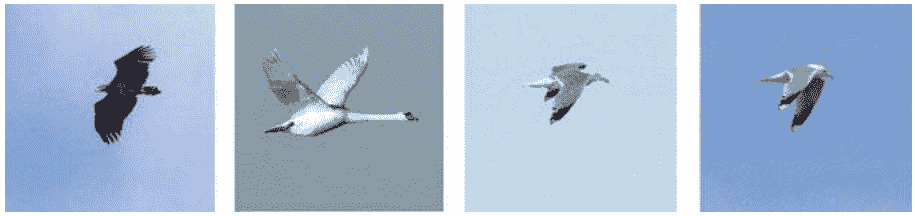

图 4 从左到右：白尾海雕和哑铃天鹅是明显可分离的类别的例子。银鸥和普通鸥是弱可分离类别的例子

表 3 将类别分成组

| 类标签 | 顶层 | 第二层 | 第三层 | 第四层 |
| :--- | :--- | :--- | :--- | :--- |
| WTEA | 白尾海雕 | – | – | – |
| SWSP | 天鹅 | – | – | – |
| LNSP | 水禽-1 | 水禽-2 | 水禽-2 | – |
| GRCO | 水禽-1 | 大鸬鹚 | – | – |
| COEI | 水禽-1 | 水禽-2 | 水禽-2 | – |
| COGO | 水禽-1 | 水禽-2 | 水禽-2 | – |
| VESC | 水禽-1 | 水禽-2 | 水禽-2 | – |
| RBME | 水禽-1 | 水禽-2 | 水禽-2 | – |
| GBBG | 鸥和燕鸥-1 | 鸥和燕鸥-2 | 黑背鸥 | GBBG |
| HEGU | 鸥和燕鸥-1 | 灰背鸥 | HEGU | – |
| LBBG | 鸥和燕鸥-1 | 鸥和燕鸥-2 | 黑背鸥 | LBBG |
| COGU | 鸥和燕鸥-1 | 灰背鸥 | COGU | – |
| BHGU | 鸥和燕鸥-1 | 鸥和燕鸥-2 | 黑头燕鸥 | BHGU |
| CATE | 鸥和燕鸥-1 | 鸥和燕鸥-2 | 黑头燕鸥 | CATE |

表 4 每个组的图像数量

| 组 | # 原始 | # s = 50 | # s = 200 |
| :--- | :--- | :--- | :--- |
| 白尾海雕 | 2450 | 641900 | 164150 |
| 天鹅 | 260 | 68120 | 17420 |
| 水禽-1 | 8387 | 2266300 | 579550 |
| 水禽-2 | 2775 | 795956 | 203546 |
| 鸥和燕鸥-1 | 13271 | 3477002 | 889157 |
| 鸥和燕鸥-2 | 5570 | 1459340 | 373190 |
| 灰背鸥 | 7701 | 2017662 | 515967 |
| 黑头燕鸥 | 3577 | 937174 | 239659 |
| 黑背鸥 | 1993 | 522166 | 118858 |

## 5 分类

此应用中的所有分类器共享相同的 CNN 模型，如图 5 所示。只有输出神经元的数量根据类别的数量而变化。该模型有三个卷积层，每个卷积层后面都跟着一个修正线性单元 (ReLU) 层，前两个卷积层后面还跟着一个交叉通道归一化层 (局部响应归一化, LRN)。使用 LRN 的原因是它有助于泛化，因为它的功能可以看作是亮度归一化 [2]。有两个最大池化层，第一个在第三个卷积层之前，第二个在第一个全连接层之前。在第二个卷积层之前没有最大池化层。这是因为 ENP 很小，因此通过省略最大池化层，第一个卷积层检测到的所有最细的边缘都会传递到第二个卷积层。架构由三个全连接层完成。前两个全连接层后面都跟着 dropout 层，每个 dropout 层后面都跟着 ReLU。dropout 是通过以 0.5 的概率随机将层的输出神经元设置为零来实现的。

架构最后由 softmax 激活函数终止，使用交叉熵损失函数 [21] 产生类别标签的分布。在将输入图像馈送到网络之前，对其进行归一化 and 零中心化处理。应用了具有小批量训练和监督模式以及带有动量的随机梯度下降 [21-24] 的 CNN。还应用了 L2 正则化（权重衰减）方法来减少过拟合 [21, 24, 25]。由于计算资源有限，我们将网络大小（自由参数）保持较小。因此，总共提取了 92 个特征图，这些特征图由卷积层提取，卷积核尺寸分别为 [12 × 12 × 3] × 12、[3 × 3 × 12] × 16 和 [3 × 3 × 16] × 64。权重的总数约为 $9.47 \times 10^6$。

每个分类器输入的图像尺寸为 $200 \times 200$ 像素。在第一个卷积层中，这个图像尺寸产生了 $(200 - 12 + 2 \times 1)/2 + 1 = 96$ 个正方形特征图，即每个特征图中有 $96 \times 96 = 9216$ 个神经元。每个卷积层和最大池化层的滤波器尺寸、特征图数量、特征图尺寸、步长和填充在表 5 中给出。对于每个滤波器，图 5 显示了特征图的数量，表示为三元组 [a, b, c]。


图 5 每个分类器的 CNN 模型

表 5 CNN 模型的卷积层和最大池化层的参数

| 层 | 滤波器 | # 特征图 | 特征图大小 | 步长 | 填充 |
| :--- | :--- | :--- | :--- | :--- | :--- |
| 卷积 1 | 12 × 12 | 12 | 96 × 96 | [2 2] | [1 1] |
| 卷积 2 | 3 × 3 | 16 | 96 × 96 | [1 1] | [1 1] |
| 最大池化 1 | 2 × 2 | 16 | 48 × 48 | [2 2] | [0 0] |
| 卷积 3 | 3 × 3 | 64 | 48 × 48 | [1 1] | [1 1] |
| 最大池化 2 | 2 × 2 | 64 | 24 × 24 | [2 2] | [0 0] |

#### 5.1 超参数选择

我们将数据集分为训练集和验证集，比例分别为 $70\%$ 和 $30\%$。我们使用手动调整来选择迭代次数。所有层的初始权重从均值为 0、标准差为 0.01 的高斯分布中抽取。初始偏置设置为零。L2 值设置为 0.0005，小批量大小设置为 128。

#### 5.2 特征提取

三个卷积层被设计用来从训练图像中检测空间分布的特征。通常的离散特征是鸟的形状和一般的颜色。ReLU（引入非线性）层和最大池化（增加空间不变性）层分别在第二和第三个卷积层之后，可以看作是对检测到的特征的改进，因为它们具有修正和降采样的特性。

这些层的修正和降采样特性。图6和图7分别展示了CNN提取的LBBG和GBBG类别的特征。这些特征图来自第二个卷积层。图中每16个特征图对应一个帧。这些图像已经归一化，所以最小权重为0，最大权重为1，即最小的负权重已经变成了零（黑色）。中灰色（0.5）表示图像中对特征的最小贡献区域，最黑或最白的区域表示对特征的最大贡献。纯灰色或几乎如此的特征图表示在这些图中没有找到显著的特征。这些特征图显示CNN能够在鸟类羽毛的相关区域给予较大的权重，这对于物种识别是重要的。这些区域主要是：翅膀尖端、脚和嘴，这两对鸥类物种。由于飞行的海鸥通常隐藏了它们的脚，由于羽毛的遮挡，它们的下侧在图像中并不总是可见，因此这个特征的使用较少。

这使得我们只能依靠嘴巴和翅膀尖来进行识别，由于嘴巴颜色和结构的差异只是微小的，最重要的识别点是翅膀尖。大黑背鸥和小黑背鸥的上翅颜色也有轻微差异，但这并不总是导致卷积神经网络对这些区域产生更大的权重，至少不够大，因为大黑背鸥的图像甚至被错误地分类为银鸥。然而，上翅颜色是区分灰背鸥和黑背鸥的关键特征 [26]。

图6 卷积神经网络模型对LBBG类别的特征提取可视化。图中提取了第二个卷积层的16个特征图。

图7 卷积神经网络模型对GBBG类别的特征提取可视化。图中提取了第二个卷积层的16个特征图。

### 表6 第二个修改后的原始CNN模型的滤波器尺寸

| 层 | 滤波器 | # 特征图 | 特征图大小 | 步长 | 填充 |
| :--- | :--- | :--- | :--- | :--- | :--- |
| 卷积1 | 12 × 12 | 12 | 96 × 96 | [2 2] | [1 1] |
| 卷积2 | 7 × 7 | 16 | 90 × 90 | [1 1] | [0 0] |
| 卷积3 | 5 × 5 | 32 | 86 × 86 | [1 1] | [0 0] |
| 卷积4 | 4 × 4 | 64 | 40 × 40 | [1 1] | [0 0] |
| 卷积5 | 3 × 3 | 128 | 18 × 18 | [1 1] | [0 0] |

## 5.3 更深的CNN模型的测试

在开发这个算法的过程中，很明显，在分类方面的挑战在于海鸥和燕鸥-I这一组，特别是在灰背鸥和黑背鸥这两组中。考虑到CNN模型，提高性能的第一选择应该是更深的模型，即更多的卷积层。我们通过添加第四个卷积层，然后是ReLU和最大池化层，对原始模型进行了修改。这个模型在第四个卷积层中有128个滤波器，滤波器尺寸为[5 × 5]。第一个修改后的模型在黑背鸥这一组上进行了测试，但它未能提高原始CNN模型的性能。

然后我们通过添加第五个卷积层，再次跟随ReLU和最大池化层，测试了更深的模型。在这种情况下，为了在架构的输出处有足够数量的神经元，我们移除了原始模型中第三个卷积层之前的最大池化层。我们还修改了第二个修改后的模型的滤波器尺寸。修改后的滤波器尺寸如表6所示。第二个修改后的模型末尾的两个新的最大池化层的滤波器尺寸分别为[2 2]。当这个模型在黑背鸥这一组上进行测试时，结果与第一个修改后的模型相同，即在真阳性率（TPR）方面没有比原始CNN模型表现更好。两个测试分类器都是在增强集上进行训练的，只使用了黑背鸥这一组的图像，其中 $s = 50$。

#### 5.4 处理不平衡数据

如果我们想要识别（分类）测试区域中出现的所有物种，我们必须接受训练数据集的不平衡，因为最稀缺物种的训练样本数量较少。然而，有一些方法可以用于处理不平衡数据集。自然而然，第一选择是将更多数据收集到训练数据集中，但在我们的情况下，这并不是一个非常现实的选择。

重新采样是一种易于实施且运行速度快的方法。这意味着将数据示例的副本添加到少数类别中，即过采样，或者从多数类别中删除数据示例，即欠采样 [11]。然而，我们已经增加了原始数据集（重新采样是未使用）与 $s = 50$ 一起使用，并在增强的数据集上训练了一个参考分类器。混合模型（分层和级联模型的组合）在分组数据集上训练的性能结果与该参考分类器进行了比较。分组数据集也使用 $s = 50$ 进行增强，两个数据集都不平衡。

原始数据集中 13 个类别的类别不平衡比（即每个类别中图像数量与图像数量最多的类别之间的比率）舍入到最近的整数，在表7中给出。图像数量最多的类别是 GRCO，该类别在表中被省略。从表中可以看出，几个类别和类别 GRCO 之间存在严重的不平衡。另一个参考分类器是在平衡数据集上训练的。该数据集是通过欠采样方法创建的，因此原始数据集使用 $s = 50$ 进行增强，然后从每个类别中随机选择了 $236 \times 262 = 61832$ 个图像，除了 VESC 类别，该类别的所有图像都被选择了，因为该类别具有最少的数据示例。

### 表7 13个类别相对于图像数量最多的类别的不平衡比率 (GRCO)

| 类标签 | 比率 |
| :--- | :--- |
| WTEA | 1:2 |
| SWSP | 1:22 |
| LOSP | 1:14 |
| COEI | 1:6 |
| COGO | 1:5 |
| VESC | 1:24 |
| RBME | 1:21 |
| GBBG | 1:11 |
| HEGU | 1:1 |
| LBBG | 1:4 |
| COGU | 1:2 |
| BHGU | 1:3 |
| CATE | 1:3 |

选择适合的性能度量指标对于在不平衡数据集上训练的分类器非常重要。我们使用混淆矩阵作为比较分类器的工具。精确度（分类器准确性的度量）和召回率（分类器完整性的度量，也称为真阳性率）是从混淆矩阵中计算得出的度量指标。接收者操作特征曲线（ROC 曲线）和预测的直方图是用于确定不同分类器在分组数据集上的阈值的工具。直方图展示了一个分类器在测试数据集上的预测结果，这个数据集分类器从未见过。因此，直方图显示了一个分类器在一个类别上的预测分布，通过展示落入每个区间的预测概率的数量。直方图中始终只有两个类别：正类别（红色）和负类别（蓝色）。如果需要对多于两个类别使用直方图，则将其中一个类别视为正类别，其他类别合并为一个类别形成负类。对于所有的直方图，x轴是概率，y轴是每个区间中的命中次数。y轴的范围从零到直方图中单个区间命中的最大概率。区间的数量始终设置为10，因此区间宽度为0.1。

#### 5.5 分层和级联模型的混合

为了提高分类算法的性能，相比于单个CNN分类器，我们可以使用不止一个分类器，并将数据集分成适当的组，这在第 4.2 节中完成。已经在分组数据集上训练了八个分类器。这些分类器形成了一个层次结构，用于对原始数据集进行分类。这种架构也可以看作是分层和级联模型之间的混合。该架构如图8所示。层次结构中的分类器级别，它所训练的数据集（组）以及每个分类器的类别数量在表8中给出。

最初的想法只是使用级联分类器模型，以便通过数据集的分布确定最常见的物种，并在第一个分类器中过滤出（分类）它们。第二常见的物种将在第二个分类器中被过滤掉，依此类推。然而，早期的测试结果显示，如果那些具有更好可分性的类别在单个分类器中进行分类，性能上并没有显著差异。此外，级联方法会导致需要训练相对较多的分类器，从而增加训练时间。尽管如此，级联模型仍然被应用于一些群体，特别是那些可分性较弱的鸥类和燕鸥类群体。对于测试图像，分类器的预测是 softmax 层的向量输出，它被给出为：

$$P = [p_1, p_2, \dots, p_n], \eqno(1)$$

其中 $p_i$ 是分类结果中类别的概率，$n$ 是类别的数量。类别按照字母顺序排列。阈值应用如下：

$$c_i = \begin{cases} 1, & \text{if } p_i > threshold_i, \\ 0, & \text{否则,} \end{cases} \eqno(2)$$
$$C = [c_1, c_2, \dots, c_n], \eqno(3)$$

其中 $p_i$ 与 $P$ 向量 (1) 中的一样，$threshold_i$ 是类别 $i$ 的阈值。根据公式 (2) 和 (3) 的结果，$C$ 向量中将只有一个元素 $c_i$ 变为一，其他元素变为零。根据变为一的元素的索引找到类别标签：

$$j = \arg \max_j(\mathbf{C}), \quad (4)$$

其中 $j$ 是预测类别的索引。

图8 分类器的层次结构

### 表8 用于混合模型的分类器

| 分类器 | 级别 | 数据集（组） | 类别数 |
| :--- | :--- | :--- | :--- |
| 1 | 1 | WTEA, SWSP, 水禽-1, 鸥类和燕鸥-1 | 4 |
| 2 | 2 | 鸬鹚, 水禽-2 | 2 |
| 3 | 2 | 灰背鸥, 鸥类和燕鸥-2 | 2 |
| 4 | 3 | 水禽-2 | 5 |
| 5 | 3 | 黑头燕鸥, 黑背鸥 | 2 |
| 6 | 3 | HEGU, COGU | 2 |
| 7 | 4 | BHGU, CATE | 2 |
| 8 | 4 | LBBG, GBBG | 2 |

#### 5.6 顶层分类

顶层分类器在TPR方面最重要，因为可能的错误分类将在后续层次中重复出现。该分类器处理以下组：天鹅，水禽-1，白尾海雕和鸥类和燕鸥-1。顶层组的类别不平衡比率（四舍五入到最近的整数）列在表9中。考虑到环境许可要求，将白尾海雕组和鸥类和燕鸥-1组的假阴性（FN，将正类别的数据示例错误分类为负类别）数量保持在尽可能低的水平，最好为零，非常重要。

图9和图10分别说明了选择白尾海雕组和鸥类和燕鸥-1组的可能阈值。这些直方图是由顶层分类器（也称为主分类器）的预测结果形成的，因此分别在同一图中绘制了正类别和负类别的直方图。基于直方图计算等效ROC曲线，从中计算TPR和误报率（FPR）。白尾海雕组和鸥类和燕鸥-1组的ROC曲线分别显示在图11和图12中。白尾海雕组的直方图和ROC曲线都表明该组别是明显可分的，因此很容易选择一个合适的阈值以实现完美分类。

### 表格 9 最高级别组与图像数量最多的组之间的不平衡比率（海鸥和燕鸥-1）

| 类标签 | 比率 |
| :--- | :--- |
| 白尾海雕 | 1:5 |
| 天鹅 | 1:51 |
| 水禽-1 | 1:2 |

图 9 白尾海雕组的直方图
图 10 海鸥和燕鸥-1组的直方图

通常，可以从直方图中读取两个概率值，并用作阈值：正类的最低概率值（LPPC）和负类的最高概率值（HPNC）。对于白尾海雕组来说，这两个概率值没有重叠，因此这个类别是明显可分的。阈值可以在0.8和0.9之间任意设置，以完美地对这个类别进行分类。所有真正例（TP，一个来自正类的数据示例被正确分类）将被正确分类，不会有假阳性（FP，一个被错误分类为正类的负类数据示例），也不会有假阴性（FN）。由于白尾海雕群实际上只包含这一种鸟类，这也意味着该分类器能够根据环境许可证对白尾海雕进行分类。

图 11 白尾海雕组的ROC曲线
图 12 群体海鸥和燕鸥-1的ROC曲线

对于海鸥和燕鸥-I群体，LPPC和HPNC重叠。有两个负类的数据示例的概率在0.9和1之间，而所有正类的概率都落在同一个区间内。直方图无法读取区间内的概率，但绘图软件 (MatLab) 也会打印出确切的概率值。海鸥和燕鸥-I群体的LPPC和HPNC分别为0.9000和0.9643。如果我们选择0.9作为阈值，将会有两个FP，但如果我们选择0.9643作为阈值，将不会有FP，也不会有FN。在这种情况下，FN的数量最重要，因为小黑背鸥属于海鸥和燕鸥-I群体，并且在环境许可证中特别考虑到它，所以我们不能冒将一只海鸥误分类为层次结构的顶层的风险。

因此，我们必须选择0.9643作为阈值。表10显示了顶级组的应用阈值。白尾海雕群的阈值设置为0.7415，因为这是绘图软件打印的精确值。测试数据集中的一张大鸨图像被错误地分类为白尾海雕，这导致白尾海雕的FP数为1，群体水禽-1的FN数为1。这是可接受的错误率，因为没有漏掉任何白尾海雕。算法1描述了顶级分类过程。该算法还定义了一个新的伪类，这意味着该类在数据集中不存在，但在主分类器无法正确分类测试图像时使用。因此，它使得可以定义一个未识别的鸟类（UNBI）类，而无需明确将其包含在现实世界的类别中。

```text
Algorithm 1: Classification on the top level.
---
Data: A test image
Result: Classification of the test image
image = zeroCentering(testImage);
TopLevelPrediction = classify(PrimaryClassifier, image);
if TopLevelPrediction > thresholdWhiteTailedEagle then
| return WTEA; // the white-tailed eagle
else if TopLevelPrediction > thresholdSwans then
| return SWSP; // swan species
else if TopLevelPrediction > thresholdGullsAndTerns then
| // Classification for gull and tern species continues in Algorithm 3
else if TopLevelPrediction > thresholdWaterfowl then
| // Classification for waterfowl species continues in Algorithm 2
else
| return UNBI; // a pseudo-class for unidentified bird species
end
---
```

### 表10 顶级组的阈值

| 组 | 阈值 | # 假阴性 | # 假阳性 |
| :--- | :--- | :--- | :--- |
| 白尾海雕 | 0.7415 | 0 | 1 |
| 天鹅 | 0.7000 | 0 | 0 |
| 水禽-1 | 0.0083 | 1 | 0 |
| 鸥和燕鸥-I | 0.9643 | 0 | 0 |

## 5.7 水禽的分类

水禽被分类在层次结构的第二级，因此有两个分类器级联。第一个分类器过滤掉最常见的类别 GRCO，所有其他的水禽都在第二个分类器中分类。第一个分类器的阈值在表11中给出。这些阈值应用后，有一个FN和一个FP。被错误分类的类别是 GRCO，它是鸬鹚类中唯一的类别。水禽-2组的阈值在表12中给出。除了 LOSP 类别明显可分离外，所有其他类别都有一个FN。算法2展示了水禽两个组的分类过程。算法中定义了两个新的伪类别：未识别的水禽（UNWF）和未识别的小型水禽（UNSW）。

```text
Algorithm 2: Classification for the waterfowl groups.
Data: Image from the top level classifier in Algorithm 1, when TopLevelPrediction > thresholdWaterfowl
Result: Classification of the test image
predictionWF1 = classify(classifier_3.1, image);
if predictionWF1 > thresholdCormorant then
   return GRCO; // the great cormorant
else if predictionWF1 > thresholdWF2 then
   predictionWF2 = classify(classifier_3.2, image); 
   if predictionWF2 > thresholdLoons then
      return LOSP; // loon species
   else if predictionWF2 > thresholdGoldeneye then
      return COGO; // the common goldeneye
   else if predictionWF2 > thresholdEider then
      return COEI; // the common eider
   else if predictionWF2 > thresholdMerganser then
      return RBME; // the red-breasted merganser
   else if predictionWF2 > thresholdScoter then
      return VESC; // the velvet scoter
   else
      return UNSW; // a pseudo-class for small unidentified waterfowl
   end
else
   return UNWF; // a pseudo-class for unidentified waterfowl
end
```

### 表11 群体水禽-1的阈值

| 类别标签 | 阈值 | # 假阴性 | # 假阳性 |
| :--- | :--- | :--- | :--- |
| 鸬鹚 | 0.2627 | 1 | 0 |
| 水禽-2 | 0.7000 | 0 | 1 |

## 表12 群体水禽-2的阈值

| 类标签 | 阈值 | # 假阴性 | # 假阳性 |
| :--- | :--- | :--- | :--- |
| LOSP | 0.0402 | 0 | 0 |
| COEI | 0.9909 | 1 | 0 |
| COGO | 0.0120 | 1 | 0 |
| VESC | 0.8810 | 1 | 0 |
| RBME | 0.9831 | 1 | 0 |

## 表13 鸥类和燕鸥较大测试数据集中的图像数量

| 一对群体 | 正类别数 | 负类别数 |
| :--- | :--- | :--- |
| {灰背鸥，鸥类和燕鸥-2} | 174 | 126 |
| {黑头燕鸥，黑背鸥} | 192 | 108 |
| {HEGU, COGU} | 92 | 82 |
| {BHGU, CATE} | 97 | 95 |
| {LBBG, GBBG} | 80 | 28 |

#### 5.8 鸥类和燕鸥的分类

鸥类和燕鸥在级联分类器的第二和第三级别中进行分类。我们使用了一个更大的测试数据集，其中包含更多鸥类和燕鸥的图像，这是因为原始数据集中最稀缺的类别不包含在这些群体中。通过这种方式，我们获得了更稳健的阈值，尽管保留了原始分布，测试数据集仍然只包含分类器从未见过的图像。这些数据集中的图像数量见表13。在该表中，从左侧开始，一对群体或类别位于第一列，因此首先提到正类别。接下来的两列分别是正类别和负类别的图像数量。

我们可以从表中计算出，大多数层次结构（物种层次）的类别不平衡比例几乎是平衡的。对于{LBBG, GBBG}这对组合来说，它是唯一一个类别不平衡比例为1:3的显著异常，而且由于这对组合的可分离性最差，所以在TPR方面预计分类结果会很差。

在第二层中，最常见的组合是灰背鸥，首先从鸥类和燕鸥类-2的组合中过滤出来，然后依次过滤出黑头燕鸥组合。最后，只剩下黑背鸥组合。图13显示了灰背鸥组合的直方图。从直方图中可以明显看出，正类（灰背鸥）和负类（鸥类和燕鸥类-2）的分布重叠，并且在选择适当的阈值时必须考虑环境许可的条件。阈值有两个选择：0.6000（一个FP）和0.7590（两个FN）。尽管这意味着层次结构的整体性能较弱，但我们必须选择0.7590。

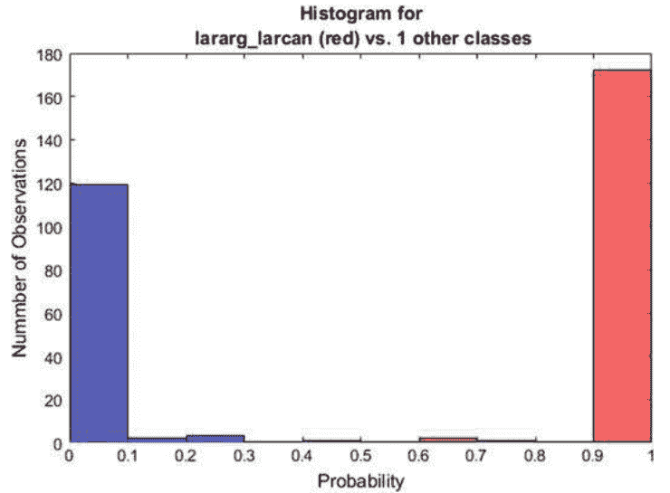
图13 群体灰背鸥的直方图

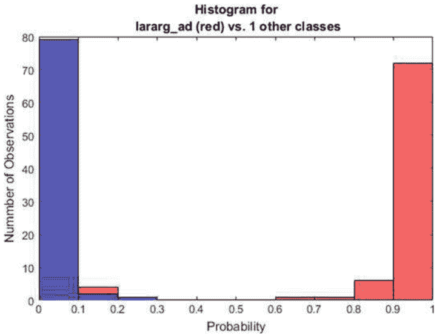
图14 类别HEGU (银鸥) 的直方图

这是因为我们不希望类别LBBG的任何成员在第二级上被错误分类。应用此阈值的结果是，将有两个属于群体灰背鸥的图像被错误分类为鸥类和燕鸥类-2。

物种级别的分类是在层次分类器的第四级 (灰背鸥的第三级) 达到的。这包括具有最弱可分性的类别对: {HEGU, COGU}和{LBBG, GBBG}。正类和负类分布的重叠在图14和图15中有所说明。

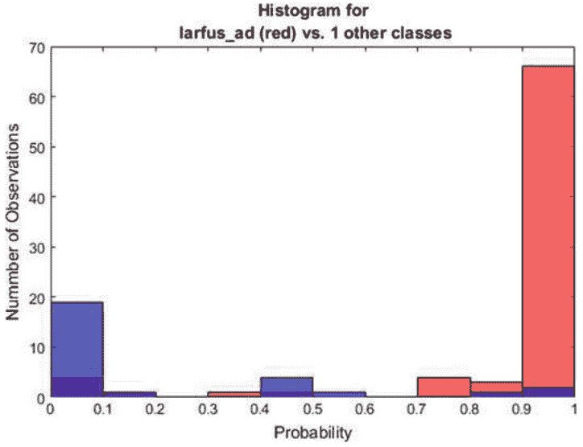
图15 类别LBBG（小黑背鸥）的直方图

在图14中，HEGU类是正类，COGU类是负类。在图15中，LBBG类是正类，GBBG类是负类。从分类器性能角度来看，将HEGU与COGU分开的最佳阈值为0.2134。这意味着没有FP，但有11个FN，即11张银鸥的图像将被错误分类为普通鸥。由于所选阈值，对于{BHGU，CATE}这一对的分类是直接的，其FN和FP的数量都为零。请参见表14，了解鸥类和燕鸥类的阈值。对于LBBG类的阈值，最佳选项是0.9993，当FN的数量为12时。

算法3展示了鸥类和燕鸥类-1的分类过程。在此算法中，定义了五个新的伪类：灰背鸥（GBGU，可能是银鸥或普通鸥），黑头燕鸥（BHTE，可能是黑头鸥或燕鸥物种），黑背鸥（BBGU，可能是小黑背鸥或大黑背鸥），非灰背鸥（NGGU，可能是BHTE或BBGU），未识别的鸥或燕鸥（UNGU）。

## 表14 应用于鸥类和燕鸥类群体的阈值

| 类标签 | 阈值 | # 假阴性 | # 假阳性 |
| :--- | :--- | :--- | :--- |
| {灰背鸥，鸥和燕鸥-2} | 0.7590 | 2 | 0 |
| {黑头燕鸥，黑背鸥} | 0.2524 | 0 | 0 |
| {HEGU, COGU} | 0.2134 | 11 | 0 |
| {BHGU, CATE} | 0.8124 | 0 | 0 |
| {LBBG, GBBG} | 0.9993 | 12 | 0 |

## 6 结果

通过泛化来观察比较分类器的结果。层次和级联模型的混合实现了0.9460的平均性能（TPR）。参考分类器的平均TPR如下：对于不平衡参考分类器（IMBRC），为0.8195；对于平衡参考分类器（BRC），为0.8307。混合模型的总误分类数为16。

参考分类器的误分类数，IMBRC为45，BRC为71。混合模型的平均精度为0.9619。IMBRC的平均精度为0.8809，BRC为0.7919。表15给出了顶层群体和LBBG类别的TPR。参考分类器是在未分组的类别上训练的，因此群体的TPR是由群体包含的类别的数量的平均值计算得出的。

顶级组的混淆矩阵在表16中给出。这个混淆矩阵还包括伪类UNBI。自然地，伪类的TP数为零，因为这些类只定义了分类器的失败。

类的混淆矩阵分为两部分给出，因为它太大了，无法适应页面。表17展示了混淆矩阵的第一部分，包括水禽-1组，即类别：LOSP, GRCO, COEI, COGO, VESC和RBME。这个混淆矩阵还包括伪类：UNSW和UNWF。水禽混淆矩阵中呈现了GRCO的一个测试图像，因此GRCO类的测试图像数量为99。

表18展示了混淆矩阵的第二部分，包括鸥类和燕鸥类-1组（类别：GBBG, HEGU, LBBG, COGU, BHGU和CATE）。为了节省空间，并且因为没有任何一个鸥类和燕鸥类-1的子组的图像被错误分类为这些伪类，算法3定义的五个伪类被省略。

### 表15 混合模型和参考分类器的真阳性率

| 分类器 | WTEA | SWSP | 水禽-1 | 鸥和燕鸥-1 | LBBG |
| --- | --- | --- | --- | --- | --- |
| 混合 | 1 | 1 | 0.9935 | 1 | 0.9231 |
| 不平衡参考 | 0.9773 | 0.4000 | 0.7629 | 0.7691 | 0.6923 |
| 平衡参考 | 1 | 0.8000 | 0.8621 | 0.7762 | 0.8846 |

### 表16 层次结构顶层组的混淆矩阵

| | WTEA | SWSP | 水禽-1 | 鸥类和燕鸥类-1 | UNBI |
| --- | --- | --- | --- | --- | --- |
| WTEA | 44 | 0 | 0 | 0 | 0 |
| SWSP | 0 | 5 | 0 | 0 | 0 |
| 水禽-1 | 1 | 0 | 153 | 0 | 0 |
| 鸥和燕鸥类-1 | 0 | 0 | 0 | 236 | 0 |
| UNBI | 0 | 0 | 0 | 0 | 0 |

```
Algorithm 3: Classification for the group gulls-and-terns.
Data: Image from the top level classifier in Algorithm 1, when TopLevelPrediction > thresholdGullsAndTerns
Result: Classification of the test image
predictionGullsTerns = classify(classifier_4.1, image);
if predictionGullsTerns > thresholdGrayGulls then
    predictionHerringCommon = classify(classifier_4.1.1, image);
    if predictionHerringCommon > thresholdHerring then
        return HEGU; // the herring gull
    else if predictionHerringCommon > thresholdCommon then
        return COGU; // the common gull
    else
        return GBGU; // a pseudo-class for a 'gray-backed gull' i.e.,
            either the herring gull or the common gull
    end
else if predictionGullsTerns > thresholdGullsTerns2 then
    predictionGullsTerns2 = classify(classifier_4.2, image);
    if predictionGullsTerns2 > thresholdBlackHeaded then
        predictionBlackHeaded = classify(classifier_4.2.1, image);
        if predictionBlackHeaded > thresholdBHGU then
            return BHGU; // the black-headed gull
        else if predictionBlackHeaded > thresholdCATE then
            return CATE; // the common/arctic tern
        else
            return BHTE; // a pseudo-class for either the black-headed
                gull or tern species
        end
    else if predictionGullsTerns2 > thresholdBlackBacked then
        predictionBlackBacked= classify(classifier_4.3, image);
        if predictionBlackHeaded > thresholdLBBG then
            return LBBG; // the lesser black-backed gull
        else if predictionBlackHeaded > thresholdGBBG then
            return GBBG; // the great black-backed gull
        else
            return BBGU; // a pseudo-class for either the lesser
                black-backed of the great black-backed gull
        end
    else
        return NGGU; // a pseudo-class for 'non-gray-backed gull'
    end
else
    return UNGU; // a pseudo-class for unidentified gull or tern species
end
```

由于测试数据集中的图像数量为439，我们必须将这个数字分配给三个混淆矩阵。第一个混淆矩阵是针对所有439个图像的，但是因为类别WTEA和SWSP只出现在这个混淆矩阵中，所以在其他两个混淆矩阵中的测试图像数量之和为439 - 50 = 389。第二个混淆矩阵展示了153个测试图像的结果，第三个混淆矩阵展示了236个测试图像的结果，所以总共有153 + 236 = 389个测试图像。

IMBRC的混淆矩阵分别在两个表格中给出：表19和表20。类别WTEA在两个表格中都包含，因为这两个表格中都有假阳性和/或假阴性。然而，类别WTEA的真阳性数量只有给出现在第一张表中。当测试参考分类器时，使用了与混合模型相同的测试数据集。总共有439张图像，再次分成两个表。第一张表涵盖了197张测试图像，第二张表涵盖了242张测试图像。

BRC的混淆矩阵也分别在表21和表22中给出。在第二个混淆矩阵中，WTEA类别没有假阳性或假阴性，因此可以从该表中省略该类别。

修改后的CNN模型与原始CNN模型相比的结果在表23中给出。这三个模型都是在相同的增强数据上进行训练的。

### 表17 混淆矩阵用于群体的类别水禽-1

| | LOSP | GRCO | COEI | COGO | VESC | RBME | UNSW | UNWF |
|---|---|---|---|---|---|---|---|---|
| LOSP | 7 | 0 | 0 | 0 | 0 | 0 | 0 | 0 |
| GRCO | 0 | 98 | 0 | 1 | 0 | 0 | 0 | 0 |
| COEI | 0 | 0 | 16 | 0 | 0 | 0 | 1 | 0 |
| COGO | 0 | 0 | 0 | 19 | 0 | 1 | 1 | 0 |
| VESC | 0 | 0 | 0 | 0 | 3 | 0 | 1 | 0 |
| RBME | 0 | 0 | 0 | 0 | 0 | 4 | 1 | 0 |
| UNSW | 0 | 0 | 0 | 0 | 0 | 0 | 0 | 0 |
| UNWF | 0 | 0 | 0 | 0 | 0 | 0 | 0 | 0 |

### 表18 混淆矩阵用于群体的类别鸥类和燕鸥-1

| | GBBG | HEGU | LBBG | COGU | BHGU | CATE |
|---|---|---|---|---|---|---|
| GBBG | 4 | 1 | 4 | 0 | 0 | 0 |
| HEGU | 0 | 66 | 0 | 6 | 0 | 0 |
| LBBG | 0 | 0 | 26 | 0 | 0 | 0 |
| COGU | 0 | 1 | 0 | 64 | 0 | 0 |
| BHGU | 0 | 0 | 0 | 0 | 32 | 0 |
| CATE | 0 | 0 | 0 | 1 | 0 | 31 |

### 表19 混淆矩阵用于不平衡的参考分类器，第一部分

| | WTEA | LOSP | GRCO | COEI | COGO | VESC | RBME |
|---|---|---|---|---|---|---|---|
| WTEA | 43 | 0 | 0 | 0 | 0 | 0 | 0 |
| LOSP | 0 | 6 | 0 | 0 | 1 | 0 | 0 |
| GRCO | 2 | 0 | 97 | 0 | 1 | 0 | 0 |
| COEI | 0 | 0 | 0 | 17 | 0 | 0 | 0 |
| COGO | 1 | 0 | 0 | 1 | 19 | 0 | 0 |
| VESC | 0 | 0 | 0 | 1 | 0 | 3 | 0 |
| RBME | 0 | 0 | 0 | 0 | 0 | 0 | 5 |

### 表20 不平衡参考分类器的混淆矩阵，第二部分

| | WTEA | SWSP | GBBG | HEGU | LBBG | COGU | BHGU | CATE |
| :--- | :--- | :--- | :--- | :--- | :--- | :--- | :--- | :--- |
| WTEA | – | 0 | 0 | 0 | 0 | 1 | 0 | 0 |
| SWSP | 0 | 2 | 0 | 2 | 0 | 1 | 0 | 0 |
| GBBG | 1 | 0 | 3 | 2 | 2 | 1 | 0 | 0 |
| HEGU | 1 | 0 | 0 | 67 | 0 | 4 | 0 | 0 |
| LBBG | 0 | 0 | 4 | 2 | 18 | 1 | 1 | 0 |
| COGU | 0 | 1 | 0 | 8 | 0 | 56 | 0 | 0 |
| BHGU | 0 | 0 | 0 | 0 | 1 | 0 | 30 | 1 |
| CATE | 0 | 0 | 0 | 1 | 0 | 1 | 3 | 27 |

### 表21 平衡参考分类器的混淆矩阵，第一部分

| | WTEA | LOSP | GRCO | COEI | COGO | VESC | RBME |
| :--- | :--- | :--- | :--- | :--- | :--- | :--- | :--- |
| WTEA | 44 | 0 | 0 | 0 | 0 | 0 | 0 |
| LOSP | 0 | 6 | 0 | 0 | 1 | 0 | 0 |
| GRCO | 4 | 1 | 91 | 1 | 1 | 2 | 0 |
| COEI | 0 | 0 | 0 | 16 | 0 | 1 | 0 |
| COGO | 0 | 0 | 2 | 1 | 15 | 2 | 1 |
| VESC | 0 | 0 | 0 | 1 | 0 | 3 | 0 |
| RBME | 0 | 0 | 0 | 0 | 0 | 0 | 5 |

### 表22 平衡参考分类器的混淆矩阵，第二部分

| | SWSP | GBBG | HEGU | LBBG | COGU | BHGU | CATE |
| :--- | :--- | :--- | :--- | :--- | :--- | :--- | :--- |
| SWSP | 4 | 0 | 0 | 0 | 1 | 0 | 0 |
| GBBG | 0 | 5 | 0 | 4 | 0 | 0 | 0 |
| HEGU | 1 | 0 | 48 | 4 | 18 | 0 | 1 |
| LBBG | 0 | 2 | 0 | 23 | 0 | 1 | 0 |
| COGU | 0 | 1 | 10 | 1 | 52 | 1 | 0 |
| BHGU | 0 | 0 | 0 | 1 | 2 | 28 | 1 |
| CATE | 0 | 0 | 1 | 0 | 3 | 0 | 28 |

### 表23 修改后的CNN模型与原始CNN模型的真阳性率

| 模型 | 训练 | 泛化 |
| :--- | :--- | :--- |
| 修改1 | 0.9977 | 0.8384 |
| 修改2 | 0.9827 | 0.7464 |
| 原始 | 0.9989 | 0.8597 |

这个数据集只包含来自黑背鸥群体的图像。这些模型被作为单一分类器进行测试。表中同时给出了训练和泛化（在分类器从未见过的图像上进行测试）的真阳性率。第一个修改模型有四个卷积层，第二个有五个卷积层。这些测试只在黑背鸥群体上进行。

### 7 讨论

测试结果显示，混合模型在性能方面明显优于参考分类器。就环境许可证而言，唯一存在问题的类别是LBBG。尽管在混合模型的测试中，FNs的数量为零，但在仅针对鸥类和燕鸥的测试中，FNs的数量为12。后一次测试中的测试图像数量更多，这为实际应用提供了见解。在这种情况下，可能的FPs数量并不重要，因为这只意味着其他鸥类物种（更有可能是大黑背鸥）被错误地分类为LBBG。因此，建议将LBBG和GBBG类别合并为一个类别，即不再进一步对黑背鸥组进行分类。

在TPR方面，BRC的表现优于IMBRC。然而，BRC的误分类数量为71，而IMBRC的误分类数量为45。这种差异可以通过IMBRC更好的平均精度来解释。精度随着FP数量的减少而增加，而TPR随着FN数量的减少而增加。这意味着在我们的情境中，TPR比精度更重要，因此混合模型之后BRC将是第二选择。尽管IMBRC的训练数据集比BRC大（$6.45 \times 10^6$ 对 $8.66 \times 10^5$），但其性能较差。这意味着在不平衡的数据集上直接使用单个分类器会导致TPR性能较差。这个结果基于相对较少的数据示例，这在实际应用中经常发生，但是当在显著更大的训练数据集上进行训练时，这种方法可能会表现得更好。然而，如果精度是一个重要的标准，那么这种方法可能会被考虑用于实际应用。

顶层组的混淆矩阵中的FP数目为1（Table 16）。这个FP是将一个GRCO错误分类为WTEA。对于GRCO类来说，这当然是一个FN。然而，由于没有WTEA被错误分类，所以WTEA类的FN数目为零。群体waterfowl-1也显示出良好的结果，只有五个错误分类。看起来将原始类别进行分组是解决这类实际问题的有用方法。

通过分组，你可以将最困难的分类问题限制在一个组甚至一个子组中。这种方法指示了挑战所在。在这种情况下，挑战分别是gray-backed-gulls和black-backed-gulls这两个组。这些组包含的鸟类物种在形态上非常相似。这导致一个结论（通过人眼评估），即分类边界的重叠区域对于这两个组来说明显很宽。这表明，只有通过收集更多这些群体的图像，才能实现显著的分类性能提升。

令人惊讶的是，具有三个以上卷积层架构的改进的CNN模型，并没有比原始的CNN模型表现更好。这意味着具有三个卷积层架构的原始模型能够从训练图像中提取所有相关特征，而额外的卷积层无法提供更多信息。

图像分类的测量性能是在不使用雷达提供的参数的情况下获得的。这些参数，特别是物体的速度，为系统提供了额外且相关的先验知识。雷达系统测得水禽-I和鸥类和燕鸥-I之间的飞行速度存在显著差异，这可以用来将误分类转变为正确分类。

### 参考文献

- 1. Li, F., Li, S., Zhu, C., Lan, X., Chang, H.: 针对高分辨率航空图像的车辆定位和分类的类别不平衡感知CNN扩展。在：2017年第二届国际图像、视觉和计算会议（ICIVC），成都（2017年）
- 2. Krizhevsky, A., Sutskever, I., Hinton, G. E.: 使用深度卷积神经网络进行ImageNet分类。ACM通信，84-90（2017年）
- 3. Mao, R., Lin, Q., Allebach, J.: 利用训练数据增强的鲁棒卷积神经网络级联进行面部标志定位。在：2018年网络和移动世界的图像和多媒体分析，pp. 374-1-374-5（5）（2018年）
- 4. Jia, S., Wang, P., Jia, P., Hu, S.: 基于卷积神经网络的图像分类数据增强研究。在：2017年中国自动化大会（CAC），济南（2017年）
- 5. Li, H., Lin, Z., Shen, X., Brandt, J., Hua, G.: 用于人脸检测的卷积神经网络级联。在：2015年IEEE计算机视觉和模式识别会议（CVPR），波士顿（2015年）
- 6. Rachmadi, R., Uchimura, K., Koutagi, G., Komokata, Y.: 使用级联卷积神经网络进行日本道路标志分类。在：ITS（智能交通系统）世界大会，东京，第1-12页（2016年）
- 7. Robin雷达模型。在：Robin雷达系统B.V.（2019年访问）。 https://www.robinradar.com/
- 8. pelco-D协议。在：Bruxy REGNET。（2019年访问）。 http://bruxy.regnet.cz/programming/rs485/pelco-d.pdf
- 9. Niemi, J., Tanttu, J.: 用于海上风电场的自动鸟类识别。在：Bispo, R., Bernardino, J.C., Costa, J.L.,（编者），风能与野生动物影响, Cham, 第135-151页（2019年）
- 10. Mirzaei, G., Jamali, M., Ross, J., Gorsevski, P., Bingman, V.: 声学、红外线和海洋雷达数据融合用于鸟类研究. IEEE传感器杂志 15(11) (2016)
- 11. Batista, G., Prati, R., Monard, M.: 平衡机器学习训练数据的几种方法的行为研究. ACM SIGKDD Explor. Newsl., 20–29 (2004)
- 12. Freund, Y., Schapire, R.: 一种决策理论的在线学习推广及其应用. 计算机学习理论 904, 23–37 (1995)
- 13. Viola, P., Jones, M.: 使用增强级联简单特征的快速目标检测. 在：2001年IEEE计算机学会计算机视觉和模式识别会议论文集. CVPR 2001, Kauai, pp. 511–518 (2001)
- 14. Dalal, N., Triggs, B.: 用于人体检测的方向梯度直方图。在: 2005年IEEE计算机学会计算机视觉和模式识别会议 (CVPR'05), 圣地亚哥, 第886-893页 (2005年)
- 15. Yoshihashi, R., Kawakami, R., Iida, M., Naemura, T.: 使用时间间隔图像评估风电场周围的鸟类检测。风能 20 (12), 1983-1995 (2017年)
- 16. Malling Olsen, K., Larsson, H.: 欧洲和北美的燕鸥。Helm, 伦敦 (1995年)
- 17. Madge, S., Burn, H.: 野禽, 鸭子, 鹅和天鹅的识别指南。Helm, 伦敦 (1988年)
- 18. Jarrett, K., Kavukcuoglu, K., Ranzato, M., LeCun, Y.: 对象识别的最佳多阶段架构是什么。在: 国际计算机视觉会议, 京都, 第2146-2153页 (2009年)
- 19. Silla, C., Freitas, A.: 在不同应用领域中的分层分类调查. 数据挖掘与知识发现 22(31) (2011)
- 20. Sun, Y., Wang, X., Tang, X.: 用于面部关键点检测的深度卷积网络级联. 在: IEEE计算机视觉和模式识别会议论文集, pp. 3476–3483 (2013)
- 21. Bishop, C.M.: 模式识别与机器学习. Springer, 纽约 (2006)
- 22. LeCun, Y. L., Bottou, L., Bengio, Y., Haffner, P.: 基于梯度的学习应用于文档识别. 在: IEEE 86, 11, 纽约, pp. 2278–2324 (1998)
- 23. Li, M., Zhang, T., Chen, Y., Smola, A. J.: 高效的小批量训练用于随机优化. 在: 第20届ACM SIGKDD国际会议上的知识, 纽约, pp. 661–670 (2014)
- 24. Murphy, K.P.: 机器学习: 概率观点。麻省理工学院出版社, 剑桥, 美国 (2012年)
- 25. Haykin, S.: 神经网络: 全面基础, 第2版。Prentice Hall/Pearson, 纽约 (1994年)
- 26. Malling Olsen, K., Larsson, H.: 欧洲、亚洲和北美的海鸥。Helm, 伦敦 (2003年)

## 用于监控视频中的人员深度学习再识别

Swathi Jamjala Narayanan, Boominathan Perumal, Sangeetha Saman and Aditya Pratap Singh

S. J. Narayanan (✉) · B. Perumal · S. Saman · A. P. Singh
计算机科学与工程学院, VIT, Vellore 632014, 印度
e-mail: swathi.jns@gmail.com

B. Perumal
电子邮件: boomi051281@gmail.com

S. Saman
电子邮件: sangeethacse1990@gmail.com

A. P. Singh
电子邮件: adi18jan1999@gmail.com

**摘要** 近年来，闭路电视 (CCTV) 被视为提供安全的基础。CCTV监控系统安全机制的一个最重要的方面是在不同的监控摄像头之间重新识别捕获的人员。再识别在多个应用中起着重要作用，如大学、办公室、商场、家庭和具有强大安全限制的环境（如大使馆或实验室）的自动化监控。传统上，在视频中识别一个人是在相同的外部条件下进行的（如相同的照明、视角、背景条件等）。但是，当涉及到CCTV监控系统中的自动化再识别时，由于环境是不受控制的并且不断变化，会出现几个挑战，此外，人的姿势和摄像头捕捉视频的角度也对所考虑的任务产生额外的挑战。当一个人在一个摄像头视图中消失一段时间后，在存在环境干扰（如照明变化、拥挤场景、部分遮挡、外貌变化、完全遮挡、视角变化、背景杂乱、阴影和反射等）的不同位置的另一个摄像头视图中应该被识别出来。本章重点介绍了用于开发端到端再识别系统的深度学习技术，强调了处理所提到的不受控制环境挑战的方法。端到端再识别任务包括一系列步骤，即行人检测、人员跟踪和人员再识别。给定一个视频序列或图像作为输入，首先通过行人检测的过程从视频序列中检测出人类。在摄像头内进行人员跟踪，以找到不同的姿势。然后进行重新识别过程，使用深度学习模型来重新识别人员，借助画廊集合的视频评估画廊集合和感兴趣的人之间的相似性，使用深度学习度量。重新识别结果以检索过程结束，检索出感兴趣人员的所有相似图像。文献中考虑的用于重新识别系统的几个基准数据集包括VIPeR、ETHZ、PRID、CAVIAR、CUHK01、CUHK02、CUHK03、i-LIDS、RAiD、MARS等。

关键词 深度学习 · 重新识别 · 视频监控

### 1 引言

任何智能闭路电视（CCTV）监控系统的最重要方面是完成人员重新识别的任务，这被普遍称为人员重新识别[1, 2]。这种系统的目标是找出一个人是否在另一个摄像头中再次出现，即确定在不同视角的各个摄像头中出现的一对人员[3]是否具有相同的身份或不同的身份。雇佣人员跟踪感兴趣的人将是一项非常耗时的过程，因为他们需要花费更多的时间，而且大部分时间都会以一项繁重的任务结束。为了克服这种情况，自动化的计算机视觉系统需要较少的人为干预，更适合协助人员在一组非重叠或不相交的摄像头中识别一个人。在公共场所（如主题公园、购物中心、大学、机场等）周围广泛布置大型摄像头网络的需求增加，促使了这一领域研究工作的出现。为了实现上述目标，完全依赖人工工作者来准确识别或跟踪多个摄像头中感兴趣的人将非常昂贵。

在早期，人员重新识别被认为是一个多摄像头跟踪问题，其中使用基于外观的模型与周围环境中的几何校准和不相交的摄像头。在2005年，重新识别这个术语由阿姆斯特丹大学的Zajdel等人[4]创造，他们试图在一个个人离开摄像头视野并再次出现时重新识别他[4]。在2006年，Gheisasri等人[5]应用了时空分割算法，并将人的视觉特征作为前景检测的输入。这个问题被解决为基于图像的重新识别，而不是基于视频的重新识别。这是第一个将人员重新识别从多摄像头跟踪中分离出来的工作。因此，重新识别问题被视为一个独立的计算机视觉任务。在2010年，有两个重要的工作证明使用每个人的多个帧会有效地改善单帧版本[6]。在2014年，Yi等人[7]和Li等人[8]成功地使用孪生神经网络解决了人员重新识别问题，其中通过网络正确确定具有相同身份的一对输入图像。该网络帮助解决了再识别问题的主要难题，即训练样本数量不足。在2014年，徐等人提出了一种端到端的基于图像的再识别模型[9]，他们结合了检测和再识别分数的概念。检测用于找到人员的共性，再识别用于找到人员的独特性。人员再识别问题可以使用两种系统解决，即手工制作系统和深度学习系统。再识别系统包括两个组件，即行人检测和距离度量。

在手工制作系统中，特征被提取并传递给再识别系统，而在深度学习系统中，特征的学习是深度学习架构的内在特性，并且相对于手工制作系统，提供了改进的结果。本章重点介绍深度学习算法的基础知识，然后介绍再识别数据集以及再识别应用中使用的不同架构、激活函数、损失函数和评估协议。

### 深度神经网络的预备知识

本节简要讨论了在计算机视觉任务中使用的基本深度学习模型。讨论的模型包括卷积神经网络、LeNet-5、AlexNet、ZFNet、VGGNet、GoogLeNet、ResNet、循环神经网络、Siamese神经网络。所有这些网络都是基于CNN作为基本模型的，它们在体系结构上有所不同，包括隐藏层的数量、激活函数、损失函数和训练机制。

#### 卷积神经网络

在深度学习领域，大部分关于卷积神经网络（CNN）的研究是为了分析视觉图像[10]。该网络通过使用滤波器自动学习特征，因此避免了特征设计过程，从而限制了包括预处理步骤的过程。卷积神经网络由输入层、输出层和多个隐藏层组成。隐藏层进一步包括卷积层、激活函数、池化层、全连接层和归一化层。卷积层对输入进行卷积操作，并将结果传递给下一层，其中每个神经元仅处理其感受野的数据。这避免了使用更多的权重，并允许网络更深，参数更少。CNN常用的激活函数有ReLU、Tanh和Softmax激活函数。池化层的目的是不断减小特征的空间大小，以帮助减少网络中的参数和计算量。池化层独立地对每个特征图进行操作。常用的池化操作有最大池化和平均池化。全连接层将一层中的每个神经元连接到另一层中的每个神经元。每个层的感受野（神经元的输入区域）变化。与全连接层类似，卷积层不会从前一层的每个元素接收输入，而是从前一层的受控子区域接收输入。每个神经元都有权重和偏置，这些权重向量和偏置向量形成了表示输入某些特征的滤波器。CNN的主要优势在于许多神经元共享相同的滤波器，从而消除了每个感受野占用其相应的偏置和权重向量的内存跟踪。

CNN的另一个独特特征是它具有宽度、高度和深度的3D数据体。第二个特征是它具有不同类型的层，这些层在局部和完全连接的情况下连接，并进一步堆叠以构建CNN架构。该架构保证了经过训练的滤波器对空间局部输入模式生成结果，并且随着层数的增加和堆叠，会逐渐产生非线性滤波器。第三个独特特征是共享权重，即每个滤波器在层之间被复制。基本的CNN架构如图1所示。

#### LeNet-5

LeNet-5是一种主要用于手写和机器打印字符识别的卷积网络[11]。该网络总共有7层，包括两个卷积层，两个池化层，两个全连接层和一个输出层。LeNet-5使用 5 × 5 的步长为1的卷积核和 2 × 2 的步长为2的子采样。它被认为是其他成功的深度卷积神经网络架构的基础模型。图2表示LeNet-5的架构，其中图2a展示了带有子采样或最大池化层的架构，而在其他架构（如AlexNet）中，这不是主要的表示重点。同样在图2b中表示。在当前的架构表示中，最大池化层取代了子采样层，并且它们出现的频率也比卷积层少。

LeNet-5在适应最新标准方面非常狭窄。架构保留了基本原则，最常用的激活函数是sigmoid激活函数。它在最后一层容纳了RBF单元，每个单元的原型与输入向量和输出之间产生的是它们之间的平方欧氏距离。在最新的标准中，避免使用RBF，而是使用具有多项式标签输出的softmax单元和对数似然损失。LeNet-5的主要应用是字符识别，广泛用于读取银行支票上的字符。

#### AlexNet

AlexNet是一个8层的CNN架构，赢得了2012年ImageNet挑战赛，并在计算机视觉领域中广受欢迎[13]。在AlexNet架构中，每个卷积层都遵循ReLU激活函数，但没有明确显示，最大池化层标记为MP，仅跟随部分卷积-ReLU组合层。该架构由5个卷积层和3个全连接层组成。第一卷积层由96个大小为 11 × 11 的滤波器组成，步长为4，第二卷积层由256个大小为 5 × 5 的滤波器组成。第三、第四和第五个卷积层分别由384、384和256个大小为 3 × 3 的滤波器组成，步长为1。第一、第二和最后一个全连接层分别由4096、4096和1000个神经元组成。AlexNet最显著的特点是使用非线性激活函数（ReLU），并且还使用了大量的数据增强。ReLU激活函数在提高CNN训练速度方面的作用首次在AlexNet架构中展现出来。这证明了ReLU比sigmoid或tanh等阶跃激活函数要好得多。AlexNet的超参数（批量大小、SGD动量和学习率）设置为 128、0.9 和 0.01。

#### ZFNet

ZFNet架构是ILSVRC 2013的获胜者，几乎与AlexNet相似。关键区别存在于一些超参数的设置上，此外，首层的滤波器大小和步幅也进行了架构上的改变。11 × 11 的滤波器大小减小为 7 × 7，并且使用了卷积2的步幅，而不是步幅4。在卷积层3、4和5中，使用的滤波器数量从384、384、256更改为512、1024、512。

#### VGGNet

VGGNet [15]在ILSVRC 2014中获得亚军，由16个卷积层组成。该架构由于其统一的架构风格而显得有趣。该架构通过在整个网络中使用小的 3 × 3 滤波器大小和步幅1，减少了使用大的滤波器大小和大的步幅的复杂性（这在AlexNet中使用）。该模型使用4个GPU进行训练两到三周。这个架构被认为是从图像中提取特征的最佳模型。

**图5** VGGNet架构， a, b 16-19层VGGNet， c 8层AlexNet[15]

使用3 × 3作为过滤器大小和2 × 2作为池化大小。卷积是以步长1和填充1进行的，而池化是以步长2进行的。观察到当应用3 × 3过滤器并进行1填充时，输出体积的空间轮廓始终保持不变，而池化过程始终压缩空间占用。因此，池化是在非重叠的空间区域上进行的，这总是将空间占用减少了一半。这种架构广泛用作各种应用中的源特征提取器。这种架构的超参数设置是公开可用的，但由于使用了1.38亿个参数，它仍被认为是一种具有挑战性的架构。

## 谷歌网络

ILSVRC 2014年比赛的获胜者是谷歌网络（GoogLeNet）架构[16]，其前五错误率为6.67%。该架构受到了LeNet架构的启发。这个谷歌网络中的新元素是Inception模块。这个架构中使用了图像扭曲、批归一化和RMSprop等概念[17]。Inception模块是通过多个非常小的卷积来极大地减少使用的参数数量而开发的。在CNN中使用了总共22个深层，并将参数从6000万减少到400万。Inception模型被认为是该架构的核心部分。

图6描述了一个Inception模块的示例，并描述了好的局部网络拓扑设计，其中Inception模块堆叠在一起。

## ResNet

ResNet是ILSVRC 2015年的获胜者[18]，使用152层训练了网络，并且证明其复杂性比VGGNet低。该架构通过使用“跳跃连接”和大量的批归一化来独特地设计。它在ImageNet数据集上实现了3.57%的前五错误率，被认为是优于人类水平预测的卓越性能[19]。该架构的基本单元是残差模型，通过组装许多这样的残差模型来开发整个网络（图7）。

## 循环神经网络

循环神经网络（RNN）通常与CNN一起使用，以利用循环的概念，基本上是使用神经网络前向传递的先前信息。图8描述了一个简单的RNN，它具有一个单独的自连接隐藏层。RNN更适用于具有序列输入的应用。与输入序列相对应，RNN要么产生一系列输出，要么仅为整个输入序列产生一个输出。RNN [20]的关键概念由循环连接保持，这允许先前输入的记忆在网络的内部状态中进一步传播，从而影响网络的输出。在使用循环关系的几个变体中：

在第一个变体中，实体的隐藏状态是使用其相应的输入实体和先前的隐藏状态计算的。网络的输出是使用先前的隐藏状态计算的。激活函数如tanh用于计算隐藏状态，softmax函数用于计算网络的输出。在RNN的第二个变体中，序列中的实体的隐藏状态是使用其相应的输入实体和先前的输出计算的，而在第一种情况下是使用先前的隐藏状态。在RNN产生单个输出的情况下，对输入序列中的每个实体进行隐藏状态的计算，并使用最后一个隐藏状态计算输出。

在另一种名为双向RNN的变体中[22]，在隐藏状态的计算中，不仅考虑了前一个实体的信息，还考虑了序列中更远的实体，这与单向RNN的过程不同。因此，双向RNN [Schuster]具有前向隐藏状态和后向隐藏状态。RNN的训练通常通过对给定输入大小的RNN应用简单的展开操作，然后进行训练，通过计算梯度并使用类似随机梯度下降的技术来实现RNN。当网络展开时，每个输入状态、隐藏状态（上一个和下一个）和输出状态对应于一个浅层变换，其中变换表示为具有深度多层感知器网络的单层。

为了克服梯度消失的问题，提出了一种称为长短期记忆（LSTM）的RNN变体。这种架构在学习长序列方面表现出色，并避免了长期依赖问题[23, 24]。LSTM模型的主要启发部分是使用了一种称为记忆单元的新颖结构，它包括四个关键组件，即输入门、具有自回归连接的神经元、遗忘门和输出门。输入门允许传入信号改变记忆单元的状态或阻塞它。自回归连接的权重被赋予1.0，确保记忆单元的位置在一个时间步骤到另一个时间步骤保持稳定。该模型中的门用于控制记忆单元本身与环境之间的交互。遗忘门通过允许细胞记住或忘记其先前状态来调节记忆单元的自回归连接。最后，输出门允许记忆单元的状态对其他神经元产生影响或中断它（图9）。

图10展示了具有单个细胞的LSTM记忆块。最常用的门激活函数‘f’是逻辑Sigmoid函数，因此激活值介于0和1之间。0表示门关闭，1表示门打开。‘tanh’或逻辑Sigmoid函数通常用于细胞输入和输出的激活函数。然而，在某些情况下，也可以使用恒等函数作为激活函数。图中的虚线表示加权的窥视孔连接，块中的其余连接是无权重的，即它们具有固定的权重1.0 [23]。LSTM网络与标准RNN类似，但隐藏层中的求和单元被记忆块所取代。

## 连体神经网络

连体神经网络（Siamese Neural Networks）[25]由两个或多个相似或相同的子网络组成。相同的子网络意味着它们共享相同的架构、参数和权重。图11显示了具有相同权重的连体网络。根据使用的子网络数量，架构可以被称为成对或三元组，并相应地使用相应的损失函数。这个网络适用于人员再识别问题，因为网络的输出是顶部的相似度分数。该网络还解决了数据稀缺问题，并实现了良好的识别率。

## 深度学习模型的激活函数

激活函数是训练深度神经网络的关键部分。激活函数使网络更强大，能够学习复杂数据并表示输入和输出之间的非线性函数映射。激活函数的一个重要特性是它应该是可微分的，以执行反向传播优化策略。

### Sigmoid

Sigmoid激活函数是一个介于0和1之间的'S'形曲线。它的定义如公式1所示：

$$Y = \frac{1}{1 + e^{-x}} \qquad (1)$$

消失梯度是Sigmoid激活函数面临的一个常见问题，而且在深层结构中这个问题更加严重。此外，Sigmoid激活函数不是以零为中心的。尽管存在这些问题，Sigmoid函数在许多分类任务中被广泛使用。

### 双曲正切

双曲正切 (Tanh) 激活函数解决了在Sigmoid函数中心为零的问题。它的取值范围为-1到+1。该激活函数在方程2中定义：

$$Y = \frac{e^x - e^{-x}}{e^x + e^{-x}} \qquad (2)$$

在双曲正切激活函数中，优化很容易实现，因为它是以零为中心的。Sigmoid函数的消失梯度问题在双曲正切函数中仍然存在。双曲正切在LSTM中主要使用。

### ReLU

修正线性单元 (ReLU) 是近年来流行的激活函数。与双曲正切函数相比，ReLU在收敛方面的改进达到了六倍。ReLU在方程3中定义：

$$Y = \max(0, x) \qquad (3)$$

ReLU [13]非常简单、高效，并且避免了消失梯度问题，在非常深的架构中被广泛使用。然而，ReLU激活函数受到“死亡ReLU”问题的影响，即ReLU神经元上过多的梯度流动可能会影响权重更新，以至于神经元在任何数据点上都不会被激活。它仅限于在深层架构的隐藏层中使用。

### 渗漏整流线性单元

渗漏整流线性单元（Leaky ReLU）是一种解决“死亡整流问题”的方法。该函数的设计方式是，在 $x < 0$ 时，渗漏整流线性单元会分配一个稍微负的斜率，而不是分配零。该函数在方程4中定义：

$$Y = \begin{cases} \alpha x, & x < 0 \\ x, & x \geq 0 \end{cases} \qquad (4)$$

渗漏整流线性单元中的 $\alpha$ 值为 0.01。尽管渗漏整流线性单元在某些情况下能够提供良好的结果，但并不总是一致的。

### 参数化整流线性单元

参数化整流线性单元（PReLU）通过自适应学习整流器的参数[18]，在几乎没有额外计算成本的情况下提高了准确性。参数化整流线性单元与渗漏整流线性单元的区别在于，渗漏整流线性单元使用预定的参数值，而参数化整流线性单元从神经网络本身中自适应学习参数值。PReLU 的定义如方程 5 所示：

$$Y = \begin{cases} \alpha x, & x < 0 \\ x, & x \ge 0 \end{cases} \quad (5)$$

### Maxout

ReLU 及其泄漏版本在 Maxout 神经元[26]激活函数中被一起推广。它有两倍的参数数量。激活函数在方程式 6 中被定义：

$$Y = \max(W_1^T x + b_1, W_2^T x + b_2) \quad (6)$$

其中 $W_1, W_2$ 是权重参数，$b_1, b_2$ 是偏置。

### ELU

指数线性单元（ELU）[27]与泄漏 ReLU 密切相关。该函数对负值具有较小的斜率，并使用对数曲线而不是直线。ReLU 和泄漏 ReLU 的优点被纳入了 ELU 中。然而，对于非常负的值，它会饱和并基本上保持不活跃。该函数在方程式 7 中被定义：

$$Y = \begin{cases} x, & \text{如果 } x > 0 \\ \alpha(e^x - 1), & \text{如果 } x \le 0 \end{cases} \quad (7)$$

## 在深度学习模型中使用的损失函数

损失函数主要用于计算模型的误差。不同的损失函数对于相同的预测会产生不同的误差，这对模型的性能有显著影响。常用的各种损失函数通常分为两类，即成对损失函数和三元组损失函数。

### 成对损失函数

为了描述成对模型，考虑 $X = \{x_1, x_2, \dots, x_n\}$ 和 $Y = \{y_1, y_2, \dots, y_n\}$，它们分别表示一组人物图像和每个人物的等价标签。为了区分匹配对和不匹配对，将 $y_i$ 和 $y_j$ 进行比较，根据定义的公式 8 将输入图像标记为匹配或不匹配：

$$s(x_i, x_j) = \begin{cases} 1 & \text{如果 } y_i = y_j \text{ (匹配)} \\ 0 & \text{如果 } y_i \neq y_j \text{ (不匹配)} \end{cases} \quad (8)$$

铰链损失函数（Hinge Loss）主要确定最大间隔分类。当匹配对的距离相似度大于与边界‘m’相关的不匹配对的距离时，该函数输出零。铰链损失函数定义如公式 9 所示：

$$Y = \frac{1}{1 + e^{-x}} \quad (9)$$

余弦相似度损失函数在值小于边界时改进或最大化匹配对的余弦值，并使负对的余弦值最小化。该损失函数定义如公式 10 所示：

$$L(x_1, x_2, y) = \begin{cases} \max(0, \cos(x_1, x_2) - m) & \text{如果 } y = 1 \\ 1 - \cos(x_1, x_2) & \text{如果 } y = -1 \end{cases} \quad (10)$$

对比损失函数[29]通过将输入向量的相似性映射为输出和不相似性映射为远离的点，最小化映射函数到低维空间的映射。损失函数的计算如公式 11 所示：

$$L(X_1, X_2, Y) = (1-Y)\frac{1}{2}(\text{dist})^2 + (Y)\frac{1}{2}\{\max(0, M - \text{dist})\}^2 \quad (11)$$

在公式 11 中，M 是大于零的边界参数。两个特征向量之间的距离计算如 $D(X_1, X_2) = \|X_1 - X_2\|_2$。根据公式 12，计算上述每个成对损失函数的总损失的平均值：

$$\text{Loss}(X_1, X_2, Y) = \frac{1}{n} \sum_{i=1}^n L(x_i^1, x_i^2, y_i) \quad (12)$$

### 三元组损失函数

三元组模型被视为一组三元组图像。设 $Image_i, Image^+_i, Image^-_i$ 是一组三元组图像，其中 $Image_i$ 和 $Image^+_i$ 是同一个人的图像，而 $Image_i$ 和 $Image^-_i$ 是不同人的图像。这种模型的损失函数基本上在匹配和不匹配对之间创建了一个距离边界，并且它使匹配对和不匹配对之间的距离更小。本节介绍了一些三元组损失函数。

欧氏距离是模式识别模型中常用的距离度量。某些三元组损失函数中采用了 L2 距离度量，表示为 $dist(W, O_i)$，其中 $W$ 是神经网络参数，而 $F_W(Image_i)$ 表示图像 $i$ 的网络输出。方程 13 测量了单个三元组单元的相似对和不相似对之间的距离：

$$dist(W, Image_i) = \|F_W(Image_i) - F_W(Image_i^+)\|^2 - \|F_W(Image_i) - F_W(Image_i^-)\|^2 \tag{13}$$

**Hinge Loss**函数旨在减少线性SVM的平方 hinge loss，这与基于真实人员匹配和虚假人员匹配的最大间隔有关。在训练步骤中，这个 hinge loss 函数在 0-1 排名错误损失范围内进行了凸近似，基本上近似了模型违反三元组中指定的排名顺序。在 (14) 中给出的损失方程具有边界参数 $g$。这是一个正则化参数，用于正则化两个图像对之间的距离。

$$Loss(Image_i, Image_i^+, Image_i^-) = \max(0, g + dist(Image_i, Image_i^+) - dist(Image_i, Image_i^-)) \tag{14}$$

方程式 15 是一个改进的三元组损失函数，其中 $N$ 表示三元组训练样本的数量，$\beta$ 是一个权重因子，用于平衡类间和类内约束。函数 $d(.,.)$ 定义了 L2 范数距离。

$$Loss = \frac{1}{N} \sum (\max \{dist^n(Image_i, Image_i^+, Image_i^-, W), \delta_1\} + \beta \max\{dist^p(Image_i, Image_i^+, Image_i^-), \delta_2\}) \tag{15}$$

**交叉熵损失或Softmax损失**：这个损失函数是由McLaughlin等人提出的[30]，损失方程定义如公式 16 所示：

$$P(y = c|v) = \frac{\exp(W_c v)}{\sum_n \exp(W_n v)} \tag{16}$$

在公式 16 中，$v$ 是序列特征向量，$n$ 是身份数量，$y$ 是人的身份，$W_c$ 和 $W_k$ 表示 softmax 权重矩阵 $W$ 的第 $c$ 列和第 $k$ 列。

**Siamese**成本由Chung等人提出的[31]，适用于 SpatialNet 和 TemporalNet 架构，定义如公式 17 所示：

$$Dist(\bar{f}_{i_c}, \bar{f}_{j_c}) = \begin{cases} \frac{1}{2}\|\bar{f}_{i_c} - \bar{f}_{j_c}\|^2, & \text{如果 } i = j \\ \frac{1}{2}\{\max(m - \|\bar{f}_{i_c} - \bar{f}_{j_c}\|, 0)\}^2, & \text{如果 } i \neq j \end{cases} \tag{17}$$

在方程式 17 中，$m$ 表示孪生边界，$\bar{f}_{i_c}, \bar{f}_{j_c}$ 分别是人物 $i$ 和 $j$ 的时间汇总特征向量。

**二项式偏差损失函数**：Wu等人[32]在2018年提出使用余弦相似度和二项式偏差损失函数来训练神经网络模型。所使用的损失函数如方程式 18 所示：

$$Loss = \sum_{i,j} W \odot \ln(\exp^{-\alpha(S-\beta) \odot M} + 1) \quad (18)$$

在方程式 18 中，$\odot$ 是逐元素乘法运算符，$i$ 和 $j$ 表示训练样本的数量，$S$ 表示具有 $n$ 个训练图像的图像对的相似性矩阵。$S_{i,j} = \text{cosine}(x_i, x_j)$。$\alpha, \beta$ 是超参数。矩阵 $M$ 用于编码训练监督，定义如下：匹配对为 1，不匹配对为 -1。$W$ 表示权重矩阵，$n_1$ 和 $n_2$ 分别表示匹配对和不匹配对的数量。

## 3 人重新识别数据集

文献中使用的基于图像和视频的人重新识别数据集列在表1中。

### 4 用于人重新识别的深度学习架构

表2列出了用于人重新识别的不同深度学习模型。提供的详细信息包括使用的架构风格、激活函数、损失函数以及相应的重新识别数据集。

### 评估指标

通常使用累积匹配特征曲线（CMC曲线）、平均精度均值（mAP）和归一化曲线下面积（nAUC）来评估人重新识别模型。CMC曲线用于将人重新识别任务作为排名问题进行评估[102]。生成的曲线基于在前 $k$ 个排名中正确识别匹配的概率。

## 表1 人物再识别数据集

| 数据集 | 年份 | 人数 | 摄像头数量 | 裁剪图像尺寸 | #图像 | 图像/视频 | 由/检测器生成 |
| :--- | :--- | :--- | :--- | :--- | :--- | :--- | :--- |
| VIPeR [33] | 2007 | 632 | 2 | 128 × 128 | 1264 | 图像 | 手 |
| ETHZ [34] | 2007 | 146 | | 变化 | 4857 | 视频 | 手 |
| GRID [35] | 2009 | 1025 | 8 | 变化 | 1275 | 图像 | 手 |
| QMUL iLIDS [36] | 2009 | 119 | 2 | 变化 | 476 | 图像 | 手 |
| 3DPeS [37] | 2011 | 200 | 6 | 变化 | 200,000 | 视频 | 手 |
| CAVIAR4REID [38] | 2011 | 72 | 2 | 17 × 39, 72 × 144 | 1220 | 视频 | 手 |
| PRID [39] | 2011 | 385 | 2 | 128 × 64 | | 图像 | 手 |
| SAIVT-Softbio [40] | 2012 | 152 | 8 | 变化 | 64472 | 视频 | 手 |
| CUHK01 [41] | 2012 | 971 | 2 | 160 × 60 | 3884 | 图像 | 手 |
| WARD [42] | 2012 | 70 | 3 | 128 × 48 | 4786 | 图像 | 手 |
| CUHK02 [43] | 2013 | 1816 | 10 | 160 × 60 | 7264 | 图像 | 手 |
| i-LIDS MCTS [44] | 2014 | | 多个 | 变化 | 479 | 视频 | 手 |
| CUHK03 [8] | 2014 | 1360 | 6 | 变化 | 13,164 | 图像 | DPM [46]/手 |
| iLIDS-VID [45] | 2014 | 300 | 2 | 变化 | 42495 | 视频 | 手 |
| RAiD [47] | 2014 | 43 | 4 | 128 × 64 | 6920 | 图像 | 手 |
| Market-1501 [48] | 2015 | 1,501 | 6 | 128 × 64 | 32217 | 视频 | DPM/手 |
| 北大-Reid [49] | 2016 | 114 | 2 | 128 × 64 | 1,824 | 图像 | 手 |
| 火星 [50] | 2016 | 1261 | 6 | 256 × 128 | 1191003 | 视频 | DPM + GMMCP |
| PRW [51] | 2016 | 932 | 6 | 变化 | 34,304 | 视频 | 手 |
| 中大-中山 [52] | 2016 | 8432 | | 变化 | 18,184 | 图像 | 手 |
| DukeMTMC [53] | 2017 | 1,812 | 8 | 变化 | 36,411 | 视频 | Doppia |
| 机场 [54] | 2017 | 9651 | 6 | 128 × 64 | 39902 | 视频 | ACF |
| MSMT [55] | 2018 | 4,101 | 15 | 变化 | 126441 | 视频 | 更快的RCNN |
| RPifield [56] | 2018 | 112 | 12 | 变化 | 601581 | 视频 | ACF |

## 表2 使用成对模型的人员再识别的深度学习架构

| 参考文献 | 架构 | 激活函数 | 损失函数 | 数据集 |
| :--- | :--- | :--- | :--- | :--- |
| Zhang 等 [57] | 8层深度卷积神经网络 | 线性SVM (L2-SVM) | 基于边界的平方铰链损失 | VIPeR, Caviar |
| Yi [7] | 5层连体深度神经网络 | ReLU | Fisher准则和二项式偏差成本函数 | VIPeR, PRID |
| Li 等 [8] | 6层滤波器配对神经网络 (FPNN) | Softmax | 负对数似然成本函数 | CUHK03, CUHK01, VIPeR, CUHK02 |
| Ahmed 等人 [58] | 8层深度卷积神经网络 | Softmax | 一种用于平均损失的随机逼近 | CUHK03, CUHK01, VIPeR, CUHK02 |
| Ding 等人 [59] | 5层深度卷积神经网络 | ReLU | 基于三元组的损失函数 | iLIDS, VIPeR |
| Zhang 等人 [60] | 位可扩展的深度哈希框架 (10层) | tanh | 基于三元组的损失函数 | MNIST, CIFAR-10, CIFAR-20, NUS-WIDE |
| Shi 等人 [61] | 具有马氏距离度量层的卷积神经网络 | ReLU | 马氏距离 | CUHK03, CUHK01, VIPeR |
| Iodice 等人 [62] | 严格的金字塔式深度卷积神经网络架构 | tanh | 交叉熵损失函数 | VIPeR |
| Cheng 等人 [63] | 多通道卷积神经网络 (11层) | ReLU | 基于三元组的损失函数 | i-LIDS, VIPeR, PRID2011, CUHK01 |
| Chen 等人 [64] | 具有深度排序框架的深度卷积神经网络 | Softmax | 逻辑损失函数 | VIPeR, CUHK-01, CAVIAR4REID |
| 吴等人 [65] | 融合特征网络 (CNN和局部特征集合) | ReLU和dropout | Softmax损失和交叉熵损失 | VIPeR, CUHK01, PRID450s |
| 肖等人 [66] | 具有领域引导dropout层的卷积神经网络 | Softmax | Softmax损失和交叉熵损失 | CUHK01, CUHK03, PRID, VIPeR |
| 吴等人 [67] | 10层深度卷积神经网络 | tanh | RMSprop | CUHK03, Market-1501, CUHK01 |
| 李等人 [68] | 具有Null Foley-Sammon变换 (NFST) 度量学习的孪生卷积神经网络 | ReLU | 对比损失函数 | Market-1501 |
| Shi等人 [69] | 7层深度卷积神经网络 | ReLU和线性激活 | 适度正向挖掘方法 | CUHK03, CUHK01, VIPeR |
| Varior等人 [70] | 连体长短期记忆 (LSTM) 架构 | Sigmoid和tanh | 对比损失函数 | Market-1501, CUHK03, VIPeR |
| Wang等人 [71] | 用于单图像和交叉图像表示的深度卷积神经网络 | ReLU | 成对和三元组比较模型 | CUHK03, CUHK01, VIPeR |
| Franco和Oliveira [72] | 由卷积神经网络和深度置信网络去噪自编码器组成的混合网络。 | Softmax | 欧氏距离 | i-LIDS, CUHK01, CUHK03, VIPeR |
| McLaughlin等人 [30] | 使用RNN和CNN的连体网络架构用于基于视频的人员重新识别。 | tanh | 交叉熵损失，或者softmax函数 | iLIDS-VID, PRID-2011 |
| Liu等人 [74] | 多尺度三元组卷积神经网络 | - | 比较相似性损失 | Market1501, CUHK校园, VIPeR, PRID2011 |
| Wang等人 [75] | 多尺度和多部分深度神经网络 | ReLU | 自适应边界列表损失 | CUHK03, CUHK01, VIPeR |
| Liu等人 [76] | 基于比较注意力网络 (CAN) 的架构 | Softmax | 三元组损失和识别损失 (相应的softmax损失函数) | VIPeR, CUHK03, Market-1501, CUHK01 |
| Wu等人 [77] | 由Fisher向量和深度神经网络组成的混合深度架构 | ReLU | 基于LDA的损失函数。 | VIPeR, CUHK03, CUHK01, Market 1501 |
| McLaughlin等人 [73] | 具有多任务学习的连体深度神经网络 | tanh | 欧氏距离 | VIPeR, iLIDS, 3DPeS, CAVIAR, PETA |
| 苏等人 [78] | 姿势驱动的深度卷积网络 | tanh | Softmax损失 | CUHK03, Market 1501, VIPeR |
| Franco和 Oliveira [79] | 提出了一个具有三个 CNN和一个DBN-DAE的混合网络用于学习卷积协方差特征 | Softmax | 交叉熵误差/欧几里德距离 | VIPeR, i-LIDS, CUHK01, CUHK03 |
| 钱等人 [80] | 基于孪生网络的多尺度深度学习模型 | Softmax | 验证损失和分类损失 | CUHK03, CUHK01, VIPeR |
| 朱等人 [81] | 具有轻量级卷积神经网络的混合相似度函数用于度量学习。 | ReLU | 对数-逻辑模型 | QMUL GRID, VIPeR, CUHK03 |
| 程等人 [82] | 在深度卷积神经网络模型中, 使用softmax损失嵌入结构化图拉普拉斯算子。 | ReLU | 联合损失函数：softmax损失和结构化图拉普拉斯嵌入 | 3DPES, CUHK01, CUHK03, Market-1501 |
| 毛等人 [83] | 具有金字塔匹配模块的深度卷积神经网络。 | Softmax | 交叉熵损失 | CUHK03, CUHK01, VIPeR |
| 李等人 [84] | 多尺度上下文感知网络 (MSCAN) 和空间变换网络 (STN) 与CNN | ReLU | Softmax损失 | Market1501, CUHK03, MARS |
| 林等人 [85] | 基于一致性感知的CNN的深度学习架构 | ReLU | 对比损失函数 | Market-1501, RAiD, WARD |
| 钟等人 [31] | 双流连体卷积神经网络 | tanh | 连体成本和识别成本函数。 | PRID2011, iLIDS-VID |
| 白等人 [86] | 基于长短期记忆 (LSTM) 的端到端深度架构 | Softmax | Softmax和Triplet Loss | Market-1501, CUHK03, DukeMTMC |
| Chang 等人 [87] | ResNet架构用于提取 pool5 CNN特征。 | ReLU | Triplet loss | i-LIDS, PRID-2011, CUHK03, Market-1501 |
| Chen等人 [88] | 具有局部最大出现特征的深度CNN模型。 | ReLU | Triplet loss和加权交叉熵损失函数。 | VIPeR, PETA, APIS, CUHK03 |
| Tao等人 [89] | 使用深度卷积神经网络进行多视图特征学习。 | ReLU | 基于三元组的损失函数。 | VIPeR, GRID |
| Wu等人 [90] | 具有卷积神经网络的深度哈希框架 | Sigmoid | 结构化损失函数 | CUHK03, Market-1501 |
| Su等人 [91] | 基于深度卷积神经网络的多类型属性学习 | Softmax | 属性三元组损失 | PETA, VIPeR, GRID, Market, CUHK03 |
| Wang等人 [92] | 具有大的自适应边缘损失函数的深度卷积神经网络 | ReLU | 自适应边缘损失函数 | PRID2011, Market1501, CUHK01, 3DPeS |
| Wu等人 [93] | 两个卷积神经网络和四个方向性循环神经网络模型的组合，具有乘积积分门控函数 | ReLU | 余弦相似度函数和二项偏差损失函数 | VIPeR, CUHK03, Market 1501 |
| Zhang等人 [94] | 深度集成的基于卷积神经网络的架构 | Softmax | 软三元组损失和交叉熵损失 | Market 1501, CUHK03, DukeMTMC |
| Liu等人 [95] | 具有高斯高斯 (GOG) 特征的深度卷积神经网络模型 | Softmax | 识别损失和验证损失函数 | Market1501, VIPeR, VeRi |
| Wang等人 [96] | 基于深度CNN的特征融合和度量学习，使用Null Foley-Sammon变换 (NFST) | — | Null Foley-Sammon变换 | VIPeR, CUHK01 |
| Yuan等人 [97] | 深度卷积神经网络 (DCNN) 通过改进的三元组损失和softmax损失进行正则化。 | ReLU | 三元组损失函数和softmax损失函数。 | Market-1501, CUHK03, CUHK01, PRID, 3DPeS, VIPeR, iLIDS |
| Xin 等人 [98] | 具有多视角聚类方法的异构卷积神经网络 | - | 识别损失和验证损失函数。 | Market-1501, DukeMTMC, CUHK03 |
| Wu 等人 [99] | 基于三元组的CNN模型, 使用在线实例匹配 (OIM) 损失。 | - | 三元损失和在线实例匹配 (OIM) 损失 | DukeMTMC-reID, CUHK03, CUHK01和Market-1501 |
| Zhou 等人 [100] | 多摄像头生成对抗网络 (GAN) | - | 对抗损失, 领域分类损失, 重构损失, ID一致性损失 | Market-1501, CUHK03, DukeMTMC-ReID |
| Zhong 等人 [101] | 具有多级CNN特征的循环比较网络 | tanh | 交叉熵损失, 识别损失, 软最大分类损失 | CUHK03, CUHK01, Market1501, DukeMTMC |

该度量也可以称为在 $k$ 处的召回率。曲线图是正确匹配的概率，该匹配在排名等于或小于特定阈值时与画廊集的大小相对应。CMC曲线的两个方面是第一名重新识别率和曲线的陡度。曲线越陡，性能越好。其次，合成重新获取率（SRR）曲线是从CMC曲线派生出来的，它衡量了任何 $k$ 个最佳匹配之一正确的概率。标准化的CMC曲线下面积（nAUC）通过使模型在正匹配上产生正结果来提供整体性能。nAUC值越高，性能越好。所有重新识别模型的主要目标是提高Rank-1识别率。

### 5 实验设置

Market 1501数据集包含32,668个带注释的边界框和1501个身份，由6个摄像头捕捉，其中5个是高分辨率，1个是低分辨率。每个身份或人至少在2个摄像头中出现。这是目前在线上最大且最稳健的开源重识别数据集。

该数据集使用可变形部件模型（DPM）来检测图像中的行人。对于每个检测到的边界框，创建一个手绘的真实边界框，并计算交并比（IoU）。如果交并比值大于50%，则生成的边界框标记为好，如果超过20%则标记为干扰项，否则标记为垃圾。

该设置包含一个基础的预训练CNN作为嵌入网络，用于在 $n$ 维空间中生成图像的向量嵌入。在我们的实验中，ResNet和Xception网络被用作CNN来提取特征向量，这些向量在ImageNet数据集上进行了预训练（图12）。

当前模型专注于将图像嵌入到 $n$ 维向量空间中，这是实现重新识别的关键过程。一旦训练了这个嵌入网络，就可以将验证图像输入其中，这些图像将被映射到向量空间中，使得同一个人的向量表示开始形成聚类。然后，可以使用聚类算法（如K-Means聚类）提取这些聚类，以实现完整的端到端重新识别系统。这个实验设置仅考虑重新识别过程的前半部分，即将图像嵌入到向量空间中。

第一个实验设置包括一个具有50层的残差网络（ResNet-50），用作嵌入网络。将图像输入ResNet以获取图像的嵌入。然后，将得到的结果传递给全局平均池化层，将其减少为一维向量。然后，在每个批次中进行在线硬挖掘，以挖掘最难的三元组。使用这些三元组向量来计算三元组损失，如下所示：

$$L = \max [d(a, p) - d(a, n) + \text{margin}, 0] \qquad (19)$$

其中 $d(x, y)$ 是 $x$ 和 $y$ 的嵌入之间的距离，$a$ 是锚定图像，$p$ 是正图像，$n$ 是负图像，$\text{margin}$ 是一个可调的超参数。该网络总共有23,587,712个参数，其中23,534,592个可训练，53,120个不可训练。

第二个实验使用修改后的深度可分离卷积作为嵌入网络的Xception网络。该架构有36个卷积层，用于特征提取。生成的嵌入被传递到全局平均池化层，然后对生成的向量进行挖掘，找出困难三元组，然后用于计算三元组损失。该网络总共有20,861,480个参数，其中20,806,952个可训练，54,528个不可训练。

ResNet-50和Xception网络目前是在ImageNet数据集上表现最好的网络，因此被用作特征提取器将图像数据集嵌入到 $n$ 维空间中。我们使用预训练模型，带有ImageNet权重的嵌入网络。

Adadelta优化器的学习率设置为1.0，参数如rho（衰减因子）和衰减设置为0。使用这种方法训练的网络图13 使用ResNet50进行嵌入网络的损失图

可以使用该方法生成图像向量，然后将其通过聚类算法进行重新识别。

实验在一台配备16GB RAM、Core i7-8700k处理器和一张带有12GB VRAM的NVIDIA Titan Xp显卡的Linux系统上进行。得到的结果以图形的形式总结，x轴表示训练和验证的轮数，y轴表示损失值。

在第一个实验中，从ResNet50提取的特征在训练模型时无法在运行300个时期（epochs）后收敛到令人满意的程度。获得的最小验证损失在训练的初始阶段是147.2的数量级。尽管使用较小的学习率和其他优化器（图13），损失仍然继续发散。随后，在第二个实验中，使用Xception网络提取的特征在描述之前的架构中使用时，能够在100个时期内收敛到约80.6，而不会过度拟合训练数据（图14）。比较这两个实验，我们可以看到使用Xception网络作为嵌入网络训练的网络比使用ResNet50作为嵌入网络训练的网络表现更好。

### 深度学习模型在人员再识别方面的优势

- 1. 深度学习模型试图以增量方式学习高级特征。
- 2. 自动特征学习消除了对领域专家和个人重新识别中的硬编码特征的需求。
- 3. 在训练和测试时，通常深度学习算法的工作速度更快。

图14 使用Xception进行嵌入网络的损失图

### 深度学习技术在个人重新识别中的局限性

- 1. 训练样本数量较少是个人重新识别问题中的一个主要问题。需要大量数据集来开发能够处理图像中姿态和视角变化的强大模型。
- 2. 为了在合理的时间内训练深度学习模型，需要高端基础设施。
- 3. 大多数研究中忽略了处理时间。因此，我们需要具有良好识别率的最小尺寸架构。
- 4. 需要进行更多的研究工作以实现100%的识别率并处理异常情况。

### 6 结论和未来工作

在闭路电视监控系统中，人员再识别被认为是一项具有挑战性的任务。尽管机器学习技术被认为人员再识别的良好表现者，但深度学习技术在解决这个问题时起到了至关重要的作用，因为它减少了人为干预，并且在深度卷积神经网络中具有较高的识别率。尽管其重要性很高，但在实际场景中实施该系统存在许多问题。具有挑战性的任务将是架构大小，即参数和层数，而不影响识别率。未来的工作将更加关注可扩展和端到端的再识别系统，可以在实时场景中工作。

致谢：作者感谢VIT提供“VIT SEED GRANT”来进行这项研究工作。我们衷心感谢NVIDIA Corporation对本人员再识别研究所使用的Titan Xp GPU的支持。

### 参考文献

- 1. Bedagkar-Gala, A., Shah, S.K.: 人物再识别方法和趋势综述. 图像视觉计算 32(4), 270–286 (2014)
- 2. Zheng, L., Yang, Y., Hauptmann, A. G.: 人物再识别：过去、现在和未来 (2016). arXiv预印本 arXiv:1610.02984
- 3. Saghafi, M.A., Hussain, A., Zaman, H.B., Saad, M.H.M.: 人物再识别技术综述. IET计算机视觉 8(6), 455–474 (2014)
- 4. Zajdel, W., Zivkovic, Z., Krose, B.J.A.: 人类追踪：我之前见过这个人吗？在：2005年IEEE国际机器人与自动化大会论文集, 2005. ICRA 2005, pp. 2081–2086. IEEE (2005)
- 5. Gheissari, N., Sebastian, T.B., Hartley, R.: 使用时空外观进行人员再识别。在：Null, pp. 1528-1535. IEEE (2006)
- 6. Bazzani, L., Cristani, M., Perina, A., Farenzena, M., Murino, V.: 使用hpe签名进行多次拍摄的人员再识别。在：第20届国际模式识别大会（ICPR）, 2010年, pp. 1413-1416. IEEE (2010)
- 7. Yi, D., Lei, Z., Liao, S., Li, S.Z.: 用于人员再识别的深度度量学习。在：模式识别（ICPR）, 2014年第22届国际会议, pp. 34-39. IEEE (2014)
- 8. Li, W., Zhao, R., Xiao, T., Wang, X.: Deepreid：用于人员再识别的深度滤波器配对神经网络。在：计算机视觉和模式识别IEEE会议论文集, pp. 152-159 (2014年)
- 9. Xu, Y., Ma, B., Huang, R., Lin, L.: 通过共同建模人的普遍性和个体特征在场景中进行人物搜索。在：第22届ACM国际会议多媒体, 第937-940页。ACM (2014年)
- 10. LeCun, Y., Kavukcuoglu, K., Farabet, C.: 卷积网络及其在视觉中的应用。在：ISCAS Vol. 2010, 第253-256页（2010年)
- 11. LeCun, Y., Bottou, L., Bengio, Y., Haffner, P.: 基于梯度的学习应用于文档识别。IEEE 86 (11), 2278-2324页（1998年）
- 12. Charu, C.A.: 神经网络与深度学习：教材。Springer (2019年)
- 13. Krizhevsky, A., Sutskever, I., Hinton, G.E.: 使用深度卷积神经网络进行ImageNet分类。在：神经信息处理系统的进展, 第1097-1105页（2012年)
- 14. Zeiler, M.D., Fergus, R.: 可视化和理解卷积网络。在：欧洲计算机视觉会议上, 第818-833页。斯普林格, Cham (2014年)
- 15. Simonyan, K., Zisserman, A.: 非常深的卷积网络用于大规模图像识别（2014年）。ArXiv预印本arXiv:1409.1556
- 16. Szegedy, C., Liu, W., Jia, Y., Sermanet, P., Reed, S., Anguelov, D.,… Rabinovich, A.: 通过卷积更深入。在：IEEE计算机视觉和模式识别会议论文集上, 第1-9页（2015年)
- 17. Dauphin, Y.N., de Vries, H., Chung, J., Bengio, Y.: RMSProp和平衡自适应学习率用于非凸优化。CoRR arXiv:1502.04390 (2015年)
- 18. He, K., Zhang, X., RenSchustera, S., Sun, J.: 深度残差学习用于图像识别。在：IEEE计算机视觉和模式识别会议论文集上, 第770-778页（2016年)
- 19. Russakovsky, O., Deng, J., Su, H., Krause, J., Satheesh, S., Ma, S., … Berg, A.C.: Imagenet大规模视觉识别挑战. Int. J. Comput. Vis. 115(3), 211–252 (2015)
- 20. Goodfellow, I., Bengio, Y., Courville, A.: 深度学习. MIT Press (2016)
- 21. Graves, A.: 监督序列标注. In: 使用循环神经网络进行监督序列标注, pp. 5–13. Springer, Berlin, Heidelberg (2012)
- 22. Schuster, M., Paliwal, K.K.: 双向循环神经网络. IEEE Trans. Signal Process. 45(11), 2673–2681 (1997)
- 23. Bengio, Y., Simard, P., Frasconi, P.: 使用梯度下降学习长期依赖关系是困难的. IEEE Trans. Neural Netw. (1994)
- 24. Hochreiter, S., Schmidhuber, J.: 长短期记忆神经计算 9(8), 1735–1780 (1997)
- 25. Shanmugamani, R.: 用于计算机视觉的深度学习: 使用TensorFlow和Keras训练高级神经网络的专家技术。Packt Publishing Ltd (2018)
- 26. Goodfellow, I.J., Warde-Farley, D., Mirza, M., Courville, A., Bengio, Y.: Maxout网络(2013). arXiv预印本arXiv:1302.4389
- 27. Clevert, D.A., Unterthiner, T., Hochreiter, S.: 通过指数线性单元（ELUs）快速准确地进行深度网络学习 (2015). arXiv预印本arXiv:1511.07289
- 28. Farenzena, M., Bazzani, L., Perina, A., Murino, V., Cristani, M.: 通过对称驱动的局部特征累积进行人员再识别。在：IEEE计算机视觉和模式识别（CVPR）会议，2010年，第2360-2367页。IEEE (2010)
- 29. Hadsell, R., Chopra, S., LeCun, Y.: 通过学习不变映射进行降维。在：Null，pp. 1735-1742. IEEE (2006)
- 30. McLaughlin, N., Martinez del Rincon, J., Miller, P.: 基于循环卷积网络的基于视频的人物再识别。在：计算机视觉和模式识别IEEE会议论文集，pp. 1325-1334 (2016)
- 31. Chung, D., Tahboub, K., Delp, E.J.: 用于人物再识别的两流共享卷积神经网络。在：IEEE国际计算机视觉会议(ICCV) (2017)
- 32. Wu, L., Wang, Y., Li, X., Gao, J.: 何时和何地匹配：用于人物再识别的深度空间乘积分网络。Pattern Recogn. 76, 727-738 (2018)
- 33. Gray, D., Tao, H.: 具有一组局部特征的视角不变行人识别。在：欧洲计算机视觉会议，pp. 262-275. Springer, Berlin, Heidelberg (2008)
- 34. Ess, A., Leibe, B., Van Gool, L.: 移动场景分析的深度和外观。在：第11届国际计算机视觉会议，2007年。ICCV 2007. IEEE，第1-8页。IEEE（2007）
- 35. Loy, C.C., Xiang, T., Gong, S.: 多摄像头活动理解的时延相关分析。国际计算机视觉 90(1), 106-129页（2010年）
- 36. Zheng, W., Gong, S., Xiang, T.: 关联人群。在：BMVC（2009年）
- 37. Baltieri, D., Vezzani, R., Cucchiara, R.: 3dpes：用于监控和法医的3D人员数据集。在：2011年ACM联合人类手势和行为理解研讨会论文集，第59-64页。ACM（2011年）
- 38. Cheng, D.S., Cristani, M., Stoppa, M., Bazzani, L., Murino, V.: 自定义图像结构用于重新识别。在：Bmvc，卷1，第2期，第6页（2011年）
- 39. Hirzer, M., Beleznai, C., Roth, P. M., Bischof, H.: 通过描述性和discriminative分类进行人物重新识别。在：斯堪的纳维亚图像分析会议，第91-102页。Springer，柏林，海德堡（2011年）
- 40. Bialkowski, A., Denman, S., Sridharan, S., Fookes, C., Lucey, P.: 用于多摄像头监控网络中的人物重新识别的数据库。在：2012年国际数字图像计算技术和应用会议（DICT A），第1-8页。IEEE（2012年）
- 41. Li, W., Zhao, R., Wang, X.: 通过转移度量学习进行人物重新识别。在：亚洲计算机视觉会议，第31-44页。Springer，柏林，海德堡（2012年）
- 42. Martinel, N., Micheloni, C.: 在广域摄像头网络中重新识别人员。在：IEEE计算机学会计算机视觉和模式识别研讨会（CVPRW），2012年，第31-36页。IEEE（2012年）
- 43. Li, W., Wang, X.: 视图间局部对齐特征变换。在：计算机视觉和模式识别IEEE会议论文集，第3594-3601页（2013年）
- 44. Wang, T., Gong, S., Zhu, X., Wang, S.: 视频排名的人物再识别。在：欧洲计算机视觉会议，第688-703页。Springer, Cham (2014年)
- 45. Branch, H.O.S.D.: 智能检测系统（i-lids）的图像库。在：工程与技术犯罪与安全学会会议，第445-448页（2006年）
- 46. Felzenszwalb, P.F., Girshick, R.B., McAllester, D., Ramanan, D.: 基于部分训练的目标检测模型。IEEE模式分析与机器智能交易. 32（9），1627-1645（2010年）
- 47. Das, A., Chakraborty, A., Roy-Chowdhury, A.K.: 在一个摄像头网络中的一致性重新识别。在：欧洲计算机视觉会议，第330-345页。Springer, Cham (2014)
- 48. Zheng, L., Shen, L., Tian, L., Wang, S., Wang, J., Tian, Q.: 可扩展的人物重新识别：一个基准。在：IEEE国际计算机视觉会议论文集，第1116-1124页（2015）
- 49. Ma, L., Liu, H., Hu, L., Wang, C., Sun, Q.: 基于方向的外观包用于人物重新识别（2016）。arXiv预印本arXiv:1605.02464
- 50. Zheng, L., Bie, Z., Sun, Y., Wang, J., Su, C., Wang, S., Tian, Q.: Mars：一个用于大规模人物重新识别的视频基准。在：欧洲计算机视觉会议，第868-884页。Springer, Cham (2016)
- 51. 郑, L., 张, H., 孙, S., Chandraker, M., 杨, Y., 田, Q.: 野外人物再识别。在：IEEE计算机视觉和模式识别会议论文集，第1367-1376页（2017年）
- 52. 肖, T., 李, S., 王, B., 林, L., 王, X.：端到端的人物搜索深度学习（2016年）。arXiv预印本arXiv:1604.01850，1（2）
- 53. Ristani, E., Solera, F., 邹, R., Cucchiara, R., Tomasi, C.: 多目标，多摄像头跟踪的性能度量和数据集。在：欧洲计算机视觉会议，第17-35页。斯普林格, Cham (2016年)
- 54. Camps, O., Gou, M., Hebble, T., Karanam, S., Lehmann, O., 李, Y., ...熊, F.: 从实验室到现实世界：机场摄像头网络中的再识别。IEEE Trans. Circuits Syst. Video Technol. 27（3），540-553（2017年）
- 55. 魏, L., 张, S., 高, W., 田, Q.：人物转移GAN以弥合人物重新识别中的领域差距。在：计算机视觉和模式识别的IEEE会议论文集，第79-88页（2018年）
- 56. 郑, M., Karanam, S., Radke, R.J.: RPIfield: 一个用于时间评估人物重新识别的新数据集。在：计算机视觉和模式识别的IEEE会议论文集，第1893-1895页（2018年）
- 57. 张, G., 加藤, J., 王, Y., 马塞, K.：使用深度卷积神经网络进行人物重新识别。在：计算机视觉理论和应用（VISAPP），2014年国际会议论文集第3卷，第216-223页。IEEE（2014年）
- 58. Ahmed, E., Jones, M., Marks, T.K.: 一个改进的深度学习架构用于人物再识别。在：IEEE计算机视觉和模式识别会议论文集，第3908-3916页（2015年）
- 59. Ding, S., Lin, L., Wang, G., Chao, H.: 基于相对距离比较的深度特征学习用于人物再识别。模式识别。48(10), 2993-3003 (2015年)
- 60. Zhang, R., Lin, L., Zhang, R., Zuo, W., Zhang, L.: 具有正则化相似性学习的可扩展深度哈希用于图像检索和人物再识别。IEEE图像处理。24(12), 4766-4779 (2015年)
- 61. Shi, H., Zhu, X., Liao, S., Lei, Z., Yang, Y., Li, S.Z.: 受限的深度度量学习用于人物再识别（2015年）。arXiv预印本arXiv:1511.07545
- 62. Iodice, S., Petrosino, A., Ullah, I.: 严格的金字塔深度架构用于人物再识别。在：国际神经网络研讨会，第179-186页。斯普林格, Cham (2015年)
- 63. Cheng, D., Gong, Y., Zhou, S., Wang, J., Zheng, N.: 基于多通道部件的改进三元组损失函数的人物再识别。在：IEEE计算机视觉和模式识别会议论文集，第1335-1344页（2016年）
- 64. Chen, S.Z., Guo, C.C., Lai, J.H.: 通过联合表示学习进行人物再识别的深度排序。IEEE 图像处理。25(5), 2353-2367（2016年）
- 65. Wu, S., Chen, Y.C., Li, X., Wu, A.C., You, J.J., Zheng, W.S.: 用于人物再识别的增强深度特征表示。在：计算机视觉应用（WACV），2016年IEEE冬季会议，第1-8页。IEEE (2016年)
- 66. 肖, T., 李, H., 欧阳, W., 王, X.: 使用领域引导的丢弃学习深度特征表示进行人物再识别。在：IEEE计算机视觉和模式识别会议论文集, 第1249-1258页（2016年）
- 67. 吴, L., 沈, C., Hengel, A.V.D.: Personnet: 使用深度卷积神经网络进行人物再识别 (2016年)。arXiv预印本arXiv:1601.07255
- 68. 李, S., 刘, X., 刘, W., 马, H., 张, H.: 基于判别空间的深度学习方法进行人物再识别。在：第四届云计算与智能系统国际会议（CCIS），2016年，第480-484页。IEEE (2016年)
- 69. 石, H., 杨, Y., 朱, X., 廖, S., 雷, Z., 郑, W., 李, S.Z.: 嵌入深度度量用于人物再识别：对大变化的研究。在：欧洲计算机视觉会议，第732-748页。斯普林格，尚姆 (2016年)
- 70. Varior, R.R., Shuai, B., Lu, J., Xu, D., Wang, G.: 一种连体长短期记忆架构-用于人类再识别。在：欧洲计算机视觉会议，第135-153页。斯普林格, 尚姆 (2016年)
- 71. 王, F., 左, W., 林, L., 张, D., 张, L.: 联合学习单图像和交叉-图像表示用于人物再识别。在：IEEE计算机视觉和模式识别会议论文集, 第1288-1296页（2016年）
- 72. Franco, A., Oliveira, L.: 人物再识别的粗到细的深度学习方法. 在: IEEE计算机视觉应用冬季会议 (WACV)，2016年，第1-7页。IEEE (2016)
- 73. McLaughlin, N., del Rincon, J.M., Miller, P.C.: 使用深度卷积神经网络进行人物再识别的多任务学习. IEEE Trans. Circuits Syst. Video Techn. 27(3), 525–539 (2017)
- 74. Liu, J., Zha, Z.J., Tian, Q.I., Liu, D., Yao, T., Ling, Q., Mei, T.: 用于人物再识别的多尺度三元组卷积神经网络. 在: 2016年ACM多媒体会议论文集，第192-196页。ACM (2016)
- 75. Wang, J., Wang, Z., Gao, C., Sang, N., Huang, R.: DeepList: 使用自适应列表约束学习人物再识别的深度特征. IEEE Trans. Circuits Syst. Video Techn. 27(3), 513–524 (2017)
- 76. 刘, H., 冯, J., 齐, M., 江, J., 严, S.: 端到端的比较注意力网络用于人物再识别。IEEE图像处理。26（7），3492-3506 (2017)
- 77. 吴, L., 沈, C., van den Hengel, A.: 深度线性判别分析在费舍尔网络上：人物再识别的混合架构。模式识别。65, 238-250 (2017)
- 78. 苏, C., 李, J., 张, S., 邢, J., 高, W., 田, Q.: 姿势驱动的深度卷积模型用于人物再识别。在：2017年IEEE国际计算机视觉会议（ICCV），第3980-3989页。IEEE (2017)
- 79. 弗兰科, A., 奥利韦拉, L.: 卷积协方差特征：概念、集成和性能在人物再识别中。模式识别。61, 593-609 (2017)
- 80. 钱, X., 付, Y., 江, Y.G., 向, T., 薛, X.: 多尺度深度学习架构用于人物再识别。在：IEEE国际计算机视觉会议论文集, 第5399-5408页 (2017)
- 81. 朱, J., 曾, H., 廖, S., 雷, Z., 蔡, C., 郑, L.: 深度混合相似性学习用于人物再识别。IEEE Trans. Circuits Syst. Video Technol. 28(11), 3183-3193 (2018)
- 82. 程, D., 龚, Y., 常, X., 石, W., Hauptmann, A., 郑, N.: 通过结构化图拉普拉斯嵌入进行人物再识别的深度特征学习。Pattern Recogn. (2018)
- 83. 毛, C., 李, Y., 张, Z., 张, Y., 李, X.: 金字塔人物匹配网络用于人物再识别（2018）。arXiv预印本arXiv:1803.02547
- 84. 李, D., 陈, X., 张, Z., 黄, K.: 学习身体和潜在部分的深度上下文感知特征用于人物再识别。在：IEEE计算机视觉和模式识别会议论文集, 第384-393页 (2017)

85. 林, J., 任, L., 卢, J., 冯, J., 周, J.: 一致感知的深度学习在摄像头网络中的人员再识别。在: 计算机视觉和模式识别 (CVPR) IEEE会议, 第6卷 (2017年)

86. 白, X., 杨, M., 黄, T., 窦, Z., 于, R., 徐, Y.: Deep-Person: 学习用于人员再识别的有区分性的深度特征 (2017年)。 arXiv预印本arXiv: 1711.10658

87. 常, Y.S., 王, M. Y., 何, L., 卢, W., 苏, H., 高, N., 杨, X. A.: 联合深度语义嵌入和度量学习用于人员再识别。Pattern Recogn. Lett. (2018年)

88. 陈, Y., 杜夫纳, S., 斯托伊安, A., 杜福尔, J. Y., 巴斯库特, A.: 基于深度和低层特征的人员再识别属性学习。图像视觉计算。79, 25-34 (2018年)

89. 陶, D., 郭, Y., 于, B., 庞, J., 于, Z.: 用于人员再识别的深度多视图特征学习。IEEE Trans. Circuits Syst. Video Technol。 28 (10), 2657-2666 (2018年)

90. 吴, L., 王, Y., 葛, Z., 胡, Q., 李, X.: 用于快速人员再识别的结构化深度哈希和卷积神经网络。计算机视觉和图像理解。 167, 63-73 (2018年)

91. 苏, C., 张, S., 邢, J., 高, W., 田, Q.: 多类型属性驱动的多摄像头人员再识别。Pattern Recogn。75, 77-89 (2018年)

92. 王, J., 周, S., 王, J., 侯, Q.: 通过大规模自适应边缘学习的深度排名模型用于人物再识别。模式识别。74, 241-252 (2018年)

93. 吴, D., 郑, S.J., 袁, C.A., 黄, D.S.: 一种具有组合损失的深度模型用于人物再识别。认知系统研究。54, 74-82 (2019年)

94. 张, Z., 司, T., 刘, S.: 用于摄像头网络中的人物再识别的集成卷积神经网络。IEEE Access 6, 36887-36896 (2018年)

95. 刘, Y., 宋, N., 韩, Y.: 多线索融合: 人物再识别的判别增强。视觉通信图像表示。 58, 46-52 (2019年)

96. 王, F., 张, C., 陈, S., 应, G., 吕, J.: 为人员重新识别工程设计和深度学习特征。模式识别信件 (2018)

97. 袁, C., 郭, J., 冯, P., 赵, Z., 徐, C., 王, T., ...和段, K.: 联合学习的深度嵌入用于人员重新识别。神经计算 330, 127-137 (2019)

98. 辛, X., 王, J., 谢, R., 周, S., 黄, W., 郑, N.: 使用多视角聚类的半监督人员重新识别。模式识别。88, 285-297 (2019)

99. 吴, D., 郑, S.J., 包, W.Z., 张, X.P., 袁, C.A., 黄, D.S.: 一种新颖的深度模型具有多损失和高效训练用于人员重新识别。神经计算 324, 69-75 (2019)

100. 周, S., 柯, M., 罗, P.: 多摄像头转移GAN用于人员再识别。J.视觉。通信。图像表示。(2019年)

101. 钟, W., 江, L., 张, T., 季, J., 熊, H.: 多级特征提取和多损失学习相结合的人员再识别。神经计算。 (2019年)

102. Fumera, B.L.G., Roli, F.: 快速人员再识别的多阶段排名方法。IET 计算机视觉。12 (4), 513-519 (2018年)

## 安全和医疗保健中的步态分析的深度学习

**Omar Costilla-Reyes, Ruben Vera-Rodriguez, Abdullah S. Alharthi, Syed U. Yunas and Krikor B. Ozanyan**

**摘要** 人体运动是一种重要的时空模式，因为它可以成为人类福祉和身份的有力指标。特别是，人体步态提供了一个独特的个体运动模式。步态是指人类和动物的运动研究。它涉及人体的几个部分的协调：大脑，脊髓，神经，肌肉，骨骼，还有关节。步态分析已经研究了各种应用，包括医疗保健，生物识别，体育等等。直到最近，分析主要是通过人类观察来完成的，使用现有实践中建立的参数和特征，因此受到步态感应模式捕获的测量性质的限制。在本章中，我们回顾了深度学习应用于步态分析的关键概念和算法方面，在两个重要的背景下：安全和医疗保健。

**关键词** 深度学习 · 步态分析 · 生物特征 · 双任务 · 机器学习

**作者信息**
O. Costilla-Reyes (✉): 麻省理工学院脑与认知科学系，马萨诸塞州剑桥市马萨诸塞大道77号，邮编02139，美国。e-mail: costilla@mit.edu; omar.costilla.reyes@gmail.com

R. Vera-Rodriguez: 生物特征和数据模式分析实验室（BiDA）- ATVS，马德里自治大学，弗朗西斯科·托姆斯·伊·巴连特大道11号，邮编28049，西班牙。e-mail: ruben.vera@uam.es

A. S. Alharthi, S. U. Yunas, K. B. Ozanyan: 曼彻斯特大学电气与电子工程学院，曼彻斯特M13 9PL，英国。e-mail: abdullah.alharthi@postgrad.manchester.ac.uk; syed.yunas@manchester.ac.uk; k.ozanyan@manchester.ac.uk

### 1 引言

本书章节专注于通过现代机器学习技术来理解人类运动行为，以解决安全和医疗保健领域中的复杂但有趣的问题。具体而言，我们对人类步态和脚步感兴趣，这是一种时间和空间上的周期性运动，以及这种独特的行为模式如何为福祉和安全领域的应用提供洞察力，例如检测认知任务下步态的扰动以及个体的生物特征验证。

步态是人体许多部分协调互动的结果[1]。因此，步态对每个人来说都是独特的，并受到身高、性别、健康状况和年龄等独立因素的影响。步态可以被表达为时空模式，并在从生物特征系统到基于长期步态监测的神经退行性疾病（如阿尔茨海默病）标记的识别等广泛应用中提供价值。通常，步态的时间和空间参数，如步频、步幅等，是通过适当的地板传感器系统获取的数据进行分析，或者从多个系统中融合得到的。

本书章节的第一个研究主题集中在双重任务背景下的步态分析，用于医疗保健。已经证明步态受管理的认知负荷的影响[3-6]。在文献中也被称为“双重任务”，同时进行认知任务和行走的过程已经被证明会导致成年人步态的变异[3-5]。此外，研究表明，在老年人中，行走时进行二次任务，如交谈，会增加跌倒的风险[7]。双重任务研究旨在了解认知活动与步态之间的关系。

在患有神经退行性疾病的参与者中，双重任务的负面影响可能比认知健康的成年人更大[6]。这一发现表明，每个参与者在行走任务中所具备的认知能力可能在步态模式中起着重要作用。这一发现对于寻找早期神经退行性疾病的步态相关行为标记或“生物标志”具有重要意义。

本书章节的第二个研究主题集中在一个应用于安全领域的验证生物特征问题上[8]。生物特征学是一个涉及为自动识别或验证[9]人类主体（客户）基于生理和行为特征设计安全系统的领域。生物特征学的生理特征包括指纹、面部特征和虹膜。行为生物特征学，如步态识别，旨在捕捉客户自然行为模式提供的独特签名。这种方法很有用，因为模仿者（入侵者）很难复制这些模式。步态生物特征识别是基于对人类行走的研究，以获取客户的独特生物特征签名。已经证明有24个独特因素影响人类步态[10]，从而为每个个体产生一个独特的步态模式。此外，基于步态的生物特征系统要求用户在评估过程中尽量少付出努力。步态生物特征系统可以在各种场景中部署，从机场入口检查点和建筑物入口到家庭安全系统。

特征工程一直是自动步态识别研究的核心[11]。该过程涉及从脚步数据中精心选择和设计复杂且耗时的手工特征，采用几何、整体、光谱和小波特征工程方法等[12]。对于这两个主题，本书章节的研究工作重点是基于卷积神经网络（CNN）设计机器学习模型，以实现从原始时空步态和脚步数据中自动提取特征[13]。

ImageNet大规模视觉识别挑战赛[14]是世界上最大的计算机视觉竞赛之一。挑战的目标是对来自1000个可能标签集的图像进行分类，如“汽车”，“飞机”等。数据集包含约100万张图像。现代深度学习的突破来自于使用这个庞大的数据集进行图像分类，使用卷积神经网络。近年来（从2014年开始），挑战的最佳准确性结果都是以卷积神经网络技术为核心的[14]。

### 2 步态分析综述

步态分析已广泛研究，用于各种应用，包括医疗保健、生物识别、体育等等[1]。一般来说，步态监测系统分为三种类型，即：使用图像处理的摄像头、地板传感器和可穿戴传感器[11]。

使用摄像头进行步态分析容易受到环境细节的影响，例如光照水平。此外，使用摄像头被认为是对生活环境的侵犯隐私，例如医疗保健[16]，因为与视频监控存在不利的类比。可穿戴传感器的缺点是需要将传感器固定在身体上，可能不舒适，并且需要帮助正确安装。另一方面，地板传感器系统具有无侵入性和不引人注目的优势，对环境噪音不敏感，并且不需要受试者的注意力，这对数据质量有积极影响。

步态是人体包括大脑、脊髓、神经、肌肉、骨骼和关节等多个部分的协同作用产生的。在行走序列中，步态可以理解为人脑活动转化为肌肉收缩模式的一种翻译。命令由人脑生成，通过脊髓传递给神经中枢，最终导致肌肉收缩模式，并得到肌肉、关节和感受器的反馈支持。这将导致躯干和下肢以连续的方式移动，同时脚不断接触地面，并改变人体的质心。步态可以定义为每个重复周期的循环。脚导致一系列周期性事件。每个周期可以分为支撑和摆动阶段：

- 支撑期（大约占步态周期的60%，脚与地面接触）。 这个阶段又分为四个间隔（A、B、C、D）。
- 摆动相（大约占步态周期的40%），脚不接触地面。这个阶段分为三个间隔（E、F、G）。

研究步态的三种主要模态是图像处理、地板传感器和可穿戴设备。可以从视频流、地板传感器系统的脚步压力或加速度计信号（时间信号）中获取步态模式。在这项工作的背景下，步态分析涉及两个主要组成部分：一个组成部分是时间，这指的是步态周期的时间模式；另一个组成部分是空间，这指的是步态模式的空间脚步形状特征。在这里，我们介绍了一种从原始传感器数据中直接学习时空特征的方法，而不需要人工特征工程。深度学习模型基于多层的人工神经网络架构，能够自动从原始传感器数据中学习特征。

#### 2.1 非可穿戴传感器

基于摄像头的传感器。这里从摄像头获取的图像和视频记录了人的步态。然后，使用图像处理技术，如分割和其他方法来识别图像中的步态。这是文献中最广泛使用的方法。这种方法涉及步态识别的无模型和有模型分析[12]。表1显示了生物识别应用中视觉系统的最新研究方法。性能以分类率（CR）表示。

地板传感器。本研究的主要研究主题基于地板传感器系统。文献中主要研究了两种类型的地板传感器，一种基于地面反作用力，另一种基于开关传感器。前者获得连续信号，而后者只提供二进制压力信号。

### 表1 生物特征步态分析的最新视觉系统

| 特征集 | 性能 | 受试者 |
| :--- | :--- | :--- |
| 直方图和轮廓[19] | 97.5% 识别率 | 3141 |
| 直方图和深度轮廓[20] | 97.7% 识别率 | 176 |
| 直方图和能量图[21] | 79.8% 识别率 | 122 |
| Chrono-gait 图像[22] | 51.3% 识别率 | 122 |
| 步态能量体积[23] | 95% 识别率 | 25 |

### 表2 生物特征步态分析的最新地板传感器系统

| 研究小组 | 信号数 | 用户数 | 样本类型 | 模型 | 多鞋 | 标准化 | 结果 (EER) |
| :--- | :--- | :--- | :--- | :--- | :--- | :--- | :--- |
| Cattin [26] | 470 | 16 | 6 步周期 | 欧氏距离 | 是 | 否 | 9.45 |
| Stevenson 等人 [27] | 88 | 8 | 85 步周期 | HMM | 是 | 是 | 20 |
| Mostayed 等人 [28] | 18 | 6 | 5 步周期 | 直方图相似度 | 否 | 否 | 3.3 到 16 |
| Vera-Rodriguez 等人 [29] | 9900 | 5 | 500 步周期 | 支持向量机 | 是 | 是 | 2.6 |
| Mason 等人 [12] | 399 | 10 | 30 步周期 | 线性判别分析 | 是 | 是 | 1.52 |
| Costilla-Reyes 等人 [8] | 9900 | 127 | 500 步周期 | ResNet 和 SVM | 是 | 是 | 0.7 |

iMagiMat [24, 25] 是一种经济实惠的地板传感器，可以对脚步产生的地面反作用力（GRF）进行时空采样。步态数据可以在较长时间内记录、存储和分析。该技术体现在一个1米乘2米的原型中。通过检测塑料光纤（POFs）在行走时的弯曲引起的光衰减来测量步态。然后可以重建传感器活动区域的GRF，以进行进一步的数据分析。通过将层析成像原理应用于地板传感器设计，并将适当的空间帧采集频率设置为256 Hz，可以确保适当的时空采样。

### 2.1.1 优点
- 可以从广泛的模态中获得多个步态参数
- 没有功率限制
- 非侵入式系统
- 由于受控环境，没有外部因素影响分析

### 2.1.2 缺点
- 测量区域受限
- 传感器系统通常昂贵
- 可能允许在用户不知情的情况下收集信号
- 不适用于户外应用

#### 2.2 可穿戴传感器

在这种方法中，传感器被放置在人体的不同位置以测量步态。可以使用的传感器类型包括压力传感器、加速度计、陀螺仪、应变计和倾斜计。

惯性传感器。这些传感器利用地球的重力场来获取主体速度、加速度、方向或重力力量的测量结果。通常使用三轴加速度计和陀螺仪角速度来进行这种类型的应用。表3中展示了惯性系统的最新方法。目前研究界对于最佳分析方法或传感器位置尚无共识。

超声波传感器。声波被用作感知机制。通过测量超声波传感器与步态模式的进展之间的距离，可以测量步态并进行研究。

电子测角仪。这种传感器通常安装在髋部或膝盖上，可以连续测量人体关节角度的当前状态。

### 表3 生物识别中步态分析的最新惯性系统

| 特征集 | EER 性能 % | 受试者 | 传感位置 |
| :--- | :--- | :--- | :--- |
| 加速度的内积[30] | 6.8 | 740 | 口袋 |
| 加速度的关键点[31] | 2.2 | 175 | 5个位置 |
| 步态周期加速度[32] | 1.6 | 60 | 髋部 |
| 直接匹配[33] | 1.6–6.1 | 30 | 踝部 |
| 动态时间规整[34] | 5.6 | 21 | 脊柱 |

外骨骼。它们是覆盖整个人体的设备，通常由坚固材料制成。这些设备结合了测角仪或电位计传感器，可以测量人体运动学。

### 2.2.1 优点
- 允许进行长期步态分析
- 系统可能廉价
- 不需要受控环境，因此可以获得自然步态信号
- 适用于户外应用
- 可以自由地将分析重点放在人体的不同部位

### 2.2.2 缺点
- 功耗限制
- 由于便携性，只能研究有限的步态参数
- 容易受到噪声和外部环境的干扰

总之，地板传感器系统在分析步态方面具有其他传感模式无法比拟的独特优势。该系统与环境中的噪声无关，非侵入性是其主要优势之一。与某些惯性系统需要用户佩戴设备进行实验或容易受到环境条件（如不同光照水平或交叉视角）噪声干扰相比，地面传感器系统更具优势[35]。出于上述原因，本书章节重点研究了用于步态分析的地面反作用力传感器系统在医疗保健和安全两个领域的应用。

## 2.3 地面传感器系统和步态分析数据集综述

摄像头、惯性传感器或地面传感器系统已被用于步态分析[11, 36]。地面传感器系统具有不显眼且抗干扰噪声的优势；相比之下，摄像头系统需要适当的照明，而可穿戴惯性传感器则需要每天放置和维护。地面传感器系统可以隐藏在家庭环境中，允许长时间获取自然步态信号。虽然已经为自动步态分析应用构建了地面传感器系统[11]，但它们在构建步态分类器模型时主要依赖于生理定义的人工特征，如身体的压力中心、步幅和步频，而不是使用原始传感器信号。

使用开关传感器系统的步态识别系统示例是Ubi-Floor II系统[37]。Ubi-Floor II系统中的开关是由光电隔断传感器制成的。根据施加在地板传感器系统上的重量，开关传感器会生成0V或5V（开关信号）。

力板[38]已被用作步态分析的传感器，以获取垂直于地板传感器系统的地面反作用力。压电传感器被用作感应机制。压电效应测量固体材料中的累积电荷，作为对力应力的响应。在这种情况下，测量的压力是对行走者体重施加压力的响应。压力的变化会改变压电传感器输出的电压水平，以实现步态信号的测量。

为了使用地板传感器系统对人体姿势和手势运动进行分类，Saripalle等人[39]应用了力平台来推断个体的压力中心。通过线性和非线性监督机器学习模型，对志愿者的十一种身体运动进行了分析，准确率在79%到92%之间。特征选择被强调为获得可靠准确度分数的关键步骤，但这种方法受限于缺乏适用于所有类型移动性的单一分类模型。

地板传感器系统已被用于区分人体运动，如[40]所述。通过分析地面反作用力（GRF），实现了识别。GRF的变化来自于在相同位置进行的活动，包括跳跃、坐下和起立。使用隐马尔可夫模型进行人体运动分类，分类性能接近100%。此类研究的一个缺点是姿势活动是静态地在同一位置进行的。

### 3 深度学习用于步态分析

监督式机器学习是人工智能（AI）的一类和一种特定的机器学习。算法或数学模型是根据给定的输入和期望的输出进行构建和训练的。通过探索数据的结构并适应模型，对未见过的数据进行测试，这些模型可以被用户理解和利用[41]。浅层学习依赖于在输入和输出之间预定义的手工特征学习关系，例如线性回归、逻辑回归、决策树、支持向量机（SVM）、随机森林、朴素贝叶斯和k最近邻算法。

监督学习是工业界最广泛使用的分类和预测技术。例如，Google公司使用监督学习将电子邮件分类为垃圾邮件或非垃圾邮件，或者使用页面排名[42]算法为其搜索引擎对网页进行排名；Facebook公司使用监督学习自动为社交网站上传的照片中的人进行标记[43]；亚马逊公司使用监督学习作为推荐系统[44]，根据用户历史购买产品。这些示例只是监督学习在工业中广泛应用的一小部分。

深度结构化学习或分层学习受到生物神经网络结构和功能的启发。它最初基于多层人工神经网络（ANN）的概念，旨在自动学习数据表示；因此，深度学习成为首选方法，其中分类特征（如果已知）复杂且与原始数据没有直接的定量关系。通常，术语“深度”指的是可能的网络结构中的层数：深度置信网络（DBN）、前馈深度网络（FDN）、玻尔兹曼机（BM）、生成对抗网络（GAN）、卷积神经网络（CNN）、循环神经网络（RNN）和长短期记忆（LSTM，一种特殊类型的RNN）。关于人工神经网络和深度学习理论的全面介绍超出了本综述的范围，读者可以参考已有的资料[13]。此外，我们重点关注对步态应用具有实际意义的模型，如CNN和LSTM。

CNN模型适用于处理具有已知网格拓扑结构的1D、2D或3D数据[13]。通过对输入数据应用卷积操作，网络具有学习高级抽象和特征的能力。通常，网络由卷积层、池化层和归一化层组成，这些层之间共享一组滤波器和权重。

卷积层从原始输入数据中自动提取特征图。池化层用于减小表示的大小，并使卷积层具有空间不变性。CNN模型通常使用两种类型的池化层：最大池化和平均池化。所有卷积层和池化层都具有激活函数（例如Sigmoid、Tanh、ReLU、Leaky ReLU），用于计算神经元的权重并添加偏置，决定神经元是否激活[45]。LSTM网络适用于处理时间序列数据，其中顺序很重要，例如步态数据序列。本质上，它们利用了循环，通过使用网络上一次前向传递的信息。

在步态分析中使用人工神经网络的目标是开发一个模型，从中提取步态特征，并在未见过的真实世界步态数据上表现良好。通常，为了适当的训练和测试，模型会在数据的70%上进行训练和验证，并在剩余的30%上进行测试。在监督训练中，通过随机初始化权重，处理输入并将结果输出与期望输出进行比较来启动该过程。在训练过程中，权重和偏差会在每次迭代中进行调整，直到误差最小化，并使用验证来估计训练过程中的模型性能。最后，模型会使用未见过的数据进行测试，以便识别过度训练（过拟合）的情况。

人工神经网络步态分析中广泛使用的准确度度量是混淆矩阵。它是一张表格，用于可视化每个类别的预测分类正确和错误的数量。该表格包含真正例、真反例、假正例和假反例的分类情况。混淆矩阵显示的一个优点是可以直观地识别决策错误，从而可能对所涉数据的质量做出结论。

### 3.1 卷积神经网络

#### 3.1.1 卷积层

在CNN模型中，卷积层是核心构建模块，数据处理的重要部分发生在这里。该层基于卷积，一种特殊的线性操作[30]。卷积操作是在两个函数上执行的，以产生特征图，其中第一个函数是输入数据，后一个函数是滤波器或核心。在这个过程中，滤波器在输入数据上滑动并执行卷积，卷积操作的总和转化为特征图（见图3）。特征图输出由不同的核心产生的不同特征图组成，作为卷积层的输出。激活函数用于产生非线性特征图，以加快训练速度和提高准确性。卷积层中广泛使用的激活函数是修正线性单元（ReLU），将所有负数转换为0。

给定输入 $I(t)$ 和一个卷积核 $K(a)$ 的卷积操作的数学表示为：

$$s(t) = \sum I(a) * K(t - a) \quad (1)$$

#### 3.1.2 池化层

卷积网络通常有两种类型的池化层：最大池化和平均池化。使用这一层的目的是重新组合卷积层的输出以产生有意义的信息。在池化层中，一个滤波器在卷积层的输出上滑动，滤波器窗口中的最大值或平均值被转换为池化层输出矩阵中的一个元素。

#### 3.1.3 训练和测试

在步态分析中，使用神经网络的目标是开发一个模型来提取步态特征，并在未见过的真实世界步态数据上表现良好。为了进行适当的训练和测试，通常将模型在70-80%的数据上进行训练和验证，并在剩余的30-20%上进行测试。在有监督训练中，该过程随机初始化权重，处理输入并将结果输出与期望输出进行比较。在训练过程中，权重和偏差在每次迭代中进行调整，直到误差最小化，并使用验证来估计训练过程中模型的性能。最后，使用未见过的数据对模型进行测试，以识别过拟合情况。

#### 3.1.4 时空分析的卷积神经网络

从视频中识别人类动作是一个重要的时空问题[46]。近年来，解决这个问题的最佳模型基于卷积神经网络（CNN）和循环神经网络[46-48]。这些架构使用公开可用的视频数据集。这些方法对于从原始视频帧中学习表示是有效的。然而，它们复杂且需要大量的计算资源进行训练；此外，在某些情况下，还需要其他预处理步骤，例如计算视频帧之间的光流[46]。卷积神经网络已被提出用于研究时空人类识别[49]，包括使用3D卷积操作以捕捉空间和时间域组件[50]。还提出了动作场景理解[51]。两流卷积网络已被证明对于时空动作识别问题是有效的[46, 49]。

两流深度学习架构[46, 49]利用端到端学习方法分析视频的空间和时间流。在网络的最后几层之后，将时空信息在特征或得分级别上进行组合。然而，这种方法有时涉及计算量大的计算，如光流[46]。

从视频中进行步态分析（时空特征）在文献中得到广泛研究[12, 35, 52]。吴等人[35]在三个步态数据集中使用深度卷积神经网络模型进行了交叉视角步态的人体识别研究。结果显示，与先前的最新技术相比，平均识别率性能大幅提高。例如，在CASIA-B数据集中，深度网络的平均识别率达到94.1%。这与之前手工特征工程的最佳识别率65%相比具有显著优势。

### 4 深度学习在医疗保健中的应用：双任务案例研究

我们使用深度学习方法对健康成年人的步态模式进行了认知负荷较大的任务研究，该方法可以从原始步态数据中学习。我们对一个由69名认知健康成年人组成的队列中的双任务进行了年龄相关差异分析，并将其分为分层组。我们引入了一种新的时空深度学习方法，可以有效地从时空原始步态数据中分类双任务，这些数据是从层析成像地板传感器中获取的。该方法的性能优于传统的机器学习方法。在年轻年龄组实验中，双任务的最佳分类F-score达到了97.3%。在最有利的情况下，深度机器学习方法的性能比经典机器学习方法提高了63.5%。最后，我们从训练好的深度学习模型数据中获得了一个二维流形表示，以可视化和识别深度学习模型学习到的特征聚类。在这里，我们通过提出一种数据驱动的方法和分层年龄组，展示了一种新颖的双任务研究方法。

#### 4.1 目标和一般方法

本研究旨在从数据驱动的分析角度建立一个管理的认知负荷与认知健康参与者步态之间关系的基准。与步态文献中利用步态速度变异性、行走基准等参数的传统研究相比[3–5, 53]，本研究提出了一种基于先进计算模型（即深度机器学习[13]）的步态分析新方法。

当前的双任务分析方法依赖于特定的统计特征，如步态速度和变异性[3–5, 53]。这些研究依赖于有限数量的特征和参数来推断步态模式。在这里，我们采用数据驱动的方法来学习参数。此外，传统方法在分析中往往只包括每个参与者的少量实验步态样本。

在这项研究中，使用深度机器学习原理[13]研究了双任务效应，以自动定义和提取从原始时空步态数据中获得的最有利特征。数据是从基于光纤感应的原始层状断层传感器系统[25]中获取的，直接从原始传感器数据中采样，而不是从重建数据[24]中获取，后者需要进一步处理。

研究共有69名参与者，他们进行了5分钟的任务。这种方法产生了每个参与者实验中的大量步态样本，可以进行统计可靠性分析[54]。此外，大型数据集对于深度学习模型的最有利应用是有益的。

#### 4.2 背景

在双任务中，参与者在行走时执行认知任务[4]，以衡量认知任务对步态模式的影响。研究表明，在执行认知任务时，步幅速度变化和步态变异性增加[3-5]。在双任务中，参与者的执行功能、姿势控制和行走能力会发生改变。与健康对照组相比，双任务对轻度认知障碍（MCI）参与者的步态产生了显著变化[53]。

在执行认知任务时，有几个因素可能会影响步态的变化。例如，认知任务对行走速度的影响与任务的难度和行走的性质有关。可能会影响双重任务的其他因素包括焦虑、快乐和其他情绪状态，这些在步态分析文献中受到较少关注[55]。此外，在文献中尚未达成关于认知负荷对行走模式影响的明确共识[4]。

### 4.3 方法论

#### 4.3.1 纳入标准

邀请年龄在20至65岁之间的健康男性和女性参与研究。那些可能影响正常行走模式的任何状况（通常是在入组前6个月内有跌倒史的人）被排除在研究之外。

所有方法均按照曼彻斯特大学研究伦理委员会（UREC）的指南和规定进行。实验方案于2016年1月25日获得伦理委员会批准，参考编号为：ethics/15 536。捕获了性别和年龄等统计信息以便进行进一步分析，且所有参与者均已签署知情同意书。

#### 4.3.2 过程

每个参与者在地板传感器系统上执行了四次行走实验。参与者最初进行了正常和快速行走实验。然后进行了两次双任务实验。第一个双任务实验是倒序拼写五个常见单词[3]。在第二个实验中，参与者进行了连续减七的操作，从一个随机的三位数开始[5]。

实验在一个安静的环境中进行，外部干扰被尽量减少。实验中允许参与者穿任何类型的鞋。每个实验持续5分钟，每个参与者总共20分钟。捕获的步态样本数量取决于参与者的速度和行走方式。参与者在实验期间持续从走道的一端走到另一端。走道起点和终点处额外增加了一米长度，以便参与者加速和减速。为保护隐私，研究未采用摄像机录制[16]。

#### 4.3.3 实验描述

- **1. 正常行走实验任务**：参与者以正常自选速度行走。
- **2. 快速行走实验任务**：参与者以自选快速行走速度行走。
- **3. 双任务一（反向拼写）**：参与者需连续大声反向拼写给定的五个字母的常见单词（如“earth”或“could”）。
- **4. 双任务二（反向连续减法）**：参与者从一个随机三位数中连续大声减去7。

#### 4.3.4 数据库: UoM-Gait-69

收集的双任务数据库名为UoM-Gait-69，包含了来自69名认知和身体健康的成年人的数据。参与者年龄范围从20到63岁，其中37人（53%）为女性。每位参与者被分配了一个唯一的识别号码（ID）。

### 4.4 年龄相关分类的实验

我们设计了七个实验案例（见表4）。这些案例按不同年龄组排列，以测试机器学习模型区分不同年龄范围的能力。例如，实验任务1有3个组：第1组27人（20-28岁）；第2组22人（31-42岁）；第3组20人（46-63岁）。

#### 时空原始传感器矩阵

本研究中，根据文献[25]描述的时空原始传感器矩阵（RSMs）是从原始传感器数据构建的。这种方法不需要断层扫描重建图像，而是直接从原始数据中推导。

#### 4.5 时空深度学习模型

深度学习架构（图4）包含了模拟空间和时间的两个流Inception-like模块。一个流分配给时间域，另一个流分配给空间域。时空流通过反向传播同时优化。每个流在连接100个神经元的全连接层之前结束，随后通过具有softmax激活函数的全连接层实现步态分类。所有层均使用ReLU激活函数。

**表4 7个实验任务的描述**

| 实验 | 第一组 年龄 | 第一组 参与者 | 第二组 年龄 | 第二组 参与者 | 第三组 年龄 | 第三组 参与者 |
| :--- | :--- | :--- | :--- | :--- | :--- | :--- |
| 1 | 20–28 | 27 | 31–42 | 22 | 46–63 | 20 |
| 2 | 20–21 | 8 | – | – | 56–63 | 8 |
| 3 | 20–28 | 27 | – | – | 46–63 | 20 |
| 4 | 20 | 6 | 30–32 | 6 | 60–63 | 6 |
| 5 | 20 | 6 | – | – | 60–63 | 6 |
| 6 | 20 | 6 | 35–36 | 6 | 60–63 | 6 |
| 7 | 20 | 6 | 26 | 6 | – | – |

### 4.6 年龄差异的结果

分类结果报告为三个指标，包括正常步行与以下任务对比的F-score百分比：(1)快速步行、(2)双任务一、(3)双任务二。

实验7获得了最高的分类性能，而实验1最低。在实验7中，每个单一年龄组包含6名参与者（20岁和26岁），分类较为容易。而实验3和实验1涵盖了更广泛的年龄范围和更多的参与者，为分类算法提供了更大的挑战（见图5）。

#### 模型比较

还使用了集成和线性机器学习模型与上述结果进行对比。

**表5 与年龄相关的差异分类结果**

| 实验 | 分类任务 | 总类别 | 年龄组数 | 精确度 (%) | 召回率 (%) | F-score (%) | 支持数 |
| :--- | :--- | :--- | :--- | :--- | :--- | :--- | :--- |
| 1 | 正常和快速行走 | 6 | 3 | 81.21 | 74.53 | 72.34 | 7052 |
| 2 | | 4 | 2 | 96.6 | 96.51 | 96.51 | 2152 |
| 3 | | 4 | 2 | 91.93 | 91.87 | 91.85 | 4832 |
| 4 | | 6 | 3 | 92.62 | 92.38 | 92.18 | 1889 |
| 5 | | 4 | 2 | 95.39 | 95.29 | 95.26 | 1316 |
| 6 | | 6 | 3 | 82.52 | 79.78 | 78.45 | 1785 |
| 7 | | 4 | 2 | 98.48 | 98.47 | 98.47 | 1377 |
| 1 | 正常行走和双任务一 | 6 | 3 | 71.29 | 70.48 | 70.28 | 6365 |
| 2 | | 4 | 2 | 87.49 | 87.46 | 87.41 | 1922 |
| 3 | | 4 | 2 | 81.7 | 81.64 | 81.63 | 4340 |
| 4 | | 6 | 3 | 88.93 | 88.96 | 88.89 | 1712 |
| 5 | | 4 | 2 | 89.5 | 89.23 | 89.25 | 1189 |
| 6 | | 6 | 3 | 84.74 | 83.94 | 83.24 | 1874 |
| 7 | | 4 | 2 | 97.33 | 97.33 | 97.33 | 1236 |
| 1 | 正常行走和双任务二 | 6 | 3 | 57.33 | 58.00 | 58.00 | 6254 |
| 2 | | 4 | 2 | 91.18 | 91.13 | 91.11 | 1848 |
| 3 | | 4 | 2 | 86.40 | 86.13 | 86.16 | 4262 |
| 4 | | 6 | 3 | 89.77 | 89.79 | 89.76 | 1655 |
| 5 | | 4 | 2 | 89.19 | 89.09 | 89.06 | 1118 |
| 6 | | 6 | 3 | 91.26 | 90.58 | 90.37 | 2092 |
| 7 | | 4 | 2 | 97.00 | 96.99 | 96.99 | 1197 |

随机森林分类器的F-score为56.12%，而线性SVM的分类性能最低，F-score为23.67%。深度学习方法（F-score：97%）相较于随机森林提高了40.88%，而相较于线性SVM改进了63.5%。这些结果证明了深度机器学习方法相对于浅层、集成和线性机器学习模型的优越性能（表6）。

表6 深度学习模型与实验七的浅层模型的比较。正常和双任务二的分类显示。表5中定义了类别。

| 优化 | 模型 | 精确度 (%) | 召回率 (%) | F-分数 (%) | 支持 |
| :--- | :--- | :--- | :--- | :--- | :--- |
| 提前停止 | 双流启动 | 97 | 96.99 | 96.99 | 1197 |
| 遗传编程 | 梯度提升分类器 | 62.79 | 62.82 | 62.50 | 1197 |
| 无 | 随机森林 | 57.28 | 57.31 | 56.12 | 1197 |
| 无 | 线性SVM分类器 | 26.36 | 27.82 | 23.67 | 1197 |

## 4.7 实验三和七的分析

在这里，进一步探讨了表4中描述的实验三和七，因为前者在两个年龄段的大量参与者中，而后者在两个单年龄组的分类中提供了最佳的F-分数。表7和8分别显示了实验3和7每个类别的详细性能结果。分析还包括诸如马修斯相关系数、信息度、标记度和流行度[56]等指标，以进一步了解分类性能结果。

图6a和7a展示了实验三和实验七的精确度和召回率曲线[56]，分别绘制了一些阈值下的精确度和召回率对应关系。在图6b和7b中，展示了相同两个实验的接收者操作特征曲线 (ROC) [56]。该曲线展示了机器学习模型的真正阳性和假正阳性阈值率。与精确度和召回率曲线的情况类似，实验七模型在ROC曲线中表现优于实验三。

## 4.8 讨论

我们的结果展示了来自大型健康成年参与者群体的7个实验案例中步态模式的年龄相关差异。实验比较了正常行走、快速行走和两种管理认知负荷的活动。深度机器学习方法解决了时空问题，具有从原始时空步态数据中端到端学习的能力。通过将我们的结果与线性和集成机器学习模型的性能进行比较，证明了该方法的有效性。

总体而言，该方法在正常行走和快速行走之间观察到了最佳性能。然后在正常行走和双任务二之间，最后在正常行走和双任务一之间。任务二对认知产生了更重的影响。

### 图6 实验三的分类性能特征


(a) 精确率和召回率曲线


(b) ROC曲线

### 图7 实验七的分类性能特征


(a) 精确率和召回率曲线


(b) ROC曲线

### 表7 实验三的每个类别性能

| 实验 | 实验3: 正常和双任务二 | | | |
| :--- | :--- | :--- | :--- | :--- |
| 类别 | 0 | 1 | 2 | 3 |
| 人口 | 4262 | 4262 | 4262 | 4262 |
| P: 阳性条件 | 1251 | 1279 | 833 | 899 |
| N: 阴性条件 | 3011 | 2983 | 3429 | 3363 |
| 测试结果为阳性 | 1362 | 1187 | 876 | 837 |
| 测试结果为阴性 | 2900 | 3075 | 3386 | 3425 |
| TP: 真阳性 | 1137 | 1096 | 710 | 734 |
| TN: 真阴性 | 2786 | 2892 | 3263 | 3260 |
| FP: 假阳性 | 225 | 91 | 166 | 103 |
| FN: 假阴性 | 114 | 183 | 123 | 165 |
| TPR: 敏感性, 命中率, 召回率 | 0.91 | 0.86 | 0.85 | 0.82 |
| TNR = SPC: 特异性 | 0.93 | 0.97 | 0.95 | 0.97 |
| PPV: 阳性预测值 (精确率) | 0.83 | 0.92 | 0.81 | 0.88 |
| NPV: 负预测值 | 0.96 | 0.94 | 0.96 | 0.95 |
| FPR: 误报率 | 0.07 | 0.03 | 0.05 | 0.03 |
| FDR: 虚警率 | 0.17 | 0.08 | 0.19 | 0.12 |
| FNR: 漏报率 | 0.09 | 0.14 | 0.15 | 0.18 |
| MCC: 马修斯相关系数 | 0.81 | 0.84 | 0.79 | 0.81 |
| | | | | |
| 知情度 | 0.83 | 0.83 | 0.8 | 0.79 |
| 标记度 | 0.8 | 0.86 | 0.77 | 0.83 |
| 流行度 | 0.29 | 0.3 | 0.2 | 0.21 |
| 阳性似然比 | 12.16 | 28.09 | 17.61 | 26.66 |
| 阴性似然比 | 0.1 | 0.15 | 0.16 | 0.19 |
| 诊断几率比 | 123.5 | 190.33 | 113.47 | 140.8 |
| 虚报率 | 0.04 | 0.06 | 0.04 | 0.05 |

与任务一相比，参与者的负荷增加，导致步态模式更加明显，这影响了机器学习模型成功分类步态模式的能力。此外，参与者执行双任务的算术运算时，需要协调多个过程，如发音、发声和呼吸功能，这可能对执行功能处理产生更大的需求[5]。在年龄范围较短的组和年龄差距较大的组中，也观察到了高分类性能。这些特征进一步孤立了步态模式。

在与MCI患者的大型队列研究中，年龄相关实验中获得了高分类性能，证明了这里提出的深度学习方法可能适用于步态数据分析[57]。在AD诊断背景下，具有受损执行功能的人与认知健康对照组相比，步行模式中显示出夸张的双任务效应[58]。尚未使用应用于具有早期AD前驱期的大样本参与者的深度机器建模来验证这一发现。这可能有助于找到AD在早期前驱阶段的稳健行为标记。

## 4.9 未来方向

这里提出的方法有潜力扩展到多模态传感器融合，用于环境感知自然人类行为的设置。整体对参与者的声音模式、上半身运动、凝视和其他人类行为模式的不显眼捕获组合的分析。这种方法有潜力改善我们对人类行为模式理解与认知衰退之间关系的理解，有助于在前驱期检测神经退行性疾病。

## 安全中的深度学习：生物特征案例研究

步态作为一种生物特征模态的优势在于它可以在远距离、不显眼的环境中进行检测，而且成本低廉，难以被入侵者伪造。然而，步态并不是一个完美的生物特征标记，因为它也引起了隐私方面的担忧。生物特征系统的用户对系统的侵入性表示担忧，因为它能够在用户未经同意或知情的情况下获取信号。将步态视为生物特征的困难包括客户的服装、鞋子、主体情绪等因素的变化。这就是机器学习方法在步态分析中显示出有效性的地方。

脚步识别使用由人脚步在地板传感器系统上产生的力签名。这种力被称为地面反作用力 (GRF)。与通过视频获取步态不同，它是非侵入性的，并且不太容易受到环境噪声的影响，这可能会降低系统的性能。

脚步模式往往具有很高的变异度，因此使得视觉评估困难。能够自动稳健地找到和隔离这些模式的系统的发现处于步态生物识别研究的前沿。

在18个月的时间内，收集了来自127个用户的脚步数据。进行了三个实验所使用的数据集。基准1 (B1) 数据集考虑了40个客户的40个步幅脚步样本用于训练机器学习模型。这是考虑到的最小数据集 (每个用户可用的训练信号数量)，因此代表了一个安全应用。基准2 (B2) 数据集考虑了15个客户的200个步幅脚步样本用于训练，这代表了一个中等数量的脚步数据可用于训练机器学习模型。

一个应用可能是在超市或工作场所。基准3 (B3) 数据集包含5个客户的500个步幅脚步信号。这是考虑的最大数据集，适用于一个需要大量步幅信号进行训练的应用，例如在家庭场景中。在所有情况下，考虑了一个包含500个信号的评估数据集。

### 5.1 目标和一般方法

本研究旨在建立一个关于管理的认知负荷与认知健康参与者步态之间关系的基准，从新的数据分析角度进行。我们将应用一种基于先进计算模型的新型分析方法称为深度机器学习[13]的模型。当前的双任务分析方法依赖于特定的统计特征，如步态速度和变异性[3–5, 50]。这种关注受到人类观察的影响，人类观察本质上是主观的，而且有限。通常，分析中只包括每个参与者的少数实验步态样本。

相比之下，在这项研究中，使用深度机器学习原理[13]研究了双任务效应，以自动定义和提取从原始时空步态数据中获得的最佳步态特征。数据是从原始层析楼层传感器系统[51]中直接采样得到的，而不是从重建数据[52]中获取的，后者需要进一步处理。招募了一个庞大的69名参与者队伍，每个参与者的实验都获得了大量的步态样本，从而保证了统计可靠性[53]。这些方面在步态分析研究中并不常见。此外，大规模数据集有助于深度学习模型的最佳应用。

此处提供的是latex源代码。

### 5.2 步态数据作为生物特征

步态特征提取和特征工程在自动步态识别研究中起着核心作用[12]。该过程涉及对步态识别进行非常复杂和耗时的手工特征的精心选择和设计。这些特征包括几何、整体、谱和小波等方法[12]。尚未对使用楼层传感器系统进行生物特征步态识别的自动特征学习模型[13]进行深入研究。

研究使用脚步数据作为生物特征，收集了脚步信号，包括：（i）开关传感器[59, 60]，分析脚步信号的空间分布，以及（ii）压力传感器[26–28]，重点关注信号中的动态压力信息，但空间分辨率较低。钱等人[61]使用了具有高分辨率的商用压力垫来提取压力中心信息，因此仅对某些选定的关键点（几何方法）使用时间和空间压力信息。

最近，对时间和空间域中的脚步信号进行了分析[29]，报告了在SFootBD上的实验。空间信息从累积的压力图像中提取。时间信息从平均GRF和其他手工特征中提取。主成分分析（PCA）用于降低脚步数据的维度，非线性支持向量机用于生物特征验证。根据应用设置，获得了2.5%至10%的等错误率（EER）范围内的结果。在[36]中，我们报告了对SFootBD数据库的经过处理的空间脚步特征进行学习的卷积神经网络模型的初步研究，与现有工作[29]相比，脚步识别性能有了显著改善。

表2显示了该方法与其他基于地板传感器数据的生物特征验证系统的识别性能。其他研究未使用SFootBD数据库，因此无法直接与本研究在性能上进行比较，因为实验中的客户数量和脚步信号不同。然而，我们使用了一个更大的数据库，因此性能结果更具统计学意义。

在本报告中，我们分析了在机器学习模型中评估一组多样化的脚步数据表示的效果。对于这里提出的时空生物特征验证问题，两种表示方法在整体上效果最好：原始脚步数据和处理后的脚步数据。

### 图8 双流时空ResNet架构用于原始脚步表示

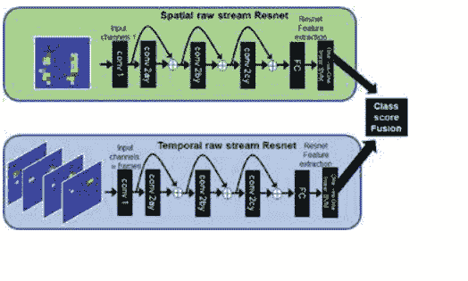

#### 5.3 深度残差网络模型

本研究中使用的深度机器学习模型基于最先进的ResNet架构[62]。

ResNet架构如图8所示，由空间和时间流组成，用于原始表示。从输入到输出，每个流都包含以下层次：首先是一个ResNet配置1块 (2ay) （图9右），然后是一个ResNet配置2块 (x2) (2by和2cy) （图9左），然后是一个平均池化层，全连接层 (FC) 和最后是一个softmax层。这些块由卷积层、批量归一化[63]和ReLU激活函数[64]组成。网络中的残差单元可以用一般形式表示为：

$$y_l = h(x_l) + G(x_l, W_l), \quad (2)$$

$$x_{l+1} = f(y_l), \quad (3)$$

其中 $x_l$是第 $l$个残差块的输入，$x_{l+1}$是其对应的输出，$G$是一个非线性残差函数。$h(x_l) = x_l$是一个恒等映射，$f$是一个ReLU激活函数[64]。$W_l = \{ W_{l,k} | 1 \le k \le K \}$是第 $l$个残差块的权重和偏置集合。$K$是残差单元中的层数。如果 $f$是一个恒等映射，那么 $x_{l+1} \equiv y_l$，因此方程3可以表示为：

$$x_{l+1} = x_l + G(x_l, W_l). \quad (4)$$

对于任何单元 $L$ 和浅单元 $l$, 特征 $x_L$ 的前向传播可以表示为加性输出:

$$x_L = x_l + \sum_{i=l}^{L-1} G(x_l, W_l). \qquad (5)$$

因此, 在前向传播过程中, $x_l$ 被传播到任何 $x_L$ 加上残差因子。如果损失函数表示为 $\gamma$, 则网络中的误差反向传播可以表示为链式法则[65]:

$$\frac{\partial \gamma}{\partial x_l} = \frac{\partial \gamma}{\partial x_L} \frac{\partial x_L}{\partial x_l} = \frac{\partial \gamma}{\partial x_L} (1 + \frac{\partial}{\partial x_L} \sum_{i=l}^{L-1} G(x_l, W_l)). \qquad (6)$$

通过使用ResNet作为特征提取器, 可以简化验证生物特征系统的评估。这通过使用判别性线性分类器对学习特征集进行评估实现。这样可以节省计算资源和时间。用于实验评估的线性分类器是线性支持向量机 (SVM), 与其他线性分类器 (如逻辑回归或感知器) 相比, 具有较高的生物特征性能。如果将 $u$ 视为给定实验的客户总数, 则需要使用ResNet模型作为特征提取器来训练 $u$ 个线性SVM分类器模型, 而不是训练 $u$ 个计算成本高昂的ResNet模型。

由于其在训练时的稳定性, 选择RMSprop [66]优化器来更新模型的权重。所有模型都使用32个样本的批量大小进行训练。尝试使用ImageNet ResNet-50 [67]的权重来初始化模型进行迁移学习，但没有取得重大改进，因此权重是通过从高斯随机分布中采样值来初始化的，以简化初始化过程。RMSprop学习率最初设置为0.001，并逐渐减小。一旦学习错误达到平稳状态，这个因子就会变为10。我们实施了一种早期停止学习的过程：一旦验证错误停止减少，我们就停止训练。

### 5.4 空间和时间架构

由于足步GRF模式往往包含大量细粒度的GRF变异性，因此对于人类来说很难进行可视化评估。图10和11显示了来自SFootBD的2个客户的步幅原始（顶部）和处理后（底部）的空间足步表示的并排比较，每个用户有2个样本。比较表明，仅基于视觉感知的有效步幅识别是一个非常具有挑战性的问题，因为在某些情况下可能存在高用户内变异性和低用户间变异性。此外，与其他生物特征（如面部识别）相比，人类不习惯识别这种类型的图像。机器学习已经被用来尝试区分客户和冒名顶替者之间的细粒度GRF变异性。

空间和时间步伐数据共享相同的ResNet架构，如图8所示。步伐表示影响第一个维度的尺寸。ResNet模型的卷积（conv.）层，它以步幅步伐张量作为输入，形状为（n, m, c），其中n × m是2D步伐传感器矩阵，c是帧数。对于空间情况，c = 1，对于时间组件，c = 100。ResNet块（图9）的滤波器大小和通道根据输入步伐张量的尺寸变化。

广泛使用的深度网络设计由VGG网络[68]引入，被采用用于ResNet模型。该方法减少了卷积中的空间组件。网络的左侧（输入）到右侧（输出）层，随着滤波器映射数量的增加，层次逐渐增加。

### 5.5 验证系统评估

使用检测错误交换（DET）曲线[69]评估了验证系统的性能，该曲线显示了漏检和误报错误之间的权衡。我们还使用等错误率（EER）总结了系统的生物特征验证性能。EER是DET曲线上的交点，在该交点处，误拒率（FRR）和误接受率（FAR）相等。因此，我们对于实验的评估给予了FRR和FAR相等的重要性。

### 5.6 结果

#### 5.6.1 机场场景：基准 B1

对于考虑的三种表示形式，空间和时间域的融合表现最好。就单独而言，原始表示提供了最佳性能（11.80%，11.50%）的等错误率（EER），其次是处理后的SVM表示（8%，12.50%）的EER，最后是处理后的表示（10.10%，14.50%）的EER。

对于表示形式的融合，原始和处理后的表示提供了（8.10%，10.70%）的EER。这也比单独考虑两种表示形式要好。而原始、处理后和处理后的SVM表示的组合在整体上提供了最佳性能（7.10%，10.50%）的EER。这比之前报道的最佳性能[29]在评估和验证数据集中提高了2%的EER和0.9%的EER。这个基准考虑了从3个基准中训练的最少量的脚步数据。该基准是一个现实世界的安全应用示例，数据稀缺。

### 表8 实验七的每个类别的性能

| 实验 | 实验七：正常和双任务两个 | | | |
| :--- | :--- | :--- | :--- | :--- |
| 类别 | 0 | 1 | 2 | 3 |
| 人口 | 1197 | 1197 | 1197 | 1197 |
| P: 阳性条件 | 288 | 280 | 308 | 321 |
| N: 阴性条件 | 909 | 917 | 889 | 876 |
| 测试结果为阳性 | 292 | 273 | 309 | 323 |
| 测试结果为阴性 | 905 | 924 | 888 | 874 |
| TP: 真阳性 | 281 | 267 | 301 | 316 |
| TN: 真阴性 | 898 | 911 | 881 | 869 |
| FP: 假阳性 | 11 | 6 | 8 | 7 |
| FN: 假阴性 | 7 | 13 | 7 | 5 |
| TPR: (敏感性, 命中率, 召回率) | 0.98 | 0.95 | 0.98 | 0.98 |
| TNR = SPC: (特异性) | 0.99 | 0.99 | 0.99 | 0.99 |
| PPV: 阳性预测值 (精确度) | 0.96 | 0.98 | 0.97 | 0.98 |
| NPV: 负预测值 | 0.99 | 0.99 | 0.99 | 0.99 |
| FPR: 误报率 | 0.01 | 0.01 | 0.01 | 0.01 |
| FDR: 虚警率 | 0.04 | 0.02 | 0.03 | 0.02 |
| FNR: 漏报率 | 0.02 | 0.05 | 0.02 | 0.02 |
| MCC: 马修斯相关系数 | 0.96 | 0.96 | 0.97 | 0.97 |
| | | | | |
| 知情度 | 0.96 | 0.95 | 0.97 | 0.98 |
| 标记度 | 0.95 | 0.96 | 0.97 | 0.97 |
| 流行度 | 0.24 | 0.23 | 0.26 | 0.27 |
| LR+: 阳性似然比 | 80.63 | 145.74 | 108.6 | 123.19 |
| LR-: 阴性似然比 | 0.02 | 0.05 | 0.02 | 0.02 |
| DOR: 诊断几率比 | 3277.12 | 3118.42 | 4735.38 | 7845.83 |
| FOR: 虚报率 | 0.01 | 0.01 | 0.01 | 0.01 |

### 5.6.2 工作场景：基准 B2

在这个数据集中，时空融合在三种表示中表现最好。处理后的 SVM 在三种表示中以 (3.80%, 6.70%) EER 的性能表现最佳。原始和处理后的 SVM 表示在评估中具有相同的 8% EER 评估性能。在验证中，原始表示获得 6.10% EER，而处理后的 SVM 表现更好，为 3.80% EER。对于表示的融合，原始和处理后的表示以 (3.20%, 5.30%) EER 表现最佳，这优于考虑的任何表示。原始、处理后和处理后的 SVM 表示的组合在这个数据集中总体上提供了最佳性能 (2.80%, 4.90%) EER。

这在评估和验证数据集中将之前报道的最佳性能 [29] 提高了 1.8% EER 和 1% EER。

这个基准考虑了中等数量的脚步数据用于训练，来自于 3 个基准。办公室安全环境是一个现实世界的场景示例。

### 5.7 家庭场景：基准 B3

时空融合在 3 个表示中总体表现最好。经过处理的表示以 (1.80%, 2.60%) EER 的性能最佳。处理后的 SVM 在 (2.10%, 3.20%) EER 方面紧随其后，最后，原始表示获得了 (1.70%, 5.60%) EER。

在表示融合的层面上，原始和经过处理的表示以 (0.80%, 2.10%) EER 的性能优于之前的基准中单独考虑表示的情况。原始、经过处理和经过处理的 SVM 表示的组合在这个数据集中以及所有实验中总体上提供了最佳性能 (0.70%, 1.70%) EER。这一结果在评估和验证数据集中将之前报告的最佳性能 [29] 提高了 2.3% 和 1.4%。这些结果是考虑到所有实验和基准的最佳结果。

这个基准考虑了最大数量的脚步数据用于训练，因此在整个实验中观察到了最佳性能。我们认为在整个实验中观察到的最佳性能是因为考虑了最大数量的脚步数据来训练 Resnet 模型。一个家庭环境是这个数据集的一个真实世界安全应用的例子，也是提出的方法和模型能够最优地工作的地方。

### 5.8 讨论

将测试数据集划分为验证和评估子集，可以以高置信度评估模型的泛化性能。

#### 表9 生物特征验证结果，以EER (%) 表示，适用于基准B1、B2和B3

| 领域 | 模型 | 基准B1 验证(%) | 基准B1 评估(%) | 基准B2 验证(%) | 基准B2 评估(%) | 基准B3 验证(%) | 基准B3 评估(%) |
| :--- | :--- | :--- | :--- | :--- | :--- | :--- | :--- |
| **原始表示** | | | | | | | |
| 时间 | Resnet | 14.70 | 18.00 | 8.20 | 6.70 | 4.60 | 8.00 |
| 空间 | Resnet | 16.30 | 13.40 | 11.20 | 10.70 | 3.40 | 12.00 |
| 时空 | Resnet | 11.80 | 11.50 | 6.10 | 8.00 | 1.70 | 5.60 |
| 时空 | 深度神经网络 | 27.65 | 27.93 | 14.33 | 17.33 | 5.76 | 6.57 |
| 时空 | CNN | 31.28 | 31.21 | 14.26 | 14.67 | 3.62 | 4.00 |
| **处理后的表示** | | | | | | | |
| 时间 | Resnet | 12.20 | 18.00 | 6.60 | 9.30 | 3.90 | 2.00 |
| 空间 | Resnet | 13.60 | 15.50 | 5.50 | 9.30 | 3.00 | 6.60 |
| 时空 | Resnet | 10.10 | 14.50 | 3.80 | 8.00 | 1.80 | 2.60 |
| 时空 | 深度神经网络 | 17.25 | 21.00 | 6.10 | 6.66 | 2.80 | 3.00 |
| 时空 | CNN | 18.10 | 23.00 | 6.07 | 9.95 | 1.61 | 3.38 |
| **处理后的 SVM 表示** | | | | | | | |
| 空间集成时间 | 支持向量机 | 12.10 | 16.50 | 9.30 | 12.00 | 6.10 | 8.20 |
| 空间 | 支持向量机 | 11.70 | 17.50 | 5.90 | 9.20 | 3.80 | 2.60 |
| 时空 | 支持向量机 | 8.00 | 12.50 | 3.80 | 6.70 | 2.10 | 3.20 |
| **表示的融合** | | | | | | | |
| 原始和处理后的 | Resnet | 8.10 | 10.70 | 3.20 | 5.30 | 0.80 | 2.10 |
| 原始、处理后及处理后SVM | Resnet 和支持向量机 | 7.10 | 10.50 | 2.80 | 4.90 | 0.70 | 1.70 |

评估数据集不直接影响训练过程（训练集）或间接影响（验证集）。总体而言，由于模型在保留的脚步数据中的泛化能力，验证数据集的等错误率要优于评估数据集。与先前报道的工作 [29] 相比，我们在所有基准测试中都能提供更好的性能结果。

验证数据集的性能在 Resnet 模型的训练过程中影响早停止的过程，从而间接影响系统的泛化性能。然而，这是一个广泛使用的过程，并通过在保留的数据集（评估）中提供等错误率性能，提供了更接近和更真实的泛化性能估计。

深度残差网络被认为在使用大量足迹数据进行模型训练的问题上展示出最先进的性能，例如 ImageNet [13, 67] 包含数百万个样本用于训练。当模型可用数据增加时，验证和评估数据集的性能结果如表9所示，可以展示出这种效果。

如表9所示，在3个数据集中，原始和处理后的 Resnet 表示获得了非常相似的性能 EER。因此，与处理后的足迹数据相比，原始模型能够在学习模型中从原始未处理的足迹数据中提供有竞争力的性能。

本节探讨了在基于深度残差网络的机器学习模型中测试时空输入足迹数据表示的重要影响。这些表示基于足迹的原始和处理后的数据。我们将其性能与使用 SVM 的处理后的表示方法进行了比较，两种方法的性能相似。影响足迹生物识别性能的关键因素是考虑的时空数据表示和用于训练的数据量。

对最大足迹数据库的三个数据集进行了时空分析。该数据集类似于数据驱动的真实场景，包括用于安全应用的小型足迹数据集（基准 B1），用于办公应用的中型数据集（基准 B2）和用于家庭场景的大型数据集（基准 B3）。这些场景旨在涵盖最常见的真实世界场景。

这里进行的实验证明了并不存在适用于所有数据集的单一最佳表示。分别考虑这些表示，对于基准 B1，原始表示表现最佳；对于基准 B2，经过处理的 SVM 提供了最佳的验证性能；对于基准 B3，经过处理的 SVM 表示整体上表现最佳。这证明了在机器学习模型中评估多种表示以获得稳健的足迹识别模型的必要性。

这个结果凸显了对于自动特征学习模型的原始数据表示分析的需求。我们已经证明了使用经过处理和未经处理的足迹数据的 Resnet 和 SVM 模型的集成可以获得稳健的足迹识别模型，用于生物特征验证。

### 6 结论

在这一章中，使用深度学习方法研究了时空步态和足迹的表示方式。在医疗主题中，通过提供 97.33% 的 F-score，在双重任务中实现了稳健的分类性能；而在安全主题中，在生物识别验证场景中获得了最先进的足迹识别性能，得到了 0.7% 的最佳等错误率。因此，对步态和足迹分析进行了具有高统计学意义的稳健模式识别。获得最佳结果的方法是基于卷积神经网络的深度机器学习原理。

在医疗主题中，研究了认知活动与人体步态变化之间的联系及其影响。该研究分析了认知活动对健康个体步态模式的影响。方法学在一个由 69 名参与者执行双任务实验的队列中产生了结果。在最佳情况下，获得了 97% 的 F 分数来识别双任务模式。该方法明显优于优化的经典机器学习模型（非深度学习），并能够以 97.3% 的最佳 F 分数区分参与者的性别。

在安全主题中，在具有挑战性的生物识别验证场景中获得了最先进的脚步识别性能结果。迄今为止最大的脚步数据库 sfootBD 被用来验证深度机器学习方法。该数据库包含来自 127 个用户的近 20,000 个脚步信号。首先，在单一的实际生物识别验证环境中研究了空间脚步领域，然后在家庭、办公室和机场等三个关键的实际生物识别验证场景中广泛研究了时空脚步领域。最佳结果表明，经过处理的和原始的脚步数据的集合以及浅层和深度机器学习模型的组合为生物识别验证提供了最先进的识别性能。在最佳生物识别验证案例中，该方法提供了 0.7% 的等错误率。

在医疗保健主题中提出的方法可能潜在地应用于 MCI 阶段或 AD 病理学的大型队列的研究 [57, 70]。这个研究方向可以进一步研究步态变化与早期神经退行性疾病进展之间的联系。这里介绍的深度学习方法可以应用于多传感器时空环境中，以寻找可能在前驱期标志 AD 的进一步行为特征。这种方法还可以包括其他感知模式，例如将个体的日常计算机使用键盘模式整合进去 [71] 或语音识别分析 [72]。此外，加速度计传感器、摄像头或室内/室外跟踪系统 [70] 也可以整合进去，以进行早期 AD 阶段的稳健分析。

**致谢**：我们对参与此研究的参与者表示感谢，并感谢 David H. Foster 进行有益的讨论。本工作得到了英国工程和物理科学研究委员会 EP/K005294/1、EP/K503447/1 的支持，部分得到了 CONACyT（墨西哥）467373 号资助，部分得到了曼彻斯特大学数据科学研究所的支持。O. Costilla-Reyes 要感谢 CONACyT（墨西哥）提供的学生奖学金。我们感谢 NVIDIA 捐赠的用于进行部分实验的 GPU。

### 参考文献

- 1. Michael W. Whittle. 步态分析：简介。巴特沃斯，海曼，（2014年）
- 2. Nadkarni, N.K., Moghe, E., McElroy, W.E., Black, S.E.：阿尔茨海默病和衰老中的空间和时间步态参数。步态和姿势 30（4），452-454（2009年）
- 3. Hollman, J.H., Kovash, F.M., Kubik, J.J., Linbo, R.A.：双任务行走中步态稳定性的年龄相关差异。步态和姿势 26（1），113-119（2007年）
- 4. Beurskens, R., Bock, O. 双任务行走的年龄相关缺陷：综述。神经可塑性。2012年（2012年）
- 5. Hausdorff, J.M., Schweiger, A., Herrman, T., Yogev-Seligman, G., Giladi, N.：健康老年人步态的双任务下降：影响因素。生物科学。医学科学。63 (12) ，1335-1343（2008年）
- 6. Barnes, D.E., Yaffe, K.: 风险因素减少对阿尔茨海默病患病率的预测效果。Lancet Neurol. 10(9), 819–828 (2011)
- 7. Lundin-Olsson, L., Nyberg, L., Gustafson, Y.: 说话时停止行走作为老年人跌倒的预测因素。Lancet 349(9052), 617 (1997)
- 8. Costilla-Reyes, O., Vera-Rodriguez, R., Scully, P., Ozanyan, K.B.: 使用深度残差神经网络进行鲁棒足步识别的时空表示分析。IEEE Trans. Pattern Anal. Mach. Intell. 41(2), 285–296 (2018)
- 9. Vacca, J.R.. 生物识别技术和验证系统. Butterworth, Heinemann (2007)
- 10. P. Daphne Tsatsoulis, Jaech, A., Batie, R., Savvides, M.. 使用生物识别进行持续认证. IGI Global, 68–88 (2012)
- 11. Muro-de-la Herran, A., Garcia-Zapirain, B., Mendez-Zorrilla, A.: 步态分析方法：可穿戴和非可穿戴系统概述，突出临床应用。传感器 14(2), 3362-3394（2014年）
- 12. Eric Mason, J., Traoré, I., Woungang, I.: 步态生物识别的机器学习技术。Springer（2016年）
- 13. LeCun, Y., Bengio, Y., Hinton, G.: 深度学习。自然 521(7553), 436-444（2015年）
- 14. Russakovsky, O., Deng, J., Su, H., Krause, J., Satheesh, S., Ma, S., Huang, Z., Karpathy, A., Khosla, A., Bernstein, M. et al.: ImageNet大规模视觉识别挑战。arXiv 预印本 arXiv:1409.0575 (2014年)
- 15. J.M. Montepare, Goldstein, S.B.：从步态信息中识别情绪。J. Nonverbal Behav. 11(1), 33-42 (2016年)
- 16. Martina, Z., Simon, H., Wilkowska, W.：当你的居住空间知道你在做什么：接受不同技术的医疗家庭监测。Springer (2011年)
- 17. Alharthi, A.S., Yunas, S.U., Ozanyan, K.B.：用于人体步态监测的深度学习综述。IEEE Sens. J. (已提交) （2019年）
- 18. Connor, P., Ross, A.：基于步态的生物识别：模态和特征综述。Comput. Vis. Image Underst. 167, 1-27 (2018年)
- 19. El-Alfy, H., Mitsugami, I., Yagi, Y.：一种使用局部高斯图的新的基于步态的识别方法。在：亚洲计算机视觉会议，第3-18页。Springer（2014年）
- 20. Ioannidis, D., Tzovaras, D., Damousis, I.G., Argyropoulos, S., Moustakas, K.：使用紧凑特征提取变换和深度信息的步态识别。IEEE Trans. Inf. Forensics Secur. 2(3), 623-630 (2007年)
- 21. Arora, P., Srivastava, S., Arora, K., Bareja, S.: 使用梯度直方图高斯图像改进步态识别。Procedia Comput. Sci. 58, 408–413 (2015)
- 22. Liu, Y., Zhang, J., Wang, C., Wang, L.: 用于步态识别的多个HOG模板。2012年第21届国际模式识别大会(ICPR), pp. 2930–2933. IEEE (2012)
- 23. Sivapalan, S., Chen, D., Denman, S., Sridharan, S., Fookes, C.: 使用深度图像的步态能量体积和前方步态识别。在：2011年国际联合生物特征学会议(IJCB), pp. 1–6. IEEE (2011)
- 24. Costilla-Reyes, O., Scully, P., Ozanyan, K.B.: 使用足迹成像传感器系统记录的步态活动进行时间模式识别。IEEE Sens. J. 16(24), 8815–8822 (2016)
- 25. Costilla-Reyes, O., Scully, P., Ozanyan, K.B.: 从层析成像传感器中学习时空特征的深度神经网络。IEEE Trans. Ind. Electron. 65(1), 645–653 (2018)
- 26. Cattin, P.C.: 使用人体步态的生物特征认证系统。博士论文。Diss., ETH Zurich, Nr. 14603, pp. 1–140 (2002)
- 27. Stevenson, J.P., Firebaugh, S.L., Charles, H.K.. 使用隐马尔可夫模型从基于地板的PVDF传感器阵列进行生物识别。SAS 2007 论文集。
- 28. Mostayed, A., Kim, S., Mazumder, M.M.G., Park, S.J.: 使用直方图相似度和小波分解进行基于脚步的人员识别。在：第二届国际信息安全与保障会议的论文集, pp. 307–311. IEEE (2008)
- 29. Vera-Rodriguez, R., Mason, J.S.D., Fierrez, J., Ortega-Garcia, J.: 用于脚步识别的时空信息的比较分析和融合。IEEE Trans. Pattern Anal. Mach. Intell. 35(4), 823–834 (2013)
- 30. Zhong, Y., Deng, Y.: 传感器方向不变的移动步态生物特征。在：2014年IEEE国际联合生物特征学术会议(IJCB), pp. 1–8. IEEE (2014)
- 31. Zhang, Y., Pan, G., Jia, K., Lu, M., Wang, Y., Wu, Z.: 基于加速度计的步态识别，通过对特征点的稀疏表示与聚类。IEEE Trans. Cybern. 45(9), 1864–1875 (2015)
- 32. Bours, P., Shrestha, R.: 特征步伐：步态识别的巨大飞跃。在: 2010年第二届国际安全与通信网络研讨会(IWSCN), pp. 1–6. IEEE (2010)
- 33. Gafurov, D., Snekkenes, E., Bours, P.: 通过循环匹配提高步态识别性能。在: 2010年IEEE第24届国际高级信息网络和应用会议和应用研讨会(WAINA), pp. 836–841. IEEE (2010)
- 34. Rong, L., Jianzhong, Z., Ming, L., Xiangfeng, H.: 一种可穿戴式加速度传感器系统用于步态识别。在: 2007年第二届IEEE工业电子与应用会议(ICIEA 2007), pp. 2654–2659. IEEE (2007)
- 35. Zifeng, W., Huang, Y., Wang, L., Wang, X., Tan, T.: 通过深度 CNN 对跨视图步态进行人体识别的综合研究. IEEE Trans. Pattern Anal. Mach. Intell. 39(2), 209–226 (2017)
- 36. Costilla-Reyes, O., Vera-Rodriguez, R., Scully, P., Ozanyan, K.B.: 用于生物特征应用的卷积神经网络的空间脚步识别. 在: IEEE 传感器 2016 年会议论文集. IEEE (2016)
- 37. Yun, J.: 在 UbiFloor II 上使用步态模式进行用户识别. 传感器 11(3), 2611–2639 (2011)
- 38. Claude Cattin, P.: 使用人体步态的生物特征认证系统. 博士论文. Technische Wissenschaften ETH Zurich Nr. 14603 (2002)
- 39. Kanth Saripalle, S.: 使用从压力平台得出的压力中心参数对人体姿势和手势运动进行分类。博士论文。密苏里大学堪萨斯城分校 (2010年)
- 40. Headon, R., Curwen, R.: 从地面反作用力中识别运动。在：感知用户界面 2001 年研讨会论文集，第1-8页。ACM (2001年)
- 41. Simeone, O.: 机器学习简介及其在通信系统中的应用。在：IEEE Trans. Cogn. Commun. Netw. (2018年)
- 42. Page, L., Brin, S., Motwani, R., Winograd, T.: PageRank 引用排名：为网络带来秩序 (1999年)
- 43. Zhao, W., Krishnaswamy, A., Chellappa, R., Swets, D.L., Weng, J.: 基于主成分的判别分析用于人脸识别。在：人脸识别，第73-85页。Springer (1998年)
- 44. Adomavicius, G., Tuzhilin, A.: 走向下一代推荐系统：现状和可能的扩展。IEEE Trans. Knowl. Data Eng. 17(6), 734-749 (2005年)
- 45. Yi, N., Li, C., Feng, X., Shi, M.: 卷积神经网络的研究与改进。在：2018年 IEEE/ACIS 第17届国际计算机与信息科学会议 (ICIS), 第637-640页。IEEE (2018)
- 46. Simonyan, K., Zisserman, A.: 用于视频动作识别的双流卷积网络。Adv. Neural Inf. Process. Syst., 568-576 (2014)
- 47. Donahue, J., Anne Hendricks, L., Guadarrama, S., Rohrbach, M., Venugopalan, S., Saenko, K., Darrell, T.: 用于视觉识别和描述的长期循环卷积网络。在：IEEE 计算机视觉和模式识别会议论文集, 第 2625-2634 页 (2015)
- 48. Tran, D., Bourdev, L., Fergus, R., Torresani, L., Paluri, M.: 用 3D 卷积网络学习时空特征。在：IEEE 国际计算机视觉会议论文集, 第 4489-4497 页 (2015)
- 49. Feichtenhofer, C., Pinz, A., Wildes, R.: 时空残差网络用于视频动作识别. Adv. Neural Inf. Process. Syst., 3468–3476 (2016)

50. Ji, S., Wei, X., Yang, M., Kai, Y.: 三维卷积神经网络用于人体动作识别. IEEE Trans. Pattern Anal. Mach. Intell. **35**(1), 221–231 (2013)

51. Wang, X., Farhadi, A., Gupta, A.: 动作转换. In: 2016 IEEE Conference on Computer Vision and Pattern Recognition (CVPR), pp. 2658–2667 (2016)

52. Gafurov, D.: 步态生物识别综述: 方法、安全性和挑战. In: Annual Norwegian Computer Science Conference, pp. 19–21. Citeseer (2007)

53. Montero-Odasso, M., Muir, S.W., Speechley, M.: 双任务复杂性影响轻度认知障碍患者的步态: 步态变异性、双任务和跌倒风险的相互作用. Arch. Phys. Med. Rehabil. **93**(2), 293–299 (2012)

54. Owings, T.M., Grabiner, M.D.: 在一个仪器化跑步机上测量步态运动变异性: 需要多少步? J. Biomech. **36**(8), 1215–1218 (2003)

55. Atkinson, H.H., Rosano, C., Simonsick, E.M., Williamson, J.D., Davis, C., Ambrosius, W.T., S.R. Rapp, Cesari, M., Newman, A.B., Harris, T.B.: 认知功能、步行速度下降和共病症: 健康、老化和体成分研究. J. Gerontol. Ser. A: Biol. Sci. Med. Sci. **62**(8), 844–850 (2007)

56. Powers, D.M.W.: 评估: 从精确度、召回率和 F-度量到 ROC、信息度、标记度和相关性。J. Mach. Learn. Technol. **2**(1), 37–63 (2011)

57. Gunn-Moore, D., Kaidanovich-Beilin, O., Iradi, M.C.G., Gunn-Moore, F., Lovestone, S.: 人类和其他动物的阿尔茨海默病: 后生殖寿命和长寿而非衰老的结果. 阿尔茨海默病: 阿尔茨海默病协会杂志 **14**(2), 195–204 (2018)

58. Allan, L.M., Ballard, C.G., Burn, D.J., Anne Kenny, R.: 阿尔茨海默病和非阿尔茨海默病的步态障碍的患病率和严重程度. 美国老年病学会杂志 **53**(10), 1681–1687 (2005)

59. Middleton, L., Buss, A., Bazin, A., Nixon, M.: 用于步态识别的地板传感器系统. 在: 第四届 *IEEE 自动识别高级技术研讨会论文集*, pp. 171–176 (2005)

60. Vera-Rodriguez, R., Fierrez, J., Mason, J.S.D., Ortega-Garcia, J.: 通过与脚步信息融合的步态识别的新方法. 在: 国际模式识别协会国际生物特征会议, ICB (2013)

61. Qian, G., Zhang, J., Kidane, A.: 利用地板压力感应和分析进行人员识别. IEEE Sens. J. **10**(9), 1447–1460 (2010)

62. He, K., Zhang, X., Ren, S., Sun, J.: 深度残差学习用于图像识别. 在: IEEE 计算机视觉和模式识别会议, pp. 770–778 (2016)

63. Ioffe, S., Szegedy, C.: 批归一化: 通过减少内部协变量偏移加速深度网络训练. 在: 第 32 届国际机器学习会议, pp. 448–456 (2015)

64. Glorot, X., Bordes, A., Bengio, Y.: 深度稀疏整流神经网络. 在: 第 14 届国际人工智能与统计学会会议论文集, 第 15 卷, 第 315-323 页 (2011 年)

65. He, K., Zhang, X., Ren, S., Sun, J.: 深度残差网络中的身份映射. 在: 欧洲计算机视觉会议论文集, 第 630-645 页. Springer (2016 年)

66. Dauphin, Y., de Vries, H., Bengio, Y.: 用于非凸优化的平衡自适应学习率. Adv. Neural Inf. Process. Syst., 1504–1512 (2015 年)

67. Russakovsky, O., Deng, J., Hao, S.: ImageNet 大规模视觉识别挑战. Int. J. Comput. Vis., **15**(3), 211–252 (2015 年)

68. Simonyan, K., Zisserman, A.: 非常深的卷积网络用于大规模图像识别. 在: 国际学习表示会议 (ICLR), 第 1–14 页 (2015)

69. Martin, A., Doddington, G., Kamm, T., Ordowski, M., Przybocki, M.: 在检测任务性能评估中的 DET 曲线. 技术报告, DTIC (1997)

70. Lawson, J., Murray, M., Zamboni, G., Koychev, I.G., Ritchie, C.W., Ridha, B.H., Rowe, J.B., Thomas, A., Ffytche, D.H., Howard, R.J.: 深度和频繁表型: 痴呆症实验医学的可行性研究. Alzheimer's Dement.: J. Alzheimer's Assoc. **13**(7), 第 1268-1269 页 (2017)

71. Gledson, A., Asfiandy, D., Mellor, J., Ba-Dhfari, T.O.F., Stringer, G., Couth, S., Burns, A., Le Roy, I., Zeng, X., Keane, J.: 结合鼠标和键盘事件与更高级别的桌面操作来检测轻度认知障碍。在：2016年IEEE国际医疗保健信息学会议（ICHI），第139-145页。IEEE（2016年）

72. Satt, A., Sorin, A., Hoory, R., Toledo-Ronen, O., Derreumaux, A., Manera, V., Verhey, F., Aalten, P., Robert, P.H.: 用于评估患有早期痴呆和阿尔茨海默病患者的自动语音分析。阿尔茨海默病痴呆：诊断、评估和监测。1(1)，112-124页（2015年）

## 利用环境传感器进行建筑占用估计的深度学习

**郑华陈，朝阳江，穆斯塔法·K·马苏德，Yeng Chai Soh, Min Wu 和 Xiaoli Li**

**摘要** 建筑能源效率在过去几年中越来越受到关注。占用水平是实现建筑能源效率的关键因素，直接影响建筑中与能源相关的控制系统。在众多用于占用估计的传感器中，环境传感器具有非侵入性和低成本的独特特性。一般来说，利用环境传感器进行占用估计需要进行特征工程和学习。传统的特征提取需要手动提取显著特征，没有任何指导方针。这种手工特征提取过程需要强大的领域知识，并且不可避免地会错过有用的隐含特征。为了解决这些问题，本章介绍了一种卷积深度双向长短期记忆（CDBLSTM）方法，该方法由具有堆叠结构的卷积神经网络组成，可以从原始环境传感器数据中自动学习局部时序特征。然后，LSTM网络用于编码这些局部特征的时间依赖性，并且双向结构用于在特征学习过程中同时考虑过去和未来的上下文。我们进行了真实实验比较CDBLSTM和一些最先进的方法来构建占用估计。结果表明，CDBLSTM方法优于所有最先进的方法。

**关键词** 深度学习 · 建筑占用估计 · 环境传感器 · CDBLSTM

---
*Z. Chen (✉) · M. Wu · X. Li: 新加坡科学研究局信息通信研究所 (I2R) ，新加坡，新加坡。电子邮件: Chen_Zhenghua@i2r.a-star.edu.sg*
*M. Wu: 电子邮件: wumin@i2r.a-star.edu.sg*
*X. Li: 电子邮件: xlli@i2r.a-star.edu.sg*
*C. Jiang: 北京理工大学机械工程学院，中国北京。电子邮件: cjiang@bit.edu.cn*
*M. K. Masood: 芬兰埃斯波阿尔托大学土木工程系。电子邮件: mkm_imn@hotmail.com*
*Y. C. Soh: 新加坡南洋理工大学电气与电子工程学院，新加坡。电子邮件: eycsoh@ntu.edu.sg*

### 1 引言

为了保持室内环境的热舒适度，建筑部门消耗了约40%的能源 [28]。因此，人们对建筑能源效率和可持续发展给予了很多关注。为了实现这一目标，一个关键因素是建筑占用信息，也称为占用人数或建筑物范围。它可以用于建筑气候和自适应照明控制 [28, 36]。Balaji等人在设计实验中依靠实际占用水平为暖通空调系统节约了17.8%的能源 [1]。开发的光控制系统 [24] 已经报道了建筑照明控制系统能耗减少35-75%。然而，获得准确且稳健的占用估计系统是一项具有挑战性且尚未解决的任务。

可以通过使用不同的传感器来进行占用估计。例如，刘等人通过PIR传感器提供了对占用者存在与否的检测 [27]。在室内获得实际的占用者数量或范围将更有意义。为了实现这一目标，[1, 25] 提出了依赖于RFID和可穿戴设备的方法。然而，这些方法要求用户佩戴特定的设备，这是具有侵入性和不便利的。使用摄像头可以实现准确的占用估计 [42]。然而，基于摄像头的解决方案经常遇到照明不足和计算负载高的问题。此外，它们还存在隐私问题。其他一些方法依赖于占用者的参与，例如使用椅子传感器 [23] 和申请人的功率使用数据 [22]。然而，不参与的占用者将无法被检测到。

最近，环境传感器被广泛应用于占用估计，因为它们成本低且对用户无侵入性 [21, 29, 40, 41]。由于环境传感器测量和占用水平之间的复杂关系，物理建模的性能有限。另一种方法是使用机器学习技术对复杂关系进行建模，这在函数逼近上效果良好。由于环境传感器数据存在大量噪声且不能代表不同的占用水平，使用原始传感器数据训练的机器学习模型可能性有限。常见的操作是进行特征工程，旨在提取不同占用水平的更多信息表示 [26]。然而，传统的手动特征工程没有关于应该提取哪些特征用于占用推断的指导方针。此外，它需要强大的领域知识，并且不可避免地会错过隐含的有用特征。为了解决这个问题，本章介绍了一种卷积深度双向长短期记忆 (CDBLSTM) 模型，它由一个卷积神经网络和一个堆叠结构组成，可以自动从头开始学习有用的表示 (特征) [11]。卷积网络能够从原始环境传感器数据中学习一些顺序局部特征。由于环境传感器数据是典型的时间序列，准确和稳健的占用推断对于时间依赖性非常重要。为了对数据中的时间依赖性进行建模，我们采用了一个BLSTM网络，其输入是由卷积神经网络学习到的顺序局部特征。我们通过使用真实评估将CDBLSTM方法与现有文献中的一些最新方法进行了比较。

### 2 文献综述

许多先进的算法已经被提出，用于使用环境传感器数据进行占用推断。作者在 [13] 中提出了一种用于开放办公室的占用估计系统，该系统使用能够收集 CO$_2$、CO、声学、PM2.5、运动、照明、温度和湿度数据的传感器网络。一些统计特征，如20分钟的移动平均值和一阶微分，是手动提取的。接下来，通过流行的信息增益理论选择了最重要的特征。最后，使用支持向量机 (SVM)、人工神经网络 (ANN) 和隐马尔可夫模型 (HMM) 等数据驱动方法进行占用估计。他们得出结论，最重要的传感器是 CO$_2$ 和声学传感器，而 HMM 在占用估计方面取得了最佳性能。

在 [30] 中，作者使用温度、CO$_2$、湿度和压力等环境传感器来估计教室的占用情况。他们提取了一些在 [13] 中使用的相似特征。基于ELM的包装器算法被开发用于特征选择和占用推断。

在 [38] 中，作者研究了包括声音、运动、温度、门状态、CO$_2$、湿度、被动红外和光等各种传感器，通过一些广泛使用的机器学习算法推断多人和单人办公室的占用情况。他们没有提取更多有用的特征，而是使用原始传感器数据作为特征。在这里，作者应用了许多信息丰富的传感器来保证他们提出的方法的满意性能。使用信息增益理论测试了不同传感器 (特征) 的贡献。最终，光照水平、门状态和 CO$_2$ 被证明是最重要的参数。对于不同的算法，决策树 (DT) 方法具有最佳性能。

Candanedo等人开发了一种具有湿度、CO$_2$、温度和光照水平传感器的占用检测系统 [3]。他们还在这项工作中使用了原始传感器数据作为特征，并利用了一些统计模型来识别出占用者的两种状态：离开和存在。尝试了不同的特征组合和不同的统计方法，然后可以选择最佳的传感器和模型。最后，他们得出结论，即在正确选择传感器和学习方法时，可以实现令人满意的性能。

由于占用动态具有马尔可夫性质 [4, 7, 8]，HMM模型在建立占用检测和估计方面取得了巨大成功 [13]。然而，传统的HMM经常受到一些限制的影响，例如使用高斯混合模型来估计发射概率和固定的转移概率矩阵。为了解决这些问题，[12] 中的作者提出了一种基于环境传感器的 IHMM-MLR 用于占用推断。首先，开发了用于捕捉不同时间步长下占用动态的非齐次转移概率矩阵。然后，设计了使用环境传感器数据生成发射概率的多项式逻辑回归。针对不同情况，制定了在线和离线两种方案来推断占用情况。

Chen等人提出了另一个系统，通过考虑占用属性 [6] 来提高占用估计的性能。他们将传统机器学习算法与成熟的占用模型进行了融合，能够展示占用属性。他们使用的传感器包括 CO$_2$、湿度、压力和温度，这些传感器广泛可用。算法包括 ELM、SVM、ANN、KNN、CART 和 LDA。他们制定了一个贝叶斯滤波器，用于融合占用模型和六个数据驱动算法来估计占用情况。

关于占用估计的详细调查可以在 [5] 中找到。

在这里，我们利用环境传感器，包括温度、CO$_2$、压力和湿度，这些传感器在普通 HVAC 系统 [14] 中很受欢迎，而不是应用特定的传感器，如声音水平 [13, 38]、运动 [19, 38] 和光照水平 [3]。我们尝试使用具有堆叠结构的卷积神经网络自动提取一些有用的局部时序特征，而不是将嘈杂的传感器数据作为特征或使用一些手工制作的统计特征。然后，BLSTM 网络能够在高级特征学习过程中对时序局部特征进行编码。我们通过实际实验与一些最新技术进行了全面比较。

### 3 方法论

我们首先展示了基于环境传感器的占用推断的 CDBLSTM 的概述。然后，我们介绍了 CDBLSTM 中的关键组件，即卷积神经网络、DBLSTM 和分类层。最后，将介绍 CDBLSTM 方法的训练过程。

#### 3.1 概述

对于基于环境传感器的占用估计，关键部分是从原始数据中学习区分性表示（特征），以区分不同的占用水平。图1展示了基于环境传感器的 CDBLSTM 框架。

图1是 CDBLSTM 方法的框架 [11]。

推断。原始输入是环境传感器数据的滑动窗口。然后，应用具有多个滤波器的卷积网络来学习局部滑动窗口的特征，这对于区分不同占用水平的数据非常重要，称为局部特征学习。接下来，DBLSTM 被用来编码局部时序特征的正向和反向依赖关系。最后，从 DBLSTM 中学习的高级特征被馈送到全连接和 softmax 层，用于不同占用水平的分类。

#### 3.2 卷积操作

我们在环境传感器数据上实现了卷积神经网络，以产生时序局部特征。通常，它包含一个卷积层和一个池化层。图2展示了环境传感器数据上的卷积和池化操作。卷积操作的功能是在原始时间序列数据上使用滑动窗口来获取时序局部特征。然后，池化操作是为了降低时序局部特征的维度。下面将介绍这两个操作的详细实现。

**卷积层：** 假设输入样本为 $\{\mathbf{X}_i\},\ i=1,2,\dots,n$，每个输入样本 $\mathbf{X}_i \in \mathbb{R}^{r \times d}$ 是一个滑动窗口环境传感器数据，其中 $r$ 是序列的长度，$d$ 是传感器的数量。它也可以表示为 $\mathbf{X}_i = [\mathbf{x}_1, \dots, \mathbf{x}_r]$。卷积操作的定义是将一个滤波器向量 $\mathbf{v} \in \mathbb{R}^{md \times 1}$ 与输入的切片 $\mathbf{x}_{i:i+m-1} \in \mathbb{R}^{md \times 1}$ 相乘，如下所示：

$$\mathbf{x}_{i:i+m-1} = \mathbf{x}_i \oplus \mathbf{x}_{i+1} \oplus \dots \oplus \mathbf{x}_{i+m-1} \quad (1)$$

其中 $m$ 表示窗口大小，$\oplus$ 是连接操作。接下来，对乘积结果进行激活函数处理，如下所示：

$$c_i = g\left(\mathbf{v}^\top \mathbf{x}_{i:i+m-1} + b\right) \quad (2)$$

其中 $g(\cdot)$ 是激活函数，$b$ 是偏置项，$\top$ 是转置操作。广泛使用的 ReLU 激活函数 [31] 被采用。通过将滤波器从输入序列的开头滑动到结尾，我们可以生成一个特征图，如下所示：

$$\mathbf{c}^j = [c_1, c_2, \dots, c_{r-m+1}] \quad (3)$$

其中 $j=1, 2, \dots, k$, 并且 $k$ 是滤波器的数量。

**池化层：** 池化操作是为了降低特征维度，从而得到更具有区分度的特征 [15]。在这项工作中，我们采用了广泛使用的最大池化。

图2展示了卷积网络结构，它对特征图 $\mathbf{c}^j$ 的连续的 $s$ 个分量进行最大值操作。经过池化操作后，特征将会变为：

$$\mathbf{z}^j = [z_1, z_2, \dots, z_{\frac{r-m}{s}+1}] \eqno(4)$$

因此，池化操作将生成压缩的特征图 $\mathbf{z}^j$，其中 $j \in \{1, 2, \dots, k\}$。最终，卷积神经网络的输出将具有特征维度：

$$\left(\frac{r-m}{s} + 1\right) \times k.$$

一般来说，假设样本数量为 $n$，输入数据的维度为 $n \times r \times d$。卷积神经网络的输出大小为 $n \times \left(\frac{r-m}{s} + 1\right) \times k$。可以发现输入数据的长度从 $r$ 压缩到 $\left(\frac{r-m}{s} + 1\right)$。此外，数据的维度从 $d$（传感器数量）变为 $k$（滤波器数量），其中 $k$ 远大于 $d$。这意味着数据变得更加丰富。换句话说，卷积神经网络可以被视为学习到的局部特征，能够获取更多信息的表示，并保留原始环境传感器数据的时间信息。

### 3.3 深度双向LSTM

由于其强大的时序建模能力，递归神经网络（RNN）被广泛用于时间序列数据的建模。然而，传统的RNN在训练过程中，深度学习算法经常出现梯度消失或梯度爆炸的问题。这严重影响了循环神经网络在建模时间序列数据中的长期依赖性[2]。为了解决这个问题，[17]中的作者提出了一种新的架构，名为LSTM，它试图使用一些门来控制信息的保留或丢弃，从而能够捕捉序列的长期依赖性。LSTM网络已成功应用于许多重要和具有挑战性的任务，例如活动识别[9, 10]和自然语言处理[34]。传统的LSTM只考虑了一个方向上的顺序信息，即正向方向。这对于环境传感器数据的顺序建模是不足够的。未来的信息也可能是有用的。为了考虑到过去和未来的上下文来推断占用情况，我们采用了BLSTM，它包含一个正向层和一个反向层来处理正向和反向的序列数据。

最近，深度结构在表示学习方面取得了巨大成功[16]。本研究采用了深度双向LSTM（DBLSTM）模型，该模型堆叠了多个BLSTM层，用于编码时间依赖性并从卷积神经网络提取的时序局部特征中学习高层次特征。此外，DBLSTM能够使输入在时间和空间（层）上同时传播，从而使模型参数能够分布在各个层上，而不是扩大网络的内存大小。这将导致数据的非线性操作更加高效，也是深度学习中堆叠多层的最终目的[16]。图3展示了DBLSTM网络在时间步骤 $t-1$、$t$ 和 $t+1$ 处的隐藏层 $l$，其中指向左边和右边的箭头分别表示向后和向前的操作。在这里，从时间步骤 $t-1$ 到 $t$ 的向前操作用于捕捉过去的信息，从时间步骤 $t+1$ 到 $t$ 的向后操作用于建模未来的信息。我们以时间步骤 $t$ 处的一个隐藏层 $l$ 为例，展示了DBLSTM网络的详细操作。假设 $h_l^{t-1}$ 为隐藏状态，$C_l^{t-1}$ 为记忆细胞状态，$w_l^f, w_l^i, w_l^C$ 和 $w_l^o$ 为权重，$b_l^f, b_l^i, b_l^C$ 和 $b_l^o$ 为偏置，$\sigma(\cdot)$ 表示sigmoid激活函数。向前过程表示为 $\rightarrow$，向后过程表示为 $\leftarrow$，可以表示为以下公式：

$$\begin{aligned} \vec{f}_{l}^{t} &=\sigma\left(\vec{w}_{l}^{f}[\vec{h}_{l}^{t-1}, \vec{h}_{l-1}^{t}]+\vec{b}_{l}^{f}\right) \\ \vec{i}_{l}^{t} &=\sigma\left(\vec{w}_{l}^{i}[\vec{h}_{l}^{t-1}, \vec{h}_{l-1}^{t}]+\vec{b}_{l}^{i}\right) \\ \tilde{\vec{C}}_{l}^{t} &=\tanh \left(\vec{w}_{l}^{C}[\vec{h}_{l}^{t-1}, \vec{h}_{l-1}^{t}]+\vec{b}_{l}^{C}\right) \\ \vec{C}_{l}^{t} &=\vec{f}_{l}^{t} * \vec{C}_{l}^{t-1}+\vec{i}_{l}^{t} * \tilde{\vec{C}}_{l}^{t} \\ \vec{o}_{l}^{t} &=\sigma\left(\vec{w}_{l}^{o}[\vec{h}_{l}^{t-1}, \vec{h}_{l-1}^{t}]+\vec{b}_{l}^{o}\right) \\ \vec{h}_{l}^{t} &=\vec{o}_{l}^{t} * \tanh \left(\vec{C}_{l}^{t}\right) \end{aligned} \eqno(5)$$

图3展示了DBLSTM的结构。向后过程可以表示为以下公式：

$$\begin{aligned} \overleftarrow{f}_l^t &= \sigma\left(\overleftarrow{w}_l^f [\overleftarrow{h}_l^{t+1}, \overleftarrow{h}_{l-1}^t] + \overleftarrow{b}_l^f\right) \\ \overleftarrow{i}_l^t &= \sigma\left(\overleftarrow{w}_l^i [\overleftarrow{h}_l^{t+1}, \overleftarrow{h}_{l-1}^t] + \overleftarrow{b}_l^i\right) \\ \overleftarrow{\tilde{C}}_l^t &= \tanh\left(\overleftarrow{w}_l^C [\overleftarrow{h}_l^{t+1}, \overleftarrow{h}_{l-1}^t] + \overleftarrow{b}_l^C\right) \\ \overleftarrow{C}_l^t &= \overleftarrow{f}_l^t * \overleftarrow{C}_l^{t+1} + \overleftarrow{i}_l^t * \overleftarrow{\tilde{C}}_l^t \\ \overleftarrow{o}_l^t &= \sigma\left(\overleftarrow{w}_l^o [\overleftarrow{h}_l^{t+1}, \overleftarrow{h}_{l-1}^t] + \overleftarrow{b}_l^o\right) \\ \overleftarrow{h}_l^t &= \overleftarrow{o}_l^t * \tanh(\overleftarrow{C}_l^t) \end{aligned} \eqno(6)$$

DBLSTM网络在时间 $t$ 的第 $l$ 个隐藏层的最终输出是前向和后向层的连接，可以表示为：

$$h_l^t = \vec{h}_l^t \oplus \overleftarrow{h}_l^t \eqno(7)$$

其中，$\vec{h}_l^t$ 可以通过过去的信息（从 1 到 $t-1$）更新当前的隐藏状态，而 $\overleftarrow{h}_l^t$ 可以通过未来的信息（从 $t+1$ 到 $r$）更新当前的隐藏状态。

#### 3.4 占用推断层

DBLSTM 网络的输出是高级特征，将被馈送到一些全连接层中以获得更抽象的表示。全连接层的表达式可以表示为：

$$\mathbf{o}^i = g\left(\alpha_i \mu^i + \beta_i\right) \eqno(8)$$

其中 $\mu^i$ 和 $\mathbf{o}^i$ 分别是第 $i$ 个全连接层的输入和输出，$\alpha_i$ 和 $\beta_i$ 分别是权重和偏置，$g(\cdot)$ 是激活函数。在本研究中，我们选择了 ReLU 作为激活函数。假设我们堆叠了 $c$ 个全连接层，最后一个全连接层的输出，即 $\mathbf{o}^{c-1}$，是输入数据的最终表示。最终的特征表示被馈送到 softmax 分类层以获得占用情况。

#### 3.5 CDBLSTM 的训练过程

通过 CDBLSTM 的输出和真实标签（占用范围），可以计算出所有训练数据的误差，然后通过误差梯度进行反向传播，调整 CDBLSTM 模型参数的训练[37]。更准确地说，给定具有真实占用水平的训练数据，可以计算出网络的输出。然后，可以基于网络的输出和真实占用水平计算出交叉熵损失。接下来，我们可以通过一些基于梯度的优化算法获得误差梯度，以进行反向传播，调整模型参数。在本研究中，我们采用了流行的优化方法 RMSprop [35]。准确地说，给定优化参数 $\theta_t$ 和损失函数 $L(\theta_t)$，可以通过 RMSprop 优化方法计算出参数 $\theta_{t+1}$ 的更新：

$$g_{t+1} = \gamma g_t + (1 - \gamma) \nabla L(\theta_t)^2 \eqno(9)$$
$$\theta_{t+1} = \theta_t - \frac{\eta \nabla L(\theta_t)}{\sqrt{g_{t+1} + \epsilon}} \eqno(10)$$

其中 $g_t$ 是时间步骤 $t$ 处平方梯度的移动平均值，学习率 $\eta$、参数 $\gamma$ 和衰减率 $\epsilon$ 分别选择为 0.001、0.9 和 $10^{-8}$。

为了缓解过拟合问题，我们使用了 dropout 技术。通过使用 dropout，在训练过程中，我们将以概率 $p$ 随机屏蔽隐藏节点的部分。图 4 展示了 dropout 的操作。在模型训练过程中，每次都会保留并训练一个稀疏的架构。给定一个包含 $n$ 个节点且 dropout 概率为 0.5 的网络，该网络可以被视为 $2^n$ 个稀疏网络的集合。由于共享结构，在这些精简网络中，参数的数量将保持不变。在测试过程中，Dropout 将被关闭，所有网络节点将对模型输出产生影响，这类似于一些不同的精简网络的集成。换句话说，Dropout 用于扩大训练数据的大小。在每个训练迭代中，随机掩码还会为数据创建一些变体，这将使训练后的网络更加稳健。Dropout 技术已被证明对于防止过拟合[33]是有效的。因此，在本研究中，我们在 DBLSTM 和第一个全连接层之间使用了一个 Dropout 层，在两个全连接层之间使用了另一个 Dropout 层，其中掩码概率分别选择为 0.5 和 0.3。

### 4 评估结果

在本节中，我们首先介绍数据采集过程。然后，我们介绍评估设置和实验结果。之后，我们通过随机选择数据进行训练和测试，分析了 CDBLSTM 的泛化性能。最后，为了进一步展示 CDBLSTM 在利用环境传感器进行建筑物占用推断方面的性能，我们展示了从另一个环境（即教室）收集的 CDBLSTM 的附加结果。

### 4.1 数据收集

从大学校园的一个研究实验室收集了 CO2、温度、气压和湿度的传感器数据。该实验室有一个办公区域，包括 24 个小隔间和 11 个开放座位。通常，有九名研究生和十一名研究人员在办公区域工作。此外，实验室还有六台供本科生进行毕业项目使用的个人电脑和五台供其他学生使用的个人电脑。

众所周知，准确确定占用人数是非常具有挑战性的，可能需要在拥挤的空间中使用一些高成本的传感器。在这里，我们不是估计准确的占用人数，而是将准确的占用人数分为零、低、中和高的范围。这些占用范围对于常见的建筑控制和调度系统已经足够了[18]。为了使这四个范围保持平衡，从而最大化状态变化的影响，我们将低占用人数定义为 1-6 人，中占用人数定义为 7-14 人，高占用人数定义为大于 14 人。

我们通过利用 Lutron MHB-382SD 传感器来测量压力水平，通过使用 Rotronic 的 CL11 传感器来测量 CO2、温度和相对湿度。两个传感器的采样频率都是每分钟一次。在数据收集过程中，我们首先将数据存储在传感器的内部存储器中，然后通过使用 USB 电缆传输到计算机。请注意，该区域由传统的变风量和主动冷却梁系统进行空调，并由空气处理单元（AHU）通风，以不断提供新鲜空气。表 1 显示了传感器的准确度和分辨率。

**表1 传感器的准确性和分辨率**

| 传感器 | 环境参数 | 分辨率 | 准确率 |
| :--- | :--- | :--- | :--- |
| Rotronic CL11 | CO2 | 1 ppm | ±测量值的5% |
| | 温度 | 0.05 °C | ±0.3 °K |
| | 湿度 | 0.1% RH | <2.5% 相对湿度 |
| Lutron MHB-382SD | 压力 | 0.1 hPa | ±2 hPa |

在实验过程中，我们将传感器安装在离地面 1.1 米高的支架上。图 5 展示了一个尺寸为 20米 × 9.3米 × 2.6米 的空间布局。我们在这个空间中使用了两对传感器。在这里，传感器的位置是根据占用密度直观选择的。为了获得真实的占用情况，我们在每个门口部署了三个 IP 摄像头来记录人员的移动。然后，借助运动检测软件，我们手动计算真实的占用情况，并能在人员移动时拍照。整个空间包含三个门。

主门（摄像头 1 的位置）连接着办公区域，供行政人员使用。另一个门位于图 5 中的摄像头 2 处，通向一个实验室空间。第三个门始终关闭。请注意，由于空调和通风系统的运行，所有窗户都关闭着。

总共我们在工作日收集了 31 天的数据，其中前 26 天的数据用于模型训练，剩下的 5 天的数据用于模型测试。由于建筑控制系统反应较慢，15 分钟的分辨率足以进行占用估计[39]。但是原始传感器数据和占用情况的分辨率为 1 分钟，我们首先通过简单平均将它们转换为 15 分钟的分辨率。请注意，占用人数是整数值，因此在对原始占用情况进行平均后进行舍入操作。

### 4.2 评估设置

为了评估 CDBLSTM 的性能，我们对 CDBLSTM 和一些最先进的方法进行了比较，包括基于信息增益的特征选择的 HMM 方法和一些统计对手工特征（Dong 的方法）[13]，以及使用原始数据作为特征的 DT 方法（Yang 的方法）[38]，使用基于包装器的特征选择的一些统计手工特征的 ELM 方法（Masood 的方法）[30]，以及使用原始数据作为特征的 LDA 方法（Candanedo 的方法）[3]。

为了进行比较，还实现了没有用于局部顺序特征提取的卷积网络的 DBLSTM。由于我们选择的分辨率为 15 分钟，传感器的采样频率为 1 分钟，输入的序列长度 $r$ 是 15。在图 5 中显示的 2 对传感器中，传感器的总数 $d$ 是 8。因此，基于环境传感器的占用估计的输入维度为 $15 \times 8$。我们使用交叉验证来选择所有方法的适当超参数。具体来说，DBLSTM 由三个 BLSTM 层组成，隐藏节点分别为 24、75 和 100。然后，采用两个具有隐藏节点分别为 150 和 100 的全连接层。对于 CDBLSTM 方法，窗口大小、池化大小和滤波器数量分别选择为 3、2、100。CDBLSTM 包含三个 BLSTM 层，隐藏大小分别为 100、150 和 200。这两个全连接层具有 200 和 300 个隐藏节点。深度算法（即 CDBLSTM 和 DBLSTM）的实现是基于 Keras 进行的。其他浅层算法使用 Matlab 进行。在这里，占用估计被视为典型的分类问题。因此，可以采用分类准确率作为模型性能评估的标准。此外，我们还使用另一个广泛使用的评估标准——归一化均方根误差 (NRMSE)，它将显示分类错误的范围。众所周知，存在与否（Presence/Absence）对于建立控制系统，特别是光控制系统 [32] 具有重要意义，因此这两种状态的检测准确性也进行了分析。

### 4.3 评估结果

在定义的三个评估标准下，不同方法的评估结果如表 2 所示。Candanedo 和 Yang 的方法将原始数据作为特征，表现最差。请注意，Candanedo 等人 [3] 和 Yang 等人 [38] 在他们的工作中使用了许多传感器来保证令人满意的性能，这在实际中是不切实际的，因为成本高且不断维护会带来不便。由于使用了统计特征而不是原始数据作为特征，Masood 和 Dong 的方法比 Candanedo 和 Yang 的方法表现更好。这些结果清楚地表明，特征提取是必不可少且有用的，特别是在传感器有限的情况下。

**表 2 不同方法在三个评估标准下的评估结果。P/A 代表存在/不存在**

| 准则 | Dong 的 [13] | Yang 的 [38] | Masood 的 [30] | Candanedo 的 [3] | DBLSTM | CDBLSTM |
| :--- | :--- | :--- | :--- | :--- | :--- | :--- |
| 分类准确率 (%) | 71.46 | 66.67 | 72.31 | 70.21 | 74.38 | **76.04** |
| NRMSE | 0.1912 | 0.2509 | 0.2322 | 0.2297 | 0.1574 | **0.1169** |
| P/A 的检测准确率 (%) | 93.13 | 90.21 | 92.38 | 88.54 | 95.21 | **95.42** |

由于这些方法仅使用手动提取的特征，必然会错过一些有用的和隐含的特征，因此在基于环境传感器的人体活动识别方面，这些方法的性能也受到限制。由于 DBLSTM 方法具有用于特征学习和时间编码的深层结构，在这三个评估标准下，它能够表现得比所有现有技术更好。由于卷积网络提供了强大的局部特征提取器，CDBLSTM 进一步提高了 DBLSTM 的性能。它在占用估计准确率、NRMSE 和检测准确率方面均优于其他方法，分别为 76.04%、0.1169 和 95.42%。

我们还展示了所有测试天数的占用估计结果，其中可以得出有用的见解：

- Candanedo 和 Yang 的方法表现不如其他方法，因为它们使用原始数据作为特征。在传感器噪声和有限数量的传感器的情况下，原始传感器数据不能代表不同的占用水平。更加高效的方法是提取一些代表性特征。
- 由于 Masood 的方法通过提出的包装器方法全面搜索特征的最佳集成，它在测试数据上过拟合。同样，Dong 的方法也不能很好地跟踪占用配置文件，即使使用了手工特征。可以得出结论，手工特征缺乏明确的指导方针，必然会错过有用的和隐含的特征，从而限制了系统性能。
- 一个有趣的现象是，Candanedo、Masood 和 Yang 的方法在午夜突然增加了估计的占用。通过仔细检查数据，应该是由于 $CO_2$ 数据的突然增加引起的。然后，我们检查了记录的视频，发现一个靠近一对传感器的主体通常会在那个时间走动以准备离开。最佳位置的传感器将作为我们未来的工作之一考虑[20]。由于 HMM 的顺序建模能力和 BLSTM 结构，Dong 的方法、DBLSTM 和 CDBLSTM 几乎可以免疫由 $CO_2$ 数据增加引起的这个问题。

通过深度结构进行特征学习和 BLSTM 网络进行时间编码，DBLSTM 和 CDBLSTM 方法优于所有最先进的方法。由于卷积网络用于局部特征提取，CDBLSTM 进一步提高了 DBLSTM 的性能，并且其在所有方法中的更好性能表明了使用 CDBLSTM 构建基于环境传感器的占用推断的有效性。

基于深度学习的方法的时间复杂度是一个重要问题。为了展示 CDBLSTM 的时间复杂度，我们在实验中测试了其训练和测试时间。在这里，基于手动特征提取和传统机器学习算法的最先进算法与 CDBLSTM 相比，具有更小的训练和测试时间。CDBLSTM 是在一台具有 Intel Xeon(R) E5-2697 v2 2.70 GHz 双核 CPU 和 NVIDIA Tesla K40c GPU 的计算机上实现的。其训练时间约为 16 分钟 40 秒。

图6 所有方法的测试数据评估结果[11]

尽管训练所需的时间较长，但由于训练只需要离线进行一次，所以仍然可以接受。CDBLSTM对所有样本（480个样本）的测试时间为0.35秒。对于分辨率为15分钟的建筑控制系统来说，这可以忽略不计。因此，我们可以得出结论，CDBLSTM方法可以用于实时环境传感器的占用估计。

### 4.4 超参数

一些超参数对于CDBLSTM方法至关重要。在这里，我们研究了两个dropout层的掩码概率和隐藏层数的参数。我们探索了三个掩码概率水平，包括高（0.7）、中（0.5）和低（0.3）。图7展示了CDBLSTM在不同掩码概率组合下的占用估计准确性。我们发现当使用高掩码概率（如[0.7, 0.7]、[0.7, 0.5]、[0.5, 0.7]和[0.5, 0.5]）时，CDBLSTM可能会出现欠拟合和性能下降。很明显，良好的超参数选择将提高CDBLSTM的性能。隐藏层数是模型的另一个关键超参数。图8显示了具有不同隐藏层数的模型的估计性能。当隐藏层数从1增加到3时，模型性能提高。但是，在本研究中，如果隐藏层数大于4，模型可能会过拟合，导致性能受限。

### 4.5 噪声的影响

根据第4.3节的分析，CDBLSTM方法能够几乎对一些异常和嘈杂的数据免疫，因为它能够考虑数据中的时间依赖性。为了探索CDBLSTM在噪声数据上的鲁棒性，我们手动将一些噪声加入原始传感器数据中。图9展示了所有方法在不同噪声水平下的性能。请注意，当没有添加噪声时，信噪比（SNR）为∞。当信噪比降低（噪声更多）时，所有方法的性能相应下降。由于能够对数据中的时间依赖性进行建模，噪声对HMM模型（Dong的）、DBLSTM的影响较小，而CDBLSTM较小，与之前的结论一致。评估表明CDBLSTM方法对数据中的噪声具有鲁棒性。

### 4.6 泛化性能

为了验证CDBLSTM方法的泛化性能，进行了额外的实验。具体而言，我们随机选择了五天的数据用于模型测试，其余用于训练。请注意，每天的数据被选择为训练或测试的概率相等，这保证了CDBLSTM方法的泛化能力的指示。我们进行了三次实验。图10显示了最终结果。可以发现，DBLSTM方法的性能优于现有技术，而CDBLSTM在三个评估标准下表现最好。结论与之前的分析相同。这清楚地表明了CDBLSTM方法在基于环境传感器的占用检测和估计中具有良好的泛化性能。

### 4.7 使用来自另一个环境的数据进行额外评估

为了进一步评估CDBLSTM的性能，我们对从教室收集的数据进行了额外的实验。总共，我们收集了十四个工作日的数据进行评估，其中我们随机选择了十一天的数据进行训练，剩下的用于测试。更全面的数据说明可以在[30]中找到。所有方法的评估结果如表3所示。可以发现，在这种情况下，所有方法的表现都较差。原因是在这个大环境中，我们只部署了一对传感器。为了提高性能，应该部署更多的传感器。在这个评估中，我们得出了相同的结论。DBLSTM优于所有最新技术。CDBLSTM表现最好。这进一步证明了基于环境传感器的建筑物占用估计的CDBLSTM方法的有效性和鲁棒性。

表3 教室评估结果

| 准则 | Dong的[13] | Yang的[38] | Masood的[30] | Candanedo的[3] | DBLSTM | CDBLSTM |
| :--- | :--- | :--- | :--- | :--- | :--- | :--- |
| 估计准确率 (%) | 57.78 | 54.44 | 54.22 | 55.56 | 58.89 | **65.56** |
| NRMSE | 0.3768 | 0.3201 | 0.3214 | 0.3296 | 0.2676 | **0.2383** |
| P/A的检测准确率 (%) | 70.00 | 78.89 | 85.22 | 78.89 | 85.56 | **87.78** |

### 5 结论

本章介绍了一种深度学习算法，称为卷积深度双向长短期记忆（CDBLSTM），用于基于环境传感器的建筑物占用推断。CDBLSTM由用于从原始环境传感器数据中提取时序局部特征的卷积网络和用于时序编码和特征学习的DBLSTM组成。为了验证CDBLSTM的性能，我们在研究实验室环境中进行实验，并与一些现有方法和没有卷积操作的DBLSTM方法进行比较。结果表明，DBLSTM优于现有技术，而CDBLSTM具有最佳性能，这表明卷积网络和DBLSTM结构在时序编码和特征学习方面的优点。我们还测试了CDBLSTM的一些超参数，并得出结论，适当选择模型超参数将提高CDBLSTM的性能。然后，评估了噪声对模型性能的影响。结果表明，由于其独特的结构，CDBLSTM能够减轻噪声效应。之后，我们通过随机选择数据进行训练和测试来测试CDBLSTM的泛化性能。在这种情况下，我们得出相同的结论。最后，我们在教室进行了额外的测试。同样，CDBLSTM在所有其他方法上都取得了优越的性能。

### 参考文献

- 1. Balaji, B., Xu, J., Nwokafor, A., Gupta, R., Agarwal, Y.: Sentinel: 基于现有商业建筑内的WiFi基础设施的占用感知HVAC控制。In: 嵌入式网络传感器系统第11届ACM会议论文集，第17页。ACM (2013)
- 2. Bengio, Y., Simard, P., Frasconi, P.: 用梯度下降学习长期依赖性是困难的。IEEE Trans. Neural Netw. 5(2), 157–166 (1994)
- 3. Candanedo, L.M., Feldheim, V.: 使用统计学习模型从光线、温度、湿度和CO2测量准确检测办公室房间的占用情况。Energy Build. 112, 28–39 (2016)
- 4. Chen, Z., Jiang, C.: 使用生成对抗网络进行建筑物占用建模。Energy Build. 174, 372–379 (2018)
- 5. Chen, Z., Jiang, C., Xie, L.: 建筑物占用估计和检测：一项综述。能源建筑物 (2018年)
- 6. Chen, Z., Masood, M.K., Soh, Y.C.: 基于环境传感器数据的办公楼占用估计的融合框架。能源建筑物。133, 790-798 (2016年)
- 7. Chen, Z., Soh, Y.C.: 使用新颖的非均匀马尔可夫链方法建模建筑物占用。在：2014年IEEE自动化科学与工程国际会议 (CASE)，第1079-1084页。IEEE (2014年)
- 8. Chen, Z., Xu, J., Soh, Y.C.: 使用随机模型对商业建筑物进行常规占用建模。能源建筑物。103, 216-223 (2015年)
- 9. Chen, Z., Zhang, L., Cao, Z., Guo, J.: 提取手工特征的知识用于人体活动识别。IEEE工业信息学报 (2018年)
- 10. Chen, Z., Zhang, L., Jiang, C., Cao, Z., Cui, W.: 基于WiFi CSI的被动式人体活动识别，使用基于注意力的BLSTM。IEEE移动计算期刊 (2018年)
- 11. Chen, Z., Zhao, R., Zhu, Q., Masood, M.K., Soh, Y.C., Mao, K.: 基于环境传感器的建筑物占用估计，通过CDBLSTM。IEEE工业电子期刊64 (12)，9549-9559 (2017年)
- 12. Chen, Z., Zhu, Q., Masood, M.K., Soh, Y.C.: 基于环境传感器的建筑物占用估计，通过IHMM-MLR。IEEE工业电子期刊13 (5)，2184-2193 (2017年)
- 13. Dong, B., Andrews, B., Lam, K.P., Hynek, M., Zhang, R., Chiou, Y.S., Benitez, D.: 通过环境感知网络进行占用检测的信息技术可持续性测试平台 (ITEST)。能源建筑期刊42 (7)，1038-1046 (2010年)
- 14. Frodl, R., Tille, T.: 用于汽车应用的高精度NDIR气体传感器。IEEE传感器期刊6 (6)，1697-1705 (2006年)
- 15. Gong, Y., Wang, L., Guo, R., Lazebnik, S.: 多尺度无序池化深度卷积激活特征。在：欧洲计算机视觉会议，第392-407页。Springer (2014)
- 16. Hinton, G.E.: 学习多层表示。认知科学趋势 11(10), 428-434 (2007)
- 17. Hochreiter, S., Schmidhuber, J.: 长短期记忆。神经计算 9(8), 1735-1780 (1997)
- 18. Iglesias, F., Palensky, P.: 基于配置文件的中央家庭热水分配控制。IEEE工业信息学 10(1), 697-705 (2014)
- 19. Jiang, C., Chen, Z., Png, L.C., Bekiroglu, K., Srinivasan, S., Su, R.: 利用二氧化碳和运动传感器进行建筑物占用检测。在：国际控制、自动化、机器人和视觉会议 (ICARCV)，第931-936页 (2018)
- 20. Jiang, C., Chen, Z., Su, R., Soh, Y.C.: 传感器布置的群体贪婪方法。IEEE Trans. Signal Process. 67(9), 2249–2262 (2019)
- 21. Jiang, C., Masood, M.K., Soh, Y.C., Li, H.: 从二氧化碳浓度估计室内占用情况。Energy Build. 131, 132–141 (2016)
- 22. Jin, M., Jia, R., Spanos, C.J.: 虚拟占用感知：使用智能电表指示您的存在。IEEE Trans. Mob. Comput. 16(11), 3264–3277 (2017)
- 23. Labeodan, T., Zeiler, W., Boxem, G., Zhao, Y.: 商业办公楼的占用测量用于需求驱动控制应用的调查和检测系统评估。Energy Build. 93, 303–314 (2015)
- 24. Leephakpreeda, T.: 基于灰色预测的自适应占用基于照明控制。建筑环境 40 (7)，881-886 (2005)
- 25. Li, N., Calis, G., Becerik-Gerber, B.: 基于RFID的占用测量和监测系统用于需求驱动的HVAC运行。自动化建筑。24, 89-99 (2012)
- 26. Liu, H., Motoda, H.: 特征提取、构造和选择：数据挖掘视角。Springer Science & Business Media (1998)
- 27. Liu, P., Nguang, S.K., Partridge, A.: 使用热释电红外传感器进行占用推断通过隐马尔可夫模型。IEEE Sens. J. 16 (4)，1062-1068 (2016)
- 28. Mantovani, G., Ferrarini, L.: 使用模型预测控制技术对商业建筑进行温度控制。IEEE Trans. Ind. Electron. 62 (4)，2651-2660 (2015)
- 29. Masood, M.K., Jiang, C., Soh, Y.C.: 室内占用估计的混合特征选择框架与混合特征-缩放极限学习机 (HFS-ELM)。能源建筑。158, 1139-1151 (2018)
- 30. Masood, M.K., Soh, Y.C., Chang, V.W.C.: 使用环境参数进行实时占用估计。在：2015年国际联合神经网络会议(IJCNN)，第1-8页。IEEE (2015)
- 31. Nair, V., Hinton, G.E.: 矫正线性单元改进了受限玻尔兹曼机。在：第27届国际机器学习大会(ICML-10)，第807-814页(2010)
- 32. Parise, G., Martirano, L., Cecchini, G.: 设计和能量分析一个先进的控制升级现有照明系统。IEEE Trans. Ind. Appl. 50(2), 1338-1347 (2014)
- 33. Srivastava, N., Hinton, G.E., Krizhevsky, A., Sutskever, I., Salakhutdinov, R.: Dropout: 一种简单的方法来防止神经网络过拟合。J. Mach. Learn. Res. 15(1), 1929-1958 (2014)
- 34. Sundermeyer, M., Schlüter, R., Ney, H.: LSTM神经网络用于语言建模。在: 国际语音通信协会第十三届年会（2012年）
- 35. Tieleman, T., Hinton, G.: 第6.5讲-rmsprop: 将梯度除以其最近幅度的运行平均值。COURSERA神经网络机器学习。4(2) (2012)
- 36. Tran, D., Tan, Y.K.: 使用前馈神经网络对网络化LED照明系统进行无传感器照明控制。IEEE Trans. Ind. Electron. 61(4), 2113–2121 (2014)
- 37. Williams, D., Hinton, G.: 通过反向传播错误来学习表示。自然 323(6088), 533–538 (1986)
- 38. Yang, Z., Li, N., Becerik-Gerber, B., Orosz, M.: 在环境传感器丰富的建筑物中进行占用建模的系统方法。模拟 90(8), 960–977 (2014)
- 39. Yu, Z., Jia, L., Murphy-Hoye, M.C., Pratt, A., Tong, L.: 建模和随机控制家庭能源管理。IEEE Trans. Smart Grid 4(4), 2244–2255 (2013)
- 40. Zhu, Q., Chen, Z., Masood, M.K., Soh, Y.C.: 通过环境感知进行占用估计通过非迭代的时域和频域特征学习。Energy Build. 141, 125–133 (2017)
- 41. Zimmermann, L., Weigel, R., Fischer, G.: 融合非侵入式环境传感器智能家居中的占用检测。IEEE Internet Things J. 5(4), 2343–2352 (2018)
- 42. Zou, J., Zhao, Q., Yang, W., Wang, F.: 通过分析监控视频进行办公室占用检测及其在建筑节能中的应用。Energy Build. 152, 385–398 (2017)

## 索引

### A
激活函数, 1–28, 45, 71, 87, 93, 113–117, 120, 123, 139, 265–267, 274, 276, 277, 280, 283–288, 308, 309, 323, 340, 342, 344
自适应激活函数, 20
对抗性防御, 32, 58
对抗性示例, 31–33, 35–37, 39, 40, 43–45, 47, 49, 51–54, 58–61
对抗性训练, 52, 56, 58–61
应用, 6, 10, 36, 61, 79, 81, 88, 99, 104, 108, 114, 115, 125, 126, 129, 136, 148, 151, 159, 161, 165–167, 177, 193, 196, 199, 202, 208, 214, 216, 218, 224, 226, 232, 234, 235, 240, 260, 263, 265, 267, 269, 270, 299–301, 303, 305, 306, 308, 311, 321, 322, 326, 327, 329
自动驾驶车辆, 157, 158, 165, 166, 168, 172, 177, 183, 185, 186, 189, 195, 197, 202

### B
生物特征, 299–301, 303–305, 321–326, 328–330
建筑物占用估计, 336, 354

### C
分类, 1–3, 5, 6, 25, 32–34, 36, 37, 39, 42, 48–55, 57, 61, 69, 73, 77, 78, 114, 161, 168, 193–197, 199, 214, 218, 226, 231, 232, 234–236, 239, 244, 246, 249, 251–255, 260, 261, 276, 278, 285, 288, 301–303, 307, 308, 311, 313–319, 329, 338, 340, 344, 348
卷积深度双向长短期记忆 (CDBLSTM), 335–339, 344, 345, 347–349, 351–355
卷积神经网络 (CNNs), 12, 14, 17, 25, 49, 50, 59, 79–81, 113–115, 129, 136–138, 140, 147, 148, 150, 157, 167, 168, 195, 196, 199, 215, 231, 232, 265, 283–288, 292, 301, 308–310, 322, 329, 335, 337, 338, 340–342

### D
数据增强, 167, 232, 237, 267
数据分发服务, 158
深度学习, 103, 105, 106, 108, 110, 111, 113, 117–125, 158, 159, 167, 168, 173, 177, 184–186, 189, 231, 232, 263–265, 274, 277, 280, 283, 285, 286, 291, 292
双任务, 300, 311–317, 319, 320, 322, 329, 330

### E
能源消耗预测, 106, 336
环境传感器, 335–338, 345, 349, 351
勘探地球物理学, 130, 144, 154

## G

- 步态分析, 299-301, 303-308, 310-312, 321

## H

- 高动态范围成像, 189

## I

- 智能监控系统, 264
- 逆问题, 145

## J

- 水母, 193, 195, 197, 213, 214, 216, 218-220, 224-226

## L

- 学习深度神经网络, 1
- 负荷预测, 67, 68, 70, 103-121, 125, 126

## M

- 机器学习 (ML), 5, 14, 24, 32, 33, 49, 56, 71, 88, 98, 105, 106, 110, 112, 113, 121, 124, 125, 130, 159, 167, 195, 199, 234, 292, 300, 301, 307, 311, 314-317, 319, 321, 323, 325, 329, 330, 336-338, 349
- 海洋, 193-195, 226, 234

## N

- 神经网络 (NNs), 1-4, 6, 9, 10, 15, 16, 21, 27, 28, 43, 45, 49, 50, 56, 57, 70, 71, 113-115, 157, 167, 168, 196, 217, 226, 231, 232, 234, 264, 265, 270, 273, 274, 277, 278, 280, 283-287, 308, 310

## O

- 目标检测, 43, 167, 168, 173, 185, 195-197, 214, 218, 226

## P

- 扰动分析, 31, 35
- 海草, 193, 195, 197, 204

## R

- 回归, 2, 3, 5, 6, 42, 43, 70, 71, 77, 78, 81-84, 87, 88, 99, 111-113, 136, 145, 185, 338
- 重新识别, 263-265, 274, 277, 280, 281, 283, 284, 289, 291, 292
- ReLU, 10-12, 93, 123, 196, 240, 241, 244, 265, 267, 276, 277, 283-287, 340, 344
- 可再生能源, 67, 69, 85, 104, 106, 107, 125
- 表示学习, 67, 71-73, 78, 81, 85, 98, 99, 342

## S

- 地震成像, 129, 132, 154
- 自学习激活函数 (SLAF), 1, 20, 21, 23-28
- 语义分割, 195, 196, 199, 200, 226
- 智能电网, 71, 103-108, 118, 119, 125, 126
- 统计学习, 33, 56, 61, 124, 136

## T

- 时间序列, 2, 14, 68-71, 79-85, 87, 88, 95, 96, 98, 99, 106, 111-118, 121, 124, 337, 341
- 断层扫描, 129-133, 135-137, 151, 154, 304, 311, 314
- 交通信号灯识别, 157-160, 163, 166, 167, 170

## V

- 车辆信号识别, 157-161, 184, 185
- 视频监控, 263, 264, 292, 301, 302