# 深度学习驱动的技术：自动驾驶、AIOT、增强现实、5G通信以及其它


## 深度学习简介

机器学习 (ML) 算法尝试通过数据而不是显式编程来学习从输入到输出的映射。ML 使用迭代学习算法从数据中学习描述数据或预测结果，即基于该数据生成精确模型。随着训练数据的增加，可以生成更精确的模型。深度神经网络 (DNN) 在许多不同应用中取得了巨大成功。此外，深度神经网络 (DNN) 还启发了新的应用，如自动驾驶、物联网 (IoT)、5G 及其他增强现实（图1.1）。深度学习 (DL) 架构是一种 ML 形式，可以用于解决基于摄像头的增强现实 (AR) 跟踪中的检测问题。自动驾驶系统是使用深度学习与 AR 的一个例子。物联网 (IoT) 是一个全球基础设施，通过互连（物理和虚拟）基于现有和不断发展的互操作信息和通信技术的物品，实现先进的服务。AR 可以与物联网结合。这是一种称为虚拟环境物联网 (VEoT) 的新范式。在这项工作中，我们介绍了 DL 在不同领域中的不同应用，如：物联网、增强现实、5G 及其他自动驾驶。物联网设备从物理世界捕获数据，以便使用深度学习进行分析，而 AR 设备将数字数据渲染回物理世界供人们查看和交互。物联网可以与人工智能结合，形成一种称为物联网人工智能 (AIoT) 的新范式。5G 及其他技术需要实时决策。5G 系统的深度学习应用包括但不限于故障预测、欺诈检测、服务质量改进、聊天机器人、推荐系统、优化设备资源使用。自动驾驶汽车使用深度神经网络 (DNN) 推理进行实时物体检测，以避免道路上的障碍物。DL 面临许多挑战：模型大小过大，因为 DNN 具有太多参数，训练时间成为巨大的瓶颈，这样长时间的训练时间限制了 ML 研究人员的生产力，能源效率。

因此，我们需要高效的深度学习模型和方法。深度神经网络依赖于大量高质量的数据来获得令人满意的性能。在训练一个大型复杂的架构时，数据量和质量非常重要，因为更深的模型通常具有大量需要学习和配置的参数。没有单一的机器学习算法或模型适用于所有场景。选择正确的机器学习模型时，需要考虑几个因素，如问题的复杂性、数据类型（结构化、非结构化、文本、图像等）、所需的延迟（实时或非实时）等。缺乏高质量的标记数据可能导致不准确的机器学习算法。在这种情况下，我们需要将基于物理模型的先验知识与机器学习技术相结合。我们正处于数据时代；重要的挑战是将数据转化为智慧水平（图1.2）。

## 1.1 机器学习与数据挖掘与统计学

机器学习和数据挖掘经常使用相同的方法，但是机器学习侧重于预测，数据挖掘侧重于发现数据中以前未知的属性。换句话说，数据挖掘使用许多机器学习方法，但目标不同。

机器学习和统计学在方法上密切相关，但在主要目标上有所不同。统计学从样本中推断总体，而机器学习找到可推广的预测模式。

## 1.2 经典监督机器学习算法与深度学习的对比

机器学习的类型有：监督学习、无监督学习、半监督学习和强化学习（图1.3和1.4）。在监督学习中，机器从过去的数据中学习，然后产生所需的输出。监督学习算法可以分为两类，即回归和分类。

回归是一种监督学习技术，其输出变量是连续的，可以被赋予任何实数值，即回归类型。例如重量、大小和数量。分类是一种监督学习类型，输出向量通常是离散或非连续的，例如性别和颜色。分类任务有三种类型。二元分类只有两个互斥的类别。多类分类有多个类别，分类器只能报告其中一个作为输出。多标签分类是多个独立二元分类器的组合。

当机器从无标签数据中学习或者它自己发现输入模式时，这被称为无监督学习。当机器从有标签和无标签数据中学习时，这被称为半监督学习。研究人员发现，与少量有标签数据结合使用时，无标签数据可以产生显著的学习准确性提升。

强化学习不需要训练样例。在强化学习中，模型被给予一个环境、一组动作、一个目标和一个奖励。这个算法通过奖励和惩罚来学习。机器学习应用总结如表1.1所示。计算机视觉 (CV) 和模式识别是深度学习最早的应用之一。图像分类、目标检测、目标/实例分割、图像重建和字幕是 CV 模型的范围。自然语言处理 (NLP) 处理顺序数据。循环神经网络 (RNN)、长短期记忆 (LSTM) 和门控循环单元 (GRU) 在语言建模中被使用，直到引入了最先进的 Transformer 模型。NLP 模型被用于机器翻译、文本摘要、语音识别、句法和语义解析、问答系统等。机器学习有三种分类：基于规则的学习、基于特征的学习和表示学习（图1.5）[1-4]。

| 机器学习类型 | 应用 |
| :--- | :--- |
| 监督学习 | • 人脸识别<br>• 模式识别 [7]<br>• 语音识别 [8]<br>• 电子邮件垃圾过滤<br>• 手写识别 [9]<br>• 入侵检测 |
| 无监督学习 | • 社交网络分析<br>• 癌症诊断分析 |
| 半监督学习 | • 情感分析 |
| 强化学习 [10] | • 电脑游戏<br>• 股市分析<br>• 机器人技术 |

Spark NLP [5] 是一个建立在 Apache Spark 之上的开源自然语言处理 (NLP) 库，Apache Spark 是一个流行的大数据处理框架。它提供了一个高级 API，用于构建可扩展和高效的大型数据集上的 NLP 流水线，利用 Spark 的分布式处理能力。Spark NLP 提供了广泛的 NLP 功能，包括分词、词性标注、命名实体识别、情感分析和文本分类。它还支持预训练模型，用于几个 NLP 任务，如词嵌入和语言检测。Spark NLP 设计用于与几种编程语言一起使用，包括 Python、Scala 和 Java。它可以与几个大数据平台一起使用，包括 Apache Hadoop、Amazon EMR 和 Google Cloud Dataproc。Spark NLP 的一个关键优势是其可扩展性。它可以以分布式和并行化的方式处理大量文本数据，适用于处理大数据自然语言处理任务。它还为自然语言处理任务提供了统一的 API，使构建和维护自然语言处理流水线更加容易。

经典机器学习技术可以在一定程度上利用数据量。即使我们添加更多数据，它们的性能也不会进一步提高。深度学习方法可以通过构建复杂模型来利用大数据，学习数据之间的非线性关系。图1.6展示了人脑和不同类型学习之间的类比。在机器学习的背景下，批处理、实时处理和准实时处理的自动化程度通常与机器学习模型处理和分析数据的速度相关。机器学习中的批处理涉及以批次或块的方式处理大型数据集，通常在非高峰时段或后台进行。这种类型的处理通常用于训练机器学习模型或在历史数据上运行分析任务。批处理可以使用诸如 Apache Spark 之类的工具进行高度自动化，可以在机器集群上分布和并行化计算。机器学习中的实时处理涉及实时处理数据，延迟最小。这种类型的处理通常用于诸如欺诈检测或异常检测等应用，需要根据输入数据立即采取行动。实时处理需要能够快速处理和分析传入数据的高度自动化系统，例如 Apache Flink 或 Apache Kafka 等流处理框架。机器学习中的准实时处理涉及以较小的批次处理数据，通常每隔几分钟，以提供比传统批处理更快的结果，但不及实时处理。这种类型的处理通常用于预测性维护或推荐系统等应用。可以使用 Apache Beam 或 Apache NiFi 等工具自动化进行准实时处理，这些工具可以通过利用批处理技术在准实时处理中处理数据[6]。

### 1.2.1 最近邻居

最近邻居 (K-nn) 是一种基于训练数据中 k 个最近邻居的最常见类别来分类信号输出的概率模式识别技术。最常见的类别可以通过距离或相关度度量来计算。相似性函数使用欧几里德距离来计算。最近邻居或 KNN 是一种简单的算法，在训练阶段使用整个数据集。当需要对未知数据进行预测时，整个训练数据集会搜索 k 个最相似的情况，并最终将数据返回为最相似情况下的预测结果。

KNN 经常用于搜索应用程序以找到类似的项。KNN 既可以用于分类，也可以用于回归。KNN 的概念如下所述：首先，找到新样本和训练样本之间的平均值，然后根据邻居的分类来确定新样本的分类。新样本被归类为最近的类别。根据标准欧几里德距离法，最近的元素在空间中获得，并由 [12] 给出：

```
d_j = \sqrt{\sum_{i=1}^{k} (x_i - y_i)^2} \quad (1.1)
```

其中 $x_i$， $y_i$ 是空间中的两个元素。$k$ 在模型构建过程中自动生成。预测是从时间序列值 $d_j$ 计算得出的。

### 1.2.2 支持向量机

SVM 在数据的线性分类中被使用。然而，使用线性核函数在非线性分类任务中限制了其准确性。因此，通过实现高斯核函数 [13] 来迭代 SVM 算法。这使得算法能够将数据映射到一个无限维空间，其中数据在更高维度上更易分离 [14, 15]。该模型试图获得最大边缘以进行分类。

使用中间的超平面来定义元素。实质上，定义超平面的训练元素被称为支持向量。在二维特征空间中，超平面是一条线，在三维特征空间中，它是一个平面。

如果数据是线性的，超平面可以很容易地被识别出来，以分离每个类别。另一方面，如果数据是非线性的且无法用线性平面分离，核函数将非线性输入数据映射到高维空间，使其线性可分。

### 1.2.3 决策树

决策树是一种监督学习技术，旨在将分类分为一组决策，确定信号的类别。算法的输出是一棵决策树，其决策节点具有多个分支，其叶节点决定了类别 [16]。图1.7显示了一个示例。决策树学习使用决策树作为预测模型，从关于项目的观察（表示在分支中）到关于项目目标值的结论（表示在叶子中）。

### 1.2.4 线性回归

回归分析处理数据模式拟合直线的问题。因变量 Y 的期望值是自变量 X 的线性函数 [17]。

```
Y_t = \beta_0 + \beta_1 X_{1t} + \beta_2 X_{2t} + \cdots + \beta_k X_{kt} \quad (1.2)
```

其中 β 通过最小二乘法获得，即在样本内最小化平方预测误差。线性回归的展示如图1.8所示。

### 1.2.5 逻辑回归

逻辑回归是众所周知的机器学习算法。它利用给定的自变量集来预测因变量，用于分类问题，依赖于概率的概念。逻辑回归计算因变量的输出。因此，结果是离散值。它可以是是或否、零或一、有效或无效。当因变量只有两个值，如 0 和 1 时，使用逻辑回归。

### 1.2.6 朴素贝叶斯：概率机器学习

概率用于表示对所学关系的不确定性。朴素贝叶斯是一种基于贝叶斯定理的快速学习分类算法。之所以称之为朴素，是因为该算法假设预测变量之间是独立的。换句话说，它假设特定特征不受其他特征的存在影响。对于每个数据点，算法预测与该类别相关的特征的概率，并选择概率最高的类别作为可能的类别 [18-21]。

朴素贝叶斯是一种基于贝叶斯假设的分组计算方法。在解释朴素贝叶斯之前，首先我们应该讨论贝叶斯定理。贝叶斯假设用于根据给定的证据发现一个假设的可能性：

```
P(A|B) = \frac{P(A)P(B|A)}{P(B)}
```

其中， A 是假设， B 是证明。P(B|A) 是在 A 为真的情况下 B 发生的概率。P(A) 和 P(B) 是 A 和 B 的独立概率。它也可以表示为（1.4）中的形式：

```
P(\text{假设} | \text{证明}) = \frac{P(\text{假设})P(\text{证明} | \text{假设})}{P(\text{证明})}
```

概率函数告诉我们在给定参数向量 θ 的情况下数据 y 的概率。似然函数执行相反方向的映射：给定数据 y，参数向量 θ 的值的似然性是多少。

### 1.2.7 随机森林

随机森林是一种流行的监督学习算法。它是一组决策树，采用 bagging 技术，这是一种集成方法。在集成中，不使用单个模型，而是使用一组模型来预测输出。最流行的集成是随机森林，它是许多决策树的集合。

Bagging 是引导聚合，其中引导是指为包含 30-70% 数据的给定数据集创建引导样本，聚合是指聚合集合中各个模型的结果 [22]。

随机森林是一种分类器，它将不同子集上的多个决策树组合起来，并对结果进行平均，以提高数据集的预测准确性。随机森林不依赖于单个决策树，而是收集每棵树的预测结果，并根据多数投票预测最终输出（图1.9）。随机森林是一种用于时间序列分析的标准决策树算法。

### 1.2.8 K 均值聚类

K 均值算法是一种迭代算法，试图将数据集分成 K 个预定义的不重叠子群（聚类），其中每个数据点只属于一个群组。它试图使簇内数据点尽可能相似，同时使簇间差异（距离）尽可能大。它将数据点分配给一个簇，使得数据点与簇的质心（属于该簇的所有数据点的算术平均值）之间的平方距离之和最小。簇内变异越小，同一簇内的数据点越同质（相似）[23, 24]。

### 1.2.9 Q 学习

神经网络通常在监督学习范式下进行训练，即根据一些真实数据集的输入-输出对。另一种范式是强化学习 (RL)，在这种范式下，代理不被告知应该采取什么行动，而是根据行动获得奖励或惩罚。奖励和惩罚由外部环境决定。RL 的目标是让代理学习一种最大化奖励的策略 [25]。

Q 学习是一种强化学习策略，它会找到下一个最佳行动，给定当前状态。它随机选择这个行动，并旨在最大化奖励。Q 学习确定了任何有限马尔可夫决策过程的最优方法。

### 1.2.10 深度学习

深度学习之旅可以追溯到 1940 年代初。深度学习 (DL) 是一类机器学习，其算法由具有多个隐藏层的神经网络组成。与传统机器学习算法相比，深度学习算法的优势在于能够自动从输入数据中提取特征，而不会带有经典机器学习算法中的手动特征提取的偏见。

然而，深度学习算法需要比传统机器学习算法更多的数据和计算资源。近年来，深度神经网络 (DNN) 已成为图像、视频、语音和文本处理中许多难题最成功的技术 [26]。

## 1.3 深度学习模型

人工智能 (AI) 使机器模仿了大脑的七层分层参考模型 (LRMB)，其中包含了 43 个以上的认知过程。深度学习 (DL) 是人工智能 (AI) 的基础。深度学习是人工神经网络 (ANN) 的高级形式，模仿了人类神经系统。

DL 具有各种应用，如图像分类、音频识别、目标检测、自动驾驶、计算机视觉和自然语言处理。深度学习处理需要巨大的计算强度和大内存空间存储，传统计算平台对此并不高效，因为摩尔定律的缩放已经达到了尽头。此外，CPU/GPU 不再从增加核心数量中获益。即使在 CPU/GPU 的帮助下，深度学习仍然过于计算密集。因此，专用加速器架构在提高速度和降低功耗方面起着至关重要的作用。卷积神经网络 (CNN)、多层感知器 (MLP)、循环神经网络 (RNN) 和生成对抗网络 (GANs) 是深度学习的主要核心。矩阵-向量乘法 (MVM) 是 CNN 中的主要计算模块。MVM 具有大量的乘法和累加操作 (MACs)。此外，MACS 是 MLP 中的主要计算组件。MLP 和 RNN 的主要区别在于 RNN 的隐藏层还与自身连接 [27]。这些操作可以独立处理，以增加时间/空间并行性。内存也可以并行访问。本文提供了对当前深度学习加速器的比较研究。此外，提出了一种基于 FPGA 的硬件加速器，以改善 MVM 操作的计算复杂性。最近采用 FPGA 来加速 DL 的发展，因为与 GPU 相比，它们可以实现更低的延迟和更低的功耗，同时比 ASIC 提供更灵活的性能，ASIC 无法采用新的 RNN 模型 [28]。

最重要的深度学习架构是：多层感知器（MLP），这是基本模型，通常用于许多学习任务。卷积神经网络（CNN）使用卷积操作来减小输入大小并获得特征图，通常用于图像识别任务。对于需要顺序模型的学习任务，循环神经网络（RNN）是最合适的。基于自编码器的深度学习模型用于降维，生成对抗网络（GANs）用于生成与现有数据集类似的样本。图1.10和表1.2显示了生物神经元（感知器）及其数学模型之间的类比。单层网络可以扩展为多层网络，称为多层感知器。多层感知器（MLP）是一种具有多个层的人工神经网络。

人工神经网络（ANN）是实现机器学习的方法之一。人工神经网络利用生物神经网络的结构和功能特征构建数学模型来估计或近似函数。人工神经网络是受动物大脑组成的生物神经网络启发而设计的计算系统。人工神经网络基于一组连接的单元或称为人工神经元的节点，它们松散地模拟生物大脑中的神经元。深度学习过程包括两个阶段：训练和推断。训练或参数学习是基于已知数据估计神经网络模型的参数的过程。

关于训练数据的大小，训练样本的数量应至少是网络权重数量的五到十倍。

推断是将训练好的神经网络模型部署在系统中，实时预测传感器获取的未知数据的标签（表1.3和1.4）。为了确保训练过程更好地改善优化器的数值条件，需要对数据进行预处理。这也将确保各种初始化适当地进行。神经网络通过使用损失函数计算模型预测值与期望输出之间的误差来进行优化过程的训练。通常，在训练神经网络时会最小化损失函数。有许多损失函数可供选择，对于特定问题选择合适的损失函数可能具有挑战性。均方误差（MSE）可以作为损失函数。流程如图1.11所示。反向传播（BP）是一种结合梯度下降更新神经网络权重的方法。梯度下降是神经网络进行优化的最常见算法之一。通过计算梯度并向相反方向移动，在训练过程中减小网络预测结果与期望输出之间的误差（图1.12）。

反向传播调整神经网络的权重，以最小化网络的总均方误差（图1.13）。

激活函数在训练过程中起着决定性的作用，通过调整神经元的输出来提高网络的效果。网络中的每个神经元都附加了一个函数，根据其输入是否对模型的预测有意义来决定是否激活。如果使用sigmoid激活函数，则图形如图1.14所示。此外，表1.4总结了一些重要的激活函数。

表1.2 生物神经元与人类神经元的比较
| 人类神经元 | 神经网络 |
|---|---|
| 细胞体 | 节点 |
| 轴突 | 权重 |
| 突触 | 激活 |

表1.3 训练模式与推理模式的比较
| 属性 | 训练 | 推理 |
|---|---|---|
| 性能指标 | 时间 | 吞吐量、延迟 |
| 内存容量 | 高 | 中 |
| 数据类型 | FP | 整数 |

深度学习是机器学习的一个子集，在其中，多个线性和非线性处理单元被组织成深层设计，以对数据中的抽象进行建模。
图1.15显示了深度学习的基本架构，它可以自动学习特征。
深度神经网络通常是过度参数化的。修剪可以去除神经网络中的冗余元素，以减小模型的大小和计算量（图1.16）。修剪可以在不同的粒度上进行。细粒度修剪从权重张量中删除单个元素。粗粒度修剪从规则的张量块中删除元素，以提高硬件效率。

为了充分训练神经网络，学习模型需要大量的原始数据。由于大量数据并不总是可用的，因此需要数据增强。这是一种通过添加一些略微修改的副本来增加原始数据数量的技术。

### 1.3.1 前馈神经网络

这是最简单的人工神经网络类型之一。在前馈神经网络中，数据通过不同的输入节点传递，直到达到输出节点。
换句话说，数据只能从第一层开始向前移动，直到达到输出节点（节点之间没有形成循环的连接）。这也被称为前向传播波，通常通过使用分类激活函数来实现。
与更复杂的神经网络不同，没有反向传播，数据只能向一个方向移动。前馈神经网络可以有单个层，也可以有隐藏层。在前馈神经网络中，计算输入和权重的乘积之和。它可以是单层感知器、多层感知器或径向基函数。图1.17 [29]显示了前馈神经网络的架构。

| 比较 | Sigmoid | 双曲正切 (tanh) | 修正线性单元 (ReLU) |
|---|---|---|---|
| 结构 |  |  |  |
| 方程 | $f(x) = \frac{1}{1 + e^{-x}}$ | $f(x) = \tanh(x)$ | $f(x) = x \text{ at } x > 0$ |
| 优点 | - 平滑梯度<br>- 良好的分类器<br>- 清晰的预测 | - 比Sigmoid更高效，因为它具有更宽的范围以实现更快的学习<br>- 平滑梯度<br>- 良好的分类器<br>- 清晰的预测 | - 最高效<br>- 良好的分类器 |
| 缺点 | - 梯度消失<br>- 计算成本高 | - 梯度消失<br>- 计算成本高 | - 死亡ReLU问题：任何接近零或负数的输入，梯度将为零 |


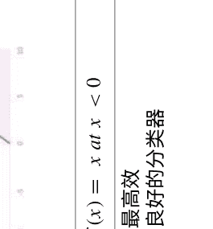

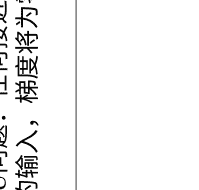

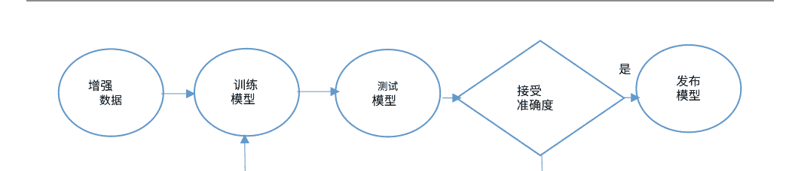

图1.11 神经网络模型开发生命周期：测试和推理流程

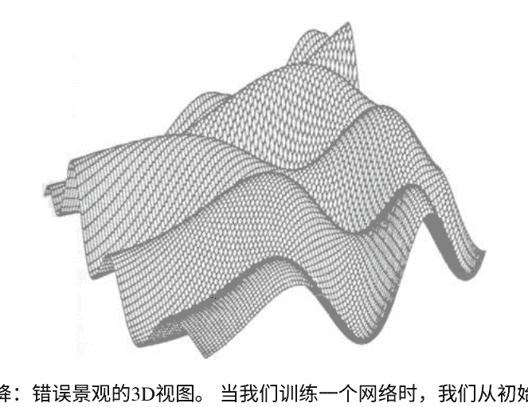

图1.12 梯度下降：错误景观的3D视图。当我们训练一个网络时，我们从初始权重（可能是随机的）开始，并迭代地调整权重。错误下降，或者下降，表面逐渐达到最小点

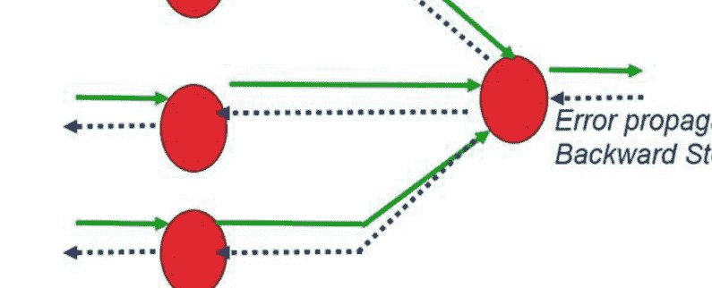

图1.13 反向传播概念

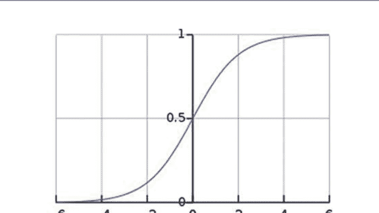

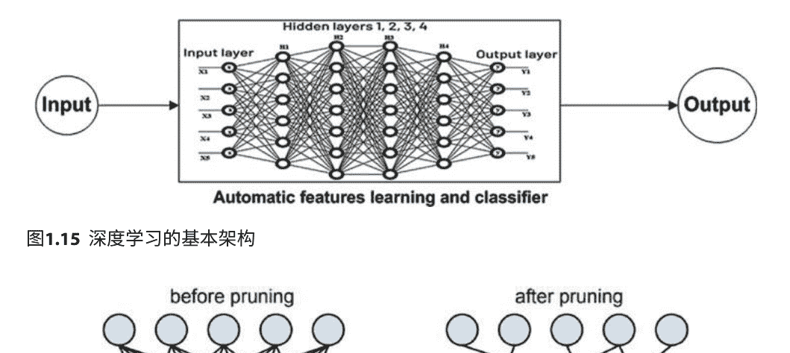

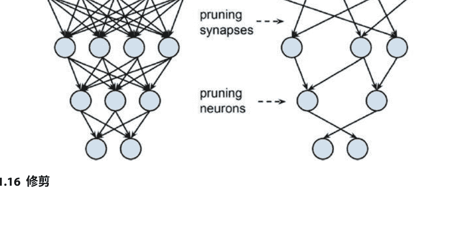

图1.17 前馈神经网络

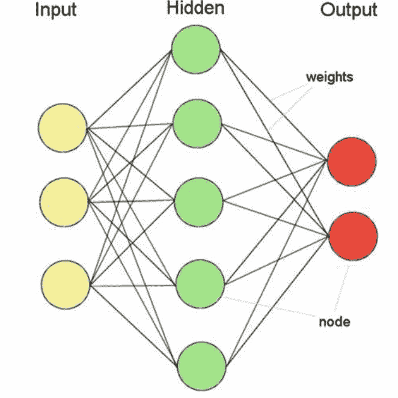

深度置信网络（DBN）在结构上与FC网络相似，但它们在训练上有所不同（图1.18）。DBN通过利用连续RBM对来训练。DBN中的每一层都是下一个邻居的可见RBM层和上一个邻居的隐藏RBM层。这种成对训练对于FC网络中的BP训练方案是一个有益的替代。作为一种有监督方法，DBN可以使用标记数据在RBM初始化后微调权重。它通过采用RBM训练方案克服了BP方法中的梯度消失和梯度爆炸问题。它可以用于有监督和无监督学习。然而，它通常需要更长的训练时间，特别是在经历微调步骤时[30, 31]。

### 1.3.2 循环神经网络

RNN允许我们解决许多传统深度神经网络难以处理的时间序列问题，例如音频或视频[32]。MLP和RNN之间的主要区别在于RNN的隐藏层还额外连接到自身（图1.19）。它对给定的输入序列执行矩阵/向量操作。从面积和能量的角度来看，它更高效。

深度前馈和卷积神经网络都具有一个特点，即它们的网络结构是按顺序排列的，没有反馈结构。

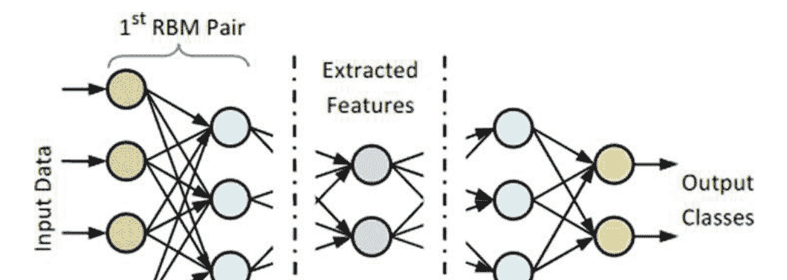

图1.18 深度置信网络

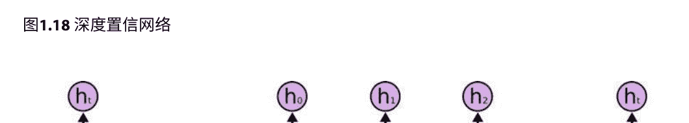

图1.19 RNN架构

然而，在特定任务（如语音信号处理）中，为了更好地捕捉输入向量的时序特征，有时需要结合顺序输入[33]。 RNN具有识别时间序列的动态时态行为的能力。 长短期记忆（LSTM）是一种特殊类别的RNN，它具有学习长期依赖性的能力[34, 35]。 LSTM关注关键信息，并对网络性能产生积极影响。

### 1.3.3 卷积神经网络

卷积神经网络（CNN）是一种特殊类型的多层前馈神经网络，非常适合模式分类。卷积神经网络（CNN）是一种堆叠的层结构（图1.20）。 CNN层中的主要计算是输入和模型权重之间的加权和乘积，其中权重是从训练阶段学习到的权重，输入来自前一层[36]。在CNN中，卷积是将一组3D滤波器在输入张量上移动并输出结果张量。CNN训练是一个迭代过程，每个迭代包括前向阶段和后向阶段。前向阶段逐个将输入图像通过层传递。上一层的输出是下一层的输入。最后一层计算其输出与输入的真实值之间的损失。后向阶段逐层传播损失[37]。在后向阶段期间还计算每个层权重的梯度。在后向阶段结束时，所有权重都会被更新[38]。

卷积神经网络可以用方程(1.5)-(1.7)来描述，其中使用的变量总结在表1.5中。

$$ y = \sum_{i=1}^{n} w_i x_i $$

$$ \text{损失} = \text{成本函数} = \sum_{i=1}^{n} (\text{预测}_i - \text{目标}_i)^2 $$

$$ w_{i+1} = w_i - \eta \frac{\partial \text{损失}}{\partial w_i} $$

卷积神经网络有许多架构，如VGG、AlexNet、GoogLeNet、ResNet。不同卷积神经网络在准确性、层数和每秒浮点运算次数方面的比较总结在表1.6中。CNN的输入信号可以是任何类型的信号，如图像、视频、声音或文本。卷积神经网络是一种具有卷积操作和深层结构的前馈神经网络。作为一种重要的卷积神经网络

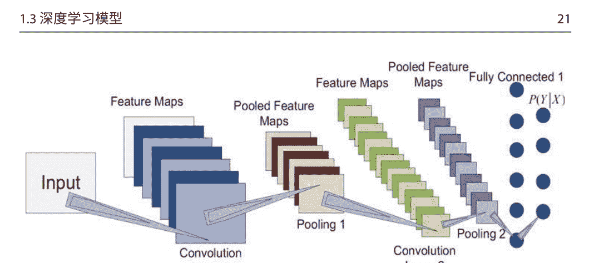

图1.20 CNN架构

表1.5 卷积神经网络中的描述性变量总结Eqs. (1.1)-(1.3)

| 符号 | 描述 |
| :--- | :--- |
| $w_i$ | 权重 |
| $x_i$ | 输入 |
| $y$ | 输出 |
| $\frac{\partial 损失}{\partial w}$ | 每层权重的梯度 |
| $\eta$ | 学习率 |
| $w_{i+1}$ | 更新后的权重 |

深度学习的支持技术促进了人工智能的发展。卷积运算符可以有效地提取空间信息，在视觉图像领域广泛应用，包括图像识别[39]。

### 卷积神经网络架构包括以下层次[40]:

- 卷积层: 提取低级特征，如方向、边缘、梯度和颜色。
- 池化层: 帮助减少卷积层中提取的特征的维度。这有助于减少对数据进行分类的计算复杂性。
- 全连接层: 该层将卷积和池化层的输出作为输入，并为数据集中的图像分配一个标签。为了实现这一点，它将卷积和池化层的输出转换为表示特征属于某个类别的概率的单个向量。

稀疏CNN利用了权重和激活值中大部分为零的事实。硬件加速器通过跳过零乘法和不存储零值来利用权重和激活值的稀疏性。权重和激活值的稀疏性出现的原因和程度各不相同。首先，权重修剪会删除接近零值的滤波器权重。这个过程会创建显著的权重稀疏性[41, 42]。

表1.6 不同类型的CNN的比较[43]

| | AlexNet [44] | VGG [45] | GoogLeNet [46] | Resnet [47] |
| :--- | :--- | :--- | :--- | :--- |
| 准确率 % | 80.2 | 89.6 | 89.9 | 96.3 |
| 层数 | 8 | 19 | 22 | 152 |
| FLOPS | 729 m | 19.6G | 1.5G | 11.3G |

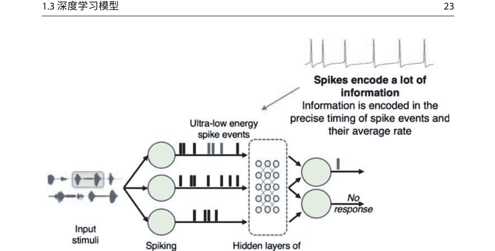

图1.21 脉冲神经网络

### 1.3.4 脉冲神经网络

脉冲神经网络（SNNs）受到生物信息处理的启发，其中稀疏和异步的二进制信号以大规模并行的方式进行通信和处理。在神经形态硬件上的SNNs具有低功耗、快速推理和事件驱动的信息处理等有利特性。这使得它们成为高效实现深度神经网络和许多机器学习任务的选择方法（图1.21）。脉冲神经网络（SNNs）使用无监督的生物启发式神经元和突触连接，可以使用生物学学习规则（如时序相关塑性）或监督统计学习算法（如替代梯度）进行训练[48, 49]。

与传统的前馈神经网络（ANNs）不同，脉冲神经网络（SNNs）在准确性、延迟和功耗之间提供平滑的权衡。这个特性使它们能够进行“快速和慢速”感知[50, 51]。

### 1.3.5 GANs：生成式深度学习

在GAN的训练阶段，生成器（G）和判别器（D）通过对抗过程进行迭代训练。G基于输入图像生成合成样本，而D实现一个二进制分类器来区分生成器生成的样本和真实样本[52]。在监督训练中，需要大量的人力努力来生成经过训练的标记数据。为了解决这个问题，GAN被认为是一个有吸引力的解决方案，它可以从高维数据分布中生成新的样本[53]。生成对抗网络（GAN）是一种无监督学习算法，用于创建类似于训练数据的新数据样本[54-56]。

### 1.3.6 迁移学习加速器

最近，迁移学习作为一种高效的训练范式出现，它重新利用现有的神经网络用于不同的任务。因此，在监督学习中减少了所需的训练和数据标注的工作量[57]。从零开始训练一个学习系统是困难的，因为它需要许多标记图像进行训练，并且需要在领域方面有相当多的专业知识，以确保模型正确收敛。一个有希望的替代方法是改进已经开发的学习系统。与传统的机器学习技术试图从头开始学习每个任务不同，迁移学习技术试图在目标任务具有较少高质量训练数据时从先前任务中转移信息[58]。迁移学习实际上与我们人类的学习方法非常相似；通过完成一个任务获得的知识也可以用来解决其他相关任务。任务之间越相关，知识的转移就越容易（图1.22）[59]。迁移学习的步骤可以总结如下：

- 选择一个预训练模型。
- 移除模型的最后一层（层）。
- 向模型中添加新的层（层）。
- 在新数据集上训练模型。
- 对模型进行微调。

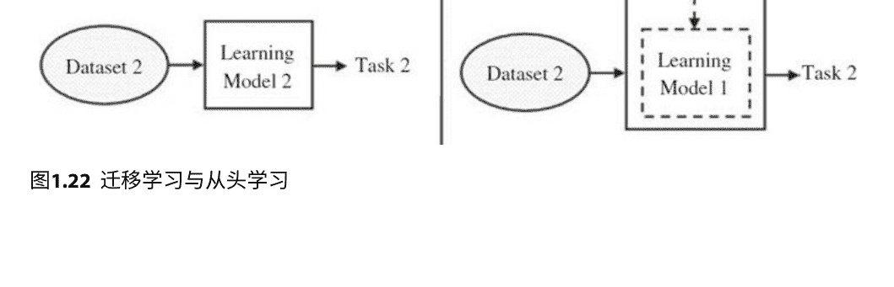

图1.22 迁移学习与从头学习

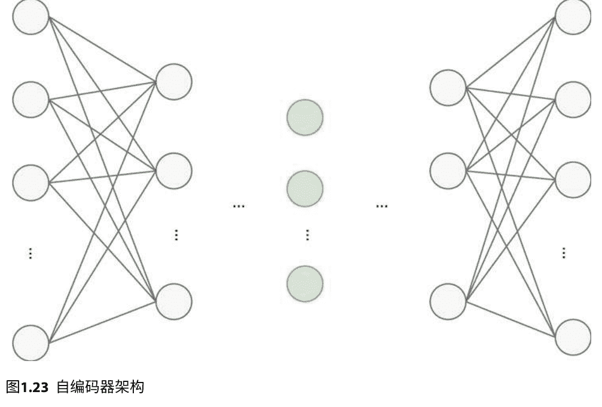

### 1.3.7 自编码器

自编码器（AE）是一种训练有素的神经网络，用于学习输入数据的高效表示，即它学会将输入复制到输出。AE主要用于解决无监督问题。这些网络首先对输入进行压缩（编码），然后通过最小化输入和重构版本之间的差异来重构（解码）输出。数据压缩的目的是获得输入的较小表示并传递它。

自编码器非常适用于故障检测和入侵检测。在AE模型的训练中，希望解码器的输出和编码器的输入尽可能相似[60]。自编码器架构如图1.23所示[61]。

### 1.3.8 不同NN模型的比较

表1.7显示了不同NN模型之间的比较。

|      | 卷积 | 脉冲 | 循环 |
| ---- | ---- | ---- | ---- |
| 应用 | • 图像识别<br>• 视频分析<br>• 药物发现<br>• 视频分析<br>• 自然语言处理<br>• 跳棋游戏<br>• 人体姿势估计<br>• 文档分析 | • 信息处理<br>• 研究生物神经回路的运作，可以模拟虚拟昆虫的中枢神经系统，以寻找食物，而无需先前对环境的了解 | • 语言建模和预测<br>• 语音识别<br>• 机器翻译<br>• 图像识别<br>• 语法学习<br>• 手写识别<br>• 人体动作识别 |
| 优点 | • 在内存和复杂性方面更高效<br>• 良好的特征提取器 | • 用少量数据识别模式<br>• 出色的低分辨率性能 | • 存储信息<br>• 更小的输入节点集合<br>• 鉴于RNN能够记住过去的输入，它适用于任何需要这种能力的任务 |
| 缺点 | • 从内存和容量的角度来看，CNN并不比普通的两层网络多多少<br>• 在运行时，卷积操作计算量大，占用时间的约67%<br>• CNN的速度比完全连接的等效网络慢3倍（在大小方面） | • 由于信息负载格式和固有的计算成本，变得更加复杂<br>• 实际速度实现对于普通公众的消费基础来说并不适合 | • 如果使用tanh作为激活函数，它无法处理非常长的序列<br>• 如果使用REL作为激活函数，它非常不稳定<br>• RNN无法堆叠成非常深的模型<br>• RNN无法跟踪长期依赖关系 |
| 学习算法 | • 通过反向传播进行有监督训练 | • 一次性训练和前馈 | • 梯度下降和全局优化方法 |

## **1.4 深度学习架构**

在本节中，我们将介绍不同的深度学习架构。表1.8显示了不同深度学习架构的比较。

### **1.4.1 AlexNet: 分类**

AlexNet由五个卷积层（用于从图像中获取特征）和三个全连接层组成。完全连接层的最后一层连接到一个N路softmax分类器，其中N是类的数量。此外，它使用dropout进行正则化和ReLU以加快训练收敛速度。

| 架构 | 层数 | 参数 (*10^6) | FLOPs (*10^6) |
| :--- | :--- | :--- | :--- |
| AlexNet | 7 | 62 | 1.5 |
| VGG | 16 | 138 | 15.5 |
| GoogLeNet/Inception | 22 | 6.7 | 1.6 |
| ResNets | 50 | 25.6 | 3.8 |

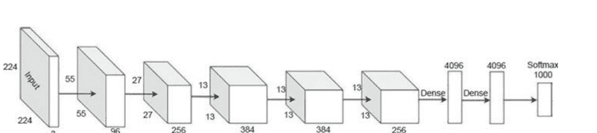

正则化和ReLU用于更快的训练收敛。它专注于较小的感受野大小以提高准确性[62]。AlexNet架构如图1.24所示。

### 1.4.2 VGG：分类

VGG由一系列卷积层（从8到16层）和三个全连接层组成，然后是一个softmax层。VGG使用小的卷积滤波器构建不同深度的网络。这是一个资源密集型的网络[63]。VGG-16架构如图1.25所示。

### 1.4.3 GoogLeNet/Inception：分类

GoogLeNet由22层深的网络组成，由多个Inception模块堆叠而成。Inception模块是具有多个不同大小滤波器的网络。输入特征图通过这些滤波器，然后连接并传递到下一层。该网络还在中间层中使用辅助分类器来帮助正则化和传播梯度。GoogLeNet使用局部稀疏连接架构而不是完全连接架构来解决数据过拟合问题（图1.26）[64]。其架构如图1.27所示。主要思想是图1.25 VGG-16架构

在GoogLeNet中使用Inception Blocks的目的是增加网络的深度和宽度，同时保持计算量不变。

### 1.4.4 ResNet: 分类

ResNet通过在层之间添加跳跃连接来实现。这种连接是输入和输出之间的逐元素相加，不会增加网络的额外参数或计算复杂度。它减少了参数的数量[65]。图1.28显示了ResNet架构。残差块是两个3×3卷积层的堆叠，其中每个层的卷积核数量相等。

### 1.4.5 MobileNets: 分类

MobileNet由28个单独的卷积层组成，每个卷积层后面跟着批量归一化和ReLU激活函数。标准卷积在所有输入通道上使用卷积核，并在一步中将它们组合起来，而深度卷积（将标准卷积分解为深度卷积和1×1的逐点卷积）为每个输入通道使用不同的卷积核，并使用逐点卷积来组合输入。这种特征过滤和组合的分离减少了计算成本和模型大小。它是一种轻量级的目标检测算法[66]。MobileNet的有效性已在广泛的应用领域得到证明，在目标检测和人脸识别等领域表现良好[67, 68]。

图1.26 一个密集网络，一个稀疏网络

### 1.4.6 RetinaNet：分类

RetinaNet是一种流行的单阶段目标检测模型，适用于密集对象。 RetinaNet架构由建立在特征金字塔网络（FPN）上的

图1.27 GoogleNet架构

图1.28 ResNet架构

## 1.5 深度学习平台和库

表1.9显示了不同深度学习平台之间的比较。此外，亚马逊、谷歌、IBM、微软以及几乎所有其他CSP都提供许多机器学习服务（基于云的机器学习）。

### 1.5.1 TensorFlow

TensorFlow是用于编写机器学习应用程序的主要技术工具。它是常用的库之一，用于执行机器学习和各种计算，包括大量的科学活动。TensorFlow的核心组件是计算图和在所有节点之间移动的张量。TensorFlow是由Google开发的端到端开源平台，使用数据流图构建机器学习和深度学习模型。Tensor指的是数据表示，它是一个多维数组，TensorFlow中的所有计算都基于张量[71]。TensorFlow的不同维度显示在图1.29中。

TensorFlow是一个强大的工具，可以用来创建一个稳健的目标检测框架，具有一组标准函数，消除了用户从头开始编写代码的需要。它还提供了一系列预训练模型，不仅对推理有用，还可以用于使用新数据构建模型。

### 1.5.2 Keras

Keras可以采用TensorFlow作为后端。Keras是建立在TensorFlow之上的高级API，用于快速而轻松地设计和训练网络模型。Keras本身没有低级操作；它是在称为后端的开源深度学习库之上运行的，例如TensorFlow [72]。Keras不处理低级API，如计算图、张量或其他变量，因为这些只由后端引擎处理[73]。Keras是最主要的高级神经网络API之一，用Python编写，并支持多个后端神经网络计算引擎。

Keras被创建为一个用户友好的代码接口，易于理解和支持模块化。

表1.9 不同神经网络平台的比较

|  | Tensorflow [75] | Keras [76] | Pytorch [77] |
| :--- | :--- | :--- | :--- |
| 定义 | TensorFlow是一个开源库。在处理深度神经网络时，它是更著名的库之一。 | Keras是一个用Python编写的开源网络库。它能够在TensorFlow之上运行。开发人员可以使用Keras快速构建神经网络，而不必担心张量代数、数值技术和优化方法的数学方面。 | Pytorch是一个基于Torch库的机器学习库，用于计算机视觉和自然语言处理等应用。 |
| 速度 | 更快且适用于高性能 | 较慢 | 与Tensorflow一样快 |
| API的级别 | 提供高级和低级API | 高级API | 提供较低级的API |
| 架构 | 使用起来并不是很容易所以我们可以使用Keras作为使工作更容易的框架 | 具有简单的架构 “更易读” | 具有复杂的架构可读性较差 |
| 调试 | 有一个特殊的专用工具称为TensorFlow调试器 | 在其抽象中有很多计算垃圾，因此调试变得困难 | 可以轻松访问代码更容易专注于每行的执行 |
| 数据集 | 用于高性能模型和需要快速执行的大型数据集 | 用于小数据集因为它是最慢的 | 与TensorFlow相同 |
| 流行度 | 中间 | 具有最高的流行度 | 最低 |
| 操作系统 | Android-ios—Mac os—windows—Linux和Raspberry Pi | Linus和OSX | Windows-Linux和OSX |
| 结论 | 适用于：• 大数据集• 高性能• 功能性 | 适用于：• 快速原型• 小数据集• 多个后端支持 | 适用于：• 灵活性• 短训练时间• 调试能力 |

### 1.5.3 Pytorch

这是一个开源的机器学习框架，加速了从研究原型到生产部署的路径。它具有许多计算机视觉、自然语言处理和其他机器学习技术和库。它使程序员能够计算GPU加速的张量，并帮助创建计算图[74]。

## 1.6 深度学习的挑战

深度神经网络面临许多挑战，特别是在训练方面。

### 1.6.1 过拟合和欠拟合

在机器学习中，过拟合意味着拟合模型时将所有噪点也包括在内。这对模型的性能有负面影响，从而降低了准确性。欠拟合意味着模型过于简单，无法正确拟合训练集中的所有数据点，从而使大部分测试数据中的点成为异常值或噪声（图1.30）。为了克服过拟合，已经提出了几种技术，提出了包括dropout、训练数据采样等技术。Dropout可能是处理过拟合问题最好、最有效和最常见的解决方案。在这种技术中，为了训练网络，在每个时期中，随机选择了少量节点，而不是所有节点，因此确定了节点输出的百分比应该设为零。为了减少过拟合的影响，最简单的方法是减少模型的大小，即减少每层的层数和节点数。这些参数也被称为超参数。另一种技术是权重正则化，网络试图减少损失而不是减少错误。

L1正则化将“权重的绝对值之和”，即 ∑|W|，作为惩罚项添加到损失函数中，而L2正则化将“权重的平方和”，即W^2，作为惩罚项添加到损失函数中。L1正则化通过将接近0或负数的权重值置零来惩罚神经网络的权重。L1的一般直觉是，如果权重值接近0或非常小，它对模型的整体性能影响很小，因此如果我们将该权重设置为0，它不会影响模型的性能，并且可以减少模型的内存消耗。L2正则化也对权重值进行惩罚。对于较小和相对较大的权重值，L2正则化将这些值转换为接近0但不完全为0的数值。

### 1.6.2 长计算时间

有几种方法可以加快深度学习模型的学习和训练速度，例如：更好的参数选择和利用硬件支持，例如GPU或FPGA。

### 1.6.3 梯度消失

当反向传播算法无法将网络错误传播到主要层以更新权重时，就会出现梯度消失问题。在反向传播过程中，梯度从输出层向输入层反向传播，这导致早期隐藏层的学习速度比后期隐藏层慢得多。由于早期层接收到梯度的一小部分（梯度消失），尽管在某些情况下，梯度在向后传播时变得更大（梯度爆炸）。

### 1.6.4 超参数调整：权重和学习率

已经应用了几种算法来系统地搜索最佳超参数值，例如蒙特卡洛和遗传算法。

## 1.7 深度学习的优化

有许多技术用于优化深度学习，例如随机梯度下降和小批量梯度下降。表1.10对梯度下降、随机梯度下降和小批量梯度下降进行了比较。

表1.10 梯度下降、随机梯度下降和小批量梯度下降的比较

| 标准 | 梯度下降 | 随机梯度下降 (SDG) | 小批量梯度下降 |
| --- | --- | --- | --- |
| 使用的数据集大小 | 全部 | 随机子集 | 固定大小子集 |
| 计算成本 | 昂贵 | 较便宜 | 较便宜 |
| 收敛性 | 慢 | 快 | 快且比SDG更稳定 |
| 局部最小值 | 可能会陷入其中 | 可以逃脱 | 可以逃脱且噪声比SDG小 |
| 全局最小值 | 更可靠 | 不太可靠，但更高效 | 不太可靠，但更高效 |

## 1.8 机器学习中不同类型的距离度量

距离度量用于衡量多维空间中两个或多个向量之间的相似性。不同类型的距离度量的分类显示在图1.31 [78]中。

### 1.8.1 欧几里得距离

欧几里得距离表示两个向量之间的最短距离。它是对应元素之间差的平方和的平方根（图1.32）。

### 1.8.2 曼哈顿距离

曼哈顿距离是所有维度上点之间绝对差的总和（图1.33）。

### 1.8.3 汉明距离

汉明距离衡量两个相同长度的字符串之间的相似性。相同长度的两个字符串的汉明距离是对应字符不同的位置的数量（图1.34）。

### 1.8.4 余弦距离

余弦相似度只是两个向量之间夹角的余弦值。如果向量被归一化为长度为一，它们也具有相同的内积（图1.35）。

similarity(A, B) = \frac{A \cdot B}{\|A\| \times \|B\|} = \frac{\sum_{i=1}^{n} A_i \times B_i}{\sqrt{\sum_{i=1}^{n} A_i^2} \times \sqrt{\sum_{i=1}^{n} B_i^2}}

图1.35 余弦距离

### 1.8.5 闵可夫斯基距离

这个距离度量是欧几里得距离和曼哈顿距离度量的推广。它确定了空间中两个或多个向量之间距离的相似性。在机器学习中，从闵可夫斯基方程计算的距离度量被应用于确定大小的相似性。它也被称为p-范数向量，表示范数的阶数。它允许添加参数p，以便计算不同距离的测量（图1.36）。

p=1 for Manhattan distance
p=2 for Euclidean distance
\[D(x, y) = \left( \sum_{i=1}^{n} |x_i - y_i|^p \right)^{\frac{1}{p}}\]

图1.36 闵可夫斯基距离

### 1.8.6 杰卡德距离

杰卡德相似度是一种常用的接近度测量方法，用于计算两个对象（如两个文本文档）之间的相似性。杰卡德相似度可用于计算两个非对称二进制向量之间的相似性，或者计算两个集合之间的相似性（图1.37）[79]。

## 1.9 分类评估指标

机器学习系统应使用代表现实世界错误成本的性能指标进行评估。机器学习分类器的性能评估基于准确率、精确率、召回率、F1分数和混淆矩阵指标[80]。分类器通常表示为一组判别函数。如果如图1.38所示，分类器将特征向量x分配给第i类，则将其表示为一组判别函数。

### 1.9.1 混淆矩阵

混淆矩阵是最常用的分类评估指标之一。从混淆矩阵中可以得出几个指标，用于评估二元分类模型和多类分类模型。混淆矩阵是一个大小为m * m的指标，其中m是类别数。它可以分为四个独立的元素：真正例（TP）、真反例（TN）、假正例（FP）和假反例（FN），如图1.39所示。对于每个类别c:

- 真正例 (TP) ： 当一个样本被正确分类为属于类别c时，称为真正例。
- 假正例 (FP) ： 当一个样本被错误分类为属于类别c时，称为假正例。
- 真反例 (TN) ： 当一个样本被正确分类为不属于类别c时，称为真反例。
- 假反例 (FN) ： 当一个样本被错误分类为不属于类别c时，称为假反例。

可以表示为[81]：

混淆矩阵 = 

| TP | FP |
|---|---|
| FN | TN |

### 1.9.2 准确率

准确率定义为模型正确预测的样本总数与样本总数的比率。 准确率的表达式如式 (1.8) 所示。如果数据集不平衡，因此我们不能完全依赖准确率作为度量标准。

准确率 = (正确分类的样本数 / 总样本数) = (TP + TN) / (TP + TN + FN + FN) (1.8)

### 1.9.3 真正率 (TPR)

TPR是正确预测的正标签与实际正标签总数的比率。

TPR = TP / (TP + FN) (1.9)

### 1.9.4 假负率 (FNR)

FNR是错误预测的正标签与实际正标签总数的比率。

FNR = FN / (TP + FN) (1.10)

### 1.9.5 真负率 (TNR)

TNR是正确预测的负标签与实际负标签总数的比率。

$$ TNR = \frac{TN}{FP + TN} $$ (1.11)

### 1.9.6 假正率 (FPR)

FPR是错误预测的负标签与实际负标签总数的比率。

$$ FPR = \frac{FP}{FP + TN} $$ (1.12)

### 1.9.7 精确度

精确度是指所有正样本中被正确预测为正样本的比例

$$ 精确度 = \frac{TP}{真正例 + 假正例} $$ (1.13)

### 1.9.8 召回率

召回率是指所有实际正样本中被正确预测为正样本的比例。精确度和召回率成反比关系。

$$ 召回率 = \frac{TP}{TP + FN} $$ (1.14)

### 1.9.9 F1-得分

在某些情况下，当我们无法决定精确度和召回率时，我们会使用F1-得分，它是精确度和召回率的组合。

$$ F_{1-得分} = 2 \frac{精确度 * 召回率}{精确度 + 召回率} $$ (1.15)

## 1.10 机器学习的新趋势

### 1.10.1 哈密顿神经网络

前馈神经网络，或多层感知器，是当代深度学习机器的基础，广泛应用于图像、视频和音频处理。这些神经机器通常包含一个输入层、多个隐藏层和一个输出层。同一层内的节点不相互交互，而是通过一组权重和偏置与下一层的节点连接，这些值在训练期间确定，通常使用随机梯度下降（SGD）作为标准方法。

然而，不同层次的网络如何协作解决特定问题的过程仍然神秘。哈密顿神经网络（HNNs）是一种利用哈密顿力学原理对动态系统进行建模和学习的神经网络架构。哈密顿力学是经典力学的一个分支，它用能量和动量来描述系统的演化，而不是位置和速度。在HNN中，网络架构被设计成表示给定系统的哈密顿量。网络的输入是系统在特定时间的状态，输出是该时间的哈密顿量。通过对一组已知轨迹进行训练，HNN可以学习准确地对动态系统的行为进行建模和预测。HNN已成功应用于物理学、机器人学和控制系统等各个领域。它们已被证明在学习复杂物理系统的动力学方面特别有效，如流体流动或分子动力学。HNN的一个关键优势是可以用来模拟难以或不可能以解析方式建模的系统。这使它们成为科学发现和工程应用的强大工具[82]。

### 1.10.2 量子机器学习

征服量子信息领域的竞赛加快了研究和创新的步伐，以开发基于量子技术的激进创新方法。量子计算、通信、感知组合优化和量子机器学习是当前竞争最激烈、最具活力的研究和开发领域之一，即将解锁实用新量子能力，对我们生活的几乎每个方面都产生深远影响。

最近，新兴的量子机器学习领域已经出现，其目标是将机器学习和量子计算相结合。目标是找到量子计算机具有预期能力的机器学习算法的量子实现，并具备机器学习算法的灵活性和学习能力。

量子机器学习中需要解决的问题之一是存在的限制所提出的实现可以处理的输入数据量。尽管许多多体量子系统的希尔伯特空间的维度与系统的大小呈指数增长，可以存储和操作大量数据，但一个重要的问题是准确和高效地初始化所需数据的量子状态。在机器学习中，这个阶段是至关重要的，因为学习一个问题需要大量的学习数据。量子计算承诺加速经典神经网络的训练和大数据应用的计算，产生更快的结果。Quron是一个量子位，其中两个级别代表活跃和休息的神经放电状态。这允许神经网络处于发射模式的叠加态[83]。在考虑量子机器学习（QML）的有用性时，重要的是要注意，仅仅试图在量子处理单元上加速经典ML算法可能不是最佳方法。QML涉及数据生成过程和数据处理设备，每个组件都可以是经典的或量子的。传统ML依赖于经典过程来处理两个组件，而QML通常涉及经典数据生成和量子处理。然而，对于QML来说，更有前途的途径是当数据生成过程本质上是量子的，例如在物理学、化学或生物学等领域，研究人员经常处理量子数据。通过利用量子数据运行量子ML算法，有证据表明这可能会在科学研究中取得重大进展。混合量子-经典架构，结合了经典和量子处理单元，对于某些QML应用可能也是有用的，例如Tensorflow Quantum。

### 1.10.3 联邦学习

联邦学习是一种有前途的学习模式，可以确保隐私，其中模型参数的学习是在中央单元（数据中心或边缘主机）上执行的，而数据保留在外围节点中。在集中式联邦学习中，设备不会将其数据发送到任何远程服务器。它们只共享要学习的参数的本地估计。每个设备都可以在不交换数据的情况下提高性能，从而保护隐私[84-86]。联邦学习（FL）使边缘设备（例如移动电话）在网络上进行协作训练机器学习模型，而不会泄露参与者的原始数据。需要注意的是，边缘设备的硬件资源有限[87]。

### 1.10.4 自监督学习

自监督学习（SSL）是一种机器学习范式，其中模型在输入非结构化数据时自动生成数据标签，这些标签在后续迭代中作为基本事实使用。自监督学习在...方面取得了成功多个领域，即文本、图像/视频、语音和图表。自我监督的术语指的是创建自己的监督，即在没有监督和标签的情况下。自我监督学习是无监督学习的一种类别。迁移学习是自我监督学习的关键推动因素[88]。

### 1.10.5 零样本学习和少样本学习

零样本学习是一种机器学习技术，允许模型推广到未经训练的新类别。在传统的机器学习中，模型是在一组带标签的数据上进行训练的，并且只能识别在训练过程中见过的类别。然而，零样本学习旨在扩展这种能力，以识别新的、以前未见过的类别。在零样本学习中，模型是在包含已见和未见类别的一组带标签的数据上进行训练的。在训练过程中，模型学习将每个类别与一组属性或特征相关联，例如视觉或语义特征。这些属性用于创建表示不同类别之间关系的语义空间。当模型在测试过程中遇到一个新的、未见过的类别时，它可以使用学习到的语义空间推断与该类别相关联的属性或特征。这使得模型能够识别新的类别，即使在训练过程中没有看到任何示例。零样本学习在许多潜在应用中具有很大的潜力，特别是在可能难以或不切实际收集所有可能类别的大量带标签数据的情况下。例如，在图像分类中，零样本学习可以用于识别新类型的对象或场景，如稀有或异国情调的动物，而无需额外的带标签数据[89]。

Few-shot学习是一种机器学习技术，它涉及使用少量标记数据训练模型来识别新的对象或类别。在传统的机器学习方法中，需要大量标记数据来准确训练模型执行任务。然而，在现实世界的场景中，为每个新任务或类别获取标记数据可能耗时且昂贵。Few-shot学习通过训练模型从少量示例中学习如何进行泛化来解决这个问题。

通常，训练集包含少量示例，通常每个类别范围在1-10个示例之间。然后，使用这少量数据训练模型来识别新的对象或类别。Few-shot学习的一种流行方法是元学习，也被称为“学习如何学习”。在这种方法中，模型通过在多个Few-shot学习任务上进行训练来学习如何从少量示例中学习。然后，模型将学到的知识应用于新的任务。Few-shot学习在计算机视觉、自然语言处理和机器人等领域都有应用。它使机器能够快速学习和适应新的任务，使其成为需要在动态和变化环境中运行的人工智能系统的重要技术[90]。

总结一下，零样本学习是一种识别新物体或概念的技术，没有来自该类别的任何标记示例，而少样本学习则涉及使用少量标记示例来识别新物体或概念，通常每个类别1到10个示例。

### 1.10.6 神经符号化人工智能

神经符号化人工智能是指一种新兴的人工智能方法，它将符号化和神经网络模型的优势结合起来。这种方法旨在通过协同方式将它们结合起来，克服每种范式的一些局限性。第一波人工智能是符号化人工智能，它使用逻辑和基于规则的系统来推理世界。这种方法的局限性在于无法处理不确定性和复杂的现实世界数据。第二波人工智能是基于数据学习的神经网络。这种方法在图像和语音识别等领域取得了成功，但由于缺乏可解释性和可解释性而受到限制。神经符号化人工智能作为第三波人工智能，旨在通过结合符号化和神经网络模型的优势来解决这些限制。方法的符号化部分提供了推理抽象概念和基于逻辑规则做出决策的能力。方法的神经部分提供了从数据中学习和处理不确定性的能力。神经符号化人工智能有潜力在自然语言处理、机器人技术和科学发现等领域引起革命性变革。通过结合符号化和神经网络模型的优势，神经符号化人工智能可以实现更智能和灵活的系统，能够以可解释和可解释的方式推理世界[91]。

### 1.10.7 二值化神经网络

网络压缩技术催生了二值化神经网络（BNNs），其中权重和激活由单个比特表示。因此，权重和激活之间通常昂贵的乘累加（MAC）操作可以减少为低复杂度的按位XNOR-位计数操作。这使得BNNs具有功耗高效、计算速度快和节省内存的替代方案，与传统的CNN相比。二值神经网络是在运行时具有二值权重和激活的网络。在训练时，这些权重和激活用于计算梯度；然而，梯度和真实权重以完全精度存储。二值可以是0、1或1，-1 [92]。

### 1.10.8 文本到视频机器学习

文本到视频机器学习是一种涉及训练算法根据文本输入生成视频的人工智能领域。这项技术也被称为文本到场景或场景生成。该过程涉及将文本输入分解为相关概念，并确定需要包含在视频中的关键元素。

这些元素可以包括字符、设置、动作和情感。然后算法使用这些信息生成文本的视觉表示，通常以动画视频的形式呈现。文本到视频的机器学习具有广泛的潜在应用，包括创建解释视频，为社交媒体生成内容，甚至创建动画电影。然而，这仍然是一个相对较新的领域，需要大量的开发和改进才能产生高质量的结果。与任何机器学习技术一样，文本到视频算法需要大量的数据来有效训练。

这可以包括视频镜头、文本描述和其他相关信息。随着更多的数据可用和算法的不断改进，我们可以预期文本到视频机器学习将成为内容创作和故事讲述中越来越重要的工具。

### 1.10.9 图神经网络

图神经网络（gnn）在各个领域引起了相当大的关注，包括自然语言处理、图像处理和计算生物学。这些神经网络的主要优点之一是它们使用户能够指定输入状态的连接模式，提供更大的灵活性。然而，挑战在于根据这种连接模式更新模型，这已经成为几个模型研究的主题。此外，现代方法正在探索改变图形的可能性，例如将边缘转换为节点，以调整计算成本并增加灵活性（图1.40）

### 1.10.10 大型语言模型 (LLM)

大型语言模型（LLM）是一种机器学习模型，可以执行各种自然语言处理（NLP）任务，包括生成和分类文本，以对话方式回答问题和将文本从一种语言翻译成另一种语言（图1.41）。"大"一词指的是模型可以自主改变的值（参数）的数量。一些最成功的LLM具有数千亿个参数[96]。大型语言模型使用强化学习进行微调。强化学习是一种反馈驱动的机器学习方法。

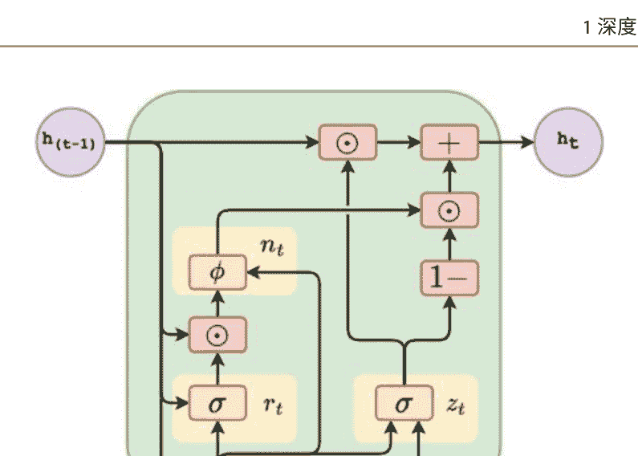

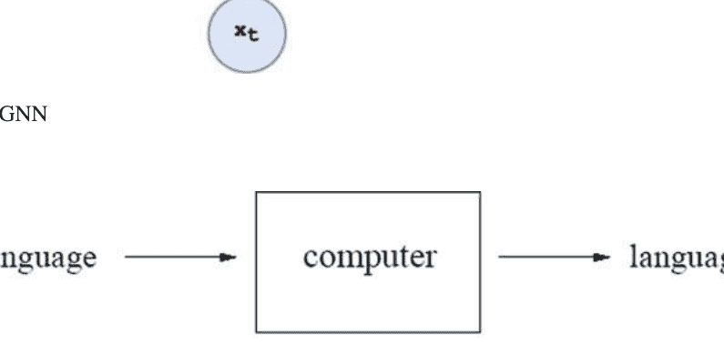

基于奖励系统的方法。代理通过完成特定任务并观察这些动作的结果来学习在环境中执行。代理在每个良好任务上获得正反馈，并对每个不良动作受到惩罚。然而，监督学习和强化学习的结合可以达到最佳性能。

LLM的例子包括生成式预训练变压器3（GPT-3），双向编码器表示来自变压器（BERT），大型语言模型元AI（LLaMA）和多模态大型语言模型（MLLM）。

在深度学习的背景下，分词器是处理文本数据的关键组件，通常用于自然语言处理（NLP）任务。分词器是一个将文本字符串分解为单个标记或单词的函数或模块，通常通过空格或标点符号进行分隔。

这个分词化的过程将原始文本转换为一系列可以轻松输入神经网络进行训练和推理的数值序列。分词是许多NLP任务中的一个重要步骤，包括情感分析、文本分类和语言翻译。深度学习模型在预处理文本数据并将其转换为神经网络可以有效处理的格式方面依赖于分词。在深度学习中使用各种类型的分词器，包括基于单词的分词器、基于字符的分词器、基于子词的分词器和字节对编码（BPE）分词器。每种类型的分词器都有其优点和缺点，这取决于具体的任务和正在处理的数据的特性。

#### 1.10.10.1 GPT

OpenAI引入了生成预训练变压器（GPT）。它是一个非常大的语言模型，是在互联网和维基百科的大规模数据集上训练的[97]。它是在互联网上的大量文本上进行预训练的，因此可以回答问题，它使用了一种特殊的神经网络架构，称为变压器[98-100]。变压器神经网络是一种新颖的架构，旨在解决序列到序列任务，同时轻松处理长距离依赖关系（图1.42）。它被提出来克服RNN的缺点，如训练时间慢和梯度消失。变压器一次处理整个输入，不像RNN。它的主要应用是自然语言处理。GPT-3于2020年6月首次推出。它是在超过570 GB的文本数据集上进行训练的，其中包括书籍、文章和网站等各种来源。

GPT-3拥有1750亿个参数，使其成为迄今为止最大的语言模型。GPT-4能够处理多种类型的数据，包括视频、图像、声音、数字等。

#### 1.10.10.2 BERT

谷歌推出了双向编码器表示转换（BERT）。它利用了Transformer，一种注意机制，学习文本中单词之间的上下文关系[101]。在其原始形式中，Transformer包括两个独立的机制：一个编码器读取文本输入，一个解码器为任务生成预测。GPT-3和BERT的区别在于它们的架构。GPT-3是一个自回归模型，而BERT是双向的。GPT-3在进行预测时只考虑左侧上下文，BERT则同时考虑左侧和右侧上下文（图1.43和1.44）[102, 103]。BERT在大规模数据上进行了预训练，并用于通用领域应用。

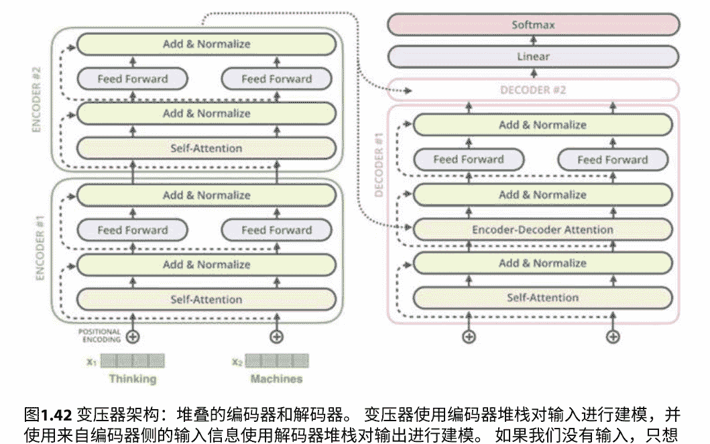

图1.42 变压器架构：堆叠的编码器和解码器。变压器使用编码器堆栈对输入进行建模，并使用来自编码器侧的输入信息使用解码器堆栈对输出进行建模。如果我们没有输入，只想建模下一个单词，我们可以去掉变压器的编码器部分，并逐个输出“下一个单词”。这给了我们 **GPT**。如果我们只对训练语言模型感兴趣，用于其他任务的输入，那么我们不需要变压器的解码器，这给了我们 **BERT**。

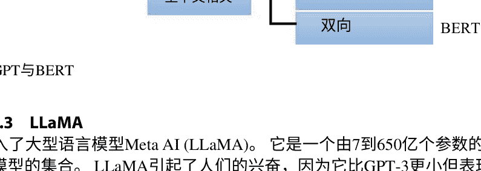

图1.43 GPT与BERT

#### 1.10.10.3 LLaMA

Meta引入了大型语言模型Meta AI (LLaMA)。它是一个由7到650亿个参数的基础大型语言模型的集合。LLaMA引起了人们的兴奋，因为它比GPT-3更小但表现更好。LLaMA最重要的特点之一是它以非商业许可证的形式提供给研究人员和其他组织使用，这使得他们更容易将其用于他们的工作[104]。

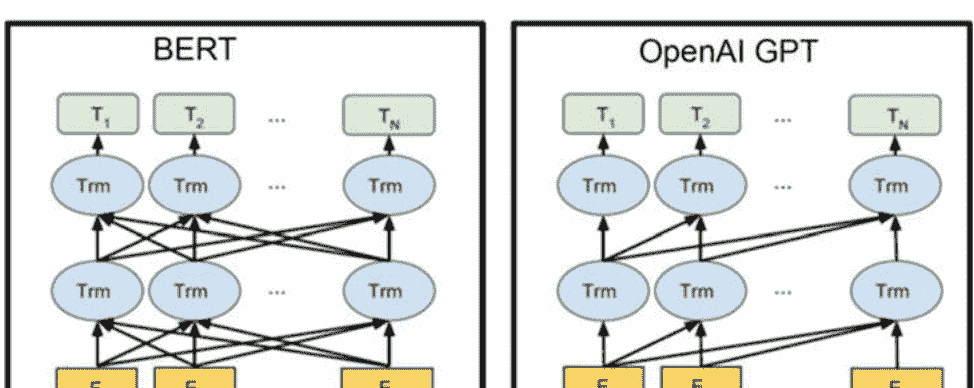

图1.44 GPT与BERT。BERT使用双向变压器。GPT使用从左到右的变压器

#### 1.10.10.4 MLLM

微软推出了一个名为Kosmos-1的多模态大型语言模型（MLLM）。它可以感知不同的模态，以回答提供的问题，如图像和文本。此外，它还展示了视觉对话的能力。此外，它在诸如视觉智商[105]等更复杂的任务中显示出潜力。

#### 1.10.10.5 绿色人工智能

绿色人工智能（AI）是指开发对环境可持续的AI技术，旨在减少AI模型和应用的碳足迹。绿色AI的目标是将AI对环境的负面影响最小化，并在该领域推广更可持续的实践。由于训练和推理需要大量的计算能力和能源，AI模型和应用可能会产生重大的碳足迹。绿色AI通过使用模型压缩、稀疏性和量化等技术来减少AI模型的计算需求来解决这个问题。此外，绿色AI提倡使用可再生能源，如太阳能或风能，来为训练和推理所使用的计算基础设施供电。随着对AI技术的需求不断增长，对AI的环境影响的关注也越来越突出，绿色AI是一个重要的研究领域。通过开发更可持续和环保的AI技术，我们可以帮助减轻AI对环境的负面影响，并促进更可持续的未来[106]。

## 1.11 结论

神经网络的真正优势在于它们代表线性和非线性关系的能力和能力。此外，它们能够直接从建模数据系列中学习这些关系，使用不同的训练机制。本章探讨了不同的机器学习和深度学习算法和架构。此外，它还提供了有关机器学习未来发展方向的见解。深度学习已经成为人工智能领域最强大和最具变革性的技术之一。通过使用具有多层的深度神经网络，深度学习在计算机视觉、自然语言处理、语音识别和许多其他领域取得了突破。随着大量数据和计算能力的可用性，深度学习已经在以前被认为是困难甚至不可能完成的任务中取得了显著的成果。然而，与任何强大的技术一样，深度学习也有其局限性和挑战。这些包括需要大量的数据，解释和理解深度神经网络内部工作的困难，以及可能存在偏见或不公平结果的潜在风险。尽管如此，深度学习很可能在塑造技术和社会未来方面发挥越来越重要的作用，研究人员、开发人员和决策者了解其潜力和局限性非常重要。

## 参考文献

- 1. F. Hayes-Roth, 基于规则的系统。Commun. ACM **28**(9), 921–932 (1985年)
- 2. G. Chandrashekar, F. Sahin, 特征选择方法综述。Comput. Electr. Eng. **40**(1), 16–28 (2014年)
- 3. Y. Bengio, A. Courville, P. Vincent, 表示学习：综述与新视角。IEEE Trans. Pattern Anal. Mach. Intell. **35**(8), 1798–1828 (2013年)
- 4. Y. Geng, M. Liu, Q. Li, R. He, 机器学习导论 (*Institution of Engineering and Technology (IET)*, 伦敦, 2019年)
- 5. [https://github.com/JohnSnowLabs/spark-nlp](https://github.com/JohnSnowLabs/spark-nlp)
- 6. V. Kennady, P. Mayilsamy, 金融部门批处理系统向近实时处理的迁移。Int. J. Sci. Res. Publ. (IJSRP). **12**, 483–493 (2022年)。 [https://doi.org/10.29322/IJSRP.12.07.2022.p12755](https://doi.org/10.29322/IJSRP.12.07.2022.p12755)
- 7. W. Shi, R. Rajkumar, Point-gnn: 基于图神经网络的点云三维物体检测, 在*IEEE/CVF计算机视觉与模式识别会议论文集* (2020), pp. 1711–1719
- 8. H. Ai, W. Xia, Q. Zhang, 基于轻量级神经网络的智能家居解决方案中的说话人识别, 在 *国际网络空间安全研讨会论文集*(Springer, Cham, Switzerland, 2019), pp. 421–431
- 9. G.R. Ball, S.N. Srihari, 半监督学习用于手写识别, 在 *ICDAR’09. 第十届国际文件分析与识别会议*(IEEE, 2009)
- 10. B. Zhu, J. Jiao, M.I. Jordan, 基于人类反馈的有原则强化学习，来自成对或 *k*-wise比较 (2023). arXiv预印本 arXiv:2301.11270
- 11. K. Gurney，神经网络导论 (1996)
- 12. F. Wang, Z. Zhen, B. Wang, Z. Mi, 基于KNN和SVM的天气分类模型的比较研究，用于日前短期太阳能光伏功率预测。应用科学。8(1)(2018)
- 13. H. Drucker, D. Wu, V.N. Vapnik, 用于垃圾邮件分类的支持向量机。IEEE Trans. Neural Netw. 10(5), 1048-1054 (1999)
- 14. https://www.tutorialspoint.com/machine_learning_with_python/classification_algorithms_support_vector_machine.htm
- 15. P. Lingras, C.J. Butz, 粗糙支持向量机中的精确度和召回率,在2007年IEEE国际粒计算会议 (GRC 2007) 中(IEEE计算机学会, 华盛顿, 美国, 2007年), pp. 654-654
- 16. K. Mayur, 分类决策树: 一种机器学习算法(Xorient, 2017)
- 17. X. Yan, X. Su, 线性回归分析: 理论与计算(世界科学, 新加坡, 2009)
- 18. R. Agarwal, P. Sagar, 一种用于水果预测的监督式机器学习算法的比较研究。J. Web Dev. Web Des. 4(1), 14–18 (2019)
- 19. K.P. Murphy, 概率机器学习: 导论 (PML-1)(The MIT Press, 2022)
- 20. K.P. Murphy, 概率机器学习: 高级主题 (PML-2)(The MIT Press, 2022)
- 21. C.M. Bishop, 模式识别与机器学习 (PRML)(Springer, 2007)
- 22. A. Bosch, A. Zisserman, X. Munoz, 使用随机森林和蕨类进行图像分类, 在: 国际计算机视觉会议论文集 (2007)
- 23. https://towardsdatascience.com/k-means-clustering-algorithm-applications-evaluation-methods-and-drawbacks-aa03e644b48a
- 24. J. Ham, M. Kamber, 数据挖掘: 概念与技术, 第2版 (Morgan Kaufman 出版社, 2006年) , 第1-6页
- 25. V. Mnih, K. Kavukcuoglu, D. Silver, A.A. Rusu, J. Veness, M.G. Bellemare, A. Graves, M.Riedmiller, A.K. Fidjeland, G. Ostrovski等, 通过深度强化学习实现人类水平的控制。自然 518 (7540), 529-533 (2015年)
- 26. L. Alzubaidi等, 深度学习综述: 概念、CNN架构、挑战、应用、未来方向。J. Big Data 8 (1) , 53 (2021年) 。https://doi.org/10.1186/s40537-021-00444-8
- 27. https://www.tero.co.uk/writing/ml-rnn.php
- 28. K.I. Lakhtaria, D. Modi, 深度学习: 架构与应用,在深度学习创新与趋势研究手册中, 编者: A. Hassasnien, A. Darwish, C.Chowdhary (IGI Global, Hershey, PA, 2019), 第114-130页
- 29. D. Svozil, V. Kvasnicka, J. Pospichal, 多层前馈神经网络简介. 化学智能实验室系统. 39(1), 43-62 (1997)
- 30. Y. Zhang, P. Li, X. Wang, 基于改进遗传算法和深度置信网络的物联网入侵检测. IEEE Access 7, 31 711-31 722 (2019)
- 31. G.E. Hinton, S. Osindero, Y.-W. Teh, 一种用于深度置信网络的快速学习算法. 神经计算. 18(7), 1527-1554 (2006)
- 32. G. Sreeu, M.A. Saleem Duran, 智能视频监控: 通过深度学习技术进行人群分析的综述. J. Big Data (2019)
- 33. S. Albawi, T.A. Mohammed, S. Al-Zawi, 了解卷积神经网络,在国际工程与技术会议论文集中(2017), pp. 1–6
- 34. B. Hammer, 使用递归神经网络进行学习,在Lecture Notes in Control and Information Sciences(Springer, London, 2000)35. S. Hochreiter, J. Schmidhuber, 长短期记忆. Neural Comput. **9**(8), 1735–1780 (1997)
36. Q. Xiao, Y. Liang, Fune: 一种用于CNN加速的FPGA调优框架. IEEE Des. Test (2019)
37. A. Khan, A. Sohail, U. Zahoora, A.S. Qureshi, 深度卷积神经网络最近的架构调查. Artif. Intell. Rev. **53**, 5455–5516 (2020)
38. L. Zhao, Y. Zhang, J. Yang, SCA: 一种用于训练和推理的安全CNN加速器，2019年欧洲设计、自动化和测试会议与展览 (DATE) (IEEE, 2020)
39. J.J. Hopfield, 神经网络和具有新兴集体计算能力的物理系统。美国国家科学院学报**79**(8), 2554-2558 (1982)
40. S. Haykin, 神经网络与学习机器 (印度 Prentice-Hall, 2011)
41. A. Parashar, M. Rhu, A. Mukkara, A. Puglielli, R. Venkatesan, B. Khailany, J. Emer, S.W. Keckler, W.J. Dally, SCNN: 一种用于压缩稀疏卷积神经网络的加速器，ISCA-44会议论文集 (2017)
42. Y.-H. Chen, J. Emer, and V. Sze, Eyeriss: 一种用于卷积神经网络的能效数据流的空间架构，见 ISCA-43 会议论文集 (2016)
43. A. Mirzaeian, H. Homayoun, A. Sasan, NESTA: 基于汉明权重压缩的神经处理引擎，见 2019年欧洲设计、自动化与测试会议与展览 (DATE)(IEEE, 2019)
44. 神经信息处理系统进展, 第25卷 (2012), 第1097–1105页
45. K. Simonyan, A. Zisserman, 非常深的卷积网络用于大规模图像识别 (2014). arXiv预印本 arXiv:1409.1556
46. C. Szegedy等人, 深入卷积，见 IEEE 计算机视觉与模式识别会议(2015), 第1–9页
47. K. He等人, 深度残差学习用于图像识别，在IEEE计算机视觉和模式识别会议论文集中 (2016年)，第770-778页
48. W. Zhang, P. Li, 通过反向传播进行深度脉冲神经网络的时间脉冲序列学习。Adv. Neural. Inf. Process. Syst. **33**, 第12022-12033页 (2020年)
49. N. Rathi, A. Agrawal, C. Lee, A.K. Kosta, K. Roy, 探索基于脉冲的神经元计算的学习：前景和展望，在2021年欧洲设计、自动化和测试会议展览 (DATE) (IEEE, 2021年)，第902-907页
50. S. Deng, S. Gu, 将传统人工神经网络优化转换为脉冲神经网络，在国际学习表示会议上 (2022年)
51. M. Dutson, Y. Li, M. Gupta, 基于脉冲的任意时间感知，在2023年 IEEE/CVF 冬季计算机视觉应用会议 (WACV) 中，夏威夷瓦伊科洛阿，美国 (2023年)，第5283-5293页。https://doi.org/10.1109/WACV56688.2023.00526
52. F. Chen, L. Song, Y. Chen, Regan: 一种基于重复随机存取存储器的流水线加速器，用于生成对抗网络，在2018年第23届亚洲和南太平洋设计自动化会议 (ASP-DAC) (IEEE, 2018年)，第178-183页
53. I. Goodfellow, J. Pouget-Abadie, M. Mirza, B. Xu, D. Warde-Farley, S. Ozair, A. Courville, Y. Bengio, 生成对抗网络，出现在 NIPS (2014年)，第2672-2680页
54. A. Creswell, T. White, V. Dumoulin, K. Arulkumaran, B. Sengupta, A.A. Bharath, 生成对抗网络概述。IEEE信号处理杂志。**35**, 53-65页 (2018年)
55. A. Radford, L. Metz, S. Chintala, 无监督表示学习与深度卷积生成对抗网络，出现在: 国际学习表示会议 (2016年)，第1-16页
56. D. Foster, 生成式深度学习: 教机器绘画，在写作、作曲和演奏 (O'REILLY, 2019)
57. F. Chen, H. Li, Emat: 一种使用reram进行迁移学习的高效多任务架构, 在 ICCAD (2018)
58. H. Azizpour, A. Razavian, J. Sullivan, A. Maki, S. Carlsson, 通用ConvNet表示的可迁移因素。 IEEE Trans. Pattern Anal. Mach. Intell. 38 (2015)
59. C. Raffel, N. Shazeer, A. Roberts, K. Lee, S. Narang, M. Matena, Y. Zhou, W. Li, P.J. Liu, 探索文本到文本转换器的迁移学习极限。 J. Mach. Learn. Res. 21, 140:1–140:67 (2020)
60. D.P. Kingma, M. Welling, 变分贝叶斯自编码,在第二届国际学习表示会议上, 加拿大,(2014)
61. A. Tawfik等人, 基于自编码器的通用实时有损图像压缩, 在2022年第五届通信、信号处理及其应用国际会议上, 开罗, 埃及(2022), 第1-6页。 https://doi.org/10.1109/ICCSPA55860.2022.10019047
62. F.N. Iandola, S. Han, M.W. Moskewicz, K. Ashraf, W.J. Dally, K. Keutzer, SqueezeNet: AlexNet级别的准确性，参数减少50倍，模型大小<0.5mb [在线]. http://arxiv.org/abs/1602.07360
63. K. Simonyan, A. Zisserman, 面向大规模图像识别的深度卷积网络 [在线]. http://arxiv.org/abs/1409.1556
64. C. Szegedy, S. Ioffe, V. Vanhoucke, A. Alemi, Inception-v4, inception-ResNet和残差连接对学习的影响 [在线]. http://arxiv.org/abs/1602.07261
65. K. He, X. Zhang, S. Ren, J. Sun, 深度残差学习用于图像识别, 在2016年IEEE计算机视觉和模式识别会议(CVPR) (2016), pp. 770–778
66. A.G. Howard, M. Zhu, B. Chen, D. Kalenichenko, W. Wang, T. Weyand, M. Andreetto, H. Adam, MobileNets: 高效的卷积神经网络用于移动视觉应用 [在线]. http://arxiv.org/abs/1704.04861
67. V. Sze, Y.-H. Chen, T.-J. Yang, J. Emer, 深度神经网络的高效处理: 教程和调查 (2017). arXiv预印本 arXiv: 1703.09039v2
68. A.G. Howard, M. Zhu, B. Chen, D. Kalenichenko, W. Wang, T. Weyand, M. Andreetto, H. Adam, 移动视觉应用的高效卷积神经网络Mobilenets (2017). arXiv预印本 arXiv:1704.04861
69. https://towardsdatascience.com/review-retinanet-focal-loss-object-detection-38fba6afabe4
70. Q.-V. Hoang, T.-H. Le, S.-C. Huang, 智能家庭护理系统中RetinaNet手部检测的改进, 在2020年IEEE国际消费电子台湾会议(ICCE-Taiwan)上 (2020), pp. 1–2
71. https://www.tensorflow.org
72. F. Chollet, https://github.com/fchollet/keras
73. B.J. Erickson, P. Korfiatis, Z. Akkus, T. Kline, K. Philbrick, 用于深度学习的工具包和库。 J. Digit. Imaging 30, 400-405 (2017) (@ Springer)
74. https://pytorch.org
75. https://www.tensorflow.org/
76. https://keras.io/api/applications/
77. https://pytorch.org/
78. https://machinelearningmastery.com/distance-measures-for-machine-learning/
79. https://www.learndatasci.com/glossary/jaccard-similarity/
80. T.K. Ming, C. Sammut, G. Webb, 机器学习百科全书(Springer, 2017)
81. M. Hall, I. Witten, E. Frank, 数据挖掘: 实用机器学习工具和技术. (Kaufmann Burlington, 2011)
82. C.-D. Han, B. Glaz, M. Haile, Y.-C. Lai, 可调谐哈密顿神经网络。 物理评论研究。 3 (2021)。 https://doi.org/10.1103/PhysRevResearch.3.023156
83. M. Schuld, I. Sinayskiy, F. Petruccione, 量子机器学习简介。当代物理。 **56**, 172 (2015)
84. Q. Yang, Y. Liu, T. Chen, Y. Tong, 联邦机器学习：概念与应用。ACM 智能系统技术交易。(2019)
85. S. Niknam, H.S. Dhillon, J.H. Reed, 无线通信的联邦学习：动机、机遇和挑战。IEEE通信杂志。 **58**(6), 46–51 (2020)
86. J. Konecny, H.B. McMahan, F.X. Yu, P. Richtarik, A.T. Suresh, D. Bacon, 联邦学习：改善通信效率的策略 (2016)。 arXiv预印本arXiv:1610.05492
87. S. Zhang, W. Mao, Z. Wang, 基于轻量级可变形3D-CNN的高效加速器用于视频超分辨率。IEEE电路与系统I常规论文。https://doi.org/10.1109/TCSI.2023.3258446
88. V. Rani, M. Kumar, K. Saluja, A. Mittal, 自我监督学习：简明回顾 (2023)
89. M. Sarhan, S. Layeghy, M. Gallagher, M. Portmann, 从零样本机器学习到零日攻击检测。国际信息安全期刊 1–13. (2023). https://doi.org/10.1007/s10207-023-00676-0
90. Y. Sun, J. Hao, Z. Zou, L. Shu, S. Hu, 分层分离EMD用于少样本学习 (2022). https://doi.org/10.1007/978-981-19-9198-1_41
91. A. Garcez, L. Lamb, 神经符号AI：第三波。人工智能评论 1–20 (2023). https://doi.org/10.1007/s10462-023-10448-w
92. A. Musello, E. Garzon, M. Lanuzza, L.M. Procel, R. Taco, XNOR位计数操作利用STT-MRAM进行计算内存。IEEE Trans. Circuits Syst. II Expr. Briefs. 1–1(2023). https://doi.org/10.1109/TCSII.2023.3241163
93. U. Singer, A. Polyak, T. Hayes, X. Yin, J. An, S. Zhang, Q. Hu, H. Yang, O. Ashual, O. Gafni, D. Parikh, S. Gupta, Y. Taigman, Make-A-video:文本到视频生成，无需文本视频数据(2022). https://doi.org/10.48550/arXiv.2209.14792
94. H. Ma, Y. Rong, J. Huang, 图神经网络：可扩展性(Springer, 新加坡, 2022), pp.99–119
95. P. Velickovic, G. Cucurull, A. Casanova, A. Romero, P. Lio, Y. Bengio, 图注意力网络 (2017). arXiv:1710.10903
96. Y. Cao et al., 人工智能生成内容 (AIGC) 的综合调查：从生成对抗网络到ChatGPT的人工智能历史 (2023). arXiv预印本 arXiv:2303.04226
97. L. Ouyang, J. Wu, X. Jiang, D. Almeida, R. Lowe等，训练语言模型以遵循人类反馈的指令。(2022)
98. A. Vaswani等，注意力就是你所需要的，在神经信息处理进展中，卷30 (2017)
99. A. Dosovitskiy, L. Beyer, A. Kolesnikov, D. Weissenborn, X. Zhai, T. Unterthiner, M. Dehghani, M. Minderer, G. Heigold, S. Gelly等，一幅图值16x16个词: 用于大规模图像识别的变压器 (2020). arXiv预印本 arXiv:2010.11929
100. Y. Fang, B. Liao, X. Wang, J. Fang, J. Qi, R. Wu, J. Niu, W. Liu, 你只看一个序列:重新思考视觉中的变压器通过目标检测。Adv. Neural Inf. Process. Syst. **34**, 26183–26197 (2021)
101. https://arxiv.org/abs/1706.03762
102. https://blog.invgate.com/gpt-3-vs-bert
103. A. Wang, K. Cho, BERT有一个嘴巴，它必须说话：BERT作为马尔可夫随机场语言模型，在方法优化和评估神经语言生成研讨会 (2019)中
104. https://www.augmentedstartups.com/blog/metallamavschagpt
105. S. Huang等人，语言并不是你所需要的全部：将感知与语言模型对齐(2023)。arXiv预印本arXiv:2302.14045
106. R. Verdecchia, J. Sallou, L. Cruz, 绿色AI的系统性回顾(2023)
107. Z. Fan, Z. Li, B. Li, Y. Chen, H.H. Li, 红色：一种基于reram的反卷积加速器，在 2019 Design, Automation & Test in Europe Conference & Exhibition (DATE) (IEEE, 2019)

## 深度学习用于自动驾驶

### 2.1 介绍

自动驾驶汽车，也被称为自主驾驶车辆（AV），是一种能够感知环境并在减少和消除车祸的过程中安全行驶的汽车，几乎不需要人类干预。驾驶辅助系统和自动驾驶是当前车辆开发中最活跃的研究领域之一。自动驾驶有潜力显著提高公共道路安全，并为现代交通概念提供新的可能性。

自动驾驶汽车采用深度神经网络（DNN）推理来实时检测避免道路上的障碍物。这些工作负载可以在GPU或专用神经网络加速器上执行，并具有实时截止时间。在自动驾驶中，3D物体检测是必不可少的，因为它提供了关于环境的基本知识。

位置和方向，车载摄像头捕捉的车辆内部图像，来自光探测与测距（LiDAR）和超声波传感器的测量数据对于提供智能服务和预警非常有用，但也可能暴露机密信息。为了防止这种情况，已经提出了一种分散式学习算法——联邦学习（FL），它允许车辆仅共享部分信息[1-17]。

自动驾驶汽车架构如图2.1所示。感知的目的是了解环境的一切。感知过程这些数据。决策层是最软件密集的层。在自动驾驶汽车起步之前，控制算法通常部署在汽车上。然而，最近的趋势是用电气和电子元件取代机械和液压元件。

传感器可能有许多需要调整的因素[26, 27]:

- 准确性：真实值与测量值之间的误差（噪声值，对外部干扰的拒绝）
- 分辨率：两个测量之间的最小差异（通常比传感器的实际精度要小得多）。
- 灵敏度：可以检测到的最小值变化。

## 2.2 汽车基础知识

汽车是一个涉及多个领域整合的跨学科领域。汽车高级系统如图2.2所示。汽车制造商正在通过引入新的功能和系统来争相超越对手。车辆网络中包含的系统越多，电子控制单元（ECU）之间的通信就越复杂，因此对这些设计的验证将耗费很长时间。

汽车通信协议包括：CAN（制动）、LIN（车门）、FLEXRAY（安全）、MOST和汽车以太网（诊断）。以太网不符合汽车所需的延迟和噪音水平，这就是为什么我们有其他协议，但它将得到改进，例如减少电缆并增加屏蔽以减少噪音。CAN和LIN总线连接如图2.3所示。带有FlexRay和MOST的汽车骨干架构如图2.4所示[4-9]。带有CAN、LIN和MOST的汽车骨干架构如图2.5所示。不同汽车协议之间的比较可以在表2.1中显示[41, 45, 46]。

图2.3 具有CAN和LIN总线连接的汽车骨干架构

图2.4 具有FlexRay和MOST的汽车骨干架构

## 2.3 AUTOSAR

汽车开放系统架构（AUTOSAR）是一个于2003年成立的全球汽车利益相关方发展伙伴关系。 它的目标是创建和建立一个开放和标准化的汽车电子控制单元（ECU）软件架构。 目标包括适应不同的车辆和平台变体，软件的可转移性，考虑可用性和安全要求，以及各种合作伙伴之间的合作、自然资源的可持续利用以及整个产品生命周期的可维护性。经典的AUTOSAR平台运行在一个微控制器上，分为3个主要层次（图2.5）[71]：

- 基本软件架构。
- AUTOSAR运行环境。
- 应用层。

它包括一个框架来定义和开发这些子系统，以及用于通信、设备驱动程序接口、API和基本软件服务的标准。AUTOSAR包括CAN和FlexRay等通信标准。它在当前的生产车辆中很常见。

经典的AUTOSAR平台满足深度嵌入式电子控制单元（ECU）的要求，这些控制单元根据来自连接到车辆网络的其他ECU的输入信号和信息来控制电气输出信号。通常，您为特定类型的车辆设计和实现控制软件，在车辆的整个生命周期内不会改变。自适应AUTOSAR平台是一种分布式计算

## 2.4 汽车协议

### 2.4.1 CAN总线

#### 2.4.1.1 简介

控制器局域网（CAN）最初由德国罗伯特·博世有限公司于1980年代末开发，用于汽车中。它是一种先进的串行总线系统，有效支持分布式控制系统。它在OSI模型中使用数据链路层和物理层。CAN还有许多可用的高级协议。CAN的发展始于越来越多的电子设备被应用于现代汽车，如发动机管理系统、主动悬挂、ABS、变速控制、照明控制、空调、安全气囊和中央锁定（图2.6）。CAN是一个具有无限节点数量的多主总线。

所有CAN总线节点在每个消息的开始时与属于帧的第一个下降沿同步。这被称为硬同步（图2.7）。用于控制特定应用的典型CAN节点由不同的设备组成（图2.8）。应用本身由微控制器控制，例如西门子SAB 80C166。为了能够参与CAN通信，微控制器必须连接到CAN协议控制器，例如西门子独立的全CAN控制器81C90/91，其中CAN控制器是一个常规的微控制器，支持所有标准的8051资源，如三个定时器/计数器、串行端口、四个8位I/O端口（加上两个专用于内存接口的8位端口）、状态和控制寄存器。为了满足ISO 11898 CAN标准的要求，使用CAN收发器芯片将节点连接到CAN总线线路（图2.9）。

这些总线节点没有特定的地址。相反，地址信息包含在传输的消息标识符中，指示消息内容和消息的优先级。此外，它使用非归零（NRZ）位编码。总线访问通过先进的串行通信协议“载波侦听多路访问/冲突检测与非破坏性仲裁（消息优先级仲裁）”，这意味着通过按位仲裁来避免消息的碰撞，而不会浪费时间。总线有两种状态，称为“占优（0）”和“隐性（1）”。碰撞处理的工作原理如下：

+   (1) 当一个节点传输每个位时，它验证在总线上看到的位值与其自己传输的位值相同。
(2) 总线上的“0”优先于总线上的“1”。
(3) 输掉的节点停止传输，获胜者继续传输。

#### 2.4.1.2 CAN帧类型

CAN总线有以下5种不同的帧类型：

+   (1) 数据帧。
(2) 远程帧。
(3) 错误帧。
(4) 过载帧。
(5) 帧间间隔。

##### A. 数据帧

当节点希望传输数据时，会生成一个“数据帧”。该帧以一个主导的起始帧位开始，用于所有节点的硬同步。数据帧的不同字段可以描述如下（图2.10）：

- 起始帧位标志着数据帧的开始，它由一个单个的主导位组成。
- 仲裁字段由12位组成：11位标识符，反映消息的内容和优先级，以及远程传输请求位。远程传输请求位用于区分数据帧（RTR = 主导）和远程帧（RTR = 隐性）。
- 下一个字段是控制字段，由6位组成。该字段的第一位称为IDE位（标识符扩展），处于主导状态以指定帧为标准帧。接下来的位保留并定义为主导位。控制字段的剩余4位是数据长度代码（DLC），指定消息中包含的数据字节数（0-8字节）。
- 数据字段：发送的数据位于数据字段中，其长度由上述DLC定义（0、8、16、...、56或64位）。
- 循环冗余字段（CRC字段）紧随其后，用于检测可能的传输错误（错误处理）。CRC字段由一个15位的CRC序列组成，由隐性的CRC分隔符位完成。

- 下一个字段是确认字段。在ACK时隙位期间，发送节点发送一个隐性位。任何接收到无误帧的节点都通过发送一个主导位来确认正确接收该帧（无论该节点是否配置为接受该特定消息）。
- 最后，由七个隐性位确定帧的结束。

##### B. 远程帧

如果节点希望请求源数据，它会发送一个与所需数据帧的标识符匹配的远程帧。然后，适当的数据源节点将作为对此远程请求的响应发送一个数据帧。远程帧的帧结构几乎与数据帧相同。图2.11显示了一个说明性的例子。

##### C. 错误帧

任何检测到总线错误的节点都会生成一个错误帧。错误帧由两个字段组成，一个错误标志字段后跟一个错误分隔符字段。错误分隔符由8个隐性位组成，在错误发生后，它允许总线节点在清除错误后重新启动总线通信。然而，错误标志字段有两种形式。错误标志字段的形式取决于检测到错误的节点的“错误状态”（图2.12）。

##### D. 过载帧

它用于延迟下一个CAN消息。过载帧与“活动”错误帧具有相同的格式。然而，过载帧只能在帧间隔期间生成。这是区分过载帧和错误帧的方式（错误帧在消息传输期间发送）。

##### E. 帧间间隔

帧间间隔将前一个帧（无论类型如何）与后续的数据或远程帧分隔开。帧间间隔由至少3个隐性位组成，这些位被称为间歇。这段时间是为了让节点在下一个消息帧（图2.13）开始之前有时间进行内部处理。

### 2.4.2 FlexRay

#### 2.4.2.1 简介

FlexRay网络标准用于汽车。它作为CAN和LIN之后的下一步，能够可靠地管理更多的安全和舒适功能。FlexRay专注于当今汽车行业的一系列核心需求，包括比以前的标准更高的数据速率、灵活的数据通信、多样化的拓扑选项和容错操作。因此，FlexRay提供了速度和可靠性。CAN网络已经达到了其性能极限，最高速度为1 Mbps。在两个通道上可用的最大数据速率为10 Mbps，总数据速率可达20Mbit/sec，当在相同应用中使用时，FlexRay的净带宽可能比CAN高20倍。FlexRay还提供了许多在CAN中不可用的可靠性功能。具体而言，冗余通信能力使得完全重复的网络配置和硬件的调度监控成为可能。FlexRay还提供了灵活的配置，支持总线、星型和混合类型等拓扑结构。设计人员可以通过组合两个或多个这些拓扑结构来配置分布式系统。此外，FlexRay允许同时进行同步（实时）和异步数据传输，以满足车辆中各种系统的需求。为了满足不同的通信需求，FlexRay在每个通信周期内提供了静态和动态通信段。静态通信段提供了有界延迟，动态段有助于满足系统运行时可能出现的不同带宽需求。FlexRay帧的固定长度静态段使用由最长FlexRay消息或最大传输延迟（最多2.5 μs）或节点之间的时钟偏差确定的固定时间触发方法传输消息，动态段使用灵活的时间触发方法传输消息。除了像CAN和LIN一样作为单通道系统运行，FlexRay还可以作为双通道系统运行。双通道选项通过冗余网络提供数据，这对于高可靠性系统至关重要。FlexRay规范涵盖了OSI模型的数据链路层和物理层。FlexRay节点由通过FlexRay控制器和两个FlexRay收发器（通道冗余）连接到通信线的ECU组成。控制器处理数据链路层FlexRay协议。收发器负责总线上的物理信号传输。每个FlexRay节点由控制器部分和驱动器部分组成。控制器部分包括主机处理器和通信控制器。驱动器部分通常包括总线驱动器和总线守护程序（可选）。总线驱动器将通信控制器连接到总线，总线守护程序监视对总线的访问。主机通知总线守护程序通信控制器已分配的时间槽。然后，总线守护程序只允许通信控制器在这些时间槽中传输数据，并启用总线驱动器。如果总线守护程序检测到时间上的间隙，它将断开通信通道（图2.14）。FlexRay使用两种方法授予节点对总线的访问权限：

- **TDMA（时分多址）**
  TDMA方法使用分时槽的通信调度。每个FlexRay节点被分配一个或多个时间槽，以获得对总线的访问权限。通信调度周期性地由所有节点重复。
- **FTDMA（灵活时分多址）**
  FTDMA方法用于实现动态段，该段在通信周期中保留了一个特定时隙，任何节点都可以以非确定性的方式传输消息。

FlexRay使用差分信号传输和NRZ编码，具有两个通信线路：Bus Plus（BP）和Bus Minus（BM）。物理层定义了四个总线电平（图2.15）：

- 主导态—差分电压不等于0 V（Data_1，Data_0）。
- 隐性态—差分电压为0 V（空闲和低功耗）。

FlexRay节点具有几种基本操作状态，如图2.16所示。

- 配置：用于进行各种初始设置，包括通信周期和数据速率。
- 准备：用于进行内部通信设置。
- 唤醒：用于唤醒未通信的节点。在这种状态下，节点发送唤醒信号给另一个节点，该节点被唤醒并启用通信控制器、总线驱动器和总线守护程序。
- 启动：用于启动时钟同步并准备通信。
- 正常（主动/被动）：可通信状态。
- 停止：表示通信已停止。

#### 2.4.2.2 FlexRay帧结构

帧结构如图2.17所示。

- 传输开始序列（TSS）用于通过网络初始化正确的连接设置。TSS的目的是标记传输的开始，并建立发射器和接收器之间的路径。这包括设置主动星型耦合器的输入和输出连接，以及允许接收总线驱动器有足够的时间来意识到总线不再空闲。
- 帧开始序列（FSS）用于补偿TSS后可能存在的量化误差的第一个字节开始序列。
- 字节开始序列（BSS）用于向接收设备提供位流定时信息。
- 帧结束序列（FES）用于标记帧的最后一个字节序列的结束。

### 2.4.3 本地互连网络（LIN）

#### 2.4.3.1 简介

LIN是一种异步串行广播总线，所有消息都由一个单一的主节点发起，最多有一个从节点回复给给定的消息标识符。LIN是一种低速、单线通信总线，数据传输速率可达20 Kbps，适用于响应时间不是关键问题的模块，如后视镜控制和窗口控制。LIN总线是一个轮询总线，只有一个主设备和一个或多个从设备。主设备包含一个主任务和一个从任务（图2.18）。每个从设备只包含一个从任务。在LIN总线上的通信完全由主设备中的主任务控制。在LIN总线上传输的基本单元是帧，它分为头部和响应两部分。头部始终由主节点传输，包括三个不同的字段：中断、同步（sync）和标识符（ID）。响应由从任务传输，可以位于主节点或从节点中，包括数据负载和校验和。LIN协议的一个关键特性是调度表。它用于管理帧时隙的时序和总线上的流量控制。在LIN协议中应用调度表可以保证LIN总线不会过载。

#### 2.4.3.2 LIN消息帧

LIN消息帧显示在图2.19中。

- 中断：每个LIN帧都以中断开始，其中包括13个占主导地位的位（名义）后跟一个占优势的中断分隔符位（名义）。这对总线上的所有节点都起到了帧开始的通知作用。
- 同步：同步字段是主任务在头部传输的第二个字段。同步字段允许执行自动波特率检测的从设备测量波特率的周期，并调整其内部波特率与总线同步。
- 标识符：ID字段是主任务在头部传输的最后一个字段。该字段为网络上的每个消息提供了标识，并最终确定网络中的哪些节点接收或响应每个传输。所有从任务不断监听ID字段，验证其奇偶性，并确定它们是发布者还是订阅者对于这个特定的标识符。LIN总线提供了64个ID。ID 0-59用于传输信号（数据）帧，60和61用于传输诊断数据，62保留用于用户定义的扩展，63保留用于未来的协议增强。ID以一个受保护的ID字节的形式传输到总线上，其中低6位包含原始ID，高2位包含奇偶校验位。
- 数据字节：数据字节字段由从属任务在响应中传输。该字段包含一到八个字节的有效载荷数据字节。
- 校验和：校验和字段由从属任务在响应中传输。LIN总线定义了两种校验算法之一来计算八位校验和字段中的值。经典校验和通过对数据字节求和来计算，增强校验和通过对数据字节和受保护的ID求和来计算。

### 2.4.4 媒体导向系统传输（MOST）

#### 2.4.4.1 简介

MOST针对汽车音视频设备接口进行了优化。MOST总线是一个以星型或环型拓扑结构实现的多媒体光纤点对点网络，数据传输速率可达24 Mbps。MOST合作组织发布了MOST25、MOST50和MOST150，它们的帧通常包含一个用于同步传输流数据的通道，一个用于异步传输分组数据的通道，以及一个用于控制数据传输的通道。MOST是一个具有新颖灵活架构的通信系统，被许多不同的制造商使用，以满足各种需求。它可以同步传输音频信号，就像电话一样，是当今汽车中最广泛使用的多媒体系统。MOST规范区分了与功能块的交互的三个视图：HMI、控制器和从设备。从设备是由控制器控制的MOST设备，它通过其功能块的属性和方法提供其功能。从设备完全没有系统知识，即不会静态存储有关其他设备的信息，因此也不会控制其他从设备。它们可以轻松地添加到或从MOST系统中删除，而无需修改软件或影响其他从设备。这意味着如果将CD换碟机或放大器实现为从设备，它们可以轻松地在不同的车辆平台上使用。

控制器是MOST系统的一个功能部分的管理应用程序，即它控制一个或多个从设备的功能块。例如，调谐器可以控制其对应的放大器。为此，控制器需要部分系统知识，即它必须知道要控制的功能块。控制器使用应用协议来控制功能块。它通过控制通道传输。被寻址功能块的设备地址不需要知道，因为它由网络服务确定。

人机界面（HMI）是MOST系统用户的接口，因此在高抽象级别上呈现系统功能。它协调各个控制器。

#### 2.4.4.2 MOST帧结构

多媒体数据的同步传输直接反映在帧结构中。一个帧包含一个用于同步传输流数据的通道，一个用于异步传输分组数据的通道，以及一个用于控制数据传输的通道。在流数据通道中，可以建立静态连接，用于流源和一个或多个流接收器之间的采样率为44.1 kHz（MOST25和MOST50）和48 kHz（MOST150）的传输。由于MOST系统同步传输音频数据，因此不需要额外的数据缓冲。这减少了设备的复杂性，从而节省了成本。此外，最典型的数据类型是同步的，它表示多媒体数据，并占据了帧的最大可配置部分。异步数据用于支持多媒体信息，例如GPS系统、访问文件的信息以及MOST系统内封装协议的数据。MOST帧如图2.20所示。

## 2.5 ADAS技术

高级驾驶辅助系统（ADAS）是帮助驾驶员在驾驶过程中的系统。当与安全的人机界面设计时，它们应该增加汽车安全性和更普遍的道路安全性。有许多形式的ADAS可用；一些功能已经内置在汽车中或作为附加包提供。此外，还有售后解决方案可用。ADAS依赖于来自多个数据源的输入，包括汽车成像、激光雷达、雷达、图像处理、计算机视觉和车载网络（图2.21）。还可以从与主要车辆平台分离的其他来源获得其他输入，例如其他车辆，称为车辆对车辆（V2V）或车辆对基础设施（V2I）。不同ADAS传感器技术之间的比较显示在表2.2中。

|          | 测量           | 环境易感性                     | 改进的领域 |
|----------|----------------|--------------------------------|------------|
| 雷达     | 距离、速度     | 射频干扰                       | 角度       |
| 摄像头   | 角度、颜色、模式 | 雨、雾、雪、尘土、非视距       | 虚假图像、目标 |
| 激光雷达 | 距离、角度     | 雨、雾、雪、尘土、非视距       | 远程目标   |

以下是一些ADAS功能：

- **目标检测**

一种计算机视觉算法，用于检测相机视野中的物体，例如行人、车辆、动物或骑车者。交通标志识别/交通灯检测。交通标志识别系统是一种基于摄像头的技术，用于检测和分析道路旁边的交通标志。限速标志可以用来控制车辆的速度。通常，重要的交通标志会显示在仪表盘上，以便通知驾驶员。

- **交通灯/标志识别**

交通灯识别系统是一种基于摄像头的技术，用于检测和分析交通灯，无论是为了通知驾驶员还是为了为自动驾驶车辆提供信息。交通灯检测和识别技术对于无人驾驶系统和车辆辅助驾驶系统的发展非常重要。检测算法应具有更高的检测准确性。

- **车道保持辅助**

车道保持辅助结合了一个前置摄像头来检测车道标线和一个电动转向系统，将车辆保持在车道中央。

前20家汽车ADAS公司是：

- 爱信精机股份有限公司
- 奥托立夫股份有限公司
- 博世集团
- 大陆集团
- 德尔福汽车
- 电装株式会社
- 飞思卡尔半导体
- 根特克斯公司
- 哈曼国际
- 海拉KGaA Hueck & Co
- 现代摩比斯
- 曼牌国际股份有限公司
- Mobileye N.V
- 英伟达
- 松下株式会社
- 瑞萨电子
- 高田公司
- 德州仪器
- RW汽车
- 法雷奥公司

## 2.6 SAE国际标准（J3016）

为了提供自动驾驶的共同术语，SAE国际提出了新的J3016标准。《关于道路上机动车辆自动驾驶系统的分类和定义》提供了一个统一的分类系统和支持定义，其中包括：

- 从“无自动化”到“全自动化”识别六个级别的驾驶自动化，并基于技术的功能方面进行定义和级别。
- 描述逐步通过级别的分类区别。
- 与当前行业实践一致。
- 消除混淆，在多个学科（工程、法律、媒体和公共话语）中有用。
- 通过澄清每个级别中驾驶员在执行动态驾驶任务时（如果有的话）的角色，为更广泛的社区提供教育，同时驾驶自动化系统处于启用状态。

SAE国际于2014年1月发布的J3016为自动驾驶提供了一个通用的分类法和定义，以简化沟通并促进技术和政策领域内的合作。它定义了十几个关键术语，包括下面斜体的术语，并为每个级别提供了完整的描述和示例，如图2.22所示。

该报告的六个驾驶自动化级别从无自动化到全自动化。一个关键区别是在第2级，人类驾驶员执行部分动态驾驶任务，而在第3级，自动驾驶系统执行整个动态驾驶任务，如图2.23所示。

动态驾驶任务包括驾驶任务的操作性（转向、制动、加速、监控车辆和道路）和战术性（响应事件、确定何时换道、转弯、使用信号等）方面，但不包括驾驶任务的战略性（确定目的地和航路点）方面。

驾驶模式是一种具有特定动态驾驶任务要求的驾驶场景（例如，高速公路合流、高速巡航、低速交通拥堵、封闭校园操作等）。

请求干预是自动驾驶系统向人类驾驶员发出的通知，要求其迅速开始或恢复执行动态驾驶任务。

尽管全自动驾驶车辆预计将作为独立平台运行，但它们目前是依赖网络的系统，需要持续访问通信通道。从车辆传感器收集的数据在距离上有限，并且可能无法捕捉到周围的景观以实现安全的自动驾驶。因此，自动驾驶车辆通过与蜂窝网络的实时连接收集数据来规划其道路。如果发生任何网络中断，车辆安全系统可能会将驾驶模式从全自动切换为部分自动。

## 2.7 彩色图像处理

图像处理是将原始图像转换为数字格式的过程，可能会对原始图像进行修改。主要颜色是红色（R）、绿色（G）和蓝色（B）。主要颜色可以相加产生光的次要颜色：品红色（红色+蓝色）、青色（绿色+蓝色）和黄色（红色+绿色）。如图2.1所示，将3种主要颜色（红色、绿色和蓝色）以相等的百分比相加会产生白色。形成任何特定颜色所需的红色、绿色和蓝色的量被称为三刺激值，并分别表示为 X、Y 和 Z。然后，颜色通过其三色系数来指定，如图2.2所示。

通常用于区分一种颜色与另一种颜色的特征有亮度、色调和饱和度。

- 色调是与光线混合中的主导波长相关的属性。色调表示观察者所感知到的主导颜色。因此，当我们称一个物体为红色、橙色或黄色时，我们指的是它的色调。
- 饱和度指的是与色调混合的白光的相对纯度或数量，饱和度的程度与添加的白光量成反比。
- 色调和饱和度一起被称为色度，因此，一个颜色可以通过其亮度和色度来描述。

另一种指定颜色的方法是使用CIE色度图，如图2.1所示。它显示了颜色组成与 x（红色）和 y（绿色）的函数关系，对于任何 x 和 y 的值，可以从以下方程中得到相应的 z（蓝色）的值：x + y + z = 1。它的特点如下：

- 等能量点对应于三原色的等分数。
- 位于色度图边界上的任何点都是完全饱和的。当一个点离开边界并接近等能量点时，会添加更多的白光，使其变得不那么饱和。等能量点的饱和度为零。
- 色度图对于颜色混合非常有用，因为图中任意两点之间的直线段定义了通过这两种颜色的加法组合可以获得的所有不同的颜色变化。
- 同样，图中连接的任意三个点定义了通过将这三种颜色加法组合而得到的所有不同的颜色变化（图2.3）。

### 2.7.1 颜色模型

#### A. RGB颜色模型

在RGB颜色模型中表示的图像由三个分量图像组成（图2.4），每个分量代表一种主要颜色。当输入RGB显示器时，这三个图像在屏幕上合并成一个复合颜色图像。在RGB空间中表示每个像素所使用的位数称为像素深度。考虑一个RGB图像，在这些条件下，每个RGB颜色像素被认为具有24位深度（3个图像平面乘以每个平面的位数），其中每个红色、绿色和蓝色图像都是8位图像（图2.5）。

- 总颜色数：2^{24} = 16,777,216。
- 连接黑点和白点的线代表灰度[40]。

#### B. CMY颜色模型

通过使用以下方程式，可以将RGB颜色模型转换为CMY颜色模型：

```
\[
\begin{bmatrix} C \\ M \\ Y \end{bmatrix} = \begin{bmatrix} 1 \\ 1 \\ 1 \end{bmatrix} - \begin{bmatrix} R \\ G \\ B \end{bmatrix}
\]
```

- 纯青色不含红色。
- 纯洁的品红色不反射绿色。
- 纯黄色不反射蓝色。
- 上述方程还揭示了RGB值可以通过从一组CMY值中减去各个CMY值得到。

#### C. HSI颜色模型

回想一下，色调是与光波混合中的主导波长相关联的属性。色调表示观察者所感知到的主要颜色，饱和度指的是与色调混合的白光的相对纯度或数量，连接黑点和白点的线称为强度线，其中包含所有灰色级别。点的色调由与某个参考点的角度确定。通常（但不总是），从红轴开始的0°角指定0色调，然后逆时针方向增加色调。强度由垂直于强度线的平面的位置确定，即，当接近白点时，强度增加，当接近黑点时，强度减小，饱和度由从强度线的向量的长度确定，即，当接近强度线时，饱和度减小，当接近边缘时，饱和度增加。

总结一下：

- 角度定义了色调。
- 向量长度定义了饱和度。
- 平面的位置定义了强度。

从RGB模型转换到HIS模型时，应用以下方程：

```
$$
\theta = \cos^{-1}\left\{ \frac{\frac{1}{2}[(R-G)+(R-B)]}{\left[(R-G)^2+(R-B)(G-B)\right]^{1/2}} \right\}
$$

$$
H = \begin{cases} \theta & \text{if } B \leq G \\ 360-\theta & \text{if } B > G \end{cases}
$$

$$
S = 1 - \frac{3}{(R+G+B)}[\min(R,G,B)]
$$

$$
I = \frac{1}{3}(R+G+B)
$$
```

### 2.7.2 图像处理操作

强度切片用于使用颜色区分多个强度，而这些颜色实际上并不是其真实颜色。在下面的示例中（图2.6），灰度被分成不同的区间，并为每个区域分配了不同的颜色，而不考虑图像中灰度级别的含义。在这个X射线图像中，我们的目标是区分白色火花和其他强度[64-69]。

## 2.8 基于深度学习的目标检测算法

目标检测是计算机视觉中最关键的领域之一，由于其在监控和安全、医学成像、媒体和娱乐以及交通自动化等方面的广泛应用。目标检测的目标是在图像中识别出物体的边界框及其对应的类别。文献中有许多算法来解决这个问题。在下面的小节中，我们将详细介绍目标检测中使用的最著名的方法。目标检测是使用预定义类别进行分类，并使用轴对齐框来定位对象的任务。

图像或视频中的目标检测是通过分类和使用轴对齐框来定位对象的任务[17–25]。早期基于卷积神经网络的目标检测方法包括从目标图像中选择数千个区域进行目标检测的区域提取阶段，这将导致高计算开销，例如著名的区域卷积神经网络（R-CNN）。最近，提出了一系列高效的目标检测卷积神经网络架构，包括快速R-CNN、更快R-CNN、单次检测（SSD）和YOLO模型。特斯拉使用深度学习和其他算法来构建自动驾驶汽车[28–32, 48]。

### 2.8.1 你只看一次（Yolo）：定位

“你只看一次”是一种使用卷积神经网络进行目标检测的算法。YOLO是目前较快的目标检测算法之一。与识别算法相比，检测算法不仅预测类别标签，还能检测物体的位置。因此，它不仅将图像分类为一个类别，还可以在图像中检测多个物体。该算法将一个神经网络应用于整个图像。这意味着该网络将图像分成区域，并为每个区域预测边界框和概率。YOLO速度快，因此非常适合实时处理。YOLO对输入图像的大小不变。然而，在实践中，由于实施算法时可能出现各种问题，我们可能希望保持恒定的输入大小。其中一个主要问题是，如果我们想要以批处理方式处理图像（GPU可以并行处理批处理中的图像，从而提高速度），我们需要具有固定高度和宽度的所有图像。这是将多个图像连接成一个大批次所必需的。

网络通过一个称为网络步幅的因子对图像进行下采样。例如，如果网络的步幅为32，则尺寸为416×416的输入图像将产生一个尺寸为13×13的输出。通常，网络中任何一层的步幅等于该层输出相对于输入图像的缩小因子。在YOLO中，预测是通过使用一个使用1×1卷积的卷积层来完成的。锚框是一种边界框。现在有一个YOLOv2检测器[10]。图2.24显示了YOLO的架构，[28, 29]。卷积是对实值参数的两个函数进行的操作，可以看作是一种平均过程[50, 51]。YOLOv5s具有高速检测和准确性，其模型非常小。

网络模型越小，对移动设备的性能要求越低，部署也越容易[54, 55]。YOLOv5使用了数据增强的方法，如缩放、颜色空间调整和马赛克增强，而YOLOv4使用了许多信息删除的方法，如随机擦除、剪切、隐藏和寻找。这些方法通过遮盖和删除图像的某些区域来实现数据增强。信息删除方法的核心要求是避免过度删除和连续区域的保留。然而，当YOLOv4对诸如交通灯等小目标图像进行信息删除时，存在高检测目标完全删除的概率，使得剩余的信息不足以进行目标检测。最终，可能会出现较大的检测误差。YOLOv5为我们提供了两个优化函数，Adam和SGD，在训练较小的数据集时通常是更好的选择，而SGD则更适合训练大型数据集。

为了使汽车能够自学驾驶，引入了增强步骤，通过引入具有虚假变化和扭曲的最终帧序列，使自动驾驶汽车能够从错误的位置或姿态中恢复。这些干扰的幅度是从正态曲线中随机选择的。概率的值为0，方差是与驾驶员记录的方差相比大的倍数。随着数据集的增大，人为地增加数据集会引入不希望的伪影[57-59]（图2.25）。

## 2.8.2 单次检测器（SSD）：定位

SSD不是分别生成感兴趣区域并对区域进行分类，而是同时进行，一次性完成[11]。SSD的逐步算法如下：

- 图像通过一系列卷积层，每个层都提供一个不同维度的特征图。
- 对每个特征图的每个位置应用一个3×3的卷积滤波器，以评估一组默认边界框（相当于Faster R-CNN的锚框）。
- 对于每个边界框，同时预测其偏移量和类别概率。
- 在训练过程中，根据交并比（IoU）将真实边界框与预测边界框进行匹配，其中与真实边界框的IoU大于0.5的预测被标记为正样本。IoU是一个分类阈值，用于将正样本（所需对象）与负样本（非相关对象）分开。

简而言之，SSD将边界框的输出空间离散化为每个特征图位置上的一组具有不同长宽比和尺度的默认框。对于大型对象，SSD表现良好。此外，对于移动应用程序，它的速度更快。SSD架构如图2.26所示。

## 2.8.3 基于区域的卷积神经网络（R-CNN）：定位

CNN太慢，计算非常昂贵。在滑动窗口检测器生成的如此多的补丁上运行CNN是不可能的。R-CNN通过使用一种称为选择性搜索的对象提议算法，将馈送给分类器的边界框数量减少到近2000个区域提议。选择性搜索使用纹理、强度和颜色等局部线索生成对象的所有可能位置[12]。R-CNN架构如图2.27所示。尽管这种方法优越，但由于对每个图像的许多区域提议进行单独分类，仍然需要大量的训练和推理时间。

## 2.8.4 快速R-CNN：定位

由于传统的选择性搜索技术，R-CNN需要大量时间来提取区域提议。为了解决这些问题，基于CNN的快速R-CNN在提取区域提议之前使用卷积层。它使用一个称为感兴趣区域（ROI）池化的网络层。为了通过ROI池化传播梯度，它使用了一个简单的反向传播计算。它与最大池化梯度计算非常相似，唯一的区别是池化区域有重叠。因此，一个细胞可以从多个区域接收梯度。快速R-CNN还将边界框回归添加到神经网络训练本身中。现在网络有两个头，分类头和边界框回归头。这种多任务目标是快速R-CNN的一个显著特点，因为它不再需要独立训练网络进行分类和定位。这两个改变减少了整体训练时间，并增加了与R-CNN相比的准确性，因为CNN的端到端学习[13]。快速R-CNN架构如图2.28所示。

### 2.8.5 Faster R-CNN：定位

Fast R-CNN中最慢的部分是选择性搜索。Faster R-CNN用一个非常小的卷积网络称为区域建议网络（RPN）来生成感兴趣的区域，以处理对象的纵横比和尺度的变化。Faster R-CNN引入了锚框的概念。在每个位置上应用边界框回改进锚框。边界框的不同尺寸可以通过像Fast R-CNN一样应用ROI池化来进一步传递。剩余的网络与Fast R-CNN类似。Faster R-CNN的速度几乎是Fast R-CNN的10倍，准确度相似[14, 31]。图2.29显示了Faster R-CNN架构。Faster R-CNN在速度和准确度方面优于R-CNN和Fast R-CNN[49]。

## 2.8.6 空间金字塔池化（SPP-Net）：定位

SPP-Net与R-CNN几乎相似，但SPP-Net在每个窗口提议上使用空间金字塔池化（SPP），使它们在馈送到完全连接层之前成为固定大小的输出，如图2.30所示。SPP-Net消除了R-CNN中固定大小输入图像的限制，使其更加有效[15]。

### 2.8.7 Mask R-CNN：定位

Mask R-CNN通过定位每个对象的精确像素来扩展Faster R-CNN的概念。而Faster R-CNN只预测每个对象的边界框。Mask R-CNN在相同的Faster R-CNN架构中使用RoIAlign层而不是RoI池化层。RoIAlign层用于将区域提议中的对象的提取特征对齐到最终输出中的对象位置。因此，Mask R-CNN生成三个输出：预测类别、对象的位置和二进制对象掩码[16]。

### 2.8.8 不同目标检测算法的比较

表2.3展示了针对目标检测的提出的CNN架构的比较。

## 2.9 V2X通信和安全

5G移动通信推动了智能交通系统的发展，可以提高道路安全和交通效率。车联网（IoV）是智能交通系统的一个关键方面，结合了计算机技术、移动无线通信和人工智能等先进技术。车辆到一切（V2X）涵盖了广泛的无线技术，包括车辆到车辆（V2V）通信、车辆到基础设施（V2I）通信和车辆到行人（V2P）通信[36-39]：

- 车辆对车辆（V2V）：避免碰撞。
- 车辆对基础设施（V2I）：V2I通信使得传输有关道路状况、交通拥堵和道路事故的详细信息。此外，它负责交通信号优先级[61, 72]。
- 车辆对行人（V2P）：行人的安全警报。
- 车辆对网络（V2N）：实时交通和路线。

车辆对一切的通信（V2X）基于WLAN的（IEEE 802.11p）或基于蜂窝的（3G、4G、LTE、5G），如图2.31所示。它应该具有延迟<100毫秒和无线覆盖范围~=1公里。其频段为5.855-5.925 GHz。车辆对车辆（V2V）的安全机制基于PKI基础设施，每辆车都被分配一个公钥和私钥。公钥通过由CA签名的证书分发。图2.31显示了V2X通信的一个示例。区块链广泛用作分布式账本技术，用于安全的数据结构解决方案，允许车辆之间共享数据。基于V2X通信的连接车辆数量正在增加，并且预计到2023年将增加到7.75亿辆[60]。随着连接车辆数量的增加，安全威胁也在增加，需要保证电子组件之间的通信稳定性。作者[62]提出了一种基于深度学习的V2X碰撞预防新框架，他们的模型可以根据过去七秒的车辆数据预测未来三秒内可能发生的碰撞。V2X链路的射频信号被用于定位，类似于在蜂窝系统中的做法，例如通过三边测量[63]。如今，汽车设计变得越来越复杂，具有连接性、自动驾驶和电动动力系统等先进功能。随着复杂性的增加，潜在威胁的攻击面也在增加，从而增加了安全风险。减轻这些风险的一种有效方法是在汽车设计中使用硬件可信根。硬件可信根是一个安全的、防篡改的组件，为整个系统提供安全基础。通常它被实现为一个独立的硬件模块，如可信平台模块（TPM），用于保护敏感数据和操作，并确保系统按预期运行。在汽车领域，硬件可信根可用于保护诸如车辆固件、加密密钥和用户数据等敏感数据。它还可以用于安全认证车辆及其组件，并防止对关键系统的未经授权访问。在汽车设计中，硬件可信根的一个应用示例是用于保护车辆电子控制单元（ECU）之间的通信。每个ECU都可以拥有自己的硬件可信根，用于安全认证和加密ECU之间的通信。这可以帮助防止中间人攻击，即攻击者拦截和修改ECU之间的通信。另一个示例是使用硬件可信根通过空中更新车辆固件（OTA）。硬件可信根可以确保固件更新来自可信源，并在传输过程中没有被篡改。它还可以安全存储解密固件更新所需的加密密钥，并防止对固件的未经授权访问。在汽车设计中使用硬件可信根可以为系统提供安全基础，保护敏感数据和操作，认证车辆及其组件，并防止对关键系统的未经授权访问[70]。

## 2.10 目标检测的硬件平台

### 2.10.1 FPGA

基于FPGA的系统相对于传统的基于处理单元的系统（如台式电脑、智能手机和GPU）的优势在于可自由编程的可用性。通用逻辑块。FPGA可以组成高性能的专用加速器，用于非常特定的任务，从而提高处理速度和吞吐量。与GPU相比，FPGA被认为是一种更节能的设备，更适合移动设备应用。这些优势的代价是增加了复杂性，并在开发过程中降低了灵活性，设计师需要仔细考虑可用的硬件资源和将目标算法高效映射到FPGA架构上。此外，FPGA通过打破顺序执行的范式，并在每个时钟周期中完成更多工作，超越了数字信号处理器（DSP）的计算能力，充分利用了硬件并行性。在硬件级别上控制输入和输出（I/O）提供更快的响应时间和专门的功能，以更好地满足应用需求。FPGA通常不使用操作系统，以最小化真正并行执行和确定性硬件所带来的可靠性问题，每个任务都有专用的硬件。应用特定集成电路（ASIC）是定制的半导体设备。与FPGA不同，ASIC没有任何由配置逻辑和通用互连引起的面积或时序开销，因此具有最快、最节能和最小的系统。然而，复杂的ASIC制造工艺导致了非常漫长和复杂的开发周期以及非常高的非重复工程前期成本，需要一种一次性正确的方法和非常广泛的设计验证。因此，ASIC主要适用于非常高容量、成本敏感的应用，其中非重复工程和制造成本可以在许多设备之间共享。FPGA具有可重编程性，更适合原型设计和短开发周期，可以在硬件中测试和验证概念，而无需经过定制ASIC设计的漫长制造过程。FPGA芯片可以进行现场升级，无需进行ASIC重新设计的时间和费用。数字通信协议，例如，其规范可能随时间变化，基于ASIC的接口可能会引起维护和前向兼容性挑战。作为可重构的，FPGA可以跟上未来可能需要的修改。虽然最好将算法适应GPU的并行性质，但FPGA架构是为应用程序量身定制的，可以使用可编程逻辑块构建以满足算法需求。换句话说，在为FPGA开发机器学习技术时，对算法的适应性不那么重要。这样可以更自由地探索算法级别的优化。FPGA设计的性能可以在稍后探讨如何进一步增加。需要许多复杂的低级硬件控制操作的优化技术不能轻易地在高级软件语言中实现，因此考虑FPGA实现更具吸引力。此外，FPGA是可重构和灵活的，因此可以在同一芯片上实现多种CNN模型，而无需额外的设计成本，这在ASIC中是不可能的。因此，FPGA是我们算法最合适的平台。

### 2.10.2 高级综合（C/C++到RTL）

使用HLS，设计师可以通过循环、数组、浮点数、函数调用和其他相关算术操作来实现他们的设计。使用的循环、数组、函数调用等被转换为计数器、多路复用器、乘法器、存储器、计算核心和握手协议。编译可以使用脚本编译器指令或编译器编译指示来进行引导，这些是由HLS编译器直接解释的元指令。Vivado高级综合（Vivado HLS），由Xilinx提供，是最常见的商业HLS工具。虽然HLS可以提供更快的开发周期、更容易的硬件实现跟踪和更高的生产力；但对于许多应用来说，HLS工具并不能提供足够的优化。HLS中的优化是有限的，并且由嵌入在工具中的指令和程序定义。事实上，HLS工具已经在市场上存在了大约几年，但设计师们仍然使用硬件描述语言进行FPGA设计。将顺序的高级软件描述转换为完全优化的并行硬件架构的任务非常复杂。尽管公司已经投资了数亿美元和多年的研究来开发HLS，但所取得的结果仍然高度依赖于编码风格和复杂的设计细节。由于编译器中的缺陷和不足只能在设计过程中发现，因此选择使用HLS存在着不可忽视的风险。尽管如此，使用HDL实现算法是繁琐而复杂的，并且使用HLS无法满足优化水平，设计师们发现自己被束缚住，必须在优化和开发周期之间做出权衡。

### 2.10.3 高级综合（Python到HDL）

MyHDL将Python转化为硬件描述和验证语言，为硬件工程师提供了Python生态系统的强大功能[35]。MyHDL是一个免费的开源软件包，用于将Python用作硬件描述和验证语言。Python是一种非常高级的语言，硬件设计师可以充分利用其功能来建模和模拟他们的设计。此外，MyHDL可以将设计转换为Verilog或VHDL。这为传统设计流程提供了一条路径。在一些限制条件下，MyHDL支持将MyHDL代码自动转换为Verilog或VHDL代码。该功能提供了从MyHDL到标准Verilog或VHDL基础设计环境的路径，以便进行转换，硬件描述应满足某些限制条件，定义为可转换子集。可转换的设计可以使用MyHDL库中的toVerilog或toVHDL函数将其转换为Verilog或VHDL中的等效模型，当转换器遇到无法转换的结构时，尝试发出清晰的错误消息。编码风格是可转换代码的自然限制，它应该按照MyHDL风格编写：通过信号进行协作文生器之间的通信，并具有敏感性指定恢复条件。支持的类型是关于对象类型的最重要限制。只能转换有限数量的类型。Python的int和long对象被映射到Verilog或VHDL整数。所有其他支持的类型需要有一个定义的位宽。支持的类型包括Python的bool类型，MyHDL的int类型和由函数Enum返回的MyHDL枚举类型。MyHDL类型的映射总结在图2.16中。已知问题是Verilog和VHDL整数是32位宽的，而Python正在向具有未定义宽度的整数过渡。Python的int和long变量被映射到Verilog整数；因此，对于宽度超过32位的值，这种映射是不正确的。综合指示是指定为Verilog注释。从always comb推断出的敏感性列表的位置不一致。always comb的语义，在Verilog和MyHDL中都是在代码末尾有一个隐式的敏感性列表。然而，这可能无法合成。因此，推断的敏感性列表被放置在相应的always块或进程的顶部。这可能导致模拟开始时的不一致行为。解决方法是在时间0创建事件。

### 2.10.4 MATLAB

HDL Coder可以从MATLAB函数、Simulink®模型和状态流程图中生成可移植、可综合的Verilog和VHDL代码。生成的HDL代码可用于FPGA编程或ASIC原型设计。HDL Coder提供工作流程顾问，自动化编程Xilinx、Microsemi和Intel FPGA。您可以控制HDL架构和实现，突出显示关键路径，并生成硬件资源利用率估计。Vision HDL Toolbox提供用于在FPGA和ASIC上设计和实现视觉系统的像素流算法。它提供了一个支持多种接口类型、帧大小和帧速率（包括高清1080p视频）的设计框架。工具箱中的图像处理、视频和计算机视觉算法使用适合HDL实现的架构。工具箱算法旨在生成可读、可综合的VHDL和Verilog代码（使用HDL Coder™）。生成的HDL代码可以实时处理1080p60。知识产权（IP）块为计算密集型流算法提供了高效的硬件实现，通常在硬件中实现，从而加速图像和视频处理子系统的设计[34]。

### 2.10.5 Java到VHDL

由于使用HDL从头开始实现CNN模型，特别是大型模型是不切实际的，因此文献中提出了一种基于Java语言的VHDL生成工具（VGT）。它提供了一个参数化的实现，以克服高级描述语言和HLS工具的限制。此外，为了实现高性能并避免CNN的低利用率；最后，显著缩短开发周期并提供简单的迭代优化[33]。通过仅传递CNN模型的配置给VGT，用户可以配置他们的CNN模型并在几秒钟或几分钟内生成优化的VHDL代码，具体取决于实现模型的大小。目前，VHDL是我们实现的支持的HDL语言。生成的实现是完全流水线化的，设计中的每个阶段都被适当地流水线化以隐藏延迟；高度并行，与可用的硬件资源相对应地充分利用并行性；可扩展和可重构，实现可以通过VGT或直接使用生成的VHDL代码根据所需的更改进行轻松重构；以及模块化，生成的代码被分解成多个VHDL模块，每个模块代表目标CNN模型中的特定层。配置过程：在此过程中，用户通过工具的GUI（手动配置）或通过外部规格/配置文件设置模型规格。在配置阶段之后，用户被提示验证他们的CNN模型。事实上，在构建CNN模型时，设计者必须遵守一组规则。在VGT中，这些规则被嵌入以检查配置模型的有效性。只有在成功验证后，用户才能进入第二个过程，在该过程中，他们可以处理目标CNN模型的参数（权重和偏差）。

## 2.11 自动驾驶模拟器

CARLA是一个开源的驾驶模拟器，旨在解决自动驾驶领域的各种挑战。它的功能包括模拟和渲染逼真的环境，特别是在物理准确性方面。CARLA具有包括RGB摄像头、激光雷达和IMU在内的大量传感器。这些传感器可以连接到不同的执行器，如车辆，以感知环境。CARLA提供了一个Python API来访问和配置执行器、传感器和虚拟世界[52]。CARLA是一个客户端-服务器架构。服务器负责渲染传感器结果、物理计算和更新世界状态。客户端由自定义模块组成，可以编写来评估来自参与者的感知数据，并向它们应用命令。

## 2.12 自动驾驶挑战

完全自主仍然存在根本性挑战。一些这些挑战在表2.4中显示[42-44, 47]。

## 2.13 结论

自动驾驶有潜力彻底改变我们的出行方式，使我们的道路更安全、更高效、更便捷。随着传感器技术、机器学习和人工智能的最新进展，我们离实现这一愿景比以往任何时候都更近了。自动驾驶车辆可以减少由人为错误引起的事故，减少交通拥堵，并为那些无法自己驾驶的人提供更大的出行便利。然而，仍然存在一些重要的挑战需要解决，例如法规和法律框架、网络安全问题以及决策算法的伦理考虑。工业、政府和社会的利益相关者合作解决这些挑战，并确保自动驾驶技术以负责任和安全的方式开发和部署是至关重要的。总的来说，自动驾驶的潜在好处是显著的，如果正确实施，它有潜力改变我们的生活和出行方式。

表2.3 针对目标检测提出的CNN架构的比较

| 度量         | 骨干网络      | 准确率   | 速度   | 复杂度 |
| :----------- | :------------ | :------- | :----- | :----- |
| YOLO         | GoogleNet     | 低       | 高     | 简单   |
| SSD          | VGG-16        | 低高     | 中间   | 复杂   |
| R-CNN        | AlexNet       | 非常低   | 非常低 | 简单   |
| FAST R-CNN   | VGG-16        | 中间     | 低     | 中间   |
| FASTER R-CNN | VGG-16        | 高       | 高     | 中间   |
| MASK R-CNN   | ResNeXt-101   | 高       | 中间   | 复杂   |
| SPP-Net      | ZF-5          | 高       | 中间   | 复杂   |

表2.4 自动驾驶挑战

| 技术挑战 | 传感器 | 自动驾驶车辆使用各种传感器。所有这些传感器需要在任何天气条件、繁忙的交通和道路标志下工作和收集数据。 |
| :------- | :----- | :---------------------------------------------------------------------------------------------------- |
|          | 安全性 | 自动驾驶车辆需要以安全、可靠和实时的方式与云端或其他车辆进行通信和数据传输。                          |
| 政策挑战 | 法规   | 它们需要获得批准。                                                                                    |
| 非技术挑战 | 成本   | 这是一项昂贵的技术                                                                                    |
| 社会挑战 | 伦理问题 | 如果在交通灯为汽车绿灯时突然有行人走到路上，应该做出什么决定？                                        |

## 参考文献

- 1. 西门子公司，CANPres.版本2.0，西门子微电子公司。
- 2. 博世控制器区域网络（CAN）版本2.0，协议标准，REV3
- 3. 国家仪器公司的本地互连网络（LIN）总线介绍，2016年8月24日
- 4. 德州仪器的LIN协议和物理层要求，2018年2月
- 5. FlexRay通信系统协议规范版本3.0.1
- 6. A. Grzemba，基于*MOST*规范版本3.0的汽车多媒体网络，E2 (2010)
- 7. ADAS和自动驾驶车辆的可能未来控制系统。基于J. Scobie和M. Stachew的*EE Times* (2015)
- 8. J. Scobie, M. Stachew, 自动驾驶车辆中的电子控制系统分区, *EE Times* (2015)
- 9. https://www.electronicdesign.com/markets/automotive/article/21808066/paving-a-new-way-to-autonomousvehicle-validation.
- 10. J. Redmon, A. Farhadi, YOLO9000: 更好、更快、更强, in *Proceedings of the IEEE Conference on Computer Vision and Pattern Recognition* (2017), pp. 7263–7271
- 11. W. Liu, D. Anguelov, D. Erhan, C. Szegedy, S. Reed, C.-Y. Fu, A.C. Berg, SSD: 单次拍摄多盒检测器, in *Computer Vision ECCV 2016*, eds. by B. Leibe, J. Matas, N. Sebe, and M. Welling (Springer International Publishing), pp. 21–37
- 12. Z. Cai, N. Vasconcelos, 级联 r-CNN: 深入高质量目标检测。 https://arxiv.org/abs/1712.00726v1
- 13. R. Girshick, Fast r-cnn, 在*IEEE*国际计算机视觉会议(*ICCV*)上, 第1440–1448页 (2015)
- 14. S. Ren, K. He, R. Girshick, J. Sun, Faster r-cnn: 朝着实时目标检测与区域提案网络(2016)
- 15. K. He, X. Zhang, S. Ren, J. Sun, 深度卷积网络中的空间金字塔池化, 发表于会议名称: *IEEE模式分析与机器智能交易*(第37卷, 第9期), 第1904–1916页。
- 16. K. He, G. Gkioxari, P. Dollár, R. Girshick, Mask r-cnn (2018)
- 17. Q. Xia, W. Ye, Z. Tao, J. Wu, Q. Li, 边缘计算的联邦学习调查: 研究问题和解决方案。 *高可信计算* **1**(1), 100008 (2021)
- 18. E. Yurtsever, J. Lambert, A. Carballo, K. Takeda, 自动驾驶调查: 常见实践和新兴技术。 *IEEE Access* **8**, 58443–58469 (2020)
- 19. J. D'Onfro, 我讨厌他们: 当地人据称对字母公司的自动驾驶汽车感到沮丧。 *CNBC* (2018)
- 20. R. Girshick, 快速 R-CNN, 在*IEEE* 国际计算机视觉会议论文集 (2015), 第 1440–1448 页
- 21. O. Ince, I. Ince, J. Park, J. Song, B. Yoon, 基于视频分析的生物特征的儿童和成人分类 *ICIC Int.* 819–825 (2017). ISSN 2185–2766
- 22. D.A. Ridel, N. Deo, D.F. Wolf, M.M. Trivedi, 通过车载视觉理解行人-车辆交互: 一种LSTM模型和实证分析, 在*IEEE*智能车辆研讨会论文集(2019), 第 913–918 页
- 23. P. Sun等人, 自动驾驶感知的可扩展性: Waymo开放数据集, 在2020年*IEEE/CVF*计算机视觉和模式识别会议 (*CVPR*) (美国华盛顿州西雅图, 2020年), 第2443-2451页。 https://doi.org/10.1109/CVPR42600.2020.00252
- 24. Y. Byeloborodov, S. Rashad, 自动驾驶车辆对象行为预测的机器学习算法设计, 在2020年第11届IEEE年度普适计算、电子与移动通信会议 (UEMCON) (美国纽约, 2020年), 第0101-0105页。 https://doi.org/10.1109/UEMCON51285.2020.9298139
- 25. S.D. Pendleton, H. Andersen, X. Du, X. Shen, M. Meghjani, Y.H. Eng, D. Rus, M.H. Ang, 自 主车辆的感知、规划、控制和协调。 Machines 5(1) (2017)
- 26. S. Liu, L. Li, J. Tang, S. Wu, J.-L. Gaudiot, 创建自主车辆系统 (Morgan & Claypool, 2018年)
- 27. C. Bao, T. Xie, W. Feng, L. Chang, C. Yu, 基于Winograd的低功耗优化框架FPGA加速器用 于YOLO. IEEE Access 8, 94307–94317 (2020)
- 28. Z. Wang, K. Xu, S. Wu, L. Liu, L. Liu, D. Wang, 稀疏YOLO: 用于YOLOv2的FPGA加速器的硬件/软件协同设计. IEEE Access 8, 116569–116585 (2020)
- 29. W. Liu, D. Anguelov, D. Erhan, C. Szegedy, S. Reed, C.-Y. Fu, A.C. Berg, SSD: 单次拍摄多框检测器, in欧洲计算机视觉会议论文集(2016), pp. 21–37.
- 30. S. Ren, K. He, R. Girshick, J. Sun, Faster R-CNN: 面向实时目标检测的区域建议网络, in神经信息处理系统进展(2015), pp. 91–99.
- 31. B.R. Kiran, I. Sobh, V. Talpaert, P. Mannion, A.A. Sallab, S. Yogamani, P. Perez, 自 主驾驶的深度强化学习: 一项调查. IEEE ITS Trans. (2021)
- 32. Z.-Q. Zhao, P. Zheng, S.-t. Xu, X. Wu, 基于深度学习的目标检测: 一项综述. IEEE Trans. Neural Netw. Learn. Syst. 30(11) (2019)
- 33. M.K. Hamdan, D.T. Rover, 高性能卷积神经网络FPGA加速器的VHDL生成器 (2018)
- 34. https://www.mathworks.com/products/vision-hdl
- 35. https://www.myhdl.org
- 36. S. Chen等, 基于LTE和5G的车联网(v2x)服务支持的系统。 IEEE Commun. Stand. Mag. 1(2), 70–76 (2017)
- 37. S. Chen等, 基于LTE和5G的车联网(v2x)服务支持的系统。 IEEE Commun. Stand. Mag. 1(2), 70–76 (2017)
- 38. H. Zhou, W. Xu, J. Chen, W. Wang, 面向车联网的进化V2X技术: 挑战与机遇。 IEEE 108(2), 308–323 (2020)
- 39. Y. Kim, T.J. Lee, 用于道路安全的V2IoT通信系统。 IEEE Wirel. Commun. Lett. 8(5), 1460–1463 (2019)
- 40. P. Singh, A. Bansal, A.E. Kamal, S. Kumar, 使用机器学习算法进行道路表面质量监测, 收 录于《智能制造与能源可持续性》一书中, 由A.N.R. Reddy、D. Marla、M.N. Favorskaya、S.C. Satapathy编辑 (Springer, 新加坡, 2022年), 第265页
- 41. A. Liu, O. Law, J.Y.C. Chen等, 交通安全系统边缘人工智能计算, 收录于《IEEE/ACM边 缘计算研讨会 (SEC) 》 (2021年)
- 42. A. Eugensson等, 自动驾驶系统的环境、安全、法律和社会影响, 收录于《增强车辆安 全技术国际技术会议 (ESV) 》第334卷 (韩国首尔, 2013年)
- 43. R. Hussain, S. Zeada lly, 自动驾驶汽车: 研究结果、问题和未来挑战。 IEEE通信调查与 教程。 21 (2), 1275-1313 (2019年)
- 44. I. Barab s等人, 自动驾驶的当前挑战, 在IOP Conference Series: Materials Science and Engineering, vol. 252 (2017)
- 45. S.-C. Lin等人, 自动驾驶的架构影响: 限制和加速度, 在 ASPLOS (2018)
- 46. Zhao等人，自主车辆中的安全感知计算系统设计. Arxiv (2019)
- 47. S. Ezz-Eldin, O. Nabil, H. Murad, F. Adel, A. AbdEl-Jalil, K. Salah, A. Khan, MINI-SSD：自动驾驶中的快速目标检测框架，在2020年第11届IEEE年度普适计算、电子与移动通信会议 (UEMCON) (2020), pp. 0377-0380
- 48. Y. Cai, H. Li, G. Yuan, W. Niu, Y. Li, X. Tang, B. Ren, Y. Wang, Yolobile：移动设备上的实时目标检测通过压缩-编译协同设计，在AAAI人工智能会议论文集, vol. 35, no. 2, pp. 955-963 (2021)
- 49. 刘瑞，于泽，莫迪，蔡勇，一种改进的用于遥感图像目标检测的更快的RCNN算法，在第39届中国控制会议论文集 (中国沈阳，2020年) 中。
- 50. 龙晓，邓凯，王刚，张勇，党琦，高燕，沈浩，任杰，韩思恒，丁恩，温思，PP-YOLO：一种有效且高效的目标检测器实现 (2020年)
- 51. 瑞德豪，迪瓦拉，吉尔希克，法哈迪，你只需要看一次：统一的实时目标检测，在2016年IEEE计算机视觉与模式识别会议 (CVPR) (2016年) 中，页码779-788
- 52. https://carla.org/
- 53. C. Niu, K. Li, 基于YOLOv5s和AlexNet的交通信号灯检测和识别方法。 *应用科学* **12**, 10808 (2022). https://doi.org/10.3390/app122110808
- 54. Q. Luo, J. Wang, M. Gao, Z. He, Y. Yang, H. Zhou, 加强yolov5s实时车辆类型识别能力的多种机制。 *电子* **11**, 2586 (2022)
- 55. J. Xing, G. Pan, 改进的YOLOv5s手语识别算法研究。计算机工程与应用 **58**, 194-203 (2022)
- 56. https://www.mathworks.com/help/autosar/ug/autosar-platform-comparison.html
- 57. S.O.A. Chishti, S. Riaz, M. BilalZaib, M. Nauman, 使用CNN和Q-learning的自动驾驶汽车，在2018年IEEE第21届国际多主题会议 (INMIC) (IEEE, 2018), pp. 1-7
- 58. P.G. Chaira, V. Deepthi, S. Gautami, H.M. Suraj, N. Kumar, 基于卷积神经网络的自动驾驶汽车工作模型研究，在2020年国际电子与可持续通信系统会议 (ICESC) (IEEE, 2020), pp. 645-650
- 59. A. Bhalla, M.S. Nikhila, P. Singh, 使用深度学习模拟自动驾驶汽车，在2020年第三届智能可持续系统国际会议 (ICISS) (IEEE, 2020), pp. 519-525
- 60. Upstream Security, Upstream的2022年全球汽车网络安全报告 (2022)
- 61. S. Kavaiya, D.K. Patel, M. Zaveri, M.S. Raval, S.N. Merchant, VECEn：用于异构车载网络的数据采集框架，在2023年第15届国际通信系统与网络会议 (COMSNETS) (印度班加罗尔,2023), pp. 60-65. https://doi.org/10.1109/COMSNETS56262.2023.10041287
- 62. F.N. Shah, D.K. Patel, K.D. Shah, M.S. Raval, M. Zaveri, S.N. Merchant, 使用深度学习的C-V2X新型碰撞预防框架, 2023年第15届国际通信系统与网络会议(COMSNETS) (印度班加罗尔,2023), pp. 7-12. https://doi.org/10.1109/COMSNETS56262.2023.10041397
- 63. D. Burghal等人，使用V2V MIMO链路的相对车辆定位的监督学习方法，2022年ICC 2022 —IEEE国际通信大会(韩国首尔, 2022), pp. 4528-4534. https://doi.org/10.1109/ICC45855.2022.9838779
- 64. T. Brown, B. Mann, N. Ryder, M. Subbiah, J.D. Kaplan, P. Dhariwal, A. Neelakantan, P. Shyam, G. Sastry, A. Askell等人，语言模型是少样本学习器。 *Adv. Neural Inf. Process. Syst.* **33**, 1877-1901 (2020)
- 65. S. Changpinyo, P. Sharma, N. Ding, R. Soricut, 概念12m: 将网络规模的图像-文本预训练推向识别长尾视觉概念，在IEEE/CVF计算机视觉与模式识别会议论文集(2021), 第3558-3568页
- 66. J. Chen, H. Guo, K. Yi, B. Li, M. Elhoseiny, Visualgpt: 预训练语言模型对图像字幕的数据高效适应，在IEEE/CVF计算机视觉与模式识别会议论文集(2022), 第18030-18040页
- 67. J. Chen, D. Zhu, K. Haydarov, X. Li, M. Elhoseiny, 视频聊天字幕生成器: 朝着丰富的时空描述(2023)。arXiv预印本
- 68. W.-L. Chiang, Z. Li, Z. Lin, Y. Sheng, Z. Wu, H. Zhang, L. Zheng, S. Zhuang, Y. Zhuang, J.E. Gonzalez, I. Stoica, E.P. Xing, Vicuna: 一个开源的聊天机器人, 以90%*CHATGPT质量令gpt-4印象深刻 (2023年)
- 69. A. Chowdhery, S. Narang, J. Devlin, M. Bosma, G. Mishra, A. Roberts, P. Barham, H. W. Chung, C. Sutton, S. Gehrmann等, Palm: 使用路径扩展语言建模规模化 (2022年)。arXiv预印本arXiv:2204.02311
- 70. T. Lenard, G. Bela, H. Piroska, A. Collen, N. Nijdam, 一个带有可信安全服务的汽车参考测试平台。 *电子* **12**, 888 (2023). https://doi.org/10.3390/electronics12040888
- 71. AUTOSAR (2017年) 安全车载通信规范AUTOSAR CP发布 4.3.1; AUTOSAR: 德国慕尼黑
- 72. A. Alalewi, I. Dayoub, S. Cherkaoui, 关于5G-V2X用例和支持技术的综合调查。 IEEE Access 9, 107710-110773 (2021年)

## 物联网的深度学习“物联网人工智能（AIoT）” 3

### 3.1 介绍

在物联网时代，数十亿个传感器、机器、车辆、无人机和机器人将相互连接，使我们周围的世界变得更智能。物联网人工智能（AIoT）是将人工智能技术与物联网相结合，实现更高效的物联网应用和决策过程。

智能家居和智能办公技术可以被视为AIOT的一个例子。在智能办公/家居中，人脸识别识别出人员，然后根据个人偏好打开外围设备。AIoT分析发生在边缘/物体上，以平衡性能、价格和功耗之间的关系。人工智能/深度学习在数据分析中的使用增加了物联网的效用。物联网数据可以从各种移动设备（如传感器、执行器、智能手机、个人计算机和射频识别）中收集，以服务最终用户。

物联网一词由MIT的Auto-ID中心的Kevin Ashton于1999年创造，用于定义一个不仅连接人们，还连接周围的‘物体或对象’的网络。到2009年，连接到互联网的物体或对象的数量超过了人类。快速发展的深度学习算法是实现人工智能物联网的重要关键之一。人工智能物联网的主要特点是：高数据量、高延迟敏感性、高能量效率。机器学习（ML）是下一代物联网设备的关键工具。在物联网中，所有设备都有自己独特的IP地址和传感器，它们是物联网的核心。这些传感器可以是微机电系统（MEMS），它们以重量、温度、时间、声音、光线、湿度、运动、压力等形式响应结果，并通过编程进行进一步的操作。物联网设备的基本功能是感知、收集并通过互联网从其环境中传输收集到的信息。物联网设备在传感器节点或设备之间发送和接收数据时消耗能量。这导致大量能量的消耗。最终导致网络寿命缩短。机器学习技术可用于减少物联网设备的能量消耗。普适计算为用户提供上下文感知服务（任何地点/任何时间）。物联网是将普适计算应用于物理世界的结果之一。普适计算不需要设备之间的互联网连接。另一方面，物联网需要互联网连接[1]。许多新的物联网设备需要信号处理和机器学习，如智能音箱用于检测关键词。深度学习使物联网设备智能化[2]。

## 3.2 网络物理系统

网络通常用来指代互联网。网络物理系统（CPS）是对嵌入式系统的更广泛视角。CPS与嵌入式系统的不同之处在于它使用了网络。网络物理系统（CPS）代表了系统设计的新时代。通过将计算和通信与物理过程相结合，CPS带来了许多好处，并且可以形成提供新功能的复杂系统。CPS被视为第四次工业革命（表3.1）。Industry4.0的组成部分如图3.1所示[3]。

第一次工业革命的开始可以追溯到现代蒸汽机的发明，而第二次工业革命的最大创新是电力的发明。在第三次工业革命中，电子、信息技术系统和自动化的普及起到了关键作用。如今，由于信息技术与正在开发的网络物理系统的自动化之间的凝聚力增加，我们迎来了一个新时代，即第四次工业革命[4, 5]。

物理系统（CPS）的应用包括（图3.2）：

- 医疗设备和系统：机器人手术
- 先进的汽车系统、交通控制和安全
- 制造业

表3.1 工业革命的历史

| 年份范围 | 工业革命 | 成就 |
| :--- | :--- | :--- |
| 1700 | 第一 | 蒸汽动力机械制造 |
| 1800 | 第二 | 电力驱动制造 |
| 1900 | 第三 | 核能 |
| 2000 | 第四 | 网络物理系统、物联网、云计算和认知计算 |
| 正在进行中 | 第五 | 认知CPS（自诊断） |

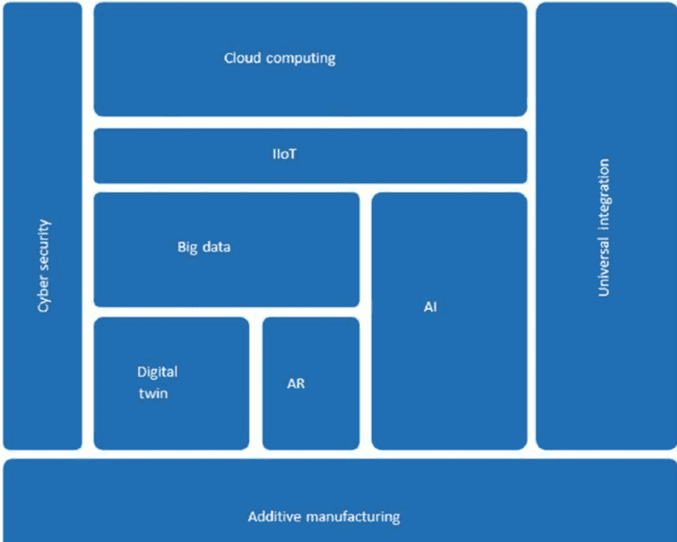

图3.1 工业4.0的组成部分

- 通信系统。

CPS依赖于许多原则，如嵌入式系统、控制、实时和无线传感器网络（图3.3）。物联网（IoT）被用作部署CPS的方法论。CPS框架如图3.4所示。网络物理设备由传感器、执行器和处理核心组成（图3.5和图3.6）。控制系统必须满足以下高级属性：稳定性、安全性、效率、灵活性。网络物理系统由物理系统和信息系统组成。CPS由五个层次组成（图3.7）[6-8]：

- 智能连接级别：使用传感器网络获取准确可靠的数据。
- 数据到信息转换级别：必须从数据中推导出有意义的信息以进行性能预测。
- 网络级别：在这个设计中充当信息中心。组件和机器的双模型。

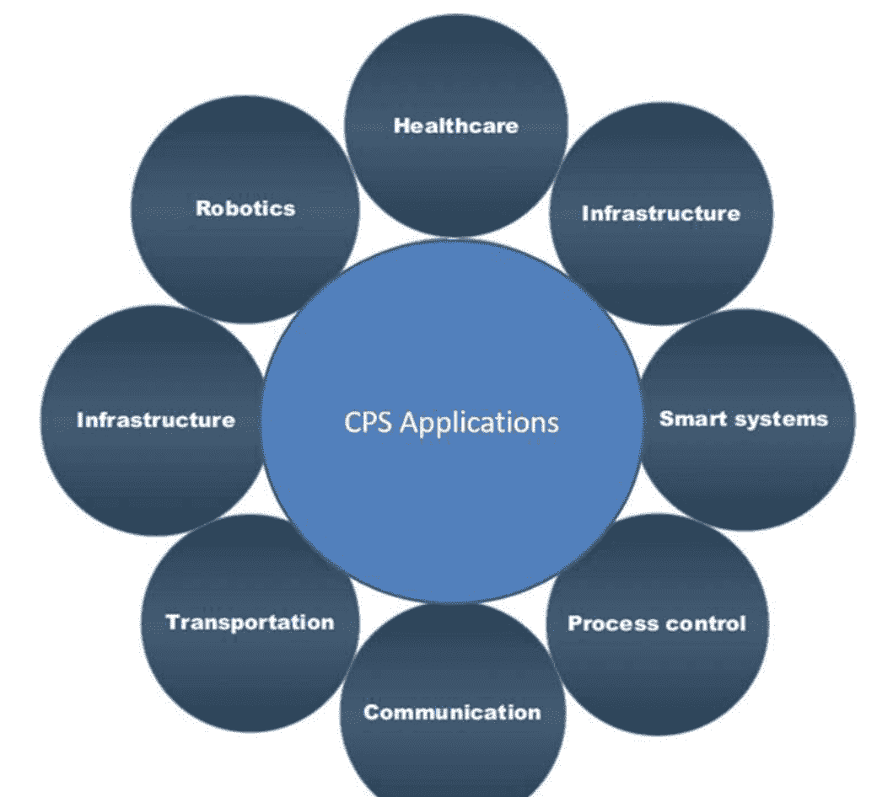

图3.2 CPS应用

- 认知级别：对被监控系统有全面的了解，并支持正确的决策和协同诊断。
- 配置级别：从网络空间向物理空间的反馈，并作为自配置和自调整机器的监控控制。自我配置以实现弹性。自我调整以适应变化。自我优化以应对干扰。

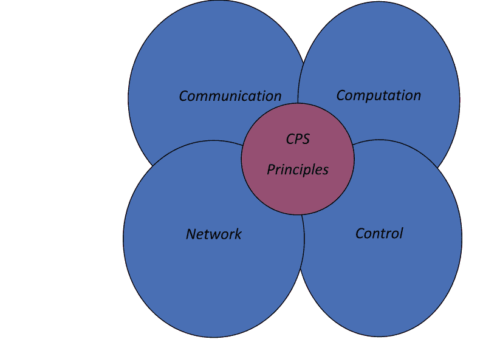

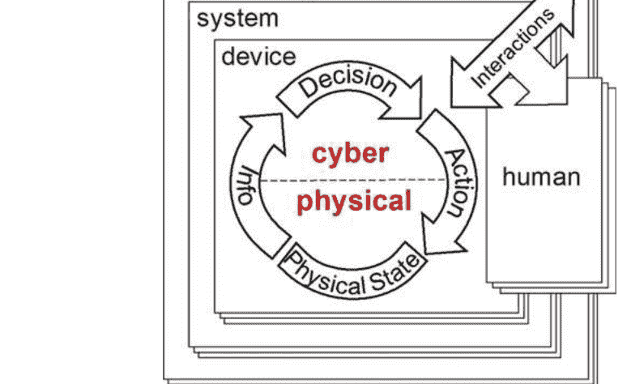

## 3.3 人工智能、大数据和物联网

互联网、物联网和机器对机器通信的快速发展导致了数据的广泛增长，无论是在工业还是商业领域（图3.8）。到2022年，数据将从非人类中心转变为以人为中心的数据。每天在社交媒体上都会产生大量数据，这些大量数据被称为大数据。

此外，连接到互联网的物品数量将超过人口数量。

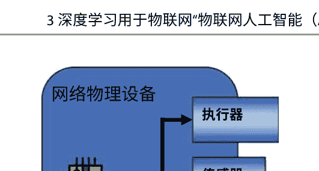

图3.5 网络物理设备

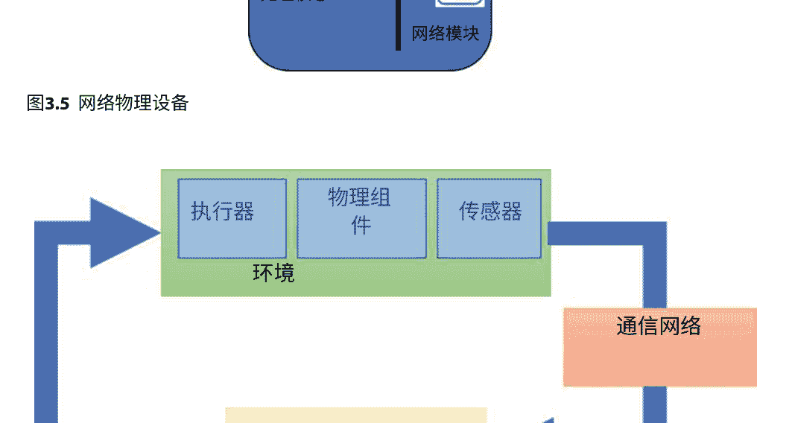

图3.6 网络物理设备的详细视图

预计到2022年，每个人将拥有50亿个设备（图3.9）。人与物的互动将随时随地发生。计算设备嵌入在物品或物体中。低功耗和低数据速率的无线通信网络是物联网的基础设施[9-11]。通过实施边缘/雾计算原则，任何物联网系统的延迟（传播延迟 +信道延迟 +处理延迟）可以很小。从人类类比的角度来看，无线电通信在网络物理融合（人工智能、大数据和物联网）中对应于神经系统的作用，传输信息在大脑（即人工智能）和每个器官（即设备）之间，如眼睛和四肢[12]。大数据具有几个特征（表3.2和图3.10）。由人工智能和机器学习技术支持的大数据被视为处理大量多样化数据、为进一步的决策过程提供洞察的关键概念。大数据本质上是大规模、庞大且完全庞大的复杂非结构化数据。

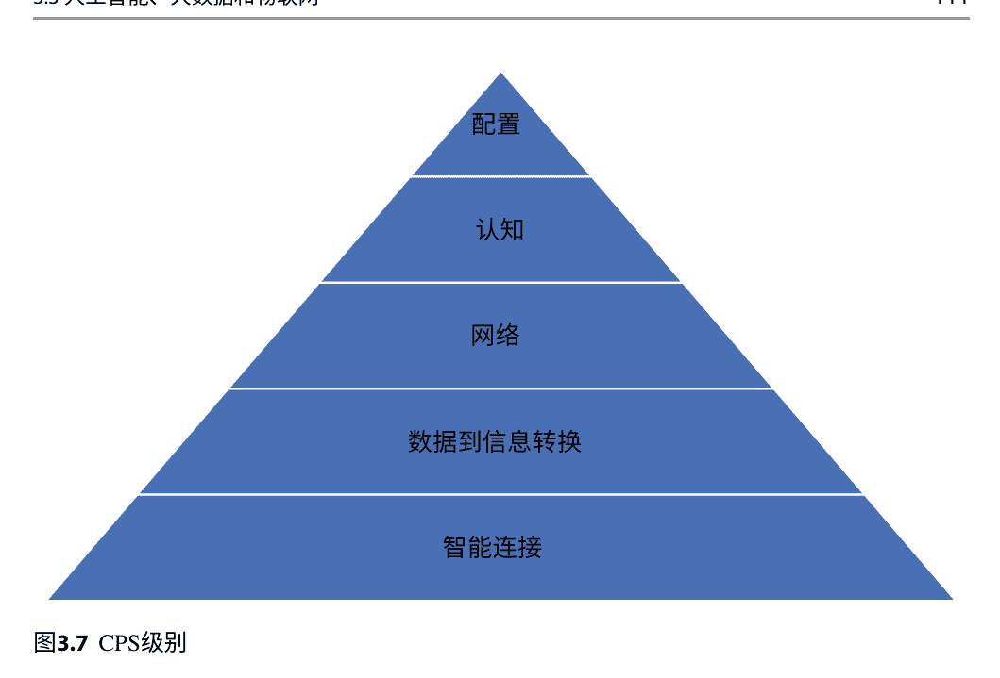

图3.7 CPS级别

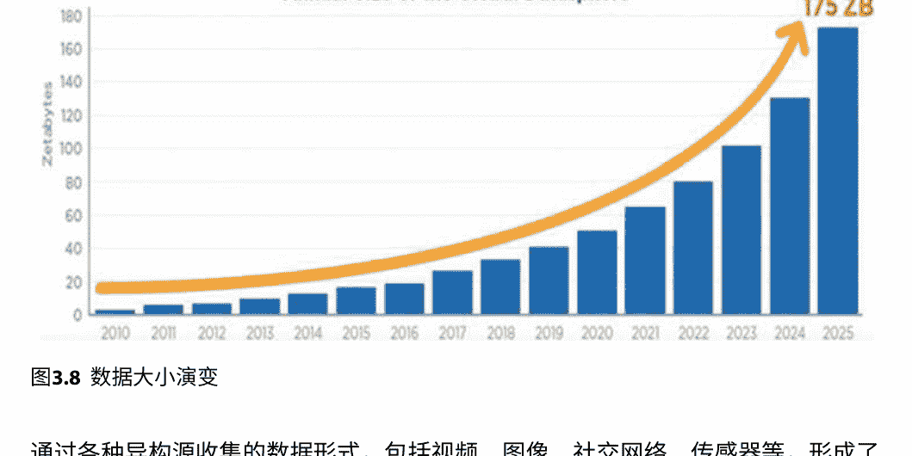

图3.8 数据大小演变

通过各种异构源收集的数据形式，包括视频、图像、社交网络、传感器等，形成了大数据。大数据的类型总结在表3.3中。大数据的例子包括社交媒体、股票市场和自动驾驶汽车[13]。

由于其无处不在的覆盖范围和漫游能力，蜂窝网络预计在物联网解决方案的大规模部署中发挥重要作用。物联网的演变可以在表3.4中显示。物联网的QoS措施总结在表3.5中[14, 15]。

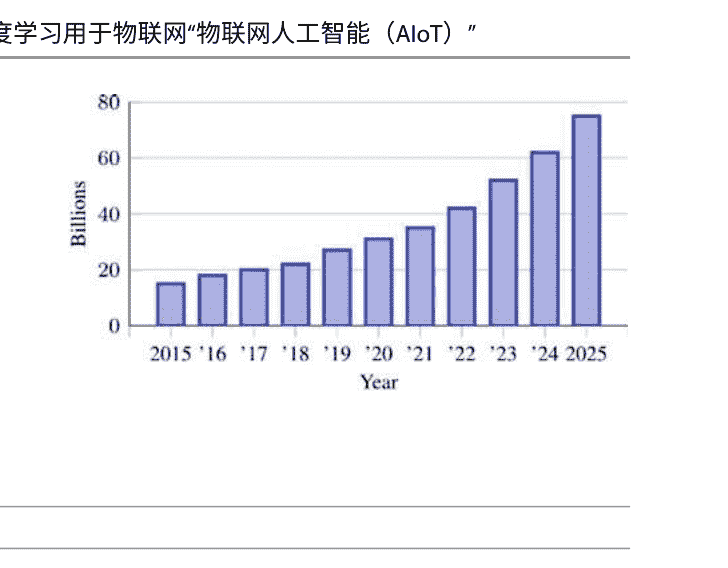

图3.9 物联网设备数量增长

表3.2 大数据的特征

| 特征 | 描述 |
|------|------|
| 容量 | 数据量 |
| 速度 | 数据流速率 |
| 多样性 | 数据分为结构化和非结构化数据。结构化数据始终是固定的，没有可能发生变化，例如表格数据。同时，非结构化数据通常包括文本、音频、视频、图像和许多社交网站的数据。 |
| 真实性 | 真实性代表了一些数据源固有的不可靠性。例如，客户情感。这种情感通常是不确定的，因为它们需要人类判断。然而，它们包含了宝贵的信息。因此，处理不精确和不确定的数据的需求是大数据的另一个方面，可以使用为管理和挖掘不确定数据开发的工具和分析方法来解决。 |
| 可变性 | 可变性指的是数据流速的变化。有时，大数据的速度不一致，有周期性的高峰和低谷。 |
| 有效性 | 有效性可以定义为所需数据的准确性。 |
| 易变性 | 易变性涉及数据的有效期和存储时间的长短。 |

典型的物联网架构由四个层次组成，TCP/IP层与物联网层如图3.11所示：

- 传感器/感知层：它由各种设备组成，如无线/有线传感器、智能手机和各种类型的嵌入式系统，如智能手表。
- 网络/通信层：它由各种有线/无线媒体组成，用于将原始数据从传感器层传输到处理层。
- 处理层：它负责数据管理和分析。为此，它使用各种数据分析工具。数据分析意味着数据已经可用。
- 决策/应用层：它根据处理后的信息做出决策。

物联网中使用的通信技术总结在表3.6中。5G比4G更适合物联网，因为它提供更高的容量，可以连接更多设备。

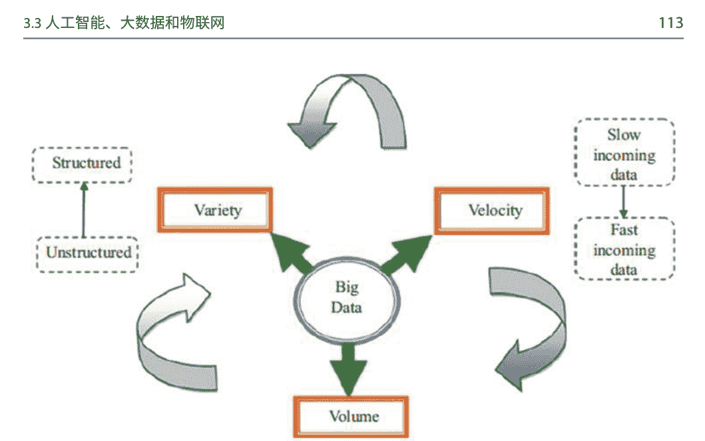

图3.10 大数据特征

表3.3 大数据类型

| 大数据类型 | 解释 | 例子 |
|------------|------|------|
| 结构化 | 以固定形式存储、处理和检索的数据 | 数据库 |
| 非结构化 | 以任何特定形式或结构不可用的数据 | 电子邮件 |
| 半结构化 | 同时包含结构化和非结构化格式的数据 | 将数据的各个元素分开的数据库 |

表3.4 物联网的演变

| 技术 | 例子 | 工具 |
|------|------|------|
| 互联网之前 | 人与人之间 | 固定移动 |
| 内容互联网 | 万维网 | 电子邮件 |
| 服务互联网 | Web2.0 | 电子商务 |
| 人与人之间的互联网 | 社交媒体 | Facebook、twitter |
| 物联网 | 机器对机器 | 射频识别 |

表3.5 物联网的QoS措施

| 测量 | 解释 |
| :--- | :--- |
| 可用性 | 随时随地提供服务 |
| 可靠性 | 向用户提供不间断的服务 |
| 移动性 | 在移动网络中移动时提供服务 |
| 性能 | 设备形态因素、网络速度、功耗、处理速率 |
| 管理 | 监控故障、问责、配置、安全和性能的设备 |
| 可扩展性 | 物联网系统接受新设备并更新功能和服务，而不影响现有平台的能力 |
| 互操作性 | 向最终用户提供各种服务，无论硬件平台如何 |
| 安全性 | 安全交换信息的能力 |
| 隐私 | 保护收集的用户数据的隐私 |

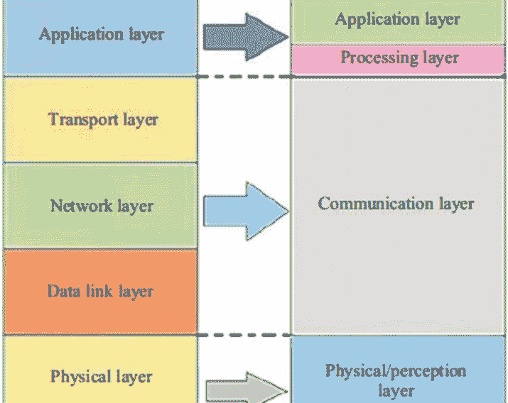

表3.6 物联网中使用的通信技术

| 技术 | 范围 | 数据速率 | 电池使用 | 安全性 | 系统成本 | 应用 |
| :--- | :--- | :--- | :--- | :--- | :--- | :--- |
| LoRa | ≤50公里 | 0.3-38.4千比特每秒 | 非常低（8-10年） | 高 | 低 | 智能建筑 |
| NB-IoT | ≤50公里 | <100千比特每秒 | 高（1-2年） | 高 | 低 | 智能电网通信 |
| LTE-M | ≤200公里 | 0.2-1兆比特每秒 | 低（7-8岁） | 高 | 适中 | 智能电表 |
| Sigfox | ≤50公里 | 100 bps | 低（7-8岁） | 高 | 适中 | 电源插头 |
| Weightless | <5公里 | 100 kbps | 低（非常长） | 高 | 低 | 智能电表 |
| 蓝牙 | ≤50米 | 1 Mbps | 低（几个月） | 高 | 低 | 智能家居电器 |
| Zigbee | ≤100米 | 250 Kbps | 非常低（5-10年） | 低 | 低 | 可再生能源智能计量 |
| 卫星 | ≥1,500公里 | 100 kbps | 高 | 高 | 昂贵 | 太阳能和风能发电厂 |

同时连接到网络，使其更适用于大规模物联网部署。此外，5G提供更低的延迟，实现准实时通信，使得监控和控制设备接近实时成为可能。5G可以覆盖大面积和密集的城市网络。此外，5G具有出色的节能特性，更好的功耗管理，低功耗和延长电池寿命。5G具有增强的安全功能，为物联网设备提供更好的保护。人工智能（AI）和物联网（IoT）的交叉点导致了一个新的领域的出现，即AIoT。

## 3.4 边缘智能

边缘计算是云计算的关键推动因素之一，通过将服务保持在边缘（在第一跳）。由于边缘节点的计算能力，DL功能被扩展到网络边缘。边缘智能被视为动态频谱访问的关键推动因素，以提供快速可靠的基于人工智能的边缘设备数据处理（图3.12）。物联网设备可以与数据聚合器（边缘服务器）协同工作，进行神经网络训练，设备仅交换参数，而不需要共享原始数据[16, 17]。边缘计算将大规模计算的中心节点切分为更小、更易管理的部分，并将它们分散到边缘节点进行处理。边缘节点更接近终端设备，具有更高的传输速度和更低的延迟。深度学习边缘计算技术将有效解决深度学习云计算的技术挑战[14, 18]。

云AI和移动边缘AI之间的一个基本区别是边缘节点上可用资源的有限性。因此，已经提出了几种框架来支持高效的移动边缘AI。云计算是通过互联网进行计算，应用软件、存储、处理单元和CPU周期等资源在虚拟上共享，以满足用户按使用量付费的需求。随着计算能力的迅速增长，云计算现在是不可避免的。云计算可以提供每天更多迭代次数和大容量内存的计算能力，范围可达到Tera-Bytes (TB)。这只需很少的额外成本。

在物联网中，数据是由设备生成的。这些设备可以是传感器、车辆、道路、船只等。这些设备连接到网络。这些数据需要在低响应时间或超低延迟下进行处理，以便进行智能决策。在雾计算中，计算、存储和网络服务（如云服务）从远程云数据中心转移到靠近设备/物体的位置。这有助于以非常低的延迟提供或执行实时应用程序，同时满足其他QoS要求。雾计算基础设施可能包括边缘设备、移动电话、边缘服务器、网关、路由器、物联网设备和虚拟化数据中心[19-23]。边缘计算和云计算的比较如表3.7所示。

## 3.5 物联网安全要求

区块链技术对物联网技术非常重要。物联网使得互联网上的设备能够将数据发送到私有区块链网络，以创建防篡改的共享交易记录。物联网传感器感知，人工智能思考，区块链记忆。区块链是一种分布式数据库，允许两个参与方直接进行交易，无需权威中介。区块链是一种将交易封装在块的形式，其中块通过密码哈希链接在一起，从而形成一个块链（图3.13）。区块链用于保证完整性。区块链依赖于不同的组成部分，这些部分有不同的用途。区块链由一系列存储在公开可访问的服务器上的块组成，并在这些服务器之间进行复制。每个块由四个基本元素组成：前一个块的哈希；块的数据内容（即分类账条目）；用于给哈希赋予特定形式的随机数；块的哈希。通过包含前一个块的哈希，每个连续的块都加强了前一个块的真实性声明。链中的早期块如果不修改所有后续块，或者修改会导致哈希不一致，就无法修改。同样，将数据添加到哈希中使数据无法修改，而不会破坏块序列的一致性。添加一个用于对哈希施加签名结构的随机数需要执行大量的工作来生成一个新的块。假设攻击者能够更改块 n 中的数据相应地，块的哈希也会发生变化。但是，块 n + 1 仍然包含块 n 的旧哈希。这使得块 n + 1 和所有后续块都无效，因为它们没有正确的前一个块的哈希[24, 25]。

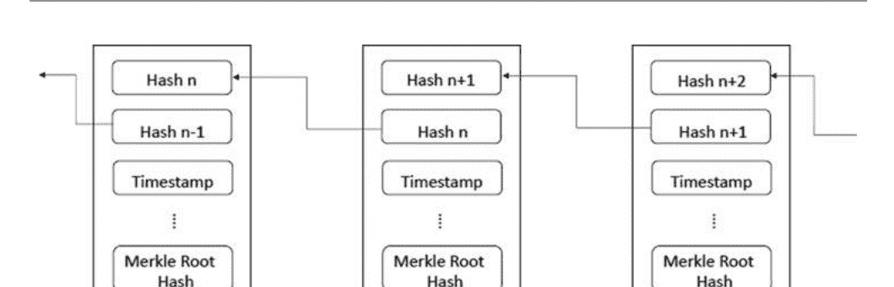

表3.7 边缘计算和云计算的比较

| 度量 | 边缘计算 | 云计算 |
|---|---|---|
| 可靠性 | 低 | 高 |
| 功率 | 低 | 高 |
| 数据处理 | 快 | 慢 |
| 安全性 | 安全 | 威胁 |
| 实时服务 | 是 | 否 |
| 延迟/延迟 | 低 | 高 |
| 带宽 | 低 | 高 |
| 处理 | 分散式 | 集中式 |
| 硬件 | 需要 | 不需要 |
| 可扩展性 | 低 | 高 |
| 客户端与服务器之间的距离 | 单跳 | 多跳 |
| 支持移动性 | 可用 | 有限 |
| 实时通信 | 更好 | 更少 |

### 3.5.1 授权

在物联网设备中，常规的授权技术被用来满足这一要求。可以指定管理员来阻止未经授权的访问，以防止这些未经授权的请求被路由到物联网设备[26]。

### 3.5.2 认证

认证是一个涉及验证请求访问者身份的过程。这主要通过使用基于用户名和密码的认证协议来完成。现在，安全套接字层（SSL）协议通常被网站用于认证。认证的过程还涉及要求发送者和接收者验证他们交换的信息的来源。

### 3.5.3 完整性

消息完整性确保消息没有被任何方式修改。这是一个非常重要的要求，因为物联网涉及到传输信息以执行特定操作。

### 3.5.4 机密性

物联网必须确保用户的个人和敏感信息不受恶意实体的未经授权访问。这是通过应用加密来实现的。

### 3.5.5 对攻击的弹性

如果发生崩溃，物联网系统必须具备自我恢复能力。换句话说，当它崩溃时，它应该在用户意识不到的情况下进行自我恢复，而不会中断服务。

## 3.6 物联网挑战

- 连接性：IPv4不足以覆盖预期的连接设备范围。IPv6是下一个候选方案。
- 传感器的能量管理：因为它们需要做出决策。
- 标准化：如果物联网标准化，不同的传感器和网络将更容易集成。

## 3.7 物联网应用

### 3.7.1 工业自动化

通过RFID标签[27]可以实现机器对机器的通信。

### 3.7.2 医疗保健

物联网有助于监测患者和追踪医疗设备。物联网在医疗保健领域有巨大的潜力，可以为患者提供更好的医疗设施。同时，它简化了医护人员的工作。通过传感器通过网络设备进行通信的基于Web和移动的应用程序可以开发出来，以帮助监测和记录患者的医疗信息和健康数据[28-32]。

### 3.7.3 环境监测

它有助于监测环境中发生的各种变化，无论是人为还是自然本身，无论是时间、生物、物理还是空间。这包括农业、雾霾控制、废物管理和智能用水。

### 3.7.4 智能建筑

人们可以轻松监控所有的仪器和设备，并可以追踪哪个设备在浪费不必要的能源以节省能源。它还可以帮助智能垃圾收集和智能停车。

### 3.7.5 智能物流

供应链管理通过RFID[33]、NFC和传感器提供实时监测信息。借助这些技术，公司现在能够在短时间内应对市场需求。

## 3.8 数字孪生

数字孪生的概念可以追溯到2000年代初，当时由密歇根大学的教授迈克尔·格里夫斯博士首次提出。格里夫斯博士认识到需要一个物理产品或系统的虚拟副本，可以用来优化其性能并降低其生命周期成本。然而，直到物联网（IoT）的出现和实时数据的可用性，数字孪生的概念才开始流行起来。物联网提供了必要的基础设施，可以从嵌入在物理产品和系统中的传感器收集数据，然后实时创建和更新虚拟副本。2017年，数字孪生的概念受到了广泛关注，被列入了Gartner的2017年十大战略技术趋势清单中。自那时以来，数字孪生在制造业、航空航天、汽车、医疗保健和能源等各个行业迅速发展。如今，数字孪生技术被用于对物理产品或系统的各个方面进行建模和仿真，包括其行为、性能和维护需求。它还可以用于预测故障、优化性能和减少停机时间，从而为企业带来显著的成本节约[34, 35]。

数字孪生（DT）是将物理/现实对象克隆成软件对应物/逻辑对象的能力，其中这个逻辑对象反映了物理对象的所有基本特征（图3.14）。换句话说，数字孪生是对物理对象进行软件化/虚拟化的过程。DT可以用来在产品生命周期的早期确定所有不需要的和意外的行为，然后帮助进行纠正。它意味着在日常运营中具有更高的控制水平和改进的能力。DT自然地与物联网技术的感知和执行能力相关联。

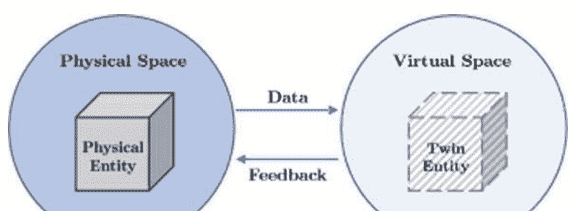

DT包括产品、机器或整个制造过程的虚拟和物理副本，用作特定的测试平台，可以在实际应用之前模拟所做的更改[36]。

DT是解决卫生领域复杂问题的一种优秀技术，远程诊断和其他技术可以弥合患者日益增长的医疗需求和医生服务减少之间的差距。DT还可以作为制药科学的助手，允许用户在线实时访问数据，包括历史数据和当前过程条件。过程分析技术、质量数据和时间序列数据都用于实时提取数据。然后，DT可以使用所有可用的高效模型[37, 38]来建模未来。数字孪生在制造业、医疗保健和智能城市等领域有许多应用[39-43]。

### 3.8.1 数字孪生的支持技术

启动数字孪生（DT）需要几种流行技术的技术支持。这些支持技术在各种来源中被命名，并且对于创建功能性DT至关重要。有八种技术与DT有密切关系，下面将对它们进行解释[44, 45]。数字孪生的支持技术总结如图3.15所示。

- 云计算：是一个提供可靠和可持续的服务器和计算资源以及大容量存储单元的强大平台。在DT设计中，它提供快速的数据处理并向DT管理中心呈现分析结果。
- 物联网（IoT）：是一组设备、物体以及具有唯一标识符和能够通过网络进行通信和传输数据的一切。DT在连接物理世界和虚拟世界之后实现，并且它需要多个连接和大量的实时数据传输，这可以在物联网方案上建立。

## 图3.15 数字孪生的启用技术

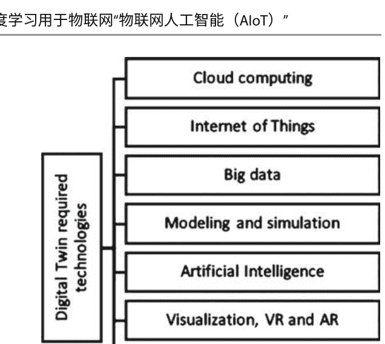

- **大数据**：由于传感器和智能设备的出现，数据量在近年来呈指数增长。这个问题导致了大数据的出现概念。由于DT是一种数据驱动的技术，它在很大程度上依赖于数据结构。

因此，将大数据分析纳入DT将提取有价值的信息，为有效管理提供洞察，并导致更精确的决策。

- **建模和仿真**：通过分析系统的性能来表示系统结构的过程。建模是一个复杂的过程，但结果清楚地表明整个系统的工作和运行方式。此外，仿真是研究模型以识别和推导系统行为的过程。在DT结构中，建模和仿真是完整描述物理对象的一部分，将真实的物理现象添加到其虚拟副本中。

- **人工智能（AI）**：AI方法在工业和科学领域，包括DT应用中非常流行。这是因为DT应用的复杂性正在增加，我们必须设计能够在DT应用环境中做出决策的智能代理。

- **虚拟现实（VR）和增强现实（AR）**：在过去几年中在各个行业广泛使用。DT应用利用AR和VR的各种能力。这是因为在DT的核心部分部署了一个实体的数字化模型，该模型在多尺度仿真中需要一个完美的数字化模型来反映其视觉和几何特征。

- **通信系统**：具有超低延迟的双向数据传输系统是几个行业的基础设施。DT包括连接到虚拟系统的几个物理组件。它需要一个具有高质量服务(QoS)、超高数据速率、非常低延迟、数据源之间的同时数据传输和超低功耗等特殊特性的智能通信系统。

- **安全性**：信息保护和系统安全防御网络攻击在近年来被视为重要问题。数字孪生引入了物理系统的模拟、监控、优化和预测，并容易受到攻击。

因此，安全性对于确保数字孪生的完整性和机密性至关重要。

## 3.8.2 数字孪生与模拟

虽然模拟和数字孪生都使用数字模型来表示系统的众多活动，但数字孪生实际上是一个虚拟世界，因此在研究方面更加丰富。模拟和数字孪生的比较见表3.8 [46, 47]。例如，实时数据在模拟中很少有用。然而，数字孪生是建立在双向信息流的基础上的，当物体传感器提供相关数据给系统处理器时，信息流开始，当处理器生成的洞察力与原始来源物品交换时，信息流继续。数字孪生的优势包括[48]：

- 可以预测未来事件。
- 可以通过利用实时数据来提高真实物理系统的性能。

### 3.8.3 如何构建数字孪生

构建数字孪生所需的步骤总结如图3.16所示。

- 步骤#1: 通过执行多个具有不同输入的模拟来创建数据集
- 步骤#2: 使用数据集训练基于预定准确性的机器学习模型
- 步骤#3: 使用未在训练中使用的数据集检查训练好的模型，以验证机器学习模型
- 步骤#4: 使用云端在数字孪生和物联网之间交换数据

图3.16 构建数字孪生的步骤

## 3.9 物联网/物联网的新趋势

物联网（IoT）是一个快速发展的领域，继续塑造我们与技术互动的方式。以下是物联网领域出现的一些新趋势。

### 3.9.1 工业物联网（IIoT）

物联网（IoT）的新兴应用和技术趋势与工业系统的整合正在导致工业物联网（IIoT）的扩展。工业物联网（IIoT）是一种专为工业领域设计的新型物联网，其中智能对象用于在工业系统中通信、感知、收集和处理实时事件。

通常，工业物联网（IIoT）是物联网的一个子集，应用于各个行业，如物流、运输、能源或公用事业、制造业（工业4.0）、石油、矿业、天然气、航空、金属等[49]。

### 3.9.2 AIoT的LLM

大型语言模型（LLM）可以用于从代码片段或自然语言描述中创建AIoT的软件代码，然后可以应用于各种编程语言。有了这样的能力，这些模型可以帮助构建创新的应用程序。生成式人工智能可以用于为自主（物联网）设备（如机器人）生成控制逻辑和命令[50]。

### 3.9.3 IoUT

物联网是一个生态系统，它在任何事物之间提供连接和通信，以收集信息数据，这些数据可以用于改善我们的生活方式。水下物联网（IoUT）是物联网的一种新型类别，被定义为智能互连的水下对象网络。

IoUT有望实现各种实际应用，如环境监测、水下探索和灾害预防[51]。IoUT实现了水下设备与陆地设备之间的通信。IoUT将连接在不同生态环境中运行并具有不同数据收集技术的设备（陆地和水中）[52]。IoUT赋予了自主水下车辆（AUV）系统互联互通的能力，检测、收集和通信数据到汇聚节点。然后，这些数据可以在广泛的应用中发挥作用，如船只残骸探测、海啸的早期发现、海洋健康观测以及实时海洋信息收集[53]。

### 3.9.4 IoBNT

生物纳米物联网（IoBNT）基于生物材料与纳米尺度设备和网络的集成，有潜力实现对生物系统的实时监测和控制。这需要集成生物启发式纳米传感器和执行器、无线通信和能量收集技术，创建一个能够执行复杂功能（如医疗监测和干预）的自持续设备网络。设计这些自主系统的一个关键困难是自供电。现有的电池技术和传统集成电路在如此小的尺寸上无法使用。即使它们足够小以在纳米级别上使用，由于生物相容性问题，它们仍然无法用于医疗应用。M13噬菌体是一种具有压电性质的非常有前景的病毒，在科学界引起了很大兴趣，作为生物能源收集器[54]。

### 3.9.5 IoV

智能车联网（IoV）是指连接到云端并提供实时数据的设备（例如传感器、摄像头、GPS跟踪器）的复杂系统，它能够优化汽车制造过程以及更高效的运输管理[55]。IoV可以实现各种智能应用，例如实时导航、动态道路安全应用、自动驾驶、客户隐私和辅助驾驶[56, 57]。

### 3.9.6 TinyML

由于现有网络实现的计算密集性，目前大量由多个设备生成的数据被发送到云端进行处理。然而，像深度神经网络（DNNs）和深度学习（DL）这样的先进机器学习模型需要高能耗的图形处理单元（GPUs）和具有显著内存容量的专用硬件应用特定集成电路（ASICs）。

因此，研究人员正在积极寻求优化机器学习算法的方法，以提高能源效率，同时满足对低功耗、微型嵌入式设备的不断增长需求。这导致了微型机器学习（TinyML）的出现，它可以在边缘物联网设备等微型设备上实现机器学习算法，促进信号处理和嵌入式智能。这代表了从云智能到边缘计算的范式转变，是一个快速发展的概念，将机器学习和嵌入式系统联系起来。然而，微型机器学习的实施面临着多个研究挑战，包括硬件选择、框架兼容性、模型训练以及在硬件上部署训练模型的量化技术[58-64]。

## 3.10 结论

物联网的深度学习，也被称为物联网的人工智能（AIoT），有潜力彻底改变我们与周围世界互动的方式。通过将人工智能的力量与物联网设备产生的大量数据相结合，我们可以创建能够学习和适应环境的智能系统。深度学习算法可以用于分析大量的传感器数据，检测模式并进行预测，从而实现更高效和有效的决策。AIoT具有许多应用，包括智能城市、医疗保健、农业和制造业。然而，也存在一些重要的挑战需要解决，例如隐私和安全问题、健壮的数据基础设施需求以及围绕人工智能使用的伦理考虑。产业界、学术界和政府的利益相关者需要共同努力，共同应对这些挑战，确保AIoT以负责任和安全的方式得到开发和部署。AIoT的潜在好处是显著的，如果正确实施，它有可能改变我们生活和工作的方式，使我们的世界更加连接、智能和可持续。

## 参考文献

1.  H. Vahdat-Nejad, S.O. Eilaki, S. Izadpanah, 对普适云计算的更好理解. 国际云应用计算杂志 (IJCAC) 8(1), 1–20 (2018)
2.  K.S. Mohamed, 物联网设备的蓝牙5.0调制解调器设计( Springer, 2022)
3.  A. Ustundag, E. Cevikcan, 工业4.0: 管理数字化转型(Springer, 2017)
4.  B.O. Cheng, J. Zhang, G.P. Hancke, 工业网络物理系统, 在物联网安全性IoT—2018, no. March (2018), pp. 25–35
5.  J. Lee, B. Bagheri, H.-A. Kao, 基于工业4.0的制造系统的网络物理系统架构。 制造通讯。 3 ， 18-23（2015年）
6.  Y. Liu, Y. Peng, B. Wang, S. Yao, Z. Liu, 对网络物理系统的综述。 IEEE/CAA J。 Autom. Sin. （2017年）
7.  J.R. Jiang, 一种改进的工业4.0智能工厂的网络物理系统架构。 Adv. Mech. Eng. （2018年）
8.  J. Lee, B. Bagheri, H.A. Kao, 工业信息化中网络物理系统和大数据分析的最新进展和趋势 ， 国际工业信息化国际会议论文集， 波尔图阿雷格里， 巴西， 7月27日-30日（2014年）
9.  B. Rathonyi, C. Kuhls, NB-IoT在农村地区开创新局面。 https://www.ericsson.com/en/blog/2020/7/groundbreaking-nb-iot-in-rural-areas, Ericsson AB, 技术报告, 072020年
10. A. Slalmi, R. Saadane, A. Chehri, H. Kharraz, 5G将如何改变工业物联网： 延迟和可靠性分析，在《人类中心智能系统》（Springer，新加坡，2021年），第335-345页
11. Q.V. Khanh, N.V. Hoai, L.D. Manh, A.N. Le, G. Jeon, 5G中物联网的无线通信技术： 愿景、应用和挑战。 无线通信。 移动计算。 （2022年）
12. R. Hadidi, J. Cao, M.S. Ryoo, H. Kim, 互联网物联网设备上深度神经网络的协作推理。 IEEE物联网杂志
13. S.B.B. Priyadarshini, A. BhusanBagjadab, B.K. Mishra, 物联网和大数据在现代技术领域的作用：一项综合研究，在《物联网和大数据分析用于智能生成》（Springer，Cham，2019年）中
14. A.H. Ngu, M. Gutierrez, V. Metsis, S. Nepal, Q.Z. Sheng, 物联网中间件：问题和启用技术综述。 IEEE物联网杂志 4(1)，1-20（2017年）
15. S. Chen, H. Xu, D. Liu, B. Hu, H. Wang, 物联网的愿景：中国视角下的应用、挑战和机遇。 IEEE物联网杂志 1(4)，349-359（2014年）
16. Y. Qu, C. Dong, J. Zheng, Q. Wu, Y. Shen, F. Wu, A. Anpalagan, 在6G网络中通过空地一体化联合学习赋能边缘智能，2020年7月。 arXiv:2007.13054
17. A.-A.A. Boulogeorgos, A. Alexiou, T. Merkle, C. Schubert, R. Elschner, A. Katsiotis, P. Stavrianos, D. Kritharidis, P.-K. Chartsias, J. Kokkonemi, 提供光学的太赫兹技术无线系统超越5G的网络质量体验。IEEE Commun. Mag. 56, 144–151 (2018)
18. J. Chen, X. Ran, 边缘计算的深度学习: 一项综述。Proc. IEEE 107(8), 1655–1674 (2019)
19. S.K. Datta, C. Bonnet, 基于MEC和物联网的工业4.0自动代理重配置, 在2018年IEEE国际高级网络和电信系统会议(ANTS)上的论文集, 印多尔, 印度, 2018年12月16日至19日, 第1-5页
20. B.L.R. Stojkoska, K.V. Trivodaliev, 用于智能家居的物联网调查: 挑战和解决方案。J. Clean. Prod.  140, 1454–1464 (2017)
21. J. Lee, Y. Su, C.A. Shen, 无线协议的比较研究: 蓝牙、UWB、ZigBee和Wi-Fi, 在IEEE工业电子学会第33届年会会议论文集中, 台北, 台湾, 2007年11月5日至8日, 第46-51页
22. V. Marinakis, H. Doukas, 一种用于智能能源管理的先进物联网系统. 传感器 (2018)
23. S. Deng, H. Zhao, W. Fang, J. Yin, S. Dustdar, A.Y. Zomaya, 边缘智能: 边缘计算和人工智能的融合。IEEE物联网杂志 7(8), 7457-7469 (2020)
24. K.S. Mohamed,神经形态计算及其发展: 并行、近似、近存储和量子(Springer Nature, 2020)
25. H.Q. Wang, T. Wu, 区块链中的密码学. 南京大学邮电学报 37, 61–67 (2017)
26. R. Roman, P. Najera, J. Lopez, 保护物联网(IoT). IEEE计算机学报 44, 51–58 (2011)
27. F. Guo, F.R. Yu, H. Zhang, X. Li, H. Ji, V.C. Leung, 实现大规模物联网向6G发展: 一项综合调查。IEEE物联网杂志 8(15), 11891–11915 (2021)
28. R.K. Kodali, G. Swamy, B. Lakshmi, 健康医疗物联网的实施, in IEEE智能计算系统的最新进展 (RAICS)(印度特里凡得琅, 2015)
29. P. Raj, J.M. Chatterjee, A. Kumar, B. Balamurugan (eds.),物联网在医疗行业的应用案例(Springer Nature, 柏林, 2020)
30. B. Patra, K. Mohapatra, 在医疗保健中的云、边缘和雾计算, in 智能和云计算(Springer, 新加坡, 2021), pp. 553–564
31. A. Darwish, A.E. Hassanien, M. Elhoseny, A.K. Sangaiah, K. Muhammad, 混合物联网和云计算对医疗系统的影响: 机遇、挑战和开放问题. J. 环境智能. 人性化计算. 10(10), 4151–4166(2019)
32. A. Palanica, M.J. Docktor, A. Lee, Y. Fossat, 使用移动虚拟现实增强患者及其家人的医学理解和满意度. 医学教育展望. 8(2), 123–127 (2019)
33. V. Namboodiri, L. Gao, 能源感知的RFID系统标签防碰撞协议。IEEE Trans. Mob. Comput. 9(1), 44–59 (2010)
34. B.R. Barricelli, E. Casiraghi, D. Fogli, 数字孪生: 定义、特征、应用和设计影响的调查。IEEE Access 7 (2019)
35. A. Rasheed, O. San, T. Kvamsdal, 数字孪生: 建模视角的价值、挑战和推动因素。IEEE Access 8 (2020)
36. F. Tao, J. Cheng, Q. Qi, M. Zhang, F. Sui, 数字孪生驱动的产品设计、制造和服务与大数据。J. Manuf. Syst. 157–169 (2018)
37. F. Tao, Q. Qi, L. Wang, A.Y.C. Nee, 数字孪生和智能制造与工业4.0: 相关性和比较. 工程 5(4), 653–661 (2019)
38. J. Dong et al., 混合云控制测试平台: 通过混合数字孪生验证车路云集成。IEEE Trans Intel Vehicles. https://doi.org/10.1109/TIV.2023.3243096
39. C. Mandolla, A.M. Petruzzelli, G. Percoco, A. Urbinati, 通过区块链的利用构建增材制造的数字孪生：飞机行业案例分析。 Comput. Ind. **109**, 134–152 (2019)
40. N. Mohammadi, J.E. Taylor, 智能城市数字孪生，在IEEE计算智能研讨会系列论文集(SSCI), 2017年11月，第1-5页
41. Y. Xu, Y. Sun, X. Liu, Y. Zheng, 利用深度迁移学习进行数字孪生辅助故障诊断。 IEEE Access **7**, 19990–19999 (2019)
42. Q. Qi, F. Tao, 数字孪生和大数据助力智能制造和工业4.0：360度比较。 IEEE Access **6**, 3585–3593 (2018)
43. A. Fuller, Z. Fan, C. Day, C. Barlow, 数字孪生：实现技术、挑战和开放研究。 IEEE Access **8**, 108952–108971 (2020). [https://doi.org/10.1109/ACCESS.2020.2998358](https://doi.org/10.1109/ACCESS.2020.2998358)
44. K. Gkouskou, I. Vlastos, P. Karkalousos, D. Chaniotis, D. Sanoudou, A.G. Eliopoulos, 精准营养中的“虚拟数字孪生”概念。 Adv. Nutr. **11** (2020)
45. A.M. Saghiri, K.G. HamlAbadi, M. Vahdati, 物联网、人工智能和区块链：实施视角 (新加坡, 新加坡, 2020年, Springer), pp.15–54
46. B. Schleich, N. Anwer, L. Mathieu, S. Wartzack, 为设计和生产工程塑造数字孪生, CIRP Ann. Manuf. Technol. **66** (2017)
47. A. Maloney, 模拟和数字孪生之间的区别, [https://blogs.sw.siemens.com/mindsphere/the-difference-between-a-simulation-and-a-digitaltwin/](https://blogs.sw.siemens.com/mindsphere/the-difference-between-a-simulation-and-a-digitaltwin/)
48. R. Wagner等, 数字孪生和工业4.0在高性能产品设计和生产中的挑战和潜力, 发表于Procedia CIRP, vol. 84 (2019), pp. 88–93
49. J. Park, H. Park, Y.J. Choi, 用于工业物联网的数据压缩和预测, 发表于2018 International Conference on Information Networking (ICOIN), Chiang Mai,Thailand (10–12 Jan 2018) (IEEE, Thailand, 2018), pp. 818–820
50. [https://iot-analytics.com/3-generative-aiot-applications-beyond-chatgpt/](https://iot-analytics.com/3-generative-aiot-applications-beyond-chatgpt/)
51. [https://www.mdpi.com/1424-8220/17/7/1477](https://www.mdpi.com/1424-8220/17/7/1477)
52. O. Bello, S. Zeadally, 水下物联网通信: 架构、技术、研究挑战和未来机遇. 自组织网络. **135**, 102933 (2022), ISSN 1570-8705.
53. [https://doi.org/10.1002/9781119763499.ch13](https://doi.org/10.1002/9781119763499.ch13)
54. A. Azarnoush, O.A. Dambri, E. Karatop, D. Makrakis, S. Cherkaoui, 生物启发式纳米发电机在医疗应用中的仿真和性能评估.IEEE生物医学工程学报. [https://doi.org/10.1109/TBME.2023.3260200](https://doi.org/10.1109/TBME.2023.3260200)
55. M. Haris, M.A. Shah, C. Maple, 智能车辆互联网 (IoIV): 基于预测建模的智能VANET计算. IEEE Access. [https://doi.org/10.1109/ACCESS.2023.3244886](https://doi.org/10.1109/ACCESS.2023.3244886)
56. X. Xu, H. Li, W. Xu, Z. Liu, L. Yao, F. Dai, 用于车联网边缘服务优化的人工智能综述. 清华科技学报 **27**(2), 270–287 (2021)
57. A. Chowdhury, G. Karmakar, J. Kamruzzaman, S. Islam, 自动驾驶车辆在工业应用中的智能交通系统的可信度.IEEE工业信息**17**(2), 961–970 (2020)
58. Warden, D. Situnayake, TinyML: 在Arduino和超低功耗微控制器上使用TensorFlow Lite进行机器学习(O'Reilly, 2020) [在线].[https://books.google.com/books/about/TinyML.html?id=sB3mxQEACAAJ](https://books.google.com/books/about/TinyML.html?id=sB3mxQEACAAJ)
59. N.N. Alajlan, D.M. Ibrahim, TinyML: 在超低功耗物联网边缘设备上实现推理深度学习模型以用于人工智能应用. 微型机器 **13**(6), 851 (2022) [在线]. [https://www.mdpi.com/2072-666X/13/6/851](https://www.mdpi.com/2072-666X/13/6/851)

## 深度学习用于空间计算：增强现实和元宇宙“数字宇宙”

### 4.1 介绍

空间计算广泛描述了捕捉、处理和与3D数据交互所使用的过程和工具。空间计算的组成部分可以包括物联网、数字孪生、增强现实、虚拟现实、人工智能和物理控制。

增强现实的兴起源于计算机系统与人类互动的需求。增强现实（AR）是一种在现实世界图像中捕捉预定义标记并在这些标记上放置虚拟对象的技术。增强现实（AR）与虚拟现实（VR）之间最重要的区别是AR有大约20%的虚拟贡献，而VR则完全将世界虚拟化，就像电脑游戏一样。增强现实旨在将现实世界的视觉内容与虚拟对象混合[4]。增强现实在教育、销售和娱乐等领域有许多应用，如游戏、时尚和军事。面部识别是增强现实的一个重要特性[7]。现有的增强现实/虚拟现实产品范围从可穿戴眼镜到支持增强现实功能的手机/移动设备[1, 2]。增强现实有许多应用，例如[14–17]：

- 虚拟手册：将基于文本的指令转换为视频动画。
- 虚拟助手：AR可以用于快速调试设备，并提供与本地环境中的服务进行交互的简便方式[11]。
- 虚拟导航员：通过AR帮助标志看如何从一个地方到另一个地方。
- 虚拟公寓：虚拟探索公寓。
- 虚拟钢琴：用于娱乐。
- 观察并识别用户的动作，并生成上下文相关的反馈。
- 消防应用：分析输入并吸引消防员注意无法透过烟雾和火焰看到的感兴趣的物体，如门和窗户[6]。
- 制造装配模拟[8]。

机器学习（ML）提供了学习执行任务而无需明确指令的系统[5]。深度学习（DL）架构是一种ML形式，可以用于解决基于相机的增强现实（AR）跟踪中的检测问题。自动驾驶系统是使用深度学习与AR的一个例子[3, 12, 35]。深度学习对虚拟和增强现实有重要影响。它能够为用户创造高度沉浸式和逼真的体验。

物联网（IoT）是一个全球基础设施，通过连接（物理和虚拟）基于现有和不断发展的互操作信息和通信技术的物品，实现先进的服务。AR可以与物联网结合使用[9, 10]。这是一种称为虚拟环境物联网（VEoT）的新范式[34]。

VEoT将物联网和增强现实合并在一起。它还使得将新兴的人工智能整合到交互式监控、控制、有效适应动态无线环境和优化可用资源中成为可能。此外，通过私有边缘网络结合协作和分布式人工智能，在覆盖跨域连通性的大规模私有网络中进行大规模边缘适应是有前景的[81, 82]。

在这项工作中，我们介绍了深度学习与物联网和增强现实之间的相互作用（图4.1），以控制设备和机器。物联网设备从物理世界捕获数据，以便使用深度学习进行分析，增强现实设备将数字数据渲染回物理世界，供人们查看和交互。物联网可以与人工智能结合，形成一种称为物联网人工智能（AIoT）的新范式。虚拟和增强现实技术已经发展起来，用于模拟、描述和构建虚拟环境。它们还可以扩展和增强真实环境，使人们能够使用工具和设备在这些不同环境中进行交互和行动。人工智能有许多应用；增强现实可以被视为一种视觉人工智能应用（图4.2）。人工智能可以用于在虚拟世界中创建更逼真和吸引人的体验，智能化的虚拟人物可以以更自然的方式与用户互动，并实时提供个性化内容。

### 4.2 沉浸式技术：虚拟现实、增强现实、增强虚拟现实、混合现实

虚拟现实（VR）、增强现实（AR）、混合现实（MR）和扩展现实（XR）是沉浸式技术的例子[50]。

图4.1 深度学习与物联网和增强现实之间的交互作用。
图4.2 人工智能的类型

虚拟现实（VR）使用户能够通过在虚拟现实模拟平台上应用各种技能来进行实际互动。增强现实（AR）是一种快速发展的技术，因为AR眼镜、AR头盔和配备小型传感器和摄像头的强大智能设备的可用性。然而，目前的AR系统由于小型无线设备的有限计算能力和通信网络中固有的延迟，只能提供预处理的内容。与虚拟现实（VR）不同，无需购买额外的硬件或附件；你只需要一台计算机或移动设备即可开始[33]。

增强现实是虚拟现实的更多功能和实用版本，因为它不完全让个体沉浸在体验中。增强现实具有交互式场景，通过图像和声音增强现实世界，创造出一种改变的体验。例如：机场正在实施增强现实导游，以帮助人们尽快、高效地通过检查和候机厅。零售和化妆品行业也在使用增强现实让顾客测试产品，家具店则使用这种模式来布置新的室内设计选项[22, 23]。

增强现实使得人们可以实时观看物理、真实世界的环境，其元素通过计算机生成的感知信息进行增强，理想情况下可以跨越多个感官模式。通过这样做，增强现实改变了人们对真实世界环境的感知，与之相反，虚拟现实用模拟环境取代了真实世界环境。相反地，增强虚拟现实（AV）发生在虚拟环境中，其中一个真实对象被插入到计算机生成的环境中[19, 31]。

增强现实通常与将附加数据与物理对象相关联以增加信息量并将物理对象和“增强”信息表示为单个实体的可能性相关联。然后，物理对象得到改进，并对用户更具吸引力。另一方面，虚拟现实试图创建一个完整的虚拟环境，用户可以在其中与逻辑对象进行操作和交互。虚拟和增强现实技术可以成为提供与虚拟对象表示交互的改进和更具吸引力的用户界面的手段。一些设备甚至智能手机都可以通过人类扩展对物体的感知。遮阳帽或多媒体眼镜可以提供额外的信息和数据，使用户能够更好地理解与环境及其物体进行交互[21]。

增强现实是一种新的尖端技术，通过在物理对象和环境中叠加文本、地理位置信息、图形、音频和视频等数字内容，增强用户的视觉、听觉、触觉和嗅觉感知。

移动设备和高速无线网络是许多基于Web的增强现实应用的关键推动因素。典型的增强现实系统由三个组件组成：用于虚拟对象的地理空间数据、投影虚拟元素的表面和图像处理单元。

增强现实应用程序收集、处理、存储和发送各种消费者数据，例如：面部、身体、个人空间。因此，与数据保护和安全风险相关的潜在伦理问题需要进一步调查。

图4.3 a真实环境。b增强现实。c增强虚拟性。d虚拟环境

扩展现实（XR）方法结合了增强现实和虚拟现实技术，在元宇宙中改善用户体验方面具有更大的潜力[71-73]。

扩展现实（XR）是指由计算机技术和可穿戴设备生成的所有真实和虚拟组合环境和人机交互的术语，其中X代表当前或未来空间计算技术的任何变量。XR可以被理解为一个包括整个现实-虚拟性连续体及其极端的总称。

图4.3显示了真实环境、增强现实、增强虚拟现实和虚拟环境之间的区别。增强现实和增强虚拟现实也被称为混合现实。表4.1显示了增强现实和虚拟现实之间的比较。

数字孪生是物理资产的虚拟复制品，弥合了物理世界和数字世界之间的差距，开启了无限的可能性。此外，它们利用增强现实/虚拟现实提供沉浸式体验，彻底改变了我们与环境互动的方式（图4.4）。

表4.1 增强现实和虚拟现实之间的比较

| 增强现实 | 虚拟现实 |
| --- | --- |
| 该系统增强了现实世界的场景 | 完全沉浸式的虚拟环境 |
| 在增强现实中，用户始终感到存在于真实世界中 | 在虚拟现实中，视觉感官受系统控制 |
| 增强现实是25%虚拟和75%真实 | 虚拟现实是75%虚拟和25%真实 |
| 这项技术将用户部分地沉浸到行动中 | 这项技术完全将用户沉浸在行动中 |
| 增强现实需要至少100 Mbps的带宽 | 虚拟现实需要至少50 Mbps的连接 |
| 不需要增强现实头戴设备 | 需要一些虚拟现实头戴设备（图4.3） |
| 通过增强现实，最终用户仍然与真实世界保持联系，同时与更接近他们的虚拟对象进行交互 | 通过使用虚拟现实技术，虚拟现实用户与真实世界隔离，并沉浸在一个完全虚构的世界中 |
| 它用于增强真实世界和虚拟世界 | 它用于增强游戏世界的虚构现实 |

图4.4 三星Gear VR

表4.2 增强现实类型

| 类型 | 描述 |
| --- | --- |
| 基于标记 | 依赖于图像，如QR码 |
| 无标记：基于位置 | 依赖于技术，如GPS |
| 无标记：基于投影 | 依赖于不同的光源，如激光产生全息图 |

### 4.2.1 增强现实的类型

有不同类型的增强现实[40]。

#### A. 基于标记的增强现实

标记是相机可以从任何环境中捕捉到的独特模式。用户将需要一个应用程序来它们并触发出现在个人设备上的增强体验。

#### B. 无标记增强现实

无标记增强现实是更通用的增强现实类型，因为它不需要视觉模式。它通过设备的相机、GPS、加速度计和数字罗盘从环境中收集信息。同时定位和映射（SLAM）是一种技术，允许设备将数字图像叠加到现实世界上。它通过本地化传感器来全面感知物理环境。这种类型的增强现实有两种变体[75]（表4.1、4.2）：

- 基于位置的增强现实——将增强体验与特定环境绑定。软件确定一个区域是否符合投影虚拟物体的条件。
- 基于投影的增强现实——不需要任何用户操作的技术。为了提供增强体验，它将图像投影到平面区域上。

### 4.2.2 增强现实关键组件

增强现实系统通常由几个关键组件组成[44]：

- 相机和传感器：用于捕捉现实世界环境并将其输入到增强现实系统中。传感器通常位于增强现实设备的外部，并收集用户的现实世界互动并将其传输以进行处理和解释。
- 处理器：用于对相机输入进行图像处理，以识别和跟踪现实世界中的特征。增强现实设备基本上是装在微型可穿戴设备中的迷你超级计算机。这些组件包括CPU、GPU、闪存、RAM、蓝牙/Wi-Fi微芯片、全球定位系统（GPS）微芯片等等。
- 一个显示器：这个组件呈现数字内容和信息，叠加在真实世界的视图上。这可以涉及智能手机屏幕或投影图像。
- 跟踪和对齐：这将虚拟内容与现实环境对齐。它使用各种跟踪技术，如基于标记的跟踪、基于特征的跟踪或同时定位与地图构建（SLAM）。
- 交互：使用户能够与虚拟内容进行交互。这可以通过手势、语音命令或手持控制器来实现。
- 软件：软件组件是增强现实系统的支撑。它包括使增强现实体验成为可能的编程。可以使用各种增强现实软件开发工具来开发此软件。
- 人工智能（AI）：增强现实应用通常需要一定程度的人工智能。它可以作为一种支持技术，使用户能够使用他们的声音执行操作[47]。

### 4.2.3 元宇宙

元宇宙最近成为一个热门话题。元宇宙可以定义为一个连接许多虚拟世界以提供沉浸式体验的大规模虚拟世界。它是一种具有高可扩展性的多层网络，增长速度比其他网络更快。元宇宙集成了增强现实（AR）、虚拟现实（VR）和3D技术，创建了一个完全沉浸式的虚拟世界。它需要准确的物体检测将数字数据与现实世界混合[37]。元宇宙的演变在图4.5中描述[51]。元宇宙首次出现在尼尔·斯蒂文森（Neil Stevenson）的科幻小说《雪崩》（Snow Crash）中，指的是一个虚拟与现实互动并通过各种社交活动创造价值的世界[52, 53]。用于元宇宙的主要技术包括5G、云/边缘计算、物联网、人工智能、增强现实/虚拟现实、区块链。边缘计算是增强现实的最重要的驱动因素之一。边缘计算是一种将数据存储和处理靠近生成数据的网络边缘的计算架构。这种计算方法显著影响增强现实，使其更易于访问、具有成本效益和安全。

借助边缘计算的帮助，公司现在可以提供以前由于云计算的限制而受限的增强现实体验。例如，边缘计算使增强现实体验实时化，这对于现场体育转播、翻译和产品可视化产生了积极影响。增强现实和物联网可能具有不同的目标，看似无关的概念，但实际上它们可以相互补充，因为增强现实为用户提供了一种方便直观的方式来可视化和与物联网对象及其相关数据进行交互[45]。要访问元宇宙，用户应该拥有增强现实/虚拟现实（AR/VR）设备、智能眼镜、游戏机、触觉设备、移动设备、计算机或笔记本电脑。

图4.5 元宇宙演变

元宇宙平台可以以开放、封闭和混合三种主要格式部署。开放的元宇宙是一个分散和共享的空间，适用于所有用户和服务提供商。封闭的元宇宙主要是集中化的，并且具有比开放的元宇宙更多限制的特点。混合的元宇宙包含与开放和封闭元宇宙相关的特点[62-65]。

元宇宙中存在许多与安全相关的挑战。由于所有交易都是通过非同质化代币（NFT）和数字货币进行的，因此需要高度安全性以避免欺诈。由于元宇宙是一个广泛分布的网络，攻击面比典型的分布式网络更大。在元宇宙的安全性下，需要解决许多方面的问题，如用户设备安全、网络安全、应用层安全方面、数据管理安全方面的问题。安全威胁可以分为身份、数据、隐私、经济、物理、社会影响和政府等七个主要类别[67, 68]。

### 4.2.4 与虚拟数字表示的交互

头像、全息图和机器人是可以用来与虚拟数字表示进行交互的技术。以下是每种技术的简要描述。

#### 4.2.4.1 全息术

全息术是一种捕捉物体完整三维图像的技术。全息术一词源自希腊词Holo，意为完整，graphic意为写作。普通照片记录的是图片的二维图像，因为它只记录了振幅或强度的分布。因此，在全息术中，光波的强度和相位都被记录下来。全息术记录了物理光效应，如干涉、反射、折射和衍射，存档被称为全息图[18]。全息系统能够实时呈现房间内人和物体的全动态三维图像。它还能实时配合特定人物的三维图像播放音频。远程位置的人和周围物体的图像首先被捕捉，然后经过压缩并通过宽带网络传输。在目的地，数据被解压缩并通过激光束投射，产生传统的全息图[30]。

#### 4.2.4.2 头像

头像是用户在虚拟环境中的图形表示。头像可以定制以代表一个人或一个角色，并可用于与其他用户或虚拟环境中的数字表示进行交互[83]。

#### 4.2.4.3 机器人

机器人是一种可以被编程以自主执行各种任务或在人类控制下执行任务的机器。机器人可用于与物理对象或数字表示进行交互，例如根据数字指令控制虚拟机器或组装物理产品[84]。

## 4.3 虚拟/增强现实应用

增强现实技术可以以各种创新方式使用。增强现实在物流和维护等许多业务领域变得越来越重要，因为使用数据眼镜可以提供广泛的流程优化和质量保证的可能性。AR和VR被广泛应用于现实生活的各个领域。

AR的应用有不同类型：

- 基于Web的AR：消费者通过基于Web的AR应用体验产品。
- 移动AR：AR广告更具信息性、新颖性、娱乐性和复杂性[29]。
- 可穿戴AR：智能眼镜和头戴设备。
- 现场AR：在工厂、学校中。

### 4.3.1 数字学习中的增强现实

增强现实（AR）已经在教育环境中应用多年。许多研究已经证明了AR在不同学科、学习风格和学习环境中的有效性[79]。增强现实（AR）和深度学习（DL）可以在智能手机内部利用，通过创建一个AR体验，让用户仅使用他们的移动设备来操作物体的3D表示。这使用户可以将现实世界中的概念转化为屏幕上的3D模型，在虚拟环境中进行可视化。可以使用Google的AR Core软件创建移动应用程序，以提供AR基线环境，并使用Unity 3D编辑软件构建应用程序[20]。

通过虚拟和增强现实[24, 27, 38, 39]可以学习人体解剖。现实世界和虚拟信息共同创造了新的教育机会。在当今世界，对支持远程援助和培训的系统的需求越来越大。

### 4.3.2 旅游业中的增强现实

旅游业是增强现实营销的新兴应用领域。增强现实结合深度学习可以用于增强博物馆体验[25]。增强现实可以通过展示物理对象的3D交互模型来提升游客的体验。

它可以用作虚拟导航器[46]。

### 4.3.3 游戏中的增强现实

增强现实应用程序的开发对于游戏世界的未来非常重要，因为它不仅限于手机，还涵盖了更复杂的设备[49]。许多互动游戏经常发布，游戏的受众不断增加。元宇宙的沉浸式特性可以以先进的方式提高体验质量（QoE）。

众感知是一种数据收集方法，涉及使用传感器和移动设备（如智能手机和平板电脑）的能力，收集有关特定环境或现象的信息。在元宇宙的背景下，众感知可以用于收集有关虚拟环境和体验的数据。这些数据可能包括用户的物理位置信息，人们在元宇宙中参与的活动和互动，以及人们遇到的虚拟对象和环境。随后，收集到的数据可以用于为元宇宙建模提供多维、细粒度和及时的资源[69]。沉浸式虚拟平台可以帮助支持电影、音乐和现场表演行业[76]。

### 4.3.4 增强现实在电子商务中的应用

深度学习可以实时学习访问者的行为，并结合机器学习算法来预测访问者的意图，并调整结果以提高相关产品的排名，从而最大化销售额。借助交互式视觉设计，如虚拟现实（VR）、增强现实（AR）和3D图像，顾客在网上购物时可以获得更好的感官体验，并更好地了解他们所期望的产品[26, 66]。基于虚拟现实的沉浸式购物体验和虚拟房地产经验可以被视为具有巨大潜力的元宇宙应用。

### 4.3.5 消费电子中的增强现实

虚拟现实可以用于电子设备的虚拟手册，以便更容易理解。此外，它还可以用作虚拟助手来调试硬件。活动识别是另一个活跃的研究领域，可以促进许多新兴应用，包括人工智能和移动设备上的增强现实/虚拟现实（VR）[28]。

通过结合计算机视觉、机器学习和增强现实技术，可以创建一个识别PCB板并显示不同部件名称和功能的增强现实移动应用程序。以下是创建此类应用程序的高级步骤：

- 收集和标记一组PCB板图像及其相应的部件和标签的数据集。该数据集将用于训练机器学习模型以识别板的不同部件。
- 使用移动设备的摄像头实时训练一个机器学习模型，例如卷积神经网络（CNN），以识别PCB板的不同部件。
- 开发一个增强现实叠加层，显示PCB板上识别出的部件的名称和功能。可以使用增强现实SDK（例如iOS的ARKit或Android的ARCore）创建此叠加层。
- 将机器学习模型和增强现实叠加层集成到移动应用程序中。该应用程序将使用移动设备的摄像头视频流实时识别PCB板的不同部件，并叠加它们的名称和功能。

60. D.L. Dutta, S. Bharali, TinyML meets IoT: 一项综合调查。物联网 **16**, 100461 (2021) [在线]. https://www.sciencedirect.com/science/article/pii/S2542660521001025
61. M. Shafique, T. Thecharides, V.J. Reddy, B. Murmann, TinyML: 当前进展、研究挑战和未来路线图, in 第58届ACM/IEEE设计自动化会议(DAC), 2021年12月, pp. 1303–1306
62. R. Immonen, T. Hämäläinen, 资源受微控制器的小型机器学习。 J. Sens. 2022, 1–11, 2022年11月 [在线]. https://www.hindawi.com/journals/js/2022/7437023
63. H. Han, J. Siebert, TinyML: 现有研究的系统综述和综合, in 国际人工智能信息与通信会议(ICAIIC), 2022年2月, pp. 269–274
64. R. Kallimani, K. Pai, P. Raghuvanshi, S. Iyer, O. Alcaraz López, TinyML: 工具、应用、挑战和未来研究方向 (2023)## 4.3.6 制造业中的增强现实

另一个重要方面是将AR与物联网（IoT）在智能城市中的应用结合起来。为了简化概念，这种集成有助于连接所有的数据收集方法，并在一个地方方便地访问所有这些数据。将AR应用于数据分析可以提供更沉浸式的体验，用于各种基础设施的维护和安装。

增强现实可以用于产品设计、检查和维护。AR应用程序将为工人提供部件和细节的可视化显示，并提供每个阶段所需的工具信息。它们可以突出显示完成的部件，提供完整的3D指导[32, 36]。增强现实（AR）在维修、修理和翻新（MRO）操作中显示出巨大的潜力[78]。

## 4.3.7 增强现实在健康领域

元宇宙技术可以帮助医疗专业人员进行有效的疾病规划和诊断。元宇宙环境通过使用头戴式设备将CT扫描转化为3D重建，从而实现了增强的手术术前规划。这还可以帮助外科医生专门查看、隔离和操作解剖区域，以进行关键手术。元宇宙在放射学领域具有潜力释放图像可视化的先进能力，使放射科医生能够以更详细的方式查看动态图像，从而提高诊断和准确决策[41-43]。此外，3D/4D打印和增强现实代表了下一代数据可视化工具，使外科医生能够与高度详细、解剖准确的患者特定数据进行交互。这些工具在设计和输出上有所不同，但都有潜力改善术前规划、手术培训和患者教育，从而促进更好的治疗结果[48, 77]。

随着智能材料的进步，应用外力（如光、热、电和磁场）使AM组件能够随时间（第四维）改变其形状或性质。通过结合时间维度，打印对象在没有电机或运动部件的支持下动态改变形状。3D打印对象的形状变化现象基于材料对特定刺激的反应能力，不需要人为干预。这给我们带来了一个新的科学领域，称为4D打印。在各种应用中，如自折叠包装、自适应风力涡轮机等，对灵活物体的需求不断增加，这导致了4D打印的出现（图4.6）。

图4.6 3D打印和4D打印的区别

虚拟现实能够引起生理反应，从而产生了各种有用的应用，包括焦虑和恐惧、创伤后应激障碍的管理、疼痛和心脏康复的调节[54-59]。

由于其成本效益、节省时间和基于认知的反馈生成，近年来在外科培训中广泛使用虚拟现实（VR）技术[60]。

光学透视头戴显示器（OST-HMD）是增强现实（AR）的一种使能技术，允许将数字信息叠加到现实世界的视图上，同时保持透视视图。最近发展的增强现实（AR）技术可以克服医疗手术中的手眼协调障碍和沉重的心理负担。在这些AR技术中，具有立体显示的光学透视（OST）方案可以提供深度感知并保留物理场景以考虑安全性[61]。

作者提出了一种利用神经隐式表示技术进行建模和跟踪的新型牙科AR系统。它简化了当前的AR过程，不需要额外的高精度扫描仪，大大降低了总体成本。

此外，它可以轻松集成到牙科诊断和治疗过程中，并为牙医提供更好的帮助[70]。

磁共振成像（MRI）数据可以使用AR将其合并成3D体积，然后使用各种体积渲染方法将点合并成表面。根据感兴趣的体积和所需的数据，可以使用许多技术。这可以帮助手术任务[74]。

## 4.3.8 建筑中的增强现实

建筑行业使用元宇宙在进入现实世界之前优化建筑项目。 这可以快速进行设计和工程变更，并早期识别问题。 元宇宙还允许模拟诸如人群流动、地震和火灾等危险。 这项技术正在改变行业，使其更高效、有效和创新[80]。

## 4.3.9 时尚中的增强现实

时尚公司可以在其商店中使用AR试衣镜，这样顾客就可以在不进入试衣间的情况下试穿衣服。 它使顾客能够实时将衣物叠加在自己身上，速度相当快。 它通过使顾客能够从材料和尺寸的角度评估产品的适用性，减少了由于尺寸不合适而导致的退货数量，帮助顾客做出明智的选择。

## 4.4 结论

基于深度学习的空间计算具有创造新的数字宇宙的潜力，以沉浸式体验的方式将人与设备连接起来，这在以前只存在于科幻小说中。 随着增强现实和元宇宙的出现，我们正处于计算的新时代的边缘，在这个时代，我们的物理世界和数字世界将无缝融合。 深度学习算法可以用于创建逼真的3D环境，实现物体识别和跟踪，并为用户提供智能辅助。 这在游戏、教育、医疗和零售等领域有着广泛的应用。 然而，也存在一些需要解决的重要挑战，例如标准化的需求、隐私问题以及关于数据使用的道德考虑。 工业界、学术界和政府的利益相关者需要共同努力解决这些挑战，并确保数字宇宙的发展和部署是负责任和安全的。 深度学习在空间计算中的潜在好处是显著的，如果正确实施，它有潜力改变我们与世界互动的方式，为创造力、合作和创新创造新的机会。

## 参考文献

- 1. C. Gençer和M. Kurt, “改善移动设备上增强现实的视觉感知与3D红青眼镜”, 第22届信号处理和通信应用（SIU-14）, 特拉布宗, 2014年4月23日至25日。
- 2. Hou, X., Lu, Y., Dey, S “边缘/云计算的无线VR/AR。”在: IEEE国际计算机通信和网络会议（ICCCN）2017年。
- 3. D. Wagner, G. Reitmayr, A. Mulloni, T. Drummond, D. Schmalstieg, 移动电话上增强现实的实时检测和跟踪。IEEE Trans. Visual Comput. Graphics 16（3）, 355–368（2010年）
- 4. M. Garon和J.-F. Lalonde, “深度6自由度跟踪”, IEEE计算机图形学和可视化交易, 第23卷, 第11期, 2017年。
- 5. 陈龙, Thomas Day, 唐文和Nigel W. John。2017年。医学混合现实的最新发展和未来挑战。在IEEE国际混合与增强现实研讨会(ISMAR)上。
- 6. D. M. Ranaweera, K. U. Hemapala, A. Budlike和P. Jayasekara, “一种基于PSO的消防机器人最短路径规划算法”, 在2018年第四届国际电气、电子、信息、通信和生物信息学进展会议(AEE-ICB)上。IEEE, 2018年, 第1-5页。
- 7. P. Görgel, A. Simsek, 通过深度堆叠去噪稀疏自编码器(DSDSA)进行人脸识别。应用数学与计算。355, 325-342(2019)
- 8. 陶文进, 赖泽豪和Ming C. Leu。 “虚拟和增强现实中的制造装配模拟。” 先进制造中的增强、虚拟和混合现实应用(2018年)。
- 9. D. Jo和G. J. Kim, “物联网 +增强现实: 用于“数字-日志”购物体验的普适和增强环境”, 《人本计算与信息科学》, 第9卷, 第1期, 2019年12月。
- 10. C.G. Coogan, B. He, “虚拟现实环境中的脑-计算机接口控制及物联网应用”, 《IEEE Access》, 第6卷, 10840-10849页, 2018年。
- 11. A. F. Abate, F. Narducci和S. Ricciardi, “用于任务关键型系统维修和维护的混合现实环境”, 收录于《虚拟、增强和混合现实: 系统与应用》一书, R. Shumaker主编, 柏林, 海德堡: 斯普林格柏林海德堡出版社, 2013年。
- 12. Lilligreen, G.; Keuchel, S.; Wiebel, A. 高等教育中的增强现实: 音频视觉制作课程的主动学习方法。EuroVR会议, 2019年。
- 13. Ramyad Hadidi、Jiashen Cao、Michael S Ryoo和Hyesoon Kim。关于物联网设备上深度神经网络的协同推理。IEEE物联网杂志, 2020年。
- 14. D. Wang、K. Ohnishi、W. Xu, 虚拟现实的多模态触觉显示: 一项调查。IEEE工业电子学会刊, 67(1), 610-623（2020年1月）。
- 15. Y. Yuan, 为虚拟和增强现实铺平道路。IEEE消费电子杂志, 7(1), 117-128（2018年1月）。
- 16. D. You、B. Seo、E. Jeong和D. H. Kim, “物联网（IoT）为无缝虚拟现实空间铺平道路: 挑战与展望”, IEEE Access, 第6卷, 第40 439-40 449页, 2018年4月。
- 17. Y. Yuan, 用虚拟增强现实技术改变世界。IEEE消费电子杂志 6(1), 40-41（2017年1月）
- 18. S.F. Johnston, 全息图的文化历史。Leonardo 41(3), 223-229（2008年）
- 19. E. Baştug, M. Bennis, M. Médard, M. Debbah, 走向互联虚拟现实: 机遇、挑战和推动因素。IEEE通信杂志 55(6), 110-117（2017年）
- 20. “教育中的增强现实：2018年最热门的教育技术趋势及如何应用于您的业务。” Eastern Peak，2018年4月24日。
- 21. D. Schmalstieg和T. Hollerer。增强现实：原理与实践。第一版，波士顿，MA，Addison-Wesley Professional，2016年。ISBN-10: 0-321-88357-8
- 22. Kaviyaraj, R.; Uma, M. 关于增强现实与人工智能在教育中的未来的调查。在2021年国际人工智能和智能系统会议（ICAIS）论文集中，印度科伊马托尔，2021年3月25-27日；第47-52页。
- 23. C. K. Sahu, C. Young, and R. Rai, “人工智能（AI）在增强现实（AR）辅助制造应用中的应用：一项综述”，《生产研究国际期刊》，第1-57页，2020年。
- 24. Izard, S. G., J. A. J. Méndez, and C. M. Belloso. 2020. 通过虚拟和增强现实学习人体解剖学的应用设计与实施。在《激进解决方案和电子学习》中，第199-213页。新加坡：Springer出版社。
- 25. Uruthiringam, U., and P. M. Rea. 2020. 解剖学教育中的增强现实和虚拟现实-一项系统性综述。在《生物医学可视化》中，第89-101页。Cham：Springer出版社。
- 26. https://www.apptus.com/blog/machine-learning-future-of-online-shopping/
- 27. S. Patil, C. Prabhu, O. Neogi, A. R. Joshi, N. Katre, 使用增强现实的电子学习系统，在2016年计算通信控制和自动化国际会议（ICCUBEA）中，普纳，2016年，第1-5页。
- 28. F. Cruciani, I. Cleland, C. Nugent, P. McCullagh, K. Synnes, J. Hallberg, 使用智能手机进行自由活动识别的自动注释。传感器 18(7), 2203 (2018年7月)
- 29. T. Zhang, W.Y.C. Wang, L. Cao, Y. Wang, 虚拟试穿技术在消费者在线购买决策中的作用。国际研究 29, 529–551 (2019年)。 https://doi.org/10.1108/IntR-12-2017-0540
- 30. X. Xu, Y. Pan, P. P. M. Y. Lwin, and X. Liang. “3D全息显示及其数据传输需求”。在：国际信息光子学和光通信会议。IEEE。2011年，第1-4页。
- 31. E. Bastug, M. Bennis, M. Médard, M. Debbah, 走向互联虚拟现实:机遇、挑战和推动因素。IEEE通信杂志 55(6), 110–117 (2017)
- 32. Uva, A.E., Gattullo, M., Manghisi, V.M., Spagnulo, D., Cascella, G.L., Fiorentino, M., 2018. 评估空间增强现实在智能制造中的有效性: 手动工作站的解决方案。 Int. J. Adv. Manuf. Technol. 509_521.
- 33. http://www.realitytechnologies.com/augmented-reality
- 34. Mohamed, Khaled Salah.物联网时代:迈向智能世界. Springer, 2019.
- 35. K. S. Mohamed, "脑启发式机器学习算法:神经网络优化" in 机器学习模型降阶.瑞士洛桑: Springer, pp. 65–74, 2018.
- 36. Kiron Lebeck、Tadayoshi Kohno和Franziska Roesner。 2016年。 如何安全地增强现实：挑战和方向。在第17届移动计算系统和应用研讨会（HotMobile '16）论文集中。 计算机协会，纽约，美国，45-50。 https://doi.org/10.1145/2873587.2873595。
- 37. H. Ning， H. Wang， Y. Lin， W. Wang， S. Dhelim， F. Farha， J. Ding和M. Daneshmand， “元宇宙调查：现状、技术、应用和挑战”， arXiv预印本arXiv:2111.09673， 2021年。
- 38. G. Singh， A. Mantri， O. Sharma， R. Dutta， R. Kaur， 评估增强现实学习环境对工程学生电子实验技能的影响。计算机应用工程教育 27， 1361-1375 (2019年)
- 39. Mangina， E. 增强/虚拟现实教育生态系统的3D学习对象。 在2017年第23届国际虚拟系统与多媒体会议(VSMM)论文集中， 爱尔兰都柏林， 2017年10月31日至11月2日； IEEE：纽约， 美国， 2017年； 第1-6页。
- 40. https://financesonline.com/augmented-reality-technologies/。
- 41. R. Chengoden等，医疗保健元宇宙：潜在应用、挑战和未来方向的调查。IEEE Access 11，12765-12795 (2023)。 https://doi.org/10.1109/ACCESS.2023.3241628
- 42. A. R. Javed, L. G. Fahad, A. A. Farhan, S. Abbas, G. Srivastava, R. M. Parizi等，"使用机器学习在智能家居中进行自动化认知健康评估"，可持续城市社会，第65卷，2021年2月。
- 43. A. Garavand和N. Aslani，"元宇宙现象及其对健康的影响：一项范围审查"，Informat. Med. Unlocked，2022年1月32卷。
- 44. https://xailient.com/blog/what-are-the-benefits-of-edge-computing-for-augmented-reality/。
- 45. Jo, D.; Kim, G.J.物联网+增强现实：普遍和增强环境用于Digi-log购物体验。人本计算机信息科学。2019年，9 (1)，第1篇文章。
- 46. W. Luther, N. Baloian, D. Biella, D. Sacher，数字孪生和文化遗产中的启用技术：概述。传感器（巴塞尔）。23 (3)，1583 (2023年2月1日)。https://doi.org/10.3390/s23031583.PMID:36772623;PMCID:PMC9921855。
- 47. https://reviewmoose.ca/blog/what-is-a-r/。
- 48. https://www.brainlab.com/journal/3d-printing-vs-augmented-reality-comparing-the-physical-and-virtual-for-surgical-planning/
- 49. Tokuyama, Yoshimasa & Rajapakse, Janaka & Yamabe, Sachiyo & Konno, Kouichi & Hung, Yi-Ping. (2019). 一种基于Kinect的增强现实游戏用于下肢锻炼。399-402。https://doi.org/10.1109/CW.2019.00077.
- 50. Ratcliffe, Jack, et al. “扩展现实（XR）远程研究：缺点和机遇的调查。 “2021年人机交互计算系统CHI会议论文集。2021年。
- 51. L.-H. Lee等人，关于元宇宙的一切：技术奇点、虚拟生态系统和研究议程的完整调查。Journal of Latex 14(8), 1–61 (2021)
- 52. N. Stephenson, "Snow Crash." Bantam Books, 1992.
- 53. Park, Sang-Min和Kim, Young-Gab。（2022）。一个元宇宙：分类、组件、应用程序和开放挑战。IEEE Access. PP. 1–1. https://doi.org/10.1109/ACCESS.2021.3140175.
- 54. D. Burin, N. Yamaya, R. Ogitsu, R. Kawashima，虚拟培训对健康成年人产生真实的急性身体、认知和神经益处：一项随机对照试验的研究方案。试验 20 (1), 559 (Dec2019)
- 55. D.H. Gomez, J.R. Bagley, N. Bolter, M. Kern, C.M. Lee，代谢成本和运动强度在主动虚拟现实游戏中。健康游戏杂志 7 (5)，310–316 (Oct2018)
- 56. M. Malińska, K. Zu żewicz, J. Bugajska和A. Grabowski, “心率变异性（HRV）在-虚拟现实沉浸中的应用”，职业安全与人体工程学国际杂志，第21卷，第1期，第47–54页，2015年1月。
- 57. S.M. Peterson, E. Furuichi, D.P. Ferris, 在梁上行走期间虚拟现实高高度暴露对生理应激和认知负荷的影响。PLoS ONE 13(7), e0200306(Jul2018)
- 58. D. Opris, S. Pintea, A. Garcia-Palacios, C. Botella, S. Szamoskozi, D. David, 焦虑症的虚拟现实暴露疗法：定量荟萃分析。Depress. Anxiety 29(2),85–93 (Feb2012)
- 59. S. Garcia-Bravo, A. Cuesta-Gómez, R. Campuzano-Ruiz, M. J. Lopez-Navas, J. Dominguez-Paniagua, A. Araujo-Narvaez, E. Barreñada-Copete, C. Garcia-Bravo, M. T. Florez-Garcia, J. Botas-Rodríguez, and R. Cano-de-la Cuerda, “心脏康复计划中的虚拟现实和视频游戏。 A systematic review,” 残疾和康复, vol. 43, no. 4,pp. 448–457, feb 2021.

## 5.1 介绍

上世纪80年代，第一代蜂窝网络（1G）被引入。从1到5G，用户体验质量得到了显著提升。与前身相比，5G技术具有更高的数据速率、更低的延迟、更低的能耗、更低的成本、更高的系统容量和大规模设备连接。尽管5G无线网络尚未得到彻底调查，但第六代（6G）生态系统的远见者已经开始讨论。

表5.1显示了1G、2G、3G、4G、5G和6G之间各种特征的比较。图5.1显示了不同世代的不同关键绩效指标。图5.2描绘了5G和6G的频谱。图5.2展示了向6G演进的过程。每一代都带来了改进和新的能力，实现了更快、更可靠的通信。随着技术的不断进步，我们可以期待引入6G及更高世代的进一步改进。下面是这些世代的比较：

- 1. 1G：第一代蜂窝网络，于1980年代引入。它使用模拟技术，只允许语音通话。不支持数据传输，网络也不安全。
- 2. 2G：第二代引入了数字技术，并实现了基本的数据传输能力，如短信服务。2G还引入了加密以提高安全性。
- 3. 3G：或第三代，提供更快的数据传输速度，并实现多媒体消息、视频通话和移动互联网访问。该网络能够支持更高带宽的应用，如视频流媒体和移动游戏。
- 4. 4G：第四代提供了更快的数据传输速度和更低的延迟，使高清视频流媒体、在线游戏和视频会议等应用成为可能。4G还引入了LTE（长期演进）的概念，改善了网络性能和效率。
- 5. 5G：第五代比4G提供了更快的数据传输速度、更低的延迟和更大的容量。5G实现了自动驾驶汽车、远程手术和智能城市等新的用例。5G还使用了毫米波和大规模多输入多输出（MIMO）等先进技术来实现这些功能。
- 6. 6G：目前仍处于研究和开发阶段，但预计将提供比5G更快的速度和更低的延迟。6G预计将实现新的用例，例如全息通信和实时虚拟和增强现实。

深度学习（DL）在确保5G/6G无线通信技术的高效和成功实施方面起着重要作用。机器学习（ML）是人工智能的一个子领域，具有根据预定义的ML算法执行计算任务和预测结果的认知能力。ML算法在训练阶段期间高效地预测由学习的ML代理发现的结果。准确性取决于机器的计算能力和可用的训练数据集。深度学习（DL）使用级联的神经网络层自动从输入数据中提取特征并做出决策。适用于无线通信领域的最重要的深度学习架构：

- 多层感知器（MLPs）：是通常用于许多学习任务的基本模型。
- 卷积神经网络（CNN）：使用卷积操作来减小输入大小，通常用于图像识别任务。
- 循环神经网络（RNN）：最适合需要顺序模型的学习任务。
- 自编码器（AE）：用于降维。
- 生成对抗网络（GANs）：用于生成与现有数据集相似的样本。
- 强化学习（RL）模型使基站能够从动态/不确定环境和移动用户的实时反馈以及历史经验中学习。

表5.2显示了不同的机器学习技术及其在无线通信中的应用。在无线通信中部署深度学习/机器学习可以使其成为自我运营、自我配置和自我管理的系统。

## 5.2 5G/6G中的深度学习应用

在当前一代无线通信中，物理层受到多种信道损坏的影响，如衰落、干扰等，以及许多硬件损坏，如放大器失真、本地振荡器泄漏等。为了在多种损坏的情况下可靠高效地通信，需要联合控制和优化多个设计参数。先进的深度学习技术可以用于优化无线网络的物理层性能。现有的无线系统存在各种物理层问题，包括噪声、信道和硬件损坏、正交不平衡、干扰和衰落。人工智能技术可以提供一种在不同硬件之间进行通信的最佳方式。

5G网络具有以高速传输大量数据的能力，使得深度学习算法更容易处理和分析大量数据。这可以导致更准确的模型和改进的性能，适用于各种应用。

AI/DL可以用来解决许多高复杂性的无线通信问题。许多5G无线通信中的问题是非线性的，因此可以进行近似处理。基于神经网络的机器学习可以用于解决这些问题。

5G无线通信中的机器学习可以解决最优物理层设计、复杂决策制定、网络管理和资源优化任务（频谱管理），可以评估变化过程以实现最小能量评估、网络流量分类和管理。ANN可以用于信号去噪和增强信噪比，而不是传统方法中的星座解调和LDPC解码器。基于深度学习的NOMA，基于深度学习的大规模MIMO，基于深度学习的毫米波，基于深度学习的信道估计。AI/DL可以用于动态频谱共享和基于机器学习的信道估计。此外，它还可以用于增强/优化切换。

表5.3总结了通信协议栈不同层次的机器学习应用。

物理层的主要功能包括编码/解码、错误检测、调制/解调、数字和模拟波束形成、射频处理和MIMO处理。基于机器学习的技术提高了物理层的性能，使过程更加高效和优化。

需要更多的智能。6G等复杂和异构网络将需要一种自我感知、自适应、主动和预测性的人工智能范式，以使网络变得智能化。图5.3描述了基于人工智能的无线收发器与传统收发器的对比。

机器学习算法应该在网络的不同层次上部署和训练：管理层、核心、无线基站以及移动设备。在有足够样本的情况下，深度神经网络可以从网络输入中提取重要特征，并实现端到端学习以进行预测或回归。联邦学习是一种有前途的学习方法。

保护隐私的模式，其中模型参数的学习是在中央单元（数据中心或边缘主机）上执行的，而数据保留在外围节点中。在集中式联邦学习中，设备不会将其数据发送到任何远程服务器。它们只共享要学习的参数的本地估计。每个设备都可以在不交换数据的情况下提高性能，从而保护隐私。无人机、大规模机器人、车联网和物联网等技术应用的巨大进步将需要更先进的无线通信系统来满足其大规模数据交换的需求。机器学习将在未来的无线通信网络中发挥重要作用。此外，它将成为多个高级服务和功能的实现技术。我们可以将ML技术部署到5G/6G无线通信中，以解决物理层设计、MAC层、网络层和应用层的挑战。

物理层使用不同的调制方案，包括信道编码、高级调制方案如OFDM和MIMO，在无线介质上传输数据。

移动通信网络的介质访问控制（MAC）层执行诸如用户选择、MIMO系统的用户配对、资源分配、调制和编码方案选择、功率管理、上行传输和随机接入、移动性和切换控制等任务。机器学习可以通过训练来学习无法用数学方程表示的特征和模型系统。它还可以用于功率控制、波束成形、调制和编码方案选择、干扰检测和抑制、上行和下行FDD的互易性、信道预测。

网络层负责连接管理、移动性管理、负载和路由协议管理。

人工智能是下一代6G移动网络的关键推动因素。在6G无线通信系统中，机器学习可以集成到许多层次。表5.3总结了通信协议栈的不同6G层中的机器学习应用。考虑到功耗、成本和尺寸在神经网络的实现中始终很重要。

在6G通信中，物理层将变得智能化，以便端到端系统能够进行自学习和优化，结合人工智能技术、先进的感知和数据收集以及领域特定的信号处理方法。

60. S. Lee, A. S. Shetty和L. Cavuoto, “使用连续时间马尔可夫链 (CTMC) 对基于虚拟现实 (VR) 的腹腔镜手术培训的学习过程建模”，IEEE学习技术交易中，doi: https://doi.org/10.1109/TLT.2023.326899。
61. R. Li等, “在手术引导中光学透视增强现实的比较评估”，IEEE可视化与计算机图形学交易中，doi: https://doi.org/10.1109/TVCG.2023.3260001。
62. S. Dhelim, T. Kechadi, L. Chen, N. Aung, H. Ning和L. Atzori, “边缘启用的元宇宙: 元宇宙和移动边缘计算的融合”, 2022, arXiv: 2205.02764。
63. N. Xi, J. Chen, F. Gama, M. Riar和J. Hamari, “进入元宇宙的挑战: 关于扩展现实对工作负荷影响的实验”, 信息系统前沿, 2月, 第1-22页, 2022年。
64. X. Wang, J. Wang, C. Wu, S. Xu, W. Ma, “工程大脑: 未来工程的元宇宙。” AI Civil Eng. 1(1), 1–18 (2022年8月)
65. L.-H. Lee, P. Zhou, T. Braud, 和 P. Hui, “什么是元宇宙? 沉浸式虚拟空间和开放性挑战,” 2022年, arXiv:2206.03018.
66. S.-M. Park 和 Y.-G. Kim, “元宇宙: 分类、组成、应用和开放性挑战,” IEEE Access, 卷 10, 页码 4209–4251, 2022年。
67. H. Jeong, Y. Yi, 和 D. Kim, “将元宇宙融入到直播电商的创新平台,” Int. J. Innov. Comput., Inf. Control, 卷 18, 号 1, 页码 221–229, 2022年。
68. R. Di Pietro和S. Cresci, “元宇宙: 安全和隐私问题”, 第3届IEEE国际会议论文集信任、隐私、安全和智能系统应用 (TPS-ISA), 2021年12月, 第281-288页。
69. S. Karunarathna, S. Wijethilaka, P. Ranaweera, K.T. Hemachandra, T. Samarasinghe, M. Liyanage, 网络切片和边缘计算在元宇宙实现中的作用。IEEE Access 11, 25502-25530 (2023年)。 https://doi.org/10.1109/ACCESS.2023.3255510
70. W. Wang, Y. Yang, Z. Xiong和D. Niyato, “元宇宙的基石: 及时和安全的众包感知”, IEEE Network, doi: https://doi.org/10.1109/MNET.134.2200598。
71. H. Li等, “ImTooth: 牙科增强现实的神经隐式牙齿”, IEEE Transactions on Visualization and Computer Graphics, doi: https://doi.org/10.1109/TVCG.2023.3247459。
72. Y. Vermeulen, S. Van Damme, G. Van Wallendael, F. De Turck and M. T. Vega, "扩展现实的触觉交互",2023年IEEE国际消费电子会议(ICCE),美国拉斯维加斯,2023年,第1-6页,doi: https://doi.org/10.1109/ICCE56470.2023.10043499。
73. F. Palmas and G. Klinker, “为所有行业定义扩展现实培训: 一个长期定义,” 2020年IEEE第20届高级学习技术国际会议(ICALT). IEEE, 2020年, 第322-32页。
74. B. -h. Roh, G. Choi, S. Lee, S. Kim and J. Kang, "混合现实支持的人工智能和物联网融合的多边合作应用平台",2023年IEEE国际消费电子会议(ICCE),美国拉斯维加斯,2023年,第1-4页,doi:https://doi.org/10.1109/ICCE56470.2023.10043498。
75. W. Meinhold, “用于精确MRI注射机器人的虚拟现实导航系统”, 等, IEEE/SICE国际系统集成研讨会 (SII)。 美国乔治亚州亚特兰大 2023, 1-6 (2023)。 https://doi.org/10.1109/SII55687.2023.10039442
76. M.A. Maneli, O.E. Isafiade, 多因素比较评估不同计算环境中的增强现实框架。IEEE Access 11, 12474-12486 (2023)。 https://doi.org/10.1109/ACCESS.2023.3242238
77. P.P. Tricomi, F. Nenna, L. Pajola, M. Conti, L. Gamberi, 你不能躲在头盔后面: 增强现实和虚拟现实中的用户个人资料。IEEE Access 11, 9859-9875 (2023)。 https://doi.org/10.1109/ACCESS.2023.3240071
78. R. Serrano-Vergel, P. Morillo, S. Casas-Yrurzum, C. Cruz-Neira, 探索虚拟现实和增强现实在解剖学培训中的适用性。IEEE人机系统交易 53(2), 378–389 (2023). https://doi.org/10.1109/THMS.2023.3235250
79. R. Palmarini, I.F. Del Amo, D. Ariansyah, S. Khan, J.A. Erkoyuncu, R. Roy, 快速增强现实创作: 快速创建维护操作的AR逐步程序。IEEE Access 11, 8407–8421 (2023). https://doi.org/10.1109/ACCESS.2023.3235871
80. E. Liu, S. Cai, Z. Liu and C. Liu, “WebART: 基于Web的增强现实学习资源创作工具及其教师用户体验研究,” in IEEE Transactions on Learning Technologies, vol. 16, no. 1, pp. 53–65, 1 Feb. 2023, doi: https://doi.org/10.1109/TLT.2022.3214854。
81. K. Kirchbach和C. Runde, “建筑控制的增强现实”, 2012年第16届国际信息可视化会议, 法国蒙彼利埃, 2012年, 第440-444页, doi: https://doi.org/10.1109/IV.2012.76。
82. M. Wen, Q. Li, K.J. Kim, D. Lopez-Perez, O. Dobre, H.V. Poor, P. Popovski, T. Tsiftsis, Private 5G Networks: 概念、架构和研究现状。IEEE Journal of Selected Topics in Signal Processing (2021)。 https://doi.org/10.1109/JSTSP.2021.3137669
83. Shaikh, Tawseef和Rasool, Tabasum和Sofi, Shabir. (2022)。 智能和扩展现实技术在智能医疗系统中的数据中心化人工智能。社交网络分析和挖掘. 12。 https://doi.org/10.1007/s13278-022-00888-7
84. R os, Jos 和Hernandez-Matias, Juan和Oliva, Manuel和Mas, Fernando. (2015). 产品阿凡达作为物理个体产品的数字对应物: 文献综述和在飞机中的意义。 https://doi.org/10.3233/978-1-61499-544-9-657.
85. Adami, Pooya和Rodrigues, Patrick和Woods, Peter和Becerik-Gerber, Burcin和Soibelman, Lucio和Copur-Gencturk, Yasemin和Lucas, Gale. (2022). 基于虚拟现实的培训对远程操作建筑机器人的人机交互影响。《计算机学报》。卷36。 https://doi.org/10.1061/(ASCE)CP.1943-5487.0001016

表5.1 1G、2G、3G、4G、5G和6G之间各种特性的比较

| 代 | 1G | 2G | 3G | 4G | 5G | 6G |
| :--- | :--- | :--- | :--- | :--- | :--- | :--- |
| 网络特性 | 语音 | 分组/电路切换 | 分组交换 | 分组交换 | 分组交换，云，www | 智能，云，切片，www |
| 技术发展 | AMPS | GSM, GPRS, TDMA, EDGE | CDMA, WCDMA, CDMA-2000, UMTS | MIMO, OFDM | 云，雾，EDGE，大规模MIMO，NOMA | THz通信，量子通信，机器学习，人工智能 |
| 峰值数据速率 | 2.4 Kbps | 64 Kbps | 30 Mbps | 1 Gbps | 20 Gbps | 1 Tbps |
| 移动性 | – | – | – | 350 km/h | 500 km/h | >= 1000 km/h |
| 延迟 | – | 300 ms | 100 ms | 10 ms | 1 ms | 10-100 us |
| 复用 | FDMA | TDMA/CDMA | CDMA | CDMA | CDMA | 正交频分复用 |
| 调制 | 调频、频移键控 | 高斯最小频移键控 | 四相移键控 | 时分双工，频分双工 | 大规模多输入多输出，先进多输入多输出 | 大规模MIMO，先进的MIMO |
| Web标准 | – | 万维网 | 万维网(IPv4) | 万维网(IPv4) | 万维网(IPv6) | 万维网(IPv6) |
| 应用 | 语音 | 语音，文本 | 语音，多媒体 | 语音，移动互联网，移动电话 | 虚拟现实，增强现实，可穿戴设备，物联网 | 全自动车辆，无人驾驶汽车 |

表5.2 5G/6G：不同的机器学习技术及其无线通信应用。

| 机器学习技术 | 学习模型 | 应用 |
| :--- | :--- | :--- |
| 监督学习 | 支持向量机 | 预测无线网络中的传播路径损耗 |
| 无监督学习 | K均值聚类 | 决定将哪个低功率节点升级为高功率模式，以减少延迟和无线蜂窝网络中的功率节点 |

表5.3 5G和6G：通信协议栈不同层次的ML应用

| 层 | ML应用 |
| :--- | :--- |
| 应用层 | 性能管理 |
| 网络层 | 路由 |
| | 异常检测 |
| | 流量预测 |
| MAC层 | 灵活双工 |
| | 功率管理 |
| | 资源分配和管理 |
| | 调制和编码方案选择 |
| | 调度 |
| | 链路评估 |
| 物理层 | 信道编码 |
| | 同步 |
| | 定位 |
| | 信道估计/预测 |
| | 波束成形设计 |
| | 优化 |
| | 频谱感知、共享和管理 |
| | 干扰管理 |
| | 错误检测 |深度神经网络依赖于大规模和高质量的数据来获得令人满意的性能。在训练大型复杂的架构时，数据量和质量非常重要，因为更深的模型通常有大量要学习和配置的参数。这个问题在移动网络应用中仍然存在[42]。在无线网络的背景下，机器学习（ML）技术的稳定性和灵活性是必须考虑的关键因素。这些算法必须适应网络环境中发生的动态变化。例如，神经网络的权重是使用学习数据在线评估的，但这在无线网络中可能并不总是适用，特别是在需要协调不同运营商和不同供应商提供的不同实体之间的标准中。此外，对快速反应的需求可能排除了某些替代方案。为了解决这些挑战，已经提出了几种解决方案，包括预训练或部分训练的神经网络、基于云的可下载数据集用于NN训练、基于码本的NN和混合NN。基于码本的NN使用由所有相关方共同商定的不同NN的码本。混合NN使用基于云的可下载数据集进行NN训练。无线网络中ML算法面临的另一个挑战是这些技术的复杂性。在大多数蜂窝网络实体中，对电池寿命、存储、处理能力和通信带宽都有限制。因此，ML模型的成本性能权衡成为一个基本问题。训练和推理必须执行的速度或时间步骤也是一个问题[59, 61]（图5.4）。

## 5.3 深度学习在物理层的应用

### 5.3.1 信道编码

信道编码在传输信号中引入冗余，以保护信息免受信道噪声和干扰的影响，从而避免错误的产生。噪声和干扰会影响数字通信系统的可靠性，用于控制这些情况发生的纠错码分为线性分组码（如汉明码、BCH码和Reed Solomon码）和卷积码。

信道编码的评估可以基于信噪比（SNR）和块错误率（BLER）的性能。在3G和4G无线通信中，由于它是最接近香农极限并在加性白高斯噪声（AWGN）和平坦衰落信道中具有显著功率效率的前向纠错（FEC）码之一，所以采用了混合卷积码和分组码的Turbo码。然而，在5G无线通信中，由于其高吞吐量和低延迟的要求，低密度奇偶校验码（LDPC）取代了Turbo码。尽管LDPC码具有更好的性能和更快的解码，它比Turbo编码具有更高的编码复杂度，并且通常比迭代Turbo解码需要更多的迭代次数，这可能导致更高的延迟。由于5G通信系统采用了极化码，特别是LDPC码，DL已被用于发现盲目识别LDPC码的方法，减少解码延迟，分析LDPC码在信道编码中的权衡，为非线性信道开发纠错码[38]并优化解码算法以解决非凸最小化问题[44, 51]。

### 5.3.2 同步

所有无线设备都必须经过时间、频率和小区同步程序[22]。在解码器解码接收到的数据之前，它需要检测帧头的位置。而帧头是一系列特定的常量数据，任务是在信道的干扰下检测到它们，这类似于CNN在ImageNet分类上的应用[45]。

### 5.3.3 定位

定位用于根据从移动设备接收到的各种信号，在室内或室外环境中识别用户的位置。位置确定问题被制定为多输出回归问题。为了预测(x, y)坐标，[46]中的作者使用了线性回归(LR)，多项式回归(PR)，支持向量回归(SVR)和KNN回归器，大多数情况下使用默认参数。

### 5.3.4 信道估计/预测

由于DNN需要离线训练，因为需要长时间的训练周期和大量的训练数据，实际信道与训练阶段的信道之间的不匹配可能会导致性能下降。在线训练可能是克服这个问题的有希望的方法。基于CNN的技术可以用于在嘈杂的环境中调整物理层参数[20]。

### 5.3.5 波束成形设计

波束成形通过改善传输信号的定向性，将信号到干扰噪声比(SINR)提高到预期用户，并减少对其他用户的干扰。波束成形通过将传输信号与波束形成系数相乘来执行，波束形成系数根据信道状态计算。机器学习可以在这样的系统中加入，以提高波束成形计算的效率并减少计算复杂性。深度学习可以增强波束成形设计，提供优化的波束识别[19]。先进的基于机器学习的算法可以用于基站和设备上的智能波束预测。这将减少信令开销，提高可用网络容量和设备电池寿命。

### 5.3.6 优化

机器学习能够对无法用数学方程表示的系统进行建模，这有助于更好的优化。例如，深度学习算法可以用于动态调整传输参数，以最小化5G基站和用户设备的功耗。最近，深度神经网络（DNN）在智能通信系统设计中得到了广泛应用，这归功于其强大的学习能力和低测试复杂性[57]。本文采用基于DNN的方法来解决无线通信中的一般优化问题，其中为每个数据样本训练了一个专用的DNN。具体而言，优化变量和目标函数被视为网络参数和损失函数[58]。

### 5.3.7 频谱感知、共享和管理

频谱是无线通信资源中最宝贵且有限的资源。提出了各种机器学习技术来满足巨大的流量需求并高效管理频谱资源[25]。AI框架的适当训练使得离线训练模型能够轻松识别在线频谱管理解决方案。频谱感知（SS）是寻找频谱共享新机会的重要工具。联邦学习可以用于5G无线电频谱感知[37-40]。

### 5.3.8 干扰管理

干扰是无线通信中的一个重大挑战。由于无线设备呈指数增长，频谱使用量的增加导致了干扰的增加，检测和避免干扰已成为一个日益重要的问题，以确保无间断的无线通信[41]。DL可以用于开发算法，通过学习网络中的干扰模式并动态调整传输参数来实现高效的干扰管理。此外，深度学习算法可以用于在强干扰存在的情况下检测弱信号，从而提高网络的可靠性。

### 5.3.9 错误检测和纠正

DL可以用于开发算法，实现5G网络中的高效错误纠正，从而提高网络的可靠性并减少传输错误。作者提出了基于深度学习和机器学习的新型NR解码器，并将其与ECC解码相结合[56]。

## 5.4 MAC层的深度学习应用

### 5.4.1 灵活双工

灵活双工意味着支持对称、非对称和可变速率的流量，由不同的用户需求。这可以通过动态分配相应数量的子载波给具有不同速率和QoS要求的用户来实现[21]。机器学习是用于此类优化任务的一个很好的选择。

### 5.4.2 功率管理

频谱重用和频谱共享都会导致用户间干扰，并导致错误，除非信号功率受到限制。有效控制信号功率可以减少用户间干扰，并提高系统吞吐量。深度学习的关键优势是对大量数据的高效学习和对隐藏分布的精确分析。因此，深度学习方法可以用来解决无线通信系统中复杂但有用的能量效率优化问题[54, 55]。

### 5.4.3 资源分配和管理

资源分配和管理意味着资源的有效和高效利用[32]。经典资源分配（RA）方案依赖于数值技术来优化各种性能指标。这些工作大多可以被定义为瞬时的，因为优化决策是基于当前网络状态而不考虑过去的网络状态。尽管效用理论可以将长期优化效果纳入这些优化行动中，但网络环境的日益异质性和复杂性使得资源分配问题难以解决。一种有前途的候选方法是强化学习（RL），这是一个动态规划框架，可以在不同的网络状态下最优地解决RA问题。然而，这种方法无法处理在云无线接入网络（CRAN）问题的背景下，高维状态-动作空间。DL算法可以用于在NOMA和OFDM系统中动态分配资源，从而提高网络的频谱效率[53]。

### 5.4.4 调制和编码方案选择

基于信道估计，机器学习用于调制和编码方案选择[23, 24]。这可以帮助提高网络的频谱效率。全连接层用于设计信道估计器，其中包括两个多层感知器（MLP）架构，分别估计信道状态信息（CSI）的实部和虚部[43]。

### 5.4.5 调度

在5G中，由于使用了大规模MIMO、波束成形和引入了具有不同数值的更高调制方案，空中接口调度的复杂性增加了。DL算法可以根据网络条件动态调度数据传输，这可以帮助提高网络性能并减少延迟[52]。

### 5.4.6 链路评估

在无线网络中，无线电信号的传播信道条件可能随时间和空间变化很大，影响无线链路的质量。为了确保这种网络的可靠和可持续性性能，一些协议及其机制需要有效的链路质量估计（LQE），以便根据需要调整无线链路参数并选择替代或更可靠的信道进行无线数据传输。DL算法可以根据信道条件动态调整传输参数，这可以帮助提高链路质量并减少传输错误。此外，深度学习算法可以实时评估链路质量，这可以帮助提高网络性能和可靠性[52]。

## 5.5 网络层的深度学习应用

### 5.5.1 路由

网络流量路由在网络中是基础性的，它涉及选择数据包传输的路径。不同的机器学习技术被用来处理路由机制的动态性[48]。

### 5.5.2 异常检测

异常检测是检测新型攻击的最有前景的研究领域之一。然而，由于系统复杂性需要大量的测试、调整和评估，它在实际应用中的采用受到了阻碍。异常检测意味着在数据集中识别罕见的项目或事件，这些项目或事件不符合预期行为。计算机或物联网设备中的异常流量模式可能意味着设备被入侵或被黑客攻击。机器学习可以用于为5G网络提供端到端的保护[49]。

### 5.5.3 流量预测

网络流量预测在今天越来越复杂和多样化的网络的运营和管理中起着关键作用。它涉及预测未来的流量。DL算法可以用于预测网络中未来的交通需求，从而帮助改善网络规划和资源分配。ML和时间序列分析已被用于各种应用，被认为是建模和预测网络流量的强大工具。ML允许系统地从流量数据中提取有用信息，并自动发现人类专家难以获得的相关性[50]。

## 5.6 应用层的深度学习应用

### 5.6.1 性能管理

利用机器学习进行性能管理可以防止瓶颈和性能问题。调整操作参数并实现跨层优化以最大化端到端性能是一项具有挑战性的任务。这特别复杂，因为部署的无线技术的巨大流量需求和异构性。为了解决这些挑战，机器学习（ML）越来越多地被用于开发先进的方法，这些方法可以根据环境测量和性能指标作为输入自动提取模式并预测趋势。这些模式可以用于优化不同协议层（例如PHY、MAC或网络层）的参数设置[47]。

## 5.7 5G/6G的机器学习部署：案例研究

### 5.7.1 误码率估计器

误码率（BER）是确保无线通信系统性能的关键任务。误码率或比特误码率（BER）定义为在研究时间间隔内传输的比特错误数除以总传输比特数。直接估计极小的BER是不实际的，因为观察到一个比特错误需要很长时间。卷积神经网络（CNN）被用作BER估计器。信道、噪声和接收性能被用作训练数据集。在训练ML模型数据输入期间，使用BER曲线和图像作为标签。

### 5.7.2 用于安全性的区块链

将区块链与6G集成可以是解决与6G相关的安全和隐私问题的可能解决方案。区块链能够以多种形式提供更好和更有效的隐私保护。首先，数据以时间戳和不可变的方式存储，以防止数据修改。在网络上进行数据交换方面，智能合约可以通过提供用户真实性来保护数据免受恶意用户的侵害。

DoS攻击是6G中具有挑战性的威胁之一。尽管已经提出了许多解决方案来缓解这个问题，例如使用人工智能技术来检测DoS，但由于大规模连接性，这个问题在6G中仍然具有重要的挑战性。区块链是一种分散和分布式的账本，其中交易被添加到网络并由参与网络的大多数节点确认。然后使用SHA-256哈希将新块链接到前一个块。因此，区块链提供了一个安全和不可变的环境。此外，区块链中的数据具有唯一的加密哈希以保证其完整性[33, 34, 36]。

## 5.8 结论

深度学习（DL）在提高无线通信性能方面发挥着重要作用。然而，深度学习在无线通信领域仍处于早期阶段。DL可以解决许多复杂的6G网络问题。在本章中，进行了讨论，介绍了实现5G/6G网络设计和优化的潜在技术。深度学习在5G及其后续技术中有潜力释放出完全的潜力，实现新的应用和服务，这些曾经是不可想象的。随着5G的出现，我们正在进入一个新的连接时代，数据传输速度将更快，延迟将减少。

深度学习算法可以用于优化网络性能，实现智能流量管理，并提供实时分析，实现自动驾驶车辆、智能城市和远程医疗等新的应用场景。然而，也存在一些重要挑战需要解决，例如需要标准化的API，将人工智能集成到网络中的复杂性，以及可能存在的偏见或不公平结果。工业界、学术界和政府利益相关者需要共同努力，解决这些挑战，并确保深度学习在5G及其后续技术中以负责任和安全的方式开发和部署。

## 参考文献

1.  N. C. Luong, D. T. Hoang, S. Gong, D. Niyato, P. Wang, Y.-C. Liang, and D. I. Kim, 深度强化学习在通信和网络中的应用: 一项调查, IEEE通信调查教程, 21(4), pp. 3133–3174, 2019年第四季度
2.  C. Zhang, P. Patras, H. Haddadi, 移动和无线网络中的深度学习: 一项调查, IEEE通信调查教程, 21, 2224–2287, 2019年
3.  K. Karra, S. Kuzdeba, and J. Petersen, 使用分层深度神经网络进行调制识别,在IEEE国际动态频谱访问网络研讨会(DySPAN)上,2017年
4.  H. Ye, G.Y. Li, B.H. Juang, 深度学习在OFDM系统中的信道估计和信号检测中的能力,IEEE无线通信快报,7(1), 114–117, 2018年
5.  X. Li, F. Dong, S. Zhang, W. Guo, 对无线信号识别中的深度学习技术的调查。无线通信。移动计算。 2019, 第1-12页, 02 (2019年)
6.  Q. Yang, Y. Liu, T. Chen, Y. Tong, 联邦机器学习: 概念与应用, ACM智能系统与技术交易 (TIST) , (2019年)
7.  S. Niknam, H.S. Dhillon, J.H. Reed, 无线通信的联邦学习: 动机、机遇和挑战。IEEE通信杂志。 58 (6) , 46-51 (2020年)
8.  K.B. Letaief, W. Chen, Y. Shi, J. Zhang, Y.A. Zhang, 通往6G的路线图: AI增强无线网络。IEEE通信杂志。 57 (8) , 84-90 (2019年)
9.  G. Zhu, D. Liu, Y. Du, C. You, J. Zhang, K. Huang, 迈向智能边缘: 无线通信与机器学习相遇。IEEE Commun. Mag. 58(1), 19–25 (2020)
10. C. She 等, 6G网络中的超可靠低延迟通信的深度学习。IEEE Netw. 34(5), 219–225 (2020)
11. N. Kato, B. Mao, F. Tang, Y. Kawamoto, J. Liu, 推动机器学习技术向6G发展的十个挑战。IEEE Wirel. Commun. 27(3), 96–103 (2020)
12. M. McClellan, C. Cervell -Pastor, S. Sallent, 移动边缘的深度学习: 5G网络的机遇。Appl. Sci. 10(14), 35–47 (2020)
13. 郭文, 可解释的人工智能用于6G: 改善人与机器之间的信任。IEEE Commun. Mag. 58(6), 39–45 (2020年)
14. P.V.R. Ferreira等，使用深度神经网络集合的多目标强化学习用于认知卫星通信。IEEE J. Sel. Areas Commun. 36(5), 1030–1041（2018年）
15. R. Shafin, L. Liu L, V. Chandrasekhar, H. Chen, J. Reed, J. Zhang, 人工智能启用的蜂窝网络：超越5G和6G的关键路径。IEEE Wireless Commun. 1–6, （2020年）
16. Y. Xiaohu, C. Zhang, X. Tan, S. Jin, H. Wu, 5G的人工智能：研究方向和范式, spring er link, science China. Inf. Sci. 62, 21301 (2019年)
17. M.Z. Chowdhury, M. Shahjalal, S. Ahmed, Y.M. Jang, 6G无线通信系统：应用、要求、技术、挑战和研究方向。IEEE Open J.Commun. Soc. 1, 957–975 (2020)
18. M. Abbasi, A. Shahraki, A. Taherkordi, 深度学习用于网络流量监测和分析（NTMA）：一项调查。Comput. Commun. 170, 19–41 (2021)
19. G. Gui, M. Liu, F. Tang, N. Kato, F. Adachi, 6g: 为舒适、安全和智能整合开辟新的视野。IEEE Wirel. Commun. 27(5), 126–132 (2020)
20. X. Bao, W. Feng, J. Zheng, J. Li, 深度CNN和等效信道基于混合预编码用于毫米波大规模MIMO系统。 IEEE Access 8, 19327–19335 (2020)
21. R. Rajashekar, C. Xu, N. Ishikawa, L.-L. Yang, and L. Hanzo, 多载波分工双工辅助毫米波通信。IEEE Access, 7, pp. 100 719–100 732, (2019)
22. D. G nd z, P. de Kerret, N.D. Sidiropoulos, D. Gesbert, C.R. Murthy, M. van der Schaar, 机器学习在空中。IEEE J. Sel. Areas Commun. 37(10), 2184–2199 (2019)
23. S. Hu, Y. Pei, P. P. Liang, and Y.-C. Liang, “在不确定噪声条件下使用循环神经网络进行鲁棒调制分类,在IEEE全球通信大会(GLOBECOM), pp. 1–7 (2018)
24. F. Meng, P. Chen, L. Wu, and X. Wang, 自动调制分类：一种基于深度学习的方法。IEEE Trans. Veh. Technol., 67(11), pp. 10 760–10 772, (2018)
25. R. Li, Z. Zhao, Z. Xuan, G. Ding, C. Yan, Z. Wang, H. Zhang, 智能5G：当蜂窝网络遇见人工智能。IEEE Wireless Commun., 24(5), 175–183 (2017)
26. A. Imteaj, M.H. Amini, FedPARL: 面向资源受限的异构物联网环境的客户活动和资源导向轻量级联邦学习模型。Frontiers Commun. Netw., 2, 10 (2021)
27. M. Katz, P. Pirinenen, H. Posti, 迈向6G：为下一个十年做好准备，在2019年第16届国际无线通信系统研讨会(ISWCS)中。IEEE 2019, 714–718(2019)
28. 张志，等人，6G无线网络：愿景、需求、架构和关键技术。IEEE车辆技术杂志 14(3), 第28-41页 (2019年)
29. C. De Alwis, A. Kalla, Q.-V. Pham, P. Kumar, K. Dev, W.-J. Hwang, M. Liyanage, 关于6G前沿的调查：趋势、应用、需求、技术和未来研究。IEEE开放通信学会 2, 第836-886页 (2021年)
30. M. Elsayed, M. Erol-Kantarci, AI驱动的未来无线网络：挑战、机遇和待解决问题。在：IEEE车辆技术杂志14.3, 第70-77页 (2019年)
31. A. bdualgalil, B., S. Abraham, 机器学习算法的应用和性能比较：综述，在IEEE 2020年新兴信息技术和工程国际会议 (ic-ETITE) , 第1-6页。10.1109. (2020年)
32. K. 林, Y. 李, Q. 张, G. Fortino, AI驱动的6G启用的大规模物联网任务执行的协同资源分配。IEEE物联网杂志5264-5273 (2021)
33. D.C. 阮, P.N. Pathirana, M. Ding, A. Seneviratne, 5G及更高网络的区块链：现状调查。J网络计算应用 166, 102693 (2020)

+   34. T. Maksymyuk, "区块链增强的6G分散式网络管理框架"。*IEEE Communications Magazine*, 58(9), 86-92 (2020)
+   35. Mohamed, Khaled Salah. "无线通信系统架构：向6G的收发器设计和DSP"。Springer Nature, (2022)
+   36. Mohamed, Khaled Salah, "密码学的新前沿"。*密码学的新前沿：量子、区块链、轻量级、混沌和DNA* (第1版), Springer: 41-63 (2020)
+   37. M. Wasilewska, H. Bogucka, A. Kliks, "用于5G无线电频谱感知的联合学习"。*Sensors*, 22(1), 198 (2022). https://doi.org/10.3390/s22010198
+   38. J. Xu, H. Wang, "无线联邦学习网络中的客户选择和带宽分配：长期视角"。*IEEE Trans. Wirel. Commun.*, 20, 1188-1200 (2021)
+   39. Z. Zhao, C. Feng, W. Hong, J. Jiang, C. Jia, T.Q.S. Quek, M. Peng, "无线网络中的非独立同分布数据联邦学习"。*IEEE Trans. Wirel. Commun.* (2021)
+   40. Z. Yang, M. Chen, W. Saad, C.S. Hong, M. Shikh-Bahaei, "无线通信网络上的能量高效联邦学习"。*IEEE Trans. Wirel. Commun.*, 20, 1935-1949 (2021)
+   41. Robinson, Clifton, Uvydov, Daniel, d'oro, Salvatore, Melodia, Tommaso. "通过深度学习进行窄带干扰检测"。https://doi.org/10.48550/arXiv.2301.09607 (2023)
+   42. C. Zhang, P. Patras, H. Haddadi, "移动和无线网络中的深度学习：一项调查"。*IEEE Commun. Surv. Tutor.*, 21(3), 2224-2287. https://doi.org/10.1109/comst.2019.2904897 (2019)
+   43. N. Soltani等人， "基于神经网络的资源受限物联网设备的OFDM接收机"。*IEEE Internet of Things Journal*, 5(3), 158-164 (2022). https://doi.org/10.1109/IOTM.001.2200051
+   44. A. Ly, Y.-D. Yao, "对5G研究中的深度学习进行综述：信道编码，大规模MIMO，多址，资源分配和网络安全"。*IEEE Open J. Commun. Soc.*, 2, 396-408 (2021)
+   45. H. Wu, Z. Sun, X. Zhou, "基于深度学习的端到端通信帧和定时同步"。*J. Phys: Conf. Ser.*, 1169, 012060 (2019). https://doi.org/10.1088/1742-6596/1169/1/012060
+   46. Paudei, Krishna, Kadel, Rajan, Babarenda Guruge, Deepani. "基于机器学习的室内移动定位使用具有双SSID的无线接入点的实验研究"。*J. Sens.Actuator Netw.*, 11. https://doi.org/10.3390/jsan11030042 (2022)
+   47. M. Kulin, T. Kazaz, E. De Poorter, I. Moerman, "无线网络基于机器学习的性能改进综述：PHY, MAC, 网络层"。*Electronics*, 10, 318 (2021). https://doi.org/10.3390/electronics10030318
+   48. P. Nayak, G.K. Swetha, S. Gupta, K. Madhavi, "无线传感器网络中的路由使用机器学习技术：挑战与机遇"。*Measurement*, 178, 108974 (2021). https://doi.org/10.1016/j.measurement.2021.108974
+   49. Lam, Jordan, 和 Robert Abbas. "基于机器学习的5G网络异常检测"。arXiv预印本 arXiv:2003.03474 (2020)
+   50. Fengli Xu, Yuyun Lin, Jiaxin Huang, Di Wu, Hongzhi Shi, Jeungeun Song, 和 Yong Li. "大数据驱动的移动流量理解和预测：一种时间序列方法"。*IEEE Trans. Serv. Comput.*, 9(5):796-805 (2016)
+   51. R.N.S. Rajapaksha, "硕士论文：物理学的潜在深度学习方法", 1-59 (2019)
+   52. G. Cerar, H. Yetgin, M. Mohorcic, C. Fortuna, "无线链路质量估计的机器学习调查"。*IEEE Commun. Surv. Tutor.* (2021). https://doi.org/10.1109/COMST.2021.3053615
+   53. Habiby, Ali Asgher Mansoor, Ahamed Thoppu. "应用强化学习进行5G调度参数优化"。arXiv预印本 arXiv:1911.07608 (2019)
+   54. M.-L. Tham, A. Iqbal和Y. C. Chang, "用于5G通信资源分配的深度强化学习"， in *2019年亚太信号与信息处理协会年度峰会和会议 (APSIPA ASC)*, 中国兰州, pp. 1852-1855, https://doi.org/10.1109/APSIPAASC47483.2019.9023112 (2019)
+   55. 王T, 温C-K, 王H, 高F, 蒋T, 金S, "深度学习用于无线物理层：机遇与挑战"。*中国通信*, 14(11), 92-111 (2017)
+   56. 邢Y, 钱Y, 董L, "深度学习用于多个射频能量收集器的优化无线传输"， in *IEEE VTC Fall会议记录* (2018)
+   57. Upadhyaya, Pulakesh Jiang, Anxiao. "机器学习用于自然冗余的错误纠正" (2019)
+   58. 高J, 钟C, 李G, 张Z, "深度神经网络用于无线通信中的优化" (2022)
+   59. G. Villarrubia等人， "人工神经网络在优化问题中的应用"。*Neurocomputing*, 272, 10-16 (2018)
+   60. V.P. Rekka, S. Sotiroudis, P. Sarigiannidis, G.K. Karagiannidis, S.K. Goudos, "6G网络中的无监督机器学习现状和未来趋势"， in *第2021年第10届现代电路和系统技术国际会议 (MOCAST) 论文集*, 希腊塞萨洛尼基, 5-7, 1-4 (2021)
+   61. H. Dahrouj, R. Alghamdi, H. Alwazani, S. Bahanshal, A.A. Ahmad, A. Faisal, R. Shalabi, R. Alhadrami, A. Subasi, M. Alnory等人， "基于机器学习的通信和信号处理中的优化问题解决技术概述"。*IEEE Access*, 9, 74908-74938 (2021)
+   62. H. 杨, A. Alphones, Z. 熊等， "人工智能启用的智能6G网络"。*IEEE Network*, 34(6), 272–280 (2020)
+   63. R. Shafin, L. 刘, V. Chandrasekhar 等， "人工智能启用的蜂窝网络：超越5G和6G的关键路径"。*IEEE Wireless Communications*, 27(2), 212–217 (2020)

## Python深度学习：一个通用介绍

### 6.1 介绍

Python是一种高级编程语言，由于其简单性、易用性和广泛的库和工具可用于开发人员，近年来越来越受欢迎。近年来，Python还成为了深度学习的主要编程语言，深度学习是人工智能的一个子领域，涉及构建和训练神经网络以从数据中学习。Python在深度学习社区的流行是由于其强大的库，如NumPy、TensorFlow、PyTorch和Keras，可以快速开发和实验深度学习模型。

这些库与Python的简洁性和灵活性相结合，使其成为深度学习研究人员和开发人员的理想选择。在本章中，我们将探讨Python编程的基础知识以及其在深度学习中的应用，包括流行的库和工具，以及在Python中开发和部署深度学习模型的最佳实践[1]。

### 学习哪种编程语言呢？

当你尝试弄清楚要学习哪种语言时，无论选择哪种语言都无关紧要。无论你选择学习哪种语言，你都应该知道的是，真正重要的是如何构建你的：

-   1. 编码能力。
-   2. 解决问题的能力。
-   3. 算法理解。

然而，你应该考虑到有些语言比其他语言更容易。

### 6.1.1 什么是Python?

Python是一种通用编程语言，始于1991年。它是一种开源语言，也是免费的[2]。有两个版本：Python2，Python3。Python是一种动态语言。动态语言可以直接解释，这意味着程序在运行时使用实际的程序“源代码”。相比之下，静态语言在两个阶段执行：首先将程序从源代码转换为二进制代码，然后解释二进制代码。Python设计用于可读性（类似于英语）。尽管Python像C、Java等一样是一种通用编程语言，但它比C或C++更高级，因为你可以用更少的代码行来表达概念。

### 6.1.2 为什么你应该学习Python?

Python是一种适合初学者的编程语言，有几个原因。

-   - 语法简单明了。
-   - 易学。
-   - 功能强大，可以用于许多应用。
-   - 你可以轻松编写功能强大且有趣的程序，而不需要太多的工作。
-   - 广泛使用。
-   - 快速测试新想法。
-   - 与C或JAVA相比，代码行数较少。
-   - 针对字符串和文件的广泛函数库。
-   - 节省编码时间并自动化许多任务。
-   - 直观，代码简洁，易于阅读。

### 6.1.3 Python应用：你可以用它做什么?

-   - Web开发。
-   - 机器学习。
-   - 数据分析和可视化。
-   - 脚本编写。
-   - 游戏开发。
-   - 桌面应用程序和图形用户界面。
-   - 嵌入式应用。
-   - 作为硬件描述语言（HDL）：myHDL是一种将Python转换为HDL的软件[3]。

### 6.1.4 Python编程环境和工具：你需要什么来编写Python程序？

-   * 一个用于轻松编写和更改源代码的文本编辑器（Notepad++）。
    -   自动缩进代码：使用缩进来确定代码结构，使用4个空格而不是制表符，缩进在整个代码中应保持一致。
    -   使用颜色代码来澄清其含义。
    -   从变量名称跳转到其定义。
    -   从函数调用跳转到其定义。
    -   Python代码放置在一个必须以.py扩展名结尾的普通文本文件中。
-   * 一个用于翻译和执行程序的解释器（图6.1）。

### 6.1.5 集成开发环境（IDE）

#### 6.1.5.1 IDE的定义

IDE是一个大型计算机程序，提供增加软件开发生产力的工具。即具有开始编码所需的一切，例如：

-   * 文本编辑器
-   * 自动完成
-   - 实时错误检查
-   - 调试
-   - 解释器

#### 6.1.5.2 IDE的类型

##### (A) IDLE IDE

访问python.org/download并安装适用于Windows用户/适用于Mac用户的版本。

Idle IDE包含在Python安装中，并且是用Python编写的。要运行它：

-   - 打开命令提示符或终端。
-   - 导航到Python文件的位置：
    (a) 使用cd命令访问文件夹。
    (b) 使用cd命令和两个句点（cd ..）向后移动文件系统。
-   - 运行/解释Python文件：
    (a) 输入python文件名.py（其中文件名是您要运行的文件）

##### (B) 第三方 IDE

-   - Pycharm [4]。
-   - Spyder [5]。
-   - Anaconda [6]。
-   - Miniconda [7]。
-   - Jupyter [8]。

##### (C) Online IDE

-   - www.onlinegdb.com。
-   - http://www.skulpt.org。
-   - https://colab.research.google.com。

### 6.1.6 任何程序的大局观

任何程序都由代码的不同部分之间的计算、通信和控制组成（图6.2）。正如我们将在本章后面学到的那样，Python可以用来编程所有这些不同的部分。

### 6.1.7 在Python中创建你的第一个程序：Hello World程序

Python是一种区分大小写的语言，所以print不是PRINT也不是Print。如图6.3所示，在在线IDE中，你只需要写Print（“hello word”）。当你按下播放按钮时，所有指令按顺序执行。

### 6.1.8 Python与Java

虽然性能在软件中并不总是一个问题，但它应该始终是一个考虑因素。当网络I/O成本或数据库访问占主导地位时，语言的具体效率比其他技术选择和设计的方面更不重要，当涉及到整体效率时。虽然Java [9]和Python都不特别适合高性能计算，但在性能方面，Java在平台和设计上具有优势。Java的很多效率来自于虚拟机执行的优化。JVM可以在程序执行时将字节码转换为本机机器码。

这种即时（JIT）编译是Java性能通常可以与本机语言媲美的原因。依赖JIT是一个相当可移植的假设，因为默认的Oracle JVM HotSpot提供了它。

Java从其首个公开版本开始就支持并发，而Python则更坚定地是一种顺序语言。这对于利用当前的多核处理器趋势具有重要意义，Java代码更容易做到这一点。Java和Python都享有似乎无穷无尽的开源库，这些库中包含了个人和公司解决常见和不常见问题的代码，并乐意分享给其他人以便他们能够利用他们的解决方案。 事实上，这两种语言都受益于在线论坛和开源开发。 尽管Java比Python更早进入主流。因此，Java的库/工具可能更成熟和/或功能更强大。 但这是非常有争议的。

### 6.1.9 Python与C++

C++是一种通用编程语言。 它也是从原始的C编程语言发展而来。 C++ [10]是一种静态类型、自由形式、多范式的编程语言。 和一个编译的编程语言。Python是另一种编程语言。然而，它与C++有很大的不同。Python是一种通用的、高级的编程语言。Python被认为更加清晰和直接，强调代码的可读性。

C++现在常用于硬件设计。设计首先用C++描述。然后进行分析、架构约束和调度，以创建一个寄存器传输级硬件描述语言。它将通过高级综合实现这一点。

Python的一个优点是它的代码比大多数其他编程语言要短。这使得程序员可以用更少的代码行来表达概念，而不是用C或C++。Python的语言提供了一些构造。这些构造旨在实现小规模和大规模的清晰程序。Python的另一个优点是它支持多种编程范式，包括面向对象、命令式和函数式编程风格。它具有动态类型系统和自动内存管理。它还有一个庞大而全面的标准库。所有这些都有助于提高Python的可用性。此外，Python解释器适用于许多操作系统。

Python是一种动态语言，像其他动态语言一样，它经常被用作脚本语言。然而，它也经常在非脚本环境中使用。此外，通过使用第三方工具，Python代码可以打包成独立的可执行程序。Python和C++之间的区别可以总结如下：

-   - Python使用垃圾回收，而C++不使用。
-   - C++是一种静态类型语言，而Python是一种动态类型语言。
-   - Python比C++更容易使用。
-   - Python通过解释器运行，而C++是预编译的。因此，C++比Python更快。
-   - C++支持指针和令人难以置信的内存管理。
-   - Python支持非常快速的开发和快速、持续的语言开发。
-   - Python的向后兼容性较差。
-   - 大多数应用程序都是用C++构建的。
-   - 大多数3D应用程序都提供Python访问其API。
-   - Python代码往往比C++写的代码短5-10倍。
-   - 在Python中，没有必要显式地声明类型。
-   - Python中较小的代码大小导致“快速原型开发”，提供了开发速度。
-   - Python需要一个引擎来运行。
-   - 每次运行Python时都会解释一次。
-   - 在Windows系统上安装Python很困难，因此使程序的分发变得困难。
-   - C++是一个纯二进制文件，链接到现有库以辅助编码。
-   - 在Python中，变量在它们首次实例化的循环之外也是可见的。
-   - 在Python中，函数可以接受任何类型的参数，并返回任何类型的值，无需事先声明。
-   - Python在调用函数和返回值方面提供了灵活性。
-   - Python看起来更清晰，是面向对象的，并且仍然对类型有一些严格要求。

## 6.2 数据类型

变量是一个容器，用于存储值。它使代码更容易修改。我们只需修改一次，而不是手动更改多行。存储在变量中的数据可以是多种类型。Python有不同的数据类型：

-   - 数字
-   - 字符串
-   - 列表
-   - 元组
-   - 字典
-   - 类

```
counter = 100     # 一个整数
miles  = 100.2    # 一个浮点数
name   = "Khaled" # 一个字符串
a = b = c = 1     # Python允许同时将单个值分配给多个变量。
```

### 6.2.1 数字和数字函数

数字数据类型存储数值。

```
var1 = 1
var2 = 10.3
var3 = -7
var4 = True   # 布尔值
var5 = False
print(var2)    # 打印还有助于调试，除了显示结果
```

函数是一小段代码，我们可以运行它来执行特定的操作。它们可以是内置的或外部的（用户定义的）。它们用于修改数据或获取有关它的信息。函数可以有任意数量的参数。

```
print(abs(-3))
print(pow(3,3))
print(min(4,3)) # 内置函数
print(round(4.3))
print(sqrt(4)) # 外部函数: 会出错, 需要添加以下代码: From math import *
```

Python的算术运算如表6.1所示。算术运算的顺序如表6.2所示。

| Operator | Description       | Example    |
|----------|-------------------|------------|
| =        | Assignment        | num = 7    |
| +        | Addition          | num = 2 + 2|
| -        | Subtraction       | num = 6 - 4|
| *        | Multiplication    | num = 5 * 4|
| /        | Division          | num = 9 / 2 (4.5) |
| //       | Integer division  | num = 9 // 2 (4) |
| %        | Modulo            | num = 9 % 2 (1) |
| **       | Exponent          | num = 9 ** 2 (81) |

| 符号 | 说明             |
|------|------------------|
| ()   | 括号 (内部优先) |
| **   | 指数             |
| *, /, //, % | 乘法、除法、取模 |
| +, - | 加法、减法       |
| =    | 赋值             |### 表6.3 Python关系运算

| 运算符 | 含义 |
|--------|------|
| <      | 小于 |
| >      | 大于 |
| ==     | 等于 |
| <=     | 小于等于 |
| >=     | 大于等于 |
| !=     | 不等于 |

### 表6.4 Python逻辑运算符

```
and # 如果两个表达式都为真，则返回真
or  # 如果至少有一个表达式为真，则返回真
not # 如果表达式为假，则返回真
```

```
x = 3 * 2 ** 3 # =24
x = (3 * 2) ** 3 # = 216
```

Python关系运算符在表6.3和6.4中显示，Python逻辑运算符在表中显示。

### 6.2.2 字符串和字符串函数

在Python中，字符串被识别为在引号之间的连续字符。 我们将字符串写在引号之间。

| 代码 | 结果 |
|------|------|
| str= " Hello World"<br>Name = "Khaled"<br>print ("我的名字是:"+ Name +". " " 我的年龄是30岁<br>")# +用于追加# 换行 | 我的名字是:Khaled<br>我的年龄是30岁 |

与字符串相关的函数有很多。 我们可以运行级联函数。

```
Name = "Khaled"
print (Name.lower()) # khaled
print (Name.upper()) # KHALED
print (Name.isupper()) # False
```

```
print (Name.upper().isupper()) # True # 我们可以运行级联函数
print (len(Name)) # 6
print (Name[0]) # K
print (Name[-1]) # d # 索引从0开始，从末尾开始为-1
print (Name.index ("d")) # 5
print (Name.replace ("d", "f")) # khalef
# 其他函数
ord # 将字母转换为ASCII（十六进制）
chr # 将ASCII（十六进制）转换为字母
join # 缩小字母之间的距离
format # 类似于++
```

### 6.2.3 列表和列表函数

用于存储信息列表。 它使用方括号。

```
python
list = [1234, "khaled"]
print (list [0]) # 1234
print (list [0:1]) # 1234, khaled
print (list [1:]) # 如果省略开始，则从开头进行选择
print (list [0:]) # 如果省略停止，则选择到末尾
print (list [:]) # 如果两者都省略，则选择所有项目
```

我们可以有列表的网格（列表的列表）

```
python
列表 = [[ , ], [ , ], [ , ]]
空 = []
```

### 列表的功能

```
python
列表 = [1234, "卡利德"]
列表.append(7) # 添加到最后
print (列表) # [1234, "卡利德", 7]
print (列表.pop) # [1234, "卡利德"] 它向右推，所以它移除了7
# 其他功能
列表.extend(L)
列表.insert(i,x)
列表.remove(x)
列表.index(x)
列表.count()
列表.sort()
列表.reverse()
```

### 6.2.4 元组

与列表类似，但不能更改，如坐标。与列表不同，元组用圆括号 ()括起来。

```
元组 = (123, "卡利德")
元组[0] = 5 # 错误!
```

### 6.2.5 字典

它由键值对组成。字典用花括号 {}括起来。


### 6.2.6 类和对象

我们不能用字符串或数字来表示所有事物，比如人和汽车。我们可以创建自己的数据类型，例如我们可以创建一个名为学生的数据类型。类为新的数据类型（学生）创建一个模板。对象创建一个实际的（学生）。关键字 init、def、self 对解释器很有用，因为它们起到了前导作用。双下划线符号“__”用于使变量仅在类内部可见。Init是类的构造函数。

```
class student # 定义（两个缩进级别）
    def __init__(self, name, grade): # 初始化（构造函数）
        self.name = name # 属性1
        self.grade = grade # 属性2
```

```
student1 = student (" Ahmed", 2) # 调用类：创建对象
student2 = student (" Ramy", 4) # 创建对象
print(student1.name)
```

为了代码的可重用性。 我们可以创建另一个类，继承其他类的属性。 Super是继承类中的关键字，它作为基类的构造函数。

```
class class2 (class1) : # class2继承自class1
```

## 6.3 输入

程序正在从用户获取字符串信息。

```
name = input ("输入你的名字：")
print (name)
```

```
a = input (“输入第一个数字”)
b = input (“输入第二个数字”)
c = int (a) + int (b) # 类型转换很重要
print (c)
```

## 6.4 外部函数：用户定义的函数

函数使用def语句定义。缩进对于函数非常重要，没有它会导致错误。第一行和第二行之间有一个距离。

```
def fn_name(param1, param2):
    value = do_something()
    return value
```

```
def iseven(num):     # 定义
    return (num%2==0)

结果 = iseven(100) # 调用函数
print(结果)
```

## 6.5 控制：如果语句，当循环，for循环

### 6.5.1 如果/如果否则/如果否则如果语句

在如果语句中，条件被评估，如果条件为真，则执行语句列表如图所示。6.4、6.5和6.6。

```
如果<条件>:
    <语句列表>
否则:
    <语句列表>
```

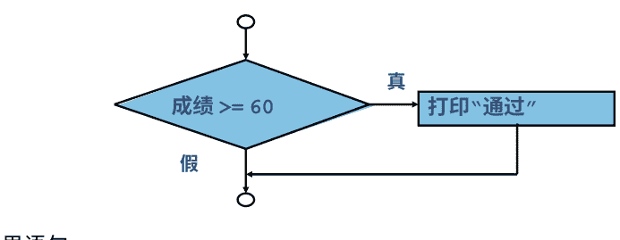

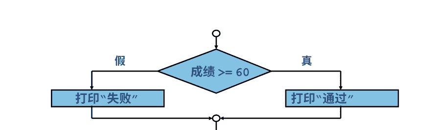

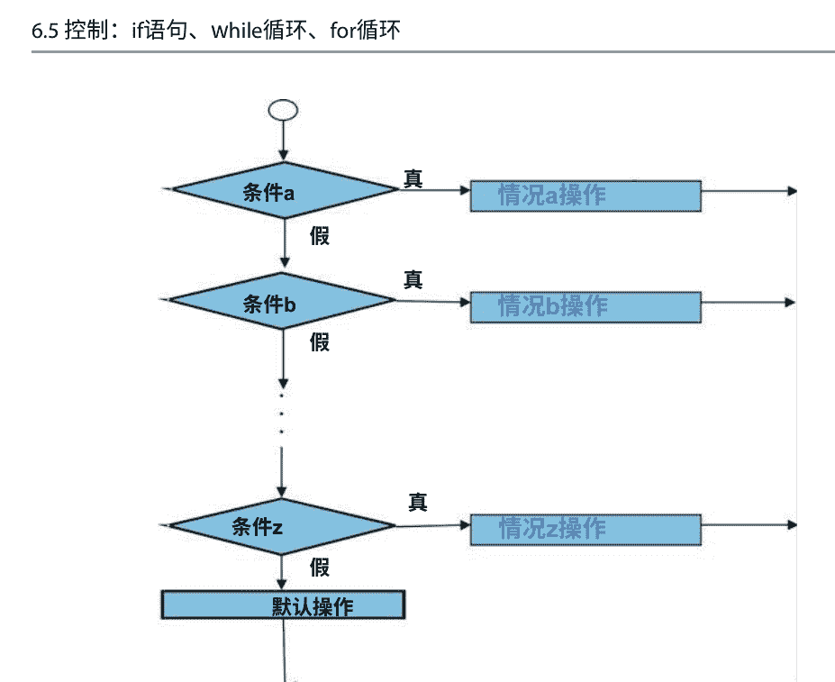

### 图6.6 如果否则如果语句

```
年份 = 2
如果年份 > 10:
    奖金 = 10 # 不要忘记缩进
否则 奖金 = 5
```

```
如果年份 > 10:
    奖金 = 5
否则 如果年份 = 10:
    奖金 = 5
否则 奖金 = 5
```

### 6.5.2 While循环

```
<初始化计数器变量>
当 <检测计数器终止条件> 时:
    <执行某些操作>
    <改变计数器的值>
```

```
计数器 = 1
当计数器 <= 10 时:
    打印 (计数器)
    计数器 = 计数器 + 1
```

你可以在循环内使用关键字 break完全退出 while循环。你可以在循环内使用关键字 continue停止处理当前迭代，并立即进入下一个迭代。

### 6.5.3 For循环

Python的for循环可用于迭代一定次数（图6.7）。

```
对于 <变量> 在范围(<次数>)内: <语句>
```

```
对于计数 在范围(5)内: 打印('你好！') # 可以写在一行或缩进
```

### 图6.7 For循环

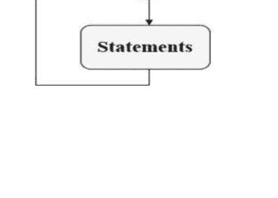

### 表6.5 文件模式

| 模式 | 解释 |
|------|------|
| r    | 读取 |
| w    | 写入：覆盖 |
| r+   | 读写 |
| a    | 追加：追加到文件末尾 |

## 6.6 从外部文件读取和写入

为了从文件中读取/写入信息，您需要以下内容：

1.  打开文件并将文件与文件变量关联。
2.  读取/写入信息的命令。
3.  关闭文件的命令。

表6.6显示了最著名的文件函数（表6.5）。

```
inputFile = open("data.txt", "r") # 表6.5总结了文件模式。
for line in inputFile:
    print(line)
readline() # 还有readlines()
inputFile.close()
```

```
outputFile = open("data.txt", "w") # 文件被“锁定”以进行写入
outputFile.write(temp) # 假设temp中有数据
```

```
outputFile.write( str (format((temp, '02x'))) # 以2位数字打印temp
outputFile.close()
```

## 6.7 模块和pip

它就像一个包。它是函数和变量的集合，通常在脚本中。使用 pip从终端安装外部模块：Python包管理器。最常用的包命令显示在表6.7中。

### 表6.6 文件函数

| 函数 | 描述 |
| --- | --- |
| line.split() | 将句子分割成单词 |
| line.split().partition("某个词")[-1] | 将句子分割成某个词后的部分 |
| 列表 | 将单词分割成字母 |
| bytearray.fromhex(hex_string) | 将长十六进制流转换为分隔的字节流 |
| line.isspace() | 如果行为空，则为True |

### 表6.7 包命令

| 函数 | 命令 |
| --- | --- |
| 安装包 | pip install tensorflow |
| 卸载包 | pip uninstall |
| 显示已安装的包 | pip freeze |
| 显示缺失的包 | pip show requests |
| 从Python 2合并到3 | Python 2到3 -w filename.py |
| 从git链接安装 | pip安装git+https://github.com/pyqtgraph/pyqtgraph |
| Python --version | 了解你的Python版本 |
| Python -m pip install --upgrade pip | 升级pip |

```
from math import exp
from random import random
```

安装torch

```
pip安装torch==1.2.0+cpu torchvision==0.4.0+cpu -f https://download.pytorch.org/whl/torch_stable.html
pip3安装torchvision
```

## 6.8 调试

调试是找出错误的过程。有两种类型的错误：

- 语法错误
    如果有语法错误，Python不会让你运行代码，并试图告诉你错误的位置。然而，在某些情况下，Python可能不会指向正确的位置，缺少或多余的括号、方括号或引号可能会导致这种情况。

- 语义错误
    程序只是没有正常工作。

### 6.8.1 注释

添加注释以便以后理解代码。

```
# 单行注释。
'''
多行注释。
'''
```

### 6.8.2 打印引用

在字符串中打印双引号或单引号之前使用转义字符 \。

### 6.8.3 断言

断言语句将在程序运行过程中检查某个条件是否为真。 如果条件为假，程序将停止运行。

```
assert(students < 5)
```

### 6.8.4 尝试-捕获

尝试-捕获用于处理异常事件，而不是正常流程。 例如，如果我们要求用户除以一个数字，但他输入了零。 解释器会报错。 我们需要处理这种情况（图6.8）。

```
python
a = input ("enter the first number")
b = input ("enter the second number")
print (c = a/b)
```

```
python
try:
    a = input ("enter the first number")
    b = input ("enter the second number")
    print (c = a/b)
except:
    print ("divide by zero error")
```

### 图6.8 a如果b = 0，解释器会报错，b只需打印错误消息

## 6.9 数据可视化

Matplotlib [11]是最著名的数据可视化库。图6.9展示了一个示例。它包含了一组与MATLAB类似的功能。它是用低级语言编写的，具有很多自定义的可能性。

```
python
import matplotlib.pyplot as plt
x= [1, 2, 3]
y= [2, 4, 6]
plt.plot (x,y)
plt.xlabel ("x values")
plt.ylabel ("y values")
plt.title ("xy-plot")
plt.show()
```

## 6.10 数据库

数据库有不同的操作：

- 创建（图6.10）。
- 插入（图6.11）。
- 选择“读取”（图6.12和6.13）。
- 更新（图6.14）。
- 删除（图6.15）。

sqlite3是执行SQL命令最著名的库[12]。

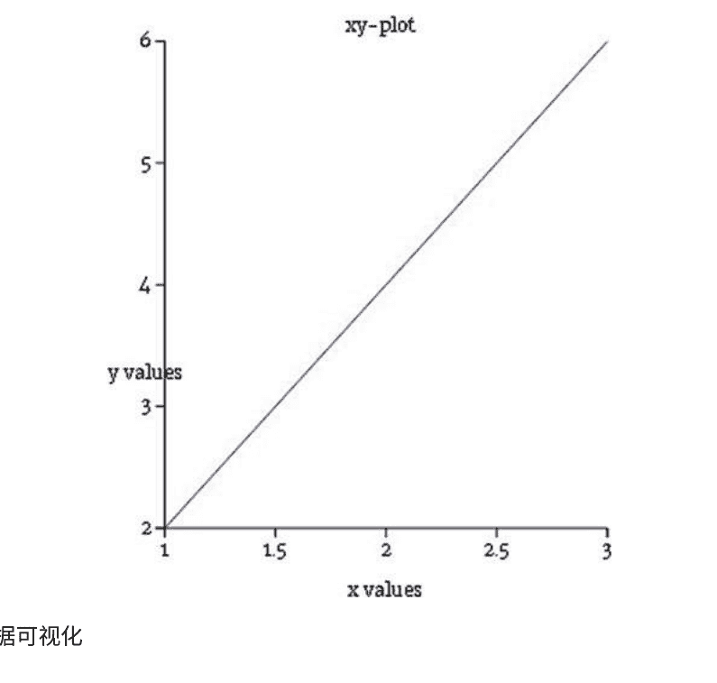

### 图6.9 数据可视化

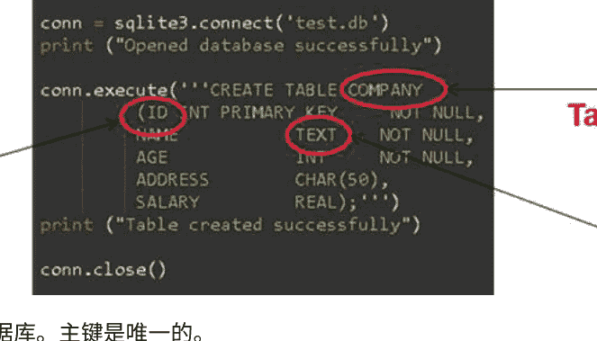

```
python
# create the database
import sqlite3

conn = sqlite3.connect('test.db')
print ("Opened database successfully")

conn.execute('''CREATE TABLE COMPANY
               (ID INT PRIMARY KEY     NOT NULL,
                NAME           TEXT    NOT NULL,
                AGE            INT     NOT NULL,
                ADDRESS        CHAR(50),
                SALARY         REAL);''')
print ("Table created successfully")

conn.close()
```

### 图6.10 创建数据库。主键是唯一的。

## 6.11 图形用户界面

最著名的GUI库是 PyQt 或 Tkinter 或 wxwidgets。 与GUI相关的最著名命令总结在 表6.8中。基于GUI的编程是事件驱动的。

```
python
#insert operation
import sqlite3

conn = sqlite3.connect('test.db')

conn.execute("INSERT INTO COMPANY (ID,NAME,AGE,ADDRESS,SALARY) \
        VALUES (1, 'khaled', 32, 'Alex', 20000.00 )");

conn.execute("INSERT INTO COMPANY (ID,NAME,AGE,ADDRESS,SALARY) \
        VALUES (2, 'Ahmed', 25, 'cairo', 15000.00 )");

conn.execute("INSERT INTO COMPANY (ID,NAME,AGE,ADDRESS,SALARY) \
        VALUES (3, 'Ali', 23, 'Alex', 20000.00 )");

conn.execute("INSERT INTO COMPANY (ID,NAME,AGE,ADDRESS,SALARY) \
        VALUES (4, 'Hassan', 25, 'cairo ', 65000.00 )");

conn.commit()
print ("Records created successfully")
conn.close()
```

### 图6.11 插入

```
python
# select operation
import sqlite3

conn = sqlite3.connect('test.db')

cursor = conn.execute("SELECT id, name, address, salary from COMPANY")
for row in cursor:
    print ("ID = ", row[0])
    print ("NAME = ", row[1])
    print ("ADDRESS = ", row[2])
    print ("SALARY = ", row[3], "\n")

print ("Operation done successfully")
conn.close()
```

### 图6.12 读取

## 6.12 从Python到.exe

见表6.9。

```
ID = 1
NAME = khaled
ADDRESS = Alex
SALARY = 20000.0

ID = 2
NAME = Ahmed
ADDRESS = cairo
SALARY = 15000.0

ID = 3
NAME = Ali
ADDRESS = Alex
SALARY = 20000.0

ID = 4
NAME = Hassan
ADDRESS = cairo
SALARY = 65000.0
```

### 图6.13 读取结果

```
python
#update operation
import sqlite3

conn = sqlite3.connect('test.db')

conn.execute("UPDATE COMPANY set SALARY = 25000.00 where ID = 1")
conn.commit

cursor = conn.execute("SELECT id, name, address, salary from COMPANY")
for row in cursor:
    print ("ID = ", row[0])
    print ("NAME = ", row[1])
    print ("ADDRESS = ", row[2])
    print ("SALARY = ", row[3], "\n")

conn.close()
```

### 图6.14 更新

## 6.13 图像

Pillow包允许您轻松导入和操作图像，使用各种滤镜、蒙版甚至像素特定的转换。表6.10总结了与图像一起使用的最重要的函数。

| 函数 | 命令 |
|------|------|
| 安装 | pip install pillow |
| 运行 | img = Image.open('2.jpg')<br>img.show() |

## 6.14 网页浏览器

表6.11显示了用于网络浏览的最重要的函数。

| 函数 | 命令 |
|------|------|
| 安装 | import webbrowser |
| 运行 | webbrowser.open('http://www.google.com', new=2) |

## 6.15 安卓

我们可以通过将tensorflow转换为 **tensorflow-lite** 来从tensorflow-python创建移动应用程序，然后可以导入到 **android studio** [13]。

## 6.16 Python到HDL

**MyHDL** package将Python转换为硬件描述和验证语言，为硬件工程师提供了Python生态系统的强大功能。MyHDL是一个免费的、开源的包，用于将Python用作硬件描述和验证语言。

Python是一种非常高级的语言，硬件设计师可以充分利用其功能来建模和模拟他们的设计。此外，MyHDL可以将设计转换为Verilog或VHDL。这为传统的设计流程提供了一条路径。在一些限制条件下，MyHDL支持将MyHDL代码自动转换为Verilog或VHDL代码。

此功能提供了从MyHDL到标准Verilog或VHDL设计环境的路径，为了可转换，硬件描述应满足某些限制，定义为可转换子集。可转换的设计可以使用从MyHDL库到Verilog或VHDL的函数将其转换为等效模型，当转换器遇到无法转换的结构时，尝试发出清晰的错误消息。编码风格对可转换代码的自然限制是它应该以MyHDL风格编写：通过信号进行协作生成器，并具有指定的敏感性条件。支持的类型是最重要的限制，涉及对象类型。只能转换有限数量的类型。Python的int和long对象被映射到Verilog或VHDL整数。所有其他支持的类型都需要有定义的位宽。支持的类型包括Python的bool类型，MyHDL的int类型和由函数Enum返回的MyHDL枚举类型。从MyHDL类型到Verilog的映射总结在图6.16中。已知问题是Verilog和VHDL整数是32位宽度，而Python正在向具有未定义宽度的整数过渡。Python的int和long变量被映射到Verilog整数；因此，对于宽度超过32位的值，此映射是不正确的。综合指示是指定为Verilog注释。从always comb推断出的敏感性列表的位置不一致。

无论是在Verilog还是MyHDL中，always comb的语义都是在代码末尾有一个隐式的敏感性列表。然而，这可能无法合成。因此，推断的敏感性列表被放置在相应的always块或进程的顶部。这可能导致模拟开始时的不一致行为。解决方法是在时间0创建事件[3]。

## 6.17 用于机器学习的Python

有很多机器学习（ML）/深度学习（DL）平台可用。ML/DL平台是一个帮助您开发和训练ML/DL模型并提供更好环境的库。深度学习框架是一组实现常见训练和推断操作的软件库。这些包括Caffe/Caffe-2（Facebook）、TensorFlow（Google）、Torch、PyTorch、认知工具包（Microsoft）、MxNet（Amazon）和KERAS（基于Python）[14]。所有这些都是开源软件。这些框架支持GPU和FPGA。选择DL框架取决于编程的简易性和运行速度。

表6.12、6.13和6.14总结了主要的机器学习库和函数[15]。

| 函数 | 评论 |
| --- | --- |
| 库 | • TensorFlow：由Google开发的用于机器学习的开源软件库[16, 17]<br>• keras：Python的深度学习框架[18]<br>• opencv：C++中的计算机视觉库（表 6.14）[19]<br>• Sonnet：用于机器学习的高级建模工具[20]<br>• Numpy：是一个包含大量数值算法和数学运算的Python库，支持使用大型多维数组和矩阵（表6.13）[21]<br>• SciPy：包含线性代数、微分方程、数值积分、优化、统计等算法的集合[22]。它构建在NumPy上<br>• Pandas：提供了数据操作工具：重塑、合并、排序、切片、聚合[23] |
| 安装 | pip install tensorflow |

|  | Numpy 库 [21] |
| --- | --- |
| 数组 | 将列表格式转换为数组格式 |
| 零 | 创建零数组 |
| 一 | 创建一数组 |
| 点 | 矩阵乘法 |
| imshow | 显示图像 |
| imread | 读取图像 |
| imwrite | 保存为图像 |

| OpenCV 库 |  |
| :--- | :--- |
| VideoCapture | 从摄像头/文件中捕获视频 |
| **在彩色图像上绘制几何形状或写入文本** |  |
| cv2.line() | 要绘制一条线，此函数需要以下参数：a. 需要绘制线条的图像对象b. 起点的像素坐标c. 终点的像素坐标d. BGR 格式的颜色e. 线条的粗细（以像素为单位） |
| rectangle()、circle()、ellipse() | 绘制矩形、圆形、椭圆形 |
| putText() | 要写入文本，此函数需要以下参数：a. 要写入文本的图像b. 要写入的文本c. 文本起点的坐标d. 要使用的字体e. 字体大小f. 文本颜色g. 文本粗细h. 使用的线条类型 |

假设卷积神经网络由6层2D卷积神经网络和16层卷积神经网络以及3层全连接层组成，我们需要使用torch框架来实现它（图6.16）。滤波器大小为5×5。基于torch的代码显示在图6.17中，基于TensorFlow的代码显示在图6.18中。TensorBoard [24] 可以帮助可视化模型，使分析变得不那么复杂，因为当一个人能够看到问题所在时，调试变得更容易。

## 6.18 结论

Python已成为深度学习的事实上的编程语言，提供了一个强大而灵活的平台，用于开发和部署深度学习模型。凭借其丰富的库和工具，Python使构建复杂的神经网络和在大型数据集上训练模型变得比以往更容易。Python的简单性和易用性使其成为初学者和有经验的开发人员的热门选择，实现快速原型设计和实验。然而，与任何技术一样，也存在一些需要解决的挑战，例如需要高效的内存管理、过拟合的潜在风险以及需要专用硬件加速训练的需求。

开发人员需要及时了解Python深度学习的最佳实践和新兴趋势，以确保模型的开发和部署负责且有效。

## 参考文献

+   1. A. Subasi, 使用Python进行数据分析的实用机器学习 (学术出版社, 2020年)
+   2. http://www.python.org/
+   3. http://www.myhdl.org/
+   4. https://www.jetbrains.com/pycharm/
+   5. https://www.spyder-ide.org/
+   6. https://anaconda.org/
+   7. https://docs.conda.io/en/latest/miniconda.html
+   8. https://jupyter.org/
+   9. https://www.java.com/en/
+   10. https://www.cplusplus.com/
+   11. https://matplotlib.org/
+   12. https://www.sqlite.org/index.html
+   13. https://developer.android.com/
+   14. N.K. Manaswi, 理解和使用Keras, 在深度学习应用中使用Python (@ Springer, Berkeley , CA; Apress, 2018), 第31-43页
+   15. https://machinelearningmastery.com/introduction-python-deep-learninglibrary-theano/
+   16. https://www.tensorflow.org/
+   17. V. Silaparasetty, 使用TensorFlow 2进行深度学习项目 (Springer Science and Business Media LLC, Berlin, 2020)
+   18. https://keras.io/
+   19. https://opencv.org/
+   20. https://github.com/deepmind/sonnet
+   21. http://www.numpy.org/
+   22. https://www.scipy.org/scipylib/
+   23. http://pandas.pydata.org/
+   24. https://www.tensorflow.org/tensorboard

# # 索引

+   **A**
激活函数, 13-15, 18, 26, 28
ADAS, 77-79
AIOT, 1, 105, 115, 125-127, 132
Android, 32, 142, 195
异常检测, 7, 156, 164
应用层, 63, 112, 156
断言, 189
增强现实, 1, 122, 131, 132, 134, 135, 137-145, 152, 154
授权, 118
自编码器, 13, 25, 154
汽车, 61-63,70,76,78-81,95,106,120
自主, 1, 12, 59, 79, 81, 82, 89, 95, 99, 100, 125, 126, 132, 152, 166
AUTOSAR, 62, 63

+   **B**
波束成形设计, 156, 160
误码率估计器, 165
大数据, 5, 6, 44, 109-113, 122
区块链, 94, 116, 118, 138, 165

+   **C**
C++, 97, 172, 176, 177, 197
CAN总线, 64, 65, 67-69
信道编码, 156, 158, 159
字符识别, 196
通信层, 112
消费电子产品, 142

+   **D**
卷积神经网络, 12, 13, 19-21, 88, 90, 142, 154, 198
网络物理系统, 106
数据库, 113, 116, 175, 190, 191
数据挖掘, 2
调试, 32, 174, 179, 188, 198
决策树, 8, 10
深度学习, 1-3, 12, 13, 18, 22, 23, 26, 27, 31, 33-35, 43, 49, 52, 88, 95, 105, 106, 116, 126, 132, 141, 145, 151, 154, 155, 158, 161-163, 165, 166, 171, 197-199

+   **E**
电子商务, 142
边缘计算, 115-117, 126, 138
扩展现实, 132, 135

+   **F**
快速 R-CNN, 88, 91, 92, 94
前馈神经网络, 15, 19-21
FlexRay, 61-63, 70-73, 75
FPGA, 12, 34, 96-98, 197

+   **G**
5G, 1, 93, 94, 112, 115, 138, 151-156, 158, 159, 161-164, 166
6G
+   GAN, 12, 13, 23, 24, 154
+   梯度下降, 17
+   图形用户界面, 99, 173, 191, 194

+   **H**
+   HDL, 97-99, 173, 195
+   全息术, 140

+   **I**
+   集成开发环境, 67, 173-176
+   图像处理, 47, 78, 82, 87, 98, 134, 138
+   工业革命, 106
+   工业4.0, 107, 124
+   检查, 143
+   完整性, 117, 118, 123, 165
+   物联网, 1, 105, 106, 110-112, 114-116, 118-121, 124-126, 131, 132, 133, 139, 143, 156, 164

+   **J**
+   JAVA, 172

+   **L**
+   LIN, 61-63, 70, 74-76
+   定位, 87, 88, 90-93, 95, 138

+   **M**
+   机器学习, 1-4, 6, 7, 9, 12, 13, 24, 31-33, 36, 38, 43-45, 47, 52, 96, 100, 105, 106, 126, 132, 142, 152, 155, 156, 158, 160, 162, 164, 197
+   MAC层, 156, 162
+   维护, 7, 96, 120, 140, 143
+   制造, 106, 120, 121, 124, 126, 132, 143
+   Mask R-CNN, 93, 94
+   混合现实, 132, 135
+   模块, 27, 74, 95, 99, 100, 187
+   MOST, 61-63, 76-78

+   **N**
+   朴素贝叶斯, 9, 10
+   网络层, 91, 154, 156, 157, 164, 165

+   **O**
+   优化, 13, 26, 32, 35, 43, 89, 96, 97, 99, 123, 126, 140, 155-157, 161, 162, 164, 166, 175, 197

+   **P**
+   感知层, 112
+   性能管理, 156, 164
+   PIP, 187, 188, 194, 195, 197
+   电源管理, 115, 156, 157, 162
+   处理层, 112
+   编程语言, 5, 125, 171, 172, 176, 177, 198
+   Python, 5, 31, 32, 97-99, 171-180, 186, 188, 194-199

+   **Q**
+   Q学习, 11

+   **R**
+   随机森林, 10, 11
+   回归分析, 9
+   强化学习, 3-5, 11, 47, 48, 154, 162
+   路由, 94, 156, 157, 164

+   **S**
+   SAE, 80
+   安全, 87, 93-95, 100, 107, 114-117, 123, 126, 134, 139, 151, 165
+   自动驾驶汽车, 1, 59, 60, 88, 89, 111
+   半监督学习, 3, 5
+   智能建筑, 120
+   智能物流, 120
+   脉冲神经网络, 23
+   SPP-Net, 92-94
+   SSD, 88, 90, 94
+   监督学习, 3, 5, 8, 10, 11, 24, 48
+   支持向量机, 7, 154
+   同步, 64, 67, 68, 72, 74, 156, 160

+   **T**
+   Tensorflow, 31-33, 44, 171, 188, 195, 197, 198, 200- 交通预测, 156, 164
- 迁移学习, 24, 45
- 尝试-异常, 189
- VEoT, 1, 132
- 虚拟现实, 122, 131, 132, 134, 138, 139, 142, 144, 152
- 可视化, 139, 143, 172, 190, 191
- 普适计算, 106
- 无监督学习, 3, 5, 19, 24, 45
- 网络浏览, 195
- V2X通信, 93-95
- Yolo, 88, 89, 94