# 深度学习：基础、理论和应用

## 前言

在过去的10年里，深度学习引起了很多关注，在语音识别、计算机视觉、手写识别、机器翻译和自然语言理解等各个领域取得了许多令人兴奋的成果。令人惊讶的是，机器在某些特定领域的表现甚至超过了人类。深度学习的快速发展已经开始影响人们的生活，但仍然存在挑战。特别是，成功的深度学习理论尚未得到明确解释，实现深度学习模型的最新技术性能需要大量标记数据。此外，优化深度学习模型可能需要相当长的时间才能应用于实际应用。因此，仍然需要大量努力来研究深度学习理论并将其应用于各种具有挑战性的领域。本书探讨了其中一些问题，并深入描述了机器学习、计算机视觉和自然语言处理领域的基本理论、一些可能的解决方案和研究人员在最新技术方面取得的成果。

本书由六章组成，每章前都有一个介绍，后面跟着一份详尽的参考文献清单，供进一步阅读和研究。 以下是各章节的摘要:

密度模型提供了一个估计数据分布的框架，这是机器学习中的一个重要任务。第1章介绍了基于潜在变量的深度密度模型，它们基于一种贪婪逐层无监督学习算法。深度模型的每一层都采用了只有一层潜在变量的模型，例如混合因子分析器（MFAs）和具有公共载荷的混合因子分析器（MCFAs）。

基于循环神经网络（RNN）的深度学习模型已经广泛研究用于序列模式识别，特别是长短期记忆（LSTM）。第2章介绍了一种深度LSTM架构和一种连接主义时间分类（CTC）束搜索算法，并在线手写识别上评估了这个设计。

在上述深度学习相关理论的基础上，第3、4、5和6章介绍了深度学习方法在几个应用领域的最新进展。第3章概述了基于深度学习的中文手写识别的最新性能，包括孤立字符识别和文本识别。

第4章和第5章描述了深度学习方法在自然语言处理（NLP）中的应用，这是人工智能（AI）的一个关键研究领域。NLP旨在设计计算机算法以与人类相同的方式理解和处理自然语言。具体而言，第4章着重介绍了NLP的基础知识，如通过深度学习进行词嵌入或表示方法，并描述了NLP中的两个强大模型：循环神经网络（RNN）和卷积神经网络（CNN）。第5章介绍了深度学习技术在一些基准NLP任务中的应用，包括实体识别、超标记、机器翻译和文本摘要。

最后，第6章介绍了深度学习模型在海洋数据分析中的应用，重点介绍了卷积神经网络用于海洋前沿识别和长短期记忆网络用于海表面温度预测。

总之，我们相信这本书将成为计算机科学、统计学、电气工程等高年级（本科或研究生）学生的有用参考资料，同时也适合其他对深度学习算法感兴趣的人进行学习和探索。对于人工智能、模式识别、机器学习以及相关领域的研究人员，以及对将深度学习模型应用于现有或新的实际应用感兴趣的工程师来说，这本书也具有特别的吸引力。在先决条件方面，读者应该熟悉基本的机器学习概念，包括多元微积分、概率和线性代数，以及具备计算机编程技能。

中国苏州
英国爱丁堡
中国苏州
中国苏州
2018年3月

黄凯竹
Amir Hussain
王秋峰
Rui Zhang


# 第一章 深度密度模型与潜在变量简介

Xi Yang, Kaizhu Huang, Rui Zhang和Amir Hussain

摘要 本章介绍了基于贪婪逐层无监督学习算法的深度密度模型与潜在变量。深度模型的每一层都采用只有一层潜在变量的模型，例如混合因子分析器（MFAs）和具有公共载荷的混合因子分析器（MCFAs）。作为背景，回顾了MFAs和MCFAs方法。通过比较这两种方法，共享公共载荷更具物理意义，因为公共载荷被视为一种特征选择或降维矩阵。重要的是，MCFAs可以显著减少自由参数的数量，而不是MFAs。然后描述了深度模型（深度MFAs和深度MCFAs）及其推理，结果显示贪婪逐层算法是学习深度密度模型的高效方法，深度架构比浅层架构更加高效（有时指数级）。在密度估计和聚类方面分别评估了两个浅层模型和两个深层模型的性能。此外，深度模型还与其浅层对应物进行了比较。

关键词 深度密度模型·因子分析器混合模型·共同组分因子载荷·维度约简

## 1.1 引言

密度模型提供了估计数据分布的框架，因此成为设计机器的中心理论方法之一（Rippel和Adams 2013; Ghahramani 2015）。其中一个关键采用潜在变量的概率方法是为了揭示数据结构并探索特征以进行后续的判别学习。潜在变量模型广泛应用于机器学习、数据挖掘和统计分析。

在机器学习的最新进展中，一个核心任务是估计用于建模具有复杂结构的数据类型（如文本、图像和声音）的深度架构。深度密度模型一直是构建复杂密度估计的热点。现有的概率图模型不仅从理论上证明了深度架构可以为复杂结构化数据创建更好的先验，而且在预测、重建、聚类和模拟方面具有实际意义（Hinton等人，2006年；Hinton和Salakhutdinov，2006年）。然而，由于大量自由参数和昂贵的推理过程，它们在实践中经常遇到计算困难（Salakhutdinov等人，2007年）。

为了达到这个目的，贪婪逐层学习算法是学习由许多潜在变量层组成的深层架构的一种高效方法。使用这个算法，第一层通过使用只有一层潜在变量的模型来学习。特别地，相同的方案可以扩展到同时训练后续层。与之前的方法相比，这个深层潜在变量模型通过在连续层之间共享参数来减少自由参数，并且由于简洁的目标函数而具有更简单的推理过程。具有潜在变量的深度密度模型通常用于解决无监督任务。在许多应用中，这些密度模型的参数是通过最大似然确定的，通常采用期望最大化（EM）算法（Ma和Xu 2005；Do和Batzoglou 2008；McLachlan和Krishnan 2007）。在第1.4节中，我们将看到EM是一种强大而优雅的方法，用于找到具有潜在变量模型的最大似然解。

### 1.1.1 具有潜在变量的密度模型

密度估计是机器学习中的一个重要任务。通常，最常用的方法是最大似然估计（MLE）。通过这种方式，我们可以建立一个似然函数 $ L(\mu, \Sigma) = \sum_{n=1}^N \ln p(\mathbf{y}_n | \mu, \Sigma) $ $\mathbf{y}_n$ - N观察数据，$\mu$- 平均值，$\Sigma$- 协变量。然而，直接计算似然函数的推导由于 $\Sigma$ 的维度非常高而存在计算困难。因此，一组变量 $\mathbf{x}$ 被定义为控制多个 $\mathbf{y}$ 的变量，当找到 $p(\mathbf{x})$ 的分布时，可以通过 $\mathbf{y}$ 和 $\mathbf{x}$ 的联合分布确定 $p(\mathbf{y})$。通常，协变量 $\Sigma$ 被排除在外。在这种情况下，$\mathbf{x}$ 被假设影响显性变量（可观测变量），但它本身不可直接观测。因此，$\mathbf{x}$ 被称为潜在变量（Loehlin 1998）。重要的是，引入潜在变量允许从简单组件形成复杂分布。在统计学中，潜变量模型是概率模型，表示一组潜变量的存在，并将它们与显变量相关联（Vermunt和Magidson 2004）。这些模型通常根据显变量和潜变量的性质是否离散或连续进行分组（参见表1.1）（Galbraith等人2002; Everett 2013）。尽管如此，它们也被广泛应用于数据分析，特别是在存在重复观测、多层次数据和面板数据的情况下（Bishop 1998）。在本章中，我们将看到基于离散潜变量的有限混合模型（详见第1.2节）。这个有限混合模型是多个密度函数的凸组合，并提供了有限数量的潜类别的异质性表达，例如混合因子分析器（MFAs）（Ghahramani和Hinton 1996）和具有公共载荷的混合因子分析器（MCFAs）（Baek等人2010）。

表1.1 不同类型的潜变量模型。我们关注潜变量分析和潜类分析，其中潜变量被视为多项分布

| 显变量\潜变量 | 连续的 | 离散的 |
| :---: | :---: | :---: |
| 连续的 | 因子分析 | 潜类分析 |
| 离散的 | 潜特质分析 | 潜类分析 |

### 1.1.2 通过贪婪逐层学习算法实现深度架构

潜变量模型通常被表示为一个浅层架构，只有一个可见层和一个隐藏层，例如有向无环图（见图1.1）。如1.2.4.1和1.2.4.2节所示，浅层架构在实践中取得了良好的性能。尽管如此，浅层架构在处理复杂结构数据或大量隐藏单元方面也存在问题，即效率低下（Bengio等人，2007年）。相比之下，深层架构具有多个隐藏层，有助于学习更好的复杂隐藏单元表示。图1.2展示了一个有向深层架构。此外，深层架构减少了对手工特征的需求，这是一个非常耗时且需要专业知识的过程。

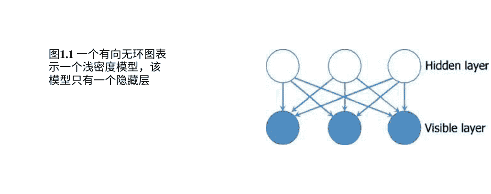

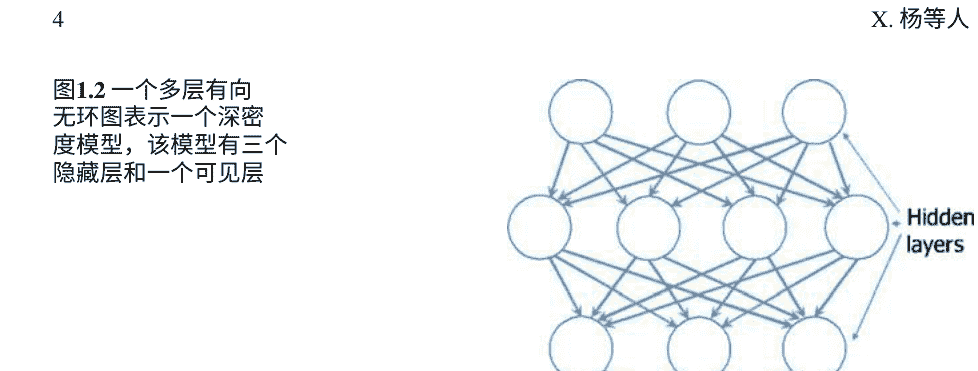

然而，当使用多层架构构建生成模型时，一次训练所有层是困难的（Arnold和Olivier 2012）。为此，通过使用相同的优化准则为每一层进行优化，并从底层开始将问题向上传递到下一层，开发了贪婪逐层过程来训练深度生成模型，即所谓的逐层学习算法（Arnold和Olivier 2012）。因此，潜变量模型可以作为深度架构的理想准则，同时为构建更复杂的概率分布提供了一个框架（Bengio等人2009年）。具体而言，尽管深度潜变量模型具有许多层的潜变量，但学习过程仅使用具有一个层的潜变量模型来优化每一层（Tang等人2012年）。此外，深度架构还可以用于有限混合模型，这意味着每个子群体被假设来自具有多个分布的显变量。深度密度模型在许多学科中也具有非常重要的实际意义，尤其是在无监督学习中引起了相当大的关注（Patel等人2015年；Tang等人2013年；Yang等人2017年）。

### 1.1.3 无监督学习

在实际应用中，具有潜在变量的（深度）密度模型通常用于解决无监督任务，特别是在降维和聚类方面。具有潜在变量的（深度）密度模型是一种基于建模观测数据密度并假设存在一些潜在/不可观测过程来管理数据生成的概率算法。

聚类是将相似的数据点放在一起的方法，而概率无监督学习则构建了描述物品聚类的生成模型。其中，每个聚类可以由一个精确的组件分布（对于深度模型来说是多个分布）来表示。因此，每个数据点是从选择一个组件的方式生成的（Law et al. 2004; Figueiredo and Jain 2002）。这个想法是，属于同一聚类的所有相同类型的数据点（都来自同一分布）在某种程度上是等价的，它们之间的任何差异都是偶然的（Bishop 2006）。

在降维中，潜变量的主要作用是允许从更简单的条件分布构建的复杂观测变量分布。重要的是，潜变量的维度始终低于可观测变量。因此，高维可观测变量被降低到低维潜变量来表示模型。

## 1.2 浅层潜变量模型的架构

本节介绍具有潜变量的密度模型，明确显示模型的推理与深层架构的单层操作对应。密度模型广泛应用于数据挖掘、模式识别、机器学习和统计分析。作为基本模型，因子分析（FA）通常用于定义数据的适当密度分布，以促进著名的高斯混合模型（Everitt 1984）。改进的密度估计器MFAs通过允许混合模型中的每个高斯分布在不同的低维流形中表示来建模。特别地，MFAs同时对数据进行聚类和降维（Montanari and Viroli 2011; McLachlan and Pee 1 2000）。利用MFAs的类似思想，MCFAs通过共享公共成分载荷提出了另一个混合框架。重要的是，与为所有组件的潜在因子指定多元标准正态先验不同，MCFAs利用每个潜在单元的高斯密度分布，其均值和协方差可以从数据中学习。另一方面，为所有组件共享一个公共因子负载可以显著减少参数。然而，由于一个公共因子负载可以被视为特征选择或降维矩阵，因此它可以得到很好的解释并具有更多的物理意义（Baek和McLachlan 2011; Tortora等，2016年）。由于MFAs和MCFAs涉及将假定的子群体归因于个体观察的步骤，因此这些模型通常用于无监督学习或聚类过程，并取得了令人印象深刻的性能（Mclanchlan等，2003年; Yang等，2017年）。

### 1.2.1 符号

我们首先考虑在多维空间中识别数据点组/簇的问题。假设我们有一个由N个观测组成的数据集 y，每个特征变量都有一个维度为p的向量 {y1, y2, . . . , y p }。通过引入潜变量，可以用潜变量的 q维向量 {z1, z2, . . . , zq}来表示显式分布 p(y)，其中 q比 p小（Smaragdis等人，2006年）。 通过这个过程，联合分布 $P(\mathbf{y}, \mathbf{z})$被分解为给定潜变量的特征变量的条件分布和潜变量的边缘分布的乘积 $p(\mathbf{z})$（Bishop, 1998年）。

$$P(\mathbf{y}, \mathbf{z}) = p(\mathbf{y}|\mathbf{z})p(\mathbf{z}) = p(\mathbf{z}) \prod_{i=1}^{p} p(y_i|\mathbf{z}).$$ (1.1)

如图1.3所示，潜变量模型可以通过有向图形式表示。

通过考虑 $C$ 个多项式分布的混合，可以将 $\mathbf{y}$ 的密度建模为有限混合模型

$$P(\mathbf{y}; \boldsymbol{\theta}) = \sum_{c=1}^{C} \pi_c p(\mathbf{y}|c; \boldsymbol{\theta}_c), \quad \text{其中} \quad c = 1, \ldots, C.$$ (1.2)

这些分布被称为该模型的组成部分（或观测的子群），并描述了 $p$-变量密度函数（Figueiredo and Jain2002）。混合分布可以用一个简单的图形表示，如图1.4所示。这些组成部分必须属于相同的参数分布族，但具有不同的参数 $\boldsymbol{\theta}$。$\boldsymbol{\theta}_c$表示与组成部分 $c$相关联的观测参数。例如，混合组件属于高斯分布，因此每个组件具有不同的均值和方差。此外，在贝叶斯设置中，参数是随机变量，并且先验概率分布 $p(\mathbf{y}|c; \boldsymbol{\theta}_c)$被放置在变量上（Bishop1998; Loehlin 1998）。$\pi_c = p(c)$表示 $C$混合权重，并满足概率之和为1的要求。

图1.3 方程1.1的因式分解性质可以用有向图表示，在该图中，特征变量 $y_i$独立于潜变量 $\mathbf{z}$

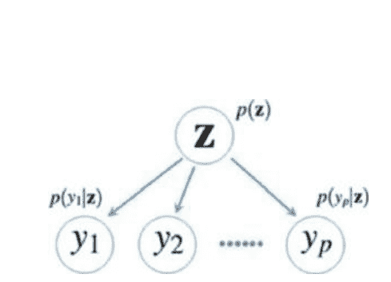

图1.4 一个简单的混合模型可以用贝叶斯网络表示

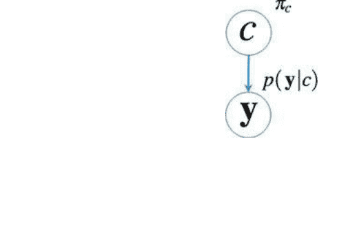因此，通过将混合模型的技术与潜变量的思想相结合，可以得到混合潜变量模型（Fokou 2005）。因此，联合分布P(y,z)可以如下推导，并且相应的贝叶斯网络如图1.5所示。

$$P(y,z) = \sum_{c=1}^{C} p(y|p(c),z)p(c)p(z|c) = \sum_{c=1}^{C} \pi_c p(z_c) \prod_{i=1}^{p} p(y_i|z).$$ (1.3)

这个混合模型是通过离散潜在变量进行明确计算的。因此，积分被替换为求和。

### 1.2.2 因子分析的混合模型

我们首先介绍一种全局非线性潜在变量模型，称为因子分析的混合模型（MFAs）。MFAs被认为是通过有限分布分析的思想扩展了传统的因子分析。为了将观测值独立地分成不重叠的组件，MFAs方法被建模为

$$y = \sum_{c=1}^{C} \mu_c + W_c z + \epsilon_c$$ 的概率为 $$\pi_c (c = 1,\ldots,C),$$ (1.4)

其中$\mu_c$是与组件$c$相关联的$p$维均值向量；$W_c$是组件$c$的$p \times q$因子载荷矩阵，其中$q < p$；$\pi_c = p(c)$表示混合比例。每个（不可观察的）因子$z$独立地服从均值为零、$q \times q$单位方差的正态分布，$N(0,I_q)$。噪声模型$\epsilon_c$也是独立的，并且被假设为均值为零、$q$维对角协方差矩阵的高斯分布，$N(0,\Psi_c)$。给定潜在变量和组件指示变量，观测值的条件分布$p(y|c,z)$遵循一个均值为$W_c z + \mu_c$和方差为$\Psi_c$的高斯分布。

联合分布由 $p(\mathbf{y}|c, \mathbf{z}) p(\mathbf{z}|c) p(c)$ 给出，观测数据的密度 $P(\mathbf{y}; \boldsymbol{\theta})$ 通过对所有混合成分求和得到。然后，通过对潜在变量进行边缘化，得到MFAs模型

$$p(\mathbf{y}|c) = \int_{\mathbf{z}} p(\mathbf{y}|c, \mathbf{z}) p(\mathbf{z}|c) d\mathbf{z} = N(\mathbf{y}; \boldsymbol{\mu}_c, \mathbf{W}_c \mathbf{W}_c^T + \boldsymbol{\Psi}_c),$$

$$P(\mathbf{y}; \boldsymbol{\theta}) = \sum_{c=1}^{C} \pi_c p(\mathbf{y}|c, \mathbf{z}) p(\mathbf{z}|c) = \sum_{c=1}^{C} \pi_c N(\mathbf{y}; \boldsymbol{\mu}_c, \mathbf{W}_c \mathbf{W}_c^T + \boldsymbol{\Psi}_c),$$

其中 $\boldsymbol{\theta}$ 表示模型参数向量。它由混合权重 $\pi_c$, 组件均值 $\boldsymbol{\mu}_c$, 因子加载 $\mathbf{W}_c$ 和组件矩阵的协方差 $\boldsymbol{\Psi}_c$ (Montanari和Viroli 2011) 组成。

$$\boldsymbol{\theta}_c = \begin{pmatrix} \pi_c \\ \boldsymbol{\mu}_c \\ \mathbf{W}_c (vec) \\ \boldsymbol{\Psi}_c (diag) \end{pmatrix}_{c=1}^{C} .$$

因此，MFAs可以被视为一个全局非线性潜在变量模型，在数据上拟合了 $C$ 个高斯因子。

#### 1.2.2.1 最大似然

确定“最佳拟合”分布（方程1.6）后，将估计该分布的参数。最大似然估计（MLE）是一种常见的概率分布参数估计技术。换句话说，MLE可以被称为通过估计参数的值来最大化样本似然。这些未知参数包含在一个向量 $\boldsymbol{\theta}$ 中（如方程1.7所示）。粗略地说，MLE的目标是最大化样本数据的似然函数。假设我们有一个由独立同分布（iid）随机变量组成的样本 $\{\mathbf{y}_1; \mathbf{y}_2; \dots; \mathbf{y}_N\}$，该样本由MFAs模型（方程1.6）描述。基本似然函数定义如下：

$$P(\mathbf{y}; \boldsymbol{\theta}) = \sum_{c=1}^{C} \pi_c \prod_{i=1}^{N} N(\mathbf{y}_n; \boldsymbol{\mu}_c, \mathbf{W}_c \mathbf{W}_c^T + \boldsymbol{\Psi}_c).$$

由于最大化乘积非常繁琐，通常使用对数将乘法转化为求和。由于对数是一个递增函数，等价于最大化对数似然函数（Montanari和Viroli 2011）。

$$L(\boldsymbol{\theta}) = \log P(\mathbf{y}; \boldsymbol{\theta}) = \sum_{c=1}^{C} \sum_{n=1}^{N} \log\{\pi_c N(\mathbf{y}_n | \boldsymbol{\mu}_c, \mathbf{W}_c \mathbf{W}_c^T + \boldsymbol{\Psi}_c)\},$$

$$\hat{\boldsymbol{\theta}} = \arg \max_{\boldsymbol{\theta}} L(\boldsymbol{\theta}).$$

在这里，$\hat{\theta}$表示当经验对数似然函数达到最大值时的估计参数。

#### 1.2.2.2 最大后验估计

最大后验估计（MAP）也是在概率分布设置中估计变量的一种方法。 MAP与MLE密切相关，可以看作是MLE的正则化。然而，MAP更关注后验分布，而不仅仅是似然函数。 对于推断，MAP通常与贝叶斯设置相关，并且可以通过回忆贝叶斯规则找到组件的后验分布。

$$q(\mathbf{z}, c|\mathbf{y}) = q(\mathbf{z}|\mathbf{y}, c)q(c|\mathbf{y}), \tag{1.11}$$

$$q(c|\mathbf{y}) = \frac{p(\mathbf{y}|c)p(c)}{\sum_{h=1}^{C} p(\mathbf{y}|h)p(h)} \propto p(\mathbf{y}|c)p(c). \tag{1.12}$$

更具体地说，潜在因素的后验概率也是给定$\mathbf{y}$和$c$的多元高斯分布：

$$q(\mathbf{z}|\mathbf{y}, c) = N(\mathbf{z}; \boldsymbol{\kappa}_c, \mathbf{V}_c^{-1}), \tag{1.13}$$

其中

$$\mathbf{V}_c^{-1} = \mathbf{I} + \mathbf{W}_c^T \boldsymbol{\Psi}_c \mathbf{W}_c,$$
$$\boldsymbol{\kappa}_c = \mathbf{V}_c^{-1} \mathbf{W}_c^T \boldsymbol{\Psi}_c^{-1} (\mathbf{y} - \boldsymbol{\mu}_c). \tag{1.14}$$

通过选择具有最大后验概率的分量$c$可以得出一个点估计

$$\hat{c} = \arg \max_{c} p(c)p(c|\mathbf{y}). \tag{1.15}$$

然后，在MLE（方程1.10）中的似然性被后验取代。 因此，MAP估计将回到MLE方程

$$\hat{\theta}_{MAP} = \arg \max_{\theta} \sum_{c=1}^{C} \sum_{n=1}^{N} \log\{p(\mathbf{y}|c)p(c)\} = \hat{\theta}_{MLE}. \tag{1.16}$$

### 1.2.3 具有共同因子负载的混合因子分析器

假设观测值 y遵循高斯分布 N(y; μ_c, Σ_c)。作为MFAs的特例，MCFAs进一步假设了额外的限制条件：

$$\boldsymbol{\mu}_c = \mathbf{A}\boldsymbol{\xi}_c; \quad \boldsymbol{\Sigma}_c = \mathbf{A}\boldsymbol{\Omega}_c\mathbf{A}^T + \boldsymbol{\Psi}; \\ \boldsymbol{\Psi}_c = \boldsymbol{\Psi}; \quad \mathbf{W}_c = \mathbf{A}\mathbf{K}_c.$$ (1.17)

因此，通过重写方程1.4，我们得到一个新的线性模型

$$\mathbf{y} = \sum_{c=1}^C \mathbf{A}\mathbf{z}_c + \boldsymbol{\epsilon}$$ 的概率为 $$\pi_c$$ (c = 1, ..., C). (1.18)

传统上，A是一个p×q的常见加载矩阵，而$\mathbf{z}_c$被称为隐藏变量或潜在因子。与MFAs的潜在因子不同，这个常见加载矩阵可以被看作是一个全局变换矩阵，并且每个潜在因子上的高斯分布的均值和协方差可以从数据中学习得到。这些设置不仅显著减少了参数，还能准确估计密度。此外，MFAs的多元标准高斯先验可能限制了其灵活性。

为了使用这个框架，MCFAs被定义为一个有向生成模型，如下所示

$$p(c) = \pi_c, \quad \sum_{c=1}^C \pi_c = 1; \\ \boldsymbol{\epsilon} \sim N(0, \boldsymbol{\Psi}); \quad \mathbf{y}|c, \mathbf{z} \sim N(\mathbf{A}\mathbf{z}_c, \boldsymbol{\Psi}),$$ (1.19)

其中 $\boldsymbol{\Psi}$是一个 p × p对角矩阵，表示独立噪声的方差。c表示混合模型的 C 个组件中的组件指示符， $p(c) = \pi_c$是混合比例。给定c的潜在因子$\mathbf{z}$的先验遵循高斯密度分布：

$$p(\mathbf{z}|c) = N(\mathbf{z}; \boldsymbol{\xi}_c, \boldsymbol{\Omega}_c).$$

在这里，$\boldsymbol{\xi}_c$是一个 q维向量， $\boldsymbol{\Omega}_c$是一个 q × q正定对称矩阵。根据上述定义，给定 c的 $\mathbf{y}$的密度可以通过积分潜在变量$\mathbf{z}$得到一个浅层形式。

$$p(\mathbf{y}|c) = \int_{\mathbf{z}} p(\mathbf{y}|c, \mathbf{z})p(\mathbf{z}|c)d\mathbf{z} = N(\mathbf{y}; \boldsymbol{\mu}_c, \boldsymbol{\Sigma}_c), \\ \boldsymbol{\mu}_c = \mathbf{A}\boldsymbol{\xi}_c, \quad \boldsymbol{\Sigma}_c = \mathbf{A}\boldsymbol{\Omega}_c\mathbf{A}^T + \boldsymbol{\Psi}.$$ (1.20)

最后，MCFAs模型在观测数据$\mathbf{y}$上的边缘密度由一个混合得到，该混合是通过求和联合分布 $p(\mathbf{y}|c, \mathbf{z}) p(\mathbf{z}|c) p(c)$获得的

$$p(\mathbf{y}) = \sum_{c=1}^{C} p(c) p(\mathbf{y}|c),$$

$$P(\mathbf{y}; \boldsymbol{\theta}_c) = \sum_{c=1}^{C} \pi_c \mathcal{N}(\mathbf{y}; \mathbf{A}\boldsymbol{\xi}_c, \mathbf{A}\boldsymbol{\Omega}_c\mathbf{A}^T + \boldsymbol{\Psi}).$$

显然，MCFAs模型也是一个具有约束均值和协方差的多元高斯分布。在这里，参数向量包括全局参数、公共加载矩阵 $\mathbf{A}_c$、协方差矩阵 $\boldsymbol{\Psi}$ 以及每个混合成分的局部参数。

$$\boldsymbol{\theta}_c = \left( \begin{array}{c} \pi_c \\ \boldsymbol{\xi}_c (vec) \\ \boldsymbol{\Omega}_c (Sym) \end{array} \right)_{c=1}^{C}. \tag{1.21}$$

#### 1.2.3.1 最大似然

在第1.2.2.1节中，介绍了MFAs的MLE。现在我们转向MLE的MCFAs，使用相同的推理过程。MCFAs模型（方程1.21）描述了iid随机变量的样本。对数似然函数如下所示：

$$L(\boldsymbol{\theta}) = \log P(\mathbf{y}; \boldsymbol{\theta}) = \sum_{c=1}^{C} \sum_{n=1}^{N} \log \{ \pi_c \mathcal{N}(\mathbf{y}_n|\mathbf{A}\boldsymbol{\xi}_c, \mathbf{A}\boldsymbol{\Omega}_c\mathbf{A}^T + \boldsymbol{\Psi}) \}, \tag{1.22}$$

当经验对数似然函数达到最大值时，最大化函数如下所示

$$\hat{\boldsymbol{\theta}} = \arg \max_{\boldsymbol{\theta}} L(\boldsymbol{\theta}). \tag{1.23}$$

在潜变量模型中，找到最大似然估计的一般技术是期望最大化（EM）算法。在第1.4节中，我们将看到最大似然学习可以直接使用EM算法。

#### 1.2.3.2 最大后验概率

在最大后验概率（MAP）中，后验的表达可以使用贝叶斯规则表示：

$$q(c|\mathbf{y}; \theta_c) = \frac{\pi_c N(\mathbf{y}; \mathbf{A\xi}_c, \mathbf{A\Omega}_c\mathbf{A}^T + \Psi)}{\sum_{h=1}^C \pi_h N(\mathbf{y}; \mathbf{A\xi}_h, \mathbf{A\Omega}_h\mathbf{A}^T + \Psi)}$$

通过最大化后验概率可以选择组件 $c$。

$$\hat{c} = \arg \max_c p(c)q(c|\mathbf{y}; \theta_c)$$

潜在因子的后验也是给定观测 $\mathbf{y}$ 和组件 $c$ 的多元高斯密度：

$$q(\mathbf{z}|\mathbf{y}, c) = N(\mathbf{z}; \kappa_c, \mathbf{V}_c^{-1})$$

其中

$$\mathbf{V}_c^{-1} = \mathbf{\Omega}_c^{-1} + \mathbf{A}^T \Psi^{-1} \mathbf{A},$$
$$\kappa_c = \xi_c + \mathbf{V}_c^{-1} \mathbf{A}^T \Psi^{-1} (\mathbf{y} - \mathbf{A\xi}_c)$$

更具体地说，混合模型的后验概率可以通过公式 $p(c|\mathbf{y}; \theta_c) = pr\{\omega_c = 1|\mathbf{y}\}$ 来计算，其中 $\omega_c =1$ 表示 $\mathbf{y}$ 属于第 $c$ 个分量，否则 $\omega_c = 0$。

### 1.2.4 无监督学习

MFAs模型通过做出局部线性假设来对数据进行降维。因此，该模型将不同簇的点转换为不同的子空间，如图1.6所示。其原则是最大化相同簇中点的相似性。重要的是，MCFAs模型通过做出全局线性假设来对数据进行降维，可以将不同簇转换为一个子空间，如图1.7所示。与MFAs不同，MCFAs不仅遵循最大化相似性的原则，还要最大化簇之间的距离。

我们对各种数据集进行了广泛的实验，以评估两种算法的性能，包括人工数据、灰度图像和数字化航空图像。我们的实现实验中使用了以下数据集。

- ULC-3: 城市土地覆盖（ULC）数据用于对由273个训练样本、77个测试样本和147个属性组成的高分辨率航空图像进行分类（Johnson和Xie 2013; Johnson 2013）。
- Coil-4-proc: 该数据集包含4个对象的图像，舍弃了背景，每个对象有72个样本（Nene等，1996年）。图像已经缩小为32x32像素，然后重新调整为1024维向量。训练集中只有248个样本，测试集中有40个样本。
- Leuk72_3k：这个数据集是一个人工数据集，包含3个类别，这些类别是从随机生成的高斯混合中抽取的。Leuk72_3k只有54个训练样本和18个测试样本，具有39个属性。
- USPS1-4：这个手写数字数据集包含1到4个数字的图像，大小为16x16像素。每个图像被重新调整为256维向量。训练集包括每个数字100个样本，测试集也包括每个数字100个样本。

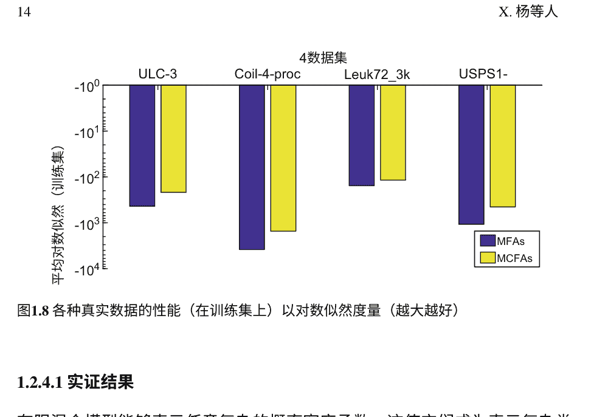

#### 1.2.4.1 实证结果

有限混合模型能够表示任意复杂的概率密度函数，这使它们成为表示复杂类条件的优秀选择（Figueiredo和Jain 2002）。经验上，平均对数似然度作为检验密度估计质量的标准，用于对观测数据的密度进行建模。经验结果展示了MFAs和MCFAs的情况。通过最大化对数似然值来估计模型参数，使用训练数据。通过多次试验，训练数据上的平均对数似然值显示在图1.8中。为了直观地观察整个实验结果的趋势，图像结果必须被视为对数形式，以便将所有结果控制在相同的范围内。

在测试数据上，仅使用模型获得的对数似然值没有更新模型参数，并且结果显示在图1.9中。通过比较两个结果，MCFAs模型获得的对数似然值低于所有数据集上的MFAs模型。因此，共享一个公共加载可以显著提高真实的对数似然。

#### 1.2.4.2 聚类

然后，展示了训练和测试数据集的聚类错误率，并从多次试验中报告了最佳结果。在实验中，这两种方法都是通过随机分配进行初始化的。此外，混合的数量设置为与真实类别数量相同。在图1.10中比较MFAs和MCFAs在训练数据上的结果，这两种方法在Coil-4-proc数据集上的结果没有显著差异，甚至在Leuk72_3k数据集上得到相同的结果。然而，通过比较图1.11中的结果，MCFAs模型在测试数据集上仍然保持良好的性能。总体上，MCFAs的结果一直比MFAs好。

## 1.3 具有潜在变量的深度架构

在上一节中，我们定义了浅层架构，并展示了优化单层的推理方法。现在我们考虑如何通过定义深度密度模型来扩展浅层模型。首先，深度架构需要有多层潜在变量。其次，参数应通过高效的贪婪逐层算法进行学习。在本节中，将描述两个深度密度模型，即采用了深度因子分析器的深度混合模型（DMFAs）每个隐藏层中的MFAs（McLachlan和Peel 2000; Tang等, 2012）和具有共同加载的深度因子分析器（DMCFAs）采用了MCFAs（Yang等, 2017）。因此，这两个深度模型都是有向生成模型，并使用逐层训练过程作为近似。

观察向量和第一隐藏层被视为MFAs/MCFAs模型，并且该无监督方法使用学习参数。在固定第一层参数后，下一层MFAs/MCFAs的先验概率由当前层MFA/MCFAs的隐藏单元采样替换。相同的方案可以扩展到训练后续层。与具有相同规模混合的浅层模型（折叠模型）相比，深层模型具有更少的自由参数和更简单的推理过程。一方面，相邻层的组件共享参数；另一方面，大规模混合可以导致浅层模型的目标函数过于复杂。

### 1.3.1 深度因子分析器的混合

在构建MFAs模型之后，我们现在展示如何将MFAs构建成一个深度架构。在浅层模型中，MFAs中的每个FA在其因子上都有一个各向同性的高斯先验，以及对每个训练样本的高斯后验。然而，当对许多训练样本进行后验聚合时，后验通常是非高斯的。如果我们用一个单独的混合模型替换每个FA的先验，这个混合模型可以学习对聚合后验进行建模，而不是对各向同性高斯进行建模，图1.12显示了这些草图。因此，它可以改善对训练数据的对数概率的变分下界（McLachlan和Peel 2000；Tang等人2012年）。根据这种方法，Tang等人（2012年）通过用MFAs模型替换混合中的FA甚至替换下一个混合的FA来构建DMFAs模型。图形模型

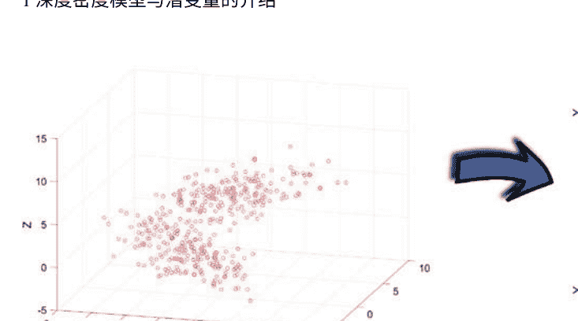

图1.12 DMFAs混合物的高层聚类和降维的草图。左：下层组件的聚合后验不是高斯分布。右：高层能够对下层的聚合后验进行更好的建模。

图1.13 两层DMFA的图形模型。DMFAs是一个深度有向图模型，利用多层因子分析器，在每个隐藏层中采用MFAs模型进行开发。

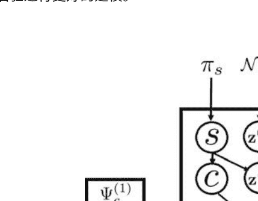

图1.13可视化了两层DMCFAs的方法。重要的是，关键方法是对当前层的后验分布进行数据采样，并将其作为下一层的训练数据。

观测值 y 和因子 z 在第一个隐藏层中被视为MFAs，并且这个无监督方法使用第一层参数 $\theta^{(1)}$ 来学习。具有特定组件 c 的 z 因子的聚合后验由 $\frac{1}{N}$ 给出。

$\sum$ 对于第二层，$z_1^{(1)}$ 和 $\hat{c}$ 被视为通过采样后验分布（公式1.13和1.15）进行训练的数据。然后，一个更强大的MFAs先验替换了标准的多元正态先验

$$p(\mathbf{z}|c) = P_{MFA}(\mathbf{z}_c^{(1)}; \boldsymbol{\theta}_{c_s}^{(2)}). \qquad (1.28)$$

相同的方案可以扩展到训练后续层。

在第二层，需要定义一些新的符号: $\mathbf{z}^{(1)}$ 是作为第二层的数据输入的 $q$ 维向量；$\boldsymbol{\theta}_c^{(2)}$ 强调了一个新的参数向量，它是第二层的特定于组件 c 的 first layer MFA 的 $d$ 维向量 $\mathbf{z}^{(2)}$； $s$ 是一个新的子组件指示变量，子组件的总数为 $S$，满足 $S = \sum_{c=1}^C M_c$； $m_c = 1,..., M_c$ 表示与 cth first layer component 相对应的子组件的数量；第二层的混合比例 $p(s) = \pi_s^{(2)}$ 被定义为 $p(c_s)p(s|c_s)$，其中 $\sum_{s=1}^S \pi_s^{(2)} =1$， $c_s$ denotes the sub-components corresponding to the c component. 然后，DMFAs先验可以写成如下形式

$$p(\mathbf{z}; c) = p(c)p(m_c|c)p(\mathbf{z}|m_c). \tag{1.29}$$

向量 $\mathbf{z}^{(1)}$ 的密度遵循 $\mathbf{z}^{(2)}$ 和 $s$ 的联合密度：

$$
\begin{align}
p(\mathbf{z}^{(1)}, \mathbf{z}^{(2)}, s) &= p(\mathbf{z}^{(1)}, c|\mathbf{z}^{(2)}, s)p(\mathbf{z}^{(2)}|s)p(s), \tag{1.30} \\
p(\mathbf{z}^{(1)}, c|s, \mathbf{z}^{(2)}) &= N(\mathbf{z}^{(1)}; \mathbf{W}_s^{(2)}\mathbf{z}^{(2)} + \boldsymbol{\mu}_s^{(2)}, \boldsymbol{\Psi}_s^{(2)}), \\
p(\mathbf{z}^{(2)}|s) &= N(0, \mathbf{I}). \tag{1.31}
\end{align}
$$

在这里，新的参数向量 $\boldsymbol{\theta}^{(2)}_{c,s}$ 由 $\mathbf{W}^{(2)}_s \in \mathbb{R}^{q \times d}, \boldsymbol{\Psi}^{(2)}_s \in \mathbb{R}^{q \times q}, \boldsymbol{\mu}^{(2)}_s \in \mathbb{R}^q, \mathbf{z}^{(2)} \in \mathbb{R}^d$. 具体来说，由于每个 $s$ 只能属于一个且仅属于一个 $c$，我们得到了给定 $\mathbf{z}^{(1)}$ 和 $c$ 的观测数据 $\mathbf{y}$ 的高斯密度

$$p(\mathbf{y}|c, \mathbf{z}^{(1)}) = N(\mathbf{y}; \mathbf{W}_c^{(1)}\mathbf{z}^{(1)} + \boldsymbol{\mu}_c^{(1)}, \boldsymbol{\Psi}_c^{(1)}), \tag{1.32}$$

其中，$\mathbf{W}^{(1)}_c \in \mathbb{R}^{p \times q}, \boldsymbol{\Psi}^{(1)}_c \in \mathbb{R}^{p \times p}, \boldsymbol{\mu}_c^{(1)} \in \mathbb{R}^p, \mathbf{z}^{(1)} \in \mathbb{R}^q$ denote the first layer parameters.

#### 1.3.1.1 推理

对于推理，后验分布的计算方式与公式1.11和1.13类似

$$
\begin{align}
q(\mathbf{z}^{(2)}, s|\mathbf{z}^{(1)}, c) &= q(\mathbf{z}^{(2)}|\mathbf{z}^{(1)}, c, s)q(s|\mathbf{z}^{(1)}, c) \\
&= N(\mathbf{z}^{(2)}; \boldsymbol{\kappa}_{cs}^{(2)}, \mathbf{V}_{cs}^{(2)^{-1}}), \tag{1.33}
\end{align}
$$

其中

$$
\begin{align}
\mathbf{V}_{cs}^{(2)^{-1}} &= \mathbf{I}_d + \mathbf{W}_{cs}^{(2)^T}\boldsymbol{\Psi}_{cs}^{(2)^{-1}}\mathbf{W}_{cs}^{(2)}, \\
\boldsymbol{\kappa}_{cs}^{(2)} &= \mathbf{V}_{cs}^{(2)^{-1}}\mathbf{W}_{cs}^{(2)^T}\boldsymbol{\Psi}_{cs}^{(2)^{-1}}(\mathbf{z}^{(1)} - \mathbf{W}_{cs}^{(2)}\boldsymbol{\mu}_c^{(2)}). \tag{1.34}
\end{align}
$$

上标2表示这些变量属于哪一层
表示第二层的d维子空间，其中d<q。

这里，下标强调了第一层组件 $c$ 的子组件 $s$，$\mathbf{I}_d$ 是一个 $d$ 维单位矩阵。可以通过以下方式找到组件的后验概率

$$q(s|\mathbf{z}^{(1)}, c) \propto p(\mathbf{z}^{(1)}, c|s)p(s), \tag{1.35}$$
$$\hat{s} = \arg \max_s p(s)q(s|\mathbf{z}^{(1)}). \tag{1.36}$$

对于第二层，当第一层参数固定且最大化等式1.10时，$p(\mathbf{z}^{(1)})$ 和 $\hat{c}$ 被视为输入数据和初始标签。根据等式1.28，DMFAs公式寻求找到更好的先验概率 $p(\mathbf{z}^{(1)}|c) = P_{MFA}(\mathbf{z}^{(1)}|c; \theta_{c_s}^{(2)})$。给定新的数据向量 $\{\mathbf{z}_1^{(1)}; \mathbf{z}_2^{(1)}; ...; \mathbf{z}_q^{(1)}\}$，对于第二层参数的最大化等价于最大化密度函数 $P(\mathbf{z}^{(1)}|\hat{c}; \theta_{\hat{c}}^{(2)} \text{ })$。第二层的基本似然目标函数定义为

$$P(\mathbf{z}^{(1)}|c; \theta_{c_s}^{(2)}) = \sum_{s \in c} \pi_s \prod_{i=1}^q \{ \mathcal{N}(\mathbf{z}_i^{(2)} | \boldsymbol{\mu}_s^{(2)}, \mathbf{W}_s^{(2)} {\mathbf{W}_s^{(2)}}^T + \boldsymbol{\Psi}_s^{(2)}) \}. \tag{1.37}$$

值得注意的是，在第二层，从第一层派生的每个混合模型的 $C$ 组件可以单独更新，因为 $S$ 第二层参数不重叠，只能属于第一层的一个组件。

$$\hat{\theta}_{c_s}^{(2)} = \arg \max_{\theta_{c_s}^{(2)}} \log P(\mathbf{z}^{(1)}; \theta_{c_s}^{(2)}). \tag{1.38}$$

尽管DMFAs模型在实践中表现良好，但仍然存在许多缺点。具体而言，该模型对不同的组件使用不同的加载矩阵，这可能导致在实际应用中过拟合的问题。同时，它还继承了MFAs的缺点，即假设每个潜在因子的先验遵循标准高斯分布，这可能限制了灵活性和准确性。

#### 1.3.1.2 折叠模型

虽然DMFAs模型也可以通过积分消除潜在因子而折叠成浅层形式。根据公式1.5，我们在第一层因子 $\mathbf{z}^{(1)}$ 被积分消除后得到折叠模型：

$$p(\mathbf{y}|\mathbf{z}^{(2)}, s) = \int_{\mathbf{z}^{(1)}} p(\mathbf{y}|c, \mathbf{z}^{(1)}) p(\mathbf{z}^{(1)}|s, \mathbf{z}^{(2)}) p(\mathbf{z}^{(2)}|s) d\mathbf{z}^{(1)}$$
$$= \mathcal{N}(\mathbf{y}; \mathbf{W}_c^{(1)} (\mathbf{W}_s^{(2)} \mathbf{z}^{(2)} + \boldsymbol{\mu}_s^{(2)}) + \boldsymbol{\mu}_c^{(1)}, \mathbf{W}_c^{(1)} \boldsymbol{\Psi}_s^{(2)} {\mathbf{W}_c^{(1)}}^T + \boldsymbol{\Psi}_c^{(1)}). \tag{1.39}$$

然后通过进一步积分消除 $\mathbf{z}^{(2)}$ 得到最终的浅层形式：

$$p(\mathbf{y}|s) = \int_{\mathbf{z}^{(2)}} p(\mathbf{y}|\mathbf{z}^{(2)}, s) d\mathbf{z}^{(2)} = \mathcal{N}(\mathbf{y}; \mathbf{m}_s, \boldsymbol{\Sigma}_s), \tag{1.40}$$
$$\mathbf{m}_s = \mathbf{W}_c^{(1)}\boldsymbol{\mu}_s^{(2)} + \boldsymbol{\mu}_c^{(1)}, \quad \boldsymbol{\Sigma}_s = \mathbf{W}_c^{(1)}(\boldsymbol{\Psi}_s^{(2)} + \mathbf{W}_s^{(2)}{\mathbf{W}_s^{(2)}}^T){\mathbf{W}_c^{(1)}}^T + \boldsymbol{\Psi}_c^{(1)}. \tag{1.41}$$

最后，浅层模型对观测数据 $\mathbf{y}$ 的边缘密度由高斯混合模型给出：

$$p(\mathbf{y}) = \sum_{s=1}^{S} p(s)p(\mathbf{y}|s) = \sum_{s=1}^{S} \pi_s \mathcal{N}(\mathbf{y}; \mathbf{m}_s, \boldsymbol{\Sigma}_s). \tag{1.42}$$

传统上，$\theta_s=\{\pi_s, \boldsymbol{\mu}_s, \mathbf{W}_s, \boldsymbol{\Psi}_s, \mathbf{W}_c, \boldsymbol{\mu}_c, \boldsymbol{\Psi}_c\}_{s=1,c=1}^{S,C}$ 代表浅层DMFAs的参数。
在这种情况下，从两层DMFA坍缩为浅层MFA的后验概率为 $p(s|\mathbf{y}) = \pi_s p(\mathbf{y}|s)/p(\mathbf{y})$。我们还对坍缩为浅层形式的潜在因子 $\mathbf{z}_s$ 的后验分布感兴趣。

$$q(\mathbf{z}^{(2)}, s|\mathbf{y}) = \mathcal{N}(\mathbf{z}_s^{(2)}; \boldsymbol{\kappa}_s, \mathbf{V}_s^{-1}), \tag{1.43}$$
$$\mathbf{V}_s^{-1} = (\mathbf{W}_s^{(2)}{\mathbf{W}_s^{(2)}}^T + \boldsymbol{\Psi}_s^{(2)})^{-1} + {\mathbf{W}_c^{(1)}}^T {\boldsymbol{\Psi}_c^{(1)}}^{-1} \mathbf{W}_c^{(1)}, \tag{1.44}$$
$$\boldsymbol{\kappa}_s = {\mathbf{W}_s^{(2)}}^T \boldsymbol{\mu}_s^{(2)} + \mathbf{V}_s^{-1} {\mathbf{W}_c^{(1)}}^T {\boldsymbol{\Psi}_c^{(1)}}^{-1}(\mathbf{y} - \boldsymbol{\mu}_c^{(1)}). \tag{1.45}$$

### 1.3.2 深度因子分析器与公共因子负载的混合

相同的方案被扩展到训练DMCFAs模型。通过在图1.14中说明更高层的混合，我们可以清楚地看到混合模型可以更好地建模较低层的非高斯后验分量。关键的改进是对于使用MCFAs作为聚合先验的每个混合分量都使用相同的负载矩阵。这可能进一步提高性能。当数据具有更大的特征维度和/或较小的观测时，在DMFAs中使用不同的负载矩阵可能导致参数数量难以管理。此外，不同的负载矩阵可能在物理上并非必要，甚至是不必要的（Yang等，2017年）。

图1.15展示了一个由两个全局参数构成的两层DMCFA图模型的示意图，第一层中包括因子载荷和噪声协方差矩阵。如图模型所示，公共参数在下一层的每个潜在单元中都被设置。基于这个设置，与DMFAs相比，自由参数的数量可以大大减少。

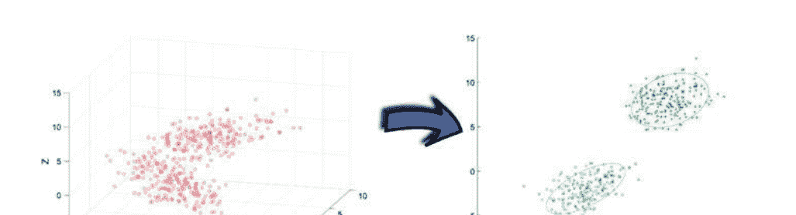

图1.15 两层 DMFA 的图模型。DMCFAs 是一个深度有向图模型，利用多层因子分析器，在每个隐藏层中采用 MCFAs 模型进行开发。

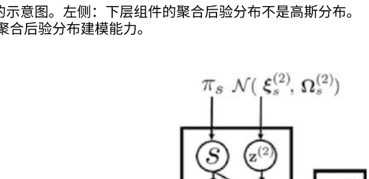

尽管 MCFAs 引入了潜在因子的均值和方差矩阵。因此，DMCFAs 模型可能对具有大量聚类或不足实例的任务非常感兴趣。

更抽象地说，我们在数学表达式中定义了 DMCFAs 模型。首先，在第一层中采用了 MCFAs 先验替代潜在因子的先验。

$$p(\mathbf{z}|c) = P_{MCFA} (\mathbf{z}_c^{(1)}; \boldsymbol{\theta}_c^{(2)}). \tag{1.46}$$

在这里，新符号与 DMFAs 的定义相同。让我们更具体一些，DMCFAs 模型可以写成

$$p(s) = \pi_s^{(2)}, \quad \sum_{s=1}^{S} \pi_s^{(2)} = 1 \tag{1.47}$$
$$p(\mathbf{z}^{(2)}|s) = \mathcal{N}(\mathbf{z}^{(2)}; \boldsymbol{\xi}_s^{(2)}, \boldsymbol{\Omega}_s^{(2)}), \tag{1.48}$$
$$p(\mathbf{z}^{(1)}, c|s, \mathbf{z}^{(2)}) = \mathcal{N}(\mathbf{z}^{(1)}; \mathbf{A}_c^{(2)}\mathbf{z}^{(2)}, \boldsymbol{\Psi}_c^{(2)}), \tag{1.49}$$
$$p(\mathbf{y}|c, \mathbf{z}^{(1)}) = \mathcal{N}(\mathbf{y}; \mathbf{A}^{(1)}\mathbf{z}^{(1)}, \boldsymbol{\Psi}^{(1)}). \tag{1.50}$$

在这里，$\mathbf{A}^{(1)} \in \mathbb{R}^{p \times q}, \boldsymbol{\Psi}^{(1)} \in \mathbb{R}^{p \times p}, \mathbf{z}^{(1)} \in \mathbb{R}^{q}, \mathbf{A}_c^{(2)} \in \mathbb{R}^{q \times d}, \boldsymbol{\Psi}_c^{(2)} \in \mathbb{R}^{q \times q}, \mathbf{z}^{(2)} \in \mathbb{R}^d, \boldsymbol{\xi}_s^{(2)} \in \mathbb{R}^d, \boldsymbol{\Omega}_s^{(2)} \in \mathbb{R}^{d \times d}$。传统上，第二层潜变量的联合分布为

$$p(\mathbf{z}^{(1)}, \mathbf{z}^{(2)}, s) = p(\mathbf{z}^{(1)}, c|\mathbf{z}^{(2)}, s)p(\mathbf{z}^{(2)}|s)p(s), \quad \quad (1.51)$$

相同的方案可以扩展到训练MCFAs的以下层次。

到目前为止，我们可以粗略计算出总的自由参数数量。在一个两层DMCFAs模型中，自由参数的总数是按照 $pq + cqd$ 的顺序排列的，这比DMFAs中的 $cpq + sqd$ 要小得多，其中维度的数量 $q \ll p$ 和组件的数量 $s$ 通常按照 $c^2$ 的顺序排列。总之，一个典型的两层DMCFAs模型通常只使用DMFAs的$1/c$参数。

#### 1.3.2.1 推理

对于MAP推理，后验分布的公式与第二层参数相对于第1.2.3.2节类似。

$$q(\mathbf{z}^{(2)}, s|\mathbf{z}^{(1)}, c) = N(\mathbf{z}^{(2)}; \boldsymbol{\kappa}_{c_s}^{(2)}, \mathbf{V}_{c_s}^{(2)-1}), \quad \quad (1.52)$$

其中

$$\begin{align} \mathbf{V}_{c_s}^{(2)-1} &= \boldsymbol{\Omega}_s^{(2)-1} + \mathbf{A}_c^{(2)T} \boldsymbol{\Psi}_c^{(2)-1} \mathbf{A}_c^{(2)}, \ \boldsymbol{\kappa}_{c_s}^{(2)} &= \boldsymbol{\xi}_c^{(2)} + \mathbf{V}_{c_s}^{(2)-1} \mathbf{A}_c^{(2)T} \boldsymbol{\Psi}_c^{(2)-1} (\mathbf{z}^{(1)} - \mathbf{A}_c^{(2)} \boldsymbol{\xi}_c^{(2)}). \end{align} \quad \quad (1.53)$$

组件的后验可以如下找到

$$\begin{align} q(s|\mathbf{z}^{(1)}, c) &\propto p(\mathbf{z}^{(1)}, c|s)p(s), \quad \quad (1.54) \ \hat{s} &= \arg \max_s p(s)q(s|\mathbf{z}^{(1)}). \quad \quad (1.55) \end{align}$$

在MLE中，与第 $c$ 个组件对应的混合模型的似然函数是根据新的观测 $\mathbf{z}_c^{(1)}$ 和参数 $\boldsymbol{\theta}_c^{(2)}$ 来估计的

$$ P \left( \mathbf{z}_c^{(1)}; \boldsymbol{\theta}_{c_s}^{(2)} \right) = \sum_{s \in c} \pi_s \prod_{i=1}^{q} \left\{ N(\mathbf{z}_i^{(2)} | \mathbf{A}_c^{(2)} \boldsymbol{\xi}_c^{(2)}, \mathbf{A}_c^{(2)} \boldsymbol{\Omega}_s^{(2)} \mathbf{A}_c^{(2)^T} + \boldsymbol{\Psi}_c^{(2)}) \right\}, \quad (1.56) $$

其中 $s$ 只允许属于一个且仅属于一个 $c$，而 $q$ 表示新观测的维度数。可以更新新观测 $\mathbf{z}_c^{(1)}$ 的混合模型参数

$$ \hat{\boldsymbol{\theta}}_{c_s}^{(2)} = \arg \max_{\boldsymbol{\theta}_{c_s}^{(2)}} \log P(\mathbf{z}_c^{(1)}; \boldsymbol{\theta}_{c_s}^{(2)}). \quad (1.57) $$

#### 1.3.2.2 折叠模型

尽管DMCFAs模型可以通过在每一层乘以因子载荷矩阵将其折叠回标准的浅层MCFA，但这两个模型的学习完全不同，因为较低层与深层模型中的组件共享参数。因此，DMCFAs比浅层形式更高效和直接，这归因于先前隐藏层中组件的条件分布未使用以下隐藏层的参数进行建模。此外，通过在层之间共享因子载荷，可以显著降低过拟合风险和学习的计算成本。

在第一层因子 $\mathbf{z}^{(1)}$ 被整合后，我们得到一个多元高斯密度

$$ p(\mathbf{y} | \mathbf{z}^{(2)}, s) = N(\mathbf{y}; \mathbf{A}^{(1)} (\mathbf{A}_c^{(2)} \mathbf{z}^{(2)}), \mathbf{A}^{(1)} \boldsymbol{\Psi}_c^{(2)} \mathbf{A}^{(1)^T} + \boldsymbol{\Psi}^{(1)}). \quad (1.58) $$

然后通过进一步积分消除 $\mathbf{z}^{(2)}$，得到标准的MCFAs模型：

$$ p(\mathbf{y} | s) = \int_{\mathbf{z}^{(2)}} p(\mathbf{y} | \mathbf{z}^{(2)}, s) p(\mathbf{z}^{(2)} | s) d\mathbf{z}^{(2)} = N(\mathbf{y}; \mathbf{m}_s, \boldsymbol{\Sigma}_s), \quad (1.59) $$
$$ \mathbf{m}_s = \mathbf{A}^{(1)} (\mathbf{A}_c^{(2)} \boldsymbol{\xi}_s^{(2)}), \quad \boldsymbol{\Sigma}_s = \mathbf{A}^{(1)} (\mathbf{A}_c^{(2)} \boldsymbol{\Omega}_s^{(2)} \mathbf{A}_c^{(2)^T} + \boldsymbol{\Psi}_c^{(2)}) \mathbf{A}^{(1)^T} + \boldsymbol{\Psi}^{(1)}. \quad (1.60) $$

最后，边缘密度由高斯混合模型给出

$$ p(\mathbf{y}) = \sum_{s=1}^{S} p(s) p(\mathbf{y} | s) = \sum_{s=1}^{S} \pi_s N(\mathbf{y}; \mathbf{m}_s, \boldsymbol{\Sigma}_s). \quad (1.61) $$

传统上， $\boldsymbol{\theta}_{c_s} = \{ \pi_s, \mathbf{A}, \boldsymbol{\Psi}, \mathbf{A}_c, \boldsymbol{\Psi}_c \}$ 表示这个浅层MCFAs的参数。潜在因子 $\mathbf{z}_s$ 的后验分布也可以折叠成浅层形式

$$ q(\mathbf{z}_s, s | \mathbf{y}) = N(\mathbf{z}_s; \boldsymbol{\kappa}_s, \mathbf{V}_s^{-1}), \quad (1.62) $$

$$\mathbf{V}_{s}^{-1} = (\mathbf{A}_{c}^{(2)}\boldsymbol{\Omega}_{s}\mathbf{A}_{c}^{(2)} + \boldsymbol{\Psi}_{c}^{(2)})^{-1} + \mathbf{A}^{(1)T}\boldsymbol{\Psi}^{(1)-1}\mathbf{A}^{(1)}, \qquad\qquad(1.63)$$
$$\boldsymbol{\kappa}_{s} = \mathbf{A}^{(1)T}\boldsymbol{\xi}_{s} + \mathbf{V}_{s}^{-1}\mathbf{A}^{(1)T}\boldsymbol{\Psi}^{(1)-1}(\mathbf{y} - \mathbf{m}_{s}). \qquad\qquad(1.64)$$

### 1.3.3 无监督学习

我们在第1.2.4节中展示的数据集上，将提出的DMFAs和DMCFAs与它们的浅层对应物进行性能评估。对于密度评估，通过折叠深度模型，使用平均对数似然来检查深度密度模型和标准密度模型产生的密度估计的质量。在进行实证分析时，所有结果都是以对数方式计算的，这使得不同数据集的结果更方便进行比较。通过多次试验，图1.16显示了训练数据上的平均对数似然值。在不更新参数的情况下，图1.17显示了测试数据的结果。我们可以观察到深度模型可以显著提高标准模型的真实对数似然。

为了评估基于模型的聚类，我们计算了4个真实数据集上的错误率（越低越好），以比较深度密度模型与具有相同混合比例的标准模型的性能。在实验中，所有方法都通过随机分组进行初始化，并根据数据的真实类别设置聚类数。此外，我们进行了许多试验，通过将属性放入不同的维度来选择最佳结果。这里显示的结果是在最合适的维度中每个模型的最佳结果。图1.18和1.19显示，使用常见加载的模型的结果在训练集和测试集中均优于其他竞争对手。此外，如明显所示

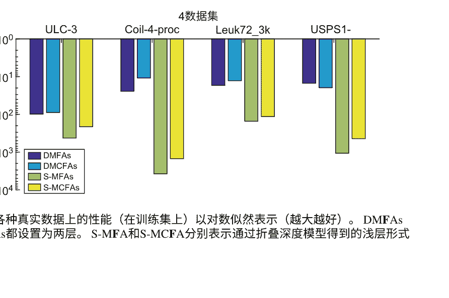

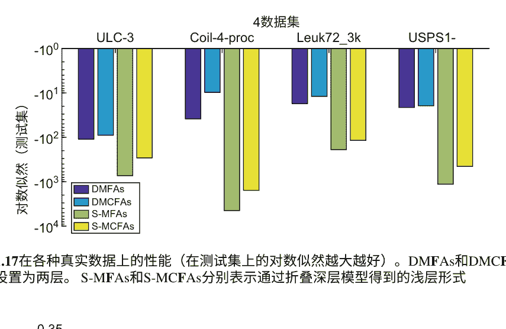

图1.17在各种真实数据上的性能（在测试集上的对数似然越大越好）。DMFAs和DMCFAs都设置为两层。S-MFAs和S-MCFAs分别表示通过折叠深层模型得到的浅层形式

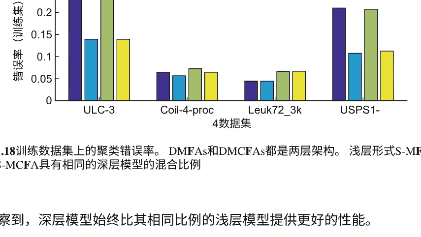

图1.18训练数据集上的聚类错误率。DMFAs和DMCFAs都是两层架构。浅层形式S-MFA和S-MCFA具有相同的深层模型的混合比例

观察到，深层模型始终比其相同比例的浅层模型提供更好的性能。

## 1.4 期望最大化算法

在具有不完整数据或隐藏变量的密度模型中，期望最大化（EM）算法使参数估计成为可能（Do和Batzoglou 2008）。作为一种通用的迭代策略，EM算法在两个步骤之间交替进行。在给定当前模型的情况下，使用期望步骤（步骤E）来预测缺失数据的完成概率分布。

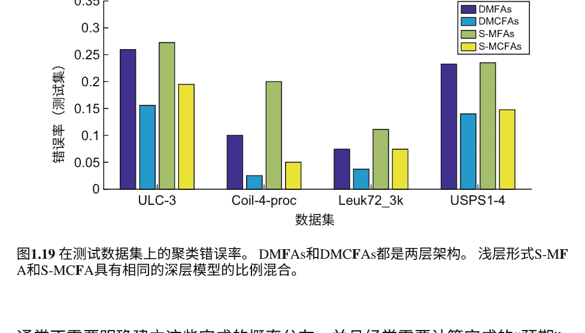

图1.19 在测试数据集上的聚类错误率。DMFAs和DMCFAs都是两层架构。浅层形式S-MFA和S-MCFA具有相同的深层模型的比例混合。

通常不需要明确建立这些完成的概率分布，并且经常需要计算完成的“预期”充分统计量。最大化步骤（M步）通过利用这些完成来重新估计模型参数，可以将其视为对数据的预期对数似然的“最大化”（Do和Batzoglou 2008）。

当观察到变量 y、潜变量 z和参数 θ时，数学表达式如下：

E步骤： $Q(\theta|\theta^{(k)}) = E_{q(z|y;\theta)}[\log \int_z p(y, z|\theta^{(k)}) dz]$; (1.65)
M步骤： $\theta^{(k+1)} = \arg \max_\theta Q(\theta|\theta^{(k)})$. (1.66)

然后，我们介绍了基于潜变量的EM算法的收敛证明。基于Jensen不等式，很容易证明EM算法反复构造新的下界F(q, θ)，其中 q 表示潜变量的后验分布，并解决参数。

(1.67) $L(\theta) = \log \int_z p(y, z|\theta) dz = \log \int_z q(z|y; \theta) [p(y, z|\theta) / q(z|y; \theta)] dz$
(1.68) $\geq \int_z q(z|y; \theta) \log [p(y, z|\theta) / q(z|y; \theta)] dz = F(q, \theta),$
(1.69) $F(q, \theta) = \int_z q(z|y; \theta) \log p(y, z|\theta) dz - \int_z q(z|y; \theta) \log q(z|y; \theta) dz$
(1.70) $= \langle \log p(y, z|\theta) \rangle_{q(z|y;\theta)} + H(q).$

# 1 深度密度模型与潜变量的介绍

图1.20EM算法示意图。E步骤是通过固定$\theta^{(k)}$来计算q，并将下界从$F(q; \theta^{(k)})$提升到$F(q; \theta^{(k+1)})$，其中$F(q; \theta^{(k+1)})$等于$\theta^{(k+1)}$处的$L(\theta)$。M步骤是在固定q的情况下从$\theta^{(k)}$迁移到$\theta^{(k+1)}$，然后找到最大的$F(q; \theta^{(k+1)})$。

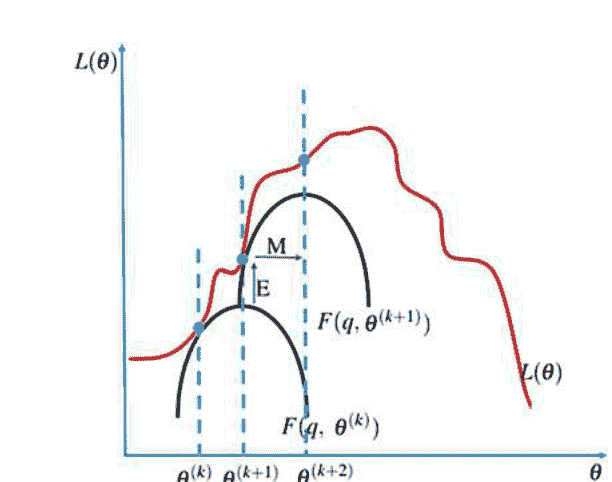

简单来说，EM算法的过程是根据当前参数计算当前潜在变量分布的下界函数，并通过优化该函数获得新的参数，然后继续循环（如图1.20所示）。

在深度模型中，涉及一种高效简单的优化算法来进行推断和学习，称为贪婪逐层无监督算法。由于这种逐层算法，EM算法通常可用于估计每个层中每个混合物的参数，以找到对数似然的局部最大值。重要的是，可以以逐层的方式将简单的目标函数输入到EM算法中，而不是使用相同规模混合物的浅层模型的大量目标函数。例如，第一层混合物的期望对数似然如下所示

$$Q(\theta|\theta^{(k)}) = \sum_{c=1}^{C} \int_{z} q(z, c|y; \theta_c) \ln p(y, z, c|\theta_c) dz = E_{q(z,c|y; \theta_c)}[\ln p(y|c, z) + \ln p(z|c) + \ln \pi_c]. \quad (1.71)$$

在M步骤中，参数$\theta_c^{k+1}$（在第(k+1)次迭代时）通过求解期望对数似然方程的偏导数来更新

$$ \frac{\partial \mathbb{E}_{q(z,c|y,\theta_{old})}[L(\theta_c)]}{\partial \theta_c} = 0. \quad (1.72) $$

更高层具有对第一层更好的聚合后验能力，通过变分推断，当边界紧密时，边界的增加将改善模型的真实对数似然。因此，训练深度模型比训练浅层模型更好。

## 1.5 结论

总结一下，本章介绍了具有潜在变量的新型深度密度模型。我们详细介绍了两种标准的概率模型，MFAs和MCFAs，以及它们推导出的深度模型。与以前的深度密度模型相比，贪婪逐层算法具有简单的推理过程和更少的自由参数。在密度评估和聚类方面，将深度模型与浅层模型进行了比较。实证结果表明，深度模型可以显著提高标准模型的真实对数似然。此外，深度模型在聚类方面也始终提出了比浅层模型更好的性能。对于更多的实际应用，深度密度模型还可以用于创建良好的先验，用于诸如图像去噪、修复或跟踪动画运动等任务。

致谢：本文报告的工作部分得到以下支持：中国国家自然科学基金（NSFC）项目号61473236；江苏省高校自然科学基金项目号17KJD520010；苏州市科技计划项目号SYG201712、SZS201613；江苏大学自然科学研究项目号17KJB520041；和西交利物浦大学重点项目特殊基金（KSF - A - 01）。

## 参考文献

Arnold L, Ollivier Y (2012) 深度生成模型的逐层学习。 CoRR, abs/1212.1524

Baek J, McLachlan GJ (2011) 用于聚类高维微阵列数据的常见 t 因子分析器混合模型。 生物信息学 27(9):1269–1276

Baek J, McLachlan GJ, Flack LK (2010) 具有公共因子负载的因子分析器混合模型：在高维数据的聚类和可视化中的应用。 IEEE Trans Pattern Anal Mach Intell 32(7):1298–1309

Bengio Y, Lamblin P, Popovici D, Larochelle H (2007) 深度网络的贪婪逐层训练。 在：神经信息处理系统的进展，第153–160页

Bengio Y et al (2009) 用于人工智能的学习深度架构。 Found Trends Mach Learn 2(1):1–127

Bishop CM (1998) 潜变量模型。 在：图形模型中的学习。 Springer, 纽约，第371–403页

Bishop C (2006) 模式识别与机器学习。 Springer, 纽约

Do CB, Batzoglou S (2008) 期望最大化算法是什么？ Nat Biotech 26(8):897–899

Everitt BS (1984) 因子分析。 Springer Netherlands, 多德雷赫特, 页码13–31

Everitt BS (2013) 潜变量模型简介。 Springer Science & Business Media, 柏林

Ghahramani Z (2015) 概率机器学习和人工智能. 自然 521(7553):452

Ghahramani Z, Hinton G (1996) 混合因子分析器的EM算法. 技术报告 CRG-TR-96-1, 多伦多大学, 页 11–18. http://www.gatsby.ucl.ac.uk/.zoubin/papers.html

Hinton GE, Salakhutdinov RR (2006) 用神经网络降低数据的维度. 科学 313(5786):504–507

Hinton GE, Osindero S, Teh YW (2006) 一种用于深度信念网络的快速学习算法. 神经计算 18(7):1527–1554

McLachlan GJ, Peel D, Bean RW (2003) 用因子分析器的混合模型建模高维数据. 计算统计数据分析 41:379–388

Johnson B (2013) 使用竞争多尺度基于对象的方法进行高分辨率城市土地覆盖分类. Remote Sens Lett 4(2):131–140

Johnson B, Xie Z (2013) 使用超对象信息对城市区域的高分辨率图像进行分类. ISPRS J Photogrammetry Remote Sens 83:40–49

Law MHC, Figueiredo MAT, Jain AK (2004) 使用混合模型进行特征选择和聚类. IEEE Trans Pattern Anal Mach Intell 26(9):1154–1166

Loehlin JC (1998) 潜变量模型: 因子、路径和结构分析导论. Lawrence Erlbaum Associates Publishers

Ma J, Xu L (2005) 关于混合中的重叠, EM算法的渐近收敛性质. Neurocomputing 68:105–129

McLachlan G, Krishnan T (2007) EM算法及其扩展, 第382卷. John Wiley & Sons, Hoboken

McLachlan GJ, Peel D (2000) 混合因子分析器. 在: 国际机器学习大会 (ICML), 第599-606页

Montanari A, Viroli C (2011) 混合因子分析器的最大似然估计. Comput Stat Data Anal 55 (9): 2712-2723

Nene SA, Nayar SK, Murase H (1996) 哥伦比亚对象图像库 (coil-20). 技术报告, 技术报告CUCS-005-96

Patel AB, Nguyen T, Baraniuk RG (2015) 深度学习的概率理论. arXiv预印本arXiv:1504.00641

Rippel O, Adams RP (2013) 具有深度密度模型的高维概率估计. CoRR, abs/1302.5125

Salakhutdinov R, Mnih A, Hinton GE (2007) 用于协同过滤的受限玻尔兹曼机. 在: 机器学习, 第二十四届国际会议 (ICML), 美国俄勒冈州科瓦利斯, 2007年6月20-24日, 第791-798页

Smaragdis P, Raj B, Shashanka M (2006) 用于声学建模的概率潜变量模型. Adv Models Acoust Process NIPS 148:8–1

Tang Y, Salakhutdinov R, Hinton GE (2012) 深度因子分析的混合模型. 在: 第29届国际机器学习大会ICML 2012, 苏格兰爱丁堡, 英国, 2012年6月26日至7月1日。

Tang Y, Salakhutdinov R, Hinton G (2013) 张量分析器. 在: 国际机器学习大会, 第163-171页。

Tortora C, McNicholas PD, Browne RP (2016) 广义双曲线因子分析的混合模型. Adv Data Anal Classif 10(4):423–440

Vermunt JK, Magidson J (2004) 潜类分析. 社会科学研究方法的圣经百科全书, 第549-553页。

Yang X, Huang K, Goulermas JY, Zhang R (2014) 无监督降维和高斯混合模型的联合学习. 神经过程信件45 (3): 791-806

Yang X, Huang K, Zhang R (2017) 具有共同载荷的深度因子分析器混合模型: 一种新颖的深度生成聚类方法. 在: 国际神经信息处理会议. 斯普林格, pp 709-719

# 第2章
深度RNN架构：设计和评估

苏同华，孙丽，王秋峰和王大汉

摘要：顺序数据标记任务，如手写识别，面临两个关键挑战。一个是迫切需要大规模的良好注释的训练数据。另一个是如何有效地编码当前信号段和上下文依赖性。两者都需要大量的人力。为了缓解这些问题，本章从两个不同的角度对递归神经网络的架构设计策略进行了系统研究：管道透视和微内核透视。从管道透视来看，提出了一种深度端到端识别架构，允许在最小人工干预下快速适应新任务。首先，RNN的深度架构提供了高度非线性的特征表示。通过分层表示，可以用其他更简单的特征有效地表达有效和复杂的特征。此外，使用混合单元来编码长期的上下文轨迹，其中包括一个BLSTM（双向长短期记忆）层和一个FFS（前馈子采样）层。其次，CTC（连接主义时间分类）目标函数使得可以在字符级别上训练模型而无需注释数据。第三，修改后的CTC束搜索算法在解码过程中智能地整合了语言约束，以统一的形式进行。在这样一个端到端的情况下，通过采用一种薄而紧凑的网络风格，可以设计出具有高准确性的网络，并且可以用于工业规模的应用。从微观核心的角度来看，我们提出了一种新的神经元结构，称为门控记忆单元（GMU），它受到LSTM和GRU的启发。GMU保留了恒定误差传送带（CEC），致力于增强平滑的信息流动。GMU还借鉴了LSTM的细胞结构和GRU的插值门。我们的方法在CASIA-OLHWDB 2.x上进行了评估，这是一个公开可用的中文手写数据库。与最先进的方法相比，结果表明：（1）我们的流水线在测试集上的正确率和准确率方面相对误差减少了30%以上；（2）在竞争集上，我们的流水线在某些可行的假设下可以取得更好的结果；（3）GMU在手写识别任务中具有潜在的选择性。

> 本章的部分内容摘自：
> IEEE会议论文，Li Sun，“GMU：一种新型RNN神经元及其在手写识别中的应用”2017，获得IEEE许可
> IEEE会议论文，Li Sun，“用于在线中文手写识别的深度LSTM网络”2016，获得IEEE许可

T. Su (✉) · L. Sun
哈尔滨工业大学计算机科学与技术学院，中国哈尔滨
e-mail: thsu@hit.edu.cn

Q.-F. Wang
西交利物浦大学，中国苏州

D.-H. Wang
厦门理工学院计算机与信息工程学院，中国厦门

关键词 深度学习架构·神经元设计·循环神经网络·手写识别·大类别标注

## 2.1 引言

在线中文手写识别是一种典型的序列数据标注任务。在书写过程中，运笔（或更一般的书写工具）的尖端通过感应设备记录。每个文本行可以被视为一个时间序列的张量，也称为轨迹。在线手写识别在输入中文文本方面起着重要作用。与其他输入方法相比，对于不擅长拼音的中国人来说，它更加自然。在线中文手写识别的先驱工作是由麻省理工学院和匹兹堡大学的两个研究小组独立研究的（Liu 1966; Zobrak 1966）。

那时以来，由于个人电脑和智能设备的普及，引起了广泛关注。成功的应用包括基于笔的文本输入（Wang et al. 2012a），重叠输入方法（Zou et al. 2011; Lv et al. 2013）以及笔记数字化和检索（Zhang et al. 2014）。

近年来，循环神经网络（RNN）和连接主义时间分类（CTC）的组合成为强大的序列标记工具（Graves等人，2009a）。Messina等人利用这个工具来转录离线中文手写（Messina和Louradour，2015），并证明了它的潜力。最近，卷积LSTM被应用于在线中文手写识别（Xie等人，2016），取得了令人满意的结果。

循环神经元是RNN的构建模块。它们自身的能力和组合可以形成不同的网络架构，从而产生不同的建模能力。尽管理论上RNN可以近似任何序列到序列的映射，但几十年的研究表明，普通的循环神经网络很难捕捉长期依赖关系（Bengio等人，1994）。本章旨在从流水线视角和微核神经元视角介绍RNN的设计解决方案。在流水线级别上，提出了一种新颖的端到端识别方法，基于深度循环神经网络提出。我们探索了使用深度架构来利用原始笔迹轨迹的可能能力，而不是像离线模式一样渲染轨迹（Xie等，2016; Liu等，2015年）。该架构混合了双向LSTM层和前馈子采样层，用于编码长期的上下文历史轨迹。我们还遵循CTC目标函数，使得在输入轨迹和输出字符串之间没有对齐信息的情况下训练模型成为可能。如（Liu等，2015年）所建议的，我们利用明确的语言约束来提升我们的端到端系统在在线模式下的性能。为了明智地整合语言约束，我们设计了一种修改后的CTC束搜索算法进行解码。在微核心层面上，我们基于高速通道原理提出了一种新型的循环神经元，称为门控记忆单元（GMU）。GMU神经元结合了两个组件。一个用于保持历史上下文，另一个用于生成神经元激活。我们保留了LSTM的记忆细胞结构来构成传输通道，并借用了GRU的插值门来调节信息流动。在两个层面上，我们对一个公开可用的数据库进行了所提出方法的评估。

## 2.2 相关工作

### 2.2.1 无分割手写识别

大多数在线中文手写识别方法都属于分割-识别一体化策略（Cheriet等，2007年）。首先，文本行被过度分割成原始片段。接下来，连续的片段被合并，并通过字符分类器分配一个候选类别列表（Liu等，2013年），形成分割-识别格子。最后，通过智能地整合字符分类得分、几何上下文和语言上下文（Wang等，2012b年），执行路径搜索以识别最优路径。在过去几年中，这种策略取得了巨大的成功。

如果有大量良好注释的训练数据，分割-识别一体化策略可能是首选。许多工作都是为了优化关键因素之一，例如字符识别（Zhou等，2016年）、置信度转换（Wang和Liu，2013年）、参数学习方法（Zhou等，2013年、2014年）。在（Yin等，2013年）中，这三个模块被Vision Objects Ltd.称为分割、识别和解释专家。它们分别进行训练，并通过全局判别训练过程对其在任务中的权重进行评分。复杂的训练阶段涉及到大量的专家干预。

然而，构建这样的系统是非常复杂的。作为先决条件，需要在字符级别上注释大规模的训练数据。广泛使用的中文手写数据库，如HIT-MW（苏等，2007年）和CASIA-OLHWDB（刘等，2011年），需要多年时间手工注释。此外，分类的特征是通过专家手工制作的。此外，系统的不同组件是分开开发的，可能需要不同的数据进行调整。毫无疑问，这需要巨大的人力投入。作为一种替代方案，无分割策略有望解决上述问题。无需明确将文本行分割为字符。因此，在训练数据中标记每个字符的边界是不必要的。以前，隐马尔可夫模型（HMMs）已成功用于无分割方式识别中文手写（苏等，2009年）。如今，循环神经网络尤其是长短期记忆成为了顺序标注任务的强大工具。Messina等人利用这个工具来转录离线中文手写（Messina和Louradour 2015）。初步结果与以往的结果相当。最近，卷积LSTM被应用于在线中文手写识别（Xie等人2016），并取得了令人满意的结果。该系统包括四种类型的层。输入轨迹首先通过路径签名层转换为文本行图像。然后将卷积层连接起来学习特征。之后，将特征输入到多层双向LSTM中。最后，使用CTC束搜索将网络输出转换为转录层的标签。

我们不同于离线模式下（Xie等人2016; Liu等人2015）将轨迹渲染，而是利用深度架构探索原始笔迹的潜在能力。如（Liu等人2015）所建议的，我们利用明确的语言约束来提升我们的端到端系统在在线模式下的性能。

### 2.2.2 RNN神经元的变体

自从上世纪90年代初以来，对复杂的循环神经元的追求一直是一个重要的话题。长短期记忆（LSTM）和门控循环单元（GRU）是两种常用的复杂循环神经元。目前，这些循环神经元广泛应用于许多研究领域，包括自然语言处理（Cho等，2014a），语音识别（Amodei等，2016；Graves等，2013），图像识别（Russakovsky等，2015）。最先进的字符识别方法（Graves等，2009b；Graves和Schmidhuber，2009；Graves，2012a）越来越多地使用循环神经网络，并取得了很大的进展。简而言之，他们的成功有两个原因。

首先，他们发明了特殊的门，可以保持更长的上下文依赖，例如遗忘门（用于LSTM）或更新门（用于GRU）。其次，他们建立了一个高速通道，为历史信息的平滑传播和错误信息的反向传播提供了捷径。

LSTM是最早提出的复杂循环神经元之一。最初的LSTM结构（Hochreiter和Schmidhuber 1997）包括一个或多个自连接的记忆单元，输入门和输出门。该结构建立了恒定误差回路（CEC），既便于存储历史信息以编码长期依赖性，又便于梯度反向传播以防止梯度衰减问题。输入门用于控制进入记忆单元的信息量。输出门用于控制记忆单元内容的曝光部分作为神经元激活。为了进一步增强LSTM的能力，添加了遗忘门（Gers等人，2000年），如果应该丢弃先前的历史，则进行重置操作。LSTM的更近期增强是使用窥视孔连接（Gers等人，2002年）。它有助于提高内部状态的精确计时和计数能力。

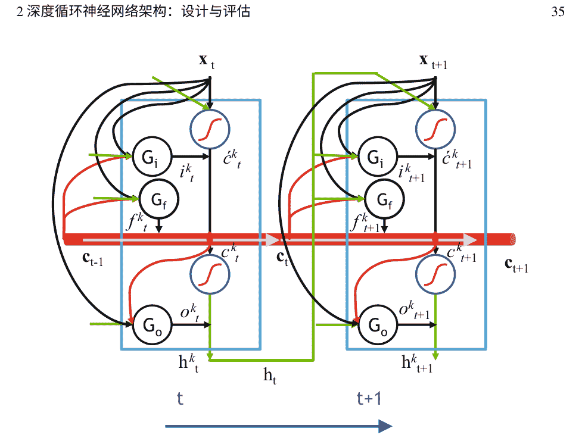

LSTM神经元可以按时间步展开，如图2.1所示。这里，细胞被故意描绘成从左到右流动的通道。在前向传播过程中，记忆细胞的内容存储在通道中。而在反向传播过程中，目标函数的梯度可以通过通道向后传播。使用公式2.1更新记忆内容：

```
c_t^k = f_t^k c_{t-1}^k + c_t'^k
```

其中，遗忘门（Gt）的输出值f^k_t决定了历史内容(c^k_{t-1})的保留程度。如果f^k_t接近于0，意味着几乎丢弃了所有历史信息；否则，历史信息将部分保留。甚至我们可以通过控制输入门（Go）来最大化利用历史信息。记忆细胞的内容并没有完全暴露给隐藏状态。相反，它是通过输出门的值o^k_t来控制的。

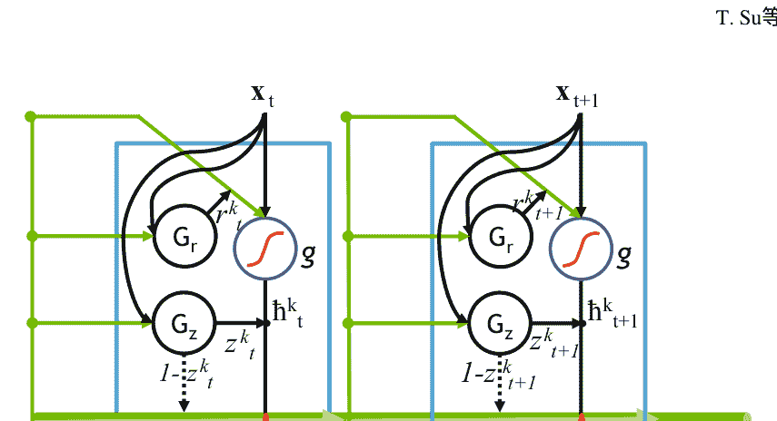

另一种复杂的递归神经元是门控递归单元（GRU）（Cho等人，2014a，b）。在图2.2中，它在时间步骤中展开。GRU使用比LSTM更简单的内存块。每个GRU块由输入转换、重置门（Gr）和更新门（Gz）组成。重置门使用自连接结构控制短期上下文依赖性，更新门使用历史信息和当前激活之间的插值控制长期上下文依赖性。为了自适应地捕捉不同长度的依赖关系，只需调整这两个门。此外，由于单元输出（隐藏状态）是自连接的，它成为历史信息的通道。与LSTM单元类似，该通道确保了平滑的梯度反向传播。但它与LSTM不同。新的单元输出使用公式2.2进行更新。

$h_t^k = \left( 1 - z_t^k \right) h_{t-1}^k + z_t^k \tilde{h}_t^k \qquad (2.2)$

如果$z_t^k$接近1，则隐藏状态被强制忽略先前的隐藏状态；否则，通过插值系数保留先前的信息。为了最大限度地利用历史信息，甚至可以允许$z_t^k$接近零。与LSTM不同，记忆单元的内容完全暴露，没有任何保留。

## 2.3 数据集

我们使用在线中文手写数据库CASIA-OLHWDB（Liu等，2011年）来训练和评估我们的模型。该数据库包括孤立字符和文本行的轨迹。仅包含孤立字符的部分有三个子集，命名为OLHWDB 1.0~1.2，另一个也有三个部分：OLHWDB 2.0~2.2.OLHWDB 2.0~2.2由（Liu等，2011年）的作者划分为训练集和测试集。训练集包括来自815人的4072页，而测试集包括来自204人的1020页。还有一个ICDAR2013中文手写识别竞赛的保留子集（表示为compset）（Yin等，2013年）。这些数据集的特点总结在表2.1中。我们的系统在测试集或compset上进行评估。请注意，测试集中有5个字符不在训练集中，而compset中约有2.02%的字符不在训练集中覆盖。

在实验之前进行了一些预处理。首先，确定一个字符集，以涵盖CASIA-OLHWDB 2.x中出现的所有样本。总共有2765个唯一的字符术语（包括2764个术语和一个{空白}）。其次，删除样本中的手动注释点。为了保留真实的书写行为，删除用于分割连字的切割点。

第三，得出一个紧凑的特征表示。输入轨迹以原始形式表示。在每个时间步长，它由x、y坐标的一阶差分和一个表示笔是否抬起的状态组成。对于轨迹的起始点，前两个维度设置为零。

我们希望构建n-gram模型来表达语言约束。从人民日报的电子新闻中收集了大量的文本数据（以html格式）。我们只过滤掉html标记，没有人为干预，但数据中包含一些噪音行。这些文本的范围从1999年到2005年，包括193,842,123个字符。我们使用SRILM工具包（Stolcke 2002）估计我们的n-gram语言模型。除了7356个类别之外的所有字符都被删除。分别考虑了二元和三元模型，以10为底的对数尺度。它们都被修剪到阈值为7e-7。

**表2.1 CASIA-OLHWDB 2.0~2.2数据集的特征**

| 项目 | 训练 | 测试 | 计算 |
|------|------|------|------|
| 页面数 | 4072 | 1020 | 300 |
| 行数 | 41,710 | 10,510 | 3432 |
| 字符数 | 1,082,220 | 269,674 | 91,576 |
| 类别数 | 2650 | 2631 | 1375 |

## 2.4 提出的深度神经网络

所提出的系统旨在将输入的笔迹轨迹X (=x¹x²…xᵀ)映射到一个文本字符串**I**，遵循端到端的范式并学习最优映射。该过程在图2.3中有所说明。在这里，我们使用LSTM模型来编码映射。假设这样的映射被学习到。然后我们可以输入一个未见过的轨迹文本行。LSTM网络通过隐藏层从输入层传播到输出层。作为最后一步，执行CTC束搜索以输出最可能的字符串。根据**I**和地面真值**z**之间的对齐来衡量每个轨迹的性能。

如何推导出最优映射留给图2.3的训练过程。我们通过最小化经验损失函数来生成所需的LSTM模型：

```
ℒ(S) = ∑_{(X,z)∈S} ℒ(X, z) .
```

其中**S**表示训练集。由于问题是多类别分类问题，我们使用 ℒ(X, z) = -ln P(z|X)来表示示例损失函数，该函数可以通过CTC和前向-后向算法有效计算。使用CASIA-OLHWDB数据库（Liu等，2011年）中的训练数据来推导分类模型。此外，我们提前从文本语料库中估计n-gram语言模型，以便在解码过程中促进搜索过程。

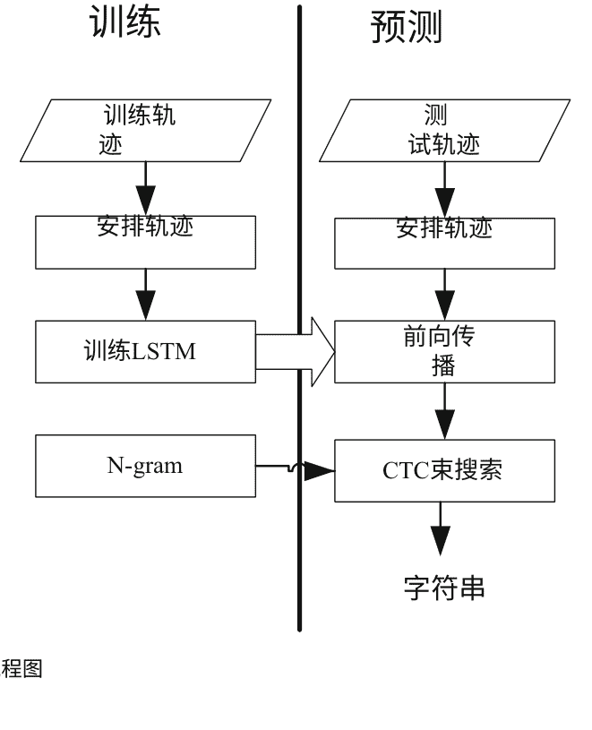

### 2.4.1 架构

我们开发了一个深度递归神经网络（RNN），用于推导出用于处理向量序列的映射函数。图2.4显示了一个典型的展开的递归神经网络实例。除了输入和输出层外，还有隐藏层和子采样层。历史信息通过递归隐藏层进行编码。时间步骤t中的隐藏变量向量在第n个隐藏层中迭代计算，同时使用了（n-1）个隐藏变量向量：

```
h_n^t = tanh(W_n^I h_{n-1}^t + U_n^H h_n^{t-1}), (2.4)
```

其中 W_n^I 是第(n-1)个隐藏层和 n 个隐藏层之间的权重矩阵而 U_n^H 是自连接的循环权重矩阵。由于 h_n^t 是以递归方式定义的，可能存在对从第一个到第t个时间步的输入向量的依赖。

为了进一步从左到右和从右到左受益于几何上下文，我们还考虑了双向循环神经网络（BRNN）（Schuster和Paliwal 1997）中，每个循环层都被前向层和后向层替代。前向传递与通常相同，而后向处理从 $t = T$ 到 $1$ 的数据。循环公式导致参数在所有时间步骤中共享 (Graves 2012b)。

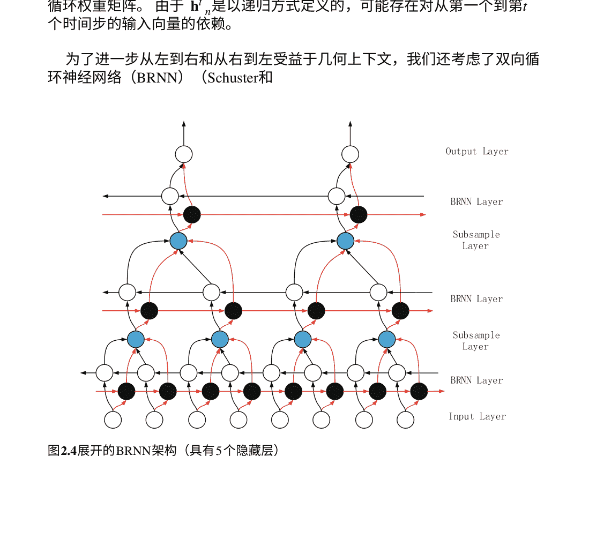

考虑到轨迹的长度和书写风格的变化，子采样层是值得探索的。在这里，我们设计了类似前馈的神经元单元，允许从连续时间步长的窗口输入进行折叠。这是(Graves 2012b)的简化版本。第k个隐藏变量在时间步长为$w \times t$的第n个子采样层中计算如下：

$$ h_{n(k)}^{w \times t} = \tanh \left( \sum_{i=1}^{w} \mathbf{w}_{n(k)}^{i} \cdot \mathbf{h}_{n-1}^{w \times t + i} \right), \quad (2.5) $$

其中，$w$ 是窗口大小，$\mathbf{w}_{n(k)}^{i}$ 是从第($n-1$)层到第$k$个单元的权重向量。

在时间步长为t的网络输出向量可以计算如下：

$$ \mathbf{y}^{t} = softmax \left( \mathbf{a}^{t} \right) = softmax \left( \mathbf{W}^{O} \mathbf{h}_{L}^{t} \right), \quad (2.6) $$

其中 $\mathbf{W}^{O}$ 是从上一隐藏层到输出层的权重矩阵。注意，一个额外的输出节点被保留给$\{null\}$，在CTC算法中将被使用。

标准的RNN遭受梯度消失问题 (Goodfellow等人，2016年)。在我们的RNN网络中，使用LSTM记忆块 (Hochreiter和Schmidhuber，1997年) 来替代隐藏层中的节点。每个记忆块包括三个门、一个细胞和三个窥视孔连接。遗忘门的输出值决定了历史内容的保留程度。如果接近0，意味着几乎丢弃所有历史信息；否则，历史信息将部分保留。甚至我们可以控制输入门来最大化历史信息的使用。记忆细胞的内容不完全暴露给隐藏状态。相反，它是通过输出门的值来控制的。它们都是非线性求和单元。通常，输入激活函数是$tanh$函数，门激活函数是$sigmoid$函数，可以将门数据压缩在0和1之间。

### 2.4.2 学习

连接主义时序分类 (CTC) 是一种强大的对象函数，用于顺序数据标记。它允许RNN在不需要输入和目标序列之间的任何先前对齐的情况下进行训练 (Graves和Jaitly 2014)。假设所有标签都来自字母表$\mathbf{A}$，定义扩展字母表$\mathbf{A}' = \mathbf{A} \cup \{null\}$。如果输出为$null$，则在该时间步不发出任何标签。CTC映射函数被定义为删除重复标签，然后从每个输出序列中删除 null。假设将 null标签注入到标签序列 z中，我们得到长度为2|z| + 1的新序列 z’。

CTC使用前向-后向算法 (Graves 2012b) 对所有可能的对齐进行求和，并确定给定输入序列的目标序列z的条件概率Pr(z|X)。对于标记 z，前向变量 α(t, u)被定义为将所有长度为 t 的路径的概率求和，这些路径通过映射到 z的长度为u/2的前缀。相反，后向变量 β(t, u)被定义为从 t + 1开始的所有路径的概率求和，这些路径在附加到对 α(t, u)有贡献的任何路径时完成z。因此，条件概率Pr(z|X)可以表示为：

```
Pr (z|X) = \sum_{u=1}^{|z'|} \alpha (t, u) \beta (t, u) , \quad (2.7)
```

将方程2.7代入方程2.3，我们得到经验损失函数。将输出层的敏感信号定义为 δ_k^t ≜ ∂L/∂a_k^t，我们可以得到：

```
δ_k^t = y_k^t - \frac{1}{Pr (z|X)} \sum_{u \in B(z,k)} \alpha (t, u) \beta (t, u) , \quad (2.8)
```

其中B(z, k) = {u : z'_u = k}根据方程2.8，可以通过网络轻松地反向传播其他层的敏感信号。

### 2.4.3 解码

使用波束搜索来整合语言约束。智能地整合约束进行修改。为了减少噪声估计的偏差，扩展概率Pr(k,y,t)进行了重新缩放，而算法1中的伪代码则与(Graves and Jairly 2014)中提出的类似框架相符。将Pr^-(y,t)、Pr^+(y,t)和Pr(y,t)定义为分别分配给部分输出转录 y在时间t的空、非空和总概率。在时间t上，标签k对于输出y的概率Pr(k, y,t)可以表示如下：

```
Pr (k, y, t) = Pr (k, t|X) [\gamma Pr (k|y)] \left\{ \begin{array}{ll} Pr^- (y, t - 1) , y^e = k \\ Pr (y, t - 1) , others \end{array} \right. ,
```

其中，Pr(k,t|X)是在 t时刻的CTC发射概率，如式(2.3)所定义，Pr(k|y)是从 y 到 y + k的语言转移， y^e是 y中的最后一个标签， γ是语言权重。

## 算法1：改进的CTC束搜索

```
1:        initialize : $\mathcal{B} = \{\emptyset\}; \text{Pr}^-(\emptyset, 0) = 1$
2:        for $t = 1 \dots T$ do
3:            $\widehat{\mathcal{B}}$ = the $N$-Best in $\mathcal{B}$
4:            $\mathcal{B} = \{\emptyset\}$
5:            for $y$ in $\widehat{\mathcal{B}}$ do
6:                if $y \neq \emptyset$ then
7:                    $\text{Pr}^+(y, t) \leftarrow \text{Pr}^+(y, t-1)\text{Pr}(y^e, t|X)$
8:                    if $(\hat{y} \in \widehat{\mathcal{B}})$ then
9:                        $\text{Pr}^+(y, t) \leftarrow \text{Pr}(y, t-1) + \text{Pr}(y^e, \hat{y}, t)$
10:                   $\text{Pr}^-(y, t) \leftarrow \text{Pr}(y, t-1)\text{Pr}(-, t|X)$
11:                   add $y$ to $\mathcal{B}$
12:               prune emission probabilities at time $t$ (retain $K_t$ classes)
13:               for $k = 1 \dots K_t$ do
14:                   $\text{Pr}^-(y + k, t) \leftarrow 0$
15:                   $\text{Pr}^+(y + k, t) \leftarrow \text{Pr}(k, y, t)$
16:                   add $(y + k)$ to $\mathcal{B}$
17:       Return: $\arg\max_{y \in \mathcal{B}} \text{Pr}^{|\hat{y}|}(y, T)$
```

### 2.4.4 实验设置

我们将输出层设置为2765个单元。其中一个保留为null指示符；其他覆盖了OLHWDB 2.0~2.2的训练集、测试集和comp集中出现的所有字符。我们还从OLHWDB 1.x中选择了孤立样本，每个类别不超过700个样本，希望缓解comp集中的词汇外问题。我们研究了三种不同的网络，如表2.2所示。类型列反映了隐藏层的数量。设置列描述了每个层的大小。后缀具有特定的含义：I-输入层，S-子采样层，L-LSTM层和O-输出层。第二列总结了网络参数的总数（以百万计）。这三个网络的参数数量经过精心调整，使其可比较。与(Xie等人，2016)相比，我们的LSTM层非常薄，只有1024个节点。

该系统是由我们自己从头开始开发的。除了语言模型外，概率都是用自然对数表示的。学习率由AdaDelta算法（Zeiler 2012）驱动，动量为0.95。在CTC束搜索解码过程中，发射概率会根据输出单元的倒数作为阈值进行修剪，我们的评估中束大小固定为64。CPU版本和GPU版本都已实现。使用32个文本行的小批量大小，我们的GPU版本可以实现超过200倍的加速，搭配Tesla K40使用。

**表2.2 三种不同的网络设置**

| 类型 | 参数数量 | 设置 |
|------|----------|------|
| 3层  | 1.63百万 | 3I-64 L-128S-192 L-2765O |
| 5层  | 1.50百万 | 3I-64 L-80S-96 L-128S-160 L-2765O |
| 6层  | 1.84 M   | 3I-48 L-64S-96 L-128 L-144S-160 L-2765O |

为了克服数据稀疏性，训练过程分为四个阶段。在第一个阶段，使用孤立样本来训练网络，每个小批量大小为128个字符。它循环了5个时期。下一个阶段在来自OLHWDB 2.x的所有训练数据上运行，每个小批量大小为32个文本行，并且重复进行10个时期。第三个阶段在与第一个阶段相同的数据上执行，进行10个时期。在最后一个阶段，使用来自OLHWDB 2.x的95%训练数据对网络进行微调，不超过20个时期。其余的训练数据用于验证最佳模型。

某个识别器的输出与参考转录进行比较，并计算两个指标，正确率（CR）和准确率（AR），以评估结果。假设替换错误数（Se），删除错误数（De）和插入错误数（Ie）已知，CR和AR分别定义为：

```
$$
\left\{
\begin{array}{l}
CR = \frac{N_t - S_e - D_e}{N_t} \\
AR = \frac{N_t - S_e - D_e - I_e}{N_t}
\end{array}
\right.\tag{2.9}
$$
```

其中 \( N_t \) 是参考转录中的字符总数。

### 2.4.5 结果

第4个训练阶段如图2.5所示，y轴表示验证集上的AR。在这个阶段中选择最佳模型，并用于之后的测试集或比赛集评估。

语言模型的重新缩放强度是基于它们在验证集上的表现来确定的。图2.6给出了字符级三元模型的作用。我们可以看到，当语言权重在1.0到1.8范围内时，它是稳定的，而标准解码算法使用的值约为2.3。对于二元模型也可以观察到类似的情况。在接下来的实验中，我们将其固定为1.0。我们研究了不同语言模型和网络深度对测试集和比赛集的影响，如表2.3所示。尽管三个网络的参数数量几乎相同，但更深的网络通常在两个集合上表现更好。另一方面，当施加更强的语言约束时，性能稳步提高。在两个集合之间进行比较，使用语言模型在比赛集上的改进更为显著。

图2.5 第四个训练阶段在验证集上进行评估

图2.6 在验证集上研究语言模型（三元组）的权重

最后，我们将我们的结果与以前的研究进行比较，如表2.4所示。前四行的系统使用分割-识别集成策略。第五行采用CNN和LSTM架构的混合模型，并提出了一个特定的特征提取层。我们的系统在测试集上取得了最佳结果。与（Xie等人，2016）相比，CR和AR分别观察到了1.15%和1.71%的绝对误差减少。与分割-识别集成策略（Zhou等人，2014）的最佳结果相比，在CR和AR方面分别实现了约2.3%的绝对误差减少。我们的系统在comp集上的结果略低于分割-识别集成策略。由于在comp集上执行无分割策略非常具有挑战性。

表2.3 语言模型在测试集和比较集上的作用（%）

| 类型 | 无语言模型 AR | 无语言模型 CR | 二元模型 AR | 二元模型 CR | 三元模型 AR | 三元模型 CR |
| :--- | :--- | :--- | :--- | :--- | :--- | :--- |
| **测试集** | | | | | | |
| 3层 | 94.81 | 95.52 | 96.13 | 96.84 | 96.83 | 97.45 |
| 5层 | 95.08 | 95.63 | 96.34 | 96.92 | **97.04** | **97.58** |
| 6层 | 95.30 | 95.82 | 96.45 | 97.00 | **97.05** | **97.55** |
| **比较集** | | | | | | |
| 3层 | 88.06 | 89.40 | 91.42 | 92.87 | 93.00 | 94.28 |
| 5层 | 88.91 | 90.00 | 92.05 | 93.20 | **93.37** | **94.44** |
| 6层 | 89.12 | 90.18 | 92.12 | 93.25 | **93.40** | **94.43** |

表2.4 与之前结果的比较（%）

| 方法 | 测试集 AR | 测试集 CR | 比较集 AR | 比较集 CR |
| :--- | :--- | :--- | :--- | :--- |
| Wang2012 (Wang等, 2012年) | 91.97 | 92.76 | - | - |
| Zhou2013 (Zhou等, 2013年) | 93.75 | 94.34 | 94.06 | 94.62 |
| Zhou2014 (Zhou等, 2014年) | 94.69 | 95.32 | 94.22 | 94.76 |
| VO-3 (Yin等, 2013年) | - | - | **94.49** | **95.03** |
| Xie2016 (Xie等, 2016年) | 95.34 | 96.40 | 92.88* | 95.00* |
| **我们的方法** | **97.05** | **97.55** | 93.40 | 94.43 |
| | | | **94.65^a** | **95.65*** |

^a从比较集中删除所有在训练集中未覆盖的字符

存在明显的词汇外问题。如果我们从比较集中删除所有的词汇外字符，我们的系统在AR和CR方面分别达到94.65%和95.65%，甚至超过了Vision Objects的最佳系统（Yin等, 2013年）

### 2.4.6 错误分析

我们检查每个文本行的识别结果。我们将所有文本行的AR排列成11个间隔，并考虑落入该间隔的文本行数，如图2.7所示。如果AR大于50%，间隔的宽度为5%。在comp集中，有113个文本行的AR低于75%，我们检查了所有这些文本行以获取一些见解。

通常，错误是由三个具有挑战性的问题引起的，如图2.8所示。首先，有些样本是连写的，甚至两个或更多字符连在一起形成连字。此外，严重倾斜或斜体的文本行不容易处理，因为训练样本有限，无法覆盖这种现象。此外，英文字母/单词的样本不足。进一步减少或缓解这些问题可能会有所帮助。

图2.7 使用区间直方图说明ARs

图2.8 典型错误和原因在计算机集合中（错误用[.]标记）。(a) 斜体或倾斜的文本行。(b) 英文单词

## 2.5 提出的RNN神经元

### 2.5.1 架构

提出了一种名为门控记忆单元（GMU）的新型循环神经元，它结合了LSTM的记忆细胞和GRU的插值门。GMU由一个记忆细胞和两个门（记忆门和操作门）组成。记忆细胞起到CEC的作用，用于传输历史信息和错误消息。记忆门主要负责更新记忆细胞的内容，控制应该保留多少历史信息。

操作门主要负责生成隐藏状态。它使用学习到的权重混合历史和当前输入的转换。这两个门可以独立运行，这使得并行化变得容易。

在图2.9中，GMU在时间步骤中展开。在其前向传播过程中，历史信息被保存到细胞中。由于细胞是自连接的，长期依赖关系可能被编码。细胞还在反向传播过程中作为CEC通道，避免梯度消失问题。与标准的RNN神经元相比，GMU使用加性组件实现从时间t到时间t +1的演化。标准的RNN状态总是来自前一个状态和当前信息。与之不同的是，GMU可以保留先前的内容并递归地整合新鲜信息。

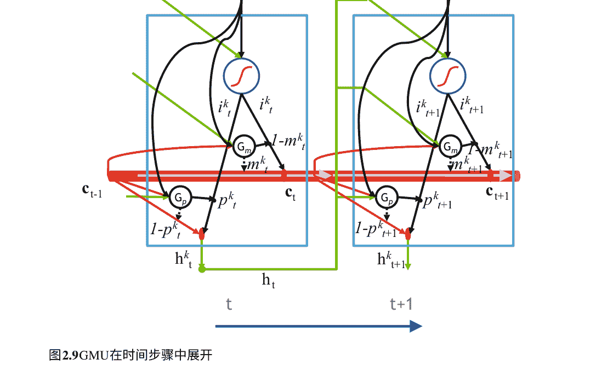

与LSTM类似，GMU还使用Memory Cell作为高速通道。隐藏状态是从内存细胞的内容中通过适当的缩放操作得出的。它们的区别在于GMU细胞中的信息范围被确保稳定，因为使用了插值。

与GRU类似，GMU使用插值结构来合并历史信息和当前信息。它们两者都有一个简单的算术组件。与GRU不同，GMU使用记忆单元来存储历史信息，而不是激活值本身，更好地保证了记忆单元和隐藏状态的独立性。

### 2.5.2 前向传播

GMU中的记忆门使用了逻辑sigmoid变换：

```
a_t^k = \sum_{l=1}^{I} w_{l,k}^{m,x} x_t^l + \sum_{j=1}^{H} w_{j,k}^{h,m} h_{t-1}^j + w_k^{c,m} * c_{t-1}^k

m_t^k = \sigma (a_t^k)
```

同样，操作门也采用了sigmoid函数：

```
b_t^k = \sum_{l=1}^{I} w_{l,k}^{x,p} x_t^l + \sum_{j=1}^{H} w_{j,k}^{h,p} h_{t-1}^j + w_k^{c,p} * c_{t-1}^k

p_t^k = \sigma (b_t^k)
```

输入转换可以计算为：

```
\tilde{i}_t^k = \sum_{l=1}^{I} w_{i,k}^{x,i} x_t^l + \sum_{j=1}^{H} w_{j,k}^{h,i} h_{t-1}^j

i_t^k = h(\tilde{i}_t^k)
```

隐藏状态或激活由插值给出：

```
h_t^k = (1 - m_t^k) c_{t-1}^k + m_t^k i_t^k
```

记忆单元使用以下方式更新：

```
$$c_t^k = (1 - p_t^k)i_t^k + p_t^k c_{t-1}^k$$
```

### 2.5.3 反向传播

由于关键步骤是推导梯度，我们将它们列举如下。首先，将隐藏状态的导数定义为

```
$$\delta_t^{h,k} \stackrel{\text{def}}{=} \frac{\partial L}{\partial h_t^k}$$
```

还定义记忆单元的导数为

```
$$\delta_t^{c,k} \stackrel{\text{def}}{=} \frac{\partial L}{\partial c_t^k}$$
```

记忆单元的梯度可以推导出来：

```
$$\delta_t^{c,k} = \delta_t^{h,k}(1 - m_t^k) + \delta_{t+1}^{c,k} p_t^k + \delta_{t+1}^{p,k} w_k^{c,p} + \delta_{t+1}^{m,k} w_k^{c,m}$$
```

操作门的梯度是：

```
$$\delta_t^{p,k} = \sigma'(b_t^k) \delta_t^{c,k}(i_t^k - c_{t-1}^k)$$
```

记忆门的梯度是：

```
$$\delta_t^{m,k} = \sigma'(a_t^k) \delta_h^{c,k}(c_{t-1}^k - i_t^k)$$
```

输入转换的梯度是：

```
$$\tilde{\delta}_t^{i,k} = h'(\tilde{i}_t^k) \left( \delta_t^{h,k} m_t^k + \delta_t^{c,k}(1 - p_t^k) \right)$$
```

### 2.5.4 实验设置

与第4.4小节不同，本节简化了实验过程。首先，我们不考虑comp集。我们只将2750个单元设置为输出层。其次，我们不使用来自OLHWDB 1.x的孤立样本。为了使用早停技术，我们随机抽取训练数据的5%作为验证集。

## 表2.5 三个隐藏层网络的设置

| 神经元类型 | #参数 | 设置 |
|------------|-------|------|
| RNN        | 1 M   | 3I-64R-96S-160R-2750O |
| GRU        | 1.18 M |     |
| GMU        | 1.19 M |     |
| LSTM       | 1.28 M |     |

## 表2.6 六个隐藏层网络的设置

| 神经元类型 | #参数 | 设置 |
|------------|-------|------|
| RNN        | 1.19 M | 3I-48R-64S-96R-128R-144S-160R-2750O |
| GRU        | 1.62 M |     |
| GMU        | 1.63 M |     |
| LSTM       | 1.83 M |     |

研究了两种网络架构：一种是具有三个隐藏层的双向递归网络，另一种是具有六个隐藏层的网络。考虑了四种类型的神经元：RNN、GRU、GMU和LSTM。每个网络都有3个输入层节点和2750个输出层节点，所有采样层的窗口宽度为2。网络设置分别显示在表2.5和表2.6中。在训练过程中使用早停法来避免过拟合。当验证集上连续二十轮的错误率都没有下降时，训练过程停止。小批量大小设置为32，学习率由AdaDelta算法（Zeiler 2012）驱动，动量为0.95。网络输出通过最大路径解码算法转换为文本结果，没有任何语言限制。对于每个网络，进行了四次运行。总结识别结果，提供错误率的最小值、最大值、平均值和标准方差。

在CTC束搜索解码过程中，发射概率会根据输出单元的倒数作为阈值进行修剪，我们的评估中束大小固定为64。

### 2.5.5 实验结果

我们首先研究了四个三隐藏层网络。我们选择了一次验证过程的运行，并在图2.10中绘制了结果（不包括语言模型）。GMU具有最快的收敛速度，并在验证数据上实现了最低的识别错误率。

使用不同的语言模型对模型进行了测试。结果如表2.7所示。可以看出，GMU在几乎所有指标上都取得了最好的结果。从平均意义上讲，GMU比GRU好约1%，比LSTM好约2%。考虑到对网络初始化的敏感性，GMU成为最稳定的选择。

## 图2.10 三层隐藏层网络的验证过程

## 表2.7 使用三层隐藏层网络的中文手写识别结果

| 神经元类型 |        | 错误率 (%) |        |        |        |
| :--- | :--- | :--- | :--- | :--- | :--- |
|            |        | *min*     | *max*  | 平均值 | 标准差 |
| RNN        | 无语言模型 | 19.75     | 21.43  | 20.57  | 0.70   |
| GRU        | 二元模型 | 17.25     | 21.33  | 18.84  | 1.78   |
|            | 三元模型 | 14.75     | 18.55  | 16.24  | 1.66   |
|            | 无语言模型 | 11.55     | 13.81  | 12.65  | 0.95   |
| GMU        | 二元模型 | **9.18**  | 12.10  | 10.53  | 1.24   |
|            | 三元模型 | 7.76      | 10.41  | 8.97   | 1.13   |
|            | 无语言模型 | **11.50** | **11.96** | **11.63** | **0.22** |
| LSTM       | 二元模型 | 9.25      | **9.59** | **9.35** | **0.16** |
|            | 三元模型 | **7.70**  | **8.12** | **7.84** | **0.19** |
|            | 无语言模型 | 12.32     | 13.02  | 12.76  | 0.31   |
|            | 二元模型 | 10.84     | 11.52  | 11.33  | 0.33   |
|            | 三元模型 | 9.28      | 10.14  | 9.82   | 0.38   |

我们进一步考虑了六层隐藏层网络。我们选择了一次验证过程的运行结果（不使用语言模型），并在图2.11中绘制出来。三个复杂的循环神经元在早期时期收敛速度明显快于标准神经元，同时错误率明显较小。

令人惊讶的是，RNN也能够快速触发早停。在这里，GMU的性能接近GRU，并且比LSTM稍微快一些收敛。

## 图2.11 六层隐藏层网络的验证过程

## 表2.8 使用六层隐藏层网络的中文手写识别结果

| 神经元类型 |        | 错误率 (%) |        |        |
| :--- | :--- | :--- | :--- | :--- |
|            |        | **min**   | **max** | **平均值** | **标准差** |
| **RNN**    | 无语言模型 | 14.39     | 15.23   | 14.67     | 0.39       |
| **GRU**    | 二元模型 | 11.52     | 12.45   | 11.86     | 0.44       |
|            | 三元模型 | 9.74      | 10.75   | 10.09     | 0.47       |
|            | 无语言模型 | 8.65      | 9.01    | 8.85      | 0.17       |
| **GMU**    | 二元模型 | 6.97      | 7.29    | 7.12      | 0.15       |
|            | 三元模型 | 6.06      | 6.40    | 6.23      | 0.14       |
|            | 无语言模型 | 8.92      | 9.02    | 8.99      | 0.046      |
| **LSTM**   | 二元模型 | 7.20      | 7.37    | 7.28      | 0.072      |
|            | 三元模型 | 6.34      | 6.43    | 6.39      | 0.047      |
|            | 无语言模型 | 8.91      | 9.16    | 9.09      | 0.12       |
|            | 二元模型 | 7.32      | 7.66    | 7.52      | 0.14       |
|            | 三元模型 | 6.38      | 6.76    | 6.60      | 0.16       |

最后，使用不同的语言模型评估了六层隐藏层模型在测试集上的结果，结果显示在表2.8中。可以看出，GRU实现了最小的错误率，GMU排名第二。它们之间的差异很小。此外，GMU对网络初始化不敏感。在这里，GMU是GRU和LSTM的一个很好的替代选择。

## 2.6 结论

本章探讨了设计深度循环神经网络架构的方法。在流水线级别上，本章提出了一种用于序列数据标记任务的新型端到端识别架构。与以往的做法不同，我们直接将原始的笔迹输入到网络中。长期的上下文依赖和复杂的动态通过混合架构进行编码。CTC目标函数使得可以在没有字符级别注释的情况下训练模型。

设计了一种改进的束搜索解码算法，以智能地整合语言约束。实验证明，我们的方法在测试集上明显优于现有方法。在更具挑战性的竞赛数据集上进行进一步评估，我们的结果至少与已经发表的结果相当。

在微观神经元级别上，本章介绍了一种名为GMU的新型循环神经元。从LSTM和GRU中获得了很大的灵感。为了形成一个高速通道，设计了自连接的记忆单元。在GMU中，有两个插值门。它们各自具有特定的功能，并且独立地工作在一起。实验结果显示，GMU可能是LSTM和GRU的一个很好的替代品。

致谢本工作部分得到以下资助：中国国家自然科学基金（NSFC）61673140、81671771、61473236；江苏省高校自然科学基金17KJD520010；苏州市科技计划SYG201712、SZS201613；江苏大学自然科学究计划17KJB520041；西交利物浦大学重点项目特殊基金（KSF-A-01）。

## 参考文献

-   Amodei D等 (2016) Deep speech 2：英语和普通话的端到端语音识别。在：第33届国际机器学习大会论文集，美国纽约
-   Bengio Y, Simard P, Frasconi P (1994) 用梯度下降学习长期依赖性是困难的。 IEEE Trans Neural Netw 5(2): 157–166
-   Cheriet M等人 (2007年) 字符识别系统：学生和从业者指南。Wiley, Hoboken
-   Cho K等人 (2014a年) 使用RNN编码器-解码器学习短语表示进行统计机器翻译。在：自然语言处理的经验方法会议论文集
-   Cho K等人 (2014b年) 关于神经机器翻译性质的研究：编码器-解码器方法。arXiv预印本arXiv:1409.1259
-   Gers FA, Schmidhuber J, Cummins F (2000年) 学会遗忘：LSTM连续预测。神经计算12 (10)：2451-2471
-   Gers FA, Schraudolph NN, Schmidhuber J (2002年) 学会精确计时的LSTM循环网络。 J Mach Learn Res 3 (1)：115-143
-   Goodfellow I, Bengio Y, Courville A (2016年) 深度学习。 MIT Press, Cambridge, MA
-   Graves A (2012a年) 监督序列标注。在：使用递归神经网络的监督序列标注。Springer, Berlin
-   Graves A (2012b) 用循环神经网络进行监督序列标注。 Springer, Berlin
-   Graves A, Jaitly N (2014) 迈向端到端语音识别的循环神经网络。 在：第31届国际机器学习大会，中国北京
-   Graves A, Schmidhuber J (2009) 多维循环神经网络的离线手写识别。 在 Advances in Neural Information Processing Systems (NIPS), p p 855–868
-   Graves A et al (2009a) 一种新颖的用于无约束手写识别的连接主义系统。 IEEE Trans PAMI 31(5):855–868
-   Graves A et al (2009b) 一种新颖的用于无约束手写识别的连接主义系统。 IEEE Trans Pattern Anal Mach Intell 31(5):855–868
-   Graves A, Mohamed A.-r, Hinton G (2013) 基于深度循环神经网络的语音识别。 在 ICASSP, IEEE国际声学、语音和信号处理会议 - 论文集, pp 6645–6649
-   Hochreiter S, Schmidhuber J (1997) 长短期记忆。 神经计算 9(8):1735–1780
-   刘建华 (1966) 实时中文手写识别。 麻省理工学院电气工程系，剑桥
-   刘春雷等 (2011) 中国科学院在线和离线中文手写数据库。 在：国际文件分析与识别会议 (ICDAR) 论文集, 第37-41页
-   刘春雷等 (2013) 在线和离线手写中文字识别：在新数据库上的基准测试。 模式识别 46(1):155–162
-   刘琦, 王磊, 霍琦 (2015) 基于DBLSTM-CTC的手写识别中隐式和显式语言模型信息的研究。 在：国际文件分析与识别会议 (ICDAR) 论文集, 第461-465页
-   吕勇等 (2013) 基于学习的候选分割评分方法用于实时识别叠加的在线中文手写。 在国际文件分析与识别会议 (ICDAR) 论文中，第74-78页
-   Messina R, Louradour J (2015) 使用LSTM-RNN进行无分割手写中文文本识别。 在：国际文件分析和识别会议(ICDAR)论文集, 第171-175页
-   Russakovsky O等(2015) ImageNet大规模视觉识别挑战。 Int J Comput Vis 115(3):211–252
-   Schuster M, Paliwal K (1997) 双向递归神经网络。 IEEE Trans Signal Process 45:2673–2681
-   Stolcke A (2002) SRILM-可扩展的语言建模工具包。 在：第7届国际口语处理会议论文集，美国科罗拉多州
-   Su T, Zhang T, Guan D (2007) 基于语料库的HIT-MW离线通用中文手写文本识别数据库。 Int J Doc Anal Recognit 10(1):27–38
-   Su T, Zhang T, Guan D (2009) 使用无分割策略进行逼真中文手写识别。 Pattern Recogn 42(1):167–182
-   王德华, 刘春雷 (2013年) 学习手写中文文本的置信度转换。 国际文档分析与识别杂志17 (3) : 205-219
-   王德华, 刘春雷, 周晓东 (2012a) 一种实时识别在线中文手写句子的方法。 模式识别杂志45 (10) : 3661-3675
-   王庆峰, 尹峰, 刘春雷 (2012b) 通过整合多个上下文进行手写中文文本识别。 IEEE交易模式分析与机器智能34 (8) : 1469-1481
-   谢志, 孙志, 金亮, 冯忠, 张帅 (2016年) 用于手写中文文本识别的全卷积循环网络。 在：arXiv
-   尹峰等 (2013年) ICDAR 2013年中国手写识别竞赛。 在：国际文档分析与识别会议 (ICDAR) 论文集, 第1464-1470页
-   Zeiler MD (2012年) Adadelta：一种自适应学习率方法。 在：arXiv预印本arXiv: 1212.5701
-   张辉, 王德华, 刘春雷 (2014年) 基于N-best列表的在线中文手写文档关键词检测的字符置信度。 模式识别杂志47 (5) : 1880-1890
-   周晓东等 (2013年) 使用半马尔可夫条件随机场的手写中文/日文文本识别。 IEEE交易模式分析与机器智能35 (10) : 2413-2426
-   Zhou X-D等人（2014年）最小风险训练用于半马尔可夫条件随机场的 应用于手写中文/日文文本识别。 Pattern Recogn 47(5):1904–1916
-   Zhou M-K等人（2016年）用于手写中文字符 识别的判别二次特征学习。Pattern Recogn 49:7–18
-   Zobrak MJ（1966年）一种快速识别手绘线条图案的方法。 匹兹堡大学，宾夕法尼亚州
-   Zou Y等人（2011年）移动电话上的重叠手写输入。 在：国际文件分析与识别会议（ICD AR）论文集，第369-73页

## **第3章**
**基于深度学习的手写中文字符和文本识别**

张旭尧，吴一超，尹飞，刘成林

摘要 本章介绍了使用深度学习方法进行手写中文字符识别（HCCR）和手写中文文本识别（HCTR）的最新进展。在HCCR中，我们将传统的归一化-协作方向分解特征图（directMap）与深度卷积神经网络相结合，在这个框架下，我们可以消除数据增强和模型集成的需求，这在其他系统中被广泛使用以达到最佳结果。尽管基准准确率非常高，但我们展示了在这种情况下使用风格转移映射（STM）的作者自适应仍然有效，可以进一步提高性能。在HCTR中，我们使用一种有效的方法，基于超分割和路径搜索，集成多个上下文，其中语言模型（LM）和字符形状模型起着重要作用。不再使用传统的回退n-gram语言模型（BLMs），而是应用两种类型的字符级神经网络语言模型（NNLMs），即前馈神经网络语言模型（FNNLMs）和循环神经网络语言模型（RNNLMs）。

本章的部分内容摘自：
模式识别，61，348-360，张旭尧，Yoshua Bengio，刘成林，“在线和离线手写中文字符识别：一项全面研究和新基准”，2017年，获得Elsevier许可

模式识别，65，251-264，吴一超，尹飞，刘成林，“利用神经网络语言模型和卷积神经网络形状模型改进手写中文文本识别”，2017年，获得Elsevier许可

张旭尧·吴一超·尹飞
自动化研究所，中国科学院，北京，中华人民共和国

电子邮件：xyz@nlpr.ia.ac.cn；yichao.wu@nlpr.ia.ac.cn；fyin@nlpr.ia.ac.cn

刘成林（）
自动化研究所，中国科学院，北京，中华人民共和国

中国科学院大学脑科学与智能技术卓越中心，北京，中华人民共和国电子邮件：liucl@nlpr.ia.ac.cn

循环神经网络语言模型（RNNLMs）与基于字典的语言模型（BLMs）相结合构建混合语言模型（LMs）。为了进一步提高HCTR的性能，我们还使用基于卷积神经网络的模型替换了基线字符分类器、过度分割和几何上下文模型。通过将深度学习方法与传统方法相结合，我们能够在HCCR和HCTR两方面实现最先进的性能。

关键词 深度学习·手写识别·作者适应·卷积神经网络·循环神经网络·语言模型·形状模型·字符·文本

## 3.1 引言

手写中文字符识别（HCCR）已经研究了五十多年（Dai等人，2007年；Kimura等人，1987年），以应对大量字符类别、相似字符之间的混淆和不同个体之间的独特书写风格等挑战。根据输入数据的类型，手写识别可以分为在线和离线两种。在线HCCR记录和分析笔尖运动的轨迹以识别表达的语言信息（Liu等人，2004年），而离线HCCR则分析字符图像并将其分类到不同的类别中。离线HCCR有许多应用，例如银行支票阅读、邮件排序（Liu等人，2002年）、书籍和手写笔记转录，而在线HCCR已广泛用于笔输入设备、个人数字助理、计算机辅助教育、智能手机等领域。与此同时，在过去的四十年中，手写中文文本识别（HCTR）领域也取得了巨大的进展（Dai等人，2007年；Fujisawa，2008年）。手写文本识别不仅涉及字符识别，还涉及字符分割，由于字符大小和间距的不规则性，无法在字符识别之前可靠地进行分割。由于书写风格的多样性、字符分割的困难、大字符集和无约束的语言领域，HCTR仍然是一个具有挑战性的问题。

基于超分割的识别方法通过整合字符分类器、几何和语言上下文模型已经在手写文本识别中取得了成功(Wang等人，2012年)，其中语言上下文模型(即语言模型)和字符形状模型都非常重要。

为了促进HCCR和HCTR的学术研究和基准测试，中国科学院自动化研究所模式识别国家重点实验室在CCPR-2010 (Liu等人，2010年)，ICDAR-2011 (Liu等人，2011年)和ICDAR-2013 (Yin等人，2013年)组织了三次比赛。比赛结果显示随着时间的推移有所改进，并涉及许多不同的识别方法。一个压倒性的趋势是基于深度学习的方法逐渐主导了比赛。受到深度学习的成功的影响(Bengio等人，2013年; Hinton和Salakhutdinov，2006年; LeCun等人，2015年)# 基于深度学习的手写汉字和文本识别

在不同领域中，对于手写汉字识别（HCCR）和手写文本识别（HCTR）的解决方案也从传统方法转变为基于深度学习的方法。在本章中，我们将传统的领域特定知识与现代深度学习方法相结合，构建了最先进的HCCR和HCTR系统。

对于HCCR，我们不再从原始数据中训练卷积神经网络（convNet），而是使用归一化协作（Liu 2007）方向分解特征图（directMap）来表示在线和离线手写字符。directMap可以被视为一个稀疏张量，其中d是量化方向的数量，n是地图的大小。DirectMap包含了形状归一化和方向分解的领域特定知识，因此对于HCCR来说是一个强大的表示。此外，受到使用深度卷积神经网络进行图像分类的最近成功启发（Krizhevsky等人2012；Szegedy等人2015；Simonyan和Zisserman 2015），我们为HCCR开发了一个11层的convNet。通过directMap+convNet，我们能够在相同框架下实现在线和离线HCCR的最先进性能。

手写风格在不同个体之间的巨大变异性是HCCR面临的另一个挑战（Sarkar和Nagy 2005；Connell和Jain 2002）。通过逐渐减少独立于个体的系统与特定个体之间的不匹配，写作者适应（Sarkar和Nagy 2005；Connell和Jain 2002）被广泛用于处理这一挑战。尽管基于深度学习的方法已经在HCCR方面取得了超越人类水平的高记录，但我们表明在这种情况下写作者适应仍然有效。受我们早期关于风格转移映射的工作（Zhang和Liu 2013）的启发，我们在convNet中添加了一个特殊的适应层，以无监督的方式匹配和消除训练和测试数据之间的分布偏移，这可以保证即使只有少量样本可用也能提高性能。

对于HCTR，我们通过使用神经网络语言模型和卷积神经网络形状模型改进了基于过分割的系统。统计语言模型在HCTR中起着重要作用，它给出了一个字符或单词序列的先验概率。回退N-gram语言模型（BLMs）在二十多年前提出（Katz 1987；Chen和Goodman 1996），并且在手写文本识别中已经使用了十多年。最近，一种称为神经网络语言模型（NNLM）的新型语言模型已经成功应用于手写识别（Zamora-Martinez等人2014；Wu等人2015）。在本章中，我们评估了两种类型的字符级NNLM的效果，即前馈NNLM（FNNLM）（Bengio等人2003；Schwenk 2007，2012；Schwenk等人2012；Zamora-Martinez等人2014；Wu等人2015）和循环NNLM（RNNLM）（Mikolov等人2010，2011c,b；Kombrink等人2011）用于基于过分割的文本识别系统。FNNLM和RNNLM都与BLMs结合起来构建混合LMs。实验结果表明，NNLMs改善了识别性能，混合RNNLMs优于其他LMs。除了语言模型外，字符分类器（Wang等人2016），过分割（Liu等人2002；Wu等人2015；Lee和Verma 2012）和几何上下文模型（Zhou等人2007）（通常称为形状模型）也起到重要作用，对于文本识别性能也很重要。为了进一步提高HCTR的性能，我们将系统中的所有基准字符分类器、过分割算法和几何上下文模型都替换为基于卷积神经网络的模型。通过在传统框架中使用神经网络语言模型和卷积神经网络形状模型，可以显著提高HCTR的性能。

本章是我们之前的工作张等人（2017）和吴等人（2017）的重新组织。在本章的其余部分，我们首先介绍HCCR系统中使用的不同组件，然后描述HCTR框架的详细过程。最后，我们对未来的研究进行了一些总结性的评论。

## 3.2 手写汉字识别（HCCR）

本节描述了手写汉字识别（HCCR）的整个系统，包括方向分解特征图、卷积神经网络、作者适应和基准数据集上的实验结果。

### 3.2.1 方向分解特征图

形状归一化和方向分解是HCCR中强大的领域知识。形状归一化可以被视为原始字符和归一化字符之间在连续2D空间中的坐标映射。因此，方向分解可以在原始字符（与归一化协作）或归一化字符（基于归一化）上实现（Liu 2007）。协作归一化方法将原始字符的方向元素映射到方向图中，而不生成归一化字符，从而可以减轻形状归一化引起的笔画方向失真的影响，并提供更高的识别准确性（Liu 2007）。在本章中，我们使用协作归一化方法为在线和离线HCCR生成直接映射（Liu et al. 2013）。

#### 3.2.1.1 离线直接映射

离线HCCR数据集提供带有背景像素标记为255的灰度图像。为了快速计算，我们首先反转灰度级别：将背景设为0，前景设为[1,255]。之后，前景灰度级别被非线性归一化到指定范围，以克服不同图像之间的灰度变化（Liu et al. 2013）。对于形状归一化，对于离线字符，我们选择线密度投影插值（LDPI）方法，因为它具有卓越的性能（Liu和Marukawa 2005）。对于方向分解，我们首先通过Sobel算子从原始图像计算梯度，然后通过平行四边形规则将梯度方向分解为其两个相邻的标准链码方向（Liu等，2003年）。请注意，在此过程中，不生成规范化字符图像，而是将原始图像的梯度元素直接映射到包含像素坐标转换的标准图像大小的方向图中。

#### 3.2.1.2 在线DirectMap

在线HCCR数据集提供笔画坐标的序列。我们还使用了与规范化协作的在线手写字符方法，即从原始模式中提取特征，包括坐标转换，而不生成规范化模式。用于在线HCCR的形状规范化方法是伪2D双矩归一化（P2DBMN）（Liu和Zhou 2006年）。对于方向分解，局部笔画方向（由两个相邻点形成的线段）被分解为8个方向，然后生成每个方向的特征图（Liu和Zhou 2006年；Bai和Huo 2005年）。

虚拟笔画（抬笔或称为离笔）（Ding等人，2009年）也被加权为0.5，以获得增强的表示。

#### 3.2.1.3 分析

为了构建紧凑的表示，我们将特征图的大小设置为32，因此生成的directMap是一个8 × 32 × 32的张量。图3.1显示了在线和离线directMaps的示例。为了更好地说明，我们还显示了八个方向图的平均图。可以看出，平均图中的形状与原始字符相比是归一化的。对于离线字符，梯度被分解，因此平均图提供了原始图像的轮廓信息。相反，对于在线字符，局部笔画被分解，因此输入字符可以通过平均图很好地重建，从中我们还可以发现虚拟笔画已经被考虑在内。因为梯度垂直于局部笔画，所以在线和离线的directMaps是不同的，尽管它们采用相同的方向编码。

DirectMap是一种强大的HCCR表示方法，它利用了汉字在书写过程中由基本方向笔画产生的强先验知识。如图3.1所示，directMap非常稀疏。实际上，在我们的实验数据库中，directMap中92.41%（在线）和79.01%（离线）的元素都是零。由于这种稀疏性，我们可以高效地存储和重复使用提取的directMap。由于稀疏性，使用比原始图像尺寸更小的映射不会丢失形状信息。

### 3.2.2 卷积神经网络

正如张等人（2017）所示，传统的HCCR框架可以看作是在directMap上的简化卷积神经网络，因此，将directMap与深度卷积神经网络集成起来寻找一个新的基准是直接且必要的。研究表明，深度对于卷积神经网络（convNet）的成功至关重要（Szegedy等人，2015；Simonyan和Zisserman，2015）。考虑到我们directMap的尺寸（8 × 32 × 32），我们为HCCR构建了一个11层的网络。

#### 3.2.2.1 架构

如图3.2所示，直接映射（在线或离线）通过一系列卷积（conv）层，其中滤波器具有小的感受野3 × 3，这是捕捉左/右、上/下和中心概念的最小尺寸（Simonyan和Zisserman 2015）。所有卷积步幅都固定为1。特征图的数量从50（第1层）逐渐增加到400（第8层）。空间池化广泛用于获得平移不变性（对位置的鲁棒性）。为了增加网络的深度，特征图的大小应该慢慢减小。因此，在我们的架构中，空间池化在每两个卷积层之后实施（图3.2），通过最大池化（over a 2 × 2窗口，步长为2，用于减小特征图的尺寸。在8个卷积层和4个最大池化层的堆叠之后，特征图被展平并连接成一个维度为1600的向量。然后是两个全连接（FC）层（分别具有900个和200个隐藏单元）。最后，使用softMax层进行3755类别的分类。

#### 3.2.2.2 正则化

正则化对于深度网络非常重要。Dropout（Srivastava等人，2014年）是一种广泛使用的策略，用于增加泛化性能，可以通过以给定概率随机丢弃每个层的单元（以及它们的连接）来实现。我们在除了第一层和第十层之外的所有层上使用dropout。如图3.2所示，dropout的概率随深度增加而增加。第十层是softmax层之前的最后一个全连接层，因此可以看作是一个非常高级的特征提取器。我们将第十层的维度设置为200，以获得紧凑的表示（这已经可以看作是正则化），因此我们将第十层的dropout概率设置为零。我们使用的另一种正则化策略是带有L2惩罚的权重衰减。在训练过程中，权重衰减的乘数为0.0005。

#### 3.2.2.3 激活

激活函数对于向网络中添加非线性非常重要。修正线性单元（ReLU）是深度网络成功的关键之一（Krizhevsky等人，2012年）。一种更一般的形式，称为泄漏ReLU（Maas等人，2013年），被定义为 f(x) = max(x, 0) + λ min(x, 0)（标准ReLU使用λ = 0），它可以加快收敛速度并获得比传统激活函数（如sigmoid和tanh）更好的性能。在我们的卷积神经网络（图3.2）中，所有隐藏层都配备了泄漏ReLU非线性激活函数，其中λ = 1/3。

#### 3.2.2.4 训练

整个网络通过反向传播算法进行训练（Rumelhart等人，1986年）。训练是通过使用带动量的小批量梯度下降来最小化多类别负对数似然损失来实现的。小批量大小设置为1000，动量为0.9。学习率最初设置为0.005，然后当训练数据上的成本或准确性不再改善时，减小×0.3。我们在训练过程中不使用任何数据增强方法来生成扭曲的样本，因为我们相信直接映射已经是一个强大的表示，并且我们希望使训练更加高效。

训练大约经过70个时期后完成。每个时期结束后，我们对训练数据进行洗牌以生成不同的小批量。在我们的实验中，在线和离线手写字符识别都采用相同的卷积神经网络架构，并共享上述相同的训练策略。

### 3.2.3 卷积神经网络的适应性

为了适应特定作者的新手写风格，我们提出了一种基于我们之前的工作（Zhang和Liu 2013）的特殊适应层。适应层可以放置在网络的任何全连接层之后。假设ϕ(x) ∈ ℝ^d是特定层（我们称之为源层）的输出（经过激活），我们希望在该层之后放置适应层。首先，我们从训练数据{x_i^{trn}, y_i^{trn}}_{i=1}^{N}中估计源层上的类别特定均值，其中y_i^{trn} ∈ {1, 2, …, c}且c是类别数：

> μ_k = (1 / ∑_{i=1}^{N} I(y_i^{trn} = k)) ∑_{i=1}^{N} ϕ(x_i^{trn}) I(y_i^{trn} = k),  (3.1)

其中I(·) = 1表示条件为真，否则为0。{μ_1, …, μ_c}表示源层的类分布，并将用于学习适应层的参数。

适应层包含一个权重矩阵 A ∈ ℝ^{d×d}和一个偏移向量 b ∈ ℝ^d。适应层上没有激活函数。假设我们有一些未标记的数据{x_i}_{i=1}^n用于适应。通过将它们通过预训练的convNet，我们可以得到它们的预测 y_i = convNet_{pred}(x_i) ∈ {1, …, c}。由于convNet的最后一层是softmax，我们还可以得到关于这个预测的置信度 f_i = convNet_{softmax}(x_i) ∈ [0, 1]。有了所有这些信息，现在适应的目的是减少训练和测试数据之间的不匹配。请注意，我们已经有了源层的类特定均值 μ_k，适应问题可以被表述为：

min_{A,b} ∑_{i=1}^n f_i || Aϕ(x_i) + b - μ_{y_i} ||_2^2 + β || A - I ||_F^2 + γ || b ||_2^2  (3.2)

其中|| · ||_F是矩阵Frobenius范数，|| · ||_2是向量L_2范数，而I是单位矩阵。

如式(3.2)所示，适应的目标是将每个点 ϕ(x_i)转向类特定均值 μ_{y_i}在源层上。由于预测结果 y_i可能不可靠，每个转换都由网络的softmax给出的置信度 f_i加权。实际上，为了保证适应性能在小的n下，采用了两个正则化项：第一个是约束A与单位矩阵的偏差，而第二个是约束b与零向量的偏差。当 β = γ = +∞时，我们将得到 A = I和 b=0，这意味着没有适应发生。

在获得A和b之后，源层和适应层被组合在一起产生输出：

输出(x) = Aϕ(x) + b ∈ ℝ^d  (3.3)

然后将其输入到网络的下一层。实际上，最好将适应层放在网络的瓶颈层之后，即与其他层相比具有最少隐藏单元的全连接层。通过这种方式，可以最小化A和b的大小，从而使适应更加高效和有效。基于这种考虑，我们将convNet（图3.2）中的第10层的维度设置为200，并将适应层放在该层之后。

问题（3.2）是一个凸二次规划（QP）问题，可以通过闭式解（Zhang and Liu 2013）高效地解决。我们使用自训练策略对convNet进行无监督适应。我们首先将适应初始化为 A = I和 b=0。在从convNet估计出 y_i和 f_i之后，我们根据（3.2）更新 A和b。使用新的 A和b参数，网络的预测 y_i和softmax置信度 f_i将更加准确。因此，我们多次重复此过程以自动提升性能。关于作者适应过程的更多细节可以在Zhang and Liu（2013）和Zhang et al.（2017）中找到，卷积神经网络的这种适应方法也可以扩展到许多其他应用。

### 3.2.4 实验

我们进行了在线和离线手写字符识别的实验，与其他先前报道的最先进方法进行比较。之后，我们评估了卷积神经网络在ICDAR-2013竞赛数据库中的60位作者上的适应性。

#### 3.2.4.1 数据库

为了训练卷积神经网络，可以使用由CASIA（Liu等人，2011年）收集的数据库作为训练集，其中包括离线手写字符数据集HWDB1.0-1.2和在线手写字符数据集OLHWDB1.0-1.2。在接下来的章节中，我们简称这些数据集（无论是离线还是在线）为DB1.0-1.2。测试数据是ICDAR-2013离线和在线竞赛数据集（Yin等人，2013年），这些数据集由与训练数据集不同的60位作者生成。字符类别的数量为3755（GB2312-80的一级集合）。

#### 3.2.4.2 离线手写字符识别结果

表3.1显示了不同方法在ICDAR-2013离线比赛数据库上的结果。从表3.1可以看出，传统方法（第2行）和人类水平表现（第1行）之间存在很大差距。通过这三次比赛，识别准确率逐渐提高，这证明了举办比赛促进研究的有效性。在ICDAR-2011中，来自瑞士IDSIA团队（第4行）获得了第一名（Liu等，2011年），而在ICDAR-2013中，来自富士通的团队（第5行）获得了第一名（Yin等，2013年）。在修复了系统中的一个错误后（Ciresan和Schmidhuber，2013年），IDSIA团队再次取得了最佳表现（第6行）。之后，通过改进他们的方法（Wu等，2014年），富士通团队在第7行展示了他们的表现提升。人类水平表现首次被Zhong等人（2015年）超越（第8行），他们使用了Gabor-GoogLeNet。通过使用十个模型的集合，他们的准确率进一步提高到96.74%（第10行）。最近，富士通团队（Chen等，2015年）通过使用适当的样本生成（局部和全局扭曲）、多重监督训练和多模型集成进一步改进了他们的系统。他们通过单个网络实现了96.58%的准确率（第11行），并且通过使用5个网络的集合，他们的准确率提高到96.79%（第12行）。我们提出的directMap+convNet方法在离线手写字符识别方面取得了新的基准，如表3.1的第13行所示。特别地，我们的结果基于单个网络，并且与所有其他系统相比，我们的方法还具有最低的内存使用量，这是由于directMap的紧凑表示和我们特殊的convNet结构。

**表3.1 ICDAR-2013离线HCCR竞赛数据库的结果**

| 序号 | 方法 | 参考 | 准确率 | 内存 | 训练数据 | 畸变 | 集成 |
| :--- | :--- | :--- | :--- | :--- | :--- | :--- | :--- |
| 1 | 人类表现 | Yin等人（2013年） | 96.13% | 120.0MB | 1.0+1.1 | 否 | 否 |
| 2 | 传统方法：DFE + DLQDF | Liu等人（2013年） | 92.72% | 339.1MB | 1.0+1.1 | 是 | 否 |
| 3 | CCPR-2010获胜者：HKU | Liu等人（2010年） | 89.99% | 27.35MB | 1.1 | 是 | 否 |
| 4 | ICDAR-2011获胜者：IDSIA | Liu等人（2011年） | 92.18% | 2.402GB | 1.1 | 是 | 是（4） |
| 5 | ICDAR-2013获胜者：富士通 | Yin等人（2013年） | 94.77% | 349.0MB | 1.1 | 是 | 是（8） |
| 6 | 多列DNN (MCDNN) | Ciresan和Schmidhuber（2013年） | 95.79% | 206.5MB | 1.1 | 是 | 是（4） |
| 7 | ATR-CNN投票 | 吴等人（2014年） | 96.06% | 27.77MB | 1.0+1.1 | 否 | 否 |
| 8 | HCCR-Gabor-GoogLeNet | 钟等人（2015年） | 96.35% | 110.9MB | 1.0+1.1 | 否 | 是（4） |
| 9 | HCCR-Ensemble-GoogLeNet-4 | 钟等人（2015年） | 96.64% | 270.0MB | 1.0+1.1 | 否 | 是（10） |
| 10 | HCCR-Ensemble-GoogLeNet-10 | 钟等人（2015年） | 96.74% | 190.0MB | 1.0+1.1+1.2 | 是 | 否 |
| 11 | CNN-Single | 陈等人（2015年） | 96.58% | 950.0MB | 1.0+1.1+1.2 | 是 | 是（5） |
| 12 | CNN-Voting-5 | 陈等人（2015年） | 96.79% | 23.50MB | 1.0+1.1 | 否 | 否 |
| 13 | DirectMap + ConvNet | 我们的 | 96.95% | 23.50MB | 1.0+1.1 | 否 | 否 |
| 14 | DirectMap + ConvNet + Adaptation | 我们的 | 97.37% | 23.50MB | 1.0+1.1 | 否 | 否 |## 3.2.4.3 在线HCCR结果

在ICDAR-2013在线竞赛数据库上，不同方法的比较结果如表3.2所示。对于在线HCCR，传统方法（第2行）已经优于人类表现（第1行），而在线HCCR的人类表现远远低于离线HCCR。这是因为在线字符（笔画坐标）的显示不如离线样本那样令人愉悦。这三个比赛也明显取得了在线HCCR方面的进展。最好的单一网络（第5行）是来自华威大学的ICDAR-2013冠军，它利用微分方程理论中的“签名”来表示笔画轨迹，并采用了稀疏的卷积神经网络结构（Graham 2014）。最近，杨等人（2015年）通过结合多个领域知识并使用“dropSample”训练策略，可以通过使用单一网络（第6行）达到可比较的性能。

通过九个网络的集成，他们进一步提高了性能至97.51%（第7行）。通过我们的directMap+convNet，我们还可以在在线手写字符识别中树立新的基准，如表3.2的第8行所示。我们的结果基于单个网络，没有进行数据增强，这使得训练过程更加高效。上述方法都是基于卷积神经网络的，最近研究表明基于循环神经网络的方法（张等人，2018年）可以进一步提高在线手写字符识别的性能。

#### 3.2.4.4 自适应结果

对于手写字符识别来说，作者自适应是一个重要问题。与传统方法和人类水平的性能相比，基于深度学习的方法可以实现更高的准确性。然而，在本节中，我们将展示深度卷积网络的作者自适应仍然有效，可以进一步提高性能。

ICDAR-2013竞赛数据库（Yin等人，2013年）包含60位作者，为了分析个体上的自适应行为，我们考虑错误减少率：

误差减少率 = 初始误差 - 适应误差 / 初始误差 (3.4)

图3.3显示了60位作者的误差减少率和初始准确率的曲线。我们可以发现：除了一个作者外，所有的误差减少率都大于零，这意味着在适应后准确性得到了持续改善，无论是在线还是离线的手写字符识别。同时，我们还发现：对于初始准确率较高的作者，适应可以获得更大的改进。这是因为自训练的成功依赖于初始预测。例如，在图3.3的右上角（离线手写字符识别）有一位作者，其初始准确率已经高达99.33%，但经过适应后提高到99.63%，误差减少率超过44%。

表3.2 ICDAR-2013在线手写字符识别竞赛的不同方法

| 编号 | 方法 | 参考 | 准确率 | 内存 | 训练数据 | 畸变 | 集成 |
|---|---|---|---|---|---|---|---|
|  | 人类表现 | Yin等人 (2013年) | 95.19% | 无适应数据 | 无适应数据 | 无适应数据 | 无适应数据 |
| 1 | 传统方法：DFE + DLQDF | Liu等人 (2013年) | 95.31% | 120.0MB | 1.0+1.1 | 否 | 否 |
| 2 | CCPR-2010获胜者：SCUT-HCIl-2 | Liu等人 (2010年) | 92.39% | 30.06MB | 1.0+1.1 | 否 | 是 (2) |
| 3 | ICDAR-2011获胜者：VO-3 | Liu等人 (2011年) | 95.77% | 41.62MB | 1.0+1.1+其他 | 是 | 否 |
| 4 | ICDAR-2013获胜者：UWarwick | Yin等人 (2013年) | 97.39% | 37.80MB | 1.0+1.1+1.2 | 是 | 否 |
| 5 | DropSample-DCNN | Yang等人 (2015年) | 97.23% | 15.00MB | 1.0+1.1 | 是 | 否 |
| 6 | DropSample-DCNN-Ensemble | Yang等人 (2015年) | 97.51% | 135.0MB | 1.0+1.1 | 是 | 是 (9) |
| 7 | DirectMap + ConvNet | 我们的 | 97.55% | 23.50MB | 1.0+1.1 | 否 | 否 |
| 8 | DirectMap + ConvNet + Adaptation | 我们的 | 97.91% | 23.50MB | 1.0+1.1 | 否 | 否 |

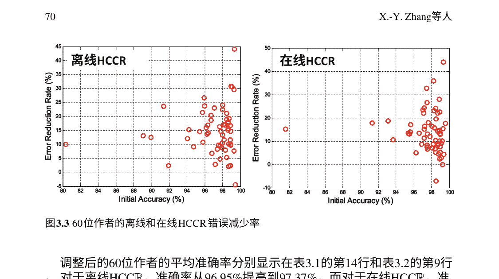

图3.3 60位作者的离线和在线HCCR错误减少率

调整后的60位作者的平均准确率分别显示在表3.1的第14行和表3.2的第9行。对于离线HCCR，准确率从96.95%提高到97.37%，而对于在线HCCR，准确率从97.55%提高到97.91%。请注意，在适应过程中，我们只向网络中添加一个参数为A∈ℝ200×200和b∈ℝ200的适应层，与convNet的完整大小相比，这些参数是可以忽略的。用于适应的作者特定数据的数量等于（或小于）类别的数量。此外，整个过程是以无监督的方式进行的。综上所述，我们可以得出结论，所提出的适应层在提高convNet的准确性方面是有效的。

## 3.3 手写中文文本识别（HCTR）

### 3.3.1 系统概述

我们的系统基于集成的分割和识别框架，通常包括文本行图像的过分割、分割-识别候选格子的构建以及在格子中进行路径搜索和上下文融合。我们的系统的图示如图3.4所示，并且假设文档图像预处理和文本行分割的任务已经在外部完成。

首先，输入的文本行图像通过连通组件分析和接触模式分割（Wang等，2012；Liu等，2002）进行过分割，使得每个分割块都是一个字符或字符的一部分。然后，将一个或多个连续的分割块组合起来生成候选字符模式，形成一个分割候选格子，其中每条路径称为一个候选分割路径。每个候选模式通过字符分类来分配一系列候选字符类别。

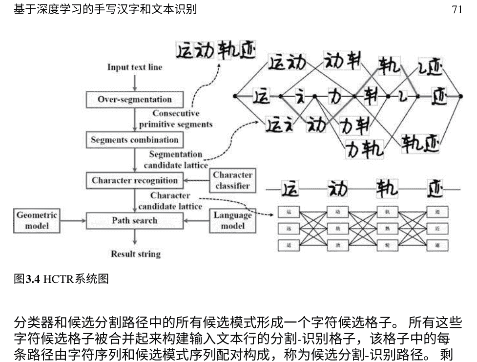

图3.4 HCTR系统图

分类器和候选分割路径中的所有候选模式形成一个字符候选格子。所有这些字符候选格子被合并起来构建输入文本行的分割-识别格子，该格子中的每条路径由字符序列和候选模式序列配对构成，称为候选分割-识别路径。剩下的任务是通过融合多个上下文来评估每条路径，并搜索具有最小成本（或最大得分）的最优路径，以获得分割和识别结果。

我们将候选字符模式的序列表示为 \(X = x_1 \ldots x_m\)。每个候选字符通过字符分类器被分配候选类别（表示为 \(c_i\)），然后文本行识别的结果是一个字符字符串 \(C = c_1 \ldots c_m\)。在这项工作中，我们从贝叶斯决策的角度来形式化字符字符串识别任务，并采用了Wang等人（2012）提出的路径评估准则，该准则整合了字符分类得分、几何上下文（Yin等人，2013）和语言上下文。为了节省空间，我们直接给出了准则，更多细节可以在Wang等人（2012）中找到。

将候选类别的字符分类器输出表示为 \(c_i\) 对于第 \(i\) 个字符模式 \(x_i\) 作为 \(P(c_i|x_i)\)。语言上下文表示为 \(P(c_i|h_i)\)，其中 \(h_i\) 表示 \(c_i\) 的历史。几何上下文模型给出了一元类别相关几何（ucg）分数，一元类别无关几何（uig）分数，二元类别相关几何（bcg）分数和二元类别无关几何（big）分数，表示为 \(P(c_i|g^{ucg}_i)\)，\(P(z^p_i = 1|g^{uig}_i)\)，\(P(c_{i-1}, c_i|g^{bcg}_i)\)，以及 \(P(z^g_i = 1|g^{big}_i)\)，分别表示相应的几何特征，输出分数由几何模型分类在特征上提取。我们得到一个对于分割-识别路径的对数似然函数 \(f(X, C)\)：

$$f(X, C) = \sum_{i=1}^m \left( w_i \log P(c_i|x_i) + \lambda_1 \log P(c_i|g_i^{ucg}) + \lambda_2 \log P(z_i^p = 1|g_i^{uig}) + \lambda_3 \log P(c_{i-1}, c_i|g_i^{bcg}) + \lambda_4 \log P(z_i^g = 1|g_i^{big}) + \lambda_5 \log P(c_i|h_i) \right), \tag{3.5}$$

其中 $w_i$ 是用于克服对短字符串的偏见的单词插入惩罚，我们使用字符模式宽度加权 (WCW) 的术语 (Wang等人，2012年)，$\lambda_1$-$\lambda_5$ 是用于平衡不同模型效果的权重，并使用最大字符准确性 (MCA) 准则进行优化 (Wang等人，2012年)。通过置信度转换 (将分类器输出分数转换为概率)，六个模型，即一个字符分类器，四个几何模型和一个字符语言模型，被组合在一起评估分割路径。至于路径搜索，采用了一种改进的帧同步波束搜索算法 (Wang等人，2012年) 来在两个步骤中找到最佳路径：首先在每个帧上保留有限数量的具有最高分数的部分路径，然后在第二步中找到全局最优路径。

### 3.3.2 神经网络语言模型

为了克服传统BLM的数据稀疏问题，在本节中我们引入了两种类型的NNLM，包括FNNLM和RNNLM。如果序列C包含 $m$ 个字符，$P(C)$ 可以分解为：

$$p(C) = \prod_{i=1}^m p(c_i|c_1^{i-1}), \tag{3.6}$$

其中 $c_1^{i-1} = <c_1, \ldots, c_{i-1}>$ 表示字符 $c_i$ 的历史。对于N-gram模型，在(3.6)中只考虑了 $N-1$ 个历史字符：

$$p(C) = \prod_{i=1}^m p(c_i|c_{i-N+1}^{i-1}) = \prod_{i=1}^m p(c_i|h_i), \tag{3.7}$$

其中 $c_i^1 > (h_i为空)$。虽然FNNLM可以使用比BLM更大的上下文大小进行训练，但它本质上也是一个N-gram语言模型。然而，RNNLM在理论上可以摆脱有限的上下文大小，并捕捉无限的上下文模式。因此，在这种情况下我们有 $h_i = c_{1i-1}$。

#### 3.3.2.1 前馈神经网络语言模型

在FNNLM中，历史字符（或英文文本中的单词）被投影到一个连续空间中，以执行隐式平滑并估计序列的概率。投影和估计可以由多层神经网络共同完成。最初的FNNLM模型是由Bengio等人在2003年提出的，旨在解决维度灾难问题，基本架构如图3.5a所示。

N-gram FNNLM的输入由 \(N-1\) 个历史字符 \(h_i\) 的信息连接而成，而输出则是词汇表中所有字符的后验概率：

$$[ p(c_i = \omega_j | h_i), \quad j = 1, \ldots, v \tag{3.8} ]$$

其中 \(V\) 是词汇表的大小，\(\omega_j\) 表示词汇表中的一个字符类。网络的功能如下：

1.  每个先前的 \(N-1\) 个输入字符最初被编码为一个长度为 \(V\) 的向量，使用1-of-V方案。
2.  然后，每个字符的1-of-V表示被投影到一个低维向量R中，表示为连续空间中的 \(\mathbf{r}\)。实际上，\(P \times V\) 维投影矩阵的每一列对应于一个分布式表示，投影层的所有权重都是共享的。
3.  在第2步之后，如果我们将投影层和隐藏层之间的权重表示为 \(W_{P,H}\)，其维度应为 \(H \times ((N-1) \times P)\)，使用列主序形式，\(N-1\) 个历史字符的分布式表示为 \(\mathbf{R} = [\mathbf{r}_{i-N+1}^{T}, \ldots, \mathbf{r}_{i-1}^{T}]^{T}\)，那么隐藏层的输出 \(\mathbf{S}\) 可以计算为：

$$\[ \mathbf{S} = \tanh(\mathbf{W}_{P,H} * \mathbf{R}), \tag{3.9} \]$$

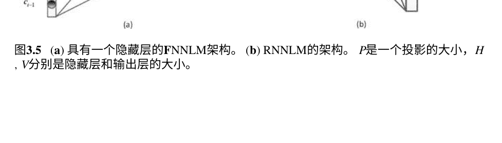

其中tanh(·)是逐元素执行的双曲正切激活函数。如果有多个隐藏层，则对于后续的隐藏层，使用相同的Eq. (3.9)进行处理，前一个隐藏层的输出作为输入。

4.  最后，可以通过以下方式计算词汇表中所有字符的预测值

$$M = W_{H,O} * S,$$

$$O = \exp(M) / \sum_{i=1}^{V} \exp(m_i),$$

其中 $W_{H,O}$是输出层的 $V \times H$维权重矩阵，$M$是在softmax归一化之前计算的激活值向量，$m_i$是$M$的第$i$个元素。$\exp(\cdot)$函数以及除法函数都是逐元素执行的。

为了简化说明，上述公式已将偏置项吸收到权重参数中。经过上述所有操作后，$O$的第$j$个分量，表示概率$P(c_i = \omega_j|h_i)$。在训练中使用标准的反向传播算法来最小化正则化的交叉熵准则：

$$E = -\sum_{j=1}^{V} t_j \log o_j + \beta(|W_{P,H}|_2^2 + |W_{H,O}|_2^2),$$

其中 $t_j$是期望的输出，在训练句子中，下一个字符为1，其他字符为0。

#### 3.3.2.2 循环神经网络语言模型

RNNLMs首次在Mikolov等人（2010）中提出。其架构（图3.5b）与FNNLMs类似，只是隐藏层包含了循环连接。RNNLM还嵌入了词/字符表示投影，并且估计主要分为三个阶段：

1.  时间步骤 $t$的输入 $R(t)$首先通过连接两部分来形成：向量 $x(t-1)$表示前一个单词 $c_{i-1}$的1-of-V编码，以及前一个隐藏层输出 $S(t-1)$，表示为：

$$R(t) = [x(t-1)^T S(t-1)^T]^T.$$

2.  输入 \( R(t) \)然后分别投影到连续向量 \( S(t) \)，也是下一个时间步骤的隐藏层 ：

$$\[ S(t) = \text{sigm}(W_{I,H} * x(t-1) + W_{H,H} * S(t-1)) \]$$

其中 sigm(·)是逐元素执行的sigmoid激活函数，\( W_{I,H} \)和 \( W_{H,H} \)是 \( H \times V \)投影和 \( H \times H \)循环权重矩阵，分别。

3.  所有词汇的概率都是通过与FNNLMs的第4步相同的方式进行估计的。

RNNLM通过最小化类似于公式（3.12）中的正则化交叉熵准则来进行训练。然而，递归权重是使用时间反向传播（BPTT）算法（Mikolov等人, 2011c）进行优化的，并且使用截断的BPTT来防止梯度消失或爆炸问题。

FNNLMs和RNNLMs之间的主要区别在于历史的表示方式。对于FNNLMs，历史被限制在有限的前一个字符；而对于RNNLMs，由于递归连接，隐藏层在理论上代表了整个文本的历史。通过这种方式，RNNLMs可以有效地探索比FNNLMs更长的序列的上下文。

观察发现，对于使用较大的语料库，RNNLMs的架构应该有更多的隐藏单元(Mikolov等人, 2011b)，否则，性能可能甚至不如BLMs。然而，隐藏层大小的增加也会增加计算复杂性。为了克服这个问题，Mikolov等人将RNNLMs与最大熵模型相结合(Mikolov等人, 2011b)。

得到的模型称为RNNME，可以与BPTT一起进行训练。RNNME模型在相对较小的隐藏层大小下表现出有希望的性能。

最大熵模型可以被看作是一个直接连接输入层和输出层的权重矩阵在神经网络中。当使用N-gram特征(F rankranz, 1998)时，直接连接部分可以为RNNLMs提供互补性，因此，RNNME可以在相对简单的结构下实现更好的性能。此外，使用哈希来提高RNNME的效率是很自然的，RNNME可以被视为一个带有小哈希数组的修剪模型。

#### 3.3.2.3 混合语言模型

对于大词汇任务，线性插值NNLM与标准BLM的常见做法是进一步改进(Sch wenk等人, 2012)。在这种混合语言模型(HLMs)中，插值权重通常通过在开发数据集上最小化困惑度(PPL)来估计。

为了克服高计算复杂性，NNLM通常使用简单的结构或近似技术进行简化。然后将简化模型与BLM组合成混合模型。由于NNLM对BLM的很好补充性(Bengio等人，2003; Schwenk，2007; Joshua和Goodman，2001; Mikolov等人，2011a)，观察到即使性能适中的NNLM也可以显著提高HLM的性能(Wu等人，2015)。

这可以归因于NNLM和BLM学习非常不同的分布（Bengio和Senecal 2008）。

#### 3.3.2.4 加速

NNLM在训练和测试中都面临着高计算复杂性，因为它们通过逐层矩阵计算，而不像BLM那样直接计算和检索概率。由于NNLM的复杂性基本上与O(|V|)（Bengio等人2003）成正比，即输出层的softmax操作主导了处理时间，因此有两种主流的加速技术：短列表（Schwenk等人2012）和输出分解（Morin和Bengio 2005；Goodman 2001）。关于这个问题的更多细节可以在Wu等人（2017）中找到。

### 3.3.3 卷积神经网络形状模型

为了进一步提高性能，我们考虑将HCTR框架的模块，即字符分类器、过度分割和几何上下文模型，从传统方法改为基于CNN的模型。这些模型以字符或文本图像作为输入，因此通常被称为形状模型。

#### 3.3.3.1 字符分类器

我们构建了一个15层的CNN作为字符分类器，与用于HCCR的那个类似（稍作修改）。除了直接映射，我们还将原始字符图像调整为32 ×32，同时保持纵横比作为额外的输入特征图，发现这样可以提高网络的收敛性。关于这个网络的更多细节可以在Wu等人（2017）的论文中找到。该网络用于进行7357类别的分类，包括7356个字符类别和一个非字符类别。额外的非字符类别单元是为了明确拒绝非字符，这在文本行识别中经常出现（Liu等人，2004年）。

Wang等人（2016年）发现直接添加一个额外的负类别比使用级联CNN更好。

#### 3.3.3.2 过分割

过分割是将文本行图像分割成原始片段的过程，每个片段可以是一个字符或字符的一部分，通过连接连续的原始片段可以形成字符。连接组件（CC）分析通常用于中文文本识别中的过分割，但是处理接触的中文字符仍然对文本识别的性能至关重要。传统的基于轮廓形状分析的分割方法（Liu等人，2002年）已经成功应用于许多工作（Wang等人，2012年，2014年；Wu等人，2015年），但是在处理复杂的接触情况时失败，如图3.6a所示。为了提高字符分离率，我们采用了基于两阶段CNN的过分割方法：

1.  文本行图像首先使用基于可见性的前景分析方法进行原始分割，该方法由Xu等人（2011年）提出。两个相邻原始片段之间的位置是一个候选分割点。
2.  使用二进制输出的CNN来对在步骤1中生成的CC上的滑动窗口进行分类，以便检测更多候选分割点。启发式地抑制彼此靠近的检测到的分割点。

图3.6 过分割的示例：(a)传统方法（Liu等，2002年），(b)Xu等人（2011年），(c)我们的方法。(d)基于滑动窗口的过分割

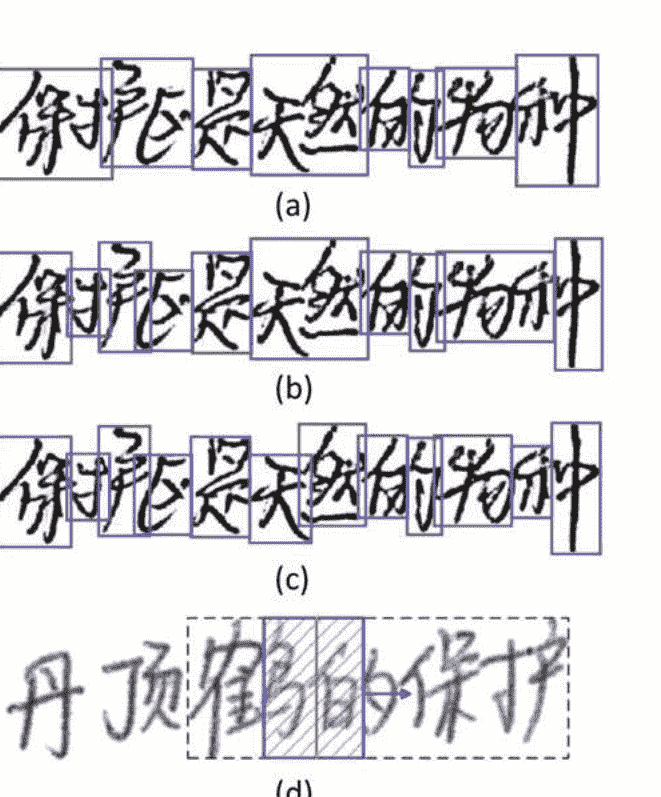基于神经网络的过分分割的先前工作已经在场景文本识别中证明了有效性(He等, 2015)。我们在两个方面进一步改进了这个算法。首先，在滑动窗口检测之前，基于可见性的前景分析对于过分分割(Xu等, 2011)是滑动窗口方法的补充，并且可以加快后续操作的速度。其次，我们使用CNN作为分类器，而不是传统的神经网络，以提高分割点的检测率。步骤2在下面进行详细说明。

在CC的图像上，一个固定宽度的窗口从左到右滑动，步幅为CC高度的0.1倍，如图3.6d所示。窗口图像通过CNN进行分类，判断中心列是否为分割点。窗口的高度与CC相同，宽度为CC高度的0.8倍。

我们实验证实，分割和识别性能对步幅系数在0.04到0.1范围内和窗口宽度在0.6到1倍CC高度范围内不敏感。

当训练用于分割点分类的CNN时，复杂的结构容易过拟合。因此，我们构建了一个简单的4层网络进行二分类(详细信息可参考Wu等, 2017)。该网络还使用了上述提到的扩展directMaps作为输入。CNN使用带有标记为分割点(正样本)或非分割点(负样本)的窗口图像样本进行训练。在CC图像上，经过滑动窗口分类进行分割点检测后，我们合并相邻的候选分割点，即水平距离小于阈值的点，并保留具有最小垂直投影的点。阈值根据文本行图像中的轮廓长度和前景像素数估计得出，经验设置为笔画宽度。图3.6显示了一些过分分割的示例，我们可以看到，Xu等(2011)的方法在召回率上略优于Liu等(2002)的方法，而我们提出的方法在分离接触字符方面优于Liu等(2002)和Xu等(2011)的方法。

#### 3.3.3.3 几何上下文模型

几何上下文模型已成功应用于字符识别(Wang等, 2012; Zhou等, 2007)和转录映射(Yin等, 2013)中，在排除非字符和进一步提高系统性能方面起着重要作用。在本研究中，我们采用了Yin等(2013)提出的几何上下文模型框架，其中几何上下文被分为四个统计模型(一元和二元类相关，一元和二元类无关)，分别缩写为ucg，bcg，uig，big。

类相关的几何模型可以看作是字符分类器的补充，因为候选模式保留了其原始轮廓，而没有为字符分类设计的归一化，这可能会排除一些与书写风格相关的有用上下文信息。根据Yin等(2013)的方法，我们将字符几何类别的数量减少到六个超类。uig模型用于衡量候选模式是否为有效字符。

big模型用于测量过分割间隙是否为有效的字符间隙。它们都是两类(二分类)模型。为了对四个几何模型进行建模，我们首先使用几何特征进行提取，然后使用二次判别函数(ucg, bcg)或支持向量机(uig, big)进行分类，最后通过置信度转换将输出分数转换为概率。在这项工作中，我们利用CNN在统一框架中进行特征提取和分类，然后直接使用特定单元的输出作为最终得分。我们不仅仅将字符模式调整为输入，还通过多项式拟合获取文本行的中心曲线，因为保持文本行的书写风格对于几何上下文模型是必要的。多项式的次数设置为连接组件数量的0.075倍。然后，根据中心曲线和字符高度调整每个连接组件的顶部和底部边界。在这种情况下，我们使用与Zhang等(2017)中相同的CNN架构，只是输出层使用不同的单元。为了保持书写风格，我们只使用原始的连接组件图像作为输入，而不使用直接映射。

### 3.3.4 实验

我们在两个数据库上评估了我们的HCTR系统的性能：一个大型的离线中文手写数据库CASIA-HWDB(Liu等, 2011)，以及来自ICDAR 2013中文手写识别竞赛的一个小型数据集(Yin等, 2013)，简称ICDAR-2013。

#### 3.3.4.1 设置

关于数据库和基线实验设置的详细信息可以在Wu等(2017)中找到。我们根据(Su等, 2009)的两个字符级指标报告识别性能：正确率(CR)和准确率(AR)：

```
CR = (N_t - D_e - S_e) / N_t,
AR = (N_t - D_e - S_e - I_e) / N_t,   (3.15)
```

其中N_t是测试文档的转录中的字符总数。通过动态规划将识别结果字符串与转录对齐，计算替换错误数(S_e)，删除错误数(D_e)和插入错误数(I_e)。除了AR和CR之外，我们还测量了语言模型在开发集上的PPL。由于我们的实验涉及许多上下文模型，我们在表3.3中列出了这些模型。

通用语言模型是在包含约5000万个字符的文本语料库上训练的，与Wang等(2012)中的语料库相同。

表3.3 HCTR中使用的上下文模型列表
| 缩写 | 参考模型 |
| :--- | :--- |
| cls | 字符分类器(MQDF) |
| g | 所有几何模型的并集 |
| cbi | 字符二元语言模型 |
| cti | 字符三元语言模型 |
| cfour | 字符四元语言模型 |
| cfive | 字符五元语言模型 |
| RNNLM | 字符循环神经网络语言模型 |
| iwc | 插值词和类别二元模型 |

表3.4 ICDAR-2013数据集上的识别结果
| 语言模型类型 | 组合 | AR (%) | CR (%) | 时间(小时) | PPL |
| :--- | :--- | :--- | :--- | :--- | :--- |
| BLM | cls+iwc+g+cca Wang等(2012) | 89.28 | 90.22 | -- | -- |
| BLM | cls+cfive+g | 89.03 | 89.91 | 2.44 | 73.09 |
| RNNLM | cls+rnn+g | 89.69 | 90.41 | 5.86 | 56.50 |
| HRMELM | cls+rnn+g | **89.86** | **90.58** | 5.84 | 52.92 |

与Wang等(2014)的结果进行比较，我们还在相同的大型语料库上训练了语言模型，该语料库包含上述通用语料库和搜狗实验室的语料库，约包含16亿个字符。此外，我们还从人民日报语料库(Yu等, 2003)和ToRCH2009语料库(http://www.bfsu-corpus.org/channels/corpus)中收集了一个包含380万个字符的开发集，用于验证训练好的语言模型。

#### 3.3.4.2 语言模型的影响

我们首先比较了使用在通用语料库上训练的语言模型和传统的过分割方法在系统中的识别性能。详细比较了不同类型的基准系统、FNNLM和RNNLM，请参考Wu等(2017)的研究。由于ICDAR 2013年中文手写识别竞赛的测试集现在被广泛用于基准测试，我们在该数据集上报告了结果。我们使用了三种类型的语言模型进行识别结果展示: 5-gram BLM、RNNLM和HRMELM，其中HRMELM表示基于RNNLM的HLM与5-gram BLM的插值。识别结果如表3.4所示，该表还给出了插值词类(iwc)二元组合候选字符增强(CCA)(Wang等, 2012)的结果。由于CCA的影响，iwc二元组合甚至优于基于字符的5-gram BLM。从比较中我们可以发现，RNNLM优于5-gram BLM，而HRMELM获得了最佳性能。与Wang等(2012)方法中的最新结果相比，仅仅依靠字符级语言模型，错误率降低了5.41%。

#### 3.3.4.3 CNN形状模型的影响

我们用CNN形状模型替换了传统的字符分类器、过分割和几何上下文模型，并将这三个基于CNN的模型集成到识别系统中，以验证性能的改进。基于前面的LM比较，我们只使用了一个最好的NNLM，即HRMELM。在CASIA-HWDB数据库和ICDAR-2013数据集上的识别结果列在表3.5中。

从表3.5可以看出，本工作中传统模型和基于CNN的模型之间的比较显示出CNN的优势。结合CNN形状模型，HRMELM在这两个数据集上都取得了最佳性能。作为参考，ICDAR-2013竞赛论文(Yin等, 2013)报告了使用Wang等(2012)的方法获得的89.28%的AR和90.22%的CR的最佳结果。Messina和Louradour(2015)的工作实现了LSTM-RNN框架(最初由Graves等, 2009引入)用于HCTR，并在ICDAR-2013数据集上报告了有希望的识别性能：89.40% AR。这比使用HRMELM和传统模型或CNN形状模型的方法的性能差。最近的一项工作Wang等(2016)采用了与我们类似的框架，在CASIA-HWDB测试集上实现了95.21% AR和96.28% CR，在ICDAR-2013数据集上实现了94.02% AR和95.53% CR。值得一提的是，Messina和Louradour(2015)以及Wang等(2016)在ICDAR-2013数据集上进行测试时都删除了一些特殊标记。

#### 3.3.4.4 大语料库上的LM结果

为了更好地建模语言环境，我们扩展了我们的实验，使用了一个包含16亿个字符的大型语料库，该语料库在语言模型适应的先前工作中使用过(Wang等, 2014)。在大型语料库上，我们使用Katz平滑训练了一个5-gram BLM。由于在大型语料库上训练NNLMs太耗时，我们只是简单地使用了在包含5000万个字符的通用语料库上训练的NNLMs，并将它们与在大型语料库上训练的BLMs相结合。特别地，我们使用在通用语料库上训练的RNNLM模型，并将其与在大型语料库上训练的5-gram BLM相结合，得到了混合模型HRMELM。两个数据集上的识别结果如表3.6所示。

从表3.6中的CASIA-HWDB结果可以看出，当在大型语料库上训练时，5-gram BLM明显优于3-gram cti，因为大型语料库缓解了数据稀疏性问题。尽管大型语料库改善了5-gram BLM的性能，但RNNLM在HRMELM中仍然显著地提高了性能：与5-gram BLM相比，它使错误率降低了9.23%。此外，CNN形状模型再次在大型语料库的背景下提高了系统性能，因为它们不仅提供了更多包含正确候选字符模式的潜力，而且提供更强大的分类能力。与之前的最先进基准(Wang等, 2014)相比，使用HRMELM和CNN形状模型的方法在绝对值上将AR提高了4.15%。

值得注意的是，在表3.6中，当使用大型语料库训练LM时，HRMELM在ICDAR-2013数据集上并没有明显的优势。我们发现ICDAR-2013数据集的转录大部分包含在搜狗实验室的语料库中，因此，BLM可以很好地适应测试数据并获得高的识别准确率。为了进一步研究这个问题，我们从大型语料库中删除了出现在ICDAR-2013语料库中的句子。然而，由于该语料库的主题非常典型和集中，在ICDAR-2013数据集上，我们可以使用在处理过的语料库上训练的5-gram回退LM实现96.16%的AR和96.29%的CR。这提醒研究人员注意语言模型对测试文本图像的转录的过拟合问题。另一方面，神经网络LM对未见过的文本具有很好的泛化能力。

#### 3.3.4.5 性能分析

我们在图3.7中展示了一些文本行识别的示例，揭示了导致识别错误的几个因素。我们考虑了两种典型的设置：5-gram BLM与传统模型相结合，最佳语言模型HRMELM与CNN形状模型相结合。这四个示例展示了语言模型和上下文评估模型的影响。图3.7a中的识别错误也在Wang等(2014)中显示过，并且没有被语言模型纠正。

然而，它被捕捉到长期上下文的HRMELM纠正了。在(b)中，错误被基于CNN的字符分类器和几何模型纠正，具有更好的上下文建模。在(c)中，错误被基于CNN的过分分割纠正，而传统的过分分割方法无法分开接触的字符。在(d)中，由于候选分割-识别路径评估的不准确性，错误是不可减少的。

## 3.4 结论

本章介绍了将传统方法与现代深度学习方法相结合的HCCR和HCTR。具体而言，我们将深度卷积神经网络与形状归一化和方向分解(directMap)的领域特定知识相结合，用于在线和离线HCCR。尽管基于深度学习的方法可以达到非常高的准确性，但我们表明深度网络的作者自适应仍然可以持续且显著地提高性能。

此外，在HCTR中，我们对传统的过分割和路径搜索框架进行了两个修改，将多个上下文整合到其中。第一个修改是使用神经网络语言模型来建模长距离语言上下文，而另一个修改是使用卷积神经网络形状模型来建模字符分类器、过分割和几何上下文。通过这种新方法，我们可以在HCTR中取得最先进的结果。将作者自适应从HCCR扩展到HCTR将进一步提升性能，因为文本通常包含比字符更多的风格上下文。此外，为了进一步提高HCTR的性能，希望将所提出的方法与其他端到端的基于序列到序列的深度学习模型相结合。

致谢：本工作得到了中国国家自然科学基金会的支持，项目编号为61411136002、61403380、61633021和61573355。

## 参考文献

白志，霍琦(2005)关于在线手写汉字识别中八方向特征的研究。在：国际会议文档分析与识别(ICDAR)论文集，第262-266页。

Bengio Y, Courville A, Vincent P(2013)表示学习：综述与新视角。IEEE Trans Pattern Anal Mach Intell 35(8)：1798-1828

Bengio Y, Ducharme R, Vincent P, Jauvin C(2003)神经概率语言模型。J Mach Learn Res 3(2)：1137-1155

Bengio Y, Senecal J-S(2008)自适应重要性采样加速神经概率语言模型的训练。IEEE Trans Neural Netw 19(4)：713-722

Chen L, Wang S, Fan W, Sun J, Naoi S(2015)超越人类识别：基于CNN的手写字符识别框架。In: 亚洲模式识别会议论文集(ACPR)

Chen SF, Goodman J(1996)平滑技术在语言建模中的实证研究。In: 第34届计算语言学年会论文集，第310-318页。

Ciresan D, Schmidhuber J(2013)离线手写汉字分类的多列深度神经网络。arXiv:1309.0261

Connell SD, Jain AK(2002)在线手写识别的作者适应。IEEE Trans Pattern Anal Mach Intell 24(3):329–346

Dai R-W, Liu C-L, Xiao B-H(2007)汉字识别：历史、现状和前景。Front Comput Sci China 1(2):126–136

Ding K, Deng G, Jin L(2009)对草书在线手写中文字符识别的虚拟笔画技术的研究。在：国际文件分析与识别会议(ICDAR)论文集，第531-535页。

Fujisawa H(2008)字符和文档识别研究四十年——一个工业视角。Pattern Recognit 41(8):2435–2446

Fürnkranz J(1998)使用n-gram特征进行文本分类的研究。奥地利人工智能研究所3:1–10

Goodman J(2001)用于快速最大熵训练的类别。在：ICASSP会议论文集，第561-564页。

Graham B(2013)用于在线字符识别的稀疏数组签名。arXiv:1308.0371

Graham B(2014)空间稀疏卷积神经网络。arXiv:1409.6070

Graves A, Liwicki M, Fernández S, Bertolami R, Bunke H, Schmidhuber J(2009)一种新颖的无约束手写识别连接主义系统。IEEE Trans Pattern Anal Mach Intell 31(5):855–868

He X, Wu Y-C, Chen K, Yin F, Liu C-L(2015)基于神经网络的场景超分割用于文本识别。在：ACPR会议论文集，第715-719页

Hinton G, Salakhutdinov R(2006)用神经网络降低数据的维度。科学313(5786):504–507

Joshua T, Goodman J(2001)语言建模的一点进展扩展版。在：微软研究院机器学习和应用统计小组，第1-72页

Katz S(1987)从稀疏数据中估计语言模型组件的概率。IEEE Trans Acoust Speech Signal Process 35(3):400–401

Kimura F, Takashina K, Tsurowka S, Miyake Y(1987)修改的二次判别函数及其在汉字识别中的应用。IEEE Trans Pattern Anal Mach Intell(1):149–153

Kombrink S, Mikolov T, Karafit M, Burget L(2011)基于循环神经网络的会议识别中的语言建模。在：INTERSPEECH，第2877-2880页

Krizhevsky A, Sutskever I, Hinton G(2012)使用深度卷积神经网络的ImageNet分类。在：Advances in Neural Information Processing Systems (NIPS)会议论文集，第1097-1105页

LeCun Y, Bengio Y, Hinton G(2015)深度学习。Nature 521(7553):436–444

Lee H, Verma B(2012)用于英文草书手写识别的二值分割算法。Pattern Recognit 45(4):1306–1317

Liu C-L(2007)用于手写字符识别的归一化协作梯度特征提取。IEEE Trans Pattern Anal Mach Intell 29(8):1465–1469

Liu C-L, Jaeger S, Nakagawa M(2004)在线识别中文字符：最先进技术。IEEE Trans Pattern Anal Mach Intell 26(2):198–213

Liu C-L, Koga M, Fujisawa H(2002)基于词典的手写字符串分割和识别用于日本地址阅读。IEEE Trans Pattern Anal Mach Intell 24(11):1425–1437

- Liu C-L, Marukawa K (2005) 伪二维形状归一化方法用于手写中文字符识别。 Pattern Recognition 38(12):2242–2255
- Liu C-L, Nakashima K, Sako H, Fujisawa H (2003) 手写数字识别：最先进技术的基准测试。 Pattern Recognition 36(10):2271–2285
- Liu C-L, Sako H, Fujisawa H (2004) 分类器结构和训练方法对手写数字串的集成分割和识别的影响。 IEEE Trans Pattern Anal Mach Intell 26(11):1395–1407
- 刘春雷, 尹飞, 王东辉, 王庆峰 (2010年) 中国手写识别大赛2010年。 在: 中国模式识别大会 (CCPR) 论文集中
- 刘春雷, 尹飞, 王东辉, 王庆峰 (2011年) CASIA在线和离线中文手写数据库。 在: 国际文件分析与识别会议 (ICDAR) 论文集中, 第37-41页
- 刘春雷, 尹飞, 王东辉, 王庆峰 (2013年) 在线和离线手写中文字符识别: 基准测试新数据库。 模式识别46 (1) : 155-162
- 刘春雷, 尹飞, 王庆峰, 王东辉 (2011年) ICDAR 2011中国手写识别竞赛。 在: 国际文件分析与识别会议 (ICDAR) 论文集中, 第1464-1469页
- Liu C-L, Zhou X-D (2006) 使用基于轨迹的归一化和方向特征提取的在线日语字符识别。 在: 国际手写识别前沿研讨会(IWFHR)论文集, 第217-222页
- Maas A, Hannun A, Ng A (2013) 整流非线性改善神经网络声学模型。 在: 国际机器学习大会(ICML)论文集
- Messina R, Louradour J (2015) 使用LSTM-RNN的无分割手写中文文本识别。 在: 第13届国际文档分析与识别大会论文集, 第171-175页
- Mikolov T, Deoras A, Kombrink S, Burget L, Černocký J (2011) 经验评估和组合先进的语言建模技术。 在: INTERSPEECH论文集, 第605-608页
- Mikolov T, Deoras A, Povey D, Burget L, Černocký J (2011) 大规模神经网络语言模型训练策略。 在: ASRU论文集, 第196-201页
- Mikolov T, Karafiát M, Burget L, Černocký J, Khudanpur S (2010) 循环神经网络基于语言模型。 在: INTERSPEECH会议论文集, 第1045-1048页
- Mikolov T, Kombrink S, Burget L, Černocký J, Khudanpur S (2011) 循环神经网络语言模型的扩展。 在: ICASSP会议论文集, 第5528-5531页
- Morin F, Bengio Y (2005) 分层概率神经网络语言模型。 在: AISTATS会议论文集, 第5卷, 第246-252页
- Rumelhart D, Hinton G, Williams R (1986) 通过反向传播错误学习表示。 Nature 323(9):533–536
- Sarkar P, Nagy G (2005) 风格一致的同源模式分类。 IEEE Trans Pattern Anal Mach Intell 27(1):88–98
- Schwenk H (2007) 连续空间语言模型。 Comput Speech Lang 21(3):492–518
- Schwenk H (2012) 连续空间翻译模型用于基于短语的统计机器翻译。 在: COLING会议论文集, 第1071–1080页
- Schwenk H, Rousseau A, Attik M (2012) 大规模、修剪或连续空间语言模型在GPU上用于统计机器翻译。 在: NAACL-HLT 2012研讨会论文集, 第11–19页
- Simonyan K, Zisserman A (2015) 用于大规模图像识别的非常深的卷积网络。 在: 国际学习表示会议论文集 (ICLR)
- Srivastava N, Hinton G, Krizhevsky A, Sutskever I, Salakhutdinov R (2014) Dropout: 一种简单的防止神经网络过拟合的方法。 J Mach Learn Res 15(1):1929–1958
- Su T-H, Zhang T-W, Guan D-J, Huang H-J (2009) 离线识别真实的中文手写采用无分割策略。 Pattern Recognit 42(1):167–182
- Szegedy C, Liu W, Jia Y, Sermanet P, Reed S, Anguelov D, Erhan D, Vanhoucke V, Rabinovich A (2015) 用卷积深入研究。 在: 计算机视觉和模式识别 (CVPR) 的论文集
- Wang Q-F, Yin F, Liu C-L (2012) 通过整合多个上下文进行手写中文文本识别。 IEEE Trans Pattern Anal Mach Intell 34(8):1469–1481
- Wang Q-F, Yin F, Liu C-L (2014) 无监督语言模型适应手写中文文本识别。 Pattern Recognit 47(3):1202–1216
- Wang S, Chen L, Xu L, Fan W, Sun J, Naoi S (2016) 深度知识训练和异构卷积神经网络用于手写中文文本识别。 在：第15届ICFHR，第84–89页
- Wu C, Fan W, He Y, Sun J, Naoi S (2014) 通过交替训练的松弛卷积神经网络进行手写字符识别。 在：国际会议前沿手写识别（ICFHR），第291–296页
- 吴宇辰, 尹飞, 刘春雷 (2015年) 评估神经网络语言模型在手写中文文本识别中的应用。 在：第13届国际文件分析与识别会议论文集，第166-170页
- 吴宇辰, 尹飞, 刘春雷 (2017年) 利用神经网络语言模型和卷积神经网络形状模型改进手写中文文本识别。 模式识别65: 251-264
- 徐磊, 尹飞, 王庆峰, 刘春雷 (2011年) 基于可见性的前景分析在中文手写字符分离中的应用。 在：第11届国际文件分析与识别会议论文集，第859-863页
- 杨伟, 金磊, 陶迪, 谢忠, 冯忠 (2015年) DropSample：一种增强深度卷积神经网络用于大规模非约束手写中文字符识别的新训练方法。 arXiv:1505.05354
- Yin F, Wang Q-F, Liu C-L (2013) 通过整合字符识别模型和几何上下文进行手写中文文档的转录映射。 Pattern Recognit 46 (10): 2807–2818
- Yin F, Wang Q-F, Zhang X-Y, Liu C-L (2013) ICDAR 2013年中国手写识别竞赛。 在：国际文件分析和识别（ICDAR）会议论文集，第1095–1101页
- Yu S, Duan H, Zhu B, Cao B-B (2003) 北京大学语料库处理规范：词分割，词性标注和音标符号。 J Chinese Lang Comput 13 (2): 1–20
- Zamora-Martínez F, Frinken V, España-Boquera S, Castro-Bleda MJ, Fischer A, Bunke H (2014) 离线手写识别的神经网络语言模型。 Pattern Recognit 47(4):1642–1652
- Zhang X-Y, Bengio Y, Liu C-L (2017) 在线和离线手写中文字符识别：一项全面研究和新的基准。 Pattern Recognit 61:348–360
- Zhang X-Y, Liu C-L (2013) 带有风格转换映射的作者适应。 IEEE Trans Pattern Anal Mach Intell 35(7):1773–1787
- Zhang X-Y, Yin F, Zhang Y-M, Liu C-L, Bengio Y (2018) 使用循环神经网络绘制和识别中文字符。 IEEE Trans Pattern Anal Mach Intell (PAMI) 40(4):849–862
- Zhong Z, Jin L, Xie Z (2015) 使用GoogLeNet和方向特征图的高性能离线手写中文字符识别。 在：国际文件分析和识别会议论文集（ICDAR）
- Zhou X-D, Yu J-L, Liu C-L, Nagasaki T, Marukawa K (2007) 在线手写日语字符串识别，包括几何上下文。 在：第9届国际文件分析和识别会议论文集，第48-52页

## 第4章 深度学习及其在自然语言处理中的应用


Haiqin Yang, Linkai Luo, Lap Pong Chueng, David Ling和Francis Chin

摘要 自然语言处理（NLP）利用计算机程序处理大量的语言数据，是人工智能和计算机科学的重要研究领域。 深度学习技术在这个领域已经得到了很好的发展和应用。 然而，文献中仍然缺乏一个简洁的调查，使读者能够快速了解深度学习技术如何应用于NLP以及有哪些有前景的应用。在这项调查中，我们试图调查围绕自然语言理解的最新发展，以回答这两个问题。 首先，我们探讨了新开发的词嵌入或词表示方法。 然后，我们描述了两个强大的学习模型，循环神经网络和卷积神经网络。接下来，我们概述了五个关键的NLP应用，包括（1）词性标注和命名实体识别，两个基本的NLP应用；（2）机器翻译和自动英语语法错误纠正，两个具有显著商业价值的应用；以及（3）图像描述，一个需要计算机视觉和NLP技术的应用。此外，我们还提供了一系列基准数据集，这些数据集对于研究人员评估相关应用中模型的性能非常有用。

- 关键词 深度学习 · 自然语言处理 · Word2Vec · 循环神经网络 · 卷积神经网络

## 4.1 引言

深度学习已经使神经网络和人工智能技术复苏，能够有效地从原始数据中学习数据表示（LeCun等，2015；Goodfellow等，2016）。在语音识别（Graves等，2013）和计算机视觉（Krizhevsky等，2017）方面已经报道了出色的性能。现在，很多工作已经转向自然语言处理领域。

自然语言处理（NLP）利用计算机程序处理大量的语言数据，是人工智能和计算机科学的一个关键研究领域。NLP的挑战包括语音识别、自然语言理解和自然语言生成。尽管在这个领域已经投入了很多努力，但文献仍然缺乏一个简明的调查，使读者能够快速了解深度学习技术如何应用于NLP以及有哪些有趣的应用。

在这项调查中，我们试图调查NLP的最新发展，以回答上述两个问题。我们主要关注解决自然语言理解挑战的主题。我们将把介绍分为以下三个方面：

- 总结神经语言模型以学习词向量表示，包括**Word2vec**和**Glove**（Mikolov等人，2013a，b；Pennington等人，2014），
- 介绍递归神经网络（RNNs）（Elman 1990；Chung等人，2014；Hochreiter和Schmidhuber，1997）和卷积神经网络（CNNs）（Kim，2014；dos Santos和Gatti，2014；Gehring等人，2017）的强大工具，用于语言模型捕捉语言中的依赖关系。更具体地说，我们将介绍两种流行的RNN扩展，即长短期记忆（LSTM）（Hochreiter和Schmidhuber，1997）网络和门控循环单元（GRU）（Chung等人，2014）网络，并简要讨论CNN在NLP中的效率。
- 概述和勾勒出五个关键的NLP应用的发展，包括词性标注（Collobert等，2011年；Toutanova等，2003年），命名实体识别（NER）（Collobert等，2011年；Florian等，2003年），机器翻译（Bahdanau等，2014年；Sutskever等，2014年），自动英语语法错误纠正（Bhirud等，2017年；Hoang等，2016年；Manchanda等，2016年；Ng等，2014年），以及图像描述（Bernardi等，2016年；Hodosh等，2013年；Karpathy和Fei-Fei，2017年）。

最后，我们提供了一系列在上述模型和应用中广泛应用的基准数据集，并以一些讨论总结整篇文章。我们希望这篇关于NLP最近进展的简要回顾能够帮助新进入这个领域的研究人员快速入门。

## 4.2 学习词表示

自然语言处理的一个关键问题是有效地表示原始文本数据的特征。传统上，利用数值统计量（如词频或词频逆文档频率）来确定一个词的重要性。然而，在自然语言处理中，目标是从给定的语料库中提取语义含义。接下来，我们将介绍最先进的词嵌入方法，包括word2vec（Mikolov等人，2013a）和Glove（Pennington等人，2014）。

词嵌入（或词表示）可以说是自然语言处理近年来最广为人知的技术。形式上，词嵌入或词表示是词汇表中每个词的实数向量表示。有多种方法可以学习词嵌入，这些方法将相似的词尽可能地靠近语义空间中。其中，word2vec和Glove在近4年来引起了极大的关注。

这两种方法都基于分布假设（Harris 1954），即出现在相似上下文中的单词往往具有相似的含义，并且通过其周围的单词可以了解一个单词的概念（Firth 1957）。

Word2vec（Mikolov等人2013a）并不是一个新概念；然而，直到Mikolov等人（2013a，b）在2013年发表了两篇重要论文后，它才变得流行起来。Word2vec模型是由浅层（仅两层）前馈神经网络构建的，用于重构单词的语言上下文。这些网络接受大量文本语料库的输入，然后生成一个向量空间，据显示该空间具有语义含义。在Mikolov等人（2013a）中，引入了两种word2vec模型，即连续词袋模型（CBOW）和skip-gram模型。在CBOW模型中，通过考虑预测周围上下文中的单词的虚假学习任务，使用监督深度学习方法构建了单词嵌入，通常限制在一个小的单词窗口内。

在skip-gram中，模型利用当前单词来预测其周围的上下文单词。这两种方法都将固定大小的内部层的向量值作为嵌入。需要注意的是，在这两种设置中，上下文单词的顺序不会影响预测结果。根据Mikolov等人（2013a）的研究，CBOW比skip-gram训练速度更快，但skip-gram在检测罕见单词方面表现更好。

word2vec的一个主要问题是由于大量语料库而导致的高计算成本。在Mikolov等人（2013b）的研究中，提出了分层softmax和负采样来解决计算问题。此外，为了提高计算效率，采用了几种技巧：包括（1）排除最常见的单词，如“a”、“the”等，因为它们提供的信息价值较少；（2）学习常见短语并将其视为单词，例如，“New York”被替换为“New_York”。

有关算法和技巧的更多细节可以在Rong（2014）中找到。

C语言中有一个word2vec的实现可以在Google Code Archive中找到，其Python版本可以在gensim中下载。

Glove (Pennington等人, 2014) 基于相关单词经常出现在同一文档中的假设，它查看两个单词的共现概率的比率而不是它们的共现概率。也就是说，Glove算法涉及以单词共现矩阵 X的形式收集单词共现统计信息，其中元素 X_{ij}表示单词 i在单词 j的上下文中出现的频率。然后它定义了一个加权成本函数，以产生词汇表中所有单词的最终词向量。该模型和预训练的词向量的相应源代码可以在这里找到。

词嵌入在自然语言处理任务的变体中被广泛采用。 在Kim (2014)中, 预训练的word2vec直接用于句子级别的分类。在Hu等人的研究中(2017, 2018), 预训练的word2vec被用于预测在线健康专家问答服务的质量。 需要注意的是, 词向量维度的确定大多数情况下取决于具体任务。 例如, 对于更多的句法任务, 如命名实体识别(Melamud等人, 2016)或词性标注(Plank等人, 2016), 较小的维度效果更好, 而对于更多的语义任务, 如情感分析(Ruder等人, 2016), 较大的维度更有效。

## 4.3 学习模型

自然语言处理模型长期以来的挑战之一是捕捉句子的依赖关系，特别是长距离的依赖关系。 一个自然的想法是应用强大的序列数据学习模型，即循环神经网络(RNNs) (Elman 1990), 在语言模型中。 因此, 在接下来的内容中, 我们将介绍RNNs, 尤其是著名的长短期记忆网络(LSTM) (Hochreiter和Schmidhuber 1997)以及最近提出的门控循环单元(GRU) (Chung等人, 2014)。 此外，我们将简要介绍在自然语言处理中可以高效训练的卷积神经网络(CNNs)。

### 4.3.1 循环神经网络（RNN）

RNN是语言模型的强大工具，因为它们能够捕捉序列数据中的长距离依赖关系。 建模长距离依赖关系的想法非常直观，即简单地使用前一个隐藏状态作为当前隐藏状态的输入。

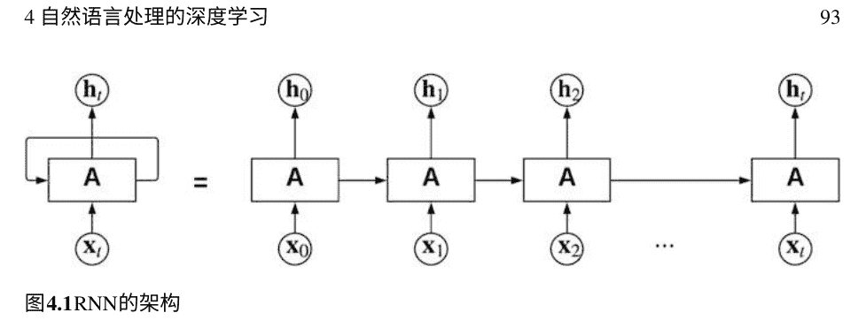

在计算当前隐藏状态时，将上一个隐藏状态\(\mathbf{h}_{t-1}\)作为输入。请参见图4.1的示意图，其中递归节点可以展开成一系列节点。

数学上，RNN可以通过以下方程定义：

\[
\mathbf{h}_t =
\begin{cases}
\tanh (\mathbf{W}_{xh} \mathbf{x}_t + \mathbf{W}_{hh} \mathbf{h}_{t-1} + \mathbf{b}_h) & t \geq 1, \\
\mathbf{0} & \text{否则}.
\end{cases}
\quad \text{(4.1)}
\]

其中 \(\mathbf{x}_t\) 是第 \(t\) 个序列输入，\(\mathbf{W}\) 是权重矩阵，\(\mathbf{b}\) 是偏置向量。在第 \(t\) 个（\(\geq 1\)）时间戳，RNN和标准神经网络之间唯一的区别在于从时间步 \(t-1\) 的隐藏状态到时间步 \(t\) 的隐藏状态之间的额外连接 \(\mathbf{W}_{hh}\mathbf{h}_{t-1}\)。

尽管RNN简单易用，但它们会遇到梯度消失问题，导致权重几乎不变，因此无法进行训练，或者遇到梯度爆炸问题，导致权重变化过大，从而训练不稳定。这些问题通常出现在更新网络权重的反向传播算法中（Pascanu等，2013年）。在Pascanu等人（2013年）中，提出了梯度范数剪裁策略来处理梯度爆炸问题，并提出了软约束来解决梯度消失问题。该方法不利用全部信息。

循环神经网络（RNN）在序列处理中非常有效，尤其是对于短期依赖，即相邻上下文。然而，如果序列很长，长期信息会丢失。一种成功且流行的模型是修改RNN架构，即产生长短期记忆（LSTM）（Hochreiter和Schmidhuber 1997）网络。LSTM的创新之处在于引入了记忆单元\(c\)和控制信号流动的门控制器。请参见图4.2a中的示意架构和以下相应的公式：

\[
\begin{aligned}
\mathbf{f}_t &= \sigma (\mathbf{W}_{xf} \mathbf{x}_t + \mathbf{W}_{hf} \mathbf{h}_{t-1} + \mathbf{b}_f) \quad &\text{(4.2)} \\
\mathbf{i}_t &= \sigma (\mathbf{W}_{xi} \mathbf{x}_t + \mathbf{W}_{hi} \mathbf{h}_{t-1} + \mathbf{b}_i) \quad &\text{(4.3)} \\
\mathbf{o}_t &= \sigma (\mathbf{W}_{xo} \mathbf{x}_t + \mathbf{W}_{ho} \mathbf{h}_{t-1} + \mathbf{b}_o) \quad &\text{(4.4)} \\
\tilde{\mathbf{c}}_t &= \tanh (\mathbf{W}_{xc} \mathbf{x}_t + \mathbf{W}_{hc} \mathbf{h}_{t-1} + \mathbf{b}_c) \quad &\text{(4.5)} \\
\mathbf{c}_t &= \mathbf{f}_t \odot \mathbf{c}_{t-1} + \mathbf{i}_t \odot \tilde{\mathbf{c}}_t \quad &\text{(4.6)} \\
\mathbf{h}_t &= \mathbf{o}_t \odot \tanh(\mathbf{c}_t). \quad &\text{(4.7)}
\end{aligned}
\]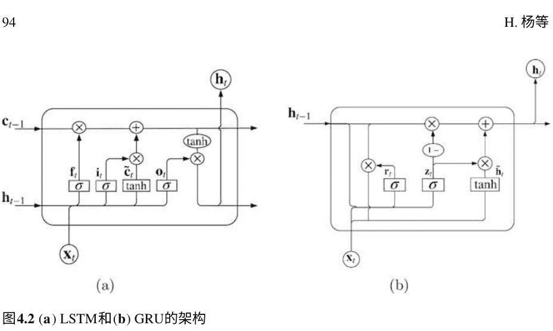

## 图4.2 (a) LSTM和(b) GRU的架构

方程(4.2)，(4.3)和(4.4)分别对应遗忘门、输入门和输出门。σ是逻辑函数，输出值在范围[0, 1]，W和b分别是权重矩阵和偏置向量，⊙是逐元素乘法运算符。方程4.2，4.3和4.4分别对应遗忘门、输入门和输出门。这些门的功能，如其名称所示，要么允许所有信号信息通过（门输出为1），要么阻止其通过（门输出为0）。除了上述描述的标准LSTM模型外，还提出了一些LSTM变体并被证明有效。其中，门控循环单元（GRU）（Chung等人，2014年）网络是最受欢迎的之一。GRU比标准LSTM更简单，因为它将输入门和遗忘门合并为一个单独的更新门。请参见图4.2b中的示意架构和以下相应的公式：

```
r_t = σ (W_{xr} x_t + W_{hr} h_{t-1} + b_r)  (4.8)
z_t = σ (W_{xz} x_t + W_{hz} h_{t-1} + b_z)  (4.9)
ĥ_t = tanh (W_{xh} x_t + W_{hh}(r_t ⊙ h_{t-1}) + b_h)  (4.10)
h_t = (1 - z_t) ⊙ h_{t-1} + z_t ⊙ ĥ_t.  (4.11)
```

与LSTM相比，GRU的参数稍微少一些，并且没有单独的“cell”来存储中间信息。由于其简单性，GRU在许多序列学习任务中被广泛使用以节省内存或计算时间。除了GRU之外，还有一些变种与LSTM具有类似但稍有不同的架构。更多细节可以在Gers和Schmidhuber（2000）、Koutnık等人（2014）、Graves等人（2017）和Jozefowicz等人（2015）的论文中找到。

### 4.3.2 卷积神经网络（CNNs）

虽然RNN对于许多NLP任务来说是理想的选择，但它们有固有的限制。大多数RNN依赖于双向编码器来构建过去和未来上下文的表示（Bahdanau等人，2014年；Zhou等人，2016年）。它们只能一次处理一个单词。在训练和输入序列上的分层表示中，利用GPU计算的并行化架构不太自然（Gehring等人，2017年）。为了解决这些挑战，研究人员提出了用于神经机器翻译的卷积架构（Gehring等人，2017年）。该工作借鉴了CNN的思想，它利用具有卷积滤波器的层来提取局部特征，并已成功应用于图像处理（LeCun等人，1998年）。在卷积架构中，输入元素 x = (x1, x2, ..., xm)被嵌入到一个分布空间中作为w = (w1, w2, ..., wm))，其中 wj ∈ ℝf。最终的输入元素表示由e = (w1 + p1, w2 + p2, ..., wm + pm)计算得到，其中 p = (p1, p2, ..., pm)是输入元素绝对位置的嵌入表示，其中pj ∈ ℝf。输入元素应用卷积块结构输出解码器网络 g = (g1, g2, ..., gn)。据报道，该提出的架构在WMT'16英罗马尼亚翻译中的BLEU上优于之前的最佳结果1.9（Zhou等人，2016年）。

卷积神经网络不仅可以通过利用GPU并行计算同时计算所有单词，这显示出比循环神经网络更快的训练速度，而且它们还表现出比LSTM模型更好的性能（Zhou等，2016年）。其他自然语言处理任务，如句子级情感分析（Kim，2014年；dos Santos和Gatti，2014年）、字符级机器翻译（Costa-Juss和Fonollosa，2016年）和简单问题回答（Yin等，2016年），也证明了卷积神经网络的有效性。

## 4.4 应用

在接下来的内容中，我们介绍了五个关键的自然语言处理应用的发展：词性标注和命名实体识别是两个基本的自然语言处理应用，它们可以丰富其他自然语言处理应用的分析（Collobert等，2011年；Florian等，2003年；Toutanova等，2003年）；机器翻译和自动英语语法错误纠正是两个具有直接商业价值的应用（Bahdanau等，2014年；Bhirud等，2017年；Hoang等，2016年；Manchanda等，2016年；Ng等，2014年；Sutskever等，2014年）；以及图像描述，一个需要计算机视觉和自然语言处理技术的有吸引力和重要的应用（Bernardi等，2016年；Hodosh等，2013年；Karpathy和Fei-Fei，2017年）。

### 4.4.1 词性标注 (POS)

词性标注（POS）（Collobert等, 2011年）旨在为每个单词标记（关联）一个唯一的标签，指示其句法角色，例如复数名词，副词等。POS标签通常用作各种自然语言处理任务的常见输入特征，例如信息检索，机器翻译（Ueffing和Ney, 2003年），语法检查（Ng等, 2014年）等。

如今，最常用的POS类别是Penn Treebank项目中定义的⁴⁸个不同标签（Marcus等, 1993年）。它们通常用于各种自然语言处理库，例如Python中的NLTK⁴，Stanford标注器⁵和Apache OpenNLP⁶。

标注的现有算法通常可以分为两组，基于规则的组和随机的组。基于规则的方法，例如Eric Brill标注器（Brill, 1992年）和LanguageTool中的消歧规则⁷，通常是手工制作的，从语料库中派生的，或者是协作开发的（例如用于LanguageTool）。基于规则的方法可以达到相当低的错误率（Brill, 1992年），但通常与随机标注器相比仍然不够复杂。相反，随机标注器，例如隐马尔可夫模型（HMM）（Brants, 2000年）和最大熵马尔可夫模型（MEMM）（McCallum等, 2000年），将POS标签序列建模为隐藏状态，可以从观察到的句子的单词序列中学习。

```
单词和标签的共现概率由HMM (Brants 2000) 建模，给定单词的标签的条件概率由MEMM (McCallum等人2000) 建模以输出相应的标签。
```

后来，提出了更先进的方法来改进HMM和MEMM。这些方法包括利用双向循环依赖网络标注器（Manning 2011）和使用其他语言特征（Jurafsky和Martin 2017）。HMM (Brants 2000) 和MEMM (Manning 2011) 都报告了超过96%的准确率。更多最先进的性能可以在互联网上找到。⁸

### 4.4.2 命名实体识别 (NER)

命名实体识别（NER）是一项经典的自然语言处理任务，旨在定位和分类人名、组织、地点、数字等命名实体。

```
⁴http://www.nltk.org/
⁵https://nlp.stanford.edu/software/tagger.shtml
⁶https://opennlp.apache.org/
⁷http://wiki.languagetool.org/developing-a-disambiguator
⁸https://aclweb.org/aclwiki/POS_Tagging_(State_of_the_art)
```

从文本语料库中提取日期等信息。 大多数现有的NER标注器都是基于线性统计模型构建的，例如隐马尔可夫模型（McCallum等，2000年）和条件随机场（Lafferty等，2001年）。传统的NER技术严重依赖于手工设计的特征用于标注器，并且仅适用于小型语料库（Chieu和Ng，2002年）。

如今，由于深度学习技术的发展，提出了各种神经网络模型，如LSTM和CNN，用于建立标注器模型（Huang等，2015年；Lample等，2016年）。与传统分类的标准神经网络不同，基于神经网络的命名实体模型利用线性链CRF来建模NER中单词序列之间的依赖关系。在Huang等（2015年）和Lample等（2016年）中，序列标注模型由一个双向LSTM网络和一个CRF层（BI-LSTM-CRF）组成。在Ma和Hovy（2016年）中，通过在BI-LSTM底部添加基于字符的CNN来修改BI-LSTM-CRF。CNN用于将单词的字符编码为其字符级表示。

加入字符级信息，与词级表示一起被输入到双向LSTM中。这种被称为双向LSTM-CNNs-CRF架构被报道为比BI-LSTM-CRF更好。类似的出版物已经生成，用于实现LSTM网络和CRF层用于NER任务（Chiu和Nichols 2016; Yang等2016; Wang等2015）.

### 4.4.3 神经机器翻译

机器翻译（MT）的目标是将文本或语音从一种语言翻译成另一种语言。传统的MT利用统计模型，其参数是从双语文本语料库中推断出来的。最近，机器翻译中的一个重大发展是采用序列到序列学习模型，推动了被称为神经机器翻译（NMT）的最新技术（Wu等2016; Gehring等2017; Vaswani等2017）.由于深度学习技术的快速发展，NMT已经被证明取得了巨大的成功，其架构由编码器-解码器模型（Sutskever等2014）和注意机制（Bahdanau等2014）组成。

编码器模型RNN_{enc}通过输入源句子的一个词序列 x = (x_1, …, x_m)并产生一个隐藏状态序列 h = (h_1, …, h_m)来提供源句子的表示。根据Sutskever等人（2014）的说法，双向RNN_{enc}通常被用来减少长句子之间的依赖关系，最终状态h是由前向和后向RNN产生的状态连接而成的， h = \[\vec{h}; \overleftarrow{h}\]。解码器也是一个循环神经网络，RNN_{dec}，它根据隐藏状态 h 、前面的单词 y_{<k} = (y_1, …, y_{k-1})、解码器RNN中的循环隐藏状态 s_k和上下文向量 c_k来预测一个句子的目标词 y_k的概率。上下文向量 c_k也被称为注意力向量，它是源隐藏状态的加权向量。

h: Σ_{j=1}^m α_{ij} h_j，其中 m是源句子的长度， α_{ij}是注意力权重。注意力权重可以通过将双向编码器（Bahdanau等人，2014）的连接或者在目标隐藏状态上使用基于位置的函数的简化版本（Luong等人，2015b）来计算。最后，解码器通过softmax近似输出一个固定大小的词汇分布：

P (y_k|y_{<k}, x) = softmax (g(y_{k-1}, c_k, s_k)) (4.12)

其中 g是一个非线性函数。编码器-解码器和注意力驱动模型通过优化目标词的负对数似然函数（SGD）进行端到端训练。

调整NMT模型的超参数对翻译性能至关重要。在Britz等人（2017）的研究中，得出了更高维度的嵌入（如2,048）通常能够获得最佳性能。然而，对于某些任务来说，128等较小的维度也能表现出色并且更快地收敛。编码器和解码器的深度不一定要超过四层，尽管在Wu等人（2016）的研究中使用了八层。

双向编码器总是优于单向编码器，因为它们能够考虑过去和未来序列单词的表示。Wu等人（2016）的比较也表明LSTM单元始终优于GRU单元。此外，大多数NMT任务中常用的束搜索（Wiseman和Rush 2016）可输出更精确的目标词。通常，经过良好调整的束搜索大小在5到10之间。训练中的算法优化器也会影响性能。Adam优化器（Kingma和Ba 2014）使用固定学习率（小于0.01）且无衰减似乎是有效的，并且显示出快速收敛。

然而，在某些任务中，标准的SGD调度通常会导致更好的性能，尽管收敛相对较慢（Ruder 2016）。还有其他与模型性能直接相关的超参数，例如dropout（Srivastava等人2014），层归一化（Ba等人2016），层之间的残差连接（He等人2016）等。

接下来，我们总结了在推进NMT方面的一些问题。第一个问题是限制词汇量的大小。尽管NMT是一个开放词汇的问题，但NMT的目标词数必须有限，因为训练NMT模型的复杂性随着目标词数的增加而增加。在实践中，目标词汇量大小K通常在30k（Bahdanau等人，2014）到80k（Sutskever等人，2014）的范围内。词汇表之外的任何单词都表示为未知单词，用unk表示。传统的NMT模型在目标句子中有较少未知单词时效果很好，但观察到如果有太多未知单词，翻译的性能会显著下降（Jean等人，2015）。解决这个问题的直观方法是使用更大的词汇表，同时使用采样逼近来降低计算复杂性（Jean等人，2015；Mi等人，2016；Ji等人，2015）。其他研究者报告称，可以通过不扩展词汇表的方式来解决未知词问题。例如，可以用特殊标记unk替换未知词，然后对目标句子进行后处理。

通过从源句子复制未知词 (Luong 等人, 2015c) 或应用单词翻译来处理未知词 (Luong 等人, 2015c)。其他研究人员提出了使用基于字符的 NMT 来消除未知词 (Costa-Juss 和 Fonollosa, 2016; Chung 等人, 2016)，而不是实现基于单词的神经机器翻译，或者使用混合方法-结合了单词级和字符级 NMT 模型 (Luong 和 Manning, 2016)。子词单元的实现也在减少词汇量方面显示出显著的效果 (Sennrich 等人, 2016b)。这个算法被称为字节对编码 (BPE)，它从字符词汇开始，用一个新的 n-gram 替换最常见的 n-gram 对。⁹总之，单词级、BPE 级和字符级词汇形成了神经机器翻译实践的基本处理。

第二个问题是关于训练语料库的。众所周知，NMT 成功的一个主要因素是高质量平行语料库的可用性。如何将更多其他数据源纳入 NMT 训练已成为关键问题，并近期引起了极大关注。受统计机器翻译的启发，研究人员通过利用丰富的单语语料库来提高神经机器翻译的翻译质量 (Gucehre 等, 2015 年; Sennrich 等, 2016a 年)。

最近的两篇论文提出了一种无监督的机器翻译方法来利用单语数据 (Artetxe 等, 2017 年; Lample 等, 2017 年)。这两种方法都可以在没有任何平行语料库的情况下训练出具有相当高准确性的神经机器翻译模型，并为 NMT 的未来方向奠定了基础。在 Luong 等 (2015a 年)、Johnson 等 (2017 年) 和 Firat 等 (2017 年) 中，作者使用单个 NMT 模型在多种语言之间进行翻译，从而可以在所有语言之间共享编码器、解码器和注意力模块。

第三个问题是神经机器翻译的实现。要部署神经机器翻译系统，需要构建编码器-解码器模型 (带有注意机制)，并在 GPU 上训练端到端模型。现在，有很多公开可用于研究、开发和部署的工具包：

-   dl4mt-tutorial (基于 Theano) : https://github.com/nyu-dl/dl4mt-tutorial
-   Seq2seq (基于 Tensorflow) : https://github.com/google/seq2seq
-   OpenNMT (基于 Torch/PyTorch) : http://opennmt.net
-   xnmt (基于 DyNet) : https://github.com/neulab/xnmt
-   Sockeye (基于 MXNet) : https://github.com/awslabs/sockeye
-   Marian (基于 C++) : https://github.com/marian-nmt/marian
-   nmt-keras (基于 Keras) : https://github.com/lvapeab/nmt-keras

### 4.4.4 自动英语语法错误修正

由于英语不是世界上许多人的母语，为了方便写作，语法检查器已经开发出来。一些商业或免费软件，如Microsoft Word，Grammarly，LanguageTool，Apache Wave和Ginger，可以提供语法检查服务。然而，由于自然语言中的各种例外和规则，这些语法检查器仍然远远不及人类英语教师。

为了推动语法错误检查和修正的发展，各种共享任务和专题会议被启动，以吸引研究人员的兴趣和贡献。这些任务包括2011年的Helping Our Own (HOO)共享任务 (Dale和Kilgarriff 2011)，2013年的CoNLL共享任务 (Ng等人2013)和2014年的CoNLL共享任务 (Ng等人2014)，以及2016年的AESW共享任务 (Daudaravicius等人2016)。每个共享任务都提供了原始文本语料库和由人工编辑修正的对应文本。CoNLL共享任务2013年和2014年的数据集是新加坡国立大学的1414篇标记学生论文的集合，其中所有学生都是非英语母语人士。检测到的语法错误被分类为28种类型。

同时，HOO和AESW共享任务的数据集是从已发表的论文和会议记录中提取的。HOO任务是从19篇已发表论文中收集的一组分数文本，而AESW任务是从9919篇已发表论文（主要来自物理学和数学领域）生成的一组打乱的句子。

最近，已经提出了各种方法来纠正语法错误（Manchanda等，2016年; Rozovskaya和Roth，2016年; Bhirud等，2017年; Ng等，2014年），可以分为三种主要类型：

-   1. 基于规则的方法
-   2. 统计方法
-   3. 机器翻译方法

基于规则的方法利用规则来检测错误。这些规则通常是手工制作的规则，根据不同情况手动输入。其中大多数使用模式匹配、依存句法树以及词性标注来找到语法错误，例如主谓一致。基于规则的方法可以在LanguageTool (Daniel, 2003年)和CoNLL共享任务中的几个系统中找到。生成手工制作的规则通常需要太多时间。因此，研究人员转向统计方法，可以从大型语料库（如英文维基百科转储、Google图书N-gram、Web1T语料库、剑桥学习者语料库和英文Giga Word语料库）中学习规则。一些典型的方法包括（1）从Web1T语料库中提取低频率和特定模式的三元组（Wu等，2013年），（2）利用

围绕目标文章的三个标记和平均感知器来建议正确的文章（Rozovskaya和Roth 2010），以及通过比较Google Book n-gram语料库中不存在的二元组来检测语法错误（Nazar和Renau 2012）。统计方法在语法检查中通常更受青睐，因为它们只需要来自英语母语用户的大型语料库。相比之下，机器翻译方法需要一个大型平行语料库来提取相应的规则。

由于深度学习技术的发展，机器翻译方法在纠正语法错误方面变得普遍。这些方法利用第4.4.3节中提到的方法来输入有问题的句子并输出正确的句子。例如，AMU团队（Ng等人2014）在CoNLL 2014任务中利用基于短语的机器翻译进行检测，而CNN与LSTM用于解决纠正问题（Schmaltz等人2016）。在Schmaltz等人（2016）中，输入和输出句子通过一些附加标记进行编码，以适应NMT的要求。例如，输入句子“The models works <eos>”对应于输出句子“The models <del>works</del> <ins>work</ins> <eos>”，其中 <del>， <ins>，和 <eos>是表示删除操作，插入操作和句子结束的标记。关于机器翻译方法的更近期提议和一些公平比较可以参考Junczys-Dowmunt和Grundkiewicz（2016），Hoang等人（2016）和Rozovskaya和Roth（2016）。

### 4.4.5 图像描述

图像描述（Karpathy和Fei-Fei 2017; Vinyals等2017; Xu等2015）是一个具有挑战性和活跃的研究课题，需要来自计算机视觉和自然语言处理的技术。其目标是自动地生成图像对应区域的自然语言描述。研究人员提出了不同的模型来学习语言和视觉数据之间的对应关系。例如，在Karpathy和Fei-Fei（2017）中，提出了一种多模态RNN架构，用于将由CNN训练的模态与由双向RNN训练的模态对齐在图像区域上。在Vinyals等（2017）中，应用CNN来学习图像的表示而利用LSTM来输出句子。建立了一个直接模型来最大化给定图像的句子的可能性。在Xu等（2015）中，类似于Vinyals等（2017），应用CNN来生成图像的表示而利用LSTM来生成标题。关键的改进是包括基于注意力机制来进一步提高模型性能。随着新方法的提出，图像字幕的性能得到了提高。

更多细节可以参考Bernardi等人的研究(2016年)。

## 4.5 自然语言处理的数据集

许多数据集已经在不同的研究领域中发布，用于自然语言处理。我们试图提供在前面章节中提到的基本数据集。

### 4.5.1 词嵌入

- **word2vec**：该链接不仅提供了在Google News数据集（约1000亿个单词）上训练的300维度的300万个单词和短语的预训练向量，还提供了各种在线可用的数据集，例如来自维基百科的前十亿个字符，最新的维基百科转储，WMT11网站等等。

- **Glove**：这些词向量是由Glove (Pennington等人, 2014年)训练的。该数据集包含了从维基百科、Twitter和一些常见的爬取数据等来源训练的预训练向量。

### 4.5.2 N-Gram

- **Google图书N-gram**：该数据集包含了不同语言（如英语、中文、法语、希伯来语、意大利语等）印刷书籍中的1-5元组计数。针对英语还有专门的语料库，如美式英语、英式英语、英语小说和英语百万词库。这些n-gram带有词性标注，并按年份计数。

- **Web 1T 5-gram**：该数据集由Google贡献，包含从可访问的网站中计数的1-5元组，总共约有1万亿个标记。压缩后的文件大小（gzip压缩）约为24 GB。

### 4.5.3 文本分类

- 路透社语料库（RCV1、RCV2、TRC2）$^{18}$：该数据集包含大量路透社新闻故事，使用五种语言编写，并在六个类别中提供相应的翻译。详细描述可参见Lewis et al. (2004)

- IMDB电影评论情感分类$^{19}$：该数据集首先在Maas等人（2011）中进行了二元情感分类测试，包含了50000部电影的评论。

- 新闻组电影评论情感分类$^{20}$：这些数据集是在Pang等人（2002）和Pang和Lee（2004, 2005）中引入的，用于情感分析。它们包含了标记有整体情感极性（积极或消极）或主观评级（例如，“两个半星级”）的电影评论文档，以及标记有主观性状态（主观或客观）或极性的句子。

### 4.5.4 词性标注（POS）

- Penn Treebank$^{21}$：该数据集从一份为期三年的《华尔街日报》（WSJ）收集的98732篇故事中选取了2499篇进行句法注释（Marcus等人，1999年）。

- 通用依赖$^{22}$：通用依赖是一个旨在为多种语言开发跨语言一致的树库注释的项目。最新版本包含60种语言的102个树库（Nivre等人，2017年）。

### 4.5.5 机器翻译

- 欧洲议会$^{23}$：欧洲议会平行语料库包含21种欧洲语言的句子对。详细描述可参考Koehn（2005年）。

- 联合国平行语料库^{24}：该语料库是根据联合国的官方记录和其他议会文件生成的。这些文件大多数是用联合国的六种官方语言编写的（Ziemski等人，2016年）。

### 4.5.6 自动语法错误修正

- NUS学习者英语语料库（NUCLE）^{25}：该语料库包含新加坡国立大学学生写的约1,400篇论文。这些论文完全标注了英语教师的错误标签和修正。

- AESW 2016数据集^{26}：该数据集是从9,919篇已发表的期刊文章（主要来自物理学和数学领域）中提取的随机排序的句子集合。这些句子标注了期刊编辑所做的修改。

### 4.5.7 图像描述

- Flickr8K^{27}：该数据集是基于句子的图像描述的标准基准，包含了从Flickr.com网站爬取的约8,000张图像，每张图像配有五个不同的标题，以提供对显著实体和事件的清晰描述（Hodosh等人，2013年）。

- Flickr30K^{28}：该数据集是Flickr8K的扩展版本，包含约30,000张图像，每张图像包含五个描述（Plummer等人，2017年）。

- MSCOCO^{29}：该数据集包含123,287张图像，每张图像有五个不同的描述（Lin等人，2014年）。数据集中的图像标注了80个类别，并提供了一个类别中所有实例的边界框。

## 4.6 结论和讨论

在本调查中，我们对自然语言处理的最新发展进行了简明回顾，包括词表示、学习模型和关键应用。
现在，Word2vect和Glove是学习语义空间中词表示的两种主要成功方法。RNN和CNN是训练自然语言处理模型的两种主流方法。在探索了五个关键应用之后，我们展望以下有趣的研究课题。首先，将额外的特征或结果（例如词性标注和命名实体识别）纳入其他应用中，如机器翻译和自动语法纠正，可以提高性能。其次，值得研究端到端模型，这可能进一步提高模型性能。例如，现在嵌入式词表示是独立于应用程序学习的。可以探索适用于后续应用的新表示方法，例如情感分析、文本匹配。第三，有望探索多学科方法的进展。例如，在图像描述应用中，需要计算机视觉和自然语言处理的技术。了解这两个领域并取得突破是非常重要的。

致谢本文所述工作部分得到了中国香港特别行政区研究资助委员会的支持（项目编号UGC/IDS14/16）。

## 参考文献

- Artetxe M, Labaka G, Agirre E, Cho K (2017) 无监督神经机器翻译。CoRR，abs/1710.11041
- Ba JL, Kiros R, Hinton EG (2016) 层归一化。CoRR，abs/1607.06450
- Bahdanau D, Cho K, Bengio Y (2014) 通过联合学习对齐和翻译的神经机器翻译。CoRR，abs/1409.0473
- Bernardi R, akici R, Elliott D, Erdem A, Erdem E, Ikizler-Cinbis N, Keller F, Muscat A, PlankB (2016) 图像自动生成描述：模型、数据集和评估指标综述。J Artif Intell Res 55:409–442
- Bhirud SN, Bhavsar R, Pawar B (2017) 自然语言的语法检查器：一项综述。Int J自然语言计算6（4）：1
- Brants T (2000) Tnt：一种统计词性标注器。在：ANLC'00，斯特劳斯堡。计算语言学协会，第224-231页
- Brill E (1992) 一个简单的基于规则的词性标注器。在：ANLC，斯特劳斯堡，第152-155页
- Britz D, Goldie A, Luong M, Le VQ (2017) 神经机器翻译的大规模探索架构。CoRR，abs/1703.03906
- Chieu LH, Ng TH (2002) 命名实体识别：使用全局信息的最大熵方法。在：COLING，台北
- Chiu JPC, Nichols E (2016) 使用双向LSTM-CNN的命名实体识别。TACL 4：357-370
- Chung J, Gulcehre C, Cho K, Bengio Y (2014) 基于序列建模的门控循环神经网络的实证评估。CoRR，abs/1412.3555
- Chung J, Cho K, Bengio Y (2016) 一种无需显式分割的字符级解码器用于神经机器翻译。在：ACL，柏林
- Collobert R, Weston J, Bottou L, Karlen M, Kavukcuoglu K, Kuksa PP (2011) (几乎)从零开始的自然语言处理。J Mach Learn Res 12:2493–2537
- Costa-Juss MR, Fonollosa JAR (2016) 基于字符的神经机器翻译。在：ACL，柏林
- Dale R, Kilgarriff A (2011) 帮助我们自己：HOO 2011年试点共享任务。在：ENLG，南希，pp 242–249
- Daniel N (2003) 基于规则的风格和语法检查器。硕士论文，比勒费尔德大学，比勒费尔德
- Daudaravicius V, Banchs ER, Volodina E, Napoles C (2016) 关于科学写作自动评估的报告。在：第11届创新NLP应用研讨会，BEA@NAACL-HLT 2016，圣地亚哥，2016年6月16日，pp53–62
- dos Santos CN, Gatti M (2014) 用于短文本情感分析的深度卷积神经网络。在：COLING，都柏林，pp 69–78
- Elman LJ (1990) 在时间中寻找结构。认知科学14(2)：179–211
- Firat O, Cho K, Sankaran B, Yarman-Vural FT, Bengio Y (2017) 多路多语言神经机器翻译。Comput Speech Lang 45：236–252
- Firth RJ (1957) 语言学理论概述1930-1955年。语言分析研究。牛津黑威尔出版社，第1-32页
- Florian R, Ittycheriah A, Jing H, Zhang T (2003) 通过分类器组合进行命名实体识别。在：第七届自然语言学习会议论文集，CoNLL 2003，与HLT-NAACL 2003合作举办，埃德蒙顿，2003年5月31日-6月1日，第168-171页
- Gehring J, Auli M, Grangier D, Dauphin Y (2017) 用于神经机器翻译的卷积编码器模型。在：ACL，温哥华，第123-135页
- Gehring J, Auli M, Grangier D, Yarats D, Dauphin NY (2017) 卷积序列到序列学习。在：ICML，悉尼，第1243-1252页
- Gers AF, Schmidhuber J (2000) 时间和计数的循环网络。在：IJCNN (3)，Como，pp 189–194
- Goodfellow JI, Bengio Y, Courville CA (2016) 深度学习。自适应计算和机器学习。麻省理工学院出版社，剑桥
- Graves A, Mohamed A, Hinton EG (2013) 深度递归神经网络的语音识别。在：IEEE ICASSP，不列颠哥伦比亚，pp 6645–6649
- Greff K, Srivastava KR, Koutn k J, Steunebrink RB, Schmidhuber J (2017) LSTM：一个搜索空间奥德赛。IEEE Trans Neural Netw Learn Syst 28 (10)：2222–2232
- Gucehre C, Firat O, Xu K, Cho K, Barrault L, Lin H, Bougares F, Schwenk H, Bengio Y (2015) 在神经机器翻译中使用单语料库。CoRR，abs/1503.03535
- Harris Z (1954) 分布结构。Word 10 (23)：146–162
- He K, Zhang X, Ren S, Sun J (2016) 深度残差学习用于图像识别。在：CVPR，拉斯维加斯，第770-778页
- Hoang TD, Chollampatt S, Ng TH (2016) 利用n个最佳假设改进语法错误修正的SMT方法。在：IJCAI，第2803-2809页
- Hochreiter S, Schmidhuber J (1997) 长短期记忆。神经计算9(8)：1735-1780
- Hodosh M, Young P, Hockenmaier J (2013) 将图像描述框架化为排序任务：数据、模型和评估指标。人工智能研究杂志47：853-899
- Huang Z, Xu W, Yu K (2015) 双向LSTM-CRF模型用于序列标记。CoRR，abs/1508.01991
- 胡Z，张Z，杨H，陈Q，左D (2017) 一种用于预测在线健康专家问答服务质量的深度学习方法。J Biomed Inform 71:241–253
- 胡Z，张Z，杨H，陈Q，朱R，左D (2018 ) 在深度学习框架中使用时间特征预测在线健康专家问答服务质量。Neurocomputing 275:2769–2782
- Jean S, Cho K, Memisevic R, Bengio Y (2015) 关于在神经机器翻译中使用非常大的目标词汇表。在: ACL, 北京, 第1-10页
- Ji S, Vishwanathan SVN, Satish N, Anderson JM, Dubey P (2015) Blackout: 加速具有非常大词汇量的递归神经网络语言模型。CoRR, abs/1511.06909
- Johnson M, Schuster M, Le VQ, Krikun M, Wu Y, Chen Z, Thorat N, Vi gas FB, Wattenberg M, Corrado G, Hughes M, Dean J (2017) Google的多语言神经机器翻译系统：实现零翻译。TACL 5:339-351
- J zefowicz R, Zaremba W, Sutskever I (2015) 循环网络结构的实证探索。在: ICML, 里尔，第2342-2350页
- Junczys-Dowmunt M, Grundkiewicz R (2016) 基于短语的机器翻译是自动语法错误修正的最先进技术。在: EMNLP, 奥斯汀, 第1546-1556页
- Jurafsky D, Martin HJ (2017) 语音和语言处理 - 自然语言处理导论。计算语言学和语音识别。第3版。普林斯顿大学出版社，第1032页
- Karpathy A, Fei-Fei L (2017) 用于生成图像描述的深度视觉语义对齐。IEEE Trans Pattern Anal Mach Intell 39(4):664-676
- Kim Y (2014) 用于句子分类的卷积神经网络。在: EMNLP, 多哈, 第1746-1751页
- Kingma PD, Ba J (2014) Adam: 一种随机优化方法。CoRR, abs/1412.6980
- Koehn P (2005) Europarl: 用于统计机器翻译的平行语料库。在: MT峰会, 卷5, 页79-86
- Koutn kJ, Greff K, Gomez JF, Schmidhuber J (2014) 时钟RNN。在: ICML, 北京, 页1863-1871
- Krizhevsky A, Sutskever I, Hinton EG (2017) 使用深度卷积神经网络进行Imagenet分类。Commun ACM 60 (6) : 84-90
- Lafferty DJ, McCallum A, Pereira FCN (2001) 条件随机场：用于分割和标记序列数据的概率模型。在: ICML, 威廉姆斯学院, 页282-289
- Lample G, Ballesteros M, Subramanian S, Kawakami K, Dyer C (2016) 用于命名实体识别的神经架构。在: NAACL HLT, 圣地亚哥, 页260-270
- Lample G, Denoyer L, Ranzato M (2017) 仅使用单语语料库的无监督机器翻译。CoRR, abs/1711.00043
- LeCun Y, Bottou L, Bengio Y, Haffner P (1998) 基于梯度的学习应用于文档识别。Proc IEEE 86(11):2278-2324
- LeCun Y, Bengio Y, Hinton EG (2015) 深度学习。Nature 521(7553):436-444
- Lewis DD, Yang Y, Rose GT, Li F (2004) RCV1: 用于文本分类研究的新基准集合。J Mach Learn Res 5: 361-397
- Lin T, Maire M, Belongie JS, Hays J, Perona P, Ramanan D, Doll r P, Zitnick LC (2014) Microsoft COCO: 上下文中的常见对象。在: ECCV, 苏黎世, 页码740-755
- Luong M, Manning DC (2016) 通过混合词-字符模型实现开放词汇的神经机器翻译。在: ACL, 柏林
- Luong M, Le VQ, Sutskever I, Vinyals O, Kaiser L (2015a) 多任务序列到序列学习。CoRR, abs/1511.06114
- Luong T, Pham H, Manning DC (2015b) 有效的基于注意力的神经机器翻译方法。在: EMNLP, 里斯本, 第1412-1421页
- Luong T, Sutskever I, Le VQ, Vinyals O, Zaremba W (2015c) 解决神经机器翻译中的稀有词问题。在: ACL, 北京, 第11-19页
- Maas LA, Daly ER, Pham TP, Huang D, Ng YA, Potts C (2011) 学习情感分析的词向量。在：计算语言学协会第49届年会：人类语言技术，会议论文集，2011年6月19-24日，波特兰，第142-150页
- Manchanda B, Athavale AV, Kumar Sharma S (2016) 用于语法检查的各种技术。Int J Comput Appl Inf Technol 9(1):177
- Manning DC (2011) 从97%到100%的词性标注：是时候进行一些语言学研究了吗？在：CICLing, 东京,第171-189页
- Marcus PM, Santorini B, Marcinkiewicz AM (1993) 构建一个大型的英语标注语料库：宾夕法尼亚树库。Comput Linguist 19(2):313–330
- Marcus M, Santorini B, Marcinkiewicz M, Taylor A (1999) 树库-3 LDC99T42. 网络下载。语言数据联盟，费城。 https://catalog.ldc.upenn.edu/LDC99T42
- McCallum A, Freitag D, Pereira FCN (2000) 最大熵马尔可夫模型用于信息提取和分割。在：ICML’00. Morgan Kaufmann Publishers Inc.,旧金山, 第591-598页
- Melamud O, McClosky D, Patwardhan S, Bansal M (2016) 上下文类型和维度在学习词嵌入中的作用。在：NAACL HLT, 圣地亚哥, 第1030-1040页
- Mi H, Wang Z, Ittycheriah A (2016) 用于神经机器翻译的词汇操作。在：ACL, 柏林
- Mikolov T, Chen K, Corrado G, Dean J (2013) 在向量空间中高效估计词表示。CoRR, abs/1301.3781
- Mikolov T, Sutskever I, Chen K, Corrado SG, Dean J (2013) 词和短语的分布式表示及其组合性。在：NIPS, 塔霍湖, 第3111-3119页
- Nazar R, Renau I (2012) 谷歌图书n-gram语料库用作语法检查器。在：第二届计算语言学和写作研讨会（CLW 2012）：文档创建和文档工程的语言和认知方面，EACL 2012，斯特劳兹堡。计算语言学协会，第27-34页
- Ng TH, Wu MS, Wu Y, Hadiwinoto C, Tetreault RJ (2013) The conll-2013 shared task on grammatical error correction.在：计算的第十七届会议自然语言学习：共享任务，CoNLL 2013, 索菲亚, 2013年8月8日至9日, 第1-12页
- Ng TH, Wu MS, Briscoe T, Hadiwinoto C, Susanto HR, Bryant C (2014) The conll-2014 shared task on grammatical error correction.在：CoNLL, 巴尔的摩,第1-14页
- Nivre J等（2017）通用依赖2.1. LINDAT/CLARIN数字图书馆在形式和应用语言学研究所（ 'UFAL）, 数学和物理学院, 查尔斯大学
- Pang B, Lee L (2004) 情感教育：基于最小割的主观性总结的情感分析。在：计算语言学协会第42届年会, 巴塞罗那, 2004年7月21日至26日, 第271-278页
- 庞B, 李L (2005) 看星星：利用类关系进行情感分类与评级尺度相关。在：ACL 2005年, 第43届年会计算语言学协会, 会议论文集, 2005年6月25日至30日, 美国密歇根大学, 第115-124页
- 庞B, 李L, Vaithyanathan S (2002) 竖起大拇指？使用机器进行情感分类学习技术。CoRR, cs.CL/0205070
- Pascanu R, Mikolov T, Bengio Y (2013) 训练循环神经网络的困难。在：ICML, 亚特兰大,第1310-1318页
- Pennington J, Socher R, Manning DC (2014) 手套：全局词向量表示。在：EMNLP, 多哈, 第1532-1543页
- Plank B, Søgaard A, Goldberg Y (2016) 使用双向长短期记忆模型和辅助损失进行多语言词性标注。在：ACL, 柏林
- Plummer AB, Wang L, Cervantes MC, Caicedo CJ, Hockenmaier J, Lazebnik S (2017) Flickr30k 实体：收集图像到句子模型的区域到短语对应关系。Int J Comput Vis 123(1):74–93
- Rong X (2014) word2vec参数学习解释。CoRR, abs/1411.2738

## 4 自然语言处理的深度学习

Rozovskaya A, Roth D (2010) 用于纠正语法和用法错误的训练范式。 在：HLT’10，斯特劳兹堡。计算语言学协会，第154-162页

Rozovskaya A, Roth D (2016) 语法错误纠正：机器翻译和分类器。在：ACL，柏林

Ruder S (2016) 梯度下降优化算法概述。CoRR, abs/1609.04747

Ruder S, Ghaffari P, Breslin GJ (2016) 基于方面的情感分析的层次模型。在：EMNLP，奥斯汀，第999-1005页

Schmaltz A, Kim Y, Rush MA, Shieber MS (2016) 句子级语法错误识别作为序列到序列纠正。在：第11届创新使用NLP构建教育应用研讨会，BEA@NAACL-HLT 2016, 2016年6月16日，圣地亚哥，第242-251页

Sennrich R, Haddow B, Birch A (2016a) 利用单语数据改进神经机器翻译模型。在：ACL，柏林

Sennrich R, Haddow B, Birch A (2016b) 使用子词单元进行罕见词的神经机器翻译。在：ACL，柏林

Srivastava N, Hinton GE, Krizhevsky A, Sutskever I, Salakhutdinov R (2014) Dropout：一种简单的防止神经网络过拟合的方法。J Mach Learn Res 15(1):1929–1958

Sutskever I, Vinyals O, Le VQ (2014) 序列到序列的神经网络学习。在：NIPS，蒙特利尔，pp 3104–3112

Toutanova K, Klein D, Manning DC, Singer Y (2003) 使用循环依赖网络进行特征丰富的词性标注。在：HLT-NAACL，埃德蒙顿

Ueffing N, Ney H (2003) 使用词性信息进行统计机器翻译到形态丰富的语言。在：EACL’03，斯特劳斯堡。计算语言学协会，pp 347–354

Vaswani A, Shazeer N, Parmar N, Uszkoreit J, Jones L, Gomez AN, Kaiser L, Polosukhin I (2017) 注意力就是一切。在：NIPS，长滩，pp 6000-6010

Vinyals O, Toshev A, Bengio S, Erhan D (2017) 展示和讲述：从2015年MSCOCO图像字幕挑战中学到的教训。IEEE Trans Pattern Anal Mach Intell 39(4):652–663

Wang P, Qian Y, Soong FK, He L, Zhao H (2015) 一种统一的标记解决方案：双向LSTM循环神经网络与词嵌入。CoRR, abs/1511.00215

Wiseman S, Rush AM (2016) 序列到序列学习作为波束搜索优化。在：EMNLP，奥斯汀，pp 1296-1306

吴J，张J，张SJ（2013）基于n-gram和语法纠正串行语法错误。IJCLCLP 18(4)

吴Y，Schuster M，陈Z，Le VQ, Norouzi M, Macherey W, Krikun M，曹Y，高Q, Macherey K，Klinger J，沙阿A，约翰逊M，刘X，凯撒L，Gouws S，加藤Y，工藤T，河H，史蒂文斯K，库里安G，帕蒂尔N，王W，杨C，史密斯J，里萨J，鲁德尼克A，维尼亚尔斯O，科拉多G，休斯M，迪恩J（2016）谷歌的神经机器翻译系统：弥合人与机器翻译之间的差距。CoRR, abs/1609.08144

徐K，巴J，基罗斯R，Cho K, Courville AN, Salakhutdinov R, Zemel RS, Bengio Y（2015）展示，关注并告诉：神经图像字幕生成与视觉注意力。在：ICML，里尔，pp 2048-2057

Yang Z, Salakhutdinov R, Cohen WW (2016) 多任务跨语言序列标注从零开始。CoRR, abs/1603.06270

Yin W, Yu M, Xiang B, Zhou B, Schütze H (2016) 通过注意力卷积神经网络进行简单问题回答。在：COLING，大阪，第1746-1756页

Zhou J, Cao Y, Wang X, Li P, Xu W (2016) 具有快速前向连接的深度递归模型用于神经机器翻译。TACL 4:371–383

Ziemski M, Junczys-Dowmunt M, Pouliquen B (2016) 联合国平行语料库v1.0。在：第十届语言资源和评估国际会议LREC 2016，波托罗夫茨，2016年5月23日至28日

### 第5章 自然语言处理的深度学习

Jiajun Zhang和Chengqing Zong

摘要 自然语言处理是人工智能的一个领域，旨在设计计算机算法以理解和处理自然语言，就像人类一样。在互联网时代和大数据时代，它变得必不可少。从基础研究到复杂的应用，自然语言处理包括许多任务，如词法分析、句法和语义解析、语篇分析、文本分类、情感分析、摘要、机器翻译和问答。长时间以来，统计模型如朴素贝叶斯（McCallum和Nigam等人，朴素贝叶斯文本分类的事件模型比较。在：AAAI-98学习文本分类研讨会，麦迪逊，第752卷，第41-48页，1998年）、支持向量机（Cortes和Vapnik，机器学习20（3）：273-297，1995年）、最大熵（Berger等人，计算语言学22（1）：39-71，1996年）和条件随机场（Lafferty等人，条件随机场：用于分割和标记序列数据的概率模型。在：ICML会议论文集，2001年）是自然语言处理的主要方法（Manning和Schütze，统计自然语言处理基础。MIT出版社，剑桥/伦敦，1999年；宗，统计自然语言处理。清华大学出版社，北京，2008年）。近年来，深度学习在自然语言处理中取得了巨大的成功，从中文分词（裴等人，最大边缘张量神经网络中文分词。在: ACL会议论文集, 第293-303页, 2014年; 陈等, 用于中文分词的长短期记忆神经网络。在: EMNLP会议论文集, 第1197-1206页, 2015年; Cai等人, 用于中文的快速准确的神经词分割。在: ACL会议论文集, 第608-615页, 2017年), 命名实体识别 (Collobert等人, J Mach Learn Res 12:2493-2537, 2011年; Lample等人, 用于命名实体识别的神经架构。在: NAACL-HLT会议论文集, 2016年; Dong等人, 基于字符的LSTM-CRF与基于部首的特征用于中文命名实体识别。在: 东方语言计算机处理国际会议。Springer, 第239-250页, 2016年; Dong等人, 用于中文社交媒体中的命名实体识别的多通道LSTM-CRF。在: 基于自然标注大数据的中文计算语言学和自然语言处理。Springer, 第197-208页, 2017年), 序列标注 (Vaswani等人, 用LSTMs进行超级标记。在: NAACL-HLT会议论文集, 第232-237页, 2016年; Wu等人, 关于序列标注的跳跃连接的实证探索。在: COLING会议论文集, 2016a), 句法分析 (Socher等, 使用组合向量语法进行解析, 在: ACL会议论文集, pp 455-465, 2013; Chen和Manning, 使用神经网络的快速准确的依赖解析器, 在: 2014年自然语言处理 (EMNLP) 会议论文集, pp 740-750, 2014; Liu和Zhang, TACL 5:45-58, 2017), 文本摘要 (Rush等, 用于抽象句子摘要的神经注意模型, 在: EMNLP会议论文集, 2015; See等, 使用指针生成网络进行摘要, 在: ACL会议论文集, 2017), 机器翻译 (Bahdanau等, 通过联合学习对齐和翻译的神经机器翻译, 在: ICLR会议论文集, 2015; Sutskever等, 使用神经网络的序列到序列学习, 在: NIPS会议论文集, 2014; Vaswani等, 注意力就是你所需要的。arXiv预印本arXiv:1706.03762, 2017) 到问答 (Andreas等, 学习组合神经网络进行问答, 在: NAACL-HLT会议论文集, pp 232-237, 2016; Bordes等, 使用子图嵌入进行问答。arXiv预印本arXiv:1406.3676, 2014; 大规模简单问题回答与记忆网络。arXiv预印本arXiv:1506.02075, 2015; Yu等, 深度学习用于答案句子选择。arXiv预印本arXiv:1412.1632, 2014年)。本章以实体识别、超标记、机器翻译和文本摘要作为案例研究，介绍了深度学习在自然语言处理中的应用。

关键词命名实体识别 · 超标记 · 机器翻译 · 文本摘要 · 深度学习 · 自然语言处理

## 5.1 命名实体识别的深度学习

### 5.1.1 任务定义

一般来说，命名实体包括七种类型：人名、组织机构名、地点名、时间表达式、数量、货币值、百分比。自然语言处理领域的研究人员通常关注最重要的三个实体类别包括人物、组织和地点。命名实体识别（NER）旨在在文本中定位和分类此类命名实体。图5.1展示了一个命名实体识别的示例。给定一个英文句子，我们的目标是识别实体比尔·盖茨、斯坦福大学和硅谷，并正确地将它们分别分类为人物、组织和地点。大多数方法将NER任务视为序列标注问题，如图5.1底部所示。过去，隐马尔可夫模型（HMM）、最大熵（ME）、支持向量机（SVM）和条件随机场（CRF）是NER的主要解决方案。特征工程是这些模型中最重要的部分。这些特征用符号表示，例如表面字符、单词、二元组和词性标签。这种符号表示成为性能改进的瓶颈，因为符号容易导致数据稀疏问题，并且难以捕捉任意两个符号之间的语义关系。

然而，分布式表示可以在很大程度上解决上述两个问题。例如，从符号表示的角度来看，表格和桌子完全不同，因此无法揭示它们之间的语义相似性。相反，如果我们在低维实值向量空间中正确表示它们，我们会发现两个词table和desk彼此靠近。以图5.2为例，我们将分布式词表示投影到两个维度空间。我们可以发现，具有相似含义的单词彼此相近。由于这个优势，基于分布式表示的深度神经网络迅速成为命名实体识别任务中的新的最先进模型。

图5.2分布式词向量表示

### 5.1.2 使用深度学习进行命名实体识别

近年来，针对命名实体识别任务提出了许多神经架构。Collobert等人（2011）基于卷积神经网络（CNN）设计了一个命名实体识别模型。他们首先将句子中的每个单词从左到右投影到分布式表示（词嵌入）中，然后在词嵌入序列上应用CNN。神经网络的顶层后面是一个CRF模型。Chiu和Nichols（2016）提出了一个混合的双向长短期记忆（LSTM）和CNN模型，用于建模英语中的字符级和词级表示。他们还利用词典特征和字符类型等外部知识。Ma和Hovy（2016）提出了一个BLSTM-CNNs-CRF架构，其中CNNs用于建模字符级信息。Lample等人（2016）提出了一个LSTM-CRF架构，其中包含一个char-LSTM层，从有监督语料库中学习拼写特征，而不使用任何额外的资源或词表，仅使用大规模无标签语料库进行预训练词嵌入的无监督学习。Dong等人（2016）在Lample等人（2016）的基础上，针对汉字提出了一个基于部首级别的LSTM模型。由于BLSTM-CRF目前是命名实体识别的最先进模型，我们在下面详细介绍这个模型。

#### 5.1.2.1 BLSTM

循环神经网络（RNN）是一类用于建模序列数据的神经网络家族。RNN将输入序列（x1, x2, ..., xn）转换为另一个表示输入序列每个步骤的高层抽象信息的输出序列（h1, h2, ..., hn）。在RNN中，第t个输入的隐藏状态 h_t 根据当前输入 x_t 和上一个隐藏状态 h_{t-1} 进行计算：

h_t = f(x_t, h_{t-1}) \quad (5.1)

其中 f(·) 是一个非线性激活函数，通常设置为 f(·) = tanh(·)。理论上，RNN可以学习长期依赖关系，但在实践中，它们往往对序列中最近的输入有偏好（Bengio等人，1994年）。长短期记忆网络（LSTM）通过引入记忆单元来解决这个问题，并展现了捕捉长距离依赖关系的强大能力。

LSTM使函数 f(·) 更加复杂，并包括输入门、输出门、遗忘门和窥视孔连接来计算 f(·)。细胞状态的更新同时使用输入门和遗忘门的结果。实现如下：

```
\mathbf{i}_t = \sigma (\mathbf{W}_{xi} \mathbf{x}_t + \mathbf{W}_{hi} \mathbf{h}_{t-1} + \mathbf{W}_{ci} \mathbf{c}_{t-1} + \mathbf{b}_i) \quad \text{(输入门)}
\mathbf{f}_t = \sigma (\mathbf{W}_{xf} \mathbf{x}_t + \mathbf{W}_{hf} \mathbf{h}_{t-1} + \mathbf{W}_{cf} \mathbf{c}_{t-1} + \mathbf{b}_f) \quad \text{(遗忘门)}
\mathbf{c}_t = \mathbf{f}_t \odot \mathbf{c}_{t-1} + \mathbf{i}_t \odot tanh(\mathbf{W}_{xc} \mathbf{x}_t + \mathbf{W}_{hc} \mathbf{h}_{t-1} + \mathbf{b}_c) \quad \text{(细胞状态)}
\mathbf{o}_t = \sigma (\mathbf{W}_{xo} \mathbf{x}_t + \mathbf{W}_{ho} \mathbf{h}_{t-1} + \mathbf{W}_{co} \mathbf{c}_t + \mathbf{b}_o) \quad \text{(输出门)}
\mathbf{h}_t = \mathbf{o}_t \odot tanh(\mathbf{c}_t) \quad \text{(输出)}
```

其中 $\sigma$ 是逐元素的sigmoid函数，$\odot$ 是逐元素的乘积，$\mathbf{W}_s$ 是权重矩阵，$\mathbf{b}_s$ 是偏置。

我们使用双向LSTM来获取字符的上下文向量。对于给定的句子 ($\mathbf{ch}_1, \mathbf{ch}_2, \ldots, \mathbf{ch}_n$) 包含 $n$ 个字符，每个字符 $\mathbf{ch}_t$ 首先被映射为一个 $d$ 维实值向量 $\mathbf{x}_t \in \mathbb{R}^d$。然后，LSTM计算句子中每个字符的左上下文表示 $\overrightarrow{\mathbf{h}}_t$。类似地，从句子末尾开始的右上下文 $\overleftarrow{\mathbf{h}}_t$ 应该提供字符 $\mathbf{ch}_t$ 右侧的有用信息。从左到右的LSTM称为前向LSTM，从右到左的LSTM称为后向LSTM。字符 $\mathbf{ch}$ 的整体上下文向量可以通过连接左右上下文表示得到， $\mathbf{h}_t = [\overleftarrow{\mathbf{h}}_t; \overrightarrow{\mathbf{h}}_t]$ (图5.3)。

#### 5.1.2.2 BLSTM-CRF模型

隐藏的上下文向量 h_i 可以直接用作每个输出的独立标记决策的特征。但在NER中，输出标签之间存在强依赖关系。例如，M-PER不能跟随B-ORG，这限制了B-ORG之后可能的输出标签。因此，CRF被用来联合建模整个句子的输出。对于一个输入句子， $\mathbf{x} = (\mathbf{x}_1, \mathbf{x}_2, \ldots, \mathbf{x}_n)$，我们将 $\mathbf{P}$ 视为BLSTM网络输出的分数矩阵。$P$ 的大小为 $n \times k$，其中 $k$ 是不同标记的数量，$\mathbf{P}_{i,j}$ 是句子中第 $i$ 个字符的第 $j$ 个标记的分数。对于一系列的预测， $\mathbf{y} = (y_1, y_2, \ldots, y_n)$，我们将其定义为得分

\[ s(\mathbf{x}, \mathbf{y}) = \sum_{i=0}^{n} A_{y_i, y_{i+1}} + \sum_{i=1}^{n} P_{i, y_i} \quad (5.2) \]

其中 $\mathbf{A}$ 是一个转移分数矩阵，用于模拟从一个标签到另一个标签的转移可能性。我们将 $ start $ 和 $ end $ 标签添加到可能标签的集合中，它们分别表示句子的开始和结束符号的标签。因此， $\mathbf{A}$ 是一个大小为 $ k + 2 $ 的方阵。在对所有可能的标签序列应用softmax层之后，序列 $\mathbf{y}$ 的概率为：

\[ p(\mathbf{y}|\mathbf{x}) = \frac{e^{s(\mathbf{x},\mathbf{y})}}{\sum_{\tilde{\mathbf{y}} \in \mathbf{Y}_{\mathbf{x}}} e^{s(\mathbf{x},\tilde{\mathbf{y}})}} \quad (5.3) \]

在训练过程中，我们最大化正确标签序列的对数概率：

\[ \log(p(\mathbf{y}|\mathbf{x})) = s(\mathbf{x}, \mathbf{y}) - \log( \sum_{\tilde{\mathbf{y}} \in \mathbf{Y}_{\mathbf{x}}} e^{s(\mathbf{x},\tilde{\mathbf{y}})} ) \quad (5.4) \]

\[ = s(\mathbf{x}, \mathbf{y}) - \text{logadd}_{\tilde{\mathbf{y}} \in \mathbf{Y}_{\mathbf{x}}} s(\mathbf{x}, \tilde{\mathbf{y}}) \quad (5.5) \]

其中 $\mathbf{Y}_{\mathbf{x}}$ 代表所有可能的标签序列，包括不符合BMEO格式约束的序列。很明显，无效的输出标签序列将被阻止。在解码过程中，我们预测给定的最大分数的输出序列：

\[ \mathbf{y}^* = \arg \max_{\tilde{\mathbf{y}} \in \mathbf{Y}_{\mathbf{x}}} s(\mathbf{x}, \tilde{\mathbf{y}}) \quad (5.6) \]

NER模型通常考虑输出标签之间的二元约束，并在解码过程中使用动态规划。

## 5.2 用于超级标记的深度学习

如前一节所介绍的，NER被建模为一个顺序标记问题。在自然语言处理中，许多任务可以投射到比NER更复杂的顺序标记问题中。在本节中，我们介绍另一个需要深度信息进行标签预测的NLP任务，组合类别语法超级标记。

### 5.2.1 任务定义

组合范畴语法（CCG）提供了自然语言的句法和语义之间的连接。句法可以通过基于组合规则的词汇推导来指定，语义可以从一组谓词-论元关系中恢复。CCG为各种语义分析提供了优雅的解决方案，例如语义表示、语义解析和语义组合，所有这些都严重依赖于超标记和解析性能。所有这些都需要构建一个更准确的CCG超标记器。

组合范畴语法（CCG）超标记是自然语言处理中的一个顺序标记问题，该任务是为句子中的每个单词分配超标记。CCG中的超标记代表词汇类别，包括基本类别如N、NP、PP，以及基于一组规则的复杂类别的组合。有关CCG的详细解释，请参阅Steedman（2000）和Steedman和Baldridge（2011）。在这里，我们进行简要介绍。

CCG使用一组词汇类别来表示成分Steedman（2000）。特别地，一个固定的有限集合被用作构建其他类别的基础，如表5.1所述。

基本类别可以通过应用以下递归定义来生成一个无限集合Cof功能类别：

- N, NP, PP, S ∈ C
- X/Y, X\Y ∈ C 如果 X, Y ∈ C

表5.1 CCG中使用的基本类别的描述

| 类别 | 描述 |
|------|------|
| N    | 名词 |
| NP   | 名词短语 |
| PP   | 介词短语 |
| S    | 句子 |

| 输出/标签 | NP/N | N/N | N/N | N | (S\NP)/PP | PP/NP | N | . |
| 输入/标记 | 这 | 道 | 琼斯 | 工业 | 收盘 | 在 | 2569.26 | . |

图5.4 一个CCG超标记示例

每个功能类别都指定了一些参数。根据顺序，组合参数可以形成一个新的类别（Steedman和Baldridge 2011）。参数可以是基本的或者是功能性的，并且顺序由正斜杠 / 和反斜杠 \ 决定。一个类别 X/Y 是一个正向函子，它可以接受一个参数 Y 并产生 X，而反向函子 X\Y 通过将其参数 Y 添加到左边得到 X。

图5.4给出了CCG超标记的一个例子。给定包含八个标记的输入句子，每个标记都与一个表示该标记的句法功能的超标记相关联。从这个例子中，我们可以看出这个任务比命名实体识别更复杂，需要更复杂的模型来准确预测超标记。

对于命名实体识别任务，一层双向LSTM（BLSTM）就足以获得高性能。然而，对于CCG超标记任务，深层网络是必要的。在本节中，我们介绍了我们对这个任务的解决方案（Wu等人，2016a）。

### 5.2.2 带有跳跃连接的深度神经网络用于CCG超标签化

堆叠RNN是一种朴素且简单的方法，用于构建深层网络，其中隐藏层堆叠在彼此之上，每个隐藏层向上馈送到上一层：

$$ h_t^l = f^l(h_t^{l-1}, h_{t-1}^l) \quad (5.7) $$

其中 $h_t^l$ 是第 $t$ 个隐藏状态的第 $l$ 层。

#### 5.2.2.1 探索跳跃连接

与水平RNN类似，垂直堆叠的层也面临梯度消失或梯度爆炸的问题。因此，通常会探索从第 $l-2$ 层到第 $l$ 层的跳跃连接。简单RNN中的跳跃连接是微不足道的，因为只有一个位置可以连接到隐藏单元。但对于堆叠的LSTM，跳跃连接需要仔细处理才能成功训练网络。在本节中，我们介绍并比较了堆叠LSTM中各种类型的跳跃连接。首先，我们给出了堆叠LSTM的详细定义，这有助于我们描述跳跃连接。然后，我们开始构建堆叠LSTM中的跳跃连接。最后，我们制定了各种类型的跳跃连接。

没有跳跃连接的堆叠LSTM可以定义为：

```
\begin{pmatrix} i_t^l \\ f_t^l \\ o_t^l \\ s_t^l \end{pmatrix} = \begin{pmatrix} \text{sigm} \\ \text{sigm} \\ \text{sigm} \\ \text{tanh} \end{pmatrix} W^l \begin{pmatrix} h_t^{l-1} \\ h_{t-1}^l \end{pmatrix} \\
c_t^l = f_t^l \odot c_{t-1}^l + i_t^l \odot s_t^l \\
h_t^l = o_t^l \odot \tanh(c_t^l)
```

在前向传播过程中，LSTM需要计算细胞的内部状态 $c_t^l$ 和细胞的输出状态 $h_t^l$。为了得到 $c_t^l$，需要计算 $s_t^l$ 来存储当前输入。然后，将该结果乘以输入门 $i_t^l$，该门决定何时保留或覆盖内存细胞 $c_t^l$ 中的信息。细胞被设计用于存储先前的信息 $c_{t-1}^l$，可以通过遗忘门 $f_t^l$ 进行重置。然后，通过将结果添加到当前输入中，得到新的细胞状态。细胞的输出 $h_t^l$ 通过将激活的细胞状态与输出门 $o_t^l$ 相乘来计算，输出门学习何时访问内存细胞以及何时阻止它。“sigm”和“tanh”分别是sigmoid和tanh激活函数。$W^l \in \mathbb{R}^{4n \times 2n}$ 是需要学习的权重矩阵。

堆叠的LSTM中的隐藏单元有两种形式。一种是同一层中的隐藏单元 $\{h_t^l, t \in \{1,...,T\}\}$，通过LSTM连接。另一种是同一时间步的隐藏单元 $\{h_t^l, l \in \{1,...,L\}\}$，通过前馈网络连接。LSTM可以长时间保持短期记忆，因此误差信号可以轻松通过 $\{1,...,T\}$ 传递。然而，当堆叠层数较多时，前馈网络将遭受梯度消失/爆炸问题，使得梯度难以通过 $\{1,...,L\}$。

LSTM的核心思想是使用恒等函数来实现常数误差传递。He等人（2015）也使用恒等映射来训练具有改进性能的非常深的卷积神经网络。受此启发，我们对跳跃连接使用恒等函数。相反，LSTM的门是避免权重更新冲突的重要部分，也是由跳跃连接调用的。

在高速公路门控之后，我们使用一个与恒等映射相乘的门来避免冲突。

跳跃连接是跨层连接，这意味着第l-2层的输出不仅连接到第l-1层，还连接到第l层，如图5.5所示。对于堆叠的LSTMs，$h^{(l-2)}$ 可以连接到第l层的三个不同的门、内部状态和细胞输出。

我们探索了不同类型的跳跃连接，并分别形式化它们如下：

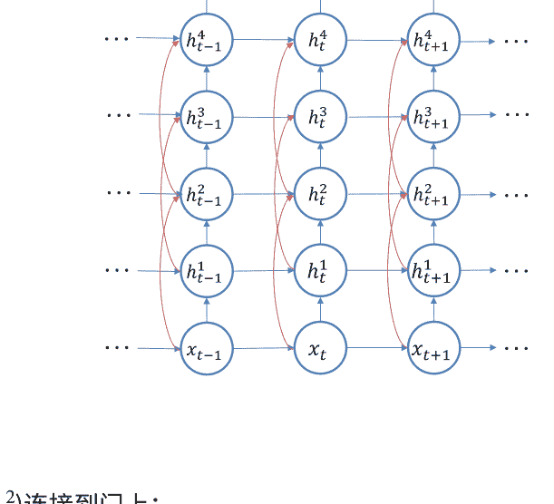

图5.5 带有跳跃连接的深度神经网络用于序列标注

#### 连接到门的跳跃连接

我们可以通过恒等映射将 $h^{(l-2)}$ 连接到门上：

$$
\begin{pmatrix} i_t^l \\ f_t^l \\ o_t^l \\ s_t^l \end{pmatrix} = \begin{pmatrix} \text{sigm} \\ \text{sigm} \\ \text{sigm} \\ \text{tanh} \end{pmatrix} (w^{(l)} I^{(l)}) \begin{pmatrix} h_t^{(l-1)} \\ h_t^{(l-2)} \end{pmatrix} \quad (5.9)
$$

其中 $I^l \in \mathbb{R}^{4n \times n}$ 是身份映射。

#### 跳过连接到内部状态

另一种跳过连接是将 $h_t^{l-2}$ 连接到单元的内部状态 $c_t^l$：

$$
c_t^l = f_t^l \odot c_{t-1}^l + i_t^l \odot s_t^l + h_t^{l-2} \quad (5.10) \\
h_t^l = o_t^l \odot \tanh(c_t^l) \quad (5.11)
$$

#### 跳过连接到单元输出

我们还可以将 $h_t^{l-2}$ 连接到单元输出：

$$
c_t^l = f_t^l \odot c_{t-1}^l + i_t^l \odot s_t^l \quad (5.12) \\
h_t^l = o_t^l \odot \tanh(c_t^l) + h_t^{l-2} \quad (5.13)
$$

### 使用门的跳过连接

考虑跳过连接到单元输出的情况。单元输出在网络深度的展示过程中呈线性增长，这使得 $h^l_t$ 的导数消失并且难以收敛。受LSTM门的引入启发，我们通过检索或阻塞门来控制跳过连接：

$$
\begin{pmatrix} i_t^l \\ f_t^l \\ o_t^l \\ g_t^l \\ s_t^l \end{pmatrix} = \begin{pmatrix} \text{sigm} \\ \text{sigm} \\ \text{sigm} \\ \text{sigm} \\ \text{tanh} \end{pmatrix} W^l \begin{pmatrix} h_t^{l-1} \\ h_{t-1}^l \end{pmatrix} \\
c_t^l = f_t^l \odot c_{t-1}^l + i_t^l \odot s_t^l \\
h_t^l = o_t^l \odot \tanh(c_t^l) + g_t^l \odot h_t^{l-2} \quad (5.14)
$$

其中 $g_t^l$ 是用于访问跳过的输出 $h_t^{l-2}$ 或块的门。当 $g_t^l$ 等于0时，无法通过跳过连接传递任何跳过的输出，这相当于传统的堆叠LSTM。否则，它就像使用门控身份连接的前馈LSTM一样。这里我们省略了将门添加到跳过连接到内部状态的情况，这与上述情况类似。

### 双向LSTM中的跳过连接

在双向LSTM中使用跳过连接与单向LSTM中使用的方式类似，具有双向处理：

$$
\overrightarrow{c_t^l} = \overrightarrow{f_t^l} \odot \overrightarrow{c_{t-1}^l} + \overrightarrow{i_t^l} \odot \overrightarrow{s_t^l} \\
\overrightarrow{h_t^l} = \overrightarrow{o_t^l} \odot \tanh(\overrightarrow{c_t^l}) + \overrightarrow{g_t^l} \odot \overrightarrow{h_t^{(l-2)}} \\
\overleftarrow{c_t^l} = \overleftarrow{f_t^l} \odot \overleftarrow{c_{t-1}^l} + \overleftarrow{i_t^l} \odot \overleftarrow{s_t^l} \\
\overleftarrow{h_t^l} = \overleftarrow{o_t^l} \odot \tanh(\overleftarrow{c_t^l}) + \overleftarrow{g_t^l} \odot \overleftarrow{h_t^{(l-2)}} \quad (5.15)
$$

## 5.2.2.2 CCG超标记的神经架构

CCG标记可以表示为 $P(y|x; \theta)$，其中 $x = [x_1, ..., x_n]$ 表示句子中的n个单词，而 $y = [y_1, ..., y_n]$ 表示相应的 n 个标记。在本节中，我们介绍了用于计算 $P(\cdot)$ 的神经架构，包括一个输入层、一堆叠的隐藏层和一个输出层。由于堆叠的隐藏层已经在上一节中介绍过了，所以我们只在这里介绍输入层和输出层。

#### 5.2.2.3 网络输入

网络输入是序列中每个标记的表示。有很多种标记表示方法，例如使用单词嵌入、使用局部窗口方法，或者使用单词和字符级别的表示的组合。 考虑到所有的信息，我们可以通过连接单词表示、字符表示和大写表示来表示输入。

### 单词表示

词汇表中的所有单词共享一个公共查找表，该表使用随机初始化或预训练的嵌入进行初始化。句子中的每个单词可以映射到一个嵌入向量 $x_i$。然后，整个句子可以用一个列向量矩阵表示 $[x_1, x_2, ..., x_n]$。根据Wu等人 (2017) 的方法，我们可以使用大小为 d 的上下文窗口，围绕一个单词 $x_i$ 获取其上下文信息。此外，我们可以为上下文窗口中的每个标记添加逻辑门。单词表示可以计算为 $x_i = [r_{i-\lfloor d/2 \rfloor}x_{i-\lfloor d/2 \rfloor}; ... ; r_{i+\lfloor d/2 \rfloor}x_{i+\lfloor d/2 \rfloor}]$，其中 $r_i = [r_{i- \lfloor d/2 \rfloor}, ..., r_{i+ \lfloor d/2 \rfloor}] \in \mathbb{R}^d$ 是一个逻辑门，用于过滤不必要的上下文，$x_{i-\lfloor d/2 \rfloor}, ..., x_{i+\lfloor d/2 \rfloor}$ 是一个固定窗口中的单词嵌入。

### 字符表示

前缀和后缀信息对于CCG超标记很重要。Fonseca等人 (2015) 使用长度为1到5的字符前缀和后缀进行词性标注。类似地，我们可以将一个词中的字符嵌入连接起来，得到字符级表示。具体来说，给定一个由字符序列 $[ch_1, ch_2, ..., ch_l]$组成的单词 $x_i$，其中l是单词的长度，$L(\cdot)$是字符的查找表。可以将最左边的 m 个字符嵌入 $L(ch_1), ..., L(ch_m)$ 与其最右边的 m 个字符嵌入 $L(ch_{l-4}), ..., L(ch_l)$ 进行连接。当一个单词少于 m 个字符时，我们可以用相同的特殊符号填充剩余的字符。

### 大写表示

通常，我们将单词转换为小写，以减小单词词汇的大小，减少稀疏性。然而，我们需要额外的大写表示来存储大写特征，表示一个单词是否大写。

#### 5.2.2.4 网络输出

对于CCG超标记，我们在输出层使用 softmax激活函数 $g(\cdot)$：

$$
o_{y_t} = g(W^{hy} [\overrightarrow{h_t}; \overleftarrow{h_t}]) \quad (5.16)
$$

其中 $o_{y_t}$ 是所有可能标记的概率分布。 $o_{y_t}(k) = \frac{\exp(h_k)}{\sum_{k'} \exp(h_{k'})}$ 是 $o_{y_t}$ 的第k维，对应于标记集中的第k个标记。 $W^{hy}$ 是隐藏层到输出层的权重。

## 5.3 深度学习用于机器翻译

与属于一对一映射框架的NER和CCG超标记相比，机器翻译（MT）是一种经典的多对多预测任务，其中一个由m个单词组成的源语言句子x被自动翻译成一个由n个单词组成的目标语言句子y。在大多数情况下，$n \neq m$。机器翻译的概念出现在1940年代，并且自那时以来一直是测试机器智能的代表性任务。在本节中，我们首先给出机器翻译的定义。然后，我们简要介绍统计机器翻译（SMT），然后详细介绍深度学习方法用于机器翻译。

### 5.3.1 任务定义

机器翻译旨在自动将源语言转换为语义上等效的目标语言。图5.6给出了一个英文到中文翻译的例子。从语言单位的角度来看，机器翻译可以操作单词级别、句子级别、段落级别和文档级别。

在机器翻译研究社区中，机器翻译主要关注句子级别。也就是说，机器翻译是将源语言句子映射到目标语言句子的过程。

在过去的七十年中，出现了几种范式来解决机器翻译问题。按时间顺序，典型的方法包括基于规则的方法（Boitet等, 1982年），基于示例的模型（Nagao, 1984年），统计机器翻译（SMT）（Brown等, 1993年）和神经机器翻译（NMT）（Bahdanau等, 2015年；Sutskever等, 2014年）。

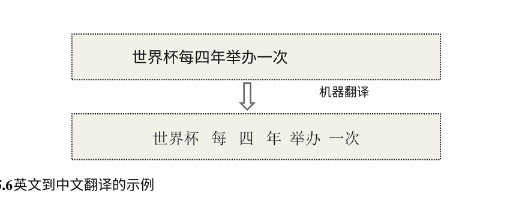

图5.6 英文到中文翻译的示例

### 5.3.2 统计机器翻译

给定一个源语言句子 $\mathbf{x}$, SMT在目标语言中搜索所有句子 $\mathbf{y}$，并找到使后验概率 $p(\mathbf{y}|\mathbf{x})$ 最大化的句子 $\mathbf{y}^*$。这个后验概率通常使用贝叶斯规则分解为两部分，如下所示：

$$
\begin{align*}
\mathbf{y}^* &= \arg\max_{\mathbf{y}} p(\mathbf{y}|\mathbf{x}) \\
&= \arg\max_{\mathbf{y}} \frac{p(\mathbf{y}) \cdot p(\mathbf{x}|\mathbf{y})}{p(\mathbf{x})} \quad (5.17) \\
&= \arg\max_{\mathbf{y}} p(\mathbf{y}) \cdot p(\mathbf{x}|\mathbf{y})
\end{align*}
$$

其中，$p(\mathbf{y})$ 被称为目标语言模型，$p(\mathbf{x}|\mathbf{y})$ 被称为翻译模型。通常被称为噪声信道模型。这种分解必须遵守严格的概率约束，并且不能利用其他有用的翻译特征。为了解决这个问题，提出了对数线性框架（Och和Ney 2002）来分解后验概率 $p(\mathbf{x}|\mathbf{y})$：

$$
\begin{align*}
\mathbf{y}^* &= \arg\max_{\mathbf{y}} p(\mathbf{y}|\mathbf{x}) \\
&= \arg\max_{\mathbf{y}} \frac{\exp(\sum_i \lambda_i h_i(\mathbf{x}, \mathbf{y}))}{\sum_{\mathbf{y}'} \exp(\sum_i \lambda_i h_i(\mathbf{x}, \mathbf{y}'))} \quad (5.18) \\
&= \arg\max_{\mathbf{y}} \exp(\sum_i \lambda_i h_i(\mathbf{x}, \mathbf{y})) \\
&= \arg\max_{\mathbf{y}} \{ \sum_i \lambda_i h_i(\mathbf{x}, \mathbf{y}) \}
\end{align*}
$$

其中 $h_i(\mathbf{x}, \mathbf{y})$ 可以是任何翻译特征，$\lambda_i$ 是相应的特征权重。对数线性模型中的所有特征将指导翻译过程，生成最佳的翻译假设。

在统计机器翻译中，基于短语的模型（PBSMT，Koehn等，2003年）最受欢迎，我们使用它来介绍翻译过程。PBSMT将翻译过程分为三个步骤，如图5.5所示：（1）将源句子分割成短语序列；（2）使用短语翻译规则进行短语匹配和源到目标的映射；（3）组合片段翻译以获得最终的目标句子，即短语重排序模型。

一般来说，PBSMT的表现类似于人类，并且其过程易于解释。然而，它面临许多问题，使得难以获得令人满意的翻译质量。由于PBSMT执行字符串匹配来生成候选目标短语翻译，它无法利用语义上相似的翻译规则。例如，可能存在一个规则，其源端是 was held，但无法用于翻译图5.7中给出的句子。此外，最优的短语重排序模型随着短语数量的增加呈指数级复杂。在符号匹配框架中，这些问题很难解决。

### 5.3.3 神经机器翻译

(2015)对符号和分布式表示进行了详细讨论。
一些研究工作使用深度学习来改进统计机器翻译（Li等，2013; Vaswani等，2013; Devlin等，2014; Zhang等，2014a,b）。

基于分布式表示的新范式神经机器翻译出现并迅速成为机器翻译的主流方法，并在许多语言对上实现了新的最先进性能（Wu等，2016b）。

接下来，我们详细描述神经机器翻译，并简要介绍最近的进展。

通常，神经机器翻译（NMT）遵循编码器-解码器框架。编码器将源语言句子编码为语义表示，解码器从中生成目标语言句子，从左到右逐词生成。图5.8展示了一个与图5.7相同的句子的翻译示例。

为了不失一般性，我们引入了基于注意力的NMT，类似于Google系统GNMT（Wu等人（2016b）），它利用堆叠的长短期记忆（LSTM，Hochreiter和Schmidhuber 1997）层作为编码器和解码器，如图5.9所示。

编码器-解码器NMT<sub>T</sub>首先将源句子编码为上下文向量序列 $C = (\mathbf{h}_1, \mathbf{h}_2, \cdots, \mathbf{h}_T)$，其大小变化关于源句长度的问题。然后，编码器-解码器NMT从上下文向量 $C$ 解码，并生成目标翻译 $Y = (y_1, y_2, \cdots, y_T)$。通过最大化 $p(y_i|y_{<i}, C)$ 的概率，每次一个词进行解码。注意，$x_j(y_i)$是源（目标）句子中第$j$个（第$i$个）词的词嵌入。接下来，我们简要回顾一下编码器如何获得$C$和解码器如何计算 $p(y_i|y_{<i}, C)$。

# 图5.8 神经机器翻译从英语到中文的示例

# 图5.9 基于注意力的NMT架构，编码器有$m$个堆叠的LSTM层，解码器有$l$个堆叠的LSTM层

编码器：上下文向量 $C = (\mathbf{h}_1^m, \mathbf{h}_2^m, \cdots, \mathbf{h}_{T_x}^m)$ 是由 $m$ 个堆叠的LSTM层生成的。$\mathbf{h}_j^k$的计算如下：

$$\mathbf{h}_j^k = LSTM(\mathbf{h}_{j-1}^k, \mathbf{h}_j^{k-1}) \quad (5.19)$$

其中 $\mathbf{h}_j^{k-1} = x_j$ 如果 $k = 1$。

解码器：根据不同的时间步骤（Bahdanau等人，2015），根据不同的上下文 $c_i$ 计算条件概率 $p(y_i|y_{<i}, C)$：

$$p(y_i|y_{<i}, C) = p(y_i|y_{<i}, c_i) = softmax(W\hat{z}_i) \quad (5.20)$$

其中 $\hat{z}_i$ 是注意力输出：

$$\hat{z}_i = tanh(W_c[z_i^l; c_i]) \quad (5.21)$$

注意力模型计算 $c_i$ 作为源端上下文向量的加权和，如图5.9中间部分所示。

$$c_i = \sum_{j=1}^{T_x} \alpha_{ij} z_i^l \quad (5.22)$$

其中 $\alpha_{ij}$ 是通过以下方式计算的归一化项：

$$\alpha_{ij} = \frac{\mathbf{h}_j^m \cdot z_i^l}{\sum_{j'} \mathbf{h}_{j'}^m \cdot z_i^l} \quad (5.23)$$

$z_i^k$ 通过以下公式计算：

$$z_i^k = LSTM(z_{i-1}^k, z_i^{k-1}) \quad (5.24)$$

如果 $k = 1$，$z_i^l$ 将通过将 $\hat{z}_{i-1}$ 作为输入进行计算（Luong等人，2015年）：

$$z_i^1 = LSTM(z_{i-1}^1, y_{i-1}, \hat{z}_{i-1}) \quad (5.25)$$

谷歌报告称，这种类型的NMT架构在机器翻译中取得了突破，并在多种语言对上实现了超过60%的改进（Wu等人，2016b年）。接下来，我们简要介绍了神经机器翻译的最新进展。

### 5.3.4 神经机器翻译的最新进展

尽管基于RNN的NMT取得了巨大的进展，并且在SMT方面表现出色，但它仍然面临许多问题，例如欠翻译/过翻译、未知或不常见词的翻译、单语数据的使用和训练效率低下。

为了缓解欠翻译/过翻译问题，Tu等人（2016年）和Mi等人（2016年）认为，在预测目标语言单词时忽略了每个源词的历史注意力权重。他们设计了一个覆盖模型，其中注意力权重被累积并用作一种特征，以鼓励新的目标词关注未翻译的源词。

为了处理未知或不常见词的翻译，Sennrich等人（2016b年）提出使用子词作为翻译单元，许多不常见甚至未知的词可以由几个子词组成。Li等人（2016年）提出了一个替换-翻译-恢复框架来处理未知词。他们用一个类似的词替换每个未知词，从而得到没有词汇外（OOV）词的句子。然后他们为新句子生成翻译结果。最后，如果可能的话，他们将替换回用于替换的词汇内词的翻译。

为了充分利用单语数据，Sennrich等人（2016a）提出了一种新的方法来使用目标语单语数据。他们通过将目标语单语句子翻译成源语句子并重新训练NMT，生成了合成的双语数据，其中包括原始双语数据和合成的平行数据。Zhang和Zong（2016）进一步探索了使用源语单语数据的方法，采用了自学习和多任务学习算法。Cheng等人（2016）利用半监督方法同时利用源语和目标语单语数据。

为了加快训练过程并充分利用上下文，Gehring等人（2017）提出了一种用于神经机器翻译的卷积序列到序列模型，其中编码器和解码器都采用了多层卷积神经网络。通过使用CNN，LSTM的顺序依赖性不存在。因此，在训练过程中可以并行化编码和解码过程。

Vaswani等人（2017年）更进一步设计了一种不使用任何循环或卷积神经网络的自注意力NMT。他们使用纯自注意力和前馈网络对源句子进行编码，通过计算第i个输入词与其他所有词之间的注意力来获取隐藏表示。解码器类似。这种架构极大地促进了前馈计算和反向梯度更新的并行性。

图5.10对循环NMT、卷积NMT和自注意力NMT进行了比较。从这个图中，我们可以分析每个层的复杂性、计算的并行性以及任意两个位置之间的依赖长度。我们假设序列包含n个标记，分布式维度为 $d$ 和卷积的核大小为 $k$。从图5.10中我们可以很容易地看出，为了完成一层的前向计算，循环，卷积和自注意力NMT需要 $O(n \cdot d^2)$，$k \cdot n \cdot d^2$ 和 $n^2 \cdot d$ 次操作。由于在大多数情况下，自注意力NMT每层需要更少的计算。并行性取决于每个时间步的计算是否需要来自前一个时间步的信息。从图5.10中很容易观察到，卷积和自注意力架构可以高度并行化，因为它们可以分别对每个位置进行计算。

在顺序学习任务中，如句法分析和机器翻译，建模长距离依赖关系非常重要。然而，这也是非常具有挑战性的，因为很难捕捉序列中任意位置之间的关系。例如，在循环神经网络机器翻译中，如果我们想要看到第一个位置和第$i$个位置之间的关系，我们需要$i$个步骤。卷积神经网络机器翻译将步骤数降低到$O(log_k (n))$，而自注意力机器翻译只需要一步。表5.2显示了不同NMT架构在三个方面的详细比较。表格表明自注意力模型更具吸引力。Vaswani等人（2017）报告称，自注意力模型实现了最新的翻译结果，并且在网络训练方面更加高效。

表5.2 循环NMT，卷积NMT和自注意力NMT在不同方面的比较

| 架构 | 每层复杂度 | 顺序操作 | 依赖长度 |
| :--- | :--- | :--- | :--- |
| 循环 | $O(n \cdot d^2)$ | $O(n)$ | $O(1)$ |
| 卷积 | $O(k \cdot n \cdot d^2)$ | $O(1)$ | $O(log_k(n))$ |
| 自注意力 | $O(n^2 \cdot d)$ | $O(1)$ | $O(1)$ |

## 5.4 文本摘要的深度学习

与保持输入和输出序列之间严格的语义等价的机器翻译相比，文本摘要从输入文本中提取关键信息，并输出一个非常简洁的摘要。 如果输入文本的长度为n，则输出长度m将远小于n。

### 5.4.1 任务定义

自动文本摘要的概念由Luhn（1958）在1950年代提出。 它旨在将一篇文章或多篇文档压缩成一个反映原始文本主要信息的简短摘要。 通常，生成的摘要应具有高度的信息性，较少的冗余性和高可读性。 图5.11给出了一个自动文本摘要的示例，它简单地从原始文本中提取出最重要的两个句子。

从方法论的角度来看，自动文本摘要可以广泛分为两个范式：抽取式摘要（Erkan和Radev 2004；Nallapati等2017）和生成式摘要（Barzilay和McKeown 2005；Filippova和Strube 2008；Rush等2015）。 抽取式方法从文档中提取部分内容（通常以句子为基本单位）来组成摘要。 而生成式方法通过改写或创建源文本中没有的句子来生成简短的摘要，就像人工撰写的摘要通常所做的那样。

接下来，我们首先简要介绍了抽取式摘要方法，并分析了它们的缺点。然后，我们详细介绍了使用深度学习的生成式摘要方法。

### 5.4.2 抽取式摘要方法

提取方法直接从原始文本中选择候选摘要句子。这是学术界和工业界自动摘要的主要方法，因为该方法非常简单，生成的摘要流畅易读，尽管它不是理想的摘要方法。我们以单文档摘要作为案例研究，介绍提取方法。

给定由n个句子组成的文档D = {S1, S2, ..., Sn-1, Sn}，目标是从D中提取m个显著的句子形成摘要。m是一个超参数，或者由摘要的字数限制确定。我们可以看到，最具挑战性的任务是衡量每个句子的显著性。

我们介绍了最有效的方法，即LexRank，由Erkan和Radev（2004）提出。LexRank是一种基于图的算法，受到PageRank（Page et al. 1999）的启发。其背后的思想是，如果许多其他句子与该句子相似，则该句子是显著的。文档D中的所有句子首先用于构建图G = (V, E)。每个顶点Vi ∈ V表示第i个句子Si ∈ D，每条边Eij连接两个顶点Vi和Vj，并且与边相关联的权重Wij。权重Wij反映了两个顶点之间的相似度程度。图5.12描述了一个包含12个句子的表示文档的图。

权重W<sub>ij</sub>通常通过基于TF-IDF（词频-逆文档频率）计算两个句子之间的余弦相似度来计算：

$$W_{ij} = \frac{\sum_{w \in V_i, V_j} (TF\text{-}IDF_w)^2}{\sqrt{\sum_{x \in V_i} (TF\text{-}IDF_x)^2} \times \sqrt{\sum_{y \in V_j} (TF\text{-}IDF_y)^2}} \quad (5.26)$$

w ∈ Vi, Vj表示出现在句子Si和句子Sj中的词。TF-IDF_w = TF_w × IDF_w。TF_w和IDF_w分别计算如下：

$$TF_w = \frac{count(w)}{\sum_{w' \in S} count(w')} \quad IDF_w = \frac{|D|}{|\{j | w' \in S_j\}|} \quad (5.27)$$

其中count (w)表示单词 w在句子 S中出现的次数，|D |表示文档中的句子数，而|{j | w' ∈ S_j}|表示包含单词 w的句子数。

在进行上述准备工作后，LexRank根据以下方式计算每个句子 S_i的重要性得分：

$$S(V_i) = \frac{1-d}{n} + d \times \sum_{V_j \in adj(V_i)} \frac{W_{ij}}{\sum_{V_k \in adj(V_i)} W_{ik}} S(V_j) \quad (5.28)$$

其中adj (V_i)表示 V_i的邻居节点，d∈[0, 1]是阻尼因子，通常设置为0.85，表示节点跳转到另一个节点的先验概率。

LexRank使用随机值初始化每个句子 S_i的显著性分数并迭代运行上述方程（5.28）直到 $|S_i^{k+1} - S_i^k| < \epsilon$，其中 $\epsilon$ 是一个预定义的阈值。

在获取文档中所有句子的显著性分数之后，我们可以通过选择满足非冗余约束的前 m个句子来形成摘要。

尽管提取方法的简单和有效性，它们仍然面临一些不可避免的问题。例如，即使句子的某些部分显著而其他部分不重要，也会选择或丢弃该句子。基于句子的提取无法去除句子中的不重要部分。这将导致摘要包含许多无关的片段，而许多显著的信息由于长度限制而无法包含。此外，提取方法基于符号表示计算显著性分数，无法探索相关概念之间的相似性（例如，摘要和总结）。

基于分布式表示的深度学习方法可以很好地解决上述问题，并且在学术界和工业界越来越受到关注。

### 5.4.3 基于深度学习的抽象摘要

Rush等人（2015）首次提出了端到端的深度学习抽象摘要方法，它采用了从神经机器翻译中借鉴的编码器-解码器框架。当时，Rush等人（2015）只处理将长句子压缩成短句子的句子摘要。随后，一些研究人员在这项研究的基础上通过解决编码器-解码器网络（Chopra等人2016；Zhou等人2017）、未知词汇（Gulcehre等人2016）和注意力机制（See等人2017）来改进句子摘要性能。

Nallapati等人（2016）引入了一个大型数据集CNN/Daily Mail语料库，其中每个实例都是一对新闻文本和相应的多句子摘要。然后，他们设计了一个纯RNN-based的编码器-解码器框架来解决这个任务。See等人（2017）在这项工作的基础上，通过引入复制机制来处理未知词汇，并引入覆盖模型来解决短语重复问题。

原则上，神经抽象摘要（NAS）应用了与神经机器翻译相同的编码器-解码器范式。主要区别在于，复制机制对神经抽象摘要非常有用，因为摘要结果和原始文本属于同一语言，许多信息性词汇可以直接从原始文档中复制。因此，带有复制机制的编码器-解码器框架成为神经抽象摘要的流行方法（参见See等人，2017年）。在本节中，我们详细介绍这种方法。

图5.13给出了该框架的概述。假设输入文本是一个长的词序列 $x = (x_1, x_2, \ldots, x_T)$（我们将所有句子连接在一起，并用只有一个词序列的文本表示）。与NMT类似，NAS首先将这个词序列编码为一系列上下文向量 $C = (h_1, h_2, \ldots, h_T)$，如图5.13左下角所示。图5.13中的标签①表示计算当前解码器隐藏状态 $s_t$ 和每个输入隐藏状态 $h_i$ 之间的注意力分布 $a_{t}$:

$$e_t(i) = v^T tanh(W_h h_i + W_s s_t + b_{att})$$
$$a_t(i) = \frac{exp(e_t(i))}{\sum_k exp(e_t(k))} \quad (5.29)$$

其中 $v$, $W_h$, $W_s$ 和 $b_{att}$ 是可优化的可学习参数，在网络训练过程中进行优化。

然后，可以如下计算时间步骤 $t$ 的动态输入上下文 $c_t$:

$$c_t = \sum_i a_t(i) h_i \quad (5.30)$$

在注意力权重计算之后，标签 ②显示了如何使用当前解码器隐藏状态 $s_t$ 和整体输入上下文 $c_t$ 生成整个词汇表上的概率分布 $P_{vocab}$。在See et al. (2017)中，$P_{vocab}$ 通过两层线性变换后接一个softmax层来获得：

$$P_{\text{vocab}} = softmax\left(V_2(V_1[s_t, c_t] + b_1) + b_2\right) \quad (5.31)$$

同样地，V1, V2, b1和b2是网络参数。此时，如果我们不再考虑其他特征(如复制机制)，我们可以将具有高概率的单词作为摘要单词输出。

复制机制背后的基本思想是，在每个解码时间步骤中，我们有一些特定的可能性(选择)可以直接从输入序列中复制一个单词。因此，有三个问题需要解决。一个是如何确定每个解码步骤的特定可能性，另一个是如何确定应该复制哪个输入单词，第三个是如何处理复制机制与基线词汇概率分布之间的关系。

图5.13中的标签③显示了如何计算概率 $p_{gen}$（这里$1 - p_{gen}$是执行复制的可能性）：

$$p_{gen} = \sigma \left(W_c^T c_t + W_s^T s_t + W_y^T y_t + b_{copy}\right) \quad (5.32)$$

其中 $y_t$ 是时间步骤 $t$ 的解码器输入。$W_c$，$W_s$，$W_y$ 和 $b_{copy}$ 是相应的可学习参数。

每个单词 $x_i$ 的复制概率由整体复制概率 $1 - p_{gen}$ 和注意力权重 $a_t(i)$ 决定。

$$p_i = (1 - p_{gen}) a_t(i) \quad (5.33)$$

如图5.13所示，输入序列中的单词 “Cilic” 将获得最高的复制概率，因为它的注意力权重大于其他单词。

最后，每个词 $w$ 在词汇表中的概率 $P(w)$ 可以通过将复制机制和原始词汇分布相结合来更新，如图5.13中的标签④所示：

$$P(w) = p_{gen} P_{vocab}(w) + (1 - p_{gen}) \sum_{i:w_i=w} a_t(i) \quad (5.34)$$

通过结合基线词汇分布和复制机制，词汇 “Cilic” 更有可能被选为摘要词，如图5.13顶部所示。

神经抽象摘要取得了对基于理解的摘要的重大进展。然而，未来研究仍然存在一些关键问题。例如，神经方法目前无法处理多文档摘要。一个原因是可用的标记数据稀缺。另一个原因是自动摘要任务的固有属性。

与原始文本相比，最终摘要的压缩比非常高。可能是1%甚至是0.1%。这使得当前模型极其困难地从原始文本中找到最重要的1%信息。

## 5.5 讨论

在这些年里，深度学习一直是自然语言处理中的热门话题，并且被应用于几乎所有的NLP任务中。它在几个任务中取得了一些突破，尤其是在机器翻译方面。我们相信深度学习在未来的自然语言处理中将发挥更重要的作用。

对于未来的研究工作，我们认为深度学习基于自然语言处理需要解决两个关键问题。首先，我们应该充分利用深度学习方法的可解释性，因为自然语言不仅需要计算和处理，还需要理解。其次，应该设计新的框架来结合深度学习方法和语言知识，如专家规则和常识知识图谱。

## 参考文献

- Andreas J, Rohrbach M, Darrell T, Klein D (2016) 学习组合神经网络以进行问题回答。在：NAACL-HLT会议论文集，第232-237页
- Bahdanau D, Cho K, Bengio Y (2015) 通过联合学习对齐和翻译的神经机器翻译。在：ICLR会议论文集中
- Barzilay R, McKeown KR (2005) 多文档新闻摘要的句子融合。计算语言学 31(3):297–328
- Bengio Y, Simard P, Frasconi P (1994) 用梯度下降学习长期依赖性是困难的。IEEE Trans Neural Netw 5(2):157–166
- Berger AL, Pietra VJD, Pietra SAD (1996) 自然语言处理的最大熵方法。计算语言学 22(1):39–71
- Boitet C, Guillaume P, Quezel-Ambrunaz M (1982) Ariane 78.4的实现和对话环境，一个用于自动翻译和人工修订的集成系统。在：第9届计算语言学会议论文集-卷1。Academia Pr aha，第19-27页
- Bordes A, Chopra S, Weston J (2014) 使用子图嵌入的问答。arXiv 预印本 arXiv:1406.3676
- Bordes A, Usunier N, Chopra S, Weston J (2015) 大规模简单问题回答与记忆网络。arXiv 预印本 arXiv:1506.02075
- Brown PF, Della Pietra SA, Della Pietra VJ, Mercer RL (1993) 统计机器翻译的数学：参数估计。Comput Linguist 19(2):263–311
- Cai D, Zhao H, Zhang Z, Xin Y, Wu Y, Huang F (2017) 快速准确的神经分词中文。在: ACL会议论文集, pp 608–615
- Chen D, Manning C (2014) 使用神经网络的快速准确的依存句法分析器。在: 2014年自然语言处理中的经验方法会议论文集 (EMNLP), pp 740–750
- Chen X, Qiu X, Zhu C, Liu P, Huang X (2015) 长短期记忆神经网络用于中文分词。在：EMNLP会议论文集，第1197-1206页
- Cheng Y, Xu W, He Z, He W, Wu H, Sun M, Liu Y (2016) 半监督学习用于神经机器翻译。在：ACL 2016会议论文集
- Chiu JP, Nichols E (2016) 双向LSTM-CNN用于命名实体识别。Trans ACL 4:357-370
- Chopra S, Auli M, Rush AM (2016) 基于注意力的递归神经网络用于抽象句子摘要。在：NAACL-HLT会议论文集，第93-98页
- Collobert R, Weston J, Bottou L, Karlen M, Kavukcuoglu K, Kuksa P (2011) 自然语言处理（几乎）从零开始。 J Mach Learn Res 12(Aug):2493-2537
- Cortes C, Vapnik V (1995) 支持向量网络。 Mach Learn 20(3):273-297
- Devlin J, Zbib R, Huang Z, Lamar T, Schwartz R M, Makhoul J (2014) 快速且稳健的神经网络联合模型用于统计机器翻译。 在： ACL会议论文集，第1370-1380页
- 董C，张J，宗C，服部M，迪H (2016) 基于字符的LSTM-CRF与基于部首级特征的中文命名实体识别。 在： 东方语言计算机处理国际会议。斯普林格，第239-250页
- 董C，吴H，张J，宗C (2017) 用于中文社交媒体中的命名实体识别的多通道LSTM-CRF。 在： 基于自然标注大数据的中文计算语言学和自然语言处理。斯普林格，第197-208页
- Erkan G, Radev DR (2004) Lexrank：基于图的词汇中心性作为文本摘要中的显著性。 J人工智能研究22：457-479
- Filippova K, Strube M (2008) 通过依赖图压缩进行句子融合。 在： EMNLP会议论文集，第177-185页
- Fonseca ER, Rosa JLG, Alu sio SM (2015) 评估词嵌入和修订的葡萄牙语词性标注语料库。 巴西计算机学会杂志21（1）：1-14
- Gehring J, Auli M, Grangier D, Yarats D, Dauphin YN (2017) 卷积序列到序列学习。 arXiv预印本 arXiv:1705.03122
- Gulcehre C, Ahn S, Nallapati R, Zhou B, Bengio Y (2016) 指向未知单词。 在： ACL会议论文集中
- He K, Zhang X, Ren S, Sun J (2015) 深度残差学习用于图像识别。 在： CVPR会议论文集中
- Hochreiter S, Schmidhuber J (1997) 长短期记忆。 神经计算 9(8):1735–1780
- Koehn P, Och FJ, Marcu D (2003) 统计短语翻译。 在： NAACL会议论文集中
- Lafferty J, McCallum A, Pereira FC (2001) 条件随机场：用于分割和标记序列数据的概率模型。 在： ICML会议论文集中
- Lample G, Ballesteros M, Subramanian S, Kawakami K, Dyer C (2016) 用于命名实体识别的神经架构。 在： NAACL-HLT会议论文集中
- Li P, Liu Y, Sun M (2013) 基于ITG的递归自编码器翻译。 在： EMNLP会议论文集中
- Li X, Zhang J, Zong C (2016) 迈向神经机器翻译中的零未知词。 在： IJCAI 2016会议论文集中
- Liu J, Zhang Y (2017) 具有神经前瞻特征的移位-规约成分解析。 TACL 5(Jan):45–58
- Luhn HP (1958) 文献摘要的自动创建。 IBM J Res Dev 2(2):159–165
- Luong M-T, Pham H, Manning CD (2015) 基于注意力的神经机器翻译的有效方法。 在： EMNLP 2015会议论文集中
- Ma X, Hovy E (2016) 通过双向LSTM-CNNs-CRF进行端到端序列标注。 在： ACL会议论文集
- Manning CD, Schütze H (1999) 统计自然语言处理的基础。 MIT出版社，剑桥/伦敦
- McCallum A, Nigam K等 (1998) 朴素贝叶斯文本分类的事件模型比较。 在： AAAI-98学习文本分类研讨会，麦迪逊，第752卷，第41-48页
- Mi H, Sankaran B, Wang Z, Ittycheriah A (2016) 用于神经机器翻译的覆盖嵌入模型。 在： EMNLP 2016会议论文集中
- Page L, Brin S, Motwani R, Winograd T (1999年) PageRank引用排名: 为网络带来秩序。斯坦福信息实验室技术报告
- Pei W, Ge T, Chang B (2014年) 用于中文分词的最大间隔张量神经网络。在: ACL会议论文集, 第293-303页
- Rush AM, Chopra S, Weston J (2015) 神经注意模型用于抽象句子摘要。在: EMNLP会议论文集
- See A, Liu PJ, Manning CD (2017) 直击要点: 使用指针生成网络进行摘要。在: ACL会议论文集
- Sennrich R, Haddow B, Birch A (2016a) 使用单语数据改进神经机器翻译模型。在: ACL 2016会议论文集
- Sennrich R, Haddow B, Birch A (2016b) 使用子词单元进行稀有词的神经机器翻译。在: ACL 2016会议论文集
- Socher R, Bauer J, Manning CD等 (2013) 使用组合向量语法进行解析。在: ACL会议论文集, 第455-465页
- Steedman M (2000) 句法过程, 第24卷。MIT出版社, 剑桥
- Steedman M, Baldridge J (2011) 组合范畴语法。在: Borsley RD, Börjars K (eds) 非转换句法: 语法的形式和明确模型。Wiley-Blackwell, Chichester/Malden
- Sutskever I, Vinyals O, Le QV (2014) 序列到序列学习与神经网络。在: NIPS会议论文集
- Tu Z, Lu Z, Liu Y, Liu X, Li H (2016) 基于覆盖的神经机器翻译。在: ACL 2016会议论文集
- Vaswani A, Zhao Y, Fossum V, Chiang D (2013) 使用大规模神经语言模型解码改善翻译。在: EMNLP会议论文集, 第1387-1392页
- Vaswani A, Bisk Y, Sagae K, Musa R (2016) 使用LSTMs进行超标记。在: NAACL-HLT会议论文集, 第232-237页
- Vaswani A, Shazeer N, Parmar N, Uszkoreit J, Jones L, Gomez AN, Kaiser L, Polosukhin I (2017) 注意力就是一切。arXiv预印本 arXiv:1706.03762
- Wu H, Zhang J, Zong C (2016a) 顺序标记中跳跃连接的实证探索。在: COLING会议论文集, 第232-237页

## 第6章 使用深度学习模型进行海洋数据分析

Guoqiang Zhong, Li-Na Wang, Qin Zhang, Estanislau Lima, Xin Sun, Junyu Dong, Hui Wang和Biao Shen

摘要借助先进的观测仪器，如卫星雷达和高度计，每天可以测量和保存大量的海洋数据。如何从这些原始数据中提取有效信息成为海洋科学研究中的紧迫问题。在本章中，我们回顾了数据表示学习算法，这些算法试图从原始数据中学习有效特征，并为未知数据提供高预测准确性。特别地，我们描述了两个工作，展示了最先进的深度学习模型如何应用于海洋数据分析。这就是深度卷积神经网络（CNN）用于海洋前沿识别以及长短期记忆（LSTM）网络用于海表温度预测的方式。我们相信这两个工作对于机器学习和海洋科学领域的研究人员都很有趣，并且许多机器学习算法将被应用于海洋科学应用中。

> > 本章的部分内容摘自：
> 
> IEEE地球科学与遥感快报，14:10, Qin Zhang, Hui Wang, Junyu Dong, Guoqiang Zhong, Xin Sun, “使用长短期记忆预测海表温度”, 2017年, 获得IEEE许可
> 
> IEEE地球科学与遥感快报，14:3, Estanislau Lima, “学习和转移卷积神经网络知识到海洋前沿识别”, 2017年, 获得IEEE许可
> 
> from IEEE

G. Zhong (✉) · L.-N. Wang · Q. Zhang · E. Lima · X. Sun · J. Dong
中国海洋大学计算机科学与技术学院，中国青岛
电子邮件：gqzhong@ouc.edu.cn
H. Wang
中国海洋大学海洋与大气科学学院，中国青岛
B. Shen
中国海洋大学物理海洋学重点实验室，中国青岛
中国

关键词深度学习·海洋数据分析·表示学习·卷积神经网络（CNN）·长期记忆（LSTM）

## 6.1 引言

海洋科学研究引起了政府、组织和科学家的广泛关注，因为它对渔业产业、军事事务等具有重要意义。随着卫星雷达和测高仪等观测仪器的发展，每天都可以测量和保存大量的海洋数据。

这些数据大多以图像和数值形式存在，记录了海水的状态以及海洋现象的生成、变化和消失。因此，如何利用这些观测到的海洋数据发现规律并预测即将发生的现象，对于海洋科学相关领域的研究人员来说是一个关键而紧迫的问题。

在机器学习的术语中，为了从原始数据中提取有效信息，我们考虑“表示学习”算法。在大多数情况下，我们学习一个新的空间来表示原始数据，并在这个新的空间中进行后续操作，如分类、回归和检索。通常情况下，对于具有大规模或高维数据的应用，如何学习数据的低维内在表示是一个非常关键和具有挑战性的问题。

自100多年前以来，已经提出了许多方法来学习数据的有效表示。基本上，数据表示学习方法根据它们的模型结构的差异可以分为两类：“浅层”特征学习方法和深度学习模型。例如，主成分分析（PCA）（Pearson 1901）和线性判别分析（LDA）（Fisher 1936）是两种浅层特征学习方法，分别是无监督和有监督的。深度置信网络（DBNs）（Hinton和Salakhutdinov 2006）和深度自编码器（Hinton等人2006）是两种深度学习模型。

从原始数据空间到学习特征空间的映射函数的角度来看，数据表示学习方法可以分为线性或非线性方法。例如，PCA和LDA是线性特征学习方法，而它们的核化算法，核PCA（Schölkopf等人，1998年）和广义判别分析（GDA）（Baudat和Anouar，2000年）是非线性方法。自2000年以来，机器学习领域的研究人员提出了一些流形学习方法，例如等距特征映射（Isomap）（Tenenbaum等人，2000年）和局部线性嵌入（LLE）（Roweis和Saul，2000年）算法，用于发现高维数据的低维嵌入。大多数流形学习方法都是非线性的。

然而，它们无法建立低维嵌入和高维数据之间的精确映射函数。由于深度学习模型中使用非线性激活函数，几乎所有的深度学习模型都是非线性方法。

然而，由于通常有很多要学习的参数，深度学习模型是高度非凸的。

在下一节中，我们介绍一些关于表示学习和海洋数据分析的背景知识。在第6.3.1节中，我们介绍了使用深度卷积神经网络（CNN）进行海洋前沿识别的工作。在第6.3.2节中，我们介绍了一种用于海表面温度（SST）预测的长短期记忆（LSTM）网络。第6.4节总结了本章，并提出了一些未来的研究方向。

## 背景

在本节中，我们回顾了表示学习算法和一些与海洋数据分析相关的工作，特别是与海洋前沿识别和海表面温度预测相关的工作。

## 表示学习

如上所述，经过100多年的研究，已经提出了许多数据表示学习方法。在Zhong等人（2016b）中，对数据表示学习算法进行了全面的回顾。特别地，Zhong和Cheriet（2015）提出了一种张量表示学习的框架。许多线性、核和张量表示学习算法属于这个框架。此外，这个框架中的算法的收敛性已经在理论上得到证明。随着深度学习的发展，用于模式识别、目标检测和其他应用的深度架构已经被广泛提出。然而，还没有一篇综述论文来调查流行的深度学习模型。

### 6.2.1.1 浅层特征学习

主成分分析（PCA）是一种经典的线性降维方法（Pearson 1901; Joliffe 2002）。为了推导非线性版本的PCA，采用了两种方法。一种是核方法，产生了核PCA（KPCA）（Schölkopf et al. 1998）。另一种是潜在变量模型，产生了高斯过程潜在变量模型（GPLVM）（Lawrence 2005）。此外，为了将GPLVM扩展到监督学习，Zhong等人（2010）提出了高斯过程潜在随机场（GPLRF），它也可以被视为PCA的监督和非线性版本。

线性判别分析（LDA）（Fisher 1936）是一种最早的监督数据表示学习方法。LDA的投影方向可以通过广义特征值分解（GED）来学习。然而，GED只能给出LDA的近似解。Zhong和Ling（2016）分析了一个迭代算法用于迹比问题，并证明了迹比问题存在最优解的必要和充分条件。在这种情况下，LDA的学习可以转化为迹比问题，并获得全局最优解。特别地，钟等人（2016a）提出了一种基于迹比公式的关系学习框架，称为关系Fisher分析（RFA），并具有全局收敛性。

除了PCA、LDA及其变种外，还有许多其他数据表示学习方法，例如基于集成学习的方法（钟和刘2013）、集成在多任务学习环境中的方法（钟和Cheriet 2013）以及张量表示学习算法（钟和Cheriet 2012, 2014a,b; Jia等人2014a, b）。

自2000年以来，已经提出了一些流形学习算法，例如等距特征映射（Isomap）（Tenenbaum等人2000）和局部线性嵌入（LLE）（Roweis和Saul 2000）。然而，作为非线性降维方法，大多数流形学习算法不能产生高维数据和低维嵌入之间的精确映射函数（钟等人2012）。因此，已经提出了一些线性算法，例如局部保持投影（LPP）（He和Niyogi 2003）和边际Fisher分析（Yan等人2007）。最后，流形学习算法已经广泛应用于人脸识别和手写识别任务（He等人2005; Cheriet等人2013）。

除了上述提到的数据表示学习方法之外，相似性学习和距离度量学习算法通常在数据的子空间中学习潜在表示（Xing等，2002年；Weinberger等，2005年；Chechik等，2010年；Zhong等，2011年，2016年d，2017年b）。

### 6.2.1.2 深度学习

由于特征学习算法的发展，大规模标记图像的可用性以及计算硬件的高性能，深度学习近年来引起了广泛关注，并应用于许多领域。作为一篇高级综述，钟等人（2018a年）描述了考虑宽度和深度的深度架构的好处。然而，由于近年来提出了许多深度网络，本综述仅介绍了一些经典的深度模型，如AlexNet（Krizhevsky等，2012年），VGGNet（Simonyan和Zisserman，2014年），GoogLeNet（Szegedy等，2014年）和ResNet（He等，2015年）。

除了具有网络结构的深度架构，如前馈网络和卷积网络，研究人员还设计了一些新的深度架构。例如，郑等人（2014）引入了一种新颖的方法，利用传统的浅层特征学习模块（如PCA和随机邻居嵌入（SNE）（Hinton和Roweis 2002））构建深度架构。由于每一层都可以使用特定的目标函数进行预训练，所以构建的深度架构通常比深度自编码器（Hinton和Salakhutdinov 2006）和堆叠去噪自编码器（Vincent等2010）表现更好。此外，Zhong等人（2017a）提出了边际深度架构（MDA），它堆叠了多层边际Fisher分析（MFA）（Yan等人2007）。通过使用dropout（Hinton等人2012）和反向传播技术，MDA可以在多类别分类应用中表现出色。在Zhong等人（2018b）中，传统的纠错输出码框架被扩展为多层模式，这可以被视为使用集成学习方法构建深度架构的新方法。

为了提高深度网络的效果，已经提出了许多方法。例如，郑等人（2015年）应用了拉伸技术（Pandey和Dukkipati 2014年）将学习到的深度特征映射到更高维度的空间，并在这个新空间中进行分类。实验证明了采用的方法的有效性。基于AlexNet（Krizhevsky等人2012年）和VGGNet（Simonyan和Zisserman 2014年），钟等人（2016c年）提出了一种深度哈希学习网络，可以同时学习哈希码和哈希函数。钟等人（2018e年）提出了一种卷积判别损失，该损失使得同一类别的深度特征接近，不同类别的特征分离。为了压缩参数量和加快深度网络的运行速度，钟等人（2018d年）提出了一种基于合并相似神经元的深度神经网络结构压缩算法。

到目前为止，深度学习模型已经被广泛应用于许多领域，例如手写识别和图像理解。在Roy等人（2016）中，提出了一种带有DBNs（Hinton等人，2006）的串联隐马尔可夫模型（HMM）用于离线手写识别。为了具体化，DBNs被用来学习手写文档图像的紧凑表示，而HMM被应用于（子）词识别。在Donahue等人（2014）中，介绍了一种基于AlexNet的特征学习方法，该方法将深度卷积激活特征（DeCAF）作为原始数据的新表示。Zhong等人（2014）将DeCAF应用于拍摄的文档图像的书名识别和书籍类型分类，这是文档分析和识别领域的两个新问题。在Cai等人（2015）中，重新审视了DeCAF是否足够准确地进行图像分类的问题。基于缩放和拉伸操作，DeCAF在几个图像分类问题上的性能得到了改善。此外，在缩放和拉伸DeCAF之后应用微调操作，可以大大提高其性能（Zhong等人，2018c）。此外，深度学习模型还被用于目标检测、纹理生成、语音识别、图像字幕生成、机器翻译、遥感、金融和生物信息学（Deng和Li，2013；Xu等人，2015；Sutskever和Vinyals，2014；Heaton等人，2016；Min等人，2016；Zhang等人，2017；Gao等人，2017；Gan等人，2017；Liu等人，2017，2018；Pan等人，2018；Miao等人，2018）。

### 6.2.2 海洋数据分析

在文献中，许多机器学习方法已经应用于海洋数据分析（Hsieh 2009），例如神经网络和支持向量机（Lins et al. 2010）。在这里，我们只关注与海洋前沿识别和海表温度预测相关的内容。

海洋前沿是不同水团和不同垂直结构之间的尖锐边界，通常伴随着温度、盐度、密度、营养物质和其他性质的水平梯度增强（Belkin and Cornillon 2003）。为了理解海洋过程，海洋前沿已经成为多年来的研究课题。海洋前沿识别对于提供关于海洋和大气的性质和动力学的启示性信息至关重要。因此，海洋前沿构成了理解大多数海洋过程的基本关键，即气候变化。文献提供了各种方法来解决海洋前沿识别的问题。最流行的方法包括梯度算法、边缘检测器和熵算法（Cayula and Cornillon 1992）。由于过去十年来技术创新和新仪器的发展，遥感数据（如高分辨率卫星图像）已经变得流行，并且易于获取和廉价。因此，随着大量数据的出现，已经提出了用于海洋前沿识别和卫星图像中的检测的新算法和方法（Miller et al. 2015; Yang et al. 2016; Lima et al. 2017）。在下一节中，我们将介绍如何将深度学习方法，即深度卷积神经网络（CNNs），应用于海洋前沿识别任务。

海表温度（SST）是地球表面能量平衡系统中的重要参数，也是测量海水热量的关键指标。它在地球表面和大气相互作用过程中起着重要作用。海洋占据全球面积的四分之三，因此海表温度对全球气候和生物系统有着不可估量的影响。SST的预测在许多应用领域中也是重要且基础的，如海洋天气和气候预报、渔业和采矿等海上活动、海洋环境保护、海洋军事事务等。在科学研究和应用中，准确预测SST的时空分布是非常重要的。然而，由于许多不确定因素，特别是在沿海海域，其预测的准确性始终较低。这个问题在沿海海域尤为明显。

已经发表了许多预测SST的方法。这些方法通常可以分为两类（Patil等，2016年）。一种是基于物理的，也被称为数值模型。另一种是基于数据的，也被称为数据驱动模型。前者试图利用一系列微分方程来描述SST的变化，这通常是复杂的，并且需要增加计算工作量和时间。此外，数值模型在不同海域之间存在差异。而后者试图从数据中学习模型。

一些学习方法已经被使用，例如线性回归（Kug等，2004年），支持向量机（Lins等，2010年）和神经网络（Patil等，2016年；Zhang等，2017年）。

## 6.3 深度学习模型在海洋数据分析中的应用

在本节中，我们介绍两个作品来展示深度学习模型如何用于海洋数据分析。

### 6.3.1 使用卷积神经网络进行海洋边界识别

将深度学习方法应用于海洋边界识别是一项具有挑战性的任务，因为边界在颜色和形状上具有显著的视觉相似性，难以区分。在这里，我们关注现代卷积神经网络的一个有趣特性，即前几个卷积层倾向于学习类似边缘、线条、角点、形状和颜色的特征，与训练数据无关。更具体地说，网络的早期层包含了许多任务有用的通用特征。 由于我们可以将边界、线条和角点定义和描述为边缘，现代卷积神经网络可以被训练用于识别海洋边界。 任务是训练一个卷积神经网络模型来提取对我们工作有用的通用特征。 通常，要训练一个完整的卷积神经网络，我们需要一个大型数据集。 然而，海洋边界识别数据集的规模不够大，因此微调成为提取特征的首选选项。

#### 6.3.1.1 网络架构

深度架构（AlexNet），由Krizhevsky、Sutskever和Hinton（Krizhevsky等人，2012年）提出，应用于微调过程。 它有6000万个参数和650,000个神经元。该网络由两种类型的层组成：卷积层和全连接层。 其架构如图6.1所示。 它以一个224 x 224像素的RGB图像作为输入，并生成一个对ImageNet对象类别的分布。 该架构由五个卷积层、三个池化层、两个全连接层和最后一个分类器层组成。 与典型的CNN非常相似，这种架构的成功

图6.1 AlexNet的架构：5个卷积层（conv），2个全连接层（fc）和1个分类器层（softmax）

它基于多个因素，如大型数据集的可用性，更强大的计算能力和GPU的可用性。网络的成功还取决于实施其他技术，如dropout，数据增强以防止过拟合，以及修正线性单元（ReLU）以加速训练阶段。
采用的网络的微调基于迁移学习的思想（Donahue等人，2014年）。具体来说，它是将已经学习的模型调整为新的分类模型的过程。在预训练网络中执行微调有两种可能的方法：第一种是微调所有的卷积神经网络层。第二种方法是保持一些较早的层固定（以避免过拟合），只微调网络的较高层。在第一种方法中，从预训练的卷积神经网络中移除分类器层，将其余部分视为固定的特征提取器。在第二种方法中，初始层被冻结以保留已经学习到的通用特征，而最后几层则针对特定任务进行调整。换句话说，微调使用了从先前预训练网络中学到的参数在特定数据集上，然后调整当前状态的参数以适应新的数据集。在这项工作中，我们对所有层进行了微调，并假设所有层的特征对我们的任务都很重要。

该方法的工作流程如图6.2所示。

#### 6.3.1.2 实验结果

从美国国家海洋和大气管理局（NOAA）获取的数据包含不同地区和不同年份的数据，并使用matlab进行后处理和标记。两种不同的数据，彩色和灰度数据被处理，每种类型的数据都包含两个类别，前景和无前景。

前景。 这两个数据集之间记录的主要差异是颜色属性，其中灰度图像是原始图像。 彩色图像通过插值算法进行处理。 这两个数据集彩色和灰度分别由2000张图像组成：前景类别包含1279张图像，无前景类别包含721张图像。 所有涉及不同地区和年份的高分辨率图像都来自NOAA。 我们对两个数据集都使用2^5的网格大小进行处理。 彩色数据是RGB图像。 该数据集的一些样本如图6.3a，b所示。 灰度图像的一些样本如图6.3c，d所示。

我们通过采用提供的数据集的分层10折来分割训练和测试集。 为了微调所采用的模型，我们保持了预训练模型的结构不变，只移除了最后的softmax层。 此外，预训练的CNN模型需要固定大小（例如，224 x 224）的输入图像。 因此，每个图像在网络中被调整为固定大小。 我们还将类别数量更改为仅为两个，分别对应前景和非前景类别。 对于训练参数，我们运行了5000次迭代的代码，并将学习率设置为非常小的变化值，即0.01和0.001。 此外，我们使用我们的训练数据对预训练模型进行了微调以学习权重。 然后，我们使用SVM分类器对新学习到的特征进行分类。 如表6.1所示，所应用方法在两个数据集上的准确率分别为彩色数据的88%和灰度数据的86%。

图6.4显示了AlexNet每一层的分类准确率。 在前五个卷积层中，彩色数据的分类准确率增长非常缓慢。 然后在第一个全连接层中准确率下降。 然而，在最后一个全连接层中，准确率达到了最高点。 在前五个卷积层中，灰度数据的分类准确率增长速度比彩色数据更快，并且最后一个全连接层被验证为最准确的。 与灰度数据相比，彩色数据在最后一个全连接层中取得了更好的结果。 我们相信可能的

图6.3 彩色和灰度海洋前景图像的示例。(a) 类前景，彩色数据。(b) 类非前景，彩色数据。(c) 类前景，灰度数据。(d) 类非前景，灰度数据。

表6.1 在每个数据集上获得的准确率

| 数据集 | 准确率 % |
| --- | --- |
| 彩色的 | 88 |
| 灰度级 | 86 |

图6.4 AlexNet每层的分类准确率

这个模型在彩色数据中表现更好而不是灰度级数据的解释是由于每个数据集的特定内在属性。颜色属性非常重要，因为第一个卷积层倾向于学习类似颜色的特征。

理解CNN模型学习到的特征可视化操作需要解释中间层的特征活动。图6.5展示了我们提出的模型在训练完成后的特征可视化。

从结果可以看出，早期层（1-3）的特征表现比后期层（4-5）更好。我们推测这可能是因为第一个卷积层倾向于学习类似颜色、边缘、线条、角点和形状的特征。网络的早期层包含通用特征，对于海洋前沿识别任务应该是有用的。后期层更接近自然图像分类问题的标签层，因此它们包含了任务特定的特征，可能对我们的应用没有帮助。

图6.6显示了所提出方法在准确性方面与不同基线的比较：原始CNN模型、最后一层微调的CNN模型和传统的手工制作的视觉词袋（BOVW）描述符。我们首先只使用我们的数据集对原始AlexNet进行训练和测试，结果在两个数据集中非常相似。然而，全面训练在彩色数据中的表现更好，达到了83%，在灰度级数据中达到了81%。与微调更高层的结果相比，我们观察到所提出方法的结果有很大的差异，彩色数据中达到了55%，灰度级数据中达到了45%。

一个可能的原因是网络的早期层倾向于学习类似颜色、边缘、线条、角点和形状的特征，这对于海洋前沿识别任务应该是有用的。与我们的方法相比，BOVW的结果显示我们的方法提供了更好的结果。

彩色数据中为68%，灰度数据中为54%。结果显示，我们提出的方法在两个数据集中都达到了最高的准确率，彩色数据中为88%，灰度数据中为86%。

### 6.3.2 使用长短期记忆网络进行海表面温度预测

通常，海表面可以根据纬度和经度划分为网格。每个网格将在一定时间间隔内具有一个值。然后，SST值可以组织为三维（3D）网格。问题是如何根据这个3D SST网格预测未来的SST值。

为了简化问题，假设从一个单一的网格中获取的SST值是一个实数序列。如果可以构建一个模型来捕捉数据之间的时间关系，那么可以根据历史值预测未来值。因此，在这个单一网格上的预测问题可以被形式化为一个回归问题：如果给定了k天的SST值，那么k+1到k+l天的SST值是什么？这里l表示预测的长度。

#### 6.3.2.1 网络架构

为了捕捉时间序列数据之间的时间关系，采用了LSTM。LSTM最早由Hochreiter和Schmidhuber在1997年提出（Hochreiter和Schmidhuber 1997）。它是一种特定的递归神经网络架构，旨在建模序列，并且可以比传统的RNN更准确地解决长程依赖性。LSTM可以处理一系列的输入和输出对 \(\{(x_t, y_t)\}_{t=1}^n\)。对于当前时间步骤的配对 \((x_t, y_t)\)，LSTM单元接收一个新的输入 \(x_t\) 和上一个时间步骤的隐藏向量 \(h_{t-1}\)，然后产生一个估计输出 \(\hat{y}_t\)，同时具有一个新的隐藏向量 \(h_t\) 和一个新的记忆向量 \(m_t\)。图6.7显示了LSTM单元的结构。整个计算可以通过以下一系列方程来定义（Graves 2013）：

\[
\begin{aligned}
i_t &= \sigma (W^i H + b^i) \\
f_t &= \sigma (W^f H + b^f) \\
o_t &= \sigma (W^o H + b^o) \\
c_t &= \tanh (W^c H + b^c) \\
m_t &= f_t \odot m_{t-1} + i_t \odot c_t \\
h_t &= \tanh (o_t \odot m_t)
\end{aligned}
\]
（6.1）

图6.7 LSTM单元的结构

其中 \(\sigma\) 是sigmoid函数，\(W^i, W^f, W^o, W^c\) 在 \(\mathbb{R}^{d \times 2d}\) 中是循环权重矩阵，而 \(b^i, b^f, b^o, b^c\) 则是相应的偏置项。\(H\)在 \(\mathbb{R}^{2d}\) 中是新输入 \(x_t\) 和上一个隐藏向量 \(h_{t-1}\) 的连接：

$$ H = \begin{bmatrix} x_t \\ h_{t-1} \end{bmatrix} \quad (6.2) $$

LSTM的关键是细胞状态，即记忆向量 \(m_t\) 在方程 (6.1) 中，它可以记住长期信息。LSTM确实有能力从细胞状态中删除或添加信息，由称为门的结构进行精确调节。方程 (6.1) 中的门是i， f， o， c，分别代表输入门，遗忘门，输出门和控制门。输入门可以决定多少输入信息进入当前细胞。遗忘门可以决定多少信息被遗忘，以前的记忆向量 \(m_{t-1}\)，而控制门可以决定通过输入门调制写入新信息到新的记忆向量 \(m_t\)。输出门可以决定从当前细胞输出哪些信息。

在Kalchbrenner等人 (2015) 的工作之后，我们也使用一个名为 \(LSTM()\) 的整体函数作为方程 (6.1) 的简写：

$$ (h', m') = LSTM \left( \begin{bmatrix} x_t \\ h_{t-1} \end{bmatrix}, m, W \right) \quad (6.3) $$

其中 \(W\) 将四个权重矩阵 \(W^i, W^f, W^o, W^c\) 连接在一起。

LSTM与全连接层结合，构建了一个基本的LSTM块。图6.8显示了一个基本LSTM块的结构。一个块中有两个基本的神经层。LSTM层可以捕捉时间关系，即时间序列SST值之间的规律变化。虽然LSTM层的输出是一个向量，即最后一个时间步的隐藏向量，但使用全连接层可以更好地抽象和组合输出向量，并减少

图6.8 基本LSTM块

同时，它的维度将降维后的向量映射到最终的预测结果。图6.9展示了一个全连接层。计算可以定义如下：

\[
\begin{aligned}
(h_i, m_i) &= LSTM\left(\begin{bmatrix} x_i \\ h_{i-1} \end{bmatrix}, m, W\right) \\
预测 &= \sigma(W^{fc} h_l + b^{fc}) \quad (6.4)
\end{aligned}
\]

其中函数\(LSTM()\)的定义如公式(6.3)，\(h_l\)是LSTM中最后一个时间步的隐藏向量，\(W^{fc}\)是全连接层的权重矩阵，\(b^{fc}\)是相应的偏置项。

这种块可以根据该网格的所有先前SST值来预测单个网格的未来SST。但这还不够。需要预测一个区域的SST。因此，基本的LSTM块可以组装起来构建整个网络。

图6.10显示了网络的架构。它就像一个长方体：x轴代表纬度，y轴代表经度，z轴代表时间方向。每个网格对应于真实数据中的一个网格。实际上，同一位置沿时间轴的网格形成一个基本块。为了清晰起见，我们省略了层之间的连接。

图6.9 一个全连接层

图6.10 网络架构示意图

#### 6.3.2.2 实验结果

我们使用了由NOAA/OAR/ESRLPSD在他们的网站http://www.esrl.noaa.gov/psd/（ESRL 2018）提供的NOAA高分辨率SST数据。该数据集包含从1981年9月到2016年11月的SST每日平均值、SST每日异常值、SST每周平均值和每月平均值（总共12,868天），覆盖全球海洋从89.875S到89.875N，0.125E到359.875E，即0.25度纬度乘以0.25度经度的全球网格（1440×720）。

远洋中温度相对稳定，而沿海海域波动较大。因此，中国附近的沿海海域被重点评估所提出的方法。渤海是黄海和朝鲜湾沿岸的最内部海湾，面积约为78,000平方千米，其靠近中国首都北京，使其成为世界上最繁忙的航道之一（维基百科2018年）。渤海从37.07N到41N，117.35E到121.10E。我们从上述数据集中取出相应的子集，形成一个16×15的网格，其中包含总共12,868个每日值，称为渤海SST每日平均数据集和渤海SST每日异常数据集。这两个数据集用于每日预测。此外，每周平均值和每月平均值用于每周和每月预测。

由于SST预测被构建为一个序列预测问题，即使用先前的观测来预测未来，需要确定使用先前观测来预测未来的时间长度。当然，长度越长，预测越准确。同时，需要更多的计算。根据温度数据的周期性变化特点，将先前序列的长度设置为预测长度的四倍。此外，还有其他重要的值需要确定：LSTM层的层数\(l_r\)和全连接层\(l_{fc}\)，这将决定网络的整体结构。同时，还需要确定相应的隐藏单元数\(units\_r\)。

根据上述提到的这些方面，我们首先设计了一个简单但重要的实验，以确定 lr、 l_fc和 units_r 的关键值，使用基本的LSTM模块来预测单个位置的SST。然后，我们对渤海海域的面积SST预测方法进行了评估。

虽然网络的结构已确定，但仍需确定其他关键组件以训练网络，即激活函数、优化方法、学习率、批量大小等。基本的LSTM块使用逻辑sigmoid和双曲正切作为激活函数。

在这里，我们使用ReLU激活函数，因为它易于优化且不会饱和。深度网络的传统优化方法是随机梯度下降（SGD），它是梯度下降的批量版本。批量方法可以加快网络训练的收敛速度。在这里，我们采用了Adagrad优化方法（Duchi等，2010年），它可以根据参数自适应学习率，对不经常更新的参数进行较大的更新，对经常更新的参数进行较小的更新。Dean等人（2012年）发现Adagrad极大地提高了SGD的鲁棒性，并将其用于训练大规模神经网络。

在以下实验中，我们将初始学习率设置为0.1，批量大小设置为100。

训练集、验证集和测试集的划分如下：从1981年9月到2012年8月的数据（总共11,323天）作为训练集，从2012年9月到2012年10月的数据（总共122天）作为验证集，从2013年1月到2015年12月的数据（总共1095天）作为测试集。我们还测试了一周（7天）和一个月（30天）的预测性能。

2016年的数据（总共328天）保留用于另一个比较。另外两个回归模型的结果，即支持向量回归（SVR）（Awad和Khanna 2007）和多层感知器回归（MLPR）（Rumelhart和Mcclelland 1986），用于SST预测的目的是为了比较。SVR是近年来最流行的回归模型之一，在许多应用领域取得了良好的结果。MLPR是一种典型的用于回归任务的人工神经网络。我们在Intel(R) Core(TM)2 Quad CPU Q9550 @2.83GHz，6G RAM，Ubuntu 16.10 64位操作系统和Python 2.7的环境下运行实验。所提出的网络是由Keras（Chollet等人2015）实现的。SVR和MLPR是由Scikit-learn（Pedregosa等人2011）实现的。

SST预测的性能评估是一个基本问题。在这里，均方根误差（RMSE）的平方根被采用作为评估不同方法有效性的常用度量标准之一。显然，RMSE越小，性能越好。在这里，RMSE可以被看作是一个绝对误差。对于区域预测，使用了区域平均RMSE。

我们在渤海每日平均SST数据集中随机选择了5个位置，分别表示为 p1， p2，…， p5用前一个序列长度为半个月（15天）来预测3天的SST值。首先，我们将 lr和 l_fc固定为1， units_fc为3，并从{1,2,3,4,5,6}中选择一个合适的值作为 units_r。表6.2显示了五个结果。

### 表6.2 在五个不同位置上具有不同units_r的预测结果 (RMSE)

| units_r | p1 | p2 | p3 | p4 | p5 |
|---|---|---|---|---|---|
| 1 | 0.1595 | 0.1171 | 0.2690 | 0.2988 | 0.2626 |
| 2 | 0.1589 | 0.1137 | 0.2569 | 0.2909 | 0.2695 |
| 3 | 0.2075 | 0.0923 | 0.2580 | 0.2819 | 0.2606 |
| 4 | 0.2152 | 0.0918 | 0.2349 | 0.2752 | 0.2672 |
| 5 | **0.1280** | **0.0914** | **0.2310** | 0.2723 | **0.2362** |
| 6 | 0.1353 | 0.0922 | 0.2454 | **0.2646** | 0.2468 |

### 表6.3 在五个不同位置上具有不同l_r的预测结果 (RMSE)

| l_r | p1 | p2 | p3 | p4 | p5 |
|---|---|---|---|---|---|
| 1 | **0.1280** | **0.0914** | **0.2310** | **0.2723** | **0.2362** |
| 2 | 0.1288 | 0.1153 | 0.2500 | 0.2730 | 0.2496 |
| 3 | 0.3659 | 0.0950 | 0.2656 | 0.2732 | 0.3334 |

### 表6.4 在五个不同位置上具有不同k的预测结果 (RMSE)

| l_fc | p1 | p2 | p3 | p4 | p5 |
|---|---|---|---|---|---|
| 1[3] | **0.1280** | **0.0914** | **0.2310** | **0.2723** | **0.2362** |
| 2[3,3] | 0.2838 | 0.0945 | 0.2880 | 0.2724 | 0.2461 |
| 2[6,7] | 0.3660 | 0.2605 | 0.4655 | 0.2730 | 0.3355 |

具有不同值的位置units_r。表中的粗体项目表示最佳性能，即最小的RMSE。从结果可以看出，当units_r = 6时，性能最佳。

在这个实验中，在四个位置 p1，p2，p3 和 p5上，最佳性能发生在units_r = 5，而在 p4 上，最佳性能发生在units_r = 6。我们可以看到RMSE的差异并不太显著。因此，在接下来的实验中，我们将units_r设置为5。

然后，我们还使用了来自相同五个位置的SST序列来选择一个适当的值为 l_r从{1,2,3}。另外两个参数被设置为 units_r = 5，和 l_fc = 1。表6.3显示了在不同的l_r值下的五个位置的结果。表中的粗体项目代表最佳性能。从结果可以看出，当 l_r =1时，性能最佳。原因可能是随着递归LSTM层的增加，权重数量也在增加。在这种情况下，训练数据不足以学习这么多的权重。实际上，以前的研究经验表明，递归LSTM层并不是越多越好。在实验中，我们发现LSTM层数越多，结果越不稳定，需要更多的训练时间。因此，在接下来的实验中，我们将 l_r设置为1。

最后，我们仍然使用了来自相同五个位置的SST序列来选择一个适当的 l_fc的值，范围是{1,2}。表6.4显示了不同 l_fc的结果。方括号中的数字表示隐藏单元的数量。表中的粗体项目表示最佳性能。从结果可以看出，当 l_fc = 1时，它达到了最佳性能。原因可能是相同的：更多的层意味着需要训练更多的权重和更多的计算量。

因此，在接下来的实验中，我们将 l_fc设置为1，并且其隐藏单元的数量设置为与预测长度相同的值。

因此，LSTM层和全连接层的数量都设置为1。全连接层中的神经元数量设置为与预测长度l相同。LSTM层中的隐藏单元数量选择在经验值范围内⌊ l/2 ⌋。更多的隐藏单元需要更多的计算时间，因此需要在应用中进行平衡。

我们使用渤海SST数据集将所提出的方法与两种经典的回归方法SVR和MLPR进行比较。具体而言，我们使用了渤海SST每日平均数据集和每日异常数据集进行了一天和三天的短期预测。我们使用了渤海SST每周平均和每月平均数据集进行了一周和一个月的长期预测。设置如下。对于LSTM网络的短期预测，我们分别设置了k=10、15、30、120，l=1、3、7、30，l_r=1，units_r=6，l_fc=1。对于LSTM网络的长期预测，我们设置了k=10，units_r=3，l_r=1和l_fc=1。对于SVR，我们使用了RBF核函数，并通过在验证集上进行5折交叉验证选择了核宽度σ=1.6。对于MLPR，我们使用了一个包含一个隐藏层的三层感知器网络。隐藏单元的数量与LSTM网络的设置相同，以进行公平比较。

表6.5显示了每日短期预测和每周、每月长期预测的结果。表中的粗体项目表示最佳性能，即最小的区域平均RMSE。我们还测试了与表6.6中显示的SST每日异常相关的预测性能。从结果可以看出，LSTM网络实现了最佳的预测性能。图6.11显示了使用不同方法在一个位置的预测结果。为了清楚地看到结果，我们只展示了2013年1月1日至2013年12月31日的一年的预测结果，这是测试集的第一年。绿色实线表示真实值。红色虚线表示LSTM网络的预测结果。蓝色虚线表示带有RBF核的SVR的预测结果。青色点划线表示MLPR的预测结果。

### 表6.5 渤海SST数据集上的预测结果(区域平均RMSE)

| 方法 | 每日一天 | 每日三天 | 每周一周 | 每月一个月 |
|---|---|---|---|---|
| SVR | 0.3998 | 0.6158 | 0.4716 | 0.6538 |
| MLPR | 0.6633 | 0.8215 | 0.6919 | 0.8360 |
| LSTM网络 | **0.0767** | **0.1775** | **0.3844** | **0.3928** |

### 表6.6 渤海SST每日异常数据集上的预测结果(区域平均RMSE)

| 方法 | 每日一天 | 每日三天 |
|---|---|---|
| SVR | 0.3277 | 0.5266 |
| MLPR | 0.9386 | 0.7518 |
| LSTM网络 | **0.3110** | **0.4857** |

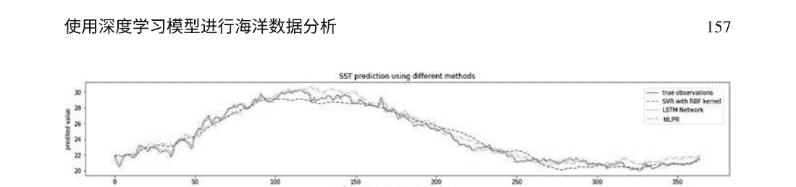

## 6.4 结论

在本章中，我们介绍了深度学习模型在海洋数据分析中的应用。由于海洋科学领域存在许多问题，并且海洋科学的研究严重依赖计算和分析，深度学习有望广泛应用于解决海洋问题，同时，深度学习将为海洋科学的发展带来新的思路和技术。最后，我们强调深度学习只是机器学习的一个分支，离完美还有很大的距离。为了解决复杂的海洋问题，我们可能需要设计新的深度架构并建立深度学习模型的新理论(Erhan et al. 2010; Cohen et al. 2016; Eldan and Shamir 2016)。

致谢本工作得到了中国国家自然科学基金委员会(NSFC)的支持，项目编号为61403353、41576011和61401413，中国国际科技合作计划(ISTCP)的支持，项目编号为2014DFA10410，山东省自然科学基金的支持，项目编号为ZR2014FQ023，青岛市科技计划的支持，项目编号为17-3-3-20-nsh，以及中国中央高校基本科研业务费的支持。本研究所使用的Titan X GPU由NVIDIA公司捐赠。

## 参考文献

- Awad M, Khanna R (2007) 支持向量回归。 神经信息处理通信 11(10):203–224
- Baudat G, Anouar F (2000) 基于核方法的广义判别分析。 神经计算 12:2385–2404
- Belkin I, Cornillon P (2003) 太平洋沿岸和边缘海的SST前沿。 太平洋海洋学 1(2):90–113
- Cai Y, Zhong G, Zheng Y, Huang K, Dong J (2015) DeCAF对准确的图像分类足够好吗？ 在: ICONIP, 第354–363页
- Cayula JF, Cornillon P (1992) 用于SST图像的边缘检测算法。 J Atmos Oceanic Technol 9(1):67–80
- Chechik G, Sharma V, Shalit U, Bengio S (2010) 通过排名大规模在线学习图像相似性。 J Mach Learn Res 11:1109–1135
- Cheriet M, Moghaddam R, Arabnejad E, Zhong G (2013) 基于形状的历史阿拉伯文档的流形学习。 Elsevier, North Holland, 第471–491页
- Chollet F et al (2015) Keras. https://github.com/fchollet/keras
- Cohen N, Sharir O, Shashua A (2016) 关于深度学习的表达能力：张量分析。在：COLT, pp 698–728
- Dean J, Corrado GS, Monga R, Chen K, Devin M, Le QV, Mao MZ, Ranzato A, Senior A, Tucker P (2012) 大规模分布式深度网络。在：NIPS, pp 1232–1240
- Deng L, Li X 语音识别的机器学习范式：概述。IEEE Trans Audio Speech Lang Process 21(5):1060–1089 (2013)
- Donahue J, Jia Y, Vinyals O, Hoffman J, Zhang N, Tzeng E, Darrell T (2014) DeCAF: 通用视觉识别的深度卷积激活特征。在：ICML, pp 647–655
- Duchi J, Hazan E, Singer Y (2010) 用于在线学习和随机优化的自适应次梯度方法。J Mach Learn Res 12(7):257–269
- Eldan R, Shamir O (2016) 前馈神经网络的深度优势. 在：COLT, pp 907–940
- Erhan D, Bengio Y, Courville A, Manzagol PA, Vincent P, Bengio S (2010) 为什么无监督预训练有助于深度学习? J Mach Learn Res 11:625–660
- ESRL N. NOAA OI SST V2高分辨率数据集 (2018) http://www.esrl.noaa.gov/psd/data/gridded/data.noaa.oisst.v2.highres.html
- Fisher R (1936) 在分类问题中使用多个测量值. Ann Eugen 7(2):179–188
- Gan Y, Chi H, Gao Y, Liu J, Zhong G, Dong J (2017) 基于感知的纹理生成. 在：ICME, pp 889–894
- Gao F, Liu X, Dong J, Zhong G, Jian M (2017) 基于深度半-NMF和SVD网络的SAR图像变化检测. Remote Sens 9(5):435
- Graves A (2013) 用循环神经网络生成序列。 CoRR abs/1308.0850
- He X, Niyogi P (2003) 保持局部性的投影。在：NIPS
- He X, Yan S, Hu Y, Niyogi P, Zhang H (2005) 使用拉普拉斯人脸识别。 IEEE Trans Pattern Anal Mach Intell 27(3):328–340
- He K, Zhang X, Ren S, Sun J (2015) 深度残差学习用于图像识别。CoRR abs/1512.03385
- Heaton J, Polson N, Witte J (2016) 在金融领域中的深度学习。 CoRR abs/1602.06561
- Hinton G, Roweis S (2002) 随机邻居嵌入。 在：NIPS，第833-840页
- Hinton G, Salakhutdinov R (2006) 用神经网络降低数据的维度。 科学 313(5786):504–507
- Hinton G, Osindero S, Teh YW (2006) 用于深度信念网络的快速学习算法。 神经计算 18(7):1527–1554
- Hinton G, Srivastava N, Krizhevsky A, Sutskever I, Salakhutdinov R (2012) 通过防止特征检测器的共适应来改进神经网络。 CoRR abs/1207.0580
- Hochreiter S, Schmidhuber J (1997) 长短期记忆。 神经计算 9(8):1735–1780
- Hsieh W (2009) 环境科学中的机器学习方法：神经网络和核方法。 剑桥大学出版社，剑桥
- Jia C, Kong Y, Ding Z, Fu Y (2014a) 用于RGB-D动作识别的潜在张量迁移学习。 在：ACM多媒体 (MM)
- Jia C, Zhong G, Fu Y (2014b) 用判别分析进行低秩张量学习，用于动作分类和图像恢复。 在：AAAI，第1228-1234页
- Jolliffe I (2002) 主成分分析。斯普林格出版社，纽约
- Kalchbrenner N, Danihelka I, Graves A (2015) 网格长短期记忆。 CoRR abs/1507.01526
- Krizhevsky A, Sutskever I, Hinton G (2012) 使用深度卷积神经网络进行Imagenet分类。 在：NIPS, pp 1106–1114
- Kug JS, Kang IS, Lee JY, Jhun JG (2004) 使用动力ENSO预测的统计方法进行印度洋海表面温度预测。 Geophys Res Lett 31(9):399–420
- Lawrence N (2005) 具有高斯过程潜在变量模型的概率非线性主成分分析。 J Mach Learn Res 6:1783–1816
- Lima E, Sun X, Dong J, Wang H, Yang Y, Liu L (2017) 学习和转移卷积神经网络知识到海洋前沿识别。 IEEE Geosci Remote Sens Lett 14(3):354–358
- Lins I, Moura M, Silva M, Droguett E, Veleda D, Araujo M, Jacinto C (2010) 基于粒子群优化的支持向量机结合粒子群优化的海面温度预测。 在：PSAM
- Liu X, Zhong G, Liu C, Dong J (2017) 基于DSNMF的水下图像色彩恒常性。IET图像处理 11(1): 38-43
- Liu X, Zhong G, Dong J (2018) 基于深度非负矩阵分解的自然图像光照估计。 IET图像处理 12(1): 121-125
- Miao H, Guo Y, Zhong G, Liu B, Wang G (2018) 基于多层神经网络和多源测高仪数据的海态偏差估计的新模型。 European J Remote Sens 51(1): 616-626
- Miller PI, Xu W, Carruthers M (2015) 利用卫星海洋色彩和温度进行季节性海洋保护区网络发展的浅海海洋前沿映射。 Deep Sea Res Part II Top Stud Oceanogr 119: 3-19
- Min S, Lee B, Yoon S (2016) 生物信息学中的深度学习。 CoRR abs/1603.06430
- Pan X, Wang J, Zhang X, Mei Y, Shi L, Zhong G (2018) 基于光学遥感图像的内部波振幅反演的深度学习模型。 Int J Remote Sens 39(3): 607-618
- Pandey G, Dukkipati A (2014) 通过拉伸深度网络进行学习。 在：ICML, pp 1719-1727
- Patil K, Deo M, Ravichandran M (2016) 通过结合数值和神经技术预测海表温度。 J Atmos Oceanic Technol 33(8): 1715-1726
- Pearson K (1901) 关于空间中最接近系统点的线和平面。 Philos Mag 2(11): 559-572
- Pedregosa F, Varoquaux G, Gramfort A, Michel V, Thirion B, Grisel O, Blondel M, Prettenhofer P, Weiss R, Dubourg V, Vanderplas J, Passos A, Cournapeau D, Brucher M, Perrot M, Duchesnay E (2011) Scikit-learn: Python中的机器学习。 J Mach Learn Res 12: 2825-2830
- Roweis S, Saul L (2000) 通过局部线性嵌入进行非线性降维。 科学 290(5500): 2323-2326
- Roy P, Zhong G, Cheriet M (2016) Tandem使用深度置信网络的HMMs进行离线手写识别。 Front Inf Technol Electron Eng 18(7):978–988
- Rumelhart D, Mcclelland J (1986) 并行分布式处理：认知微结构的探索：基础。 MIT出版社，剑桥
- Schölkopf B, Smola A, Müller KR (1998) 非线性成分分析作为核特征值问题。 Neural Comput 10(5):1299–1319
- Simonyan K, Zisserman A (2014) 用于大规模图像识别的非常深的卷积网络。 CoRR abs/1409.1556
- Sutskever I, Vinyals O, Le Q (2014) 序列到序列学习与神经网络。 在：NIPS, pp 3104–3112
- Szegedy C, Liu W, Jia Y, Sermanet P, Reed S, Anguelov D, Erhan D, Vanhoucke V, Rabinovich A (2014) 用卷积深入研究。 CoRR abs/1409.4842
- Tenenbaum J, Silva V, Langford J (2000) 用于非线性降维的全局几何框架。 科学 290(5500):2319–2323
- Vincent P, Larochelle H, Lajoie I, Bengio Y, Manzagol PA (2010) 堆叠去噪自编码器：在深度网络中学习有用的表示，具有局部去噪准则。 J Mach Learn Res 11:3371–3408
- Weinberger KQ, Blitzer J, Saul LK (2005) 用于大边界最近邻分类的距离度量学习。 在：NIPS, pp 1473–1480
- 维基百科：渤海 (2018) https://en.wikipedia.org/wiki/Bohai_Sea
- Xing EP, Ng AY, Jordan MI, Russell SJ (2002) 距离度量学习及其在聚类中的应用。 在：NIPS, pp 505–512
- Xu K, Ba J, Kiros R, Cho K, Courville A, Salakhutdinov R, Zemel R, Bengio Y (2015) 展示，关注和描述：神经图像字幕生成与视觉注意力。 在：ICML, pp 2048–2057

## 索引

### B
- Baldridge, J., 117
- Bengio, Y., 73
- Bernardi, R., 101
- Brill, E., 95
- Britz, D., 98

### C
- 蔡, Y., 143
- 字符, vi, 33, 34, 37, 42, 43, 45, 53, 57–85, 95, 97, 99, 102, 112–116, 122, 145
- 程, Y., 128
- 陈, L., 67
- Cheriet, M., 141
- Chin, F., 89–105
- Chueng, L.P., 89–105
- Cilic, M., 130
- Ciresan, D., 67
- Collobert, R., 114
- 常见组件因子载荷, 5
- 卷积神经网络 (CNNs), vi, 44, 59, 60, 62–70, 76–79, 81–85, 90, 92, 95, 97, 101, 105, 114, 128, 129, 133, 141, 143–150

### D
- 迪恩, J., 154
- 深度密度模型, v, 1-28
- 深度学习, v, vi, 57-85, 89-105, 111-136, 139-157
- 深度学习架构, 141-143, 145, 157
- 降维, 4, 5, 12, 13, 17, 141, 142
- Djokovic, N., 130
- Donahue, J., 143
- Dong, C., 114
- Dong, J., 139-157

### E
- 爱默生, R., 130
- Erkan, G., 131

### F
- 费德勒, R., 130
- 费菲, L., 101
- Firat, O., 99
- Fonseca, E.R., 122

### G
- Gehring, J., 128
- Gers, A.F., 94
- Graves, A., 94
- Grundkiewicz, R., 101

### H
- 手写识别, v, vi, 32–34, 37, 51, 52, 57–85, 142, 143
- He, K., 119
- Hinton, G., 145
- Hoang, T.D., 101
- Hochreiter, S., 145
- Hovy, E., 114
- Hovy, H.E., 97
- Huang, K., 1–28
- Huang, Z., 97
- Hussain, A., 1–28
- Hu, Z., 92

### J
- Johnson, M., 99
- Jozefowicz, R., 94
- Junczys-Dowmunt, M., 101

### K
- Kalchbrenner, N., 151
- Karpathy, A., 101
- Kim, Y., 92
- Koehn, P., 103
- Koutnik, J., 94
- Krizhevsky, A., 145

### L
- Lample, G., 97, 114
- 语言模型, 37, 39, 42–45, 50–52, 58–60, 72–76, 79–82, 84, 85, 90, 92, 124
- 大类别标注, vi, 31–34, 37, 40, 51–53, 79, 80
- Lee, L., 103
- Lima, E., 139–157
- Ling, D., 89–105
- Ling, X., 141
- Liu, C.-L., 57–85
- Li, X., 128
- 长短期记忆 (LSTM), v, vi, 32–36, 38, 40, 42, 44, 47, 48, 50–53, 92–95, 97, 98, 101, 112, 114, 115, 118, 119, 121, 125–128, 141, 150–156
- Luhn, H.P., 130
- Luo, L., 89–105
- Luong, M., 99

### M
- 机器翻译 (MT), v, vi, 90, 95–97, 99–101, 103–105, 123–130, 136, 143
- Ma, X., 97, 114
- Messina, R., 32, 34
- Mi, H., 128
- Mikolov, T., 74, 75, 91
- 混合因子分析器 (MFAs), v, 3, 5, 7–20, 28

### N
- Nallapati, R., 133
- 命名实体识别 (NER), 90, 92, 95–97, 105, 112–118, 123
- 自然语言处理 (NLP), v, vi, 34, 89–105, 111–136
- 神经元设计, 32–36, 40, 47–53, 143, 145, 156

### O
- 海洋数据分析, vi, 139-157

### P
- 庞, B., 103
- 帕斯卡努, R., 93

### R
- Radev, D.R., 131
- 循环神经网络 (RNNs), v, vi, 31-53, 68, 90, 92-95, 97, 101, 105, 114, 118, 128, 129, 133, 150
- 表示学习, 91-92, 105, 140-143
- Rong, X., 91
- Roth, D., 101
- Roy, P., 143
- Rozovskaya, A., 101
- Rush, A.M., 133

### S
- Schmaltz, A., 101
- Schmidhuber, J., 67, 94, 145
- See, A., 133, 134
- Sennrich, R., 128
- 形状模型, 58-60, 76-79, 81-85
- 申, B., 139-157
- Steedman, M., 117
- 孙, L., 31-53
- 孙, X., 139-157
- 超级标记, vi, 117-123
- 苏, T., 31-53
- Sutskever, I., 97, 145

### T
- 唐, Y., 16
- 文本, vi, 2, 32, 37, 45, 57-85, 91, 97, 100, 103, 105, 113, 130-133, 135
- 文本摘要, vi, 130-135
- 涂, Z., 128

### V
- 瓦瓦尼, A., 128, 129
- 维尼亚尔斯, O., 101

### W
- 王, D.-H., 31-53
- 王, H., 139-157
- 王, L.-N., 139-157
- 王, Q.-F., 31-53, 71, 79-84
- 王, S., 76, 81
- Word2Vec, 90-92, 102, 105
- 作家适应, 59, 60, 65, 68, 70, 85
- 吴, C., 67
- 吴, H., 122
- 吴, Y., 98
- 吴, Y.-C., 57-85

### X
- Xu, K., 101
- Xu, L., 77, 78

### Y
- 杨, H., 89–105
- 杨, W., 68, 69
- 杨, X., 1–28
- 尹, F., 57–85

### Z
- 张, J., 111–136
- 张, Q., 139–157
- 张, Q.-F., 79
- 张, R., 1–28
- 张, X.-Y., 57–85
- 郑, Y., 142, 143
- 钟, G., 139–157
- 钟, Z., 67
- 宗, C., 111–136

Yan S, Xu D, Zhang B, Zhang HJ, Yan Q, Lin S (2007) 图嵌入和扩展：降维的通用框架。 IEEE Trans Pattern Anal Mach Intell 29 (1) ： 40–51

Yang Y, Dong J, Sun X, L guensat R, Jian M, Wang X (2016) 即时遥感SST图像中的海洋前沿检测。 IEEE Geosci Remote Sens Lett 13 (12) ： 1960–1964

Zhang Q, Wang H, Dong J, Zhong G, Sun X (2017) 使用长短期记忆预测海表温度。 IEEE Geosci Remote Sens Lett 14 (10) ： 1745–1749

Zheng Y, Zhong G, Liu J, Cai X, Dong J (2014) 基于特征学习模型和深度架构的视觉纹理感知。 在： CCPR, pp 401–410

Zheng Y, Cai Y, Zhong G, Chherawala Y, Shi Y, Dong J (2015) 拉伸深度架构用于文本识别。 在： ICDAR, 第236-240页

Zhong G, Cheriet M (2012) 图像块分析用于文本块识别。 在： ISSPA, 第1241-1246页

Zhong G, Cheriet M (2013) 自适应纠错输出码。 在： IJCAI, 第1932-1938页

Zhong G, Cheriet M (2014a) 大边界低秩张量分析。 神经计算 26(4): 761-780

Zhong G, Cheriet M (2014b) 低秩张量流形学习。 Springer国际出版, Cham, 第133-150页

Zhong G, Cheriet M (2015) 基于张量表示学习的图像块分析用于文本识别和识别。 Pattern Recognit 48(4): 1211-1224

钟G, 凌X (2016) 追踪比问题最优解存在的必要和充分条件。 在： CCPR, 第742-751页

钟G, 刘CL (2013) 基于纠错输出码的集成特征提取。 模式识别46 (4) ： 1091-1100

钟G, 李WJ, 杨DY, 侯X, 刘CL (2010) 高斯过程潜在随机场。 在： AAAI

钟G, 黄K, 刘CL (2011) 具有流形正则化的低秩度度量学习。 在： ICDM, 第1266-1271页

钟G, 黄K, 侯X, 项S (2012) 局部切空间拉普拉斯特征映射, 第17-34页。 SNOVA科学出版社, 纽约

钟G, 姚H, 刘Y, 洪C, 范T (2014) 基于深度学习特征的拍摄文档图像分类。 在： ICG IP

钟G, 史Y, Cheriet M (2016a) 关系Fisher分析：降维的通用框架。 在： IJCNN, pp 2244-2251

钟G, 王LN, 凌X, 董J (2016b) 数据表示学习概述：从传统特征学习到最近的深度学习。 J Financ Data Sci 2 (4) ： 265-278

钟G, 徐H, 杨P, 王S, 董J (2016c) 深度哈希学习网络。 在： IJCNN, pp 2236-2243

钟G, 郑Y, 李S, 付Y (2016d) 可扩展的大边界在线度量学习。 在： IJCNN, pp 2252-2259

钟G, 魏H, 郑Y, 董J (2017a) 感知驱动的纹理生成。 在： ACPR

钟G, 郑Y, 李S, 付Y (2017b) Slmoml：具有全局收敛性的在线度量学习。 IEEE Trans Circuits Syst Video Technol PP(99):1–1

钟G, 凌X, 王LN (2018a) 从浅层特征学习到深度学习：深度架构的宽度和深度的好处。 WIREs数据挖掘知识发现

钟G, 魏H, 郑Y, 董J, Cheriet M (2018b) 深度纠错输出码。 在： ICPRAI

钟G, 颜S, 黄K, 蔡Y, 董J (2018c) 减少和拉伸深度卷积激活特征以实现准确的图像分类。 Cogn Comput 10(1):179–186

钟G, 姚H, 周H (2018d) 合并神经元以压缩深度网络的结构。 在： ICPR

钟G, 郑Y, 张XY, 魏H, 凌X (2018e) 卷积判别分析。 在： ICPR