# 深度强化学习

## 前言

深度强化学习近年来引起了广泛关注。 在自动驾驶、游戏玩耍、分子重组和机器人等各种活动中取得了令人印象深刻的结果。 在所有这些领域，计算机程序已经学会解决困难的问题。 它们已经学会驾驶模型直升机，并执行如环形和翻滚等特技动作。 在一些应用中，它们甚至比最优秀的人类更出色，比如在Atari、围棋、扑克和星际争霸中。

深度强化学习探索复杂环境的方式让我们想起了孩子学习的方式，通过玩耍尝试事物，获得反馈，然后再次尝试。 计算机似乎真正具备了人类学习的一些方面；深度强化学习触及到了人工智能的梦想。

研究中的成功并未逃脱教育者的注意，许多大学已经开始开设相关课程。 本书的目标是提供对深度强化学习领域的全面概述。 本书面向人工智能研究生以及希望更好地理解深度强化学习方法和挑战的研究人员和从业者。 我们假设读者具备本科水平的计算机科学和人工智能理解能力；本书的编程语言是Python。

我们描述了深度强化学习的基础、算法和应用。 我们涵盖了构成该领域基础的已建立的无模型和有模型方法。 发展迅速，我们还涵盖了更高级的主题：深度多智能体强化学习、深度分层强化学习和深度元学习。

我们希望学习深度强化学习能给你带来与许多研究人员在开发算法、最终使其工作并看到它们学习时所体验到的乐趣一样多！

莱顿，荷兰

2022年1月

Aske Plaat

## 致谢

这本书得到了许多朋友的帮助。首先，我要感谢莱顿高级计算机科学研究所的所有人，为创造如此有趣和充满活力的工作环境。

许多人为这本书做出了贡献。一些材料基于我们以前的强化学习课程所使用的书籍，以及Thomas Moerland撰写的关于基于策略的讲义。Thomas还对本书的早期草稿提供了宝贵的批评。此外，在准备本书的过程中，我们还撰写了关于深度基于模型的强化学习、深度元学习和深度多智能体强化学习的综述文章。我要感谢Mike Preuss、Walter Kosters、Mike Huisman、Jan van Rijn、Annie Wong、Anna Kononova和Thomas Bäck，他们是这些文章的合著者。

我感谢莱顿强化学习社区的所有成员对此的贡献和热情。我特别感谢Thomas Moerland、Mike Preuss、Matthias Müller-Brockhausen、Mike Huisman、Hui Wang和Zhao Yang对这门课程的帮助。我感谢Wojtek Kowalczyk对深度监督学习的深入讨论，以及Walter Kosters对组合搜索的观点，以及他永不停止的幽默感。

特别感谢Thomas Bäck，我们进行了许多关于科学、宇宙和一切事物（包括进化）的讨论。没有你，这一努力是不可能的。

这本书是我们在莱顿教授的强化学习研究生课程的结果。我感谢这门课程的所有学生，过去、现在和未来，对他们的热情、尖锐的问题和许多建议。这本书是为你们写的，也是由你们写的！

最后，我感谢Saskia，Isabel，Rosalin，Lily和Dahlia，感谢他们的存在，感谢他们的反馈和让我学习的机会，感谢他们无尽的爱。

## 1.1 什么是深度强化学习？

深度强化学习研究我们如何学习解决复杂问题，这些问题需要我们在高维状态下找到一系列决策的解决方案。要制作面包，我们必须使用正确的面粉，加入一些盐、酵母和糖，准备面团（不要太干也不要太湿），将烤箱预热到正确的温度，并烘烤面包（但不要太久）；要赢得舞厅舞蹈比赛，我们必须找到合适的搭档，学会跳舞，并击败竞争对手；要在国际象棋中获胜，我们必须学习、练习并做出所有正确的移动。

深度强化学习是深度学习和强化学习的结合。

深度强化学习的目标是学习最优动作，以最大化我们在环境的所有可能状态下的奖励（面包店、舞厅、国际象棋棋盘）。我们通过与复杂的高维环境交互，尝试各种动作，并从反馈中学习。

深度学习的领域是关于在高维问题中逼近函数的，这些问题非常复杂，以至于无法使用表格方法找到精确解。深度学习使用深度神经网络来找到大型、复杂、高维环境的近似解，例如图像和语音识别。这个领域取得了令人瞩目的进展；计算机现在可以在一系列图像中识别行人（以避免撞到他们），并且可以理解诸如“明天天气如何？”这样的句子。强化学习的领域是关于从反馈中学习的；它通过试错来学习。强化学习不需要预先存在的数据集进行训练；它选择自己的动作，并从环境提供的反馈中学习。可以说，在这个试错的过程中，我们的代理将犯错误（灭火器对于学习烘焙面包的过程至关重要）。强化学习的领域是关于从成功和错误中学习的。

近年来，深度学习和强化学习这两个领域已经融合在一起，并产生了能够通过对其行动的反馈来近似高维问题的新算法。深度学习带来了新的方法和新的成功，包括策略基于方法、模型基于方法、迁移学习、分层强化学习和多智能体学习的进展。

这两个领域也可以分开存在，作为深度监督学习和表格强化学习（见表1.1）。深度监督学习的目标是从现有数据集中推广和近似复杂的高维函数，而不需要交互；附录B讨论了深度监督学习。表格强化学习的目标是在简单的低维环境中通过交互学习，例如网格世界；第2章讨论了表格强化学习。

让我们更仔细地看一下这两个领域。

表1.1 深度强化学习的组成部分

|                | 低维状态           | 高维状态             |
| -------------- | ------------------ | -------------------- |
| 静态数据集     | 经典监督学习       | 深度监督学习         |
| 代理/环境交互 | 表格强化学习       | 深度强化学习         |

### 1.1.1 深度学习

经典的机器学习算法通过使用线性回归、决策树、随机森林、支持向量机和人工神经网络等方法，在数据上学习预测模型。这些模型的目标是泛化，进行预测。从数学角度来看，机器学习的目标是从数据中逼近一个函数。

在过去，当计算机速度较慢时，使用的神经网络由几层全连接神经元组成，在困难问题上表现不佳。随着深度学习和更快的计算机的出现，这种情况发生了变化。深度神经网络现在由许多层神经元组成，并使用不同类型的连接。¹深度网络和深度学习已经将某些重要机器学习任务的准确性提升到了一个新的水平，并且使得机器学习可以应用于复杂的高维问题，例如在高分辨率（百万像素）图像中识别猫和狗。

### 1.1.2 强化学习

深度学习允许实时解决高维问题；它已经使得机器学习可以应用于我们手机中使用的人脸识别和语音识别等日常任务。

让我们更深入地了解强化学习，看看它是如何从我们自己的行动中学习的。

强化学习是一个代理通过与环境交互来学习的领域。在监督学习中，我们需要预先存在的带有标签的示例数据集来近似一个函数；强化学习只需要一个提供反馈信号的环境来尝试不同动作。这个要求更容易满足，使得强化学习可以适用于更多的情况。

强化学习代理通过其行动生成自己的即时数据，通过环境的奖励来实现。代理可以选择从中学习的动作；强化学习是一种主动学习的形式。在这个意义上，我们的代理就像孩子一样，通过玩耍和探索来教自己某个任务。这种自主性是吸引研究者进入这个领域的一个方面。强化学习代理选择要执行的动作——要测试的假设——并调整其对于有效的知识，建立起在遇到不同世界状态时要执行的动作策略。（这种自由也是强化学习的难点之一，因为当你被允许选择自己的示例时，很容易陷入舒适区，困在一个正向强化的泡泡中，相信自己做得很好，但对周围的世界学到很少。）

### 1.1.3 深度强化学习

深度强化学习将学习高维问题的方法与强化学习相结合，使得高维、交互式学习成为可能。深度强化学习引起人们兴趣的一个主要原因是它在当前计算机上表现良好，并且在看似不同的应用中都能发挥作用。例如，在第3章中，我们将看到深度强化学习如何学习眼手协调任务以玩1980年代的视频游戏，在第4章中，我们将看到模拟机器人猎豹如何学会跳跃，在第6章中，我们将看到它如何自学以玩复杂的策略游戏，甚至能够击败世界冠军。

让我们更仔细地看一下深度强化学习在哪些应用上表现出色。

### 1.1.4 应用

在其最基本的形式中，强化学习是一种教导代理在世界中运作的方法。 就像孩子通过行动和反馈学会走路一样，强化学习代理也是通过行动和反馈来学习的。 深度强化学习可以学会解决大型复杂的决策问题——这些问题的解决方法尚未知晓，但存在一种近似的试错机制，可以通过与问题的反复交互来学习解决方案。 这听起来可能有点神秘和复杂，但近似和试错是我们在现实生活中经常做的事情。 泛化和近似允许我们从示例中推断出模式或规则。 试错是人类学习如何处理不熟悉事物的一种方法（“如果我按下这个按钮会发生什么？ 哦。 糟糕。”或者：“如果我在前腿之前不放下我的腿向前移动会发生什么？ 哦。 哎呀。”）

### 1.1.4.1 顺序决策问题

学习在世界中运作是一个高级目标；我们可以更具体一些。强化学习是关于代理的行为。 强化学习可以找到顺序决策问题的解决方案，或者在工程中被称为最优控制问题。 在现实世界中，有许多情况下，为了达到一个目标，必须做出一系列决策。 无论是烘焙蛋糕、建造房屋还是玩纸牌游戏，都需要做出一系列决策。 强化学习提供了学习顺序决策问题解决方案的高效方法。

许多现实世界的问题可以建模为一系列决策。 例如，在自动驾驶中，代理面临速度控制、寻找可行驶区域以及最重要的是避免碰撞的问题。 在医疗保健中，治疗计划包含许多顺序决策，并且可以研究延迟治疗的影响。 在客户中心，自然语言处理可以帮助改进聊天机器人对话、问题回答甚至机器翻译。 在营销和沟通中，推荐系统可以推荐新闻、个性化建议、向用户发送通知或优化产品体验。 在交易和金融中，系统决定持有、购买或出售金融资产，以优化未来回报。 在政治和治理中，政策的影响可以在实施之前模拟为一系列决策。 在数学和娱乐中，玩棋盘游戏、纸牌游戏和策略游戏都包含一系列决策。 在计算创造力中，制作一幅画需要一系列审美决策。 在工业机器人和工程中，抓取物品和材料的操纵都包含一系列决策。 在化学制造中，生产过程的优化包含许多决策步骤，这些步骤影响产品的产量和质量。 最后，在能源网络中，高效安全地分配能源可以建模为顺序决策问题。

在所有这些情况下，我们必须做出一系列的决策。在所有这些情况下，做出错误的决策可能非常昂贵。顺序决策的算法研究主要集中在两种类型的应用上：(1) 机器人问题和 (2) 游戏。让我们仔细研究一下这两个领域，从机器人开始。

### 1.1.4.2 机器人

原则上，机器人应该采取的所有动作都可以由程序员逐步预先编程详细步骤。在高度受控的环境中，例如汽车工厂中的焊接机器人，这可能可行，尽管任何小的变化或任何新的任务都需要重新编程机器人。

手动编程一个机器人执行复杂任务是非常困难的。人类并不知道自己的操作知识，比如我们拿起杯子时给哪些肌肉施加了什么“电压”。定义一个期望的目标状态，并让系统自己找到复杂的解决方案要容易得多。此外，在环境稍微具有挑战性的情况下，当机器人必须能够更灵活地应对不同的条件时，需要使用自适应程序。

毫不奇怪，机器人学的应用领域是机器学习研究的重要推动力，机器人研究人员早早就开始寻找机器人能够自己教会自己某些行为的方法。

关于机器人实验的文献是多样且丰富的。机器人可以自己教会自己如何在迷宫中导航，如何执行操纵任务，以及如何学习运动任务。

自适应机器人技术的研究取得了相当大的进展。例如，最近的一项成就之一是翻煎饼[29]和飞行特技模型直升机[1, 2]；参见图1.1和图1.2。经常将学习任务与计算机视觉相结合，机器人必须通过视觉解释其自身行为的后果来学习。

图1.1 机器人翻煎饼[29]

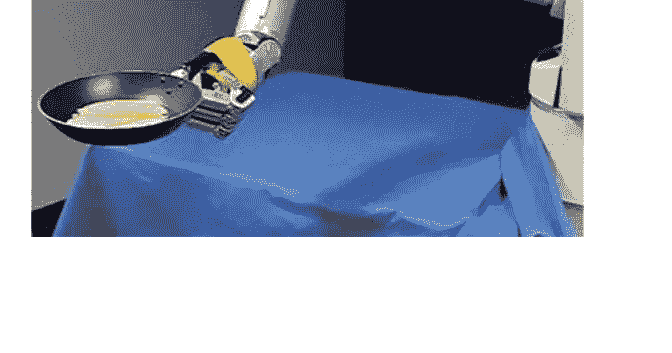

# 图1.2 特技模型直升机[2]

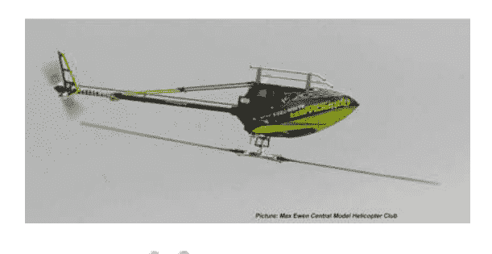

# 图1.3 国际象棋

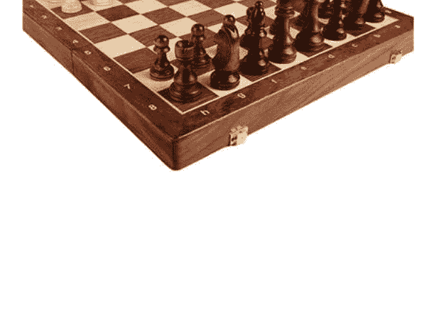

### 1.1.4.3 游戏

现在让我们转向游戏。从最早的日子开始，谜题和游戏就被用来研究智能行为的方面。事实上，在计算机足够强大以执行国际象棋程序之前，在Shannon和Turing的时代，人们制定了纸质设计，希望通过了解国际象棋来了解智能的本质[38, 41]。

游戏使研究人员能够限制其研究范围，专注于有限环境中的智能决策，而无需掌握真实世界的全部复杂性。除了象棋和围棋等棋盘游戏外，视频游戏广泛用于测试计算机中的智能方法。

例如，街机游戏如吃豆人[32]和多人策略游戏如星际争霸[43]。参见图1.3、1.4、1.5和1.6。

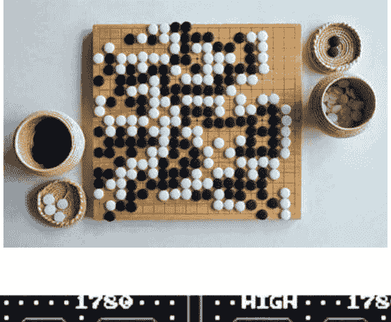

图1.4 围棋


图1.5 吃豆人 [6]

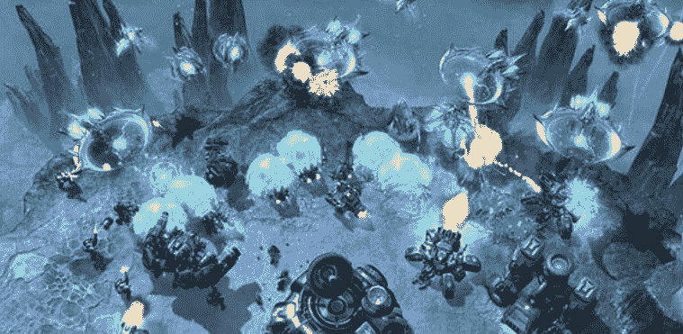

图1.6 星际争霸 [43]

### 1.1.5 四个相关领域

强化学习是一个丰富的领域，在人工智能开始之前就以某种形式存在，作为生物学、心理学和教育的一部分[9, 25, 40]。 在人工智能中，它已经成为机器学习的三个主要类别之一，另外两个是监督学习和无监督学习[10]。 这本书是受自然科学和社会科学主题启发的算法书。 尽管本书的其余部分将涉及这些算法，但简要讨论深度强化学习与人类和动物学习的联系是有趣的。 我们将介绍对深度强化学习产生深远影响的四个科学学科。

#### 1.1.5.1 心理学

在心理学中，强化学习也被称为条件学习或操作性条件反射。 图1.7展示了民间心理学中狗如何被训练的概念。 狗对食物的自然反应是流口水。 通过在狗被给予食物时敲响铃声，狗学会将声音与食物联系起来，在足够的试验后，狗一听到铃声就开始流口水，预示着食物的到来，无论食物是否存在。 行为科学家巴甫洛夫（1849-1936年）和斯金纳（1904-1990年）以他们在条件反射方面的研究而闻名。 诸如巴甫洛夫反应之类的短语已经流行起来

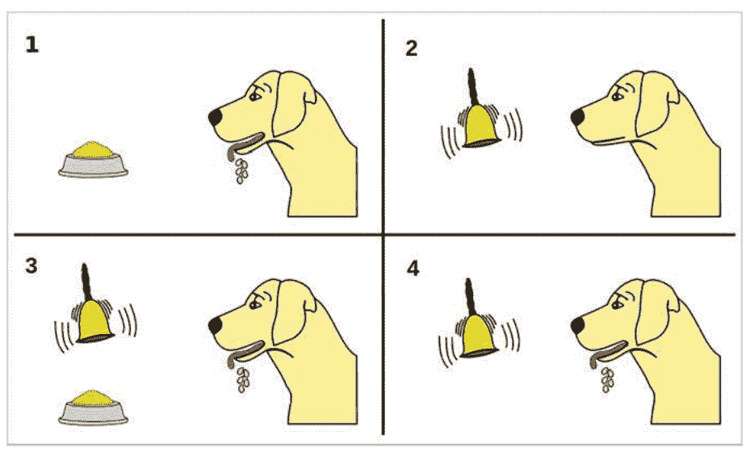

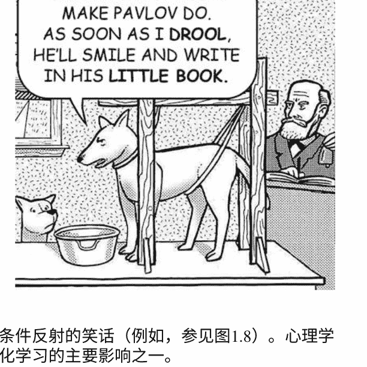

我们日常语言中存在各种关于条件反射的笑话（例如，参见图1.8）。心理学对学习的研究是人工智能中强化学习的主要影响之一。

#### 1.1.5.2 数学

数理逻辑是深度强化学习的另一个基础。离散优化和图论对于强化学习的形式化非常重要，我们将在第2.2.2节中看到马尔可夫决策过程。

数学形式化使得高效的规划和优化算法的发展成为可能，这是当前进展的核心。

规划和优化是深度强化学习的重要组成部分。它们也与运筹学领域相关，尽管那里的重点是（非顺序）组合优化问题。在人工智能中，规划和优化被用作为创建用于顺序、高维问题的学习系统的基石，这些问题可以包括视觉、文本或听觉输入。

符号推理领域基于逻辑，是人工智能中最早的成功案例之一。从符号推理中衍生出了启发式搜索[34]、专家系统和定理证明系统。众所周知的系统包括STRIPS规划器[17]、Mathematica计算代数系统[13]、逻辑编程语言PROLOG[14]，以及用于语义（Web）推理的SPARQL等系统[3, 7]。

符号人工智能专注于离散领域的推理，如决策树、规划以及象棋和跳棋等策略游戏。符号人工智能在搜索网络、推动在线社交网络和在线商务方面取得了成功。这些极为成功的技


科学家图灵奖授予Judea Pearl因其在因果推理方面的工作（图1.9）。<sup>2</sup>Pearl后来出版了一本有影响力的书来普及这个领域[35]。

在深度强化学习中，数学的另一个重要领域是连续（数值）优化。连续方法在当前深度学习算法的核心部分，如高效梯度下降和反向传播方法中起着重要作用。

#### 1.1.5.3 工程

在工程领域，强化学习领域更为人所知的是最优控制。动态系统的最优控制理论由Richard Bellman和Lev Pontryagin发展而来[8]。最优控制理论最初关注的是动态系统，并且与连续优化方法（如机器人技术中使用的方法）相关的技术和方法（见图1.10）。最优控制理论对工程中的许多问题至关重要。

到目前为止，强化学习和最优控制使用不同的术语和符号。在面向状态的强化学习中，状态和动作分别表示为 $s$ 和 $a$，而最优控制的工程世界使用的是 $x$ 和 $u$。本书使用前一种符号表示法。

<sup>2</sup>加入了一个长长的人工智能研究者名单，他们之前曾获得图灵奖：明斯基、麦卡锡、纽厄尔、西蒙、费根鲍姆和雷迪。

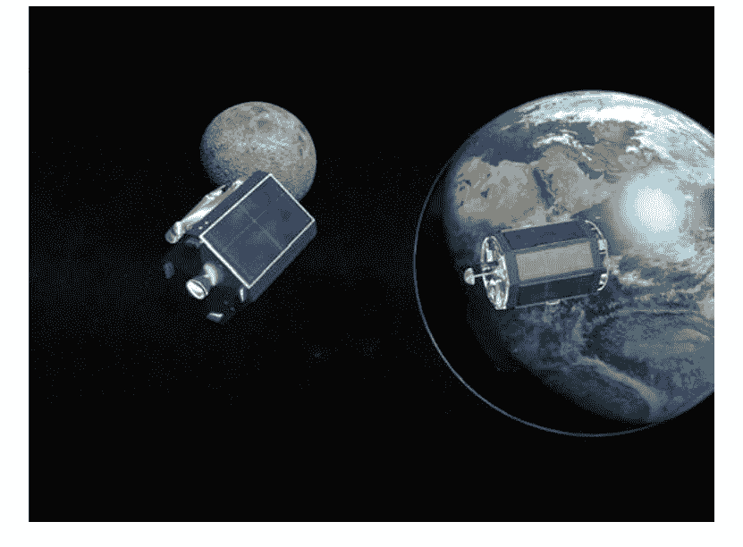

图1.10 动态系统的最优控制工作

#### 1.1.5.4 生物学

生物学对计算机科学有深远影响。 许多受自然启发的优化算法已经在人工智能领域中开发出来。 一个重要的的受自然启发的思想流派是连接主义人工智能。

数理逻辑和工程方法将智能视为自上而下的演绎过程；现实世界中的可观察效果是从理论和自然法则的应用中得出的，智能是从理论中演绎出来的。相比之下，连接主义以自下而上的方式处理智能。

连接主义智能源于许多低层次的相互作用。 智能从实践中归纳出来。 智能是具体化的：蜜蜂在蜂巢中，蚂蚁在蚁群中，神经元在大脑中相互作用，从连接和相互作用中产生我们所认识的行为，即智能[11]。

连接主义方法对智能的例子包括自然启发的算法，如蚁群优化[15]，群体智能[11, 26]，进化算法[4, 18, 23]，机器人智能[12]，以及人工神经网络和深度学习[19, 21, 30]。

值得注意的是，符号主义和连接主义的人工智能学派都取得了很大的成功。在搜索和符号人工智能（谷歌，Facebook，亚马逊，Netflix）产生巨大经济影响之后，过去二十年对人工智能的兴趣主要受到了计算机语言和视觉领域连接主义方法的成功的启发。 2018年，图灵奖授予了深度学习的三位关键研究者：Bengio，Hinton和LeCun（图1.11）。他们在深度学习上最著名的论文可能是[30]。

## 1.2 三种机器学习范式

现在我们已经介绍了深度强化学习的一般背景和起源，让我们转换话题谈谈机器学习。让我们看看深度强化学习如何适应该领域的整体情况。同时，我们将借此机会介绍一些符号和基本概念。

在下一节中，我们将提供本书的大纲。但首先是机器学习的时间。我们从开始的地方开始，使用函数逼近。

### 表示函数

函数是人工智能中的核心部分。函数 f 根据某种方法将输入 x 转换为输出 y，我们将其写为 f(x) → y。为了使用函数 f 进行计算，函数必须以某种形式在内存中表示为计算机程序。我们还写下函数
```
f : X → Y,
```
其中域 X 和范围 Y 可以是离散的或连续的；维度（在 X 中的属性数量）可以是任意的。

通常，在现实世界中，相同的输入可能产生不同的输出范围，我们希望我们的函数提供一个条件概率分布，一个将输入映射到输出概率的函数。
```
f : X → p(Y).
```
在这里，函数将域映射到一个概率分布 p over the range。表示条件概率允许我们建模那些输入不总是产生相同输出的函数。（附录A提供了更多的数学背景。）

### 给定与学习的函数

有时我们感兴趣的函数是给定的，我们可以通过一个特定的算法来表示该函数，该算法可以计算出一个已知的解析表达式。例如，这是物理定律的情况，或者当我们对特定系统进行明确的假设时。

> 例子 牛顿第二定律规定了质量恒定的物体
>
> F = m · a,
>
> 其中 F 表示物体的净力，m 表示其质量，a 表示其加速度。在这种情况下，解析表达式定义了整个函数，适用于所有可能的输入组合。

然而，在现实世界中，对于许多函数，我们没有解析表达式。在这里，我们进入了机器学习的领域，特别是监督学习。当我们不知道一个函数的解析表达式时，我们最好的方法是收集数据-示例(x, y)对，并从这些数据中逆向工程或学习函数。参见图1.12。

图1.12 学习函数的示例；数据点为蓝色，可能学习到的线性函数为红线，这使我们能够对任何新的输入 x 进行预测 ŷ

> 例子 一家公司想要根据你的年龄来预测你购买染发洗发水的机会。他们收集了许多数据点，其中 x ∈ N，你的年龄（自然数），映射到 y ∈ {0,1}，一个二进制指示器，表示你是否购买了他们的洗发水。然后他们想要学习这个映射
>
> ŷ = f(x),
>
> 其中 f 是所需的函数，告诉公司谁会购买该产品，ŷ 是预测的 y（在这个例子中过于简化）。

让我们看看机器学习中存在哪些方法来找到函数近似。

### 三种范式

机器学习中有三种主要范式来提供观察数据：（1）监督学习，（2）强化学习和（3）无监督学习。

### 1.2.1 监督学习

机器学习的第一个和最基本的范式是监督学习。在监督学习中，学习算法会以 (x, y) 的示例对提供给学习函数 f(x) 的数据进行学习。这里的输入是 x，观察到的输出是要学习的值是特定输入值 x 的学习值。这些 y 值可以被看作是监督学习过程的监督者，它们教导学习过程每个输入值 x 的正确答案，因此被称为监督学习。

要从中学习的数据对被组织在一个数据集中，在算法开始之前必须完整地存在。在学习过程中，会创建一个估计生成数据的真实函数 f。这对中的 x 值也被称为输入，y 值是要学习的标签。

监督学习中两个众所周知的问题是回归和分类。回归预测连续数值，分类预测离散类别。最为人所知的回归关系是线性关系：我们在统计学入门课程中熟悉的直线通过一组观测点云。图1.12展示了这样一种线性关系 $\hat{y} = a \cdot x + b$。线性函数可以用两个参数 a 和 b 来描述。当然，还有可能存在更复杂的函数，比如二次回归、非线性回归或者高阶多项式回归[16]。

对于每个数据项 i，监督信号被计算为当前估计值与给定标签之间的差异，例如通过 $(f(\hat{x}_i) - y_i)^2$。这样的误差函数 $(f(x) - y)^2$ 也被称为损失函数，它衡量了我们预测的质量。我们的预测越接近真实标签，损失就越低。有很多方法可以计算这个接近度，例如均方误差损失 $\mathcal{L} = \frac{1}{N} \sum_{i=1}^N (f(\hat{x}_i) - y_i)^2$，这在 N 观测中经常用于回归。这个损失函数可以被监督学习算法用来调整模型参数 a 和 b 以适应函数 f 到数据。许多可能的学习算法包括线性回归和支持向量机[10, 36]。

在分类中，学习了输入值和类标签之间的关系。一个经过深入研究的分类问题是图像识别，其中二维图像需要被分类。表1.2展示了一个小型的带有标签的猫和狗的数据集。一个常用的分类损失函数是交叉熵损失 $\mathcal{L} = - \sum_{i=1}^N y_i \log(f(\hat{x}_i))$，参见A.2.5.3节。同样，这样的损失函数可以用来调整模型参数以适应数据。模型可以是小而线性的，参数较少，也可以是大而复杂的，例如神经网络，常用于图像分类。

在监督学习中，存在一个大型数据集，其中所有输入项都有一个相关的训练标签。强化学习不同，它不假设存在一个大型标记训练集。无监督学习需要一个大型数据集，但不需要用户提供的输出标签；它只需要输入。

表1.2 (输入/输出)对于一个监督分类问题
| 图片1 | 图片2 | 图片3 | 图片4 | 图片5 | 图片6 |
|-------|-------|-------|-------|-------|-------|
| “猫” | “猫” | “狗” | “猫” | “猫” | “狗” |

深度学习函数逼近首先在监督设置中开发出来。尽管本书是关于深度强化学习的，但我们经常会遇到监督学习的概念，每当我们讨论深度强化学习的深度学习方面时。

### 1.2.2 无监督学习

当数据集中没有标签时，必须使用不同的学习算法。没有标签的学习被称为无监督学习。在无监督学习中，使用数据项的固有度量，如距离。无监督学习中的一个典型问题是在数据中找到模式，如聚类或子群[42, 44]。

流行的无监督学习算法是k均值算法和主成分分析[24, 37]。其他流行的无监督方法是从可视化中进行的维度缩减技术，例如t-SNE [31]、最小描述长度[20]和数据压缩[5]。无监督学习的一个流行应用是自动编码器，请参见第B.2.6.3节[27, 28]。

有监督学习和无监督学习之间的关系有时被描述如下：有监督学习旨在学习条件概率分布 p(x|y)，即在给定标签 y 的输入数据的条件下，而无监督学习旨在学习先验概率分布 p(x) [22]。

在本书中，我们将在几个地方遇到无监督方法，具体来说，当讨论自动编码器和维度缩减时，例如在第5章。在本书的最后，我们将讨论可解释的人工智能，其中可解释的模型发挥着重要的作用，见第10章。

### 1.2.3 强化学习

最后的机器学习范式是强化学习。强化学习与之前的范式有三个区别。

首先，强化学习通过互动学习；与监督学习和无监督学习不同，强化学习的数据逐个产生。数据集是动态生成的。强化学习的目标是找到策略：一个在每个状态下给出最佳动作的函数，世界可能处于其中的状态。

强化学习的方法是通过与世界互动来学习世界的策略。在强化学习中，我们认识到有一个进行策略学习的代理和一个提供反馈给代理行动的环境（并执行状态变化，参见图1.13）。在强化学习中，代理代表人类，环境代表世界。强化学习的目标是找到每个状态下最大化长期回报的动作。

表1.3 监督学习 vs. 强化学习
| 概念 | 监督学习 | 强化学习 |
| :--- | :--- | :--- |
| 输入 x | 完整的状态数据集 | 部分（一次一个状态） |
| 标签 y | 完整的（正确的动作） | 部分（数值动作奖励） |

术语累积预期奖励。这个将状态映射到动作的最优函数被称为最优策略。

在强化学习中，没有老师或监督者，也没有静态数据集。然而，有一个环境会告诉我们我们所处状态的好坏。这就带来了第二个区别：奖励值。强化学习给我们提供了部分信息，一个数字表示将我们带到当前状态的动作的质量，而监督学习则提供了完整信息：一个在该状态下提供正确答案的标签（表1.3）。从这个意义上说，强化学习介于监督学习和无监督学习之间，其中所有数据项都有标签，而无监督学习则没有标签的数据。

第三个区别是强化学习用于解决顺序决策问题。监督学习和无监督学习学习单步关系之间的项目；强化学习学习策略，这是一个多步问题的答案。监督学习可以为您分类一组图像；无监督学习可以告诉您哪些项目属于一起；强化学习可以告诉您国际象棋游戏中的获胜顺序，或者机器人腿需要采取的动作顺序以行走。

这三个区别有后果。强化学习逐步提供数据给学习算法，一步一步，而在监督学习中，数据一次性提供在一个大型数据集中。逐步方法非常适合顺序决策问题。另一方面，许多深度学习方法是为监督学习开发的，当数据项逐个生成时，可能会有不同的工作方式。此外，由于使用策略函数选择动作，并使用动作奖励来更新此相同的策略函数，存在循环反馈和局部最小值的可能性。

在我们的方法中，必须注意确保收敛到全局最优解。人类学习也受到这个问题的困扰，当一个固执的孩子拒绝探索其舒适区之外的东西时。这个主题在第2.2.4.7节中讨论。另一个区别是，在监督学习中，学生从一个有限大小的教师（数据集）中学习，并且在某个时刻可能已经学到了所有的知识。

强化学习范式允许一种学习设置，其中代理可以持续地对环境进行采样，并且只要环境保持具有挑战性（例如在象棋和围棋等游戏中可能需要很长时间），代理就会变得更加聪明。^3

出于这些原因，人们对强化学习非常感兴趣，尽管使方法正常工作通常比监督学习更困难。大多数经典的强化学习使用表格方法，适用于低维问题和小状态空间。许多现实世界的问题是复杂的和高维的，具有大的状态空间。由于学习算法、数据集和计算能力的持续改进，深度学习方法已经变得非常强大。深度强化学习方法已经出现，成功地将逐步采样与高维问题和大状态空间相结合。我们将在本书的后续章节中讨论这些方法。

## 1.3 书籍概述

本书的目标是在一个综合的单一卷中呈现深度强化学习的最新见解，适合教授研究生水平的一学期课程。

除了涵盖最先进的算法，我们还介绍了经典强化学习和深度学习的必要背景知识。我们还介绍了自我对弈、多智能体、分层和元学习等前瞻性发展。

### 1.3.1 先决知识

为了全面，我们对先前的知识做了适度的假设。我们假设具有计算机科学或人工智能的学士学位，并对人工智能和机器学习感兴趣。一本很好的人工智能入门教材是Russell和Norvig的《人工智能：一种现代方法》[36]。

图1.14显示了本书的结构概述。深度强化学习结合了深度监督学习和经典（表格）强化学习。该图显示了各章如何基于这个双重基础构建。

对于深度强化学习来说，深度监督学习领域非常重要。这是一个广阔、深入和丰富的领域。许多学生可能已经跟随过关于深度学习的课程；如果没有，附录B会为您提供必要的背景（虚线）。另一方面，表格强化学习可能对您来说是新的，我们从第2章开始讲述这个主题。

我们还假设您具备本科水平的Python编程语言的熟悉程度。Python已成为机器学习研究的首选编程语言，并且大多数机器学习包的宿主语言也是Python。本书中的所有示例代码都是用Python编写的，并且主要的机器学习环境，如scikit-learn、TensorFlow、Keras和PyTorch，最适合使用Python。请参阅https://www.python.org以了解如何开始使用Python。除非文本另有说明，否则请使用最新的稳定版本。

我们假设读者具备本科水平的数学基础——对集合论、图论、概率论和信息论有基本的理解是必要的，尽管本书并非数学教材。附录A包含了一个总结，以便复习数学知识，并介绍了本书中使用的符号。

#### 1.3.1.1 课程

本书的章节中包含了大量的基础和高级材料，并提供了许多参考文献。一种选择是开设一门关于本书所有主题的单一课程。另一种选择是更慢更深入地学习，花足够的时间学习基础知识，并创建一门关于第2-5章基础主题（基于价值、基于策略和基于模型的学习）的课程，并创建一门关于第6-9章更高级主题（多智能体、分层和元学习）的独立课程。

#### 1.3.1.2 博客和GitHub

深度强化学习领域是一个非常活跃的领域，理论和实践相辅相成。这个领域的文化是开放的，你会很容易地找到许多关于有趣主题的博客文章，其中一些非常好。理论推动实验，实验结果推动理论洞察。许多研究人员在arXiv上发表论文，并在GitHub上分享他们的算法、超参数设置和环境。

在本书中，我们追求相同的氛围。在整个文本中，我们提供了代码链接，并通过实践部分向您提出挑战，让您亲自动手进行实验。我们使用的所有网页链接都已经稳定了一段时间。

> 网站：[https://deep-reinforcement-learning.net](https://deep-reinforcement-learning.net) 是本书的伴随网站。它包含更新、幻灯片和其他课程材料，欢迎您探索和使用。

### 1.3.2 书籍结构

深度强化学习领域包括两个主要领域：无模型强化学习和有模型强化学习。这两个领域都有两个子领域。本书的章节按照这个结构组织。

+   无模型方法
    -   基于价值的方法：第2章（表格）和第3章（深度）
    -   基于策略的方法：第4章
+   有模型方法
    -   学习模型：第5章
    -   给定模型：第6章

然后，我们有三章关于更专业的主题。

+   多智能体强化学习：第7章
+   分层强化学习：第8章
+   转移和元学习：第9章

附录B提供了深度监督学习的必要复习。

每章的风格是首先用直观的例子介绍章节的主要思想，然后解释要解决的问题类型，然后讨论代理使用的算法概念和实践中使用这些算法解决的环境。章节的各个部分相应地命名：它们的名称以问题-代理-环境结尾。在每章的末尾，我们提供了用于检查对概念的理解的测验问题，并提供了用于更大型编程作业的练习（有些容易，有些具有挑战性）。我们还在每章的结尾提供了总结和进一步阅读的参考资料。

让我们现在更详细地看一下这些章节涵盖的主题。

#### 1.3.2.1 章节

在这个引言章节之后，我们继续讨论第二章，在这一章中，我们详细讨论了表格（非深度）强化学习的基本概念。我们从马尔可夫决策过程开始，并对其进行了详细讨论。我们将介绍表格规划和学习以及状态、动作、奖励、价值和策略等重要概念。我们将遇到第一个表格的基于价值的无模型学习算法（有关概述，请参见表2.1）。第2章是本书中唯一的非深度章节。所有其他章节都涵盖了深度方法。

第3章解释了深度基于价值的强化学习。该章节涵盖了首个被设计出来寻找最优策略的深度算法。我们仍将在基于价值、无模型的范式下工作。在本章末尾，我们将分析一个自学习如何玩1980年代的Atari视频游戏的玩家。

表3.1列出了许多稳定的深度基于价值的无模型算法。

基于价值的强化学习在游戏等应用中表现良好，离散动作空间。下一章，第4章，讨论了一种不同的方法：深度基于策略的强化学习（表4.1）。除了离散空间，这种方法也适用于连续动作空间，如机器人臂运动和模拟关节运动。我们看到一个模拟的Half-Cheetah自学习如何奔跑。

下一章，第5章，介绍了使用学习模型的深度基于模型的强化学习方法，该方法首先建立环境的转移模型，然后再建立策略。基于模型的强化学习有更高的样本效率和更快的学习速度的潜力。讨论了新的发展，如潜在模型。应用领域包括机器人和游戏（表5.2）。

下一章，第6章，研究了如何为转移模型由问题描述给出的应用创建自我对弈系统。这是在双人游戏中的情况，游戏中的移动规则决定了转移函数。我们研究了TD-Gammon和AlphaZero如何实现 tabular rasa learning：通过与自身的副本对弈，从零知识到世界冠军级别的自学习（表6.2）。在本章中，深度残差网络和蒙特卡洛树搜索实现了课程学习。

第7章介绍了深度多智能体和团队学习的最新发展。本章涵盖了竞争与合作、基于人口的方法以及团队中的游戏。这些方法在扑克和星际争霸等游戏中得到了应用（表7.2）。

第8章介绍了深度分层强化学习。许多任务都具有固有的分层结构，可以明确地确定子目标。讨论了选项框架以及可以识别子目标、子策略和元策略的方法。讨论了表格和深度分层方法的不同方法（表8.1）。

最后一个技术章节，第9章，介绍了深度元学习，或者学习如何学习。机器学习中的一个主要障碍是学习解决新任务所需的时间太长。元学习和迁移学习旨在通过使用先前学习的相关任务的信息来加速学习新任务；算法列在表9.2中。在本章末尾，我们将进行少样本学习的实验，即在没有看到多于少数训练样本的情况下学习任务。

第10章通过回顾我们所学到的内容，并展望未来可能带来的变化，总结了本书。
附录A提供了数学背景信息和符号表示。
附录B提供了机器学习和深度监督学习的章节概述。如果您希望复习深度学习知识，请在阅读第3章之前参考本附录。附录C提供了深度强化学习的有用软件环境和软件包列表。

## 参考文献

+   1. Pieter Abbeel，Adam Coates和Andrew Y Ng。通过学徒学习实现自主直升机特技飞行。《国际机器人研究杂志》，29（13）：1608-1639，2010年。5
2. Pieter Abbeel，Adam Coates，Morgan Quigley和Andrew Y Ng。强化学习在特技直升机飞行中的应用。在《神经信息处理系统进展》中，第1-8页，2007年。5，6
3. Grigoris Antoniou和Frank Van Harmelen。语义Web入门。MIT Press Cambridge，MA，2008。9
4. Thomas Bäck和Hans-Paul Schwefel。参数优化的进化算法概述。进化计算，1(1): 1–23，1993。11
5. Andrew Barron，Jorma Rissanen和Bin Yu。编码和建模中的最小描述长度原则。IEEE信息论，44(6): 2743–2760，1998。16## 第2章 表格值基础强化学习

本章将介绍经典的、表格的强化学习领域，为下一章打下基础。 首先，我们将介绍代理和环境的概念。 接下来是马尔可夫决策过程，这是用于数学推理强化学习的形式化方法。 我们详细讨论了强化学习的要素：状态、动作、值和策略。

我们学习了转移函数和基于转移模型的动态规划解决方法。 在许多情况下，代理无法访问转移模型，并且必须从环境中获取状态和奖励信息。 幸运的是，存在一些方法可以在没有模型的情况下找到最优策略，通过查询环境来实现。 这些方法被适当地称为无模型方法，将在本章中介绍。 基于值的无模型方法是强化学习中最基本的学习方法。 它们在具有确定性环境和离散动作空间的问题中表现良好，例如迷宫和游戏。 无模型学习对环境的要求很少，通过对环境进行采样来建立策略函数 \(\pi(s) \rightarrow a\)。

在我们讨论了这些概念之后，现在是时候应用它们并理解我们可以解决的顺序决策问题的种类了。 我们将研究Gym，一个强化学习环境的集合。 我们还将研究简单的网格世界难题，并看看如何导航其中。

这是一个非深度的章节：在这一章中，函数是精确的，状态存储在表中，这种方法只适用于问题足够小以适应内存。 下一章将展示当状态超过内存容量时，如何使用神经网络进行函数逼近。

本章结束时，附有练习、总结和进一步阅读的指引。


## 核心概念

- 代理，环境
- MDP：状态，动作，奖励，价值，策略
- 规划和学习
- 探索和利用
- 健身房，基线

## 核心问题

- 通过与环境的互动学习策略
- 值迭代（清单2.1）
- 时序差分学习（第2.2.4.5节）
- Q学习（清单2.5）

## 寻找超市

想象一下，你刚搬到一个新城市，你饿了，想买些杂货。有一个有点不现实的问题：你没有城市地图，也忘记给你的智能手机充电。天气晴朗，你穿上徒步鞋，在随机探索一段时间后，你找到了去超市的路，并买到了杂货。你仔细记录下了你的路线，在笔记本上回溯你的步骤，找到了回到新家的路。

下次你需要买杂货时你会做什么？一个选择是按照完全相同的路线行动，利用你目前的知识。这个选择保证会带你到商店，而不需要额外花费时间探索可能的替代路线。或者你可以冒险一试，探索并寻找一条可能比旧路线更快的新路线。显然，存在一个权衡：你不应该花太多时间探索，以至于在你转移到其他地方之前无法收回潜在更短路线的收益。

强化学习是一种通过试错的方式从我们在环境中采取的行动的效果中学习最优路线的自然方式。

这个小故事包含了许多强化学习问题及其解决方法的要素。有一个代理（你），一个环境（城市）；有状态（你在不同时间点的位置），有动作（假设是曼哈顿风格的网格，向左、向右、向前或向后移动一格）；有轨迹（你尝试的去超市的路线）；有策略（告诉你在特定位置采取哪个动作）；有成本/奖励的概念（当前路径的长度）；我们看到了对新路线的探索和对现有路线的利用。

### 2.1 顺序决策问题

强化学习用于解决顺序决策问题[3, 20]。 在我们深入研究算法之前，让我们更仔细地研究一下这些问题，以更好地了解代理必须解决的挑战。

在顺序决策问题中，代理必须做出一系列决策以解决问题。 解决问题意味着找到具有最高（预期累积未来）奖励的序列。 求解器称为 agent，问题称为 environment（有时称为 world）。

我们现在将讨论顺序决策问题的基本示例。

#### 2.1.1 网格世界

在强化学习中，我们遇到的一些最早的环境是网格世界（图2.1）。 这些环境由一个矩形方格网组成，其中包括一个起始方格和一个目标方格。 代理的目标是找到必须采取的一系列动作（上、下、左、右），以到达目标方格。 在高级版本中，会添加一个“损失”方格，得分为负分，或者一个“墙”方格，对代理来说是无法穿透的。 通过探索网格，采取不同的动作，并记录奖励（是否到达目标方格），代理可以找到一条路径，当它有一条路径时，它可以尝试改进该路径，以找到一条更短的到达目标的路径。

网格世界是一个简单的环境，非常适合手动玩弄强化学习算法，以建立对算法的直觉。 在本章中，我们将正式建模强化学习问题，并遇到在网格世界中找到最优路径的算法。

图2.1带有目标、“非目标”和墙壁的网格世界

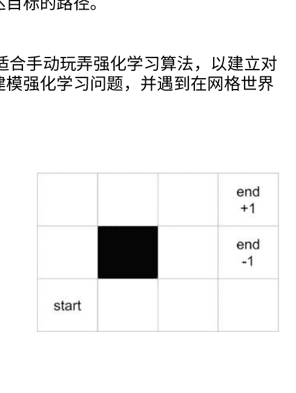

#### 2.1.2 迷宫和盒子谜题

在网格世界问题之后，还有更复杂的问题，有大量的墙壁结构，使导航更加困难（见图2.2）。轨迹规划算法在机器人技术中起着核心作用[21, 34]；在强化学习中，使用2D和3D迷宫来解决路径规划问题有着悠久的传统。出租车领域是由Dietterich [15]引入的，而推箱子问题如Sokoban也经常被使用[16, 28, 39, 60]，见图2.3。Sokoban的挑战在于只能推箱子，不能拉箱子。行动可能会导致未来产生无意中的死胡同，使Sokoban成为一个困难的谜题。这些谜题和迷宫的行动空间是离散的。

迷宫的小版本可以通过规划精确解决，而较大的实例只适合近似规划或学习方法。精确解决这些规划问题是NP难问题或PSPACE难问题[14, 24]；因此，解决问题实例所需的计算时间随问题规模呈指数增长，并且对于除了最小问题之外的所有问题，很快就变得不可行。

让我们看看如何对这些类型的环境建模代理以行动。


图2.2 英格兰威尔特郡的朗利特修剪迷宫

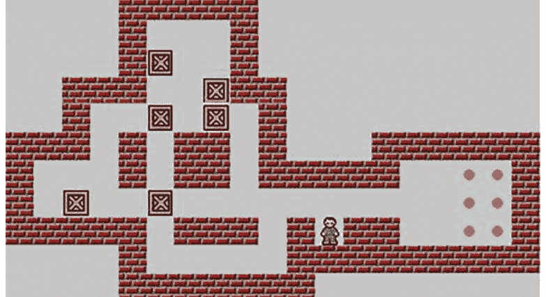

### 2.2 表格值基代理

通过与环境互动，强化学习找到在环境中操作的最佳策略。强化学习范式由一个代理（你，学习者）和一个环境（世界，处于某种状态并对你的行动给予反馈）组成。

#### 2.2.1 代理和环境

在图2.4中，显示了代理和环境，以及动作 $a_t$，下一个状态 $s_{t+1}$，以及其奖励 $r_{t+1}$。让我们更仔细地看一下这个图。
环境在某个时间点 $t$ 处于某个特定状态 $s_t$。然后，代理执行动作 $a_t$，导致环境从状态 $s_t$ 转移到下一个时间步的状态 $s_{t+1}$，也表示为 $s \rightarrow s'$。随着这个新状态的出现，还有一个奖励值 $r_{t+1}$（可以是正值或负值）。强化学习的目标是

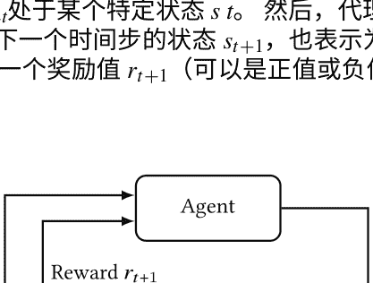

找到给出最佳奖励的动作序列。更正式地说，目标是在每个状态下找到最佳动作的最优策略函数π*。通过尝试不同的动作并累积奖励，代理可以找到每个状态下的最佳动作。通过这种方式，通过与环境的反复交互中积累的奖励值，学习到最优策略，并且问题被“解决”。

在强化学习中，环境只给我们一个数字作为我们执行的动作质量的指示，并且我们需要从中推导出正确的动作策略，如图2.4所示。另一方面，强化学习允许我们生成所需的动作-奖励对，而无需大量手工标记的数据集，并且我们可以自己选择要尝试的动作。

#### 2.2.2 马尔可夫决策过程

顺序决策问题可以建模为马尔可夫决策过程（MDPs）[35]。马尔可夫决策问题具有马尔可夫性质：下一个状态仅取决于当前状态和其中可用的动作（没有先前状态的历史记忆或来自其他地方的信息影响下一个状态）[27]。无记忆性质很重要，因为它使得只使用当前状态中的信息就可以推理出未来状态。如果先前的历史会影响当前状态，并且所有这些都必须考虑在内，那么推理当前状态将变得更加困难甚至不可行。

马尔可夫过程以俄罗斯数学家安德烈·马尔可夫（1856-1922）的名字命名，他以对这些随机过程的研究而闻名。参见[3, 20]了解马尔可夫决策过程的介绍。MDP形式主义是强化学习的数学基础，我们将在本章介绍相关要素。我们在本节中遵循Moerland [37]和Francois-Lavet等人的一些符号和示例。

##### 形式主义

我们将强化学习的马尔可夫决策过程定义为一个五元组（S，A，Ta，Ra，γ）：

- S是环境的合法状态的有限集；初始状态表示为s0。
- A是动作的有限集（如果动作集在每个状态下不同，则As是状态s下的有限动作集）。
- Ta(s, s') = Pr(st+1 = s'|st = s, at = a)是动作a在状态s在时间t时转移到状态s'的概率。
- Ra(s, s')是动作a从状态s转移到状态s'后获得的奖励。
- γ ∈ [0, 1]是折扣因子，表示未来和现在奖励之间的差异。

1. Marc G Bellemare, Yavar Naddaf, Joel Veness和Michael Bowling. 街机学习环境：通用智能体评估平台。人工智能研究杂志，47: 253-279, 2013. 7
2. Tim Berners-Lee, James Hendler和Ora Lassila. 语义Web。科学美国人，284(5): 28-37, 2001. 9
3. Dimitri P Bertsekas, Dimitri P Bertsekas, Dimitri P Bertsekas, and Dimitri P Bertsekas. 动态规划与最优控制，卷1。 Athena Scientific Belmont, MA, 1995. 10
4. Dimitri P Bertsekas and John Tsitsiklis. 神经动态规划。 MIT Press Cambridge, 1996. 8
5. Christopher M Bishop. 模式识别与机器学习。 信息科学与统计学。 Springer Verlag, Heidelberg, 2006. 8, 15
6. Eric Bonabeau, Marco Dorigo, and Guy Theraulaz. 群体智能：从自然到人工系统。 Oxford University Press, 1999. 11, 11
7. Rodney A Brooks. 无需表示的智能。 人工智能，47(1-3):139-159, 1991. 11
8. Bruno Buchberger, George E Collins, Rüdiger Loos, and Rudolph Albrecht. 计算机代数符号和代数计算。 ACM SIGSAM Bulletin, 16(4):5-5, 1982. 9
9. William F Clocksin and Christopher S Mellish. Prolog编程：使用ISO标准。 Springer Science & Business Media, 1981. 9
10. Marco Dorigo and Luca Maria Gambardella. 蚁群系统：一种合作学习方法解决旅行商问题。 IEEE Evolutionary Computation Transactions, 1(1):53-66, 1997. 11
11. Norman R Draper and Harry Smith. 应用回归分析, volume 326. John Wiley & Sons, 1998. 15
12. Richard E Fikes and Nils J Nilsson. STRIPS：一种新的定理证明应用于问题解决的方法。人工智能, 2(3-4):189-208, 1971. 9
13. David B Fogel. 模拟进化优化简介。 IEEE神经网络交易, 5(1):3-14, 1994. 11
14. Ian Goodfellow, Yoshua Bengio和Aaron Courville. 深度学习。 MIT出版社, 剑桥, 2016. 11
15. Peter D Grünwald。 最小描述长度原则。 MIT出版社，2007. 16
16. Simon Haykin。 神经网络：全面的基础。 Prentice Hall，1994. 11
17. Geoffrey E Hinton和Terrence Joseph Sejnowski，编辑。 无监督学习：神经计算的基础。 MIT出版社，1999. 16
18. John H Holland. 遗传算法。 Scientific American, 267(1): 66-73, 1992. 11
19. Ian T Jolliffe和Jorge Cadima。 主成分分析：一项综述和最新进展。 Philosophical Transactions of the Royal Society A：数学、物理和工程科学, 374(2065): 20150202, 2016. 16
20. Leslie Pack Kaelbling, Michael L Littman, 和 Andrew W Moore. 强化学习: 一份综述。 Journal of Artificial Intelligence Research, 4:237-285, 1996. 8
21. James Kennedy. 群体智能。 In 自然启发和创新计算手册, 页码 187-219. Springer, 2006. 11
22. Diederik P Kingma 和 Max Welling. 自动编码变分贝叶斯。 In 国际学习表示会议, 2014. 16
23. Diederik P Kingma 和 Max Welling. 变分自动编码器简介。 Found. 机器学习趋势, 12(4):307-392, 2019. 16
24. Petar Kormushev, Sylvain Calinon, 和 Darwin G Caldwell. 机器人运动技能协调基于EM的强化学习。 In 2010 IEEE/RSJ 国际智能机器人大会, 页码 3232-3237. IEEE, 2010. 5, 5
25. Yann LeCun、Yoshua Bengio和Geoffrey Hinton。 深度学习。 自然，521(7553)：436，2015. 11, 11
26. Laurens van der Maaten和Geoffrey Hinton。 使用t-SNE可视化数据。 机器学习研究杂志，9：2579-2605，2008. 11, 16
27. Volodymyr Mnih, Koray Kavukcuoglu, David Silver, Andrei A. Rusu, Joel Veness, Marc G. Bellemare, Alex Graves, Martin A. Riedmiller, Andreas Fidjeland, Georg Ostrovski, Stig Petersen, Charles Beattie, Amir Sadik, Ioannis Antonoglou, Helen King, Dharshan Kumaran, Daan Wierstra, Shane Legg和Demis Hassabis. 通过深度强化学习实现人类水平的控制。自然，518(7540): 529-533, 2015. 6
28. Derick Mwiti. 强化学习应用。 https://neptune.ai/blog/reinforcement-learning-applications. 4
29. Judea Pearl. 启发式：计算机问题解决的智能搜索策略。 Addison-Wesley, 阅读, 马萨诸塞州, 1984. 9
30. Judea Pearl and Dana Mackenzie. 为什么之书：因果关系的新科学。 基础图书, 2018. 10
31. Stuart J Russell and Peter Norvig. 人工智能：现代方法。 Pearson 教育有限公司, 马来西亚, 2016. 15, 18
32. Bernhard Schölkopf, Alexander Smola, and Klaus-Robert Müller. 核主成分分析。 在国际人工神经网络会议, 页583–588. Springer, 1997. 16
33. Claude E Shannon. 编程计算机下棋。 在 计算机国际象棋汇编, 页2–13. Springer, 1988. 6
34. David Silver, Satinder Singh, Doina Precup, 和 Richard S Sutton. 奖励足够。 人工智能, 第 103535页, 2021. 18
35. Richard S Sutton 和 Andrew G Barto. 强化学习, 介绍, 第二版. MIT出版社, 2018. 8
36. Alan M Turing. 数字计算机应用于游戏。 Pitman & Sons, 1953. 6
37. Matthijs Van Leeuwen 和 Arno Knobbe. 多样的子群集发现。 数据挖掘和知识发现, 25(2):208–242, 2012. 16
38. Oriol Vinyals, Igor Babuschkin, Wojciech M. Czarnecki, Michaël Mathieu, Andrew Dudzik, Junyoung Chung, David H. Choi, Richard Powell, Timo Ewalds, Petko Georgiev, Junhyuk Oh, Dan Horgan, Manuel Kroiss, Ivo Danihelka, Aja Huang, Laurent Sifre, Trevor Cai, John P. Agapiou, Max Jaderberg, Alexander Sasha Vezhnevets, Rémi Leblond, Tobias Pohlen, Valentin Dalibard, David Budden, Yury Sulsky, James Molloy, Tom Le Paine, Çağlar Gülçehre, Ziyu Wang, Tobias Pfaff, Yuhuai Wu, Roman Ring, Dani Yogatama, Dario Wünsch, Katrina McKinney, Oliver Smith, Tom Schaul, Timothy P. Lillicrap, Koray Kavukcuoglu, Demis Hassabis, Chris Apps, 和 David Silver. 使用多智能体强化学习在星际争霸II中达到大师级水平。 自然, 575(7782):350–354, 2019. 6, 7
39. Jilles Vreeken, Matthijs Van Leeuwen和Arno Siebes。 KRIMP：挖掘可以压缩的项集。 数据挖掘和知识发现， 23（1）: 169–214, 2011. 16## 2.2.2.1 状态 S

让我们深入了解马尔可夫元组 S, A, T_a, R_a, γ，看看它们在强化学习范式中的作用，以及它们如何共同建模和描述基于奖励的学习过程。

在每个马尔可夫决策过程的基础上，都有一个对系统在某个特定时间的状态进行描述的描述 s_t of the system at a certain time t.

## 状态表示

状态 s包含了唯一表示环境配置的信息。

通常有一种直接的方式在计算机内存中唯一表示状态。对于超市的例子，每个标识位置都是一个状态（例如：我在8th Ave和27th St的拐角处）。对于国际象棋，这可以是棋盘上所有棋子的位置（加上50步重复规则、易位权利和吃过路兵状态的信息）。对于机器人来说，这可以是机器人所有关节的方向和机器人肢体的位置。对于Atari游戏，状态包括所有屏幕像素的值。

使用当前的行为策略，代理选择一个动作 a，然后在环境中执行。环境对动作的反应由环境内部的转移模型 T_a(s, s')定义，代理不知道这个模型。环境返回新的状态 s'，以及新状态的奖励值 r'。

## 确定性和随机性环境

在离散确定性环境中，转移函数定义了一步转移，因为每个动作（从某个旧状态）确定地导致一个新状态。这在网格世界、推箱子游戏以及象棋和跳棋等游戏中是成立的，其中移动动作确定地导致一个新的棋盘位置。

非确定性情况的一个例子是机器人在环境中的移动。在某个状态下，机器人手臂拿着一个瓶子。一个代理动作可以是将瓶子转动到某个方向（可能是为了倒饮料到杯子里）。下一个状态可能是一个满杯，或者可能是一团糟，如果瓶子没有按照正确的方向倒入，或者位置不正确，或者环境中发生了一些事情，比如有人撞到桌子。动作的结果事先对代理来说是未知的，它取决于代理不知道的环境中的元素。

## 2.2.2.2 行动 A

现在我们已经看过状态了，现在是时候看看定义 MDP的第二个要素了，即动作。

## 不可逆环境行动

当代理处于状态 s时，它选择一个动作 A来执行，基于其当前的行为策略 π(a |s) （策略将很快解释）。代理将选择的动作 a传达给环境（图2.4）。对于超市的例子，一个动作的例子可以是沿着某个方向走过一个街区（比如：东）。对于Sokoban，一个动作可以是将箱子推到仓库的新位置。请注意，在不同的状态下，可能的动作可能不同。对于超市的例子，在每个街角可能不都可以向东走，在Sokoban中，只有在没有墙阻挡的状态下，才能向某个方向推动箱子。

一个动作会不可逆地改变环境的状态。在强化学习范式中，环境没有撤销操作符（现实世界中也没有）。当环境执行状态转换后，它就是最终状态。新状态与奖励值一起传递给智能体。智能体在环境中执行的动作也被称为其行为，就像人类在世界中的动作构成人类的行为一样。

## 离散或连续动作空间

在某些应用中，动作是离散的，而在其他应用中是连续的。例如，在棋盘游戏中的动作和在网格导航任务中选择方向都是离散的。

相反，机器人的手臂和关节运动以及某些游戏中的赌注大小是连续的（或涵盖非常大的值范围）。将算法应用于连续或非常大的动作空间要么需要将连续空间离散化（分成桶），要么需要开发一种不同类型的算法。正如我们将在第3章和第4章中看到的，基于值的方法对于离散动作空间效果很好，而基于策略的方法对于两种动作空间都效果很好。

对于超市的例子，我们实际上可以选择在建模我们的行动时离散或连续。从每个状态，我们可以移动任意数量的步骤，无论是小的还是大的，整数还是分数，朝任何方向。我们甚至可以走曲线路径。因此，严格来说，行动空间是连续的。然而，如果像一些城市一样，街道是按矩形曼哈顿模式组织的，那么将连续空间离散化，并且只考虑将我们带到下一个街角的离散行动是有意义的。然后，通过使用问题结构的额外知识，我们的行动空间变得离散化。1

> 1如果我们假设超市是大型的、块状的物品，通常可以在街角找到，那么我们可以将行动空间离散化。请注意，由于这种简化，我们可能会错过一些小的子块大小的超市。另一个更好的简化方法是将行动空间离散化为我们预计会遇到的最小超市的步行距离大小。

## 2.2.2.3 过渡

在讨论了状态和动作之后，现在是时候看一下过渡函数了。过渡函数 $T_a$ 确定了在选择动作后状态如何改变。在无模型强化学习中，过渡函数对于解决算法来说是隐含的：环境可以访问过渡函数并使用它来计算下一个状态 $s'$，但是代理没有这个能力。（在第5章中，我们将讨论基于模型的强化学习。在那里，代理有自己的过渡函数，这是从环境反馈中学习到的环境过渡函数的近似值。）

## 状态空间的图形视图

我们已经讨论了状态、动作和过渡。MDP的动力学由过渡函数 $T_a(·)$ 和奖励函数 $R_a(·)$ 建模。所有可能状态的虚拟空间称为状态空间。状态空间通常很大。这两个函数定义了从状态 $s$ 到 $s'$ 的两步过渡，通过动作 $a$：$s \rightarrow a \rightarrow s'$。

为了帮助我们理解状态之间的转换，我们可以使用图形描述，如图2.5所示。

在图中，状态和动作被描绘为节点（顶点），而转换则是节点之间的链接（边）。状态被绘制为开放的圆圈，动作被绘制为较小的黑色圆圈。在某个状态 $s$ 下，代理可以选择执行哪个动作 $a$，然后在环境中执行。环境返回新的状态 $s'$ 和奖励 $r'$。

图2.5展示了MDP元组 $s, a, t_a, r_a$ 以及 $s'$ 和策略 $\pi$ 的转换图，以及如何计算值。顶部的根节点是状态 $s$，策略 $\pi$ 允许代理在三个动作 $a$ 之间进行选择，根据分布Pr，每个动作都可以转换为两个可能的状态 $s'$，并伴有奖励 $r'$。图中显示了一个单一的转换。请想象其他转换，因为图形向下延伸。

在图的左侧面板中，环境可以选择对动作的响应返回哪个新状态（随机环境）；在中间面板中，每个动作只有一个状态（确定性环境）；然后可以简化树，仅显示状态，如右侧面板所示。

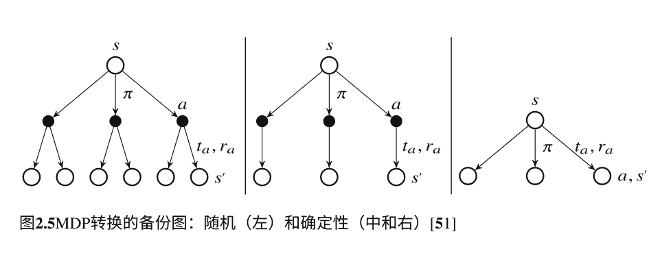

为了计算树的根节点的值，可以遵循备份过程。这样的过程以自底向上递归地计算父节点的值，从叶子节点到树的根节点求和或取最大值。此计算使用离散的时间步长，由状态和动作的下标表示，如 $s_t, s_{t+1}, s_{t+2}, \ldots$ 为了简洁起见，$s_{t+1}$ 有时写作 $s'$。该图显示了单个转换步骤；在强化学习中，一个episode通常由许多时间步骤的序列组成。

## 试错，上升和下降

图2.5中心和右侧面板上的图表，其中子节点只有一个父节点且没有循环，被称为一棵树。在计算机科学中，树的根位于顶部，分支向下生长到叶子。

当执行动作并返回状态和奖励时，备份树，代理进行学习过程。我们可以使用图2.5更好地理解正在展开的学习过程。

代理通过与环境交互执行动作来学习动作的奖励。在图2.5的树中，动作选择向下移动，朝着叶子节点移动。在更深的状态下，我们找到奖励，然后将其传播到父状态向上。奖励学习是通过反向传播进行学习：在图2.5中，奖励信息从叶子节点向上在图表中流动到根节点。动作选择向下移动，奖励学习向上流动。强化学习是通过试错学习的过程。试是选择一个动作向下（使用行为策略）在环境中执行。错误是向上移动树，从环境中接收反馈奖励，并将其报告回树中的状态以更新当前行为策略。向下选择策略选择要探索的动作，向上传播错误信号执行策略的学习。

图2.5中的图形对于了解值的计算非常有用。基本概念是试错或上下。

### 2.2.2.4 奖励 $R_a$

奖励函数 $R_a$在强化学习中非常重要。它表示状态的质量度量，例如解决或距离。奖励与单个状态相关联，表示其质量。然而，我们最常关注的是从根节点到叶节点的完整决策序列的质量（这个决策序列将是我们顺序决策问题的一个可能答案）。

这样一个完整序列的奖励被称为回报，有时被误导性地表示为 $R$，就像奖励一样。一个状态的预期累积折扣未来奖励被称为值函数 $V^{\pi}(s)$。值函数 $V^{\pi}(s)$是根据策略选择动作时的预期累积奖励，其中 $s$是状态。

$\pi$. 价值函数在强化学习算法中起着核心作用；在接下来的几分钟里，我们将更深入地研究回报和价值。

## 2.2.2.5 折扣因子 \(\gamma\)

我们区分两种类型的任务：（1）连续时间、长时间运行的任务和（2）情节性任务——即有结束的任务。在连续和长时间运行的任务中，通过对未来的奖励进行折扣，更加强调当前信息的价值。为了实现这一点，在我们的MDP中使用了一个折扣因子 \(\gamma\)，以减少远处奖励的影响。许多连续任务使用折扣因子 \(\gamma=1\)。

然而，在本书中，我们经常讨论情节性问题，其中 \(\gamma\)是无关紧要的。超市示例和国际象棋都是情节性的，对于这些问题，折扣是没有意义的， \(\gamma=1\)。

## 2.2.2.6 策略 \(\pi\)

在强化学习中，策略函数 \(\pi\)非常重要。策略函数 \(\pi\)回答了如何选择不同动作 \(a\)在状态 \(s\)下的问题。动作是基于状态的。MDP优化的核心问题是如何选择我们的动作。策略 \(\pi\)是一个条件概率分布，它为每个可能的状态指定了每个可能的动作的概率。函数 \(\pi\)是从状态空间到动作空间的概率分布的映射：

\[\pi: S \rightarrow p(A),\]

其中 \(p(A)\)可以是离散或连续的概率分布。对于特定的概率（密度），我们写作

\(\pi(a|s)\)。

例如，对于离散状态空间和离散动作空间，我们可以将显式策略存储为表格，例如：

| s | π(a=上|s) | π(a=下|s) | π(a=左|s) | π(a=右|s) |
| :-- | :-- | :-- | :-- | :-- |
| 1 | 0.2 | 0.8 | 0.0 | 0.0 |
| 2 | 0.0 | 0.0 | 0.0 | 1.0 |
| 3 | 0.7 | 0.0 | 0.3 | 0.0 |
| 等等。 | . | . | . | . |

策略的一个特殊情况是确定性策略，表示为

$\pi(s)$

其中

$\pi : S \to A.$

确定性策略在每个状态下选择一个动作。 当然，确定性动作在不同的状态下可能不同，就像下面的例子一样:

例子确定性离散策略的一个例子是

| s | π(a=上|s) | π(a=下|s) | π(a=左|s) | π(a=右|s) |
|---|----------|----------|----------|----------|
| 1 | 0.0      | 1.0      | 0.0      | 0.0      |
| 2 | 0.0      | 0.0      | 0.0      | 1.0      |
| 3 | 1.0      | 0.0      | 0.0      | 0.0      |
|等等。 | .        | .        | .        | .        |

我们会写 $\pi(s = 1) =向下 , \pi(s = 2) =向右 , 等等。

## 2.2.3 MDP目标

找到最优策略函数是强化学习问题的目标，本书的其余部分将讨论在不同情况下实现这一目标的许多不同算法。 让我们更仔细地看一下强化学习的目标。在此之前，我们将先看一下轨迹、它们的回报和值函数。

### 2.2.3.1 轨迹 $\tau$

当我们开始与MDP进行交互时，在每个时间步骤 $t$，我们观察到状态 $s_t$，采取动作 $a_t$，然后观察到下一个状态 $s_{t+1} \sim T_a$ (s)和奖励 $r_t = R_{a_t}(s_t, s_{t+1})$。重复这个过程会导致在环境中的一系列轨迹，我们用 $\tau^n_t$ 来表示：

$\tau^n_t = \{s_t, a_t, r_t, s_{t+1}, ..., a_{t+n}, r_{t+n}, s_{t+n+1}\}$.

在这里，$n$表示 $\tau$的长度。 在实践中，我们经常假设 $n= \infty$，这意味着我们运行轨迹直到领域终止。在这些情况下，我们将简单地写作 $\tau_t = \tau_t^\infty$。轨迹是强化学习算法的基本构建块之一。它们是从顺序决策问题中的一个完整序列的单次模拟。它们也被称为轨迹、回合或简单序列（图2.6显示了一个单个转换步骤和一个三步轨迹的示例）。

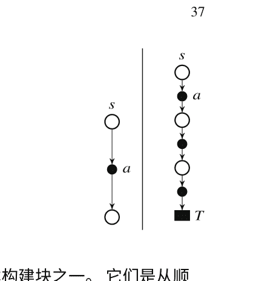

> 示例 一个包含三个动作的简短轨迹可能如下所示：
>
> $\tau_0^2 = \{s_0=1, a_0=\text{向上}, r_0= -1, s_1=2, a_1=\text{向上}, r_1= -1, s_2=3, a_2=\text{向左}, r_2=20, s_3=5\}$.

由于策略和转移动态都可以是随机的，因此我们不会始终从起始状态得到相同的轨迹。相反，我们将得到一个轨迹的分布。从起始状态（分布）得到的轨迹分布被表示为 $p(\tau_0)$。从起始状态得到的每个可能轨迹的概率实际上由轨迹中每个特定转移的概率的乘积给出：

$$
p(\tau_0) = p_0(s_0) \cdot \pi(a_0|s_0) \cdot T_{a_0}(s_0, s_1) \cdot \pi(a_1|s_1) \dots
= p_0(s_0) \cdot \prod_{t=0}^{\infty} \pi(a_t|s_t) \cdot T_{a_t}(s_t, s_{t+1}). \quad (2.1)
$$

基于策略的强化学习在轨迹上有很大的依赖性，我们将在第4章中更深入地讨论轨迹。基于值的强化学习（本章）使用单个转换步骤。

### 2.2.3.2 回报 $R$

我们还没有正式定义在顺序决策任务中我们实际上想要实现的目标——也就是最佳策略。轨迹的未来奖励之和被称为回报。轨迹$\tau_t$的回报是

$$
R(\tau_t) = r_t + \gamma \cdot r_{t+1} + \gamma^2 \cdot r_{t+2} + \dots = r_t + \sum_{i=1}^{\infty} \gamma^i r_{t+i}, \quad (2.2)
$$

- $\gamma=0$：近视代理，只考虑即时奖励，$R(\tau_t)=r_t$
- $\gamma=1$：远见代理，将所有未来奖励视为相等，$R(\tau_t) = r_t + r_{t+1} + r_{t+2} + \dots$

请注意，如果我们使用无限时间跨度的回报（方程2.2）和$\gamma=1.0$，则累积奖励可能变得无限。因此，在连续问题中，我们使用接近1.0的折扣因子，例如$\gamma=0.99$。

> 示例 对于先前的跟踪示例，我们假设$\gamma=0.9$. 回报（累积奖励）等于
> $R(\tau_0^2) = -1 + 0.9 \cdot -1 + 0.9^2 \cdot 20 = 16.2 - 1.9 = 14.3$.

### 2.2.3.3 状态值 $V$

我们感兴趣的真正优化度量不仅仅是一个跟踪的回报。环境可以是随机的，我们的策略也可以是随机的，对于给定的策略，我们并不总是得到相同的跟踪。因此，我们实际上对某个策略实现的预期累积奖励感兴趣。一个状态的预期累积折扣未来奖励更为人所知，称为该状态的值。

我们将状态值 $V^\pi(s)$定义为当代从状态$s$开始并遵循策略$\pi$时，我们期望实现的回报

$$
V^\pi(s) = \mathbb{E}_{\tau_t \sim p(\tau_t)}\left[\sum_{i=0}^{\infty} \gamma^i \cdot r_{t+i} | s_t = s\right], \quad (2.3)
$$

> 例如，假设我们有一个策略 $\pi$，从状态 $s$可以得到两个轨迹。第一个轨迹的累积奖励为20，在60%的情况下发生。另一个轨迹的累积奖励为10，在40%的情况下发生。状态 $s$的值是多少？
>
> $$V^{\pi}(s) = 0.6 \cdot 20 + 0.4 \cdot 10 = 16.$$
>
> 在这个策略下，我们期望从状态 $s$获得的平均回报（累积奖励）为16。

每个策略 $\pi$ 都有一个唯一的关联值函数 $V^{\pi}(s)$。我们经常省略 $\pi$以简化符号，只写 $V(s)$，知道状态值总是在某个策略的条件下。

状态值被定义为每个可能的状态 $s \in S$。$V(s)$将每个状态映射到一个实数（期望回报）：

$$V : S \rightarrow \mathbb{R}.$$

例如，在离散状态空间中，值函数可以表示为一个大小为 $|S|$的表格。

| s | V^π(s) |
|---|--------|
| 1 | 2.0 |
| 2 | 4.0 |
| 3 | 1.0 |
| 等等。 |

最后，终止状态的状态值根据定义为零：

$$s = 终止状态 \Rightarrow V(s) := 0.$$

### 2.2.3.4 状态-动作值 Q

除了状态值 $V^{\pi}(s)$，我们还定义了状态-动作值 $Q^{\pi}(s, a)$。唯一的区别是我们现在在一个状态和一个动作的条件下。我们估计在采取动作 $a$在状态 $s$并遵循策略 $\pi$ 之后:

> 2选择字母Q的原因已经失传了。也许它是用来表示质量的。

$$Q^{\pi}(s, a) = \mathbb{E}_{\tau_t \sim p(\tau_t)} \left[ \sum_{i=0}^{\infty} \gamma^{i} \cdot r_{t+i} | s_t = s, a_t = a \right]$$

每个策略 $\pi$ 只有一个唯一的关联状态-动作值函数 $Q^{\pi}(s, a)$。我们经常省略 $\pi$ 以简化表示法。再次，状态-动作值是一个函数

$Q : S \times A \to \mathbb{R}$

它将每个状态-动作对映射到一个实数。

例如，对于离散的状态和动作空间，$Q(s, a)$ 可以表示为一个大小为 $|S| \times |A|$ 的表。每个表项存储了一个 $Q(s, a)$ 的估计值，对应于特定的 $s, a$ 组合：

|     | a=向上 | a=向下 | a=向左 | a=向右 |
|-----|--------|--------|--------|--------|
| s=1 | 4.0    | 3.0    | 7.0    | 1.0    |
| s=2 | 2.0    | -4.0   | 0.3    | 1.0    |
| s=3 | 3.5    | 0.8    | 3.6    | 6.2    |
| 等等。 | .      | .      | .      | .      |

终止状态的状态-动作值被定义为零：

$s = \text{终止状态} \Rightarrow Q(s, a) := 0, \quad \forall a.$

### 2.2.3.5 强化学习目标

我们现在有了正式陈述强化学习目标 $J(\cdot)$ of reinforcement learning. 目标是从起始状态获得尽可能高的平均回报：

$$J(\pi) = V^{\pi}(s_0) = \mathbb{E}_{\tau_0 \sim p(\tau_0|\pi)} [R(\tau_0)]$$

对于 $p(\tau_0)$ 在方程2.1中给定。存在一个最优值函数，它的值高于或等于所有其他值函数。我们寻找一个能够实现这个最优值函数的策略，我们称之为最优策略 $\pi^*$:

$$\pi^*(a|s) = \arg \max_{\pi} V^{\pi}(s_0).$$

这个函数 π*是最优策略，并且它使用arg max函数来选择具有最优值的策略。在强化学习中，目标是找到这个起始状态 s0 的最优策略。

状态-动作值 Q比状态值 V的潜在好处是，状态-动作值直接告诉每个动作的价值。这对于动作选择可能很有用，因为对于离散动作空间，

$$a^* = \arg \max_{a \in A} Q^*(s, a),$$

Q函数直接确定最佳动作。同样，最优策略可以直接从最优Q函数中获得：

$$\pi^*(s) = \arg \max_{a \in A} Q^*(s, a).$$

现在我们将转向构建算法来计算值函数和策略函数。

## 2.2.3.6 贝尔曼方程

为了计算值函数，让我们再次看一下图2.5第33页上的树，并想象它是更大的，具有延伸到完全覆盖状态空间的子树。我们的任务是根据真实叶子节点上的奖励值，使用转移函数 Ta 来计算根节点的值。计算值V(s)的一种方法是遍历这个完整的状态空间树，通过取奖励值和子节点的总和来计算父节点的值，并通过 γ对该值进行折现。

这种直观的方法最早由Richard Bellman在1957年正式化。Bellman证明了离散优化问题可以描述为一个递归的向后归纳问题[7]。他引入了动态规划这个术语，以递归地遍历状态和动作。所谓的Bellman方程显示了状态 s的值函数与未来子状态 s′之间的关系，当我们遵循过渡函数时。

在遵循策略 π后，状态 s的离散Bellman方程的值为：

$$V^{\pi}(s) = \sum_{a \in A} \pi(a|s) \left[ \sum_{s' \in S} T_a(s, s') \left[ R_a(s, s') + \gamma \cdot V^{\pi}(s') \right] \right], \quad (2.7)$$

其中 π是状态 s中动作 a的概率，T是随机转移函数，R是奖励函数，γ是折扣率。请注意，对于值函数的递归和Bellman方程，代理必须知道所有状态的转移和奖励函数。

转换和奖励模型一起被称为环境的动力学模型。代理通常不知道动力学模型，并且已经开发了无模型方法来计算价值函数和策略函数。

递归贝尔曼方程是计算值函数和其他相关函数以解决强化学习问题的算法的基础。在下一节中，我们将研究这些求解方法。

## 2.2.4 MDP解决方法

贝尔曼方程是一个递归方程：它显示了如何通过在后继状态上再次应用函数规范来计算状态的值。图2.7显示了一个递归的图片，一个图片中的图片，一个图片中的图片，等等。在算法形式中，动态规划在越来越接近叶子节点的状态上调用自己的代码，直到到达叶子节点，递归无法继续。

动态规划使用分治原则：它从一个起始状态开始，通过搜索一个大的子树来确定其值，然后通过递归进入子状态，找到更接近的子状态的值。

图2.7 递归：德罗斯特效应


```python
def value_iteration():
    initialize(V)
    while not convergence(V):
        for s in range(S):
            for a in range(A):
                Q[s,a] = sum_{s' in S} T_a(s, s')(R_a(s, s') + gamma * V[s'])
            V[s] = max_a(Q[s,a])
    return V
```

**Listing 2.1 值迭代伪代码**

到终止状态。在终止状态，奖励值是已知的，并且这些值在构建父值时使用，当它向上、回到递归的根值时，最终到达根值本身。

一种简单的动态规划方法是通过迭代遍历状态空间来计算贝尔曼方程，称为值迭代（VI）。基于[2]，图2.1展示了值迭代的基本版本的伪代码。值迭代通过迭代改进对V(s)的估计来收敛到最优值函数。值函数V(s)首先被初始化为随机值。值迭代重复更新Q(s, a)和V(s)的值，循环遍历状态和它们的动作，直到收敛（当V(s)的值不再发生很大变化时）。

值迭代适用于有限的动作集。已经证明值迭代收敛到最优值，但是如我们在图2.1的伪代码中所见，它通过在三重嵌套循环中重复枚举整个状态空间的方式效率较低，多次遍历状态空间。很快我们将看到更高效的方法。

## 2.2.4.1 在Gym中进行价值迭代的实践

我们已经详细讨论了如何使用MDP模型化强化学习问题。我们深入而详尽地讨论了状态、动作和策略。现在是时候进行一些实践工作，来实验一下理论概念了。我们将从环境开始。

## 2.2.4.2 OpenAI Gym

OpenAI为Python创建了Gym套件的环境，它已成为该领域的事实标准[11]。Gym套件可以在OpenAI和GitHub上找到。Gym适用于Linux、macOS和Windows。一个活跃的社区

```python
import gym
env = gym.make('CartPole-v0')
env.reset()
for _ in range(1000):
    env.render()
    env.step(env.action_space.sample())  # 执行随机动作
env.close()
```

**图2.2 运行Gym中的CartPole环境**

Gym上有很多现成的环境，而且还在不断创建和上传到Gym网站上。有许多有趣的环境可供实验，可以为其创建自己的代理算法并进行测试。

如果你在GitHub上浏览Gym，你会看到不同的环境集合，从简单到高级都有。有一些经典的环境，比如Cartpole和Mountain car。还有一些小型的文本环境。Taxi也在其中，还有Arcade Learning Environment [6]，它在引入DQN [36]的论文中使用过，我们将在下一章中详细讨论。 MuJoCo6也可用，它是一个用于模拟机器人实验的环境[54]，或者你可以使用PyBullet。7现在你应该安装Gym。访问https://gym.openai.com上的Gym页面并阅读文档。确保你的系统已安装Python（在命令提示符处输入Python是否有效？）并且你的Python版本是最新的（本文撰写时为3.10版本）。然后输入

```bash
pip install gym
```

使用Python软件包管理器安装Gym。很快，您还需要深度学习套件，如TensorFlow或PyTorch。建议在即将安装PyTorch和TensorFlow的虚拟环境中安装Gym，以便同时使用两者（参见第B.3.3.1节）。根据您的系统安装情况，您可能需要安装或更新其他软件包，如numpy、scipy和pyglet，以使Gym正常工作。

您可以通过尝试CartPole环境来检查安装是否成功，请参见2.2节的代码清单。您的屏幕上应该出现一个窗口，其中Cartpole正在进行随机移动（您的窗口系统应支持OpenGL，并且在某些操作系统上，您可能需要比1.5.11版本更新的pyglet版本）。

## 2.2.4.3 值迭代的出租车示例

出租车示例（图2.8）是一个环境，出租车可以向上、向下、向左、向右移动，并接送乘客。让我们看看如何使用值迭代来解决出租车问题。Gym文档描述了出租车世界如下。网格世界中有四个指定位置，分别为红色（R）、蓝色（B）、绿色（G）和黄色（Y）。当一集开始时，出租车随机停在一个方格上，乘客随机在一个位置上。出租车驶向乘客的位置，接载乘客，驶向乘客的目的地（四个指定位置之一），然后将乘客下车。乘客下车后，一集结束。

出租车问题有500个离散状态：有25个出租车位置，五个乘客可能的位置（包括乘客在出租车上的情况），以及四个目的地位置（25 × 5 × 4）。

环境在每一步返回一个新的结果元组。出租车司机有六种离散的确定性动作：

- 0: 向南移动
- 1: 向北移动
- 2: 向东移动
- 3: 向西移动
- 4: 接乘客
- 5: 送乘客

每个动作的奖励为 -1，并且成功交付乘客的额外奖励为 +20，非法执行接乘客和送乘客动作的奖励为 -10。

图2.8 出租车世界[30]

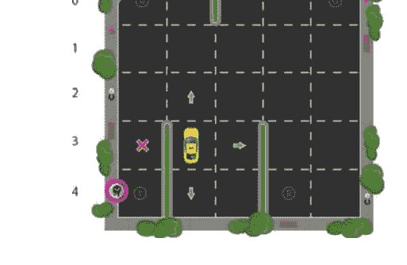

出租车环境具有简单的转移函数，代理程序在值迭代代码中使用该函数。8清单2.3展示了使用出租车环境找到解决方案的值迭代的实现。此代码由MikhailTrofimov编写，清楚地说明了值迭代首先为状态创建值函数，然后通过在每个状态中找到最佳动作来形成策略，在build-greedy-policy函数中实现。9

为了对算法的工作原理有所了解，请使用值迭代代码与Gym出租车环境一起使用，参见列表2.3。运行代码，并尝试调整一些超参数，以便更熟悉Gym和值迭代规划。试着自己想象算法在做什么。

这将为我们接下来要研究的更复杂的算法做好准备。

## 2.2.4.4 无模型学习

值迭代算法可以计算策略函数。它在计算中使用了转移模型。经常情况下，代理并不知道确切的转移概率，我们需要其他方法来计算策略函数。针对这种情况，我们开发了无模型算法，代理可以在不知道任何转移概率的情况下计算策略。

这些无模型方法的发展是强化学习的一个重要里程碑，我们将花一些时间来了解它们的工作原理。我们将从基于值的无模型算法开始。我们将看到，当代理不知道转移函数时，可以通过从环境中采样奖励来学习最优策略。表2.1列出了与值为基础的无模型算法一起使用的值迭代算法，这些算法在本章中介绍。（基于策略的无模型算法将在第4章介绍。）

首先，我们将讨论如何使用时间差分的原理来使用采样和自举构建值函数。我们将看到值函数如何用于找到最佳动作，形成策略。其次，我们将讨论存在哪些行动选择机制，我们将遇到探索/利用的权衡。第三，我们将讨论如何从所选动作的奖励中学习。我们将遇到在线学习和离线学习。我们将讨论两个简单的算法：SARSA和Q-learning。现在让我们更仔细地研究一下使用时间差分学习采样动作。

> 请注意，代码使用环境来计算下一个状态，这样我们就不需要为代理实现转移函数的版本。 https://gist.github.com/geffy/b2d16d01cbca1ae9e13f11f678fa96fd#file-taxi-vi-py。

```python
import gym
import numpy as np

def iterate_value_function(v_inp, gamma, env):
    ret = np.zeros(env.nS)
    for sid in range(env.nS):
        temp_v = np.zeros(env.nA)
        for action in range(env.nA):
            for (prob, dst_state, reward, is_final) in env.P[sid][action]:
                temp_v[action] += prob*(reward + gamma*v_inp[dst_state]*(not is_final))
        ret[sid] = max(temp_v)
    return ret

def build_greedy_policy(v_inp, gamma, env):
    new_policy = np.zeros(env.nS)
    for state_id in range(env.nS):
        profits = np.zeros(env.nA)
        for action in range(env.nA):
            for (prob, dst_state, reward, is_final) in env.P[state_id][action]:
                profits[action] += prob*(reward + gamma*v_inp[dst_state])
        new_policy[state_id] = np.argmax(profits)
    return new_policy

env = gym.make('Taxi-v3')
gamma = 0.9
cum_reward = 0
n_rounds = 500
env.reset()
for t_round in range(n_rounds):
    # 初始化环境和值函数
    observation = env.reset()
    v = np.zeros(env.nS)
    
    # 解决MDP问题
    for _ in range(100):
        v_old = v.copy()
        v = iterate_value_function(v, gamma, env)
        if np.all(v == v_old):
            break
    policy = build_greedy_policy(v, gamma, env).astype(np.int)
    
    # 应用策略
    for t in range(1000):
        action = policy[observation]
        observation, reward, done, info = env.step(action)
        cum_reward += reward
        if done:
            break
    if t_round % 50 == 0 and t_round > 0:
        print(cum_reward * 1.0 / (t_round + 1))
env.close()
```

## 表2.1 表格值基于方法

| 名称 | 方法 | 参考 |
|------|------|------|
| 值迭代 | 基于模型的枚举 | [2, 7] |
| SARSA | 基于策略的时序差异无模型 | [44] |
| Q学习 | 基于离策略的时序差异无模型 | [56] |

## 2.2.4.5 时序差异学习

在前一节中，通过使用后继状态的值函数，按照贝尔曼方程（方程2.7）递归计算值函数。引导是一种通过旧估计与新更新进行后续细化的过程。字面意思是：用靴带把自己拉起来。引导解决了当我们只知道如何计算逐步中间值时，如何计算最终值的问题。贝尔曼的递归计算是一种引导的形式。在无模型学习中，转移函数的作用被环境样本的迭代序列所取代。

一种可以用来处理样本并精确估计最终值的引导方法是时序差分学习。时序差分学习，简称TD，是由Sutton [50]在1988年引入的。名称中的时序差分指的是两个时间步之间的值差异，用于计算新时间步的值。

时序差分学习通过基于对环境采样得到的下一个状态的估计，使用一个错误值来更新当前状态的估计值V(s)（引导值）：

$$V(s) \leftarrow V(s) + \alpha[r' + \gamma V(s') - V(s)] \quad (2.8)$$

这里的s是当前状态，s'是新状态，r'是新状态的奖励。请注意引入了α，即学习率，它控制算法学习（引导）的速度。这是一个重要的参数；将值设置得太高可能会有害，因为最后一个值会过于主导引导过程。找到最优值需要进行实验。参数γ是折扣率。最后一项 -V(s)减去当前状态的值，以计算时间差异。另一种写法是

$$V(s) \leftarrow \alpha[r' + \gamma V(s')] + (1 - \alpha)V(s)$$

作为新的时间差异目标和旧值之间的差异。请注意公式中没有转移模型T的存在；时间差异是一种无模型的更新公式。

时间差异方法的引入使得无模型方法能够成功地应用于各种强化学习环境中。最值得注意的是，它是早期90年代打败人类世界冠军的背棋程序TD-Gammon的基础[52]。

## 2.2.4.6 通过基于值的学习找到策略

强化学习的目标是构建具有最高累积奖励的策略。因此，我们必须在每个状态 s 中找到最佳动作 a。在基于值的方法中，我们知道值函数 V(s) 或 Q(s, a)。那么这如何帮助我们找到动作 a 呢？在离散动作空间中，至少有一个具有最高值的离散动作。因此，如果我们有最优状态值 V*，那么通过找到具有该值的动作，可以找到最优策略。这个关系由以下公式给出

$$\pi^* = \max_\pi V^\pi(s) = \max_{a,\pi} Q^\pi(s, a)$$

而arg max函数会为我们找到最佳动作

$$a^* = \arg \max_{a \in A} Q^*(s, a)$$

通过这种方式，最优策略序列的最佳动作 π*(s) 可以从值函数中恢复，因此被称为基于值的方法 [58]。

一个完整的强化学习算法包括选择规则（向下）和学习规则（向上）步骤。现在我们知道如何计算值函数（树状图中的向上运动），让我们看看如何在我们的无模型算法中选择动作（树状图中的向下运动）。

## 2.2.4.7 探索

由于没有局部转换函数，无模型方法直接在环境中进行状态变化。这可能是一个昂贵的操作，例如，当真实世界的机器人手臂需要执行移动时。采样策略应该选择有希望的动作，以尽量减少样本数量，并避免浪费任何动作。我们应该使用什么行为策略？在每个状态下偏好具有最高Q值的动作是很诱人的，因为这样我们将遵循当前被认为是最佳策略的行为。

这种方法被称为贪婪方法。它看起来很有吸引力，但是它是短视的，并且有风险陷入局部最大值。根据仅有的一些早期样本来跟随已经走过的路径，有可能错过潜在的更好路径。事实上，贪婪方法具有高方差，使用基于少量样本的值，导致在高度不确定性中。如果我们更新选择样本的相同行为策略，我们会面临循环强化的风险。除了利用已知的良好行动外，还需要一定程度的探索未知行动。智能采样策略使用当前行为策略的混合（利用）和随机性（探索）来选择在环境中执行的动作。

## 2.2.4.8 赌徒理论

在文献中广泛研究了探索/利用的权衡问题，即如何以最小的成本获得最可靠的信息[26, 57]。该领域被称为多臂赌徒理论[4, 22, 33, 43]。在这个背景下，赌徒指的是一个赌场老虎机，不只有一个手臂，而是许多手臂，每个手臂都有不同且未知的支付概率。每次试验需要一枚硬币。多臂赌博机问题是找到一种策略，以最小的成本找到具有最高支付的臂。

多臂赌博机是一个单状态单决策强化学习问题，是一个一步非连续决策问题，臂代表可能的动作。这种简化的随机决策模型允许深入研究探索/利用策略。

单步探索/利用问题在临床试验中经常出现，新药在测试对象（真实人体）上进行测试。赌徒是试验，臂是选择给予真实实验药物的测试对象数量和给予安慰剂的测试对象数量。这是一个严肃的环境，因为成本可能以人类生命的质量来衡量。

在传统的固定随机对照试验（监督设置）中，获得实验药物和对照组的人数将是固定的，并且置信区间和测试的持续时间也将是固定的。在自适应试验（赌徒设置）中，人数将根据结果在试验期间进行调整，如果药物似乎有效，则有更多人接受药物，如果药物无效，则有更少人接受药物。

让我们来看一下图2.9。假设学习过程是一个临床试验，在这个试验中，有三种新化合物被测试其对测试对象的医疗效果。

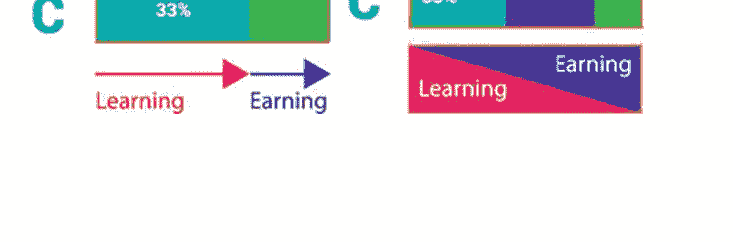

在固定试验中（左侧面板），所有测试对象在测试期结束之前都会接受他们所在组的药物，之后数据集就完整了，我们可以确定哪种化合物效果最好。此时，我们知道哪个组的药物效果最好，以及三分之二的受试者没有接受药物，可能会有不良反应。显然，这不是一个令人满意的情况。如果我们能够逐渐调整接受当前看起来最好的药物的受试者比例，随着试验进展，我们对测试结果的信心增加，那将更好。事实上，这就是强化学习所做的（图2.9，右侧面板）。

它使用了一种探索和利用的混合方法，调整治疗方案，给更多的受试者使用有前景的药物，同时在最后达到与静态试验相同的置信度[32, 33]。

## 2.2.4.9 $\epsilon$-贪婪探索

一种常见的实用方法是使用固定的探索与利用比例。这种方法被称为 $\epsilon$-贪婪方法，即大部分时间尝试当前具有最高策略值的（贪婪）动作，除非随机选择其他动作进行探索。$\epsilon = 0.1$时，90%的时间选择当前最佳动作，10%的时间选择其他随机动作。

在利用已知信息和探索未知动作以获取新信息之间的算法选择被称为探索/利用权衡。这是强化学习中的一个核心概念；它决定了我们对结果的信心程度以及信心可以增加和方差可以减小的速度。第二种方法是使用随时间或学习过程的其他统计数据变化的自适应$\epsilon$-比率。

其他流行的探索方法包括添加狄利克雷噪声[31]或使用汤普森抽样[46, 53]。

## 2.2.4.10 基于离线策略的学习

除了探索/利用选择问题之外，强化学习算法设计中的另一个主题是行为策略的学习方式。它应该严格按照策略进行更新-仅从最近的动作中学习-还是离线学习，从所有可用信息中学习？

强化学习关注的是从动作和奖励中学习策略。代理选择一个动作，并从环境中获得的奖励中学习。

通常，学习是通过将所选动作的值一致地回传到选择该动作的相同行为策略函数中进行的：这种学习是基于策略的。然而，还有一种选择。如果学习是通过回传另一个动作的值，而不是由行为策略选择的动作，那么这被称为离线学习。当行为策略通过选择非最优动作进行探索时，这是有道理的（它不执行最优动作贪婪的利用行动；这通常会导致较低的奖励值）。在政策学习中，需要备份非最优探索行动的价值（否则它将无法进行政策学习）。然而，离线学习可以备份最佳行动的价值，而不是探索策略选择的较差行动的价值，从而不会影响策略选择一个已知较差的选择。

因此，在探索的情况下，离线学习可以更高效，不会固执地备份行为策略选择的价值，而是备份一个更旧、更好的行动的价值。（在政策的利用步骤中，政策学习和离线学习是相同的。）学习方法面临一个权衡：它们试图从已知的当前行为（学习利用）中学习最佳目标行动，或者选择新的（但有时非最优的）行为。当探索发现了一个更差的值（正如预期的那样），我们是惩罚一个节点还是保持乐观的值？因此，离线学习使用两个策略：首先，行为策略用于实际的行动选择行为（有时进行探索），其次，目标策略通过备份值进行更新。第一个策略执行向下选择以扩展状态，第二个策略执行向上传播值以更新目标策略。在政策学习中，这些策略是相同的，而在离线学习中，行为策略和目标策略是分开的。

一个著名的表格上策算法是SARSA。10一个更为著名的表格离策算法是Q学习。SARSA和Q学习都收敛到最优动作值函数，尽管离策的收敛速度可能较慢，因为使用了旧的、非当前的值。

### 2.2.4.11 上策SARSA

在上策学习中，使用单个策略函数进行（向下的）动作选择和（向上的）值备份以达到学习目标。SARSA是一种上策算法[44]。上策学习直接更新单个策略上的值。同一策略函数用于探索行为和目标策略。

SARSA更新公式为

```
$$Q(s_t, a_t) \leftarrow Q(s_t, a_t) + \alpha[r_{t+1} + \gamma Q(s_{t+1}, a_{t+1}) - Q(s_t, a_t)]. (2.9)$$
```

回到时序差异（方程2.8），我们可以看到SARSA公式看起来非常像TD，尽管现在我们处理的是状态-动作值，而时序差异处理的是状态值。

在政策学习中，选择一个动作，在环境中评估它，并继续寻找更好的动作，由行为策略指导（该策略未指定公式但可能是 $\epsilon$-贪婪的）。在策略学习中，从行为策略开始，使用该策略对状态空间进行采样，并通过备份所选动作的值来改进策略。请注意，术语 $Q(s_{t+1}, a_{t+1})$ 也可以写成 $Q(s_{t+1}, \pi(s_{t+1}))$，突出了与离策略学习的区别。SARSA使用下一个状态 s 和当前策略的Q值来更新其Q值。

策略学习的主要优势在于直接优化目标，并通过学习直接行为值快速收敛。最大的缺点是样本效率低，因为目标策略是通过次优的探索性奖励进行更新的。

## 2.2.4.12 基于离线策略的Q学习

离线学习更加复杂；它使用单独的行为策略和目标策略：一个用于探索性的向下选择行为，一个用于更新当前目标备份策略。学习（备份）是从向下行为策略的数据中进行的，因此整个方法被称为离线学习。

最著名的离线策略算法是Q学习[56]。它从探索的移动中收集信息，并在评估状态时，即使实际行为执行了探索步骤，也会像使用贪婪策略一样进行评估。

Q学习的更新公式是

$$Q(s_t, a_t) \leftarrow Q(s_t, a_t) + \alpha[r_{t+1} + \gamma \max_a Q(s_{t+1}, a) - Q(s_t, a_t)]。 \quad (2.10)$$

与在线学习的不同之处在于，公式2.9中的 $\gamma Q(s_{t+1}, a_{t+1})$ 项已被 $\gamma \max_a Q(s_{t+1}, a)$ 替代。学习是从最佳动作的备份值中进行的，而不是实际评估的动作。图2.4显示了Q学习的完整伪代码。

Q-learning之所以是离策略(off-policy)的原因是它使用下一个状态的Q值和贪婪动作来更新其Q值（不一定是行为策略的动作——它是在行为策略之外学习的）。从这个意义上说，离线学习

## 2.2.4.13 稀疏奖励和奖励塑造

在我们结束本节之前，我们应该讨论稀疏性。对于某些环境，每个状态都存在奖励。对于超市的例子，可以为代理走过的每个状态计算奖励。实际上，奖励是行走所花费的成本的相反数。在每个状态中都存在奖励的环境被称为具有密集奖励结构。

对于其他环境，奖励可能只存在于某些状态中。例如，在国际象棋中，奖励只存在于终局棋盘位置，即有胜利或平局的位置。在所有其他状态中，回报取决于未来的状态，并且必须由代理通过从未来状态向根状态传播奖励值来计算。这样的环境被称为稀疏奖励结构。

当奖励结构稀疏时，找到一个好的策略更加复杂。这样稀疏奖励函数的景观图将显示出一个平坦的景观，上面有几个尖锐的山峰。我们将在以后的章节中看到许多算法使用奖励梯度来找到好的回报。在梯度为零的平坦景观中找到最优解是困难的。在某些应用中，可以改变奖励函数的形状，使其更适合深度学习中使用的基于梯度的优化算法。当使用简单的奖励函数找不到解决方案时，奖励塑造可以起到关键作用。它是将启发式知识纳入MDP的一种方式。关于奖励塑造和启发式信息的大量文献已经存在[40]。在象棋和跳棋等棋盘游戏中使用启发式方法也可以看作是奖励塑造的一种形式。

## 2.2.4.14 在出租车上进行Q学习

为了对这些算法在实践中的工作方式有所了解，让我们看看Q学习如何解决出租车问题。

在第2.2.4.3节中，我们讨论了如何使用值迭代来解决出租车问题，前提是代理有访问转移模型的权限。现在我们将看看如果没有转移模型，我们如何解决这个问题。Q学习对动作进行采样并记录奖励值在一个Q表中，收敛到状态-动作值函数。当所有状态中最佳动作的最佳值已知时，可以使用它们来确定最优策略的顺序。

让我们看看一个基于值的无模型算法如何解决一个简单的5 × 5出租车问题。请参考第45页上的图2.8，了解出租车世界的示例。

```
# 用于OpenAI Gym出租车环境的Q学习
import gym
import numpy as np
import random
#环境设置
env = gym.make("Taxi-v2")
env.reset()
env.render()
#Q[state,action] 表格实现
Q = np.zeros([env.observation_space.n, env.action_space.n])
gamma = 0.7   #折扣因子
alpha = 0.2   #学习率
epsilon = 0.1 # epsilon 贪婪
for episode in range(1000):
    done = False
    total_reward = 0
    state = env.reset()
    while not done:
        if random.uniform(0, 1) < epsilon:
            action = env.action_space.sample() # 探索状态空间
        else:
            action = np.argmax(Q[state]) # 利用学到的值
        next_state, reward, done, info = env.step(action) # 调用 Gym
        next_max = np.max(Q[next_state])
        old_value = Q[state,action]

        new_value = old_value + alpha * (reward + gamma * next_max - old_value)

        Q[state,action] = new_value
        total_reward += reward
        state = next_state
    if episode % 100 == 0:
        print("Episode: {}, Total Reward: {}".format(episode, total_reward))
```

列表 2.4 Q学习伪代码 [51,56]

```
python
total_epochs, total_penalties = 0, 0
ep = 100
for _ in range(ep):
    state = env.reset()
    epochs, penalties, reward = 0, 0, 0
    done = False
    while not done:
        action = np.argmax(Q[state])
        state, reward, done, info = env.step(action)
        if reward == -10:
            penalties += 1
        epochs += 1
    total_penalties += penalties
    total_epochs += epochs
print(f"Results after {ep} episodes:")
print(f"Average timesteps per episode: {total_epochs / ep}")
print(f"Average penalties per episode: {total_penalties / ep}")
```

列表 2.5 评估优化后的出租车结果，经过[30]

列表2.5展示了完整的Q学习算法，使用Python编写，经过[30]。它使用了一种贪婪行为策略：大部分情况下会选择最佳动作，但在一定比例下会选择随机动作进行探索。回想一下，Q值根据Q学习公式进行更新：

$$Q(s_t, a_t) \leftarrow Q(s_t, a_t) + \alpha[r_{t+1} + \gamma \max_a Q(s_{t+1}, a) - Q(s_t, a_t)],$$

其中 $0 \le \gamma \le 1$ 是折扣因子，$0 < \alpha \le 1$ 是学习率。请注意 Q-learning使用自举法，并且初始的Q值被设置为随机值（由于学习率的缘故，它们的值会逐渐消失）。

Q-learning通过查看当前状态-动作组合的奖励以及下一个状态的最大奖励来学习最佳动作。最终通过这种方式找到最佳策略，出租车将考虑由一系列最佳奖励组成的路线。

简要总结如下：

- 1. 将 Q 表初始化为随机值。
- 2. 选择一个状态 s。
- 3. 对于从 s 可能的所有动作中，选择具有最高 Q 值的动作并前往该状态，该状态成为新的 s，或者使用 $\epsilon$-贪婪法进行探索。
- 4. 使用方程式更新Q数组中的值。
- 5. 重复直到达到目标；当达到目标状态时，重复这个过程直到Q值停止变化（很多），然后停止。

图2.5展示了在出租车世界中找到策略的Q学习代码。通过将每个状态中具有最高Q值的动作连接在一起，可以找到最优策略。图2.6展示了此代码。非法接送次数显示为惩罚。

这个例子展示了通过引入记录每个状态中不可逆动作质量的Q表来找到最优策略，并使用该表将奖励收敛到值函数。通过这种方式，可以找到无模型的最优策略。

## 2.2.4.15 调整学习率

请实现并运行此代码，并进行调试以熟悉算法。Q学习是学习强化学习工作原理的优秀算法。尝试不同的超参数值，如探索参数 $\epsilon$、折扣因子 $\gamma$ 和学习率 $\alpha$。要在这个领域取得成功，了解这些超参数是有帮助的。对于折扣参数，选择接近1的值通常是一个好的开始，而对于学习率，选择接近0的值是一个好的开始。你可能会倾向于相反，选择尽可能高的学习率（接近1）以尽快学习。请继续尝试并看看在Q学习中哪种方法最好（你可以参考[17]）。在许多深度学习环境中，过高的学习率是一种灾难性的选择，你的算法可能根本无法收敛，而且Q值可能变得无限大。尝试使用表格Q学习，并以缓慢的步伐逐渐接近深度学习！

出租车示例很小，你会很快得到结果。它非常适合建立有用的直觉。在后面的章节中，我们将进行深度学习实验，收敛时间更长，调整超参数的直觉将更加昂贵。

## 结论

我们已经看到了一个代理如何在没有转移函数的情况下通过对环境进行采样来学习价值函数。无模型方法使用对代理来说是不可逆的动作。代理从环境中采样状态和奖励，使用当前最佳动作的行为策略，并进行探索/利用的权衡。学习的备份规则基于自举，并可以遵循基于策略的动作的奖励，包括偶尔的探索性动作的价值，或者基于离策略，始终使用最佳动作的价值。我们已经看到了两种无模型表格算法，SARSA和Q-学习，其中假设价值函数存储在精确的表格结构中。

在下一章中，我们将转向基于网络的算法，用于处理高维状态空间，基于深度神经网络的函数逼近。

## 2.3 经典Gym环境

现在我们已经详细讨论了表格代理算法，是时候来看看环境了，这是强化学习模型的另一部分。没有环境，无法衡量进展，也无法以有意义的方式进行比较。从实质上讲，环境定义了我们的人工方法可以训练执行的智能类型。

在本章中，我们将从几个较小的环境开始，这些环境适用于我们讨论过的表格算法。自从强化学习的早期，就有两个环境存在，分别是Mountain car 和Cartpole（见图2.10）。

### 2.3.1 山车和倒立摆

Mountain car是一个物理难题，一辆汽车在一维道路上位于两座山之间的山谷中。汽车的目标是驱车上山并到达右侧的旗帜。汽车的引擎可以前进和后退。问题在于汽车的引擎不足以在单次通过中爬上山[38]，但它可以借助重力的帮助来实现：通过反复来回，汽车可以积累动力。强化学习代理的挑战是在合适的时刻施加交替的向后和向前的力量。

Cartpole是一个平衡杆问题。一个杆子通过一个关节连接到一个可移动的小车上，小车可以向前或向后推动。摆杆从垂直位置开始，必须通过施加+1或-1的力来保持垂直。当杆子倒下或小车向左或向右运行太远时，谜题结束[5]。再次挑战是在正确的时刻应用正确的力量，仅通过杆子保持垂直或太过低下的反馈。

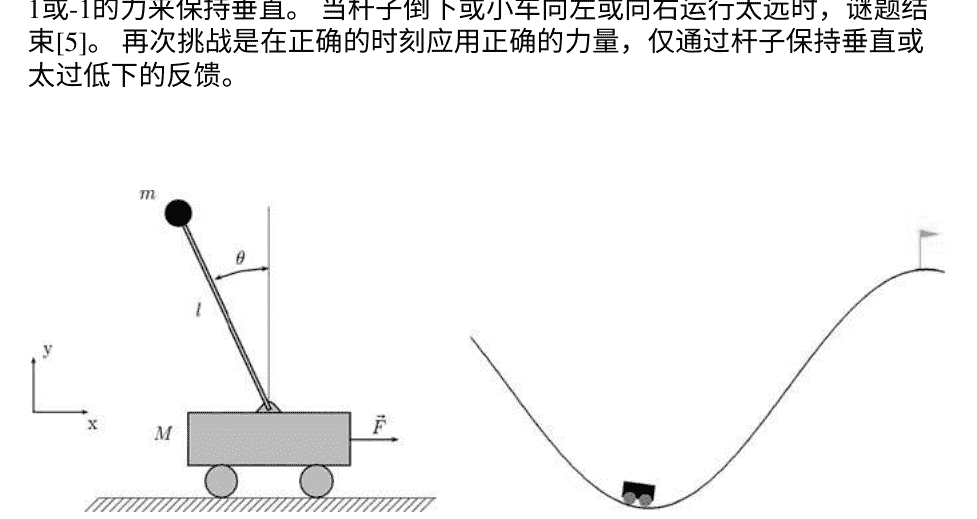

图2.10 Cartpole和Mountain car

## 2.3.2 路径规划和棋盘游戏

导航任务和棋盘游戏为强化学习提供了简单易懂的环境。它们非常适合推理新的代理算法。导航问题和为棋盘游戏构建的启发式搜索树可以是中等规模的，因此适合使用动态规划方法（如表格Q学习，A*，分支限界和alpha-beta）确定最佳动作[45]。这些都是直接的搜索方法，不尝试推广到新的未知状态。它们在状态空间中找到最佳动作，所有这些状态都在训练时存在-优化方法不会在训练和测试时进行泛化。

### 2.3.2.1 路径规划

路径规划（图2.1）是一个与机器人学[21, 34]相关的经典问题。流行的版本是迷宫，正如我们之前所见（图2.2）。出租车领域（图2.8）最初是在分层问题求解的背景下引入的[15]。推箱子问题（如Sokoban）也经常被使用[16, 28, 39, 60]，见图2.3。这些谜题和迷宫的动作空间是离散的。基本路径和运动规划可以枚举可能的解决方案[14, 24]。

迷宫的小版本可以通过枚举精确解决，而较大的实例只适合于近似方法。迷宫可以用来测试路径规划问题的算法，并经常用于此目的。导航任务和推箱子游戏（如Sokoban）可以包含房间或子目标，然后可以用来测试分层结构问题的算法[18, 19, 23, 42]（第8章）。通过扩大网格并插入更多障碍物，可以使问题变得更加困难。

### 2.3.2.2 棋盘游戏

棋盘游戏是规划和学习的经典基准，自人工智能的早期以来就存在。自20世纪50年代以来，井字棋、国际象棋、跳棋、围棋和将棋等两人零和完全信息的棋盘游戏一直被用来测试算法。这些游戏的动作空间是离散的。在跳棋、国际象棋和围棋方面取得了显著的成就，分别在1994年、1997年和2016年击败了人类世界冠军[12, 47, 49]。

棋盘游戏通常以“原样”使用，不会为不同的实验进行更改（与迷宫不同，迷宫经常根据实验的特定目的进行大小或复杂度的调整）。棋盘游戏被用来挑战的难度。最终目标是击败人类大师甚至世界冠军。棋盘游戏一直是人工智能的传统支柱，主要与基于搜索的符号推理方法相关。

智能。相比之下，下一章的基准与连接主义人工智能相关。

## 总结和进一步阅读

这是一章很长的内容，为本书的其余部分提供了坚实的基础。我们将总结本章并提供进一步阅读的参考资料。

## 总结

强化学习可以通过来自环境的反馈学习实现高回报的行为。强化学习没有监督标签，只要有提供反馈的环境，它就可以超越教师进行学习。

强化学习问题被建模为马尔可夫决策问题，由5元组(S, A, T_a, R_a, γ)表示状态、动作、转移、奖励和折扣因子。代理执行一个动作，环境返回与新状态相关联的新状态和奖励值。

游戏和机器人技术是两个重要的应用领域。应用领域可以是情节性的（结束，如下棋）或连续性的（不结束，如机器人在世界中停留）。在连续问题中，通常有意义的是对远离当前的行为进行折扣，而情节性问题通常不需要考虑折扣因子——胜利就是胜利。

环境可以是确定性的（许多棋盘游戏是确定性的——棋盘不会移动），也可以是随机性的（许多机器人世界是随机性的——围绕机器人的世界会移动）。行动空间可以是离散的（一个棋子要么移动到一个方格，要么不移动），也可以是连续的（典型的机器人关节在一个角度上连续移动）。

强化学习的目标是找到最优策略，使得对于所有状态，都能选择最佳行动，最大化未来累积奖励。策略函数有两种不同的用法。在离散环境中，策略函数a = π(s)返回每个状态下的最佳行动。（或者，值函数返回每个状态下每个行动的值，通过argmax函数可以找到具有最高值的行动。）

可以通过找到状态的最大值来找到最优策略。值函数V(s)返回一个状态的预期奖励。当存在转移函数T_a(s, s')时，代理可以使用贝尔曼方程或动态规划方法递归地遍历行为空间。值迭代是一种动态规划方法之一。值迭代遍历所有状态的所有行动，备份奖励值，直到值函数不再改变。状态-行动值Q(s, a)确定一个状态的行动的价值。

贝尔曼方程通过计算后继状态的值来计算状态的值。访问后继状态（通过执行动作和转换）也被称为扩展后继状态。在树状图中，后继状态被称为子节点，扩展是向下的动作。将奖励值向父节点反向传播是树中的向上移动。

代理使用转换模型的方法称为基于模型的方法。当代理不使用转换模型时，它们是无模型的方法。在许多情况下，学习代理无法访问环境的转换模型，因此无法使用规划方法。基于值的无模型方法可以通过仅使用不可逆动作来找到最优策略，并对环境进行采样以找到动作的值。

无模型强化学习中的一个重要决定因素是探索/利用权衡，即从环境中学到的信息在选择要采样的动作时使用多少。我们讨论了在环境行动非常昂贵的情况下利用最新知识的优势，例如临床试验。一个众所周知的探索/利用方法是ε-贪婪法，即从行为策略中选择贪婪（最佳）动作，除非在ε次时进行随机探索。始终遵循策略的最佳动作会有陷入循环的风险。探索随机节点可以打破这种循环。

到目前为止，我们已经讨论了动作选择操作。我们应该如何处理在节点上找到的奖励？在这里，我们介绍了强化学习的另一个基本要素：引导学习，或者通过改进先前的值来找到一个值。时序差分学习使用引导学习的原理，通过适当折扣未来奖励值添加到状态值函数中来找到状态的值。

我们现在已经讨论了上升和下降运动，并且可以构建完整的无模型算法。最著名的算法可能是Q学习，它通过离线时序差分学习来学习每个状态下每个动作的动作值函数。离线策略算法始终通过最佳动作的值来改进最佳策略函数，即使行为动作较差。离线学习因此具有与优化策略不同的行为策略。

在接下来的章节中，我们将研究用于大型复杂问题的基于值和基于策略的无模型方法，这些方法利用函数逼近（深度学习）。

## 进一步阅读

关于表格强化学习有丰富的文献。Sutton和Barto [51]是表格值基强化学习的标准工作。关于强化学习的两个简明介绍是[3, 20]。Bertsekas和Tsitsiklis [9]是关于强化学习的另一项重要工作。Kaelbling在该领域撰写了一篇重要的调查文章[29]。Richard Bellman在早期的工作中建立了动态规划的基础[7, 8]。

## 文档标题示例

这是一个段落示例，用于展示文档内容。

- 列表项一
- 列表项二
- 列表项三

这是另一个段落，用于分隔内容。

- 15. 游戏的动作空间通常是离散的还是连续的？
- 16. 机器人的动作空间通常是离散的还是连续的？
- 17. 游戏的环境通常是确定性的还是随机的？
- 18. 机器人的环境通常是确定性的还是随机的？
- 19. 强化学习的目标是什么？
- 20. 在情节性问题中，五个MDP元素中哪个不被使用？
- 21. 当我们说“无模型”或“基于模型”时，指的是哪个模型或函数？
- 22. 哪种类型的动作空间和环境适合于基于值的方法？
- 23. 为什么值基方法适用于游戏而不适用于机器人？
- 24. 列举两个基本的Gym环境。

## 练习

有一种比阅读更好的学习深度强化学习的方法，那就是亲自进行实验，亲眼见证学习过程的展开。以下练习旨在为你在深度强化学习领域的探索提供起点。

考虑使用Gym来实现这些练习。第2.2.4.2节解释了如何安装Gym。

1.  Q-learning 为出租车实现Q-learning，包括推导出最佳策略的过程。请参阅第2.2.4.14节并实现它。打印Q表格，查看方格上的值。你可以在搜索过程中打印实时策略。尝试不同的探索率 ϵ。它学得更快吗？它是否始终找到最优解？尝试不同的学习率 α。它学得更快吗？
2.  SARSA 实现SARSA算法，代码在2.7节中。将结果与Q-learning进行比较，你能看到SARSA选择了不同的路径吗？尝试不同的 ϵ 和 α。
3.  问题规模 问题规模多大时，收敛开始变得太慢？
4.  Cartpole 使用值迭代计算的贪婪策略运行Cartpole。你能让它工作吗？值迭代算法适用于Cartpole吗？如果不适用，你认为为什么不适用？

```python
# 用于OpenAI Gym出租车环境的SARSA算法
import gym
import numpy as np
import random
#环境设置
env = gym.make("Taxi-v2")
env.reset()
env.render()
#Q[state,action] 表格实现
Q = np.zeros([env.observation_space.n, env.action_space.n])
gamma = 0.7   #折扣因子
alpha = 0.2   #学习率
epsilon = 0.1 # epsilon贪婪
for episode in range(1000):
    done = False
    total_reward = 0
    current_state = env.reset()
    if random.uniform(0, 1) < epsilon:
        current_action = env.action_space.sample() # 探索状态空间
    else:
        current_action = np.argmax(Q[current_state]) # 利用学习到的值
    while not done:
        next_state, reward, done, info  = env.step(current_action) # 调用 Gym
        if random.uniform(0, 1) < epsilon:
            next_action = env.action_space.sample() # 探索状态空间
        else:
            next_action = np.argmax(Q[next_state]) # 利用学习到的值
        sarsa_value = Q[next_state,next_action]
        old_value = Q[current_state,current_action]

        new_value = old_value + alpha * (reward + gamma * sarsa_value - old_value)

        Q[current_state,current_action] = new_value
        total_reward += reward
        current_state = next_state
        current_action = next_action
    if episode % 100 == 0:
        print("Episode_{}__Total_Reward:__{}".format(episode, total_reward))
```

## 参考文献

1.  Abhishek. 多臂赌博机：A/B 测试的潜在替代方案 https://medium.com/brillio-data-science/multi-arm-bandits-a-potential-alternative-to-a-b-tests-a647d9bf2a7e, 2019. 50
2.  Ethem Alpaydin. 机器学习导论。MIT Press, 2009. 43, 48
3.  Kai Arulkumaran, Marc Peter Deisenroth, Miles Brundage, 和 Anil Anthony Bharath. 深度强化学习：简要调查。IEEE 信号处理杂志, 34(6):26–38, 2017. 27, 30, 61
4.  Peter Auer. 使用置信区间进行开发-探索权衡。机器学习研究杂志, 3(Nov):397–422, 2002. 50
5.  Andrew G Barto, Richard S Sutton, 和 Charles W Anderson. 能够解决困难学习控制问题的类神经元自适应元素。IEEE 交易系统、人类和控制论, (5):834–846, 1983. 58
6.  Marc G Bellemare, Yavar Naddaf, Joel Veness, 和 Michael Bowling. 街机学习环境：通用智能体评估平台。人工智能研究杂志, 47:253–279, 2013. 44
7.  Richard Bellman. 动态规划。Courier Corporation, 1957, 2013. 41, 48, 62, 62
8.  Richard Bellman. 关于动态规划在国际象棋和跳棋中的应用的最优解决方案。Proceedings of the National Academy of Sciences, 53(2):244–247, 1965. 62
9.  Dimitri P Bertsekas 和 John Tsitsiklis. 神经动态规划。MIT Press Cambridge, 1996. 61
10. Christopher M Bishop. 模式识别和机器学习。信息科学和统计学。Springer Verlag, Heidelberg, 2006. 62
11. Greg Brockman, Vicki Cheung, Ludwig Pettersson, Jonas Schneider, John Schulman, Jie Tang, 和 Wojciech Zaremba. OpenAI Gym. arXiv预印本arXiv:1606.01540, 2016. 43
12. Murray Campbell, A Joseph Hoane Jr, 和 Feng-Hsiung Hsu. 深蓝. 人工智能, 134(1-2):57–83, 2002. 59
13. 杨超. 分享和玩新的Sokoban关卡。http://Sokoban.org, 2013年。29
14. Joseph Culberson. Sokoban是PSPACE-complete。技术报告, 阿尔伯塔大学, 1997年。28, 59
15. Thomas G Dietterich. 带有MAXQ值函数分解的分层强化学习。Journal of Artificial Intelligence Research, 13:227–303, 2000年。28, 59
16. Dorit Dor 和 Uri Zwick. Sokoban和其他运动规划问题。计算几何, 13(4):215–228, 1999年。28, 59
17. Eyal Even-Dar, Yishay Mansour 和 Peter Bartlett. Q-learning的学习速率。Journal of machine learning Research, 5(1), 2003年。57
18. Gregory Farquhar, Tim Rocktäschel, Maximilian Igl, 和 Shimon Whiteson. TreeQN 和 ATreeC: Differentiable tree planning for deep reinforcement learning. 在国际学习表示会议, 2018. 59
19. Dieqiao Feng, Carla P Gomes, 和 Bart Selman. 使用课程驱动的深度强化学习解决困难的AI规划实例。arXiv预印本 arXiv:2006.02689, 2020. 59
20. Vincent François-Lavet, Peter Henderson, Riasat Islam, Marc G Bellemare, 和 Joelle Pineau. 深度强化学习简介。Foundations and Trends in Machine Learning,11(3-4):219–354, 2018. 27, 30, 30, 61
21. Alessandro Gasparetto, Paolo Boscariol, Albano Lanzutti, 和 Renato Vidoni. 路径规划和轨迹规划算法: 一个总体概述。在机器人系统的运动和操作规划, 页码3–27. Springer, 2015. 28, 59
22. 约翰 • C • 吉廷斯. 赌徒过程和动态分配指数。英国皇家统计学会杂志: B系列（方法学）, 41(2): 148-164, 1979年。50
23. 阿瑟 • 格斯, 梅迪 • 米尔扎, 卡罗尔 • 格雷戈尔, 瑞沙布 • 卡布拉, 塞巴斯蒂安 • 拉卡尼埃尔, 西奥芬 • 韦伯, 大卫 • 拉波索, 亚当 • 桑托罗, 洛朗 • 奥尔索, 汤姆 • 埃克尔斯, 格雷格 • 韦恩, 大卫 • 西尔弗, 和蒂莫西 • P • 利利克拉普. 无模型规划的研究。在国际机器学习会议, 页码2464-2473, 2019年。59
24. 罗伯特·A·赫恩和埃里克·D·德迈恩。游戏、谜题和计算。CRC出版社，2009年。28, 59
25. 马克·亨德里克斯，塞巴斯蒂安·梅耶尔，约瑟·范德维尔登和亚历山德鲁·伊奥苏普。游戏的过程化内容生成：一项调查。ACM多媒体计算、通信和应用交易，9(1): 1-22, 2013年。62
26. 约翰·荷兰。自然和人工系统中的适应性：简介性分析及其在生物学中的应用。控制与人工智能，1975年。50
27. 罗纳德·霍华德。动态规划和马尔可夫过程。纽约：约翰·威利，1964年。30
28. 安德烈亚斯·容恩汉斯和乔纳森·谢弗。Sokoban：利用领域知识增强通用智能体搜索方法。人工智能，129 (1-2) : 219-251, 2001年。28, 59
29. 莱斯利·帕克·凯布林，迈克尔·L·利特曼和安德鲁·W·摩尔。强化学习：一项调查。人工智能研究杂志，4: 237-285, 1996年。61
30. Satwik Kansal 和 Brendan Martin。学习数据科学网页，2018年。45, 55, 56, 56, 64
31. Samuel Kotz, Narayanaswamy Balakrishnan 和 Norman L Johnson。连续多元分布，卷1：模型和应用。John Wiley & Sons, 2004年。51
32. Tze Leung Lai。自适应治疗分配和多臂赌博问题。统计学年鉴，页1091-1114, 1987年。51
33. Tze Leung Lai 和 Herbert Robbins。渐近高效的自适应分配规则。应用数学进展，6 (1) : 4-22, 1985年。50, 51
34. Jean-Claude Latombe。机器人运动规划，卷124。Springer Science & Business Media, 2012年。28, 59
35. Michael L Littman。马尔可夫博弈作为多智能体强化学习的框架。在机器学习会议1994, 页157-163。爱思唯尔, 1994年。30
36. Volodymyr Mnih, Koray Kavukcuoglu, David Silver, Alex Graves, Ioannis Antonoglou, Daan Wierstra 和 Martin Riedmiller。使用深度强化学习玩Atari游戏。arXiv预印本arXiv:1312.5602, 2013年。44
37. Thomas Moerland。连续马尔可夫决策过程和策略搜索。莱顿大学2021年强化学习课程讲义。30
38. Andrew William Moore。机器人控制的高效基于记忆的学习。技术报告UCAM-CL-TR-209, 剑桥大学, 英国, https://www.cl.cam.ac.uk/techreports/UCAM-CL-TR-209.pdf, 1990年。58
39. Yoshio Murase, Hitoshi Matsubara 和 Yuzuru Hiraga。自动制作Sokoban问题。在太平洋国际人工智能会议上, 页592-600。Springer, 1996年。28, 59
40. Andrew Y Ng, Daishi Harada 和 Stuart Russell。奖励变换下的策略不变性：理论和奖励塑造的应用。在国际机器学习会议, 第99卷, 第278-287页, 1999年。54
41. Aske Plaat。学习玩耍：强化学习和游戏。Springer Verlag, Heidelberg, https://learningtoplay.net, 2020年。62
42. Sébastien Racanière, Théophane Weber, David P. Reichert, Lars Buesing, Arthur Guez, Danilo Jimenez Rezende, Adrià Puigdomènech Badia, Oriol Vinyals, Nicolas Heess, Yujia Li, Razvan Pascanu, Peter W. Battaglia, Demis Hassabis, David Silver 和 Daan Wierstra。增强想象力的深度强化学习代理。在神经信息处理系统进展, 第5690-5701页, 2017年。59
43. Herbert Robbins. 一些顺序实验设计的方面。美国数学学会公报, 58(5): 527-535, 1952年。50
44. Gavin A Rummery 和 Mahesan Niranjan。使用连接主义系统的在线Q学习。技术报告, 剑桥大学, 剑桥工程系, 英国, 1994年。48, 52, 62
45. Stuart J Russell 和 Peter Norvig. 人工智能：现代方法。Pearson教育有限公司, 马来西亚, 2016年。59, 60, 62
46. Daniel Russo, Benjamin Van Roy, Abbas Kazerouni, Ian Osband 和 Zheng Wen. 关于汤普森抽样的教程。Foundations and Trends in Machine Learning, 8(4-5):247–334, 2015. 5047. Jonathan Schaeffer, Robert Lake, Paul Lu和Martin Bryant。CHINOOK，世界人机跳棋冠军。AI Magazine, 17(1): 21, 1996年。

48. Noor Shaker, Julian Togelius和Mark J Nelson。游戏中的程序内容生成。Springer, 2016年。

49. David Silver, Aja Huang, Chris J. Maddison, Arthur Guez, Laurent Sifre, George van den Driesch, Julian Schrittwieser, Ioannis Antonoglou, Veda Panneershelvam, Marc Lanctot, Sander Dieleman, Dominik Grewe, John Nham, Nal Kalchbrenner, Ilya Sutskever, Timothy Lillicrap, Madeleine Leach, Koray Kavukcuoglu, Thore Graepel和Demis Hassabis。深度神经网络和树搜索下的围棋掌握。自然，529 (7587) : 484, 2016年。

50. Richard S Sutton。通过时间差异方法学习预测。机器学习, 3 (1) : 9-44, 1988年。

51. Richard S Sutton和Andrew G Barto。强化学习导论，第二版。MIT出版社，2018年。

52. Gerald Tesauro。TD-Gammon：一个自学习的西洋双陆棋程序。在神经网络应用中，第267-285页。Springer, 1995年。

53. William R Thompson。关于一个未知概率超过另一个概率的可能性的观点，基于两个样本的证据。Biometrika, 25(3/4): 285-294, 1933年。

54. Emanuel Todorov, Tom Erez和Yuval Tassa。MuJoCo：一种基于模型的控制物理引擎。在IEEE/RSJ国际智能机器人与系统大会(IROS)上，第5026-5033页, 2012年。

55. Julian Togelius, Alex J Champandard, Pier Luca Lanzi, Michael Mateas, Ana Paiva, Mike Preuss, 和Kenneth O Stanley。过程化内容生成：目标、挑战和可行步骤。在游戏中的人工智能和计算智能。Schloss Dagstuhl-Leibniz-Zentrum für Informatik, 2013.

56. Christopher JCH Watkins。从延迟奖励中学习。博士论文，剑桥大学国王学院，1989年。

57. Ian H Witten。估计和控制之间的明显冲突——对两臂赌博机问题的调查。Journal of the Franklin Institute, 301(1-2):161–189, 1976.

58. Annie Wong, Thomas B ck, Anna V. Kononova, 和 Aske Plaat。深度多智能体强化学习：挑战和方向。Artificial Intelligence Review, 2022.

59. Zhao Yang, Mike Preuss, 和 Aske Plaat。转移学习和课程学习在Sokoban中。arXiv预印本 arXiv:2105.11702, 2021.

60. Neng-Fa Zhou和Agostino Dovier。一个用于解决Sokoban问题的表格化Prolog程序。Fundamenta Informaticae, 2013年, 124 (4) : 561-575。

## 第三章 深度价值强化学习

前一章介绍了经典强化学习领域。我们了解了代理和环境，以及状态、动作、值和策略函数。我们还看到了我们的第一个规划和学习算法：值迭代、SARSA和Q-learning。前一章中的方法是精确的、表格化的方法，适用于适中大小的问题，适合内存。

在本章中，我们将转向具有大状态空间的高维问题，这些问题不再适合内存。我们将超越表格化方法，使用方法来近似值函数，并在训练行为之外进行泛化。我们将使用深度学习来实现这一点。

本章中的方法是深度、无模型、基于价值的方法，与$Q$学习相关。我们将首先仔细研究我们的智能体现在新的、更大的环境中必须能够解决（或者说近似解决）的问题。接下来，我们将研究深度强化学习算法。在强化学习中，当前的行为策略决定了下一步选择哪个动作，这是一个可以自我强化的过程。与监督学习不同，强化学习中没有绝对的真理。损失函数的目标不再是静态的，甚至不稳定。在深度强化学习中，收敛到$V$值和$Q$值是基于一种自举过程，而第一个挑战是找到能够收敛到稳定函数值的训练方法。

此外，由于神经网络是基于特征来近似状态的，收敛证明不再能够依赖于逐个识别状态。多年来，人们一直认为深度强化学习由于所谓的致命三位一体（自举、函数逼近和离线学习）而本质上是不稳定的。

然而，令人惊讶的是，许多挑战的解决方案已经找到。通过结合多种方法（如回放缓冲区和增加探索），深度Q网络算法（DQN）能够在高维环境中实现稳定学习。DQN的成功引发了大规模的研究工作，以进一步改进训练。我们将讨论其中一些新的方法。本章结束时，附有练习、总结和进一步阅读的指引。

> 深度强化学习建立在深度监督学习的基础上，本章和本书的其余部分假设读者具备基本的深度学习理解。当你对参数化神经网络和函数逼近的知识有些生疏时，这是去附录B进行深入复习的时候。附录还回顾了训练、测试、准确性、过拟合和偏差-方差权衡等基本概念。

> 当有疑问时，请尝试回答第385页上的问题。

### 核心概念

- 稳定收敛
- 回放缓冲区

### 核心问题

- 在大问题中实现稳定的深度强化学习。

### 核心算法

- 深度Q网络（列表3.6）

### 端到端学习

在深度学习出现之前，传统的强化学习主要用于较小的问题，如拼图或超市示例。它们的状态空间适合我们计算机的内存。奖励塑形，以领域特定的启发式方法，可以用于将问题塞入计算机中，例如在国际象棋和跳棋中[10, 32, 67]。取得了令人印象深刻的结果，但代价是广泛的问题特定奖励塑形和启发式工程[61]。深度学习改变了这种情况，现在强化学习用于无法放入内存的高维问题。

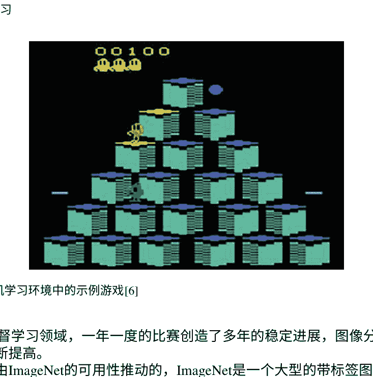

图3.1街机学习环境中的示例游戏[6]

在监督学习领域，一年一度的比赛创造了多年的稳定进展，图像分类的准确性不断提高。进展是由ImageNet的可用性推动的，ImageNet是一个大型的带标签图像数据库[15, 20]，通过GPU的计算能力增加以及机器学习算法的稳定改进，特别是在深度卷积神经网络方面。2012年，Krizhevsky、Sutskever和Hinton的一篇论文提出了一种方法，该方法在很大程度上超越了其他算法，并接近了人类图像识别的性能[42]。这篇论文介绍了AlexNet架构（以第一作者的名字命名），2012年通常被认为是深度学习突破的一年。（详见附录B.3.1.1。）这一突破引发了一个问题，即在深度强化学习中是否可以实现类似的突破。

我们不必等待很久，只有一年后，在2013年，在主要的人工智能会议之一的深度学习研讨会上，一篇论文介绍了一种算法，它可以通过训练像素输入的视频屏幕（图3.1）来玩1980年代的Atari视频游戏。该算法使用了深度学习和Q-学习的组合，被命名为深度Q网络，或者DQN [53, 54]。这是一个启发性的视频，展示了它如何学会玩《打砖块》游戏。¹这对于强化学习来说是一个突破。在研讨会上，许多研究人员可能会对这一成就有所共鸣，也许是因为他们年轻时曾花费数小时玩《太空侵略者》、《吃豆人》和《乒乓球》。在深度学习研讨会上演示两年后，一篇更长的文章出现在《自然》杂志上，介绍了DQN的改进和扩展版本（见图3.2的杂志封面）。

¹ https://www.youtube.com/watch?v=TmPfTpjtdgg.

## 图3.2 《自然》封面上的Atari实验

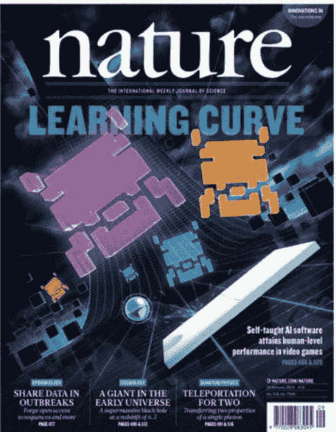

为什么这是一个重大的成就？除了解决的问题容易理解之外，计算机以前从未实现过如此复杂的真正的眼手协调；此外，从像素到操纵杆的端到端学习意味着人工行为接近人类玩游戏的方式。DQN基本上开创了深度强化学习领域。这是深度学习首次成功与行为学习相结合，解决了一个富有想象力的问题。

DQN克服的一个主要技术挑战是深度强化学习过程的不稳定性。事实上，当时有令人信服的理论分析认为这种不稳定性是根本的，并且普遍认为几乎不可能克服[3, 25, 72, 77]，因为损失函数的目标取决于强化学习过程本身的收敛。通过本章的结束，我们将解决强化学习中的收敛和稳定性问题。我们将看到DQN如何解决这些问题，并讨论DQN之后提出的许多其他解决方案。

但首先让我们看一下这些发展的原因，即新的高维环境。

### 3.1 大规模、高维问题

在前一章中，网格世界和迷宫被介绍为基本的顺序决策问题，精确的表格强化学习方法在这些问题中表现良好。 这些问题的复杂度适中。 问题的复杂度与问题具有的唯一状态数量或状态空间的大小有关。表格方法适用于小问题，其中整个状态空间适合内存。 例如，线性回归的情况就是如此，它只有一个变量 x和两个参数 a和 b，或者出租车问题，其状态空间大小为500。 在本章中，我们将更加雄心勃勃，介绍各种游戏，尤其是Atari街机游戏。 Atari视频输入的单帧状态空间为210 ×160像素的256个RGB颜色值 = 256^{33600}。

小问题（500）和大问题（256^{33600}）之间存在质的差异。²对于小问题，可以通过将问题的所有状态加载到内存中来学习策略。 状态是独立标识的，每个状态都有自己的最佳行动，我们可以尝试找到。 相比之下，大问题无法放入内存，策略无法记忆，状态根据其特征进行分组（参见第B.1.3节，我们讨论特征学习）。 参数化网络将状态映射到行动和值；状态不再是通过查找表单独可识别的。

当深度学习方法引入强化学习时，可以解决比以前更大的问题。 让我们来看看这些问题。

### 3.1.1 Atari街机游戏

直接从高维声音和视觉输入中学习行动是人工智能领域长期存在的挑战之一。 为了推动这项研究，在2012年创建了一个测试平台，旨在提供具有挑战性的强化学习任务。 它被称为街机学习环境（Arcade Learning Environment，简称ALE）[6]，它基于1980年代Atari 2600视频游戏的模拟器。 图3.3显示了一个明显复古的Atari 2600游戏机的图片。

ALE中包含了Atari 2600游戏机的模拟器等其他内容。 ALE向智能体提供了一个高维度的³D视觉输入（210×160 RGB视频，每秒60帧），这些任务旨在对人类玩家具有趣味性和挑战性（图3.1展示了一个示例游戏，图3.4展示了更多游戏）。 游戏卡带ROM存储了2-4 kB的游戏代码，而游戏机的随机存取存储器很小，只有128字节（当然，视频存储器更大）。 可以选择动作

² 请参见第B.1.2节，我们将讨论维度灾难问题。

³ 也就是说，对于机器学习来说是高维度的。210×160像素并不是高清视频质量。


## 图3.3 Atari 2600游戏机

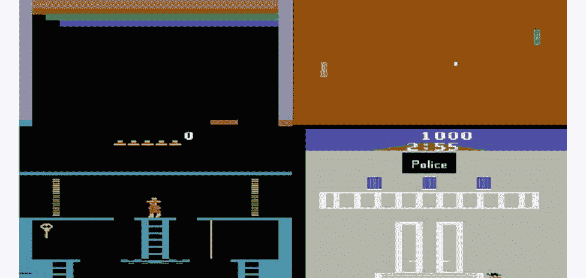

## 图3.4 4个Atari游戏的截图（打砖块，乒乓球，蒙特祖玛的复仇和私家侦探）

通过一个有9个方向的摇杆（有一个开火按钮，可以开关），总共有18个动作。Atari游戏提供了具有挑战性的眼手协调和推理任务，对人类来说既熟悉又具有挑战性，为学习序列决策提供了一个很好的测试平台。

Atari游戏以高分辨率视频输入和高帧率为特点，是与Grid worlds或棋盘游戏完全不同的一种挑战。Atari更接近于一个人类环境，其中视觉输入应该迅速跟随正确的动作。事实上，Atari基准测试需要非常不同的代理算法，促使从基于表格的算法转向基于函数逼近和深度学习的算法。ALE已成为深度强化学习研究的标准基准测试。

### 3.1.2 实时策略和视频游戏

实时策略游戏提供了比模拟的1980年代Atari游戏机更大的挑战。像星际争霸（图1.6）[60]和夺旗战[37]这样的游戏具有非常庞大的状态空间。这些是具有大地图、多个玩家、多个角色和多种类型动作的游戏。星际争霸的状态空间估计为10^1685[60]，比围棋（10^170）[58,76]大约大15个数量级，比国际象棋（10^47）[33]大约大1635个数量级。大多数实时策略游戏都是多人、非零和、不完全信息游戏还具有高维像素输入、推理和团队协作功能。

行动空间是随机的，是离散和连续行动的混合。尽管具有挑战性，但最近在三个游戏中已经取得了令人瞩目的成就，人类表现甚至超过了[7,37,80]，详见第7章。

让我们来看看可以解决这些非常不同类型的问题的方法。

### 3.2 深度值函数代理

现在我们将转向用于解决大型顺序决策问题的代理算法。本节的主要挑战是创建一个能够通过与世界互动（而不是玩具问题）来学习良好策略的代理算法。从现在开始，我们的代理将是深度学习代理。我们面临的问题是以下几个。我们如何在高维和大型顺序决策环境中使用深度学习？如何将表格值和策略函数 $V$，$Q$ 和 $\pi$ 转化为参数化函数 $V_\theta$, $Q_\theta$ 和 $\pi_\theta$?

### 3.2.1 用深度学习推广大问题

请回顾附录B，深度监督学习使用静态数据集来近似一个函数，标签是优化过程中的静态目标，通过最小化损失函数来实现。

深度强化学习基于观察到自举也是一种最小化过程，其中误差（或差异）被最小化。在强化学习中，这种自举过程收敛于真实的状态值和状态-动作值函数。然而，Q学习的自举过程缺乏静态的基准事实；我们的数据项是动态生成的，我们的损失函数的目标也在移动。损失函数目标的移动受到收敛过程试图学习的策略函数的影响。

找到能够收敛于这些移动目标的稳定函数的深度学习算法需要相当大的努力。让我们更详细地了解一下如何调整监督方法以适应强化学习。我们通过比较三种算法结构来做到这一点：监督最小化、表格Q学习和深度Q学习。

### 3.2.1.1 最小化监督目标损失

图3.1展示了一个典型的监督式深度学习训练算法的伪代码，包括输入数据集、前向传播计算网络输出、损失计算和反向传播。更多细节请参见附录B或[23]。

我们可以看到代码由一个双重循环组成：外循环控制训练的轮数。每个轮次包括使用参数进行目标值的前向逼近、梯度计算和参数的反向调整。在每个轮次中，内循环将静态数据集中的所有样本提供给前向计算输出值、损失和梯度计算，以便在反向传播中调整参数。

数据集是静态的，内循环的唯一作用是将样本提供给反向传播算法。请注意，每个样本都是独立的，并且样本的选择概率相等。在采样了一张白马的图像之后，下一张图像是黑色松鸡还是蓝月亮的概率是相等的（不）可能。

```python
def train_sl(data, net, alpha=0.001):    # 训练分类器
    for epoch in range(max_epochs):       # 一个周期是一次遍历
        sum_sq = 0                         # 每次遍历重置为零
        for (image, label) in data:
            output = net.forward_pass(image) # 预测
            sum_sq += (output - label)**2 # 计算误差
        grad = net.gradient(sum_sq)       # 误差的导数
        net.backward_pass(grad, alpha)    # 调整权重
    return net
```

列表 3.1 监督学习的网络训练伪代码

```python
def qlearn(environment, alpha=0.001, gamma=0.9, epsilon=0.05):
    Q[TERMINAL,] = 0 # 策略
    for episode in range(max_episodes):
        s = s0
        while s not TERMINAL: # 执行一个完整的回合的步骤
            a = epsilongreedy(Q[s], epsilon)
            (r, sp) = 环境(s, a)
            Q[s, a] = Q[s, a] + alpha*(r + gamma*max(Q[sp]) - Q[s, a])
            s = sp
    返回 Q
```

列表 3.2 Q-learning 伪代码 [72, 82]

### 3.2.1.2 引导 Q-值

现在让我们来看看 Q-learning。强化学习以不同的方式选择训练示例。对于像 Q-learning 这样的算法的收敛，选择规则必须保证最终所有状态都会被环境采样到 [82]。对于大问题，情况并非如此；这种收敛到值函数的条件不成立。

列表 3.2 显示了前一章中引导表格 Q-learning 伪代码的简短版本。与前面的深度学习算法一样，该算法由一个双重循环组成。外循环控制 Q-值收敛的回合数，每个回合由从起始状态到终止状态的单个轨迹（时间步）组成。Q-值存储在一个由 s 和 a 索引的 Python 数组中，因为 Q 是状态-动作值。当采样足够多的回合时，假设 Q-值已经收敛。Q-公式显示了如何通过引导先前的值来构建 Q-值，并且 Q-learning 是离策略学习，取最大动作值。

与监督学习的不同之处在于，在Q学习中，后续的样本不是独立的。下一个动作由当前策略确定，并且很可能是状态的最佳动作（ε贪婪）。此外，下一个状态将与轨迹中的前一个状态相关。在采样了位于场地左上角的球的状态之后，下一个样本很有可能也是球靠近场地左上角的状态。训练可能会陷入局部最小值，因此需要进行探索。

```python
def train_qlearn(environment, Qnet, alpha=0.001, gamma=0.0, epsilon=0.05)
    s = s0              # 初始化起始状态
    for epoch in range(max_epochs): # 一个时期是一次遍历
        sum_sq = 0      # 每次遍历重置为零
        while s not TERMINAL: # 执行一个完整回合的步骤
            a = epsilon-greedy(Qnet(s, a)) # 网络：Q[s,a] - 值
            (r, sp) = environment(a)
            output = Qnet.forward_pass(s, a)
            target = r + gamma * max(Qnet(sp))
            sum_sq += (target - output)**2
            s = sp
        grad = Qnet.gradient(sum_sq)
        Qnet.backward_pass(grad, alpha)
    return Qnet          # Q值
```

图3.3 强化学习网络训练伪代码

## 3.2.1.3 深度强化学习目标误差

这两个算法——深度学习和Q学习——在结构上看起来很相似。两者都包含一个双循环，其中优化目标，并且我们可以想知道是否可以将自举与损失函数最小化相结合。事实上，正如Mnih等人在2013年所示，这是可能的。我们的第三个示例，示例3.3，展示了一个基于双循环的朴素深度学习版本的Q学习[53, 55]，通过调整$\theta$参数通过最小化损失函数来自举Q值。

事实上，可以通过最小化一系列损失函数来使用梯度训练Q网络。这个自举过程的损失函数实际上是基于Q学习更新公式的。损失函数是新Q值 $Q_{\theta}$ 的平方差。

$\gamma \max_{a'} Q_{\theta_{t-1}}(s', a')$。$^{4}$ 来自前向传递和旧的更新目标 $r + \gamma \max_{a'} Q_{\theta_{t-1}}(s', a')$。

一个重要的观察是更新目标依赖于先前的网络权重 $\theta_{t-1}$(优化目标在优化过程中移动)；这与监督学习过程中使用的目标不同，在学习开始之前是固定的[53]。换句话说，深度Q学习的损失函数最小化一个移动目标，这个目标取决于正在优化的网络。

$^{4}$ 深度Q学习是一个不动点迭代[52]。这个损失函数的梯度是 $\nabla_{\theta} \mathbb{E}_{s,a \sim \rho(\cdot); s' \sim \mathcal{E}} \left[ \left( r + \gamma \max_{a'} Q_{\theta_{t-1}}(s', a') - Q_{\theta_i}(s, a) \right) \nabla_{\theta_i} Q_{\theta_i}(s, a) \right]$，其中 $\rho$ 是行为分布，$\mathcal{E}$ 是Atari模拟器。更多细节请参见[53]。

$\mathcal{L}_i(\theta_i) =$

## 3.2.2 三个挑战

让我们更仔细地看一下深度强化学习面临的挑战。

我们的朴素深度Q-学习器存在三个问题。首先，收敛到最优Q函数取决于对状态空间的完全覆盖，然而状态空间太大无法完全采样。其次，连续训练样本之间存在强相关性，存在局部最优的风险。第三，梯度下降的损失函数实际上具有移动目标，并且引导可能发散。让我们更详细地看一下这三个问题。

### 3.2.2.1 覆盖率

证明像Q-learning这样的算法收敛到最优策略依赖于对完整状态空间的覆盖；必须对所有状态-动作对进行采样。否则，算法将无法收敛到每个状态的最优动作值。

显然，在大型状态空间中，并非所有状态都被采样，这种情况不成立，无法保证收敛。

### 3.2.2.2 相关性

在强化学习中，代理/环境循环中生成一系列状态。这些状态仅通过单个动作、一个移动或一个棋子的不同而不同，状态的其他特征保持不变，因此，后续样本的值是相关的，这可能导致训练结果有偏差。训练可能仅覆盖状态空间的一部分，特别是当贪婪动作选择增加选择一小组动作和状态的倾向时。这种偏差可能导致所谓的专业化陷阱（过度利用和过少探索）。

后续状态之间的相关性导致了我们之前讨论的低覆盖率，降低了收敛到最优Q函数的概率，增加了局部最优和反馈循环的可能性。例如，当国际象棋程序在特定开局上进行训练，而对手却采用不同的开局时，就会出现这种情况。当测试样例与训练样例不同时，泛化能力会很差。这个问题与超出分布训练有关，请参考[48]。

### 3.2.2.3 收敛

当我们天真地将我们的深度监督方法应用于强化学习时，我们会遇到一个问题，即在引导过程中，优化目标是引导过程本身的一部分。深度监督学习使用静态数据集来逼近一个函数，因此损失函数目标是稳定的。然而，深度强化学习使用的引导目标是来自上一个时间步的Q更新，而这在优化过程中会发生变化。

损失是Q值 $Q_{\theta}(s, a)$ 和旧的更新目标 $r + \gamma \max_{a'} Q_{\theta_{t-1}}(s', a')$ 由于两者都依赖于被优化的参数 $\theta$，因此超过目标的风险是真实的，优化过程很容易变得不稳定。找到能够容忍这些移动目标的算法需要相当大的努力。

### 3.2.2.4 致命三角

多项研究[3, 25, 77]表明，离策略强化学习与非线性函数逼近（如深度神经网络）的组合可能导致Q值发散。Sutton和Barto [72]进一步分析了发散训练的三个要素：函数逼近、自举和离策略学习。它们一起被称为致命三角。

函数逼近可能会不准确地为状态赋值。与精确的表格方法相比，神经网络被设计用来识别状态的各个特征。这些特征可以被不同的状态共享，并且被赋予这些特征的值也被其他状态共享。因此，函数逼近可能导致状态和奖励值以及未正确分配的Q值的错误识别。如果对真实函数值的逼近精度足够好，那么状态可能被很好地识别，以减少或防止发散的训练过程和循环[54]。

值的引导构建了基于旧值的新值。这在Q学习和时间差异学习中发生，当前值取决于先前的值。引导增加了训练的效率，因为不需要从头开始计算值。然而，由于函数逼近的错误或偏差，初始值可能会持续存在并传播到其他状态。引导和函数逼近可以增加发散。

离策略学习使用与我们优化的目标策略不同的行为策略（第2.2.4.10节）。当行为策略改进时，离策略的值可能不会改善。离策略学习通常收敛得不如在策略学习好，因为它独立于行为策略收敛。

使用函数逼近时，收敛可能会更慢，因为值被分配给了错误的状态。

## 3.2.3 稳定的深度值基学习

这些考虑因素使深度强化学习的进一步研究在很多年内受到了阻碍。相反，研究一段时间集中在线性函数逼近器上，这些逼近器具有更好的收敛保证。然而，对于收敛的深度强化学习的工作仍在继续 [8, 29, 50, 66]，并且开发了一些算法，如神经拟合 Q-learning，显示出一些希望 [44, 47, 64]。

在 DQN [53] 进一步的结果显示出收敛和稳定学习可以在一个非平凡的问题中实现之后，进行了更多的实验研究，以找出在哪些情况下可以实现收敛并克服致命三角。进一步的收敛和多样性增强技术被开发出来，其中一些将在第 3.2.4 节中介绍。尽管理论上提供了函数逼近可能阻碍稳定强化学习的原因，但实际上有迹象表明稳定训练是可能的。从 1980 年代末开始，Tesouro 编写了一个基于神经网络的下棋程序，它在国际象棋中表现出很强的水平。该程序被称为 Neurogammon，它使用了从国际象棋大师对局中进行的监督学习 [73]。

为了提高程序的强度，他从自我对弈游戏[75]转向了时序差异强化学习。TD-Gammon [74] 通过与自己对战来学习，在浅层网络中实现了稳定的学习。TD-Gammon的训练使用了类似于Q-learning的时序差异算法，用一个隐藏层的网络来逼近值函数，使用带有手工特征的原始棋盘输入进行增强[74]。也许某种形式的稳定强化学习是可能的，至少在浅层网络中是可能的？

TD-Gammon的成功促使人们尝试在跳棋[11]和围棋[13, 71]中使用TD学习。不幸的是，这些游戏中无法复制这种成功，并且有一段时间人们认为，博弈是一种特殊情况，非常适合强化学习和自我对弈[63, 69]。

然而，随着深度神经网络在强化学习环境中的成功应用的进一步报道[29, 66]，更多的工作随之而来。Atari [54]和后来的Go [70]的结果以及进一步的工作 [78]现在提供了明确的证据，表明稳定的训练和泛化深度强化学习确实是可能的，并且改进了我们对影响稳定性和收敛性的情况的理解。

让我们更仔细地看一下用于实现稳定的深度强化学习的方法。

### 3.2.3.1 去相关状态

正如本章介绍中提到的，在2013年，Mnih等人 [53, 54] 在Atari游戏中发表了他们关于端到端强化学习的工作。DQN最初的重点是打破后续状态之间的相关性并减缓训练过程中参数的变化，以改进

### 3.2.3.2 经验回放

在强化学习中，训练样本是在与环境的一系列交互中创建的，后续的训练状态与前面的状态强相关。有一种倾向是在某种特定类型或区域的样本上对网络进行过多训练，而状态空间的其他部分则保持未被探索。此外，通过函数逼近和自举，可能会忘记一些行为。当一个代理在游戏中达到一个与之前级别不同的新级别时，代理可能会忘记如何玩其他级别。

我们可以通过添加少量的监督学习来减少相关性和由此引起的局部最小值。为了打破相关性并创建更多样化的训练样本集，DQN使用经验回放。经验回放引入了一个回放缓冲区[46]，它是先前探索过的状态的缓存，从中随机采样训练状态。经验回放将最后的N个样本存储在回放内存中，并在执行更新时均匀采样。一个典型的N值是10^6[83]。通过使用缓冲区，从最近的训练样本中进行采样，我们可以从更多样化的集合中训练状态，而不仅仅是最近的一个。经验回放的目标是增加后续训练样本的独立性。要训练的下一个状态不再是当前状态的直接后继，而是在先前状态的长历史中的某个位置。

通过这种方式，回放缓冲区将学习分散到更多先前观察到的状态中，打破了样本之间的时间相关性。DQN的回放缓冲区（1）提高了覆盖率，（2）减少了相关性。

DQN将所有示例都视为相等的，无论是旧的还是最近的。重要性抽样的一种形式可以区分重要的转换，正如我们将在下一节中看到的那样。

请注意，有趣的是，通过经验回放进行训练是一种离策略学习的形式，因为目标参数与生成样本所使用的参数不同。离策略学习是致命三位一体中的三个要素之一，我们发现通过其特殊形式之一可以实际改善稳定学习中的问题。

经验回放在Atari游戏中表现良好。然而，对回放缓冲区的进一步分析指出可能存在问题。张等人研究了经验回放中的致命三位一体，并发现更大的网络导致更多的不稳定性，但更长的多步回报导致了更少的不现实的高奖励值。在第3.2.4节中，我们将看到许多对DQN类算法的进一步改进。

最初的经验回放是，就像在人工智能中的许多东西一样，受到生物学启发的机制[47, 51, 59]。

### 3.2.3.3 目标权重的不频繁更新

DQN中的第二个改进是不频繁的权重更新，在2015年的DQN论文中引入[54]。这个改进的目的是减少由目标$Q$值的频繁更新引起的发散。同样，目的是通过改善损失函数中$Q$目标的稳定性来提高网络优化的稳定性。

每隔$n$次更新，网络$Q$被克隆以获得目标网络$Q\hat{}$，用于生成下$n$次更新的$Q$的目标。在原始的DQN实现中，使用单一的网络权重$\theta$，并且网络在移动的损失目标上进行训练。现在，通过不频繁的更新，目标网络的权重变化比行为策略的权重变化慢得多，从而提高了$Q$目标的稳定性。

第二个网络改善了$Q$学习的稳定性，通常情况下，对$Q\theta(s_t, a_t)$的更新也会改变每个时间步的目标，很可能导致振荡和策略的发散。使用旧的参数集生成目标会在更新$Q\theta$的时间和更新目标的时间之间添加延迟，从而减少振荡的可能性。

### 3.2.3.4 实践操作：DQN和Breakout Gym示例

为了亲身体验DQN，我们现在来看看如何使用DQN来玩Atari游戏Breakout。

深度强化学习领域是一个开放的领域，大多数算法的代码都可以在GitHub上免费获取，并且测试环境也是可用的。最广泛使用的环境是Gym，在其中可以找到ALE和MuJoCo等基准测试，详见附录C。软件的开放可用性方便了复制，并且重要的是可以进一步改进方法。让我们更仔细地看一下DQN的代码，以了解它是如何工作的。

DQN论文附带源代码。原始的DQN代码来自[54]，可以在Atari DQN上找到。${}^{6}$这段代码是原始代码，使用Lua编程语言编写，如果你熟悉这种语言，可能会很有趣。DQN的现代参考实现，还有进一步的改进，可以在（稳定的）baselines中找到。${}^{7}$RL Baselines Zoo甚至提供了一系列预训练的代理，在Zoo [22, 62]中。${}^{8}$Network Zoo特别适用于你的应用程序恰好在Zoo中，以避免长时间的训练。

### 3.2.3.5 安装Stable Baselines

环境只是强化学习实验的一半，我们还需要一个代理算法来学习策略。OpenAI还在Gym GitHub存储库Baselines中提供了代理算法的实现。这本书涵盖的大多数算法都有。你可以下载它们，研究代码，并进行实验以了解它们的行为。

除了OpenAI的Baselines之外，还有StableBaselines，这是OpenAI算法的一个分支；它有更多的文档和其他功能。可以在StableBaselines中找到，文档在docs中

通过输入以下命令来安装Stable Baselines的稳定版本

```
pip install stable-baselines
```

或者

```
pip install stable-baselines[mpi]
```

如果需要支持OpenMPI（用于集群计算的并行消息传递实现）。一个非常快速的检查是否一切正常是运行第3.4节中的PPO训练器。PPO是一种基于策略的算法，将在下一章的第4.2.5节中讨论。Cartpole应该再次出现，但现在应该学会在短暂的时刻内稳定下来。

### 3.2.3.6 DQN代码

在第2.2.4.14节中学习了Taxi上的表格Q学习之后，现在让我们看看网络化的DQN在实践中是如何工作的。第3.5节的示例展示了使用Stable Baselines实现的DQN在Atari Breakout环境中的简单使用方法。（有关Gym的安装说明，请参见第2.2.4.2节。）在运行DQN代码并验证其正常工作后，值得研究一下代码的实现方式。在深入研究Stable Baselines的Python实现之前，让我们先看一下伪代码，以便回顾一下DQN的各个元素是如何协同工作的。请参见第3.6节。在这个伪代码中，我们遵循2015年的DQN版本[54]。（2013年的DQN版本没有使用目标网络[53]。）

Listing 3.4 在Gym Cartpole环境下运行稳定的基线PPO

```
import gym

from stable_baselines.common.policies import MlpPolicy
from stable_baselines.common.vec_env import DummyVecEnv
from stable_baselines import PPO2

env = gym.make('CartPole-v1')

model = PPO2(MlpPolicy, env, verbose=1)
model.learn(total_timesteps=10000)

obs = env.reset()
for i in range(1000):
    action, _states = model.predict(obs)
    obs, rewards, dones, info = env.step(action)
    env.render()
```

3.5清单 使用稳定基线的深度Q网络Atari打破示例

```
from stable_baselines.common.atari_wrappers import make_atari
from stable_baselines.deepq.policies import MlpPolicy, CnnPolicy
from stable_baselines import DQN

env = make_atari('BreakoutNoFrameskip-v4')

model = DQN(CnnPolicy, env, verbose=1)
model.learn(total_timesteps=25000)

obs = env.reset()
while True:
    action, _states = model.predict(obs)
    obs, rewards, dones, info = env.step(action)
    env.render()
```

DQN基于Q学习，额外增加了回放缓冲区和目标网络，以提高稳定性和收敛性。首先，在代码开始时，回放缓冲区被初始化为空，并且Q网络和单独的Q目标网络的权重被初始化。状态s被设置为起始状态。

接下来是运行直到收敛的优化循环。在每次迭代的开始，根据贪婪策略在状态s选择一个动作。在环境中执行该动作，并将新状态和奖励存储在回放缓冲区的元组中。然后，我们训练Q网络。从回放缓冲区随机采样一个小批量，并执行一步梯度下降。

```
def dqn:
    初始化回放缓冲区为空
    使用随机权重初始化Q网络
    使用随机权重初始化Qt目标网络
    设置s = s0
    直到收敛为止:
        # Atari中的DQN使用预处理；未显示 epsilon-greedy选择动作a
        # 其中argmax(Q(s,a)) # 动作选择取决于Q（移动目标） sx, reward =
        # 在环境中执行动作将(s,a,r,sx)添加到缓冲区
        从缓冲区中采样小批量数据 # 打破时间相关性
        获取目标批次R（当终止时）或Qt
        在Q上进行梯度下降步骤 # 损失函数使用目标Qt网络

第3.6节 DQN的伪代码，引自[54]
```

在这一步中，使用单独的Q目标网络 $\hat{Q}_\theta$ 来计算损失函数，该网络的更新频率低于主要的Q网络 $Q_{\theta_0}$。通过这种方式，损失函数

$$ \mathcal{L}_t(\theta_t) = \mathbb{E}_{s,a \sim \rho(\cdot)} \left[ \left( \mathbb{E}_{s' \sim \mathcal{E}} \left[ r + \gamma \max_{a'} \hat{Q}_{\theta_{t-1}}(s', a') | s, a \right] - Q_{\theta_t}(s, a) \right)^2 \right] $$

更稳定，导致更好的收敛；$\rho(s, a)$是行为分布在$s$和$a$上，$\mathcal{E}$是Atari模拟器[53]。采样小批量减少了强化学习中后续状态之间的相关性。

# 结论

总之，DQN能够成功地学习到许多不同游戏的端到端行为策略（尽管是相似的和来自同一基准集）。系统只使用了最少的先验知识来指导，代理只能看到像素和游戏得分。在每个游戏上使用相同的网络架构和过程；然而，训练一个游戏的网络不能用来玩另一个游戏。

DQN的成就是深度强化学习历史上的一个重要里程碑。Mnih等人[53]克服的主要问题是训练发散和学习不稳定。

大多数Atari 2600游戏的特点是需要眼手协调。这些游戏具有一些战略元素；信用分配主要在短期内进行，并且可以通过一个令人惊讶地简单的神经网络来学习。大多数Atari游戏更注重即时反应，而不是长期推理。从这个意义上说，玩Atari游戏的问题与图像分类问题并没有太大不同：两个问题都是找到与由一组像素组成的输入相匹配的正确响应。将像素映射到类别与将像素映射到摇杆动作并没有太大不同（参见[40]中的观察）。
```

## 3.2.4 改进探索

DQN的结果在强化学习研究者中引起了很多活动，以进一步改善训练稳定性和收敛性，并且已经设计出了许多改进措施，其中一些我们将在本节中进行回顾。许多增强措施涵盖的主题是在深度强化学习中表现良好的旧思想。DQN对其回放缓冲区应用随机采样，其中一个最早的改进措施是优先采样[68]。

发现DQN作为一种离策略算法，通常会高估动作值（由于最大操作，第2.2.4 .10节）。双重DQN解决了高估问题[79]，而决斗DDQN引入了优势函数来标准化动作值[81]。其他方法除了期望值外还考虑了方差，测试了随机噪声对探索的影响[21]，并且分布式DQN表明使用概率分布的网络比仅使用单个点的期望值的网络效果更好[5]。

在2017年，Hessel等人[31]进行了一项大型实验，结合了七个重要的改进。他们发现这些改进在一起效果很好。这篇论文被称为彩虹论文，因为展示了七个改进在57个Atari游戏中的累积性能的主要图表是多色的（图3.5）。表3.1总结了这些改进，本节提供了主要思想的概述。这些改进在相同的基准测试（ALE，Gym）上进行了测试，并且大多数算法实现可以在OpenAI Gym GitHub网站的baselines中找到。12

## 3.2.4.1 过度估计

Van Hasselt等人介绍了双重深度Q学习（DDQN）[79]。DDQN基于这样的观察：Q学习可能会高估动作值。在Atari 2600游戏中，DQN存在严重的高估问题。请记住，DQN使用Q学习。由于Q学习中的最大操作，这导致了一个

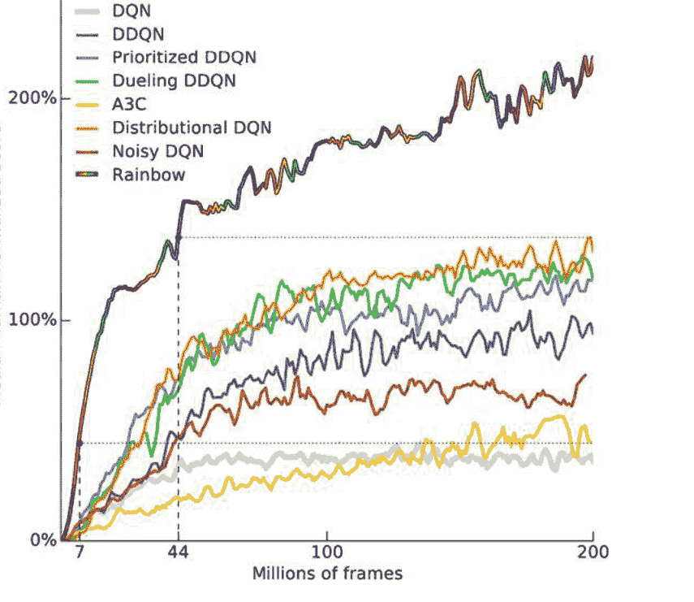

## 图3.5 彩虹图：57个 Atari 游戏的性能[31]

| 名称 | 原则 | 适用性 | 有效性 |
|------|------|--------|--------|
| DQN [53] | 回放缓冲区 | Atari | 稳定Q学习 |
| 双DQN [79] | 去高估值 | DQN | 收敛 |
| 优先经验 [68] | 去相关性 | 回放缓冲区 | 收敛 |
| 分布式 [5] | 概率分布 | 稳定梯度 | 泛化 |
| 随机噪声 [21] | 参数化噪声 | 稳定梯度 | 更多探索 |

解决这个问题，DDQN使用Q网络选择动作，但使用单独的目标Q网络评估动作。让我们比较DQN的训练目标

$$y = r_{t+1} + \gamma Q_{\theta_t}(s_{t+1}, \arg\max_a Q_{\theta_t}(s_{t+1}, a))$$

使用DDQN的训练目标（差异仅为单个 φ）

$y = r_{t+1} + \gamma Q_{\phi_t}(s_{t+1}, \arg \max_a Q_{\theta_t}(s_{t+1}, a))$

DQN目标使用相同的权重集 θ_t 两次，用于选择和评估；DDQN目标使用单独的权重集 φ_t 进行评估，以防止由于max运算符而导致的过高估计。 更新随机分配给任一组权重。

早期Van Hasselt等人[28]在表格设置中引入了双Q学习算法。 后来的论文表明，这个想法也适用于大型深度网络。 他们报告说，DDQN算法不仅减少了过高估计，而且在几个游戏中表现更好。 DDQN在49个Atari游戏上进行了测试，并且在相同的超参数下平均得分是DQN的两倍，在调整后的超参数下平均DQN得分是DQN的四倍[79]。

## 3.2.4.2 优先经验回放

DQN在回放缓冲区中均匀采样整个历史记录，而Q-learning仅使用最近（和重要的）状态。 有理由看到在这两个极端之间找到一个解决方案是否表现良好。

优先经验回放，或PEX，就是这样一种尝试。 它由Schaul等人引入[68]。 在Rainbow论文中，PEX与DDQN相结合，正如我们所看到的，蓝线（带有PEX）的表现确实优于紫线。

在DQN经验回放中，代理可以重复使用过去的示例，尽管经验转换是均匀采样的，而动作只是以原始体验频率重播，而不考虑它们的重要性。 PEX方法提供了一种优先考虑经验的框架。

重要的动作会更频繁地重播，因此，学习效率得到了提高。 作为重要性度量，使用标准的比例优先回放，使用绝对TD误差来优先考虑动作。 优先回放在基于值的深度强化学习中被广泛使用。 可以使用平均动作值在分布设置中计算该度量。 在Rainbow论文中，所有分布变体都通过Kullback-Leibler损失[31]来优先考虑动作。

## 3.2.4.3 优势函数

原始的DQN使用单个神经网络作为函数逼近器；DDQN（双深度Q网络）使用一个独立的目标Q网络来评估一个动作。 Dueling DDQN [81]，也被称为DDDQN，通过改进这种架构来提高性能。

使用两个独立的估计器：一个价值函数和一个优势函数。

$A(s, a) = Q(s, a) - V(s)$

优势函数与演员-评论家方法相关（见第4章）。优势函数计算动作的价值与状态的价值之间的差异。该函数将动作的值标准化到一个基准线上，用于状态的动作[26]。当许多动作具有相似的值时，优势函数提供更好的策略评估。

### 3.2.4.4 分布方法

原始的DQN学习一个单一的值，即状态值的估计均值。这种方法不考虑不确定性。为了解决这个问题，分布式Q学习[5]学习一个分类概率分布的折扣回报，从而增加探索性。Bellemare等人设计了一种新的分布式算法，将Bellman方程应用于分布的学习，这种方法被称为分布式DQN。Moerland等人提出了不确定性价值网络。有趣的是，分布式方法与生物学之间存在联系。Dabney等人显示了分布式强化学习算法与小鼠的多巴胺水平之间的对应关系，这表明大脑将可能的未来奖励表示为概率分布。

### 3.2.4.5 噪声DQN

另一种分布方法是噪声DQN [21]。噪声DQN使用随机网络层向权重添加参数化噪声。噪声引入了代理策略的随机性，增加了探索性。控制噪声的参数通过梯度下降与其余网络权重一起学习。

在他们的实验中，A3C（第4.2.4节），DQN和dueling代理（熵奖励和 $\epsilon$-贪婪）的标准探索启发式被NoisyNet替代。增加的探索性能使得Atari（深红色线）的得分大幅提高。

## 3.3 Atari 2600环境

在他们的原始2013年研讨会论文中，Mnih等人[53]在某些游戏中实现了人类水平的游戏。总共在七个Atari游戏上进行了5000万帧的训练。神经网络在Breakout，Enduro和Pong上的表现优于专业人类玩家。在Seaquest，Q*BERT和Space Invaders上，性能远低于人类。在这些游戏中，必须找到一个延续较长时间的策略。在他们的后续期刊文章中，两个

多年后，他们能够在ALE [54]中的57个游戏中实现人类水平的游戏，并在其中的49个游戏中表现优于人类水平的游戏。
一些游戏仍然很困难，特别是那些需要长期规划的游戏，在游戏的大部分时间内没有奖励，比如在蒙特祖玛的复仇中，代理人必须走很长的距离并拿起一把钥匙才能进入新的房间进入新的关卡。 从强化学习的角度来看，长时间的延迟信用分配是困难的。在本书的最后，当我们讨论分层强化学习方法时，我们将再次看到蒙特祖玛的复仇，在第8章中。 这些方法是专门开发的，以在状态空间中进行大步骤。 Go-Explore算法能够解决蒙特祖玛的复仇[17, 18]。

### 3.3.1 网络架构

解决具有挑战性问题的端到端学习需要大量的计算资源。 除了两个算法创新之外，DQN的成功还归功于创建了一个专门的高效训练架构[54]。

对于深度神经网络来说，玩雅达利游戏是一项计算密集型任务：网络直接从像素帧输入中训练行为策略。 因此，训练架构包含了降维步骤。 首先，网络只包含三个隐藏层（一个全连接层，两个卷积层），比大多数监督学习任务中使用的更简单。

像素图像是高分辨率数据。 由于使用完整分辨率的210 ×160像素、128种颜色值、每秒60帧的图像会导致计算过于密集，因此图像会被降低分辨率。 210 ×160的图像使用128色调调色板降低到灰度，并进一步裁剪为110 ×84像素，然后再裁剪为84 ×84。 第一个隐藏层使用16个8 ×8的滤波器进行卷积，步长为4，使用ReLU激活函数。 第二个隐藏层使用32个4 ×4的滤波器进行卷积，步长为2，使用ReLU激活函数。 第三个隐藏层是全连接层，包含256个ReLU神经元。 输出层也是全连接层，每个动作（18个摇杆动作）对应一个输出。 输出对应于各个动作的Q值。 图3.6显示了DQN的架构。网络接收到变化的

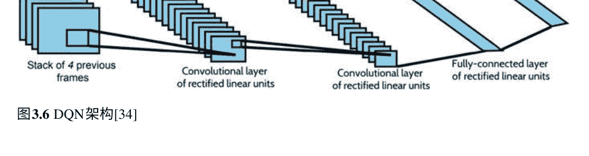

在游戏中，将游戏得分作为来自模拟器的数字，并将导数更新映射为 {-1, 0, +1}以指示得分的减少、无变化或改善（Huber损失[4]）。

为了进一步减少计算需求，采用了帧跳过的方法。根据游戏的不同，只使用每3-4帧中的一帧。为了考虑游戏历史，网络将最后四个结果帧作为输入。这样可以让网络看到移动。使用RMSprop作为优化器[65]。使用的是 ε-贪婪算法的变体，从1.0（完全探索）逐渐降低到0.1（90%的利用）。

### 3.3.2 Atari基准测试

为了结束Atari的故事，我们讨论了两个最终的算法。在开发的许多基于值的无模型深度强化学习算法中，我们讨论的另一个算法是R2D2 [39]，因为它的性能很好。R2D2不是Rainbow实验的一部分，但它是算法的一个重要改进。R2D2代表循环重播分布式DQN。它建立在优先级分布式重播和5步双Q学习的基础上。此外，它还使用了一个Dueling网络架构和卷积堆叠后的LSTM层。

关于架构的详细信息可以在[27, 81]中找到。LSTM使用循环状态来利用长期时间依赖性，从而提高性能。作者还报告说LSTM可以更好地进行表示学习。R2D2在所有57个Atari游戏中取得了良好的结果[39]。

最近的一个基准成就是Agent57。Agent57是第一个在ALE的所有57个Atari 2600游戏中都超过人类基准分数的程序。它使用一个控制器，根据游戏的不同，训练一系列策略，从非常剥削性的到非常探索性的。

## 结论

自从DQN的重播缓冲区以来，价值为基础的无模型深度强化学习的性能已经大大提高，现在在ALE的所有57个Atari游戏中已经实现了超人类的表现。

许多改进措施已经被开发出来，以提高覆盖率、相关性和收敛性。一个明确的基准的存在对于进展至关重要，这样研究人员就可以清楚地看到哪些想法起作用以及为什么。早期的迷宫和导航游戏，OpenAI的Gym [9]，尤其是ALE [6]，都促进了这一进展。

在下一章中，我们将看一下模型无关强化学习的另一个主要分支：基于策略的算法。我们将看到它们是如何工作的，并且它们非常适合于不同类型的应用，具有连续的动作空间。

## 总结和进一步阅读

这是第一章，我们在这一章中看到了深度强化学习算法学习复杂的高维任务。最后，我们总结一下并指向相关文献。

### 总结

在前一章中讨论的方法是精确的、表格化的方法。大多数有趣的问题具有大的状态空间，无法适应内存。特征学习通过它们的共同特征来识别状态。函数值不是精确计算的，而是通过深度学习进行近似计算。

最近强化学习的许多成功归功于深度学习方法。对于强化学习，当状态被近似时会出现问题。由于在强化学习中，下一个状态由前一个状态确定，当值与不同的状态共享时，算法可能会陷入局部最小值或循环运行。

另一个问题是训练收敛性。监督学习具有静态数据集，并且训练目标也是静态的。在强化学习中，损失函数的目标取决于正在优化的参数。这进一步导致不稳定性。DQN通过展示使用回放缓冲区和一个单独的、更稳定的目标网络，找到足够的稳定性，使得DQN能够收敛并学会玩Atari街机游戏。

已经发现了许多进一步提高稳定性的改进。Rainbow论文实现了其中一些改进，并发现它们是互补的，并共同实现了非常强大的游戏表现。

### 进一步阅读

深度学习改变了强化学习。Dong等人提供了对该领域的全面概述。有关深度学习的更多信息，请参阅Goodfellow等人的书籍，该书对深度学习有很多详细内容；一篇重要的期刊文章是[45]。一份简要调查是[1]。另请参阅附录B。

2013年，推出了街机学习环境[6, 49]。通过OpenAI的Gym [9]，使用清晰易用的Python绑定，使得使用强化学习进行实验变得更加容易。

基于值表的深度学习算法在收敛性和稳定性方面存在问题[77]，但是稳定的深度强化学习的想法在[29, 66]中得到了认可。张等人[83]研究了经验回放中的致命三角。已经证明了深度梯度TD方法在评估固定策略时会收敛[8]。Riedmiller等人在神经拟合Q学习算法（NFQ）[64]中放宽了固定控制策略。NFQ基于稳定函数逼近[19, 24]和经验回放[46]的工作，并且最近还基于最小二乘策略迭代[43]。2013年，第一篇DQN论文出现了，展示了在少数Atari游戏中的结果[53]，并使用回放缓冲区来减少时间相关性。2015年，后续的Nature论文报告了更多游戏的结果[54]，并使用了一个单独的目标网络来改善训练收敛性。一篇著名的综述论文是Rainbow论文[31, 38]。

使用基准非常重要，以便能够重现强化学习实验[30, 35, 36, 41]。 有关TensorFlow和Keras，请参阅[12, 22]。

## 练习

我们将以一些问题来结束本章，以便复习我们所学的概念。接下来是一些编程练习，以便更多地了解如何实际应用深度强化学习算法。

### 问题

以下是一些问题，用于检查您对本章的理解。每个问题都是一个封闭问题，期望得到一个简单的、单句回答。

- 1. 什么是Gym?
- 2. 什么是稳定基线?
- 3. DQN的损失函数使用Q函数作为目标。这会导致什么后果?
- 4. 为什么在强化学习中，探索/利用的权衡是核心问题?
- 5. 给出一个简单的探索/利用方法的名称。
- 6. 什么是自举?
- 7. 描述DQN中神经网络的架构。
- 8. 为什么深度强化学习比深度监督学习更容易出现不稳定的学习?
- 9. 什么是致命三角?
- 10. 函数逼近如何降低Q学习的稳定性?
- 11. 回放缓冲区的作用是什么?
- 12. 状态之间的相关性如何导致局部最小值？
- 13. 为什么状态空间的覆盖范围应该足够？
- 14. 当深度强化学习算法不收敛时会发生什么？
- 15. 国际象棋的状态空间估计有多大？$10^{47}$，$10^{170}$还是$10^{1685}$？
- 16. 围棋的状态空间估计有多大？$10^{47}$，$10^{170}$还是$10^{1685}$？
- 17. 星际争霸的状态空间估计有多大？$10^{47}$，$10^{170}$还是$10^{1685}$？
- 18. 彩虹论文中的彩虹代表什么，主要信息是什么？
- 19. 提到了三个添加到DQN的彩虹改进。

### 练习

现在让我们开始一些练习。如果你还没有这样做，请安装Gym、PyTorch<sup>13</sup>或TensorFlow和Keras（参见第2.2.4.2节和附录B.3.3.1，或者访问TensorFlow页面）。<sup>14</sup>请确保检查Python、Gym、TensorFlow和Stable Baselines的正确版本，以确保它们能够很好地配合使用。
下面的练习是使用Keras设计的：

- 1. *DQN*在Gym的Breakout游戏上实现Stable Baselines中的*DQN*算法。关闭*dueling*和*priorities*。找出*α*的值，即训练速率，以及*ϵ*的值，即探索率，使用了什么样的神经网络架构，回放缓冲区的大小是多少，以及目标网络更新的频率是多少。
- 2. 超参数改变所有这些超参数，上下调整，并记录对训练速度和训练结果的影响：结果有多好？性能对超参数优化的敏感度如何？
- 3. 云使用不同的计算机，尝试使用GPU版本加速训练，考虑使用*Colab*、*AWS*或其他具有快速GPU（或TPU）的云提供商。
- 4. 健身房去健身房尝试不同的问题。DQN适用于哪种类型的问题，它在哪些问题上的表现较差？
- 5. 稳定基线去稳定基线并实现不同的代理算法。尝试使用*dueling*算法、优先经验回放，以及其他算法，如*actor critic*或基于策略的算法。（这些算法将在下一章中解释。）注意它们的性能。
- 6. *TensorBoard*使用*TensorBoard*可以跟踪训练过程。*TensorBoard*适用于日志文件。在一个*Keras*练习中尝试*TensorBoard*，并跟踪不同的训练指标。还可以在稳定基线上尝试*TensorBoard*，并查看可以跟踪的指标。
- 7. 在Keras中进行长时间训练时，需要进行检查点保存，以防硬件或软件故障，以节省宝贵的计算资源。创建一个大型训练作业，并设置检查点保存。通过中断训练来测试所有内容，并尝试重新加载预训练的检查点，以从中断处重新开始训练。

## 参考文献

1. Kai Arulkumaran, Marc Peter Deisenroth, Miles Brundage和Anil Anthony Bharath。深度强化学习：简要调查。IEEE信号处理杂志, 34 (6) : 26-38, 2017年。 93
2. Adri Puigdomènech Badia, Bilal Piot, Steven Kapturowski, Pablo Sprechmann, Alex Vitvitskyi, Daniel Guo和Charles Blundell。Agent57：超越Atari人类基准。arXiv预印本 arXiv:2003.13350, 2020. 92
3. Leemon Baird。带有函数逼近的残差算法：强化学习。在机器学习会议1995, 第30-37页。爱思唯尔, 1995年。 72, 80
4. OpenAI Baselines。DQN https://openai.com/blog/openai-baselines-dqn/, 2017. 87, 92
5. Marc G Bellemare, Will Dabney, 和 R mi Munos。强化学习的分布视角。在国际机器学习会议, 第449-458页, 2017年。 87,88, 90
6. Marc G Bellemare, Yavar Naddaf, Joel Veness, 和 Michael Bowling。街机学习环境：通用智能体的评估平台。人工智能研究, 47:253-279, 2013年。 71, 73, 92, 94
7. Christopher Berner, Greg Brockman, Brooke Chan, Vicki Cheung, Przemyslaw Debiak, Christy Dennison, David Farhi, Quirin Fischer, Shariq Hashme, Christopher Hesse, Rafal J zefowicz, Scott Gray, Catherine Olsson, Jakub Pachocki, Michael Petrov, Henrique Pond de Oliveira Pinto, Jonathan Raiman, Tim Salimans, Jeremy Schlatter, Jonas Schneider, Szymon Sidor, Ilya Sutskever, Jie Tang, Filip Wolski, and Susan Zhang。Dota 2 with large scale deep reinforcement learning. arXiv预印本 arXiv:1912.06680, 2019. 75
8. Shalabh Bhatnagar, Doina Precup, David Silver, Richard S Sutton, Hamid R Maei, and Csaba Szepesv ri。收敛的时间差异学习与任意平滑函数逼近。在神经信息处理系统的进展中, 第1204-1212页, 2009年。 81, 94
9. Greg Brockman, Vicki Cheung, Ludwig Pettersson, Jonas Schneider, John Schulman, Jie Tang, 和 Wojciech Zaremba。OpenAI Gym。 arXiv预印本 arXiv:1606.01540, 2016年。 92, 94
10. Murray Campbell, A Joseph Hoane Jr, 和 Feng-Hsiung Hsu。Deep Blue。人工智能, 134(1-2): 57-83, 2002年。 70
11. Kumar Chellapilla和David B Fogel。在没有依赖专家知识的情况下演化神经网络来下棋。IEEE Transactions on Neural Networks, 10(6): 1382-1391, 1999年。 81
12. François Chollet。Keras。https://keras.io, 2015年。 94
13. Christopher Clark和Amos Storkey。教授深度卷积神经网络下围棋。arxiv预印本。arXiv预印本arXiv:1412.3409, 1, 2014年。 81
14. Will Dabney, Zeb Kurth-Nelson, Naoshige Uchida, Clara Kwon Starkweather, Demis Hassabis, R mi Munos, and Matthew Botvinick。一种基于多巴胺的强化学习的分布式代码。自然, 第1-5页, 2020年。 90
15. Jia Deng, Wei Dong, Richard Socher, Li-Jia Li, Kai Li, and Li Fei-Fei。ImageNet：一个大规模的分层图像数据库。在2009年IEEE计算机视觉和模式识别会议上, 第248-255页。IEEE, 2009年。 71
16. Hao Dong, Zihan Ding, and Shanghang Zhang。深度强化学习。 Springer, 2020年。 9317. Adrien Ecoffet, Joost Huizinga, Joel Lehman, Kenneth O Stanley, and Jeff Clune. Go-Explore：一种解决难度探索问题的新方法。arXiv预印本arXiv:1901.10995, 2019年。9118.
Adrien Ecoffet, Joost Huizinga, Joel Lehman, Kenneth O Stanley, and Jeff Clune. 先返回，然后探索。自然，590（7847）：580-586，2021年。91

19. Damien Ernst, Pierre Geurts, 和 Louis Wehenkel. 基于树的批处理模式强化学习.机器学习研究杂志, 6:503-556, 2005年4月。9420. Li Fei-Fei, Jia Deng, 和 Kai Li. ImageNet: 构建一个大规模图像数据库.视觉杂志,9(8):1037-1037, 2009年。71

21. Meire Fortunato, Mohammad Gheshlaghi Azar, Bilal Piot, Jacob Menick, Ian Osband, Alex Graves, Vlad Mnih, Remi Munos, Demis Hassabis, Olivier Pietquin, Charles Blundell, 和 Shane Legg. 用于探索的噪声网络. 在国际学习会议Representations, 2018年。87, 88, 90

22. Aurélien Géron. 使用Scikit-Learn和TensorFlow进行实践机器学习:概念, 工具和构建智能系统的技术. O’Reilly Media, Inc., 2019年。83, 94

23. Ian Goodfellow, Yoshua Bengio, 和 Aaron Courville. 深度学习 . MIT出版社, 剑桥, 2016年。76, 93

24. Geoffrey J Gordon. 动态规划中的稳定函数逼近。 在机器学习会议1995，第261-268页。爱思唯尔，1995年。94

25. Geoffrey J Gordon. 马尔可夫决策过程的近似解。 卡内基梅隆大学，1999年。72, 80

26. Ivo Grondman, Lucian Busoniu, Gabriel AD Lopes和Robert Babuska。 演员-评论家强化学习的调查: 标准和自然策略梯度。 IEEE Transactions onSystems, Man, and Cybernetics, Part C (Applications and Reviews), 42(6): 1291-1307, 2012年。90

27. Audrunas Gruslys, Will Dabney, Mohammad Gheshlaghi Azar, Bilal Piot, Marc Bellemare和Remi Munos。 反应堆：一种快速和样本高效的演员评论家强化学习代理。 在国际学习表示会议，2018年。9228. Hado van Hasselt。 双Q学习。 在神经信息处理系统进展，第2613-2621页，2010年。89

29. Nicolas Heess, David Silver, 和 Yee Whye Teh. 基于能量的策略的演员-评论家强化学习。 在欧洲强化学习研讨会,第45-58页, 2013年。81, 81, 94

30. Peter Henderson, Riashat Islam, Philip Bachman, Joelle Pineau, Doina Precup, 和 DavidMege r. 重要的深度强化学习。 在第32届AAAI人工智能大会, 2018年。 94

31. Matteo Hessel, Joseph Modayil, Hado Van Hasselt, Tom Schaul, Georg Ostrovski, WillDabne y, Dan Horgan, Bilal Piot, Mohammad Azar, 和 David Silver. Rainbow: 结合深度强化学习的改进。 在 AAAI, 第3215-3222页, 2018年。 87, 88, 89,94

39. Steven Kapturowski, Georg Ostrovski, John Quan, Remi Munos, and Will Dabney. 在分布式强化学习中的循环经验回放。在国际学习表示会议,2018. 92,92

40. Andrej Karpathy. 深度强化学习：从像素到乒乓球。http://karpathy.github.io/2016/05/31/rl. Andrej Karpathy博客, 2016年。 86

41. Khimiya Khetarpal, Zafarali Ahmed, Andre Cianflone, Riashat Islam和Joelle Pineau. 重新评估：评估强化学习算法的可重复性。在机器学习研讨会中的可重复性，ICML, 2018年。 94

42. Alex Krizhevsky, Ilya Sutskever和Geoffrey E Hinton. 使用深度卷积神经网络进行ImageNet分类。在神经信息处理系统的进展，页1097-1105，2012年。 71

43. Michail G Lagoudakis和Ronald Parr. 最小二乘策略迭代。机器学习研究杂志，4：1107-1149，2003年12月。 94

44. Sascha Lange和Martin Riedmiller. 深度自动编码器神经网络在强化学习中。在2010年国际神经网络联合会议(IJCNN)，第1-8页。IEEE. 2010. 81

45. Yann LeCun, Yoshua Bengio和Geoffrey Hinton. 深度学习。自然,521(7553):436, 2015. 93

46. Long-Ji Lin. 基于强化学习、规划和教学的自我改进反应式智能体。机器学习,8(3-4):293-321,1992.82,94

47. Long-Ji Lin. 使用神经网络的机器人强化学习。技术报告,卡内基梅隆大学匹兹堡校区计算机科学学院,1993. 81,82

48. Hao Liu和Pieter Abbeel. 通过对比学习进行混合判别生成训练。arXiv预印本 arXiv:2007.09070, 2020. 79

49. Marlos C Machado, Marc G Bellemare, Erik Talvitie, Joel Veness, Matthew Hausknecht, 和Michael Bowling. 重新审视街机学习环境：评估协议和开放通用智能体的问题。人工智能研究杂志,61:523-562,2018.9450. Hamid Reza Maei, Csaba Szepesv ri, Shalabh Bhatnagar, 和 Richard S Sutton. 朝着离线-策略学习控制与函数逼近。在国际机器学习会议上,2010. 8

51. James L McClelland, Bruce L McNaughton, 和 Randall C O'Reilly. 为什么海马体和新皮层中有互补的学习系统：从连接主义学习和记忆模型的成功和失败中获得的见解。心理学评论,102(3):419,1995.82

52. Francisco S Melo和M Isabel Ribeiro. Q学习与线性函数逼近的收敛性。在2007年欧洲控制会议（ECC），页码2671-2678。IEEE, 2007年。78

53. Volodymyr Mnih, Koray Kavukcuoglu, David Silver, Alex Graves, Ioannis Antonoglou, DaanWierstra和Martin Riedmiller. 使用深度强化学习玩Atari游戏。arXiv预印本arXiv:1312.5602, 2013年。71,78,78,78,78,81,81,84,86,86,90,9454. Volodymyr Mnih, Koray Kavukcuoglu, David Silver, Andrei A. Rusu, Joel Veness, Marc G.Bellemare, Alex Graves, Martin A. Riedmiller, Andreas Fidjeland, Georg Ostrovski, StigPetersen, Charles Beattie, Amir Sadik, Ioannis Antonoglou, Helen King, Dharshan Kumaran, Daan Wierstra, Shane Legg和Demis Hassabis. 通过深度强化学习实现人类水平的控制。Nature, 518 (7540) : 529-533,2015年。71,80,81,81,82,83,83,84,86,91,91,94

55. Thomas Moerland. 连续马尔可夫决策过程和策略搜索。莱顿大学2021年强化学习课程讲义。78

56. Thomas M Moerland, Joost Broekens和Catholijn M Jonker. 双不确定值网络的高效探索。arXiv预印本arXiv:1711.10789,2017年。90

57. Thomas M Moerland, Joost Broekens和Catholijn M Jonker. 返回分布在RL中的探索潜力. arXiv预印本arXiv:1806.04242, 2018年. 9058. Martin Müller. 计算机围棋. 人工智能, 134（1-2）：145-179, 2002年. 75

59. Joseph O'Neill, Barty Pleydell-Bouverie, David Dupret和Jozsef Csicsvari. 再次播放：唤醒体验和记忆. 神经科学趋势, 33（5）：220-229, 2010年。 82

60. Santiago Ontan n, Gabriel Synnaeve, Alberto Uriarte, Florian Richoux, David Churchill和Mike Preuss. 对实时战略游戏AI研究和StarCraft竞赛的调查. IEEE计算智能与AI在游戏中的交易, 5（4）：293-311, 2013年. 75, 75

61. Aske Plaat. 学习玩：强化学习和游戏. Springer Verlag, Heidelberg, https://learningtoplay.net, 2020年. 70

62. Matthias Plappert. Keras-RL. https://github.com/keras-rl/keras-rl, 2016年. 83

63. Jordan B Pollack和Alan D Blair. 为什么TD-Gammon有效？ 在神经信息处理进展, 页10-16, 1997年. 81

64. Martin Riedmiller. 神经拟合Q迭代-数据高效神经强化学习方法的首次经验. 在欧洲机器学习大会, 页317-328. Springer, 2005年. 81, 94

65. Sebastian Ruder. 梯度下降优化算法概述. arXiv预印本 arXiv:1609.04747, 2016. 92

66. Brian Sallans和Geoffrey E Hinton. 基于因子化状态和动作的强化学习. 机器学习研究杂志, 5:1063-1088, 2004年8月. 81, 81, 94

67. Jonathan Schaeffer.一步领先：国际象棋中的计算机完美. Springer Science & Business Media, 2008年. 70

68. Tom Schaul, John Quan, Ioannis Antonoglou和David Silver. 优先经验回放. 在国际学习表示会议, 2016年. 87, 88, 8969. Nicol N Schraudolph, Peter Dayan和Ter rence J Sejnowski. 在围棋中的位置评估的时序差异学习. 在神经信息处理系统进展,页码817-824, 1994年. 81

70. David Silver, Julian Schrittwieser, Karen Simonyan, Ioannis Antonoglou, Aja Huang, Arthur Guez, Thomas Hubert, Lucas Baker, Matthew Lai, Adrian Bolton, Yutian Chen, Timothy Lillicrap, Fan Hui, Laurent Sifre, George van den Driessche, Thore Graepel, and Demis Hassabis. 在没有人类知识的情况下掌握围棋. 自然, 550(7676):354, 2017. 81

71. Ilya Sutskever and Vinod Nair. 用卷积神经网络模仿围棋专家. 在国际人工神经网络会议, 页码101-110. Springer, 2008年. 8172. Richard S Sutton and Andrew G Barto. 强化学习导论, 第二版. MIT Press, 2018年. 72, 77, 80

73. Gerald Tesauro. Neurogammon赢得计算机奥林匹克. 神经计算, 1(3): 321-323, 1989年. 81

74. Gerald Tesauro. TD-Gammon：一种自学习的西洋双陆棋程序. 在神经网络应用, 页码267-285. Springer, 1995年. 81, 81

75. Gerald Tesauro. 时间差异学习和TD-Gammon. ACM通信, 38(3): 58-68, 1995年. 81

76. John Tromp. 合法国棋状态的数量. http://tromp.github.io/go/legal.html, 2016年. 75

77. John N Tsitsiklis和Benjamin Van Roy. 带有函数逼近的时间差异学习分析. 在神经信息处理系统进展, 页码1075-1081, 1997年. 72, 80, 94

78. Hado Van Hasselt, Yotam Doron, Florian Strub, Matteo Hessel, Nicolas Sonnerat和Joseph Modayil. 深度强化学习和致命三角. arXiv:1812.02648, 2018年. 81

79. Hado Van Hasselt, Arthur Guez和David Silver. 使用双重Q-Learning的深度强化学习. 在 AAAI, 卷2, 第5页. 凤凰城, 亚利桑那州, 2016年. 87, 87, 88, 89

80. Oriol Vinyals, Igor Babuschkin, Wojciech M. Czarnecki, Micha l Mathieu, Andrew Dudzik, Junyoung Chung, David H. Choi, Richard Powell, Timo Ewalds, Petko Georgiev, Junhyuk

81. Ziyu Wang, Tom Schaul, Matteo Hessel, Hado Hasselt, Marc Lanctot, 和 Nando Freitas. Dueling network architectures for deep reinforcement learning. 在国际机器学习会议, 页码 1995–2003, 2016. 87, 89, 92

82. Christopher JCH Watkins. 从延迟奖励中学习. 博士论文, King’s College, 剑桥, 1989. 77, 77

83. Shangtong Zhang 和 Richard S Sutton. 对经验回放的深入研究. arXiv预印本 arXiv:1712.01275, 2017. 82, 82, 94

## 第4章
### 基于策略的强化学习


一些最成功的深度强化学习应用具有连续的动作空间，例如机器人、自动驾驶汽车和实时策略游戏。

之前的章节介绍了基于价值的强化学习。基于价值的方法通过两个步骤找到策略。首先，他们找到一个状态的最佳行动价值，然后找到相应的行动（通过 arg max 方法）。这在具有离散行动的环境中有效，其中最高价值的行动明显不同于次优行动。连续行动空间的例子包括可以在任意角度移动的机器人手臂或可以是任意货币值的扑克下注。在这些行动空间中，基于价值的方法变得不稳定，arg max 方法不适用。

另一种方法效果更好：基于策略的方法。基于策略的方法不使用单独的价值函数，而是直接找到策略。它们从一个策略函数开始，然后通过策略梯度方法逐个回合进行改进。基于策略的方法适用于比基于价值的方法更多的领域。它们与深度神经网络和梯度学习配合得很好；它们是深度强化学习中最受欢迎的方法之一，本章将向您介绍它们。

我们首先看一下连续动作空间的应用。接下来，我们看一下基于策略的代理算法。我们将介绍基本的策略搜索算法和策略梯度定理。我们还将讨论结合值函数和策略的算法：所谓的演员-评论家算法。在本章的最后，我们将更深入地讨论基于策略的方法在更大环境中的应用，其中我们将讨论视觉-动作机器人和运动环境的进展。

本章结束时，我们提供练习、总结和进一步阅读的指引。

# 核心概念

- 策略梯度
- 偏差-方差权衡；演员-评论家

# 核心问题

- 直接找到一个低方差的连续动作策略

# 核心算法

- REINFORCE（算法 4.2）
- 异步优势演员评论家（算法4.4）
- 近端策略优化（第4.2.5节）

# 跳跃机器人

机器人学中最复杂的问题之一是学习行走或更一般地说，如何进行运动。已经投入了大量工作来使机器人行走、奔跑和跳跃。在YouTube上可以找到一个模拟机器人自学跳过障碍课程的视频¹ [18]。

学会走路是一个挑战，需要人类婴儿数月的时间来掌握。（猫和狗更快。）教机器人走路是一个具有挑战性的问题，在人工智能和工程学中得到了广泛研究。互联网上充斥着机器人试图打开门、摔倒或者试图站立而仍然摔倒的视频。²

腿式机器人的运动是一个困难的顺序决策问题。对于每条腿，涉及许多不同的关节。它们必须按正确的顺序激活，以正确的力道旋转，持续正确的时间，达到正确的角度。这些角度、力道和持续时间大部分是连续的。算法必须决定多少度、牛顿和秒构成最优策略。所有这些动作都是连续的量。机器人的运动是一个困难的问题，在基于策略的深度强化学习中经常进行研究。

## 4.1 连续问题

在本章中，我们的行动是连续和随机的。我们将讨论这两个方面以及它们所带来的一些挑战。我们将从连续行动策略开始。

### 4.1.1 连续策略

在上一章中，我们讨论了具有大状态空间的环境。现在我们将把注意力转向行动空间。到目前为止，我们所见过的问题的行动空间——网格世界、迷宫和高维度的Atari游戏——实际上是小而离散的行动空间——我们可以向北、向东、向西、向南走，或者从9个摇杆动作中选择。在象棋等棋类游戏中，行动空间更大，但仍然是离散的。当你将你的兵移动到e4时，你不会将它移动到e4½。

在本章中，问题是不同的。驾驶自动驾驶汽车需要将方向盘转动一定的角度、持续时间和角速度，以防止突然的运动。油门的运动也应该是平稳和连续的。机器人关节的执行是连续的，正如我们在本章引言中提到的。一个臂关节可以移动1度、2度，或者90度或180度，或者任何之间的角度。

在连续空间中的动作不是一组离散选择中的一个，比如{N, E, W, S}，而是一个连续范围内的值，比如[0, 2π] or R+；可能的值的数量是无限的。在有限的时间内如何在无限空间中找到最优值？尝试所有可能的组合将关节1设置为x度并施加力y在电机2上将需要无限长的时间。一种解决方法是离散化动作，尽管这会引入潜在的量化误差。

当动作不是离散的时，无法使用arg max操作来识别“最佳”动作，基于值的方法不再足够。基于策略的方法直接找到合适的连续或随机策略，而不需要中间步骤的值函数和arg max操作来构建最终策略。

### 4.1.2 随机策略

我们现在将转向随机策略的建模。

当机器人移动手臂打开门时，它必须正确判断距离。机器人可能会产生小错误，并且可能会失败（正如许多电影片段所展示的）。随机环境对基于值的方法[29]造成稳定性问题。Q值的小扰动可能导致值方法的策略发生大变化。只有在学习速率较慢时才能实现收敛，以平滑随机性。随机策略（目标分布）不会受到这个问题的困扰。随机策略还有另一个优点。由于它们的性质，它们可以进行探索，无需单独编码ε-贪婪性或其他探索方法，因为随机策略返回一个动作分布。

基于策略的方法直接找到合适的随机策略。纯粹的基于情节的策略方法的一个潜在缺点是它们具有高方差；它们可能找到局部最优解而不是全局最优解，并且收敛速度比基于值的方法慢。新的（演员-评论家）方法，如A3C、TRPO和PPO，旨在克服这些问题。我们将在本章后面讨论这些算法。

在我们解释这些基于策略的代理算法之前，我们将更详细地研究一些需要这些算法的应用。

### 4.1.3 环境：Gym和MuJoCo

机器人实验在强化学习中起着重要作用。然而，由于真实世界机器人实验的成本，强化学习中通常使用模拟机器人系统。这在无模型方法中尤为重要，这些方法往往具有较高的样本复杂性（当试验次数达到百万次时，真实机器人会磨损）。这些软件模拟器通过物理模型对机器人的行为和环境的影响进行建模。这样可以避免使用真实机器人进行实验的费用，尽管会因为建模误差而失去一些精度。两个著名的物理模型是MuJoCo [48]和PyBullet [5]。它们可以通过Gym环境轻松使用。

#### 4.1.3.1 机器人

大多数机器人应用比迷宫、山车和杆车等经典问题更复杂。机器人控制决策涉及更多的关节、行进方向和自由度，而不仅仅是一个在一维空间移动的小车。典型问题涉及学习视觉-运动技能（眼手协调、抓取）或学习多腿“动物”的不同行走方式。图4.1展示了一些抓取和行走的示例。

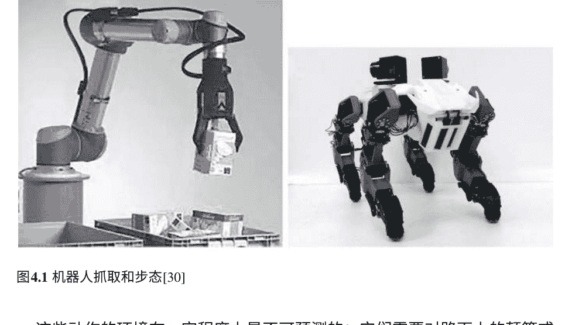

图4.1 机器人抓取和步态[30]

这些动作的环境在一定程度上是不可预测的：它们需要对路面上的颠簸或场景中物体的移动等干扰做出反应。

#### 4.1.3.2 物理模型

模拟机器人运动涉及建模力量、加速度、速度和移动。它还包括为弹跳球建模质量和弹性、触觉/抓握机械和不同材料的影响。物理力学模型需要模拟在现实世界中的行为结果。这样的模拟的目标之一是模拟抓取、运动、步态以及行走和奔跑（另见第4.3.1节）。

模拟应该准确。此外，由于无模型学习算法通常涉及数百万个动作，物理模拟的速度也很重要。已经创建了许多不同的基于模型的机器人物理环境，其中包括Bullet、Havok、ODE和PhysX，参见[9]进行比较。在强化学习中，MuJoCo [48]和PyBullet [5]是最受欢迎的模型，特别是MuJoCo在许多实验中被使用。

尽管MuJoCo的计算是确定性的，但环境的初始状态通常是随机的，导致整体上是非确定性的环境。尽管MuJoCo进行了许多代码优化，但模拟物理仍然是一项昂贵的任务。因此，文献中的大多数MuJoCo实验都基于类似棍子的实体，这些实体模拟有限的运动，以限制计算需求。

图4.2和图4.3展示了一些常见的Gym/MuJoCo问题的示例，这些问题经常用于强化学习：Ant、Half-Cheetah和Humanoid。

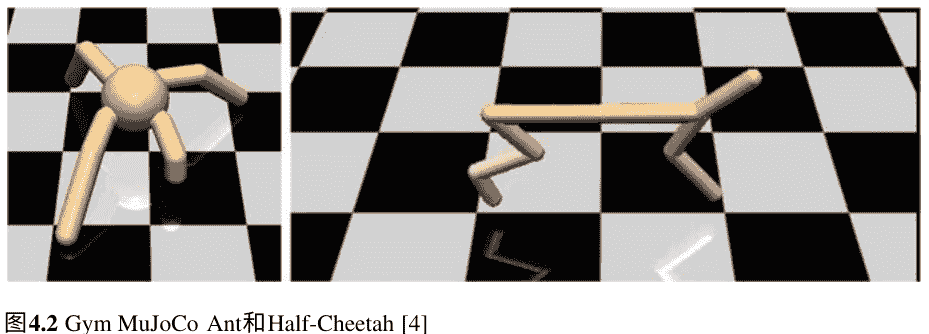

图4.2 Gym MuJoCo Ant和Half-Cheetah [4]

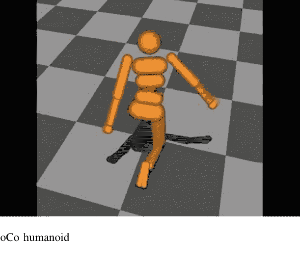

图4.3 Gym MuJoCo humanoid

#### 4.1.3.3 游戏

在实时视频游戏和某些纸牌游戏中，决策也是连续的。例如，在某些扑克变体中，货币赌注的大小可以是任意金额，这使得行动空间非常大（尽管严格来说仍然是离散的）。在星际争霸和夺旗战等游戏中，模拟了物理世界的一些方面，代理的移动可以在持续时间和速度上有所不同。这些游戏的环境也是随机的：对于代理来说，有些信息是隐藏的。这大大增加了状态空间的大小。我们将在第7章讨论这些游戏，同时讨论多智能体方法。

表4.1 基于策略的算法：REINFORCE、异步优势演员评论家、深度确定性策略梯度、信任区域策略优化、近端策略优化和软演员评论家名称

| | 方法 | 参考 |
|---|---|---|
| REINFORCE | 策略梯度优化 | [49] |
| A3C | 分布式演员评论家 | [35] |
| DDPG | 连续动作函数的导数 | [29] |
| TRPO | 动态大小的步长 | [38] |
| PPO | 改进的TRPO，一阶 | [40] |
| SAC | 基于方差的演员评论家用于鲁棒性 | [15] |

## 4.2 基于策略的代理

现在我们已经讨论了与基于策略的方法一起使用的问题和环境，是时候看看基于策略的算法是如何工作的了。基于策略的方法是模型无关的深度强化学习中的一种流行方法。已经开发了许多表现良好的算法。表4.1列出了一些在本章中将介绍的较为知名的算法。我们首先将对基本策略为基础的方法背后的思想进行直观解释。然后我们将讨论一些与之相关的理论，以及基本策略为基础的方法的优缺点。大部分这些缺点都可以通过演员-评论家方法来缓解，下面将对此进行讨论。

让我们从基于策略的方法背后的基本思想开始。

### 4.2.1 基于策略的算法: REINFORCE

基于策略的方法学习参数化的策略，该策略在选择动作时不需要参考值函数。⁴在基于策略的方法中，策略函数直接表示，允许策略选择连续动作，这在基于值的方法中很难实现。

> 超市：为了对基于策略的方法的性质有一些直观认识，让我们再次回想一下在第2章中使用的超市导航任务。在这个导航问题中，我们可以尝试使用Q值函数来评估我们与超市的当前距离，就像我们之前做的那样。

⁴基于策略的方法可以使用值函数来学习策略参数 θ 但不用于动作选择。

以前完成。 Q值评估每个方向的距离，告诉我们每个动作离目标有多远。然后我们可以使用这个距离函数来找到我们的路径。

相比之下，基于策略的替代方法是询问当地人怎么走，例如，直走然后左转，然后在歌剧院右转，一直直走直到我们左边的超市。当地人直接给了我们一条完整的路径，而不需要推断哪个动作最接近，然后使用这个信息来确定前进的方向。我们随后可以尝试改进这个完整的轨迹。

让我们看看如何直接优化这样一个直接策略，而不需要中间步骤的Q函数。我们将开发一个首个通用的基于策略的算法，以了解各个部分如何配合。解释将是直观的。

基于策略的算法的基本框架很简单。 我们从一个参数化的策略函数 π_θ开始。 我们首先（1）初始化策略函数的参数 θ，（2）采样一个新的轨迹 τ，（3）如果 τ是一个好的轨迹，就增加参数 θ朝着 τ的方向调整，否则减小它们，（4）一直进行下去直到收敛。算法4.1提供了一个伪代码框架。请注意与前一章节（列表3.1-3.3）中的代码的相似之处，特别是深度学习算法，我们也在循环中优化函数参数。

策略由一组参数 θ表示（这些参数可以是神经网络中的权重）。 这些参数 θ将状态 S映射到动作概率 A。当我们给定一组参数时，我们应该如何调整它们以改进策略？ 基本思想是随机采样一个新的策略，如果它更好，就稍微调整参数朝着这个新策略的方向（如果更差，则朝相反方向调整）。 让我们更详细地看看这个思想是如何工作的。

为了知道哪种策略最好，我们需要一种衡量其质量的方法。 我们将由参数定义的策略的质量表示为 J(θ)。 将起始状态的值函数作为我们的质量度量是很自然的。

J(θ) = V^π(s0)。

我们希望最大化 J(·)。 当参数可微分时，我们只需要找到一种改进梯度的方法。

∇_θ J(θ) = ∇_θ V^π(s0)

通过最大化我们的目标函数 J(·)来最大化这个表达式。
基于策略的方法应用基于梯度的优化，使用目标函数的导数来找到最优解。由于我们正在最大化，我们应用梯度。

上升.在算法的每个时间步骤$t$中，我们执行以下更新:

$$θ_{t+1} = θ_t + α·∇_θJ(θ)$$

对于学习率$α \in \mathbb{R}^+$和性能目标$J$，请参见梯度上升算法 算法4.1。

算法4.1 梯度上升优化

```
输入：可微分的目标函数$J(\theta)$，学习率$\alpha \in \mathbb{R}^+$，阈值$\epsilon \in \mathbb{R}^+$
初始化：在$\mathbb{R}^d$中随机初始化$\theta$
重复
  样本轨迹$\tau$和计算梯度$\nabla_\theta$
  $\theta \leftarrow \theta + \alpha \cdot \nabla_\theta J(\theta)$
直到$\nabla_\theta J(\theta)$ 收敛到 $\epsilon$
返回 参数 $\theta$
```

记住$π_θ(a|s)$是在状态$s$下采取行动$a$的概率。这个函数$π$由一个神经网络$θ$表示，将输入端的状态$s$映射到输出端的行动概率。参数$θ$确定了我们的函数$π$的映射。我们的目标是更新参数，使$π_θ$成为最优策略。行动$a$越好，我们就越想增加参数$θ$。

如果我们现在以某种神奇的方式知道了最优动作$a^*$，那么我们可以使用梯度将策略的每个参数$θ_t$，$t ∈$轨迹，推向最优动作的方向，如下所示:

$$θ_{t+1} = θ_t + α∇π_{θ_t}(a^*|s)$$

不幸的是，我们不知道哪个动作是最好的。然而，我们可以采样一个轨迹并使用样本动作的值的估计。这个估计可以使用前一章节中的常规$\hat{Q}$函数，或者折扣回报函数，或者优势函数（即将介绍）。然后，通过将参数的推动（概率）与我们的估计相乘，我们得到

$$θ_{t+1} = θ_t + α\hat{Q}(s, a)∇π_{θ_t}(a|s)$$

这个公式的问题在于，我们不仅会更加努力地推动具有高价值的动作，而且还会更频繁地这样做，因为策略$π_{θ_t}(a|s)$是动作$a$在状态$s$的概率。因此，好的动作得到了双重改进，这可能会导致不稳定。我们可以通过除以总体概率来进行修正:

$$θ_{t+1} = θ_t + α\hat{Q}(s, a) \cdot \frac{∇π_{θ_t}(a|s)}{π_θ(a|s)}$$

事实上，我们现在几乎已经到达了经典的基于策略的算法REIN-FORCE，该算法由Williams于1992年引入[49]。 在这个算法中，我们的公式以一种类似于对数交叉熵损失函数的方式表达。我们可以通过使用微积分的基本事实得到这样的对数形式

∇ log f (x) = \frac{∇ f (x)}{f (x)}

将这个公式代入我们的方程，我们得到

θ_{t+1} = θ_t + α \hat{Q}(s, a) ∇_θ log π_θ(a|s).

这个公式确实是REINFORCE的核心，原型策略算法，在算法4.2中完整展示，带有折扣累积奖励。

算法4.2 蒙特卡洛策略梯度（REINFORCE）[49]

**输入**：可微分策略 π_θ(a|s)，学习率 α ∈ R⁺，阈值 ε ∈ R⁺
**初始化**：将参数 θ 初始化为 Rᵈ
**重复**
    根据策略 π_θ(a|s) 生成完整的轨迹 τ = {s0, a0, r0, s1, ..., sT}
    对于每个回合的每一步 t ∈ 0, ..., T-1
        累计回报 R ← Σ_{k=t}^{T-1} γ^{k-t} · r_k
        调整参数 θ ← θ + α R ∇_θ log π_θ(a_t|s_t)
    结束循环
**直到** ∇_θ J(θ) 收敛到 ε 以下
**返回** 参数 θ

总结一下，REINFORCE公式将策略的参数推向更好的动作方向（按估计的动作值的大小成比例地乘以），以确定哪个动作是最好的。

我们已经找到了一种改进策略的方法，可以直接用来指示要采取的动作。该方法适用于离散、连续或随机的动作，而不管动作是什么。 它直接工作，无需经过中间值或argmax函数来找到它。算法4.2展示了完整的算法，称为蒙特卡洛策略梯度。 该算法被称为蒙特卡洛，因为它采样了一条轨迹。

### 在线和批处理

我们展示的梯度上升（算法4.1）和REINFORCE（算法4.2）的版本在最内层循环中更新参数。 所有更新都在轨迹的时间步骤中执行。 这种方法被称为在线方法。 当多个进程并行工作以更新数据时，在线方法确保尽快使用已知的信息。

策略梯度算法也可以以批处理方式进行：所有梯度都在状态和动作上求和，并在轨迹结束时更新参数。 由于参数更新可能很昂贵，批处理方法可能更高效。 在实践中经常使用的一种中间形式是使用小批量进行交易，以在计算效率和信息效率之间进行权衡。

现在让我们退后一步，看看算法的效果如何。

### 4.2.2 偏差-方差权衡在基于策略的方法中

既然我们已经了解了基于策略的算法的原则，让我们看看基于策略的算法在实践中是如何工作的，并比较基于策略的方法的优势和劣势。

让我们从优势开始。首先，参数化是基于策略的方法的核心，使其与深度学习非常匹配。对于基于值的方法，深度学习必须进行改进，从而引起了诸多复杂性，正如我们在第3.2.3节中所看到的。其次，基于策略的方法可以轻松找到随机策略；而基于值的方法则找到确定性策略。由于其随机性质，基于策略的方法自然地进行探索，无需像ε-贪婪或其他复杂的方法那样需要调整才能良好工作。

第三，基于策略的方法在大型或连续动作空间中非常有效。微小的变化 $\theta$ 导致 $\pi$ 和状态分布的微小变化（它们是平滑的）。基于策略的算法在大型或连续动作空间中不会遭受收敛性和稳定性问题（如最大化算法所见）。

另一方面，REINFORCE算法的分集蒙特卡洛版本存在一些缺点。请记住，在评估质量之前，REINFORCE在每次迭代中生成完整的随机回合。（基于值的方法在每个时间步骤中使用奖励来选择下一个动作。）因此，基于策略的方法具有低偏差，因为生成了完全随机的轨迹。然而，它们也具有高方差，因为完整的轨迹是随机生成的（而基于值的方法在每个选择步骤中使用值进行引导）。这会有什么后果？首先，对完整轨迹的策略评估具有低样本效率和高方差。因此，与基于值的方法相比，策略改进发生得不频繁，导致收敛速度较慢。其次，这种方法通常会找到局部最优解，因为收敛到全局最优解需要太长时间。

已经进行了大量研究来解决基于情节的纯策略梯度的高方差问题[2, 13, 25, 26]。已经发现的改进大大提高了性能，以至于基于策略的方法（如A3C、PPO、SAC和DDPG）已经成为许多应用中最受欢迎的无模型强化学习算法。我们讨论的减少高方差的改进包括：

- 演员-评论家方法基于时间差值值引导引入了基于情节内值的评论家。
- 基线减法引入了一个优势函数来降低方差。
- 信任区域减少了策略参数的大幅变化。
- 探索对于摆脱局部最小值和获得更稳健的结果至关重要；通常使用高熵动作分布。

让我们来看看这些改进。

### 4.2.3 演员-评论家引导

演员-评论家方法将基于值的元素与基于策略的方法相结合。演员代表基于动作或策略的方法，评论家代表基于值的方法[43]。

在情节REINFORCE中，动作选择是随机的，因此偏差较低。然而，方差很高，因为对整个情节进行采样（更新的大小和方向在不同样本之间可能会有很大差异）。演员评论家方法旨在结合基于价值的方法（方差较低）和基于策略的方法（偏差较低）的优点。演员评论家方法很受欢迎，因为它们效果很好。这是一个活跃的领域，已经开发出许多不同的算法。

策略方法的方差可以来自两个来源：（1）累积奖励估计的方差较高，（2）梯度估计的方差较高。对于这两个问题，已经开发出了解决方案：引导法以获得更好的奖励估计，基线减法以降低梯度估计的方差。这两种方法都使用了学习到的值函数，我们用Vφ(s)表示。值函数可以使用单独的神经网络，具有单独的参数φ，也可以在演员参数θ的顶部使用值头。在这种情况下，演员和评论家共享网络的较低层，并且网络具有两个独立的顶部：策略头和值头。我们将使用φ表示值函数的参数，以将其与策略参数θ区分开来。

### 时序差异引导

为了减少策略梯度的方差，我们可以增加采样的轨迹数M。然而，对于给定的随机策略，不同轨迹的可能数量是指数量级的，我们无法负担得起为一个更新采样所有轨迹。在实践中，采样的轨迹数M很小，有时甚至M=1，从单个轨迹更新策略参数。

轨迹的回报取决于许多随机动作选择；更新具有高方差。一个解决方案是使用我们从时序差异学习中了解到的原则，逐步引导值函数。引导使用值函数计算每个剧集的中间N步值，以权衡方差和偏差。中间N步值介于完整剧集蒙特卡洛和单步时序差异目标之间。

输入：策略 $\pi_\theta(a|s)$，值函数 $V_\phi(s)$
估计深度n，学习率$\alpha$，回合数M
初始化：随机初始化$\theta$和$\phi$
重复
    对于 $i \in 1, \ldots, M$执行
        轨迹 $\tau = \{s_0, a_0, r_0, s_1, \ldots, s_T\}$ 根据 $\pi_\theta(a|s)$
        对于 $t \in 0, \ldots, T-1$执行
            $\hat{Q}_n(s_t, a_t) = \sum_{k=0}^{n-1} \gamma^k r_{t+k} + \gamma^n V_\phi(s_{t+n})$  n步目标
        结束循环
    结束循环
    $\phi \leftarrow \phi - \alpha \nabla_\phi \sum_i \left( \hat{Q}_n(s_t, a_t) - V_\phi(s_t) \right)^2$  更新值损失
    $\theta \leftarrow \theta + \alpha \nabla_\theta \sum_i \hat{Q}_n(s_t, a_t) \cdot \nabla_\theta \log \pi_\theta(a_t|s_t)$  更新策略梯度
直到 $\nabla_\theta J(\theta)$ 收敛到 $\epsilon$
返回 参数 $\theta$

我们可以使用自助法来计算一个 n 步目标

\(\hat{Q}_n(s_t, a_t) = \sum_{k=0}^{n-1} \gamma^k r_{t+k} + \gamma^n V_\phi(s_{t+n})\)

然后我们可以根据平方损失来更新值函数

\(\mathcal{L}(\phi|s_t, a_t) = \left( \hat{Q}_n(s_t, a_t) - V_\phi(s_t) \right)^2\)

并使用标准策略梯度更新策略，但使用改进后的值函数

\(\nabla_\theta \mathcal{L}(\theta|s_t, a_t) = \hat{Q}_n(s_t, a_t) \cdot \nabla_\theta \log \pi_\theta(a_t|s_t)\)

我们现在在算法中突出使用值函数，该函数由一个单独的参数集 $\phi$ 来参数化；策略参数仍然由 $\theta$ 表示。同时使用策略和值函数是演员-评论家方法得名的原因。

算法4.3展示了一个示例算法。当我们将此算法与算法4.2进行比较时，我们可以看到策略梯度上升更新现在使用了n步$\hat{Q}^n$值估计，而不是迹回报R。我们还可以看到这次参数更新是以批处理模式进行的，具有单独的求和。

## 4.2.4 使用优势函数进行基线减法

减去一个基线可以减小策略梯度的方差。从一组数字中减去一个基线可以减小方差，但是不会影响期望。假设，在给定的状态下有三个可用的动作，分别返回65、70和75。策略梯度将尝试提高每个动作的概率，因为每个动作的回报都是正的。上述方法可能会导致一个问题，因为我们将所有动作都提高了一点（只是对其中一个动作稍微困难一些）。如果我们只提高高于平均值的动作（在这个例子中，动作75高于平均值70），并降低低于平均值的动作（在这个例子中是65），可能会更好。我们可以通过基线减法来实现。

基准线的最常见选择是值函数。当我们从状态-动作值估计 Q 中减去值 V 时，该函数被称为优势函数：

$A(s_t, a_t) = Q(s_t, a_t) - V(s_t)$

A函数从状态S的值中减去状态-动作值。现在它估计了一个特定动作相对于特定状态期望的改进有多大。

我们可以将基准线减法与任何引导方法结合起来，以估计累积奖励 $\hat{Q}(s_t, a_t)$。我们计算

$\hat{A}_n(s_t, a_t) = \hat{Q}_n(s_t, a_t) - V_\phi(s_t)$

并使用以下方式更新策略

$∇_θ \mathcal{L}(θ|s_t, a_t) = \hat{A}_n(s_t, a_t) · ∇_θ \log π_θ(a_t|s_t)$

我们现在已经看到了构建完整的演员-评论家算法的要素。算法4.4展示了一个例子算法。

## 算法4.4 带有引导和基线减法的演员评论家

| 输入 | 一个策略 $\pi_\theta(a|s)$, 一个值函数 $V_\phi(s)$ |
|------|---------------------------------------------------|
|      | 一个估计深度 $n$, 学习率 $\alpha$, 总共的回合数 $M$ |
| 初始化 | 随机初始化 $\theta$ 和 $\phi$ |
| 当未收敛时执行 | 对于 $i = 1, ..., M$ 执行 |
|      | 轨迹 $\tau = \{s_0, a_0, r_0, s_1, ..., s_T\}$ 根据 $\pi_\theta(a|s)$ |
|      | 对于 $t = 0, ..., T-1$ 执行 |
|      | $\hat{Q}_n(s_t, a_t) = \sum_{k=0}^{n-1} \gamma^k r_{t+k} + \gamma^n V_\phi(s_{t+n})$ |
|      | $\hat{A}_n(s_t, a_t) = \hat{Q}_n(s_t, a_t) - V_\phi(s_t)$ |
|      | 结束循环 |
|      | 结束循环 |
|      | $\phi \leftarrow \phi - \alpha \cdot \nabla_\phi \sum_t (\hat{A}_n(s_t, a_t))^2$ |
|      | $\theta \leftarrow \theta + \alpha \cdot \sum_t [\hat{A}_n(s_t, a_t) \cdot \nabla_\theta \log \pi_\theta(a_t|s_t)]$ |
| 结束循环 | |
| 返回 | 参数 $\theta$ |

## 通用策略梯度公式

有了这两个想法，我们可以制定出一整套策略梯度方法，取决于它们使用的累积奖励估计的类型。一般来说，策略梯度估计器的形式如下，其中我们现在引入一个新的目标 $t$，它是从轨迹 $\tau$ 中采样得到的：

$\nabla_\theta J(\theta) = \mathbb{E}_{\tau_0 \sim p_\theta(\tau_0)} \left[ \sum_{t=0}^n t \nabla_\theta \log \pi_\theta(a_t|s_t) \right]$

对于 $t$，有多种潜在选择，基于引导和基准减法的使用：

- $t = \hat{Q}_{MC}(s_t, a_t) = \sum_{i=t}^{\infty} \gamma^i \cdot r_i$ 蒙特卡洛目标
- $t = \hat{Q}_n(s_t, a_t) = \sum_{i=t}^{n-1} \gamma^i \cdot r_i + \gamma^n V_\theta(s_n)$ 引导式（$n$步骤目标）
- $t = \hat{A}_{MC}(s_t, a_t) = \sum_{i=t}^{\infty} \gamma^i \cdot r_i - V_\theta(s_t)$ 基线减法
- $t = \hat{A}_n(s_t, a_t) = \sum_{i=t}^{n-1} \gamma^i \cdot r_i + \gamma^n V_\theta(s_n) - V_\theta(s_t)$ 基线+引导式
- $t = Q_\phi(s_t, a_t)$ Q值近似

演员-评论家算法是实践中最受欢迎的无模型强化学习算法之一，因为其性能良好。在讨论了相关的理论背景之后，现在是时候看一下演员-评论家如何在实际的高性能算法中实现了。我们将从A3C开始。

## 异步优势演员评论家

许多高性能的实现都基于演员评论家的方法。对于大规模问题，该算法通常是并行化的，并在大型集群计算机上实现。一个众所周知的并行算法是异步优势演员评论家（A3C）。A3C是一个使用异步（并行和分布式）梯度下降来优化深度神经网络控制器的框架[35]。

A3C还有一个非并行版本，即同步变体A2C[50]。它们共同推广了这种演员评论家方法。图4.4显示了A3C的分布式架构[22]；算法4.5显示了来自Mnih等人的伪代码[35]。A3C网络将同时估计值函数$V_\phi(s)$和优势函数$A_\phi(s, a)$，以及策略函数$\pi_\theta(a|s)$。在实验中，在Atari [35]上，神经网络是分开的完全连接的策略和价值头部（图4.4中的橙色），然后是联合卷积网络（蓝色）。这个网络架构在分布式工作者中复制。这些工作者中的每一个都在单独的处理器线程上运行，并定期与全局参数同步。

A3C在以下方面改进了经典的REINFORCE算法：它使用了优势演员评论家设计，使用了深度学习，并且在训练阶段充分利用了并行性。代码末尾的梯度累积步骤可以被视为基于小批量的随机梯度更新的并行重构：每个训练线程独立地调整 $\phi$ 或 $\theta$ 的值方向。A3C的一个重要贡献来自于其并行化和异步化的架构：多个演员-学习者被派遣到环境的不同实例中；它们都与环境进行交互并收集经验，并异步地将其梯度更新推送到一个中央目标网络（就像DQN一样）。

研究发现，并行的演员-学习者对训练有稳定的影响。A3C在Atari领域超过了先前的最新技术，并成功解决了各种连续运动控制问题，以及使用高分辨率视觉输入在随机3D迷宫中导航的新任务[35]。

## 算法4.5 每个演员-学习者线程的异步优势演员-评论家伪代码[35]

| 输入 | 假设全局共享参数向量 $\theta$ 和 $\phi$ 以及全局共享计数器 $T = 0$ |
|------|---------------------------------------------------------------------|
|      | 假设线程特定的参数向量 $\theta'$ 和 $\phi'$ |
|      | 初始化线程步骤计数器 $t \leftarrow 1$ |
| 重复 | 重置梯度: $d\theta \leftarrow 0$ 和 $d\phi \leftarrow 0$。 |
|      | 同步线程特定参数 $\theta' = \theta$ 和 $\phi' = \phi$ |
|      | $t_{开始} = t$ |
|      | 获取状态 $s_t$ |
|      | 重复 |
|      | 根据策略 $\pi(a_t | s_t; \theta')$ 执行动作 $a_t$ |
|      | 获得奖励 $r_t$ 和新状态 $s_{t+1}$ |
|      | $t \leftarrow t + 1$ |
|      | $T \leftarrow T + 1$ |
|      | 直到终止状态 $s_t$ 或 $t - t_{开始} = = t_{max}$ |
|      | $R = \begin{cases} 0 & \text{对于终止状态 } s_t \\ V(s_t, \phi') & \text{对于非终止状态 } s_t \end{cases}$ |
|      | 对于 $i \in \{t-1, ............, t_{开始}\}$ 执行以下操作 |
|      | $R \leftarrow r_i + \gamma R$ |
|      | 计算关于 $\theta'$ 的梯度累积: $d\theta \leftarrow d\theta + \nabla_{\theta'} \log \pi(a_i | s_i; \theta') (R - V(s_i; \phi'))$ |
|      | 计算关于 $\phi'$ 的梯度累积: $d\phi \leftarrow d\phi + \partial (R - V(s_i; \phi'))^2 / \partial\phi'$ |
|      | 结束循环 |
|      | 使用 $d\theta$ 和 $d\phi$ 对 $\theta$ 和 $\phi$ 进行异步更新。 |
| 直到 | $T > T_{max}$ |

## 4.2.5 信任区域优化

进一步减少策略方法方差的另一种重要方法是信任区域方法。信任区域策略优化（TRPO）旨在通过在优化问题上使用特殊损失函数和附加约束来进一步减少策略参数的高变异性[38]。

加快算法的一种天真方法是尝试增加超参数（如学习率和策略参数）的步长。这种方法将无法发现隐藏在更细粒度轨迹中的解决方案，并且优化将收敛到局部最优解。因此，步长不应该太大。一种不那么天真的方法是使用依赖于优化进展输出的自适应步长。

信任区域在一般优化问题中用于限制更新大小[42]。算法通过计算近似的质量来工作；如果仍然良好，则扩展信任区域。或者，如果新策略和当前策略的发散越来越大，则可以缩小该区域。

Schulman等人[38]基于这些思想引入了信任区域策略优化（TRPO），试图在不意外导致性能崩溃的情况下，对策略进行尽可能大的参数改进步骤。为此，TRPO在采样策略时比较旧策略和新策略：

$\mathcal{L}(\theta) = \mathbb{E}_t \left[ \frac{\pi_\theta(a_t|s_t)}{\pi_{\theta_{\text{old}}}(a_t|s_t)} \cdot A_t \right].$

为了增加学习步长，TRPO试图最大化这个损失函数 $\mathcal{L}$，同时满足旧策略和新策略之间不太远的约束。在TRPO中，使用Kullback-Leibler散度$^5$来实现这个目的：

$\mathbb{E}_t[\text{KL}(\pi_{\theta_{\text{old}}}(\cdot|s_t), \pi_\theta(\cdot|s_t))] \leq \delta.$

TRPO可以应用于复杂的高维问题。原始实验展示了它在模拟机器人游泳、跳跃、行走和Atari游戏中的稳健性能。TRPO通常用于实验，并作为开发新算法的基准。TRPO的一个缺点是它是一个使用二阶导数的复杂算法；我们不会在这里介绍伪代码。可以在Spinning Up$^6$和Stable Baselines$^7$找到实现。

近端策略优化（PPO）[40]是对TRPO的改进。PPO具有TRPO的一些优点，但实现更简单，更通用，具有更好的经验样本复杂度和更好的运行时复杂度。它的动机与TRPO相同，即在不导致性能崩溃的情况下，对策略参数进行最大可能的改进步骤。

PPO有两个变体：PPO-Penalty和PPO-Clip。PPO-Penalty近似解决了KL约束更新（类似于TRPO），但仅在目标函数中惩罚KL散度，而不是将其作为硬约束。

PPO-Clip在目标函数中不使用KL散度项，也没有任何约束。相反，它依赖于目标函数中的剪切来消除新策略远离旧策略的动力；它将旧策略和新策略之间的差异剪切在一个固定范围内$[1 - \epsilon, 1 + \epsilon] \cdot A_t$。

虽然比TRPO简单，但PPO仍然是一个复杂的算法，我们在这里省略了代码。PPO的作者提供了一个实现作为基准。$^8$TRPO和PPO都是在线算法。Hsu等人[20]对PPO的设计选择进行了反思。

## 4.2.6 熵和探索

在许多深度强化学习实验中，只对状态空间的一小部分进行采样会导致脆弱性：算法会陷入局部最优解，而超参数的不同选择可能导致性能差异很大。即使对于许多算法，随机数生成器的种子选择不同也会导致性能差异很大。

对于大型问题，无论是基于值还是基于策略的方法，探索都很重要。我们必须提供激励，有时尝试一种当前看起来次优的行动[36]。探索过少会导致脆弱、局部和最优解。

当我们学习一个确定性策略 $\pi_\theta(s) \rightarrow a$ 时，我们可以手动添加探索噪声到行为策略中。在连续动作空间中，我们可以使用高斯噪声，而在离散动作空间中，我们可以使用狄利克雷噪声[27]。例如，在一个一维连续动作空间中，我们可以使用

$\pi_{\theta, \text{行为}} (a|s) = \pi_\theta(s) + \mathcal{N}(0, \sigma),$

其中 $\mathcal{N}(\mu, \sigma)$是具有超参数均值 $\mu =0$和标准差 $\sigma$的高斯（正态）分布； $\sigma$是我们的探索超参数。

## 软演员评论家

当我们学习一个随机的策略 $\pi(a|s)$时，由于策略的随机性，探索已经部分地得到保证。例如，当我们预测一个高斯分布时，从该分布中简单地抽样已经会导致所选择的动作的变化。

$\pi_{\theta, \text{行为}} (a|s) = \pi_\theta (a|s)。$

然而，当探索不足时，一个潜在的问题是策略分布的崩溃。分布变得过窄，我们失去了对好性能所必需的探索压力。

虽然我们可以简单地添加额外的噪声，但另一种常见的方法是使用熵正则化（详见第A.2节）。然后我们在损失函数中添加额外的惩罚项，以确保分布的熵 $\mathcal{H}$ 保持较大。软演员-评论家算法（SAC）是一种着重于探索的著名算法[15, 16]。SAC将策略梯度方程扩展到

$\theta_{t+1} = \theta_t + R \cdot \nabla_\theta \log \pi_\theta(a_t|s_t) + \eta \nabla_\theta \mathcal{H}[\pi_\theta(\cdot|s_t)],$

其中 $\eta \in \mathbb{R}^+$是一个确定熵正则化程度的常数。SAC确保我们将 $\pi_\theta(a|s)$移动到最优策略，同时也确保策略尽可能宽广（在两者之间进行权衡）。

熵的计算公式为 $\mathcal{H} = - \sum_i p_i \log p_i$，其中 $p_i$是处于状态 $i$的概率；在SAC中，熵是随机策略函数的负对数 $-\log \pi_\theta(a|s)$。

高熵策略有利于探索。首先，策略被激励更广泛地进行探索，同时放弃明显无望的途径。其次，随着探索的改进，学习速度也得到了提高。

大多数基于策略的算法（包括A3C、TRPO和PPO）只优化期望值。通过在优化目标中明确包含熵，SAC能够增加结果策略的稳定性，实现对不同随机种子的稳定结果，并减少对超参数设置的敏感性。

将熵纳入优化目标已经得到广泛研究，例如[14, 23, 37, 47, 52]。

SAC使用的另一个元素是回放缓冲区，用于提高稳定性和样本效率。许多基于策略的算法是在线学习者（包括A3C，TRPO和PPO）。在在线算法中，每个策略改进都根据最新版本的行为策略的动作反馈进行。

在线方法收敛良好，但往往需要很多样本才能实现。相比之下，许多基于值的算法是离线的：每个策略改进都可以使用在训练期间的任何早期点收集的反馈，而不管当时行为策略在探索环境时的行为如何。回放缓冲区是这样一个机制，可以打破局部最大值。大型回放缓冲区会导致离线行为，不仅通过学习过去的行为来提高样本效率，还可能导致收敛问题。与DQN一样，SAC已经克服了这些问题，并实现了稳定的离线性能。

## 4.2.7 确定性策略梯度

演员评论方法通过各种基于值的思想以及良好的结果改进了基于策略的方法。另一种将策略和值方法结合起来的方法是使用学习的值函数作为可微分的目标来优化策略，我们让策略遵循值函数[36]。一个例子是确定性策略梯度[41]。想象一下，我们收集数据$D$并训练一个值网络$Q_\phi(s, a)$。然后，我们可以尝试通过优化值网络的预测来优化确定性策略的参数$\theta$:

$$J(\theta) = \mathbb{E}_{s \sim D} \left[ \sum_{t=0}^n Q_\phi(s, \pi_\theta(s)) \right]$$

根据链式法则，可以得到以下梯度表达式：

$$\nabla_\theta J(\theta) = \sum_{t=0}^n \nabla_a Q_\phi(s, a) \cdot \nabla_\theta \pi_\theta(s)$$

实质上，我们首先基于采样数据训练状态-动作值网络，然后通过简单地链接梯度让策略遵循值网络。因此，我们将策略网络推向那些增加价值网络预测的动作方向，朝着表现更好的动作。

Lillicrap等人[29]提出了深度确定性策略梯度（DDPG）。它基于DQN，目的是将其应用于连续动作函数。在DQN中，如果已知最优动作值函数Q⋆(s, a)，则可以通过a⋆(s)=arg max_a Q⋆(s, a)找到最优动作a⋆(s)。DDPG使用连续函数Q(s, a)关于动作参数的导数来高效地近似max_a Q(s, a)。DDPG还基于确定性策略梯度（DPGs）[41]和具有连续动作的神经拟合Q学习（NFQCA s）[17]这两个演员评论算法。

### 算法4.6 DDPG算法[29]

```
随机初始化评论家网络 Q_φ(s, a) 和演员 π_θ(s) 的权重 φ 和 θ。
使用权重 φ 和 θ 初始化目标网络 Q' 和 π'。 φ' ← φ, θ' ← θ
初始化回放缓冲区 R
对于每一集 episode = 1, M 执行以下操作
    为行动探索初始化随机过程 N
    接收初始观察状态 s1
    对于 t = 1, T 执行以下操作
        根据当前策略和探索噪声选择行动 a_t = π_θ(s_t) + N_t 执行行动 a_t 并观察奖励 r_t 和新状态 s_{t+1} 将转换 (s_t, a_t, r_t, s_{t+1}) 存储在 R 中
        从 R 中随机抽取一个小批量的 N 个转换 (s_i, a_i, r_i, s_{i+1}) 将 y_i = r_i + γ Q_{φ'}(s_{i+1}, π_{θ'}(s_{i+1})) 设置为"更
        新评论家网络，通过最小化损失函数 L = Σ_i (y_i - Q_φ(s_i, a_i))^2
        使用采样的策略梯度更新演员策略：
        ∇_θ J ≈ \frac{1}{N} Σ_i ∇_a Q_φ(s, a)|_{s=s_i, a=μ(s_i)} ∇_θ π_θ(s)|_{s_i}
        更新目标网络：
        φ' ← τ φ + (1 - τ) φ'
        θ' ← τ θ + (1 - τ) θ'
    结束循环
结束循环
```

DDPG的伪代码如算法4.6所示。DDPG已经在模拟物理任务中表现良好，包括Cartpole、Gripper、Walker和Car driving等经典问题，能够直接从原始像素输入中学习策略。DDPG是离策略算法，使用回放缓冲区和单独的目标网络实现稳定的深度强化学习（就像DQN一样）。

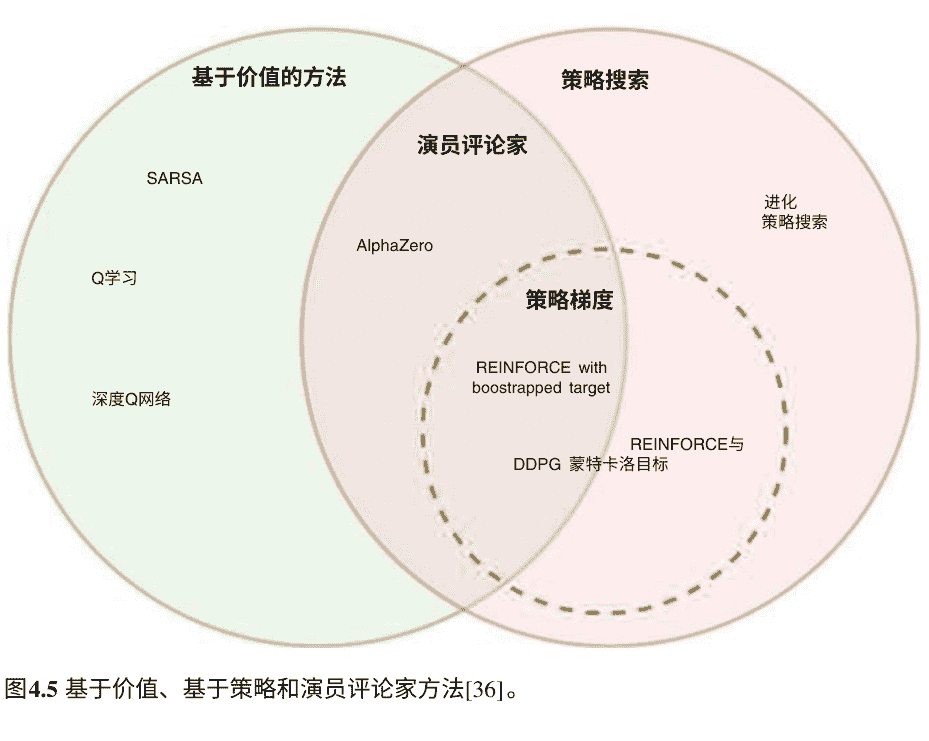

> 图4.5 基于价值、基于策略和演员评论家方法[36]。

DDPG是一种流行的演员评论家算法。在Spinning Up<sup>10</sup>和Stable Baselines<sup>11</sup>以及原始论文[29]中可以找到带注释的伪代码和高效实现。

## 结论

我们已经看到了许多结合策略和价值方法的算法，并讨论了这些构建块的可能组合来构建工作算法。图4.5提供了不同方法之间的概念地图，包括两种将在后续章节中讨论的方法（AlphaZero和进化方法）。

研究人员构建了许多算法并进行了实验，以查看它们在何时表现最佳。已经开发了相当数量的演员评论家算法。在GitHub的Stable Baselines中可以找到高性能的Python实现。12

## 4.2.8 实践操作：PPO和DDPG MuJoCo示例

OpenAI的Spinning Up提供了关于策略梯度算法的教程，包括使用TensorFlow和PyTorch实现的REINFORCE来学习Gym的Cartpole。13使用TensorFlow代码14或者PyTorch。15

现在我们已经讨论了这些算法，让我们看看它们在实践中是如何工作的，以便对算法和它们的超参数有所了解。MuJoCo是在基于策略的学习实验中最常用的物理模拟器。

Gym、（稳定的）Baselines和Spinning Up允许我们运行任何混合的学习算法和实验环境。鼓励您自己尝试这些实验。

但请注意，尝试安装所有必要的软件可能会引发一些版本问题。在您能够看到移动的手臂、腿部和跳跃的人形图像之前，您的操作系统、Python、GCC、Gym、Baselines、TensorFlow或PyTorch以及MuJoCo的不同版本都需要匹配。不幸的是，并非所有这些版本都是向后兼容的，特别是是从Python 2到3的转换和从TensorFlow 1到2的转换引入了不兼容的语言更改。

使一切正常工作可能需要一些努力，可能需要切换机器、操作系统和语言，但你真的应该尝试。这是机器学习研究中最快速发展领域的一个劣势。

如果你的当前操作系统和Python版本无法正常工作，通常使用Linux Ubuntu（或macOS）、Python 3.7、TensorFlow 1或PyTorch、Gym和Baselines的组合可能是一个不错的选择。当你遇到错误信息时，在GitHub存储库或Stack Overflow上搜索。有时候需要使用旧版本，或者进行一些更改以包含路径或库路径。

如果一切正常，Spinning Up和Baselines都提供了方便的脚本，可以通过命令行混合和匹配算法和环境。

例如，要在MuJoCo的Walker环境上运行Spinup的PPO，使用一个32×32的隐藏层，可以使用以下命令行完成任务：

```
python -m spinup.run ppo --hid "[32,32]" --env Walker2d-v2 --exp_name mujocotest
```

- 13 教程: https://spinningup.openai.com/en/latest/spinningup/rl_intro3.html#deriving-the-simplest-policy-gradient.
- 14 TensorFlow: https://github.com/openai/spinningup/blob/master/spinup/examples/tf1/pg_math/1_simple_pg.py.
- 15 PyTorch: https://github.com/openai/spinningup/blob/master/spinup/examples/pytorch/pg_math/1_simple_pg.py.

要训练Half-Cheetah上的DDPG，命令是

```
python -m base-lines.run --alg=ddpg --env=HalfCheetah-v2 --num_timesteps=1e6
```

所有超参数都可以通过命令行控制，提供了一种灵活的运行实验的方式。最后一个示例命令行是

```
python scripts/all_plots.py -a ddpg -e HalfCheetah Ant Hopper Walker2D -f logs/ -o logs/ddpg_results
```

Stable Baselines网站解释了这个命令行的作用。

## 4.3 运动和视觉-动作环境

我们已经看到了许多不同的基于策略的强化学习算法，可以用于具有连续动作空间的代理。让我们更仔细地看一下它们所使用的环境以及它们的性能如何。

基于策略的方法，特别是演员评论家策略/价值混合方法，在离散和连续动作空间中都表现良好。基于策略的方法通常在复杂的高维机器人应用中进行测试[24]。让我们来看看已经用于开发PPO、A3C和其他算法的环境类型。

机器人运动和视觉-动作交互是两个应用类别。这两个问题吸引了许多研究人员，并且已经设计出了许多新算法，其中一些算法能够学习出令人印象深刻的性能。对于这两个问题，我们将更详细地讨论一些结果。

### 4.3.1 运动

多足实体的运动是学习步态的问题之一。人类，有两条腿，可以行走、奔跑和跳跃等。狗和马，有四条腿，有其他步态，它们的腿可能以更有趣的方式移动，例如小跑、慢跑、步伐和奔跑。我们给机器人提出的挑战通常更容易。典型的强化学习任务包括让单腿机器人学会跳跃，让双足机器人行走和跳跃，以及让四足机器人以任何协调的方式使用它们的多条腿来前进。学习这样的策略可能非常耗费计算资源，而出现了一种更便宜的模拟虚拟动物：

# 图4.6 人形机器人站起来 [39]

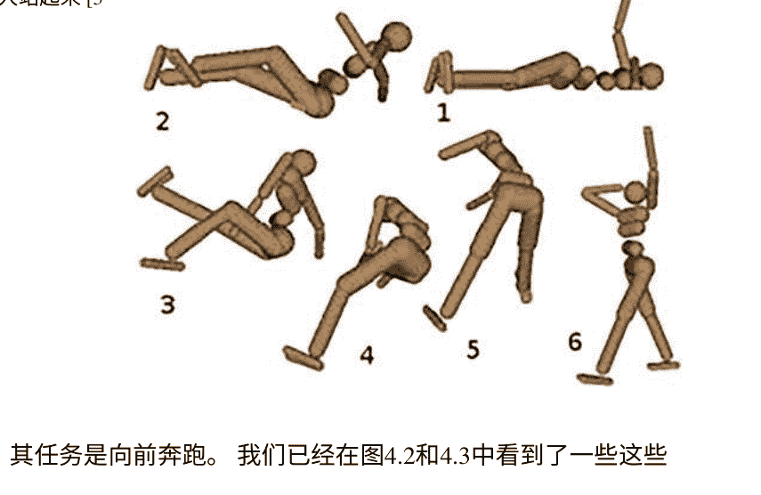

双腿半猎豹，其任务是向前奔跑。 我们已经在图4.2和4.3中看到了一些这些机器人生物。

我们将讨论的第一种方法是由Schulman等人提出的[39]。 他们报告了人类样式的两足和四足动物学习站立和学习奔跑步态的实验。 这些都是以前尝试过手工制作策略的具有挑战性的3D运动任务。 图4.6显示了一系列状态。

在这些情况下的挑战实际上相当壮观：代理只能通过向前移动获得正向奖励；仅凭这一点，它必须通过试错来学会控制所有的肢体；没有任何关于如何控制腿或其目的的提示。这些结果最好通过已经制作的电影来观看16学习过程。

作者使用了具有信任区域的优势演员评论算法。 该算法完全无模型，学习过程中使用模拟物理需要花费一到两周的真实时间。 学会走路是一个相当复杂的挑战，正如电影所展示的那样。 他们还展示了机器人独自行会攀爬障碍物。

在另一项研究中，Heess等人[18]报告了从像素输入到（模拟的）电机驱动的复杂机器人运动的端到端学习。 图4.7展示了行走者如何攀爬障碍物，图4.8展示了四足动物如何穿越一个赛道。 代理学会根据环境要求奔跑、跳跃、蹲下和转身，无需明确的奖励塑造或其他手工制作的特征。 对于这个实验，使用了分布式版本的PPO。 有趣的是，研究人员强调使用丰富多样、困难的环境有助于促进复杂行为的学习，而且这种学习在各种任务中也是稳健的。

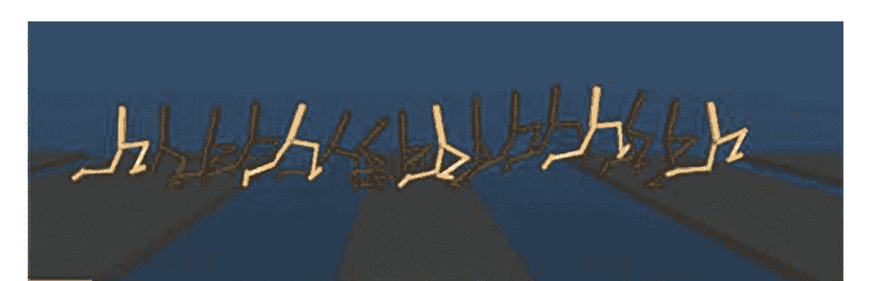

# 图4.7 行走者障碍课程[18]

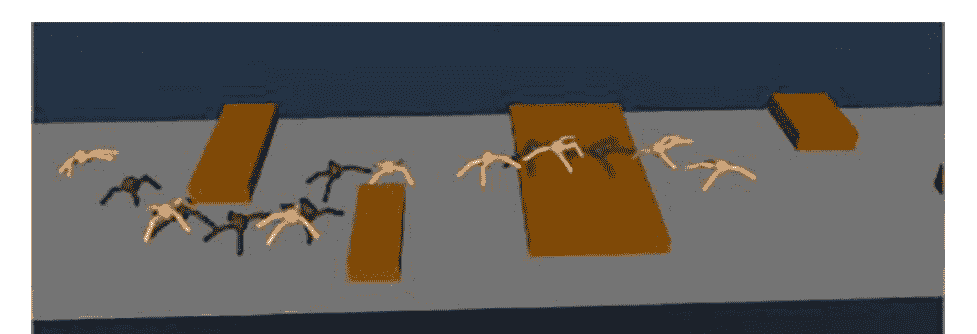

# 图4.8 四足动物障碍课程[18]

### 4.3.2 视觉-动作交互

大多数“端到端”学习机器人运动的实验都是这样设置的，即输入直接来自于由仿真软件计算出的状态派生特征。更进一步实现与真实世界的交互是直接从相机像素中学习。然后我们在视觉-动作交互任务中建模眼手协调，环境的状态必须从相机或其他视觉手段中推断出来，然后转化为关节（肌肉）的动作。

视觉-动作交互是一项困难的任务，需要许多技术共同工作。已经引入了不同的环境来测试算法。Tassa等人在MuJoCo [45]中报告了机器人运动的基准测试工作，引入了DeepMind控制套件，这是一个由不同的MuJoCo控制任务组成的环境套件（见图4.9）。作者还提供了使用A3C、DDPG和D4PG（分布式深度确定性策略梯度，一种扩展DDPG的算法）的学习代理的基准实现。除了从状态派生特征中学习外，还展示了代理从84 × 84像素信息中学习的结果，这是一种模拟的视觉-动作形式。

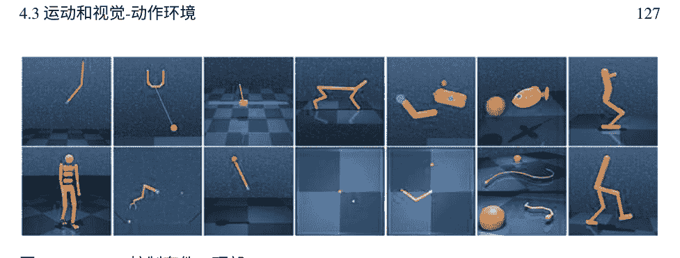

图4.9 DeepMind控制套件。顶部：Acrobot, Ball-in-cup, Cartpole, Cheetah, Finger, Fish, Hopper。底部：Humanoid, Manipulator, Pendulum, Point-mass, Reacher, Swimmer（6和15个链接）以及Walker [45]

互动。 DeepMind控制套件专为进一步研究领域而设计[31–34, 46]。 其他环境套件包括Meta-World [51], Surreal [10]和RLbench [21]。

视觉-动作交互是一个具有挑战性的问题，仍然是研究的一个活跃领域。

### 4.3.3 基准测试

基准测试工作在该领域非常重要[7]。Henderson等人[19]发表了一项对不同超参数设置和非确定性影响的敏感性的重要研究，通过尝试重现该领域的许多已发表作品。 他们发现结果存在很大的变化，并且总体上，结果的可重复性是有问题的。 他们得出结论，如果没有显著性指标和更严格的实验报告标准化，很难确定对先前的最新技术的改进是否有意义[19]。 进一步的研究证实了这些发现[1], 17，并且现在越来越多的作品都附带有代码、超参数和环境。

受到街机学习环境在游戏中的成功启发，引入了具有高状态和动作维度的连续控制任务的基准套件[7, 12]。 18这些任务包括3D人形运动，具有部分观测的任务和具有分层结构的任务。

运动任务包括游泳者，跳跃者，行走者，半猎豹，蚂蚁，简单人形和完整人形，目标是尽快向前移动。 由于运动的自由度很高，这些任务非常困难。通过添加噪声或省略某些部分来实现部分观测

- 17 https://github.com/google-research/rliable.
- 18论文中的套件称为RLlab。套件的新版本名为Garage。另请参见附录C。

常规观测的部分。分层任务包括低层任务，如学习移动和高层任务，如找到迷宫的出口。

## 总结和进一步阅读

本章关注的是第二类无模型算法：基于策略的方法。我们总结了我们所学到的内容，并提供了进一步阅读的指引。

## 总结

基于策略的无模型方法是深度强化学习中最受欢迎的方法之一。对于大型连续动作空间，间接的基于值的方法并不适用，因为它们使用arg max函数来恢复最佳动作。基于值的方法逐步进行，而基于策略的方法则会展开完整的未来轨迹或回合。基于策略的方法使用参数化的当前策略，这非常适合作为策略函数逼近器的神经网络。

在完整的轨迹展开后，计算轨迹的奖励和值，并使用梯度上升更新策略参数。由于值只在回合结束时才知道，经典的基于策略的方法比基于值的方法具有更高的方差，并且可能收敛到局部最优解。最著名的经典策略方法被称为REINFORCE。演员-评论家方法将值网络添加到策略网络中，以实现两种方法的优点。为了减少方差，可以添加$n$步时序差分引导，并减去一个基准值，从而得到所谓的优势函数（它从未来状态的动作值中减去父状态的值，使它们的期望值更接近零）。著名的演员-评论家方法包括A3C、DDPG、TRPO、PPO和SAC。A3C采用异步（并行、分布式）实现，DDPG是连续动作空间的演员-评论家版本，TRPO和PPO使用信任区域在非线性空间中实现自适应步长，而SAC优化策略的期望值和熵。基准研究表明，这些演员-评论家算法的性能与基于值的方法一样好，甚至更好。

机器人学习是基于策略的方法中最受欢迎的应用之一。无模型方法的样本效率较低，为了避免在数百万个样本后的磨损成本，大多数实验使用物理仿真作为环境，例如MuJoCo。两个主要的应用领域是运动（学习走路、学习跑步）和视觉-动作交互（直接从摄像头图像中学习自己的动作）。

## 进一步阅读

基于策略的方法已经是一个活跃的研究领域。它们对于机器人应用和其他具有连续动作空间的应用的深度函数逼近的自然适应性引起了研究界的广泛关注。经典的基于策略的算法是Williams的REINFORCE [49]，它基于策略梯度定理，参见[44]。我们的解释基于[6, 8, 11]。我们在演员评论家中将策略和基于值的方法结合起来，这在Barto等人的论文中有所讨论[2]。Mnih等人引入了一种名为A3C的现代高效并行实现。在DQN取得成功之后，Lillicrap等人提出了针对连续动作空间的基于策略的方法的版本，即DDPG [29]。Schulman等人致力于信任区域，提出了高效的流行算法TRPO [38]和PPO [40]。

重要的基准研究是Duan等人[7]和Henderson等人[19]。这些论文激发了强化学习研究中的可复现性。

用于测试基于策略的方法的软件环境是MuJoCo [48]和PyBullet [5]。Gym [4]和DeepMind控制套件[45]包含MuJoCo并提供易于使用的Python接口。围绕DeepMind控制套件形成了一个活跃的研究社区。

## 练习

我们已经到达本章的结尾，现在是时候通过问题、练习和总结来测试我们的理解了。

## 问题

以下是一些快速问题，以检查您对本章的理解。对于每个问题，一个简单的单句回答就足够了。

- 1. 为什么值函数方法在连续动作空间中很难使用？
- 2. 什么是MuJoCo? 你能举几个例子任务的名字吗?
- 3. 策略方法的一个优点是什么?
- 4. 全轨迹策略方法的一个缺点是什么?
- 5. 演员-评论家和普通策略方法之间有什么区别?
- 6. 演员-评论家使用多少个参数集? 它们如何在神经网络中表示?
- 7. 描述Monte Carlo REINFORCE、n步方法和时序差异引导之间的关系。
- 8. 什么是优势函数?
- 9. 描述一个MuJoCo任务，PPO等方法可以学习良好的表现。
- 10. 给出两种演员-评论家方法，以进一步改进引导和优势函数，这些方法在高性能算法（如PPO和SAC）中使用。
- 11. 为什么从图像输入中学习机器人动作很困难?

## 练习

现在让我们来看看编程练习。 如果您还没有这样做，请安装MuJoCo或PyBullet，并安装DeepMind控制套件。20我们将使用来自Stable Baselines的代理算法。此外，请浏览DeepMind控制套件在GitHub上的示例目录，并研究Colab笔记本。

- 1. REINFORCE.去Medium博客21并重新实现REINFORCE。你可以选择PyTorch或TensorFlow/Keras，在这种情况下你将不得不improvisation。在一个具有离散动作空间的环境中运行算法，并与DQN进行比较。哪个效果更好？在一个具有连续动作空间的环境中运行。请注意，Gym提供了Mountain Car的离散和连续版本。
- 2. 算法。在Baselines的Walker环境中运行REINFORCE。运行DDPG，A3C和PPO。对它们进行不同的时间步骤运行。制作图表。比较训练速度和结果质量。改变超参数以发展对它们的影响的直觉。
- 3. 套件。探索DeepMind控制套件。四处看看提供了哪些环境以及如何使用它们。考虑扩展一个环境。你想引入什么学习挑战？首先对已发表的关于DeepMind控制套件的文献进行调查。

> 20 https://github.com/deepmind/dm_control.

> 21 https://medium.com/@ts1829/policy-gradient-reinforcement-learning-in-pytorch-df1383ea0baf.

## 参考文献

1.  Rishabh Agarwal, Max Schwarzer, Pablo Samuel Castro, Aaron Courville, and Marc G Bellemare. 深度强化学习处于统计边缘的边缘。arXiv预印本 arXiv:2108.13264, 2021. 127
2.  Andrew G Barto, Richard S Sutton, and Charles W Anderson. 可以解决困难学习控制问题的类神经元自适应元素。IEEE Transactions on Systems, Man, and Cybernetics, (5):834–846, 1983. 111, 129
3.  Christopher M Bishop. 模式识别与机器学习。信息科学和统计学. Springer Verlag, Heidelberg, 2006. 118
4.  Greg Brockman, Vicki Cheung, Ludwig Pettersson, Jonas Schneider, John Schulman, Jie Tang, 和 Wojciech Zaremba. OpenAI Gym。arXiv预印本 arXiv:1606.01540, 2016年。106, 129
5.  Erwin Coumans和Yunfei Bai. Pybullet，用于游戏、机器人和机器学习的物理模拟的Python模块。http://pybullet.org, 2016–2019年。104, 105, 129
6.  Mohit Deshpande. 深度强化学习策略方法 https://mohitd.github.io/2019/01/20/deep-rl-policy-methods.html。129
7.  Yan Duan, Xi Chen, Rein Houthooft, John Schulman和Pieter Abbeel. 用于连续控制的深度强化学习基准测试。在机器学习国际会议，页码1329-1338, 2016年。127, 127, 128, 129
8.  Adrien Lucas Ecofet. 策略梯度的直观解释 https://towardsdatascience.com/an-intuitive-explanation-of-policy-gradient-part-1-reinforce-aa4392cbfd3c. 129
9.  Tom Erez, Yuval Tassa, and Emanuel Todorov. 基于模型的机器人仿真工具比较：Bullet、Havok、MuJoCo、Ode和Physx的对比。在2015年IEEE国际会议上的机器人与自动化会议（ICRA），第4397-4404页。IEEE，2015年。105
10. Linxi Fan, Yuke Zhu, Jiren Zhu, Zihua Liu, Orien Zeng, Anchit Gupta, Joan Creus-Costa, Silvio Savarese和Li Fei-Fei. Surreal：开源强化学习框架和机器人操纵基准。在机器人学习会议，第767-782页，2018年。127
11. Vincent Francois-Lavet, Peter Henderson, Riashat Islam, Marc G Bellemare和Joelle Pineau. 深度强化学习简介。机器学习基础与趋势，11 (3-4) : 219-354, 2018年。129
12. 贡献者车库。车库：可重复的强化学习研究工具包。 https://github.com/rlworkgroup/garage, 2019年。127
13. Ivo Grondman, Lucian Busoniu, Gabriel AD Lopes和Robert Babuska. 演员-评论家强化学习综述：标准和自然策略梯度。IEEE Transactions on Systems, Man, and Cybernetics, Part C (Applications and Reviews), 42(6): 1291-1307, 2012年。 111
14. Tuomas Haarnoja, Haoran Tang, Pieter Abbeel和Sergey Levine. 具有深度能量基策略的强化学习。在国际机器学习会议，页1352-1361. PMLR, 2017年。120
15. Tuomas Haarnoja, Aurick Zhou, Pieter Abbeel和Sergey Levine. 软演员-评论家：具有随机演员的离策略最大熵深度强化学习。在国际机器学习会议，页1861-1870。PMLR, 2018年。107, 119
16. Tuomas Haarnoja, Aurick Zhou, Kristian Hartikainen, George Tucker, Sehoon Ha, Jie Tan, Vikash Kumar, Henry Zhu, Abhishek Gupta, Pieter Abbeel和Sergey Levine. 软演员-评论家算法和应用。arXiv预印本 arXiv:1812.05905, 2018年。119
17. Roland Hafner和Martin Riedmiller. 反馈控制中的强化学习。机器学习，84(1-2): 137-169, 2011年。121
18. Nicolas Heess, Dhruva TB, Srinivasan Sriram, Jay Lemmon, Josh Merel, Greg Wayne, Yuval Tassa, Tom Erez, Ziyu Wang, SM Eslami, Martin Riedmiller和David Silver. 在丰富的环境中出现运动行为。arXiv预印本 arXiv:1707.02286, 2017年。102, 125, 126, 126
19. Peter Henderson, Riashat Islam, Philip Bachman, Joelle Pineau, Doina Precup和David Meger. 重要的深度强化学习。在第三十二届AAAI人工智能大会上, 2018年。127, 127, 128, 129
20. Chloe Ching-Yun Hsu, Celestine Mendler-Dünner和Moritz Hardt. 重新审视近端策略优化中的设计选择。arXiv预印本 arXiv:2009.10897，2020年。118
21. Stephen James, Zicong Ma, David Rovick Arrojo和Andrew J Davison. RLbench：机器人学习基准和学习环境。IEEE机器人与自动化快报，5(2): 3019-3026，2020年。 127
22. Arthur Juliani. 使用TensorFlow的简单强化学习第8部分：异步actor-评论家代理（A3C） https://medium.com/emergent-future/simple-reinforcement-learning-with-tensorflow-part-8-a-synchronous-actor-critic-agents-a3c-c88f72a5e9f2, 2016. 115, 116
23. Hilbert J Kappen. 路径积分和对最优控制理论的对称性破缺。Journal of statistical mechanics: theory and experiment, 2005(11):P11011, 2005. 120
24. Jens Kober, J Andrew Bagnell, and Jan Peters. 机器人中的强化学习：一项调查。The International Journal of Robotics Research, 32(11):1238–1274, 2013. 124
25. Vijay R Konda和John N Tsitsiklis. 演员-评论家算法。在神经信息处理系统的进展中, 页1008–1014, 2000. 111
26. Vijaymohan R Konda和Vivek S Borkar. 用于Markov决策过程的演员-评论者类型学习算法。SIAM Journal on Control and Optimization, 38（1）：94-123，1999年。 111
27. Samuel Kotz, Narayanaswamy Balakrishnan和Norman L Johnson. 连续多变量分布，卷1: 模型和应用。John Wiley & Sons，2004年。 119
28. Solomon Kullback和Richard A Leibler. 关于信息和充分性。The Annals of Mathematical Statistics, 22（1）：79-86，1951年。 118
29. Timothy P Lillicrap, Jonathan J Hunt, Alexander Pritzel, Nicolas Heess, Tom Erez, Yuval Tassa, David Silver和Daan Wierstra. 深度强化学习的连续控制。在国际学习表示会议, 2016. 104, 107, 121, 121, 122, 129
30. Vince Martinelli. 机器人如何自主地看、抓取和拾取。https://www.therobotreport.com/grasp-sight-picking-evolve-robots/, 2019. 105
31. Josh Merel, Arun Ahuja, Vu Pham, Saran Tunyasuvunakool, Siqi Liu, Dhruva Tirumala, Nicolas Heess, and Greg Wayne. 分层视觉运动控制人形机器人。在国际学习表示会议, 2019. 127
32. Josh Merel, Diego Aldarondo, Jesse Marshall, Yuval Tassa, Greg Wayne, and Bence Peczár. 虚拟啮齿动物的深度神经行为学。在国际学习表示会议, 2020.
33. Josh Merel, Leonard Hasenclever, Alexandre Galashov, Arun Ahuja, Vu Pham, Greg Wayne, Yee Whye Teh, 和 Nicolas Heess. 用于人形控制的神经概率运动原理。在国际学习表示会议, 2019年。
34. Josh Merel, Yuval Tassa, Dhruva TB, Sriram Srinivasan, Jay Lemmon, Ziyu Wang, Greg Wayne, 和 Nicolas Heess. 通过对对抗性模仿从动作捕捉中学习人类行为。arXiv预印本 arXiv:1707.02201, 2017年。 127
35. Volodymyr Mnih, Adria Puigdomenech Badia, Mehdi Mirza, Alex Graves, Timothy Lillicrap, Tim Harley, David Silver, 和 Koray Kavukcuoglu. 深度强化学习的异步方法。在国际机器学习会议, 页码1928–1937, 2016年。 107, 115, 115, 116, 116, 117, 129
36. Thomas Moerland. 连续马尔可夫决策过程和策略搜索。莱顿大学强化学习课程讲义，2021年。 119，120，122
37. Ofir Nachum, Mohammad Norouzi, Kelvin Xu和Dale Schuurmans. 填补价值和基于策略的强化学习之间的差距。在神经信息处理系统进展, 2017年，第2775-2785页。 120
38. John Schulman, Sergey Levine, Pieter Abbeel, Michael Jordan和Philipp Moritz. 信任区域策略优化。在国际机器学习会议, 2015年, 第1889-1897页。 107, 117, 117, 129
39. John Schulman, Philipp Moritz, Sergey Levine, Michael Jordan和Pieter Abbeel. 使用广义优势估计的高维连续控制。在国际学习表示会议, 2016年。 125, 125
40. John Schulman, Filip Wolski, Prafulla Dhariwal, Alec Radford, and Oleg Klimov. 近端策略优化算法。arXiv预印本 arXiv:1707.06347, 2017. 107, 118, 129
41. David Silver, Guy Lever, Nicolas Heess, Thomas Degris, Daan Wierstra, and Martin Riedmiller. 确定性策略梯度算法。在国际机器学习大会, 第387-395页, 2014. 120, 121
42. 孙文宇和袁亚湘. 优化理论与方法：非线性规划, 卷1. Springer科学与商业媒体, 2006. 117
43. Richard S Sutton和Andrew G Barto. 强化学习, 第二版. MIT出版社, 2018. 112
44. Richard S Sutton, David A McAllester, Satinder P Singh, and Yishay Mansour. 使用函数逼近的策略梯度强化学习方法。在Advances in Neural Information Processing Systems, 第1057-1063页, 2000年. 129
45. Yuval Tassa, Yotam Doron, Alistair Muldal, Tom Erez, Yazhe Li, Diego de Las Casas, David Budden, Abbas Abdolmaleki, Josh Merel, Andrew Lefrancq, Timothy Lillicrap, 和 Martin Riedmiller. DeepMind控制套件。arXiv预印本 arXiv:1801.00690, 2018年. 126, 127, 129
46. Yuval Tassa, Saran Tunyasuvunakool, Alistair Muldal, Yotam Doron, Siqi Liu, Steven Bohez, Josh Merel, Tom Erez, Timothy Lillicrap, 和 Nicolas Heess. dm_control: 连续控制的软件和任务。arXiv预印本 arXiv:2006.12983, 2020年. 127
47. Emanuel Todorov. 线性可解的马尔可夫决策问题。在Advances in Neural Information Processing Systems, 第1369-1376页, 2007年. 120
48. Emanuel Todorov, Tom Erez和Yuval Tassa. MuJoCo: 用于基于模型的物理引擎的控制。在IEEE/RSJ International Conference on Intelligent Robots and Systems (IROS), 第5026-5033页, 2012年. 104, 105, 129
49. Ronald J Williams. 用于连接主义强化学习的简单统计梯度跟随算法. Machine Learning, 第8卷第3-4期: 229-256页, 1992年. 107, 110, 110, 129
50. Yuhuai Wu, Elman Mansimov, Roger B Grosse, Shun Liao和Jimmy Ba. 使用Kronecker分解逼近的可扩展信任区域方法进行深度强化学习。在Advances in Neural Information Processing Systems, 第5279-5288页, 2017年. 115
51. Tianhe Yu, Deirdre Quillen, Zhanpeng He, Ryan Julian, Karol Hausman, Chelsea Finn和Sergey Levine. Meta-world: 多任务和元强化学习的基准和评估。在Conference on Robot Learning, 第1094-1100页. PMLR, 2020年. 127
52. Brian D Ziebart, Andrew L Maas, J Andrew Bagnell和Anind K Dey. 最大熵逆向强化学习。在 AAAI, 第8卷, 第1433-1438页。芝加哥, 美国, 2008年. 120

## 第5章
基于模型的强化学习

前几章讨论了无模型方法，并且我们看到它们在视频游戏和模拟机器人中的成功。在无模型方法中，代理直接从环境提供的反馈中更新策略。环境执行状态转换并计算奖励。深度无模型方法的一个缺点是训练速度较慢；为了稳定收敛或低方差，通常需要数百万个环境样本，才能使策略函数收敛到高质量的最优解。

相比之下，基于模型的方法，代理首先从环境反馈中构建自己的内部转换模型。然后，代理可以使用这个本地转换模型来了解动作对状态和奖励的影响。代理可以使用规划算法来进行假设游戏和生成策略更新，而不会对环境造成任何状态变化。这种方法承诺在更低的样本复杂性下获得更高的质量。从内部模型生成策略更新被称为规划或想象。

基于模型的方法间接地更新策略：代理首先从环境中学习一个局部的转移模型，然后使用该模型来更新策略。间接学习策略函数有两个后果。积极的一面是，一旦代理拥有了自己对世界状态转移的模型，它可以免费学习最佳策略，而不需要进一步承担在环境中行动的成本。因此，基于模型的方法可能具有较低的样本复杂度。

缺点是学习到的转移模型可能不准确，导致的策略可能质量较低。无论从模型中可以免费获取多少样本，如果代理的局部转移模型不能反映环境的真实转移模型，那么局部学习的策略函数在环境中将无法工作。因此，处理不确定性和模型偏差是基于模型的强化学习中的重要要素。

首先学习环境转移函数的内部表示的想法早在多年前就已经提出，并且转移模型已经以许多不同的方式实现。模型可以是表格形式的，也可以基于各种深度学习方法，我们将会看到。本章将从一个示例开始，展示基于模型的方法是如何工作的。接下来，我们将更详细地描述不同类型的基于模型的方法：专注于学习准确模型的方法和在不完美模型下进行规划的方法。最后，我们将描述实际应用环境中使用基于模型的方法的情况，以了解这些方法的性能如何。

本章结束时，附有练习、总结和进一步阅读的指引。

## 核心概念

- 想象力
- 不确定性模型
- 世界模型和潜在模型
- 模型预测控制
- 深度端到端规划和学习

## 核心问题

- 学习和使用高维问题的准确转移模型

## 核心算法

- Dyna-Q (算法5.3)
- 集成和模型预测控制 (算法5.4和5.6)
- 值预测网络 (算法5.5)
- 值迭代网络 (第5.2.2.2节)

## 构建导航地图

为了说明基于模型的强化学习的基本概念，我们回到超市的例子。

让我们比较一下模型无关和模型有关的方法如何在一个新城市里找到超市。1在这个例子中，我们将使用基于值的Q学习；我们的策略π(s, a)将直接从Q(s, a)值中派生出来，使用arg max，并且写 Q在这个意义上等同于写 π。

无模型Q学习：代理选择起始状态 s0并使用（例如）基于动作值函数Q(s, a)的ε-贪婪行为策略来选择下一个动作。然后环境执行动作，计算下一个状态和奖励 r，并将它们返回给代理。代理使用熟悉的更新规则更新其动作值函数 Q(s, a)

```
Q(s, a) ← Q(s, a) + α[r + γ max_a Q(s', a) - Q(s, a)].
```

代理重复这个过程，直到 Q函数中的值不再发生很大变化。

因此，我们在城市中选择起始位置，在一个街区中以一个ε-贪婪的方向进行一次行走，并记录奖励和到达的新状态。我们使用这些信息来更新策略，并从新的位置开始，再次根据策略以一个 ε-贪婪的方向行走。如果我们找到了超市，我们会重新开始，尝试找到一条更短的路径，直到策略值不再改变（这可能需要很多环境交互）。然后，最佳策略就是最短距离的路径。

基于模型的规划和学习：代理使用 Q(s, a)函数作为行为策略，像之前一样从环境中采样新的状态和奖励，并更新策略（Q函数）。此外，代理还会记录新的状态和奖励在一个本地的转移 T_a(s, s')和奖励函数 R_a(s, s')中。

因为代理现在有了这些本地条目，我们也可以从我们的本地函数中采样来更新策略。我们可以选择从（昂贵的）环境转换函数或者（廉价的）本地转换函数中进行采样。然而，从本地采样存在一个注意事项。本地函数可能包含较少的条目，或者只包含高方差的条目，特别是在早期阶段，当执行的环境样本较少时。随着执行更多的环境样本，本地函数的有用性会增加。

因此，我们现在有了一个本地地图，用于记录新的状态和奖励。我们将使用这个地图来随时查看，并且没有任何成本，在地图上的一个位置上更新 Q-函数。随着更多的环境样本的到来，地图上将有越来越多的位置记录到超市的距离。当对地图的一瞥不再改善策略时，我们必须再次在环境中行走，并且像以前一样更新地图和策略。

> 1我们使用到超市的距离作为负奖励，以便将其制定为距离最小化问题，同时仍能在我们熟悉的奖励最大化环境中进行推理。

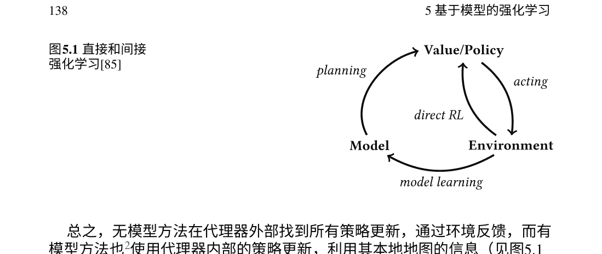

总之，无模型方法在代理器外部找到所有策略更新，通过环境反馈，而有模型方法也使用代理器内部的策略更新，利用其本地地图的信息（见图5.1）。在这两种方法中，所有对策略的更新最终都是从环境反馈中得出的；有模型方法提供了一种不同的使用信息来更新策略的方式，这种方式可能更加信息高效，通过在代理器转换模型中保留每个样本的信息并重复使用该信息。

## 5.1 高维问题的动力学模型

有模型强化学习的应用环境与无模型相同；然而，我们的目标是在相同的时间内解决更大更复杂的问题，通过更低的样本复杂度和对环境的更深入理解。

### 转换模型和知识传递

模型基础学习的原则如下。无模型方法从环境中采样以学习基于动作奖励的状态到动作策略函数π(s, a)，而有模型方法从环境中采样以学习基于动作奖励的状态到状态转换函数Td(s, s′)。一旦这个局部转换函数的准确性足够好，代理可以从这个局部函数中采样以改进策略π(s, a)，而不需要承担实际环境采样的成本。在基于模型的方法中，代理构建自己的局部状态到状态转换（和奖励）模型，理论上不再需要环境。

这使得我们对基于模型的方法产生了另一个兴趣的原因。对于顺序决策问题，了解转换函数是一种自然的方式。

捕捉环境工作的本质—π给出下一个动作，而T给出下一个状态。
这在切换到相关环境时非常有用。当代理知道环境的转换函数时，代理可以快速适应，而不需要通过采样环境来学习全新的策略。当代理知道领域的良好局部转换函数时，可以高效地解决新的但相关的问题。因此，基于模型的强化学习可以为高效的迁移学习做出贡献（参见第9章）。

## 样本效率

一个代理算法的样本效率告诉我们它需要多少环境样本才能达到一定的准确性。
为了实现高样本效率，基于模型的方法学习一个动力学模型。学习高准确性和高容量的高维问题模型需要大量的训练样本，以防止过拟合（参见第B.2.7节）。因此，在学习转移模型时减少过拟合会抵消模型学习策略函数的低样本复杂度的优势。在实践中构建准确的深度转移模型可能很困难，对于许多复杂的序贯决策问题，最好的结果通常是通过无模型方法实现的，尽管深度基于模型的方法正在变得更强大（参见，例如，Wang等人[88]）。

## 5.2 学习和规划代理

基于模型的强化学习的承诺是通过构建世界的局部模型以低成本找到一个高准确性的行为策略。只有当学习的转移模型提供准确的预测并且使用模型进行规划的额外成本合理时，这才能起作用。
让我们看看为深度基于模型的强化学习开发了哪些解决方案。在第5.3节中，我们将更详细地研究不同环境下的性能。首先，在本节中，我们将介绍四种不同的算法方法和一个经典方法：Dyna的表格想象力。

## 表格想象力

一个经典的方法是Dyna [83]，它推广了基于模型的强化学习的思想。在Dyna中，环境样本以混合的无模型/基于模型的方式使用，用于训练转移模型，使用规划来改进策略，同时直接训练策略函数。
为什么Dyna是一种混合方法？严格的基于模型的方法仅通过使用代理的转移模型进行规划来更新策略，参见算法5.1。然而，在Dyna中，除了使用代理的转移模型外，还使用环境的转移模型来更新策略函数（参见图5.2和算法5.2）。因此，我们得到了一种结合了基于模型和无模型的混合方法。

```
算法 5.1严格学习的动力学模型


重复
    样本环境 E生成数据 D = (s, a, r', s')
    使用 D学习 M = T_a(s, s'), R_a(s, s')          # 学习
    对于 n = 1, ..., N do
        使用 M更新策略π(s, a)                       # 规划
    直到 π
收敛
```

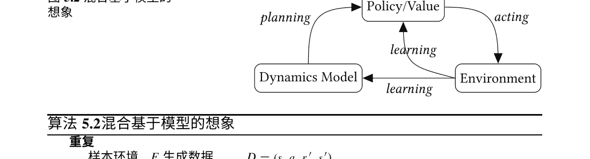

```
算法 5.2混合基于模型的想象


重复
    样本环境 E生成数据 D = (s, a, r', s')
    使用 D更新策略π(s, a)                            # 学习
    使用 D学习 M = T_a(s, s'), R_a(s, s')          # 学习
    对于 n = 1, ..., N do
        使用 M更新策略π(s, a)                       # 规划
    直到 π
收敛
```

学习。这种混合基于模型的规划被称为想象，因为使用代理的动力学模型向前看类似于代理在“心智”中想象环境样本。在这种方法中，想象的样本在没有样本成本的情况下增加了真实（环境）样本。³

想象力是模型驱动和无模型强化学习的混合体。想象力执行常规的直接强化学习，其中根据行为策略对环境进行采样，并使用反馈来更新相同的行为策略。想象力还使用环境样本来更新动力学模型 { T_a, R_a }。这个额外的模型也被采样，并在无模型更新之间为行为策略提供额外的更新。

图5.2中的图表显示了如何使用样本反馈同时更新策略和模型，然后通过“想象”的反馈来更新策略。在算法5.2中，通用的想象方法被展示为伪代码。

³术语想象在这个领域中有些宽泛。严格来说，想象只指从内部模型通过规划来更新策略。广义上，想象指的是策略从内部模型和环境两者更新的混合方案。有时候，代理想象环境时会使用术语梦想。

## 算法 5.3 Dyna-Q [83]

```
初始化 Q(s, a) → ℝ 随机  
初始化 M(s, a) → ℝ × S 随机  
重复  
    随机选择 s ∈ S  
    a ← π(s)          π(s)可以基于Q进行ε贪婪选择 (s', r) ← E(s, a)  
                      从环境中学习新的状态和奖励  
    Q(s, a) ← Q(s, a) + α · [r + γ · max_{a'} Q(s', a') - Q(s, a)]  
    M(s, a) ← (s', r)  
    对于 n = 1, …, N 执行  
        随机选择 ŝ 和 â  
        (ŝ', r̂) ← M(ŝ, â)        计划从模型中想象状态和奖励  
        Q(ŝ, â) ← Q(ŝ, â) + α · [r̂ + γ · max_{a'} Q(ŝ', a') - Q(ŝ, â)]  
    结束循环  
直到 Q 收敛  
```

Sutton的Dyna-Q [83, 85]，在算法5.3中有更详细的说明，是想象方法的一个具体实现。Dyna-Q使用Q函数作为行为策略 π(s)来对环境进行 ε-贪婪采样。然后，使用奖励和显式模型 M来更新此策略。当模型 M已更新时，通过随机动作进行规划，使用它 N次来更新Q函数。伪代码显示了学习步骤（来自环境 E）和规划步骤（来自模型 M）。在这两种情况下，更新Q函数的状态-动作值。然后，像往常一样，从Q值中得出最佳动作。因此，我们可以增加策略更新的次数，而不需要更多的环境样本。通过选择 N的值，我们可以调整有多少策略更新是环境样本，有多少是模型样本。在本章后面将要看到的更大问题中，环境样本与模型样本的比例通常设置为1：1000，大大减少了样本复杂性。当然，问题是，模型有多好，由此产生的策略与无模型基线相比有多远？

## 实践：想象出租车示例

现在是时候用一个例子来说明Dyna-Q是如何工作的了。为此，我们转向我们最喜欢的之一，出租车世界。  
让我们看看通过模型想象的效果可以是什么样的。请参考图5.3。我们使用我们的简单迷宫示例，出租车迷宫，没有想象力（N = 0），以及有很大的想象力（N = 50）。让我们假设环境返回的所有状态的奖励都是0，除了目标状态，奖励为+1。在状态中，通常存在着常规动作（北、东、西和南），除非在边界或墙壁上。  
当 N = 0时，Dyna-Q完全执行Q学习，随机采样动作奖励，建立Q函数，并使用Q值遵循 ε-贪婪策略进行动作选择。Q函数的目的是作为获取目标信息的容器。我们的容器是如何被填充的呢？

## 图5.3 出租车世界 [44]

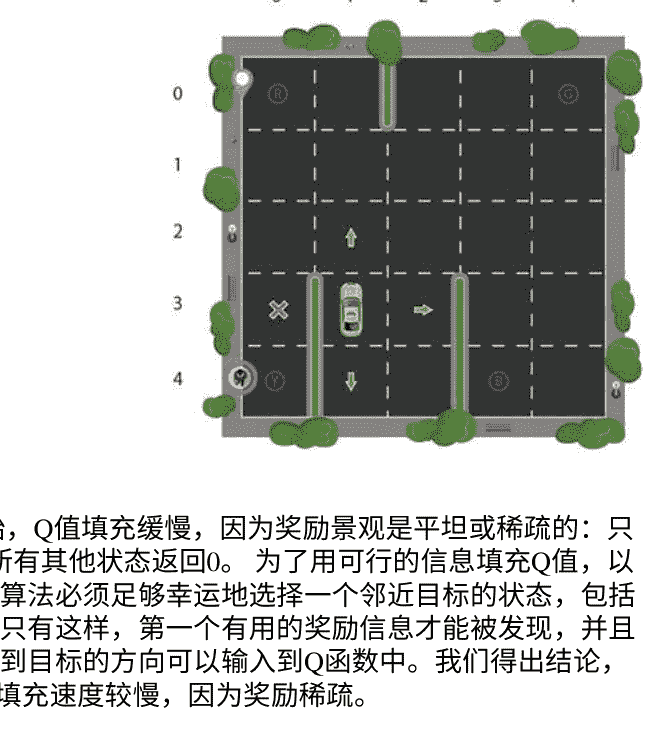

信息？ 采样从随机开始，Q值填充缓慢，因为奖励景观是平坦或稀疏的：只有目标状态返回 +1，所有其他状态返回0。为了用可行的信息填充Q值，以找到目标的位置，首先算法必须足够幸运地选择一个邻近目标的状态，包括到达目标的适当动作。只有这样，第一个有用的奖励信息才能被发现，并且第一个非零步骤朝着找到目标的方向可以输入到Q函数中。我们得出结论，当 N =0时，Q函数的填充速度较慢，因为奖励稀疏。

当我们启用规划时会发生什么？ 当我们将 N设置为一个较高的值，例如50时，每个学习步骤执行50个规划步骤。正如我们在算法中所看到的，模型是与 Q函数一起构建的，来自环境的返回值。只要 Q函数仍然完全为零，那么使用模型进行规划也是无用的。但是一旦一个目标项被输入到 Q和 M中，规划就会开始发挥作用：它将在M模型上执行50个规划样本，可能找到目标信息，并可能建立一个完整的轨迹，将状态填充到Q函数中以朝向目标的动作。

在某种程度上，基于模型的规划放大了智能体从环境中学到的任何有用的奖励信息，并迅速将其反馈到策略函数中。策略学习更快，需要更少的环境样本。

## 可逆规划和不可逆学习

无模型方法直接从环境中采样并直接学习策略函数π(s, a)，在一步中完成。基于模型的方法通过对环境进行采样间接学习策略，使用动力学模型 {T_a, R_a}（如图5.1和5.4以及算法5.1中所示）。

## 5.2 学习和规划代理

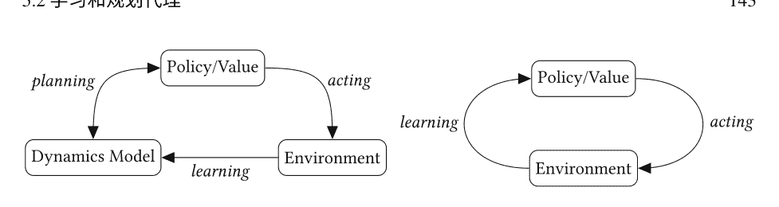

## 图5.4 基于模型的（左）和无模型的（右）。学习会不可逆地改变环境状态（单向箭头），而规划会可逆地改变代理状态（撤销，双向箭头）。

## 表5.1 规划和学习之间的区别

| 特征 | 规划 | 学习 |
| :--- | :--- | :--- |
| 过渡模型中 | 代理 | 环境 |
| 代理可以撤销 | 是 | 否 |
| 状态是 | 代理可逆的 | 代理不可逆的 |
| 动力学 | 回溯 | 仅向前 |
| 数据结构 | 树 | 路径 |
| 新状态 | 在代理中 | 从环境中采样 |
| 奖励 | 由代理 | 从环境中采样 |
| 同义词 | 想象力，模拟 | 采样，展开 |

为了更好地理解强化学习范式中的学习和规划算法的位置，有必要暂停一下。请参考表5.1，了解规划和学习之间的区别概述。

使用内部过渡模型进行规划是可逆的。当代理使用自己的过渡模型对本地状态执行本地操作时，这些操作可以被撤销，因为代理将它们应用于自己内存中的副本[61]。⁴由于本地状态内存的存在，代理可以返回到旧状态，撤销刚刚执行的本地操作引起的本地状态变化。然后，代理可以尝试另一种可逆的操作。代理可以使用树遍历方法遍历状态空间，回溯尝试其他状态。

与规划相比，学习是在代理没有访问自己的转移函数 7时进行的（s，s'）。代理可以通过在环境中采样真实动作来获得奖励信息。这些动作不是在代理内部进行的，而是在实际环境中执行的；它们是不可逆转的，代理无法撤销。学习使用会不可逆地改变环境状态的动作。学习不允许回溯；学习算法通过反复采样环境来学习策略。

请注意学习和规划之间的相似之处：学习从外部环境中采样奖励，规划从内部模型中采样；两者都使用这些样本来更新策略函数 π（s，a）。

> ⁴在我们的梦中，我们可以撤销我们的行动，进行假设，并想象替代的现实。

## 四种基于模型的方法

在基于模型的强化学习中，挑战是从有限数据中学习深度高维转移模型。我们的方法应该能够考虑模型不确定性，并在这些模型上进行规划，以实现与模型无关方法相当或更好的策略和价值函数。让我们更详细地看一下具体的基于模型的强化学习方法，以了解如何实现这一点。

多年来，已经设计出了许多用于高准确度高维度模型的基于模型的强化学习方法。根据[69]，我们将这些方法分为四种主要方法。我们首先介绍两种学习模型的方法，然后介绍两种使用模型进行规划的方法。对于每种方法，我们将从文献中选择几篇代表性的论文进行更深入的描述。

在完成这些描述之后，我们将研究它们在不同环境中的性能。但是让我们先从学习深度模型的方法开始。

## 5.2.1 学习模型

在基于模型的方法中，过渡模型是通过对环境进行采样来学习的。如果这个模型不准确，那么规划将无法改善值函数或策略函数，而且该方法的性能将比无模型方法差。

当学习/规划比率设置为1/1000时，就像在某些实验中一样，模型的不准确性将在低准确度的策略函数中迅速显现出来。

许多研究都集中在实现高精度的动力学模型上，用于解决高维问题。实现更高精度的两种方法是不确定性建模和潜在模型。我们将从不确定性建模开始。

### 5.2.1.1 建模不确定性

通过增加环境样本数量，可以减少转移模型的方差，但我们还将讨论其他方法。

对于较小的问题，一种常用的方法是使用高斯过程，其中通过对整个数据集上的函数和不确定性进行协方差矩阵估计来学习动力学模型[5]。高斯模型可以从少量数据点中学习，并且转移模型可以成功地用于策划政策函数。这种方法的一个例子是PILCO系统，它代表概率推理学习控制[13, 14]。这个系统在Cartpole和Mountain car上效果很好，但在更大的问题上无法扩展。

我们还可以从优化成本的轨迹分布中进行采样，并将其用于训练策略，使用基于策略的方法[57]。然后，我们可以借助局部线性模型和随机轨迹优化器来优化策略。这是引导策略搜索（GPS）中使用的方法，已经证明可以训练

```
算法5.4使用模型集合进行规划[52]
初始化策略 πθ 和模型 m̂φ1, m̂φ1, ..., m̂φK 集合
初始化空数据集 D
重复
    D ← 从环境 E 中使用 πθ 进行采样
    学习模型 m̂φ1, m̂φ1, ..., m̂φK 使用 D 集合
    重复
        D' ← 从{m̂φi}中使用 πθ 进行采样 i=1 到 K
        使用 D' 更新 πθ 的 TRPO 规划
        估计轨迹 η̂τ (θ, φi) 的性能，对于 i = 1, . , K
    直到性能收敛
直到 πθ 在环境 E 中表现良好
```

具有数千个参数的复杂策略，在MuJoCo中学习任务，例如游泳、跳跃和行走。

减少机器学习中方差的另一种流行方法是集成方法。集成方法结合多个学习算法以实现更好的预测性能；例如，决策树的随机森林通常比单一决策树具有更好的预测性能[5, 68]。在基于模型的方法中，集成方法用于估计方差并在规划过程中进行考虑。许多研究人员已经报道了在更大问题上使用集成方法取得的良好结果[10, 40]。例如，Chua等人在他们的方法中使用了概率神经网络模型的集成[9]，该方法被命名为概率集成与轨迹采样（PETS）。他们在高维度模拟机器人任务（如Half-Cheetah和Reacher）上报告了良好的结果。Kurutach等人[52]将模型的集成与TRPO相结合，在ME-TRPO中使用一组深度神经网络来维护模型的不确定性，而TRPO用于控制模型参数。在规划器中，每个想象的步骤都是从集成预测中采样的（参见算法5.4）。通过概率方法，不确定性建模试图提高高维度模型的准确性。针对高维度深度模型的一种不同方法是潜在模型方法，我们将在下面讨论。

### 5.2.1.2 潜在模型

潜在模型专注于高维问题的降维。潜在模型的思想是，在大多数高维环境中，一些元素并不重要，比如从不移动且与奖励无关的背景建筑物。我们可以将这些不重要的元素从模型中抽象出来，从而降低空间的有效维度。

潜在模型通过学习表示输入和奖励的元素来实现这一点。由于规划和学习现在可以在较低维度的潜在空间中进行，从潜在模型中学习的采样复杂性得到改善。

尽管潜在模型方法通常是复杂的设计，但已经发表了许多显示良好结果的作品[29, 31–33, 41, 76, 81]。潜在模型使用多个神经网络，以及不同的学习和规划算法。

为了理解这种方法，我们将简要讨论一种潜在模型方法：Oh等人的价值预测网络（VPN）[67]。VPN使用四个可微分函数，这些函数被训练用于预测价值[25]，图5.5展示了核心函数的工作方式。VPN中的核心思想不是直接在实际观察空间中学习，而是首先将状态表示转换为较小的潜在表示模型，也称为抽象模型。其他函数，如价值、奖励和下一个状态，然后在这些较小的潜在状态上工作，而不是在更复杂的高维状态上工作。通过这种方式，规划和学习发生在一个只包含影响价值变化的元素的状态空间中。潜在空间是低维的，训练和规划变得更加高效。

VPN中的四个函数是（1）编码函数 f_θ^{enc}，（2）奖励函数，（3）值函数和（4）转移函数。所有函数都使用自己的参数进行参数化。为了区分这些基于潜在的函数和传统的基于观察的函数R、V、T，它们被表示为 f_θ^{reward}，f_θ^{value}，和 f_θ^{trans}。

- 编码函数 f_θ^{enc} : s_actual → s_latent 使用神经网络 θ_e 将观察 s_actual 映射到抽象状态，例如用于视觉观察的CNN。这个函数执行降维操作。
- 潜在奖励函数 f_θ^{reward} : (s_latent, o) → r, γ 将潜在状态 s 和选项 o（一种动作）映射到奖励和折扣因子。如果选项执行 k 个原始动作，则网络应该预测 k 个即时奖励的折扣和作为一个标量。（选项的作用在论文[67]中有解释。）网络还预测选项折扣因子 γ，用于选项执行的步骤数。
- 潜在值函数 f_θ^{value} : s_latent → V_{θ_v}(s_latent) 使用单独的神经网络 θ_v 将抽象状态映射到其值。这个值是潜在状态的值，而不是实际观察状态的值 V(actual)。
- 潜在转移函数 f_θ^{trans} : (s_latent, o) → s_latent 将潜在状态映射到下一个潜在状态，还取决于选项。

图5.5展示了核心函数在较小的潜在空间中如何协同工作，其中 x 是观察到的实际状态，s 是编码的潜在状态[67]。

该图显示了单个回滚步骤，向前规划一步。然而，模型还可以通过执行多步回滚来进一步展望未来。当然，这需要一个高度准确的模型；否则，累积的不准确性会导致噪声会降低远期展望的准确性。算法5.5展示了值预测网络的d步规划器的伪代码。

**算法5.5 多步规划[67]**

函数 Q-PLAN(s, o, d)
r, γ, V(s'), s' → f_θ^{core}(s, o)
如果 d = 1，则执行四个潜在函数
返回 r + γ V(s')
结束如果
基于 r + γ V_θ(s')，选择 ← b最佳选项
其他扩展策略请参阅论文
对于 o' ∈ A do
q_{o'} ← Q-Plan(s', o', d - 1)
结束循环
返回 r + γ[(1/d)V(s') + (d-1)/d max_{o'∈A} q_{o'}]
结束函数

网络使用n步Q学习和TD搜索进行训练。使用算法5.5中的规划算法生成轨迹，采用ε-greedy策略。VPN在Atari游戏中取得了良好的结果，如Pacman和Seaquest，在随机领域中优于无模型DQN和基于观察的规划。

Hafner等人在一系列论文中提出了另一种相关方法。他们的PlaNet和Dreamer方法使用基于循环状态空间模型（RSSM）的潜在模型，包括转换模型、观察模型、变分编码器和奖励模型，以提高潜在空间中一步和多步预测的一致性。

潜在模型方法减少了观察空间的维度。维度约简与无监督学习（第1.2.2节）和自编码器（第B.2.6.3节）有关。潜在模型方法还与Ha和Schmidhuber [28, 29]所使用的世界模型相关。世界模型受到人类构建世界的心理模型的启发。Ha等人使用生成循环神经网络实现世界模型，使用变分自编码器[48, 49]和循环网络生成模拟状态。他们的方法学习了环境的压缩空间和时间表示。通过使用从世界模型中提取的特征作为代理的输入，可以训练出紧凑简单的策略来解决任务，并且规划发生在压缩的世界中。术语世界模型可以追溯到1990年，参见Schmidhuber [72]。

潜在模型和世界模型取得了有希望的结果，并且尽管它们很复杂，但仍然是一个活跃的研究领域，例如参见[90]。在下一节中，我们将进一步讨论潜在模型的性能，但首先我们将介绍两种使用深度转换模型进行规划的方法。

## 5.2.2 使用模型进行规划

我们已经深入讨论了改进模型准确性的方法。我们现在将从如何创建深度模型转变为如何使用它们。我们将描述两种旨在对包含不准确性的模型宽容的规划方法。规划器试图减少模型不准确性的影响，例如通过使用有限的视野进行提前规划，并在轨迹的每一步重新学习和重新规划。我们将从有限视野的规划开始。

### 5.2.2.1 轨迹展开和模型预测控制

在每个规划步骤中，局部转换模型 T 计算新状态，使用局部奖励更新策略。由于内部模型的不准确性，执行多个步骤的规划算法会迅速积累模型错误[26]。因此，完整的长期不准确轨迹展开是有问题的。

我们可以通过不过度规划来减少累积模型误差的影响。例如，顾等人[26]进行了使用局部线性模型进行实验，规划轨迹长度为5-10。据报道，这在MuJoCo任务中的夹爪和伸手者上效果很好。

在另一个实验中，Feinberg等人[20]允许想象力具有固定的前瞻深度，之后将值估计分为近期基于模型的组件和远期无模型的组件（基于模型的值扩展，MVE）。他们在1、2和10个时间步长上进行了实验，并发现在典型的MuJoCo任务（如游泳者、行走者和半猎豹）中，10个时间步长通常表现最佳。他们的实验中的样本复杂度优于DDPG [78]等无模型方法。其他人[40, 42]也报告了类似的良好结果，模型的时间步长远远短于任务的时间步长。

### 模型预测控制

进一步采用了规划比学习更短的轨迹的思想，我们得到了决策时规划[55]，也称为模型预测控制(MPC)[23, 53]。模型预测控制是过程工程中一个众所周知的方法，用于在有限时间范围内对复杂过程进行频繁重新规划的控制。模型预测控制利用了许多现实世界的过程在小操作范围内近似线性的事实（尽管它们在更长范围内可能非常非线性）。在MPC中，模型被优化为有限的时间进入未来，然后在每个环境步骤之后重新学习。通过这种方式，小错误不会有机会累积并且极大地影响结果。与MPC相关的还有其他本地重新规划方法。所有这些方法都试图通过不过度规划未来并频繁更新模型来减少使用不准确模型的影响。应用领域包括汽车工业和航空航天领域，例如地形跟随和避障算法[43]。

MPC已经在各种深度模型学习方法中使用。Finn等人和Ebert等人[18, 22]在他们的视觉预测机器人操作系统的规划中使用了一种MPC形式。MPC部分使用一个模型，根据图像生成相应的未来帧序列，以选择最低成本的动作序列。这种方法能够进行多对象操作、推动、拾取和放置以及布料折叠任务（这增加了在操作过程中形状发生变化的材料的难度）。

另一种方法是使用集成模型来学习转换模型，并使用MPC进行规划。PETS [9]使用概率集成[54]进行学习，基于交叉熵方法(CEM) [6, 11]。按照MPC的方式，只使用CEM优化序列中的第一个动作，在每个环境步骤重新规划。

许多基于模型的方法将MPC和集成方法结合起来，正如我们将在下一节的概述表5.2中看到的那样。算法5.6以伪代码的形式展示了模型预测控制的示例（基于[63]，只展示了基于模型的部分）。

MPC是一种简单而有效的规划方法，非常适用于使用不准确的模型，通过限制规划范围和重新规划来实现。它还成功地与潜在模型[32, 41]结合使用。

现在是时候来看一下最后的方法了，这是一种与规划非常不同的方法。

### 5.2.2.2 端到端学习和基于网络的规划

到目前为止，动力学模型的学习和使用是由不同的算法进行的。在前面的小节中，通过反向传播学习了可微分的转换模型，然后使用这些模型进行传统的手工编码规划算法，如深度限制搜索，带有手工编码的选择和备份规则。

机器学习的一个趋势是用可微分的方法替代所有手工设计的算法，这些方法通过示例进行端到端的训练。这些可微分的方法通常比它们的手工设计版本更通用且性能更好。我们可以问一个问题，是否可能进行规划相位是否可微分？或者看看规划的展开是否可以在一个计算模型中实现，即神经网络？

乍一看，将神经网络视为能够执行规划和回溯的东西似乎很奇怪，因为我们通常将神经网络视为无状态的数学函数。神经网络通常执行转换和过滤活动以实现选择或分类。规划包括行动选择和状态展开。然而，请注意，循环神经网络和LSTM包含隐含状态，使它们成为规划的候选对象（参见第B.2.5节）。也许在神经网络中实现规划并不那么奇怪。让我们来看看使用神经网络进行规划的尝试。

Tamar等人[86]引入了值迭代网络（VINs），用于在网格世界中进行规划的卷积网络。VIN是一个可微分的多层卷积网络，可以执行简单规划算法的步骤[65]。核心思想是在网格世界中，值迭代可以通过多层卷积网络来实现：每一层都进行一步前瞻（参考第2.1节的值迭代）。值迭代在网络层中以SA通道的形式展开，并且CNN架构针对每个问题任务进行了特定的设计。

通过反向传播，模型学习了值迭代参数，包括转移函数。目标是学习一个通用模型，可以在未知环境中导航。

让我们更详细地看一下值迭代算法。这是一个简单的算法，它由一个对状态和动作进行双重嵌套循环的计算奖励总和的过程组成 ∑_{s'∈S} T_a(s, s')(R_a(s, s') + γV[s'])和随后的最大化操作 V[s] = max_a(Q[s, a])。这个双重循环会迭代到收敛。关键在于每次迭代可以通过将上一个值函数 V_n 和奖励函数 R 通过卷积层和最大池化层传递来实现。这样，卷积层中的每个通道对应于特定动作的Q-函数——最内层循环——卷积核权重对应于转换。因此，通过递归地应用卷积层 K 次，执行了 K 次值迭代。

值迭代模块只是一个具有近似值迭代计算能力的神经网络。以这种形式表示值迭代使得学习MDP参数和函数变得自然——通过网络的反向传播，就像标准的CNN一样。通过这种方式，经典的值迭代算法可以被神经网络近似。

如果我们有一个完全可微分的算法，只能给出一个近似值，为什么我们还要使用一个完美的经典过程实现来计算值函数V呢？原因是泛化。精确算法只适用于已知的转移概率。当环境没有给出时，神经网络可以学习T(·)，并同时学习奖励和值函数。通过以端到端的方式同时学习所有函数，动力学和值函数可能会比使用手工制定的规划算法使用学习到的动力学模型的结果更好地集成。事实上，报告的结果表明对未见问题实例有良好的泛化能力[86]。

通过梯度下降进行规划的想法已经存在了一段时间 - 实际上，通过示例学习所有函数的想法已经存在了一段时间 - 几位作者在神经网络中探索了动力学的近似学习[39, 47, 73]。VINs可以用于离散和连续路径规划，并已经在网格世界问题和自然语言任务中进行了尝试。

后续的工作通过添加抽象网络[71, 81, 82]将该方法扩展到其他更不规则的应用。潜在模型的添加进一步增加了规划和转换的端到端学习的能力和多样性。让我们简要地更详细地看一下VIN的一个扩展，以说明潜在模型和规划如何结合在一起。Farquhar等人的TreeQN [19]是一个完全可微分的模型学习器和规划器，使用观察抽象使得该方法适用于比迷宫更不规则的应用。

TreeQN由五个可微分函数组成，其中四个我们在前一节中见过的是值预测网络[67]; 图5.5在第141页。

- 编码函数由一系列卷积层组成，将实际状态嵌入到低维状态 $s_{latent} \leftarrow f_{\theta}^{enc}(s_{actual})$。
- 转移函数使用每个动作的全连接层来计算下一个状态的表示 $s'_{latent} \leftarrow f_{\theta}^{trans}(s_{latent}, a_i)_{i=0}^{l}$。
- 奖励函数使用ReLU层来预测每个动作在状态s_latent下的即时奖励 $a_i \in A$ , $r \leftarrow f_{\theta}^{reward}(s'_{latent})$。
- 状态的值函数使用权重向量来估计 $V^r(s_{latent}) \leftarrow w^{\top}s_{latent} + b$。
- 备份函数将softmax函数递归应用于计算树备份值 $b(x) \leftarrow \sum_{i=0}^{l} x_i\ softmax(x)_i$。

这些函数可以一起学习模型，也可以执行n步骤的Q学习，使用模型来更新策略。更多细节可以在[19]和GitHub代码中找到。TreeQN已经应用于盒子推动等游戏和一些Atari游戏，并且优于无模型的DQN。

VIN的一个限制是问题领域、迭代算法和网络架构之间的紧密联系限制了其适用性到其他问题。另一个解决这个限制的系统是Predictron。像TreeQN一样，Predictron [81]引入了一个抽象模型来减少这个限制。与VPN一样，潜在模型由四个可微分组件组成：表示模型、下一个状态模型、奖励模型和折扣模型。Predictron中的抽象模型的目标是促进值预测（而不是状态预测）或预测可以编码特殊事件的伪奖励函数，例如保持存活或到达下一个房间。规划部分向前推进其内部模型 k步。与VPN不同，Predictron使用联合参数。Predictron已应用于程序生成的迷宫和模拟的游泳池领域。在这两种情况下，它都优于无模型算法。

端到端的基于模型的学习和规划是一个活跃的研究领域。挑战包括理解规划和学习之间的关系[1,24]，实现与经典规划算法和无模型方法竞争的性能，以及推广应用类别。在第5.3节中，将展示更多的方法。

## 结论

在前几节中，我们讨论了两种减少模型不准确性的方法和两种减少使用不准确模型影响的方法。

我们已经看到了各种不同的基于模型的算法方法。许多算法是最近开发的。深度基于模型的强化学习是一个活跃的研究领域。

集成和MPC已经提高了基于模型的强化学习的性能。潜在模型或世界模型的目标是学习领域的本质，降低维度，并且对于端到端，还包括学习中的规划部分。他们的目标是在基本意义上进行泛化。

无模型学习一种策略，即在每个状态下采取哪种行动。基于模型的方法学习从状态（通过动作）到状态的转换模型。无模型教会你如何最好地应对世界中的行动，而基于模型的方法帮助你理解你的世界。通过学习转换模型（甚至可能学习如何最好地进行规划），希望能够学习到新的泛化方法。

模型驱动方法的目标是深入了解环境，以便在保持接近无模型方法解决方案质量的同时减少样本复杂度。第二个目标是方法的泛化能力得到显著提升，可以解决新类别的问题。文献中丰富地包含了对不同环境中这些方法的许多实验。现在让我们来看看环境，看看我们是否成功了。

## 5.3 高维环境

我们现在已经详细讨论了深度模型驱动强化学习的方法。现在让我们从代理的角度转变为环境，并看看这些方法可以解决哪些类型的环境。

表5.2 基于模型的强化学习方法[69]

| 名称 | 学习 | 规划 | 环境 | 参考 |
| :--- | :--- | :--- | :--- | :--- |
| PILCO | 不确定性 | 轨迹 | 摆 | [13] |
| iLQG | 不确定性 | MPC | 小 | [87] |
| GPS | 不确定性 | 轨迹 | 小 | [56] |
| SVG | 不确定性 | 轨迹 | 小 | [34] |
| VIN | CNN | 端到端 | 迷宫 | [86] |
| VProp | CNN | 端到端 | 迷宫 | [64] |
| 规划 | 卷积神经网络/长短期记忆 | 端到端 | 迷宫 | [27] |
| TreeQN | 潜在的 | 端到端 | 迷宫 | [19] |
| I2A | 潜在的 | 端到端 | 迷宫 | [70] |
| Predictron | 潜在的 | 端到端 | 迷宫 | [81] |
| 世界模型 | 潜在的 | 端到端 | 汽车竞赛 | [29] |
| 本地模型 | 不确定性 | 轨迹 | MuJoCo | [26] |
| 视觉预测 | 视频预测 | MPC | 操作 | [22] |
| PETS | 集成 | MPC | MuJoCo | [9] |
| MVE | 集成 | 轨迹 | MuJoCo | [20] |
| 元策略 | 集成 | 轨迹 | MuJoCo | [10] |
| 策略优化 | 集成 | 轨迹 | MuJoCo | [40] |
| PlaNet | 潜在的 | MPC | MuJoCo | [32] |
| Dreamer | 潜在的 | 轨迹 | MuJoCo | [31] |
| Plan2Explore | 潜在的 | 轨迹 | MuJoCo | [76] |
| L³P | 潜在的 | 轨迹 | MuJoCo | [90] |
| 视频预测 | 潜在的 | 轨迹 | Atari | [66] |
| VPN | 潜在的 | 轨迹 | Atari | [67] |
| SimPLe | 潜在的 | 轨迹 | Atari | [41] |
| Dreamer-v2 | 潜在的 | 轨迹 | Atari | [33] |
| MuZero | 潜在的 | 端到端/蒙特卡洛树搜索 | Atari/围棋 | [74] |

## 5.3.1 模型驱动实验概述

模型驱动强化学习的主要目标是准确学习转移模型，不仅仅是找到最佳动作的策略函数，还包括找到下一个状态的函数。通过学习环境的全部本质，可以大大减少样本复杂度。此外，希望模型能够解决新类别的问题。在本节中，我们将尝试回答这个问题，这些方法是否成功了。

这个问题的答案可以通过训练时间和运行时性能来衡量。对于性能来说，大多数基准领域提供了易于测量的数量，比如在Atari游戏中的得分。对于基于模型的方法，DQN、DDPG、PPO、SAC和A3C等最先进的无模型算法所达到的得分是一个有用的基准。对于训练时间来说，减少样本复杂性是一个显而易见的选择。然而，许多基于模型的方法使用固定的超参数来确定外部环境样本和内部模型样本之间的关系（比如1:1000）。然后，达到高性能所需的时间步数成为一个重要的衡量指标，大多数作者确实会发布这个指标。对于无模型方法，我们经常看到每次训练运行中的百万时间步数，有时甚至达到十亿。有了这么多时间步骤，每个时间步骤的处理量就变得非常重要。对于基于模型的方法，单个时间步骤可能比无模型方法更长，因为需要进行更多的学习和规划处理。

最后，墙上的时钟时间很重要，这也经常被发布。

还有两个额外的问题。首先，我们有兴趣知道基于模型的方法是否允许解决新类型的问题，这些问题无法通过无模型方法解决。第二个问题是脆弱性。在许多实验中，数值结果对超参数的不同设置（包括随机种子）非常敏感。这在许多无模型和基于模型的结果中都是如此[35]。然而，当转换模型准确时，方差可能会减小，一些基于模型的方法可能更加稳健。

表5.2列出了26个使用基于模型方法的实验[69]。除了名称外，表格还提供了代理使用的模型学习类型、规划类型和应用环境的指示。表中的类别在前一节中有描述，其中e2e表示端到端。

在表格中，这些方法按环境进行分组。顶部是较小的应用程序，如迷宫和导航任务。中间是较大的MuJoCo任务。底部是高维度的Atari任务。让我们更深入地看看这三组环境：小型导航、机器人和Atari游戏。

## 5.3.2 小型导航任务

我们可以看到一些方法使用较小的2D网格世界导航任务，例如迷宫，或者使用Sokoban和Pacman等方块拼图。网格世界任务是强化学习中最古老的问题之一，经常用于测试新的想法。这些环境已经评估了诸如Dyna等表格想象方法，以及一些潜在模型和端到端学习和规划方法。

它们通常能够取得良好的结果，因为问题的复杂度适中。
网格世界导航问题是典型的顺序决策问题。
导航问题通常是低维度的，不涉及视觉识别；转移函数易于学习。

导航任务也用于潜在模型和端到端学习。表5.2中的三个潜在模型方法使用导航问题。I2A通过引入一个潜在模型来处理模型缺陷，该模型基于Chiappa等人的研究[8]和Buesing等人的研究[7]。I2A应用于Sokoban和Mini-Pacman，由[7,70]提出。性能与无模型学习和规划算法（MCTS）相比具有优势。

值迭代网络引入了端到端可微分学习和规划的概念[65, 86]，在[39, 47, 73]之后。通过反向传播，模型学习执行值迭代。实现了在未知环境中导航的通用模型的目标，尽管需要不同的扩展来处理更复杂的环境。

## 5.3.3 机器人应用

接下来，我们将研究使用MuJoCo来建模连续机器人问题的论文。
机器人问题是高维问题，具有连续的动作空间。
MuJoCo被大多数实验用于模拟机器人运动和环境的物理行为。

使用集合和MPC重新规划的不确定性建模试图减少或控制不准确性。集合方法与MPC的组合非常适合机器人问题，正如我们在PILCO和PETS等个别方法中所看到的那样。

机器人应用比Grid worlds更复杂；无模型方法可能需要很多时间步骤才能找到好的策略。了解模型方法是否成功减少这些问题中的样本复杂性非常重要。当我们仔细观察不确定性建模和MPC在实现我们的第一个目标方面的成功程度时，我们发现情况各异。

王等人的基准研究[88]对MuJoCo任务上的集合方法和模型预测控制的性能进行了调查。研究发现，这些方法大多能找到好的策略，并且通常比无模型方法少使用200k个时间步骤，而无模型方法需要100万个时间步骤。因此，似乎已经实现了更低的样本复杂性。然而，他们也指出每个时间步，更复杂的基于模型的方法比简单的基于模型的方法执行更多的处理。尽管样本复杂度可能较低，但墙钟时间并非如此，对于许多问题来说，PPO和SAC等基于模型的方法仍然快得多。此外，策略实现的分数在不同问题上差异很大，并对不同的超参数值敏感。

另一个发现是，在一些具有大量时间步骤的实验中，基于模型的方法的性能远低于基于模型的方法的性能，并且基于模型的方法的性能也存在很大差异。有必要进一步研究深度基于模型的方法，特别是结果的鲁棒性。需要进行更多的基准研究，比较不同的方法。

## 5.3.4 Atari游戏应用

表5.2中的一些实验使用了Arcade Learning Environment（ALE）。ALE具有高维输入，并提供了表中最具挑战性的环境之一。特别是，潜在模型选择Atari游戏来展示它们的性能，并且确实取得了令人印象深刻的结果，例如能够很好地解决所有57个Atari游戏（Dreamer-v2）[33]和学习Atari和国际象棋规则（MuZero）[74]。Hafner等人发表了有关Dream to control: learning behaviors by latent imagination和Dreamer v2的论文[31, 33]。他们的工作扩展了VPN和PlaNet的工作，采用了更先进的潜在模型和强化学习方法[32, 67]。Dreamer采用了演员-评论家方法来学习考虑未来奖励的行为。值通过值模型进行反向传播，类似于DDPG[59]和软演员评论家[30]。

模型驱动的强化学习的一个重要优势是它可以推广到具有类似动态的未知环境[76]。Dreamer实验表明，潜在模型确实比无模型方法更能适应未知环境。Dreamer在DeepMind控制套件（第4.3.2节）中进行了测试。

价值预测网络是另一种潜在方法。它们在迷宫和Atari游戏（如Seaquest、QBert、Krull和Crazy Climber）上表现优于无模型的DQN。将端到端学习者/规划者的发展，如VPN和Predictron，进一步发展成MuZero[25, 37, 74]的工作。在MuZero中，使用了一种新的架构来学习从Atari到象棋、将棋和围棋等各种游戏的转换函数。MuZero通过与环境的交互来学习所有游戏的转换模型。

MuZero模型包括不同的模块：表示、动态和预测函数。

像AlphaZero一样，MuZero使用了一个经过改进的MCTS版本进行规划（见下一章的第6.2.1.2节）。这个MCTS规划器在自我对弈的训练循环中用于策略改进。MuZero的成就令人印象深刻：它能够学习Atari游戏和棋盘游戏的规则，从零开始玩这些游戏，并学习游戏的规则。

MuZero的成就已经引起了后续工作，以提供更多关于实际和潜在表示之间关系的见解，并减少计算需求[1, 4, 12, 24, 25, 36, 75, 89]。

潜在模型将观测维度降低到一个较小的模型中，以在潜在空间中进行规划。端到端的学习和规划能够学习新的问题-我们的两个目标之一：它能够学习泛化导航任务和学习国际象棋和Atari的规则。这些都是新问题，对于无模型方法来说是无法解决的（尽管MuZero的样本复杂度相当大）。

## 结论

在深度模型驱动的强化学习中，基准驱动进展。我们在连续问题中使用集合和本地重新规划，以及在离散问题中使用潜在模型，取得了良好的结果。在某些应用中，既实现了更好的样本复杂度目标，又实现了学习新应用和减少脆弱性的其他目标。

实验在ALE和MuJoCo套件中使用了许多不同的环境，从困难到更困难。在接下来的两章中，我们将研究多智能体问题，其中我们遇到了一组新的基准，包括隐藏信息和同时行动的状态空间的许多组合。这些方法为深度强化学习方法提供了更复杂的挑战。

## 5.3.5 实例: PlaNet

在我们进入下一章之前，让我们更仔细地看一下其中一种方法如何有效地学习一个复杂的高维任务。我们将看一下PlaNet，这是Hafner等人的一个有文献记录的项目。代码可用，脚本可用，视频可用，还有一个博客可用，邀请我们进一步进行实验。这项工作的名称是从像素中学习潜在动态，描述了算法的功能：使用高维视觉数据。

> 11这是一种有些不寻常的棋盘游戏用法。大多数研究人员使用棋盘游戏，因为转换函数已知（见下一章）。MuZero不知道国际象棋的规则，但是从与环境的交互中开始学习规则。

> 12 https://github.com/google-research/planet.

> 13 https://planetrl.github.io.

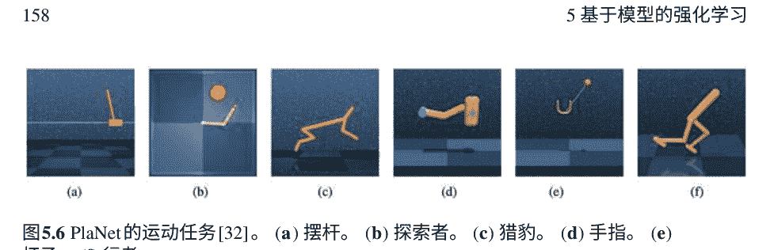

输入，将其转换为潜在空间，并在潜在空间中进行规划，以学习机器人的运动动力学。

PlaNet解决包括接触动力学、部分可观察性和稀疏奖励在内的连续控制任务。PlaNet实验中使用的应用程序包括（a）摆杆，（b）探索者，（c）猎豹，（d）手指，（e）杯子和（f）行者（见图5.6）。摆杆任务是一个摆动任务，具有固定的视角。小车可能看不见，需要代理记住前几帧的信息。

手指旋转任务需要预测两个独立物体的位置和它们的相互作用。猎豹任务涉及学习奔跑。它包括脚与地面的接触，需要模型预测多个未来。杯子任务需要用杯子接住球。一旦接住球，它会提供稀疏的奖励信号，需要准确地预测未来。行走者任务涉及一个模拟机器人，开始时躺在地上，必须学会站起来然后行走。PlaNet在这些任务上表现良好。在DeepMind控制任务中，它的准确性比A3C或D4PG代理更高。据报道，平均而言，它与环境的交互次数减少了5000%。

通过与PlaNet进行实验是很有启发性的。代码可以在GitHub上找到。14 可以使用简单的一行命令运行实验的脚本可用：

```
python3 -m planet.scripts.train --logdir /path/to/logdir --params '{tasks: [cheetah_run]}'
```

像往常一样，这需要安装正确版本的正确库，这可能是一个挑战，可能需要一些创造力。所需的版本在GitHub页面上列出。博客还包含视频和图片，展示了与DeepMind控制套件（A3C，D4PG）的无模型基线的比较。

实验表明，使用奖励和价值将实际状态压缩为低维潜在状态，然后使用这些潜在状态进行规划的想法是可行的。基于价值的压缩减少了高维度中的细节将实际状态视为与改进价值函数无关的噪声。为了帮助理解实际状态如何映射到潜在状态，可以参考[12, 46, 58]等文献。

## 总结和进一步阅读

本章内容涵盖了多个方面。我们将总结本章内容，并提供进一步阅读的参考文献。

## 总结

无模型方法使用奖励对环境进行采样，以学习策略函数，为环境的所有状态提供动作。基于模型的方法使用奖励来学习转移函数，然后使用规划方法从内部模型中采样策略。比喻地说，无模型方法学习如何在环境中行动，而基于模型的方法学习如何成为环境本身。学习的转移模型作为每个环境样本中使用的信在每个环境步骤中，以防止过度依赖模型的准确性。
经典的表格方法和高斯过程方法在解决小问题的低样本复杂度方面取得了相当大的成功[15, 50, 85]。
潜在模型观察到在许多高维问题中，影响值函数变化的因素通常是低维的。例如，图像中的背景景色对游戏的质量可能是无关紧要的，并且对值函数没有影响。潜在模型使用编码器将高维实际状态空间转换为低维潜在状态空间。

随后的规划和值函数在（更小的）潜在空间上工作。
最后，我们考虑了端到端的基于模型的算法。这些完全可微分的算法不仅学习动力学模型，还学习使用模型的规划算法。关于值迭代网络的工作[86]启发了最近关于端到端学习的工作，其中同时学习了转移模型和规划算法。结合潜在模型（或世界模型[29]），取得了令人印象深刻的结果[81]，并且模型和规划的准确性得到了提高，以至于在Muzero [74]中实现了对国际象棋，将棋，围棋和Atari游戏的无基础自学习。

## 进一步阅读

基于模型的强化学习承诺更高效的学习样本。这个领域有着悠久的历史。对于精确的表格方法，Sutton的Dyna-Q是一个经典的方法，它阐述了基于模型的学习的基本概念[83, 84]。

关于本章讨论的方法，有大量的文献资料。关于不确定性建模，请参见[13, 14, 87]，关于集成，请参见[9, 10, 22, 34, 40, 41, 52, 56, 57, 68]。关于模型预测控制，请参见[3, 20, 23, 26, 51, 60, 63]。潜在模型是一个活跃的研究领域。早期的两个作品是[66, 67]，尽管这些想法可以追溯到世界模型[29, 39, 47, 73]。后来，一系列的PlaNet和Dreamer论文产生了影响力[31-33, 76, 91]。

关于端到端学习和规划的文献也非常广泛，从VIN [86]开始，参见[2, 19, 21, 27, 64, 74, 77, 79, 81]。
随着应用变得更具挑战性，尤其是在机器人领域，其他方法也得到了发展，主要基于不确定性，参见[15, 50]的调查。后来，随着高维问题的普及，出现了潜在和端到端方法的发展。环境部分的基础是对最近基于模型的方法的概述[69]。另一份调查是[62]，还有一份全面的基准研究是[88]。

## 练习

让我们去做练习题吧。

## 问题

下面首先是一些快速问题，以检查您对本章的理解。
对于每个问题，简单的单句回答就足够了。

1.  模型基于方法相比模型无关方法的优势是什么？
2.  为什么模型基于方法在高维问题中可能会受到样本复杂性的影响？
3.  哪些函数是动力学模型的一部分？
4.  提到四种深度基于模型的方法。
5.  模型基于方法是否比模型无关方法具有更好的样本复杂度？
6.  模型基于方法是否比模型无关方法具有更好的性能？
7.  在Dyna-Q中，策略通过两种机制进行更新：通过对环境进行采样进行学习和哪种其他机制？
8.  为什么集成方法的方差比集成中使用的个体机器学习方法的方差要低？
9.  模型预测控制是做什么的，为什么这种方法适用于准确性较低的模型？
10. 与使用实际模型进行规划相比，使用潜在模型进行规划的优势是什么？
11. 潜在模型是如何训练的？
12. 提到四个构成潜在模型的典型模块。
13. 端到端规划和学习的优势是什么？
14. 提到两种端到端规划和学习方法。

## 练习

现在是介绍一些编程练习的时候了。练习的主要目的是更加熟悉我们在本章中介绍的方法。通过尝试不同的超参数设置并玩弄算法，您将对不同方法对性能和运行时间的影响产生一些直观的认识。

实验可能变得计算上昂贵。你可能想要在云端运行它们，使用Google Colab、Amazon AWS或Microsoft Azure。它们可能有学生折扣，并且会提供最新的GPU或TPU来与TensorFlow或PyTorch一起使用。

1.  Dyna. 在Gym出租车环境中实现基于表格的Dyna-Q。改变计划的数量 N并观察性能的影响。
2.  Keras. 使用Keras制作Dyna-Q和出租车的函数逼近版本。改变网络的容量和计划的数量。与纯无模型版本进行比较，并注意不同任务的性能差异和计算需求。
3.  Planning. 在Dyna-Q中，计划目前只使用单步模型样本。实现一个简单的有限深度多步展望规划器，并观察不同展望深度对性能的影响。
4.  MPC. 阅读Nagabandi等人的论文[63]并下载代码。15获取正确版本的库，并使用提供的脚本运行代码，仅适用于MB（基于模型）版本。请注意，脚本还支持绘图。使用不同的MPC视野运行。使用不同的集合大小运行。不同应用程序的性能和运行时间有什么影响？
5.  PlaNet. 访问PlaNet博客并阅读（参见前一节）。16访问PlaNet GitHub网站并下载安装代码。17安装DeepMind控制套件，18以及所有必要的支持库的版本。在PlaNet中运行Reacher和Walker，并与无模型方法D4PG和A3C进行比较。改变编码网络的大小并注意其对性能和运行时间的影响。现在关闭编码器，并在实际状态上进行规划（您可能需要更改网络大小以实现此目的）。改变潜在模型、价值函数和奖励函数的容量。还要改变规划的数量，并注意其影响。
6.  端到端. 正如你所见，这些实验计算成本很高。现在我们将转向端到端的规划和学习（VIN和MuZero）。这个练习也需要很高的计算成本。使用小应用程序，例如小迷宫和Cartpole。从GitHub上找到并下载一个MuZero的实现并利用你在之前练习中获得的经验进行探索。专注于对潜在空间的形状有所了解。尝试使用MuZero-General [17]、19或MuZero可视化[12]来了解潜在空间。20（这是一个具有挑战性的练习，适合学期项目或论文。）

## 参考文献

1.  Ankesh Anand, Jacob Walker, Yazhe Li, Eszter Vértes, Julian Schrittwieser, Sherjil Ozair, Théophane Weber和Jessica B Hamrick。通过计划自我监督的世界模型进行程序化泛化。arXiv预印本arXiv:2111.01587, 2021年。153, 157
2.  Thomas Anthony, Zheng Tian和David Barber。用深度学习和树搜索思考快与慢。在神经信息处理系统进展中, 第5360-5370页, 2017年。160
3.  Kamyar Azizzadenesheli, Brandon Yang, Weitang Liu, Emma Brunskill, Zachary C Lipton, 和Animashree Anandkumar。生成对抗树搜索的令人惊讶的负面结果。arXiv预印本arXiv:1806.05780, 2018年。160
4.  Mohammad Babaeizadeh, Mohammad Taghi Saffar, Danijar Hafner, Harini Kannan, Chelsea Finn, Sergey Levine, 和Dumitru Erhan。模型、像素和奖励：评估视觉模型驱动的强化学习中的设计权衡。arXiv预印本arXiv:2012.04603，2020年。157
5.  Christopher M Bishop.模式识别与机器学习. 信息科学和统计学. Springer Verlag, Heidelberg, 2006. 144, 145
6.  Zdravko I Botev, Dirk P Kroese, Reuven Y Rubinstein, 和 Pierre L'Ecuyer. 用于优化的交叉熵方法. 在统计手册, 卷31, 页35–59. Elsevier, 2013. 149
7.  Lars Buesing, Théophane Weber, Sébastien Racaniere, S.M. Eslami, Danilo Rezende, David P. Reichert, Fabio Viola, Frederic Besse, Karol Gregor, Demis Hassabis, 和 Daan Wierstra. 学习和查询强化学习的快速生成模型.arXiv预印本 arXiv:1802.03006, 2018. 147, 155, 155
8.  Silvia Chiappa, Sébastien Racaniere, Daan Wierstra, and Shakir Mohamed. 递归环境模拟器. 在国际学习表示会议,2017年。155
9.  Kurtland Chua, Roberto Calandra, Rowan McAllister, and Sergey Levine. 使用概率动力学模型在少数试验中进行深度强化学习。在神经信息处理系统进展,2018年, 第4754-4765页。145, 149, 150, 160
10. Ignasi Clavera, Jonas Rothfuss, John Schulman, Yasuhiro Fujita, Tamim Asfour, and Pieter Abbeel. 基于模型的强化学习通过元策略优化。在第二届机器人学习年会, CoRL 2018, 瑞士苏黎世,2018年, 第617-629页。145,150, 160
11. Pieter-Tjerk De Boer, Dirk P Kroese, Shie Mannor, 和 Reuven Y Rubinstein. 关于交叉熵方法的教程。Annals of Operations Research, 134(1):19–67, 2005. 149
12. Joery A. de Vries, Ken S. Voskuil, Thomas M. Moerland, 和 Aske Plaat. 可视化MuZero模型。arXiv预印本 arXiv:2102.12924, 2021. 157, 159, 162
13. Marc Deisenroth 和 Carl E Rasmussen. PILCO: 一种基于模型和数据高效的策略搜索方法. 在第28届国际机器学习大会(ICML-11), 第465–472页, 2011. 144, 150, 160
14. Marc Peter Deisenroth, Dieter Fox和Carl Edward Rasmussen。高斯过程用于机器人和控制中的数据高效学习。IEEE模式分析与机器智能交易，37(2): 408-423, 2013年。144, 160
15. Marc Peter Deisenroth, Gerhard Neumann和Jan Peters。关于机器人的策略搜索的调查。在机器人基础和趋势的基础上2页1-142。现在的出版商, 2013年。160, 160
16. Andreas Doerr, Christian Daniel, Martin Schiegg, Duy Nguyen-Tuong, Stefan Schaal, Marc Toussaint和Sebastian Trimpe。概率循环状态空间模型。arXiv预印本arXiv:1801.10395, 2018年。147
17. Werner Duvaud和Aurèle Hainaut。MuZero general: Muzero的开放重新实现。https://github.com/werner-duvaud/muzero-general, 2019年。162
18. Frederik Ebert, Chelsea Finn, Sudeep Dasari, Annie Xie, Alex Lee, 和 Sergey Levine. 视觉预测：基于模型的深度强化学习用于基于视觉的机器人控制。arXiv 预印本 arXiv:1812.00568, 2018. 149
19. Gregory Farquhar, Tim Rocktäschel, Maximilian Igl, 和 Shimon Whiteson. TreeQN 和 ATreeC: 可微分树规划用于深度强化学习。在国际学习表示会议, 2018. 150, 152, 152, 160
20. Vladimir Feinberg, Alvin Wan, Ion Stoica, Michael I Jordan, Joseph E Gonzalez, 和 Sergey Levine. 基于模型的值估计用于高效的无模型强化学习。arXiv 预印本 arXiv:1803.00101, 2018. 148, 150, 160
21. Dieqiao Feng, Carla P Gomes, and Bart Selman. 使用课程驱动的深度强化学习解决困难的人工智能规划实例。arXiv预印本arXiv:2006.02689, 2020年。160
22. Chelsea Finn和Sergey Levine。用于规划机器人运动的深度视觉预测。在2017年IEEE国际机器人与自动化会议 (ICRA) , 第2786-2793页。IEEE, 2017年。149, 150, 160

- Carlos E Garcia, David M Prett和Manfred Morari. 模型预测控制：理论和实践-一项调查. Automatica, 25(3): 335-348, 1989年. 148, 160

- Jean-Bastien Grill, Florent Altch, Yunhao Tang, Thomas Hubert, Michal Valko, Ioannis Antonoglou和Rémi Munos. 蒙特卡洛树搜索作为正则化策略优化. 在国际机器学习会议上, 第3769-3778页. PMLR, 2020年. 153, 157

- Christopher Grimm, Andre Barreto, Satinder Singh和David Silver. 基于模型的强化学习的价值等价原则. 在神经信息处理进展中, 2020年. 146, 156, 157, 159

- Shixiang Gu, Timothy Lillicrap, Ilya Sutskever和Sergey Levine. 具有模型加速的连续深度Q-学习. 在国际机器学习会议上, 第2829-2838页, 2016年. 148, 148, 150, 160

- Arthur Guez, Mehdi Mirza, Karol Gregor, Rishabh Kabra, Sébastien Racanière, Théophane Weber, David Raposo, Adam Santoro, Laurent Orseau, Tom Eccles, Greg Wayne, David Silver和Timothy P. Lillicrap. 无模型规划的研究. 在国际机器学习会议上, 第2464-2473页, 2019年. 150, 160

- David Ha和Jürgen Schmidhuber. 循环世界模型促进策略演化. 在神经信息处理系统进展, 第2450-2462页, 2018年. 147

- David Ha和Jürgen Schmidhuber. 世界模型. arXiv预印本arXiv:1803.10122, 2018年. 146, 147, 150, 160, 160

- Tuomas Haarnoja, Aurick Zhou, Pieter Abbeel和Sergey Levine. 软演员-评论家：基于最大熵的深度强化学习与随机演员的离线策略. 在国际机器学习会议, 第1861-1870页. PMLR, 2018年. 156

- Danijar Hafner, Timothy Lillicrap, Jimmy Ba和Mohammad Norouzi. 梦想控制：通过潜在想象学习行为. 在国际学习表示会议, 2020年. 146, 147, 150, 156, 160

- Danijar Hafner, Timothy Lillicrap, Ian Fischer, Ruben Villegas, David Ha, Honglak Lee, 和James Davidson. 从像素学习潜在动态规划. 在国际机器学习会议, 2019年, 第2555-2565页. 149, 150, 156, 157, 158

- Danijar Hafner, Timothy Lillicrap, Mohammad Norouzi和Jimmy Ba. 通过离散世界模型掌握Atari. 在国际学习表示会议, 2021年. 146, 147, 150, 156, 156, 160

- Nicolas Heess, Gregory Wayne, David Silver, Timothy Lillicrap, Tom Erez和Yuval Tassa. 通过随机值梯度学习连续控制策略. 在神经信息处理系统进展, 2015年, 第2944-2952页. 150, 160

- Peter Henderson, Riashat Islam, Philip Bachman, Joelle Pineau, Doina Precup, and David Meger. 有意义的深度强化学习. 在第三十二届AAAI人工智能大会, 2018年. 154

- Matteo Hessel, Ivo Danihelka, Fabio Viola, Arthur Guez, Simon Schmitt, Laurent Sifre, Théophane Weber, David Silver, and Hado van Hasselt. Muesli: 结合策略优化的改进. 在国际机器学习大会, 第4214-4226页, 2021年. 157

- Thomas Hubert, Julian Schrittwieser, Ioannis Antonoglou, Mohammadamin Barekatain, Simon Schmitt, and David Silver. 学习和规划复杂的动作空间. 在国际机器学习大会, 第4476-4486页, 2021年. 156

- Jonathan Hui. 基于模型的强化学习 https://medium.com/@jonathan_hui/rl-model-based-reinforcement-learning-3c2b6f0aa323. Medium帖子, 2018年. 145

- Roman Ilin, Robert Kozma, and Paul J Werbos. 在细胞同时递归神经网络中的高效学习——迷宫导航问题的案例. 在2007年IEEE国际近似动态规划和强化学习研讨会, 第324-329页, 2007年. 152, 155, 160

- Michael Janner, Justin Fu, Marvin Zhang, and Sergey Levine. 何时信任你的模型：基于模型的策略优化. 在神经信息处理系统进展中, 页码12498-12509, 2019年. 145, 148, 150, 160

- Łukasz Kaiser, Mohammad Babaeizadeh, Piotr Miros, Blazej Osinski, Roy H. Campbell, Konrad Czechowski, Dumitru Erhan, Chelsea Finn, Piotr Kozakowski, Sergey Levine, Ryan Sepassi, George Tucker, and Henryk Michalewski. 基于模型的强化学习用于Atari游戏. arXiv:1903.00374, 2019年. 146, 149, 150, 160

- Gabriel Kalweit and Joschka Boedecker. 基于不确定性的连续深度强化学习的想象力. 在机器人学习会议中, 页码195-206, 2017年. 148

- Reza Kamyar and Ehsan Taheri. 飞机最优地形/威胁轨迹规划和控制. 导航、控制和动力学杂志, 37(2):466-483, 2014年. 149

- Satwik Kansal and Brendan Martin. 学习数据科学网页, 2018年. 142

- Maximilian Karl, Maximilian Soelch, Justin Bayer, and Patrick Van der Smagt. 从原始数据中深度变分贝叶斯滤波器: 无监督学习状态空间模型. arXiv预印本arXiv:1605.06432, 2016. 147

- Andrej Karpathy, Justin Johnson, and Li Fei-Fei. 可视化和理解递归网络. arXiv预印本arXiv:1506.02078, 2015. 159

- Henry J Kelley. 最优飞行路径的梯度理论. 美国火箭学会杂志, 30(10):947–954, 1960. 152, 155, 160

- Diederik P Kingma和Max Welling. 自编码器变分贝叶斯. 在国际学习表示会议, 2014. 147

- Diederik P Kingma和Max Welling. 变分自动编码器简介. Found. Trends Mach. Learn., 12(4): 307–392, 2019年. 147

- Jens Kober, J Andrew Bagnell和Jan Peters. 机器人强化学习综述. 《国际机器人研究杂志》 32(11): 1238–1274, 2013年. 160, 160

- Basil Kouvaritakis和Mark Cannon. 模型预测控制. Springer, 2016年. 160

- Thanard Kurutach, Ignasi Clavera, Yan Duan, Aviv Tamar和Pieter Abbeel. 模型集成信任区域策略优化. 在国际学习表示会议, 2018年. 145, 145, 160

- Wook Hyun Kwon, AM Bruckstein和T Kailath. 通过移动视界法稳定状态反馈设计. 《国际控制杂志》 37(3): 631–643, 1983年. 148

- Balaji Lakshminarayanan, Alexandre Pritzel和Charles Blundell. 使用深度集合进行简单且可扩展的预测不确定性估计. 在神经信息处理系统进展, 页面6402–6413, 2017年. 149

- Matteo Leonetti, Luca Iocchi, 和 Peter Stone. 自动规划和强化学习的综合, 用于高效、鲁棒的决策制定. 人工智能, 241:103–130, 2016. 148

- Sergey Levine 和 Pieter Abbeel. 在未知动力学下学习神经网络策略的引导策略搜索. 在神经信息处理系统进展, 页1071–1079, 2014. 150, 160

- Sergey Levine 和 Vladlen Koltun. 引导策略搜索. 在国际机器学习会议, 页 1–9, 2013. 144, 160

- Hao Li, Zheng Xu, Gavin Taylor, Christoph Studer, 和 Tom Goldstein. 可视化神经网络的损失景观. 在神经信息处理系统进展, 页 6391–6401, 2018. 159

- Timothy P Lillicrap, Jonathan J Hunt, Alexander Pritzel, Nicolas Heess, Tom Erez, Yuval Tassa, David Silver和Daan Wierstra. 使用深度强化学习进行连续控制. 在国际学习表示会议, 2016年. 156

- David Q Mayne, James B Rawlings, Christopher V Rao和Pierre OM Scokaert. 受限模型预测控制: 稳定性和最优性. Automatica, 36(6): 789-814, 2000年. 160

- Thomas M Moerland, Joost Broekens和Catholijn M Jonker. 强化学习和规划框架. arXiv预印本arXiv:2006.15009, 2020年. 143

- Thomas M Moerland, Joost Broekens和Catholijn M Jonker. 基于模型的强化学习: 一项调查. arXiv预印本arXiv:2006.16712, 2020年. 160

- Anusha Nagabandi, Gregory Kahn, Ronald S Fearing和Sergey Levine. 神经网络动力学用于基于模型的深度强化学习与无模型微调. 在 2018年 IEEE国际机器人与自动化大会（ICRA）, 页码7559-7566, 2018年. 149, 151, 160, 162

- Nantas Nardelli, Gabriel Synnaeve, Zeming Lin, Pushmeet Kohli, Philip HS Torr和Nicolas Usunier. 价值传播网络. 在第七届国际学习表示会议, ICLR 2019, 美国路易斯安那州新奥尔良, 2019年5月6日至9日, 2018年. 150, 160

- Sufeng Niu, Siheng Chen, Hanyu Guo, Colin Targonski, Melissa C Smith和Jelena Kovačević. 广义值迭代网络：超越格子的生活. 在第三十二届AAAI人工智能大会, 2018年. 151, 155

- Junhyuk Oh, Xiaoxiao Guo, Honglak Lee, Richard L Lewis和Satinder Singh. 使用深度网络在Atari游戏中进行动作条件视频预测. 在神经信息处理系统进展, 2015年, 第2863-2871页. 150, 160

- Junhyuk Oh, Satinder Singh和Honglak Lee. 价值预测网络. 在神经信息处理系统进展, 2017年, 第6118-6128页. 146, 146, 146, 147, 147, 150, 152, 156, 160

- David Opitz和Richard Maclin. 流行的集成方法：一项实证研究. 人工智能研究杂志, 第11卷, 第169-198页, 1999年. 145, 160

- Aske Plaat, Walter Kosters和Mike Preuss. 高准确度的基于模型的强化学习综述. arXiv预印本arXiv:2107.08241, 2021年. 144, 150, 154, 160

- Sébastien Racanière, Théophane Weber, David P. Reichert, Lars Buesing, Arthur Guez, Danilo Jimenez Rezende, Adrià Puigdomènech Badia, Oriol Vinyals, Nicolas Heess, Yujia Li, Razvan Pascanu, Peter W. Battaglia, Demis Hassabis, David Silver和Daan Wierstra. 增强想象力的深度强化学习代理. 在神经信息处理系统进展, 2017年, 第5690-5701页. 150, 155

- Daniel Schleich, Tobias Klamt, 和 Sven Behnke. 多层次的值迭代网络的抽象. 在机器人学:科学与系统 XV, 弗莱堡大学, 弗莱堡布赖斯高, 德国, 2019. 152

- Jürgen Schmidhuber. 使世界可微分: 在非稳态环境中使用自监督完全循环神经网络进行动态强化学习和规划. 技术报告, 计算机科学研究所, 1990. 147

- Jürgen Schmidhuber. 一种用于动态强化学习和规划的在线算法在反应性环境中. 在1990年IJCNN国际神经网络联合会议, 页码253–258. IEEE, 1990. 152, 155, 160

- Julian Schrittwieser, Ioannis Antonoglou, Thomas Hubert, Karen Simonyan, Laurent Sifre, Simon Schmitt, Arthur Guez, Edward Lockhart, Demis Hassabis, Thore Graepel, Timothy Lillicrap, 和 David Silver. 通过学习模型进行规划的方式掌握雅达利、围棋、国际象棋和将棋. 自然, 588(7839):604–609, 2020. 150, 156, 156, 160, 160

- Julian Schrittwieser, Thomas Hubert, Amol Mandhane, Mohammadamin Barekatain, Ioannis Antonoglou和David Silver. 通过学习模型进行在线和离线强化学习的规划. arXiv预印本arXiv:2104.06294, 2021年. 157

- Ramanan Sekar, Oleh Rybkin, Kostas Daniilidis, Pieter Abbeel, Danijar Hafner和Deepak Pathak. 通过自监督世界模型进行探索规划. 在国际机器学习会议, 2020年. 146, 150, 156, 160

- David Silver, Thomas Hubert, Julian Schrittwieser, Ioannis Antonoglou, Matthew Lai, Arthur Guez, Marc Lanctot, Laurent Sifre, Dharshan Kumaran, Thore Graepel, Timothy Lillicrap, Karen Simonyan和Demis Hassabis. 通过自我对弈掌握国际象棋、将棋和围棋的通用强化学习算法. 科学, 362(6419):1140–1144, 2018年. 160

- David Silver, Guy Lever, Nicolas Heess, Thomas Degris, Daan Wierstra和Martin Riedmiller. 确定性策略梯度算法. 在国际机器学习会议, 2014年387–395页, 148

- David Silver, Julian Schrittwieser, Karen Simonyan, Ioannis Antonoglou, Aja Huang, Arthur Guez, Thomas Hubert, Lucas Baker, Matthew Lai, Adrian Bolton, Yutian Chen, Timothy Lillicrap, Fan Hui, Laurent Sifre, George van den Driessche, Thore Graepel, and Demis Hassabis. 在没有人类知识的情况下掌握围棋游戏. 自然, 550(7676):354, 2017. 160

- David Silver, Richard S Sutton, and Martin Müller. 计算机围棋中的时差搜索. 机器学习, 87(2):183–219, 2012. 147

- David Silver, Hado van Hasselt, Matteo Hessel, Tom Schaul, Arthur Guez, Tim Harley, Gabriel Dulac-Arnold, David Reichert, Neil Rabinowitz, Andre Barreto, and Thomas Degris. Predictron: 端到端学习和规划. 在第34届国际机器学习大会, 第3191–3199页, 2017. 146, 150, 152, 153, 160, 160

- Aravind Srinivas, Allan Jabri, Pieter Abbeel, Sergey Levine, and Chelsea Finn. 通用规划网络. 在国际机器学习大会, 第4739–4748页, 2018. 152

- Richard S Sutton. 基于近似动态规划的学习、规划和反应的集成架构. 在机器学习会议 1990, 第216–224页. 爱思唯尔出版社, 1990年. 138, 139, 141, 141, 160

- Richard S Sutton. Dyna, 一种用于学习、规划和反应的集成架构. ACM Sigart Bulletin, 2(4):160–163, 1991年. 160

- Richard S Sutton和Andrew G Barto. 强化学习导论, 第二版. 麻省理工学院出版社, 2018年. 138, 141, 160

- Aviv Tamar, Yi Wu, Garrett Thomas, Sergey Levine和Pieter Abbeel. 值迭代网络. 在神经信息处理系统进展, 第2154–2162页, 2016年. 150, 151, 152, 155, 160, 160

- Yuval Tassa, Tom Erez和Emanuel Todorov. 通过在线轨迹优化合成和稳定复杂行为. 在2012年IEEE/RSJ国际机器人与系统智能会议, 第4906–4913页, 2012年. 150, 160

- Tingwu Wang, Xuchan Bao, Ignasi Clavera, Jerrick Hoang, Yeming Wen, Eric Langlois, Shunshi Zhang, Guodong Zhang, Pieter Abbeel, and Jimmy Ba. 基于模型的强化学习基准测试. arXiv:1907.02057, 2019. 139, 155, 160

- Weirui Ye, Shaohuai Liu, Thanard Kurutach, Pieter Abbeel, and Yang Gao. 用有限数据掌握Atari游戏. arXiv预印本 arXiv:2111.00210, 2021. 157

- Lunjun Zhang, Ge Yang, and Bradly C Stadie. 作为图形的世界模型：学习潜在的规划地标. 在国际机器学习会议, 页码12611–12620. PMLR, 2021. 148, 150

- Marvin Zhang, Sharad Vikram, Laura Smith, Pieter Abbeel, Matthew J Johnson, and Sergey Levine. Solar: 基于模型的强化学习的深度结构化表示. 在国际机器学习会议, 2019年, 页码7444–7453. 160

## 第6章 双Agent自我对弈

之前的章节关注的是单个Agent如何学习其环境的最优行为。这一章有所不同。我们转向两个Agent同时操作的问题，它们的行为都将被建模（在下一章中，可能超过两个Agent）。

双Agent问题有两个有趣的原因。首先，我们周围的世界充满了相互作用的主体，建模两个Agent及其互动比建模单个Agent更接近理解真实世界的一步。其次，在双Agent问题中，取得了非凡的成果——强化学习Agent教自己变得比人类世界冠军更强大——通过研究这些方法，我们可能会找到在其他问题中实现类似结果的方法。

在本章中，我们模拟的互动方式是零和博弈：我的胜利就是你的失败，反之亦然。这种双智能体的零和动态与单智能体的动态根本不同。在单智能体问题中，环境允许你探索它，让你学习它的工作方式，并找到好的行动。尽管环境可能不是你的朋友，但它也不会对抗你。在双智能体的零和问题中，环境会试图从你那里赢取胜利，并根据从你的行为中学到的知识来积极改变回应，以最小化你的奖励。在学习最优策略时，我们应该考虑所有可能的对抗行动。

一种常见的方法是通过自我对弈来实现环境的行动：我们用自己的副本替换环境。通过这种方式，我们让自己与一个拥有我们当前所有知识的对手对战，并且智能体互相学习。

我们首先简要回顾一下双智能体问题，然后深入研究自学习。我们研究的情况是两个智能体都完全了解转移函数，因此模型准确性不再是一个问题。这在象棋和围棋等游戏中是成立的，游戏规则决定了我们如何从一个状态转移到另一个状态。

在自学习中，环境用于生成训练示例，以便代理训练出更好的策略，然后将更好的代理策略用于此环境中训练代理，并且一次又一次地创建自学习和相互改进的良性循环。一个代理可以在没有任何先前知识的情况下自学习玩游戏，这种被称为白板学习的方式，从空白状态开始学习。

本章中描述的自我对弈系统使用基于模型的方法并结合规划和学习方法。有一个规划算法我们已经提到过几次，但尚未详细解释。在本章中，我们将讨论蒙特卡洛树搜索（Monte Carlo Tree Search，简称MCTS），这是一种非常流行的规划算法。MCTS可以用于单智能体和双智能体情境，并且是许多成功应用的核心，包括MuZero和自学习AlphaZero系列程序。我们将解释自学习和自我对弈在AlphaGo Zero中的工作原理以及为什么它们如此有效。然后，我们将讨论课程学习的概念，这是自学习成功的原因。

本章结束时，附有练习、总结和进一步阅读的指引。

## 核心概念

- 自我对弈
- 课程学习

## 核心问题

- 使用给定的转移模型进行自我对弈，以便比当前最佳玩家更强大

## 核心算法

- 极小化（列表 6.2）
- 蒙特卡洛树搜索（列表 6.3）
- AlphaZero白板学习（列表 6.1）

## 游戏中的自我对弈

我们在第5章中已经看到，当代理有环境的转移模型时，它可以实现更好的性能，特别是当模型具有高准确性时。如果我们的模型准确性完美，如果代理的转移函数与环境的相同，那么我们能走多远？

如果我们能够改进我们的环境作为学习过程的一部分，我们能超越我们的老师吗？学徒能否胜过巫师？

为了为本章做铺垫，让我们描述一下第一个发生这种情况的游戏：双陆棋。

## 学习玩双陆棋

在第3.2.3节中，我们简要讨论了关于双陆棋的研究。早在上世纪90年代初，TD-Gammon程序就通过浅层网络实现了稳定的强化学习。这项工作始于上世纪80年代末，由IBM实验室的研究员Gerald Tesauro发起。Tesauro面临的问题是让程序学习超越任何现有实体的能力。（在图6.1中，我们可以看到Tesauro站在他的程序前面；图片由IBM Watson Media提供。）在上世纪80年代，计算机是不同的。计算机速度慢，数据集小，神经网络浅。在这种背景下，Tesauro的成功非常引人注目。

他的程序基于神经网络，学习了良好的下棋模式。他的第一个程序Neurogammon是通过监督学习训练的，基于人类专家的对局。在监督学习中，模型不能比它所训练的人类对局更强。Neurogammon实现了中等水平的对局[115]。他的第二个程序TD-Gammon是基于强化学习的。

使用时序差分学习和自我对弈进行学习。结合手工启发式规则和一些规划，在1992年，它在人类锦标赛中表现出色，成为第一个在技巧游戏中做到这一点的计算机程序[118]。TD-Gammon以时序差分学习命名，因为它每一步之后更新神经网络，减小了先前和当前位置评估之间的差异。神经网络使用了一个隐藏层，最多80个单元。TD-Gammon最初从零知识状态开始学习，白板状态。Tesauro描述了TD-Gammon的自我对弈如下：选择的移动是使得移动方的预期结果最大的移动。换句话说，神经网络是通过与自己对弈的结果来学习的。即使在学习开始时，网络的权重是随机的，因此其初始策略是随机策略[117]，也使用了这种自我对弈训练范式。TD-Gammon进行了白板学习，其神经网络权重初始化为小的随机数。它纯粹通过与自己对弈来达到世界冠军水平，在游戏进行中学习游戏。这种自主自学是人工智能的主要目标之一。TD-Gammon的成功激发了许多研究人员尝试神经网络和自我对弈方法，最终在Atari [75]和AlphaGo [107, 109]中取得了高调的成果，我们将在本章中描述。在第6.1节中，将描述两个代理零和环境。接下来，在第6.2节中，详细描述了白板自我对弈方法。在第6.3节中，我们将重点关注自我对弈方法的成就。现在让我们从两个代理零和问题开始。

## 6.1 两个代理零和问题

在我们研究自我对弈算法之前，让我们先来看一下那些让人着迷的双人游戏，这些游戏已经吸引了人工智能研究者很长时间了。游戏有很多不同的形状和大小。有些游戏很简单，有些游戏很难。游戏的特点可以用一个相当标准的分类法来描述。游戏的重要特点包括玩家数量、游戏是零和还是非零和、游戏是完美信息还是不完美信息、决策的复杂性以及状态空间的复杂性。我们将更详细地讨论这些特点。

- **玩家数量。** 游戏中最重要的元素之一是玩家数量。单人游戏通常被称为谜题，并被建模为标准的MDP。谜题的目标是找到一个解决方案。双人游戏是“真实”的游戏。存在许多双人游戏，它们为玩家（和计算机程序员）提供了一个很好的平衡，既不太容易也不太难[34]。在人工智能中，双人游戏的例子有国际象棋、跳棋、围棋、黑白棋和将棋。

多人游戏由三个或更多玩家进行。著名的多人游戏有桥牌、扑克牌和策略游戏如风险、外交和星际争霸。

- **零和与非零和。** 游戏的一个重要方面是竞争还是合作。大多数双人游戏是竞争性的：玩家A的胜利(+1)就是玩家B的失败(-1)。这些游戏被称为零和游戏，因为玩家的胜利总和始终为零。竞争是现实世界中的一个重要元素，这些游戏为研究冲突和战略行为提供了一个有用的模型。

相比之下，在合作游戏中，只要玩家能够找到双赢的情况，他们就能获胜。合作游戏的例子包括花火、桥牌、外交[37, 63]、扑克和风险。下一章将讨论多智能体和合作游戏。

- **完全信息对抗不完全信息。** 在完全信息游戏中，所有相关信息对所有玩家都是已知的。这在典型的棋盘游戏中是成立的，比如国际象棋和跳棋。在不完全信息游戏中，一些信息可能对某些玩家是隐藏的。这在桥牌和扑克等纸牌游戏中是成立的，因为不是所有的牌都为所有玩家所知。不完全信息游戏可以建模为部分可观察的马尔可夫过程，POMDP [82, 104]。

（不）完全信息游戏的一种特殊形式是运气游戏，比如西洋双陆棋和大富翁，在这些游戏中，骰子起着重要的作用。在这些游戏中没有隐藏信息，在移动时存在不确定性，尽管如此，这些游戏有时被认为是完全信息游戏。随机性与不完美信息不同。

- **决策复杂性。** 玩游戏的难度取决于游戏的复杂性。决策复杂性是定义初始游戏位置（也称为关键树或证明树[60]）的终局位置数量。位置中的动作数量越多，决策复杂性越大。棋盘尺寸较小的游戏，如井字棋（3×3），比较大的棋盘游戏，如五子棋（19×19），复杂性较小。当动作空间非常大时，通常可以将其视为连续动作空间。例如，在扑克中，货币赌注可以是任意大小，定义了一个几乎连续的动作大小。

- **状态空间复杂性。** 游戏的状态空间复杂性是从游戏的初始位置可达的合法位置数量。状态空间复杂性和决策复杂性通常呈正相关，因为具有高决策复杂性的游戏通常具有高状态空间复杂性。确定游戏的确切状态空间复杂性是一项非常复杂的任务，因为位置可能会是非法或无法到达的。对于许多游戏，已经计算出了状态空间的近似值。一般来说，状态空间复杂度较大的游戏对于人类和计算机来说更难玩（“需要更多智能”）。请注意状态的维度可能与状态空间的大小无关，例如，一些较简单的Atari游戏的规则限制了可达状态的数量，尽管这些状态本身是高维的（它们由许多视频像素组成）。

| 游戏 | 棋盘 | 状态空间 | 零和 | 信息 |
| :--- | :--- | :--- | :--- | :--- |
| 国际象棋 | 8 × 8 | 10^47 | 零和 | 完美 |
| 跳棋 | 8 × 8 | 10^18 | 零和 | 完美 |
| 黑白棋 | 8 × 8 | 10^28 | 零和 | 完美 |
| 西洋双陆棋 | 24 | 10^20 | 零和 | 机会 |
| 围棋 | 19 × 19 | 10^170 | 零和 | 完美 |
| 将棋 | 9 × 9 | 10^71 | 零和 | 完美 |
| 扑克 | 卡片 | 10^161 | 非零和 | 不完美 |

## 零和完美信息游戏

象棋、跳棋和围棋等两人零和完美信息游戏是人工智能的最早应用之一。图灵和香农在70多年前发表了关于如何编写下棋程序的第一个想法[105, 125]。这些游戏经常被用来研究人工智能中的战略推理。策略或政策决定了结果。表6.1总结了在人工智能研究中发挥重要作用的一些游戏。

### 6.1.1 下围棋的难度

在1997年国际象棋世界冠军加里·卡斯帕罗夫被IBM的深蓝计算机（图6.2；图片由Chessbase提供）击败之后，围棋（图1.4）成为下一个基准游戏，也是人工智能的果蝇，围棋的研究活动显著增加。

围棋比国际象棋更难。它在一个更大的棋盘上进行比赛（19 × 19 vs. 8 × 8），行动空间更大（大约有250种可行的走法）。例如，井字棋的最大状态空间是3^9 = 19683个位置（9个“X”、“O”或空白的方格），如果我们去除对称和非法的位置，只剩下765个位置。与国际象棋相比，围棋的位置更多（通常有300步对25步），游戏时间更长（通常有300步对70步），状态空间复杂度更大：围棋为10的170次方，而国际象棋为10的47次方。此外，围棋中的奖励是稀疏的。只有在长时间的游戏结束后，经过多次移动后，结果（胜利/失败）才会被确定。围棋中的吃子并不频繁，也没有找到好的高效可计算的启发式方法。相比之下，国际象棋中的材料平衡可以被高效地计算，并且能够很好地指示我们领先多少。对于计算机来说，围棋中的大部分对局都是在黑暗中进行的。相比之下，对于人类来说，围棋的视觉模式可能比国际象棋的深度组合线路更容易解释。

对于强化学习来说，围棋中的信用分配是具有挑战性的。奖励只有在一系列长时间的移动之后才会出现，不清楚哪些移动对这样的结果做出了最大的贡献，或者是否所有的移动都做出了相同的贡献。需要玩很多局才能获得足够的结果。总之，围棋比起国际象棋更难以用计算机掌握（图6.3）。

传统上，计算机围棋程序遵循传统的国际象棋设计，采用极小化搜索和启发式评估函数，而在围棋中，这个评估函数是基于棋子的影响力的（参见6.2.1节和图6.4）[71]。然而，这种国际象棋的方法在围棋中并不起作用，或者至少不够好。多年来，围棋的水平一直停滞在中级业余水平。

主要问题是分支因子很大，且缺乏高效且良好的评估函数。随后，蒙特卡洛树搜索算法在2006年被开发出来。MCTS是一种可变深度的自适应搜索算法，不需要启发式函数，而是使用随机模拟来估计棋盘实力。MCTS程序使得棋力从10级到2-3段甚至更强在小的9 × 9棋盘上提高。然而，此时性能停滞不前，研究人员预计，世界冠军级别的比赛仍需要多年时间才能实现。神经网络已经尝试过，但速度较慢，并没有显著提高性能。

### 围棋的下棋水平

让我们比较一下几个不同年份编写的几个围棋程序的三种编程范式（图6.3）。这些程序分为三个类别。首先是使用启发式规划的程序，即极小化风格的程序。GNU Go是这类程序的一个著名例子。这些程序中的启发式规则是手工编码的。这些程序的下棋水平处于中等业余水平。接下来是基于MCTS的程序。它们达到了强业余水平。最后是AlphaGo程序，其中MCTS与深度自我对弈相结合。这些程序达到了超人类的表现。图中还显示了其他采用相关方法的程序。

因此，围棋提供了一个庞大而稀疏的状态空间，为自我对弈与完美转换函数的测试提供了极大的挑战。让我们更仔细地看一下AlphaGo的成就。

### 6.1.2 AlphaGo的成就

在2016年，经过数十年的研究，围棋的努力取得了成果。在2015年至2017年期间，DeepMind AlphaGo团队进行了三场比赛，击败了所有的人类冠军，包括范辉、李世石和柯洁。AlphaGo的突破表现令人惊讶。计算机游戏专家预计大师级别的对弈至少还需要10年时间。

AlphaGo使用的技术是多年研究的结果，涵盖了广泛的主题。围棋作为果蝇的研究对象非常成功。重要的新算法被开发出来，尤其是蒙特卡洛树搜索（MCTS），并且在深度强化学习方面取得了重大进展。我们将提供一个关于AlphaGo（击败冠军）及其后继者AlphaGo Zero（从零开始学习围棋）的研究的高级概述。首先，我们将描述围棋比赛。

与范辉的比赛是在2015年10月在伦敦进行的，作为AlphaGo开发工作的一部分。范辉是2013年、2014年和2015年的欧洲围棋冠军，当时的等级为2段。与李世石的比赛是在2016年5月在首尔进行的，并受到了媒体的广泛关注（见图6.5；DeepMind提供的图像）。虽然国际围棋没有官方的全球排名，但在2016年，李世石被广泛认为是世界上最好的四名选手之一。一年后，又进行了另一场比赛，这次是在中国，对阵中国冠军柯洁，当时他在韩国、日本和中国的排名系统中排名第一。AlphaGo在这三场比赛中都取得了令人信服的胜利。击败最强的围棋选手出现在《自然》杂志的封面上，见图6.6。

AlphaGo系列程序实际上由三个程序组成：AlphaGo，AlphaGo Zero和AlphaZero。AlphaGo是击败人类围棋冠军的程序。它由从大师对局和自我对局中的监督学习的组合组成。第二个程序AlphaGo Zero是一个完全重新设计的程序，仅基于自我对局。它对围棋进行了白板学习，并且比AlphaGo更强大。AlphaZero是该程序的一般化版本，还可以下国际象棋和将棋。第6.3节将更详细地描述这些程序。

现在让我们深入了解AlphaGo Zero和AlphaZero中的自我对局算法。

## 6.2 Tabula Rasa自我对弈代理

基于模型的强化学习向我们展示了，通过学习局部转换模型，当模型的准确性足够时，可以实现良好的样本效率。当我们对转换过程有完美的了解，就像本章一样，我们可以在未来做出远期计划，而不会出错。

在常规的代理-环境强化学习中，环境的复杂性在代理学习过程中不会改变，因此代理策略的智能受到环境复杂性的限制。然而，在自我对弈中，存在一种相互改进的循环；环境的智能会因为代理的学习而提高。通过自我对弈，我们可以创建一个能够超越原始环境并不断成长的系统，就像智能从虚无中涌现出来一样。

当我们希望超越某个领域中已知的最佳实体时，这种系统是必需的，因为从教师那里复制并不能帮助我们超越它。研究如何实现如此高水平的对弈是有三个原因：
1. 追随人工智能的成功故事是令人兴奋的，
2. 了解使用了哪些技术以及如何实现超越人类智能是有趣的，
3. 看看我们是否可以学到一些技术，用于其他领域，超越两个对手零和游戏，看看我们是否也能在那里实现超级智能。

让我们更仔细地看一下AlphaGo Zero使用的自学习代理架构。我们将看到，双代理自我对弈实际上包括三个层次的自我对弈：移动层次的自我对弈，示例层次的自我对弈和锦标赛层次的自我对弈。

首先，我们将讨论一般架构以及它如何创建一个良性改进的循环。接下来，我们将详细描述这些层次。

## 良性改进的循环

与代理/环境模型相比，我们现在有两个代理（图6.7）。与第5章基于模型的世界（图6.8）相比，我们学到的模型已被完美的转换规则知识所取代，环境现在被称为对手：扮演代理₂角色的同一代理的负面版本。

本章的目标是在不使用任何手工编码的领域知识的情况下，以最高的游戏水平表现。在象棋和围棋等应用中，存在一个完美的转换模型。通过学习的奖励函数和策略函数，我们可以创建一个自学习系统，其中不断改进性能的良性循环发生。图6.9说明了这样一个系统：（1）搜索者使用评估网络估计奖励值和策略动作，并将搜索结果用于自我对弈中与对手的游戏，（2）然后将游戏结果收集到缓冲区中。

## 图6.9 自我对弈循环提高网络质量

该缓冲区用于在自学习中训练评估网络，通过与自身的副本进行比赛，创建一个不断增加功能改进的良性循环。

## AlphaGo Zero自我对弈详解

让我们更详细地看一下AlphaGo Zero中的自学习是如何工作的。AlphaGo Zero使用基于模型的演员-评论家方法，其中包含一个改进单一值/策略网络的规划器。对于策略改进，它使用MCTS，用于学习一个带有策略头和值头的单一深度残差网络（第B.2.6节），请参见图6.9。MCTS在每次迭代中改进训练样例的质量（左侧面板），并且网络使用这些更好的样例进行训练，提高其质量（右侧面板）。

MCTS的输出用于训练评估网络，其输出然后用作同一MCTS中的评估函数。一个循环包围在搜索-评估函数周围，以便使用游戏结果继续训练网络，创建一个学习课程。让我们将这些想法转化为伪代码。

## 伪代码中的循环

从概念上讲，自我对弈既巧妙又优雅：围绕一个带有神经网络作为评估和策略函数的MCTS玩家进行双重训练循环。图6.10和清单6.1详细展示了自我对弈循环。图中的数字对应伪代码中的行号。

让我们从外到内逐步了解这个系统。第一行是主要的自我对弈循环。它控制自我对弈课程的执行时间。第二行执行训练回合，即自我对弈游戏之后重新训练网络。第四行玩这样一个游戏，为每一步和游戏结果创建（状态，动作）对。第5行调用MCTS在每个状态下生成一个动作。MCTS执行模拟，在P-UCT选择中使用网络的策略头部，在MCTS叶子节点中使用网络的价值头部。第6行将状态/动作对添加到游戏移动列表中。第7行在棋盘上执行移动，并切换到另一个玩家的颜色，以进行下一步移动。在第8行，一个完整的游戏结束，结果已知。第8行将每个游戏的结果添加到（状态，动作）对中，以生成网络训练所需的（状态，动作，结果）三元组。请注意，由于网络是一个具有两个头部的策略/价值网络，因此网络训练需要一个动作和一个结果。在最后一行，使用这些三元组缓冲区来训练网络。新训练的网络在下一次自我对弈迭代中作为搜索器的评估函数使用。使用这个网络，进行另一场锦标赛，使用搜索器的前瞻性来生成一批更高质量的示例，从而得到一系列越来越强的网络（图6.9，右侧面板）。

```
1 对于tourn在范围 (1, max_tourns) 内:  # curric. 对于游戏在范围 (1
2    , max_games) 内:  # 执行一轮游戏
3       trim(triples)  # 如果缓冲区已满: 替换旧条目
4       while not game_over(): # 生成一个游戏的状态
5          move = mcts(board, eval(net)) # 移动是 (s, a) 对
6          game_pairs += move
7          make_move_and_switch_side(board, move)
8       triples += add(game_pairs, game_outcome(game_pairs)) 
9       # 添加到缓冲区
    net = train(net, triples)  # 使用 (s, a, outc) 三元组重新训练
清单 6.1 自我对弈伪代码
```

1.  移动级别：在MCTS模拟中，我们的对手实际上是我们自己的副本（第5行）—因此，在游戏移动级别上进行自我对弈。
2.  示例级别：用于自我训练策略和奖励函数逼近器的输入是由我们自己的游戏生成的（第2行）—因此，在值/策略网络级别上进行自我对弈。
3.  锦标赛级别：自我对弈循环创建了一个从白板开始并以世界冠军级别结束的训练课程。系统在与自己对弈的玩家级别上进行训练（第1行）—因此，这是第三种自我对弈。

这三个级别都使用了它们自己的自我对弈方式，我们将在以下章节中详细描述它们的细节。我们从移动级别的自我对弈开始。

## 6.2 Tabula Rasa自我对弈代理

## 6.2.1 移动级别的自我对弈

在最内层，我们使用代理来与自己对战，作为自己的对手。每当轮到我的对手移动时，我会执行它的移动，试图找到对手的最佳移动（这将是对我来说最糟糕的移动）。这个方案对玩家和对手使用相同的知识。这与现实世界不同，现实世界中的代理是不同的，拥有不同的大脑、不同的推理能力和不同的经验。我们的方案是对称的：当我们假设我们的代理能够下强棋时，对手也被假设为能够下强棋，我们可以希望从强大的对抗中学习。（因此，我们假设我们的代理与我们拥有相同的知识；我们并不试图有意地利用对手的弱点。）

### 6.2.1.1 极小极大算法

自从人工智能开始以来，通过自己对战并切换视角生成对抗性对局的原则一直被使用，这被称为极小极大算法。

国际象棋、跳棋和围棋是具有挑战性的游戏。自图灵[125]的早期论文设计以来，用于编程国际象棋和跳棋玩家的架构一直是相同的：基于极小极大搜索的搜索例程，搜索到一定深度，并在达到该深度时使用启发式规则来估计棋盘位置的得分。例如，在国际象棋和跳棋中，玩家棋盘上的棋子数量是对该状态强度的粗略但有效的近似。图6.11显示了这种经典的搜索-评估架构的图表。

还有关于对手建模的研究，我们试图利用对手的弱点[14, 47, 54]。在这里，我们假设对手是相同的，这在国际象棋和围棋中通常效果最好。

因为代理知道转移函数T，它可以计算每个动作a的新状态s'。奖励r在终止状态下计算，其中它等于值v。因此，在这个图表中，搜索函数提供状态给评估函数。有关搜索-评估架构的解释，请参见[87, 125]。

基于这个原则，许多成功的搜索算法已经被开发出来，其中alpha-beta是最为知名的[60, 86]。由于状态空间的大小与展望的深度呈指数关系，因此必须开发许多增强算法来管理状态空间的大小，并允许进行深度展望[87]。

单词minimax是最大化/最小化的缩写（然后反转以便易于发音）。这意味着在零和游戏中，两个玩家轮流进行移动，而在偶数次移动时，当玩家A选择移动时，最佳移动是最大化玩家A的得分，而在奇数次移动时，最佳移动是最小化玩家A的得分。图6.12在树中描述了这种情况。节点中的得分值被选择以展示极小极大算法的工作原理。在树的顶部是根节点，即第0层，一个方形节点，玩家A要进行移动。

由于我们假设所有玩家都会理性地选择最佳行动，根节点的值取决于最佳行动的值，即其子节点的最大值。每个子节点，在第一层，都是一个圆形节点，玩家B选择其最佳行动，以最小化玩家A的得分。这棵树的叶子节点，在第二层，仍然是最大的方形节点（尽管没有子节点可供选择）。请注意，对于每个圆形节点，其值是其子节点的最小值，而对于方形节点，其值是树中圆形节点的最大值。

递归极小极大过程的Python伪代码如清单6.2所示。请注意额外的超参数d。这是从上往下计算的搜索深度，到达叶子节点。在深度为0的叶子节点上，调用启发式评估函数对棋盘进行评分。⁷还要注意，在代码清单中没有显示出在棋盘上进行移动的代码——将动作转换为新状态的代码。假设这些操作发生在子节点字典中。在这些部分中，我们轻率地混合了动作和状态，因为一个动作完全决定了接下来会发生哪个状态。（在本章末尾，练习提供了有关进行移动和撤销移动的更多细节。）AlphaGo Zero使用MCTS，这是一种比极小极大更先进的搜索算法，我们将很快讨论。

```
1 INF = 99999 # 假设比eval函数返回的值更大
2
3 def minimax(n, d):
4     if d <= 0:
5         return heuristic_eval(n)
6     elif n['type'] == 'MAX':
7         g = -INF
8         for c in n['children']:
9             g = max(g, minimax(c, d-1))
10    elif n['type'] == 'MIN':
11        g = INF
12        for c in n['children']:
13            g = min(g, minimax(c, d-1))
14    return g
15
16 print("Minimax_value:", minimax(root, 2))
```

清单 6.2 极小极大代码 [87]

## 超越启发式

基于极小极大的过程通过递归地跟随它们访问的每个状态中的所有动作来遍历状态空间[125]。极小极大工作原理就像标准的深度优先搜索过程一样，就像我们在本科算法和数据结构课程中学到的那样。这是一种直接、刚性的方法，它搜索节点的所有分支到相同的搜索深度。

为了将搜索工作集中在树的有希望的部分，研究人员随后引入了许多算法增强技术，例如alpha-beta剪枝、迭代加深、置换表、空窗口和空步[39, 60, 62, 88, 111]。

在1990年代初，基于单行随机模拟的不同方法的实验开始了[2, 15, 18]（图6.13和6.14）。图6.14，展示了这种不同的方法。我们可以看到一条游戏线路的搜索与整个子树的搜索。事实证明，对许多这样的模拟进行平均，除了经典的递归树搜索方法外，还可以用来近似根节点的值。2006年，这种方法的树版本在围棋中取得了成功。这个算法被称为蒙特卡洛树搜索[17, 30]。同年，Kocsis和Szepesvári提出了一种在探索/利用权衡方面表现良好且收敛于极小极大值的选择规则[61]。他们的规则被称为UCT，即上置信度边界应用于树。

⁷启发式评估函数最初是由手工设计的启发式规则的线性组合，例如材料平衡（哪一方有更多的棋子）或中心控制。起初，线性组合（系数）不仅是手工编码的，而且还是手工调整的。后来，它们通过监督学习进行了训练[10, 46, 91, 120]。最近，NNUE作为非线性神经网络被引入到alpha-beta框架中作为评估函数使用[81]。

## 6.2.1.2 蒙特卡洛树搜索

蒙特卡洛树搜索相对于极小极大和alpha-beta有两个主要优势。首先，MCTS基于对单行游戏的平均值，而不是递归地遍历子树。从根到叶子的路径的计算复杂度是多项式的。叶子的计算复杂度与搜索深度成多项式关系。树的计算复杂度与搜索深度成指数关系。特别是在每个状态下有许多动作的应用中，使用一次扩展一条路径的算法更容易管理搜索时间。⁸

其次，MCTS不需要启发式评估函数。它在游戏中从根到终局位置进行一次游戏。在终局位置，游戏的得分，即胜利或失败，是已知的。通过对许多这些游戏进行平均，可以近似计算出根的值。极小极大在处理指数级搜索树时需要截断搜索深度，并使用启发式函数估计叶子节点的得分。然而，有些游戏无法找到高效的启发式评估函数。在这种情况下，MCTS具有明显的优势，因为它可以在没有启发式评分函数的情况下工作。

MCTS在许多不同的应用中证明是成功的。自2006年引入以来，MCTS已经改变了启发式搜索领域。让我们更详细地看看它是如何工作的。

蒙特卡洛树搜索包括四个操作：选择、扩展、模拟和反向传播（图6.15）。第三个操作（模拟）也被称为展开、模拟和采样。反向传播有时被称为备份。选择是算法的向下策略行动试验部分，备份是向上的错误/学习部分。我们将在不久的将来更详细地讨论这些操作。

MCTS是一种成功的基于规划的强化学习算法，具有先进的探索/利用选择规则。MCTS从初始状态s0开始，使用转移函数生成后继状态。在MCTS中，状态空间以迭代方式遍历，并逐步构建树形数据结构，逐个节点和逐个模拟。MCTS搜索的典型大小是执行1000-10000次迭代。在MCTS中，每次迭代从根节点开始，根据选择规则遍历树中的路径，扩展新节点，并进行随机模拟。然后将模拟的结果传播回根节点。在反向传播过程中，更新所有内部节点的统计信息。

这些统计信息随后由选择规则在未来的迭代中使用，以进入当前最有趣的树部分。

统计信息包括两个计数器：胜利计数w和访问计数v。在反向传播过程中，从叶子节点到根节点的路径上的所有节点的访问计数v都会增加。如果模拟的结果是胜利，则这些节点的胜利计数w也会增加。如果结果是失败，则胜利计数保持不变。

选择规则使用胜率w/v和访问计数v来决定是利用树的高胜率部分还是探索低访问计数部分。常用的选择规则是UCT（第6.2.1.2节）。正是这个选择规则决定了在MCTS中的探索/利用权衡。

## 四个MCTS操作

让我们更详细地看一下这四个操作。请参考清单6.3和图6.15 [17]。正如我们在图和清单中看到的，只要还有时间，主要步骤就会重复进行。每一步的活动如下：

1.  选择。在选择步骤中，从根节点开始遍历树，直到到达MCTS搜索树的叶子节点，在此处选择一个尚未成为树的新子节点。在每个内部状态下，遵循选择规则来确定采取哪个动作，从而确定下一个状态。UCT规则在许多应用中表现良好[61]。这些状态的选择是策略π(s)的状态动作的一部分。

2.  扩展。然后，在扩展步骤中，将一个子节点添加到树中。在大多数情况下，只添加一个子节点。在一些MCTS版本中，叶子节点的所有后继节点都被添加到树中[17]。

3.  模拟。随后，在模拟步骤中，以自我对弈的形式进行随机移动，直到游戏结束。（这些节点不会添加到MCTS树中，但它们的搜索结果会在反向传播步骤中添加。）模拟游戏的奖励r在第一位玩家获胜时为+1，在平局时为0，在对手获胜时为-1。

4.  反向传播。在反向传播步骤中，奖励r通过之前遍历过的节点向上传播到树中。两个计数会更新：所有节点的访问计数和胜利计数，取决于奖励值。请注意，在双人游戏中，MCTS树中的节点交替颜色。如果白方获胜，则只增加白方行动的节点数，如果黑方获胜，则只增加黑方行动的节点数。MCTS是在策略上的：备份的值是选择的节点的值。

> ⁸最初，模拟随机进行（MCTS名称中的蒙特卡洛部分）遵循Brügmann的[18]和Bouzy和Helmstetter的[15]最初方法。实际上，大多数围棋程序通过使用小型3×3模式的数据库以及最佳回复和其他快速启发式方法[24, 31, 33, 50, 106]来改进随机模拟。实际上，少量领域知识被使用，尽管不是以启发式评估函数的形式。

## 伪代码

许多网站包含关于MCTS的有用资源，包括示例代码（见清单6.3）。¹⁰清单中的伪代码来自一个示例程序。MCTS算法可以用许多不同的方式编码。有关实现细节，请参阅[35]和综合调查[17]。

MCTS是一种流行的算法。在Python中使用它的一种简单方法是通过安装pip包（pip install mcts）。

```
def 蒙特卡洛树搜索(root):
    while 剩余资源 (时间，计算能力):
        leaf = 选择(root) # leaf = 未访问的节点
        模拟结果 = 模拟(leaf)
        反向传播(leaf, 模拟结果)
    return 最佳子节点(root) # 或：访问计数最高的子节点

def 选择(node):
    while 完全展开(node):
        node = 最佳子节点(node) # 遍历最佳路径 UCT节点
    返回展开(node.children) 或节点 # 没有子节点/节点是终端

定义 模拟(节点):
    当 非终端(节点) 时:
        节点 = 模拟策略(节点)
    返回 结果(节点)

定义 模拟策略(节点):
    返回 随机选择(节点.children)

定义 反向传播(节点, 结果):
    如果 是根节点, 则 返回
    节点统计 = 更新统计(节点, 结果)
    反向传播(节点.parent)

定义 最佳子节点(节点, c_param=1.0):
    选择权重 = [
        (c.q / c.n) + c_param * np.sqrt((np.log(node.n) / c.n)) # UCT
        for c in node.children
    ]
    返回 节点.children[np.argmax(选择权重)]
```

清单 6.3 MCTS伪代码示例

¹⁰ https://int8.io/monte-carlo-tree-search-beginners-guide/。

## 策略

在搜索结束后，执行预定的迭代次数或时间到期后，MCTS返回具有最高访问计数的值和动作。另一种选择是返回具有最高胜率的动作。然而，访问计数考虑了胜率（通过UCT）和基于其上的模拟次数。高胜率可能基于低模拟次数，因此可能具有高方差。高访问计数将具有低方差。

由于选择规则，高访问次数意味着高胜率和高置信度，而高胜率可能意味着低置信度[17]。这个初始状态的动作s0构成了确定性策略π(s0)。

## UCT选择

MCTS的自适应探索/利用行为由选择规则控制，通常选择UCT。UCT是一种在许多不同领域中实现高性能的自适应探索/利用规则。

UCT是由Kocsis和Szepesvári于2006年提出的[61]。该论文提供了最终收敛到极小极大值的理论保证。选择规则被命名为UCT，用于树状多臂赌博机的上置信度界限。（在第2.2.4.7节中也提到了赌博机理论。）

选择规则确定了子节点的当前值对树的哪个部分进行更多探索的影响。UCT公式为

$$UCT(a) = \frac{w_a}{n_a} + C_p \sqrt{\frac{\ln n}{n_a}}$$

其中 $w_a$ 是子节点 $a$ 的胜利次数，$n_a$ 是子节点 $a$ 被访问的次数，$n$ 是父节点被访问的次数，而 $C_p \geq 0$ 是一个常数，可调节的探索/利用超参数。UCT方程中的第一项，胜率 $\frac{w_a}{n_a}$，是利用项。一个具有高胜率的孩子通过这个项会获得开发奖励。第二个项 $\sqrt{\frac{\ln n}{n_a}}$ 是为了探索。很少被访问的孩子有更高的探索项。探索的程度可以通过 $C_p$ 常数进行调整。低 $C_p$ 几乎没有探索，而高 $C_p$ 有更多的探索。然后选择规则是选择具有最高UCT总和的子节点（基于值的方法中熟悉的arg max函数）。

## P-UCT

我们应该注意到，在AlphaGo Zero程序中使用的MCTS有一点不同。MCTS在训练循环中被用作自我生成训练样例的一个组成部分，以提高每个自我对弈迭代的样例质量，使用价值和策略输入来指导搜索。

此外，在AlphaGo Zero程序中，MCTS备份完全依赖于价值函数逼近器；不再执行模拟。MCTS名称中的MC部分代表蒙特卡洛模拟，对于这个神经网络引导的树搜索器来说，这个名称确实变得不准确了。

此外，自我对弈的选择是不同的。基于UCT的节点选择现在还使用了经过训练的函数逼近器的策略头的输入，除了胜率和新颖性之外。剩下的是，通过UCT机制，MCTS可以贪婪地将搜索工作集中在具有最高胜率的部分上，同时平衡对树中未充分探索的部分的探索。

用于将深度网络的策略头的输入纳入的公式是P-UCT的变体[70, 77, 93, 109]（用于预测器-UCT）。让我们比较P-UCT和UCT。P-UCT公式将策略头 $\pi(a|s)$ 添加到方程6.1中。

```
P-UCT$(a) = \frac{w_a}{n_a} + C_p \pi(a|s) \frac{\sqrt{n}}{1 + n_a}$
```

P-UCT将 $\pi(a|s)$项添加到UCT公式的探索部分，指定了动作 $a$的概率。¹²

¹²进一步注意平方根下的小差异（没有对数，分母中的1）也会在一定程度上改变UCT函数的特性，确保在未访问的动作上表现正确[77]。

## 探索/利用

MCTS的搜索过程由树中的统计值引导。MCTS在搜索过程中发现了树的有希望的部分。与基于极小化极大算法（如alpha-beta）固定深度和固定宽度的算法相比，MCTS的树扩展具有可变深度和可变宽度。在图6.16中，我们看到了一个实际MCTS优化的搜索树的快照。树的某些部分比其他部分更深入搜索[128]。

> ¹¹平方根项是动作值的方差（不确定性）的度量。使用自然对数可以确保随着时间的推移，增加的幅度变小，旧的动作被选择的频率较低。然而，由于对数值是无界的，最终所有的动作都会被选择[114]。

MCTS的一个重要元素是探索/利用的权衡，可以通过 $C_p$ 超参数进行调整。MCTS在不同应用中的有效性取决于该超参数的值。对于围棋程序来说，典型的初始选择是 $C_p = 1$ 或 $C_p = 0.1$ [17]，尽管在AlphaGo中我们看到了高度探索性的选择，如 $C_p = 5$。一般而言，经验表明，当计算能力较低时，$C_p$应该较低，而当计算能力更强时，更多的探索（较高的 $C_p$）是可取的[17, 65]。

## 应用

MCTS是在2006年[30-32]引入的，在计算机围棋程序的背景下，继Chang等人的工作[23]，Auer等人的工作[7]和Cazenave和Helm-stetter的工作[22]之后。MCTS的引入显著提高了围棋程序的性能，从业余水平到强业余水平。在启发式算法为基础的GNU Go程序达到10级左右的水平时，蒙特卡洛程序在几年内进步到了2-3段。

最终，在小的9×9棋盘上，围棋程序取得了非常强的水平。在大的19×19棋盘上，尽管研究人员付出了很多努力，但性能并没有超过4-5段的水平。人们认为，也许是因为19×19棋盘的行动空间太大，对MCTS来说太难了。对于模拟阶段和选择阶段，考虑了许多改进。正如AlphaGo的结果所显示的那样，一个关键的改进是引入了深度函数逼近。

在其引入后，MCTS很快在其他应用中取得了成功，包括双方游戏和单方游戏：对于视频游戏[25]，对于单人应用[17]，以及许多其他游戏。除了游戏，MCTS还在启发式搜索领域引起了革命性的变革[17]。以前，为了实现最佳优先搜索，人们必须找到一个领域特定的启发式方法来智能地引导搜索。而有了MCTS，这已经不再必要。现在存在一种通用方法，可以通过使用搜索本身的统计信息而无需领域特定的启发式方法来找到搜索中有潜力的部分。

UCT和强化学习之间存在着更深层次的关系。Grill等人[52]展示了P-UCT的第二项如何作为模型无关策略优化[1]的正则化器。具体而言，Jacob等人[57]展示了如何通过在人类游戏上进行监督学习来对强化学习进行正则化，从而实现类似人类的下棋、围棋和外交游戏。

## AlphaGo Zero中的MCTS

为了策略改进，AlphaGo Zero使用了一种不再使用随机模拟的版本的on-policy MCTS。为了增加探索性，Dirichlet噪声被添加到根节点的P-UCT值中，以确保所有的移动都可以尝试。AlphaGo中的MCTS的C值为5，非常偏向探索。在AlphaGo Zero中，该值取决于学习的阶段；在自我对弈过程中逐渐增长。在每次自我对弈迭代中，进行了25,000局游戏。对于每一步移动，MCTS执行1600次模拟。总共，在为期3天的训练过程中，进行了490万局游戏，之后AlphaGo Zero超越了之前的版本AlphaGo [109]。

## 结论

我们已经对AlphaGo Zero自我对弈架构的规划部分进行了研究。MCTS包括移动选择和统计备份阶段，对应于强化学习中的行为（试验）和学习（误差）过程。

MCTS是强化学习中的一个重要算法，我们已经对该算法进行了详细的研究。

移动级别的自我对弈是我们的第一个自我对弈过程；它是一个通过自我对弈来生成对手着法的过程。移动级别的规划只是自我对弈中的一部分。同样重要的是学习部分。让我们来看看AlphaGo Zero是如何实现函数逼近的。为此，我们转向自我对弈的第二级别：示例级别。

## 6.2.2 示例级别的自我对弈

移动级别的自我对弈为我们创造了一个可以进行对手着法的环境。现在我们需要一个机制来从这些行动中学习。AlphaGo Zero遵循演员-评论家原则来逼近价值和策略函数。它使用一个带有价值头和策略头的单个深度残差神经网络来逼近这些函数（第B.2.6节）。策略和价值的逼近被纳入MCTS的选择和备份步骤中。

为了学习，强化学习需要训练样例。训练样例是在自我对弈的移动级别上生成的。每当进行一次移动时，(s, a)状态-动作对就会被记录下来，每当一局完整的游戏结束时，结果z就会被知晓，并且结果会被添加到所有游戏移动对中，以创建(s, a, z)三元组。这些三元组被存储在回放缓冲区中，并随机抽样以训练价值/策略网络。AlphaGo Zero中的实际实现包含了更多元素以提高学习的稳定性。

玩家被设计成比对手更强大，这发生在示例级别上。在这里，它使用MCTS来改进当前策略，通过对战对手的移动来改进它。

示例级别的自我对弈是我们的第二个自我对弈过程，示例是在自我对弈游戏中生成的，并用于训练用于进行两个玩家移动的网络。

### 6.2.2.1 策略和价值网络

第一个AlphaGo程序使用三个独立的神经网络：用于模拟策略、价值和选择策略[107]。 AlphaGo Zero使用一个单一的网络，该网络与MCTS紧密集成。让我们更仔细地看看这个单一的网络。

该网络是根据回放缓冲区中的示例三元组 (s, a, z)进行训练的。这些三元组包含游戏的棋盘状态的搜索结果和两个损失函数目标：每个棋盘状态的MCTS预测的动作 a 和游戏的结果 z（胜利或失败）。动作 a 是策略损失，结果 z 是价值损失。一个游戏的所有三元组都包含相同的结果 z 和在每个状态下玩的不同动作。

AlphaGo Zero使用一个双头残差网络（一个卷积网络在层之间有额外的跳跃连接，以改善正则化，参见第B.2.6节[20,55]）。策略和价值损失对损失函数的贡献相等[129]。该网络通过随机梯度下降进行训练。使用L2正则化来减少过拟合。该网络有19个隐藏层，一个输入层和两个输出层，用于策略和价值。更新的小批量大小为2048。这个批次分布在64个GPU工作器上，每个工作器有32个数据条目。小批量在最近的500,000个自我对弈游戏（回放缓冲区）中均匀采样。学习率从0.01开始，在自我对弈过程中降低到0.0001。AlphaGo Zero网络的更多细节请参见[109]。

请注意回放缓冲区的大小和长时间训练。围棋是一个复杂的游戏，奖励稀疏。只有在一场漫长的比赛结束时，才能知道胜负，并将这个稀疏的奖励归因于一场比赛的许多个体动作是困难的，需要许多比赛来纠正错误。

MCTS是一种在策略选择和价值备份中利用指导的在线算法。在AlphaGo Zero中，函数逼近器同时返回两个元素：用于动作选择的策略和用于备份的值。

为了使锦标赛级别的自我对弈成功，训练过程必须（1）覆盖足够的状态空间，（2）稳定，（3）收敛。训练目标必须足够具有挑战性和多样性。MCTS的目的是在演员评论家设置中充当策略改进器，生成足够质量和多样性的学习目标供代理学习。

让我们更仔细地看看这些方面，以便更全面地了解为什么在围棋中实现自我对弈如此困难。

### 6.2.2.2 稳定性和探索

自我对弈在人工智能领域有着悠久的历史，可以追溯到30年前的TD-Gammon。让我们来看看在实现强大的对弈水平方面面临的挑战。

由于AlphaGo Zero所有的学习都是通过强化学习进行的，训练过程现在必须比AlphaGo更加稳定，后者也使用了监督学习来自国际象棋大师的对局。 过拟合或状态之间的相关性的最小问题都可能影响覆盖率、相关性和收敛性。 AlphaGo Zero使用各种形式的探索来实现稳定的强化学习。 让我们总结一下如何实现稳定性。

-   通过玩大量不同的游戏来改善稀疏状态空间的覆盖率。 通过MCTS预测进一步提高状态的质量。 MCTS搜索好的训练样本，提高了覆盖状态的质量和多样性。 MCTS的探索部分应确保覆盖足够多的状态空间中的新颖和未探索部分。 在根节点添加了狄利克雷噪声，并且在P-UCT公式中设置了控制探索水平的C_p参数，大约为5（参见第6.2.1.2节）。
-   通过使用经验回放缓冲区，如DQN和Rainbow算法，减少了后续状态之间的相关性。 回放缓冲区打破了后续训练样本之间的相关性。 此外，MCTS搜索也通过在树中深入搜索以找到更好的状态来打破相关性。
-   通过使用基于策略的MCTS和采取小的训练步骤，提高了训练的收敛性。 由于学习率较小，训练目标的稳定性较高，降低了发散的风险。 缺点是收敛速度相当慢，需要许多训练游戏。

通过同时使用这些措施，可以实现稳定的泛化和收敛。 尽管自我对弈在概念上很简单，但要在像围棋这样复杂而稀疏的游戏中实现稳定且高质量的自我对弈，需要进行缓慢的训练，并进行大量的游戏和超参数调整。 有许多超参数的值必须正确设置，完整列表请参见[109]。 尽管这些值已经公开[109]，但其背后的推理并不总是清晰的。 要复现AlphaGo Zero的结果并不容易，需要花费大量时间进行调整和实验，以复现AlphaGo Zero的结果[89, 113, 119, 121, 135]。

## 两种观点

此时，回顾自我对弈架构是很有用的。 有两种不同的观点。 其中一种观点是以规划为中心的，到目前为止我们一直遵循的是搜索者通过学习的评估函数的帮助（该函数通过与自身对弈的游戏示例进行训练）。 此外，还有移动级别的自我对弈（对手的移动是由其自身的反向副本生成的），以及锦标赛级别的自我对弈（由值学习者进行）。 另一种观点是以学习为中心的，通过自我对弈生成游戏示例来学习策略。 为了使这些示例具有高质量，策略学习受到策略改进者的帮助，即执行前瞻以创建更好的学习目标的规划函数（并且规划是通过由玩家的副本进行移动来执行的）。 此外，还有锦标赛级别的自我对弈（由策略学习者进行），以及移动级别的自我对弈（由策略改进者进行）。

观点的差异在于谁先出现：规划视角偏向于搜索者，学习者在那里帮助规划者；强化学习观点偏向于策略学习者，规划者在那里帮助改进策略。两种观点都是同样有效的，两种观点都是同样有价值的。了解其他观点可以加深我们对这些复杂的自我对弈算法的理解。

这就结束了我们对第二种自我对弈的讨论，即示例级别的自我对弈，我们转向第三种类型：锦标赛级别的自我对弈。

## 6.2.3 锦标赛级自我对弈

在顶层，两个（相同的）玩家之间进行自我对弈游戏的锦标赛。玩家被设计成能够从第二层的示例中学习，从而提高自己的实力，以达到更高的游戏水平。在白纸自我对弈中，玩家从零开始。通过逐渐变强，他们也成为彼此更强大的对手，他们的相互对弈水平也会提高。将出现一个不断增长智能的良性循环。

为了使这种人工智能的理想成为现实，许多星星必须排成一行。在TD-Gammon之后，许多研究人员尝试在其他游戏中实现这个目标，但都没有成功。

只有在移动级别的自我对弈和示例级别的自我对弈都有效时，才能进行比赛级别的自我对弈。为了使移动级别的自我对弈有效，双方玩家都需要访问转换函数，并且该函数必须完全准确。为了使示例级别的自我对弈有效，玩家架构必须能够学习高质量的稳定策略（MCTS和网络必须相互改进）。

比赛级别的自我对弈是第三个自我对弈过程，其中创建了一个从简单学习任务开始，逐渐转变为更难的任务，一直增加到世界冠军级别训练的比赛。这第三个过程使强化学习能够超越以前教师的“智能”水平。

## 课程学习

如前所述，AlphaGo项目由三个程序组成：AlphaGo、AlphaGo Zero和AlphaZero。第一个AlphaGo程序基于大师对局进行监督学习，然后通过自我对弈游戏进行强化学习。第二个程序AlphaGo Zero仅使用强化学习，在从零开始的自我对弈架构中进行。第一个程序训练了多个星期，而第二个程序只需要几天就能比第一个程序更强大[107, 109]。

为什么AlphaGo Zero的自我对弈方法比原始的AlphaGo学习得更快，尽管原始AlphaGo可以从所有大师对局的知识中受益？为什么自我对弈比监督学习和强化学习的组合更快？原因是一种被称为课程学习的现象：自我对弈更快，因为它在普通的深度强化学习中，网络试图在一个大步骤中解决一个固定的问题，使用的环境样本没有按照从简单到困难的顺序排序。对于没有排序的示例，程序必须在一个大的、无序的跳跃中实现从无知到人类级别的游戏的优化步骤，通过多次优化在错误函数较大的挑战性样本上进行。克服这样一个大的训练步骤（从初学者到高级）需要很多训练时间。

相比之下，在AlphaGo Zero中，网络通过许多小步骤进行训练，从一个非常弱的对手开始，就像一个人类孩子通过与一个下棋简单的老师对弈来学习下棋一样。随着我们的水平提高，我们的老师提出的棋步也变得更加困难。随后，更难的问题被生成和训练，以进一步完善已经通过更简单的例子进行预训练的网络。

自我对弈自然地生成了一个从易到难的课程。学习网络始终与训练目标保持同步，训练过程中错误率始终很低。因此，训练时间减少，游戏实力提高。

### 6.2.3.1 自我对弈课程学习

在普通的深度强化学习中，网络试图在一个大步骤中解决一个固定的问题，使用的环境样本没有按照从简单到困难的顺序排序。对于没有排序的示例，程序必须在一个大的、无序的跳跃中实现从无知到人类级别的游戏的优化步骤，通过多次优化在错误函数较大的挑战性样本上进行。克服这样一个大的训练步骤（从初学者到高级）需要很多训练时间。

相比之下，在AlphaGo Zero中，网络通过许多小步骤进行训练，从一个非常弱的对手开始，就像一个人类孩子通过与一个下棋简单的老师对弈来学习下棋一样。随着我们的水平提高，我们的老师提出的棋步也变得更加困难。随后，更难的问题被生成和训练，以进一步完善已经通过更简单的例子进行预训练的网络。

自我对弈自然地生成了一个从易到难的课程。学习网络始终与训练目标保持同步，训练过程中错误率始终很低。因此，训练时间减少，游戏实力提高。

### 6.2.3.2 监督和强化课程学习

课程学习在心理学和教育科学中已经有过研究。Selfridge等人[100]首次将课程学习与机器学习联系起来，他们训练了寓言中的Cartpole控制器。首先，他们在长而轻的杆上训练控制器，然后逐渐转向更短更重的杆。Schmidhuber [98] 提出了一个相关的概念，通过人工好奇心来改善对世界模型的探索。课程学习随后被应用于[132]。在不同的监督学习设置中，将训练样例的顺序与模型容量的增长相匹配[13, 41, 64]。另一个相关的发展是在发展性机器人学中，课程学习可以帮助自组织开放式发展轨迹[83]，与内在动机相关（见第8.3.2节）。AMIGo方法使用课程学习在分层强化学习中生成子目标[19]。

为了将训练样本从简单到困难排序，我们需要一种衡量任务难度的度量方式。一种想法是使用高质量预训练模型的某些上层的最小损失来进行排序[132]。在一个监督学习实验中，Weinshall等人比较了课程学习在一组测试图像（来自CIFAR100的5张哺乳动物图像）上的有效性。图6.17显示了课程排序（绿色）、无课程（蓝色）、随机排序组（黄色）和标签逆序排序（红色）的准确性。这两个网络都是具有多个卷积层和全连接层的常规网络。大网络有1,208,101个参数，小网络有4557个参数。我们可以清楚地看到有序学习的有效性[132]。

> > 13这样一系列相关的学习任务对应于元学习问题。在元学习中，目标是通过使用从先前的相关任务中学到的知识，快速学习新任务；参见第9章。

## 过程化内容生成

找到一种好的方式来排序示例序列通常是困难的。一种可能的生成相关任务序列的方法是使用过程化内容生成（PCG）[79, 103]。过程化内容生成使用随机算法生成计算机游戏的图像和其他内容；示例的难度通常可以控制。它经常用于自动生成游戏中的不同关卡，这样就不必由游戏设计师和程序员手动创建所有关卡[112, 124]。

14另请参阅生成对抗网络和深度梦境，用于内容生成的连接主义方法，第B.2.6.2节。

Procgen基准套件是建立在程序生成游戏之上的[29]。 另一个流行的基准是通用视频游戏AI竞赛(GVGAI)[68]。 课程学习减少对单一任务的过拟合。 Justesen等人[59]使用GVGAI展示了策略很容易过拟合特定游戏，并且通过课程训练可以提高其对人类设计的关卡的泛化能力。 MiniGrid是一个可以用于分层强化学习的程序生成世界[26, 92]。

## 主动学习

课程学习也与主动学习相关。

主动学习是介于监督学习和强化学习之间的一种机器学习类型。当标签原则上是可用的（如在监督学习中），但有一定成本时，主动学习是相关的。

主动学习执行一种迭代的监督学习，其中代理可以选择在学习过程中查询哪些标签来揭示。 主动学习与强化学习和课程学习相关，并且对于研究推荐系统非常有兴趣，获取更多信息可能会带来一定的成本[36, 94, 102]。

## 单智能体课程学习

课程学习已经研究了很多年。问题在于在大多数学习情况下，很难找到从简单到困难的任务排序。在双人自我对弈中，排序自然而然地出现，并且成功启发了最近关于单智能体课程学习的研究。 例如，Laterre等人介绍了解决装箱问题的Ranked Reward方法[66]， Wang等人提出了解决Morpion Solitaire的方法[130]。 Feng等人使用基于AlphaZero的方法解决了困难的Sokoban实例[44]。 他们的模型是一个8块标准残差网络，使用MCTS作为规划器。 他们通过构建简单的子问题来创建课程，这些子问题来自困难的实例，利用了Sokoban问题具有自然的分层结构的事实。 这种方法能够解决比以前更难的Sokoban实例。 Florensa等人[45]研究了使用生成器网络（GAN）生成课程学习目标。

## 结论

尽管课程学习在人工智能和心理学领域已经研究了一段时间，但由于很难找到排序良好的训练课程[73, 74, 131]，它并不是一种流行的方法。 由于自我对弈的结果，课程学习现在越来越受到关注，参见[80, 133]。 在单智能体问题[38, 44, 66, 80]和多智能体游戏中，我们将在第7章中看到工作报告。

在对自我对弈算法进行详细研究之后，现在是更详细地研究自我对弈环境和基准的时候了。

## 6.3 自我对弈环境

强化学习的进展在很大程度上取决于提供学习挑战的应用领域。国际跳棋、象棋和尤其是国际象棋和围棋领域提供了极具挑战性的领域，取得了重大进展，激发了许多研究人员的灵感。

前一节提供了规划和学习算法的概述。在本节中，我们将更详细地介绍用于基准测试这些算法的环境和系统。

表6.2列出了本章讨论的AlphaGo和自我对弈方法。首先，我们将讨论三个AlphaGo程序，然后列出开放的自我对弈框架。我们将从第一个程序AlphaGo开始。

### 6.3.1 如何设计世界级围棋程序？

图6.18显示了传统程序的对弈实力（右侧面板，红色）和AlphaGo程序的不同版本（蓝色）。我们可以看到2015年、2016年和2017年的AlphaGo版本比之前的启发式极小化程序GnuGo和两个纯MCTS程序Pachi和Crazy Stone要强大得多。AlphaGo的作者是如何设计出如此强大的围棋程序的呢？在AlphaGo之前，最强大的程序使用了蒙特卡洛树搜索规划算法。

| 名称 | 方法 | 参考 |
| :--- | :--- | :--- |
| TD-Gammon | Tabula rasa自我对弈，浅层网络，小的alpha-beta搜索 | [116] |
| AlphaGo | 监督学习，自我对弈，3×CNN, MCTS | [107] |
| AlphaGo Zero | Tabula rasa自我对弈，双头ResNet，MCTS | [109] |
| AlphaZero | Tabula rasa自我对弈，双头ResNet，MCTS在围棋，国际象棋，将棋上 | [108] |

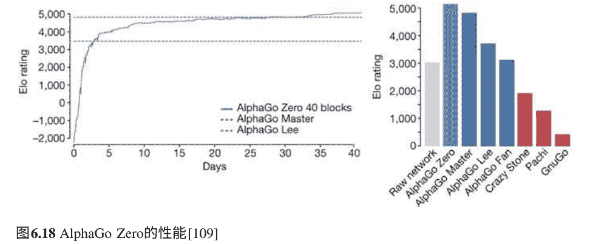

算法，没有神经网络。有一段时间，神经网络被认为在MCTS中作为值函数使用太慢，因此经常使用随机模拟，通常结合小的基于模式的启发式方法进行改进[25, 32, 43, 49, 50]。大约在2015年，一些研究人员尝试通过使用深度学习评估函数来提高MCTS的性能[4, 28, 48]。这些努力得到了Atari游戏中的强大结果的支持[76]。

AlphaGo团队也尝试使用神经网络。除了西洋双陆棋外，纯自我对弈方法并没有表现出良好的效果，AlphaGo团队明智地使用监督学习来预训练网络，使用人类大师的对局。接下来，大量的自我对弈游戏被用来进一步训练网络。总共使用了不少于三个神经网络：一个用于MCTS模拟，一个用于策略函数，一个用于价值函数[107]。

因此，原始的AlphaGo程序由三个神经网络组成，同时使用了监督学习和强化学习。图6.19中的图表展示了AlphaGo的架构。尽管这种设计在当时是有道理的，考虑到领域的最新技术水平，而且它确实成功地击败了三位最强的人类围棋选手，但管理和调整如此复杂的软件是相当困难的。AlphaGo的作者试图通过简化设计进一步提高性能。在所有这些之后，TD-gammon那种优雅的纯自我对弈设计能在围棋中复制吗？

事实上，一年后，一个仅使用强化学习的版本已经准备好了，它从零开始学习围棋，没有大师的对局，只有自我对弈，以及一个单一的神经网络[109]。令人惊讶的是，这个更简单的版本表现更强，学习更快。这个程序被称为AlphaGo Zero，因为它从零开始学习。

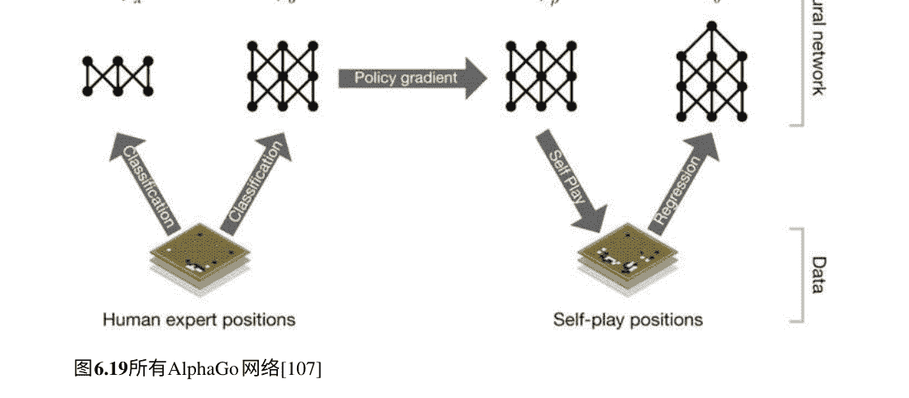

它从零开始学习，没有学习任何一场大师的对局，也没有将启发式的领域知识编码到程序中。这一全新的结果，在围棋中使用纯自我对弈设计的白板学习，激发了更多的自我对弈强化学习研究。

## 6.3.2 AlphaGo Zero性能

在他们的论文中，Silver等人[109]描述了学习在整个训练过程中的平稳进展。仅仅36小时后，AlphaGo Zero就超过了原始的AlphaGo。AlphaGo与李世石对局的训练时间是几个月。此外，AlphaGo Zero只使用了一台拥有4个张量处理单元的机器，而AlphaGo Lee则分布在许多机器上，并使用了48个TPU。15图6.18显示了AlphaGo Zero的性能。还显示了没有MCTS搜索的原始网络的性能。MCTS的重要性很大，约为2000个Elo分。16

AlphaGo Zero的强化学习真正地从零开始学习围棋知识，并且正如开发团队发现的那样，它以一种类似于人类发现游戏细节的方式进行学习。在他们的论文[109]中，他们发布了这种知识获取的进展图片（图6.20）。定石是所有围棋玩家在学习玩这个游戏时都会熟悉的标准角落开局。有初级和高级定石。在学习过程中，AlphaGo Zero确实学会了定石，并且从初级到高级逐渐学习。看到它是如何做到的很有趣，因为它展示了AlphaGo Zero围棋智能的进展。图6.20展示了程序对局中的一些序列。不要过分拟人化，但你可以看到这个小程序变得越来越聪明。

顶部一行显示了AlphaGo Zero发现的五个定石。第一个定石是围棋理论中标准初级开局之一。随着向右移动，学习了更难的定石，棋子的布局变得更加宽松。底部一行显示了在自我对弈训练的不同阶段中受欢迎的五个定石。它开始偏爱一个弱势角落着法。经过10个小时的训练，更好的3-3角落序列受到青睐。更多的训练揭示了更多、更好的变化。

AlphaGo Zero在自我对弈训练过程中发现了令人惊讶的围棋知识水平。这些知识不仅包括基本要素，还包括

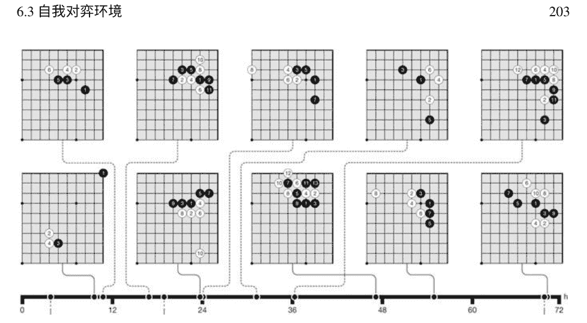

人类围棋知识以及超出传统围棋知识范围的非标准策略。

对于人类围棋选手来说，看到计算机在对局中展现出这种进步是令人瞩目的，这让他们想起了自己发现这些定式的时候。通过这样的计算机学习证据，很难不将AlphaGo Zero拟人化。

### 6.3.3 AlphaZero

AlphaGo的故事并没有在AlphaGo Zero结束。在AlphaGo Zero之后的一年，创建了一个具有不同输入和输出层的版本，学会了下国际象棋和将棋（也称为日本象棋，图6.21）。AlphaZero使用与学习围棋相同的MCTS和深度强化学习架构（唯一的区别是输入和输出层）[108]。这个新程序AlphaZero击败了最强的国际象棋和将棋程序Stockfish和Elmo。这些程序都遵循传统的启发式极小化设计，通过手工和机器学习进行优化，并在几十年的时间里通过许多启发式方法进行改进。

AlphaZero使用零知识、零大师对局和零手工制作的启发式算法，但它的棋力更强。AlphaZero的架构不仅可以实现非常强大的对局，而且还是一种通用架构，适用于三种不同的游戏。18

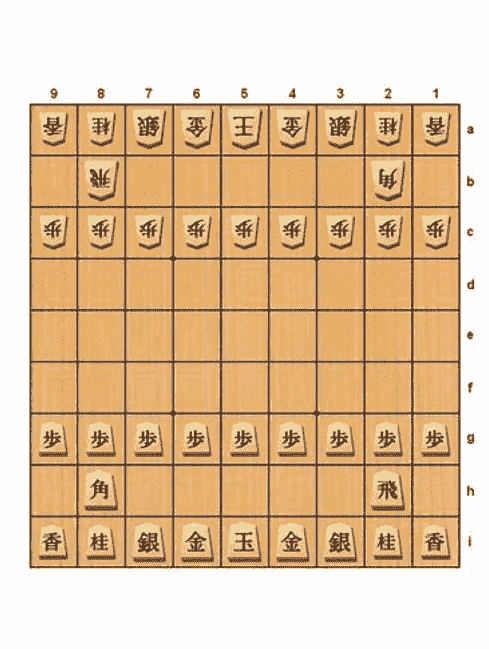

图6.21将棋棋盘

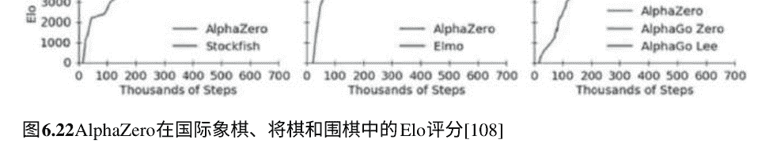

图6.22 AlphaZero在国际象棋、将棋和围棋中的Elo评分[108]

图6.22显示了AlphaZero在国际象棋、将棋和围棋中的Elo评分，[107, 109]。AlphaZero比其他程序更强大。在国际象棋中，差距最小。在这个领域，该程序受益于一个庞大的研究人员社区，他们一直致力于改进启发式算法alpha-beta的性能。对于将棋，差距更大。

### 通用游戏架构

AlphaZero可以使用相同的架构玩三种不同的游戏。这三个游戏非常不同。围棋是一种静态的策略游戏。棋子不会移动，很少被捕获。一旦下棋子，它们就具有战略重要性。在国际象棋中，棋子会移动。国际象棋是一种动态游戏，战术很重要。国际象棋还具有突然死亡的特点，可以在游戏中间通过捕获国王来发生将军。将棋更加动态，因为被捕获的棋子可以返回游戏，从而创造出更复杂的游戏动态。

**表6.3 自学习环境**

| 名称 | 类型 | 网址 | 参考 |
| :--- | :--- | :--- | :--- |
| AlphaZero 通用 | AlphaZero在Python中 | https://github.com/suragnair/alpha-zero-general | [119] |
| ELF | 游戏框架 | https://github.com/pytorch/ELF | [121] |
| Leela | AlphaZero用于国际象棋、围棋 | https://github.com/LeelaChessZero/lczero | [85] |
| 凤凰围棋 | 基于AlphaZero的围棋程序 | https://github.com/Tencent/PhoenixGo | [135] |
| PolyGames | 零学习环境 | https://github.com/facebookincubator/Polygames | [21] |

AlphaZero的架构的普适性是不容置疑的，不同战术和策略的游戏都能够成功学习。传统程序必须针对每个游戏进行有意识的开发，具有不同的搜索超参数和不同的启发式算法。然而，MCTS/ResNet自我对弈架构能够从零开始学习这三个游戏。

## 6.3.4 开放式自我对弈框架

围棋的白板学习是一个了不起的成就，激发了许多研究人员的灵感。然而，AlphaGo Zero和AlphaZero的代码并不公开。幸运的是，科学出版物[108, 109]提供了许多细节，使其他研究人员能够复现类似的结果。

表6.3总结了一些自学习环境，我们将简要讨论。

- *AOG: AlphaZero General*. Thakoor等人[119]创建了一个名为AlphaZero General (AOG)的自我对弈系统。[19]它是用Python为TensorFlow、Keras和PyTorch实现的，并且适当地缩小了规模以适应较小的计算资源。它实现了6x6的奥赛罗、井字棋、五子棋和连四等小游戏，其复杂度远低于围棋。其主要网络架构是一个四层CNN，后面跟着两个全连接层。这段代码很容易在一下午的学习中理解，并且非常适合教育目的。项目的文档提供了一些说明[119]。
- *Facebook ELF*. ELF代表可扩展轻量级框架。它是一个用C++和Python进行游戏研究的框架[121]。最初由Facebook开发用于实时策略游戏，它包括Arcade Learning Environment和Darkforest^20 Go程序[123]。ELF可以在GitHub上找到。^21 ELF还包含了自我对弈程序OpenGo [122]，这是AlphaGo Zero的重新实现（用C++编写）。
- *Leela*. AlphaZero的另一个重新实现是*Leela*。*Leela*存在国际象棋和围棋两个版本。国际象棋版本基于国际象棋引擎Sjeng。围棋^22版本基于围棋引擎*Leela*。*Leela*不附带训练好的网络权重。*Leela*的一部分是社区努力计算这些权重。
- *PhoenixGo*. *PhoenixGo*是腾讯开发的强自我对弈围棋程序[135]。它基于AlphaGo Zero的架构。^23还提供了一个经过训练的网络。
- *PolyGames*. *PolyGames* [21]是一个受AlphaGo Zero启发的零基础学习环境（MCTS与深度强化学习）。已经实现了相关的学习方法，并为Hex、Othello和Havannah编写了机器人。*PolyGames*可以在GitHub上找到。^24提供了一个游戏库，以及一个神经网络模型的检查点库。

## 6.3.5 实践：Hex in PolyGames 示例

让我们通过基于MCTS的自我对弈来获得一些实践经验。我们将使用PolyGames套件来实现Hex游戏。Hex是由Piet Hein和John Nash在1940年代独立发明的一种简单而有趣的棋盘游戏。它的简单性使得学习和玩耍变得容易，也成为数学分析的热门选择。

该游戏在一个六边形棋盘上进行，如果玩家A的移动将右侧连接到左侧，则玩家A获胜；如果顶部连接到底部，则玩家B获胜（参见图6.23；由Wikimedia提供的图像）。这里有一个简单的资源页面；关于Hex已经写了很多关于Hex的[16, 53]的详细策略和背景书籍。我们选择Hex是因为它比围棋更简单，可以让您快速掌握自我对弈学习；我们还将使用PolyGames。

点击链接^26并开始阅读GitHub上关于PolyGames的介绍。下载论文[21]并熟悉PolyGames背后的概念。克隆存储库并按照说明进行构建。

PolyGames使用PyTorch，^27所以也要安装它（按照PolyGames页面上的说明进行操作）。

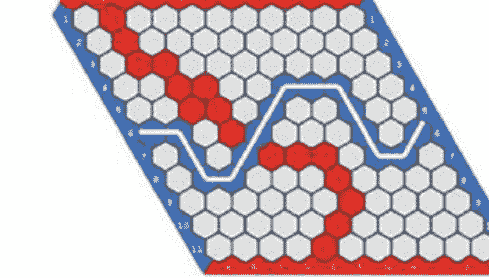

PolyGames通过pypolygames Python包进行接口交互。游戏，例如Hex，可以在src/games中找到，并且使用C++进行编码以提高速度。命令

```
pypolygames train
```

用于训练游戏和模型。命令

```
pypolygames eval
```

用于使用先前训练过的模型。命令

```
pypolygames human
```

允许人类与训练过的模型对战。类型

```
python -m pypolygames {train,eval,traineval,human} --help
```

用于每个命令的帮助 train, eval, traineval, 或者 human. 使用默认选项启动训练Hex模型的命令是

```
python -m pypolygames train --game_name="Hex"
```

尝试从库中加载预训练模型。尝试使用不同的训练选项，并尝试与刚刚训练的模型对战。当一切都正常工作时，您还可以尝试训练不同的游戏。请注意，更复杂的游戏可能需要（非常）长时间进行训练。

## 总结和进一步阅读

现在我们将总结本章并提供进一步阅读的指引。

## 总结

对于两个代理零和游戏，当转移函数由游戏规则给出时，一种特殊的强化学习变得可能。由于代理可以完美模拟对手的移动，因此可以进行准确的远期规划，从而可以学习到强大的策略。通常，第二个代理成为环境。以前，环境是静态的，但现在它们会随着代理的学习而演变，从而在代理（和环境）中创建一个良性循环，增加（人工）智能。这种自我对弈设置的承诺是在特定领域实现高水平的智能。然而，要克服不稳定性的挑战是巨大的，因为这种自我对弈结合了不同种类的不稳定学习方法。TD-Gammon和AlphaGo Zero都克服了这些挑战，我们已经详细描述了它们的方法。

自我对弈是规划、学习和自我对弈循环的结合。AlphaGo Zero中的自我对弈循环使用MCTS生成高质量的示例，用于训练神经网络。然后，这个新的神经网络在进一步的自我对弈迭代中被用来生成更困难的游戏并进一步改进网络（再次，再次，再次）。Alpha(Go) Zero从零知识开始学习，白板学习。

自我对弈利用了许多强化学习技术。为了确保稳定的学习，探索是重要的。MCTS用于深度规划。MCTS中的探索参数设置为高值，通过低学习率 $\alpha$ 实现收敛训练。由于这些超参数设置和围棋中的稀疏奖励，需要玩很多局。稳定自我对弈的计算需求很大。

AlphaGo Zero使用两个函数的函数逼近：价值和策略。策略被用于在MCTS的P-UCT选择操作中帮助指导动作选择，而价值则用于提供MCTS树叶节点的值函数，而不是随机模拟。MCTS在自我对弈环境中发生了重大变化。给MCTS起名的随机模拟已经消失了，蒙特卡洛的性能很大程度上归功于高质量的策略和价值逼近残差网络。

最初，AlphaGo程序（不是AlphaGo Zero）在强化学习之外还使用了大师级比赛的监督学习，它从大师级比赛的知识开始。接下来是AlphaGo Zero，它不使用大师级比赛或任何其他领域特定的知识。所有的学习都基于强化学习，从零知识开始自我对弈来建立对游戏的知识。第三个实验被称为AlphaZero（没有“Go”）。在这篇论文中，相同的网络架构和MCTS设计（以及相同的学习超参数）被用来学习三个游戏：国际象棋、将棋和围棋。这将AlphaZero架构呈现为一个通用的学习架构，比最好的基于alpha-beta的国际象棋和将棋程序更强大。

有趣的是，全强化学习的AlphaGo Zero架构不仅比混合监督/强化学习的AlphaGo更强大，而且速度更快：它在几天内学会了世界冠军级别的对弈，而不是几周。自我对弈由于课程学习而学得快。通过许多小步骤学习一个大问题更加高效，从易到难，然后一次性解决。课程学习对人类和人工神经网络都有效。

## 进一步阅读

人工智能的主要兴趣之一是研究智能如何从简单的基本交互中产生。在自学系统中，这是发生的[67]。

AlphaGo的工作是人工智能领域的里程碑成就。AlphaGo的主要信息来源是Silver等人的三篇AlphaGo/AlphaZero论文[107-109]。这些系统很复杂，论文及其补充方法部分也很复杂。关于AlphaGo已经有很多博客文章，更容易理解。关于AlphaGo还制作了一部电影。28YouTube上也有解释。29

关于游戏的极小极大和极小极大增强的大量文献存在；[87]中有一个概述。一本专门讲述如何构建自己的最先进的自学习围棋机器人的书是《深度学习与围棋》[90]，它是在PolyGames[21]之前出版的。

MCTS本身就是人工智能中的一个里程碑算法[17，30，61]。在MCTS的背景下，许多研究人员致力于将MCTS与学习模式相结合，特别是为了改进MCTS的随机模拟。其他的发展，如非对称和连续的MCTS，是[77，78]或者像[72]这样的并行化。

通过对大师级比赛进行监督学习，可以改进模拟和改进UCT选择。Gelly和Silver在这个领域发表了值得注意的作品[49，50，110]。Graf等人[51]在MCTS中描述了使用自适应模拟的实验。Clark和Storkey也在围棋中使用了卷积神经网络[27，28]，他们使用CNN对人类职业比赛的数据库进行监督学习，结果表明它优于GNU Go，并在与基于MCTS而没有深度学习的强大开源围棋程序Fuego [43]的对局中获胜。

Tesauro的成功激发了许多其他人尝试时序差异学习。Wiering等人[134]和Van der Ree [126]在奥赛罗和西洋双陆棋中报告了自我对弈和TD学习。程序Knightcap [9, 10]和Beal等人[11]也使用了评估函数特征上的时序差异学习。Arenz [5]将MCTS应用于国际象棋。Heinz在国际象棋中报告了自我对弈实验[56]。

自AlphaGo的结果以来，许多其他机器学习应用已经取得了成功。理论物理学[84, 95]、化学[58]和药理学都对反合成分子设计[99]和药物设计[127]感兴趣。AlphaFold是一个可以预测蛋白质结构的程序，取得了高调的成果[58, 101]。

要了解更多关于课程学习的信息，请参阅[13, 45, 69, 133]。王等人[129]研究了AlphaZero-General中双头自我对弈网络的优化目标。自我对弈的成功引起了对单智能体问题中课程学习的兴趣[38, 40, 44, 66]。Schaeffer等人[97]研究了经典单智能体搜索和双智能体搜索之间的关系。

## 练习

为了复习你对自我对弈的知识，这里有一些问题和练习。我们开始用问题来检查你对本章的理解。每个问题都是一个封闭问题，可以简单地回答一个句子。

### 问题

1. AlphaGo、AlphaGo Zero和AlphaZero之间有什么区别？
2. 什么是MCTS？
3. MCTS的四个步骤是什么？
4. UCT是什么意思？
5. 给出UCT公式。P-UCT有什么不同？
6. 描述MCTS的四个操作的功能。
7. UCT如何在探索和利用之间进行权衡？它使用哪些输入？
8. 当$C_p$很小的时候，MCTS更多地进行探索还是利用？

-   9. 对于节点扩展较少的情况，你更喜欢更多的探索还是更多的利用？
-   10. 什么是双头网络？ 它与常规的演员评论家有什么不同？
-   11. 自我对弈循环由哪三个元素组成？（你可以画个图。）
-   12. 什么是白板学习？
-   13. 白板学习如何比在大师游戏的监督学习之上的强化学习更快？
-   14. 什么是课程学习？

## 实现：新建还是撤销

你可能已经注意到，图中的极小化和MCTS伪代码缺少执行动作的实现细节，以到达后继状态。这种棋盘操作和移动制作的细节对于创建一个工作程序非常重要。

游戏程序通常使用当前棋盘状态调用搜索例程，通常用参数 n 表示新节点。这个棋盘可以在每个搜索节点中重新创建和分配，以值传递的方式（局部变量）。另一种选择是传递对棋盘的引用，并在递归调用之前在棋盘上执行 makemove 操作，将棋子放在棋盘上，并在递归调用返回时执行 undomove 操作将棋子从棋盘上移除（全局变量）。如果为新棋盘分配内存是一项昂贵的操作，这种引用传递的方式可能更快。这也可能更难正确实现，因为在代码的所有相关位置上必须严格遵循makemove/undomove协议。如果捕获移动导致棋盘发生许多变化，则必须记住这些变化以供后续撤销操作使用。

对于共享内存中的并行实现，至少所有并行线程必须拥有自己的值传递风格的棋盘副本。（在分布式内存集群上，通过分布式内存，各个独立的机器将拥有自己的棋盘副本。）

## 练习

对于编程练习，我们使用PolyGames。请参阅上一节以了解如何安装PolyGames。如果训练时间很长，请考虑使用Polygames和Pytorch的GPU支持。

-   1. Hex：安装PolyGames并使用自我对弈训练Hex玩家。尝试不同的棋盘尺寸。保持训练时间恒定，并绘制一张图表，对比对弈强度与棋盘尺寸。你是否看到明显的相关性，即程序在较小的棋盘上更强大？
-   2. 可视化：安装可视化支持 torchviz。使用 draw_model脚本可视化训练过程。
-   3. 超参数：使用不同的模型，并尝试PolyGames文档中指定的不同超参数。
-   4. MCTS：对训练好的Hex模型与纯MCTS玩家进行评估比赛。请参考下面的提示来进行移动和撤销移动。在合理的搜索时间内，MCTS能够搜索多少个节点？将MCTS Hex玩家与自我对弈玩家进行比较。需要玩多少局游戏才能得到统计上显著的结果？随机种子是随机的还是固定的？MCTS和训练好的Hex哪个更强？

## 参考文献

-   1. Abbas Abdolmaleki, Jost Tobias Springenberg, Yuval Tassa, Remi Munos, Nicolas Heess, and Martin Riedmiller. 最大后验策略优化. arXiv预印本 arXiv:1806.06920, 2018. 192
-   2. Bruce Abramson. 预期结果：静态评估的通用模型. IEEE模式分析与机器智能交易, 12 (2):182–193, 1990. 185
-   3. 匿名. Go AI实力与时间的关系. Reddit帖子, 2017. 176
-   4. Thomas Anthony, Zheng Tian, 和 David Barber. 用深度学习和树搜索来思考快和慢. 在Advances in Neural Information Processing Systems, 第5360–5370页, 2017. 201
-   5. Oleg Arenz. 蒙特卡洛国际象棋. 硕士论文, Universität Darmstadt, 2012. 210
-   6. Peter Auer. 使用置信区间进行开发-探索权衡. Journal of Machine Learning Research, 3(Nov):397–422, 2002. 191
-   7. Peter Auer, Nicolo Cesa-Bianchi, 和 Paul Fischer. 多臂赌博机问题的有限时间分析. Machine Learning, 47(2–3):235–256, 2002. 192
-   8. Peter Auer 和 Ronald Ortner. UCB重访: 针对随机多臂赌博机问题的改进遗憾界. Periodica Mathematica Hungarica, 61(1–2):55–65, 2010. 191
-   9. Jonathan Baxter, Andrew Tridgell, 和 Lex Weaver. Knightcap: 一个通过结合TD (λ)和游戏树搜索来学习的国际象棋程序. arXiv预印本 cs/9901002, 1999. 210
-   10. Jonathan Baxter, Andrew Tridgell, 和 Lex Weaver. 使用时序差异学习下国际象棋. Machine Learning, 40(3):243–263, 2000. 185, 210
-   11. Don Beal 和 Martin C. Smith. 启发式搜索和游戏的时序差异学习. 信息科学, 122(1): 3-21, 2000. 210
-   12. Laurens Beljaards. 用于抽象策略游戏Tak的AI代理. 硕士论文, 莱顿大学, 2017. 186
-   13. Yoshua Bengio, Jérôme Louradour, Ronan Collobert 和 Jason Weston. 课程学习. 在第26届国际机器学习年会论文集中, 第41-48页, 2009. 198, 210
-   14. Darse Billings, Denis Papp, Jonathan Schaeffer 和 Duane Szafron. 扑克中的对手建模. AAAI/IAAI, 493: 499, 1998. 183
-   15. Bruno Bouzy 和 Bernard Helmstetter. 蒙特卡罗围棋发展. 在计算机游戏的进展中, 第159-174页. Springer, 2004. 185, 188
-   16. Cameron Browne. Hex Strategy. AK Peters/CRC Press, 2000. 206
-   17. Cameron B Browne, Edward Powley, Daniel Whitehouse, Simon M Lucas, Peter I Cowling, Philipp Rohlfshagen, Stephen Tavener, Diego Perez, Spyridon Samothrakis, 和 Simon Colton. 蒙特卡洛树搜索方法综述. *IEEE Transactions on Computational Intelligence and AI in Games*, 4(1):1–43, 2012. 186, 187, 188, 188, 189, 190, 190, 192, 192, 192, 209
-   18. Bernd Brägmänn. 蒙特卡洛围棋. 技术报告, 雪城大学, 1993. 185, 188
-   19. Andres Campero, Roberta Raileanu, Heinrich Küttler, Joshua B Tenenbaum, Tim Rocktäschel, 和 Edward Grefenstette. 使用AMIGo进行学习: 对抗性动机的内在目标. 在国际学习表示会议, 2020. 198
-   20. Tristan Cazenave. 用于计算机围棋的残差网络. *IEEE Transactions on Games*, 10(1):107–110, 2018. 194
-   21. Tristan Cazenave, Yen-Chi Chen, Guan-Wei Chen, Shi-Yu Chen, Xian-Dong Chiu, Julien Dehos, Maria Elsa, Qucheng Gong, Hengyuan Hu, Vasil Khalidov, Cheng-Ling Li, Hsin-I Lin, Yu-Jin Lin, Xavier Martinet, Vegard Mella, Jérémy Rapin, Baptiste Rozière, Gabriel Synnaeve, Fabien Teytaud, Olivier Teytaud, Shi-Cheng Ye, Yi-Jun Ye, Shi-Jim Yen, and Sergey Zagoruyko. Polygames: Improved zero learning. arXiv预印本 arXiv:2001.09832, 2020. 205, 206, 206, 209
-   22. Tristan Cazenave 和 Bernard Helmstetter. 在围棋游戏中结合战术搜索和蒙特卡罗. 在2005年IEEE计算智能和游戏研讨会 (CIG05) 论文中, 第5卷, 第171-175页, 2005. 192
-   23. Hyeong Soo Chang, Michael C Fu, Jiaqiao Hu, 和 Steven I Marcus. 用于解决马尔可夫决策过程的自适应采样算法. *Operations Research*, 53(1):126–139, 2005. 192
-   24. Guillaume Chaslot. 蒙特卡洛树搜索. 博士论文, 马斯特里赫特大学, 2010. 188
-   25. Guillaume Chaslot, Sander Bakkes, Istvan Szita, 和 Pieter Spronck. 蒙特卡洛树搜索: 一个新的游戏AI框架. 在 *AIIDE*, 2008. 192, 201
-   26. Maxime Chevalier-Boisvert, Lucas Willems, 和 Sumans Pal. 用于OpenAI Gym的极简网格世界环境 https://github.com/maximecb/gym-minigrid, 2018. 199
-   27. Christopher Clark 和 Amos Storkey. 教授深度卷积神经网络玩Go. arXiv预印本 arXiv:1412.3409, 1, 2014. 210
-   28. Christopher Clark 和 Amos Storkey. 训练深度卷积神经网络玩Go. 在国际机器学习会议, 第1766-1774页, 2015. 201, 210
-   29. Karl Cobbe, Chris Hesse, Jacob Hilton 和 John Schulman. 利用程序生成来评估强化学习. 在国际机器学习会议, 第2048-2056页. *PMLR*, 2020. 199
-   30. Rémi Coulom. 在蒙特卡洛树搜索中的高效选择性和备份操作. 在国际计算机与游戏会议, 第72-83页. Springer, 2006. 186, 192, 209
-   31. Rémi Coulom. 在Crazy Stone中的蒙特卡洛树搜索. 在游戏编程研讨会论文集, 日本东京, 第74-75页, 2007. 188
-   32. Rémi Coulom. 蒙特卡洛在围棋中的革命. 在法日科学前沿研讨会 (JFFoS 2008), 罗斯科夫, 法国, 2009. 192, 201
-   33. Joseph C Culberson 和 Jonathan Schaeffer. 模式数据库. 计算智能, 14(3):318–334, 1998. 188
-   34. Wojciech Marian Czarnecki, Gauthier Gidel, Brendan Tracey, Karl Tuyls, Shayegan Omidshafiei, David Balduzzi, 和 Max Jaderberg. 现实世界的游戏看起来像陀螺. 在神经信息处理系统进展, 2020. 173
-   35. Kamil Czarnecki. 蒙特卡洛树搜索入门指南 https://int8.io/monte-carlo-tree-search-beginners-guide/, 2018. 189, 190
-   36. Shubhomoy Das, Weng-Keen Wong, Thomas Dietterich, Alan Fern 和 Andrew Emmott. 将专家反馈纳入主动异常发现. 在2016年IEEE第16届数据挖掘国际会议 (*ICDM*), 第853-858页. IEEE, 2016. 199
-   37. Dave De Jonge, Tim Baarslag, Reyhan Aydo˜gan, Catholijn Jonker, Katsuhide Fujita 和 Takayuki Ito. 外交游戏中的谈判挑战. 在国际协议技术会议, 第100-114页. Springer, 2018. 173
-   38. Thang Doan, Joao Monteiro, Isabela Albuquerque, Bogdan Mazoure, Audrey Durand, Joelle Pineau 和 R Devon Hjelm. 在线自适应课程学习用于GANs. 在人工智能AAAI会议论文集, 卷33, 第3470-3477页, 2019. 199, 210
-   39. Christian Donninger. 空着棋步和深度搜索. ICGA Journal, 16(3):137–143, 1993. 185
-   40. Yan Duan, John Schulman, Xi Chen, Peter L Bartlett, Ilya Sutskever, 和 Pieter Abbeel. RL²: 通过慢强化学习实现快速强化学习. arXiv预印本arXiv:1611.02779, 2016. 210
-   41. Jeffrey L Elman. 神经网络中的学习和发展：开始小的重要性. Cognition, 48(1):71–99, 1993. 198
-   42. Arpad E Elo. 国际象棋选手的评级，过去和现在. Arco Pub., 1978. 202
-   43. Markus Enzenberger, Martin Müller, Broderick Arneson, 和 Richard Segal. Fuego——一个基于蒙特卡洛树搜索的开源框架，用于棋盘游戏和围棋引擎. IEEE计算智能与人工智能在游戏中的交易, 2(4):259–270, 2010. 201, 210
-   44. 冯蝶桥, 卡拉P戈梅斯 和 巴特塞尔曼. 使用课程驱动的深度强化学习解决困难的AI规划实例. arXiv预印本arXiv:2006.02689, 2020. 199, 199, 210
-   45. Carlos Florensa, David Held, Xinyang Geng 和 Pieter Abbeel. 用于强化学习代理的自动生成目标. 在国际机器学习会议, 页1515–1528. PMLR, 2018. 199, 210
-   46. David B Fogel, Timothy J Hays, Sarah L Hahn 和 James Quon. 自学习国际象棋程序的进一步演化. 在计算智能游戏中, 2005. 185
-   47. Sam Ganzfried 和 Tuomas Sandholm. 基于博弈论的大规模不完全信息游戏对手建模. 在第10届自主代理和多代理系统国际会议, 卷2, 页533–540, 2011. 183
-   48. Sylvain Gelly, Levente Kocsis, Marc Schoenauer, Michele Sebag, David Silver, Csaba Szepesvári, and Olivier Teytaud. 计算机围棋的重大挑战: 蒙特卡洛树搜索和扩展. ACM通信, 55(3): 106–113, 2012. 201
-   49. Sylvain Gelly 和 David Silver. 在9 ×9计算机围棋中实现大师级别的游戏. 在 AAAI, 卷8, 页1537–1540, 2008. 201, 210
-   50. Sylvain Gelly, Yizao Wang 和 Olivier Teytaud. 在蒙特卡洛围棋中使用模式的UCT修改. 技术报告RR-6062, INRIA, 2006. 188, 201, 210
-   51. Tobias Graf 和 Marco Plätzner. 在蒙特卡洛树搜索中使用策略-梯度强化学习的自适应模拟. 在计算机游戏进展, 页1–11. Springer, 2015. 210
-   52. Jean-Bastien Grill, Florent Altché, Yunhao Tang, Thomas Hubert, Michal Valko, Ioannis Antonoglou 和 Rémi Munos. 蒙特卡洛树搜索作为正则化策略优化. 在国际机器学习会议, 第3769-3778页. PMLR, 2020. 192
-   53. Ryan B Hayward 和 Bjarne Toft. Hex: The Full Story. CRC Press, 2019. 206
-   54. He He, Jordan Boyd-Graber, Kevin Kwok 和 Hal Daum III. 对手建模在深度强化学习中. 在国际机器学习会议, 第1804-1813页. PMLR, 2016. 183
-   55. Kaiming He, Xiangyu Zhang, Shaoqing Ren 和 Jian Sun. 深度残差学习用于图像识别. 在IEEE计算机视觉和模式识别会议, 第770-778页, 2016. 194
-   56. Ernst A Heinz. 计算机国际象棋中的新自我对弈结果. 在国际计算机与游戏会议上, 第262-276页. Springer, 2000. 210
-   57. Athul Paul Jacob, David J Wu, Gabriele Farina, Adam Lerer, Anton Bakhtin, Jacob Andreas, 和 Noam Brown. 使用KL正则化搜索建模强大且类似于人类的游戏玩法. arXiv预印本arXiv:2112.07544, 2021. 192
-   58. John Jumper, Richard Evans, Alexander Pritzel, Tim Green, Michael Figurnov, Olaf Ronneberger, Kathryn Tunyasuvunakool, Russ Bates, Augustin Šenk, Anna Potapenko, Alex Bridgland, Clemens Meyer, Simon A. A. Kohl, Andrew J. Ballard, Andrew Cowie, Bernardino Romera-Paredes, Stanislav Nikolov, Rishub Jain, Jonas Adler, Trevor Back, Stig Petersen, David Reiman, Ellen Clancy, Michal Zielinski, Martin Steinegger, Michalina Pacholska, Tamas Berghammer, Sebastian Bodenstein, David Silver, Oriol Vinyals, Andrew W. Senior, Koray Kavukcuoglu, Pushmeet Kohli 和 Demis Hassabis. AlphaFold高度准确的蛋白质结构预测. 自然, 596(7873):583-589, 2021. 210
-   59. Niels Justesen, Ruben Rodriguez Torrado, Philip Bontrager, Ahmed Khalifa, Julian Togelius, 和 Sebastian Risi. 通过过程级别生成照亮深度强化学习中的泛化. arXiv预印本arXiv:1806.10729, 2018. 199
-   60. Donald E Knuth 和 Ronald W Moore. Alpha-beta剪枝的分析. 人工智能, 6(4):293–326, 1975. 173, 184, 185
-   61. Levente Kocsis 和 Csaba Szepesvári. 基于赌徒的蒙特卡洛规划. 在欧洲机器学习会议, 页码282–293. Springer, 2006. 186, 188, 190, 209
-   62. Richard E Korf. 深度优先迭代加深:一种最优可接受的树搜索. 人工智能. 27(1):97–109, 1985. 185
-   63. Sarit Kraus, Eithan Ephrati 和 Daniel Lehmann. 在非合作环境中的谈判. 《实验与理论人工智能杂志》, 3(4): 255–281, 1994. 173
-   64. Kai A Krueger 和 Peter Dayan. 灵活塑造: 学习小步骤如何帮助. 《认知》, 110(3): 380–394, 2009. 198
-   65. Jan Kuipers, Aske Plaat, Jos AM Vermaseren 和 H Jaap van den Herik. 改进多变量霍纳方案与蒙特卡洛树搜索. 《计算物理学通讯》, 184(11): 2391–2395, 2013. 192, 192
-   66. Alexandre Laterre, Yunguan Fu, Mohamed Khalil Jabri, Alain-Sam Cohen, David Kas, Karl Hajjar, Torbjorn S Dahl, Amine Kerkenn 和 Karim Beguir. 排名为奖励: 为组合优化启用自我对弈强化学习. arXiv预印本arXiv:1807.01672, 2018. 199, 199, 210
-   67. Joel Z Leibo, Edward Hughes, Marc Lanctot 和 Thore Graepel. 自动课程和社交互动中创新的出现: 多智能体智能研究宣言. arXiv预印本arXiv:1903.00742, 2019. 209
-   68. Diego Pérez Liñán, Simon M Lucas, Raluca D Gaina, Julian Togelius, Ahmed Khalifa 和 Jialin Liu. 通用视频游戏人工智能. 游戏和计算智能综合讲座, 3(2): 1-191, 2019. 199
-   69. Tambet Matiisen, Avital Oliver, Taco Cohen 和 John Schulman. 教师-学生课程学习. IEEE Trans. Neural Networks Learn. Syst., 31(9): 3732-3740, 2020. 210
-   70. Kiminori Matsuzaki. 对不同质量的评估函数的PUCT算法的实证分析. 在2018年人工智能技术和应用会议（TAAI）中, 第142-147页. IEEE, 2018. 191, 191
-   71. Jonathan K Millen. 编程围棋. Byte Magazine, 1981. 175
-   72. S Ali Mirsoleimani, Aske Plaat, Jaap Van Den Herik 和 Jos Vermaseren. 在Intel Xeon Phi上扩展蒙特卡洛树搜索. 在并行和分布式系统（ICPADS），2015年IEEE第21届国际会议上, 第666-673页. IEEE, 2015. 209
-   73. Tom M Mitchell. 学习概括的需求. 技术报告CBM-TR-117，计算机科学系，罗格斯大学, 1980. 199
-   74. Tom M Mitchell. 机器学习的学科. CMU-ML-06-108技术报告，卡内基梅隆大学，计算机科学学院，机器学习, 2006. 199
-   75. Volodymyr Mnih, Koray Kavukcuoglu, David Silver, Alex Graves, Ioannis Antonoglou, Daan Wierstra 和 Martin Riedmiller. 使用深度强化学习玩Atari游戏. arXiv预印本arXiv:1312.5602, 2013. 172
-   76. Volodymyr Mnih, Koray Kavukcuoglu, David Silver, Andrei A. Rusu, Joel Veness, Marc G. Bellemare, Alex Graves, Martin A. Riedmiller, Andreas Fidjeland, Georg Ostrovski, Stig Petersen, Charles Beattie, Amir Sadik, Ioannis Antonoglou, Helen King, Dharshan Kumaran,## 第7章 多智能体强化学习

Daan Wierstra, Shane Legg 和 Demis Hassabis. 通过深度强化学习实现人类水平控制. Nature, 518(7540): 529-533, 2015.

- 77. Thomas M. Moerland, Joost Broekens, Aske Plaat 和 Catholijn M. Jonker. A0C: 连续动作空间中的Alpha Zero. arXiv预印本 arXiv:1805.09613, 2018. 191, 191, 209
- 78. Thomas M. Moerland, Joost Broekens, Aske Plaat 和 Catholijn M. Jonker. 用于非对称树的蒙特卡洛树搜索. arXiv预印本 arXiv:1805.09278, 2018. 209
- 79. Mathis Müller-Brockhausen, Mike Preuss 和 Aske Plaat. 程序化内容生成: 转移强化学习的更好基准. 在游戏会议, 2021. 198
- 80. Sanmit Narvekar, Bei Peng, Matteo Leonetti, Jivko Sinapov, Matthew E. Taylor 和 Peter Stone. 强化学习领域的课程学习: 框架和调查.
- 81. 余那苏. 用于计算将棋的高效可更新神经网络评估函数. 第28届世界计算机将棋锦标赛申诉文件, 2018, 185
- 82. Frans A. Oliehoek 和 Christopher Amato. 分散式部分可观察马尔可夫决策过程简明介绍. Springer, 2016, 173
- 83. Pierre-Yves Oudeyer, Frederic Kaplan 和 Verena V. Hafner. 用于自主心智发展的内在动机系统. IEEE进化计算交易, 11(2):265–286, 2007, 198
- 84. Giuseppe Davide Paparo, Vedran Dunjko, Adi Makmal, Miguel Angel Martin-Delgado 和 Hans J. Briegel. 量子加速主动学习代理. Physical Review X, 4(3):031002, 2014, 210
- 85. Gian-Carlo Pascutto. Leela zero. https://github.com/leela-zero/leela-zero, 2017. 205
- 86. Judea Pearl. 启发式: 用于计算问题求解的智能搜索策略. Addison-Wesley, Reading, MA, 1984. 184
- 87. Aske Plaat. 学习玩耍: 强化学习与游戏. Springer Verlag, Heidelberg, https://learningtoplay.net, 2020. 183, 184, 185, 209
- 88. Aske Plaat, Jonathan Schaeffer, Wim Pijls, 和 Arie De Bruin. 最佳优先固定深度极小化算法. Artificial Intelligence, 87(1-2):255–293, 1996. 185
- 89. Aditya Prasad. 从实现AlphaZero中学到的经验. https://medium.com/oracledevs/lessons-from-implementing-alphazero-7e36e9054191, 2018. 195
- 90. Max Pumperla 和 Kevin Ferguson. 深度学习与围棋. Manning, 2019. 209
- 91. J. Ross Quinlan. 学习高效分类程序及其在国际象棋残局中的应用. 在机器学习中, 第463-482页. Springer, 1983. 185
- 92. Roberta Raileanu 和 Tim Rocktäschel. RIDE: 奖励驱动的探索在程序生成环境中. 在国际学习代表大会, 2020. 199
- 93. Christopher D. Rosin. 具有情节上下文的多臂赌博机. 数学和人工智能的年鉴, 61(3):203-230, 2011. 191, 191
- 94. Neil Rubens, Mehdi Elahi, Masashi Sugiyama 和 Dain Kaplan. 推荐系统中的主动学习. 在推荐系统手册中, 第809-846页. Springer, 2015. 199
- 95. Ben Ruijl, Jos Vermaseren, Aske Plaat 和 Jaap van den Herik. HEPGAME和表达式的简化. arXiv预印本 arXiv:1405.6369, 2014. 210
- 96. Steve Schaefer. 数学娱乐. http://www.mathrec.org/old/2002jan/solutions.html, 2002. 174
- 97. Jonathan Schaeffer, Aske Plaat, 和 Andreas Junghanns. 统一单智能体和双人对战搜索. 信息科学, 135(3-4):151–175, 2001. 210
- 98. Jürgen Schmidhuber. 好奇的模型构建控制系统. 在国际神经网络联合会议, 页码1458–1463, 1991. 197
- 99. Marwin H.S. Segler, Mike Preuss, 和 Mark P. Waller. 使用深度神经网络和符号人工智能进行化学合成规划. Nature, 555(7698):604, 2018. 210
- 100. Oliver G. Selfridge, Richard S. Sutton, 和 Andrew G. Barto. 机器人的训练和跟踪. 在国际人工智能联合会议, 页码670–672, 1985. 197
- 101. Andrew W. Senior, Richard Evans, John Jumper, James Kirkpatrick, Laurent Sifre, Tim Green, Chongli Qin, Augustin Žídek, Alexander W. R. Nelson, Alex Bridgland, Hugo Penedones, Stig Petersen, Karen Simonyan, Steve Crossan, Pushmeet Kohli, David T. Jones, David Silver, Koray Kavukcuoglu, 和 Demis Hassabis. 使用深度学习的蛋白质结构预测改进. Nature, 577(7792):706–710, 2020. 210
- 102. Burr Settles. 主动学习文献综述. 技术报告, 威斯康星大学-麦迪逊计算机科学系, 2009. 199
- 103. Noor Shaker, Julian Togelius, 和 Mark J. Nelson. 游戏中的程序化内容生成. Springer, 2016. 198
- 104. Guy Shani, Joelle Pineau, 和 Robert Kaplow. 基于点的POMDP求解器综述. 自主代理和多代理系统, 27(1):1–51, 2013. 173
- 105. Claude E. Shannon. 编程计算机下棋. 在计算机国际象棋综合, 第2-13页. Springer, 1988. 174
- 106. David Silver. 强化学习和基于模拟的围棋搜索. 博士论文, 阿尔伯塔大学, 2009. 188
- 107. David Silver, Aja Huang, Chris J. Maddison, Arthur Guez, Laurent Sifre, George van den Driessche, Julian Schrittwieser, Ioannis Antonoglou, Veda Panneershelvam, Marc Lanctot, Sander Dieleman, Dominik Grewe, John Nham, Nal Kalchbrenner, Ilya Sutskever, Timothy Lillicrap, Madeleine Leach, Koray Kavukcuoglu, Thore Graepel, 和 Demis Hassabis. 用深度神经网络和树搜索掌握围棋游戏. Nature, 529(7587):484, 2016. 172, 194, 196, 200, 201, 201, 204, 209
- 108. David Silver, Thomas Hubert, Julian Schrittwieser, Ioannis Antonoglou, Matthew Lai, Arthur Guez, Marc Lanctot, Laurent Sifre, Dharshan Kumaran, Thore Graepel, Timothy Lillicrap, Karen Simonyan, 和 Demis Hassabis. 通过自我对弈掌握国际象棋、将棋和围棋的通用强化学习算法. Science, 362(6419):1140–1144, 2018. 200, 203, 204, 205
- 109. David Silver, Julian Schrittwieser, Karen Simonyan, Ioannis Antonoglou, Aja Huang, Arthur Guez, Thomas Hubert, Lucas Baker, Matthew Lai, Adrian Bolton, Yutian Chen, Timothy Lillicrap, Fan Hui, Laurent Sifre, George van den Driessche, Thore Graepel, 和 Demis Hassabis. 在没有人类知识的情况下掌握围棋. Nature, 550(7676):354, 2017. 172, 191, 193, 194, 194, 195, 195, 196, 200, 200, 201, 202, 202, 203, 204, 205, 209
- 110. David Silver, Richard S. Sutton, 和 Martin Müller. 在国际人工智能联合会议上学习围棋中的局部形状的强化学习. 在国际人工智能联合会议, 卷7, 页1053–1058, 2007. 210
- 111. David J. Slate 和 Lawrence R. Atkin. Chess 4.5 - 西北大学国际象棋程序. 在 Chess skill in Man and Machine, 页码82-118. Springer, 1983. 185
- 112. Gillian Smith. 程序内容生成的类比历史. 在 Foundations of Digital Games, 2015. 198
- 113. Darin Straus. Alphazero实现和教程. https://towardsdatascience.com/alphazero-implementation-and-tutorial-f4324d65fdfc, 2018. 195
- 114. Richard S. Sutton 和 Andrew G. Barto. 强化学习, 第二版. MIT Press, 2018. 191
- 115. Gerald Tesauro. Neurogammon赢得计算机奥林匹克. 神经计算, 1(3):321–323, 1989. 171
- 116. Gerald Tesauro. TD-gammon: 一种自学习的黑白棋程序. 在 Applications of Neural Networks, 页码267-285. Springer, 1995. 200
- 117. Gerald Tesauro. 时间差分学习和TD-Gammon. ACM通讯, 38(3):58–68, 1995. 172
- 118. Gerald Tesauro. 使用自学习神经网络编程的双陆棋. 人工智能, 134(1-2):181–199, 2002. 172
- 119. Shantanu Thakoor, Surag Nair 和 Megha Jhunjhunwala. 在没有人类知识的情况下学习下棋. Stanford University CS238最终项目报告, 2017. 195, 205, 205, 205
- 120. Sebastian Thrun. 学习下棋. 在神经信息处理进展中, 页码1069–1076, 1995. 185
- 121. Yuandong Tian, Qucheng Gong, Wenling Shang, Yuxin Wu 和 C. Lawrence Zitnick. ELF: 一个广泛、轻量级和灵活的实时策略游戏研究平台. 在神经信息处理进展中, 页码2659–2699, 2017. 195, 205, 205
- 122. 田源东, 马杰瑞, 龚曲成, 森格普塔舒博, 陈卓远, 和 C. 劳伦斯·齐特尼克. ELF OpenGo. https://github.com/pytorch/ELF, 2018. 206
- 123. 田源东 和 朱燕. 具有神经网络和长期预测的更好的计算机棋选手. 在国际学习表示会议, 2016. 206
- 124. 朱利安·托格利乌斯, 亚历克斯·J·尚帕德, 皮尔·卢卡·兰齐, 迈克尔·马特亚斯, 安娜·帕伊瓦, 迈克·普鲁斯 和 肯尼斯·O·斯坦利. 程序内容生成: 目标, 挑战和可行的步骤. 在人工和计算智能游戏中. Schloss Dagstuhl - Leibniz-Zentrum für Informatik, 2013. 198
- 125. 阿兰·M·图灵. 应用于游戏的数字计算机. 皮特曼和儿子, 1953. 174, 183, 183, 185
- 126. Michiel Van Der Ree 和 Marco Wiering. 在奥赛罗游戏中的强化学习: 与固定对手学习和自我对弈学习. 在IEEE自适应动态规划和强化学习, 第108-115页. IEEE, 2013. 210
- 127. Gerard J.P. Van Westen, Jörg K. Wegner, Peggy Geluykens, Leen Kwanten, Inge Vereycken, Anik Peeters, Adriaan P. IJzerman, Herman W.T. van Vlijmen 和 Andreas Bender. 在引导优化中选择哪种化合物? 前瞻性验证的蛋白质化学计量模型指导临床前开发. PloS One, 6(11):e27518, 2011. 210
- 128. Jos A.M. Vermaseren. 表格的新特性. arXiv预印本 math-ph/0010025, 2000. 191
- 129. Hui Wang, Michael Emmerich, Mike Preuss 和 Aske Plaat. AlphaZero类自我对弈中的替代损失函数. 在2019年IEEE计算智能 (SSCI), 第155-162页, 2019. 194, 210
- 130. Hui Wang, Mike Preuss, Michael Emmerich, 和 Aske Plaat. 使用类似AlphaZero的排名奖励强化学习解决Morpion Solitaire问题. 在第22届国际符号和数值算法研讨会 (SYNASC 2020), 罗马尼亚蒂米什瓦拉, 2020. 199
- 131. Panqu Wang 和 Garrison W. Cottrell. 基本级别分类有助于视觉对象识别. arXiv预印本 arXiv:1511.04103, 2015. 199
- 132. Daphna Weinshall, Gad Cohen 和 Dan Amir. 通过迁移学习进行课程学习: 理论和深度网络实验. 在国际机器学习会议上, 页码5235-5243, 2018. 198, 198, 198
- 133. Lilian Weng. 强化学习课程. https://lilianweng.github.io/lil-log/2020/01/29/curriculum-for-reinforcement-learning.html. Lil'Log, 2020年1月. 199, 210
- 134. Marco A. Wiering. 使用自对弈和专家来学习使用时序差异学习玩backgammon. JLSA, 2(2):57-68, 2010. 210
- 135. 曾钦松, 张建昌, 曾占鹏, 李永胜, 陈明, 刘思凡. PhoenixGo. https://github.com/Tencent/PhoenixGo, 2018. 195, 205, 206

在这个星球上，我们的社会中，数百万人生活和工作在一起。每个人都有自己独特的目标，并根据自己的行动来实现。其中一些目标是共享的。当我们想要实现共同的目标时，我们会组织成团队、群体、公司、组织和社会。在许多智能物种中，如人类、哺乳动物、鸟类、昆虫，这种组织形式产生了令人印象深刻的集体智慧 [75, 135, 177]。我们作为个体在学习，我们作为群体在学习。这种情况在多智能体学习中得到了研究：通过他们独立的行动，智能体学会与其他智能体互动、竞争和合作，并形成群体。

强化学习的大部分研究都集中在单智能体问题上。在许多领域取得了进展，例如路径规划、机器人运动和视频游戏。此外，还进行了双智能体问题的研究，例如竞争性双人棋类游戏。单智能体和双智能体问题都是优化问题。目标是找到具有最高奖励、最短路径和最佳移动和对策的策略。基本设置是在面对自然逆境或竞争对手时进行奖励优化，由环境建模。

随着我们越来越接近对现实世界问题进行建模，我们遇到了另一种顺序决策问题的类别，即多智能体决策问题。多智能体决策是一个困难的问题。

具有相同目标的智能体可能会合作，并找到一个对自己或团体来说具有最高奖励的策略，可能包括与其他智能体实现双赢解决方案。联盟形成和勾结是多智能体强化学习领域的一个重要组成部分。

在现实世界的决策过程中，竞争和合作都很重要。如果我们希望我们的代理在多个代理的环境中表现得更加真实，那么他们应该理解合作以便表现出色。

从计算的角度来看，研究群体行为和集体智能的出现是具有挑战性的：代理的环境包括许多其他代理；目标可能会移动，需要建模许多交互才能理解，并且要优化的世界不断变化。长期以来，计算能力的不足一直制约着多智能体强化学习的实验研究。计算能力的最近增长和深度强化学习方法的进步正在逐渐取得进展。

已经进行实验研究的多智能体决策问题包括桥牌、扑克、外交、星际争霸、捉迷藏和夺旗等游戏。在很大程度上，多智能体强化学习的算法仍在不断发展中。本章充满了挑战和发展。

我们将从回顾理论框架并定义多智能体问题开始。我们将更深入地研究合作和竞争，并介绍随机博弈、广义博弈和纳什均衡与帕累托最优性。我们将讨论基于群体的方法和多人团队中的课程学习。接下来，我们将讨论可以用于测试多智能体强化学习方法的环境，如扑克和星际争霸。在这些游戏中，团队结构通常起着重要作用。下一章将讨论层次方法，这些方法可以用来建模团队结构。

本章像往常一样以练习、总结和进一步阅读的指引结束。

## 核心概念

- 竞争
- 合作
- 团队学习

## 核心问题

- 寻找大规模竞争和合作多智能体问题的高效方法

## 核心算法

- 反事实遗憾最小化（第7.2.1节）
- 基于群体的算法（第7.2.3.1节）

## 自动驾驶汽车

为了说明多智能体决策制定的关键组成部分，让我们假设一辆自动驾驶汽车正在前往超市的路上，并且正在接近一个十字路口。它应该采取什么行动？对于汽车来说，什么是最好的结果？对于其他智能体呢？对于社会来说呢？汽车的目标是安全地离开十字路口并到达目的地。可能的决策包括直行或左转或右转进入另一条车道。所有这些行动都包含子决策。在每个时间步骤中，汽车可以通过转向、加速和刹车来移动。汽车必须能够检测到物体，例如交通灯、车道标线和其他车辆。此外，我们的目标是找到一种策略，可以控制汽车进行一系列的操纵以实现目标。在这样的决策制定环境中，还存在两个额外的挑战。

第一个挑战是我们应该能够预测其他代理的行动。在决策过程中，每个时间步，机器人车辆不仅应该考虑自己当前行动的即时价值，还应该适应其他代理的行动后果。（例如，选择一个一开始看起来安全的方向，坚持不变，并且不根据新信息进行策略调整，比如一辆车朝我们驶来。）第二个挑战是这些其他代理可能会预测我们的代理选择他们的行动。我们的代理需要在自己的策略中考虑到他们的预测行为-在策略层面上进行递归。例如，人类驾驶员经常预测其他车辆的可能移动，然后采取相应的行动（例如让路或者在并入另一个车道时加速）。

多智能体强化学习解决了多个自主代理在共同的随机环境中进行顺序决策的问题，每个代理通过与环境和其他代理的交互来最大化自己的长期奖励。多智能体强化学习结合了多智能体系统[137, 176]和强化学习的领域。

### 7.1 多智能体问题

近年来，我们已经看到了单智能体强化学习取得了令人印象深刻的成果。此外，在诸如围棋和扑克以及自动驾驶等游戏中取得了重要的成果。这些应用领域涉及

> 人类驾驶员对其他驾驶员有一种心理理论。心理理论和相关概念如镜像神经元[56]是一种关于共情和理解的心理理论，它允许对未来行为进行有限的预测。心理理论研究个体如何在他们的思维中模拟他人的行为，包括对我们行为的模拟（以及我们的模拟等）[18, 71]。

多个智能体的参与。研究多个智能体之间的相互作用在经济学和社会选择等有着悠久的历史。多智能体问题引入了许多新的可能性，例如合作和同时行动。这些现象使得单智能体强化学习理论的一些假设失效，并且产生了新的理论概念。

为了开始我们对多智能体问题的研究，我们将从博弈论开始。

## 博弈论

博弈论是对理性决策制定者之间战略互动的研究。博弈论最初只涉及两人零和游戏的理论，并后来扩展到多个理性玩家的合作游戏，如同时行动、非零和和不完全信息游戏。博弈论中的经典作品是约翰·冯·诺依曼和奥斯卡·摩根斯特恩的《博弈论与经济行为理论》[167, 168]，首次出版于1944年。这本书为经济行为和社会选择的数学研究奠定了基础。博弈论在发展共同利益理论和政府在独立自利的理性个体社会中的角色方面起到了重要作用。在数学和人工智能领域，博弈论为多智能体系统中策略计算提供了形式化基础。

我们用来形式化单智能体强化学习的马尔可夫决策过程假设了完美信息。然而，大多数多智能体强化学习问题都是不完全信息问题，其中一些信息是私有的，或者移动是同时进行的。我们将需要适当扩展我们的MDP模型，以能够建模不完全信息。

## 随机博弈和广义博弈

马尔可夫博弈是对多个智能体相互作用的马尔可夫决策过程的直接推广，也被称为随机博弈[136]。马尔可夫博弈的框架由Littman [97]描述，长期以来一直被用于表达多智能体强化学习算法[92, 157]。

多智能体版本的马尔可夫决策过程定义如下[180]。在时间 \( t \)，每个智能体 \( i \in N \) 执行一个动作 \( a_t^i \)，对于系统的状态 \( s_t \)。然后系统转移到状态 \( s_{t+1} \)，并给每个智能体 \( i \) 奖励 \( R_a^i \)。智能体 \( i \) 的目标是通过找到策略 \( \pi^i : S \rightarrow \mathbb{E}(A^i) \)，将状态空间映射到动作空间上的分布，来优化自己的长期奖励，其中 \( a_t^i \sim \pi^i(\cdot|s_t) \)。然后，智能体 \( i \) 的值函数 \( V^i : S \rightarrow R \) 成为联合策略 \( \pi : S \rightarrow \mathbb{E}(A) \) 的函数，定义为 \( \pi(a|s) = \Pi_{i \in N} \pi^i(a^i|s) \)。

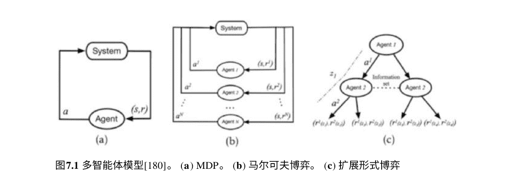

图7.1 多智能体模型[180]。(a) MDP。(b) 马尔可夫博弈。(c) 扩展形式博弈

为了可视化多个智能体中的不完全信息，需要新的图表。图7.1显示了三个示意图。首先，在(a)中，显示了我们在之前章节中使用的熟悉的智能体/环境图。接下来，在(b)中，显示了马尔可夫博弈的多智能体版本的该图。最后，在(c)中，显示了一个扩展形式博弈树[180]。扩展形式博弈树用于建模不完全信息。智能体的选择显示为实线链接，另一个智能体的隐藏私有信息显示为虚线，表示可能情况的信息集。

在(a)中，智能体观察到状态 \(s\)，执行动作 \(a\)，并从环境中获得奖励 \(r\)。在(b)中，在马尔可夫博弈中，所有智能体同时选择他们的动作 \(a^i\)，并获得各自的奖励 \(r^i\)。在(c)中，在一个双人扩展形式博弈中，智能体在选择动作 \(a^i\)上做出决策。他们在游戏结束时收到各自的奖励 \(r^i(z)\)，其中 \(z\)是由信息集导致的分支的终端节点的得分。信息集用虚线表示，以表示随机行为，环境（或其他智能体）在虚线动作中选择一个未知的结果。扩展形式符号是为了表示不完全信息博弈而设计的，其中所有可能的（未知的）结果都在信息集中表示。为了计算值函数，智能体必须考虑信息集中所有可能的不同选择；对手的未知选择会产生一个庞大的状态空间。

## **竞争、合作和混合策略**

多智能体强化学习问题可以分为三类：具有竞争行为、具有合作行为和具有混合行为的问题。在竞争环境中，智能体的奖励总和为零。一个智能体的胜利就是另一个智能体的失败。在合作环境中，智能体合作以优化共同的长期奖励。一个智能体的胜利就是所有智能体的胜利（例如：在易受洪水侵袭的地区建造堤坝；堤坝对所有智能体都有益处）。

混合环境涉及合作和竞争智能体，具有所谓的总和奖励；某些行为可能导致双赢，而其他行为可能导致赢输。

这三种行为是导航多智能体算法领域的有用指南，在本章中我们将进行介绍。让我们更仔细地看看每种行为类型。

### 7.1.1 竞争行为

博弈论领域的一个标志性成果是由约翰·纳什提出的一个结果，他定义了多个理性非合作代理之间稳定（在某种意义上最优）解的条件。纳什均衡被定义为一种情况，其中没有代理通过改变自己的策略而获得任何利益。对于两个竞争的代理，纳什均衡是最小最大策略。

在单智能体强化学习中，目标是找到最大化智能体未来累积奖励的策略。在多智能体强化学习中，目标是找到所有代理的联合策略，同时实现该目标：对于每个代理，最大化他们的累积未来奖励的多策略。如果你有一组竞争的（近似）零剥削策略，这被称为纳什均衡。

纳什均衡表征了一个均衡点 π*，从这个点开始，没有任何代理有动机偏离。换句话说，对于任何代理 i ∈ N，策略 π^{i,*}是对 π^{-i,*}的最佳响应，其中 -i 是除了 i 之外的所有代理[71]。

遵循纳什策略的代理人保证不会比任何其他对手策略更差，对于不完全信息或机会的游戏，例如许多纸牌游戏，这是一个预期的结果。由于卡片是随机分发的，没有理论保证纳什策略会赢或者每一手都是平局，尽管平均而言，它不会比其他代理人更差。

如果对手也采用纳什策略，那么所有人都会平局。然而，如果对手犯错误，他们可能会输掉一些手，从而使纳什均衡策略获胜。对手的这种错误将是对纳什策略的偏离，出于直觉或其他非理性的原因，尽管没有理论上的激励这样做。纳什均衡发挥完美的防守。它不试图利用对手策略的缺陷，而是在对手犯错误时获胜[26, 91]。

纳什策略在我们与对手对抗时给出了我们能够实现的最佳结果。从纳什策略平均上来说，它是无敌的，被认为是最优策略，解决一个游戏等同于计算纳什均衡。

在接下来的几分钟里，我们将介绍一种计算纳什策略的方法，称为对策后悔最小化，但我们首先来看合作。

### 7.1.2 合作行为

在单智能体强化学习中，奖励函数返回标量值：一个动作导致胜利或失败或单个数值。在多智能体强化学习中，奖励函数可能仍然返回标量值，但对于每个智能体，这些函数可能是不同的；整体奖励函数是个体奖励的向量。在完全合作的随机博弈中，个体奖励是相同的，所有智能体都有相同的目标：最大化共同回报。

当我们的问题的选择是由一组个体决策者分散地进行时，问题可以自然地建模为分散部分可观察马尔可夫决策过程（dec-POMDP）[117]。解决大规模的分散部分可观察马尔可夫决策过程是困难的；一般来说，分散部分可观察马尔可夫决策过程被认为是NEXP-完全的。这些问题无法通过多项式时间算法解决，直接在策略空间中搜索最优解是不可行的[21]。

在合作问题中，Pareto效率是一个核心概念，它源自于维尔弗雷多·帕累托的研究，他研究了经济效率和收入分配。Pareto效率的解决方案是指没有合作代理能够在不使其他代理变得更糟的情况下变得更好。所有非Pareto效率的组合都被Pareto效率的解决方案所支配。Pareto边界是所有Pareto效率组合的集合，通常以曲线的形式绘制。图7.2展示了一个情况，我们可以选择生产两种不同商品，商品1和商品2的不同数量（图片由维基媒体提供）。靠近原点的灰色项目是存在更好选择的选项。所有红色符号代表消费者认为更有利的生产组合[139]。

图7.2生产可能性的Pareto边界

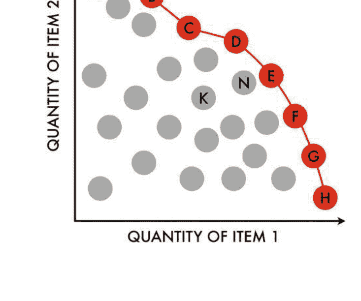

表格 7.1 囚徒困境

|      | 坦白缺陷 | 沉默合作 |
| :--- | :--- | :--- |
| **坦白缺陷** | (−5, −5) 纳什 | (0, −10) |
| **沉默合作** | (−10, 0) | (−2, −2) 帕累托 |

在多目标强化学习中，不同的代理可以有不同的偏好。当偏离政策会使至少一个代理变得更糟时，一个策略是帕累托最优的。我们将通过观察囚徒困境（表格 7.1）来比较纳什和帕累托。

帕累托最优是对我们来说最好的可能结果，我们不伤害他人，他人也不伤害我们。这是一种合作策略。帕累托均衡假设通信和信任。在某种意义上，它是非合作纳什策略的相反。帕累托计算合作世界的情况，纳什计算竞争世界的情况。

### 7.1.2.1 多目标强化学习

许多现实世界的问题涉及到多个可能相互冲突的目标的优化。在完全合作的环境中，所有代理共享一个共同的奖励函数。当奖励函数对每个代理都有不同的值时，问题被称为多目标问题：不同的代理可能有不同的偏好或目标。需要注意的是，原则上单一代理问题也可以有多个目标，尽管在本书中，所有单一代理问题都具有单一的标量奖励。多目标问题在多代理问题中尤为重要，不同的代理可能具有不同的奖励偏好。

在分散决策过程中，代理必须相互传达他们的偏好。这种异质性需要将通信协议纳入多代理强化学习，并分析通信效率算法[67, 128]。

多目标强化学习[63, 72, 124, 127]是标准强化学习的一种推广，其中标量奖励信号扩展为多个反馈信号，例如每个代理一个。多目标强化学习算法同时优化多个目标，为此引入了Pareto Q-learning等算法[126, 164]。

### 7.1.3 混合行为

从最初作为非合作博弈理论开始，博弈论已经发展到包括合作博弈，其中分析了群体的最优策略

个体，假设他们可以相互沟通或强制执行关于适当策略的协议。囚徒困境是这种问题的一个著名例子[89]。²囚徒困境被认为是由约翰·纳什发明的，尽管在一个更中立的（非警察和强盗）环境中。

囚徒困境如下（见表7.1）。两个叫做Row和Column的盗贼被捕入狱。Row和Column明白他们不能相信对方，因此他们在一个非合作的环境中运作。警官提供以下选择：如果你们都坦白，那么你们都会得到5年的轻判。如果你们都保持沉默，那么我只有证据可以判你们2年的短刑。然而，如果其中一个人坦白，而另一个人保持沉默，那么坦白者将被释放，而保持沉默者将被判10年监禁。请明天早上告诉我你的选择。

这使我们的两个罪犯面临着一个艰难但明确的选择。如果另一个保持沉默，而我坦白，那么我将自由出去；如果我也保持沉默，那么我们将被判2年监禁，所以在这种情况下坦白对我来说更好。如果另一个坦白，而我也坦白，那么我们都将被判5年；如果我然后保持沉默，那么我将被判10年监禁，所以在这种情况下坦白对我来说仍然更好。无论对方选择什么，坦白都会得到较轻的刑罚，由于他们无法协调行动，他们将各自独立地坦白。尽管如果两个人都保持沉默，他们只会被判2年监禁，但两个人都将被判5年监禁。警察很高兴，因为两人都坦白了，案件得到解决。

如果他们能够沟通，或者他们能够相互信任，那么两人都会保持沉默，两人都会被判2年徒刑。

罪犯面临的困境是，无论对方做什么，每个人都比保持沉默更好的选择是坦白。然而，双方也知道，如果对方是可信的，或者如果他们可以协调他们的回答，那么更好的结果将会实现。

这个困境说明了个体的自利与群体利益之间的冲突。在博弈论的文献中，坦白也被称为背叛，保持沉默则是合作的选择。坦白/坦白的情况（双方都背叛）是最优的非合作策略，也是纳什均衡，因为对于每个保持沉默的代理，存在一种策略，当另一个代理坦白时，判决将变得更糟糕（10年）。因此，代理人不会保持沉默，而是坦白以限制损失。

保持沉默/保持沉默（双方合作）对双方来说都是帕累托最优的，因为转向其他情况将至少使一方变得更糟糕。纳什策略是一种非合作、非沟通、非信任的策略；而帕累托策略是一种合作、沟通、信任的策略。

### 7.1.3.1 迭代囚徒困境

囚徒困境是一次性的游戏。如果我们能够重复玩这个游戏，并能够识别和记住对手的选择，会发生什么呢？
即使初始情况下是非合作的，是否会出现某种形式的沟通或信任？

这个问题可以通过迭代版本的囚徒困境来回答。
在一次计算机比赛[7, 8]之后，对迭代囚徒困境的兴趣逐渐增加。这个比赛是由政治学家罗伯特·阿克塞尔罗德在1980年左右组织的。博弈论学者被邀请提交计算机程序来玩迭代囚徒困境。这些程序被组织成一个锦标赛，并且彼此之间进行了数百次对战。目标是看哪种策略会获胜，以及在这个最简单的情境中是否会出现合作。参赛的程序种类繁多，有些使用基于心理学的复杂响应策略，而其他一些使用先进的机器学习来尝试预测对手的行动。

令人惊讶的是，最简单的策略之一获胜了。它是由专门从事社会互动建模的数学心理学家Anatol Rapoport提交的。Rapoport的程序采用了一种被称为“以牙还牙”的策略。它会在第一轮合作（保持沉默），在接下来的轮次中，它会根据对手在上一轮的行动来决定自己的行动。因此，“以牙还牙”通过合作奖励合作，通过背叛惩罚背叛，因此得名。

如果“以牙还牙”与一个合作的对手配对，并且通过固执地合作而不会损失太多，它就会获胜。从长远来看，它要么达到帕累托最优解，要么达到纳什均衡。Axelrod将“以牙还牙”的成功归因于多个特性。首先，它是友好的，也就是说，它永远不会首先背叛。在他的比赛中，前八名的程序都采用了友好的策略。
其次，以牙还牙也是报复性的，非合作策略很难利用这种策略。第三，以牙还牙是宽容的，当对手表现友好时，它会通过回归友好来奖励这种行为，愿意忘记过去的非合作行为。最后，这个规则的优势在于清晰可预测。其他人很容易学习它的行为并适应它，通过合作导致双赢的帕累托最优。

### 7.1.4 挑战

在这个理论的简要概述之后，让我们看看实际算法在解决多智能体问题方面的表现如何。随着单智能体和双智能体强化学习取得的令人印象深刻的结果，对多智能体问题的兴趣（和期望）也增加了。在下一节中，我们将更详细地研究多智能体问题的算法，但首先让我们看看这些算法面临的挑战。

多智能体问题在竞争、合作和混合环境中进行研究。多智能体强化学习面临的主要挑战有三个：(1)部分可观测性，(2)非稳态环境，以及 (3) 大状态空间。 这三个方面都增加了状态空间的大小。 我们将按顺序讨论这些挑战。

### 7.1.4.1 部分可观测性

大多数多智能体环境都是不完全信息环境，其中代理有一些不向其他代理透露的私有信息。 私有信息可以是未知价值的隐藏卡片，例如在扑克、二十一点或桥牌中。 在实时策略游戏中，玩家通常看不到整个游戏地图，而是只能看到部分世界。 不完全信息的另一个原因可能是游戏规则允许同时行动，例如在外交游戏中，所有代理都在同时确定下一步行动，而代理必须在没有完全了解其他行动的情况下行动。

所有这些情况都要求考虑世界的所有可能状态，与完全信息游戏相比，可能状态的数量大大增加。 不完全信息最好以扩展形式的游戏来表达。 事实上，鉴于大多数多智能体系统的规模，即使所有智能体都公开其状态和意图（这种情况很少发生），沟通和跟踪所有智能体的所有信息也很快变得不可行。

不完全信息增加了状态空间的大小，计算未知结果很快变得不可行。

### 7.1.4.2 非稳态环境

此外，由于所有智能体都同时根据自己的利益改进策略，智能体面临的是一个非稳态环境。 环境的动态由所有智能体的联合行动空间决定，智能体的最佳策略取决于其他智能体的最佳策略。

这种相互依赖性造成了一种不稳定的局面。
在单智能体环境中，需要跟踪单个状态以计算下一个动作。 在多智能体环境中，需要考虑所有状态和所有智能体的策略，并相互影响。 每个智能体都面临着一个移动目标问题。
在多智能体强化学习中，智能体同时学习，同时更新其行为策略 [71]。 一个智能体采取的行动会影响其他智能体的奖励，从而影响下一个状态。 这使得马尔可夫性质失效，马尔可夫性质指的是确定下一个状态所需的所有信息都存在于当前状态和智能体的行动中。 在使用之前，必须对单智能体强化学习理论进行适应。

为了处理非稳态问题，智能体必须考虑其他智能体行动的联合动作空间。随着智能体数量的增加，空间的大小呈指数增长。在两个智能体环境中，智能体必须考虑对手对其每个动作的所有可能回应，大大增加了状态空间。

在多智能体环境中，回复的数量甚至更多，解决这些问题的计算成本变得非常昂贵。大量智能体使收敛分析变得复杂，并且大大增加了计算需求。

另一方面，智能体可以互相学习，协调目标并合作。合作和群体形成减少了必须跟踪的独立智能体数量。

### 7.1.4.3 大状态空间

除了部分可观察性和非稳态性引起的问题外，在多智能体环境中，状态空间的大小显著增加，仅仅因为每个额外的智能体指数级增加了状态空间。此外，多智能体强化学习的动作空间是一个联合动作空间，其大小随着智能体数量的增加呈指数级增长。联合动作空间的大小经常导致可扩展性问题。

对于除了最小的多智能体问题之外，解决如此大的状态空间是不可行的，因此已经进行了大量工作来创建模型（抽象）以简化但有时又是现实的假设，以减小状态空间的大小。在下一节中，我们将介绍其中一些假设。

## 7.2 多智能体强化学习代理

在前面的部分中，介绍了多智能体强化学习的问题，以及与博弈论和社会选择理论的联系。我们还看到，引入多个智能体不出所料地增加了状态空间的大小，甚至比单个智能体的状态空间更大。最近的研究引入了一些解决多智能体问题的方法，我们将在这里介绍。

首先，我们将讨论一种基于规划的方法，名为反事实遗憾最小化（CFR）。这个算法成功地解决了复杂的社会选择问题，比如扑克游戏中的问题。CFR适用于竞争性的多智能体问题。

其次，我们将讨论合作强化学习方法，这些方法也适用于混合多智能体问题。

第三，我们讨论基于群体的方法，如进化策略和群体计算[11, 55, 74]。这些方法受到自然界中出现的计算行为的启发，比如鸟群和昆虫社会[24, 25, 45]。这些方法在单智能体优化问题中是众所周知的；事实上，基于群体的方法在解决许多复杂和大规模的单智能体优化问题（包括随机梯度下降优化）方面非常成功[131]。在本节中，我们将看到进化方法也是混合多智能体问题的自然选择，尽管它们通常用于具有许多同质智能体的合作问题。

最后，我们将讨论一种基于多人自学习的方法，其中使用了进化和分层的思想。在这种方法中，不同组的强化学习智能体相互训练。这种方法在旗帜和星际争霸等游戏中取得了巨大成功，并且适用于混合多智能体问题。

让我们从事实遗憾最小化开始。

### 7.2.1 竞争行为

我们将讨论的第一个设置是竞争环境。这个设置仍然接近于单智能体和双智能体强化学习，这些学习方法也是基于竞争的。

#### 7.2.1.1 反事实遗憾最小化

反事实遗憾最小化（CFR）是一种逼近广义博弈纳什均衡的迭代方法[183]。CFR适用于不完全信息博弈（如扑克），并计算出一种（平均而言）不可被利用的策略，因此在竞争环境中具有鲁棒性。反事实遗憾最小化的核心概念是后悔。后悔是代理因未选择最佳策略而遭受的预期奖励损失，相对于其他玩家的固定选择而言。只有事后才能知道后悔。

然而，我们可以通过对未发生的后悔进行平均来统计样本预期后悔。CFR通过将两个假设的玩家相互比较来找到纳什均衡，其中对手选择最小化我们的价值的行动。

CFR是一种收敛到纳什均衡的统计算法。就像极小化算法一样，它是一种自我对弈算法，可以在双方都假设最佳玩法的情况下找到最优策略。与极小化算法不同，它适用于不完全信息博弈，其中信息集描述了对手可能持有的一组可能世界。像MCTS一样，它进行采样，重复这个过程数十亿次，每次都改进其策略。随着游戏的进行，它越来越接近于游戏的最优策略：一种策略，不会比任何对手更差或打平[79, 91, 148]。它计算出的策略质量通过其可利用性来衡量。可利用性是完美对策可能获胜的最大金额（期望值）与其期望值之间的差距。

尽管纳什均衡是一种在理论上被证明不可被利用的策略，但在实践中，典型的人类玩法远离理论最优，即使对于顶级玩家[31]。基于反事实遗憾最小化的扑克程序从2008年开始击败了世界上最好的人类玩家，在限制性德州扑克的头对头对局中，尽管这些程序在最坏情况下仍然可以被利用[79]。

关于反事实遗憾最小化的许多论文都非常技术性，算法的代码太长，无法在这里详细解释。CFR是一种重要的算法，对于理解扑克的进展至关重要。为了使扑克和CFR的工作更易于理解，已经编写了入门论文和博客。

Trenner [156]写了一篇博客³其中使用CFR来玩Kuhn扑克，这是最简单的扑克变体之一。CFR伪代码和迭代调用它的函数在清单7.1中显示；其他例程请参阅博客。

CFR代码的工作原理如下。首先，它检查是否处于终止状态，并返回支付，就像常规的树遍历代码一样。否则，它检索信息集和当前的遗憾匹配策略。它使用到达概率，即根据当前迭代中的策略到达当前节点的概率。然后，CFR循环遍历可能的动作（第17-24行），计算下一个游戏状态的新到达概率，并递归调用自身。由于Kuhn扑克中有两个轮流行动的玩家，一个玩家的效用值恰好是另一个玩家的效用值的负数，因此在cfr()调用前面有一个减号。这里计算的是每个动作的反事实值。当循环遍历所有可能的动作结束时，使用当前策略计算当前状态的节点值（第26行）。这个值是每个动作的反事实值乘以采取该动作的概率的加权和。然后，通过将节点值乘以对手的到达概率来更新累积的反事实遗憾值。最后，返回节点值。

另一篇易于理解的博客文章，其中逐步解释了算法，由Kamil Czarnogórski撰写，⁴并在GitHub上提供了代码。⁵

#### 7.2.1.2 深度反事实遗憾最小化

反事实遗憾最小化是一种表格算法，它从根节点到终端节点遍历博弈树，在每次迭代中接近纳什均衡。表格算法在处理大问题时无法很好地扩展，并且研究人员经常需要使用特定领域的启发式方法、抽象方案 [29, 58, 134]，遗憾更新的替代方法 [148]，或采样变体 [91] 以实现可接受的性能。

对于大规模问题，已经开发了算法的深度学习版本 [30]。深度反事实遗憾最小化的目标是在不计算每个单独信息集的遗憾的情况下近似表格算法的行为。它通过使用交替玩家更新的深度神经网络对类似信息集进行泛化来近似值函数。

```python
def cfr(
    self,
    cards: List[str],
    history: str,
    reach_probabilities: np.array,
    active_player: int) -> int:
    if KuhnPoker.is_terminal(history):
        return KuhnPoker.get_payoff(history, cards)

    my_card = cards[active_player]
    info_set = self.get_information_set(my_card + history)

    strategy = info_set.get_strategy(reach_probabilities[
        active_player])
    opponent = (active_player + 1) % 2
    counterfactual_values = np.zeros(len(Actions))

    for ix, action in enumerate(Actions):
        action_probability = strategy[ix]

        new_reach_probabilities = reach_probabilities.copy()
        new_reach_probabilities[active_player] *= action_probability

        counterfactual_values[ix] = -self.cfr(
            cards, history + action, new_reach_probabilities,
            opponent)

    node_value = counterfactual_values.dot(strategy)
    for ix, action in enumerate(Actions):
        counterfactual_regret[ix] = \
            reach_probabilities[opponent] * (
                counterfactual_values[ix] - node_value)
        info_set.cumulative_regrets[ix] += counterfactual_regret[ix]

    return node_value

def train(self, num_iterations: int) -> int:
    util = 0
    kuhn_cards = ['J', 'Q', 'K']
    for _ in range(num_iterations):
        cards = random.sample(kuhn_cards, 2)
        history = ''
        reach_probabilities = np.ones(2)
        util += self.cfr(cards, history, reach_probabilities, 0)
    return util
```

清单 7.1 反事实遗憾最小化 [156]

### 7.2.2 合作行为

CFR是一种用于竞争环境的算法。纳什均衡定义了竞争性的赢/输多智能体情况 - 囚徒困境表7.1的情况为(-5, -5)。现在我们将转向合作环境。正如我们所见，在合作环境中，双赢的情况是可能的，对于整个社会和个体来说，奖励更高。囚徒困境示例的帕累托最优解是(-2, -2)，只能通过规范、信任或合作来实现（就像紧密结合的犯罪团伙通过沉默守则来实现的那样），参见Leibo等人[95]。

单智能体强化学习的成就激发了研究人员在多智能体中取得类似的结果。然而，部分可观测性和非稳态性带来了计算上的挑战。研究人员尝试了许多不同的方法，其中一些我们将介绍，尽管当前算法适用的问题规模仍然有限。Wong等人[175]提供了这些方法的综述，Dafoe等人[39]列出了合作强化学习中的开放问题。首先，我们将讨论基于单智能体强化学习方法的方法。接下来，我们将讨论基于对手建模、通信和心理学的方法[175]。

#### 7.2.2.1 集中式训练/分散式执行

虽然 dec-POMDP 模型为合作的不确定性顺序决策提供了适当的框架，但解决大规模的 dec-POMDP 是困难的 [21]，因此许多问题的简化版本已经被开发出来，其中一些元素，如通信或训练，是集中式的，以增加可处理性 [150, 175]。

训练多智能体问题的一种最简单的方法是使用集中式控制器训练协作智能体，从而将分散式多智能体计算简化为集中式单智能体计算。

在这种方法中，所有智能体将它们的观察和本地策略发送给一个中央控制器，该控制器现在具有完全信息并决定每个智能体采取的动作。然而，由于大型协作问题的计算成本很高，单个控制器变得过于繁忙，这种方法无法扩展。

另一种极端的方法是忽略通信和非稳态性，让智能体分别进行训练。

在这种方法中，智能体学习个体动作值函数，并将其他智能体视为环境的一部分。这种方法简化了计算需求，但以过度简化为代价，忽略了多智能体的相互作用。

一种中间方法是集中式训练和分散式执行[87]。在这种情况下，代理可以在训练过程中访问额外的信息，例如其他代理的观察、奖励、梯度和参数。然而，他们根据本地观察执行他们的策略。本地计算和代理间通信可以减轻非稳态问题，同时仍然模拟部分可观察性和（某些）交互。这种方法可以稳定代理的本地策略学习，即使其他代理的策略在变化[87]。

当集中学习价值函数时，该函数应如何用于代理的分散执行？一种常用的方法是价值函数分解。价值分解网络方法（VDN）将中央价值函数分解为个体价值函数的总和[146]，代理通过贪婪策略执行这些函数。QMIX和QTRAN是两种改进VDN的方法，它们允许非线性组合[125, 144]。另一种方法是多智能体变分探索（MAVEN），它使用潜在空间模型改进了QMIX的低效探索问题[102]。

基于策略的方法侧重于演员评论家方法，通过训练分散的演员来训练集中的评论家。反事实多智能体（COMA）使用这样一个集中的评论家来近似具有访问训练行为策略的演员的Q函数[53]。

Lowe等人[100]引入了一个流行的离线单智能体深度策略梯度算法DDPG（第4.2.7节）的多智能体版本MADDPG。它考虑了其他智能体的行动策略和它们的协调。MADDPG为每个智能体使用一组策略。它采用分散的演员，集中的评论家方法，并使用确定性策略。MADDPG适用于竞争性和合作性多智能体问题。Cai等人提出了一种用于避免碰撞的扩展方法[34]。一种流行的在线单智能体方法是PPO。Han等人[65]将连续的Half-Cheetah任务建模为基于模型的多智能体问题，实现了高效的样本结果。他们的基于模型的多智能体工作受到MVE [52]（第5.2.2.1节）的启发。Yu等人[179]在合作多智能体游戏（StarCraft，Hanabi和Particle world）中使用MAPPO取得了良好的结果。

以计算可行的方式对强化学习中的合作行为进行建模是一个活跃的研究领域。Li等人[96]使用隐式协调图来建模交互的结构。他们使用图神经网络来建模协调图[64]，用于StarCraft和交通环境[132]，从而实现学习的交互模式的扩展。

#### 7.2.2.2 对手建模

多智能体问题的状态空间很大，然而先前的方法尝试使用单智能体算法的改进来学习这个大空间。另一种方法是通过明确建模智能体的对手行为来减小状态空间的大小。然后可以使用这些模型来指导智能体的决策，减少其需要遍历的状态空间。Albrecht和Stone撰写了一篇综述[2]。

减小状态空间的一种方法是假设智能体之间存在一组固定的策略，在这些策略之间切换[51]。切换智能体模型（SAM）[182]通过贝叶斯网络从观察到的轨迹中学习对手模型。深度强化开放网络（DRON）[68]使用两个网络，一个用于学习Q值，另一个用于学习对手策略表示。

对手建模与心理理论有关[123]。根据这个理论，人们会将思想状态归因于他人，比如信念、意图和情绪。我们对他人思想的理论帮助我们分析和预测他们的行为。心灵理论还认为我们假设他人也有心灵理论；它允许信念的嵌套形式：“我相信你相信我相信”[161-163]。基于这些概念，具有对手学习意识的学习（LOLA）预测对手的行为[54]。概率递归推理（PR2）将我们自己和对手的行为建模为透视层次结构[170]。递归推理已被证明能够加快收敛速度并提高性能[40, 107]。对手建模也是一个活跃的研究领域。

#### 7.2.2.3 通信

当我们明确地对代理之间的通信进行建模时，我们迈向了对真实世界建模的另一步。一个基本问题是当不存在预定义的通信协议时，语言是如何在代理之间产生的，以及语法和意义是如何通过互动演化的[175]。通信的一种基本方法是使用指称游戏：发送者发送两个图像和一条消息；接收者必须确定哪个图像是目标[93]。语言也会在更复杂的版本中或在代理之间的协商中产生[35, 86]。

多智能体系统经常用于协调、社会困境、新兴现象和进化过程的研究，例如[49, 95, 149]。在桥牌游戏中[143]，已经开发了叫牌策略，用于向团队中的其他玩家传递一个玩家的牌[143]。在外交游戏中，每个游戏回合都有一个明确的否定阶段[3, 43, 88, 121]。正在进行工作，设计了通信感知的强化学习算法变体[66, 141]。

#### 7.2.2.4 心理学

许多强化学习中的关键思想，如操作性条件反射和试错法，源于认知科学。面对庞大的状态空间，多智能体强化学习方法正在朝着类似人类的代理方向发展。除了对手建模，研究还关注协调、亲社会行为和内在动机。关于多智能体系统中社会规范和文化演化的文献非常丰富[5, 28, 42, 95]。为了应对非稳态和庞大的状态空间，人类使用启发式和近似方法[59, 104]。然而，启发式方法可能导致偏见和次优决策[60]。有趣的是，多智能体建模正在发现心理学的概念。进一步研究这个领域有可能改善人工智能代理的类人行为。

### 7.2.3 混合行为

为了讨论混合环境中智能体的解决方法，我们将看一个重要的方法，这个方法再次受到生物学的启发：基于群体的算法。

基于群体的方法，如进化算法和群体计算，通过同时演化（或优化）大量智能体来工作。我们将更详细地研究进化算法和群体计算，然后再看看它们在多智能体强化学习中的作用。

#### 7.2.3.1 进化算法

进化算法受到生物遗传过程的启发：突变、重组和选择[9]。进化算法使用大量模拟个体进行工作，这通常使得并行化和在大型计算集群上运行它们变得容易。

进化算法通常在优化各种问题上取得良好的结果。例如，在优化单智能体问题时，进化方法将问题建模为一个个体群体，其中每个个体代表问题的一个候选解。候选解的质量由适应度函数确定，并选择最佳候选解进行繁殖。通过基因的交叉和突变创建新的候选解，并且循环重新开始，直到候选解的质量稳定。通过这种方式，进化算法迭代地接近最优解。进化算法是随机化算法，可以避免局部最优解。

尽管它们以解决单一代理优化问题而闻名，但我们在这里将使用它们来建模多代理问题。让我们更详细地看一下进化算法的工作原理（参见算法7.1）[9]。首先生成一个初始种群。每个个体的适应度被计算，适应度最高的个体被选择进行繁殖，使用交叉和变异创建新一代个体。旧种群中适应度最低的个体被新个体替换。

算法7.1进化框架[9]
1：随机生成初始种群
2：重复
3：    评估种群中每个个体的适应度
4：    选择适应度最高的个体进行繁殖
5：    通过交叉和变异生成新个体
6：    用新个体替换适应度最低的个体
7：直到 终止

与强化学习相比，在进化算法中，代理通常是同质的，即个体的奖励（适应度）函数是相同的。个体确实具有不同的基因，因此在行为（策略）上存在差异。在强化学习中，存在一个单一的当前行为策略，而进化方法则有许多候选策略（个体）。

健康函数原则上可以在个体之间产生竞争和合作行为，尽管典型的优化场景是选择具有最高适应度（适者生存）基因的单个个体。

通过交叉和（随机）突变以及适应度选择，个体（策略）的基因发生明确的变化。在强化学习中，奖励更直接地用作策略目标；在进化算法中，适应度不影响个体的策略，只影响其生存。进化算法中的个体是被动实体，不进行通信或行动，尽管它们会组合成新的个体。

进化算法和多智能体强化学习算法之间存在相似性和差异。首先，在这两种方法中，目标是找到最优解，即最大化（社会）奖励的策略。在强化学习中，通过与环境的交互学习策略，在进化算法中，通过适者生存进化种群。

强化学习处理有限数量的代理，其策略决定其行动，而进化算法处理许多个体，其基因决定其生存。通过奖励函数改进策略的好坏，基因发生变异和组合，通过适应度函数选择个体。策略在原地改进，代理不会死亡，而在进化计算中，最佳个体的特征（基因）被选择并复制到下一代的新个体中，之后旧一代会死亡。

## 7.2.3.2 群体计算

群体计算与进化算法有关 [20, 24]。群体计算关注分散、集体、自组织系统中的新兴行为。代理通常是简单、众多和同质的，并且在局部与彼此和环境进行交互。群体智能的生物学例子包括蚂蚁群体、蜜蜂巢、鸟群和鱼群的行为，图7.3 [147]，由维基媒体提供的图像。行为通常通过分散的通信机制进行合作。在人工群体智能中，个体当个体拥有心智理论时，有时能够想象其他个体的行为[18, 56]。群体智能，或者说集体智能，是一种分散计算的形式，与强化学习相对应，后者是外部算法在单一经典集中算法中计算最优行为[177]。

虽然这两种方法都适用于混合环境，但进化算法更注重竞争和适者生存（纳什均衡），而群体计算更注重合作和群体生存（帕累托最优）。

著名的人工群体智能例子是多里戈的蚁群优化（ACO）算法，它是一种基于信息素通信的概率优化算法，模拟了生物蚂蚁的行为[44, 46, 47]。

多智能体强化学习中的新兴行为在[15, 69, 78, 94, 99, 106]中得到了专门研究。有关解决多智能体问题的分散算法，请参见[117–119, 181]。

## 7.2.3.3 基于种群的训练

将传统的值或策略强化学习算法转化为多智能体环境中的算法是非常困难的。有趣的是，相比之下，进化算法最初是为单智能体优化设计的，使用候选解的种群，但在多智能体环境中，这些算法自然而然地适用，其中使用一群智能体来寻找对社会最优的共享解。

在进化算法中，代理通常是同质的，尽管它们可以是异质的，具有不同的适应度函数。适应度函数可以是竞争性的或合作性的。在后一种情况下，对一个代理的奖励增加也可能意味着其他代理的增加，甚至是整个群体或种群的增加。进化算法是非常有效的优化算法。

Salimans等人[131]报告说，进化策略在现代基准测试中与标准强化学习技术的性能相媲美，同时易于并行化。特别是，进化策略更容易实现（不需要反向传播），在分布式环境中更容易扩展，不会在稀疏奖励的情况下受到影响，并且具有较少的超参数。

进化算法是一种基于群体的计算方法，可以用于计算在博弈论纳什意义下最优的策略，或者试图找到优于其他代理的策略。进化方法对优化是高效、稳健且易于并行化的，因此在随机梯度方法上具有一些优势。这种方法与多智能体强化学习有何关联，并且能否用于找到多智能体强化学习问题的高效解决方案？

近年来，许多研究团队已经报道了在创建多智能体策略游戏的强化学习玩家方面取得的成功努力（见第7.3节）。这些都是大型研究项目，采用了各种不同的方法，包括自我对弈强化学习、合作学习、分层建模和进化计算。

## 算法7.2 基于种群的训练[78]

```
**过程** Train(P)  // 初始种群 P
  种群 P, 权重 θ, 超参数 h, 模型评估 p, 时间步长 t
  对于 (θ, h, p,) ∈ P  (异步并行执行) 执行
    当未结束训练时执行
      θ ← 步骤(θ|h) // 使用超参数 h 进行一步优化
      p ← 评估(θ) // 当前模型评估
      如果准备好(p, t, P) 则
        h', θ' ← 利用(h, θ, p, P) // 使用剩余的人口进行改进
        如果 θ = θ' 则
          h, θ ← 探索(h', θ', P) // 生成新的超参数 h
          p ← eval(θ) // 新模型评估
        结束如果
      结束如果
      使用新的(θ, h, p, t+1) 更新 P // 更新人口
    结束当
  结束对于
  返回具有最高 p 的 θ
结束过程
```

Jaderberg等人[78]在捕旗游戏中使用了进化算法和自我对弈强化学习的组合取得了成功。这里使用了一种基于人口的自我对弈方法，不同代理团队在锦标赛中相互训练。算法7.2更详细地描述了这种基于人口的训练（PBT）方法。通过策略的变异增加多样性，并通过淘汰表现不佳的代理来提高性能。

基于人口的训练使用两种方法。第一种方法是利用，它决定一个工作者是否应该放弃当前的解决方案，转而专注于一个更有前途的解决方案。第二种方法是探索，它在给定当前解决方案和超参数的情况下，提出新的解决方案来探索解决方案空间。种群的成员是并行训练的。它们的权重θ被更新，并且eval评估它们当前的性能。当种群的一个成员被认为已经准备好了，因为它已经达到了一定的性能阈值，它的权重和超参数将被利用和探索更新，以用具有最高记录性能的权重替换当前的权重，并用噪声随机扰动超参数。在利用和探索之后，迭代训练将继续进行，直到收敛。

让我们来看看这种训练联盟球员的融合方法。

## 7.2.3.4 自我对弈联盟

自我对战联赛学习是指训练一支多智能体联赛中的个体游戏角色。正如我们将在下一节中看到的，变种已经被用来玩星际争霸、夺旗和捉迷藏等游戏。

联赛学习将基于种群的训练与自我对战训练相结合，就像AlphaZero一样。在联赛学习中，智能体与一支不同对手的联赛进行对战，同时也是一个正在训练中的更大团队的一部分。为了提供稳定的训练目标以减少发散或局部最小值，智能体团队需要具备足够的多样性。联赛学习采用了进化的概念，如行为策略的突变和性能不佳智能体的淘汰。除了与其他团队竞争外，团队还采用合作策略。智能体按照明确的层次结构进行训练。

自我对战联赛训练的目标是找到所有智能体的稳定策略，以最大化他们的团队奖励。在混合和合作环境中，智能体团队可以从彼此的实力增加中受益。自我对战联赛学习还使用了层次强化学习的一些方面，这将在下一章中介绍。

在下一节中，我们将更深入地了解自我对抗联赛学习在特定多人游戏中的实现方式。

## 7.3 多智能体环境

强化学习在一些富有想象力的结果中取得了成功，它成功地模拟了接近真实世界中人类行为的行为。在本章中，我们迈出了一步，更接近真实世界的行为建模。让我们在本节中总结一下在四个不同的多智能体游戏中的结果，其中一些已经发表在知名科学期刊上。

我们将使用熟悉的序列，即(1)竞争环境，(2)合作环境和(3)混合环境。对于每个环境，我们将概述问题，概述算法方法，并总结成就。

表7.2列出了多智能体游戏及其主导方法。

**表7.2 多智能体游戏方法**

| 环境 | 行为 | 方法 | 参考 |
| :--- | :--- | :--- | :--- |
| 扑克 | 竞争性 | 深度对策后悔最小化 | [26, 32, 105] |
| 捉迷藏 | 合作 | 自我对抗，团队层次结构 | [13] |
| 夺旗 | 混合 | 自我对抗，分层，基于人口 | [77] |
| 星际争霸II | 混合 | 自我对抗，基于人口 | [165] |

## 7.3.1 竞争行为：扑克

扑克是一种受欢迎的不完全信息游戏。它在竞争中进行，并且定期组织人类锦标赛。扑克在人工智能领域已经研究了一段时间，并且定期举办计算机扑克锦标赛[17, 22]。扑克是一种竞技游戏。合作（两名玩家为了损害第三名玩家而勾结和合作）是可能的，但在实践中通常不会发生；因此，寻找纳什均衡是在实践中玩游戏的成功方法。反事实遗憾最小化方法专门用于在扑克中取得进展。

有许多经常玩的扑克变体。无限德州扑克是一种受欢迎的变体；两人版本被称为Heads Up，因为不会发生对手勾结。Heads Up无限德州扑克（HUNL）已经成为几年来不完全信息游戏玩法的主要人工智能基准。

扑克牌有隐藏的信息（面朝下的牌）。因此，代理面临着大量可能的状态；扑克是比国际象棋或跳棋更复杂的游戏。据报道，两人头对头无限制德州扑克的状态空间约为10^16[31]。进一步的复杂性在于，在游戏过程中，玩家通过下注透露信息；高额的下注表明好牌或玩家希望让对手相信这是真的（虚张声势）。因此，玩家必须在好牌上下高注和相反的情况之间做出选择，以便对手不会得到太多信息并能够反击。

2018年，两人头对头扑克程序Libratus在一场为期20天、共120,000手的比赛中击败了顶级人类选手，奖金池为$200,000。Brown等人[31]描述了Libratus的架构。该程序由三个主要模块组成，一个用于计算使用游戏的较小版本的快速CFR Nash策略，一个用于在游戏达到后期阶段时构建更精细的策略，以及一个用于通过填充缺失的分支来增强第一个策略。

在与顶级人类选手的实验中，Libratus分析了每天比赛结束时对手最常使用的下注金额。然后程序会在夜间计算出一个响应，以便在比赛进行中改进。

最初基于启发式、抽象和表格对策遗憾最小化的两个代理Libratus并不是基于深度强化学习。针对多人扑克，开发了Pluribus程序。对于Pluribus，作者使用了深度对策遗憾最小化[30]，采用了7层神经网络，遵循了AlphaZero自我对弈的方法。Pluribus在六人扑克中击败了顶级选手[32]（图7.4）。Pluribus结合了自我对弈的AlphaZero方法和搜索。另一个顶级程序DeepStack也使用随机生成的游戏来训练深度价值函数网络[105]。

图7.4 Pluribus登上了《科学》杂志的封面

## 7.3.2 合作行为：躲猫猫

除了竞争，合作行为也是现实世界行为的一部分。事实上，合作是定义我们社会结构的一部分，我们的社会大部分由家庭、团体、公司、政党、过滤气泡和国家等不同的组织方式组成。如何在个体之间实现自愿合作的问题已经得到广泛研究，tit for tat（第7.1.3.1节）中的工作只是这个迷人领域中众多研究之一[5, 28, 95, 130, 177]。

关于新版本的躲猫猫游戏的合作研究已经进行过。Baker等人[13]报告了一项实验，他们使用MuJoCo构建了一个新的多智能体游戏环境。该环境是为了研究合作如何从几个简单的规则和奖励最大化的组合中产生而创建的（见图7.5）。在躲猫猫实验中，游戏在一个随机生成的网格世界上进行，其中有可用的道具，如箱子。奖励函数刺激躲藏者避开追捕者的视线，反之亦然。环境中散布着物体，智能体可以抓住并固定在某个位置。

环境中包含一到三个躲藏者和一到三个追捕者，并且有三到九个可移动的箱子，其中一些是细长的。还有两个可移动的斜坡。墙壁和房间是静态的，并且是随机生成的。代理可以看到、移动和抓取物体。了解这个挑战的一个好方法是观看Hide and Seek博客上的视频⁷。⁸

只有基于可见性的奖励函数，代理能够学习许多不同的技能，包括协作工具使用。例如，躲藏者学会通过封锁门或建造多物体堡垒来创建避难所，以至于追捕者再也看不到他们，直到作为一种反击策略，追捕者学会使用斜坡跳进避难所。实际上，代理之间的互动形成了一个训练课程，在这个课程中代理学习了许多需要复杂工具使用和协调的任务。

躲猫猫游戏特点合作（在团队内部）和竞争（在躲藏者和寻找者之间）。它使用自我对弈版本的PPO进行策略学习。有趣的是看到合作如何轻松出现。游戏没有明确的团队协调合作的沟通方式；所有的合作行为都是在代理之间的基本互动中通过他们的奖励函数引导出来的。因此，合作策略是游戏设计的结果：每个团队和环境的奖励函数是同质的，并且存在着遵循物理规律的方块。

在游戏过程中，代理实际上为自己构建了一个自动课程表[13, 94]。报告了六种不同的行为策略，每一种都比前一种更高级，增加了对手寻找对策的竞争压力（见图7.5）。

Baker等人[13]报告说，最初躲藏者和追捕者学习了基本的逃跑和追逐策略。然而，在经过大量训练（2500万次游戏）后，躲藏者开始使用箱子构建庇护所，躲藏在其后面。然后，在又经过7500万次游戏后，追捕者学会了移动并使用斜坡跳过障碍物进入庇护所。仅仅经过1000万次游戏，躲藏者学会了通过将斜坡移动到边缘并将其锁定在庇护所范围之外来进行防御。

然后，在经过长达2.7亿次的训练后，追捕者学会了箱子冲浪。他们将一个箱子移动到游戏区域边缘，靠近锁定的斜坡。然后，一个追捕者使用斜坡爬上箱子，其他追捕者将其推向庇护所，追捕者可以从边缘窥视并看到躲藏者。最后，作为回应，躲藏者在建造庇护所之前将所有的箱子锁定，从而使自己免受追捕者的威胁。

隐藏和寻找实验很有趣，因为出现了多样化的行为策略。这些策略是基于基本奖励函数和随机探索产生的（也可以参见奖励足够的论点[140]）。

基于基本奖励和探索的策略的出现表明了一种进化过程。然而，隐藏和寻找不采用基于人口的训练或进化算法，与下一节中的夺旗战工作相比。

## 7.3.3 混合行为：夺旗和星际争霸

我们周围的世界展示了竞争和合作行为的混合。团队合作是人类生活的重要方面，并在生物学、社会学和人工智能领域得到了广泛研究。正如我们刚刚看到的，它是从最基本的设置中产生（进化）的，即实现一个雄心勃勃的目标的需求。近年来，许多研究团队在实时策略游戏中研究了混合多智能体模型，如夺旗战和星际争霸。我们将讨论这两个游戏。

### 7.3.3.1 抢旗

首先我们将讨论游戏抢旗，该游戏在Quake III竞技场中进行（见图7.6）。Jaderberg等人对这个游戏进行了广泛的实验[77]，在这个实验中，代理从零开始学习观察、行动、合作和竞争。在这个实验中，代理通过基于种群的自我对弈[78]，即算法7.2进行训练。种群中的代理都是不同的（它们具有不同的基因）。种群通过相互对抗来学习，提供了增加队友和对手多样性以及比传统单一代理深度强化学习方法更稳定和更快的学习过程。

总共创建了30个不同的机器人，并使它们相互竞争。代理是团队的一部分，奖励函数形成了一个层次结构。一个两层优化过程对内部奖励进行优化，并使用强化学习对内部奖励进行学习策略。

在夺旗游戏中，机器人开始时是随机行动的。经过45万场比赛，找到了一个表现良好的机器人策略，并且他们发展出了合作策略，例如跟随队友以压倒对手，并在队友拿到旗帜时靠近敌方基地。与躲猫猫游戏一样，合作策略是通过基本规则、环境反馈和适者生存的结合而产生的。

夺旗游戏的研究非常值得注意，因为它证明了仅凭像素作为输入，一个智能体就能够在一个丰富的多智能体环境中学会有竞争力的玩法。为了做到这一点，它使用了基于人口的训练、内部奖励优化和时间分层强化学习的组合（见下一章）。

### 7.3.3.2 星际争霸

本章将讨论的最后一个游戏是星际争霸。星际争霸是一个更加复杂的多人实时策略游戏。状态空间的估计数量级约为10^1685 [120]，非常庞大。星际争霸具有不确定性下的多智能体决策制定、空间和时间推理等特点。竞争，团队协作，对手建模和实时规划。图7.6显示了一个星际争霸II场景的图片。星际争霸的研究已经进行了一段时间[120]，并引入了一个特殊的星际争霸多智能体挑战[132]。DeepMind的一个团队创建了一个名为AlphaStar的程序。在2018年12月举行的一系列测试比赛中，DeepMind的AlphaStar在两人单局比赛中击败了两名顶级选手，使用了不同的用户界面。

AlphaStar玩的是完整的星际争霸II游戏。神经网络最初通过对匿名人类游戏进行监督学习来进行训练，然后通过与其他AlphaStar代理进行对战来进一步训练，使用了一种基于种群的自我对弈强化学习版本[78, 165]。这些代理用于启动多智能体强化学习过程。创建了一个持续的竞争联赛，联赛的代理之间进行比赛。通过从现有竞争对手分支出来，添加了新的竞争对手。

智能体通过与其他竞争对手的游戏学习。基于群体的学习进一步发展，创建了一个探索《星际争霸》游戏非常庞大空间的过程，通过让智能体与强大的对手策略进行对抗，并保留强大的早期策略。

通过为每个智能体设定自己的学习目标，例如应该关注哪些竞争对手和应该建造哪种游戏单位，增加了联盟的多样性。使用一种称为优先级联盟自我对抗演员评论家训练的优先级虚构自我对抗方法，详细信息请参见[165]。AlphaStar在使用Google的张量处理单元（TPU）构建的可扩展分布式训练系统上进行训练。AlphaStar联盟运行了14天。在这个训练中，每个智能体经历了相当于200年实时《星际争霸》游戏的时间。

在《星际争霸》中，玩家可以选择扮演三个外星种族之一：人类、异虫或星灵。AlphaStar被训练成只玩星灵，以减少训练时间，尽管相同的训练流程可以应用于任何种族。AlphaStar首先对抗了一位名叫TLO的人类大师，他是一位顶级职业异虫玩家和一位大师级星灵玩家。这位人类玩家评论道：我对智能体的强大感到惊讶。AlphaStar将众所周知的策略颠覆了过来。该智能体展示了我之前没有想到的策略，这意味着我们可能还没有完全探索游戏的新玩法。

### 7.3.4 实践：在Gym示例中玩捉迷藏

这些最后几章中报道的许多研究工作描述了研究团队在复杂和大型游戏上的重要努力。这些游戏代表了人工智能的前沿，研究团队利用所有可获得的计算和软件工程能力来实现最佳结果。此外，通常会花费大量时间进行训练和找到使学习有效的正确超参数。

复制这种规模的结果非常具有挑战性，大多数研究工作都集中在以更小、更可管理的规模和更可管理的计算资源上复制结果。

在本节中，我们将尝试以适度的计算要求复制一些方面。我们将重点关注躲猫猫游戏（第7.3.2节）。躲猫猫实验的原始代码在GitHub上。10请访问并安装代码。

Hide and Seek使用MuJoCo和mujoco-worldgen包。安装它们和依赖项

```
pip install -r mujoco-worldgen/requirements.txt
pip install -e mujoco-worldgen/
pip install -e multi-agent-emergence-environments/
```

环境的示例可以在mae_envs/envs文件夹中找到。您还可以构建自己的环境，从Base环境开始，在mae_envs/envs/base.py中添加箱子、斜坡以及适当的包装器。查看其他环境的操作方法。

使用bin/examine脚本尝试环境；示例用法：

```
bin/examine.py base
```

请参阅GitHub存储库中的详细说明。

### 7.3.4.1 多人环境

在本实践部分结束时，我们提到了Arcade Learning Environment的多人实现。Terry等人[152]介绍了这一实现，并展示了DQN的多人版本Ape-X DQN的基准性能结果，在其他地方表现良好[16, 76]。该环境还作为PettingZoo的一部分进行介绍，PettingZoo是Gym的多智能体版本[85, 153, 159]。

另一个多智能体研究环境是Google足球研究环境[90]。提供了基于物理的模拟器，以及三个基准实现（DQN、IMPALA和PPO）。

## 总结和进一步阅读

我们现在将总结本章并提供进一步阅读的指引。

### 总结

多智能体强化学习学习多智能体环境的最优策略。智能体的最优策略受到其他智能体策略的影响，而其他智能体的策略也在被优化。这导致了非稳态问题，智能体的行为违反了马尔可夫性质。

多智能体强化学习将合作行为的元素添加到强化学习的技术中，现在包括竞争、合作和混合行为。该领域与博弈论密切相关，博弈论是经济学中研究理性行为的基础。博弈论的一个著名问题是囚徒困境。非合作博弈论的一个著名结果是纳什均衡，即没有玩家通过改变自己的策略而获得任何利益的联合策略。合作博弈论的一个著名结果是帕累托最优，即没有个体可以在不使其他人变得更糟的情况下变得更好。

当代理有私人信息时，多智能体问题是部分可观察的。多智能体问题可以建模为随机博弈或广义博弈。智能体的行为最终由奖励函数决定，可以是同质的或异质的。当智能体具有不同的奖励函数时，多智能体问题变成了多目标强化学习。

一个动作的遗憾是代理错过的奖励量，因为没有选择具有最高回报的动作。遗憾最小化算法是随机和多智能体等价于极小极大算法。反事实遗憾最小化是一种在竞争性多智能体游戏中寻找纳什策略的方法，例如扑克。

单智能体算法的变体经常用于合作多智能体情境。由于非稳态和部分可观察性，大规模问题无法解决。其他有前景的方法是对手建模和显式通信建模。

基于群体的方法，如进化算法和群体智能，在多智能体系统中经常使用。这些方法适用于同质奖励函数和竞争性、合作性和混合问题。

进化方法通过进化一群代理，结合行为并根据某些适应度函数选择最佳个体。进化方法非常适合并行计算，并且是最受欢迎和成功的优化算法之一。群体智能通常引入（基本的）代理之间的通信形式，例如在蚁群优化中通过人工信息素进行通信，以指示它们在解决方案空间的哪个部分旅行。

对于最近解决的一些最复杂的问题，如星际争霸、Capture the Flag和捉迷藏，层次化和进化原则经常在联赛训练中结合使用，其中代理团队的联盟以自我对抗的方式进行训练，并且适应度最高的代理存活下来。当前的成就需要大量的计算能力；未来的工作是试图减少这些要求。

### 进一步阅读

多智能体学习是一个广泛研究的领域。关于早期多智能体强化学习和深度多智能体强化学习的调查可以在[1, 2, 33, 63, 71, 72, 149, 158, 175, 178]中找到。在Littman [97]之后，Shoham等人[138]更深入地研究了MDP建模。

关于博弈论的经典著作是冯·诺伊曼和莫根斯特恩的[167]。现代介绍有[41, 57, 111]。博弈论是古典经济学中理性行为理论的基础。约翰·纳什的重要作品有[113–115]。1950年，他在他的28页论文中引入了纳什均衡，这使他在1994年获得了诺贝尔经济学奖。关于约翰·纳什的生平已经有传记和电影[112]。

剪刀石头布游戏在博弈论和计算机扑克研究中起着重要作用[22, 32, 129, 169]。1979年引入的前景理论[81]研究了人类在面对不确定性时的行为，这一主题演变成了行为经济学领域[36, 110, 174]。Gigerenzer引入了快速和简单的启发式方法来解释人类的决策过程[59]。

有关合作演化和社会规范的更有趣的研究，请参阅[4–6, 8, 28, 70, 73]。

最近，多目标强化学习已经得到研究；一份调查报告是[98]。在这个领域中，采用了更现实的假设，即代理有不同的奖励函数，导致不同的帕累托最优解[109, 164, 172]。Oliehoek等人撰写了一篇简明的分散式多代理建模介绍[116, 117]。

反事实遗憾最小化对计算机扑克的成功起到了基础作用[31, 32, 79, 183]。一种常用的蒙特卡洛版本发表在[91]。与函数逼近的组合研究在[30]中进行。

进化算法已经提供了非常成功的优化算法。这个广阔领域的一些参考资料是[9–12, 50]。相关领域是群体智能，在这里同质代理之间进行通信[19, 45, 48, 82]。有关多代理系统的进一步研究，请参阅[160, 176]。有关集体智能，请参阅[46, 56, 82, 122, 177]。

许多其他作品在强化学习的演化算法方面进行了报告[37, 38, 84, 108, 131, 145, 171, 173]。这些方法大多数涉及单智能体方法，尽管有些专门应用于多智能体方法 [78, 83, 85, 99, 103, 142]。

基准研究活跃。有趣的方法包括过程性内容生成 [154], MuJoCo足球 [99], 和Obstacle Tower挑战 [80]。关于电脑扑克有大量的文献资料; 例如 [17, 22, 23, 23, 26, 27, 61, 61, 105, 129, 133]。星际争霸研究可以在 [120, 132, 132, 165, 166] 中找到。其他游戏研究是 [151, 155]。受扑克和围棋结果启发的方法现在也成功地应用于无压力外交 [3, 14, 62, 121]。

### 练习

以下是一些快速问题，以检查你对本章的理解。对于每个问题，一个简单的、单句回答就足够了。

### 问题

- 1. 为什么对多智能体强化学习如此感兴趣？
- 2. 多智能体强化学习的主要挑战之一是什么？
- 3. 什么是纳什策略？
- 4. 什么是帕累托最优？
- 5. 在竞争性多智能体系统中，可以用什么算法来计算纳什策略？
- 6. 什么使得计算不完全信息博弈的解决方案变得困难？
- 7. 描述一下囚徒困境。
- 8. 描述一下重复囚徒困境。
- 9. 列举两个不完全信息的多智能体纸牌游戏的名称。
- 10. 通常称具有异质奖励函数的设置为什么？
- 11. 列举三种可能出现在多智能体强化学习中的策略。
- 12. 列举两种适用于解决混合策略博弈的解决方法。
- 13. 什么人工智能方法以蚂蚁群、蜜蜂群、鸟群或鱼群命名？它是如何一般性地工作的？
- 14. 描述进化算法的主要步骤。
- 15. 描述躲猫猫游戏的一般形式以及从躲藏者或寻找者的互动中出现的三种策略。

### 练习

以下是一些编程练习，以便更熟悉本章中介绍的方法。

- 1. CFR。为Kuhn扑克玩家实现反事实遗憾最小化算法。与程序对战，看看你能否赢。你能想到将其扩展为更具挑战性的扑克版本吗？
- 2. 躲猫猫游戏。 实现具有合作和竞争的躲猫猫游戏。 添加更多类型的对象。看看是否出现其他合作行为。
- 3. 蚂蚁群。 使用DeepMind控制套件设置一个协作级别和一个竞争级别，并实现蚂蚁群优化算法。 在网上或原始论文[46]中找到问题实例。 你能实现更多的群体算法吗？
- 4. 足球。去谷歌足球博客，<sup>1</sup>并实现足球代理的算法。 考虑使用基于人口的方法。
- 5. 星际争霸。去星际争霸Python接口，<sup>12</sup>并实现一个星际争霸玩家（非常具有挑战性）[132]。

### 参考文献

| 编号 | 作者 | 标题 | 出版物/年份 | 相关章节 |
| :--- | :--- | :--- | :--- | :--- |
| 1. | Stefano Albrecht和Peter Stone | 多智能体学习：基础和最新趋势 | IJCAI-17会议教程，2017年 | 251 |
| 2. | Stefano Albrecht和Peter Stone | 自主代理建模其他代理：一项全面调查和开放问题 | 人工智能，258：66-95，2018年 | 236, 251 |
| 3. | Thomas Anthony, Tom Eccles, Andrea Tacchetti, János Kramár, Ian M. Gemp, Thomas C. Hudson, Nicolas Porcel, Marc Lanctot, Julien Pérolat, Richard Everett, Satinder Singh, Thore Graepel和Yoram Bachrach | 学习使用最佳响应策略迭代玩无压力外交 | 神经信息处理系统进展，2020年 | 236, 252 |
| 4. | Robert Axelrod | 一种演化方法来规范 | 《美国政治科学评论》页1095-1111，1986年 | 251 |
| 5. | Robert Axelrod | 合作的复杂性:基于代理模型的竞争与合作,第3卷 | 普林斯顿大学出版社,1997年 | 237, 244 |
| 6. | Robert Axelrod | 文化的传播:具有局部收敛和全球极化的模型 | 《冲突解决杂志》,41(2):203–226,1997年 | 251 |
| 7. | Robert Axelrod和Douglas Dion | 合作的进一步演化 | 科学,242(4884):1385–1390,1988年 | 228 |
| 8. | Robert Axelrod和William D Hamilton | 合作的演化 | 科学,211(4489):1390–1396,1981年 | 228, 251 |
| 9. | Thomas Bäck | 理论与实践中的进化算法:进化策略,进化编程,遗传算法 | 牛津大学出版社,1996年 | 237, 237, 238, 251 |
| 10. | Thomas Bäck, David B Fogel, and Zbigniew Michalewicz | 进化计算手册 | 发行, 97(1):B1, 1997 | |
| 11. | Thomas Bäck, Frank Hoffmeister, and Hans-Paul Schwefel | 进化策略综述 | 在第四届国际遗传算法会议, 1991 | 230 |
| 12. | Thomas Bäck and Hans-Paul Schwefel | 参数优化的进化算法概述 | 进化计算, 1(1):1–23, 1993 | 251 |
| 13. | Bowen Baker, Ingmar Kanitscheider, Todor Markov, Yi Wu, Glenn Powell, Bob McGrew, 和 Igor Mordatch | 多智能体自动课程中的新兴工具使用 | arXiv预印本 arXiv:1909.07528, 2019 | 242, 244, 245, 246, 246 |
| 14. | Anton Bakhtin, David Wu, Adam Lerer, and Noam Brown | 从零开始的非压力外交 | 神经信息处理系统的进展，34，2021年 | 252 |
| 15. | Trapit Bansal, Jakub Pachocki, Szymon Sidor, Ilya Sutskever, and Igor Mordatch | 通过多智能体竞争实现的新兴复杂性 | arXiv预印本arXiv:1710.03748, 2017年 | 240 |
| 16. | Nolan Bard, Jakob N. Foerster, Sarath Chandar, Neil Burch, Marc Lanctot, H. Francis Song, Emil io Parisotto, Vincent Dumoulin, Subhodeep Moitra, Edward Hughes, Iain Dunning, Shibil Mourad, Hugo Larochelle, Marc G. Bellemare, and Michael Bowling | Hanabi挑战：AI研究的新前沿 | 人工智能，280: 103216, 2020年 | 249 |
| 17. | Nolan Bard, John Hawkins, Jonathan Rubin, and Martin Zinkevich | 年度计算机扑克比赛 | AI杂志，34 (2) : 112, 2013年 | 243, 252 |
| 18. | Simon Baron-Cohen, Alan M Leslie, and Uta Frith | 自闭症儿童是否具有“心灵理论”？ | 认知，21(1):37–46, 1985年 | 221, 240 |
| 19. | Gerardo Beni | 群体智能 | 复杂的社会和行为系统：博弈论和基于代理的模型，页791–818，2020年 | 251 |
| 20. | Gerardo Beni和Jing Wang | 细胞机器人系统中的群体智能 | 在机器人和生物系统中：走向新的仿生学？，页703–712。Springer, 1993年 | 239 |
| 21. | Daniel S Bernstein, Robert Givan, Neil Immerman和Shlomo Zilberstein | 马尔可夫决策过程的分散控制的复杂性 | 运筹学数学，27(4):819–840, 2002年 | 225, 234 |
| 22. | Darse Billings, Aaron Davidson, Jonathan Schaeffer, 和 Duane Szafron | 扑克的挑战 | 人工智能, 134(1-2):201–240, 2002 | 243, 251, 252 |
| 23. | Darse Billings, Aaron Davidson, Terence Schauenberg, Neil Burch, Michael Bowling, Robert Holte, Jonathan Schaeffer, 和 Duane Szafron | 在随机不完全信息游戏中的游戏树搜索与适应 | 在国际计算机与游戏会议, 页21–34. Springer, 2004 | 252, 252 |
| 24. | Christian Blum 和 Daniel Merkle | 群体智能: 引论与应用 | Springer Science & Business Media, 2008 | 230, 239 |
| 25. | Eric Bonabeau, Marco Dorigo, 和 Guy Theraulaz | 群体智能: 从自然到人工系统 | Oxford University Press, 1999 | 231 |
| 26. | Michael Bowling, Neil Burch, Michael Johanson, 和 Oskari Tammelin | Heads-up Limit Hold'em poker is solved | 科学, 347(6218):145–149, 2015 | 224, 242, 252 |
| 27. | Michael H. Bowling, Nicholas Abou Risk, Nolan Bard, Darse Billings, Neil Burch, Joshua Davidson, John Alexander Hawkins, Robert Holte, Michael Johanson, Morgan Kan, Bryce Paradis, Jonathan Schaeffer, David Schnizlein, Duane Szafron, Kevin Waugh, 和 Martin Zinkevich | A demonstration of the polaris poker system | 在Proceedings of The 8th International Conference on Autonomous Agents and Multiagent Systems, volume 2, pages 1391–1392, 2009 | 252 |
| 28. | Robert Boyd 和 Peter J Richerson | Culture and the Evolutionary Process | University of Chicago press, 1988 | 237, 244, 251 |
| 29. | Noam Brown, Sam Ganzfried, and Tuomas Sandholm | 分层抽象、分布式均衡计算和后处理，以及应用于冠军无限德州扑克代理的方法 | 在AAAI研讨会：计算机扑克和不完全信息中，2015年 | |
| 30. | Noam Brown, Adam Lerer, Sam Gross, and Tuomas Sandholm | 深度反事实遗憾最小化 | 在国际机器学习会议上，第793-802页。PMLR, 2019年 | 234, 243, 251 |
| 31. | Noam Brown and Tuomas Sandholm | 超级人工智能在无限制德州扑克中的应用：Libratus战胜顶级专业人士 | 科学，359(6374):418–424，2018年 | 232, 243, 243, 251 |
| 32. | Noam Brown and Tuomas Sandholm | 超级人工智能在多人扑克中的应用 | 科学，365(6456):885–890, 2019年 | 242, 243, 251, 251 |
| 33. | Lucian Busoniu, Robert Babuska和Bart De Schutter | 多智能体强化学习的综合调查 | IEEE Transactions on Systems, Man, and Cybernetics, Part C (Applications and Reviews), 38(2):156–172, 2008年 | 251 |
| 34. | 蔡志远、曹焕辉、陆文杰、张林和熊浩 | 通过分散多重控制屏障函数实现安全的多智能体强化学习 | arXiv预印本arXiv:2103.12553, 2021年 | 235 |
| 35. | Kris Cao, Angeliki Lazaridou, Marc Lanctot, Joel Z Leibo, Karl Tuyls和Stephen Clark | 通过协商实现新兴通信 | 在国际学习会议Representations, 2018年 | 236 |
| 36. | Edward Cartwright | 行为经济学 | Routledge, 2018年 | 251 |
| 37. | Patryk Chrabaszcz, Ilya Loshchilov和Frank Hutter | 回归基础：对Atari游戏进行规范进化策略的基准测试 | 在第二十七届国际人工智能联合会议(IJCAI 2018)上，2018年7月13日至19日，斯德哥尔摩，第1419-1426页，2018年 | 251 |
| 38. | Edoardo Conti, Vashisht Madhavan, Felipe Petroski Such, Joel Lehman, Kenneth O Stanley和Jeff Clune | 通过一群寻求新颖性的代理改进进化策略中的探索 | 在神经信息处理进展中，第5032-5043页，2018年 | 251 |
| 39. | Allan Dafoe, Edward Hughes, Yoram Bachrach, Tantum Collins, Kevin R McKee, Joe L Z Leibo, Kate Larson和Thore Graepel | 合作人工智能中的开放问题 | arXiv预印本arXiv:2012.08630, 2020年 | 234 |
| 40. | Zhongxiang Dai, Yizhou Chen, Bryan Kian Hsiang Low, Patrick Jaillet, and Teck-Hua Ho | R2-B2: 基于递归推理的贝叶斯优化用于无悔学习的游戏 | 在国际机器学习会议，第2291-2301页。PMLR, 2020 | 236 |
| 41. | Morton D Davis | 博弈论：一本非技术性介绍 | Courier Corporation, 2012 | 251 |
| 42. | Richard Dawkins and Nicola Davis | 自私的基因 | Macat Library, 2017 | 237 |
| 43. | Dave De Jonge, Tim Baarslag, Reyhan Aydo~gan, Catholijn Jonker, Katsuhide Fujita, and Takayuki Ito | 外交游戏中的谈判挑战 | 在国际协议技术会议,第100-114页。Springer, 2018 | 236 |
| 44. | Marco Dorigo | 优化、学习和自然算法 | 博士论文,米兰理工大学,1992 | 240 |
| 45. | Marco Dorigo和Mauro Birattari | 群体智能 | Scholarpedia, 2(9):1462, 2007年 | 231, 251 |
| 46. | Marco Dorigo, Mauro Birattari和Thomas Stutzle | 蚁群优化 | IEEE计算智能杂志, 1(4):28-39, 2006年 | 240, 251, 253 |
| 47. | Marco Dorigo和Luca Maria Gambardella | 蚁群系统：一种合作学习解决旅行推销员问题的方法 | IEEE进化计算交易, 1(1):53-66, 1997年 | 240 |
| 48. | Russell C Eberhart, Yuhui Shi和James Kennedy | 群体智能 | 爱思唯尔, 2001年 | 251 |
| 49. | Tom Eccles, Edward Hughes, János Kramár, Steven Wheelwright和Joel Z Leibo | 在复杂的连续社会困境中学习互惠行为 | arXiv预印本arXiv:1903.08082, 2019年 | 236 |
| 50. | Agoston E Eiben和Jim E Smith | 什么是进化算法？ | 在《进化计算导论》第25-48页。Springer, 2015年 | 251 |
| 51. | Richard Everett和Stephen Roberts | 通过对手建模和深度强化学习来学习对抗非稳态智能体 | 在2018 AAAI春季研讨会系列中, 2018年 | 236 |

## 参考文献

52. Vladimir Feinberg, Alvin Wan, Ion Stoica, Michael I Jordan, Joseph E Gonzalez和Sergey Levine。基于模型的值估计用于高效的无模型强化学习。arXiv预印本arXiv:1803.00101, 2018年。235

53. Jakob Foerster, Gregory Farquhar, Triantafyllos Afouras, Nantas Nardelli和Shimon Whiteson。反事实多智能体策略梯度。在AAAI人工智能会议论文集, 卷32, 2018年。235

54. Jakob N Foerster, Richard Y Chen, Maruan Al-Shedivat, Shimon Whiteson, Pieter Abbeel, and Igor Mordatch。具有对手学习意识的学习。arXiv预印本arXiv:1709.04326, 2017. 236

55. David B Fogel。模拟进化优化简介。IEEE Transactions on Neural Networks, 5(1):3–14, 1994. 230

56. Vittorio Gallese and Alvin Goldman。镜像神经元和心理模拟理论。Trends in Cognitive Sciences, 2(12):493–501, 1998. 221, 240, 251

57. Sam Ganzfried and Tuomas Sandholm。基于博弈论的大规模不完全信息游戏对手建模。在第10届国际自主代理人和多代理人系统会议上, 卷2, 页533–540, 2011. 251

58. Sam Ganzfried和Tuomas Sandholm。在大规模不完全信息游戏中的终局求解。在2015年国际自主代理和多代理系统会议的论文集中, 第37-45页, 2015年。234

59. Gerd Gigerenzer和Daniel G Goldstein。快速和简单的推理方式: 有限理性模型。心理学评论, 103(4): 650, 1996年。237, 251

60. Thomas Gilovich, Dale Griffin和Daniel Kahneman。启发式和偏见: 直觉判断的心理学。剑桥大学出版社, 2002年。237

61. Andrew Gilpin和Tuomas Sandholm。通过自动抽象和实时均衡计算实现的竞争德州扑克玩家。在国家人工智能会议的论文集中, 第21卷, 第1007页, 2006年。252, 252

62. Jonathan Gray, Adam Lerer, Anton Bakhtin和Noam Brown。通过均衡搜索在无压力外交中达到人类水平的表现。arXiv预印本arXiv:2010.02923, 2020年。252

63. Sven Grönauer和Klaus Diepold。多智能体深度强化学习: 一项调查。人工智能综述, 第1-49页, 2021年。226, 251

64. Carlos Guestrin, Daphne Koller和Ronald Parr。多智能体规划与分解MDPs。在神经信息处理系统进展, 卷1, 第1523-1530页, 2001年。235

65. Dongge Han, Chris Xiaoxuan Lu, Tomasz Michalak和Michael Wooldridge。多智能体基于模型的连续控制信用分配, 2021年。235

66. Matthew John Hausknecht。合作与通信的多智能体深度强化学习。德克萨斯大学奥斯汀分校博士论文, 2016年。236

67. Conor F. Hayes, Roxana Radulescu, Eugenio Bargiacchi, Johan Källström, Matthew Macfarlane, Mathieu Reymond, Timothy Verstraeten, Luisa M. Zintgraf, Richard Dazeley, Fredrik Heintz, Enda Howley, Athirai A. Irissappane, Patrick Mannion, Ann Nowé, Gabriel de Oliveira Ramos, Marcello Restelli, Peter Vamplew和Diederik M. Roijers。多目标强化学习和规划的实用指南。arXiv预印本arXiv:2103.09568, 2021年。226

68. He He, Jordan Boyd-Graber, Kevin Kwok, and Hal Daum III。深度强化学习中的对手建模。在国际机器学习会议上, 第1804-1813页. PMLR, 2016. 236

69. Nicolas Heess, Dhruva TB, Srinivasan Sriram, Jay Lemmon, Josh Merel, Greg Wayne, Yuval Tassa, Tom Erez, Ziyu Wang, SM Eslami, Martin Riedmiller, and David Silver。在复杂环境中出现运动行为。arXiv预印本 arXiv:1707.02286, 2017. 240

70. Joseph Henrich, Robert Boyd, and Peter J Richerson。关于文化演化的五个误解。Human Nature, 19(2):119–137, 2008. 251

71. Pablo Hernandez-Leal, Michael Kaisers, Tim Baarslag, and Enrique Munoz de Cote。在多智能体环境中学习的调查: 处理非稳态问题。arXiv预印本arXiv:1707.09183, 2017. 221, 224, 229, 251

72. Pablo Hernandez-Leal, Bilal Kartal, 和 Matthew E Taylor。一个关于多智能体深度强化学习的调查和批评。自主代理和多智能体系统, 33(6):750–797, 2019. 226, 251

73. Francis Heylighen。什么使一个模因成功？文化进化的选择标准。Association Internationale de Cybernétique, 1998. 251

74. John Holland。自然和人工系统中的适应性: 一种引论性分析，应用于生物学。控制与人工智能, 1975. 230

75. Bert Hölldobler 和 Edward O Wilson。超级有机体: 昆虫社会的美丽、优雅和奇异。WW Norton & Company, 2009. 219

76. Dan Horgan, John Quan, David Budden, Gabriel Barth-Maron, Matteo Hessel, Hado Van Hasselt, 和 David Silver。分布式优先经验回放。在国际学习表示会议, 2018. 249

77. Max Jaderberg, Wojciech M. Czarnecki, Iain Dunning, Luke Marris, Guy Lever, Antonio García Castañeda, Charles Beattie, Neil C. Rabinowitz, Ari S. Morcos, Avraham Ruderman, Nicolas Sonnerat, Tim Green, Louise Deason, Joel Z. Leibo, David Silver, Demis Hassabis, Koray Kavukcuoglu和Thore Graepel。基于人口的强化学习在3D多人游戏中达到人类水平的性能。科学, 364(6443): 859-865, 2019年。242, 246, 247

78. Max Jaderberg, Valentin Dalibard, Simon Osindero, Wojciech M. Czarnecki, Jeff Donahue, Ali Razavi, Oriol Vinyals, Tim Green, Iain Dunning, Karen Simonyan, Chrisantha Fernando, 和 Koray Kavukcuoglu。基于人口的神经网络训练。arXiv预印本 arXiv:1711.09846, 2017年。240, 241, 241, 246, 248, 252

79. Michael Johanson, Nolan Bard, Marc Lanctot, Richard G Gibson, and Michael Bowling。通过蒙特卡洛反事实遗憾最小化实现高效的纳什均衡近似。在 AAMAS, 2012年的第837-846页。231, 232, 251

80. Arthur Juliani, Ahmed Khalifa, Vincent-Pierre Berges, Jonathan Harper, Ervin Teng, Hunter Henry, Adam Crespi, Julian Togelius, and Danny Lange。Obstacle tower: A generalization challenge in vision, control, and planning。arXiv预印本 arXiv:1902.01378, 2019年。252

81. Daniel Kahneman和Amos Tversky。前景理论: 对风险决策的分析。在金融决策基础手册的第一部分, 2013年的第99-127页。World Scientific, 2013. 251

82. 詹姆斯·肯尼迪。群体智能。在自然启发和创新计算手册,第187-219页。斯普林格出版社, 2006年。251, 251

83. Shauharda Khadka, Somdeb Majumdar, Tarek Nassar, Zach Dwiel, Evren Tumer, Santiago Miret, Yinyin Liu和Kagan Tumer。协作进化强化学习。在国际机器学习会议,第3341-3350页。PMLR, 2019年。252

84. Shauharda Khadka和Kagan Tumer。进化强化学习。arXiv预印本 arXiv:1805.07917, 2018年。251

85. Daan Klijn和AE Eiben。深度多智能体强化学习的协同进化方法。arXiv预印本arXiv:2104.05610, 2021年。249, 252

86. Satwik Kottur, Jos MF Moura, Stefan Lee和Dhruv Batra。自然语言在多智能体对话中不会自然地出现。在2017年经验自然语言处理会议（EMNLP 2017）的论文集中，哥本哈根，页码2962-2967, 2017年。236

87. Landon Kraemer和Bikramjit Banerjee。多智能体强化学习作为分散规划的排练。神经计算, 190: 82-94, 2016年。235, 235

88. Sarit Kraus和Daniel Lehmann。外交官，一个多智能体环境中的代理人: 概述。在IEEE国际性能计算和通信会议中，页码434-438, 1988年。236

89. Steven Kuhn。囚徒困境。斯坦福哲学百科全书, https://plato.stanford.edu/entries/prisoner-dilemma/, 1997. 227

90. Karol Kurach, Anton Raichuk, Piotr Stańczyk, Michał Zajac, Olivier Bachem, Lasse Espeholt, Carlos Riquelme, Damien Vincent, Marcin Michalski, Olivier Bousquet, and Sylvain Gelly。Google研究足球：一种新的强化学习环境。在AAAI人工智能会议中，第34卷，第4501-4510页，2020年。249

91. Marc Lanctot, Kevin Waugh, Martin Zinkevich, and Michael H Bowling。蒙特卡罗采样用于广泛博弈中的遗憾最小化。在神经信息处理系统进展中，第1078-1086页, 2009年。224, 231, 234, 251

92. Marc Lanctot, Vinicius Zambaldi, Audrunas Gruslys, Angeliki Lazaridou, Karl Tuyls, Julien Pérolai, David Silver, and Thore Graepel。一种统一的博弈论方法用于多智能体强化学习。在Advances in Neural Information Processing Systems, 2017年，第4190-4203页。222

93. Angeliki Lazaridou, Alexander Peysakhovich, and Marco Baroni。多智能体合作和（自然）语言的出现。在International Conference on Learning Representations, 2017年。236

94. Joel Z Leibo, Edward Hughes, Marc Lanctot, and Thore Graepel。自动课程和从社交互动中创新的出现：多智能体智能研究的宣言。arXiv预印本 arXiv:1903.00742, 2019年。240,246

95. Joel Z Leibo, Vinicius Zambaldi, Marc Lanctot, Janusz Marecki和Thore Graepel。多代理强化学习在连续社会困境中的应用。在第16届自治代理和多代理系统会议（AAMAS 2017）中，巴西圣保罗，页码464-473, 2017年。234, 236, 237, 244

96. Sheng Li, Jayesh K Gupta, Peter Morales, Ross Allen和Mykel J Kochenderfer。用于多代理强化学习的深层隐式协调图。在第21届国际自治代理和多代理系统会议（AAMAS’21）中，2021年。235

97. Michael L Littman。马尔可夫博弈作为多代理强化学习的框架。在1994年机器学习会议论文集，页码157-163。爱思唯尔，1994年。222, 251

98. Siqi Liu, Guy Lever, Josh Merel, Saran Tunyasuvunakool, Nicolas Heess, 和 Thore Graepel。通过竞争实现的新兴协调。在国际学习会议Representations, 2019。240, 252, 252

99. Ryan Lowe, Yi Wu, Aviv Tamar, Jean Harb, Pieter Abbeel, 和 Igor Mordatch。用于混合合作竞争环境的多智能体演员-评论家算法。在神经信息处理系统进展, 页数6379-6390, 2017。235, 242

100. Xiaoliang Ma, Xiaodong Li, Qingfu Zhang, Ke Tang, Zhengping Liang, Weixin Xie, 和 Zexuan Zhu。关于合作协同进化算法的调查。IEEE Transactions on Evolutionary Computation, 23(3):421-441, 2018。238

101. Anuj Mahajan, Tabish Rashid, Mikayel Samvelyan, 和 Shimon Whiteson。Maven: 多智能体变分探索。在Advances in Neural Information Processing Systems, 页7611-7622, 2019。235

102. Somdeb Majumdar, Shauharda Khadka, Santiago Miret, Stephen McAleer, 和 Kagan Tumer。进化强化学习用于高效多智能体协调。在International Conference on Machine Learning, 2020。252

103. Julian N Marewski, Wolfgang Gaissmaier, 和 Gerd Gigerenzer。好的判断不需要复杂认知。Cognitive Processing, 11(2):103-121, 2010。237

104. Matej Moravčík, Martin Schmid, Neil Burch, Viliam Lisý, Dustin Morrill, Nolan Bard, Trevor Davis, Kevin Waugh, Michael Johanson, 和 Michael Bowling。DeepStack: 专家级无限制德州扑克人工智能。Science, 356(6337):508-513, 2017。242,243,252

105. Igor Mordatch和Pieter Abbeel。在多智能体群体中出现了基于地面的组合语言。在AAAI人工智能会议论文集中，卷32，2018年。240

106. Pol Moreno, Edward Hughes, Kevin R McKee, Bernardo Avila Pires和Théophane Weber。多智能体强化学习中的神经递归信念状态。arXiv预印本 arXiv:2102.02274, 2021年。236

107. David E Moriarty, Alan C Schultz和John J Grefenstette。用于强化学习的进化算法。人工智能研究杂志, 11:241–276, 1999年。251

108. Hossam Mossalam, Yannis M Assael, Diederik M Roijers和Shimon Whiteson。多目标深度强化学习。arXiv预印本arXiv:1610.02707, 2016年。251

109. Sendhil Mullainathan和Richard H Thaler。行为经济学。技术报告, 国家经济研究局, 2000年。251

110. Roger B Myerson。博弈论。哈佛大学出版社, 2013年。251

111. Sylvia Nasar。美丽心灵。Simon and Schuster, 2011年。251

112. 约翰·纳什。非合作博弈。数学年鉴, 286–295页, 1951年。251

113. 约翰·F·纳什。n人博弈的均衡点。国家科学院会议, 36(1):48–49页, 1950年。251

114. 约翰·F·纳什 Jr.。议价问题。计量经济学: 经济计量学会, 155–162页, 1950年。251

115. 弗兰斯·A·奥利霍克。分散式POMDPs。在强化学习中, 471–503页。Springer,2012年。251

116. 弗兰斯·A·奥利霍克和克里斯托弗·阿马托。分散式POMDPs的简明介绍。Springer, 2016年。225,240,251

117. 弗兰斯·A·奥利霍克, 马蒂斯·TJ·斯潘, 克里斯托弗·阿马托和西蒙·怀特森。在Dec-POMDPs中进行更快的最优规划的增量聚类和扩展。人工智能研究杂志, 46:449–509页, 2013年。225

118. Shayegan Omidshafiei, Jason Pazis, Christopher Amato, Jonathan P How和John Vian。在部分可观察性下进行深度分散多任务多智能体强化学习。在国际机器学习会议上, 第2681-2690页。PMLR, 2017年。240

119. Santiago Ontanón, Gabriel Synnaeve, Alberto Uriarte, Florian Richoux, David Churchill和Mike Preuss。对实时战略游戏AI研究和StarCraft竞赛的调查。IEEE计算智能和游戏人工智能交易, 5(4): 293-311, 2013年。247, 248, 252

120. Philip Paquette, Yuchen Lu, Steven Bocco, Max Smith, O-G Satya, Jonathan K Kummerfeld和Joelle Pineau, Satinder Singh和Aaron C Courville。无压力外交: 建模多智能体游戏。在神经信息处理系统进展中, 第4476-4487页, 2019年。236, 252

121. Aske Plaat。蝴蝶和蚂蚁-对组织行为建模的初次演讲。蒂尔堡大学, 2010年。251

122. David Premack和Guy Woodruff。黑猩猩是否具有心灵理论？行为和脑科学, 1 (4) : 515-526, 1978年。236

123. Roxana Rădulescu, Patrick Mannion, Diederik M Roijers和Ann Nowé。多目标多智能体决策分析和调查。自主代理和多智能体系统, 34 (1) : 1-52, 2020年。226

124. Tabish Rashid, Mikayel Samvelyan, Christian Schroeder, Gregory Farquhar, Jakob Foerster和Shimon Whiteson。QMIX: 深度多智能体强化学习的单调值函数分解。在国际机器学习会议, 页面4295-4304。PMLR, 2018年。235

125. Diederik M Roijers, Willem Röpke, Ann Nowé和Roxana Rădulescu。关于在多目标规划和强化学习中遵循帕累托最优策略的研究。在多目标决策制定研讨会中, 2021年。226

126. Diederik M Roijers, Peter Vamplew, Shimon Whiteson和Richard Dazeley。多目标顺序决策的调查。人工智能研究杂志, 48:67–113, 2013年。226

127. Willem Röpke, Roxana Radulescu, Diederik M Roijers和Ann Nowé。多目标正态形式博弈中的沟通策略。在自适应和学习代理研讨会中, 2021年。226## 第8章 分层强化学习

人工智能的目标是理解和创造智能行为；深度强化学习的目标是为越来越大的连续决策问题找到一种行为策略。

但是真正的智能是如何找到这些策略的呢？人类擅长的一件事是将复杂的任务分解为更简单的子问题，然后逐个解决这些任务，并将它们组合成更大问题的解决方案。这些子任务与原始问题的规模或粒度不同。例如，当计划从你的家到一个遥远城市的酒店房间时，你通常只计划起点和终点的步行方向。中间部分可能包含不同的交通方式，以更快地到达目的地，例如乘坐火车或飞机。在这个宏观过程中，你不会尝试不同方向的步行。我们的旅程——我们的策略——是细粒度原始动作和粗粒度宏动作的组合。

分层强化学习研究这种现实世界启发的问题解决方法。它提供形式化和算法来将问题分解为更大的子问题，然后使用这些子策略进行规划，就像它们是子程序一样。

原则上，分层方法可以利用所有顺序决策问题中的结构，尽管有些问题比其他问题更容易。一些环境可以自然地分成较小的问题，例如地图上的导航任务或迷宫中的路径查找任务。多智能体问题也自然地分为分层团队，并且具有大的状态空间，分层方法可能有所帮助。然而，对于其他问题，找到高效的宏操作可能很困难，或者找到宏步骤和原始步骤的良好组合可能计算上很昂贵。

分层方法的另一个方面是，由于宏动作采取大步骤，它们可能会错过全局最小值。分层方法找到的最佳策略方法可能不如“平面”方法找到的方法优化（尽管它们可能更快地到达目标）。

在本章中，我们将从一个例子开始，以捕捉分层问题解决的味道。接下来，我们将看一下用于建模分层算法的理论框架，并且看一下一些算法的示例。最后，我们将深入研究分层环境。

本章以练习、总结和进一步阅读的指引结束。

### 核心概念
- 通过分而治之解决大型结构化问题
- 使用选项对动作进行时间抽象

### 核心问题
- 高效地找到子目标和子策略，以进行分层抽象

### 核心算法
- 选项框架（第8.2.1节）
- 选项评论者（第8.2.3.2节）
- 分层演员评论者（第8.2.3.2节）

### 计划一次旅行

让我们看看如何使用分层方法计划一次去拜访住在另一个城市的朋友的重要旅行。该方法将旅行分为不同的部分。第一部分是走到你的衣柜拿东西，然后出去骑自行车。你会去火车站并停好你的自行车。然后你会乘火车去另一个城市，如果需要更快地到达那里，可能会在途中换乘火车。到达城市后，你的朋友会在车站接你，然后开车带你去他们的房子。

一个“平坦”的强化学习方法将具有在特定方向上行走的行动。这将导致可能策略的大空间，尽管策略的规划细粒度——单个步伐——肯定能找到最优的最短路径。

129. Jonathan Rubin和Ian Watson。计算机扑克：一篇综述。人工智能，175（5-6）：958-987，2011年。251，252

130. Jordi Sabater和Carles Sierra。在多智能体系统中的声誉和社交网络分析。在第一届国际自主代理人联合会议和多智能体系统的论文集：第一部分，页码475-482，2002年。244

131. Tim Salimans，Jonathan Ho，Xi Chen，Szymon Sidor和Ilya Sutskever。进化策略作为可扩展的强化学习替代方案。arXiv:1703.03864，2017年。231，240，251

132. Mikayel Samvelyan，Tabish Rashid，Christian Schroeder De Witt，Gregory Farquhar，Nand Nardelli，Tim GJ Rudner，Chia-Man Hung，Philip HS Torr，Jakob Foerster和Shimon Whiteson。星际争霸多智能体挑战。在第18届国际自主代理人和多智能体系统会议，AAMAS '19，蒙特利尔，2019年。235，248，252，252，253

133. Tuomas Sandholm。解决大规模不完全信息游戏的现状及应用于扑克。AI杂志，31（4）：13-32，2010年。252

134. Tuomas Sandholm。解决大规模不完全信息游戏的抽象方法。在人工智能AAAI会议的论文集中，第29卷，2015年。234

135. Thomas D Seeley。蜜蜂群体作为超个体的研究。美国科学家，77（6）：546-553，1989年。219

136. Lloyd S Shapley。随机博弈。在国家科学院的论文集中，第39卷，页码1095-1100，1953年。222

137. Yoav Shoham和Kevin Leyton-Brown。多智能体系统：算法、博弈论和逻辑基础。剑桥大学出版社，2008年。221

138. Yoav Shoham，Rob Powers和Trond Grenager。多智能体强化学习：一项重要调查。技术报告，斯坦福大学，2003年。251

139. Robin C Sickles和Valentin Zelenyuk。生产力和效率的测量。剑桥大学出版社，2019年。225

140. David Silver，Satinder Singh，Doina Precup和Richard S Sutton。奖励足够。人工智能，第103535页，2021年。246

141. David Simões，Nuno Lau和Luís Paulo Reis。带有合作通信的多智能体深度学习。人工智能和软计算研究杂志，10，2020年。236

142. Satinder Singh，Richard L Lewis，Andrew G Barto和Jonathan Sorg。内在动机强化学习：一种进化的视角。IEEE自主心智发展交易，2（2）：70-82，2010年。252

143. Stephen J Smith，Dana Nau和Tom Throop。计算机桥牌：AI规划的重大胜利。AI杂志，19（2）：93–93，1998年。236，236

144. Kyunghwan Son，Daewoo Kim，Wan Ju Kang，David Earl Hostallero和Yung Yi。QTRAN：学习合作多智能体强化学习的转化因子。在国际机器学习会议，页码5887-5896。PMLR，2019年。235

145. Felipe Petroski Such，Vashisht Madhavan，Edoardo Conti，Joel Lehman，Kenneth O Stanley和Jeff Clune。深度神经进化：遗传算法是强化学习中训练深度神经网络的竞争性替代方法。arXiv预印本arXiv:1712.06567，2017年。251

146. Peter Sunehag，Guy Lever，Audrunas Gruslys，Wojciech Marian Czarnecki，Vinicius Zambaldi，Max Jaderberg，Marc Lancetot，Nicolas Sonnerat，Joel Z Leibo，Karl Tuyls和Thore Graepel。用于合作多智能体学习的价值分解网络。在第17届国际自主代理和多智能体系统会议（AAMAS）2018年斯德哥尔摩，瑞典，2017年。235

147. Peter Sunehag，Guy Lever，Siqi Liu，Josh Merel，Nicolas Heess，Joel Z Leibo，Edward Hughes，Tom Eccles和Thore Graepel。强化学习代理在模拟生态系统中获得集群和共生行为。在人工生命会议论文集中，第103-110页。麻省理工学院出版社，2019年。239

148. Oskari Tammelin。使用CFR+解决大规模不完全信息游戏。arXiv预印本arXiv:1407.5042，2014年。231，234

149. Ardi Tampuu，Tambet Matiisen，Dorian Kodelja，Ilya Kuzovkin，Kristjan Korjus，Juhan Aru，Jaan Aru和Raul Vicente。多智能体合作与竞争的深度强化学习。PloS one，12（4）：e0172395，2017年。236，251

150. Tan, Ming。多智能体强化学习：独立 vs. 合作智能体。在国际机器学习会议上，页码330-337，1993年。234

151. Shoshannah Tekofsky，Pieter Spronck，Martijn Goudbeek，Aske Plaat和Jaap van den Herik。我们的巅峰时刻：Battlefield 3中年龄和游戏风格发展的研究。IEEE计算智能与人工智能在游戏中的应用，第7卷第3期：292-303，2015年。252

152. Justin K Terry和Benjamin Black。街机学习环境的多人支持。arXiv预印本arXiv:2009.09341，2020年。249

153. Justin K Terry，Benjamin Black，Ananth Hari，Luis Santos，Clemens Dieffendahl，Niall L Williams，Yashas Lokesh，Caroline Horsch和Praveen Ravi。Pettingzoo：用于多智能体强化学习的Gym。arXiv预印本arXiv:2009.14471，2020年。249

154. Julian Togelius，Alex J Champandard，Pier Luca Lanzi，Michael Mateas，Ana Paiva，Mike Preuss和Kenneth O Stanley。程序化内容生成：目标、挑战和可行步骤。在人工和计算智能游戏中。Schloss Dagstuhl-Leibniz-Zentrum für Informatik，2013年。252

155. Armon Toubman，Jan Joris Roessingh，Pieter Spronck，Aske Plaat和Jaap Van Den Herik。在空战模拟中进行团队协作的动态脚本编写。在国际工业、工程和其他应用智能系统会议，第440-449页。Springer，2014年。252

156. Thomas Trenner。使用Python使用CFR击败库恩扑克。https://ai.plainenglish.io/使用Python击败库恩扑克的构建扑克AI第6部分-CFR-1b4172a6ab2d。232，233

157. Karl Tuyls，Julien Perolat，Marc Lanctot，Joel Z Leibo和Thore Graepel。一种广义的经验博弈理论分析方法。在第17届国际自治体和多智能体系统会议论文集，AAMAS 2018，斯德哥尔摩，瑞典，2018年。222

158. Karl Tuyls和Gerhard Weiss。多智能体学习：基础、挑战和前景。AI杂志，33（3）：41-41，2012年。251

159. Paul Tylkin，Goran Radanovic和David C Parkes。在两个玩家合作的Atari环境中学习稳健的有益行为。在第20届国际自主代理人和多代理人系统会议上，页1686-1688，2021年。249

160. Wiebe Van der Hoek和Michael Wooldridge。多智能体系统。人工智能基础，3：887-928，2008年。251

161. Max J van Duijn。懒人心灵读者：对心灵阅读和多重意图性的人文学科视角。博士论文，莱顿大学，2016年。236

162. Max J Van Duijn，Ineke Sluiter和Arie Verhagen。当叙述接管时：在莎士比亚的《奥赛罗》中嵌入心态的表达。语言与文学，2015年，24（2）：148-166。

163. Max J Van Duijn和Arie Verhagen。观点的递归嵌入，不规则性和灵活框架的作用。语用学，2019年，29（2）：198-225，236

164. Kristof Van Moffaert和Ann Nowé。使用帕累托优势策略集的多目标强化学习。机器学习研究杂志，2014年，15（1）：3483-3512。226，251

165. Oriol Vinyals，Igor Babuschkin，Wojciech M. Czarnecki，Michaël Mathieu，Andrew Dudzik，Junyoung Chung，David H. Choi，Richard Powell，Timo Ewalds，Petko Georgiev，Junhyuk Oh，Dan Horgan，Manuel Kroiss，Ivo Danihelka，Aja Huang，Laurent Sifre，Trevor Cai，John P. Agapiou，Max Jaderberg，Alexander Sasha Vezhnevets，Rémi Leblond，Tobias Pohlen，Valentin Dalibard，David Budden，Yury Sulsky，James Molloy，Tom Le Paine，Çağlar Gülçehre，Ziyu Wang，Tobias Pfaff，Yuhuai Wu，Roman Ring，Dani Yogatama，Dario Wünsch，Katrina McKinney，Oliver Smith，Tom Schaul，Timothy P. Lillicrap，Koray Kavukcuoglu，Demis Hassabis，Chris Apps和David Silver。使用多智能体强化学习在《星际争霸II》中达到大师级水平。自然，2019年，575（7782）：350-354，242，248，248，252

166. Oriol Vinyals，Timo Ewalds，Sergey Bartunov，Petko Georgiev，Alexander Sasha Vezhnevets，Michelle Yeo，Alireza Makhzani，Heinrich Küttler，John P. Agapiou，Julian Schrittwieser，John Quan，Stephen Gaffney，Stig Petersen，Karen Simonyan，Tom Schaul，Hado van Hasselt，David Silver，Timothy P. Lillicrap，Kevin Calderone，Paul Keet，Anthony Brunasso，David Lawrence，Anders Ekerme，Jacob Repp和Rodney Tsing。星际争霸II：强化学习的新挑战。arXiv:1708.04782，2017。252

167. 约翰·冯·诺伊曼和奥斯卡·莫根斯特恩。《博弈论与经济行为理论》。普林斯顿大学出版社，1944年。222，251

168. 约翰·冯·诺伊曼、奥斯卡·莫根斯特恩和哈罗德·威廉·库恩。博弈论和经济行为（纪念版）。普林斯顿大学出版社，2007年。222

169. 道格拉斯·沃克和格雷厄姆·沃克。官方石头剪刀布策略指南。西蒙和舒斯特，2004年。251

170. Ying, Wen，杨耀东，罗锐，王军和潘伟。多智能体强化学习的概率递归推理。在国际学习会议表示，2019年。236

171. Shimon Whiteson。进化计算用于强化学习。在Marco A. Wiering和Martijn van Otterlo编辑，强化学习，卷12的适应性，学习和优化，页325-355。Springer，2012年。251

172. Marco A Wiering，Maikel Withagen和Mădălina M Drugan。基于模型的多目标强化学习。在2014年IEEE自适应动态规划和强化学习（ADPRL）研讨会上，第1-6页。IEEE，2014年。251

173. Daan Wierstra，Tom Schaul，Jan Peters和Jürgen Schmidhuber。自然进化策略。在IEEE进化计算大会上，第3381-3387页，2008年。251

174. Nick Wilkinson和Matthias Klaes。行为经济学导论。Macmillan国际高等教育，2017年。251

175. Annie Wong，Thomas Bäck，Anna V. Kononova和Aske Plaat。深度多智能体强化学习：挑战和方向。人工智能综述，2022年。234，234，234，236，251

176. Michael Wooldridge。多智能体系统导论。Wiley，2009。221，251

177. Anita Williams Wooley，Christopher F Chabris，Alex Pentland，Nada Hashmi和Thomas W Malone。人类群体表现中的集体智能因素的证据。科学，330（6004）：686–688，2010。219，240，244，251

178. Yaodong Yang和Jun Wang。从博弈论的角度看多智能体强化学习概述。arXiv预印本arXiv:2011.00583，2020。251

179. Chao Yu，Akash Velu，Eugene Vinitsky，Yu Wang，Alexandre Bayen和Yi Wu。PPO在合作多智能体游戏中的令人惊讶的有效性。arXiv预印本arXiv:2103.01955，2021。235

180. Kaiqing Zhang，Zhuoran Yang和Tamer Başar。多智能体强化学习：理论和算法的选择性概述。arXiv预印本arXiv:1911.10635，2019。222，223，223

181. Kaiqing Zhang，Zhuoran Yang，Han Liu，Tong Zhang和Tamer Başar。具有网络代理的完全分散多智能体强化学习。在国际机器学习会议上，页5872–5881。PMLR，2018。240

182. Yan Zheng，Zhaopeng Meng，Jianye Hao，Zongzhang Zhang，Tianpei Yang和Changjie Fan。一种针对非稳态代理的深度贝叶斯策略重用方法。在第32届神经信息处理系统上，页962–972，2018。236

183. Martin Zinkevich，Michael Johanson，Michael Bowling和Carmelo Piccione。不完全信息游戏中的遗憾最小化。在神经信息处理系统的进展中，页1729–1736，2008。

## 8.1 问题结构的粒度

在分层强化学习中，抽象的粒度比环境的原始动作更大。当我们准备一顿饭时，我们会以大的动作块来推理：切洋葱和煮意大利面，而不是考虑我们手和臂的个别肌肉的动作。婴儿在成长过程中学会使用他们的肌肉来完成某些任务，直到它变成第二天性。

我们生成作为时间抽象的子目标和作为多个普通动作的宏策略的子策略。时间抽象使我们能够推理不同时间尺度的动作，有时使用粗粒度动作-乘火车，有时使用细粒度动作-打开门-将宏动作与原始动作混合在一起。

让我们来看看分层方法的优缺点。

### 8.1.1 优点

我们将从分层方法的优点开始[22]。首先，分层强化学习通过抽象简化问题。问题被抽象成更高层次的聚合。代理创建子目标并首先解决细粒度子任务。动作被抽象成更大的宏动作来解决这些子目标；代理使用时间抽象。

其次，时间抽象增加了样本效率。与环境的交互次数减少，因为子策略被学习来解决子任务，减少了环境交互。由于子任务是学习的，它们可以被转移到其他问题中，支持迁移学习。

第三，子任务减少了策略过度专门化的脆弱性。策略变得更加通用，能够更容易地适应环境的变化。

第四，最重要的是，更高层次的抽象允许代理解决更大、更复杂的问题。这是为什么在复杂的多智能体游戏（如星际争霸）中，需要管理代理团队时，会使用分层方法的原因之一。

多智能体强化学习通常呈现出分层结构；问题可以组织成每个代理分配自己的子问题，或者代理本身可以组织成团队或群体。团队内可以有合作或团队之间的竞争，或者行为可以完全合作或完全竞争。

> Flet-Berliac [22]在最近的一篇综述中总结了分层强化学习的优势：（1）通过更快的学习和更好的泛化实现长期信用分配，（2）通过使用子策略而不是原始动作进行结构化探索，（3）进行迁移学习，因为不同层次的层次可以包含不同的知识。

### 8.1.2 缺点

层次强化学习也存在一些缺点和挑战。首先，当领域中存在结构相关的领域知识时，它的效果更好。许多层次方法假设领域知识可用于将环境细分，以便应用层次强化学习。

其次，需要解决算法复杂性问题。必须在问题环境中确定子目标，学习子策略，并需要终止条件。这些算法必须经过设计，这需要程序员的努力。

第三，层次方法引入了一种新类型的动作，即宏动作。宏动作是原始动作的组合，它们的使用可以极大地提高策略的性能。另一方面，动作的可能组合数量在其长度上呈指数级增长[5]。对于更大的问题，枚举所有可能的宏动作是不可行的，必须对整体策略函数进行近似。此外，在层次规划或学习算法的每个决策点，我们现在可以考虑是否有任何宏动作可以改善当前策略。引入宏动作后，规划和学习选择的计算复杂性增加了[5]，必须使用近似方法。层次行为策略的效率收益必须超过找到该策略的更高成本。

第四，包含宏动作的行为策略的质量可能低于仅包含原始动作的策略。宏动作可能跳过可能的较短路径，而原始动作会找到这些路径。

### 8.1.2.1 结论

分层强化学习有其优点和缺点。能否构建高效的策略以及其准确性是否足够取决于具体问题，还取决于用于找到该策略的算法的质量。长期以来，寻找好的子目标一直是一个重大挑战。随着最近在函数逼近方面的算法进展，取得了重要进展。我们将在下一节讨论这些进展。

## 8.2 代理的分割与征服

为了讨论分层强化学习，首先我们将讨论一个模型，即选项框架，该模型形式化了子目标和子策略的概念。接下来，我们将描述分层强化学习的主要挑战，即样本效率。然后，我们将讨论本章的主要部分：寻找子目标和子策略的算法，并最后概述该领域中已经开发的算法。

### 8.2.1 选项框架

分层强化学习算法通过识别常见的子结构并重用子策略来更高效地解决顺序决策问题。分层方法面临三个挑战[32, 48]：找到子目标，找到这些子目标上的元策略，以及为这些子目标找到子策略。

通常，在强化学习中，代理根据策略在每个状态下执行动作。1999年，Sutton、Precup和Singh [60]引入了选项框架。该框架引入了形式化的构造，可以将子目标和子策略优雅地纳入强化学习环境中。选项的思想很简单。每当达到一个子目标状态时，除了按照主策略建议的原始动作外，还可以选择选项。这意味着不再遵循主策略建议的原始动作，而是遵循选项策略，即由不同的子策略组成的宏动作，专门旨在一步满足子目标。通过这种方式，宏操作被纳入强化学习框架中。

到目前为止，我们一直在宽泛地使用宏和选项这两个术语；然而，宏和选项之间存在着一些区别。宏是任何一组可能是无限的动作。选项是一组带有终止条件的动作。选项接收环境观测并输出动作，直到满足终止条件。

形式上，一个选项 $\omega$ 有三个元素[2]。每个选项 $\omega = \langle I, \pi, \beta \rangle$ 具有以下三元组：

- $I_\omega$ 初始集合 $I \subseteq S$ 是选项可以从中开始的状态
- 子策略 $\pi : S \times A \rightarrow [0, 1]$ 是特定选项内部的内部策略
- 终止条件 $\beta : S \rightarrow [0, 1]$ 告诉我们 $\omega$ 是否在状态 $s$ 中终止

所有选项的集合表示为 $\Omega$。在选项框架中，有两种类型的策略：(元)策略 $over\ options\ \pi_{\Omega}(\omega|s)$和子策略。子策略$\pi_{\omega}$是从$I_{\omega}$到$\beta_{\omega}$快速获取的短宏，使用之前学习到的宏（子策略）。时间抽象将不同粒度、短期和长期、原始动作和子策略的动作混合在一起。它们允许在不需要额外学习的情况下，使用之前提供或学习到的子策略从$I$到$\beta$进行移动。

选项框架适用于许多问题，其中一个问题是在网格世界中进行房间导航（图8.1）。在常规强化学习问题中，代理会逐步学习移动。在分层强化学习中，房间之间的门是瓶颈状态，也是自然的子目标。宏动作（子策略）是一次多步行动中移动到一个门的操作（不考虑途中的其他操作）。然后，如果我们选择适当的选项，使用另一个更接近主目标所在位置的宏动作，我们可以去到另一个房间。图中的四房间问题在分层强化学习的许多研究中被使用。

### 8.2.1.1 通用值函数

在原始的选项框架中，识别子目标（走廊、门）的过程是外部的。子目标必须手动提供或通过其他方法[30, 33, 47, 57]提供。随后，已经发表了一些学习这些子目标的方法。

选项是目标条件子策略。最近，在通用值函数中提出了参数化选项的一般化方法，由Schaul等人[53]提出。通用值函数为目标条件参数化值近似器$V(s, g, \theta)$提供了一个统一的理论。

### 8.2.2 寻找子目标

层次方法是否优于传统的平面方法取决于多个因素。首先，领域中应该有足够的重复结构可以被利用（有很多房间吗？），其次，算法必须找到合适的子目标（能找到门吗？），第三，找到的选项必须重复多次（拼图是否经常玩，以抵消找选项的成本？），最后，必须找到足够改进的子策略（房间是否足够大，以至于选项的优势超过动作？）。

原始的选项框架假设领域的结构是明显的，并且子目标是给定的。当情况不是这样时，算法必须找到子目标。让我们来看一下方法的概述，包括表格和深度函数逼近。

### 8.2.3 分层算法概述

选项框架为时间抽象提供了一种方便的形式化方法。除了能够构建由单个动作组成的策略的算法之外，我们还需要能够找到子目标并学习子策略的算法。为了能够在普通的“平面”强化学习上实现效率优势，找到这三个任务的高效算法非常重要。

分层强化学习基于子目标。它在这些子目标和子策略上实现了一个顶层策略来解决子目标。子目标的景观在很大程度上决定了算法的效率[19]。近年来，已经开发出了新的算法来找到选项的子策略，并且该领域受到了重新关注[44]。表8.1显示了一系列方法。

表格从经典的表格方法开始（线上方）。它继续使用更近期的深度学习方法。现在我们将看一些算法。

#### 8.2.3.1 表格方法

分而治之是一种利用层次问题结构的自然方法。一个著名的早期规划系统是STRIPS，由Richard Fikes和Nils Nilsson在1970年代设计的斯坦福研究所问题求解器[21]。STRIPS创建了一个广泛的语言来表达规划问题，并且具有相当大的影响力。STRIPS的概念是大多数现代规划系统、动作语言和知识表示系统的基础[7, 25, 64]。宏的概念作为一组开放式的动作在STRIPS中被用来创建更高级的原语或子程序。

后来基于规划的方法是Parr和Russell的分层抽象机器[42]和Dieterich的MAXQ [17]。这些系统的典型应用是块世界，在这个世界中，机械臂必须操纵块，将它们堆叠在一起，以及出租车世界，我们在前几章中已经看到了。这些和其他早期方法的概述可以在Barto等人的文章中找到。[8].

这些早期方法中的许多都集中在宏观层面（子策略）上，并要求实验者在规划语言中确定子目标。对于没有明显子目标的问题，Knoblock [31]展示了如何生成抽象层次，尽管Backstrom等人 [5]发现这样做的效率可以指数级下降。然而，对于小房间问题，Stolle和Precup [57]展示了如何以更高效的方式找到子目标，使用短暂的随机搜索来找到可以用作子目标的瓶颈状态。这种方法在一个房间-网格世界中自动且高效地找到子目标。

表格层次方法主要应用于小型和低维问题，并且在寻找子目标方面存在困难，尤其是对于大型问题。 深度函数逼近方法的出现重新引起了对层次方法的兴趣。

#### 8.2.3.2 深度学习

函数逼近可以潜在地减少表格方法中指数级搜索空间的问题，尤其是对于子目标的发现。深度学习利用状态之间的相似性和特征之间的共性，可以解决更大的问题。许多新方法被开发出来。层次强化学习中的深度学习方法通常是端到端的：它们生成适当的子目标和它们的策略。

封建网络是Dayan和Hinton提出的一个早期想法，其中建立了一个明确的控制层次结构，由管理者和工作者组成，他们在任务和子任务上工作，组织方式类似于封建领地[15]。 15年后，Vezhnevets等人将这个想法用作层次深度强化学习的模型，优于非层次化的A3C在Montezuma's Revenge上，并在其他Atari游戏上表现良好，达到了与Option Critic类似的分数[6]。 该方法使用一个管理者为工作者设定抽象目标（在潜在空间中）。 封建的想法也被用作多智能体合作强化学习设计的灵感[1]，在预先指定的层次结构上进行概念验证的多智能体合作问题。

其他深度学习方法包括深度技能网络[63]，离策略方法[37]和自我对弈[58]。后者使用内在动机方法来学习低层次的行为者和状态空间的表示[45]。

在高层次学习子目标后，再在低层次训练策略。 深度学习的应用环境变得更具挑战性，现在包括Minecraft和机器人任务，如多个房间中的蚂蚁导航和迷宫导航。 这些方法的性能优于基本的非分层方法，如DQN。

在STRAW中， Vezhnevets等人[66]学习了宏动作的模型，并在文本识别任务和Atari游戏（如PacMan和Frostbite）上进行了评估，显示出有希望的结果。Zhang等人[71]使用世界模型来学习潜在的地标（子目标），用于基于图的规划（另见第5.2.1.2节）。在选项框架被引入近20年后，Bacon等人[6]引入了选项评论家方法。选项评论家扩展了选项框架，使用方法来学习选项子目标和子策略，因此不再需要外部提供。选项的学习类似于使用基于梯度的演员评论家方法。内部选项策略和终止函数，以及选项的策略同时进行学习。Option Critic方法的用户需要指定要学习的选项数量。Option Critic论文报告了在四个房间环境中使用4个和8个选项的实验的良好结果（图8.2）。Option Critic以端到端的方式学习选项，可以扩展到更大的领域，在四个ALE游戏（Asterix， Seaquest， Ms. Pacman， Zaxxon）中胜过了DQN [6]。

Levy等人[34]提出了一种基于Option Critic的层次化演员-评论家方法。该方法可以同时学习不同层次的目标条件策略，而以前的方法必须以自下而上的方式学习它们。此外，层次化演员-评论家使用一种方法来学习稀疏奖励的多个层次的策略，使用事后经验回放[3]。在典型的机器人任务中，强化学习算法从成功的结果（球被击中）中学到的比从失败的结果（球被错过，低）中学到的更多。在这种失败的情况下，人类学习者会得出结论，即如果我们瞄准低处，我们现在可以达到另一个目标，即球被错过。事后经验回放允许通过利用事后的好处来进行目标的调整，从而使算法也能够从失败中学习，假装它们是你想要达到的目标，并从中学，就好像它们是真的一样。

分层演员评论家已经在网格世界任务和更复杂的模拟机器人环境中进行了评估，使用了3级层次结构。

我们提到的最后一种方法是AMIGo [11]，它与内在动机有关。它使用一位教师来对学生生成对抗性目标。学生通过越来越具有挑战性的目标进行训练，以学习通用技能。该系统有效地建立了一个自动的目标课程。它在MiniGrid上进行评估，这是一个由程序内容生成[12, 49]生成的参数化世界。

## 结论

回顾本章开头的优点和缺点列表，我们可以看到一系列有趣和创造性的想法，通过提供解决缺点的方法（第8.1.2节）来实现优点（第8.1.1节）。总的来说，表格方法局限于较小的问题，并且通常需要提供子目标。大多数较新的深度学习方法会自行找到子目标，然后找到子策略。讨论了许多有前途的方法，并且大多数报告表现优于一个或多个平坦的基准算法。

有希望的结果刺激了深层次方法的进一步研究，需要进行更多大规模问题的基准研究。让我们更仔细地看一下迄今为止使用过的环境。

## 8.3 分层环境

存在许多用于分层强化学习的环境，从迷宫和选项论文中的四房间环境开始。环境随着强化学习领域的发展而发展；对于分层强化学习，尚未出现明确的首选基准，尽管Atari和MuJoCo任务经常被使用。接下来，我们将回顾一些在算法研究中使用的环境。大多数分层环境比通常用于无模型平面强化学习的环境要小，尽管一些研究确实使用复杂的环境，如星际争霸。

### 8.3.1 四个房间和机器人任务

Sutton等人[60]提出了四房间问题，以说明选项模型的工作原理（图8.3，左侧面板）。这个环境在后续的强化学习论文中经常被使用。房间之间相互连接走廊。选项指向这些走廊，通向环境的目标 $G_2$ 的一个分层算法应该将走廊识别为子目标，并为每个房间创建子策略以达到走离子目标（图8.3，右侧面板）。

四个房间的环境是一个可以用来解释算法的玩具环境。通过增加网格的维度和增加房间的数量，可以创建更复杂的版本。

分层演员评论论文以四个房间的环境为基础，用于机器人爬行。代理必须学习行动任务和解决四个房间问题（图8.4）。用于分层强化学习的其他环境是机器人任务，如图8.5所示[51]。

### 8.3.2 蒙特祖玛的复仇

对于强化学习来说，最困难的情况之一是当奖励信号很少且延迟时。Montezuma's Revenge游戏中，代理需要在奖励不变的情况下长时间行走。如果没有智能的探索方法，这个游戏是无法解决的。事实上，这个游戏长期以来一直是目标条件和探索方法研究的试验平台。

对于图8.6中的状态，玩家需要穿过几个房间并收集物品。然而，要通过门（右上角和左上角），玩家需要钥匙。要拿起钥匙，玩家必须爬下梯子并朝钥匙移动。在收集钥匙之前，这是一个漫长而复杂的序列，然后玩家必须去门口收集另一个奖励增加。传统的强化学习算法在这个环境中很难应对。对于分层强化学习来说，长时间没有奖励的情况可以展示选项的有用性，从奖励变化的状态跳转到另一个奖励变化的状态。为了做到这一点，算法必须能够将钥匙识别为一个子目标。

Rafati和Noelle [48]在Montezuma的复仇中学习子目标，Kulkami等人[32]也是如此。学习选择有前途的子目标本身就是一个具有挑战性的问题。一旦找到子目标，可以通过引入实现子目标的奖励信号来学习子策略。这种内在奖励与内在动机和好奇心的心理概念[4,39]有关。

图8.7说明了内在动机的思想。在普通的强化学习中，环境中的评论者为代理提供奖励。当## 8.3.3 多智能体环境

许多多智能体问题与分层强化学习非常匹配，因为智能体通常在团队或其他分层结构中共同工作。对于多智能体分层问题，使用了多种不同的环境。

Makar等人[27, 36]研究了合作多智能体学习，并使用了一些小任务，例如两个智能体的合作垃圾收集任务，工厂中自动引导车的动态重新调度，以及智能体之间的通信环境。Han等人[29]使用了一个多智能体出租车环境。Tang等人[61]也使用了机器人垃圾收集任务。

由于多智能体和分层环境的计算复杂性，许多环境的维度比我们在无模型和有模型的单智能体强化学习中看到的要低。有一些例外，正如我们在前一章中看到的（夺旗和星际争霸）。然而，用于这些环境的算法是基于适合并行化的基于人口自我对弈的算法；我们在本章中讨论的分层强化算法则不那么重要[68]。

## 8.3.4 实例：分层演员评论家示例

本章报告的研究规模比其他章节更容易管理。环境更小，计算需求更合理。四个房间的实验和单个机器人臂的运动实验都可以进行实验和调整。同样，就像其他章节一样，大多数论文的代码可以在GitHub上找到。

分层强化学习非常适合实验，因为环境较小，层次、团队和子目标的概念直观上具有吸引力。当代代码的不同部分的期望行为清晰时，调试实现应该更容易一些。

为了让你开始层次化强化学习，我们将使用HAC：层次化演员评论家[34]。算法8.1显示了伪代码，其中TBD是事后的子目标[34]。已经编写了一个带有动画的博客¹，已经制作了一个结果的视频²，并且代码可以在GitHub上找到。³

## 算法8.1层次化演员评论家 [34]

```
输入：
   关键代理参数：层次结构中的级别数 k，最大子目标视野 H，
   和子目标测试频率 λ
   输出：训练有素的演员和评论家函数 π0, ..., π k-1, Q0, ..., Qk-1

对于 M个回合执行                    训练M个回合
   s ← 初始状态, g ← G_{k-1}       采样初始状态和任务目标
   train-level(k - 1, s, g)        开始训练
   更新所有演员和评论家网络
结束循环

函数 TRAIN-LEVEL (i :: level, s :: state, g :: goal)
   s_i ← s, g_i ← g                设置当前状态和目标为级别 i对
   对于 H次尝试或直到 g_n, i ≤ n < k达成为止 do a_i ← π_i(s_i, g_i)+ 噪声 (如果不是子目标测试)
   从策略中采样（带噪声的）动作
   如果 i > 0则
       确定是否测试子目标 a_i
       s'_i ← train-level(i - 1, s_i, a_i)
   使用子目标 a i -1训练级别i
   否则
       执行原始动作 a_0并观察下一个状态 s'_0
   结束如果

   如果 i > 0 且 a_i未命中则                    创建重放转换
       如果 a_i已测试则                     惩罚子目标 a_i
           重放缓冲区_i ← [s = s_i, a = a_i, r = 惩罚 , s' = s'_i, g = g_i, γ = 0]
       结束如果
       a_i ← s'_i                    用事后执行的动作替换原始动作
   结束如果

   重放缓冲区_i ← [s = s_i, a = a_i, r ∈ {-1, 0}, s' = s'_i, g = g_i, γ ∈ {γ, 0}]
   评估当前目标和事后目标上执行的动作
   HER_存储_i ← [s = s_i, a = a_i, r = 待定, s' = s'_i, g = 待定, γ = 待定]
   s_i ← s'_i
结束循环
   重放缓冲区_i ← 使用HER_Storage_i进行HER
返回 s'_i                    输出当前状态
结束函数
```

要运行分层演员评论家实验，您需要MuJoCo和所需的Python包装器。代码兼容TensorFlow 2。当您克隆了存储库后，使用以下命令运行实验

```
python3 initialize_HAC.py --retrain
```

这将训练一个具有3级层次结构的UR5抓手代理。这是一个视频⁴展示了在450个训练周期后的效果。您可以使用以下命令观看训练后的代理

```
python3 initialize_HAC.py --test --show
```

GitHub存储库的README包含了更多关于尝试的建议。您可以尝试不同的超参数，并且如果您愿意，可以修改设计。祝您实验愉快！

## 总结和进一步阅读

我们现在将总结本章并提供进一步阅读的指引。

## 总结

典型的强化学习算法以小步移动。对于一个状态，它选择一个动作，将其传递给环境以获得新的状态和奖励，并处理奖励以选择新的动作。强化学习逐步进行。

相比之下，考虑以下问题：在现实世界中，当我们计划从A到B的旅行时，我们使用抽象化来减少状态空间，以便能够在更高的层次上进行推理。我们不会考虑要走多少步，而是首先决定使用什么交通工具接近我们的目标，然后用小步骤填充旅程的不同部分。

分层强化学习试图模仿这个思想：传统的强化学习在单个状态的层面上工作；分层强化学习通过抽象化解决子问题。时间抽象在Sutton等人的一篇论文中有所描述。分层强化学习使用分而治之的原则，使解决大问题成为可能。它在解决子策略（宏或选项）的空间中找到子目标。

尽管这个想法很有吸引力，但分层强化学习的进展最初很慢。找到这些新的子目标和子策略是一个计算密集型的问题，其复杂度与动作的数量呈指数关系，在某些情况下，使用传统的“平面”强化学习方法更快，除非可以利用领域知识。深度学习的出现了对于分层强化学习来说，这是一个重要的进展，自动学习子目标和找到子策略等重要任务取得了很大的进展。

虽然分层方法在单智能体强化学习中很受欢迎，但也被用于多智能体问题中。多智能体问题通常涉及在团队中合作和竞争的智能体。这样的智能体层次结构是分层解决方法的自然选择。分层强化学习仍然是一种有前途的技术。

## 进一步阅读

分层强化学习和子目标发现有着丰富而悠久的历史[8, 17, 23, 30, 33, 42, 44, 47, 60]；详见表8.1。宏动作是一种基本方法[30, 50]。其他使用宏操作的方法有[18, 69, 70]。选项框架为该领域的发展提供了推动力[60]。其他方法包括MAXQ[16]和封建网络[67]。

早期的表格方法是 [17, 23, 30, 33, 42, 47, 60]。最近的方法是 Option Critic [6] 和分层演员评论家 [34]。有很多深度学习方法用于寻找子目标和子策略 [14, 23, 24, 34, 37, 41, 46, 53, 59, 65]。Andrychowicz 等人 [3] 提出了事后经验回放，可以提高分层方法的性能。

内在动机是发展神经科学中的一个概念，它已经应用于强化学习，目的是在大空间中提供学习信号。它与好奇心有关。Botvinick 等人 [10] 概述了分层强化学习和神经科学。Aubret 等人 [4] 提供了强化学习中内在动机的调查。内在动机被 [32, 48] 使用。内在动机与目标驱动的强化学习密切相关 [38-40, 52, 53]。

## 练习

现在是时候进行练习来测试你的知识了。

## 问题

下面是一些快速问题，以检查你对本章的理解。对于每个问题，一个简单的、单句回答就足够了。

- 1. 为什么分层强化学习可以更快？
- 2. 为什么分层强化学习可能更慢？
- 3. 为什么分层强化学习可能给出质量较低的答案？
- 4. 分层强化学习更通用还是更不通用？
- 5. 什么是选项？
- 6. 一个选项由哪三个元素组成？
- 7. 什么是宏？
- 8. 什么是内在动机？
- 9. 多智能体和分层强化学习如何结合？
- 10. 蒙特祖玛的复仇有什么特别之处？

## 练习

让我们进行编程练习，以更熟悉本章介绍的方法。

- 1. 四个房间：为四个房间环境实现一个分层求解器。你可以使用领域知识来编写走廊子目标。使用简单的表格、规划方法。你将如何实现子策略？
- 2. 扁平：实现一个用于4个房间的扁平规划或基于Q学习的求解器。将此程序与表格分层求解器进行比较。哪个更快？这两者中哪个执行的环境动作更少？
- 3. 推箱子：使用分层方法实现一个推箱子求解器（具有挑战性）。推箱子的挑战在于游戏中可能存在无法解决的死胡同（也可参考文献[28, 55]）。识别这些死胡同的移动是很重要的。什么是子目标？房间或每个箱子任务都是一个子目标，或者你能找到一种将死胡同编码为子目标的方法吗？你能走多远？找到推箱子的关卡。5.6.7
- 4. 宠物园：从宠物园[62]中选择一个较简单的多智能体问题，引入团队，并编写一个分层求解器。首先尝试表格规划方法，然后再看分层演员评论家（具有挑战性）。
- 5. 星际争霸：与前一个练习相同，只是现在使用星际争霸（非常具有挑战性）。

## 参考文献

- 1. Sanjeevan Ahilan和Peter Dayan。用于合作强化学习的封建多智能体等级制度。arXiv预印本arXiv:1901.08492，2019年271
- 2. Safa Alver。选项批评家架构。https://alversafa.github.io/blog/2018/11/28/optncrtc.html，2018年267
- 3. Marcin Andrychowicz, Filip Wolski, Alex Ray, Jonas Schneider, Rachel Fong, Peter Welinder, Bob McGrew, Josh Tobin, Pieter Abbeel和Wojciech Zaremba。事后经验回放。在Advances in Neural Information Processing Systems, 2017年的5048–5058页。270, 272, 280
- 4. Arthur Aubret, Laetitia Matignon和Salima Hassas。关于内在动机在强化学习中的调查。arXiv预印本arXiv:1908.06976, 2019年的275, 276, 280
- 5. Christer Backstrom和Peter Jonsson。使用抽象层次进行规划可能会指数级地降低效率。在Proceedings of the 14th International Joint Conference on Artificial Intelligence, 1995年的第2卷，1599–1604页。266, 266, 270
- 6. Pierre-Luc Bacon, Jean Harb和Doina Precup。选项评论家架构。在Proceedings of the AAAI Conference on Artificial Intelligence, 2017年的第31卷。270, 271, 271, 272, 272, 280
- 7. Chitta Baral.知识表示、推理和声明性问题求解.剑桥大学出版社，2003年。269
- 8. Andrew G Barto和Sridhar Mahadevan。分层强化学习的最新进展。离散事件动态系统,13(1-2): 41-77, 2003年。270, 280
- 9. Marc G Bellemare, Yavar Naddaf, Joel Veness和Michael Bowling。街机学习环境：通用代理的评估平台。人工智能研究杂志, 47 : 253-279, 2013年。276
- 10. Matthew M Botvinick, Yael Niv和Andew G Barto。分层组织行为及其神经基础：一种强化学习的视角。认知, 113(3): 262-280, 2009年。280
- 11. Andres Campero, Roberta Raileanu, Heinrich K ttler, Joshua B Tenenbaum, Tim Rockt schel, 和 Edward Grefenstette。使用AMIGo进行学习：对抗性动机的内在目标。在国际学习表示会议, 2020年。270, 273
- 12. Maxime Chevalier-Boisvert, Lucas Willems, 和 Sumans Pal。用于OpenAI Gym的极简网格世界环境 https://github.com/maximecb/gym-minigrid, 2018年。273
- 13. Ken Currie 和 Austin Tate. O-plan：开放式规划架构。人工智能,52(1):49–86, 1991年。270
- 14. Christian Daniel, Herke Van Hoof, Jan Peters, 和 Gerhard Neumann。用于确定强化学习中选项的概率推断。机器学习, 104(2):337–357, 2016年。280
- 15. Peter Dayan和Geoffrey E Hinton。封建强化学习。在神经信息处理系统进展, 第271-278页, 1993年。270, 271
- 16. Thomas G Dietterich。MAXQ方法用于分层强化学习。在国际机器学习会议, 第98卷, 第118-126页, 1998年。280
- 17. Thomas G Dietterich。MAXQ值函数分解的分层强化学习。人工智能研究杂志, 第13卷, 第227-303页, 2000年。270, 270, 280, 280
- 18. Ishan P Durugkar, Clemens Rosenbaum, Stefan Dernbach和Sridhar Mahadevan。深度强化学习与宏动作。arXiv预印本 arXiv:1606.04615, 2016年。280
- 19. Zach Dwiel, M adhavun Candadai, Mariano Phielipp和Arjun K Bansal。分层策略学习对目标空间设计敏感。arXiv预印本 arXiv:1905.01537, 2019年。269
- 20. Adrien Ecoffet, Joost Huizinga, Joel Lehman, Kenneth O Stanley和Jeff Clune。先回报, 然后探索。自然, 第590卷(7847): 580-586页, 2021年。276
- 21. Richard E Fikes, Peter E Hart和Nils J Nilsson。学习和执行广义机器人计划。人工智能, 3:251–288, 1972年。269, 270
- 22. Yannis Flet-Berliac。分层强化学习的承诺。https://thegradient.pub/the-promise-of-hierarchical-reinforcement-learning/, 2019年3月。265, 266
- 23. Carlos Florensa, David Held, Xinyang Geng和Pieter Abbeel。用于强化学习代理的自动目标生成 在国际机器学习会议, 页1515–1528. PMLR, 2018年。280, 280, 280
- 24. Kevin Frans, Jonathan Ho, Xi Chen, Pieter Abbeel和John Schulman。元学习共享层次结构。在国际学习表示会议, 2018年。270, 280
- 25. Michael Gelfond和Vladimir Lifschitz。行动语言。*Electronic Transactions on Artificial Intelligence*, 2 (3-4) : 193-210, 1998年。269
- 26. Malik Ghallab，Dana Nau和Paolo Traverso。自动化规划：理论与实践。Elsevier, 2004年。270
- 27. Mohammad Ghavamzadeh, Sridhar Mahadevan和Rajbala Makar。分层多智能体强化学习。*Autonomous Agents and Multi-Agent Systems*, 13 (2) : 197-229, 2006年。277
- 28. Nathan Grinsztajn, Johan Ferret, Olivier Pietquin, Philippe Preux和Matthieu Geist。没有回头路可走：一种自我监督的方法用于可逆性感知的强化学习。*arXiv预印本arXiv:2106.04480*, 2021年。281
- 29. Dongge Han, Wendelin Boehmer, Michael Wooldridge, and Alex Rogers. 多智能体分层强化学习与动态终止. 在太平洋国际人工智能会议, 第80-92页. Springer, 2019. 277
- 30. Milos Hauskrecht, Nicolas Meuleau, Leslie Pack Kaelbling, Thomas L Dean, and CraigBoutilier. 使用宏动作层次化解决马尔可夫决策过程. 在*UAI '98:不确定性人工智能第十四届会议论文集*, 威斯康星大学商学院, 麦迪逊, 威斯康星, 1998. 268, 280, 280, 280
- 31. Craig A Knoblock. 学习问题解决的抽象层次. 在 *AAAI*, 第923-928页, 1990. 270, 270
- 32. Tejas D Kulkarni, Karthik Narasimhan, Ardavan Saeedi, and Josh Tenenbaum. 分层深度强化学习:整合时间抽象和内在动机. 在神经信息处理系统进展, 第3675-3683页, 2016. 267, 270, 275, 276, 280
- 33. John E Laird, Paul S Rosenbloom, and Allen Newell. Soar中的分块：一个通用学习机制的解剖. 机器学习, 1(1): 11-46, 1986年。268, 280, 280
- 34. Andrew Levy, George Konidaris, Robert Platt和Kate Saenko. 回顾性学习多级层次结构. 在国际学习表示会议, 2019年。270, 272, 274, 277, 277, 278, 280, 280
- 35. Zhuoru Li, Akshay Narayan和Tze-Yun Leong. 一种高效的基于模型的分层强化学习方法. 在AAAI人工智能会议论文集, 卷31, 2017年。270
- 36. Rajbala Makar, Sridhar Mahadevan和Mohammad Ghavamzadeh. 分层多智能体强化学习. 在第五届国际自主代理会议论文集, 页面246-253. *ACM*, 2001年。277
- 37. Ofir Nachum, Shixiang Gu, Honglak Lee和Sergey Levine. 数据高效的分层强化学习. 在*Advances in Neural Information Processing Systems*, 第3307–3317页, 2018年。270, 271, 280
- 38. Pierre-Yves Oudeyer和Frederic Kaplan. 我们如何定义内在动机？ 在第8届国际表观遗传机器人学会议:机器人中的认知发展建模. 隆德大学认知研究, 隆德: LUCS, 布莱顿, 2008年。280
- 39. Pierre-Yves Oudeyer和Frederic Kaplan. 什么是内在动机？一种计算方法的分类. *Frontiers in Neurorobotics*, 1:6, 2009年。275
- 40. Pierre-Yves Oudeyer, Frederic Kaplan和Verena V Hafner. 自主心智发展的内在动机系统. *IEEE Evolutionary Computation Transactions*, 11(2):265–286, 2007年。280
- 41. Aleksandr I Panov和Aleksey Skrynnik. 在具有状态聚类的分层强化学习中自动形成抽象机器的结构. *arXiv预印本arXiv:1806.05292*, 2018年。280
- 42. Ronald Parr和Stuart J Russell. 具有机器层次结构的强化学习. 在神经信息处理系统的进展中, 页码1043-1049, 1998年。270, 270, 280,280
- 43. Alexander Pashevich, Danijar Hafner, James Davidson, Rahul Sukthankar和Cordelia Schmid. 调制策略层次. *arXiv预印本arXiv:1812.00025*, 2018年。270

> 44. Shubham Pateria, Budhitama Subagdja, Ah-hweewee Tan 和 Chai Quek. 分层强化学习：一项综合调查. ACM 计算调查 (CSUR), 54(5): 1–35, 2021. 269, 280

> 45. Alexandre Poupart, Sébastien Forestier, Olivier Sigaud, 和 Pierre-Yves Oudeyer. 无监督学习目标空间以实现内在动机的目标探索. 在国际学习表示会议, 2018. 271

> 46. Karl Pertsch, Oleh Rybkin, Frederik Ebert, Shenghao Zhou, Dinesh Jayaraman, Chelsea Finn, 和 Sergey Levine. 具有目标条件分层预测器的长期视觉规划. 在神经信息处理系统进展, 2020. 280

> 47. Doina Precup, Richard S Sutton, 和 Satinder P Singh. 使用闭环宏观动作进行规划. 在1997年AAAI秋季研讨会工作笔记上的模型导向自主系统, 页码70–76, 1997. 268, 280, 280

> 48. Jacob Rafati 和 David C Noelle. 在无模型分层强化学习中学习表示. 在AAAI人工智能会议论文集, 卷33, 页码10009–10010, 2019. 267, 270, 275, 280

> 49. Roberta Raileanu 和 Tim Rocktäschel. RIDE: 奖励驱动的探索用于过程生成环境. 在国际学习代表大会, 2020. 273

> 50. Jette Randlov. 学习强化学习中的宏动作. 在神经信息处理系统进展, 页1045–1051, 1998. 280

> 51. Frank Röder, Manfred Eppe, Phuong DH Nguyen 和 Stefan Wermter. 好奇的分层演员-评论家强化学习. 在国际人工神经网络大会, 页408–419. Springer, 2020. 274, 275

> 52. Richard M Ryan 和 Edward L Deci. 内在和外在动机：经典定义和新方向. 当代教育心理学, 25(1): 54–67, 2000. 280

> 53. Tom Schaul, Daniel Horgan, Karol Gregor 和 David Silver. 通用价值函数逼近器. 在国际机器学习大会, 页1312–1320, 2015. 268, 280, 280

> 54. Jürgen Schmidhuber. 学习生成动作序列的子目标. 在人工神经网络中, 第967–972页, 1991. 265

> 55. Yaron Shoham 和 Gal Elidan. 用前后向强化学习解决Sokoban问题. 在组合搜索国际研讨会论文集, 第12卷, 第191–193页, 2021. 281

> 56. Satinder Singh, Andrew G Barto 和 Nuttapong Chentanez. 内在动机的强化学习. 技术报告, 阿默斯特大学, 计算机科学系, 2005. 276, 276, 276

> 57. Martin Stolle 和 Doina Precup. 强化学习中的学习选项. 在国际抽象、重构和近似研讨会论文集, 第212–223页. Springer, 2002. 268, 270, 270

> 58. Sainbayar Sukhbaatar, Emily Denton, Arthur Szlam 和 Rob Fergus. 通过自我对弈学习目标嵌入以实现分层强化学习. arXiv 预印本 arXiv:1811.09083, 2018. 270, 271

> 59. Peter Sunehag, Guy Lever, Audrunas Gruslys, Wojciech Marian Czarnecki, Vinicius Zambaldi, Max Jaderberg, Marc Lanctot, Nicolas Sonnerat, Joel Z Leibo, Karl Tuyls 和 Thore Graepel. 用于合作多智能体学习的价值分解网络. 在自主代理和多代理系统国际会议 (AAMAS 2018) 论文集中, 瑞典斯德哥尔摩, 2017. 280

> 60. Richard S Sutton, Doina Precup 和 Satinder Singh. 在强化学习中的马尔可夫决策过程和半马尔可夫决策过程之间的框架. 人工智能, 112(1–2): 181–211, 1999. 267, 268, 273, 274, 279, 280, 280, 280

> 61. Hongyao Tang, Jianye Hao, Tangjie Lv, Yingfeng Chen, Zongzhang Zhang, Hangtian Jia, Chunxu Ren, Yan Zheng, Zhaopeng Meng, Changjie Fan, 和 Li Wang. 具有时间抽象的分层深度多智能体强化学习. arXiv 预印本 arXiv:1809.09332, 2018. 277

## 参考文献

> 62. Justin K Terry, Benjamin Black, Ananth Hari, Luis Santos, Clemens Dieffendahl, Niall L Williams, Yashas Lokesh, Caroline Horsch, 和 Praveen Ravi. PettingZoo: 多智能体强化学习的 Gym. arXiv 预印本 arXiv:2009.14471, 2020. 281

> 63. Chen Tessler, Shahar Givony, Tom Zahavy, Daniel Mankowitz, 和 Shie Mannor. Minecraft 中终身学习的深度分层方法. 在 AAAI 人工智能会议论文集, 卷 31, 2017. 270, 271

> 64. Frank Van Harmelen, Vladimir Lifschitz 和 Bruce Porter. 知识表示手册. 爱思唯尔, 2008. 269

> 65. Vivek Veeriah, Tom Zahavy, Matteo Hessel, Zhongwen Xu, Junhyuk Oh, Iurii Kemaev, Hado van Hasselt, David Silver 和 Satinder Singh. 通过元学习子目标发现选项. arXiv 预印本 arXiv:2102.06741, 2021. 280

> 66. Alexander Vezhnevets, Volodymyr Mnih, Simon Osindero, Alex Graves, Oriol Vinyals, John Agapiou 和 Koray Kavukcuoglu. 用于学习宏操作的战略性关注作家. 在神经信息处理系统进展, 页 3486–3494, 2016. 270, 271

> 67. Alexander Vezhnevets, Simon Osindero, Tom Schaul, Nicolas Heess, Max Jaderberg, David Silver 和 Koray Kavukcuoglu. 用于分层强化学习的封建网络. 在机器学习国际会议上, 页 3540–3549. PMLR, 2017. 270, 271

> 68. Oriol Vinyals, Igor Babuschkin, Wojciech M. Czarnecki, Michaël Mathieu, Andrew Dudzik, Junyoung Chung, David H. Choi, Richard Powell, Timo Ewalds, Petko Georgiev, Junhyuk Oh, Dan Horgan, Manuel Kroiss, Ivo Danihelka, Aja Huang, Laurent Sifre, Trevor Cai, John P. Agapiou, Max Jaderberg, Alexander Sasha Vezhnevets, Rémi Leblond, Tobias Pohlen, Valentin Dalibard, David Budden, Yury Sulsky, James Molloy, Tom Le Paine, Çağlar Gülçehre, Ziyu Wang, Tobias Pfaff, Yuhuai Wu, Roman Ring, Dani Yogatama, Dario Wünsch, Katrina McKinney, Oliver Smith, Tom Schaul, Timothy P. Lillicrap, Koray Kavukcuoglu, Demis Hassabis, Chris Apps 和 David Silver. 使用多智能体强化学习的星际争霸 II 大师级水平. 自然, 575(7782): 350–354, 2019. 277

> 69. Yuchen Xiao, Joshua Hoffman 和 Christopher Amato. 基于宏动作的深度多智能体强化学习. 在机器人学习会议上, 页码为 1146–1161. PMLR, 2020. 280

> 70. Sijia Xu, Hongyu Kuang, Zhuang Zhi, Renjie Hu, Yang Liu 和 Huyang Sun. 基于深度强化学习的宏动作选择在星际争霸中. 在 AAAI 人工智能和交互式数字娱乐会议上, 卷 15, 页码为 94–99, 2019. 280

> 71. Lunjun Zhang, Ge Yang 和 Bradly C Stadie. 世界模型作为图形：学习潜在规划的地标. 在国际机器学习会议上, 页码为 12611–12620. PMLR, 2021.

## 第9章 元学习

尽管当前的深度强化学习方法取得了巨大的成功，但大多数有趣问题的训练时间很长；通常以周或月为单位，消耗时间和资源——正如您在章节末尾的一些练习中所注意到的那样。

基于模型的方法旨在减少样本复杂性，以加快学习速度，但对于每个新任务，仍然需要从头开始训练一个新的网络。在本章中，我们转向另一种方法，旨在重复使用从相关问题中早期训练任务中学到的信息。当人类学习新任务时，他们并不是从一个空白状态开始学习。孩子们先学会走路，然后学会跑步；他们遵循一个训练计划，并记住所学的内容。人类学习建立在现有的知识的基础上，利用先前学习任务中的知识来促进新任务的学习。在机器学习中，将先前学到的知识从一个任务转移到另一个任务被称为迁移学习。我们将在本章中研究它。

人类持续不断地学习。当学习一个新任务时，我们不是从零开始，首先将我们的思维清空。先前学习的任务表示使我们能够快速学习新任务的新表示；实际上，我们已经学会了学习。理解我们如何（学习）学习自早期以来就一直吸引着人工智能研究人员，并且这是本章的主题。

迁移学习和元学习领域密切相关。对于两者来说，目标都是利用先前的知识加快学习新任务。在迁移学习中，我们使用来自单个任务的知识对参数网络进行预训练。在元学习中，我们使用多个相关任务。

在本章中，我们首先讨论终身学习的概念，这对人类来说非常熟悉。然后我们讨论迁移学习，接着是元学习。接下来，我们讨论一些用于测试迁移学习和元学习的基准。

本章结束时，附有练习、总结和进一步阅读的指引。

### 核心概念

- 知识传递
- 学习如何学习

### 核心问题

- 利用相关任务的知识加快学习速度。

### 核心算法

- 预训练（清单9.1）
- 模型无关元学习（算法9.1）

### 基础模型

人类擅长元学习。在学习其他任务之后，我们更容易学习新任务。教我们走路，我们学会跑步。教我们演奏小提琴、中提琴和大提琴，我们更容易学会演奏低音提琴（图9.1）。

当前的深度学习网络非常庞大，有许多层的神经元和数百万个参数。对于新问题，训练大型网络在大型数据集或环境上需要时间，长达数周或数月，无论是监督学习还是强化学习。为了缩短后续网络的训练时间，通常会使用基础模型进行预训练[14]。通过预训练，可以使用另一个网络的一部分现有权重作为新数据集上微调网络的起点，而不是使用随机初始化的网络。

预训练在深层架构上特别有效。原因是层中的“知识”从通用到特定：较低层包含线条和曲线等通用滤波器，而较高层包含更具体的滤波器，例如耳朵、鼻子和嘴巴（用于人脸识别应用）[66, 72]。这些较低层包含更通用的信息，非常适合用于其他任务的转移。

基础模型是在某个领域（例如图像识别或自然语言处理）上的大型模型，经过大量数据集的训练。基础模型包含可以针对特定目的进行专门化的通用知识。应用深度学习的世界已经从为某个问题从头开始训练网络转变为使用已经针对相关问题进行训练的现有网络的一部分，并在新任务上进行微调。几乎所有最先进的视觉感知方法都依赖于相同的方法：（1）在大型手动注释的图像分类数据集上预训练卷积网络，（2）在较小的任务特定数据集上进行微调[1, 27, 40, 47, 147]，参见图9.2中的一些ImageNet [99]缩略图。对于自然语言识别，预训练也是常态，例如大规模预训练语言模型，如Word2vec [73, 74]、BERT [25]和GPT-3 [89]。

在这一章中，我们将学习预训练等内容。

### 9.1 学习相关问题

现代深度网络的训练时间很长。2012年，在2个GPU上训练ImageNet的AlexNet花费了5-6天[59]，详见B.3.1.1节。在强化学习中，训练AlphaGo花费了几周[110, 111]；在自然语言处理中，训练也需要很长时间[25]，甚至像GPT-3这样的情况下时间过长[18]。

显然，需要找到一些解决方案。在我们更深入地研究迁移学习之前，让我们先看看更大的图景：终身学习。

当人类学习新任务时，学习是基于以前的经验的。婴儿在视觉、语言和运动等基本技能方面的初始学习需要几年时间。后续学习新技能是建立在先前获得的技能基础上的。现有知识被调整，并且基于先前的技能学习新技能。

终身学习对于机器学习来说仍然是一个长期存在的挑战；在当前的方法中，持续获取信息往往会导致概念的干扰或灾难性遗忘[109]。这个限制对于通常从静态训练数据中学习表示的深度网络来说是一个重大的缺点。尽管在狭窄领域取得了一些进展，但仍需要取得重大进展才能实现普遍适用的终身学习。

已经开发出了不同的方法。这些方法包括元学习、领域适应、多任务学习和预训练。表9.1列出了这些方法，以及常规的单任务学习。学习任务使用数据集进行制定，就像常规的监督设置一样。表格显示了终身学习方法在训练和测试数据集以及不同学习任务上的差异。

第一行显示了常规的单任务学习。对于单任务学习，训练和测试数据集都来自同一分布（数据集不包含相同的示例，但它们来自同一原始数据集，并且数据分布预期是相同的），并且要执行的任务在训练和测试中是相同的。

在下一行，为了迁移学习，训练在一个数据集上的网络被用来加速一个不同的任务的训练，可能使用一个更小的数据集[82]。例如，学会识别汽车可能对加速识别卡车有用。由于数据集不是从同一个主数据集中抽取的，它们的分布将不同，并且通常只有一个非正式的概念。

表 9.1 不同类型的监督学习

| 名称 | 数据集 | 任务 |
| --- | --- | --- |
| 单任务学习 | $D_{训练} \subseteq D, D_{测试} \subseteq D$ | $T = T_{训练} = T_{测试}$ |
| 迁移学习 | $D_1 \gg D_2$ | $T_1 = T_2$ |
| 多任务学习 | $D_{训练} \subseteq D, D_{测试} \subseteq D$ | $T_1 = T_2$ |
| 领域自适应 | $D_1 = D_2$ | $T_1 = T_2$ |
| 元学习 | $\{D_1, \dots, D_{N-1}\} \gg D_N$ | $T_1, \dots, T_{n-1} = T_N$ |

数据集的“相关性”有多高。然而，在实践中，迁移学习经常提供显著的加速，并且迁移学习、预训练和微调目前在许多真实世界的训练任务中被使用，有时使用大型基础模型作为基础。

在多任务学习中，一个数据集可以学习多个任务[20]。这些任务通常是相关的，例如不同但相关的图像分类任务，或者为不同的电子邮件用户学习垃圾邮件过滤器。当神经网络同时在相关任务上进行训练时，正则化可能会得到改善[7, 22]。

到目前为止，我们的学习任务是尝试加速学习不同任务的相关数据。领域自适应将这个情况反过来：任务保持不变，但数据发生变化。在领域自适应中，使用不同的数据集来执行相同的任务，例如在不同的光照条件下识别行人[127]。

在元学习中，数据集和任务都是不同的，尽管不是太不同。在元学习中，一系列的数据集和学习任务被泛化为快速学习一个新的（相关的）任务[17, 45, 48, 102]。元学习的目标是在一系列学习任务上学习超参数。在深度元学习中，这些超参数包括初始网络参数；从这个意义上说，元学习可以被认为是多任务迁移学习。

### 9.2 迁移学习和元学习代理

现在我们将介绍迁移学习和元学习算法。在正常的学习中，我们会随机初始化参数，而在迁移学习中，我们会用另一个训练任务的（部分）训练结果来初始化参数。这个其他任务在某种程度上与新任务相关，例如，一个识别森林中狗玩耍的任务会在一个狗在公园玩耍的数据集上进行初始化。旧任务的参数迁移被称为预训练；第二阶段，在新数据集上网络学习新任务，被称为微调。预训练将希望能够加快新任务的训练速度。

迁移学习从一个先前的任务中转移知识，而元学习旨在从多个先前的学习任务中泛化知识。元学习试图学习这些相关学习任务的超参数，这些超参数告诉算法如何学习新任务。因此，元学习旨在学习学习。在深度元学习方法中，初始网络参数通常是超参数的一部分。请注意，在迁移学习中，我们也使用（部分）参数来加速学习（微调）一个新的相关任务。我们可以说，深度元学习通过在不止一个而是一系列相关任务上学习初始参数来泛化迁移学习。（定义仍在变化中，不同的作者和不同的领域有不同的定义。）迁移学习已成为机器学习中标准方法的一部分；元学习仍然是一个活跃研究领域。在我们研究迁移学习、多任务学习和领域自适应之后，我们将很快研究元学习。

## 9.2 迁移学习和元学习代理

### 9.2.1 迁移学习

迁移学习旨在通过解决类似问题获得的经验来改进学习新任务的过程[83, 88, 123, 124]。 迁移学习旨在将源任务的过去经验转移到相关目标任务中以提升学习[82, 149]。

在迁移学习中，我们首先在基础数据集和任务上训练一个基础网络，然后将一些学到的特征重新应用到第二个目标网络上，在目标数据集和任务上进行训练。 如果特征是通用的，适用于基础任务和目标任务，而不是特定于基础任务，这个过程会更好地发挥作用。 这种形式的迁移学习被称为归纳迁移。通过使用在不同但相关任务上拟合的模型，可能模型的范围（模型偏差）以有益的方式变窄。

首先，我们将看一下任务相似性，然后是迁移学习，多任务学习和领域自适应。

#### 9.2.1.1 任务相似性

显然，当任务相似时，预训练效果更好[20]。 基于小提琴学习演奏中提琴比基于网球学习乘法表更相似。 可以使用不同的度量方法来衡量数据集中示例和特征的相似性，从线性一维度量到非线性多维度量。 常见的度量方法是用于实值向量的余弦相似度和径向基函数核[119, 131]，但还有许多更复杂的度量方法被设计出来。

相似性度量也被用于设计元学习算法，稍后我们将看到。

#### 9.2.1.2 预训练和微调

当我们想要转移知识时，我们可以转移网络的权重，然后开始使用新的数据集重新训练。 请参考表9.1。在预训练中，新数据集比旧数据集 $D_1 \gg D_2$小，并且我们要为一个新任务 $T_1 = T_2$进行更快的训练。 当新任务与旧任务不同但相似时，这种方法有效，因为旧数据集 $D_1$包含对新任务 $T_2$有用的信息。

为了学习新的图像识别问题，通常使用一个在大规模且具有挑战性的图像分类任务（如ImageNet 1000类照片分类竞赛）上预训练的深度学习模型。预训练模型的三个例子包括：牛津VGG模型、谷歌的Inception模型、微软的ResNet模型。更多例子请参见Caffe模型动物园，1或其他动物园2共享的预训练模型。

迁移学习的有效性在于这些图像是在一个需要模型对大量类别进行预测的语料库上进行训练的，这要求模型具有一般性，并且它能够高效地学习提取特征以获得良好的性能。

卷积神经网络的特征在较低层更具有通用性，例如颜色斑点或Gabor滤波器，在较高层更具有原始数据集的特异性。特征必须在网络的最后几层从一般性过渡到特定性[145]。预训练将一些层复制到新任务中。在复制旧任务网络时要注意。复制更通用的较低层相对较安全。复制更特定的较高层可能会对性能产生不利影响。

在自然语言处理中，发生了类似的情况。在自然语言处理中，使用了词嵌入，它是将单词映射到高维连续向量的一种方法，具有相似含义的单词具有相似的向量表示。存在有效的算法来学习这些词表示。两个常见的预训练词模型的例子是Google的Word2vec模型[73]和斯坦福的GloVe模型[87]，它们都是在大规模文本文档数据集上进行训练的。

#### 9.2.1.3 实践演练：预训练示例

迁移学习和预训练已经成为学习新任务的标准方法，特别是当只有少量数据集存在或者我们希望限制训练时间时。让我们来看一个实践示例，它是Keras分发包的一部分（第B.3.3.1节）。Keras迁移学习示例提供了一种基于ImageNet的基本方法，从TensorFlow数据集（TFDS）获取数据。

该示例采用了监督学习方法，尽管学习和微调阶段可以很容易地替换为强化学习设置。Keras迁移学习示例位于Keras网站3上，也可以在GoogleColab上运行。

在深度学习的背景下，迁移学习的最常见形式是以下工作流程：

- 从先前训练过的模型中获取层。
- 冻结它们，以避免在将来的训练轮次中破坏它们所包含的任何信息。
- 在冻结的层之上添加一些新的可训练层。它们将使用旧特征作为预测，在新数据集上进行训练。
- 在新的（小）数据集上训练新层。
- 最后，可选的一步是对冻结层进行微调，即在新数据上以非常低的学习率重新训练获得的整个模型。这可能通过逐步将预训练特征适应新数据来实现有意义的改进。

让我们来看看这个工作流在Keras中的实际应用。在Keras网站上，我们可以找到一个可访问的预训练示例代码（见列表9.1）。首先，我们用预训练的权重实例化一个基础模型。（我们不包括顶部的分类器。）然后，我们冻结基础模型（见列表9.2）。接下来，我们在顶部创建一个新模型并对其进行训练。
Keras的示例中包含了这个示例和其他示例，包括微调。请前往Keras网站，提升您在实践中的预训练经验。

```
base_model = keras.applications.Xception(
    weights='imagenet',  # 加载在 ImageNet上预训练的权重。
    input_shape=(150, 150, 3),
    include_top=False)  # 不在顶部包括ImageNet分类器。

base_model.trainable = False
```

列表9.1 Keras中的预训练（1）：实例化模型

```
inputs = keras.Input(shape=(150, 150, 3))
# 在这里，base_model正在推理模式下运行，
# 通过传递'training=False'。这对于微调很重要
x = base_model(inputs, training=False)
# 将形状为'base_model.output_shape[1:]'的特征转换为向量

x = keras.layers.GlobalAveragePooling2D()(x)
# 具有单个单元的密集分类器（二元分类）
outputs = keras.layers.Dense(1)(x)
model = keras.Model(inputs, outputs)


model.compile(optimizer=keras.optimizers.Adam(),
              loss=keras.losses.BinaryCrossentropy(from_logits=True),
              metrics=[keras.metrics.BinaryAccuracy()])
model.fit(new_dataset, epochs=20, callbacks=..., validation_data = ...)
```

清单9.2 Keras中的预训练（2）：创建新模型并训练

#### 9.2.1.4 多任务学习

多任务学习与迁移学习相关。在多任务学习中，一个单一的网络同时训练多个相关任务[20, 122]。
在多任务学习中，一个任务的学习过程从相关任务的同时学习中受益。当任务具有一些共性时，例如学习识别狗的品种和猫的品种，这种方法是有效的。在多任务学习中，相关的同时学习，而在迁移学习中，它们由不同的网络按顺序学习。

多任务学习通过要求算法在相关的学习任务上表现良好来改善正则化，而不是统一地对所有过拟合进行惩罚[6, 32]。
AlphaGo Zero网络的双头结构同时优化价值和策略[20, 82]。在多任务学习中，通常使用多头架构，尽管在AlphaGo Zero中，这两个头部是为同一个任务（下棋）的两个相关方面（策略和价值）进行训练的。

多任务学习已成功应用于Atari游戏[55, 56]。

#### 9.2.1.5 领域自适应

当训练数据集和测试数据集之间的数据分布发生变化（领域转移）时，需要进行领域自适应。这个问题与超出分布学习[68]有关。在人工智能的实际应用中，领域转移是很常见的，比如在不同的光照条件下识别物品，或者背景发生变化时。传统的机器学习算法通常难以适应这种变化。

领域自适应的目标是弥补两个数据分布之间的差异，以便能够在不同的目标领域上重用源领域的信息[127]，请参见图9.3中不同情况下的背包。如表9.1所示，领域自适应适用于任务相同但数据集不同的情况，尽管仍然有些相似。例如，任务可能是识别一个背包，但是在不同的方向上，或者识别一个行人，但是在不同的光照条件下。

域自适应可以被看作是预训练的相反。预训练使用相同的数据集进行不同的任务，而域自适应则适应了相同任务的新数据集[19]。

在自然语言处理中，域转移的例子包括一个在新闻项目上训练的算法，然后应用于生物医学文档的数据集[24, 117]，或者一个在某个电子邮件用户组上训练的垃圾邮件过滤器，然后部署到一个新的目标用户[9]。环境的突然变化（流行病，恶劣天气）也可能影响机器学习算法。

有不同的技术可以克服域转移[23, 137, 142, 148]。在视觉应用中，可以通过重新加权第一个数据集的样本或将其聚类为视觉上连贯的子域来实现适应。其他方法尝试找到将源分布映射到目标分布或学习的转换。

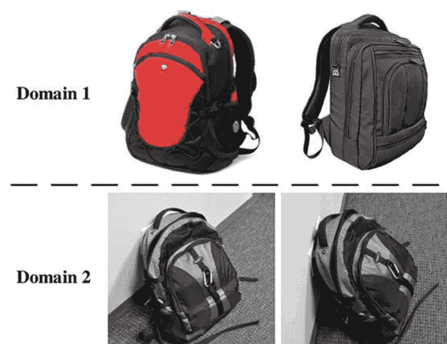

图9.3 领域自适应：在不同情况下识别物品是困难的[42]

一个分类模型和一个特征转换共同使用[127]。 对抗技术-鼓励特征表示难以区分的技术可用于实现适应性[28, 129, 139]，另请参见B.2.6.2节。

### 9.2.2 元学习

与迁移学习相关的是元学习。 在迁移学习中，重点是将参数从单个捐赠任务转移到接收任务以进行进一步的微调，而在元学习中，重点是利用多个任务的知识来学习如何更快、更好地学习新任务。 常规机器学习为一个任务学习示例，并且元学习旨在跨任务学习。 机器学习学习近似函数的参数，而元学习学习关于学习函数的超参数。⁴这经常被表达为学习如何学习的概念，自从其引入以来一直定义了该领域[103, 122, 124]。

术语 元学习 已经在许多不同的上下文中使用，不仅仅是深度学习，还包括从超参数优化到任务的范围内。

⁴将基础学习与参数学习关联，将元学习与超参数学习关联似乎给我们提供了一个清晰的区分；然而，在实践中，这种区分并不那么明确：在深度元学习中，正常参数的初始化被认为是一个重要的“超”参数。

| 名称 | 方法 | 环境 | 参考 |
| :--- | :--- | :--- | :--- |
| 循环ML | 在RL问题上部署循环网络 | – | [29, 135] |
| 元网络 | 快速重参数化 通过不同的元学习器对基础学习器进行区分 | O-glot, miniIm. | [78] |
| SNAIL | 注意机制与时间相关联卷积 | O-glot, miniIm. | [75] |
| LSTM ML | 将基础学习器参数嵌入到LSTM的细胞状态中 | miniImageNet | [95] |
| MAML | 学习初始化权重 θ用于快速适应O-glot， miniIm. | [34] |
| iMAML | 约 高阶梯度, 独立于优化路径 | O-glot, miniIm. | [92] |
| 元SGD | 学习初始化和更新 | O-glot, miniIm. | [70] |
| Reptile | 移动初始化 朝着任务特定的更新权重O-glot， miniIm. | [79] |
| BayesMAML | 学习多个初始化 Θ, 联合优化 SVGD | miniImagaNet | [144] |

算法选择，自动化机器学习。 （我们将在第9.2.2.6节简要介绍这些内容。）

深度元强化学习是一个活跃的研究领域。 许多算法正在被开发，并取得了很大进展。 表9.2列出了九种用于深度元强化学习的算法（参见调查[45, 49]）。

#### 9.2.2.1 评估少样本学习问题

终身机器学习的挑战之一是评估算法的性能。 常规的训练-测试泛化无法捕捉到元学习算法的适应速度。

因此，元学习任务通常根据其少样本学习能力进行评估。在少样本学习中，我们测试学习算法是否能够在训练中只见过少量样本的类别中识别出示例。在少样本学习中，网络中存在先前的知识。

要将少样本学习转化为人类环境，我们可以想象一个情境，在仅经过几分钟的双低音提琴训练后，人类能够演奏双低音提琴，但在小提琴、中提琴或大提琴上经过多年的训练。元学习算法通常通过少样本学习任务进行评估，其中算法必须识别仅见过少量示例的项目。这在 N路-k次方法[21, 61, 136]中得到了形式化。图9.4说明了这个过程。给定一个大型数据集 D，从该数据集中抽取一个较小的训练数据集 D。在 N路-k次分类问题中，构建训练数据集D，使其包含 N个类别，其中每个类别在数据集中有 k个示例。因此，|D|的基数为 N·k。

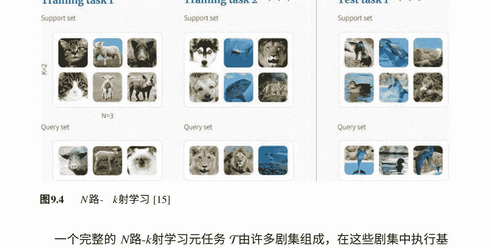

一个完整的 N路-k射学习元任务 T由许多剧集组成，在这些剧集中执行基本任务 Ti。一个基本任务由一个训练集和一个测试集组成，用于测试泛化能力。在少样本术语中，训练集称为支持集，测试集称为查询集。支持集的大小为 N · k，查询集由少量示例组成。元学习算法可以从 N路-k射查询/支持基本任务的剧集中学习，直到在元测试时用另一个查询测试元学习算法的泛化能力，如图所示。

#### 9.2.2.2 深度元学习算法

现在我们将转向深度元学习算法。元学习领域仍然年轻而活跃；尽管如此，该领域正在趋于一组定义，我们将在这里介绍。我们从监督设置开始解释。

元学习关注于从一组基础学习任务 { T1,T2,T3,... }中学习一个任务 T，以便一个新的（相关的）元测试任务能够更快地达到高准确性。每个基础学习任务 Ti由一个数据集 Di和一个学习目标，损失函数 Li组成。因此，我们得到 Ti = (Di, Li)。每个数据集由输入和标签的对 Di= {(xj, yj)}组成，并被分为训练集和测试集 Di = {DTr_i, 测试}。在每个训练数据集上，使用参数化模型 fθ 进行近似，使用损失函数 Li(θi, Di, 训练)。模型 f 通过一组超参数 ω进行近似，使用深度学习算法来进行控制。特定的超参数因算法而异，但常见的超参数包括学习率 α，初始参数 θ0和算法常数。

#### 9.2.2.3 内部和外部循环优化

过去几年中最流行的深度元学习方法之一是基于优化的元学习[49]。这种方法通过优化网络的初始参数 $\theta$来实现对新任务的快速学习。大多数基于优化的技术将元学习视为一个两级优化问题。

在内部层面，基学习器对训练集中的不同观测进行任务特定的更新，更新参数 $\theta$。在外部层面，元学习器通过一系列基本任务来优化超参数 $\omega$，其中每个任务的损失使用基本任务 $D_{\mathcal{T}}$的测试数据进行评估。

我测试[5, 67, 95]。
内循环优化参数 $\theta$，外循环优化超参数 $\omega$，以找到在基本任务集 $i$上的最佳性能。
$0, \ldots, M$与相应的测试数据：

```
$$\omega^* = \arg \min_{\omega} \mathcal{L}^{\text{meta}}\left(\underbrace{\arg \min_{\theta_i} \mathcal{L}_{\omega}^{\text{base}}(\theta_i, D_{i\text{train}})}_{\text{内循环}}, D_{i\text{test}}\right).$$
$$\underbrace{\qquad\qquad\qquad}_{\text{外循环}}$$
```

内循环优化任务 $\mathcal{T}_i$的数据集 $D_i$中的参数 $\theta_i$，外循环优化任务和数据集之间的超参数 $\omega$。
元损失函数优化元目标，可以是准确性、速度或其他基本任务（和数据集）上的目标。元优化的结果是一组最优超参数 $\omega^*$。

在基于优化的元学习中，最重要的超参数 $\omega$是最优初始参数 $\theta_0^*$。当元学习器只将初始参数作为超参数进行优化（$\omega = \theta_0$）时，内外公式简化如下：

```
$$\theta_0^* = \arg \min_{\theta_0} \mathcal{L}\left(\underbrace{\arg \min_{\theta_i} \mathcal{L}(\theta_i, D_{i,train})}_{\text{内循环}}, D_{i\text{test}}\right).$$
$$\underbrace{\qquad\qquad\qquad}_{\text{外循环}}$$
```

在这种方法中，我们元优化初始参数 $\theta_0$，使得损失函数在基本任务的测试数据上表现良好。第9.2.2.5节介绍了MAML，这是一个著名的例子。

深度元学习方法有时被归类为（1）相似度度量法，（2）基于模型的方法和（3）基于优化的方法[49]。现在我们将更详细地介绍表9.2中的两种元强化学习算法。我们将介绍循环元学习和MAML；前者是基于模型的方法，后者是基于优化的方法。

#### 9.2.2.4 循环元学习

为了使元强化学习方法能够学习，它们必须能够记住在子任务中学到的知识。让我们看看循环元学习如何在任务之间学习。

循环元学习使用循环神经网络来记住这些知识[29, 135]。循环网络作为学习任务嵌入（权重向量）的动态存储。循环可以通过LSTM[135]或门控循环单元[29]来实现。循环神经元元网络（元RNN）的选择决定了它对子任务的适应能力，因为它逐渐积累了关于基本任务结构的知识。

循环元学习跟踪变量状态（s）、动作（a）、奖励（r）和终止（d），它们表示一个回合的状态、动作、奖励和终止。对于每个任务 $T_i$，循环元学习将环境变量集合 {$s_{t+1}$, $a_t$, $r_t$, $d_t$}输入到每个时间步 $t$的元RNN中。元RNN输出一个动作和一个隐藏状态 $h_t$。在隐藏状态 $h_t$的条件下，元网络输出动作 $a_t$。目标是在每次试验中最大化预期奖励（图9.5）。由于循环元学习在隐藏状态中嵌入了先前观察到的输入信息，因此它被视为一种基于模型的元学习器[49]。

在简单的 $N$路 $k$-shot强化学习任务上，循环元学习器的表现几乎与无模型基线相当[29, 135]。然而，在更复杂的问题中，当依赖关系跨越更长的时间时，性能会下降。

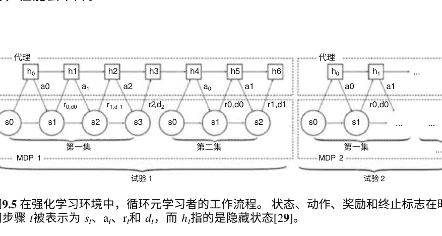## 算法9.1 用于强化学习的MAML [34]

```
要求：分布在任务上的p(T)：超参数步长α, β
随机初始化θ
当未完成时
采样一批任务T_i ~分布p(T)
对于所有T_i do
使用f_θ在T_i中采样k条轨迹D={(s1, a1, ... s_T)}
评估∇_θ L_T_i 使用D和L_T计算(π_θ)在公式9.1中
使用梯度下降计算适应参数：θ'_i = θ - α∇_θ L_T_i (π_θ)
使用f_θ采样轨迹D'_i={(s1, a1, ... ... s_T_i)}在T_i
结束循环
更新 θ ← θ - β∇_θ Σ_{T_i~p(T)} L_{T_i}(π_{θ'_i}) 使用每个 D'_i 和 L_{T_i} 在公式9.1中
结束循环
```

## 9.2.2.5 模型无关元学习

模型无关元学习方法（MAML）[34]是一种模型无关的优化方法：它可以用于不同的学习问题，例如分类、回归和强化学习。

如前所述，元学习的优化视角特别关注于优化初始参数θ。优化视角背后的直觉可以用一个简单的回归示例来说明（图9.6）。假设我们面临多个线性回归问题f_i(x)。该模型有两个参数：a和b，f(x) = a·x + b。当元训练集包含四个任务A、B、C和D时，如果我们希望将任务A、B、C和D优化为一组参数 {a, b}，从而可以快速学习每个任务的最优参数。在图9.6中，中间的点表示这些参数的组合。该点是最接近这四个不同任务的点。这就是模型无关元学习的工作原理[34]：通过让我们的模型接触各种基本任务，我们更新参数θ= {a, b}为良好的初始参数θ₀，以促进快速元适应。

让我们来看一下从特征学习的角度训练深度学习模型参数的过程[34, 49]，目标是通过少量的梯度步骤在新任务上产生良好的结果。我们构建了一个适用于许多任务的特征表示，并通过轻微调整参数（主要是更新顶层权重），我们取得了良好的结果，这与迁移学习类似。MAML找到了易于快速微调的参数θ，允许适应发生在适合快速学习的嵌入空间中。换句话说，MAML的目标是找到图9.6中间的点，从那里其他任务很容易到达。

MAML是如何工作的[34, 48, 90]? 请参考算法9.1中的MAML伪代码。学习任务是一个具有时限 T 的情节性马尔可夫决策过程，学习者被允许查询有限数量的样本轨迹进行少样本学习。每个强化学习任务 Tᵢ 包含一个初始状态分布 pᵢ(s₁)和一个转移分布 pᵢ(sₜ₊₁|sₜ, aₜ)。损失函数ℒ_{Tᵢ}对应于（负）奖励函数 R。正在学习的模型，π_θ 是从状态 sₜ 到动作分布 aₜ 的策略，t ∈ {1, …, T}。任务 Tᵢ 和策略 π_θ 的损失采用了熟悉的形式（公式2.5）：

$$ \mathcal{L}_{\mathcal{T}_i}(\pi_\theta) = -\mathbb{E}_{s_t,a_t \sim \pi_\theta, p_{\mathcal{T}_i}} \left[ \sum_{t=1}^T R_i(s_t, a_t, s_{t+1}) \right] . \quad (9.1) $$

在 k 次强化学习中，从 π_θ 和任务 Tᵢ 中进行 k 次模拟，并且奖励 R(sₜ, aₜ, s_{t+1}) 可以用于适应新任务Tᵢ。MAML使用TRPO来估计策略梯度更新和元优化[105]。

目标是在少数梯度更新步骤中快速学习新概念，相当于实现最小损失。梯度步数必须事先指定。对于单个梯度更新步骤，梯度下降产生更新的参数。

$$ \theta'_i = \theta - \alpha \nabla_\theta \mathcal{L}_{\mathcal{T}_i}(\pi_\theta) $$

特定于任务 i。跨任务的元损失是

$$ \theta \leftarrow \theta - \beta \nabla_\theta \sum_{\mathcal{T}_i \sim p(\mathcal{T})} \mathcal{L}_{\mathcal{T}_i}(\pi_{\theta'_i}) \quad (9.2) $$

## 9.2.2.6 超参数优化

元学习在深度学习流行之前就存在了很长时间。 它已经应用于经典机器学习任务，如回归、决策树、支持向量机、聚类算法、贝叶斯网络、进化算法和局部搜索[13, 17, 132]。 超参数视图对元学习的观点起源于此。

尽管这是一本关于深度学习的书，但简要讨论一下这个非深度背景是有趣的，也因为超参数优化是在强化学习实验中找到一组好的超参数的重要技术。

- 随机搜索
- 贝叶斯优化
- 基于梯度的优化
- 进化优化

这种元算法方法催生了算法配置研究，如SMAC [50]、 ParamILS [51]、 irace [71]、 以及算法选择研究 [57, 96]，如SATzilla [141]。 著名的超参数优化包括scikit-learn [86]、 scikit-optimize、 nevergrad [94]、 和Optuna [3] 。 超参数优化和算法配置发展成为自动机器学习或AutoML的领域。¹³ AutoML领域是一个庞大而活跃的元学习领域，有一本概述书籍[52]。

所有机器学习算法都有偏差，不同的算法在不同类型的问题上表现更好。超参数限制了算法的偏差。这种所谓的归纳偏差反映了算法对数据的一组假设。当这种偏差与学习问题匹配时，学习算法的性能更好（例如：CNN在图像问题上表现良好，RNN在语言问题上表现良好）。元学习改变了这种归纳偏差，可以通过选择不同的学习算法，改变网络初始化或其他方式来使算法能够在不同问题上良好地工作。

## 9.2.2.7 元学习和课程学习

元学习和课程学习之间存在一个有趣的联系。
这两种方法都旨在通过从一组子任务中学习来提高学习的速度和准确性。

在元学习中，通过子任务获得知识，以便可以快速学习一个新的相关任务。在课程学习（第6.2.3.1节）中，我们通过将一个大而困难的学习任务分解为一组子任务，从易到难的顺序来更快地学习。

因此，我们可以得出结论，课程学习是一种从易到难排序的元学习形式，或者等价地说，元学习是无序的课程学习。

## 9.2.2.8 从少样本到零样本学习

元学习利用先前学习任务的信息来更快地学习新任务[124]。元学习算法通常在少样本设置中进行评估，看看当它们只展示少量训练示例时，在图像分类问题中它们的表现如何。这个少样本学习问题旨在正确分类具有对新类别的很少先前支持的查询。在前面的章节中，我们已经讨论了元学习算法如何实现少样本学习。关于元学习的讨论将不完整，如果不提及零样本学习。

零样本学习（ZSL）比少样本学习更进一步。在零样本学习中，一个示例必须被识别为属于一个类别，而从未在该类别的示例上进行过训练[65, 81]。在零样本学习中，训练实例所涵盖的类别和我们要分类的类别是不相交的。这听起来可能像是不可能的事情 - 你怎么能识别你从未见过的东西？ - 然而这是我们人类一直在做的事情：通过学习倒咖啡进杯子，我们也可以倒茶，即使我们以前从未见过茶。（或者，通过学习拉小提琴、中提琴和大提琴，我们可以在一定程度上演奏低音提琴，即使我们以前从未演奏过低音提琴。）每当我们识别出我们以前从未见过的东西，我们实际上是在使用额外的信息（或特征）。如果我们在一张我们从未见过的鸟类物种的图片中识别出红色的喙，那么“红色”和“喙”这些概念对我们来说是已知的，因为我们在其他情境中学习过它们。零样本学习可以识别新的实例类别而无需训练样例。基于属性的零样本学习使用新类别的高级属性描述，这些描述基于先前在数据集中学习的类别。属性是一种中间表示，可以实现类之间的参数共享[2]。额外的信息可以是类别的文本描述- 红色或喙 - 除了视觉信息[64]。学习者必须能够将文本与图像信息匹配。

## 9.3 元学习环境

现在我们已经看到了如何实现迁移学习和元学习，现在是时候看一下用于评估算法的一些环境了。我们将列出重要的数据集、环境和基础模型，以扩大我们的范围，超越纯粹的强化学习。我们将看一下这些方法在快速泛化到新的机器学习任务方面的表现如何。

许多基准已经被引入来测试迁移学习和元学习算法。传统机器学习算法的基准旨在提供各种具有挑战性的学习任务。相比之下，元学习的基准旨在提供相关的学习任务。一些基准是参数化的，可以控制任务之间的差异。

元学习旨在更快地学习新的相关任务，权衡速度和准确性。这引发了一个问题，即在不同情况下，元学习算法的速度和准确性如何。在回答这些问题时，我们必须记住，学习任务越接近，任务就越容易，结果就越快速和准确。因此，当我们比较结果时，我们应该仔细看一下基准使用的数据集。

表格 9.3 数据集，环境和模型用于图像，行为和文本的元学习

| 姓名           | 类型   | 领域   | 参考     |
|----------------|--------|--------|----------|
| ALE            | 单一   | 游戏   | [8]      |
| MuJoCo         | 单一   | 机器人 | [126]    |
| DeepMind 控制套件 | 单一   | 机器人 | [120]    |
| BERT           | 转移   | 文本   | [25]     |
| GPT-3          | 转移   | 文本   | [89]     |
| ImageNet       | 转移   | 图像   | [33]     |
| Omniglot       | 元     | 图像   | [61]     |
| Mini-ImageNet  | 元     | 图像   | [133]    |
| 元数据集       | 元     | 图像   | [128]    |
| 元世界         | 元     | 机器人 | [146]    |
| Alchemy        | 元     | Unity  | [134]    |

表格 9.3 列出了一些常用于元学习实验的环境。其中一些是专为单任务学习设计的深度学习环境（“单一”），一些是转移学习和预训练数据集（“转移”），而一些数据集和环境则专门用于元学习实验（“元”）。

我们现在将更详细地描述它们。ALE（第3.1.1节），MuJoCo（第4.1.3节）和DeepMind控制套件（第4.3.2节）最初是单任务深度学习环境。它们也被用于元学习实验和少样本学习，通常结果中等，因为任务通常不太相似（乒乓球不像吃豆人）。

## 9.3.1 图像处理

传统上，两个数据集已经成为少样本图像学习的事实标准：Omniglot [62]和mini-ImageNet [99, 133]。Omniglot是一个用于单样本学习的数据集。该数据集包含来自50个不同字母表的1623个不同手写字符，每个类别（字符）包含20个示例[62, 63]。最近的大多数方法在Omniglot上获得了非常高的准确性，使得它们之间的比较大多无意义。Mini-ImageNet在测试时使用与Omniglot相同的设置，包含60,000个尺寸为84 ×84的彩色图像，共100个类别（64/16/20用于训练/验证/测试），每个类别包含600个示例[133]。虽然比Omniglot更难，但大多数最新方法在控制模型容量时实现了类似的准确性。元学习算法，如贝叶斯程序学习和MAML，在Omniglot和ImageNet上实现了与人类性能相当的准确性，准确率高达九十几个百分点，错误率仅为几个百分点[63]。

在最大数据集上训练的模型，例如ImageNet，被用作基础模型[14]。预训练模型可以从模型库中下载。¹⁴这些基准测试可能对元学习的测试过于同质化。相比之下，现实生活中的学习经验是异质的：它们在类别数量和每个类别的示例数量上变化不一，并且不平衡。此外，Omniglot和Mini-ImageNet基准测试衡量的是数据集内的泛化能力。

对于元学习，我们最终追求的是能够推广到全新分布的模型。因此，正在开发专门用于元学习的新数据集。

## 9.3.2 自然语言处理

在自然语言处理中，BERT是一个著名的预训练模型。BERT代表双向编码器转换器的双向编码器表示[25]。它旨在通过同时依赖于两个上下文来预训练深度双向表示的无标签文本。BERT已经证明了在自然语言任务中迁移学习可以很好地工作。BERT可以用于分类任务，如情感分析、问答任务和命名实体识别。BERT是一个庞大的模型，有3.45亿个参数[98]。

一个更大的预训练变压器模型是生成预训练变压器3，或GPT-3 [89]，具有1750亿个参数。GPT-3生成的文本质量非常好，很难与人类写的区分开。在这种情况下，似乎大小很重要。OpenAI提供了一个公共接口，您可以自行查看其性能如何。¹⁵BERT和GPT-3是越来越多地被用作其他实验的基础模型。

## 9.3.3 元数据集

最近为元学习专门设计的数据集是元数据集[128]。¹⁶元数据集是一组数据集，包括：ImageNet、Omniglot、Aircraft、Birds、Textures、Quick Draw、Fungi、Flower、Traffic Signs和MSCOCO。因此，这些数据集提供了比早期单一数据集实验更多样化的挑战。

Triantafillou等人使用匹配网络[133]、原型网络[112]、一阶MAML[34]和关系网络[118]报告了结果。正如可以预计，在更大的（元）数据集上的准确性要比之前的同质数据集低得多。他们发现MAML的变体表现最好，尽管对于在其他数据集上训练的分类器，大多数准确率在40%到60%之间，除了Birds和Flowers，它们的准确率在70%到80%之间，接近Omniglot和ImageNet的单数据集结果。异构数据集的元学习仍然是一项具有挑战性的任务（也参见[21, 125]）。

## 9.3.4 元世界

对于深度强化学习，传统上流行的环境是ALE和MuJoCo。ALE基准测试中的游戏通常差异很大，这使得ALE测试集对于元学习来说具有挑战性，并且很少有成功的报道。（有一些例外情况将转移学习（预训练）应用于DQN [76, 84, 113]，在一组移动球的Atari游戏中成功进行多任务学习。）

另一方面，机器人任务更容易参数化。测试任务可以以所需的相似性水平生成，使机器人任务适合元学习测试。典型任务，如到达和学习不同的行走方式，比两个 Atari 游戏更相关，例如Breakout 和 Space Invaders。

为了为元强化学习提供一个更具挑战性的基准，Yu 等人引入了 Meta-World [146]，¹⁷ 一个多任务和元强化学习的基准（见图 9.7 以获得他们对多任务和元学习之间差异的图解解释）。Meta-World 包含 50 个不同的机械臂操作任务（图 9.8）。这些任务被设计为不同且包含结构，可以用于对新任务的转移。


图 9.7 多任务和元强化学习 [146]

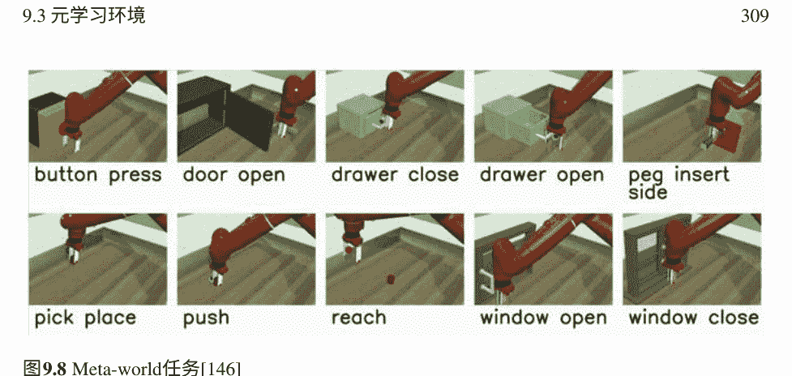

当Meta-World的作者评估了六种最先进的元强化学习和多任务学习算法在这些任务上的表现时，他们发现现有算法对异构任务的泛化能力有限。他们尝试了PPO，TRPO，SAC，RL²[29]，MAML和PEARL [93]。即使是任务的微小变化，例如不同的物体位置，也可以以合理的成功率进行学习，但是算法在同时学习多个任务时遇到了困难，即使只有十个不同的训练任务。与更有限的元学习基准相比，Meta-World强调对新任务和交互场景的泛化能力，而不仅仅是目标参数的变化。

### 9.3.5 炼金术

我们将讨论的最后一个元强化学习基准是Alchemy [134]。Alchemy基准是一个程序生成的3D视频游戏[107]，使用Unity [54]实现。任务生成是可参数化的，可以选择不同程度的相似性和隐藏结构。Alchemy关卡的创建过程对研究人员是可访问的，并且可以实现一个完美的贝叶斯理想观察者。

报告了两个代理的实验结果，VMPO和IMPALA。VMPO [85, 115]代理基于门控变压器网络。IMPALA [31, 53]代理基于基于人口的训练和LSTM核心网络。这两个代理都是强大的深度学习方法，尽管不一定适用于元学习。同样，在这两个代理中，随着学习任务的多样化，元学习变得更加困难。元学习的表现较弱。

Alchemy平台可以在GitHub上找到。 人类可玩的界面是环境的一部分。

## 9.3.6 实践：Meta-World示例

让我们体验一下运行Meta-World基准环境的经历。 我们将在其中运行一些流行的代理算法，如PPO和TRPO。Meta-World和Gym一样易于使用。代码可以在GitHub上找到，并且伴随着一套代理算法的实现被称为Garage [37]。Garage在PyTorch和TensorFlow上运行。

标准的元世界基准包括多任务和元学习设置，命名为MT1、MT10、MT50和ML1、ML10、ML50。可以使用pip安装元世界基准

```
pip install git+https://github.com/rlworkgroup/metaworld.git@master#egg=metaworld
```

请注意，元世界是一个机器人基准，需要MuJoCo，所以您也必须安装它。

GitHub网站包含有关使用基准的简要示例说明，请参阅列表9.3。该基准可以用于测试您喜欢的算法的元学习性能，或者您可以使用Garage提供的其中一个基准。

## 结论

在本章中，我们已经看到了学习新任务和不同任务的不同方法，甚至可以使用很少甚至没有示例。取得了令人印象深刻的结果，尽管在任务更多样化时，仍然存在重大挑战来学习一般的适应性。正如在新领域中经常发生的情况一样，已经尝试了许多不同的方法。元学习领域是一个活跃的研究领域，旨在解决机器学习的主要问题之一，并将继续开发许多新方法。

```
python
import metaworld
import random

print(metaworld.ML1.ENV_NAMES) # 尝试可用的环境

ml1 = metaworld.ML1('pick-place-v1') # 构建基准

env = ml1.train_classes['pick-place-v1']()
task = random.choice(ml1.train_tasks)
env.set_task(task) # 设置任务

obs = env.reset() # 重置环境
a = env.action_space.sample() # 采样动作
obs, reward, done, info = env.step(a) # 执行环境步骤
```

第9.3节 使用元世界

## 总结和进一步阅读

我们现在将总结本章并提供进一步阅读的指引。

## 总结

本章关注的是如何更快地学习新任务，并且使用更小的数据集或更低的样本复杂度。迁移学习关注的是将已经学习到的知识应用于解决另一个任务，以便更快地学习。一种常见的迁移学习方法是预训练，其中一些网络层被复制以初始化一个新任务的网络，然后进行微调，以提高在新任务上的性能，但使用更小的数据集。

另一种方法是元学习，或者学习如何学习。在这里，学习了一系列先前任务的知识被用来更快地学习一个新任务。元学习学习不同任务的超参数。在深度元学习中，初始网络参数集通常被视为一种超参数。

元学习的目标是学习可以仅使用少量训练样例就能学习新任务的超参数，通常使用N-way-k-shot学习方法。对于深度少样本学习，Model-Agnostic Meta-Learning (MAML) 方法是众所周知的，并且已经启发了后续的研究工作。

元学习在机器学习中非常重要。对于相关的任务，取得了良好的结果。对于更具挑战性的基准测试，任务之间关联性较低（例如来自非常不同物种的动物图片），报告的结果较弱。

## 进一步阅读

元学习是一个非常活跃的研究领域。良好的入门点是[16, 45, 48, 49, 150]。
元学习在人工智能中引起了很多关注，无论是在监督学习还是强化学习中。
关于元学习领域已经有很多书籍和调研报告，例如[17, 102, 106, 130, 138]。

关于元学习算法的研究兴趣已经存在一段时间了，例如[10, 103, 104, 132]。关于迁移学习和元学习的研究历史悠久，始于Pratt和Thrun的工作[88, 124]。早期对该领域的调研有[82, 121, 137]；更近期的调研有[148, 149]。Huh等人专注于ImageNet[47, 91]。Yang等人研究了迁移学习和课程学习在Sokoban游戏中的关系[143]。

Schmidhuber [103, 104]描述了元学习的早期原则。
元学习调查有[17, 43, 45, 48, 49, 102, 106, 130, 132, 138]。相似度度量元学习的论文有[38, 58, 108, 112, 118, 133]。基于模型的元学习的论文有[29, 30, 39, 75, 78, 101, 135]。基于优化的元学习的论文有很多[5, 11, 34–36, 41, 69, 70, 79, 92, 95, 100, 144]。
领域自适应研究在[4, 23, 27, 77, 148]中进行。零样本学习是一个活跃且有前景的领域。有趣的论文有[2, 12, 26, 46, 64, 65, 81, 91, 97, 116, 140]。像零样本学习一样，少样本学习也是元学习研究的一个热门领域[44, 60, 80, 114, 116]。基准论文有[21, 125, 128, 134, 146]。

## 练习

现在是时候通过一些练习和问题来测试我们对迁移学习和元学习的理解了。

## 问题

以下是一些快速问题，用于检查你对本章的理解。对于每个问题，一个简单的、单句回答就足够了。

- 1. 为什么对元学习和迁移学习感兴趣？
- 2. 什么是迁移学习？
- 3. 什么是元学习？
- 4. 元学习与多任务学习有何不同？
- 5. 零样本学习旨在识别以前未见过的类别。这是如何可能的？
- 6. 预训练是迁移学习的一种形式吗？
- 7. 你能解释一下学习如何学习吗？
- 8. 初始网络参数也是超参数吗？请解释。
- 9. 零样本学习的一种方法是什么？
- 10. 随着任务的多样性增加，元学习能够取得良好的结果吗？

## 练习

让我们进行编程练习，以更加熟悉本章介绍的方法。元学习和迁移学习的实验通常非常耗费计算资源。作为最后的手段，你可能需要缩小数据集大小或跳过一些练习。

- 1. 预训练在Keras预训练示例中实现预训练和微调，来自第9.2.1.3节。<sup>22</sup>按照建议完成练习，包括在猫狗训练集上进行微调。注意预处理、数据增强和正则化（dropout和批归一化）的使用。观察将传输的层数增加对训练性能和速度的影响。
- 2. MAML Reptile [79]是受MAML启发的元学习方法，但是是一阶的、更快的，专门用于少样本学习。Keras网站上有关于Reptile的部分。<sup>23</sup>在开始时定义了一些超参数：学习率、步长、批大小、元学习迭代次数、评估迭代次数、样本数、类别数等等。
研究调整不同超参数的效果，特别是与少样本学习相关的参数：类别、样本数和迭代次数。
为了更深入地研究少样本学习，还可以查看MAML代码，其中有一个关于强化学习的部分。<sup>24</sup>尝试不同的环境。
- 3. Meta-World正如我们在第9.3.4节中所看到的，Meta-World [146]是一个精心设计的元强化学习基准套件。重新阅读该部分，前往GitHub安装基准套件。<sup>25</sup>还要前往Garage安装代理算法，以便能够测试其性能。<sup>26</sup>确保它们与您的PyTorch或TensorFlow设置兼容。首先尝试运行ML1元基准测试的PPO算法。然后尝试MAML和RL2。接下来，尝试更复杂的元学习基准测试。阅读Meta-World论文，并尝试复现他们的结果。
- 4. 零样本学习我们从少样本学习到零样本学习。零样本学习的一种方式是通过学习类别之间共享的属性来实现。阅读论文标签嵌入图像分类[2]，以及一种尴尬地简单的零样本学习方法[97]，并查看代码[12]。<sup>27</sup>实现它，并尝试理解属性学习的工作原理。
打印类别的属性，并使用不同的数据集。MAML对少样本学习有效吗？(具有挑战性)

> 22 https://keras.io/guides/transfer_learning/.
> 23 https://keras.io/examples/vision/reptile/.
> 24 https://github.com/cbfinn/maml_rl/tree/master/rllab.
> 25 https://github.com/rlworkgroup/metaworld.
> 26 https://github.com/rlworkgroup/garage.

## 参考文献

- 1. Pulkit Agrawal, Ross Girshick和Jitendra Malik。分析多层神经网络在目标识别中的性能。在欧洲计算机视觉大会上，页码329-344。Springer, 2014年。289
- 2. Zeynep Akata, Florent Perronnin, Zaid Harchaoui和Cordelia Schmid。标签嵌入用于基于属性的分类。在IEEE计算机视觉和模式识别会议的论文中，页码为819-826, 2013年。305, 312, 314
- 3. Takuya Akiba, Shotaro Sano, Toshihiko Yanase, Takeru Ohta和Masanori Koyama。Optuna: 下一代超参数优化框架。在第25届ACM SIGKDD国际数据挖掘会议上的论文中，页码为2623-2631, 2019年。303
- 4. Dario Amodei, Chris Olah, Jacob Steinhardt, Paul Christiano, John Schulman和Dan Man。AI安全性中的具体问题。arXiv预印本arXiv:1606.06565, 2016年。312
- 5. Antreas Antoniou, Harrison Edwards和Amos Storkey。如何训练你的MAML。arXiv预印本arXiv:1810.09502, 2018年。312
- 6. Andreas Argyriou, Theodoros Evgeniou, 和 Massimiliano Pontil。多任务特征学习。在Advances in Neural Information Processing Systems, 2007年, 页码41-48。295
- 7. Jonathan Baxter。归纳偏好学习模型。Journal of Artificial Intelligence Research, 12:149–198, 2000. 291
- 8. Marc G Bellemare, Yavar Naddaf, Joel Veness, 和 Michael Bowling。街机学习环境：通用智能体评估平台。Journal of Artificial Intelligence Research, 47:253–279, 2013. 306
- 9. Shai Ben-David, John Blitzer, Koby Crammer, 和 Fernando Pereira。领域适应表示分析。Advances in Neural Information Processing Systems, 19:137, 2007. 295
- 10. Yoshua Bengio, Samy Bengio和Jocelyn Cloutier。学习一个突触学习规则。技术报告, 蒙特利尔, 1990年。312
- 11. Luca Bertinetto, Joao F Henriques, Philip HS Torr和Andrea Vedaldi。具有可微闭式求解器的元学习。在国际学习表示会议上, 2018年。312
- 12. Shrisha Bharadwaj。令人尴尬地简单的零样本学习。https://github.com/chichilicious/embarrassingly-simple-zero-shot-learning, 2018年。312, 314
- 13. Christopher M Bishop。模式识别和机器学习。信息科学和统计学。Springer Verlag, Heidelberg, 2006年。303
- 14. Rishi Bommasani, Drew A. Hudson, Ehsan Adeli, Russ Altman, Simran Arora, Sydney von Arx, Michael S. Bernstein, Jeannette Bohg, Antoine Bosselut, Emma Brunskill, Erik Brynjolfsson, Shyamal Buch, Dallas Card, Rodrigo Castellon, Niladri Chatterji, Annie S. Chen, Kathleen Creel, Jared Quincy Davis, Dorottya Demszky, Chris Donahue, Moussa Doumbouya, Esin Durmus, Stefano Ermon, John Etchemendy, Kawin Ethayarajh, Li Fei-Fei, Chelsea Finn, Trevor Gale, Lauren Gillespie, Karan Goel, Noah D. Goodman, Shelby Grossman, Neel Guha, Tatsunori Hashimoto, Peter Henderson, John Hewitt, Daniel E. Ho, Jenny Hong, Kyle Hsu, Jing Huang, Thomas Icard, Saahil Jain, Dan Jurafsky, Pratyusha Kalluri, Siddharth Karamcheti, Geoff Keeling, Fereshte Khani, Omar Khattab, Pang Wei Koh, Mark S. Krass, Ranjay Krishnan, and Rohith Kuditipudi。关于基础模型的机会和风险。arXiv预印本arXiv: 2108.07258, 2021. 289, 307
- 15. Borealis。Few shot learning tutorial https://www.borealisai.com/en/blog/tutorial-2-few-shot-learning-and-meta-learning-i/. 298
- 16. Matthew Botvinick, Sam Ritter, Jane X Wang, Zeb Kurth-Nelson, Charles Blundell, and Demis Hassabis。Reinforcement learning, fast and slow。Trends in Cognitive Sciences, 23(5):408–422, 2019. 312
- 17. Pavel Brazdil, Christophe Giraud Carrier, Carlos Soares, and Ricardo Vilalta。Metalearning: Applications to data mining。Springer Science & Business Media, 2008. 291, 303, 312, 312
- 18. Tom B. Brown, Benjamin Mann, Nick Ryder, Melanie Subbiah, Jared Kaplan, Prafulla Dhariwal, Arvind Neelakantan, Pranav Shyam, Girish Sastry, Amanda Askell, Sandhini Agarwal, Ariel Herbert-Voss, Gretchen Krueger, Tom Henighan, Rewon Child, Aditya Ramesh, Daniel M. Ziegler, Jeffrey Wu, Clemens Winter, Christopher Hesse, Mark Chen, Eric Sigler, Mateusz Litwin, Scott Gray, Benjamin Chess, Jack Clark, Christopher Berner, Sam McCandlish, Alec Radford, Ilya Sutskever, and Dario Amodei。Language models are few-shot learners。In Advances in Neural Information Processing Systems, 2020. 290
- 19. Thomas Carr, Maria Chli, and George Vogiatzis。Domain adaptation on the Atari。In 第18届国际自主代理和多代理系统会议论文集, AAMAS '19, 蒙特利尔, 页码1859-1861, 2018年。295
- 20. Rich Caruana。多任务学习。机器学习, 28(1): 41-75, 1997年。291, 292, 295, 295
- 21. Wei-Yu Chen, Yen-Cheng Liu, Zsolt Kira, Yu-Chiang Frank Wang和Jia-Bin Huang。对少样本分类的深入研究。在国际学习表示会议上, 2019年。297, 308, 312
- 22. Carlo Ciliberto, Youssef Mrouche, Tomaso Poggio和Lorenzo Rosasco。凸学习多个任务及其结构。在国际机器学习会议上, 页码1548-1557. PMLR, 2015年。291
- 23. Gabriela Csurka。面向视觉应用的领域自适应: 一项综合调查。在计算机视觉应用中的领域自适应,计算机视觉和模式识别进展,页1-35. Springer, 2017. 295, 312
- 24. Hal Daum III。令人沮丧的简单领域自适应。在ACL 2007, 第45届计算语言学协会年会, 2007年6月23日至30日, 布拉格, 2007. 295
- 25. Jacob Devlin, Ming-Wei Chang, Kenton Lee和Kristina Toutanova。BERT: 深度双向转换器的预训练用于语言理解。在2019年北美计算语言学协会年会论文集:人类语言技术, NAACL-HLT 2019, 明尼阿波利斯, 2018. 289, 290, 306, 307
- 26. Chuong B Do和Andrew Y Ng。文本分类的迁移学习。神经信息处理系统进展, 18:299-306, 2005. 312
- 27. Jeff Donahue, Yangqing Jia, Oriol Vinyals, Judy Hoffman, Ning Zhang, Eric Tzeng和Trevor Darrell。DeCAF: 一种用于通用视觉识别的深度卷积激活特征。在国际机器学习会议上, 第647-655页. PMLR, 2014年。289, 312
- 28. Yuntao Du, Zhiwen Tan, Qian Chen, Xiaowen Zhang, Yirong Yao和Chongjun Wang。双重对抗领域自适应。arXiv预印本arXiv:2001.00153, 2020年. 296
- 29. Yan Duan, John Schulman, Xi Chen, Peter L Bartlett, Ilya Sutskever和Pieter Abbeel。RL²：通过慢强化学习实现快速强化学习。arXiv预印本arXiv:1611.02779, 2016年. 297, 300, 300, 300, 300, 309, 312
- 30. Harrison Edwards和Amos Storkey。走向神经统计学家。在国际学习表示会议，2017年。312
- 31. Lasse Espeholt, Hubert Soyer, Remi Munos, Karen Simonyan, Vlad Mnih, Tom Ward, Yotam Doron, Vlad Firoiu, Tim Harley, Iain Dunning, Shane Legg和Koray Kavukcuoglu。IMPALA: 具有重要性加权演员-学习者架构的可扩展分布式深度强化学习。在国际机器学习会议，第1407-1416页。PMLR, 2018年。309
- 32. Theodoros Evgeniou和Massimiliano Pontil。正则化多任务学习。在第十届ACM SIGKDD国际知识发现与数据挖掘会议，第109-117页。ACM, 2004年。295
- 33. 李飞飞，邓佳，和李凯。ImageNet：构建一个大规模图像数据库。Journal of Vision, 9(8): 1037–1037, 2009年。306
- 34. 切尔西·芬恩，皮特·阿贝尔和谢尔盖·莱文。模型无关元学习用于深度网络的快速适应。在国际机器学习会议，页码1126–1135。PMLR, 2017年。297, 301, 301, 302, 302, 302, 303, 307, 312
- 35. 切尔西·芬恩，阿拉温德·拉杰斯瓦兰，夏姆·卡卡德和谢尔盖·莱文。在线元学习。在国际机器学习会议，页码1920–1930。PMLR, 2019年。
- 36. 切尔西·芬恩，凯文·徐和谢尔盖·莱文。概率模型无关元学习。在神经信息处理系统进展，页码9516–9527，2018年。312
- 37. 车库贡献者。车库：可复现强化学习研究的工具包。https://github.com/rlworkgroup/garage, 2019. 310
- 38. Victor Garcia和Joan Bruna。用图神经网络进行少样本学习。在国际学习表示会议, 2017. 312
- 39. Marta Garnelo, Dan Rosenbaum, Christopher Maddison, Tiago Ramalho, David Saxton, Murray Shanahan, Yee Whye Teh, Danilo Rezende和SM Ali Eslami。条件神经过程。在国际机器学习会议, 页码1704-1713。PMLR, 2018. 312
- 40. Ross Girshick, Jeff Donahue, Trevor Darrell和Jitendra Malik。用于准确目标检测和语义分割的丰富特征层次结构。在IEEE计算机视觉和模式识别会议的论文集.页码580-587, 2014. 289
- 41. Erin Grant, Chelsea Finn, Sergey Levine, Trevor Darrell和Thomas Griffiths。将基于梯度的元学习重新构建为分层贝叶斯。在国际学习表示会议, 2018. 312
- 42. 郭希峰，陈伟，尹建平。一种简单的无监督领域适应方法。在2016年第23届国际模式识别大会（ICPR），页1566–1570。IEEE，2016年。296
- 43. Abhishek Gupta，Russell Mendonca，YuXuan Liu，Pieter Abbeel和Sergey Levine。结构化探索策略的元强化学习。在神经信息处理系统进展，页5307–5316，2018年。312
- 44. Irina Higgins，Arka Pal，Andrei Rusu，Loic Matthey，Christopher Burgess，Alexander Pritzel，Matthew Botvinick，Charles Blundell和Alexander Lerchner。DARLA：改进强化学习中的零-射击转移。在国际机器学习大会，页1480–1490。PMLR，2017年。312
- 45. Timothy Hospedales，Antreas Antoniou，Paul Micaelli和Amos Storkey。神经网络中的元学习：一项调查。arXiv预印本arXiv:2004.05439，2020年。291，291，297，299，312，312
- 46. R Lily Hu，Caiming Xiong和Richard Socher。零样本图像分类受自然语言类别描述引导的元学习方法。在神经信息处理系统进展，2018年。312
- 47. Minyoung Huh，Pulkit Agrawal和Alexei A Efros。什么使ImageNet适合迁移学习？arXiv预印本arXiv:1608.08614，2016年。289，312
- 48. Mike Huisman，Jan van Rijn和Aske Plaat。深度神经网络的元学习。在Pavel Brazdil等人的编辑下，元学习：应用于数据挖掘。Springer，2022年。291，302，303，312，312

49. Mike Huisman, Jan N. van Rijn, and Aske Plaat. 深度元学习综述. 人工智能评论, 2021年. 291, 297, 297, 299, 300, 300, 301, 302, 312, 312

50. Frank Hutter, Holger H. Hoos, and Kevin Leyton-Brown. 顺序模型优化通用算法配置. 在国际学习和智能优化会议, 页码507-523. Springer, 2011年. 303

51. Frank Hutter, Holger H. Hoos, Kevin Leyton-Brown, and Thomas Stützle. ParamILS: 一个自动算法配置框架. 人工智能研究杂志, 36:267-306, 2009年. 303

52. Frank Hutter, Lars Kotthoff and Joaquin Vanschoren. 自动化机器学习: 方法, 系统, 挑战. Springer Nature, 2019年. 304

53. Max Jaderberg, Valentin Dalibard, Simon Osindero, Wojciech M. Czarnecki, Jeff Donahue, Ali Razavi, Oriol Vinyals, Tim Green, Iain Dunning, Karen Simonyan, Chrisantha Fernando, and Koray Kavukcuoglu. 基于人口的神经网络训练. arXiv预印本 arXiv:1711.09846, 2017年. 309

54. Arthur Juliani, Vincent-Pierre Berges, Ervin Teng, Andrew Cohen, Jonathan Harper, Chris Elion, Chris Goy, Yuan Gao, Hunter Henry, Marwan Mattar and Danny Lange. Unity: 一个通用的智能代理平台. arXiv预印本arXiv:1809.02627, 2018年. 309

55. Stephen Kelly and Malcolm I. Heywood. 在Atari视频游戏中的多任务学习与紧密编程图. 在遗传算法和进化计算会议论文集中, 页码195-202. ACM, 2017年. 295

56. Stephen Kelly and Malcolm I. Heywood. Emergent tangled program graphs in multi-task learning. 在 IJCAI, 2018年的第5294-5298页. 295

57. Pascal Kerschke, Holger H. Hoos, Frank Neumann and Heike Trautmann. 自动化算法选择: 调查和展望. 进化计算, 27(1):3-45, 2019年. 303

58. Gregory Koch, Richard Zemel and Ruslan Salakhutdinov. 用于一次性图像识别的连体神经网络. 在ICML深度学习研讨会, 第2卷. 里尔, 2015年. 312

59. Alex Krizhevsky, Ilya Sutskever and Geoffrey E. Hinton. 使用深卷积神经网络的ImageNet分类. 在神经信息处理系统进展, 第1097-1105页, 2012年. 290

60. 郭彦玲, 鲍里斯·卡茨和安德烈·巴布. 将公式编码为深度神经网络: 零样本执行LTL公式的强化学习. arXiv预印本arXiv:2006.01110, 2020年. 312

61. 布伦登·莱克, 鲁斯兰·萨拉胡丁诺夫, 杰森·格罗斯和约书亚·特南鲍姆. 简单视觉概念的一次性学习. 在认知科学年会论文集, 第33卷, 2011年. 297, 306

62. 布伦登·M·莱克, 鲁斯兰·萨拉胡丁诺夫和约书亚·B·特南鲍姆. 通过概率程序归纳进行人类级概念学习. 科学, 350(6266):1332-1338, 2015年. 306, 306

63. 布伦登·M·莱克, 鲁斯兰·萨拉胡丁诺夫和约书亚·B·特南鲍姆. Omniglot挑战: 3年进展报告. 行为科学当前观点, 29:97-104, 2019年. 306, 306

64. 克里斯托夫·H·兰珀特, 汉内斯·尼基什, 斯特凡·哈梅林. 通过类间属性转移学习检测未见过的物体类别. 在2009年IEEE计算机视觉和模式识别会议上, 页码951-958. IEEE, 2009年. 305, 312

65. Hugo Larochelle, Dumitru Erhan and Yoshua Bengio. 零数据学习新任务. 在AAAI, 卷1, 第3页, 2008年. 304, 312

66. Yann LeCun, Yoshua Bengio and Geoffrey Hinton. 深度学习. 自然, 521(7553):436, 2015年. 289

67. Yoonho Lee and Seungjin Choi. 基于梯度的元学习与学习的逐层度量和子空间. 在国际机器学习会议, 页码2927-2936. PMLR, 2018年. 299

68. Sergey Levine, Aviral Kumar, George Tucker and Justin Fu. 离线强化学习: 教程、评论和对开放问题的展望. arXiv预印本arXiv:2005.01643, 2020年. 295

69. Ke Li and Jitendra Malik. 学习优化神经网络. arXiv预印本arXiv:1703.00441, 2017年. 312

70. Zhenguo Li, Fengwei Zhou, Fei Chen, and Hang Li. Meta-SGD: 学习快速学习少样本学习. arXiv预印本 arXiv:1707.09835, 2017. 297, 312

71. Manuel López-Ibáñez, Jérémie Dubois-Lacoste, Leslie Pérez Cáceres, Mauro Birattari, and Thomas Stützle. irace软件包: 迭代竞赛用于自动算法配置. Operations Research Perspectives, 3:43–58, 2016. 303

72. Dhruv Mahajan, Ross Girshick, Vignesh Ramanathan, Kaiming He, Manohar Paluri, Yixuan Li, Ashwin Bharadwaj, and Laurens van der Maaten. 探索弱监督预训练的极限. 在欧洲计算机视觉会议(ECCV), 页码181–196, 2018. 289

73. Tomas Mikolov, Kai Chen, Greg Corrado, and Jeffrey Dean. 在向量空间中高效估计词的表示. 在国际学习表示会议, 2013年. 289, 293

74. Tomas Mikolov, Ilya Sutskever, Kai Chen, Greg Corrado, and Jeffrey Dean. 单词和短语的分布式表示及其组合性. 在神经信息处理系统进展, 2013年. 289

75. Nikhil Mishra, Mostafa Rohaninejad, Xi Chen, and Pieter Abbeel. 一个简单的神经关注元学习者. 在国际学习表示会议, 2018年. 297, 312

76. Akshita Mittal and Purna Santhi Munukutla. 使用竞争性强化学习在Atari游戏之间进行视觉迁移. 在IEEE/CVF计算机视觉和模式识别会议工作坊的论文集中, 页码0-0, 2019年. 308

77. Matthias Müller-Brockhausen, Mike Preuss and Aske Plaat. 程序内容生成: 更好的转移强化学习基准. 在游戏会议中, 2021年. 312

78. Tsendsuren Munkhdalai and Hong Yu. 元网络. 在国际机器学习会议上, 页2554-2563. PMLR, 2017年. 297, 312

79. Alex Nichol, Joshua Achiam and John Schulman. 关于一阶元学习算法. arXiv预印本arXiv:1803.02999, 2018年. 297, 303, 312, 313

80. Junhyuk Oh, Satinder Singh, Honglak Lee and Pushmeet Kohli. 零样本任务泛化与多任务深度强化学习. 在国际机器学习会议上, 页2661-2670. PMLR, 2017年. 312

81. Mark M. Palatucci, Dean A. Pomerleau, Geoffrey E. Hinton, and Tom Mitchell. 使用语义输出编码的零样本学习. 在Advances in Neural Information Processing Systems 22, 2009. 304, 312

82. Sinno Jialin Pan and Qiang Yang. 关于迁移学习的调查. IEEE Transactions on Knowledge and Data Engineering, 22(10):1345–1359, 2010. 290, 292, 295, 312

83. German I. Parisi, Ronald Kemker, Jose L. Part, Christopher Kanan, and Stefan Wermter. 使用神经网络的持续终身学习: 一项综述. 神经网络, 113:54–71, 2019. 292

84. Emilio Parisotto, Jimmy Lei Ba, and Ruslan Salakhutdinov. Actor-mimic: 深度多任务和迁移强化学习. arXiv预印本 arXiv:1511.06342, 2015. 308

85. Emilio Parisotto, Francis Song, Jack Rae, Razvan Pascanu, Caglar Gulcehre, Siddhant Jayakumar, Max Jaderberg, Raphael Lopez Kaufman, Aidan Clark, Seb Noury, 等. 用于强化学习的稳定变压器. 在International Conference on Machine Learning, pages 7487–7498. PMLR, 2020. 309

86. Fabian Pedregosa, Gaël Varoquaux, Alexandre Gramfort, Vincent Michel, Bertrand Thirion, Olivier Grisel, Mathieu Blondel, Peter Prettenhofer, Ron Weiss, Vincent Dubourg, Jake VanderPlas, Alexandre Passos, David Cournapeau, Matthieu Brucher, Matthieu Perrot, and Edouard Duchesnay. Scikit-learn: Python中的机器学习. 机器学习研究杂志, 12(十月):2825-2830, 2011年. 303

87. Jeffrey Pennington, Richard Socher and Christopher D. Manning. GloVe: 用于词表示的全局向量. 在2014年经验方法会议论文集(EMNLP), 页码1532-1543, 2014年. 293

88. Lorien Y. Pratt. 基于可区分性的神经网络迁移. 在神经信息处理系统进展, 页码204-211, 1993年. 292, 312

89. Alec Radford, Karthik Narasimhan, Tim Salimans, and Ilya Sutskever. 通过生成式预训练改进语言理解. https://openai.com/blog/language-unsupervised/, 2018. 289, 306, 307

90. Aniruddh Raghu, Maitra Raghu, Samy Bengio, and Oriol Vinyals. 快速学习还是特征重用？ Towards understanding the effectiveness of MAML. 在国际学习表示会议, 2020. 302

91. Rajat Raina, Andrew Y. Ng, and Daphne Koller. 使用迁移学习构建信息丰富的先验知识. 在第23届国际机器学习会议的论文中, 页码为713-720, 2006. 312, 312

92. Aravind Rajeswaran, Chelsea Finn, Sham Kakade, and Sergey Levine. 使用隐式梯度的元学习. 在神经信息处理系统进展, 2019. 297, 312

93. Kate Rakelly, Aurick Zhou, Chelsea Finn, Sergey Levine, and Deirdre Quillen. 通过概率上下文变量实现高效的离线元强化学习. 在国际机器学习会议的论文中, 页码为5331-5340. PMLR, 2019. 309

94. J. Rapin and O. Teytaud. Nevergrad - 一个无梯度优化平台. https://GitHub.com/FacebookResearch/Nevergrad, 2018年. 303

95. Sachin Ravi and Hugo Larochelle. 优化作为少样本学习的模型. 在国际学习表示会议, 2017年. 297, 299, 312

96. John R. Rice. 算法选择问题. 计算机进展, 15(65–118):5, 1976年. 303

97. Bernardino Romera-Paredes and Philip Torr. 一种令人尴尬地简单的零样本学习方法. 在国际机器学习会议, 页2152–2161, 2015年. 312, 314

98. Denis Rothman. 自然语言处理的Transformer. Packt Publishing, 2021年. 307

99. Olga Russakovsky, Jia Deng, Hao Su, Jonathan Krause, Sanjeev Satheesh, Sean Ma, Zhiheng Huang, Andrej Karpathy, Aditya Khosla, Michael S. Bernstein, Alexander C. Berg and Li Fei-Fei. ImageNet大规模视觉识别挑战. 国际计算机视觉杂志, 115(3):211–252, 2015年. 289, 289, 306

100. Andrei A. Rusu, Dushyant Rao, Jakub Sygnowski, Oriol Vinyals, Razvan Pascanu, Simon Osindero and Raia Hadsell. 具有潜在嵌入优化的元学习. 在国际学习表示会议, 2019年. 312

101. Adam Santoro, Sergey Bartunov, Matthew Botvinick, Daan Wierstra and Timothy Lillicrap. 具有记忆增强神经网络的元学习. 在国际机器学习会议, 页1842-1850, 2016年. 312

102. Tom Schaul and Jürgen Schmidhuber. 元学习. Scholarpedia, 5(6):4650, 2010年. 291, 312, 312

103. Jürgen Schmidhuber. 自我参考学习中的进化原理，或者关于学习如何学习：元元-。。。钩. 博士论文, 慕尼黑工业大学, 1987年. 296, 312, 312

104. Jürgen Schmidhuber, Jieyu Zhao, and M. A. Wiering. 元学习的简单原则. 技术报告, IDSIA, 1996. 312, 312

105. John Schulman, Sergey Levine, Pieter Abbeel, Michael Jordan, and Philipp Moritz. 信任区域策略优化. 在国际机器学习会议, 第1889–1897页, 2015. 302

106. Nicolas Schweighofer and Kenji Doya. 强化学习中的元学习. 神经网络, 16(1):5–9, 2003. 312, 312

107. Noor Shaker, Julian Togelius, and Mark J. Nelson. 游戏中的程序化内容生成. Springer, 2016. 309

108. Pranav Shyam, Shubham Gupta, and Ambedkar Dukkipati. 注意力循环比较器. 在国际机器学习会议, 第3173-3181页. PMLR, 2017年. 312

109. Daniel L. Silver, Qiang Yang and Lianghao Li. 终身机器学习系统：超越学习算法. 在2013 AAAI春季研讨会系列, 2013年. 290

110. David Silver, Aja Huang, Chris J. Maddison, Arthur Guez, Laurent Sifre, George van den Driessche, Julian Schrittwieser, Ioannis Antonoglou, Veda Panneershelvam, Marc Lanctot, Sander Dieleman, Dominik Grewe, John Nham, Nal Kalchbrenner, Ilya Sutskever, Timothy Lillicrap, Madeleine Leach, Koray Kavukcuoglu, Thore Graepel and Demis Hassabis. 用深度神经网络和树搜索掌握围棋. 自然, 529(7587):484, 2016年. 290

111. David Silver, Julian Schrittwieser, Karen Simonyan, Ioannis Antonoglou, Aja Huang, Arthur Guez, Thomas Hubert, Lucas Baker, Matthew Lai, Adrian Bolton, Yutian Chen, Timothy Lillicrap, Fan Hui, Laurent Sifre, George van den Driessche, Thore Graepel, and Demis Hassabis. 在没有人类知识的情况下掌握围棋游戏. 自然, 550(7676):354, 2017. 290

112. Jake Snell, Kevin Swersky, and Richard Zemel. 用于少样本学习的原型网络. 在神经信息处理系统进展, 第4077-4087页, 2017. 307, 312

113. Doron Sobol, Lior Wolf, and Yaniv Taigman. 用于研究强化学习中的迁移学习之间的视觉类比. arXiv预印本arXiv:1807.11074, 2018. 308

114. Sungkyul Sohn, Junhyuk Oh, and Honglak Lee. 用于零样本泛化的分层强化学习与子任务依赖关系. 在神经信息处理进展中, 第7156-7166页, 2018. 312

115. H. Francis Song, Abbas Abdolmaleki, Jost Tobias Springenberg, Aidan Clark, Hubert Soyer, Jack W. Rae, Seb Noury, Arun Ahuja, Siqi Liu, Dhruva Tirumala, Nicolas Heess, Dan Belov, Martin A. Riedmiller, and Matthew M. Botvinick. V-MPO: 基于最大后验概率的离散和连续控制的在线策略优化. 在国际学习表示会议, 2019年. 309

116. Lise Stork, Andreas Weber, Jaap van den Herik, Aske Plaat, Fons Verbeek, and Katherine Wolstencroft. 野外大规模零样本学习：动物插图分类. 生态信息学, 62:101222, 2021年. 312, 312

117. Baochen Sun, Jiashi Feng, and Kate Saenko. 令人沮丧的简单领域自适应的回归. 在AAAI人工智能会议的论文集中, 卷30, 2016年. 295

118. Flood Sung, Yongxin Yang, Li Zhang, Tao Xiang, Philip H. S. Torr and Timothy M. Hospedales. 学习比较：用于少样本学习的关系网络. 在IEEE计算机视觉和模式识别会议上, 页码1199-1208, 2018年. 307, 312

119. Pang-Ning Tan, Michael Steinbach and Vipin Kumar. 数据挖掘导论. Pearson Education India, 2016年. 292

120. Yuval Tassa, Yotam Doron, Alistair Muldal, Tom Erez, Yazhe Li, Diego de Las Casas, David Budden, Abbas Abdolmaleki, Josh Merel, Andrew Lefrancq, Timothy Lillicrap and Martin Riedmiller. DeepMind控制套件. arXiv预印本arXiv:1801.00690, 2018年. 306

121. Matthew E. Taylor and Peter Stone. 强化学习领域的迁移学习：一项调查. 机器学习研究杂志, 10(Jul):1633-1685, 2009年. 312

122. Sebastian Thrun. 学习第一个事物比学习第一个容易吗？ 在神经信息处理系统进展中, 页码640-646. Morgan Kaufmann, 1996年. 295, 296

123. Sebastian Thrun. 基于解释的神经网络学习：一种终身学习方法, 卷357. Springer, 2012年. 292

124. Sebastian Thrun and Lorien Pratt. 学习学习. Springer, 2012年. 292, 296, 304, 312

125. Yonglong Tian, Yue Wang, Dilip Krishnan, Joshua B. Tenenbaum and Phillip Isola. 重新思考-少样本图像分类：一个好的嵌入就是你所需要的吗？ 在欧洲计算机视觉会议, 2020年. 308, 312

126. Emanuel Todorov, Tom Erez and Yuval Tassa. MuJoCo：用于基于模型的控制的物理引擎. 在IEEE / RSJ国际智能机器人和系统会议（IROS）, 页码5026-5033, 2012年. 306

127. Tatiana Tommasi, Martina Lanzi, Paolo Russo and Barbara Caputo. 学习视觉领域转移的根源. 在欧洲计算机视觉会议, 页码475-482. Springer, 2016年. 291, 295, 296

# 参考文献

128. Eleni Triantafillou, Tyler Zhu, Vincent Dumoulin, Pascal Lamblin, Utku Evci, Kelvin Xu, Ross Goroshin, Carles Gelada, Kevin Swersky, Pierre-Antoine Manzagol and Hugo Larochelle. Meta-Dataset: A Dataset of Datasets for Learning to Learn from Few Examples. In International Conference on Learning Representations, 2020. 306, 307, 312

129. Eric Tzeng, Judy Hoffman, Kate Saenko and Trevor Darrell. Adversarial Discriminative Domain Adaptation. In IEEE Conference on Computer Vision and Pattern Recognition, pages 7167–7176, 2017. 296

130. Joaquin Vanschoren. Meta-Learning: A Survey. arXiv preprint arXiv:1810.03548, 2018. 312, 312

131. Jean-Philippe Vert, Koji Tsuda, and Bernhard Schölkopf. Introduction to Kernel Methods in Computational Biology, Volume 47, pages 35–70. MIT Press Cambridge, MA, 2004. 292

132. Ricardo Vilalta and Youssef Drissi. A Perspective View and Survey of Meta-Learning. Artificial Intelligence Review, 18(2):77–95, 2002. 303, 312, 312

133. Oriol Vinyals, Charles Blundell, Timothy Lillicrap, Daan Wierstra et al. Matching Networks for One Shot Learning. In Advances in Neural Information Processing Systems, pages 3630–3638, 2016. 306, 306, 306, 307, 312

134. Jane X. Wang, Michael King, Nicolas Porcel, Zeb Kurth-Nelson, Tina Zhu, Charlie Deck, Peter Choy, Mary Cassin, Malcolm Reynolds, H. Francis Song, Gavin Buttimore, David P. Reichert, Neil C. Rabinowitz, Loic Matthey, Demis Hassabis, Alexander Lerchner and Matthew Botvinick. Alchemy: A Structured Task Distribution for Meta Reinforcement Learning. arXiv:2102.02926, 2021. 306, 309, 312

135. Jane X. Wang, Zeb Kurth-Nelson, Dhruva Tirumala, Hubert Soyer, Joel Z. Leibo, Rémi Munos, Charles Blundell, Dharshan Kumaran, and Matthew Botvinick. Learning to Reinforcement Learn. arXiv preprint arXiv:1611.05763, 2016. 297, 300, 300, 300, 312

136. Yaqing Wang, Quanming Yao, James T Kwok, and Lionel M Ni. Generalizing from Few Examples: A Survey on Few-shot Learning. ACM Computing Surveys, 53(3):1–34, 2020. 297

137. Karl Weiss, Taghi M Khoshgoftaar, and DingDing Wang. A Survey of Transfer Learning. Journal of Big Data, 3(1):1–40, 2016. 295, 312

138. Lilian Weng. Meta-Learning: Learning to Learn Fast. Lil'Log https://lilianweng.github.io/lil-log/2018/11/30/meta-learning.html, 2018年11月. 312, 312

139. Markus Wulfmeier, Alex Bewley, and Ingmar Posner. Addressing Appearance Change through Adversarial Domain Adaptation for Outdoor Robotics. In 2017 IEEE/RSJ International Conference on Intelligent Robots and Systems (IROS), pages 1551–1558. IEEE, 2017. 296

140. Yongqin Xian, Christoph H Lampert, Bernt Schiele, and Zeynep Akata. Zero-Shot Learning—A Comprehensive Evaluation of the Good, the Bad and the Ugly. IEEE Transactions on Pattern Analysis and Machine Intelligence, 41(9):2251–2265, 2018. 312

141. 林旭, 弗兰克·哈特, 霍尔格·胡斯 and 凯文·莱顿-布朗. SATzilla: Combinatorial Algorithm Selection for SAT. Journal of Artificial Intelligence Research, 32:565–606, 2008. 303

142. 徐文, 何静 and 舒彦峰. Transfer Learning and Deep Domain Adaptation. In Advances in Deep Learning. IntechOpen, 2020. 295

143. 赵阳, 迈克·普鲁斯 and 阿斯克·普拉特. Transfer Learning and Curriculum Learning in Sokoban. arXiv preprint arXiv:2105.11702, 2021. 312

144. Jaesik Yoon, Taesup Kim, Ousmane Dia, Sungwoong Kim, Yoshua Bengio and Sungjin Ahn. Bayesian Model-Agnostic Meta-Learning. In Proceedings of the 32nd International Conference on Neural Information Processing Systems, pages 7343–7353, 2018. 297, 312

145. Jason Yosinski, Jeff Clune, Yoshua Bengio and Hod Lipson. How Transferable Are Features in Deep Neural Networks? In Neural Information Processing Systems, pages 3320–3328, 2014. 293

146. Tianhe Yu, Deirdre Quillen, Zhanpeng He, Ryan Julian, Karol Hausman, Chelsea Finn, and Sergey Levine. Meta-World: A Benchmark and Evaluation Multi-Task and Meta Reinforcement Learning. In Conference on Robot Learning, pages 1094–1100. PMLR, 2020. 306, 308, 308, 309, 312, 313

147. Matthew D Zeiler and Rob Fergus. Visualizing and Understanding Convolutional Networks. In European Conference on Computer Vision, pages 818–833. Springer, 2014. 289

148. Lei Zhang. Transfer Adaptation Learning: A Decade Survey. arXiv:1903.04687, 2019. 295, 312, 312

149. Fuzhen Zhuang, Zhiyuan Qi, Keyu Duan, Dongbo Xi, Yongchun Zhu, Hengshu Zhu, Hui Xiong, and Qing He. A Comprehensive Survey on Transfer Learning. Proceedings of the IEEE, 109(1):43–76, 2020. 292, 312

150. Luisa Zintgraf, Kyriacos Shiarli, Vitaly Kurin, Katja Hofmann and Shimon Whiteson. Fast Context Adaptation via Meta-Learning. In International Conference on Machine Learning, pages 7693–7702. PMLR, 2019. 312

# 第10章 进一步发展

我们已经到达了本书的结尾。 我们将反思我们所学到的。 在本章中，我们将回顾主要主题和基本教训，并展望未来。

为什么要学习深度强化学习？ 我们的灵感来自于人工智能的梦想；理解人类智能并创造智能行为，以补充我们自己，这样我们就可以共同成长。 对于强化学习，我们的目标是从世界中学习，为越来越复杂的顺序决策问题学习越来越复杂的行为。 前面的章节告诉我们，许多成功的算法都受到了人类学习的启发。

目前，许多环境包括游戏和模拟机器人；将来可能还包括人机交互和团队协作与真实人类。

## 10.1 深度强化学习的发展

强化学习已经取得了显著的转变，从一种用于学习小型表格玩具问题的方法，到学习模拟机器人如何行走，再到玩最大的多智能体实时策略游戏，并击败最优秀的人类在围棋和扑克中。 强化学习范式是一个框架，其中已经开发了许多学习算法。 该框架能够整合来自其他领域的强大思想，如深度学习和自编码器。

为了欣赏强化学习的多样性，现在我们已经详细研究了该领域，让我们更近距离地看看该领域的发展是如何进行的。

### 10.1.1 表格方法

强化学习始于一个简单的代理/环境循环，其中环境执行代理的动作并返回奖励（无模型方法）。我们使用马尔可夫决策过程来形式化强化学习。价值和策略函数最初以表格方式实现，限制了该方法在小环境中的使用，因为代理必须将函数表示适应内存。典型的环境包括网格世界、倒立摆和山车；找到最优策略函数的典型算法是表格Q学习。这些算法设计的基本原则是探索、利用和基于策略/离策略学习。此外，作为一种基于模型的强化学习形式，想象力得到了发展。

该领域的这一部分形成了一个成熟且稳定的基础，然而，只适用于学习小型单一代理问题。深度学习的出现使该领域进入了一个更高的速度。

### 10.1.2 无模型深度学习

受监督图像识别突破的启发，深度学习也被应用于Q学习，从而在深度强化学习中取得了Atari的突破。深度学习在强化学习中成功的基础是打破相关性和改善收敛性的方法（回放缓冲区和单独的目标网络）。DQN算法[51]已经相当有名了。基于策略和演员评论家方法在深度学习中表现良好，也适用于连续动作空间。许多无模型演员评论家变体已经被开发出来[32, 48, 50, 70]；它们经常在模拟机器人应用中进行测试。算法通常能够达到良好的质量最优解，但无模型算法的样本复杂度很高。表3.1和4.1列出了这些算法。

这个领域的一部分——深度无模型值和基于策略的算法——现在可以被认为是成熟的，具有成熟的算法，其行为被很好地理解，并在高维度单智能体环境中取得了良好的结果。典型的高维度环境包括Arcade Learning Environment和MuJoCo模拟物理运动任务。

### 10.1.3 多智能体方法

接下来，更高级的方法将被涵盖。在第5章中，基于模型的算法结合了规划和学习，以提高样本效率。对于高维视觉环境，他们使用不确定性建模和潜在模型或世界模型，以减少规划的维度。算法列在表5.2中。

此外，从单个代理到多个代理的转变扩大了可以建模的问题类型，更接近现实世界的问题。最强的人类围棋选手被基于模型的自我对弈组合的MCTS和深度演员评论算法击败。自我对弈设置执行课程学习，从易到难学习以前的学习任务，并且在这个意义上是一种元学习形式。变体显示在表6.2中。对于多智能体和不完全信息问题，深度强化学习用于研究竞争、新兴合作和分层团队学习。在这些领域，强化学习接近多智能体系统和基于群体的方法，如群体计算。并行基于群体的方法可能能够比梯度下降方法更快地学习策略，并且它们可能非常适合多智能体问题。

此外，还研究了不完全信息的多智能体问题，例如扑克；对于竞争游戏，发展了反事实遗憾最小化算法。合作研究正在继续进行。在星际争霸中，通过团队合作和团队竞争取得了早期的强大成果。此外，正在进行关于新兴社会行为的研究，将强化学习领域与群体计算和多智能体系统相连接。算法和实验列在表7.2中。表8.1列出了一系列分层方法。在人类学习中，基于旧概念学习新概念。基于基础模型和元学习的迁移学习旨在重用现有知识，甚至学会学习。元学习、课程学习和分层学习正在成为征服越来越大状态空间的技术。表9.2展示了元学习方法。

所有这些领域都应被视为先进的强化学习领域，仍在进行积极的研究。正在开发新的算法，并且实验通常需要大量的计算能力。此外，结果不够稳健，需要进行大量的超参数调整。需要并期望更多的进展。

### 10.1.4 强化学习的演变

与从固定数据集中学习的监督学习相比，强化学习是一种通过实践学习的机制，就像孩子们学习一样。代理/环境框架已经被证明是一种多功能的方法，可以在尝试新的问题领域时进行增强和改进，例如高维度、多智能体或不完全信息。强化学习已经包含了来自监督学习（深度学习）和无监督学习（自编码器）的方法，以及来自基于群体的优化的方法。

从这个意义上说，强化学习已经从一个单智能体的马尔可夫决策过程演变成了一个基于智能体和环境的学习框架。其他方法可以连接到这个框架中，以学习新的领域，并提高性能。这些补充可以解释高维状态（如DQN中的状态）或缩小状态空间（如潜在模型中）。当适应自我对弈时，这个框架为我们提供了一个课程学习序列，从而在双智能体游戏中达到世界级水平的游戏。

## 10.2 主要挑战

深度强化学习正在被用于理解更多的现实世界的顺序决策情况。激发这些发展的应用包括自动驾驶汽车和其他自主操作、图像和语音识别、决策制定以及总体上的自然行为。

深度强化学习的未来会带来什么？深度强化学习面临的主要挑战是管理决策序列的组合爆炸问题。找到合适的归纳偏差可以利用状态空间中的结构。

我们列出了深度强化学习当前和未来研究面临的三个主要挑战：

1.  更快地解决更大的问题
2.  解决涉及更多代理的问题
3.  与人互动

以下技术解决了这些挑战：

-   1. 更快地解决更大的问题
    -   通过潜在模型减少样本复杂度
    -   课程学习在自我对弈方法中的应用
    -   分层强化学习
    -   通过迁移学习和元学习从先前任务中学习
    -   通过内在动机进行更好的探索
-   2. 用更多的代理解决问题
    -   分层强化学习
    -   基于人口的自我对抗联赛方法
-   3. 与人交互
    -   可解释的人工智能
    -   泛化

让我们更仔细地看看这些技术，看看它们未来的发展可能是什么样的。

### 10.2.1 潜在模型

第5章讨论了基于模型的深度强化学习方法。在基于模型的方法中，学习一个转换模型，然后与规划一起使用，以增强策略函数，从而减少样本复杂性。在高维问题中，基于模型的方法面临的一个问题是，高容量网络需要许多观察才能防止过拟合，从而抵消了样本复杂性的潜在减少。

最有希望的基于模型的方法之一是使用自编码器创建潜在模型，从而压缩或抽象出不相关的观察结果，产生一个较低维度的潜在状态模型，可以在减少的状态空间中用于规划。基于模型的方法减少了样本复杂性。潜在模型创建了紧凑的世界表示，也用于分层和多代理问题，进一步的工作正在进行中。

模型为基础的深度强化学习的第二个发展是使用端到端的规划和学习转换模型。特别是对于精心设计的自我对弈模式，如AlphaZero，在其中MCTS规划器集成在自我学习中，端到端学习的使用是有优势的，正如MuZero的工作所示。在这个领域中，规划和学习的研究仍在进行中[17, 22, 34, 36, 52, 68, 69]。

### 10.2.2 自我对弈

第6章讨论了在双人游戏中通过自我对弈进行学习的方法。在许多双人游戏中，转换函数是已知的。当一个代理的环境由对手使用完全相同的转换函数进行游戏时，可以构建一个自学习自我对弈系统，其中代理和环境相互改进。我们已经讨论了从白板到世界冠军水平的连续改进的例子。

在早期的背棋结果之后，AlphaZero在围棋、国际象棋和将棋方面取得了里程碑式的成果[73, 74]。AlphaZero的设计包括一个MCTS规划器，在自我对弈循环中改进一个双头深度残差网络[73]。这个设计引发了更多的研究，并激发了人们对人工智能和强化学习的普遍兴趣[21, 26, 40, 43, 45, 55, 68, 72]。

### 10.2.3 分层强化学习

在多智能体问题中，团队合作非常重要，分层方法可以将环境结构化为代理的层次结构。分层强化学习方法也被应用于单智能体问题，使用了相关原则。分而治之。许多大型单智能体问题都具有分层结构。分层方法旨在通过将大问题分解为较小的子问题来利用这种结构；它们将原始动作分组为宏动作。当找到一个解决某个子问题的策略时，当该子问题再次出现时，可以重复使用该策略。请注意，对于某些问题，很难找到可以有效利用的分层结构。

分层强化学习已经研究了一段时间[10, 27, 77]。最近的工作报道了成功的深度分层学习和基于人口的训练方法[46, 47, 53, 62]，还有更多的期待。

### 10.2.4 迁移学习和元学习

深度强化学习的主要挑战之一是长时间的训练时间。迁移学习和元学习的目标是通过将已学习的知识从现有任务转移到新的（但相关的）任务，以及通过从先前任务的训练中学习如何学习，加快学习新的（但相关的）任务的速度，从而减少长时间的训练时间。

在图像识别和自然语言处理领域，使用在ImageNet [18, 25]或BERT [19]或其他大型预训练网络 [5, 54]上预训练的网络已经成为常见做法。基于优化的方法（如MAML）为新任务学习更好的初始网络参数，并引发了更多的研究。

零样本学习是一种元学习方法，其中学习外部信息，如图像内容的属性或文本描述，然后用于识别新类别的个体 [1, 63, 76, 85]。元学习是一个非常活跃的领域，可以期待更多的结果。

基础模型是大型模型，例如用于图像识别的ImageNet和用于自然语言处理的GPT-3，这些模型在大型数据集上进行了广泛训练。它们包含了可以为特定更专业的任务进行专门化的通用知识。它们还可以用于多模态任务，其中文本和图像信息被结合起来。DALL-E项目能够根据文本描述创建与之相配的图像。有趣或美丽的例子请参见图10.1（“一个鳄梨形状的扶手椅”）[60]。GPT-3还被用于研究零样本学习，在CLIP项目中取得了成功[61]。

### 10.2.5 基于群体的方法

大多数强化学习都集中在单个或两个智能体的问题上。然而，我们周围的世界充满了许多智能体的问题。多智能体强化学习的主要问题是对大规模、非稳态的问题空间进行建模。

最近的工作在多智能体环境中应用了自我对弈方法，整个代理人群体相互训练。这种方法结合了进化算法（结合和变异策略，以及淘汰表现不佳的代理人策略）和分层方法（团队协作建模）的方面。

基于人口的代理人联盟训练在高度复杂的多智能体游戏中取得了成功：星际争霸[82]和夺旗[37]。基于人口的方法将进化原理与自我对弈、课程学习和分层方法相结合，是研究的活跃领域[38, 41, 49, 65, 83]。

### 10.2.6 探索和内在动机

强化学习中学习的主要动力是奖励。然而，在许多顺序决策问题中，奖励是稀疏的。奖励塑形试图用启发式知识增强奖励函数。发展心理学认为学习（也）基于好奇心或内在动机。内在动机是一种基本的好奇心驱动，为了探索而探索，从探索过程本身中获得满足感。

内在动机领域在强化学习中相对较新。正在探索与分层强化学习和选项框架的联系，以及与好奇心模型的联系[14, 66, 67]。

强化学习中的内在动机可以用于探索开放式环境[3, 75]（另见第8.3.2节）。内在动机目标条件算法可以训练代理学习表示、生成和追求自己的目标[15]。Go-Explore算法在具有稀疏奖励的领域取得了成功。

稀疏奖励的成功也强调了强化学习中探索的重要性[23]。

## 10.2.7 可解释的人工智能

可解释的人工智能（XAI）与我们在本书中讨论的规划和学习主题以及自然语言处理密切相关。

当人类专家提出答案时，可以询问该专家解释答案背后的推理。这是一个理想的特性，并增强了我们对答案的信任程度。大多数接受建议的客户，无论是金融还是医疗方面，都更加信任经过充分推理的解释，而不是没有任何解释的是或否的答案。

基于经典符号人工智能的决策支持系统通常可以轻松提供这样的推理。例如，可解释的模型[58]，决策树[59]，图模型[39, 44]和搜索树[13]可以被遍历，并且可以记录决策点的选择并用于转化为人类可理解的论证。

相比之下，深度学习等连接主义方法的可解释性较差。然而，它们的准确性通常比经典方法高得多。可解释的人工智能旨在将符号人工智能的解释易用性与连接主义方法的准确性相结合[7, 20, 30]。

关于软决策树[28, 35]和自适应神经树[78]的工作已经展示了规划和学习的混合方法如何尝试基于神经网络构建解释性决策树。这些工作在一定程度上建立在模型压缩[8, 9]和信念网络[2, 4, 6, 16, 33, 56, 71, 80]的基础上。无监督方法可以用于寻找可解释的模型[58, 64, 81]。基于模型的强化学习方法旨在在学习的世界模型中执行深度顺序规划。

## 10.2.8 泛化

基准驱动人工智能的算法进步。国际象棋和扑克为我们提供了深度启发式搜索；ImageNet推动了深度监督学习；ALE为我们提供了深度Q学习；MuJoCo和DeepMind控制套件推动了演员评论方法；Omniglot、MiniImagenet和Meta-World推动元学习；而星际争霸和其他多智能体游戏推动了分层和基于群体的方法。

正如可解释AI的研究表明，强化学习领域存在一种趋势，即通过基于模型的方法、多智能体方法、元学习和分层方法研究更接近现实世界的问题。

随着深度强化学习在实际问题中的广泛应用，泛化变得重要，正如Zhang等人[87]所提出的。在监督学习实验中，有明确的训练集/测试集分离来衡量泛化能力，而在强化学习中，智能体往往无法在其训练环境之外进行泛化[12, 57]。强化学习智能体往往在其训练环境上过拟合[24, 29, 84, 86, 88]。这在模拟到真实世界的转移中尤为困难[89]。一个专门设计用于增加泛化能力的基准是Procgen。它通过过程内容生成提供了16个可参数化的环境，以增加环境多样性[11]。

基准将继续推动人工智能的进步，尤其是对于泛化[42]的进步。

## 10.3 人工智能的未来

本书涵盖了深度强化学习的稳定基础，以及研究的活跃领域。深度强化学习是一个非常活跃的领域，将会有更多的发展。

我们已经看到了解决顺序决策问题的复杂方法，其中一些问题在日常生活中由人类轻松解决。在某些问题上，如双陆棋、国际象棋、跳棋、扑克和围棋，计算方法现在已经超过了人类的能力。在大多数其他努力中，如将水从瓶子倒入杯子中、写诗或坠入爱河，人类仍然占据主导地位。

强化学习受到生物学习的启发，但学习的计算方法和生物方法仍然相距甚远。人类智能是普遍而广泛的——我们对许多不同的主题都有很多了解，并且在学习新事物时使用我们对以前任务的一般知识。人工智能是专业而深入的——计算机在某些任务上表现出色，但它们的智能是狭窄的，并且从其他任务中学习是一个挑战。

有两个结论是明确的。首先，对于人类来说，混合智能，即人类general intelligence与专业人工智能相结合，可以极大地受益。其次，对于人工智能来说，深度强化学习领域正在从人类学习中汲取层次化方法、课程学习、学习如何学习以及多智能体合作的启示。

人工智能的未来是人类。

## 参考文献

1. Zeynep Akata, Florent Perronnin, Zaid Harchaoui and Cordelia Schmid. Label-Embedding for Attribute-Based Classification. In Proceedings of the IEEE Computer Society Conference on Computer Vision and Pattern Recognition, pages 819–826, 2013. 328
2. John Asmuth, Lihong Li, Michael L Littman, Ali Nouri and David Wingate. A Bayesian Sampling Approach to Exploration in Reinforcement Learning. In Proceedings of the Twenty-Fifth Conference on Uncertainty in Artificial Intelligence, pages 19–26. AUAI Press, 2009. 330
3. Arthur Aubret, Laetitia Matignon and Salima Hassas. A Survey on Intrinsic Motivation in Reinforcement Learning. arXiv preprint arXiv:1908.06976, 2019. 329
4. Marc Bellemare, Joel Veness and Michael Bowling. Bayesian Learning of Recursive Factor Environments. In International Conference on Machine Learning, pages 1211–1219, 2013. 330
5. Steven Bird, Ewan Klein and Edward Loper. Natural Language Processing with Python: Analyzing Text with the Natural Language Toolkit. O'Reilly Media, Inc., 2009. 328
6. Eric Brochu, Vlad M Cora and Nando De Freitas. A Tutorial on Bayesian Optimization of Expensive Cost Functions, with Application to Active User Modeling and Hierarchical Reinforcement Learning. arXiv preprint arXiv:1012.2599, 2010. 330
7. Cameron Browne, Dennis JNJ Soemers, and Eric Piette. Strategic Features for General Games. In KEG @ AAAI, pages 70–75, 2019. 330
8. Cristian Bucilu, Rich Caruana, and Alexandru Niculescu-Mizil. Model Compression. In Proceedings of the 12th ACM SIGKDD International Conference on Knowledge Discovery and Data Mining, pages 535–541, 2006. 330
9. Yu Cheng, Duo Wang, Pan Zhou, and Tao Zhang. A Survey of Model Compression and Acceleration for Deep Neural Networks. arXiv preprint arXiv:1710.09282, 2017. 330
10. Junyoung Chung, Sungjin Ahn, and Yoshua Bengio. Hierarchical Multiscale Recurrent Neural Networks. In International Conference on Learning Representations, 2016. 328
11. Karl Cobbe, Chris Hesse, Jacob Hilton, and John Schulman. Leveraging Procedural Generation to Benchmark Reinforcement Learning. In International Conference on Machine Learning, pages 2048–2056. PMLR, 2020. 331
12. Karl Cobbe, Oleg Klimov, Chris Hesse, Taehoon Kim and John Schulman. Quantifying Generalization in Reinforcement Learning. In International Conference on Machine Learning, pages 1282–1289, 2018. 331
13. Helder Coelho and Luis Moniz Pereira. Automated Reasoning in Geometry Theorem Proving with Prolog. Journal of Automated Reasoning, 2(4): 329–390, 1986. 330
14. Cédric Colas, Pierre Fournier, Mohamed Chetouani, Olivier Sigaud and Pierre-Yves Oudeyer. Curious: A Modular Multi-Objective Reinforcement Learning Framework for Intrinsically Motivated Learning. In International Conference on Machine Learning, pages 1331–1340. PMLR, 2019. 329
15. Cédric Colas, Tristan Karch, Olivier Sigaud and Pierre-Yves Oudeyer. Intrinsically Motivated Goal-Conditioned Reinforcement Learning: A Brief Survey. arXiv preprint arXiv:2012.09830, 2020. 329
16. Luis M De Campos, Juan M Fernandez-Luna, José A Gómez, and José M Puerta. An Ant Colony Algorithm for Bayesian Network Structure Learning. International Journal of Approximate Reasoning, 31(3):291–311, 2002. 330
17. Joery A. de Vries, Ken S. Voskuil, Thomas M. Moerland, and Aske Plaat. Visualizing MuZero Models. arXiv preprint arXiv:2102.12924, 2021. 327
18. Jia Deng, Wei Dong, Richard Socher, Li-Jia Li, Kai Li, and Li Fei-Fei. ImageNet: A Large-Scale Hierarchical Image Database. In 2009 IEEE Computer Society Conference on Computer Vision and Pattern Recognition, pages 248–255. IEEE, 2009. 328
19. Jacob Devlin, Ming-Wei Chang, Kenton Lee, and Kristina Toutanova. BERT: Pre-training of Deep Bidirectional Transformers for Language Understanding. In Proceedings of the 2019 Conference of the North American Chapter of the Association for Computational Linguistics: Human Language Technologies, NAACL-HLT 2019, Minneapolis, 2018. 328
20. Derek Doran, Sarah Schulz and Tarek R Besold. What Does Explainable AI Really Mean? A New Conceptualization of Perspectives. arXiv preprint arXiv:1710.00794, 2017. 330
21. Yan Duan, John Schulman, Xi Chen, Peter L Bartlett, Ilya Sutskever and Pieter Abbeel. RL²: Fast Reinforcement Learning via Slow Reinforcement Learning. arXiv preprint arXiv:1611.02779, 2016. 327
22. Werner Duvaud and Aurèle Hainaut. MuZero General: A Open Reimplementation of MuZero. https://github.com/werner-duvaud/muzero-general, 2019. 327
23. Adrien Ecoffet, Joost Huizinga, Joel Lehman, Kenneth O Stanley and Jeff Clune. First Return, Then Explore. Nature, 590(7847): 580–586, 2021. 330
24. Jesse Farebrother, Marlos C Machado, and Michael Bowling. Generalization and Regularization in DQN. arXiv preprint arXiv:1810.00123, 2018. 331
25. Fei-Fei Li, Jia Deng, and Kai Li. ImageNet: Constructing a Large-scale Image Database. Journal of Vision, 9(8):1037–1037, 2009. 328
26. DiJia Feng, Carla P Gomes, and Bart Selman. Solving Hard AI Planning Instances with Curriculum-Driven Deep Reinforcement Learning. arXiv preprint arXiv:2006.02689, 2020. 327
27. Yannis Flet-Berliac. The Promise of Hierarchical Reinforcement Learning. https://thegradient.pub/the-promise-of-hierarchical-reinforcement-learning/, March 2019. 328
28. Nicholas Frosst and Geoffrey Hinton. Distilling a Neural Network Into a Soft Decision Tree. In Proceedings of the 1st International Workshop on Comprehensibility and Explanation in AI and ML, 2017. 330
29. Dibya Ghosh, Jad Rahme, Aviral Kumar, Amy Zhang, Ryan P Adams, and Sergey Levine. Why Generalization in RL is Difficult: Epistemic Uncertainty, Implicit Partial Observability. Advances in Neural Information Processing Systems, 34, 2021. 331
30. David Gunning. Explainable Artificial Intelligence (XAI). Defense Advanced Research Projects Agency (DARPA), 2, 2017. 330
31. David Ha and Jürgen Schmidhuber. World Models. arXiv preprint arXiv:1803.10122, 2018. 330
32. Tuomas Haarnoja, Aurick Zhou, Pieter Abbeel, and Sergey Levine. Soft Actor-Critic: Off-Policy Maximum Entropy Deep Reinforcement Learning with a Stochastic Actor. In International Conference on Machine Learning, pages 1861-1870. PMLR, 2018. 324
33. David Heckerman, Dan Geiger, and David M Chickering. Learning Bayesian Networks: The Combination of Knowledge and Statistical Data. Machine Learning, 20(3): 197–243, 1995. 330
34. Matteo Hessel, Ivo Danihelka, Fabio Viola, Arthur Guez, Simon Schmitt, Laurent Sifre, Theophane Weber, David Silver, and Hado van Hasselt. Muesli: Combining Improvements in Policy Optimization. In International Conference on Machine Learning, pages 4214–4226, 2021. 327
35. Geoffrey Hinton, Oriol Vinyals, and Jeff Dean. Distilling the Knowledge in a Neural Network. arXiv preprint arXiv:1503.02531, 2015. 330
36. Thomas Hubert, Julian Schrittwieser, Ioannis Antonoglou, Mohammadamin Barekatain, Simon Schmitt, and David Silver. Learning and Planning in Complex Action Spaces. In International Conference on Machine Learning, pages 4476–4486, 2021. 327
37. Max Jaderberg, Wojciech M. Czarnecki, Iain Dunning, Luke Marris, Guy Lever, Antonio García Castañeda, Charles Beattie, Neil C. Rabinowitz, Ari S. Morcos, Avraham Ruderman, Nicolas Sonnerat, Tim Green, Louise Deason, Joel Z. Leibo, David Silver, Demis Hassabis, Koray Kavukcuoglu, and Thore Graepel. Human-Level Performance in 3D Multiplayer Games with Population-Based Reinforcement Learning. Science, 364(6443): 859–865, 2019. 329
38. Max Jaderberg, Valentin Dalibard, Simon Osindero, Wojciech M. Czarnecki, Jeff Donahue, Ali Razavi, Oriol Vinyals, Tim Green, Iain Dunning, Karen Simonyan, Chrisantha Fernando, and Koray Kavukcuoglu. Population Based Training of Neural Networks. arXiv preprint arXiv:1711.09846, 2017. 329
39. Michael I Jordan. Learning in Graphical Models, volume 89. Springer Science & Business Media, 1998. 330
40. John Jumper, Richard Evans, Alexander Pritzel, Tim Green, Michael Figurnov, Olaf Ronneberger, Kathryn Tunyasuvunakool, Russ Bates, Augustin Žídek, Anna Potapenko, Alex Bridgland, Clemens Meyer, Simon A A Kohl, Andrew J Ballard, Andrew Cowie, Bernardino Romera-Paredes, Stanislav Nikolov, Rishub Jain, Jonas Adler, Trevor Back, Stig Petersen, David Reymann, Ehud Krueger, Michael Zeibek, Martin Steinegger, Michalina Pacholska, Tamas Berghammer, Sebastian Bodenstein, David Silver, Oriol Vinyals, Andrew W Senior, Koray Kavukcuoglu, Pushmeet Kohli, and Demis Hassabis. Highly Accurate Protein Structure Prediction with AlphaFold. Nature, 596(7873):583–589, 2021. 327
41. Shauharda Khadka, Somdeb Majumdar, Tarek Nassar, Zach Dwiel, Evren Tumer, Santiago Miret, Yinyin Liu and Kagan Tumer. Coevolutionary Reinforcement Learning. In International Conference on Machine Learning, pages 3341-3350. PMLR, 2019. 329
42. Robert Kirk, Amy Zhang, Edward Grefenstette and Tim Rocktäschel. A Survey of Generalisation in Deep Reinforcement Learning. arXiv preprint arXiv:2111.09794, 2021. 331
43. Alexandre Laterre, Yunguan Fu, Mohamed Khalil Jabri, Alain-Sam Cohen, David Kas, Karl Hajjar, Torbjorn S Dahl, Amine Kerkeni and Karim Beguir. Ranked Rewards: Enabling Self-Play Reinforcement Learning for Combinatorial Optimization. arXiv preprint arXiv:1807.01672, 2018. 327
44. Steffen L Lauritzen. Graphical Models, volume 17. Clarendon Press, 1996. 330
45. Joel Z Leibo, Edward Hughes, Marc Lanctot, and Thore Graepel. Autocurricula and the Emergence of Innovation from Social Interaction: A Manifesto for Multi-Agent Intelligence Research. arXiv preprint arXiv:1903.00742, 2019. 327
46. Andrew Levy, Robert Platt, and Kate Saenko. Learning Multi-Level Hierarchies with Hindsight. In International Conference on Learning Representations, 2019. 328
47. Siyuan Li, Rui Wang, Minxue Tang, and Chongjie Zhang. Hierarchical Reinforcement Learning with Advantage-Based Auxiliary Rewards. In Advances in Neural Information Processing Systems, pages 1407–1417, 2019. 328
48. Timothy P Lillicrap, Jonathan J Hunt, Alexander Pritzel, Nicolas Heess, Tom Erez, Yuval Tassa, David Silver, and Daan Wierstra. Continuous Control with Deep Reinforcement Learning. In International Conference on Learning Representations, 2016. 324
49. Risto Miikkulainen, Jason Liang, Elliot Meyerson, Aditya Rawal, Daniel Fink, Olivier Francon, Bala Raju, Hormoz Shahzad, Arshak Navruzyan, Nigel Duffy, and Babak Hodjat. Evolving Deep Neural Networks. In Artificial Intelligence in the Age of Neural Networks and Brain Computing, pages 293-312. Elsevier, 2019. 329
50. Volodymyr Mnih, Adria Puigdomenech Badia, Mehdi Mirza, Alex Graves, Timothy Lillicrap, Tim Harley, David Silver, and Koray Kavukcuoglu. Asynchronous Methods for Deep Reinforcement Learning. In International Conference on Machine Learning, pages 1928-1937, 2016. 324
51. Volodymyr Mnih, Koray Kavukcuoglu, David Silver, Andrei A. Rusu, Joel Veness, Marc G. Bellemare, Alex Graves, Martin A. Riedmiller, Andreas Fidjeland, Georg Ostrovski, Stig Petersen, Charles Beattie, Amir Sadik, Ioannis Antonoglou, Helen King, Dharshan Kumaran, Daan Wierstra, Shane Legg, and Demis Hassabis. Human-Level Control through Deep Reinforcement Learning. Nature, 518(7540): 529-533, 2015. 324
52. Thomas M Moerland. The Intersection of Planning and Learning. PhD thesis, Delft University of Technology, 2021. 327
53. Ofir Nachum, Shixiang Gu, Honglak Lee and Sergey Levine. Data-Efficient Hierarchical Reinforcement Learning. In Advances in Neural Information Processing Systems, pages 3307–3317, 2018. 328
54. Prakash M Nadkarni, Lucila Ohno-Machado and Wendy W Chapman. Natural Language Processing: An Introduction. Journal of the American Medical Informatics Association, 18(5): 544–551, 2011. 328
55. Sanmit Narvekar, Bei Peng, Matteo Leonetti, Jivko Sinapov, Matthew E Taylor and Peter Stone. Curriculum Learning for Reinforcement Learning Domains: A Framework and Survey. Journal of Machine Learning Research, 2020. 327
56. Richard E Neapolitan. Learning Bayesian Networks. Pearson Prentice Hall, Upper Saddle River, NJ, 2004. 33057. Charles Packer, Katelyn Gao, Jernej Kos, Philipp Krähenbühl, Vladlen Koltun, and Dawn Song. 评估深度强化学习的泛化能力。 arXiv预印本 arXiv:1810.12282, 2018. 331

58. Hugo M Proença和Matthijs van Leeuwen。 基于MDL的规则列表的可解释多类分类。 信息科学, 512:1372-1393, 2020. 330, 330

59. J Ross Quinlan. 决策树的归纳。 机器学习, 1(1):81-106, 1986. 330

60. Alec Radford, Jong Wook Kim, Chris Hallacy, Aditya Ramesh, Gabriel Goh, Sandhini Agarwal, Girish Sastry, Amanda Askell, Pamela Mishkin, Jack Clark, Gretchen Krueger, and Ilya Sutskever. 从自然语言监督中学习可迁移的视觉模型。 在国际机器学习大会, 2021. 328, 329

61. Aditya Ramesh, Mikhail Pavlov, Gabriel Goh, Scott Gray, Chelsea Voss, Alec Radford, Mark Chen, and Ilya Sutskever. 零样本文本到图像生成。 在国际机器学习会议, 2021年。 328

62. Frank Roder, Manfred Eppe, Phuong DH Nguyen, and Stefan Wermter. 好奇的分层演员-评论家强化学习。 在国际人工神经网络会议, 页408-419。 Springer, 2020年。 328

63. Bernardino Romera-Paredes and Philip Torr. 一种令人尴尬的简单方法进行零样本学习。 在国际机器学习会议, 页2152-2161, 2015年。 328

64. Cynthia Rudin. 停止解释黑盒机器学习模型以进行高风险决策并改用可解释模型。 自然机器智能, 1(5):206-215, 2019年。 330

65. Tim Salimans, Jonathan Ho, Xi Chen, Szymon Sidor和Ilya Sutskever。 进化策略作为可扩展的替代强化学习。 arXiv:1703.03864, 2017年。 329

66. Vieri Giuliano Santucci, Pierre-Yves Oudeyer, Andrew Barto和Gianluca Baldassarre。 自主机器人的内在动机驱动的开放式学习。 神经机器人学前沿, 13:115, 2020年。 329

67. Jürgen Schmidhuber. 在模型构建的神经控制器中实现好奇心和无聊的可能性。 在国际自适应行为模拟会议上的论文集中, 页码为222-227, 1991年。 329

68. Julian Schrittwieser, Ioannis Antonoglou, Thomas Hubert, Karen Simonyan, Laurent Sifre, Simon Schmitt, Arthur Guez, Edward Lockhart, Demis Hassabis, Thore Graepel, Timothy Lillicrap和David Silver。 通过学习模型进行规划, 掌握Atari, 围棋, 国际象棋和将棋。 Nature, 第588卷 (7839期):604-609, 2020年。 327, 327

69. Julian Schrittwieser, Thomas Hubert, Amol Mandhane, Mohammadamin Barekatain, Ioannis Antonoglou和David Silver。 通过学习模型进行在线和离线强化学习。 arXiv预印本 arXiv:2104.06294, 2021年。 327

70. John Schulman, Filip Wolski, Prafulla Dhariwal, Alec Radford, and Oleg Klimov. 近端策略优化算法。 arXiv预印本 arXiv:1707.06347, 2017. 324

71. Marco Scutari. 使用bnlearn R包学习贝叶斯网络。 统计软件杂志, 35(i03), 2010. 330

72. Marwin HS Segler, Mike Preuss, and Mark P Waller. 使用深度神经网络和符号AI规划化学合成。 自然, 555(7698):604, 2018. 327

73. David Silver, Thomas Hubert, Julian Schrittwieser, Ioannis Antonoglou, Matthew Lai, Arthur Guez, Marc Lanctot, Laurent Sifre, Dharshan Kumaran, Thore Graepel, Timothy Lillicrap, Karen Simonyan, and Demis Hassabis. 通过自我对弈掌握国际象棋、将棋和围棋的通用强化学习算法。 科学, 362(6419):1140-1144, 2018. 327, 327

74. David Silver, Julian Schrittwieser, Karen Simonyan, Ioannis Antonoglou, Aja Huang, Arthur Guez, Thomas Hubert, Lucas Baker, Matthew Lai, Adrian Bolton, Yutian Chen, Timothy Lillicrap, Fan Hui, Laurent Sifre, George van den Driessche, Thore Graepel, and Demis Hassabis. 在没有人类知识的情况下掌握围棋游戏。 自然, 550(7676):354, 2017. 327

75. Satinder Singh, Andrew G Barto, and Nuttapong Chentanez. 内在动机驱动的强化学习。 技术报告, 阿默斯特大学, 计算机科学系, 2005. 329

76. Sungryull Sohn, Junhyuk Oh, and Honglak Lee. 带有子任务依赖性的零样本泛化的分层强化学习。 在神经信息处理进展系统, 页码7156–7166, 2018. 328

77. Richard S Sutton, Doina Precup, and Satinder Singh. MDP和半MDP之间：强化学习中的时间抽象框架。 人工智能, 112(1–2):181–211, 1999. 328

78. Ryutaro Tanno, Kai Arulkumaran, Daniel C Alexander, Antonio Criminisi, and Aditya Nori. 自适应神经树。 在国际机器学习会议, pages 6166–6175, 2019. 330

79. Gerald Tesauro. TD-Gammon：一种自学习的西洋双陆棋程序。 在神经网络应用, pages 267–285. Springer, 1995. 327

80. Marc Teyssier and Daphne Koller. 基于排序的搜索：一种简单有效的学习贝叶斯网络的算法。 arXiv预印本 arXiv:1207.1429, 2012. 330

81. Alfredo Vellido, José David Martín-Guerrero, and Paulo JG Lisboa. 使机器学习模型可解释。 在 ESANN, volume 12, pages 163–172, 2012. 330

82. Oriol Vinyals, Igor Babuschkin, Wojciech M. Czarnecki, Michaël Mathieu, Andrew Dudzik, Junyoung Chung, David H. Choi, Richard Powell, Timo Ewalds, Petko Georgiev, Junhyuk Oh, Dan Horgan, Manuel Kroiss, Ivo Danihelka, Aja Huang, Laurent Sifre, Trevor Cai, John P. Agapiou, Max Jaderberg, Alexander Sasha Vezhnevets, Rémi Leblond, Tobias Pohlen, Valentin Dalibard, David Budden, Yury Sulsky, James Molloy, Tom Le Paine, Aärling Gärlöhre, Ziyu Wang, Tobias Pfaff, Yuhuai Wu, Roman Ring, Dani Yogatama, Dario Wünsch, Katrina McKinney, Oliver Smith, Tom Schaul, Timothy P. Lillicrap, Koray Kavukcuoglu, Demis Hassabis, Chris Apps, and David Silver. 使用多智能体强化学习在星际争霸II中达到大师级水平。 自然, 575(7782):350–354, 2019. 329

83. Vanessa Volz, Jacob Schrum, Jialin Liu, Simon M Lucas, Adam Smith和Sebastian Risi。 在深度卷积生成对抗网络的潜在空间中演化马里奥关卡。 在遗传和进化计算会议的论文集中, 第221-228页, 2018年。 329

84. Shimon Whiteson, Brian Tanner, Matthew E Taylor和Peter Stone。 在经验强化学习中防止评估过拟合。 在2011年IEEE自适应动态规划和强化学习研讨会(ADPRL)的论文集中, 第120-127页. IEEE, 2011年。 331

85. Yongqin Xian, Christoph H Lampert, Bernt Schiele和Zeynep Akata。 零样本学习-好的、坏的和丑陋的全面评估。 IEEE模式分析和机器智能交易, 41(9):2251-2265, 2018年。 328

86. Amy Zhang, Nicolas Ballas, and Joelle Pineau. 连续强化学习中过拟合和泛化的剖析。 arXiv预印本 arXiv:1806.07937, 2018. 331

87. Chiyuan Zhang, Samy Bengio, Moritz Hardt, Benjamin Recht, and Oriol Vinyals. 理解深度学习（仍然）需要重新思考泛化。 ACM通信, 64(3):107–115, 2021. 331

88. Chiyuan Zhang, Oriol Vinyals, Remi Munos, and Samy Bengio. 深度强化学习中过拟合的研究。 arXiv预印本 arXiv:1804.06893, 2018. 331

89. Wenshuai Zhao, Jorge Peña Queralta, and Tomi Westerlund. 机器人领域深度强化学习中的模拟到真实转移：一项调查。 在2020年IEEE计算智能研讨会（SSCI）, 页737–744. IEEE, 2020. 331

## 附录A 数学背景

本附录提供了本书中使用的基本数学背景和符号。我们从集合和函数的符号开始，然后讨论概率分布、期望和信息论。你可能在之前的课程中见过其中一些符号。我们还将讨论如何对期望进行微分，这在机器学习中经常出现。

本附录基于Moerland [3]。

## A.1 集合和函数

我们从开始的地方，即集合和函数开始。

### A.1.1 集合

#### A.1.1.1 离散集合

离散集合是一个可数元素的集合。

+   示例:
    - $X = \{1, 2, ..., n\}$ (整数)
    - $X = \{\text{上, 下, 左, 右}\}$ (任意元素)
    - $X = \{0, 1\}^d$ (d维二进制空间)

#### A.1.1.2 连续集合

连续集合是一组相连的元素。

+   示例：
    - $X = [2, 11]$ （有界区间）
    - $X = \mathbb{R}$ （实数线）
    - $X = [0, 1]^d$ （$d$维超立方体）

#### A.1.1.3 条件集合

我们也可以在集合内进行条件判断，使用 : or |。例如，离散概率 k-单纯形，实际上用来定义离散概率分布在 k 个类别上，可以表示为

$$ X = \{x \in [0, 1]^k : \sum_{k} x_k = 1\} $$

这意味着 x 是一个长度为 k 的向量，其元素介于0和1之间，并且向量的和为1。

#### A.1.1.4 基数和维度

区分集合的基数和维度是很重要的：

+   - 基数（大小）计算向量空间中元素的数量，我们用 |X| 表示。
    - 维度计算向量空间 X 中的维度数量，我们用 Dim(X) 表示。

+   示例：
    - 离散空间 $X = \{0, 1, 2\}$ 的基数 |X| = 3，维度 Dim(X) = 1。
    - 离散向量空间 $X = \{0, 1\}^4$ 的基数 |X| = 2^4 = 16，维度 Dim(X) = 4。

#### A.1.1.5 笛卡尔积

我们可以通过取笛卡尔积来组合两个空间，用×表示，它包含了第一个和第二个集合中所有可能的组合。

```
X \times Z = \{(x, z) : x \in X, z \in Z\}
```

我们还可以通过笛卡尔积将离散和连续空间结合起来。

> **例子：** 假设 $X = \{20, 30\}$ 和 $Z = \{0, 1\}$。那么

$X \times Z = \{(20, 0), (20, 1), (30, 0), (30, 1)\}$

假设 $X = \mathbb{R}$ 和 $Z = \mathbb{R}$。那么 $X \times Z = \mathbb{R}^2$。

### A.1.2 函数

+   - 一个函数 $f$ 将函数的定义域 $X$ 中的一个值映射到函数的值域 $Y$ 中的一个（唯一）值，其中 $X$ 和 $Y$ 可以是离散或连续集合。
    - 我们将 $f$ 是从 $X$ 到 $Y$ 的函数的陈述写为 $f : X \to Y$。

> **示例：**
    - $y = x^2$ 将定义域 $X \in \mathbb{R}$ 中的每个值映射到值域 $Y \in \mathbb{R}^+$ (见图A.1)。

## A.2 概率分布

概率分布是一个数学函数，它给出一组可能结果发生的概率。可能结果的集合被称为样本空间，可以是离散的或连续的，并用X表示。例如，对于抛硬币的情况 $X = \{\text{heads}, \text{tails}\}$。当我们实际采样变量时，我们得到一个特定的值 $x \in X$。例如，对于第一次抛硬币，$x_1 = \text{heads}$。在我们实际采样结果之前，具体的结果值仍然未知。我们称之为随机变量，用 X表示，它总是具有相关的概率分布 p( X)。

| 项目 | 符号 |
|------|------|
| 样本空间（一个集合） | X |
| 随机变量 | X |
| 特定值 | x |

根据样本空间是离散集合还是连续集合，分布 p(X)及其表示方式有所不同。我们在下面详细介绍，也可参见图A.2。

### A.2.1 离散概率分布

+   - 一个离散变量 X可以取离散集合 X = {1, 2, ..., n}中的值。变量 X取的特定值用 x表示。
    - 离散变量 X有一个关联的概率质量函数: p(X)，其中 p : X→ [0, 1]。变量可以取的每个可能值 x都与一个概率p(X = x)∈ [0,1]相关联。（例如，p(X = 1) = 0.2, 变量 X等于1的概率为20%。）
    - 概率分布总和为1: $\sum_{x\in X} p(x) = 1$.

#### A.2.1.1 参数

我们用参数表示概率分布. 对于大小为 $n$ 的离散分布, 我们需要 $n-1$ 个参数，$\{p_{x=1}, \dots p_{x=n-1}\}$，其中 $p_{x=1} = p(x=1)$。最后一类别的概率由总和为一的约束条件确定, $p_{x=n} = 1 - \sum_{i=1}^{n-1} p_{x=i}$。

示例：一个可以取三个值（$X= \{1, 2, 3\}$）的离散变量$X$，其关联的概率分布为 $p(X = x)$:

| $p(X=1)$ | $p(X=2)$ | $p(X=3)$ |
|:---:|:---:|:---:|
| 0.2 | 0.4 | 0.4 |

#### A.2.1.2 表示离散随机变量

重要的是要意识到我们总是将离散变量表示为概率向量。因此，上述变量 $X$ 实际上并不取值 $X = \{1, 2, 3\}$，因为1、2和3是任意的类别（第二个类别不是第一个类别的两倍）。我们也可以写成 $X= \{a, b, c\}$。始终将离散变量的可能值视为单独的条目。因此，我们应该将离散变量的值表示为概率向量。在数据中，当我们观察到真实值时，这变成了一个独热编码，在观察类别上放置所有的质量。

例子：在上面的例子中，我们有（$X= \{1, 2, 3\}$）。想象一下，我们抽样了$X$三次，并分别观察到1、2和3。我们实际上：

| 观察到的类别 | 表示   |
|--------------|--------|
| 1            | (1,0,0) |
| 2            | (0,1,0) |
| 3            | (0,0,1) |

### A.2.2 连续概率分布

+   - 连续变量 $X$ 可以取连续集合中的值，$X = \mathbb{R}$（实数线），或 $X = [0, 1]$（有界区间）。
    - 连续变量 $X$ 有一个关联的概率密度函数：$p(X)$，其中 $p: X \rightarrow \mathbb{R}^+$（正实数）。
    - 在连续集合中，随机值可以取无限多个值。因此，任何特定值的绝对概率为0。
    - 我们只能在一个区间上定义绝对概率，$p(a < X \leq b) = \int_a^b p(x)$。（例如，$p(2 < X \leq 3) = 0.2$，X落在2和3之间的概率等于20%）
    - 密度的个体值的解释，例如 $p(X = 3) = 4$，仅仅是一个相对概率。概率越高 $p(X = x)$，观察到 x 的相对机会就越高。
    - 概率分布总是等于1：$\int_{x \in X} p(x) = 1$（注意这次我们是积分而不是求和）。

#### A.2.2.1 参数

我们需要用参数化函数来表示连续分布，对于样本空间中的每个可能值，它预测了一个相对概率。此外，我们需要遵守总和为1的约束。因此，有很多参数化的连续概率密度。一个例子是正态分布。连续密度是一个函数 $p: X \rightarrow \mathbb{R}^+$，它依赖于一些参数。通过调整参数，可以改变概率质量的位置。

例子：一个可以在实数线上取值的变量 $X$，其分布为

$$p(x; \mu, \sigma) = \frac{1}{\sigma \sqrt{2\pi}} \exp\left(-\frac{(x - \mu)^2}{2\sigma^2}\right).$$

在这里，均值参数 $\mu$ 和标准差 $\sigma$ 是参数。我们可以改变它们以改变分布的形状，同时始终确保总和为一。我们在图A.2右侧绘制了一个示例正态分布。

离散和连续概率分布之间的差异总结在表A.1中。

**表A.1 离散和连续概率分布的比较**

| | 离散分布 | 连续分布 |
| :--- | :--- | :--- |
| **输入/样本空间** | 离散集合，$X = \{0, 1\}$，大小为 $n = \mid X \mid$ | 连续集合，$X = \mathbb{R}$ |
| **概率函数** | 概率质量函数 (pmf) $p : X \to [0, 1]$，使得 $\sum_{x \in X} p(x) = 1$ | 概率密度函数 (pdf) $p : X \to \mathbb{R}$，使得 $\int_{x \in X} p(x) = 1$ 可能的参数化分布 |
| | 各种各样，但只需要简单的离散 | 各种各样的，正态的，逻辑的，贝塔的，等等 |
| **参数** | $\{p_{x=1}, ..., p_{x=n-1}\}$ | 取决于分布，对于正态分布：$\{\mu, \sigma\}$ |
| **参数的量** | $n-1 = \mid X \mid - 1$ (由于总和为1的约束) $^a$ | 取决于分布，对于正态分布：2个 |
| **示例分布函数** | $p(x = 1) = 0.2$ <br> $p(x = 2) = 0.4$ <br> $p(x = 3) = 0.4$ | 例如，对于正态分布 $p(x|\mu, \sigma) = \frac{1}{\sigma\sqrt{2\pi}} \exp\left(-\frac{(x-\mu)^2}{2\sigma^2}\right)$ |
| **绝对概率** | $p(x = 1) = 0.2$ | $p(3 \leq x \leq 4) = \int_3^4 p(x) = 0.3$ (在区间上) $^b$ |
| **对概率** | $-$ | $p(x = 3) = 7.4$ |

$^a$ 由于总和为1的约束条件，我们需要比样本空间的大小少一个参数，因为最后一个概率是1减去其他所有概率的和：$p_n = 1 - \sum_{i=1}^{n-1} p_i$

$^b$ 注意，对于连续分布，概率只定义在区间上。密度函数 $p(x)$ 只给出相对概率，因此，我们可能有 $p(x) > 1$，比如 $p(x = 3) = 5.6$，这当然是不可能的（不能将其解释为绝对概率）。然而，$p(a \leq x < b) = \int_a^b p(x) < 1$，根据定义

## A.2.3 条件分布

- 条件分布意味着一个变量的分布取决于另一个变量的值。
- 我们写作 $p(X|Y)$ 来表示 $X$ 的值取决于 $Y$ 的值。

例：对于离散随机变量，我们可以将条件分布存储为一个大小为 $|X| \times |Y|$ 的表格。一个变量 $X$ 可以取三个值($X = \{1, 2, 3\}$)和一个变量 $Y$ 可以取两个值($Y = \{1, 2\}$)。条件分布可以是

| | $p(X=1|Y)$ | $p(X=2|Y)$ | $p(X=3|Y)$ |
|---|---|---|---|
| $Y=1$ | 0.2 | 0.4 | 0.4 |
| $Y=2$ | 0.1 | 0.9 | 0.0 |

注意，对于每个值 $Y$，$p(X|Y)$ 的总和仍应为1，这是一个有效的概率分布。因此，在上表中，每一行的总和为1。

示例：我们可以类似地存储连续随机变量的条件分布，这次将输入空间映射到连续概率分布的参数上。例如，对于 $p(Y|X)$，我们可以假设一个高斯分布 $N(\mu(x), \sigma(x))$，其中均值和标准差取决于 $x \in \mathbb{R}$。然后我们可以，例如，指定：

$\mu(x) = 2x, \quad \sigma(x) = x^2$

因此有

$$p(y|x) = N(2x, x^2).$$

请注意，对于每个 $X$ 的值，$p(Y|X)$ 仍然积分为1，并且它是一个有效的概率分布。

## A.2.4 期望

我们还需要一个期望值的概念。

### A.2.4.1 随机变量的期望值

随机变量的期望值本质上是一个平均值。对于离散变量，它被定义为

$$\mathbb{E}_{X \sim p(X)}[f\,(X)] = \sum_{x \in X} [x \cdot p(x)]. \qquad (A.1)$$

对于连续变量，求和变成了积分。

例子：假设给定一个二元变量的概率分布 $p(X)$：

| $x$ | $p(X=x)$ |
|---|---|
| 0 | 0.8 |
| 1 | 0.2 |

期望是
$$\mathbb{E}_{X \sim p(X)}[f\,(X)] = 0.8 \cdot 0 + 0.2 \cdot 1 = 0.2. \qquad (A.2)$$

### A.2.4.2 随机变量的函数的期望

更常见的是，在强化学习的背景下，我们需要计算随机变量的函数的期望，记作 $f(X)$。通常，这个函数映射到一个连续的输出：

- 假设有一个函数 $f\,:\, X \to \mathbb{R}$，对于每个值 $x\, \in\, X$，映射到一个连续的值 $f(x)\, \in\, \mathbb{R}$。
- 期望值的定义如下：
$$\mathbb{E}_{X \sim p(X)}[f\,(X)] = \sum_{x \in X} [f\,(x) \cdot p(x)]. \qquad (A.3)$$

对于连续变量，求和变成了积分。这个公式可能看起来很复杂，但实质上是通过每个函数结果的概率进行重新加权，参见下面的例子。

## 例子：

假设给定密度 $p(X)$ 和函数 $f(x)$：

| $x$ | $p(X = x)$ | $f(x)$ |
|---|---|---|
| 1 | 0.2 | 22.0 |
| 2 | 0.3 | 13.0 |
| 3 | 0.5 | 7.4 |

函数的期望值可以计算为

$$
\mathbb{E}_{X\sim p(X)}[f(X)] = 22.0\cdot0.2 + 13.0\cdot0.3 + 7.4\cdot0.5
$$

$$
= 12.0.
$$

当 $p(x)$ 是连续密度时，同样的原则适用，只是将求和替换为积分。

## A.2.5 信息论

信息论研究分布中存在的信息量以及我们如何比较分布的方式。

### A.2.5.1 信息

从分布 $p(X)$ 观察到的事件 $x$ 的信息 $I$ 定义为

$$
I(x) = -\log p(x).
$$

换句话说，观察结果的可能性越高（即 $p(x)$ 越大），我们实际观察到事件时获得的信息越少。换句话说，一个事件的信息是（潜在的）不确定性的减少。在两个极端情况下：

- $p(x) = 0$ : $\quad I(x) = -\log 0 = \infty$.
- $p(x) = 1$ : $\quad I(x) = -\log 1 = 0$.

### A.2.5.2 熵

我们定义离散分布 $p(X)$ 的熵 $H$ 为

$$
H[p] = \mathbb{E}_{X \sim p(X)}[I(X)] = \mathbb{E}_{X \sim p(X)}[-\log p(X)] = -\sum_{x} p(x) \log p(x). \tag{A.4}
$$

如果对数的底数是2，则我们用比特来衡量。当对数的底数是 $e$ 时，我们用纳特来衡量熵。上述方程的连续版本被称为连续熵或微分熵。

非正式地说，分布的熵是分布中“不确定性”的度量，即其“扩散”的度量。我们可以用二进制变量（0/1）来很好地说明这一点，在图A.3中绘制1的概率与分布的熵。我们可以看到，在两个极端情况下，分布的熵为0（完全没有扩散），而当 $p(x=1)=0.5$（因此 $p(x=0)=0.5$）时，熵达到最大，给分布带来最大的扩散。

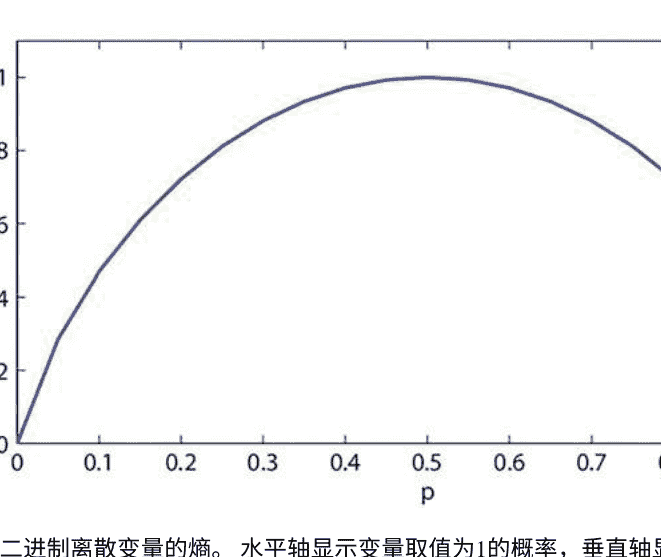

图 A.3 二进制离散变量的熵。水平轴显示变量取值为1的概率，垂直轴显示分布的相关熵。高熵意味着分布中的扩散较大，而低熵意味着扩散较小

例：前面例子中的分布的熵是

$$
H[p] = -\sum_{x} p(x) \log p(x) = -0.2 \cdot \ln 0.2 - 0.3 \cdot \ln 0.3 - 0.5 \cdot \ln 0.5 = 1.03 \text{ nats}. \tag{A.5}
$$

### A.2.5.3 交叉熵

交叉熵定义在两个分布 $p(X)$ 和 $q(X)$ 上，这两个分布定义在相同的支持（样本空间）上。交叉熵由以下公式给出

$$
H[p, q] = \mathbb{E}_{X \sim p(X)}[-\log q(X)] = -\sum_{x} p(x) \log q(x). \tag{A.6}
$$

当我们在监督学习中进行最大似然估计时，实际上是在最小化数据分布和模型分布之间的交叉熵。

### A.2.5.4 Kullback-Leibler散度

对于两个分布 $p(X)$ 和 $q(X)$，我们也可以定义相对熵，即Kullback-Leibler（KL）散度 $D_{\text{KL}}$：

$$
D_{\text{KL}}[p \| q] = \mathbb{E}_{X \sim p(X)}\left[ -\log \frac{q(X)}{p(X)} \right] = -\sum_{x} p(x) \log \frac{q(x)}{p(x)}. \tag{A.7}
$$

Kullback-Leibler散度是两个分布之间的距离度量。两个分布相互偏离程度越大，KL-散度就越高。请注意，KL-散度不是对称的，一般情况下，$D_{\text{KL}}[p \| q] \neq D_{\text{KL}}[q \| p]$。

## A.3 期望的导数

最后，我们还可以将KL散度重新写成熵和交叉熵的形式，从而将之前介绍的量联系起来：

$$D_{\mathrm{KL}}[p||q] = \mathbb{E}_{X\sim p(X)}\left[-\log \frac{q(X)}{p(X)}\right] = \sum_{x} p(x) \log p(x) - \sum_{x} p(x) \log q(x) = H[p] + H[p, q]. \tag{A.8}$$

熵、交叉熵和KL散度在许多机器学习领域中很常见，特别是用于构建损失函数。

## A.3 期望的导数

梯度优化中的一个关键问题是计算期望的梯度，这在机器学习的某些部分中经常出现。我们将在里讨论一种众所周知的方法：REINFORCE估计器（在强化学习中），在其他领域中也被称为得分函数估计器、似然比方法和自动变分推断。

假设我们对期望的梯度感兴趣，其中参数出现在期望的分布中:²

$$\nabla_{\theta} \mathbb{E}_{x\sim p_{\theta}(x)}[f(x)]. \tag{A.9}$$

我们无法对上述数量进行采样，因为我们必须以某种方式将梯度移入期望值中（然后我们可以对期望值进行采样以评估它）。为了实现这一点，我们将使用一个关于某个函数$g(x)$的对数梯度的简单规则：

$$\nabla_{x} \log g(x) = \frac{\nabla_{x} g(x)}{g(x)}. \tag{A.10}$$

这是链式法则的简单应用结果。

¹通过期望值进行微分的其他方法是通过重参数化技巧，例如在变分自编码器中使用的方法，但我们在这里不再详细讨论这个主题。

²如果参数只出现在函数$f(x)$中而不出现在$p(x)$中，则我们可以简单地将梯度通过期望值传递。

我们现在将展开等式A.9，在中途应用上述对数导数技巧。

$$
\begin{aligned}
\nabla_\theta \mathbb{E}_{x \sim p_\theta(x)}[f(x)] &= \nabla_\theta \sum_x f(x) \cdot p_\theta(x) & & \text{期望的定义} \\
&= \sum_x f(x) \cdot \nabla_\theta p_\theta(x) & & \text{通过求和传递梯度} \\
&= \sum_x f(x) \cdot p_\theta(x) \cdot \frac{\nabla_\theta p_\theta(x)}{p_\theta(x)} & & \text{乘以/除以 } p_\theta(x) \\
&= \sum_x f(x) \cdot p_\theta(x) \cdot \nabla_\theta \log p_\theta(x) & & \text{log-der. rule (Eq. A.10)} \\
&= \mathbb{E}_{x \sim p_\theta(x)}[f(x) \cdot \nabla_\theta \log p_\theta(x)] & & \text{重写为期望值}.
\end{aligned}
$$

上述推导的本质是将导数推入求和内部。当我们将求和改为积分时，同样适用。因此，对于任何 $p_\theta(x)$，我们有

$$
\nabla_\theta \mathbb{E}_{x \sim p_\theta(x)}[f(x)] = \mathbb{E}_{x \sim p_\theta(x)}[f(x) \cdot \nabla_\theta \log p_\theta(x)] \tag{A.11}
$$

这被称为对数导数技巧、得分函数估计器或REINFORCE技巧。尽管公式看起来复杂，但解释实际上很简单。我们在图A.4中解释了这个想法。在第4.2.1节中，我们将这个想法应用于强化学习。

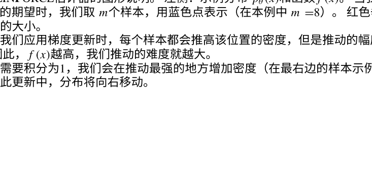

## A.4 贝尔曼方程

贝尔曼指出，值函数可以以递归形式表示，因为值也在下一个状态中定义。在他关于动态规划的工作中[1]，他推导出了 V 和 Q 的递归方程。

状态值和状态-动作值的贝尔曼方程为

$$
V^{\pi}(s) = \mathbb{E}_{a \sim \pi(\cdot|s)} \mathbb{E}_{s' \sim T_{a}(s)} \left[ r_{a}(s, s') + \gamma \cdot V^{\pi}(s') \right]
$$

$$
Q^{\pi}(s, a) = \mathbb{E}_{s' \sim T_{a}(s)} \left[ r_{a}(s, s') + \gamma \cdot \mathbb{E}_{a' \sim \pi(\cdot|s')} [Q^{\pi}(s', a')] \right].
$$

根据状态和动作空间是离散还是连续，我们以不同的方式写出这些方程。对于离散状态空间和离散动作空间，我们将期望写成求和形式：

$$
V(s) = \sum_{a \in A} \pi(a|s) \left[ \sum_{s' \in S} T_{a}(s, s') \left[ r_{a}(s, s') + \gamma \cdot V(s') \right] \right]
$$

$$
Q(s, a) = \sum_{s' \in S} T_{a}(s, s') \left[ r_{a}(s, s') + \gamma \cdot \sum_{a' \in A} \pi(a'|s) [Q(s', a')] \right].
$$

对于连续状态和动作空间，策略和转移的求和被替换为积分：

$$
V(s) = \int_{a} \pi(a|s) \left[ \int_{s'} T_{a}(s, s') \left[ r_{a}(s, s') + \gamma \cdot V(s') \right] \mathrm{d}s' \right] \mathrm{d}a.
$$

对于状态-动作值的贝尔曼方程也适用相同的原理：

$$
Q(s, a) = \int_{s'} T_{a}(s, s') \left[ r_{a}(s, s') + \gamma \cdot \int_{a'} [\pi(a'|s') \cdot Q(s', a')] \mathrm{d}a' \right] \mathrm{d}s'.
$$

我们也可以有连续状态空间（如视觉输入）和离散动作空间（如在游戏中按按钮）：

$$
Q(s, a) = \int_{s'} T_{a}(s, s') \left[ r_{a}(s, s') + \gamma \cdot \sum_{a'} [\pi(a'|s') \cdot Q(s', a')] \right] \mathrm{d}s'.
$$

## # 参考文献

1. Richard Bellman. 动态规划. Courier Corporation, 1957, 2013. 351
2. Andrew A Jawlik. 从A到Z的统计学：澄清混淆的概念. John Wiley & Sons, 2016. 341
3. Thomas Moerland. 连续马尔可夫决策过程和策略搜索。 莱顿大学2021年强化学习课程讲义。 337

# 附录B
深度监督学习

本附录提供了机器学习和深度学习基础的章节概述。 深度强化学习使用了深度监督学习的大部分技术，对深度监督学习有良好的理解是必要的。本附录将为您提供基础知识，以防您对基本的机器学习和深度学习知识有所遗忘。有疑问吗？请尝试回答第385页上的问题。

我们将从机器学习基础开始。 我们将讨论训练和测试、准确性、混淆矩阵、泛化和过拟合。接下来，我们将概述深度学习。 我们将研究神经网络、误差函数、梯度下降训练、端到端特征学习和维度灾难。 对于神经网络，我们将讨论卷积网络、循环网络、LSTM以及防止过拟合的措施。

最后，在实践方面，我们将讨论TensorFlow、Keras和PyTorch。我们将从解决大规模和复杂问题的方法开始。

## B.1 机器学习

机器学习的目标是泛化：创建一个准确、预测性的世界模型。 这样一个准确的模型被认为对世界有很好的泛化能力。¹在机器学习中，我们用两个数据集来实现这个目标，一个是训练集，一个是测试集。

> ¹泛化与过拟合、正则化和平滑性的概念密切相关，我们将在B.1.3.1节中看到。

## B.1.1 训练集和测试集

机器学习算法必须在训练集上学习一个函数 $f(x) \to y$，从输入值 $x$（如图像）到近似的输出值 $y$（如图像标签）。机器学习算法的目标是学习这个函数 $f$，使其在训练数据上表现良好，并且对测试数据具有良好的泛化能力。让我们看看如何衡量机器学习方法的泛化能力。

用于评估近似质量的概念如下。让我们假设我们的问题是一个分类任务。我们的函数正确预测的元素被称为真正的正例（TP）。被正确识别为不属于某一类的元素是真负例（TN）。被错误识别为属于某一类的元素是假正例（FP），而被分类器错误分类的属于该类的元素是假负例（FN）。

混淆矩阵：真正例的数量除以总正例的数量（真正例和假正例，TP/(TP+FP)）被称为分类器的精确度。真正例的数量除以类别的大小（TP/(TP+FN)）是召回率，或者是分类器能够找到的相关元素的数量。术语准确度被定义为真正例和真负例的总数除以总预测数（TP+TN）/（TP+TN+FP+FN）：正确元素的预测程度[11]。这些数字通常以混淆矩阵（表B.1）的形式显示。单元格中的数字表示实验的真正例等数量。

表B.1 混淆矩阵

| 实际类别 | 预测类别: P | 预测类别: N |
|----------|-------------|-------------|
| P        | TP          | FN          |
| N        | FP          | TN          |

| 实际类别 | 预测类别: 猫 | 预测类别: 狗 |
|----------|--------------|--------------|
| 猫       | 122          | 8            |
| 狗       | 3            | 9            |

在机器学习中，我们通常对方法在训练集上的准确性感兴趣，并且关注测试集上的准确性是否与训练集上的准确性相同（泛化）。

在回归和分类问题中，术语“误差值”用于表示真实输出值y和预测输出值f(x)之间的差异。通常使用一种称为k折交叉验证的方法来衡量函数的泛化能力。具体操作如下。当存在输入-输出示例集（x，y）时，将该集合分为一个较大的训练集和一个较小的保留测试集，通常是80/20或90/10。在训练集上训练逼近器，直到达到一定的准确性水平。例如，逼近器可以是一个神经网络，其参数θ通过梯度下降进行迭代调整，以使训练集上的误差值降低到适当的低值。当逼近器的准确性在测试集上与训练集上大致相同时，称逼近器函数具有良好的泛化能力。（有时会使用第三个数据集，即验证集，以允许在过拟合发生之前停止训练，请参见B.2.7节。）

由于测试集和训练集包含从相同原始数据集中抽取的示例，因此可以期望逼近器能够很好地泛化。当训练集和测试集来自相同的分布时，测试被称为内分布。对于不同问题的超出分布的泛化（或迁移学习）更加困难，请参见第9.2.1节。

## B.1.2 维度灾难

问题的状态空间是所有可能不同状态（变量值的组合）的空间。状态空间随着维度（变量）的增加呈指数级增长；高维问题具有大的状态空间，现代机器学习算法必须能够在这样的大状态空间中学习函数。

例子：人工智能中的一个经典问题是图像分类：预测图像中所示对象的类型。想象一下，我们有低分辨率灰度图像的大小为100 × 100像素，每个像素取离散值在0到255之间（一个字节）。然后，输入空间 X ∈ {0, 1, ..., 255}^{100·100}，机器学习问题的维度为100 · 100 = 10000，状态空间的大小为256^{10000}。

当输入空间 X 是高维的时候，我们无法将整个状态空间（所有可能的像素和所有可能的值）存储为一个表格。随着维度的增长，指数级的观察数据需求会导致所谓的维度诅咒（Richard Bellman [8]所称）的效应。维度诅咒指的是问题的维度增加时，空间的基数（唯一点的数量）呈指数级增长。在一个公式中，我们有

```
|X| \sim \exp(\text{Dim}(X)).
```

由于维度诅咒，当输入空间的大小增加时，表示一个函数所需的表格大小会迅速增加。

例子：假设我们有一个离散的输入空间 X = {0, 1}^D，它映射到一个实数 Y = ℝ，我们想要将这个函数完全存储为一个表格。我们将展示表格所需的大小和使用32位（4字节）浮点数时所需的内存：

| 维度(X) | |X| | 记忆 |
| :---: | :--- | :--- |
| 1 | 2 | 8 字节 |
| 5 | 2^5 = 32 | 128 字节 |
| 10 | 2^{10} = 1024 | 4 KB |
| 20 | 2^{20} ≈ 10^6 | 4 MB |
| 50 | 2^{50} ≈ 10^{15} | 4.5 百万 TB |
| 100 | 2^{100} ≈ 10^{30} | 5 · 10^{21} TB |
| 265 | 2^{265} ≈ 2 · 10^{80} | - |

表格显示指数增长的速度。在大小为20的离散空间中，我们似乎做得很好，存储了4兆字节的信息。然而，在大小为50的情况下，我们突然需要存储4.5百万太字节。我们几乎无法想象接下来的数字。在输入维度为265的情况下，我们的表格将增长到2 · 10^{80}的大小，这接近于宇宙中估计的原子数量。

由于状态空间的大小呈指数增长，但观察数通常不会，所以大型机器学习问题中的大多数状态空间都是稀疏的。机器学习算法面临的一个重要挑战是在稀疏数据上拟合良好的预测模型。为了可靠地估计一个函数，每个变量都需要一定数量的观察。为了保持统计显著性，所需的样本数量随着维度的增长呈指数增加。需要大量的训练数据，以确保每个值组合都有多个样本；然而，数据集很少呈指数增长。

## B.1.3 过拟合和偏差-方差权衡

基本统计学告诉我们，根据大数定律，我们对实验的观察次数越多，对其值的估计就越可靠（也就是说，平均值将接近期望值）[11]。这对于研究我们希望对参数的估计值有信心的大问题具有重要意义。

在小型玩具问题中，模型的变量数量也很少。单变量线性回归问题将函数建模为一条直线 $y = a \cdot x + b$，只有一个自变量 $x$ 和两个参数 $a$ 和 $b$。通常，当使用少量自变量进行回归时，每个变量都有相对较多的观察值，从而对估计的参数值有信心。一个经验法则是，每个变量应该有5个或更多的训练样本[86]。

在机器学习中，维度通常指模型的变量数量。在统计学中，维度可以是一个相对的概念：变量数量与观测数量的比率。在实践中，观测数据集的大小是有限的，因此绝对维度和相对维度之间的差异不大。在本书中，我们遵循机器学习对维度的定义，即指变量的数量。

很好地建模高维问题通常需要具有许多参数的模型，即所谓的高容量模型。让我们更深入地研究处理高维问题的后果。

除非我们通过假设平滑性来引入一些偏差到问题中，这意味着变量之间存在依赖关系，并且“真实”的独立变量数量小于像素数量。

图 B.1 曲线拟合：红色曲线还是虚线蓝线更好地概括了数据点中的信息？

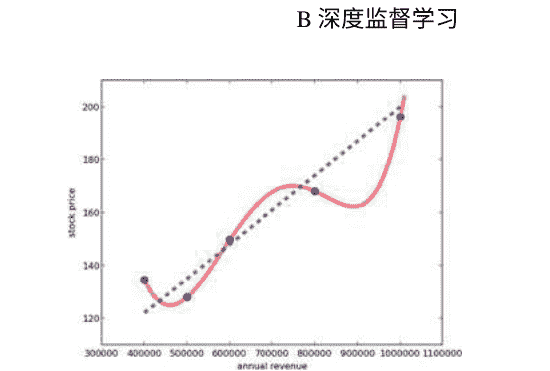

表B.2 观测、变量、相对维度、过拟合

| 观测数 n |    | 模型变量 d | 相对的维度 | 观测的机会 |
|----------|----|------------|------------|----------|
| n        | >  | d          | 低         | 欠拟合、高偏差 |
| n        | <  | d          | 高         | 过拟合、高方差 |

为了看到如何最好地拟合我们的模型，让我们将机器学习视为一个曲线拟合问题，参见图B.1。在许多问题中，观测是对潜在自然过程的测量结果。因此，观测结果中包含一定的测量噪声。目标是（1）逼近曲线尽可能准确地拟合（有噪声的）观测结果，但是（2）为了良好地泛化，要努力拟合信号，而不是噪声。

为了忠实地捕捉自然、有噪声的过程的本质，逼近器应该有多复杂？你可以将这个问题看作是：网络应该有多少参数θ，或者如果逼近器是一个多项式，多项式的次数d应该是多少？逼近器的复杂性也被称为模型的容量，表示它可以包含的信息量（参见表B.2）。当逼近器的容量d低于观测数量n时，模型很可能欠拟合：曲线过于简单，不能很好地拟合所有观测结果，误差较大，准确性较低。相反，当系数的数量d与观测数量n相等或更高时，许多机器学习过程将能够找到一个良好的拟合。训练集上的误差将为零，训练准确率达到100%。这个高容量的逼近器能否很好地泛化到未见过的状态？很可能不能，因为训练和测试观测来自真实世界的过程，观测结果包含来自训练集的噪声。训练噪声将被完美地建模，训练得到的函数在测试集和其他数据集上的准确性较低。在训练数据上训练良好但在测试上表现不佳的高容量模型（d > n）被称为在训练数据上过拟合。

欠拟合和过拟合与所谓的偏差-方差权衡有关，参见图B.2。高容量模型适应“尖峰”高方差曲线，可以拟合观测的信号和噪声倾向于过拟合。低容量模型适应“更直”的低方差曲线，具有更高的偏差，并倾向于欠拟合观测。容量为 d ≈ n 的模型可以同时具有良好的偏差和方差[11]。

图 B.2 偏差-方差权衡；少参数模型：高偏差；多参数模型：高方差

防止欠拟合和过拟合是匹配模型容量的问题，使得d与n相匹配。这是一个微妙的权衡，因为减少容量也会降低模型的表达能力。为了减少过拟合，我们可以使用正则化，已经提出了许多正则化方法。正则化的作用是根据观察数量动态调整容量。

### B.1.3.1 正则化——世界是平滑的

泛化与正则化密切相关。大多数真实世界中的函数——我们希望在机器学习中学习的函数——都是平滑的：接近相似的输入会导致接近相似的输出。很少有真实世界的函数是崎岖不平的，或者局部随机的（当它们是这样时，它们通常是人为构造的例子）。

这导致了正则化方法的引入，以限制或平滑模型的行为。正则化方法允许我们使用高容量模型，学习复杂的函数，然后在后期引入平滑过程，以减少过多的随机性和崎岖性。正则化可以通过将变量的权重值靠近零来限制变量的权重，但也存在许多其他方法，我们将在Sect. B.2.7中讨论它们。目标是过滤掉随机噪声，同时允许识别有意义的趋势，平滑函数而不限制复杂形状[29]。

在我们深入研究正则化方法之前，让我们更详细地看一下如何实现参数化函数，我们将使用神经网络和深度学习。

## B.2 深度学习

人工神经网络的架构受到生物神经网络（如人脑）的启发。 神经网络由神经核心细胞通过神经元连接而成[4]。 图B.3显示了一个生物神经元的绘图，包括细胞核、轴突和树突[89]。

图B.4显示了一个简单的全连接人工神经网络，包括两个输入神经元层、两个输出神经元层和一个由五个神经元组成的隐藏层。 具有单个隐藏层的神经网络被称为浅层网络。 当网络具有更多隐藏层时，被称为深层网络（图B.5）。

在本节中，我们提供了人工神经网络及其训练算法的概述。 我们提供足够的细节来理解本书中的深度强化学习概念。 空间限制了我们能够深入探讨的程度。 请参考专门的深度学习文献以获取更多信息，例如[29]。

我们提供一个概念性的概述，这应该足够成功地使用现有的高质量深度学习包，如TensorFlow（https://www.tensorflow.org）[1]或PyTorch [69]（https://pytorch.org）。

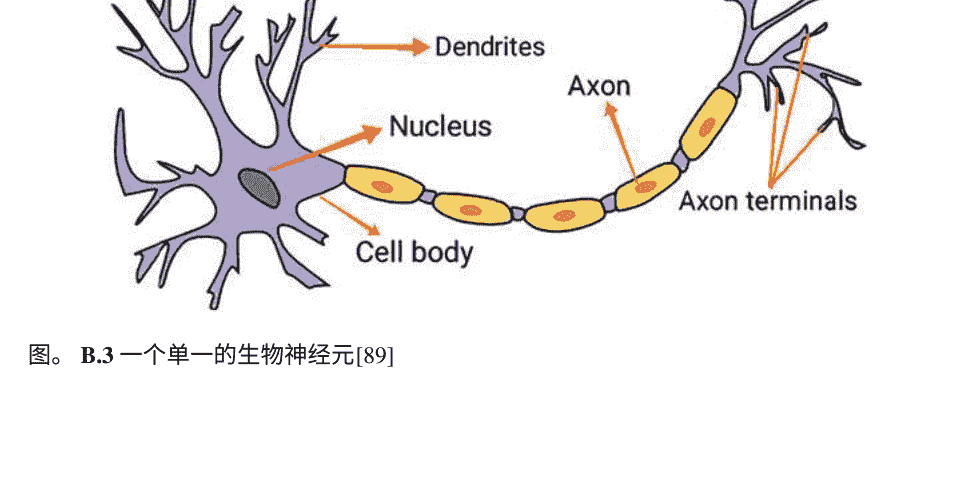

图 B.4 一个完全连接的浅层神经网络，有9个神经元

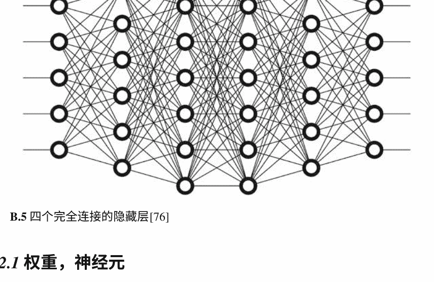

图 B.5 四个完全连接的隐藏层[76]

## B.2.1 权重，神经元

神经网络由神经元和连接组成，通常组织成层次结构。神经元将它们的输入信号作为加权组合进行处理，产生一个输出信号。这个计算被称为激活函数或压缩函数，因为它是非线性的。常见的激活函数有修正线性单元 (ReLU: 部分线性，部分零)，双曲正切和S型或逻辑函数 1/(1+e) - a 用于神经元激活。神经元之间相互连接通过权重。在每个神经元 j的输入权重 ij被求和 ∑ 然后通过激活函数 σ进行处理。因此，神经元 j的输出 o_j 为：$ o_j = \sigma \left( \sum_i o_i w_{ij} \right) $ 对于前任神经元 o_i 的权重 ij。这层神经元的输出被馈送到下一层的权重输入。

## B.2.2 反向传播

整个神经网络是一个参数化函数 $ f_{\theta}(x) \rightarrow \hat{y} $，将输入转换为输出近似值。行为取决于参数 θ，也称为网络权重。调整参数以实现所需的输入-输出关系（训练网络）。这是通过最小化误差（或损失）函数来实现的，该函数计算网络输出 ŷ 与训练目标 y 之间的差异。

训练过程包括训练周期，即通过梯度下降方法将网络权重优化到目标值的个别传递。一个周期是对训练数据的完整传递。通常以批处理方式进行周期。由于训练是一个迭代的优化过程，通常会进行多个周期的训练。

图B.1展示了基于[29]的梯度下降训练算法的简化伪代码。训练开始时，网络的权重被初始化为小的随机数。每个时期包括前向传递（识别，使用）和后向传递（训练，调整）。前向传递只是网络设计的常规识别操作。输入层暴露给输入（图像），然后通过网络传播到输出层，使用权重和激活函数。输出层通过在对应于正确标签的神经元上具有较高的值来提供答案（这作为猫或狗，或者正确的数字），以便计算误差以在反向传播中调整权重。

```
def train_sl(data, net, alpha=0.001):    # 训练分类器
    for epoch in range(max_epochs):        # 一个时期是一次通过
        sum_sq = 0                        # 每次通过重置为零
        for (image, label) in data:
            output = net.forward_pass(image)  # 预测
            sum_sq += (output - label)**2  # 计算误差
        grad = net.gradient(sum_sq)        # 误差的导数
        net.backward_pass(grad, alpha)    # 调整权重
    return net
```

图B.1 监督学习的网络训练伪代码

该示例显示了一个基本版本的梯度下降，它计算数据集中所有示例的梯度，然后更新权重。批量梯度下降在较小的子集之后更新权重，通常更快。

### B.2.2.1 损失函数

在输出层，传播的值 ŷ 与示例对的另一部分，标签 y 进行比较。计算与标签的差异，得到误差。误差函数也称为损失函数 L。两个常见的误差函数是均方误差$-\frac{1}{n} \sum_{i} (y_i - \hat{y}_i)^2$（用于回归）和交叉熵误差$- \sum_{Mi} y_i \log \hat{y}_i$（用于 M类别的分类）。反向传播使用前向识别结果与真实标签之间的差异来调整权重，使误差变小。该方法使用误差函数对权重的梯度，称为梯度下降。参数的调整如下：

```
$θ_{t+1} = θ_t - α ∇_{θ_t} L_D(f_{θ_t})$
```

其中 θ 是网络参数，t 是优化时间步长，α 是学习率，∇_{θ_t} 是数据损失函数的当前梯度，L_D 是数据的参数化目标函数。

训练过程可以在单个示例的误差降低到一定阈值以下时停止，或者在整个验证集上的损失降低到足够程度时停止。可以使用更复杂的停止准则来防止过拟合（参见第B.2.7节）。

大多数神经网络使用随机梯度下降（SGD）的变体进行训练[80]。SGD采样的小批量大小小于整个数据集，并因此计算出真实梯度的噪声估计。这样每次更新的速度更快，并且不会对梯度的方向产生太大影响。有关详细信息，请参阅Goodfellow等人的论文[29]。

## B.2.3 端到端特征学习

现在让我们更详细地看一下神经网络如何用于实现端到端的特征学习。

我们可以通过发现状态中的共同特征来近似一个函数。让我们再次集中在图像识别上。传统上，特征发现是一个手动的过程。图像专家们会费力地研究图像，以识别数据集中的共同特征，如线条、正方形、圆形，和角度，手工计算。他们会编写小的预处理算法来识别特征，然后与传统的机器学习方法（如决策树、支持向量机或主成分分析）一起使用这些特征来构建识别器以对图像进行分类。这种手工制作的方法是一种费时且容易出错的过程，研究人员一直在努力寻找全图像识别过程的算法，即端到端的算法。为了使其工作，特征也必须被学习。

例如，如果函数逼近器由n个特征的和组成，则对于手工制作的特征，只有函数中特征的系数c_i

```
h(s) = c1 × f1(s) + c2 × f2(s) + c3 × f3(s) + ... + cn × fn(s)
```

被学习。在端到端学习中，系数c_i和特征f_i(s)被学习。

深度端到端学习在图像识别、语音识别和自然语言处理方面取得了巨大的成功[22, 32, 53, 91]。端到端学习是直接从高维、原始、未经预处理的像素数据学习分类器，一直到分类层，而不是从中间（低维）手工特征学习预处理数据。

现在我们将更详细地看一下神经网络如何进行自动特征发现。网络层的层次结构可以一起识别一系列从低到高级别的概念[54, 57]。例如，在人脸识别中（图B.6），第一个隐藏层可以编码边缘；然后第二层组合和编码边缘的简单结构；第三层可以编码更高级别的概念，如鼻子或眼睛；第四层可以在人脸的抽象层次上工作。深度特征学习自己找到了在哪个层次上进行抽象，并能提出中间概念的类别，这些类别是有效的，但在人类检查时看起来违反直觉。

到20世纪90年代末，神经网络的研究进入了深度学习阶段，这个术语由Dechter在[20]中创造。LeCun等人在[56]中发表了一篇有影响力的关于深度卷积网络的论文。该论文介绍了LeNet-5的架构，这是一个七层卷积神经网络，用于对32×32像素图像中的手写MNIST数字进行分类。B.2清单展示了Keras中LeNet的现代实现。代码直接列出了层的定义。

端到端学习在计算上要求相当高。进入21世纪后，方法、数据集和计算能力得到了显著改善，可以直接学习原始、未经预处理的图像，而无需手工制作特征。端到端学习证明非常强大，在图像识别方面的准确性超过了以前的方法，甚至超过了人类测试对象[53]。在自然语言处理领域，如BERT、GPT-2和GPT-3等深度转换器模型也取得了同样令人印象深刻的结果[13, 22]。

## B.2.3.1 函数逼近

让我们来看看我们希望在机器学习中逼近的不同类型的函数。建立输入-输出关系的最基本函数是回归，它输出一个连续的数值。另一个重要的函数是分类，它输出一个离散的数值。回归和分类通常通过监督学习来学习，使用一个包含示例（观察）和标签的数据集。

在强化学习中，通常逼近三个函数：值函数 \(V(s)\)，它将状态与其预期累积未来奖励相关联，动作值函数 \(Q(s, a)\) 将动作与其值相关联，策略函数 \(\pi(s)\) 将状态与一个动作相关联（或 \(\pi(a|s)\) 与一个动作分布相关联）。在强化学习中，函数 \(V, Q, \pi\) 通过与环境的交互来学习。表B.3总结了这些函数。

> 在第5章中，关于基于模型的学习，我们还近似计算转移函数 \(T_a(\cdot)\) 和奖励函数 \(R_a(\cdot)\)。

## B.2 Keras中的LeNet-5代码[56, 90]

```python
def lenet_model(img_shape=(28, 28, 1), n_classes=10, l2_reg=0.,
                weights=None):

    # 初始化模型
    lenet = Sequential()

    # 2组CRP (卷积，RELU，池化)
    lenet.add(Conv2D(20, (5, 5), padding="same",
                     input_shape=img_shape, kernel_regularizer=l2(
                         l2_reg)))
    lenet.add(Activation("relu"))
    lenet.add(MaxPooling2D(pool_size=(2, 2), strides=(2, 2)))

    lenet.add(Conv2D(50, (5, 5), padding="same",
                     kernel_regularizer=l2(l2_reg)))
    lenet.add(Activation("relu"))
    lenet.add(MaxPooling2D(pool_size=(2, 2), strides=(2, 2)))

    # 全连接层 (带RELU)
    lenet.add(Flatten())
    lenet.add(Dense(500, kernel_regularizer=l2(l2_reg)))
    lenet.add(Activation("relu"))

    # Softmax (用于分类)
    lenet.add(Dense(n_classes, kernel_regularizer=l2(l2_reg)))
    lenet.add(Activation("softmax"))

    if weights is not None:
        lenet.load_weights(weights)

    # 返回构建的网络
    return lenet
```

## B.3 经常近似的函数

|      | 函数       | 输入             | 输出           |
| ---- | ---------- | ---------------- | -------------- |
| 数据集 | 回归       | 连续（数字）     | 连续（数字）   |
|      | 分类       | 离散（图像）     | 离散（类别标签） |
| 环境   | 值 $V$     | 状态             | 连续（数字）   |
|      | 动作值 $Q$ | 状态 $\times$ 动作 | 连续（数字）   |
|      | 策略 $\pi$ | 状态             | 动作（分布）   |

## B.2.4 卷积网络

最初的神经网络由全连接层组成（图B.5）。在图像识别中，神经网络的输入层通常直接连接到输入图像。因此，更高分辨率的图像需要更多的输入神经元。如果所有层都有更多的神经元，那么网络的宽度会迅速增加。不幸的是，通过增加网络的宽度（每层的神经元数量）来扩展全连接网络（参见图B.4）将使参数的数量成二次增长。

高分辨率问题学习的朴素解决方案是增加模型的容量 \(m\)。然而，由于过拟合的问题，随着 \(m\) 的增长，示例的数量也必须增加。

解决方案在于使用稀疏的互连结构，而不是完全连接的网络。卷积神经网络（CNN）的灵感来自于生物学。动物和人类的视觉皮层并不是完全连接的，而是局部连接的[43, 44, 62]。卷积有效地利用了关于数据结构的先验知识：数据中的模式在不同位置上重复出现（平移不变性），因此我们可以通过在图像上移动卷积窗口来共享参数。

CNN由卷积算子或滤波器组成。典型的卷积算子具有较小的感受野（它只连接到有限数量的神经元，比如5 × 5），而完全连接的神经元连接到下一层的所有神经元。卷积滤波器检测局部模式的存在。因此，下一层充当特征图。CNN层可以看作是一组可学习的滤波器，对局部变换具有不变性[29]。

过滤器可以用来识别特征。特征是基本元素，如边缘、直线、圆线、曲线和颜色。例如，要作为曲线检测器工作，滤波器应具有像素结构，高值表示曲线的形状。通过将这些滤波器值与像素值相乘并相加，我们可以检测出形状是否存在。如果输入图像中存在与滤波器中的曲线相似的形状，则乘积的总和将很大。

该滤波器只能检测特定形状的曲线。其他滤波器可以检测其他形状。较大的激活图可以识别输入图像中的更多元素。添加更多滤波器会增加网络的大小，从而有效地扩大激活图。第一层网络中的滤波器处理（卷积）输入图像，并在输入图像中存在其构建用于检测的特定特征时触发（具有高值）。训练卷积网络就是训练由子滤波器层组成的滤波器。

通过网络的卷积层，可以在激活图中表示出越来越复杂的特征。一旦它们被训练好，它们可以用于任意数量的识别任务。一个识别任务包括对网络进行一次快速的前向传递。

让我们花更多时间来理解这些滤波器。

## B.2.4.1 共享权重

在CNN中，层内的滤波器参数是共享的。因此，每一层都定义了一个滤波操作。一个滤波器由少量参数定义，但应用于图像的许多像素；每个滤波器在整个视觉场中都被复制。这些复制的单元共享相同的参数化（权重向量和偏置），并形成一个特征图。这意味着给定卷积层中的所有神经元对其特定响应领域中的相同特征作出响应。以这种方式复制单元，可以检测到图像中的特征，而不考虑它们在视觉场中的位置，从而构成了平移不变性的属性。

这种权重共享也很重要，可以防止深度和宽度网络中权重数量的增加，并且可以防止过拟合，我们稍后会看到。

现实世界的图像由许多较小的元素的重复组成。由于这种所谓的平移不变性，相同的模式会在整个图像中重复出现。CNN可以利用这一点。链接的权重是共享的，从而大大减少了需要训练的权重数量。从数学上讲，CNN对权重值有一定的约束。这是CNN的一个重要优势，因为训练完全连接层的权重的计算要求是不可行的。此外，还可以获得了统计强度，因为每个权重的有效数据增加了。

深度CNN在图像识别任务中表现良好，用于空间依赖性的视觉滤波操作和特征识别（边缘、形状）[55]。

## B.2.4.2 卷积神经网络架构

卷积层可以识别特征-网络越深，特征越复杂。典型的卷积神经网络架构由多个堆叠的卷积层组成。在最后的层中，使用全连接层对输入进行分类。

在卷积层中，通过局部连接，与全连接网络相比，权重数量大大减少。然而，单个神经元识别不同特征的能力不及全连接神经元。

通过将许多这样的局部连接层堆叠在一起，我们可以实现所需的非线性滤波器，其联合效果变得越来越全局。神经元对像素空间的较大区域产生响应，因此网络首先创建输入的小部分表示，然后从中创建更大的区域。网络可以识别和表示越来越复杂的概念，而不会导致权重爆炸。典型的CNN架构由多层卷积、最大池化和ReLU层组成，最后是一个全连接层（图B.7）。

图 B.7 卷积网络示例架构[76]

## B.2.4.3 最大池化

减少权重数量的另一种方法是权重池化。池化是一种非线性下采样（用较少的位数表示较低分辨率的信息）。通常，一个2×2的块被采样为一个标量值（图B.8）。池化减小了网络的维度。最常用的形式是最大池化。它是目标检测的重要组成部分[19]，也是大多数CNN架构的一部分。最大池化还允许进行小的平移，例如将对象移动几个像素，或者进行缩放，例如将对象靠近摄像头。

## B.2.5 循环网络

图像识别对网络架构产生了很大影响，引发了卷积神经网络等创新，用于处理空间数据。语音识别和时间序列分析也导致了新的架构的产生，用于处理序列数据。这样的序列可以由循环神经网络（RNN）[10, 25]建模。一些较为知名的RNN包括Hopfield网络[42]和长短期记忆（LSTM）[41]。

通常使用softmax函数。softmax函数将一个实数向量归一化为概率分布 [0, 1]; \( P_\theta(y|x) = \text{softmax}(f_\theta(x)) = \frac{e^{f_\theta(x)}}{\sum_k e^{f_{\theta_k}(x)}} \)

图B.9展示了一个基本的循环神经网络。一个RNN神经元与普通神经元相同，具有输入、输出和激活函数。然而，RNN神经元有额外的循环输入-输出连接。通过这种结构，RNN中的参数值可以演化。实际上，RNN具有类似变量的状态。

为了理解RNN的工作原理，有助于展开网络，如图B.10所示。循环神经元的循环被画成一条直线，以展示网络的深层结构，以及层之间的连接。实际上，这些层是循环连接处理的时间步骤。从某种意义上说，RNN是一个将深层卷积网络折叠成单层循环神经元的结构。

深度卷积网络在图像分类方面取得了成功，而RNN则用于具有顺序性质的任务，如字幕挑战。在字幕任务中，网络会展示一张图片，然后需要提供一个有意义的文本描述[88]。

图B.11展示了我们将在接下来讨论的不同序列组合，这是根据Karpathy[48]撰写的一篇易于理解和图文并茂的博客中的不同RNN配置。输入、输出或两者都可以是序列。图中展示了不同的矩形。每个矩形都是一个向量。箭头表示计算，如矩阵乘法。红色表示输入向量，蓝色表示输出向量，绿色表示状态向量。从左到右依次是：

- 一对一，没有递归的标准网络。这种网络将固定大小的输入映射到固定大小的输出，例如图像分类任务（输入图片，输出类别）。
- 一对多在输出中添加一个序列。这可以是一个图像字幕任务，它接收一张图片并输出一个句子。
- 多对一与输入中的序列相反。例如，情感分析（对具有负面或正面情感含义的单词进行分类）。
- 多对多既有输入序列又有输出序列。这可以是机器翻译的情况，其中读取一句英语句子，然后生成一句法语句子。
- 多对多是一种相关但不同的情况，具有同步的输入和输出序列。这可以是视频分类的情况，需要为视频的每一帧进行标记。

### B.2.5.1 长短期记忆

时间序列预测比传统的回归或分类问题更复杂。它增加了输入变量之间的序列依赖性的复杂性。

LSTM（长短期记忆）是一种更强大的神经元类型，用于处理序列。图B.12显示了LSTM模块，可以与简单的RNN进行比较。LSTM专为时序问题和规划而设计。LSTMs由Hochreiter和Schmidhuber [41]引入。

RNN训练受到梯度消失问题的困扰。对于短期序列，可以通过与深度CNN [29]相同的方法来控制这个问题。对于长期记忆，LSTMs更适合。LSTMs经常用于解决各种问题[28, 31, 33, 78]，我们在本书的许多地方都会遇到它们。

## B.2.6 更多网络架构

深度学习是一个非常活跃的研究领域，已经开发出许多先进的网络架构。我们将描述一些较为知名的架构。

### B.2.6.1 残差网络

卷积神经网络的一个重要创新是残差网络架构，或ResNets。这个想法是在2015年的ImageNet挑战中引入的，He等人[35]以非常低的错误率3.57%获胜。这个错误率实际上比大多数人实现的5-10%还要低。ResNet至少有152层。

残差网络引入了跳跃连接。跳跃连接是跳过一个或多个层的连接，允许训练直接到达其他层，减少网络的有效深度（图B.13）。跳跃连接创建了一个浅层和深层网络的混合，防止了深层网络的精度下降和梯度消失[29]。

### B.2.6.2 生成对抗网络

通常神经网络在前向模式下使用，将输入图像划分为类别，从高维到低维。网络也可以在反向模式下运行，生成与特定类别相对应的图像，从低维到高维。从小到大意味着很多图像被实例化的可能性。需要额外的输入来填充自由度。

以生成模式反向运行识别器，已经创建了一个称为深度生成建模的活跃研究领域。一种重要的生成模型类型是生成对抗网络，或GAN[30]。

深度网络容易受到对抗性攻击的影响。图像识别过程的一个众所周知的问题是它的脆弱性。研究发现，如果图像被轻微扰动，对于人眼来说几乎是不可察觉的，深度网络很容易将图像错误地分类为错误的类别[85]。这种脆弱性被称为单像素问题：改变图像中的一个不重要的像素可能导致分类器从猫类别切换到狗类别[82, 85]。

GAN被用来生成与原始输入略有不同的输入图像。GAN生成对抗性示例，其目的是欺骗鉴别器（识别器）。第一个网络，生成器，生成一张图像。第二个网络，鉴别器，试图识别这张图像。生成器的目标是误导鉴别器，以提高鉴别器的鲁棒性。这样，GAN可以用来使图像识别更加鲁棒。单像素问题引发了一个活跃的研究领域，以了解这个问题并使深度网络更加鲁棒。

图 B.13 具有跳跃连接的残差网络[35]

生成网络的另一个用途是生成称为深度伪造图像[92]和深度梦境[49]的人工逼真图像，参见图B.14和B.15。GAN显著增加了我们对深度学习的理论理解。

图 B.14 深度伪造[92]

### B.2.6.3 自编码器

自编码器和变分自编码器（VAE）在深度学习中用于降维，无监督学习[50-52]。自编码器网络具有蝴蝶状的架构，输入层和输出层具有相同数量的神经元，但随着向中心移动，层的大小逐渐减小（图B.16）。输入（收缩）侧被认为执行判别动作，例如图像分类，而另一侧（扩展）则是生成的[30]。当图像被输入和输出自编码器时，中心层的结果会经历压缩/解压缩过程，最终得到相同的图像，只是平滑了。自编码器执行的判别/生成过程降低维度通常被认为是去除问题的“本质”，对其进行去噪[39]。

图 B.15 深度梦境 [49]

图 B.16 自编码器，找到数据中的“本质” [64]

自编码器展示了监督学习和无监督学习之间的深层关系。自编码器的架构包括编码器和解码器。编码器是一个常见的判别网络，与监督学习中的网络相似。解码器是一个生成网络，从低维输入中创建高维输出。编码器-解码器蝴蝶结共同执行降维或压缩，是一种无监督学习形式[34]。

自编码器和生成网络是一个活跃的研究领域。

### B.2.6.4 注意机制

另一个重要的架构是注意机制。序列到序列学习在许多机器学习应用中都有出现，例如机器翻译。基本循环神经网络的输出维度与输入维度相同。

注意力架构允许输入和输出维度之间的灵活映射[83]。它通过增加一个额外的网络来增强RNN对编码器RNN状态序列的注意力[3]，参见图B.17。这个额外的网络专注于感知和内存访问。已经证明它在机器翻译和自然语言任务方面取得了最先进的结果[3]，参见图B.18。注意机制对于时间序列预测和翻译特别有用。

### B.2.6.5 变压器

最后，我们讨论变压器架构。变压器架构由Vaswani等人引入[87]。变压器基于自我注意的概念：它们使用注意力编码器-解码器模型，但权衡数据的不同部分的影响。它们是非常成功的BERT [22]和GPT-3 [13, 74]自然语言模型的核心，但在想象力丰富的文本到图像生成方面也取得了成功。

基于Transformer的基础模型在多模态（文本/图像）学习中起着重要作用[73, 75]，就像我们在图10.1中看到的那样。将深度强化学习视为序列问题，Transformer也被应用于强化学习，并取得了一些早期的成功[15, 46]。Transformer是一个活跃的研究领域。有关它们工作原理的详细解释，请参见[2, 12, 87]。

## B.2.7 过拟合

现在我们已经讨论了网络架构，是时候讨论深度神经网络的一个重要问题了：过拟合以及我们如何减少它。神经网络中的过拟合可以通过多种方式来减少。其中一些方法旨在恢复网络参数数量和训练样本数量之间的平衡，其他方法则侧重于数据增强和容量减少。

另一种方法是观察训练过程。让我们列举最流行的方法[29]。

- 数据增强：过拟合是指网络中的参数比训练样本还要多时发生的现象。通过旋转、反射、噪声、重新缩放等操作来增加训练数据集。这种方法的缺点是训练的计算成本增加。
- 容量减少：解决过拟合的另一种方法是意识到过拟合是由于网络容量过大造成的；网络的参数太多。一种廉价的预防这种情况的方法是减少网络的容量，通过减少网络的宽度和深度。
- 随机失活：减少过拟合的一种流行方法是在网络中引入随机失活层。随机失活通过随机地从反向传播过程中删除一定百分比的神经元来降低网络的有效容量[40, 81]。随机失活是一种有效且计算效率高的减少过拟合的方法[29]。
- L1和L2正则化：正则化是向损失函数中添加一个额外的项，强迫网络不要过于复杂。该项惩罚模型使用过高的权重值。这限制了灵活性，但也鼓励基于多个特征构建解决方案。这种方法的两个流行版本是L1和L2正则化[29, 66]。

## B.3 数据集和软件

我们已经深入讨论了机器学习的背景概念和神经网络理论的重要方面。现在是时候把注意力转向实际问题了。在这里，我们会遇到丰富的数据、环境、软件和博客，以及如何在实践中使用深度学习的方法。

深度强化学习是一个开放的领域。研究人员发布他们的算法和代码，以便能够复制结果。数据集和训练好的网络也会被共享。进入这个领域的门槛很低：你可以在GitHub上下载高质量的软件，并开始进行研究。我们在整本书中都会指向GitHub上的代码库和开源软件套件；附录C中有关于软件环境和开源代码框架的指引。

最受欢迎的深度学习包是PyTorch [69]和TensorFlow [1]，以及其顶级语言Keras [17]。一些机器学习和数学包也提供深度学习工具，例如scikit-learn、MATLAB和R。在本节中，我们将从一些简单的分类和行为示例开始，使用Keras库。我们将使用Python作为我们的编程语言。Python已经成为机器学习包的首选语言：不仅仅是对于PyTorch以及TensorFlow，还有numpy，scipy，scikit-learn，matplotlib和许多其他成熟且高质量的机器学习库。如果你的计算机上没有安装Python，或者你想下载一个更新的版本，请访问https://www.python.org进行安装。请注意，由于Stable Baselines和TensorFlow的一些不幸版本问题，您可能需要安装不同版本的Python来使这些示例工作，并使用虚拟环境来管理您的软件版本。

由于深度学习需要大量计算资源，这些软件包通常支持GPU并行计算，如果您的系统中有适当的GPU卡，可以将训练速度提高十倍甚至更多。云计算提供商，如AWS，Google，Azure等，通常也提供现代GPU硬件以支持机器学习，常常还有学生折扣。

### B.3.1 MNIST和ImageNet

图像识别成功的最重要因素之一是有好的数据集可用。

在深度学习的早期阶段，该领域从手写识别方面的努力中受益匪浅。这个应用对邮政服务非常有价值，准确识别手写的邮政编码或邮编可以极大地提高邮件的排序和投递效率。手写识别的一个标准测试集是MNIST（修改版国家标准与技术研究所）[56]。标准的MNIST图像是低分辨率的32 × 32像素的单个手写数字图像（图B.19）。当然，研究人员希望

![图 B.19 一些MNIST图像[56]](img/d566eed4c25b11443f9cbf0725b5c1ce_387_0.png)

### B.3.1.1 ImageNet

深度学习中的一个重要数据集是ImageNet [21, 24]。它是一个包含超过1400万个图像URL的集合，这些图像已经手动注释了其中的物体。它包含超过20000个类别。一个典型的类别包含几百个训练图像。

ImageNet对深度学习的进展具有重要意义。标准化的带标签图像的可用性使得学习算法能够进行测试和改进，并且能够创建新的算法。ImageNet是由李飞飞等人于2006年构思的，并在后来的几年中与她的团队进一步发展。自2010年以来，每年都会组织一次软件竞赛，即ImageNet大规模视觉识别挑战（ILSVRC）[21]。自2012年以来，ILSVRC已经被深度网络赢得，引发了深度学习的热潮。在那一年赢得这个挑战的网络架构被称为AlexNet，以其作者之一的名字命名[53]。

AlexNet使用的2012年ImageNet数据库有1400万个带标签的图像。该网络采用了高度优化的2D双GPU实现的5个卷积层和3个全连接层。卷积层中的滤波器大小为11 × 11。神经元使用ReLU激活函数。在AlexNet中，图像被缩放为256 × 256的RGB像素。网络的规模很大，有6000万个参数。这导致了相当严重的过拟合。AlexNet使用数据增强和dropout来减少过拟合的影响。

Krizhevsky等人在2012年的ImageNet竞赛中以15%的错误率获胜，明显优于第二名的26%。尽管早些时候已经有报道称在生物信息学和中文手写识别等应用中成功使用了CNN，但正是2012年的ImageNet竞赛的胜利使得AlexNet闻名遐迩。

### B.3.2 GPU实现

2012年左右的深度学习突破是由三个重大发展的共同出现引起的：（1）算法上的进步解决了深度学习中的关键问题，（2）大规模标记训练数据集的可用性，以及（3）图形处理单元（GPU）的计算能力的可用性。

图像处理和神经网络训练中最昂贵的操作是矩阵操作。矩阵操作是计算机科学中研究最深入的问题之一。它们的算法结构已经被很好地理解，并且对于基本的线性代数运算，存在高性能的并行实现CPU，例如BLAS [16, 23]。

GPU最初是为了在视频游戏中实现流畅的图形性能而设计的。图形处理需要快速的线性代数计算，例如矩阵乘法。这些正是深度学习训练算法的核心操作。现代GPU由数千个小算术单元组成，能够非常快速地并行执行线性代数矩阵运算。这种数据并行处理基于SIMD计算，即单指令多数据[26, 36]。SIMD数据并行性可以追溯到20世纪60年代和70年代的矢量超级计算机设计，例如Thinking Machines的ConnectionMachine系列[37, 38, 58]。图B.20显示了一个历史上的CM-1和一个现代GPU的图片。

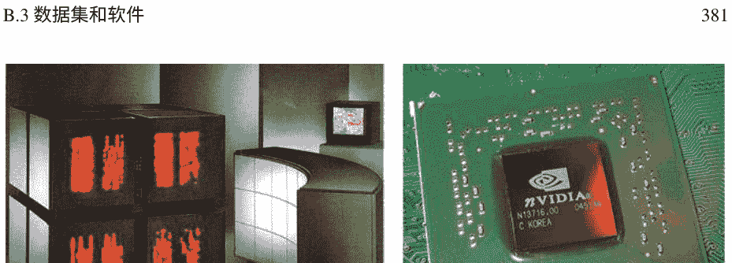

现代GPU由数千个优化用于并行处理线性代数矩阵运算的处理单元组成[59, 77, 79]，提供比CPU快数个数量级的矩阵性能[18, 67, 84]。

### B.3.3 实例：分类示例

现在是时候实践一些材料了。让我们看看我们是否可以自己进行图像识别。

### B.3.3.1 安装TensorFlow和Keras

我们首先安装TensorFlow。可以在云端、Colab或Docker容器中运行TensorFlow。可以在TensorFlow网站上找到可运行的Colab环境链接。然而，我们将假设进行传统的本地安装，在你自己的电脑上。支持所有主要操作系统： Linux/Ubuntu， macOS， Windows。

TensorFlow的编程模型复杂且不太用户友好。幸运的是，在TensorFlow之上构建了一种易于使用的语言： Keras。 Keras语言易于使用，文档齐全，并且有许多示例可供参考。当你安装TensorFlow时，Keras也会自动安装。

要安装TensorFlow和Keras，请访问https://www.tensorflow.org。建议创建一个虚拟环境来隔离软件包安装与系统的其他部分。通过输入

```
python3 -m venv --system-site-packages ./venv
```

(或等效命令)来创建虚拟环境。使用虚拟环境需要激活：¹⁰

```
source ./venv/bin/activate
```

在安装软件包时，可能会遇到版本问题。请注意，对于深度强化学习，我们将广泛使用所谓的稳定基线的强化学习代理算法。¹¹稳定基线适用于TensorFlow的版本1和PyTorch，但截至本文撰写时，不适用于TensorFlow的版本2。已经测试了TensorFlow版本1.14的可用性。¹²

使用Python的pip软件包管理器很容易安装：只需输入

```
pip install tensorflow==1.14
```

¹⁰有关TensorFlow页面上的更多安装指南，请访问https://www.tensorflow.org/install/pip。
¹¹ https://github.com/hill-a/stable-baselines.
¹²你可能会惊讶地发现有这么多版本号被提到。不幸的是，并非所有版本都兼容；在使软件正常工作方面需要一些小心：Python 3.7.9， TensorFlow 1.14.0， Stable Baselines 2， pyglet 1.5.11在撰写时可正常工作。这种稍微尴尬的情况是因为深度强化学习领域是由研究人员社区推动的，他们合作使代码库正常工作。当新的见解触发了一个失去向后兼容性的重写，就像TensorFlow 2.0那样，就会发生对依赖软件的疯狂重写。这个领域仍然是一个新的领域，一些软件包的不稳定性将在可预见的未来与我们同在。

或者，用于GPU支持的

```
bash
pip install tensorflow-gpu==1.14
```

现在应该下载并安装TensorFlow和Keras。我们将通过使用默认的训练数据集执行MNIST训练示例来检查是否一切正常。

### B.3 Keras中的顺序模型

```python
from tensorflow.keras.models import Sequential
from tensorflow.keras.layers import Dense

model = Sequential()

model.add(Dense(units=64, activation='relu'))
model.add(Dense(units=10, activation='softmax'))

model.compile(loss='categorical_crossentropy',
              optimizer='sgd', metrics=['accuracy'])

# x_train和y_train是Numpy数组--就像在Scikit-LearnAPI中一样。
model.fit(x_train, y_train, epochs=5, batch_size=32)

# 对测试数据的评估很简单
loss_and_metrics = model.evaluate(x_test, y_test, batch_size=128)

# 预测输出也很简单
classes = model.predict(x_test, batch_size=128)
```

### B.3.3.2 Keras MNIST示例

Keras是建立在TensorFlow之上的，并且与TensorFlow一起安装。基本的Keras镜像了熟悉的Scikit-learn接口[70]。

每个Keras程序都指定了一个要学习的模型。模型是由权重和层（神经元）组成的神经网络。您将在Keras中指定模型的架构，然后将模型拟合到训练数据上。当模型训练完成后，您可以在测试数据上评估损失函数，或者根据一些测试输入示例进行预测。

Keras有两种主要的编程范式：顺序和函数式。列表B.3展示了Keras文档中最基本的顺序Keras模型，包括一个两层模型、一个ReLU层和一个softmax层，使用简单的SGD进行反向传播。Keras中的顺序模型具有面向对象的语法。

#### 清单B.4 Keras中的功能性MNIST模型

```
1 # 将数据获取为Numpy数组
2 (x_train, y_train), (x_test, y_test) = keras.datasets.mnist.load_data()
3 
4 # 构建一个简单的模型
5 inputs = keras.Input(shape=(28, 28))
6 x = layers.experimental.preprocessing.Rescaling(1.0 / 255)(inputs)
7 x = layers.Flatten()(x)
8 x = layers.Dense(128, activation="relu")(x)
9 x = layers.Dense(128, activation="relu")(x)
10 outputs = layers.Dense(10, activation="softmax")(x)
11 model = keras.Model(inputs, outputs)
12 model.summary()
13 
14 # 编译模型
15 model.compile(optimizer="adam", loss="sparse_categorical_crossentropy")
16 
17 # 使用Numpy数据训练模型1个时期
18 batch_size = 64
19 print("在NumPy数据上拟合")
20 history = model.fit(x_train, y_train, batch_size=batch_size, epochs=1)
21 
22 # 使用数据集训练模型1个时期
23 dataset = tf.data.Dataset.from_tensor_slices((x_train, y_train)).batch(batch_size)
24 print("在数据集上拟合")
25 history = model.fit(dataset, epochs=1)
```

Keras文档位于[https://keras.io/getting_started/intro_to_keras_for_researchers/](https://keras.io/getting_started/intro_to_keras_for_researchers/)。它非常易于理解，鼓励您通过在线教程来学习Keras。

一个稍微有用的例子是在MNIST上拟合模型，参见清单B.4。此示例使用更灵活的Keras语法，即功能性API，其中变换在前一层之上链接。这个Keras示例代码加载训练集和测试集中的MNIST图像，并使用功能性API创建一个由密集ReLU层组成的模型。然后创建这些层的Keras模型，并打印模型的摘要。然后使用numpy数据和数据集分别对模型进行了单个时期的训练，并打印了损失历史记录。

示例代码展示了Keras与我们对神经网络的思考和推理方式有多么接近。这些示例只是展示了Keras的一小部分功能。Keras还具有性能监控、长时间训练运行的检查点功能以及与TensorBoard的接口，用于可视化训练过程。TensorBoard是一个不可或缺的工具，可以让你调试你对网络中应该发生的事情以及实际发生的事情的直觉是很重要的。

深度强化学习仍然是一个实验自由度比已建立的实践更多的领域，能够绘制训练过程的进展对于更好地理解模型的行为是至关重要的。你探索Keras的越多，你在深度强化学习方面的进步就会越大[27]。

## 练习

以下是一些检查你对深度学习的理解的问题。每个问题都是一个封闭问题，期望得到一个简单的、单句回答。

### 问题

1.  在机器学习中，数据集通常被分为两个子数据集。这两个子数据集是什么，为什么要分开？
2.  什么是泛化？
3.  有时会使用第三个子数据集。它被称为什么，用于什么？
4.  如果考虑观测和模型参数，问题何时是高维的，何时是低维的？
5.  我们如何衡量机器学习模型的容量？
6.  低容量模型存在什么危险？
7.  高容量模型存在什么危险？
8.  过拟合对泛化有什么影响？
9.  监督学习和强化学习有什么区别？
10. 浅层网络和深层网络有什么区别？
11. 监督学习有模型和数据集，强化学习有哪两个核心概念？
12. 学习周期有哪些阶段？每个阶段发生了什么？
13. 列举三个对深度学习突破至关重要的因素，并解释原因。
14. 什么是端到端学习？你知道有什么替代方法吗？每种方法的优势是什么？
15. 什么是欠拟合，它是由什么引起的？什么是过拟合，它是由什么引起的？如何判断是否存在过拟合？
16. 列举三种防止过拟合的方法。
17. 神经网络有哪三种类型的层？
18. 浅层神经网络有多少个隐藏层？
19. 描述神经网络中权重调整的工作原理。提示：考虑示例、标签、前向传播、反向传播、误差函数和梯度。
20. 全连接网络和卷积神经网络有什么区别？
21. 什么是最大池化？
22. 共享权重有什么优势？
23. 什么是特征学习？
24. 什么是表示学习？
25. 什么是深度学习？
26. 卷积神经网络相对于全连接神经网络的优势是什么？
27. 请列举两个著名的图像识别数据集。

## 练习

现在让我们开始一些练习。如果您还没有这样做，请安装PyTorch¹³或TensorFlow和Keras（请参阅第2.2.4.2节或转到TensorFlow页面）。¹⁴请确保检查正确的Python、TensorFlow和StableBaselines的版本，以确保它们能够很好地配合使用。下面的练习是在Keras中完成的。

1.  泛化安装Keras。转到Keras MNIST示例。执行一个分类任务。注意训练所需的时期数，在测试中，它的泛化效果如何。在较小的训练集上进行分类，学习率如何变化，泛化效果如何变化。变化其他元素：尝试使用除adam之外的不同优化器，尝试不同的学习率，尝试不同（更深）的架构，尝试更宽的隐藏层。它学得更快吗？它泛化效果更好吗？
2.  过拟合再次使用Keras，但这次在ImageNet上尝试不同的过拟合解决方案。训练速度是否改变？泛化是否改变？现在尝试保留验证集。训练和泛化是否改变？
3.  置信度在之前的练习中，你运行了多少次，只是为了看看训练需要多长时间以及泛化效果如何？尝试再次运行它。你得到了相同的结果吗？差异有多大？你能改变Keras或TensorFlow的随机种子吗？你能计算置信区间吗？当你进行10次随机运行时，置信度提高了多少？100次呢？制作带有误差线的图表。

GPU也许你可以访问一个能够并行运行PyTorch或TensorFlow以加速训练的GPU机器。安装GPU版本并检查它是否识别到GPU并确实在使用它。

并行性也许你可以访问一个多核CPU机器。当你运行多个实验以提高置信度时，一种简单的方法是在shell中生成多个作业，将输出分配给不同的日志文件，并编写一个脚本来合并结果和绘制图表。

编写必要的脚本来实现这个目标，进行测试，并进行大信心实验。

## 参考文献

1.  Martín Abadi, Paul Barham, Jianmin Chen, Zhifeng Chen, Andy Davis, Jeffrey Dean, Matthieu Devin, Sanjay Ghemawat, Geoffrey Irving, Michael Isard, Manjunath Kudlur, Josh Levenberg, Rajat Monga, Sherry Moore, Derek Gordon Murray, Benoit Steiner, Paul A. Tucker, Vijay Vasudevan, Pete Warden, Martin Wicke, Yuan Yu, and Xiaoqiang Zheng. TensorFlow: A system for large-scale machine learning. 在第12届USENIX操作系统设计与实现研讨会（OSDI '16），第265-283页，2016年. 360, 378
2.  Jay Alammar. 插图变压器。 https://jalammar.github.io/illustrated-transformer/. 377
3.  Dzmitry Bahdanau, Kyunghyun Cho, and Yoshua Bengio. 通过联合学习对齐和翻译的神经机器翻译。 arXiv预印本 arXiv:1409.0473, 2014. 376, 376, 376
4.  Mark F Bear, Barry W Connors, and Michael A Paradiso. 神经科学, 卷2. Lippincott Williams & Wilkins, 2007. 360
5.  Mikhail Belkin, Daniel Hsu, Siyuan Ma, and Soumik Mandal. 协调现代机器学习和偏差-方差权衡。 arXiv预印本 arXiv:1812.11118, 2018. 378, 378
6.  Mikhail Belkin, Daniel Hsu, and Ji Xu. 两种弱特征的双下降模型。 arXiv预印本 arXiv:1903.07571, 2019.
7.  Mikhail Belkin, Daniel J Hsu, and Partha Mitra. 过拟合还是完美拟合? 分类和回归规则的风险界限插值。 在神经信息处理系统进展, 第2300-2311页, 2018年. 378, 378
8.  Richard Bellman. 动态规划。 Courier Corporation, 1957, 2013. 356
9.  Yoshua Bengio, Aaron Courville, and Pascal Vincent. 表示学习: 一项综述和新的观点。 IEEE模式分析和机器智能交易, 35(8):1798–1828, 2013. 364
10. R Bertolami, H Bunke, S Fernandez, A Graves, M Liwicki, and J Schmidhuber. 一种新的用于改进无约束手写识别的连接主义系统。 IEEE模式分析和机器智能交易, 31(5), 2009. 369
11. Christopher M Bishop. 模式识别与机器学习。 信息科学和统计学。 Springer Verlag, Heidelberg, 2006. 354, 357, 359, 378
12. Peter Bloem. Transformers http://peterbloem.nl/blog/transformers. 377
13. Tom B. Brown, Benjamin Mann, Nick Ryder, Melanie Subbiah, Jared Kaplan, Prafulla Dhariwal, Arvind Neelakantan, Pranav Shyam, Girish Sastry, Amanda Askell, Sandhini Agarwal, Ariel Herbert-Voss, Gretchen Krueger, Tom Henighan, Rewon Child, Aditya Ramesh, Daniel M. Ziegler, Jeffrey Wu, Clemens Winter, Christopher Hesse, Mark Chen, Eric Sigler, Mateusz Litwin, Scott Gray, Benjamin Chess, Jack Clark, Christopher Berner, Sam McCandlish, Alec Radford, Ilya Sutskever, and Dario Amodei. 语言模型是少样本学习器。 在神经信息处理系统进展, 2020. 364, 377
14. Rich Caruana, Steve Lawrence 和 C Lee Giles. 神经网络中的过拟合：反向传播、共轭梯度和早停止。 在Advances in Neural Information Processing Systems中，第402-408页，2001年。 378
15. Lili Chen, Kevin Lu, Aravind Rajeswaran, Kimin Lee, Aditya Grover, Michael Laskin, Pieter Abbeel, Aravind Srinivas 和 Igor Mordatch. 决策变压器：通过序列建模进行强化学习。 arXiv预印本 arXiv:2106.01345，2021年。 377
16. Jaeyoung Choi, Jack J Dongarra 和 David W Walker. PB-BLAS：一组并行块基本线性代数子程序。 Concurrency: Practice and Experience，第8卷第7期：517-535页，1996年。 381
17. François Chollet. 使用Python进行深度学习。 Manning Publications Co.，2017年。 378
18. Dan Ciresan, Ueli Meier, Luca Maria Gambardella 和 Jürgen Schmidhuber. 深度、大规模、简单的手写数字识别神经网络。 神经计算，22(12): 3207–3220, 2010年。 381
19. Dan Ciresan, Ueli Meier 和 Jürgen Schmidhuber. 多列深度神经网络用于图像分类。 在2012年IEEE计算机视觉和模式识别会议上，美国普罗维登斯，RI, US，第3642–3649页，2012年。 369
20. Rina Dechter. 在约束满足问题中学习搜索。 AAAI，1986年。 364
21. Jia Deng, Wei Dong, Richard Socher, Li-Jia Li, Kai Li 和 Li Fei-Fei. ImageNet：一个大规模的分层图像数据库。 在2009年IEEE计算机视觉和模式识别会议上，第248–255页。 IEEE，2009年。 380, 380
22. Jacob Devlin, Ming-Wei Chang, Kenton Lee, 和 Kristina Toutanova. BERT: 深度双向转换器的预训练用于语言理解。 在2019年北美计算语言学协会年会论文集中人类语言技术，NAACL-HLT 2019, 明尼阿波利斯, 2018年。 364, 364, 377
23. Jack J Dongarra, Jeremy Du Croz, Sven Hammarling, 和 Richard J Hanson. 一个扩展的FORTRAN基本线性代数子程序集。 ACM数学软件交易, 14(1):1–17, 1988年。 381
24. Li Fei-Fei, Jia Deng, 和 Kai Li. ImageNet: 构建一个大规模图像数据库。 Journal of Vision, 9(8):1037–1037, 2009年。 380
25. Santiago Fernández, Alex Graves 和 Jürgen Schmidhuber. 递归神经网络在区分性关键词检测中的应用。 在国际人工神经网络会议上，第220-229页。 Springer, 2007年。 369
26. Michael J Flynn. 一些计算机组织及其效果。 IEEE计算机交易，100（9）：948-960, 1972年。 381
27. Aurélien Géron. 使用Scikit-Learn和TensorFlow进行实践机器学习：构建智能系统的概念、工具和技术。 O'Reilly Media, Inc., 2019年。 385
28. Felix A Gers, Jürgen Schmidhuber 和 Fred Cummins. 学会遗忘：LSTM的持续预测。 在第九届国际人工神经网络会议ICANN 99。 IET, 1999年。 372
29. Ian Goodfellow, Yoshua Bengio 和 Aaron Courville. 深度学习。 MIT出版社，剑桥，2016年。 359, 360, 362, 363, 367, 370, 372, 372, 377, 377, 377, 378
30. Ian Goodfellow, Jean Pouget-Abadie, Mehdi Mirza, Bing Xu, David Warde-Farley, Sherjil Ozair, Aaron Courville 和 Yoshua Bengio. 生成对抗网络。 在神经信息处理系统中，页码2672-2680, 2014年。 373, 374
31. Alex Graves, Santiago Fernández 和 Jürgen Schmidhuber. 双向LSTM网络用于改进的音素分类和识别。 在国际人工神经网络会议上，页码799-804。 Springer，2005年。 372
32. Alex Graves, Abdel-rahman Mohamed, and Geoffrey Hinton. 使用深度循环神经网络的语音识别。 在2013年IEEE国际会议上，关于声学、语音和信号处理的论文，第6645-6649页。 IEEE，2013年。 364
33. Klaus Greff, Rupesh K Srivastava, Jan Koutník, Bas R Steunebrink, 和 Jürgen Schmidhuber. LSTM：一个搜索空间的奥德赛。 IEEE神经网络和学习系统，28(10): 2222-2232, 2017年。 372
34. Peter D Grünwald. 最小描述长度原则。 MIT出版社，2007年。 375
35. Kaiming He, Xiangyu Zhang, Shaoqing Ren, 和 Jian Sun. 深度残差学习用于图像识别。 在IEEE计算机视觉和模式识别会议论文集，第770-778页, 2016年。 372, 373
36. John L Hennessy 和 David A Patterson. 计算机体系结构：定量方法。 Elsevier, 2017年。 381
37. W Daniel Hillis. 新的计算机架构及其与物理学的关系，或者为什么计算机科学没有用。 国际理论物理学杂志，21(3–4):255–262, 1982年。 381
38. W Daniel Hillis 和 Lewis W Tucker. CM-5连接机：可扩展的超级计算机。 ACM通信，36(11):30–41, 1993年。 381
39. Geoffrey E Hinton 和 Ruslan R Salakhutdinov. 用神经网络降低数据的维度。 科学，313(5786): 504–507, 2006年。 375
40. Geoffrey E Hinton, Nitish Srivastava, Alex Krizhevsky, Ilya Sutskever 和 Ruslan R Salakhutdinov. 通过防止特征检测器的共适应来改进神经网络。 arXiv预印本 arXiv:1207.0580, 2012年。 377
41. Sepp Hochreiter 和 Jürgen Schmidhuber. 长期短期记忆。 神经计算, 9(8): 1735–1780, 1997年。 369, 372
42. John J Hopfield. 神经网络和具有新兴集体计算能力的物理系统。 国家科学院会议录, 79(8): 2554–2558, 1982年。 369
43. David H Hubel 和 Torsten N Wiesel. 猫脑皮层中的柱状形状和排列。 生理学杂志, 165(3): 559–568, 1963年。 367
44. David H Hubel 和 Torsten N Wiesel. 猴脑皮层的感受野和功能结构。 生理学杂志, 195(1): 215–243, 1968年。 367
45. Sergey Ioffe. 批量归一化：减少批量-归一化模型中的小批量依赖性。 在神经信息处理系统进展, 页1945–1953, 2017年。 378
46. Michael Janner, Qiyang Li 和 Sergey Levine. 强化学习作为一个大的序列建模问题。 arXiv预印本 arXiv:2106.02039, 2021年。 377
47. Dimitris Kalimeris, Gal Kaplun, Preetum Nakkiran, Benjamin L. Edelman, Tristan Yang, Boaz Barak 和 Haofeng Zhang. SGD在神经网络上学习逐渐复杂的函数。 在Advances in Neural Information Processing Systems, 2019年的3491-3501页。 378
48. Andrej Karpathy. 递归神经网络的不合理有效性。 http://karpathy.github.io/2015/05/21/rnn-effectiveness/. Andrej Karpathy博客, 2015年。 371, 371, 371
49. Tero Karras, Timo Aila, Samuli Laine 和 Jaakko Lehtinen. 渐进式增长的GANs提高了质量、稳定性和变化。 在国际学习会议 Representations, 2018年。 374, 375
50. Diederik P Kingma 和 Max Welling. 自动编码变分贝叶斯。 在国际学习表示会议, 2014年。 374
51. Diederik P Kingma 和 Max Welling. 变分自动编码器简介。 Found. Trends Mach. Learn., 12(4):307–392, 2019年。
52. Mark A Kramer. 使用自联想神经网络的非线性主成分分析。 works. AIChE journal, 37(2):233–243, 1991年。 374
53. Alex Krizhevsky, Ilya Sutskever 和 Geoffrey E Hinton. 使用深卷积神经网络的ImageNet分类。 在神经信息处理系统进展, 页面1097–1105, 2012年。 364, 364, 380
54. Yann LeCun, Yoshua Bengio 和 Geoffrey Hinton. 深度学习。 Nature, 521(7553):436, 2015年。 364
55. Yann LeCun, Bernhard Boser, John S Denker, Donnie Henderson, Richard E Howard, Wayne Hubbard, and Lawrence D Jackel. 反向传播应用于手写邮政编码识别。 神经计算, 1(4):541–551, 1989年。 368
56. Yann LeCun, Léon Bottou, Yoshua Bengio, and Patrick Haffner. 基于梯度的学习应用于文档识别。 IEEE会议论文集, 86(11):2278–2324, 1998年。 364, 366, 379, 379
57. Honglak Lee, Roger Grosse, Rajesh Ranganath, and Andrew Y Ng. 用于可扩展无监督学习的卷积深度置信网络。 在第26届国际机器学习年会, 页609–616. ACM, 2009年。 364, 365
58. Charles E. Leiserson, Zahi S. Abuhamdeh, David C. Douglas, Carl R. Feynman, Mahesh N. Ganmukhi, Jeffrey V. Hill, W. Daniel Hillis, Bradley C. Kuszmaul, Margaret A. St. Pierre, David S. Wells, Monica C. Wong, Shaw-Wen Yang, and Robert C. Zak. 连接机CM-5的网络架构。 在第四届ACM年度并行算法与架构研讨会论文集, 第272-285页, 1992年。 381
59. Hui Liu, Song Yu, Zhangxin Chen, Ben Hsieh, and Lei Shao. NVIDIA GPU上的稀疏矩阵-向量乘法。 国际数值分析与建模杂志, B系列, 3(2):185–191, 2012年。 381
60. Gabriel Loye. 注意力机制。 https://blog.floydhub.com/attention-mechanism/。 376, 376
61. Siyuan Ma, Raef Bassily 和 Mikhail Belkin. 插值的力量：理解现代过参数化学习中SGD的有效性。 在国际机器学习会议上，2018年，第3331-3340页。 378
62. Masakazu Matsugu, Katsuhiko Mori, Yusuke Mitari 和 Yuji Kaneda. 使用卷积神经网络进行主体无关的面部表情识别和鲁棒的面部检测。 神经网络，16（5-6）：555-559，2003年。 367
63. Thomas Moerland. 连续马尔可夫决策过程和策略搜索。 莱顿大学2021年课程强化学习的讲义。 354
64. Hussain Mujtaba. 自动编码器简介。 https://www.mygreatlearning.com/blog/autoencoder/，2020年。 375
65. Preetum Nakkiran, Gal Kaplun, Yamini Bansal, Tristan Yang, Boaz Barak 和 Ilya Sutskever. 深度双下降：更大的模型和更多的数据。 在第8届国际学习表示会议ICLR 2020，埃塞俄比亚，2020年。 378
66. Andrew Y Ng. 特征选择，L1与L2正则化，以及旋转不变性。 在第二十一届国际机器学习大会上，第78页。 ACM，2004年。 377
67. Kyoung-Su Oh 和 Keechul Jung. 神经网络的GPU实现。 Pattern Recognition，37(6)：1311-1314，2004年。 381
68. Chris Olah. 理解LSTM网络。 http://colah.github.io/posts/2015-08-Understanding-LSTMs/，2015年。 370, 370
69. Adam Paszke, Sam Gross, Francisco Massa, Adam Lerer, James Bradbury, Gregory Chanan, Trevor Killeen, Zeming Lin, Natalia Gimelshein, Luca Antiga, Alban Desmaison, Andreas Köpf, Edward Z. Yang, Zachary DeVito, Martin Raison, Alykhan Tejani, Ssaank Chilamkurthy, Benoit Steiner, Lu Fang, Junjie Bai 和 Soumith Chintala. PyTorch： 一种命令式风格、高性能的深度学习库。 在Advances in Neural Information Processing Systems中，第8024-8035页，2019年。 360, 378
70. Fabian Pedregosa, Gaël Varoquaux, Alexandre Gramfort, Vincent Michel, Bertrand Thirion, Olivier Grisel, Mathieu Blondel, Peter Prettenhofer, Ron Weiss, Vincent Dubourg, Jake VanderPlas, Alexandre Passos, David Cournapeau, Matthieu Brucher, Matthieu Perrot, 和 Edouard Duchesnay. Scikit-learn： Python中的机器学习。 机器学习研究，12(十月)：2825-2830，2011年。 383
71. Lutz Prechelt. 使用交叉验证自动提前停止：量化标准。 神经网络，11(4)：761-767，1998年。 378
72. Lutz Prechelt. 提前停止-但何时？ 在神经网络：行业技巧，第55-69页。 Springer，1998年。 378, 378
73. Alec Radford, Jong Wook Kim, Chris Hallacy, Aditya Ramesh, Gabriel Goh, Sandhini Agarwal, Girish Sastry, Amanda Askell, Pamela Mishkin, Jack Clark, Gretchen Krueger 和 Ilya Sutskever. 从自然语言监督中学习可迁移的视觉模型。 在国际机器学习会议，2021年。 377
74. Alec Radford, Karthik Narasimhan, Tim Salimans 和 Ilya Sutskever. 通过生成式预训练改善语言理解。 https://openai.com/blog/language-unsupervised/，2018年。 377

## 参考文献

- 75. Aditya Ramesh, Mikhail Pavlov, Gabriel Goh, Scott Gray, Chelsea Voss, Alec Radford, Mark Chen和Ilya Sutskever。零样本文本到图像生成。在国际机器学习会议, 2021年。377
- 76. Sumit Saha. 卷积神经网络的全面指南—ELI5方式。https://towardsdatascience.com/a-comprehensive-guide-to-convolutional-neural-networks-the-eli5-way-3bd2b1164a53。 Towards Data Science, 2018年。361, 369
- 77. Jason Sanders和Edward Kandrot. CUDA示例: 通用GPU编程入门。 Addison-Wesley Professional, 2010年。381
- 78. Jürgen Schmidhuber, F. Gers和Douglas Eck. 学习非正则语言: 简单循环网络和LSTM的比较。神经计算, 14(9): 2039–2041, 2002年。372
- 79. Fengguang Song和Jack Dongarra。在共享内存上扩展矩阵计算多核系统, 具有1000个CPU核心。在第28届ACM国际超级计算会议, 页333–342。ACM, 2014年。381
- 79. 梅松, A Montanari和P Nguyen. 两层神经网络景观的平均场视角。在国家科学院的论文集, 卷115, 页码E7665–E7671, 2018年。363
- 80. Nitish Srivastava, Geoffrey Hinton, Alex Krizhevsky, Ilya Sutskever和Ruslan Salakhutdinov。 Dropout: 防止神经网络过拟合的简单方法。机器学习研究杂志, 15 (1) : 1929–1958, 2014年。377
- 81. Jiawei Su, Danilo Vasconcellos Vargas和Kouichi Sakurai。愚弄深神经网络的一个像素攻击。IEEE进化计算交易, 23 (5) : 828–841, 2019年。373
- 82. Ilya Sutskever, Oriol Vinyals和Quoc V Le. 序列到序列学习与神经网络。在神经信息处理系统进展, 页码3104–3112, 2014年。376
- 83. Vivienne Sze, Yu-Hsin Chen, Tien-Ju Yang, 和 Joel S Emer. 深度神经网络的高效处理: 一个教程和调查。IEEE会议论文, 105(12):2295–2329, 2017. 381
- 84. Christian Szegedy, Wojciech Zaremba, Ilya Sutskever, Joan Bruna, Dumitru Erhan, Ian Goodfellow, 和 Rob Fergus. 神经网络的有趣特性。在国际学习表示会议, 2013. 373, 373
- 85. Sergios Theodoridis 和 Konstantinos Koutroumbas. 模式识别. Academic Press, 1999. 357
- 86. Ashish Vaswani, Noam Shazeer, Niki Parmar, Jakob Uszkoreit, Llion Jones, Aidan N Gomez, Lukasz Kaiser, 和 Illia Polosukhin. 注意力就是一切。在神经信息处理系统进展, 页5998–6008, 2017. 377, 377
- 87. Oriol Vinyals, Alexander Toshev, Samy Bengio和Dumitru Erhan。展示和告诉: 一个神经图像标题生成器。在IEEE计算机视觉和模式识别会议论文中, 页码3156-3164, 2015年。370
- 88. Loc Vu-Quoc。神经元和髓鞘化的轴突。 https://commons.wikimedia.org/w/index.php?curid=72816083, 2018年。360, 360
- 89. Eddie Weill。GitHub上的Keras中的LeNet。 https://github.com/eweill/keras-deepcv/tree/master/models/classification。 366
- 90. Wayne Xiong, Lingfeng Wu, Fil Alleva, Jasha Droppo, Xuedong Huang和Andreas Stolcke。Microsoft 2017会话语音识别系统。在IEEE国际会议论文中, 页码5934-5938。IEEE, 2018年。364
- 91. Xin Yang, Yuezun Li和Siwei Lyu。使用不一致的头部姿势揭示深度伪造。在ICASSP 2019-2019 IEEE国际声学、语音和信号处理会议上, 第8261-8265页。IEEE, 2019年。374, 374
- 92. Amy Zhang, Nicolas Ballas和Joelle Pineau。连续强化学习中过拟合和泛化的解剖。arXiv预印本arXiv:1806.07937, 2018年。378

## 附录C
深度强化学习套件

深度强化学习是一个非常活跃的研究领域。进展的一个原因是高质量的算法和代码的可用性：研究人员与他们的研究论文一起提供了高质量的环境、算法和深度学习套件。本附录提供了指向这些代码的指针。

### C.1 环境

进展在于高质量环境的可用性，算法可以在其上进行测试。我们提供一些环境的指针（表C.1）。

### C.2 代理算法

对于基于价值和基于策略的方法，大多数主流算法已经被收集并免费提供。对于双智能体、多智能体、分层和元学习，代理算法也可以在GitHub上找到，但不总是在同一个地方作为基本算法。表C.2提供了指针。

### C.3 深度学习套件

最著名的深度学习套件是TensorFlow和PyTorch。基于TensorFlow的编程模型比较复杂。Keras已经被开发为一个易于使用的TensorFlow上层封装。当你使用TensorFlow时，从Keras开始。或者使用PyTorch。TensorFlow和Keras位于https://www.tensorflow.org。PyTorch位于https://pytorch.org。

### 表C.1 强化学习环境

| 环境 | 类型 | 网址 | 参考 |
| --- | --- | --- | --- |
| Gym | ALE, MuJoCo | https://gym.openai.com | [4] |
| ALE | Atari | https://github.com/mgbellemare/Arcade-Learning-Environment | [3] |
| MuJoCo | 模拟机器人 | http://www.mujoco.org | [31] |
| DeepMind实验室3D导航 | 物理任务 | https://github.com/deepmind/lab | [2] |
| 控制套件 | 物理任务 | https://github.com/deepmind/dm_control | [28] |
| 行为套件核心RL | Python接口 | https://github.com/deepmind/bsuite | [26] |
| 星际争霸 | Python接口 | https://github.com/deepmind/pysc2 | [34] |
| Omniglot | 图像 | https://github.com/brendenlake/omniglot | [21] |
| Mini ImageNet图像 | 图像 | https://github.com/yaoyao-liu/mini-imagenet-tools | [33] |
| ProcGen | 过程生成。 | https://openai.com/blog/procgen-benchmark/ | [8] |
| OpenSpiel | 棋盘游戏 | https://github.com/deepmind/open_spiel | [22] |
| RLlib | 可扩展的RL | https://github.com/ray-project/ray | [23] |
| 元数据集 | 数据集的数据。 | https://github.com/google-research/meta-dataset | [32] |
| 元世界 | 元RL | https://meta-world.github.io | [36] |
| 炼金术 | 元RL | https://github.com/deepmind/dm_alchemy | [35] |
| 车库 | 可复现的RL | https://github.com/rlworkgroup/garage | [13] |
| 足球 | 多智能体 | https://github.com/google-research/football | [20] |
| 出现 | 捉迷藏 | https://github.com/openai/multi-agent-emergence-environments | [1] |
| 脱机 | 离线RL | https://github.com/deepmind/deepmind-research/tree/master/rl_unplugged | [14] |
| Unity | 3D | https://github.com/Unity-Technologies/ml-agents | [19] |
| 多边形游戏 | 棋盘游戏 | https://github.com/teytaud/Polygames | [7] |
| 多巴胺 | RL框架 | https://github.com/google/dopamine | [6] |

### 表格C.2 代理算法

| 存储库 | 网址 | 算法 | 参考 |
|--------|------|------|------|
| Spinning Up | https://spinningup.openai.com | DDPG, PPO等教程 | OpenAI |
| Baselines | https://github.com/openai/baselines | DQN, PPO等 | [10] |
| Stable Basel. | https://stable-baselines.readthedocs.io/en/master/ | 重构的baselines | [17] |
| PlaNet | https://planetrl.github.io | 潜在模型 | [15] |
| Dreamer | https://github.com/danijar/dreamerv2 | 潜在模型 | [16] |
| VPN | https://github.com/junhyukoh/value-prediction-network | 价值预测网络 | [25] |
| MuZero | https://github.com/kaesve/muzero | MuZero的重新实现 | [9] |
| MCTS | Pip安装mcts | MCTS | [5] |
| AlphaZ. Gen | https://github.com/suragnair/alpha-zero-general | Python中的AZ | [29] |
| ELF | https://github.com/facebookresearch/ELF | 游戏研究框架 [30] |  |
| PolyGames | https://github.com/teytaud/Polygames | 零学习 | [7] |
| CFR | https://github.com/bakanaouji/cpp-cfr | CFR | [37] |
| DeepCFR | https://github.com/EricSteinberger/Deep-CFR | 深度CFR | [27] |
| MADDPG | https://github.com/openai/maddpg | 多智能体DDPG | [24] |
| PBT | https://github.com/voiler/PopulationBasedTraining | 基于种群的训练 | [18] |
| Go-Explore | https://github.com/uber-research/go-explore | 探索前进 | [11] |
| MAML | https://github.com/cbfinn/maml | MAML | [12] |

## 参考文献

- 1. Bowen Baker, Ingmar Kanitscheider, Todor Markov, Yi Wu, Glenn Powell, Bob McGrew, 和Igor Mordatch. 多智能体自动课程中的新兴工具使用。 arXiv预印本 arXiv:1909.07528, 2019. 394
- 2. Charles Beattie, Joel Z. Leibo, Denis Teplyashin, Tom Ward, Marcus Wainwright, Heinrich K ttler, Andrew Lefrancq, Simon Green, V ctor Vald s, Amir Sadik, Julian Schrittwieser, Keith Anderson, Sarah York, Max Cant, Adam Cain, Adrian Bolton, Stephen Gaffney, Helen King, Demis Hassabis, Shane Legg, and Stig Petersen. DeepMind Lab.arXiv预印本 arXiv:1612.03801, 2016. 394
- 3. Marc G Bellemare, Yavar Naddaf, Joel Veness, and Michael Bowling. The Arcade Learning Environment: 通用智能体评估平台。 Journal of Artificial Intelligence Research, 47:253–279, 2013. 394
- 4. Greg Brockman, Vicki Cheung, Ludwig Pettersson, Jonas Schneider, John Schulman, Jie Tang, and Wojciech Zaremba. OpenAI Gym. arXiv预印本 arXiv:1606.01540 , 2016. 394
- 5. Cameron B Browne, Edward Powley, Daniel Whitehouse, Simon M Lucas, Peter I Cowling, Philipp Rohlfshagen, Stephen Tavener, Diego Perez, Spyridon Samothrakis, 和 Simon Colton. 蒙特卡洛树搜索方法综述。*IEEE Transactions on Computational Intelligence and AI in Games*, 4(1):1–43, 2012. 395
- 6. Pablo Samuel Castro, Subhodeep Moitra, Carles Gelada, Saurabh Kumar, 和 Marc G Bellemare. Dopamine: 一个用于深度强化学习的研究框架。arXiv预印本arXiv:1812.06110, 2018. 394
- 7. Tristan Cazenave, Yen-Chi Chen, Guan-Wei Chen, Shi-Yu Chen, Xian-Dong Chiu, Julien Dehos, Maria Elsa, Qucheng Gong, Hengyuan Hu, Vasil Khalidov, Cheng-Ling Li, Hsin-I Lin, Yu-Jin Lin, Xavier Martinet, Vegard Mella, J r my Rapin, Baptiste Rozi re, Gabriel Synnaeve, Fabien Teytaud, Olivier Teytaud, Shi-Cheng Ye, Yi-Jun Ye, Shi-Jim Yen, 和 Sergey Zagoruyko. Polygames: 改进的零学习。arXiv预印本arXiv:2001.09832, 2020. 394, 395
- 8. Karl Cobbe、Chris Hesse、Jacob Hilton和John Schulman。利用过程生成来评估强化学习。在国际机器学习会议上, 页2048-2056. PMLR, 2020年. 394
- 9. Joery A. de Vries、Ken S. Voskuil、Thomas M. Moerland和Aske Plaat。可视化MuZero模型。arXiv预印本arXiv:2102.12924, 2021年. 395
- 10. Prafulla Dhariwal、Christopher Hesse、Oleg Klimov、Alex Nichol、Matthias Plappert、Alec Radford、John Schulman、Szymon Sidor、Yuhuai Wu和Peter Zhokhov。OpenAI基线。https://github.com/openai/baselines, 2017年. 395
- 11. Adrien Ecoffet、Joost Huizinga、Joel Lehman、Kenneth O Stanley和Jeff Clune。先返回, 然后探索。自然, 590(7847): 580-586, 2021年. 395
- 12. Chelsea Finn, Pieter Abbeel和Sergey Levine。模型无关元学习用于深度网络的快速自适应。在国际机器学习会议上, 第1126-1135页. PMLR, 2017年. 395
- 13. The garage contributors. Garage: 可重复的强化学习研究工具包。https://github.com/rlworkgroup/garage, 2019年. 394
- 14. Caglar Guleehre, Ziyu Wang, Alexander Novikov, Tom Le Paine, Sergio G mez Colmenarejo, Konrad Zolna, Rishabh Agarwal, Josh Merel, Daniel Mankowitz, Cosmin Paduraru等. RL unplugged: 离线强化学习的基准。arXiv预印本arXiv:2006.13888, 2020年. 394
- 15. Danijar Hafner, Timothy Lillicrap, Ian Fischer, Ruben Villegas, David Ha, Honglak Lee, 和James Davidson。从像素学习潜在动态规划。在国际机器学习会议, 页码2555-2565, 2019年. 395
- 16. Danijar Hafner, Timothy Lillicrap, Mohammad Norouzi和Jimmy Ba。使用离散世界模型掌握Atari。在国际学习表示会议, 2021年. 395
- 17. Ashley Hill, Antonin Raffin, Maximilian Ernestus, Adam Gleave, Anssi Kanervisto, Rene Traore, Prafulla Dhariwal, Christopher Hesse, Oleg Klimov, Alex Nichol, Matthias Plappert, Alec Radford, John Schulman, Szymon Sidor和Yuhuai Wu。稳定的基线。https://github.com/hill-a/stable-baselines, 2018年. 395
- 18. Max Jaderberg, Valentin Dalibard, Simon Osindero, Wojciech M. Czarnecki, Jeff Donahue, Ali Razavi, Oriol Vinyals, Tim Green, Iain Dunning, Karen Simonyan, Chrisantha Fernando, 和Koray Kavukcuoglu。 基于种群的神经网络训练。 arXiv预印本arXiv:1711.09846, 2017年. 395
- 19. Arthur Juliani, Vincent-Pierre Berges, Ervin Teng, Andrew Cohen, Jonathan Harper, ChrisElion, Chris Goy, Yuan Gao, Hunter Henry, Marwan Mattar, 和Danny Lange。 Unity: 一个通用的智能代理平台。arXiv预印本arXiv:1809.02627, 2018年. 394
- 20. Karol Kurach, Anton Raichuk, Piotr Stańczyk, Michał Zajac, Olivier Bachem, Lasse Espeholt, Carlos Riquelme, Damien Vincent, Marcin Michalski, Olivier Bousquet, 和Sylvain Gelly。 Google研究足球: 一种新颖的强化学习环境。 在AAAI人工智能会议论文集中, 卷34, 页4501-4510, 2020年. 394
- 20. Karol Kurach, Anton Raichuk, Piotr Stańczyk, Michał Zajac, Olivier Bachem, Lasse Espeholt, Carlos Riquelme, Damien Vincent, Marcin Michalski, Olivier Bousquet, 和Sylvain Gelly。 Google研究足球: 一种新颖的强化学习环境。 在AAAI人工智能会议论文集中, 卷34, 页4501-4510, 2020年. 394
- 20. Karol Kurach, Anton Raichuk, Piotr Stańczyk, Michał Zajac, Olivier Bachem, Lasse Espeholt, Carlos Riquelme, Damien Vincent, Marcin Michalski, Olivier Bousquet, 和Sylvain Gelly。 Google研究足球: 一种新颖的强化学习环境。 在AAAI人工智能会议论文集中, 卷34, 页4501-4510, 2020年. 394

## 参考文献

21. Brenden Lake、Ruslan Salakhutdinov、Jason Gross和Joshua Tenenbaum。简单视觉概念的一次性学习。在《认知科学年会论文集》第33卷（2011年）394页。

22. Marc Lanctot、Edward Lockhart、Jean-Baptiste Lespiau、Vinícius Flores Zambaldi、Satyaki Upadhyay、Julien Pérolat、Sriram Srinivasan、Finbar Timbers、Karl Tuyls、Shayegan Omid-shafei、Daniel Hennes、Dustin Morrill、Paul Muller、Timo Ewalds、Ryan Faulkner、János Kramár、Bart De Vylder、Brennan Saeta、James Bradbury、David Ding、Sebastian Borgeaud、Matthew Lai、Julian Schrittwieser、Thomas W. Anthony、Edward Hughes、Ivanna Danihelka和Jonah Ryan-Davis。OpenSpiel: 一种游戏强化学习框架。arXiv预印本 arXiv:1908.09453，2019年。394页。

23. Eric Liang, Richard Liaw, Philipp Moritz, Robert Nishihara, Roy Fox, Ken Goldberg, Joseph E. Gonzalez, Michael I. Jordan, and Ion Stoica. RLLib: 分布式强化学习的抽象。 在国际机器学习会议, 第3059-3068页,2018年. 394页。

24. Ryan Lowe, Yi Wu, Aviv Tamar, Jean Harb, Pieter Abbeel, and Igor Mordatch. 多智能体演员-评论家算法在混合合作竞争环境中的应用。 在神经信息处理系统进展, 第6379-6390页,2017年. 395页。

25. Junhyuk Oh, Satinder Singh, and Honglak Lee. 值预测网络。 在神经信息处理系统进展, 第6118-6128页, 2017年. 395页。

26. Ian Osband, Yotam Doron, Matteo Hessel, John Aslanides, Eren Sezener, Andre Saraiva, Katrina McKinney, Tor Lattimore, Csaba Szepesvári, Satinder Singh, Benjamin Van Roy, Richard S. Sutton, David Silver, and Hado van Hasselt. 强化学习行为套件。 在第8届国际学习表示会议, ICLR 2020, 埃塞俄比亚亚的斯亚贝巴,2020年4月. 394页。

27. Eric Steinberger. 单一深度反事实遗憾最小化。 arXiv预印本 arXiv:1901.07621，2019年。395页。

28. Yuval Tassa, Yotam Doron, Alistair Muldal, Tom Erez, Yazhe Li, Diego de Las Casas, David Budden, Abbas Abdolmaleki, Josh Merel, Andrew Lefrancq, Timothy Lillicrap, 和 Martin Riedmiller. DeepMind控制套件。 arXiv预印本 arXiv:1801.00690，2018年。394页。

29. Shantanu Thakoor, Surag Nair, 和 Megha Jhunjhunwala. 学习下棋没有人类知识。 Stanford University CS238期末项目报告，2017年。395页。

30. Yuandong Tian, Qucheng Gong, Wenling Shang, Yuxin Wu, 和 C. Lawrence Zitnick. ELF: 一个广泛、轻量级和灵活的实时策略游戏研究平台。 在 Advances in Neural Information Processing Systems，页面2659-2669，2017年。395页。

31. Emanuel Todorov, Tom Erez, and Yuval Tassa. MuJoCo: 用于基于模型的控制的物理引擎。 在IEEE/RSJ国际智能机器人与系统大会（IROS）上，5026-5033页，2012年。394页。

32. Eleni Triantafillou, Tyler Zhu, Vincent Dumoulin, Pascal Lamblin, Utku Evci, Kelvin Xu, Ross Goroshin, Carles Gelada, Kevin Swersky, Pierre-Antoine Manzagol, and Hugo Larochelle. 元数据集：用于从少量示例中学习的数据集。 在国际学习表示会议上，2020年。394页。

33. Oriol Vinyals, Charles Blundell, Timothy Lillicrap, Daan Wierstra等。匹配网络用于一次性学习。在神经信息处理系统进展上，3630-3638页，2016年。394页。

34. Oriol Vinyals, Timo Ewalds, Sergey Bartunov, Petko Georgiev, Alexander Sasha Vezhnevets, Michelle Yeo, Alireza Makhzani, Heinrich Küttler, John P. Agapiou, Julian Schrittwieser, John Quan, Stephen Gaffney, Stig Petersen, Karen Simonyan, Tom Schaul, Hado van Hasselt, David Silver, Timothy P. Lillicrap, Kevin Calderone, Paul Keet, Anthony Brunasso, David Lawrence, Anders Ekermo, Jacob Repp, and Rodney Tsing. 星际争霸II：强化学习的新挑战。 arXiv:1708.04782，2017。394页。

35. Jane X. Wang, Michael King, Nicolas Porcel, Zeb Kurth-Nelson, Tina Zhu, Charlie Deck, Peter Choy, Mary Cassin, Malcolm Reynolds, H. Francis Song, Gavin Buttimore, David P. Reichert, Neil C. Rabinowitz, Loic Matthey, Demis Hassabis, Alexander Lerchner, and Matthew Botvinick. Alchemy: 一种用于元强化学习的结构化任务分配。 arXiv:2102.02926, 2021. 394页。

36. Tianhe Yu, Deirdre Quillen, Zhanpeng He, Ryan Julian, Karol Hausman, Chelsea Finn,和 Sergey Levine. Meta-world: 一个用于多任务和元强化学习的基准和评估。在机器人学习会议, 第1094-1100页。PMLR, 2020. 394页。

37. Martin Zinkevich, Michael Johanson, Michael Bowling, 和 Carmelo Piccione. 在不完全信息游戏中的遗憾最小化。在神经信息处理进展系统, 第1729-1736页, 2008. 395页。

## 术语表

一个状态下的动作。34

一个演员-评论家算法中的优势函数。116

$C_p$ 在MCTS中的探索/利用常数；高值表示更多探索。194

$D$ 数据集。358

$\boldsymbol{\text{I}}_\omega$ 选项$\omega$的初始集合。271

$Q$ 状态-动作值。42

$R$ 奖励。37

$S$ 状态。33

$T$ 转移。35

$V$ 状态值。41

$\Omega$ 选项集合 $\omega$(分层强化学习)。272

$\alpha$ 学习率。51

$\beta_\omega(s)$ 选项 $\omega$在状态 $s$的终止条件。271

$\epsilon$贪婪探索/利用规则，选择 $\epsilon$一部分随机探索行动。53

$\gamma$ 折扣率，减少未来奖励的重要性。37

$\mathcal{L}$ 损失函数。367

$\mathcal{T}_i$ 基础学习任务 $\mathcal{T}_i = (D_i,训练 \mathcal{L}_i)$，元学习任务的一部分。303

$\omega$ 选项(分层强化学习)。271

$\omega$ 超参数(元学习)。303

$\phi$ 值网络中的参数，用于演员评论家 (与 $\theta$，策略参数不同)。114

$\pi$ 策略。37

$\tau$ 轨迹，迹线，剧集，序列。39

$\theta$ 神经网络中的参数，权重。78, 114, 359

**A2C** 优势演员评论家。117

**A3C** 异步优势演员评论家。117

准确性 真正和负面的总数除以总预测数。359

**ACO** 蚂蚁群优化。244

**ALE** Atari学习环境。75

**BERT** 来自变压器的双向编码器表示。311

自举 旧估计值通过新的更新进行改进。50

**CFR** 对策略的反事实后悔最小化。234

**CPU** 中央处理单元。385

**D4PG** 分布式深度确定性策略梯度。128

**DDDQN** 对策略的双重深度Q网络。91

**DDPG** 深度确定性策略梯度。123

**DDQN** 双重深度Q网络。89

深度学习 训练一个深度神经网络来逼近一个函数，用于高维问题。2

深度强化学习 用深度神经网络逼近值、策略和转移函数。3

深度监督学习 用深度神经网络逼近一个函数；通常用于图像分类的回归。35

**DQN** 深度Q网络。84

熵 衡量分布中的不确定性程度。351

利用 根据当前最佳策略π(s)选择动作。53

探索 选择除了策略π(s)建议的动作之外的其他动作。52

少样本学习 通常用元学习来评估的任务，以查看元学习器在只有少量训练样本的情况下学习的能力。301

微调 在新数据集上对预训练网络进行训练。296

函数逼近 逼近数学函数的过程，是机器学习的主要目标，通常通过深度学习来实现。13

**GAN** 生成对抗网络。377

**GPT-3** 生成预训练变压器3。311

**GPU** 图形处理单元。383

超参数 确定学习算法的行为；基础学习学习参数θ，元学习学习超参数ω。315

**LSTM** 长短期记忆。374

机器学习 从数据中学习函数或模型。13

**MADDPG** 多智能体DDPG。239

**MAML** 模型无关元学习。305

马尔可夫决策过程 具有马尔可夫（无记忆）属性的随机决策过程：下一个状态仅取决于当前状态和动作。32

元学习 学习学习超参数；使用一系列相关任务学习更快地学习新任务。296

**MuJoCo** 多关节动力学与接触。106

优化 在空间中找到最优元素；在机器学习的许多方面中使用。8

过拟合 高容量模型可能会过度训练，它们会对信号和噪声进行建模，而不仅仅是信号。363

参数 参数θ（神经网络的权重）连接神经元，它们共同确定输入和输出之间的功能关系。359

**PBT** 基于群体的训练。245

**PETS** 具有轨迹采样的概率集成。147

**PEX** 优先经验回放。91

**PILCO** 用于学习控制的概率推理。146

**PPO** 近端策略优化。120

预训练 将旧任务的参数转移到新任务中。296

**REINFORCE** 奖励增量 = 非负因子 × 偏移增强 × 特征资格。112

强化学习 智能体通过环境反馈学习顺序决策问题的策略。3

**SAC** 软演员评论家。121

**SARSA** 状态动作奖励状态动作。55

顺序决策问题 由一系列决策组成的问题。4

监督学习 在标记数据集上训练预测模型。3

**TD** 时间差异。50

**TPU** 张量处理单元。204

迁移学习 使用网络的一部分（预训练）来加速学习（微调）新数据集。296

**TRPO** 信任区域策略优化。119

无监督学习 根据固有度量对无标签数据集中的元素进行聚类。16

**VI** 值迭代。44

**VIN** 值迭代网络。153

**VPN** 值预测网络。148

**XAI** 可解释的人工智能。334

零样本学习 一个示例必须被识别为属于一个类别，而没有在这个类别的示例上进行过训练。309

**ZSL** 零样本学习。309

### 索引

**A**
- 准确率，354
- 动作，35
- 主动学习，3，199
- 演员评论家，112
- 自适应神经树，330
- 优势函数，89，112
- 对抗性攻击，373
- A0G，205
- 代理，16，29
- Agent57，92
- Alchemy基准，309
- AlexNet，364，380
- Alpha-beta，185
- AlphaStar，247
- AlphaZero General，205
- AMIGo，273
- 蚁群优化，239
- Ape-X DQN，249
- Arcade学习环境，73
- 异步优势演员评论家（A3C），115
- Atari，73
- Atari 2600，73
- Atari学习环境（ALE），73
- 注意力网络，376
- 自动编码器，374
- AutoML，304

**B**
- Backgammon，49，171
- 反向传播，361
- 赌徒理论，50
- 基准函数，112
- 批量更新，110
- 行为策略，49
- 贝尔曼方程，41
- 贝尔曼，理查德，41
- 本杰科，约书亚，11
- 偏差-方差权衡，357
- 双向编码器表示来自变压器（BERT），307，364
- 自举，48，51
- 脆弱性，119，120，154，373

**C**
- 字幕挑战，369
- 夺旗，246
- 杆平衡，58
- 国际象棋，6
- 集体智能，239
- 竞争性，223
- 竞争行为，231
- 自信，49
- 连续动作空间，32
- 连续任务，35
- 收敛，79，87
- 卷积神经网络（CNNs），364
- 卷积网络，364，367
- 合作，234
- 合作的，223
- 相关性，79
- 对策遗憾最小化（CFR），231
- 覆盖率，79
- 覆盖率，相关性，收敛性，79
- 交叉熵，348
- 交叉验证，355
- 课程学习, 196, 197
- 维度诅咒, 355
- 基础模型, 289
- 函数逼近, 354

**D**
- 丹 (围棋段位), 176
- 数据增强, 377
- 致命三连, 80
- 分散计算, 239
- 去相关性, 81
- 深度确定性策略梯度 (DDPG), 121
- 深度梦境, 374
- 深度伪造, 372, 374
- DeepMind控制套件, 126
- DeepStack, 243
- 确定性环境, 31
- 发展性机器人学, 196
- 离散动作空间, 32
- 分布式 DQN, 90
- 分而治之, 43
- 领域适应, 295
- 双重深度Q网络 (DDQN), 87
- 向下选择, 34
- 丢弃, 377
- Dueling DDQN, 89
- 动态规划, 41, 42
- 动力学模型, 42

**E**
- 提前停止, 377
- ELF, 206
- Elmo, 204
- Elo, Arpad, 202
- 端到端学习, 364
- 熵, 119
- 环境, 16, 29
- 剧集, 36
- 剧集任务, 35
- 时代, 361
- 错误值, 354
- 评估函数, 183
- 进化算法, 237
- 进化策略, 237
- 经验回放, 82
- 可解释的人工智能 (XAI), 330
- 剥削, 49
- 探索, 49

**F**
- 特征发现, 363
- 少样本学习, 297, 304

**G**
- 博弈论, 222
- 高斯过程, 144
- 一般和, 223
- 泛化, 330, 354, 355
- 生成对抗网络 (GAN), 199, 372, 373
- 生成预训练变压器3 (GPT-3), 307, 364
- 围棋, 6
- 目标条件, 275
- 谷歌足球, 253
- 谷歌研究足球, 249
- 梯度下降, 362
- 图形处理单元 (GPU), 380
- 状态空间的图形视图, 33
- 健身房, 43

**H**
- 启发式, 183
- 六角, 206
- 捉迷藏, 244
- 分层演员评论家, 277
- 分层方法, 327
- 分层强化学习, 263
- Hinton, Geoffrey, 11
- 留出验证集, 377
- 超参数优化, 303
- 假设检验, 3

**I**
- ImageNet, 70
- Imagenet, 380
- IMPALA, 249
- 分布内学习, 296
- 归纳偏见, 303
- 可解释模型, 330
- 内在动机, 196, 275, 329
- Irace, 303
- 不可逆行动, 32, 143
- 迭代囚徒困境, 228

**K**
- Keras, 364, 379, 381
- k折交叉验证, 355
- KL散度, 348
- Knightcap, 210
- 知识表示，330
- Kocsis, Levente, 190
- Kyu（围棋等级）, 176

**L**
- 潜在模型, 327
- 联盟学习, 241
- 学习, 138, 142, 143
- 学习率调整, 57
- LeCun, Yann, 11
- Leela, 206
- LeNet-5, 364
- Libratus, 243
- 终身学习, 290
- 运动, 124
- 长短期记忆（LSTM）, 369, 372

**M**
- 机器学习, 354
- 进行移动, 211
- MAPPO, 235
- 马尔可夫决策过程, 30
- 最大池化, 369
- 元数据集基准, 307
- 元学习, 296, 328
- 元世界基准, 308, 310
- 极小化, 183
- 混合, 223
- MNIST, 364, 379
- 模型压缩, 330
- 模型无关元学习（MAML）, 301
- 模型预测控制, 149
- 蒙特卡洛树搜索, 187
- 蒙特卡洛树搜索（MCTS）, 187
    - 备份, 188
    - 扩展, 188
    - 模拟, 188
    - 选择, 188
- 蒙特祖玛的复仇, 91, 275
- 山地车, 58
- MuJoCo, 104
- 多智能体深度确定性策略梯度（MADDPG）, 234, 235
- 多臂赌博机, 50, 190
- 多任务学习, 292, 295

**N**
- 纳什均衡, 224
- 神经拟合Q学习, 81
- 神经网络, 360
- 神经背棋, 81
- Nevergrad, 303
- 有噪音的DQN, 90
- 非稳态, 229
- N路k-shot学习, 297

**O**
- 目标, 40
- 离策略学习, 51
- Omniglot, 306
- 在策略学习, 51
- 单像素问题, 373
- 在线更新, 110
- OpenAI Gym, 43
- OpenGo, 206
- 对手建模, 236
- Optuna, 303
- 超出分布训练, 79
- 过拟合, 358, 377

**P**
- P-UCT, 191
- ParamILS, 303
- 帕累托最优解, 225
- 模式数据库, 188
- Pavlov, 8
- Petting Zoo, 249
- PhoenixGo, 206
- 规划, 42, 142, 143
- 规划与学习, 142
- Pluribus, 243
- 扑克, 243
- 策略, 35
- 策略函数, 35
- Polygames, 206
- POMDP, 173
- 基于种群的自我对弈, 328
- 基于种群的策略, 237
- 精确度, 354
- 优先级DDQN, 89
- 囚徒困境, 226
- 概率集成与轨迹采样（PETS）, 145
- 程序化内容生成, 198
- 近端策略优化（PPO）, 118
- P-UCT, 191
- PyBullet, 104
- PyTorch, 379

**R**
- Q学习, 53
- 查询集, 297# R

- 彩虹算法，87
- 随机数种子，119
- R2D2, 92
- 召回率，354
- 循环神经网络 (RNN)，369
- 递归，43
- 正则化，377
- 强化学习，16, 29
- 重放缓冲区，82
- 残差网络，194, 372
- ResNet, 372
- 可逆动作，142, 143
- 奖励，54
- 奖励足够，246
- 奖励塑形，54
- 鲁棒性，154

# S

- 样本效率，139
- SATzilla, 303
- Scikit-learn, 303
- Scikit-optimize, 303
- 搜索评估，183
- 自学习，181
- 自我对弈，181, 327
- 序列，36
- 顺序决策问题，4
- SGD, 361, 363
- 共享权重，368
- 将棋，204
- 斯金纳，8
- SMAC, 303
- 平滑性假设，359
- 软性演员评论家 (SAC)，119
- 软决策树，330
- Softmax, 369
- 稀疏奖励，54
- 稳定基线，84
- 星际争霸，6, 247
- 状态，31
- 状态动作奖励状态动作 (SARSA)，52
- 状态空间，355
- 随机环境，31
- 随机梯度下降，363
- Stockfish, 204
- 监督学习，14
- 支持集，297
- 群体计算，239

Szepesv ri, Csaba, 190

# T

- 白纸，200
- 表格方法，46
- TD-Gammon, 81, 171
- 时间抽象，265
- 时间差异 (TD)，48
- TensorFlow, 379
- Tesauro, Gerald, 81, 171
- 测试集，354
- 文本到图像，369
- 心智理论，236, 240
- 以牙还牙，228
- 轨迹，36
- 训练集，354
- 迁移学习，292
- 变压器，307, 377
- 转置表，185
- 试错法，4, 34
- 信任区域策略优化 (TRPO)，117

# U

- UCT, 190
- 欠拟合，358
- 撤销移动，211
- 通用值函数，268
- 无监督学习，16, 374
- 向上学习，34

# V

- VAE, 374
- 值函数，34
- 值迭代，43
- 值预测网络，146
- 方差，49
- 变分自动编码器，374

# W

- 权重共享，368

# Z

- 零样本学习，304
- 零和博弈，174