# 深度生物度量

## 前言

生物特征识别伴随着机器学习和计算的迅猛发展，在当今数字经济中成为最广泛使用的新技术之一。
有趣的是，这项现代技术可以追溯到大约4000年前，当时巴比伦帝国立法规
定使用指纹来保护法律合同免受伪造和篡改，将指纹印在写有合同内容的泥
板上。如今，生物特征识别在生物银行、物联网、云计算、网络安全、医疗
生物特征识别等领域中得到了广泛应用。据估计，全球生物特征识别技术市
场规模有望在2025年达到593.1亿美元。

随着生物特征识别技术的蓬勃发展，出现了新的挑战。
特别是随着智能城市中对互联网和移动应用的日益依赖，生物特征数据的量
呈指数级增长，这需要新的技术来应对生物特征大数据的挑战。这种快速发
展成为更广泛、更深入研究生物特征识别的重要动力。本书中提出的“深度
生物特征识别”一词指的是当前研究趋势的三个方面。

首先，随着深度学习的巨大成功，一系列新的技术现在可用于生物特征识
别，在生物特征验证任务中具有更强大的性能。特别是深度神经网络（DNNs）具有从大型数据集中学习的能力，更多的训练数据可能会使它们更准确
。这种特殊属性对于生物特征大数据来说是一种福音，使生物特征技术能够
从数据的增加中受益而不是受到其困扰。在我们的书中，我们报告了在这个
方向上的新研究进展，在章节“使用年龄信息作为面部图像分析的软生物特
征”，“通过深度学习进行个人再识别的软生物特征”，“使用堆叠沙漏网络进
行非典型面部标记定位：关于三维面部建模用于医学诊断的研究”，“面部识
别中的反欺骗：基于深度学习和图像质量评估的方法”，“生物特征面部识别
的深度学习：基准数据集上的实验研究”，“面部识别的深度学习模型：一项
比较分析”，“星座-基于深度耳识别的研究”，“使用深度软生物特征在监控视频中进行人员检索”，和“深度光谱生物特征识别：概述和未解决问题”。

其次，虽然生物特征已被广泛应用于识别特定的人类或动物，但仍有一些基本问题尚未得到明确回答。
例如，为什么每个人类或动物都有独特的生物特征外观？这是从出生时遗传决定的还是在一生中形成的？如果是遗传决定的，除了脸部和指纹之外，还有其他身体部位可以起到生物特征的作用吗？在本书中，我们试图对这些更深层次的科学问题进行更广泛的研究。在第“非典型面部标志定位与堆叠沙漏网络：用于医学诊断的3D面部建模研究”一章中，我们开发了一个深度模型，以描述可能与医学或遗传原因之间的潜在联系；在第“基于星座的深度耳识别”一章中，我们研究了人耳作为一种新型生物特征；在第“开发基于云的智能触摸行为认证移动电话”一章中，我们利用触摸行为作为移动用户的一种新的生物特征方法。

第三，随着生物特征技术的成功发展，许多新的应用已经成功开发。章节“生物特征区块链：智能车辆数据共享的安全解决方案”利用了一种新型的区块链，即生物特征区块链，以使先前匿名的协议具有人类身份。章节“光流估计与深度学习：近期进展综述”试图将光流和深度学习结合到这个主题中。章节“基于云的移动智能触摸行为认证开发”研究了一种基于云的移动生物特征应用。章节“数据驱动模型在防御演示攻击中的崛起”报告了一种保护云平台上数据免受攻击的生物特征方法。

本书的目标读者包括研究生、工程师、研究人员、学者、法医科学家、警察部队、刑事律师、IT从业人员和对生物特征安全和隐私问题感兴趣的开发人员。编辑们要向所有杰出的贡献者表示衷心的感谢，正是他们使得本书成为可能，并且感谢那些提供了有见地评论以提高每章质量的审稿人。Springer出版社的一支专业团队从开始到最终出版本书期间一直提供专业的帮助。我们感谢他们在生产的各个阶段的辛勤努力。我们还要感谢我们的读者们选择阅读本书，并分享生物特征研究的令人兴奋的进展。

## 使用年龄信息作为软生物特征进行面部图像分析
王浩一，Victor Sanchez，欧阳万里和李昌村

### 1 引言
生物特征识别旨在通过利用用户的生理或行为属性来确定个体的身份[23]。生理属性指的是人体的物理特征，如面部、虹膜、指纹等。另一方面，行为属性指的是个人行为的特定模式，包括步态、声音、击键动态等。在所有这些生物特征属性中，面部是最常用的，因为它易于获取且面部生物特征系统对被试的合作要求较少。

除了身份信息外，面部还可以获取其他辅助信息，如年龄、种族和性别（通常称为软生物特征）。软生物特征是一组提供一些信息以描述个体的特征，但由于缺乏独特性和永久性而无法区分身份的特征[22]。虽然单独的软生物特征无法区分个体，但它们可以与身份信息结合使用，以提高识别或验证性能，或者利用它们进行其他场景。例如，根据监控录像，基于软生物特征特征的组合来定位感兴趣的人。

与传统生物特征相比，软生物特征具有以下优点。首先，当身份信息不可用时，软生物特征可以生成人类可理解的描述来跟踪感兴趣的人，例如在2013年波士顿爆炸案中[24]。其次，随着信息时代数据滥用问题的日益严重，使用软生物特征来捕捉主体的附属信息可以保护其身份并实现预期目标。例如，公司仅凭年龄或性别就可以高效地推荐商品给潜在客户。第三，收集软生物特征不需要主体的参与，这使得它们易于计算。

在所有可以从面部图像中获取的软生物特征（年龄、性别、种族等）中，本章我们将重点关注年龄，因为它引起了研究界最多的关注，并且可以在各种实际应用中使用。具体而言，与年龄相关的面部图像分析包括三个方面：估计年龄（年龄估计）、合成年轻或年长的面部（年龄合成）以及在一段时间跨度内识别或验证一个人（年龄不变的面部识别）。至于它们的实际应用，年龄估计模型可以广泛嵌入到安全控制和监控应用中。例如，这些系统可以运行年龄估计算法，防止青少年从自动售货机购买酒精和烟草，或者访问互联网上的成人专属内容。年龄合成模型可以用于预测整容手术的结果，并在视频游戏和电影角色上生成特殊的视觉效果[12]。年龄不变的面部识别模型可以有效地跟踪感兴趣的人，如嫌疑犯或失踪儿童，长时间跨度内。尽管年龄导向的面部图像分析模型可以在各种应用中使用，但由于个体的基本条件，如成长环境和基因，仍然存在一些未解决的问题。我们将在下一节中讨论这些问题。

在Krizhevsky等人[25]展示了深度卷积神经网络(CNN)[26, 27]在ImageNet数据集[10]上的鲁棒性之后，基于CNN的模型已经广泛应用于计算机视觉和生物特征任务。一些著名的CNN架构包括AlexNet [25], VGGNet [47], ResNet [17]和DenseNet [21]。在本章中，我们只关注基于CNN的模型用于年龄相关的人脸图像分析，并讨论它们的创新和局限性。

为了提供清晰的布局，我们将年龄相关的人脸图像分析分为三个单独的部分。对于每个领域，我们首先介绍其基本概念，可用的数据集和评估方法。然后，我们对最近发表的基于深度学习的方法进行全面回顾。最后，我们讨论现有深度学习方法中未解决的问题，并讨论未来的研究趋势。

### 2 年龄估计
顾名思义，年龄估计的目的是估计个体的实际年龄（出生后的累积年份）。预测的年龄主要是根据特征提取器提取的年龄特定特征推断出来的。由于CNN在提取特征方面具有强大的能力，最先进的年龄估计方法都是基于CNN的。深度学习基于年龄估计模型的简单块图可以在图1中找到。

深度学习基于年龄估计模型的第一步是面部检测和对齐，因为输入图像可能包含除了面部之外的其他物体和大量的背景。这一步可以通过传统的计算机视觉算法，如方向梯度直方图（HOG）滤波器，或者像深度级联多任务框架[57]这样的最先进的面部预处理模型来实现。在将面部从原始图像中裁剪并归一化（减去均值）之后，将其输入到CNN主干中估计年龄。为了获得良好的性能，CNN通常设计为使用一个或多个损失函数来优化其参数。我们将在本节后面看到，最近的年龄估计模型要么涉及先进的损失函数，要么改变网络架构以提高性能。

#### 2.1 年龄估计数据集
在所有面向年龄的数据集中，MORPH II数据集[44]是最广泛使用的用于评估年龄估计模型的数据集。该数据集包含来自约13,000个主体的55,000多个面部图像，年龄范围从16岁到77岁，平均年龄为33岁。MORPH II数据集中的每个图像都与身份、年龄、种族和性别标签相关联。用于评估年龄估计模型的第二常用数据集是FG-NET[9]数据集，其中包含1002个图像，82个主题。然而，由于图像数量有限，FG-NET数据集通常只在评估阶段使用。由于基于CNN的模型训练需要大量的训练样本，为了满足这个要求，已经构建了两个大规模的面向年龄的数据集，即Cross-Age Celebrity Dataset (CACD) [7]和IMDB-WIKI数据集[45]。CACD包含来自2000个个体的超过160,000张面部图像，年龄范围从16到62岁。IMDB-WIKI数据集包含20,284位名人的523,051张面部图像（其中460,723张来自IMDB，62,328张来自维基百科）。然而，这两个数据集都包含有噪声（错误）标签。这四个数据集的详细信息在表1中列出。

表1 评估年龄估计模型最常用的数据集

| 数据集 | 图像数量 | # 主题 | 年龄范围 | 无噪声标签 | 面部照片 |
|--------|----------|--------|----------|------------|----------|
| MORPH II | 55,134 | 13,618 | 16–77 | 是 | 是 |
| FG-NET | 1002 | 82 | 0–69 | 是 | 否 |
| CACD | 163,446 | 2000 | 16–62 | 否 | 否 |
| IMDB-WIKI | 523,051 | 20,284 | 0–100 | 否 | 否 |

#### 2.2 年龄估计模型的评估指标
常用的年龄估计模型有两个评估指标。第一个是平均绝对误差（MAE），它衡量预测年龄与真实年龄之间的平均绝对差异：

$$
MAE = \frac{\sum_{i=1}^{M} e_i}{M}
$$

其中 e_i是预测年龄 \hat{l}_i和输入年龄标签 l_i之间的绝对误差，对于第 i个样本。分母 M是测试样本的总数。

另一个评估指标是累积得分（CS），它衡量在某个范围内正确分类的图像的百分比：

$$
CS(n) = \frac{M_n}{M} \times 100\%
$$

其中 M_n是预测年龄 \hat{l}_i在范围[l_i - n, l_i + n]内的图像数量，n表示年数的数量。

#### 2.3 基于深度学习的年龄估计方法
由于同一人的不同图像之间的外观差异，提取年龄特定的特征并预测精确的年龄可能是困难的。由于CNN在特征提取方面的非凡能力，Wang等人首次使用CNN来解决年龄估计问题。在[49]中，作者设计了一个两层CNN来提取年龄特定的特征，并使用流形学习算法（支持向量回归（SVR）和支持向量机（SVM））来计算最终输出。他们的结果显示，在MORPH II数据集上与使用传统机器学习方法（6、13、56）相比，有了显著的改进。

如前所述，最近基于深度学习的年龄估计尝试可以分为两类。第一类是通过利用定制损失函数而不是使用传统的分类损失函数（如交叉熵损失）来提高准确性。第二类通过修改普通CNN模型的网络架构来提高估计性能。我们首先回顾基于这两类的最近年龄估计工作。然后，我们讨论一些涉及多任务学习框架来学习年龄信息以及其他任务的工作。

##### 2.3.1 定制化损失函数用于年龄估计
传统上，年龄估计问题可以被视为一个多类分类问题[39]或回归问题[37]。Rothe等人[45]提出了一个结合回归和分类的公式来解决这个特定任务。由于年龄估计通常涉及大量的类别（大约50-100个），并且基于当类别数量变大时，离散化误差变小的事实，他们通过以下方程计算最终输出值：

$$
E(O) = \sum_{i=1}^{n} p_i y_i \quad (3)
$$

其中，O是经过softmax函数处理后的网络最后一层的输出，yi是表示第i个类别的离散年份，n表示类别数量。评估结果表明，这种方法在ChaLearn LAP 2015明显年龄估计挑战赛[11]和其他基准测试中优于传统的回归和分类方法。

最近的年龄估计解决方案表明，年龄之间存在一种顺序关系，并利用这种关系设计了定制的损失函数。顺序关系表明，随着时间的推移，个体的年龄会增长，因为衰老是一个非平稳的过程。具体来说，在[31]中，作者基于训练批次中的一组四元组构建了一个标签顺序图，并使用了它。使用铰链损失来强制该图的拓扑结构在特征空间中保持不变。另一方面，牛等人将年龄估计问题视为一种序数回归问题。序数回归是一种分类方法，它将传统的分类转化为一系列更简单的二元分类子问题。在[37]中，每个二元分类子问题用于确定估计的年龄是比特定年龄年轻还是年长。为此，作者用$n$个二元分类器替换掉了最终输出层，其中$n$是类别的数量。假设有$N$个样本$\{x_i, y_i\}_{i=1}^{N}$，其中$x_i$是第$i$个输入图像，$y_i$是相应的年龄标签，以及$T$个二元分类器（任务）。优化多输出CNN的损失函数可以表示为：

> $$ \mathbb{E}_{m} = -\frac{1}{N}\sum_{i=1}^{N}\sum_{t=1}^{T} \lambda^t 1\{o_i^t = y_i^t\} w_i^t \log(p(o_i^t|x_i, W^t)), \tag{4} $$

其中，$o_i^t$表示第$t$个二元线性层的输出，$y_i^t$表示第$i$个输入的第$t$个任务的标签，$w_i^t$表示第$i$个图像在第$t$个任务中的权重。此外，$W^t$是第$t$个任务的权重参数，$\lambda^t$是第$t$个任务的重要性系数。陈等人[8]进一步采用了为每个年龄组训练单独的网络的方法，使得每个网络可以学习特定于目标年龄组的特征，而不是像[37]中那样共享通用特征。实验证明，在MORPH II数据集上，这种单独训练策略在两个评估指标下都能显著提高性能。李等人[30]在他们的工作中也考虑了年龄之间的序关系。然而，他们没有将年龄估计模型应用于整个数据集，而是考虑了不同种族和性别的不同衰老模式，并利用领域自适应方法来解决这个问题。正如他们在论文中所述，收集和标记每个人群（特定种族或性别）的足够图像是困难的。因此，使用数量不足的图像训练的年龄估计模型的准确性会低于在其他人群上训练的模型。在他们的工作中，他们首先在源人群（具有足够图像的人群）上使用基于排名的公式训练一个年龄估计模型。然后，他们通过采用成对损失函数来对齐两个人群的年龄特定特征，在目标人群（具有有限数量图像的人群）上对预训练模型进行微调。用于特征对齐的损失函数为：

> $$ \sum_{i=1}^{N^s}\sum_{j=1}^{N^t} \{1 - l_{ij}(\eta - d(\hat{x}_i^s, \hat{x}_j^t)) \cdot \omega(y_i^s, y_j^t)\}, \tag{5} $$

其中，$\hat{x}_i^s$和$\hat{x}_j^t$是从网络中提取的高级特征，$y_i^s$和$y_j^t$分别是源群体和目标群体的图像标签。$d(\cdot)$是欧氏距离。$\eta$和$\omega(\cdot)$是预定义的阈值和权重函数，分别。$l_{ij}$如果$y_i^s = y_j^t$则设置为1，否则设置为-1。这个函数背后的基本思想是，当两个图像具有相同的年龄标签时，模型试图最小化：

$$d(\hat{x}_i^s, \hat{x}_j^t) - 1,$$

它减少了两个特征之间的欧氏距离。当两个图像具有不同的标签时，即$y_i^s = y_j^t$时，模型试图最小化：

$$\frac{3}{\omega(y_i^s, y_j^t)} - d(\hat{x}_i^s, \hat{x}_j^t),$$

其中$\omega(y_i^s, y_j^t)$是一个小于一的数。这将使两个特征之间的距离增大。此外，距离值与两个图像之间的年龄差异成比例。

基于定制损失函数的另一个研究趋势是引入联合损失函数来优化年龄估计模型。目前涉及联合损失函数的研究包括[20]和[40]。胡等人[20]研究了标记数据不足的问题。在那项工作中，作者使用高斯分布作为标签，而不是具体的数字，这使得模型能够学习相邻年龄之间的相似性。由于标签是分布，他们使用Kullback-Leibler（KL）散度来最小化输出概率与标签之间的差异。KL散度可以表示为：

$$D_{KL}(P \parallel Q) = \mathbb{E}_{x \sim P}[\log(P) - \log(Q)],$$

其中$P$和$Q$是两个分布。除了KL散度之外，他们的模型还包括熵损失和交叉熵损失。熵损失用于确保输出概率只有一个峰值，因为一张图像只能与一个特定年龄相关联。交叉熵损失用于考虑非标记数据集中图像之间的年龄差异。此外，对于非标记数据集，他们的模型同时接受两张图像作为输入。例如，对于两张图像$a$和$b$，其中$a$比$b$年轻$K$岁，则$a$的年龄不应大于$K$。对于图像$a$，作者将输出层分为两部分，第一部分是索引从0到$K$的神经元，第二部分是索引从$K$到$M$的神经元，其中$M$是总类别数。基于上述假设，第二部分的值之和应为0，而第一部分的值之和应为正数。作者将这个问题视为二元分类问题，并使用交叉熵损失来最小化概率误差。

潘等人[40]还使用高斯分布来表示年龄标签。此外，它提出了一个均方差损失来惩罚预测年龄分布的均值和方差值。均方差损失与分类损失一起用于优化模型，目前在MORPH II数据集和FG-NET数据集上在MAE指标下取得了最佳性能。

其他值得注意的使用自定义损失函数的工作包括[33]和[18]。刘等人[33]考虑了年龄之间的序关系和年龄分布，并使用度量学习方法在特征域中聚类年龄特定特征。另一方面，何等人[18]采用了传统人脸识别任务中的三元损失[46]，并将其用于年龄估计。

##### 2.3.2 修改网络架构以进行年龄估计

一些研究不再使用简单的CNN模型（一堆卷积层），而是修改网络架构来设计高效的年龄估计模型，这是另一个提升估计性能的研究热点。

Yi等人[55]设计了一个多列CNN用于年龄估计。他们考虑了面部属性（眼睛、鼻子、嘴巴等）并为每个属性训练了几个子网络。在最终层之前，将从不同属性提取的所有特征进行融合。Yi等人[55]也是最早使用CNN进行年龄估计的研究之一。

最近，受神经科学[5]的进展启发，Wang等人[50]设计了用于年龄估计的融合网络。神经科学家发现，当灵长类大脑处理面部信息时，不同的神经元对不同的面部特征有不同的响应[5]。基于这一发现，作者直觉地认为，如果CNN从年龄特定的补丁中学习，年龄估计问题的准确性可能会大大提高。具体而言，他们的模型将面部和几个年龄特定的面部补丁作为连续输入。提供大部分信息的对齐面部是主要输入，被送入最低层以获得最长的学习路径。然后，选择的年龄特定补丁按顺序输入CNN。补丁选择基于AdaBoost算法。此外，中间层的输入馈送方案可以视为增强年龄特定特征流的快捷连接。他们提出的模型的架构可以在图2中找到。

Taheri和Toygar [48]在学习过程中也融合了信息。他们设计了一个融合框架，用于融合来自CNN的低级特征、中级特征和高级特征，以估计年龄。

##### 2.3.3 多任务学习中的年龄估计

另一个具有挑战性的研究领域是多任务学习，它将年龄估计与其他面部属性分类问题或面部识别相结合。多任务学习是一种可以同时学习多个任务的学习方案，它允许网络学习所有任务之间的相关性，并节省训练时间和计算资源。

![图2 [50]中融合网络的架构。所选的补丁（P1到P5）按顺序作为次要学习源输入到网络中。补丁的输入可以被视为增强年龄特定特征学习的快捷连接。](img/38bad78e42d0809a9c2b3746a2016959_17_0.png)

Levi和Hassner [28]首先设计了一个三层CNN来分类年龄和种族。最近，Hsieh等人[19]设计了一个具有十层的CNN用于年龄估计、性别分类和面部识别。结果表明，这种联合学习方案可以提高所有三个任务的性能。类似地，Ranjan等人[43]提出了一个全能面部分析器，可以同时检测和对齐面部、检测微笑，并分类年龄、性别和身份。他们使用预训练的面部识别网络，并使用目标数据集进行微调。作者认为，为面部识别任务预训练的网络可以更好地捕捉面部的细节。每个任务使用的子网络根据它们所依赖的特征级别从主路径分支出来。实验结果表明，在所有任务上都具有稳健的性能。

最近，韩等人[16]还在多任务学习方案中涉及年龄估计，用于面部属性分类问题。与前述作品不同，他们根据属性的特点进行分组。例如，由于年龄是一种有序属性，它与其他有序属性（如头发长度）一起分组。与将高级特征在所有属性之间共享不同，每组属性具有独立的高级特征。

上述方法在MORPH II数据集上的结果列在表2中。结果仅基于MAE指标报告，因为一些作品不涉及CS指标。请注意，尽管一些作品通过使用预训练网络报告了更好的结果，但为了公平比较，我们不在表中包含这些结果。

表2 MORPH II数据集上的最新年龄估计结果

| 方法 | 结果 |
| --- | --- |
| Yi等人[55] | 3.63 |
| 牛等人[37] | 3.27 |
| 罗斯等人[45] | 3.25 |
| 刘等人[31] | 3.12 |
| 韩等人[16] | 3.00 |
| 陈等人[8] | 2.96 |
| 刘等人[33] | 2.89 |
| 塔赫里和托伊加尔[48] | 2.87 |
| 王等人[50] | 2.82 |
| 李等人[30] | 2.80 |
| 胡等人[20] | 2.78 |
| 何等人[18] | 2.71 |
| 潘等人[40] | 2.51 |

结果基于MAE 度量（越低越好）

#### 2.4 年龄估计的未来研究趋势

尽管基于深度学习的年龄估计器取得了比使用传统机器学习方法更好的结果，但仍然存在一些尚未解决的问题。首先，现有的面向年龄的数据集，如MORPH II数据集和FG-NET数据集，涉及其他变化，如姿势、光照、表情（PIE）和遮挡。在面对这些意外因素时，提取年龄特定的特征是困难的。Alnajar等人[1]表明，表情可以降低年龄估计模型的性能，并提出了一个图形模型来解决表情不变的年龄估计问题。这种解耦的年龄估计问题尚未使用CNN进行研究，这可能是未来的研究趋势。

另一个可能的话题是构建大规模无噪声的数据集。最近的人脸识别数据集有数百万个训练样本[4, 15]。然而，年龄估计的最大无噪声数据集（MORPH II数据集）仅有40,000-50,000张图片用于基于不同数据分区策略的训练。因此，需要一个更大的无噪声数据集来进一步提高年龄估计的性能。

### 3 年龄合成

与年龄估计相比，年龄合成在研究界尚未引起太多关注。年龄合成方法旨在通过渲染面部图像来生成老年或年轻的面孔，具有自然的衰老或恢复效果。

合成通常在年龄类别之间进行（例如20岁、30岁、40岁），而不是具体的年龄（例如22岁、25岁、29岁），因为在几年的时间跨度内，面部没有明显的视觉变化。图3中可以找到一个年龄合成模型的简化块图。

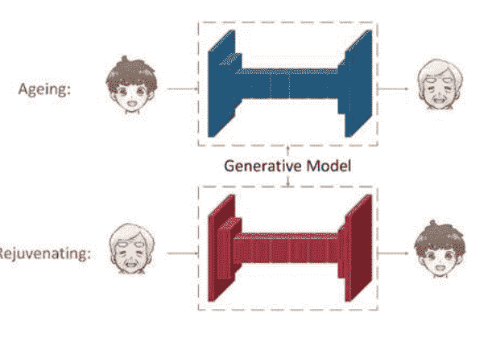

在图3中，生成模型通常是深度学习方法中的对抗自编码器（AAE）[34]或生成对抗网络（GAN）[14]。最初的GAN是由Goodfellow等人引入的，它能够通过使用极小极大博弈生成逼真的图像。最初的GAN包含两个组件：一个生成器用于生成期望的输出，一个判别器用于区分真实图像和伪造（生成的）图像。最初的GAN使用的损失函数为：

$$V(D, G) = \min_{G} \max_{D} \mathbb{E}_{x \sim P_{data}(x)} \log[D(x)] + \mathbb{E}_{z \sim P_z} \log[1 - D(G(x))]$$

其中，D和G分别表示判别器和生成器的学习函数；x和z分别表示真实数据和输入噪声。在这个模型中，由于对数损失函数中的饱和问题，判别器通常比生成器收敛得更快。为了解决这个问题，引入了几种变体，包括Wasserstein GAN（WGAN）[3]、f-GAN [38]和最小二乘GAN（LSGAN）[35]。

由于年龄合成模型在训练阶段也需要年龄信息，因此它们也可以依赖于第2.1节中提到的数据集进行训练和评估。用于评估年龄合成模型的最广泛使用的数据集是MORPH II数据集、CACD数据集和FG-NET数据集。通常，MORPH II数据集和CACD数据集用于训练和评估，而FG-NET数据集仅在评估阶段使用，因为其样本数量有限。

#### 3.1 年龄合成模型的评估方法

尽管年龄合成方法引起了研究界的重要关注，但是几个挑战使得合成过程难以实现。首先，像CACD这样的年龄合成基准数据集还涉及其他变化，如PIE和遮挡。在这些意外因素的影响下，提取年龄特定的特征是困难的。其次，现有数据集对于每个主题的广泛年龄范围的图像数量不足。例如，MORPH II数据集平均只捕捉到164天的时间跨度，这可能使得学习长期个性化衰老和恢复特征成为一项无监督任务。第三，个体的潜在条件，如他们的成长环境和基因，使得整个合成过程成为一项困难的预测任务。

基于这些前述的挑战，研究人员已经建立了两个衡量合成人脸质量的标准。一个是合成准确性，通过将合成的人脸输入年龄分类模型来测试是否将人脸转化为目标年龄类别。另一个标准是身份永久性，依赖于人脸验证算法来测试合成人脸和原始人脸是否属于同一个人[54]。

#### 3.2 基于深度学习的年龄合成方法

随着深度学习的日益流行，已经提出了几种使用不同网络架构的年龄合成模型。Antipov等人[2]首次利用条件GAN[36]合成老年人脸。在他们的工作中，作者首先预训练一个自编码器形状的生成器来重构原始输入。在预训练期间，他们对潜在特征添加了一个保持身份的约束，以强制在转换过程中保持身份信息不变。保持身份的约束是一个L2范数，可以表示为：

$$ Z_{I_P}^* = \argmin \parallel F R(x) - F R(\hat{x}) \parallel, \qquad (10) $$

其中 $x$ 是输入图像， $\hat{x}$ 是重建图像， $F R(\cdot)$ 是一个预训练的人脸识别模型[46]，用于提取身份特定的特征。在预训练生成器之后，他们通过使用年龄标签作为条件来微调网络。

张等人[58]也使用条件对抗学习方案，通过使用条件对抗自编码器来合成老年人的面部。与[2]不同，他们不使用预训练的人脸识别模型。相反，他们实现了一个额外的鉴别器来区分属于不同主体的潜在特征。因此，他们的模型可以进行端到端的训练。

王等人[52]最近提出了保持身份的条件生成对抗网络（IPCGAN）。他们使用了与[2]类似的策略，试图在特征空间中最小化输入和输出的两个身份特定特征。为了提高合成的准确性，他们预先训练了一个年龄估计器来估计生成的面部的年龄，并使用这个预训练模型的梯度通过反向传播来优化潜在特征。这样，潜在特征可以学习更准确的年龄信息。杨等人[54]使用了一个具有金字塔形鉴别器的生成对抗网络进行年龄合成。金字塔形鉴别器可以区分从预训练的年龄估计器中提取的多级年龄特定特征，而传统的鉴别器只能区分图像的高级特征。继之前的工作，他们采用了预训练的人脸识别模型来保留身份信息。实验结果表明，他们的方法可以生成具有丰富老化和恢复特征的逼真图像。

值得注意的是，[52]和[54]都利用了LSGAN的GAN函数。在原始GAN中，当真实数据和生成数据的分布相互分离时，Jensen-Shannon散度的梯度会消失。LSGAN通过L2损失替换了原始GAN的对数损失。LSGAN中的优化可以看作是最小化Pearson $\chi^2$散度，这有效地解决了原始GAN损失中的饱和问题，同时收敛速度比其他距离度量（如Wasserstein距离）要快得多。以衰老过程为例，LSGAN中的损失函数为：

$$ \mathcal{L}_D = \mathbb{E}_{x\sim P_{old}} [(D(x) - 1)^2] + \mathbb{E}_{x\sim P_{young}} [D(G(x))^2], \tag{11} $$

$$ \mathcal{L}_G = \mathbb{E}_{x\sim P_{young}} [(D(G(x) - 1)^2], \tag{12} $$

其中 $\mathcal{L}_D$ 用于优化鉴别器， $\mathcal{L}_G$ 用于优化生成器。

可以在图4中找到[54]的衰老结果示例。根据以下年龄范围，作者将数据分为四个类别：30–，31–40，41–50和51+。在图中，每组图像的左侧条目是数据集中的原始人脸，其他三个图像是生成的结果。

#### 3.3 年龄合成的未来研究

上述工作中没有涵盖的最重要的主题是标准化年龄合成模型的评估方法。早期的尝试[2, 58]主要使用主观评估方法进行调查。最近的研究[52, 54]根据第3.2节中提到的两个标准评估他们的模型，但他们使用不同的评估模型。具体而言，杨等人[54]使用商业人脸识别和年龄估计工具，而王等人[52]使用他们预训练的人脸识别模型和年龄估计模型。这些差异使得相关工作难以比较，可能阻碍进一步研究的发展。

![图4 [54]的衰老结果。前两行是从CACD数据集获取的，底部两行是从MORPH II数据集获取的。](img/38bad78e42d0809a9c2b3746a2016959_22_0.png)

此外，从前一节可以看出，通常使用预训练的人脸识别模型或年龄估计模型来指导训练过程。然而，这些模型可能存在噪声。根据[52]的研究，他们的年龄估计器的准确率仅约为30%。由于分类错误率较高（分类器存在噪声），年龄信息的梯度不准确。通过开发其他方法来保证合成准确性并同时保留身份信息，可以提高性能。新方法还可以使整个训练过程端到端进行，而不是预训练几个独立的网络，这可以节省训练时间和计算资源。

### 4 年龄不变的人脸识别

尽管传统人脸识别模型的准确率相对较高（不明确考虑同一人的姿势、光照和表情变化等类内变异）[42, 46]，但年龄不变的人脸识别（AIFR）仍然是一个具有挑战性的任务。

用于评估AIFR模型的常用数据集是MORPH II数据集和FG-NET数据集。此外，CACD-VS也被用于AIFR，它是从CACD中派生出的无噪声数据集，用于跨年龄人脸验证。CACD-VS包含2000个正面交叉年龄图像对和2000个负面图像对。此外，研究人员还在传统人脸数据集（如Labeled Faces in the Wild (LFW)数据集）上测试他们的AIFR模型，以展示其模型的泛化能力。

AIFR模型的评估标准与传统人脸识别模型相同，即识别准确率和验证准确率。

#### 4.1 基于深度学习的年龄不变人脸识别方法

与传统的人脸识别方法不同，只需要考虑不同主体之间的外类别变化（不同主体之间的外观和特征差异），AIFR模型还需要考虑内类别变化，即同一主体图像之间的年龄差异。

Wen等人[53]是第一个使用CNN进行AIFR的工作。在这项工作中，作者提出了潜在特征全连接层（LF-FC）和潜在身份分析（LIA）来提取年龄不变的身份特定特征。LIA的公式为：

$$ v = \sum_{i=1}^{d} U_i x_i + \bar{v}, \quad (13) $$

其中 $U_i$ 是相应的矩阵，其列张成需要学习的不同变化的子空间，$x_i$是来自CNN的归一化潜在变量，$\bar{v}$是所有面部特征的均值。输出 $v$ 是一组年龄不变的特征。如[53]所述，每组面部特征可以根据不同的监督信号分解为不同的组件。因此，方程（13）可以重写为：

$$ v = U_{id} x_{id} + U_{ag} x_{ag} + U_{e} x_{e} + \bar{v}, \quad (14) $$

其中 $U_{id} x_{id}$ 表示用于实现AIFR的身份特定组件，$U_{ag} x_{ag}$ 表示编码年龄变化的年龄特定组件，而 $U_{e} x_{e}$ 表示噪声组件。然后，作者使用期望最大化（EM）算法来学习LIA的参数。请注意，LIA仅用于优化网络中的线性层，即LF-FC层。卷积层中的参数通过使用随机梯度下降（SGD）算法进行优化。由于卷积层和LF-FC层被训练用于学习不同的特征（卷积层学习传统的面部特征，LF-FC层学习年龄不变的特征），作者使用了一种耦合学习方案来优化网络。具体来说，当优化卷积层时，他们冻结LF-FC层（固定参数），当优化LF-FC层时，他们冻结卷积层。

| 方法         | #测试对象 | 准确性  |
| :----------- | :-------- | :------ |
| 文等人[53]   | 10,000    | 97.51%  |
| 王等人[51]   | 10,000    | 98.55%  |
| 郑等人[59]   | 3000      | 98.13%  |
| 王等人[51]   | 3000      | 98.67%  |

| 方法         | 准确性 |
| :----------- | :----- |
| 文等人[53]   | 98.5%  |
| 王等人[51]   | 99.2%  |

| 方法         | 准确性 |
| :----------- | :----- |
| 文等人[53]   | 99.1%  |
| 王等人[51]   | 99.4%  |

郑等人[59]提出了年龄估计引导的卷积神经网络(AE-CNN)用于AIFR。这项工作的基本思想是通过年龄估计损失从全局面部特征中获取年龄特定特征，并将其去除。去除操作是通过减法完成的。

最近，王等人[51]提出了正交嵌入CNN，其中来自最后一个全连接层的全局特征被分解为两个组成部分，即年龄特定组件(特征) $x_{年龄}$ 和身份特定组件(特征) $x_{身份}$。他们不再将全局特征视为 $x_{年龄}$ 和 $x_{身份}$ 的线性组合，而是以A-Softmax [32]为灵感，以正交方式对这两个组件进行建模。

可以在表3、4和5中找到三个基准测试的最新结果。报告的数字是百分比准确率。通过使用先进的架构（类似于ResNet的模型）和定制的损失函数，王等人在MORPH II数据集、CACD-VS数据集和LFW数据集上取得了最佳性能。

#### 4.2 年龄无关人脸识别的未来研究趋势

尽管最近的年龄无关人脸识别模型可以取得良好的结果，但如果有更大规模的面向年龄的数据集可用于训练和测试，这些结果可能进一步改善。可以使用年龄合成方法来扩大和增强现有数据集，通过生成每个主体在不同年龄或年龄组的图像。因此，训练过程可以从更多的训练样本中受益，并且可以达到更高的准确性。

根据[41]，年龄无关人脸识别有两种方法。一种是生成方法，通过生成合成的人脸来匹配目标年龄，然后基于合成的面部进行识别。另一种是通过发现不同年龄之间的隐藏关系来区分面部的辨别方法。现有的基于深度学习的方法属于第二类。因此，使用基于深度学习的生成方法的好处有两个（扩大现有数据集和从不同角度解决问题）。

### 5 结论

年龄是计算机视觉和生物特征任务中最常用的软生物特征。年龄导向模型可以在各种实际应用中使用。然而，由于衰老模式的复杂性和个体之间的多样性，与年龄相关的面部图像分析仍然具有挑战性。

在本章中，我们根据其应用将与年龄相关的面部图像分析分为三个领域。这三个领域是年龄估计、年龄合成和年龄不变的面部识别。我们通过首先讨论它们的主要概念和常用的评估数据集来详细讨论每个领域。然后，我们讨论了最近的研究工作，并分析了剩余的问题和未解决的问题。我们还提出了可能的未来研究课题。

对于年龄估计的情况，研究人员目前从两个不同的角度来解决这个问题。现有的工作要么设计定制的损失函数来计算估计的年龄，要么修改基本的CNN架构。年龄估计领域的重要问题是解开其他意外变化，如PIE和遮挡，并构建大规模无噪声的数据集，以进一步提高估计性能。在年龄合成的情况下，研究人员通常采用GANs或AAEs来基于输入的人脸生成老化或返老还童的人脸。然而，现有的工作没有统一的方法来评估他们的模型。因此，需要提出一个评估标准。在年龄不变的人脸识别的情况下，研究人员通常设计模型来发现年龄之间的隐藏关系。换句话说，现有的工作采用判别方法，从而为采用生成方法的模型的发展提供了机会。

### 参考文献

1.  F. Alnajar, Z. Lou, J.M. Ivarez, T. Gevers, et al., Expression-invariant age estimation, in BMVC (2014)
2.  G. Antipov, M. Baccouche, J.-L. Dugelay, 通过条件生成对抗网络进行人脸老化, 在2017年IEEE国际图像处理会议(ICIP) (IEEE, Piscataway, 2017), pp. 2089–2093
3.  M. Arjovsky, S. Chintala, L. Bottou, Wasserstein生成对抗网络, 在国际机器学习会议(2017), pp. 214–223
4.  Q. Cao, L. Shen, W. Xie, O.M. Parkhi, A. Zisserman, Vggface2: 一个用于识别不同姿势和年龄的人脸数据集,在2018年第13届IEEE自动人脸与手势识别会议(FG 2018)(IEEE, Piscataway, 2018), pp. 67–74
5.  L. Chang, D.Y. Tsao, 大脑中面部身份的编码。 细胞 169(6), 1013–1028 (2017)
6.  K.-Y. Chang, C.-S. Chen, Y.-P. Hung, 具有成本敏感性的顺序超平面排名器用于年龄估计，在2011年IEEE计算机视觉和模式识别会议（CVPR）中(IEEE, Piscataway, 2011), pp. 85–592
7.  B.-C. Chen, C.-S. Chen, W.H. Hsu, 跨年龄参考编码用于年龄无关的人脸识别和检索，在欧洲计算机视觉会议上(Springer, Cham, 2014),pp. 768–783
8.  S. Chen, C. Zhang, M. Dong, J. Le, M. Rao, 使用排名-CNN进行年龄估计，在计算机视觉和模式识别（CVPR）的IEEE会议上(2017)
9.  T. Cootes, A. Lanitis, FG-NET衰老数据库（2008年）。 http://www-ima.inrialpes.fr/FGnet/
10. J. Deng, W. Dong, R. Socher, L.-J. Li, K. Li, L. Fei-Fei, ImageNet: 一个大规模的分层图像数据库，在2009年的IEEE计算机视觉和模式识别会议上。 CVPR 2009(IEEE, Piscataway, 2009)，第248-255页
11. S. Escalera, J. Fabian, P. Pardo, X. Bar , J. Gonzalez, H.J. Escalante, D. Misevic, U. Steiner, I. Guyon,ChaLearn looking at people 2015: 明显年龄和文化事件识别数据集和结果，在2015年的IEEE国际计算机视觉会议工作坊上，第1-9页
12. Y. Fu, G. Guo, T.S. Huang, 通过人脸进行年龄合成和估计：一项调查。 IEEE Trans. Pattern Anal. Mach. Intell. 32(11), 1955-1976 (2010)
13. X. Geng, Z.-H. Zhou, K. Smith-Miles, 基于面部衰老模式的自动年龄估计。 IEEE Trans. Pattern Anal. Mach. Intell. 29(12), 2234–2240 (2007)
14. I. Goodfellow, J. Pouget-Abadie, M. Mirza, B. Xu, D. Warde-Farley, S. Ozair, A. Courville, Y. Bengio, 生成对抗网络，在Advances in Neural Information Processing Systems (2014), pp. 2672–2680
15. Y. Guo, L. Zhang, Y. Hu, X. He, J. Gao. MS-Celeb-1M: 一个用于大规模人脸识别的数据集和基准，在European Conference on Computer Vision(Springer, Cham, 2016), pp. 87–102
16. H. Han, A.K. Jain, F. Wang, S. Shan, X. Chen, 异构人脸属性估计：一种深度多任务学习方法。IEEE Trans. Pattern Anal. Mach. Intell. 40(11), 2597–2609(2018)
17. K. He, X. Zhang, S. Ren, J. Sun, 深度残差学习用于图像识别，在IEEE计算机视觉和模式识别会议(2016), 第770-778页
18. Y. He, M. Huang, Q. Miao, H. Guo, J. Wang, 用于鲁棒年龄估计的深度嵌入网络，在2017 IEEE国际图像处理会议 (ICIP) (IEEE,Piscataway, 2017), 第1092-1096页
19. H.-L. Hsieh, W. Hsu, Y.-Y. Chen, 用于人脸识别和属性估计的多任务学习，在2017 IEEE国际声学、语音和信号处理会议(ICASSP)(IEEE, Piscataway, 2017), 第2981-2985页
20. 胡Z, 温Y, 王J, 王M, 洪R, 严S, 年龄差异下的面部年龄估计。 IEEE图像处理交易 26(7), 3087–3097 (2017)
21. 黄G, 刘Z, Van Der Maaten L, Weinberger K.Q, 密集连接卷积神经网络,在CVPR中, vol. 1 (2017), p. 3
22. Jain A.K, Dass S.C, Nandakumar K, 个人识别系统中的软生物特征, 在生物特征认证(Springer, Berlin, 2004), pp. 731–738
23. Jain A.K, Ross A.A, Nandakumar K, 生物特征学导论 (Springer Science & Business Media, New York, 2011)
24. Klontz J.C, Jain A.K, 以波士顿马拉松爆炸案嫌疑犯为例的无约束面部识别案例研究。 密歇根州立大学, 技术报告, 119(120), 1 (2013)
25. A. Krizhevsky, I. Sutskever, G.E. Hinton, 使用深度卷积神经网络进行ImageNet分类, 在 *Advances in Neural Information Processing Systems* (2012), pp. 1097–1105
26. Y. LeCun, B. Boser, J.S. Denker, D. Henderson, R.E. Howard, W. Hubbard, L.D. Jackel, 反向传播应用于手写邮政编码识别. 神经计算. **1**(4), 541–551 (1989)
27. Y. LeCun, Y. Bengio, G. Hinton, 深度学习. *Nature* **521**(7553), 436 (2015)
28. G. Levi, T. Hassner, 使用卷积神经网络进行年龄和性别分类, 在 *Proceedings of the IEEE Conference on Computer Vision and Pattern Recognition Workshops* (2015), 第34-42页
29. L. Li, H.-T. Lin, 扩展二元分类的序回归, 在神经信息处理系统进展 (2007), 第865-872页
30. K. Li, J. Xing, C. Su, W. Hu, Y. Zhang, S. Maybank, 深度成本敏感和保序特征学习用于跨人群年龄估计, 在 *IEEE国际计算机视觉会议* (2018)
31. H. Liu, J. Lu, J. Feng, J. Zhou, 用于面部年龄估计的序深度特征学习, 在 *2017年第12届IEEE国际自动人脸与手势识别会议(FG 2017)* (IEEE, Piscataway, 2017), 第157-164页
32. W. Liu, Y. Wen, Z. Yu, M. Li, B. Raj, L. Song, SphereFace: 深度超球嵌入用于人脸识别, 在 *IEEE计算机视觉与模式识别会议(CVPR)*, 第1卷 (2017), 第1页
33. H. 刘, J. 卢, J. 冯, J. 周, 面部年龄估计的标签敏感深度度量学习. *IEEE Trans. Inf. Forensics Secur.* **13**(2), 292–305 (2018年)
34. A. Makhzani, J. Shlens, N. Jaitly, I. Goodfrey, B. Frey, 对抗自动编码器 (2015年), arXiv预印本arXiv:1511.05644
35. X. 毛, Q. 李, H. 谢, R.Y. 劳, Z. 王, S.P. Smolley, 最小二乘生成对抗网络, 在 *2017年IEEE国际计算机视觉会议 (ICCV)* (IEEE, Piscataway, 2017年), 第2813–2821页
36. M. Mirza, S. Osindero, 条件生成对抗网络 (2014年), arXiv预印本 arXiv:1411.1784
37. Z. 牛, M. 周, L. 王, X. 高, G. 华, 使用多输出CNN进行序数回归进行年龄估计, 在 *计算机视觉和模式识别IEEE会议论文集* (2016), 第4920-4928页
38. S. Nowozin, B. Cseke, R. Tomioka, f-GAN: 使用变分散度最小化训练生成神经采样器, 在神经信息处理系统进展 (2016), 第271-279页
39. G. Ozbulak, Y. Ayar, H.K. Ekenel, 基于CNN的特征对于年龄和性别分类有多可迁移？, 在 *2016年国际生物特征专业兴趣组织会议 (BIOSIG)* (IEEE, Piscataway, 2016), 第1-6页
40. H. Pan, H. Han, S. Shan, X. Chen, 深度年龄估计中的均方差损失函数, 在 *IEEE计算机视觉与模式识别会议* (2018), 第5285-5294页
41. U. Park, Y. Tong, A.K. Jain, 年龄不变的人脸识别. *IEEE模式分析与机器智能* **32**(5), 947–954 (2010)
42. O.M. Parkhi, A. Vedaldi, A. Zisserman, 等, 深度人脸识别, 在 *BMVC*, 第1卷 (2015), 第6页
43. R. Ranjan, S. Sankaranarayanan, C.D. Castillo, R. Chellappa, 一种全能的卷积神经网络用于人脸分析, 在 *2017年第12届IEEE国际自动人脸与手势识别会议(FG 2017)* (IEEE, Piscataway, 2017), 第17-24页
44. K. Ricanek, T. Tesafaye, Morph: 一个正常成年人年龄变化的长期图像数据库, 在 *第7届国际自动人脸和手势识别会议*, 2006年. *FGR 2006* (IEEE, Piscataway, 2006), 第341-345页
45. R. Rothe, R. Timofte, L. Van Gool, 从单个图像中无需面部标记的真实和表观年龄的深度期望. *计算机视觉国际期刊* **126**(2–4), 144–157 (2018)
46. F. Schroff, D. Kalenichenko, J. Philbin, FaceNet: 用于人脸识别和聚类的统一嵌入, 在IEEE计算机视觉和模式识别会议论文集(2015), pp. 815-823
47. K. Simonyan, A. Zisserman, 用于大规模图像识别的非常深的卷积网络 (2014), arXiv预印本 arXiv:1409.1556
48. S. Taheri, . Toygar, 使用DAG-CNN架构进行多阶段特征融合的年龄估计。 Neurocomputing 329, 300-310 (2019)
49. X. Wang, R. Guo, C. Kambhamettu, 深度学习特征用于年龄估计, 在2015年IEEE冬季计算机视觉应用会议(WACV)(IEEE, Piscataway, 2015), pp. 534-541
50. H. Wang, X. Wei, V. Sanchez, C.-T. Li, 融合网络用于基于人脸的年龄估计, 在 2018年第25届IEEE国际图像处理会议(ICIP)(IEEE, Piscataway, 2018), pp. 2675-2679
51. Y. Wang, D. Gong, Z. Zhou, X. Ji, H. Wang, Z. Li, W. Liu, T. Zhang, 正交深度特征分解用于年龄不变人脸识别 (2018), arXiv预印本 arXiv:1810.07599
52. Z. Wang, X. Tang, W. Luo, S. Gao, 保持身份的条件生成对抗网络进行人脸老化,在IEEE计算机视觉与模式识别会议(2018), pp. 7939-7947
53. Y. Wen, Z. Li, Y. Qiao, 潜在因素引导的卷积神经网络用于年龄无关人脸识别, 在IEEE计算机视觉和模式识别会议(2016), 第4893-4901页
54. H. Yang, D. Huang, Y. Wang, A.K. Jain, 学习人脸年龄进展: 金字塔架构的GANs (2017), arXiv预印本 arXiv:1711.10352
55. D. Yi, Z. Lei, S.Z. Li, 多尺度卷积网络进行年龄估计, 在亚洲计算机视觉会议(Springer, Berlin, 2014), 第144-158页
56. Y. Zhang, D.-Y. Yeung, 多任务扭曲高斯过程用于个性化年龄估计,在2010 IEEE计算机视觉和模式识别会议 (CVPR) (IEEE,Piscataway, 2010), 第2622-2629页
57. K. Zhang, Z. Zhang, Z. Li, Y. Qiao, 使用多任务级联卷积网络进行联合人脸检测和对齐. IEEE信号处理通信 23(10), 1499-1503 (2016)
58. Z. Zhang, Y. Song, H. Qi, 通过条件对抗自编码器进行年龄进化/回归.在计算机视觉和模式识别 （CVPR） 的IEEE会议上, vol. 2 (2017)
59. T. Zheng, W. Deng, J. Hu, 年龄估计引导的卷积神经网络用于年龄不变的人脸识别,在IEEE计算机视觉和模式识别会议的论文集(2017), pp. 12-16# 通过深度学习进行个人再识别与软生物特征

林山和李昌村

### 1 引言

个人再识别，也称为人员再识别，是在监控系统中识别和持续识别多个非重叠摄像头中的同一人的任务。自动人员识别系统的典型方法通常基于人们的硬生物特征，如指纹、虹膜或面部。然而，在视频监控系统中，目标个体通常以远距离在不受控制的环境中被捕获。这样的设置由于摄像头传感器的低分辨率、被拍摄主体的遮挡等原因，导致获取这些硬生物特征变得非常困难。[14].

现有的大部分人物重新识别研究都集中在提取人物的局部视角不变特征和学习区分距离度量进行相似性分析。软生物特征，如性别、年龄、发型或服装，是对一个人的中层语义描述，对光照、视角和姿势都是不变的。因此，近年来，软生物特征已经与身份信息一起被用作许多重新识别方法的辅助信息。此外，这些语义属性标签弥合了机器和人类对人类的认知和识别之间的差距。通过整合软生物特征，现有的人物重新识别系统可以得到扩展，更广泛的应用范围，如文本到人员检索，图像到描述的转换。

尽管之前已经提出了许多软生物特征辅助的人员重新识别方法。其中大多数基于传统的机器学习方法和手工特征。在[7-9]中，通过SVM对属性进行分类，并将其整合到人员重新识别的度量学习步骤中。Su等人[17]提出了低秩属性嵌入，将二进制属性嵌入到基于局部特征表示的连续属性空间中。Khamis等人[5]基于属性一致性开发了一种方法，为同一人员提出了三元损失以用于属性特征。所有这些工作都基于小规模的VIPeR和PRID数据集，仅包含21个二进制属性。2014年，Deng等人[1]发布了一个包含多个人员重新识别数据集的大规模行人属性数据集PETA。

然而，PETA数据集中没有足够数量的训练图像用于基于深度学习的人物再识别方法。直到Lin等人[10]发布了两个最大的再识别数据集：Market-1501 [25]和DukeMTMC-reID [27]的注释，软生物特征开始融入深度人物再识别方法。然而，与PETA数据集相比，Market-1501和DukeMTMC-reID的注释属性的大小仍然相对有限。

在本章中，我们首先列出了带有软生物特征标签的人物再识别数据集，并介绍了人物再识别任务和属性识别任务的性能评估指标。然后，我们从监督学习、半监督学习和无监督学习的三个角度介绍了最近基于软生物特征的深度人物再识别方法。最后，我们讨论了人物再识别中软生物特征尚未解决的问题，并概述了潜在的未来工作。

### 2 数据集和评估

#### 2.1 带有软生物特征注释的数据集

目前，大约有30个公开可用的人物重新识别数据集。然而，其中只有一小部分带有软生物特征属性的注释。表1列出了广泛使用的带有软生物特征的人物重新识别数据集。在[7]中，Layne等人使用15个二进制属性对最古老的人物重新识别数据集VIPeR进行了注释，包括性别、发型和一些服装属性。稍后在[8]中，他们通过为头发、衬衫和裤子引入深色和浅色标签，并将属性注释扩展到其他数据集（如PRID[4]和GRID[12]）来增加了15个属性到21个。他们的PRID和GRID注释仅限于跨摄像头的身份（PRID有200个身份，GRID有250个身份）。2014年，Deng等人发布了行人属性识别数据集PETA[1]。它由从多个监控数据集中选择的19,000张图像组成，并提供了61个软生物特征注释的每个细节。

表1 常用的具有软生物特征的个人再识别数据集

| 数据集 | # ID | 图像数量 | # 特征 | 特征注释 |
|--------|------|----------|--------|----------|
| VIPeR^1 [2] | 632 | 1264 | 15 | 15个二进制特征 [7] |
| VIPeR^2 [2] | 632 | 1264 | 21 | 21个二进制特征 [8] |
| PRID [4] | 934 | 24,541 | 21 | 标注的共享200个身份 [8] |
| GRID [12] | 1025 | 1275 | 21 | 标注的共享250个身份 [8] |
| PETA [1] | – | 19,000 | 105 | 61个二进制特征 [1] 四个不同区域的11种颜色 包括多个再识别数据集: VIPeR 1264张图像 PRID 1134张图像 GRID 1275张图像 CUHK 4563张图像 |
| Market-1501 [25] | 1501 | 32,217 | 30 | 9个二进制特征 [10] 4个不同年龄组 8种上身颜色 9种下身颜色 |
| DukeMTMC-reID [27] | 1812 | 36,441 | 23 | 8个二进制特征 [10] 8种上身颜色 7种下身颜色 |

VIPeR^1是2012年提出的属性注释的第一个版本 VIPeR^2表示带有额外标签的属性注释的第二个版本 PETA数据集包含来自多个重新识别数据集的属性二进制标签和11种不同的颜色标签用于四个不同的身体区域。PETA数据集总共有105个属性，是行人属性识别中最丰富的注释数据集之一。由于PETA数据集包含了许多流行的人物再识别数据集，如VIPeR、PRID、GRID和CUHK，因此它已经被集成为一些人物再识别方法的软生物特征[13, 16, 18, 19]。由于深度学习方法在人物再识别中的快速发展，VIPeR、PRID和GRID数据集的规模对于训练深度神经网络来说太小了。最近发布的两个数据集，Market-1501[25]和DukeMTMC-reID[27]，具有相当数量的身份和边界框，为深度再识别模型的训练和测试提供了大量的数据。在[10]中，Lin等人分别对这两个大型数据集进行了注释，分别为30和23。Market-1501中的所有1501个身份都被注释为九种不同的二进制属性，从四个不同的年龄组中选择，并指示上下身体部位的颜色。DukeMTMC-reID数据集被注释为具有八个二进制属性的上下身体颜色。数据集的详细统计数据可以在表1中找到。

#### 2.2 评估指标

累积匹配特征（CMC）曲线是用于评估人物重新识别性能的最常见指标。采用这个指标是因为重新识别直观上被视为一个排名问题，其中每个图库中的图像根据与探测图像的比较进行排名。正确匹配在排名中小于或等于特定值的概率被绘制成与图库集合的大小的关系图[2]。由于深度学习模型的训练时间较长，最近的深度重新识别方法的CMC曲线比较仅简化为比较Rank-1、5、10、20的检索率。

然而，当每个给定查询图像只有一个真实匹配时，CMC曲线评估是有效的。最近的数据集，如Market-1501和DukeMTMC-reID，通常对于每个查询图像都包含多个真实匹配。因此，Zheng等人[25]提出了平均精度均值（mAP）作为一种新的评估指标。对于每个查询图像，平均精度（AP）被计算为其精确率-召回率曲线下的面积。平均精度（mAP）的平均值将反映出人物重新识别算法的整体召回率。当前人物重新识别方法的性能通常通过将检索精度评估的CMC曲线和召回率评估的mAP结合起来进行检查。

对于使用软生物特征的人物再识别方法，评估了生物特征属性识别准确性以证明所提出的方法有效地学习和利用给定的属性信息。为了对属性预测进行全面分析，软生物特征评估指标通常包括每个个体属性的分类准确率和所有属性的平均识别率。

## 2.3 带有软生物特征的监督式深度再识别

一个人的视觉外观很容易受到不同摄像机的照明、姿势和视角的影响。作为语义中层特征的软生物特征在不同摄像机之间是不变的，并提供有关个人身份的相关信息。通过将软生物特征整合到人物再识别模型中，深度人物再识别网络应该能够获得更强大的视角不变特征表示。构建能够将身份信息与属性信息融合的新神经网络结构是完全监督的深度人物再识别的关键步骤。

### 2.3.1 监督属性辅助验证的人物再识别

三元组损失是人物再识别任务中常用的损失函数。通过输入一个锚定图像和一个正样本以及一个负样本，计算它们之间的相似度。正样本对之间的相似度应该很高，负样本对之间的相似度应该很低。由于同一个人应该具有相同的软生物特征属性，三元组损失函数也可以应用于属性特征。基于属性一致性，Schumann等人提出了一种属性互补再识别网络（ACRN）架构，将基于图像的三元组损失与属性标签的三元组损失相结合。ACRN架构的概述如图1所示。

图1属性互补再识别网络（ACRN）的示意图

属性识别模型是从PETA数据集预训练的。然后，将三个输入图像的属性预测用于计算属性分支的三元组损失。将原始图像分支的三元组损失与属性分支的损失相加，ACRN的整体损失函数可以表示为以下形式：

$$ L_{ACRN} = \frac{1}{N} d_i^{fp} - d_i^{fn} + m + \gamma (d_i^{att p} - d_i^{att n}), $$

其中 $d_i^{fp} = \|f_i^a - f_i^p\|_2^2$, $d_i^{fn} = \|f_i^a - f_i^n\|_2^2$, $d_i^{att p} = \|att_i^a - att_i^p\|_2^2$, $d_i^{att n} = \|att_i^a - att_i^n\|_2^2$. $d_i^{fp}$ 并且 $d_i^{fn}$表示锚点正样本图像对和锚点负样本图像对之间的距离。术语 $d_i^{att p}$ 并且 $d_i^{att n}$表示预测属性表示之间的距离。在表3中可以找到与其他方法的性能比较。通过额外的属性分支三元损失，Rank1检索准确率和mAP都提高了2-4%。

### 2.3.2 基于监督属性辅助识别的人员再识别

与将人员再识别问题视为验证任务的三元组损失方法不同，Lin等人[10]将人员再识别训练重新思考为识别任务。他们利用分类损失来学习人员的身份和属性。通过对两个最大的人员再识别数据集Market-1501和DukeMTMC-reID进行软生物特征注释，他们提出的方法可以同时从骨干CNN网络的相同特征图中学习属性和ID。图2展示了属性-人员识别（APR）网络的概述。

图2 属性-人员识别（APR）网络的示意图

APR网络中的每个输入图像都会通过ResNet-50主干特征提取器。提取的特征图将用于身份分类和属性识别。对于训练中的K个身份，他们使用交叉熵损失进行身份分类：$L_{ID} = -\sum_{k=1}^{K} \log(p(k))q(k)$，(2) 其中 $p(k)$ 是预测的概率，$q(k)$是真实值。属性预测使用MSoftmax损失：$L_{att} = -\sum_{j=1}^{m} \log(p(j))q(j)$，(3) 由于APR网络同时训练属性预测和身份分类，总损失函数将是两个损失的加权求和：$L_{APR} = \lambda L_{ID} + \frac{1}{M} \sum_{i=1}^{M} L_{att}$，(4) 通过仅使用ID和属性的分类损失，APR网络比基于三元组损失的网络更容易训练，并且收敛速度更快、更平稳。总体性能如表3所示，与基于三元组损失的ACRN方法相当。

## 使用软生物特征的半监督人物再识别

尽管Market-1501数据集和DukeMTMC-reID数据集标有30个和23个属性，但这些软生物特征标签的维度远远低于105个属性的PETA数据集。另一方面，PETA数据集对于深度学习方法来说提供的训练ID不足。如果PETA数据集的属性可以转移到新的数据集中，它可以为人物再识别任务提供更详细的辅助信息。

### 通过协同训练实现的半监督跨数据集属性学习

为了解决这个问题，Su等人提出了一种半监督深度属性学习（SSDAL）算法。SSDAL方法使用协同训练策略，通过利用新数据集中的ID信息，将给定标记数据集中的属性扩展到不同的未标记人物再识别数据集中。SSDAL算法的过程可以概括为三个阶段：

1. 使用软生物特征属性对一个PETA行人属性数据集进行训练（不包括目标数据集）
2. 在仅使用人物ID标签的大型数据集上使用三元损失对基于身份标签的预测属性进行微调
3. 更新模型对组合数据集的属性标签进行预测

SSDAL的三个阶段的详细说明可在图3中找到。图4显示了不同阶段的属性分类准确率 SSDAL策略确实使基线识别准确率提高了2-3%。然而，SSDAL中的人物重新识别匹配完全基于从PETA数据集中半监督学习的软生物特征标签 因此，SSDAL在人物重新识别性能方面表现相对较差，如表3所示。

图3 半监督深度属性学习（SSDAL）网络示意图

图4 不同阶段的属性分类准确率

### 3.2 通过软生物特征进行无监督跨数据集人物再识别

最近的大多数人物再识别（Re-ID）模型都遵循需要从视频监控摄像头中收集大量标记匹配图像对的监督学习框架。然而，实际的监控系统通常由数百个摄像头组成。在这些摄像头中手动跟踪和注释人物是非常昂贵和不切实际的。一种解决这个问题的方法是将从现有可用数据集中学习到的预训练模型转移到新的监控系统中。由于可以轻松获取新的闭路电视系统中的未标记图像，因此可以将此问题视为无监督的跨数据集迁移学习问题。

近年来，一些无监督方法已被提出，用于提取视角不变特征并测量图像的相似性，而不需要标签信息[6, 20, 21, 24]。这些方法仅分析了无标签数据集，并且通常由于缺乏强有力的监督调整和优化而导致人员再识别性能较差。解决再识别可扩展性问题的另一种方法是通过域自适应策略进行无监督迁移学习。无监督域自适应方法利用一个或多个相关源数据集（也称为源域）中的标记数据来学习目标域中的无标签数据的模型。由于不同再识别数据集的身份标签不重叠，软生物特征属性成为数据集之间的替代共享领域知识。例如，相同的属性集，如性别、年龄组或服装的颜色/纹理，可以作为任何数据集中行人的通用属性。

#### 3.2.1 属性一致性自适应方法

利用软生物特征属性进行跨数据集适应的一种方法是创建一个距离度量来量化模型在给定领域中的拟合程度。Wang等人[22]提出了可转移的联合属性-身份深度学习（TJ-AIDL）方法，并引入了身份推断属性（IIA）。通过减少身份推断属性和实际软生物特征属性之间的差异，预训练模型可以适应不同的数据集。TJ-AIDL的整体架构如图5所示。

图5 可迁移的联合属性-身份深度学习架构

TJ-AIDL方法为同时学习人物身份和外貌属性的个体特征提供了两个独立的分支。对于训练身份分支，他们使用了Softmax交叉熵作为损失函数，定义如下：

$$L_{id} = -\frac{1}{n_{bs}} \sum_{i=1}^{n_{bs}} \log(p_{id}(I_i^s, y_i^s)), (5)$$ 其中 $p_{id}(I_i^s, y_i^s)$ 指定了训练图像 $I_i^s$ 的真实类别 $y_i^s$ 的预测概率，$n_{bs}$表示批量大小。

对于训练属性分支，他们将属性识别视为多标签分类任务。因此，使用了sigmoid交叉熵损失函数：

$$L_{attr} = \frac{1}{n_{bs}} \sum_{i=1}^{n_{bs}} \sum_{j=1}^{m} (a_{i,j} \log(p_{attr}(I_i, j)) + (1 - a_{i,j}) \log(1 - p_{attr}(I_i, j))), (6)$$ 其中 $a_{i,j}$ 和 $p_{attr} (I_i, j)$ 定义了训练图像 $I_i$ 的真实标签和预测分类概率的第j个属性类。从身份分支提取的深度特征将被馈送到重构自编码器（IIA编码器-解码器）中，以转换为低维可匹配空间（IIA空间）用于属性对应物。重构损失 $L_{rec}$是重构图像与真实图像之间的最小平方误差（MSE）。从隐藏层提取的简洁特征表示（$e_{IIA}$）通过MSE损失与属性分支的预测分布对齐和规范化:

$$L_{ID-transfer} = \| e_{IIA} - \tilde{p}_{att} \|^2. (7)$$ 为了方便对齐，将额外的sigmoid交叉熵应用于从属性分支预测的伪属性与 $e_{IIA}$ 之间:

$$L_{attr,IIA} = \| e_{IIA} - \tilde{p}_{att} \|^2. (8)$$ 整体损失函数为编码器-解码器的加权求和 $L_{attr,IIA}$, $L_{rec}$, $L_{ID-transfer}$. 为了将身份知识传递给属性分支中，身份知识传递损失 $L_{ID-transfer}$ 也被添加到属性分类的学习中。TJ-AIDL模型的监督学习应该能够在身份推断属性($IIA$)和实际属性之间实现小的差异。然而，从源数据集训练的模型可能无法在目标数据集中给出相同的属性一致性，如图6所示。通过减少目标数据集图像上两个分支之间的差异，源数据集训练的TJ-AIDL模型可以以无监督的方式适应目标数据集。

图6两个分支之间的属性一致性 (a)源域中的属性一致性 (b) 目标域中的属性一致性

#### 3.2.2 基于MMD的特征对齐自适应方法

另一种利用软生物特征属性进行跨数据集适应的方法是对源数据集和目标数据集之间的属性特征分布进行对齐。Lin等人[11]提出了一种多任务中层特征对齐（MMFA）网络，该网络从源数据集中学习特征表示，并同时基于最大均值差异（MMD）将属性分布对齐到目标数据集。MMFA架构的概述如图7所示。

图7 多任务中层特征对齐（MMFA）网络架构示意图

MMFA网络基本上是一个连体神经网络结构。源图像和目标图像作为两个输入将经过具有共享权重的两个网络。全局最大池化层将从ResNet-50网络的最后一个卷积层中提取最敏感的特征图。这些来自全局最大池化的特征向量将被转发到多个独立的全连接层进行身份分类和属性识别。与TJ-AIDL一样，MMFA模型还使用了Softmax交叉熵进行ID识别和sigmoid交叉熵进行属性分类：

$$L_{id} = -\frac{1}{n_S} \sum_{i=1}^{n_S} \log(p_{id}(\mathbf{h}_{S,i}^{id}, y_{S,i})) (9)$$

$$L_{attr} = -\frac{1}{M} \frac{1}{n_S} \sum_{m=1}^{M} \sum_{i=1}^{n_S} (a_{S,i}^{m} \cdot \log(p_{attr}(\mathbf{h}_{S,i}^{attr\ m}, m)) + (1 - a_{S,i}^{m}) \cdot \log(1 - p_{attr}(\mathbf{h}_{S,i}^{attr\ m}, m))), (10)$$ 其中 $p_{id}(\mathbf{h}_{S,i}^{id}, y_{S,i})$ 是对身份特征 $\mathbf{h}_{S,i}^{id}$ 的预测概率，带有真实标签 $y_{S,i}$，而 $p_{attr}(\mathbf{h}_{S,i}^{attr\ m}, m)$ 是对第$m$个属性特征 $\mathbf{h}_{S,i}^{attr\ m}$ 的预测概率，带有真实标签 $a_{S,im}$。由于行人的身份在两个数据集之间不常共享，软生物特征属性成为跨数据集重新识别适应的良好替代共享域标签。由于每个属性都有自己的## 4 性能比较

属性识别准确率是评估属性信息如何整合到人物重新识别系统中的一个很好的衡量标准。表2显示了ACRN和APR方法的平均属性识别准确率。从PETA数据集训练的ACRN模型可以实现105个属性的84.61%平均识别准确率。APR模型也可以在23/30个属性上实现超过85%的识别率。然而，SSDAL方法没有在整个数据集上进行训练。

表2 ACRN和APR的平均属性识别准确率（mA）

| 方法 | PETA | Market-1501 | DukeMTMC-reID |
| :--- | :---: | :---: | :---: |
| ACRN | 84.61% | | |
| APR | | 88.16% | 86.42% |

| 数据集 | | VIPeR | PRID | Market-1501 | | DukeMTMC-reID | |
| :--- | :--- | :---: | :---: | :---: | :---: | :---: | :---: |
| 度量 (%) | | 排名1 | 排名1 | 排名1 | 平均准确率 | 排名1 | 平均准确率 |
| 无监督不带软生物特征 | GAN [27] | - | - | 79.3 | 56.0 | 67.7 | 47.13 |
| | PIE [26] | - | - | 78.1 | 56.2 | - | - |
| 有监督 | ACRN | - | - | 83.6 | 62.6 | 72.6 | 52.0 |
| | APR | - | - | 84.3 | 64.7 | 70.7 | 51.9 |
| 半监督 | SSDAL | 37.9 | 20.1 | 39.4 | 19.6 | - | - |
| 无监督 | TJ-AIDL^Duke | 35.1 | 34.8 | 58.2 | 26.5 | - | - |
| | MMFA^Duke | 36.3 | 34.5 | 56.7 | 27.4 | - | - |
| | TJ-AIDL^Market | 38.5 | 26.8 | - | - | 44.3 | 23.0 |
| | MMFA^Market | 39.1 | 35.1 | - | - | 45.3 | 24.7 |

上标: Duke和Market表示模型训练的源数据集。

PETA系统的一组不同的识别准确率可以在图4中找到。由于使用了不同的属性标签集，无监督的跨数据集方法TJ-AIDL和MMFA没有提供属性识别率。

表3显示了有监督和无监督生物特征、半监督属性转移和无监督跨数据集转移的详细比较。通过整合属性信息，带属性的有监督方法通常可以比深度有监督方法提高4-6%的性能。半监督方法仅基于转移的属性特征。由于缺乏局部特征信息，它的Re-ID性能相对较弱。无监督跨数据集的人员Re-ID方法，如TJ-AIDL和MMFA，与完全有监督的方法相比，显示出有希望的性能。

### 5 现有问题和未来趋势

现有的Market-1501和DukeMTMC-reID只有一小部分软生物特征属性。当前的23/30个属性很难区分这两个数据集中的大多数人。为了充分利用软生物特征信息进行人员Re-ID，绝对需要一个大规模且注释丰富的人员Re-ID数据集。然而，软生物特征属性的注释成本很高，特别是对于大规模数据集。不幸的是，最近发布的数据集，如MSMT17 [23]，没有软生物特征的注释。

软生物特征的第二个问题是在注释属性时缺乏标准化指南。在Market-1501中，有八种上身颜色和九种下身颜色。在DukeMTMC-reID中，上身和下身的注释颜色分别为8和7。年龄组分离定义为PETA数据集和Market-1501之间存在差异。服装类型在PETA、Market-1501和DukeMTMC-reID之间也不一致。如果所有数据集都遵循相同的注释指南，软生物特征属性可以在跨数据集或多数据集的人员重新识别场景中使用和评估。

软生物特征不应仅限于提高人员重新识别性能或用于跨数据集适应。如何利用现有属性并扩展到基于自然语言描述的人员检索将是一个有趣的研究课题。

### 6 结论

软生物特征属性对于人物再识别任务是有用的辅助信息。在有监督的深度人物再识别模型中，软生物特征信息可以提高人物再识别性能2-4%。当将一个再识别模型从一个摄像系统转移到另一个摄像系统时，软生物特征属性可以作为共享领域知识用于领域适应任务。此外，这些属性还可以通过半监督深度共训练策略从一个丰富注释的数据集传输到一个未标记的再识别数据集。跨数据集再识别模型适应或属性传输的性能仍然远离最佳。这些应用有很大的改进空间和巨大的潜力。目前，只有少数几个带有软生物特征信息的人物再识别数据集。软生物特征属性在不同数据集之间非常有限且不一致。如何有效获取软生物特征并建立注释准则将成为人物再识别问题的有意义的研究工作。

### 参考文献

1. Y. Deng, P. Luo, C.C. Loy, X. Tang, 在远距离下的行人属性识别, 在 *ACM多媒体国际会议 (ACM MM)* (2014)
2. D. Gray, S. Brennan, H. Tao, 评估用于识别、重新获取和跟踪的外观模型, 在国际追踪和监视性能评估研讨会 *(PETS)*, vol. 3 (2007), pp. 41–47
3. A. Gretton, K. Fukumizu, Z. Harchaoui, B.K. Sriperumbudur, 一种快速、一致的核两样本检验, 在神经信息处理系统进展 *(NIPS)* (2009)
4. M. Hirzer, C. Beleznai, P.M. Roth, H. Bischof, 通过描述性和Discriminative分类进行人物再识别, 在斯堪的纳维亚图像分析会议 *(SCIA)* (2011)
5. S. Khamis, C.H. Kuo, V.K. Singh, V.D. Shet, L.S. Davis, 用于属性一致的联合学习人物再识别, 在欧洲计算机视觉会议研讨会 *(ECCVW)*(2014)
6. E. Kodirov, T. Xiang, S. Gong, 使用迭代Laplacian正则化的字典学习进行无监督人员再识别, 在英国机器视觉会议 *(BMVC)* (2015)
7. R. Layne, T.M. Hospedales, S. Gong, 基于属性的人员再识别, 在英国机器视觉会议 *(BMVC)* 中. 英国机器视觉协会 (2012)
8. R. Layne, T.M. Hospedales, S. Gong, 基于属性的再识别, 在人员再识别 (Springer, 伦敦, 2014) 中, 第93-117页
9. R. Layne, T.M. Hospedales, S. Gong, 在野外寻找属性的再识别, 在英国机器视觉会议 (BMVC) 中。英国机器视觉协会 (2014), 第1-1页
10. Y. Lin, L. Zheng, Z. Zheng, Y. Wu, Y. Yang, 通过属性和身份学习改进人员再识别 (2017), arXiv预印本
11. S. Lin, H. Li, C.-T. Li, A.C. Kot, M.I.U. Ali, 无监督多任务中层特征对齐网络用于无监督跨数据集的人物再识别, 在英国机器视觉会议 (BMVC) (2018)
12. C.C. Loy, T. Xiang, S. Gong, 多摄像头活动理解的时延相关分析。Int. J. Comput. Vis. 90, 106-129 (2010)
13. T. Matsugano, E. Suzuki, 使用从属性组合中学习的CNN特征进行人物再识别, 在国际模式识别会议 (ICPR) (2016)
14. D.A. Reid, S. Samangooei, C. Chen, M.S. Nixon, A. Ross, 用于监视的软生物特征: 概述, 在统计手册 (Elsevier, 牛津, 2013)
15. A. Schumann, R. Stiefelhagen, 通过深度学习属性-补充信息进行个人再识别, 在计算机视觉和模式识别会议 (CVPRW) (2017)
16. Z. Shi, T.M. Hospedales, T. Xiang, 将语义表示转移用于个人再识别和搜索, 在计算机视觉和模式识别会议 (CVPR) (IEEE, Piscataway, 2015)
17. C. Su, F. Yang, S. Zhang, Q. Tian, 低秩属性嵌入的多任务学习用于个人再识别, 在国际计算机视觉会议 (ICCV) (2015)
18. C. Su, S. Zhang, J. Xing, W. Gao, Q. Tian, 通过深度属性驱动的多摄像头个人再识别, 在欧洲计算机视觉会议 (ECCV) (2016)
19. C. Su, S. Zhang, J. Xing, W. Gao, Q. Tian, 多类型属性驱动的多摄像头个人再识别。模式识别。75, 77-89 (2018)
20. H. Wang, S. Gong, T. Xiang, 无监督学习生成主题显著性用于人物再识别, 在英国机器视觉会议 (BMVC) (2014)
21. H. Wang, X. Zhu, T. Xiang, S. Gong, 无监督开放式人物再识别, 国际图像处理会议 (ICIP) (2016)
22. J. Wang, X. Zhu, S. Gong, W. Li, 可迁移的联合属性-身份深度学习用于无监督人物再识别, 在计算机视觉和模式识别会议 (CVPR) (2018)
23. L. Wei, S. Zhang, W. Gao, Q. Tian, 人物转移GAN用于跨领域人物再识别, 在计算机视觉和模式识别会议 (CVPR) (2018)
24. H.X. Yu, A. Wu, W.S. Zheng, 无监督人物再识别的跨视角非对称度量学习, 在国际计算机视觉会议 (ICCV) (2017)
25. L. Zheng, L. Shen, L. Tian, S. Wang, J. Wang, Q. Tian, 可扩展的人物再识别基准, 在国际计算机视觉会议 (ICCV) (2015)
26. L. Zheng, Y. Huang, H. Lu, Y. Yang, 姿态不变嵌入用于深度人物再识别 (2017), arXiv预印本
27. Z. Zheng, L. Zheng, Y. Yang, 生成的GAN无标签样本改善了体外人员再识别基线, 在国际计算机视觉会议 (ICCV) (2017)

## 堆叠沙漏网络的非典型面部标记定位：关于三维面部建模的医学诊断研究

Gary Storey, Ahmed Bouridane, Richard Jiang, 和 Chang-Tsun Li

### 1 引言

在计算机视觉领域中，地标定位任务已经得到了很好的发展，并广泛应用于各种生物特征系统。用于人员识别的生物特征系统通常应用面部[1-7]、耳朵[8]和手[9]的地标定位，图1显示了这些地标定位的示例变化。

地标定位任务可以描述为在给定目标图像时预测n个特征地标，人脸是地标定位的常见目标之一，可以预测出具有语义意义的面部地标，如眼睛、鼻子、嘴巴和下颌线。生物特征系统流程中地标定位任务的目的是为了辅助特征提取过程，从中可以预测出识别结果。通常，有两种类型的特征被提取出来，即基于几何的特征和纹理特征；基于几何的特征直接使用地标位置作为特征，例如，这些地标之间的比例距离[1]。纹理特征则使用预测的地标作为局部指导，从特定的面部位置提取特征。关键是地标定位的准确性，以减少特征提取的错误，从而降低潜在的系统错误。

本章的主要焦点是面部标志定位，这是一个长期以来的研究课题，也被称为面部对齐。迄今为止的研究可以大致分为三类。基于整体的方法，如主动外观模型（AAMs）[10,11]通过联合建模外观和形状来解决面部对齐问题。基于局部专家的方法，如约束局部模型（CLMs）[12]学习一组局部专家检测器或回归器[13,14]，并应用形状模型来约束它们。最近取得最先进结果的进展是使用基于CNN的架构，并以热图的形式表示概率性地标位置[15]。尽管这些进展提高了地标定位过程的准确性并减少了计算时间，但仍然存在挑战。其中一个具体的挑战是非对称面部[16]，虽然大多数人口具有典型的面部结构，呈现出小幅度的不对称性，如图2所示，但也存在一部分人由于疾病和受伤等原因呈现出非典型的面部结构，包括具有较大程度不对称性的人。为了实现普遍可访问且不歧视具有非典型面部结构的人的生物特征识别系统，重要的是确定这类面部结构上地标定位方法的准确性，特别是因为公共训练集中不包含此类人口的特定样本。

本章介绍了一项研究，评估了多种标记定位方法的准确性，其中包括两个包含非典型面部的数据集。还记录了对最先进的堆叠沙漏架构的特别关注。本章的其余部分结构如下，首先在第2节中介绍了标记定位方法的简要历史。第3节详细介绍了堆叠沙漏架构的概述以及专门用于面部标记定位的面部对齐网络（FAN）方法[17]。第4节介绍了评估结果，突出了每种方法对数据集的准确性。最后，第5节对本章进行了总结，并探讨了未来的研究领域。

### 2 标记定位历史

本节介绍了历史上重要的标记定位方法的简要描述。第一小节详细介绍了非深度学习方法，这些方法直到最近几年被认为是最先进的，而第二小节则集中介绍了近期文献中的深度学习方法。

#### 2.1 传统方法

在传统方法中，由[18]开发的主动形状模型（ASM）提供了第一个重大突破的方法，可以应用于地标定位，他们在这项工作之后，提出了一种替代方法，即AAMs [10]。这两种方法虽然没有专门为面部地标定位设计，但利用了统计开发的可变形模型的思想。

这两种方法之间存在相似性和明显的差异，虽然两者都使用由训练数据集学习到的包含纹理和形状组件的静态生成模型，但纹理组件及其在地标拟合过程中的应用对于每种方法是不同的。形状模型是通过使用Procrustes方法的变体对训练图像进行对齐来构建的，该方法对训练形状进行缩放、旋转和平移，使其尽可能地对齐。然后对训练图像进行主成分分析（PCA），降低特征的维度，同时保留形状数据中的方差。还生成了一个平均形状，通常用作对新图像进行拟合的起始点。ASM被认为属于CLM组的方法；这些模型类型使用纹理模型作为局部专家，它们在每个地标周围的小区域内训练纹理信息。局部专家ASM使用与每个地标垂直的一小组灰度像素值，而其他CLM技术使用地标周围的像素块或其他特征描述符，如SIFT [12, 19]。模型的拟合是通过优化目标函数使用先前的形状和总和进行的，当地专家指导对齐过程。AAM与CLM方法组不同，它使用整个脸部的纹理模型，而不是局部区域。为了创建这个所有的面部纹理，训练图像中的纹理被扭曲到平均形状，转换为灰度并进行归一化以减少全局光照效果。然后应用PCA创建纹理特征。对于未见过的图像，通过最小化模型纹理与未见图像之间的差异来进行对齐[10]。

通过应用基于回归的拟合方法而不是滑动窗口方法，实现了准确和计算高效的地标定位的进一步发展。与分类器方法相比，回归器还提供了关于局部纹理预测标准的详细信息，分类器方法是二进制的匹配或不匹配预测。[14]提出了一种名为Boosted Regression coupled with Markov Networks的方法，其中他们应用支持向量回归和局部外观特征来迭代地预测22个初始面部地标，然后使用马尔可夫网络在下一次迭代中对新的面部位置进行采样并应用回归器。[20,21]应用级联回归，通过一系列弱回归器逐渐减小对齐误差，同时提供计算高效的回归方法。已经应用了不同类型的特征；例如[22]最近基于fern和boosting提出了一种基于多级回归的面部对齐方法。在[23]中，进一步构建了一种基于回归的技术，名为Robust Cascaded Posed Regression，该技术还可以区分可见和不可见的地标（遮挡），并估计可能被其他物体（如头发或手）遮挡的面部地标。[13]还应用了一种基于回归的技术，使用局部二进制特征和随机森林，以实现精确且计算廉价的技术，这意味着该算法可以在桌面PC上以3000fps的速度运行，而在移动设备上可以达到300fps的速度。

之前的方法在面部有限姿势中预测面部标记，最多在±60°之间，树形模型（TSM）[24]和PIFA [25]都是能处理更大范围面部姿势的显著方法。TSM[24]在标记定位方法中独特之处在于它不使用回归或迭代方法来确定标记位置；相反，它使用HOG部分根据外观和所有部分的配置来确定位置，并对所有部分的配置进行评分以确定最佳适配面部。预测的标记的最终X和Y坐标是从特定部分检测的边界框的中心派生出来的。[25]提出PIFA作为处理所有面部姿势和确定跨姿势的标记的可见性的重要改进，可达到21个面部标记。该方法通过在级联的每一层训练两个回归器来扩展2D级联标记定位。第一个回归器预测相机投影矩阵的更新，该矩阵映射到面部的姿势角度。第二个负责更新决定3D地标位置的3D形状参数。使用3D表面法线，基于z坐标进行可见性估计；最后，将3D地标投影到2D平面上。

#### 2.2 深度学习方法

最初的深度学习卷积神经网络（CNN）基于地标定位方法在显示高准确性的同时，与之前的传统方法相比，仅限于一小小组稀疏地标。在[26]中提出了深度卷积网络级联，它由三个阶段的地标定位细化过程组成；在级联的每个级别上，多个CNN被应用于预测单个和子集地标的位置。该方法仅考虑了五个地标，并且由于使用单独的CNN来预测每个地标的性质，将其扩展到更多地标是计算上昂贵的。[27]应用了多任务学习来进行增强，他们训练了一个单独的CNN，不仅包括面部地标位置，还包括性别、微笑、眼镜和姿势信息。线性和逻辑回归被用来从共享的CNN特征中预测每个任务的值。

与深度卷积网络级联[26]直接比较，它们在使用单个CNN时显示出更高的地标准确性，并具有显著的计算优势。[28]中应用了骨干-分支架构，其在五个面部地标的准确性和速度方面优于先前的方法。该模型由多个CNN组成，一个主要的骨干网络生成识别近似地标位置的低分辨率响应图，然后分支网络在局部区域上生成细粒度响应图，以实现更准确的地标定位。

下一代深度学习方法在这些初始方法的基础上进行了扩展，将检测到的地标数量增加到常用的68个。HyperFace应用了一种多任务方法，同时考虑了人脸检测。多任务方法的思想是，相互关联的任务可以增强特征学习并消除对单一目标的过拟合。HyperFace最初使用了一个单独的CNN，即AlexNet，但通过从第1、3和5层提取特征，并将它们连接成一个单一的特征集，然后将其通过进一步的卷积层传递到每个任务的全连接层。与此同时，全卷积网络（FCN）[28]作为一种技术出现，其中不是应用回归方法来预测地标坐标，而是基于与原始图像输入具有空间等效性的响应图。卷积和反卷积网络用于为每个面部地标生成响应图；然后在[29-31]中使用回归进行进一步的本地化细化。在人体姿势估计中提出的堆叠沙漏模型[32]应用了重复的自底向上和自顶向下处理，并进行了中间监督，已经应用于地标定位中的一种方法，称为FAN[15]；这在许多评估数据集上显示出了最先进的性能。

此外，通过添加一个深度预测CNN，该方法将检测能力从2D扩展到3D地标，该CNN接受一组预测的2D地标并生成深度。在发表时，FAN方法在准确的地标定位方面优于先前的方法。

### 3 堆叠的沙漏架构

本节详细介绍了叠加沙漏架构[32]的概述。该架构在人体姿势检测和面部地标定位[17, 32]等地标定位任务中被证明非常准确。它具有潜力和能力很好地推广到其他类型的地标定位。

#### 3.1 沙漏设计

在图像的每个尺度上捕捉信息的重要性是[32]设计沙漏网络的主要动机。最初设计用于人体姿势估计任务，其中人体的关键组成部分，如头部、手和肘部，在不同的尺度上最好地被识别。沙漏的设计提供了在不同尺度上捕捉这些特征并将其作为像素级预测融合在输出中的能力。

沙漏的名称取自网络下采样和上采样层的外观，如图3所示。给定输入图像到沙漏，网络最初由下采样卷积和最大池化层组成，用于预测非常低分辨率的特征。

在输入的下采样过程中，网络在每个最大池化步骤之前分支出来，并在预池化分支上应用进一步的卷积；然后在上采样过程中将其反馈到网络中。网络分支的目的是捕捉不同尺度上的中间特征，如果不应用这些分支，网络将以图2中先前显示的方式行为，初始层学习一般特征，深层学习更多任务特定信息。在最低级别的卷积之后，网络通过最近邻上采样和先前分支特征的逐元素相加开始向原始图像分辨率上采样。图3中的每个长方体都是一个残差模块，也称为瓶颈块，如图4所示。这些块与ResNet架构中使用的块相同。

#### 3.2 带有中间监督的堆叠沙漏

由[32]提出的最终架构采用了沙漏设计，并以端到端的方式堆叠了沙漏，其中在人体姿势估计中表现最佳的配置为8个。每个沙漏在权重参数方面是独立的。堆叠的目的是为了提供一种机制，可以在整个网络中的多个阶段评估从单个沙漏中得出的预测。使用的一个关键技术是中间监督，在每个单独的沙漏结束时生成一个热图输出，可以对其应用均方误差（MSE）损失函数。这个过程类似于其他地标定位方法中的迭代过程，每个沙漏通过网络进一步改进特征和预测。在中间监督之后，将热图、沙漏的中间特征以及前一个沙漏的特征相加。为了实现这一点，将1×1卷积层应用于将热图重新映射回特征空间。

#### 3.3 面部对齐网络

FAN采用了堆叠沙漏设计，并对其进行训练，用于面部特征点定位任务。特征点定位与人体姿势估计类似，面部特征点在全局上下文的情况下以不同的局部尺度表示。网络设计进行了架构变化，FAN将堆叠沙漏的总数从8个减少到4个。卷积块的结构也发生了变化，从瓶颈结构变为分层、并行和多尺度块，在输出连接特征图之前进行三个级别的并行卷积和批量归一化（图4）。在[17]中证明，当总参数数量相等时，这种块类型的性能优于瓶颈设计。$1 \times 1$卷积层的参数被改变为输出维度为$H \times W \times m$的热图，其中$H$和$W$是输入体积的高度和宽度，$m$是预测的面部特征点的总数，$m=68$。

FAN的训练是使用了一个合成扩展版本的300-W [33]，名为300-W-LP [34]，而原始的300-W也被用来微调网络。在训练过程中应用了数据增强，包括随机翻转、旋转、颜色抖动、尺度噪声和随机遮挡。训练过程中使用了学习率为$10^{-4}$，小批量大小为10。

每隔15个epoch，学习率降低到$10^{-5}$，然后再降低到$10^{-6}$。总共使用了40个epoch来完全训练网络。MSE损失函数用于训练网络：

> $$ \text{MSE} = \frac{1}{n} \sum \left( Y_i - \hat{Y}_i \right)^2 \tag{1} $$

其中$Y_i$是第$i$个关键点的预测热图，$\hat{Y}_i$是由2D高斯函数构成的真实热图，其中心位于第$i$个关键点的位置。

#### 3.4 深度网络用于3D地标

对FAN方法（图5）的进一步扩展是将2D面部地标扩展到3D；这是通过应用第二个网络实现的。这个第二个网络的输入是从原始2D地标定位预测的热图和面部图像。热图指导网络关注图像中应该从哪些区域预测深度。这个网络不是基于沙漏模型，而是基于改进的ResNet-152，其中输入包括$3 + N$，其中3是图像的RGB通道，$N$是热图数据，其中$N = 68$。

网络的输出是$N \times 1$。训练应用了50个时期，使用类似的数据增强作为2D模型训练，学习率为$10^{-3}$，使用L2损失函数。

### 4 评估

在本节中，对地标定位进行评估。 评估使用PyTorch 0.4在Windows 10上进行，使用Nvidia GTX 1080 GPU。 许多端到端自动诊断流水线的关键基础是需要精确的面部地标定位。 通常的做法是直接使用这些检测到的面部地标作为几何特征或感兴趣区域的指标，从中进行特征提取。 在先前的研究[16]中，已经强调了一些在对称面部上获得最先进准确性的方法，在面部麻痹等不对称情况下并不显示相同水平的准确性。

在本研究中，我们扩大了先前研究的样本量，同时还研究了新的深度学习方法与先前的地标定位方法的影响。 按照出版顺序评估的方法包括树形模型(TSM) [24]、DRMF [35]和基于深度学习的面部对齐网络(FAN) [15]。

地标定位准确性评估使用两个独立的数据集，都包含了具有不同程度面瘫的个体的图像。 数据集A包含47张面部图像，其中有12个地标的真实位置。 数据集B包含另外40张图像，每张图像都有18个地标的真实位置。 使用面部尺寸归一化的标准化平均误差（NME），如[15]中所述，作为评估指标。 地标定位的不同方法在地标的数量和具体位置上存在差异；使用一组在所有方法中都共同存在的面部地标进行比较分析。

数据集A和B的累积定位NME误差分别显示在图6和图7中。 结果显示，基于深度学习的FAN方法在两个数据集上都表现出更高水平的准确性。 DRMF对某些测试样本进行准确的地标预测，但在测试集B中，由于面部不对称性较高，有一部分样本的误差增加了相当多。 最后，TSM在总体上表现较差，并且随着面部不对称程度的增加，误差显著增加。

图6 来自面瘫测试集A的累积定位误差分布

图7 来自面瘫测试集B的累积定位误差分布

面部不对称增加。通过分析图8所示的特定地标的预测NME误差，结果显示，虽然FAN和DRMF在眼睛和鼻子地标的准确性方面相似，但深度学习基于FAN的方法在具有最大范围的不对称变形的嘴巴地标方面表现出色。图9提供了地标定位输出的视觉示例；这突显了深度学习FAN方法在将地标拟合到面部，特别是嘴巴区域时提供高精度的能力，与先前的技术相比。

图8 每个地标的归一化均方误差：（顶部）—面瘫测试集A，（底部）—面瘫测试集B，（a）—TSM 99部分共享，（b）—DRMF，（c）—FAN

图9 地标定位拟合示例，用于每种评估方法。（左）—FAN，（中）—DRMF，（右）—TSM

### 5 结论

本章的重点是研究当前地标定位方法在非典型面部上预测地标的准确性。研究发现，只有最先进的FAN方法能够准确预测面部地标，尤其是在具有非典型外观的困难嘴部地标上。堆叠沙漏架构及其衍生物FAN被证明是一种高性能的地标定位方法，可以应用于其他地标定位任务，如耳朵和手部。

### 参考文献

+   1. A. Juhong, C. Pintavirooj, 基于面部地标检测的人脸识别, in2017年第10届生物医学工程国际会议 (BMEICON) , (IEEE, Piscataway, 2017), pp.1–4
2. R. Jiang等人, 通过多个图嵌入从打乱的面部图像中识别情绪。 Pattern Recogn. 67, 245–251 (2017)
3. R. Jiang等人, 通过敏感度感知的多核心集合在打乱的领域中进行人脸识别。IEEE Trans. Inf. Forensics Secur. 11(8), 1807–1817 (2016)
4. R. Jiang等人, 通过模糊森林学习实现隐私保护的面部生物特征验证。IEEE Trans. Fuzzy Syst. 24(4), 779–790 (2016)
5. R. Jiang等人, 用于感知人机交互的多模态生物特征人体识别。IEEE Trans. Syst. Man Cybern. Part C 40(5), 676 (2010)
6. R. Jiang等人, 在全局谐波子空间中进行人脸识别。IEEE Trans. Inf. Forensics Secur. 5(3), 416–424 (2010)
7. G. Storey等人, 3DPalsyNet: 使用完全3D卷积神经网络的面瘫分级和动作识别框架, 在IEEE access中 (IEEE, 皮斯卡特韦, 2019年)
8. Y. Zhou, S. Zaferiou, Deformable models of ears in-the-wild for alignment and recognition, 在2017年第12届IEEE国际自动人脸与手势识别大会 (FG 2017) 中 (IEEE, 皮斯卡特韦, 2017年), 第626-633页
9. E. Yuruk, H. Duta gaci, B. Sankur, 手生物特征。图像视觉计算。 24 (5) , 483-497 (2006年)
10. T.F. Cootes, G.J. Edwards, C.J. Taylor, 主动外观模型。IEEE Trans. Pattern Anal. Mach. Intell. 23 (6) , 681–685 (2001年)
11. R. Gross, I. Matthews, S. Baker, 具有遮挡的主动外观模型。图像视觉计算。 24(6), 593–604 (2006)
12. D. Cristinacce, T. Cootes, 带约束局部模型的自动特征定位。模式识别。 41(10), 3054–3067 (2008)
13. S. Ren, X. Cao, Y. Wei, J. Sun, 通过回归局部二进制特征在3000 FPS下进行面部对齐, 在2014年IEEE计算机视觉和模式识别会议, (IEEE, Piscataway, 2014), pp. 1685–1692
14. M. Valstar, B. Martinez, X. Binefa, M. Pantic, 使用增强回归和图模型进行面部关键点检测, 在IEEE计算机学会计算机视觉和模式识别会议, (IEEE, Piscataway, 2010), pp. 2729–2736
15. A. Bulat, G. Tzimiropoulos, 我们离解决2D和3D面部对齐问题还有多远? (以及一个包含230,000个3D面部标记的数据集), 在2017年IEEE国际计算机视觉会议(ICCV) , (IEEE, Piscataway, 2017), pp. 1021–1030
16. G. Storey, R. Jiang, A. Bouridane, 2D图像生成的3D面部模型在面瘫康复中的作用。医疗技术通讯。 4(4), 145–148 (2017)
17. A. Bulat, G. Tzimiropoulos, 用于人体姿势估计和面部对齐的二值化卷积地标定位器，限制资源的情况下，在2017年IEEE国际计算机视觉会议(ICCV)上，第3卷，(IEEE, 皮斯卡塔韦，2017年)，第3726-3734页
18. T. Cootes, B. Er, J. Graham, 主动形状模型简介，在图像处理和分析中，(Cengage Learning, 波士顿，2000年)，第223-248页
19. S. Milborrow, F. Nicolls, 具有SIFT描述符和MARS的主动形状模型，在第9届国际计算机视觉理论和应用会议论文集中，(SciTePress, 塞图巴尔, 2014年), 第380-387页
20. P. Dollár, P. Welinder, P. Perona, 级联回归姿势，在IEEE计算机学会计算机视觉和模式识别会议论文集中，(IEEE, 皮斯卡塔韦，2010年)，第1078-1085页
21. S. Zhu, C. Li, C.C. Loy, X. Tang, 通过粗到细的形状搜索进行人脸对齐，在IEEE计算机学会计算机视觉和模式识别会议论文集，卷07-12-June，(IEEE, Piscataway, 2015)，页码4998-5006
22. X. Cao, Y. Wei, F. Wen, J. Sun, 通过显式形状回归进行人脸对齐。计算机视觉国际期刊 107(2), 177-190 (2014)
23. X.P. Burgos-Artizzu, P. Perona, P. Dollar, 在遮挡下的鲁棒人脸关键点估计，在2013年IEEE国际计算机视觉会议，(IEEE, Piscataway, 2013)，页码1513-1520
24. D. Ramanan, X. Zhu, D. Ramanan, 野外人脸检测、姿态估计和关键点定位在2012年IEEE计算机视觉和模式识别会议，(IEEE, Piscataway, 2012)，页码2879-2886
25. A. Jourabloo, X. Liu, 通过基于CNN的密集3D模型拟合实现姿态不变的人脸对齐。Int. J. Comput. Vis. 124(2), 187–203 (2017)
26. Y. Sun, X. Wang, X. Tang, 用于面部关键点检测的深度卷积网络级联，在2013年IEEE计算机视觉和模式识别会议上，(IEEE, Piscataway, 2013), pp. 3476–3483
27. Z. Zhang, P. Luo, C.C. Loy, X. Tang, 通过深度多任务学习实现面部关键点检测，在Lecture Notes in Computer Science (Including Subseries Lecture Notes in Artificial Intelligence and Lecture Notes in Bioinformatics), vol. 8694, (LNCS, Berlin, 2014), pp. 94–108
28. Z. Liang, S. Ding, L. Liang, 使用骨干-分支全卷积网络进行无约束面部关键点定位。arXiv:1507.03409 [cs]. 1, (2015)
29. A. Bulat, Y. Tzimiropoulos, 用于大姿态人脸对齐的卷积聚合局部证据，发表于2016年英国机器视觉会议，(英国机器视觉协会, 2016年, 第1-86页)
30. H. Lai, S. Xiao, Y. Pan, Z. Cui, J. Feng, C. Xu, J. Yin, S. Yan, 用于面部特征点检测的深度循环回归，IEEE Trans. Circuits Syst Video Technol 28(5), 1144-1157 (2015)
31. S. Xiao, J. Feng, J. Xing, H. Lai, S. Yan, A. Kassim,通过循环注意力细化网络实现鲁棒的面部特征点检测(Springer, Cham, 2016)，第57-72页
32. A. Newell, K. Yang, J. Deng, 用于人体姿势估计的堆叠沙漏网络，发表于计算机视觉 ECCV 2016，(Springer, Cham, 2016)，第483-499页
33. C. Sagonas, G. Tzimiropoulos, S. Zafeiriou, M. Pantic, 300个野外人脸标记定位挑战：第一次人脸标记定位挑战，在2013年IEEE国际计算机会议视觉研讨会，(IEEE, Piscataway, 2013), 第397-403页
34. X. Zhu, Z. Lei, X. Liu, H. Shi, S.Z. Li, 大姿态下的人脸对齐：一种3D解决方案，在IEEE计算机视觉和模式识别会议论文集，(IEEE, Piscataway, 2015)
35. A. Asthana, S. Zafeiriou, S. Cheng, M. Pantic, 带约束的局部模型的鲁棒判别响应映射拟合在IEEE计算机学会会议计算机视觉和模式识别，(IEEE, Piscataway, 2013)，第3444-3451页

## 人脸识别中的反欺骗：基于深度学习和图像质量评估的方法

Wael Elloumi, Aladine Chetouani, Tarek Ben Charrada, 和 Emna Fourati

### 1 引言

面部识别是一种越来越多被用于身份识别和认证目的的生物特征模态。由于在当今数字时代的便利性，这项技术越来越多地融入到消费者的日常生活中。此外，由于它只需要一个前置摄像头，它为基于自拍的手机认证铺平了道路，从而在许多关键应用程序中得到了采用，如移动银行、支付应用和边境控制。

然而，基于人脸识别系统的整体安全性是用户最关注的主要问题。欺骗攻击的检测，也称为直接攻击或展示攻击检测（PAD），仍然是一个具有挑战性的任务，引起了研究界的关注。欺骗攻击包括通过呈现有效用户的伪造生物特征数据来破坏生物特征传感器。主要的人脸欺骗攻击是使用有效用户的照片或视频进行的。

此外，伪造的3D面具也可以轻松且经济地复制，这使得对抗各种欺骗技术变得更具挑战性。

在本章中，我们提出了两种快速且非侵入式的面部PAD解决方案：第一种基于图像质量评估（IQA）和运动线索，而第二种则提出了一种多输入架构，结合了预训练的CNN模型和局部二值模式（LBP）描述符。我们的方法非常适用于实时移动应用，因为它们考虑了同时考虑可靠的鲁棒性和低复杂性。 此外，它们是隐私合规的，因为用户完全控制其生物特征数据的存储和匹配在用户设备上。

本章的其余部分组织如下。在第2节中，我们介绍了与反欺骗技术相关的相关工作，重点关注IQA方法和深度学习方法。 第3节和第4节详细介绍了IQA和基于CNN的方法的不同阶段和结果。 第5节讨论了两种提出的方法。 最后，第6节总结了本章并讨论了进一步的改进。

### 2 相关工作

根据生物特征系统的级别，生物特征反欺骗方法可以分为三组：传感器级别（基于硬件），特征级别（基于软件），或得分级别（基于软件和硬件）[1]。 在本研究中，我们仅关注集成在生物特征样本获取后的特征提取模块中的基于软件的人脸技术。 它们包括动态、静态和多模态对策。

动态反欺骗技术分析面部视频序列中的运动，以检测生理迹象，如眨眼[2]，眼睛[3]或嘴唇运动[4]。 运动线索还可以依赖于面部部分之间微小的相对运动[5]，面部和背景区域之间的整体运动相关性[6]，或者运动估计来检测平面媒体生成的攻击，如印刷品或屏幕[7]。 其他动态方法分析面部的三维结构[8, 9]，或者仅仅提示需要用户合作的特定操作请求（挑战），如面部表情[10]，头部旋转[9]或嘴巴运动[4]。

然而，需要用户合作不适合非侵入式生物特征认证系统的趋势。

静态方法关注的是面部的单个实例，而不是视频数据。这些技术通常比动态方法更快速和不具侵入性，因为它们在后台运行，因此不需要用户合作。 关键思想是伪造的面部可能具有比真实面部更低的图像质量。 因此，大多数静态方法基于面部外观分析，即基于纹理分析的技术，使用纹理信息或图像质量度量（IQMs）。 前者可以依赖于诸如局部二值模式（LBP），傅里叶谱，高斯导数（DoG）和梯度方向直方图（HOG）等描述符。

其他描述符在[11]中被利用来分析不同颜色空间中的联合颜色纹理信息。 然而，这些方法的主要缺点是特征的泛化能力较差，因为它们很容易对训练数据过拟合，特别是在特定的光照或图像条件下[12]。 后者，即IQMs，依赖于攻击媒体中质量伪迹的存在，这些伪迹通常与暴露对象和真实人脸的反射特性差异有关。

现有的IQMs可以分为三组：无参考（NR）、全参考（FR）和减少参考（RR）度量。NR-IQMs基于先验知识（如空间分析或预训练的统计模型）对一幅图像进行总体评估。相比之下，FR-IQMs将给定的图像与一个无失真的参考图像进行比较，也称为“原始图像”。这种比较可以与误差敏感性、结构相似性、两幅图像之间的互信息或我们的人类视觉系统相关联。RR-IQMs仅使用参考图像的部分信息。由于静态方法的准确性较低，一些研究将多个IQMs组合起来检测欺骗攻击：Galbally等人[13]使用25个IQMs的参数化提出了一个二分类系统，用于检测三种生物特征模态（虹膜、指纹和人脸识别）的欺骗攻击。Costa-Pazo等人[14]随后研究并比较了两种呈现攻击检测方法：第一种基于[13]中的18个可重现的IQMs的子集，而第二种是基于纹理的方法，使用Gabor-Jets。

最近还探索了深度学习架构用于PAD。Feng等人[15]提出了一种多线索架构，结合了基于Shearlet的图像质量、面部运动和场景运动线索。他们使用了一个预训练的逐层稀疏自编码器，通过反向传播和标记数据进行了微调，使用了softmax层分类器。其他方法利用深度卷积神经网络（D-CNN）来检测伪造的人脸图像的特征。Lucena等人[16]使用了CNN中的迁移学习来生成瓶颈特征。为此，这个人脸反欺骗网络（FASNet）使用了在ImageNet数据库上预训练的VGG-16架构。VGG-16的顶层被修改为执行反欺骗任务的二元分类。Raghavendra等人[17]提出了一种基于预训练的D-CNN的方法，用于检测数字和打印扫描的伪造人脸图像。这种方法融合了两个预训练的D-CNN网络（AlexNet和VGG19）的特征。网络在数字和打印扫描的伪造人脸图像上分别进行了微调。融合特征进一步使用概率协作表示分类器（P-CRC）进行分类。Rehman等人[18]提出了一种用于VGG11架构的连续数据随机化技术。他们的主要贡献是训练算法，既优化了收敛时间，又提高了模型的泛化能力。

多模态技术也被用作对抗欺骗攻击的一种对策。它们依赖于多种生物特征模态进行更强的身份验证，例如面部和声音的组合[19]，声音和嘴唇运动之间的相关性[4, 20, 21]，或者面部、声音和虹膜的组合[22, 23]。

然而，这些解决方案可能带来不便、成本或对用户体验的伤害等挑战。

在本章中，我们将介绍并比较两种静态面部反欺骗方法：第一种基于图像质量评估(IQA)，第二种结合了预训练的CNN模型和LBP描述符。这两种开发的方法将被详细说明并与现有方法进行比较。

### 3 基于图像质量评估的方法

提出的方法包括三个主要阶段：给定用户的视频，我们首先使用基于运动的线索提取特定帧。然后在这些帧上计算图像质量评估指标(IQMs)。然后将得到的值作为一个分类器的输入，该分类器有两个输出：真实或伪造的面部。这些阶段将在下面的章节中详细介绍。

#### 3.1 帧提取

由于大多数图像质量评估指标是在图像而不是视频上计算质量度量的，第一步是提取用于计算基于图像质量度量特征的帧。模拟方法通常从给定视频中提取所有帧[13, 14]。在本研究中，为了优化计算时间并改进帧比较步骤（在相邻帧之间存在轻微修改的情况下），我们建议只关注一些特定的帧。为此，一些作者建议在每个视频中每秒提取一半的帧数[16]。更一般地说，一种直观的替代方法是为每个输入视频提取固定时间间隔 I 的帧。在[24]中，作者报告了使用不同值的 I 进行分类的结果。选择 I = 72，每个视频提取4帧，从计算时间的角度来看是最高效的而不会降低分类器的准确性。在这里，我们提议根据运动选择最相关的帧。利用运动线索的主要动机是与伪造样本相比，它们在真实样本中的内在相关性。例如，[25]中使用运动放大预处理步骤突出显示微表情，从而提高了面部欺骗攻击检测的性能。此外，它们的特征部分基于使用光流进行运动估计。后者，也称为光流，为所有可见点提供2D速度的估计。

尽管在运动估计任务中被广泛使用，但它的计算相对较重。在[6]中，作者建议考虑一种更合适的方法，特别是对于打印攻击。当涉及到展示攻击时，他们概述了脸部总运动与背景之间的高相关性。相比之下，真实样本在这两个感兴趣区域的运动之间显示出明显较低的相关性。

在我们的方法中，我们通过仅在给定帧（I2）产生的人脸与背景运动（FBM）相对于先前提取的帧（I1）的最小值时提取它。视频的第一帧被视为第一个基准比较。FBM的计算如公式（1）所示，其中 th 是运动函数中使用的阈值，如公式（2）所示。沿着感兴趣区域（RoI）的运动是通过两个图像之间的强度值差异超过阈值 th 的像素数进行测量的。Δ是 Dirac delta 函数，D 是给定 RoI 上两帧之间的逐像素差异，SD 是其像素数。为了裁剪人脸（RoI），我们我们使用了Matlab视觉工具箱提供的基于Viola-Jones算法的“CascadeObjectDetector”进行人脸检测。 这种方法已经证明在速度和准确性方面都能得到令人满意的结果[26]。 这里的背景是指从整个图像中减去检测到的RoI（人脸部分）。 值得注意的是，在Replay Mobile数据库上进行了多次实验后，我们将th和FBM_min的值分别设置为15和1.01。

```
FBM = \frac{\text{运动（人脸，}I1, I2, th\text{）}}{\text{运动（背景，}I1, I2, th\text{）}}
```

```
\text{运动（}RoI, I1, I2, th\text{）} = \frac{\sum_{x,y} \delta(D(x,y)-th)}{SD}
```

图1展示了连续提取的两个帧的示例。在这种特殊情况下，眨眼动作相对于背景产生了明显的运动。 然而，这并不是唯一一个FBM超过考虑阈值的情况。 事实上，不同的人在眨眼、微笑等动作方面表现出不同的行为。在我们的实验中，我们注意到呼吸或吞咽等自然动作有时会将FBM限制在较小的值范围内，因为喉咙被认为是背景的一部分。 这表明我们不能仅仅依赖Viola-Jones算法提供的受限RoI。 因此，我们在垂直方向上扩展了人脸区域，如图中所示的边界框，以包括颈部和头发作为潜在相关小运动的要素。

由于选择性帧提取，我们可以利用与活体相关的运动线索，同时降低计算成本。 事实上，对于面部、背景和它们之间的比例（FBM）的运动估计处理仅需要约0.0044秒，这仅占所考虑样本的计算时间的0.62%。 因此，与运动处理相关的额外计算成本相对于在特定帧上计算质量度量所获得的效率而言是可以忽略的。

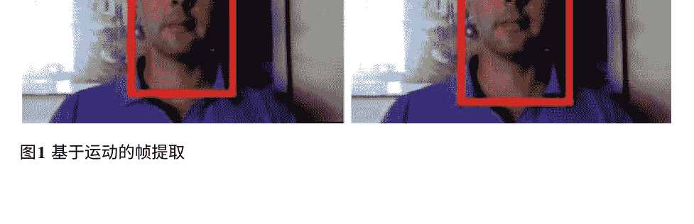

#### 3.2 IQM计算

在本研究中，我们提出利用FR和NR-IQM来检测欺骗攻击。对于FR指标，需要完整的参考图像。这对于生物特征认证来说是一个挑战，因为只允许存储模板或原始生物特征数据的模型。在一些类似人脸反欺骗的模型中，例如[27]和[13]，作者通过计算原始参考图像与其平滑版本之间的质量来规避这个限制。这种方法基于一个假设，即真实样本和伪造样本对模糊效果造成的质量损失有不同的反应，因此，这种差异为系统带来了区分真实和合成人脸外观的能力。

在我们的模型中，人脸识别指标的使用方式不同。我们提议使用后者的指标来计算连续提取的每一对帧之间的相似度。据我们所知，这种方法在以前的反欺诈研究中尚未被考虑过。比较同一视频的帧的想法是突出它们基于运动的差异，因为这些差异在真实视频中比伪造视频中更相关。

如图2所示，对于从给定视频中提取的一组 N帧，我们用其与前一帧的比较来描述每个 N -1个最后帧，根据所考虑的人脸识别指标。

使用NR-IQMs更简单，因为它们只需要一张图像。因此，NR-IQMs是在这同一组 N -1帧上计算的。最终的特征向量最终由提取的两个值（人脸识别和NR）的组合组成。值得注意的是，在测试我们的方法时，我们考虑了全帧和基于运动的帧提取。在这两种情况下，上述方法都应用于所考虑的帧集。

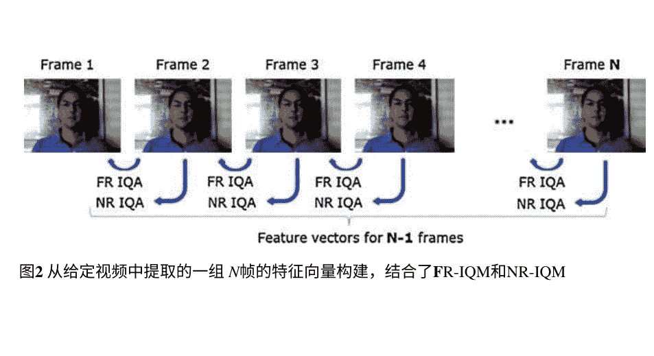

#### 3.3 选定的图像质量度量 (IQMs)

Galbally等人的研究[13]提出了一组25个IQMs来检测欺骗攻击。[14]中，作者们使用了这些IQMs中的18个，即MSE, PSNR, AD, SC, NK, MD, LM SE, NAE, SNRv, RAMDv, MAS, MAMS, SME, GME, GPE, SSIM, VIF和HLFI。后者是这个子集中唯一的NR-IQM。我们使用这18个IQMs作为起点，并模拟了表1中列出的其他公开可用的IQMs。在这6个度量中，我们只保留了那些在准确性和计算时间之间具有良好平衡的度量。图3显示了它们在计算一个图像的特征所需的时间以及在训练和测试样本中考虑每个视频10帧时的个别性能的比较。时间是在64位Windows-7 PC上测量的，配有2.50 GHz处理器和16 GB RAM内存，运行Matlab R2017a。前3个最快的IQMs确保了可接受的性能。

HIGRADE-1和Robust BRISQUE的错误率较低，但它们相对较慢。NIQE在这6种方法中表现最差。为了在速度和准确性之间取得折衷，我们选择了BRISQUE、GM-LOG-BIQA和BIQI，除了[14]中使用的初始18个IQM集合。值得一提的是，对于BIQI指标，我们只考虑了第一阶段的值。

因此，每个图像都由18个小波系数的统计模型来描述。GM-LOG-BIQA指标为每个图像样本提供了40个特征，有助于到分类模型。对于BRISQUE度量，我们只考虑了第一阶段产生的18个特征值。然后将计算得到的值用作将每个选定帧分类为真实或伪造的输入。请注意，所使用的分类模型仅建立在训练集上，与测试集没有任何重叠。对帧预测应用多数规则，以生成关于整个视频的决策。所提出方法的不同阶段总结如图4所示。

表1 我们在实验中模拟的IQM列表，除了[14]中使用的18个IQM

| # | 指标 | 缩写 | 参考 |
| :--- | :--- | :--- | :--- |
| 1 | 盲/无参考图像空间质量评估器 | BRISQUE | [28, 29] |
| 2 | 基于梯度幅度图和高斯拉普拉斯的盲图像质量评估 | GM-LOG-BIQA | [30] |
| 3 | 盲图像质量指数 | BIQI | [31, 32] |
| 4 | 自然图像质量估计器 | NIQE | [33, 34] |
| 5 | 鲁棒BRISQUE指数 | 鲁棒BRISQUE | [35] |
| 6 | HDR图像基于梯度的评估器-1 | HIGRADE-1 | [36] |

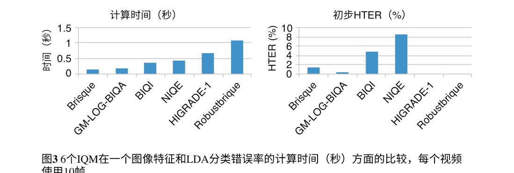

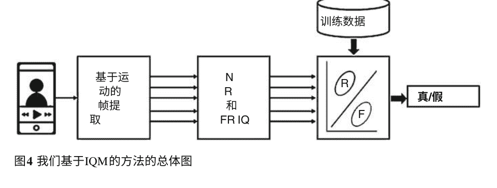

#### 3.4 实验结果

本节旨在使用第3.4.2节中描述的评估协议，评估我们的方法在公开可用数据库上的鲁棒性。

##### 3.4.1 数据集

重放攻击重放攻击数据库[37]由Idiap研究所发布，包含50个身份的1300个视频。除了真实访问样本外，它还包括三种类型的攻击：打印在纸上的照片，显示在iPhone 3GS屏幕上的视频，以及在高分辨率屏幕上显示的视频使用iPad。对于每种攻击类型，根据两种情况生成样本：攻击设备/纸张是手持的还是固定在支架上。这些视频的最短持续时间为9秒，使用分辨率为（320 × 240）的13″ MacBook在不同的光照条件下进行录制：受控条件（场景的背景均匀，荧光灯照亮场景）和不利条件（场景的背景不均匀，白天光照亮场景）。图5显示了捕获视频的一些帧。

Replay Mobile Replay Mobile数据库[14]也是由上述研究机构发布的。它包含了40个主题的1190个视频。同样，ReplayMobile也被分成了子集，使用了与Replay Attack相同的结构，并且它还包括不同的光照条件。 这些视频是使用iPad Mini2和LG-G4智能手机录制的，分辨率为(1280×720)，至少持续10秒。图6显示了攻击尝试的示例。由于所有的视频都是使用移动设备录制和显示的，所以这个数据库更适合我们的框架，因为我们的面部反欺骗系统的目标实现是一个移动应用程序。

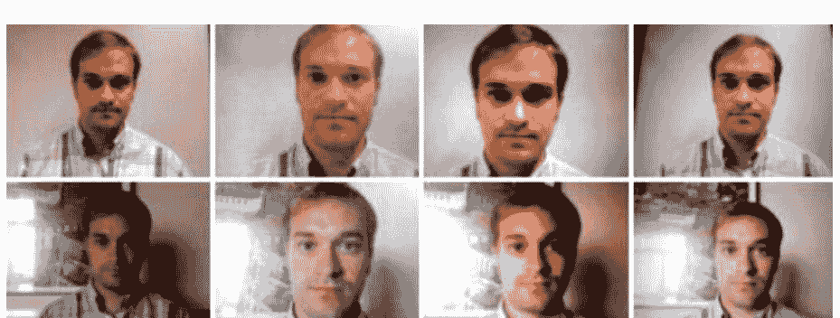

图6来自ReplayMobile数据库的样本。顶部一行:在智能手机上捕获的攻击尝试的样本。底部一行:在平板上捕获的样本。从左到右的列分别显示了哑光屏幕亮、哑光屏幕灭、打印光亮和打印光灭的示例

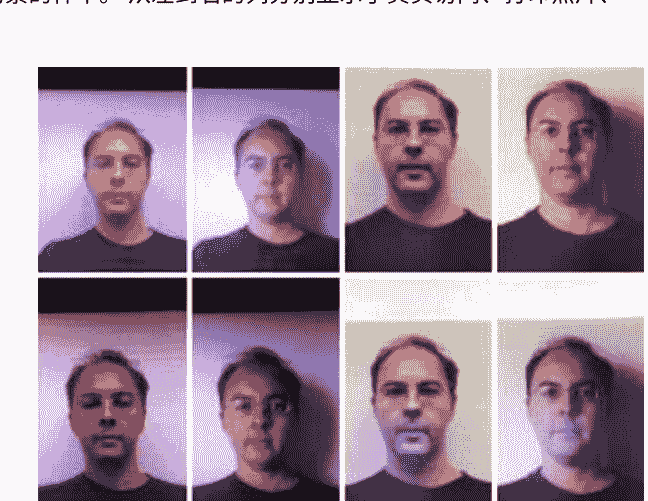

##### 3.4.2 评估协议

为了性能评估，我们使用虚假接受率（FAR），即被错误分类为真实样本的百分比，虚假拒绝率（FRR），表示相反的情况，以及半总误差率（HTER），它们之间的平均值，作为总体性能指标。 对于帧分类，考虑了两个分类器Matlab实现的线性判别分析（LDA）（将判别类型设置为伪线性）和LIBSVM发布的支持向量机（SVM）使用径向基函数（RBF）核和参数γ = 1.5。

##### 3.4.3 在重放攻击数据库上的结果

使用先前描述的特征组合协议，我们在表2中详细列出了在重放攻击数据库上的错误率，其中“All”和“Motion”分别表示使用所有帧和限制为选定帧。除了最后两列（HTER-v）外，所有错误率都是基于每帧计算的。在“所有”和“运动”方法之间进行公平比较时可能会有疑问，因为相应的性能指标不依赖于相同数量的样本。因此，我们已经记录了基于视频的错误率（HTER-v），通过对其帧中的真实和伪预测的出现应用多数规则，将结果与每个视频相关联。粗体的HTER值表示使用基于运动的帧子集。我们在此提醒，基于初始18个特征集在所有帧上使用LDA分类得到的HTER-f为9.78%。与我们在所有帧上使用相同特征集获得的值之间的轻微差异可能是由于特征计算方法的差异造成的。

如第3.2节所述，他们对给定图像进行高斯滤波，以获得其平滑版本。原始图像和平滑图像通过FR方法进行比较。相比之下，我们计算视频帧之间的FR-IQMs，突出一些在真实样本中更有可能相关的运动线索。这些结果中最有趣的发现是，我们的方法在全局误差率下降到小于1%时，远远优于最初的18个特征集分类，即从约9%下降到小于1%的LDA分类。相比之下，SVM的结果通常不太适合我们的测试协议。我们还注意到，尽管表2中最低的错误率（即HTER为0.01%）仅在所有帧上使用我们的特征集时达到，但在基于运动的帧上我们实现了一个相对接近的HTER（即0.02%）。这种折衷方案受到计算成本的降低的青睐。在Replay Attack和Replay Mobile数据库的所有训练和测试视频样本上平均，我们分别提取每个视频的134（共375个）和172（共约300个）帧。此外，帧错误的轻微性能下降不会影响我们方法的整体预测准确性，因为它正确分类了Replay Attack的所有测试集视频，包括“全部”和“运动”协议。这对于初始的18个IQM集合来说并非如此，这证实了我们方法的效率。

## 表2 在Replay Attack数据库上的LDA和SVM分类结果

| 智商测量 | 视频帧 | 误识率 (线性判别分析) | 误识率 (支持向量机) | 漏识率 (线性判别分析) | 漏识率 (支持向量机) | HTER-f (线性判别分析) | HTER-f (支持向量机) | HTER-v (线性判别分析) | HTER-v (支持向量机) |
|---|---|---|---|---|---|---|---|---|---|
| 初始18个智商测量 | 全部 | 2.21 | 0.00 | 16.68 | 24.22 | 9.44 | 12.11 | 6.25 | 8.33 |
| | 运动 | 3.16 | 0.00 | 16.41 | 26.36 | 9.78 | 13.18 | 7.92 | 9.34 |
| 最终21个智商测量 | 全部 | 0.00 | 0.00 | 0.01 | 24.22 | 0.01 | 12.11 | 0.00 | 8.33 |
| | 运动 | 0.00 | 0.00 | 0.05 | 26.36 | 0.02 | 13.18 | 0.00 | 9.34 |

## 表3 在Replay Mobile数据库上的LDA和SVM分类结果

| 智商测量 | 视频帧 | 误识率 (线性判别分析) | 误识率 (支持向量机) | 漏识率 (线性判别分析) | 漏识率 (支持向量机) | HTER-f (线性判别分析) | HTER-f (支持向量机) | HTER-v (线性判别分析) | HTER-v (支持向量机) |
|---|---|---|---|---|---|---|---|---|---|
| 初始18个智商测量 | 全部 | 3.26 | 0.00 | 8.15 | 36.23 | 5.71 | 18.11 | 4.13 | 18.21 |
| | 运动 | 1.25 | 0.00 | 9.71 | 31.85 | 5.48 | 15.92 | 5.75 | 18.05 |
| 最终21个智商测量 | 全部 | 0.05 | 0.00 | 3.65 | 36.23 | 1.85 | 18.11 | 1.65 | 18.21 |
| | 运动 | 0.07 | 0.00 | 1.66 | 31.85 | 0.86 | 15.92 | 0.79 | 18.05 |

##### 3.4.4 Replay Mobile数据库上的结果

表3中详细列出的Replay Mobile数据库上的分类错误率证实了之前得出的结论。首先，最终的21个智商测量优于我们的初始基准，对于LDA分类，整体错误率从4%以上下降到不到1%。其次，SVM只在初始的18个智商测量上产生相对较低的错误。SVM分类器对我们的3个附加智商测量的不足，使我们更有动力在最终实现中使用LDA，特别是考虑到SVM相对于LDA的较高计算成本。最后，我们还注意到，使用我们的智商测量集在“运动”协议上实现了最低的错误率（0.79%），这再次证实了在帧提取和特征计算中利用基于运动的线索的一致性，如第3.1节和第3.2节所解释的。

简而言之，所得结果表明我们的方法优于使用简单且相对快速的LDA分类器的最新解决方案。此外，由于选择性帧提取，我们减少了计算成本，因为我们在较少的样本上计算特征。尽管帧数的减少高度取决于考虑视频的人脸与背景运动的程度，但在所考虑的数据库的所有样本上，平均减少了约一半。

在下一节中，我们建议在PAD上探索深度学习，因为在相关工作中已经证明其产生了非常有趣的结果。

## 基于深度学习的方法

如第2节所示，已经探索了几种用于PAD的架构。在接下来的内容中，我们提出了一种静态方法，它结合了预训练的CNN模型和LBP描述符。

#### 4.1 提出的方案

如图7所示，所提出的方案同时处理输入的两个方面：原始人脸图像和它们对应的LBP描述符。人脸图像通过一组卷积层进行处理，我们将其部署为特征提取器。我们使用与VGG-16 [39]相同的架构从原始人脸中提取深度表示。VGG是牛津大学视觉几何组开发的卷积神经网络实现，它由13个卷积层组成，分为5个块。第一个块每层有64个过滤器，第二个块每层有128个过滤器，第三个块有256个过滤器，第四个和第五个块有512个过滤器。所有卷积层的核大小为3 ×3，并且后面跟着一个2 ×2窗口最大池化层。所有激活层都是修正线性单元（ReLU）。在这些卷积层之后，有一个由256个神经元组成的全连接层（FC）。

我们架构的第二个输入是帧的LBP直方图。LBP [40]已被证明在防止2D和3D攻击方面非常成功。其判别性质已经得到了深入研究[41]，因此我们建议在深度CNN架构中探索其贡献。为此，在最后一个卷积层的输出与帧的LBP直方图连接之前，将其传递给FC层，如图7所示。在决策过程中，使用LDA作为分类器。

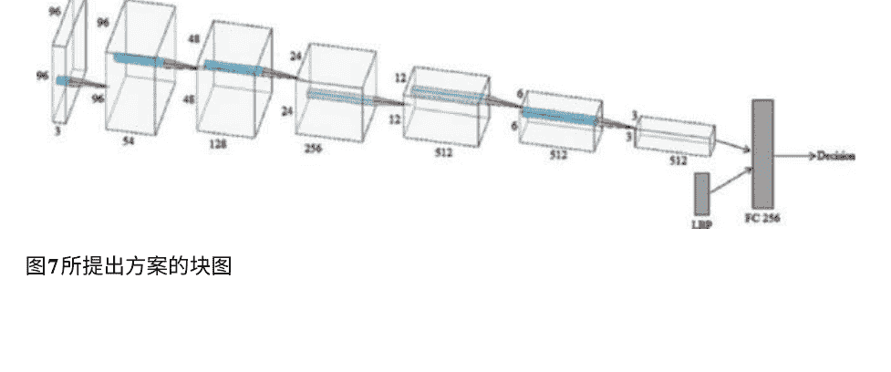

#### 4.2 预处理

在训练模型之前，我们进行了一些预处理步骤。对于每个图像，我们首先使用OpenFace人脸检测器[42]检测人脸。然后，使用Dlib库算法，根据外部眼睛和鼻子位置对提取的人脸进行对齐和居中处理[43]。最后，将图像人脸调整为96 × 96像素。对于LBP直方图估计，整个人脸图像被用作输入。

#### 4.3 训练

我们的训练过程由两个阶段组成：一个训练步骤用于微调所使用的预训练VGG模型，以及一个联合训练步骤用于训练我们的最终分类器。由于从头开始训练耗时且需要大量数据，我们使用了在ImageNet数据集上训练的VGG-16模型作为起点。然后，我们对模型进行了微调，以使其权重适应我们的数据集。我们还冻结了VGG-16的前3个块，并训练了其余的层，如图8所示。所使用的模型是使用Keras [44]训练的，具体参数如下：

- 优化函数：Adam，Beta1 =0.9，Beta2 = 0.99
- 动量：0.1
- 学习率：0.0001
- 批量大小：100
- 输入尺寸：96 × 96 × 3

为了泛化模型并防止过拟合，通过随机旋转、平移和水平/垂直翻转来进行数据增强。请注意，所使用的数据集已由作者分解为训练集和测试集。然后，我们将训练好的CNN模型的输出和相应的LBP直方图结合起来训练分类器。

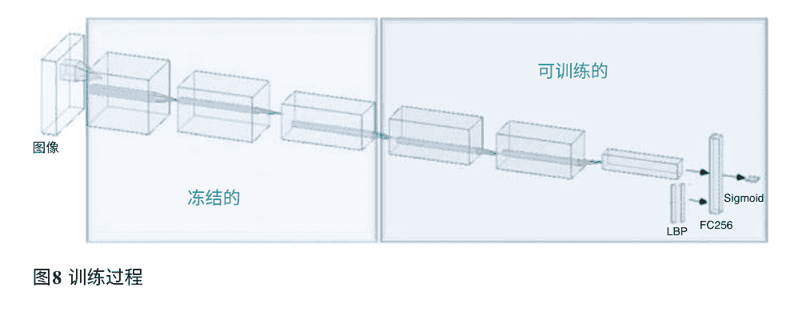

#### 4.4 实验结果

##### 4.4.1 数据集

我们在三个公开可用的数据库上评估了我们的方法。除了Replay Attack和Replay Mobile数据集外，我们还在CASIA面部反欺骗（CASIA-FASD）数据库[45]上测试了我们的方法。后者包含50个真实主体的600个视频剪辑，伪造的脸部是由真实脸部的高质量记录制作而成的。这个数据库的关键影响在于它考虑了更广泛的攻击变化。此外，还考虑了不同的质量，即低质量、正常质量和高质量。它提供了三种类型的攻击：扭曲照片攻击、剪切照片攻击和视频攻击，如图9所示。

##### 4.4.2 结果

我们的评估基于与我们的IQM-基于方法评估相同的指标，包括误接受率、误拒绝率和半总误差率。在本节中，我们首先比较使用两种不同分类器（LDA和sigmoid）获得的结果。然后，我们讨论了添加LBP的影响，并将结果与最先进的方法进行了比较。

**分类**

我们测试了两种不同的分类器：LDA和sigmoid分类器。这里的sigmoid分类器指的是初始FASNET架构的后期层。表4展示了在Replay Attack、Replay Mobile和CASIA-FASD数据库上两种分类器的分类结果。该表报告了基于视频的结果，使用了多数投票法。实验结果表明，LDA分类器明显优于sigmoid分类器。事实上，使用LDA分类器，我们提出的方法在Replay Mobile和CASIA-FASD数据库上实现了完美的分类，并且在Replay Attack数据库上拒绝了所有的冒名顶替攻击。

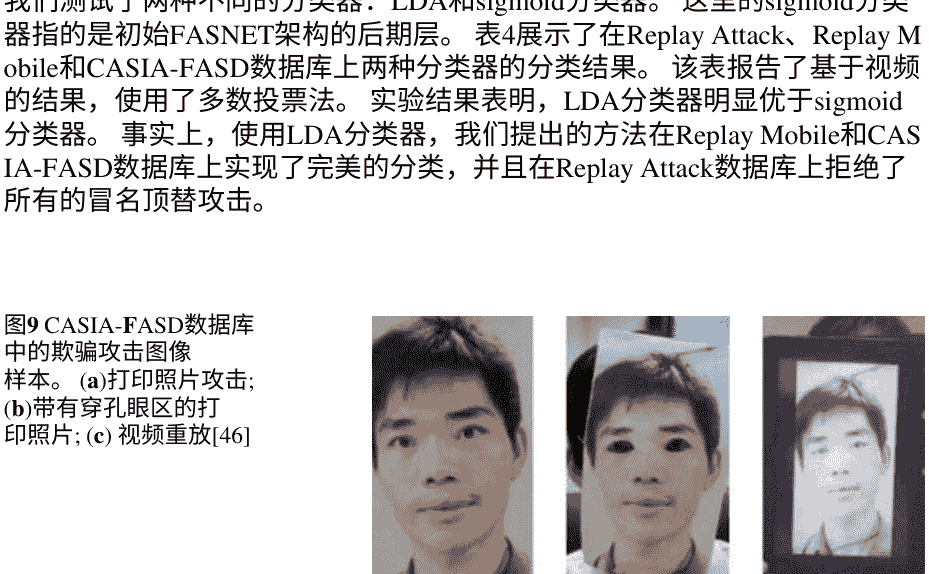

## 表4 在Replay Attack、Replay Mobile和CASIA-FASD数据库上的LDA和sigmoid分类结果

| 分析方法 | 重放攻击假阳率 (%) | 重放攻击假阴率 (%) | 重放移动假阳率 (%) | 重放移动假阴率 (%) | CASIA-FASD假阳率 (%) | CASIA-FASD假阴率 (%) |
| --- | --- | --- | --- | --- | --- | --- |
| 线性判别分析 | 0 | 5 | 0 | 0 | 0 | 0 |
| Sigmoid | 0 | 5 | 0 | 0 | 0.781 | 8.62 |

## 表5 在Replay Attack数据库上使用和不使用LBP获得的混淆矩阵

| 类别 | 不使用LBP预测为真实 | 不使用LBP预测为攻击 | 使用LBP预测为真实 | 使用LBP预测为攻击 | 总计 |
| --- | --- | --- | --- | --- | --- |
| 真实 | 80 | 0 | 76 | 4 | 80 |
| 攻击 | 4 | 396 | 0 | 400 | 400 |

## 表6 在Replay Mobile数据库上使用和不使用LBP获得的混淆矩阵

| 类别 | 不使用LBP预测为真实 | 不使用LBP预测为攻击 | 使用LBP预测为真实 | 使用LBP预测为攻击 | 总计 |
| --- | --- | --- | --- | --- | --- |
| 真实 | 110 | 0 | 110 | 0 | 110 |
| 攻击 | 0 | 192 | 0 | 192 | 192 |

**深度学习与深度学习 +LBP估计结果**

为了更好地展示LBP的贡献，我们在Replay Attack和Replay Mobile数据库上使用和不使用LBP直方图估计得到了混淆矩阵，如表5和表6所示。

在Replay Mobile数据库上，无论是否使用LBP，都获得了完美的结果，而在Replay Attack数据库上，我们获得了4个错误接受的视频（将冒名顶替的视频错误地分类为真实的真实主体视频），而没有进行LBP直方图估计。

然而，当将LBP直方图与基于深度的特征相结合时，我们获得了4个错误拒绝的视频（将真实的真实主体视频错误地分类为冒名顶替的视频）。因此，LBP允许我们拒绝所有冒名顶替的攻击这与没有进行LBP估计的结果相比，不太重要。

**与最先进的方法进行比较**

表7报告了我们的方法与Replay Attack、Replay Mobile和CASIA-FASD数据库上基于深度学习的最先进的反欺骗方法的HTER比较。我们的方法在Replay Mobile和CASIA-FASD数据库上达到了0%的HTER。在Replay Attack数据库上，我们的方法的HTER（2.5%）高于多特征架构[15]的HTER。

## 表7 与其他最先进的HTER (%) 比较

| 方法 | 重放攻击 | CASIA-FASD | 重放移动 |
| :--- | :--- | :--- | :--- |
| DPCNN [48] | 6.1 | 4.5 | - |
| 多特征融合 + NN [15] | 0 | - | - |
| FASNet [16] | 1.2 | - | - |
| DDGL [47] | 0 | 1.3 | - |
| LiveNet [18] | 5.74 | - | - |
| 我们的方法 | 2.5 | 0 | 0 |

*结果来自各自的研究论文*
*'-'表示HTER值不可用*

## 表8 两种开发方法的HTER (%)

| 方法 | HTER (重放攻击) | HTER (重放移动) |
| :--- | :--- | :--- |
| 基于IQM的 | 0.00 | 0.79 |
| 基于深度的 | 2.5 | 0 |

(HTER为0%)，FASNet [16]架构 (HTER为1.2%) 和DDGL [47] (0%)。然而，根据表4中呈现的结果，我们的方法使用LDA分类器，在三个测试数据库上拒绝了所有的冒名顶替攻击。

### 5 讨论

两种方法使用不同的数据集进行评估。表8总结了HTER方面的性能结果。正如我们所看到的，我们的方法获得了良好的性能。基于IQM的方法对于Replay Attack数据集效果更好，而基于深度的方法对于Replay Mobile数据集获得了最佳结果。后者整合了LBP特征，可以完美地拒绝所有的冒名顶替者 (FAR=0，参见表5和表6)。

就计算成本而言，基于IQM的方法需要提取一定数量的特征。IQM的特征提取步骤每帧耗时约为0.4秒 (参见图3)。基于深度学习的方法只需要提取LBP和深度特征。两者都不耗时，因为LBP特征可以实时提取[49]，而深度特征相对较快[50]，因为使用了小的图像块 (96×96)。

值得注意的是，可以通过使用旨在加速CNN计算的方法[51]或使用专门用于移动或嵌入式系统的模型 (MobileNet [52]) 来优化计算时间。

根据上下文和可用的计算能力，将选择基于IQM的方法或基于深度学习的方法。在我们的案例中，我们专注于嵌入式系统，特别是移动应用中的欺诈检测。因此，我们将优先选择开发的基于深度学习的方法，因为这种方法在Replay Mobile数据库上取得了最佳结果，并且计算成本可以明显降低。

### 6 结论

在本章中，介绍了两种反欺骗方法。第一种方法基于一些选定的图像质量度量。其基本思想是当假图像或假视频呈现给生物特征系统时，图像的质量会下降。第二种方法基于深度学习和手工设计的特征（LBP）的组合，可以利用自动和手动特征的能力来检测假信息（图像或视频）。这两种方法都使用不同的数据集进行评估，得到的结果证明超过了最先进的方法。此外，我们的方法非常适合实时移动应用，并且符合隐私规定。

尽管这项研究已经达到了目标，但仍需要考虑一些限制。对于基于图像质量度量的方法，运动提取模块中使用的参数是根据Replay Mobile数据库的经验设置的，因为它与我们的应用框架最接近。未来的工作中，我们将在其他常用于反欺骗目的的数据库上测试我们的方法，以研究我们方法的泛化能力。我们将尝试考虑运动信息，以选择最相关的帧。还可以使用3D CNN模型来利用运动信息。另一个值得探索的想法是使用基于CNN的质量特征而不是手工设计的特征（图像质量度量）。

### 参考文献

1. A. Anjos, J. Komulainen, S. Marcel, A. Hadid, M. Pietikainen, 在面部反欺骗：视觉方法, 编辑: S. Marcel, M. Nixon, S. Z. Li (Springer, 伦敦, 2014), 第65-82页, 第4章
2. G. Pan, Z. Wu, L. Sun, 用于人脸识别的活体检测, 在人脸识别的最新进展(IntechOpen, Rijeka, 2008), 第109-124页
3. H. Jee, S. Jung, J. Yoo, 用于嵌入式人脸识别系统的活体检测. Int. J. Comput. Electr., Autom., Control Inf. Eng. 2(6), 2142-2145 (2008)
4. K. Kollreider, H. Fronthaler, M.I. Faraj, J. Bigun, 实时人脸检测和运动分析及其在活体评估中的应用. IEEE Trans. Inf. Forensics Secur. 2(3), 548-558 (2007)
5. K. Kollreider, H. Fronthaler, J. Bigun, 非侵入式人脸图像活体检测. 图像视觉计算 27, 233 (2009)
6. A. Anjos, S. Marcel, 面部识别中的照片攻击对策: 一个公共数据库和一个基准, 在2011年国际联合生物特征会议 (IJCB)(2011), pp. 1–7.
7. W. Bao, H. Li, N. Li, W. Jiang, 基于光流场的面部识别活体检测方法, 在2009年国际图像分析与信号处理会议(IEEE, 2009), pp. 233–236.
8. A. Lagorio, M. Tistarelli, M. Cadoni, C. Fookes, S. Sridharan, 基于3D面部形状分析的活体检测, 在国际生物特征与取证研讨会 (IWBF) (IEEE, 2013), pp. 1–4.
9. T. Wang, J. Yang, Z. Lei, S. Liao, S. Z. Li, 使用从单个摄像头恢复的3D结构进行面部活体检测, 在国际生物特征识别会议 (ICB) (IEEE, 2013年), 第1-6页
10. E.S. Ng, A.Y. S. Chia, 使用时间情感线索进行面部验证, 在IEEE国际模式识别会议 (ICPR) (IEEE, 2012年), 第1249-1252页
11. Z. Boulkenafet, J. Komulainen, A. Hadid, 基于颜色纹理分析的面部反欺骗, 在IEEE国际图像处理会议 (ICIP) (IEEE, 2015年), 第2636-2640页
12. T.de. Freitas Pereira, A. Anjos, J.M. De Martino, S. Marcel, 面部反欺骗对策能在真实场景中起作用吗？在国际生物特征识别会议 (ICB) (IEEE, 2013年), 第1-8页
13. J. Galbally, S. Marcel, J. Fierrez, 图像质量评估用于伪造生物特征检测：应用于虹膜、指纹和人脸识别。IEEE图像处理期刊 23(2), 710–724 (2014)
14. A. Costa Pazo, S. Bhattacharjee, E. Vazquez Fernandez, S. Marcel, 回放移动人脸展示攻击数据库, 在生物特征专业兴趣组国际会议(BIOSIG)(IEEE, 2016), 第1–7页
15. L. Feng, L.M. Po, Y. Li, X. Xu, F. Yuan, T.C.H. Cheung, K.W. Cheung, 图像质量和运动线索的融合用于人脸反欺骗：一种神经网络方法。J. Visual Comm.Image Representation 38, 451–460 (2016). https://doi.org/10.1016/j.jvcir.2016.03.019
16. O. Lucena, A. Junio r, V. Hugo G Moia, R. Souza, E. Valle, R. De Alencar Lotufo, 使用卷积神经网络进行人脸反欺骗的迁移学习, 在图像分析和识别。ICIAR 2017. 计算机科学讲义, 编者：F. Karray, A. Campilho,F. Cheriet, 卷10317 (Springer, Cham, 2017).
17. R. Raghavendra, K.B. Raja, S. Venkatesh, C. Busch, 用于检测数字和打印扫描的变形人脸图像的可转移深度卷积神经网络特征, 在IEEE计算机视觉和模式识别研讨会 (CVPR W) (IEEE, 2017年), 第1822-1830页
18. Y.A. Ur Rehman, P. Lai Man, M. Liu, LiveNet: 使用卷积神经网络改进人脸活体检测的特征泛化。专家系统应用。 108, 159 (2018年) 。 https://doi.org/10.1016/j.eswa.2018.05.004
19. H.T. Cheng, Y.H. Chao, S.L. Yeh, C.S. Chen, H.M. Wang, Y.P. Hung, 通过融合面部和声音信息实现多模态人员身份验证的高效方法, 在IEEE多媒体和博览会国际会议 (IEEE, 2005年), 第542-545页
20. J. Komulainen, I. Anina, J. Holappa, E. Boutellaa, A. Hadi d, 关于视觉语音动画对视听活体检测鲁棒性的研究, 在IEEE第8届国际生物识别理论、应用和系统会议 (BTAS) (IEEE, 2016年), 第1–8页
21. A. Melnikov, R. Akhunzyanov, K. Oleg, E. Luckyanets, 视听活体检测, 在图像分析和处理-ICIAP 2015. ICIAP 2015 中。计算机科学讲义, 由V. Murino, E. Puppo编辑, 第9280卷 (Springer, Cham, 2015年 )
22. P.H. Lee, L.J. Chu, Y.P. Hung, S.W. Shih, C.S. Chen, H.M. Wang, 使用面部、声音和虹膜信息的级联多模态验证, 在IEEE国际多媒体与博览会上(IEEE, 2007), pp. 847–850
23. T. Barbu, A. Ciobanu, M. Luca, 基于声音、面部和虹膜的多模态生物特征认证, 在E-Hea lth和生物工程会议(IEEE,2015), pp. 1–4
24. Y. Tian, S. Xiang, 使用LBP和多尺度D CT检测基于视频的人脸欺骗, 在数字取证和水印. IWDW 2016中。计算机科学讲义, 编者Y . Shi, H. Kim, F. Perez-Gonzalez, F. Liu, vol. 10082 (Springer, Cham, 2017)
25. S. Bharadwaj, T. Dhamecha, M. Vatsa, R. Singh, 具有运动放大的计算机高效人脸欺骗检测, 在I EEE计算机视觉和模式识别会议工作坊(IEEE, 2013). https://doi.org/10.1109/CVPRW.2013. 23
26. P. Viola, M. Jones, 使用增强级联简单特征的快速目标检测, 在 2001年IEEE计算机学会计算机视觉和模式识别会议论文集, 卷1 (IEEE, 2001年) , 第I-511–I-518页
27. Z. Akhtar, G. Luca Foresti, 使用有区别的图像块进行面部欺骗攻击识别。 J. Electr. Comput. Eng. 2016, 4721849-1–4721849-1 (2016年)
28. A. Mittal, A.K. Moorthy, A.C. Bovik, BRISQUE软件发布 (2011年) , http:// live.ece.utexas.edu/research/quality/BRISQUE_release.zip
29. A. Mittal, A.K. Moorthy, A.C. Bovik, 空间域中的无参考图像质量评估。IEEE Trans. I mage Process. 21 (12) , 4695–4708 (2012年) 。 https://doi.org/10.1109/TIP.2012.2214050

## 深度学习用于生物特征人脸识别：基准数据集上的实验研究

Natalya Selitskaya, S. Sielicki, L. Jakaite, V. Schetinin, F. Evans, M. Conrad, 和 P. Sant

### 1 引言

人脸识别是模式识别和计算机视觉交叉研究的一个热门话题。由于其对人类天生的本能和非侵入性的特性，人脸识别在信息安全、监控系统、执法、访问控制和智能卡等众多实际应用中占据了领先地位。人脸识别最明显和可靠的技术是基于人脸生物特征测量的。更微妙的基于生物特征的方法利用生理和行为特征，包括脑电图信号和人类情绪表达[30, 45]。

在人脸识别的三十多年的研究和发展中，在许多应用中已经取得了高性能。然而，识别方法仍然受到光照、面部表情和姿势等因素的影响，如[41, 51, 54]所述。通过机器学习（ML）和深度学习（DL）方法和技术，提取图像中存在的分层和语义结构，已经进行了有效的解决这些问题的尝试[9, 30]。

在这种情况下，机器学习的一个关键特性是找到能够解释观察到的数据并预测由描述给定数据的特征表示的新的未见样本的模型，如[18, 35, 42]中所讨论的。不幸的是，标准的机器学习方法并不普遍有效，因此仍然需要手动调整学习参数[17, 33]。模式特征可能在数据样本之间有所变化，因此学习参数已更改。因此，在一般情况下往往无法达到最佳性能[43, 52]。

仅捕获信息特征的数据预处理显著提升了机器学习性能，并且当探索不同的机器学习和特征提取方法时，可以找到最高的性能，如[4, 18, 37, 40, 50]所述。在这方面，诸如特征包（BOF）、速度鲁棒特征（SURF）、直方图定向梯度（HOG）等机器学习技术已经得到了广泛的探索[1, 34]。传统的‘浅层’人工神经网络（ANNs）无法学习高级特征。特征学习（提取和选择）可以在一定的限制内完成[45]。卷积神经网络（CNN）提供的‘深度’结构已经能够生成解决人脸识别问题所需的特征[26]。

在本章中，我们在基准数据集上实验性地探索了人脸识别技术，如：Extended Yale B、AT&T、Caltech 101、Essex Faces96和Grimace、JAFFE、Gatech以及新创建的BEDS数据集。我们的研究旨在识别在基准数据集所代表的不同条件下，人脸识别算法的优势和劣势。具体而言，我们运行了与人脸生物特征识别中常用的特征提取方法相结合的“浅层”和“深层”机器学习算法的实验。基于深度学习的解决方案需要优化大量的参数，因此在可用的计算资源内往往效率低下。实验结果和发现以识别准确率、计算要求和对面部图像变化的鲁棒性为评估和讨论的依据。新的发现使我们得出结论，当浅层机器学习方法与特征提取技术相结合时，它们与深度学习解决方案具有竞争力，但不需要大量计算。

第2节回顾了已经在本研究中调查的方法和数据的研究。第3节和第4节描述了我们研究中常用的人脸识别的机器学习方法。第5节检查了在该领域进行有效研究所需的硬件要求，总结了我们在实验中使用的可用面部图像数据集，概述了实验的设置，并展示了在基准数据集上实现的机器学习算法的结果。最后，第6节和第7节讨论和总结了在给定基准上展示的算法的弱点和优点。

### 2 相关工作

在本节中，我们讨论了可以应用于人脸识别问题的主要特征提取技术。

#### 2.1 特征包

特征包（BOF）生成了大规模图像特征的紧凑表示，其中特征之间的关系被丢弃。该表示可以被看作是线性特征空间中的向量，也可以被看作是特征频率直方图。特征空间的基础，或者直方图的桶列表，也称为术语词汇表或视觉词汇表，是从训练集中提取的特征构建的。从测试集中提取的特征与最近的词汇项相关联，新的图像被表示为词汇项的线性组合和其出现频率的组合[34]。

BOF的流行建立在其空间无序集合的简洁性和紧凑性的基础上，这些集合是通过量化的局部图像描述符构建的，这使得BOF的实现在计算上非常轻量级[34]。BOF已被应用于计算机视觉和模式识别，特别是用于人脸识别研究[4, 37, 52]和面部情绪识别[20]。

BOF在选择视觉特征的量化方式方面具有很大的自由度。然而，特征空间必须支持邻域的概念。通常，使用由各种距离函数定义的度量来量化特征的接近程度的线性空间。在一般情况下，也可以使用非线性空间。

BOF模型中最快、最高效的特征检测和表示技术之一是尺度不变特征变换（SIFT），下面将对其进行更详细的描述。它利用了一个64维的梯度线性空间，欧氏度量定义了SIFT特征之间的邻居关系。SIFT在[25]中被应用于年龄面部识别，因为它依赖于随年龄变化不大的特征梯度。然而，不同姿势的面部，可能与情绪有关，很难识别。

为了解决由于情绪表达的多样性而导致的面部识别错误问题，研究采用了带有SIFT和SURF描述符的BOF方法，并添加了追踪面部区域的空间维度来确定特征的来源[20]。该研究取得了比无空间维度方法更好的结果。该研究建议将情绪识别决策作为未来电影推荐系统的驱动因素。建议[48]是另一种用于分类图像的美学特征包（BOF）的版本，对于面部识别可能很有用。

研究[4]调查了面部轨迹检索的计算时间。在这里，采用了BOF的稀疏形式来从视频备份文件中检索面部图像，尽管模型准确性有所降低，但由于面部索引的大小较大，检索时间并不理想。

另一项面部检索改进研究[52]采用BOF来提取初始的低区分度局部特征，并结合具有高区分能力的附加多参考全局特征评级方法。

与更常见的无监督词汇学习方法不同，标记的面部数据集和空间特定网格被用来构建具有更好区分能力的视觉单词。尽管检索速度令人印象深刻，但作者建议采用监督形式的训练来提高性能。

在[37]中提出了一种替代聚类的特征选择方法，其中使用了监督的RBF神经网络来提取图像特征。该研究使用了YouTube面孔、ORL面孔和扩展的Yale训练数据集。然而，由于过拟合问题，因为许多特征在训练过程中没有被使用，CNN被建议用于未来的研究。

#### 2.2 加速稳健特征

加速稳健特征（SURF）方法是一种用于局部检测、比较和表示不变图像特征的稳健且快速的算法，在模式识别研究中很受欢迎[2, 10]。SURF [1]是上述流行特征检测算法SIFT [28]的进一步发展。它采用简化、降低特征空间维度和邻近像素聚合的方法，以实现更高的处理速度，同时保持甚至提高准确性[36]。特别是SURF特征检测和提取方法已成功应用于解决面部识别挑战，如在姿态存在的情况下进行面部检测[40]和光照变化、非对齐和面部特征旋转[10]，或作为混合模型[19]，以及用于定位[40]，这样可以实现有效的泛化[1, 36]，3D图像重建[40]和图像配准[3]。

由于在速度方面表现出色，SURF方法已被建议用于计算机视觉和模式识别应用，例如在线人脸识别和纸币图像识别，如[10]和[14]所示。

这些方法能够通过对齐和图像旋转来处理图像特征。

在[23]中，研究了SURF技术对图像特征错位的鲁棒性。研究结果表明，在ORL和UMIST数据集上表现良好。使用3D面部表示[55, 56]，SURF技术在投影面部特征时非常有效，因为该技术对旋转具有鲁棒性。还研究了另一种SURF实现，用于在非线性视角和表情变化下定位面部标志物[40]。在训练阶段，使用人工神经网络从SURF特征描述符中构建了3D面部模型的16个标志物类别的模型。在测试阶段，使用3D模型的平面投影来匹配测试面部。对具有挑战性的数据集进行的实验证明了该技术的效率和鲁棒性。

SURF的另一种实现是在级联网络中[24]。与小波技术相比，使用SURF特征显著降低了模型的维度，从而减少了训练时间。在MIT和FDDB人脸数据集上的实验结果令人满意，特别是在性能方面。收敛。然而，训练集的规模不足以防止级联网络的过拟合，因此这在新的未见过的人脸图像上可能效果不佳。SURF的优点是由于特征空间的低维度（从64到128），实现了高处理速度[10]。然而，这对于在面部照明和姿势变化下的稳健人脸识别来说还不够。

#### 2.3 方向梯度直方图

方向梯度直方图（HOG）是另一种基于梯度的算法，从图像中提取局部梯度特征。与许多不考虑位置的BOF实现中使用的稀疏特征选择不同，HOG利用了密集均匀分布的描述符空间网格。每个描述符包含其附近边缘及其方向的n维模型。

梯度是通过小的多像素单元计算的，这些单元连接成单元块在这些单元块上计算梯度直方图。这样的直方图也可以被看作是n维旋转角度空间中的向量。单元块彼此重叠，并且梯度在包含多个块的较大区域上进行归一化[6]。

在研究[50]中，局部和全局的HOG特征分类器被混合使用权重由其在感兴趣区域中估计的重要性定义。在这项研究中，全局和局部特征描述符是通过将HOG向量在整个图像或区域上进行串联形成的，然后进行PCA和LDA降维。最近邻算法被用作结果空间中的分类器。使用基准FERET和CAS-PAERL-R1数据集，与其他技术如Gabor和局部二值模式（LBP）特征提取器相比，获得了更好的性能。

然而，这项研究的问题在于参数的手动调整。

通过在[54]中实现LBP和HOG特征的融合学习的多核自适应分类器，已经实现了通过手动调整的改进方法。有趣的是，HOG能够解决模式识别中的边缘和方向问题，而LBP则负责面部的纹理成分。仅仅使用HOG或LBP无法提供改进的性能，这对于环境中的人脸识别是不够的。

除了环境因素外，人脸图像通常包含噪声。在[53]中，提出了一种改进的HOG方法，采用密集网格技术一次性处理所有面部噪声问题。该技术与传统的Gabor和LBP进行了比较，表现优于这些方法。该研究存在一些缺点，例如缺乏更强大的数据集，如面部遮挡，建议在未来的研究中进行。

除了面部遮挡噪声外，人脸识别[13]还研究了其他由于存档期间实例压缩和模糊面部引起的面部噪声图像。在空间特征方面，采用了HOG与SVM相结合。这导致了在FDDB基准数据集上比传统HOG变换更好的SVM识别效果。

此外，除了HOG的方向方面，还研究了HOG的其他方面[46]。在这项研究中，使用了CAS-PEAL和FRGS面部数据库来比较使用Gabor、LBP和HOG获得的计算性能，其中HOG表现出最高的性能。本研究解决的问题是在速度和准确性之间取得平衡。另一项研究将HOG与SVM相结合，如[7]所述。

#### 2.4 卷积神经网络特征

深度学习最近受到了广泛关注，对计算机视觉应用的效率产生了重大影响。DL可以直接从数据中学习特征和任务，因此常被称为端到端学习。

术语“深度”指的是网络中的隐藏层，因此隐藏层数越多，网络越深。传统的“浅层”人工神经网络通常只有两到三个隐藏层，而深度学习网络可以有几百个。

卷积神经网络利用深度神经网络结构从局部图像块中构建可靠的特征。将馈送给卷积神经网络的图像中存在的相似性被用于通过迁移学习利用某人取得的有用结果。然后，可以快速在感兴趣的数据集上重新训练卷积神经网络以调整网络参数，从而提高性能。

在[5]中，应用了卷积神经网络来基于传感器与面部图像的方向进行人脸识别。没有应用任何特征提取，只设计了一个卷积神经网络。另一项研究采用了卷积神经网络来区分在3D环境中建模的假脸和真脸[27]。通过最小化其他多维研究中提出的参数来实现卷积神经网络的所需正则化。

### 3 特征提取技术

#### 3.1 特征包

特征包（BOF）是一种袋子模型的扩展，它使用特征字典集来表示给定图像中感兴趣的模式，作为特征对及其出现次数的多重集合（或袋子）。BOF模型生成了大规模图像特征的紧凑表示，其中通常丢弃了特征之间的空间关系[34]。

可以通过将相似特征聚类来构建一个可管理大小的BOF字典，这些特征是从训练集图像中提取出来的，如[34]所述。从图像中提取的特征与最接近的字典项在特征参数空间中使用最近邻或类似技术关联起来。图像与字典特征之间的匹配被归一化和评估。结果是给定字典特征空间中第j个图像I_j的向量表示如下：

```
I_j = {a_{1j} v_1, a_{2j} v_2, ..., a_{nj} v_n}, (1)
```

其中 v_i 是特征字典的基向量，而 a_{ij} 是图像中所有特征计数的归一化出现次数。

BOF技术在选择和表示图像特征方面提供了自由。然而，BOF参数的选择对于实现高准确性、鲁棒性和识别速度至关重要，如[4, 20, 48]所述。

Speeded-Up Robust Features (SURF)方法是一种用于局部检测、比较和表示不变图像特征的稀疏梯度算法，具有鲁棒性和快速性[2, 10]。SURF是[1]中进一步发展的一种全面特征检测尺度不变特征变换（SIFT）算法[28]。SIFT提供了计算上高效的特征空间维度缩减以及相邻像素的聚合，保持甚至提高了识别准确性[36]。SURF-SIFT算法族结合了两个阶段：（1）图像特征检测和（2）特征描述。

特征检测阶段使用高斯滤波器的卷积来平滑特征噪声，使用二阶梯度算子来提取边缘、角点、斑点和其他候选结构，其中最有希望的结构通过最大极值和通过可选噪声滤波器的结构被选中。该过程在多个图像尺度上重复进行。从尺度空间的相邻平面子空间中插值出强健的持久兴趣点，包括强度梯度最大值及其位置。对于算法的旋转不变性变化，还检测到产生最佳梯度极值的特征的方向。为了避免在不同尺度上进行子采样重新计算，SURF算法使用积分图像，该图像通过对当前点处的框中所有像素的强度求和来检索任何矩形区域的强度，以恒定的速度。使用近似框滤波器代替高斯滤波器。根据Hessian矩阵的尺度归一化行列式来估计二阶梯度，参考文献[1, 36]。

```
det(H_{approx}) = D_{xx} D_{yy} - (0.9 D_{xy}), (2)
```

其中 D_{xx} 是第二阶高斯导数的盒式滤波器近似在像素位置 i 处 x_i = (x_i, y_i) 的图像 I 的尺度 σ 上。

30. W. Xue, X. Mou, L. Zhang, 使用梯度幅度和拉普拉斯特征的联合统计盲图像质量预测。 IEEE Trans. Image Process. 23(11), 4850–4862 (2014)

31. A.K. Moorthy, A.C. Bovik, 用于构建盲通用质量指数的模块化框架。 IEEE Signal Process. Lett. 17, 513 (2009)

32. A. K. Moorthy, A. C. Bovik, BIQI软件发布 (2009), http://live.ece.utexas.edu/research/quality/biqi.zip

33. A. Mittal, R. Soundararajan, A. C. Bovik, NIQE软件发布 (2012), http://live.ece.utexas.edu/research/quality/niqe.zip

34. A. 米塔尔, R. Soundararajan, A.C. Bovik, 制作完全盲目的图像质量分析器。 IEEE信号处理通讯 20, 209 (2012年)

35. A. 米塔尔, A.K. Moorthy, A.C. Bovik, 使图像质量评估具有鲁棒性, 在 ConferenceRecord of the Asilomar Conference on Signals, Systems, and Computers, Monterey, CA (IEEE,2012), pp. 1718–1722. http://live.ece.utexas.edu/research/quality/robustbrisque_release.zip3

36. D. Kundu, D. Ghadiyaram, A.C. Bovik, B.L. Evans, 无参考高动态范围图像质量评估, 在50th Asilomar Conference on Signals, Systems and Computers, Pacific Grove, CA, USA, 6-9 Nov 2016(IEEE, 2016). http://users.ece.utexas.edu/~bevans/papers/2017/crowdsourced/index.html

37. I. Chingovska, A. Anjos, S. Marcel, 对局部二进制模式在人脸反欺骗中的有效性的研究, 在国际生物特征兴趣小组会议(BIOSIG) (IEEE, 2012), 第1-7页

38. C.C. Chang, C.J. Lin, LIBSVM: 一个支持向量机库 (2001), http://www.csie.ntu.edu.tw/~cjlin/libsvm

39. K. Simonyan, A. Zisserman, 用于大规模图像识别的非常深的卷积网络.在国际学习表示会议(ICLR)(2015)

40. T. Ojala, M. Pietikainen, T. Maenpaa, 多分辨率灰度和旋转不变纹理分类与局部二进制模式,IEEE模式分析与机器智能交互期刊, 24(7), 971-987 (2002)

41. T. Ahonen, A. Hadid, M. Pietik inen, 用局部二进制模式进行人脸识别, 在计算机视觉 - ECCV 2004中。 ECCV 2004, 计算机科学讲义, 由T. Pajdla, J.Matas编辑, 第3021卷 (Springer, Berlin, 2004年) , 第469-481页

42. B. Amos, B. Ludwiczuk, M. Satyanarayan, 在OpenFace中: 一个通用的人脸识别库与移动应用。 CMUCS-16-118, 技术报告 (CMU计算机学院, 2016年)

43. E.K. Davis, Dlib-ml: 一个机器学习工具包。 J. Mach. Learn. Res. 10, 1755-1758 (2009年)

44. C.François (2015年) Keras, https://keras.io/

45. Z. Zhang, J. Yan, S. Liu, Z. Lei, D. Yi, S. Li, 一种具有多样攻击的人脸反欺骗数据库, 在第5届国际生物特征识别会议 (ICB) 上 (IEEE, 2012年)

46. S.Y. Wang, S.H. Yang, Y.P. Chen, J.W. Huang, 基于皮肤血液流动分析的人脸活体检测。 对称性 9 (12) , 305 (2017年) 。 https://doi.org/10.3390/sym9120305

47. I. Manjani, S. Tariyal, M. Vatsa, R. Singh, A. Majumdar, 通过深度字典学习检测基于硅胶面具的攻击。 IEEE Trans. Inf. Forensics Security 12 (7) , 1713–1723 (2017年) 。 https://doi.org/10.1109/TIFS.2017.2676720

48. L. Li, X. Feng, Z. Boulkenafet, Z. Xia, M. Li, A. Hadid, 使用部分卷积神经网络的原始人脸反欺骗方法, 在芬兰奥卢的第六届国际图像处理理论工具和应用会议(IPTA)上, 第1-6页

49. M.B. L pez, A. Nieto, J. Boutellier, J. Hannuksela, O. Silv n, 在多种架构中评估实时LBP计算。 J实时图像处理 13(2), 375-396 (2017)

50. J. Johnson (2017), https://github.com/jcjohnson/cnn-benchmarks#vgg-paper

51. P. Wang, J. Cheng, 加速移动应用程序的卷积神经网络, 在第24届ACM国际多媒体会议(ACM, 2016)上, 第541-545页

52. A.G. Howard, M. Zhu, B. Chen, D. Kalenichenko, W. Wang, T. Weyand, M. Andreetto, H.Adam, MobileNets: 高效的移动视觉应用卷积神经网络 (2017)。 https://arxiv.org/pdf/1704.04861.pdf

上述特征表示阶段是建立在特征描述符上的，这些描述符描述了所有尺度和兴趣点的邻域。高斯滤波器和第一阶梯度在不同方向上的卷积构成了特征空间基础[1]。

特别地，SURF算法使用邻域半径来估计高斯和Haar小波卷积，该半径由旋转步数定义。选择最大线性和的Haar分量计算方向作为主导方向。最后，在所选择的方向上，使用Haar分量及其绝对值构建了一个64维描述符，该描述符计算了图像 $I$的每个 $4 \times 4$单元格的 $t$-th区域。

$$\mathbf{v}_t = \{ \ldots, \sum d_{xi}, \sum d_{yi}, \sum |d_{xi}|, \sum |d_{yi}|, \ldots \}, \quad (3)$$

其中 $\sum d_{xi}$是区域中第$i$个单元格水平方向上像素的Haar小波细节响应的总和 ， $i \in \{1, \ldots, 16\}$，而 $\sum |d_{xi}|$是小波响应的绝对值的总和， $y$表示Haar小波响应的垂直方向，如[1]所述。

#### 3.2 方向梯度直方图特征描述子

方向梯度直方图（HOG）是另一种从图像中提取局部基于梯度的特征的算法。与SURF-SIFT系列中使用的稀疏特征选择不同，HOG利用均匀分布且重叠的空间描述符网格。每个描述符由其附近的$n$维模型（通常$n=9$）组成，该模型描述了边缘及其方向。边缘和其他感兴趣点是使用Haar小波滤波器在$0^\circ$到$180^\circ$之间的$n$个方向的一阶梯度近似来检测的。梯度是在小的多像素矩形或径向单元格上计算的，然后与高斯局部滤波器卷积。对于每个单元格，计算一个$n$-bin直方图梯度投票。单元格级别的直方图被合并成多单元格块级别的直方图。这样的直方图可以看作是$n$维旋转角度空间中的向量。单元格块彼此重叠，并且梯度在包含给定数量的块的较大区域上进行归一化。对于图像分类，可以使用软线性支持向量机，如[6]所述。

$$b_t^i = \frac{ \sum \{ g_p : p \in C_t, \theta_p \in [i\theta_s - \theta_s/2, i\theta_s + \theta_s/2] \} }{ |C_t| }, \quad (4)$$

其中 $g_p$和 $\theta_p$是像素点$p$的强度梯度和梯度方向，$\theta_s$是bin的扇区角度。

请注意，根据[6]，使用[-1, 0, 1]掩模计算的非高斯梯度提供了上述技术的最佳性能。

### 4 人工神经网络和深度学习

#### 4.1 人工神经网络

人工神经网络（ANNs）已经被证明在特征学习中非常高效，参见[12, 16]。例如，ANN已经被用于广义多元分段回归 $f: X \subset R^m \rightarrow Z \subset R^n$。 (5)

在特定情况下，ANN实现了多元线性回归:
$\mathbf{y} = f(\mathbf{x}) = \mathbf{Wx}, \forall \mathbf{x} \in X \subset R^m, \forall \mathbf{y} \in Y \subset R^n$, (6)
其中 $\mathbf{W} \in W \subset R^n \times R^m$ 是可调节的系数矩阵。

具有多个隐藏层的ANN被称为深度神经网络（DNN），相应的机器学习方法被称为深度学习（DL）。DNN实现的现实世界模型具有大量的学习参数，可以更准确地模拟现实情况，映射了各种架构的ANN层。通常通过引入非线性激活函数来实现。

学习参数 $\mathbf{W}$ 映射到损失函数上:
$l : \mathbb{W} \rightarrow R$, (7)
其中 $\mathbb{W} = W_1 \times W_2 \times \cdots \times W_n$, $n$是ANN层数。

ANN训练的目标是最小化损失函数。对于线性回归（一个具有线性激活函数的单隐藏层ANN），损失函数为
$l(\mathbf{W}) = (\hat{\mathbf{X}}\mathbf{W} - \mathbf{Y})^T(\hat{\mathbf{X}}\mathbf{W} - \mathbf{Y})$. (8)

根据[15]，可以很容易地找到矩阵 $\mathbf{W}$ 的解析解:
$\mathbf{W} = (\hat{\mathbf{X}}^T\hat{\mathbf{X}})^{-1}\hat{\mathbf{X}}^T\hat{\mathbf{Y}}$. (9)

对于损失函数最小化的一般情况，可以通过使用关于误差梯度的信息来开发数值解，参见[12]。损失函数相对于学习参数 $\mathbf{W}$ 和输入引入了梯度。

$x$在每一层进行映射，使得学习算法在逼近准确性和计算时间方面更加高效。

导数链式法则是学习算法的核心，被称为反向传播，用于解决上述最小化问题[38]。给定具有隐藏层和输出层的ANN函数 $f$，输入 $x$被映射到输出 $z$如下所示：
$f : X \subset R^m \to Z \subset R^n,$
其中 $y = g(x)$，而 $z = h(y)$。输出对输入 $x_i$ 的导数是
$\frac{\partial z}{\partial x_i} = \sum_j \frac{\partial z}{\partial y_j} \frac{\partial y_j}{\partial x_i},$
上述可以用向量形式描述为：
$\nabla \mathbf{x}^z = J_g(\mathbf{x})^T \nabla \mathbf{y}^z,$
其中 $J_g$ 是雅可比算子。损失函数 $l$对矩阵 $W$的梯度可以根据上述描述计算，如果 $W$被展平为向量 $w$。类似的方法可以用于任意维度的 $W$，如下所示：
$\nabla \mathbf{W}^l = J_g(\mathbf{W})^T \nabla \mathbf{y}^l.$

梯度下降学习算法可以如下实现：
$\mathbf{W}_{t+1} = \mathbf{W}_t - \alpha \nabla \mathbf{W}^l + \gamma (\mathbf{W}_t - \mathbf{W}_{t-1}),$
其中 $t$表示迭代索引，$\alpha$是学习率，$\nabla\mathbf{W}^l$是相对于学习矩阵 $W$的损失函数梯度。

#### 4.2 卷积神经网络

当使用通用目的的深度神经网络进行图像识别时，需要解决输入的高维度和对特征选择和处理算法的弱控制等问题，这导致了更具体的深度神经网络架构的发展。卷积神经网络（CNNs）是图像和信号识别中流行的深度神经网络架构之一。CNN的特定技术包括使用局部感受野——局部相邻像素块，它们与下一层的少数神经元相连。这种架构提示CNN提取局部集中的特征，并可以使用Hadamard权重矩阵和感受野掩码的乘积来实现 $\mathbf{y} = (\mathbf{M} \odot \mathbf{W})\mathbf{x}$。类似于特征提取技术，来自局部感受野的信号可以与核函数进行卷积。

卷积运算符 $\text{conv} : Z^2 \rightarrow R$对图像 $I$的像素强度 $u$在第$i, j$个像素位置与滤波器核 $v$的卷积可以定义如下：
$x = \text{conv}(i, j) = u * v(i, j) = \sum_{(k,l) \in I} u(i-k, j-l)v(k, l), \quad (15)$
其中 $u : I \subset Z^2 \rightarrow R$, $v : I \subset Z^2 \rightarrow R$, $\forall (i, j) \in Z^2$, $\forall (k, l) \in Z^2$, $\forall t\mathbf{x} \in R$。为了处理共享学习参数的局部特征，可以使用权重向量的Hadamard乘积 $\mathbf{y} = (\mathbf{w} \odot \mathbf{U})^T \mathbf{x}$。为了降低维度，深层平均相邻节点并使用池化函数，根据[12, 22]进行输出的丢弃或下采样。

#### 4.3 一对一神经网络结构

多类别分类问题通常可以简化为一组二进制分类器。二进制分类器不仅更简单，而且更准确。类似于CNN的局部感受野，它在ANN架构层面上‘鼓励’特定的学习方向，一对一的感受野可以与$C(C - 1)/2$对用于$C$个类别[44, 51]。感受野掩码变为
$$\mathbf{M} = \begin{bmatrix} 1 & 1 & 0 & 0 & \ldots & 0 & 0 \\ 1 & 0 & 1 & 0 & \ldots & 0 & 0 \\ \ldots & \ldots & \ldots & \ldots & \ldots & \ldots & \ldots \\ 1 & 0 & 0 & 0 & \ldots & 1 & 0 \\ 1 & 0 & 0 & 0 & \ldots & 0 & 1 \\ 0 & 1 & 1 & 0 & \ldots & 0 & 0 \\ 0 & 1 & 0 & 1 & \ldots & 0 & 0 \\ \ldots & \ldots & \ldots & \ldots & \ldots & \ldots & \ldots \end{bmatrix}. \quad (16)$$

每个一对一分类函数的输出如下：
$(y_{ki}, y_{kj}) = f_{kij}(x_i, x_j) = [\ m_{ki} w_{ki} \quad m_{kj} w_{kj} \ ][\ x_i \quad x_j \ ]^T, \quad (17)$
其中 $k \in \{1, 2, \cdots, C(C - 1)/2\}$，对于每个 $i$-th 或 $j$-th 索引，通过下一个‘投票者’层进行求和，其中正数对应于 $i$-th 单元，负数对应于 $j$-th 单元的系数由‘投票者’掩码定义：
$$\mathbf{V} = \left[ \begin{array}{ccccccccc} 1 & 1 & \cdots & 1 & 1 & 0 & 0 & \cdots & 0 \\ -1 & 0 & \cdots & 0 & 0 & 1 & 1 & \cdots & 1 \\ 0 & -1 & \cdots & 0 & 0 & -1 & 0 & \cdots & 0 \\ & & \cdots & & & & & \cdots & \end{array} \right] \quad (18)$$

对于这样一个组合的成对感知场和投票层的转换函数 $\mathbf{y} = \mathbf{V}(\mathbf{M} \odot \mathbf{W})\mathbf{x}$，学习参数的反向传播梯度可以计算如下（其中 $\mathbf{U}$ 是单位矩阵）
$\nabla \mathbf{W}^{\prime} = \mathbf{W} \odot (\mathbf{x} \odot \mathbf{U})^{T} \odot (\mathbf{V}^{T} \nabla \mathbf{y}^{\prime}). \quad (19)$

### 5 实现和实验

本节描述了（1）我们实验所使用的硬件和软件平台，（2）基准数据集，以及（3）实验中使用的软件包。最后，本节描述了所得到的结果。

#### 5.1 硬件和软件

MATLAB并行计算工具箱提供了在多个CPU核心上并行计算计算机视觉工具箱函数的能力，包括实验中使用的BagOfFeatures函数。为了利用工具箱的并行CPU计算能力，使用具有最大核心数的CPU。请注意，我们实验中使用的MATLAB深度学习工具包的函数在矩阵计算操作上可能比GPU慢得多。

为了高效地使用GPU，需要设置一些CPU特性，如支持的外围组件互连快速总线（PCIe）带宽（PCIe通道数乘以通道传输速率）、CPU时钟速度、支持的随机存取存储器（RAM）的大小以及内存访问带宽。为了完全支持一款顶级消费级GPU的视频随机存取存储器（VRAM）大小和PCIe总线带宽，任何一款基本的Intel Core i5第七代处理器或类似的AMD处理器，频率为3+ GHz，最高支持64 Gb和2通道访问RAM，以及16个PCIe通道的支持，以及兼容的主板芯片组，都足够了。在这项研究中，使用了预算型的Intel Core i5-7500处理器和ASUS TUF Z270 Mark two主板。

在MATLAB中运行深度学习需要一块NVIDIA GPU和一个NVIDIA CUDA工具包。选择GPU取决于VRAM、流处理器数量或计算统一设备架构（CUDA）核心乘以时钟频率、内存带宽以及整数纹理填充速率指标。

具有11-12 GB VRAM、32 GB RAM的消费级NVIDIA GPU足以容纳整个帧的来回传输。对于资源消耗较低的机器学习算法（如BagOfFeatures），这是一个最低要求。虽然强烈建议使用64 GB及以上（如果CPU支持）的RAM，在当代操作系统上也可以通过映射到高性能存储（如SSD）来创建大于物理RAM大小的虚拟内存。本研究使用了64 GB（4 × 16 GB）的Corsair Vengeance LPX DDR4 2666 MHz RAM和2 × 500 GB Crucial NVMe PCIe M.2 SSD。

GPU是功耗最高的组件，利用率可高达250 W。CPU的功耗范围为65-250 W，其余组件的功耗为个位数瓦特。此外，如果使用DL级别的至少一个GPU，NVIDIA建议至少使用500 W的电源供应整个系统。因此，为了进行研究，为了可能容纳第二个GPU，使用了750 W的EVGA电源。实验在MATLAB 2018中运行，使用了统计与机器学习、图像处理、计算机视觉系统、深度学习、并行计算工具箱。为了访问GPU，安装了410.48 NVIDIA GPU驱动程序、CUDA 10.0 GPU编程抽象工具箱和cuDNN 7.4.1深度神经网络库。

基准面部图像数据集需要大量的内存，尤其是如果实验硬件配置少于64GB的RAM。在出现OutOfMemoryError错误的情况下，应增加'MATLAB—General—Java Heap Memory'面板上的'Java Heap Size'参数。建议取消'MATLAB—General—Workspace'面板上的'MATLAB数组大小限制'复选框。在现代Linux发行版（如Ubuntu）中，使用一个比实际物理RAM更大的虚拟内存，而不是旧式的交换分区，来创建或增加虚拟内存。该研究中使用了256GB大小的交换文件。

为了启用自动并行计算，应在'Computer Vision System Toolbox'面板上勾选'Use Parallel'复选框，并在'Parallel Computing Toolbox—Parallel Pool'面板上勾选'Automatically create parallel pool'复选框，除非并行池的控制是通过代码自身完成的。

#### 5.2 基准数据集

对于使用机器学习和特征提取技术进行实验，使用以下面部基准数据集。扩展的耶鲁B人脸数据库（在下表中也缩写为‘耶鲁B’）包含来自29个个体的灰度图像，具有65种光照和九种姿势变化，并分组在个体文件夹中。这些个体由585张640 ×480像素尺寸的图像表示[11]。一些图像已经损坏。因此，在清理损坏的文件和文件夹后，剩下了22个人的数据集，其中有6个数据集的图像数量减少（181、314、508、513、580、580）。剑桥AT&T实验室的‘人脸数据库’（以前是ORL人脸数据库）也（在下表中缩写为‘A T&T’）包含40个个体的每个主题的十张灰度图像，具有不同的光照、姿势和面部表情，包括睁开或闭上的眼睛，并分组在个体文件夹中。每个个体由十张灰度图像表示，尺寸均为92 ×112像素[39]。

加利福尼亚理工学院的‘Caltech 101 Faces’数据（简称‘Caltech’）包含450张30个个体（其中3张是绘画作品）的图像，这些图像具有背景、光照、面部定位、面部表情和面部细节的变化，以及每个个体的图像数量。这些图像具有不同的背景，全部以彩色呈现，并且具有856 ×562像素的尺寸[8]。这些图像是通过个体手动分组到不同的文件夹中的，只包含一个个体的文件夹被排除在研究之外，留下了六个文件夹，每个个体有5-6张图像，以及19个文件夹，每个个体有19-29张图像。贝德福德郡大学学生图像数据（简称‘BE DS’）包含1000张五个个体的图像，具有面部定位、面部表情和面部细节的变化。所有图像具有相同的背景，都是彩色的，并且具有640 ×480像素的尺寸。

我们研究中使用的埃塞克斯大学人脸识别数据简称为‘Faces96’和‘Grimace’。Faces96数据包含3016张151个个体的彩色图像，每个个体有20张图像，尺寸为196 ×196像素。它包含了各种种族背景的人的图像，主要是复杂海报背景前的大一本科生。Grimace数据包含360张18个个体在中性背景上模拟各种情绪表达的彩色裁剪图像，尺寸为180 ×200像素，详见[47]。

日本女性面部表情数据库（简称‘JAFFE’）包含了10位日本女性模特拍摄的213张灰度图像，展示了七种面部表情。图像尺寸为256 ×256像素[29]。

佐治亚理工学院人脸数据库（简称‘Gatech’）包含了50个人的750张彩色图像。对于每个个体，有15张640 ×480像素尺寸的彩色图像，分别在两个不同的场景中拍摄，以考虑光照条件、面部表情和外貌的变化。

除此之外，脸部图像还以不同的比例和方向进行捕捉，如[32]所讨论的。

#### 5.3 计算实验

实验在八个基准数据集上运行了五种机器学习方法。

实验运行了五种机器学习方法在八个基准数据集上，使用了一台配备了Intel Core i5 CPU、2通道64 GB DDR4内存和GeForce GTX 1070 Ti GPU的个人电脑。

表1、2、3、4和5显示了在这些实验中使用的每种方法的平均和中位数识别准确率和计算时间，在三折交叉验证中。

对于使用BOF技术的实验，使用了MATLAB的bagOfFeatures和trainImageCategoryClassifier函数，默认参数。

表1 训练中位数准确率 ML方法在基准数据集上 (第a部分)

| 方法 | 加州理工学院 | BEDS | AT&T | 耶鲁大学B |
| :--- | :--- | :--- | :--- | :--- |
| BOF | 0.9644 | 1.0000 | 1.0000 | 0.9912 |
| SURF | 0.9749 | 1.0000 | 1.0000 | 0.9999 |
| HOG | 0.9764 | 1.0000 | 1.0000 | 0.9925 |
| 卷积神经网络 | 0.9981 | 1.0000 | 0.6906 | 0.9998 |
| CNN+BOF | 0.9956 | 1.0000 | 1.0000 | 1.0000 |

表2 训练中位数准确率的机器学习方法在基准数据集上 (第b部分)

| 方法 | Faces96 | Grimace | JAFFE | Gatech |
| :--- | :--- | :--- | :--- | :--- |
| BOF | 0.9988 | 1.0000 | 1.0000 | 0.9900 |
| SURF | 1.0000 | 0.9826 | 1.0000 | 1.0000 |
| HOG | 0.9996 | 1.0000 | 1.0000 | 0.9833 |
| 卷积神经网络 | 1.0000 | 1.0000 | 0.9128 | 1.0000 |
| CNN+BOF | 0.9996 | 1.0000 | 0.9660 | 1.0000 |

表3 测试中位数准确率的机器学习方法在基准数据集上 (第a部分)

| 方法 | 加州理工学院 | BEDS | AT&T | 耶鲁大学B |
| :--- | :--- | :--- | :--- | :--- |
| BOF | 0.6122 | 1.0000 | 0.9875 | 0.9879 |
| SURF | 0.5336 | 1.0000 | 0.8625 | 1.0000 |
| HOG | 0.5455 | 1.0000 | 0.9250 | 0.9921 |
| 卷积神经网络 | 0.9578 | 1.0000 | 0.6125 | 0.9997 |
| CNN+BOF | 0.9420 | 1.0000 | 0.9250 | 0.9996 |

表4 测试中位数准确率的机器学习方法在基准数据集上 (第b部分)

| 方法 | Faces96 | Grimace | JAFFE | Gatech |
| :--- | :--- | :--- | :--- | :--- |
| BOF | 0.9983 | 1.0000 | 1.0000 | 0.9600 |
| SURF | 0.9785 | 0.9306 | 1.0000 | 0.9933 |
| HOG | 0.9801 | 1.0000 | 1.0000 | 0.9467 |
| 卷积神经网络 | 0.9983 | 1.0000 | 0.9268 | 0.9933 |
| CNN+BOF | 0.9818 | 1.0000 | 0.9000 | 0.9933 |

表5 机器学习方法的计算时间在基准数据集上

| 方法 | 时间 [s] |
| :--- | :--- |
| BOF | 39,384 |
| SURF | 1075 |
| HOG | 14,107 |
| 卷积神经网络 | 8524 |
| CNN+BOF | 8994 |bagOfFeatures函数通过一个8像素的水平和垂直步长的兴趣点网格，使用32、64、96和128大小的尺度空间的正立SURF提取器来定义特征提取。该函数从每个类别中保留80%最强的特征，并使用k-means算法将它们聚类到500维特征空间中，并进行80/20的训练和测试分割。

trainImageCategoryClassifier函数的参数定义了一个线性SVM作为分类方法[21, 49]。来自Caltech 101 Faces和BEDS数据集的彩色图像被转换为被bagOfFeatures实现接受的灰度空间，使用了rgb2gray函数。

使用提取的网格正立SURF特征的BOF算法在Caltech 101 Faces数据集上显示了最低的准确率：训练集为96.6%，测试集为61.2%。Gatech测试显示准确率为96.0%，训练数据子集准确率为99.0%。对Extended Yale B数据集的实验显示准确率分别为99.1%和98.8%。在AT&T数据集上，BOF算法在训练集上的准确率为100%，在测试集上的准确率为98.8%。Essex Faces96实验实现了99.9%的训练准确率和99.8%的测试准确率。在BEDS学生数据集、Essex Grimace和JAFFE数据集上，该算法显示了100%的性能。

对于SURF实验，使用相同的函数，但使用不同的配置参数来指定SURF检测器和方向感知的SURF提取器。

使用SURF进行检测和提取定向特征的BOF算法在Caltech 101 Faces数据集上显示出最低的准确率，训练集为97.5%，测试集为53.4%。在AT&T数据集上，SURF特征在训练集上提供了100%的准确率，但在测试集上只有86.3%。Essex Grimace数据集实验表现出93.1%的性能。

在Face96上的实验表现出更好的97.9%的性能，在Gatech数据集上的算法达到了99.3%的性能。在Extended Yale B数据集上的训练和测试实验分别得分为99.9%和100%。在BEDS学生和JAFFE数据集上，准确率在两个子集上都达到了100%。

对于使用HOG算法的实验，相同的函数被设置为具有额外的自定义HOG提取器包装器，使用类似于BOF实验的8×8像素网格提取矩阵，如清单1.1所示。具体来说，HOG参数包括一个2×2单元块和一个8×8像素的默认配置。

当在Caltech 101 Faces数据集上测试HOG算法时，观察到最低准确率。该算法显示了与BOF技术相似的性能：在训练数据集上为97.8%，在测试数据集上为54.6%。在AT&T数据集上，HOG算法在训练数据子集上表现出100%的性能，在测试数据子集上表现出92.5%的性能。在Gatech数据集上，该算法显示出较低的性能，为94.7%。Essex Faces96的测试和训练准确率分别为98.0%和99.9%。对于Extended Yale B数据集的实验，在训练和测试数据上的得分均为99.2%。在BEDS学生、Essex Grimace和JAFFE数据集上，该算法在两个子集上均显示出100%的准确率。

### 清单 1.1 用于构建 HOG 特征的自定义特征提取器

```matlab
function [ features, metric, validPoints ] = ...
extractHOGFeaturesWrap(I)
%% 创建 8x8 网格
[x1, y1] = size(I);
gridStep = 8;
gridX = 1:gridStep:x1;
gridY = 1:gridStep:y1;
[x, y] = meshgrid(gridX, gridY);
points = [x(:), y(:)];
%% 调用标准HOG提取器
[features, validPoints] = extractHOGFeatures(I, points);
%% 设置虚拟强度度量
[m, ~] = size(validPoints);
metric = ones(m, 1);
end
```

上述算法使用预训练的CNN进行迁移学习(TL)技术。AlexNet CNN已经在不包含在给定数据中的不同对象上进行了训练。CNN的设置可以修改为在不同的数据集上进行训练。AT&T和Extended Yale B数据集的灰度图像通过使用ind2gray和ind2rgb函数转换为3通道彩色空间，这是AlexNet的要求，以创建灰度图像的伪彩色表示。

最初，MATLAB的深度学习工具箱的trainNetwork函数使用了默认选项InitialLearningRate: α = 0.01, Momentum: γ = 0.9, MiniBatchSize = 128。然而，在BEDS数据集上性能下降了，然后InitialLearningRate被改为 α = 0.001。这导致了在AT&T数据集上的准确率下降。该数据集每个主题的图像数量明显较少，因此MiniBatchSize被减少到64，这显著提高了性能。令人惊讶的是，CNN无法达到高于69.1%的准确率。

CNN在Caltech 101 Faces数据集上表现出95.8%的性能，这对于BOF算法来说是有问题的。然而，CNN在AT&T数据上的表现比BOF算法更差，仅有61.3%的性能，我们预期在训练子集上观察到69.1%的准确率。CNN算法在JAFFE数据集上表现出92.7%的性能，而基于BOF的算法则表现出100%的准确率。BEDS和Essex Grimace数据基准集表现出100%的性能，而在Extended Yale B、Essex Faces96和Gatech数据集上的准确率分别为99.9%、99.8%和99.3%。

基于AlexNet的CNN模型，针对上述部分描述的基准数据集进行了专门训练，用于提取特征。完全连接层fc7的相邻神经元的激活水平被分组为低维特征，然后通过自定义特征提取器函数将其输入标准MATLAB的bagOfFeatures中，参见清单1.2。运行了不同特征维度的实验。8维CNN特征描述符在所有数据集上均表现出均匀高的准确率，包括对CNN AT&T困难的数据集，准确率达到92.5%。Caltech 101 Faces数据集得分94.2%，BEDS数据集得分100%，Extended Yale B数据集得分99.9%，Essex Faces96数据集得分98.2%，Essex Grimaces数据集得分100%，Gatech数据集得分99.3%。JAFFE数据集的性能最低，仅为90.0%。与SURF检测器相比，联合CNN和BOF技术的计算时间稍微长一些，但明显低于使用HOG或密集网格SURF特征的BOF的计算时间。然而，这个时间明显低于使用HOG或密集网格SURF特征的BOF的时间。

### 清单 1.2 用于构建 CNN 特征的自定义特征提取器

```matlab
function [features, metric, validPoints] = extractCNNFeaturesWrap(I)
global gBofNet

%% 从 AlexNet 的 fc7 层中提取激活水平
featureLayer = 'fc7';
features = activations(gBofNet, I, featureLayer, 'ExecutionEnvironment','auto', ...
    'MiniBatchSize',64,...
    'OutputAs','columns');

%% 从 fc7层的4096个神经元激活中构建8维特征描述符
f_dim = 8;
[m, ~] = size(features);
features = reshape(features, m/f_dim, f_dim);

%% 创建虚拟特征位置和强度
[m, ~] = size(features);
validPoints = zeros(m,2);
metric = ones(m,1);
end
```

由于MATLAB深度学习工具箱在网络架构方面存在限制，因此在重新训练的AlexNet的最后一个全连接层之后添加了组合的成对学习和投票层，参见清单1.3和1.4。在强制性的softmax层之后添加了平方误差的总和。

深度学习工具箱的trainNetwork函数的默认选项为：初始学习率: α = 0.01, 动量: γ = 0.9, 以及MiniBatchSize = 128。被使用了。由于在BEDS数据集上学习速度较慢，将最小的训练轮数增加到了600。为了捕捉面部图像的变异性，在Caltech 101 Faces、BEDS、AT&T、Essex Faces96、JAFFE和Gatech基准测试上使用了相同参数的CNN和成对方法进行了比较实验。CNN和成对方法在Essex Faces96和JAFFE数据集上均达到了100%的性能，在Caltech 101 Faces上达到了94.3%，在AT&T上达到了98.8%，在Gatech上达到了99.3%。成对CNN成功地使用默认参数进行了训练，达到了100%的性能（表6）。

### 清单 1.3 自定义成对学习层和投票学习层，前向传播

```matlab
function Y = predict(layer, X)
    [h, w, c, n] = size(X);
    layer.W = layer.M .* layer.W;
    layer.NW = layer.N * layer.W;
    if class(X) == "gpuArray"
        YR = gpuArray(layer.NW) * squeeze(X);
    else
        YR = layer.NW * squeeze(X);
    end
    Y = reshape(YR, [h, w, c, n]);
end
```

### 清单 1.4 自定义成对学习层和投票学习层，梯度反向传播

```matlab
function [dLdX, dLdW] = ...
    backward(layer, X, Z, dLdZ, memory)
    [h, w, c, n] = size(X);
    dLdZR = reshape(dLdZ, [], n); % squeeze(dLdZ);
    layer.W = layer.M .* layer.W;
    layer.NW = layer.N * layer.W;
    % 链式 dLdY = J(dz/dy)T * dLdZ
    if class(X) == "gpuArray"
        dLdX = reshape(gpuArray(layer.NW') * dLdZR, [h, w, c, n]);
    else
        dLdX = reshape(layer.NW' * dLdZR, [h, w, c, n]);
    end
    % chain dLdW = J(dz/dW)T * dLdZ
    [cw, nw] = size(layer.W);
    XR = squeeze(X);
    if class(X) == "gpuArray"
        dLdW = gpuArray(layer.W) .* (sum(XR,2)/n .* ...
            ones([cw,nw],'like',X)') .* ...
            (layer.N' * sum(dLdZR,2)/n);
    else
        dLdW = layer.W .* (sum(XR,2)/n .* ...
            ones([cw,nw],'like',X)') .* ...
            (layer.N' * sum(dLdZR,2)/n);
    end
end
```

### 表 6 多类别和成对 CNN 在基准测试上的中位性能

| 方法 | 加州理工学院 | BEDS | AT&T | Faces96 | JAFFE | Gatech |
| :--- | :--- | :--- | :--- | :--- | :--- | :--- |
| 卷积神经网络 | 0.9425 | 0.0000 | 0.9875 | 1.0000 | 1.0000 | 0.9933 |
| PW CNN | 0.9425 | 1.0000 | 0.9875 | 1.0000 | 1.0000 | 0.9933 |

### 6 讨论

在我们的实验中，无论兴趣点检测和特征提取的类型和密度如何，Caltech 101 Faces数据集对所有BOF技术都具有挑战性。与AT&T数据集类似，Caltech 101数据集显示出特征数量和识别准确性之间的弱相关性（表3、4、7和8）。对于这些基准测试，性能提高了约10%，但计算成本也相应增加。然而，BEDS和Extended Yale B数据集中每个主题的图像数量较多，并没有显示出特征描述符数量与准确性之间的改进。

### 表格7 基准测试中选择的特征数量（第一部分）

| 方法 | 加州理工学院 | BEDS | AT&T | 耶鲁大学B |
| :--- | :--- | :--- | :--- | :--- |
| BOF | 2,652,150 | 61,363,200 | 172,040 | 48,998,400 |
| SURF | 25,725 | 490,780 | 2,680 | 664,972 |
| HOG | 426,325 | 11,125,275 | 28,160 | 8,883,512 |

### 表格8 基准测试中选择的特征数量（第二部分）

| 方法 | Faces96 | Grimace | JAFFE | GT |
| :--- | :--- | :--- | :--- | :--- |
| BOF | 4,530,000 | 529,920 | 524,290 | 9,216,000 |
| SURF | 83,956 | 396 | 9620 | 170,750 |
| HOG | 958,548 | 106,452 | 123,010 | 1,670,900 |

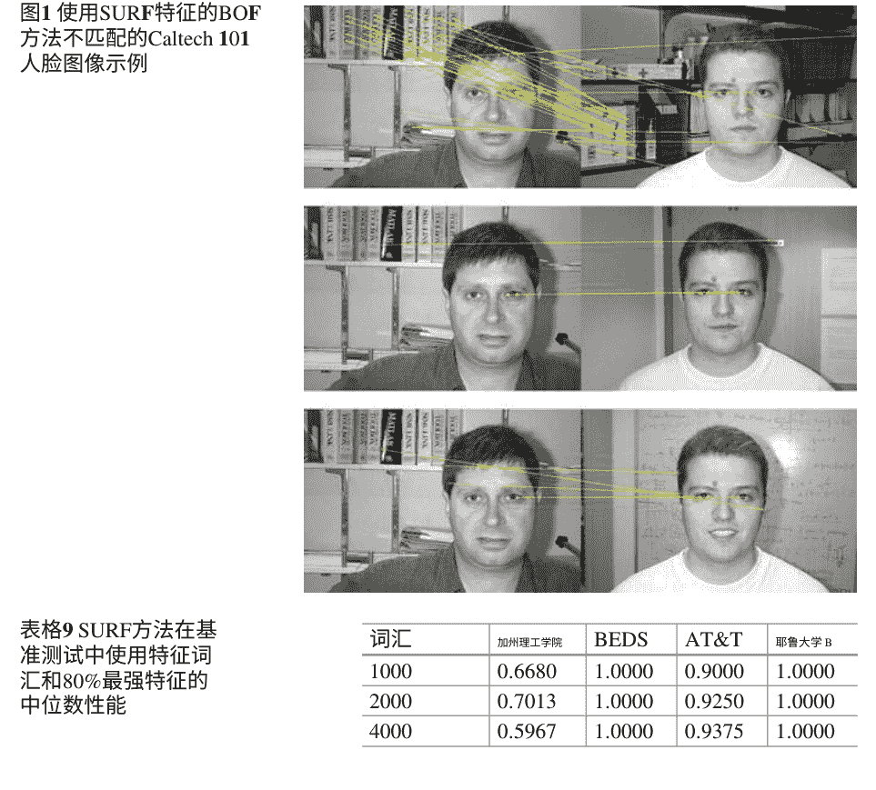

### 表格9 SURF方法在基准测试中使用特征词汇和80%最强特征的中位数性能

| 词汇 | 加州理工学院 | BEDS | AT&T | 耶鲁大学B |
| :--- | :--- | :--- | :--- | :--- |
| 1000 | 0.6680 | 1.0000 | 0.9000 | 1.0000 |
| 2000 | 0.7013 | 1.0000 | 0.9250 | 1.0000 |
| 4000 | 0.5967 | 1.0000 | 0.9375 | 1.0000 |

通过分析不匹配的图像，我们发现其中许多图像具有丰富且高度变化的背景，而只有两个面部特征持续匹配，显然这是不足以正确识别一个人的，如图1所示。大多数不匹配的图像显示出具有视觉上相似的发型、面部类型的主题，他们很可能是亲戚。

为了提高BOF技术的识别准确性，我们可以增加BOF视觉词汇的大小和质量。为了验证这个假设，我们进行了新的计算实验，使用可变的词汇大小（表格9）和保留最强特征的百分比（表格10），运行了一种使用SURF检测器和描述符的BOF技术。实验结果表明，存在最佳的词汇大小和保留最强特征的百分比，与默认的MATLAB bagOfFeatures参数不同，这些参数对于每个数据集都是独立的。找到最佳的配置参数可以通过约20%的特征词汇质量提高，而在“困难”的Caltech 101数据集上计算时间没有显著增加。对于AlexNet CNN，Caltech 101人脸数据集没有引起问题。然而，AT&T基准测试中，每个主题的图像数量较少，且没有背景，更难识别。然而，通过调整学习算法的参数InitialLearningRate和MiniBatchSize，我们能够提高识别准确性。当基准图像在主题数量和每个主题的图像数量方面存在显著差异时，改进效果显现。CNN技术的最佳参数对于每个数据集都不同，因此必须针对每个数据集进行个别调整（表11和表12）。

当无法使用特定基准的特征时，结合CNN和“浅层”BOF风格方法可能会很有用，特别是当计算时间与预训练的CNN和使用SURF特征检测器和描述符的BOF相当时。在我们的实验中，使用SURF技术的AlexNet CNN集合能够纠正困难的Caltech 101人脸和AT&T基准测试的性能不佳（表13和表14）。

我们实验中卷积神经网络的高性能激发了我们运行新的实验，使用特征提取器来提供BOF模型的输入。BOF模型与卷积神经网络的相似性能表明，特征提取器的非最优选择会影响在Caltech 101人脸基准测试上的性能。使用卷积神经网络特征的实验

### 表10 SURF方法在基准测试上选择最强特征和3000个词汇量的中位性能

| 最强特征 [%] | 加州理工学院 | BEDS | AT&T | 耶鲁大学 B |
| :--- | :--- | :--- | :--- | :--- |
| 30 | 0.5847 | 1.0000 | 0.8875 | 1.0000 |
| 50 | 0.7113 | 1.0000 | 0.8625 | 1.0000 |
| 70 | 0.6247 | 1.0000 | 0.9625 | 1.0000 |
| 90 | 0.6387 | 1.0000 | 0.9250 | 1.0000 |

### 表11 AlexNet卷积神经网络在不同MiniBatch大小和初始学习率α=0.01参数下在BEDS和AT&T基准测试上的平均性能

| MiniBatch | BEDS, α=0.01 | AT&T,α=0.01 |
| :--- | :--- | :--- |
| 8 | 0 | 0.7875 |
| 16 | 0 | 1.0000 |
| 32 | 0.2000 | 0.9875 |
| 64 | 0.2000 | 0.9750 |
| 128 | 0 | 0.7125 |

### 表12 AlexNet卷积神经网络在不同MiniBatch大小和初始学习率下的平均性能 α=0.001参数在BEDS和AT&T基准上

| MiniBatch | BEDS, α=0.001 | AT&T,α=0.001 |
| :--- | :--- | :--- |
| 8 | 1.0000 | 0.9875 |
| 16 | 1.0000 | 0.9875 |
| 32 | 1.0000 | 0.9250 |
| 64 | 1.0000 | 0.5500 |
| 128 | 1.0000 | 0.1500 |表13 BOF方法与CNN提取的特征在不同维度上的性能基准测试结果（第一部分）

| 维度 | 加州理工学院 | BEDS | AT&T | 耶鲁大学B |
|------|--------------|------|------|-----------|
| 2    | 0.1780       | 0.9830 | 0.7750 | 0.9839    |
| 4    | 0.6213       | 0.9980 | 0.8875 | 0.9980    |
| 8    | 0.9420       | 1.0000 | 0.9250 | 0.9996    |
| 16   | 0.8620       | 1.0000 | 0.7000 | 0.9996    |
| 32   | 0.9720       | 1.0000 | 0.6125 | 0.9988    |
| 64   | 0.9507       | 1.0000 | 0.5500 | 0.9973    |

表14 BOF方法与CNN提取的特征在不同维度上的性能基准测试结果（第二部分）

| 维度 | Faces96 | Grimace | JAFFE | GT    |
|------|---------|---------|-------|-------|
| 2    | 0.6175  | 0.9722  | 0.9500 | 0.7267 |
| 4    | 0.9354  | 1.0000  | 0.9800 | 0.9533 |
| 8    | 0.9818  | 1.0000  | 0.9000 | 0.9933 |
| 16   | 0.9917  | 1.0000  | 0.8750 | 1.0000 |
| 32   | 0.9967  | 1.0000  | 0.8500 | 0.9933 |
| 64   | 0.9884  | 1.0000  | 0.9500 | 0.9733 |

实验证明，不同数据集存在唯一的最佳维度。

观察到一些训练参数和网络结构的组合，如成对网络，可以提高性能。

### 7 结论和进一步工作

面部识别算法在光照条件、头部旋转、视角和情绪变化时仍存在问题。需要识别的大量主体使得学习的类边界变得困难。深度神经网络提供了高效的解决方案，尽管由于每次误差梯度算法的大量计算，它们的计算效率仍需改进。在实践中，需要通过多次实验来探索梯度算法和神经网络结构的参数，以最大化性能。

我们实验中探索的成对网络结构改善了性能，因为这样的网络只需要一小组参数，在实验中需要进行优化。我们工作的主要发现以在流行的面部基准数据集上开发的教程形式呈现。这些发现如下。

使用密集网格提取大量特征用于BOF算法，略微提高了人脸识别的准确性。在每个主题的图像数量较少的基准测试中取得了最大的改进。通过优化特征词汇的参数，我们能够生成高维词汇并实现高效的特征过滤。我们实验中找到的优化参数提高了识别准确性，而不需要显著的计算开销。

使用AlexNet卷积神经网络的实验表明，不同基准测试上的人脸识别准确性取决于训练参数，其最佳值对于每个基准测试是唯一的。

对于BOF技术和AlexNet CNNs来说，“困难”的基准测试是不同的。我们试图克服这些问题，并考虑使用BOF技术与CNN提取的特征。这使我们能够提高性能，同时保持可比较的计算开销。新的发现使我们得出结论，当浅层ML方法与特征提取技术相结合时，它们与DL解决方案具有竞争力，但不需要大量计算。

进行的研究激发我们进一步探索结合传统ML和迅速发展的DL方法在人脸识别中的优势。我们相信通过优化网络配置和学习参数，可以进一步改进本研究中提出的结果。实现这一目标的一种明显方法是结合更高级别和传统的特征提取方法。为了提高人脸识别算法的鲁棒性，可以在具有新挑战的基准测试中探索，其中可能包括面部遮挡、干扰、伪装等。

### 参考文献

- 1. H. Bay, T. Tuytelaars, L.V. Gool, Surf: 加速鲁棒特征, in计算机视觉 – ECCV 2006, 编辑: A. Leonardis, H. Bischof, A. Pinz (Springer, Berlin, 2006), 页码: 404–417
- 2. H. Bay, A. Ess, T. Tuytelaars, L.V. Gool, 加速鲁棒特征 (surf). 计算机视觉图像理解 (CVIU) **110**(3), 346–359 (2008)
- 3. F. Bowen, J. Hu, E.Y. Du, 图像配准的多阶段方法. IEEE Trans. Cybern. **46**(9), 2119–2131 (2016)
- 4. B.C. Chen, Y.Y. Chen, Y.H. Kuo, T.D. Ngo, D.D. Le, S. Satoh, W.H. Hsu, 利用面部稀疏表示在视频档案中进行可扩展的面部跟踪检索. IEEE Trans. Circuits Syst.Video Technol. **27**(7), 1595–1603 (2017)
- 5. Z. Chen, Y. Wang, H. Liu, 无干扰传感器基于先进机器学习算法的占用朝向检测和跟踪. IEEE传感器杂志 **18**(15), 6360–6368 (2018)
- 6. N. Dalal, B. Triggs, 用于人体检测的梯度方向直方图, 在2005 IEEE计算机学会计算机视觉和模式识别会议 (CVPR’05), vol. 1 (June 2005), pp. 886–893
- 7. W. Deng, J. Hu, J. Lu, J. Guo, 变换不变的主成分分析: 一种全自动人脸对齐、表示和识别的统一方法. IEEE模式分析与机器智能 **36**(6), 1275–1284 (2014)
- 8. L. Fei-Fei, R. Fergus, P. Perona, 从少量训练样本中学习生成性视觉模型: 一种基于增量贝叶斯方法在101个物体类别上的测试. 计算机视觉图像理解 **106**(1), 59–70 (2007)
- 9. S. Frintrop, E. Rome, H.I. Christensen, 计算机视觉注意力系统及其认知基础: 一项调查. ACM Trans. Appl. Percept. 7(1), 1–39 (2010)
- 10. A.C. Geng Du, F. Su, 使用surf特征进行人脸识别, in Proceedings SPIE, vol. 7496 (2009)
- 11. A.S. Georghiades, P.N. Belhumeur, D.J. Kriegman, 从少到多: 光照锥模型用于变化光照和姿态下的人脸识别. IEEE Trans. Pattern Anal. Mach. Intell. 23(6), 643–660 (2001)
- 12. I. Goodfellow, Y. Bengio, A. Courville, 深度学习 (MIT Press, Cambridge, 2016)
- 13. S. Gunasekar, J. Ghosh, A.C. Bovik, 在受损图像上进行人脸检测, 通过感知质量感知特征增强. IEEE Trans. Inf. Forensics Secur. 9(12), 2119–2131 (2014)
- 14. F.M. Hasanuzzaman, X. Yang, Y. Tian, 鲁棒且有效的基于组件的纸币识别, 通过surf特征, in 2011 20th Annual Wireless and Optical Communications Conference (WOCC) (April 2011), pp. 1–6
- 15. T. Hastie, R. Tibshirani, J. Friedman, 统计学习的要素. Springer统计学系列 (Springer, 纽约, 2001)
- 16. A.J. Izenman, 现代多元统计技术: 回归, 分类和流形学习, 1st edn. (Springer, 柏林, 2008)
- 17. L. Jakaite, V. Schetinin, C. Maple, J. Schult, 基于贝叶斯决策树的新生儿脑成熟度的脑电图评估, in 2010年英国计算智能研讨会 (UKCI) (Sept 2010), pp. 1–6
- 18. L. Jakaite, V. Schetinin, J. Schult, 从脑电图中提取特征用于贝叶斯评估新生儿脑成熟度, in 2011年第24届国际计算机医学系统研讨会 (CBMS) (June 2011), pp. 1–6
- 19. B. Jun, I. Choi, D. Kim, 本地转换特征和混合化以实现准确的人脸和人体检测. IEEE Trans. Pattern Anal. Mach. Intell. 35(6), 1423–1436 (2013)
- 20. T. Kalsum, S.M. Anwar, M. Majid, B. Khan, S.M. Ali, 使用混合特征描述符从面部表情中识别情绪. IET Image Process. 12(6), 1004–1012 (2018)
- 21. V. Kecman, T.-M. Huang, M. Vogt, 迭代单数据算法用于训练大数据集的核机器: 理论和性能. Support Vector Mach. Theory Appl. 177, 605–605 (2005)
- 22. Y. LeCun, Y. Bengio, G.E. Hinton, 深度学习. 自然 521(7553), 436–444 (2015)
- 23. Y. Lei, X. Jiang, Z. Shi, D. Chen, Q. Li, 基于surf特征的人脸识别方法, in 2009年国际计算机网络和多媒体技术研讨会 (2009年1月), pp.1–4
- 24. J. Li, T. Wang, Y. Zhang, 使用surf级联进行人脸检测, in 2011年IEEE国际计算机视觉会议工作坊 (ICCV Workshops) (2011年11月), pp. 2183–2190
- 25. Z. Li, U. Park, A.K. Jain, 一种用于年龄不变人脸识别的判别模型. IEEE Trans. Inf. Forensics Secur. 6(3), 1028–1037 (2011)
- 26. H. Li, Z. Lin, X. Shen, J. Brandt, G. Hua, 用于人脸检测的卷积神经网络级联, in 2015年IEEE计算机视觉与模式识别会议 (CVPR), vol. 00 (2015年6月), pp. 5325–5334
- 27. L. Liu, C. Xiong, H. Zhang, Z. Niu, M. Wang, S. Yan, 使用大间隔的深度人脸识别进行年龄验证. IEEE Trans. Multimedia 18(1), 64–75 (2016)
- 28. D.G. Lowe, 尺度不变关键点的独特图像特征. Int. J. Comput. Vis. 60(2), 91–110 (2004)
- 29. M.J. Lyons, S. Akamatsu, M. Kamachi, J. Gyoba, 使用Gabor小波编码面部表情, 在 FG (1998)
- 30. W. Mei, D. Weihong, 深度人脸识别综述. CoRR, abs/1804.06655 (2018)
- 31. K.P. Murphy, 机器学习: 概率视角 (MIT Press, Cambridge, 2012)
- 32. A. Nefian, M. Khosravi, M. Hayes, 在不受控制的环境中实时检测人脸, in Proceedings of SPIE - The International Society for Optical Engineering (May 1999)
- 33. N. Nyah, L. Jakaite. V. Schetinin, P. Sant, A. Aggoun, 学习多项式神经网络以接近最优的连接性来检测生物特征数据中的异常模式，在2016年SAI计算会议（SAI）（2016年7月），第409-413页
- 34. S. O’Hara, B.A. Draper, 引入图像分类和检索的特征包范式。 arXiv, abs/1101.3354（2011年）
- 35. M. Oravec, 使用机器学习方法进行生物特征识别的特征提取和分类，在ELMAR-2014会议论文集中（2014年9月），第1-4页
- 36. E. Oyallon, J. Rabin, 对SURF方法的分析。 在线图像处理 5, 176-218 (2015年)
- 37. N. Passalis, A. Tefas, 学习神经特征包用于大规模图像检索。IEEE Trans. Syst. Man Cybern. Syst. 47(10), 2641–2652 (2017)
- 38. D.E. Rumelhart, G.E. Hinton, R.J. Wilson, 通过反向传播学习表示。 自然 323, 533–536 (1986)
- 39. F. Samaria, A. Harter, 用于人脸识别的随机模型参数化，在冬季计算机视觉应用会议 (1994)
- 40. E. Sangineto, 使用密集-SURF和Hausdorff距离的姿态和表情无关的面部特征定位。IEEE Trans. Pattern Anal. Mach. Intell. 35(3), 624–638 (2013)
- 41. U. Scherhag, R. Raghavendra, K.B. Raja, M. Gomez-Barrero, C. Rathgeb, C. Busch, 关于面部识别系统对伪造面部攻击的脆弱性，在2017年第五届生物特征与取证国际研讨会(IWBF)(2017年4月)，第1-6页
- 42. V. Schetinin, L. Jakaite, 从睡眠脑电图中提取特征进行贝叶斯评估脑发育。 PLOS One 12(3), 1–13 (2017)
- 43. V. Schetinin, L. Jakaite, W.J. Krzanowski, 使用贝叶斯决策树预测生存概率。专家系统应用 40(14), 5466–5476 (2013)
- 44. V. Schetinin, L. Jakaite, N. Nyah, D. Novakovic, W. Krzanowski, 使用GMDH类型神经网络进行基于EEG的个人识别的特征提取。国际神经系统杂志 2018,1750064 (2017)
- 45. V. Schetinin, L. Jakaite, N. Nyah, D. Novakovic, W. Krzanowski, 使用GMDH类型神经网络进行基于EEG的个人识别的特征提取。国际神经系统杂志 28,1750064 (2018)
- 46. C. Shu, X. Ding, C. Fang, 面部识别的梯度直方图。清华科技 16(2), 216–224 (2011)
- 47. L. Spacek, 人脸识别数据（2008年6月），在线。2018年12月13日访问
- 48. H.H. Su, T.W. Chen, C.C. Kao, W.H. Hsu, S.Y. Chien, 基于保持美学特征的视图推荐系统的风景照片。IEEE Trans. Multimedia 14 (3), 833-843（2012年）
- 49. 支持向量机模板 - MATLAB templateSVM（2018年12月）。2018年12月13日访问
- 50. H. Tan, B. Yang, Z. Ma, 基于全局和局部HOG特征的人脸识别的融合。IET Comput. Vis. 8（3），224-234（2014年）
- 51. J. Uglov, L. Jakaite, V. Schetinin, C. Maple, 比较面部识别的成对和多类神经网络系统的鲁棒性。EURASIP J. Adv. Signal Process. 2008, 文章 ID 468693, 7页（2008年）。 https://doi.org/10.1155/2008/468693
- 52. Z. 吴, Q. 柯, J. 孙, H.Y. 沈, 基于身份的量化和多参考重新排序的可扩展人脸图像检索。IEEE模式分析与机器智能交易 33(10), 1991-2001(2011)
- 53. Z. 向, H. 谭, W. 叶, 与Gabor和LBP相比，基于密集网格的HOG特征在人脸识别中具有出色的性能。IEEE Access 6, 29,306-29,319 (2018)
- 54. Z. 谢, P. 江, S. 张, 融合LBP和HOG使用多核学习进行红外人脸识别，在2017年IEEE/ACIS第16届计算机和信息科学国际会议（ICIS）（2017年5月），第81-84页
- 55. C. 徐，Y. 王，T. 谭，L. 全，自动三维人脸识别结合全局几何特征和局部形状变化信息，在第六届IEEE国际自动人脸和手势识别会议，2004年。会议（2004年5月），第308-313页
- 56. G. 张，Y. 王，基于分辨率不变特征的鲁棒三维人脸识别。模式识别信件32（7），1009-1019（2011年）

## 面部识别的深度学习模型：一项比较分析

Arindam Chaudhuri

### 1 引言

面部识别一直是生物特征识别中最具挑战性的问题[1-6]。它基于某些可用的非侵入性和自然独特的特征来识别和验证人脸。 这个问题一直受到计算机视觉和模式识别（CVPR）研究人员的积极研究。 它在军事、金融、安全、反恐等领域有着广泛的应用。面部识别不需要用户的合作。采集过程不需要任何接触，并且具有良好的隐蔽性。 它是一个多维度的检测和识别任务，考虑到人脸可能具有的多种外观变化。 通常，人脸被认为是一个带有各种光源[7]和其他背景数据的3D对象。 由于人脸在2D图像上的投影，其外观变化非常显著[8]。

因此，任务始终是开发能够对固有变化进行非人为识别的稳健人脸识别技术。识别过程还应该考虑到人脸中存在的变化容忍度。 当变形效果涉及到考虑身份、种族或遗传等个人方面的无数人脸时，问题变得更具挑战性。 识别过程还应该解决图像获取问题。 再次，识别系统的输出应该考虑到执行时间和空间效率因素，以获得相当准确的水平。

人脸识别中的传统流程包括图1所示的四个阶段。

# 图1 人脸识别中的传统流程

从技术上讲，人脸识别分为三个组别[7-9]。第一组是2D人脸识别。2D技术是人脸识别的最初版本，可以追溯到20世纪90年代末和21世纪初。这里的算法考虑了几何特征、子空间、弹性匹配和神经网络。人脸识别考虑了图像的亮度。光照阻碍了2D人脸识别的进一步发展，影响了算法。3D人脸识别形成了第二组。它在最近引起了相当大的关注。

一些重要的工作可以在[9]中找到。3D相对于2D的优势在于3D保留了人脸的几何信息，而2D人脸受到光照、姿势和遮挡等因素的影响。这降低了人脸识别系统的识别能力。但是3D人脸识别算法不受这些问题的影响。它们考虑了可变的光照和姿势，以解决这些问题。3D图像考虑了人脸的表面几何特征。由于姿势变化，这里没有丢失任何信息。然而，3D图像获取过程没有被考虑在内。这是因为3D图像中没有关于亮度的信息。它只受到光照的影响。这些导致了对3D图像的人脸识别的增长。

其他重要的工作可以在[9]中找到。3D识别技术也已经应用于其他领域。第三个人脸识别组属于2D+3D双模技术。它已经达到了高性能水平。这里将2D图像识别技术与3D人脸属性相结合，达到了良好的识别效果。2D +3D人脸识别在过去几年中取得了显著的增长[9]。

随着大规模人脸数据集的出现，深度学习有了巨大的增长[1]。深度学习的强大学习能力大大提高了2D人脸识别的准确性。深度学习一直是一个活跃的机器学习研究领域。它构建了深度神经网络，模拟人脑的工作方式。然后对多模态数据进行解释和分析[3]。传统机器学习的有效性取决于特征表示的性能。机器学习优化学习权重并产生最优的学习输出。深度技术可以自动完成数据表示和特征提取工作。最重要的深度学习网络是卷积神经网络（CNN），几乎在所有人脸识别应用中都表现出良好的性能[10]。它的深度结构可以在多个抽象层次上提取有区分度的特征集表示。CNN可以轻松地从图像中学习丰富的特征。当训练深度CNN网络时，学习过程通过大量的网络参数和大量标记的数据集进行。通常，CNN不是从零开始训练。预训练在考虑到大型数据集的情况下，进行了CNN的训练，其中模型权重被用于初始化或任务相关的特征提取器。然后使用测试数据集来调整网络。当训练和测试数据集之间存在照明、表情、视角等差异时，微调后的CNN无法达到良好的性能水平。预训练的CNN确定了微调过程。当目标应用程序和源应用程序之间存在显著差异时，需要进一步微调预训练模型的层。但是过多的微调可能导致过拟合。当训练和测试数据集之间存在显著差异时，无法改变预训练CNN的初始数据分布。CNN现在难以提高其适应性。网络的训练时间是另一个问题。对一个层的任何更改可能会影响其他层的分布变化。网络需要不断适应自身。因此，需要仔细设置参数，使用较小的学习率以及进行归一化，以从网络中获得良好的结果。

人脸识别的最初工作归功于20世纪90年代的历史性特征脸方法[3]。多年来，人脸识别的一些重要范式在[1]中得到了突出的展示。在上图中，呈现了四个主要的技术流派，即整体学习、局部手工艺、浅层学习和深度学习。在整体方法中，通过考虑线性子空间流形和稀疏表示等分布来得到低维表示。然而，这些方法未能解决面部的非受控变化，这与它们的先验假设不符。后来，这个问题催生了基于局部特征的人脸识别。这构成了局部手工艺方法。这里值得一提的一些技术包括Gabor及其多级和高维扩展。考虑到局部滤波的不变性特性，它们取得了相当的性能水平，但缺乏独特性和紧凑性。在本十年初，人脸识别研究人员开始使用基于学习的局部描述符。这是浅层学习方法在人脸识别问题上的研究工作的起点。通过局部滤波器解决了更好的可区分性问题，并且为了更好的紧凑性，使用了编码码本。然而，由于面部外观的复杂非线性变化，鲁棒性问题仍然存在。这些方法通过滤波响应或特征码的直方图来解决人脸识别问题。通过预处理、局部描述符、特征转换等逐渐提高了人脸识别的准确性。所取得的结果仅能将LFW基准的准确性提高到约95%。浅层学习方法无法提取稳定的身份特征来应对不受限制的面部变化。因此，人脸识别系统在实际应用中提供了令人不满意的性能，出现了无数的误报。

2012年是人脸识别研究的转折年。在这里，AlexNet通过深度学习以显著的优势赢得了ImageNet竞赛。使用了CNN提供的特征提取和转换能力，考虑了多个处理单元层级。在这里进行了多个表示层次的学习，对应于不同的抽象化。这些抽象化构成了一个概念层次结构，考虑到面部姿势、光照、表情变化等因素，如上图所示。网络的初始层与Gabor特征相同。更复杂的文本特征是由下一层学习的。下一层显示了简单的特征，如高鼻梁、大眼睛等，更复杂的特征在这里学习。在最后一层，网络的输出可以呈现出某些面部属性，通过这些属性可以对明确的抽象概念（如微笑、咆哮、眼睛的颜色等）做出重要的响应。在CNN中，初始层学习了长期特征Gabor、SIFT等，而高层抽象则是通过下一层学习的。高层抽象的组合代表了面部的身份，考虑到相当程度的稳定性。再次在2014年，DeepFace [12]在LFW基准数据集 (http://vis-www.cs.umass.edu/lfw/part_labels/) 上取得了良好的准确性，考虑到非约束条件下的人类表现。因此，研究的整个重点转向了基于深度学习的方法。准确性因素在短时间内提高到了近100%。深度学习技术在人脸识别研究领域的算法、数据集、评估协议等各个方面进行了全面改进。本章对深度学习人脸识别模型[3]进行了比较研究，考虑了算法和数据方面。初始讨论从多阶段策略开始，以收集包含成千上万个样本人脸图像和成千上万个独特身份的大型人脸数据集。这些数据集来自网络上可用的知识来源。它们在本研究中用于模型训练和评估。然后对各种人脸识别过程方法进行分类。接下来，探索了几种深度网络架构在面部对齐、度量学习以及损失函数方面的人脸识别和验证。几个人脸识别模型使用了深度架构的变体。从相关观点考虑，对这些模型的建模选择进行评估。对不同的深度学习人脸识别方法进行了实验结果和基准数据集的比较分析。还突出了深度人脸识别方法的潜在优势和不足之处。接下来，提出了几个杂项问题和开放性研究问题[3]。最后，给出了未来的研究方向。

#### 1.1 动机因素

在这里，考虑使用深度学习模型进行人脸识别的主要目标是研究实际和经验丰富的深度人脸识别架构，这些架构已经在多年来不断发展。由于不同生物特征研究团队对更高准确性的追求，人脸识别的研究已经成为一个热门话题。这里调查了过去十年中取得重要成就的几个深度人脸识别模型。对比分析已经完成人脸识别数据集是根据所有操作约束和基准数据集进行专门准备的。这项工作围绕以下问题展开：

- (a) 深度人脸识别架构在未知数据集上的表现如何？
- (b) 深度人脸识别算法在基准测试中的表现如何？
- (c) 深度人脸识别系统中存在哪些开放性研究问题？

# ## 1.2 研究议程

这项研究工作做出了以下贡献：

- (a) 对现有的深度人脸识别系统进行文献综述。
- (b) 这项研究工作介绍了过去十年中出现的重要深度人脸识别系统。对这些架构在未知数据集上进行了比较性能分析，考虑了基准数据集。
- (c) 对该主题的几个识别问题和其他开放性研究问题进行了全面讨论。

本章的结构如下。与人脸识别相关的工作放在第2节。第3节简要介绍了人脸识别。第4节重点介绍了本研究工作中的人脸识别数据集。第5节介绍了用于人脸识别的深度学习模型。第6节讨论了实验结果。第7节进一步讨论了识别和开放性问题。最后，第8节给出了结论性的评论。

# ## 2 人脸识别：相关工作

这里介绍了使用深度学习网络进行人脸识别的研究文献综述。这个综述主要包含了过去十年的研究要点。有兴趣的读者可以参考[3]获取更详细的研究列表。

# ## 2.1 当前文献

深度学习[13]技术在人脸识别中的应用主要归功于大规模人脸数据集的出现。深度网络在人脸识别问题中具有优越的数据学习能力，因此非常受欢迎。深度学习网络负责表示学习自动地从数据中提取特征[14, 15]。在人脸识别中，最著名的深度网络之一是具有可观性能的CNN[16, 17]。它具有深层架构，通过提取具有多个抽象级别的区分特征集表示。CNN能够轻松地学习到丰富的图像特征。CNN通过其学习过程训练了数百万个网络参数，需要足够数量的预训练标记数据集[18]。CNN通常通过大量数据进行预训练。然后使用模型的权重来进行特定特征提取，以满足所需的任务。然后通过测试集对模型进行微调[19, 20]。测试和训练数据集在光照、表情、视角等方面存在明显差异。因此，经过精细调整的卷积神经网络在获得可观的性能水平方面存在困难。这是因为微调取决于卷积神经网络模型的预训练。这阻碍了对当前识别活动的识别性能。良好的精细调整会寻求更好的处理，以使应用具有可观的变化。当有效地对预训练的卷积神经网络进行微调[21]时，可能存在一些与有限微调过拟合数据相关的问题。通过考虑数据分布[22, 23]来实现卷积神经网络的分类和识别任务。当训练集和测试集之间的差异显著时，很难改变预训练卷积神经网络的初始数据分布。这使得卷积神经网络模型的适应性变得困难，即使它经过了微调。训练网络中的大量网络参数是另一个基于时间的问题。这是因为任何层中参数的变化都会改变所有层中的数据分布。这将要求网络不断适应新的数据分布。这导致参数的谨慎调整，并以较小的学习率进行训练。此外，激活操作的非线性饱和使事情变得更加困难[24, 25]。

数据归一化可以增强网络的收敛性[26]，这个概念由LeCun提出，旨在解决内部协变量漂移[27]。另一种用于彩色二维主成分分析卷积神经网络（C2D-CNN）的人脸识别方法是由[28]提出的。还有其他的研究可参考[29–31]。CNN网络使用RGB颜色通道来提取特征。它们消除了颜色通道之间的内部相关性。颜色通道的融合方法[32]有效提高了人脸识别的颜色性能。人脸识别数据集具有高辨别特征。深度学习网络能够学习这些特征。通过深度学习技术，信息可以有效地在复杂的层次结构中传播。在将低级特征映射到高级特征时，它可以自动学习特征。这个过程的基础是高维特征提取和分类器设计。基于此，CNN被训练用于提取高维特征向量[6, 33, 34]。然后使用联合贝叶斯[33]或任何度量学习方法[35]进行分类。在[36]中，CNN通过新颖的信号中心损失和softmax损失进行了监督。他们在考虑了三个重要的人脸识别基准测试后取得了良好的准确性。在[37]中，使用CNN和补丁策略来学习人脸特征，以提高人脸表示性能。Facebook使用CNN进行特征提取，并取得了可观的结果[12]，这导致了DeepFace的发展。DeepFace是一个重要的深度学习网络，由九层深度CNN模型组成，其中包含两个卷积层和超过1.2亿个参数，这些参数是通过从4000+个身份中适应四百万张面部图像进行训练的。通过将图像与3D模型对齐，并使用CNN集合，它在LFW和YTF数据集上分别达到了97.35%和91.40%的准确率。深度隐藏身份特征，通常称为DeepID [34]，是一个重要的深度学习网络。它由九层网络和四个卷积层组成。它学习权重以考虑面部识别。通过最后一个隐藏层输出特征进行提取。然后它推广到面部验证。在这里，面部通过与眼睛和嘴角的两个中心进行相似性变换来对齐。使用CelebFaces (http://mmlab.ie.cuhk.edu.hk/projects/CelebA.html)数据集进行训练。考虑到LFW数据集，达到了97.45%的准确率。另一个重要的深度网络是FaceNet [38]。它是一个深度CNN，其基础来自GoogLeNet (http://deeplearning.net/tag/googlenet/)。该网络是根据一个包含1亿到2亿张图像和约800万个身份的面部数据集进行训练的。该算法使用三元组。为了衡量面部的相似性，它学习将面部图像映射到紧凑的欧几里德空间。FaceNet使用inception模型来学习面部验证的三元组嵌入。该算法在LFW和YTF数据集上分别达到了99.63%和95.12%的准确率。其他重要的深度学习架构，广泛用于面部识别的有GoogleNet (https://leonardoaraujosantos.gitbooks.io/artificial-intelligence/content/googlenet.html)和ResNet (https://en.m.wikipedia.org/wiki/ResNet)。在[39]中，图像质量协变量影响了几个CNN模型的性能。在这里，考虑到各个方面，评估了四个深度神经网络模型在图像分类任务中的性能。发现噪声和模糊是最具阻碍因素。[40]提供了深度模型的协变量分析的另一个视角。在这里，通过视觉心理物理学的角度对各种CNN架构进行了比较和评估。在对象识别任务中，使用渲染图像的3D图像模型来对齐ImageNet对象类别，以获得规范的视图。当考虑到不同角度和距离查看对象时，网络的性能被确定。确定网络性能的另一种情况是当图像经过变形，如随机线性遮挡、高斯模糊、亮度变化等时。在[41]中，评估了CNN在图像变换和变形方面的性能。他们结合了各种图像变换，使CNN能够更好地采用通用图像表示。因此，CNN也通过监督学习进行训练。在[42]中，考虑到旋转、平移、缩放等图像协变量效应，以及通过使用ImageNet对象分类进行训练的深度CNN产生的内部表示。随着网络深度的增加，考虑协变量的CNN不变性显著增加。考虑网络深度，网络特征也增加了迁移学习的区分能力。在[43]中，通过深度CNN考虑图像变换，对等变性、不变性和等价性进行了评估。基于深度CNN的表示优于其他表示，包括不变性、等变性以及与训练目标相关的变换。通过深度CNN，考虑图像变换，保留了等变性、不变性和等价性。基于深度CNN的表示优于其他表示，包括不变性、等变性以及与训练目标相关的变换。

# ## 3 人脸识别：概述

在本节中，我们将以基本概念和人脸识别的重要组成部分为基础，简要介绍人脸识别。本节主要面向初次读者。已经了解基本人脸识别方面的人可以跳过本节。

# ### 3.1 基本概念和术语

人脸识别系统基本上由三个模块组成[44]: (a) 人脸检测，(b) 特征点检测，以及(c) 人脸实现。人脸检测模块在图像或视频中定位人脸。特征点检测模块将人脸对齐到规范化的坐标。人脸实现模块使用对齐的人脸图像进行实现。作为一个经验法则，人脸识别过程分为人脸验证和人脸识别。通常，已知的主体集合最初被注册到系统中（画廊），在测试过程中会出现一个新的主体（探针）。人脸验证计算画廊和探针之间的一对一相似度，以确定这两个图像是否属于同一个主体。人脸识别计算一对多相似度，以确定探针人脸的具体身份。封闭集识别指的是出现在画廊身份中的探针。开放集识别指的是画廊中不存在的探针。

# ### 3.2 人脸识别组件

当一个人脸输入到人脸识别模块时，需要知道这个人脸是真实的还是伪造的。这被称为人脸反欺骗，需要进行以避免不同的攻击。这是人脸识别过程的后续步骤。人脸识别模块包括(a)人脸处理，(b)深度特征提取和(c)人脸匹配。本节简要讨论了人脸识别的这三个组件。人脸识别过程可以表示如下：

```
face_match [feat_extrac(data_proc_i (face_image_i)),
            feat_extrac (data_proc_j (face_image_j))]
```

在上述过程中，两个人脸图像通过face_image_i和face_image_j表示。data_proc负责处理各种人内变化，如姿势、光照、表情、遮挡等。通过feat_extrac进行身份信息的编码。face_match是人脸匹配算法，用于计算相似度分数。

# ### 3.2.1 人脸处理

深度学习技术被用于人脸处理，因为它们具有强大的表征能力。各种条件，如姿势、光照、表情、遮挡等，极大地影响了这些方法的性能。在自动人脸识别应用中，姿势变化被视为一个严重的挑战。因此，在这个方向上已经付出了相当多的努力。其他变化通过相同的方法来解决。基于此，人脸处理方法通常分为一对多增强和多对一归一化。在一对多增强中，考虑单个图像生成具有姿势变化的多个补丁，以便深度网络可以学习姿势不变的表示。在多对一归一化中，考虑一个或多个非正面视图图像，恢复面部图像的规范视图，以便根据受控条件进行人脸识别。

# ### 3.2.2 深度特征提取

深度特征提取考虑了网络架构和损失函数两个方面。这里的网络架构通常分为主干网络和多个网络。在ImageNet (http://www.image-net.org/) 挑战成功后，出现了几种基于CNN的架构。其中一些值得一提的是AlexNet (https://en.m.wikipedia.org/wiki/AlexNet), VGGNet (https://medium.com/coinmonks/paper-review-of-vggnet-1st-runner-up-of-ilsvlc-2014-image-classification-d02355543a1), GoogleNet (https://leonardoaraujosantos.gitbooks.io/artificial-intelligence/content/googlenet.html) , ResNet (https://en.m.wikipedia.org/wiki/ResNet) , SENet [45]等。这些架构在人脸识别任务中作为基准模型。有一些不断发展的人脸识别架构致力于提高效率。由于基础模块是通过骨干网络形成的，因此多个网络通常通过考虑多个输入或任务的人脸识别技术进行训练。当多个网络的结果累积时，性能显著提升。下一个方面是损失函数。softmax损失函数是最广泛使用的函数。它关注对象中的特征可分性识别。然而，在人脸识别任务中，当内部变化大于间隔差异时，softmax损失并不那么有效。因此，人们通常会寻求创建新的损失函数，使得特征更具可分离性和区分性。一些常用的损失函数包括欧氏距离损失、余弦边界损失、softmax损失变体等。

# ### 3.2.3 人脸匹配

一旦深度网络经过适当的损失函数训练得当，测试图像将通过网络以获得深度特征表示。当提取深度特征后，通过余弦距离计算两个特征之间的相似度。然后通过最近邻和阈值比较执行识别和验证任务。接下来，使用深度特征进行后处理。最后，使用度量学习、稀疏表示分类器等方法高效准确地进行人脸匹配。

在图2中，对于训练和测试，突出了不同人脸识别组件的整个范围。考虑到本研究中使用的深度学习模型，讨论了一些重要方面，如损失函数、人脸匹配和人脸处理。对于感兴趣的读者，可以在[3]中找到更多详细信息。

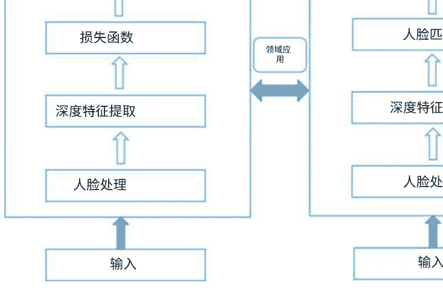

## 4个人脸识别数据集

本节讨论了用于使用深度学习网络进行实验的人脸识别数据集。有大量可用的人脸识别数据集（http://www.face-rec.org/databases/）可供研究和探索。然而，在本研究中，基于[3]的成功，我们创建了一个相当大的人脸数据集，用于进行深度学习模型的实验。这些数据集是由我们的团队专门为进行实验而创建的。人脸数据来自数据存储库中可用的各种来源。实验数据集包含超过4亿张人脸图像[3]。人脸图像来自LFW、Facebook、Twitter、Google、CelebFaces等不同来源。该过程包括多个步骤，以收集成千上万的图像数据集，涉及数千个唯一身份，如表1所示。图3显示了实验数据集中的样本图像。该过程的不同步骤及其统计数据如表1所示，并在此简要解释：

步骤1 构建人脸数据集的第一步需要获取候选身份名称列表以获取人脸。这里的基本目标是寻找杰出的人物，以便在网络上有大量不同的图像。根据互联网电影数据库（IMDB）名人榜单的受欢迎程度排名，得到了一份公众人物的基本列表。该列表包含电影艺术家。 重叠是根据Freebase知识图谱中的人物进行的[3]。 它包含500K个不同身份的信息，分别对应5K个男性和女性的有序列表。 这导致了一个包含10K个名称的热门候选人列表。 为此，我们考虑属性信息，如种族、年龄、亲属关系等。 为了使注释团队成功，我们考虑了10K张图像。 对候选人列表进行过滤，以替换存在缺乏独特图像的身份。 这消除了与标准基准数据集的重叠。 现在，从Google图像搜索中获取每个10K个名称的400张图像。 然后将400张图像交给注释员确定身份，以获得足够的图像纯度。 建议注释员在400张图像集的纯度达到90%左右时保留身份。 图像稀缺有时会导致纯度不足。 通过过滤，候选人列表减少到6500个身份。 删除在LFW和YTF数据集中出现的任何名称，以便可以对新数据集进行训练并进行公平评估。 这导致了一个最终的5244个名人姓名列表。

第二步在Google搜索中搜索5244个名人的图像。 当关键词“演员”与姓名组合时，重复此活动。 这导致每个姓名有八个查询，每个查询结果有1000个。 通过这样做，我们可以获得4000个图像，考虑到每个身份。

第三步此步骤从每个集合中删除任何错误的人脸。 为了实现这一点，分别考虑每个身份的前100张图像作为正训练样本，其余的前100张图像作为负训练样本。 对于每个身份，使用线性SVM（一对多）进行训练，考虑到Fisher向量人脸描述符[3]。 对于每个身份，线性SVM根据与该身份相关的4000个下载图像进行排名。 保留前2000个图像，阈值为2000，以支持高精度的正预测。

第四步删除来自相同图像或通过不同搜索找到的相同图像副本。 还删除了近似重复的图像。 通过VLAD描述符[3]实现这一点，对于每个身份，在2000个图像中对描述符进行聚类，并使用严格的阈值以及每个聚类保留单个元素。

第5步 到目前为止，共有5244个身份和每个身份约2000张图像。 这一步通过人工注释提高了数据的精确性。 然而，为了避免更高的注释成本，注释者再次考虑自动排序。 现在，训练是在多路卷积神经网络上进行的，以便考虑到AlexNet架构，对5244个人脸身份进行区分。 然后，通过减少内点的可能性，对每个身份集合中的图像进行softmax分数排序。 每个身份内的有序图像被分成400个块。 然后，注释者验证整个块。 如果块的近似纯度大于95%，则被视为好的。 最后，我们有了1965606张好的图像，大约95%是正面，5%是侧面。

现在，我们有了一个准确的大规模人脸数据集，并标记了身份。可以从维基共享资源、IMDB、百度、Yandex等地方获取额外的图像。这里的主要问题是要非常小心地进行重复删除。考虑到下载的图像之间的成对距离分布，可以自动化地进行图像收集的第一步。通常，具有较高纯度的任何类别的图像都呈现单峰分布。

| 步骤 | 目标 | 处理类型 | 人数 | 每个人的图像数量 | 总图像数量 |
|------|------|----------|------|------------------|------------|
| 1 | 候选人列表生成 | 自动 | 10,000 | 400 | 4,000,000 |
| 2 | 扩展图像集 | 自动 | 5244 | 4000 | 20,976,000 |
| 3 | 图像集排序 | 自动 | 5244 | 2000 | 10,488,000 |
| 4 | 去除重复图像 | 自动 | 5244 | 1246 | 6,534,024 |
| 5 | 手动筛选 | 手动 | 5244 | 750 | 3,933,000 |

## 使用深度学习的5种人脸识别方法

在本节中，强调了多年来发展起来的人脸识别系统中的重要深度架构。深度人脸识别架构与判别损失函数和深度特征的人脸匹配相结合。

现在有大量的人脸可用。因此，人脸识别过程可以被视为一种细粒度对象分类任务。然而，在许多应用中，在训练阶段很难获得所有候选人脸。这使得人脸识别成为一项零样本学习活动。由于几乎所有人脸都具有相同的形状和纹理，从少量人脸采用的表示可以很好地泛化。这要求在训练集中包含许多身份。各个组织已经透露，他们的深度人脸识别系统是通过大约10^6−07个身份进行训练的[3]。目前可用的公共训练数据库只包含10^3−10^5个身份。为了通过小型训练数据集提高深度特征的区分能力，通过设计有效的损失函数和更深的架构来解决这个问题。在这里，我们将重点放在多年来发展起来的人脸识别的重要深度网络上。这里考虑的深度网络包括DeepID、DeepID2、DeepID2+、DeepID3、DeepFace、Face++、FaceNet和Baidu。

#### 5.1 深度学习架构

考虑到第3节中介绍的基本人脸识别概述，传统的人脸识别问题可以表示为如图4所示的一系列活动。人脸检测问题已经通过可变形部件模型[46]得到解决。人脸检测方面最著名的工作是通过CNN级联[47]，如图5所示。检测器的相应测试流程如图6所示。

在这里还值得一提的是通过CNN级联进行的面部关键点检测[48]。在这里，面部关键点位置是通过三级CNN估计的，如图7所示。CNN在第一级考虑到面部数据的情况下进行准确的预测，如图8所示。它有效地避免了其他方法面临的局部最小问题。图9显示了深度CNN的结构。多个网络的输出被融合以实现准确和稳健的估计，考虑到每个级别。在初始阶段，考虑到整个面部区域，进行全局高级特征的提取。这有助于实现高精度关键点的定位。它有助于定位每个关键点，考虑到整个面部的纹理上下文信息。对于重要点的几何约束被隐式编码。网络的训练是为了同时预测所有重要点而进行的。该方法避免了由于模糊和数据损坏而导致的局部最小值问题，适用于困难样本。这是因为遮挡、姿态变化大和光照极端造成的。在后续的层次中，网络被训练以在局部上优化初始预测。相应的输入被限制在考虑初始预测的小区域内。在考虑准确和鲁棒的面部关键点检测时，进行了各种网络结构的研究。

深度ID模型广泛使用了面部对齐算法[34]。深度ID学习了面部的高级特征表示集，用于面部验证。它有效地学习了面部识别的困难多类任务，可以推广到验证和训练集中的新身份。在训练过程中，DeepID的泛化能力随着更多的训练样本增加而增强。

预测人脸类别。图10 [34]展示了更高层次的特征提取过程。DeepID的结构如图11所示。特征采用深度卷积神经网络中最后一个隐藏层神经元的激活值。为了识别训练集中约10K个人脸身份，采用基于分类器的学习方法。为了减少神经元数量，进行了一次配置，以适应特征提取层次结构。图12展示了两个特定人脸区域、十个人脸区域和三个尺度。较少数量的隐藏神经元使深度卷积神经网络在更高层次形成紧凑的与身份相关的特征。从不同的人脸区域提取特征，形成互补和过完备的表示。DeepID使用最少的数据进行处理。他们在LFW数据集上实现了97.45%的验证准确率，该数据集包含弱对齐的人脸。

由[48]使用的CNN级联也被称为DeepID1。DeepID1有五个特征点，包括两个眼中心，鼻尖和两个嘴角。它是全局对齐的，考虑到相同的变换。有十个区域，考虑到RGB/灰度，有三个尺度，从而得到60个补丁。每个60个CNN从特定的补丁中提取2160维向量，以及其水平对应物，即翻转的补丁。翻转的补丁对应物以中心为中心左眼通过翻转以右眼为中心的补丁派生。该网络的总长度为19,200（160 × 2 ×60）。通过主成分分析，将其减少到150，以考虑验证。

由[49]进行的另一项重要工作导致了DeepID2的发展。它使用了面部对齐的监督下降方法，并为DeepID2+和DeepID3铺平了道路。他们的方法基于非线性优化方法，使用了二阶下降方法。考虑到一般平滑函数的非线性优化，它们具有卓越的鲁棒性，更快的处理速度和更高的可靠性。然而，这些方法在分析上存在不可微性，不精确的近似是不切实际的，Hessian矩阵也不是大的和负定的。通过监督下降方法来解决这些不足，最小化最小二乘函数，这是非线性的。在训练时，通过监督下降方法来学习下降序列的方向，最小化非线性最小二乘函数在各个点上的均值。在测试过程中，通过学习的下降方向，监督下降方法减少了非线性最小二乘目标，而无需计算Jacobian和Hessian。DeepID2通过CMU intra-face landmark detector [50]识别特征点，如图13所示。在DeepID2检测到特征点后，通过简单的相似变换实现对齐，可以轻松使用。这种策略已经被许多模型使用，包括DeepIDs。DeepID2特征提取的CNN结构[50]如图14所示。用于特征选择[50]的相应补丁在图15中突出显示。DeepID2在训练过程中使用200个补丁，最初裁剪不同位置，尺度和颜色通道。在这里，每个补丁及其水平翻转都被放入CNN中。从补丁中提取2160维特征，以及其镜像翻转。图15显示了贪婪选择的25个最佳补丁。

DeepID1和DeepID2在面部验证中使用了联合贝叶斯。DeepID1在CNN训练中使用了约8000个身份，而在联合贝叶斯训练中使用了约2000个身份。DeepID2在CNN训练中使用了约8000个身份，而在联合贝叶斯训练中保留了约2000个身份。DeepID2与DeepID1相比有微小的差异。DeepID2是更好的标记检测器，并且比DeepID1具有更多的标记/补丁。DeepID2采用了贪婪的补丁选择。为了达到最佳性能，在集成模型训练时进行了7次此活动。对于DeepID2的验证和识别损失，生成验证信号时效果最好。

这个系列中的下一个网络是DeepID2+[50]。图16 [51]显示了DeepID2+的架构。DeepID2+采用了更多的数据进行处理。它考虑了来自CelebFace和WFRef等私有数据集的数据由约12K个ID和290K张图像组成。它使用了一个更大的网络，在每一层都有监督。图17 [51]显示了DeepID2+处理数据的示意图。它扩展了DeepID2 [3]的工作，并增加了隐藏表示的维度。它还在早期的卷积层添加了监督。

在DeepID2+中，单元被调整为识别身份，如比尔·克林顿，以及属性，如男性、女性、白人、黑人等。它使用二进制特征进行快速搜索和测试。DeepID2+具有遮挡容忍性。图18显示了一些经过遮挡的测试图像。DeepID2+使用了联合贝叶斯进行人脸验证。

DeepID3 [51]跟随DeepID2+。 因此，它是其前身的更深层次版本。与Deep ID2+相比，它由10-15个非线性特征提取层组成。DeepID3继承了DeepID2+的一些属性。它在最后几个特征提取层中考虑了不共享的神经权重。它还像DeepID2+一样，在初始层中执行监督信号的加法过程。DeepID3通过堆叠卷积和VGG和GoogLeNet [3]中的inception层来重构，以实现更强大的人脸识别。因此，DeepID3有两个版本。图19和图20展示了DeepID3的两种架构，即DeepID3 net1和DeepID3 net2。

DeepID3的深度归因于在每个池化层之前堆叠多个卷积层。考虑到更大的感受野，连续卷积有助于特征的形成。它还有助于更高的具有受限参数的复杂非线性[3]。DeepID3 net1在每个池化层之前考虑了两个连续的卷积层。在这里，额外的监督信号被添加到从中间层分支出的全连接层。这有助于学习更好的中层特征，并且也使得优化更简单。顶部的两个卷积层被替换为局部连接层。通过不共享参数，顶层形成具有降低特征维度的更高表达特征。最后的局部连接层用于提取终端特征，没有额外的全连接层。

DeepID3 net2在每两个连续的卷积层之后考虑了一个池化层。在后续的特征提取阶段，根据inception层[3]，在第三和第四个池化层之前分别有三个和两个连续的卷积层。在每个池化层之后，联合识别和验证的监督信号被添加到全连接层。对于两种架构，除了池化层之外，都考虑了修正线性非线性[3]。对于最后的特征提取层，添加了dropout学习[3]。考虑到深度DeepID3网络相比VGG或GoogLeNet要小。这是因为每层特征图的数量是受限制的。与DeepID2+，DeepID3针对相同的25个人脸区域进行训练[3]。在这里，每个网络将特定部分的脸作为输入。考虑到特征选择，选择了这些人脸区域。区别因素在于位置、尺度和颜色通道。通过这种方式，不同的网络可以轻松学习互补信息。在训练阶段，联合人脸识别和验证的监督信号被附加到中间和最终特征提取层。

一旦训练完成，从这些网络中提取特征，考虑到脸部的相应区域。对于面部验证或识别，学习通过额外的联合贝叶斯模型[3]进行执行。 所有DeepID3网络和联合贝叶斯模型的学习都是通过与DeepID2+中使用的相同的300K（约）训练样本进行的。 在面部验证过程中，与DeepID2+相比，DeepID3 net1和DeepID3 net2的错误率分别降低了0.81%和0.26%，并且在水平翻转方面有所改善。 两个DeepID3架构的集成分别实现了99.53%和96.0%的LFW面部验证准确率和排名1的面部识别准确率。

DeepID2+和DeepID3使用了约8000个身份进行CNN训练，并且约有2000个身份被保留用于联合贝叶斯训练。 不同DeepID模型的人脸识别性能可在[3]中找到。

下一个重要的深度人脸识别模型是DeepFace [12]。 它是在Facebook开发的，试图缩小与无约束人脸识别基准的差距。 通过这种方式，它实现了可观的人脸验证性能水平。 它在人脸识别流程的对齐步骤上工作，这是一种比较复杂的过程。 它采用显式的3D人脸建模，以便轻松应用分段仿射变换。 然后它从九层网络中提取人脸。 3D对齐步骤增加了面部外观的鲁棒性。 图21表示训练图像的对齐流程。

DeepFace网络由超过1.2亿个参数组成，考虑到许多局部连接层，但没有权重共享。 图22展示了DeepFace的架构。 网络架构的成功归功于对齐过程的完成。 由于在像素级别上每个人脸区域的位置是固定的，因此可以考虑原始像素的RGB值进行学习。 这里不需要应用多个卷积层[3]。 训练是在一个相当大的人脸数据集上进行的。 稍加调整后，它超越了现有系统。 该数据集的标签是由超过4000个身份的四百万张人脸图像组成的。 这里产生了一个非常紧凑的人脸表示。 在大规模人脸数据库中，学习到的表示与准确的基于模型的对齐相结合，从而在无约束环境中获得良好的人脸泛化。 DeepFace在LFW数据集上达到了97.35%的准确率。 DeepFace在LFW数据集上的性能可在[3]中找到。 这将错误率降低了超过27%，从而实现了类似人类的性能。 它还将YTF的错误率降低了50%以上[3]。 有人认为DeepFace不如DeepID2、DeepID3、Face++和FaceNet [3]好。

Face++是一个重要的深度人脸识别模型[52]。它是一个使用大型数据集训练的朴素CNN。Face++在大量观察中改进了其识别性能。它考虑了Megvii人脸分类（MFC）数据库，该数据库包含了近20 K人的五百万张标记人脸。MFC数据库的分布可在[52]中找到。图23表示Megvii人脸识别系统。Face++系统中的CNN架构由简单的十层组成。Face++在LFW数据集上实现了99.50%的准确率，作为基准。Face++的持续性能改进和相应的长尾效应可在[52]中找到。Face++在中国身份证（CHID）基准数据集上没有取得好的结果，该数据集是一个实际安全证书环境中的识别系统。图24显示了与CHID基准相关的一些失败案例。Face++不需要任何联合识别、验证和贝叶斯。它也不需要3D对齐。

然而，与DeepID相比，它需要更大的数据集来完成训练。

现在我们考虑另一个重要的深度人脸识别模型，由Google开发，称为FaceNet。FaceNet被认为是面部识别和聚类的统一嵌入。FaceNet使用了大约2.6亿张人脸图像的大型数据集。这是一个非常深的模型，被裁剪过，除了裁剪之外没有其他对齐方法被使用。它直接学习从面部图像到紧凑欧几里得空间的映射。在这里，距离直接对应于面部相似度度量。在空间建立之后，通过标准技术实现面部识别、验证和聚类任务，其中FaceNet被嵌入为特征向量。训练是针对深度卷积神经网络本身的嵌入进行优化，而不是任何中间的瓶颈层。FaceNet通过两个深度卷积神经网络架构，即Zeiler和Fergus以及GoogLeNet，在[38]中提供。图25显示了FaceNet的模型结构。FaceNet使用大致对齐的匹配和非匹配人脸补丁三元组进行训练。这些三元组是使用在线三元组挖掘生成的。

考虑到距离边界，三元组损失将正样本与负样本分开。这种方法具有更高的表示效率。通过每个人脸的128字节，可以实现相当好的识别性能。FaceNet在LFW数据集上达到了99.63%的准确率，在YouTube人脸数据库上达到了95.12%的准确率。FaceNet的性能可以参考[38]。FaceNet使用了谐波三元组损失，如图26所示。来自不同网络的不同人脸嵌入版本。这些嵌入是相互兼容的。它们还允许直接比较。

三元组选择有时可能很棘手。关于课程学习，通常建议在考虑小批量时选择难以区分的正负例。大型小批量可能考虑一些数千个例子，在小批量内计算argmin和argmax。除此之外，还制定了一些策略来选择半难例的负例。为了进一步提高聚类的准确性，考虑了硬正例挖掘，鼓励单人嵌入的球形聚类。图27展示了典型的人脸聚类示例。

最后，我们展示了百度[3]的人脸识别模型。百度使用多个补丁并追求最终准确性。这是一个两阶段的方法，它集成了多补丁深度卷积神经网络和深度度量学习。这有助于提取低维度和高度区分性的特征，用于人脸识别和验证。图28显示了多补丁上的深度卷积神经网络结构。

训练数据采用了120万张人脸图像，涵盖了1.8万个人。百度在LFW数据集上实现了99.77%的成对验证准确率。明显优于其他技术。数据大小和补丁数量也起着重要作用。因此，人脸数量和训练数据的身份对整体性能至关重要。除了基于多补丁的特征和度量学习外，考虑三元损失可以改善结果，即使数据规模增大。

不同训练数据和不同补丁数量的成对错误率以及考虑几个评估任务的各种方法之间的比较可在[3]中找到。百度已经展示了通向真实世界高性能人脸识别系统的积极路径。

#### 5.2 判别损失函数

在从对象分类任务接管后，DeepFace和DeepID采用了基于交叉熵的softmax损失进行特征学习。然而，发现softmax损失本身无法学习具有大间隔的特征。这导致了对具有优越泛化能力的判别损失函数的探索。这里值得一提的两个损失函数是欧氏距离和余弦边界损失。随着这个特征和权重归一化变得著名。我们在这里简要讨论了不同深度人脸识别架构中的欧氏距离、余弦边距和softmax损失函数。

##### 5.2.1 欧氏距离损失

欧几里得距离损失函数考虑了度量学习[3]。它将图像嵌入到欧几里得空间中，减小了内部差异，增加了外部差异。对比损失和三元组损失是常用的其他函数。对比损失考虑了人脸图像对，拉近了正样本对，推开了负样本对，使得

$$损失 = b_{ij} max (0, \|h(a_i) - h(a_j)\|_2 - \epsilon^+) + (1 - b_{ij}) max (0, \epsilon^- - \|h(a_i) - h(a_j)\|_2) \tag{1}$$

在公式（1）中，$b_{ij}=1$考虑了$a_i$和$a_j$作为匹配样本，$b_{ij}= -1$考虑了非匹配样本。特征嵌入$h(\cdot)$控制了匹配和非匹配对的边界$\epsilon^+$和$\epsilon^-$。DeepID2考虑了基于softmax的人脸识别和基于对比损失的验证监督信号，以学习有区分性的表示。联合贝叶斯被考虑进来，以达到鲁棒的嵌入空间。DeepID2+增强了隐藏表示的维度，并添加了初始卷积层的监督。

DeepID3还考虑了VGGNet和GoogleNet。边界参数很难考虑对比损失函数。三元组损失函数考虑了匹配对和非匹配对之间距离的相对差异。

Google引入了FaceNet和三元组损失函数用于人脸识别任务。考虑到人脸三元组，它最小化了相似身份的锚点和正样本距离，并最大化了不同身份的锚点和负样本距离。FaceNet使用了困难三元组人脸样本。

$$\|h(a_i^x) - h(a_i^s)\|_2^2 + \beta < -\|h(a_i^x) - h(a_i^n)\|_2^2 \tag{2}$$

在公式（2）中，$a_i^x$，$a_i^s$和$a_i^n$分别表示锚点、正样本和负样本，$\beta$是边界，$h$是非线性转换嵌入图像到特征空间。TPE和TSE也通过以下方程进行线性投影，以构建三元组损失函数：

$$(a_i^x)^T P^T P a_i^s + \beta < (a_i^x)^T P^T P a_i^n \tag{3}$$

$$(a_i^x - a_i^s)^T P^T P (a_i^x - a_i^s) + \beta < (a_i^x - a_i^n)^T P^T P (a_i^x - a_i^n) \tag{4}$$

其他技术结合了三元组和softmax损失[3]。网络训练通过softmax进行，然后通过三元组损失进行微调。对比损失和三元组损失在训练中面临不稳定性，因为有效的训练样本选择。通过中心损失及其变体来压缩内部方差。这个损失表示为

$$\text{损失中心} = \frac{1}{2} \sum_{i=1}^{m} \| a_i - \text{中心}_{b_i} \|_2^2 \tag{5}$$

在公式 (5) 中，$a_i$是$b_i$类的深度特征，中心$b_i$是$b_i$类的中心，具有深度特征。为了处理长尾数据，在一个批次中最小化一个类别的最大范围的调和平均值，并最大化一个批次内最短的类间距离，考虑到范围损失。一些其他变体是由(http://mmlab.ie.cuhk.edu.hk/projects/CelebA.html)使用的。中心损失及其变体在分类层仍然存在严重的内存消耗问题。他们寻求平衡和充足的数据进行训练，考虑到每个身份。

##### 5.2.2 余弦边界损失

基于余弦边界的损失函数[3]允许通过较大的余弦距离来分离学习到的特征。原始的softmax损失函数被重新定义为需要较大边界的softmax损失函数，要求：

$$\| P_1 \| \|a\| \cos(p\varphi_1) > \| P_2 \| \|a\| \cos(p\varphi_2) \tag{6}$$

在公式(6)中，$p$是正整数，考虑到角度边界，$P$是最后一个全连接层的权重，$a$是深度特征，$\varphi$指定角度。分段函数被应用于较大的softmax损失函数以强制单调性。这里的损失函数是

$$LOSS_i = -\log \left( \frac{e^{\| P_{b_i} \| \|a_i\| \theta(\varphi_{b_i})}}{e^{\| P_{b_i} \| \|a_i\| \theta(\varphi_{b_i})} + \sum_{j \neq b_i} e^{\| P_{b_i} \| \|a_i\| \cos(\varphi_j)}} \right) \tag{7}$$

使用

$$\theta(\varphi) = (-1)^k \cos(p\varphi) - 2k, \quad \varphi \in \left[ \frac{k\pi}{p}, \frac{(k+1)\pi}{p} \right] \tag{8}$$

大的softmax损失具有较低的收敛度。为了实现收敛，将softmax损失集成在一起。除此之外，权重由动态超参数$\lambda$控制。考虑到额外的softmax损失，函数变为

$$h_{b_i} = \frac{\lambda \| P_{b_i} \| \|a_i\| \cos(\varphi_{b_i}) + \| P_{b_i} \| \|a_i\| \theta(\varphi_{b_i})}{1 + \lambda} \tag{9}$$

考虑到大的softmax损失，角度softmax损失通过L2范数 $\|P\|=1$ 进一步归一化权重$P$。归一化向量位于超球面上。然后，在具有角度边界的超球面流形上学习判别性人脸特征。深度超球面卷积网络（SphereNet）是一种以超球面卷积为基本卷积算子，并通过角度边界损失进行监督的网络。大的softmax和角度softmax的优化问题以乘法方式考虑角度边界，ArcFace、CosineFace和AMS损失以加法余弦边界$\cos(\varphi + p)$和$\cos(\varphi - p)$。这些方法相对简单，没有超参数$\lambda$，并且在没有softmax监督的情况下收敛。基于余弦边界的损失在超球面上明确添加了判别性约束。这从本质上匹配了人脸位于流形上的先验知识。

##### 5.2.3 软最大值损失及其变体

软最大值损失是另一个广泛使用的重要函数[3]。在软最大值损失函数中，特征或权重归一化是

$$\hat{\mathbf{P}} = \frac{\mathbf{P}}{\|\mathbf{P}\|}, \hat{\mathbf{a}} = \alpha \frac{\mathbf{a}}{\|\mathbf{a}\|} \quad (10)$$

在公式（10）中，α是缩放参数。当$a$被缩放到固定半径时，$\alpha$变得重要。已经证明它将权重和特征归一化到接近于1的值，这使得训练数据的软最大值损失更高。特征和权重归一化是实施损失函数的好策略。损失函数仅归一化权重，并使用余弦边界进行训练，以使学到的特征具有辨别性。为了克服软最大值偏差的样本分布，采用了特征归一化。再次，通过软最大值损失学到的特征的L2范数对于面部质量具有信息量。通过特征归一化，L2-softmax使所有特征具有相似的L2范数。这使得对于质量良好的正面人脸和极端姿态的模糊人脸具有相似的关注。

在softmax损失函数中，还有其他一些重要的工作[3]。

#### 5.3 通过深度特征进行人脸匹配

在测试中，余弦距离和L2距离可以确定两个深度特征之间的相似度。$a_1$和$a_2$之间的相似度。这里的重要任务是验证和识别。通过阈值比较和最近邻分类器来进行验证和识别决策。

##### 5.3.1 人脸验证

度量学习试图找到一种新的度量方式，使得两个类别更易分开。它也可以用于人脸匹配，考虑到提取的深度特征。联合贝叶斯[3]模型是另一种重要的度量学习方法。研究发现，它显著提高了性能。在联合贝叶斯模型中，人脸特征 a 被映射为 a = μ + ε，其中a和 ε 分别表示身份和个人内部变化。相似度得分为

sim(a₁, a₂) = log (Prob(a₁, a₂ | H_{IS}) / Prob(a₁, a₂ | H_{ID}))   (11)

在方程 (11) 中，Prob(a₁, a₂ | H_{IS})和Prob(a₁, a₂ | H_{ID})分别表示两个人脸属于相似身份和不同身份的概率。

##### 5.3.2 人脸识别

在计算余弦距离后，考虑到对多个鲁棒的CNN模型的相似性得分，使用启发式投票策略[3]。从人脸图像的局部区域提取局部自适应卷积特征。他们使用扩展的稀疏表示分类器进行人脸识别，考虑每个人的单个样本。再次，将深度特征与SVM分类器相结合，以识别所有类别。考虑到深度特征，使用产品量化来检索前k个相同的人脸。然后，再次通过将深度特征与COTS匹配器结合考虑相似性来对这些人脸进行排名。当训练集和测试集的身份重叠时，人脸匹配中也使用了Softmax。当训练和测试数据分布相同时，所述人脸匹配方法是有效的。两个域之间存在分布变化或领域转移，这会降低性能。迁移学习已用于深度人脸识别，利用相关源域中的数据来执行人脸识别目标域。将CNN特征与模板特定的线性SVM相结合，也被视为迁移学习。迁移学习可以嵌入到深度模型中，以学习更具可迁移性的表示。其他重要的工作可以在[3]中找到。

#### 5.4 使用深度特征进行人脸处理

使用深度特征处理人脸[3]在人脸识别任务中起着重要作用。广义上，这个活动被分为一对多增强和多对一归一化。一对多增强[3]有效地解决了数据收集的挑战。它们可以增强训练数据和测试数据画廊。它们被分为四类，即数据增强，3D，CNN和生成对抗网络（GAN）。数据增强包括光度变换，几何变换，镜像和旋转图像。它还被用于深度人脸识别算法。人脸的3D重建丰富了训练数据的多样性。它们也被用于考虑深度方法的3D人脸重建。CNN模型直接生成2D图像。在多视角感知器中，身份特征由确定性隐藏神经元学习，视角特征由随机隐藏神经元捕获。当采样不同的随机神经元时，可以分析具有不同姿势的人脸图像。GAN已被用于通过结合数据分布的先验知识和人脸的知识来改进图像。还有其他几个版本的GAN可用。多对一归一化[3]产生正面人脸并减少测试数据的外观变异，使得人脸对齐并进行比较。它们被分为三类，即堆叠渐进自动编码器（SAE），CNN和GAN。SAE将非正面人脸映射到正面人脸，考虑自动编码器堆叠。CNN已被用于提取保留人脸身份特征的特征，以便在规范视图中重建人脸图像。它包括特征提取和正面人脸重建模块。GAN包括四个地标定位的补丁和全局编码器解码器网络。通过对抗性，对称性和保持身份的损失的组合，它生成了正面视图，并保持了来自局部区域的全局结构的细节。

## 6 个实验结果

这里突出显示了在第5.1节中讨论的深度网络在第4节中给出的模拟人脸识别数据集上的各种实验结果。使用DeepID、DeepID2、DeepID2+、DeepID3、DeepFace、Face++、FaceNet和Baidu模型对模拟数据进行实验。模型的训练是使用模拟数据集进行的。通过LFW和YTF数据集对深度模型进行评估。这两个数据集被视为基准数据集，因为它们包含来自第4节模拟数据集的不同身份。使用Python 3（[https://www.python.org/download/releases/3.0/](https://www.python.org/download/releases/3.0/)）进行实现工作，所有代码都是从头开始编写的，考虑到NVIDIA CuDNN库（[https://developer.nvidia.com/cudnn](https://developer.nvidia.com/cudnn)）以加快训练过程。所有调查都是在NVIDIA GTX Titan Black GPU（[https://www.geforce.com/hardware/desktop-gpus/geforce-gtx-titan-black/specifications](https://www.geforce.com/hardware/desktop-gpus/geforce-gtx-titan-black/specifications)）上进行的，该GPU具有16 GB的内存和12个GPU。这个硬件配置[3]是专门为这项工作准备的。由于深度网络的高度复杂性，高度显著的内存占用是可赞赏的。这里使用的CNN包含线性和非线性的类预测器和softmax层，从中接收描述符向量作为输出。考虑到一个人脸图像，将裁剪四个（256 × 256）像素的补丁，考虑到角落。然后水平翻转中心，并对应的特征向量取平均。为了允许多尺度测试，对面部进行了三种尺寸的缩放，分别为384、512和1024像素。对于每个尺寸，重复裁剪过程[3]。考虑所有特征，得到平均的面部描述符。面部检测是通过[3]中突出的技术完成的。为了对齐面部，计算了面部上的标志物[3]。然后使用2D相似变换将面部映射到规范姿势。对于考虑的面部视频，通过根据其标志物置信度分数对面部进行排序，并取前K个最高分数，为每个视频考虑K个面部描述符。对于正面面部进行2D对齐。对于侧面，不进行对齐。然后，面部的K个描述符的平均值表示该视频。

在训练深度学习模型时，我们考虑了几个重要方面，包括数据集的筛选、图像对齐和网络架构参数的变化。数据集的筛选显著提高了模型的性能。对测试图像进行对齐也提升了性能。巧妙地改变网络参数（如学习率和动量）确实改善了整体网络性能。在训练过程中，面部识别模型根据主体相关或独立设置进行评估。考虑到主体相关协议，在训练集中，测试身份是预先定义的。由于这一点，对于给定的身份，对测试面部进行分类变得简单明了。主体相关的面部识别被视为具有可分离特征的分类过程。然而，它适用于小型应用程序。

考虑到独立于主体的协议，用于测试的身份与训练集不相交。因此，人脸识别变得具有挑战性。由于不可能对训练集的已知身份进行人脸分类，独立于主体的表示是必不可少的。由于人脸表现出类似的主体内变化，当使用足够大的通用主体集进行训练时，深度模型显示出超越性的泛化能力。在这里，学习具有大边界的判别性深度特征非常重要。所有主要的人脸识别基准都使用独立于主体的协议。

#### 6.1 评估规则

为了对考虑现实生活中的人脸识别问题的深度学习模型进行评估性能，开发了几个具有不同任务和场景的测试数据集。考虑到测试任务，使用人脸验证、封闭集人脸识别和开放集人脸识别设置来评估识别模型的性能。在这里，每个任务都有相应的性能指标。人脸验证评估考虑了控制系统访问、重新识别和独立应用方面。它使用接收者操作特性和估计的平均准确率进行测量。接收者操作特性分析测量了在考虑阈值时的真接受率和假接受率。估计的平均准确率表示正确分类的百分比。

#### 6.2 现有面部模型实验结果的比较

本小节重点介绍了深度学习模型在模拟数据集上的实验结果。表2突出了在第4节中突出的实验数据集上深度人脸识别模型的结果。在这里还说明了用于执行不同深度人脸识别技术实验的图像。从表2可以看出，DeepID1、DeepID2、DeepID2+和DeepID3在实验中的准确率均超过99%。

表2 深度人脸识别模型在实验数据集上的比较分析

| 深度人脸识别技术 | 考虑的图像 | 准确率 % | 训练时间 (分钟) |
| :--- | :--- | :--- | :--- |
| DeepID1 | 4,000,000 | 99.50 | 46 |
| DeepID2 | 6,000,000 | 99.53 | 48 |
| DeepID2+ | 8,000,000 | 99.53 | 50 |
| DeepID3 | 10,000,000 | 99.53 | 54 |
| DeepFace | 12,000,000 | 97.86 | 58 |
| Face++ | 100,000,000 | 97.96 | 186 |
| FaceNet | 200,000,000 | 98.96 | 246 |
| 百度 | 400,000,000 | 98.99 | 406 |

**表3 LFW和YTF数据集上深度人脸识别模型的比较分析**

| 深度人脸识别技术 | 准确率 % (LFW) | 准确率 % (YTF) | 训练时间（分钟） |
|------------------|----------------|----------------|-------------------|
| DeepID1          | 99.27          | 99.24          | 46                |
| DeepID2          | 99.34          | 99.37          | 48                |
| DeepID2+         | 99.34          | 99.37          | 50                |
| DeepID3          | 99.34          | 99.39          | 54                |
| DeepFace         | 97.69          | 97.68          | 58                |
| Face++           | 97.70          | 97.69          | 186               |
| FaceNet          | 98.75          | 98.77          | 246               |
| 百度             | 98.89          | 98.86          | 406               |

数据集。DeepFace和Face++的准确率超过97%。FaceNet和百度的准确率接近99%。考虑到图像数据集的变体大小，以获得最佳结果。通过其他图像数据集变体，可以进一步提高这些技术的准确性。还突出显示了相应的训练时间。

#### 6.3 深度学习模型与基准数据集的比较分析

本小节重点介绍了深度学习模型与LFW和YTF基准数据集的比较分析。表3突出显示了LFW和YTF数据集上深度人脸识别模型的结果。这些数据集被用作上表中所呈现结果的基准。从表3可以看出，DeepID1、DeepID2、DeepID2+和DeepID3在LFW和YTF数据集上的准确率超过99%。DeepFace和Face++在这两个数据集上的准确率超过97%。FaceNet和百度在两个数据集上的准确率超过98%。还突出显示了相应的训练时间。

通过将这些结果与第6.2节中的结果进行比较，可以推断出实验数据集的识别准确性比LFW和YTF数据集更高。然而，需要注意的是，为了获得最佳的准确性结果，图像数据集的大小被设置为非均匀。这些技术的准确性可以通过其他图像基准数据集进一步提高。

### 7 进一步讨论

在本节中，我们提出了一些微妙的人脸识别问题，以及一些开放性的研究问题[3]，这些问题为未来的研究方向指明了方向。这些是我们目前正在研究的一些探索性方面。

#### 7.1 其他识别问题

因此，我们始终期望人脸识别算法在任何测试数据集上都能表现良好。为了实现这一点，深度学习模型需要更大的训练数据集和更优秀的算法。由于某些安全问题，公开可用的数据集通常来自名人照片。这些数据集存在一个差距，即它们与从日常生活中获取的具有多样化的图片不同。尽管在LFW和其他数据集作为基准时达到了更高的准确性水平，但目前的人脸识别系统很少满足实际需求。一般人们认为通过从目标图像中收集大量数据集可以提高深度模型的性能，这只是部分正确。通过使用最少的数据和优秀的算法，已经做出了解决目标图像的真诚努力。

在这里，我们简要讨论这些问题。讨论主要涉及交叉因素人脸识别、异构人脸识别、单一或多媒体人脸识别以及基于行业的人脸识别。

交叉因素人脸识别主要涉及交叉姿势人脸识别、交叉年龄人脸识别和化妆人脸识别。交叉姿势人脸识别对于极具挑战性的图像场景提出了困难。主要包括一对多增强、多对一归一化、多输入网络和多任务学习方法。通常在深度特征空间中进行正面化，其中动态添加深度残差等变映射块到残差中，使输入表示将侧面人脸转换为正面图像。一些其他值得注意的工作可以在[3]中找到。交叉年龄人脸识别面临着由于面部外观变化而产生的挑战。在这里，输入图像被合成为目标年龄。生成概率方法在每个短时间段阶段对面部老化过程进行建模。保持身份的条件生成对抗网络使用条件生成对抗网络来生成具有保持身份信息的人脸，年龄分类器产生具有目标年龄的生成人脸。一些重要的工作可以在[3]中找到。化妆人脸识别考虑到显著的面部外观变化而面临挑战。这里使用匹配化妆和非化妆的人脸。一些重要的工作可以在[3]中找到。

异构人脸识别考虑了近红外与可见光人脸识别、低分辨率人脸识别和照片素描人脸识别。近红外光谱图像因其卓越的性能而广泛应用于监控系统。由于在注册数据库中存在可见光谱图像，因此从可见图像库中进行近红外人脸识别一直受到积极研究。一些重要的工作可在[3]中找到。由于深度学习网络对低分辨率具有鲁棒性，低分辨率人脸识别使用了这些网络。一些重要的工作可以在[3]中追踪到。照片素描人脸识别有助于加强法律对于快速嫌疑人识别的执行。它们被分为两类，其中一类利用了迁移学习以便直接匹配照片和草图。在这里，首先使用大型照片人脸数据库训练深度网络，然后使用小型草图数据库进行进一步微调。下一个类别使用图像到图像的转换，其中照片被转换为草图，反之亦然。然后可以在一个领域中进行人脸识别。重要的工作在[3]中列出。

单个或多个媒体人脸识别考虑了低光人脸识别、基于模板的人脸识别和视频人脸识别。低光人脸识别在监控和安全领域有多种应用。人脸识别系统可以在非常有限的训练样本下识别个人。低光学习已被用于训练数据扩充和学习更强大的特征。一些重要的工作可以在[3]中找到。基于模板的人脸识别假设探针集和库集都使用媒体集表示。在分别从每个媒体中学习人脸表示集之后，采用两种策略进行集合之间的人脸识别。在一种情况下，对两个集合中媒体之间的相似性进行比较，将结果汇总为一个最终得分。另一种情况下，使用最大池化聚合人脸表示，生成考虑每个集合的单一表示，然后比较两个集合。一些值得注意的工作可以从[3]中获取。视频人脸识别涉及到视频人脸识别中的两个重要方面。第一个方面是将不同帧之间的信息整合在一起，构建视频人脸表示。第二个方面处理具有严重模糊、姿态变化和遮挡的视频帧。一些重要的工作可以在[3]中找到。

基于行业的人脸识别包括3D人脸识别、部分人脸识别、人脸反欺骗和基于移动设备的人脸识别。3D人脸识别相对于2D方法具有优势。但由于缺乏大规模标注的3D数据，它的发展还不够成熟。为了扩大3D训练数据集，通常使用一对多的数据增强方法来合成3D人脸。然而，提取3D人脸的深度特征的有效方法仍然需要探索。一些重要的工作可在[3]中找到。部分人脸识别仅针对任意大小的人脸补丁。随着闭路电视摄像头和嵌入式视觉系统以及移动设备、机器人和智能家居设施对身份识别要求的增加，部分人脸识别已成为一个新兴问题。一些值得注意的工作可在[3]中找到。人脸反欺骗解决了打印攻击、重放攻击和3D面具攻击。人脸反欺骗是识别人脸是否真实或伪造的关键步骤。它还需要将人脸识别为真实身份或虚假身份。一些值得一提的工作在[3]中给出。基于移动设备的人脸识别在移动电话、平板电脑和增强现实的出现下变得非常突出。由于计算能力的限制，这些设备中的识别任务以轻量但及时的方式进行。一些重要的工作可以在[3]中找到。

在几乎所有的深度人脸识别系统中，CNN被广泛使用以达到良好的性能。通过优越的架构和学习方法，已经投入了相当多的努力来提升CNN的性能。这通常归因于考虑性能的各种协变量的影响。对CNNs的影响[3]。协变量影响图像质量，包括模糊、JPEG压缩、遮挡、噪声、图像亮度、对比度和缺失像素，以及模型特征，包括架构、颜色信息和描述符计算。他们分析了AlexNet、VGG-Face、GoogLeNet和SqueezeNet的人脸验证性能影响。经过深入调查，发现高噪声水平、模糊、缺失像素和亮度对模型的性能验证有显著影响，而对比度的变化以及JPEG压缩的影响较小。描述符的计算策略以及颜色信息对性能没有显著影响。

#### 7.2 开放性研究问题

一些开放性研究问题为进一步研究和探索[3]奠定了基础。

- (a) 尽管外貌变化多样，深度人脸识别系统能够准确可靠地识别和分析不同人脸的年龄、性别和情绪吗？
人脸随着年龄的增长发生了很大变化。它从不保持不变。它一直在变化。不同年龄组的人脸有不同的外貌变化。当年龄因素与性别相结合时，问题变得更加复杂。当加入情绪时，问题的复杂性进一步增加。需要解决的问题是这种系统的准确性和可靠性。在深度人脸识别方面已经做了相当多的工作，但这仍然是一个活跃的研究问题。
- (b) 当面对现实生活数据时，深度人脸识别系统的性能如何？
现实生活数据充满了各种异常和不确定性。它基本上是未知的性质。它充满了许多不需要的方面，特别是噪音，进一步扭曲了数据的性质。当分析这样的数据时，任何深度人脸识别系统都将面临考验。系统需要具有自适应性质，以解决这些数据集中存在的问题。已经有几个高效的深度人脸识别系统，但它们在不同的实际数据集上的表现如何是一个活跃的研究领域。
- (c) 当在不同的训练数据集上训练时，深度人脸识别算法能够实现多快的泛化？
泛化是大多数深度人脸识别算法最追求的方面。基本上，为了实现更好的泛化效果，算法是通过更大的数据集进行训练的。当算法在不同的数据集上进行训练时，收敛到最佳泛化值仍然是一个悬而未决的问题。这是因为不同数据集的性质不同。训练数据集从来都不是完全相同的。因此，算法参数需要调整得更好，以便达到更好的算法泛化能力。这是一个不断发展的研究领域，将随着更好的深度人脸识别系统的出现而不断演变。
- (d) 在一些最快的计算机上执行深度人脸识别算法所涉及的计算复杂度是多少？
深度人脸识别算法的计算复杂度是通过构成算法的参数数量来确定的。随着多年来计算设备在处理能力方面的巨大增长，这个问题是可解决的。然而，随着算法中参数的增加，以满足所有用户需求，计算设备的处理能力也应以相同的速度增长。如果不能实现这一点，具有更多参数的新算法将无法达到所需的计算速度。
- (e) 深度人脸识别系统在人类面部感知方面达到了多高的完美水平？
人类面部表情随时间不断变化。它从不保持不变。为了解决这个问题，深度人脸识别系统应该能够捕捉到人脸上所有可能的感知。这再次使问题变得困难，深度人脸识别算法面临着实现可观的完美水平的挑战。这也是一个不断发展的研究领域，将随着深度人脸识别系统的发展而不断演变。

这些问题可以作为深度人脸识别的活跃研究课题。

### 8 结论

在这里，我们对过去十年中发展起来的重要深度人脸识别模型进行了比较分析。在这项调查中考虑的模型包括DeepIDs、DeepFace、Face++、FaceNet和Baidu。采用多阶段策略来收集大型人脸数据集，并开发新的数据集进行实验。使用新的数据集进行模型训练和评估。展示了不同深度人脸识别方法的实验结果。DeepID1、DeepID2、DeepID2+和DeepID3模型在实验数据集上的准确率超过99%。DeepFace和Face++的准确率超过97%。FaceNet和Baidu的准确率达到约99%。图像数据集的大小不同，以达到最佳结果。这些结果还与基准数据集进行了比较分析。观察到具有不同图像数据集大小的实验数据集比LFW和YTF数据集具有更好的识别准确性。对于LFW和YTF基准数据集，DeepID1、DeepID2、DeepID2+和DeepID3的准确率超过99%。DeepFace和Face++对这两个数据集的准确率超过97%。FaceNet和百度对这两个数据集的准确率超过98%。提出了几个深度人脸识别问题和其他开放性问题，为未来研究提供了潜在方向。

### 参考文献

- 1. M. Wang, W. Deng, 深度人脸识别综述, arXiv:1804.06655v7 (2018)
- 2. K. Grm, V. truc, A. Artiges, M. Caron, H.K. Ekenel, 深度学习模型在面部识别中对图像退化的优势和劣势, arXiv:1710.01494v1 (2017)
- 3. A. Chaudhuri, 一些关于使用人工创建的数据集进行深度人脸识别的研究, Technical Report TH-1696(三星研发所德里分部, Noida, 2016)
- 4. O.M. Parkhi, A. Vedaldi, A. Zisserman, 深度人脸识别, in Proceedings of British Machine Vision Conference, 编辑: X. Xie, M. W. Jones, G. K. L. Tam, (BMVA Press, Surrey, 2015), pp. 41.1–41.12
- 5. K. Chatfield, K. Simonyan, A. Vedaldi, A. Zisserman, 详细信息中的恶魔回归：深入研究卷积神经网络。 arXiv:1405.3531 (2014)
- 6. G. Hu, Y. Yang, D. Yi, J. Kittler, W. Christmas, S.Z. Li, T. Hospedales, 当人脸识别遇见深度学习：对卷积神经网络在人脸识别中的评估， arXiv:1504.02351v1 (2015)
- 7. S. Zhou, S. Xiao, 3D人脸识别：一项调查。人类中心计算与信息科学。 8(35)，19-45 (2018)
- 8. M. Chihaoui, A. Elkefi, W. Bellil, C.B. Amar, 2D人脸识别技术综述。计算机 5(4)，21 (2016)
- 9. A. Chaudhuri, 2D和3D人脸识别再次审视，技术报告TH-1486 (三星研发院德里分院，Noida, 2014)
- 10. A. Chaudhuri, 使用卷积神经网络研究人脸识别，技术报告TH-1669(三星研发院德里分院, Noida, 2016)
- 11. A. Krizhevsky, I. Sutskever, G.E. Hinton, 使用深度卷积神经网络的ImageNet分类，在神经信息处理系统会议, (MIT出版社,剑桥, 2012), pp. 1097–1105
- 12. Y. Taigman, M. Yang, M.A. Ranzato, L. Wolf, DeepFace: 接近人类水平的人脸验证，在IEEE计算机视觉和模式识别会议, (IEEE计算机学会出版社，洛杉矶, 2014), pp. 1701–1708
- 13. Y. LeCun, Y. Bengio, G. Hinton, 深度学习. 自然 521, 436–444 (2015)
- 14. S. Chaib, H. Yao, Y. Gu, M. Amrani, 基于预训练的CNN模型的遥感图像分类的深度特征提取和组合，第9届国际数字图像处理会议论文集， (IEEE, Piscataway, 2017)
- 15. Y. Liu, Y. Li, X. Ma, R. Song, 利用从显著面部区域提取的融合特征进行面部表情识别。传感器（巴塞尔） 17（4），712（2017）
- 16. J. Lu, G. Wang, J. Zhou, 基于图像集的人脸识别的同时特征和字典学习。IEEE图像处理期刊 26（8），4042-4054（2017）
- 17. G. Hu, X. Peng, Y. Yang, T.M. Hospedales, J. Verbeek, Frankenstein: 使用少量数据学习深度人脸表示。IEEE图像处理期刊 27（1），293-303（2018）
- 18. M. Oquab, L. Botou, I. Laptev, 使用卷积神经网络学习和转移中层图像表示，IEEE计算机视觉和模式识别会议论文集，（IEEE Service Center, Piscataway, 2014），pp. 1717-1724
- 19. V. Campos, B. Jou, X. Giro-i-Nieto, 从像素到情感：微调CNN进行视觉情感预测。图像与视觉计算 65，15-22（2017）

20. V. Nagori, 微调反向传播算法的参数以获得最佳学习性能, 在《第二届国际现代计算与信息学术会议》 (IEEE, Piscataway, 2016年), 第7-12页

21. M. Tzelepi, A. Tefas, 利用监督学习对基于内容的图像检索中的深度CNN进行微调, 在《第23届国际模式识别会议》 (IEEE, Piscataway, 2016年), 第2918-2923页

22. Y. Li, W. Xie, H. Li, 通过深度卷积神经网络进行高光谱图像重建用于分类。模式识别。 63, 371-383页 (2016年)

23. W. Rawat, Z. Wang, 用于图像分类的深度卷积神经网络: 一篇综述。神经计算。 29 (9) , 2352-2449页 (2017年)

24. X. Glorot, Y. Bengio, 理解深度前馈神经网络训练的困难。机器学习研究杂志 9, 249–256 (2010)

25. W. Shang, K. Sohn, D. Almeida, H. Lee, 通过连接的修正线性单元理解和改进卷积神经网络, 在国际机器学习会议, (IEEE, Piscataway, 2016), pp. 2217–2225

26. Y. LeCun, L. Bottou, Y. Bengio, P. Haffner, 基于梯度的学习应用于文档识别。IEEE会议论文集 86(11), 2278–2324 (1998)

27. S. Ioffe, C. Szegedy, 批归一化: 通过减少内部协变量偏移加速深度网络训练, 在国际机器学习会议, (IEEE服务中心, Piscataway, 2015), pp. 448–456

28. J. Li, T. Qiu, C. Wen, K. Xie, F.Q. Wen, 基于决策级融合的深度C2D-CNN模型的鲁棒人脸识别。 传感器 (巴塞尔) 18 (7) , 2080 (2018年)

29. J.Y. Choi, Y.M. Ro, K.N. Plataniotis, 用于彩色人脸识别的彩色局部纹理特征。IEEE图像处理交易 21 (3) , 1366-1380 (2012年)

30. Z. Lu, X. Jiang, A. Kot, 一种新颖的基于LBP的彩色描述符用于人脸识别, 在IEEE国际会议上的声学、语音和信号处理, (IEEE服务中心, Piscataway, 2017年) , pp. 1857-1861

31. Z. Lu, X. Jiang, A. Kot, 一种有效的用于人脸识别的颜色空间, 在IEEE国际会议上的声学、语音和信号处理, (IEEE服务中心, Piscataway, 2016年), pp. 849-856

32. Z. Lu, X. Jiang, A. Kot, 一种用于人脸识别的颜色通道融合方法。IEEE信号处理通讯 22(11), 1839–1843 (2015)

33. K. He, X. Zhang, S. Ren, J. Sun, 深度残差学习用于图像识别, 在IEEE计算机视觉与模式识别会议中, (IEEE服务中心, Piscataway, 2016), pp. 770–778

34. Y. Sun, X. Wang, X. Tang, 从预测10,000个类别中学习深度人脸表示, 在IEEE计算机视觉与模式识别会议中, (IEEE服务中心, Piscataway, 2014), pp. 1891–1898

35. O. Tadmor, Y. Wexler, T. Rosenwein, S. Shalevshwartz, A. Shashua, 使用多批次方法学习人脸识别的度量嵌入, 在神经信息处理系统会议中, (MIT出版社, Cambridge, 2016), pp. 1388–1393

36. Y. Wen, K. Zhang, Z. Li, Y. Qiao, 一种用于深度人脸识别的判别特征学习方法, 在欧洲计算机视觉会议中, (Springer Nature, Cham, 2016), pp. 499–515

37. Zhang, Y., Shang, K., Wang, J., Li, N., Zhang, M., 深度人脸识别的补丁策略。IET图像处理。 12(5), 819–825 (2018)

38. F. Schroff, D. Kalenichenko, J. Philbin, FaceNet: 一种用于人脸识别和聚类的统一嵌入。arXiv:1503.03832v3 (2015)

39. S. Dodge, L. Karam, 理解图像质量如何影响深度神经网络, 在第8届IEEE多媒体体验质量国际会议论文集, (IEEE服务中心, Piscataway, 2016年), 第1-6页

40. B.R. Webster, S.E. Anthony, W.J. Scheirer, PsyPhy: 一个基于心理物理学的评估框架用于视觉识别, arXiv:1611.06448 (2016)

41. A. Dosovitskiy, J.T. Springenberg, M. Riedmiller, T. Brox, 用卷积神经网络进行有区分性的无监督特征学习，在《神经信息处理系统》会议论文集中，(MIT出版社，剑桥，2014年)，第766-774页

42. M.D. Zeiler, R. Fergus, 可视化和理解卷积网络，在《欧洲计算机视觉会议》论文集中，(Springer国际出版社，Cham，2014年)，第818-833页

43. K. Lenc, A. Vedaldi, 通过测量等变性和等价性来理解图像表示，在《IEEE计算机视觉和模式识别会议》论文集中，(IEEE计算机学会，洛杉矶，2015年)，第991-999页

44. R. Ranjan, S. Sankaranarayanan, A. Bansal, N. Bodla, J.C. Chen, V.M. Patel, C.D. Castillo, R. Chellappa, 深度学习理解人脸：机器可能和人类一样好，甚至更好。IEEE信号处理杂志，35(1)，66-83页(2018年)

45. J. Hu, L. Shen, G. Sun, 挤压激励网络，arXiv:1709.01507 (2017)

46. A. Chaudhuri, 使用可变形部件模型进行人脸检测，技术报告，TH-1679 (三星研究院德里分院，Noida，2016)

47. H. Li, Z. Lin, X. Shen, J. Brandt, G. Hua, 用于人脸检测的卷积神经网络级联，在IEEE计算机视觉和模式识别会议中,(IEEE计算机学会，Los Alamitos，2015)，pp. 5325–5334

48. Y. Sun, X. Wang, X. Tang, 用于面部关键点检测的深度卷积网络级联，在IEEE计算机视觉和模式识别会议中，(IEEE计算机学会，Los Alamitos，2013)，pp. 3476–3483

49. X. Xiong, F.D.L. Torre, 监督下降法及其在面部对齐中的应用，IEEE计算机视觉与模式识别会议论文集，(IEEE计算机学会，洛杉矶，2013年)，第532-539页

50. Y. Sun, Y. Chen, X. Wang, X. Tang, 深度学习人脸表示的联合识别-验证，神经信息处理系统会议论文集，(MIT出版社，伦敦，2014年)，第1988-1996页

51. Y. Sun, D. Liang, X. Wang, X. Tang, DeepID3: 面部识别与非常深的神经网络。 arXiv:1502.00873v1 (2015)

52. E. Zhou, Z. Cao, Q. Yin, Naive-deep人脸识别：接触LFW基准的极限还是不接触？ arXiv:1501.04690v1 (2015)

## 在移动电话上开发基于云的智能触摸行为认证

林志，孟伟智，李文娟和黄顺达

### 1 引言

移动设备，尤其是智能手机，已经成为人们日常生活中的必需品。德勤公司的一份报告[8]显示，智能手机在2017年的市场份额从81%下降到80%。他们进一步预测，智能手机是最常用的设备之一，并且在未来几年内其使用可能变得更加密集。国际数据公司还预测，到2022年，智能手机市场总出货量将达到16.46亿台[19]。

当前智能手机的功能已经从电话通话扩展到音乐播放器、书籍阅读器、游戏控制器和移动支付。换句话说，智能手机可以被视为每个手机用户的个人助理。在这种情况下，用户很可能在手机上存储私人和敏感数据，例如信用卡号码、凭据和照片[10, 20, 47]，并通过手机进行交易，例如购物和银行转账[50, 67]。然而，智能手机已经成为网络犯罪分子的主要目标[56]。黑客经常通过操纵手机市场上的应用程序 [48] 或利用高级攻击如充电攻击来窃取用户的私人信息 [38, 40]。此外，智能手机容易丢失或被盗，这为网络犯罪分子提供了许多利用敏感用户信息或恶意使用手机的机会 [3, 6, 43, 44]。因此，开发适当的用户身份验证机制以确保智能手机的安全非常重要。

在移动设备上进行用户认证机制的提取可以分为：文本认证和生物特征认证，包括生理认证，例如面部认证，以及行为认证，例如击键动态和触摸动态。前者包括个人识别号码（PIN）[4]和图形密码（例如Android解锁模式）[9, 42]，但是这些密码在实践中在安全性和可用性方面存在许多问题[24, 70]。例如，为了满足长期记忆限制，用户很可能创建和使用简单密码[12, 21]。同样，图形密码也存在许多已知的安全问题，即认证凭据很容易通过肩部冲浪被窃取，攻击者可以使用直接观察技术获取用户的信息[54, 62]。此外，图形密码可以通过侧信道攻击恢复，即Android解锁模式可以通过污点攻击进行识别，攻击者可以通过提取污点来获取最近在手机屏幕上触摸的位置[1]。

为了增强用户认证，研究已经转向研究生物特征认证的性能。一般来说，有两种类型的生物特征解决方案：生理认证和行为认证。

前者通常使用人体的测量数据来验证用户，例如指纹[29]、虹膜[55]、手[7, 15]、声音[18]、面部[68]等。后者主要使用人体动作的测量数据来认证用户，例如击键动态[2]、鼠标动态[49]等。生理认证的主要限制是一次性认证，系统只在会话开始时验证用户，没有重新认证的机制，为网络犯罪分子留下了漏洞。此外，它通常需要部署特殊硬件来支持生理特征的收集。尽管一些生物特征已经应用在智能手机上，如面部和指纹，但更精确的特征如虹膜和视网膜对于实际实施来说仍然非常昂贵。

动机相比之下，行为认证有两个主要优势：（1）它可以提供连续认证，使用户在使用手机时可以持续进行认证[10]；（2）无需实现额外的硬件来收集行为特征，因为大多数智能手机已经安装了各种用于记录触摸行为的传感器，如触摸事件、触摸坐标、触摸压力等。由于触摸屏已经主导了手机市场，触摸动力学已经成为智能手机上比按键动力学更重要的生物特征[10]。在文献中，已经提出和研究了许多触摸行为认证方案，如FAST [10]。机器学习技术经常应用于行为认证；然而，Frank等人[13]发现分类器的性能会根据特定数据波动。具体数据。然后他们提出了Touchalytics，并得出结论它不能作为长期认证的独立机制。这是由于分类器的性能不稳定[60]。因此，如何设计一个稳健的行为认证仍然是一个挑战。

贡献受到这个挑战的激励，我们之前开发了一种基于机器学习的智能方法来进行生物特征认证，在这种方法中，分类器的选择将定期更新以保持认证性能[30, 32, 41]。在本章中，我们扩展了我们之前的工作，并采用了相同的基于成本的智能机制。在实际部署中，我们发现智能机制可能会给手机增加额外的工作量；因此，我们提出了一种基于云的方案来进一步减少主要在分类器训练过程中引起的工作量。主要贡献可以总结如下：

- 我们采用了我们之前工作中的相同基于成本的智能机制[30, 32, 41]，旨在通过智能选择更准确但成本较低的分类器进行用户认证，以保持分类器的性能。不同的是，在本章中，我们提出了一种基于云的方案来进一步减少工作量。
- 为了性能比较，我们采用了之前工作中基于触摸动力学的身份验证方案[41]，该方案包括9个与手势相关的特征，例如触摸移动次数、单点触摸事件次数、触摸移动的平均持续时间、触摸移动的平均速度、触摸大小和触摸压力等。
- 在评估中，我们进行了一个包括30名参与者的用户研究，并比较了我们基于云的方案与[41]中设计的原始方案的性能。我们的实验结果表明，与原始方案相比，我们提出的方案可以极大地减轻智能手机的工作负担。

本章的组织结构如下。第2节介绍了文献中关于生物特征识别的相关研究，第3节描述了采用的基于成本的智能机制。第4节介绍了我们采用的基于触摸动力学的身份验证方案和触摸特征。第5节介绍了我们开发的基于云的方案，并展示了如何实现这种身份验证。第6节进行用户研究以评估我们提出的机制。我们在第7节讨论一些开放性挑战，并在第8节总结我们的工作。

### 2 相关工作

随着触摸屏移动设备在市场上的主导地位，关于触摸行为认证的研究始于2009年左右。Numabe等人[46]提取了触摸面板上的点击坐标，并确定了如何点击触摸面板可以用于识别不同的手指。Kim等人[22]介绍了一项研究以防止肩部窥视攻击的多点触摸输入机器上的PIN输入。Fiorella等人[11]提供了一项关于在移动设备上应用多点触摸输入进行3D对象操作的研究（例如旋转、平移和缩放）。

目前，机器学习已广泛用于构建行为认证机制。Fen等人[10]开发了FAST，这是一种基于用户触摸手势的触摸屏设备身份验证系统，具有基于用户触摸手势的被动和连续身份验证模式。通过随机森林分类器，它可以实现4.66%的FAR和0.13%的FRR。主要的限制是他们使用了通常在移动设备上不可用的数字传感器手套。同时，Meng等人[32]在智能手机上开发了一种基于触摸手势的用户身份验证方案，该方案具有21个与触摸相关的特征。在与20名Android手机用户进行的研究中，他们的方案在PSO-RBFN的组合分类器下可以达到约3%的平均错误率。然后，Frank等人[13]介绍了一种名为Touchalytics的行为认证方案，包括30个行为触摸特征。当认证测试在注册阶段之后1周进行时，他们的方案可以实现低于4%的中位数等错误率。他们进一步得出结论，他们的方案只能作为延长屏幕锁定时间的手段，而不能作为独立的机制。

此后，各种触摸行为认证方案已被提出[34]。郑等人[73]研究了基于密码启用的智能手机上的敲击行为验证用户的可行性。他们特别使用了一种单类算法来计算训练数据的最近邻距离。在一项涉及80名参与者的研究中，他们展示了平均等错误率近3.65%。Sae-Bae等人[52]提出了一种行为匹配算法，并引入了手和手指运动中的22种多点触摸手势方案。Smith-Creasey和Rajarajan[59]采用了堆叠分类器方法，基于数据集，单个样本的等错误率可达到3.77%。Shahzad等人[57]设计了一种名为BEAT的触摸屏设备认证方案，基于用户在触摸屏上的某些操作，如输入手势或签名。他们的系统主要考虑了用户输入的特征，如速度、设备加速度和笔画时间。Sharma和Enbody[58]研究了一个运行在触摸屏设备上的移动应用程序是否可以仅基于用户与应用程序界面的交互来持续而不显眼地对用户进行认证。他们使用基于SVM的集成分类器，实现了用户认证的平均等错误率为7%，用户识别的中位数准确率为93%。

在我们之前的工作中[33, 41]，我们提出了一种基于成本的智能机制，帮助选择一种成本较低的用户认证算法。实验结果表明，与单一分类器的使用相比，它能够有效地保持认证准确性在相对较高和稳定的水平上。还可以参考一些其他相关工作，但不限于[5, 16, 35–37, 39, 45, 51, 61,63, 65, 66, 69, 72]。

### 3 基于成本的智能机制

由于分类器的性能主要取决于不同的特征和数据集，长期选择一个合适的单一机器学习分类器来认证手机用户是非常困难的[23]。Frank等人[13]特别解决了这个问题，并得出结论，基于机器学习的行为认证方案不能作为独立的机制运行。

这是因为手机用户无法确保他们能够以一种恒定的方式与手机交互。为了减少不稳定用户行为的影响，我们主张可以使用智能机制来维持分类器的性能[31, 35]。

在本章中，我们采用了与我们之前的研究[30, 41]相同的基于成本的智能机制。这种度量标准旨在从成本的角度衡量不同分类器的性能。接下来，我们提供一组与基于成本的测量相关的定义。

定义1 成本比率 (C)的计算公式为 C = Cβ/Cα，其中 Cα表示将冒名顶替者识别为合法用户的成本， Cβ表示将合法用户识别为冒名顶替者的成本。

定义2 可以根据[14]构建基于成本的决策树。概率 P1表示检测器报告合法用户的概率， P2表示在检测器识别为合法用户的条件下合法用户的条件概率， P3表示在检测器识别为冒名顶替者的条件下合法用户的条件概率。

更具体地说， P1、 P2和P3可以通过贝叶斯定理计算：

P1 = (1 - α)(1 - P) + βP  (1)

P2 = (1 - α)(1 - P)/[(1 - α)(1 - P) + βP]  (2)

P3 = α(1 - P)/[α(1 - P) + (1 - β)P],  (3)

其中α表示误报率 (FP, P(I|L)) ，β表示漏报率 (FN, P(L|I)) ，而P表示检测到冒名者的先验概率。请注意，α和β是分类器的两个参数。

定义3 初始预期成本 (Ciec) 定义为探测器输出的概率和条件下的预期成本的乘积之和，可以计算为 Ciec = min{CβP, (1 - α)(1 - P)} + min{C(1 - β)P, α(1 - P)}, 基于[14]。

先前的工作[17]表明，在实际场景中 Ciec受到一些限制，即如果CP <， 则与 α和 β无关 为了缓解这个问题，我们根据[30]调整了一个叫做相对预期成本的度量。

定义4相对期望成本（C_rec）定义为从初始期望成本计算得到的相对和，可以计算如下：

C_rec = CβP + α(1 - P). (4)

从成本的角度来看，相对期望成本（C_rec）的度量可以用来评估不同分类器在识别行为异常方面的性能，并决定一个成本较低的分类器。 特别地，具有较低相对期望成本的分类器在模型训练过程中表示信息损失较少。

关于 P1、 P2、 P3 的推导更多细节可以参考文献[14, 30]。 值得注意的是，只要我们有训练数据集，α、β和 P可以提前计算。

## 采用的机制

图1展示了基于成本的智能机制设计，用于用户认证，包括四个主要阶段：数据收集，行为建模，分类器选择和行为匹配。 首先，数据收集旨在收集认证方案所需的预定义特征。 然后，基于数据，该机制开始根据特定的分类器构建一个正常的行为模型。 然后，分类器选择旨在选择具有最低成本值的最佳分类器（即，每个分类器可以作为系统进程运行）。 在实践中，将有一个包含一组分类器的分类器池。 在行为匹配阶段，选择的分类器用于将当前行为模型与正常模型进行比较，并决定是否存在恶意事件。 根据决策，智能手机可以执行一系列操作来保护设备，即立即锁定手机屏幕。 经过一段时间后，该机制在获取一些新数据项后应再次选择最佳分类器。 选择结果可以是一个新的分类器，也可以是相同的分类器，具体取决于基于成本的度量。

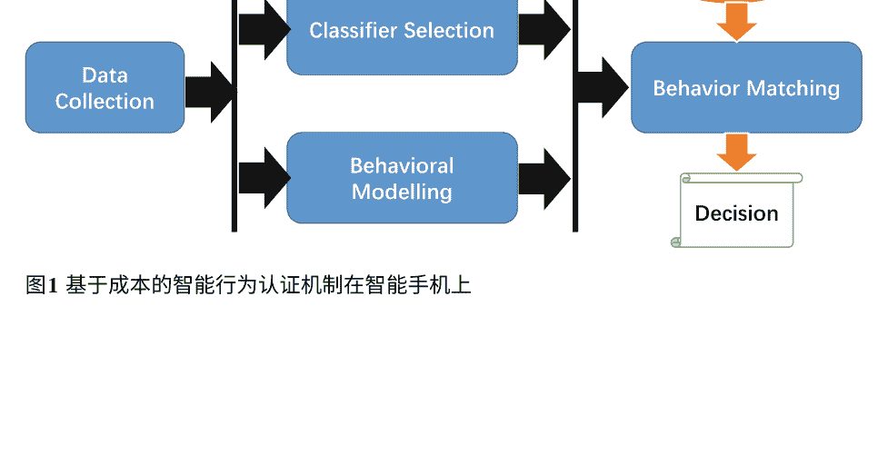

## **基于触摸动力学的4种认证方案**

直观上，智能机制可能会给智能手机带来额外的工作负担；因此，需要一种轻量级的认证方案。在本章中，我们采用了我们之前的工作[41]中的一个9特征触摸行为认证方案。每个特征的解释如下。

- 每个会话的触摸移动次数（表示为 NTM）
- 每个会话的单点触摸事件数（表示为 NST）
- 每个会话的多点触摸事件数（表示为 NMT）
- 每个会话的触摸移动的平均时间持续时间（表示为 ATTM）
- 每个会话的单点触摸的平均时间持续时间（表示为 ATST）
- 每个会话的多点触摸的平均时间持续时间（表示为 ATMT）
- 触摸移动的平均速度（表示为 ASTM）
- 平均触摸大小（表示为 ATS）
- 平均触摸压力（表示为 ATP）

这些特征是基于它们区分不同用户的能力进行选择的（即，先前的研究[32, 53]已经验证了这些特征在表征用户触摸行为方面的优势）。此外，像触摸移动数量和触摸移动的平均持续时间这样的特征相对于计算与速度相关的特征来说更容易计算。与此相反，计算触摸事件的速度通常需要更多的处理时间。因此，我们采用了一个更简单的与速度相关的特征，称为平均触摸移动速度（表示为 ASTM），它可能需要更少的计算资源，如下所示：

```
ASTM = \frac{\sum_{i=2}^{n} \frac{\sqrt{(X_i - X_{i-1})^2 + (Y_i - Y_{i-1})^2}}{S_i - S_{i-1}}}{n} \quad (n \in N), \quad (5)
```

其中 \((X_n, Y_n)\) 和 \((X_{n-1}, Y_{n-1})\) 被假设为触摸运动中的两个点，\(S_n\) 和 \(S_{n-1}\) 是相关的系统时间，\(n\) 是触摸运动中记录的点的数量。

之前的研究[41]表明，触摸运动的平均速度可以用来表征和区分不同的用户。在这种情况下，该方案可以通过认证签名（AutSig）来认证用户，其中包括共计9个特征。

```
AutSig = \{NTM, NST, NMT, ATTM, ATST, ATMT, ASTM, ATS, ATP\}.
```

为了做出决策，该方案必须将当前的认证签名与正常的认证签名进行比较。

## 5. 我们提出的方法和实现

在本节中，我们首先提出了一种基于云的方案，以帮助减少智能手机上的工作负载，然后展示了如何在实践中实现认证系统。

#### 5.1 基于云的方案

直观地说，以智能方式选择分类器可能会增加智能手机的工作负载。使用轻量级认证方案是一种解决方案，但这可能会降低我们智能机制的可扩展性。有必要进一步减少选择成本较低的分类器的工作负载。在本章中，我们采用基于云的方案来增强原始方案，将分类器选择和行为建模的过程转移到云环境中。

图2显示了我们基于云的方案的高级架构。

- 云。云计算可以被视为一个共享的可配置计算资源和高级服务的池，可以通过互联网快速提供，并且管理工作量最小。为了减少工作负载，我们的方案将分类器选择和行为建模都转移到云环境中。在实践中，如果用户可以使用私有云，或者对公共云应用一些隐私保护技术，会更安全。
- 各个阶段之间的交互。首先，在数据收集阶段，我们的方案可以将打包的行为数据上传到云中的建模。同样，对于分类器池中的每个分类器，应建立一个正常的行为模型。然后，分类器选择阶段考虑所有分类器，并选择达到最低成本值的最佳分类器。然后，选择的分类器应转发到手机端，并用于决定是否存在冒名顶替者。用户还可以实施一些安全策略来应对异常情况。

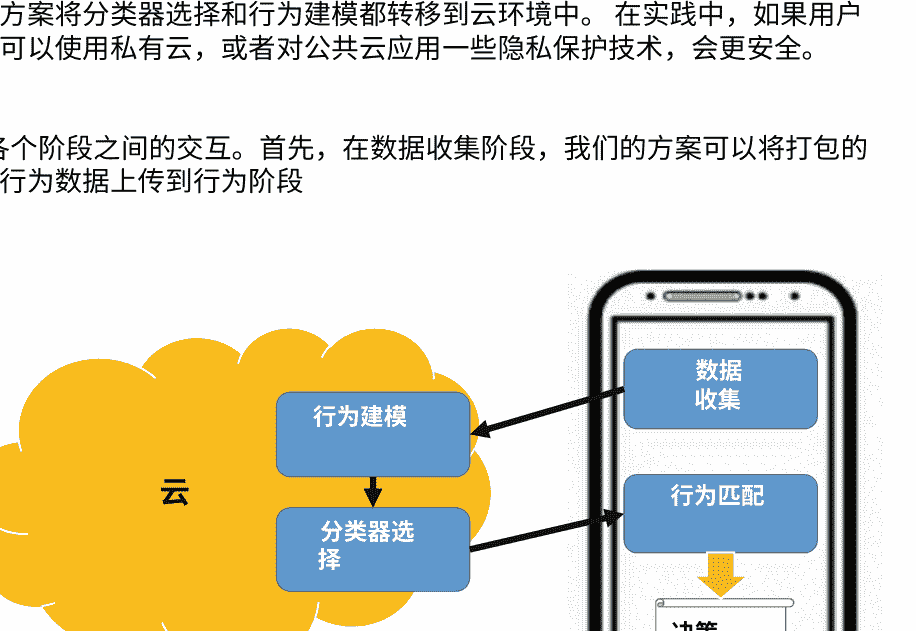

#### 5.2 数据收集

与之前的研究[33, 41]类似，我们使用了一部Google/HTC Nexus One Android手机进行数据收集。它配备了1 GHz的CPU和512M的存储内存，具有多点触控电容触摸屏（分辨率480×800 px）。特别是，我们使用自定义的修改版Android操作系统，基于CyanogenMod进行了更新。¹我们通过在应用程序框架层插入一些日志命令来记录来自触摸屏的原始输入数据，例如触摸输入的时间、坐标x和y、输入类型（例如按下、松开）和触摸压力。在实现过程中，我们特别向新编译的操作系统中插入了两个系统日志命令，如Slog.v和Slog.i，以输出捕获的行为数据。通过一个日志应用程序，我们可以获得两个具有不同日志标题（即“V/Action Input device”和“I/InputDevice”）的日志项，但它们实际上呈现相同的信息。我们只使用这两个日志命令来检查应用程序。对于数据分析，我们将它们视为相同。后来，我们使用一个单独的应用程序来提取和处理记录的数据。²

#### 5.3 会话识别

为了判断当前用户是否合法，我们需要从每个会话中提取一个身份验证签名，并将其与正常的签名进行比较。为此，需要识别一个会话来生成一个签名。通常，有两种识别会话的方法：基于时间的方法和基于事件的方法。前者通过固定时间段来识别会话，即使用10分钟的会话[32]。后者通过收集预先定义的事件数量来识别会话。在某些情况下，很难确保基于时间的方法能够在一个会话中收集足够的触摸手势，这可能导致不准确的结果。

- 如果触摸事件的数量达到或超过120，则会话结束。
- 当记录到新的触摸输入并且上一个会话已结束时，会开始一个新的会话。

根据上述规则，通过计算原始数据记录中触摸手势的数量，很容易识别会话开始和会话结束的事件。

## 6. 评估

在这部分中，我们展示了一个包含30个用户的用户研究，以评估我们方法的性能。接下来，我们介绍研究方法、评估指标和实验结果。

#### 6.1 研究方法

我们在实验中招募了30名安卓手机用户（13名女性和17名男性），其中大部分是学院的学生。其他参与者包括学院的工程师和研究人员。所有参与者都是常规的安卓手机用户，年龄在20到45岁之间。参与者的信息如表1所示。为了减少偏见并控制环境，我们为所有参与者提供了定制操作系统的安卓手机（Google/HTC Nexus One）。

详细的程序与我们之前的工作[33, 41]类似。首先，我们向所有参与者介绍了研究目标，并解释了可能收集的数据类型。我们强调不会收集任何私人信息，如应用使用情况，并征得每个参与者的批准。在用户研究中，我们要求所有参与者以与他们在自己的地方使用自己的手机相同的方式使用手机，例如浏览网站、访问文件和与任何应用程序交互。具体而言，参与者可以进行实际数据的操作。

**表1：参与者信息**

| 职业 | 男性 | 女性 |
| :--- | :--- | :--- |
| 学生 | 13 | 8 |
| 工程师 | 2 | 2 |
| 研究人员 | 2 | 3 |

在我们实验室之外进行数据收集，使他们在研究之前熟悉手机。他们还可以决定何时开始收集过程，以避免匆忙和收集异常数据。

所有参与者在使用手机时需要记录最多30个会话，持续4天。因此，我们收集了一个原始数据集，包括900个会话，每个会话有120个触摸事件。

#### 6.2 评估指标

在这个评估中，我们使用两个典型的指标来判断我们基于云的方案与原始行为认证方案的性能，以及智能机制。

- 误接受率（FAR）：表示冒名顶替者被错误分类为合法用户的概率。
- 误拒绝率（FRR）：表示合法用户被错误分类为冒名顶替者的概率。

在实际部署中，应该在误接受率（安全性）和误拒绝率（可用性）之间取得平衡。基于[32, 33, 41]，误拒绝比误接受的代价更低，因为高误接受率会明显降低用户认证的整体安全级别。相比之下，高误拒绝率会让合法用户感到沮丧，尽管这仍然不幸，但可以说比降低整体安全级别的问题要少得多。

理想的认证方案应该同时具有低的误接受率和低的误拒绝率。我们还在评估中使用了误接受率和误拒绝率的平均值。

#### 6.3 评估结果

在这个评估中，我们根据我们之前的工作[33, 41]使用了五个常见且流行的分类器。因此，分类器池包括决策树（J48），朴素贝叶斯（NBayes），径向基函数网络（RBFN），反向传播神经网络（BPNN）和支持向量机（SVM）。所有这些分类器都是从WEKA平台[64]中提取的，以避免任何实现偏差。

##### 分类器评估

与[41]类似，我们使用了20个会话（约占总会话的67%）作为训练数据，为每个分类器构建了一个正常行为模型，并使用剩余的会话来测试分类器的性能。关于FAR、FRR、平均错误率（AER）和标准差（SD）的结果见表2。

性能评估在十折模式下通过设置WEKA平台进行。观察发现，在所有分类器中，SVM能够达到最佳效果。

**表2：不同分类器的性能**

| 度量 | J48 | NBayes | RBFN | BPNN | SVM |
| :--- | :--- | :--- | :--- | :--- | :--- |
| 假阳率 (%) | 8.78 | 11.21 | 5.12 | 6.22 | 4.89 |
| 假阴率 (%) | 7.32 | 9.73 | 4.55 | 5.98 | 4.55 |
| AER | 8.05 | 10.47 | 4.84 | 6.10 | 4.72 |
| FAR的标准差 | 7.24 | 6.83 | 6.21 | 5.72 | 4.77 |
| FRR的标准差 | 8.22 | 6.53 | 5.19 | 6.05 | 4.53 |

性能为4.72%的AER（其中FAR为4.89%，FRR为4.55%）。RBFN的分类器可以达到非常接近的性能，AER为4.84%。J48、NBayes和BPNN的其余分类器只能达到5%以上的AER。结果与我们之前的工作[41]类似。这些结果表明，SVM在收集的数据中可以实现比其他分类器更高的准确性。

##### 智能机制评估

由于用户的触摸动作经常不稳定，对于分类器来说很难建立一个准确的个人资料。因此，智能机制被用来定期选择更好的分类器。为了测试机制的性能，我们采用了相同的分类器，包括J48、NBayes、RBFN、BPNN和SVM。基于之前工作的模拟结果[30, 41]，将C的成本比设置为10。在不同的网络设置中，成本比的值可以由安全管理员进行调整。

我们首先使用15个会话进行训练，并每轮添加5个会话（其中前面的会话用于训练）。表3描述了5个参与者的具有成本值（相对预期成本）的分类器选择。发现每轮中最好的分类器通常不相同。以User22为例，首先选择了RBFN，然后选择了SVM、BPNN和J48。这些结果验证了分类器性能根据不同的数据项而波动。我们的结果与之前的研究观察结果一致[30, 41]。

**表3：五个参与者的分类器选择结果及成本值**

| 用户ID | 15个会话 | 20个会话 | 25个会话 | 30个会话 |
| :--- | :--- | :--- | :--- | :--- |
| 用户2 | SVM (1.123) | BPNN (1.2022) | SVM (1.2223) | SVM (1.1132) |
| 用户5 | SVM (1.2211) | J48 (1.2332) | J48 (1.1774) | RBFN (1.1922) |
| 用户16 | RBFN (1.3132) | BPNN (1.2132) | BPNN (1.2523) | BPNN (1.2532) |
| 用户22 | RBFN (1.2665) | SVM (1.2774) | BPNN (1.2214) | J48 (1.2343) |
| 用户28 | SVM (1.3442) | BPNN (1.3112) | J48 (1.2455) | SVM (1.2221) |

##### 额外引起的工作量

如前文所述[33, 41]，这种智能机制可以在相对较高和稳定的水平上保持认证性能，但代价是额外工作量。为了调查这个问题，我们使用了一个名为CPU-Z³的工具来记录机制的工作量。这是一个可以记录移动设备的许多信息的免费应用程序，例如CPU负载、CPU架构、核心、时钟速度等。图3显示了执行配置文件建立、配置文件匹配和分类器选择的平均增加的CPU工作量。

分类器池中有五个分类器，发现分类器选择的平均增加的CPU工作量约为12%，行为建模约为21%，行为匹配约为6%。相比之下，我们的云计划可以大大减少所需的工作量。

- 我们的方案不会给分类器选择带来任何工作负担，因为这个过程被转移到了云端。
- 我们的方案可以将行为建模的工作负担减少到仅为5%，这是由上传行为数据引起的。
- 我们的方案需要更多的工作负担来进行行为匹配，与原始方案相比增加了2%，这是由于从云环境中检索分类器信息引起的。

虽然我们的方案增加了一些行为匹配的工作负担，但它可以大大减少其他两个过程引起的工作负担（减少了26%）。基于根据收集的数据，我们认为在智能手机上实施基于云的方案是值得的。此外，由于大多数智能手机厂商提供云服务，例如苹果的iCloud，我们的方案在实践中易于部署。 值得强调的是，我们的自适应用户认证方案并不打算取代现有的认证方法，如PIN码，而是试图与移动电话上的现有认证机制相辅相成，以实现更好的用户认证。例如，与基于PIN码的认证配合使用，我们的触摸行为用户认证方案的误报率在实际应用中可以进一步降低（例如，FAR小于2%，FRR接近零[71]）。

## 7. 讨论

我们的工作提出了一种基于云的方案，进一步减少了智能手机上先前开发的基于成本的智能机制所带来的工作负荷。未来的研究仍面临许多挑战。

#### 分类器池

在这项工作中，我们重点关注了五种常见分类器的性能，并进行了相应的评估。在文献中，有很多可用的算法，如随机森林和深度学习算法。未来的工作之一是考虑在评估中使用更大的一组分类器，例如各种集成方法，如PSO-RBFN、深度学习分类器和强化学习。然而，需要平衡工作负荷和分类器的数量。一般来说，分类器池越大，可能引起的工作负荷越高。

#### 工作负荷减轻

可以使用一些策略来帮助减轻工作负荷。例如，当手机不经常使用时（即在夜间更新或手机充电时），机制可以训练分类器并选择一个分类器。为了满足不同的需求，最好让用户设置更新的时间和频率。

在这项工作中，我们测试了部署机制的工作负载，而更大规模的实验可以进行以验证这个问题。

#### 手机差异和潜在影响

与[41]类似，这项工作也采用了Google/HTC Nexus One Android手机作为评估平台。值得注意的是，我们的方案仍然适用于其他手机，只要它们的传感器能够捕捉所需的触摸特征。 一般来说，现代手机比我们现有的平台具有更强的功能，即当前智能手机具有更大的屏幕和更多的传感器。这表明可以收集更准确的触摸数据项并用于构建行为配置文件。评估我们方案在其他手机类型上的性能是我们未来的工作之一。

#### 参与用户

参与者数量是决定用户研究是否令人信服的重要指标，但在实践中邀请足够的参与者非常困难。 具有不同背景的参与者可能导致不同的数据集，使得跨不同研究比较方案变得困难。 为了解决这个问题，进行更大规模的用户研究并拥有更多的用户始终是可取的。 此外，需要一个统一的平台来检查不同的身份验证方案。

## 8. 结论

在文献中，研究已经转向触摸动力学，并开始研究如何设计一种有效的触摸行为用户认证机制。 大多数方案通常采用机器学习技术来帮助构建行为模型，并对当前用户是否合法进行决策。 然而，许多研究表明，分类器的性能可能会随特定数据集的不同而变化。

为了缓解这个问题，我们之前设计了一种基于成本的智能机制，可以智能地选择一种成本较低的算法进行用户认证。 在实践中，我们发现这种机制会导致额外的工作量。 在本章中，我们提倡智能触摸行为认证的有效性，并提出了一种基于云环境的方案，进一步减少工作量，将分类器选择和行为建模都卸载到云环境中。 我们对30个安卓手机用户进行的实验结果表明，与原始方案相比，我们的方案可以大大减少所需的工作量。

未来有许多潜在的方向。 未来的工作可以包括将行为认证与其他认证解决方案（如PIN码）相结合，并进行更大规模的研究以验证所获得的结果。 未来的工作还可以包括研究如何应用隐私保护技术来保护将行为数据转移到云环境中的数据隐私[25-28]。

致谢作者要感谢所有参与用户研究的人员的工作。

### 参考文献

1.  A.J. Aviv, K. Gibson, E. Mossop, M. Blaze, J.M. Smith, Smudge attacks on smartphone touch screens, in Proceedings of the 4th USENIX Conference on Offensive Technologies (WOOT) (USENIX Association, Berkeley, 2010), pp. 1–10
2.  F. Bergadano, D. Gunetti, C. Picardi, User authentication through keystroke dynamics. ACM Trans. Inf. Syst. Secur. 5(4), 367–397 (2002)
3.  N.D.W. Cahyani, B. Martini, K.K.R. Choo, A.M.N. Al-Azhar. 云物联网设备的取证数据获取：以Windows智能手机为案例研究。 并发计算：实践和经验 29(14), e3855 (2017)
4.  N.L. Clarke, S.M. Furnell, 电话-态度和实践调查。计算机安全。24(7), 519–527 (2005)
5.  N.L. Clarke, S.M. Furnell, 使用击键分析认证移动电话用户。国际信息安全期刊。 6(1), 1–14 (2007)
6.  L. Chang, 美国智能手机使用量飙升，其他设备的受欢迎程度下降（2015年）。可在以下网址找到：https://www.digitaltrends.com/mobile/us-smartphone-usage-soars/
7.  J. Dai, J. Zhou, 基于多特征的高分辨率掌纹识别。IEEE Trans. Pattern Anal. Mach. Intell. 33(5), 945–957 (2011)
8.  德勤，全球移动消费者调查（2017）。 https://www2.deloitte.com/content/dam/Deloitte/be/Documents/technology-media-telecommunications/global-mobile-consumer-survey-2017_belgian-edition.pdf
9.  P. Dunphy, A.P. Heiner, N. Asokan, 关于移动设备上基于识别的图形密码的深入研究，在第6届可用性隐私与安全研讨会 (SOUPS)(ACM, 纽约, 2010), pp. 1–12
10. T. Feng, Z. Liu, K.-A. Kwon, W. Shi, B. Carbunary, Y. Jiang, N. Nguyen, 利用触摸屏手势进行连续移动认证，在2012年IEEE国土安全技术会议论文集 (HST)(IEEE, Piscataway, 2012), pp. 451–456
11. D. Fiorella, A. Sanna, F. Lamberti, 用于移动设备上的3D物体操作的多点触控用户界面评估。J. Multimodal User Interfaces 4(1), 3–10 (2010)
12. D. Florencio, C. Herley, 网络密码习惯的大规模研究，在第16届世界万维网国际会议 (WWW)(ACM, 纽约, 2007), pp. 657–666
13. M. Frank, R. Biedert, E. Ma, I. Martinovic, D. Song, Touchalytics: 关于触摸屏输入作为连续认证的行为生物特征的适用性。IEEE Trans. Inf. Forensics Secur. 8(1), 136–148 (2013)
14. J.E. Gaffney, J.W. Ulvila, 评估入侵检测器：一种决策理论方法，在2001年IEEE安全与隐私研讨会论文集中(2001), 第50-61页
15. M. Goel, J.O. Wobbrock, S.N. Patel, GripSense: 利用内置传感器检测手势和压力的普通移动电话，在第25届ACM用户界面软件和技术研讨会论文集中(ACM, 纽约, 2012), 第545-554页
16. N.Z. Gong, R. Moazzemi, M. Payer , M. Frank, 防伪触摸式移动设备认证，在第11届ACM亚洲计算机与通信安全会议论文集中(2016), 第499-510页
17. G. Gu, P. Fogla, W. Lee, B. Skoric, 测量入侵检测能力：一种信息论方法，在2006年ACM信息、计算机和通信安全研讨会论文集中(ACM, 纽约, 2006), 第90-101页
18. N. Gunson , D. Marshall, F. McInnes, M. Jack, 语音识别在自动电话银行中的可用性评估：句子与数字。交互计算机 23(1), 57-69(2011)
19. IDC. 2018年下半年及以后的积极预期。 https://www.idc.com/getdoc.jsp?containerId=prUS44240118.
20. A.K. Karlson, A.B. Brush, S. Schechter, 我能借你的手机吗？：了解分享手机时的担忧在第27届人机交互国际会议(CHI)(ACM, 纽约, 2009), pp. 1647–1650
21. M. Keith, B. Shao, P . Steinbart, 口令短语的可用性认证：一项实证领域研究。Int. J. Hum. Comput. Stud. 6 5(1), 17–28 (2007)
22. D. Kim, P. Dunphy, P. Briggs, J. Hook, J.W. Nicholson, J. Nicholson, P. Olivier, 多点触控在桌面上的认证，在第28届人机交互国际会议(CHI)(ACM, 纽约, 2010), pp. 1093–1102
23. L. Kotthoff, I.P. Gent, I. Miguel, 机器学习在算法选择中的评估搜索问题。AI Commu n. 25(3), 257–270 (2012)
24. R. Lemos, 密码：最薄弱的环节？ 黑客可以在不到一分钟内破解大多数密码 (2002) http://news.com./2009-1001-916719.

25. J. Li, J. Li, X. Chen, C. Jia, W. Lou, 基于身份的加密与云计算中的外包吊销. IEEE Trans. Commun. 64(2), 425–437 (2015)

26. J. Li, Z. Liu, X. Chen, F. Xhafa, X. Tan, D.S. Wong, L-EncDB：云计算中隐私保护数据查询的轻量级框架. Knowl.-Based Syst. 79, 18–26 (2015)

27. J. Li, H. Yan, Z. Liu, X. Chen, X. Huang, D.S. Wong, 在移动在线社交网络中增强隐私的位置共享系统. IEEE Syst. J. 11(2), 439–448 (2017)

28. J. Li, Y. Zhang, X. Chen, Y. Xiang, 云计算中面向资源有限用户的安全属性数据共享. Comput. Secur. 72, 1–12 (2018)

29. D. Maio, D. Maltoni, J.L. Wayman, A.K. Jain, Fvc2000: 指纹验证竞赛. IEEE Trans. Pattern Anal. Mach. Intell. 24(3), 402–412 (2002)

30. Y. Meng, 使用基于ROC曲线的方法测量智能误报降低，在2012年IEEE国际会议计算智能测量系统和应用（CIMSA）(2012), pp. 108–113

31. Y. Meng, L.F. Kwok, 自适应误报过滤器使用机器学习在入侵检测中，在第6届国际智能系统和知识工程会议（ISKE），智能和软计算的进展（Springer, Berlin, 2011），pp. 573–584

32. Y. Meng, D.S. Wong, R. Schlegel, L.F. Kwok, 基于触摸屏手机的触摸手势生物特征认证方案，在第8届中国国际信息安全与密码学会议（INSCRYPT）。计算机科学讲义（Springer, Heidelberg, 2012），pp. 331–350

33. Y. Meng, D.S. Wong, L.-F. Kwok, 设计基于触摸动态的自适应机制的移动电话用户认证，在应用计算机学术会议(2014)，第1680-1687页

34. W. Meng, D.S. Wong, S. Furnell, J. Zhou, 调查移动电话上生物特征用户认证的发展。IEEE通信调查教程 17(3), 1268-1293页(2015)

35. W. Meng, 评估多点触控行为对Android解锁模式的影响。国际信息与计算安全杂志 24(3), 277-287页(2016)

36. W. Meng, W. Li, D.S. Wong, J. Zhou, TMGuard: 一种基于触摸运动的智能手机屏幕解锁模式的安全机制，在应用密码学和网络安全国际会议(2016)，第629-647页

37. W. Meng, W. Li, L. Jiang, L. Meng, 关于触摸屏模式和文本密码的多重密码干扰问题，在人机交互计算机学术会议(2016)，第4818-4822页

38. W. Meng, W.H. Lee, S.R. Murali, S.P.T. Krishnan, JuiceCaster: 面向智能手机上的自动果汁拍摄攻击. J. Netw. Comput. Appl. 68, 201–212 (2016)

39. W. Meng, W. Li, L.-F. Kwok, K.-K.R. Choo, 通过多点触控行为增强基于点击绘图的图形密码. Comput. Secur. 65, 213–229 (2017)

40. W. Meng, L. Jiang, Y. Wang, J. Li, J. Zhang, Y. Xiang, JFCGuard: 通过处理器使用分析检测果汁拍摄充电攻击. Comput. Secur. 76, 252–264 (2018)

41. W. Meng, W. Li, D.S. Wong, 通过基于成本的智能机制增强触摸行为认证. Multimed. Tools Appl. 77(23), 30167–30185 (2018)

42. W. Meng, Z. Liu, TMGMap: 设计基于触摸移动的地理密码认证. The 14th International Conference on Information Security Practice and Experience (ISPEC 2018)(2018), pp. 373–390

43. 千禧媒体。移动混合：移动设备指数（2012年）。可在：http://www.millennialmedia.com/research

44. 移动和NCSA。消费者行为和移动安全感知报告（2012年）。可在：http://docs.nq.com/NQ_Mobile_Security_Survey_Jan2012.pdf

45. T.V. Nguyen, N. Sae-Bae, N. Memon, DRAW-A-PIN: 使用手指绘制的PIN码进行身份验证在触摸设备上。计算机安全。 66, 115-128（2017年）

46. Y. Numabe, H. Nonaka, T. Yoshikawa, 指纹识别用于触摸面板操作使用轻击波动, 在IEEE第13届国际消费电子学电子学 (2009年), pp. 899-902

47. S. Pokharel, K.K.R. Choo, J. Liu, 移动云安全：轻量级的对手模型浏览器安全。计算机标准接口 49, 71-78 (2017年)

48. R. Potharaju, A. Newell, C. Nita-Rotaru, X. Zhang, 抄袭智能手机应用程序：攻击策略和防御技术, 在2012年国际安全软件和系统工程研讨会 (ESSoS) 的论文集中。计算机科学讲义 (Springer, Heidelberg, 2012年), 第106-120页

49. M. Pusara, C.E. Brodley, 通过鼠标移动进行用户重新认证, 在2004年ACM可视化和数据挖掘计算机安全研讨会 (VizSEC/DMSEC) 的论文集中 (ACM, 纽约, 美国, 2004年), 第1-8页

50. D. Quick, K.K.R. Choo, 普遍的社交网络取证：来自移动设备提取的情报和证据。J. Netw. Comput. Appl. 86, 24-33页 (2017年)

51. J. Ranjan, K. Whitehouse, 使用智能手表自动验证智能手机触摸交互, 在2016年ACM国际联合会议论文集上, 普适计算(2016), 第361-364页

52. N. Sae-Bae, N. Memon, K. Isbister, K. Ahmed, 基于多点触控手势的身份验证。IEEE信息取证与安全交易。 9(4), 568-582页(2014)

53. H. Saevanee, P. Bhattacharosol, 使用击键动态和手指压力进行用户认证, 在第6届IEEE消费者通信和网络会议(CCNC)论文集上(IEEE, Piscataway, 2009), 第1078-1079页

54. F. Schaub, R. Deyhle, M. Weber, 不同智能手机平台上的密码输入易用性和肩部冲浪易受攻击性, 在第11届移动和普适多媒体国际会议(MUM)论文集上(ACM, New York, 2012), 第1-10页

55. N.A. Schmid, M.V. Ketkar, H. Singh, B. Cukic, 基于虹膜的识别系统在匹配分数水平上的性能分析。IEEE信息取证与安全交易。 1(2), 154-168页(2006)

56. A. Shabtai, Y. Fledel, U. Kanonov, Y. Elovici, S. Dolev, C. Glezer, Google Android：一项全面的安全评估。IEEE Secur. Priv. 8(2), 35–44 (2010)

57. M. Shahzad, A.X. Liu, A. Samuel, 基于行为的触摸屏幕设备上的人体认证, 使用手势和签名。IEEE Trans. Mob. Comput. 16(10), 2726–2741 (2017)

58. V. Sharma, R. Enbody, 用户认证和身份识别, 基于触摸设备上的用户界面交互, 在第10届ACM安全与隐私会议无线和移动网络 (WiSec) (2017), pp. 1–11

59. M. Smith-Creasey, M. Rajarajan, 一种用于移动设备的连续用户认证方案, 在第14届隐私、安全和信任年会 (PST) (2016), pp. 104–113

60. R. Sommer, V. Paxson, 在封闭世界之外：使用机器学习进行网络入侵检测, 在2010年IEEE安全与隐私研讨会论文集(2010), 第305-316页

61. Y. Song, Z. Cai, Z.-L. Zhang, 使用手部几何和行为信息的多点触控认证, 在IEEE安全与隐私研讨会论文集(2017), 第357-372页

62. F. Tari, A.A. Ozok, S.H. Holden, 字母数字和图形密码之间肩部冲浪风险的感知和实际比较, 在第二届可用隐私和安全研讨会论文集(SOUPS)(ACM, 纽约, 2006), 第56-66页

63. M. Temper, S. Tjoa, M. Kaiser, 触摸认证: 移动设备上的连续生物特征认证, 在2015年软件安全和保障国际会议论文集(ICSSA)(2015), 第30-35页

64. 怀卡托大学。WEKA-怀卡托环境用于知识分析。可在以下网址找到：http://www.cs.waikato.ac.nz/ml/weka/

65. P.S. 张宁，A.B.J. Teoh，陈凯，识别您的触摸：通过触摸动力学集成加强移动设备认证，收录于第13届国际移动计算与多媒体进展会议论文集(MoMM) (2015)，pp. 108–116

66. S. Trewin, C. Swart, L. Koved, J. Martino, K. Singh, S. Ben-David, 移动设备上的生物特征认证：用户努力、错误和任务中断的研究，收录于第28届年度计算机安全应用会议论文集(ACSAC) (2012)，pp. 159–168

67. D. Van Thanh, 移动电子商务的安全问题，收录于第11届国际数据库和专家系统应用研讨会论文集(DEXA) (IEEE, Piscataway, 2000), pp. 412–425

68. R. Wallace, M. McLaren, C. McCool, S. Marcel, 使用高斯混合模型从说话人到面部认证的归一化技术的交叉污染。IEEE Trans. Inf. Forensics Secur. 7(2), 553–562 (2012)

69. D. Wang, H. Cheng, P. Wang, X. Huang, G. Jian, 密码中的Zipf定律。IEEE Trans. Inf. Forensics Secur. 12(11), 277–2791 (2017)

70. J. Yan, A. Blackwell, R. Anderson, A. Grant, 密码的记忆性和安全性：实证结果。IEEE Secur. Priv. 2(5), 25–31 (2004)

71. S. Zahid, M. Shahzad, S.A. Khayam, M. Farooq, 基于击键的智能手机用户识别，在Proceedings of Recent Advances in Intrusion Detection中。计算机科学讲义（Springer，柏林，2009年），第224–243页

72. X. 赵，T. 冯，W. 施，I.A. Kakadiaris，使用统计触摸动态图像进行移动用户身份验证。IEEE Trans. Inf. Forensics Secur. 9(11), 1780-1789 (2014)

73. N. 郑，K. 白，H. 黄，H. 王，你是如何触摸的：通过点击行为在智能手机上进行用户验证，在Proceedings of the 2014 International Conference on Network Protocols (ICNP) (2014), pp. 221-232

## 基于星座的深度耳朵识别

Dejan Stepec，Žiga Emeršič，Peter Peer 和 Vitomir Struc

### 1 引言

本章介绍了COM-Ear，一种用于耳朵识别的深度星座模型。与竞争解决方案不同，COM-Ear对耳朵图像的全局和局部特征进行编码，并生成描述性的耳朵表示，确保具有竞争力的识别性能。该模型设计为双通道卷积神经网络（CNN），其中一个通道以整体方式处理输入，第二个通道从输入图像中采样的图像补丁中捕获局部图像特征。还提出了一种新颖的池化操作，称为补丁相关信息池化，并将其集成到COM-Ear模型中。池化操作有助于从输入补丁中选择特征，对于表示目的来说，局部重要并且将网络的注意力集中在图像区域上是具有描述性和重要性的。

> 作者‘Dejan Stepec’和‘Žiga Emeršič’对本文贡献相同。

D. Stepec
XLAB d.o.o.，卢布尔雅那，斯洛文尼亚
电子邮件：dejan.stepec@xlab.si

Ž. Emeršič (✉) · P. Peer
计算机视觉实验室，计算机与信息科学学院，卢布尔雅那大学
卢布尔雅那，斯洛文尼亚
电子邮件：ziga.emersic@fri.uni-lj.si; peter.peer@fri.uni-lj.si

V. Struc
人工感知、系统和控制实验室，电气工程学院，卢布尔雅那大学
卢布尔雅那，斯洛文尼亚
电子邮件：vitomir.struc@fe.uni-lj.si


该模型通过使用交叉熵和中心损失进行端到端训练。对最近引入的扩展注释网络耳朵（AWEx）数据集进行了大量实验，证明了COM-Ear与现有耳朵识别模型的竞争力。

耳朵识别是指使用计算机视觉技术从耳朵图像中识别人物的任务。在自动识别系统中，耳朵具有吸引人的特点，例如能够区分同卵双胞胎[49]，补充其他生物特征模态（例如面部）[66, 73]，或者在没有明确合作的情况下从远处捕捉图像。

基于耳朵图像的人物识别近年来越来越受欢迎。然而，尽管在这个领域取得了显著进展并且转向基于深度学习的模型，但耳朵遮挡和耳饰品的存在仍然对现有识别模型的性能产生不利影响。此外，尽管耳朵识别的研究长期以来一直集中在受控成像条件下的识别问题上，但最近转向无约束图像采集条件带来了由模糊、光照和视角变化引起的极端外观变异的新挑战，这些挑战迄今为止在文献中尚未得到妥善解决。这些极端条件对现有的耳朵识别模型提出了相当大的挑战，并且迄今为止在文献中尚未得到妥善解决。

现有的方法主要集中在对无约束成像条件下的挑战进行微调现有的深度学习模型。例如，在最近的一个以无约束耳部识别问题为主题的竞赛中，大多数参与者使用了已建立的模型，如在ImageNet数据上预训练的VGG-16或Inception-ResNets作为基线，然后在竞赛的训练数据上进行微调。在这个领域的其他最新的深度学习解决方案[5, 23, 34, 54, 79]也采用了类似的方法，使用了预先存在的模型或者采用了迁移学习和领域自适应技术来适应耳部识别的模型。这些工作的一个共同特点是，模型并不是专门为耳部识别设计的，而是整体地处理耳部图像，忽略了耳部识别技术的特殊性和现有问题。

在本章中，我们进一步提出了一种新颖的（深度）耳部识别星座模型（COM-Ear），它解决了竞争耳部识别方法中出现的一些问题。正如我们在实验部分中所展示的，该模型确保了无约束耳部识别的最先进的识别性能，并且相对于该领域中的其他技术，对于部分耳部遮挡（通常由耳饰物引起）的鲁棒性显著提高。所提出的COM-Ear模型基于一个连体结构，它以耳部图像和局部图像块（从一个固定的网格中采样）作为输入，并生成一个图像表示，该表示在输出中编码了全局和局部的耳部特征。为了生成输出的图像表示，首先，通过一个新提出的池化操作（称为patch-relevant-information pooling或PRI-pooling）将来自不同补丁的特征组合起来，然后与全局图像特征进行拼接。我们的星座模型不限于特定的模型拓扑结构，可以围绕任何最新的深度学习模型构建。因此，我们评估和分析了不同的主干模型（即ResNet18、ResNet50和ResNet152）用于COM-Ear的实现。我们使用交叉熵和中心损失的组合作为学习目标，对提出的星座模型进行端到端的训练。据我们所知，这是在耳识别领域设计和训练星座深度模型的首次尝试。

我们在具有挑战性的扩展注释网络耳朵（AWEx）数据集[25, 26]上进行了严格的实验评估。为了展示COM-Ear模型对耳饰和遮挡的鲁棒性，我们使用一个人工生成的图像数据集[27]进行了额外的实验，其中添加了耳饰。我们实验的结果表明，提出的COM-Ear模型是耳识别问题的可行解决方案，确保了最先进的性能，并展示了对影响竞争方法识别准确性的各种因素具有相当程度的鲁棒性。

总结一下，本章的主要贡献如下：

- 我们提出并描述了COM-Ear，这是第一个用于耳朵识别问题的深度星座模型，能够在最具挑战性的耳朵图像数据集上实现最先进的性能。
- 我们引入了一种新颖的池化操作，称为相关信息池化（PRI-pooling），它能够从局部重要的图像块中选择特征，并将其整合到COM-Ear模型中。
- 我们通过http://ears.fri.uni-lj.si公开提供所有代码、模型和训练权重，并为未来在无约束耳朵识别领域的研究提供了强有力的基准。

本文的其余部分结构如下。在第2节中，我们介绍背景和相关工作。在这里，我们讨论了有约束条件下的耳朵识别技术，以及专注于野外耳朵识别的方法。在第3节中，我们详细描述了提出的星座模型，并阐述了模型背后的思想、架构和训练过程。在第4节中，我们对COM-Ear进行了严格的实验评估，并讨论了结果。我们还进行了定性分析，以突出我们模型的特点。在第5节中，我们总结本章，并提出了未来工作的方向。

### 2 相关工作

关于自动耳朵识别的文献非常丰富，从早期基于几何的识别技术到最近的深度学习模型。最近，这个领域也出现了从受限耳朵数据集转向其他数据集的趋势。

#### 2.1 受限条件下的耳朵识别

直到最近，耳朵识别的大部分研究都集中在受控成像条件下，耳朵图像的外观变化被精心控制，并且通常限制在小的头部旋转和微小的外部光照条件变化[26]。在这个时期提出的耳朵识别技术（从2D彩色/强度图像）可以方便地分为以下几类：[26, 56]：（1）几何方法，（2）全局（整体）方法，（3）局部（基于描述符）方法和（4）混合方法。

在耳朵识别的早期阶段，几何方法占主导地位[2, 26]，并且通常需要手动干预。这个组别的技术依赖于耳朵的某些几何特性，并利用预定义部分之间的关系。Moreno等人[46]首次提出了一种完全自动化的耳朵识别过程，利用了耳朵的几何描述和压缩网络。其他几何耳朵识别的例子包括[11, 15, 16, 47, 60]。使用几何方法的较新的出版物之一是Chowdhury等人的工作[18]。在这里，作者提出了一个完整的识别流程，包括基于AdaBoost的耳朵检测技术。使用Canny边缘检测器从图像中提取边缘特征，并使用相似度测量进行耳朵比较。

耳朵识别的第二组方法是全局（也称为整体）技术，利用耳朵的整体外观，并以整体方式编码耳朵结构。尽管这个组别的技术似乎是解决耳朵识别和改进几何方法的一种明显方式，但它们对光照、姿态或遮挡的变化相对敏感。全局方法的一些早期例子包括Hurley等人的工作[37]，该工作依赖于力场变换来编码耳朵图像，使用主成分分析的方法[14, 68]，以及其他方法[1, 3, 8, 48, 72, 75, 77]。

这些技术的一个共同特点是独立地描述兴趣点，这使得设计对耳部局部遮挡具有鲁棒性的匹配技术成为可能。第二组技术的示例包括[6, 9, 13, 17, 39, 42, 70]。这些技术除了捕捉耳部的局部特征外，还捕捉了耳部的全局特性，这通常会导致更高的识别性能，但密集描述符计算过程会以牺牲对局部遮挡的鲁棒性为代价。

然而，耳朵识别中的趋势更倾向于基于密集描述符的技术，主要是因为它们的计算简单性和高识别性能。

耳朵识别方法的最后一组，混合方法，通常使用全局和局部信息来描述输入图像。这个组的技术首先使用一些局部（手工制作的）图像描述符（例如SIFT、BSIF或HOG）来表示耳朵图像，这些描述符捕捉了局部图像特性，然后使用全局（整体）子空间投影技术（如主成分分析（PCA）、线性判别分析（LDA）或其他相关技术）对提取的描述符进行编码[56]。混合方法和（强大的）基于局部描述符的方法代表了耳朵识别的最新技术，并且最近才被基于深度学习的模型[25, 29]超越。本章介绍的模型基于这些技术，并且与混合方法类似，也试图捕捉全局耳朵特征和局部耳朵细节。从这个意义上讲，它与文献中的混合技术相关，但通过第4节中呈现的结果可以看出，它提供了显著的性能改进。

除了上述的耳朵识别方法外，还有一些研究专注于解决耳朵识别中的特定问题，如遮挡或对齐[55, 61, 62, 69, 76, 78, 80]。此外，与耳朵识别相关的现有研究还研究了将耳朵图像纳入识别过程的多模态生物特征系统[4, 31, 53]，不同的数据采集技术，如光场相机[63]或不依赖于视觉信息的其他耳朵识别方式[45]。

#### 2.2 非受限条件下的耳朵识别

最近关于耳朵识别的研究越来越多地关注非受限图像采集条件，在这些条件下，耳朵图像的外观变异性比受限设置中看到的要大得多。针对这种非受限场景，已经提出了几个用于耳朵识别研究的数据集，包括注释的网络耳朵（AWE）[26]、非受限耳朵识别挑战（UERC）数据集[25]等。在这些数据集上的研究主要由基于卷积神经网络（CNNs）的深度学习模型主导，而使用本地的手工描述符的技术则很少见。

在过去的2年中，已经提出了许多深度学习模型用于耳朵识别[23,25,30,34,54,65,67,79]，在最具挑战性的场景中，所有这些模型都明显优于基于局部描述符和混合方法[24,25,28,67]。早期使用深度神经网络进行耳朵识别的方法之一是使用大量的数据增强来满足训练需求[24]。

Galdámez等人提出了深度学习的早期应用的另一个例子[32]。在这里，作者使用了基于Haar的检测过程，但使用了CNN进行识别。Tian和Mu提出了另一种使用深度神经网络来促进耳朵识别的方法[67]。然而，作者们专注于在受限环境中捕获的数据集，并没有评估他们的模型在更近期在非受限条件下捕获的数据集上的性能。Eyiokur等人的工作[30]引入了一个新的（受限）耳朵图像数据集，用于训练AlexNet、VGG和LeNet进行耳朵识别。

这些模型后来在UERC数据上进行了微调，并在无约束条件下进行了测试。使用AlexNet进行耳朵识别的另一项工作包括[5]。Dodge等人[23]开发了一个深度神经网络用于耳朵识别，并在无约束的AWE和CVLE数据集上测试了他们的模型。Ying等人的工作[74]提出了一个浅层CNN架构，但用于测试的耳朵数据集没有被描述。Zhang等人的工作[79]介绍了一个用手机拍摄的耳朵视频序列的新数据集。为了识别，作者使用了完全卷积的SPPNet（空间金字塔池化网络），能够接受可变大小的输入图像。

在本章中，我们在概述的工作基础上引入了一种新颖的深度学习模型，用于在无约束条件下进行耳朵识别。与现有的工作类似，我们的模型依赖于CNN来学习耳朵图像的描述性表示，但与竞争解决方案不同，它不仅捕捉全局信息，还捕捉可能对识别目的重要的局部图像线索。此外，由于模型的设计，根据输入图像的内容，自适应地添加到计算的耳朵表示中的局部信息的数量。

### 3 COM-Ear：一种用于耳朵识别的深度星座模型

在本节中，我们介绍了我们（深度）耳朵星座模型（COM-Ear）的总体结构和思想。据我们所知，COM-Ear是第一个基于部分的深度学习模型用于耳朵识别。与以整体方式处理图像的竞争深度学习模型相比，COM-Ear还考虑了局部图像信息，并将其与整体特征相结合，这在实验部分中显示出提高了对遮挡的鲁棒性，并在已建立的基准测试中取得了最先进的结果。

#### 3.1 动机

深度学习模型，特别是卷积神经网络（CNN），最近在生物特征识别的所有领域取得了很好的结果，包括耳朵识别[24]。然而，处理整个输入图像的全局方法通常对光照变化、遮挡、姿态变化和其他通常存在于无约束真实环境中的因素敏感。另一方面，从局部图像区域提取判别信息的局部方法通常对遮挡和相关干扰因素更具鲁棒性，并且是全局方法的可行替代方案。

CNN是按设计全局性的，但是由于其分层设计和特性，例如具有局部连接的卷积核、高维度和非线性，也能够非常好地编码局部区分信息。然而，由于CNN中的操作特性，这些局部信息被聚合和传播到模型的各个层，并且保留的局部信息量仅限于输入中最具区分性的部分。在无约束的环境中，输入的不同部分可能被遮挡，光照不同，尤其是在耳朵识别的情况下，耳朵的不同部分可能有不同的配饰，这极大地影响了这些方法的性能。通过COM-Ear，我们试图解决这些问题，并提出了一个具有以下特点的深度模型：

- 全局和局部信息的聚合：我们设计我们的模型遵循混合技术的方法，在深度学习时代之前很流行，并利用全局和局部信息。与传统的混合方法相比，我们以完全卷积的方式设计COM-Ear，使得单个CNN模型可以捕捉到全局和局部信息，从而得到一个高度描述性和区分性的图像表示，可用于身份推断。
- 对图像部分的选择性注意力：局部特征以一种新颖的方式组合，使模型能够将注意力集中在局部重要的区域。所提出的模型还提供了一种直观的方法来探索每个图像部分的重要性，从而提高了模型的可解释性。
- 对遮挡的鲁棒性：我们的方法专门解决了耳部识别中已知的问题。具体而言，它提供了一种自然的方式来减少耳部局部遮挡的敏感性，这通常是由耳饰物的存在引起的。

#### 3.2 COM-Ear概述

COM-Ear模型的架构如图1所示。该模型被设计为双路径架构，在图1中标记为第一路径（标记为1）。

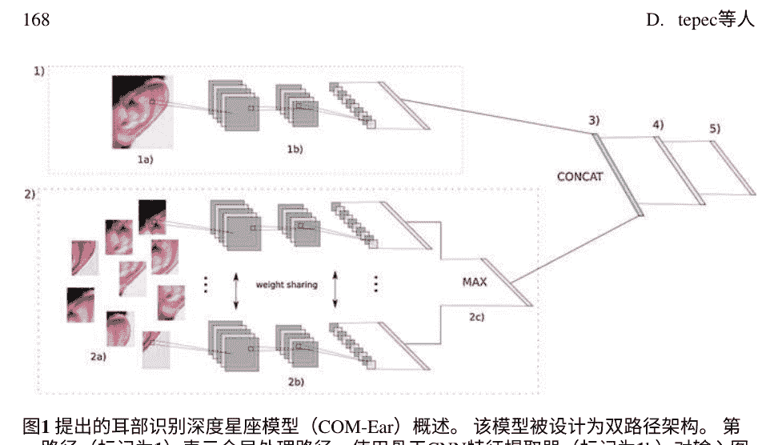

编码了关于耳朵外观的全局信息，第二路径（在图1中标记为2）捕捉了局部图像线索，以补充从全局处理路径中提取的信息。对于这两个路径，我们使用基于CNN的特征提取器作为骨干模型。下面我们详细描述模型的所有部分。

##### 3.2.1 全局处理路径

全局处理路径（1）的输入是整个耳朵图像（1a），如图1所示。从这个输入中，使用骨干CNN计算出一个特征表示（1b）。虽然可以使用不同的模型完成这个任务，但我们选择不同的ResNet模型（ResNet-18、ResNet-50、ResNet-152）[35]，因为它们在许多视觉任务中具有最先进的性能，并且有现成的开源实现可用。为了充分利用ResNet模型，我们从模型的最后一个池化层中获取d维特征，并将池化操作替换为自适应池化，以使模型适用于不同大小的输入图像。

##### 3.2.2 本地处理路径

对于第二个处理路径（2），输入图像首先被分割成 N个较小的补丁（2a）。然后将这些补丁输入到COM-Ear模型进行处理。

本地处理路径被设计为一个并行的Siamese架构（2b），具有共享的模型参数，并且与全局处理路径（1b）中使用的相同的主干特征提取器。从每个补丁中提取特征表示，并使用大小为1的最大池化（即沿补丁维度的最大操作）进行聚合（2c）。我们选择了Siamese架构，以减少训练过程中需要学习的参数数量，并降低过拟合的可能性。通过我们可扩展的设计，我们能够利用来自可变数量的输入补丁的信息，而不会影响参数数量，并且不需要对网络拓扑进行更改。

为了从局部特征中聚合信息，我们使用了一种新颖的汇聚过程，我们称之为相关信息汇聚或PRI汇聚。PRI汇聚的思想是仅使用局部图像块中最相关的信息来生成最终的图像表示。对于提出的汇聚过程，每个图像块首先通过Siamese CNN集合传递，以获得一组对应的N个d维特征表示，类似于TI汇聚[43]。然后，在图像块维度上对N个特征向量应用最大池化操作，以生成局部处理路径的最终聚合d维特征表示。

PRI汇聚应用于特征向量，以获得局部重要的特征。我们认为，通过将图像块作为PRI汇聚拓扑的输入，所学习到的特征捕捉到了与COM-Ear模型的全局处理路径产生的全局特征相关的局部信息。通过这种方法，网络可以自动推断出输入图像的重要部分，反之亦然，这些区域可以通过局部处理路径产生的最终聚合特征向量的组合来识别。因此，PRI汇聚操作为我们的COM-Ear模型提供了一种解释性水平，这是纯粹的整体竞争对手所不具备的。我们在实验部分提供了一些定性示例来说明这种解释性。

##### 3.2.3 信息的组合

全局和局部特征在COM-Ear模型的最后部分通过简单的连接进行组合。鉴于每个模型路径的特征表示是d维的，组合特征表示包括2d个元素。正如我们在实验部分中所展示的，无论是整体特征还是局部特征，两种类型的特征对于COM-Ear模型的性能都很重要。如果仅使用整体特征或局部特征，我们无法达到组合表示的性能。特别是当没有使用整体信息时，局部特征的性能受到限制。我们认为这种设置的原因是我们模型的全局处理路径会影响局部处理路径的学习，这是由于为所提出的架构设计的端到端学习过程所致。综合整体和全局特征通过另一系列全连接层传递，其中最后一层是softmax层，在训练过程中定义了损失。

softmax分类层也可以在运行时用于闭集识别实验。

#### 3.3 模型训练

为了训练COM-Ear模型，我们设计了一个端到端的学习过程和一个组合训练目标，定义如下：

L_total = L_S + λ L_C, (1)

其中，L_S表示在softmax COM-Ear层上定义的交叉熵损失，L_C表示在表示输入到第一个全连接层的特征上定义的中心损失，λ表示平衡这两个损失的超参数。中心损失的动机是增强学习特征的区分能力。交叉熵损失强制不同类别的深度特征可分离，而中心损失有效地将深度特征拉近到它们对应的中心（在小批量上学习）。这样，类间特征差异被放大，类内特征变化被有效地减小，使得特征更具有区分性。我们在设计阶段的初步实验表明，包含中心损失非常重要，因为没有中心损失的结果明显不够令人信服。

#### 3.4 实现细节

我们使用PyTorch实现我们的模型，并使用内置的ResNet（ResNet-18、ResNet-50、ResNet-152）模型作为基于CNN的特征提取器。所有的基础模型都使用在ImageNet数据集上预训练的权重。我们修改了模型以接受任意大小的输入图像，并用自适应平均池化操作替换了所有的平均池化层。自适应平均池化层的输出被用作全局和局部处理路径中的特征。

如上所述，我们使用的PRI池化操作对补丁的局部特征进行聚合，该操作在补丁维度上进行逐元素最大化。聚合的局部特征和全局整体特征具有相同的维度（ResNet-18为512，ResNet-50和ResNet-152为2048），并使用简单的连接操作进行组合。连接后的输入通过具有相同输出维度（例如，ResNet-18为512）的全连接层进行转换，这表示最终全连接softmax层的输入。

### 4 实验和结果

在本节中，我们描述了进行的实验，以突出所提出的COM-Ear模型的主要特征。由于我们的重点是所提出的模型在无约束环境中的良好表现能力，我们使用了扩展的注释网络耳朵（AWEx）进行实验。然而，该数据集包含有限数量的图像。基于我们之前的经验和发现[24]，我们使用了严格的数据增强来刺激训练并防止过拟合。然后，我们使用AWEx来训练和评估模型的不同变体-减小补丁大小和省略中心损失。我们直接将我们的模型与一些最先进的方法进行比较。此外，为了尽可能评估我们提出的COM-Ear模型的性能，我们还与2017年无约束耳朵识别竞赛挑战[25]中提交的深度学习方法进行了比较-这是一个最近针对在无约束条件下捕获的数据应用耳朵识别技术的群体基准努力。此外，我们还评估了我们模型在耳朵识别中最棘手的一个方面-遮挡的鲁棒性。对于我们分析的这部分，我们生成了一个合成数据集，其中耳朵图像上叠加了人工耳饰。最后，我们进行了深入的定性分析，首先通过分析单独部分的性能来可视化所提出的基于补丁的处理的影响，然后在视觉上比较了所提出的模型与2017年无约束耳朵识别挑战[25]中深度学习方法的性能排名。

#### 4.1 实验数据集

我们在扩展注释网络耳朵（AWEx）数据集上进行实验，该数据集是可用的非约束耳朵图像中最大的数据集之一。数据集中的图像是从网络上收集的，因此由于头部旋转、光照、年龄、性别、种族、遮挡和其他因素的差异，呈现出显著的变异水平。图2展示了一些示例图像，旨在突出数据集的难度。数据集中的耳朵图像被紧密裁剪，并且大小没有标准化。AWEx数据集中共有336个主题和4004个图像，并且我们在实验中使用了该数据集。

我们在识别实验中使用该数据集，并遵循各种实验协议，以便能够将我们的模型与文献中的已发布结果进行比较。这些协议包括来自UERC 2017 [25]的两个评估协议，允许与挑战中的方法进行直接比较。

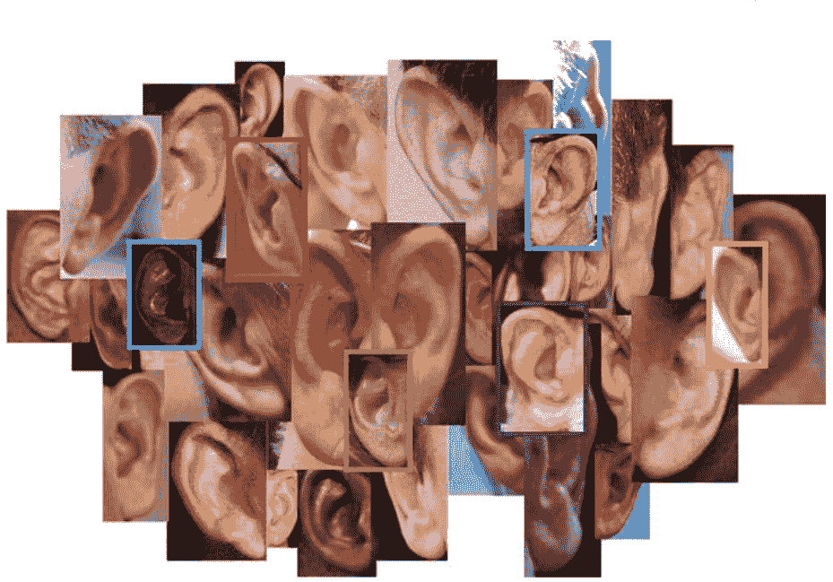

图2 AWEx数据集中的样本图像。正如可以看到的那样，由于不同的分辨率、种族、不同程度的遮挡、配饰的有无、头部旋转和其他类似因素，图像呈现出广泛的外观变化。

#### 4.2 性能指标

如上所述，我们进行识别实验来评估COM-Ear模型并将其与现有方法进行比较。识别旨在预测给定耳图像的身份，而不是验证实验，其中预测是二进制的——观察到的耳图像是否属于给定的主体。

为了衡量我们实验的性能，我们尽可能报告以下性能指标：

- 排名一识别（rank-1）：是探测图像中，从图库中检索到的正确身份图像作为最佳匹配的百分比。如果图库中有多个类别的图像可用，将选择最相似的图像用于排名计算。
- 排名五识别（rank-5）：是探测图像中，正确身份图像在从库中检索的前五个匹配中的百分比。与rank-1相同，如果库中每个类别有多个图像，则选择最相似的样本。此过程适用于所有排名计算。
- CMC曲线下的面积（AUC）：是累积匹配分数曲线（CMC）下的归一化面积，类似于标准AUC。

通常用于计算接收器操作特性（ROC）曲线的度量。该度量衡量了被测试识别模型的整体性能，并且在识别实验中常被使用[25]。

这些识别度量在文献中被广泛使用，因此也被选用在本研究中。对于所有描述的性能度量，较高的值表示更好的性能。排名值的范围从0到测试集中存在的类别数，而AUC分数的值范围在0到1之间，表示CMC曲线下面积的比例。关于实验中使用的度量的更深入解释，请参考[38]。

#### 4.3 训练细节

我们使用AWEx数据集中的图像来训练COM-Ear模型。对于训练过程，我们使用公式（1）中的训练目标，其值为 λ = 0.003，与原始论文[71]中使用的值相同，以平衡交叉熵损失和中心损失的影响。我们将交叉熵损失的学习率设置为0.01，中心损失的学习率设置为0.5。我们使用随机梯度下降（SGD）算法对模型进行100个epoch的训练，步长为50，衰减率为0.1，批量大小为32个输入图像及其对应的补丁。我们以网格方式从输入图像中采样补丁，采用重叠方式。训练过程中使用的超参数总结如表1所示。

为了避免过拟合，我们进行数据增强以增加数据的变异性。数据增强在耳部识别领域的重要性首次在[24]中提到。然而，与[24]相比，我们使用在线增强（即在运行时增强数据），以使网络几乎不会多次看到完全相同的图像，以提高泛化性能。我们使用Imgaug Python库进行数据增强，并使用以下图像变换：

- 水平翻转
- 使用高斯滤波器进行模糊处理，σ在范围(0, 0.5)内
- 缩放因子在范围(0.9, 1.2)内
- 旋转角度在范围 ±30°内

| 参数 | 值 |
|------|-----|
| 迭代次数 | 100 |
| 权重衰减 | 0 |
| 损失函数的学习率 | 0.01 (0.9 动量) |
| 中心损失的学习率 | 0.5 |
| λ(如上所述) | 0.003 |

所有列出的操作都是随机顺序执行的，每个操作都有50%的概率应用。在这种设置下，有可能没有应用任何增强操作，尽管概率非常低。图像还使用ImageNet [21]中的每个通道的均值和标准差进行了归一化处理，这是一般的做法。

在对图像进行增强后，图像块被裁剪，以便使图像和块以相同的方式进行转换。通过这样做，我们确保整体模型和局部模型看到的是相同的输入。

#### 4.4 消融研究

在我们的第一系列实验中，我们研究了在开发COM-Ear模型时的一些设计选择对结果的影响。因此，在这个消融研究中，我们关注所提出的COM-Ear模型的不同部分，并观察特定设计选择如何影响我们模型的性能。在这个实验中，我们遵循[29]中的实验协议，并将AWEx数据集中的可用数据分为两个不相交的子集，即：

- 一个包含116个主题的1804张图像的训练集。这些图像用于学习COM-Ear模型（及其变体）的参数，并通过验证集监控训练进展。
- 一个包含220个主题的2200张图像的测试集，用于最终性能评估。使用该集合中的图像计算性能指标并报告结果。

为了进行开放式识别实验，我们对COM-Ear模型进行网络手术，并使用2d维度的全局和局部特征拼接作为给定输入耳朵图像的描述符。为了衡量耳朵描述符之间的相似性，我们计算余弦相似度。在实验中，我们使用224 × 224像素的初始图像尺寸和112 × 112像素的补丁尺寸。

补丁采用50%的重叠采样，总共有9个补丁用于COM-Ear的局部处理路径。

使用上述协议，我们首先探索了骨干ResNet特征提取器的性能，并比较了不同的ResNet变体，即ResNet-18、ResNet-50和ResNet-152的性能。我们使用与COM-Ear模型相同的损失函数在训练数据上训练所有模型（参见公式（1）），并使用倒数第二层的特征与余弦相似度进行识别。

表2的结果显示，主干模型的性能没有显著差异。因此，我们选择ResNet-18作为COM-Ear的最终主干模型，因为它相对于其他两个ResNet变种来说具有轻量级的架构。

接下来，我们报告了使用中心损失和不使用中心损失得到的COM-Ear模型的结果。我们观察到，当不使用中心损失时，COM-Ear的性能下降更多，这表明中心损失的重要性。

| 方法 | 排名1 [%] | 排名5 [%] | AUCMC [%] |
| --- | --- | --- | --- |
| ResNet-18 | 26.1 | 52.2 | 92.7 |
| ResNet-50 | 26.1 | 50.8 | 92.6 |
| ResNet-152 | 26.1 | 49.9 | 92.4 |
| COM-Ear | **31.1** | **54.6** | **93.2** |
| COM-Ear [无中心损失] | 27.1 | 52.5 | 92.6 |
| COM-Ear [补丁大小/2] | 29.4 | 52.1 | 91.6 |

粗体数值表示最佳性能结果

训练过程中的综合损失。

此外，当比较主干ResNet-18模型和COM-Ear的性能差异时，我们发现局部处理路径的添加显著提高了性能，因为排名1的识别率从26.1%（对于ResNet-18）提高到了31.1%（对于COM-Ear）。最后，我们报告了使用56 ×56像素大小的较小补丁的COM-Ear的结果——补丁仍然从输入图像中采样，重叠率为50%。与使用50%重叠采样的112 ×112像素初始补丁大小相比，结果更差。这些结果表明，补丁的大小需要足够大，才能携带足够的上下文信息。较小的补丁还可能携带不利于识别的背景信息，并且可能在不同主体之间引入歧义。112 ×112像素输入补丁的示例可以在图1中查看。

#### 4.5 性能评估与最新技术对比

##### 4.5.1 与竞争方法的比较

在本系列实验的第一个实验中，我们使用与消融研究期间相同的协议。该协议取自[29]，我们报告了该出版物的结果以进行比较。具体而言，我们包括了基于局部二值模式（LBPs [10, 26, 33, 57, 58]）、（旋转不变的）局部相位量化特征（RILPQ和LPQ [51, 52]）、二值化统计图像特征（BSIF [26, 40, 57]）、方向梯度直方图（HOG, [19, 20, 26, 57]）、密集尺度不变特征变换（DSIFT, [22, 26, 42]）和方向边缘幅度模式（POEM, [26, 70]）的结果。对于基于深度学习的模型，我们报告了ResNet-18、ResNet-50和ResNet-152 (取自[29]) 的结果。此外，我们还提供了MobileNet模型的结果，该模型是为移动和嵌入式视觉应用而开发的轻量级CNN架构。该架构使用两个主要超参数，可以在延迟和准确性之间高效地进行权衡[36]。

这些超参数允许根据问题领域和使用案例场景调整模型的大小。在这项工作中，我们评估了三个具有不同宽度乘数的版本。数值越低，模型越轻量级；数值越高 (最高为1)，足迹越大。在表3中，我们报告了三个乘数级别的结果：1/4、1/2和1 [36]。

这个实验的结果在表3和图3中呈现。我们观察到COM-Ear在整体结果上取得了最佳成绩，大幅度改进了现有技术水平。在排名第一的识别率为31.05%的情况下，它明显优于所有传统特征提取方法和所有经过测试的深度学习模型。最接近的竞争对手是MobileNet (1)，其排名第一的识别率为26.9%。基于描述符的方法不太令人信服，该组中表现最好的方法的第一识别率为23.1%，比提出的COM-Ear模型低8% (绝对值)。

| 方法 | 排名1 [%] | 排名5 [%] | AUCMC [%] |
| :--- | :--- | :--- | :--- |
| ResNet-18 [35] | 24.5 | 48.5 | 91.4 |
| ResNet-50 [35] | 25.9 | 49.9 | 92.0 |
| ResNet-152 [35] | 26.1 | 52.8 | 92.6 |
| MobileNet (1/4) [36] | 17.1 | 36.1 | 88.0 |
| MobileNet (1/2) [36] | 16.0 | 38.5 | 88.5 |
| MobileNet (1) [36] | 26.9 | 50.0 | 91.8 |
| LBP [50] | 17.8 | 32.2 | 79.6 |
| HOG [19] | 23.1 | 41.6 | 87.9 |
| DSIFT [44] | 15.2 | 29.9 | 77.5 |
| BSIF [40] | 21.4 | 35.5 | 81.6 |
| LPQ [51] | 18.8 | 34.1 | 81.0 |
| RILPQ [52] | 17.9 | 31.4 | 79.8 |
| POEM [70] | 19.8 | 35.6 | 81.5 |
| COM-Ear | **31.5** | **55.9** | **93.3** |

##### 4.5.2 与2017年非约束性耳朵识别挑战 (UERC) 的结果比较

在接下来的实验中，我们将COM-Ear与2017年非约束性耳朵识别挑战 (UERC 2017) 中使用的数据和实验协议进行比较。UERC 2017是在2017年国际联合生物特征会议 (IJCB 2017) 的范围内组织的一项集体基准测试工作，并专注于在无约束环境中访问耳朵识别技术。挑战部分在AWEx数据集上进行，使用稍微不同的协议，与前一节中使用的协议略有不同。有关协议的详细信息，请参阅[25]。

几个团队参与了挑战并提交了结果。在这里，我们包括了来自UERC 2017的所有基于深度学习的方法的结果，简要总结在表4中，并且还包括了在之前章节中测试的三个ResNet变体的结果。

比较的结果呈现在表5和图4中。与表3中的结果类似，我们观察到在ResNet模型中，ResNet-18表现最好（rank-1 = 28%）。整体表现最好的仍然是COM-Ear，它取得了最新的成果，相比于比较中包含的最佳结果（IAU），在rank-1和rank-5识别结果方面提高了超过3%和超过5%。伊斯兰阿扎德大学（IAU）在UERC 2017中表现最好的参赛作品是基于VGG-16架构[64]和迁移学习构建的。

IAU方法的想法是保留预训练的VGG-16模型的一部分（即冻结权重），同时重新训练模型的其他与新领域（即耳朵识别）相关的部分。具体来说，作者在预训练模型的第7层之上添加了两个全连接层。VGG模型。只有新添加的FC层在UERC数据上进行了训练。仅学习某些层，同时保持其他层不变（例如，仅在ImageNet上学习）对于像UERC 2017这样的较小数据集尤其有益，因为它可以防止过拟合，从而产生更好地适用于新任务的特征。在我们的案例中，我们使用中心损失使学到的特征更具区分性，并使用有限的训练数据学习描述性模型。

在下一个实验中，我们评估了所提出的COM-Ear模型如何随着更大的探测和库集合进行扩展。对于这个实验，我们使用了UERC 2017年规模实验中采用的规模实验协议。这个测试的结果以图5中的CMC曲线的形式展示。这些曲线是使用生成的7442个探测图像属于1482个主体，9500个库图像属于3540个主体。库中还包含不在探测集中的身份。这些样本作为识别技术的干扰因素[25,41]。表6中的数值结果显示，所提出的模型在排名1和排名5的识别率方面与ITU-II方法相当，并且在引入大量干扰样本的实验中具有很强的竞争力。

还需要注意的是，ITU-II技术结合了两个互补的卷积神经网络模型和手工特征来实现这种性能，而COM-Ear则是一个一致的模型，它依赖于相同的特征表示，但考虑了关于耳朵外观的全局和局部信息来进行身份推断。

#### 4.6 对遮挡的鲁棒性

在我们的最后一个实验中，我们评估了我们的模型对耳朵遮挡的鲁棒性。我们使用与消融研究期间相同的协议，并进行了两种类型的实验：有遮挡和无遮挡。没有遮挡的实验与上面已经呈现的实验等效。对于遮挡实验，我们模拟了耳朵配饰的存在，并将配饰图像放置在裁剪的耳朵图像的随机位置上。添加的配饰具有不同的形状和颜色，模拟了广泛的真实世界配件。图6中展示了一些生成的图像。正如我们所看到的，配件主要覆盖图像的一个小区域，但可能占据图像面积的20%。

这一系列实验的结果在COM-Ear模型和基准ResNet-18模型的表7中呈现。我们可以看到，两个模型的性能都下降了，但对于ResNet-18来说，退化更严重。这些结果表明，编码局部图像细节的局部处理路径确实有益，并且不仅在无约束耳图像上实现了最先进的性能，而且在耳图像中存在配件时也提高了鲁棒性。

#### 4.7 定性评估

在本节中，我们展示了与COM-Ear模型以及UERC 2017方法相关的一些定性结果。如前所述，COM-Ear使用提议的PRI池化操作聚合局部特征，该操作在补丁维度上取最大值以生成512维特征向量（在ResNet-18后端的情况下）从提取的图像补丁的局部特征向量集合中选择。COM-Ear模型允许我们确定聚合（局部）特征向量中表示的是哪个补丁以及以什么比例表示（即argmax操作）。

我们在图7中展示了AWEx数据集中的一些示例耳图像及其对应的图像补丁。下面显示了每个补丁对聚合特征向量的贡献比例。

图7a-c的示例代表了同一主体在不同条件下拍摄的图像和稍微不同位置的耳朵。我们可以看到，所有三个示例都认为相似的图像特征很重要，并且所有补丁的重要性非常相似，尤其是左下角的补丁，具有明显的耳朵形状。

图7d、e中的图像代表带有耳环的输入样本。我们可以看到，带有耳环的补丁并没有被赋予很大的权重，这可能与人们的预期不同。这是因为训练集包含有和没有耳环的数据，所以模型可以学习到耳环并不一定重要——这也可能是COM-Ear比ResNet-18更具鲁棒性的原因之一。图7f、g中的示例显示了存在大面积遮挡和耳环的图像，这使得识别变得困难，因为许多明显的特征不太可见。在图7f的示例中，我们可以看到左上角的补丁最重要，因为几乎没有遮挡。对于图7g，耳朵的上部完全被遮挡，所以选择没有遮挡的补丁作为最具区分性的补丁。带有头发等遮挡的补丁被降低权重，因为头发具有很高的变异性，模型在训练过程中学习到了这一点。

图7h没有遮挡物或配件，但图像是在低光条件下拍摄的，并且角度困难。因此，补丁的重要性分布更加均匀，因为整个耳区存在更多相关特征，并且没有一个特征占主导地位。

为了定性地比较所提出的COM-Ear与其他方法，我们展示了模型和来自UERC 2017的深度学习方法从库中检索到的图像类型作为给定探测图像的第一（排名1）和第二（排名2）匹配。我们还展示了第一个正确的预测（注意库中有多个正确主体的图像）并提供其被检索到的排名。第一个正确的预测被认为是在排名中最接近且与探测图像具有相同身份的图像。对于这个实验，我们再次使用整个UERC测试数据集，其中包含9500个图像在库集中。所描述的定性分析在左侧的五个随机选择的探测图像中显示在图8中。

通过排名1和2检索到的图像与探针具有高度的视觉相似性，这是预期的。因此，即使预测失败，最接近的匹配在视觉上也与探针图像相似。然而，对于第二、第四和第五个探针图像，所有5种评估技术都失败了。对于第五个探针图像，探针的低分辨率可能是失败的原因。第四个探针图像包含高对比度的照明，可能是错误的原因。

### 定性分析对比表

|  | COM-Ear | ICL | IAU | IITK | ITU-I | ITU-II | VGG-Base | LBP-Base |
| :--- | :--- | :--- | :--- | :--- | :--- | :--- | :--- | :--- |
| **Probe 1** | 1st Match<br>2nd Match<br>Correct Prediction<br>Ret.@rank: 1 | 1st Match<br>2nd Match<br>Correct Prediction<br>Ret.@rank: 29 | 1st Match<br>2nd Match<br>Correct Prediction<br>Ret.@rank: 1 | 1st Match<br>2nd Match<br>Correct Prediction<br>Ret.@rank: 2 | 1st Match<br>2nd Match<br>Correct Prediction<br>Ret.@rank: 6 | 1st Match<br>2nd Match<br>Correct Prediction<br>Ret.@rank: 9 | 1st Match<br>2nd Match<br>Correct Prediction<br>Ret.@rank: 3 | 1st Match<br>2nd Match<br>Correct Prediction<br>Ret.@rank: 149 |
| **Probe 2** | 1st Match<br>2nd Match<br>Correct Prediction<br>Ret.@rank: 2 | 1st Match<br>2nd Match<br>Correct Prediction<br>Ret.@rank: 54 | 1st Match<br>2nd Match<br>Correct Prediction<br>Ret.@rank: 3 | 1st Match<br>2nd Match<br>Correct Prediction<br>Ret.@rank: 28 | 1st Match<br>2nd Match<br>Correct Prediction<br>Ret.@rank: 34 | 1st Match<br>2nd Match<br>Correct Prediction<br>Ret.@rank: 26 | 1st Match<br>2nd Match<br>Correct Prediction<br>Ret.@rank: 4 | 1st Match<br>2nd Match<br>Correct Prediction<br>Ret.@rank: 7 |
| **Probe 3** | 1st Match<br>2nd Match<br>Correct Prediction<br>Ret.@rank: 4 | 1st Match<br>2nd Match<br>Correct Prediction<br>Ret.@rank: 38 | 1st Match<br>2nd Match<br>Correct Prediction<br>Ret.@rank: 1 | 1st Match<br>2nd Match<br>Correct Prediction<br>Ret.@rank: 3 | 1st Match<br>2nd Match<br>Correct Prediction<br>Ret.@rank: 1 | 1st Match<br>2nd Match<br>Correct Prediction<br>Ret.@rank: 1 | 1st Match<br>2nd Match<br>Correct Prediction<br>Ret.@rank: 14 | 1st Match<br>2nd Match<br>Correct Prediction<br>Ret.@rank: 51 |
| **Probe 4** | 1st Match<br>2nd Match<br>Correct Prediction<br>Ret.@rank: 18 | 1st Match<br>2nd Match<br>Correct Prediction<br>Ret.@rank: 50 | 1st Match<br>2nd Match<br>Correct Prediction<br>Ret.@rank: 22 | 1st Match<br>2nd Match<br>Correct Prediction<br>Ret.@rank: 14 | 1st Match<br>2nd Match<br>Correct Prediction<br>Ret.@rank: 17 | 1st Match<br>2nd Match<br>Correct Prediction<br>Ret.@rank: 63 | 1st Match<br>2nd Match<br>Correct Prediction<br>Ret.@rank: 6 | 1st Match<br>2nd Match<br>Correct Prediction<br>Ret.@rank: 153 |
| **Probe 5** | 1st Match<br>2nd Match<br>Correct Prediction<br>Ret.@rank: 22 | 1st Match<br>2nd Match<br>Correct Prediction<br>Ret.@rank: 61 | 1st Match<br>2nd Match<br>Correct Prediction<br>Ret.@rank: 10 | 1st Match<br>2nd Match<br>Correct Prediction<br>Ret.@rank: 73 | 1st Match<br>2nd Match<br>Correct Prediction<br>Ret.@rank: 51 | 1st Match<br>2nd Match<br>Correct Prediction<br>Ret.@rank: 41 | 1st Match<br>2nd Match<br>Correct Prediction<br>Ret.@rank: 70 | 1st Match<br>2nd Match<br>Correct Prediction<br>Ret.@rank: 60 |

图8 使用选定的探针图像进行定性分析。该图显示了选定的探针图像（左侧）以及评估方法生成的第一和第二匹配。还显示了具有正确身份的第一个检索图像以及它被检索到的相应排名。

在第二个例子（第二个探测器）中，图像看起来相当容易识别，因为照明良好，耳朵清晰可见，没有耳饰。
然而，我们假设在这种情况下性能不佳的原因可能是数据集中有许多来自其他主题的相似图像。最接近的匹配图像的视觉相似性似乎证实了这一观察结果。

### 5 结论

在本章中，我们介绍了第一个用于耳部识别的深度星座模型，称为COM-Ear。我们在扩展的注释网络耳朵（AWEx）数据集上进行了大量实验，并在最新技术结果上取得了显著改进。我们展示了使用COM-Ear星座模型不仅可以实现最新技术结果，而且在具有遮挡部分耳朵或图像中存在耳饰的挑战性环境中，还可以提供更稳定的识别性能。本章中提出的COM模型的设计和新颖的汇聚过程使我们能够可视化学习到的耳部表示的某些方面，并且在竞争模型中没有看到的可解释性水平。通过反转聚合操作（即所提出的PRI-汇聚），我们能够获得补丁级别的重要性，这是我们提出的模型的另一个新颖之处。这对未来的研究具有重要意义，因为类似的概念可以整合到其他模型中，并提供一种新颖的机制来更好地理解。

致谢这项研究部分得到了斯洛文尼亚研究机构ARRS的支持，研究计划P2-0250 (B) 气象学和生物特征系统，研究计划P2-0214 (A) 计算机视觉。作者感谢NVIDIA捐赠的Titan Xp GPU用于实验。

这项工作也得到了欧洲委员会通过Horizon 2020研究和创新计划的部分支持，授予的资助号分别为688201 (M2DC)和690907 (IDENTITY)。

### 参考文献

- 1. A.F. Abate, M. Nappi, D. Riccio, S. Ricciardi, 通过旋转不变描述符进行耳部识别, in 国际模式识别会议, vol. 4 (IEEE, Piscataway, 2006), pp. 437–440
- 2. A. Abaza, A. Ross, C. Hebert, M.A.F. Harrison, M. Nixon, 关于耳部生物特征的调查. ACM计算机调查 45(2), 1–22 (2013)
- 3. M. Abdel-Mottaleb, J. Zhou, 从面部轮廓图像中识别别人耳, Advances in Biometrics (Springer, Berlin, 2006), pp. 786–792
- 4. C. Akin, U. Kacar, M. Kirici, 基于语音和耳朵的双胞胎识别的多生物特征. CoRR abs/1801.09056 (2018)
- 5. A.A. Almisreb, N. Jamil, N.M. Din, 利用AlexNet深度迁移学习进行耳朵识别, 国际信息检索与知识管理会议(IEEE, Piscataway, Mar 2018), pp. 1–5
- 6. H.A. Alshazly, M. Hassaballah, M. Ahmed, A.A. Ali, 利用基于梯度的特征描述符进行耳朵生物特征识别, 国际高级智能系统和信息学会议, 2018, 编辑: A.E. Hassanien, M.F. Tolba, K. Shaalan, A.T. Azar, 智能系统和计算的进展 (Springer, Berlin, 2019), pp. 435–445
- 7. B. Arabab-Zavar, M.S. Nixon, 用于耳朵生物特征的鲁棒log-Gabor滤波器, 国际模式识别会议(IEEE, Piscataway, 2008), pp. 1–4
- 8. Z. Baoqing, M. Zhichun, J. Chen, D. Jiyuan, 一个针对部分遮挡的耳朵识别的鲁棒算法, 在中国控制会议 (2013年), 第3800-3804页
- 9. A. Basit, M. Shoaib, 一种使用非线性曲线特征子空间的人耳识别方法。计算数学国际期刊 91(3), 616-624页 (2014年)
- 10. A. Benzaoui, A. Kheider, A. Boukrouche, 使用ELBP和小波的耳朵描述和识别, 在应用研究计算机科学和工程国际会议 (2015年), 第1-6页
- 11. M. Burge, W. Burger, 耳朵生物特征识别, 在生物特征学, 由A.K. Jain, R. Bolle, S. Pankanti编辑 (IEEE, 皮斯卡塔韦, 1996年), 第273-285页
- 12. J.D. Bustard, M.S. Nixon, 从二维图像中实现无约束耳部识别。IEEE Trans. Syst. Man Cybern. A: Syst. Humans 40(3), 486–494 (2010)
- 13. T.S. Chan, A. Kumar, 使用2-D正交滤波器进行可靠的耳部识别。Pattern Recogn.Lett. 33(14), 1870–1881 (2012)
- 14. K. Chang, K.W. Bowyer, S. Sarkar, B. Victor, 外观生物特征中耳部和面部图像的比较和组合。IEEE Trans. Pattern Anal. Mach. Intell. 25(9), 1160–1165 (2003)
- 15. M. Choraś, 人体识别的透视方法：耳部生物特征。Opto-Electr. Rev. 16(1), 85–96 (2008)
- 16. M. Choras, R.S. Choras, 几何算法的耳轮廓形状表示和特征提取, 在智能系统设计和应用国际会议 (IEEE, Piscataway, 2006), pp. 451–456
- 17. D.P. Chowdhury, S. Bakshi, G. Guo, P.K. Sa, 关于可调滤波器组的适用性特征用于耳生物特征识别: 从受限到非受限的研究. J. Med. Syst. 42(1), 11/1–20 (2017)
- 18. M. Chowdhury, R. Islam, J. Gao, 使用神经网络的鲁棒耳生物特征识别, 在工业电子与应用会议(IEEE, Piscataway, Jun 2017), pp. 1855–1859
- 19. N. Dalal, B. Triggs, 用于人体检测的梯度方向直方图. 在计算机视觉和模式识别会议(IEEE, Piscataway, 2005), pp. 886–893
- 20. N. Damar, B. Fuhrer, 使用多尺度梯度方向直方图的耳识别, 在智能信息隐藏和多媒体信号处理会议(2012), pp. 21–24
- 21. J. Deng, W. Dong, R. Socher, L.J. Li, K. Li, L. Fei-Fei, Imagenet: 一个大规模的分层图像数据库, 在计算机视觉和模式识别会议(IEEE, Piscataway, 2009), 第248-255页
- 22. K. Dewi, T. Yahagi, 使用尺度不变关键点的耳部照片识别, 在计算智能(2006), 第253-258页
- 23. S. Dodge, J. Mounsef, L. Karam, 使用深度神经网络的非约束耳部识别. IET Biom. 7(3), 207–214 (2018)
- 24. Ž. Emeršič, D. Stepec, V. Štruc, P. Peer, 使用有限训练数据训练卷积神经网络进行野外耳部识别, 在国际自动人脸和姿势识别会议-野外生物特征研讨会(IEEE, Piscataway, 2017), 第987-994页
- 25. Ž. Emeršič, D. Stepec, V. Štruc, P. Peer, A. George, A. Ahmad, E. Omar, T.E. Boult, R. Safdari, Y. Zhou, S. Zafeiriou, D. Yaman, F.I. Eyiolcu, H.K. Ekenel, 无约束耳识别挑战, 在国际联合生物特征学术会议(IEEE/IAPR, Piscataway, 2017), pp. 715–724
- 26. Ž. Emeršič, V. Štruc, P. Peer, 耳识别：不仅仅是一项调查. 神经计算 255, 26–39 (2017)
- 27. Ž. Emeršič, N.O. Playfair, V. Štruc, P. Peer, 面向配饰感知的耳识别, 在国际生物启发智能工作会议(IEEE, Piscataway, Jul 2018), pp.1–8
- 28. Ž. Emeršič, B. Meden, P. Peer, V. Štruc, 对耳朵识别模型的评估和分析：性能、复杂性和资源需求. 神经计算应用, 1-16 (2018年). https://doi.org/10.1007/s00521-018-3530-1
- 29. Ž. Emeršič, J. Križaj, V. Štruc, P. Peer, 深度耳朵识别流程, 在计算机视觉的最新进展, 编者：M. Hassaballah, K.M. Hosny, 卷804 (Springer, 柏林, 2019年), pp.333-362
- 30. F.I. Eyiolcu, D. Yaman, H.K. Ekenel, 使用深度卷积神经网络进行耳朵识别的领域自适应。IET生物 7(3), 199-206 (2017年)
- 31. T. Fan, Z. Mu, R. Yang, 基于深度学习的人脸和耳朵的多模态识别, 在国际小波分析和模式识别会议上 (2017年7月), 第38-42页
- 32. P.L. Galdamez. W. Raveane, A. González Arrieta, 通过深度神经网络对耳朵识别过程进行简要回顾. 应用逻辑学杂志 24, 62-70 (2017)
- 33. Y. Guo, Z. Xu, 使用一种新的局部匹配方法进行耳朵识别, 在国际图像处理会议上 (IEEE, Piscataway, 2008), 第289-292页
- 34. E.E. Hansley, M.P. Segundo, S. Sarkar, 使用学习和手工特征融合进行无约束耳朵识别. IET生物特征学 7(3), 215-223 (2018)
- 35. K. He, X. Zhang, S. Ren, J. Sun, 深度残差学习用于图像识别, 在计算机视觉和模式识别会议上(IEEE, Piscataway, 2016), 第770-778页
- 36. A.G. Howard, M. Zhu, B. Chen, D. Kalenichenko, W. Wang, T. Weyand, M. Andreetto, H. Adam, MobileNets: 高效的卷积神经网络用于移动视觉应用, CoRR abs/1704.04861 (2017)
- 37. D.J. Hurley, M.S. Nixon, J.N. Carter, 通过力场变换的自动耳识别, 在视觉生物特征学术讨论会上(IET, 伦敦, 2000), 第7/1-5页
- 38. A. Jain, A. Ross, K. Nandakumar, 生物特征识别导论(Springer, 柏林, 2011)
- 39. U. Kacar, M. Kirci, 基于长波红外光谱中CMC的评分级融合的耳部识别, CoRR abs/1801.09054 (2018)
- 40. J. Kannala, E. Rahtu, BSIF: 二值化统计图像特征, 在国际模式识别会议上(IEEE, Piscataway, 2012), pp. 1363–1366
- 41. I. Kemelmacher-Shlizerman, S.M. Seitz, D. Miller, E. Brossard, MegaFace基准测试:1百万张人脸用于大规模识别, 在计算机视觉和模式识别会议上, pp. 4873–4882 (IEEE, Piscataway, 2016)
- 42. J. Križaj, V. Štruc, N. Pavešić, 适应SIFT特征的鲁棒人脸识别, 在图像分析和识别会议上( Springer, Berlin, 2010), pp. 394–404
- 43. D. Laptev, N. Savinov, J.M. Buhmann, M. Pollefeys, TI-POOLING: 变换不变特征学习中的池化方法, 计算机视觉和模式识别会议(IEEE, Piscataway, 2016), 第289-297页
- 44. D.G. Lowe, 尺度不变关键点的独特图像特征. 计算机视觉国际期刊 60(2), 第91-110页 (2004)
- 45. S. Mahto, T. Arakawa, T. Koshinaka, 使用不可听信号的耳朵声学生物特征识别及其在连续用户认证中的应用, 欧洲信号处理会议 (2018年9月), 第1407-1411页
- 46. B. Moreno, A. Sánchez, J.F. Vélez, 关于外耳图像在安全应用中的个人识别的使用国际卡纳汉安全技术会议论文集, IEEE, 1999, 第469-476页
- 47. Z. Mu, L. Yuan, Z. Xu, D. Xi, S. Qi, 基于形状和结构特征的耳部识别, in 生物特征人员认证进展(Springer, Berlin, pp. 663–670, 2004)
- 48. I. Naseem, R. Togneri, M. Bennamoun, 稀疏表示用于耳部生物特征, in 视觉计算进展(Springer, Berlin, 2008), pp. 336–345
- 49. H. Nejati, L. Zhang, T. Sim, E. Martínez-Marroquín, G. Dong, 奇妙的耳朵: 通过耳部图像识别相同的双胞胎, in 国际模式识别会议 (IEEE, Piscataway, 2012), pp. 1201–1204
- 50. T. Ojala, M. Pietikäinen, D. Harwood, 基于Kullback分布差异的纹理度量性能评估, in 国际模式识别、计算机视觉和图像处理会议, vol. 1 (IEEE/IAPR, Piscataway, 1994), pp. 582–585
- 51. V. Ojansivu, J. Heikkilä, 使用局部相位量化的模糊不敏感纹理分类，图像和信号处理（Springer，柏林，2008年），第236-243页
- 52. V. Ojansivu, E. Rahtu, J. Heikkilä, 用于模糊不敏感纹理分析的旋转不变局部相位量化，国际模式识别会议 (IEEE，皮斯卡塔韦，2008年)，第1-4页
- 53. I. Omara, G. Xiao, M. Amrani, Z. Yan, W. Zuo, 用于面部和耳朵图像的高效多生物特征识别的深度特征，国际数字图像处理会议，第10420卷（国际光学和光子学学会，贝灵汉姆，2017年7月），第1-6页
- 54. I. Omara, X. Wu, H. Zhang, Y. Du, W. Zuo, 学习层次深度特征上的成对SVM用于耳朵识别，IET生物学，第7卷，第6期，557-566页（2018年）
- 55. R.N. Othman, F. Alizadeh, A. Sutherland, 基于形状上下文的遮挡耳朵识别的新方法, 在国际高级科学与工程会议上(IEEE, Piscataway, 2018年10月), 第93-98页
- 56. A. Pflug, C. Busch, 耳部生物特征识别:检测、特征提取和识别方法综述, IET Biom. 1(2), 第114-129页 (2012年)
- 57. A. Pflug, P.N. Paul, C. Busch, 耳部生物特征的纹理和表面描述符的比较研究, 在国际卡纳汉安全技术会议上(IEEE, Piscataway, 2014年), 第1-6页
- 58. M. Pietikäinen, A. Hadid, G. Zhao, T. Ahonen, 使用局部二值模式的计算机视觉, 在计算成像与视觉(Springer, Berlin, 2011年)
- 59. S. Prakash, P. Gupta, 一种对光照和姿态不变的高效耳朵识别技术. Telecommun. Syst. 52(3), 1435–1448 (2013)
- 60. M. Rahman, M.R. Islam, N.I. Bhuiyan, B. Ahmed, A. Islam, 使用耳朵生物特征进行个人识别. Int. J. Comput. Intern. Manag. 15(2), 1–8 (2007)
- 61. M. Ribič, Ž. Emeršič, V. Štruc, P. Peer, 对齐对耳朵识别的影响: AWE数据集案例研究, in 国际电工和计算机科学会议, vol. 25-B(IEEE, Piscataway, 2016), pp. 131–134
- 62. U. Saeed, M.M. Khan, 结合传统和软生物特征进行无约束耳朵识别. J. Electr. Imaging 27(5), 051220/1–10 (2018)
- 63. A. Sepas-Moghaddam, F. Pereira, P.L. Correia, 在光场成像框架中的耳部识别: 一种新的视角。IET生物学。 7(3), 224-231 (2018年)
- 64. K. Simonyan, A. Zisserman, 用于大规模图像识别的非常深的卷积网络。 CoRR abs/1409.1556 (2014年)
- 65. H. Sinha, R. Manekar, Y. Sinha, P.K. Ajmera, 基于卷积神经网络的人类识别使用外耳图像，在软计算问题解决，由J.C.Bansal， K.N.Das， A. Nagar， K.Deep， A.K.Ojha编辑。智能系统和计算（Springer，新加坡，2019年），pp. 707-719
- 66. T. Theoharis, G. Passalis, G. Toderici, I.A. Kakadiaris, 使用波纹几何图像上的小波进行统一的三维人脸和耳朵识别。模式识别。 41(3), 796–804 (2008)
- 67. L. Tian, Z. Mu, 基于深度卷积网络的耳朵识别，在国际图像和信号处理、生物医学工程和信息学大会(IEEE，Piscataway，2016年10月)，第437–441页## 使用深度软生物特征在监控视频中进行人员检索

Hiren J. Galiyawala，Mehul S. Raval和Anand Laddha

### 1 引言

生物特征识别提供了一个可靠的解决方案来确定个体的身份。物理特征（例如面部、指纹和虹膜）和行为特征（例如声音、步态和签名）在安全应用中非常有用[21]。传统的生物特征属性在各种系统中取得了成功，但由于以下原因受到限制：

- 对于不合作的人来说，它们很难被捕捉到。
- 约束环境中的属性质量较差。
- 对于质量较差的输入数据，检索失败。
- 生物特征属性（例如脸部和指纹）的获取对于相机和人之间的相当距离来说是困难的。

由于上述原因，传统的基于生物特征的监控系统无法建立身份。以下场景详细说明了上述观点。
图1显示了来自AVSS 2018挑战Ⅱ数据库[9]的监控帧样本，其中感兴趣的人在黄色边界框中。由于低分辨率和光线不好，使用人脸识别系统很难检索到图1a中的人物。图1b展示了一个拥挤的场景。在具有挑战性的条件下，由于光照较暗，检索失败。然而，身高、发色、性别、种族、衣服颜色和衣服类型等属性对于人物检索是有用的。

这些属性被称为软生物特征[19, 20, 23]。

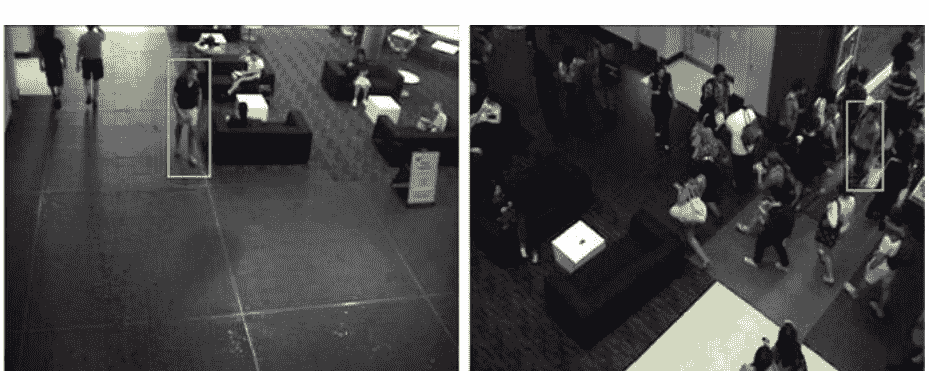

## 图1 监控帧样本[9]

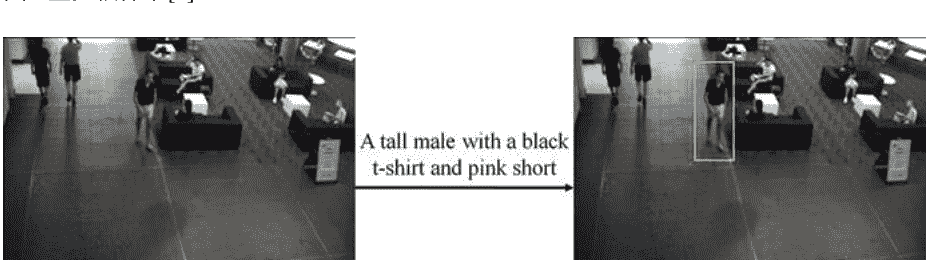

## 图2 使用语义描述进行人员检索

传统上，操作员通过手动搜索数小时的视频来进行人员检索。这非常低效；因此，使用软生物特征进行自动人员检索引起了研究人员的关注。基于语义描述的人员检索如图2所示。该描述使用身高（高）、性别（男性）、衣服颜色和衣服类型（黑色T恤和粉色短裤）作为软生物特征属性。这样的语义描述易于理解，并且自然地描述了人员。基于软生物特征的人员检索具有以下优点[1, 2]：

- 软生物特征属性有助于生成人类理解的描述。因此，它弥合了人类描述和人员检索系统之间的语义差距。
- 软生物特征属性可以从低质量的视频中提取，而传统生物特征由于各种限制很难实现。
- 可以非侵入性地捕获软生物特征，即无需被试者的合作。
- 软生物特征可以从远处检测到，例如衣物颜色。
- 多个软生物特征可以减少视频中的搜索空间。

软生物特征不像传统生物特征那样在查询和匹配之间建立一对一的映射关系。它在查询和人员之间产生多对多的匹配关系。因此，对于人员检索来说，使用最具有区分性的软生物特征是至关重要的。一项研究确定了13个最具有区分性的软生物特征[18]。其中，本章讨论了使用身高、衣物颜色和性别进行人员检索的优势。选择这些属性具有一定的优势，例如一个人的身高对视角和距离是不变的。使用颜色[6, 25]具有以下优势：

- 颜色可以提供关于人的服装的信息。
- 颜色的敏感性不受方向、视角和尺寸的影响。
- 颜色还可以提供抗噪声的能力。

值得注意的是，使用多个软生物特征也有助于抵消人物的远场和近场视图的影响。性别和衣服颜色在远场和近场视图中都可以识别出来。通过训练不同色调的颜色块，可以改善由于颜色阴影而导致的识别准确性降低。校准的相机还可以准确地估计近场或远场的高度。描述性查询中存在一些模糊性，例如一个人的身高可以是“矮”，“中等”和“高”。因此，身高被映射到一个范围内，例如160-180厘米。

本章的动机是弥合个体描述和机器之间的语义差距。请注意，个体软生物特征可能会产生非唯一的映射。然而，本章展示了使用多个软生物特征在描述查询和人之间的唯一映射。本章的目标如下：

1. 在软生物特征的背景下提出了一个人物检索问题。
2. 研究各种软生物特征的辨别能力。
3. 关于使用软生物特征进行人物检索的深度学习模型的最新综述。
4. 展示了基于身高、衣服颜色和性别的深度软生物特征人物检索，并将其用作线性滤波器。
5. 本章讨论了检索系统的性能指标。
6. 对人物检索系统进行了定性和定量分析。

本章重点介绍了使用身高、衣服颜色和性别进行人物检索。人物检索算法使用Mask R-CNN [10]进行人物的检测和语义分割。使用经过微调的AlexNet [12]对躯干颜色和性别进行分类，并使用AVSS 2018挑战II（任务2）数据集[9]来评估算法。第2节介绍了使用软生物特征进行人物检索的文献综述。它涵盖了使用手工制作和深度特征进行人物检索。还介绍了用于检测、分割和分类的深度学习架构。关于使用深度特征进行人物检索的算法的详细信息在第3节中。关于数据集、各种评估指标和测试结果的详细信息在第4节中讨论。最后，第5节总结了本章并讨论了未来的研究方向。

软生物特征在监控中提供了一种解决方案，传统生物特征无法检索到该人。研究人员正在开发基于计算机视觉和深度学习的算法。下一节将全面回顾使用手工制作和深度特征进行软生物特征人员检索的方法。它还介绍了本章中用于检测、分割和分类的深度学习架构的概述。

### 2 文献综述

技术进步有助于改善使用生物特征的检索。早期的研究显示利用各种软生物特征属性来提高传统生物特征系统的识别准确性的可能性[11]。将软生物特征纳入识别过程的最初目的是通过融合多个足以区分人群而不是个体的属性来增强识别过程。对263个用户数据库进行的这些实验[11]表明，通过使用性别、身高和种族等软生物特征，指纹识别系统的准确性可以显著提高。由于低质量、照明不足、环境不受控制以及人与摄像机之间的相当距离，传统生物特征在监控视频中无法建立身份。因此，需要进一步研究使用软生物特征属性进行人员识别和重新识别。本综述的后续小节将讨论基于手工制作和深度特征的属性识别方法用于人员检索。

#### 2.1 使用手工特征进行人员检索的属性识别

最初的工作使用手工特征并训练多个分类器来识别个体属性。Vaquero等人[28]提出了一种基于属性的搜索方法，用于定位监控视频中的人员。人员搜索是基于对人体的解析和探索部分属性进行的。视觉属性包括面部毛发（胡子、没有胡子）、眼镜（眼镜、太阳镜、没有眼镜）和头饰（头发、帽子、秃头），以及躯干和腿部的主要颜色等全身特征。训练了九个Viola-Jones检测器来提取每个面部属性。在HSL空间中计算躯干和腿部的归一化颜色直方图。Layne等人[13]提出了通过训练支持向量机（SVM）分类器来进行人体属性识别。属性识别结果用于辅助人员重新识别。

Zhu等人[31]引入了监控中的属性行人数据库（APiS），其中包括行人语义属性注释。AdaBoost分类器使用纹理和颜色特征进行二元属性分类训练。加权K最近邻（KNN）分类器使用颜色特征对多类属性进行分类。Halstead等人[8]讨论了使用粒子滤波器在监控框架中进行人员搜索。该方法基于躯干颜色、腿部颜色、身高、体型和腿部服装类型构建目标查询。Denman等人[5]使用通道表示形式创建了一个化身的搜索查询。搜索查询使用身高、主要颜色（躯干和腿部）和服装类型（躯干和腿部）。

#### 2.2 深度卷积神经网络（DCNN）

在过去的几年中，卷积神经网络（CNN）一直是计算机视觉领域的一个活跃研究领域。它在检测、分割和识别领域取得了许多成功。CNN被设计用于处理以多个数组形式表示的数据，例如，灰度图像是一个2D数组，而彩色图像是三个2D数组的组合。CNN比全连接神经网络更深、前馈、通用且更好。Krizhevsky等人[12]提出了社区的驱动力架构，该架构在120万张1000类ImageNet数据集[3]上进行训练。他们提出了一个使用深度CNN进行分类的网络，包含八层：5个卷积层和3个全连接层。它被广泛称为AlexNet，如图3所示。

它使用非饱和的修正线性单元（ReLUs）而不是Sigmoid和双曲正切激活函数。它能够以相同的准确性加快训练速度6倍。该算法通过使用dropout而不是正则化来避免过拟合。Top-1和Top-5错误率分别降低了0.4%和0.3%。AlexNet在2012年取得了最先进的性能，Top-1和Top-5错误率分别为37.5%和17.0%。AlexNet的成功彻底改变了机器学习和计算机视觉。深度卷积神经网络现在是检测、分割和识别算法中的主要方法。其中一种最先进的框架是Mask R-CNN [10]，它对目标检测和语义分割非常有用。它是其中之一基于区域的卷积神经网络（R-CNN）有两个重要的组成部分，即区域提议的提取和分类。区域提议网络（RPN）根据可能存在物体的区域生成提议。第二阶段预测物体类别，细化边界框，并为区域提议中的物体生成像素级的掩码。Mask R-CNN是Faster R-CNN [22]的扩展，通过在每个感兴趣区域（RoI）上添加一个用于预测分割掩码的分支来创建。

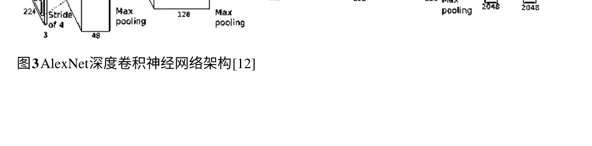

分割掩码预测与分类和边界框回归任务并行进行。每个感兴趣区域通过全卷积网络（FCN）以像素级方式预测分割掩码。

本章展示了这些算法在人员检索中的应用。进一步的小节总结了在监控框架中使用深度学习架构进行分类、检测或分割任务的研究。

#### 2.3 使用深度特征进行人物检索的属性识别

近年来，基于深度学习的方法在人物属性识别方面越来越受到关注，这是由于其特征学习能力。李党伟等人[14]指出了手工制作特征（例如颜色直方图）的局限性，并探索了不同属性之间的关系。他们研究了独立属性以及这些属性之间的关系。每个属性都是一个独立的组件，使用基于深度学习的单属性识别模型（DeepSAR）来识别每个属性。多属性识别模型（DeepMAR）分析属性之间的关系，并共同识别多个属性。Sudowe等人[26]研究了不同属性性之间可能的依赖关系，并利用它们之间的关系优势。他们提出了属性卷积网络（ACN）来共同训练整体CNN模型。它允许权重共享，并有效地在属性之间重复使用知识。

他们考虑了对N/A类进行建模的影响，并引入了一个新的基准PARSE-27k。一些令人兴奋的工作还探索了人体结构以支持属性识别。在一种实现中，朱等人[32]探索了各种属性与身体部位的关系，例如，短发与头部部位最相关。多标签卷积神经网络（MLCNN）然后在一个单一框架中预测多个属性。该网络使用行人全身图像将其分割成15个大小为32 × 32的重叠块。每个块都是独立过滤的，并在成本层中组合。姚等人[30]开发了一个适应实际监控场景的强大识别框架。作者根据属性与各种人体部位的关系将属性标记为全局或局部。例如，性别是一个全局属性，可以使用整个身体进行分类，而发型是一个局部属性，与面部区域有关。自适应区域定位方法获取相关的身体区域。

联合循环学习（JRL）模型[29]利用属性上下文和相关性来改善在训练数据规模较小且质量较差的情况下的属性识别。一个统一的框架模型对人际图像上下文进行建模，并学习人际属性之间的相关性。一种新颖的循环神经网络（RNN）编码器-解码器架构，同时学习行人图像中的行人属性相关性以及它们的顺序依赖关系。Sarfraz等人[24]利用视觉线索来提示属性定位和人物属性的推断（例如背包、头发），这些属性取决于人的视角。视角敏感的属性推断有助于更好端到端学习视角敏感行人属性方法（VeSPA）框架。

该模型同时预测人的粗略视角，并学习专门的视角特定多标签属性预测。

基于手工特征[5, 8, 13, 28, 31]和深度特征[14, 24, 26, 29, 30, 32]的方法从图像中的人物中提取或学习特征，这些特征被边界框所覆盖。它引发了以下问题：

1. 边界框包含了背景像素和人物。图4a显示了包含背景像素的人物检测边界框。杂乱的背景可能会对低分辨率视频的人物检索准确性产生影响。
2. 边界框还用于估计人物的身高。图4b和c显示了与边界框相关的头部和脚部点（用红色标记）。然而，它们与人物实际头部和脚部点不精确。此外，不同的姿势和视角会改变图像中脚部点的位置。这会导致根据边界框推导出的身高估计不准确。

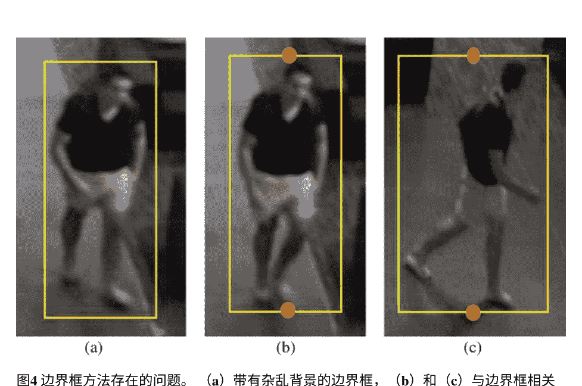

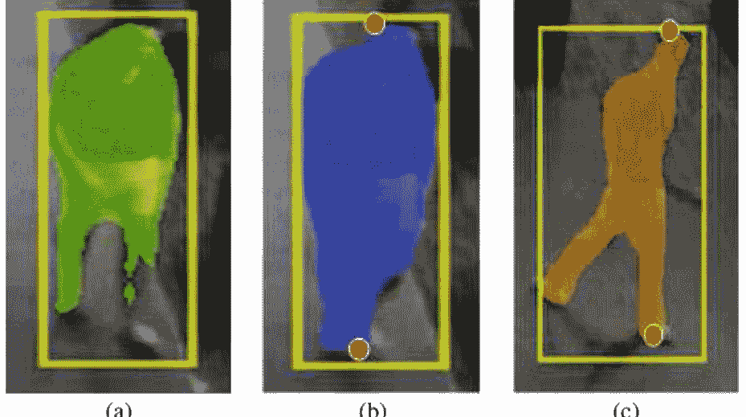

本章重点关注解决上述问题的方法。问题的可能解决方案如下：

1. 语义分割 [10] 在边界框内提供了一个精确的边界。图5显示了带有语义分割的图像在边界框内。它具有以下优点：
   a. 从语义边界中去除不需要的背景杂乱(图5a)。这样的背景像素不会对分类过程有贡献，例如躯干颜色分类。
   b. 语义边界有助于提取准确的头部和脚部点，如图5b和c所示。它可以更好地估计高度，无论姿势和视角如何。
   c. 它还有助于提取精确的躯干区域，从而实现更好的颜色分类。
2. 准确的高度估计还有助于区分坐姿和直立的人。通过将高度视为过滤器，它减少了直立人的搜索空间。

本节详细介绍了基于手工制作和深度特征的人员检索。它还讨论了现有方法中的各种问题，并提供了可能的解决方案。下一节讨论了将这些解决方案纳入算法中以改进人员检索的方法。

### 3 使用深度软生物特征的人员检索系统

本节讨论了一种线性滤波方法，用于使用身高、服装颜色和性别来检索人员。身高是使用相机校准方法估计的，而颜色和性别分类则使用深度特征进行。每个软生物特征属性都作为线性滤波器，在视频帧中减少搜索空间。图6显示了所提出的方法图表。人员检测模块使用Mask R-CNN [10]进行语义分割检测。对于所有检测到的人员，使用语义边界提取精确的头部和脚部点。

根据检测到的人员的头部和脚部点，使用相机校准参数计算身高。该模块输出与匹配身高类别（例如160-180厘米）的人员。因此，身高作为第一个过滤器来减少帧中的搜索空间。身高估计输出可能包含多个具有相同身高类别的人员。

躯干颜色和性别是使用AlexNet [6, 12]进行分类的，该模型在本地数据集上进行训练，用于颜色补丁和行人图像的性别分类。通过躯干颜色检测进一步减少了搜索空间。服装颜色检测模块使用语义分割从躯干中提取无背景的颜色补丁。使用微调的AlexNet来分类躯干颜色。分类的颜色与描述的颜色匹配，进一步减少了画面中的人数。通过使用性别分类来改善最终输出，性别分类也是使用微调的AlexNet进行的。进一步的子部分讨论了身高估计、颜色和性别分类用于人物检索的过程。

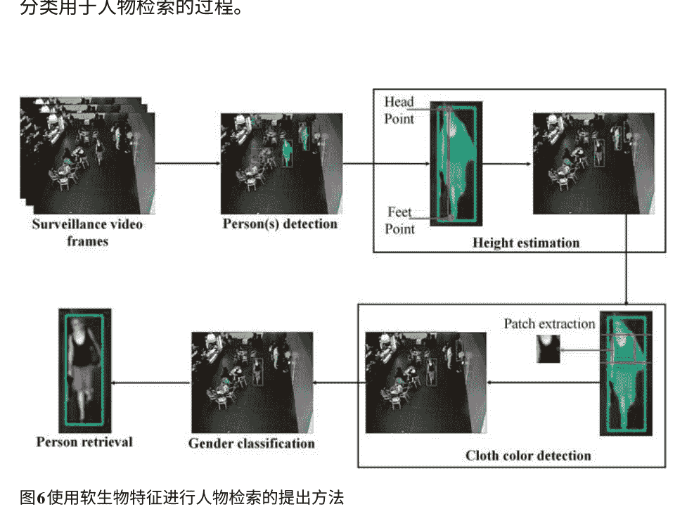

#### 3.1 使用相机标定进行身高估计

基于人脸识别的人物识别系统在监控视频中不适用，因为其质量较差且摄像机与人物之间的距离较远。然而，许多人类属性可以从远处识别，例如人的身高，这是视角和距离不变的。

该方法使用身高来区分坐姿和直立姿势的人。身高估计使用Tsai [27]相机校准参数进行。AVSS 2018挑战II数据库[9]（第4.1节）提供了六个监控摄像头的Tsai相机校准参数。表1显示了这些参数。相机校准参数有助于将图像坐标转换为现实世界坐标以进行身高估计。图6显示了使用语义边界进行头部和脚部点提取的过程。身高估计步骤如下：

1. 使用校准参数计算内参矩阵 (k)、旋转矩阵 (R)和平移向量 (t)。

```
$$ k = \begin{bmatrix} f & 0 & 0 \\ 0 & f & 0 \\ 0 & 0 & 1 \end{bmatrix} $$ (1)
```

表1 Tsai相机校准参数[27]

| 参数 | 符号 | 描述 |
|------|------|------|
| 几何参数 | - | 图像宽度和高度 |
|  | $N_{cx}$ | X方向传感器元素的数量 |
|  | $N_{fx}$ | 计算机采样的一行像素数量 |
|  | $d_x$ | 相邻传感器元素之间的中心距离（X方向扫描线） |
|  | $d_y$ | 相邻CCD传感器之间的中心距离（Y方向） |
|  | $d_{px}$ | 帧中像素的有效X维度 |
|  | $d_{py}$ | 帧中像素的有效Y维度 |
| 内部参数 | $f$ | 相机的焦距 |
|  | $\kappa_1 (k_1)$ | 一阶径向镜头畸变系数 |
|  | $c_x, c_y$ | 径向镜头畸变中心的坐标 |
|  | $s_x$ | 用于考虑扫描和数字化硬件时序不完美的比例因子 |
| 外部参数 | $R_x, R_y, R_z$ | 世界坐标系和相机坐标系之间的旋转角度 |
|  | $T_x, T_y, T_z$ | 用于世界坐标系和相机坐标系之间的转换的翻译组件 |

---

68. B. Victor, K. Bowyer, S. Sarkar, 人脸和耳朵生物特征的评估, 在国际模式识别大会, 卷1 (IEEE, Piscataway, 2002年), 第429–432页.
69. R. Vidyasri, B. Priyalakshmi, M.R. Raja, S. Priyanka, 基于部分特征融合的耳朵识别. 国际生物杂志. 10(2), 105–120 (2018).
70. N.S. Vu, A. Caplier, 用于面部识别的有向边缘幅度模式, 欧洲计算机视觉会议(Springer, Berlin, 2010), pp. 313–326.
71. Y. Wen, K. Zhang, Z. Li, Y. Qiao, 一种用于深度面部识别的判别特征学习方法, 欧洲计算机视觉会议(Springer, Berlin, 2016), pp. 499–515.
72. Z. Xie, Z. Mu, 使用LLE和IDLLE算法的耳朵识别, 国际模式识别会议(IEEE, Piscataway, 2008), pp. 1–4.
73. X. Xu, Z. Mu, L. Yuan, 基于KFDA的特征级融合方法, 用于融合耳朵和侧脸的多模态识别, 国际小波分析和模式识别会议(IEEE, Piscataway, 2007), pp. 1306–1310.
74. T. Ying, W. Shining, L. Wanxiang, 基于深度卷积神经网络的人耳识别, 中国控制与决策会议(Jun 2018), pp. 1830–1835.
75. L. Yuan, Z.C. Mu, 基于2D图像的耳部识别, 生物特征学：理论, 应用和系统会议(IEEE, Piscataway, 2007), pp. 1–5.
76. L. Yuan, H. Zhao, Y. Zhang, Z. Wu, 基于卷积神经网络的耳部对齐, 生物特征识别, 编辑: J. Zhou, Y. Wang, Z. Sun, Z. Jia, J. Feng, S. Shan, K. Ubul, Z.Guo, pp. 562–571. 计算机科学讲义 (Springer, Berlin, 2018).
77. H.J. Zhang, Z.C. Mu, W. Qu, L.M. Liu, C.Y. Zhang, 基于ICA和RBF网络的耳部识别新方法, 国际机器学习与控制会议, vol. 7 (IEEE, Piscataway, 2005), pp. 4511–4515.
78. 张宇, 穆哲, 袁亮, 曾浩, 陈亮, 基于局部表面变化的三维耳部归一化和识别. 应用科学 7(1), 104/1–21 (2017).
79. 张宇, 穆哲, 袁亮, 于超, 利用卷积神经网络在不受控制条件下进行耳部验证. IET生物学 7(3), 185–198 (2018).
80. 周宇, Zaferiou S, 野外耳部变形模型的对齐和识别, 国际自动人脸和手势识别会议(IEEE, Piscataway, May 2017), pp. 626–633.

R = \begin{bmatrix} R_{11} & R_{12} & R_{13} \\ R_{21} & R_{22} & R_{23} \\ R_{31} & R_{32} & R_{33} \end{bmatrix}

R_{11} = \cos(R_{y})\cos(R_{z})
R_{12} = \cos(R_{z})\sin(R_{x})\sin(R_{y}) - \cos(R_{x})\sin(R_{z})
R_{13} = \sin(R_{x})\sin(R_{z}) + \cos(R_{x})\cos(R_{z})\sin(R_{y})
R_{21} = \cos(R_{y})\sin(R_{z})
R_{22} = \sin(R_{x})\sin(R_{y})\sin(R_{z}) + \cos(R_{x})\cos(R_{z})
R_{23} = \cos(R_{x})\sin(R_{y})\sin(R_{z}) - \cos(R_{x})\sin(R_{z})
R_{31} = -\sin(R_{y})
R_{32} = \cos(R_{y})\sin(R_{x})
R_{33} = \cos(R_{x})\cos(R_{y})

t = \begin{bmatrix} T_{x} \\ T_{y} \\ T_{z} \end{bmatrix}

## 2. 计算透视变换矩阵。

C = k[R|t] = \begin{bmatrix} C_{11} & C_{12} & C_{13} & C_{14} \\ C_{21} & C_{22} & C_{23} & C_{24} \\ C_{31} & C_{32} & C_{33} & C_{34} \end{bmatrix}

## 3. 使用镜头畸变参数 (k_1)对头部和脚部图像点进行去畸变。

dx_{1} = dx \times \frac{N_{cx}}{N_{fx}}
xd = \frac{dx_{1} \times (x_{f} - c_{x})}{s_{x}}
yd = (y_{f} - c_{y}) \times dy
r = \sqrt{x_{d}^{2} + y_{d}^{2}}
xu = xd \times (1 + k_{1} r^{2})
yu = yd \times (1 + k_{1} r^{2})

$x_{f}$, $y_{f}$= 图像坐标，而 $x_{u}$, $y_{u}$= 无畸变图像坐标。

## 4. 相机模型由以下给出

$$ \begin{bmatrix} x_u \\ y_u \\ 1 \end{bmatrix} = C \begin{bmatrix} X \\ Y \\ Z \\ 1 \end{bmatrix} = \begin{bmatrix} C_{11} & C_{12} & C_{13} & C_{14} \\ C_{21} & C_{22} & C_{23} & C_{24} \\ C_{31} & C_{32} & C_{33} & C_{34} \end{bmatrix} \begin{bmatrix} X \\ Y \\ Z \\ 1 \end{bmatrix} \quad (10) $$

$x_u$, $y_u$ = 无畸变图像坐标，而 X, Y, Z = 世界坐标。假设人站在 X, Y 平面上， Z 指向垂直方向。因此，脚的世界坐标 Z 为 ; Z = 0。

$$ \begin{bmatrix} x_u \\ y_u \\ 1 \end{bmatrix} = \begin{bmatrix} C_{11} & C_{12} & C_{14} \\ C_{21} & C_{22} & C_{24} \\ C_{31} & C_{32} & C_{34} \end{bmatrix} \begin{bmatrix} X \\ Y \\ 1 \end{bmatrix} \quad (11) $$

通过 C 的逆变换计算脚的世界坐标 X, Y 的图像坐标 $x_u$, $y_u$。

## 5. 通过考虑 X, Y

(步骤4) 使用下面给出的方程计算头部图像坐标 $y_u$ 的世界坐标 Z:

$$ y_u = \frac{C_{21} X + C_{22} Y + C_{23} Z + C_{24}}{C_{31} X + C_{32} Y + C_{33} Z + C_{34}} \quad (12) $$

这个世界坐标 Z 对于头部来说是一个人的身高。

身高估计的输出只包含与描述中给出的身高（例如，130-160厘米）相匹配的人。人的身高不足以将其与人群中的其他人区分开来。然而，它可以用于将人们分类为不同的身高类别，以减少监控画面中的搜索空间。

所有经过滤的人对于躯干颜色分类都是有用的。

身高估计模型是使用训练数据集中提供的标注头部和脚部点开发的。平均身高($H_{avg}$)是对该人的估计身高。使用提取的头部和脚部点（通过语义边界）计算的平均身高比($H_{avg}$)更有意义。这会导致错误的估计。因此，在测试过程中，从估计的身高中减去差值以规范化误差。

#### 3.2 躯干颜色检测

躯干和腿部区域使用黄金比例分离，以人类身高为基准。图7显示了使用黄金比例分离躯干和腿部区域，该比例是相对于边界框顶部决定的。上部20-50%被视为躯干区域，50-100%被视为腿部区域。精确提取躯干补丁。

## 图7 从身体中分离躯干和腿部区域

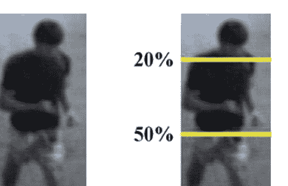

使用语义分割从躯干区域提取。图6（衣物颜色检测块）显示了躯干颜色补丁的提取。使用微调的AlexNet对提取的颜色补丁进行分类。有关颜色分类的AlexNet训练的详细信息，请参见“颜色分类的AlexNet训练”部分。

#### 3.3 性别分类

线性滤波方法准确地检索使用身高和颜色的人。当服装颜色检测的输出（图6）包含多个人时，性别过滤器非常有用，即具有相同身高和躯干颜色的人。AlexNet通过使用全身图像进行性别分类进行微调。有关AlexNet在性别分类中的训练细节，请参见第3.4.2节。

#### 3.4 深度学习模型的实现细节

使用Mask R-CNN [10]深度学习模型进行人物检测和语义分割。使用在Microsoft COCO [16]数据集上预训练的Mask R-CNN权重进行人物检测和语义分割。AlexNet [12]在ImageNet [3]数据集上预训练，然后分别进行颜色和性别分类的微调。AlexNet在一台配有Intel Xeon核心处理器和8 GB NVIDIA Quadro K5200 GPU的机器上进行训练。

##### 3.4.1 AlexNet用于颜色分类的训练

躯干颜色在数据集[9]中被分为12种文化颜色。数据集中包含1704个颜色补丁，并且从躯干区域手动提取了一些额外的补丁。这个人的躯干区域。模型训练使用了总共8362个颜色补丁。这样一个小的训练集可能会过度拟合AlexNet的训练。因此，通过增加亮度因子为1.5来进行颜色补丁增强。数据增强生成了16,724个颜色补丁。其中80%的样本用于训练，20%的样本构成验证集。颜色模型需要对AlexNet的最后四层(Conv5, fc6, fc7和fc8)进行微调。模型以批量大小为128进行30个epoch的训练。学习率和dropout分别为0.001和0.50。颜色模型的验证准确率达到了71.2%。

##### 3.4.2 AlexNet训练用于性别分类

全身图像用于训练AlexNet进行性别分类。从AVSS挑战II（任务1和任务2）[9], RAP [15], PETA [4], GRID [17]和VIPeR [7]收集了56,802个全身图像。应用数据增强来增加训练数据样本。每个图像以10个角度旋转{-5°, -4°, -3°, -2°, -1°, 1°, 2°, 3°, 4°, 5°}，水平和垂直翻转，并通过增加亮度使用伽马因子为1.5。数据增强生成了681,624个用于性别训练的图像。训练和验证集分别占总训练图像的80%和20%。性别模型微调AlexNet的最后两层（fc7和fc8）。模型进行10个时期的训练，批量大小为128。学习率和丢弃率分别为0.01和0.40。性别模型的验证准确率达到71.26%。

本节描述了使用身高、衣服颜色和性别进行人员检索算法。数据集上的算法评估在后续章节中进行。

### 4 实验结果和讨论

本节讨论了使用的数据集的详细信息，各种评估指标，对测试数据集的定性和定量分析。它还涵盖了当算法无法正确检索到人员时的讨论。

#### 4.1 数据集概述

该算法在AVSS 2018挑战II数据库[9]上进行评估，用于语义人员检索使用软生物特征。算法的实现（第3节）是在该数据集上完成的。在挑战II中，数据集有以下两个任务：

任务1 人员再识别-使用图库中的语义描述识别人员。

任务2 监控图像搜索-使用给定监控视频中的语义描述定位人员。

本章使用数据集进行任务2，即监控搜索。视频具有不同的人群密度和人群流动性，并且来自校园内的六个监控摄像头。数据集还提供了Tsai [27]校准参数，用于对背景进行建模。训练数据集包含110个人的视频序列，序列长度从21到290不等。感兴趣的人可能不在每个视频序列的每一帧中出现。因此，前30帧用于背景建模。此外，这30帧允许一个人完全进入摄像头视野。测试数据集由41个人的视频序列组成。每个41个序列包含一个单独的感兴趣的人，可以使用给定的描述进行检索。

给定的XML文件包含数据集中人员的完整注释。注释包括9个身体标记，用于定位帧中的人员和16个软生物特征属性。9个身体标记是：头顶，左右颈部，左右肩膀，左右腰部，脚的近似位置。算法使用这些标记在训练期间估计身高和躯干区域提取。在测试期间，使用这些标记创建真实边界框。

头部的y坐标和脚的最低y坐标构成边界框的高度。宽度使用颈部、肩膀、腰部或脚中最极端的两个标记构成。

表2显示了数据集中每个人的16个软生物特征属性的注释。XML文件中每个属性的未知标签为“-1”。算法使用身高、躯干颜色和性别来检索监控视频中的人员。身高有五个类别：非常矮（130-160厘米），矮（150-170厘米），平均（160-180厘米），高（170-190厘米），非常高（180-210厘米）。男性和女性类别代表性别。十二种文化颜色代表颜色。躯干颜色由躯干-1和躯干-2表示，它们是人体躯干上两种主导颜色。

| 属性 | 类别/标签 |
|------|------------|
| 颜色 | 未知, 黑色, 蓝色, 棕色, 绿色, 灰色, 橙色, 粉色, 紫色, 红色, 白色, 黄色, 肤色 |
| 纹理 | 未知, 纯色, 格子, 斜纹, 竖纹, 横纹, 斑点, 图案 |
| 躯干类型 | 未知, 长袖, 短袖, 无袖 |
| 腿部类型 | 未知, 长裤, 连衣裙, 裙子, 长短裤, 短裤 |
| 年龄 | 未知, 0–20岁, 15–35岁, 25–45岁, 35–55岁, >50岁 |
| 性别 | 未知, 男性, 女性 |
| 身高 | 未知, 非常矮 (130-160厘米), 矮 (150-170厘米), 平均 (160-180厘米), 高 (170-190厘米), 非常高 (180-210厘米) |
| 体型 | 未知, 非常苗条, 苗条, 平均, 大号, 超大号 |
| 肤色 | 未知, 浅色, 中等色, 深色 |
| 头发 | 未知, 金色, 棕色, 深色, 红色, 灰色, 其他 |
| 行李 | 未知, 是, 否 |

身高、躯干-1和性别的属性分布在图8中。它展示了每个属性的类别不平衡情况。身高似乎遵循高斯分布，它代表了自然人类身高分布，其中平均身高（160-180厘米）的人比其他类别的人更多。每种颜色的补丁数量存在很大的变异性。男性和女性性别类别在样本数量上也存在微小差异。

#### 4.2 评估指标

使用各种性能指标来评估算法的性能。研究表明，使用各种指标如真正例（TP）率、交并比（IoU）、F1得分。本节提供了文献中用于人员检索的评估指标的摘要。一些缩写在表3中，将进一步用于定义指标。

| 缩写 | 描述 |
|------|------|
| 正条件 (P) | 样本数据中真实正例的数量 |
| 负条件 (N) | 样本数据中真实负例的数量 |
| 真正例 (TP) | 正确识别 |
| 假正例 (FP) | 错误识别 |
| 真负例 (TN) | 正确拒绝 |
| 假负例 (FN) | 错误拒绝 |

准确率（ACC）它是分类器识别或拒绝样本的好坏程度的度量。它给出了测试中真实结果在样本总数中的比例。它用于表示系统的整体效率。准确率方程为

$$ ACC = \frac{TP + TN}{P + N} = \frac{TP + TN}{TP + TN + FP + FN} $$

精确率它是分类样本中相关样本的比例。它衡量样本分类的准确性。例如，算法从12个总帧中检索到8个帧中的一个人。假设有8个是感兴趣的人，即真正例，3个是假正例。算法的精确率为5/8 = 0.625。精确率，

$$ \text{精确度} = \frac{\text{真正例}}{\text{真正例} + \text{假正例}} \quad (14) $$

召回率或真正例率 (TPR) 或敏感性它是被正确分类的相关样本数与相关样本总数的比例。它衡量算法正确找到所有正例的能力。在上面的例子中，算法的召回率为5/12 = 0.4167。召回率，

$$ \text{召回率或TPR} = \frac{\text{真正例}}{\text{真正例} + \text{假负例}} \quad (15) $$

特异度、选择性或真负例率 (TNR) 它衡量被正确分类为负例的实际负例样本的比例。TNR的计算公式为

$$ \text{TNR} = \frac{\text{真负例}}{\text{真负例} + \text{假正例}} \quad (16) $$

平均精确度 (mAP) 它是用来衡量目标检测器准确性的指标。平均精确度表示不同召回率下最大精确度的平均值。它为

$$ \text{mAP} = \frac{1}{\text{总样本数}} \sum_{\text{召回率}_i} \text{精确率(召回率}_i) \quad (17) $$

F1分数它是测试准确性的度量。该分数使用精确率和召回率值计算。F1分数的最佳值为“1”，即完美的精确率和召回率值。该方程式如下：

$$ F = 2 \times \frac{\text{精确率} \times \text{召回率}}{\text{精确率} + \text{召回率}} \quad (18) $$

交并比 (IoU)它是用于测量检测器对象定位准确性的评估指标，其中输出以对象周围的边界框形式呈现。它是重叠区域与并集的比例。它衡量检测器在定位实际对象边界（即真实对象边界）方面的实用性。

图9显示了交并比指标，它通过以下方程计算：

## 图9 交并比 (IoU)

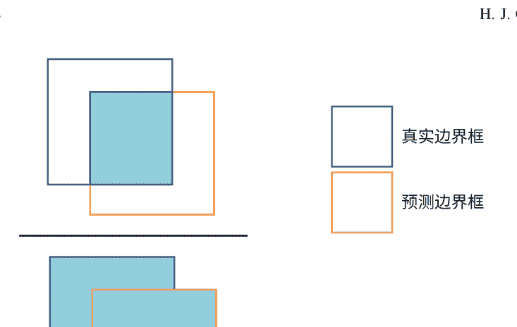

$$ IoU = \frac{\text{重叠区域的面积}}{\text{并集的面积}} = \frac{D \cap GT}{D \cup GT} \quad (19) $$

D = 算法输出的边界框和 GT = 真实边界框。使用TPR和IoU评估人员检索的线性滤波方法。不同结果的讨论在下一节中进行。

#### 4.3 定性和定量结果

本节讨论使用人员检索算法的输出视频帧的定性结果。使用真正阳性率（TPR）和交并比（IoU）评估定量结果。IoU计算算法的定位准确性。使用边界框坐标，检查真实边界框与预测边界框之间的重叠区域。当有真实边界框可供比较时，这是一个有用的度量。它可以取0到1之间的值。算法测试了41个人的AVSS挑战II（任务2）数据集。在实验中，使用身体标记创建了真实边界框。头部的y坐标和脚的最低y坐标构成了边界框的高度。宽度使用颈部、肩部、腰部或脚部的两个最极端的标记来构建。与训练类似，每个视频序列的初始30帧对于建模是有用的，并且允许一个人完全进入摄像机视野。

##### 4.3.1 人物检索的真正阳性案例

图10展示了使用语义描述提供给算法时，正确识别出一个人的样本帧。从左到右的图像依次表示人物的输入测试帧，检测输出，高度过滤器的结果，服装颜色检测以及性别过滤器的输出。标题中的缩写如下：例如，TS.37, F.36表示测试数据集中的测试主体37的第36帧。图10a展示了仅使用身高作为属性进行人物检索。它展示了来自TS.37, F.36的人物，具有语义描述身高（150-170厘米），躯干颜色（红色）和性别（男性）。这是目标人物在画面中可见且没有复杂性（例如遮挡，多个人物）的情况。算法仅使用身高来检索这种情况下的人物。

图10b中有一个身高为(160-180厘米)、躯干颜色为粉色、性别为女性的人物TS.4, F.76，具有语义描述。多个人具有相同的身高类别。使用躯干颜色对身高筛选的输出进行人物检索。该算法使用身高和躯干颜色来检索人物。

图10c中有一个身高为(170-190厘米)、躯干颜色为黑色、性别为女性的人物TS.9, F.39，具有语义描述。颜色滤波器提供了一个输出。

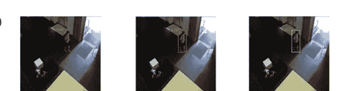

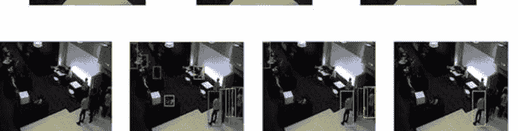

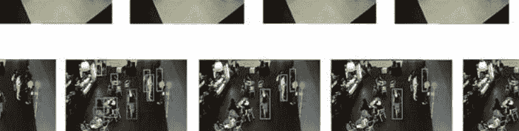

图10 人物检索的真正阳性案例。(a) TS.37， F.36：身高为(150-170厘米)、躯干颜色为红色、性别为男性。仅使用身高进行人物检索（基于单属性的检索）。(b)TS.4， F.76：身高为(160-180厘米)、躯干颜色为粉色、性别为女性。使用身高和躯干颜色进行人物检索（基于两个属性的检索）。(c) TS.9， F.39：身高为(170-190厘米)、躯干颜色为黑色、性别为女性。使用身高、躯干颜色和性别进行人物检索。（基于三个属性的检索）两个人的躯干颜色相同（黑色）。使用性别过滤器检索感兴趣的人。算法使用身高、躯干颜色和性别三个属性来检索人物。因此，该算法通过利用所有的软生物特征属性来检索人物。

使用评估指标TPR（%）和IoU对定量结果进行分析。TPR（%）是正确检索帧数与人物总帧数的比例。如前所述，前30帧不参与定量分析。该算法正确检索了41个测试对象中的28个。图11显示了TPR（%）和IoU（Y轴）以及检索到的人物的索引（X轴）。该算法的平均TPR为75.37%，平均IoU为0.4982，正确检索到的人物为28个。在28个人中，有20个人的TPR高于60%，4个人的TPR在30-60%之间，4个人的TPR在0-30%之间。身高和颜色模型对20个人（TP率 >60%）效果非常好。对于所有41个人，平均TPR为58.92%，平均IoU为0.3905。该算法对于所有41个测试对象的56.17%的帧数实现了大于或等于0.4的IoU。

##### 4.3.2 人物检索中的挑战

图12展示了一些具有挑战性的条件，如照明不足，相似的人物匹配所有三个属性，遮挡和拥挤的场景。它展示了算法无法正确检索人物的各种情况。感兴趣的人物在边界框内。图12a展示了由于躯干颜色分类失败而导致的检索失败。它代表了一个身高为TS.16，F.31的人，具有语义描述身高（160-180厘米），躯干颜色（粉色）和性别（女性）。颜色分类的概率得分最高的是黑色，即躯干颜色。第二高的概率得分是棕色，即躯干的第二种颜色。因此，描述躯干颜色为粉色被分类为黑色和棕色。它未能正确分类正确的颜色，因为躯干颜色补丁区域后面有棕色的头发。

图12b 包含来自TS.25、F.34的多人遮挡，具有语义描述的身高范围(150-170 cm)、躯干颜色(绿色)和性别(女性)。Mask R-CNN 人物检测输出只显示了两个人的一个边界框。由于较大的边界框，身高估计产生了与描述身高相比较大的真实世界身高，因此人物检索失败。

由于遮挡，TS.25的定量指标(TPR =17.5%，IoU =9.06)非常差。同样，在TS.20中 (TPR =14.28%，IoU =7.36)，由于遮挡，人物检索失败。

TS.18，F.31具有语义描述高度（180-210厘米），躯干颜色（白色）和性别（男性）的多个人包含相同高度，躯干颜色和性别（图12c）。因此，该算法无法唯一地检索到一个人。在TS.1中，由于光照不足、遮挡和人体部分与黑色背景融合（图12d）以及语义描述高度（180-210厘米），躯干颜色（黑色）和性别（男性），Mask R-CNN无法检测到人。图12e显示了一个有遮挡和拥挤的TS.40，F.72视频帧，具有语义描述高度（130-160厘米），躯干颜色（黄色）和性别（男性）。TS.35序列也展示了拥挤的场景。在TS.23（TPR =15.38%，IoU =10.15）和TS.39（TPR =8.32%，IoU =1.01）躯干颜色（棕色）被错误分类。这是由于在使用不平衡的颜色补丁（图8）时引起的。颜色强度随着照明条件的变化而变化；例如，在图12e中，当一个人进入房间时，黄色看起来更亮，而当人在房间内移动时，颜色会发生变化。

在实际监控场景中，人员检索具有挑战性，因为存在上述问题。该算法将每个属性作为一个过滤器，有助于减少监控帧中的搜索空间。它有助于减少后期计算，即颜色和性别分类。然而，它存在错误传播的潜在弱点。由于身高估计的误差会在颜色和性别分类中传播。

通过在算法中加入其他属性，解决了检索中相似人员（匹配所有3个属性）的问题。TS.18，F.31（图12c）包含两个身高、躯干颜色和性别相同但腿部颜色不同的人。感兴趣的人的腿部颜色是蓝色，而另一个人的腿部颜色是黑色。图13展示了使用腿部颜色进行正确的人员检索。因此，通过在系统中加入更多的软生物特征属性，可以实现排名1的准确性。

图13 使用腿部颜色进行人物检索

### 5 结论和未来工作

提出的方法使用深度软生物特征（如身高作为几何特征，颜色和性别作为深度特征）在监控视频中检索人物。 使用语义分割的人物检测可以更好地估计身高，并精确提取躯干颜色补丁，从而在具有挑战性的数据集中实现人物检索。 41个人中有28个被正确检索。 该算法在所有41个测试对象中实现了平均TPR为58.92%和平均IoU为0.3905。 56.17%的帧的IoU大于或等于0.4。 通过考虑以下未来的探索，检索准确性得到了改进:

- 可以使用额外的属性（例如腿部颜色）进一步筛选出匹配所有三个属性的人物。
- 可以使用服装类型来调节窗口以实现精确的躯干补丁提取。这将提高颜色分类的准确性。
- 在人员检索中，将软性决策融入到过滤方法中，以适当地权衡每个属性。
- 可以通过不同的亮度级别增强颜色补丁数据集，以应对由于照明条件而产生的颜色变化挑战。
- 使用其他深度学习架构（例如ResNet、DenseNet）代替AlexNet，以更好地分类颜色和性别。

致谢作者们要感谢核科学研究委员会（BRNS）慷慨资助（36(3)/14/20/2016-BRNS/36020）。 我们感谢NVIDIA Corporation捐赠的Quadro K5200 GPU用于此研究。 我们还要感谢昆士兰科技大学（QUT）的SAIVT研究实验室创建了具有挑战性的数据集。 感谢Kenil Shah和Vandit Gajjar在工作实施过程中的帮助。

### 参考文献

1. A. Dantcheva, C. Velardo, A. D’Angelo, J.L. Dugelay, 用于个人识别的软生物特征包。多媒体工具应用 **51**(2), 739–77 (2011)

2. A. Dantcheva, P. Elia, A. Ross, 你的生物特征数据还能透露什么？ 关于软生物特征的调查。IEEE信息安全与取证 **11**(3), 441–67 (2016)

3. J. Deng, W. Dong, R. Socher, L.J. Li, K. Li, L. Fei-Fei, ImageNet: 一个大规模的分层图像数据库，收录于2009年计算机视觉与模式识别IEEE会议，*CVPR*(IEEE, Piscataway, 2009), pp. 248–255

4. 邓宇, 罗鹏, 罗超, 唐晓明, 远距离行人属性识别, 在第22届ACM国际多媒体会议上(ACM, 纽约, 2014), 第789-792页

5. S. Denman, M. Halstead, C. Fookes, S. Sridharan, 使用语义软生物特征描述搜索人物. 模式识别快报 **68**, 306-315页 (2015)

6. H. Galiyawala, K. Shah, V. Gajjar, M.S. Raval, 使用身高、颜色和性别在监控视频中检索人物, 在第15届IEEE国际高级视频和信号监控会议上(IEEE, 新西兰, 2018)

7. D. Gray, S. Brennan, H. Tao, 评估用于识别、重新获取和跟踪的外观模型. 在第IEEE国际性能评估研讨会上, 第3卷, 第5期, (2007), 第1-7页. Citeseer

8. M. Halstead, S. Denman, S. Sridharan, C.B. Fookes, 从语义描述在视频中定位人物: 一个新的数据库和方法, 在第22届国际模式识别会议上(IEEE, Piscataway, 2014), pp. 4501–4506

9. M. Halstead, S. Denman, C. Fookes, Y. Tian, M. Nixon, 使用软生物特征进行监控中的语义人物检索: AVSS 2018挑战II, 在IEEE国际高级视频和信号监控会议(AVSS)(IEEE, 新西兰, 2018)

10. K. He, G. Gkioxari, P. Dollar, R. Girshick, Mask R-CNN, 在2017 IEEE国际计算机视觉会议(ICCV)(IEEE, Piscataway, 2017), pp. 2980–2988

11. A.K. Jain, S.C. Dass, K. Nandakumar, 用于个人识别系统的软生物特征, 在国际生物特征认证会议(ICBA)(Springer, Berlin, 2004), pp.731–738

12. A. Krizhevsky, I. Sutskever, G.E. Hinton, 使用深度卷积神经网络进行ImageNet分类, 在神经信息处理系统进展(2012), 第1097-1105页

13. R. Layne, T.M. Hospedales, S. Gong, Q. Mary, 通过属性进行人物再识别。在*BMVC*, 第2卷, 第3期, (2012), 第8页

14. D. Li, X. Chen, K. Huang, 在监控场景中进行行人属性识别的多属性学习, 在2015年第三届IAPR亚洲模式识别会议(ACPR),(IEEE, Piscataway, 2015), 第111-115页

15. D. Li, Z. Zhang, X. Chen, K. Huang, 用于实时监控场景中人物检索的丰富注释行人数据集。IEEE图像处理交易。 **28**(4), 1575-1590页(2019)

16. T.Y. Lin, M. Maire, S. Belongie, J. Hays, P. Perona, D. Ramanan, P. Dollar, C.L. Zitnick,Microsoft coco: 上下文中的常见物体, 在欧洲计算机视觉会议(Springer, Cham, 2014), 第740-755页

17. C. Liu, S. Gong, C.C. Loy, X. Lin, 人物再识别: 哪些特征是重要的？ , in欧洲计算机视觉会议(Springer, Berlin, 2012) 第391-401页

18. M.D. MacLeod, J.N. Frowley, J.W. Shepherd, 全身信息: 对目击者的相关性.in成年目击证词: 当前趋势和发展, 编者: D.F.Ross, J.D. Read, M.P. Toglia (剑桥大学出版社, 纽约, 1994), 第125-143页

19. M.S. Raval, 数字视频取证: 基于描述的人物识别。 *CSI通讯***39**(12), 9–11 (2016)

20. D.A. Reid, M.S. Nixon, 在语义生物特征中插入人类描述, in 第2届ACM多媒体取证、安全和情报研讨会2010 (ACM, 纽约, 2010), 第25-30页

21. D.A. Reid, S. Samangoeei, C. Chen, M.S. Nixon, A. Ross, 用于监视的软生物特征: 一个概述, 在统计手册, 第31卷 (Elsevier, 阿姆斯特丹, 2013), 第327-352页

22. S. Ren, K. He, R. Girshick, J. Sun, 更快的 R-CNN: 向实时目标检测靠拢区域建议网络, 在神经信息处理系统进展(2015), 第91-99页

23. S. Samangoeei, M. Nixon, B. Guo, 语义人类描述作为软生物特征的使用 在2008年IEEE第二届国际生物特征会议论文集: 理论, 应用和系统 (IEEE, 阿灵顿, 2008)

24. M.S. Sarfraz, A. Schumann, Y. Wang, R. Stiefelhagen, 深度视角敏感的行人属性推断在端到端模型中, 在 BMVC, 2017.

25. P. Shah, M.S. Raval, S. Pandya, S. Chaudhary, A. Laddha, H. Galiyawala, 基于描述的人物识别: 使用衣服颜色和类型, 在计算机视觉、模式识别、图像处理和图形学方面: 第六届全国会议, NCVPR/IPG 2017 (Mandi, 2017), 修订选定论文集6 (Springer, 新加坡, 2018), 页码457-469

26. P. Sudowe, H. Spitzer, B. Leibe, 使用联合训练的整体CNN模型进行人物属性识别, 在IEEE国际计算机视觉会议工作坊 (2015), 页码87-95

27. R. Tsai, 一种用于高精度3D机器视觉计量的多功能相机校准技术, 使用现成的电视摄像机和镜头。 IEEE J. Robot. Autom. 3(4), 页码323-344 (1987)

28. D.A. Vaquero, R.S. Feris, D. Tran, L. Brown, A. Hampapur, M. Turk, 基于属性的人员搜索在监控环境中, 在2009年计算机视觉应用研讨会(WACV) (IEEE, Piscataway, 2009), pp. 1–8

29. J. Wang, X. Zhu, S. Gong, W. Li, 通过上下文和相关性的联合循环学习进行属性识别, 在2017年IEEE国际计算机视觉会议(ICCV) (IEEE, Piscataway, 2017)

30. C. Yao, B. Feng, D. Li, J. Li, 基于自适应区域定位的分层行人属性识别, 在2017年IEEE多媒体和博览会工作坊(ICMEW) (IEEE, Piscataway, 2017), pp. 471–476

31. J. Zhu, S. Liao, Z. Lei, D. Yi, S. Li, 监控中的行人属性分类: 数据库和评估, 在IEEE国际计算机视觉会议工作坊的论文集(2013), pp. 331–338

32. J. Zhu, S. Liao, D. Yi, Z. Lei, S.Z. Li, 基于多标签CNN的行人属性学习 用于软生物特征识别, 在2015年国际生物特征学会会议(ICB) (IEEE, Piscataway, 2015), pp. 535–540

## 深度光谱生物特征识别: 概述和开放问题

Rumaisah Munir和Rizwan Ahmed Khan

### 1 引言

生物特征识别系统是一种可靠的身份/个人识别系统，有助于准确识别个体。生物特征识别系统具有多样化的应用-用途，并在世界各行业中部署，例如用于员工识别，在需要保护患者数据安全的医院中，在需要进行安全金融交易的银行业中，以及在需要监控的边境控制中[1]。

生物特征识别系统通过记录个体的行为或生理特征，例如虹膜、面部、步态等。这些特征以图像的形式记录，并由系统进行处理。在处理阶段，通过所谓的特征提取方法，处理这些图像中的信息。特征提取方法从图像中提取特定的特征，从而减少这些图像中的信息[2, 3]。然后，这些提取的特征被保存为数据库中的模板，以备后续使用。一旦保存了模板，系统会呈现给定主体的图像（或测试图像）。从该图像中提取特征，然后与数据库中的模板进行比较[4]。

当前的生物特征识别系统记录个体的生理特征，处于电磁波谱的可见范围内。生物特征识别系统的可见范围是从350到740 nm。然而，电磁波谱由一系列频段、子频段（或波长）和相应的频率组成，除了可见范围外，还可以用于获取个体的生理或行为特征。电磁波谱可见于图1。

光谱成像是一种用于在电磁系统的各个波段或子波段中获取图像的过程，除了可见光范围。这有助于提取那些人眼无法观察到的波段中的信息，人眼只能处理电磁波谱可见光范围内的信息。在本章中，我们使用光谱成像这个术语来包括多光谱成像和高光谱成像。在多光谱成像系统中，图像以数十个光谱波段捕获。另一方面，在高光谱成像中，图像以数百个光谱波段捕获[6, 7]。

然后，可以将这些多个图像的信息合并或融合成一幅图像。图像融合是一种将为同一场景捕获的多个图像组合起来以获得具有更好空间分辨率的图像的过程[8]。从这个单一图像中提取特征，然后进行分类。

光谱成像在遥感领域得到了广泛应用[9]。它还被用于眼睛的光谱生物成像[10]、色度测量[11]、生物实验研究[12]以及通过光谱显微镜在早期阶段捕获疾病[13]。光谱成像最近在生物特征识别系统中变得流行，因为它具有抵御传感器上的照明变化和欺骗攻击的能力[14–19]。今天部署的生物特征识别系统在可见光范围内运行，很大程度上受到照明条件[20]和无论捕捉到的特征是什么，传感器上的欺骗攻击都会存在[21]。通过使用光谱成像，可以进一步提高当前生物特征识别系统的性能。

光谱生物特征识别系统通过获取个体的生物特征（如面部、虹膜或掌纹）的图像来工作。图2展示了在电磁波谱的不同波长下捕捉到的不同生物特征。根据[4]，选择这些特征需要满足以下准则：

- 普适性（U）：生物特征必须是普适的。即任何两个个体不应该具有相同的特征。
- 独特性（D）：生物特征允许将两个个体区分开来。
- 永久性（Perm）：生物特征不能随时间改变。
- 可采集性（Co）：生物特征应该能够轻松地从所有个体中获取。
- 性能（Perf）：生物特征必须提供高匹配准确性。
- 可接受性（A）：生物特征必须被个体接受，作为一个识别器。
- 规避（Ci）：生物特征不能容易被复制用于欺骗攻击。

我们在表1中重现了迄今为止用于光谱成像的生物特征。

图2 不同生物特征的图像，由光谱传感器在电磁波谱的不同波长下捕获

表1 在这个表中，我们重现了Jain等人使用的与光谱成像相关的生物识别器。

| 识别器 | U | D | Perm | Co | Perf | A | Ci |
| :--- | :--- | :--- | :--- | :--- | :--- | :--- | :--- |
| 面部[22-26] | 高 | 低 | 中 | 高 | 低 | 高 | 高 |
| 面部热图[27-29] | 高 | 高 | 低 | 高 | 中 | 高 | 低 |
| 指纹[30, 31] | 中 | 高 | 高 | 中 | 高 | 中 | 中 |
| 背手[32] | 中 | 中 | 中 | 中 | 中 | 中 | 低 |
| 虹膜 [33, 34] | 高 | 高 | 高 | 中 | 高 | 低 | 低 |
| 掌纹 [35, 36] | 中 | 高 | 高 | 中 | 高 | 中 | 中 |

缩写的详细信息如下: U: 普适性, D: 独特性, Perm: 永久性, Co: 可收集性, Perf: 性能, A: 可接受性, Ci: 规避性一旦选择了特征，就需要设计一个生物特征识别系统来捕捉该特征。我们的下一节（第2节）将介绍光谱生物特征识别系统的通用设计。本节之后将讨论光谱波段（第3节）。随后的几节将介绍三种生物特征：面部、虹膜和掌纹的光谱成像，以及深度学习方法的应用。最后是结论和未来方向。

### 2 光谱生物特征识别系统：设计视角

为了基于所选择的特征开发生物特征识别系统，需要两组图像。其中一组图像称为库集图像。这组图像包含了生物特征的图像，并被输入到光谱生物特征识别系统中。这些图像是在电磁波谱的特定波段中捕捉的。在输入这些图像之后，会应用特征提取方法来减少这些图像中的信息量。得到的信息可以称为特征，存储在系统中作为模板。库集由模板而不是生物特征图像组成。将模板存储在库集中的过程称为注册阶段。

另一组图像被称为测试集。在这个集合中，图像是由光谱传感器捕获的。特征提取方法被应用于图像上。一旦从测试图像中提取出降低的信息或特征，也称为探针图像，它们将被传递给比较器模块进行身份识别。比较器模块执行模板匹配或分类，产生正面（接受）或负面（拒绝）的结果[4]。图3显示了一个通用的光谱生物特征识别系统。

图5显示了分析生物特征光谱图像所需的步骤[38]。第一步需要在光谱特征图像中识别地标特征。特征提取发生在第一步之后，其中信息被减少并从结果信息中生成模板。

这之后是分类。分类后，图像会被系统接受或拒绝。

分类方法在识别过程的前几步中主要依赖于特征提取方法。由于这种依赖性，这些方法的缺点是类内变异性。基于深度学习的方法相对较新。

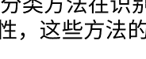

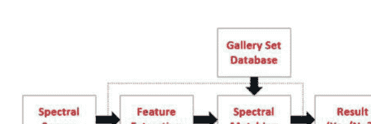

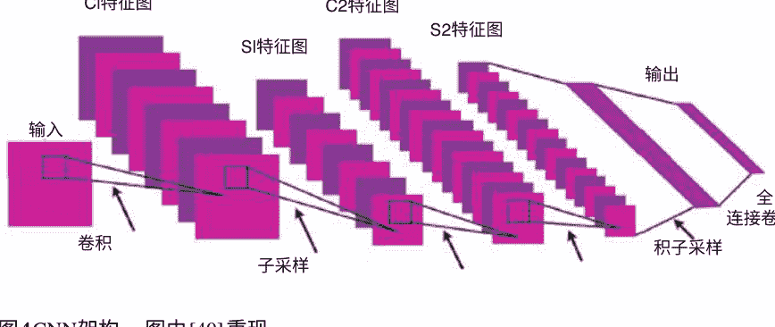

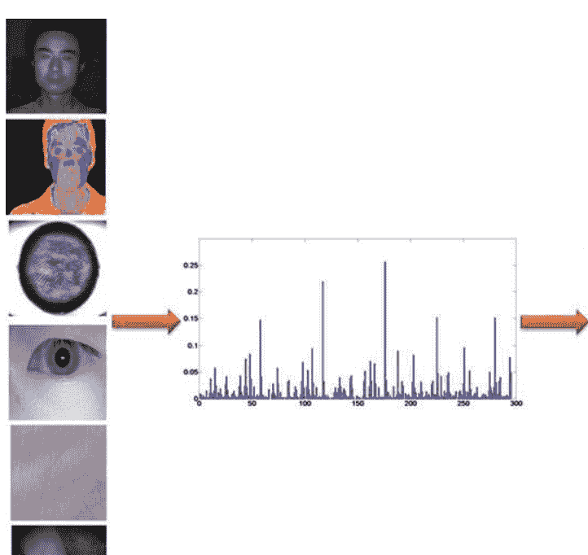

新方法通过学习图像中的多个深度表示来找到最具辨别性的高级特征。因此，在类间变异性高、类内变异性低的情况下，可以实现更高的准确性。深度学习方法已经取得了许多突破。基于深度学习的方法通过从数据中学习深层特征来工作。卷积神经网络（CNN）是一种重要的深度神经网络架构[39]。图4显示了CNN的架构，这是由LeCun首次提出的。

[40]。卷积神经网络是一个多层架构，每个阶段都对特征的提取有贡献。 因此，每个阶段都有一个由特征图组成的输入和输出。 从输入图的位置提取的模式或特征可以在输出特征图中找到。每个阶段都有三个层，定义如下[41, 42]：

- 1. 卷积层：该层使用滤波器与图像进行卷积，产生激活或特征图。
- 2. 修正层：该层使用非线性函数获得正激活图。
- 3. 特征池化层：该层用于减小图像表示的大小，使计算更高效。 参数的数量也减少了，从而控制了过拟合。
- 4. 全连接层：在该层中，每个节点与后续和前序层中的每个节点相连接。

光谱成像系统面临的一个挑战是生物特征图像所捕获的光谱波段的性质。图库集图像的模板是在可见光范围内记录的，而传入的探测图像是由另一个光谱传感器捕获的，例如近红外传感器。 这对于系统来说是一个挑战，它应该能够将近红外图像的特征与可见光波段图像的特征进行匹配。 当测试集中的图像（在一个模态下获得）与图库集中在相同模态下捕获的图像进行匹配时，该过程被称为相同光谱匹配。 这种方法通常用于形成一个基准情况，以便与其他情况的识别准确性进行比较。 当在一个模态下捕获的图库集中的图像与在另一个模态下捕获的测试图像进行匹配时，该过程被称为跨光谱匹配。 在下一节中，我们研究迄今为止在文献中使用的光谱波段的性质。

### 3 光谱波段

当前生物特征系统在可见光范围内运行（350-740 nm）[28]。 光谱成像可以用于提高这些系统的性能。 在光谱生物特征系统中，图像可以在红外波段或特定波长（子波段）中捕获。 它们还可以在多个子波段或多个波长中捕获，以找到判别特征。 融合这些在多个波长中捕获的多个图像可能会提供更好的结果和关于主题的信息。

光谱成像的最常用情况是使用红外辐射来捕获图像。 红外是一种与可见光范围生物特征系统并用的模态。 由于对环境光的不变性，红外非常适合捕获面部和虹膜的图像。 红外可以分为主动红外和被动红外。 表2显示了这些波段的相应波长。

表2 可见光、主动红外和被动红外的范围，如图1所示

| 频段 | 波长 |
|------|------|
| 可见光 | 350–740 nm |
| 近红外(NIR) | 740–1000 nm |
| 短波红外(SWIR) | 1–3 μm |
| 中波红外(MWIR) | 3–5 μm |
| 长波红外(LWIR) | 8–14 μm |

主动红外频段分为近红外(NIR)和短波红外(SWIR)。这是一个反射主导的频段，用于捕捉人脸和虹膜图像。近红外(NIR)范围从740到1000 nm，有助于应对低光条件[22]。短波红外(SWIR)范围从1到3 μm。SWIR用于监视应用，可以抵抗雾气[23]。

主动红外频段接近电磁波谱的可见光范围，因此在主动红外频段捕捉的图像与可见光频段捕捉的图像进行匹配，尽管现象学上有小差异，但产生了有希望的结果，这是由于它们的接近性。

被动或热红外波段[43]被分为中波红外(MWIR)和长波红外(LWIR)波段。这个波段是以发射为主导的。热红外波段用于生成物体的热图(在采集阶段使用)。这个波段对皮肤组织的成像很有用，因为热传感器能够感知皮肤温度的变化[28]。MWIR波段范围从3到5 μm，而LWIR波段范围从8到14 μm。热红外波段远离电磁光谱的可见范围，这就是为什么两者之间存在很大的现象学差异。在热红外波段中匹配捕获的图像与可见波段中捕获的图像可能是一项挑战[28, 44]。

在下一节中，我们定义了一些有前景的生物特征案例，其中图像是在可见波段之外捕获的。

### 4 生物特征：面部

面部是一种独特且普遍的生物特征。它也非常容易被用于监视活动中捕捉。在生物特征系统和光谱成像系统方面已经做了很多工作，面部成为了选择的特征。Angelopoulou等人和Cooksey等人[45, 46]进行了实验，以了解反射（物体表面反射的光）是否有助于区分皮肤和非皮肤区域。人类皮肤颜色存在差异。发现较暗的皮肤反射的光比较浅的皮肤少。然而，这些实验没有考虑到面部皮肤。

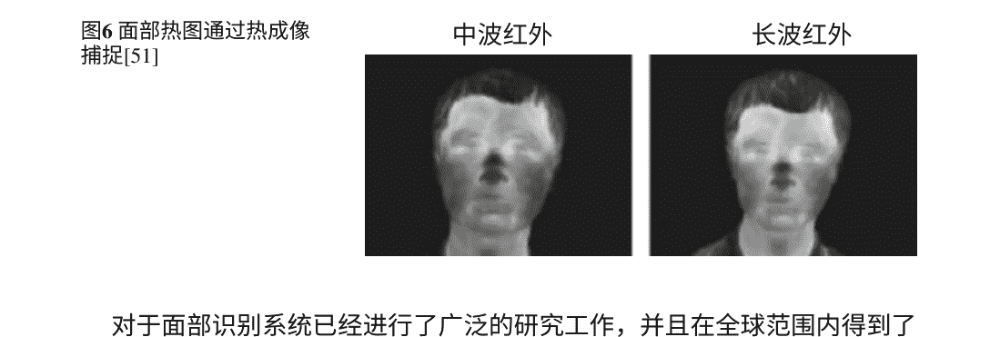

对于面部识别系统已经进行了广泛的研究工作，并且在全球范围内得到了广泛应用。面部是一种独特提供普遍性和永久性的特征。与其他特征相比，捕捉面部图像对被试者来说也是可以接受的。由于在面部识别系统方面已经进行了广泛的工作，因此有许多公共数据库可用，这些数据库捕捉了可见光波段之外的波段图像。我们发现选择近红外或短波红外作为面部成像是可行的，因为可见光波段和主动红外波段之间的现象学差距很小。

被动红外波段（中波红外或长波红外）也被用于捕捉面部图像，并被称为面部热图。这些图像是由能够感知皮肤温度的传感器捕获的。在热波段中，几乎没有对面部进行捕捉的工作[28, 47-50]。该工作涉及在热波段中匹配图库集图像与同样在热波段中捕获的图像。这为图库集中的图像与探测集中的图像不同波段的情况提供了一个基准。然而，将热图像与可见光图像进行交叉匹配的结果并不令人鼓舞。这是因为热波段和可见光波段之间存在着巨大的现象学差距。图6显示了由长波红外和中波红外传感器捕获的热图。

目前，研究人员用于面部热图机器学习算法基准测试的数据集尚未公开。这阻碍了该领域的研究进展。在下一小节中，我们将研究用于基于深度学习方法的主动红外波段捕获的人脸数据库。

#### 4.1 人脸数据库

在本节中，我们回顾了除可见光波段之外的其他光谱波段中获取的公开可用于人脸识别的数据集。这些数据集已用于基于深度学习方法的实验。

#### **4.1.1 卡内基梅隆大学高光谱人脸数据集（CMU-HSFD）**

CMU-HSFD数据集[52]可供研究目的公开使用。研究人员在450-1100 nm范围内获取了该数据集（步长为10 nm）。48个受试者参与了多个会话，为数据集提供图像。在每个会话中，通过改变照明条件获取了多个图像。由于参与者眨眼，观察到了对齐错误。图7显示了CMU-HSFD数据集中的一个立方体。

#### **4.1.2 香港理工大学高光谱人脸数据库（HK PolyU-HSFD）**

香港理工大学-人脸数据集可供研究使用[53]。这是在香港理工大学开发的。研究人员在400-720 nm的范围内获取了这个数据集（步长为10 nm）。共有25名候选人（17名男性候选人和8名女性候选人）参与了这个数据集的制作。在为这个数据集捕捉人脸立方体的过程中，进行了多次会议，持续了5个月。每个会议都有三个视图，即正面、右侧和左侧。由于多次会议之间的时间间隔不同，外观上存在变化。图8显示了一个来自HK PolyU-HSFD数据集的人脸立方体。

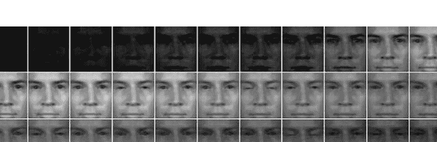

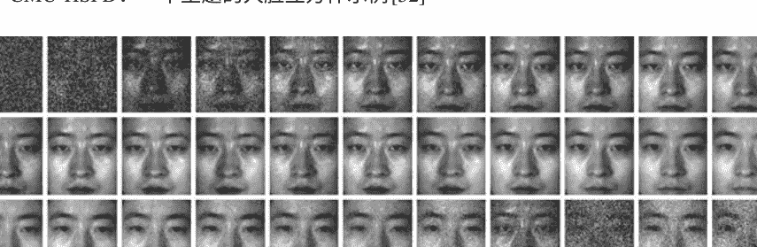

##### 4.1.3 UWA高光谱人脸数据库（UWA-HSFD）

UWA高光谱人脸数据库（UWA-HSFD）可供公开研究使用[54, 55]。研究人员在400-720 nm范围内获取了该数据集（步长为10 nm）。共有70名候选人参与了该数据集的制作。图9显示了UWA-HSFD数据集中的一个人脸立方体。

##### 4.1.4 香港理工大学（PolyU）近红外人脸数据库

这个公共数据库是由香港理工大学制作的[56]。图像来自335个被试者。该系统在近红外范围内捕获图像。数据库中共有34,000张图像。

图10显示了HK PolyU近红外人脸数据库中的一个立方体示例。

##### 4.1.5 CASIA HFB数据库

CASIA异构人脸生物特征数据库是一个公开可用的数据库[57]。这些图像是在可见光范围和近红外范围内捕获的。数据库中还包含捕获的人脸的3D图像。总共有100个受试者（57个男性受试者，43个女性候选人）参与提供他们的图像。图11显示了数据库中一个人脸立方体的图像。

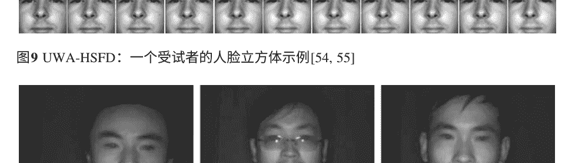

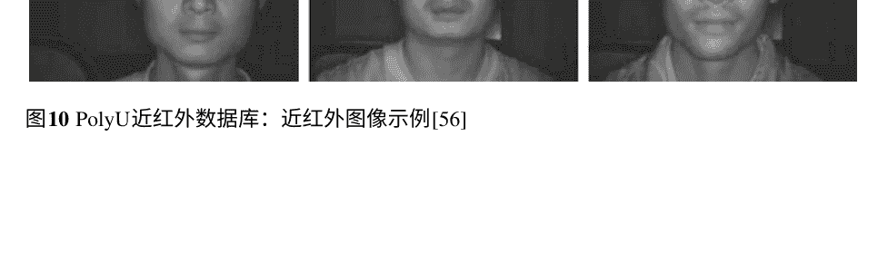

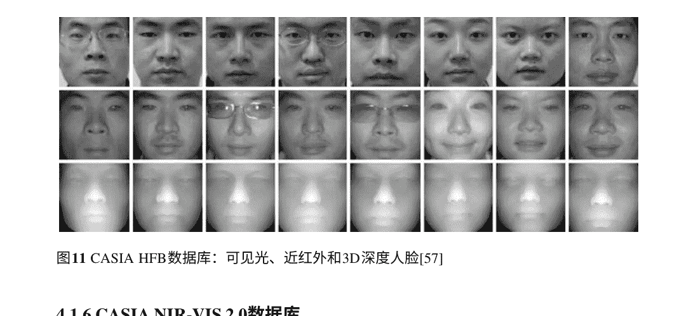

图11 CASIA HFB数据库：可见光、近红外和3D深度人脸[57]

##### 4.1.6 CASIA NIR-VIS 2.0数据库

这是一个公开可用的数据库[58]，是CASIA HFB数据库的改进。这些图像是从725个受试者中捕获的。这些图像是在可见光和红外范围内捕获的。图12显示了从数据库中获取的一张图像。

#### 4.2 基于深度学习的人脸识别方法

在本节中，我们将看到深度学习方法如何应用于人脸的光谱成像。

##### 4.2.1 使用卷积神经网络（CNNs）进行人脸识别

在这种情况下，使用卷积神经网络对高光谱人脸图像进行分类和波段选择的训练[59]。在波段选择过程中，使用了许多不同的波长来捕捉多个人脸图像。Sharma等人考虑了一个高光谱立方体，其中每个波段被视为一个单独的图像。然后，他们训练了他们的CNN模型，该模型包括三个卷积层，两个全连接层和softmax损失函数。在每个卷积层之后，都会跟随批量归一化层、ReLU和最大池化层。在这个框架中，选择了富含信息且相互不相关的特定波段。选择最佳的三个波段也是如此，从中提取了手工设计的特征（LBP、HOG和DSIFT-FVs [60]）。在分类之后，HK PolyU-HSFD数据集上报告了99.4%的识别准确率，CMU-HSFD数据集上报告了99.2%的准确率。LBP（80%和99.5%）、HOG（79.4%和99.6%）或DSIFT-FV（88.3%和98.4%）提供了相应的识别准确率。

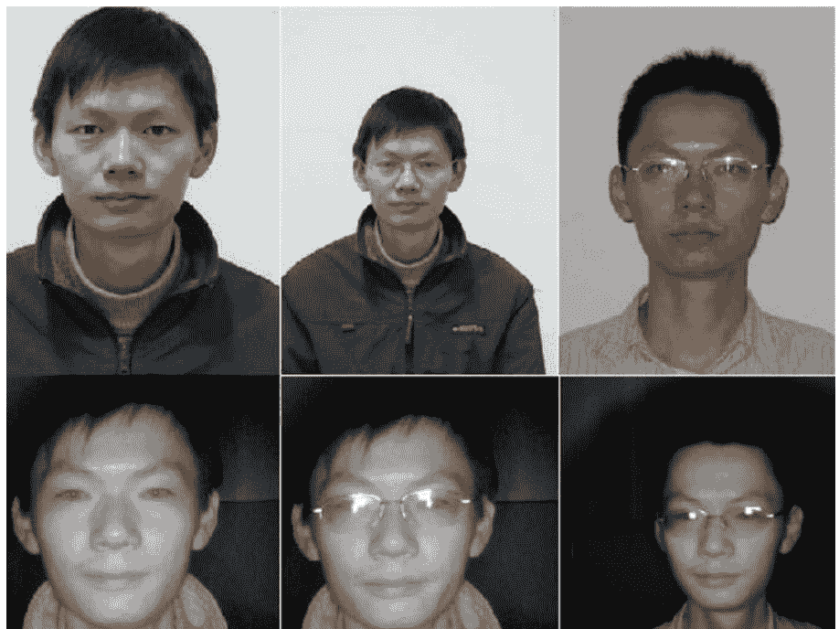

更好的结果。 然而，对于PolyU-HSFD，使用CNN的结果比使用手工特征更高。

##### 4.2.2 NIRFaceNet

在这种方法中，GoogLeNet [61]被修改为生成NIRFaceNet [62]。GoogLeNet是一个由22个参数层组成的深度神经网络。 如果包括池化层，总共有27层。 CASIA NIR数据集在这种情况下被使用。 由于这个数据集很小（只有3940张图片），必须修改GoogLeNet，因为GoogLeNet是在一个更大的数据集（ImageNet）上训练的。 修改后的架构只有八层。 CASIA NIR数据库用于测试NIRFaceNet、GoogLeNet、LBP+PCA [63, 64]、LBP直方图、Z MUDWT [65]和ZMHK [66]。 创建了九个测试集，这些方法被应用于这些测试集上。 在不同的测试集中，向图像添加了不同类型的噪声或遮挡，以评估识别性能。 NIRFaceNet在所有情况下都提供了最高的识别准确率百分比。 主要

NIRFaceNet的关键是针对非合作情况下的用户与光谱传感器之间的特定距离。因此，NIRFaceNet被认为适用于监控活动。

### 5 生物特征：虹膜

商用虹膜生物特征系统在红外（IR）光谱范围内工作[33, 67]。不同人的眼周区域的虹膜颜色有所不同。这种变化可能存在于不同地区的个体之间。

根据Boyce等人的研究[33]，不同虹膜颜色的变化是由基质细胞密度和色素沉着引起的。当光线穿透虹膜时，较长波长的光被虹膜吸收，而较短波长的光被反射回来。此外，虹膜的不同颜色是由细胞组成和虹膜中的黑色素决定的，这决定了反射回来的光波。由于虹膜的表型特征不同，光谱成像能够分解反射模式[68]。

虹膜图像也以眼周区域的图像形式收集。研究人员使用眼周区域图像来提高虹膜和人脸识别系统的识别性能[69]。该区域的图像包括虹膜、眉毛、眼睛下方的皮肤和睫毛。这些图像在可见光范围和近红外范围内都被捕获。图13显示了一个眼周图像的示例。

虹膜是一种独特且稳定的生物特征，但在系统中的应用并不像商业人脸生物特征系统那样广泛。然而，它被使用

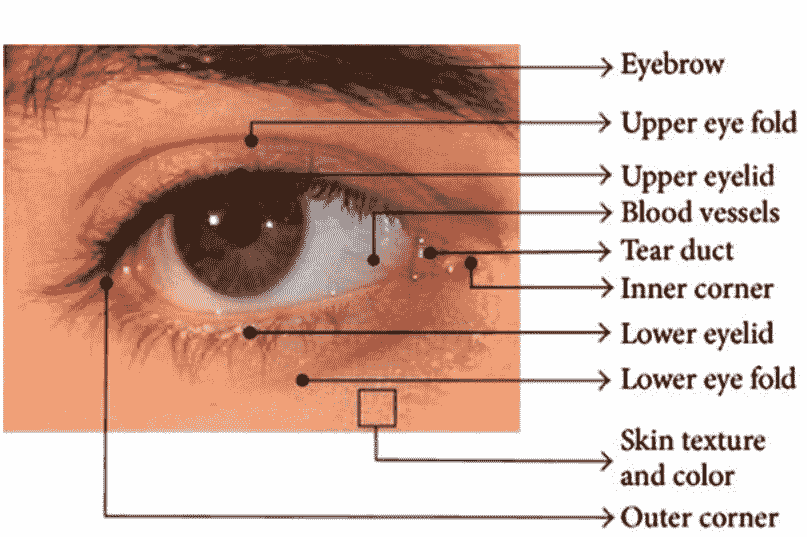

以及重要的生物特征，如面部和指纹。 从表1可以看出，这种生物特征具有高的持久性、独特性和普适性。 与面部不同，这种特征具有低的规避性，这是可取的，因为面部的伪造很容易。 虹膜不受姿势变化、面部表情变化和年龄的影响，与面部不同。 然而，由于可接受性较低，它并没有被广泛使用。

已经有许多详细的调查涉及虹膜识别和眼周识别[71-73]。 在下一节中，我们将重点介绍公开可用的虹膜和眼周识别的光谱数据集。

#### 5.1 虹膜数据库

在本节中，我们将回顾公开可用的虹膜识别数据集。

##### 5.1.1 印度理工学院德里分校虹膜数据库

这个公开可用的数据库[74, 75]是在印度理工学院新德里分校收集的。 虹膜图像是从学生和教职工中获取的。 该数据库共有1120张图像，来自224个个体（176个男性和48个女性）。 被试者的年龄范围是14-55岁。 这些图像是在室内环境中拍摄的。 图14展示了印度理工学院德里分校虹膜数据库中的一张图像。

图14 印度理工学院德里分校数据库中的一张虹膜图像[74, 75]

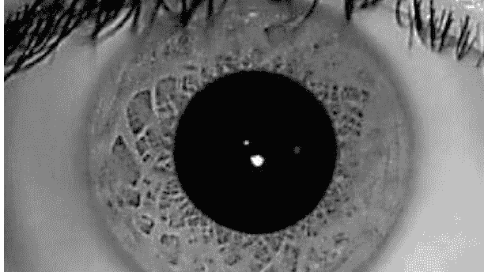

##### 5.1.2 CASIA-Iris-Thousand数据库

这是一个公开可用的数据库[76]。它包含了近20,000张虹膜图像，来自1000个被试者。这些图像是在近红外范围内捕获的。这个数据库的特点是包含了非常多的被试者的图像。图15显示了来自CASIA-Iris-Thousand数据库的虹膜图像。

##### 5.1.3 IIITD多光谱眼周数据库（IMP）

IMP数据库包含了三种不同光谱的图像，即可见光谱、夜视和近红外（NIR）[69]。在包含可见光图像的集合中，共有310张图像来自62个被试者（每个被试者5张图像）。在夜视范围内，共有310张图像来自62个被试者（每个被试者5张图像）。在包含NIR图像的集合中，共有620张图像来自62个被试者。对于每个被试者，有10张图像，其中5张对应右眼，5张对应左眼。图16显示了在三种不同光谱下捕获的眼周区域图像。

##### 5.1.4 圣母大学数据集

在这个数据集中使用了NIR成像（LG2200虹膜图像相机）来获取图像[77]。ND-IRIS-0405数据集包含64,980张图像，来自356个受试者。这个数据集中的图像存在真实世界的条件，如遮挡和模糊。图17显示了来自ND-IRIS-0405数据集的一张图像。

图15 CASIA虹膜数据库中的一张虹膜图像[76]

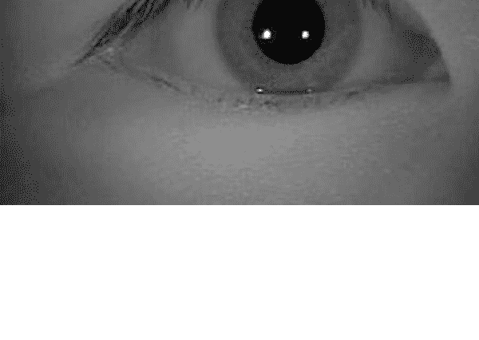

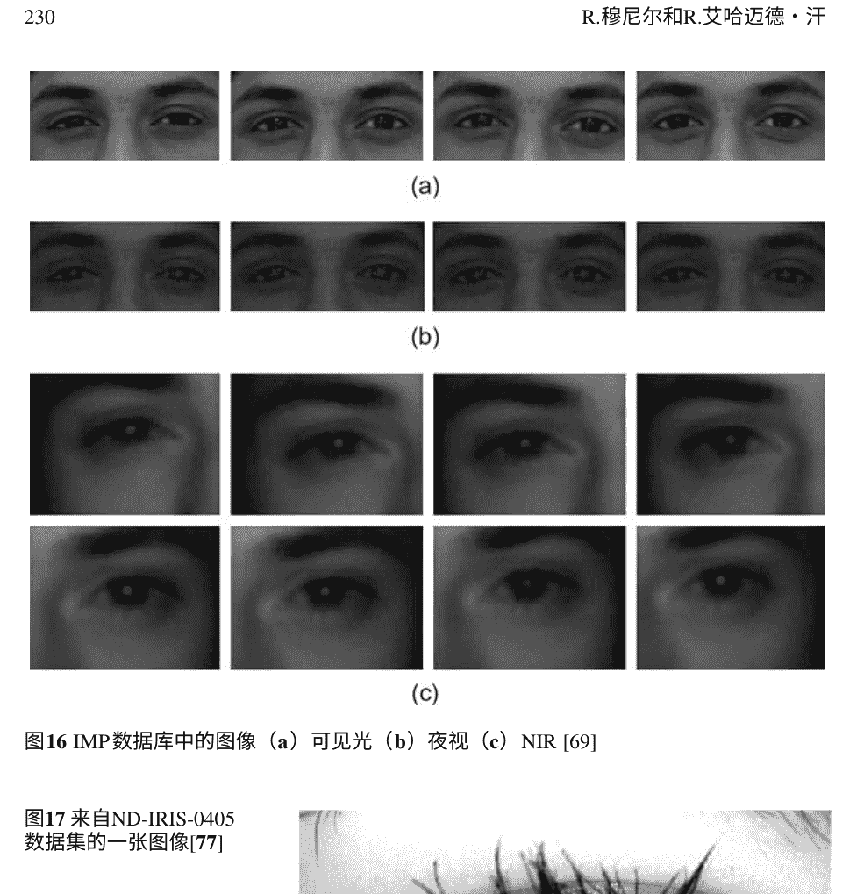

图16 IMP数据库中的图像（a）可见光（b）夜视（c）NIR [69]

图17 来自ND-IRIS-0405数据集的一张图像[77]

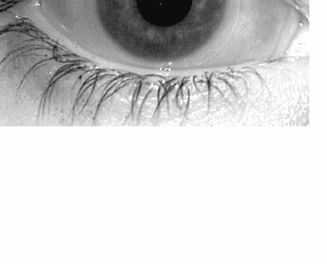

在同一组织的另一个数据集CrossSensor-Iris-2013数据库[78]中，使用LG4000获取了29,986张图像，使用LG2200获取了116,564张图像，来自676个受试者。

##### 5.1.5 可见光移动眼部生物特征数据集

可见光移动眼部生物特征（VISOB）[79]数据集是为了ICIP2016挑战而制作的。使用了三种不同的移动相机（iPhone 5S、三星 Note 4 和 Oppo N1）获取了550个受试者的正面图像。有三种不同的照明条件。总共有48,250张图像用于注册集，46,797张用于验证集。图18显示了 VISOB 数据集中的图像。

##### 5.1.6 交叉传感器虹膜和眼周数据库

交叉传感器虹膜和眼周（CSIP）数据库[80]包含了由四部智能手机（索尼爱立信 Xperia Arc、苹果 iPhone 4、ThL W200 和华为 U8510）获取的图像。采用了不同的设置，如使用前置或后置摄像头拍摄图像，以及使用或不使用闪光灯拍摄图像。受试者的图像是在不同的照明条件下拍摄的。五十名受试者自愿提供了2004张右眼周图像。图19显示了 CSIP 数据集中的图像。

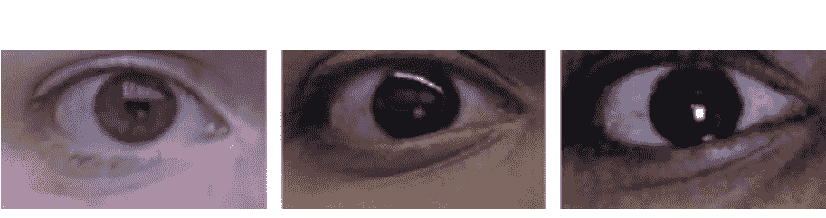

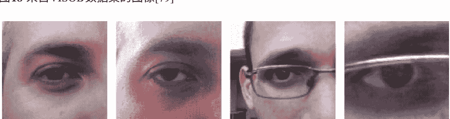

#### 5.2 基于深度学习的虹膜验证方法

在本节中，我们重点介绍了基于神经网络学习的方法，用于将图库图像与虹膜探测图像进行匹配。

##### 5.2.1 VGG-Net

Minaee等人[81]使用基于深度学习的方法进行虹膜验证。他们使用了CASIA-Iris-Thousand数据库和IIT Delhi Iris数据库。他们特别从VGG-Net [82, 83]中提取了虹膜验证的深度特征。该网络有16个卷积层和5个池化层。VGG-Net有1.38亿个参数。在提取深度特征之后，使用PCA进行降维。使用SVM进行分类。与应用于IIT数据库的其他算法相比，该方法在准确性方面达到了99.4%，如Haar小波[75]（96.6%准确性），Kumar的Log-Gabor滤波器[75]（97.2%准确性），融合[75]（97.4%准确性），弹性图匹配[84]（98%准确性）和纹理+散射特征[85]（99.2%准确性）。

##### 5.2.2 IMP数据库上的深度学习

Sharma等人[69]使用基于深度学习的方法在IMP数据库中进行图像交叉匹配。该数据库包含可见光谱、夜视和近红外光谱中的眼周区域图像。Sharma等人使用深度学习从各个光谱中提取特征，然后将它们组合起来匹配交叉光谱图像。首先，学习了一个神经网络用于第一个光谱，称为光谱-1 NNet。真实对（标签0）和伪对（标签1）作为输入提供给网络。该网络有两个隐藏层，径向基核函数和Sigmoid激活函数。通过正则化进行反向传播进行权重训练。然后，使用相同的过程学习第二个光谱，称为光谱-2 NNet。在此之后，将光谱1和2组合起来进行交叉匹配。从光谱1和2中获取金字塔HOG（PHOG）[86, 87]特征。以加权的方式创建交叉光谱特征向量，将其作为输入提供给神经网络。

Sharma等人将他们的算法的结果与局部二进制模式（LBP）[88, 89]，方向梯度直方图（HOG）[87]，金字塔HOG（PHOG）[86, 87]和四块LBP（FPLBP）[90]描述符的结果进行了比较。在这四个描述符中，由于其光照不变性，在相同光谱匹配的情况下，最好的结果是在NIR范围内获得的。然而，在交叉匹配中，描述符的性能较差。神经网络（频谱1和2）也应用于所有三个范围内的相同光谱匹配。在这种情况下，准确性进一步提高。在交叉光谱匹配的情况下，执行可见-NIR，可见夜视和夜视-NIR之间的匹配。与描述符获得的结果相比，有35-50%的改进。

##### 5.2.3 DeepIrisNet

Gangwar等人[91]提出了一种基于深度卷积神经网络（DCNN）的虹膜识别方法。他们在两个公开可用的虹膜数据库上进行了实验，分别是ND-IRIS-0405和ND-CrossSensor-Iris-2013。他们使用了两种架构，分别是DeepIrisNet-A和DeepIrisNet-B。DeepIrisNet-A由八个卷积层组成，具有批量归一化。每两个卷积层之后都是池化层。总共有四个池化层。在DeepIrisNet-B中，有五个卷积层，后面跟着两个inception层。每两个卷积层之后都是池化层。对于这两种架构的前三层，每个输出神经元都与每个输入神经元相连。隐藏层中使用的激活函数是ReLU（修正线性单元）。权重使用零均值高斯分布进行初始化。所提出的架构提供了非常准确的识别结果。

##### 5.2.4 LightCNN29

Garg等人[92]在无约束条件下使用LightCNN29进行眼周识别。他们在IMP、CSIP和VISOB数据集上应用了他们提出的模型。他们的模型中有29个卷积层，使用3×3的滤波器。该模型包含四个池化层。在CSIP数据集上，所提出的模型提供了89.53%的Rank-1识别准确率，高于HOG[87]和DAISY[93]算法的准确率。在VISOB数据集上，对于所有的光照条件和环境（室内或室外），所提出的算法提供了10%的EER改进。在IMP数据集上，实现了82.97%的真实接受率，在10%的虚假接受率下。

### 6 生物特征：掌纹

掌纹是一种生物特征，以其优势而闻名于其他特征。其中一个优点是用于捕捉图像的低成本捕捉系统。另一个优点是其对欺骗攻击的抵抗力。最近，基于深度学习的方法已被用于研究多光谱掌纹识别系统的识别准确性[94-96]。

在掌纹识别系统中，将两个个体的掌纹进行比较，以查看线条模式是否匹配。根据[97, 98]，掌心上有主要线条（进一步分为心线、头线和生命线）、皱纹和脊线。主要线条是个体的独特特征，不随时间流逝而改变。皱纹是细小且不规则的。除了主要线条和皱纹之外，掌心上的其余线条被归类为脊线。

掌纹是独特且永久的，因此对于特征识别提供了丰富的信息。

光谱成像可以用于提取掌纹中的信息，创建一个抗欺骗攻击的多模态生物特征系统。光谱成像已经被Hao等人用于掌纹识别[36, 99, 100]。在文献中，我们看到两种光谱掌纹验证系统，如Raghavendra等人所讨论的[101]：

- 1. 一个具有多个摄像头的系统，每个摄像头能够在单个光谱波段中获取图像。
- 2. 一个单个摄像头具有多个照明器的系统，可以在多个波段中捕获图像。

第二个系统比第一个系统具有优势，因为一个单个摄像头可以同时捕获一个主体在不同光谱波段中的图像，无需注册。Hao等人提出了这样一个系统[102]，在其中卫生和用户友好性被优先考虑。该系统不需要与设备接触。采用时分复用方法，而不是频分复用方法，其中不同波段的图像在连续的时间段内获取。

基于掌纹的生物特征识别系统并不广泛使用。基于指纹的生物特征识别系统被广泛部署并且足够可靠。然而，基于掌纹的系统也是一种可行的选择，可以与其他生物特征结合起来进行识别。下一小节将介绍公开可用的掌纹数据集。

#### 6.1 掌纹数据库

本节将讨论公开可用的掌纹识别数据集。这些数据集是应用深度学习的必需品。

##### 6.1.1 香港理工大学多光谱掌纹数据库

该数据集采集了250个受试者的图像。其中有195个男性受试者和55个女性受试者，年龄在20到60岁之间。每个受试者的每只手掌在两个不同的会话中采集了六张图像，两个会话之间相隔9天。

每个受试者的每只手掌在单个会话中采集了六张图像。 总共采集了6000张单一光照条件下的图像。 图像是在红光、绿光、蓝光和近红外光四个不同波段下捕获的。该数据库是公开可用的[35, 103-106]，由香港理工大学采集。图20显示了掌心感兴趣区域（ROI）的图像，捕获了四个不同波段的图像。

##### 6.1.2 中国科学院自动化研究所多光谱掌纹数据库

中国科学院自动化研究所（CASIA）公开提供了CASIA多光谱掌纹数据集[99, 102, 107]。
该数据集总共有7200张掌纹图像，分为两个会话进行采集。这两个会话相隔一个月，手的姿势有所变化。 图像来自100个被试者。 数据集中的图像已经转换为灰度JPEG文件。 每个会话有三个样本，每个样本包含六张图像。 这些图像是在不同的光谱波段（460 nm、630 nm、700 nm、850 nm、940 nm和白光）下捕获的。 图21显示了数据集中的掌纹图像。

#### 6.2 基于深度学习的掌纹验证方法

在本节中，我们探讨了如何利用基于深度学习的方法进行掌纹验证。

##### 6.2.1 PCANet深度学习用于掌纹验证

Meraoumia等人[95, 96]对基于掌纹的生物特征系统进行了实验。 在这个系统中，首先产生一个新的图像，在这个图像中，感兴趣区域（ROI）首先被提取出来。从原始掌纹图像中提取出来。PCANet描述符作为每个新图像的特征向量。然后，所有特征向量被用来训练一个分类器，如SVM、RBF、RFT和KNN。当生物特征系统呈现测试图像时，首先提取ROI。然后，从这个新图像中提取特征向量，并传递给SVM分类器进行决策。

在这种情况下使用的PCANet描述符是一种基于纹理的深度学习方法。Meraoumia等人[96]报告了PCANet的优势，即能够提取具有增加类间变异性和减少类内变异性的掌纹特征。这导致了准确的识别。

PCANet具有以下组件[96]：

- 级联主成分分析（PCA）：这里有两个步骤。在第一步中，通过对一组向量应用PCA [63, 64]来计算滤波器组。在第二步中，对每个输出图像执行PCANet算法。
- 二进制哈希：在这一步中，将输出图像的格式转换为二进制。
- 直方图：在这一步中，将前一步的每个图像分割成一定数量的块。在此分割之后，为块中的每个十进制值计算直方图。

该方案已在公开可用的多光谱掌纹数据库上进行了测试。其中一个数据库是CASIA多光谱掌纹数据库，另一个是PolyU多光谱掌纹数据库。与诸如局部线方向模式[100]、使用核判别分析进行维度缩减和稀疏表示分类器进行分类的Log-Gabor特征提取[101]、使用汉明距离的log-Gabor和邻近方向指示器[108][109]、双方向编码[110]等方法相比，测试结果显示出非常高的识别准确率。然而，每种方法选择的波段存在偏差。为每种方法选择了最佳波段，而每种方法的最佳波段都不相同。为了进行公共基准测试，不能使用相同的波段来检查准确率。

### 7 结论和未来工作

在本节中，我们回顾了基于深度学习的光谱生物特征系统的局限性。我们认为，实现光谱成像以捕捉超出可见光谱范围的信息的一种方法是使用主动红外成像。这是因为主动红外和可见光范围之间的现象学差异很小，而可见光范围用于捕捉库图像。在被动红外波段或热波段中几乎没有或没有工作。存在具有面部热图像的数据库，但尚未公开。首先，需要获取一个大型的公开可用数据集，以观察红外成像在生物特征（如面部和虹膜）中的优点。对于不同的生物特征，任何数据集中的图像数量都非常少。需要捕捉大量图像。应该发布一个常见的标准数据集，用于实验和算法的交叉评估。我们从不同的公开可用数据库中观察到，这些数据库通常是在不同的波段或波长下捕获的。除非图像在相同的波长下捕获，否则无法进行实验结果的交叉评估。由于不同研究组使用的波段不同，因此也无法验证结果。

对于数据集来说，一个重要的注意点是考虑现实世界的场景。大多数可用的数据集是在受控条件下获取的。数据集应该在非受控条件下捕获，并且具有足够的距离。这样可以消除偏见，并更适合实际的现实世界情况。在捕获了大量数据库之后，应该使用基于深度学习的方法进行评估。基于深度学习的方法显示出了潜力。深度网络具有大量要学习的参数。如果训练样本的数量很少，即在较小的数据集的情况下，会出现过拟合。为了学习更具有区分性的特征，需要更深入地研究。当获得一个共同的基准时，可以避免特定方法和数据集引入的偏见，这是目前文献中所看到的。

### 参考文献

| 序号 | 条目 |
|------|------|
| 1. | A. Jain, L. Hong, S. Pankanti, 生物特征识别, Commun. ACM 43(2), 90–90 (2000) |
| 2. | R.A. Khan, A. Meyer, H. Konik, S. Bouakaz, 可靠的、实时的低分辨率图像面部表情识别框架。Pattern Recogn. Lett. 34(10), 1159–1168(2013) |
| 3. | R.A. Khan, A. Meyer, H. Konik, S. Bouakaz, 通过形状和外观特征进行疼痛检测，在2013年IEEE国际多媒体与博览会(ICME)(2013)，第1-6页。 https://doi.org/10.1109/ICME.2013.6607608 |
| 4. | A.K. Jain, A. Ross, S. Prabhakar, 生物特征识别简介。IEEE Trans. Circuits Syst. Video Technol. 14(1), 4–20 (2004). https://doi.org/10.1109/TCSVT.2003.818349 |
| 5. | C. Ibarra-Castanedo, 通过脉冲相位热成像进行定量亚表面缺陷评估: 相位深度检索。博士学位论文，拉瓦尔大学 (2005) |
| 6. | D.W. Allen, 人体皮肤光谱成像概述，面部识别跨成像光谱(斯普林格, 柏林, 2016), 第1-19页 |
| 7. | M. Nischan, R. Joseph, J. Libby, J. Kerekes, 主动光谱成像。林肯实验室杂志 14, 131-144页 (2003) |
| 8. | Q. Wei, J. Bioucas-Dias, N. Dobigeon, J.-Y. Tourneret, 基于稀疏表示的高光谱和多光谱图像融合。IEEE Trans. Geosci. Remote Sens. 53(7), 3658–3668(2015) |
| 9. | G.A. Shaw, H.-h.K. Burke, 用于遥感的光谱成像。Lincoln Lab. J. 14(1), 3–28 (2003) |
| 10. | D. Cabib, M. Adel, R.A. Buckwald, E. Horn, 眼睛的光谱生物成像 (Apr. 29, 2003). 美国专利 6,556,853 |
| 11. | T.S. Hyvarinen, E. Herrala, A. Dall'Ava, 直接视觉成像光谱仪: 一种独特的附加组件将光谱成像应用于工业应用, inDigital Solid State Cameras:Designs and Applications, vol. 330 2 (International Society for Optics and Photonics, Belling-ham, 1998), pp. 165–176 |
| 12. | M. Dickinson, G. Bearman, S. Tille, R. Lansford, S. Fraser, 多光谱成像和线性解混合为激光扫描荧光显微镜增加了全新的维度。生物技术 31(6), 1272–1279 (2001) |
| 13. | D.L. Farkas, D. Becker, 光谱成像的应用：人类黑色素瘤及其前体的检测和分析。Pigment Cell Melanoma Res. 14(1), 2–8 (2001) |
| 14. | H.J. Bouchech, S. Foufou, A. Koschan, M. Abidi, 一种基于核化稀疏性的面部识别最佳光谱波段选择方法。Multimed. Tools Appl. 74(19), 8631–8654(2015). https://doi.org/10.1007/s11042-014-2350-2 |
| 15. | H. Steiner, A. Kolb, N. Jung, 可靠的面部反欺骗技术使用多光谱SWIR成像，在2016年国际生物特征识别会议(ICB)(IEEE, Piscataway, 2016), pp. 1–8. |
| 16. | R. Raghavendra, K. B. Raja, S. Venkatesh, C. Busch, 通过探索光谱特征进行面部展示攻击检测，在2017年IEEE计算机视觉和模式识别会议研讨会(CVPRW)(IEEE, Piscataway, 2017), pp. 672–679. |
| 17. | R. Raghavendra, K.B. Raja, S. Venkatesh, F.A. Cheikh, C. Busch, 关于扩展多光谱面部识别系统对展示攻击的脆弱性，在2017年IEEE国际身份、安全和行为分析会议(ISBA)(IEEE, Piscataway, 2017), pp. 1–8 |
| 18. | N. Vetrekar, R. Raghavendra, K.B. Raja, R. Gad, C. Busch, 基于光谱波段选择方法的扩展光谱到可见光比较，用于鲁棒人脸识别，在2017年第12届IEEE国际自动人脸与手势识别大会（FG 2017）中 (IEEE, Piscataway, 2017), 页码924–930 |
| 19. | T.I. Dhamecha, A. Nigam, R. Singh, M. Vatsa, 可见光和热谱中的伪装检测和人脸识别，在2013年国际生物特征识别大会（ICB）中，页码1–8。 https://doi.org/10.1109/ICB.2013.6613019 |
| 20. | H. Chang, A. Koschan, B. Abidi, M. Abidi, 基于物理的多光谱数据融合，用于改进人脸识别，在第18届国际模式识别大会（ICPR’06）中 |
| 21. | R. Ramachandra, C. Busch, 面部识别系统的演示攻击检测方法综述. ACM Comput. Surv. 50(1), 8:1-8:37 (2017). https://doi.org/10.1145/3038924 |
| 22. | J.Y. Zhu, W.S. Zheng, J.H. Lai, S.Z. Li, 使用传导法将近红外人脸匹配到可见光人脸. IEEE Trans. Inf. Forensics Secur. 9(3), 501–514 (2014). https://doi.org/10.1109/TIFS.2014.2299977 |
| 23. | N.D. Kalka, T. Bourlai, B. Cukic, L. Hornak, 异构环境中的跨光谱人脸识别：以可见光到短波红外图像匹配为例, 2011国际联合生物特征学术会议（IJCB）(2011), pp. 1–8. https://doi.org/10.1109/IJCB.2011.6117586 |
| 24. | B. Klare, A.K. Jain, 异构人脸识别：将近红外与可见光图像匹配, in 2010年第20届国际模式识别大会(2010), pp. 1513–1516. https://doi.org/10.1109/ICPR.2010.374 |
| 25. | H. Chang, Y. Yao, A. Koschan, B. Abidi, M. Abidi, 光谱范围选择用于不同光照条件下的人脸识别, in2008年第15届IEEE国际图像处理大会(2008), pp. 2756–2759. https://doi.org/10.1109/ICIP.2008.4712365 |
| 26. | F. Nicolo, N.A. Schmid, 长距离交叉光谱人脸识别：将短波红外与可见光图像匹配. IEEE Trans. Inf. Forensics Secur. 7(6), 1717–1726 (2012). https://doi.org/10.1109/TIFS.2012.2213813 |
| 27. | H. Méndez, C.S. Martín, J. Kittler, Y. Plasencia, E. García-Reyes, 使用局部二进制模式的LWIR图像人脸识别，在生物特征学进展，编辑：M. Tistarelli,M.S. Nixon (Springer, Berlin, 2009), pp. 327–336 |
| 28. | B. Thirimachos, R. Arun, C. Cunjian, H. Lawrence, 一项关于使用中波红外图像进行人脸识别的研究 (2012). https://doi.org/10.1117/12.918899 |
| 29. | N. Short, S. Hu, P. Gurnam, K. Gurton, A. Chan, 使用偏振成像改进跨模态人脸识别。Opt. Lett. 40(6), 882–885 (2015). https://doi.org/10.1364/OL.40.000882, http://ol.osa.org/abstract.cfm?URI=ol-40-6-882 |
| 30. | K.A. Nixon, R.K. Rowe, 多光谱指纹成像用于欺骗检测，在生物特征技术用于人类识别II，第5779卷（国际光学和光子学会，贝灵汉，2005年），第214-226页 |
| 31. | R.K. Rowe, K.A. Nixon, S.P. Corcoran, 多光谱指纹生物特征，在信息保障研讨会，2005年。第六届年度IEEE SMC（IEEE，皮斯卡塔韦，2005年），第14-20页 |
| 32. | D. Zhang, Z. Guo, Y. Gong, 多光谱背部手部的多波段选择，在多光谱生物特征（斯普林格，柏林，2016年），第187-206页 |
| 33. | C. Boyce, A. Ross, M. Monaco, L. Hornak, X. Li, 多光谱虹膜分析：初步研究51，在计算机视觉和模式识别研讨会，2006年。CVPRW’06(IEEE, Piscataway, 2006), 第51-51页 |
| 34. | A. Ross, R. Pasula, L. Hornak, 在900 nm之外探索多光谱虹膜识别，在IEEE第三届生物特征学国际会议：理论、应用和系统,2009年。BTAS’09(IEEE, Piscataway, 2009), 第1-8页 |
| 35. | D. Zhang, Z. Guo, G. Lu, L. Zhang, W. Zuo, 一个多光谱掌纹在线验证系统, IEEE Trans. Instrum. Measure. 59(2), 480-490 (2010) |
| 36. | Z. Guo, D. Zhang, L. Zhang, W. Liu, 特征波段选择用于在线多光谱掌纹识别, IEEE Trans. Inf. Forensics Secur. 7(3), 1094-1099 (2012) |
| 37. | R. Munir, R.A. Khan, 光谱成像在生物特征系统中的广泛评估：挑战与进展。 arXiv预印本 arXiv:1807.05771 |
| 38. | R.A. Khan, 在非受控环境中从视频中检测情绪, 学位论文,Universit Claude Bernard - Lyon I, 2013年11月。 https://tel.archives-ouvertes.fr/tel-01166539 |
| 39. | R.A. Khan, A. Crenn, A.Meyer, S. Bouakaz, 儿童自发面部表情的新型数据库 (LIRIS-CSE). 图像视觉计算。 83–84, 61–69 (2019) |

## 生物特征区块链：智能车辆数据共享的安全解决方案

Bing Xu，Tobechukwu Agbele和Richard Jiang

### 1 引言

智能车辆[1–5]以其实时数据处理和互联网车辆之间的共享能力而闻名，这使得智能车辆能够整合到智能城市的无处不在的网络中。IV数据共享面临两种情况的挑战：车辆对车辆（V2V）数据共享和车辆对基础设施（V2I）数据共享[1]，需要安全协议来提供对任何安全关键事件和危险的监管。通过附近车辆的反馈收集的信息往往容易受到安全攻击，错误的反馈可能导致更高的拥堵和严重的危险[2]。

特别是，缺乏关于最终用户或利益相关者的信息将削弱系统，并使确定责任方变得困难。

在IV数据共享网络中，安全性是V2V或V2I通信过程中的一个关键问题。这些网络极大地需要可靠的生物特征信用（BC）协议，以确保可信任和隐私保护[3]。在本章中，我们提议使用生物特征识别作为基于ID的信用要素，并构建基于信用的信任系统，以在IV数据共享平台上传输可靠的数据。在这里，信用与唯一的生物特征ID相关联，该ID附加在消息格式中，并在V2V或V2I通信过程中传输。

基于区块链的云存储管理IV-BC协议，并可由获得信用的最终用户普遍访问。使用生物特征区块链的IV-BC机制可以创建具有生物特征线索和数字合同的唯一加密ID。

40. Y. LeCun, K. Kavukcuoglu, C. Farabet, 卷积网络及其在视觉中的应用, 2010年IEEE国际电路与系统研讨会(ISCAS)论文集 (IEEE, Piscataway, 2010), pp. 253–256
41. I. Hadji, R.P. Wildes, 我们对卷积网络的理解是什么？ CoRR abs/1803.08834
42. M.D. Zeiler, R. Fergus, 可视化和理解卷积网络, 在计算机视觉 - ECCV 2014, 编辑. D. Fleet, T. Pajdla, B. Schiele, T. Tuytelaars (Springer, Cham, 2014), 页码. 818–833
43. T. Bourlai, B. Cukic, 多光谱人脸识别：在困难环境中识别人员, 在2012年IEEE国际情报与安全信息学(2012), 页码. 196–201. https://doi.org/10.1109/ISI.2012.6284307
44. B.F. Klare, A.K. Jain, 使用核原型相似性进行异构人脸识别。IEEE Trans. Pattern Anal. Machine Intell. 35(6), 1410–1422 (2013)
45. E. Angelopoulou, 人皮肤的反射光谱, Technical Reports (CIS) (1999), p. 584
46. D.W.A. Catherine C. Cooksey, B.K. Tsai, 皮肤的光谱反射变异性和相关因素 (2015). https://doi.org/10.1117/12.2184485
47. H. Chang, H. Harishwaran, M. Yi, A. Koschan, B. Abidi, M. Abidi, 用于人脸识别的室内外、多模态、多光谱和多照明条件的数据库, in 2006年计算机视觉和模式识别研讨会 (CVPRW’06) (2006), pp. 54–54. https://doi.org/10.1109/CVPRW.2006.28
48. D.A. Socolinsky, A. Selinger, 在操作场景中的热人脸识别, 在2004年IEEE计算机学会计算机视觉和模式识别会议论文集, 2004年CVPR 2004, 第2卷 (IEEE, Piscataway, 2004)
49. B. Martinez, X. Binefa, M. Pantic, 在热成像中的面部组件检测, 在2010年IEEE计算机学会计算机视觉和模式识别会议-研讨会(2010), 第48-54页. https://doi.org/10.1109/CVPRW.2010.5543605
50. K.P. Gurton, A.J. Yuffa, G.W. Videen, 使用极化成像增强热成像的面部识别. 光学快报 39(13), 3857-3859 (2014). https://doi.org/10.1364/OL.39.003857
51. S. Hu, J. Choi, A.L. Chan, W.R. Schwartz, 使用偏最小二乘法进行热红外到可见光人脸识别. J. Opt. Soc. Am. A 32(3), 431–442 (2015). https://doi.org/10.1364/JOSAA.32.000431
52. L.J. Denes, P. Metes, Y. Liu, 高光谱人脸数据库(卡内基梅隆大学, 机器人学研究所, 匹兹堡, 2002)
53. W. Di, L. Zhang, D. Zhang, Q. Pan, 可见光频谱下基于特征波段选择的高光谱人脸识别研究. IEEE Trans. Syst. Man, Cybern. A: Syst Humans 40(6), 1354–1361 (2010)
54. M. Uzair, A. Mahmood, A. Mian, 使用空间光谱信息融合和PLS回归的高光谱人脸识别。IEEE Trans. Image Process. 24(3), 1127–1137 (2015). https://doi.org/10.1109/TIP.2015.2393057
55. M. Uzair, A. Mahmood, A.S. Mian, 使用3D-DCT和偏最小二乘法的高光谱人脸识别。在英国机器视觉会议 (2013)中
56. B. Zhang, L. Zhang, D. Zhang, L. Shen, 方向二进制码在polyU近红外人脸数据库中的应用. Pattern Recog. Lett. 31(14), 2337–2344 (2010)
57. S.Z. Li, Z. Lei, M. Ao, 用于异构人脸生物特征研究的HFB人脸数据库, IEEE计算机学会计算机视觉和模式识别会议研讨会, 2009年。CVPR研讨会2009年(IEEE, Piscataway, 2009年), 第1-8页
58. S.Z. Li, D. Yi, Z. Lei, S. Liao, CASIA NIR-VIS 2.0人脸数据库, 2013年IEEE计算机视觉和模式识别会议研讨会, 第348-353页。https://doi.org/10.1109/CVPRW.2013.59
59. V. Sharma, A. Diba, T. Tuytelaars, L. Van Gool, 高光谱CNN用于图像分类和波段选择, 应用于人脸识别, 技术报告(Katholieke Universiteit, Leuven, 2016年)
60. A. Mahendran, A. Vedaldi, 通过反转理解深度图像表示, IEEE计算机视觉和模式识别会议论文集(2015年), 第5188-5196页
61. C. Szegedy, W. Liu, Y. Jia, P. Sermanet, S. Reed, D. Anguelov, D. Erhan, V. Vanhoucke, A. Rabinovich, 等，通过卷积深入研究，在计算机视觉和模式识别会议上 (2015)
62. M. Peng, C. Wang, T. Chen, G. Liu, NIRFaceNet: 一种用于近红外人脸识别的卷积神经网络。Information 7(4), 61 (2016)
63. H. Abdi, L.J. Williams, 主成分分析，Wiley跨学科综述。Computer Science and Statistics 2(4), 433–459 (2010)
64. S. Wold, K. Esbensen, P. Geladi, 主成分分析。Chemometrics and Intelligent Laboratory Systems. 2(1-3), 37–52 (1987)
65. S. Farokhi, S.M. Shamsuddin, U.U. Sheikh, J. Flusser, M. Khansari, K. Jafari-Khouzani, 近红外人脸识别，结合Zernike矩和不降采样离散小波变换。Digital Signal Processing. 31, 13–27 (2014)
66. S. Farokhi, U.U. Sheikh, J. Flusser, B. Yang, 使用Zernike矩和Hermite核的近红外人脸识别。Inf. Sci. 316, 234–245 (2015)
67. P. Wild, P. Radu, J. Ferryman, 关于多光谱虹膜识别的融合，在第8届国际生物识别学术会议(2015), 第31–73页
68. C.K. Boyce, 多光谱虹膜识别分析: 技术和评估，博士论文，Citeseer, 2006
69. A. Sharma, S. Verma, M. Vatsa, R. Singh, 关于交叉光谱眼周识别，在2014年IEEE国际图像处理会议(ICIP)(IEEE, Piscataway, 2014), 第5007–5011页
70. F.M. Algashaam, K. Nguyen, M. Alkanhal, V. Chandran, W. Boles, J. Banks, 多光谱眼周分类与多模态紧凑多线性池化。IEEE Access 5, 14572–14578 (2017)
71. F. Alonso-Fernandez, J. Bigun, 关于眼周生物特征研究的调查。Pattern Recognition Letters 82, 92–105 (2016)
72. K. Nguyen, C. Fookes, R. Jillela, S. Sridharan, A. Ross, 远距离虹膜识别：一项调查。Pattern Recognition 72, 123–143 (2017)
73. M. De Marsico, A. Petrosino, S. Ricciardi, 通过机器学习技术进行虹膜识别：一项调查。Pattern Recognition Letters 82, 106–115 (2016)
74. IITD虹膜数据库。http://web.iitd.ac.in/~biometrics/Database_Iris.htm
75. A. Kumar, A. Passi, 虹膜匹配器的比较和组合，以实现可靠的个人身份验证。Pattern Recognition Letters 43(3), 1016–1026 (2010)
76. CASIA虹膜图像数据库。http://biometrics.idealtest.org/
77. K.W. Bowyer, P.J. Flynn, ND-iris-0405虹膜图像数据集，arXiv预印本arXiv:1606.04853
78. 圣母大学，计算机视觉研究实验室。https://cvrl.nd.edu/projects/data/
79. A. Rattani, R. Derakhshani, S.K. Saripalle, V. Gottemukkula, 2016年IEEE国际图像处理会议(ICIP)上的移动眼部生物特征识别竞赛，第320-324页
80. G. Santos, E. Grancho, M.V. Bernardo, P.T. Fiadeiro, 将虹膜和眼周信息融合用于跨传感器识别。Pattern Recognition Letters 57, 52-59 (2015)
81. S. Minaee, A. Abdolrashidi, Y. Wang, 深度卷积特征在虹膜识别中的实验研究，信号处理在医学和生物学研讨会(SPMB)上，2016年IEEE, 第1-6页
82. 用于视觉识别的卷积神经网络。http://cs231n.github.io/convolutional-networks/#comp
83. K. Simonyan, A. Zisserman, 用于大规模图像识别的非常深的卷积网络，arXiv预印本arXiv:1409.1556
84. R. Farouk, 基于弹性图匹配和Gabor小波的虹膜识别。Computer Vision and Image Understanding 115(8), 1239–1244 (2011)
85. S. Minaee, A. Abdolrashidi, Y. Wang, 使用散射变换和纹理特征进行虹膜识别, 2015年IEEE信号处理和信号处理教育研讨会(SP/SPE)(IEEE, Piscataway, 2015), pp. 37–42
86. A. Bosch, A. Zisserman, X. Munoz, 用空间金字塔核表示形状, 在第6届ACM国际图像和视频检索会议上 (ACM, New York, 2007), pp. 401–408
87. N. Dalal, B. Triggs, 用于人体检测的梯度直方图, 在2005年IEEE计算机学会计算机视觉和模式识别会议上, CVPR 2005, 卷1 (IEEE, Piscataway, 2005年), 第886-893页
88. T. Ojala, M. Pietikäinen, D. Harwood, 基于特征分布的纹理测量的比较研究。Pattern Recognition. 29(1), 51–59 (1996)
89. T. Ahonen, A. Hadid, M. Pietikäinen, 用于人脸识别的局部二值模式的人脸描述。IEEE Transactions on Pattern Analysis and Machine Intelligence. 28(12), 2037-2041 (2006)
90. L. Wolf, T. Hassner, Y. Taigman, 基于描述符的方法在野外中的应用, 在2008年的人脸研讨会上, '真实生活'图像: 检测, 对齐和识别, (2008)
91. A. Gangwar, A. Joshi, DeepIrisNet: 深度虹膜表示及其在虹膜识别和跨传感器虹膜识别中的应用, 2016年IEEE国际图像处理会议(ICIP)(IEEE, Piscataway, 2016), 第2301-2305页
92. R. Garg, Y. Baweja, S. Ghosh, M. Vatsa, R. Singh, N. Ratha, 面向移动眼周识别的异构感知深度嵌入。arXiv预印本 arXiv:1811.00846
93. E. Tola, V. Lepetit, P. Fua, Daisy: 一种应用于宽基线立体的高效密集描述符。IEEE Trans. Pattern Anal. Mach. Intell. 32(5), 815-830 (2010)
94. K. Bensid, D. Samai, F.Z. Laallam, A. Meraoumia, 深度学习特征提取用于多光谱掌纹识别。J. Electron. Imaging 27(3), 033018 (2018)
95. A. Meraoumia, L. Laimeche, H. Bendjenna, S. Chitroub, 我们是否需要相信深度学习方法进行掌纹识别？, 地中海模式识别与人工智能会议论文集(ACM, New York, 2016), 第85-91页
96. A. Meraoumia, F. Kadri, H. Bendjenna, S. Chitroub, A. Bouridane, 利用PCANET深度学习和多光谱掌纹改进生物特征识别性能, 生物特征安全与隐私(Springer, Berlin, 2017), 第51-69页
97. T. Connie, A.T.B. Jin, M.G.K. Ong, D.N.C. Ling, 一个自动化的掌纹识别系统。Image and Vision Computing 23(5), 501–515 (2005)
98. D. Zhang, W. Zuo, F. Yue, 掌纹识别算法的比较研究。ACM Computing Surveys 44(1), 2 (2012)
99. Y. Hao, Z. Sun, T. Tan, 关于生物特征的多光谱掌纹图像融合的比较研究, 出版于亚洲计算机视觉会议(Springer, Berlin, 2007), 页码: 12–21
100. Y.-T. Luo, L.-Y. Zhao, B. Zhang, W. Jia, F. Xue, J.-T. Lu, Y.-H. Zhu, B.-Q. Xu, 用于掌纹识别的局部线性方向模式。Pattern Recognition 50, 26–44 (2016)
101. R. Raghavendra, C. Busch, 基于依赖度测量的鲁棒多光谱掌纹识别的新型图像融合方案。Pattern Recognition 47(6), 2205–2221 (2014)
102. Y. Hao, Z. Sun, T. Tan, C. Ren, 用于准确无接触掌纹识别的多光谱掌纹图像融合, 出版于第15届IEEE国际图像处理会议, 2008. ICIP 2008(IEEE, Piscataway, 2008), 第281-284页
103. PolyU多光谱掌纹数据库。http://www.comp.polyu.edu.hk/~biometrics/MultispectralPalmprint/MSP.htm
104. D.D. Zhang, W. Kong, J. You, M. Wong, 在线掌纹识别。IEEE Trans. Pattern Anal. Mach. Intell. 25, 1041 (2003)
105. D. Han, Z. Guo, D. Zhang, 基于小波图像融合的多光谱掌纹识别, 在第9届国际信号处理会议上, 2008年。ICSP 2008 (IEEE, Piscataway, 2008), 第2074-2077页
106. Z. Guo, D. Zhang, L. Zhang, W. Zuo, G. Lu, 光源选择对掌纹识别的实证研究。Pattern Recognition Letters 32(2), 120-126 (2011)
107. CASIA-ms-palmprintv1。http://biometrics.idealtest.org/
108. M.D. Bounneche, L. Boubchir, A. Bouridane, B. Nekhoul, A. Ali-Chrif, 基于定向多尺度log-Gabor滤波器的多光谱掌纹识别。Neurocomputing 205, 274–286 (2016)
109. L. Fei, B. Zhang, Y. Xu, L. Yan, 利用邻近方向指示器进行掌纹识别。IEEE Trans. Human-Mach. Syst. 46(6), 787–798 (2016)
110. L. Fei, Y. Xu, W. Tang, D. Zhang, 双方向编码和非线性匹配方案用于掌纹识别。Pattern Recognition 49, 89–101 (2016)

### 2 我们工作的动机

目前智能交通系统（ITS）使用临时网络进行车辆通信，如DSRC，WAVE和蜂窝网络，这不能保证安全的数据传输。车辆通信的安全协议基于蜂窝和IT标准安全机制的应用通常容易受到恶意攻击，并且过时，很少适用于真实的ITS应用。到目前为止，许多ITS研究人员正在倡导新的协议，为ITS提供强大的安全机制。

我们提出的基于BBC的机制具有许多优势。它易于实现；它可以轻松追踪和链接服务到特定的客户；它基于点对点通信；并且它为车辆通信提供了一个安全和可信的环境，其中包括不可变数据库和无处不在的数据访问。

我们的提议基于一个非常简单的概念，即使用生物特征区块链的信任环境来实现智能车辆之间的数据共享，使用智能车辆生物特征积分（IV-BC）。我们正在利用区块链的特性，如分布式和开放账本、具有Merkel树和哈希函数（SHA-256）的安全加密，以及共识机制（工作量证明算法）。更多细节将在以下章节中包含。

## 智能车辆系统的生物特征区块链

#### 3.1 区块链技术

区块链由保存在对等网络中每个节点的分布式开放账本组成，每个节点都自我维护。它是一个无需第三方干预的点对点网络。区块链的完整性基于强密码算法，验证区块并将其与交易链接在一起，使得无法在未被检测到的情况下篡改任何单个交易。

图2展示了这种区块链技术的概述。在区块链的核心中，共享账本允许在点对点网络上进行分散存储，加密算法保护账本免受任何恶意篡改，共识协议通过全方位验证加强数据完整性，智能合约机制允许在数据传输中执行账本。

#### 3.2 车辆中的区块链技术

区块链技术还被提出用于ITS实现一个安全、可信、分散的自主生态系统[7]，具有七层概念模型的区块链。Benjamin等人提出了用于车辆自组织网络（VANET）的区块链技术[8]。区块链的引入使得车辆自组织网络具备智能合约系统，并促进了多个应用的结合，包括强制应用（交通规则、车辆保险、车辆税等）和可选应用程序（提供天气预报、交通指导、娱乐、电子商务访问和其他智能城市功能的信息和更新），而区块链技术可以促进这些服务与信任和隐私的整合。

区块链可以在不披露个人信息的情况下提供点对点通信，加强数据共享的安全性，并确保车辆之间的多个通信等。在参考文献[9]中，提出了一种基于区块链的机制，当提供和更新远程无线软件和其他车辆服务时，不会披露任何车辆用户的私人数据信息。Sean Rowen等人[10]利用区块链技术保护IV通信，通过可见光和声学侧信道。他们提出的机制通过会话加密密钥成功验证，利用了双侧信道和区块链公钥基础设施。

在本章中，我们将利用我们的生物特征区块链机制来进行IV通信环境的开发。我们提出了一个使用生物特征的新框架。

#### 3.3 智能车辆的生物特征区块链

尽管区块链技术的特性提供了可靠和便利的服务，但也存在一系列安全问题和问题[11-20]，对于研究界、政府、投资者、监管机构和其他利益相关者来说，了解这些问题是相关的。

鉴于区块链的复杂性和集中式基础设施，不难想象它在不同系统或地区之间共享数据方面可能存在一些缺点，并且在集中式基础设施中保护数据是一项具有挑战性的任务，因为潜在的攻击和利用会导致单点联系，需要对这个个体权威进行信任。这意味着需要更多的研究工作，以确保信息在隐私方面得到保护，确保只有授权用户能够访问数据。

为了应对这些挑战，最近的研究[20]开始考虑将生物特征[21, 22]引入区块链，以期实现更好的安全性、可扩展性和隐私性。基于这一倡议，我们提出了一个新的区块链框架，即生物特征区块链（BBC）用于智能车辆数据共享。图3显示了我们提出的框架，其中生物特征用于签署分类帐并生成可以与个人关联的唯一ID。基于云的生物特征即服务（BaaS）被用于为本地智能车辆数据共享提供额外支持。

这种基于BBC的框架的好处是显而易见的。首先，我们可以轻松地将IV数据共享的活动与特定个人或客户关联起来，然后可以轻松地为特定用户定制服务。此外，个人信用制度可以与用户特定的服务相关联，通过个人信用制度，IV数据共享的安全性得到了双重保证。因此，如图3所提出的BBC可能是IV数据共享中实际应用的有价值解决方案。

## 基于BBC的IV数据共享信用环境

在本章中，我们提出了一种基于生物特征区块链技术的信用制IV通信。我们提出的机制包括三个基本方面，包括通信网络连接设备、车载云计算（VCC）和生物特征区块链（BBC）。

图4显示了智能车辆的完整数据共享环境。道路上的车辆与提出的基于BBC的IV数据共享平台进行通信，车辆可以与基于BBC的平台连接，并将其IV-BC存储在基于BBC的云服务上。下面将详细解释更多细节。

#### 4.1 车联网计算

车联网计算（VCC）通过即时使用车辆资源，如计算、数据存储和互联网决策，对交通管理和道路安全产生了显著影响。

它是一种将IV数据管理与云计算相结合的混合技术。因此，它面临着来自本地无线通信和远程云服务的新挑战。

#### 4.2 网络连接设备

每个智能车辆通过一个互联网启用的生物特征认证设备连接到基础设施和其他车辆。具有生物特征识别的物联网（IoT）设备可以对VANET上的任何即时通信进行身份验证、批准和组织，如智能手机、PDA、智能车辆等。

#### 4.3 支持BBC的智能车辆

生物特征区块链由无限数量的区块或分类账簿组成，这些区块按照时间顺序以密码学方式链接在一起，并带有个体生物特征签名。每个区块由交易组成，这些交易是要存储在链中的实际数据。

如图5所示，整个系统是智能通信网络标准架构的七层概念模型。在这里，我们简要解释了提出的基于BBC的网络模型的关键特点，如下所示。

-   1.物理层：该层呈现了通信网络启用的设备，如物联网设备、指纹识别设备、人脸识别设备、相机、GPS、PDA和智能车辆上的其他设备。所有这些设备都可以通过区块链机制参与动态的车到基础设施和车到车通信。
-   2.数据层：该层使用密码学特性（如Merkle树和哈希算法）处理数据块或账本以生成安全的块。如图6所示，块的典型结构包括一个头部部分，该部分指定先前的哈希和随机数与当前哈希（根）后面跟着一个默克尔树。哈希键是通过双SHA 256算法生成的。
-   3.网络层：该层处理对等网络通信中数据的转发。它还处理通信的验证，同时验证和管理广播消息的合法性通过两个IV之间的对等连接进行验证和管理。
-   4.握手层：握手层在生物特征区块链框架中也被称为共识层。它在网络通信中提供了分散式控制，并使用生物特征信用在野外通信环境中帮助建立未知用户之间的信任。通常在IV通信网络中，驾驶证明（PoD）是一种首选的共识算法，它验证和验证参与通信网络的车辆。在我们的BBC框架中，这可以追溯到使用他们的生物特征信用的最终用户。
-   5.生物特征信用层：该层处理IV-BC问题，正如本章所提出的。所提出的IV-BC协议为每辆车分配了一个加密数据，并且共识竞争将偏向于具有更高记录信用的车辆。获胜者将获得与其生物特征ID相关的额外信用。具有最大IV-BC信用的车辆在通信网络中处于领先地位。这样的IV-BC信用系统有助于在车辆通信中建立可靠的用户信任环境。
-   6.表示层：该层封装了由参与网络的车辆和用户提供的多个脚本、合约和算法。
-   7.服务层：该层包含IV通信系统的场景和用户案例。

值得注意的是，许多研究机构和初创公司正在不同领域实施区块链。在我们提出的方案中，新颖之处在于将个人生物特征信息纳入授权责任并通过追踪相关密钥管理者或用户的历史来保护环境。

## 生物特征区块链中的5个隐私问题

生物特征可以帮助保护区块链中的数据。另一方面，暴露个人隐私也是敏感的。基于BBC的框架部署将不可避免地要求个人提供生物特征信息，如管理者或用户。因此，BBC在从个体上收集生物特征信息时显然需要一个保护隐私的机制。

最近的研究通过使用加密生物特征[21-23]提出了一个很好的解决方案来阐明隐私问题。如图7所示，一组生物特征，如面部特征，可以被加密并组合成一个加密签名的分类账。

现代技术[21-23]揭示了我们不需要解密这些生物特征信息，可以直接在其加密域中进行验证，使得在区块链技术中使用生物特征在隐私问题方面变得不那么敏感。

当用于区块链技术时，生物特征的使用在隐私问题方面变得不那么敏感。

BBC的实现可能与在线生物特征验证相关，并且可以基于多模态生物特征[24]。经典上，基于特征（如LBP或SIFT）的[25,26]生物特征验证虽然流行，但可能会稍微耗时。最近，诸如深度神经网络[27-30]的新方法正在接管生物特征验证领域。这种验证可以在云服务器上进行，引发了一个称为生物特征即服务（BaaS）的新主题。

当通过云平台访问生物特征即服务时，可能会引发对计算资源的担忧，如图5所示。然而，在基于BBC的平台上，只有在必要时才验证生物特征。这意味着生物特征信息大部分时间都处于休眠状态，因此对额外计算资源的需求被最小化了。

### 6 结论

总之，我们提出了一种基于奖励信用的智能车辆通信框架，其中使用生物特征区块链来保护IV数据的共享，并将任何活动或服务与关键个体关联起来。这种基于BBC的IV-BC协议为IV之间提供了快速可信的通信。它还有助于检测IV和最终用户之间的通信详细历史，并且可以将基于生物特征的信用记录系统与IV及其关联个体相关联。这些详细记录还可以进一步提供给各种用户特定服务，如IV服务提供商、保险公司、娱乐提供商和其他智能城市功能。

### 参考文献

1.  G. Yan, S. Olariu, 车辆自组织网络中链路持续时间的概率分析. IEEE智能交通系统杂志 12(4), 1227–1236 (2011)
2.  D. Singh, M. Singh, I. Singh, H.J. Lee, 用于智能交通服务的安全可靠云网络, 在第17届国际高级通信技术会议(ICACT 2015), 首尔,2015, pp. 358–362. https://doi.org/10.1109/ICACT.2015.7224819
3.  S. Olariu, M. Eltoweissy, M. Younis, 迈向自主车辆云. ICST交易. 移动通信与计算 11(7–9), 1–11 (2011)
4.  C. Wang, Q. Wang, K. Ren, W. Lou, 在云计算中保护数据存储安全的隐私保护公共审计，IEEE INFOCOM会议论文集, 2010年, 圣地亚哥, 加利福尼亚, 第1-9页
5.  M. Singh, D. Singh, A. Jara, 用于连接和自动化车辆的安全云网络, 2015年国际连接车辆和博览会(ICCVE, 深圳, 2015), 第330-335页 https://doi.org/10.1109/ICCVE.2015.94
6.  S. Nakomoto, 比特币：一种点对点的电子现金系统 (2009). BITCOIN.ORG, 第3页
7.  Y. Yuan, F.-Y. Wang, 基于区块链的智能交通系统, 2016年IEEE第19届智能交通系统国际会议(ITSC), 巴西里约热内卢温莎洋酒店, 2016年11月1-4日
8.  B. Leiding, P. Memarmoshrefi, D. Hogrefe, 基于自管理和区块链的车辆自组网, 在2016年ACM国际联合会议论文集中 (UbiComp '16)(ACM, 纽约, 2016), 页码137-140
9.  A. Dorri, M. Steger, S.S. Kanhere, R. Jurdak, 区块链: 汽车安全和隐私的分布式解决方案. IEEE通信杂志. 55, 119 (2017)
10. S. Rowan, M. Clear, M. Huggard, C. Mc Goldrick, 使用可见光和声学侧信道通过区块链保护车辆间数据共享, eprint arXiv:1704.02553,2017
11. M. Crosby等, 区块链技术: 超越比特币, 加州大学伯克利分校Sutardja创业与技术中心技术报告, 2015
12. C. Jaikaran, 区块链：背景和政策问题 (国会研究报告, 华盛顿特区, 2018年)
13. H. Kakavand等人, 区块链革命：与分布式账本技术相关的监管和技术分析, Luther Systems & DLA Piper, 2016年
14. O. Mazonka等人, 区块链：简单解释, J. Ref., 2016年, http://jrxv.net/x/16/chain.pdf
15. D. Tapscott, A. Tapscott, 区块链革命：比特币背后的技术如何改变货币、商业和世界 (Portfolio Penguin, 伦敦, 2016年)
16. K. Saito, H. Yamada, 区块链有何不同？ 区块链是一种概率状态机, 在IEEE第36届国际分布式计算系统会议上, 位于日本奈良的研讨会上, 2016年, 第168-175页
17. S. Raval, 去中心化应用：利用比特币的区块链技术 (Oreilly, 北京, 2016年)。ISBN 9781491924549
18. I. Bashir, 掌握区块链 (Packet Publishing, 伯明翰, 2017年)
19. D. Puthal等人, 关于区块链的一切你想知道的。IEEE消费电子杂志 7 (4) , 6-14 (2018年)
20. P. Garcia, 区块链上的生物特征识别。生物技术今日 5, 5-7 (2018年)
21. R. Jiang等人, 通过多图嵌入从打乱的面部图像中识别情绪。模式识别 67, 245-251 (2017年)
22. R. Jiang等人, 通过重要性感知集成多核函数在打乱的领域中进行人脸识别。IEEE信息安全 11 (8) , 1807-1817 (2016年)
23. R. Jiang等, 通过模糊森林学习实现隐私保护的面部生物特征验证。IEEE Trans. Fuzzy Syst. 24(4), 779–790 (2016年)
24. R. Jiang等, 用于感知人机交互的多模态生物特征人体识别。IEEE Trans. Syst. Man Cybern. Part C 40(5), 676 (2010年)
25. R. Jiang等，全局谐波子空间中的人脸识别。IEEE Trans. Inf. Forensics Security **5**(3), 416–424 (2010年)
26. R.M. Jiang等，使用DIC显微视频中的SIFT特征进行活细胞跟踪。IEEE Tran. Biomed Eng. **57**, 2219–2228 (2010年)
27. Z. Jiang等，使用2D-3D混合CNN框架对果蝇进行社会行为表型化。 IEEE Access **7**, 67 972–67982 (2019年)
28. G. Storey, R. Jiang, S. Keogh, A. Bouridane, C-T Li, 3DPalsyNet: 一种使用完全3D卷积神经网络的面瘫分级和运动识别框架, IEEE Access, Vol. 7, 2019. https://doi.org/10.1109/ACCESS.2019.2937285
29. G. Storey等, 面部检测和标记定位的集成深度模型来自'野外'图像. IEEE Access **6**, 74442–74452 (2018)
30. G. Storey等, 2D图像生成的3D人脸模型在面瘫康复中的作用. IET Healthcare Technol. Lett. **4**, 145 (2017)

# 深度学习中的光流估计, 近期进展综述

Stefano Savian, Mehdi Elahi和Tammam Tillo

### 1 引言

生物特征识别系统试图基于某些生理特征, 例如指纹和面部, 或者甚至行为特征, 例如签名和步态来检测和识别人员. 近年来, 由于深度学习(DL)的进步, 生物特征识别系统有了很大的发展. DL技术利用分层架构来学习判别性表示, 并为一些表现出色的生物特征识别技术做出了贡献. 这些技术还促进了许多成功的实际生物特征应用, 例如人脸识别和人脸识别[95].

步态识别可以作为行为生物特征识别的一个很好的例子, 它利用行走人的形状和动作线索进行身份识别. 与指纹或虹膜扫描等其他生物特征识别方法不同, 步态识别可以在远距离进行. 形状特征在步态阶段中被捕捉到, 而运动特征则在这些阶段之间的过渡中被捕捉到. 步态识别仍然面临一些挑战, 包括服装、鞋履、携带物品、复杂背景和行走速度的变化. 即使不涉及额外的硬件 (如加速度计和激光雷达[94]) , 也可以通过从捕捉到的视频中提取运动来获得运动线索. 例如, 肖等人[102]通过明确使用运动信息 (即光流) 作为简单姿势估计框架的输入, 获得了非常好的性能. 运动估计涉及将三维运动投影到相机的二维平面上的光流估计. 尽管如此, “全局”的由光流提供的运动由场景中物体的运动和自我运动组成。

光流估计有着悠久的历史，自从Horn和Schunck [30]以及Lucas Kanade [50]的开创性方法在1981年发表以来，已经进行了许多研究。因此，在三十多年的历史中，光流估计的技术在不同方面有了巨大的改进。在小位移的特殊情况下，光流估计问题几乎已经完全解决了[22]。剩下的挑战可以列举为：(1)快速运动，(2)光照变化，(3)遮挡，和(4)无纹理区域。在这些挑战中，光流估计问题变得不适定和难以分析处理。然而，在深度学习进展的浪潮之后，最近的方法对这个研究领域产生了巨大的影响。

尽管这一章节将利用已知的调查[22]，来帮助审查当前最先进的光流估计技术，但也强调了传统方法的优点和局限性。然而，为了激发和解释基于深度学习的光流估计成功背后的原因，作者将展示一些经典的顶级方法如何类似于卷积神经网络的深度结构。

总之，为了对计算机视觉任务中的视频内容进行高级理解，了解对象状态（例如位置和分割）和运动信息（例如光流）[17]是至关重要的。因此，运动估计是获取非侵入式和远程高质量生物特征的有效数据源。

光流估计是计算机视觉领域快速发展的领域，据作者所知，只有一篇由Tu等人[92]撰写的综述，该综述调查了光流的经典方法和基于深度学习的方法。尽管如此，本章对深度学习方法进行了（更系统的）比较，并对深度学习方法进行了稍微不同的分类（与相关工作相比），并引入了一种新的混合方法类别。读者可以参考Tu等人的综述[92]，了解光流的性能度量、光流颜色编码和光流应用（除生物特征识别之外）的更详细描述。

总之，本章简要回顾了光流估计方法，这些方法主要可以应用于生物特征识别。更具体地说，它关注光流领域的发展，DL方法的优势和局限性，以及DL和传统方法的共同之处。

本章的其余部分组织如下：
- 第2节简要介绍了DL。
- 第3节主要通过回顾传统方法来讨论光流估计。然后描述和比较了光流的DL方法。本节继续介绍混合方法。
- 第4节进一步讨论并列举了光流估计在生物特征识别中的一些应用。
- 本章在第5节提供了结论。

> 1在一项有价值的工作中，Fortun等人[22]对该领域的早期历史进行了调查。这项工作回顾了传统的研究，并没有涵盖最近的进展。

### 2 深度学习

深度学习（DL）是一类信号处理架构，它由连接和堆叠不同的卷积层和非线性激活函数组成，以生成灵活的预测模型。这些模型通常通过反向传播算法进行调整，使用目标信息来指示（内部）参数应该更新多少次[45]。深度学习正在蓬勃发展，并已经在各种工程应用中取得了显著进展，影响了许多信号处理领域，例如图像分类、自然语言处理（NLP）和时间序列分析。LeCun等人撰写的关于深度学习领域的综合概述值得注意[45]。Goodfellow等人的书也被认为是这个主题的里程碑[26]。它涵盖了主要的技术，包括在计算机视觉中广泛使用的卷积神经网络（CNN）。关于深度学习模型和应用的材料很多，如果对更多细节感兴趣，读者可以进一步研究上述论文或书籍。这里简要回顾了已经针对光流估计进行了调整的现有（通用）架构。假设读者对该领域有基本的了解，因此不可能描述所有的技术细节。

- 图像识别的最先进的卷积神经网络：这个领域的开创性工作是来自LeCun等人的LeNet [44]，一个七层的卷积神经网络，用于数字识别。随后，引入了ImageNet大规模视觉识别挑战(ILSVRC) [78]，以促进视觉识别模型的发展。AlexNet (参见Krizhevsky等人的[42]) 使用了与LeNet类似的架构，但更深，每层有更多的滤波器，并且有堆叠的卷积层。GoogleNet [88]，也被称为InceptionNet，受到LeNet的启发，但实现了一个称为inception模块的新颖元素，在ILSVRC 2014中取得了非常高的性能。VGGNet [81] 由16个卷积层组成，具有非常统一的架构，但需要训练大量的参数（即1.38亿）。ILSVRC 2015的获胜者是残差神经网络（ResNet）[29]。这种架构在卷积层之间引入了跳跃连接。多亏了这种创新技术，他们能够训练一个具有152层的网络，同时与VGGNet相比具有更低的复杂性。它在ImageNet数据集上击败了其他基线，达到了前五错误率。

- 完全卷积网络（FCNs）：每一层都是卷积层的CNN模型，在图像分割中获得非常好的性能，例如Long等人[47]。此外，U-Net是专门设计用于相对较小数据集的FCNs，以产生准确的分割结果[77]。

- 孪生网络[40]（最初由Bromley等人[10]引入）是一类包含两个或多个相同子网络的神经网络架构。子网络具有相同的配置并共享相同的参数。参数更新在两个子网络之间进行镜像。通过共享权重子网络导致可学习参数较少，因此过拟合的倾向较小。孪生网络的输出通常是一个一维特征向量，表示两个可比较（输入）事物之间的相似性或关系。

- 生成对抗网络（GANs）：最初由Goodfellow等人[25]引入的生成算法，可以通过学习输入数据的分布来生成新的数据实例。与之前的架构不同，GANs是判别性的，可以学习生成新的数据。一个网络称为生成器，生成新的数据实例，而另一个网络称为鉴别器，评估其真实性。

尽管基于深度学习的光流架构可能有很大的变化，但本章介绍的所有技术都来自上述模型。

### 3 光流

在进一步讨论光流之前，我们注意到，传统上，光流估计依赖于两个假设：

- 假设1：像素强度沿着运动轨迹保持不变
- 假设2：运动在局部上表现为平移。

我们将在二维空间中将运动位移向量表示为 \(D\)，并将时间采样步长表示为 \(T\)。通过获得两帧之间的位置位移的 \(D\) 向量，我们可以根据以下公式计算运动速度向量 \(V\):

$$V = \lim_{T \rightarrow 0} \frac{D}{T} \quad\quad (1)$$

$$w(x,\ y,\ t) = \left( u(x,\ y,\ t),\ v(x,\ y,\ t),\ 1 \right) \quad\quad (2)$$

$$w^{\top} \nabla f\left(x,\ y,\ t\right) + \frac{\partial}{\partial t} f\left(x,\ y,\ t\right) = 0. \quad\quad (3)$$

方程3被称为光流方程，其中 \(f\) 是一个依赖于坐标 \(x\)，\(y\) 和时间 \(t\) 的三维时空场，而 \(u\) 和 \(v\) 分别是沿着 \(x\) 和 \(y\) 轴的位移（详细解释可参见[68]）。光流被定义为一个与输入帧具有相同高度和宽度的两层矩阵，其中每个像素移动的偏移量由两层中的一层给出，其中 \(v\) 层沿着 \(y\) 轴，\(u\) 层沿着 \(x\) 轴。

解决光流方程（方程3）的最早技术之一是变分方法。作为一个例子，Horn Schunck（HS）[30]方法采用了最小化成本函数的方法，其中均方误差与正则化项一起被使用。同年，Lucas-Kanade [50]提出了一种在稍微不同的假设下迭代最小化成本函数的方法，即局部块中速度向量 V是恒定的，即基于块的方法。然而，这两种方法都有缺点。例如，两帧之间的运动必须足够小，离散化后的方程会增加噪声，局部性假设会导致运动精度较差[19]。

#### 3.1 传统方法

在本节中，我们主要讨论光流估计的传统方法（见表1）。

表1 手工方法概述；这里提到的手工方法不是实时的。

| 论文年份参考文献 | 贡献 | 基于 | 限制 |
|----------------|------|------|------|
| DeepFlow 2013 [97] | DeepMatching | BM [11] | 稀疏匹配 |
| | 从精细到粗糙的图像金字塔 | | |
| EpicFlow 2015 [74] | 改进的匹配插值 | DeepMatching [75], SED [18] | 输入噪声 |
| | 在[3, 5, 15, 31, 103, 107]中使用 | | |
| RicFlow 2017 [32] | 进一步改进的EpicFlow插值 | EpicFlow | 强烈依赖于（密集的）输入匹配 |
| FlowFields 2015 [4] | 用于补丁匹配的二叉树 | EpicFlow | 手工特征用于匹配 |
| DenseFlow 2013 [84] | 分割 | EM | 计算上昂贵 |
| | 全连接推理方法 | | |
| ProbFlow 2017 [96] | 预测光学流和不确定性 | HS, FlowFields | 小的EPE改进 |
| DiscreteFlow 2009 [59] | 使用CRF来减少补丁搜索空间 | 见[22] | 半密集光学流 |
| CPM 2016 [31] | 离散粗到细 | PatchMatch [7], EpicFlow | 细节丢失 |

##### 3.1.1 变分方法

最早的一类光学流估计方法是变分方法。这类方法将光学流计算为能量函数的最小化器。其中最有效且最简单的变分方法是由HS [30]开发的。通过利用亮度恒定方程(BCE)的假设，因此认为水平和垂直位移足够小，可以线性化光学流方程。因此，变分方法估计（光学流）帧间位移w通过最小化E，方程4

$$E(w) = \iint_{\Omega} \left( D(u, v) + \alpha S(u, v) \right) dx dy \quad (4)$$

其中D是惩罚数据与BCE之间偏差的术语，S是平滑项；Ω是位置x,y的图像区域。所有变分方法都旨在最小化类似于E的能量函数，但利用了数据的不同特性，例如梯度恒定Brox和Malik（BM）[11]，高阶导数[66]，颜色模型[60, 114]。变分方法对通常为零运动场的初始化有偏见，因为存在所有局部极小值，该方法选择具有最小运动的解，这不一定是正确的解决方案[12]。

##### 3.1.2 基于块的方法

基于Lucas Kanade（LK）的方法的方法在离散域上工作：两个帧被划分为固定大小的块（区域），通过最小化梯度来匹配。因此，LK使用Newton-Raphson技术进行成本最小化。大多数粗到细的方法在帧上应用LK的变体，以不同的粒度级别寻找对应关系，首先在更大的区域上，然后转移到较小的块；或者通过对帧进行下采样来产生光流的粗略估计（见图1）。基于块的方法受到大尺度结构运动的偏见。粗到细的方法的缺点是在整体运动幅度较大的情况下，很难检测到小的快速移动物体（或相机运动）。

与变分方法类似，基于补丁的方法得到了很大的改进，其中大部分改进涉及描述符函数的不同计算。描述符是应用于所有补丁的函数，用于生成相似性向量。尺度不变特征变换（SIFT）[49]直方图梯度方向直方图（HOG）以及DAISY [90]是众所周知的描述符，在包括光流估计（例如，[46]）在内的许多计算机视觉领域中被使用。

##### 3.1.3 基于补丁的变分细化

Brox和Malik（BM）[12]提出了第一个统一的方法，代表了光流估计性能的重大突破。Brox和Malik在变分细化中提出了光流估计问题，但引入了一个额外的能量项 $E_{on}$ SIFT和颜色描述符。基于BM的许多方法都有一个描述符阶段、一个匹配阶段和一个（变分）细化阶段，以稀疏到稠密的方式插值光流。

对于匹配阶段，随着时间的推移提出了不同的技术（可以在[22]中找到概述）。在这部分，我们还将回顾最近的研究基于补丁的发展与变分细化（在发布时的最新技术）已经通过部分集成深度学习架构进行了进一步改进，如第3.6节所述。

PatchMatch [7]是一种通用的计算机视觉算法，用于以粗到细的方式使用K最近邻算法匹配任意描述符，并进行随机初始化。FlowFields [4]与PatchMatch类似，用于传播阶段，但使用kd树（一种特定类型的二叉树）来计算初始匹配。

还值得注意的是DiscreteFlow [59]，它在离散域中计算补丁相似性，使用DAISY描述符在相邻帧之间找到像素级对应关系，并使用条件随机场（CRF）处理相似性向量，而不进行粗到细的优化。最后，FullFlow [15]还通过离散正则网格优化能量函数作为CRF。

受到Brox和Malik的成功启发，一个明显不同的方法是DeepFlow [97]。DeepFlow是一种变分光流，基于经典变分框架上的深度匹配算法的附加损失函数，允许集成特征描述符和匹配。DeepFlow是非参数的，基于一种从精细到粗糙的方法。连续的两个帧被分成四个四个的块，然后进行卷积产生三维响应图。卷积运算符输出一堆响应图，在相似模式的块上提供更高的值。随后，获得的特征图与更大的块进行卷积，以找到更粗糙的匹配，类似于CNN的结构，但没有学习参数。这个过程递归地应用于更粗糙的块。最后，通过在不同粒度级别上进行卷积获得的所有特征图被处理：特征图的更高激活意味着块之间的相似性更高。计算局部极大值以找到密集匹配（对应关系），然后用于计算光流。DeepFlow最重要的创新是其匹配算法DeepMatching [75]，它被用作描述符和匹配算法。与使用的各种经典方法相比，如SIFT和HOG，DeepMatch在小位移上获得类似的性能，而在大位移上明显优于经典方法。出于这些原因，许多表现出色的方法与不同的变分细化方法一起使用DeepMatch（见图2）。

EpicFlow是最近一种用于细化和后处理任务的方法[74]，已被多个研究采用[3, 5, 15, 31, 103, 107]。EpicFlow是基于DeepMatch和随机森林构建；DeepMatch用于计算匹配，而结构化森林（结构化边缘检测器SED [18]）用于计算图像边缘，通过查看随机森林的信息增益来利用边缘的局部结构。附加的边缘信息可以进一步密集化稀疏匹配，并改善变分细化能量函数。通过使用测地距离而不是欧氏距离进一步改进能量函数，获得更自然的运动不连续性模型（更多细节请参阅论文[74]）。EpicFlow在大的不连续性和遮挡区域上进一步改进了DeepFlow，尽管在所有最先进的（经典的）粗到细方法中表现出色。

由于其性能，EpicFlow已经被集成到大位移光流(RicFlow)的稳健插值对应中[32]。RicFlow基于EpicFlow，使用DeepFlow和SED来计算光流。除了EpicFlow之外，输入图像还被分割成超像素，以改善方法对输入噪声的处理，并提供更好的初始化。RicFlow是在Sintel干净通道上表现最好的最先进方法之一，在发布时。

#### 3.2 深度学习方法

在前一节中，已经展示了DeepFlow，一个表现出色的手工算法，类似于深度学习模型的卷积结构，但没有学习参数。也许会在光流估计领域引发一系列基于深度卷积结构的新研究。在本节中，将回顾基于深度学习的模型的进展(见表2)。

##### 3.2.1 基于深度学习的光流估计的发展

###### 单一和堆叠的架构

Fisher等人首次引入了深度学习光流架构，并命名为FlowNet [19]，FlowNet直接使用通用的CNN U-Net架构[77]估计光流。由于缺乏带有光流地面真值的数据，作者生成了一个新的数据集：“Flying Chairs” [55]，这是一个带有光流地面真值的合成数据集。它包含超过20K个图像对和对应的在随机背景前以仿射运动方式移动的3D椅子模型的流场。这个数据集对于网络收敛是必要的，因为CNN通常具有非常大量的可训练权重（数百万个），需要大量的输入数据来避免过拟合。

原始论文提出了两种略有不同的模型架构FlownetS（Flownet Simple）和FlownetC（Flownet Correlation）。FlownetS由一个接收两个堆叠的输入RGB帧的CNN组成，然后在上面进行监督训练。

表2 深度学习方法概述

| 论文年份 参考文献 | 贡献 | 基于 | 限制 |
|------------------|------|------|------|
| ContinualFlow 2018 [61] | 最佳表现（Sintel最终通过）<br>遮挡估计<br>多帧 | PWC网络，GRU | 不是Sintel上的最佳清洁 |
| MFF 2018 [73] | 多帧 | PWC网络 | 不是Sintel上的最佳清洁 |
| FlowNet 2015 [19] | 第一个深度学习模型 | U-net | 小运动的伪影<br>过度平滑的流动 |
| FlowNet2.0 2016 [35] | 堆叠的FlowNetS和FlowNetC<br>改进的训练计划 | FlowNetS, FlowNetC | 大量的权重 |
| FlowNet3 2018 [36] | FlowNetC与FWD/BCK一致性检查 | ResNet, FlowNet2.0 | 大量的权重 |
| FlowNetH 2018 [37] | 置信度测量 | FlowNetS-C | 仅关注置信度估计 |
| SpyNet 2017 [70] | 端到端<br>帧间粗到细 | 粗到细，U-net | 分段训练 |
| PWC-Net 2018 [85] | Sintel数据集上的最佳结果 final<br>特征上的粗到细<br>代价体积层 | SpyNet, FlowNetC | 不是Sintel上的最佳清洁 |
| SegFlow 2017 [17] | 分割和光流估计 | FlowNetS, ResNet | 相对于排名第一的两倍EPE w.r.t. first ranked |
| Xiang等人 2018 [101] | 代价函数上的传统先验知识 | FlowNetS | 小幅改进 |
| Fang等人 2018 [21] | 两分支轻量级CNN | 粗到细的方法 | 未在Sintel数据集上进行测试 final |

在使用帧对的方法中排名第一

光流地面真值 同样，FlowNetC也是在地面真值上进行监督训练，但不同的是它不是使用堆叠的输入，而是将两个帧输入到两个相同的分支中，然后在后期通过相关层将它们合并，相关层在两个输入的特征图之间执行互相关（代价体积），使网络能够比较每个补丁而不需要额外的学习参数（在相关层）。两个网络通过在网络的输出端进行上卷积来上采样特征图，以增加由网络的压缩端的堆叠卷积和池化层引起的计算光流的分辨率（见图3）。网络的扩张部分由“上卷积”层组成：反池化和反卷积。在细化部分中有四个上卷积层，出于计算原因，光流最终通过双线性上采样上采样到完整分辨率## 图3 FlowNetC 架构[19]

双线性上采样。跳跃连接用于连接压缩部分的层与扩张（细化）部分，为上采样阶段提供额外的光流级别特征信息。

数据增强对于模型的泛化非常重要。增强已经在图像对和地面真实光流场上进行了几何变换、高斯噪声、乘法颜色和加法亮度变化。最后，作者通过最小化端点误差EPE来训练网络。如前所述，EPE是网络估计和地面真实光流之间的欧氏距离。有关EPE和其他光流度量的详细信息，请参阅Tu等人的论文[92]。对于小位移，仅使用EPE进行训练并不是最优的，因为欧氏距离只提供了错误大小的信息，而忽略了错误方向的信息；然而，在Sintel基准测试中，它使架构能够在大位移的情况下表现良好。一个重要的发现是，尽管FlowNetS和FlowNetC是在合成数据上训练的，它们在自然场景中也能表现良好。

然而，主要缺点是在小而简单的移动情况下准确性较低，而传统方法在这种情况下表现良好。第二个缺点是产生过度平滑的流场，并且需要变分后处理阶段，正如Hui等人[34]所指出的。

为了克服FlowNet的局限性，Ilg等人提出了FlowNet 2.0 [35]，它将FlowNetC和FlowNetS以及新设计的FlowNet-SD（小位移）堆叠起来进行流估计。FlowNet-SD（见图4）具有更大的输入特征图，并且在具有小位移的数据集ChairsSDHom上进行训练。此外，在每个子网络之后，将流进行扭曲并与第二个图像进行比较，将误差馈送到融合网络，该网络以估计的流、流的幅度和扭曲后的亮度误差作为输入。融合网络收缩和扩展到完整分辨率，产生最终的流场。

由于FlowNet 2.0的规模较大，即大约3800万个参数（见表3），其子网络是通过依次训练一个子网络来训练的，同时冻结其他权重。此外，作者生成了一个新的更真实的数据集FlyingThings3D [35]，以便对无纹理区域具有鲁棒性，并且产生与UCF101 [83]数据集的光流幅度直方图接近的结果，该数据集由真实序列组成。一个非常重要的发现是训练计划对网络性能的影响。仅在更复杂的FlyingThings3D上进行训练比使用更简单的FlyingChairs更差，并且在FlyingChairs和FlyingThings3D的混合训练也不能提高性能。呈现数据的顺序会影响模型的准确性；最佳的训练计划是在FlyingChairs上进行训练，然后在Things3D上进行微调。此外，当使用上述训练计划训练FlowNetS和FlowNetC子网络时，可以获得约20-30%的改进。作者的猜测是FlyingChairs允许网络学习颜色匹配，并且通过Things3D的细化可以提高在真实场景光照下的性能。FlowNet 2.0在Sintel最终通过上表现出色，并在发布时达到了最先进的性能。

FlowNet和FlowNet 2.0是光流估计的重要里程碑，也是其他方法的构建模块。Ilg等人修改了FlowNetC以估计[37]中估计的光流的置信区间。Xian等人[101]使用FlowNetS，并在扩展部分添加了多假设损失函数（亮度恒定性、梯度恒定性和图像驱动的平滑性假设）进行网络训练。相反，FlowNet 3 [36] 进一步改进了 FlowNet 2.0，通过去除小位移网络、消除明确的亮度错误，并在基于 [65] 的堆栈中添加残差连接。他们还修改了堆栈，特别是 FlowNetC，以共同计算前向和后向流一致性并估计遮挡。作者证明了高效的遮挡估计不会增加额外的成本。

| 原则 | FlowNetS | FlowNetC | FlowNet2 | SpyNet | PWC-Net |
| :--- | :--- | :--- | :--- | :--- | :--- |
| 金字塔 | -- | 3级 | 3级 | 图像 | 6级 |
| 变形 | -- | - | 图像 | 图像 | 特征 |
| 代价体积 | -- | 单级大范围 | 单级大范围 | - | 多级小范围 |
| 参数数量（百万） | 38.67 | 39.17 | 162.49 | 1.2 | 8.75 |
| 内存（MB） | 154.5 | 156.4 | 638.5 | 9.7 | 41.1 |
| 前向传播（ms） | 11.40 | 21.69 | 84.80 | -- | 28.56 |
粗到细的方法需要更少的参数，并且能够达到最先进的性能。数据来源[86]

## # 粗到细的迭代优化

第一个粗到细的端到端方法是由Ranjan等人提出的，提出了空间金字塔网络 (SpyNet) [70]，它将经典的粗到细的光流估计方法与深度神经网络相结合。在金字塔的每个层级上，CNN都是独立训练的，这意味着金字塔的每个层级（独立地）处理一定范围内的位移运动。这种架构使得SpyNet能够在不同的位移幅度下进行运算。事实上，由于金字塔的每个层级都处理固定范围的运动，最终的光流是通过迭代上采样粗糙的光流估计结果并与更高分辨率的帧进行变形得到的。因此，在金字塔的每个层级L，顶层的像素运动对应于完整分辨率下的2^L-1个像素[86]（见图1）。粗到细的迭代使得估计结果受益，因为不需要对代价函数进行完整计算，这对于实时光流估计来说是一个瓶颈。

作者展示了SpyNet如何改善FlowNet在小运动情况下的结果，同时在大运动情况下获得相同的性能。尽管如此，与FlowNet相比，SpyNet的权重减少了96%，仅由100万个参数组成，比FlowNet少一个数量级，并且与FlowNet 2.0相比少两个数量级。

在这一研究方向上，Sun等人提出了PWC-Net。PWC-Net是一种基于金字塔粗到细的卷积神经网络，用于光流估计。PWC-Net使用金字塔、扭曲和代价体积（见图5）。该网络类似于SpyNet进行端到端训练，但存在一些差异：（1）SpyNet使用粗略估计的光流扭曲帧，而PWC-Net使用特征图扭曲，（2）SpyNet将帧输入CNN，而PWC-Net输入代价体积，（3）PWC-Net的数据增强不包括高斯噪声（有关权重数量的更多细节请参见第3.4节）。PWC-Net的图像金字塔是可学习的，并且代价体积是通过利用FlowNetC相关层生成的。最后，PWC-Net使用上下文网络来利用上下文信息进行细化。PWC-Net在具有挑战性的Sintel最终通过（第4.2节）中表现优于所有现有方法。这是首次出现端到端方法优于经过精心设计和微调的传统方法。在撰写本文时，PWC-Net仍然是Sintel最终通过的最佳双帧光流估计器，并且被用作最佳多帧光流估计器[61, 73]的构建模块。最后，受到PWC-Net的启发，Fang等人和Hui等人提出了类似的方法，但性能较低。

##### 3.2.2 其他重要的基于深度学习的方法

###### 多目标

光流是运动分割和动作识别的重要信息。Ilg等人已经展示了FlowNet生成的光流场在Symonyan等人的CNN时间流中与经典光流方法相比的优势和性能[81]。这种配置产生了高水平的动作识别。通过将FlowNet 2.0的光流插入[39]和[64]，在运动分割方面也取得了最先进的性能。

此外，程等人进一步阐述了这个想法，并提出了一个统一的深度学习框架，称为SegFlow，用于联合估计对象分割和光流。SegFlow架构有两个分支：光流的FlowNetS和一个残差CNN，ResNet-101 [29]。特征图在两个分支的最后层进行合并。训练是迭代进行的：权重根据FlowNetS和ResNet-101进行初始化。在优化分割分支时，光流分支的权重被冻结。分割是在DAVIS数据集[67]上进行训练的，并进行了额外的仿射数据增强。类似地，在训练光流时，分割分支被固定，只有在光流网络中使用带有地面真值的光流数据集（Sect. 3.4）中更新光流网络的权重。两个网络互相受益，结果在分割和光流估计方面都达到了最先进的水平，准确度比FlowNet提高了一倍。

###### 间接监督和半监督方法

间接监督方法将光流估计视为帧重建问题。虽然这些无监督方法不需要使用大型数据集作为训练样本，但总体准确性略低于有监督方法。这些方法仍然需要使用地面真实数据来调整权重，但它们不需要特定的光流地面真实数据来建模光流。相反，它们使用一个代理任务，即帧合成。所有下面的方法中的大部分都依赖于可微分的帧变形操作，允许网络调整（参见表4）。间接监督方法之间的差异相当小，主要涉及对成本函数的不同约束：光度或几何误差函数。因此，常见的光学流估计流程是：（1）让网络估计流场，（2）用流场对帧进行变形，（3）测量合成帧与真实帧之间的光度损失[99]。

表4 间接监督学习方法概述

| 论文年份 参考文献 | 贡献 | 基于 | 限制 |
| :--- | :--- | :--- | :--- |
| GeoNet 2018 [109] | 刚性和非刚性运动 | ResNet-50 | 汽车领域 |
| Ahmadi等人 2016 [1] | 光度损失 | HS，由粗到细 | 在DeepFlow上训练 |
| Jason等人2016 [38] | 光度损失和平滑性 | FlowNetS | 汽车领域 |
| MIND 2016 [48] | 分析合成 | FlowNetSa | 仅在Sintel训练集上的结果 |
| Ren等人2017 [72] | 光度损失 | FlowNetSa | 低性能 |
| DenseNet 2017 [113] | 扩展DenseNet | DenseNet [33] | 大内存占用 |
| Zhu等人2017 [112] | FlowFields代理真实值 | FlowFields | 在FlowFields上训练 |
| Yang等人2018 [106] | FlowNet 2.0代理真实值 | FlowNet 2.0 | 依赖于FlowNet 2.0，明确的真实值 |
| Wulff等人 2018 [99] | 在真实数据上微调 | MINDa | 使用真实值 |
| UnFlow 2017 [57] | 遮挡估计 | FlowNetsC | 仅在Sintel训练集上的结果 |
| Ranjan等人 2018 [71] | 多目标分割 | FlowNetC | 自定义分割用于评估 |
| Lai等人2018年 [43] | GAN应用于光学流 | FlowNetS | 使用真实值 |
| TransFlow 2017年 [2] | L1范数（Charbonnier） | FlowNetS | 汽车领域 |
| SfM-Net 2017年 [93] | 深度、遮挡掩码估计、光度误差 | FlowNetSa | 未在Sintel数据集上进行测试 |

Ahmadi和Patras [1]提出了一种使用UCF101数据集[83]训练CNN的方法，用于运动估计，而不需要明确的光流地面真实数据，而是类似于传统HS利用光流方程Eq. 3c所提出的架构与FlowNetS非常相似，并且已经在真实场景数据集UCF101上进行了训练。在Sintel上的性能非常接近FlowNetS和FlowNetC。Yu等人[38]也设计了一个类似于FlowNetS的网络，使用光度损失函数。Zhu等人[112]也使用在光度损失上训练的FlowNetS，但是通过FlowFields[4]提供的代理地面真实值来初始化学习。Ren等人[72]还使用帧插值误差训练FlowNetS，但是还有一个额外的非线性数据项。Niklaus等人[63]同时进行插值和光流估计，结果与FlowNetS相当。Long等人[48]通过插值帧训练CNN进行光流估计，有一些较小的差异。在训练阶段，使用U-Net来合成中间帧。然后，通过相同的网络反向传播直接获得帧对应关系，这个过程称为分析合成[108]。网络使用连续帧的三元组，第一个和最后一个作为输入，中间帧作为地面真实值。网络输出是两个与输入相关的梯度矩阵；这些梯度是通过反向传播从网络中获得的，为每个插值像素生成敏感度图。然而，反向传播过程在计算上是昂贵的，特别是在非结构化或模糊区域，导数不一定定位良好。Zhu和Newsam [113]通过在FlowNetS层中添加密集连接来扩展DenseNet架构[33]；然而，与原始FlowNetS相比，网络的准确性降低了两倍。Meister等人使用基于CENSUS变换[28]的损失，并检查前向和后向流的一致性，明确集成遮挡推理。

其他方法则使用几何推理进行自监督学习。Alletto等人[2]训练了一个网络来估计全局单应性和第二个网络来估计在使用单应性进行变形后的残余流。该方法已在KITTI上验证，性能与FlowNetS相似。Vijayanarasimhan等人提出了SfM-Net [93]，它将场景运动分解为场景和物体深度、相机运动以及3D物体的旋转和平移。给定一系列帧，SfM-Net预测深度、分割、相机和刚体物体运动，并将其转化为运动场。Wulff等人[99]注意到，由于无纹理区域和缺乏上下文信息，光度误差并不能总是学习到流场。他们在大量视频的帧合成上训练了一个时间插值网络，而不涉及任何先验假设，并在KITTI和Sintel的真实数据上微调了网络。明确使用真实数据显著提高了性能，并且该架构在不完全无监督的情况下优于FlowNetS和SpyNet。与自监督类似，Lai等人[43]使用了GAN。他们使用了一个在光流真实数据上训练的鉴别器网络。在对抗损失中使用鉴别器来学习光流变形误差的结构模式，而不对亮度恒定性和空间平滑性做出假设。一旦鉴别器网络训练完成，网络可以在任何数据集上进行训练，提供无监督训练的损失。

Yin等人提出了GeoNet [109]，利用从深度、刚性和非刚性部分预测中提取的几何关系，然后结合成图像重建损失。他们将静态和动态场景部分分开。深度图和相机姿态分别回归，并融合产生刚性流。此外，第二阶段由ResFlowNet完成，即残差流网络。FlowNet使用刚性结构重建器的输出来预测处理动态物体流场的相应残差信号。最终的流场是刚性和非刚性估计流场的组合，还带有额外的几何约束。与GeoNet类似，Ranjan等人提出了一个框架，利用神经网络来估计深度、相机运动、光流和分割，这些网络作为对抗者竞争解释对应于静态或移动区域的像素，并通过调节网络将像素分配为静态或动态。这个方法和GeoNet是最好的无监督方法之一；然而，它们的性能与监督和经典方法不可比拟，它们的基准主要来自汽车领域，例如KITTI。

#### 3.3 深度学习网络比较

深度学习模型面临的挑战之一是限制网络参数的数量，以避免过拟合并减少内存占用。与堆叠方法不同，深度粗到细的SpyNet和PWC-Net不需要处理大的运动，这要归功于图像金字塔和特征金字塔。已经证明，粗到细的图像和特征金字塔需要较少的权重，并且同时为PWC-Net提供了最先进的性能。LiteFlownet和其他次要的粗到细模型没有被包括在内，因为它们不是第一个发表或表现最好的方法。最后，所有的深度学习方法都可能出现意外的行为。例如，Savian等人[79]已经表明，FlowNetC和PWC-Net存在符号不平衡的问题，即它们根据运动方向和方向估计光流的准确性不同。

#### 3.4 光流数据集

已经讨论过，对于训练深度光流模型来说，获取适当的数据是困难的。因此，FlowNet和FlowNet 2.0方法的一个基本贡献是发布了（计算机图形学）数据集，用于训练网络：FlyingChairs和FlyingThings3D（参见第3.2.1节）。虽然非常有用，但如何生成更多能够在真实世界视频上很好地泛化的数据仍然不清楚。在最近的一篇后续论文中，Mayer等人对好的训练数据集的特征进行了深入分析，因为研究重点已经从提出用于监督学习的丰富数据的模型转变为了其他方面。论文中还报告了进一步的发现：作者发现（1）人工生成的数据可以很好地在真实视频上泛化，（2）如果只使用一个数据集进行训练，复杂的光照和后期处理效果会降低性能，（3）使用不断增加复杂性的不同数据集进行训练会获得最佳性能。

在接下来的部分，我们简要描述了训练数据集，据我们所知，这是具有密集光流地面真值的最大数据集：

- FlyingChairs[19]是一个合成数据集，包含超过22K个图像对及其对应的流场。图像显示了在Flickr的随机背景前移动的3D椅子模型的渲染。椅子和背景的运动都是纯平面的。FlyingChairs2包含了额外的次要模态[36]。
- ChairsSDHom[35]是一个合成数据集，其中包含具有光流地面真值的图像对。ChairsSDHom是训练网络在小位移上的良好选择，它旨在训练网络在无纹理区域上，并产生与UCF101数据集接近的流量幅度直方图。ChairsSDHom2包含了额外的次要模态，详见[36]。
- FlyingThings3D[55]是一个由3D模型渲染的图像对数据集（随机形状的多边形和椭圆）带有简单但结构化的背景。前景物体在3D空间中沿着线性轨迹移动，并且还有额外的非刚性变形。
- Sintel有来自一个开源电影的整个视频序列的1K个训练帧。Sintel不足以从头开始训练网络[19]，但在深度学习的背景下可以用于微调。该数据集主要用作评估大位移光流的具有挑战性的基准（第4.1节）。
- Monkaa[55]包含8.5K帧，它是从一个卡通视频的整个序列中提取的，与Sintel类似，但更具挑战性。Monkaa包含动物的关节非刚性运动和复杂的毛发。
- Playing for Benchmarks[76]基于超过250K高分辨率视频帧进行，所有视频帧都标注了低级别和高级别视觉任务的真实数据，包括光流。每一帧都有真实数据（用于各种任务）。数据是在真实虚拟世界中驾驶、骑行和步行的过程中收集的，总共行驶了184公里，环境条件多样。
- KITTI 2012[24]包含了一对校准的摄像机和激光雷达在车上安装的近200帧道路场景立体视频。虽然数据集包含真实数据，但采集方法限制了场景静态部分的地面真实数据，因此主要运动由摄像机的自我运动给出[55]。KITTI 2015 [58] （800帧）是通过将3D车辆模型拟合到点云中获得的。然而，地面真实光流是稀疏的。
- Drive[55] 包含超过4K帧的虚拟场景，以自然、动态的街景为视角，类似于KITTI数据集。

值得注意的是，FlyingChairs和FlyingThings3D包含了纹理丰富的背景。通过消融研究，Meyer等人[56]发现背景纹理有助于在未知数据集上表现更好，并在Sintel上取得最佳结果，即使它们所训练的运动是不自然的。所提到的数据集足够大，可以仅通过一些额外的数据增强来训练深度CNN。与之不同的是，Monkaa包含了非常困难的、重复的和单调的纹理运动，这被发现对训练是有反效果的。

#### 3.5 训练计划和数据增强

在第3.2.1节中，已经展示了仅通过重新训练FlowNetC，并在FlyingChairs之后进行更精细的FlyingThings3D训练，可以将其性能提高20-30%，凸显了训练计划的重要性。然而，Deqin等人在[86]中进一步通过重新训练PWC-net和FlowNetC来证明了这个概念。他们通过10%的准确率提高了PWC-net，并且展示了仅通过重新训练网络和更平滑的数据增强（即无加性高斯噪声）可以将FlowNetC的性能提高56%，超过了更复杂的FlowNet2 5%。

这些结果表明，如果训练不当，一个好的模型可能表现不佳。这意味着深度学习模型的公平比较应考虑相同的训练数据集和调度，以解开模型和训练数据的贡献。

#### 3.6 混合方法

这类光流估计技术将端到端学习方法与传统架构相结合（见表5）。可以确定混合方法的两个主要分支：

- 基于深度特征：通过部分集成流估计流程与CNN。在这种情况下，通过深度学习获得成本体积、匹配或描述符，而其他构建模块是传统的，即变分细化。
- 场景理解：CNN用于基于对象属性或语义区分帧区域。这些信息与对运动场的先验知识集成，例如，前景对象上的运动突出，而背景具有更平滑和更线性的运动。

表5 混合学习方法概述
| 论文年份参考文献 | 贡献 | 基于 | 限制 |
|------------------|------|------|------|
| DCFlow 2017 [103] | 使用CNN生成成本函数 | EpicFlow | 长推理 |
| PatchMatch 2017 [31] | 具有新的损失函数的孪生网络 | FlowFields | 长推理 |
| SOF 2016 [80] | 语义分割。不同层的不同模型 | DiscreteFlow, DenseFlow [84] | 未在Sintel数据集上进行测试 |
| MR-Flow 2017 [100] | CNN生成刚性分数。迭代细化 | DiscreteFlow | 长推理 |
| Guney等人 2016 [27] | 本地和上下文孪生网络 | DiscreteFlow | 分段训练 |
| Bai等人2016 [3] | 孪生CNN。利用分割。视差流 | SOF，用于细化的Epicflow | 汽车领域 |
| PatchBatch 2016 [23] | 孪生CNN | PatchMatch, EpicFlow | 长推理 |
| Behl等人 2017 [8] | 立体帧。CNN，CRF | Tatarchenko等人 [89] | 汽车领域 |
| Maurer等人 2018 [53] | 在推理过程中训练的CNN，多帧，SINTEL上最好的清洁 | CPM [31], RichFlow | 长推理 |

在使用帧对的方法中排名第一

### 3.6.1基于特征的

混合深度学习基于补丁的方法利用了学习匹配函数[51, 110, 111]。这些架构已被采用来提取和匹配光流描述符。最相关的例子是PatchBatch [23]，Deep DiscreteFlow [27]，DCFlow [103]，以及利用语义信息和深度匹配光流[3]（该方法还集成了语义信息，并在第3.6.2节中进行了讨论）。这些方法利用了学习的匹配函数，然后将其集成到手工设计的方法中。

如第3.1.2节所讨论的，已经开发了不同的方法来获取局部匹配的描述符和聚合信息。然而，基于手工设计的补丁的光流估计器受到计算成本的限制，例如计算4D成本体积[15]，或者在初始化阶段像素级光流提案的数量[7, 59]。在这些情况下，将学习的卷积网络集成到手工设计的流程中可以提高准确性，并且推理速度快了几个数量级。DCFlow [103]受到Chen和Koltun [15]的启发，通过使用四层CNN构建成本体积，该成本体积为所有像素生成一个特征空间，然后在该空间中通过简单的内积计算匹配分数，并通过EpicFlow后处理进行优化。使用CNN学习特征嵌入和匹配使得该方法对补丁外观的变化更具鲁棒性，并使得大范围的搜索空间在计算上可行；然而，特征空间的维度允许在计算成本和性能之间找到一个折衷，同时与完全学习的方法相比，需要更少的参数（约130K）。

Deep DiscreteFlow独立地训练一个具有大感受野的上下文网络，使用扩张卷积在补丁上进行。它通过将参考图像中的每个像素与目标图像中的每个像素进行比较来执行特征匹配：将参考图像中的正则网格上的匹配点与其他图像中的每个像素进行匹配，得到一个大的前向匹配成本张量，类似于DiscreteFlow，使用CRF进行流细化。ProFlow也是一种多帧方法，详见第3.7节。

- CPM [32] + RichFlow [31] + Maurer et al. [55] ————→ ProFlow [54]
- 流场 [4] ————→ 流场卷积神经网络 [5]
- FullFlow [16] ————→ DCFlow [104]
- DiscreteFlow [60] ————→ Deep DiscreteFlow [27]
- PatchMatch [7] ————→ PatchBatch [23]
- Yamaguchi等人 [106] + EpicFlow ————→ ESIDM [3]

##### 3.6.2 领域理解

本节涉及利用场景的高级语义来获取光流的先验信息。这些方法将场景分类为具有相似运动的不同区域，并根据运动特性对每个区域应用优化的光流模型。这些模型在文献中被称为“分层模型”。一个很好的例子是具有语义分割和局部层的光流 (SOF) [80]。作者将场景分类为“物体” (刚体运动物体)、平面 (平面背景) 和“杂物”。然后，针对这三个类别分别调整不同的模型来改进离散光流，第3.1.2节。使用DeepLab [16]通过CNN进行分割。重点是通过仅在感兴趣的区域应用分层光流来估计“物体” (可以视为前景) 。SOF基于[84]，这是将语义信息嵌入到光流估计中的一个基本思想。Sai等人提出了类似的想法，使用全连接模型进行分割，并结合变分方法进行光流估计，但是他们的评估仅限于光流的帧插值，并且分割数据集有限。相反，Bai等人利用深度孪生网络和语义信息估计匹配并因此光流。这种方法既不是完全端到端的，也不是完全手工制作的，而是使用连体网络在前景上执行光流，并使用基于补丁的极线方法[104]在背景上计算光流。通过这种方式，作者利用连体CNN在具有复杂运动的区域进行补丁提取和匹配，其中相邻帧被馈送到连体网络的每个分支中提取特征，然后两个连体分支通过乘积层组合以生成每个可能位移的匹配分数。对于背景，作者使用手工制作的方法以获得更好的性能，适用于小范围和简单运动。这是一个重要的贡献，因为学习函数与手工制作的特征的整合使得该方法能够克服传统方法（复杂运动）和基于深度学习的方法（小位移）的弱点。然而，这种方法是为自动驾驶的情景而开发的，其中场景通常由静态背景和少量“刚性”移动的交通参与者组成。

最终，Behl等人[8]利用语义线索和几何来更稳健地估计帧之间的刚性运动，与所有基准线相比，结果得到了改善。CNNs在一个新注释的立体图像数据集上进行训练，并集成到基于CRF的模型中，用于稳健的3D场景流估计，该工作在KITTI2015的非遮挡区域中获得了最低的异常值百分比。

与Bai等人[3]类似，Wulff等人提出了MR-Flow（主要刚性流）[100]，它使用CNN在不同区域上产生语义刚性概率分数，还考虑到一些物体比其他物体更有可能移动。这个分数与额外的运动线索结合起来，得到刚性和独立移动区域的估计。使用经典的无约束流方法来产生粗略的流估计。之后，刚性结构的信息和初始光流进行迭代和联合优化。目前，MR-Flow在Sintel的清洁通道中排名第一（见第4.1节）。

#### 3.7 多帧方法

据作者所知，自1991年以来，多帧方法已经得到了探索，其中包括Black和Anandan的工作[9]。目前，多帧方法在Sintel基准测试的最终通过中表现最好，在Sintel清晰通过中排名第二。如前所述，对于最终通过的情况，这些方法基于PWC-net，并且完全可学习：Neoral等人[61]和Ren等人[73]。ProFlow Maurer等人[53]在Sintel清晰通过中获得了第二好的分数。ProFlow基于粗到细的PatchMatch（CPM）[31]，RichFlow以及用于匹配的额外细化[54]。最后，ProFlow使用一个在估计过程中在线训练的CNN来获得稀疏到稠密的运动场。该模型在原地学习，使得这种方法与本章中的其他方法非常不同。

### 4 讨论

#### 4.1 流估计基准和性能评估

光流评估是一个困难的任务，原因有很多：光流信息在真实场景中很难获取，人工场景可能没有自然视频那么具有挑战性。光流基准只有少量数据集。

Middlebury基准[6]由部分由平滑变形组成的序列组成，但也涉及运动不连续性和运动细节。一些序列是合成的，其他序列是在受控环境中获取的，可以为真实场景生成地面真值。然而，该数据集仅限于少量序列，并且其挑战几乎已经被现代方法[22]完全克服。因此，生成了一个新的数据集：MPI-sintel评估基准[14]。Sintel来自一部短片，包含大约1500帧的光流地面真值。数据集的三分之二用于训练，其余部分用于评估。Sintel是一个具有挑战性的基准，包括快速运动、遮挡和非刚性物体。同时，还发布了更多用于评估光流的基准，如KITTI 2012 [24]（包括在静态场景中移动的相机）、KITTI 2015 [58]（扩展到动态场景、大运动、光照变化和遮挡）和HD1K数据集[41]，但它们专为汽车领域量身定制。因此，对于与汽车领域无关的应用程序，最常见的基准是Sintel。在帧插值序列上的光度误差等误差度量可能会误导，因为光度误差不一定对应光流误差（见第3.2.2节）。此外，光流估计面临着几个不同的挑战：小位移、大位移、光照变化和遮挡[98]。为了正确评估性能，必须考虑所有这些因素，但是用单一指标很难捕捉到这些因素。因此，使用不同的度量来衡量性能：

1. EPE all;
2. EPE matched (非遮挡区域上的EPE);
3. EPE unmatched;
4. d0-10、d10-60、d60–140，这些是指定位移范围内的区域中仅考虑匹配像素的平均端点误差;
5. s0–10、s10–40、s40+，这些是在每帧内移动在指定速度范围内的区域的平均端点误差。

总体排名是前述度量的综合，同时对“clean”（光照无变化）和“final”（光照变化、强大气效应、运动模糊、相机噪声）进行评估。

### **4.2 光流估计排名**

如上所述，对光流估计方法进行排名非常困难，因为性能无法通过单一指标或单一场景准确评估。因此，我们认为基于应用领域对方法进行聚类更为重要。

尽管如此，在这个快速变化的研究领域中，强调哪些特征能够带来实质性改进更为重要。目前，对于Sintel干净通道，最好的光流方法是利用深度学习和领域知识的混合方法（见第3.6.2节），最好的方法是MR-Flow，其次是混合多帧ProFlow。Sun等人[86]推测这是因为它们利用传统方法来优化在干净通道中完全对齐的运动边界。然而，在Sintel最终通道上，后处理效果对现有的传统方法造成严重问题。在这种具有挑战性的情况下，深度学习的粗到细方法（见第3.2.1节）获得了最佳性能。PWC-Net是最佳的两帧光流方法，仅被将PWC-Net应用于多帧的多帧方法超越。此外，人们认为最终通道更具挑战性和真实性，因为它受到运动模糊、大气变化和噪声的影响。然而，与其他粗到细方法一样，PWC-Net可能在小型和快速移动的物体上失败，这是由于粗到细的优化（见第3.1.2节）。

### **4.3 光流生物特征应用**

在生物特征领域中，光流估计有几个应用。在这一部分中，我们简要讨论最显著的应用。

在[82]中，光流估计已被应用于人脸识别任务。结果是有希望的，例如在区分真实人物与其图像的特定子任务中。人体姿势估计和跟踪是另一个应用领域，光流已被应用并显示出有希望的结果[102]。因此，已经显示出基于姿势传播和相似度测量的光流使用可以与基准相比产生明显更好的结果。

几位研究人员已经解决了单人姿势估计任务，通过考虑光流来提高姿势估计的准确性[69]。在最近的一项工作中[20]，作者扩展了这一研究线并解决了一个更困难的任务，即多人跟踪（MPT）任务。光流在生物特征识别中的另一个应用示例是动作识别。在最近的一项工作中[62]，作者们在单一模式中使用卷积神经网络同时估计光流并识别动作，捕捉外观和运动。结果表明，与基准相比，该模型显著提高了动作识别准确性。在[52]中，作者提出了一个多任务CNN模型，该模型接收一个序列作为输入，分析光流通道并使用它们计算多个生物特征（如身份、性别和年龄）。

值得注意的是，这些是光流估计在生物特征识别中的一些应用示例。虽然我们提到了一些重要的工作，但是近期可能会有更多使用更先进的光流估计技术在生物特征识别中的特定应用的工作出现。

### 5 结论

在本书章节中，我们提供了关于光流估计的最新技术综述，重点关注深度学习（DL）方法。我们进行了全面的分析，并对各种技术进行了分类，包括识别、描述和区分维度，即这些技术是基于DL还是传统的手工制作。我们报告了DL和传统方法之间的相似性和差异。我们相信这个关于光流估计的系统综述可以帮助更好地理解和使用这些方法，从而为生物特征识别领域的从业者和研究人员提供实用的资源。除此之外，我们还描述并列出了研究社区常用的光流估计数据集。

值得注意的是，光流估计是一个成熟但仍在发展的研究领域，可以看作是一个多学科领域。这个研究领域部分重叠了一系列广泛的主题，如信号处理、计算机视觉和机器学习。因此，我们的书章绝不是全面的，实际上它主要关注对生物特征研究具有实际重要性的深度学习方法。

### 参考文献

1. A. Ahmadi, I. Patras, 无监督卷积神经网络用于运动估计，在2016年IEEE国际图像处理会议（ICIP）（IEEE, 皮斯卡塔韦, 2016年），第1629-1633页
2. S. Alletto, D. Abati, S. Calderara, R. Cucchiara, L. Rigazio, TransFlow: 通过联合几何和像素级估计的无监督运动流（2017年），arXiv预印本arXiv:1706.00322
3. M. Bai, W. Luo, K. Kundu, R. Urtasun, 利用语义信息和深度匹配进行光流估计，在欧洲计算机视觉会议（Springer, 柏林, 2016年），第154-170页
4. C. Bailer, B. Taetz, D. Stricker, 流场：用于高精度大位移光流估计的密集对应场，在IEEE国际计算机视觉会议(2015)，第4015-4023页
5. C. Bailer, K. Varanasi, D. Stricker, 基于CNN的光流补丁匹配与阈值化铰链嵌入损失，在IEEE计算机视觉与模式识别会议(CVPR)，卷2 (2017), 第7页
6. S. Baker, D. Scharstein, J.P. Lewis, S. Roth, M.J. Black, R. Szeliski, 用于光流的数据库和评估方法。计算机视觉国际期刊 92(1), 1-31页 (2011)
7. C. Barnes, E. Shechtman, A. Finkelstein, D.B. Goldman, Patchmatch: 一种用于结构图像编辑的随机对应算法。ACM Trans. Graph. 28(3), 24 (2009)
8. A. Behl, O.H. Jafari, S.K. Mustikovela, H.A. Alhaija, C. Rother, A. Geiger, 边界框，分割和物体坐标：在自动驾驶场景中对于3D场景流估计有多重要？, in国际计算机视觉会议(ICCV), vol. 6 (2017)
9. M.J. Black, P. Anandan, 鲁棒的动态运动估计, in CVPR, vol. 91 (1991), pp. 296–203
10. J. Bromley, I. Guyon, Y. LeCun, E. S ckinger, R. Shah, 使用“连体”时延神经网络进行签名验证, in神经信息处理系统进展(1994), pp. 737–744
11. T. Brox, C. Bregler, J. Malik, 大位移光流, 在IEEE计算机视觉和模式识别会议上, 2009年. CVPR 2009(IEEE, Piscataway, 2009),pp. 41–48
12. T. Brox, J. Malik, 大位移光流: 变分运动估计中的描述符匹配. IEEE模式分析与机器智能 33(3), 500–513 (2011)
13. D. Butler, J. Wulff, G. Stanley, M. Black, MPI-Sintel光流基准测试: 补充材料, 在MPI-IS-TR-006, MPI智能系统(2012). Citeseer
14. D.J. Butler, J. Wulff, G.B. Stanley, M.J. Black, 用于光流评估的自然开源电影, 在欧洲计算机视觉会议(Springer, Berlin, 2012),pp. 611–625
15. Q. Chen, V. Koltun, 全流: 光流估计通过全局优化在规则网格上, 在计算机视觉和模式识别的IEEE会议论文集 (2016), pp. 4706–4714
16. L.-C. Chen, G. Papandreou, I. Kokkinos, K. Murphy, A.L. Yuille, DeepLab: 语义图像分割与深度卷积网络, 空洞卷积和全连接CRFs. IEEE模式分析与机器智能. 40(4), 834–848 (2018)
17. J. Cheng, Y.-H. Tsai, S. Wang, M.-H. Yang, SegFlow: 视频对象的联合学习分割和光流, 在2017年IEEE国际计算机视觉会议 (IEEE, Piscataway, 2017), pp. 686–695
18. P. Doll r, C.L. Zitnick, 结构化森林用于快速边缘检测, 在2013年IEEE国际计算机视觉会议(ICCV)(IEEE, Piscataway, 2013), pp. 1841–1841
19. A. Dosovitskiy, P. Fischer, E. Ilg, P. Hausser, C. Hazirbas, V. Golkov, P. van der Smagt, D. Cremers, T. Brox, FlowNet: 使用卷积网络学习光流, 在IEEE国际计算机视觉会议(2015), pp. 2758–2766
20. M. Fabbri, F. Lanzi, S. Calderara, A. Palazzi, R. Vezzani, R. Cucchiara, 在虚拟世界中学习检测和跟踪可见和遮挡的身体关节(2018), arXiv预印本arXiv:1803.08319
21. M. 方, Y. 李, Y. 韩, J. 温, 一种基于深度卷积网络的监督粗到细算法用于光流测量, 在2018年IEEE第20届多媒体信号处理研讨会 (IEEE, 皮斯卡特维, 2018年), 第1-6页
22. D. Fortun, P. Bouthemy, C. Kervrann, 光流建模与计算: 一项调查。 Comput. Vis. Image Underst. 134, 1–21 (2015)
23. D. Gadot, L. Wolf, Patchbatch: 一种用于光流的批量增强损失, 在IEEE计算机视觉和模式识别会议论文集 (2016年), 第4236-4245页
24. A. Geiger, P. Lenz, C. Stiller, R. Urtasun, 视觉与机器人相遇: KITTI数据集. Int. J.Robot. Res. 32(11), 1231-1237 (2013)
25. I. Goodfellow, J. Pouget-Abadie, M. Mirza, B. Xu, D. Warde-Farley, S. Ozair, A. Courville, Y. Bengio, 生成对抗网络, 在神经信息处理系统进展 (2014), 第2672-2680页

- 26. I. Goodfellow, Y. Bengio, A. Courville, Y. Bengio, 深度学习，卷1 (MIT Press, 剑桥, 2016)
- 27. F. Gney, A. Geiger, 深度离散流，在亚洲计算机视觉会议 (Springer, Cham, 2016)，第207-224页
- 28. D. Hafner, O. Demetz, J. Weickert, 为什么普查变换对于鲁棒的光流计算好？,在尺度空间和变分方法国际会议计算机视觉(Springer, 柏林, 2013)，第210-221页
- 29. K. He, X. Zhang, S. Ren, J. Sun, 深度残差学习用于图像识别，在计算机视觉和模式识别IEEE会议论文集(2016)，第770-778页
- 30. B.K.P. Horn, B.G. Schunck, 确定光流。人工智能17(1-3), 185-203页(1981)
- 31. Y. Hu, R. Song, Y. Li, 高效的粗到细PatchMatch用于大位移光流，在计算机视觉和模式识别IEEE会议论文集(2016)，第5704-5712页
- 32. Y. Hu, Y. Li, R. Song, 用于大位移光流的鲁棒对应插值，在2017年IEEE计算机视觉和模式识别会议(CVPR)(2017)，第4791-4799页。 https://doi.org/10.1109/CVPR.2017.509
- 33. G. Huang, Z. Liu, L. Van Der Maaten, K.Q. Weinberger, 密集连接卷积神经网络，在CVPR, vol. 1 (2017), p. 3
- 34. T.-W. Hui, X. Tang, C.C. Loy, LiteFlowNet: 一种轻量级卷积神经网络用于光流估计，在Proceedings of the IEEE Conference on Computer Vision and Pattern Recognition (2018), pp. 8981–8989
- 35. E. Ilg, N. Mayer, T. Saikia, M. Keuper, A. Dosovitskiy, T. Brox, FlowNet 2.0: 光学流估计的演进与深度网络，在IEEE Conference on Computer Vision and Pattern Recognition (CVPR), vol. 2 (2017)
- 36. E. Ilg, T. Saikia, M. Keuper, T. Brox, 用于视差、光流或场景流估计的通用网络的遮挡、运动和深度边界，在European Conference on Computer Vision (ECCV) (2018)
- 37. E. Ilg, O. Ciek, S. Galeso, A. Klein, O. Makansi, F. Hutter, T. Brox, 光流的不确定性估计和多假设网络，在欧洲计算机视觉会议（ECCV）（2018）
- 38. J.Y. Jason, A.W. Harley, K.G. Derpanis, 回归基础：通过亮度恒定性和运动平滑度进行无监督学习的光流（2016），arXiv预印本arXiv:1608.05842
- 39. M. Keuper, B. Andres, T. Brox, 通过最小成本多割分割运动轨迹，在IEEE国际计算机视觉会议（2015），第3271-3279页
- 40. G. Koch, R. Zemel, R. Salakhutdinov, 用于一次性图像识别的连体神经网络，在ICML深度学习研讨会，第2卷（2015）
- 41. D. Kondermann, R. Nair, K. Honauer, K. Krispin, J. Andrulis, A. Brock, B. Gussefeld, M. Rahimimoghaddam, S. Hofmann, C. Brenner等，Hci基准套件：城市自主驾驶的立体和流动真实性与不确定性，出版于IEEE计算机视觉和模式识别会议(2016)，第19-28页
- 42. A. Krizhevsky, I. Sutskever, G.E. Hinton, 使用深度卷积神经网络的ImageNet分类，出版于神经信息处理系统进展(2012)，第1097-1105页
- 43. W.-S. Lai, J.-B. Huang, M.-H. Yang, 使用生成对抗网络的光流半监督学习，出版于神经信息处理系统进展(2017)，第354-364页
- 44. Y. LeCun, L. Bottou, Y. Bengio, P. Haffner, 基于梯度的学习应用于文档识别。IEEE会议记录86(11), 2278–2324 (1998)
- 45. Y. LeCun, Y. Bengio, G. Hinton, 深度学习。自然521(7553), 436 (2015)
- 46. C. Liu, J. Yuen, A. Torralba, SIFT流：跨场景的密集对应及其应用。IEEE模式分析与机器智能33(5), 978–994 (2011)
- 47. J. Long, E. Shelhamer, T. Darrell, 全卷积网络用于语义分割, 在计算机视觉和模式识别/IEEE会议记录 (2015), pp. 3431–3440
- 48. G. Long, L. Kneip, J.M. Alvarez, H. Li, X. Zhang, Q. Yu, 通过观看视频学习图像匹配, 在欧洲计算机视觉会议(Springer, Cham, 2016), pp. 434–450
- 49. D.G. Lowe, 尺度不变关键点的独特图像特征。 Int. J. Comput. Vis. 60(2), 91–110 (2004年)
- 50. B.D. Lucas, T. Kanade, 一种迭代图像配准技术及其在立体视觉中的应用, In IJCAI81(1981年), pp. 674-679
- 51. W. Luo, A.G. Schwing, R. Urtasun, 用于立体匹配的高效深度学习, In Proceedings of the IEEE Conference on Computer Vision and Pattern Recognition (2016年), pp. 5695-5703
- 52. M.J. Marín-Jiménez, F.M. Castro, N. Guil, F. de la Torre, R. Medina-Carnicer, 基于步态的生物特征的深度多任务学习, In 2017 IEEE International Conference on Image Processing (ICIP)(IEEE, Piscataway, 2017年), pp. 106-110
- 53. D. Maurer, A. Bruhn, ProFlow: 学习预测光流 (2018), arXiv预印本 arXiv:1806.00800
- 54. D. Maurer, M. Stoll, A. Bruhn, 顺序自适应和光照感知变分光流细化, 在英国机器视觉会议(2017), 第9-26页
- 55. N. Mayer, E. Ilg, P. Hausser, P. Fischer, D. Cremers, A. Dosovitskiy, T. Brox, 用于训练卷积网络进行视差、光流和场景流估计的大型数据集, 在计算机视觉和模式识别（CVPR）会议(2016年6月)
- 56. N. Mayer, E. Ilg, P. Fischer, C. Hazirbas, D. Cremers, A. Dosovitskiy, T. Brox, 什么是用于学习视差和光流估计的良好合成训练数据? 计算机视觉国际期刊 126(9), 942-960. https://doi.org/10.1007/s11263-018-1082-6
- 57. S. Meister, J. Hur, S. Roth, Unflow: 无监督学习光流与双向census损失 (2017), arXiv预印本 arXiv:1711.07837
- 58. M. Menze, A. Geiger, 自主车辆的物体场景流动, 在计算机视觉和模式识别IEEE会议(2015), pp. 3061–3070
- 59. M. Menze, C. Heipke, A. Geiger, 光流的离散优化, 在德国模式识别会议(Springer, Cham, 2015), pp. 16–28
- 60. Y. Mileva, A. Bruhn, J. Weickert, 具有光度不变性的抗光照变化的变分光流, 在联合模式识别研讨会(Springer, Berlin, 2007), pp. 152–162
- 61. M. Neoral, J. Ochman, J. Matas, 持续遮挡和光流估计 (2018), arXiv预印本 arXiv:1811.01602
- 62. J.Y.H. Ng, J. Choi, J. Neumann, L.S. Davis, ActionFlowNet: 学习动作表示用于动作识别的运动表示, 2018年IEEE冬季计算机视觉应用会议 (WACV)(IEEE, Piscataway, 2018), pp. 1616–1624
- 63. S. Niklaus, L. Mai, F. Liu, 通过自适应可分离卷积进行视频帧插值 (2017), arXiv预印本 arXiv:1708.01692
- 64. P. Ochs, J. Malik, T. Brox, 通过长期视频分析进行移动物体分割。 IEEE模式分析与机器智能交互 36(6), 1187–1200 (2014)
- 65. J. Pang, W. Sun, J.S.J. Ren, C. Yang, Q. Yan, 级联残差学习: 一种两阶段卷积神经网络用于立体匹配, 在ICCV研讨会, vol. 7 (2017)
- 66. N. Papenberg, A. Bruhn, T. Brox, S. Didas, J. Weickert, 具有理论上证明的变形的高精度光流计算。 计算机视觉国际期刊 67(2), 141–158 (2006)
- 67. F. Perazzi, J. Pont-Tuset, B. McWilliams, L. Van Gool, M. Gross, A. Sorkine-Hornung, 一个基准数据集和评估方法用于视频对象分割, 在IEEE计算机视觉和模式识别会议 (2016), pp. 724–732
- 68. B. Pesquet-Popescu, M. Cagnazzo, F. Dufaux, 运动估计技术, 在 TELECOM ParisTech(2016)
- 69. T. Pfister, J. Charles, A. Zisserman, 流动卷积神经网络用于人体姿势估计在视频中, 在IEEE国际计算机视觉会议(2015), 页码. 1913–1921
- 70. A. Ranjan, M.J. Black, 使用空间金字塔网络进行光流估计, 在IEEE计算机视觉和模式识别会议 (2017)
- 71. A. Ranjan, V. Jampani, K. Kim, D. Sun, J. Wulff, M.J. Black, 对抗协作: 深度、相机运动、光流和运动分割的联合无监督学习 (2018), arXiv预印本 arXiv:1805.09806
- 72. Z. Ren, J. Yan, B. Ni, B. Liu, X. Yang, H. Zha, 无监督深度学习用于光流估计, 在 AAAI, 第3卷 (2017年), 第7页
- 73. Z. Ren, O. Gallo, D. Sun, M.-H. Yang, E.B. Sudderth, J. Kautz, 多帧光流估计的融合方法 (2018年), arXiv预印本arXiv:1810.10066
- 74. J. Revaud, P. Weinzaepfel, Z. Harchaoui, C. Schmid, EpicFlow: 用于光流的边缘保持插值的对应关系, 出版于IEEE计算机视觉和模式识别会议 (2015年), 第1164-1172页
- 75. J. Revaud, P. Weinzaepfel, Z. Harchaoui, C. Schmid, DeepMatching: 分层变形稠密匹配。Int. J. Comput. Vis. 120(3), 300–323 (2016)
- 76. S.R. Richter, Z. Hayder, V. Koltun, 为了基准而玩耍, 在IEEE国际计算机视觉会议, ICCV 2017, 威尼斯, 意大利, 2017年10月22日至29日 (2017), pp. 2232–2241
- 77. O. Ronneberger, P. Fischer, T. Brox, U-Net: 用于生物医学图像分割的卷积网络, 在国际医学图像计算与计算机辅助干预会议(Springer, Cham, 2015), pp. 234–241
- 78. O. Russakovsky, J. Deng, H. Su, J. Krause, S. Satheesh, S. Ma, Z. Huang, A. Karpathy, A. Khosla, M. Bernstein, A.C. Berg, L. Fei-Fei, ImageNet大规模视觉识别挑战。 Int. J. Comput. Vis. 115(3), 211–252 (2015)
- 79. S. Savian, 基于深度学习的光流不平衡行为基准测试, 第15届信号图像技术与基于互联网的系统国际会议 (SITIS), ND, 计算机科学讲义, IEEE, NJ (2019)
- 80. L. Sevilla-Lara, D. Sun, V. Jampani, M.J. Black, 具有语义分割和局部化层的光流, 在IEEE计算机视觉和模式识别会议论文集 (2016), 第3889-3898页
- 81. K. Simonyan, A. Zisserman, 用于大规模图像识别的非常深的卷积网络 (2014), arXiv预印本arXiv:1409.1556
- 82. M. Smiatacz, 使用光流进行生物特征人员认证的活体测量 Metrol. Meas. Syst. 19(2), 257–268 (2012)
- 83. K. Soomro, A.R. Zamir, M. Shah, UCF101: 来自野外视频的101个人类动作类别数据集 (2012年), arXiv预印本arXiv:1212.0402
- 84. D. Sun, J. Wulff, E.B. Sudderth, H. Pfister, M.J. Black, 一种完全连接的前景和背景流层模型, 2013年IEEE计算机视觉和模式识别会议 (2013年6月), 第2451-2458页
- 85. D. Sun, X. Yang, M.-Y. Liu, J. Kautz, Pwc-net: 使用金字塔、扭曲和代价体积的光流CNN (2017年), arXiv预印本arXiv:1709.02371, 原始论文发表于CVPR, 2018年6月
- 86. D. Sun, X. Yang, M.-Y. Liu, J. Kautz, 模型很重要, 训练也很重要: 对光流估计的CNN的实证研究 (2018), arXiv预印本arXiv:1809.05571
- 87. K. Sundararajan, D.L. Woodard, 生物特征的深度学习: 一项调查。ACM计算机调查。 51 (3), 65: 1-65: 34 (2018)
- 88. C. Szegedy, W. Liu, Y. Jia, P. Sermanet, S. Reed, D. Anguelov, D. Erhan, V. Vanhoucke, A. Rabinovich, 通过卷积更深入, in计算机视觉和模式识别 (CVPR) (2015年6月)
- 89. M. Tatarchenko, A. Dosovitskiy, T. Brox, 通过卷积网络从单个图像生成多视图3D模型, in计算机视觉-ECCV 2016, 编者B. Leibe, J. Matas, N. Sebe, M. Welling (Springer International Publishing, Cham, 2016), pp. 322-337
- 90. E. Tola, V. Lepetit, P. Fua, DAISY: 一种应用于宽基线立体的高效密集描述符。IEEE Trans. Pattern Anal. Mach. Intell. 32(5), 815-830 (2010年)
- 91. Y.-H. Tsai, M.-H. Yang, M.J. Black, 通过对象流进行视频分割, 在Proceedings of the IEEE Conference on Computer Vision and Pattern Recognition(2016), pp. 3899-3908.
- 92. Z. Tu, W. Xie, D. Zhang, R. Poppe, R.C. Veltkamp, B. Li, J. Yuan, 变分和基于CNN的光流技术综述。Signal Process. Image Commun. 72, 9-24 (2019年)
- 93. S. Vijayanarasimhan, S. Ricco, C. Schmid, R. Sukthankar, K. Fragkiadaki, SfM-Net: 从视频中学习结构和运动 (2017), arXiv预印本arXiv:1704.07804
- 94. C. Wan, L. Wang, V. V. Phoha, 关于步态识别的调查。ACM Comput. Surv. 51(5), 89 (2018年)
- 95. M. Wang, W. Deng, 深度人脸识别: 一项调查 (2018), arXiv预印本arXiv:1804.06655
- 96. A.S. Wannenwetsch, M. Keuper, S. Roth, ProbFlow: 联合光流和不确定性估计, 在2017年IEEE国际计算机视觉会议 (ICCV) 中 (IEEE, Piscataway, 2017), 第1182-1191页
- 97. P. Weinzaepfel, J. Revaud, Z. Harchaoui, C. Schmid, DeepFlow: 具有深度匹配的大位移光学流, 在2013年IEEE国际计算机视觉会议 (ICCV) 中 (IEEE, Piscataway, 2013), 第1385-1392页
- 98. J. Wulff, D.J. Butler, G.B. Stanley, M.J. Black, 从创建合成光学流基准中获得的教训和见解, 在ECCV光流和立体视觉估计中的未解决问题研讨会, 由A. Fusiello等人 (编辑) 主持。第二部分, 计算机科学7584 (Springer, Berlin, 2012), 第168-177页
- 99. J. Wulff, M.J. Black, 时间插值作为无监督的预训练任务用于光流估计 (2018), arXiv预印本 arXiv:1809.08317
- 100. J. Wulff, L. Sevilla-Lara, M.J. Black, 在大部分刚性场景中的光流, 在IEEE计算机视觉和模式识别会议 (CVPR), vol. 2 (IEEE, Piscataway, 2017), p. 7101.
- 101. X. Xiang, M. Zhai, R. Zhang, Y. Qiao, A. El Saddik, 基于先验假设的深度光流监督学习 IEEE Access 6, 43222–43232 (2018)
- 102. B. Xiao, H. Wu, Y. Wei, 人体姿势估计和跟踪的简单基线 (2018), arXiv预印本 arXiv:1804.06208
- 103. J. Xu, R. Ranftl, V. Koltun, 通过直接成本体积处理实现准确的光流 (2017), arXiv预印本 arXiv:1704.07325
- 104. K. Yamaguchi, D. McAllester, R. Urtasun, 鲁棒的单目极线光流估计, 在IEEE计算机视觉和模式识别会议论文集 (2013), pp. 1862–1869,
- 105. K. Yamaguchi, D. McAllester, R. Urtasun, 高效的联合分割、遮挡标记、立体和光流估计, 在欧洲计算机视觉会议(Springer, Cham, 2014), pp. 756–771
- 106. G. Yang, Z. Deng, S. Wang, Z. Li, 光流回归的掩码标签学习, 在2018第24届国际模式识别会议 (ICPR)(IEEE, Piscataway, 2018), pp. 1139–1144
- 107. Y. Yang, S. Soatto, S2F: 从慢到快的插值器流动, 在计算机视觉和模式识别会议 (CVPR) 中 (2017年)
- 108. I. Yildirim, T.D. Kulkarni, W.A. Freiwald, J.B. Tenenbaum, 在视觉中高效且稳健的分析合成: 一个计算框架, 行为测试和建模神经元表示, 在认知科学学会年会上, 卷1 (2015年)
- 109. Z. Yin, J. Shi, GeoNet: 无监督学习密集深度, 光流和相机姿态, 在IEEE计算机视觉和模式识别会议 (CVPR) 的论文集中, 卷2 (2018年6月)
- 110. S. Zagoruyko, N. Komodakis, 通过卷积神经网络学习比较图像块, 在IEEE计算机视觉和模式识别会议 (CVPR) 中 (2015年6月)
- 111. J. Zbontar, Y. LeCun, 通过训练卷积神经网络比较图像块进行立体匹配。J. Mach. Learn. Res. 17(1–32), 2 (2016)

- 112. Y. Zhu, Z. Lan, S. Newsam, A.G. Hauptmann, 引导光流学习 (2017), arXiv preprint arXiv:1702.02295

- 113. Y. Zhu, S. Newsam, DenseNet用于密集光流, 在2017 IEEE国际图像处理会议 (ICIP)(IEEE, Piscataway, 2017), pp. 790–794

- 114. H. Zimmer, A. Bruhn, J. Weickert, L. Valgaerts, A. Salgado, B. Rosenhahn, H.-P. Seidel, 互补光流, 在国际能量最小化方法在计算机视觉和模式识别中的研讨会(Springer, Berlin, 2009), pp. 207–220

## 数据驱动模型在演示攻击检测中的崛起

Luis A. M. Pereira, Allan Pinto, Fernanda A. Andal, Alexandre M. Ferreira, Bahram Lavi, Aurea Soriano-Vargas, Marcos V. M. Cirne, 和 Anderson Rocha

### 1 引言

在当代社会中，人们和公司经常利用数字系统的普及（智能手机、银行和机场控制系统、互联网等）来操纵信息。为了防止这种操纵，生成的大部分数据（如照片、对话历史记录、交易和银行对账单）应受到保护，以防止不加选择的访问，使人们能够控制自己的数据并维护隐私权。

传统上，数据保护方法依赖于使用外部知识（例如密码和密保问题）或令牌（例如智能卡），但这些方法可能不安全，因为它们很容易被遗忘、丢失、盗窃或篡改。此外，通过使用基于知识或令牌的解决方案，用户不需要声明身份[19]，这允许单个人使用多个身份。

为了克服传统安全方法的缺点，生物特征识别系统使用与用户相关的生物或行为特征，如面部、虹膜、指纹、声音、步态等，自动识别用户，从而授予对私人数据的访问权限。生物特征识别系统通过传感器从个体中收集特征，从这些特征中提取特征模板，并将其与数据库中的特征模板进行比较[19]，从而实现对特定个体的识别。

然而，生物特征不能被视为完全私密的信息，因为我们在日常生活中不可避免地暴露了它们[13]：我们的面部社交媒体，我们触摸的指纹，我们被监控摄像头记录的步态，以及许多其他例子。这导致纯生物特征系统的最大缺点。实际上，我们的痕迹可以被对手捕捉并提供给系统，以规避安全机制。

对生物特征系统的攻击发生在对获取传感器提供伪造生物特征的对手，被称为演示攻击（或在早期文献中称为欺骗攻击）。它被认为是对生物特征系统最危险的攻击类型[13]，因为攻击者主要只需要访问受害者的特征，这些特征通常很多，并将它们重放到生物特征传感器中。

在最早的生物特征方法和系统投入运行时，几乎没有考虑提供防御演示攻击的问题，主要是因为假冒生物特征，如指纹和面部，被认为很难实现。然而，不久之后，我们开始听到通过使用虚假特征来攻击生物特征系统的消息。其中一个最突出的例子发生在2013年，¹当一位巴西医生使用带有同事指纹的假体手指欺骗了生物特征员工考勤设备（图1b）。对这种欺诈计划的调查揭示了300名公务员在不去上班的情况下领取工资。

为了应对紧迫的威胁，学术界和工业界一直在研究和应用自动化方法来对抗展示攻击，这个领域被称为展示攻击检测（PAD）的研究领域。这些方法执行的任务是区分真实（或真实）的特征样本和攻击样本，也被称为展示攻击。多年来，研究方法依赖于人类知识来自动寻找真实特征生物特征样本上预期的特定特征，例如形状、纹理或活体迹象；或者在攻击样本上，例如工件和噪声。最近，越来越多地采用数据驱动方法从训练数据中自动学习相关特征，为PAD提供了最先进的结果，而不依赖于基于知识的算法从样本中提取特定特征。

在数据驱动方法传播后，该领域取得了明显的进展，使得能够在训练过程中捕捉到的变化和细微差别更加稳健的模型成为可能，并且能够提取和分析相关的特征集，而无需聚合先前的人类知识。然而，由数据驱动方法生成的模型对训练数据非常适应，有时在跨数据集场景中（即测试数据具有训练数据中不存在/看不见的特征，如不同的传感器噪声、不同的几何和光度变化和扭曲等）不具备很好的泛化能力。这可能表明基于先前知识的方法可能是数据驱动方法的补充。尽管这些和其他方面非常重要，但在新方法发表时往往很少被探索和讨论。

> ¹BBC新闻：https://www.bbc.com/news/world-latin-america-21756709.

在本章中，我们涵盖了关于数据驱动的攻击检测方法的相关文献，对常常被忽视的问题和挑战进行了批判性分析，以便更好地理解这个问题。我们回答并提供了关于攻击检测研究和应用的重要问题的见解。在哪些场景下这些方法会失败？这些方法如何补充基于人类知识的方法？在跨数据集场景下，这些方法有多强大？这些方法对新的攻击类型是否具有鲁棒性？除了经典的二进制决策之外，这些方法是否提供了其他建模攻击检测问题的方式？最后，这些方法是否适用于多生物特征设置？

为了调查相关文献，我们研究了三种广泛使用的生物特征模态：面部（图1a），指纹（图1b）和虹膜（图1c）。面部是人类用来识别他人的最常见的生物特征，由于其非侵入性和获取简单性（通过任何现有摄像头），它们经常被考虑在生物特征系统中。基于面部生物特征的系统可能会受到用户面部照片、视频或3D模型的攻击。指纹是位于每个手指尖上的脊和沟的图案，可以通过提供这些图案的数字图像的传感器来捕获。指纹生物特征系统经常受到打印在纸上的指纹或3D指纹模型的攻击。虹膜包含许多独特的特征，如韧带、脊、环等，这些特征有利于它们作为生物特征指标的使用。可以通过人造眼球、纹理接触镜片和打印在纸上的虹膜图案来创建一个伪造的虹膜样本。

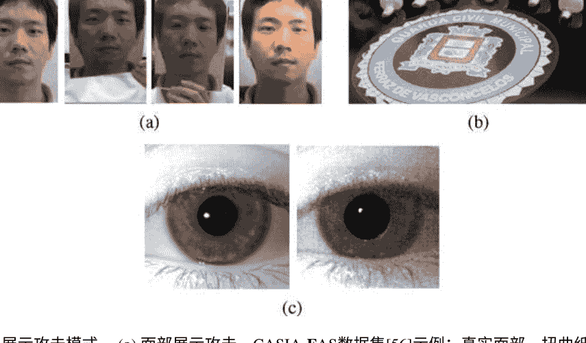

图1展示攻击模式。(a) 面部展示攻击，CASIA-FAS数据集[56]示例：真实面部，扭曲纸张攻击，剪切纸张攻击和视频攻击。(b) 指纹展示攻击：巴西一家医院使用六个硅手指欺骗生物特征员工考勤设备。来源：BBC [1]。(c) 虹膜展示攻击，LivDet-Iris Warsaw 2017数据集[54]：真实虹膜和打印攻击。

### 2 用于评估PAD解决方案的基准

在本节中，我们描述了本文探讨的三种生物特征认证模式中最常采用的基准。对于每种模式，都有一个特定的表格来方便比较。这些表格为每个基准提供了一些特征，例如数据集名称，样本的总数（视频或照片），真实样本（BF）和展示攻击（PA）之间的分割，以及数据是否已经分为训练和测试集的比例。最后一个方面是重要的，可以检查数据量是否足够用于数据驱动方法，并确保没有显著不平衡的集合，无论是在BF/PA还是在训练/测试之间。受试者数量表示多样性，平均分辨率对于检查来自不同采集传感器的样本大小（高度 × 宽度）很重要。设置列显示有关捕获环境的信息，下一列描述了考虑的攻击类型。获取和使用攻击设备提供了有关数据集代表性的一些信息，增加数量并采用真实设备对于减少可能利用特定工件而不是特定特征的可能性至关重要。这些表格的某些单元格标记为N/A，表示“不适用”，N/R表示“未报告”。还提供了关于这些基准的一些简要讨论。为了方便基准和描述的研究论文之间的链接，附录1的表4显示了每种模式使用的每个基准的所有参考文献。

#### 2.1 人脸PAD

人脸PAD基准（表1）通常由基于屏幕和打印的攻击形式组成。然而，其中一些也尝试使用3D面具。在一些基准测试中，受试者数量较少可能会成为问题，因为它显示出较少的变异性。例如，3DMAD和NUAA中的人脸来自不到20个受试者。反过来，尽管MSU USSA有更多的受试者，但它由从互联网获取的名人面孔组成，可能无法保留详细的采集信息。CASIA的主要缺点是只有一种设备用于攻击，缺乏采集工艺的多样性。这对于UVAD数据集来说并非如此，它包含使用六种不同设备录制的视频，并在执行展示攻击时考虑了七种不同设备。

#### 2.2 虹膜PAD

虹膜PAD基准（表2）在攻击接口的角度上部分类似于人脸PAD基准（基于屏幕和打印）。然而，其中一些也探索了特定方面，如隐形眼镜和人工眼球（ND CLD2015）。IIITD虹膜欺骗数据集在提供组合攻击设置方面是独特的，包括眼睛的纸质打印和隐形眼镜。然而，最常见的攻击是静态的，即采用打印的虹膜照片。CASA虹膜伪造提供了相当数量的受试者和活体与PA样本之间的一致比例，尽管未指定训练和测试集。没有固定的训练和测试数据分割可能会加大不同解决方案之间的比较难度，并可能增加数据泄漏的可能性。IIITD WVU的一个重要方面是其自然跨数据集设置，因为其训练集包含来自IIITD虹膜欺骗数据集的3000个样本。

#### 2.3 指纹PAD

指纹PAD基准（表3）可能考虑不同的物理材料，如ecoflex和明胶。PBSKD是具有最多欺骗材料的基准（总共十个），使用两种不同的指纹扫描仪获取一百个欺骗样本，每个样本获取五次。然而，目前最重要的数据来源是LivDet指纹竞赛（2009年，2011年，2013年，2015年和2017年），它们为我们提供了内传感器，跨材料，跨传感器和跨数据集验证协议。在最后两届中，测试样本使用训练集中未见过的材料创建，自然地实现了（并推动了）开放式实验。表格中没有显示每个竞赛内部数据集的数量，但它从整体上展示了它们的大小，活体和PA样本之间的比例，以及训练和测试样本之间的比例。关于受试者数量和分辨率的信息在表格中被省略，因为LivDet内部数据集之间的捕获扫描仪有不同的目的（边境控制，移动设备认证等）。

## 三种数据驱动的方法用于演示攻击检测

在本节中，我们介绍了本章中考虑的三种模态（面部、指纹和虹膜）的最新方法。我们分别介绍了每种模态的方法，以及针对多生物特征场景提出的方法。我们还讨论了基于数据驱动和手工制作方法的混合方法。最近，一些文献中提出的方法展示了如何和谐地结合这两种方法，以充分利用两者的优势。

#### 3.1 人脸欺骗检测

人脸识别系统是最不具侵入性的生物特征识别方法之一，可以使用低成本传感器（例如智能手机摄像头）进行。然而，这种系统的内在性质使其成为最容易受到攻击的系统。攻击者可以通过向采集传感器呈现合成样本来冒充真实用户，在这种系统中进行非法访问。攻击可以通过向采集传感器呈现2D打印的照片、电子显示的人脸照片或视频，或3D人脸面具来进行。基于面具的攻击虽然比其他形式更复杂，但越来越容易制造。然而，将合成样本呈现给采集传感器的过程中不可避免地包含噪声信息和痕迹，这些信息被添加到生物特征信号中，可以用于识别试图攻击的行为。

尽管数据驱动模型在人脸识别中被广泛使用，但在人脸欺骗检测问题上，它们的历史相对较短，并且已经展示出了检测这种攻击的潜力。现有的解决方案各不相同，但可以感觉到基于神经网络的解决方案略微有所倾向。通常，预训练的卷积神经网络（CNN）架构被用作特征提取器，然后使用这些特征来训练分类器（例如SVM）。例如，Ito等人[18]研究了两种不同的CNN架构用于人脸欺骗检测：CIFAR-10和AlexNet。作者使用整个图像而不是传统人脸识别文献中的裁剪图像作为其方法的输入。这种方法的理论基础是通过利用整个图像，可以获取关于合成样本中存在的伪迹的更多信息。尽管所提出的方法超过了一些基准线，但实验仅在一个数据集上进行了。

因此，对于所提出的方法的鲁棒性无法得出一般性结论。

由于数据驱动方法的性质，不总是可能解码模型正在利用的攻击中的伪影。模型完全负责从数据（图像或视频）中提取最大化学习过程的特征。然而，通过提取动态和静态特征，可以部分控制这一方面。在这个背景下，吴等人[52]提出了一种良好设计的数据驱动方法。这个想法是通过将视频中一个人的运动（动态特征）与帧的纹理特征（静态特征）相结合，可以评估攻击的互补迹象。该方法使用CNN逐帧提取静态特征。然而，对于动态特征，它使用Lucas-Kanade金字塔方法提取帧之间的水平和垂直光流，然后在动态地图上使用CNN。静态和动态特征通过连接组合，并作为输入传递给二元SVM分类器进行决策。

杨等人[55]还探索了静态和动态特征。一个初始步骤是基于使用局部二进制模式（LBP）描述符来提取面部图像的更广义和有区别的低级特征。LBP特征在一个内部数据集协议中成功应用，但性能可能会

## 表1人脸PAD基准

| 数据集 | 尺寸 | BF/PA | 训练/测试 | 主题 | 分辨率 | 设置 | 攻击类型 | 采集 | 攻击设备 |
|--------|------|-------|-----------|------|--------|------|----------|------|----------|
| 重放攻击[7] | 1300照片和视频 | 140/700 | 360/480 | 50 | 752×544照片，720p视频 | 光照和持握 | 屏幕和打印 | 佳能PowerShot SX150 | 4部iPhone 3GS, 4部iPad第一代和2部Triumph-Adler DCC 2520彩色激光 |
| CSMAD[4] | 263张照片和视频 | 104/159 | N/R | 14 | 640×480 | 四种光照条件 | 六个硅胶面具和两种佩戴方式 | RealSense SR300和Compact Pro (热成像) | 尼康Coolpix P520 |
| CASIA-FASD[56] | 600个视频 | 150/450 | 是 | 50 | 1226×813 | 七个评估场景和三个图像质量 | 三种模式：扭曲照片，剪切照片和视频播放 | 索尼NEX-5, 新旧USB相机 | iPad |
| 3DMAD[12] | 76,500帧 | 51k/25,500 | N/R | 17 | 640×480 | 三个会话（间隔2周），每个会话有5个视频，每个视频有300帧 | 3D面具 | ThatsMyFace.com Kinect | N/R |
| MSU USSA[33] | 10,260图像 | 1140/9120 | N/R | 1140 | 705×865 | 无控制 | 屏幕和打印照片 | 来自互联网和Nexus 5的名人 | Canon PowerShot 550D, iPhone 5S和HP Color LaserJet CP6015 |
| OULU-NPU[5] | 4950视频 | 720/2880 | 1800/1800 | 55 | N/R | 三个部分的照明和背景 | 屏幕和打印 | 六个移动设备前置摄像头 | 两台打印机和两个显示器 |
| NUAA[47] | 12,614 | 5105/7509 | 是 | 15 | 640×480 | N/R | 打印的照片 | 网络摄像头 | N/R |
| UVAD[35] | 17,076视频 | 808/16,268 | N/R | 404 | 1366×768 | 两个部分的照明、背景和场所 | 屏幕 | 六个摄像头 | 七个显示屏 |

## 表2 虹膜PAD基准

| 数据集 | 尺寸 | 现场/PA | 训练/测试 | 主题 | 分辨率 | PA类型 | 采集 | PA设备 |
| --- | --- | --- | --- | --- | --- | --- | --- | --- |
| Clarkson17 [54] | 6749 | 3954/2795 | 3591/3158 | 25 | 640 × 480 | 打印图像，图案接触镜片和图案接触镜片的打印输出 | LG IrisAccess EOU2200 | iPhone 5和打印机 |
| IIITD虹膜欺骗 [16] | 4848 | 0/4848 | N/R | 101 | 640 × 480 | 打印图像 | Cogent CIS 202, VistaFA2E和H平板光学扫描仪 | HP Color LaserJet 2025 打印机 |
| IIITD德里[23] | 1120 | N/R | 不适用 | 224 | 320 × 240 | 纹理和软接触镜片 | JIRIS, JPC100, 数字CMOS相机 | N/R |
| ND CLD 2015 [11] | 7300 | 4800/2500 | 6000/1200 | 278 | 640 × 480 | 纹理接触镜片 | IrisAccess LG 4000和IrisGuard AD100 | JJ, Ciba, UCL和 ClearLab |
| Warsaw17 [54] | 12,013 | 5168/6845 | 4513/2990 | 186 | 640 × 480 | 打印图像 | IrisGuard AD100和S only EX-View CCD | 松下ET100 |
| IIITD WVU [54] | 7459 | 2952/4507 | 3250+3000 /4209 | N/R | 多样化 | 纹理镜头和打印图像 | CLIIITD datasets和IrisShield sensor | Ciba和Aryan用于镜头和HP P3015用于打印出来的文件 |
| CASIA虹膜伪造 [44] | 10,240 | 6000/4120 | 不适用 | 500 | 640 × 480 | 打印，接触，塑料和合成 | LG-H100 | 富士施乐C1110打印机，隐形眼镜，重新播放的视频和人工眼球 |

## 表3指纹演示攻击检测数据集

| 数据集 | 尺寸 | 现场/PA | 训练/测试 | 扫描仪 | 模型 | PA设备 |
| --- | --- | --- | --- | --- | --- | --- |
| LivDet 2009 [27] | 11,000 | 5500/5500 | 2750/8250 | Crossmatch, Identix 和 Biometrika | Verifier 300 LC, DFR2100和FX2000 | 明胶、硅胶、橡皮泥 |
| LivDet 2011 [53] | 16,000 | 8000/8000 | 8000/8000 | Biometrika, Digita 和 I1Persona, ItalData和 Sagem | FX2000, 4000B, ET 10和MSO300 | 明胶、乳胶、环保弹性体、玩具黏土、硅胶和木胶 |
| LivDet 2013 [14] | 20,590 | 11,740/8850 | 10,350/10,240 | Biometrika, Crossmatch, ItalData和I-Swipe | FX2000, L Scan Guardian, ET10和 Swipe | 明胶、身体双胶、乳胶、玩具黏土、环保弹性体、modasil和木胶 |
| PBSKD [8] | 1800 | 900/900 | 1000/1000 | CrossMatch和 Lumidigm | Guardian 200和Venus 302 | 环保弹性体、明胶、乳胶、乳胶体漆、涂有银胶墨的环保弹性体、涂有BarePaint层的环保弹性体、涂有纳米尖端涂层的环保弹性体、Crayola模型魔术、木胶、怪物液体乳胶、2D办公纸打印 |
| 虚假 [45] | 16,000 | 8000/8000 | 8000/8000 | Biometrika, Digital, Italdata和Sagem | FX2000, 4000B, ET 10和MSO300 | 明胶、玩具黏土、硅胶、木胶、环保弹性体和硅胶 |

在更现实的情况下，即跨数据集协议或交叉数据集协议中，由于异常阴影、镜面高光和设备噪声等因素，性能会严重降低[6]。因此，作者们通过深度学习将这些低级特征编码为高级特征，并提出了一种稀疏自编码器（SAE）来解决上述问题。SAE是在传统自编码器中应用稀疏惩罚的基础上构建的，传统自编码器是一种轴对称的单隐藏层神经网络，用于增强模型的泛化能力。在解决复杂问题时，它具有显著优势：提取反映粘附状态的特征。最后，使用二元SVM分类器来区分真实的面部样本和合成的面部样本。然而，训练仅使用了内部数据集协议进行。

在过去的几年中，字典学习，一个众所周知的机器学习概念，已被引入作为构建深度架构的候选方法，从而创建了一个称为深度字典学习（DDL）的新分支。这个想法是将字典学习层堆叠起来形成DDL [48]结构。Manjani等人[26]开发了一种DDL方法，其中单层字典的层被依次堆叠，产生了特征的稀疏表示。其主要优点是减少对大型训练数据集的需求，具有有希望的内部数据集结果，并且能够区分不同类型的攻击，甚至是未知的攻击。然而，对于这种表示方法的主要关注点是提取细粒度特征以应对真实的遮挡攻击的困难，以及该方法的泛化能力的缺乏。

#### 3.2 虹膜欺骗检测 (Iris PAD)

尽管与基于面部和指纹特征的方法相比，虹膜认证方法具有更高的准确性，但由于主要与实施该技术相关的成本，其使用仅限于保护高限制系统和场所。如今，由于研究人员致力于使处理过程和传感器更便宜、更小型化，虹膜认证方法已经渗透到我们的日常生活中，例如现代计算设备，如智能手机。

然而，即使在虹膜生物特征识别方面取得了高准确度和进展，当前的虹膜认证系统仍然容易受到展示攻击的漏洞影响。目前，最有效的展示攻击方法是向采集传感器展示包含合法用户虹膜图案的打印照片，以及用于冒充合法用户或隐藏攻击者真实身份的纹理和透明隐形眼镜。从这个角度来看，我们将现有的虹膜展示攻击检测工作分为两个非互斥的组，根据它们对以下攻击类型的检测能力进行分类：基于打印的攻击，使用打印出来的虹膜图像进行的攻击；以及旨在检测使用隐形眼镜进行的攻击的方法。

Menotti等人首次提出了基于CNN的方法来检测虹膜展示攻击。在这项研究中，作者提出了一个统一的框架，用于进行架构和滤波器级别的优化。该框架适用于三种生物特征模态（虹膜、人脸和指纹）。所提出的框架基于一个浅层CNN架构SpoofNet，该架构包含两个卷积层，用于检测不同模态下的展示攻击。由于当时可用于构建虹膜展示攻击系统的数据集规模较小，这个框架对于学术界来说非常方便。该研究的一个缺点是，对于虹膜模态，SpoofNet仅针对基于打印的攻击进行了评估。

类似地，Silva等人[40]提出了一项研究，评估了SpoofNet在与[28]中提出的攻击场景不同的其他攻击场景中的表现。在那项工作中，作者们提出了一些训练方法，考虑了Notre Dame和IIIT-Delhi数据集，这些数据集由近红外（NIR）虹膜图像组成，代表了真实呈现和使用纹理（彩色）隐形眼镜和软（透明）隐形眼镜进行的攻击。作者们还改进了SpoofNet以检测三种类型的图像：非攻击、纹理和透明隐形眼镜。所提出的方法在Notre Dame数据集上的表现优于现有方法，达到了82.80%的总体准确率。报告的结果表明，SpoofNet能够更好地检测透明隐形眼镜，而不是纹理隐形眼镜和真实呈现（对于这个特定数据集而言，没有任何隐形眼镜的虹膜图像）。考虑到IIIT-Delhi数据集的结果显示，SpoofNet架构在区分这些不同类型的呈现方面存在一些局限性，尤其是对真实样本与透明隐形眼镜攻击的混淆。

为了克服SpoofNet的限制，Raghavendra等人[37]提出了一种新颖的CNN架构，更能够区分真实的展示、有纹理和透明的隐形眼镜。与Silva等人[40]类似，作者提出了一个多类CNN，用于将输入图像分类为真实和使用有纹理和透明隐形眼镜的PA。然而，与He等人类似，作者使用归一化的虹膜图像块作为CNN的输入，而Silva等人则使用原始图像，并且还使用了一个六层的CNN和dropout机制来减少网络的过拟合。

在[17]中，He等人提出了一种多块CNN，能够检测到基于打印和隐形眼镜的攻击，通过使用80 × 80像素大小的归一化虹膜图像块对CNN进行训练，可以显著减少深度网络的可训练参数，从而防止可能的泛化问题，如过拟合。作者报告了两种攻击类型的近乎完美的分类结果。与先前的手工方法相比，所提出的方法与其他手工方法的比较显示了基于CNN的方法的优越性。

Pala和Bhanu [30]基于三元组卷积神经网络开发了一种深度学习方法，其中三个网络将虹膜图像补丁映射到表示空间中。这是通过取两个真实的例子和一个假的例子，或者取两个假的例子和一个真实的例子来完成的，从而产生类内和类间距离。目标是学习一个距离函数，使得来自同一类的两个示例比来自不同类的两个示例更接近。根据学习到的距离函数，同一类的两个样本尽可能接近。该方法在包含印刷和接触镜攻击的三个不同数据集中进行了评估，并与基于描述符的方法和来自[28]的CNN方法进行了比较，在所有数据集上实现了最低的平均分类错误率。该框架的主要优点在于其小型架构，易于在硬件上实现，并具有较低的计算复杂度。然而，无法保证该框架在跨数据集场景中表现良好，因为他们的工作中没有讨论这方面的测试。

Kuehlkamp等人[22]结合手工制作和数据驱动的特征，对输入数据进行多次变换，寻找更合适的输入空间表示。手工制作的特征是通过提取二值化统计图像特征（BSIF）的多个视角获得的，然后用于训练轻量级CNN。之后，使用元分析技术选择最重要和有区分性的分类器集合，从选定的视角进行元融合，构建一个在跨领域约束和内部-跨数据集设置下表现良好的最终分类模型。作为优势，这种方法提供了一个更好地推广到未知攻击类型的虹膜PAD算法，也在这方面超越了最先进的方法。

#### 3.3 指纹PAD

指纹是当今最常见的生物特征之一，在安全系统和敏感环境中被广泛采用。在某些情况下，生物特征识别系统可能对假指纹毫无防御能力。然而，通过提出基于软件或硬件的解决方案，已经进行了研究以减轻攻击风险。在基于硬件的解决方案中，大多数最近的工作都考虑了指纹活体检测。对于基于软件的解决方案，深度学习方法发挥着关键作用，产生了最先进的结果。

Pala等人[31]提出了一种基于补丁的三元孪生网络用于指纹PAD。在经典的二元分类形式（真/假）下，该网络包括一个深度度量学习框架，可以生成真实和人工指纹的代表性特征。所提出的方法通过与用于训练的相同指纹补丁集进行比较来评估活体而不需要注册数据库。它还解决了当前深度学习方法在计算成本方面的局限性，从而实现了移动和离线实施。

在[29]中，三个著名的深度学习网络被用作二元分类问题。这些网络使用了在ImageNet数据集[21]上最初训练的预训练网络的权重进行微调，而不是为每个网络从头开始训练。作者已经展示了数据增强技术的效果不仅在深度学习框架的情况下而且在使用LBP等浅层技术时也是如此。此外，他们遵循了一个实验协议，考虑了跨数据集验证并在他们的方法中进行了重要的比较。Sundaran等人[45]展示了如何使用不同的可用数据集训练单个基于CNN的分类器，以帮助泛化和提高性能。在[49]中进行了一项分析研究，以考虑不同的特征和方法进行特征融合。采用了一种从一般图像描述符开始的两阶段深度神经网络。在第一阶段，该方法能够同时学习将不同特征转换为用于第二阶段分类的共同潜在空间。Nogueira等人[29]比较了四种深度学习技术用于活体检测。他们研究了使用预训练权重的效果，并得出结论，使用预训练的CNN可以在不修改架构或超参数的情况下产生良好的结果。

深度玻尔兹曼机（DBMs）是另一种由复杂模式上的随机能量学习组成的神经网络类型。在指纹数据中，DBMs被用于[9]和[42]中的活体检测。[9]中提出了一种基于DBMs的指纹欺骗检测方法。在对指纹数据样本进行训练后，使用SVM分类器对DBMs生成的高级特征进行分类。在[42]中，作者提出了一种基于DBMs的方法，在网络顶部添加了一个具有两个softmax单元的最终层，形成一个MLP网络，用于识别正常和攻击模式。

Toosi等人[50]提出了一种基于补丁的活体检测方法。该方法提取一组补丁，然后利用AlexNet架构作为特征提取器对每个补丁应用分类器。最终的类别标签是基于补丁的概率得分计算得出的。另一种基于补丁的方法[32]尝试通过对由CNN分类的补丁进行投票策略来检测活体。

Wang等人[51]开发了FingerNet，一种用于指纹活体检测的DNN，在决策过程中采用投票策略。它的架构受到另一种名为CIFAR-10的DNN的启发，不同之处在于卷积和池化层更加复杂，还包括额外的内积层。然而，训练过程并不直接在这些图像上进行。相反，每个图像被切割成32 × 32像素的补丁，然后进行分割步骤，排除描绘背景内容的补丁，留下剩下的补丁进行训练。测试过程也是在图像的补丁上进行的，然后通过计算每个补丁的标签来应用投票策略在一个指纹图像中。选择得票最高的标签作为图像标签。使用LivDet2011和LivDet2013数据集进行了实验，FingerNet的性能优于CIFAR-10。

张等人[57]改进了Inception[46]架构，并构建了一个轻量级的卷积神经网络用于假指纹检测。在提出的架构中，原始的全连接层被全局平均池化层所取代，以减少过拟合并增强对空间平移的鲁棒性。在实验中，作者们使用不同材料制作了一个内部的2D数据集，其中包含一些真实的指纹样本。报告的结果是根据正确分类的真实指纹和假指纹的加权平均率来表示的，在基于卷积神经网络的文献方法中，不仅超过了原始的Inception架构，还超过了其他方法。

## 面部、虹膜和指纹呈现攻击检测的4种对策

在本节中，我们讨论了两种基于数据驱动模型的对策部署方法，成功地用于检测面部、虹膜和指纹呈现攻击。

#### 4.1 架构和滤波器优化

为给定应用程序找到合适的架构是一个具有挑战性且耗时的任务，因为超参数空间的维度很高。此外，缺乏足够的数据使得某些应用程序的超参数搜索更加困难。因此，文献中提出了几种技术来缓解这些问题，通过提出启发式方法来更快地找到合适的架构。

树状Parzen估计器（TPE）是一种基于历史观察构建模型来近似超参数性能的顺序模型优化方法[3]。总之，TPE算法建模概率P（x|y）和P（y），其中 x表示超参数， y表示与 x相关联的损失函数的值。通过使用历史观察来估计超参数的非参数密度分布，从而预测它们的良好值[2]。

另一种探索超参数空间以找到适合给定问题的架构的方法是随机搜索算法。总的来说，这种方法比手动搜索和网格搜索算法[34]更高效。随机搜索算法通过识别有效的超参数赋值来探索超参数空间，从而为问题定义了一个有效的配置空间。最后，超参数是随机选择的，考虑到均匀分布。这种策略的主要优点是在非并行和并行版本中实现起来更简单。

在深度学习架构中寻找良好的滤波器权重也是一项具有挑战性的任务。文献中可用于PAD的数据集的参数数量巨大，而数据集的规模较小，这可能会阻止优化算法找到最优甚至合理的解决方案。

根据Menotti等人的研究[28]，架构和滤波器优化策略对于部署合适的深度学习模型是有效的。图2显示了两种策略的比较研究。架构优化是在浅层架构中进行的，最多三层，并使用随机权重的滤波器核，而滤波器优化是针对问题的预定义架构进行的，并使用随机初始化的随机梯度下降（SGD）来优化滤波器权重。

正如我们所观察到的，架构优化方法能够找到几乎完美的人脸PAD问题的分类结果（图2c），其半总误差率约为0.0%。对于虹膜PAD问题，这种方法也找到了几乎完美的分类结果的架构，其准确率在三个数据集（即华沙和Biosec）中优于滤波器优化策略，并在MobBio伪造数据集中获得了竞争力的结果（如图2b所示）。相反，对于指纹PAD问题，滤波器优化比架构优化方法表现更好，在该模态下对所有评估数据集获得了几乎完美的分类结果（图2a）。因此，这两种方法的相互作用是推荐在架构优化不足以找到好的解决方案时使用。这两个选项特别推荐在没有足够的训练数据来表示感兴趣的PAD问题时使用。

#### 4.2 现有架构的微调

文献中的第二个趋势是使用迁移学习技术构建模型，将预先训练的深度学习解决方案适应于PAD问题。根据模态性，迁移学习过程可以利用与目标问题相关的预先训练的架构，例如，用于人脸识别的预先训练架构（源问题）来优化用于人脸PAD问题的深度学习架构（目标问题）。

考虑到这一点，Pinto [36] 通过从训练过程中获得的知识来改编了最初由Visual Geometry Group提出的用于对象识别的VGG网络架构[41]，该训练过程使用了大规模数据集ImageNet [21]。这些微调的架构是根据作者使用的原始数据集协议以及跨数据集协议进行评估的，其中训练和测试子集来自不同的来源。图3显示了这两个评估协议的结果。对于所有模态，与数据集内部评估协议相比，跨数据集评估协议的结果较差，ATVS虹膜数据集是个例外。在多种情况下，PAD解决方案的性能从接近完美的分类结果到比随机性能更差不等，这清楚地表明我们需要关注新技术，考虑跨数据集设置以及对未知攻击（开放式场景）的鲁棒性。

## 5个挑战、开放问题和展望

本节介绍了当前方法的主要限制，并对进一步研究路径可能采取的方面进行了一些阐述，以解决PAD问题。

首先，阻止引入强大方法的主要因素之一是缺乏代表性的公共数据集。通常情况下，现有数据集缺乏泛化特征，并且在考虑到大数据时通常很小。这个限制导致了另一个限制，即跨数据集和领域自适应验证的困难。在没有数据的情况下，很难从一个数据集学习到另一个数据集或从一个条件学习到另一个条件的变化方面。

尽管我们可以看到研究人员在设计虹膜和指纹攻击检测技术方面做出了一些合理的努力，但对于人脸来说情况并非如此。这个模态中的大多数工作仍然依赖于手工特征。这个事实可能与缺乏良好和代表性的数据集有关，但我们相信最可能的原因是人脸变化比虹膜和指纹更频繁（阴影、光照、姿势、缩放），深度学习方法需要非常强大的函数来处理这些变换而不会出现过拟合。这可能是一个非常好的研究领域。

使用深度学习的虹膜PAD现有工作似乎领先于指纹和人脸模态。最近由[22]提出的一种方法似乎是迈向交叉数据集验证的重要一步。不同视图的元融合输入数据产生了最佳结果，并且对处理不同数据集的变化表示了很好的解决方法。尽管如此，人脸和指纹仍然远离解决问题的合理路径。对于指纹，更换采集传感器会导致性能明显变化。对于人脸而言，虽然采集传感器在解决问题上起着重要作用，但自从第一个人脸的开发以来，研究人员已经知道这些旧问题。识别方法仍然存在阴影和光照变化等问题。即使在虹膜情况下，由于跨传感器引起的领域转移条件以及检测透明隐形眼镜，现有方法往往失败。社区需要在这方面做出明确的努力。

最近，李等人[25]对于学习面部展示攻击检测的广义特征提供了一些启示。作者提出了使用基于交叉熵损失的增强面部样本训练他们的解决方案，并进一步通过特别设计的泛化损失来增强训练，该损失一致地作为正则化项。来自不同领域的训练样本可以通过操纵其特征分布距离无缝地共同工作，以学习广义特征表示。在学习领域转移条件时，提出的鲁棒损失函数以及隐式学习数据变化的方法似乎是解决这个难题的有希望的途径。

关于开放式验证条件和对未知攻击类型的鲁棒性，文献研究还远远落后。在指纹PAD的背景下，考虑到这一方面的第一项工作之一是在这方面提出的[38]，但作者表明在这方面还有很多工作要做。对于面部和虹膜来说，在这方面情况甚至更糟。这无疑是PAD中最热门的话题之一，与领域转移鲁棒性一样，没有任何工作在面部、指纹或虹膜模态中对于开放式条件表现出合理的性能。

到目前为止，大部分基于深度学习方法的现有先前技术在PAD方面只是触及到了潜力的表面。几乎所有先前技术中的方法都只是采用了现有的网络并进行了一些调整。在这方面，人脸有些不同，因为一些作者已经研究了字典学习和不同解决方案的堆叠效果。然而，很少有作者努力提出对这些解决方案进行重大建模改变，这无疑代表了一个开放的机会。

最后，值得一提的是，尽管我们在本章中调查了大约60篇论文，但文献中仍然存在一系列关于面部展示攻击检测的开放问题，从提出代表性数据集到在跨数据集和开放集验证设置下的鲁棒方法，再到对领域转移具有代表性的方法。对于这些问题，我们呼吁社区的关注，这也是我们撰写本章的主要动机，我们真诚希望研究人员在未来的调查中考虑到这些方面。

### 附录1：数据集和研究工作

见表4。

### 表4 根据模态和依赖它们的先前工作的数据集

| 模态 | 数据集 | 参考文献 |
|------|--------|----------|
| 面部PAD | 重放攻击 | [6, 18, 26, 39, 52] |
| | SMAD | [26] |
| | CASIA-FASD | [6, 26, 28, 39, 55] |
| | 3DMAD | [24, 26, 28] |
| | MSU MFSD | [6, 24] |
| | MSU USSA | |
| | NUAA | [6, 55] |
| | UVAD | [26] |
| 虹膜PAD | Clarkson17 | [22] |
| | IIITD虹膜欺骗 | [20] |
| | IIITD德里 | [20, 37, 40] |
| | ND CLD 2015 | [15, 17, 22, 37, 40] |
| | Warsaw17 | [17, 22, 28, 30] |
| | IIITD WVU | [22] |
| | CASIA虹膜伪造 | [17] |
| 指纹PAD | LivDet 2009 | [29, 31, 32, 49] |
| | LivDet 2011 | [29, 31, 49–51] |
| | LivDet 2013 | [9, 28, 29, 31, 42, 49–51] |
| | PBSKD | |
| | 虚假的 | [45] |## 附录2: 缩略词列表
- BSIF: 二进制统计图像特征
- CNN: 卷积神经网络
- DBM: 深度玻尔兹曼机
- DCNN: 深度卷积神经网络
- DNN: 深度神经网络
- HTFR: 半总误差率
- LBP: 局部二值模式
- MLP: 多层感知器
- PA: 演示攻击
- PAD: 演示攻击检测
- SAE: 稀疏自编码器
- SVM: 支持向量机

### 参考文献
1. BBC新闻，医生使用硅胶手指代替同事签到。BBC新闻。https://www.bbc.com/news/world-latin-america-21756709 (2013). 访问日期：2019年1月13日
2. J. Bergstra, R. Bardenet, Y. Bengio, B. Kgl, 超参数优化算法，收录于神经信息处理系统进展 (2011)，第2546-2554页
3. J. Bergstra, D. Yamins, D.D. Cox, 为视觉架构进行超参数优化的模型搜索科学，收录于国际机器学习会议(2013)，第I-115-I-123页
4. S. Bhattacharjee, A. Mohammadi, S. Marcel, 用定制的硅胶面具欺骗深度人脸识别，在IEEE国际生物特征学理论、应用和系统会议上(2018)
5. Z. Boulkenafet, J. Komulainen, L. Li, X. Feng, A. Hadid, OULU-NPU: 一个具有真实世界变化的移动人脸展示攻击数据库，在IEEE国际自动人脸和姿态识别会议上(2017)
6. G. Cai, S. Su, C. Leng, J. Wu, Y. Wu, S. Li, 覆盖补丁: 一种用于欺骗检测的通用特征提取策略。并发计算实践经验。31, e4641 (2018)
7. I. Chingovska, A. Anjos, S. Marcel, 局部二进制模式在人脸反欺骗中的有效性，在国际生物特征学特别兴趣小组会议上(2012)
8. T. Chugh, K. Cao, A.K. Jain, 指纹欺骗防护器: 使用细节点为中心的补丁。IEEE信息取证与安全交易。13(9), 2190-2202 (2018)
9. G.B. de Souza, D.F. da Silva Santos, R.G. Pires, A.N. Marana, J.P. Papa, 深度特征提取用于鲁棒指纹欺骗攻击检测。人工智能和软计算研究杂志。 9(1), 41-49 (2019)
10. K. Delac, M. Grgic, 生物特征识别方法综述，在国际海洋电子学研讨会, vol. 46 (2004), pp. 16–18
11. J.S. Doyle, K.W. Bowyer, 使用BSIF在虹膜识别中鲁棒检测纹理隐形眼镜。 IEEE Access 3, 1672–1683 (2015)
12. N. Erdogmus, S. Marcel, 使用3D面具和Kinect进行2D人脸识别的欺骗和反欺骗，在IEEE国际生物特征学会议: 理论,应用和系统 (2013)
13. N. Erdogmus, S. Marcel, 引言, 在生物特征反欺骗手册: 受信任的生物特征在欺骗攻击下(Springer, 伦敦, 2014), 页码 1–11
14. L. Ghiani, D. Yambay, V. Mura, S. Tocco, G.L. Marcialis, F. Roli, S. Schuckers, LivDet2013 指纹活体检测竞赛 2013, 在IAPR 国际生物特征会议(2013), 页码 1–6
15. D. Gragnaniello, C. Sansone, G. Poggi, L. Verdoliva, 通过领域感知的卷积神经网络进行生物特征欺骗检测, 在国际信号图像技术和基于互联网的系统会议(2017), 页码 193–198
16. P. Gupta, S. Behera, M. Vatsa, R. Singh, 关于虹膜伪造的研究, 使用印刷攻击, 在国际模式识别会议上(2014), 第1681-1686页
17. L. He, H. Li, F. Liu, N. Liu, Z. Sun, Z. He, 多补丁卷积神经网络用于虹膜活体检测, 在IEEE E生物特征学: 理论、应用和系统国际会议上(2016), 第1-7页
18. K. Ito, T. Okano, T. Aoki, 生物特征安全的最新进展: 以人脸识别中的活体检测为案例研究, 在亚太信号与信息处理协会年度峰会和会议上(2017), 第220-227页
19. A.K. Jain, A. Ross, S. Prabhakar, 生物特征识别简介 IEEE Trans. Circuits Syst. Video Technol. 14(1), 4-20 (2004)
20. N. Kohli, D. Yadav, M. Vatsa, R. Singh, A. Noore, 使用iDCGAN的合成虹膜攻击, 在IEEE 国际联合生物特征会议上(2018年), 第674-680页
21. A. Krizhevsky, I. Sutskever, G. Hinton, 使用深度卷积神经网络的ImageNet分类, 在神经信息处理系统的进展中(2012年), 第1097-1105页
22. A. Kuehlkamp, A. Pinto, A. Rocha, K.W. Bowyer, A. Czajka, 用于跨领域虹膜攻击检测的多视图学习分类器集合。IEEE Trans. Inf. Forensics Secur. 4(6), 1419–1431 (2019)
23. A. Kumar, A. Passi, 可靠个人身份验证的虹膜匹配器比较和组合。Pattern Recogn. 43(3), 1016-1026 (2010)
24. X. Li, J. Komulainen, G. Zhao, P.C. Yuen, M. Pietikainen, 通过检测面部视频中的脉搏进行广义面部反欺骗, 国际模式识别会议 (2016年), pp. 4244-4249
25. H. Li, P. He, S. Wang, A. Rocha, X. Jiang, A.C. Kot, 学习面部反欺骗的广义深度特征表示。IEEE信息取证与安全传输交易。13 (10), 2639-2652 (2018年)
26. I. Manjani, S. Tariyal, M. Vatsa, R. Singh, A. Majumdar, 通过深度字典学习检测基于硅胶面具的展示攻击。IEEE信息取证与安全传输交易。12 (7), 1713-1723 (2017年)
27. G.L. Marcialis, A. Lewicke, B. Tan, P. Coli, D. Grimberg, A. Congiu, A. Tidu, F. Roli, S.Schuckers, 第一届国际指纹活体检测竞赛 - LivDet 2009, 在图像分析和处理国际会议上(2009), 第12-23页
28. D. Menotti, G. Chiachia, A. Pinto, W.R. Schwartz, H. Pedrini, A.X. Falcao, A. Rocha, 用于虹膜、人脸和指纹欺骗检测的深度表示。IEEE信息学与安全学报 10(4), 864-879 (2015)
29. R.F. Nogueira, R. de Alencar Lotufo, R.C. Machado, 使用卷积神经网络进行指纹活体检测。IEEE信息学与安全学报 11(6), 1206-1213 (2016)
30. F. Pala, B. Bhanu, 使用相对距离比较进行虹膜活体检测, 在IEEE计算机视觉和模式识别会议工作坊 (2017)
31. F. Pala, B. Bhanu, 对于指纹活体检测的深度三元组嵌入的准确性和鲁棒性的研究, 在IEEE国际图像处理会议(2017), 第116–120页
32. E. Park, W. Kim, Q. Li, J. Kim, H. Kim, 使用随机样本块的CNN特征进行指纹活体检测, 在生物特征学专业兴趣小组国际会议(2016), 第1–4页
33. K. Patel, H. Han, A.K. Jain, 安全人脸解锁: 智能手机的欺骗检测。IEEE Trans. Inf. Forensics Secur. 11(10), 2268–2283 (2016)
34. N. Pinto, D. Doukhan, J. DiCarlo, D. Cox, 一种高通量筛选方法用于发现良好的生物启发式视觉表示形式。PLoS Comput. Biol. 5(11), e1000579 (2009)
35. A. Pinto, W.R. Schwartz, H. Pedrini, A. de Rezende Rocha, 使用视觉节奏检测基于视频的面部欺骗攻击。IEEE Trans. Inf. Forensics Secur. 10(5), 1025–1038 (2015)
36. A. Pinto, H. Pedrini, M. Krumbdiek, B. Becker, A. Czajka, K.W. Bowyer, A. Rocha, 在 Deep Learning in Biometrics (Taylor and Francis, Boca Raton, 2018) 中对面部指纹和虹膜识别进行对抗性呈现攻击的抵制
37. R. Raghavendra, K.B. Raja, C. Busch, ContlensNet: 使用深度卷积神经网络进行鲁棒的虹膜隐形眼镜检测，在 IEEE Winter Conference on Applications of Computer Vision (2017), p. 1160–1167
38. A. Rattani, W. Scheirer, A. Ross, 开放集指纹欺骗检测跨新型制造材料。IEEE Trans. Inf. Forensics Secur. 10(11), 2447–2460 (2015)
39. Y.A.U. Rehman, L.M. Po, M. Liu, LiveNet: 使用卷积神经网络改进面部活体检测的特征泛化。Expert Syst. Appl. 108, 159–169 (2018)
40. P. Silva, E. Luz, R. Baeta, H. Pedrini, A. Falcao, D. Menotti, 基于深度图像表示的虹膜隐形眼镜检测方法, in 图形、模式和图像会议 (2015), pp. 157–164
41. K. Simonyan, A. Zisserman, 用于大规模图像识别的非常深的卷积网络 (2014), arXiv预印本 arXiv:1409.1556
42. G.B. Souza, D.F. Santos, R.G. Pires, A.N. Marana, J.P. Papa, 用于鲁棒指纹欺骗攻击检测的深度玻尔兹曼机，在国际神经网络联合会议上 (2017) ，第1863-1870页
43. Z. Sun, T. Tan, 虹膜反欺骗，在生物特征反欺骗手册：受信任的生物特征在欺骗攻击下（伦敦，斯普林格，2014年），第103-123页
44. Z. Sun, H. Zhang, T. Tan, J. Wang, 基于分层视觉码本的虹膜图像分类。IEEE模式分析与机器智能交互。36（6），1120-1133 (2014年)
45. S. Sundaran, J.K. Antony, K. Vipin, 生物特征活体认证检测，在信息、嵌入式和通信系统创新国际会议上 (2017), 第1-3页
46. C. Szegedy, W. Liu, Y. Jia, P. Sermanet, S. Reed, D. Anguelov, D. Erhan, V. Vanhoucke, A. Rabinovich, 通过卷积深入研究，在 IEEE 计算机视觉和模式识别会议 (2015), 第1-9页
47. X. Tan, Y. Li, J. Liu, L. Jiang, 通过稀疏低秩双线性判别模型从单张图像进行面部活体检测，在欧洲计算机视觉会议 (2010), 第504-551页
48. S. Tariyal, A. Majumdar, R. Singh, M. Vatsa, 深度字典学习。IEEE Access 4, 10096–10109 (2016)
49. A. Toosi, A. Bottino, S. Cumani, P. Negri, P.L. Sottile, 特征融合用于指纹活体检测：一项比较研究。IEEE Access 5, 23695–23709 (2017)
50. A. Toosi, S. Cumani, A. Bottino, CNN基于补丁的投票算法用于指纹活体检测，在国际联合计算智能会议上 (2017), 第158-165页
51. C. Wang, K. Li, Z. Wu, Q. Zhao, 基于DCNN的指纹活体检测算法与投票策略，在中国生物识别会议上 (2015), 第241-249页
52. L. Wu, Y. Xu, X. Xu, W. Qi, M. Jian, 一种结合静态和动态特征的人脸活体检测方案，在中国生物识别会议上 (2016), 第628-636页
53. D. Yambay, L. Ghiani, P. Denti, G.L. Marcialis, F. Roli, S. Schuckers, LivDet 2011 – 指纹活体检测竞赛2011，在 IAPR 国际生物识别会议上 (2012), 第208-215页
54. D. Yambay, B. Becker, N. Kohli, D. Yadav, A. Czajka, K.W. Bowyer, S. Schuckers, R. Singh, M. Vatsa, A. Noore, 等， LivDet iris 2017 – iris liveness detection competition 2017, 在 IEEE 国际联合生物特征会议 (2017), 页码 733–741

## 数据驱动模型在攻击检测中的崛起
55. D. Yang, J. Lai, L. Mei, 基于稀疏自编码网络的深度表示用于人脸欺骗检测, 在中国生物特征识别会议(2016), 页码 620–627.
56. Z. Zhang, J. Yan, S. Liu, Z. Lei, D. Yi, S.Z. Li, 一个包含多种攻击的人脸反欺骗数据库, 在IAPR国际生物特征会议(2012), 页码 26–31.
57. Y. Zhang, B. Zhou, X. Qiu, H. Wu, X. Zhan, 用于便携设备的2D假指纹检测使用改进的轻量级卷积神经网络, 在中国生物特征识别会议(2017), 页码 353–360

## 索引
- A
  - 主动外观模型（AAMs），38-40
  - 主动形状模型（ASM），39
  - 对抗自编码器（AAE），11， 12， 17
  - 年龄估计
    - CNNs, 3
    - 数据集, 3-4
    - 基于深度学习的模型, 3
    - 评估指标, 4
    - 大规模无噪声数据集, 10
    - 模型, 2
    - 多列CNN, 8
    - 预测年龄, 3
    - 另请参见基于深度学习的年龄估计模型
  - 年龄不变人脸识别（AIFR）
    - 方法, 16-17
    - CACD-VS, 14
    - 深度学习方法, 15-16
    - 使用, 2
  - 面向年龄的人脸图像分析模型, 2
  - 年龄合成
    - 衰老过程, 11, 13
    - 基于深度学习的方法, 12-13
    - 描述, 10-11
    - 评估方法, 12
    - 年龄合成的未来研究, 13-14
    - 生成模型, 11
    - 模型, 2, 11-13
    - 返老还童过程, 11
  - AlexNet训练, 203-204, 259
  - 安卓手机, 150, 154, 155, 157
  - 反欺骗技术
    - CASIA-FASD数据库, 64, 65
    - 动态方法, 52
  - 评估
  - 协议, 59-60
  - 重放攻击数据库, 58, 60, 61
  - 重放移动数据库, 58-59, 61
  - FASNet, 53
  - 特征级别, 52
  - IQA（参见图像质量评估（IQA））
  - 多模态技术, 53
  - 分数级别, 52
  - 传感器级别, 52
  - 静态方法, 52
  - 人工神经网络（ANNs）, 79-80
  - 非对称面孔, 38
  - 属性互补Re-ID网络（ACRN）, 25, 27, 33-34
  - 属性一致性, 25, 31
  - 属性卷积网络（ACN）, 196
  - 监控中的属性行人（APiS）数据库, 194
  - 属性人员识别（APR）网络, 26, 27, 33
  - 属性
    - ACRN, 25, 27, 33-34
    - 生物特征识别准确性, 24
    - 生物特征, 1
    - 一致性, 22
    - PETA, 22, 23, 25, 27, 33-35
    - 识别准确性, 33
    - 自动人员识别系统, 21
- B
  - 特征包（BOF）, 73-74, 86
  - 算法, 86
  - 和CNN, 88

## 特征包(BOF)(续)
  - 参数, 77
  - 性能, 93
  - 识别准确率, 91

百度人脸识别模型, 124

贝德福德郡大学, 84

行为认证, 142–143

基准数据集, 83–84

二值化统计图像特征(BSIF), 300

生物特征属性识别准确率, 24

生物特征区块链(BBC), 249

区块链技术(见区块链技术)

通信网络, 249

智能车辆, 249

车联网, 245

ITS, 246–247

IV数据共享, 249, 250

网络连接设备, 250

点对点V2I通信, 246

隐私问题, 253–254

安全协议, 246–247

服务和智能合约, 246

支持的智能车辆, 251–253

VCC, 250

V2I, 245, 246

V2V, 245, 246

生物特征信用(BC)层, 245, 253

## 生物特征人脸识别
  - BOF, 73-74
  - CNN, 76
  - 数据集, 72
  - ML, 71
  - 研究与开发, 71
  - SURF, 74-75

生物特征模态, 51, 53, 162, 299, 305

生物特征作为服务(BaaS), 249, 254

生物特征属性, 1

生物特征特征, 见面部识别; 虹膜识别; 掌纹识别

区块链技术

加密算法, 247

完整性, 247

点对点网络, 247

车辆, 247-249

Brox和Malik (BM), 263

## C
加州理工学院, 84

卡内基梅隆大学高光谱人脸数据集(CMU-HSFD), 223

## CASIA面部反欺骗(CASIA-FASD)
  - 数据库, 64-66

## CASIA异构面部生物特征数据库(CASIA HFB数据库), 224, 225

中国科学院自动化研究所(CASIA)多光谱掌纹数据库, 235

集中式基础设施, 249

中国科学院自动化研究所(CASIA), 235

CIFAR-10, 301

分类器池, 153-154

封闭式人脸识别, 132

基于云的方案架构, 148

数据收集, 149

事件驱动方法, 149-150

智能触摸行为认证, 148

基于时间的方法, 149

云环境, 148, 153, 155

基于CNN的模型, 2

计算实验, 84-85

条件随机场(CRF), 264

耳朵识别的星座模型(COM-Ear), 161, 162

全局和局部特征, 169

全局处理路径, 168

局部处理路径, 168-169

动机, 167

受限局部模型(CLMs), 38-40

卷积神经网络(CNNs), 80-81, 167, 219-220, 225, 226, 259, 297

算法, 87-88

和BOF技术, 88

计算时间, 88

自定义特征提取器, 88

D-CNN, 53

DepID1, 114

  - 地标定位方法, 41
  - 正交嵌入, 16
  - 和成对方法, 89

## 预训练的CNN模型
  - CASIA-FASD数据库, 64-66
  - LDA和sigmoid分类器, 64
  - 预处理步骤, 63
  - 提出的方案, 62
  - 最先进的方法, 65-66
  - 训练过程, 63

结构, 113

余弦边界损失函数, 127-128

基于成本的智能机制, 144-145

行为认证, 146## 索引

- 分类器池, 154
- 决策树, 145
- 初始预期成本, 145
- 涉及的用户, 155
- 现代手机, 154
- 相对预期成本, 146
- 工作负载减少, 154
- 交叉传感器虹膜和眼周(CSIP)数据库, 231
- 累积匹配特征(CMC), 24
- 累积匹配分数曲线(CMC), 172
- 定制损失函数, 5-8, 16

## D

- 数据驱动模型生物特征系统, 289-290
- 数据保护方法, 289
- 数字系统, 289
- 缺点, 289
- 指纹, 291
- 篡改, 289
- 数据层, 251, 253
- 数据保护方法, 289
- 深度玻尔兹曼机(DBMs), 301
- 深度卷积神经网络(DCNN), 53, 195-196
- 深度字典学习(DDL), 298
- DeepFace架构, 122, 264
- 深度人脸识别模型
  - 实验数据集, 132
  - 在LWF和YTF数据集上, 133
  - DeepID和DeepFace, 125
  - 结构, 105, 114
- DeepID1, 114, 116, 130, 137
  - 和DeepID2, 114
- DeepID2, 115-116
- DeepID2+, 120
  - 架构, 116-117
- DeepID3, 117
  - 架构, 119
- VGGNet和GoogleNet, 126
- 深度学习(DL)
  - 反欺骗(见反欺骗技术)
  - 方法
    - 粗到细的迭代优化, 269
    - 数据增强, 267
    - FlowNet, 265, 268
    - FlowNet 2.0, 268
    - FlowNet 3, 269
    - FlownetS和FlownetC, 265-268
    - FlyingThings3D, 268
    - 间接监督方法, 270-273
    - 多目标, 270
    - 网络, 273
    - 概述, 265, 266
    - 半监督方法, 270-273
    - 反向传播算法, 259
    - 生物特征应用, 258
    - 生物特征方法, 257
    - 生物特征系统, 257
    - 深度学习进展, 258
    - 人脸识别 (见 人脸识别)
    - FCNs, 259
    - 步态识别, 257
    - GANs, 260
    - 混合方法, 258
    - 地标定位方法 (见 地标定位)
    - 运动线索, 257
    - 光流估计, 257-258
    - 人物重新识别 (见人物重新识别)
    - 生理特征, 257
    - 孪生网络, 259-260
  - 基于深度学习的年龄估计模型
    - 交叉熵损失, 5
    - 定制损失函数, 5-8
    - 流形学习算法, 5
    - 多任务学习, 8-10
    - 网络架构, 修改, 8
  - 基于深度学习的方法
    - DeepIrisNet, 233
    - IMP数据库, 232-233
    - LightCNN29, 233
    - VGG-Net, 232
  - 基于深度学习的单属性识别模型(DeepSAR), 196
  - 深度学习模型
    - 比较分析, 102-103
    - 数据集策划, 131
    - 人脸识别, 102-103
    - 研究工作, 103
    - 主体依赖协议, 131
  - 深度神经网络
    - 直接攻击, 51
    - 离散流, 264, 265
    - 分布式生物特征信用, 253

## E

- 耳部识别
  - 消融研究, 174-175
  - 自动识别系统, 162
  - COM-Ear (参见耳部识别星座模型(COM-Ear))
  - 受限条件, 163-165
  - 受控成像条件, 162
  - 实验数据集, 171-172
  - 实施细节, 170
  - 模型训练, 170
  - 性能指标, 172-173
  - 定性评估, 181-186
  - 对遮挡的鲁棒性, 179-181
  - 最先进的模型 (参见最先进的模型)
  - 训练细节, 173-174
  - 非受限条件, 162, 165-166
- 电磁光谱, 215-216
- EpicFlow, 264-265
- Essex Grimace数据集, 86
- 欧几里得距离损失函数, 126-127
- 扩展注释网络耳朵(AWEx), 162, 163, 171, 186

## F

- Face++, 111, 121, 122, 130, 132, 133
- 人脸对齐, 38
  - 算法, 113
- 人脸对齐网络 (FAN), 39, 41, 43–45, 47
- 人脸反欺骗网络 (FASNet), 53, 64, 66
- 人脸外观分析, 52
- 人脸与背景运动 (FBM), 54–55
- 人脸生物特征, 72, 224, 227
- 人脸检测
  - CNN级联, 112
  - 建模, 41, 45
  - 测试流程, 112
- 人脸匹配
  - 识别, 129
  - 处理, 深度特征, 129–130
  - 3D重建, 130
  - 验证, 128–129
- FaceNet, 122
  - 谐波三元组损失, 123
  - 模型结构, 123
  - 性能, 123–124
- 人脸识别
  - 算法, 134
  - CASIA HFB数据库, 224, 225
  - CASIA NIR-VIS 2.0数据库, 225, 226
  - CMU-HSFD数据集, 223
  - CNN, 135–136, 225, 226
  - 组件, 106–107
  - 概念和术语, 106
  - 传统流程, 99-100
  - 当前文献, 103-104
  - 数据集
    - 深度学习网络, 109
    - 准备过程, 109
  - DeepFace, 105
  - 深度特征提取, 107-108
  - 深度学习架构, 111-112
  - 面部热图, 222
  - 因素, 134
  - HK PolyU-HSFD数据集, 223
  - HK PolyU NIR人脸数据库, 224
  - 识别和认证, 51
  - 机器学习算法, 222
  - 匹配, 108
  - 近红外光谱图像, 134-135
  - NIRFaceNet, 226-227
  - 处理, 107
  - 识别系统, 222
  - 热成像, 222
  - 3D训练数据集, 135
  - 传统问题, 111
  - 训练和测试阶段, 108
  - 独特和通用, 221
  - UWA-HSFD数据集, 224
- 面部分析
  - 虚警率 (FAR), 151
  - 误拒率 (FRR), 151
- 特征提取技术
  - BOF, 76-77
  - HOG, 78
  - SURF, 77-78
- FlowFields, 264
- Freebase知识图谱, 110
- 完全卷积网络 (FCNs), 41, 196, 259

## G

- 图库集图像, 218
- Gatech数据集, 89
- 生成对抗网络 (GANs), 11, 260
- 几何方法, 164
- 乔治亚理工学院人脸数据库, 84
- GoogleNet, 259

## H

- 握手层, 253
- 方向梯度直方图 (HOG), 75–76, 78–79, 263
- 香港理工大学高光谱人脸数据库 (HK PolyU-HSFD), 223
- 香港理工大学 (PolyU) 近红外人脸数据库, 224
- 混合方法, 275-278
- HyperFace, 41
- 保持身份的条件GAN (IPCGAN), 13
- IIITD多光谱眼周数据库 (IMP), 229
- ImageNet大规模视觉识别挑战 (ILSVRC), 259
- 图像质量评估 (IQA)
  - FR和NR-IQMs, 56
  - 帧提取, 54-55
  - 选择的IQM, 57-58
  - 阶段, 54
- 图像质量测量 (IQMs)
  - 计算成本, 66
  - 全参考 (FR), 53
  - 无参考 (NR), 53
  - 质量伪影, 52
  - 减少参考 (RR), 53
- 间接监督方法, 270-273
- 智能机制
  - 行为认证, 智能手机, 145
  - 基于成本的度量, 145
  - 评估, 152
- 智能交通系统 (ITS), 246-247
- 智能车辆生物特征学分 (IV-BC), 247
- 智能车辆, 249
- 2017年国际联合会议生物特征学 (IJCB 2017), 176-177
- 交并比 (IoU), 208
- 虹膜识别
  - CASIA-Iris-Thousand数据库, 229
  - 细胞密度和色素, 227
  - CSIP数据集, 231
  - 基于深度学习的方法 (见基于深度学习的方法)
  - 面部和指纹, 228
  - 印度理工学院德里分校虹膜数据库, 228
  - IMP数据库, 229
  - 红外 (IR), 227
  - 圣母大学数据集, 229-231
  - VISOB数据集, 231
- 伊斯兰阿扎德大学 (IAU), 177
- IV数据共享, 245, 246, 249, 250

## I

- 保持身份的条件GAN (IPCGAN), 13
- IIITD多光谱眼周数据库 (IMP), 229
- ImageNet大规模视觉识别挑战 (ILSVRC), 259
- 图像质量评估 (IQA)
  - FR和NR-IQMs, 56
  - 帧提取, 54-55
  - 选择的IQM, 57-58
  - 阶段, 54
- 图像质量测量 (IQMs)
  - 计算成本, 66
  - 全参考 (FR), 53
  - 无参考 (NR), 53
  - 质量伪影, 52
  - 减少参考 (RR), 53
- 间接监督方法, 270-273
- 智能机制
  - 行为认证, 智能手机, 145
  - 基于成本的度量, 145
  - 评估, 152

## J

- 日本女性面部表情数据库, 84
- 联合循环学习 (JRL) 模型, 197

## K

- K最近邻 (KNN), 194-195

## L

- 地标定位
  - 应用示例, 38
  - CNN, 41
  - 评估, 45-47
  - 基于几何特征, 37
  - 任务, 37
  - 纹理特征, 37
  - 传统方法, 39-40
- 活体检测, 52, 55
- 局部二值模式 (LBP), 297-298
- 长波红外 (LWIR), 221
- Lucas Kanade (LK) 方法, 262

## M

- 机器学习 (ML), 71-72
- 马尔可夫网络, 40
- MATLAB深度学习工具箱, 88
- MATLAB并行计算工具箱, 82-83
- 最大均值差异 (MMD), 31-33
- 平均绝对误差 (MAE), 4
- Megvii人脸识别系统, 122
- 中波红外 (MWIR), 221
- 移动设备, 141
  - 触摸屏, 143-144
- 多属性识别 (DeepMAR), 196
- 多帧方法, 278
- 多标签卷积神经网络 (MLCNN), 196
- 多人跟踪 (MPT), 280
- 多任务中层特征对齐 (MMFA) 网络, 31-33

## N

- 近红外 (NIR), 299
- 网络层, 253
- 神经网络, 232-233
- 牛顿-拉夫逊技术, 262
- 标准化均方误差（NME）, 45, 47
- 物理层, 251
- 生理属性, 1
- PolyU多光谱掌纹数据库, 234, 235
- 演示攻击, 290
- 演示攻击检测（PAD）, 51, 53, 61, 290
  - 架构和滤波器优化, 302-304
  - 基准测试, 292
  - 跨数据集和领域自适应验证, 304, 305
  - 数据驱动方法
    - 人脸, 297-298
    - 指纹, 300-302
    - 虹膜, 298-300
  - 数据集和研究工作, 307
    - 人脸, 292, 293
    - 人脸和指纹, 305-306
  - 现有架构的微调, 304
    - 指纹, 295
    - 虹膜, 292, 294, 295
- 演示层, 253

## O

- 开放式研究问题, 136-137
- 光流估计
  - 假设, 260
  - 生物特征应用, 280-281
  - 数据增强, 275
  - 数据集, 273-275
  - 定义, 260
  - 估计排名, 280
  - 流估计基准, 279
  - 手工方法, 261
  - 混合方法, 275-278
  - 运动速度向量, 260
  - 多帧方法, 278
  - 基于补丁的方法, 262-263
  - 性能评估, 279
  - 训练计划, 275
  - 变分方法, 261, 262
  - 变分细化, 263-265
- 优化, 13, 29, 39, 94
- 主成分分析（PCA）, 39, 40, 75
- “原始图像。”, 53
- 隐私保护机制, 253
- 概率协作表示分类器（P-CRC）, 53

## P

- 成对分类函数, 81-82
- 掌纹识别
  - CASIA多光谱掌纹数据库, 235
  - 指纹, 234
  - PCANet深度学习, 235-237
  - PolyU多光谱掌纹数据库, 234, 235
  - 光谱带, 234
  - 光谱成像, 234
- 基于补丁的方法, 261-263
- 基于补丁相关信息汇集（PRI-汇集）, 169
- 行人属性识别数据集（PETA）, 22, 23, 25, 27, 33-35
- 点对点通信, 248
- 人员再识别（人员Re-ID）
  - 属性, 22
  - CMC曲线, 24
  - 评估指标, 24
  - 实际监控系统, 29
  - 半监督人员Re-ID
    - MMFA网络, 31-33
    - SSDAL, 27-28
  - 带有软生物特征注释, 22-24
  - TJ-AIDL, 29, 31, 32, 34

## R

- 接收器操作特征曲线（ROC）, 173
- 识别, 1-2
- 矫正线性单元（ReLUs）, 195
- 循环神经网络（RNN）, 197
- 感兴趣区域（RoI）, 196
- 区域建议网络（RPN）, 196
- 鲁棒级联姿态回归, 40

## S

- 尺度不变特征变换（SIFT）, 262-263
- 半监督深度属性学习（SSDAL）, 2, 7, 28, 33, 34
- 半监督方法, 270-273
- 服务层, 253
- 连体网络, 259-260
- 智能手机, 141-142, 298
- 软生物特征
  - 优势, 192-193
  - 与年龄相关, 2
  - 属性识别, 196-198
  - 生物特征, 191
  - 计算机视觉和深度学习, 194
  - 数据集概述, 204-206
  - 深度卷积神经网络（DCNN）, 195-196
  - 描述, 1, 2
  - 评估指标, 206-208
  - 人脸识别系统, 191, 192
  - 基于指纹的系统, 194
  - 性别和衣服颜色, 193
  - 手工特征, 194-195
  - 掩蔽区域卷积神经网络（Mask R-CNN）, 193
- 人物检索系统
  - AlexNet训练, 199, 203-204
  - 相机校准, 200-202
  - 性别分类, 203
  - 身高估计, 200-202
  - 线性滤波方法, 199
  - 掩蔽区域卷积神经网络（Mask R-CNN）, 199
  - 躯干颜色检测, 202-203
- 定性和定量结果
  - 挑战, 210-212
  - 交并比, 208
  - 真正率, 208-210
  - 检索准确率, 212
- 语义描述, 192
- 作为语义中层特征, 24
- 半监督人物再识别（见半监督深度属性学习(SSDAL)）
  - 辅助属性
    - 辅助基于身份的人物再识别, 26-27
    - 基于验证的人物重新识别, 24-26
  - 与传统方法相比, 2
  - 特征, 2
- Softmax交叉熵, 29, 32
- Softmax损失, 125, 127, 128, 225
- 稀疏自编码器（SAE）, 298
- 光谱波段, 220-221
- 光谱生物特征系统
  - 银行业, 215
  - 标准, 217
  - 设计角度, 218-220
  - 电磁波谱, 215-216
  - 特征提取方法, 215
  - 融合, 216
  - 高光谱成像, 216
  - 遥感, 216
  - 光谱波段, 216, 220-221
- 光谱成像
  - 电磁系统, 216
  - 红外线, 220
  - 虹膜, 227
  - 多模态生物特征系统, 234
  - 多光谱和高光谱成像, 216
  - 掌纹, 218
- 光谱-1 NNNet, 232
- 光谱-2 NNNet, 232
- 加速稳健特征（SURF）, 74-75, 77-78, 86, 88, 90-92
  - 中位数性能, 92
- 欺骗攻击, 51
- 堆叠沙漏网络
  - 用于3D的深度网络, 44
  - FAN, 44, 45
  - 沙漏设计, 42
  - 人体姿势估计, 41
  - 具有中间监督的, 42-43
- 最先进的模型
  - 比较评估, 176-177
  - UERC, 176-179
- 随机梯度下降（SGD）, 173, 303
- 支持向量机（SVM）, 194
- 监控
  - 近红外光谱图像, 134
  - 软生物特征（见软生物特征）
- 监督学习框架, 29

## T

- 测试集, 218
- 基于纹理分析的技术, 52
- 触摸行为认证方案, 144
  - 认证签名, 147
  - 特征, 147
- 触摸动力学, 142, 143
- 触摸屏移动设备, 143-144
- 传统生物特征
  - 与软生物特征相比, 2
- 传统机器学习, 5, 10
- 可转移的联合属性-身份深度学习（TJ-AIDL）, 29, 31, 32, 34
- 树形模型（TSM）, 40, 45, 47
- 树状Parzen估计器（TPE）, 302
- 真正的正例率（TPR）, 208-210

## U

- 无约束耳朵识别挑战（UERC）, 165, 171, 176-180
- 用户认证机制, 142
- UWA高光谱人脸数据库（UWA-HSFD）, 224

## V

- 变分方法, 261, 262
- 车辆对基础设施（V2I）数据共享, 245, 246
- 车辆对车辆（V2V）数据共享, 245, 246
- 车辆自组织网络（VANET）, 247
- 车辆云计算（VCC）, 250
- 视角敏感的行人属性方法（VeSPA）, 197
- 可见光移动眼球生物特征（VISOB）, 231
- 视觉几何组（VGG）, 304