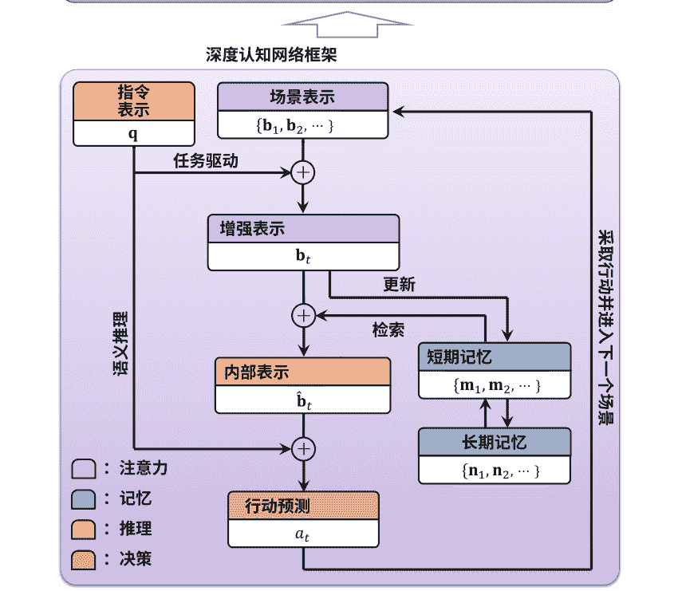
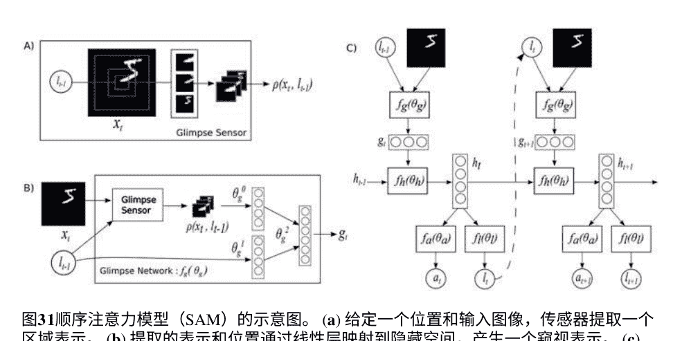
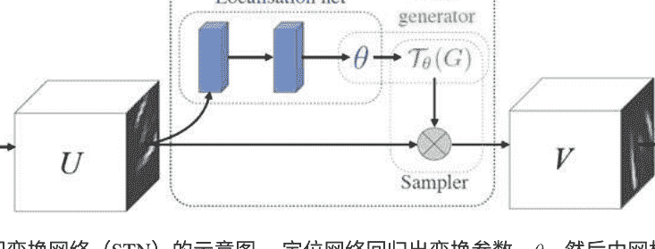
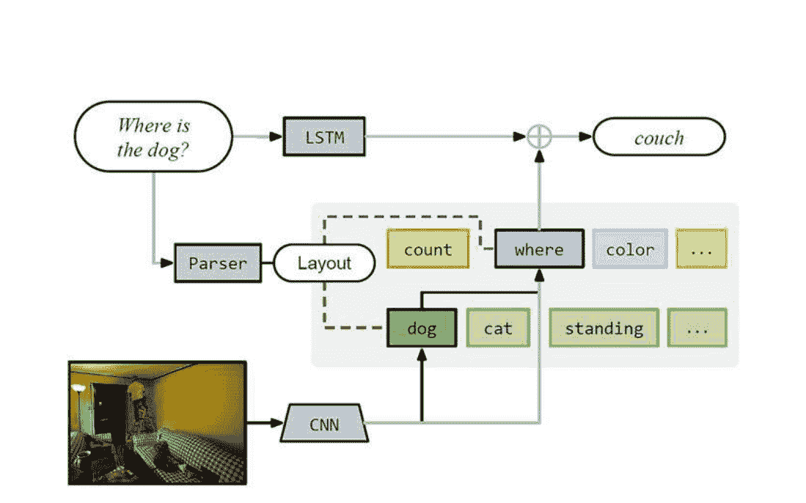
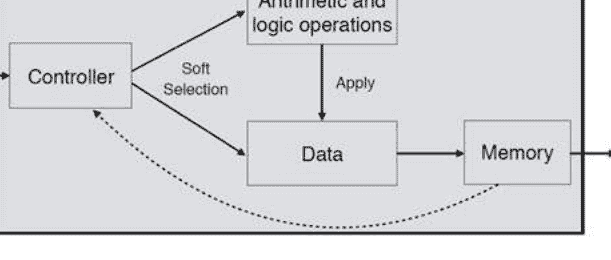

# 深度认知网络

# 前言

尽管深度学习模型近年来取得了巨大的进展，但深度学习模型与人类认知系统之间仍存在着很大的性能差距。许多研究人员认为，导致性能差距的主要原因之一是深度学习模型和人类认知系统以非常不同的方式处理外部信息。

为了模拟这种性能差距，自2014年以来，有一种趋势是基于深度学习模型来模拟人脑中的各种认知机制，例如注意力和记忆。本书将这些新型深度学习模型统一起来，并称之为深度认知网络（DCNs），它们可以实现各种认知功能，例如选择性提取和知识重用，以实现更有效的信息处理。

本书首先收集了来自认知心理学的现有理论和证据，并提出了一个共同模拟多个认知机制的DCNs的总体框架。然后，它分析了与DCNs相关的工作，并主要关注但不限于四个关键认知机制的分类（即注意力、记忆、推理和决策）。最后，它总结了最近的进展，并讨论了开放问题和未来的趋势。

我们希望这本书能为研究人员、从业人员和学生在相关领域的工作提供有用的参考。

中国北京
2022年12月

Yan Huang

# 致谢

我们对郭一军和尹琪悦表示深深的感谢，他们在撰写本书过程中给予了我们帮助。我们要感谢Springer的Lanlan Chang、Jingying Chen和Sudha Ramachandran的友好帮助和耐心，他们在准备本书过程中给予了很多支持。我们感谢中国国家重点研发计划（2016YFB1001000）、中国科学院前沿科学重点研究计划（ZDBS-LY-JSC032）和中国国家自然科学基金（61525306、61633021、61721004、62236010和62276261）的财务支持。

# 第1章 引言

摘要 本章概述了本书的内容。首先，我们介绍了深度认知网络 (DCNs) 的背景，包括它们的重要性和简要历史。然后，我们分析了DCNs的动机，并定义了它们模拟关键认知机制 (如注意力、记忆、推理和决策) 的范围。最后，我们概述了本书的内容组织。
关键词 深度学习 · 深度认知网络

## 1.1 背景

自2006年以来，深度学习[1-3]在基本感知任务中取得了巨大的成功，如物体识别[4]、机器翻译[5]和语音识别[6]。然而，在更复杂的现实场景中，最先进的深度学习模型与人类之间仍存在巨大的性能差距。特别是，尽管通过对大规模数据集进行监督学习，当前的深度学习模型[7-11]只能识别一千个预定义对象。而人类可以轻松识别超过一万个对象，并且对各种变化因素 (如光照、视角、分辨率等) 更具鲁棒性。如何实现人类水平的性能仍然是深度学习模型面临的巨大挑战。

最近，许多研究人员认为导致性能差距的主要原因之一是：深度学习模型和人类以非常不同的方式处理感知信息。特别是，深度学习模型，如卷积神经网络 (CNN) [12]和循环神经网络 (RNN) [13]，最初是为了模拟人脑中生物神经元之间的前馈和递归连接。虽然它们可以有效地实现从输入信息到期望输出 (如类标签) 的非线性映射，但它们忽视了模拟人脑信息处理过程中起重要作用的认知机制[14]。例如，视觉注意力[15, 16]是一种非常有用的认知机制，可以有选择地提取显著信息，以减少图像中冗余信息的负面影响。

为了缓解这个问题，有一种趋势是基于深度学习模型建模关键认知机制，即深度认知网络（DCNs），如图1.1所示。通过实现各种认知能力，例如选择性信息提取、知识重用和动态推理，DCNs在许多现实世界应用中可以实现比传统深度学习模型更好的性能。自从韦斯顿等人组织了第一个“推理、关注、记忆（RAM）”研讨会以来，基于注意力的DCNs [17–20] 和基于记忆的DCNs [21–24] 已经在计算机视觉和自然语言处理的许多任务中被证明非常有用。后来，基于推理的DCNs [25–29] 开始引起更多关注，被认为是实现语义推理和理解人类水平性能的有希望的解决方案。

在本书中，我们对DCN的最新进展进行了全面的研究。考虑到当前大多数现有的DCN模型各个认知机制分别，我们首先提出了一个DCN的通用框架，它可以同时模拟多个机制，就像人脑一样。该框架主要关注但不仅限于四个关键的认知机制如下所示。

1. 注意力：它可以集中于部分显著信息，同时忽略冗余的信息。例如，机器人可以有选择性地处理与对象相关的信息在场景中，并减少冗余背景的负面影响。
2. 记忆：它可以编码和存储历史信息，以指导推理和决策的过程。例如，即使水獭的对象只出现一次在历史场景中，机器人仍然可以记住它的编码信息并在以后用于识别。
3. 推理：它可以通过建立前提和结论之间的因果关系来有意识地解决问题。例如，机器人可以理解场景中不同对象之间的关系，并推断它们的潜在状态。
4. 决策：它可以通过衡量可能的结果来选择与外部环境进行交互的行动。例如，在观察到当前场景后，机器人将选择导航到其他场景或停在这里，最终完成其目标。

> http://www.th spermwhale.com/jas eweston/ram/。

请注意，我们在框架中只考虑了四个关键的认知机制，因为它们在当前的深度认知网络中被广泛考虑和建模。除了这些机制之外，将来还可以将更多其他的认知机制纳入到框架中。

## 1.2 内容组织

本书的剩余章节按照以下方式组织：

- 本章介绍了DCN的一般框架，包括建模不同认知机制的代表性原则。这些原则主要包括认知心理学中的重要理论、计算模型和实验证据。
- 本章分析了基于注意力的DCN的相关工作，并将其分为两类，包括硬注意力和软注意力。然后，它们进一步分为五个子类，包括顺序注意力、可变注意力、循环注意力、通道注意力和自注意力。
- 本章分析了基于记忆的DCN的相关工作，并将其分为两类，包括短期记忆和长期记忆。然后，它们进一步分为五个子类，包括工作记忆、短期和长期记忆、情景记忆、概念记忆和语义记忆。
- 本章分析了基于推理的DCN的相关工作，并将其分为两类，包括类比推理和演绎推理。然后，它们进一步分为四个子类，包括记忆推理、抽象推理、组合推理和程序推理。
- 本章分析了基于决策的深度认知网络（DCN）的相关工作，并将其分为两类，包括规范性决策和描述性决策。然后，它们进一步分为四个子类，包括顺序决策、群体决策、情感决策和模仿决策。
- 本章最后总结了当前DCN的特性和进展，并从综合建模、模型可解释性、评估场景和计算成本的角度讨论了当前的开放问题和未来的趋势。

## 参考文献

1. Hinton, G.E., Salakhutdinov, R.R.: 用神经网络降低数据的维度。科学 313(5786), 504–507 (2006)
2. Bengio, Y., Courville, A., Vincent, P.: 表示学习：一项综述和新的视角。IEEE Trans. Pattern Anal. Mach. Intell. 35(8), 1798–1828 (2013)
3. LeCun, Y., Bengio, Y., Hinton, G.: 深度学习。Nature 521(7553), 436–444 (2015)
4. Krizhevsky, A., Sutskever, I., Hinton, G.E.: 使用深度卷积神经网络进行Imagenet分类。在：Advances in Neural Information Processing Systems的论文集中，pp. 1097-1105（2012年）
5. Bahdanau, D., Cho, K., Bengio, Y.: 通过联合学习对齐和翻译进行神经机器翻译。arXiv:1409.0473（2014年）
6. Graves, A., Mohamed, A.-R., Hinton, G.: 使用深度递归神经网络进行语音识别。在：IEEE/CVF国际计算机视觉会议的论文集中，pp. 6645-6649。IEEE，皮斯卡塔韦（2013年）
7. Simonyan, K., Zisserman, A.: 用于大规模图像识别的非常深的卷积网络。arXiv:1409.1556（2014年）
8. Russakovsky, O., Deng, J., Su, H., Krause, J., Satheesh, S., Ma, S., Huang, Z., Karpathy, A., Khosla, A., Bernstein, M., 等等，Imagenet大规模视觉识别挑战。Int. J. Comput. Vis. 115(3), 211–252 (2015)
9. He, K., Zhang, X., Ren, S., Sun, J.: 深度残差学习用于图像识别。In: Proceedings of the IEEE Conference on Computer Vision and Pattern Recognition, pp. 770–778 (2016)
10. Ren, S., He, K., Girshick, R., Sun, J.: Faster R-CNN: 实时目标检测与区域建议网络。In: Proceedings of the Advances in Neural Information Processing Systems, pp. 91–99 (2015)
11. Huang, G., Liu, Z., Van Der Maaten, L., Weinberger, K.Q.: 密集连接卷积网络。In: Proceedings of the IEEE Conference on Computer Vision and Pattern Recognition, pp. 4700–4708 (2017)
12. LeCun, Y., Bottou, L., Bengio, Y., Haffner, P.: 基于梯度的学习应用于文档识别。IEEE会议记录 86(11), 2278–2324 (1998)
13. Schuster, M., Paliwal, K.K.: 双向递归神经网络。IEEE信号处理 45(11), 2673–2681 (1997)
14. Smith, E.E., Kosslyn, S.M.: 认知心理学：Pearson新国际版PDF电子书：心智与大脑。Pearson Higher Education, 新泽西 (2013)
15. Desimone, R., Duncan, J.: 选择性视觉注意的神经机制。年度回顾神经科学 18(1), 193–222 (1995)
16. Olshausen, B.A., Anderson, C.H., Van Essen, D.C.: 基于动态信息路由的视觉注意和不变模式识别的神经生物学模型。神经科学杂志 13(11), 4700–4719 (1993)
17. Mnih, V., Heess, N., Graves, A., et al., 重复模型的视觉注意力。Proc. Adv. Neural Inf. Process. Syst. 27 (2014)
18. Xu, K., Ba, J., Kiros, R., Cho, K., Courville, A., Salakhutdinov, R., Zemel, R., Bengio, Y.:展示、关注和描述:神经图像字幕生成与视觉注意力。In: 机器学习国际会议论文集, pp. 2048–2057 (2015)
19. Jaderberg, M., Simonyan, K., Zisserman, A., et al., 空间变换网络。Proc. Adv.Neural Inf. Process. Syst. 28 (2015)
20. Vaswani, A., Shazeer, N., Parmar, N., Uszkoreit, J., Jones, L., Gomez, A.N., Kaiser, Ł.,Polosukhin, I.: 注意力就是你所需要的。In: 神经信息处理系统进展, vol. 30 (2017)
21. 韦斯顿, J., 乔普拉, S., 博德斯, A.: 记忆网络。arXiv:1410.3916 (2014)
22. 格雷夫斯, A., 韦恩, G., 丹尼赫尔卡, I.: 神经图灵机。arXiv:1410.5401 (2014)
23. 格雷夫斯, A., 韦恩, G., 雷诺兹, M., 哈利, T., 丹尼赫尔卡, I., 格拉布斯卡-巴尔维斯卡, A., 科尔梅纳雷霍, S.G., 格雷芬斯特, E., 拉马尔霍, T., 阿加皮欧, J., 等，使用具有动态外部存储器的神经网络的混合计算。自然 538(7626), 471–476 (2016)
24. 苏赫巴塔尔, S., 韦斯顿, J., 弗格斯, R., 等，端到端记忆网络。Adv. NeuralInf. Process. Syst. 28 (2015)
25. 郑, K., 查, Z.-J., 魏, W.: 利用干扰特征进行抽象推理。在: 《神经信息处理系统进展》论文集, 第32卷 (2019年)
26. 巴雷特, D., 希尔, F., 桑托罗, A., 莫科斯, A., 利利克拉普, T.: 测量神经网络中的抽象推理。在: 《国际机器学习会议论文集》。机器学习研究的论文集, 第511-520页 (2018年)
27. 安德烈亚斯, J., 罗尔巴赫, M., 达雷尔, T., 克莱因, D.: 神经模块网络。在: 《计算机视觉与模式识别IEEE会议论文集》, 第39-48页 (2016年)
28. 尼拉坎坦, A., 勒, Q.V., 萨茨凯弗, I.: 神经程序员: 用梯度下降诱导潜在程序。arXiv:1511.04834 (2015年)
29. Johnson, J., Hariharan, B., Van Der Maaten, L., Hoffman, J., Fei-Fei, L., Lawrence Zitnick, C., Girshick, R.: 推断和执行视觉推理程序。在: IEEE国际计算机视觉会议论文集, 第2989-2998页 (2017)
30. Gazzaniga, M.S., Ivry, R.B., Mangun, G.R.: 认知神经科学。心智的生物学, 第三版。诺顿公司, 纽约 (2009)
31. Anderson, J.R.: 认知心理学及其影响。麦克米兰, 伦敦 (2005)

# 第2章 总体框架

摘要 本章描述了深度认知网络（DCNs）的一个示例任务，即视觉语言导航的总体框架。该框架从认知心理学的角度详细阐述了关注、记忆、推理和决策等多个认知机制的主要原则。

**关键词**
- 深度认知网络
- 认知心理学
- 认知机制建模

## 2.1 概述

接下来，我们尝试提出一个深度认知网络（DCNs）的通用框架，从认知心理学的视角总结了同时建模多个认知机制的重要原则。它可以作为以下分析和当前DCNs分类的理论基础，以及未来模型设计的指导。对于不同认知机制的建模，我们不是将它们孤立地建模，而是试图考虑它们在同一视觉语言导航任务的上下文中的合作关系。如图2.1所示，该任务要求机器人根据给定的语言指令导航到场景中找到一个物体。在这个过程中，将激活并解释各种认知机制，如下所述。

## 2.2 注意力

当在起始点初始化机器人并给予它指令：“去厨房找台灯”，它首先会感知当前的视觉场景并将其表示为图像。由于图像的内容涉及许多冗余的背景信息，它将激活注意力机制以选择性地处理显著的图像区域，然后评估它是否是所提到的物体。

图2.1 深度认知网络（DCNs）的框架及其在视觉语言导航任务中的应用

像“台灯”。这可能包含两个子过程：自下而上的注意力和自上而下的注意力[1]。自下而上的注意力是一个数据驱动的过程，它仅通过与周围环境的关系来决定图像中的一些显著区域，例如基于中心-环绕原理[2, 3]。在图中，我们使用{**b**₁, **b**₂, ···}来表示自下而上注意力后图像场景中的区域表示。在这个过程中，特征整合理论[4]可以被建模为将基本特征（如颜色、形状或运动）整合起来表示不同区域的潜在对象。

自上而下的注意力是一个任务驱动的过程，其中给定的指令被用作决定所关注的表示的指导。**b**_t₀。在图中，我们以“硬”的方式仅保留显著的区域表示，并完全忽略其余部分，这与过滤器理论[5]和聚光灯理论[6]一致。

另一种可行的方法是以“软”方式退化而不是忽略其余部分，这与衰减理论[7]类似。此外，偏向竞争理论[8]认为不同的对象竞争视觉处理，并且处理可以偏向突出对象的某些特征。

## 2.3 记忆

在获得关注的表示后，机器人的下一步是与其记忆交互以进行信息存储和重用。根据信息存储的时间长短，主要有两种类型的记忆：短期记忆[9]和长期记忆[10]。短期记忆只能保留从不同时间步骤编码的关注表示中的有限信息，即 {m₁, m₂, ⋯}。存储的信息只能持续几秒钟或几分钟，因为它会自动衰减[11]或被其他信息干扰[12]。短期记忆中存储的信息可以通过串行搜索或穷举搜索[13]进行后续重用。短期记忆可以升级为工作记忆[14]，它还允许对存储的信息进行推理和决策的后续处理。

短期记忆和长期记忆密切相关，因为详细的复述可以帮助将存储的信息从短期记忆转移到长期记忆[16, 17]，即 {n₁, n₂, ⋯}。与短期记忆不同，长期记忆可以存储更长时间的信息，并具有更大的容量。

长期记忆中主要有情节信息和语义信息[18]，分别指过去的事件和一般的世界知识。这也是两种显性记忆[19]，其中存储的信息可以被有意识地回忆起来。对应的是隐性记忆[20]，其中存储的信息在无意识中使用，但可以影响思维和行为。

## 2.4 推理

借助记忆，机器人可以将视觉场景和语言指令结合起来推理出所需的对象。如果场景以前没有见过，它可能会通过首先从记忆中检索类似的信息，然后使用它来增强注意力表示 b 以获得内部表示 b̂，这与认知心理学中的两个重要理论一致，即结构映射理论[22,23]和基于模式和类比的学习与推理[24,25]。它们都将类比推理视为从记忆中现有的源信息或知识到相关目标问题的结构映射过程。

之后，演绎推理[26]可能会被激活，这是从一个或多个前提中得出逻辑结论的过程。在这种情况下，内部表示 \hat{b}，理想情况下应该将重要的场景信息作为第一个前提进行表示：“这个场景是浴室，不包含台灯”。指令表示 q 表示第二个前提：“厨房有台灯”。然后结论是：“去其他场景找到厨房”。为了实现这一点，一种可行的方法是将演绎推理建模为逻辑操作 [27, 28]。

## 2.5 决策

由于机器人在当前场景中找不到所需的物体，它必须做出决策采取行动（例如，向左、向右、向前和向后）去其他场景。在图中，当前时间步的预测动作是 a_t。决策制定是一个动态过程，涉及机器人与环境之间的多个交互步骤。决策制定可以是理性的或非理性的，分别对应认知心理学中的规范决策或描述性决策[29]。规范决策定义了如何理性地做出良好的决策以获得最大效用。代表性的理论是期望效用理论[30]和多属性效用理论[31]，它们在每个时间步选择将导致最高期望效用的动作。

尽管描述性决策关注的是人类实际上如何做出决策的方式，但这并不能保证决策是好的或合理的。一个重要的原则是满意[32]，即人类不必每次都做出最优的决策，满意的决策就足够了。另一个原则是按方面排除[33]，它可以通过某些标准来排除一些备选方案，这可以减少面对过多信息的认知负荷[34]。此外，情绪是干扰理性决策的重要因素[35]，也应该被考虑和建模。

## 2.6 简要总结

通过这些认知机制的信息处理，机器人很可能最终找到所需的物体。然而，提出的框架仍处于初步阶段，只包含了四种常见的认知机制。在人类大脑中，还有更多的认知机制参与处理外部信息。整个过程可能非常复杂，即使是认知心理学家也无法完全解释所有细节。因此，将来还可以将更多的认知机制纳入框架中。

在下一章中，我们将按照上面所示的认知机制顺序，从注意力驱动的深度认知网络、记忆驱动的深度认知网络、推理驱动的深度认知网络和决策驱动的深度认知网络等方面分析相关工作。

## 参考文献

1. Connor, C.E., Egeth, H.E., Yantis, S.: 视觉注意力：自下而上与自上而下。Curr. Biol. **14**(19), 850–852 (2004)
2. Carr, T.H., Dagenbach, D.: 掩蔽词的语义启动和重复启动：感知识别中的中心-周围注意机制的证据。J. Exp.Psychol. Learn. Memory Cognit. **16**(2), 341 (1990)
3. Itti, L., Koch, C., Niebur, E.: 基于显著性的快速场景分析的视觉注意模型。IEEE Trans. Pattern Anal. Mach. Intell. **20**(11), 1254–1259 (1998)
4. Treisman, A.M., Gelade, G.: 注意力的特征整合理论。Cognit. Psychol. **12**(1), 97–136 (1980)
5. Broadbent, D.E.: 学习的选择性本质。感知。通信。244-267 (1958年)。 https://psycnet.apa.org/record/2004-16224-010
6. Hoffman, J.E., Nelson, B.: 视觉搜索中的空间选择性。感知。心理物理学。 **30** (3), 283-290 (1981年)
7. Treisman, A.M.: 选择性听力中的上下文提示。季度。J. Exp. Psychol. **12** (4), 242-248 (1960年)
8. Desimone, R., Duncan, J.: 选择性视觉注意的神经机制。年度。Rev. Neurosci. **18** (1), 193-222 (1995年)
9. Miller, G.A.: 我们处理信息的一些限制：七加二的神奇数字。心理学。评论。 **63** (2), 81 (1956年)
10. Shiffrin, R.M., Atkinson, R.C.: 长期记忆中的存储和检索过程。心理学评论 **76**(2), 179 (1969)
11. Peterson, L., Peterson, M.J.: 单个语言项目的短期保持。实验心理学杂志 **58**(3), 193 (1959)
12. Waugh, N.C., Norman, D.A.: 主要记忆中的干扰度量。语言学习与语言行为杂志 **7**(3), 617–626 (1968)
13. Sternberg, S.: 人类记忆中的高速扫描。科学 **153**(3736), 652–654 (1966)
14. Baddeley, A.D., Hitch, G.: 工作记忆。在：学习和动机心理学，卷 8, 页码 47–89。爱思唯尔，阿姆斯特丹 (1974)
15. Cowan, N.: 长期记忆、短期记忆和工作记忆之间的区别是什么？Progress Brain Res. **169**, 323–338 (2008)
16. Goldstein, E.B.: 认知心理学：连接思维、研究和日常经验。Cengage Learning (2014)
17. Reisberg, D.: 认知：探索心灵科学。WW Norton & Company, New York (2010)
18. Tulving, E.: 12.情景记忆和语义记忆。记忆的组织/Eds E. Tulving, W. Donaldson. Academic Press, New York, pp. 381–403 (1972)
19. Squire, L.R.: 陈述性和非陈述性记忆：支持学习和记忆的多个脑系统。J. Cognit. Neurosci. **4**(3), 232–243 (1992)
20. Schacter, D.L.: 隐性记忆：历史和现状。J. Exp. Psychol. Learn. Memory Cognit. **13**(3), 501 (1987)
21. Clement, C.A., Gentner, D.: 作为类比映射中的选择约束的系统性。Cognit. Sci. **15**(1), 89–132 (1991)
22. Falkenhainer, B., Forbus, K.D., Gentner, D.: 结构映射引擎：算法和示例。人工智能 **41**(1), 1–63 (1989)
23. Gentner, D.: 结构映射: 类比的理论框架. 认知科学 7(2), 155–170 (1983)
24. Hummel, J.E., Holyoak, K.J.: 结构的分布表示: 类比访问和映射的理论. 心理学评论 104(3), 427 (1997)
25. Hummel, J.E., Holyoak, K.J.: 关系推理和泛化的符号连接主义理论. 心理学评论 110(2), 220 (2003)
26. Falmagne, R.J., Gonsalves, J.: 推理. 年度心理学评论 46(1), 525–559 (1995)
27. Braine, M.D., O'Brien, D.P.: if的理论: 词汇条目, 推理程序和语用原则. 心理学评论 98(2), 182 (1991)
28. Rips, L.J.: 证明的心理学: 人类思维中的演绎推理. MIT出版社, 剑桥 (1994)
29. Smith, E.E., Kosslyn, S.M.: 认知心理学: 皮尔逊新国际版PDF电子书: 心智与大脑. 皮尔逊, 伦敦 (2013)
30. Schoemaker, P.J.: 期望效用模型: 其变体, 目的, 证据和限制. 经济文献 20, 529–563 (1982)
31. Dyer, J.S., Fishburn, P.C., Steuer, R.E., Wallenius, J., Zionts, S.: 多准则决策多属性效用理论: 未来十年. 管理科学 38(5), 645–654 (1992)
32. Simon, H.A.: 理性选择的行为模型. 季度经济学杂志 69(1), 99–118 (1955)
33. Tversky, A.: 消除因素: 选择理论. 心理学评论 79(4), 281 (1972)
34. Payne, J.W.: 任务复杂性和决策中的相关处理: 信息搜索和协议分析. 组织行为与人类绩效 16(2), 366–387 (1976)
35. De Sousa, R.: 情绪的合理性. 加拿大哲学评论 18(1), 41–63 (1979)

## 第三章 基于注意力的DCNs

摘要 本章首先简要介绍了基于注意力的深度认知网络（DCNs）。然后，从硬注意力和软注意力两个方面介绍和分析了代表性模型，以及它们与认知心理学中的重要理论、计算模型和实验证据的关系。最后，本章进行了简要总结。

关键词 注意力建模 · 软注意力 · 自注意力

## 3.1 概述

在深度学习兴起之前，已经有一些工作[1]对注意机制进行了建模，即视觉显著性预测。它们通常以图像或视频作为输入，并预测相应的显著性图，这些图表明了被人眼关注的概率。自2014年以来，研究人员开始使用深度学习技术，并提出了各种基于注意力的深度认知网络（DCNs）[2-4]，在计算机视觉、自然语言处理和数据挖掘等领域具有多样化的应用。如表3.1所示，我们主要关注两类基于注意力的DCNs：硬注意力和软注意力，以及它们的六个子类：顺序注意力、可变注意力、循环注意力、跨模态注意力、通道注意力和自注意力。代表性的基于注意力的DCNs包括顺序注意力模型[2]、空间变换网络[5]、基于注意力的RNN[3]、分层问题-图像共同注意力模型[6]，Squeeze-and-Excitation网络[7]和Transformer [8]。我们还详细阐述了他们在认知心理学中的相关重要理论、计算模型和实验证据。相应的细节将在接下来的部分中解释。

表3.1 基于注意力的DCN分类

| 类别 | 子类别 | 代表性DCN | 理论、模型和证据 |
| --- | --- | --- | --- |
| 硬注意力 | 顺序注意力 | 顺序注意力模型[2]，三阶Boltzmann机[9] | 滤波器理论[10]，聚光灯理论[11]，移位电路模型[12] |
| | 可变注意力 | 空间变换网络[5]，深度循环注意力写手[13] | |
| 软注意力 | 循环注意力 | 基于注意力的循环神经网络[3]，展示，关注和告诉模型[4] | 衰减理论[14]，跨通道启动效应[15]，特征整合理论[16]，有偏竞争理论[17] |
| | 跨模态注意力 | 分层问题-图像共同关注[6] | |
| | 通道注意力 | 挤压和激发网络[7] | |
| | 自注意力 | 变压器[8] | |

## 3.2 硬注意力

在认知心理学中，过滤器理论[10]认为在处理过程的早期阶段对视觉信息进行了过滤。该过滤器仅基于颜色和方向等基本特征选择显著信息。聚光灯理论[11]将注意力焦点比作聚光灯，聚光灯之外的信息不被接收。它们都以“硬”方式考虑注意力，即仅关注显著或前景信息，完全忽略背景信息。与此一致，提出了一系列硬注意力模型，可以分为两个子类，包括顺序注意力和可转换注意力。

### 3.2.1 顺序注意力

顺序注意力模型将注意机制视为一个动态过程，具有多个时间步。在每个时间步，模型能够预测下一个时间步将要关注的位置（例如图像中的空间位置），而忽略其他位置。

据我们所知，Larochelle和Hinton[9]提出了基于三阶Boltzmann机的顺序注意力模型，该模型可以通过结合多个时间步的观察结果来学习识别对象。与此同时，Denil等人[18]提出了另一个基于分解限制Boltzmann机的模型。

它设计了两个相互作用的路径，即身份路径和控制路径，以模拟人脑中的何时和何地路径。

后来，如图3.1所示，Mnih等人[2]提出了最具代表性的模型，即顺序注意力模型（SAM）。它基于RNN和强化学习（RL）[19]，可以选择性地从图像中提取和处理固定数量的区域。它将注意力建模为马尔可夫决策过程（MDP），其中动作被定义为关注位置的预测，状态由初始图像或裁剪图像区域表示，当准确识别出对象时，奖励被最大化。Li等人[20]通过在每个时间步添加额外的二进制动作来扩展SAM，该动作学会自动决定何时停止注意力。仅通过类别标签监督训练基于RL的模型很困难，这使得它们难以扩展到复杂的数据集。为了解决这个问题，Elsayed等人[21]进行了预训练步骤，能够为RL提供良好的初始注意力位置。

到目前为止，顺序注意力模型已经在各种应用中广泛使用，尤其是在计算机视觉领域。特别是类似的想法首先被证明对于提取图像中的信息区域非常有用，并在目标检测[22]和多标签学习[23]任务中取得了良好的性能。

然后，其他模型也被用于选择视频分析任务中的代表性帧，例如动作检测[24]和视频人脸识别[25]。

还有另一种顺序注意力模型，它首先使用CNN生成物体的边界框，然后以级联方式将它们用作关注区域。肖等人[26]设计了基于CNN的对象级注意力和部分级注意力，可以有选择地从边界框中提取具有区分性的区域表示，用于分类任务。

细粒度识别。同时，Gonzalez-Garcia等人[27]提出了一种基于随机森林和CNN的主动搜索策略，可以从预先获得的边界框中选择一系列边界框，以提高目标检测任务的效率。除了边界框之外，一些工作还依赖于现有的目标分割模型生成目标掩码，然后将其用于引导人物再识别[28]和显著目标检测[29]的注意过程。

### 3.2.2 可变注意力

在认知心理学中，安德森和范埃森[12]提出了移位电路模型，该模型通过动态移位将输入数组与输出数组相对齐，同时保持它们各自的空间关系。后来，奥尔豪森等人[30]对其进行了扩展，以获得更具位置不变性和尺度不变性的对象表示。与他们类似，唐等人[31]进行了早期尝试，并提出了一个可变换的注意力模型，该模型基于深度信念网络（DBN）[32]使用二维相似变换来实现缩放、旋转和平移操作以进行对齐。以下大多数可变换注意力模型类似地对二维可变换注意力进行建模，其中要么应用一组二维高斯滤波器，要么应用一组仿射变换到输入图像，产生指示关注位置的变换后图像区域。

如图3.2所示，在这个方向上最成功的模型之一是空间变换网络（STN）[5]。它首先定义了参数化的仿射变换，包括缩放、裁剪、旋转和非刚性变形，然后将它们应用于整个输入特征图以获得输出（关注的）特征图。该模型具有灵活性，可以与标准的深度学习模型结合使用，提取位置不变性和尺度不变性的表示。

稍后，Sønderby等人[33]将STN与RNN结合作为循环STN，能够顺序地关注图像中的多个对象。Lohit等人

图3.2 空间变换网络（STN）的示意图。定位网络回归出变换参数 θ，然后由网格生成器使用这些参数在输入特征图中进行采样，得到输出特征图。图来自[5]

[34]提出了STN的时间扩展，用于学习不变性和区分性的时间弯曲，在3D动作识别任务中显示出性能改进。Kim等人[35]提出了用于视频修复任务的时空变换网络。该模型可以在空间和时间上估计光流，然后有选择地扭曲目标帧。Haque等人[36]将STN从2D扩展到3D空间，能够提高3D人体姿态估计的性能。除了这些工作，STN还在其他任务中证明了其有效性，如人物再识别[37]和人眼注视估计[38]。

与STN中的仿射变换不同，Gregor等人[13]提出了一个名为Deep Recurrent Attentive Writer (DRAW)的概率模型。它交替使用一组2D高斯滤波器平滑地生成具有不同位置和尺度的图像区域，指示关注的位置。可变注意力已成功应用于目标实例分割任务[39]。

## 3.3 软注意力

软注意力和硬注意力的主要区别在于：当关注图像时，硬注意力完全忽略冗余的背景信息，而软注意力选择指数抑制它并让其仍然有机会被处理。软注意力的主要思想与衰减理论[14]一致，可以看作是滤波器理论的扩展版本，因为未关注的信息并没有完全被阻塞，而只是减少了。类似于它们，已经提出了各种软注意力模型，并应用于计算机视觉、自然语言处理、语音处理和多媒体数据分析等许多任务。接下来，我们将介绍软注意力的四个子类，包括循环注意力、跨模态注意力、通道注意力和自注意力。

### 3.3.1 循环注意力

与顺序注意力类似，循环注意力也被建模为具有多个时间步骤的动态过程。但主要区别在于，循环注意力在每个时间步骤中预测所有候选位置的注意力权重，并使用它们来自适应地聚合所有位置的表示。据我们所知，Bahdanau等人[3]首次提出了循环注意力模型，用于机器翻译任务。在每个时间步骤中，该模型首先基于多层感知器（MLPs）预测源句子中所有候选词的注意力权重，然后以加权求和的方式聚合它们以预测目标句子的一个词。该模型可以循环执行多次注意力以生成所有所需的词。Xu等人[4]将该思想扩展到图像领域。

图3.3展示了用于图像字幕任务的展示、关注和描述（SAT）模型的示意图。它包括从输入图像生成描述性句子的四个步骤。图源自[4]。

他们提出了Show, Attend and Tell (SAT)模型，可以预测图像的2D注意力地图。如图3.3所示，注意力地图表示了所有图像区域的重要性，并用于指导区域表示的聚合。

循环注意力可能是计算机视觉中最广泛使用的注意力。首先，它可以直接应用于大多数基于图像的任务，包括细粒度识别[40]和目标检测[41]，以便关注信息丰富的区域以提高性能。其次，它还可以轻松扩展为时间和时空版本，以选择视频分析任务中的显著帧，包括字幕[42]和动作识别[43]。此外，与仅对输入数据执行注意力不同，一些其他工作以语义引导的方式实现注意力。在他们的模型中，注意力权重是基于从数据中预测的语义信息计算的，例如属性[44]，单词[45]或事实[46]。

### 3.3.2 跨模态注意力

在认知神经科学中，Driver等人[47]和Kennett等人[15]在人脑中实验性地证明了跨通道启动效应。该效应指的是一个刺激能够促进其他刺激的处理。与此类似，Lu等人[6]提出了一个名为Hierarchical Question-image Co-attention (HQC)的模型，该模型包括用于视觉问答任务的两个版本的跨模态注意力。

如图3.4a、b所示，为了结合问题（单词级别）表示和图像（区域级别）表示以预测正确答案，这两个版本的跨模态注意力都必须首先计算两组表示之间的相似性矩阵，然后在行（或列）轴上进行归一化，作为问题引导（或图像引导）注意力权重来聚合原始表示。

这两个版本之间的主要区别在于并行版本同时执行问题引导和图像引导注意力，而另一个版本则以交替方式执行它们。与基于交替版本的有限数量的作品[48]相比，平行版本已经被广泛研究并应用于更多任务，如文本蕴含[49]和图像-文本匹配[50]。

还有另一个并行版本的跨模态注意力，它不计算相似性矩阵来获取注意力权重。相反，它使用深度学习模型直接从多模态数据中预测与模态相关的注意力权重。在这个方向上，黄等人[51]进行了早期尝试，并成功将他们的模型应用于图像-文本匹配任务。类似的想法也在多目标跟踪[52]和视频对象分割中得到了探索。

### 3.3.3 通道注意力

在CNN中，每个卷积层将多通道特征图（或三通道RGB图像）作为输入，并输出其处理后的多通道特征图。每个输出特征图通常捕捉一种特定的区分性特征（例如颜色、边缘和形状），可用于图像分类或目标检测。1980年，Treisman和Gelade [16]提出了特征整合理论，类似地认为每种特征（例如颜色、边缘和形状）都存储在一个单独的地图中，当寻找具有多种特征的对象时，所有这些特征将被选择性地整合。据我们所知，Chen等人[54]和Wang等人[55]提出了基于CNN的两个早期版本的通道注意力，这与特征整合理论密切相关。对于每个卷积层，通道注意力可以为输入特征图的不同通道分配不同的权重，然后相应地将它们聚合在一起。

图3.5展示了挤压激励网络（SENet）的示意图。X和U是输入的多通道特征图及其转换版本。F_{ex}(·, W)是用于获取通道注意力权重的映射函数。\tilde{X}是经过注意力处理后的特征图。图来自[7]。

如图3.5所示，通道注意力最具影响力的模型是挤压激励网络（SENet）[7]，它基于残差网络[56]。它通过在2017年ImageNet大规模视觉识别挑战（ILSVRC）中获得第一名，证明了其在图像分类方面的有效性[57]。随后，从上下文聚合[58]、位置建模[59]、尺度不变性[60]和高阶统计[61]的角度提出了各种SENet的扩展。到目前为止，通道注意力已成功应用于许多任务，如图像超分辨率[62]、帧插值[63]和场景分割[64]。

### 3.3.4 自注意力

Desimone和Duncan [17]提出了著名的偏向竞争理论，它将注意力过程视为不同位置输入特征之间的竞争。竞争通常偏向于当前关注的对象的某些特征。与此一致，Vaswani等人[8]提出了自我注意力的第一个版本，即缩放点积注意力（SDPA），它通过首先测量特征之间的相似性，然后使用它们对输入特征进行加权来明确模拟这种竞争，如图3.6所示。之后，从位置建模的角度提出了许多扩展[65]、复杂度降低[66]和非局部滤波[67]。这些模型已经广泛应用于许多应用领域，如语音识别[68]、图像生成[69]、语义分割[70]、点云生成[71]和交通预测[72]。

图3.6展示了缩放点积注意力（SDPA）的示意图。它将输入特征转换为三个版本：$Q$，$K$和$V$。前两者被比较以计算输入特征之间的相似性，然后将其作为注意力权重来组合$V$。图来自[8]。

通过将自注意力和编码器-解码器架构结合在一起，提出了一种新的架构，即Transformer[8]，如图3.7所示。这个模型被广泛研究并扩展成不同版本，用于不同的任务，包括自然语言处理的双向编码器表示来自Transformer（BERT）[73]，计算机视觉的Vision Transformer（ViT）[74]，多模态学习的对比语言-图像预训练（CLIP）[75]等。这些模型大多具有三个共同特点：

- 1. 它们通常需要在大规模数据集上进行监督学习和自监督学习的预训练，
- 2. 它们通常具有大量的学习参数，降低了模型的效率，
- 3. 它们在许多任务上取得了最先进的性能，并展现出强大的泛化能力。

## 3.4 简要总结

自2014年以来，已经提出了大量基于注意力的深度认知网络。由于空间限制，本章只能介绍部分代表性的作品，可能无法涵盖最新的作品。这些基于注意力的深度认知网络从背景建模、动态处理和通道聚合等各个方面研究了注意力的建模。这些模型的有效性已在计算机视觉、自然语言处理和多模态数据分析等广泛应用中得到了广泛证明。

图3.7展示了Transformer的示意图。整体架构包括使用堆叠的自注意力和全连接层的编码器和解码器。图来自[8]。

## 参考文献

- 1. Borji, A., Itti, L.: 视觉注意模型的最新进展. IEEE Trans. Pattern Anal. Mach. Intell. 35(1), 185–207 (2012)
- 2. Mnih, V., Heess, N., Graves, A., 等: 视觉注意的循环模型. In: Advances in Neural Information Processing Systems会议论文集, vol. 27 (2014)
- 3. Bahdanau, D., Cho, K., Bengio, Y.: 通过联合学习对齐和翻译的神经机器翻译. arXiv:1409.0473 (2014)
- 4. Xu, K., Ba, J., Kiros, R., Cho, K., Courville, A., Salakhudinov, R., Zemel, R., Bengio, Y.: 展示、关注和描述: 带有视觉注意的神经图像字幕生成. In: 机器学习国际会议论文集. 机器学习研究的论文集, pp. 2048–2057 (2015)
- 5. Jaderberg, M., Simonyan, K., Zisserman, A., 等: 空间变换网络. 在: 神经信息处理系统的进展 (2015年)
- 6. Lu, J., Yang, J., Batra, D., Parikh, D.: Hierarchical Question-image Co-attention for Visual Question Answering. 在: 神经信息处理系统的论文集, 第29卷 (2016年)
- 7. Hu, J., Shen, L., Sun, G.: 压缩和激励网络. 在: IEEE计算机视觉和模式识别会议论文集, 第7132-7141页 (2018年)
- 8. Vaswani, A., Shazeer, N., Parmar, N., Uszkoreit, J., Jones, L., Gomez, A.N., Kaiser, Ł., Polosukhin, I.: 注意力就是你所需要的。 在： 神经信息处理系统的进展，第30卷（2017年）
- 9. Larochelle. H., Hinton, G.E.: 通过建模人类认知机制来增强深度学习的深度认知网络。 在： 神经信息处理系统进展，第23卷（2010）
- 10. Lachter, J., Forster, K.I., Ruthruff, E.: 在Broadbent（1958）之后四十五年：没有注意就没有识别。心理学评论 111(4), 880 (2004)
- 11. Hoffman, J.E., Nelson, B.: 视觉搜索中的空间选择性。感知心理物理学 30(3), 283–290 (1981)
- 12. Anderson, C.H., Van Essen, D.C.: 移位电路：动态视觉处理的计算策略。国家科学院会议录 84(17), 6297–6301 (1987)
- 13. Gregor, K., Danihelka, I., Graves, A., Rezende, D., Wierstra, D.: Draw: 一种用于图像生成的递归神经网络。 在： 机器学习国际会议论文集。机器学习研究的论文集，第1462-1471页 (2015)
- 14. Treisman, A.M.: 选择性听觉中的上下文线索。季度实验心理学 12(4), 242–248 (1960)
- 15. Kennett, S., Spence, C., Driver, J.: 隐蔽外源空间注意力中的视觉触觉联系在看不见的手势变化中重新映射。感知。心理物理学。 64(7), 1083–1094 (2002)
- 16. Treisman, A.M., Gelade, G.: 注意力的特征整合理论。认知心理学。 12(1), 97–136 (1980)
- 17. Desimone, R., Duncan, J.: 选择性视觉注意力的神经机制。年度回顾。神经科学。 18(1), 193–222 (1995)
- 18. Denil. M., Bazzani, L., Larochelle, H., de Freitas, N.: 学习深度架构图像跟踪的注意力位置。神经计算。 24(8), 2151–2184 (2012)
- 19. Sutton, R. S., Barto, A.G., et al.: 强化学习导论，第135卷。麻省理工学院出版社，剑桥 (1998)
- 20. 李, Z., 杨, Y., 刘, X., 周, F., 温, S., 徐, W.: 动态计算时间用于视觉注意力。在：IEEE国际计算机视觉会议论文集工作坊, 第1199-1209页 (2017年)
- 21. Elsayed, G., Kornblith, S., Le, Q.V.: Saccader: 改善视觉中困难注意力模型的准确性。在：神经信息处理系统进展，第32卷 (2019年)
- 22. Caicedo, J.C., Lazebnik, S.: 使用深度强化学习进行主动物体定位。在：IEEE国际计算机视觉会议论文集, 第2488-2496页 (2015年)
- 23. Ba, J., Mnih, V., Kavukcuoglu, K.: 使用视觉注意力进行多目标识别。arXiv: 1412.7755 (2014年)
- 24. 杨, S., Russakovsky, O., Mori, G., Fei-Fei, L.: 从视频帧中的瞥见学习动作检测的端到端学习。在：IEEE计算机视觉和模式识别会议论文集, pp. 2678–2687 (2016)
- 25. 饶, Y., 卢, J., 周, J.: 面向视频人脸识别的注意力感知深度强化学习。在：IEEE国际计算机视觉会议论文集, pp. 3931–3940 (2017)
- 26. 肖, T., 徐, Y., 杨, K., 张, J., 彭, Y., 张, Z.: 两级注意力模型在深度卷积神经网络中的应用于细粒度图像分类。在：IEEE计算机视觉和模式识别会议论文集, pp. 842–850 (2015)
- 27. 冈萨雷斯-加西亚, A., Vezhnevets, A., Ferrari, V.: 一种用于高效目标类别检测的主动搜索策略。在：IEEE计算机视觉和模式识别会议论文集, pp. 3022–3031 (2015)
- 28. 宋, C., 黄, Y., 欧阳, W., 王, L.: 基于人类认知机制的深度认知网络增强深度学习。在：计算机视觉和模式识别IEEE会议论文集, 第1179-1188页 (2018年)
- 29. 陈, S., 谭, X., 王, B., 胡, X.: 用于显著目标检测的反向注意力。在：欧洲计算机视觉会议论文集, 第234-250页 (2018年)
- 30. Olshausen, B.A., Anderson, C.H., Van Essen, D.C.: 基于信息动态路由的视觉注意力和不变模式识别的神经生物学模型。 J.神经科学13（11），4700-4719页（1993年）
- 31. 唐，C., Srivastava, N., Salakhutdinov, R.R.: 学习具有视觉注意力的生成模型。 在：神经信息处理系统进展论文集，第27卷（2014年）
- 32. Hinton, G.E., Osindero, S., Teh, Y.-W.: 深度信念网络的快速学习算法。 神经计算18（7），1527-1554页（2006年）
- 33. Sønderby, S.K., Sønderby, C.K., Maaløe, L., Winther, O.: 循环空间变换网络. arXiv:1509.05329 (2015)
- 34. Lohit, S., Wang, Q., Turaga, P.: 时间变换网络：不变性和判别性时间对齐的联合学习。 在：IEEE/CVF计算机视觉与模式识别会议论文集，第12426-12435页（2019）
- 35. Kim, T.H., Sajjadi, M.S., Hirsch, M., Scholkopf, B.: 时空变换网络用于视频修复. 在：欧洲计算机视觉会议论文集，第106-122页（2018）
- 36. Haque, A., Peng, B., Luo, Z., Alahi, A., Yeung, S., Fei-Fei, L.: 迈向视点不变的3D人体姿态估计. 在：欧洲计算机视觉会议论文集，第160-177页。斯普林格，柏林（2016）
- 37. 李，D., 陈，X., 张，Z., 黄，K.: 学习深度上下文感知特征，用于人物再识别。 在：计算机视觉和模式识别IEEE会议论文集，第384-393页（2017年）
- 38. Recasens, A., Kellnhofer, P., Stent, S., Matusik, W., Torralba, A.: 学习缩放：基于显著性的神经网络采样层。 在：欧洲计算机视觉会议论文集，第51-66页（2018年）
- 39. 任，M., Zemel, R.S.: 端到端实例分割与循环注意力。 在：计算机视觉和模式识别IEEE会议论文集，第6656-6664页（2017年）
- 40. 赵，B., 吴，X., 冯，J., 彭，Q., 严，S.: 多样化的视觉注意力网络用于细粒度物体分类。 IEEE多媒体交易19（6），1245-1256页（2017年）
- 41. 李，J., 魏，Y., 梁，X., 董，J., 徐，T., 冯，J., 严，S.: 用于目标检测的关注上下文。 IEEE多媒体交易19（5），944-954页（2016年）
- 42. 姚，L., 托拉比，A., Cho，K., 巴拉斯，N., 帕尔，C., 拉罗谢尔，H., 库尔维尔，A.: 利用时间结构描述视频。 在：IEEE国际计算机视觉会议论文集，第4507-4515页（2015年）
- 43. Sharma, S., Kiros, R., Salakhutdinov, R.: 利用视觉注意力进行动作识别。 arXiv:1511.04119 (2015年)
- 44. You, Q., Jin, H., Wang, Z., Fang, C., Luo, J.: 具有语义注意力的图像字幕。 在：IEEE计算机视觉和模式识别会议论文集，第4651-4659页（2016年）
- 45. Yu, L., Lin, Z., Shen, X., Yang, J., Lu, X., Bansal, M., Berg, T.L.: 用于指称表达理解的模块化注意力网络。 在：IEEE计算机视觉和模式识别会议论文集，第1307-1315页（2018年）
- 46. 卢，P., 吉，L., 张，W., 段，N., 周，M., 王，J.: R-VQA: 学习视觉关系事实通过语义注意力进行视觉问答。 在：ACM SIGKDD国际知识发现与数据挖掘会议论文集，第1880-1889页（2018）
- 47. 司机，J., 斯宾斯，C.: 跨模态注意力。 当前神经生物学观点8（2），245-253页（1998年）
- 48. 谭，H., 班萨尔，M.: LXMERT: 从变压器中学习跨模态编码器表示。 arXiv:1908.07490（2019年）
- 49. 尹，W., 舒兹，H., 向，B., 周，B.: ABCNN: 基于注意力的卷积神经网络用于建模句子对。 计算机语言学协会交易4，259-272页（2016年）
- 50. 李，K.-H., 陈，X., 华，G., 胡，H., 何，X.: 堆叠交叉注意力用于图像-文本匹配。 在：欧洲计算机视觉会议论文集，第201-216页（2018年）

51. 黄, Y., 王, W., 王, L.: 具有选择性的实例感知图像和句子匹配的混合多模态LSTM. 在: IEEE计算机视觉和模式识别会议论文集, 第2310-2318页 (2017年)
52. 朱, J., 杨, H., 刘, N., 金, M., 张, W., 杨, M.-H.: 具有双重匹配注意力网络的在线多目标跟踪. 在: 欧洲计算机视觉会议论文集, 第366-382页 (2018年)
53. 卢, X., 王, W., 马, C., 沈, J., 邵, L., Porikli, F.: 看得更多, 知道得更多: 具有共同注意力连体网络的无监督视频对象分割. 在: IEEE/CVF计算机视觉和模式识别会议论文集, 第3623-3632页 (2019年)
54. 陈, L., 张, H., 肖, J., 聂, L., 邵, J., 刘, W., 蔡, T.-S.: SCA-CNN: 卷积网络中的空间和通道注意力用于图像字幕. 在: IEEE计算机视觉和模式识别会议论文集, 第5659-5667页 (2017年)
55. 王, F., 江, M., 钱, C., 杨, S., 李, C., 张, H., 王, X., 唐, X.: 用于图像分类的残差注意力网络. 在: IEEE计算机视觉和模式识别会议论文集, 第3156-3164页 (2017年)
56. He, K., Zhang, X., Ren, S., Sun, J.: 深度残差学习用于图像识别. 在: IEEE计算机视觉和模式识别会议论文集, 第770-778页 (2016年)
57. Russakovsky, O., Deng, J., Su, H., Krause, J., Satheesh, S., Ma, S., Huang, Z., Karpathy, A., Khosla, A., Bernstein, M., 等: ImageNet大规模视觉识别挑战. 国际计算机视觉杂志, 115(3), 211-252页 (2015年)
58. Li, X., Wu, J., Lin, Z., Liu, H., Zha, H.: 用于单幅图像去雨的循环挤压激励上下文聚合网络. 在: 欧洲计算机视觉会议论文集, 第254-269页 (2018年)
59. Hou, Q., Zhou, D., Feng, J.: 用于高效移动网络设计的坐标注意力. 在: IEEE/CVF计算机视觉和模式识别会议论文集, 第13713-13722页 (2021年)
60. 李, X., 王, W., 胡, X., 杨, J.: 选择性核网络. 在: IEEE/CVF计算机视觉和模式识别会议论文集, 第510-519页 (2019年)
61. 陈, Y., 卡兰蒂迪斯, Y., 李, J., 严, S., 冯, J.: A^2-nets: 双重注意力网络. 在: 神经信息处理系统进展会议论文集, 第31卷 (2018年)
62. 戴, T., 蔡, J., 张, Y., 夏, S.-T., 张, L.: 二阶注意力网络用于单幅图像超分辨率. 在: IEEE/CVF计算机视觉和模式识别会议论文集, 第11065-11074页 (2019年)
63. 崔, M., 金, H., 韩, B., 徐, N., 李, K.M.: 通道注意力是视频帧插值所需的全部. 在: AAAI人工智能会议论文集, 第34卷, 第10663-10671页 (2020年)
64. 傅, J., 刘, J., 田, H., 李, Y., 包, Y., 方, Z., 卢, H.: 双重注意力网络用于场景分割. 在: IEEE/CVF计算机视觉和模式识别会议论文集, 第3146-3154页 (2019年)
65. 肖, P., 乌斯克雷特, J., 瓦斯瓦尼, A.: 具有相对位置表示的自注意力. arXiv:1803.02155 (2018年)
66. 王, S., 李, B.Z., 卡布萨, M., 方, H., 马, H.: Linformer: 具有线性复杂度的自注意力. arXiv:2006.04768 (2020年)
67. 王, X., Girshick, R., Gupta, A., 何, K.: 非局部神经网络. 在: IEEE计算机视觉和模式识别会议论文集, 第7794-7803页 (2018年)
68. Pham, N.-Q., Nguyen, T.-S., Niehues, J., Müller, M., Stöker, S., Waibel, A.: 用于端到端语音识别的非常深的自注意力网络. arXiv:1904.13377 (2019年)
69. 张, H., Goodfellow, I., Metaxas, D., Odena, A.: 自注意力生成对抗网络. 在: 国际机器学习会议论文集. 机器学习研究的论文集, 第7354-7363页 (2019年)
70. 王, 黄, 侯, 张, 单: 图注意力卷积用于点云语义分割. 在: IEEE/CVF计算机视觉和模式识别会议论文集, 第10296-10305页 (2019年)
71. 孙, 王, 刘, Siegel, Sarma: Pointgrow: 自注意力学习的点云生成. 在: IEEE/CVF冬季计算机视觉应用会议论文集, 第61-70页 (2020年)
72. 郑, 范, 王, 齐: GMAN: 用于交通预测的图多注意力网络. 在: AAAI人工智能会议论文集, 第34卷, 第1234-1241页 (2020年)
73. Devlin, Chang, Lee, Toutanova: Bert: 深度双向转换器的预训练用于语言理解. arXiv:1810.04805 (2018年)
74. Dosovitskiy, A., Beyer, L., Kolesnikov, A., Weissenborn, D., Zhai, X., Unterthiner, T., Dehghani, M., Minderer, M., Heigold, G., Gelly, S., 等: 一张图片相当于16x16个单词: 规模化图像识别的变压器. arXiv:2010.11929 (2020年)
75. Radford, A., Kim, J.W., Hallacy, C., Ramesh, A., Goh, G., Agarwal, S., Sastry, G., Askell, A., Mishkin, P., Clark, J., 等: 从自然语言监督中学习可迁移的视觉模型. 在: 机器学习国际会议论文集. 机器学习研究的论文集, 第8748-8763页 (2021年)

# 第4章 基于记忆的深度认知网络

摘要 本章首先简要介绍了基于记忆的深度认知网络（DCN）。然后，从短期记忆和长期记忆两个方面介绍和分析了代表性模型，以及它们与认知心理学中的重要理论、计算模型和实验证据的关系。最后，本章进行了简要总结。

关键词 记忆建模 · 工作记忆 · 语义记忆

## 4.1 概述

与基于注意力的DCN类似，还提出了大量基于记忆的DCN [1-3]。受人脑记忆的启发，许多基于记忆的DCN设计了各种记忆模块来存储有用或历史信息，以便以后重复使用。因此，它们可以很好地处理长期时间依赖性问题，例如视频字幕、机器翻译和动作识别，以及罕见内容识别问题，例如少样本图像分类和开放式目标检测。在表4.1中，我们主要关注两类基于记忆的DCN：短期记忆和长期记忆，以及它们的五个子类：工作记忆、短期和长期记忆、情景记忆、概念记忆和语义记忆。

代表性的基于记忆的DCNs包括神经图灵机[1]，长短期记忆[4]，记忆网络[2]，原型网络[3]和多模态知识图[5]。我们还详细阐述了它们在认知心理学中的相关重要理论、计算模型和实验证据。相应的细节将在下面解释。

表4.1 基于记忆的DCNs分类

| 类别 | 子类别 | 代表性DCN | 理论、模型和证据 |
| --- | --- | --- | --- |
| 短期记忆 | 工作记忆 | 神经图灵机 [1], 差分神经计算机[6] | Baddeley-Hitch模型 [7], Atkinson-Shiffrin模型[8] |
|  | 短期和长期记忆 | 长短期记忆 [4], 门控循环单元 [9] |  |
| 长期记忆 | 情景记忆 | 记忆网络 [2], 端到端记忆网络 [10] | 事件记忆和语义记忆 [11], 知识的双重编码 [12] |
|  | 概念记忆 | 原型网络 [3], 多模态对齐概念知识 [13] |  |
|  | 语义记忆 | 多模态知识图 [5] |  |

## 4.2 短期记忆

在认知心理学中，短期记忆 [14] 通常具有非常有限的存储容量，只能暂时保存感知到的信息。 例如，短期记忆通常用于保存刚刚被告知的电话号码。

接下来，我们主要介绍短期记忆的两个子类，包括工作记忆和短期与长期记忆。

### 4.2.1 工作记忆

在认知心理学中，工作记忆，即巴德利-希奇模型 [7]，可以看作是短期记忆的改进版本，它可以额外地操作存储的信息，用于后续的推理和决策过程。 巴德利-希奇模型有三个关键组成部分: (1) 语音学循环，用于存储声音或语音信息，(2) 视觉空间素描板，用于存储可视信息以进行操作，以及(3) 中央执行器，用于控制和调节整个信息存储和操作过程。

2014年，Graves等人[1]提出了神经图灵机（NTM），如图4.1所示，它是最有影响力的基于记忆的深度认知网络之一。与巴德利-希奇模型类似，NTM还包括一个控制器，可以接收外部输入并与内存内容交互。 主要区别在于NTM只有单模式记忆而不是双模式记忆。 在内存读写过程中，根据内容有两种访问机制：基于内容的和基于位置的。整个模型参数是可微分的，因此可以通过梯度下降进行端到端的优化。后来，Graves等人将NTM扩展为差分神经计算机（DNC），它具有更先进的内存访问策略，并且可以更好地处理诸如问题回答、图遍历和逻辑规划等更复杂的任务。

NTM引起了很多关注，它的许多扩展非常有趣。例如，Kurach等人提出了一种神经随机访问机，它具有离散指针和可变大小的随机访问内存。Rae等人提出了一种稀疏访问内存，可以缓解内存量增加时的扩展问题。考虑到NTM只有线性组织的内存，Zhang等人和Parisotto和Salakhutdinov提出了不同的非线性结构化内存，并取得了更好的性能。Wang等人提出了NTM的多模态版本，其中内存在视觉和文本信息之间共享。NTM及其变种在许多应用中非常有用。代表性的应用包括：（1）在视频字幕生成[19]和目标跟踪[20]中捕捉长期时间依赖性，以及（2）在元学习[21]和图像-文本匹配[22,23]中保留和重用稀有内容。

2020年，巴德利[24]通过添加第四个组件即情景缓冲器扩展了原始的巴德利-希奇模型，该模型能够临时存储剧集或场景的信息。因此，还有几个模型开发了类似的模块，用于存储不同类型的情景和场景级别信息，例如语义词[25]、主题或历史[26]和室内场景[27]。

图4.1 神经图灵机（NTM）的示意图。NTM有一个控制器，接收外部输入并生成相应的输出。控制器可以产生读写头，用于选择性地读取和更新内存内容。图来自[1]。

### 4.2.2 短期记忆和长期记忆

在认知心理学中，阿特金森-希夫林模型[8]描述了短期记忆和长期记忆之间的关系，该模型由三个重要组成部分组成：(1) 感觉寄存器，用于感知外部信息，(2) 短期记忆，从传感器和长期记忆中接收和存储信息，以及(3) 长期记忆，将经过复述的信息无限期地存储在短期记忆中。 如图4.2所示，著名的长短期记忆(LSTM) [4]也考虑了两种记忆的关系，其中包括一个记忆细胞用于存储长期稳定的信息和网络参数用于存储短期临时的信息。 请注意，LSTM也与工作记忆相关，因为它的记忆细胞由三个门控制信息的流入和流出，这类似于工作记忆中的中央执行器。

LSTM已经在模型扩展和应用方面得到广泛研究。 LSTM有许多代表性和有影响力的扩展。例如，Chung等人[9]提出了一个轻量级的LSTM版本，名为门控循环单元(GRU)，它在性能上与LSTM相似，但具有更少的学习参数。 Tai等人[29]提出了一种树状LSTM，可以很好地模拟自然语言中的树结构。 Kiros等人[30]将LSTM与编码器-解码器架构相结合，提出了跳跃思维向量，可以对任意句子进行编码。 Srivastava等人[31]将LSTM的思想转移到传统的CNN中，以解决它们的梯度消失和探索问题。

到目前为止，LSTM及其扩展仍然是各种应用中的黄金方法，例如语音识别[28]，图像字幕[32]，动作识别[33]，问题回答[34]，文本分类[35]等。

图4.2 长短期记忆（LSTM）示意图。LSTM包含一个记忆细胞用于存储长期信息，以及三个门（输入门、遗忘门、输出门）用于控制信息流。图来自[4]。

## 4.3 长期记忆

许多实验证据表明，详细的排练可以帮助将存储的信息从短期记忆移动到长期记忆[36, 37]。与短期记忆相比，长期记忆具有无限的存储能力，可以长时间保持其存储的信息。在认知心理学中，有两种主要类型的长期记忆：显性（陈述性）记忆[38]和隐性（非陈述性）记忆[39]。1972年，Tulving [11]进一步提出了两种显性记忆类型：（1）情景记忆，用于存储特定的个人经历和以前的事件，以及（2）语义记忆，用于存储事实信息和语义概念。与显性记忆不同，隐性记忆通常是无意识的，但可以影响思维和行为。由于现有的基于记忆的DCN主要模拟显性记忆，我们只介绍以下三个显性记忆的子类。

### 4.3.1 情景记忆

据我们所知，韦斯顿等人[2]提出了第一个名为记忆网络（Memory Network，MN）的情景记忆模型，它包含一个存储情节信息的记忆组件，以数组形式表示。如图4.3所示，它还有另外四个与记忆组件交互的组件：（1）输入特征映射，将输入转换为其表示形式；（2）泛化，根据输入表示更新旧的记忆；（3）输出特征映射，通过结合输入表示和当前记忆生成输出表示；（4）响应，将输出表示转换为所需的响应。MN的有效性首先在一个大规模问答任务中得到证明，其中记忆组件用于提供历史或先前的信息。

图4.3 记忆网络（MN）的示意图。该模型由五个组件组成，其中I获取输入表示。I(x)，G更新内存，O组合I(x)与读取的内存m进行组合，R根据O（I(x), m）生成所需的输出。图来自[2]。

### 4.3.2 概念记忆

在认知心理学中，原型通常被视为语义概念的心理表征，其中包含与概念相关的最显著特征。因此，原型学习可以被视为在语义记忆中建模概念的一种代表性方法[11]，即概念记忆。

即使在深度学习兴起之前，原型学习也被广泛研究。Kohonen [52] 提出了早期的学习向量量化（LVQ）工作，后来在两个方向上进行了扩展。第一个方向是专注于手动设计更好的原型更新规则[53]，而第二个方向是专注于以参数化方式直接学习原型[54]。

后来在2017年，Snell等人提出了原型网络（PN），它基于深度学习实现了原型学习的思想，如图4.4所示。PN使用神经网络将输入样本映射到它们的嵌入，并通过对相关样本嵌入进行平均来计算每个概念的原型。

图4.4 在少样本学习和零样本学习场景中，原型网络（PN）的示意图。左侧：每个少样本原型。对于每个类别，通过对相关样本嵌入进行平均计算得到c_k。右侧：每个零样本原型。通过使用类别元数据v_k的嵌入来获得c_k。在任一情况下，嵌入样本x可以通过与所有原型进行比较找到最近的原型来进行分类。图来自[3]。

因此，PN可以获得语义概念和原型的配对。它可以被视为语义记忆的粗略模拟，因为概念和原型可以像人脑中的记忆内容一样被自适应地添加、删除或更新。在这个方向上，从卷积原型学习[55]、原型和概念的组合[56]和超球面原型学习[57]的角度上有许多有效的扩展。此外，黄等人[13]设计了多模态对齐概念知识（MACK），可以学习多模态配对原型，这受到了人脑中知识的双重编码的证据[12]的启发。除了少样本学习外，PN及其变种也广泛应用于其他应用，如情感识别[58]、说话人验证[59]和时间动作定位[60]。

### 4.3.3 语义记忆

除了概念之外，语义记忆[11]还存储了另一种类型的普遍世界知识，即事实。知识图谱（KG）[61,62]是建模语义记忆的最具代表性的方法。如图4.5所示，KG中的一个概念被表示为一个实体，而一个事实被表示为一个基于实体的三元组，其形式为（头实体，关系，尾实体），表示两个实体之间的关系。与人脑中的知识组织类似，KG中的实体和三元组以图形结构组织，可以自适应地添加、删除或更新。

到目前为止，已经提出了许多知名的KG。例如，DBpedia [64]是最早从维基百科的信息框中自动提取世界知识的KG之一，截至2021年，它总共包含约9亿个三元组结构的知识。后来，YAGO [65]将DBpedia与词汇KG WordNet [66]结合起来，具有逻辑推理能力。最近，KG的多模态版本引起了广泛关注，其中大部分是扩展了通过添加视觉信息，可以扩展现有的语言信息。例如，基于Freebase [67]和DBpedia，多模态知识图谱（MKG）[5]包含超过30,000个实体和超过810,000个三元组，其中只有约18%的实体与图像无关。

图4.5 知识图谱（KG）的实体和关系的示意图。我们可以推断出一些事实（三元组），例如（Tim Berners-Lee，发明了，WWW），（WWW，由，Web资源组成），以及（Tim Berners-Lee，获得了，图灵奖）。图来自[63]。

知识图谱在组织结构化知识方面非常有效，但在实际应用中，用户直接操作符号实体和三元组是困难的。为了缓解这个问题，提出了基于深度学习的各种知识图谱嵌入方法[68]，可以将实体和三元组嵌入到连续的向量空间中。其中，代表性的方法是TransE [69]及其变种，包括TransH [70]和TransR [71]。到目前为止，已经提出了许多模型用于各种基于知识图谱的任务，包括关系抽取[72]，实体分类[73]和实体消歧[74]。

## 4.4 简要总结

到目前为止，已经提出了许多基于记忆的深度认知网络来模拟工作记忆，情景记忆和语义记忆，这在实际应用中取得了很大的性能提升，如元学习和问答。与它们不同，隐式记忆的建模研究较少。

事实上，隐式记忆在我们的日常活动中起着重要作用，比如唱歌和骑自行车，它帮助我们自动和无意识地执行技能。

# 第5章 基于推理的DCNs

摘要 本章首先简要介绍了基于推理的深度认知网络（DCNs）。然后，从类比推理和演绎推理两个方面介绍和分析了代表性模型，以及它们与认知心理学中的重要理论、计算模型和实验证据的关系。最后，本章进行了简要总结。

关键词 推理建模 · 抽象推理 · 组合推理

## 5.1 概述

推理是基于现有前提或知识进行推断的过程，以得出结论。与注意力和记忆相比，推理更加复杂，基于推理的深度认知网络的数量较少。在表5.1中，我们主要关注两类基于推理的深度认知网络：类比推理和演绎推理，以及它们的四个子类：记忆推理、抽象推理、组合推理和程序推理。代表性的基于推理的深度认知网络包括记忆网络[1]、深度学习的智商[2]、神经模块网络[3]和神经程序员[4]。我们还详细阐述了它们在认知心理学中的相关重要理论、计算模型和实验证据。具体细节将在下面解释。

## 5.2 类比推理

类比推理试图通过参考相似性来理解陌生的目标（例如情境、示例和领域）。类比推理可以被视为归纳推理的一种较弱形式，因为归纳推理通常需要更多的样本来进行推理[19, 20]。

| 类别 | 子类别 | 代表性DCN | 理论，模型和证据 |
| :--- | :--- | :--- | :--- |
| 类比推理 | 记忆推理 | 记忆网络[1]， 端到端记忆网络[5] | 结构映射理论[6,7]，学习和推理与模式和类比[8, 9] |
| | 抽象推理 | 深度学习的智商[2]， 关系网络[10] | |
| 演绎推理 | 组合推理 | 神经模块网络[3]，路由网络[11] | 模块化组织和结构[12,13]，符号数值处理[14,15]，心理逻辑理论[16, 17] |
| | 程序化推理 | 神经编程器[4]，神经编程器-解释器[18] | |

在接下来的内容中，我们讨论了两个代表性的类比推理子类：记忆推理和抽象推理。

### 5.2.1 记忆推理

通常在认知心理学中，类比推理过程有五个关键步骤[21]，包括：(1) 检索，通过将目标视为查询，从记忆中检索出一个相似且熟悉的源，(2) 映射，将检索到的源的特征映射到目标上，(3) 评估，评估类比是否有用，(4) 抽象，提取源和目标的共同结构信息，以及(5) 预测，对目标进行预测。

这个五步过程类似于当前基于记忆的深度认知网络的推理过程[1, 5, 22-26]。在图5.1中，我们采用了端到端记忆网络[5]作为例子。当应用于视觉问答任务时，首先使用给定问题的表示来检索相似的记忆项。这对应于上述检索的第一步。然后，提取并映射到问题的相似记忆项的表示。这对应于映射的第二步。最后，组合表示用于预测所需的答案，这对应于预测的第五步。这三个步骤构成了一轮记忆推理的完整过程。事实上，大多数现有的基于记忆的深度认知网络通常会多次执行一轮记忆推理，其中上一轮推理的输出被作为下一轮推理的输入。这种多轮推理隐含地模拟了上述评估和抽象的第三和第四步骤，能够预测更准确的答案。

![图5.1：用于视觉问答任务的端到端记忆网络的示意图。(a): 一轮记忆推理。(b): 三轮记忆推理。详细说明见第5.2.1节。图来自[5]](img/50d6736bddefaf6a99ca433e168bcaae_48_0.png)

在这五个步骤中，检索和映射的前两个步骤更为重要。有两个相关的理论，即结构映射理论（SMT）[6,7]和学习和推理的模式和类比（LISA）[8,9]。他们都认为，在这两个步骤中，即目标或源中实体之间的关系，而不是实体的内在特征，结构相似性非常重要[27]。然而，在现有的基于记忆的DCN中，很少探索结构相似性的建模。相反，它们中的大多数选择使用基于内容的相似性[28, 29]、基于位置的相似性[24]或基于使用情况的相似性[30]，这些相似性主要由非结构化信息决定。

### 5.2.2 抽象推理

1938年，约翰·瑞文[31]提出了著名的人类智商测试：瑞文渐进矩阵（RPM）。如图5.2所示，每个问题由一个未完成的3×3矩阵和8个图像组成。人们必须基于抽象结构（例如形状、位置和角度）类比推理这些图像之间的关系，最终选择最合适的候选图像来完成矩阵。为了解决抽象推理问题，认知心理学中提出了许多有效的计算模型[32-34]，这些模型通过结构映射的建模来比较图像，证明了这个问题是可以解决的。但是它们中的大多数做出了一个不太实际的假设，即符号图像表示是可用的。

最近，一些研究人员尝试应用深度学习模型来处理该问题。Hoshen和Werman[2]的早期尝试测试了深度学习模型，其中CNN用于将多个原始图像作为输入，并通过推理图像间的关系来预测候选图像。Battet等人[10]和Zhang等人[35]提出了两个包含140万和40万个RPM类似问题的大规模数据集，这极大地促进了端到端的监督学习。后来，提出了各种深度学习模型来取代CNN以实现更好的表示学习，例如残差网络[36]、变分自编码器[37]、动态树网络[35]和关系网络[10]。

除了监督学习外，Steenbrugge等人[37]和Van等人[38]研究了从高维特征空间到变化因素的无监督映射，并证明了解缠结表示对抽象推理是有帮助的。Zhuo和Kankanhalli[39]将监督学习和无监督学习结合在一起，以进一步提高RPM的性能。还有其他基于对比学习和RL的学习方法[36, 40]，这些方法的动机是学习抽象结构并减轻干扰特征的影响。最近，Ichien等人[41]在视觉类比任务上对深度学习模型和早期计算模型进行了全面比较。尽管取得了很多进展，但抽象推理的研究仍处于初级阶段，还有许多问题有待解决。

## 5.3 演绎推理

然后，我们将介绍它的两个子类，即组合推理和程序化推理，以获取结论。

### 5.3.1 组合推理

在认知心理学中，已经有很多关于人脑中模块化组织和结构的实验证据[12, 13]。类似的组合推理思想已经在人工智能领域中得到探索，首先将推理任务分解为多个子任务，然后使用组合模块分别处理它们。Ronco等人在1996年提出了基于DNN的组合推理的早期工作，它以自分解的方式对输入的不同特征进行分组。

如图5.3所示，Andreas等人[3]提出了最具代表性的作品之一，即神经模块网络（NMN）用于视觉问答。它首先将问题解析为其语言布局，然后将其用作构建多个神经模块的指导。与之前的工作[42]相比，NMN中的模块包含可重用和语义组件，可以更好地促进高级语义推理。与使用依赖解析生成的基于规则的布局的NMN不同，Andreas等人[43]提出了NMN的动态版本，该版本学习重新排列来自外部解析器的布局。为了使NMN端到端可训练，Hu等人[44]提出了一种变体，其中网络从头开始学习动态构建布局。

可学习的，Hu等人[44, 45]通过直接学习模块的最优布局来替换固定的解析器。NMN及其变种已应用于许多任务，如问答[43]、视觉问答[46]、指称表达[44]、视觉定位[47]和视觉对话[48]。

组合推理还与另一种模型——专家混合模型（MoE）[49, 50]有关。在这个模型中，每个专家都是一个具有特定属性的参数化函数，输出是所有函数的加权和。最近，通过结合深度学习模型[51, 52]，它也得到了扩展。与传统的“软”混合相比，Rosenbaum等人[11]设计了一种路由网络（RN），可以以“硬”路由方式组合专家。

### 5.3.2 程序推理

大多数深度学习模型在推理过程中的一个主要限制是它们不能很好地学习算术或逻辑运算[53–55]。一个可行的解决方案是程序归纳[56]，它可以通过生成类似语言的程序来缓解这个限制。这与人脑中的符号数值处理的证据[14, 15]以及心理逻辑理论[16, 17]一致，心理逻辑理论应用语法规则将前提转化为结论，类似于语言处理过程。

据我们所知，Neelakantan等人[4]提出了最早的工作，即神经程序员（NP），如图5.4所示。基于DNN，该模型可以自适应地引导由一系列算术和逻辑操作组成的程序。在每个时间步，它选择特定的操作来处理数据，然后传播输出。另一个代表性的工作是神经程序员-解释器（NPI）[18]，它使用程序内存来生成新的程序。

通过组合现有程序。然而，NPI学习诱导整个程序的过程中受到过强的监督。为此，一些研究[57，58]尝试通过弱监督学习来放松这些限制。到目前为止，编程推理已经被证明对视觉问答[59]、阅读理解[60]和机器翻译[61]非常有用。

## 5.4 简要总结

推理建模最近才刚刚开始，因此基于推理的DCN的总数要比基于注意力的DCN和基于记忆的DCN要少得多。在所有基于推理的DCN中，记忆推理和组合推理引起了更多的关注，并在更多的应用中被证明是有效的。此外，一些特定任务也取得了令人鼓舞的进展，如视觉常识推理[62]和知识图推理[63]。

## 参考文献

1. Weston, J., Chopra, S., Bordes, A.: 记忆网络。 arXiv:1410.3916 (2014)
2. Hossain, D., Wellman, M.: 神经网络的智商。 arXiv:1710.01692 (2017)
3. Andreas, J., Rohrbach, M., Darrell, T., Klein, D.: 神经模块网络。 在: IEEE计算机视觉和模式识别会议论文集, 第39-48页 (2016)
4. Neelakantan, A., Le, Q.V., Sutskever, I.: 神经程序员：用梯度下降诱导潜在程序。 arXiv:1511.04834 (2015)
5. Sukhbaatar, S., Weston, J., Fergus, R., 等: 端到端记忆网络。 在: 神经信息处理系统进展, 第28卷 (2015)
6. Gentner, D.: 结构映射: 一个类比的理论框架. 认知科学 7(2), 155–170 (1983)
7. Falkenhainer, B., Forbus, K.D., Gentner, D.: 结构映射引擎: 算法和示例. 人工智能 41(1), 1–63 (1989)
8. Hummel, J.E., Holyoak, K.J.: 结构的分布表示: 类比访问和映射的理论. 心理学评论 104(3), 427 (1997)
9. Hummel, J.E., Holyoak, K.J.: 关系推理和泛化的符号连接主义理论. 心理学评论 110(2), 20 (2003)
10. Barrett, D., Hill, F., Santoro, A., Morcos, A., Lillicrap, T.: 在神经网络中测量抽象推理. 在: 机器学习国际会议论文集. 机器学习研究的论文集, pp. 511–520 (2018)
11. Rosenbaum, C., Klinger, T., Riemer, M.: 路由网络：自适应选择非线性函数进行多任务学习。 arXiv:1711.01239 (2017)
12. Sternberg, S.: 心智和大脑中的模块化过程. 认知神经心理学。 28(3–4), 156–208 (2011)
13. Meunier, D., Lambiotte, R., Bullmore, E.T.: 大脑网络的模块化和分层模块化组织。 前沿神经科学。 4, 200 (2010)
14. Piazza, M., Izard, V., Pinel, P., Le Bihan, D., Dehaene, S.: 人类颞顶沟中近似数量的调谐曲线。 神经元 44(3), 547–555 (2004)
15. Cantlon, J.F., Brannon, E.M., Carter, E.J., Pelphrey, K.A.: 成年人和4岁儿童的数字处理的功能性成像. PLoS Biol. 4(5), e125 (2006)
16. Johnson-Laird, P.N., Byrne, R.M.: 推理的简介. 行为. 脑科学 16(2), 323–333 (1993)
17. Johnson-Laird, P.N.: 心智模型和演绎推理. 人类推理研究. 基础. 206–222 (2008)
18. Reed, S., De Freitas, N.: 神经程序员解释器. arXiv:1511.06279 (2015)
19. Walton, D.N.: 类比论证的论证方案. 在: 系统化方法对类比论证, pp. 23–40. Springer, 柏林 (2014)
20. Sloman, S.A., Lagnado, D.: 归纳问题. 在: 剑桥思维和推理手册, pp. 95–116. 剑桥大学出版社, 剑桥 (2005)
21. Smith, E.E., Kosslyn, S.M.: 认知心理学: 心智和大脑. Pearson高等教育, 伦敦 (2013)
22. Kumar, A., Irsoy, O., Ondruska, P., Iyyer, M., Bradbury, J., Gulrajani, I., Zhong, V., Paulus, R., Socher, R.: 问我任何问题: 自然语言处理的动态记忆网络. 在: 机器学习国际会议论文集. 机器学习研究的论文集, pp. 1378–1387 (2016)
23. Xiong, C., Merity, S., Socher, R.: 动态记忆网络用于视觉和文本问答. 在: 机器学习国际会议论文集. 机器学习研究的论文集, 第2397-2406页 (2016)
24. Graves, A., Wayne, G., Danihelka, I.: 神经图灵机. arXiv:1410.5401 (2014)
25. Miller, A., Fisch, A., Dodge, J., Karimi, A.-H., Bordes, A., Weston, J.: 键值记忆网络直接阅读文档. arXiv:1606.03126 (2016)
26. Zhang, J., Shi, X., King, I., Lin, D.-Y.: 动态键值记忆网络用于知识追踪. 在: 国际万维网会议论文集, 第765-774页 (2017)
27. Holyoak, K.J.: 类比和关系推理. 在: K. J. Holyoak和R. G. Morrison (编辑), 思维和推理的牛津手册, 第234-259页. 牛津大学出版社, 纽约 (2012)
28. Bahdanau, D., Cho, K., Bengio, Y.: 通过联合学习对齐和翻译进行神经机器翻译. arXiv:1409.0473 (2014)
29. Xu, K., Ba, J., Kiros, R., Cho, K., Courville, A., Salakhudinov, R., Zemel, R., Bengio, Y.: 展示, 关注和讲述: 具有视觉注意力的神经图像字幕生成. 在: 国际机器学习会议论文集. 机器学习研究的论文集, 第2048-2057页 (2015)
30. Graves, A., Wayne, G., Reynolds, M., Harley, T., Danihelka, I., Grabska-Barwińska, A., Colmenarejo, S.G., Grefenstette, E., Ramalho, T., Agapiou, J., 等: 利用具有动态外部存储器的神经网络的混合计算. 自然 538(7626), 471–476 (2016)
31. Raven, J.: Raven渐进矩阵[M]. Springer, 美国 (2003)
32. Carpenter, P.A., Just, M.A., Shell, P.: 一个智力测试测量的理论解释Raven渐进矩阵测试中的处理.
33. Lovett, A., Tomai, E., Forbus, K., Usher, J.: 通过两阶段类比映射解决几何类比问题.
34. Lovett, A., Forbus, K., Usher, J.: Raven渐进矩阵的结构映射模型. 在: 认知科学学会年会论文集, 第32卷 (2010)
35. Zhang, C., Gao, F., Jia, B., Zhu, Y., Zhu, S.-C.: Raven: 一个用于关系和类比视觉推理的数据集. 在: 计算机视觉和模式识别的IEEE/CVF会议论文集, 第5317-5327页 (2019)
36. Hill, F., Santoro, A., Barrett, D.G., Morcos, A.S., Lillicrap, T.: 通过对比抽象关系结构来学习类比. arXiv:1902.00120 (2019)
37. Steenbrugge, X., Leroux, S., Verbelen, T., Dhoedt, B.: 使用解缠特征表示来改进抽象推理任务的泛化能力. arXiv:1811.04784 (2018)
38. Van Steenkiste, S., Locatello, F., Schmidhuber, J., Bachem, O.: 解缠表示对抽象视觉推理有帮助吗? 在: 神经信息处理系统进展, 第32卷 (2019)
39. Zhuo, T., Kankanhalli, M.: 用神经网络解决Raven的渐进矩阵问题. arXiv:2002.01646 (2020)
40. Zheng, K., Zha, Z.-J., Wei, W.: 带有干扰特征的抽象推理. 在：Advances in Neural Information Processing Systems会议论文集，第32卷（2019）
41. Ichien, N., Liu, Q., Fu, S., Holyoak, K.J., Yuille, A., Lu, H.: 视觉类比：深度学习与组合模型. arXiv:2105.07065 (2021)
42. Ronco, E., Gollee, H., Gawthrop, P.J.: 模块化神经网络和自分解. Connect. Sci.（特刊：组合神经网络）（1996）
43. Andreas, J., Rohrbach, M., Darrell, T., Klein, D.: 学习组合神经网络进行问题回答. arXiv:1601.01705 (2016)
44. Hu, R., Rohrbach, M., Andreas, J., Darrell, T., Saenko, K.: 用组合模块化网络建模指代表达中的关系。在：IEEE计算机视觉和模式识别会议论文集, 第1115-1124页（2017）
45. Hu, R., Andreas, J., Rohrbach, M., Darrell, T., Saenko, K.: 学习推理: 用于视觉问答的端到端模块化网络。在：IEEE国际计算机视觉会议论文集, 第804-813页（2017）
46. Hu, R., Andreas, J., Darrell, T., Saenko, K.: 通过堆叠神经模块网络实现可解释的神经计算。在：欧洲计算机视觉会议论文集, 第53-69页（2018）
47. Liu, D., Zhang, H., Wu, F., Zha, Z.-J.: 学习组装神经模块树网络进行视觉定位。在：IEEE/CVF国际计算机视觉会议论文集, 第4673-4682页（2019）
48. Kottur, S., Moura, J.M., Parikh, D., Batra, D., Rohrbach, M.: 使用神经模块网络在视觉对话中进行视觉共指解析。在：欧洲计算机视觉会议论文集，第153-169页（2018）
49. Jacobs, R.A., Jordan, M.I., Nowlan, S.J., Hinton, G.E.: 自适应的本地专家混合。神经计算 3（1），79-87页（1991）
50. Jordan, M.I., Jacobs, R.A.: 分层专家混合和em算法。神经计算 6（2），181-214页（1994）
51. Riemer, M., Vempaty, A., Calmon, F., Heath, F., Hull, R., Khabiri, E.: 使用多因素神经注意力修正预测。在：机器学习国际会议论文集。机器学习研究的论文集，第3010-3019页（2016）
52. Shazeer, N., Mirhosseini, A., Maziarz, K., Davis, A., Le, Q., Hinton, G., Dean, J.: 极大规模的神经网络：稀疏门控专家混合层。arXiv:1701.06538（2017）
53. Joulin, A., Mikolov, T.: 使用堆栈增强循环网络推断算法模式。在：神经信息处理系统进展论文集, 第28卷（2015）
54. Peng, H., Mou, L., Li, G., Liu, Y., Zhang, L., Jin, Z.: 为深度学习构建程序向量表示。在：知识科学、工程和管理国际会议论文集，第547-553页。Springer，柏林（2015）
55. Zaremba, W., Sutskever, I.: 学习执行。arXiv:1410.4615（2014）
56. Lake, B.M., Salakhutdinov, R., Tenenbaum, J.B.: 通过概率编程归纳实现人类级别的概念学习。科学 350(6266), 1332-1338（2015）
57. Li, C., Tarlow, D., Gaunt, A.L., Brockschmidt, M., Kushman, N.: 神经程序格。在：国际学习表示会议（2017）
58. Fox, R., Shin, R., Krishnan, S., Goldberg, K., Song, D., Stoica, I.: 用于神经编程的参数化分层过程。在：国际学习表示会议论文集（2018）
59. Johnson, J., Hariharan, B., Van Der Maaten, L., Hoffman, J., Fei-Fei, L., Lawrence Zitnick, C., Girshick, R.: 推断和执行视觉推理程序。在：IEEE国际计算机视觉会议论文集，pp. 2989-2998（2017）
60. Chen, X., Liang, C., Yu, A.W., Zhou, D., Song, D., Le, Q.V.: 神经符号阅读器：分布式和符号表示的可扩展集成阅读理解。在：国际学习表示会议论文集（2019）
61. Vu, T., Haffari, G.: 机器翻译的自动后编辑：一种神经程序-解释器方法。 在：经验方法会议论文集，第3048-3053页（2018）
62. Zellers, R., Bisk, Y., Farhadi, A., Choi, Y.: 从识别到认知：视觉常识推理。 在：计算机视觉和模式识别IEEE/CVF会议论文集，第6720-6731页（2019）
63. Chen, X., Jia, S., Xiang, Y.: 知识图谱上的知识推理综述。实验系统应用 **141**, 112948（2020）

# 第6章 基于决策的DCNs

摘要 本章首先简要介绍了基于记忆的深度认知网络（DCNs）。 然后，从规范决策和描述性决策两个方面介绍和分析了代表性模型，以及它们与认知心理学中的重要理论、计算模型和实验证据的关系。 最后，本章进行了简要总结。

关键词 决策建模。 群体决策 · 模仿推理

## 6.1 概述

决策是一个代理选择如何与外部环境互动的过程。 这对于许多实际应用非常重要，如服务机器人和自动驾驶。 如表6.1所示，我们主要关注两类基于决策的深度认知网络：规范性决策和描述性决策，以及它们的四个子类：顺序决策、群体决策、情绪决策和模仿决策。 代表性的基于决策的深度认知网络包括深度Q网络[1, 2]、多智能体深度强化学习[3, 4]、深度对策后悔最小化[5, 6]和深度模仿学习[7]。 我们还详细阐述了它们在认知心理学中的相关重要理论、计算模型和实验证据。 具体细节将在下面解释。

## 6.2 规范性决策

在认知心理学中，有两个主要类别的决策，包括规范性决策和描述性决策。 规范性决策与决策的规范理论或规定性理论有关，旨在告诉一个代理在给定条件下如何做出理想或理性的决策[8]。 期望效用理论（EUT） [9]是规范性决策中最重要的理论之一，它认为行动应该根据值来选择。

| 类别 | 子类别 | 代表性DCN | 理论，模型和证据 |
|------|--------|-----------|------------------|
| 规范决策 | 顺序决策 | 深度Q网络[1,2], 深度神经决策树[20] | 期望效用理论[9]，多属性效用理论[10]，决策制定的规范模型[25] |
| 规范决策 | 群体决策 |  |  |
| 描述性决策 | 情感决策 |  |  |
| 描述性决策 | 深度对策 | 后悔最小化[5, 6] | 图像理论[39,40]，有限理性理论[53]，按方面消除[54] |
| 描述性决策 | 模仿决策 | 深度模仿学习[7]，生成对抗模仿学习[61] |  |

预期效用。数值越高，行动越好。另一个重要的理论是多属性效用理论（MUT）[10]，它通过结合来自不同属性维度的子决策来提供解决更复杂决策的方案。接下来，我们考虑两种规范决策的子类，即顺序决策和群体决策。

### 6.2.1 顺序决策

如图6.1所示，深度Q网络（DQN）[1, 2]将顺序决策建模为动态马尔可夫决策过程（DMDP）[11]，它能够在每个时间步预测与外部环境的交互行动。与EUT的主要思想相协调，每个行动都通过奖励进行评估，目标是在所有时间步骤上最大化聚合奖励。DQN首次提出来解决传统强化学习的主要弱点，即无法直接从高维数据中学习策略，它在大量Atari游戏上实现了人类水平的表现。

然后，DQN已成为一个热门研究课题，许多研究人员提出了有效的变体来解决其局限性。Hasselt等人[12]首先发现DQN有时会大大高估动作的价值，然后证明使用双Q学习算法[13]可以很好地缓解这个问题。Wang等人[14]用一个新的双流体系结构取代了传统的深度架构，这可以更好地适应无模型强化学习。考虑到DQN只能处理离散动作空间，Lillicrap等人[15]结合了深度学习和确定性策略梯度算法[16]。

### 6.2.2 群体决策

与以前的顺序决策不同，群体决策关注的是一组代理而不仅仅是一个。因此，对于每个代理来说，环境更加复杂，因为它是非稳态的，并且始终受其他代理的动态影响。不同代理之间的关系也是多样的，可以是合作的、竞争的，甚至是混合的。在认知心理学中，决策的规范模型（NMDM）[25]描述了基于代理参与程度的五种不同的群体决策情况。如图6.2所示，多智能体深度强化学习（MDRL）[3, 4]是一种常用的群体决策方法，可以粗略地看作是DQN的多智能体版本。类似于NMDM的五种情况，MDRL也可以进一步细分为不同的情况，包括马尔可夫博弈（MG）[26]、部分可观察马尔可夫博弈（POMG）[27]和部分可观察马尔可夫决策过程（POMDP）[28]，根据环境状态是否完全可见或部分可见于代理。

图6.2多智能体深度强化学习（MDRL）的示意图。在这种多智能体情况下，所有代理共同作用于环境，他们的奖励取决于联合策略的结果。图来自[3]

特别是，MG包括一组代理人重复玩的游戏，在其中环境状态总结了游戏的相应历史。代表性的应用是捕食者游戏[29]和迭代囚徒困境[30]。

与MG不同，POMG中的代理人试图在部分可观察的环境中最大化他们的奖励。代表性的应用是自主驾驶[31]和网格世界游戏[32]。与POMG不同，POMDP中的代理人通常优化一个联合奖励而不是个体奖励。代表性的应用是像星际争霸[33]和Dota2[34]这样的各种实时策略游戏。还有一种名为广义形式博弈(EFM)[35]的设置，其中代理人按顺序采取行动。这种顺序特性通常被建模为一个游戏树，以显示长周期内的行动顺序。

众所周知的应用是扑克[36]和围棋[37]的游戏。请注意，也有一些不使用深度学习模型但在扑克游戏[38]上仍然取得非常好的性能的工作。

## 6.3 描述性决策

与规范性决策不同，描述性决策侧重于描述人们在实践中实际做出的决策。例如，图像理论[39,40]认为人们在日常生活中很少做出规范性决策。相反，他们只是详细说明和评估所有可能的标准的重要性，然后将它们汇总以做出最终决策。接下来，我们将从情感决策和模仿决策两个子类别来分析描述性决策。

### 6.3.1 情感决策

众所周知，人类通常无法做出完全理性的决策，因为他们的情绪会严重干扰理性决策过程[41, 42]。一个早期的证据是Allais悖论[43]，它揭示了预期的遗憾情绪对决策有明显影响。此外，许多情绪决策理论[44-46]都认为预期的情绪，特别是遗憾和失望，在实践中对决策至关重要。这些理论并不完全与之前的理性决策理论[9, 10]相对立，因为这两种理论是互补的，并可以在双系统理论[47]中统一起来。

然而，在人工智能领域，只有少数几篇论文提出了在决策过程中建模情绪的工作。2007年，Zinkevich等人提出了反事实遗憾最小化（CFR）的早期框架，如图6.3所示。在这个框架中，遗憾值被定义为候选动作的回报与实际采取的动作之间的差异。通过在决策过程中最小化累积遗憾，CFR对解决不完全信息博弈非常有用。通常，遗憾匹配[49]是CFR用于遗憾最小化的一种有效算法，因为它简单易行。有一个改进CFR效率的研究方向，如CFR+ [50]和线性CFR[51]，在扑克游戏中取得了良好的表现。然而，这些方法需要使用大型基于表格的内存来记录累积遗憾，这使得它们不能轻易应用于需要高效率的实际场景[52]。最近，也有一些工作尝试将深度学习与CFR相结合，例如在单智能体设置[5]和多智能体设置[6]中使用DNN来近似CFR中传统表格的行为。然而，相关工作的总数仍然非常少，几乎没有对其他类型情感进行建模的工作。

### 6.3.2 模仿决策

在认知心理学中，有许多与描述性决策相关的重要理论。1955年，赫伯特·西蒙[53]提出了有限理性理论，认为个体只需要找到一个令人满意的解决方案，而不是最优解。1970年，另一个名为"逐项排除"的理论被提出，提出了一种决策过程被视为一系列消除的方法[54]。在每次消除中，个体选择一个属性，然后消除缺乏该属性的一些选择。还有一些其他代表性的理论，如前景理论[55]和支持理论[56]。

虽然有许多相关的理论，但只提出了少数基于决策的DCN。考虑到直接建模这些理论是困难的，深度模仿学习（DIL）[57]被提出来隐式地鼓励代理根据深度学习模型模仿人类专家的决策，如图6.4所示。DIL模型有两种主要类型：行为克隆和对抗性模仿学习。第一种[7, 59]试图通过重新定义模仿学习为常见的分类任务来最小化代理和专家之间的策略差异。在这个方向上，Pomerleau [60]提出了一个基于DNN的非常早期的行为克隆框架，用于自动驾驶任务。

第二个[61,62]试图最大化代理和专家的对抗奖励，通常基于逆强化学习[63]。在这个方向上，Ho和Ermon提出了最有影响力的工作[61]，称为生成对抗模仿学习(GAIL)，它将鉴别器[64]的思想推广到区分代理和专家制定的策略。除了机器人导航和操作[7, 65, 66]之外，DIL还应用于其他任务，如文本分类[67]和化学图生成[68]。

## 6.4 简要总结

目前，已经提出了许多重要的基于决策的DCNs，用于顺序决策和群体决策，在围棋和扑克等众所周知的任务中取得了成功。但与现有的规范决策作品相比，对描述性决策的建模作品要少得多。事实上，在许多实际场景中，如自动驾驶和服务机器人，模拟类似人类决策过程的需求非常大。

## 参考文献

- 1. Mnih, V., Kavukcuoglu, K., Silver, D., Graves, A., Antonoglou, I., Wierstra, D., Riedmiller, M.: 使用深度强化学习玩Atari游戏。 arXiv:1312.5602 (2013)
- 2. Mnih, V., Kavukcuoglu, K., Silver, D., Rusu, A.A., Veness, J., Bellemare, M.G., Graves, A., Riedmiller, M., Fidjeland, A.K., Ostrovski, G., 等: 通过深度强化学习实现人类水平控制。 Nature 518(7540), 529–533 (2015)
- 3. Du, W., Ding, S.: 多智能体深度强化学习综述: 从挑战和应用的角度。
- 4. Wong, A., B ck, T., Kononova, A.V., Plaat, A.: 多智能体深度强化学习: 面向人类化方法的挑战和方向。 arXiv:2106.15691 (2021)
- 5. Jin, P., Keutzer, K., Levine, S.: 部分可观察深度强化学习的遗憾最小化。 In: 机器学习国际会议论文集。机器学习研究的论文集，第2342–2351页（2018年）
- 6. 李, H., 胡, K., 葛, Z., 江, T., 齐, Y., 宋, L.: 双神经对抗性后悔最小化。 arXiv:1812.10607 (2018)
- 7. 张, T., 麦卡锡, Z., 乔, O., 李, D., 陈, X., 戈德堡, K., 阿贝尔, P.: 虚拟现实远程操作的复杂操纵任务的深度模仿学习。 在: IEEE国际机器人与自动化会议论文集，第5628-5635页。IEEE, 皮斯卡塔威（2018年）
- 8. 爱德华兹, W.: 决策理论。 心理学公报 51（4）, 380（1954年）
- 9. 斯科梅克, P.J.: 期望效用模型: 其变体、目的、证据和局限性。 经济文献 20, 529–563 (1982)
- 10. 温特菲尔特, D.V., 费舍尔, G.W.: 多属性效用理论: 模型和评估程序。 效用概率。 人类决策。 Making 11, 47-85（1975年）
- 11. Puterman, M.L.: 马尔可夫决策过程. 运筹学和管理科学手册 2, 331–434 (1990)
- 12. Van Hasselt, H., Guez, A., Silver, D.: 深度强化学习与双Q学习. 在:AAAI人工智能会议论文集. 第30卷 (2016)
- 13. Hasselt, H.: 双Q学习. 在: 神经信息处理系统进展会议论文集, 第23卷 (2010)
- 14. Wang, Z., Schaul, T., Hessel, M., Hasselt, H., Lanctot, M., Freitas, N.: 对抗网络架构用于深度强化学习. 在: 机器学习国际会议论文集. 机器学习研究的论文集, 第1995–2003页 (2016)
- 15. Lillicrap, T.P., Hunt, J.J., Pritzel, A., Heess, N., Erez, T., Tassa, Y., Silver, D., Wierstra, D.: 深度强化学习的连续控制. arXiv:1509.02971 (2015)
- 16. Silver, D., Lever, G., Heess, N., Degris, T., Wierstra, D., Riedmiller, M.: 确定性策略梯度算法. 在: 机器学习国际会议论文集. 机器学习研究的论文集, 第387–395页 (2014)
- 17. 毛, H., Alizadeh, M., Menache, I., Kandula, S.: 通过建模人类认知机制来增强深度学习的深度认知网络. 在: ACM热门网络研讨会论文集, 第50-56页(2016)
- 18. 朱, Y., Mottaghi, R., Kolve, E., Lim, J.J., Gupta, A., Fei-Fei, L., Farhadi, A.: 使用深度强化学习在室内场景中进行目标驱动的视觉导航. 在: IEEE国际机器人与自动化会议论文集, 第3357-3364页. IEEE,Piscataway (2017)
- 19. 沈, Y., 黄, P.-S., 高, J., 陈, W.: Reasonet: 学习在机器理解中停止阅读. 在: ACM SIGKDD国际知识发现与数据挖掘会议论文集, 第1047-1055页 (2017)
- 20. Balestriero, R.: 神经决策树. arXiv:1702.07360 (2017)
- 21. 杨, Y., 莫里略, I.G., 霍斯佩代尔斯, T.M.: 深度神经决策树. arXiv:1806.06988 (2018)
- 22. 罗塔布洛, S., 康奇德尔, P.: 用于语义图像标注的神经决策森林. 在: 计算机视觉和模式识别IEEE会议论文集, 第81-第88页 (2014)
- 23. 康奇德尔, P., 菲特劳, M., 克里米尼西, A., 布洛姆, S.R.: 深度神经决策森林. 在: 计算机视觉IEEE国际会议论文集, 第1467-第1475页 (2015)
- 24. 肖, H.: NDT: 面向完全功能的神经图的神经决策树. arXiv:1712.05934 (2017)
- 25. 弗鲁姆, V.H., 耶顿, P.W.: 领导与决策, 第110卷. 匹兹堡大学, 匹兹堡 (1973)
- 26. Littman, M.L.: 马尔可夫博弈作为多智能体强化学习的框架. 在: 机器学习会议论文集, 第157-163页. 爱思唯尔, 阿姆斯特丹 (1994)
- 27. Hansen, E.A., Bernstein, D.S., Zilberstein, S.: 部分可观察随机博弈的动态规划. 在: AAAI人工智能会议论文集, 第4卷, 第709-715页 (2004)
- 28. Bernstein, D.S., Givan, R., Immerman, N., Zilberstein, S.: 分散控制马尔可夫决策过程的复杂性. 数学运筹学. 27 (4), 819-840页 (2002)
- 29. Zheng, Y., Meng, Z., Hao, J., Zhang, Z.: 加权双重深度多智能体强化学习在随机合作环境中. 在: 太平洋国际人工智能会议论文集, 第421-429页. 斯普林格, 柏林 (2018)
- 30. Foerster, J.N., Chen, R.Y., Al-Shedivat, M., Whiteson, S., Abbeel, P., Mordatch, I.: 具有对手学习意识的学习. arXiv:1709.04326 (2017)
- 31. Palanisamy, P.: 使用深度强化学习的多智能体连接自主驾驶. 在: 国际神经网络联合会议论文集, 第1-7页. IEEE, Piscataway (2020年)
- 32. Moreno, P., Hughes, E., McKee, K.R., Pires, B.A., Weber, T.: 多智能体强化学习中的神经递归信念状态. arXiv:2102.02274 (2021年)
- 33. Du, Y., Han, L., Fang, M., Liu, J., Dai, T., Tao, D.: LIIR: 学习多智能体强化学习中的个体内在奖励. 在: 神经信息处理系统进展, 第32卷 (2019年)
- 34. Berner, C., Brockman, G., Chan, B., Cheung, V., Debiak, P., Dennison, C., Farhi, D., Fischer, Q., Hashme, S., Hesse, C., et al.: Dota 2的大规模深度强化学习. arXiv:1912.06680 (2019)
- 35. Kuhn, H.W., Tucker, A.W.: 对博弈论的贡献, 第28卷. 普林斯顿大学出版社, 普林斯顿 (1953)
- 36. Heinrich, J., Lanctot, M., Silver, D.: 虚构自我博弈在广义形式博弈中的应用. 在: 机器学习国际会议论文集. 机器学习研究的论文集, pp. 805–813 (2015)
- 37. Silver, D., Huang, A., Maddison, C.J., Guez, A., Sifre, L., Van Den Driessche, G., Schrittwieser, J., Antonoglou, I., Panneershelvam, V., Lanctot, M., et al.: 通过深度神经网络和树搜索掌握围棋. 自然 529(7587), 484–489 (2016)
- 38. Brown, N., Sandholm, T.: 超人工智能在无限制扑克中的应用: Libratus战胜顶级职业选手。 科学 359(6374), 418–424 (2018)
- 39. Beach, L.R., Mitchell, T.R.: 图像理论: 决策中的原则、目标和计划。 Acta Psychol. 66(3), 201–220 (1987)
- 40. Beach, L.R.: 图像理论: 个人和组织决策。 在: 决策行动中的模型和方法, 第148–157 页 (1993年)
- 41. De Sousa, R.: 情感的合理性。 Dial. Can. Philos. Rev. 18(1), 41–63 (1979)
- 42. Frank, R.H.: 理性内的激情: 情感的战略作用。 WW Norton, 纽约 (1988年)
- 43. Allais, M.: 人类在面对风险时的理性行为: 对美国学派的假设和公理的批评。 Econ. J. Econ. Soc. 503–546 (1953)
- 44. Mellers, B.A.: 选择和后果的相对愉悦感。心理学公报 126(6), 910 (2000)
- 45. Bell, D.E.: 不确定情况下的决策后悔。 运筹学 30(5), 961–981 (1982)
- 46. Bell, D.E.: 不确定情况下的决策失望。 运筹学 33(1), 1–27 (1985)
- 47. McClure, S.M., Laibson, D.I., Loewenstein, G., Cohen, J.D.: 分离的神经系统价值即时和延迟的货币奖励。 科学 306(5695), 503–507 (2004)
- 48. Zinkevich, M., Johanson, M., Bowling, M., Piccione, C.: 不完全信息下的遗憾最小化。 在: 神经信息处理进展会议论文集系统, 第20卷 (2007)
- 49. 哈特, S., 马斯-科莱尔, A.: 一个简单的自适应程序导致相关均衡。 计量经济学 68(5), 1127–1150 (2000)
- 50. 塔梅林, O., 伯奇, N., 约翰逊, M., 鲍灵, M.: 解决面对面极限德州扑克。 在: 国际人工智能联合会议论文集 (2015)
- 51. 布朗, N., 桑德霍姆, N.: 通过折扣后悔最小化解决不完全信息游戏。 在: AAAI人工智能大会论文集, 第33卷, 第1829-1836页 (2019)
- 52. 伯奇, N.: 时间和空间: 为什么不完全信息游戏很难。博士学位论文 (2018)
- 53. 西蒙, H.A.: 理性选择的行为模型。 季度经济学 69(1), 99–118 (1955)
- 54. 特弗斯基, A.: 消除因素: 选择理论。心理学评论 79(4), 281 (1972)
- 55. 特弗斯基, A., 卡尼曼, D.: 前景理论的进展: 不确定性的累积表示。风险与不确定性杂志 5(4), 297–323 (1992)
- 56. 特弗斯基, A., 科勒, D.J.: 支持理论: 主观概率的非外延表示。心理学评论 101(4), 547 (1994)
- 57. 阿鲁尔库马兰, K., 利尔兰克, D.O.: 对深度模仿学习的实用视角。 arXiv:2108.01867 (2021)
- 58. 阿加尔, B.D., 切尔诺娃, S., 韦洛索, M., 布朗宁, B.: 机器人学习演示的调查。 机器人与自主系统 57(5), 469–483 (2009)
- 59. Bain, M., Sammut, C.: 一个行为克隆的框架。 在: 机器智能, pp. 103–129 (1995)
- 60. Pomerleau, D.A.: ALVINN: 一个神经网络中的自主陆地车。 在: Advances in Neural Information Processing Systems的会议论文集, vol.1 (1988)
- 61. Ho, J., Ermon, S.: 生成对抗模仿学习。 在: Advances in Neural Information Processing Systems的会议论文集, vol. 29 (2016)
- 62. Orsini, M., Raichuk, A., Hussenot, L., Vincent, D., Dadashi, R., Girgin, S., Geist, M., Bachem, O., Pietquin, O., Andrychowicz, M.: 对于对抗模仿学习来说什么是重要的? 在: Advances in Neural Information Processing Systems的会议论文集, vol. 34, pp. 14656–14668 (2021)
- 63. Ng, A.Y., Russell, S., 等: 逆向强化学习算法。 在: 机器学习国际会议论文集, 卷1, 第2页 (2000年)
- 64. Goodfellow, I., Pouget-Abadie, J., Mirza, M., Xu, B., Warde-Farley, D., Ozair, S., Courville, A., Bengio, Y.: 生成对抗网络。 在: 神经信息处理系统进展, 第27卷 (2014年)

65. Xu, D., Nair, S., Zhu, Y., Gao, J., Garg, A., Fei-Fei, L., Savarese, S.: 神经任务编程：学习在层次任务中进行泛化。 在: IEEE国际机器人与自动化会议论文集, 第3795-3802页。 IEEE, 皮斯卡塔韦 (2018年)

66. Wang, X., Huang, Q., Celikyilmaz, A., Gao, J., Shen, D., Wang, Y.-F., Wang, W.Y., Zhang, L.: 增强的跨模态匹配和自我监督模仿学习用于视觉语言导航。 在: IEEE/CVF计算机视觉与模式识别会议论文集, 第6629-6638页 (2019年)

67. 刘, M., Buntine, W., Haffari, G.: 学习如何主动学习：一种深度模仿学习方法。 在: 计算语言学年会论文集, 第1874-1883页 (2018年)

68. Jonas, E.: 分子逆问题的深度模仿学习。 在: 神经信息处理系统进展, 第32卷 (2019年)

69. Kebria, P.M., Alizadehsani, R., Salaken, S.M., Hossain, I., Khosravi, A., Kabir, D., Koohestani, A., Asadi, H., Nahavandi, S., Tunsel, E.等: 评估深度模仿学习对自动驾驶性能的架构影响。 在: IEEE国际工业技术会议论文集, 第865-870页。 IEEE, 皮斯卡塔韦 (2019年)

# 第7章 结论和未来趋势

摘要 本章首先通过总结不同深度认知网络（DCN）的主要特性，提供了整本书的结论。随后，我们讨论了一些未来研究方向的开放性问题。

关键词 模型可解释性·计算成本·综合建模

## 7.1 结论

在本书中，我们介绍了各种DCN，并分析了它们与认知心理学中的重要理论、计算模型和实验证据的关系。根据它们建模的认知机制，所有的DCN被分为四类，包括基于注意力的DCN、基于记忆的DCN、基于推理的DCN和基于决策的DCN。主要结论如下总结。

- 1. 基于注意力的DCN。基于注意力的DCN的主要优势是它们可以从冗余的背景中选择性地提取显著信息。这个特性使得基于注意力的DCN在信息提取任务（如图像字幕[1]和机器翻译）中能够取得更好的性能。

- 2. 硬注意力和软注意力是注意力机制的两个主要类别的DCN。与硬注意力相比，软注意力在广泛的应用中被更广泛地使用并展现出更好的性能。自注意力是软注意力的一个子类，在Transformer [3]、BERT [4]和ViT [5]等各种预训练模型中起着重要作用。

- 3. 基于记忆的DCN：基于记忆的DCN的主要优势在于它们可以将历史信息存储在外部存储模块中，以供以后参考。这个特性使得基于记忆的DCN能够更好地处理少样本学习[6]和长程依赖建模[7]的问题。短期记忆和长期记忆是基于记忆的DCN的两个主要类型。无论是短期记忆还是长期记忆，记忆引起了很多关注，并且已经提出了许多相关的基于记忆的DCN。其中，记忆网络[8]及其扩展[9,10]是最广泛研究的模型，被证明在问答任务中非常有用。

- 4. 基于推理的DCN：基于推理的DCN的主要优势在于它们可以通过分析给定前提之间的关系来推断所需的结论。这种特性使得基于推理的DCN能够更好地处理语义推理任务，如智商测试[11]和解谜[12]。类比推理和演绎推理是基于推理的DCN的两种主要类型。其中，只有少数几个基于推理的DCN [13,14]被提出来模拟组合推理和程序推理。然而，它们的结果非常有趣和有前景，证明了DCN能够实现类似人类的认知推理性能。

- 5. 基于决策的深度认知网络：基于决策的深度认知网络的主要优势在于它们可以与外部环境动态交互。这个特性对于服务机器人和自动驾驶在现实场景中做出合适的决策非常有用。规范决策和描述性决策是基于决策的深度认知网络的两种主要类型。与描述性决策相比，有更多的决策-深度认知网络被提出来模拟规范决策。其中，最成功的是深度Q网络[15, 16]及其多智能体版本[17]，其有效性已在许多著名应用中得到证明，如围棋[18]。

## 7.2 未来问题和趋势

根据我们的分析，我们发现在综合建模、模型可解释性、评估场景和计算成本等方面仍存在一些开放性问题，以下简要讨论。

- 1. 综合建模。目前，注意力的建模得到了广泛研究，但其他机制的建模仍需要更多的研究。例如，显式记忆已经得到了广泛考虑，而隐式记忆很少被研究。此外，如何更好地模拟具有动态事件的语义记忆仍然是一个巨大的挑战。除了已经提到的注意力、记忆、推理和决策之外，人脑中还有更多其他类型的认知机制或过程。如何很好地对它们进行建模并使它们协同工作以实现更强的认知能力是另一个挑战。

- 2. 模型可解释性。DCNs处于人工智能和认知心理学学科的前沿。我们只是粗略地将现有的DCNs与认知心理学中的重要理论、计算模型和实验证据连接起来。因此，更多来自不同学科的研究人员共同努力，进一步提高DCNs的模型可解释性，并提出新的生物学可行的DCNs，将会更好。实际上，DCNs取得的进展也可能激发认知心理学家更好地理解他们研究中的认知机制。

- 3. 评估场景。目前，大多数DCN的性能仅通过公开可用数据集上的模型准确性进行评估。与传统的深度学习模型相比，DCN的优势在于其选择性信息提取、知识重用和动态推理等认知能力，这对于处理时空冗余信息和动态开放式实际场景中的少量/零样本内容非常有用。因此，对于DCN来说，更适合的评估数据集和场景需求很大。

- 4. 计算成本。人类大脑能够高效地处理它们所感知到的信息，而目前基于深度学习的DCN通常具有非常大量的参数。它们的计算成本通常非常高，特别是在处理大规模数据时。因此，研究更高效的DCN对于实际应用非常重要。在未来，可以通过以下方式降低DCN的计算成本：（1）使用更高效的深度学习模型作为骨干，以及（2）建模新的认知机制，以解释人类大脑的高效性。

## 参考文献

1. Xu, K., Ba, J., Kiros, R., Cho, K., Courville, A., Salakhudinov, R., Zemel, R., Bengio, Y.: 展示、关注和描述：具有视觉注意力的神经图像字幕生成。 在：机器学习国际会议论文集，第2048-2057页 (2015年)
2. Bahdanau, D., Cho, K., Bengio, Y.: 通过联合学习对齐和翻译的神经机器翻译。 arXiv:1409.0473 (2014年)
3. Vaswani, A., Shazeer, N., Parmar, N., Uszkoreit, J., Jones, L., Gomez, A.N., Kaiser, Ł., Polosukhin, I.: 注意力就是一切。 在：《神经信息处理系统进展》论文集，第30卷 (2017年)
4. Devlin, J., Chang, M.-W., Lee, K., Toutanova, K.: Bert：深度双向转换器的预训练用于语言理解。 arXiv:1810.04805 (2018年)
5. Dosovitskiy, A., Beyer, L., Kolesnikov, A., Weissenborn, D., Zhai, X., Unterthiner, T., Dehghani, M., Minderer, M., Heigold, G., Gelly, S., et al.: 一幅图像相当于16x16个单词：规模化图像识别的转换器。 arXiv:2010.11929 (2020年)
6. Santoro, A., Bartunov, S., Botvinick, M., Wierstra, D., Lillicrap, T.: 带有增强记忆的神经网络的元学习。 在：国际机器学习大会论文集。 机器学习研究的论文集，第1842-1850页 (2016)
7. Wang, J., Wang, W., Huang, Y., Wang, L., Tan, T.: M3：用于视频字幕的多模态记忆建模。 在：计算机视觉和模式识别IEEE会议论文集，第7512-7520页 (2018)
8. Weston, J., Chopra, S., Bordes, A.: 记忆网络。 arXiv:1410.3916 (2014)
9. Sukhbaatar, S., Weston, J., Fergus, R., et al.: 端到端记忆网络。 在：神经信息处理系统进展，第28卷 (2015)
10. Kumar, A., Irsoy, O., Ondruska, P., Iyyer, M., Bradbury, J., Gulrajani, I., Zhong, V., Paulus, R., Socher, R.: 问我任何问题：自然语言处理的动态记忆网络。 在：机器学习国际会议论文集. 机器学习研究的论文集, pp. 1378–1387 (2016)
11. Hoshen, D., Werman, M.: 神经网络的智商。 arXiv:1710.01692 (2017)
12. Pierrot, T., Ligner, G., Reed, S.E., Sigaud, O., Perrin, N., Laterre, A., Kas, D., Beguir, K., de Freitas, N.: 用递归树搜索和规划学习组合神经程序。 在： Advances in Neural Information Processing Systems会议论文集，第32卷(2019)
13. Andreas, J., Rohrbach, M., Darrell, T., Klein, D.: 神经模块网络。 在：IEEE计算机视觉与模式识别会议论文集， 第39-48页 (2016)
14. Neelakantan, A., Le, Q.V., Sutskever, I.: 神经程序员：用梯度下降诱导潜在程序。 arXiv:1511.04834 (2015)
15. Mnih, V., Kavukcuoglu, K., Silver, D., Graves, A., Antonoglou, I., Wierstra, D., Riedmiller, M.: 用深度强化学习玩Atari游戏。 arXiv:1312.5602 (2013)
16. Mnih, V., Kavukcuoglu, K., Silver, D., Rusu, A.A., Veness, J., Bellemare, M.G., Graves, A., Riedmiller, M., Fidjeland, A. K., Ostrovski, G., 等： 通过深度强化学习实现人类级别的控制。 Nature 518(7540), 529–533 (2015)
17. Du, W., Ding, S.: 多智能体深度强化学习综述：从挑战和应用的角度。
18. Silver, D., Huang, A., Maddison, C.J., Guez, A., Sifre, L., Van Den Driessche, G., Schrittwieser, J., Antonoglou, I., Panneershelvam, V., Lanctot, M., 等：通过深度神经网络和树搜索掌握围棋。 Nature 529(7587), 484–489 (2016)