# 混沌动力学多级预测中的深度学习

## 应用科学和技术中的斯普林格简报·波利米斯普林格简报

Matteo Sangiorgio

Fabio Dercole

Giorgio Guariso


## 斯普林格简报·应用科学和技术

## 波利米斯普林格简报

## 编辑委员会

巴巴拉·佩尔尼奇，米兰理工大学，意大利米兰

斯特凡诺·德拉托雷，米兰理工大学，意大利米兰

比安卡·M·科洛西莫，米兰理工大学，意大利米兰

蒂齐亚诺·法拉维利，米兰理工大学，意大利米兰

罗伯托·帕奥卢奇，米兰理工大学，意大利米兰

西尔维娅·皮亚尔迪，米兰理工大学，意大利米兰

有关这个子系列的更多信息，请访问 [https://link.springer.com/bookseries/11159](https://link.springer.com/bookseries/11159)

http://www.polimi.it

Matteo Sangiorgio · Fabio Dercole · Giorgio Guariso

## 深度学习在混沌动力学多步预测中的应用

从确定性模型到现实世界系统

Matteo Sangiorgio

Dipartimento di Elettronica, Informazione e Bioingegneria (DEIB)

Politecnico di Milano

意大利米兰

Fabio Dercole

Dipartimento di Elettronica, Informazione e Bioingegneria (DEIB)

Politecnico di Milano

意大利米兰

Giorgio Guariso

Dipartimento di Elettronica, Informazione e Bioingegneria (DEIB)

Politecnico di Milano

意大利米兰

ISSN 2191-530X

ISSN 2191-5318 (电子版)

SpringerBriefs应用科学与技术

ISSN 2282-2577

ISSN 2282-2585 (电子版)

PoliMI SpringerBriefs

ISBN 978-3-030-94481-0

ISBN 978-3-030-94482-7 (电子书)

https://doi.org/10.1007/978-3-030-94482-7

© 作者（们），独家授权给Springer Nature Switzerland AG 2021

本作品受版权保护。所有权利仅由出版商独家许可，无论是整体还是部分材料，特别是翻译、重印、插图重用、朗读、广播、微缩胶片复制或以任何其他物理方式、传输或信息存储和检索、电子适应、计算机软件或类似或不同的已知或今后开发的方法。

在本出版物中使用一般描述性名称、注册名称、商标、服务标志等，并不意味着即使在没有明确声明的情况下，这些名称也不受相关保护法律和法规的限制，因此可以自由使用。

出版商、作者和编辑可以安全地假设本书中的建议和信息在出版日期时被认为是真实和准确的。出版商、作者或编辑对本文中包含的材料不提供明示或暗示的保证，也不对可能存在的任何错误或遗漏负责。出版商在已发表的地图和机构隶属方面保持中立。

这个Springer印记是由注册公司Springer Nature Switzerland AG出版的

注册公司地址是：Gewerbestrasse 11, 6330 Cham, Switzerland

不要在墙上的斑点、火灰、云雾、泥浆或其他类似的地方停下来看，因为在这些混乱的事物中，会有非常奇妙的发现...因为在混乱的事物中，思维会被唤醒。

> （停下来看看墙上的污渍、火灰、云朵、泥土或其他类似的地方，并不需要太多的努力。如果仔细思考，你会发现奇妙的发明...这些发明对你有好处，因为它们会唤醒你的天才。）

> 列奥纳多·达·芬奇，《绘画论》，约1540年。

## 前言

在当前数据丰富的时代，我们知道许多变量的时间序列很难被解释为规则的运动加上一些随机噪声。半个世纪以来，我们也知道即使是表面上简单的非线性方程组也可以产生在有限的变量空间内保持复杂的运动而不是周期性的运动。这种运动被称为“混沌”（当方程中不包含随机性时称为“确定性混沌”）。

在它们被发现后不久，洛伦兹和其他研究人员对可预测性的问题感到困扰。我们能够可靠地预测这些系统的输出能够延伸到多远的未来？多年来，对这样一个问题的回答一直局限于很少的步骤。然而，如今强大的计算机工具可用，并已成功用于完成复杂的任务。我们能够使用这些工具扩展我们的预测能力吗？能够延伸到多远？我们能够预测不仅仅是单个值，还能够预测整个输出序列吗？

本书试图通过使用深度人工神经网络作为预测工具，并分析这些网络的不同架构的性能来回答这些问题。特别是，我们将传统的前馈（FF）架构与较新的长短期记忆（LSTM）结构进行比较。对于后者，我们探讨了是否使用传统的“教师强制”训练方法的可能性。

在详细介绍这些方法之前，我们在第2章中回顾了混沌理论和非线性时间序列分析的基本要素和工具。我们采取实用的方法，通过模拟数学模型以及从现实世界的测量中量化混沌性。

第3章介绍了我们测试深度神经网络预测器的案例。我们考虑了四个在离散时间中显示混沌吸引子的著名动力系统：logistic和Hénon映射，它们分别是不可逆和可逆系统中混沌的原型，以及两个广义Hénon映射，以包括低维和高维超混沌的情况。

这些系统可以轻松产生任意长度的合成数据集，以确定性混沌时间序列的形式呈现，我们还添加了合成噪声以更好地模拟真实情况。最后，我们考虑了两个真实世界的时间序列：太阳辐射和臭氧浓度，在意大利北部的两个站点测量。通过非线性时间序列分析工具，这些时间序列被证明包含混沌运动。

第4章介绍了我们使用的神经网络的结构，并介绍了它们的性能指标。它特别涉及多步预测的问题，通常通过递归嵌套一步预测（递归预测器）来执行。这里探讨的另一种方法是训练模型直接计算多个输出（多输出预测器），每个输出代表未来特定时间步的预测。多输出预测可以在静态网络中实现（使用前馈网络），也可以以动态方式实现（采用循环神经网络，如LSTM网络）。对于这两种架构，标准的训练过程进行了修订，特别关注LSTM网络的“教师强制”训练方法相关的问题。

第5章介绍了对合成和真实时间序列的研究的关键结果，并探讨了不同噪声来源的影响。特别是，我们考虑了模拟观测噪声和非平稳动力学的随机环境，可以看作是结构性干扰。此外，在混沌系统预测的背景下，我们引入了神经预测器的“领域适应”概念的概念。

第6章讨论了本研究中采用的实验设置的一些备注。它还介绍了神经预测器的其他方面，分析了它们的训练方法、神经结构和长期性能。

从我们在深度神经网络架构的广阔领域中的旅程中可以得出的主要结论是，LSTM网络——它们本身就是动力学系统——在没有教师强制的情况下训练，是预测复杂振荡时间序列的最佳方法。它们系统地优于竞争对手，并且还证明能够适应具有类似特征的其他领域，而不会显著降低准确性。总体而言，它们代表了对混沌时间序列预测能力的显著改进，并可以作为先进控制技术（如模型预测控制）的组成部分，优化复杂实际系统的管理。

这些结论以及对该领域未来研究的一些考虑总结在最后一章中。

这本书对神经网络和混沌系统领域的研究人员和博士生以及对将现代深度学习技术应用于复杂实际时间序列预测，特别是与环境系统相关的预测感兴趣的从业人员非常有用。这本书还对所有希望弥合非线性系统经典理论与机器学习技术最新发展之间差距的学者具有兴趣。

这本书主要基于Matteo Sangiorgio的信息技术博士论文；导师：Giorgio Guariso；导师：Fabio Dercole，米兰理工大学，2021年。文本中呈现的主要结果发表在以下出版物中：

- M. Sangiorgio和F. Dercole。“LSTM神经网络在混沌时间序列多步预测中的鲁棒性”。《混沌、孤立子和分形》139，2020年。

- G. Guariso, G. Nunnari和M. Sangiorgio。“多步太阳辐射预测和深度神经网络的领域适应”。在：能源13.15，2020年。

- F. Dercole, M. Sangiorgio和Y. Schmirander。“评估ANN对预测振荡时间序列的普适性”。IFAC-PapersOnLine 53, IFAC世界大会论文集，德国柏林，2020年7月。

- M. Sangiorgio, F. Dercole和G. Guariso。“混沌动力学预测对观测噪声的敏感性”。IFAC-PapersOnLine 54, IFAC混沌会议论文集，意大利卡塔尼亚，2021年9月。

- M. Sangiorgio, F. Dercole和G. Guariso。“使用深度神经网络预测嘈杂的混沌系统”。混沌、孤立子和分形153，2021年。

意大利米兰

2021年9月

Matteo Sangiorgio

Fabio Dercole

Giorgio Guariso

## 目录

|     |     |     |

# 目录

| 章节 | 标题 | 页码 |
| :--- | :--- | :--- |
| 1 | 混沌动力学预测简介 | 1 |
| | 参考文献 | 5 |
| 2 | 混沌理论和非线性时间序列的基本概念分析 | 11 |
| 2.1 | 动力系统及其吸引子 | 12 |
| 2.2 | 李雅普诺夫指数 | 14 |
| 2.2.1 | 平均指数 | 16 |
| 2.2.2 | 局部指数 | 18 |
| 2.3 | 混沌系统、可预测性和分形几何 | 19 |
| 2.3.1 | 混沌吸引子和李雅普诺夫时间尺度 | 19 |
| 2.3.2 | 相关性和李雅普诺夫维度 | 21 |
| 2.4 | 从数据中重建吸引子 | 23 |
| 2.4.1 | 延迟坐标嵌入 | 24 |
| 2.4.2 | 估计最大李雅普诺夫指数 | 27 |
| | 参考文献 | 28 |
| 3 | 人工和真实世界的混沌振荡器 | 31 |
| 3.1 | 人工混沌系统 | 31 |
| 3.1.1 | Logistic映射 | 32 |
| 3.1.2 | Hénon映射 | 33 |
| 3.1.3 | 广义Hénon映射 | 33 |
| 3.1.4 | 时间变化的Logistic映射 | 34 |
| 3.2 | 真实世界的时间序列 | 35 |
| 3.2.1 | 太阳辐照度 | 35 |
| 3.2.2 | 臭氧浓度 | 37 |
| | 参考文献 | 40 |
| 4 | 时间序列预测的神经方法 | 43 |
| 4.1 | 时间序列预测的神经方法 | 44 |
| 4.1.1 | FF-递归预测器 | 45 |
| 4.1.2 | FF-多输出预测器 | 46 |
| 4.1.3 | LSTM预测器 | 46 |
| 4.2 | 性能指标 | 52 |
| 4.3 | 训练过程 | 55 |
| | 参考文献 | 56 |
| 5 | 神经预测器的准确性 | 59 |
| 5.1 | 确定性系统 | 59 |
| 5.1.1 | 系统吸引子上的性能分布 | 64 |
| 5.1.2 | 对嵌入维度的敏感性 | 65 |
| 5.2 | 随机时间序列 | 67 |
| 5.3 | 非平稳系统 | 71 |
| 5.4 | 真实世界的案例研究 | 73 |
| 5.4.1 | 太阳辐射 | 73 |
| 5.4.2 | 臭氧浓度 | 78 |
| | 参考文献 | 83 |
| 6 | 神经预测器的敏感性和鲁棒性 | 85 |
| 6.1 | 实验设置的简单性和鲁棒性 | 85 |
| 6.2 | 预测器的长期行为 | 87 |
| 6.3 | 关于训练过程的备注 | 90 |
| 6.3.1 | 反向传播和时间反向传播 | 90 |
| 6.3.2 | 有和无教师强制的训练 | 93 |
| 6.4 | 高级前馈架构 | 94 |
| 6.5 | 循环网络中的混沌动力学 | 95 |
| | 参考文献 | 95 |
| 7 | 关于混沌动力学预测的总结 | 97 |
| | 参考文献 | 101 |
| | 索引 | 103 |

# 第1章 混沌动力学预测简介

**摘要** 混沌动力学是复杂和不可预测演化的范例，因为它们具有放大任意小扰动的内在特性。自从洛伦兹在1960年代发现混沌以来，这些动力学的预测引起了许多科学家的关注。在过去几十年中，机器学习技术在非线性时间序列分析中显示出比传统工具更高的预测准确性。特别是，人工神经网络已成为混沌时间序列预测的最先进技术。然而，在选择它们的结构和训练算法时，特别是在考虑多步预测的情况下，仍然是一个悬而未决的问题。我们实现了前馈和循环架构，考虑了不同的训练方法和预测策略。这些预测器在从低维确定性案例到真实世界时间序列的广泛问题上进行评估。

自从Edward Lorenz在六十年代发现确定性混沌[63]以来，许多试图预测混沌系统未来演化并发现它们能被预测到多远的尝试已经进行，采用了各种模型。一些早期的尝试是在80年代和90年代进行的[7, 18, 31, 50, 75, 82–84, 91, 97]，但由于时间序列分析和预测领域中大量机器学习技术的发展，这个主题在近年来越来越受到争议（见图1.1）。尝试包括广泛使用的模型，如支持向量机[41, 73, 114]和多项式函数[92,93]，但最常用的架构是人工神经网络（`ANNs`）。在`ANNs`中，主要区别在于前馈（`FF`）结构-静态映射，它们近似输入和输出之间的关系-和递归神经网络（`RNNs`）-动态模型，其输出还取决于表征每个神经元的内部状态。

第一类的例子是传统的多层感知器[4, 9, 24, 25, 28, 42, 52, 56, 61, 103, 110]，径向基函数网络[26, 38, 57, 71, 95, 96, 104]，模糊神经网络[22, 33, 53, 69, 108, 117]，深度置信神经网络[54]，极限学习机[30, 72]，以及卷积神经网络[8, 81]。`RNNs`特别适用于作为非线性时间序列的预测器[15, 16, 19, 20, 43, 61, 66, 67, 113, 116]，尽管它们的训练计算量很大，因为需要通过时间来进行内部记忆的反向传播[36]。最近，两种特殊的`RNN`类别，储备计算机和长短期记忆（`LSTM`）网络，在混沌动力学预测中表现出极高的效率[3, 10, 13, 14, 29, 40, 44, 49, 51, 64, 65, 68, 74, 79, 80, 87, 98-102, 111, 115, 118]。储备计算机利用许多具有随机连接的递归神经元，只对输出层进行训练。相反，`LSTM`网络中的递归神经元进行训练。这些网络通过调节所谓的门的行为来调节信息流动，从而避免了梯度消失或梯度爆炸的典型问题，并且这些门的行为也是可以学习的。

前馈网络和循环网络之间的比较并不简单。尽管最初很乐观，但在许多预测任务中，循环神经网络的表现与传统的前馈架构相似[34, 67]。当循环神经元被用作构建序列到序列架构的基本模块时，它们被证明是高效的。这种结构代表了许多自然语言处理任务（例如机器翻译、问答、自动摘要、文本转语音等）中的最先进方法，尽管它们最近在高级前馈架构面前失去了优势。在混沌动力学预测领域的其他研究集中在小波网络[17]、粒子群优化神经网络[62]、切比雪夫[2]和残差[67]网络上。一些作者开发了将机器学习工具和基于知识的模型整合的混合预测方案[27, 55, 58, 78, 98]，或者结合多种预测技术[23, 47, 76, 90]。

预测混沌动力学在一步或少数步之前通常是一个容易的任务，正如在许多系统中所取得的高性能所证明的那样，无论是在连续时间还是离散时间中[1, 4, 5, 59, 68, 69, 103, 107, 109, 116]。情况在考虑中长期的情况下发生了巨大变化，这是由于实际数据的混沌性质导致的小误差的扩大。

## 1 引言：混沌动力学预测

即使数据是由已知的混沌系统生成的，小的初始化或数值误差也会被放大，以预测系统吸引子中的一个远点。即使数据是由已知的混沌系统生成的，小的初始化或数值误差也会被放大，以预测系统吸引子中的一个远点。

时间序列在多步预测中的预测被公认为时间序列预测领域中的一个悬而未决的问题，也是机器学习技术的一个具有挑战性的测试场 [46, 70]。

混沌动力学的多步预测通常通过递归执行一步预测[2, 6, 32, 60, 89, 105]来完成。另一种方法是训练模型直接计算多个输出[96]，每个输出代表特定时间步的预测，甚至可以为每个未来步骤识别一个特定的模型[62]。

在本书中，我们比较了三种最先进的架构，用于混沌时间序列的多步预测：`FF-递归`、`FF-多输出`和`LSTM`网络，后者根据两种不同的方法进行训练：所谓的教师强制（`TF`），迄今为止传统使用的方法，以及无教师强制（`no-TF`）的变体。我们从定性和定量的角度分析了这四种预测器的优势和劣势。

由于它们被优化为仅预测下一个时间步长，`FF-递归`网络被训练成复制生成数据的动力系统，即从先前数据到下一个数据的映射。然而，由于系统的混沌性，其性能在中长期的预测中会下降。`FF-多输出`网络被训练成预测整个预测时间范围，但它表现得好像输出是不同的变量，而不是在后续步骤中采样的同一变量。因此，它很难复制混沌映射的动态行为。

为了克服`FF`网络的关键问题，我们采用能够处理时间动态的模型，如`LSTM`网络。这些架构有潜力结合`FF-递归`和多输出网络的优势。然而，它们通常使用所谓的`TF`算法进行训练，在该算法中，目标值被用作每个时间步长的输入，而不是用于前几步的输出进行预测。实质上，网络只学习预测一步，因为即使在预测更多步骤时，它也接收到要预测的前一步的实际数据。换句话说，`TF`防止了近似映射中的小误差被纠正，因为它们在时间上不会传播。在推理模式下，多步预测必须要求将前一次预测反馈，以使训练和预测中的网络行为不一致（这个问题在机器学习文献中被称为曝光偏差[45, 85]）。`TF`在处理混沌动力学时至关重要，因为它们对初始化和预测误差非常敏感。

为了解决这个问题，我们建议放弃TF方法，在训练过程中反馈网络预测结果。因此，我们比较了四种神经网络结构：FF-递归、FF-多输出、LSTM-TF和LSTM-no-TF。在混沌动力学预测领域的文章中，除了一些最近的例外[12, 21, 77, 88, 94]，通常研究无噪声的稳定时间序列。我们分析了不同类型的噪声对预测器的预测能力的影响。为了量化观测噪声的影响，我们人为地向传统混沌系统生成的确定性时间序列中添加了不同幅度的随机扰动。我们还评估了对结构噪声的敏感性，通过引入一个缓慢变化的动态来定义传统Logistic映射中的增长率参数。结果得到了一个非稳定的过程，同时具有缓慢和快速的动态，这代表了一个具有挑战性的预测任务。

这些数值实验介于确定性系统（主要是理论性的）和实际应用之间。最后，我们将所提出的方法应用于两个展现混沌行为的真实时间序列：太阳辐射和臭氧浓度。

所得结果表明，通常情况下，没有使用TF训练的LSTM网络在预测混沌动力学方面表现最好。相对于其他三个竞争对手，改进并不一致，而且在任务上具有很强的依赖性。LSTM-no-TF在输入中包含冗余（或缺失）的时间滞后时，也显示出更强的鲁棒性，这是一个显著的优势，因为从时间序列中估计实际嵌入维度是一个众所周知的问题。

预测模型的另一个显著特点是它们的泛化能力，通常被称为“领域适应”（神经网络文献中的“迁移学习”的一个子领域）。它表明了在解决一个给定任务并将其应用于不同但相似的数据集时，可能存储所获得的知识的可能性。迁移学习在机器学习领域在过去十年中成为一个热门话题，但直到最近，非线性科学和混沌系统领域的研究人员才开始关注它。为了测试这个特性，我们开发的用于预测特定位置太阳辐射的神经网络被用于其他具有完全不同地理条件的站点，而无需重新训练。我们研究中开发的神经网络已经证明能够在其他站点准确预测太阳辐射，且精度损失最小。

本书的其余部分结构如下。第2章介绍了与混沌理论相关的一些基本概念。第3章介绍了用于测试预测器的混沌系统和时间序列。第4章描述了在多步预测任务中使用前馈和递归神经网络的不同方法。本章的其他部分重点介绍了如何从时间序列开始设置监督学习任务以及性能指标和训练过程中的一些技术问题。第5章报告了在人工系统和现实世界时间序列中获得的预测性能。在第6章中，我们讨论了训练过程和不同神经预测器的行为的一些技术方面。我们还介绍了其他可用于数值时间序列预测的最新技术架构的概述。

第7章提供了本书的结论和一些可能的未来研究方向。

### 参考文献

- 1. Abdulkadir, S. J., Alhussian, H., & Alzahrani, A. I. (2018). 对Henon模拟时间序列预测的递归神经网络分析。电信、电子和计算机工程学报（JTEC）, 10.1-8, 155-159。

- 2. Akritas, P., Antoniou, I., & Ivanov, V. V. (2000). 应用Chebyshev神经网络识别和预测离散混沌映射。混沌、孤立子和分形, 11.1-3, 337-344。

- 3. Antonik, P., et al. (2018). 使用储备计算机学习混沌吸引子，应用于混沌同步和密码学。物理评论E, 98.1, 012215。

- 4. Atsalakis, G., Skiadas, C., & Nezis, D. (2008). 通过神经网络预测混沌时间序列。在第8届应用随机模型和数据分析国际会议上，维尔纽斯，立陶宛。

- 5. Atsalakis, G., & Tsakalaki, K. (2012). 模拟退火和神经网络在混沌时间序列预测中的应用。混沌模型模拟, 1, 81-90。

- 6. Bakker, R., et al. (2000). 神经网络学习混沌吸引子。神经计算, 12.10, 2355-2383。

- 7. Bollt, E. M. (2000). 模型选择、置信度和预测混沌时间序列的缩放。国际分歧与混沌杂志, 10.06, 1407-1422。

- 8. Bompas, S., Georgeot, B., & Gu ry-Odellin. D. (2020). 神经网络在混沌动力学模拟中的准确性：训练数据精度与算法精度的比较。arXiv:2008.04222。

- 9. Bonnet, D., Labouisse, V., & Grumbach, A. (1997). δ-NARMA神经网络：一种新的信号预测方法。IEEE信号处理杂志, 45.11, 2799-2810。

- 10. Borra, F., Vulpiani, A., & Cencini, M. (2020). 通过机器学习实现混沌多尺度系统的有效模型和可预测性。物理评论E, 102.5, 052203。

- 11. Bradley, E., & Kantz, H. (2015). 非线性时间序列分析再探。混沌：非线性科学跨学科期刊, 25.9, 097610。

- 12. Brajard, J. et al. (2020). 将数据同化和机器学习相结合，从稀疏和嘈杂的观测中模拟动力学模型：以Lorenz 96模型为例的案例研究。计算科学杂志, 44, 101171。

- 13. Butcher, J. B.等 (2013). 用于非线性时间序列数据分析的储备计算和极限学习机。神经网络, 38, 76-89。

- 14. Canaday, D., Griffith. A., & Gauthier, D. J. (2018). 基于硬件的储备计算机的快速时间序列预测。混沌：非线性科学的跨学科期刊, 28.12, 123119。

- 15. Cannas, B., & Cincotti, S. (2002). 通过可观测量对洛伦兹吸引子进行神经重构。混沌、孤立子和分形, 14.1, 81-86。

- 16. Cannas, B.等 (2001). 通过局部循环神经网络学习Chua电路的吸引子。混沌、孤立子和分形, 12.11, 2109-2115。

- 17. Cao, L., 等 (1995). 用小波网络预测混沌时间序列。Physica D: 非线性现象, 85.1-2, 225–238。

- 18. Casdagli, M. (1989). 非线性预测混沌时间序列。Physica D: 非线性现象, 35.3, 335–356。

- 19. Cechin, A. L., Pechmann, D. R., & de Oliveira, L. P. (2008). 用递归神经网络优化马尔可夫模型的混沌系统建模。混沌、孤立子和分形, 37.5, pp. 1317–1327。

- 20. Chandra, R., & Zhang, M. (2012). 合作协同进化的Elman递归神经网络用于混沌时间序列预测。神经计算, 86, 116–123。

- 21. 陈鹏等人 (2020). 基于时空信息转换的自动储备计算多步预测。自然通讯, 11.1, 1-15。

- 22. 陈志 (2010). 一种基于模糊神经网络的混沌时间序列预测方法及其应用。在国际混沌-分形理论与应用研讨会上 (第355-359页)。IEEE。

- 23. 程伟等人（2021). 基于时间卷积神经网络的高效混沌时间序列预测。混沌、孤立子和分形, 152, 111304。

- 24. Covas, E., & Benetos, E. (2019). 空间-时间预测的最优神经网络特征选择。混沌：非线性科学的跨学科期刊, 29.6, 063111。

- 25. Dercole, F., Sangiorgio, M., & Schmirander, Y. (2020). 对预测振荡时间序列的人工神经网络普适性的实证评估。IFAC-PapersOnLine, 53.2, 1255–1260。

- 26. Ding, H.-L., et al. (2009). 基于L-GEM的RBFNN预测混沌时间序列。在2009年机器学习和控制论国际会议上(第2卷，第1172-1177页)。IEEE。

- 27. Doan, N. A. K., Polifke, W., & Magri, L. (2019). 基于物理信息的回声状态网络用于混沌系统预测。在国际计算科学会议上(第192-198页)。Springer。

- 28. Dudul, S. V. (2005). 使用两层感知器神经网络预测Lorenz混沌吸引子。应用软计算, 5.4, 第333-355页。

- 29. 范，H.等人（2020). 利用机器学习进行混沌系统的长期预测。Physical Review Research, 2.1, 012080。

- 30. Faqih, A., Kamanditya, B., & Kusumoputro, B. (2018). 使用SOM ELM-RBFNN对Lorenz混沌系统进行多步预测。在2018年国际计算机、信息和电信系统会议 (CITS) 上 (第1-5页)。IEEE。

- 31. Farmer, J. D., & Sidorowich, J. J. (1987). 预测混沌时间序列。Physical Review Letters, 59.8, 845。

- 32. M Galván, I., & Isasi, P. (2001). 多步学习规则用于递归神经模型：时间序列预测应用。Neural Processing Letters, 13.2, 115-133。

- 33. 高，Y., & Joo Er, M. (2005). NARMAX时间序列模型预测：前馈和递归模糊神经网络方法。模糊集和系统, 150.2, 331–350。

- 34. Gers, F. A., Eck, D., & Schmidhuber, J. (2002). 将LSTM应用于通过时间窗口方法可预测的时间序列。在神经网络WIRN Vietri-01 (第193-200页)中。Springer。

- 35. Glorot, X., Bordes, A., & Bengio, Y. (2011). 面向大规模情感分类的领域自适应：一种深度学习方法。第28届国际机器学习大会论文集，贝尔维尤，华盛顿州，美国。

- 36. Goodfellow, I., Bengio, Y., & Courville, A. (2016). 深度学习。MIT出版社。

- 37. Guariso, G., Nunnari, G., & Sangiorgio, M. (2020). 多步太阳辐射预测和深度神经网络的领域适应。能源, 13.15, 3987。

- 38. Guerra, F. A., & dos Coelho, L. S. (2008). 使用基于聚类和粒子群优化的径向基神经网络进行Lorenz混沌系统的多步非线性识别。混沌、孤立子和分形, 35.5, 967-979。

- 39. Guo, Y.等（2020). 混沌系统的迁移学习。arXiv:2011.09970。

- 40. Halusczynski, A., & Röth, C. (2019). 好的和坏的预测：通过储备计算评估和改进混沌吸引子的复制。混沌：非线性科学的跨学科期刊, 29.10, 103143。

- 41. 韩，李，齐（2005). 基于支持向量机的混沌时间序列非线性预测。系统工程-理论与实践，第9章。

- 42. 韩，王（2009). 基于神经网络的多变量混沌时间序列分析与建模。应用专家系统, 36.2, 1280-1290。

- 43. 韩等（2004). 基于循环预测神经网络的混沌时间序列预测。IEEE信号处理交易, 52.12, 3409-3416。

- 44. Hassanzadeh等（2019). 使用深度学习方法的多尺度Lorenz 96混沌系统的数据驱动预测：储备计算、人工神经网络和循环神经网络-LSTM。在美国物理学会公报中，C17-009。

- 45. He, T., 等人 (2019). 量化神经语言生成的暴露偏差. arXiv:1905.10617。

- 46. Hussein, S., Chandra, R., & Sharma, A. (2016). 使用协同进化循环神经网络进行多步混沌时间序列预测. 在IEEE进化计算大会 (CEC) (pp. 3084–3091). IEEE。

- 47. Inoue, H., Fukunaga, Y., & Narihisa, H. (2001). 高效混合神经网络用于混沌时间序列预测. 在国际人工神经网络会议上 (pp. 712–718). Springer。

- 48. Inubushi, M., & Goto, S. (2020). 迁移学习用于非线性动力学及其在流体湍流中的应用. Physical Review E, 102.4, 043301。

- 49. 江，J., & 赖, Y.-C. (2019). 无模型预测时空动力系统的循环神经网络：网络谱半径的作用。物理评论研究, 1.3, 033056。

- 50. 琼斯, R. D., 等 (1990). 使用神经网络进行函数逼近和时间序列预测。 在1990年IJCNN国际神经网络联合会议上 (第649-665页)。IEEE。

- 51. 朱恩林, T. (2019). 使用储层计算从时间序列中重建复杂动力系统。 在IEEE国际电路与系统研讨会 (ISCAS) 上 (第1-5页)。IEEE。

- 52. Karunasinghe, D. S. K., & Liong, S.-Y. (2006). 具有全局模型的混沌时间序列预测：人工神经网络。水文学杂志, 323.1-4, 92-105。

- 53. Kuremoto, T., 等 (2003). 通过强化学习预测混沌时间序列。在第二届国际计算智能、机器人和自主系统会议论文集(CIRAS 2003)。

- 54. Kuremoto, T. (2014). 通过DBNs预测混沌时间序列数据。在第七届国际图像与信号处理大会(pp. 1130–1135)。IEEE。

- 55. Lei, Y., Hu, J., & Ding, J. (2020). 基于深度LSTM的混沌高维系统预测的混合模型。arXiv:2002.00799。

- 56. Lellep, M., 等 (2020). 使用机器学习预测Hénon映射中的极端事件。在混沌：非线性科学的跨学科期刊, 30.1, 013113。

- 57. Leung, H., Lo, T., & Wang, S. (2001). 使用最优径向基函数神经网络预测噪声混沌时间序列。IEEE神经网络交易, 12.5, 1163–1172。

- 58. Levine, M. E., & Stuart, A. M. (2021). 机器学习在动力系统模型误差中的框架。arXiv:2107.06658。

- 59. Li, Q., & Lin, R.-C. (2016). 一种利用循环神经网络进行混沌时间序列预测的新方法.工程数学问题, 3542898。

- 60. Lim, T. P., & Puthusserypady, S. (2006). 在混沌时间序列预测的背景下，交叉验证的误差准则.混沌：非线性科学的跨学科期刊, 16.1, 013106。

- 61. Lin, T.-N., et al. (1997). 一种用于NARX神经网络的延迟损伤模型选择算法.信号处理的IEEE交易, 45.11, 2719–2730。

- 62. López-Caraballo, C. H., et al. (2016). 通过优化的群体神经网络对Mackey-Glass噪声混沌时间序列进行预测.物理学杂志：会议系列, 720, 1. IOP出版。

- 63. Lorenz, E. N. (1963). 确定性非周期流动。大气科学杂志, 20.2, 130–141。

- 64. Lu, Z., Hunt, B. R., & Ott, E. (2018). 通过机器学习进行吸引子重建。混沌：非线性科学的跨学期期刊, 28.6, 061104。

- 65. Lu, Z., et al. (2017). 储层观察者：在混沌系统中无模型推断未测量变量。混沌：非线性科学的跨学期期刊, 27.4, 041102。

- 66. Ma, Q.-L. (2007). 基于演化递归神经网络的混沌时间序列预测。在机器学习和控制论国际会议上 (第6卷, 第3496-3500页)。IEEE。

- 67. Maathuis, H. et al. (2017). 使用机器学习技术预测混沌时间序列。在第29届Benelux人工智能会议 (BNAIC 2017) 的预处理中(pp. 326–340)。

- 68. Madondo, M., & Gibbons, T. (2018). 使用LSTM循环神经网络学习和建模混沌。MICS 2018会议论文26。

## 第二章 混沌理论和非线性时间序列分析的基本概念

摘要我们介绍了形式化和分析确定性混沌的基本概念和方法，并与分形几何学联系起来。混沌动力学是由几种确定性非线性系统产生的。我们介绍了离散时间自主系统的类别，以便输出时间序列可以直接表示实际系统中的数据测量。定义混沌的两个基本概念是吸引子——状态空间的有界子集，吸引起源于更大区域的轨迹；以及对初始条件的敏感性——吸引子内两个相邻轨迹的指数发散。后者是使混沌动力学在特征时间尺度之外无法预测的原因。这可以通过著名的Lyapunov指数来量化，它衡量了参考轨迹上扰动沿独立方向的平均指数发散率（如果为正）或收敛率（如果为负）。当没有可用的模型时，可以在延迟输出的空间中估计吸引子，即使用数据时间序列上的有限移动窗口作为沿轨迹的状态向量。

混沌的概念，更准确地说是确定性混沌，很难定义，因为它通常与可预测性的概念相关联，就像爱德华·洛伦兹的标志性句子中所说：“混沌：当现在决定未来，但近似的现在并不能近似地决定未来。”

事实上，列举一个通用混沌系统的特性要比给出混沌的精确定义要容易得多。粗略地说，如果一个系统满足以下条件，就可以称之为混沌系统：

- 它的轨迹保持有界，也就是说，从长远来看，动力学会被吸引并保持在相空间的一个区域内，而不会无限制地逃逸出去（有界性）。

- 它对初始条件敏感（敏感性），即系统状态的微小扰动会以指数方式局部放大，因此两个相邻的初始条件很快会演变成非常不同的状态，使得系统在中长期内无法预测。在流行文化中，这种特性被称为蝴蝶效应。

这两个特征导致系统轨迹之间的距离在扩展和收缩阶段之间的无周期交替[1, 3]。这些是混沌动力学的两个特征力量，被称为“拉伸”和“折叠”。

在下一节（第2.1节）中，我们介绍了我们用作真实系统模型的动力系统类，并对上述关键属性之一，即系统轨迹在所谓的吸引子上的有界性进行了形式化。我们只选择离散时间的描述，因为它更直接适用于真实系统中的数据。连续时间模型的类似概念可以在标准教科书中找到，例如[1, 10]。然后，在第2.2节中，我们以著名的Lyapunov指数的形式，将混沌的第二个关键属性，即对初始条件的敏感性，进行了形式化。基于系统吸引子和它们的Lyapunov指数的这两个概念，在第2.3节中，我们最终定义了一个混沌吸引子，并讨论了它的典型分形几何。事实上，混沌吸引子通常呈现自相似的复杂结构，并且具有非整数维度。因此，它们也被称为奇怪的吸引子。第2.4节将吸引子和Lyapunov指数这两个关键概念扩展到数据时间序列可用的情况，而不是系统的数学模型。

### 2.1 动力系统及其吸引子

让我们考虑一个通用的离散时间系统（也称为映射），其在一个时间步骤中的演化由差分方程定义：

```
x(t+1) = f(x(t)) (2.1)
```

其中`x(t)`是`n`维状态向量`[x₁(t), x₂(t), ..., xₙ(t)]`, `f(·) : Rⁿ → Rⁿ`是矢量值函数（或映射），其分量`f₁(·), f₂(·), ..., fₙ(·)`设置了方程(2.1)中状态方程的右侧。给定初始条件`x₀`在时间零，即`x(0) = x₀`，状态点序列`x(t), t = 0, 1, ..., T`是系统轨迹的一段，正向时间`(T > 0)`，起始于`x₀`。如果函数`f(·)`在任何地方都是可逆的，轨迹也在时间上向后唯一定义，系统被称为可逆的。

请注意，系统(2.1)是自主且与时间无关的，即没有外部输入，也没有明确影响函数`f(·)`的时间依赖性。这些依赖关系可以通过让一些定义函数`f(·)`的参数受到外部驱动来考虑，就像第3章中所做的那样。

从长远来看，除了可能无限发散的可能性，这在现实系统的实际模型中不应该发生，系统(2.1)的轨迹通常会收敛到一组状态值，这被称为吸引子。

从形式上讲，吸引子是状态空间的一个闭子集`A`，具有以下三个特性：

- `A`是函数`f(·)`的一个不变集合，即如果`x(t)`是`A`的一个点，那么`x(t+1)=f(x(t))`也是`A`的一个点。

- 存在一个开集`B`，称为`A`的吸引盆地，其中包含所有初始条件`x(0)`生成向前收敛到`A`的轨迹。

- `A`是最小的，意味着没有`A`的真子集与前两个属性匹配。

为了全面起见，最小性质可以被一些作者等价地替换为

- 密集访问`A`的轨迹的存在；

- 或者通过以下传递性属性：给定任意两个点`x`和`x'`属于`A`，包含`x`的任何初始条件的演化与包含`x'`的任何开集相交。

吸引子可以是：

- 固定点，即`f(x*) = x*`的状态，对应于静止轨迹。

- 周期为`T > 1`的周期序列，由函数`f(·)`周期性映射。

- 托里（更准确地说是一维闭合曲线或`d`维托里，`d > 1`）被准周期轨迹密集填充。

- 奇异吸引子，简单地说就是不属于上述三类的吸引子。

上述四类对象也可以存在于系统的状态空间中，而不是吸引子。它们可以排斥附近的轨迹，被称为排斥子，或者吸引一些轨迹并排斥其他轨迹，被称为鞍点。特别是，系统可以具有多个吸引子，它们的吸引盆地的边界通常由被鞍点吸引的初始条件组成，即它们的所谓稳定流形。

从本质上讲，奇异吸引子是无限多个（但可数）鞍点平衡和周期的骨干结构的闭包。类似于有理数（一个可数无限集）密集填充实数，鞍点对象的骨干和它们的稳定流形填充吸引子。吸引子中的大多数初始条件（技术上几乎全部，即除了状态空间中的零测度集合之外的所有条件）不属于这些对象和流形，因此相应的轨迹最终会（密集地）访问整个吸引子。大多数起源于吸引盆地的轨迹也是如此。我们说这种情况是“一般的”，或者对于“一般的”初始条件或轨迹来说是真实的，即如果初始条件是随机选择的，则概率为一。

最后，也可以存在既不吸引也不排斥的物体。这些被认为是稳定的，但不是渐近稳定的。它们的存在通常是由于一些简化的建模假设，比如在力学中没有摩擦，引入了沿系统轨迹的某种类似能量的守恒量。

关于平衡、周期、托里和奇异物体的稳定性的完整处理超出了本章的范围，读者可以参考上述的标准教材[1, 10]。特别地，我们只考虑具有唯一吸引子的系统，或者将分析限制在对所研究案例相关的吸引子盆地的初始条件。因为我们的目标是设计能够在最复杂条件下运行的神经预测器，所以我们将考虑混沌吸引子的情况，这些奇异吸引子具有对初始条件敏感的特性。正如前面所提到的，这个特性由吸引子的所谓Lyapunov指数来量化，这是下一节的主题。

### 2.2 李雅普诺夫指数

量化给定轨迹对其初始条件扰动的敏感程度的正式方法是通过其所谓的Lyapunov指数（LEs）来实现。直观地说，在非线性系统中，LEs的作用与线性系统中的特征值相同。

为了计算与参考轨迹 `x(t)` 关联的LEs，需要定义一个扰动轨迹 `x(t) + δx(t)` 并线性化扰动向量 `δx(t)` 沿参考轨迹 `x(t)` 的演化。结果是所谓的变分方程：

```
δx(t + 1) = J(x(t)) δx(t), (2.2)
```

其中 `J(x)` 表示函数 `f(·)` 在 `x` 处的雅可比矩阵。

```
J(x) = \frac{df}{dx} = \begin{bmatrix} \frac{\partial f_1}{\partial x_1} & \cdots & \frac{\partial f_1}{\partial x_n} \\ \vdots & \ddots & \vdots \\ \frac{\partial f_n}{\partial x_1} & \cdots & \frac{\partial f_n}{\partial x_n} \end{bmatrix} (2.3)
```

而乘积 `J(x(t)) δx(t)` 是标准的矩阵-向量乘积。

从初始扰动 `δx(0)` 的长度为 `ε` 开始，扰动按照变分方程(2.2)和扰动状态 `x(t) + δx(t)` 在时间 `t` 上位于一个椭球面上演化（见图2.1）。改变初始扰动 `δx(0)`（仍然长度为 `ε`）在同一个椭球面上给出另一个点 `x(t) + δx(t)`。椭球面取决于初始状态 `x(0)` 和轨迹弧的最终时间 `t`。初始扰动的长度 `ε` 只是由于方程(2.2)的线性性质而设置椭球面的尺度。

在一阶情况下，最终扰动 `δx(t)` 与初始扰动通过基本解矩阵线性相关

```
δx(t) = M(t) δx(0) (2.4)
```

其中

```
M(t) = J(x(t-1)) J(x(t-2)) ... J(x(0)) (2.5)
```

换句话说，`M(t)`的第`i`列是从初始基向量`δx(0)=v⁽ⁱ⁾`开始，在时间`t`时解(2.2)的解，其中`v_j⁽ⁱ⁾=0`对于`j≠i`，`v_j⁽ⁱ⁾=1`，`i=1,...,n`。

矩阵`M(t)`通常是非奇异的（对于可逆系统肯定如此），并定义了时间`t`时的椭球。实际上，从

```
ε² = δx(0)ᵀ δx(0) = δx(t)ᵀ (M(t)⁻¹)ᵀ M(t)⁻¹ δx(t) = δx(t)ᵀ (M(t) M(t)ᵀ)⁻¹ δx(t) (2.6)
```

由此可见，椭球方程

```
δx(t)ᵀ E(t) δx(t) = ε² (2.7)
```

对于任意的`t≥0`，都成立

```
E(t) = (M(t) M(t)ᵀ)⁻¹ (2.8)
```

椭球的对称轴是矩阵`E(t)`的特征向量。从几何上讲，对称轴是与二次形式$\frac{1}{2} r^\top E(t) r$的梯度`E(t)r`对齐的从椭球中心指向的向量`r`。用`λ_i(t)`表示与`E(t)`的特征值`λ_i(t)`相关联的对称轴`r⁽ⁱ⁾(t)`，对齐可以表示为`E(t)r⁽ⁱ⁾(t) = λ_i(t) r⁽ⁱ⁾(t)`，其中`1/√λ_i(t) = σ_i(t)`是所谓的奇异值。

图2.1 长度为`ε`的扰动 `δx(0)`的一阶近似演化经过`t`次迭代映射(2.1)，超球体通过变分方程(2.2)转化为一个(超)椭球体，沿着扩展方向的对称轴长度大于`ε`，沿着收缩方向的长度小于`ε`。该概念在二维中进行了说明(`n=2`)。

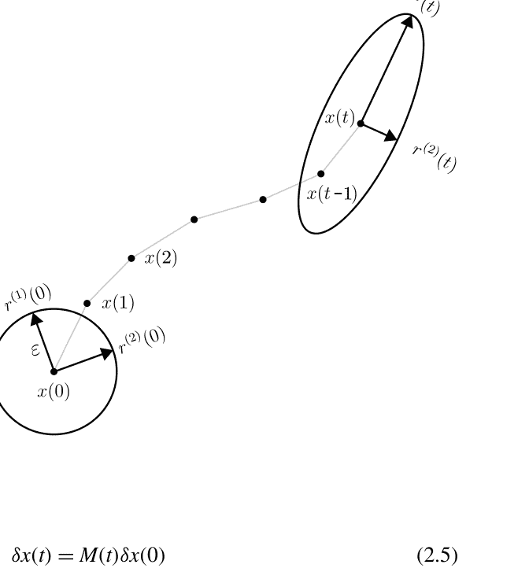

### 参考文献

1.  Maguire, L. P., et al. (1998). 使用模糊神经网络预测混沌时间序列。信息科学，112.1-4, 125–136。

2.  Mariet, Z., & Kuznetsov, V. (2019). 时间序列的序列到序列建模基础。在第22届国际人工智能和统计学会议上, 408–417。

3.  Masnadi-Shirazi, M., & Subramaniam, S. (2020). 吸引子排名径向基函数网络: 一种用于混沌动态系统的非参数预测方法。科学报告，10.1, 1–10。

4.  Xin, Y., & Min, H. (2012). 基于极限学习机的多变量混沌时间序列预测。物理学报，8。

5.  Mukherjee, S., Osuna, E., & Girosi, F. (1997). 使用支持向量机进行非线性混沌时间序列预测。在神经网络信号处理 VII 中。1997 年 IEEE 信号处理学会研讨会论文集 (pp. 51–520)。IEEE。

6.  Nakai, K., & Saiki, Y. (2019). 使用标量可观测量的延迟坐标构建宏观流体变量模型的机器学习。arXiv:1903.05770。

7.  Navone, H. D., & Ceccatto, H. A. (1995). 通过神经网络学习混沌动力学。混沌、孤立子和分形，6, 383–387。

8.  Okuno, S., Aihara, K., & Hirata, Y. (2019). 通过状态相关加权将多元时间序列的多个预测结果结合起来。混沌: 非线性科学的跨学科期刊，29.3, 033128。

9.  Patel, D., 等人 (2021). 使用机器学习预测非平稳动力过程的统计特性: 系统气候、制度转变和随机性的影响。混沌: 非线性科学的跨学科期刊，31.3, 033149。

10. Pathak, J., 等人 (2018). 混合预测混沌过程: 将机器学习与基于知识的模型结合使用。混沌: 非线性科学的跨学科期刊，28.4, 041101。

11. Pathak, J., 等人 (2018). 无模型预测大规模时空混沌系统的数据: 一种储备计算方法。物理评论快报，120.2, 024102。

12. Pathak, J., 等人 (2017). 使用机器学习复制混沌吸引子并从数据中计算Lyapunov指数。混沌: 非线性科学的跨学科期刊，27.12, 121102。

13. Penkovsky, B., 等人 (2019). 耦合的非线性时滞系统作为深度卷积神经网络。物理评论快报，123.5, 054101。

14. Principe, J. C., & Kuo, J.-M. (1995). 使用神经网络对混沌时间序列进行动态建模。第7届神经信息处理国际会议论文集, 311–318。

15. Principe, J. C., Rathie, A., Kuo, J.-M. (1992). 使用神经网络预测混沌时间序列及动态建模问题。国际分歧和混沌杂志，2.04, 989–996。

16. Principe, J. C., Wang, L., & Kuo, J.-M. (1998). 非线性动态建模与神经网络。在信号分析和预测中。

17. Ranzato, M., et al. (2015). 序列级训练与递归神经网络。arXiv:1511.06732。

18. Sangiorgio, M. (2021). 深度学习在混沌动力学多步预测中的应用。博士论文。Department of Electronics, Information and Bioengineering, Politecnico di Milano。

19. Sangiorgio, M., & Dercole, F. (2020). LSTM神经网络在混沌时间序列多步预测中的鲁棒性。混沌、孤立子和分形，139, 110045。

20. Sangiorgio, M., Dercole, F., & Guariso, G. (2021). 使用深度神经网络预测噪声混沌系统。混沌、孤立子和分形，153, 111570。

21. Shi, X., 等人 (2017). 基于改进的递归Levenberg-Marquardt算法的混沌时间序列预测。混沌、孤立子和分形，100, 57-61。

22. Shi, Z., & Han, M. (2007). 支持向量回声状态机用于混沌时间序列预测。IEEE神经网络交易，18.2, 359-372。

23. Shukla, J. (1998). 在混沌中的可预测性: 气候预测的科学基础。科学，282.5389, 728-731。

24. Su, L., & Li, C. (2015). 基于多项式系数自回归模型的混沌时间序列局部预测。工程数学问题，901807。

25. Su, L.-Y. (2010). 多变量混沌时间序列的局部多项式拟合预测。计算机与数学应用，59.2, 737-744。

26. Teng, Q., & Zhang, L. (2019). 使用多步CLDNN的数据驱动非线性动力系统识别。AIP Advances, 9.8, 085311。

27. Todorov, Y., Koprinkova-Hristova, P., & Terziyska, M. (2017). 直觉模糊径向基函数网络用于非线性动力学建模。在2017年第21届过程控制国际会议上（PC）（pp. 410-415）。IEEE。

28. Van Truc, N., & Anh, D. T. (2018). 使用径向基函数网络的混沌时间序列预测。2018年第4届绿色技术与可持续发展国际会议（GTSD）（pp. 753-758）。IEEE。

29. Verdes, P. F., 等 (1998). 混沌时间序列的预测: 全局方法与局部方法对比。新型智能自动化与控制系统, 1, 129-145。

30. Vlachas, P. R., 等 (2018). 基于数据驱动的长短期记忆网络对高维混沌系统的预测。在《皇家学会A：数学、物理和工程科学》会议录(第474.2213卷，第20170844页)。

31. Vlachas, P. R., 等 (2020). 反向传播算法和回路神经网络中的储备计算用于复杂时空动力学的预测。神经网络, 126, 191-217。

32. Wan, Z. Y., 等 (2018). 在复杂动力系统中辅助数据降阶建模极端事件。PLoS One, 13.5, e0197704。

33. Wang, R., Karni, E., Balachandran, B. (2019). 基于神经网络的混沌动力学预测。非线性动力学, 98.4, 2903-2917。

34. Weng, T., 等 (2019). 混沌系统及其机器学习模型的同步。物理评论E, 99.4, 042203。

35. Woolley, J. W., Agarwal, P. K., Baker, J. (2010). 利用人工神经网络对混沌系统进行建模和预测。国际数值流体力学杂志, 63.8, 989-1004。

36. Wu, K. J., Wang, T. J. (2013). 基于RBF神经网络优化的混沌时间序列预测。计算机工程, 39.10, 208-216。

37. Wu, X. 等人 (2014). 具有随机缺失数据的时间序列的多步预测。应用数学建模, 38.14, 3512-3522。

38. Xin, B. 和 Peng, W. (2020). 基于混沌时间序列的AE-CNN和迁移学习的预测。复杂性, 2680480。

39. Yan, A., Chen, X., & Ke, C. (2020). 使用数据同化和机器学习进行混沌系统预测。在E3S Web of Conferences（第185卷，第02025页）。

40. Yang, H. Y. 等人 (2006). 基于混沌动力学重建的模糊神经短期负荷预测。混沌、孤立子和分形, 29.2, 462-469。

41. Yang, F.-P. 和 Li, S.-J. (2008). 应用软计算预测混沌时间序列。在2008年IEEE国际颗粒计算会议上（pp. 718-723），IEEE。

42. Ye, J. (2007). 使用与线性系统耦合的模糊模型识别混沌系统。混沌、孤立子和分形, 32.3, 1178-1187。

43. Yeo, K. (2019). 基于数据驱动的稀疏观测非线性动力学重建。计算物理学杂志, 395, 671-689。

44. Yosinski, J. 等 (2014). 深度神经网络中的特征可转移性有多强？在第28届神经信息处理系统会议论文集中（pp. 3320-3328）。

45. Yu, R., Zheng, S., & Liu, Y. (2017). 使用张量递归神经网络学习混沌动力学。ICML会议论文集。在ICML 17深度结构化预测研讨会上。

46. Yu, X., & Hong, T. (2012). 混沌时间序列预测中的SVM参数选择的混沌优化方法。物理学会议论文集, 25, 588-594。

47. Zhang, C. 等 (2020). 使用机器学习预测混沌系统中的相位和感知相位一致性。混沌：非线性科学的跨学科期刊, 30.8, 083114。

48. Zhang, J.-S., & Xiao, X.-C. (2000). 使用递归神经网络预测混沌时间序列。中国物理快报，17.2, 88。

49. Zhang, J., Zhong, H., & Luo, W.-L. (2008). 使用具有时滞坐标的神经模糊系统预测混沌时间序列。IEEE知识与数据工程交易，20.7, 956-964。

50. Zhu, Q., Ma, H., & Lin, W. (2019). 仅基于时间序列检测不稳定周期轨道：自适应延迟反馈控制与储备计算的结合。混沌：非线性科学的跨学期刊，29.9, 093125。

n ( E ( t )^{-1} = M(t) M(t)^T ) 的特征值的平方根。回想一下，一个非奇异矩阵的特征向量与其逆矩阵的特征向量相同，椭球的对称轴更常被称为与其特征值 σ_i^2 (t) 相关的特征向量 M(t) M(t) ^ T 。

$$r^{(i)}(t)^T E(t) r^{(i)}(t) = \varepsilon^2 \quad (2.9)$$

第i个对称轴的长度 $r^{(i)} (t) = \| r^{(i)} (t) \|$ 使得该轴指向椭球表面，也就是说 $r^{(i)} (t)$ 必须满足椭球方程 (2.7) ，即

$$r_i(t) = \varepsilon \sigma_i(t) \quad (2.10)$$

将替换 $r^{(i)}(t) = (1/\sigma_i^2(t)) E(t)^{-1} r^{(i)}(t)$ （特征向量方程）代替第二次出现的 $r^{(i)}$ 到方程 (2.9) 中，得到

$$r^{(i)}(0) = (1/\sigma_i^2(t)) M(t)^2 M(t) r^{(i)}(0) \quad (2.11)$$

#### 2.2.1 平均指数

请注意，初始扰动 $r^{(i)}(0)$, $i=1, ..., n$, 被变分方程 (2.2) 映射到椭球的对称轴上的时间 t (见图2.1) ，是与 M(t) 的相同奇异值 σ_i(t) 相关的 M(t) 的特征向量。实际上，通过左乘方程两边 $r^{(i)}(0) = M(t)^{-1} r^{(i)}(t)$ by $( M(t)^{-1} )^T$, 在右边利用 $r^{(i)}(t)$ 的特征性质和方程 (2.5) 得到 $(M(t)^{-1})^T r^{(i)}(0) = (1/\sigma_i^2(t)) M(t) r^{(i)}(0)$, 然后左乘方程两边 $M(t)^T$, 我们得到

$$L_i = \lim_{t \to +\infty} \frac{1}{t} \log \frac{ r_i(t) }{ \varepsilon } = \lim_{t \to +\infty} \frac{1}{t} \log \sigma_i(t) \quad (2.12)$$

李雅普诺夫指数 (LEs) 或李雅普诺夫特征指数，根据定义，是椭球对称轴增长速率的对数，即

### 2.2 李雅普诺夫指数

在下文中，我们将把第一个对称轴 $r^{(1)}(t)$ 称为最长的，将第二个对称轴 $r^{(2)}(t)$ 称为第二长的，以此类推，即 $r^{1}(t) \geq r^{2}(t) \geq ... \geq r^{n}(t)$，对于足够大的 $t$。因此，LEs测量了扰动轨迹相对于参考轨迹（从 $x(0)$ 开始的轨迹）的平均指数发散速率（如果为正）或收敛速率（如果为负）。一般来说，扰动 $\delta x(t)$ 沿着最长的对称轴 $r^{(1)}(t)$ 会有一个非零分量，因此 $L^1$，即最大的Lyapunov指数（LLE），是近似扰动轨迹（由变分方程(2.2)近似）发散/收敛的主导速率（平均指数）。也就是说，扰动的大小平均增长/衰减为 $\varepsilon \exp(L^1 t)$。只有当初始扰动的大小 $\varepsilon$ 足够小，扰动轨迹（非线性系统(2.1)的解，从扰动初始条件 $x(0)+\delta x(0)$ 开始）仍然保持接近参考轨迹直到时间 $t$，这个近似才大致成立。然而，如果 $L^1 > 0$，扰动轨迹迟早会离开参考轨迹，因此线性化用于定义LEs的方法不再代表扰动的行为。

剩余指数的解释更加微妙。$L_2$ 是从与 $r^{(1)}(t)$ 正交的所有方向中选择的最大速率。同样，$L_3$ 是从与 $r^{(1)}(t)$ 和 $r^{(2)}(t)$ 都正交的所有方向中选择的最大速率，以此类推。然而，只有那些没有沿着 $r^{(1)}(0)$（由变分方程(2.2)将初始扰动映射到 $r^{(1)}(t)$）的分量的初始扰动才会在时间 $t$ 正交于 $r^{(1)}(t)$ 产生（近似）扰动。问题在于考虑不同的时间 $t$ 会修改初始扰动 $r^{(1)}(0)$（它是时间依赖矩阵 $M(t)$ 的特征向量），使得（近似）扰动 $\delta x(t)$ 仍然按照 $\varepsilon \exp(L^1 t)$ 的平均增长/衰减。

非主导指数的正确解释是以部分和的形式来解释。和 $L_1 + L_2$ 的和是二维扰动集合的面积的主导速率（平均值，指数增长），就像沿着 $r^{(3)}(t)$，...的分量一样。对于足够大的 $t$，$r^{(n)}(t)$ 和 $r^{(t)}(t)$ 被 $r^{(1)}(t)$ 和 $r^{(2)}(t)$ 支配，对于集合中的所有扰动而言也是如此。类似地，$\sum_{i=1}^{k} L_i$ 是 $k$ 维扰动集合的 $k$ 维度测度（或超体积）的主导速率（平均值，指数增长）。

最后，如果轨迹 $x(t)$ 收敛到一个吸引子 $A$，那么得到的极限通常与初始条件 $x(0)$ 在 $A$ 的吸引盆地中无关。对于吸引平衡、周期和环面来说，这当然是正确的，而对于奇怪的吸引子来说，它只是普遍的（即在吸引盆地中的几乎所有初始条件都成立）。原则上，从构成吸引子骨架的鞍点对象的稳定流形上的初始条件开始，得到的LE是表征达到的鞍点的LE，尽管不可避免的数值误差使轨迹错过鞍点并普遍访问整个吸引子。

指数吸引平衡和周期具有负的LEs，而一些LEs如果吸引速度小于指数（例如，时间幂律）则为零；$d$ 维环面具有 $d$ 个零指数，因为内部扰动既不扩张也不收缩（平均而言），剩下的指数在指数吸引的情况下为负；奇异吸引子通常至少有一个正指数，负责其骨架中不稳定对象的发散（如果发散速度弱于指数，则该指数为零；这些吸引子被称为弱混沌）。吸引子指数的总和在任何情况下都是负的，至少在可逆系统中，因为吸引盆地中初始条件的 $n$ 维体积在时间上向前传播到一个低维对象上。正如在第2.3节中将回顾的那样，混沌吸引子在形式上被定义为具有 $L_1 > 0$ 的吸引子。

在可逆系统中，吸引子的指数总和是负的，因为初始条件在吸引盆地中的n维体积在时间上传播到一个低维对象上。正如在第2.3节中将回顾的那样，混沌吸引子在形式上被定义为具有 $L_1 > 0$ 的吸引子。

#### 2.2.2 局部指数

局部Lyapunov指数（loc-LEs）$L^{(loc)}_1(x(t)) \geq L^{(loc)}_2(x(t)) \geq...\geq L^{(loc)}_n(x(t))$ 是扰动 $\delta x(t)$ 在参考轨迹点 $x(t)$ 附近沿正交方向 $r^{(loc-i)}(x(t))$ 面临的发散/收敛速率，其中 $r^{(loc-1)}(x(t))$ 是主导方向（如果 $L^{(loc)}_1(x(t)) >0$，则是最快扩展的方向，如果 $L^{(loc)}_1(x(t)) < 0$，则是最慢收缩的方向），$r^{(loc-2)}(x(t))$ 是次主导方向（在与 $r^{(loc-1)}(x(t))$ 正交的方向中最主导的方向），等等。请注意，loc-LEs是轨迹点 $x(t)$ 的特征，不依赖于轨迹访问该点的时间 $t$。

关于一个通用点 $x$ 的参考，局部LEs（以及相应的方向）由在 $x$ 周围扰动球经过一个时间步骤形成的椭球的对称轴（长度和方向）给出，即

$$L_i^{(loc)}(x) = \log \frac{r_i(1)}{\varepsilon}\bigg|_{x(0)=x}. \quad (2.13)$$

根据第2.2.1小节中开发的椭球分析，可以得出时间1的对称轴是 $J(x(t))J(x(t))$ 的特征向量。因此，局部LEs是系统雅可比矩阵在 $x(t)$ 处的奇异值的对数。

请注意，（平均）LEs不是沿参考轨迹的（算术）时间平均值。例如，$L^{(loc)}_1(x(t))$ 是在任何 $t$ 时刻，$r^{(loc-1)}(x(t))$ 上最大的局部速率的对数。然而，通常情况下，起源于 $x(0)$ 的椭球的最长对称轴 $r^{(1)}_1(t)$ 在 $t$ 时刻与 $r^{(loc-1)}(x(t))$ 不对齐，因此只有沿 $r^{(loc-1)}(x(t))$ 的分量受到最大速率的影响。因此，$L^{(loc)}_1(x(t))$ 的时间平均值通常大于 $L_1$。类似地，对称轴 $r^{(i)}_i(t)$, $i\geq2$，在 $t$ 时刻与 $r^{(loc-i)}(x(t))$ 不对齐，并且通常沿 $r^{(loc-j)}(x(t))$，$j<i$，具有非零分量，因此甚至没有明确的符号关系存在于 $L_i$ 的时间平均值和 $L_i$ 之间。

### 2.3 混沌系统、可预测性和分形几何

#### 2.3.1 混沌吸引子和李雅普诺夫时间尺度

利用前几节中定义的概念，我们现在正式引入混沌吸引子的概念，即状态空间的闭合子集（在 $f(\cdot)$ 下不变），具有自己的吸引域，并且至少有一个正的Lyapunov指数（即 $L_1>0$）。当至少有两个正的LE时，吸引子被定义为超混沌的。至少有一个混沌吸引子的动力系统被称为混沌的。

本章开始时介绍的有界性和敏感性两个特征，对应于上述的形式特性。至少有一个正的LE保证了对初始条件的敏感性。大于0的最大Lyapunov指数（LLE），`$L_1$`，是确保任意两个相邻轨迹指数级发散（“拉伸”）的必要和充分条件。然而，如果两点之间的初始距离是有限的（不是无穷小的），由于吸引子的存在，发散不能无限地继续下去，因为吸引子在定义上是有界的。这意味着系统的非线性将以某种方式使两个轨迹再次靠近（“折叠”）。

图2.2提供了拉伸和折叠的形象化表示。在本小节开始处报告的混沌吸引子的正式定义允许明确区分“混沌”和“奇怪”这两个术语，这两个术语几乎总是可以互换使用。如果吸引子的最大特征指数 `$L_1$` 为正，则其为混沌吸引子。正如我们所见，这意味着对初始条件具有指数级的敏感性。另一方面，奇怪吸引子对初始条件具有敏感依赖，这是因为其内部结构由鞍点对象组成。然而，附近轨迹的发散可以比指数函数慢，因此在(2.12)中会得到一个零极限for L1. 因此，混沌吸引子也是奇怪的，而奇怪的吸引子可能是非混沌的。奇怪的非混沌吸引子也被称为“弱混沌”。在混沌区域，一般系统的轨迹显示出一些特殊的性质：

-   尽管混沌过程看起来是随机的（见图2.3），即具有完全相同的初始条件，它将始终以相同的方式随时间演变。然而，数值问题（例如，舍入误差）可能会产生似乎暗示存在某种随机性的动力学。例如，从相同的初始条件开始，由不同的硬件架构执行的两个数值模拟可能会以看似无关的方式访问吸引子的两个不同轨迹。

-   轨迹从未返回到已经访问过的状态（即非周期性），但会无限接近它。这是在等待足够长的时间后发生的，因为吸引子包含着密集的轨迹。原则上，混沌系统可能会有完全重复的值序列（周期性行为）。然而，如2.1节所述，这种周期性序列是排斥而不是吸引的，这意味着如果变量在序列之外，它将永远不会进入序列，并且实际上会与之分离。在这种情况下，对于几乎所有的初始条件，变量以非周期性行为发展。混沌动力学的非周期性特征与准周期信号的非周期性特征不应混淆。两者之间的区别通常在频域中进行研究。混沌信号的频谱通常分布在一定范围的值上，而准周期信号的频谱集中在一组（少数）特定值上。

-   轨迹显示复杂的路径，通常构建具有分形结构的几何形状：在第2.1节中介绍的奇怪吸引子。

在时间序列预测的背景下，拉伸的存在是关键因素，即使有完美的预测器可用。事实上，对初始条件的指数敏感性很快放大了最小的测量误差或数据输入预测器的不希望的噪声。这就是为什么我们经常说“混沌动力学是不可预测的”。

### 2.3 混沌系统、可预测性和分形几何

本书的重点实际上是探讨我们能走多远。从L=1开始，可以计算系统的Lyapunov时间（LT），它代表了动力系统混沌的特征时间尺度。

按照惯例，LT被定义为L=1的倒数，即系统附近轨迹之间的距离增加一倍所需的时间周期。

LT的概念在预测任务中至关重要，因为它反映了混沌系统的可预测性限制，并允许在不同系统中公平比较预测准确性。LT的概念在预测任务中至关重要，因为它反映了混沌系统的可预测性限制，并允许在不同系统中公平比较预测准确性。

根据我们在第2.2节中所做的工作，也可以定义局部Lyapunov时间（loc-LT）。

#### 2.3.2 相关性和李雅普诺夫维度

混沌吸引子的几何形状通常复杂且难以描述。因此，定义定量特性来表征这些几何对象是有用的。

维度可能是吸引子最基本的特性。然而，维度的概念有些模糊，因为它可以有多种不同的定义。在本小节中，我们提出了两种测量吸引子维度的替代方法：相关维度和Lyapunov维度。

相关维度是专门为动力系统的吸引子设计的分形维度。考虑一个目标系统的吸引子A，并让 `$\{x(t), t=0, ..., T\}$` 成为吸引子A上的一段轨迹弧。对于任意给定的半径 `$r>0$`，定义相关函数

$$C(r, T) = \frac{ \text{# pairs } (x(t), x(t')): \|x(t)-x(t')\| < r, 0 \leq t < t' \leq T }{T(T+1)/2}, \quad (2.14)$$

其中，`$T(T+1)/2$` 是轨迹弧中点对的数量。随着 `$r$` 从0增加到轨迹中点之间的最大距离，相关函数从0增加到1。设 `$d$` 为吸引子的维度，可能是非整数，需要确定。对于小的 `$r$`，与给定点 `$x \in A$` `$r$`-接近的点 `$x(t)$` 的数量与轨迹弧的长度 `$T$` 成线性增加，并且与 `$r^d$` 成比例。例如，考虑 `$d=1$` 的情况（一个一维闭曲线被准周期轨迹密集填充）。包含在以 `$x$` 为中心的 `$r$` 球中的曲线段的长度与 `$r^d$` 成比例，并且随着 `$T$` 趋向无穷大，轨迹填充其中。对于大的 `$T$` 和小的 `$r$`，相关函数的分子与 `$T^2 r^d$` 成比例（每个点都有与 `$T r^d$` 成比例的 `$r$`-接近邻居的数量），而分母的阶数为 `$T^2$`（参见（2.14））。解出 `$d$` 得到相关维度。

$$d_{\text{corr}}(A) = \lim_{r \to 0} \lim_{T \to \infty} \frac{\log C(r, T)}{\log r}. \quad (2.15)$$

图2.4的示意图显示了相关维度估计过程。估计值为 `$d_{\text{corr}}(A) = \Delta \log C(r) / \Delta \log r$`。

在实践中，我们使用有限的 `$r$` 和 `$T$`。从目标吸引子的吸引域中的初始条件 `$x(0)$` 开始，我们丢弃初始轨迹的瞬态部分（例如，前 `$t_0$` 个点），然后取 `$T + 1$` 个点 `$x(t_0), x(t_0 + 1), \ldots, x(t_0 + T)$`，对于足够大的 `$t_0$` 和 `$T$`。然后，我们计算一系列半径 `$r$` 的相关函数。绘制 `$\log C(r)$` 与 `$\log r$` 的图形，将会有一个区间的 `$r$`，其中获得的点将近似对齐。相关维度 `$d_{\text{corr}}(A)$` 由图形的这一线性部分的斜率给出（见图2.4）。为了很好地识别图形的线性部分，值得讨论图形在半径 `$r$` 过小和过大时的变形情况。对于较小的 `$r$` 的行为是由于我们有限轨迹弧线填充吸引子的有限分辨率造成的。

当 `$r$` 小于这样的分辨率时，相关函数低估了距离 `$r$` 内吸引子点的密度，并且将这个低估与 `$r$` 的 `$d$` 进行缩放必然导致比实际吸引子维度更大。通过考虑越来越小的 `$r$` 在恒定 `$T$` 下的表达式(2.15)，这一点是显而易见的：在 `$r$` 上的分辨率阈值以下，`$C(r,T)$` 消失，因此分子趋于负无穷大，而分母仍然有限。相反，对于过大的 `$r$` 值，吸引子的有界性使得相关函数在1处饱和（无论 `$T$` 有多大），图形的斜率相应地消失（再次参见图2.4）。

当吸引子的LEs的完整频谱可用时，估计吸引子维度的一种简单方法是著名的Kaplan-Yorke公式，它近似了Lyapunov维度的概念。该概念背后的几何思想与第2.2.1节中对吸引子LEs的偏和求和的解释有关。根据该解释，Lyapunov维度 `$d_{\text{Lyap}}(A)$` 是一个小的初始条件集合的维度，该集合位于吸引子的吸引域中，具有 `$d_{\text{Lyap}}(A)$` 维度的测度（超体积），当相应的轨迹收敛到吸引子时，该测度既不增长也不衰减（平均而言）。由于轨迹密集地访问吸引子，当初始条件集合具有与吸引子相同的维度时，这种情况发生。

然而，维度可能是非整数的，所以最好的方法是寻找指数 `$k$`，使得 `$\sum_{i=1}^{k} L_i \geq 0$` 且 `$\sum_{i=1}^{k+1} L_i < 0$`。一个 `$k$` 维初始条件集合的超体积（平均而言）增长，而一个 `$(k+1)$` 维集合的超体积会消失，同时收敛到吸引子，所以我们只能说维度 `$d$` 在 `$k$` 和 `$k+1$` 之间。如图2.5所示，Kaplan-Yorke公式简单地考虑了吸引子LEs的部分和的连续分段插值。Lyapunov维度 `$d_{\text{Lyap}}(A)$` 因此通过分段插值与水平轴相交的值来近似，后者表示扩张/收缩的零速率。

结果是以下公式：

$$ d_{KY}(A) = k + \frac{\sum_{i=1}^{k} L_i}{|L_{k+1}|} \quad (2.16) $$

在吸引子维度的这一小节中，我们澄清了分形和奇怪吸引子之间的关系。到目前为止，我们将后者描述为通常具有非整数维度的复杂几何对象。实际上，这两个特征（奇怪和具有分形结构）通常是密切相关的，但并不完全等价。具有非整数维度的吸引子总是奇怪的。相反，可以找到一些特殊情况，其中奇怪吸引子具有整数维度。一个经典的例子是具有参数（即增长率）等于4的Logistic映射（该系统在子节3.1.1中介绍）。在这种情况下，可以证明混沌轨道在单位区间[0, 1]中是稠密的，因此其维度等于1（参见，第235页）。

### 2.4 从数据中重建吸引子

本章的第一部分介绍的概念需要了解动力系统的状态空间表示。在实际应用中，描述状态变量演化的方程（以及整个状态向量本身）通常是未知的。

大部分情况下，只有系统输出`y(t)`的时间序列可用。通过从数据序列开始，可以通过考虑延迟坐标`Y(t)=[y(t), y(t-1), ..., y(t-m+1)]`来构建原始相空间的延迟`m`维版本（图2.3）。这个过程被称为延迟坐标重建或延迟坐标嵌入。

#### 2.4.1 延迟坐标嵌入

从数据序列开始，可以通过考虑延迟坐标`Y(t)=[y(t), y(t-1), ..., y(t-m+1)]`为每个时间`t`在时间序列中构建原始相空间的`m`维延迟版本（图2.3）。这个过程被称为延迟坐标重建或延迟坐标嵌入。

重建非常有用，因为在广泛的条件下，它保留了原始系统的动力学特性，包括其渐近行为和LEs（第`k`个为Kaplan-Yorke公式的指数，详见第2.4.2节）。

更具体地说，Takens定理[20]证明了如果嵌入维度`m`足够大，那么可以从一维观测序列中重构出一个光滑的吸引子，该序列是通过一个通用函数`g(·)`进行观测的。因此，该定理构建了非线性动力系统理论和时间序列分析之间的桥梁。

重构的吸引子位于`m`维延迟坐标空间中，与原始吸引子（在初始`n`维状态空间中）在拓扑上是等价的。换句话说，重构的动力学，即`Y(t+1) = F(Y(t))`，与原始状态空间的动力学等价；更准确地说，它们通过一个光滑的可逆坐标变换（即微分同胚）相关联。由于原始空间和重构空间之间的映射具有这些性质，系统相空间中的每个状态都可以通过输出数据唯一表示。

然而，重构过程并不保留原始吸引子结构的几何形状。

从几何角度来看，Takens定理背后的思想是将轨迹的重构展开到足够避免自交的程度。轨迹不能交叉，因为确定性动力系统的演化完全由其当前状态定义。这意味着从相空间中的一个给定点开始，下一个点是唯一确定的。因此，在相空间中相遇的两条轨迹不能以两种不同的方式演化。

实际上，由于数值问题和可能存在的噪声，人们会验证在具有足够嵌入维度的空间中，两个附近的点应该通过函数`F`的单次迭代在相对接近的位置上映射。如果不是这种情况，即在一个时间步长后，这些点在完全不同的位置演化，那可能是由于嵌入维度不足引起的自交。对于足够大的`m`，这些点将彼此远离。然而，即使使用适当的`m`值，如果`F(·)`非常不规则并且具有陡峭的山谷和脊，这种情况也可能发生。这是一个相当罕见的情况，因为确定性混沌通常不会出现这种情况。

简单映射特征的混沌动力学在迭代应用时产生了意外复杂的动态，但无法事先排除其发生的可能性。

通常采用的实际方法来估计数据的最小嵌入维度是所谓的假近邻算法[11]。该算法的思想是检查在重建空间中，随着嵌入维度的增加，一个点的邻居数量如何变化。当嵌入维度过低时，许多实际上相距很远的点可能看起来是邻居，这是由于投影到较低维度的空间造成的。这些点被称为假邻居。在适当的（或更高的）嵌入维度中，假邻居将不再是邻居。相反，在足够的嵌入维度中，两个彼此接近的点在维度增加时仍然保持接近。

图2.6中显示了真邻居和假邻居的概念的可视化表示。在一维嵌入中，考虑的三个点——用A、B和C表示——似乎是邻居。将嵌入维度增加一维，我们发现A和B仍然是邻居，而B和C实际上是假邻居。

将系统嵌入三维空间中，人们会发现点A和点B保持接近，尽管点C仍然远离点B。如果上述情况发生

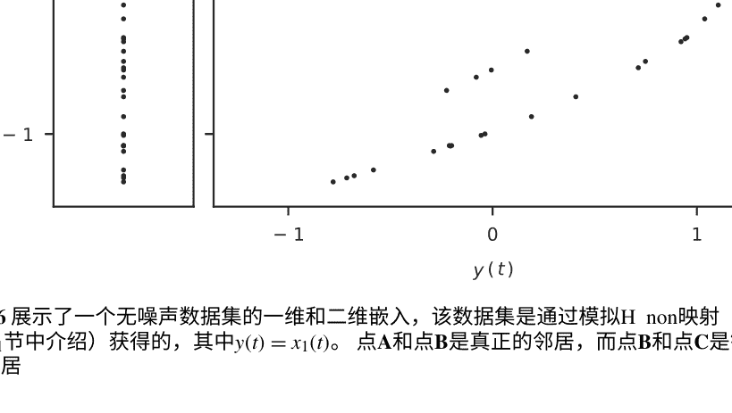

对于数据集中的所有点，我们可以得出结论，在这种特定情况下，二维空间足以展开吸引子。

从实际角度来看，当两个点的欧氏距离小于一定阈值时，它们被视为邻居，该阈值必须根据具体应用进行适当选择。该算法按照嵌入维度逐渐检查邻居，直到找到仅有可忽略数量的错误邻居为止（见图2.7）。这被选择为最低的嵌入维度，被认为可以在轨迹之间实现无自交叉的重构。

如果数据是无噪声的，在达到适当的维度时，错误邻居的百分比将降至零。对于有噪声的时间序列，我们预计由于噪声的存在，即使在较大的嵌入维度下，仍然会存在一定（希望很小）数量的错误邻居。

Takens定理还指出，一般情况下，`m`只需要比吸引子的维度大一点点，更准确地说，是大于两倍吸引子维度的第一个整数。为了对这个事实形成几何直觉，我们可以考虑以下简单的例子。两条1维曲线可以在`R²`、`R³`或任何更高维度的空间中相交。不同之处在于，在`R³`中，一个小扰动会消除相交，而在`R²`中，它只会将相交移动到其他地方。我们可以想象这两条曲线对应于吸引子的两个不变分支，例如，属于一个具有准周期运动的1维环重构的两个弧。系统动力学的轻微扰动通常会导致`R³`中的自相交消失。

换句话说，尽管在随机放置的两个通用曲线中，它们在`R^k`中（`k≥3`）可能会有交点，但我们应该将它们视为异常情况，并预计它们几乎不可能发生。这就是为什么我们在前面使用了“通常”一词的原因：如果`m>2d`，自交应该原则上是罕见的，但仍然可能发生。当情况如此时，有必要进一步增加`m`，即使它已经大于`2d`。

#### 2.4.2 估计最大李雅普诺夫指数

如第2.2节所述，计算LEs的传统算法使用雅可比矩阵，因此需要了解系统的状态方程。然而，当系统的模型不可用时，需要使用统计方法来检测混沌[7]。

一旦确定了数据集的适当嵌入维度`m`，可以在延迟相空间`Y(t)`中分析系统的动力学，其中`Y(t)=[y(t), y(t-1), ..., y(t-m+1)]`，它与原始相空间具有相同的拓扑性质（因此也具有`L_1`），如Takens定理所述[20]。之后，可以执行以下过程[23]来估计`L_1`：

1.  在`m`维延迟空间中选择`N`对附近的点，`Y(t_i)`和`Y(t_j)`；

2.  对于每一对点，计算两点之间的欧氏距离`δ_p(0) = Y(t_i) - Y(t_j)`；

3.  在经过`t_e`个时间步骤后，重新计算每一对点之间的距离`δ_p(t_e) = Y(t_i + t_e) - Y(t_j + t_e)`。平均而言，对于较小的`t_e`值，我们预期`δ_p(t_e)`按照指数规律演变：`δ_p(t_e) = δ_p(0) · e_{x_p(L_1 t_e)}`；

4.  计算`Q(t_e)`，即发散率的平均对数，如下所示：`Q(t_e) = \frac{1}{N_p} \sum_{p=1}^{N_p} \left( \log \frac{\delta_p(t_e)}{\delta_p(0)} \right).`

通过增加扩展步骤`t`，我们可以绘制`Q(t_e)`作为`t`的函数。在混沌系统中，这条曲线的初始部分呈线性趋势（见图2.8）。这是因为最初靠近的两个点会指数级地发散，而这种指数级的扩展会因为对数而产生线性趋势。之后，平均发散趋向于一个常数值，因为轨迹位于混沌吸引子内部。最后，`L_1`可以通过初始部分的`Q(t_e)`函数的斜率来轻松计算。

本小节中介绍的算法仅提供了`L_1`的估计值。计算最大指数的替代方法可参考文献[6, 16, 24]。原则上，我们还可以使用更复杂的方法来数值计算正的Lyapunov谱，即只计算正指数[23]，或者计算整个LEs谱[3, 4, 19]。然而，即使在最后一种情况下，只有前`k`个指数的估计才有意义。进一步计算将产生任意值，因为数据通常在轨迹已经进入吸引子时进行采样，这意味着它们代表了吸引子内部发生的情况，而超过第`k`个（第`k+1`，第`k+2`，...）的LEs描述了收敛过程的瞬态。

图2.8显示了从数据中估计LLE的示意图。估计值通过`L1 = Q(te) / te`获得。

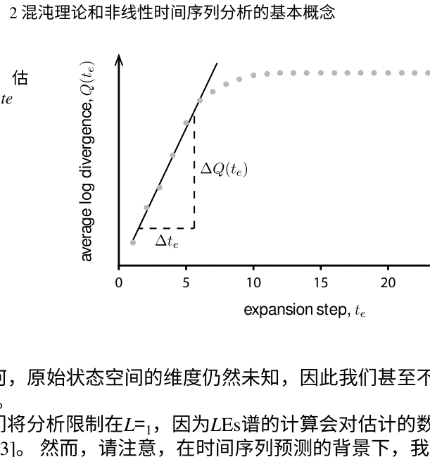

吸引子。无论如何，原始状态空间的维度仍然未知，因此我们甚至不知道应该计算多少个LEs。

在本书中，我们将分析限制在`L=1`，因为LEs谱的计算会对估计的数值稳定性产生很大影响[23]。然而，请注意，在时间序列预测的背景下，我们对推导出Lyapunov时间`LT`感兴趣，它限定了混沌系统的可预测性极限。为此，只需要知道`L=1`，因为它定义了系统的主导动力学。

### 参考文献

| 编号 | 作者 | 标题 | 出版信息 |
| :--- | :--- | :--- | :--- |
| 1. | Alligood, K. T., Sauer, T. D., & Yorke, J. A. (1996). | 《混沌》. | Springer出版社。 |
| 2. | Boeing, G. (2016). | 非线性动力系统的可视化分析：混沌、分形、自相似性和预测的极限。 | 《系统》，4.4，37。 |
| 3. | Briggs, K. (1990). | 一种改进的混沌时间序列Lyapunov指数估计方法。 | 物理学快报，151.1-2，27-32。 |
| 4. | Brown, R., Bryant, P., & Abarbanel, H. D. (1991). | 从观测到的时间序列计算动力系统的Lyapunov谱。 | 物理评论A，43.6，2787。 |
| 5. | Dercole, F., Sangiorgio, M., & Schmirander, Y. (2020). | 对于预测振荡时间序列的人工神经网络普适性的实证评估。 | IFAC-PapersOnLine, 53.2, 1255-1260。 |

| 6. | Ellner, S., et al. (1991). | 基于雅可比矩阵的Lyapunov指数估计的收敛速度和数据要求。 | 物理学快报，153.6-7, 357-363。 |
| 7. | Ellner, S., & Turchin, P. (1995). | 在嘈杂的世界中的混沌：新的方法和来自时间序列分析的证据。 | The American Naturalist, 145.3, 343–375。 |
| 8. | Farmer, J. D., Ott, E., & Yorke, J. A. (1983). | 混沌吸引子的维度。 | Physica D: Nonlinear Phenomena, 7.1-3, 153–180。 |
| 9. | Frederickson, P., et al. (1983). | 奇怪吸引子的Lyapunov维度。 | Journal of Differential Equations, 49.2, 185–207。 |
| 10. | Guckenheimer, J., & Holmes, P. (2013). | 非线性振荡、动力系统和向量场的分叉。(Vol. 42). | Springer Science and Business Media。 |
| 11. | Kennel, M. B., Brown, R., & Abarbanel, H. D. (1992). | 使用几何构造确定相空间重构的嵌入维度。 | 物理评论A，45.6，3403。 |
| 12. | Nepomuceno, E. G., et al. (2019). | 混沌系统的软计算模拟。 | 国际分叉和混沌杂志，29.08, 1950112。 |
| 13. | Ott, E. (2002). | 动力系统中的混沌。 | 剑桥大学出版社。 |
| 14. | Pathak, J., et al. (2018). | 无模型预测大规模时空混沌系统的数据：一种储备计算方法。 | 物理评论快报，120.2，024102。 |
| 15. | Ramasubramanian, K., & Sriram, M. S. (2000). | 使用不同算法计算Lya-punov谱的比较研究。 | 物理学D：非线性现象，139.1-2，72-86。 |
| 16. | Rosenstein, M. T., Collins, J. J., & De Luca, C. J. (1993). | 一种从小数据集计算最大Lyapunov指数的实用方法。 | Physica D: 非线性现象, 65.1-2, 117–134。 |
| 17. | Sangiorgio, M. (2021). | 深度学习在混沌动力学多步预测中的应用。 | 博士论文。米兰理工大学电子、信息与生物工程系。 |
| 18. | Sangiorgio, M., & Dercole, F. (2020). | LSTM神经网络在混沌时间序列多步预测中的鲁棒性。 | Chaos, Solitons and Fractals, 139, 110045。 |
| 19. | Sano, M., & Sawada, Y. (1985). | 从混沌时间序列中测量Lyapunov谱。 | Physical Review Letters, 55.10, 1082。 |
| 20. | Takens, F. (1981). | 在湍流中检测奇怪的吸引子。在：动力系统和湍流，华威1980（第66-381页）。 | Springer出版社。 |
| 21. | Ushio, T., & Hsu, C. (1987). | 数字控制系统中的混沌舍入误差。 | IEEE电路与系统交易，3 4.2，133-139。 |
| 22. | Vlachas, P. R., et al. (2020). | 用于复杂时空动力学预测的反向传播算法和回声计算在递归神经网络中的应用。 | 神经网络，126，191-217。 |
| 23. | Wolf, A., et al. (1985). | 从时间序列中确定Lyapunov指数。 | Physica D: 非线性现象, 16.3, 285-317。 |
| 24. | 莱特，J. (1984). | 计算Lyapunov指数的方法。 | 物理评论A，29.5，2924。 |

## 第3章 人工和真实世界的混沌振荡器

摘要 使用四个典型的混沌映射生成无噪声的合成数据集，用于预测任务：分别是非可逆和可逆系统中混沌的原型，分别是logistic和Hénon映射，以及两个广义Hénon映射，代表低维和高维超混沌的情况。我们还提出了传统logistic映射的修改版本，引入了生长率参数的缓慢周期动态，其中包括映射为混沌的范围。结果系统表现出同时存在缓慢和快速动态，其预测是一项具有挑战性的任务。最后，我们考虑了意大利北部两个站点测得的太阳辐射和臭氧浓度的两个真实时间序列。通过非线性时间序列分析工具，这些动态被证明是混沌运动。

> 在过去，许多表现出混沌行为的非线性系统已经在科学的几个领域中被发现，从生态学[20]到金融[17, 18]，从人口动态[10]到大气过程[13]。

### 3.1 人工混沌系统

在本书中，我们考虑了四个被广泛认为是混沌的离散时间动力系统，以测试神经预测器的预测能力：Logistic映射，Hénon映射和两个广义Hénon映射。Logistic映射和Hénon映射分别是不可逆和可逆离散时间系统中混沌的经典原型，而广义Hénon映射被认为包含低维和高维超混沌。我们将分析限制在每个系统的单个输出变量上，以使相应的时间序列是单变量的。为了读者的方便，以下是这些系统的介绍。

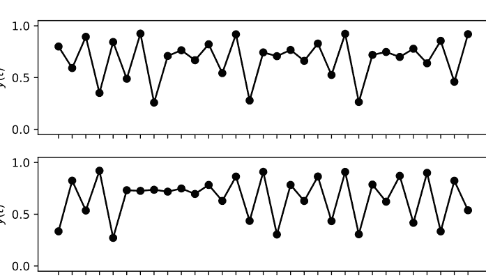

#### 3.1.1 Logistic映射

逻辑映射是一个用于描述生物量或经济增长的一维二次映射。它只有一个状态变量，即生物或经济资源的密度，我们将其等于输出，以便系统可以通过一个直接描述输出动态的单一差分方程来定义，即

$$y(t+1) = r \cdot y(t) \cdot \left( 1 - y(t) \right),$$

其中 $r > 1$ 是低密度下的增长率。众所周知，逻辑映射在 $r$ 范围为3.6-4的大多数值上表现出混沌行为。图3.1报告了逻辑映射（$r=3.7$）变量随时间演变的两个例子。描述该映射的方程是一个简单的二次多项式，其形状如图3.2的第一个面板所示。使用神经网络来重现这个函数是一项简单的任务。当这个简单的映射被迭代时（图3.2中的其他面板），事情变得越来越复杂。这是混沌系统的一个普遍特性，在逻辑映射中可以立即看到。当映射被迭代时，输入（在图3.2的水平轴上）中的小误差会导致输出（垂直轴）中的越来越大的误差。对于混沌系统的中长期预测是困难的，即使人们知道生成数据的真实模型[2, 3, 15]。

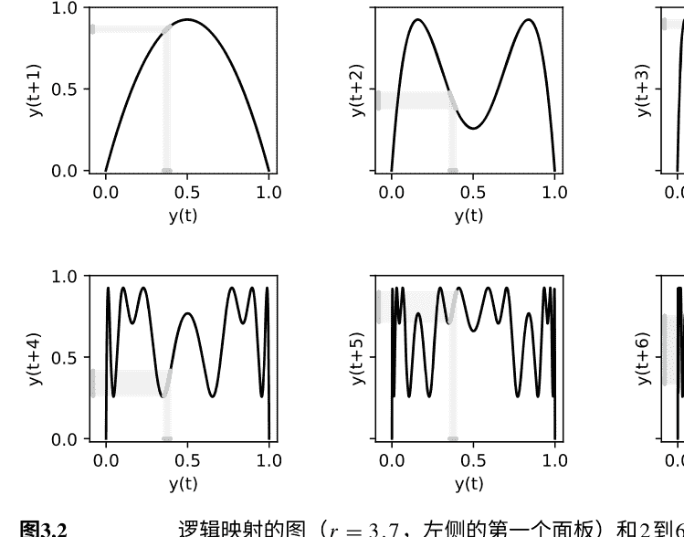

#### 3.1.2 Hénon映射

Hénon映射是一个天体力学的玩具模型，是一个二维（n=2）系统，在状态空间中传统上被定义为[6]：

$$\begin{cases} x_{1}(t+1)=1-a \cdot x_{1}(t)^{2}+x_{2}(t) \\ x_{2}(t+1)=b \cdot x_{1}(t), \end{cases} \quad (3.2)$$

其中a和b是模型参数，通常取值为1.4和0.3。

考虑将第一个状态变量作为输出，y(t)=x_1(t)，该系统等价于以下二维（m=2）非线性回归：

$$y(t+1)=1-a \cdot y(t)^{2}+b \cdot y(t-1). \quad (3.3)$$

Hénon吸引子和输出变量y(t)随时间的演化如图3.3所示。

#### 3.1.3 广义Hénon映射

广义Hénon映射是Hénon映射的扩展，旨在产生超混沌（至少具有两个正的Lyapunov指数，即吸引子内的至少两个发散方向)[1, 11]。n维情况下的状态方程为：

$$\begin{cases}x_1(t+1) = a - x_{n-1}(t)^2 - b \cdot x_n(t) \\ x_j(t+1) = x_{j-1}(t), \quad j = 2, \ldots, n.\end{cases} \quad (3.4)$$

(对于n=2，使用x1(t)/a和(-b/a)x2(t)作为新坐标，-b作为新参数给出了传统的公式(3.2)。当a=1.9和b=0.03时观察到超混沌行为。该系统可以重写为关于输出y(t)的非线性回归，得到：

$$y(t + 1) = a - y(t - m + 2)^2 - b \cdot y(t - m + 1). \quad (3.5)$$

我们考虑3D和10D的广义Hénon映射。第一个的特征是`n = m =3`。相应的Lyapunov指数为`L1 = 0.276`, `L2 = 0.257`,和`L3= -4.040`。吸引子的分形维度，使用Kaplan-Yorke公式[4]计算，为2.13。图3.4显示了混沌吸引子和系统输出的时间演化，从两个不同的初始状态开始。第二个(`n = m =10`)具有9个正的Lyapunov指数，其吸引子的分形维度为9.13。

#### 3.1.4 时间变化的Logistic映射

作为进一步的测试案例，我们考虑了一个非平稳系统，其中包含了慢速和快速动态。这些类型的过程表征了许多自然现象，因此吸引了许多动力系统理论领域的研究人员的注意（参见，例如，[12, 19]）。

### 3.1 人工混沌系统

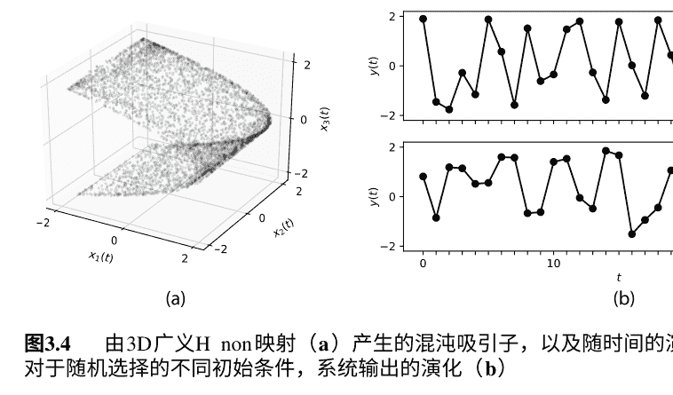

这里介绍的慢-快系统是通过在传统的Logistic映射中引入一个慢速（周期性）动态来获得的，用于参数`r(t)` [14]：

$$

\begin{cases}

y(t+1) = r(t) \cdot y(t) \cdot \left(1 - y(t)\right) \\

r(t) = \dfrac{r_{\max} + r_{\min}}{2} + \dfrac{r_{\max} - r_{\min}}{2} \cdot \sin\left(\dfrac{t \cdot \pi}{5000}\right),

\end{cases}

$$ (3.6)

其中，`r_{\min}=2.9` 和 `r_{\max}=3.7` 表示生长率的下限和上限。这些值被选择为系统依次表现出稳定、周期性或混沌行为，如图3.5所示。

在这种类型的系统上测试在第4.1节中介绍的神经预测器是有趣的，因为预测任务需要保留关于慢变化背景（长期记忆）和逻辑映射的快速动态的信息。此外，这个任务具有不同的复杂度：当系统具有稳定或周期性行为时，它相当简单，而当动态变得混沌时，它则更加复杂。

从形式上讲，由方程（3.6）定义的系统满足第2章列出的所有条件，因此它是一个混沌系统。

### 3.2 真实世界的时间序列

#### 3.2.1 太阳辐照度

正如本章开始时所预期的那样，混沌理论不仅仅考虑上述所提到的分析系统；各种自然现象被认为是混沌的，从气象学到天体运行轨道，从化学反应到电子电路[21]。

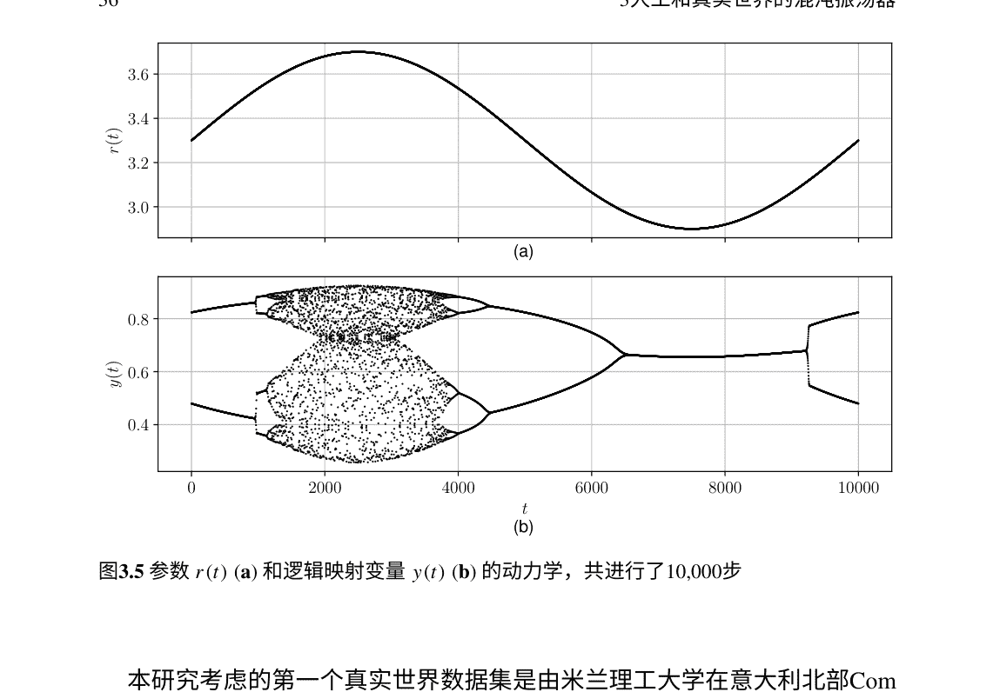

图3.5 参数`r(t)` (a) 和逻辑映射变量`y(t)` (b) 的动力学，共进行了10,000步

本研究考虑的第一个真实世界数据集是由米兰理工大学在意大利北部Como校区安装和管理的Davis Vantage 2气象站从2014年到2019年记录的太阳辐射数据。该站点作为Centro Meteorologico Lombardo (www.centrometeolombardo.com) 密集测量网络的一部分，进行了持续监测和一致性检查。其地理坐标为：纬度=45.80079，经度=9.08065，海拔=215米。除太阳辐射外，每5分钟记录以下物理变量：空气温度、相对湿度、风速和风向、大气压力、降雨和紫外线指数。然而，本研究仅采用纯自回归模型。图3.6a显示了Como每小时记录的时间序列的细节。

我们可以将这个时间序列解释为三个不同组成部分的总和：天文条件（即太阳的位置），产生明显的年度和日常周期；当前的气象情况（包括云层）引起的衰减；以及接收器的具体位置可能会被云层在太阳方向上的通过而遮挡。第一个组成部分是确定性已知的，第二个组成部分可以以一定的准确性进行预测，而第三个组成部分则更加棘手，可能在几分钟内轻易变化而没有明显的动态。

在平均晴朗天气条件下，使用Ineichen和Perez模型计算了预期的全球太阳辐射（参见图3.6b），如[7, 9]所述。实现该模型的Python代码是SNL PVLib Toolbox的一部分，由Sandia National Labs PV Modeling Collaborative (PVMC)平台[16]提供。

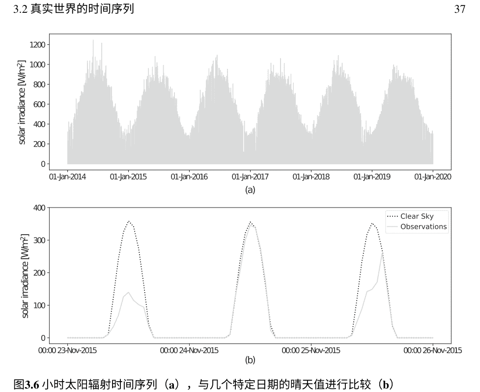

为了评估预测器的泛化能力，考虑了三个额外的太阳辐射时间序列[5]：Casatenovo（2011年），Bigarello（2016年）和Bema（2017年）。为了提供异质数据集，数据记录在不同的站点上，跨越一个以上的纬度，并代表相当不同的地理环境：从35米的低开放平原到800米的山区（图3.7）。

#### 3.2.2 臭氧浓度

考虑的第二个真实案例研究是2008年至2017年在意大利北部基亚文纳记录的臭氧（O3）浓度时间序列（该站点的地理坐标为：纬度=46.32080，经度=9.39559，海拔=333米）。该数据集由伦巴第大区环境机构（意大利首字母缩写为ARPA）维护和提供（www.arpalombardia.it）。地面臭氧形成是一个复杂的现象。臭氧是一种二次污染物：没有臭氧排放，但其存在是由涉及其他污染物（称为前体物质）的化学反应引起的。这些光化学反应是由氮氧化物（NOX）的排放激活的，主要是由道路排放引起的。

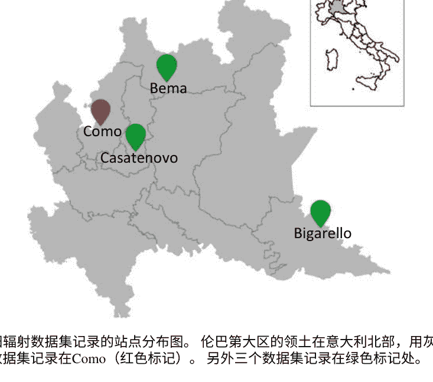

由于工业厂区、道路交通和农业，伦巴第大区存在二氧化氮（NO2）和挥发性有机化合物（VOC）的排放。臭氧前体物质的空间分布如图3.8a所示。前体物质不足以完成光化学反应，还需要紫外辐射。上述简要提到的过程需要几个小时，因此臭氧浓度可能在前体物质源的几公里外达到高值，这取决于气象条件（见图3.8b）。

对流层臭氧形成是一个非线性过程[8]，因此是测试本书中所介绍的神经预测器的一个有趣案例研究。图3.9显示了在Chiavenna记录的每小时时间序列的细节。与几乎所有环境变量一样，臭氧浓度也受地球自转和公转引起的日常和年度周期性趋势的影响（图3.9）。然而，如图3.9b所示，在这种情况下，日常周期不如太阳辐射数据集中明显（见图3.6b）。

### 3.2 真实世界的时间序列

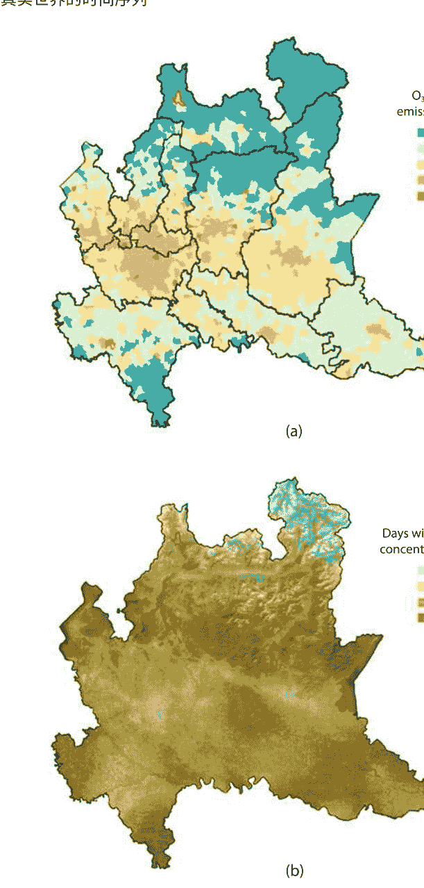

图3.8 2014年在伦巴第大区的臭氧前体排放（a），以及2017年8小时平均浓度超过120$\mu g / m^3$的天数（b）基亚文纳市的边界以红色显示。图片来自ARPA伦巴第（www.arpalombardia.it）

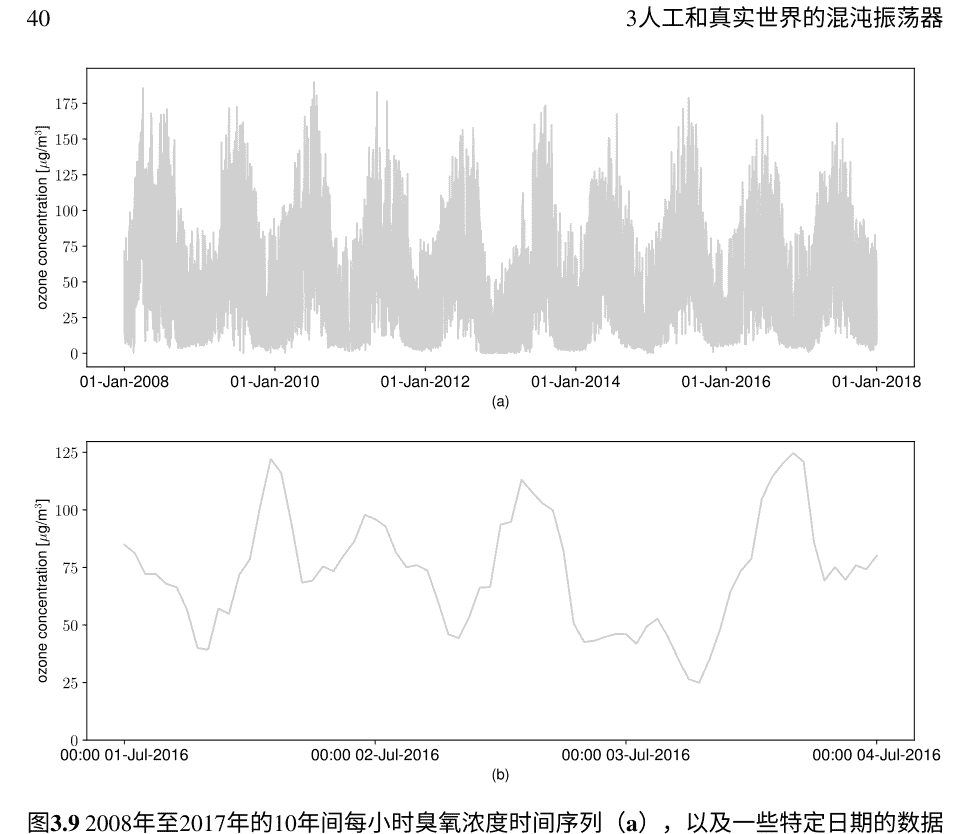

图3.9 2008年至2017年的10年间每小时臭氧浓度时间序列（a），以及一些特定日期的数据（b）

### 参考文献

1.  Baier, G., & Klein, M. (1990). 广义Hénon映射中的最大超混沌. 物理学快报, 151.6-7, 281-284.

2.  Bolt, E. (2020). 基于数据驱动的混沌预测的正则化核机器学习. 混沌理论、分叉和动力系统的年度回顾, 9, 1-26.

3.  Dercole, F., Sangiorgio, M., & Schmirander, Y. (2020). 对预测振荡时间序列的人工神经网络普适性的实证评估. IFAC-PapersOnLine, 53.2, 1255-1260.

4.  Frederickson, P., 等 (1983). 奇异吸引子的Lyapunov维度. 微分方程杂志, 49.2, 185-207.

5.  Guariso, G., Nunnari, G., & Sangiorgio, M. (2020). 多步太阳辐射预测和深度神经网络的领域适应. 能源, 13.15, 3987.

6.  Hénon, M. (1976). 具有奇异吸引子的二维映射. 在混沌吸引子理论中 (第94-102页). Springer.

7.  Ineichen, P., & Perez, R. (2002). 一种新的与大气透明度无关的Linke浊度系数表达式. 太阳能, 73.3, 151-157.

8.  Lin, X., Trainer, M., & Liu, S. C. (1988). 关于对流层臭氧生成的非线性. 大气科学研究杂志, 93.D12, 15879-15888.

9.  Perez, R., et al. (2002). 一种新的卫星辐射模型的描述和验证. 太阳能, 73.5, 307-317.

10. Rai, V., & Upadhyay, R. K. (2004). 混沌种群动力学和顶级捕食者的生物学. 混沌、孤立子和分形, 21.5, 1195-1204.

11. Richter, H. (2002). 广义Henon映射：高维混沌的例子. 国际分歧与混沌杂志, 12.06, 1371–1384.

12. Rossetto, B., et al. (1998). 慢-快自主动力系统. 国际分歧与混沌杂志, 8.11, 2135–2145.

13. Russell, F. P., et al. (2017). 利用大气模型的混沌行为与可重构架构. 计算物理通信, 221, 160–173.

14. Sangiorgio, M. (2021). 混沌动力学多步预测的深度学习. 博士论文. 米兰理工大学电子、信息与生物工程系.

15. Sangiorgio, M., & Dercole, F. (2020). LSTM神经网络在混沌时间序列多步预测中的鲁棒性. 混沌、孤立子和分形, 139, 110045.

16. Stein, J. (2017). 光伏系统性能建模. 技术报告. Sandia National Lab.(SNL-NM), Albuquerque, NM (USA).

17. Stutzer, M. J. (1980). 宏观模型中的混沌动力学和分叉. 经济动态与控制杂志, 2, 353–376.

18. Tacha, O. I., et al. (2018). 确定具有负参数的分数阶金融系统中的混沌行为. 非线性动力学, 94.2, 1303–1317.

19. Tanaka, G., et al. (2021). 具有多个时间尺度的储备计算用于多尺度动力学的预测. arXiv:2108.09446.

20. Upadhyay, R. K. (2000). 生态学中人口动态系统的混沌行为. 数学和计算机建模, 32.9, 1005–1015.

21. Van Truc, N., & Anh, D. T. (2018). 使用径向基函数网络进行混沌时间序列预测. 在第四届绿色技术与可持续发展国际会议上 (GTSD) (pp. 753–758).

## 第四章 用于时间序列预测的神经网络方法

摘要：在考虑单步预测时，使用神经网络进行时间序列预测的问题是明确的。在多步预测中，情况变得更加复杂，因此任务可以以不同的方式进行框架化。例如，可以开发一个单步预测器，在预测的时间范围内递归使用（递归方法），或者开发一个直接预测整个输出值序列的多输出模型（多输出方法）。此外，每个预测器的内部结构可以由传统的前馈（FF）或循环架构组成，例如长短期记忆（LSTM）网络。后者通常使用教师强制算法（LSTM-TF）进行训练，以加快优化的收敛速度，或者不使用教师强制算法（LSTM-no-TF），以避免曝光偏差的问题。时间序列预测需要将可用数据组织成输入-输出序列，用于参数训练、超参数调整和性能测试。

本章还探讨了开发者在定义训练过程中必须优化的相似性指数（误差度量）以及用于检查预测与测试数据的一致性的其他性能指标的选择。

单变量时间序列的预测问题是要预测未来h个步长（前导）的问题，其中输入是最后m个样本（滞后），`y(t-m+1)`，……，`y(t-1)`，`y(t)`，并将预测结果`ŷ(t+1)`，`ŷ(t+2)`，…作为输出。在机器学习术语中，我们将时间序列预测视为一个监督学习问题[2]。解决这个问题的步骤是将数据重新组织成一个输入矩阵（N行，m列）和一个相应的目标输出矩阵（N行，h列），如图4.1所示。滞后数m定义了模型输入的自回归项数。为了使学习问题可行，这个数值必须足够大，以建立输入和一步预测`ŷ(t+1)`之间的关系。在非线性时间序列分析中，合适的m被称为数据集的嵌入维度，最小的m被称为数据集的嵌入维度。当时间序列由已知的（自主的，时不变的）混沌系统生成时，嵌入理论表明，系统吸引子的分形维数的两倍以上的最小整数通常允许嵌入[23]。此外，如果将系统表示为输出变量`y（t）`的m维非线性回归，即`y（t+1）`表示为滞后`y（t - m + 1)`，…，`y（t - 1)`，`y（t)`，那么m就是嵌入维度。这是我们测试预测器的混沌振荡器的情况。对于真实世界的数据集，可以通过数值估计嵌入维度[8]。过大的m值可能会导致预测器性能变差，这在第5.1.2小节中进一步讨论。

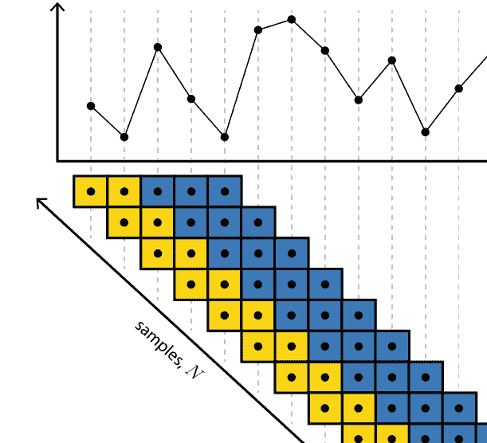

图4.1 时间序列预测被构建为一个监督学习任务。为了说明目的，我们表示N对输入（m=2步（黄色））的输入和输出（h=3步（蓝色））的输入和输出。注意输入-输出对的数量，N，等于时间序列中的点数减去（m+h-1）

### 4.1 时间序列预测的神经方法

我们关注由前馈和循环神经元组成的神经网络结构。首先，重要的是要强调的是，原则上，前馈神经网络和循环神经网络都能够解决上述定义的预测问题。区别在于前馈预测器只看到问题被视为静态问题（尝试复现输入和输出集之间的关系），而循环神经网络从动态的角度看待同样的问题。在这两种情况下，都需要重新组织时间序列，`y(1), y(2), ..., y(t), ...`，成为N对输入 `[y(t-1), ..., y(t-1), y(t)]`，并输出 `[y(t+1), y(t+2), ..., y(t+h)]` 向量，在机器学习术语中称为输入-输出样本。预测器是从m维输入空间到h维输出空间的函数。

我们关注的三种神经网络结构，FF-递归和FF-多输出，如图4.2所示，并将在下面的小节中详细描述。

前馈模型使用`Keras` [3]和`Tensorflow`作为后端实现，LSTM网络使用`PyTorch` [15]实现。

#### 4.1.1 FF-递归预测器

最常见和自然的预测方法是首先识别最佳的单步预测器，然后以递归方式使用它，将前一步的预测结果反馈到下一步的输入向量中（参见图4.2a和表4.1）。这种方法被称为递归[6, 20]或迭代[2, 10, 14, 18]。请注意，尽管时间序列具有动态性质，但识别FF-递归预测器是一个静态任务。基本上需要模仿从m个输入到单个输出的映射。

这种方法的主要优点是，一旦训练了一步预测器，就可以递归地用它来预测任意长的序列。然而，这也是它的主要缺点：它并不针对我们正在处理的多步预测任务进行优化。

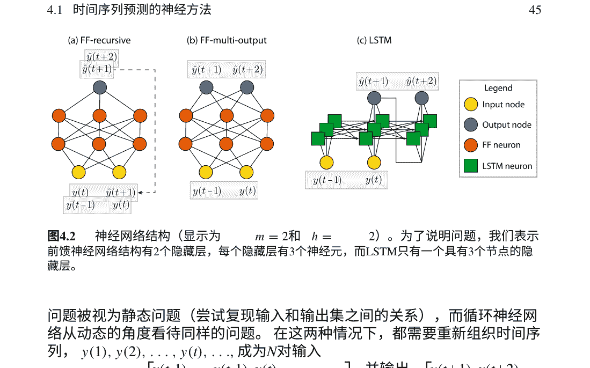

| 预测器 | 训练阶段 | 推断阶段 |
|---|---|---|
| FF-递归 | `$\hat{y}(t+1) = f_{\text{FF-rec}}(y(t), y(t-1))$`<br>`$\hat{y}(t+2) = f_{\text{FF-rec}}(y(t+1), y(t))$` | `$\hat{y}(t+1) = f_{\text{FF-rec}}(y(t), y(t-1))$`<br>`$\hat{y}(t+2) = f_{\text{FF-rec}}(\hat{y}(t+1), y(t))$` |
| FF-多输出 | `$[\hat{y}(t+2), \hat{y}(t+1)] = f_{\text{FF-mo}}(y(t), y(t-1))$` | `$[\hat{y}(t+2), \hat{y}(t+1)] = f_{\text{FF-mo}}(y(t), y(t-1))$` |
| LSTM-TF | `$[\hat{y}(t), s(t-1)] = f_{\text{LSTM-TF}}(y(t-1), s(t-2))$`<br>`$[\hat{y}(t+1), s(t)] = f_{\text{LSTM-TF}}(y(t), s(t-1))$`<br>`$[\hat{y}(t+2), s(t+1)] = f_{\text{LSTM-TF}}(y(t+1), s(t))$` | `$[\hat{y}(t), s(t-1)] = f_{\text{LSTM-TF}}(y(t-1), s(t-2))$`<br>`$[\hat{y}(t+1), s(t)] = f_{\text{LSTM-TF}}(y(t), s(t-1))$`<br>`$[\hat{y}(t+2), s(t+1)] = f_{\text{LSTM-TF}}(\hat{y}(t+1), s(t))$` |
| LSTM-no-TF | `$[\hat{y}(t), s(t-1)] = f_{\text{LSTM-no-TF}}(y(t-1), s(t-2))$`<br>`$[\hat{y}(t+1), s(t)] = f_{\text{LSTM-no-TF}}(y(t), s(t-1))$`<br>`$[\hat{y}(t+2), s(t+1)] = f_{\text{LSTM-no-TF}}(\hat{y}(t+1), s(t))$` | `$[\hat{y}(t), s(t-1)] = f_{\text{LSTM-no-TF}}(y(t-1), s(t-2))$`<br>`$[\hat{y}(t+1), s(t)] = f_{\text{LSTM-no-TF}}(y(t), s(t-1))$`<br>`$[\hat{y}(t+2), s(t+1)] = f_{\text{LSTM-no-TF}}(\hat{y}(t+1), s(t))$` |

#### 4.1.2 FF-多输出预测器

为了优化整个序列的预测，需要定义一个具有多个输出的模型。可以采用前馈和全连接的架构来实现（图4.2b和表4.1）。结构与单步预测器相同，唯一的区别在于输出层，其节点数从1增加到h（多输出[6, 20, 21]或直接[10]方法）。输出层中的每个神经元都专注于在不同时间步上预测所考虑的变量。这种架构的主要问题是它没有明确考虑到输出是顺序的（即不同时间步上的同一变量）。实际上，如果输出是在同一时间步上预测不同系统变量，模型将以相同的方式进行操作。

#### 4.1.3 LSTM预测器

我们考虑的第三个人工神经网络与序列到序列架构非常相似，在过去的十年中在自然语言处理方面取得了出色的表现[22]。图4.2c中所示的思想是建立一个能够明确考虑时间序列的顺序性的结构。为了做到这一点，隐藏层中的节点不是传统的前馈神经元，而是循环神经元，特别是LSTM单元（图4.3）。每个LSTM单元都有两个内部状态（分别命名为“隐藏”和“细胞”状态）和三个门（输入门、输出门和遗忘门）[5, 7]。直观地说，细胞状态负责跟踪过去输入提供的相关信息；隐藏状态综合了由当前输入、细胞状态和上一个隐藏状态提供的信息。请注意，隐藏状态也是LSTM的输出，对应于标准递归神经元的状态。门控制神经元中的信息流动。每个门的值是一个范围在0（关闭门）到1（打开门）之间的sigmoid函数的输出。遗忘门使LSTM神经元能够在适当的时候重置细胞状态（当输入和隐藏状态的组合进入sigmoid函数时较低）。类似地，输入门决定候选细胞状态更新（由双曲正切函数生成）对细胞状态的影响程度，保护细胞状态免受无关贡献的影响。输出门调节候选隐藏状态（由另一个双曲正切函数生成）并避免当前无关的记忆内容的负面影响。在训练过程中，这种门控结构防止了传统RNN中常见的梯度消失（或爆炸）问题对收敛的影响。RNN的独特特点是处理不同时间步的神经元的权重是共享的（参数共享）。因此，如果考虑过去的自回归项（滞后 m）或不同数量的预测步骤（前导 h），参数的数量不会改变。原则上，当 m和/或 h很大时，这应该是一个优势。同时，跨不同时间步共享的权重使优化问题更加复杂，因此需要更高的计算量。这种架构潜在地克服了FF-recursive和多输出预测器的局限性，因为它被训练成重现整个输出变量序列，并明确考虑到h输出是同一变量的连续值。

RNN通常使用一种称为“教师强制”（TF）的技术进行训练[25]。它包括将目标数据用作每个时间步长的输入，而不是使用网络在上一步骤中预测的输出，如下所示。图4.4带有教师强制（a）和不带教师强制（b）的LSTM网络训练过程

图4.4a和表4.1中介绍了这种技术在与自然语言处理相关的各种任务中的高效性，它可以加快收敛速度并避免在训练的初始阶段积累错误[1]。出于这些原因，所有深度学习的高级应用程序编程接口（API）默认采用TF[12]。要实现不使用TF的训练（参见图4.4b和表4.1），需要直接在低级API（如TensorFlow或PyTorch）中编写非标准实现。

在推理模式下，当预测多个时间步长时，未知的先前值会被模型预测替代。因此，TF在训练和推理之间引入了一个差异（曝光偏差），导致错误在预测序列中累积[1, 17]。使用TF进行训练不允许网络纠正自己的错误，因为在训练阶段，某个时间步长的预测不像在推理阶段那样影响未来的预测。在预测任务中，这导致了一种类似于使用一步递归预测器的情况。

因此，我们提出了在没有TF的情况下训练LSTM架构（LSTM-no-TF）。将这两个元素，循环神经元和无TF，结合起来，同时解决了FF-recursive和多输出预测器以及LSTM-TF的缺点。实际上，该架构被训练用于预测整个输出变量序列，并明确考虑了这些输出之间的时间连接。

由于无TF方法的存在，网络在训练和推理模式下的行为一致，因此网络可以纠正在训练过程中可能传播的预测错误[20]。

为了全面了解使用和不使用TF训练递归架构之间的差异，我们分析了简化神经架构中的前向和后向传递。

考虑一个低维情况，`m=1`，`h=2`和单层结构。网络有三组参数：`w_i`表示输入到隐藏状态的权重，`w_s`表示内部隐藏状态之间的连接，`w_o`表示状态到输出的参数。

要最小化的总误差（`E`）是在不同步骤上的贡献之和：

$$E = E(t) + E(t+1) = \mathcal{L}\left(y(t+1), \hat{y}(t+1)\right) + \mathcal{L}\left(y(t+2), \hat{y}(t+2)\right) \quad (4.1)$$

其中 $\mathcal{L}\left(y(t), \hat{y}(t)\right)$ 表示衡量目标和预测输出之间距离的通用损失函数。

训练过程需要计算 `E` 相对于不同时间步的网络参数的梯度。相同参数在不同步骤中对应的梯度被累加在一起，因为我们需要每个参数的单一梯度，以便在优化算法的每次迭代中更新其值。

为了说明目的，我们在这里展示了 $\frac{\partial E}{\partial w_i(t)}$ 使用TF和不使用TF。前者是 $\left[ \frac{\partial E}{\partial w_i(t)} \right]^{ss}$，其中上标ss表示仅按照状态到状态循环计算导数，就像TF一样。后者是 $\left[ \frac{\partial E}{\partial w_i(t)} \right]^{oi+ss}$，因为不使用TF同时考虑了输出到输入和状态到状态循环。

首先，我们考虑使用TF进行训练。根据图4.5的示意图，并利用链式法则，方程(4.1)可以重写为：

$$\left[ \frac{\partial E}{\partial w_i(t)} \right]^{ss} = \frac{\partial E(t)}{\partial w_i(t)} + \left[ \frac{\partial E(t+1)}{\partial w_i(t)} \right]^{ss} = \frac{\partial E(t)}{\partial s(t)} \cdot \frac{\partial s(t)}{\partial w_i(t)} + \frac{\partial E(t+1)}{\partial s(t+1)} \cdot \left[ \frac{\partial s(t+1)}{\partial s(t)} \right]^{ss} \cdot \frac{\partial s(t)}{\partial w_i(t)}. \quad (4.2)$$

梯度取决于两个项。第一个考虑的是时间`t`的误差，而第二个考虑的是时间`t+1`的误差。

$\left[ \frac{\partial s(t+1)}{\partial s(t)} \right]^{ss}$ 是链中的关键因素，因为它需要非线性激活函数$\sigma(\cdot)$的导数（例如，sigmoid函数或双曲正切函数）：

$$s(t+1) = \sigma\left( w_i(t+1)y(t+1) + w_s(t+1)s(t) \right). \quad (4.3)$$

这个表达式包含了TF的关键，因为新的内部状态`s(t+1)`取决于先前的状态`s(t)`和实际值`y(t+1)`。后者不依赖于网络权重，因此它中断了导数链。通过进行一些基本计算，我们可以将`s(t+1)`对`s(t)`的导数展开如下：

$$
\begin{split}
\left[\frac{\partial s(t+1)}{\partial s(t)}\right]^{ss} &= \sigma'\left(w_i(t+1)y(t+1) + w_s(t+1)s(t)\right) \\
&= \sigma'\left(w_i(t+1)y(t+1) + w_s(t+1)s(t)\right) \cdot w_s(t+1),
\end{split}
$$

(4.4)

其中`σ'(·)`是函数`σ(·)`对其自变量的导数。考虑一个没有TF的训练，方程(4.3)会发生变化，因为实际值`y(t+1)`被预测值`ŷ(t+1)`替代，而预测值依赖于之前时间步的权重：

$$
\begin{split}
s(t+1) &= \sigma\left(w_i(t+1)\hat{y}(t+1) + w_s(t+1)s(t)\right) \\
&= \sigma\left(w_i(t+1)w_o(t)s(t) + w_s(t+1)s(t)\right).
\end{split}
$$

(4.5)

如图4.6所示，`s(t+1)`对`s(t)`有双重依赖：一是由于状态到状态的循环，二是由于输出到输入的循环。

### 4.1 时间序列预测的神经方法

图4.6中的前向传播（黑色）和反向传播（红色）在没有教师强制的情况下进行了训练。

导数可以计算如下：

$$
\left[ \frac{\partial s(t+1)}{\partial s(t)} \right]^{\text{oi+ss}} = \frac{\partial}{\partial s(t)} \sigma\left( w_i(t+1) w_o(t) s(t) + w_s(t+1) s(t) \right) \\
$$

= \sigma'\left( w_i(t+1) w_o(t) s(t) + w_s(t+1) s(t) \right) \cdot \\

\frac{\partial}{\partial s(t)} \left( w_i(t+1) w_o(t) s(t) + w_s(t+1) s(t) \right) \\

= \sigma'\left( w_i(t+1) w_o(t) s(t) + w_s(t+1) s(t) \right) \cdot \\

\left( w_i(t+1) w_o(t) + w_s(t+1) \right) \\

= \left[ \frac{\partial s(t+1)}{\partial s(t)} \right]^{\text{oi}} + \left[ \frac{\partial s(t+1)}{\partial s(t)} \right]^{\text{ss}}.

$$

(4.6)

方程(4.4)和(4.6)给出了带有和不带有TF的状态到状态梯度的表达式。

类似地，可以使用TF和no-TF计算损失函数相对于考虑的权重的导数。

$$\left[\frac{\partial E}{\partial w_i(t)}\right]^{\text{oi+ss}}=\frac{\partial E(t)}{\partial w_i(t)}+\left[\frac{\partial E(t+1)}{\partial w_i(t)}\right]^{\text{oi+ss}}$$

$$=\frac{\partial E(t)}{\partial w_i(t)}+\frac{\partial E(t+1)}{\partial s(t+1)}\cdot\left[\frac{\partial s(t+1)}{\partial s(t)}\right]^{\text{oi+ss}}\cdot\frac{\partial s(t)}{\partial w_i(t)}$$

$$=\frac{\partial E(t)}{\partial w_i(t)}+\frac{\partial E(t+1)}{\partial s(t+1)}\cdot\left[\frac{\partial s(t+1)}{\partial s(t)}\right]^{\text{oi}}\cdot\frac{\partial s(t)}{\partial w_i(t)}+\frac{\partial E(t+1)}{\partial s(t+1)}\cdot\left[\frac{\partial s(t+1)}{\partial s(t)}\right]^{\text{ss}}\cdot\frac{\partial s(t)}{\partial w_i(t)}$$

$$=\left[\frac{\partial E(t+1)}{\partial w_i(t)}\right]^{\text{oi}}+\left[\frac{\partial E}{\partial w_i(t)}\right]^{\text{ss}}.$$

(4.7)

使用no-TF计算的梯度由两个项组成：第一个项特别考虑了从输出到输入的循环的存在，而第二个项正是使用TF计算的梯度（参见公式4.2）。具体的计算可以很容易地推广到其他参数。

请注意，在这种情况下，相对于时间步长 $t+1$（即`w_i(t+1)`，`w_s(t+1)`和`w_o(t+1)`）的梯度在TF和no-TF中以相同的方式计算。

从上面的简单示例中可以很容易理解，梯度的解析导出并不是微不足道的，特别是考虑到复杂的神经元（如LSTM单元）和大量展开步骤时。因此，现代深度学习库（如PyTorch、TensorFlow和Keras）不需要用户显式地导出梯度。实际上，只需要定义前向传播（即从输入计算输出的计算图的拓扑结构）和指定损失函数。基于这些元素，软件会自动估计优化过程所需的梯度。

### 4.2 性能指标

所提出的人工神经网络（ANNs）的预测结果必须与通过模拟混沌系统计算得到的目标值进行比较。使用适当的度量标准进行比较。回归任务的传统度量标准是均方误差（MSE）。在预测第 $i$ 步的情况下，我们可以考虑 $N$ 个目标样本，其中 $\mathbf{y} = \left[ y_1, y_2, \ldots, y_N \right]$，不一定按时间顺序，以及相应的 $i$ 步预测 $\hat{\mathbf{y}}^{(i)} = \left[ \hat{y}_1^{(i)}, \hat{y}_2^{(i)}, \ldots, \hat{y}_N^{(i)} \right]$，即，$y_k = y(t_k + i)$ 对于数据集中的某个 $t_k$，$\hat{y}_k^{(i)}$ 是输入的预测输出 $\hat{y}(t_k + i)$ 的计算结果 $\left[ y(t_k), y(t_k-1), \ldots, y(t_k-m+1) \right]$。均方误差（MSE）的定义如下：

$$\text{MSE}\left(\mathbf{y}, \hat{\mathbf{y}}^{(i)}\right)=\frac{1}{N}\sum_{k=1}^{N}\left(y_k - \hat{y}_k^{(i)}\right)^2.$$

(4.8)

这通常被用作网络训练过程中需要最小化的损失函数。 MSE的主要缺点是其数值不能很好地反映预测的质量，因为它们没有与数据的变异性进行归一化。 因此，为了评估预测的质量，最好使用相对指标，例如$R^2$得分，有时也被称为纳什-萨特克利夫模型效率系数[11, 13]（不要与皮尔逊相关系数的平方混淆）。 它的定义如下：

$$ R^2\left(\mathbf{y}, \hat{\mathbf{y}}^{(i)}\right)=1-\frac{\operatorname{MSE}\left(\mathbf{y}, \hat{\mathbf{y}}^{(i)}\right)}{\operatorname{MSE}\left(\mathbf{y}, \bar{\mathbf{y}}\right)}=1-\frac{\sum_{k=1}^{N}\left(y_{k}-\hat{y}_{k}^{(i)}\right)^{2}}{\sum_{k=1}^{N}\left(y_{k}-\bar{y}\right)^{2}}, \quad\quad (4.9) $$

其中，$\bar{\mathbf{y}}$是目标数据的平均值。 $R^2$得分衡量了给定模型相对于始终预测观测数据的平均值的平凡模型的预测能力（在这种情况下，$R^2=0$）。 该指标的取值范围为$(-\infty, 1]$，上限对应完美的预测。$R^2$得分被广泛使用，因为它可以看作是MSE的归一化版本，其中MSE$(\mathbf{y}, \bar{\mathbf{y}})$是数据的方差。

均方误差（MSE）和$R^2$得分在此定义为第$i$步的预测中，可以在整个预测时间范围内的$h$步上进行平均，即

$$ \begin{aligned} \mathrm{MSE} &=\frac{1}{h} \sum_{i=1}^{h} \operatorname{MSE}\left(\mathbf{y}, \hat{\mathbf{y}}^{(i)}\right) \\ \left\langle R^{2}\right\rangle &=\frac{1}{h} \sum_{i=1}^{h} R^{2}\left(\mathbf{y}, \hat{\mathbf{y}}^{(i)}\right), \end{aligned} \quad\quad (4.10) $$

特别针对混沌系统的预测，我们引入了第三个基于系统LLE的度量。 它被定义为预测误差在给定阈值下不超过的Lyapunov时间的数量，其中Lyapunov时间（LT，见第2.3.1节）是LLE的倒数。 该度量将神经模型的预测能力归一化到数据生成器的平均混沌性，并允许在不同混沌系统之间公平比较预测器的性能[24]。

在混沌系统中，即使是理想的预测器也会迟早与原始输出值发散，因为典型的混沌局部发散（LLE是局部发散的平均指数增长率）会放大任何小的数值误差。 在这种情况下，如果系统被预测器很好地近似，$R^2$得分将收敛到-1 [4, 19]。 为了证明这一点，我们假设目标输出$\mathbf{y}$和其预测$\hat{\mathbf{y}}^{(h)}$具有相同的统计特性：

$$E[\mathbf{y}] = E[\hat{\mathbf{y}}^{(h)}] = \bar{\mathbf{y}} \quad (4.11)$$

$$Var[\mathbf{y}] = Var[\hat{\mathbf{y}}^{(h)}] \quad (4.12)$$

$$E[\mathbf{y}^2] = E[(\hat{\mathbf{y}}^{(h)})^2], \quad (4.13)$$

其中，`E[·]`表示均值运算符，`Var[·]`表示方差。在发散之后，我们可以将目标和预测想象成振荡器吸引子内的两条不相关的轨迹。换句话说，这两个变量变得独立。因此，我们可以利用以下众所周知的统计性质：

$$E[\mathbf{y} \cdot \hat{\mathbf{y}}^{(h)}] = E[\mathbf{y}] \cdot E[\hat{\mathbf{y}}^{(h)}]. \quad (4.14)$$

根据(4.9)，R²得分为：

$$R^2_{(\mathbf{y}, \hat{\mathbf{y}}^{(h)})} = 1 - \frac{E[(\mathbf{y} - \hat{\mathbf{y}}^{(h)})^2]}{E[(\mathbf{y} - \bar{\mathbf{y}})^2]} \quad (4.15)$$

方差可以重新表述为：

$$E[(\mathbf{y} - \bar{\mathbf{y}})^2] = E[\mathbf{y}^2 - 2\mathbf{y}\bar{\mathbf{y}} + \bar{\mathbf{y}}^2] \\ = E[\mathbf{y}^2] - 2E[\mathbf{y}\bar{\mathbf{y}}] + E[\bar{\mathbf{y}}^2] \\ = E[\mathbf{y}^2] - 2\bar{\mathbf{y}}E[\mathbf{y}] + \bar{\mathbf{y}}^2 \\ = E[\mathbf{y}^2] - \bar{\mathbf{y}}^2. \quad (4.16)$$

均方误差，MSE $(\mathbf{y}, \hat{\mathbf{y}}^{(h)})$可以被表述为：

$$E[(\mathbf{y} - \hat{\mathbf{y}}^{(h)})^2] = E[\mathbf{y}^2 - 2\mathbf{y}\hat{\mathbf{y}}^{(h)} + (\hat{\mathbf{y}}^{(h)})^2] \\ = E[\mathbf{y}^2] - 2E[\mathbf{y}\hat{\mathbf{y}}^{(h)}] + E[(\hat{\mathbf{y}}^{(h)})^2] \\ = E[\mathbf{y}^2] - 2E[\mathbf{y}]E[\hat{\mathbf{y}}^{(h)}] + E[(\hat{\mathbf{y}}^{(h)})^2] \\ = E[\mathbf{y}^2] - 2E[\mathbf{y}]^2 + E[\mathbf{y}^2] \\ = 2E[\mathbf{y}^2] - 2\bar{\mathbf{y}}^2 \\ = 2(E[\mathbf{y}^2] - \bar{\mathbf{y}}^2). \quad (4.17)$$

在证明了具有相同统计特性（相同的均值、方差和二阶原始矩）的独立数据集的均方误差（MSE）平均值为过程方差的两倍后，R²得分收敛为：

$$R^2_{(\mathbf{y}, \hat{\mathbf{y}}^{(h)})} = 1 - \frac{2(E[\mathbf{y}^2] - \bar{\mathbf{y}}^2)}{E[\mathbf{y}^2] - \bar{\mathbf{y}}^2} = 1 - 2 = -1. \quad (4.18)$$

对于大的h值，R²分数接近-1，这是对预测器质量的检查。这意味着预测器本身作为一个动力系统，能够生成具有相同特征（即相同统计特性）的吸引子。

### 4.3 训练过程

每个人工系统用于生成50,000个数据点，这些数据点被分为训练集（样本的70%）、验证集（15%）和测试集（15%）。对于两个真实世界的时间序列，太阳辐射和臭氧浓度，无法生成任意数量的样本。根据可用的数据量，我们保留一年或两年的数据用于验证（测试也是如此），以保持自然过程的年周期性。训练集用于训练神经网络的参数（即权重和偏置）。验证集的输入-输出对不直接由优化算法处理，而是用于调整神经网络的超参数，这些超参数定义了网络结构和学习算法的配置（见表4.2）。测试集在模型识别中没有作用，只是用于公平地评估模型在推理模式下的性能。

为了一方面限制要调整的超参数数量，另一方面为了在不同架构之间提供公平比较，我们固定了隐藏层的数量（3层）和每层神经元的数量（10个神经元）。其他超参数（见表4.2）通过网格搜索优化进行了调整。我们测试了批量大小为256、512和1024；学习率为0.1、0.01和0.001；衰减因子为0.001和0。迭代次数固定为5000次，这个值可以确保每次训练的收敛。在学习过程中，同时监控训练损失和验证损失，以便进行评估。

| 超参数 | 描述 |
| --- | --- |
| 批量大小 | 在优化的每次迭代中，用于计算损失函数梯度的训练输入输出样本数量 |
| 学习率 | 在优化的每次迭代中，网络参数更新的梯度步长（也称为步长） |
| 学习率衰减 | 训练过程中学习率的指数衰减率 |
| 迭代次数 | 学习算法遍历整个训练数据集的次数，在每次迭代时进行样本重排 |

对于每个超参数组合，优化过程会重复两次，通过改变随机权重初始化来避免对特别不幸的初始值产生依赖。训练过程使用Adam（自适应矩估计）优化器进行，[9]这是一种从标准随机梯度下降算法中派生出来的用于深度学习应用的先进算法。正如其名称所示，Adam使用衰减率为 β1 = 0.9和 β2 = 0.99的移动平均数自适应地估计梯度的一阶和二阶矩。然后，这两个矩的估计值用于调整训练过程中的学习率。

### 参考文献

- 1. Bengio, S.,等 (2015年)。使用递归神经网络进行序列预测的计划抽样。第29届神经信息处理系统会议论文集, 28, 1171-1179。
- 2. Bontempi, G., Ben Taieb, S., & Le Borgne, Y.-A. (2012年)。时间序列预测的机器学习策略。在欧洲商业智能暑期学校 (第62-77页) 中。Springer出版社。
- 3. Chollet, F.,等 (2018年)。Keras: Python深度学习库。天体物理学源代码库。
- 4. Dercole, F., Sangiorgio, M., & Schmirander, Y. (2020年)。对人工神经网络在预测振荡时间序列中的普适性的实证评估。IFAC-PapersOnLine, 53.2, 1255-1260。
- 5. Goodfellow, I., Bengio, Y., & Courville, A. (2015). 深度学习. MIT Press.
- 6. Guariso, G., Nunnari, G., & Sangiorgio, M. (2020). 多步太阳辐射预测和深度神经网络的领域适应. Energies, 13.15, 3987.
- 7. Hochreiter, S., & Schmidhuber, J. (1997). 长短期记忆.神经计算, 9.8, 1735–1780.
- 8. Kennel, M. B., Brown, R., & Abarbanel, H. D. (1992). 使用几何构造确定相空间重构的嵌入维度.Physical Review A, 45.6, 3403.
- 9. Kingma, D. P., & Ba, J. (2014). Adam: 一种用于随机优化的方法. arXiv:1412.6980.
- 10. Makridakis, S., Spiliotis, E., & Assimakopoulos, V. (2018). 统计和机器学习预测方法：问题和前进的方式。PloS one, 13.3, e0194889.
- 11. McCuen, R. H., Knight, Z., & Cutter, G. (2006). 评估Nash-Sutcliffe效率指数。Journal of Hydrologic Engineering, 11.6, 597–602.
- 12. Mihaylova, T., & Martins, A. F. T. (2019). Scheduled Sampling for Transformers. arXiv:1906.07651.
- 13. Nash, J. E., & Sutcliffe, J. V. (1970). 通过概念模型进行河流流量预测第一部分-原理讨论。Journal of Hydrology, 10.3, pp. 282–290.
- 14. Pan, S., & Duraisamy, K. (2018). 使用神经网络对非线性动力系统进行长时间预测建模。复杂性。
- 15. Paszke, A., et al. (2017). PyTorch中的自动微分。在神经信息处理系统的第三十五届会议上。
- 16. Pathak, J., et al. (2017). 使用机器学习复制混沌吸引子并从数据中计算Lyapunov指数。混沌：非线性科学的跨学科杂志, 27.12, 121102。
- 17. Ranzato, M., et al. (2015). 序列级别训练与递归神经网络。arXiv:1511.06732。
- 18. Rasp, S., et al. (2020). WeatherBench：用于数据驱动天气预报的基准数据集。地球系统建模进展杂志，12.1。

- 19. Sangiorgio, M. (2021). 深度学习在混沌动力学多步预测中的应用。博士论文。米兰理工大学电子、信息与生物工程系。

- 20. Sangiorgio, M., & Dercole, F. (2020). LSTM神经网络在混沌时间序列多步预测中的鲁棒性。混沌、孤立子和分形，139, 110045。

- 21. Sangiorgio, M., Dercole, F., & Guariso, G. (2021). 使用深度神经网络预测噪声混沌系统。混沌、孤立子和分形，153, 111570。

- 22. Sutskever, I., Vinyals, O., & Le, Q.V. (2014). 序列到序列学习与神经网络。第28届神经信息处理系统会议论文集，27, 3104-3112。

- 23. Takens, F. (1981). 在湍流中检测奇怪的吸引子。动力系统和湍流，华威大学1980年(第366-381页). Springer.

- 24. Wang, R., Kalnay, E., & Balachandran, B. (2019). 基于神经机器的混沌动力学预测。非线性动力学, 98.4, 2903-2917.

- 25. Williams, R. J., & Zipser, D. (1989). 一种用于连续运行完全递归神经网络的学习算法。神经计算, 1.2, 270-280。

## 第五章 神经预测器的准确性

摘要 我们研究了确定性环境中不同预测器的性能，并测试它们对噪声的鲁棒性。 特别是，我们通过将不同强度的随机高斯信号添加到一些典型混沌系统的确定性输出中来模拟经典的测量噪声情况。 然后，我们研究了结构噪声的关键情况，即逻辑映射的增长率参数的缓慢变化。 在这两种情况下，噪声的存在迅速降低了所有性能指标，但有趣的是，最好的确定性预测器，即没有教师强制训练的LSTM，仍然是在随机和非平稳环境中最好的。 最后，我们研究了太阳辐射和臭氧浓度时间序列，同样的预测器被证明是最好 的，并且还可以可靠地应用于同一领域中的类似数据集（领域适应）。

在本章中，我们分析了四种考虑的神经预测器（`FF-递归`、`FF-多输出`、`LSTM-TF`和`LSTM-no-TF`）在第3章中呈现的时间序列上的预测能力：

- 确定性无噪声系统（`logistic`、`Hénon`和`generalized Hénon maps`）；

- 相同系统的带噪声版本，考虑三个不同的噪声水平；

- 修改版的`logistic map`，参数具有缓慢的动态；

- 两个真实世界的时间序列（太阳辐射和臭氧浓度）。

实验设置的详细描述和对训练过程的一些说明在第6章中报告。

### 5.1 确定性系统

首先，我们训练`FF-递归`预测器。如第4.1.1节所述，这是预测非线性时间序列最常见的方法，因此可以作为基准。 此外，它还允许我们定义预测的时间范围（即预测的步数）`$h$`。

表5.1 四个考虑的混沌系统的特征

| 系统 | 滞后(m) | 超前(h) | LT |
| --- | --- | --- | --- |
| Logistic | 1 | 20 | 2.83 |
| Hénon | 2 | 17 | 2.33 |
| 3D广义Hénon | 3 | 27 | 3.62 |
| 10D广义Hénon | 10 | 109 | 15.87 |

对于每个混沌系统，我们计算每个时间步长的单步预测器的 `R² score`。一旦确定了单步预测器，我们递归应用它，并计算测试数据集上每个时间步长的 `R² score`。我们将预测的时间步长的长度 `h` 设置为第一个`R² score`变为负值的步长。表5.1报告了与四个混沌系统的预测任务相关的主要特征。

一旦为每个混沌系统定义了 `h`，就可以训练多输出和LSTM预测器。

在测试过程中，每个时间步长的`R²得分`在图5.1中报告，对于每个预测器（同一面板上的线条）和模拟系统（不同面板上的相同颜色线条）。主要结果是我们的四个预测器在所有情况下排名相同。利用考虑的混沌映射的广泛复杂性和相应的预测任务，我们可以认为这个结果是所考虑的神经结构的一般属性。第二个显著结果是每个预测器在不同系统中的性能相当均匀，以Lyapunov时间（`LTs`）的预测数量来衡量，具有足够的`R²得分`（表5.2中的质量阈值为0.7）。请注意，我们故意设计了我们的设置，以挑战具有不同复杂性的预测器任务。因此，我们使用相同大小的网络和数据集来预测具有不同复杂性的动力学。

然而，这对于在不同任务上比较预测器性能是一个不公平的设置，事实上，所有预测器的准确性都随着预测系统的维度和复杂性的增加而降低。尽管如此，所有神经网络结构似乎都具有普遍的预测能力，与[3]中的初步结果一致，在那里进行了公平的比较，使用了`FF-递归`预测器。

`FF-递归`预测器可以几乎完美地模拟真实系统的行为，持续5个`LT`。之后，性能迅速下降，`R²得分`变为负值（在7和8个`LT`之间）。`FF-多输出`预测器提供的性能最差：`R²得分`在2个`LT`之后下降并消失，表明预测接近于训练数据集的平均值。对于三个低维系统，要近似的映射（系统映射的迭代，参见图3.2）对于增加的提前时间变得非常复杂，网络无法复现它们（图5.1a-c）。对于10D广义`Hénon`，大的`horizon h`（每个`LT`对应15.87个时间步长）是一个额外的问题。要与低维情况类似，`FF-多输出`预测器应该独立地复现超过30个迭代的映射，因为输出的顺序性并没有明确考虑。这是一个任务。

### 5.1 确定性系统

图5.1 `$R^2(y, \hat{y}^{(i)})$` 使用四个预测器（见彩色线条）在`Logistic` (a)、`Hénon` (b)、3D广义`Hénon` (c)和10D广义`Hénon` (d)映射上获得的分数。 在无噪声的测试数据集上计算的性能

表5.2 四个考虑到的混沌系统在无噪声情况下的预测器整体性能。 第三列报告了在`R²得分`低于0.7之后的`LT`数。在第四列中，我们计算了在`h`步预测中的平均`R²得分`。

| 系统 | 预测器 | # LT R² > 0.7 | ⟨R²⟩ |
|------|--------|---------------|------|
| Logistic | FF-递归 | 6.01 | 0.85 |
| Logistic | FF-多输出 | 2.83 | 0.46 |
| Logistic | LSTM-TF | > 7.08 | > 0.99 |
| Logistic | LSTM-no-TF | > 7.08 | > 0.99 |
| Hénon | FF-递归 | 6.00 | 0.83 |
| Hénon | FF-多输出 | 2.57 | 0.43 |
| Hénon | LSTM-TF | 6.86 | 0.96 |
| Hénon | LSTM-no-TF | > 7.28 | 0.98 |
| 3D广义Hénon | FF-递归 | 6.07 | 0.82 |
| 3D广义Hénon | FF-多输出 | 2.76 | 0.35 |
| 3D广义Hénon | LSTM-TF | 6.62 | 0.89 |
| 3D广义Hénon | LSTM-no-TF | 6.90 | 0.94 |
| 10D广义Hénon | FF-递归 | 5.67 | 0.84 |
| 10D广义Hénon | FF-多输出 | 0.00 | 0.13 |
| 10D广义Hénon | LSTM-TF | 5.67 | 0.90 |
| 10D广义Hénon | LSTM-no-TF | 6.23 | 0.94 |

由于优化过程总是陷入局部最小值，因此预测结果只能准确预测少数非连续的步骤。 `FF-multi-output`的性能只在短期预测范围（小`h`）上可接受。 两个LSTM预测器的趋势与`FF-recursive`相似，始终提供更高的精度，特别是在4-5个`LT`之后。在所有情况下，不使用`TF`训练LSTM可以获得最佳性能。

请注意两个广义`Hénon`映射（图5.1c-d）中`R²得分`的行为，这是系统特定的：随着步数的增加，性能逐步恶化。 事实上，这种逐步行为是广义`Hénon`映射的一个特殊特征，更准确地说，是非线性映射应用于滞后窗口的最后几个样本的重复。

在10D广义`Hénon`映射中，先前的`m`个样本（`y(t-8)`和`y(t-9)`）被用于计算`y(t+1)`。首先，使用实际数据（零误差）对前`m-1`步进行预测，以初始化预测器。 之后，使用这些`m-1`个预测值（带有一定误差）来预测从`m`到`2*(m-1)`步之间的值，依此类推。10D映射还突出了`LSTM-TF`网络中曝光偏差问题（即训练和推理模式之间的差异）的重要性。`LSTM-TF`的`R²得分`呈现出以块长度组织的结构。

`m - 1`，但每个块内的趋势是增加的。 这种反直觉的行为表明，预测器在每个块的开始阶段特别受到影响，因为较低质量的预测开始被用作输入，而这种情况尚未发生

### 5.1 确定性系统

在训练中完成。然后通过隐藏状态传播信息有趣地使预测器在下一个块的开始之前恢复。

通过观察图5.1的面板和总结在表5.2中的结果，可以看出FF-递归预测器能够在不同阶数的系统上保持相似的性能。相反，LSTM预测器在两个广义Hénon映射中似乎受到更大的影响。事实上，对于循环网络来说，广义Hénon映射的预测任务比FF架构更为关键。因为预测$\hat{y}(t+1)$不依赖于来自$y(t), \ldots, y(t-m+3)$，一个FF网络只需将相应的权重置零。相反，RNN必须执行两个任务：通过网络的$m$滞后传播信息（对于这里考虑的系统，$m$等于状态变量的数量）以记住过去的输入并重现非线性函数。结果表明，在没有TF的情况下训练LSTM预测器可以有效减轻这个问题，支持我们的假设，即这种训练方法允许正确的信息在后续时间步骤中流动。

从不同的角度来看待结果，可以将每对目标和预测表示为散点图（见图5.2中的逻辑映射案例）。当预测完美时，点位于对角线上。有趣的是，与TF情况相比（比较图5.2中第3行和第4行，第1列），LSTM-no-TF预测器在第一个时间步骤中会出现小错误。这是训练网络所采用方法的直接结果，该方法考虑了整个时间范围，因此初始步骤中的小误差在某种程度上对获得更好的整体性能是有用的。换句话说，LSTM-no-TF预测器是专门训练的，以在整个序列上提供最佳性能。相反，FF-recursive和LSTM-TF预测器采用了不同的策略：它们主要优化以预测一步。因此，第一个时间步骤的散点图（图5.2中的第1行和第3行，第1列）几乎完全与对角线对齐。即使对于（y（t+5），ŷ（t+5））和（y（t+10），ŷ（t+10）），情况也是如此，而对于（y（t+15），ŷ（t+15））和（y（t+20），ŷ（t+20）），使用LSTM-no-TF生成的点比使用FF-recursive和LSTM-TF预测器获得的点更加对齐在对角线上。

#### 5.1.1 系统吸引子上的性能分布

LLE和LT是平均量，用来描述整个混沌吸引子。然而，同一个预测器在吸引子的不同区域可能提供不同的性能。例如，从一个鞍点附近开始预测通常会对预测的得分产生负面影响[15]。图5.3显示了通过延迟坐标嵌入（在这种情况下等同于状态空间）重构的3D广义Hénon系统的混沌吸引子。测试集的样本被组织成三元组[y(t), y(t-1), y(t-2)]，它们在重构的状态空间中标识一个点。然后我们对接下来的27个步骤进行预测。每个点分配的颜色取决于从该点开始预测时获得的性能，计算公式如下：

```
R² (y(t+1:t+h), ŷ(1:h)(t+1:t+h)) = 
R²([y(t+1), …, y(t+h)], [ŷ(1)(t+1), …, ŷ(h)(t+h)]).     (5.1)
```

相对于FF-递归预测器（图5.3a）的吸引子主要以暖色表示（R²得分接近1）。用冷色调表示的点似乎没有任何特定的分布。FF-多输出网络（图5.3b）证实了图5.1中已观察到的低精度。LSTM-TF（图5.3c）比FF-递归预测器表现更好，但仍然呈现类似的随机模式。LSTM-no-TF预测器（图5.3d）获得了最佳性能和均匀性。

图5.3 混沌吸引子上四个预测器的性能分布。每个点的颜色表示从该点开始的27步预测性能。

#### 5.1.2 对嵌入维度的敏感性

到目前为止，我们总是假设数据集的连续样本之间存在映射关系（即数据集的嵌入维度）和下一个值之间的映射关系。在这里考虑的确定性情况下，实际上可以从系统的方程中解析地计算出 $m$。然而，即使人们完全了解系统的状态空间表示，通常也无法进行这样的计算。此外，在现实世界的应用中，系统的方程通常是未知的，因此必须通过数值技术来确定 $m$。一种特别适用于人工神经网络的方法是将 $m$ 作为额外的超参数进行优化。

由于超参数的调整是一项耗时的任务，因此值得找到一个合适的 $m$ 值集合，以限制计算工作量。为了达到这个目的，Takens定理[17]非常有用，它指出只要使用足够的嵌入维度（通常只比吸引子分形维度大两倍多一点），就可以从时间序列中重建混沌系统。

图5.4 3D广义Hénon映射的一步预测MSE，其中 $m \in [1, 6]$

或者，可以通过数据自相关函数或非线性时间序列工具（例如2.4.1小节中介绍的假邻近算法或计算数据集分形维度）来获得一些见解。

为了研究哪种预测器对于 $m$ 值的不确定性更加稳健，我们重新考虑了3D广义Hénon映射。使用Kaplan-Yorke公式计算的吸引子分形维度为2.13。这意味着通常只需要5个（大于 $2.13 \cdot 2$ 的下一个整数）滞后来通过延迟坐标嵌入重建混沌吸引子。

我们首先关注单步预测，比较前馈神经网络（FF）和长短期记忆网络（LSTM）的性能（注意当 $h=1$ 时，递归和多输出的前馈神经网络预测器是等价的，以及带或不带时间特征的LSTM）。图5.4报告了一步预测的均方误差，并显示 $m<3$ 是不足够的：基本上没有将两个连续的输出数据与下一个数据进行映射。正如预期的那样，$m=3$ 保证了最佳性能，与模型方程得出的结论相符。当 $m>3$ 时，LSTM预测器的行为几乎与仅使用必要输入时的行为相同。额外的可用输入对输出基本没有影响，因为它们被顺序的LSTM结构过滤掉。这使得预测器能够正确地学习到它们对改善预测没有用处。前馈神经网络结构似乎不够稳健，因为输入和输出之间存在静态连接。原则上，它们应该能够通过将冗余输入与第一个隐藏层之间的连接权重设置为零来避免对无用输入的依赖。然而，在训练之后，这些权重的值接近于零，但并不完全相等，因此无用输入的影响仍然可见（请注意图5.4中的对数刻度）。图5.5显示了平均值 $R^2$ 对于不同的滞后时间，在27个步骤上计算（与图5.4中考虑的相同）。LSTM-no-TF预测器再次展现出最佳性能，无论是在低估嵌入维度（$m < 3$）的情况下，还是在高估嵌入维度（$m > 3$）的情况下。

通过比较图5.4和图5.5，我们可以看到，虽然在一步预测中无用输入引起的数值误差几乎可以忽略不计（请再次注意图5.4中的对数刻度），但在整个预测范围（图5.5中的27步）内变得更加显著，还显示出不同预测器之间的显著差异。FF-multi-output显然是最不稳健的预测器。FF-recursive相对稳健，尽管它受到数据的混沌性质的影响。LSTM结构对于对所需滞后数量的高估是最稳健的。请注意，通过利用冗余输入，平均R²得分甚至会增加。没有使用TF，该预测器对于对所需滞后数量的低估也是稳健的。这证实了在处理预测任务时不应使用TF。

### 5.1 确定性系统

### 5.2 随机时间序列

前一节中呈现的结果是相对于无噪声时间序列的，这是一个理想的条件，在考虑实际应用时很少验证。为了评估预测器对观测噪声的敏感性，我们将加性白噪声叠加到通过模拟确定性系统获得的信号中。然后我们对噪声数据重新训练这四个神经预测器。因此，这种随机环境在完全确定性环境和真实案例研究之间处于中间位置。

图5.6显示了当白噪声标准差等于无噪声过程标准差的1%时所获得的结果。

- 如预期的那样，在无噪声情况下，性能要比噪声情况下差得多（图5.1）

- 这是由于所考虑系统的混沌行为，它会指数级放大初始条件上的噪声[16]

- FF-recursive和LSTM-TF预测器在四个系统中表现几乎相同。它们在预测时间范围的初始部分的准确性很高，并且逐渐下降到-1（见第4.2节）。FF-multi-output证实了在无噪声情况下显示的特殊行为。它确保了一个正（最差情况下为零）的R²分数，在多步预测的短期内提供可接受的性能。LSTM-no-TF在预测的前半部分表现出与FF-recursive和LSTM-TF相同的性能，其R²分数始终为正（请参见预测的后半部分），并且在预测的中间部分优于其他三个竞争对手。

神经结构的一个有趣的基准是使用生成数据作为预测器的真实系统的性能（以下简称真实系统预测器）。在无噪声情况下，真实系统预测器始终提供完美的预测；因此，在整个预测范围内，R²分数等于1。当考虑到噪声数据时，我们模拟了从两个略有不同的初始条件开始的相同动力系统。由于系统的混沌性，这两条轨迹会发散，如图5.7所示。换句话说，即使能够识别出真实系统，仍然无法防止多步误差的发散。

我们分析了三个不同噪声水平：其标准差分别设置为0.5、1和噪声自由过程的标准差的5%。如预期的那样，当噪声水平较高时，真实系统和真实系统预测器之间的差异会更快地增大。从不同的面板来看，可以明显看到所有考虑的混沌系统的下降趋势非常相似。这个事实很有趣，因为它证明了采用系统的Lyapunov时间作为时间单位（x轴）和R²score作为度量（y轴）是标准化问题维度的合适方式。

将图5.6与图5.7中相应的曲线进行比较（对于1%的噪声水平获得的曲线），可以让我们单独评估预测误差的两个组成部分。第一个是由于识别过程的不确定性引起的（识别误差）。第二个是由于观测噪声从输入数据传播到输出引起的（观测误差）。神经预测器受到两种误差源的影响，而当考虑用作预测器的真实系统时，识别误差在定义上为零。`FF-recursive`和`LSTM-TF`架构显示出与用作预测器的真实系统类似的预测能力，这证实了这两个神经预测器基本上解决了一个系统识别任务（它们被优化为1步预测），而不是寻找最佳的多步预测。相反，`LSTM-no-TF`对于考虑的预测时段是特定的，并且由于其优化方式，它提供了比其他竞争者更好的性能。我们可以得出结论，在预测任务中，与观测误差相比，识别误差几乎可以忽略不计。这意味着在处理受观测噪声影响的混沌数据集时，了解实际系统并不能帮助提高预测准确性。

表5.3报告了通过测试三个噪声水平来进行的敏感性分析，以LT数量为指标，其中R²得分高于0.5。表5.3证实了`FF-recursive`和`LSTM-TF`预测器在性能上与真实系统获得的结果相似。在所有考虑的情况下，`LSTM-no-TF`具有比其他所有预测器更好的预测准确性。

### 5.3 非平稳系统

表5.3 预测器在不同噪声水平下的性能

| 系统 | 预测器 | 无噪声 | 0.5%的噪声 | 1%的噪声 | 5%的噪声 |
| --- | --- | --- | --- | --- | --- |
| Logistic | FF-递归 | 6.37 | 4.25 | 3.54 | 2.12 |
| | FF-多输出 | 3.18 | 2.83 | 2.83 | 2.12 |
| | LSTM-TF | > 7.07 | 4.25 | 3.54 | 2.12 |
| | LSTM-no-TF | > 7.07 | 4.60 | 3.89 | 2.12 |
| | 真实系统 | ∞ | 4.24 | 3.53 | 2.12 |
| Hénon | FF-递归 | 6.43 | 3.86 | 3.43 | 2.14 |
| | FF-多输出 | 3.00 | 3.00 | 2.57 | 2.14 |
| | LSTM-TF | > 7.28 | 3.86 | 3.43 | 2.14 |
| | LSTM-no-TF | > 7.28 | 4.29 | 3.86 | 2.57 |
| | 真实系统 | ∞ | 3.86 | 3.43 | 2.16 |
| 3D广义Hénon | FF-递归 | 6.07 | 3.86 | 3.31 | 2.21 |
| | FF-多输出 | 2.76 | 2.76 | 2.48 | 2.21 |
| | LSTM-TF | 6.62 | 4.42 | 3.31 | 2.21 |
| | LSTM-no-TF | > 7.45 | 4.42 | 3.86 | 2.21 |
| | 真实系统 | ∞ | 4.42 | 3.31 | 2.21 |
| 10D广义Hénon | FF-递归 | 6.23 | 3.97 | 3.40 | 2.27 |
| | FF-多输出 | 0.00 | 0.01 | 0.00 | 0.01 |
| | LSTM-TF | 6.23 | 3.97 | 3.40 | 2.27 |
| | LSTM-no-TF | 6.80 | 4.54 | 3.97 | 2.27 |
| | 真实系统 | ∞ | 4.54 | 3.40 | 2.27 |

在考虑观测噪声的影响后，我们分析了使用 logistic 映射的慢-快版本得到的结果，以评估结构噪声对预测器性能的影响。 在这种情况下，问题是由于定义了输入空间和输出空间之间的映射的抛物线随时间缓慢变化所导致的。

图5.8报告了不同 `$m$` 值（即作为预测器输入的滞后数）的结果。 如预期的那样，当 `$d$` 等于1时，信息不足以建立输入空间和输出空间之间的映射。 图5.8a显示，即使在一步预测中，没有一个预测器能够达到接近1的 `$R^2$` 分数。 对于大于一的 `$m$` 值（图5.8b-d），所有预测器的准确性显著提高。 单步预测几乎是完美的，这意味着 `$m$` = 2是该系统的适当嵌入维度。

一般来说，LSTM网络的循环结构比前馈结构（`FF-递归`和`FF-多输出`）提供更好的预测准确性。这可能是因为LSTM架构具有内部记忆，并且它们的参数值在处理每个输入后会发生变化。因此，这种网络在重现参数 `$r(t)$` 的缓慢变化动态方面更好。没有使用教师强制训练进一步提高了性能，证明`LSTM-no-TF`是本书中考虑的架构中最准确的架构。

### 5.4 真实世界的案例研究

在本章的最后一节中，我们关注了两个真实世界数据集（太阳辐射和臭氧浓度）的结果。预测器的性能在12小时和2天的预测范围内进行评估，考虑到每小时的时间步长。

由于真实世界时间序列的固有噪声特性 - 观测和结构性噪声通常共存 - 在讨论时间序列的复杂性之前，应该质疑确定性模型还是随机模型更适合描述该序列。

这与系列的嵌入维度概念有关，介绍在子节.2.4.1中。如果找到合适的嵌入维度（例如使用假最近邻算法），则延迟坐标空间中的动力学是唯一确定的（在算法容差范围内），因此可以使用确定性机器作为模型。相反，如果在高维度上仍然存在大量错误的邻居，则随机模型可能更合适。实际上，在这种情况下，重构吸引子的相关维度（子节2.3.2）随着嵌入空间的维度增加而增加，这表明数据的随机性填充了可用空间。

一旦找到合适的嵌入，可以通过计算重构吸引子的最大Lyapunov指数（LLE）来衡量时间序列的复杂性（第2.4.2节）。正指数证明时间序列是混沌的，即对微小扰动非常敏感。

### 5.4.1 太阳辐射

上述过程首先需要使用假最近邻算法评估数据集的合适嵌入维度。对于 `$m$` = 48（见图5.9a），虚假邻居的比例几乎为零，这意味着延迟参数的这个值适合重构系统动态。

在设置了 `$m$` 的值之后，我们计算逐步扩展的平均对数发散。根据图5.9b中的曲线，可以计算LLE，即曲线初始（线性）部分的斜率。在这种情况下，它等于0.062。

由于与该时间序列相关的LLE是正的，我们可以确认太阳辐射动力学是混沌的。在这本书中考虑的同一站点记录的太阳辐射已经有研究得出了相同的结论[4]。

使用2014年至2017年的数据进行网络参数训练，使用2018年进行验证过程，使用2019年进行测试，比较了LSTM和FF网络对太阳辐射的多步预测。

在呈现结果之前，值得注意的是，当应用于完整的时间序列时，经典指标可能会高估模型的实际性能。在处理太阳辐射时，由于存在许多空值，总是存在强烈的偏差。在这种情况下，它们约占样本的57%，原因有很多：地球的旋转和公转运动，附近山脉的额外阴影以及传感器的灵敏度。当记录值为零时，预测值也为零（或非常接近），所有这些小误差都会大大减小平均误差并增加 `$R^2$` 得分。此外，预测夜间的太阳辐射是没有意义的，使用预测来平衡电力生产的电网管理者可能会关闭预测模型。为了克服这个不足，在当前文献中许多作品中存在的不足，并允许在它们可能确实有用时比较模型的性能，我们还计算了只考虑 `$>25 \text{ W m}^{-2}$`（以下是白天）以上值的性能指标，这是通常在黎明前和日落后达到的一个小值。这些是太阳能预测准确时可能有用的条件。

首先，我们考虑两种标准基准模型的性能：晴空指数和经典的持续模型。晴空模型（见图3.6b）固有地考虑了每日伪周期成分的存在，这影响了每小时的全球太阳辐射，并考虑了平均晴空条件。晴空预测器在每个步骤上保持相同的性能，因为它们与考虑的提前时间无关：`$R^2$` 得分在整个白天为0.58，在仅考虑白天样本时为0.22。 持续预测器定义为 `$\hat{y}(t+i) = y(t), i = 1, 2, ..., h$`。因此，它考虑了过程的非常短期记忆。当增加预测时间时，其性能迅速下降。在1小时之后，它的性能仍然可以接受；`$R^2$` 得分为0.79（考虑整个白天样本）和0.59（仅考虑白天样本）。经过两个小时，它下降到0.54（整个白天）和0.14（仅白天）。进一步增加提前时间，性能急剧下降；例如，`$R^2$` 得分在六小时后变为-0.93（整个白天）和-1.64（白天）。

图5.10报告了四个神经预测器在整个白天和仅关注白天样本时的 `$R^2$` 得分结果。

正如预期的那样，神经预测器优于两个基准模型。它们在短期内比持续模型表现更好，在整个时间范围内比晴空指数表现更好（考虑 `$h=12$` 和 `$h=48$`）。唯一的例外是`LSTM-TF`，在整个白天的性能比晴空模型在24步之后更差（参见图5.10中的第3行第2列）。

图5.10显示`LSTM-no-TF`预测器提供了最佳性能。将其与`FF-multi-output`预测器进行比较，可以发现两者在12步预测范围内的准确性相似，但在24步之后（考虑48步预测范围）`FF-multi-output`预测器的性能稍差。采用`FF-recursive`方法后，`$R^2$` 得分下降，特别是在提前5小时之后。

最后，考虑到`LSTM-TF`预测器，性能急剧下降。这可能是由于太阳辐射具有高度周期性趋势，需要通过循环单元的内部状态适当传播信息。如果使用传统的教师强制训练方法，`LSTM`架构在这样的任务中失败。对于所有考虑的神经预测器，整个时间序列（平均值为140.37 $\text{W m}^{-2}$）与仅考虑白天的情况（排除夜间值，平均值为328.62 $\text{W m}^{-2}$）之间的差异明显，因为在所有夜晚的值都是零或接近零，可以很容易地预测，因此相应的误差也很低。因此，从时间序列的测试集中删除夜间值对于实际评估太阳辐射预测模型至关重要，否则结果将严重偏差。

另一种检查预测器性能的方法在表5.4中呈现。我们报告`LSTM`网络在1、3和6小时前的预测的 $R^2$ 分数。阳光（即 $>25 \text{ W/m}^{2}$）的测试序列分为三类：多云、晴朗和阴天，分别占样本的约30%、30%和40%。更准确地说，多云天定义为每日平均辐照度低于清晰天的60%。

| 天气状况 | 提前1小时 | 提前3小时 | 提前6小时 |
|----------|-----------|-----------|-----------|
| 多云     | 0.44      | 0.06      | -0.45     |
| 部分多云 | 0.65      | 0.59      | 0.59      |
| 晴天     | 0.89      | 0.83      | 0.73      |

天空指数和晴朗是指云量超过90%的天（请记住，晴空指数已经考虑了平均云量）。

很明显，模型的性能从晴天到部分多云再到阴天都在持续下降。这个结果在图5.11中更好地说明了，在那里展示了三个不同日期的3小时预测。在晴天中，右边的过程几乎是确定性的（主要受天文条件控制），而在阴天中情况完全不同。在最后一种情况下，预测误差与过程的数量级相同（`R²`分数接近零），并且在6小时之后可能会更大。这导致了表5.4中显示的负`R²`分数值。

除了预测值的准确性之外，预测模型的另一个重要特征是它们的泛化能力，这在神经网络文献中经常被称为领域适应。这意味着在解决一个问题时获得的知识可以存储起来，并应用于不同但相似的数据集。为了测试这个特性，已经开发的`FF`和`LSTM`网络用于`Como`站（源域），没有重新训练，而是用于图3.7中代表的具有完全不同地理条件的站点（目标域）上。

此外，由于太阳辐射远非真正周期性，测试年份已经改变，有些年份（例如2017年）显示出明显较高的值，而其他年份（例如2011年）则显示出明显较低的值：这意味着太阳辐射存在着约25%的年均值差异。图5.12（前三行）显示了`LSTM-no-TF`网络在三个额外站点上的`R²`得分：`Casatenovo`（测试年份2011年）、`Bigarello`（测试年份2016年）和`Bema`（测试年份2017年）。

所有图表在6-8步之后都达到了一个平台，`FF`和`LSTM`网络之间的差异在几乎所有其他站点中都非常小甚至可以忽略不计。六小时后，`Como`站（网络已经训练）在测试年份（2019年）和`Bema`站在2017年之间的`R²`得分差异仅约为3%，这似乎是最不同的数据集。作为进一步的尝试，`FF`模型和`LSTM`模型都在`Como`站记录的每小时平均太阳辐射上进行了测试。

使用`LSTM-no-TF`预测器得到的预测结果如图5.12所示（最后一行）。虽然该过程的平均值与原始数据集相同，但其变异性不同，因为其标准差减小了约5%。平均过程确实过滤了高频率。对于这个过程，神经模型的表现与它们对每小时值的表现几乎相同，因为它们是针对每小时值进行训练的。然而，为了与图5.10进行正确比较，值得注意的是，1小时预测对应于图中的（t + 2），因为在（t + 1）时刻计算的平均值是从（t）到（t + 1）的平均值，因此包括了距离预测时刻仅有5分钟的值。

针对每个序列进行专门的训练无疑会提高性能，但本分析的确切目的是展示在不同站点校准的网络的潜力，评估在缺少足够长的值序列时采用其他地方开发的预测器的可能性。我们为特定站点开发的预测模型可以在没有记录站点或现有时间序列不够长的站点上以可接受的准确性使用。这表明在太阳辐射过程不受其他外部因素影响的地区，可以开发一个统一的预测模型。

太阳辐射数据集（源域和目标域）的结果总结如表5.5所示。

#### 5.4.2 臭氧浓度

为了检查臭氧浓度时间序列是否可以被视为混沌，我们重复了之前对太阳辐射进行的相同分析。

如图5.13a所示，当嵌入维度等于24步（`m=24`）时，虚假邻居的比例几乎为零。因此，这是一个适当的自回归项数，用于重构臭氧动态。

在延迟坐标空间中，我们分析了平均对数发散（见图5.13b），从中计算出曲线线性部分的斜率。得到的`LLE`值为0.057。

其他作者对不同地点的臭氧时间序列进行了类似的分析：俄亥俄州辛辛那提[2]，瑞士阿罗萨[1]和德国柏林[7]。他们的结果与我们的结果一致，表明臭氧动力学可以被描述为一个混沌系统。

## 5.4 真实世界的研究案例

图5.12 `R²(y, ŷ⁽ⁱ⁾)` `LSTM-no-TF`预测器在太阳辐射时间序列上获得的得分序列。在伦巴第大区的不同地点进行的领域适应性测试 `h = 12`（第一列）和`h = 48`（第二列）。实线表示整天的性能，虚线表示仅在白天的性能。

#### 表5.5 不同太阳辐射时间序列上预测器的整体性能`R²`分数计算整天

| 数据集 | 预测器 | $\left(R^{2}\right)$ | |
| :--- | :--- | :--- | :--- |
| | | 提前12步 | 提前48步 |
| `Como, 2019` | `FF-递归` | 0.79 | 0.75 |
| | `FF-多输出` | 0.80 | 0.76 |
| | `LSTM-TF` | 0.66 | 0.51 |
| | `LSTM-no-TF` | 0.81 | 0.78 |
| `Casatenovo, 2011` | `FF-递归` | 0.83 | 0.80 |
| | `FF-多输出` | 0.83 | 0.80 |
| | `LSTM-TF` | 0.68 | 0.53 |
| | `LSTM-no-TF` | 0.83 | 0.80 |
| `Bigarello, 2016` | `FF-递归` | 0.84 | 0.81 |
| | `FF-多输出` | 0.84 | 0.81 |
| | `LSTM-TF` | 0.70 | 0.54 |
| | `LSTM-no-TF` | 0.84 | 0.81 |
| `Bema, 2017` | `FF-递归` | 0.81 | 0.76 |
| | `FF-多输出` | 0.82 | 0.78 |
| | `LSTM-TF` | 0.68 | 0.54 |
| | `LSTM-no-TF` | 0.82 | 0.78 |
| `Como, 2019小时平均` | `FF-递归` | 0.83 | 0.78 |
| | `FF-多输出` | 0.83 | 0.78 |
| | `LSTM-TF` | 0.64 | 0.52 |
| | `LSTM-no-TF` | 0.83 | 0.80 |

四个多步预测器的训练是在2008年至2013年的数据集上进行的。2014年至2015年的数据用于验证过程，2016年至2017年的数据用于测试阶段。

持久模型[6, 11, 14]，$\hat{y}(t+i)=y(t)$，$i=1,2,...$ 作为基准，使用$h$，短期内提供了相当好的性能，但随着前瞻时间的增加，其准确性迅速下降。1小时后，$R^{2}$分数为0.90，两小时后下降到0.78，三小时后下降到0.63。随着前瞻时间的增加，预测准确性降低到较低的值；例如，六小时后的$R^{2}$分数为0.26。

图5.14的第一列和第二列呈现了`h=12`和`h=48`的结果。考虑到12小时的前瞻，四个预测器提供了类似的性能。在预测的后半段，`LSTM-no-TF`和`FF-recursive`预测器之间出现了明显差距：前瞻12步的$R^{2}$分数分别为0.60和0.49。`FF-multi-output`和`LSTM-TF`保证了中间的性能。

### 5.4 真实世界的案例研究

| 数据集                | 预测器        | 提前12步（R²） | 提前48步（R²） |
|-----------------------|---------------|----------------|----------------|
| `Chiavenna，2016-2017`  | `FF-递归`       | 0.66           | 0.39           |
|                       | `FF-多输出`     | 0.70           | 0.49           |
|                       | `LSTM-TF`       | 0.70           | 0.45           |
|                       | `LSTM-no-TF`    | 0.73           | 0.53           |

通过将预测时间范围增加到48步（图5.14的第二列），我们可以看到相同的排名：`LSTM-no-TF`确保了最佳性能，其次是`FF-multi-output`，`LSTM-TF`和`FF-recursive`。特别是，我们发现对于较长的预测时间范围，优化整个时间范围的预测器（`LSTM-no-TF`和`FF-multi-output`）比优化单个步骤的预测器（`FF-recursive`和`LSTM-TF`）更重要。在第一种情况下，R²得分趋近于0.4，而在第二种情况下，趋近于0.2。因此，即使在所有情况下R²得分都低于0.6，这一差异仍然显著，传统上认为低于此阈值的模型精度不足以在实际应用中使用。

从定性角度来看，所有的预测器都有一个共同的趋势。性能在18到24小时之间几乎保持不变，然后再次下降，在预测的时间范围末尾达到另一个平台。这种行为可能是因为臭氧浓度在一天内的动态与随后一天的动态有些解耦，因为夜间没有来自太阳的紫外线辐射。

臭氧浓度数据集在12步和48步预测范围内的整体性能如表5.6所示。图5.15显示了四个神经网络在特定情况下的预测轨迹（整个面板中的目标相同）。如预期，所有的预测器都有

图5.14 `$R^{2}(\mathbf{y}, \hat{\mathbf{y}}^{(i)})$` 四个预测器在臭氧浓度时间序列上的得分。 在测试数据集 (Chiavenna, 2016-2017) 上计算的性能，对于`$h=12$` (第一列) 和`$h=48$` (第二列)

图5.15 特定2天预测水平的目标序列和相应的预测结果（小时）= 48) 来自臭氧浓度测试集的数据

在预测的前半部分表现更好，但在预测的后半部分有困难。图5.15中的比较还显示预测序列比观测数据更平滑。这证明预测器没有对影响这个真实数据集的噪声进行建模。

### 参考文献

1.  Chattopadhyay, G., & Chattopadhyay, S. (2008). 通过相关维度方法探究总臭氧时间序列的混沌性质。软计算，12.10, 1007–1012。

2.  Chen, J. L., Islam, S., & Biswas, P. (1998). 小时臭氧浓度的非线性动力学：非参数短期预测。大气环境，32.11, 1839–1848页。

3.  Dercole, F., Sangiorgio, M., & Schmirander, Y. (2020)。 对预测振荡时间序列的人工神经网络普适性的实证评估。IFAC-PapersOnLine, 53.2, 1255-1260。

4.  Fortuna, L., Nunnari, G., & Nunnari, S. (2016).太阳辐射和风速时间序列的非线性建模。Springer。

5.  Glorot, X., Bordes, A., & Bengio, Y. (2011). 大规模情感分类的领域适应：深度学习方法。在第28届国际机器学习大会上，美国华盛顿州贝尔维尤。

6.  Guariso, G., Nunnari, G., Sangiorgio, M. (2020). 多步太阳辐射预测和深度神经网络的领域适应。能源，13.15, 3987。

7.  Haase, P., Schlink, U., & Richter, M. (2002). 柏林臭氧浓度的非参数短期预测：前提和理由。在空气污染建模和模拟(pp. 527–536)。Springer。

8.  Kennel, M. B., Brown, R., & Abarbanel, H. D. (1992). 使用几何构造确定相空间重构的嵌入维度。Physical Review, A, 45.6, 3403.

9.  Manabe, Y., & Chakraborty, B. (2007). 通过神经网络的结构学习估计非线性时间序列的最优嵌入参数的新方法。Neurocomputing, 70, 7-9, 1360–1371.

10. Maus, A., & Sprott, J. C. (2011). 用于确定时间序列嵌入维度的神经网络方法。Communications in nonlinear science and numerical simulation, 16, 8, 3294–3302.

11. Meyer, P. G., Kantz, H., & Zhou, Y. (2021). 用随机模型表征空气污染物的变异性和可预测性。Chaos: An Interdisciplinary Journal of Nonlinear Science, 31, 3, 033148.

12. Ouala, S., 等人 (2020). 学习部分观测混沌系统的潜在动力学。混沌：非线性科学的跨学科期刊, 30, 10, 103121.

13. R. J. Povinelli, 等人, 用于信号分类的重建相空间的统计模型。IEEE信号处理杂志, 54, 6, 2178–2186.

14. Sangiorgio, M. (2021). 深度学习在混沌动力学多步预测中的应用。博士学位论文。米兰理工大学电子、信息与生物工程系。

15. Sangiorgio, M., & Dercole, F. (2020). LSTM神经网络在混沌时间序列多步预测中的鲁棒性。混沌、孤立子 &分形, 139, 110045.

16. Sangiorgio, M., Dercole, F., & Guariso, G. (2021). 对观测噪声的混沌动力学预测的敏感性。IFAC-PapersOnLine, 54, 17, 129–134.

17. Takens, F. (1981). 在湍流中检测奇怪的吸引子。在动力系统和湍流中, 华威1980年, 第366-381页。Springer出版。

18. Yijie, W., Min, H. (2007). 基于优化的相空间重构的多变量混沌时间序列预测。在中国控制会议论文集(第169-173页)。

19. Yosinski, J., et al. (2014). 深度神经网络中的特征可转移性如何？在第28届神经信息处理系统会议论文集, 27, 3320-3328页。

## 第6章 神经预测器的敏感性和鲁棒性

**摘要** 深度神经预测器的应用结果取决于实验设置中的多个因素。我们报告所有具体信息，以确保广泛的数值实验的可重复性。通过对一些关键方面进行敏感性分析，证明了我们设置的鲁棒性。考虑到预测器的长期行为，那些针对一步预测训练的预测器能够复制吸引子的统计特性，即所谓的吸引子气候，而多步预测则不适合复制这些统计特性，但能够提供准确的预测，直到几个Lyapunov时间。最后，我们对不同预测器的训练过程提供一些备注，并介绍一些先进的神经网络结构，以概述与本研究实施的结构相比可能存在的优势/劣势。

### 6.1 实验设置的简单性和鲁棒性

对问题的所有方面进行详尽分析（即混沌系统的类别、样本数量和神经网络结构的特征）将需要难以处理的计算工作。因此，我们固定这些元素，以避免可能影响结果的选择。

首先，我们避免使用连续时间系统，因为数值积分不可避免地引入误差，特别是在混沌系统中，使得神经网络最终学习到由积分器定义的离散时间表示的系统。除了数值积分，采样时间的选择也极大地影响结果。较短的采样时间使得单步预测器几乎等于恒等映射。这严重影响了`FF-recursive`和`LSTM-TF`预测器的性能。此外，每个Lyapunov时间需要许多步骤，这使得`FF-multi-output`预测器无法达到可接受的性能（类似情况如图5.1d所示）。另一方面，较长的采样时间使得一步映射过于复杂（参见图3.2）。此外，我们使用可以明确表述为

### 表6.1 考虑的神经预测器的参数数量（权重和偏置）。这些值是作为函数表达的，函数中包括`$m$`（滞后数）、`$h$`（超前数）和`$n$`（神经元数）的数量。

| 层 | FF-递归 | FF-多输出 | LSTM |
|---|---|---|---|
| 隐藏层1 | `$n_n \cdot (m + 1)$` | `$n_n \cdot (m + 1)$` | `$4 \cdot n_n \cdot (n_n + 3)$` |
| 隐藏层2 | `$n_n \cdot (n_n + 1)$` | `$n_n \cdot (n_n + 1)$` | `$8 \cdot n_n \cdot (n_n + 1)$` |
| 隐藏层3 | `$n_n \cdot (n_n + 1)$` | `$n_n \cdot (n_n + 1)$` | `$n_n \cdot (n_n + 1)$` |
| 输出 | `$n_n + 1$` | `$h \cdot (n_n + 1)$` | `$n_n + 1$` |

对于这些系统，递归的维度给出了使预测问题可行的输入数量`$m$`（滞后数）（数据集的嵌入维度），从而避免了与其数值确定相关的问题。

其次，我们固定隐藏层的数量（3层），每层有固定数量的神经元（`$n=10$`）。需要注意的是，对于前馈神经网络结构，网络参数的数量仍然取决于输入的数量（系统的滞后数`$m$`）和输出的数量（预测的时间范围`$h$`），这些是系统特定的。表6.1报告了每种神经网络结构的参数数量。前馈递归和前馈多输出的隐藏层参数数量是相同的。它们之间唯一的区别在于输出层。前馈递归预测器只计算一步，而前馈多输出预测器返回整个`$h$`步的输出序列。

LSTM-TF和LSTM-no-TF被一起报告（LSTM列），因为它们具有完全相同的架构（两个预测器在训练过程上有所不同）。

LSTM网络中的权重和偏置数量显示在表6.1中，需要简要讨论一下。首先，由于参数在不同时间步之间共享，因此它不依赖于$m$和$h$。其次，PyTorch默认的循环神经网络实现在LSTM单元的底部部分表示的四个非线性函数中，每个函数都有两个偏置。这两个偏置简单地求和，增加了参数的数量而不改变自由度。

例如，考虑第一个隐藏层，即使事实上可以通过去除冗余的偏置来获得相同的自由度，它仍然有$4n(n+3)$个参数。我们进行了一些进一步的实验，证明了这个问题不会影响结果。

一个替代方案是使用固定数量的隐藏层来固定网络参数的数量。在这种情况下，可以通过许多不同的组合（每层神经元的数量，隐藏层的数量）获得相同数量的参数，因此仍然需要进行任意选择。在考虑了几种组合之后，我们选择了一种能够在性能和训练收敛之间取得合理折中的组合。

在LSTM预测器中，关于LSTM和FF层的数量还需要进行额外的任意选择。前一章节中呈现的结果是通过两个LSTM层后跟一个额外的全连接隐藏层获得的。

或者，可以决定在单个LSTM层上方使用两个FF隐藏层。使用（图6.1a）和不使用（图6.1b）TF进行训练的这两种配置之间的比较表明它们的性能几乎相当。因此，一个单独的LSTM层足以捕捉数据的时变动力学并保持处理序列的内部状态。

对于人工系统，我们还保持样本数量（50,000）不变。正如我们在呈现结果时所强调的，我们故意这样做，与选择混沌数据生成器有关，以挑战我们的预测器在具有不同复杂性的任务上。另一方面，根据任务的复杂性（在我们的情况下，混沌吸引子的分形维度是一个很好的代理），对数据集和网络的尺寸进行缩放将有助于比较每个预测器在不同系统上的性能。

为了进一步支持我们的主要结果——在考虑的所有预测任务中的性能排名，我们确认我们在所有未报告的测试中都观察到了图5.1的排名，然后才决定固定实验设置如此描述。

### 6.2 预测器的长期行为

本书的主要焦点是多步预测：预测器已经在输出序列 [y(t+1), y(t+2), …, y(t+h)] 上进行了评估，具体考虑了一个固定的时间范围。一个相关但不同的任务是系统识别，它包括寻找系统的最佳副本。根据这个术语，我们可以说FF-multi-output和LSTM-no-TF被训练成最佳的多步预测器。相反，FF-recursive和LSTM-TF被优化为系统的最佳副本：它们试图复现输入 [y(t), y(t-1), …, y(t-m+1)] 和一步值 y(t+1) 之间的关系。

在本节中，我们分析了预测器的长期行为，即它们复制混沌吸引子的“气候”能力[2, 22]。请注意，由于其静态性质，FF-multi-output预测器已被排除在长期分析之外，因为它无法用作生成任意长度输出序列的动力系统。

图6.2提供了与图5.1完全相同的信息，但用于更长的预测时间范围。后者专注于预测器训练的特定时间范围（参见表5.1），而前者则增加了预测步数，以显示预测器的制度行为。

图6.2证实了FF-recursive和LSTM-TF很好地复制了原始系统的混沌吸引子，因为它们的R²分数趋近于-1（参见第4.2节）。这对于LSTM-no-TF来说并非如此，它的行为在预测范围之外不能得到保证[25]。

另一个观点是分析预测器的LLEs，见表6.2。

(a) LSTM-TF

(b) LSTM-no-TF

图6.1 $R^2(\mathbf{y}, \hat{\mathbf{y}}^{(i)})$ 比较不同LSTM架构（两个LSTM层和一个FF层，以及一个单独的LSTM层和两个FF层）在(a)和(b) TF训练下的得分。性能是在无噪声测试数据上计算的3D广义Henon映射。

### 6.2 预测器的长期行为

图6.2 长期 $R^{2}(\mathbf{y}, \hat{\mathbf{y}}^{(i)})$ FF-recursive, LSTM-TF和LSTM-no-TF（见彩色线）在逻辑 **(a)** , Hénon **(b)** , 3D广义Hénon **(c)** 和10D广义Hénon **(d)** 映射上的得分。 在无噪声的测试数据集上计算的性能。

(a) Logistic

(b) Hénon

(c) 3D generalized Hénon

(d) 10D generalized Hénon

表6.2 真实系统和神经预测器的LLEs

| 系统 | 真实系统 | FF-recursive | LSTM-TF | LSTM-no-TF |
|------|----------|--------------|---------|------------|
| Logistic | 0.354 | 0.354 | 0.354 | 0.354 |
| Hénon | 0.432 | 0.416 | 0.406 | 0.126 |
| 3D generalized Hénon | 0.276 | 0.280 | 0.281 | 0.149 |
| 10D generalized Hénon | 0.063 | 0.065 | 0.065 | 0.126 |

LLE的值证实了从图6.2中得出的结果。FF-recursive和LSTM-TF预测器的LLE几乎与实际系统相同：百分比误差通常很低（只有一个案例大于5%）。

LSTM-no-TF在四个混沌系统中表现出不同的行为。它很好地复制了逻辑LLE（0.354，与实际值相等），但长期的R²得分趋于-4和-5之间的值（图6.2 a）。这意味着预测器的吸引子与原始吸引子相似（具有相同的LLE），但它覆盖了相空间的不同部分。在Hénon映射中情况就完全不同了。接近0的R²得分（图6.2b）表明预测器在长期内预测的值等于数据集的平均值。然而，当看到图形时，并不总是假设确切的平均值。在相空间的一个小部分中存在一个混沌动力学（LLE等于0.126），在图形尺度上无法观察到。在3D广义Hénon映射中，情况与Hénon映射的情况非常相似，唯一的区别是长期动力学的发生（图6.2c）。10D广义Hénon预测器的混沌吸引子与原始吸引子的LLE不同，并覆盖了相空间的另一部分（图6.2d）。

本节中呈现的结果证实，一般来说，最佳预测器和系统的最佳副本不一定相同。复制原始混沌吸引子的特性（如LEs）与多步预测无关，而是与系统识别相关。

### 6.3 关于训练过程的备注

#### 6.3.1 反向传播和透过时间的反向传播

许多成功的深度学习模型在各种应用中的发展得益于三个共同因素。首先，大数据的可用性，这对于识别具有数千个参数的复杂架构是必要的。其次，利用快速并行处理单元（GPU）的直觉能够处理所需的高计算工作量。第三，可用性对于训练这些类型的神经网络，使用高效的基于梯度的方法非常重要。后者是众所周知的反向传播（BP）技术，它允许高效计算损失函数相对于每个模型权重和偏差的梯度。要应用梯度的反向传播，需要一个前馈架构（即没有自环）。在这种情况下，优化非常高效，因为整个过程可以完全并行化，利用GPU。当神经网络架构中存在一些循环，如循环单元时，BP技术必须稍微修改以适应新的情况。可以通过时间展开神经网络来消除自环（图6.3）。这种BP技术的扩展在机器学习文献中被称为时间反向传播（BPTT）[28]。BPTT的问题在于展开过程原则上应该持续无限步骤，这使得该技术对于实际目的毫无用处。因此，有必要限制展开步骤的数量，仅考虑那些包含对预测有用信息的时间步骤（在这种情况下，我们称之为截断BPTT）。正如我们所理解的那样，BPTT不如传统的BP效率高，因为无法完全并行化计算。因此，我们无法充分利用GPU的计算能力，导致训练速度较慢。循环单元的存在还会产生更复杂的优化问题，存在大量局部最优解[5]。

图6.4显示了四种方法在训练过程中演化的显著差异。通常情况下，前馈网络的平方误差均值会平滑地降低到最小值，而LSTM的这个函数则会出现突然跳跃，然后在几个时期内保持稳定。LSTM的训练算法可以避免在太多时期内陷入局部最小值，但另一方面，这些局部最小值更加频繁。

更详细地讲，我们可以对四种不同方法中的训练过程演化进行一些有趣的观察。FF-recursive预测器的识别需要一个一步损失（MSE）(y, ŷ⁽¹⁾)需要考虑。因此，在训练过程开始时，MSE的值较低，其趋势表明相关的优化问题相对简单。在其他三种情况下，损失函数是在h步的时间范围内计算的：

$$
\frac{1}{h} \sum_{t=1}^{h} \text{均方误}(y, \hat{y}^{(t)})
$$

LSTM-TF预测器的损失从一个较低的值开始，这是由于教师强制过程（见图4.4a），但突出了与BPTT相关的一些局部极小值。FF-multi-output和LSTM-no-TF预测器实际上是在多步预测的情况下进行优化的，这可以从初始训练周期中损失函数的较高值得出。同样，FF-multi-output（其梯度是通过BP计算的）的趋势比LSTM-no-TF更平滑，后者存在许多局部最优解。

另一个可能影响训练过程复杂性的因素是要优化的权重和偏差的数量。LSTM预测器通常具有比FF竞争对手更多的参数，这是由于循环架构中的内部状态之间的连接。因此，LSTM网络的优化过程可能比FF架构更复杂（收敛速度更慢）。

对于太阳辐射（`m=48`，`h=12`）的情况下，`FF-recursive`架构有721个参数，`FF-multi-output`有842个参数，两个`LSTM`网络有1521个参数。在其他数据集中，`FF`预测器的参数数量要低得多（见表6.1）。

#### 6.3.2 有和无教师强制的训练

我们通常将训练的概念与是否使用教师强制联系起来，特别是递归神经网络的情况。然而，相同的主题在不同的情况下已经被广泛讨论，也与`FF`架构以及动态系统和时间序列预测的经验性识别有关[3, 4]。

对于`FF`神经网络，该主题自上世纪90年代以来一直在研究中，通过引用串并联（类似于`TF`）和并行（无`TF`）训练模式[12, 13]。与`NLP`中`TF`被认为是标准方法不同，`TF`和无`TF`在系统识别和时间序列预测中被广泛采用，结果是应用特定的[17, 24]。`TF`在`FF`网络中的真正优势是，正如我们在`FF-recursive`预测器的描述中解释的那样，它在训练过程中打破了输出到输入的反馈，从而将动态任务转化为静态任务[26]。因此，使用`TF`进行训练可以并行化，从计算的角度来看更加高效[24]。相反，在递归网络中存在两个反馈：一个是从时间`t`的输出到时间`t+1`的输入，与`FF`网络类似，另一个是在隐藏状态中。第一个反馈可以通过采用`TF`来消除，而信息流通过隐藏状态无法被教师强制。因此，即使采用`TF`，我们也不能像`FF`架构那样将每个时间步视为独立的样本。因此，当训练递归网络时，这两种方法需要类似的计算工作量。

类似的结果在多项式函数的经验建模领域中也出现过。在这个背景下，使用`TF`进行训练与最小化一步预测误差的概念相同，而无`TF`则关注多步预测的性能（模拟误差），被认为是多项式模型识别的一种有前景的技术[8-11, 23]。所需的计算工作量然而，这两种方法的最小化预测误差的方式却有很大的不同，因为最小二乘公式可以简单地得到预测误差的最小化。

`TF`的使用已经被广泛讨论，也在储备计算的背景下进行了讨论。事实上，储备计算机是以特定方式训练的循环神经网络。与通常用于训练神经网络的反向传播（具体来说是时间反向传播）不同，循环权重是随机设置的，只有隐藏层到输出层的线性层的参数被确定。在`TF`下，它们的最优值是通过最小二乘公式计算得到的。没有`TF`，储备计算的独特技巧和优势就会丧失，因为将时间`t+k`的预测作为时间`t+k+1`的输入，使得损失成为输出权重的非线性函数。

### 6.4 高级前馈架构

近年来，在几个机器学习任务中，递归网络在高性能的前馈架构（放弃传统的全连接结构）面前逐渐失去了优势。已经成功适应序列任务的特殊类型的前馈模型是卷积神经网络[1, 19]。一维卷积在时间上的作用主要是过滤噪声和/或从时间序列中提取复杂特征（例如，`LeCun`的开创性论文[15]以及其他最近的实际应用[20, 21]）。卷积层也被用于混合架构中，在将信号馈送到递归层之前或者在递归层之上进行预处理。考虑到确定性混沌动力学的预测，我们知道存在从输入到输出的映射，并且输入是无噪声的。因此，卷积不仅是不必要的，而且还可能产生负面影响，扭曲输入并使非线性映射的重现更加复杂。相反，当处理噪声数据集时，使用一维卷积可能是有效的。

最近，其他名为`transformers`的`FF`架构[7]在自然语言处理相关任务中表现出色，这要归功于所谓的注意机制[27]。`Transformers`专门设计用于自然语言处理（例如，从一种语言到另一种语言的文本翻译，或者问答），与数值时间序列的预测本质上不同。这类问题需要一个编码器，它将输入序列中存储的信息压缩成上下文向量，以及一个解码器，它从上下文向量开始生成输出序列。编码器和解码器具有不同的参数，因为它们的角色本质上不同。然而，在我们的神经预测器中，输入和输出是同一变量的样本，因此编码器-解码器架构是不合理的。

另一个问题是输入序列的最后一个值必须被处理两次：它是编码器的最后一个输入，但也是解码器的第一个输入。原则上，可以在数值时间序列预测中采用这样的结构[29]，但这似乎是一个令人费解的解决方案。`Transformers`始终使用`TF`进行训练，并具有前馈结构。在某种意义上，当考虑一个简单的情况时，比如逻辑映射（单步预测等同于复制抛物线），变压器可以被看作是`FF-recursive`预测器的复杂版本。

### 6.5 循环网络中的混沌动力学

循环神经网络是已知经常表现出混沌行为的动力系统[14]。这通常被认为是一个显著的问题，特别是在那些需要稳定性特性的应用（例如控制）中。因此，许多作者提出了`RNN`方程的替代形式，并施加适当的约束条件以保证模型的稳定性[18]。

在本文考虑的情况下，我们试图复制混沌动力学，因此强加我们神经模型的稳定性将是危险的，因为系统的行为是不稳定的。我们认为`RNN`天生具有混沌的能力[16]，实际上会帮助它们复制所考虑振荡器的动力学。

### 参考文献

1. Bai, S., Zico Kolter, J., & Koltun, V. (2018). 对序列建模的通用卷积和循环网络的实证评估。arXiv:1803.01271。

2. Bakker, R., 等人 (2000). 通过神经网络学习混沌吸引子。神经计算, 12.10, 2355–2383。

3. Bocquet, M., 等人 (2020). 通过合并数据同化、机器学习和期望最大化进行混沌动力学的贝叶斯推断。数据科学基础, 2.1, 55–80。

4. Brajard, J., 等人 (2020). 将数据同化和机器学习相结合，从稀疏和嘈杂的观测中模拟动力学模型：以`Lorenz 96`模型为例的案例研究。计算科学杂志, 44, 101171。

5. Cúllar, M. P., Delgado, M., & Pegalajar, M. C. (2007). 非线性规划在时间序列预测问题中训练递归神经网络的应用。在企业信息系统 VII (pp. 95–102). Springer。

6. Dercole, F., Sangiorgio, M., & Schmirander, Y. (2020). 对预测振荡时间序列的人工神经网络普适性的实证评估。IFAC-PapersOnLine, 53.2, 1255–1260。

7. Devlin, J., et al. (2018). `Bert`: 深度双向转换器的预训练用于语言理解。arXiv:1810.04805。

8. Farina, M., & Piroddi, L. (2010). 使用多步预测的模拟误差基于多项式输入输出模型的迭代算法。国际控制学杂志, 83.7, 1442–1456。

9. Farina, M., & Piroddi, L. (2012). 使用模拟误差最小化方法识别多项式输入/输出递归模型。国际系统科学杂志, 43.2, 319–333。

10. Farina, M., & Piroddi, L. (2011). 基于多阶段预测的仿真误差最小化识别。国际自适应控制与信号处理杂志, 25.5, 389–406。

11. Farina, M., & Piroddi, L. (2008). 多步预测误差识别准则的一些收敛性质。在2008年第47届`IEEE`决策与控制会议上 (pp. 756–761)。

12. Galván, I.M., & Isasi, P. (2001). 递归神经模型的多步学习规则：时间序列预测的应用。神经处理信件, 13.2, 115–133。

13. Kumpati, S. N., Kannan, P. et al. (1990) 使用神经网络识别和控制动态系统。`IEEE`神经网络交易, 1.1, 4–27。

14. Laurent, T., & von Brecht, J. (2016). 一个没有混沌的循环神经网络。 arXiv:1612.06212。

15. LeCun, Y., Bengio, Y., 等 (1995). 用于图像、语音和时间序列的卷积网络。 在《大脑理论和神经网络手册》（第3361.10卷）中。

16. Li, Z., & Ravela, S. (2019). 关于混沌动力学的神经可学习性。 arXiv:1912.05081。

17. Menezes, J. M. P., Jr., & Barreto, G. A. (2008). 使用`NARX`网络进行长期时间序列预测的实证评估。 Neurocomputing, 71.16-18, 3335–3343。

18. Miller, J., & Hardt, M. (2018). 稳定的循环模型。 arXiv:1805.10369。

19. van den Oord, A., 等人 (2016). `Wavenet`: 一种用于原始音频的生成模型。 arXiv:1609.03499。

20. Pancerasa, M., 等人 (2018). 先进的机器学习技术能帮助重建燕子的长距离迁徙路径吗？ 在人工智能国际会议中。 PremC. 第89页-第89页。

21. Pancerasa, M. 等人 (2019). 使用先进的机器学习技术对地理定位器数据进行重建长距离鸟类迁徙路线。 Journal of the Royal Society Interface 16.155, 20190031。

22. Pathak, J., 等人 (2017). 使用机器学习复制混沌吸引子并从数据中计算Lyapunov指数。混沌：非线性科学的跨学科期刊, 27.12, 121102。

23. Piroddi, L., & Spinelli, W. (2003). 基于模拟误差最小化的多项式NARX模型识别算法。国际控制学杂志, 76.17, 1767–1781。

24. Ribeiro, A. H. & Aguirre, L. A. (2018). 并行训练是否有害？：串行-并行和并行前馈网络训练的比较。神经计算, 316, 222–231。

25. Sangiorgio, M. (2021). 深度学习在混沌动力学多步预测中的应用。博士论文, 米兰理工大学电子、信息与生物工程系。

26. Sangiorgio, M., & Dercole, F. (2020) LSTM神经网络在混沌时间序列多步预测中的鲁棒性。混沌、孤立子 & 分形, 139, 110045。

27. Vaswani, A.等人 (2017). 注意力就是一切。 第31届神经信息处理系统会议论文集, 30, 5998-6008。

28. Werbos, P. J. (1990). 通过时间的反向传播：它的作用和如何实现。在IEEE会议论文集中（第78.10卷，第1550-1560页）。

29. Wu, N.等人 (2020). 深度Transformer模型用于时间序列预测：流感流行病例。 arXiv:2001.08317。

## 第7章 关于混沌动力学预测的总结

摘要：在本书中，我们比较了在混沌动力学预测中使用的不同神经网络方法，这些方法以其复杂的行为和预测的困难而闻名。我们的分析表明，训练时没有使用教师强制的LSTM预测器是预测复杂振荡时间序列中最准确的方法。这个预测器在所有考虑的任务中始终提供最佳的准确性，涵盖了广泛的复杂性和噪声来源。它还展示了在具有类似特征的其他领域中适应的能力，而准确性并没有明显下降。与在嘈杂环境中使用的真实系统作为预测器进行比较是特别有趣的：即使对系统结构有完全的了解，当初始条件只是近似已知时，也无法实现完美的预测。这使得时间序列预测和系统识别问题之间的界限得以明确定义。

在本书中，我们比较了基于前馈和递归神经网络的四种不同自回归预测器在混沌振荡器生成的人工（无噪声和有噪声）时间序列和表现混沌行为的真实数据集上的预测准确性和鲁棒性。具体而言，我们考虑了前馈（FF）递归和多输出网络，以及具有LSTM单元的递归架构。关于LSTM网络，我们对时间序列预测中所谓的教师强制（TF）训练方法提出了质疑。这种方法在自然语言处理应用中取得了成功，它的核心是使用前一时间步的目标作为训练输入，而不是将网络预测作为后续步骤的输入反馈给网络。采用TF，网络没有被训练来弥补单步预测误差对多步预测的影响（曝光偏差问题）。换句话说，LSTM-TF专注于单步预测，因此与FF递归预测器[9, 10]存在相同的问题。我们提出了一种避免TF的RNN训练方法（在我们的图表中称为LSTM-no-TF），并与TF和两种FF预测器进行了深入比较。

我们证明了LSTM预测器在四个标准混沌系统（logistic、Hénon和两个广义Hénon映射，低维和高维）中优于FF-recursive和多输出预测器。LSTM预测器的预测能力可以通过无需TF进行训练，可以进一步提高预测器的性能。尽管考虑的系统的复杂性不同（其吸引子的分形维度从0.5到9.13），但预测器的性能排名保持一致，这证明了所得结果的稳健性。此外，结果与该领域最近的研究在不同案例研究中的结果一致（例如参见[6-8, 13]）。

机器学习工具几乎完美地预测系统未来的演变，可以持续5/6个Lyapunov时间；之后，预测开始显著恶化。当分析相同混沌吸引子内的预测能力时，情况与上述描述相当相似：LSTM，特别是在没有TF训练的情况下，相对于两个FF网络具有更均匀的预测能力。

所呈现的结果，方便起见在离散时间映射中展示，预计适用于更广泛的背景，包括连续时间系统[2]和真实世界数据集（例如与气象、流体动力学、生物计量学、计量经济学相关的信号）[5, 12]。正如我们在第6章中解释的那样，扩展到连续时间系统是直接的，只要我们小心处理与数值积分相关的问题。相反，将结果扩展到嘈杂和真实世界的数据集在概念上更具挑战性，因为噪声在混沌系统中呈指数级传播。

为了确保结果的可解释性更好，我们没有直接考虑真实世界的数据集。我们首先通过在上述四个确定性时间序列上叠加一个加性人工干扰来研究观测噪声的影响。不同噪声水平下获得的结果证实了在无噪声情况下观察到的排序：LSTM-no-TF是最高性能的预测器。这个实验还证明了模型识别误差与观测误差相比是可以忽略的，即使后者相当有限（在0.5%的数量级）。换句话说，如果能正确识别出神经预测器，那么拥有系统的实际模型几乎是没用处的（至少在预测准确性方面）[11]。

然后，我们通过为增长率参数设置一个缓慢的周期性动态，引入了逻辑映射的修改版本。这种缓慢的动态在某种程度上类似于环境变量的年周期，并且可以看作是结构性干扰，而逻辑映射的快速动态则扮演着大气中快速发生的过程的角色。在这种情况下，LSTM和FF预测器之间的差距非常大，这表明循环架构的动态性质比前馈网络的静态性质更适合建模这些时变过程。

最后，我们考虑了太阳辐射和臭氧浓度，以评估从人工系统切换到真实世界系统时情况的变化。这两个时间序列都来自一个混沌系统，通过存在正的Lyapunov指数来证明。

总的来说，本研究报告的结果进一步证实了FF和LSTM网络在预测与环境变量相关的时间序列方面的已知准确性。LSTM-no-TF被证实是最高性能的预测器。FF-multi-output在12小时的预测范围内提供了几乎与LSTM-no-TF相同的预测准确性，而两者之间的差距在增大。48步的预测范围。FF-递归和LSTM-TF预测器在长期预测范围上的预测能力较低。专注于LSTM网络，训练方法的重要性在真实世界数据集中也显现出来。

另一个有趣的结论是，在FF-递归和FF-多输出中，前者在真实世界数据集中表现最差。正如已经报道的那样，一个粗略的解释可能在于其参数是在1步的时间范围内优化的，但然后用于更长的范围，从而传播误差。因此，这项研究的一个优点是澄清了一个常见的做法，即识别一个单步预测器，然后以递归的方式来预测序列`y^{(t+1)}, y^{(t+2)}, ...`可能不是最佳选择。为此，提出的FF-多输出可能是一个更合适的选择。将这个想法扩展到更广泛的背景中，我们可以得出结论，预测和系统识别确实是相关但不同的任务。在一步预测任务上训练的FF网络可以很好地模拟真实混沌系统的行为，但其他配置在多步预测上表现出更强的预测能力和鲁棒性。

本研究开发的神经网络，特别关注LSTM-no-TF预测器，在其他站点中能够准确预测太阳辐射，且精度损失最小，无需重新训练。这为开发适用于不同地理环境的县级或区域性预测器打开了道路。通过将其他气象数据作为模型的输入，可以进一步提高精度，从而扩展本研究中采用的纯自回归方法。

针对每个序列进行特定训练无疑会提高性能，但本分析的确切目的是展示在不同站点校准的网络的潜力，并评估在本地数值序列足够长的情况下采用其他地方开发的预测器的可能性。当某个位置有大量数据可用，但该数量仍不足以确保神经预测器的稳健识别过程时，可以采用一种介于从头开始重新训练和领域适应策略之间的方法，称为机器学习文献中的微调。它包括从优化了源域的网络参数开始，仅使用目标域数据的子集重新训练网络的最后一层。

在所有考虑的实验中，LSTM-no-TF提供了最佳性能。后者与其他预测器之间的距离基本上取决于任务。LSTM-no-TF网络展示了三个竞争对手的所有优势：它很好地重现了动力系统的递归演化规则（如FF-recursive），它在整个预测范围内进行了优化（如FF-multi-output），并且其内部动态使其适用于顺序任务（如LSTM-TF）。图7.1中显示了以预测准确性为指标获得的结果概览。

此外，LSTM-no-TF在网络的超参数方面表现出最佳的鲁棒性，包括作为输入给定的自回归项的数量（即数据集嵌入维度）。大部分时间，嵌入维度必须通过一个非平凡的过程进行估计，正如最近的研究所证明的那样。解决这个问题的工作（例如，参见[1,3]）因此，相对于这种不确定性的鲁棒性无疑是一个显著的优势。

在3D广义Hénon映射上进行的实验（图5.5）中，我们事先知道正确的输入步数应该输入模型中，显示出LSTM预测器比FF竞争对手更具鲁棒性。当分析在慢-快逻辑斯蒂克系统上的性能时，可以得出相同的结论（注意，在这种情况下，实际的`m`值是未知的）。LSTM网络始终优于两种FF方法。这些深度学习技术深刻改变了第一批研究人员对可预测性的想象，并开辟了新的发展方向，这些方向正在迅速扩展。应用其他网络架构，如最初用于图像分析的卷积神经网络（CNNs），就是一个例子。我们还可以想象未来的网络结构将卷积神经网络的识别能力与LSTM的动态演化相结合。并行硬件的发展将使得合成具有数千个神经元的非常复杂的网络变得越来越快，并可能允许开发自动工具来帮助确定最合适的结构。所有这些发展将进一步推动我们对复杂振荡时间序列的准确预测能力。然而，准确的长期预测仍然是一个幻想。正如本书所示，即使对系统的完美了解是可能的，这也不会使我们的预测能力得到长期延伸，因为对系统当前状态的精确测量是不可行的。

### 参考文献


- 1. Bradley, E., & Kantz, H. (2015). 非线性时间序列分析再探混沌: 非线性科学跨学科杂志, 25.9, 097610.

- 2. Dercole, F., Sangiorgio, M., & Schmirander, Y. (2020). 对ANNs预测振荡时间序列的普适性进行实证评估IFAC-PapersOnLine, 53.2, 1255–1260.

- 3. Deshmukh, V., et al. (2020). 使用曲率选择延迟重构的时间滞后混沌: 非线性科学跨学科杂志, 30.6, 063143.

- 4. Guariso, G., Nunnari, G., & Sangiorgio, M. (2020). 多步太阳辐射预测和深度神经网络的领域适应。能源, 13.15, 3987.

- 5. Matsumoto, T. 等 (2001). 非线性动力系统的重建和预测: 一种分层贝叶斯方法。 IEEE信号处理杂志, 49.9, 2138-2155.

- 6. Pathak, J. 等 (2018). 混合预测混沌过程: 机器学习与基于知识的模型相结合。混沌: 非线性科学的跨学科期刊, 28.4, 041101.

- 7. Pathak, J. 等 (2018). 无模型预测大规模时空混沌系统的数据: 一种储备计算方法。物理评论快报, 120.2, 024102.

- 8. Pathak, J. 等 (2017). 使用机器学习复制混沌吸引子并从数据中计算Lyapunov指数。混沌: 非线性科学的跨学科期刊, 27.12, 121102.

- 9. Sangiorgio, M. (2021) 深度学习在混沌动力学多步预测中的应用. 博士论文. 米兰理工大学电子、信息与生物工程系.

- 10. Sangiorgio, M., & Dercole. (2020). LSTM神经网络在混沌时间序列多步预测中的鲁棒性.混沌、孤立子和分形, 139, 110045.

- 11. Sangiorgio, M., Dercole, F., & Guariso, G. (2021). 用深度神经网络预测噪声混沌系统.混沌、孤立子和分形, 153, 111570.

- 12. Siek, M. (2011). 预测风暴潮: 混沌、计算智能、数据同化和集合: UNESCO-IHE博士论文. CRC Press.

- 13. Vlachas, P. R., et al. (2020). 反向传播算法和回声状态网络在复杂时空动力学预测中的应用.神经网络, 126, 191–217.

## 索引

### A

- 吸引子, 3, 12, 98

  - 混沌, 14, 18, 19, 64, 87, 98

  - 周期, 13

  - 分形, 23

  - 准周期, 13, 26

  - 奇怪, 12, 13, 17, 19, 23

  - 环面, 13

  - 弱混沌, 18, 20

- 吸引子重构, 23

- 自主系统, 12, 43

### B

- 反向传播, 91, 94

  - 通过时间, 91, 94

- 吸引盆, 13, 17, 22

- 有界性, 11, 19, 22

- 蝴蝶效应, 11

### C

- 清晰度指数, 74, 75

- 相关维数, 21, 73

### D

- 延迟坐标嵌入, 24, 64, 66

- 延迟坐标, 24

- 密集轨迹, 13, 20

- 微分同胚, 24

- 域适应, 4, 77, 99

- 动力系统, 3, 12, 23, 31, 54, 69, 87, 95, 99

### E

- 特征值, 15

- 特征向量, 15, 18

- 嵌入维度, 4, 24, 27, 43, 44, 65, 66, 73, 78, 86, 99

- 曝光偏差, 3, 48, 62, 97

### F

- 错误的最近邻算法, 25, 66, 73

- 微调, 99

- 固定点, 13

- 折叠, 12, 19

- 分形维度, 21, 34, 44, 66, 87, 98

- 分形结构, 20, 23

- 基本解矩阵, 14

### H

- Hénon映射, 33, 59, 90, 97

  - 广义, 33, 59, 60, 63, 64, 90, 97

- 超混沌, 19, 31, 33

- 超参数, 55, 56, 65, 99

### I

- 识别误差, 69, 98

### J

- 雅可比矩阵, 14, 18, 27

### K

- Kaplan-Yorke公式, 22–24, 34, 66

- Keras, 45, 52

### L

- 最小二乘法, 94

- Logistic映射, 23, 32, 35, 59, 64, 90, 95, 97

- 长期气候, 55, 85, 87

- Lorenz, Edward, 11

- Lyapunov维度, 22

- Lyapunov指数, 12, 14, 16, 34, 55

  - 最大的, 17, 19, 27, 53, 64, 73, 87

  - 局部的, 18

  - 非主导的, 17

  - 部分和, 17

- Lyapunov时间, 21, 28, 53, 60, 64, 69, 85, 98

### M

- 均方误差, 52, 54

- 多步预测, 87, 90

### N

- 无噪声, 26, 59, 67, 94, 97, 98

- 有噪声, 26, 59, 67, 73, 94, 97, 98

- 非线性回归, 34, 44

- 非平稳, 4, 34, 71

- 数值积分, 85, 98

### O

- 观测误差, 69, 98

- 观测噪声, 4, 67, 98

- 臭氧浓度, 4, 37, 55, 59, 73, 78, 98

### P

- 参数共享, 47, 86

- 持久模型, 74, 75, 80, 81

- PyTorch, 45, 48, 52, 86

### Q

- 准周期轨迹, 20, 21

### R

- 吸引子, 13

- 储备计算, 2, 94

- 可逆系统, 12, 15, 18

- 鲁棒性, 100

### S

- 鞍点, 13

- 对初始条件的敏感性, 11, 14, 19

- 奇异值, 15, 18

- 快慢系统, 35, 71, 98

- 太阳辐照度, 4, 36, 55, 59, 73, 74, 93, 98, 99

- 频谱, 20

- 稳定流形, 13, 17

- 随机的, 67

- 拉伸, 12, 19

- 结构噪声, 4, 71

- 监督学习, 4, 43

- 系统识别, 87, 90, 93, 99

### T

- Takens定理, 24, 26, 65

- 教师强制, 3, 47, 59, 75, 91, 93, 97

- TensorFlow, 45, 48, 52

- 时间无关系统, 12

- 迁移学习, 4

- 变压器, 94

### U

- 展开, 52, 91

### V

- 变分方程, 14
