# 目标检测和识别中的深度学习

# 前言

对象检测和识别是大多数计算机视觉系统的关键组成部分，并决定了许多应用的性能，如跟踪、检索、视频监控和图像字幕。对象检测和识别的性能严重依赖于提取特征的质量和分类器的鲁棒性，因为图像的外观可能受到诸多因素的影响，如光照条件、姿态、物体的反射性和相机的固有特性。为了实现鲁棒的检测和识别，用于验证的提取特征必须对光照、姿态和其他变换具有不变性。在传统应用中，基于梯度的特征，如边缘、局部二值模式（LBP）和尺度不变特征变换（SIFT），已经显示出对光照和姿态变化的鲁棒性。除了鲁棒的特征外，分类器还需要具有足够的区分性来处理这些交织的特征。对于传统的检测和识别系统，特征提取和分类步骤必须共同工作以实现良好的性能。

近年来，深度神经网络引起了越来越多的关注，并成功应用于图像处理和计算机视觉的许多领域。首先，神经网络可以从训练数据集中学习提取特征。因此，我们不需要像传统的过程那样设计特征，这总是非常耗费时间。其次，神经网络可以在训练过程中从数据中提取一系列高阶非线性特征。这些非线性特征是通过卷积层构建的，也适应于训练数据。因此，它可以更准确地表示数据的分布，而不是传统的特征。第三，深度神经网络是端到端的系统。输入可以是原始图像，输出可以是当神经网络将检测或识别的两个基本过程结合在一起时的期望结果。由于深度神经网络的强大能力，它们在许多计算机视觉任务中取得了巨大的成功，包括对象检测和识别。

在本书中，我们旨在全面概述目前深度学习在对象检测与识别领域的发展。通过从不同角度介绍深度神经网络的结构、特点和性能，可以更全面地理解深度神经网络。受到不同领域的启发，我们希望读者能够从中获得一些设计适合自己任务的深度神经网络的灵感。

在第一章中，简要回顾了深度神经网络的历史。然后，分别讨论了最常用的网络，即堆叠自编码器、深度置信网络、卷积神经网络、循环神经网络和生成对抗网络。通过介绍神经网络的基本概念和理论，读者可以获得深度神经网络的背景知识。

第二章讨论了深度神经网络在对象检测中的应用。使用神经网络进行对象检测有两种主要方法，即两阶段方法和一阶段方法。对于两阶段方法，首先提取可能对象的建议，然后进行分类以进行检测。两阶段方法，如R-CNN、Fast RCNN和Faster RCNN，在检测任务中取得了最先进的成果，但这些方法的速度相对较慢。对于一阶段方法，如OverFeat、YOLO、SSD和Retina Net，它们同时预测对象的位置和类别。因此，速度比两阶段方法快得多，但准确性有所降低。最后，行人检测被用作一个例子来说明一些最新的神经网络结构在检测中的优势。

除了检测，识别是图像处理系统中的另一个重要任务。在第3章中，介绍了深度神经网络在人脸识别中的应用。尽管人脸识别已经在许多商业系统中得到应用，但当前系统的性能在极端条件下，如光照和姿态条件的变化下，往往会显著下降。本章对处理光照和姿态挑战的算法进行了全面的回顾。通过与传统特征的比较，深度神经网络在识别任务中显示出优势。然而，用于跨光照和姿态的识别的网络应该关注不同局部区域之间的相关性。最后，在本章中介绍了一种提取局部特征的新型神经网络。

在第4章中，介绍了深度神经网络在人脸反欺骗任务中的应用。事实上，随着人脸识别在商业验证系统中的应用越来越多，反欺骗技术变得越来越重要。用于欺骗验证系统的图像总是从原始图像中重新捕获的。因此，反欺骗系统应该能够区分原始图像和重新捕获图像之间的差异。在本章中，将卷积神经网络与传统特征相结合，为反欺骗任务创建更强大的特征。一般来说，深度特征比传统特征更具有区分性。然而，对于一些特定的应用，深度特征在传统特征的增强下可能表现更好。这让人思考深度特征和传统特征并不是互斥的，而是可以相互改进。

对于面部图像分析，亲属验证是一个非常有用的应用。在第5章中，讨论了基于深度神经网络的亲属识别。事实上，同一个家庭的人总是共享一些面部特征，这些特征可以用来验证家庭关系。深度学习方法也被引入到这个特定领域，以提取家庭成员之间的微妙特征。与传统特征相比，深度特征更具有区分性。此外，深度神经网络提供了一个完整的框架来解决这个验证挑战。

在第6章中，深度神经网络被应用于视频监控的人脸识别。对于视频监控，挑战主要是由参考图像和监控摄像头捕捉的图像之间的显著差异引起的，其中照明、姿态、尺度、遮挡和固有摄像头特征都是不同的。因此，对于视频监控问题，需要更加稳健的不变特征。因此，深度神经网络被广泛应用于提取这些期望的不变特征，用于视频监控场景。除了卷积层的结构，损失函数也决定了深度神经网络可以提取的特征。在本章中，引入了三元损失函数方案，以确保提取的特征可以区分正样本和负样本。

除了2D对象识别外，在实际应用中还需要3D对象识别。在第7章中，介绍了基于深度学习的3D对象识别。对于3D对象识别，局部特征决定了系统的性能。在本章中，应用受限玻尔兹曼机对3D数据进行分析。除了卷积神经网络，受限玻尔兹曼机是另一种广泛使用的神经网络结构。为了获得更准确的3D数据局部特征，在本章中引入了一种新的圆形卷积核用于3D数据的特征提取。通过精心设计的卷积核，神经网络可以从数据中提取更强大的特征。

从这八章中，基于深度学习的方法在对象检测和识别的应用中取得了重大突破。研究人员在不同方面对深度网络进行了改进，使其适应数据分析的特定要求，包括卷积核、损失函数、池化方案、正则化方案和网络结构。我们希望读者能够思考如何将深度神经网络应用于自己的项目中。同时，我们也希望读者能够体验如何改进深度神经网络，使其在自己的任务中更加强大。

最后，我们要感谢出版商为我们提供撰写本书的机会。同时，我们还要感谢所有为本书贡献宝贵思想的作者和审稿人。

- 中国西安
- 芬兰奥卢
- 加拿大蒙特利尔
- 中国天津
- 中国西安
- 2018年3月

- 江晓月
- 阿布德努尔·哈迪德
- 埃里克·格兰杰
- 庞延伟
- 冯晓怡


# 缩略词

| 缩写 | 全称 |
|---|---|
| 2D | 二维 |
| 3D | 三维 |
| AE | 自动编码器 |
| ANN | 人工神经网络 |
| AP | 平均精度 |
| ASM | 主动形状模型 |
| BP | 反向传播 |
| BPBC | 双线性投影二进制码 |
| BPTT | 递归反向传播 |
| BSIF | 二值化统计图像特征 |
| BoW | 词袋模型 |
| CASIA | 中国科学院自动化研究所 |
| CASIA-FA | CASIA人脸反欺骗数据库 |
| CCA | 典型相关分析 |
| CCDBN | 圆卷积深度置信网络 |
| CCF | 卷积通道特征 |
| CCM | 交叉相关匹配 |
| CCM-CNN | 交叉相关匹配卷积神经网络 |
| CCRBM | 圆形卷积受限玻尔兹曼机 |
| CD | 对比散度 |
| CDBN | 卷积深度置信网络 |
| CFN | 通道特征网络 |
| CFR-CNN | 规范人脸表示卷积神经网络 |
| CIFAR | 加拿大高级研究所 |
| CNN | 卷积神经网络 |
| CNN-RBMH | 卷积神经网络受限玻尔兹曼机哈希正则化方案 |
| COCO | 常见上下文对象（微软数据集） |
| CRBM | 卷积受限玻尔兹曼机 |
| CUHK | 香港中文大学 |
| CoALBP | 相邻局部二进制模式的共现 |
| DARPA | 国防高级研究计划局 |
| DBN | 深度置信网络 |
| DCCA | 深度规范相关分析 |
| DCNN | 深度卷积神经网络 |
| DMML | 判别式多度量学习 |
| DeepID | 深度隐藏身份特征 |
| DeepID2 | 深度身份验证特征 |
| DoG | 高斯差分 |
| EER | 等错误率 |
| EKF | 扩展卡尔曼滤波器 |
| ERG | 扩展Reeb图 |
| FC | 全连接 |
| FCF | 滤波通道特征 |
| FDDB | 人脸检测数据集和基准 |
| FGS | 最远地理采样 |
| FPLBP | 四块局部二值模式 |
| FPN | 特征金字塔网络 |
| FR | 人脸识别 |
| FTM | 傅里叶变换模数 |
| FV | Fisher向量 |
| FV-RBMH | Fisher向量受限玻尔兹曼机正则化哈希方案 |
| GAN | 生成对抗网络 |
| GCC | 几何一致性检查 |
| GIST | 胃肠道间质瘤 |
| GMLDA | 广义多视角线性判别分析 |
| GMM | 高斯混合模型 |
| HE | 直方图均衡化 |
| HKS | 热核签名 |
| HMM | 隐马尔可夫模型 |
| HOG | 梯度直方图 |
| HSV | 色调饱和度值 |
| HTER | 半总误差率 |
| HaarNet | Haar样式深度卷积神经网络 |
| ICB | 国际生物识别会议 |
| ICDAR | 国际文件分析与识别会议 |
| ICF | 积分通道特征 |
| ILSVRC | ImageNet大规模视觉识别挑战 |
| IR | 信息检索 |
| ISI | 内在自旋图像 |
| ITQ | 迭代量化 |
| KPCA | 核主成分分析 |
| LBP | 局部二值模式 |
| LBP-TOP | 三个正交平面上的局部二值模式 |
| LCD | 液晶显示 |
| LDA | 线性判别分析 |
| LFD | 光场描述符 |
| LFHN | 局部特征层次网络 |
| LFW | 野外标记人脸数据库 |
| LGD | 该形状的最长测地距离 |
| LPQ | 局部相位量化 |
| LR | 逻辑回归 |
| LSH | 局部敏感哈希 |
| LSTM | 长短期记忆 |
| MCCA | 多视角规范相关分析 |
| MDR-TL | 均值距离正则化三元损失 |
| MIR-FLICKR | 多媒体信息检索Flickr |
| MLPs | 多层感知机 |
| MNRML | 邻域排斥度度量学习 |
| MOP-CNN | 多尺度无序池化卷积神经网络 |
| MPEG-CDVS | 运动图像专家组紧凑描述符用于视觉搜索 |
| MR | 漏检率 |
| MRF | 马尔可夫随机场 |
| MS-CNN | 多尺度深度卷积神经网络 |
| MSE | 均方误差 |
| MvDA | 多视角判别分析 |
| NDCG | 归一化折扣累积增益 |
| NF | 相邻特征 |
| NIP | 嵌套不变性池化 |
| NLP | 自然语言处理 |
| NNF | 非邻近特征 |
| NNNF | 非邻近和邻近特征 |
| PAM | 姿态感知卷积神经网络模型 |
| PBPR | 基于补丁的部分识别 |
| PCA | 主成分分析 |
| PDD | 投影距离分布 |
| PQ | 产品量化 |
| PR | 精确率和召回率 |
| PSROI | 位置敏感的ROI池化 |
| R-CNN | 区域卷积神经网络 |
| R-MAC | 卷积的区域最大激活 |
| RAM | 随机存取内存 |
| RBM | 受限玻尔兹曼机 |
| RBMH | 用于哈希的受限玻尔兹曼机正则化方案 |
| RELU | 修正线性单元 |
| RF | 随机森林 |
| RFG | 参考人脸图 |
| RGB | 红绿蓝 |
| RGB-D | 红绿蓝深度 |
| RNN | 递归神经网络 |
| ROC | 接收者操作特征曲线 |
| ROI | 感兴趣区域 |
| RTRL | 实时递归学习 |
| ReLU | 修正线性单元 |
| SAEs | 堆叠自编码器 |
| SDP | 尺度相关池化 |
| SGD | 随机梯度方法 |
| SH | 谱哈希 |
| SHD | 球面谐波描述符 |
| SHREC | 形状检索竞赛数据集 |
| SI | 旋转图像 |
| SIDF | 边缘内部差异特征 |
| SIFT | 尺度不变特征变换 |
| SIHKS | 尺度不变热核签名 |
| SKLSH | 平移不变核局部敏感哈希 |
| SMCNN | 基于相似度度量的卷积神经网络 |
| SPLE | 空间金字塔学习 |
| SPP | 空间金字塔池化层 |
| SRBM | 堆叠限制玻尔兹曼机 |
| SRBMH | 堆叠多个限制玻尔兹曼机正则化哈希方案 |
| SSF | 对称相似特征 |
| SSPP | 每人单个样本 |
| SSR | 有符号平方根 |
| SURF | 加速稳健特征 |
| SVM | 支持向量机 |
| TBE-CNN | 主干-分支集成卷积神经网络 |
| TOP | 三个正交平面 |
| TPLBP | 三块局部二值模式 |
| VLAD | 局部聚合描述符向量 |
| VS | 视频监控 |
| WKS | 波核特征 |
| WLD | 韦伯局部描述符 |
| YCbCr | 亮度、色度蓝、色度红 |
| mAP | 平均精度均值 |## 深度学习概述
赵强夏

摘要在过去的十年中，深度学习引起了很多关注，并成为人工智能社区中的主导技术。本章回顾了深度学习的概念、方法和最新应用。首先，简要回顾了深度学习的基本概念和发展历史。然后，根据深度学习在其他领域的应用，介绍了五种基本类型的深度学习方法，即堆叠自编码器、深度置信网络、卷积神经网络、循环神经网络和生成对抗网络，并根据数据类型（如声学数据、图像数据和文本数据）简要说明了这些方法的应用。最后，讨论了深度学习面临的几个问题，总结了趋势。

# 1 简介

深度学习方法是一类使用许多层非线性处理单元进行表示和转换的机器学习算法。
每一层使用前一层的输出作为输入，通过不同层次的抽象可以获得分层表示。这些算法可以通过有监督或无监督的方式进行训练，它们的应用包括模式分析（无监督）和分类（有监督）。目前，深度学习的快速发展受到三个关键原因的推动，即海量数据、强大的计算能力和新颖的算法。未来，越来越多的领域将受益于深度学习，并反过来为深度学习技术做出贡献。未来几年充满了改进深度学习技术和将其带入新领域的挑战和机遇。

尽管深度学习是近年来出现的新技术，但在过去的50年里，它有着悠久而丰富的历史。 深度学习可以追溯到上世纪40年代，起源于人工神经网络（ANNs）在人工智能和机器学习领域的应用。 大多数深度学习的架构都基于神经网络，受到神经科学研究的启发。 最早的人工神经网络模型是简单的线性模型，将输出值 y 与输入值 x 相关联。

换句话说，这些模型希望在给定一个训练样本集的情况下学习一个函数，其中每个样本都是一个输入值和输出值的对。 例如，感知器在1957年提出[45]，以监督方式学习线性模型，可以表示为 f(x, w) = wx + b。 这个数学模型模仿了人类大脑中神经元的运作。 因此，由许多感知器组成的深度学习也可以被视为线性或逻辑回归的一种推广，并模拟了大脑的功能。

从1980年代开始，人工神经网络（ANNs）经历了两次技术浪潮，即浅层学习和深度学习，随着学习方法的发展，这两次技术浪潮得以见证。 此时，模型的每个输入都应该由多个特征表示，并且每个特征将激活一个单独的神经元或隐藏单元。 在1980年代中期，提出了反向传播（BP）算法[46]，用于学习人工神经网络的参数，从而带来了统计模型为基础的机器学习的新高潮。
人工神经网络可以通过BP算法从大量样本中学习统计规则，并对新实例进行预测。 因此，神经网络可以被训练来解决复杂的学习问题，例如手写邮政编码识别[37]。 与基于规则的系统相比，基于学习的系统，例如神经网络，在现实世界的应用中被证明更具竞争力。 神经网络也被称为多层感知器（MLPs）；然而，由于训练网络的困难，即使有大量数据集，MLPs通常只有有限的隐藏层。

在20世纪90年代初，研究人员在使用神经网络对序列进行建模方面取得了一些重要进展。 神经网络的主要关注点是无监督学习。 神经网络模型被训练成产生无标签数据的低维表示。 此外，具有许多层的神经网络（如20层或更多）在实践中无法很好地工作，并且受到梯度消失问题的困扰。 因此，自1995年以来，提出并推广了各种基于浅层模型的学习方法，例如支持向量机（SVM）、逻辑回归（LR）和随机森林（RF）。 这些浅层模型可以被视为没有或只有一个隐藏层的模型。

这些方法在理论上和实践上取得了巨大的成功，而神经网络在20世纪90年代中期以后保持了长时间的沉默。 浅层模型易于训练，并且可以用来解决小样本问题。 相比之下，神经网络需要独特的技巧进行训练，并且无法在理论上进行分析。 有时，神经网络在现实世界的应用中被用作黑盒子。 尽管神经网络在某些任务上继续取得良好的性能，例如文档识别[38]，但在大多数实际应用中，神经网络计算成本过高且受限制。

自2000年以来，随着互联网技术的发展，那些浅层模型在现实世界的应用中占主导地位，例如广告推荐、信息搜索和垃圾邮件过滤系统。随着支持向量机的崛起和反向传播的失败，浅层模型在2000年代初的应用中占主导地位。然而，“深度学习”这个术语最早是由Aizenberg等人在2000年引入的。2006年，Hinton等人在Science杂志上发表了一篇文章，得到了加拿大高级研究所（CIFAR）的支持，深度学习开始引起人们的关注。在[27]中，神经网络被用来从数据中学习表示，并且可以通过逐层预训练轻松训练，这可以通过无监督学习来实现。其他与CIFAR有关的研究团队很快展示了相同的策略可以用来训练许多其他类型的深度网络[6, 49]。此时，深度网络方法在性能上超过了其他竞争的机器学习技术（尤其是浅层模型），以及手动设计的功能，最终推广了“深度学习”这个术语的使用。

在2006年的突破之后，深度学习在学术界持续升温，斯坦福大学、纽约大学和蒙特利尔大学等多所大学成为深度学习的中心。2010年，美国国防高级研究计划局（DARPA）首次支持深度学习项目。随后，微软和谷歌利用深度学习技术大大减少了语音识别的错误，并在过去10年中取得了重大突破。2012年，深度学习技术首次被用于ImageNet挑战赛中的图像分类，并将性能提升了20%，引领了深度学习的革命和在众多领域的应用。在其他比赛中，如国际文件分析与识别会议（ICDAR）的鲁棒阅读挑战赛、微软图像识别、分割和字幕挑战赛（COCO）以及人脸检测数据集和基准（FDDB），深度学习技术已经成为近两年来的主流方法，胜过基于手工特征的浅层方法。在成功应用之后，深度学习的重点从最初的无监督学习技术转向了利用大规模数据集的监督学习算法。

# 2 基本类型

基于神经网络的深度学习方法由多个层组成，每个层包含多个单元。每个单元的激活值表示输入向量 x和可学习参数 w以及基准值b的线性组合，然后经过逐元素非线性函数 f(·)处理：

```
y = f (wx + b)    (1)
```

其中函数 \( f(\cdot) \) 可以是sigmoid函数或受限线性单元。深度网络通过不同的连接结构堆叠多个层，这些结构被称为架构。

各种深度学习架构，如堆叠自编码器（SAEs）、深度置信网络（DBNs）、卷积神经网络（CNNs）、循环神经网络（RNNs）和生成对抗网络（GANs），已经被提出并成功应用于许多领域。它们已经在许多任务上取得了最先进的结果[13, 36]。这些架构是基础的，可以扩展或组合以生成用于特定任务的新框架。在接下来的章节中，将简要介绍这五种架构以说明它们的区别。

## 2.1 堆叠自编码器（SAEs）

自编码器（AEs）是直接级联多层的简单网络[5]，其前向结构与多层感知器（MLPs）类似。然而，AEs通过精确重构输入信号来学习参数，而MLPs则使用有监督的信息来训练模型。为了分析方便，图1展示了一个只有一个隐藏层 \( \mathbf{h} \) 的AEs，将输入信号 \( \mathbf{x} \) 的大小 \( n \) 重构为输出信号 \( \tilde{\mathbf{x}} \)。重构计算如下：

```
\begin{aligned}
\mathbf{h} &= f(\mathbf{W}\mathbf{x} + \mathbf{b}) \\
\tilde{\mathbf{x}} &= \tilde{f}(\tilde{\mathbf{W}}\mathbf{h} + \tilde{\mathbf{b}})
\end{aligned}
```

其中 \( \mathbf{W} \) 和 \( \tilde{\mathbf{W}} \) 是权重矩阵。\( \mathbf{b} \) 和 \( \tilde{\mathbf{b}} \) 是偏置。如果隐藏层 \( \mathbf{h} \) 的大小与输入向量相同，并且使用线性函数，模型将简单地学习恒等函数。如果隐藏层 \( \mathbf{h} \) 的维度 \( k \) 小于输入向量 \( \mathbf{x} \) 的维度 \( n \)，则可以根据以下方程学习潜在表示。

使用自动编码器，原始数据可以投影到一个低维子空间中，表示输入中的潜在结构。因此，自动编码器通常用于无监督学习的高效编码。此外，还采用了各种技术来防止自动编码器学习恒等函数并获得许多变种。例如，可以进一步使用正则化或稀疏性约束。

更精确地发现相关结构并提高其捕捉重要信息的能力。为了防止模型学习到平凡解，Vincent等人提出了去噪自动编码器[58]。在去噪方法中，模型被训练以从噪声污染的版本（通常是椒盐噪声）中重建输入。

此外，堆叠式自动编码器由多个去噪自动编码器逐层组成。可以使用梯度下降方法训练堆叠式自动编码器；然而，训练具有许多隐藏层的深度模型存在基本问题。一旦错误反向传播到前几层，它们变得微小且不重要。

因此，每个自动编码器（也被称为逐层训练）都是独立训练的，然后整个稀疏自动编码器网络通过监督学习技术进行微调，通过给定输入来预测标签。

## 2.2 深度信念网络（DBNs）

深度置信网络由许多受限玻尔兹曼机（RBM）[26]组成，其结构与稀疏自动编码器相似。如图2所示，RBM与自动编码器具有类似的连接方式，但它们使用不同的优化方法来学习参数。与自动编码器不同，RBM使用双向连接而不是单向连接。RBM还包括一个输入层 \(\mathbf{x}\)（也称为可见层）和一个隐藏层 \(\mathbf{h}\)。因此，从本质上讲，RBM是一种马尔可夫随机场（MRF）[18]。由于RBM具有双向连接，它们是生成模型，并且可以通过隐藏层生成新的数据。

受物理系统的启发，RBM使用能量函数作为优化的目标函数。对于状态 \((\mathbf{x}, \mathbf{h})\)，能量函数定义如下：

```
$$E(\mathbf{x}, \mathbf{h}) = \mathbf{h}^{T} W \mathbf{x} - \mathbf{a}^{T} \mathbf{x} - \mathbf{b}^{T} \mathbf{h}$$ (3)
```

其中 \(\mathbf{a}\) 和 \(\mathbf{b}\) 是偏置项，\(W\) 是权重矩阵。然后，系统在隐藏向量和输入向量上的概率分布由将能量投入到指数函数中并通过一个分区函数 \(\mathbf{Z}\) 进行归一化来定义：

```
$$P(\mathbf{x}, \mathbf{h}) = \frac{1}{\mathbf{Z}} e^{-E(\mathbf{x},\mathbf{h})}$$ (4)
```

其中 $Z$ 被定义为 $e^{-E(\mathbf{x},\mathbf{h})}$ 的总和，通常难以计算。

由于RBM模型具有双向连接，给定输入单元的激活情况，隐藏单元的激活是相互独立的，反之亦然，给定隐藏单元的激活情况，输入单元的激活也是相互独立的。给定大小为 $n$ 的输入单元 $\mathbf{x}$ 和大小为 $k$ 的隐藏单元 $\mathbf{h}$，条件概率计算如下：

```
P(\mathbf{x}|\mathbf{h}) = \prod_{i=1}^n P(x_i|\mathbf{h}) \quad (5)
```

类似地，隐藏单元 $\mathbf{h}$ 的条件概率由以下公式计算

```
P(\mathbf{h}|\mathbf{x}) = \prod_{i=1}^k P(h_i|\mathbf{x}) \quad (6)
```

根据条件概率，个体激活概率由以下公式给出

```
P(h_j = 1|\mathbf{x}) = \sigma\left( b_j + \sum_{i=1}^n w_{i,j} x_i \right) \\
P(x_i = 1|\mathbf{h}) = \sigma\left( a_i + \sum_{j=1}^k w_{i,j} h_j \right) \quad (7)
```

其中 $\sigma$ 表示逻辑sigmoid函数。由于DBNs逐层堆叠RBM并且与SAEs具有类似的结构，因此DBNs的训练是通过以无监督的方式逐个学习每个RBM，然后通过在最后一层添加分类器或回归器来对整个DBN网络进行微调的有监督方式进行的[26]。特别地，梯度对比散度（CD）算法[7]被提出用于训练DBNs的深度模型，在该算法中，使用Gibbs采样在梯度下降过程中更新权重。

## 2.3 卷积神经网络（CNNs）

SAEs和DBNs是完全连接的网络，因为所有单元都与相邻层之间的其他单元相连。对于一些类型的数据，例如图像，这些完全连接的网络需要学习大量的参数。为了避免这个问题，受到动物视觉皮层组织的启发，卷积神经网络（CNNs）[38]提出了使用权重共享策略。

利用图像中不同位置出现的相似结构。 通过在整个图像中局部共享卷积权重，这极大地减少了需要学习的参数数量，并使网络在输入的平移方面等效（即，权重的数量不再取决于输入图像的大小）。 卷积神经网络的基本架构如图3所示，包含多个具有不同功能的层。

卷积层是CNN的核心构建模块。在每个卷积层中，输入数据与一组可学习的卷积核$W = \{ W_1, W_2, \ldots, W_K \}$进行卷积运算，并加上偏置$b = \{ b_1, b_2, \ldots, b_K \}$。 这些卷积核也被称为感受野。 然后，通过将卷积结果输入逐元素非线性函数$\sigma(\cdot)$生成新的特征图 $\mathbf{X}_k$。

给定第$l$层的输出向量，第$k$个特征图的计算方式为

$$
\mathbf{X}_k^{l+1} = \sigma (W_k^l * \mathbf{X}^l + b_k^l)\qquad\qquad(8)
$$

函数$\sigma(\cdot)$也被称为激活函数，可以是多种函数，例如sigmoid函数$\sigma(x) = (1+e^{-x})^{-1}$，双曲正切函数$\sigma(x) = \tanh(x)$，或修正线性单元$\sigma(x) = \max(0, x)$。 尽管每个卷积层中的卷积核具有较小的感受野，但它们可以在输入体积的整个深度上进行扩展。 将所有滤波器的特征图沿深度维度堆叠形成卷积层的完整输出体积。

通常，在卷积层之后是池化层，用于进行非线性下采样。 池化层有多种非线性函数可用于实现下采样操作，其中最常见的是最大池化操作。 它将特征图分割成一组不重叠的矩形，并对每个子区域输出最大值。 除了最大池化之外，池化层还可以执行其他非线性操作，例如平均池化或L2范数池化[48]。池化层逐渐减小中间表示的空间大小，减少参数数量和计算量，在CNN架构中控制过拟合。

此外，池化操作可以提供一种平移不变性的形式。

图3 卷积神经网络的基本架构

最终，在几个卷积和池化层之后，CNN中的高级推理是通过完全连接（FC）层来实现的。FC层中的单元与前一层中的所有激活之间都有全连接，类似于SAEs和DBNs。因此，它们的激活可以通过矩阵乘法计算，然后加上偏置偏移并输出类别或概率。通过计算预测数据和真实数据之间的损失，CNN可以通过端到端的方法进行训练，因为卷积层和池化层减少了权重的数量。通常，针对不同任务采用不同的损失函数，例如Softmax损失、sigmoid交叉熵损失和欧氏距离损失。

在早期，CNN的第一个提出的架构是LeNet [38]，为后续的架构奠定了基础。2012年，AlexNet [34]在强大的GPU基础上扩展了LeNet，增加了更宽和更多的卷积层。该架构赢得了ImageNet大规模视觉识别挑战（ILSVRC）并超越了基于手工特征的方法。随后，著名的VGG架构[8]提出了使用更小尺寸的滤波器和更深的框架，可应用于各种任务，如图像分类和人脸识别。之后，提出了网络中的网络 [39]，它提供了使用1 ×1卷积给卷积层的特征提供更多组合能力的简单见解。为了进一步加深层次，提出了具有22层的Google Net [56]，并利用所谓的Inception块（Inception V2 [30]，Inception V3 [56]，Inception V4 [55]）。

Inception块可以被看作是一种网络中的网络，并且也利用1 ×1卷积来降低特征图的维度。特别地，ResNet [23] 提出了将两个连续的卷积层的输出馈送到下一层的输入的方法。通过快捷连接，该架构可以使用超过1000层并以并行方式流动整个网络 [24]。未来，随着计算能力的发展，将会提出更宽更深的架构以实现更好的性能。

## 2.4 循环神经网络（RNNs）

前面提到的深度学习架构，如SAEs和CNNs，是一种前馈网络，其中激活从输入到输出通过隐藏层向前传递。与它们不同，循环神经网络（RNN）是一种连接单元之间形成有向循环的网络。最基本的架构如图4所示。实际上，隐藏单元之间可以存在更复杂的连接，这超出了本章的范围。通过循环连接，RNN可以处理序列数据，例如视频和语音句子，并展示动态的时间行为。

与学习单个输入向量 x的后验概率不同，RNN学习给定序列 x1, x2, ... 的后验概率，x_T 对于序列更具信息量。RNN的基本架构[16]包含时间t的隐藏层 ht，其具有前馈输入 xt和递归输入 h_{t-1}：

图4 RNN的基本架构

$$
\mathbf{h}_t = f (W^f \mathbf{x}_t + W^r \mathbf{h}_{t-1} + \mathbf{b})
$$

其中， $W^f$是前馈输入的权重矩阵， $W^r$是递归输入的权重矩阵。 $\mathbf{b}$是基向量， $\mathbf{h}_t$是隐藏单元的输出。

在过去的十年中，已经提出了几种用于RNN有监督训练的方法，例如时间反向传播（BPTT），实时递归学习（RTRL）和基于扩展卡尔曼滤波的技术（EKF）。由于梯度需要从输出通过时间进行反向传播，RNN在时间上本质上是深层的，因此在学习过程中容易出现梯度消失或梯度爆炸的问题。为了解决梯度消失问题，可以将记忆单元添加到传统的RNN中。最常见的是长短期记忆（LSTM）[28]。LSTM通常通过称为遗忘门的递归门进行增强，可以防止反向传播的错误消失或爆炸。每个门由来自输入的权重矩阵和来自上一隐藏层的权重矩阵控制。在该单元的核心是一个记忆单元，它将其他门的激活组合起来并将其传递到单元的输出和其记忆的下一个状态。相反，错误可以通过在空间中展开的LSTM RNN中的无限数量的虚拟层向前传播。

上述的循环网络具有因果结构，输出取决于过去和现在的输入。然而，在许多应用中，例如语音识别，输出可能取决于整个输入序列。为了解决这个问题，双向循环神经网络[50]将两个循环神经网络集成到一个网络中：一个从序列开始向前移动的循环神经网络，和一个从序列末尾开始向后移动的循环神经网络。

## 2.5 生成对抗网络（GANs）

生成对抗网络（GANs）[20]的基本思想是包含两个子模型：生成模型和判别模型。基本架构如图5所示。判别模型，即鉴别器的任务是确定给定样本是自然的（来自数据集的样本）还是看起来是人工生成的。生成模型的任务是## 图5 生成对抗网络的基本架构

生成器的作用是创建与原始数据分布相似的自然样本。这可以被看作是一个零和或极小极大的双人博弈。

生成器的分布 $p_g$ over 数据 $\mathbf{x}$ 需要通过学习来得到，给定先验分布 $p_z(\mathbf{z})$ 和噪声变量 $\mathbf{z}$，它们通过映射到数据空间 $G(\mathbf{z}; \theta_g)$ 来生成样本。生成器 $G$ 是一个可微分函数，由深度模型表示，例如多层感知器或卷积网络。判别器 $D$ 输出 $\mathbf{x}$ 来自原始数据而不是 $p_g$ 的概率。判别器 $D$ 也可以被表示为一个具有类似深度结构的可微分函数，与生成器相似。它可以通过最大化正确标记训练样本和生成样本的概率来进行训练。同时，生成器通过最小化目标函数 $\log(1 - D(G(\mathbf{z})))$ 来进行训练。生成器和判别器的最优函数可以定义如下：

> $$ \min_G \max_D \mathbb{E}_{\mathbf{x}\sim p_{\mathbf{x}}} [\log D(\mathbf{x})] + \mathbb{E}_{\mathbf{z}\sim p_z(\mathbf{z})}[\log(1 - D(G(\mathbf{z})))] \quad (10) $$

GAN的理论分析表明，训练准则可以恢复数据生成分布[20]。在实践中，优化是通过迭代的数值方法来实现的。根据公式10，训练的内循环中优化 $D$ 是计算上的障碍，并且会在有限的训练样本上引起过拟合问题。相反，可以在优化 $D$ 的 $k$ 步和优化 $G$ 的一步之间进行切换。然而，训练方法面临着一些挑战，如非收敛和崩溃问题。

为了解决训练不稳定性的问题，最近提出了Wasserstein GANs [22]，以实现GAN的稳定训练。该模型提出了几种巧妙的技巧来改进GAN的训练。在Wasserstein GANs中，使用了权重剪辑来强制Lipschitz约束，并对梯度的范数进行惩罚。这种方法收敛更快，生成的样本质量比使用权重剪辑的原始GAN更高。

## 3个实际应用

深度学习技术已广泛应用于许多领域，例如计算机视觉和自然语言处理，并成为这些领域的最先进方法。 根据数据类型，深度学习的应用领域将被分为音频数据、图像数据和文本数据。 针对具体任务，已经提出了各种深度学习方法，大大扩展了深度学习的基本类型。 更具体地说，这些深度学习的应用涉及到许多热门话题，如语音识别、人脸识别、物体检测、场景分类和机器翻译。

## 3.1 音频数据

音频数据有多种形式，其中语音是最常见的一种。在过去的几十年里，语音识别系统主要采用高斯混合模型（GMM）来描述每个建模单元的统计概率模型。 由于其对大量数据的简单估计以及成熟的判别训练技术，这种模型长期以来一直在语音识别应用中占据垄断地位。 然而，GMM本质上是一个浅层网络，无法完全描述状态空间分布的特征。 此外，GMM建模的特征维度通常为几十个，这使得描述特征之间的相关性变得困难。 最终，GMM建模本质上是一个似然概率模型。 尽管分区训练可以模拟某些类别之间的区别，但其能力仍然有限[25]。

2011年，微软首次提出了一种将DBNs方法与语音识别技术完全改变原始框架的语音识别系统[11]。 此后，其他公司，如谷歌、IBM、百度和讯飞，开始使用深度学习技术对语音进行建模[25, 31]。

通过使用深度神经网络，可以充分描述语音特征之间的相关性，并将连续的多帧语音特征组合起来构成高维特征。 最终的神经网络可以通过这些高维特征进行训练。 由于多层神经网络用于模拟人脑，可以逐层进行特征提取，最终形成用于语音分类的理想特征。 多层结构类似于人类进行语音识别的处理过程。 最近，基于LSTM的RNNs [21]已经被用于避免梯度消失问题，并且可以专门学习用于语音的非常深的架构，现在通过谷歌语音提供给所有手机用户使用。

另一方面，深度学习技术可以无缝地集成到传统语音识别系统中，而不会增加任何额外的成本，同时大大提高识别率。 集成方法可以通过用深度学习的输出似然度替换隐马尔可夫模型（HMM）的似然度来实现，而在解码过程中仍然使用传统的语音模型、统计语言模型和动态解码器。在实践中，与使用传统HMM模型的语音识别系统相比，基于深度学习的语音识别系统的识别率提高了至少30%[11]。因此，深度学习使得语音识别系统在未来得到广泛应用并充分发挥作用[12]。

此外，Zen等人[61]提出了一种基于多层感知器的语音合成模型。在这个模型中，第一个输入语音被转换成一个输入特征序列，然后通过多层感知器将每个输入序列的帧分别映射到输出特征，生成语音参数。

此外，深度学习还应用于音乐检索，1-D CNNs被用于实现音乐音频的端到端学习[14]。类似于音乐检索，CNNs也被应用于基于深度内容推荐音乐[43]，其中训练了一个密集的神经网络层来预测潜在因素。

## 3.2 图像数据

2012年，CNNs首次被用于ImageNet挑战赛的图像分类，并由Krizhevsky等人取得了最佳表现[34]。随后的几年中，许多基于CNN的深度方法在挑战赛中被提出，并取得了最先进的结果。此外，多个滑动窗口的策略[51]与CNNs相结合，用于在挑战赛中定位对象，并且更深的架构与更传统的策略被应用于此任务[44]。从2014年开始，挑战赛中的所有团队都采用了深度学习方法来竞争[47]。与传统方法相比，深度学习技术在图像分类和对象检测任务中具有很大的优势。

图像数据的另一个成功应用是面部验证任务。2014年，中国香港中文大学（CUHK）的DeepID项目[54]和Facebook的DeepFace项目[57]分别采用CNN来识别野外中的人脸。它们在野外标记人脸（LFW）数据库上的识别精度分别达到了97.45%和97.35%。然后，CUHK的DeepID2 [53]（DeepID的更新版本）实现了99.15%的识别精度，超过了人类的表现，并超过了所有现有方法。

最近，一些初创公司报告了基于ResNet的深度模型（如Face++和AuthenMetric [35]）的更好性能。这些深度模型采用了类似的卷积层和全连接层，但它们的深度和宽度不同。

对于大规模视频分类，Karpathy等人使用CNN对100万个YouTube视频进行了分类[33]。在这个深度模型中，时间信息被利用来构建多个网络，融合单帧和多帧。分类准确率至少提高了8%。然后，使用LSTM单元的RNN被用来建模视频作为一个有序序列，性能提高了约10%。目前，深度学习已成为在Kaggle挑战中对YouTube-8M数据集进行分类的主流方法，并继续在实际应用中推广。

CNN架构及其变种也被应用于人类动作识别领域。提出了一种无需任何先验知识的顺序深度学习方法[2]来分类人类行为。第一步是将传统的卷积网络扩展到三维，并自动学习动作视频的空间和时间特征。然后使用RNN方法来训练每个序列的分类。在KTH数据集上，深度模型的结果优于其他已知的深度模型，并分别获得了94.39%和92.17%的准确率。提出了另一种3D卷积网络[32]，用于提取表示多个帧的空间和时间特征的运动信息。该方法生成了多个特征通道，并将它们融合为最终表示。3D模型的性能在TRECVID数据集上优于其他传统方法。

近两年来，深度学习技术已经应用于几乎所有种类的图像数据，例如医学图像[40]、遥感图像[62]和自然图像。图像数据的其他应用包括图像超分辨重建[15]、图像融合[41]、图像哈希[60]、场景解析[17]、纹理识别[3]和门牌号码识别[19]。未来，越来越多与图像数据相关的主题将受到深度学习的影响，并超越人类的表现。

## 3.3 文本数据

在自然语言处理（NLP）、文本挖掘和信息检索（IR）领域，它们的子任务涉及文本数据，这些数据通常是离散和顺序的。因此，一维卷积和循环结构更适应文本数据，与音频和图像数据不同。深度学习技术可以用于提取高质量的信息，获得赞赏的表示，并利用文本数据的结构。

第一个深度学习框架应用于经典的自然语言处理问题是由Collobert等人在2008年提出的[10]。该框架使用一维卷积网络来处理所有子任务，并取得了最先进的性能。然后，Cho等人[9]提出了一种基于循环神经网络的框架，使用固定大小的向量表示进行机器翻译。在这个深度模型中，包含了两个循环神经网络：一个循环神经网络用于将一组源语言符号序列编码成一组固定大小的向量，另一个循环神经网络将向量解码成一组目标语言的符号序列。为了克服固定大小向量表示的缺点，Bahdanau等人[4]提出了一种基于双向循环神经网络的深度模型。在每个单词的翻译中，该模型根据源文本中单词的最相关信息和其他已翻译单词的位置来预测目标单词。此模型还包含一个双向RNN作为编码器和一个用于单词翻译的解码器。在目标单词位置的预测中，使用多层感知器模型进行位置对齐。

对于信息检索任务，深度学习可以用于表示查询文本和文档。此外，匹配和排序过程可以使用深度学习方法计算知识库中问题和事实之间复杂的相似性。黄等人[29]应用深度结构学习方法增强匹配的相关性，而Severyn等人[52]则使用CNN进行学习排序。在实际应用中，深度学习技术已成功应用于商业搜索引擎，例如Google和百度，以提高搜索性能。此外，使用基于检索的深度学习技术，问答应用已经得到推广，可以从大型问答对库中返回答案[59]。在未来，深度学习将对更多信息检索问题特别有效。

## 4个现有挑战

## 4.1 理论挑战

与其他学习方法（如SVM）相比，深度学习技术在理论上很难解释。由于深度模型通常由多个层和大量单元组成，因此无法单独解释局部结构。有时，深度学习方法被视为黑盒子。

由于深度模型具有数千个参数，训练策略的收敛性不容易分析。特别是，深度学习的参数初始化在理论上需要更精确的指导。

与浅层模型相比，深度模型具有更强大的表示能力通过非线性函数。通常，对于任意非线性函数，浅层网络和深层网络都可以找到良好的表示根据神经网络的通用逼近理论。

然而，对于某些函数，深层网络只需要更少的参数。因此，我们需要了解样本复杂性，即我们需要多少样本来学习一个好的深度模型。由于非凸函数的存在，这在理论上非常困难。

另一方面，设计特定任务的深度模型仍然很困难。似乎在音频、图像和文本数据的深度模型中存在着常见的处理单元，如卷积。有趣的是，是否可以建立一个统一的框架来处理任何类型的数据。此外，在特定任务中，将领域专业知识纳入这些深度模型仍然是一个挑战。

此外，使用深度模型来表示结构化语义信息仍然是一个问题。从进化的角度来看，语言能力远远落后于视觉和听觉的发展。因此，从这个角度来看，处理语言的抽象问题是困难的，成功解决这个问题可以实现人工智能的实现。

## 4.2 工程挑战

在实际应用中，大规模并行计算平台成为进行深度学习技术的大规模数据训练的第一个工程问题。传统的大数据处理平台，如Hadoop和Spark，不适用于深度学习，因为它们具有较高的延迟。现有的深度学习技术通常使用随机梯度方法（SGD）来进行训练。这种方法本身不能在多台计算机之间并行。即使使用GPU，传统深度模型的训练时间仍然非常长。传统的CNN模型仍然需要数百小时。随着互联网服务的发展，训练数据变得越来越重要，而缓慢的训练速度无法满足互联网服务应用的需求。并行计算平台将克服传统SGD方法的技术问题。随着硬件和平台的发展，可以预期未来大规模训练数据将继续提高深度学习的能力。

对于各种任务来说，训练高性能的深度模型是具有挑战性的要求。困难通常出现在两个方面。首先，深度架构有数十万个参数需要训练。为了获得这些最佳值，需要找到几种特殊的训练深度模型的技巧，而并不存在适用于所有任务的通用训练技巧。对于每个单独的任务，数据和参数的处理是独特的，与其他任务不同。

其次，深度模型需要大规模的样本进行学习，而许多任务无法提供足够的样本。特别是对于一些应用，例如医学图像分析，获取高质量的监督信息是昂贵的。因此，样本不足且质量高的监督限制了深度学习的实际应用。

# 5 结论

深度学习带来了机器学习和人工智能的新浪潮，并引起了学术界到工业界的广泛关注。这也引领了深度学习的大数据时代。在理论上，针对不同任务提出了各种深度学习方法。在应用中，对语音、图像和文本的智能识别和理解取得了惊人的进展，推动了人工智能和人机交互。与此同时，具有学习任务的复杂系统也得到了显著改进。总之，这是深度学习的时代。

# 参考文献

- 1. Aizenberg, I.N., Aizenberg, N.N., Vandewalle, J.P.: 多值和通用二进制神经元: 理论、学习和应用. Springer US (2000)
- 2. Baccouche, M., Mamalet, F., Wolf, C., Garcia, C., Baskurt, A.: 顺序深度学习用于人类动作识别. 在: 国际人类行为理解会议, pp. 29–39 (2011)
- 3. Badri, H., Yahia, H., Daoudi, K.: 多层卷积和多重分形分析快速准确的纹理识别. 在: 欧洲计算机视觉会议 (ECCV),pp. 505–519 (2014)
- 4. Bahdanau, D., Cho, K., Bengio, Y.: 通过联合学习对齐和翻译进行神经机器翻译. arXiv (2014)
- 5. Bengio, Y., Lamblin, P., Popovici, D., Larochelle, H.: 贪婪逐层训练深度网络. 在: 神经信息处理系统进展 (NIPS), pp. 153–160 (2007)
- 6. Bengio, Y., Senecal, J.S.: 自适应重要性采样加速神经概率语言模型的训练. IEEE Transactions on Neural Networks 19(4), 713–22 (2008)
- 7. Carreira-Perpinan, M.A., Hinton, G.E.: 对比散度学习. 人工智能与统计学 (2005)
- 8. Chatfield, K., Simonyan, K., Vedaldi, A., Zisserman, A.: 详细信息中的恶魔回归: 深入研究卷积神经网络. 在: 英国机器视觉会议 (BMVC), 第1-12页 (2014年)
- 9. Cho, K., Merrienboer, B.V., Gulcehre, C., Bahdanau, D., Bougares, F., Schwenk, H., Bengio, Y.: 使用RNN编码器-解码器学习短语表示进行统计机器翻译. arXiv (2014年)
- 10. Collobert, R., Weston, J., Bottou, L., Karlen, M., Kavukcuoglu, K., Kuksa, P.: (几乎) 从零开始的自然语言处理. 机器学习研究杂志 12 (1), 2493-2537 (2011年)
- 11. Dahl, G.E., Yu, D., Deng, L., Acero, A.: 上下文相关的预训练深度神经网络用于大词汇语音识别. IEEE音频语音与语言处理交易 20 (1), 30-42 (2012年)
- 12. Deng, L., Hinton, G., Kingsbury, B.: 语音识别和相关应用中的新型深度神经网络学习概述. 在: IEEE会议上的声学、语音和信号处理(ICASSP), 第8599-8603页(2013)
- 13. Deng, L., Yu, D.: 深度学习: 方法与应用. Foundations & Trends in Signal Processing 7(3), 197–387 (2013)
- 14. Dieleman, S., Schrauwen, B.: 音乐音频的端到端学习. 在: IEEE会议上的声学、语音和信号处理(ICASSP), 第6964-6968页(2014)
- 15. Dong, C., Chen, C.L., He, K., Tang, X.: 学习用于图像超分辨率的深度卷积网络. 在: 欧洲计算机视觉会议(ECCV), 第8692卷, 第184-199页(2014)
- 16. Elman, J.L.: 在时间中寻找结构. 认知科学 14(2), 179–211 (1990)
- 17. Farabet, C., Couprie, C., Najman, L., Lecun, Y.: 学习场景的分层特征标记. IEEE模式分析与机器智能交易 35(8), 1915–1929 (2013)
- 18. Fischer, A., Igel, C.: 训练受限玻尔兹曼机: 介绍. 模式识别 47(1), 25–39 (2014)
- 19. Goodfellow, I.J., Bulatov, Y., Ibarz, J., Arnoud, S., Shet, V.: 使用深度卷积神经网络从街景图像中识别多位数. arXiv (2014)
- 20. Goodfellow, I.J., Pougetabadie, J., Mirza, M., Xu, B., Warde-Farley, D., Ozair, S., Courville, A., Bengio, Y., Ghahramani, Z., Welling, M.: 生成对抗网络. 在: 神经信息处理系统进展 (NIPS), vol. 3, pp. 2672–2680 (2014)
- 21. Graves, A., Jaitly, N.: 基于循环神经网络的端到端语音识别的研究. In: 国际机器学习大会 (ICML),第1764–1772页 (2014)
- 22. Gulrajani, I., Ahmed, F., Arjovsky, M., Dumoulin, V., Courville, A.: 改进的Wasserstein GANs训练方法. arXiv (2017)
- 23. He, K., Zhang, X., Ren, S., Sun, J.: 深度残差网络用于图像识别. In: IEEE计算机视觉与模式识别大会 (CVPR), 第770–778页 (2016)
- 24. He, K., Zhang, X., Ren, S., Sun, J.: 深度残差网络中的身份映射. In: 欧洲计算机视觉大会 (ECCV) (2016)
- 25. Hinton, G., Deng, L., Yu, D., Dahl, G.E.: 深度神经网络在语音识别中的声学建模: 四个研究团队的共同观点. IEEE信号处理杂志29(6), 82–97 (2012)
- 26. Hinton, G.E.: 训练受限玻尔兹曼机的实用指南. 动量 9(1), 599–619 (2012)
- 27. Hinton, G.E., Salakhutdinov, R.R.: 用神经网络降低数据的维度. 科学 313(5786), 504 (2006)
- 28. Hochreiter, S., Schmidhuber, J.: 长短期记忆. 神经计算 9(8), 1735 (1997)
- 29. Huang, P.S., He, X., Gao, J., Deng, L., Acero, A., Heck, L.: 使用点击数据学习深度结构化语义模型进行网络搜索. 在: ACM会议论文集信息与知识管理, 2333–2338页 (2013)
- 30. Ioffe, S., Szegedy, C.: 批归一化: 通过减少内部协变量偏移加速深度网络训练. arXiv (2015)
- 31. Jaitly, N., Nguyen, P., Senior, A., Vanhoucke, V.: 将预训练的深度神经网络应用于大词汇量对话式语音识别. In: Interspeech会议论文集(2012)
- 32. Ji, S., Yang, M., Yu, K.: 用于人体动作识别的3D卷积神经网络. IEEE模式分析与机器智能交易 35(1), 221–231 (2013)
- 33. Karpathy, A., Toderici, G., Shetty, S., Leung, T.: 基于卷积神经网络的大规模视频分类. In: IEEE计算机视觉与模式识别会议(CVPR), pp. 1725–1732 (2014)
- 34. Krizhevsky, A., Sutskever, I., Hinton, G.E.: 使用深度卷积神经网络进行ImageNet分类. In: 神经信息处理系统进展 (NIPS), pp. 1097–1105 (2012)
- 35. Learned-Miller, E., Huang, G.B., Roychowdhury, A., Li, H., Hua, G.: 野外标记人脸调查. Springer国际出版社 (2016)
- 36. Lecun, Y., Bengio, Y., Hinton, G.: 深度学习. 自然 521(7553), 436–444 (2015)
- 37. Lecun, Y., Boser, B., Denker, J.S., Henderson, D., Howard, R.E., Hubbard, W., Jackel, L.D.: 反向传播应用于手写邮政编码识别. 神经计算 1(4), 541–551 (1989)
- 38. Lecun, Y., Bottou, L., Bengio, Y., Haffner, P.: 基于梯度的文档识别学习. IEEE会议论文集 86(11), 2278–2324 (1998)
- 39. Lin, M., Chen, Q., Yan, S.: 网络中的网络. 在: 国际学习表示会议 (ICLR) (2014年)
- 40. Litjens, G., Kooi, T., Bejnordi, B.E., Setio, A.A.A., Ciompi, F., Ghafoorian, M., van derLaak, J.A.W.M., Van Ginneken, B., Sanchez, C.I.: 医学图像分析中深度学习的调查. arXiv (2017年)
- 41. Masi, G., Cozzolino, D., Verdoliva, L., Scarpa, G.: 通过卷积神经网络进行全色增强. 遥感 8 (7), 594 (2016年)
- 42. Ng, Y.H., Hausknecht, M., Vijayanarasimhan, S., Vinyals, O.: 超越短片段: 用于视频分类的深度网络. 在: IEEE计算机视觉和模式识别会议 (CVPR), 卷16, 第4694-4702页 (2015年)
- 43. Oord, A.V.D., Dieleman, S., Schrauwen, B.: 基于内容的深度音乐推荐. 在: 神经信息处理系统会议 (NIPS), 第2643-2651页 (2013年)

# 深度学习在对象检测中的应用

Yanwei Pang和Jiale Cao


摘要 对象检测是图像处理和计算机视觉中的一个重要研究领域。通过应用深度学习技术，对象检测的性能得到了显著提高。在这些方法中，基于卷积神经网络（CNN）的方法被最频繁地使用。CNN方法主要包括两类：两阶段方法和一阶段方法。本章首先详细介绍了一些典型的基于CNN的架构。之后，作为对象检测的经典子集，行人检测进一步被介绍。

根据是否使用CNN，行人检测可以分为两种类型：基于手工特征的方法和基于CNN的方法。在这些方法中，受行人属性（即外观一致性和形状对称性）启发的非邻近和邻近特征（NNNF）以及基于手工通道和每层CNN的MCF被具体说明。

最后，将讨论一些对象检测的挑战（例如，尺度变化、遮挡和变形）。

# 1 引言

对象检测可以应用于许多计算机视觉领域，如视频监控、机器人技术和人机交互。然而，由于复杂的背景、光照变化、尺度变化、遮挡和对象变形等因素，对象检测非常具有挑战性和困难。在过去的几十年里，研究人员为推动对象检测的进展做出了很多工作。

图1显示了一些方法（例如，[18, 23-25, 51, 52, 63]）在PASCAL VOC2007上的平均精度（mAP）。

根据是否使用深度学习，对象检测方法可以分为两类：基于手工特征的方法和基于深度学习的方法[23, 25, 36, 38, 52]。在21世纪的第一个十年中，传统的基于手工特征的方法是主流。在这个时期，许多著名和成功的图像特征描述符（例如，SIFT [39]，HOG [10]，Haar [61]，LBP [44]和DPM [19]）被提出。基于这些特征描述符和经典的分类器（例如，SVM和AdaBoost），这些方法在当时取得了巨大的成功。然而，当到了2010年，对象检测的性能趋于稳定。尽管仍然提出了许多方法，但性能改进相对有限。与此同时，深度学习开始在一些计算机视觉领域展现出卓越的性能（例如，图像分类[26, 33, 56, 57]）。2012年，随着大规模图像数据（即ImageNet [13]），深度CNN网络（称为AlexNet[33]）在ImageNet ILSVRC2012上实现了最佳的检测性能，在ILSVRC-2012竞赛中超过第二名方法10.9%。

随着深度学习在图像分类方面的巨大成功[13, 26, 56, 57]，研究人员开始探索如何通过深度学习提高对象检测性能。近几年来，基于深度学习的对象检测也取得了巨大的进展[23, 25, 52]。在PASCAL VOC2007数据集上，对象检测的mAP从基于RCNN和AlexNet[23]的58%大幅提升到基于Faster RCNN和ResNet[26]的86%。目前，基于深度卷积神经网络（CNN）[23, 27, 36, 52]的深度对象检测方法处于领先地位。

在第2节中，将介绍一些典型的对象检测CNN架构。作为对象检测的特例，行人检测将在第3节中进行专门讨论。最后，在第4节中将介绍一些代表性的对象检测挑战（如遮挡、尺度变化和形变）。

# 2 对象检测的CNN架构

根据深度目标检测的流程，方法可以分为两个主要类别，如图2所示：两阶段方法[11, 23-25, 52]和一阶段方法[36, 38, 49, 54]。两阶段方法首先生成一些候选对象提案，然后将这些提案分类到特定的类别中。一阶段方法同时提取和分类所有的对象提案。一般来说，两阶段方法具有相对较慢的检测速度和较高的检测准确性，而一阶段方法具有更快的检测速度和可比较的检测准确性。在本节的后续部分，分别介绍了两阶段方法和一阶段方法。

## 2.1 深度对象检测的两阶段方法

两阶段方法将对象检测视为一个多阶段的过程。给定输入图像，首先提取一些可能对象的提案。然后，通过训练好的分类器，进一步将这些提案分类为特定的对象类别。这些方法的好处可以总结如下：（1）它减少了大量被放入后续分类器的提案。因此，它可以加快检测速度。（2）提案生成的步骤可以看作是一种引导技术。基于可能对象的提案，分类器可以在训练阶段专注于分类任务，几乎不受背景（或易分类的负样本）的影响。因此，它可以提高检测准确性。在这些两阶段方法中，RCNN系列是非常代表性的，包括RCNN [23]，SPPnet [25]，Fast RCNN [24]和Faster RCNN [52]。

随着深度卷积神经网络（CNN）在图像分类[33, 56]上取得了巨大成功，Girshick等人[23]最初尝试将深度CNN应用于目标检测，并提出了RCNN。与传统的高度调整的方法相比

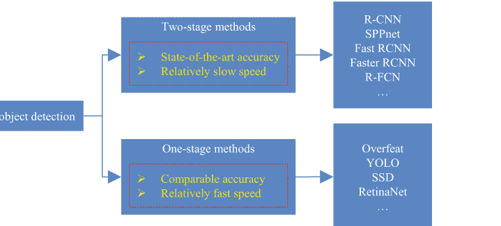

### 2.1.1 R-CNN：基于CNN特征的区域

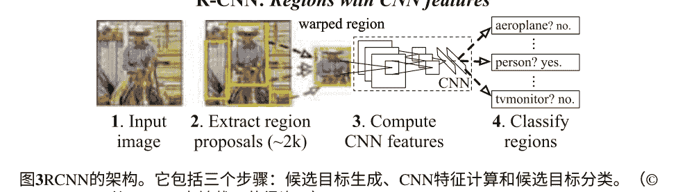

> 图3 RCNN的架构。它包括三个步骤：候选目标生成、CNN特征计算和候选目标分类。（© [2014] IEEE. 从Ref.[23]中转载，获得许可）

DPM [19]，RCNN在PASCAL VOC2010上的平均精度（mAP）提高了21%。图3显示了RCNN的架构。它主要分为三个步骤：（1）首先提取候选目标提案，其中目标提案是与类别无关的。它们可以通过目标性方法（例如选择性搜索[60]，EdgeBox[75]和BING[9]）来提取。（2）对于任意尺度的目标提案，图像数据被调整为固定大小（例如，227×227），并输入到深度CNN网络（例如，AlexNet[33]）中计算一个4096-d特征向量。（3）最后，基于CNN网络提取的特征向量，SVM分类器预测每个提案的具体类别。在训练阶段，应首先通过选择性搜索生成目标提案，用于训练CNN网络和SVM分类器。CNN网络（例如，AlexNet[33]）首先在ImageNet[13]上进行预训练，然后在特定的目标检测数据集（例如，PASCAL VOC[17]）上进行微调。由于ImageNet[13]和PASCAL VOC[17]上的目标类别数量不同，当在PASCAL VOC上进行微调时，CNN网络中最终全连接层的输出应从1000更改为21。21表示PASCAL VOC的20个目标类别和背景。在微调CNN网络时，如果候选提案与真实边界框具有最大IoU重叠，并且重叠至少为0.5，则将其标记为匹配类别的正样本。否则，将其标记为背景类别。基于从训练的CNN网络中提取的CNN特征，进一步分别训练不同类别的线性SVM分类器。在每个类别的SVM分类器训练中，只有真实边界框被标记为正样本。否则，如果候选提案与所有真实边界框的IoU重叠低于0.3，则将其标记为负样本。由于提取的CNN特征过大无法加载到内存中，使用引导技术来在训练SVM分类器时挖掘困难负样本。

为了提高提案的位置准确性，进一步训练线性回归模型以基于训练的CNN网络（即AlexNet [33]）的池化5特征来预测更准确的边界框。假设提案的原始边界框（即 P）由（Px, Py, Pw, Ph）表示，其中 Px和 Py是提案 P的中心坐标， Pw和 Ph是宽度和高度。

提案的高度 P。相应的真实边界框（即 G）由 (Gx, Gy, Gw, Gh)表示。然后，给定(P, G)的回归目标可以写成：

```
$$ t_x = (G_x - P_x)/P_w, \quad (1) \\ t_y = (G_y - P_y)/P_h, \quad (2) \\ t_w = \log(G_w/P_w), \quad (3) \\ t_h = \log(G_h/P_h). \quad (4) $$
```

为了预测新提案（即 P）的回归目标（即 (î_x, î_y, î_w, î_h)），使用提案的 ϕ_5(P)表示的5个特征。因此，î_*(P) = w_*^T ϕ_5(P)，其中 w_* 是一个可学习的参数，*表示其中之一：x, y, w, h。给定训练样本对 {(P_i, G_i)}，其中 i = 1, 2, ..., N。通过正则化最小二乘目标函数可以优化 w_* 如下：

```
$$ \mathbf{w}_* = \arg \min_{\hat{\mathbf{w}}_*} \sum_{i=1}^{N} (\hat{t}_* - \hat{\mathbf{w}}_*^T \phi_5(P))^2 + \lambda \|\hat{\mathbf{w}}_*\|^2, \quad (5) $$
```

其中 λ 是正则化因子，通常设置为1000。在每个类别的回归模型训练中，使用与真实边界框的IoU重叠超过0.6的提议。否则，忽略该提议。

基于学习到的 w_*（即 w_x, w_y, w_w, w_h），可以计算出提议（P）的预测边界框如下：

```
$$ \hat{P}_x = P_w \mathbf{w}_x^T \phi_5(P) + P_x, \quad (6) \\ \hat{P}_y = P_h \mathbf{w}_y^T \phi_5(P) + P_y, \quad (7) \\ \hat{P}_w = P_w \exp(\mathbf{w}_w^T \phi_5(P)), \quad (8) \\ \hat{P}_h = P_h \exp(\mathbf{w}_h^T \phi_5(P)). \quad (9) $$
```

新的预测提案具有更准确的位置精度。尽管RCNN显著提高了对象检测性能，但对象提案应分别被扭曲为固定大小，然后放入CNN网络中。由于不共享不同提案的CNN特征的计算，RCNN非常耗时。为了消除固定大小的约束并加快检测速度，何等人提出了SPPnet。图4比较了RCNN和SPPnet。SPPnet在计算CNN特征之前，不是裁剪或扭曲所有提案的图像数据，而是首先计算整个图像的所有卷积特征，然后使用空间金字塔池化来提取每个提案的固定大小特征。图5给出了空间金字塔池化层（SPP）的示意图。基于最后卷积层的特征图

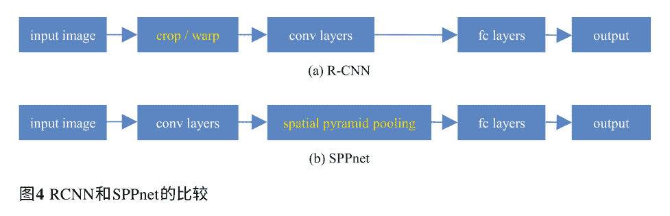

> 图4 RCNN和SPPnet的比较

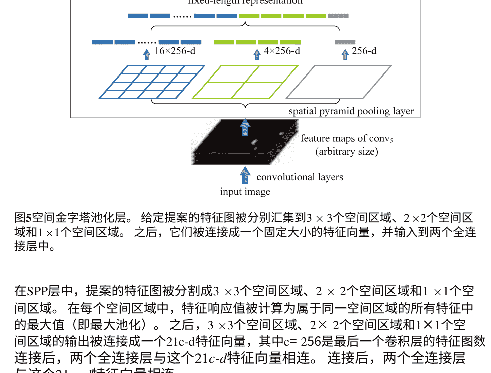

> 图5 空间金字塔池化层。给定提案的特征图被分别汇集到3 × 3个空间区域、2 × 2个空间区域和1 × 1个空间区域。之后，它们被连接成一个固定大小的特征向量，并输入到两个全连接层中。

在SPP层中，提案的特征图被分割成3 ×3个空间区域、2 × 2个空间区域和1 ×1个空间区域。在每个空间区域中，特征响应值被计算为属于同一空间区域的所有特征中的最大值（即最大池化）。之后，3 ×3个空间区域、2× 2个空间区域和1×1个空间区域的输出被连接成一个21c-d特征向量，其中c= 256是最后一个卷积层的特征图数。连接后，两个全连接层与这个21c-d特征向量相连。

对于训练SPPnet的CNN网络，可以采用两种不同的策略：单尺度训练和多尺度训练。单尺度训练使用从输入图像中裁剪的固定尺寸（即，224 ×224）作为输入。多尺度训练使用多个不同尺寸的图像，在每次迭代中，只使用一个尺度的图像来训练CNN网络。输入图像的尺寸表示为 s × s，其中 s从180到224均匀采样。由于多尺度训练可以模拟图像的不同尺寸，它可以提高检测准确性。

对于训练SVM分类器，具体步骤与RCNN相同。在测试阶段，可以将任意尺度的图像放入SPPnet。与RCNN相比，SPPnet具有以下优点：（1）所有候选提案在完全连接层之前共享所有卷积层。因此，它比RCNN具有更快的检测速度。（2）SPPnet利用对象的多级空间信息，对对象的变形更具鲁棒性。同时，多尺度训练可以扩大训练数据。因此，它比RCNN具有更高的检测准确性。

尽管SPPnet通过共享所有卷积层的计算来加速检测速度，但SPPnet的训练仍然是一个类似于RCNN的多阶段过程。也就是说，它们需要分别在对象检测数据集上微调CNN网络，训练多个SVM分类器，并学习边界框回归器。为了解决RCNN和SPPnet的缺点，Girshick [24]进一步提出了Fast RCNN，它将CNN网络的训练、对象分类和边界回归集成到一个统一的框架中。图6显示了Fast RCNN的架构。通常，Fast RCNN首先计算整个图像的所有卷积层。对于每个候选区域，Fast RCNN使用ROI池化层从最后一个卷积层的特征图中提取固定大小的特征图，然后将这些固定大小的特征图输入到两个全连接层，最后生成两个兄弟分支，用于对象分类和框回归。对于对象分类，它通过softmax具有c+1个输出，其中c表示对象类别的数量。对于框回归，它具有4c输出，其中每四个输出对应于每个类别的框偏移量。ROI池化层将对象提议的特征图映射到固定大小的空间bin（例如，7×7），并使用最大池化操作计算每个bin中的特征响应。因为Fast RCNN有两个兄弟输出用于对象分类和框回归，所以多任务训练损失（即L）是分类损失（即L_cls）和回归损失（即L_loc）的联合，对于每个ROI，如下所示：

L(p, t) = L_{cls}(p, c) + \lambda[c \geq 1]L_{reg}(t, v), （10）

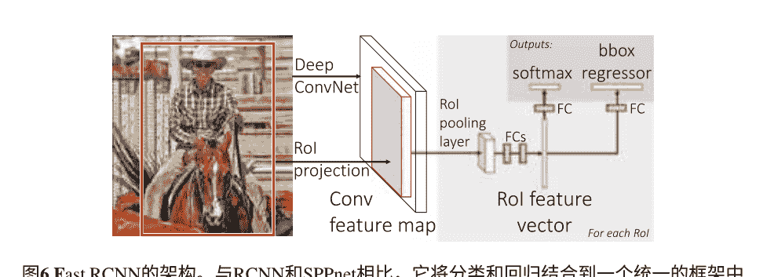

> 图6 Fast RCNN的架构。与RCNN和SPPnet相比，它将分类和回归结合到一个统一的框架中。(©[2015] IEEE. 从Ref.[24]中重新印刷，获得许可)

当 c < 1（即背景样本）时，不对回归损失做出贡献。分类损失 $L_{cls}(p, c) = -log p_c$ 是真实类别 $c$ 的对数损失。回归损失 $L_{reg}$ 由真实回归目标（即 $(v_x, v_y, v_w, v_h)$）和预测目标（即 $(u_x, u_y, u_w, u_h)$）定义如下：

```
$$L_{loc}(t, v) = \sum_{i \in \{x,y,w,h\}} 平滑_{L_1}(t_i, v_i), \qquad (11)$$
```

其中

```
$$平滑_{L_1}(x) = \begin{cases} 0.5x^2, & \text{如果 } |x| < 1, \\ |x| - 0.5, & \text{否则} . \end{cases} \qquad (12)$$
```

与RCNN和SPPnet中使用的 $L_2$ 损失相比，$L_1$ 损失对异常值更具鲁棒性。

在训练阶段，CNN网络首先从预训练的ImageNet网络中初始化，然后通过反向传播进行端到端训练。小批量（即 $R$）从 $N$ 个图像中采样，其中每个图像提供了 $R/N$ 个建议。来自同一图像的建议共享所有卷积计算。通常，$N$ 设置为2，$R$ 设置为128。为了实现尺度不变性，使用了两种不同的策略：暴力法和多尺度法。在暴力法中，图像在训练和测试阶段被调整为固定尺寸。在多尺度法中，图像在每次训练迭代中随机调整为金字塔尺度。在测试阶段，多尺度图像分别输入训练好的网络，然后通过非极大值抑制将检测结果合并在一起。

对于提案生成，RCNN [23]，SPPnet [25]和Fast RCNN [24]都是基于选择性搜索的。选择性搜索 [60] 使用手工制作的特征，并采用分层分组策略来捕捉所有可能的对象提案。通常，它在普通CPU上每张图像运行2秒。Fast RCNN的检测网络在GPU上每张图像可以运行约100毫秒。因此，与Fast RCNN的检测网络相比，Fast RCNN的提案生成更耗时。虽然选择性搜索也可以在GPU上重新实现，但提案提取仍然与Fast RCNN的检测网络隔离。因此，区域提案提取成为Fast RCNN在对象检测中的瓶颈。为了解决这个问题，Ren等人提出了Faster RCNN [52]。它将提案生成、提案分类和提案回归集成到一个统一的网络中。图7显示了Faster RCNN的网络架构。它由两个模块组成。一个模块称为区域提案网络（即RPN），用于提取候选对象提案。另一个模块是Fast RCNN，用于将这些提案分类为特定类别并预测更准确的提案位置。这两个模块共享相同的基础子网络。一方面，RPN可以通过深度卷积特征生成候选对象提案；它可以提高提案位置的质量。另一方面，Faster RCNN

44. Ren, S., He, K., Girshick, R., Sun, J.: 更快的R-CNN: 面向实时对象检测的区域建议网络。IEEE模式分析与机器智能交易pp. 1-14 (2016年)

45. Rosenblatt, F.: 感知和识别自动机。在: 数学统计 (1957年)

46. Rumelhart, D.E., Hinton, G.E., Williams, R.J.: 通过反向传播学习表示。自然 323（6088），533-536 (1986年)

47. Russakovsky, O., Deng, J., Su, H., Krause, J., Satheesh, S., Ma, S., Huang, Z., Karpathy, A., Khosla, A., Bernstein, M.: ImageNet大规模视觉识别挑战。国际计算机视觉杂志 115（3），211-252 (2015年)

48. Scherer, D., Ller, A., Behnke, S.: 评估卷积神经网络中的池化操作对目标识别的影响。在: 国际人工神经网络会议上，第92-101页 (2010年)

49. Schölkopf, B., Platt, J., Hofmann, T.: 基于能量的模型在稀疏表示学习中的高效性。在: 神经信息处理系统进展 (NIPS)，第1137-1144页 (2006年)

50. Schuster, M., Paliwal, K.K.: 双向递归神经网络。IEEE信号处理杂志45(11), 2673-2681页 (1997年)

51. Sermanet, P., Eigen, D., Zhang, X., Mathieu, M., Fergus, R., LeCun, Y.: Overfeat: 综合利用卷积网络进行识别、定位和检测。arXiv (2013)

52. Severyn, A., Moschitti, A.: 使用卷积深度神经网络学习对短文本进行排序。在: 国际ACM SIGIR会议上，第373-382页 (2015年)

53. Sun, Y., Wang, X., Tang, X.: 深度学习人脸表示的联合识别-验证。在: 神经信息处理系统进展 (NIPS)，第27卷，第1988-1996页 (2014年)

54. Sun, Y., Wang, X., Tang, X.: 通过预测10,000个类别来进行深度学习人脸表示。在: IEEE计算机视觉与模式识别会议 (CVPR)，第1891-1898页 (2014年)

55. Szegedy, C., Ioffe, S., Vanhoucke, V., Alemi, A.: Inception-v4, inception-resnet和残差连接对学习的影响。arXiv (2016年)

56. Szegedy, C., Liu, W., Jia, Y., Sermanet, P.: 通过卷积进行更深入的研究。在: IEEE计算机视觉与模式识别会议 (CVPR)，第1-9页 (2015年)

57. Taigman, Y., Yang, M., Ranzato, M., Wolf, L.: DeepFace: 缩小与人类水平面部验证的差距。在: IEEE计算机视觉与模式识别会议 (CVPR)，第1701-1708页 (2014年)

58. Vincent, P., Larochelle, H., Lajoie, I., Bengio, Y., Manzagol, P.A.: 堆叠去噪自编码器：通过局部去噪准则在深度网络中学习有用的表示。机器学习研究杂志 11(12), 3371-3408 (2010)

59. Wang, M., Lu, Z., Li, H., Liu, Q.: 基于语法的短文本深度匹配。在: 国际人工智能会议，第1354-1361页 (2015)

60. Xia, Z., Feng, X., Peng, J., Hadid, A.: 无监督的大规模视觉搜索的深度哈希。在: 国际图像处理理论、工具和应用会议(IPTA) (2016)

61. Ze, H., Senior, A., Schuster, M.: 使用深度神经网络的统计参数语音合成。在: IEEE声学、语音和信号处理会议(ICASSP)，第7962-7966页 (2013)

62. 张, L., 张, L., 杜, B.: 深度学习在遥感数据中的应用: 关于现有技术的技术教程. IEEE地球科学与遥感杂志 4(2), 22-40 (2016)

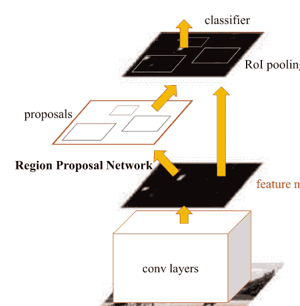

### 图7 Faster RCNN的架构。提案生成（RPN）和提案分类（Fast RCNN）被集成到一个统一的框架中

是一个端到端的框架，具有多任务损失。与Fast RCNN相比，Faster RCNN可以通过更少的提案实现更好的检测性能。

RPN在基础网络的输出层上滑动一个小型网络。这个小型网络由一个3×3的卷积层和两个兄弟1×1的卷积层组成，用于框回归和框分类。框分类是与类别无关的。

对于每个滑动窗口位置，RPN根据不同宽高比和尺度的锚点预测多个提案。假设锚点的数量为k，每个滑动窗口的框回归层有4k个输出，框分类层有2k个输出。一般来说，有{1：2，1：1，2：1}三种不同的宽高比和三种不同的尺度。

因此，在每个滑动窗口上有九个（即，3×3）锚点（即，k=9）。RPN的多任务损失由两部分组成：分类损失$L_{cls}$和回归损失$L_{reg}$，可以写成如下形式：

$$L(p, v)=\frac{1}{N_{cls}}\sum_{i}L_{cls}(p_i, c_i)+\lambda\frac{1}{N_{reg}}\sum_{i}[c_i \geq 1]L_{reg}(t_i, v_i)$$  （13）

其中$N_{cls}$（256）和$N_{reg}$（约2400）分别用于归一化分类损失和位置损失，λ用于平衡分类损失和回归损失，$[c_i \geq 1]$如果$c_i \geq 1$则为1，否则为0。分类损失和回归损失与Fast RCNN相同。

以下两种类型的锚点被标记为正样本：
-   （1）与真实边界框具有最高IoU重叠的锚点，以及
-   （2）与任何真实边界框具有超过0.7的IoU重叠的锚点。
如果锚点既不被标记为正样本，又与所有真实边界框的IoU重叠小于0.3，则将其标记为负样本。

因为RPN和Fast RCNN共享相同的基础网络，因此它们不能独立训练。Faster RCNN提供了三种不同的方式来训练RPN和Fast RCNN在统一的网络中：

-   (1) 交替训练。首先训练RPN。基于RPN生成的候选框和RPN的滤波器权重，然后训练Fast RCNN。以上两个步骤迭代两次。
-   (2) 近似联合训练。RPN和Fast RCNN网络被视为一个统一的网络。统一网络的损失是RPN损失和Fast RCNN损失的联合。在训练阶段的每次迭代中，RPN生成的候选框被视为训练Fast RCNN检测器时的固定候选框。也就是说，候选框坐标的导数被忽略。
-   (3) 非近似联合训练。近似联合训练和非近似联合训练的区别在于需要考虑候选框坐标的导数。由于标准的ROI池化层对于候选框坐标不可微分，通常使用前两种方法。

一般来说，上述最先进的目标检测方法（即RCNN [23], SPPnet [25], Fast RCNN [24]和Faster RCNN [52]）使用在图像分类数据集（即ImageNet [13]）上预训练的CNN网络。戴等人 [11] 认为这种设计在某种程度上存在困境。一般来说，用于图像分类的深度CNN网络通常偏好平移不变性，而用于目标检测的深度CNN网络需要具有平移变性。为了解决图像分类和目标检测之间的困境，戴等人 [11] 提出了R-FCN。它通过位置敏感的ROI池化层（PS ROI）对目标位置信息进行编码，用于后续的Fast RCNN子网络。图8显示了R-FCN的架构。区域提议生成与Faster RCNN相同。基于原始基础网络的输出层，R-FCN生成新的 k * k 位置敏感的卷积库。这些卷积库分别对应 k × k 空间网格。在每个卷积库中，有 c+1 个卷积层（c表示目标类别的数量，+1表示背景类别）。即生成了 k * k * (c + 1)个卷积特征图。

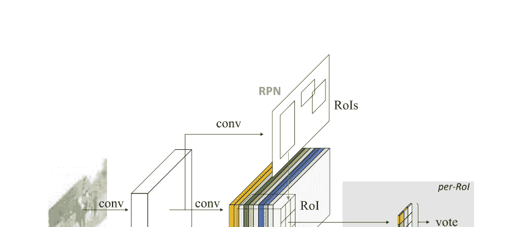

### 图8 R-FCN的架构。位置信息通过位置敏感的ROI池化（PSROI）编码到网络中

# 深度学习在对象检测中的应用

给定一个提议，位置敏感的ROI池化层从位置敏感的特征图中生成 $k \times k$ 得分图，其中 $(i, j)$ -th bin（即$(i, j)$）的响应在$(i, j)$-th位置敏感得分图上池化如下：

$$ r_{c^*}(i, j) = \sum_{(x, y) \in bin(i, j)} z_{i, j, c^*}(x + x_0, y + y_0) / n, \quad (14) $$

其中 $z_{i,j,c^*}$ 是 $k * k * (c + 1)$ 特征图之一，$(x_0, y_0)$ 表示ROI提议的左上角，$n$ 是 $bin(i, j)$ 中的像素数，$r_{c^*}(i, j)$ 是 $bin(i, j)$ 对于 $c^*$-th类别的汇聚响应。之后，进行平均池化或最大池化，输出物体分类的得分。对于框回归，兄弟节点 $4 * K * K$ 卷积特征图也会生成，然后进行位置敏感的ROI池化操作，构建大小为 $K \times K$ 的四个特征图。最后，通过平均投票计算出4-D向量的框参数。

例如，如果K设置为3，表示位置信息被编码为 {顶部－左侧，顶部－中心，...，底部－右侧}。

R-FCN的损失与Faster RCNN类似。请注意，在Faster RCNN中，每个类别的提议位置预测基于不同的框回归层输出，而在R-FCN中，所有提议位置的预测共享相同的框回归层输出。R-FCN是全连接网络，几乎共享整个图像的CNN计算。

因此，与Faster RCNN相比，它可以实现竞争性的检测准确性和更快的检测速度。

大多数目标检测方法只通过边界框来预测目标位置，而没有提供更准确的分割信息。近年来，一些研究人员提出了实例分割，通常包括目标检测和分割。Mask RCNN是一种著名的实例分割和目标检测方法。图9显示了Mask RCNN的架构。Mask RCNN将实例分割和目标检测结合到基于Faster RCNN架构的统一框架中。具体而言，它添加了一个额外的掩码分支。

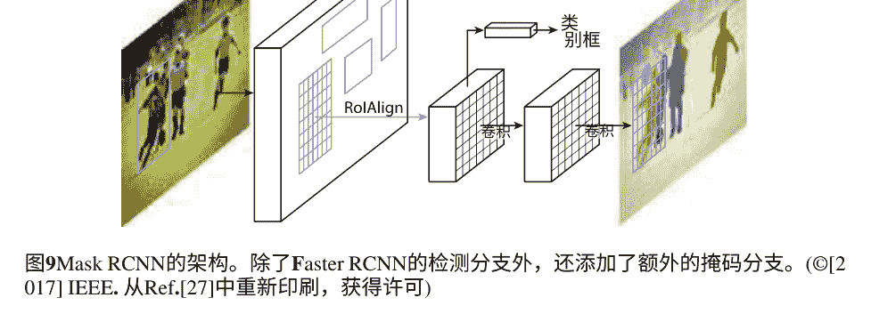

### 图9 Mask RCNN的架构。除了Faster RCNN的检测分支外，还添加了额外的掩码分支。(©[2017] IEEE. 从Ref.[27]中重新印刷，获得许可)

除了用于目标分类和框回归的分支外，还添加了一个分支来预测对象的掩码。掩码分支具有c个大小为m×m的二进制掩码。c表示对象类别的数量。Mask RCNN在每个采样的ROI上的多任务损失是分类损失、回归损失和掩码损失的综合。它可以表示为L = Lcls + Lreg + Lmask。损失函数Lcls和Lreg与Faster RCNN中的相同。对于与真实类别c*相关联的RoI提案，只在c*-th mask上定义Lmask，其他mask输出不会对损失产生影响。基于这个设计，网络可以在每个类别上生成mask，而不会产生类别之间的竞争。在测试阶段，对象的输出mask由分类分支的预测类别确定。为了提取每个ROI的小特征图，ROI pooling将ROI提案位置的浮点数量化为离散值。ROI池化的量化导致输入和输出之间的不对齐，对实例分割产生负面影响。为了解决这个问题，提出了ROIAlign。它使用双线性插值来计算每个空间bin中四个角位置的特征值，然后通过最大池化聚合每个bin的特征响应。基于多任务学习，Mask RCNN在对象检测和实例分割上可以达到最先进的性能。这意味着将实例分割任务与对象检测任务结合起来也有助于提高检测性能。

还提出了一些两阶段方法的其他改进。杨等人[67]提出了一种基于“分而治之”解决方案的快速RCNN，首先从候选提案中排除背景，然后使用经过训练的特定类别网络来判断提案的类别。基于提案的分类损失，Shrivastava等人[55]提出了在线难例挖掘来选择难例样本。Gidaris等人[22]提出了LocNet来提高位置准确性，通过给定区域的每一行和列上的概率来定位边界框。Bell等人[1]提出了使用上下文信息和跳层池化来提高检测性能。Kong等人[31]提出了使用跳层连接进行对象检测。Zagoruyko等人[70]提出了使用多个分支来提取多个分辨率的对象上下文。Yu等人[69]提出了扩大输出层分辨率而不降低感受野的扩张残差网络。

## 2.2 深度对象检测的一阶段方法

与两阶段方法的多阶段过程不同，一阶段方法旨在同时预测对象类别和对象位置。与两阶段方法相比，一阶段方法具有更快的检测速度和可比较的检测准确性。在一阶段方法中，OverFeat [54]、YOLO [49]、SSD [38]和RetinaNet [36]是代表性的方法。

YOLO [49]将输入图像划分为k×k的网格。每个网格单元预测B边界框，具有物体性分数和c条件类别概率。每个边界框的预测为(x, y, w, h, s)，其中(x, y, w, h)表示边界框的位置和s是边界框的置信度对象性评分。因此，输出层的大小为 n × n × (5B + c)。基于边界框的预测和相应的类别预测，YOLO可以同时给出每个单元的对象概率和类别概率。图10显示了YOLO的架构。它由24个卷积层和2个全连接层组成。为了加快检测速度，在一些中间层中使用了交替的1×1卷积层。 YOLO的输入图像大小是固定的（即448×448）。

在PASCAL VOC上，B被设置为2，而c被设置为20。因此，PASCAL VOC的输出层大小为7×7×30。 YOLO的损失函数由分类损失、位置损失和检测损失组成。在训练阶段，YOLO的前20个卷积层首先进行预训练，然后在对象检测数据集上进行微调。 YOLO使用平方误差进行优化。由于许多网格单元不包含对象，这会影响包含对象的单元的梯度。因此，增加了盒子位置预测损失的权重，同时减少了盒子预测损失的权重。对于每个边界框，它被分配给与其具有最高IoU重叠的真实值。

SSD [38]是一种用于通用对象检测的单次检测器。基础网络基于VGG16 [56]。在基础网络之后，添加了几个卷积层，以生成更多不同分辨率的卷积层（即C6-C11）。然后，它使用多个不同分辨率的卷积层来预测不同尺度的对象。具体来说，对于给定分辨率的输出卷积层，首先使用3×3卷积滤波器生成新的特征图，然后在新的特征图上预测对象的类别分数和位置。图11显示了SSD的架构。假设对象类别的数量为 c，每个特征图预测 k个对象，将会得到 (c + 4) * k * m * n 给定 m × n 特征图的输出向量。SSD的目标损失是位置损失和置信度损失的加权和，与Fast RCNN类似。

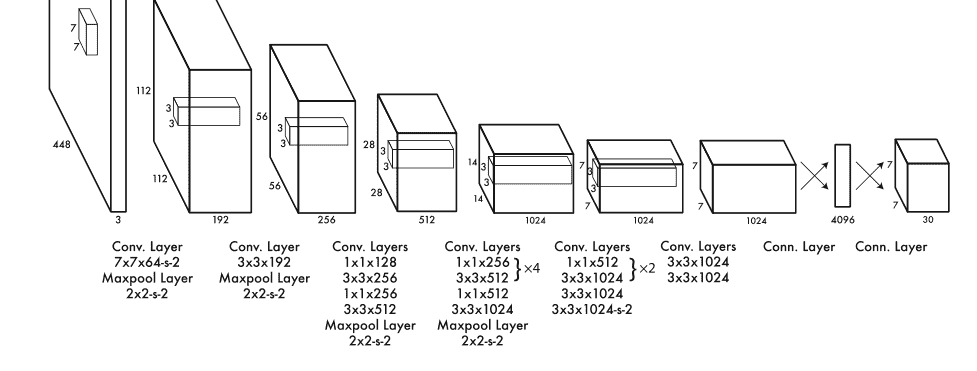

### 图10 YOLO的架构。（©[2016] IEEE. 从参考文献[49]中重新印刷，获得许可）

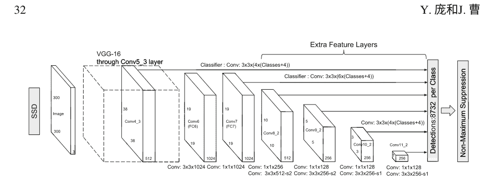

基于不同卷积层的多尺度对象检测，每个卷积层的锚点尺度计算如下：

$$s_k = s_{min} + \frac{s_{max} - s_{min}}{K - 1}(k - 1), k \in [1, K], \qquad (15)$$

其中 $s_{min}$ 和 $s_{max}$ 分别为0.2和0.9，K 表示用于预测的不同卷积层的数量。锚点的长宽比设置为 {1/2, 1, 2}。对于宽高比为1的情况，额外尺度的锚点 $\sqrt{s_k * s_{k+1}}$也被添加进去。因此，每个特征图位置有六个默认框。

如果默认锚点与一个真实标签具有最高的Jaccard重叠或者与真实标签的Jaccard重叠超过0.5，则将其标记为匹配类别的正样本。也就是说，SSD可以为多个重叠的锚点预测高分数。通常，负样本和正样本的训练样本存在显著的不平衡。使用引导技术，根据最高置信度损失，对负样本的锚点进行排序。然后，选择一些顶部的负样本，使得正样本和负样本的比例约为1:3。与YOLO相比，SSD充分利用了多尺度信息。因此，它具有更快的检测速度和更高的检测准确率。

尽管一阶段方法（例如YOLO和SSD）具有比两阶段方法更快的检测速度，但目前对象检测的大多数最先进方法仍然是两阶段的。林等人[36]研究了为什么一阶段方法与两阶段方法相比具有较差的检测性能。研究发现，极端的正负不平衡是导致一阶段方法性能较差的主要原因。为了解决正负样本不平衡的问题，通常使用引导技术来选择一些困难的负样本。然而，这将忽略易于判断的负样本的信息。如果使用所有的负样本，易于判断的负样本的权重将会很大，从而导致更差的检测性能。为了解决这个问题，提出了RetinaNet。RetinaNet采用了基于FPN架构的目标检测的焦点损失。焦点损失也可以被视为一种引导技术。在训练阶段，它（即$ FL(p_t) $）将一个因子添加到交叉熵损失中，如下所示：

$$ FL(p_t) = -(1 - p_t)^\gamma \log(p_t) $$

其中

$$ p_t = \begin{cases} p, & \text{如果 } c = 1, \\ 1 - p, & \text{否则}, \end{cases} $$

其中 $ p $ 是属于类别 $ c = 1 $ 且 $ \gamma > 0 $ 的锚点的概率。基于这个操作，它可以增加困难负样本的权重并减少简单样本的权重。也就是说，它可以更加关注困难的负样本并减少简单负样本的影响。此外，还提出了 $ \alpha $-平衡变体的焦点损失如下：

$$ FL(p_t) = -\alpha(1 - p_t)^\gamma \log(p_t) $$

其中 $ \alpha $ 属于[0,1]。通过 $ \alpha $-平衡变体的焦点损失，可以进一步提高检测准确性。

图12显示了RetinaNet的架构。基础网络是FPN，它构建了多个特征图。对于框分类和框回归，有四个 $ 3 \times 3 $ 卷积层分别附加到FPN的输出层上。之后，使用具有 $ K * C $ 个过滤器的 $ 3 \times 3 $ 卷积层进行框分类，以及使用具有 $ 4 * K $ 个过滤器的 $ 3 \times 3 $ 卷积层进行框回归。换句话说，每个层的一个位置有 $ K $ 个锚点，并且有 $ C $ 个类别。如果锚点与真实值的IoU重叠最高且大于0.5，则将锚点分配给匹配的类别；如果锚点与真实值的IoU重叠最高但低于0.4，则将锚点分配给背景。在训练阶段忽略其他锚点。金字塔级别P3到P7上的锚点面积范围为 $ 32 \times 32 $ 到 $ 512 \times 512 $。每个特征图的宽高比分别设置为 $\{1/2, 1, 2\}$。

焦点损失可以在训练阶段充分利用所有负样本的信息，而易负样本的影响相对较小。与SSD相比，FPN使用自顶向下的结构来增强高分辨率和低级语义卷积层的语义级别。

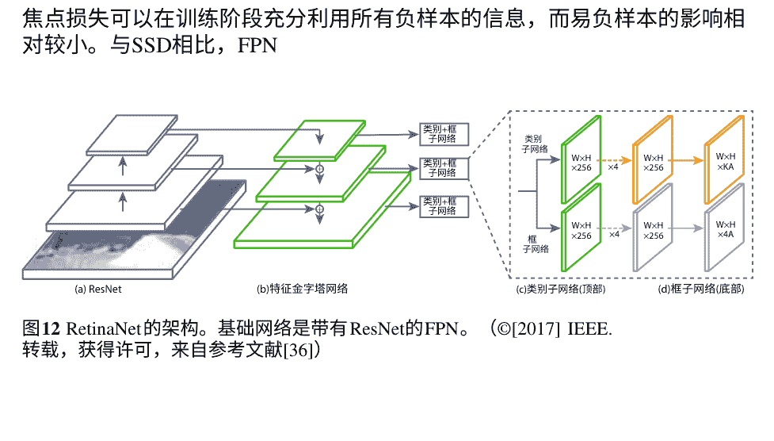

还提出了一些其他的单阶段方法。Najibi等人[42]提出了将输入图像初始划分为多尺度规则网格，并迭代更新这些网格的位置以朝向目标对象。基于SSD，Ren等人[50]进一步提出使用循环滚动卷积来添加深层上下文信息。Fu等人[20]提出在SSD之后使用反卷积层来融合对象上下文。

# 3 行人检测

作为对象检测的典型和重要案例，行人检测可以应用于许多领域（自动驾驶、人机交互、视频监控和机器人技术）。在过去的10年中，行人检测也取得了巨大的成功[3]。图13展示了在Caltech行人数据集上行人检测的进展。根据是否使用CNN，行人检测主要可以分为两类：基于手工特征的方法和基于CNN的方法。

## 3.1 基于手工特征的行人检测方法

2004年，Viola和Jones [61]提出了鲁棒的实时人脸检测方法，该方法使用级联的AdaBoost算法从候选的Haar特征池中学习强分类器。2005年，Dalal和Triggs [10]提出了梯度直方图（HOG）用于行人检测，大大提高了行人检测的性能。受到以上两个想法的启发，Dollár等人[14]将它们整合到行人检测中，称为积分通道特征（即ICF）。图14的顶部行显示了ICF的架构。它首先将原始输入图像转换为十个特征通道（即HOG+LUV），然后提取每个通道中局部像素和的特征，最后通过级联AdaBoost从候选特征池中学习强大的分类器。HOG+LUV由六个梯度直方图、一个梯度幅值和LUV颜色通道组成。使用积分图像可以高效地计算局部像素和的特征。为了加快检测速度，Dollár等人[16]进一步提出了聚合通道特征（即ACF）。它将原始特征通道（即HOG+LUV）下采样四倍，并将每个通道中的每个像素值作为候选特征。此后，还提出了ICF的一些变体。为了避免ICF中候选特征的随机性，SquaresChnFtrs [2]通过计算每个通道内所有方格的像素和特征来确定性地生成候选特征。为了减少每个特征通道中的局部相关性，LDCF [43]使用PCA技术学习的滤波器与特征通道（即HOG+LUV）进行卷积，生成新的特征图。

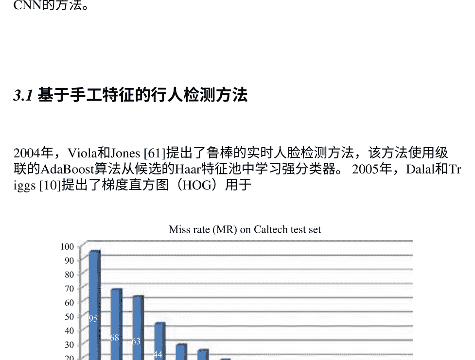

通过观察和总结ICF及其变体，张等人[73]将这些方法推广为一个统一的框架。它被称为滤波通道特征（FCF）。图14的底部行显示了滤波通道特征（FCF）的流程。它首先将输入图像转换为HOG+LUV通道，然后将滤波器组与HOG+LUV卷积以生成新的特征通道。

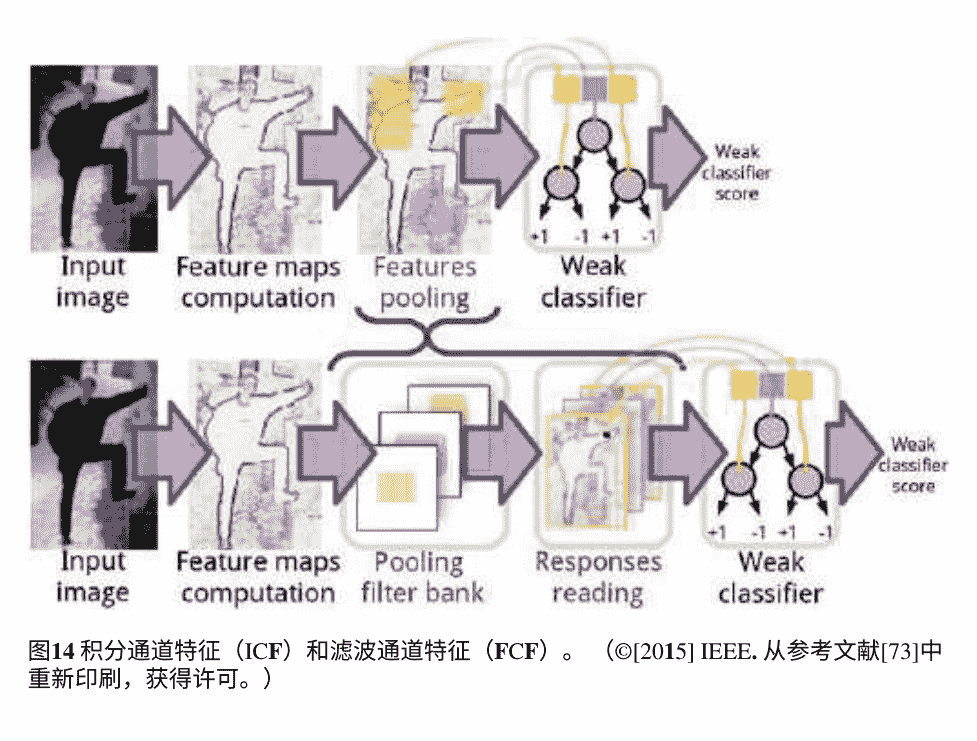

其中每个通道中的每个像素值都被设置为候选特征，最后通过决策森林从候选特征池中学习强分类器。滤波器组可以是不同类型的，包括SquaresChntrs滤波器，Checkerboards滤波器，随机滤波器，信息滤波器等。因此，ICF [14]，ACF [16]，SquaresChntrs [2]和LDCF [43]可以看作是FCF的特殊情况。研究发现，基于Checkerboards滤波器，FCF在Caltech行人数据集[15]和KITTI基准[21]上的性能优于ICF， ACF， SquaresChntrs和LDCF。

这些以上的方法在行人检测上取得了巨大的成功。然而，手工设计的特征并没有考虑到行人的固有属性。Zhang等人[72]将行人视为三个部分（即头部、上半身和腿部），并为行人检测设计了Haar-like特征（即InformedHaar）。然而，它仍然没有充分利用行人的属性。为了更好地利用行人的属性进行行人检测，Cao等人[6, 7]进一步提出了两种受外观恒定性和形状对称性启发的非邻域特征。

一般来说，行人可以被看作是三个部分：头部、上半身和腿部。通常，这些部分的外观是恒定的，并且与周围背景形成对比。基于外观恒定性，提出了侧内差异特征（SIDF）。图15给出了侧内差异特征（SIDF）的示意图。Patch B在Patch A和对称Patch A'之间随机采样。Patch B的高度与Patch A相同，而Patch B的宽度可以与Patch B不同。Patch A的方向可以是水平或垂直的，而Patch A的大小可以在最大8×8个单元的正方形中任意变化，其中每个单元为2×2像素。SIDF（即f（A，B））计算背景中的局部Patch（即Patch A）与行人中的局部Patch（即Patch B）之间的差异：

$$ f(A, B) = \frac{S_A}{N_A} - \frac{S_B}{N_B}, \quad (19) $$

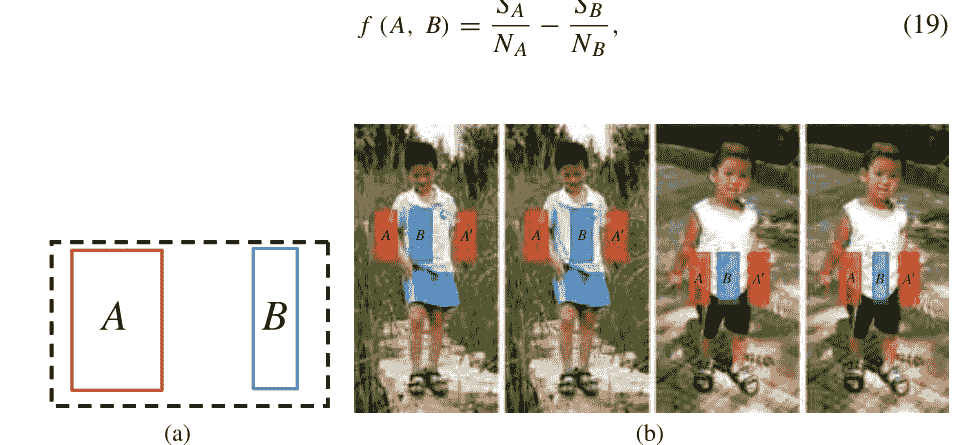

### 图15 展示了侧内差异特征（SIDF）的示意图。SIDF计算了补丁A和补丁B之间的差异，其中补丁B是在补丁A和对称补丁A'之间随机采样的。其中，$S_A$和$S_B$分别表示补丁$_A$和补丁$_B$中的像素总和，$N_A$和$N_B$分别表示补丁$_A$和补丁$_B$中的像素数量。同时，行人通常呈现站立状态。因此，行人的形状在水平方向上具有松散的对称性。基于形状对称性，提出了对称相似性特征（SSF）。图16展示了对称相似性特征（SSF）。补丁$_A$和补丁$_{A'}$是行人上的两个对称补丁。补丁$_A$的方向可以是水平或垂直的，补丁$_A$的大小可以从$6 	imes 6$个单元格变化到$12 	imes 12$个单元格，其中每个单元格是$2 	imes 2$像素。SSF（即，$f(A, A')$）计算两个对称补丁（即，补丁 $A$和补丁$A'$）之间的相似度如下：

$$f(A, A') = |f_A - f_{A'}| = |\frac{S_A}{N_A} - \frac{S_{A'}}{N_{A'}}|, \quad \quad (20)$$

其中，$f_A$ 和 $f_{A'}$ 表示补丁 $A$ 和 $_{A'}$的特征。由于行人的形状对称性不是非常严格，进一步采用了最大池化技术来提高特征的鲁棒性。具体而言，补丁$A$的特征值（即，$f_M(A)$）由补丁 $A$中三个子补丁的最大特征表示，即补丁 $A_1$，补丁$A_2$和补丁$A_3$，如下所示：

$$f_M(A) = \max_{i=1,2,3} \frac{S_i}{N_i}. \quad \quad (21)$$

在补丁 $A$或补丁 $B$中随机采样了三个子补丁。因此，它们可以具有不同的长宽比、位置和大小。基于此，SSF（即$f(A, A')$）可以重写为：

$$f(A, A') = |f_M(A) - f_M(A')|. \quad \quad (22)$$

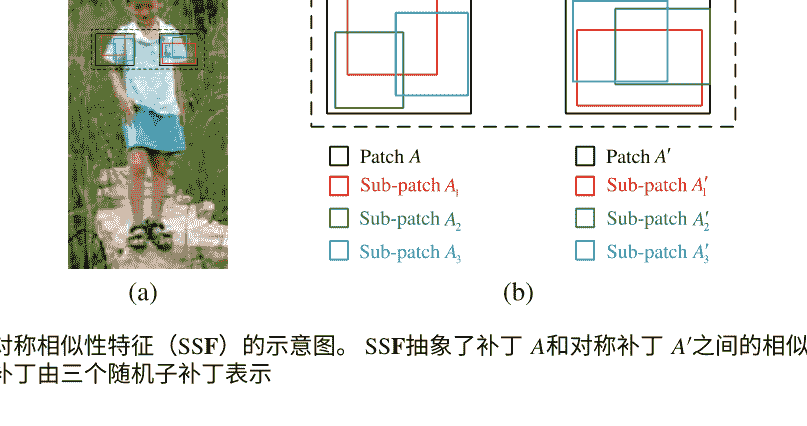

图16 对称相似性特征（SSF）的示意图。SSF抽象了补丁 $A$和对称补丁 $A'$之间的相似性。每个补丁由三个随机子补丁表示。

因为SIDF和SSF是通过非相邻补丁计算的，所以它们被称为非相邻特征（NNF）。为了实现最先进的检测性能，还设计了邻近特征（NF）用于行人检测。图17展示了邻近特征，其中包括局部均值特征和邻近差异特征。在图17a中，局部均值特征的大小和长宽比可以改变。在图17b中，分割线是两个邻近补丁相交的地方。分割线的方向可以是水平或垂直的。分割线的位置也可以是各种各样的。

基于Caltech2x训练集，从NF、NF+SIDF、NF+SSF或NNNF中选择特征的检测器被训练。使用了Level-2 2048个决策森林。表1比较了NF、NF+SIDF、NF+SSF和NNNF。可以看出，使用非相邻特征（SIDF或SSF）时，NF+SIDF或NF+SSF的性能优于NF 1.83%或2.30%。当SIDF和SSF与NF结合时，NNNF的性能优于NF 4.44%。图18显示了NNNF中NF、SSF和SIDF的比例。可以看出，69.97%的特征是NF，11.34%的特征是SSF，18.69%的特征是SIDF。也就是说，约70%的特征是邻近特征，约30%的特征是非相邻特征。这证明了

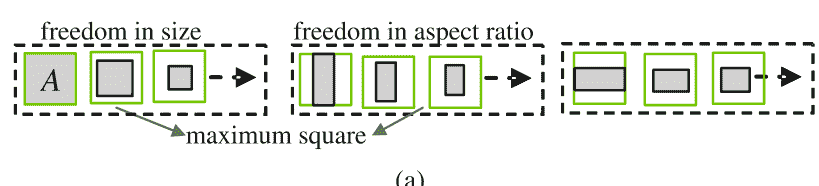

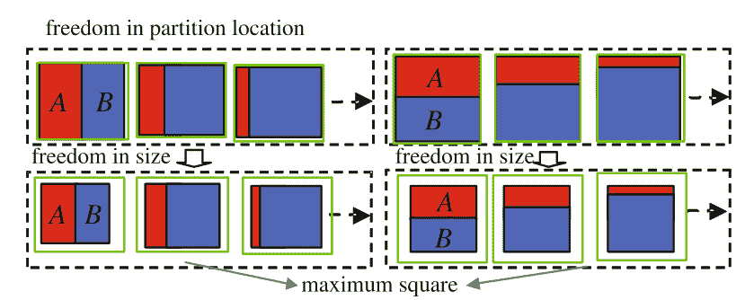

图17 相邻特征的示意图。(a) 是局部均值特征，而(b) 是相邻特征

| 方法 | 错误率 | Δ错误率 |
| :--- | :--- | :--- |
| NF | 27.50% | 无 |
| NF+SIDF | 25.67% | +1.83% |
| NF+SSF | 25.20% | +2.30% |
| NNNF | 23.06% | +4.44% |

表1 在Caltech测试集上的平均错误率对比

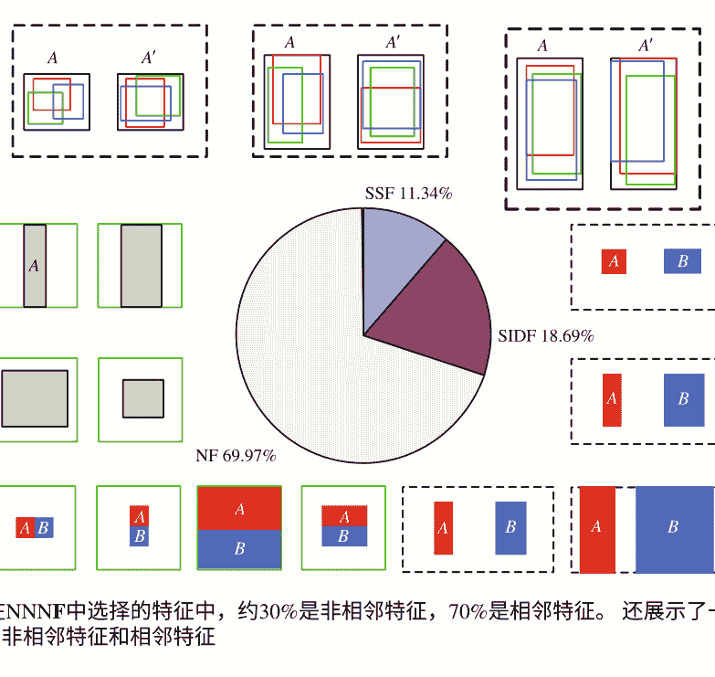

表2 一些方法在KITTI测试集上不使用CNN的平均精度(AP)

| 方法 | 简单 | 中等 | 困难 |
|---|---|---|---|
| ACF [16] | 44.49% | 39.81% | 37.21% |
| SquaresChnFtrs [2] | 57.33% | 44.42% | 40.08% |
| SpatialPooling+ [46] | 65.26% | 54.49% | 48.60% |
| Checkerboards [73] | 67.75% | 56.75% | 51.12% |
| NNNF-L4 | 69.16% | 58.01% | 52.77% |

提出的非相邻特征的有效性。图18中还展示了一些代表性的特征。

为了与最先进的的方法进行比较，NNNF在Caltech10x训练集上使用4096个4级决策森林进行训练。它被称为NNNF-L4。图19显示了在Caltech测试集上的ROC曲线。可以看出，NNNF的性能优于Checkerboards [73] 2.27%。表2显示了在KITTI测试集上的平均精度（AP）。可以看出，在中等测试集上，NNNF的性能比Checkerboards高出1.36%。

也就是说，在不使用CNN的方法中，NNNF通过将NNF与相邻特征（NF）相结合，在Caltech行人数据集和KITTI基准上实现了最先进的性能。

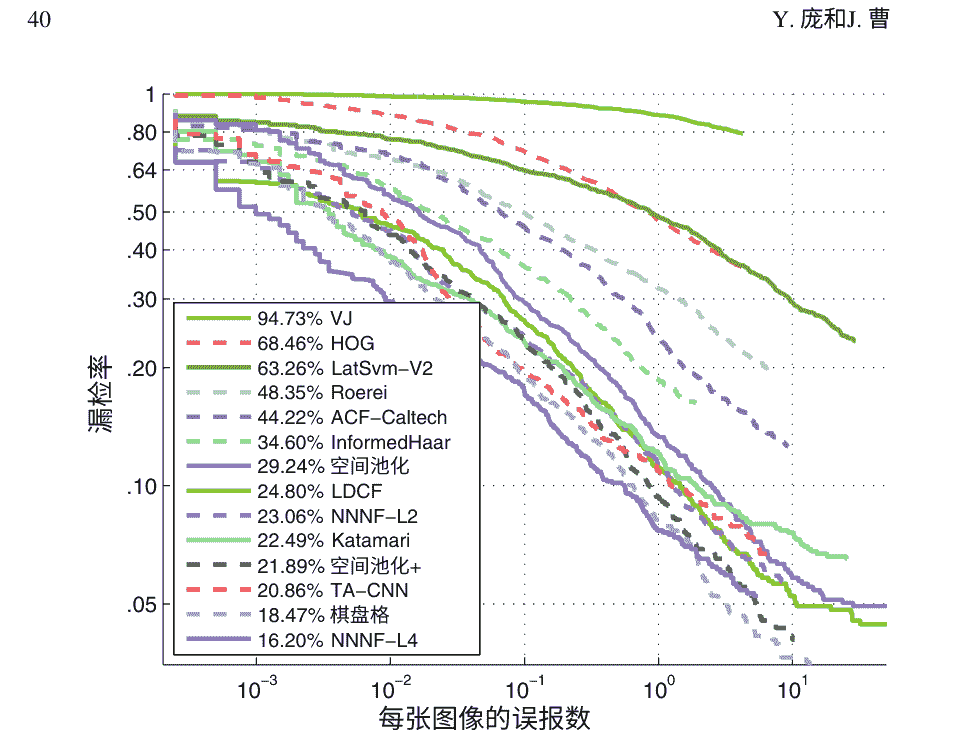

图19 在Caltech测试集（合理）上使用某些方法而不使用CNN的ROC曲线

## 3.2 基于卷积神经网络的行人检测方法

随着卷积神经网络在计算机视觉的许多领域取得成功，研究人员也探索了如何将CNN应用于行人检测以提高检测性能。作为初步尝试，Hosang等人[28]研究了CNN在行人检测中的有效性。在[28]中，首先使用手工特征方法（即SquaresChnFtrs [2]）提取候选行人提案，然后使用一个小型网络（即CifarNet）或一个大型网络（即AlexNet [33]）对这些提案进行分类。传统的行人检测通常使用固定大小的检测窗口（即128 × 64）。在此基础上，CNN网络（即CifarNet和AlexNet）的输入大小被改变为128 × 64，并且CNN网络的输出被改变为2（即行人或非行人）。

在训练阶段，与地面真实边界框的IoU重叠超过0.5的建议被标记为正样本，与所有地面真实边界框的IoU低于0.3的建议被标记为负样本。小批量中正样本和负样本的比例设置为1:5。在Caltech行人数据集上的实验结果表明，ConvNets可以实现最先进的性能，对行人检测有帮助。

此后，基于CNN的行人检测取得了巨大成功。Sermanet等人[53]提出将下采样的第一卷积层与第二卷积层合并，为行人检测添加全局信息。

杨等人[66]提出了卷积通道特征（CCF），而不是使用手工设计的特征通道（HOG+LUV）。CCF将最后一个卷积层的特征图视为特征通道，并使用决策森林学习强分类器。由于CNN特征具有更丰富的表示能力，CCF在行人检测上实现了最先进的性能。张等人[71]提出使用RPN提取候选特征，并使用决策森林对这些建议进行分类。张等人[74]提出通过一些特定的技巧（例如，量化的RPN尺度和上采样的输入图像）改进Faster RCNN在行人检测上的性能。为了降低计算复杂度，蔡等人[4]提出了复杂度感知级联检测器（即CompACT），将不同复杂度的特征集成在一起。复杂度感知级联检测器旨在在分类准确性和计算复杂度之间取得最佳平衡。在训练阶段，CompACT的损失是分类损失和计算复杂度损失的综合。基于CompACT，强分类器的前几个阶段学习更低计算复杂度的特征，而强分类器的最后几个阶段学习更高计算复杂度的特征。为了进一步提高检测性能，将最高复杂度的CNN特征嵌入到CompACT的最后阶段，称为CompACT-Deep。因为大多数检测建议都被前几个阶段拒绝，所以只需要计算很少的建议的CNN特征。因此，CompACT-Deep可以提高检测性能而不增加太多计算成本。

一些方法利用额外的特征信息来帮助行人检测。田等人[59]提出了将行人检测与语义任务（包括场景属性和行人属性）结合到TA-CNN中的方法。这些属性是从现有的场景数据集中转移过来的。TA-CNN通过迭代两个任务来学习。毛等人[41]提出了将一些额外的特征应用于深度行人检测的方法。一些额外的特征通道被用作CNN检测器的额外输入通道。这些额外的特征通道包括一些低级语义特征通道（如梯度和边缘）、一些高级语义特征通道（如分割和热图）、深度通道和时间通道。研究发现，将分割和边缘用作额外的输入通道可以显著提高行人检测的效果。基于这一观察，毛等人[41]进一步提出了HyperLearner。它由四个不同的模块组成：基础网络、通道特征网络（CFN）、区域提议网络和Fast RCNN。基础网络和特征、区域提议网络以及Fast RCNN与原始的Faster RCNN相同。基础网络的多个卷积层首先经过两个3 × 3的卷积层，然后上采样到与conv1相同的尺寸。之后，输出层被连接在一起以生成聚合特征图。聚合特征图被输入到通道特征预测网络中，并与基础网络的输出层进行连接。在训练阶段，特征通道生成网络受到语义分割地面真值的监督。HyperLearner的损失是Faster RCNN损失和分割损失的联合。在测试阶段，特征通道生成网络输出预测的特征通道图（例如，语义分割图）。在Fast RCNN子网之前，ROI池化层对基础网络的输出层和CFN的聚合特征图的连接进行池化。借助额外的特征信息，HyperLearner提高了检测性能。

通常，基于CNN的行人检测方法具有更优越的检测性能。然而，这些方法的计算复杂度非常高。因此，当它们在普通CPU上运行时，这些方法会非常慢。同时，在许多情况下，计算设备只有CPU。因此，在CPU上加速基于CNN的方法非常重要和必要。与基于CNN的方法相比，传统的手工特征方法相对简单，并且在CPU上具有更快的检测速度。为了加速在普通CPU上的检测速度，Cao等人提出将传统的通道特征和CNN的每一层集成到多个特征通道中。图20显示了MCF的架构。首先，通过HOG+LUV和CNN的每个通道（例如AlexNet [33]和VGG16 [56]）构建多个特征通道。基于多个特征通道，进一步提取候选特征。最后，从相应层的候选特征中学习多级级联AdaBoost。一方面，基于手工特征通道和CNN的每一层，MCF可以学习更丰富的特征以提高检测性能。另一方面，MCF可以快速拒绝许多负面检测窗口，从而减少剩余CNN层的计算。因此，它可以加速检测速度。

表3显示了基于HOG+LUV和VGG16的多层特征通道的具体参数。它由六层（即L1，L2，...，L6）组成。L1是手工设计的特征通道（即HOG+LUV）。HOG+LUV的尺寸为128×64。L2-L6对应于VGG16的多个卷积层（即C1-C5）。L2-L6的尺寸分别为64×32，32×16，16×8，8×4和4×2。L1-L6中的通道数分别为10，64，128，256，512和512。实际上，只有部分卷积层可以用来构建多层特征通道。

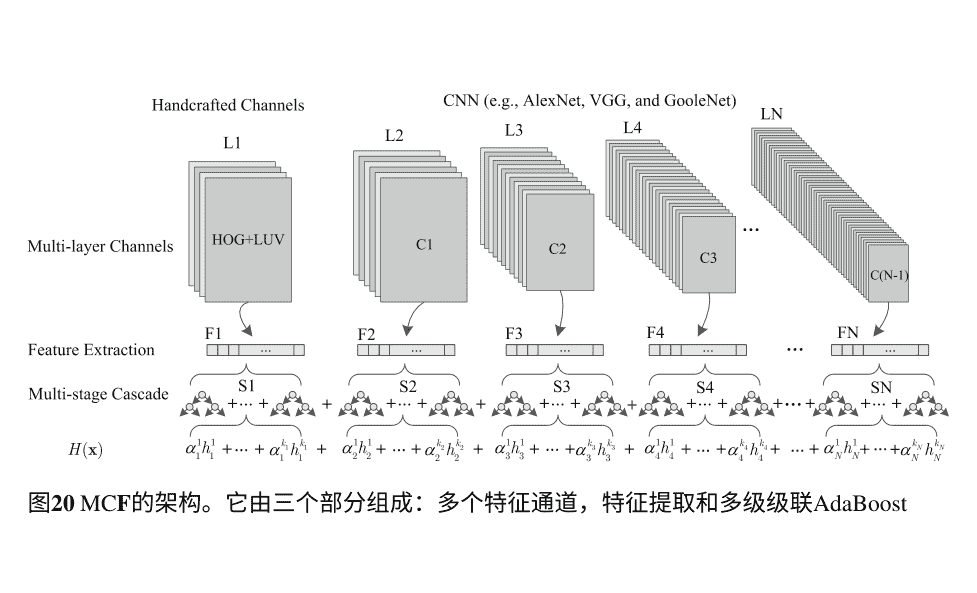

| 层 | L1 | L2 | L3 | L4 | L5 | L6 |
| :--- | :--- | :--- | :--- | :--- | :--- | :--- |
| 名称 | HOG LUV | VGG16 C1 | C2 | C3 | C4 | C5 |
| 大小 | 128 × 64 | 64 × 32 | 32 × 16 | 16 × 8 | 8 × 4 | 4 × 2 |
| 数量 | 10 | 64 | 128 | 256 | 512 | 512 |

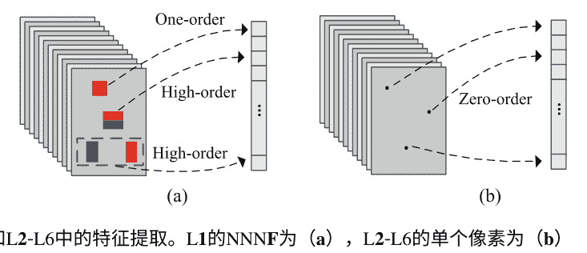

例如，可以通过HOG+LUV和VGG16的C2-C5生成一个五层特征通道。不使用VGG16的C1。

多层特征通道中使用的特征提取方法是不同的。对于L1（即HOG+LUV），已经提出了许多成功的方法（例如，ACF[6, 16, 43, 72, 73]）。在L1中选择了ACF[16]和NNNF[6]进行特征提取。ACF[16]具有非常快的检测速度，而NNNF[6, 7]具有非常好的检测速度性能和相对较快的检测速度。对于L2-L6（CNN通道），通道数量相对较大。如果使用相对复杂的特征，计算成本将会很大。因此，在L2-L6中，只使用单个像素值作为候选特征，以提高计算效率。

图21显示了L1和L2-L6中的特征提取。

基于多层图像通道和每层提取的候选特征，使用多级级联AdaBoost来学习强分类器。图15的第2-4行显示了多级级联AdaBoost的解释。每个阶段中的弱分类器是从相应的特征通道中提取的候选特征中学习得到的。多级级联AdaBoost的强分类器（即H(x)）可以写成以下形式：

$$H(\mathbf{x}) = \sum_{j=1}^{k_1} \alpha_1^j h_1^j(\mathbf{x}) + \dots + \sum_{j=1}^{k_i} \alpha_i^j h_i^j(\mathbf{x}) + \dots + \sum_{j=1}^{k_N} \alpha_N^j h_N^j(\mathbf{x}) = \sum_{i=1}^{N} \sum_{j=1}^{k_i} \alpha_i^j h_i^j(\mathbf{x})$$

其中，x表示检测窗口，$h_i^j(\mathbf{x})$是第i阶段的第j个弱分类器，$\alpha_i^j$是$h_i^j(\mathbf{x})$的权重，而$k_1, k_2, \dots, k_N$是每个阶段的弱分类器数量。如何设置$k_1, k_2, \dots, k_N$是一个待解决的问题。一般来说，以下是一些经验设置：

$$k_1 = N_{\text{all}} / 2,$$

$$k_N = N_{\text{all}} / (2 \times (N - 1)), \quad (24)$$

其中$N_{\text{all}}$是强分类器中弱分类器的总数，通常设置为2048或4096。

图22展示了MCF的测试过程。在测试阶段，首先计算HOG+LUV的通道。通过扫描整个输入图像生成检测窗口。这些检测窗口首先由S1的分类器进行分类，然后计算L2的通道，并由S2进行分类。从L1到LN重复上述过程。最后，由强分类器的所有阶段接受的检测窗口（即H（x））通过NMS合并为最终的行人检测结果。通常，围绕行人的检测窗口高度重叠，需要大量计算成本。因此，第一阶段后高度重叠的检测窗口通过阈值为0.8的NMS消除。这可以进一步加快检测速度，几乎不损失性能。

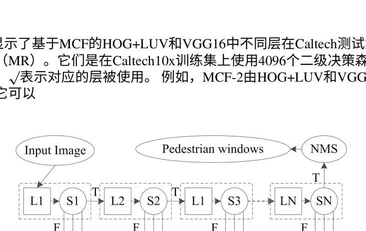

图22 MCF的测试过程

表4 基于HOG+LUV和CNN中不同层的MCF的误检率（MR）在Caltech测试集上。√表示对应的层被使用。HOG+LUV始终用于第一层。VGG16中的层用于剩余的层。

| 名称 | HOG LUV | VGG16 C1 | VGG16 C2 | VGG16 C3 | VGG16 C4 | VGG16 C5 | 误检率(%) | Δ误检率(%) |
|------|---------|----------|----------|----------|----------|----------|-----------|------------|
| MCF-2 | √ |  |  |  |  | √ | 18.52 | 无 |
| MCF-3 | √ |  |  |  | √ | √ | 17.14 | 1.38 |
| MCF-4 | √ |  |  | √ | √ | √ | 15.40 | 3.12 |
| MCF-5 | √ |  | √ | √ | √ | √ | 14.78 | 3.74 |
| MCF-6 | √ | √ | √ | √ | √ | √ | 14.31 | 4.21 |

通过增加卷积层，可以看到MCF具有更低的误检率。 MCF-6具有最佳的检测性能，其性能优于MCF-2和MCF-5分别4.21%和1.47%。 这表明CNN中的中间层可以丰富特征抽象。 基于CNN中的每个层，MCF可以提取更具区分性的特征，用于行人检测。

表5比较了MCF-2、MCF-6和MCF-6-f的误检率和检测时间。 MCF-6-f通过使用阈值为0.8的NMS消除高度重叠的检测窗口。MCF-6-f的误检率比MCF-2低4.21%， 而MCF-6的检测速度比MCF-2快1.43倍。在第一阶段之后通过消除高度重叠的检测窗口， MCF-6-f可以进一步加速检测速度，几乎没有检测性能损失（即4.21%）。 MCF-6-f的误检率低3.63%， 检测速度比MCF-2快4.07倍。由于MCF可以通过前几个阶段拒绝许多检测窗口，因此可以加速检测速度。

为了与最先进的性能进行比较，MCF是通过4096个级别为4的决策森林在Caltech10x训练集上进行训练的。 图23比较了MCF与一些最先进的方法（即LatSvm [19]， ACF [16]， LDCF [43]， Checkerboards [73]， CCF+CF [66]， DeepParts [58]和CompACT-Deep [4]） 在Caltech测试集上的表现。可以看出， MCF取得了最先进的性能，优于DeepParts和CompACT-Deep分别1.49%和1.35%。

此外， MCF还通过4096个级别为4的决策森林在KITTI训练集上进行了进一步的训练。 表6比较了MCF与一些最先进的方法（即ACF [16]， SpatialPooling+ [46]， Checkerboards [73]， DeepParts [58]和CompACT-Deep [4]） 在KITTI测试集上的表现。MCF也优于DeepParts和CompACT-Deep。在中等测试中， MCF的性能优于CompACT-Deep 0.71%。在困难测试集上， MCF的性能优于CompACT-Deep 1.57%。

表5 MCF-2、MCF-6和MCF-6-f的误检率（MR）和检测时间。MCF-2基于HOG+LUV和CNN中的C5。MCF-6基于HOG+LUV和CNN中的C1-C5。MCF-6-f是MCF-6的快速版本，通过消除重叠的检测窗口实现。

| | HOG+LUV和VGG16 | | |
| --- | --- | --- | --- |
| | MCF-2 | MCF-6 | MCF-6-f |
| 误检率 (%) | 18.52 | 14.31 | 14.89 |
| 时间 (秒) | 7.69 | 5.37 | 1.89 |

表6 KITTI数据集上一些方法的平均精度 (AP)

| 方法 | 简单 | 中等 | 困难 |
| --- | --- | --- | --- |
| ACF [16] | 44.49% | 39.81% | 37.21% |
| SpatialPooling+ [46] | 65.26% | 54.49% | 48.60% |
| Checkerboards [73] | 67.75% | 56.75% | 51.12% |
| DeepParts [58] | 70.49% | 58.67% | 52.78% |
| CompACT-Deep [4] | 70.69% | 58.74% | 52.71% |
| MCF | 70.87% | 59.45% | 54.28% |

# 对象检测的四个挑战

尽管对象检测在过去几十年取得了巨大的进展，但在推动对象检测的进步时仍面临许多挑战。 在接下来的部分中，将讨论对象检测的三个常见和典型挑战，并介绍一些解决方案。

## 4.1 尺度变化问题

由于对象到相机的距离可能不同，图像上通常会出现各种尺度的对象。 因此，尺度变化是对象检测中不可避免的问题。 解决尺度变化的方法可以分为两类： （1）基于图像金字塔的方法和（2）基于特征金字塔的方法。

通常，基于图像金字塔的方法首先将原始图像调整为多个不同的尺度，然后使用相同的检测器分别检测调整后的图像。 基于特征金字塔的方法首先基于输入图像生成多个不同分辨率的特征图，然后使用不同的特征图来检测不同尺度的对象。

最初，深度对象检测采用图像金字塔来检测各种尺度的对象。RCNN [23]、SPPnet [25]、Fast RCNN [24]和Faster RCNN [52]都采用图像金字塔进行对象检测。在训练阶段，基于CNN的检测器是基于给定尺度的图像进行训练的。在测试阶段，使用图像金字塔进行多尺度对象检测。一方面，这通常导致训练和测试推理之间的不一致。另一方面，图像金字塔中的每个图像都分别输入到CNN网络中。因此，这也非常耗时。

事实上，CNN中不同分辨率的特征图可以被看作是特征金字塔。如果使用不同分辨率的特征图来检测不同尺度的对象，可以避免调整输入图像的大小并加快检测速度。因此，基于特征金字塔的方法变得流行起来。研究人员对基于特征金字塔的方法进行了许多尝试。

Li等人[34]提出了适应尺度的快速RCNN（SAF RCNN）用于行人检测。基础网络被分为两个子网络，分别用于大尺度行人检测和小尺度行人检测。给定一个检测窗口，最终的检测分数是两个子网络的加权和。如果检测窗口相对较大，则大尺度网络具有相对较大的权重。如果检测窗口相对较小，则小尺度网络具有相对较大的权重。

Yang等人[68]提出了尺度相关池化（SDP）用于多尺度目标检测以处理尺度变化问题。它基于快速RCNN架构。提案是通过选择性搜索方法[60]提取的。根据提案的高度，SDP根据提案的高度来自不同卷积层的提案的特征进行池化。如果对象提案的高度属于[0, 64]，SDP从第三个卷积块中池化特征图。如果对象提案的高度属于[64, 128]，SDP从第四个卷积块中池化特征图。如果对象提案的高度属于[128, +infty]，SDP从第五个卷积块中池化特征图。由于ROI池化层的特征图是从不同的卷积层池化得到的，因此分别训练了三个不同的子网络用于分类和定位提案。

通常，Faster RCNN需要通过在固定的卷积层上滑动RPN来提取建议。由于卷积层的相应区域相对固定，它不能很好地匹配所有对象的大小。前面的卷积层的相应区域相对较小，更适合匹配小尺度的对象，而后面的卷积层的相应区域相对较大，更适合匹配大尺度的对象。为了解决这个问题，Cai等人提出了多尺度深度卷积神经网络（MS-CNN）来生成不同尺度的对象建议。图24显示了MS-CNN的架构。它从不同分辨率的多个卷积层输出建议。每个卷积层中的锚点如果与真实边界框的IoU重叠超过0.5，则标记为正样本。每个卷积层中的锚点如果与所有真实边界框的IoU重叠低于0.2，则标记为负样本。由于不平衡的问题在负样本和正样本之间，探索了三种不同的采样策略：随机采样、自举采样和混合采样。随机采样策略从所有的负样本中随机选择一些负样本。自举采样策略根据目标性得分选择一些最难的负样本。混合采样策略通过随机采样策略选择一半的负样本和通过自举采样策略选择另一半负样本。研究发现，自举采样策略和混合采样策略具有相似的检测性能，优于随机采样策略。正样本和负样本的比例为1:R。

尽管MS-CNN取得了成功，但MS-CNN的输出层具有不同的语义层次。为了解决不同卷积层之间的语义不一致性，Lin等人[37]提出了特征金字塔网络(FPN)用于对象检测。FPN将自上而下的结构融入到前几个卷积层中，以提高语义层次。图25展示了FPN的架构。具体而言，自上而下的结构通过逐元素相加将低级语义卷积层与上采样的高级语义卷积层相结合。

基于FPN，用于生成建议的输出层的语义是高级且一致的。用于预测建议的最终特征图被称为{P2, P3, P4, P5}，对应于{C2, C3, C4, C5}的卷积层。锚点在{P2, P3, P4, P5}上的面积分别为{32×32, 64×64, 128×128, 256×256, 512×512}像素。锚点的长宽比为{1:2, 1:1, 2:1}。因此，金字塔上有15个锚点。如果锚点与真实框具有最高的IoU重叠或者与任何真实框的IoU重叠超过0.7，则将其标记为正样本。如果锚点与任何真实框的IoU重叠超过0.7，则将其标记为正样本。如果锚点与所有真实框的IoU重叠都低于0.3，则将其标记为负样本。通过一致的特征图进行对象检测，可以提高检测性能，特别是对小尺度对象的检测性能。这个类似的想法也被[32]采用。

由于小尺度对象通常具有低分辨率和噪声，与大尺度对象相比，小尺度对象的检测更具挑战性。尽管多尺度方法将不同尺度的对象视为不同类别，但改进相对有限。因此，改进小尺度对象的检测是多尺度对象检测的关键。为了解决这个问题，李等人[35]提出了感知生成对抗网络（Perceptual GAN）。基于小尺度对象的特征表示与大尺度对象的特征表示之间的差异，感知GAN旨在补偿小尺度对象的特征表示。

一般来说，大尺度的物体相比于小尺度的物体具有更丰富的信息。为了改进小尺度行人检测，庞等人[47]提出了JCS-Net。JCS-Net的主要思想是利用大尺度行人来帮助小尺度行人检测。图26展示了JCS-Net的流程。对于小尺度行人的JCS-Net训练过程可以总结如下：

- (1) 首先，基于大尺度行人（即图26的顶部行）对网络进行微调，用于大尺度行人检测。
- (2) 小尺度行人检测的超分辨率子网络（即图26底部行的左侧）通过大尺度行人和相应的小尺度行人进行预训练。
- (3) 小尺度行人检测的分类子网络（即图26底部行的右侧）由大尺度网络初始化。
- (4) 小尺度行人检测的超分辨率子网络和分类子网络基于小尺度行人和相应的负样本进行联合训练。

JCS-Net的损失是两个子网络的联合。超分辨率子网络的损失可以通过均方误差计算如下：

$$L_{\text{相似度}} = \frac{1}{n} \sum_{i=1}^{n} \| \mathbf{y}_i - F(\mathbf{x}_i) \|^2$$

其中 $y_i$ 是大尺度行人，$x_i$ 是小尺度行人，$F(x_i)$ 是通过超分辨率子网络重建的行人，$n$ 是训练样本的数量。分类的损失可以表示为:

$$L_{\text{分类}} = \frac{1}{n} \sum_{i=1}^{n} -\log p_c(\mathbf{x}_i), \tag{26}$$

其中 $c$ 是 $x_i$ 的真实标签，$p_c(x_i)$ 是 $x_i$ 属于类别 $c$ 的概率。基于 $L_{\text{相似度}}$ 和 $L_{\text{分类}}$，JCS-Net的联合损失（即 $L_{JCS}$）可以表示为:

$$L_{JCS} = L_{cls} + \lambda L_{\text{similarity}}, \tag{27}$$

其中 $\lambda$ 用于平衡两个项（即 $L_{cls}$ 和 $L_{\text{similarity}}$），通过交叉验证设置为0.1。

为了检测多尺度行人，可以基于JCS-Net或原始HOG+LUV和VGG16训练多尺度MCF。通常，基于原始HOG+LUV和VGG16训练MCF-V，用于大尺度行人检测。基于JCS-Net训练MCF-J，用于小尺度行人检测。图27给出了多尺度MCF的示意图。根据行人的身高，将不同尺度的行人分为几个不同的子集（即子集1，子集2，...，子集N）。不同的子集可以包含一些重叠的图像。在图27中，子集1和子集2上的两个检测器基于MCF-J进行训练。其他检测器基于MCF-V进行训练。在测试阶段，每个检测器的检测结果在非极大值抑制之前进行相加。Caltech训练集上的原始行人被分为三个不同的子集，分别称为“train-all”，“train-small”和“train-large”。

“Train-all”子集包含所有行人，“train-small”子集包含高度小于100像素的行人和高度超过100像素的插值行人，“train-large”子集包含高度超过80像素的行人。Caltech测试集的两个子集（即合理和小规模）用于评估。合理的测试集表示没有或部分遮挡的行人高度超过50像素，而小规模的测试集表示行人高度在50像素以下和100像素以上。也就是说，小规模的测试集属于合理的测试集。表7显示了在“train-small”训练集上训练的MCF-V和MCF-J的漏检率。MCF-J在合理的测试集和小规模的测试集上表现优于MCF-V，尤其是在小规模的测试集上。还进行了两个消融实验：（1）第一个实验是将公式（27）中的$\lambda_{of}$设置为0，旨在展示JCS-Net深度的影响。它被称为MCF-C。（2）第二个实验是不联合训练超分辨率子网络和分类子网络，旨在展示联合多任务训练的重要性。它被称为MCF-S。MCF-C和MCF-S都优于MCF-V，但劣于MCF-J。这意味着尽管更深的深度和简单的超分辨率可以提高检测性能，但JCS-Net的联合多任务训练是重要的，可以进一步提高检测性能。

基于三个训练集（即“train-all”，“train-small”和“train-large”），MS-V和MS-J进行训练。它们都包含三个不同的检测器。不同之处在于在“train-small”训练集上，MS-V使用MCF-V，而MS-J使用MCF-J。表8显示了MS-V和MS-J在Caltech测试集上的误检率。

表7：在“train-small”训练集上训练的MCF-V和MCF-J的漏检率。

| 方法 | 训练集 | 合理的 | 小 |
| :--- | :--- | :--- | :--- |
| MCF-V | “train-small” | 13.20% | 14.28% |
| **MCF-J** | **“train-small”** | **11.07%** | **11.72%** |
| &Delta;错误率 | – | 2.13% | 2.56% |
| **消融实验** | | | |
| MCF-C | “train-small” | 12.23% | 13.02% |
| MCF-S | “train-small” | 12.65% | 13.50% |

表8：MS-V和MS-J在Caltech测试集上的误检率。

| 方法 | 检测器 | 训练集 | 合理的 | 小 |
| :--- | :--- | :--- | :--- | :--- |
| MS-V | MCF-V | “train-small” | | |
| | MCF-V | “train-large” | 9.67% | 10.48% |
| | MCF-V | “train-all” | | |
| MS-J | MCF-J | “train-small” | | |
| | MCF-V | “train-large” | 8.81% | 9.57% |
| | MCF-V | “train-all” | | |
| &Delta;错误率 | – | – | 0.86% | 0.91% |

图28 Caltech测试集上的ROC曲线。将MS-J与一些最先进的方法进行比较

Deep [4]和MS-CNN [5]在Caltech测试集上进行比较。图28显示了ROC曲线。MS-J取得了最先进的性能，比MS-CNN高出1.14%。

## 4.2 遮挡问题

对象遮挡非常常见。例如，在[15]中，Dollar等人发现街景中大多数行人（约70%）至少在一个帧中被遮挡。因此，检测遮挡对象对于计算机视觉应用非常必要和重要。在过去的十年中，研究人员已经尝试了许多解决遮挡问题的方法。

Wang等人[62]发现，如果行人的某些部分被遮挡，相应区域的块特征会均匀地响应线性分类器的块分数。基于这一现象，他们提出使用每个块的分数来判断相应区域是否被遮挡。根据每个块的分数，使用均值漂移方法对遮挡可能性图像进行分割。如果发生遮挡，部分检测器将应用于未被遮挡的区域，输出最终的检测结果。

为了最大化对遮挡行人的检测性能，Mathias等人[40]提出了学习一组特定于遮挡的行人检测器。每个行人检测器用于特定类型的遮挡。在[40]中，遮挡可以分为三种不同类型：从底部遮挡，从右侧遮挡和从左侧遮挡。对于每种类型，遮挡程度范围从0%到50%。分别训练了8个左/右遮挡检测器和16个自下而上遮挡检测器。获取这些分类器的一种简单方法是进行训练分别是所有遮挡级别的分类器。然而，这非常耗时。为了减少训练时间，提出了Franken分类器。它开始训练全身偏向的分类器，并移除弱分类器以生成第一个遮挡分类器。第一个遮挡分类器的额外弱分类器在没有偏见的情况下进一步学习。类似于第一个遮挡分类器，第二个遮挡分类器是基于第一个遮挡分类器学习的。基于Franken分类器，训练一组特定于遮挡的行人检测器只需要十分之一的计算成本。

受到特定于遮挡的行人检测器的启发，Tian等人通过构建一个广泛的部分池并通过线性SVM自动选择重要部分来处理遮挡。广泛的部分池包含各种身体部位。行人可以看作是一个刚性物体，被分成2m × m的空间网格。部分池由空间网格内的所有矩形组成，其中矩形的高度和宽度至少为2。如果m=3，部分池有45个部分模型。为了减少45个部分模型的测试计算成本，选择具有最高SVM分数的6个部分模型，这也能以更快的检测速度获得近似的性能。

Wang等人[64]认为数据驱动策略对于解决遮挡问题非常重要。如果训练数据具有足够的不同遮挡情况的图像数据，训练检测器可以对遮挡对象具有更好的检测性能。然而，数据集通常无法涵盖所有遮挡情况，并且遮挡相对较少。由于数据集中的遮挡遵循长尾分布，不可能收集到涵盖所有遮挡的数据集。为了解决这个问题，Wang等人提出了A-Fast-RCNN，该方法使用对抗网络通过在空间上阻塞一些特征图来生成困难样本。在ROI池化层之后，它添加了一个额外的分支来生成遮挡掩码。该分支由两个全连接层和遮挡预测层组成。最终分类和回归的特征图是遮挡掩码和ROI池化层的特征图的组合。如果遮挡的单元格等于1，则相应的特征图响应被设置为0（即dropout）。在训练阶段，它采用分阶段的步骤：（1）固定遮挡掩码；首先训练Fast RCNN网络。（2）基于Fast RCNN，对抗网络生成使Fast RCNN损失最大的遮挡掩码。通过两阶段的训练，最终的Fast RCNN网络可以对遮挡具有鲁棒性。在测试阶段，遮挡分支被移除，其余过程与原始的Fast RCNN相同。

## 4.3 变形问题

对象变形可能是由非网格变形、类内形状变异等引起的。例如，人们可以跳跃或蹲下。因此，一个好的对象检测方法应该对对象的变形具有鲁棒性。在卷积神经网络（CNN）出现之前，研究人员已经尝试了许多处理变形的方法。例如，DPM [19] 使用多尺度可变形部件模型的混合（即一个低分辨率的根模型和六个高分辨率的部件模型）来处理变形。HSC [51] 进一步将稀疏编码的直方图引入可变形部件模型。为了加速 DPM 的检测速度，还提出了 CDPM [18] 和 FDPM [65]。Park 等人 [48] 提出通过可变形部件模型检测大尺度行人，并通过刚性模板检测小尺度行人。

Regionlets [63] 通过一组具有不同大小和长宽比的小子区域来表示区域。

虽然基于 CNN 的方法在一定程度上对对象变形具有鲁棒性，但仍然不够好。为了进一步提高对象检测的鲁棒性，研究人员还将一些特定设计纳入基于 CNN 的方法中。 欧阳等人[45]提出了变形约束池化层（def-pooling）来模拟物体部分的变形 。传统的池化（例如，最大池化和平均池化）可以被def-pooling取代，以更好地表示物体的变形特性。最近，戴等人[12]提出了两个可变形模块（即，可变形卷积和可变形ROI池化），以增强几何变换的表示能力。他们在标准卷积中的常规网格采样位置上添加了2D偏移。这些偏移量在训练阶段学习 。Jeon和Kim[30]还提出了主动卷积，其中卷积的形状在训练阶段学习。为了提高对大变形和变换的不变性，Jaderberg等人[29]提出了空间变换网络。特征图上执行缩放、旋转和非刚性变形的转换。

# 参考文献

1. Bell, S., Zitnick, C. L., Bala, K., and Girshick, R.: Inside-Outside Net: Detecting objects in context with skip pooling and recurrent neural networks. in Proc. IEEE Conf. Computer Vision and Pattern Recognition (2016)
2. Benenson, R., Mathias, M., Tuytelaars, T., and Gool, L. V.: 寻找最强的刚性检测器。在IEEE计算机视觉和模式识别会议中的论文集中
3. Benenson, R., Omran, M., Hosang, J. and Schiele, B.: 十年的行人检测，我们学到了什么？在欧洲计算机视觉会议中的论文集中
4. Cai, Z., Saberian, M., and Vasconcelos, N.: 为深度行人检测学习复杂度感知级联。在IEEE国际计算机视觉会议中的论文集中
5. Cai, Z., Fan, Q., Feris, R. S., and Vasconcelos, N.: 一种统一的多尺度深度卷积神经网络用于快速对象检测。在欧洲计算机视觉会议中的论文集中（2016年）
6. Cao, J., Pang, Y., and Li, X.: 受外观恒定性和形状对称性启发的行人检测。在IEEE计算机视觉和模式识别会议中的论文集中（2016年）
7. Cao, J., Pang, Y., and Li, X.: 受外观恒定性和形状对称性启发的行人检测。IEEE图像处理期刊25(12), 5538–5551 (2016)
8. Cao, J., Pang, Y., and Li, X.: 学习多层特征用于行人检测。IEEE图像处理期刊26(7), 3310–3320 (2017)
9. Cheng, M. M., Zhang, Z., Lin, W. Y., and Torr, P.: BING: 二值化归一化梯度用于对象性估计，每秒300帧。在IEEE计算机视觉和模式识别会议中（2014年）

深度学习在对象检测中的应用

- 10. Dalal, N. and Triggs, B.: 面向人体检测的方向梯度直方图。国际计算机视觉杂志，57(2)，137-154 (2004年)
- 11. Dai, J., Li, Y., He, K., and Sun, J.: R-FCN: 基于区域的全卷积网络进行对象检测。在神经信息处理系统进展会议中 (2016年)
- 12. Dai, J., Qi, H., Xiong, Y., Li, Y., Zhang, G., Hu, H., and Wei, Y.: 可变形卷积网络。在IEEE计算机视觉和模式识别会议中 (2017年)
- 13. Deng, J., Dong, W., Socher, R., Li, L.-J., Li, K., and Fei-Fei, L.: ImageNet: 一个大规模的分层图像数据库。在IEEE计算机视觉和模式识别会议中 (2009年)
- 14. Dollar, P., Tu, Z., Perona, P., and Belongie, S.: 积分通道特征。在英国机器视觉会议中的论文集中
- 15. Dollar, P., Wojek, C., Schiele, B., and Perona, P.: 行人检测：现有技术的评估。IEEE模式分析与机器智能杂志34(4), 743–761 (2012)
- 16. Dollar, P., Appel, R., Belongie, S., and Perona, P.: 最快的目标检测特征金字塔。IEEE Trans. Pattern Analysis and Machine Intelligence 36(8), 1532–1545 (2014)
- 17. Everingham, M., Van Gool, L., Williams, C. K. I., Winn, J., and Zisserman, A.: The PASCAL visual object classes (VOC) challenge. Int. J. Comput. Vis. 88(2), 303–338 (2010)
- 18. Felzenszwalb, P. F., Girshick, R., and McAllester, D.: Cascade object detection with deformable part models. in Proc. IEEE Conf. Computer Vision and Pattern Recognition (2010)
- 19. Felzenszwalb, P., Girshick, R., McAllester, D., and Ramanan, D.: Object detection with discriminatively trained part based models. IEEE Trans. Pattern Analysis and Machine Intelligence 32(9), 1627–1645 (2012)
- 20. Fu, C.-Y., Liu, W., Ranga, A., Tyagi, A., and Berg, A. C.: Dssd: 反卷积单次检测器。 CoRR abs/1701.06659 (2017)
- 21. Geiger, A., Lenz, P., and Urtasun, R.: 我们准备好自动驾驶了吗？ KITTI视觉基准套件。在Proc. IEEE Conf. 计算机视觉和模式识别 (2012)
- 22. Gidaris, S. and Komodakis, N.: LocNet: 提高对象检测的定位精度。在Proc. IEEE Conf. 计算机视觉和模式识别 (2016)
- 23. Girshick, R., Donahue, J., Darrell, T., and Malik, J.: 用于准确对象检测和语义分割的丰富特征层次结构。在Proc. IEEE Conf. 计算机视觉和模式识别 (2014)
- 24. Girshick, R.: Fast RCNN. in Proc. Int. Conf. Comput. Vis. (2015)
- 25. He, K., Zhang, X., Ren, S., and Sun, J.: Spatial pyramid pooling in deep convolutional networks for visual recognition. IEEE Trans. Pattern Analysis and Machine Intelligence 37(9), 1904–1916 (2015)
- 26. He, K., Zhang, X., Ren, S., and Sun, J.: Deep residual learning for image recognition. in Proc. IEEE Conf. Computer Vision and Pattern Recognition (2016)
- 27. He, K., Gkioxari, G., Dollar, P., and Girshick, R.: Mask R-CNN. in Proc. Int. Conf. Comput. Vis. (2017)
- 28. Hosang, J., Omran, M., Benenson, R., and Schiele, B.: Taking a deeper look at pedestrians. in Proc. IEEE Conf. Computer Vision and Pattern Recognition (2015)
- 29. Jaderberg, M., Simonyan, K., Zisserman, A., and Kavukcuoglu, K.: 空间变换网络。在Advances in Neural Information Processing Systems (2015)的论文中
- 30. Jeon, Y. and Kim, J.: 主动卷积: 学习卷积的形状用于图像分类。在IEEE Conf. Computer Vision and Pattern Recognition (2017)的论文中
- 31. Kong, T., Yao, A., Chen, Y., and Sun, F.: HyperNet: 实现准确的区域提议生成和联合对象检测。在IEEE Conf. Computer Vision and Pattern Recognition (2016)的论文中
- 32. Kong, T., Sun, F., Yao, A., Liu, H., Lu, M., and Chen, Y.: Ron: 具有对象性先验网络的反向连接用于对象检测。在IEEE Conf. Computer Vision and Pattern Recognition (2017)的论文中
- 33. Krizhevsky, A., Sutskever, I., and Hinton, G. E.: 使用深度卷积神经网络进行ImageNet分类。在Advances in Neural Information Processing Systems (2012)的论文中
- 34. Li, J., Liang, X., Shen, S., Xu, T., and Yan, S.: 尺度感知的快速 R-CNN 用于行人检测。CoRR abs/1510.08160 2015
- 35. Li, J., Liang, X., Wei, Y., Xu, T., Feng, J., and Yan, S.: 感知生成对抗网络用于小物体检测。在 Proc. IEEE Conf. 计算机视觉和模式识别 (2017)
- 36. Lin, T.-Y., Goyal, P., Girshick, R., He, K., and Dollar, P.: 密集目标检测的焦点损失。在 Proc. Int. Conf. Comput. Vis. (2017)
- 37. Lin, T.-Y., Dollar P., Girshick, R., He, K., Hariharan, B., and Belongie, S.: 特征金字塔网络用于目标检测。在 Proc. IEEE Conf. 计算机视觉和模式识别 (2017)
- 38. Liu, W., Anguelov, D., Erhan, D., Szegedy, C., Reed, S., Fu, C.-Y., and Berg, A. C.: SSD: 单次多框检测器。在欧洲计算机视觉会议中的论文集中 (2016)
- 39. Lowe, D.G.: 尺度不变关键点的独特图像特征。国际计算机视觉杂志 60(2), 91–110 (2004)
- 40. Mathias, M., Benenson, R., Timofte, R., and Van Gool, L.: 使用Franken- 分类器处理遮挡。在国际计算机视觉会议中的论文集中 (2013)
- 41. Mao, J., Xiao, T., Jiang, Y., and Cao, Z.: 什么可以帮助行人检测？在IEEE 计算机视觉和模式识别会议中的论文集中 (2017)
- 42. Najibi, M., Rastegari, M., and Davis, L. S.: G-CNN: 一种基于迭代网格的对象检测器。在 IEEE计算机视觉和模式识别会议中的论文集中 (2016)
- 43. Nam, N., Dollar, P., and Han, J.: 通过局部去相关性提高检测性能。在Advances in Neural Information Processing Systems (2014)的论文集中
- 44. Ojala, T., Pietikainen, M., and Maenpaa, T.: 多分辨率灰度和旋转不变性的局部二值模式纹理分类。 IEEE Transactions on Pattern Analysis and Machine Intelligence 24(7), 971–987 (2002)
- 45. Ouyang, W., Wang, X., Zeng, X., Qiu, S., Luo, P., Tian, Y., Li, H., Yang, S., Wang, Z., Loy, C.-C., and Tang, X.: DeepID-Net: 可变形深度卷积神经网络用于对象检测。在IEEE Conf. Computer Vision and Pattern Recognition (2015)的论文集中
- 46. Paisitriangkrai, S., Shen, C., and van den Hengel, A.: 带有空间池化特征和结构化集成学习的行人检测。IEEE Trans. Pattern Analysis and Machine Intelligence. 38(6), 1243–1257 (2016)
- 47. Pang, Y., Cao, J., and Shao, L.: 通过联合分类和超分辨率将小尺度行人检测融入统一网络。技术报告 (2017年)
- 48. Park, D., Ramanan, D., and Fowlkes, C.: 用于对象检测的多分辨率模型。在欧洲计算机视觉会议 (2010年) 中进行。
- 49. Redmon, J., Divvala, S., Girshick, R., and Farhadi, A.: 你只需要一次看：统一的实时对象检测。在IEEE计算机视觉和模式识别会议 (2016年) 中进行。
- 50. Ren, J., Chen, X., Liu, J., Sun, W., Pang, J., Yan, Q., Shao, Y., and Xu, L.: 使用循环滚动卷积的准确单阶段检测器。在IEEE计算机视觉和模式识别会议 (2017年) 中进行。
- 51. Ren, X., and Ramanan, D.: 稀疏编码的直方图在目标检测中的应用。在IEEE 计算机视觉和模式识别会议论文集中(2016)
- 52. Ren, S., He, K., Girshick, R., and Sun, J.: Faster R-CNN: 基于区域建议网络的实时目标检测。在神经信息处理系统进展会议论文集中(2015)
- 53. Sermanet, P., Kavukcuoglu, K., Chintala, S., and LeCun, Y.: 无监督多阶段特征学习的行人检测。在IEEE计算机视觉和模式识别会议论文集中(2013)
- 54. Sermanet, P., Eigen, D., Zhang, X., Mathieu, M., Fergus, R., and LeCun, Y.: Overfeat: 使用卷积网络进行集成识别、定位和检测。在ICLR中, (2014)
- 55. Shrivastava, A., Gupta, A., and Girshick, R.: 使用在线困难样本挖掘训练基于区域的目标检测器。在IEEE计算机视觉和模式识别会议论文集中(2016)
- 56. Simonyan, K., and Zisserman, A.: 用于大规模图像识别的非常深的卷积网络。 CoRR abs/1409.1556 (2014)
- 57. Szegedy, C., Liu, W., Jia, Y., Sermanet, P., Reed, S., Anguelov, D., Erhan, D., Vanhoucke, V., and Rabinovich, A.: 使用卷积进行更深入的研究。在IEEE计算机视觉和模式识别会议论文集中(2015)
- 58. Tian, Y., Luo, P., Wang, X., Tang, X.: 用于行人检测的深度学习强部分。在国际计算机视觉会议论文集中(2015)
- 59. Tian, Y., Luo, P., Wang, X., and Tang, X.: 深度学习语义任务辅助的行人检测.在IEEE计算机视觉和模式识别会议论文集中(2015)
- 60. Uijlings, J. R. R., van de Sande, K. E. A., Gevers, T., and Smeulders, A. W. M.: 用于目标识别的选择性搜索. 计算机视觉国际期刊(2013)
- 61. Viola, P. and Jones, M.J.: 鲁棒的实时人脸检测. 计算机视觉国际期刊57(2), 137–154 (2004)
- 62. Wang, X., Han, T. X., and Yan, S.: 具有部分遮挡处理的HOG-LBP人体检测器。在IEEE计算机视觉和模式识别会议论文集中(2008)
- 63. Wang, X., Yang, M., Zhu, S., and Lin, Y.: 用于通用对象检测的区域特征.在国际计算机视觉会议论文集中(2013)
- 64. Wang, X., Shrivastava, A., and Gupta, A.: 通过对抗生成的硬正样本用于目标检测。在Proc. Int. Conf. Comput. Vis. (2017) 中
- 65. Yan, J., Lei, Z., Wen, L., and Li, S.Z.: 最快的可变形部件模型用于目标检测。在Proc. IEEE Conf. Computer Vision and Pattern Recognition (2014) 中
- 66. Yang, B., Yan, J., Lei, Z., and Li, S.Z.: 卷积通道特征。在Proc. Int. Conf. Comput. Vis. (2015) 中
- 67. Yang, B., Yan, J., Lei, Z., and Li, S.Z.: 从图像中创建CRAFT对象。在IEEE Conf.计算机视觉和模式识别会议中 (2016年)
- 68. Yang, F., Cui, W., Lin, Y.: 利用所有层：具有尺度相关池化和级联拒绝分类器的快速准确的CNN对象检测器。在IEEE Conf.计算机视觉和模式识别会议中 (2016年)
- 69. Yu, F., Koltun, V., and Funkhouser, T.: Dilated residual networks. in Proc. IEEE Conf. 计算机视觉与模式识别会议 (2017)
- 70. Zagoruyko, S., Lerer, A., Lin, T.-Y., Pinheiro, P. O., Gross, S., Chintala, S., and Dollar, P.: 一个多路径网络用于对象检测。在英国机器视觉会议中 (2016)
- 71. Zhang, L., Lin, L., Liang, X., and He, K.: Faster R-CNN在行人检测中表现如何？在欧洲计算机视觉会议中 (2016)
- 72. Zhang, S., Bauckhage, C., and Cremers, A. B.: 通过信息化的Haar-like特征改进行人检测。在IEEE计算机视觉与模式识别会议中(2014)
- 73. Zhang, S., Benenson, R., and Schiele, B.: 用于行人检测的滤波通道特征, 在IEEE计算机视觉与模式识别会议中 (2015)
- 74. Zhang, S., Benenson, R., Hosang, J. and Schiele, B.: CityPersons: 一个多样化的数据集，用于行人检测。在IEEE计算机视觉和模式识别会议中 (2016年)
- 75. Zitnick, C. L., and Dollar, P.: 边缘框：从边缘定位对象提案。在欧洲计算机视觉会议中 (2014年)

## 深度学习在人脸识别中的应用在姿势和照明变化中

蒋晓月，侯亚平，张东，冯晓义

摘要 尽管正面视图和正常照明条件下的人脸识别效果很好，但在极端条件下性能急剧下降。最近有很多研究处理姿势和照明问题。 然而，在一般条件下，光照和姿势变化总是同时发生的，因此我们提出了一种基于卷积神经网络的端到端人脸识别算法，同时处理两种变化。 为了实现更好的性能，我们提取了对姿势和照明不变的有区分性的非线性特征。 我们提议使用1 ×1卷积核提取局部特征。

此外，我们还开发了一种并行多流卷积神经网络，用于提取多层次特征，这种特征比单一尺度特征更高效。在实验中，我们在MultiPIE数据集上获得了96.9%的平均人脸识别率。 即使对于侧面位置，在不同的光照条件下，平均识别率也达到了98.5%，这比现有技术提高了7.5%的人脸识别准确率。

# 1 引言

人脸识别一直是计算机视觉领域中最活跃的研究课题之一，已经有三十多年的研究历史。 经过多年的努力，在受控环境[60]和非受控环境[11, 17]中，自动人脸识别取得了令人满意的结果。 已经开发出了许多用于人脸识别的算法，分别针对视角和光照的变化。 然而，很少有人尝试解决具有姿态和光照变化的人脸识别问题[71]。 事实上，人脸识别受到姿态和光照的显著影响，而这些情况在现实世界的图像中经常遇到。

可靠地识别不同姿势和光照下的人脸已被证明是一个更加困难的问题。姿势会导致人脸图像发生剧烈变化。本质上，这是由于人头的复杂三维几何结构引起的。头部的刚性旋转会导致自遮挡，即一些面部特征将变得不可见。同时，面部图像的可见部分的形状和位置也会从一个姿势变化到另一个姿势，非线性地变化。因此，由姿势引起的外观多样性通常比由身份引起的多样性更大。因此，通用的人脸识别算法在处理不同姿势的图像时经常失败。

照明也会导致人脸图像的巨大变化。假设朗伯反射，图像中每个像素的强度值$I (x, y)$是该点的入射光照$L(x, y)$和反射率$R(x, y)$的乘积即$I (x, y) = R(x, y) \times L(x, y)$。因此，捕获的图像会随着入射光照的变化而变化。为了实现跨照明的人脸识别，有两种策略。一种是从图像中提取光照不变特征，例如LBP [1]和HOG [65]等；另一种是建模光照的分布[24, 30]。

在应用中，姿态和光照的变化都存在。因此，一个强大的人脸识别系统应该能够同时处理这两种变化。最近，深度学习方法 [27, 74]展示了其对数据非线性分布建模的强大能力。它在模式识别的许多领域中取得了最先进的性能，例如对象分类 [58] 和对象检测 [46]。其强大的能力主要归功于学习过程，该过程可以从数据集中找到层次化的特征。网络每一层学到的特征都包含了从局部梯度到全局形状的不同层次的结构。因此，这些学到的特征比传统的人工设计特征更具信息量。

尽管不同的姿势可能导致面部的不同外观，但在不同姿势下的同一身份的图像之间存在一些相关性。同样，不同光照条件下的同一身份的图像也存在相关性。因此，通过适当的学习方法，可以获得姿势和光照不变的特征。受深度卷积神经网络出色的特征学习能力的启发，本文采用该方法开发了一种跨姿势和光照的端到端人脸识别方法。

本章的其余部分安排如下：第2节简要回顾了处理姿势问题的最新算法。第3节介绍了处理光照变化的算法。第4节描述了提出的能够在姿势和光照变化下验证人脸的深度学习算法。第5节呈现了提出算法的实验结果。最后，第6节总结了本章。

# 2 姿态不变的面部识别

姿态总是导致图像外观的显著变化，因为图像是三维物体投影到二维平面上的结果。因此，当物体的姿态稍微改变时，图像的外观会发生剧烈变化。因此，姿态对于面部识别系统来说总是带来困难，因为在不受控制的环境中姿态变化是不可避免的。因此，姿态成为面部识别的一个重要挑战。如今，研究人员也非常关注如何解决姿态变化的问题。我们可以将所有关于姿态变化的算法分为两类：基于不变表示的算法和基于模型的算法。对于第一类算法，构建了不变特征或子空间，从而消除了姿态变化，而第二类算法则试图建立一个生成模型来预测物体在不同视角下的外观。

## 2.1 不变表示

在经典的正面人脸识别算法中，人脸总是被视为一个整体组件。因此，许多整体方法取得了相当好的结果。主成分分析（PCA）[62]被应用于找到人脸图像的特征空间，因此人脸图像可以通过在这些特征向量上的投影值来表示。通过分析，人脸图像的维度已经显著降低，识别是通过特征空间中的距离来进行的。事实上，这些整体方法的假设是人脸位置固定不变。因此，这些算法试图找到图像之间对应像素对之间的关系。对于同一个人，对应的像素应该具有相似的特征，同一个人的图像之间的整体距离相对较小。然而，当被识别者的姿态发生变化时，面部组件的位置也会发生变化，因此对应像素对之间的相关性被破坏。因此，整体方法不再适用于姿态问题，而局部组件或特征在处理姿态问题时显示出了有效性。

### 2.1.1 工程设计特征

地标（如眼睛、鼻子和嘴巴）是脸部的关键点，代表着脸部的关键组成部分，如图1所示。如果可以定义相应地标点之间的变换，那么可以应用相同的变换公式来转换两个图像。为了在不同视角的图像中找到相同的地标点，使用一些强健的特征提取器来描述脸部的地标点。

尺度不变特征变换（SIFT）特征[37]在计算机视觉任务中被广泛应用于提取强健特征。它也被用于人脸识别。为了找到不同姿势下图像的连接，Bis was等人[8]提取了地标点的SIFT特征，这可以提供旋转和尺度不变的特征。然后应用张量分析来学习不同姿势下地标点之间的变换矩阵。通过这种变换，可以将不同视角下的图像转换为正面视图，以与正面探测图像进行验证。此外，局部二值模式（LBP）是一种在纹理分析中取得巨大成功的描述符。它计算局部区域方差的分布，并将分布编码为数字，这对于进一步的模式分析非常高效。LBP也应用于地标点周围提取的特征，用于局部区域。然后将所有局部区域特征连接成一个新特征，从而实现姿势不变性[10]。

事实上，准确的地标检测本身也是一个具有挑战性的问题。除了在地标点周围提取稳健的特征之外，研究人员还尝试定义一些关键点，以便在不同视图的图像之间找到对应关系。Dreuw等人[6]提出使用加速稳健特征（SURF）在密集网格中提取特征，然后使用RANSAC方法在不同视图的图像之间找到匹配点进行人脸识别。Liao等人[36]提出了一种无需对齐的部分人脸识别方法。首先，他们使用类似SIFT的描述符从面部图像中提取关键点。然后对于这些关键点，使用稀疏表示方法基于训练图像构建一个复杂的字典，包含所有可能的局部面部区域。这种方法的关键思想也是提取关键面部组件的稳健特征，但忽略它们的位置。

最近还探索了基于区域的姿态不变特征提取方法。在没有关键点位置的情况下，局部区域被视为包含关键面部组件的基本单元。Ahonen等人[2]提出将图像分割成子区域，如图2所示。然后他们为每个面部子区域提取LBP特征。在子区域内，忽略位置信息，只提取LBP描述符的纹理特征。因此，只要关键组件仍位于同一子区域中，提取的特征对姿态变化是稳健的。据报道，该提出的人脸识别算法在旋转角度在15°范围内仍能保持良好的性能。对于大的姿态变化，每个子区域的内容变化很大，因此子区域之间的相关性被破坏。

图2 面部图像被分成局部区域。基于每个补丁提取特征，因此基于补丁的特征对姿态是不变的

图3 用于人脸识别的弹性图。图的节点是从局部地标提取的特征，图的边表示相邻节点之间的距离

Li等人[33]提出了一种基于局部区域的弹性匹配方法，用于跨姿态的人脸识别。使用局部描述符（如LBP或SIFT）提取图像的密集子区域的特征。训练高斯混合模型以从每个局部补丁的位置提取空间外观分布和局部特征。每个高斯模型描述了匹配图像的对应补丁之间的关系。然后，通过训练的SVM执行验证，该SVM可以区分匹配和非匹配人脸图像之间的高斯模型差异。事实上，Wiskott等人[67]提出了不同姿态的弹性匹配人脸识别的思想。对于每个面部地标，应用一组Gabor滤波器提取特征，然后构建一个具有N个节点和E个边的图，其中节点表示地标，边表示相邻节点之间的特征距离，如图3所示。然后，通过将探测人脸图像的图与所有库图像的图进行比较来执行识别。弹性束图匹配方法可以处理20°内的旋转。对于基于弹性匹配的方法，图连接了描述每个组件位置的局部组件。因此，即使一些局部组件被遮挡，仍然可以验证人脸。

基于像素级立体匹配的成本，Castillo等人[9]提出了跨姿势进行人脸识别的方法。首先，他们从人脸图像中找到三到四个地标点，用于计算图库图像的极线几何参数。然后，应用立体匹配方法在图像之间找到对应的像素点。最后，利用匹配的成本来识别人脸图像。实际上，这里有一个假设，即两个图像中存在对应的像素点或组件。因此，当姿势发生巨大变化时，图像之间的对应像素点数量会减少。因此，算法的性能会显著下降。

对于基于工程设计特征的方法，它们尝试找到图像之间的对应局部组件。然而，当姿势发生巨大变化时，这些手动设计的特征总是会失败。由于遮挡或平面外旋转，局部组件的外观变化往往非常大。因此，需要找到非线性对应关系来描述这些关系。

### 2.1.2 基于学习的特征

为了找到不同姿势下图像之间的非线性对应关系，一些基于机器学习的方法被广泛应用。引入子空间学习方法来学习一个对姿势变化不变的新子空间。提出了度量学习方法来构建新的距离度量方法，这些方法与姿势变化无关。最近，深度神经网络也被引入到从不同姿势的图像中学习高阶非线性描述符。

#### 线性子空间学习

在早期，主成分分析（PCA）为从数据集中提取共同特征提供了重要工具。具有最大特征值的特征向量表示数据最大方差的方向，而特征向量可以看作是数据集共享的特征。基于PCA的方法在人脸识别中取得了良好的性能，但对图像的错位非常敏感。当人脸图像来自不同视角时，PCA对身份和视角条件进行编码，这导致识别性能下降。Pentland等人提出为每个人脸组件建立特征空间，仅编码身份信息，并通过从图像中选择人脸组件来减轻姿势变化。在进行识别时，每个模块化特征空间的重构系数被连接成一个完整的人脸特征。

Prince等人[44]提出了一种统计方法来描述人脸图像的分布，不考虑姿势。在观察空间中，来自不同视角的图像位于不同的位置，由姿势引起的差异远大于由不同身份引起的差异。因此，这给识别带来了很大的困难。然而，假设不同姿势下的同一个人的所有面部可以由身份空间中的一个向量描述，提出了从观察空间到身份空间的线性变换映射。图4显示了两个空间之间的关系。在身份空间中，姿势方差减小了。任何姿势的图像都可以表示为身份空间向量的线性组合 $h_i$，以及高斯噪声 $\epsilon_{ij}$ 如下：

$$X_{ij} = W_j h_i + \mu_i + \epsilon_{ij}$$

其中 $W_j$ 是从身份空间到观测空间的投影， $\mu_i$ 是偏移量。

因此引入了一些生成模型；判别模型也被用于处理姿态问题。对于判别模型，它们试图区分不同姿态下的主体之间的差异。也就是要最大化主体之间的间隔，或者找到一个最优的超平面来分离主体。

Li等人[31]提出使用典型相关分析（CCA）来找到不同视角下图像的公共空间，其中同一主体之间的相关性最大化，而不是传统的欧氏距离。相关性衡量的是数据趋势的差异而不是绝对距离。因此，它可以允许数据的一些变化，并且对轻微变化更加稳健。变换可以写成

$$\arg \max_{\omega_1, \omega_2} corr[\omega_1^T X_1, \omega_2^T X_1]$$

$X_i$ 是来自不同视角的图像， $\omega_i$ 是可以通过拉格朗日乘子法求解的最优变换。为了将来自所有不同姿势的图像投影到相同的子空间中，而不仅仅是两个视角，Rupnik等人提出了多视角CCA（MCCA）[47]。

$$\arg \max_{\omega_i, ..., \omega_k} \sum_{i=j} corr[\omega_i^T X_i, \omega_j^T X_j]$$

其中 $\|\omega_i\| = 1$， $i = 1, \ldots, k$. 变换集合 $\omega_i$ 可以将来自不同视角的图像转换到相同的子空间，并同时保持最大相关性。对于同一个人的图像。基于MCCA，Sharma等人[53]进一步改进了算法。他们首先使用MCCA方法找到来自不同视角的图像的最优映射函数，然后应用线性判别分析（LDA）来在新的子空间中对每个主体进行分类。

Sharma等人[52]还提出了一个名为广义多视角LDA（GMLDA）的多视角分析统一框架。在这个框架中，对每个主体的判别分析和来自同一主体的图像的自相关性被结合起来。

$\arg \max_{\omega_i} \sum_{i} \mu_i \omega_i^T S_{bi} \omega_i + \sum_{\substack{i \\ i=j}} \lambda_{ij} \omega_i^T Z_i Z_j \omega_i$ （4）

其中 $\sum_{i} \gamma_i \omega_i^T S_{wi} \omega_i = 1$，$\mu_i$，$\lambda_{ij}$ 和 $\gamma_i$ 是线性组合的参数。$S_{bi}$和$S_{wi}$是第i个姿势的类间和类内散布矩阵。第一个项对不同姿势进行LDA分析，增强了可区分性。另一方面，第二个项关注的是同一主体的所有图像之间的相关性。也就是说，不同姿势之间的投影在潜在空间中应该接近。$Z_i$是列包含同一主体图像的矩阵。

对于CCA方法，每个主体在不同姿势下需要具有完全相同的训练数据，而GMLDA只需要来自不同姿势的成对训练数据。为了减轻对训练数据的要求，Kan等人提出了多视角判别分析（MvDA）。他们将LDA的思想应用于姿势问题，最小化了姿势内散布，最大化了姿势间散布。然后，同一姿势的所有图像将在新的子空间中聚集在一起。

#### 非线性子空间学习

图像的姿态变化是由于三维结构在二维平面上的投影。因此，姿态实际上给图像的外观带来了非线性变换。因此，非线性模型应该更适合描述姿态变化。基于核的方法是线性方法的直接扩展，其中核可以将线性子空间转换为非线性子空间。在非线性子空间中，非线性分布的数据可以通过线性表面分离。因此，分类可以在高维子空间中通过线性方法实现。

线性方法有很多改进，例如核主成分分析（kernel-PCA）[49]是通过核方法对主成分分析（PCA）的扩展。杨等人[69]提出了一种利用核主成分分析（KPCA）和线性判别分析（LDA）的核费舍尔判别框架。实验证明在人脸识别任务中的改进。最近，Sharma等人[55]提出了一种广义多视角分析（GMA）方法，可以通过使用核技巧将来自不同视角的一对图像映射到一个公共空间中。所提出的方法在姿态不变的人脸识别中显示出其有效性。

#### 度量学习

除了使用适当的子空间来表示来自不同姿势的所有图像之外，距离度量也可以适应处理姿势变化。Schroff等人[51]提出将探测图像与大量的画廊图像进行相似性比较，并将相似性列表用作确定探测图像身份的特征。它基于这样的假设，即来自同一人的图像应该比来自不同人的图像具有更多的共同外观样本，即使这些图像是在不同的条件下拍摄的。Liao等人[35]提出将探测图像的低频信息与所有画廊图像进行比较，然后应用汇聚方法使其具有姿态不变性。此外，Kafai等人[25]构建了参考人脸图（RFG）来表示不同主体之间的关系，图中的每个节点包含该主体在不同条件下拍摄的所有图像，如图5所示。每个节点的重要性通过其节点中心性（包括度、介数和紧密度）进行重新调整，用于加权图。最后，探测图像由向量表示，该向量由图中每个节点的相似度测量组成，其中对图像的每个过采样区域计算哈希码。

图5 在参考脸图中，每个节点由不同视角的脸组成。然后，所有的脸都被用作基础来表示探测脸，其中参考脸描述符被计算。

### 深度学习

最近，基于深度学习的方法在信号处理领域取得了巨大的成功。它在人脸识别、物体分类等许多应用中实现了最先进的性能。神经网络背后的强大能力实际上是非线性建模能力。非线性是由网络中的非线性激活神经元引起的。此外，神经网络的多层使非线性模型的阶数比传统模型高得多，可以更准确地表示数据。

Andrew等人提出使用两个并行的神经网络来提取不同姿势下的图像特征，然后网络的输出项最大相关，相关值用于优化神经网络的参数。事实上，深度网络被执行为输入图像的非线性映射函数。因此，深度规范相关分析（DCCA）方法在实验中显示出比核CCA和CCA更好的性能，这是由神经网络提取的鲁棒特征所致。DCCA的结构如图6所示，其中应用了一个三层全连接神经网络。随着神经网络的改进，可以提取更复杂的特征。

Zhu等人[73]提出了一个深度网络，用于在不同视角的图像中找到保持身份的特征，如图7所示。深度网络中有三个卷积层。网络的输入可以是任何图像姿势，而网络的输出是输入主体的正面视图的重建。网络由两个基本单元组成，即特征提取器和正面视图的重建器。在训练中，计算重建图像与真实图像之间的差异以进行反向传播。通过监督学习过程，网络可以将任何输入图像恢复到其对应的正面视图。提取的特征还显示出很好的身份区分能力。通过将恢复的正面脸与图库正面图像进行比较来进行人脸识别。对于这个网络，最后的重建层是通过全连接层实现的，需要训练数百万个参数。因此，它需要大量的图像进行训练。

基于编码器框架，张等人[70]提出了一种用于不同姿势图像的编码器网络。该网络只有一个隐藏层。该网络的输入是来自不同姿势的图像，输出是同一主体的正面图像。编码器试图找到不同视角图像的共同特征。此外，他们提出使用随机图像来表示每个主体的身份，并训练编码器找到每个主体的区分特征。为了保持训练的收敛性，将参数的稀疏约束添加到损失函数中。图8显示了网络的结构。

与朱的工作[73]相比，它只有一个隐藏层，这减少了参数的数量，但也降低了模型的能力。它还证明增加神经网络的层数可以增强模型的非线性顺序，从而增加模型的可辨识性。Kan等人[26]也注意到仅有一个隐藏层不足以对任何姿势到正面视图的非线性变换进行建模。因此，他们提出使用级联自编码器逐渐将姿势从非正面视图转换为正面视图，如图9所示。

图9 堆叠渐进自编码器网络。面部的姿势逐步调整，然后所有训练过的编码器被堆叠起来组成一个网络，以恢复侧面图像为正面图像。

如图9所示。总共，三个编码器被堆叠在一起，这可以减少在训练过程中陷入局部最小值的概率。

对于所有基于自编码器的方法，关键思想是从非正面输入重建正面脸。然后基于重建的图像进行识别。通常，这些方法将识别任务分为两个独立的步骤，这不是一个端到端的过程。

Kan等人[27]提出了一种用于跨姿势人脸识别的两阶段网络，如图10所示。对于第一阶段，来自不同视角的图像被输入到不同的子网络中进行视角特定特征的提取，然后所有特征都被输入到一个公共子网络中进行跨姿势公共特征的提取。此外，该网络基于Fisher准则进行训练，其中最小化视角内距离并最大化视角间差异。通过训练好的网络，最顶层的特征被用于分类。对于MvDN，首先需要将输入图像根据姿势分类到不同的组中，然后将图像输入到相应的网络中。此外，它不是一个端到端的识别任务框架。

Majumdar等人[38]提出使用自编码器进行图像特征提取。为了使特征对姿势更加鲁棒，整个面部图像被分解为包含主要组成部分的多个局部补丁。此外，自编码器还应用了稀疏约束。对于分类任务，输入图像被送入自编码器进行特征提取，然后应用分类器进行验证。尽管基于补丁的方法可以提高对姿势的鲁棒性，但它需要预处理方法准确的分割结果。

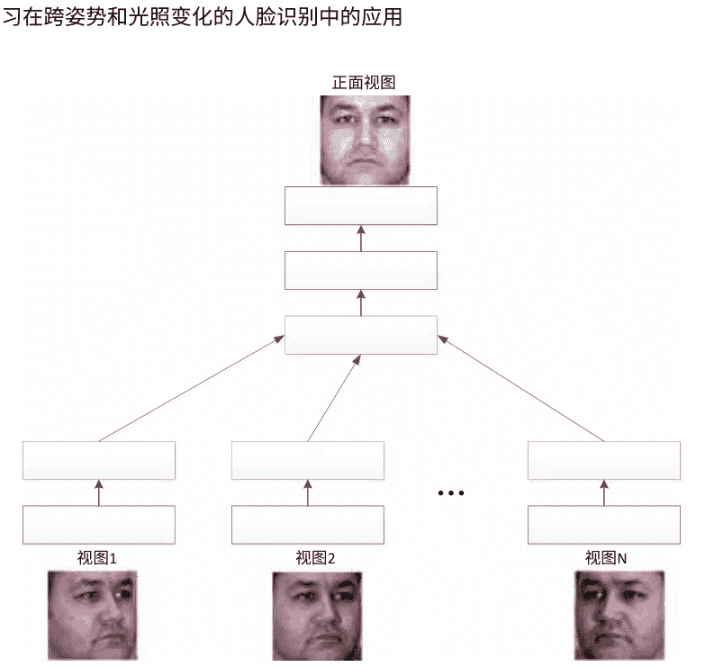

图10 多视角深度网络。该网络首先分别提取不同视角的特征，然后在后续网络中将这些特征进行整合。在训练中，使用正面视图和不同视角之间的Fisher距离作为误差来优化参数。

最近，Peng等人提出了一种深度网络来提取姿态不变特征。首先，他们使用综合方法来丰富训练样本，然后通过多任务学习过程提取身份和非身份特征。最后，通过不同姿态的重构误差约束来净化姿态不变特征。所提出的方法需要合成非正面人脸进行训练。此外，它还需要每个训练图像的姿态和标记点标签，这在应用中并不容易获取。

Masi等人认识到非正面人脸的正面化实际上非常具有挑战性，并且随着旋转角度的增加而变得更加困难。实际上，这是一种高度非线性的转换，正面和侧面人脸之间的许多对应信息都丢失了。因此，他们提出了为不同姿态开发独立网络的想法，称为姿态感知CNN模型（PAM）。也就是说，针对不同的姿态，例如正面、半侧面和侧面图像，训练不同的CNN模型。

然后将所有不同PAM的分数进行平均，得到识别结果。对于这种方法，需要将输入图像渲染成不同的姿势，然后将其输入到相应的PAM中进行识别。尽管它们限制了渲染图像的范围，但是生成不同视角的图像仍然是一个挑战。

Tran等人[61]引入了生成对抗网络（GAN）用于姿势不变的人脸识别任务。GAN网络是基于编码器和解码器的框架。通过生成网络，任何姿势的人脸图像都可以转换为正面图像。判别网络用于判断新创建的图像。为了增强生成网络中的姿势不变特征提取，使用了姿势标签和噪声作为辅助信息。所提出网络的结构如图11所示。尽管GAN网络比传统神经网络更强大，但网络的收敛仍然是其应用的一个重大限制。

神经网络提供了一个强大的工具，可以从训练图像中提取特征，已经被应用于解决姿态问题。然而，如何为这个特定问题设计一个合适的网络结构仍然是研究人员面临的一个难题。

## 2.2 基于合成的方法

姿态变化为同一主体的图像引入了非线性变换。除了可以用作图像的低维表示的姿态不变特征之外，研究人员还尝试直接从任意姿态的图像中合成正面人脸图像。基于合成的方法可以进一步分为基于2D和基于3D的方法，这取决于是否应用了3D人脸模型。

### 2.2.1 基于2D的合成方法

基于2D的合成方法尝试直接将不同姿态的图像转换为正面人脸。根据处理单元的不同，所有的2D合成方法可以分为三类：三角网格包裹、补丁包裹和像素包裹。

在早期，主体的3D模型通常由三角网格表示。因此，三角网格也可以应用于2D图像，并且每个三角形被用作计算两个不同姿态之间的变换的单位。

Taigman等人[59]应用三角网格对输入图像进行对齐。在将所有输入图像转换为正面人脸后，应用深度神经网络进行特征提取和人脸图像识别，如图12所示。在对齐过程中，检测到关键标志点，然后将三角网格投射到2D图像上，其中人脸的3D形状与三角网格相关联。最后，通过三角网格的仿射变换，可以估计出正面人脸图像。通过将输入图像准确地调整为正面视图，以下神经网络可以在不同姿态下进行人脸识别。对于基于网格的变换，主要取决于三角网格在2D人脸图像上的适应程度。

为了避免在脸部检测到标志物，Ashraf等人[4]提出将图像分解为小块，并为每个块应用学习的变换，将非正面块转换为正面块。他们将每个块视为整个过程中的独立单元；然而，相邻块之间存在密切联系。因此，这些块彼此之间高度相关，这种关系可以应用于解决姿态问题。最近，Ho等人[19]考虑了这种关系。对于每个块的最优变换的搜索被转化为一个优化问题，其中每个块的重构误差应该很小；同时，相邻块的变换应该相似。附加项限制了全局变换的平滑性。

对于基于块的合成方法，他们将局部块视为计算变换的单元。然而，姿态之间的非线性变换在像素级别上是不同的。因此，Li等人[34]提出了基于像素的变换。他们首先从3D数据集中学习一组模板位移模型。然后，对于每个输入图像，模板位移模型被应用于像素级别地将任意姿态的图像转换为正面脸部。对于脸部的遮挡部分，信息从正面脸部进行补偿。尽管提出的方法可以重建正面脸部，但只有非遮挡区域将用于验证。

### 2.2.2 基于3D合成的方法

对于基于2D的包裹方法，它们直接找到不同姿态之间的变换。当姿态发生显著变化时，不同姿态之间的映射变得高度非线性。因此，2D包裹的结果会变得更差。事实上，姿态问题是由3D主体模型投影到2D虚拟表面引起的。也就是说，内在的3D模型控制着图像的外观。因此，研究人员还尝试使用3D模型来解决姿态不变的识别问题。

Ding等人[12]提出了一种基于3D模型的密集映射方法，用于恢复正面人脸。首先，从任意姿态的2D图像中检测出关键地标，然后将它们与标准3D人脸模型中的相应地标进行匹配。因此，可以估计输入2D图像的姿态变换。为了恢复纹理，使用估计的姿态变换矩阵进行密集映射。此外，提出了基于单应性矩阵的补丁校正方法，以增强恢复纹理的逼真度。如果原始的2D面部图像中存在遮挡，则识别仅基于恢复的未遮挡部分。

此外，Ding等人[13]将侧面人脸图像识别问题转化为部分人脸识别问题。基于2D图像和3D人脸模型之间的关键点映射，侧面图像被转换为正面视图的图像。然后在恢复的正面视图的可靠区域上提取基于稀疏编码的特征。

# 3 光照不变的面部识别

光照是人脸识别的另一个重要挑战。图像中每个像素的强度值 $I_{xy}$ 由入射光的强度 $L_{xy}$、入射光的角度 $\theta_{xy}$ 和表面的反射率 $R_{xy}$ 决定，即 $I_{xy} = L_{xy} \times R_{xy}$。因此，当入射光发生变化时，同一对象的外观也会发生变化。通常，光照引起的变化比主体引起的变化更显著。因此，光照总是导致人脸识别方法的降级。试图消除或减轻光照变化的算法可以分为基于图像处理的方法、基于不变特征的方法和基于光照模型的方法三类。

## 3.1 基于图像处理的方法

光照是控制图像外观的因素之一。在较亮的情况下拍摄的图像的平均强度值要大于那些在黑暗环境中。因此，研究人员提出使用图像处理方法来增强图像的强度值，例如直方图均衡化（HE）和伽马校正。

直方图均衡化[43]试图调整输入图像的直方图。也就是调整图像的强度分布。事实上，在光线较亮的情况下拍摄的图像的像素强度值要大于较暗的图像。因此，亮度较高的图像的强度分布将在较大的值区域内具有峰值，而较暗的图像的强度分布将在较小的值区域内具有峰值。使用直方图均衡化可以使强度值的分布更加均匀。也就是说，亮度较高的图像会变暗，而较暗的图像会变亮。

直方图均衡化只考虑每个像素的强度值，而不考虑语义含义。因此，由于为相同强度值的所有像素分配新的强度值，直方图均衡化会在图像中引入一些突变噪声，如图13b所示。

伽马校正更专注于强度分布的调整，而直方图均衡化将原始分布转化为均匀分布。伽马校正函数定义为

$$T(I)=I_{\max}\left(\frac{I}{I_{\max}}\right)^{\gamma} \tag{5}$$

其中 $I$ 是当前像素的强度值。$I_{\max}$ 是图像中的最大强度值，$\gamma$ 确定了适应曲线，是关键参数。根据不同的伽马曲线，原始强度值可以被修改为任何期望的分布。通常较暗的像素会被调亮，而亮度较高的像素会保持不变，如图13c所示。

Huang等人[21]提出了一种自适应伽马校正方法，其中 $\gamma$ 由强度的累积分布函数 $cdf(I)$ 决定，如下所示：

$$T(I)=I_{\max}\left(\frac{I}{I_{\max}}\right)^{1-cdf(I)} \tag{6}$$
$$cdf(I)=\sum_{I=0}^{I_{\max}}\frac{pdf(I)}{\sum pdf} \tag{7}$$

其中 $pdf(I)$ 是强度的概率密度函数。所提出的方法结合了伽马校正和直方图修改方法。与直方图均衡化类似，伽马校正也是一种整体修改方法，它不考虑图像中的局部信息。江等人[23]提出了将局部和全局信息结合起来进行光照增强的方法。局部因子 $I_a^{\text{local}}$ 提供了局部方差，而全局因子 $I_a^{\text{global}}$ 提供了图像的整体强度。这两种信息通过双线性方法进行组合，然后使用基于感知的方法调整图像的亮度，如

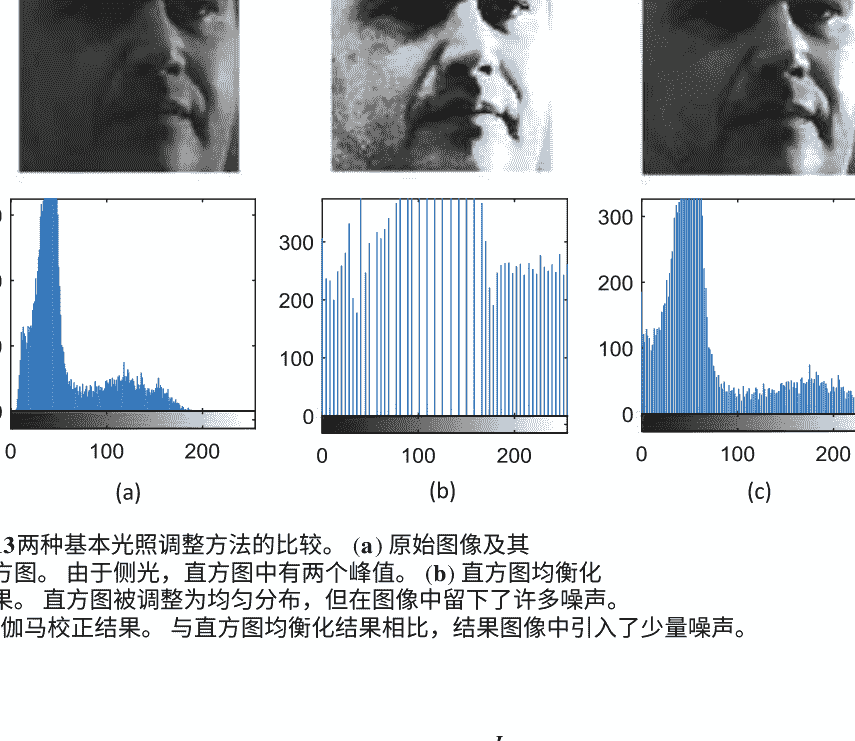

$$ Y (\alpha, m, f; I) = \frac{I}{I + (f I_a)^m} I_{\text{max}} \tag{8} $$

$$ I_a = \alpha I_a^{\text{local}} + (1 - \alpha) I_a^{\text{global}} \tag{9} $$

其中 $\alpha$, $m$, 和 $f$ 是决定图像细节、对比度和亮度的参数。该模型源于人类视觉感知系统。基于图像处理的光照调整方法主要集中在调整弱光图像的强度分布上。这种方法只考虑当前图像的外观，而不考虑导致当前外观的因素。因此，这些方法往往无法彻底解决光照问题。

## 3.2 基于不变特征的方法

图像是光照和物体的协同结果。即使光照因不同情况而变化，物体本身并不改变。因此，研究人员试图从图像中找到光照不变的表示来描述对象的固有特征。边缘描述了形状或轮廓

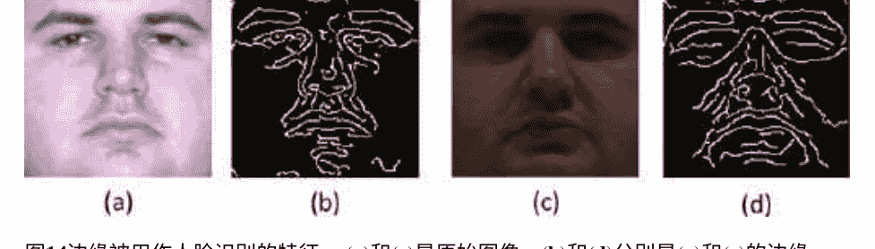

对象的边缘特征被认为是光照不变的特征之一。相反，对象的颜色会根据其情况而变化。高等人[15]提出使用人脸图像上的边缘进行人脸识别。所有的人脸组成部分，如眼睛、鼻子、嘴巴和眉毛，都由线条轮廓表示，如图14所示。然后计算线条之间的距离进行验证。周等人[72]应用多尺度Gabor滤波器从人脸图像中提取特征，其中提取了多尺度边缘特征。一些其他流行的特征描述符，如局部二值模式（LBP）和尺度不变特征变换（SIFT），提取局部区域的基于边缘的特征，也被认为对光照具有鲁棒性。然而，阴影也会产生边缘，甚至在图像中产生明显的边缘，这些边缘很难与对象的边缘区分开来。因此，这些基于边缘的特征只能在轻微的光照变化下工作良好。

根据简化的照明模型 $I = L \times R$，Shashua等人[56]提出了商图像的概念，即测试图像 $I_y$ 与三个带权重的图像 $I_j$ 的线性组合之比。

$$ Q_{y} = \frac{I_y}{\sum_{j} I_j} \tag{10} $$

其中 $I_j$ 的综合照明条件与 $I_y$ 的照明条件相似。因此，商图像只与物体的反射性质有关，并且不受照明变化的影响。通过商图像 $Q_y$，可以生成在新照明条件下的图像，并且可以用于不同照明条件下的人脸识别。然而，商图像基于同一类对象具有相同形状的假设。这是一个非常粗糙的假设。

事实上，每张脸都是不同的。Wang等人[64]扩展了商图像的概念。他们提出直接从图像中估计照明图。根据Retinex理论[60]，大部分照明信息可以被视为低频信号，而大部分反射信息是高频的。因此，可以从原始图像的低频部分估计照明信息。所提出的自商图像定义为

$$ Q_{\text{sy}}=\frac{I_y}{F*I_y} \quad\quad\quad\quad\quad\quad \tag{11} $$

其中 $F$ 是一个平滑核函数。

基于Retinex理论，谢等人[68]提出了一个两步策略来规范光照条件。首先，他们使用总变差模型将输入图像分解为低频和高频部分。然后分别对这两个分解部分进行规范化。低频部分的规范化将增强光照条件的均匀性。然后将规范化的高频和低频部分相乘，得到规范化的图像。在第二步中，使用核特征空间来纠正规范化人脸图像的视觉缺陷。尽管KPCA可以用于改善图像的外观，但它需要大量的每个主题的训练图像来构建核子空间。

He et al. [18] 认识到人脸子空间的分布是非线性流形；因此，非线性方法更适合解决这个问题。他们提出基于局部保持投影来找到人脸流形，这被称为拉普拉斯人脸表示。这个子空间可以保持身份差异，同时最小化同一主题内的其他变化。

压缩感知理论提供了一种全新的信号表示方法。基于这个理论，连续信号可以随机采样，从而突破了香农定理的限制。从训练数据集中，可以学习到主题的稀疏表示，并受到稀疏约束。

Wagner et al. [63] 从一组在不同光照条件和不同姿势下拍摄的图像中构建了一个稀疏编码字典。在各种条件下的图像可以通过稀疏约束恢复为同一主题的经典正面图像。然后，学到的稀疏表示对光照是不变的。然而，稀疏字典学习需要来自所有不同条件的图像，以保持所提出算法的性能。

最近，基于深度学习的方法也被应用于提取在不同光照条件下的图像的光照不变特征。经典的深度学习方法，如AlexNet [29]和VGG-Face网络[40]，从卷积层中提取特征，然后通过全连接层对这些特征进行分类。除了经典的神经网络结构，研究人员还改进了损失函数以提高提取的特征[20, 66]。这些方法并不专注于光照问题，而是试图提取用于一般人脸识别问题的稳健特征。因此，网络的结构并没有专门针对光照问题进行设计。

## 3.3 基于光照模型的方法

光照是图像成像的一个重要因素。因此，研究人员还尝试分析在不同光照条件下拍摄的图像的分布。

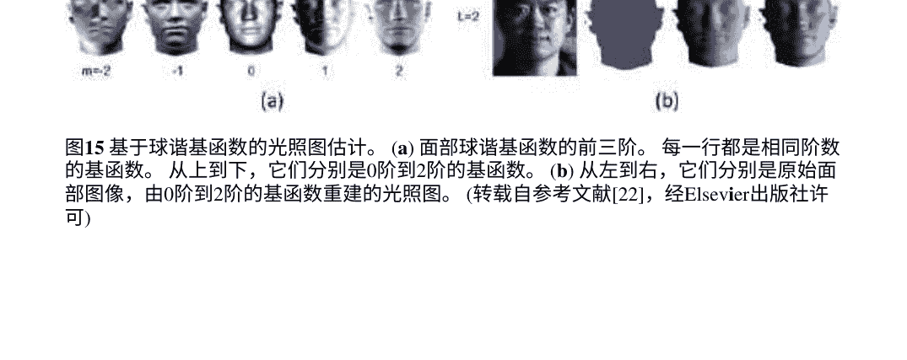

通过光照模型，可以重构在不同光照条件下的图像。此外，还可以改变或去除图像中的光照。

Belhumeur和Kriegman [7]引入了光照锥体理论，这是对象的光照空间的基本理论。如果一个对象具有凸形状和Lambertian表面，则关于该对象的所有图像可以形成一个多面锥体。这个圆锥的维度由主体的不同表面法线向量的数量确定。在实践中，光锥理论可以放宽到任何形状和具有一般反射表面的物体。作者还指出，对象的光锥可以近似为低维子空间。光锥理论仅说明了物体在特定姿势下的照明空间结构。不同姿势的光锥之间的关系仍然不清楚。

事实上，实际上构建一个完整的高维光锥总是很困难的。因此，研究人员试图找到光锥的低维近似。对象的照明效果可以被视为入射照明与对象的反射函数的卷积。

给定一个对象的3D模型，可以通过球谐基函数[5, 45]构建照明子空间。所有的基函数都是用隐式方程给出的，这些方程是关于照明和物体表面法线向量的函数。给定对象的3D形状、照明位置和强度，可以直接获得照明子空间的基函数。使用前三个阶数的谐波基函数，可以估计90%的照明效果，如图15所示。然而，对对象的深度信息的要求也限制了该方法的应用。

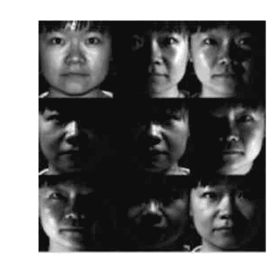

为了避免对主体的3D模型或学习过程的要求，Lee等人[30]提出直接从真实图像中构建低维近似。这些真实图像是通过最小化两个子空间之间的距离找到的，其中一个是球谐子空间 $H$，另一个是选定的真实图像子空间 $C$。然后，这些选定图像的真实光照配置可以用于任何主体来构建低维光照子空间 $C$。也就是说，在这些光照配置下拍摄的真实图像可以用作其光照子空间的基础图像。本文证明了从真实图像构建的光照子空间是球谐子空间的很好近似。在应用中，只需要九个光照位置就可以建立光照子空间，如图16所示。而且，与传统的球谐子空间不同，它不需要深度信息。然而，在实际应用中，有时无法获得特定的光照配置。在实际应用中，每个主体通常只有几个样本图像，甚至只有一张图像。

考虑到光照子空间估计的实际应用，江等人[24]提出从对象的任何样本图像中创建基础图像。也就是说，给定一张可以在任意条件下拍摄的图像，可以重建出九个基础图像，从而建立起光照子空间，如图17所示。本文中，基础图像的估计基于最大后验估计。基础图像由共同成分和个人成分组成，其中共同成分是训练图像的均值，个人成分描述了每个主体的特定特征。因此，估计的基础图像可以恢复每个主体的共享和个体特征。这种方法打破了需要在特定光照条件下拍摄的九张真实图像的要求。

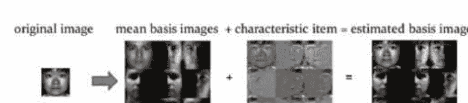

图17 光照子空间的基础图像可以从任意光照条件下的图像中估计出来。

# 4 个多流卷积神经网络

在一般情况下，环境的照明和物体的姿态始终是不受控制的。因此，强大的人脸识别系统应该能够同时处理姿态和光照问题。目前处理姿态和光照问题的算法分别介绍在第2节和第3节中。除了这些专门设计的算法之外，还有一些方法可以在一般条件下进行人脸识别。特别是随着深度学习方法的发展，一些深度神经网络被设计用于人脸识别问题。Schroff等人[50]提出根据距离最小化同一类别内的距离并最大化类别间的距离来增强深度特征的区分度。Sun等人[57]增加了隐藏层的维度，并对早期卷积层添加了约束，以增加神经网络的区分能力。所提出的网络被称为DeepID2+，它提高了在自然条件下的人脸识别性能。

对于跨姿势和光照的人脸识别，图像的全局结构被视角破坏；同时，光照对图像的外观带来了广泛的变化。因此，具有姿势和光照不变性的特征应该是局部的而不是全局的。此外，多层次特征总是比单一尺度的特征更具信息量。因此，我们提出了一种端到端的卷积网络，可以提取多层次的局部特征用于人脸识别任务。整体架构如图18所示。在我们提出的网络中，输入是一个任意姿势和光照下的面部图像。输出是面部图像的身份标签。

## 4.1 根卷积层

最近，卷积神经网络（CNN）在计算机视觉的不同领域中表现出很好的性能，例如目标检测[46]和目标分类或识别[58]。CNN的出色能力主要归功于其高阶特征提取能力。

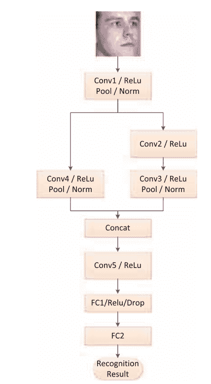

图18 所提出的深度网络的架构。Conv1的卷积核大小为11 × 11，维度为96。Conv2、Conv3、Conv4和Conv5的卷积核大小均为1 × 1，维度分别为200、400、300和500。

为数据提供非线性表示。在实践中，卷积神经网络通过卷积核逐层从输入图像中提取特征。对于提出的网络，输入图像，$x_i^{l-1}$，被裁剪和镜像到大小为 $w \times h \times c = 227 \times 227 \times 3$。然后它们被送入一个卷积层(Conv1)，$k_{ijl}$，使用96个大小为11 × 11 ×3的滤波器。这个卷积层的输出，$x_j^l$，可以表示为

$$ x_j^l = \sum_{i \in M_j} x_i^{l-1} * k_{ij}^l + b_j^l \qquad\qquad (12) $$

其中 $l$ 是层索引， $b_j^l$ 是加性偏置项， $*$ 表示在输入信号的局部区域 $M_j$ 进行卷积。在这个卷积层中，应用了96个滤波器，局部应用于整个图像，结果得到一个大小为55 × 55 ×96的特征图。然后，对提取的特征图应用了修正线性单元（ReLU）。ReLU在网络中作为激活单元，为特征引入了非线性。这里我们使用了一个斜坡函数 $f(x) = max(0, x)$ 来修正特征图。这个激活函数被认为比广泛使用的逻辑sigmoid函数或双曲正切函数更符合生物学的可行性。因此，修正后的特征图将被传递给一个最大池化层（Pool），该层以2的步幅在3 ×3的空间邻域中取最大值。

分别对每个通道进行处理。通过最大池化操作，特征将变得对局部位移不敏感，即对位置不变。随后，这些特征将通过局部响应归一化层（LRN）进行处理，该层通过对局部输入区域进行归一化来执行侧抑制。在我们的模型中，局部区域跨越相邻的通道，但没有空间范围。对于归一化，每个输入值都被局部区域的总和除以，如公式13所示：

$$ s(x_i) = (k + (\alpha/n) \sum_i x_i^2)^\beta \quad (13) $$

其中 $n$ 是每个局部区域的大小，并且总和是在以该值为中心的区域上进行的（必要时添加零填充）。从根层开始，我们可以获得主要包含不同方向上的各种边缘的局部特征集。通常边缘被认为是不受光照影响的特征。由于在我们的情况下局部结构更重要，因此我们将继续寻找局部特征，而不是通常在传统CNN的进一步层中获得的全局特征。

## 4.2 多层次局部特征

事实上，卷积核的窗口大小被视为特征提取的感受野。也就是说，较大的窗口可以包含更广范围的信息进行处理。对于来自不同视角的人脸图像，全局结构会发生多样的变化。然而，在不同视角拍摄的图像的局部区域之间存在着紧密的相关性。因此，具有姿态不变性的特征应该是局部特征，并且还应该保留每个局部特征的空间信息。因此，应该使用较小的窗口来提取特征。

在这里，我们建议使用大小为 $1 \times 1 \times c$ 的卷积核。使用 $1 \times 1$ 的卷积核，不会提取跨多个像素的空间模式，但会学习 $c$ 通道之间的模式，而不会丢失每个模式的位置信息。因此，特征可以保持不同视角之间的相关性。同时，与较大的卷积核相比，$1 \times 1$ 的卷积核大小可以减少参数的数量，这可以使训练过程更容易收敛。

神经网络实际上对数据进行非线性操作。通过多层处理，神经网络可以构建高阶非线性模型，这比传统的手工特征更适合数据的表示。因此，不同层数的神经网络也会影响特征的性质。在经典的ConvNet中，信号只有一条路径可以走，分类只在网络的最后一层提取的特征上进行。实际上，来自网络不同层级的特征都包含有用的信息。因此，我们提出了构建多流局部特征层次网络（LFHN）。在每个流中，不同阶数的特征都通过使用不同数量的卷积层进行提取。然后，来自不同流的特征被连接起来，组成一个大小为 $h \times w \times (c_1 + c_2 + \cdots + c_n)$ 的多层次特征，其中 $h \times w \times c_i$ 是来自流 $i$ 的特征的大小， $c_i$ 是深度维度。

为了保留局部特征的空间信息，应用了 $1\times1$ 的卷积核。如图18所示，提出的网络有两个流。一个流包含两个卷积层，其中Conv2和Conv3的卷积核尺寸分别为 $1\times1\times200$ 和 $1\times1\times400$。在另一个流中，只有一个卷积层Conv4，卷积核尺寸为 $1\times1\times300$。通过这两个流，我们可以从不同层次的层级获取局部特征。为了实现最终的识别任务，还使用了一个卷积层Conv5，卷积核尺寸为 $1\times1\times500$，以及两个全连接层进行进一步的特征抽象。

## 4.3 训练

由于卷积网络的根层通常包含更通用的特征，如边缘或颜色斑点，这对于许多任务包括人脸识别非常有用，在训练中，我们保留了AlexNet的预训练结果作为卷积层Conv1的权重。然后对于其他层，根据MultiPIE数据集[16]中图像的身份标签，使用Softmax损失函数进行训练。

# 5 实验

## 5.1 数据集

为了评估所提出的局部特征层次网络（LFHN）在不同姿势和光照下的有效性，使用了MultiPIE人脸数据库[16]。MultiPIE人脸数据库包含了337个身份的754,204张图像。每个身份都有15个不同姿势和20个不同光照条件下的图像。对于MultiPIE中的原始图像，我们根据眼睛的位置对所有图像进行了对齐，并将它们裁剪到256×256的大小。对于每个主题，我们只选择具有神经表情但在所有姿势和光照条件下的图像；因此对于每个人，有300张图像。总共，对于数据集中的所有个体，我们将 $300 \times 337 = 101,100$ 张图像放入数据池中进行训练和测试。在MultiPIE中，每个主题拍摄了四个会话的照片，但并不是每个人都参加了每个会话。因此，我们将第一次会话中的250个人的所有图像和第二次会话中的其他87个人的图像都选取了。

## 5.2 跨姿态和光照的识别

为了评估所提出的局部层次网络的性能，我们使用MultiPIE来训练和测试网络。对于所提出的网络，只有一个输入，而不是来自不同评论的多个图像。因此，训练图像是从自然表情的图像中随机选择的，但姿势和光照条件有15种不同的选择。对于所有的337个个体，从101,100个图像中随机选择了90,000个图像用于训练，剩下的图像用作测试图像。所提出的网络可以学习局部非线性特征，这些特征可以表示不同姿势和光照条件下图像之间的相关性。表1显示了具有姿势和光照变化的图像的排名1识别率。每个视角的识别结果是在20种不同光照条件下所有图像的平均结果。

从结果可以看出，所提出的LFHN网络在不同姿势下实现了相对稳定的性能。特别是对于侧面图像，偏航角在 $[-90^\circ,-60^\circ]$ 和 $[60^\circ,90^\circ]$ 范围内，平均识别率为97.78%，而对于传统方法，对于具有更大姿势变化的图像，性能显著下降。对于基于补丁的部分识别（PBPR）[14]，前向图像的平均识别率为98.96%，偏航角在45°范围内。但对于侧面图像，识别率为78.76%。这表明PBPR中使用的投影恢复方法无法准确找到侧面图像的位置。与当前最先进的方法相比，所提出的LFHN网络提高了任意姿势和光照条件下图像的识别率7.55%。在所提出的网络中，我们考虑了来自不同视角和光照条件的图像。

表1 在MultiPIE上的姿态和光照综合变化下的Rank-1识别率
| 姿态ID | 偏航角 | 俯仰角 | RR [32] | FIP [73] | PBPR [14] | LFHN(我们的方法) |
| :--- | :--- | :--- | :--- | :--- | :--- | :--- |
| 081 | -45° | 25° | 24 | - | 88 | **94.51** |
| 110 | -90° | 0° | 20.5 | - | 51 | **97.52** |
| 120 | -75° | 0° | 26.5 | - | 79 | **98.15** |
| 090 | -60° | 0° | 50.64 | - | 90.86 | **98.51** |
| 080 | -45° | 0° | 65.30 | 67.10 | **97.91** | 97.75 |
| 130 | -30° | 0° | 70.97 | 74.60 | **99.41** | 98.08 |
| 140 | -15° | 0° | 81.07 | 86.10 | **99.05** | 97.12 |
| 050 | 15° | 0° | 77.21 | 83.30 | **99.94** | 93.74 |
| 041 | 30° | 0° | 73.69 | 75.30 | **99.23** | 97.91 |
| 190 | 45° | 0° | 58.12 | 61.80 | **98.21** | 96.53 |
| 200 | 60° | 0° | 45.97 | - | 87.75 | **97.65** |
| 010 | 75° | 0° | 31 | - | 89 | **97.57** |
| 240 | 90° | 0° | 18 | - | 75 | **97.3** |
| 191 | 45° | 25° | 40 | - | 96 | **93.73** |
| | | 平均值 | 48.78 | - | 89.31 | **96.86** |

表2 在MultiPIE上的姿态变化下的Rank-1识别率
| 姿态ID | 姿态 | PLS [54] | MCCA [48] | PLS + LDA [27] | MCCA + LDA [27] | MvDA [28] | GMA [52] | MvDN [27] | LFHN (我们的方法) |
| :--- | :--- | :--- | :--- | :--- | :--- | :--- | :--- | :--- | :--- |
| 110 | -90° | 0.319 | 0.409 | 0.38 | 0.488 | 0.568 | 0.526 | 0.704 | **1** |
| 120 | -75° | 0.775 | 0.742 | 0.798 | 0.662 | 0.723 | 0.723 | 0.822 | **0.9767** |
| 090 | -60° | 0.892 | 0.822 | 0.869 | 0.817 | 0.845 | 0.845 | 0.883 | **1** |
| 080 | -45° | 0.934 | 0.723 | 0.944 | 0.887 | 0.92 | 0.901 | 0.911 | **1** |
| 130 | -30° | 0.883 | 0.685 | 0.92 | 1 | 0.967 | 1 | **0.991** | 0.893 |
| 140 | -15° | 0.981 | 0.92 | 0.995 | 1 | 1 | 1 | **1** | 1 |
| 050 | 15° | 0.981 | 0.906 | 0.986 | 1 | 1 | 1 | **1** | 0.938 |
| 041 | 30° | 0.934 | 0.798 | 0.967 | 0.995 | 0.991 | 1 | **0.991** | 0.971 |
| 190 | 45° | 0.906 | 0.747 | 0.883 | 0.831 | 0.897 | 0.906 | 0.93 | **0.958** |
| 200 | 60° | 0.873 | 0.779 | 0.85 | 0.803 | 0.864 | 0.859 | 0.911 | **0.935** |
| 010 | 75° | 0.723 | 0.714 | 0.709 | 0.676 | 0.714 | 0.718 | 0.798 | **1** |
| 240 | 90° | 0.268 | 0.376 | 0.319 | 0.568 | 0.559 | 0.573 | 0.709 | **1** |
| 平均值 | | 0.789 | 0.718 | 0.802 | 0.811 | 0.837 | 0.838 | 0.887 | **0.973** |

同等地。因此，通过LFHN网络可以寻找姿态不变和光照不变的非线性局部特征。

除了在姿态和光照综合变化下的人脸识别之外，我们还测试了LFHN网络在仅姿态变化下的性能。对于这个任务，探测数据集包括来自四个会话的所有主题的图像，这些图像在环境光照下拍摄，并且有13种不同的姿态。与其他方法的比较结果如表2所示。

从结果中我们可以看到，尽管不同的方法尝试解决姿势问题，但随着姿势变化的增加，人脸识别率下降。视角与正面脸相差越大，识别率就越低。这是因为姿势改变了图像的外观和结构。MvDN [27] 和 MvDA [28] 尝试找到不同姿势之间的相关性，并取得了相对较好的性能。对于提出的网络 LFHN，我们还专注于提取不同姿势之间的局部特征，这些特征可以描述不同姿势之间的相关性，并区分不同的身份。

因此，与其他方法相比，我们取得了更好的结果。特别是对于更大的姿势多样性，所提出的网络的性能不会退化，而是非常稳定。平均识别率为97.3%，比最先进的方法提高了8.6%。

# 6 结论

姿势和光照对于面部图像的外观总是带来很大的变化，这使得跨姿势和光照的人脸识别具有挑战性。然而，在不受控制的环境中遇到姿势和光照变化是很正常的。因此，一个强大的人脸识别系统必须能够处理光照和姿势的变化。事实上，不同姿势的图像之间存在着紧密的相关性。不同视角的图像是同一对象在不同位置的投影。因此，局部特征在不同视角下的识别比全局特征更有用，因为在不同视角下的投影实际上破坏了全局结构。因此，我们提出了一个神经网络，通过 $1 \times1$ 卷积核提取局部特征；此外，多层次特征被结合用于识别任务。在MultiPIE数据集上的实验表明，所提出的网络在广泛的姿势和光照范围内表现非常好且稳定。

致谢本章节部分得到了中国国家自然科学基金（No.61502388）、中国教育部博士点基金（No.20136102120041）、中央高校基本科研业务费专项资金（No.3102015BJ(II)ZS016）以及陕西省国际科技合作与交流计划（2017KW002）的支持。

# 参考文献

- 1. Ahonen, T., Hadid, A., Pietikainen, M.: 使用局部二值模式进行人脸描述：应用于人脸识别。IEEE模式分析与机器智能交易 **28**(12)，2037–2041（2006）。DOI 10.1109/TPAMI.2006.244
- 2. Ahonen, T., Hadid, A., Pietikainen, M.: 使用局部二值模式进行人脸描述：应用于人脸识别。IEEE模式分析与机器智能交易 **28**(12)，2037–2041（2006）
- 3. Andrew, G., Arora, R., Bilmes, J., Livescu, K.: 深度规范相关分析。在：机器学习国际会议，pp. 1247–1255（2013）
- 4. Ashraf, A.B., Lucey, S., Chen, T.: 学习补丁对应以改善视角不变的人脸识别。在：计算机视觉和模式识别，2008年。CVPR 2008。IEEE会议论文集，第1-8页。IEEE（2008年）
- 5. Basri, R., Jacobs, D.W.: 兰伯特反射和线性子空间。IEEE模式分析与机器智能交易 **25**(2)，218-233（2003年）
- 6. Bay, H., Ess, A., Tuytelaars, T., Van Gool, L.: 加速稳健特征（SURF）。计算机视觉与图像理解 **110**(3)，346-359（2008年）
- 7. Belhumeur, P.N., Kriegman, D.J.: 在所有可能的照明条件下，一个物体的图像集合是什么？国际计算机视觉杂志 **28**(3)，245-260（1998年）
- 8. Biswas, S., Aggarwal, G., Flynn, P.J., Bowyer, K.W.: 对低分辨率人脸图像的姿态鲁棒识别。IEEE模式分析与机器智能交易 **35**(12)，3037-3049（2013年）
- 9. Castillo, C.D., Jacobs, D.W.: 使用具有通用极线几何的立体匹配进行2D人脸姿态识别。IEEE模式分析与机器智能交易 **31**(12), 2298–2304 (2009)
- 10. Chen, D., Cao, X., Wen, F., Sun, J.: 维度的福音：高维特征及其对人脸验证的高效压缩。在：IEEE计算机视觉与模式识别会议论文集，pp. 3025–3032（2013）
- 11. Ding, C., Choi, J., Tao, D., Davis, L.S.: 多方向多级双交叉模式用于鲁棒人脸识别。IEEE模式分析与机器智能交易 **38**(3), 518–531 (2016). DOI 10.1109/TPAMI.2015.2462338
- 12. Ding, C., Tao, D.: 基于单应性归一化的姿态不变人脸识别。模式识别 **66**, 144–152 (2017)
- 13. Ding, C., Xu, C., Tao, D.: 多任务姿态不变人脸识别。 IEEE图像处理 24(3), 980–993 (2015)
- 14. Ding, C., Xu, C., Tao, D.: 多任务姿态不变人脸识别。 IEEE图像处理 24(3), 980–93 (2015)
- 15. Gao, Y., Leung, M.K.: 使用线边缘图进行人脸识别。 IEEE模式分析与机器智能 24(6), 764–779 (2002)
- 16. Gross, R., Matthews, I., Cohn, J., Kanade, T., Baker, S.: Multi-pie. 图像与视觉计算 28(5), 807–813 (2010)
- 17. Gunther, M., Costa-Pazo, A., Ding, C., Boutellaa, E.: 2013年移动环境中的人脸识别评估。 2013国际生物特征学会议(ICB) pp. 1–7 (2013)
- 18. He, X., Yan, S., Hu, Y., Niyogi, P., Zhang, H.J.: 使用拉普拉斯人脸进行人脸识别。 IEEE模式分析与机器智能 27(3), 328–340 (2005)
- 19. Ho, H.T., Chellappa, R.: 使用马尔可夫随机场进行姿态不变人脸识别。 IEEE图像处理 22(4), 1573–1584 (2013)
- 20. 胡, J., 卢, J., 谭, Y.P.: 野外人脸验证的判别式深度度量学习。 在: 计算机视觉和模式识别IEEE会议论文集, 第1875–1882页 (2014年)
- 21. 黄, S.C., 程, F.C., 邱, Y.S.: 使用自适应伽马校正和加权分布的高效对比度增强。 IEEE图像处理交易 22 (3), 1032–1041页 (2013年)
- 22. 江, X., 程, Y., 肖, R., 李, Y., 赵, R.: 基于球谐的线性人脸去光和补偿。 应用数学与计算 185 (2), 857–868页 (2007年)。 https://doi.org/10.1016/j.amc.2006.06.090. http://www.sciencedirect.com/science/article/pii/S0096300306007673. 智能计算理论与方法专题
- 23. 江, X., 冯, X., 吴, J., 彭, J.: 图像序列的光照对齐。 在: 国际图像与图形会议, 第462–474页。 Springer (2015年)
- 24. 姜, X., 孔, Y.O., 黄, J., 赵, R., 张, Y.: 从真实图像中学习模拟面部图像的光照变化。 在: 欧洲计算机视觉大会 (ECCV), pp. 284–297 (2008年)
- 25. Kafai, M., An, L., Bhanu, B.: 用于人脸识别的参考面部图。 IEEE信息取证与安全交易 9 (12), 2132–2143 (2014年)
- 26. Kan, M., Shan, S., Chang, H., Chen, X.: 用于面部姿势识别的堆叠渐进自动编码器 (spae)。 在: IEEE计算机视觉和模式识别会议论文集, pp. 1883–1890 (2014年)
- 27. Kan, M., Shan, S., Xilin., C.: 用于跨视角分类的多视角深度网络。 在: IEEE计算机视觉和模式识别会议 (2016年)
- 28. Kan, M., Shan, S., Zhang, H., Lao, S., Chen, X.: 多视角判别分析。 IEEE模式分析和机器智能交易 38(1), 188–194 (2016)
- 29. Krizhevsky, A., Sutskever, I., Hinton, G.E.: 使用深度卷积神经网络进行ImageNet分类。 在: 神经信息处理系统的进展, pp. 1097–1105(2012)
- 30. Lee, K.C., Ho, J., Kriegman, D.: 在可变照明下获取线性子空间进行人脸识别。 IEEE模式分析和机器智能交易 27(5), 684–698(2005)
- 31. Li A., Shan S., Chen X., Gao, W.: 在姿态差异下最大化个体内相关性进行人脸识别。 在: 计算机视觉和模式识别, 2009。 CVPR 2009. IEEE会议论文集, 第605-611页. IEEE (2009)
- 32. 李, A., 单, S., 高, W.: 耦合偏差-方差权衡用于跨姿态人脸识别. IEEE图像处理 21(1), 305-15 (2012)
- 33. 李, H., 华, G., 林, Z., Brandt, J., 杨, J.: 姿态变异人脸验证的概率弹性匹配. 在: IEEE计算机视觉与模式识别会议论文集, 第3499-3506页 (2013)
- 34. 李, S., 刘, X., 柴, X., 张, H., 劳, S., 单, S.: 基于可变形位移场的人脸跨姿态匹配. 欧洲计算机视觉会议2012 第102-115页 (2012)

# 通过深度局部二进制模式进行人脸反欺骗

雷力和冯晓怡

摘要 近年来，卷积神经网络（CNN）在计算机视觉和模式识别方面取得了令人满意的性能。 当我们可视化卷积响应时，我们可以得出结论，卷积响应包含一些重要的结构信息。 但是由于其高维度，直接使用响应来检测伪造的人脸是不可行的。 此外，现有人脸反欺骗数据库的规模较小，导致难以训练新的CNN模型。 与深度学习相比，传统的手工特征，如局部二进制模式（LBP），已成功用于人脸反欺骗并取得了良好的检测结果。 因此，在我们的工作中，我们从微调的卷积响应中提取了手工特征CNN模型。 更具体地说，CNN首先在预训练的VGG-face模型的基础上进行微调。 然后，从卷积响应中计算LBP特征，并将其连接成一个特征向量。 然后，将最终向量输入支持向量机（SVM）分类器以检测伪造的人脸。

在两个公开可用的数据库Replay-Attack和CASIA-FA上进行验证，我们提出的检测方法与最先进的方法相比，可以获得有希望的结果。

# 1 引言

目前，各种人脸欺骗攻击已成为大多数人脸识别系统的主要安全威胁。 更糟糕的是，随着互联网和社交媒体的发展，犯罪分子可以轻易学会如何入侵生物识别系统。 例如，YouTube上的一个指纹破解视频展示了如何解锁iPhone5S的Touch ID预认证系统。 当有人试图在面部生物识别系统前展示一个假脸时，就会发生人脸欺骗攻击。

相机的 例如，研究人员基于面部信息披露对六个商业面部认证系统（Face Unlock，Facelock Pro，Visidon，VeriFace，Luxand Blink和FastAccess）的最新版本进行了在线社交网络威胁检查。尽管平均只有39%的社交网络上发布的图像可以成功用于欺骗，但可用图像的相对较少数量足以欺骗74个用户中77%的面部认证软件[1]。此外，在国际生物特征会议（ICB 2013）期间的现场演示中，一名化妆特定的女性闯入了面部识别系统。这些例子以及其他许多例子突显了面部识别系统对欺骗攻击的脆弱性。基于不同的伪造面部材料，可以考虑三种面部欺骗攻击：(i) 打印攻击，(ii) 重放攻击和(iii) 3D面具攻击。打印攻击使用合法用户的静态照片或图像来欺骗面部生物特征系统。重放攻击利用面部视频来入侵系统。这两种攻击属于2D面部攻击。然而，3D面具攻击通常是通过3D面具发起的，这需要复杂的制作过程和高成本。在这些攻击中，2D攻击是最常见和最简单的面部欺骗攻击。根据攻击的频率和实际应用统计情况，在本章中，我们将重点关注通过扩展检测方法进行的打印攻击和重放攻击[2]。

为了检测面部欺骗攻击，近十年来提出了许多方法。基于不同的学习算法，它们可以分为基于机器学习的方法和基于深度学习的方法。对于前者，它们主要从面部图像中提取手工设计的特征，并训练一个分类器来区分真实和伪造的面部。尽管它们在某些特定情况下可以获得令人满意的性能，但它们需要研究人员根据先验知识设计特征。此外，手工设计的特征不能保证方法在未知环境中也能获得良好的性能。与基于机器学习的方法相比，基于深度学习的方法更注重模型的结构设计，并且具有各种频率响应的鲁棒性[3]。

一般来说，更深的模型可以获得比浅层模型更好的性能。但是，优化参数需要许多训练样本，这对于现有的面部反欺骗数据库来说是不切实际的。

正如前面所述，深度学习提取的特征主要是由于各种频率响应，而手工设计的特征具有更强大的图像表征能力。当我们从卷积层的各种频率响应中提取手工设计的特征时，所得到的特征更加稳健。因此，我们在我们提出的方法中将机器学习和深度学习结合在一起。此外，真实和伪造的人脸在色度通道上非常有区别性[4]。因此，我们还利用颜色信息来检测人脸欺骗。具体而言，我们首先使用现有的人脸反欺骗数据库对预训练的深度学习模型进行微调，然后从卷积响应中提取颜色LBP特征。最后，我们将LBP特征连接成一个特征向量，并训练一个SVM分类器来检测伪造的人脸。

我们通过内部测试和交叉测试在Replay-Attack和CASIA-FA数据库上验证了我们的工作。实验证明我们的方法的性能与最先进方法相当。

# 2 相关工作

- 基于纹理分析的
- 基于运动分析的
- 基于图像质量分析的
- 基于多线索融合的

基于纹理分析的方法通常，伪造的面部是通过打印照片、手机和其他电子设备来实现的。然而，这些媒介与真实面部之间存在显著差异。例如，这些媒介是2D平面，而真实面部是3D平面，这将导致光的漫反射的差异。因此，在[5]中，提取了镜面反射特征来区分2D欺骗攻击和真实面部。

此外，对于2D攻击，假脸是通过打印机打印或者液晶屏显示的。但是这些设备与真实世界相比仍然存在色域不完善的问题，这会导致纹理上的细微差异。因此，Maatta等人[6]将各种LBP特征连接起来来检测假脸。与[6]不同，Chingovska等人[7]从灰度图像的不同块中提取LBP特征。首先，他们将人脸图像分成几个块，并从每个块中提取LBP特征。为了捕捉结构信息，这些LBP特征被连接成一个特征直方图，然后输入到分类器中区分真假脸。在另一项工作[4]中，LBP特征从不同的颜色空间（RGB、HSV和YCbCr）中提取，并输入到SVM分类器中以检测欺骗攻击。之后，他们[8]将纹理特征从LBP扩展到其他描述符，例如相邻局部二值模式的共生、局部相位量化和二值化统计图像特征。深度学习是一个热门话题，因为它在性能上优于传统机器学习。在这一趋势下，Yang等人在[9]中，Menotti等人在[10]中，探索了深度学习在人脸反欺骗上的有效性。前者基于现有网络结构[11]设计了一个CNN模型，而后者则自己设计了网络结构。在这些工作中，他们使用现有的人脸反欺骗数据库来训练他们的CNN模型。然而，这些反欺骗数据库的规模非常小，并且是在受控环境中收集的。因此，训练一个深度模型非常困难。尽管基于纹理分析的方法能够获得令人满意的性能，但仍然存在一些限制。例如，输入的人脸图像需要具有高分辨率，这意味着采集系统必须具有良好的质量。

## 基于运动分析的方法

基于运动分析的方法 基于打印照片或图像攻击没有生活信息（如眨眼），一些研究人员使用不同的方法来捕捉运动信息。 例如，Anjos等人[12]分析了面部区域与背景之间的相对运动，以区分真实和伪造的面部。 因为真实的面部区域与背景相比会有一些运动，而伪造的面部区域则相对静止。 另外，Pereira等人[13]计算了来自三个正交平面的局部二进制模式（LBP-TOP）来表示动态纹理。 与传统的LBP不同，LBP-TOP特征结合了纹理信息和运动信息。 需要注意的是，没有面部对齐的操作符，这意味着运动信息不仅包括面部关键点的运动，还包括头部的运动。 最后，LBP-TOP特征被输入到分类器中用于检测面部欺骗。 此外，Kollreider等人[14]提出了一种基于简化光流分析的新方法。 他们选择了一些关键的面部部位（例如眼睛/鼻子，左右耳朵）并计算了它们的光流变化。 然后，使用二进制检测器评估了所选部位的轨迹。 此外，Chakka等人[15]使用了光流算法来检测这些介质（如纸张或屏幕）。 基于运动的方法的主要问题是验证过程需要一些时间，并且在实践中需要真实客户的合作。 尽管运动是一个重要的视觉线索，但如果不要求用户合作，缺乏运动可能会导致高数量的认证失败。

## 基于图像质量分析的方法

基于图像质量分析的方法在进行面部攻击时，通过两个不同的摄像系统和一个打印系统或显示设备来准备伪造的面部。 因此，实际上可以将伪造的面部视为重新捕获的图像。 然而，由于这些设备的不完善，重新捕获的图像与真实面部图像相比始终呈现出较低的图像质量。 因此，张等人[16]认为高频信息是图像质量的响应。 因此，他们通过多个不同的高斯滤波器提取图像质量特征来检测伪造的面部。 在另一项工作中，彭等人[17]通过提取高频信息来检测伪造的面部。 但与[16]不同，他们在相机前面添加了一个闪光灯。 通过计算有闪光灯和无闪光灯时的高频信息变化，可以解决面部反欺骗问题。 如果变化大于预设阈值，则将面部图像视为伪造的面部。 在另一项工作中，温等人[5]提取了四种特征（如镜面反射特征、模糊特征、色度矩特征和颜色多样性特征）来描述图像质量。 然后，这些特征被连接成一个特征向量，并输入到SVM分类器中来检测面部欺骗攻击。 此外，Galbally等人[18]通过25种评估标准（包括21种全参考度量和4种非参考度量）来测量图像质量，以检测伪造的面部。 基于图像质量分析的方法在伪造的面部具有较低图像质量时效果良好。 但随着印刷设备和显示设备的改进，伪造的面部图像质量通常与真实面部有微小差异。

与面部纹理或运动相比，一些其他生物信息（如皮肤、声音、指纹和虹膜）也可以用于区分真实和伪造的客户。在[19]中，张等人提出了通过兰伯特反射模型分析反射特性的方法。Girija [20]融合了面部和声音特征来检测活体。Wang等人[21]通过恢复稀疏的3D面部结构提出了一种新的面部反欺骗方法。最近，Akhtar等人[22]将面部、虹膜和指纹特征连接起来以检测欺骗攻击。在另一项工作中[23]，他们实现了一个移动生物特征活体检测系统。

# 3 提出的方法

在我们的工作中，我们提出从卷积特征图中提取颜色LBP描述符。所提出方法的主要架构如图1所示。

图1基于深度局部二值模式的人脸反欺骗架构。第一部分是微调的CNN模型的主要结构。第二部分是从卷积特征图中提取LBP特征并将它们连接成一个特征向量的主要思想。在第一部分中，Conv层是卷积层，Relu层是修正线性单元层，M-pool是最大值操作的池化层，FC层是全连接层。

## 3.1 卷积神经网络训练

与其他深度学习工作[9, 24]不同，现有的预训练深度学习模型VGG-face被微调以减少过拟合的影响。值得注意的是，VGG-face模型是为人脸识别[25]设计的，其网络参数在表1中给出。对于VGG-face模型，它是使用大量的人脸图像（260万张图像）进行训练，并在两个具有挑战性的人脸识别数据库上进行测试：Labeled Face in the World和Youtube face，取得了最先进的结果。考虑到VGG-face用于识别2622个主题，我们应该将最后一个全连接层的输出从2622更改为2。这里的2是人脸的类别：真实和伪造。在微调VGG-face模型的参数时，使用了等式1中说明的softmaxloss函数作为代价函数。

$$\mathscr{F}(Y) = \sum_{i=1}^{n} \{ \log(e^{y_{i1}} + e^{y_{i2}} + \ldots + e^{y_{iv}}) + y_{ir} \} \tag{1}$$

其中 $i$ 是训练样本的索引，$n$ 是训练样本的数量。$Y= [Y_1, Y_2, \ldots, Y_i, \ldots, Y_n]$ 是标签集合，$Y_i= [y_{i1}, y_{i2}, \ldots, y_{ir}, \ldots, y_{ik}]$ 是第 $i$ 个样本的预测向量，$v$ 是类别的数量。需要注意的是，$y_{ir}$ 是第 $i$ 个样本的预测值。

## 3.2 颜色空间

RGB是最常用的用于感知、表示和显示彩色图像的颜色空间。尽管它包含了三个颜色通道（红色、绿色和蓝色），但RGB并不考虑亮度和色度的信息。因此，我们将VGG-face模型用于在另外两个颜色空间中的人脸图像：HSV和YCbCr。与RGB颜色空间不同，HSV和YCbCr颜色空间基于亮度和色度信息的分离。具体来说，在HSV颜色空间中，色调和饱和度维度定义了图像的色度，而值维度对应于亮度。YCbCr空间将RGB分量分为亮度（Y）、色度蓝（Cb）和色度红（Cr）。

关于这些颜色空间的更多细节已在[26]中说明。

## 3.3 局部二值模式 (LBP)

对于面部分析，LBP [27]是一种非常有效的纹理描述符。对于图像中的每个像素，通过将中心像素的值与一个圆对称邻域进行阈值处理，计算出一个二进制码。如前所述，卷积特征图可以被视为灰度图像。

表1预训练的VGG-face模型中的配置参数。在这个模型中，我们将最后一个全连接层的输出从2622改为2，并在两个全连接层之间添加了一个dropout层。

| 层 | 类型 | 支持 | 滤波器维度 | 滤波器数量 | 步长 | 填充 |
| --- | --- | --- | --- | --- | --- | --- |
| 1 | 卷积 | 3 | 3 | 64 | 1 | 1 |
| 2 | relu | 1 | - | - | 1 | 0 |
| 3 | 卷积 | 3 | 64 | 64 | 1 | 1 |
| 4 | relu | 1 | - | - | 1 | 0 |
| 5 | mpool | 2 | - | - | 2 | 0 |
| 6 | 卷积 | 3 | 64 | 128 | 1 | 1 |
| 7 | relu | 1 | - | - | 1 | 0 |
| 8 | 卷积 | 3 | 128 | 128 | 1 | 1 |
| 9 | relu | 1 | - | - | 1 | 0 |
| 10 | mpool | 2 | - | - | 2 | 0 |
| 11 | 卷积 | 3 | 128 | 256 | 1 | 1 |
| 12 | relu | 1 | - | - | 1 | 0 |
| 13 | 卷积 | 3 | 256 | 256 | 1 | 1 |
| 14 | relu | 1 | - | - | 1 | 0 |
| 15 | 卷积 | 3 | 256 | 256 | 1 | 1 |
| 16 | relu | 1 | - | - | 1 | 0 |
| 17 | mpool | 2 | - | - | 2 | 0 |
| 18 | 卷积 | 3 | 256 | 512 | 1 | 1 |
| 19 | relu | 1 | - | - | 1 | 0 |
| 20 | 卷积 | 3 | 512 | 512 | 1 | 1 |
| 21 | relu | 1 | - | - | 1 | 1 |
| 22 | 卷积 | 3 | 512 | 512 | 1 | 0 |
| 23 | relu | 1 | - | - | 1 | 1 |
| 24 | mpool | 2 | - | - | 2 | 0 |
| 25 | 卷积 | 3 | 512 | 512 | 1 | 0 |
| 26 | relu | 1 | - | - | 1 | 1 |
| 27 | 卷积 | 3 | 512 | 512 | 1 | 0 |
| 28 | relu | 1 | - | - | 1 | 1 |
| 29 | 卷积 | 3 | 512 | 512 | 1 | 0 |
| 30 | relu | 1 | - | - | 1 | 0 |
| 31 | mpool | 2 | - | - | 2 | 1 |
| 32 | 卷积 | 7 | 512 | 4096 | 1 | 0 |
| 33 | relu | 1 | - | - | 1 | 1 |
| 34 | dropout | - | - | - | - | - |
| 35 | fc | 1 | 4096 | 4096 | 1 | 1 |
| 36 | relu | 1 | - | - | 1 | 0 |
| 37 | dropout | - | - | - | - | - |
| 38 | fc | 1 | 4096 | - | 1 | 0 |
| 39 | softmax | 1 | - | - | - | 0 |
| 40 | - | - | - | - | - | - |

为了简单起见，我们使用 $X_i$ 来表示训练样本的索引，$X_i^{RGB}$、$X_i^{HSV}$ 和 $X_i^{YCbCr}$ 分别表示图像X的RGB、HSV和YCbCr颜色图像。对于人脸图像X，第j个卷积层的特征图可以表示为Cj。$X_i = [C_X^{j1}, C_X^{j2}, ..., C_X^{jd}, ..., C_X^{jD}]$，其中D是VGG-face模型第j个卷积层中的滤波器数量。对于Cjd中的每个像素(x, y)计算xi的LBP代码如公式2所示。

$$LBP_{P,R}(x, y) = \sum_{v=1}^{P} \delta(rv - rc) \times 2^{n-1} \tag{2}$$

其中$\delta(x) = 1$，如果$x \geq 0$；否则$\delta(x) = 0$。$rc$和$rv(v=1, ..., P)$分别表示中心像素(x, y)和其位于半径$R(R > 0)$的$P$个邻域像素的强度值。不同二进制模式的出现次数被收集到直方图中，以表示图像的纹理信息。

如果LBP模式的二进制码中包含最多两次从0到1或从1到0的转换，则被定义为均匀的。例如，01110000（2次转换）和00000000（0次转换）都是均匀模式。总结起来，设 $H_{C_X^j}$ 为从 $C_X^{jd}$ 中提取的纹理直方图。对于图像 $X_i$，所有纹理直方图如公式3所示。

$$H(X_i) = \{H_{C_X^1}, H_{C_X^2}, ..., H_{C_X^j}, ..., H_{C_X^J}\} \tag{3}$$

$J$ 是微调的VGG-face模型中的卷积层数。因此，$H(X_i^{RGB})$、$H(X_i^{HSV})$和$H(X_i^{YCbCr})$是来自 $X_i^{RGB}$、$X_i^{HSV}$ 和 $X_i^{YCbCr}$，分别。

## 3.4 连接LBP

令$X = [ X_1, X_2, ..., X_i, ..., X_n]$表示训练样本。每个卷积特征图将得到一个纹理直方图。在我们的工作中，我们将属于同一卷积层的纹理直方图进行连接。因此，对于每个卷积层，我们将获得如公式4所示的连接LBP描述。

$$\mathbb{F}^j = \left[ F_{X_1}^j \quad \ldots \quad F_{X_i}^j \quad \ldots \quad F_{X_n}^j \right] = \left[ \begin{array}{ccc} H_{C_{X_1}^{j1}} \ldots H_{C_{X_1}^{jd}} \ldots H_{C_{X_1}^{jD}} \\ H_{C_{X_2}^{j1}} \ldots H_{C_{X_2}^{jd}} \ldots H_{C_{X_2}^{jD}} \\ \vdots \quad \ddots \vdots \quad \ddots \vdots \\ H_{C_{X_i}^{j1}} \ldots H_{C_{X_i}^{jd}} \ldots H_{C_{X_i}^{jD}} \\ \vdots \quad \ddots \vdots \quad \ddots \vdots \\ H_{C_{X_n}^{j1}} \ldots H_{C_{X_n}^{jd}} \ldots H_{C_{X_n}^{jD}} \end{array} \right]$$

## 3.5 分类

从卷积特征图中提取LBP描述后，支持向量机（SVM）被训练和调用用于人脸反欺骗。在本章中，使用LIBLINEAR工具包[28]。

# 4 实验数据和设置

## 4.1 实验数据

在本章中，我们通过对Replay-Attack数据库[29]和CASIA人脸反欺骗数据库[30]进行大量实验来验证我们提出的方法。以下是对这两个数据库的描述：

### 4.1.1 重放攻击

IDIAP重放攻击数据库¹[29]包含1300个真实和攻击视频剪辑，以及对50个客户的攻击尝试（图2显示了一些真实和伪造人脸的示例）。在数据库中，客户被分为三个不相交的子集进行训练、开发和测试（分别为15、15和20个）。真实视频是在两种不同的光照条件下录制的：受控和逆境。创建了两种类型的攻击：重放攻击和打印攻击。在重放攻击中，使用iPhone 3GS和iPad显示设备来重放真实客户的高质量视频和图像。对于打印攻击，高质量图像被打印在A4纸上，并放在摄像头前呈现。

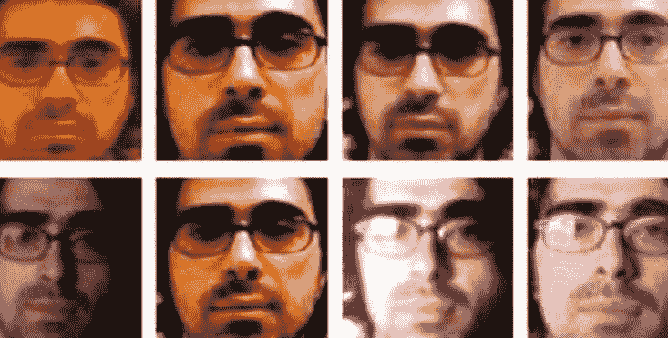

图2来自Replay-Attack数据库的样本。第一行是来自受控场景的图像，而第二行是来自逆境场景的图像。从左到右：真实面孔和相应的高清、移动和打印攻击

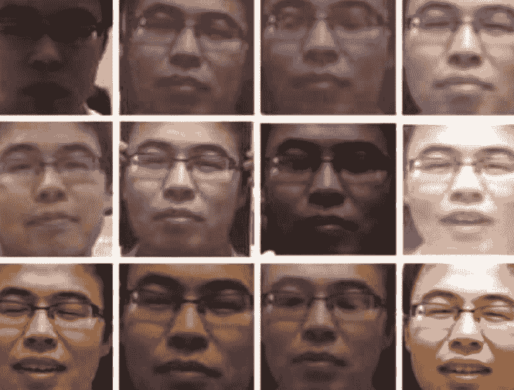

图3来自CASIA-FA的样本。从上到下：低质量、正常质量和高质量图像。从左到右：真实面孔和相应的扭曲照片、剪切照片和视频重放攻击

### 4.1.2 CASIA-FA

CASIA面部反欺骗（CASIA-FA）数据库[30]包括600个真实和攻击尝试的视频记录，针对50个客户（图3显示了一些真实和伪造的面孔），分为两个主题不相交的子集进行训练和测试（分别为20和30）。创建了三种类型的攻击：视频重放攻击、扭曲攻击和剪切攻击。使用三个摄像设备记录了真实和攻击尝试：低、正常和高分辨率。

## 4.2 实验设置

### 4.2.1 评估协议

为了性能评估，我们遵循与两个数据库相关的整体协议。对于每个数据库，我们使用训练集来微调VGG-face模型，并使用测试集来评估性能。在CASIA-FA数据库中，结果以等错误率进行评估。Replay-Attack数据库还提供了一个开发集来调整模型参数。因此，结果以开发集上的等错误率（EER）和测试集上的一半总错误率（HTER）报告，如公式5所示。在我们的实验中，我们报告了两种不同的性能：（i）不同人脸区域对反欺骗的影响，以及（ii）级联深度特征的结果。

$$HTER = \frac{FRR(\kappa, \mathcal{D}) + FAR(\kappa, \mathcal{D})}{2} \quad (5)$$

其中 $\mathcal{D}$ 表示使用的数据库，$\kappa$ 的值在EER上估计。$FRR(\kappa, \mathcal{D})$ 表示真实人脸的错误拒绝率，$FAR(\kappa, \mathcal{D})$ 表示伪造人脸的错误接受率。

### 4.2.2 数据处理

在我们提出的方法中，纹理直方图的维度为59。对于卷积层，拼接的LBP描述的维度为$59 \times D$，其中 $D$ 是相应层中的卷积特征图数量。例如，第一个卷积层中有64个特征图。因此，维度为$59 \times 64 = 3776$。值得注意的是，随着卷积层深度的增加，特征图的尺寸越来越小。此外，我们使用 $LBP_{8,1}$ 算子（即 $P = 8$ 和 $R = 1$）从卷积特征图中提取纹理特征。因此，我们选择 $j = \{1, 3, 6, 8, 11, 13, 15, 18, 20, 22\}$。与训练集的维度相比，过拟合SVM分类器很容易。因此，我们使用主成分分析（PCA）算法来降低特征维度。此外，为了捕捉面部图像的纹理和运动变化，我们将某个时间窗口（两秒）提取的特征平均作为最终的特征描述。

### 4.2.3 内部测试和交叉测试

为了评估效果和泛化能力，在我们的工作中，我们进行了两种测试：内部测试和交叉测试。对于前者，CNN模型和SVM分类器在同一数据库上进行训练和测试。对于后者，CNN模型和SVM分类器在一个数据库上进行训练，在另一个数据库上进行测试，就像[31]中所做的那样。例如，我们将在Replay-Attack数据库上训练CNN和SVM，然后在CASIA数据库上进行测试，反之亦然。

# 5 结果与讨论

在本节，我们介绍并讨论了我们提出的方法所得到的结果。首先，我们使用不同颜色空间的人脸图像输入VGG-face模型，并从不同的卷积层提取LBP特征。除了内部测试之外，我们还进行交叉测试以评估其泛化能力。其次，我们将不同颜色空间的LBP进行拼接，并分析不同拼接机制的影响。最后，我们将提出的检测方法与最先进的方法进行性能比较。

## 5.1 不同颜色空间的影响

### 5.1.1 内部测试

在这部分中，我们展示了从不同卷积层提取的LBP的性能。表2展示了在不同卷积特征图和不同颜色空间上应用LBP描述符的结果。对于Replay-Attack数据库，RGB LBP得到的EER和HTER的最佳结果为0.3%。

| 数据库 | | | 1卷积 | 3卷积 | 6卷积 | 8卷积 | 11卷积 | 13卷积 | 15卷积 | 18卷积 | 20卷积 | 22卷积 |
| :--- | :--- | :--- | :--- | :--- | :--- | :--- | :--- | :--- | :--- | :--- | :--- | :--- |
| 重放攻击 | RGB | 等错误率 | 17.8 | 5.2 | 7.9 | 7.2 | 2.8 | 1.5 | **0.3** | 2.7 | 2.8 | 4.7 |
| | | 等误判率 | 17.9 | 8.8 | 7.9 | 7.8 | 2.6 | 1.2 | **0.9** | 3.4 | 3.7 | 5.7 |
| | HSV | 等错误率 | 4.0 | 4.7 | 6.7 | 5.4 | 3.3 | 2.9 | 2.2 | 6.0 | 7.1 | 6.1 |
| | | 等误判率 | 3.1 | 5.2 | 8.1 | 5.3 | 2.7 | 3.5 | 3.4 | 7.2 | 7.4 | 8.6 |
| | YCbCr | 等错误率 | 20.5 | 24.9 | 6.7 | 10.9 | 5.4 | 4.2 | 1.6 | 4.6 | 5.4 | 4.8 |
| | | 等误判率 | 10.0 | 13.0 | 12.2 | 9.2 | 5.4 | 5.4 | 7.2 | 6.6 | 7.2 | 9.1 |
| CASIA-FA | RGB | 等错误率 | 12.1 | 19.9 | 6.4 | 13.9 | 4.3 | 4.3 | 5.1 | **3.4** | 4.0 | 5.3 |
| | HSV | 等错误率 | 10.0 | 13.0 | 12.2 | 9.2 | 5.4 | 5.4 | 7.2 | 6.6 | 7.2 | 9.1 |
| | YCbCr | 等错误率 | 10.2 | 18.0 | 11.1 | 13.0 | 7.2 | 6.1 | 6.4 | 7.3 | 9.0 | 10.0 |

分别为0.9%，比HSV和YCbCr颜色空间更好。与重放攻击数据库相比，CASIA-FA的最佳等错误率为3.4%，也是在RGB颜色空间中获得的。可以清楚地看到，从RGB颜色空间提取的LBP相比于HSV和YCbCr颜色空间可以获得最佳性能。此外，我们可以发现，获得最佳等错误率和等误判率的最佳卷积层分别为第15层和第18层，而不是最深的第22层。这表明在从卷积特征图中提取手工特征时，更深的层可能不是最佳层。

除了表2之外，我们还绘制了不同颜色空间的ROC曲线，如图4和图5所示。从图4中，我们可以发现具有最短线的线

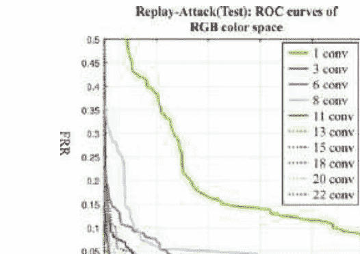

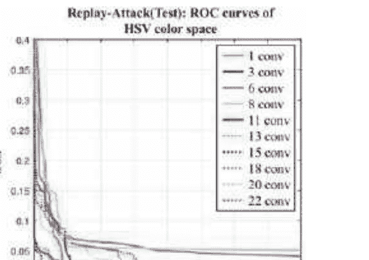

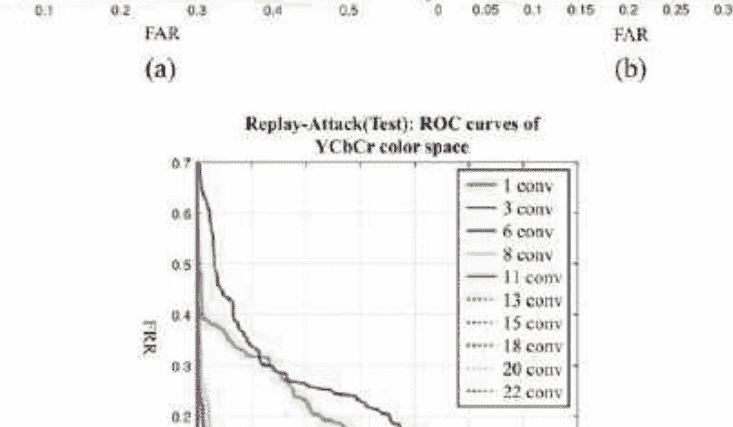

图4通过在Replay-Attack数据库上测试所提出的CNN&LBP获得的ROC曲线。(一)在RGB颜色空间中的ROC曲线。(二)在HSV颜色空间中的ROC曲线。(三)在YCbCr颜色空间中的ROC曲线。

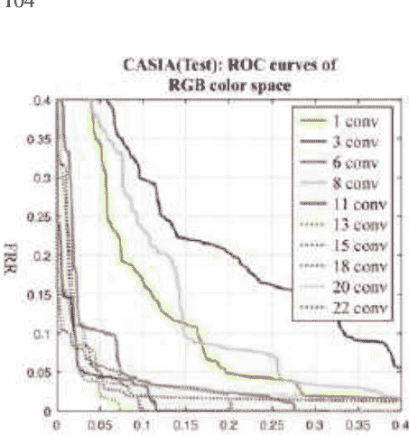

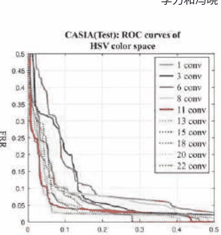

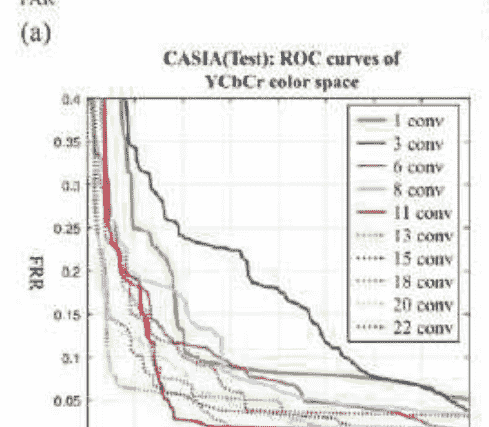

图5通过在CASIA-FA数据库上测试所提出的CNN&LBP获得的ROC曲线。(一)在RGB颜色空间中的ROC曲线。(二)在HSV颜色空间中的ROC曲线。(三)在YCbCr颜色空间中的ROC曲线。

距离原点的距离是蓝色虚线。这意味着对于Replay-Attack数据库，第15个卷积层是获得最低EER和HTER的最佳层。从两个图中可以得出结论，从HSV颜色空间提取的LBP描述符在所有卷积层中具有最强的鲁棒性。

表3来自不同卷积特征图的交叉结果。

| 训练 | 测试 | 空间 | 1 conv | 3 conv | 6 conv | 8 conv | 11 conv | 13 conv | 15 conv | 18 conv | 20 conv | 22 conv |
|---|---|---|---|---|---|---|---|---|---|---|---|---|
| 重放-攻击 | CASIA-FA | RGB | 39.4 | 42.6 | 48.6 | 49.1 | 41.1 | 45.2 | 41.7 | 51.4 | 49.1 | 46.7 |
| 重放-攻击 | CASIA-FA | HSV | 35.4 | 46.2 | 48.5 | 37.3 | 43.9 | 40.3 | 42.9 | 47.4 | 39.3 | 40.8 |
| 重放-攻击 | CASIA-FA | YCbCr | 54.7 | 46.6 | 66.3 | 53.2 | 52.7 | 53.5 | 52.0 | 56.2 | 48.5 | 51.4 |
| CASIA-FA | 重放-攻击 | RGB | 50.0 | 47.2 | 50.0 | 50.0 | 41.4 | 44.4 | 44.9 | 46.4 | 48.0 | 46.5 |
| CASIA-FA | 重放-攻击 | HSV | 38.6 | 42.7 | 40.1 | 36.4 | 38.1 | 36.7 | 40.1 | 42.5 | 40.0 | 38.9 |
| CASIA-FA | 重放-攻击 | YCbCr | 59.9 | 63.3 | 57.8 | 50.0 | 50.2 | 49.0 | 50.0 | 51.2 | 54.6 | 54.7 |

### 5.1.2 交叉测试

为了评估我们提出的方法的泛化能力，我们首先对VGG-face模型进行微调，并在Replay-Attack（或CASIA-FA）数据库上训练SVM分类器，然后在CASIA-FA（或Replay-Attack）数据库上进行测试。结果如表3所示。可以清楚地看到，从HSV空间提取的LBP描述符具有最强的泛化能力。Replay-Attack和CASIA-FA的HTER最低分别为35.4%和36.4%。

将表2与表3进行比较，可以发现在内部测试中，第15层和第18层是最好的卷积层，而在交叉测试中，最好的卷积层是第1层和第8层。这表明一个数据库中最好的LBP描述符可能不适用于另一个数据库。

## 5.2 连接不同颜色空间

### 5.2.1 内部测试

为了利用不同的颜色空间的优势，我们将LBP特征连接成一个特征向量。更具体地说，在我们的工作中，我们探索了四种机制来连接不同的颜色空间：RGB-HSV、RGB-YCbCr、HSV-YCbCr和RGB-YCbCr-HSV。内部测试的检测结果显示在表4中，ROC曲线在图6和图7中说明。将表4与表2进行比较，当连接RGB和HSV颜色空间时，整体性能显著提高。尤其是内部测试的最佳EER减少了超过34%，即使Replay-Attack数据库的HTER略微增加到1.3%。

图6和图7描述了连接的LBP描述符的鲁棒性。从前者可以清楚地看到，所有的线都位于坐标轴的中间，这意味着连接的LBP描述符对Replay-Attack数据库的鲁棒性较弱。但对于CASIA数据库来说，连接的LBP描述符具有较强的鲁棒性，如图7所示。

表4 来自不同卷积特征图的内部测试结果

| 数据库 | | 1 conv | 3 conv | 6 conv | 8 conv | 11 conv | 13 conv | 15 conv | 18 conv | 20 conv | 22 conv |
|--------|--------|--------|--------|--------|--------|---------|---------|---------|---------|---------|---------|
| 重放-攻击 | RGB-HSV | 等错误率 | 4.0 | 4.0 | 5.2 | 6.6 | 2.6 | 1.5 | 0.1 | 2.8 | 2.8 | 2.8 |
| | | HTER | 4.4 | 5.4 | 4.9 | 4.9 | 2.6 | 1.6 | 1.3 | 3.5 | 4.4 | 4.3 |
| | RGB-YCbCr | 等错误率 | 13.7 | 6.1 | 7.5 | 6.6 | 1.5 | 2.6 | 0.3 | 2.8 | 3.1 | 3.1 |
| | | HTER | 14.0 | 8.1 | 7.3 | 6.2 | 1.8 | 2.5 | 1.5 | 3.9 | 3.8 | 3.7 |
| | HSV-YCbCr | 等错误率 | 5.9 | 6.6 | 5.0 | 5.3 | 1.2 | 2.6 | 0.5 | 3.5 | 3.3 | 4.0 |
| | | HTER | 5.8 | 7.9 | 4.0 | 6.4 | 1.1 | 2.9 | 2.9 | 3.3 | 3.6 | 4.9 |
| | RGB-HSV-YCbCr | EER | 5.3 | 4.6 | 4.0 | 6.4 | 1.5 | 1.5 | 0.1 | 2.8 | 2.8 | 2.8 |
| | | HTER | 6.1 | 6.2 | 4.8 | 6.8 | 1.4 | 2.0 | 1.5 | 2.9 | 2.9 | 4.0 |
| CASIA-FA | RGB-HSV | 等错误率 | 6.4 | 16.0 | 7.0 | 8.2 | 2.5 | 2.5 | 2.6 | 3.5 | 2.6 | 4.1 |
| | RGB-YCbCr | 等错误率 | 9.0 | 10.0 | 3.3 | 7.2 | 5.1 | 4.2 | 4.4 | 5.4 | 6.0 | 5.4 |
| | HSV-YCbCr | 等错误率 | 5.4 | 7.9 | 6.3 | 5.3 | 2.6 | 3.1 | 2.6 | 4.4 | 5.1 | 4.2 |
| | RGB-HSV-YCbCr | EER | 6.1 | 11.0 | 3.3 | 3.6 | 2.3 | 2.5 | 2.6 | 4.4 | 4.2 | 5.0 |

### 5.2.2 交叉测试

表5展示了连接的LBP描述符的泛化能力。当我们的提出的方法在重放攻击数据集上训练并在CASIA-FA数据集上测试时，最佳HTER为31.2%。与表3相比，泛化性能提高了约12%。此外，当我们的提出的方法在CASIA-FA数据集上训练并在重放攻击数据集上测试时，泛化能力将显著提高。特别是对于连接的RGB-HSV颜色空间，最佳HTER可以从36.4%降低到20.7%。表3和表5显示，连接的颜色空间可以提高人脸反欺骗的泛化能力。

## 5.3 与最先进方法的比较

表6和表7提供了与最先进方法的比较。从这两个表中可以看出，我们提出的方法在Replay-Attack和CASIA-FA上的表现优于最先进的算法。更具体地说，表6比较了与其他方法的内部测试性能。考虑到Replay-Attack数据库，我们发现所提出的方法得到的EER为0.1%，非常接近[8]中报告的最佳EER。对于HTER指标，我们的性能比[8]好近四倍。特别是对于CASIA-FA，最大的EER为32.4%，比我们的EER高出14倍以上。表7比较了泛化能力。

# 通过深度局部二值模式进行人脸反欺骗

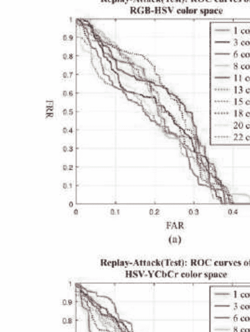

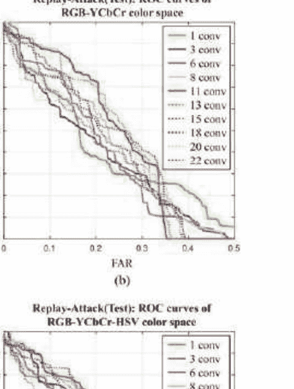

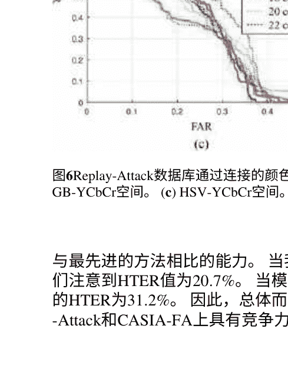

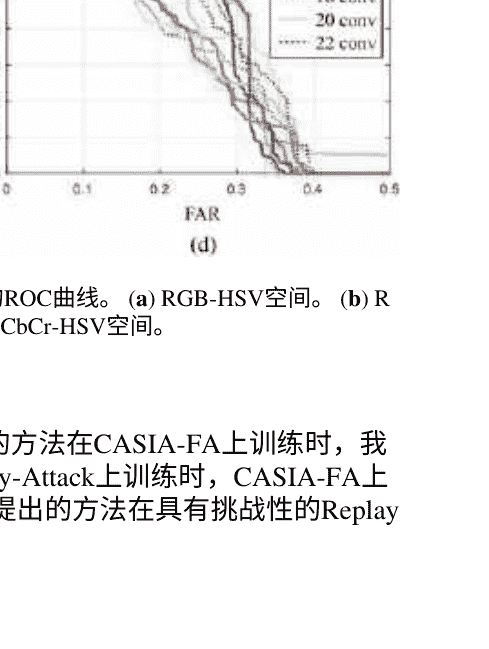

图6 Replay-Attack数据库通过连接的颜色空间获得的ROC曲线。(a) RGB-HSV空间。(b) RGB-YCbCr空间。(c) HSV-YCbCr空间。(d) RGB-YCbCr-HSV空间。

与最先进的方法相比的能力。当我们提出的方法在CASIA-FA上训练时，我们注意到HTER值为20.7%。当模型在Replay-Attack上训练时，CASIA-FA上的HTER为31.2%。因此，总体而言，我们提出的方法在具有挑战性的Replay-Attack和CASIA-FA上具有竞争力的性能。

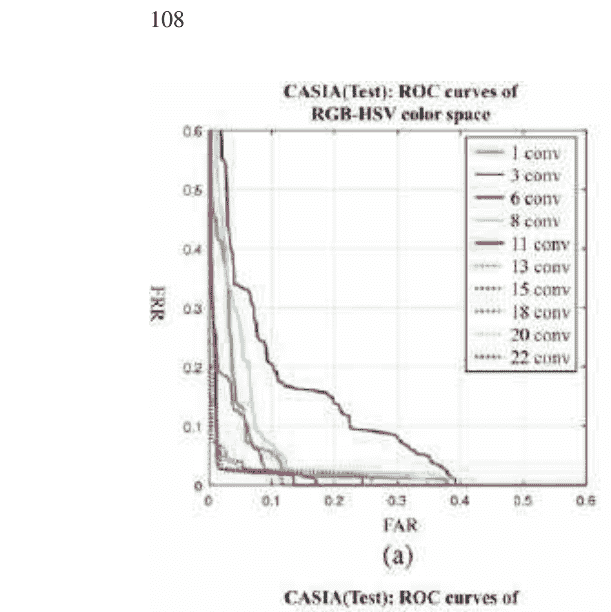

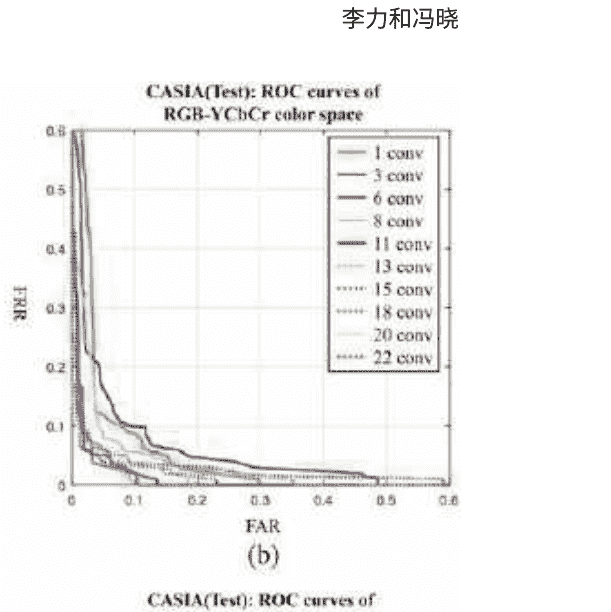

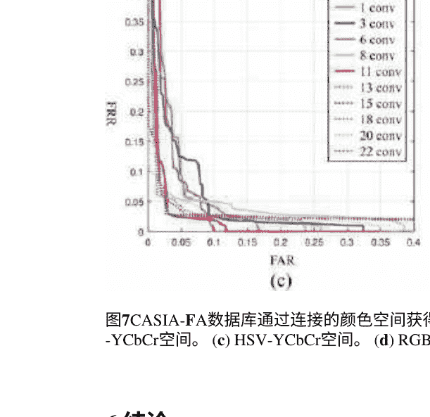

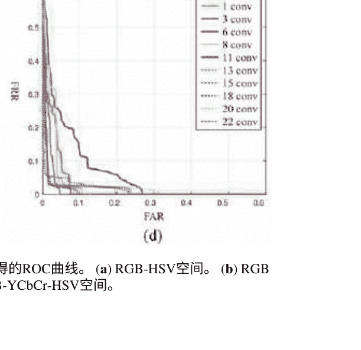

图7 CASIA-FA数据库通过连接的颜色空间获得的ROC曲线。(a) RGB-HSV空间。(b) RGB-YCbCr空间。(c) HSV-YCbCr空间。(d) RGB-YCbCr-HSV空间。

# 6 结论

在本章中，我们提出基于深度颜色纹理分析来检测人脸欺骗攻击。我们从卷积特征图中提取颜色纹理特征，并研究不同颜色图像表示（RGB、HSV和YCbCr）在描述真实人脸和伪造人脸之间颜色纹理固有差异方面的效果以及它们是否能提供互补的表示。还通过连接不同的颜色空间来研究不同的深度颜色纹理表示的有效性。在广泛的实验中，最新的两个具有挑战性的人脸欺骗数据库（Replay-Attack数据库和CASIA-FA数据库）显示出优秀的结果。更重要的是，我们提出的方法能够在这两个数据库上实现稳定的性能，而不像文献中大多数方法那样。此外，在我们的交叉测试中，深度颜色纹理表示显示出有希望的泛化能力，因此表明我们的方法在未知条件下似乎比现有技术更稳定。

作为未来的工作，我们计划在其他类型的反欺骗任务（如指纹和虹膜）上评估我们的方法。值得注意的是，有了训练图像的可用性，可以期望获得更好的结果。因此，我们将建立一个更大规模的人脸反欺骗数据库。

表5 来自不同卷积特征图的交叉测试结果

| 训练 | 测试 | 空间 | 1 conv | 3 conv | 6 conv | 8 conv | 11 conv | 13 conv | 15 conv | 18 conv | 20 conv | 22 conv |
|------|------|------|--------|--------|--------|--------|---------|---------|---------|---------|---------|---------|
| 重放-攻击 | CASIA-FA | RGB-HSV | 33.5 | 47.3 | 40.8 | 44.3 | 40.3 | 37.3 | 42.1 | 42.2 | 41.1 | 41.2 |
| 重放-攻击 | CASIA-FA | RGB-YCbCr | 46.9 | 45.7 | 54.4 | 48.5 | 47.4 | 46.6 | 47.8 | 52.8 | 45.3 | 44.6 |
| 重放-攻击 | CASIA-FA | HSV-YCbCr | 31.2 | 44.9 | 51.2 | 39.1 | 45.4 | 44.2 | 37.9 | 45.6 | 39.5 | 37.2 |
| 重放-攻击 | CASIA-FA | RGB-HSV-YCbCr | 32.4 | 47.7 | 46.5 | 41.4 | 41.5 | 39.1 | 43.1 | 40.6 | 42.6 | 35.8 |
| CASIA-FA | Replay-攻击 | RGB-HSV | 47.5 | 41.2 | 44.5 | 43.0 | 28.9 | 23.2 | 27.9 | 27.2 | 21.9 | 20.7 |
| CASIA-FA | Replay-攻击 | RGB-YCbCr | 50.9 | 57.0 | 49.8 | 50.0 | 47.5 | 46.7 | 48.9 | 47.7 | 50.8 | 49.4 |
| CASIA-FA | Replay-攻击 | HSV-YCbCr | 52.1 | 37.9 | 47.8 | 42.8 | 45.1 | 45.6 | 42.8 | 38.5 | 39.2 | 40.2 |
| CASIA-FA | Replay-攻击 | RGB-HSV-YCbCr | 49.9 | 40.1 | 49.9 | 45.9 | 38.8 | 41.4 | 41.3 | 35.9 | 37.8 | 38.1 |

表6 与最先进的性能进行性能比较

| 方法 | 重放攻击 EER(%) | 重放攻击 HTER(%) | CASIA-FA EER(%) |
|------|-----------------|------------------|------------------|
| 基于IQA的[18] | – | – | 32.4 |
| CDD [32] | – | – | 11.8 |
| DOG(基准线) [30] | – | – | 17.0 |
| 运动+LBP [33] | 4.5 | 5.1 | – |
| 运动 [31] | 11.6 | 11.7 | 26.6 |
| LBP [29] | 13.9 | 13.8 | 18.2 |
| LBP-TOP [13] | 7.8 | 7.6 | 10.6 |
| 光谱立方体 [34] | – | 2.8 | 14.0 |
| DMD [35] | 5.3 | 3.8 | 21.8 |
| 深度学习 [9] | 6.1 | 2.1 | 7.3 |
| LBP [36] | 0.4 | 2.9 | 6.2 |
| 彩色LBP [8] | 0.0 | 3.5 | 3.2 |
| 提出的方法 | 0.1 | 0.9 | 2.3 |

表格 7 将交叉测试结果与最先进的技术进行比较

| 方法 | 训练 | 测试 | HTER |
|------|------|------|----------|
| 运动 [31] | CASIA-FA | 重放攻击 | 50.2 |
| | Replay-Attack | CASIA-FA | 47.9 |
| LBP [31] | CASIA-FA | 重放攻击 | 45.9 |
| | 重放攻击 | CASIA-FA | 57.6 |
| LBP-TOP [31] | CASIA-FA | 重放攻击 | 47.9 |
| | 重放攻击 | CASIA-FA | 60.6 |
| 光谱立方体 [34] | CASIA-FA | 重放攻击 | 34.4 |
| | 重放攻击 | CASIA-FA | 50.0 |
| 深度学习 [9] | CASIA-FA | 重放攻击 | 48.5 |
| | 重放攻击 | CASIA-FA | 45.5 |
| LBP [36] | CASIA-FA | 重放攻击 | 47.0 |
| | 重放攻击 | CASIA-FA | 39.6 |
| 彩色LBP [8] | CASIA-FA | 重放攻击 | 30.3 |
| | 重放攻击 | CASIA-FA | 37.7 |
| 提出的方法 | CASIA-FA | 重放攻击 | 20.7 |
| | 重放攻击 | CASIA-FA | 31.2 |

# 参考文献

- 1. Y. Li, K. Xu, Q. Yan, Y. Li, R.H. Deng, Acm Sigsac信息计算与通信安全研讨会论文集 (2014)
- 2. L. Li, X. Feng, X. Jiang, Z. Xia, A. Hadid, IEEE国际图像处理会议论文集 (ICIP) (2017), pp. 101–105. DOI 10.1109/ICIP.2017.8296251
- 3. L. Li, X. Feng, Z. Boulkenafet, Z. Xia, M. Li, A. Hadid, 2016第六届国际图像处理理论、工具与应用会议论文集 (IPTA) (2016), pp. 1–6. DOI 10.1109/IPTA.2016.7821013
- 4. Z. Boulkenafet, J. Komulainen, A. Hadid, 在图像处理 (ICIP) 中，2015年IEEE国际会议 (2015)，第2636-2640页。 DOI 10.1109/ICIP.2015.7351280
- 5. D. Wen, H. Han, A.K. Jain, IEEE信息取证与安全交易 10 (4)，746 (2015年)
- 6. J. Maatta, A. Hadid, M. Pietikainen, 在国际联合生物识别大会 (2011)，第1-7页
- 7. I. Chingovska, A. Anjos, S. Marcel, 在IEEE生物识别国际会议特别兴趣小组 (2012)，第1-7页
- 8. Z. Boulkenafet, J. Komulainen, A. Hadid, IEEE信息取证与安全 11 (8)，1 (2016年)
- 9. J. 杨, Z. 雷, S.Z. 李, Eprint Arxiv 9218, 373 (2014)
- 10. D. Menotti, G. Chiachia, A. Pinto, W. Robson Schwartz, H. Pedrini, A. Xavier Falcao, A. Rocha, 计算机科学 10, 864 (2014)
- 11. A. Krizhevsky, I. Sutskever, G.E. Hinton, 神经信息处理系统的进展 25(2), 2012 (2012)
- 12. A. Anjos, S. Marcel, 在生物识别中, 国际联合会议(2011), pp. 1–7
- 13. T.D.F. Pereira, A. Anjos, J.M.D. Marrino, S. Marcel, 在计算机视觉的第11届国际会议 - 第一部分(2012), pp. 121–132
- 14. K. Kollreider, H. Fronthaler, J. Bigun, 图像与视觉计算 27(3), 233 (2009)
- 15. M.M. Chakka, A. Anjos, S. Marcel, R. Tronci, 在2011年国际联合生物特征学术会议(2011), 第1-6页
- 16. Z. Zhang, J. Yan, S. Liu, Z. Lei, 在生物特征学术会议 (ICB), 2012年第5届国际模式识别协会国际会议(2012), 第26-31页
- 17. J. Peng, P.P.K. Chan, 在小波分析与模式识别国际会议 (ICWAPR), 2014年国际会议(2014), 第176-181页 DOI 10.1109/ICWAPR.2014.6961311
- 18. J. Galbally, S. Marcel, 在国际模式识别会议 (ICPR)(2014), 第1173-1178页 DOI 10.1109/ICPR.2014.211
- 19. Z. Zhang, D. Yi, Z. Lei, S.Z. Li, 在IEEE国际自动人脸和手势识别会议及研讨会(2011), 第436-441页
- 20. G. Chetty, 23(3), 1 (2010)
- 21. T. Wang, J. Yang, Z. Lei, S. Liao, 在国际生物特征识别会议(2013), 第1-6页
- 22. Z. Akhtar, C. Michelon, G.L. Foresti, 在安全技术国际会议(2014), 第6695页
- 23. Z. Akhtar, C. Micheloni, C. Piciarelli, G.L. Foresti, 在高级视频和信号监控国际会议(2014), 第187-192页. DOI 10.1109/AVSS.2014.6918666
- 24. D. Menotti, G. Chiachia, A. Pinto, W. Robson Schwartz, H. Pedrini, A. Xavier Falcao, A. Rocha, 信息取证与安全, IEEE Transactions on 10(4), 864 (2015)
- 25. O.M. Parkhi, A. Vedaldi, A. Zisserman, 在英国机器视觉会议上 (2015)
- 26. R. Lukac, K.N. Plataniotis, 彩色图像处理: 方法与应用(CRC, Taylor and Francis, 2007)
- 27. T. Ojala, M. Pietikainen, T. Maenpaa, IEEE Transactions on Pattern Analysis and Machine Intelligence 24(7), 971 (2002)
- 28. R.E. Fan, K.W. Chang, C.J. Hsieh, X.R. Wang, C.J. Lin, 机器学习研究杂志 9(12), 1871 (2010)
- 29. I. Chingovska, A. Anjos, S. Marcel, 在国际生物特征学会议(BIOSIG)(2012), 第1-7页
- 30. Z. Zhang, J. Yan, S. Liu, Z. Lei, D. Yi, S. Li, 在国际生物特征学会议(ICB)(2012), 第26-31页
- 31. T. de Freitas Pereira, A. Anjos, J. De Martino, S. Marcel, 在国际生物特征学会议(ICB)(2013), 第1-8页
- 32. J. Yang, Z. Lei, S. Liao, S. Li, 在2013年国际生物特征学会议(ICB) (2013), 第1-6页
- 33. J. Komulainen, A. Hadid, M. Pietikainen, A. Anjos, S. Marcel, 在国际生物特征学会议(ICB) (2013), 第1-7页 DOI 10.1109/ICB.2013.6612968
- 34. A. Pinto, H. Pedrini, W.R. Schwartz, A. Rocha, IEEE图像处理交易A IEEE信号处理学会出版 24(12), 4726 (2015)
- 35. S. Tirunagari, N. Poh, D. Windridge, A. Iorliam, N. Suki, A.T.S. Ho, IEEE信息取证与安全交易 10(4), 762 (2015)
- 36. Z. Boulkenafet, J. Komulainen, A. Hadid, 在IEEE国际图像处理会议(ICIP2015) (2015)## 基于深度学习的亲属验证

Xiaoting Wu, Xiaoyi Feng, Lei Li, Elhocine Boutellaa, 和 Abdenour Hadid

摘要 使用面部图像进行自动亲属验证是计算机视觉中一个相对较新且具有挑战性的研究问题。它通过检查他们的面部属性来自动预测两个人是否具有生物亲属关系。虽然大多数现有的作品从静态面部图像中提取浅层手工特征，但在本章中，我们从深度学习的角度来解决这个问题。在UvA-NEMO微笑数据库和KinFaceW-I和KinFaceW-II亲属面部数据库上取得了有希望的结果，尤其是深度特征的结果。

# 1 引言

对于我们人类来说，从面部识别我们的亲戚是一种常见且容易的做法。亲戚通常会想知道新生儿从哪个家庭成员那里继承了哪些面部特征。亲缘识别的人类能力已经成为许多心理学研究的对象[8, 9]。受这些研究的启发，自动亲缘（或家庭）验证[12, 37]最近被视为计算机视觉中一个有趣且开放的研究问题，受到研究界的越来越多的关注。

从面部进行自动亲缘验证的目标是通过比较他们的面部特征来确定两个人是否具有生物亲缘关系。亲缘验证对于自动分析每天在社交媒体上共享的大量照片非常重要。它有助于理解这些照片中的家庭关系。亲缘验证在失踪儿童、老年人患有阿尔茨海默病或可能的绑架案件等情况下也非常有用。例如，一个通过监控摄像头捕捉到的两个人（例如成年人和儿童）之间的可疑行为可以进行进一步分析，以确定他们是否来自同一个家庭，以防止犯罪和绑架。亲属验证还可以用于自动组织家庭相册和生成家谱。

使用面部图像/视频进行亲属验证是一项非常具有挑战性的任务。它继承了在恶劣姿势、表情、光照和遮挡条件下捕获的图像中的面部验证的研究问题。此外，亲属验证还应处理更广泛的类内和类间变化，因为同一家庭的人可能看起来非常不同，而没有亲属关系的人的面部可能看起来相似。此外，自动亲属验证提出了新的挑战，因为一对输入图像可能来自不同性别的人（例如兄妹亲属）和/或年龄差异较大的人（例如父女亲属）。过去几年中发表的论文和组织的竞赛（例如[21, 24]）在自动亲属验证方面取得了一些有希望的结果。典型的当前最佳方法结合了几个面部描述符，应用度量学习方法，并计算亲属验证的特征对之间的欧氏距离。似乎大多数这些工作主要基于浅层手工特征。因此，它们与机器学习的最新重大进展无关，这表明应使用深度特征。在本研究中，我们介绍了从静态和动态角度利用深度学习进行面部图像的亲属验证的新方法，并利用了深度学习在面部分析方面的最新进展。

本章的其余部分按照以下方式组织。第2节讨论相关工作。基于图像的亲属验证和基于视频的亲属验证分别在第3节和第4节中描述。第5节得出结论并指出未来的研究方向。

# 2 相关工作

已经发表了很多关于面部亲属验证的研究论文。此外，过去几年还举办了两次亲属验证竞赛。第一次竞赛于2014年在美国佛罗里达州克利尔沃特与国际联合生物特征会议（IJCB'2014）同时举行[22]。有四个参与者参加了这次第一次竞赛。第二次竞赛与2015年国际自动人脸和姿态识别会议（FG 2015）同时举行，地点在斯洛文尼亚卢布尔雅那[23]。有五个团队参加了这次最后一次竞赛。在两次竞赛中，使用KinFaceW（I和II）数据库和协议来评估竞争算法。与前一次竞赛相比，后一次竞赛中的验证性能有了显著提高。然而，在第二次竞赛中，测试集对参与者是可用的，而第一次竞赛则不是。接下来，我们对亲属验证的文献进行了总结。根据主要贡献，我们将提出的方法分为三个不同的类别：

## 2.1 基于特征的方法

面部描述是任何面部分析系统中的关键步骤。事实上，如果提取的面部特征具有足够的区分性，分类可以简单地使用线性分类器（如最近邻）进行。对于亲属问题，已经研究了不同的特征提取方法[22, 23, 30, 32, 38]和策略，包括选择[13]，学习[34]和融合[4]。最初的亲属研究集中在选择有用的特征上。例如，[13]的作者选择了大约22种面部特征。通过实验证明，他们根据各自的性能对特征进行排名，并选择了前14个特征，其准确率超过50%。所选特征可以分为两种类型：肤色特征和不同面部部位之间的距离。Wang等人[30]同时使用了外观和几何特征。作为外观特征，通过考虑不同尺寸为每个面部构建金字塔图像，然后从重叠的补丁中提取LBP特征。应用高斯混合模型来找到两个面部图像之间对应的相似补丁对。出现的特征被视为两个GMM补丁向量之间的绝对差异。至于几何特征，首先检测面部标志点，然后将其投影到Grassmann流形上，并使用测地距离来衡量两个面部形状的差异。Yan等人[34]从支持向量机（SVM）超平面中学习与决策值相对应的中层特征。在学习的特征上制定了一个目标函数，使得具有亲属关系的面部样本的决策值从超平面上具有相似性。在训练中，使用了一个大型无标签面部数据集和一个带有亲属关系标签的小型面部对数据集。作者进一步引入了一种多视角方法，从多个低级描述符中学习一个共同的中层特征表示。所使用的低级特征包括LBP、空间金字塔学习（SPLE）和SIFT。特征融合是[4]的目标，其中提取了四种不同的纹理特征：LPQ、WLD、TPLBP和FPLBP。对于每个特征，计算并归一化了一对图像的向量之间的差异，并将这四个特征连接形成对描述符。最小冗余最大相关算法被应用于进行特征选择，并且使用SVM进行分类。这种方法在第二个亲属竞赛的限制图像配置中获得了最佳性能[23]。

## 2.2 使用度量学习的方法

由于父母和子女之间的面部外貌相似性大于无关人员之间的相似性，因此对于解决亲属验证问题，人们对使用不同的度量学习方法特别感兴趣。度量学习旨在从数据中自动学习相似性度量，而不是使用手工设计的距离。在亲属验证问题中，目标是学习一种度量，使得具有亲属关系的人脸特征对之间的距离小于没有关系的对之间的距离。在最早的解决亲属验证问题的方法中，Somanath和Kambhamettu [29]应用了集成度量学习。训练数据最初使用不同的相似性核进行聚类。然后基于初始聚类学习最终的核。对于每个亲属关系，学习的核确保相关对之间的相似性大于无关对之间的相似性。与之前的工作类似，最近Zhou等人[40]应用了集成相似性学习来解决亲属验证问题。他们通过最小化图像对之间的亲属约束的违反和最大化相似性基的多样性，从亲属数据中学习了一组稀疏双线性相似性基。Lu等人[20]学习了一种距离度量，其中具有亲属关系的人脸对被拉近，而没有亲属关系的人脸对被推开。Yan等人[33]和Hu等人[15]基于不同的特征学习了多个距离度量，同时最大化亲属约束（具有亲属关系的对之间的距离必须小于没有亲属关系的对之间的距离）和不同特征的相关性。

## 2.3 其他方法

在亲属验证的其他方法中，Xia等人[31]在UB KinFace数据库上应用子空间迁移学习，以减轻儿童和年长父母之间的巨大差异。为此，年轻父母被视为儿童和年长父母之间的中间领域。通过寻求一个子空间投影来实现迁移学习，其中中间领域（年轻父母）和源领域（儿童）以及目标领域（年长父母）共享相同的分布。最近，Chen等人[6]从多线性一致空间的角度解决了亲属验证问题，其中父母和子女图像被视为两个不同的视图数据。然后，不同尺度的局部图像块通过规范相关分析独立地投影到一致空间中，以使具有亲属关系的图像块对更相关。进一步，只选择有用的面部图像块进行亲属验证。Qin等人[28]研究了三主体亲属验证，而不是从一对面部图像进行亲属验证。考虑了两种关系：父母-母亲-女儿和父母-父母-儿子。作者介绍了一种相对对称的双线性方法来建模孩子和父母之间的相似性（一对一对二匹配）。Kou等人[18]提出了一种在线稀疏相似性学习方法，用于亲属验证。作者针对四重输入制定了两个亲属三元组约束，涉及正对和负对，以使具有亲属关系的对的相似性高于来自不同家庭的对的相似性。

# 基于图像的亲属验证

在这项工作中，我们提出了一种基于相似度度量的卷积神经网络（SMCNN）的面部图像亲属验证新方法。这种方法部分受到Yan等人[33]的工作的启发，他们提出了一种基于深度神经网络的度量学习方法，用于面部验证任务。然而，与Yan等人的工作不同，他们将手工制作的特征作为深度神经网络的输入，我们的方法探索了自动学习的特征用于亲属验证。

## 3.1 方法论

从图1可以看出，SMCNN架构由两个相同的卷积神经网络组成。每个网络包含八个层（见图2）：

图1 我们提出的基于相似度度量的卷积神经网络（SMCNN）在亲属验证中的框架。首先，一对图像被输入到两个相同的卷积神经网络中。然后计算它们输出之间的L1范数。最后，根据学习到的阈值做出决策。

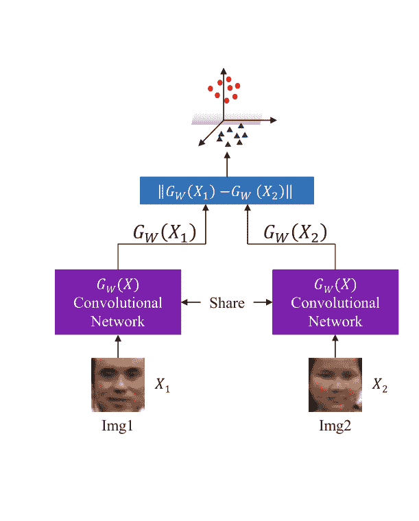

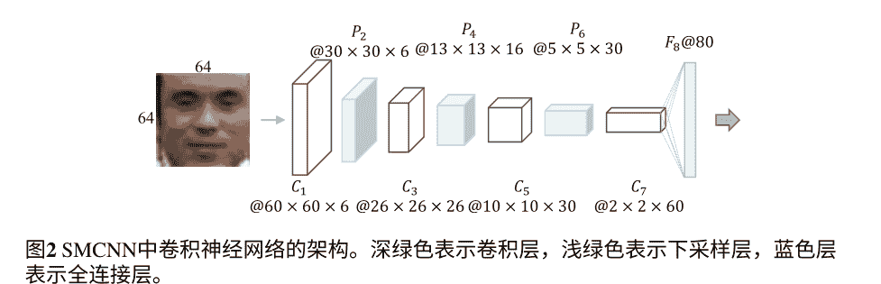

| 层 | C1 | P2 | C3 | P4 | C5 | P6 | C7 | F8 |
| --- | --- | --- | --- | --- | --- | --- | --- | --- |
| 输入数 | 1 | 6 | 6 | 16 | 16 | 30 | 30 | 60 |
| 输出数 | 6 | 6 | 16 | 16 | 30 | 30 | 60 | 80 |
| 过滤器大小 | 5×5 | 2×2 | 5×5 | 2×2 | 4×4 | 2×2 | 4×4 | 2×2 |

我们的卷积层有四层，池化层有三层，还有一个全连接层。这些层的连接顺序如下：C1 - P2 - C3 - P4 - C5 - P6 - C7 - F8，其中Ct表示卷积层，Pt表示池化（子采样）层，Ft表示全连接层，t为层索引。在我们提出的方法中，池化层进行了子采样操作。每个层的详细参数见表1。

设xi和xj表示灰度输入图像（即对应于图1中的灰度图像Img1和Img2），y表示图像对（xi, xj）的标签。如果图像对具有亲缘关系（称为正对），则y = 1，否则y = -1（称为负对）。W表示卷积神经网络的权重。GW(xi)和GW(xj)表示卷积神经网络给出的特征。GW(xi)和GW(xj)之间的距离通过L1范数来衡量，定义如下：

> $D_G(x_i, x_j) = \|G_W(x_i) - G_W(x_j)\|_1$

正样本图像对的距离DG(xi, xj)应该更小，负样本图像对的距离应该更大。在[16]中，使用了两个阈值进行分类。如果DG(xi, xj)小于预定义的阈值τ1，则DG(xi, xj)属于正样本图像对。否则，如果DG(xi, xj)大于阈值τ2(τ1 < τ2)，则DG(xi, xj)属于负样本图像对。

为了简化使用两个卷积神经网络的分类方案，阈值τ1和τ2可以合并为一个阈值τ，使得τ大于1且满足以下条件：

> $y(\tau - D_G(x_i, x_j)) > 1$

SMCNN的成本函数可以表示为:

$$\arg\min_{G} J = J_1 + J_2 = \sum_{i,j} f(1 - y(\tau - D_G(x_i, x_j))) + \frac{\lambda}{2}(\|W\|_F^2 + \|b\|_F^2) \quad (3)$$

其中，$f(t) = \frac{1}{\beta}log(1 + exp(\beta t))$是广义逻辑损失函数[25]，$\beta$是一个锐度参数，操作$\|M\|_F$表示矩阵$M$的Frobenius范数，$\lambda$是一个正则化参数。

为了最小化方程3中的成本函数，采用了次梯度下降算法在卷积神经网络中。$W_t$表示第$t$层的权重参数，而$b_t$表示偏置项。基于反向传播原理，关键思想是计算全连接层中的误差项$\delta_F$。因此，SMCNN的误差项为：

$$\delta = y \cdot f'(u) \cdot sign(c) \quad (4)$$

其中，$y$是图像对的标签（$y = 1$或$y = -1$），$u = 1 - y(-D_G(x_i, x_j))$，$c = abs(G_W(x_i) - G_W(x_j))$，$sign$是符号函数，是$c$的绝对值函数的近似，如公式5所示：

$$sign(c) = \begin{cases} -1, & c < 0 \\ 0, & c = 0 \\ +1, & c > 0 \end{cases} \quad (5)$$

卷积神经网络中全连接层的误差项可以通过以下方式计算：

$$\begin{aligned} \delta_{F_i} &= \delta \quad s'(F_8(x_i)) \\ \delta_{F_j} &= -\delta \quad s'(F_8(x_j)) \end{aligned} \quad (6)$$

其中$F_8(x_i)$是全连接层的输出，符号$s$是全连接层的激活函数。在计算完全连接层的误差项$\delta_F$之后，可以通过反向传播[7]计算$W_t$和$b_t$的偏导数。然后，可以使用梯度下降算法来更新相应的参数，如下所示：

$$ W_t = W_t - \rho \cdot \frac{\partial J}{\partial W} $$
$$ b_t = b_t - \rho \cdot \frac{\partial J}{\partial b} $$
(7)

其中ρ是学习率，在我们的实验中设置为 ρ = 0.001。使用的工具箱是“DeepLearnToolbox”[26]。DeepLearnToolbox中没有现成的SMCNN框架，因此我们进行了一些修改来构建SMCNN。这些修改主要涉及两个方面。首先，我们改变了第一个卷积层和第二个卷积层之间的连接。其次，我们将激活函数从sigmoid改为tanh。

部分连接为了提取不同（希望是互补的）特征并保持连接数量在合理范围内，我们采用了部分连接方案，将第一个卷积层和第三个卷积层之间进行连接，如表2所示。

$$ s(z) = \tanh(z) = \frac{exp(z) - exp(-z)}{exp(z) + exp(-z)} $$
$$ s'(z) = \tanh'(z) = 1 - \tanh^2(z) $$
(8)

参数初始化我们根据高斯分布随机初始化权重W和偏置项b，均值为0，标准差为0.05。

表2层$C_1$和$C_3$之间的连接方案

| C1\C3 | 1 | 2 | 3 | 4 | 5 | 6 | 7 | 8 | 9 | 10 | 11 | 12 | 13 | 14 | 15 | 16 |
| --- | --- | --- | --- | --- | --- | --- | --- | --- | --- | --- | --- | --- | --- | --- | --- | --- |
| 1 | √ | | | | √ | √ | √ | | | √ | √ | √ | √ | | √ | √ |
| 2 | √ | √ | | | | √ | √ | √ | | | √ | √ | √ | √ | | √ |
| 3 | √ | √ | √ | | | | √ | √ | √ | | | √ | | √ | √ | √ |
| 4 | | √ | √ | √ | | | √ | √ | √ | √ | | | √ | | √ | √ |
| 5 | | | √ | √ | √ | | | √ | √ | √ | √ | | √ | √ | | √ |
| 6 | | | | √ | √ | √ | | | √ | √ | √ | √ | | √ | √ | √ |

## 3.2 实验分析

为了评估我们提出的SMCNN方法的性能，我们在公开可用的基准数据集Kin FaceW [19]上进行了实验，可以在图3中看到。KinFaceW数据集包含KinFace W-I和KinFaceW-II，包括四种亲属关系：父子（FS），父女（FD），母子（MS）和母女（MD）。在KinFaceW-I中，父子（FS），父女（FD），母子（MS）和母女（MD）的亲属关系数量分别为156，134，116和127。在KinFaceW-II中，总共有250对亲属关系。根据KinFaceW的网页，我们使用预先指定的训练/测试分割，这是随机生成的，并且独立地用于五个折叠。四个折叠用于训练，而剩余的一个折叠用于测试。

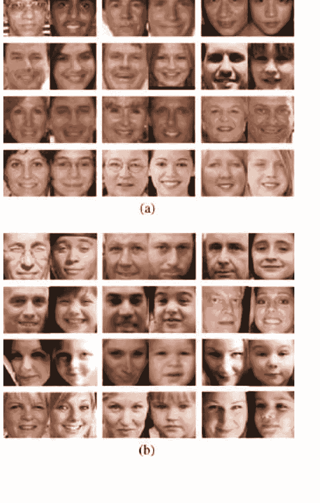

| 方法 | KinFaceW-I FD | KinFaceW-I FS | KinFaceW-I MD | KinFaceW-I MS | KinFaceW-II FD | KinFaceW-II FS | KinFaceW-II MD | KinFaceW-II MS |
| --- | --- | --- | --- | --- | --- | --- | --- | --- |
| DMML2014 [33] | 74.5 | 69.5 | 69.5 | 75.5 | 78.5 | 76.5 | 78.5 | 79.5 |
| MNRML2014 [20] | 72.5 | 66.5 | 66.2 | 72.0 | 76.9 | 74.3 | 77.4 | 77.6 |
| SM 2015 [18] | 66.1 | 62.2 | 64.3 | 70.0 | 74.9 | 71.0 | 76.9 | 76.4 |
| 提出的SMCNN | 75.0 | 75.0 | 72.2 | 68.7 | 79.0 | 75.0 | 85.0 | 78.0 |

从表3可以看出，我们提出的方法在现有技术中与相关方法相比具有优势。在KinFaceW-I上，我们的方法在所有亲属关系中都取得了最佳性能，除了MS关系，最佳结果是由DMML 2014 [33]获得的。在KinFaceW-II上，我们的方法在两种情况下（FD和MD）取得了最佳结果，而DMML 2014 [33]在另外两种情况下（FS和MS）略微更好。值得注意的是，我们的方法在所有情况下，无论是KinFaceW-I还是KinFaceW-II，都优于MNRML 2014 [20]和SM 2015 [18]方法。

我们可以从表3中看出，KinFaceW-II上的结果比KinFaceW-I上的结果要好。原因是KinFaceW-II中的图像是从相同的图片中裁剪出来的，因此它们共享相似的环境，如光照强度和色度。然而，KinFaceW-I是从不受控制的环境中收集的不同图片中获取的。

# 基于视频的亲属验证

过去几年中，发表的论文和组织的比赛（例如[21, 24]）在自动亲属验证方面展示了一些有希望的结果。典型的当前最佳方法结合了几个面部描述符，应用度量学习方法，并计算亲属验证中特征对之间的欧氏距离。似乎大部分这些工作主要基于浅层手工特征。因此，它们与机器学习的最新重大进展无关，后者建议使用深度特征。此外，面部动态在亲属验证中的作用大多未被探索，因为几乎所有现有的工作都集中在分析静态面部图像而不是视频序列上。基于这些观察，我们提出从时空角度来解决亲属验证问题，并利用深度学习在面部分析方面的最新进展。

给定两个面部视频序列，为了验证它们的亲缘关系，我们提出的方法从基于眼睛坐标的面部图像检测、分割和对齐开始。然后，提取两种类型的描述符：浅层时空纹理特征和深度特征。作为时空特征，我们提取局部二值模式（LBP）[1]、局部相位量化（LPQ）[2]和二值化统计图像特征（BSIF）[17]。这些特征都是从视频的三个正交平面（TOP）中提取的。深度特征是通过卷积神经网络（CNN）[27]提取的。然后，将要比较的面部对的特征向量组合起来，作为支持向量机（SVM）的输入进行分类。我们在基准UvA-NEMO微笑数据库[10]上进行了大量实验，取得了非常有希望的结果，尤其是在深度特征方面。结果还清楚地证明了使用视频而不是静态图像的优越性，从而指出了面部动态在亲缘关系验证中的重要作用。此外，将两种类型的特征（即浅层时空纹理特征和深度特征）融合在一起，与最先进的方法相比，可以显著提高性能。

## 4.1 方法论

在我们的方法中，第一步是从每个视频序列中分割出面部区域。为此，我们采用了基于主动形状模型（ASM）的方法来检测68个面部标志点。然后，我们使用检测到的标志点从视频的每个帧中裁剪出包含面部的区域。最后，我们使用关键标志点对面部区域进行对齐，并注册到预定义的模板上。

为了描述视频中的面部，我们使用了两种类型的特征：纹理时空特征和深度学习特征。这些特征在本小节中介绍。

时空纹理特征已被证明在各种面部分析任务中具有高效性，如面部识别和面部表情分类。在这项工作中，我们提取了三种局部纹理描述符：LBP [1]，LPQ [2]和BSIF [17]。这三种特征能够使用十进制值的直方图来描述图像。图像中每个像素对应的代码是通过像素邻域对滤波器组的一系列二进制响应计算得出的。在LBP和LPQ中，滤波器是手工设计的，而BSIF的滤波器是从自然图像中学习得到的。具体而言，在LBP中，像素的二进制代码是通过将其值与圆对称的P个邻域像素（在半径为R的圆上）进行阈值处理得到的。LPQ编码了短时傅里叶变换（STFT）的四个频率在围绕像素的大小为W×W的局部窗口中的局部相位信息。BSIF通过独立成分分析（ICA）学习得到的f个大小为W×W的独立滤波器的响应进行二值化处理。

从视频的三个正交平面XY、XT和YT [36]中提取面部的时空纹理动态。X和Y是视频的水平和垂直空间轴，T代表时间。每个平面的纹理特征被聚合成一个单独的直方图。然后将这三个直方图连接成一个特征向量。为了充分利用多分辨率表示[5]，这三个特征在多个尺度上提取，改变它们的参数。对于LBP描述符，选择的参数为P = {8, 16, 24}和R = {1, 2, 3}。对于LPQ和BSIF描述符，选择的滤波器尺寸为W =

深度学习特征深度神经网络最近在各种分类任务中表现出色。特别是，在对象分类和人脸识别方面，卷积神经网络（CNNs）展示了令人印象深刻的性能。然而，深度神经网络需要大量的训练数据来学习高效的特征。

不幸的是，目前可用的亲属数据库并非如此。我们使用了Siamese CNN架构和之前的工作[35]提出的深度架构进行了初步实验。正如预期的那样，这两种方法的性能都比使用浅层特征要低，这是由于缺乏足够的训练数据。

提取深度人脸特征的另一种方法是使用预训练网络。已经有许多非常深的预训练架构可供研究社区使用。受到人脸识别和亲属验证问题之间的相似性的启发，我们决定使用VGG-face [27]网络。VGG-face最初是在2622人的超过260万张图像的相当大的数据集上进行人脸识别训练的。

这个网络已经在图像对和视频的人脸验证中进行了评估，并与最先进的技术相比表现出有趣的性能。与最先进的技术相比，这个网络在人脸验证方面表现出有趣的性能。

VGG-face CNN的详细参数由表4提供。网络的输入是一个尺寸为224 × 224像素的RGB人脸图像。该网络由13个线性卷积层 (conv)组成，每个卷积层后面都跟着一个非线性激活层 (relu)。其中一些激活层后面跟着一个非线性最大池化层 (mpool)。接下来是两个全连接层 (fc)，都输出一个大小为4096的向量。在初始网络的顶部，有一个大小为类别数 (2622) 的全连接层和一个用于计算类别后验概率的softmax层。

在这个背景下，为了提取亲缘验证的深度人脸特征，我们逐帧输入视频帧到CNN中，并收集由全连接层fc7发出的特征向量 (除了类别预测器fc8层和softmax层之外的所有层都被使用)。最后，给定人脸视频的所有帧的特征被平均，得到一个可用于分类的视频描述符。

为了将一对面部特征分类为正 (两个人之间存在亲属关系) 或负 (两个人之间不存在亲属关系)，我们使用了一个双类线性支持向量机分类器 (SVM)。在将特征输入SVM之前，每对特征都必须转换为单个特征向量，这是分类器要求的。我们已经尝试了多种方法来组合一对特征，例如串联和向量距离。我们经验性地发现，利用归一化的绝对差异可以获得最佳性能。因此，在我们的实验中，一对特征向量 $X = \{x_1, \dots, x_d\}$ 和 $Y = \{y_1, \dots, y_d\}$ 被表示为向量 $F = \{f_1, \dots, f_d\}$，其中：

$$f_i = \sum_j \frac{|x_j - y_j|}{\sum_j (x_j + y_j)}$$

表4 VGG-face CNN 架构

| 层 | 类型 | 名称 | 支持 | 滤波器维度 | 滤波器数量 | 步长 | 填充 |
|----|------|------|------|------------|------------|------|------|
| 0 | 输入 | 输入 | 3 | 3 | 64 | 1 | 1 |
| 1 | 卷积 | conv1_1 | 1 | 3 | 64 | 1 | 1 |
| 2 | relu | relu1_1 | 1 |  |  | 1 | 0 |
| 3 | 卷积 | conv1_2 | 3 | 3 | 64 | 1 | 1 |
| 4 | relu | relu1_2 | 1 |  |  | 1 | 0 |
| 5 | mpool | pool1 | 2 |  |  | 2 | 0 |
| 6 | 卷积 | conv2_1 | 3 | 64 | 128 | 1 | 1 |
| 7 | relu | relu2_1 | 1 |  |  | 1 | 0 |
| 8 | 卷积 | conv2_2 | 3 | 128 | 128 | 1 | 1 |
| 9 | relu | relu2_2 | 1 |  |  | 1 | 0 |
| 10 | mpool | pool2 | 2 |  |  | 2 | 0 |
| 11 | 卷积 | conv3_1 | 3 | 128 | 256 | 1 | 1 |
| 12 | relu | relu3_1 | 1 |  |  | 1 | 0 |
| 13 | 卷积 | conv3_2 | 3 | 256 | 256 | 1 | 1 |
| 14 | relu | relu3_2 | 1 |  |  | 1 | 0 |
| 15 | 卷积 | conv3_3 | 3 | 256 | 256 | 1 | 1 |
| 16 | relu | relu3_3 | 1 |  |  | 1 | 0 |
| 17 | mpool | pool3 | 2 |  |  | 2 | 0 |
| 18 | 卷积 | conv4_1 | 3 | 256 | 512 | 1 | 1 |
| 19 | relu | relu4_1 | 1 |  |  | 1 | 0 |
| 20 | 卷积 | conv4_2 | 3 | 512 | 512 | 1 | 1 |
| 21 | relu | relu4_2 | 1 |  |  | 1 | 0 |
| 22 | 卷积 | conv4_3 | 3 | 512 | 512 | 1 | 1 |
| 23 | relu | relu4_3 | 1 |  |  | 1 | 0 |
| 24 | mpool | pool4 | 2 |  |  | 2 | 0 |
| 25 | 卷积 | conv5_1 | 3 | 512 | 512 | 1 | 1 |
| 26 | relu | relu5_1 | 1 |  |  | 1 | 0 |
| 27 | 卷积 | conv5_2 | 3 | 512 | 512 | 1 | 1 |
| 28 | relu | relu5_2 | 1 |  |  | 1 | 0 |
| 29 | 卷积 | conv5_3 | 3 | 512 | 512 | 1 | 1 |
| 30 | relu | relu5_3 | 1 |  |  | 1 | 0 |
| 31 | mpool | pool5 | 2 |  |  | 2 | 0 |
| 32 | 卷积 | fc6 | 7 | 512 | 4096 | 1 | 0 |
| 33 | relu | relu6 | 1 |  |  | 1 | 0 |
| 34 | 卷积 | fc7 | 1 | 4096 | 4096 | 1 | 0 |
| 35 | relu | relu7 | 1 |  |  | 1 | 0 |
| 36 | 卷积 | fc8 | 1 | 4096 | 2622 | 1 | 0 |
| 37 | softmax | prob | 1 |  |  | 1 | 0 |

## 4.2 实验分析

为了评估所提出的方法，我们使用了UvA-NEMO微笑数据库[10]，这是目前唯一可用的视频亲缘关系数据库。该数据库最初是为了分析被试者的姿态微笑与自发微笑而收集的。视频以1920 × 1080像素的分辨率以每秒50帧的速度在受控照明条件下录制。在视频的背景上放置了一个色彩图表，以便进行进一步的照明和颜色归一化。这些视频是在受控条件下收集的，不显示任何偏见[3]。数据库中被试者的年龄从8岁到76岁不等。许多家庭参与了数据库的收集，使其可以用于从视频中自动评估亲缘关系。数据库中的152个被试者之间确定了95个亲缘关系。视频对之间存在七种不同的亲缘关系：姐妹-姐妹（S-S），兄弟-兄弟（B-B），姐妹-兄弟（S-B），母亲-女儿（M-D），母亲-儿子（M-S），父亲-女儿（F-D）和父亲-儿子（F-S）。具有亲缘关系的人的视频之间有228对自发微笑视频和287对姿态微笑视频。数据库的统计数据总结在表5中。

根据[11]，我们随机生成与每个正对应的负亲属对。因此，对于每个正对，我们将第一个视频与同一亲属子集中的另一个人的视频相关联，同时确保两个主体之间没有关系。图4展示了正对和生成的负对的示例。对于所有实验，我们进行逐关系评估，并报告自发和假设视频的平均值。同时提供了整个数据库的准确率，通过汇总所有关系。由于每个关系的对数较少，我们采用一种留一法评估方案。

我们进行了各种实验来评估所提出方法的性能。接下来，我们将介绍并分析报告的结果。深度特征与浅层特征的对比：首先，我们比较了深度特征与时空特征的性能。不同特征的结果在表6中报告。分别针对不同关系的ROC曲线以及整体关系的ROC曲线。

表5 UvA-NEMO微笑数据库的亲属统计数据

| 关系 | 自发的主题编号 | 自发的视频编号 | 摆拍的主题编号 | 摆拍的视频编号 |
|------|----------------|----------------|----------------|----------------|
| S-S  | 7              | 22             | 9              | 32             |
| B-B  | 7              | 15             | 6              | 13             |
| S-B  | 12             | 32             | 10             | 34             |
| M-D  | 16             | 57             | 20             | 76             |
| M-S  | 12             | 36             | 14             | 46             |
| F-D  | 9              | 28             | 9              | 30             |
| F-S  | 12             | 38             | 19             | 56             |
| 全部 | 75             | 228            | 87             | 287            |

图4 UvA-NEMO微笑数据库图像样本

表6使用时空和深度特征进行亲属验证的准确率（以%表示）

| 方法 | S-S | B-B | S-B | M-D | M-S | F-D | F-S | 平均值 | 整个数据集 |
| :--- | :--- | :--- | :--- | :--- | :--- | :--- | :--- | :--- | :--- |
| BSIFTOP | 75.07 | 83.46 | 71.23 | 82.46 | 72.37 | 81.67 | 79.84 | 78.01 | 75.83 |
| LPQTOP | 69.67 | 78.21 | 82.54 | 71.71 | 83.30 | 78.57 | 83.91 | 78.27 | 76.02 |
| LBPTOP | 80.47 | 77.31 | 70.50 | 78.29 | 72.37 | 84.40 | 71.50 | 76.41 | 72.82 |
| DeepFeat | **88.92** | **92.82** | **88.47** | **90.24** | **85.69** | **89.70** | **92.69** | **89.79** | **88.16** |

图5显示了整个数据库的性能。三种时空特征（LBPTOP、LPQTOP和BSIFTOP）在不同的亲属关系上表现出竞争性的结果。考虑到平均准确率和整个数据集的准确率，LPQTOP是表现最好的方法，紧随其后的是BSIFTOP，而LBPTOP的性能最差。

另一方面，深度特征在所有亲属关系中报告了最佳性能，显著提高了验证准确性。与最佳时空准确性相比，深度特征在验证性能上的增益在不同关系之间变化在2%到9%之间。这些结果突出了卷积神经网络在学习人脸描述符方面的能力。尽管该网络已经经过人脸识别的训练，但提取的人脸深度特征在亲属验证任务中具有很高的区分能力。

比较关系：B-B和F-S获得了最佳的验证准确性，而S-B和M-S获得了最低的准确性。这些结果可能是由于配对者的不同性别造成的。可以得出结论，在相同性别的人之间检查亲属关系更容易。然而，对于S-S的准确性在我们的情况下是平均水平，对这一点的进一步分析是必要的。值得注意的是，男性之间的亲属关系（B-B和F-S）的性能优于女性之间的关系（M-D和S-S）。此外，组成一对的人之间的年龄差异对亲属验证准确性有影响。例如，兄弟之间的年龄差异（最佳性能）比M-S之间的年龄差异（最低性能）要小。

图5 在UvA-NEMO微笑数据库上比较深度和浅层特征。（a）姐妹-姐妹。（b）兄弟-兄弟。（c）姐妹-兄弟。（d）母亲-女儿。（e）母亲-儿子。（f）父亲-女儿。（g）父亲-儿子。（h）所有

从面部图像中提取纹理特征（LBP、LPQ和BSIF）和深度特征。图6显示了对所有关系的视频与静态图像性能进行比较的ROC曲线。与静态图像相比，视频的性能优势在每个特征中都是显而易见的，这证明了面部动态在验证人与人之间的亲属关系中的重要性。同样，从静态面部图像中提取的深度特征表现出很高的区分能力，优于从图像中提取的空间纹理特征和从视频中提取的时空特征。我们注意到，在静态图像中（见

图6 比较UvA-NEMOSmile数据库上的视频与静态图像的亲属验证

表7 我们的方法与UvA-NEMO Smile数据库上的最新技术进行亲属验证的比较

| 方法 | S-S | B-B | S-B | M-D | M-S | F-D | F-S | 平均值 | 整个数据集 |
|------|-----|-----|-----|-----|-----|-----|-----|--------|------------|
| Fang等人[12] | 61.36 | 56.67 | 56.25 | 56.14 | 55.56 | 57.14 | 55.26 | 56.91 | 53.51 |
| Guo和Wang[14] | 65.91 | 56.67 | 60.94 | 58.77 | 62.50 | 67.86 | 55.26 | 61.13 | 56.14 |
| Zhou等人[39] | 63.64 | 70.00 | 60.94 | 57.02 | 56.94 | 66.07 | 60.53 | 62.16 | 58.55 |
| Dibeklioglu等人[11] | 75.00 | 70.00 | 68.75 | 67.54 | 75.00 | 75.00 | 78.95 | 72.89 | 67.11 |
| 我们的DeepFeat | 88.92 | 92.82 | 88.47 | 90.24 | 85.69 | 89.70 | 92.69 | 89.79 | 88.16 |
| 我们的Deep + Shallow | 88.93 | 94.74 | 90.07 | 91.23 | 90.49 | 93.10 | 88.30 | 90.98 | 88.93 |

图6中，LPQ特征优于LBP和BSIF，达到了使用视频数据计算的类似结果。

特征融合和与最新技术的比较：为了检查它们的互补性，我们融合了时空特征和深度特征。我们进行了初步实验，并经验性地发现得分级融合比特征融合效果更好。在这种情况下，为了简单起见，我们选择了在得分级别上进行简单求和来进行融合。表7显示了与先前工作的融合结果的比较。总体而言，所提出的融合方案进一步提高了验证准确性。

这种效果在不同性别和年龄变化所描绘的关系中更加明显，例如M-S（提高了4.8%）和F-D（提高了3.4%）。与先前报道的最新技术相比，我们的结果在所有亲属子集中都取得了显著的改进，如表7所示。

根据关系类型，我们的方法与Dibeklioglu等人[11]提出的最佳方法相比，在验证准确性方面的提升范围从9%到23%不等。所有亲属关系的平均准确率提高了18%以上。

# 5 结论

在本章中，我们从静态和动态的角度研究了深度学习在亲属验证问题中的应用，这证明了深度特征在描述面部以推断亲属关系方面的高效性。

与之前的最先进工作进行比较表明在验证准确性方面有显著改进。

值得注意的是，当有大量训练图像可用于训练时，可以期望获得更好的深度学习结果。因此，重新评估我们的方法在更大数据库上重新训练模型的性能非常有意义。未来的工作包括收集一个包含现实世界挑战的大型亲属数据库，以实现深度特征学习。

# 参考文献

- 1. Ahonen, T., Hadid, A., Pietikainen, M.: 使用局部二值模式进行人脸描述：应用于人脸识别。IEEE Trans. Pattern Anal. Mach. Intell. **28**(12), 2037–2041 (2006)
- 2. Ahonen, T., Rahtu, E., Ojansivu, V., Heikkila, J.: 使用局部相位量化识别模糊人脸。在：模式识别国际会议，第1-4页（2008年）
- 3. Bordallo Lopez, M., Boutellaa, E., Hadid, A.: 对“野外亲属脸”数据集的评论. IEEE Trans. Pattern Anal. Mach. Intell. (2016). https://doi.org/10.1109/TPAMI.2016.2522416
- 4. Bottino, A.G., Ul Islam, I., Vieira, T.: 一种多角度整体方法用于野外亲属验证 (2015)
- 5. Chan, C.H., Tahir, M., Kittler, J., Pietikainen, M.: 多尺度局部相位量化用于鲁棒的基于组件的人脸识别，使用多个描述符的核融合。IEEE Trans.Pattern Anal. Mach. Intell. **35**(5), 1164–1177 (2013)
- 6. Chen, X., An, L., Yang, S., Wu, W.: 多线性相干空间中的亲属验证. 多媒体工具与应用, 第1-18页（2015年）
- 7. Chopra, S., Hadsell, R., Lecun, Y.: 学习一种具有区分性的相似度量，应用于人脸验证。在：计算机视觉与模式识别，2005年。CVPR2005年。IEEE计算机学会会议，第1卷，第539-546页（2005年）
- 8. Dal Martello, M.F., Maloney, L.T.: 人脸中的亲属识别信号在哪里？视觉杂志**6**（12），第2页（2006年）
- 9. DeBruine, L.M., Smith, F.G., Jones, B.C., Roberts, S.C., Petrie, M., Spector, T.D.: 成年人脸中的亲属识别信号。视觉研究**49**（1），第38-43页（2009年）
- 10. Dibeklioğlu, H., Salah, A., Gevers, T.: 你真的对我微笑吗？自发的对比姿态愉悦的微笑。在：计算机视觉:ACCV，第525-538页。Springer（2012年）
- 11. Dibeklioğlu, H., Salah, A., Gevers, T.: 父亲和儿子的面部表情动态用于亲属验证。在：IEEE国际计算机视觉会议，第1497-1504页（2013年）
- 12. Fang, R., Tang, K., Snavely, N., Chen, T.: 迈向亲属验证的计算模型。在：IEEE国际图像处理会议，第1577-1580页（2010年）。https://doi.org/10.1109/ICIP.2010.5652590
- 13. 方, R., 唐, K.D., Snavely, N., 陈, T.: 迈向亲属关系计算模型的验证。在: ICIP会议论文集...国际图像处理会议, 第1577-1580页 (2010)
- 14. 郭, G., 王, X.: 基于显著面部特征的亲属关系测量。IEEE仪器与测量杂志。**61**(8), 2322-2325页 (2012). https://doi.org/10.1109/TIM.2012.2187468
- 15. 胡, J., 卢, J., 袁, J., 谭, Y.P.: 野外人脸和亲属关系验证的大边界多度量学习。 在: 计算机视觉-ACCV 2014, 第252-267页. Springer (2015)
- 16. 黄, G., 李, H., Learned-Miller, E.: 使用卷积深度置信网络学习面部验证的分层表示。 在: 计算机视觉和模式识别(CVPR), 2012 IEEE会议论文集, 第2518-2525页 (2012). https://doi.org/10.1109/CVPR.2012.6247968
- 17. Kannala, J., Rahtu, E.: BSIF: 二值化统计图像特征. 在: 模式识别国际会议 (ICPR), pp. 1363–1366 (2012)
- 18. Kou, L., Zhou, X., Xu, M., Shang, Y.: 使用面部图像学习亲属验证的遗传度量. Mathematical Problems in Engineering **2015** (2015)
- 19. Lu, J., Zhou, X., Tan, Y.P., Shang, Y., Zhou, J.: 邻域排斥度量学习用于亲属验证. 在: 计算机视觉和模式识别 (CVPR), 2012 IEEEConference on, pp. 2594–2601 (2012)
- 20. Lu, J., Zhou, X., Tan, Y.P., Shang, Y., Zhou, J.: 邻域排斥度量学习用于亲属验证. Pattern Analysis and Machine Intelligence, IEEE Transactions on **36**(2),331–345 (2014)
- 21. Lu, J., et al.: 野外亲属验证：第一届亲属验证竞赛。 在: IEEE国际生物特征学联合会议(IJCB)，第1-6页(2014)
- 22. Lu, J., Hu, J., Zhou, X., Zhou, J., Castrillón-Santana, M., Lorenzo-Navarro, J., Kou, L., Shang, Y., Bottino, A., Figueiredo Vieira, T.: 野外亲属验证：第一届亲属验证竞赛。 在: 生物特征学(IJCB)，2014年IEEE国际联合会议，第1-6页。 IEEE(2014)
- 23. Lu, J., Hu, J., Liong, V.E., Zhou, X., Bottino, A., Islam, I.U., Vieira, T.F., Qin, X., Tan, X., Chen, S., et al.: FG 2015野外亲属验证评估。 FG会议论文集(2015)
- 24. Lu, J., et al.: FG 2015野外亲属验证评估。 在: IEEE自动人脸和姿态识别会议(FG)，卷1，第1-7页(2015)。 https://doi.org/10.1109/FG.2015.7163159
- 25. Mignon, A.: Pcca：一种新的从稀疏成对约束中学习距离的方法。 在: 2012年IEEE计算机视觉和模式识别会议上，第2666-2672页（2012年）
- 26. Palm, R.B.: 预测作为学习数据深层次模型的候选方法（2012年）。 [http://www.imm.dtu.dk/English.aspx](http://www.imm.dtu.dk/English.aspx) 由副教授Ole Winther指导，owi@imm.dtu.dk，DTU Informatics，和Morten Mørup，mm@imm.dtu.dk，DTU Informatics监督
- 27. Parkhi, O.M., Vedaldi, A., Zisserman, A.: 深度人脸识别。 在:英国机器视觉会议（2015年）
- 28. Qin, X., Tan, X., Chen, S.: 三主体亲属验证：理解家庭的核心。多媒体，IEEE交易 **17**(10)，1855-1867（2015年）
- 29. Somanath, G., Kambhamettu, C.: 脸部能验证血缘关系吗？ 在: 生物识别：理论、应用和系统（BTAS），2012年IEEE第五届国际会议，第105-112页。 IEEE（2012年）
- 30. Wang, X., Kambhamettu, C.: 利用外观和几何特征进行亲属验证。在: 图像处理（ICIP），2014年IEEE国际会议，第5017-5021页。 IEEE（2014年）
- 31. Xia, S., Shao, M., Fu, Y.: 通过迁移学习进行亲属验证。 在: IJCAI会议论文-国际人工智能联合会议，第22卷，第2539页（2011年）
- 32. Xia, S., Shao, M., Fu, Y.: 利用视觉属性进行亲属验证。 在: 模式识别（ICPR），2012年第21届国际会议，第549-552页。 IEEE（2012年）
- 33. Yan, H., Lu, J., Deng, W., Zhou, X.: 用于亲属验证的判别式多度量学习。 信息取证与安全，IEEE交易 **9**（7），1169-1178页（2014年）
- 34. Yan, H.C., Lu, J., Zhou, X.: 基于原型的判别式特征学习用于亲属验证（2014年）
- 35. 张, K., 黄, Y., 宋, C., 吴, H., 王, L.: 使用深度卷积神经网络进行亲属验证。在: 英国机器视觉会议（BMVC）（2015年）
- 36. 赵, G., 皮埃蒂凯宁, M.: 使用局部二进制模式进行动态纹理识别，以及对面部表情的应用。 IEEE模式分析与机器智能交互。 **29**（6），915-928（2007年）
- 37. 周，X.，胡，J.，卢，J.，尚，Y.，关，Y.：在不受控制的条件下，从面部图像进行亲属验证。在：ACM国际多媒体会议，pp. 953-956 (2011年)
- 38. 周，X.，卢，J.，胡，J.，尚，Y.：基于Gabor的梯度方向金字塔在不受控制的环境下进行亲属验证。在：第20届ACM国际会议多媒体论文集，pp. 725-728。ACM (2012年)
- 39. 周，X.，卢，J.，胡，J.，尚，Y.：基于Gabor梯度方向金字塔的非受控环境下亲属验证。在：ACM国际多媒体会议，第725-728页 (2012年)。 https://doi.org/10.1145/2393347.2396297.
- 40. 周，X.，尚，Y.，严，H.，郭，G.：野外人脸图像亲属验证的集成相似度学习。信息融合 (2015年)。 https://doi.org/10.1016/j.inffus.2015.08.006. http://www.sciencedirect.com/science/article/pii/S1566253515000792

# 视频监控中人脸识别的深度学习架构

Saman Bashbaghi，Eric Granger，Robert Sabourin和Mostafa Parchami

摘要视频监控（VS）应用中的人脸识别（FR）系统试图准确检测分布式摄像头网络中目标个体的存在。在基于视频的FR系统中，目标个体的面部模型在注册期间使用有限数量的参考静态图像或视频数据进行先验设计。由于照明、姿态、尺度、遮挡、模糊和相机互操作性的巨大变化，这些面部模型通常不代表观察到的面部。具体而言，在静态到视频的FR应用中，使用在受控条件下使用静态相机捕获的单个高质量参考静态图像生成面部模型，以便在非受控条件下使用视频摄像头捕获的低质量面部进行匹配。当前基于视频的FR系统在受控场景下表现良好，但在非受控场景下的性能不令人满意，主要是因为源（注册）和目标（操作）领域之间的差异。在这个领域的大部分工作都致力于设计在无约束监控环境中的强大的基于视频的FR系统。本章通过深度卷积神经网络（CNN）对静态到视频FR场景中的最新进展进行了概述。具体而言，回顾了文献中基于三元组损失函数（例如，交叉相关匹配CNN，主干-分支集成CNN和HaarNet）和监督自编码器（例如，规范人脸表示CNN）的深度学习架构，并在准确性和计算复杂性方面进行了比较。

S. Bashbaghi · E. Granger (☒) · R. Sabourin
实验室。图像处理、计算机视觉和人工智能实验室，cole de technologie sup rieure，魁北克大学，蒙特利尔，魁北克，加拿大
电子邮件：bashbaghi@livia.etsmtl.ca; eric.granger@etsmtl.ca; robert.sabourin@etsmtl.ca
M. Parchami
德克萨斯大学阿灵顿分校计算机科学与工程系，阿灵顿，德克萨斯，美国
电子邮件：mostafa.parchami@mavs.uta.edu

# 1 引言

过去几年中，视频监控中的人脸识别（FR）系统受到了重视。由于公共场所安装的监控摄像头数量不断增加，构建稳健的基于视频的人脸识别系统[3, 8]变得重要。在视频监控中，捕获条件通常从半受控制的场景（例如护照检查通道和机场门户）到杂乱场景中的无控制自由流动（例如机场行李认领区和地铁站）不等。视频监控中的两种常见应用是（1）静态到视频的人脸识别（例如观察名单筛查）和（2）视频到视频的人脸识别（例如人脸重新识别或搜索和检索）[4, 11, 23]。在前一种应用中，使用感兴趣的目标个体的参考人脸图像或静态图像来设计人脸模型，而在后一种应用中，使用参考视频中捕获的人脸来设计人脸模型。本章主要关注在半受控和无控制的视频监控环境下，使用单个样本的静态到视频的人脸识别（SSPP）问题。

在静态到视频人脸识别应用中，目标参考数量很少，而用于设计的静态相机与操作过程中使用的视频相机的特性存在显著差异[3]。因此，根据环境光照、姿态、模糊和遮挡等各种变化，静态感兴趣区域（ROI）的外观与监控摄像头捕捉到的ROI之间存在显著差异[1, 21]。在目标个体的注册过程中，使用参考静态图像中的面部感兴趣区域（ROI）来设计面部模型，而在操作过程中，将视频中捕捉到的面部ROI与这些面部模型进行匹配。在视频监控中，一个场景中的人可能会在多个帧中被跟踪，并且匹配分数可以在一个面部轨迹（与同一高质量个体跟踪相对应的一组ROI）上累积，以实现鲁棒的时空人脸识别[7]。

一般来说，文献中提出的方法可以大致分为两个主要流派：（1）传统方法和（2）深度学习方法。传统方法依赖于手工设计的特征提取技术和预训练的分类器以及融合，而深度学习方法则利用大量数据自动学习特征和分类器。尽管传统方法取得了一些进展，但它们对于真实世界的对象检测与识别场景仍然不够稳健。另一方面，目前还没有一种特征提取技术能够单独解决在视觉监控中遇到的所有挑战。

传统方法通常将对象检测与识别建模为个体特定的人脸检测器，使用一类或两类分类器，以便系统能够添加或删除其他个体，并能够随时间轻松适应。在视觉监控中，使用个体特定的集成模型设计的模块化系统已经取得了成功应用。因此，基于集成的方法被证明是处理不平衡数据的可靠解决方案，其中多个人脸表示可以编码为一组分类器的集成，以提高对象检测与识别的稳健性。尽管设计稳健的方法具有挑战性。

为了解决使用单个训练样本进行面部建模的问题，已经提出了几种方法，例如多个面部表示、虚拟面部的合成生成以及使用其他人的辅助数据来扩大训练集[2, 16, 17, 36]。这些技术旨在增强面部模型对类内变化的鲁棒性。在多个表示中，使用不同的图像块和面部描述符[2, 4]，而2D形变或3D重建用于合成人工面部图像[16, 22]。可以利用包含其他人脸的通用辅助数据集来进行领域适应[20]和通过字典学习进行稀疏表示分类[36]。然而，基于合成面部生成和辅助数据的技术对于实时应用来说更加复杂和计算成本高，因为需要可靠地定位面部组件的先验知识以及静态和视频ROI之间的质量差异。

最近，已经提出了几种基于深度学习的解决方案，通过卷积神经网络（CNNs）和非线性特征映射[6, 14, 28, 29, 31]直接从训练数据中学习有效的人脸表示。在这种方法中，可以在训练过程中考虑不同的损失函数，以增强人际变化并同时减少个体内变化。与人类视觉系统相比，它们可以学习非线性和有区别性的特征表示，以填补现有差距[34]，但它们在计算上代价高昂，通常需要大量标记数据进行训练。为了解决人脸识别中的SSPP问题，在[8, 24, 25, 27, 28]中引入了基于三元组的损失函数，用于区分匹配ROI对和非匹配ROI对。集成CNNs，如主干-分支集成CNN（TBE-CNN）[8]和HaarNet [25]，已被证明可以从面部的整体外观（整体表示）中提取特征，以及嵌入非对称特征（基于局部面部特征的表示）来处理部分遮挡。此外，已经提出了监督自编码器，以强制将具有变化的人脸映射到SSPP场景中的规范人脸（具有良好照明的正面人脸和中性表情），以生成稳健的特征表示[9, 26]。

# 2 基于深度学习的视频人脸识别背景

深度卷积神经网络最近在许多计算机视觉任务中取得了巨大的成就，如对象检测、对象识别等。这些深度卷积神经网络模型已经显示出能够适当地表征大量数据中的不同变化，并学习到一个有区分性的非线性特征表示。

此外，它们可以通过迁移学习采用和微调预训练模型，从而轻松地推广到其他视觉任务[6, 28]。因此，它们通过直接从面部图像中学习有效的特征表示，为人脸识别的不同应用提供了一个成功的工具[6, 14, 28]。例如，DeepID，DeepID2和DeepID2+分别在[30-32]中提出，用于学习一组具有区分性的高级特征表示。
例如，在[31]中训练了一组CNN模型，使用整体人脸图像以及几个重叠/非重叠的人脸补丁来处理姿态和部分遮挡变化。这些模型的融合通常通过特征串联来构建过完备和紧凑的表示。在[31]之后，[30, 32]中增加了最后一个隐藏层的特征维度，并利用卷积层的监督来学习分层和非线性特征表示。这些表示旨在通过从不同身份分别提取特征并同时减少个体内部变化来增强人际变化。与DeepID系列不同，Microsoft DeepFace [34]中融入了准确的人脸对齐，通过九层深度CNN获得强大的人脸表示。在[29]中，通过多个深度CNN从一对人脸而不是单个人脸中提取高级人脸相似性特征，用于人脸验证应用。由于这些方法没有考虑模糊度和尺度变化（人与监控摄像头的距离），它们并不完全适用于基于视频的人脸识别应用。

类似地，对于SSPP问题，最近已经在[8, 24, 25, 27, 28]中利用三元组损失函数来学习鲁棒的人脸嵌入，这种类型的损失函数旨在区分匹配人脸ROI的正对和不匹配人脸ROI的负对。通过三元组损失优化学习到的鲁棒人脸表示在[24]中提出，使用了紧凑且快速的互相关匹配CNN（CCM-CNN）。然而，像主干-分支集成CNN（TBE-CNN）[8]和HaarNet [25]这样的CNN模型可以进一步提高对面部外观变化的鲁棒性，但代价是增加计算复杂性。在这些模型中，主干网络从面部的全局外观中提取特征（整体表示），而分支网络则嵌入非对称和复杂的面部特征。例如，HaarNet使用基于Haar特征的三个分支网络，而TBE-CNN则考虑了面部标志。然而，这些专门的CNN表示复杂的解决方案，并不完全适用于实时人脸识别应用[5]。

此外，自编码神经网络通常可以用于提取对面部图像受不同噪声污染的确定性非线性特征映射，例如光照、表情和姿势[9, 26]。自编码器网络包含编码器和解码器模块，其中前者将输入数据嵌入隐藏节点，而后者将隐藏节点返回到原始输入数据空间，并最小化重构误差[9]。

受[35]启发，已经提出了几种自编码器网络来消除面部图像中的上述变化[9, 18, 19]。这些网络处理包含不同类型变化（例如光照、姿势等）的面部图像作为噪声图像。例如，在[40]中学习了一种基于面部组件的CNN，将具有姿势和光照变化的面部转换为正面视图面部，其中最后一个隐藏层的姿势不变特征被用作面部表示。

类似地，已经提出了几种使用多任务学习的深度架构。为了将具有任意姿势和光照的人脸旋转到目标姿势的人脸上[37, 39]。此外，[10]中引入了一种通用的深度架构，用于编码所需属性并将其与输入图像结合起来生成目标图像与输入图像相似，具有视觉属性（不同的光照、面部外观或新的姿势），而不改变面部的其他方面。

# 3 用于视频人脸识别的深度学习架构

在本节中，将讨论针对基于视频的人脸识别中的SSPP问题提出的最新深度学习架构。这些架构可以分为两组：（1）使用三元组损失函数训练的深度CNN模型和（2）深度自编码器。

## 3.1 使用三元组损失的深度卷积神经网络

最近，专门用于人脸识别的深度学习算法主要利用三元组损失来训练深度架构，从而学习出具有辨别力的人脸表示[8, 28]。然而，仔细选择三元组样本是实现更快收敛的关键步骤[28]。此外，在优化过程中使用三元组损失是具有挑战性的因为忽略了训练样本的全局分布。

三元损失方法首次在[28]中提出，用于训练具有鲁棒性的人脸验证的CNN。为此，三元组的表示（包含一个锚点和同一主体的正面图像以及其他主体的负面图像）被$L_2$归一化作为三元损失函数的输入。因此，在应用三元损失函数之前，它确保人脸图像的输入表示位于单位超球面上。在下面的小节中，回顾了用于基于视频的人脸识别的深度CNN模型，这些模型采用了三元损失进行训练。

### 3.1.1 交叉相关匹配CNN

在[24]中提出了一种高效的深度CNN架构，用于从单个目标个体的参考面部ROI进行静态到视频的人脸识别。基于通过三元损失优化学习的鲁棒面部表示的成对交叉相关匹配（CCM），CCM-CNN是一个快速且紧凑的网络（需要少量分支、层和参数）。它利用矩阵哈达玛积，然后是一个模拟自适应加权交叉相关的全连接层。基于三元组的优化方法被用于学习基于包含正面和负面视频ROI以及相应静态ROI的三元组的判别表示。特别地，正面视频ROI的表示与参考静态ROI之间的相似性是负视频ROI与参考静态和正视频ROI之间的相似性增强。为了进一步提高面部模型的鲁棒性，CCM-CNN微调过程通过基于非目标个体的静态和视频ROI生成合成面部来融合多样的知识。

如图1所示，CCM-CNN通过迭代训练三元组批次 $B = \{R_1, \ldots, R_L\} = \{(T_1, P_1, N_1), \ldots, (T_L, P_L, N_L)\}$，其中 $L$ 是批次大小，每个三元组 $R_i$ 包含一个静态ROI $T_i$ 和相应的正ROI $P_i$ 以及从操作视频中获得负样本ROI $N_i$。这种架构受到了孪生网络的启发，其中包含具有相同配置、参数和权重的相同子网络。因此，训练所需的参数较少，可以避免过拟合。CCM-CNN由三个主要组件组成：特征提取、交叉相关匹配和三元损失优化。特征提取流程从ROI中提取具有区分性的特征图，这些特征图在不同的捕获条件下（例如光照和姿势）下的两个相同人物的图像中是相似的。交叉相关匹配组件输入从ROI中提取的特征图，并计算面部属于同一人的可能性。最后，三元损失优化计算损失函数，以在批处理中最大化静止ROI及其正样本之间的相似性，同时最小化静止ROI与其负样本以及正样本与负样本之间的相似性。

尽管参考目标静止ROI和目标/非目标视频ROI之间存在领域差异，但CCM-CNN能够有效提取判别特征。如图1所示，特征提取由三个相同的子网络对静止、正面和负面人脸进行处理。这些子网络处理三个输入人脸，并且它们之间共享权重。每个子网络由九个卷积层组成，每个卷积层后面跟着一个空间批量归一化、dropout和RELU层。与前面的卷积层不同，最后一个卷积层后面没有跟着一个RELU层，以保持最终特征图的代表性，并避免丢失有信息的数据用于匹配阶段。

此外，在第一个卷积层之后添加了一个单一的最大池化层，以增加感兴趣区域中人脸的小平移的稳定性。

在CCM-CNN中，所有三个特征提取流程共享相同的参数。这确保了从目标中提取的特征是（$t_i$）、正面的正样本（$p_i$）和负样本（$n_i$）是一致且可比较的。每个卷积层都有64个大小为 $5 \times 5$ 的滤波器，不使用填充。因此，给定输入尺寸为 $120 \times 96$，每个分支的输出尺寸为 $N_f = 24 \times 12 \times 64$ 个特征。

在从静态和视频感兴趣区域提取特征之后，采用基于像素的匹配方法来有效比较这些特征图并测量匹配相似度。CCM-CNN中的比较过程分为三个阶段：矩阵哈达玛积、全连接神经网络和最后的softmax。

与将不同分支的特征向量连接作为完全连接层的输入不同，表示ROI的特征图与每对三元组中的ROI进行元素级乘法，以编码像素级相关性。这种方法通过简单的元素级矩阵乘法替换连接来消除匹配的复杂性，并直接编码相似性，而不是让网络学习如何匹配输入的连接特征向量。

利用矩阵Hadamard乘积来模拟交叉相关性，其中两个矩阵的Hadamard乘积提供了一个表示两个ROI相似性的单个特征图。例如，使用矩阵Hadamard乘积分别计算静止图像 $t$ 和正样本图像 $p$ 的相似性 $Sim(t_i, p_i)$ 和加权相似性 $wSim(t_i, p_i)$ 的方法如下所示：

```
Sim(t_i, p_i) = t_i \odot p_i
```

```
wSim(t_i, p_i) = \omega_m \cdot \text{RELU} (\omega_n \cdot \text{Sim}(t_i, p_i) + b_n) + b_m
```

其中 $\omega_m$, $\omega_n$, $b_m$ 和 $b_n$ 是应用于矩阵乘法的向量化输出的两个全连接层的权重和偏置。此外，还应用了一个softmax层，用于获得每个类别（匹配和非匹配）的类似概率的相似度分数。

考虑到参考静止ROI和操作视频，采用了多阶段方法来高效训练基于CCM-CNN的模型。为此，首先使用大型通用人脸识别数据集进行预训练，然后使用特定领域的静态到视频人脸识别数据集进行微调。为此，从Labeled Faces in the Wild (LFW)[13]中选择了一组匹配和非匹配图像。从该组图像中增强了大约1.3M个训练三元组。为了始终更新训练三元组集合，使用了在线三元组采样方法[28]进行了50个epochs的训练。

与FaceNet[28]相比，提出了一种成对三元组损失优化函数，以有效训练网络。为了适应基于成对三元组优化的网络，通过引入额外的特征提取分支对其进行了修改。每个批次包含多个三元组，对于每个三元组，网络都试图学习正确的分类。在训练过程中，特征提取流水线的每个分支都被分配给三元组的一个组成部分：主分支负责处理参考静止ROI，而正（负）分支从正（负）视频ROI中提取特征。此外，交叉相关匹配流水线通过引入欧氏损失层和softmax来从三元组中受益，该层计算三元组中每对ROI的相似度。利用损失层来计算网络的整体损失，如下所示：

```
L_{\text{triplet}} = \frac{1}{L} \sum_{R_i \in B} \sqrt{(1 - S_{t_i p_i})^2 + S_{t_i n_i}^2 + S_{n_i p_i}^2}
```

其中 $S_{tp}$, $S_{tn}$ 和 $S_{np}$ 是通过交叉相关匹配计算得到的三元组中的（1）参考（正）静止ROI和正视频ROI之间的相似度分数，（2）静止ROI和负视频ROI之间的相似度分数，以及（3）负视频ROI和正视频ROI之间的相似度分数。在操作过程中（见图2），网络中的附加特征提取分支（负分支，N）被移除，只考虑静止分支和正分支（P）。

因此，主分支（T）从参考静止ROI中提取特征，而正分支从探测视频ROI中提取特征，以确定它们是否属于同一个人。

在微调过程中，CCM-CNN获取了系统中感兴趣的目标个体之间的相似性和不相似性的知识。为了提高面部模型的鲁棒性，网络使用从高质量静止ROI生成的合成面部ROI进行微调，考虑操作域。对于每个静态图像，使用不同的变换（如剪切、镜像、旋转和平移）生成一组增强图像。与预训练相比，精调阶段的重点是学习感兴趣主体之间的差异。

### 3.1.2 主干-分支集成卷积神经网络

在[8]中引入了改进的三元损失函数，以提高人脸表示的鲁棒性。为此，提出了一种主干-分支集成卷积神经网络（TBE-CNN）模型，通过主干和分支网络分别从整体人脸图像和面部标志周围的面部补丁中提取互补特征。为了模拟真实世界的视频数据，通过对静态图像应用人工失焦和运动模糊来合成人工模糊训练数据，以学习对模糊不敏感的人脸表示。TBE-CNN的架构如图3所示。

如图3所示，TBE-CNN包含一个主干网络和几个分支网络，其中主干网络和分支网络共享一些层，以嵌入全局和局部信息。这种共享策略可以降低计算成本，并且具有高效的收敛性。这些网络的输出特征图被连接起来，输入到全连接层以生成最终的人脸表示。

在训练过程中，如图4所示，TBE-CNN被给予静止图像和模拟视频帧，网络的目标是将每个静止图像及其对应的人工模糊人脸图像正确分类到同一类别中。训练过程使用分阶段策略进行，主干网络和每个分支网络分别使用固定参数进行训练。

为了提高人脸表示的区分能力，考虑使用均值距离正则化三元损失（MD R-TL）函数对整个网络进行微调。与[28]中提出的原始三元损失函数相比，MDR-TL通过对三元损失进行正则化，使得类间和类内距离均匀分布。图5展示了MDR-TL的原理。如图5a所示，由于训练样本的类间和类内距离分布不均匀，很难适当地区分匹配和非匹配的人脸图像对。为了解决这个问题，使用MDR-TL损失函数对三元损失进行正则化，通过约束不同主体的平均表示之间的距离（图5b）。

### 3.1.3 HaarNet

在[25]中提出了一种名为HaarNet的深度卷积神经网络集合，用于高效学习鲁棒和具有区分性的面部表示，以用于基于视频的人脸识别应用。与TBE-CNN[8]类似，HaarNet由一个主干网络和三个分支网络组成，这些网络专门设计用于嵌入面部特征、姿势和其他独特特征。主干网络有效地学习了面部的整体表示，而分支网络通过Haar-like特征学习与姿势或特殊面部特征相关的更局部和不对称的特征。

此外，为了增加HaarNet的区分能力，引入了第二阶统计正则化三元损失函数，利用训练数据中存在的类间和类内变化，学习更加独特的主题表示。最后，进行了微调阶段，嵌入了在注册期间存储的面部ROI之间的相关性，并提高了识别准确性。

HaarNet的整体架构如图6所示。它由一个全局主干网络和三个分支网络组成，可以有效地学习对不断变化的捕获条件具有鲁棒性的表示。

如图6所示，主干用于学习全局外观面部表示，而从主干分叉出来的三个分支则设计用于学习非对称和更具局部特征的表示。对于主干网络，采用了GoogLeNet [33] 的18层配置。

与[8]相比，HaarNet不是在不同的面部标志上训练每个分支，而是利用三个分支网络来计算Haar-like特征之一，如图7所示。 Haar特征已被用于根据面部的对称性和相邻组件之间的对比度从面部提取独特的特征。 一般来说，这些特征是通过从黑色区域中的所有像素的总和减去白色区域中的所有像素的总和来计算的。 为了避免信息丢失，Haar-like特征通过矩阵求和来计算，其中黑色矩阵被取反。

因此，每个Haar-like特征不仅生成一个值，而是返回一个矩阵。
在HaarNet架构中（参见图6），主干网络及其三个分支共享前两个卷积层。然后，第一和第二个分支将Conv2的输出分成两个子分支，并对每个子分支应用两个inception层。随后，通过减法层将这两个子分支合并，以获得每个相应分支的Haar-like表示。同时，第三个分支将Conv2的输出分成四个子分支，并对每个子分支应用一个inception层。最后，利用减法层将这些子分支组合起来，并馈送到全连接层。

通过连接主干和三个Haar-like特征的输出来获得人脸的最终表示。

图8说明了HaarNet使用三元组损失概念进行训练的过程，其中输入到架构的一批三元组由<锚点，正样本，负样本>组成，用于生成人脸表示。

如图8所示，HaarNet的输出在输入三元组损失函数之前进行L2归一化，以在单位超球面上表示人脸。 让我们用$f(x) \in \mathbb{R}^d$来表示面部ROI $x$的L2归一化表示，其中$d$是面部表示的维度。一个多阶段的训练方法被考虑用来有效地优化HaarNet的参数。前三个阶段旨在使用有希望的近似值初始化参数，然后再使用三元损失函数。

此外，这三个阶段有助于从数据集中检测出一组困难的三元组，以便开始三元损失的训练。在第一阶段，主干网络使用softmax损失进行训练，因为softmax函数的收敛速度比三元损失函数快得多。在第二阶段，每个分支分别进行训练，通过固定共享参数并仅优化其余参数来实现。

与第一阶段类似，每个分支都使用softmax损失函数进行训练。然后，通过组装主干网络和三个分支网络来构建完整的网络。训练的第三阶段实际上是对完整网络进行微调，以同时优化这四个组件。

为了考虑类间和类内变化，网络在前几个阶段使用硬三元组进行训练，经过多个时期的训练。

如[8]所建议的，将平均距离正则化项添加到三元组损失函数中可以促进面部表示的差异性。受[8]的启发，第二阶统计正则化项的主要思想在图9中进行了说明。

在图9a中，三元组损失函数可能受到非均匀的类间距离的影响，导致无法使用简单的距离度量，如欧氏距离和余弦距离。在这方面（见图9b），可以添加平均距离正则化项来增加类别表示的分离度。另一方面，由于类内变化较大，一些面部ROI的表示可能与相邻面部ROI的表示混淆在特征空间中。图9c展示了这样的配置，其中类的平均表示彼此之间距离较远，但类的标准差非常高，导致类别表示之间的重叠。为了解决这个问题，在损失函数中引入了一个新的项来检查训练样本的类内分布。

三元组约束可以表示为锚点、正样本和负样本的表示的函数，如下所示[28]：

```
\|f(x_i^a) - f(x_i^p)\|_2^2 + \alpha < \|f(x_i^a) - f(x_i^n)\|_2^2 \quad (4)
```

其中$f(x_i^a)$, $f(x_i^p)$, 和$f(x_i^n)$ 分别是锚点、正样本和负样本的人脸表示。从训练集中采样的所有三元组都应满足约束条件。因此，在训练过程中，HaarNet最小化损失函数：

```
L_{\text{HaarNet}} = \delta_1 L_{\text{triplet}} + \delta_2 L_{\text{mean}} + \delta_3 L_{\text{std}} \quad (5)
```

其中 $\delta_i$表示损失函数中每个项的权重。此外， $L_{\text{triplet}}$可以根据(4)定义如下：

```
L_{\text{triplet}} = \frac{1}{2N} \sum_{i=1}^{N} \left[ \|f(x_i^a) - f(x_i^p)\|_2^2 - \|f(x_i^a) - f(x_i^n)\|_2^2 + \alpha \right]_+
```

类似于[8]，假设平均距离约束为 $\beta < \|\hat{\mu}_c - \hat{\mu}_c^n\|_2^2$，$L_{\text{mean}}$的定义如下：

```
L_{\text{mean}} = \frac{1}{2P} \sum_{c=1}^{C} \max\left(0, \beta - \|\hat{\mu}_c - \hat{\mu}_c^n\|_2^2\right)
```

```
L_{\text{std}} = \frac{1}{M} \sum_{c=1}^{C} \max(0, \gamma - \sigma_c) \quad \quad (8)
```

其中 $N$、 $P$ 和 $M$ 分别是违反三元组、均值距离和标准差约束的样本数量。同样地，$C$是当前批次中的主体数量， $\alpha$、 $\beta$ 和 $\gamma$ 分别是三元组、均值距离和标准差约束的边界。可以使用类似于[8]的常规随机梯度下降优化损失函数(5)。 对于第 $i$ 个图像的人脸ROI表示 $f(x_{ci})$，损失函数对其的梯度如下推导：

```
\frac{\partial L_{\text{std}}}{\partial f(x_{ci})} = -\frac{1}{M} \sum_{c=1}^{C} \omega_c \frac{\partial \sigma_c}{\partial f(x_{ci})} \quad \quad (9)
```

其中 $\omega_c$等于1，如果标准差约束被违反，等于0否则。 此外，可以通过应用链式法则计算 $L_{\text{std}}$的导数，如下所示：

```
\begin{aligned} \frac{\partial \sigma_c}{\partial f(x_{ci})} &= \frac{\partial \sqrt{\frac{1}{N_c} \sum_{j=1}^{N_c} \left\| f(x_{cj}) - \mu_c \right\|_2^2}}{\partial f(x_{ci})} = \\ &\frac{\left[ \sum_{j=1}^{N_c} \frac{1}{N_c} \left\| \mu_c - f(x_{cj}) \right\|_2 \right] - \left\| \mu_c - f(x_{ci}) \right\|_2}{2 \sqrt{\frac{1}{N_c} \sum_{j=1}^{N_c} \left\| f(x_{cj}) - \mu_c \right\|_2^2}} \end{aligned} \quad \quad (10)
```

如图9d所示，通过设置$\gamma < \beta$可以提高面部表示的区分能力。 这确保了高类间和低类内变化，以提高整体分类准确性。

## 3.2 使用自编码器的深度卷积神经网络

在[26]中提出了一种高效的规范人脸表示CNN（CFR-CNN），用于从SSPP进行准确的静态到视频的人脸识别，其中静态和视频ROI在各种条件下被捕获。 CFR-CNN基于一个监督自编码器，可以表示静态ROI和视频ROI之间的差异，在静态到视频人脸识别场景中遇到的源域和目标域之间的差异。 自编码器网络使用加权像素损失函数进行训练。

专门针对SSPP问题进行优化，并允许重建规范的感兴趣区域（正面和模糊度较低的人脸），以便与参考条件相对应的匹配。此外，它还可以生成具有相似性的具有辨别力的人脸嵌入，这些嵌入对于在非受限的真实世界视频场景中通常观察到的变化是稳健的。还训练了一个全连接分类网络，使用从深度自编码器中提取的人脸嵌入进行人脸匹配，并准确确定静态和视频感兴趣区域（ROIs）的配对是否属于同一个人。

自编码器卷积神经网络通常用于将探测视频感兴趣区域（ROIs）中的人脸捕获条件规范化为静态参考感兴趣区域（ROIs）中的条件。自编码器的架构如图10所示，其中输入图像是使用监控摄像头捕获的探测视频感兴趣区域（ROIs），而输出是重建的图像。该网络由（1）三个卷积层，每个卷积层后面跟着一个最大池化层，用于提取稳健的卷积特征图，然后（2）一个两层全连接网络，生成一个256维的人脸嵌入。解码器通过应用全连接层生成原始向量，并使用三个反卷积层，每个反卷积层后面跟着一个反池化层，用于生成人脸的最终重建。

开发集（假设从操作领域中收集而来的未知个体）用于深度自编码器网络的训练。一批视频感兴趣区域（ROI）被输入到网络中，其中对应的人脸ROI用于面部重建。使用在受控条件下在注册期间捕获的高质量静态图像作为目标人脸，自编码器网络同时学习不变的人脸嵌入以规范化的视频ROI。该自编码器网络的参数通过采用加权均方误差（MSE）准则进行优化，其中T形区域（如图11所示）被认为应该对于眼睛、鼻子和嘴巴等有区分度的面部组件赋予更高的重要性。该损失函数的表达式为：

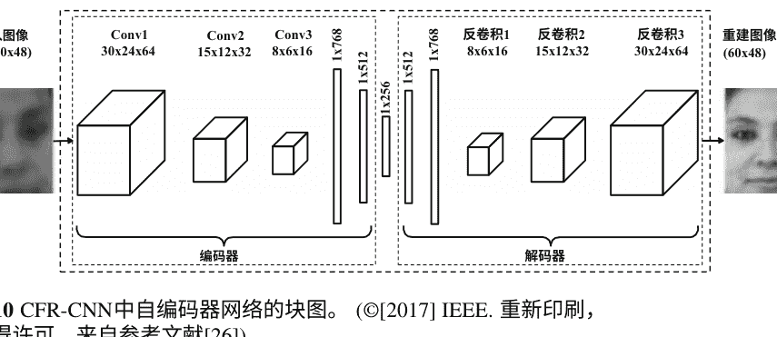

图10 CFR-CNN中自编码器网络的块图。（©[2017] IEEE. 重新印刷，获得许可，来自参考文献[26]）

图11 CFR-CNN损失函数中使用的T形权重掩码。（©[2017] IEEE .重新印刷，获得许可，来自参考文献[26]）

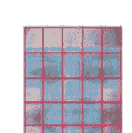

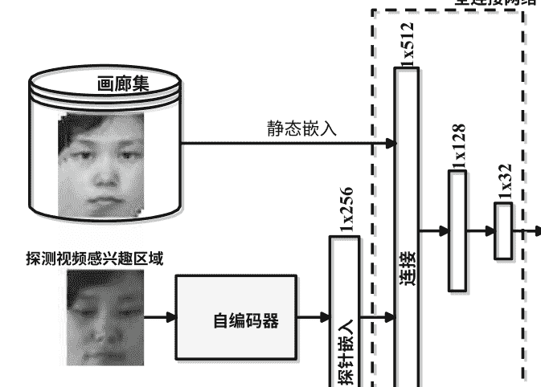

图12 CFR-CNN中分类网络的块图。（©[2017] IEEE. 重新印刷，获得许可，来自参考文献[26]）

$$ L_{CFR-CNN} = \sum_{i \in 行} \sum_{j \in 列} \tau_{i,j} \left\| X^2 - \hat{X}^2 \right\| $$
$$ \tau_{i,j} = \begin{cases} \alpha & \text{如果}(i,j)属于T \\ \beta & \text{否则}(i,j) \end{cases} $$
$$ (11) $$

其中行 × 列是ROI的大小， X是目标静止ROI， $\hat{X}$ 是重建的ROI。权重 $\alpha$ 用于T区域，而权重 $\beta$ 用于T区域外的像素。

然后，完全连接的网络与深度卷积自编码器集成，中间层的输出被视为在无约束监控环境中常见的不同干扰因素下不变的人脸表示。最后，使用完全连接的分类网络进行人脸匹配，如图12所示。该网络用于匹配静止和视频ROI的人脸表示。完全连接的分类网络使用常规的成对匹配方案进行训练，其中参考静止图像和探测视频的人脸嵌入

# 4 性能评估

上述基于视频的人脸识别系统的性能是使用Cox Face DB [15]进行评估的。该数据集专门用于视频监控应用，其中包含在受控条件下使用静态相机捕获的高质量静态人脸和在不受控制条件下使用不同的摄像机捕获的低质量视频人脸。在设计的S形曲线中，每个主体在行走时记录了视频，其中包含姿势、光照、尺度和模糊度的变化。图13显示了一个主体的静态图像和视频的示例。

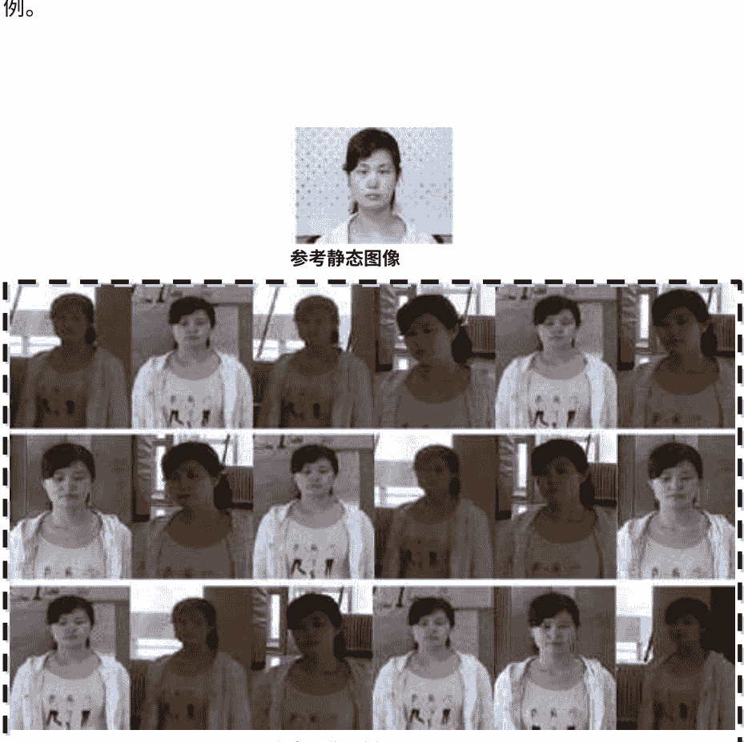

表1 基于Cox Face DB视频的Rank-1识别和计算复杂度

| 人脸识别系统 | Rank-1 识别 | 操作次数 | 参数数量 | 层数 |
|--------------|-------------|----------|----------|------|
| CCM-CNN [24] | 89.53 ± 0.9 | 33.3百万 | 2.4百万 | 30 |
| TBE-CNN [8] | 90.61 ± 0.6 | 12.8十亿 | 46.4百万 | 144 |
| HaarNet [25] | 91.40 ± 1.0 | 3.5十亿 | 13.1百万 | 56 |
| CFR-CNN [26] | 87.29 ± 0.9 | 3.75百万 | 1.2百万 | 7 |

系统根据[15]中建议的实验协议进行评估，其中每个探测视频ROI与参考静态ROI进行比较，并报告Rank-1识别准确性。同时，由于视频人脸识别系统通常需要在监控应用中进行实时处理，因此还应考虑此类系统的计算复杂度。在这方面，复杂度可以通过操作次数（将视频探测ROI与参考静态ROI进行匹配）以及网络参数和层数的数量来确定[5]。

为了验证基于CNN的视频FR系统在实时监控应用中的可行性，表1展示了准确性并比较了它们的计算复杂度。

从表1可以看出，TBE-CNN和HaarNet提供了最高的准确性，但它们非常复杂。尽管CCM-CNN和CFR-CNN无法超越这些深度架构，但它们可以以较低的计算复杂度实现令人满意的结果。此外，网络参数和层数的数量是设计深度CNN的关键因素，它们可以极大地影响收敛和训练时间。考虑到这些标准，所提出的CCM-CNN和CFR-CNN具有最低的设计复杂度，因此收敛时间最短。

# 5 结论和未来方向

在本章中，对用于视频监控中鲁棒人脸识别的最新深度学习架构进行了全面调查。为了克服现实世界监控无约束环境中的现有挑战，在系统设计过程中考虑了单一训练参考样本和领域适应问题。另一方面，计算复杂度也是提供实时视频人脸识别系统高效解决方案的关键问题。具体而言，本章回顾了基于三元损失函数和自编码器CNN的深度学习架构。三元损失优化方法可以学习复杂和非线性的面部表示，从而提供跨类别和内类别变化的鲁棒性。

CCM-CNN提出了一种成本效益的解决方案，专门用于静态到视频的处理。通过模拟加权CCM从单个参考静态图像中提取鲁棒的整体人脸图像和面部组件的表示，TBE-CNN和HaarNet可以提取出包含一个主干和几个分支网络的CNN的稳健表示。此外，为了弥补单个参考静态图像中面部模型的有限鲁棒性，它们使用从非目标个体的静态感兴趣区域（ROIs）合成生成的人脸进行微调。相比之下，CFR-CNN使用监督自编码器CNN从低质量视频ROIs生成规范化的人脸表示。因此，它可以重建与参考静态图像ROIs的捕获条件相对应的正面人脸并生成判别性的人脸表示。使用COX人脸数据库获得的实验结果表明，TBE-CNN和HaarNet可以在计算复杂度较高的情况下实现更高水平的准确性，而CCM-CNN和CFR-CNN可以以显著较低的计算成本提供令人信服的性能。

由于深度学习的使用越来越广泛，未来的一个方向是将传统方法与深度学习方法相结合，以将面部的统计和几何特性融入深度特征中。

此外，未来的研究可以集中在利用时间信息，通过跟踪面部感兴趣区域在帧之间累积预测结果。因此，将面部检测、跟踪和分类结合在一个统一的基于深度学习的网络中，将会产生适用于实际视频监控应用的稳健的时空识别。因此，可以利用3D卷积神经网络和循环神经网络（如长短期记忆）来考虑时间上的卷积，以捕捉连续视频帧之间的时间信息。

致谢本工作得到魁北克自然与技术研究基金和MITACS的支持。

# 参考文献

+   1. Barr, J.R., Bowyer, K.W., Flynn, P.J., Biswas, S.: 视频中的人脸识别：一项综述。 国际模式识别与人工智能期刊 **26**(05) (2012)
2. Bashbaghi, S., Granger, E., Sabourin, R., Bilodeau, G.A.: 基于多个人脸表示的集成 的观察名单筛选. 在: ICPR, pp. 4489–4494 (2014)
3. Bashbaghi, S., Granger, E., Sabourin, R., Bilodeau, G.A.: 动态示例支持向量机的集成用于 静态到视频人脸识别. 模式识别 **69**, 61–81 (2017)
4. Bashbaghi, S., Granger, E., Sabou rin, R., Bilodeau, G.A.: 基于多个人脸表示的动态支持向量机集成的鲁棒观察名单筛选. 机器视觉和应用 **28**(1), 219–241 (2017)
5. Canziani, A., Paszke, A., Culurciello, E.: 深度神经网络模型在实际应用中的分析. arXiv预印本 arXiv:1605.07678 (2016)
6. Chellappa, R., Chen, J., Ranjan, R., Sankaranarayanan, S., Kumar, A., Patel, V.M., Castillo,C. D.: 朝着设计一个端到端自动化的图像和视频识别系统的方向。 CoRRabs/1601.07883 (2 016)
7. Dewan, M.A.A., Granger, E., Marcialis, G.L., Sabourin, R., Roli, F.: 适应性外观模型跟踪用 于静态到视频人脸识别。 Pattern Recognition **49**, 129–151 (2016)
8. Ding, C., Tao, D.: 基于主干-分支集成卷积神经网络的视频人脸识别。 IEEE Trans on PA MI PP(99), 1–14 (2017). https://doi.org/10.1109/TPAMI.2017.2700390
9. Gao, S., Zhang, Y., Jia, K., Lu, J., Zhang, Y.: 通过学习深度监督自编码器进行单样本人脸识别。 IEEE Transactions on Information Forensics and Security 10(10),2108–2118 (2015)
10. Ghodrati, A., Jia, X., Pedersoli, M., Tuytelaars, T.: 迈向自动图像编辑：学习看到另一个你。 在: BMVC (2016)
11. Gomerra, M., Granger, E., Radtke, P.V., Sabourin, R., Gorodnichy, D.O.: 面部轨迹的部分监督学习用于视频监控中的人脸识别。 信息融合 24(0), 31–53 (2015)
12. Heo, Y.S., Lee, K.M., Lee, S.U.: 使用自适应归一化互相关进行鲁棒的立体匹配。 IEEE Trans on PAMI 33(4), 807–822 (2011)
13. Huang, G.B., Ramesh, M., Berg, T., Learned-Miller, E.: 野外标记人脸数据库：用于研究非受限环境中人脸识别的数据库。 Tech. Rep. 07-49 (2007)
14. Huang, G.B., Lee, H., Learned-Miller, E.: 使用卷积深度置信网络学习分层表示进行人脸验证。 在: CVPR (2012)
15. Huang, Z., Shan, S., Wang, R., Zhang, H., Lao, S., Kuerban, A., Chen, X.: 在cox人脸数据库上基于视频的人脸识别的基准和比较研究。 IP, IEEE Trans on24(12), 5967–5981 (2015)
16. Kamgar-Parsi, B., Lawson, W., Kamgar-Parsi, B.: 用于观察名单监视的人脸识别系统的发展。 PAMI, IEEE Trans on 33(10), 1925–1937 (2011)
17. Kan, M., Shan, S., Su, Y., Xu, D., Chen, X.: 用于人脸识别的自适应判别学习。 Pattern Recognition 46(9), 2497–2509 (2013)
18. Kan, M., Shan, S., Chang, H., Chen, X.: 用于跨姿势人脸识别的堆叠渐进自编码器（spae）。 在: CVPR (2014)
19. Le, Q.V.: 使用大规模无监督学习构建高级特征。 在: ICASSP (2013)
20. Ma, A., Li, J., Yuen, P., Li, P.: 使用领域自适应排序支持向量机进行跨领域人物再识别。 IP, IEEE Trans on 24 (5) , 1599-1613 (2015)
21. Matta, F., Dugelay, J.L.: 使用面部视频信息进行人物识别：现状综述。 Journal of Visual Languages and Computing 20 (3) , 180-187 (2009)
22. Mokhayeri, F., Granger, E., Bilodeau, G.A.: 在视频监控中在不同操作条件下生成合成人脸。 在: ICIP (2015)
23. Pagano, C., Granger, E., Sabourin, R., Marcialis, G., Roli, F.: 在不断变化的视频监控环境中进行人脸识别的自适应集成。 Information Sciences 286, 75-101 (2014)
24. Parchami, M., Bashbaghi, S., Granger, E.: 使用单个训练样本进行视频监控中基于交叉相关匹配的人脸识别. 在: AVSS (2017)
25. Parchami, M., Bashbaghi, S., Granger, E.: 使用集成的haar-like深度卷积神经网络进行基于视频的人脸识别. 在: IJCNN (2017)
26. Parchami, M., Bashbaghi, S., Granger, E., Sayed, S.: 使用深度自编码器学习对于静态到视频人脸识别具有鲁棒性的域不变表示. 在: AVSS (2017)
27. Parkhi, O.M., Vedaldi, A., Zisserman, A.: 深度人脸识别. 在: BMVC (2015)
28. Schroff, F., Kalenichenko, D., Philbin, J.: Facenet: 用于人脸识别和聚类的统一嵌入。 在: CVPR (2015)
29. Sun, Y., Wang, X., Tang, X.: Hybrid deep learning for face verification. In: ICCV (2013)
30. Sun, Y., Chen, Y., Wang, X., Tang, X.: Deep learning face representation by joint identification-verification. In: NIPS (2014)
31. Sun, Y., Wang, X., Tang, X.: Deep learning face representation from predicting 10,000 classes. CVPR (2014)
32. Sun, Y., Wang, X., Tang, X.: 深度学习的人脸表示是稀疏、选择性和鲁棒的。 在: CVPR (2015)
33. Szegedy, C., Liu, W., Jia, Y., Sermanet, P., Reed, S., Anguelov, D., Erhan, D., Vanhoucke, V., Rabinovich, A.: 通过卷积进行更深入的研究。在：CVPR (2015)中
34. Taigman, Y., Yang, M., Ranzato, M., Wolf, L.: Deepface: 缩小与人类水平的差距在面部验证中的性能。在：CVPR（2014年）
35. Vincent, P., Larochelle, H., Lajoie, I., Bengio, Y., Manzagol, P.A.: 堆叠去噪自动编码器：在具有局部去噪准则的深度网络中学习有用的表示。JMLR 11, 3371–3408 (2010)
36. Yang, M., Van Gool, L., Zhang, L.: 面部识别的稀疏变化字典学习每个人只有一个训练样本。在：ICCV（2013年）
37. Yim, J., Jung, H., Yoo, B., Choi, C., Park, D., Kim, J.: 使用多任务深度神经网络旋转你的脸。在：CVPR（2015年）
38. Zheng, J., Patel, V.M., Chellappa, R.: 基于视频的人脸识别的最新发展。在：法庭科学生物特征学手册，第149–175页。Springer (2017)
39. Zhu, Z., Luo, P., Wang, X., Tang, X.: 多视角感知器：学习人脸身份和视角表示的深度模型。在：NIPS (2014)中
40. 朱，Z., 罗，P., 王，X., 唐，X.: 使用深度神经网络从野外恢复规范视图面孔。arXiv预印本arXiv:1404.3543（2014年）

# 深度学习用于3D数据处理

刘振宝，韩志忠和卜书辉

摘要从原始3D数据中提取局部特征是一项非常复杂和具有挑战性的任务，需要精心设计的3D形状描述符。在传统的方法中，这些描述符是手工制作的，需要大量的人工干预和先验知识。为了解决这个问题，我们提出了一种新颖的深度学习模型，即圆形卷积受限玻尔兹曼机（CCRBM），用于无监督的3D局部特征学习。CCRBM专门为3D形状设计，有效地解决了现有深度学习模型在层次学习过程中无法解决的障碍，例如顶点的不规则拓扑，3D表面上的方向模糊以及刚性或稍微非刚性的变换不变性。特别地，通过引入新颖的圆形卷积，CCRBM具有一种新颖的环状多层结构，以保持结构学习3D局部特征。圆形卷积通过沿着固定圆方向旋转自身，在3D局部区域上进行卷积，使用新颖的圆形扇区卷积窗口。在圆形卷积过程中，每个3D局部区域上额外采样点，并投影到该区域中心的切平面上。通过这种方式，每个扇区窗口中的投影距离被用来构成原始的3D特征，称为投影距离分布（PDD）。此外，为了消除扇区窗口初始位置的歧义，使用傅里叶变换模（FTM）将PDD转换为傅里叶域，然后传递给CCRBM。使用学习到的局部特征进行的实验涉及三个方面：全局形状检索，部分检索和形状对应。实验结果表明，学习到的局部特征优于其他最先进的3D形状描述符。

# 1 引言

在3D形状分析中，许多任务需要提取3D形状特征，例如形状检索[1]、匹配[2]、分割[3]、人体姿态估计[4]、跟踪[5]和场景理解[6]。可以通过全局或局部形状描述符提取3D特征。全局形状描述符是一种常见的形状分类或检索方法，可以将其视为从3D对象空间到有限维向量空间的映射。相比之下，局部形状描述符更广泛使用，因为它们不仅可以为基于点的形状匹配或形状分割提供局部特征，还可以通过诸如词袋模型[7]、空间敏感的词袋模型[8]等范式构建附加的全局形状描述符。然而，几乎所有提出的形状描述符都是手工设计的[9-11]，这涉及到繁重的设计工作、人类智慧和先验知识。

尽管局部形状描述符可以有效地捕捉有区别的局部甚至全局几何特征，但它们的手动调整过程耗时且通常不具有很好的泛化能力，这给从三维形状中提取和组织有区别的信息以构建分类器或其他预测器[12]带来了负担。此外，现有的局部描述符仅基于单个局部区域，因此学到的特征对局部变化非常敏感，因此很难轻松且稳定地获得不变的特征模式。从这些观点出发，探索无监督特征学习方法来学习一种通用且不变的三维局部特征模式，尤其是在越来越多的三维对象公开可用时，具有重要意义和前景。

特征学习已经引起了越来越多的研究兴趣[12]，其中包括两个主要类别：有监督特征学习[13]和无监督特征学习[14]。由于无监督特征学习不需要训练标签，相对于有监督特征学习更具优势。在各种最近的无监督特征学习方法中，深度学习模型是最受欢迎的，因为它具有吸引人的特点：

- 1. 通过对数据进行多次非线性转换，可以学习到高级别和分层表示。
- 2. 特征学习过程可以以无监督的方式进行。

许多实际应用，包括计算机视觉和自然语言处理[15-17]，受益于深度学习模型。然而，现有的深度学习模型无法帮助增强3D形状分析的性能，因为它们无法直接学习3D形状的高级特征。以下列举了几个障碍：

- 1. 3D网格的拓扑结构是不规则的。由于网格不像2D图像那样是一个规则的格点，因此无法将整个或部分网格输入到只包含规则结构的深度学习模型中。
- 2. 3D形状表面的方向是模糊的。一些基于卷积的深度学习方法无法像处理2D图像那样在3D形状表面上进行卷积。
- 3. 3D形状可以通过平移、旋转和弯曲等各种变换进行刚性和非刚性变换。因此，需要一个学习模型对这些刚性和轻微非刚性变换进行不变性处理。

克服这些障碍的一种直观方法是通过手工特征描述符[18, 19]或基于视图的方法[20]将3D形状投影到2D中间表示空间。在表示空间中，可以轻松应用深度学习模型。然而，将2D表示转换为3D形状肯定会导致大量信息丢失。例如，深度学习模型学习的学习目标——3D表面的结构信息，在2D表示空间中将会丢失。此外，基于视图的方法只能学习全局特征，无法学习局部特征，而基于手工特征的方法在深度学习模型学习之前无法摆脱参数调整过程。

为了缓解这些问题，我们提出了一种新颖的深度学习模型，用于从3D形状的原始表示中无监督学习高级区分性局部特征，即圆形卷积受限玻尔兹曼机（CCRBM）。基于卷积受限玻尔兹曼机（CRBM）[15]的学习框架，CCRBM通过一种称为圆卷积的新卷积方式，具有一种新颖的环形多层模型结构，用于学习三维局部区域的几何和结构信息。圆卷积沿着一个固定的圆方向在表面上移动一种新型的卷积窗口，不仅克服了三维表面上的方向模糊性，还顺序捕捉了表面的几何和结构变化。具体而言，给定局部区域的采样点被投影到该区域中心的切平面上。通过这种方式，每个扇区窗口中的投影距离被用来构成称为投影距离分布（PDD）的原始三维特征，该特征仅由采样顶点的坐标确定。另一个问题是卷积窗口在三维表面上的初始但通常模糊的位置。通过引入傅里叶变换模量（FTM），可以将PDD转换为CCRBM的初始位置的不变表示。此外，圆卷积可以直接在三维局部表面上工作，从而解决了刚性和轻微非刚性变换的特征不变性问题。

本文的结构如下：第2节介绍了手工制作的3D局部特征和深度学习模型的相关工作和初步知识。第3节详细介绍了圆形卷积、PDD和CCRBM的设计。第4节和第5节分别展示了实验设置和结果分析。最后，在第6节中得出了结论和我们的贡献。

# 2 相关工作

现有的3D局部特征主要是通过基于知识的描述符提取的。最近，神经网络方法开始涉及学习全局特征。这些方法在以下小节中进行了简要回顾。

## 2.1 基于知识的3D局部特征

已经提出了许多基于知识的局部描述符用于3D形状[21]。一些局部描述符通过标量（如曲率[22]和体积[9]）提取局部区域的属性。另一种局部描述符捕捉了相对空间信息，如旋转图像[10]和形状上下文[11]。在非刚性形状分析中，基于扩散几何方法提出了一些内在的局部描述符，如热核签名（HKS）[23]、尺度不变热核签名（SIHKS）[24]和波形核签名（WKS）[25]。

尽管这些基于知识的局部描述符是有效的，但是它们都是手工制作的，需要大量人工干预来调整描述符参数以获得满意的结果。此外，这些描述符只能从单个区域提取特征，而不能从一组相似区域中提取共同的特征模式，导致对微小变化过于敏感并且降低了可区分性。在本文中，提出的CCRBM旨在解决所有这些问题。

## 2.2 基于深度学习的3D形状与原始特征

深度学习模型是一种用于无监督特征学习的神经网络。已经有一些关于使用深度学习方法从原始特征中学习特征的3D形状的研究。在文献[26]中，介绍了一种基于卷积和递归神经网络（CNN和RNN）组合的模型，用于学习RGB-D图像的特征并对应分类3D对象。

然而，他们的模型与我们的模型不同之处在于，全局特征是通过将从2D RGB图像和深度图像分别学习到的信息进行合并构建的。这样，他们的模型无法学习到真实3D对象的局部特征。此外，仅使用2D图像的单个视图来学习3D特征时，会丢失3D对象的结构信息。在CCRBM中，局部特征基于3D表面以保持结构的方式直接学习，尝试在将3D局部区域映射到特征空间时尽可能保留更多信息。

3D ShapeNets [27]是一个专门设计的深度学习模型，用于学习全局3D形状特征。在3D ShapeNets中，几何3D的表示方式形状被视为在3D体素网格上的二进制变量的概率分布。此外，每个3D网格被视为一个48 * 48 * 48的二进制张量：1表示网格表面上或内部的体素，0表示网格外部的体素。

- 1. 训练形状的表示方式不同。对于表示为网格的输入3D对象，3D ShapeNets需要对对象进行体素化处理，而CCRBM不需要任何数据预处理，可以直接从局部区域学习特征。
- 2. CCRBM直接在3D形状的表面上学习特征。通过这种方式，刚性变换（如平移和旋转）和轻微的非刚性变换（如弯曲）的效果可以最小化。然而，考虑到体素化的本质，3D ShapeNets的输入对象必须是刚性形状（如桌子和椅子），而不是非刚性形状（如人和动物）；此外，在体素化之前，形状必须对齐在相同的方向上，这对于当前的对齐方法来说是非常困难的任务。因此，3D ShapeNets很难抵御输入形状的旋转和非刚性变换的影响。
- 3. CCRBM学习3D局部特征，也可以通过词袋模型构建全局特征，而3D ShapeNets只学习3D全局特征。

## 2.3 限制玻尔兹曼机（RBM）和深度置信网络（DBN）

在文献中，RBM和DBN被提出来通过贪婪的无监督预训练每个堆叠层的思想来缓解深度学习模型的优化困难[28, 29]。RBM是一种生成性随机神经网络，可以学习其输入集合上的概率分布。正如其名称所示，RBM是玻尔兹曼机的一种变体[30]，其限制是RBM中的每个连接必须连接一个可见节点和一个检测节点，并且同一层中的节点之间没有连接，如图1a所示。这个限制导致了高效的训练算法，特别是基于梯度的对比散度算法[28, 31]。DBN通过逐层堆叠多个RBM构建，较低层检测简单特征，然后传递到更高层，依次检测更复杂的特征。

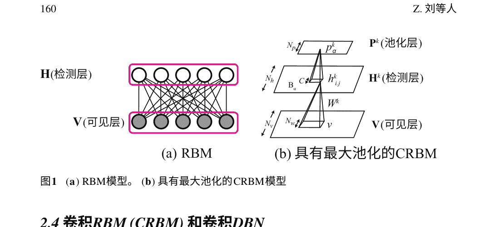

## 2.4 卷积RBM (CRBM) 和卷积DBN (CDBN)

为了使RBM在高维图像上具有良好的扩展性并获得局部平移不变的表示，Lee等人提出了卷积RBM(CRBM)和卷积DBN(CDBN)。CRBM是传统RBM在卷积环境中的扩展，旨在学习可见层 V和包含 K个“组”单元的检测层 H之间的统计关系，如图1b所示。与CRBM结合的最大池化层 P使用一个宽度为 C像素的池化窗口Bα来缩小检测层。学习到的特征检测器 Wk (k ∈ [1, K])在图像的所有位置上共享，因为在一个区域捕捉到的有用信息可以在其他区域中捕捉到相同的信息。与DBN类似，可以通过堆叠多个CRBM来构建CDBN。为了使我们的论文自包含，我们简要回顾了CRBM和CDBN的细节。有经验的读者也可以直接跳转到第3节了解我们提出的CCRBM。实际上，CRBM是CDBN的构建元素之一。CRBM由可见层 V和检测层 H组成，如图1b所示。检测节点是二值的，可见节点是二值或实值的。

## 2.5 CRBM和CDBN的详细信息

为了使我们的论文自包含，我们简要回顾了CRBM和CDBN的细节。有经验的读者也可以直接跳转到第3节，了解我们提出的CCRBM。CRBM实际上是CDBN的构建元素之一。CRBM由两层组成：可见层 V和检测层 H，如图1b所示。检测节点是二值的，可见节点是二值或实值的。

考虑可见层 V，它由一个 Nv维数组的二值节点组成，如图1b所示。K个滤波器权重被设置，每个滤波器是一个 Nw维数组。对于第 k个滤波器 Wk，它在图像上进行卷积以获得第k组 Hk的检测层。 Hk是一个N维数组，节点h_{ij}^k共享相同的权重W^k和相同的偏置b^k，其中i, j表示数组的垂直和水平索引。可见层中的所有节点v_{ij}共享相同的偏置c。

可见节点v和检测节点h的概率语义在(1)中定义，其中Z = \sum_{v} \sum_{h} exp(-E(\mathbf{v}, \mathbf{h}))是一个归一化因子或分区函数。

$$P(\mathbf{v}, \mathbf{h}) = \frac{1}{Z} exp(-E(\mathbf{v}, \mathbf{h})) \tag{1}$$

CRBM的能量函数可以在(2)中定义。

$$E(\mathbf{v}, \mathbf{h}) = -\sum_{k=1}^{K} h^{k} \bullet (\widetilde{W}^{k} * v) - \sum_{k=1}^{K} b^{k} \sum_{ij} h_{ij}^{k} - c \sum_{ij} v_{ij} \tag{2}$$

其中 * 和 \bullet 分别用于表示2D卷积和逐元素乘积后跟求和。上方的波浪线 \widetilde{W}^k 用于表示水平和垂直翻转W^k。由于每层中的所有节点在给定其他层的条件是条件独立的，可以使用块Gibbs采样[32]来高效地进行网络推断。

Gibbs采样使用的条件概率分布可以定义为(3)和(4)，其中sigmoid函数定义为 $sigmoid(x) = \frac{1}{(1+exp(-x))}$。

$$P(h_{ij}^{k} = 1|\mathbf{v}) = sigmoid((\widetilde{W}^{k} * v)_{ij} + b_{k}) \tag{3}$$

$$P(v_{ij} = 1|\mathbf{h}) = sigmoid(\sum_{K}(W^{k} * h^{k})_{ij} + c) \tag{4}$$

为了学习高级表示，我们可以将CRBM堆叠成类似于DBN的多层架构，该架构基于概率最大池化。Lee等人[15]进一步将CRBM与概率最大池化相结合，其中对检测节点 $h_{ij}^{k}$ 的小邻域的最大值被概率地计算。然后，概率最大池化CRBM的能量函数可以在（5）中定义。

$$E(\mathbf{v}, \mathbf{h}) = -\sum_{K} \sum_{ij}(h_{ij}^{k}(\widetilde{W}^{k} * v)_{ij} + b_{k}h_{ij}^{k}) - c \sum_{ij} v_{ij} \tag{5}$$

满足 $\sum_{(ij) \in \mathbf{B}_{\alpha}} h_{ij}^{k} \leq 1, \forall k, \alpha$。

其中$\mathbf{B}_{\alpha}$定义了检测层上的一个小区域 $\alpha$ 作为池化窗口（C像素宽度）。

原则上，可以通过对训练数据的对数似然进行随机梯度上升来优化CRBM参数。然而，计算对数似然的精确梯度是不可行的。因此，在实践中通常使用对比散度近似[31]。

具体来说，给定可见层 $\mathbf{V}$，可以对检测层 $\mathbf{H}^k$和池化层$\mathbf{P}^k$进行采样。对于第 $k$个滤波器，相应的映射从层 $\mathbf{V}$ 接收以下自下而上的信号 (6) 。

$$I(h_{ij}^k) \overset{\Delta}{=} (\tilde{W}^k * v)_{ij} + b_k \qquad (6)$$

假设$(i, j) \in \mathbf{B}_\alpha$，通过调整 $h_{ij}^k$增加的能量为 $-I(h_{ij}^k)$，条件概率定义如下。

$$P(h_{ij}^k = 1|\mathbf{v}) = \frac{exp(I(h_{ij}^k))}{1 + \sum_{(i'j') \in \mathbf{B}_\alpha} exp(I(h_{i'j'}^k))} \qquad (7)$$

$$P(p_{\alpha}^k = 0|\mathbf{v}) = \frac{1}{1 + \sum_{(i'j') \in \mathbf{B}_\alpha} exp(I(h_{i'j'}^k))} \qquad (8)$$

正如我们所看到的，Gibbs采样中使用的(7)和(8)构成了CRBM推理和学习算法的基础。

CDBN是通过堆叠多个最大池化CRBM来构建的。训练CDBN是以贪婪和逐层的方式实现的：一旦给定层被训练，其权重被固定，其激活被用作下一层的输入。我们的CCRBM是CRBM的一种变体。因此，可以通过堆叠多个概率最大池化CCRBM来构建CCDBN。

# 3 圆形卷积RBM（CCRBM）

在介绍CCRBM的结构之前，我们首先解释了圆卷积和称为PDD的原始3D特征。还讨论了圆卷积中用于初始位置的扇区窗口的歧义消解。

## 3.1 圆形卷积

圆形卷积是专门设计用于在3D表面上执行卷积的，它定义了一种新型卷积窗口和新型窗口移动方式。通过执行圆卷积，可以通过按顺序扫描局部区域窗口来捕获局部区域的结构。

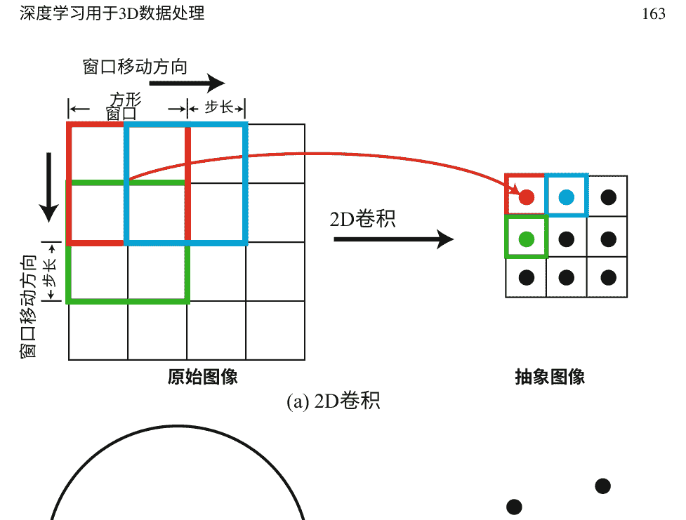

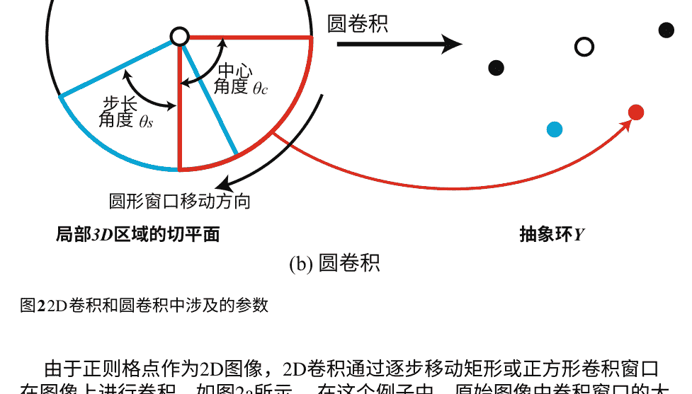

**图2 2D卷积和圆卷积中涉及的参数**

由于正则格点作为2D图像，2D卷积通过逐步移动矩形或正方形卷积窗口在图像上进行卷积，如图2a所示。在这个例子中，原始图像中卷积窗口的大小为2×2像素。沿水平和垂直方向的移动步长都是一个像素。卷积窗口的初始位置标记为红色正方形。在滤波器与窗口中的颜色进行卷积后，所得到的值通过红色箭头传递到右侧的抽象图像中相应的红色节点。然后，卷积窗口沿水平方向移动一个步长（在这个例子中为一个像素），到达标记为蓝色的位置。因此，卷积结果存储在抽象图像中的蓝色节点中。可以通过沿垂直方向移动卷积窗口来重复相同的过程，就像在抽象图像中显示的绿色正方形和相应的绿色节点一样。为了减轻点之间的不规则连接和表面上的方向模糊带来的困难，我们提出了圆形卷积来在3D局部表面上进行卷积。

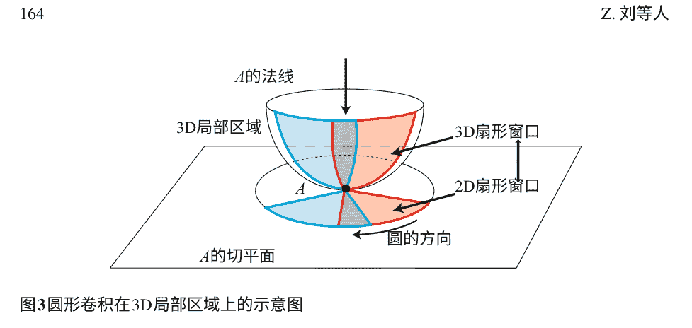

**图3 圆形卷积在3D局部区域上的示意图**

圆形卷积采用圆形扇形窗口，通过围绕局部区域上的中心点的法线旋转窗口来进行卷积。如图3所示，红色扇形窗口围绕中心点A的法线旋转到标记为蓝色的位置上。请注意，两个连续的扇形窗口位置可能会有一些重叠区域。设计圆形卷积的基本原理是基于对3D局部区域的建模，它可以被建模为以给定半径R为中心的近似圆形补丁。然后，圆形扇形窗口可以覆盖补丁的一部分。当顺序地围绕中心点A的法线旋转时，扇形窗口可以扫描整个3D局部区域的表面。

**圆形卷积窗口近似**

然而，在3D局部区域上直接准确绘制圆形扇形窗口是非常困难的，因为表面不一定是平面，顶点之间的连接拓扑或空间关系是不规则的。因此，我们采用局部区域中心点的切平面来近似一个3D圆形扇形窗口。在图3中，首先将3D局部区域的采样点投影到切平面上。然后，在切平面上可以轻松建立一个2D圆形扇形窗口，例如图3中红色圆弧所包围的两个半径和一段弧。投影被红色2D扇形窗口覆盖的采样点对应于3D表面上的一个区域。这个区域可以被视为被近似的3D扇形窗口覆盖，也在图3中以红色和红色边界显示在表面上。当红色2D扇形窗口绕切平面上的法线旋转到蓝色扇形窗口时，相应的红色3D扇形窗口通过绕相同轴线和沿相同方向旋转移动到蓝色标记的位置。

**圆形卷积窗口的运动方向**

扇形运动的圆形方向是根据著名的右手螺旋规则定义的。简单来说，2D扇形窗口沿着一个指定轴向的方向移动，当拇指与轴向相同时，沿着右手的方向绕圈。在图3中，当视图在法线的负方向时，红色圆形扇形窗口逆时针旋转。因此，圆形卷积定义了扇形窗口的固定移动方向，克服了表面方向模糊性的问题。

**圆形卷积的参数**

圆形卷积有两个参数，分别指定了扇形窗口的大小和旋转的步长。同样，准确地参数化3D扇形窗口及其在3D局部区域上的运动是困难的。作为替代，投影在切平面上的2D扇形窗口被用来参数化相应的3D扇形窗口，因为2D扇形窗口的大小和运动与3D扇形窗口同步。图2b中展示了参与圆形卷积的2D扇形窗口的这些参数。一个参数是2D圆形扇形窗口的中心角度 $\theta_{c}$，它控制了2D扇形窗口及其相应的3D扇形窗口的覆盖范围。另一个参数是步长角度 $\theta_{s}$，它表示2D扇形窗口及其相应的3D扇形窗口沿圆形方向的旋转角度。

**圆形卷积**

在定义了3D扇形窗口及其移动之后，我们将圆形卷积表示为（9）。

$$Y(\theta_{s})=\int_{\theta=0}^{2\pi}h(\theta_{s}-\theta)X(\theta)d\theta \quad (9)$$

其中 $X$ 表示3D块上的原始特征，$h$ 是用于在3D块上进行卷积的滤波器。通过圆形卷积，得到一个由节点组成的抽象环 $Y$，其位置由 $\theta_{s}$ 确定，如图2b右侧所示。

当 $h$ 与从指定的3D扇形窗口（例如图3中对应红色2D扇形窗口的窗口）提取的 $X$ 进行卷积时，$Y$ 将存储在红色节点中（红色箭头演示了这个过程）。然后，$h$ 移动到标记为蓝色的位置。上述过程再次重复。$Y$ 中的每个节点对应于旋转2D扇形窗口的位置。通过这种方式，$Y$ 以保持结构的方式编码了3D块的几何信息。

从理论上讲，圆形卷积的本质在于通过卷积从原始特征中抽象出信息，如式（9）所示。通过卷积过程，学习到的滤波器将在由 $\theta_{s}$ 确定的显式位置上突出显示不同的特定特征模式。此外，它包含了新颖的卷积窗口、窗口的移动以及可以处理三维表面上的不规则顶点拓扑和模糊方向的参数化。

## 3.2 投影距离分布（PDD）

通过将窗口中的所有点投影到区域中心的切平面上，可以通过扇形卷积窗口捕获到覆盖的三维区域的几何信息，形成PDD。PDD是一个1D直方图，它计算每个投影距离区间中的点的数量，可以编码不同区域的不同几何属性。如图4所示，以绿色点为中心的红色区域中的采样点产生了一个完全不同于以蓝色点为中心的腿部区域的PDD。然而，投影距离区间的数量影响着PDD的可辨识性。太多的区间会呈现出分布的太多细节，隐藏了底层的分布趋势。相反，如果区间不够多，PDD将过于粗糙，无法捕捉到有区别的信息。通过实验，发现每个扇形窗口中构建一个包含25个区间的PDD向量是合适的。

PDD是原始的3D特征，不需要任何手工特征，只需要局部区域上的点的坐标。CCRBM通过圆形卷积从PDD中学习特征，这符合无监督特征学习的本质和意图。在当前的实验中，为了在PDD的可辨识性和计算成本之间取得平衡，我们按照方法[33]随机采样每个三角面上的50个点。

## 3.3 圆形卷积和PDD计算示例

图5展示了圆形卷积和PDD计算的示例。为了减轻计算负担，CCRBM学习了一些以每个形状上采样点为中心的局部区域。对于图5a中显示的蚂蚁模型，使用最远测地线采样（FGS）方法[34]采样了500个点（蓝色）。FGS首先采样任意顶点。第二个要采样的顶点是与第一个采样点之间的最远测地距离的顶点。请注意，测地距离是连接曲面上两个顶点的最短路径的距离。随后，第三个采样的顶点是与前两个采样顶点最远的顶点。采样过程重复进行，直到采样的顶点数达到500个。

对于以采样点为中心的每个蓝色局部区域（例如图5b中的黄色点），计算更具有区分度的PDD，如第3.2节所述。在图5c及其放大视图中，每个蓝色局部区域覆盖的三角形面上额外采样了50个点，这些点被标记为黄色点。

然后，根据第3.1节的描述确定一个3D扇区窗口。第一个扇区窗口 $\theta_c = 60^\circ$（黑色）和相应的PDD在图5d中显示。根据右手螺旋规则，扇区窗口沿着中心法线逆时针方向旋转（在中心法线的负方向视图中）到下一个位置，如图5e所示。该过程重复进行，图5f-h显示了扇区窗口的其他后续步骤及其相应的PDD。

## 3.4 消除初始位置的歧义

扇区窗口初始位置的不确定性是另一个重要问题。具体而言，对于给定的3D局部区域，所有扇区窗口的计算PDD可以看作是初始位置 $\theta$、扇区索引 $j_f$ 和步长 $\theta_s$ 的函数，表示为 $f_{PDD}(\theta + j_f \times \theta_s)$，其中 $j_f \in \{0, 1, ..., 360^\circ/\theta_s - 1\}$。

备注：实际上，在这个类似极坐标的框架中，标量变量 $\theta$ 不能参数化扇形窗口的初始位置，因为没有极坐标轴它是在一个固定的方向上。然而，$\theta$可以帮助表示两个初始位置之间的关系。显然，不同的初始位置$\theta$在相同的3D局部区域上产生不同的$f_{PDD}$。由于表面上没有一致的局部坐标系，通过确定扇形窗口的不变初始位置来获得一个相同的$f_{PDD}$在3D局部区域上是不可能的。

另一方面，对于两个相似的局部区域，每个局部区域的不同初始位置依赖的PDD也会使得CCRBM无法提取相似的信息。在这项研究中，提出了傅里叶变换模数（FTM）来消除初始位置的歧义。

FTM已经广泛应用于图像配准[35]，并在[36]中用于构建尺度和旋转不变的描述符。它还用于构建尺度不变的热核签名（SIHKS）[24]和内在形状上下文[37]用于3D形状。在我们的工作中，$f_{PDD}$通过FTM转换为频谱域，关于角位置$\theta + j_f \times \theta_s$。在频谱域中，$f_{PDD}$的表示记为$F_j$。

$$\mathcal{F}\{f_{PDD}(\beta + j_f \times \theta_s)\}(\omega) = \sum_{j_f} f_{PDD}(\beta + j_f \times \theta_s)exp(-i\omega(\beta + j_f \times \theta_s)) \qquad \qquad \qquad \qquad \qquad \qquad \qquad \qquad \qquad \qquad \qquad \qquad \qquad (10)$$

如果从另一个初始位置得到PDD，该位置由将偏移量$\delta$添加到$\beta$表示，即$\theta = \beta + \delta$，则FTM的变换如式(11)所示。

$$\mathcal{F}\{f_{PDD}(\beta + \delta + j_f \times \theta_s)\}(\omega) = F_{j_f}\{f_{PDD}(\beta + j_f \times \theta_s)\}(\omega)exp(-i\delta\omega) \qquad \qquad \qquad \qquad \qquad \qquad \qquad \qquad \qquad \qquad \qquad \qquad \qquad (11)$$

取模，我们有(12)。因此，PDD的FTM，$|F_{j_f}\{f_{PDD}(\theta + j_f \times \theta_s)\}(\omega)|$，是一个三维局部区域初始位置的不变表示它将作为CCRBM的输入传递到虚拟层中，如第3.5节所讨论的那样。

$$|F_{j_f}\{f_{PDD}(\beta + j_f \times \theta_s)\}(\omega)| = |F_{j_f}\{f_{PDD}(\beta + \delta + j_f \times \theta_s)\}(\omega)| \qquad \qquad \qquad \qquad \qquad \qquad \qquad \qquad \qquad \qquad \qquad \qquad \qquad (12)$$

图6显示了初始位置的歧义消除。在图6a,b中，一个带有不同初始位置的黑色扇形窗口分别卷积在由采样的黄色点覆盖的同一个局部区域上。使用两个不同初始位置得到的$f_{PDD}$和$f_{PDD1}$是不同的，如图6c,d所示。在进行位置角度的FTM后，$|F_{j_f}\{f_{PDD}\}|$和$|F_{jf}\{f_{PDD1}\}|$被获得，并且它们与图6e，f中所示的相同。从图6中，我们可以看到扇区窗口初始位置的不确定性使得 $f_{PDD}$不确定；然而， $|F_{jf}\{f_{PDD}\}|$消除了歧义并呈现了对CCRB的初始位置不变表示。

## 3.5 CCRBM的结构

在图7中，具有最大池化的CCRB由三层组成，即虚拟层V、检测层H和池化层P。 CCRB和CRBM之间的显著差异在于每层节点的拓扑结构，其中CCRB层中的节点排列成环形而不是CRBM中的二维格子。在可见层V1中，计算具有N步跨度的局部区域的PDD，其中 $N = 360^{\circ} / \theta_s$。 请注意，从每个扇区窗口提取的PDD是一个m维向量，其中 $m = 25$ （即所有实验中的bin数）。

然后，FTM获得的初始位置不变表示的PDD被传递到虚拟层V中的 $N \times m$ 个节点，其中V作为CCRBM的输入。

检测和池化层都有 $K$ 组节点。 对于每个 $k \in [1, K]$ ，通过在虚拟层上使用 $1 \times m$ 滤波器 $W_k$ 进行圆形卷积，生成环形检测层 $H^k$ 的响应，该层具有 $N$ 个节点。滤波器依次与虚拟层中的每个PDD的FTM进行卷积。这个过程在图7的虚拟层中简要展示，其中一个滤波器首先与红色窗口中的节点进行卷积。卷积结果传递给检测层中的一个红色节点。其次，红色窗口以步长为m的节点旋转到蓝色标记的位置。滤波器也将与蓝色窗口中的节点进行卷积，卷积结果相应地传递给检测层中的蓝色节点。

池化层Pk通过选择池化窗口Bp中覆盖的P个相邻节点中的最大激活值来缩小检测层Hk的表示，每个池化层Pk有N/P个节点。最大池化导致表示的缩小，提供了两个好处。首先，高层的表示对于低层响应的小波动具有不变性。其次，在后续的过程中也减少了计算复杂度。

通过FTM将池化层转换为输出层。当池化层中的节点在环上被拉伸成一个N/P维向量时特征 $F^{k}$ 不可避免地依赖于切割位置。再次应用FTM以获得具有不变切割位置的特征。通过FTM，可以消除环被切割的位置引起的影响。通过将所有的 $F^{k}$ 连接起来构建学习到的局部特征，得到一个 $K \times N/P$ 维向量。

根据CCRB的结构，CCRB的能量函数和虚拟层$V$和检测层$H$之间的联合概率分布可以分别定义为（13）和（14）。虚拟层$V$中第$i$个节点的响应表示为 $vi$，检测层$H^{k}$中第$j$个节点的响应表示为$hkj$。所有的节点$vi$在$V$中具有相同的偏置$c$，而所有的节点$hki$共享相同的偏置$bk$。

$$ E(\mathbf{v}, \mathbf{h}) = -\sum_{k=1}^{K}\sum_{j=1}^{N}\sum_{r=1}^{m} h_{kj}W_{rk v(j-1)m+r} - \sum_{k=1}^{K}b_{k}\sum_{j=1}^{N}h_{kj}-c\sum_{i=1}^{...} v_{i} $$ (13)

$$ P(\mathbf{v}, \mathbf{h}) = \frac{1}{Z}exp(-E(\mathbf{v}, \mathbf{h})) $$ (14)

其中$Z$也被定义为$\sum_{\mathbf{v}}\sum_{\mathbf{h}}exp(-E(\mathbf{v}, \mathbf{h}))$，类似于（1）。从（13）开始，检测层中的节点在给定虚拟层 $V$ 的条件下是相互独立的，反之亦然。CCRBM的虚拟层是实值的；在给定检测层的条件下，虚拟节点是具有对角协方差的高斯分布。因此，通过交替地在虚拟层 $V$ 中采样每个节点，给定检测层 $H$，以及在检测层$H$中采样每个节点，给定虚拟层$V$，可以高效地进行块Gibbs采样。

与RBM类似，使用以下条件分布（15）和（16）进行块Gibbs采样。给定虚拟层 $V$，检测层 $H^{k}$ 的采样概率由（15）定义。类似地，给定检测层 $H^{k}$（$k \in [1, K]$），使用（16）定义的概率来采样虚拟层 $V$。

$$ P(h_{j}^{k} = 1|\mathbf{v}) = sigmoid((W^{k} * v)_{j} + b_{k}) $$ (15)

$$ P(v_{i} = 1|\mathbf{h}) = sigmoid(\sum_{k}(W^{k} * h^{k})_{i} + c) $$ (16)

原则上，CCRBM的参数可以通过对训练数据的对数似然进行随机梯度上升来优化。然而，计算对数似然的精确梯度是不可行的。因此，也采用了对比散度[31]来近似计算对数似然的梯度。

通过概率最大池化层，CCRBM能够将检测层缩小为高级表示。因此，概率能量函数可以通过在（17）中添加约束来定义概率最大池化CCRBM，其中约束总结了最大池化过程。具体而言，池化窗口Bp中的检测节点与相应的池化节点以单一的潜在方式相连。换句话说，池化窗口中最多只有一个检测节点处于激活状态，只有当检测节点处于激活状态时，相应的池化节点才会处于激活状态。在对象检测窗口Bp中的检测节点与相应的池化节点以单一的潜在方式相连。换句话说，池化窗口中最多只有一个检测节点处于激活状态，只有当检测节点处于激活状态时，相应的池化节点才会处于激活状态。

$$ E(\mathbf{v}, \mathbf{h}) = -\sum_{k=1}^{K} \sum_{j=1}^{N} \sum_{r=1}^{m} h_j^k W_r^k v_{(j-1)m+r} + b_k \sum_{j=1}^{N} h_j^k - c \sum_{i=1}^{N \times m} v_i $$

满足 $\sum_{j \in B_p} h_j^k \leq 1, \forall k, p$  (17)

给定虚拟层V，我们可以按照以下方式对检测层H^k和池化层P^k进行采样。对于第k个滤波器，从V提取的特征可以通过公式（18）定义。

$I(h_j^k) \triangleq (W^k * v)_j + b_k$  (18)

考虑池化窗口Bp中的节点h_j^k，根据公式（18）和（13），打开它引起的能量变化为 -I(h_j^k)。Gibbs采样中使用的条件概率由公式（19）和（20）定义。

$$ P(h_j^k = 1|\mathbf{v}) = \frac{exp(I(h_j^k))}{1 + \sum_{j' \in B_p} exp(I(h_{j'}^k))} $$  (19)

$$ P(p_p^k = 0|\mathbf{v}) = \frac{1}{1 + \sum_{j' \in B_p} exp(I(h_{j'}^k))} $$  (20)

到目前为止，已经解释了在虚拟层V条件下采样检测层H的过程。通过使用在（16）中定义的条件概率，可以执行反向过程，即给定检测层H采样虚拟层V的过程可以通过Gibbs采样来完成。

## 3.6 圆形卷积DBN（CCDBN）

CCDBN是一种用于3D局部区域的分层生成模型。与CDBN类似，CCDBN由几个逐层堆叠的最大池化CCRBM组成。CCDBN的网络通过累积所有堆叠的CCRBM的能量函数来表示。CCDBN的训练也遵循贪婪和逐层的方式。简而言之，一旦较低层的CCRBM s被训练，它的权重就被固定，其激活被用作下一层CCRBM s的输入。

虽然最大池化CCRBM s可以堆叠成CCDBN，但我们只在所有实验中测试最大池化CCRBM s，原因如下。由于PDD是一个分布，如果PDD的分辨率太细（即，bin的数量很高），会导致可辨识性的退化。因此，通常更喜欢具有粗糙分辨率（即，bin数量较少）的PDD。

然而，如果PDD的分辨率较粗糙，则PDD对小的几何变化不敏感。更具体地说，PDD捕捉到的几何变化是由扇形窗口的旋转引起的。如果扇形窗口以较小的步幅角度旋转，并且PDD中的bin数量较少，则变化可能变得微不足道，甚至被忽略。为了缓解这个问题，通常会指定一个足够大的步幅角度来突出几何变化，即使PDD的分辨率较粗糙。

然而，必须注意的是，足够大的步幅角度会从池化层中采样较少的节点到下一级的CCRBM s，导致信息量减少。作为一种权衡，实验中采用了10°的步幅角度来捕捉相邻扇形窗口之间的结构变化。

# 4 实验设置

在本节中，将分别描述3D局部特征学习的不同形状基准和性能度量，分别用于以下常见的3D形状分析领域：全局形状检索、部分形状检索和形状对应。此外，还讨论了CCRBM的参数设置。

## 4.1 全局形状检索

全局形状检索的目标是在大型数据集中给定一个查询形状，搜索其全局相似形状。对于全局形状检索实验，首先使用McGill 3D形状基准[38]来研究CCRBM的参数。然后，将CCRBM学习到的局部特征与其他最先进的特征描述符在McGill 3D形状基准的关节子集、整个McGill 3D形状基准和SHREC 2007数据集[39]上进行比较。

McGill 3D形状基准包含457个对象的19个形状类别，其中包括关节子集和非关节子集。关节子集包含10个形状类别的255个对象。SHREC 2007数据集包含均匀分布在20个形状类别中的400个形状。

通过对学习到的局部特征进行统计分析，使用词袋（BoW）框架对整个3 D形状进行表征。两个任意形状 $M_i$ 和 $M_j$ 之间的相似度测量 $S(M_i, M_j)$ 被定义为它们的词袋特征向量 $BoW_i$ 和 $BoW_j$ 之间的卡方距离，如式（21）所示。

$$ S(M_i, M_j) = \frac{1}{2} \sum_q \frac{(BoW_i(q) - BoW_j(q))^2}{(BoW_i(q) + BoW_j(q))} $$

在所有实验中，传统的精确率和召回率（PR）曲线被用作学习到的局部特征的性能度量。精确率是在排序列表中检索到的相关对象与所有检索到的对象之比。召回率是在数据集中检索到的相关对象与所有相关对象之比。

## 4.2 部分形状检索

部分形状检索是在数据库中使用查询来高效搜索部分相似的形状。SHREC0 7部分检索数据集被用来评估当前的实验。给定一个包含400个完全封闭模型的数据库和一组30个混合查询模型，每个查询都与一组高度相关和边缘相关的项相关联。换句话说，这两组项分别代表与查询具有相似子部分的类别和与查询相对相似的类别。定量评估使用通过将理想累积增益向量从事实基本计算的归一化折扣累积增益向量（NDCG）[40]来计算。DCG在（22）中定义。

$$ DCG[i] = \begin{cases} G[i] & \text{如果 } i = 1; \\ DCG[i-1] + G[i] / \log_2 i & \text{否则} \end{cases} $$

其中 $G[i]$ 是表示第 $i$ 个检索模型的相关性的增益值（2表示高度相关，1表示边缘相关，否则为0）。对于给定的查询，首先计算 $DCG[i]$，然后通过将 $DCG[i]$ 除以从事实数据计算得到的理想累积增益向量来获得 $NDCG[i]$。

## 4.3 形状对应

形状对应旨在建立两个给定形状上的两组点之间的有意义的关系。CCRBM学习到的特征还在具有明确定义的真实数据的两个数据集上进行了形状对应评估。一个数据集SCAPE [41]是一个包含71个网格模型的数据集，这些模型代表了人体在不同姿势下的形状。另一个数据集是Watertight数据集[42]，包含了400个网格模型，这些模型均匀地分为20个物体类别，包括人类、章鱼、四脚动物、蚂蚁等。给定两个形状 M1和 M2，文献[42]中提出的误差度量被采用来评估预测的形状对应 f : M1 → M2与地面真实映射 f_true的准确性。对于形状 M1上的每个点 b，预测的对应点f(b)（在 M2上）与地面真实对应点 f_true(b)（在 M2上）之间的误差通过连接f(b)到 f_true(b)在 M2表面上的最短路径的距离来衡量（几何距离f(b)和 f_true(b)在 M2上的测地距离），记为 d_M。

d_M (f(b), f_true(b))越小，估计的对应点越接近地面真实值。为了消除形状尺度的影响， d_M (f(b), f_true(b)) 通过表面上任意两点之间的最长测地线距离进行归一化处理 M2。然后，通过 f 和 f_true的概率分布函数来描述准确性 d_M (f(b), f_true(b))所有点 b在 M1上。

## 4.4 CCRBM参数设置

由于可以使用简单的词袋（BoW）框架构建学习到的局部特征的全局特征，因此词袋全局特征的评估可以反映学习到的局部特征的可区分性。因此，CCRBM学习到的局部特征的参数仅在全局形状检索任务中进行研究。

CCRBM使用一组五个参数，包括中心角 θ_c和步幅角 θ_s（指定一个扇形窗口），局部区域的半径 R，滤波器的数量 K和训练样本的数量 T。如第3.6节的最后一段所讨论的，步幅角 θ_s通过实验进行了精心调整（在我们的情况下， θ_s = 10°），以尽可能保留扇形窗口相邻步骤之间的几何和结构变化。因此，检测层 H^k中的节点数 N为36（360°/10°）。此外，池化窗口的长度 P 设置为4，因为过大的池化窗口宽度会从检测层 H^k中缩小太多信息，而过小的池化窗口宽度对于从逐渐变大的输入区域学习几何和结构信息没有意义。在当前实验中， P = 4效果非常好。请注意， θ_s和 P在所有实验中保持不变。

由于使用了BoW框架将学习到的特征组合成对象的全局形状特征，虚拟词的数量 K_w是另一个需要确定的参数。实验中使用的框架及其组件介绍如下：

BoW框架 BoW的关键思想是将一组特征表示为来自构建的虚拟词的出现次数的稀疏向量（所谓的码本）。集合中的每个特征都被分配给与该特征和虚拟词之间的相似性最接近的虚拟词，从而在构建BoW向量时为最接近的虚拟词提供出现次数。

码本构建为了构建码本，一组特征被聚类成 K 个簇。每个簇的质心都作为码本中的虚拟词。请注意，所有特征都是由数据集中每个形状上采样顶点处的局部区域通过CCRBM学习得到的。在我们的实验中，我们使用最远测地线采样方法[34]在每个3D形状上采样500个顶点，如图5a所示。

具体来说，每个采样顶点 i 的学习特征来自于第 j 个形状 M_j 被表示为 M_j^i ，然后使用k-means算法将所有特征 M_j^i 聚类成 K_w 个簇。这 K_w 个质心被视为码本中的虚拟词 D=\{D_1, D_2, ..., D_{K_w}\}。然后，每个在形状 M_j 上采样的顶点与 D 中最接近的视觉词相关联，以便形状 M_j 可以通过在其上采样的所有顶点上的视觉词的出现次数的稀疏向量 BoW_j 来表示。

虚拟词的数量 K_w 进行了两个实验来探索虚拟词的数量 K_w 对形状检索性能的影响。

在两个实验中，CCRBM使用由10%组成的训练集进行训练（T=10%）随机选择每个形状的采样顶点。CCRBM使用 K=300 个滤波器来检测每个局部区域，每个滤波器以所选顶点为中心，半径为 R=0.07 LGD（该形状的最长测地线距离）。两个实验之间的差异在于扇形窗口的中心角度 θ_c ，分别设置为 30° 和 100°。

通过改变 K_w ，通过精确度和召回率（PR）曲线评估形状检索的性能。在第一个实验中（θ_c=30°），通过 K_w=10、20、30、40、50、100和200个视觉词进行比较，如图8a所示。在第二个实验中（θ_c=100°），通过PR曲线进行评估。K_w=30, 40, 50, 60, 70, 80, 90, 100, 和150个视觉单词，如图8b所示。从图8可以明显看出，在两个实验中，使用30、40和50个视觉单词得到的检索性能非常好。因此，在BoW的判别能力和计算效率之间进行权衡，选择了40个视觉单词来构建全局形状特征 BoW_j ，在下面的形状检索实验中使用。

进行了两个实验来研究训练样本数 T 和滤波器数 K 的影响。

### CCRBM的K值

首先，CCRBM使用 K=300 个滤波器来学习每个半径为 R=0.07 LGD 的局部区域，并且 θ_c=30°。使用 T=6%、10%、20%和30% 的所有采样顶点训练的CCRBM得到了PR曲线，如图9a所示。可以发现，使用更多的训练样本和滤波器可以获得更好的检索性能。

图8 在不同虚拟词数(a)下获得的PR曲线，其中 $\theta_c = 30^\circ$。(b) $\theta_c = 100^\circ$

图9 在不同训练样本数$T$和不同滤波器数$K$下获得的PR曲线

由于获取了更丰富的几何和结构信息，因此需要更多的训练样本，这样可以抽象出高级特征。

其次，尝试使用 T=30% 的采样顶点来训练CCRBM，并在不同的滤波器数下进行实验，其他参数与之前的实验相同。PR曲线在图9b中进行了说明，最高性能可以通过使用 K=300 个滤波器来获得。在后续的实验中，每个局部区域都使用 K=300 个滤波器进行学习。

中心角度 θ_c 和局部区域的半径 R 为了确定 θ_c ，使用了具有 K=300 个滤波器的CCRBM进行了测试，其中采样顶点的 T=10% 包含一个邻居，该邻居包含 R=0.11 LGD。得到了 θ_c=30°, 50°, 100° 和 150° 的PR曲线，并在图10a中显示。从PR曲线可以看出，CCRBM的检索性能受 θ_c 的影响很小。原因是大多数局部区域可以由对称的基本图元（如平面、圆锥、半球等）建模。因此，在不同中心角度的扇形窗口中捕获的PDD几乎相同。

对于使用固定扇区窗口为 θ_c=50° 的 R-CCRBM 的设置，构建了具有不同 R 值的模型，而其他参数与之前的实验相同。其中 R 的取值分别为 0.07、0.09、0.11 和 0.13 倍的 LGD。图10b显示，当 R=0.11 LGD 时，PR 曲线最佳，因为小的局部区域（R=0.07, 0.09 LGD）相互之间看起来相似，为 PDD 提供了很少的信息来区分它们自身的一些基本原始形状。相反，一个大的局部区域（R=0.13 LGD）可能包含高度不规则和过于复杂的结构，以捕捉可区分的 PDD 信息。因此，选择 R=0.11 LGD 的局部区域进行 CCRBM 的训练。

### CCRBM参数

总结来说，使用表1中列出的以下参数从McGill数据集训练的CCRBM参与了下面的实验。

表1 以下实验中使用的参数
| 虚拟词 $K_w$ | 区域大小 $R$ | 滤波器数量 $K$ | 训练样本数量 $T$ | 中心角度 $\theta_c$ | 步长角度 $\theta_s$ | 池化窗口大小 $P$ |
| :--- | :--- | :--- | :--- | :--- | :--- | :--- |
| 40 | 0.11 LGD | 300 | 30% | $50^{\circ}$ | $10^{\circ}$ | 4个节点 |

# 5 结果与分析

## 5.1 全局形状检索

检索性能是基于由CCRBM学习的局部特征构建的BoW全局特征进行评估的。虚拟词汇是使用通过主成分分析（PCA）从原始学习的2700维局部特征中获得的700维降维特征（K × N/P）构建的。通过这种降维，可以获得更好的检索性能，因为无法使用高维特征很好地构建BoW全局特征。对比其他特征描述符，CCRBM的检索性能在三个数据集上进行了评估：(i) McGill 3D形状基准的关节子集，(ii) 整个McGill 3D形状基准，以及(iii) SHREC 2007形状数据集。

- 1. McGill 3D形状基准的关节子集
- 2. 整个McGill 3D形状基准
- 3. SHREC 2007形状数据集

在McGill 3D形状基准的关节子集上，从CCRBM生成的BoW全局特征与矩描述符（Moment）[43]、shapeDNA [44]、热核签名（HKS）[23]、旋转图像(SI) [10]和内在自旋图像(ISI) [45]进行了比较。这些方法得到的PR曲线如图11a所示，其中提出的CCRBM在所有方法中获得了最佳结果。

CCRBM进一步与轻场描述符（LFD）[46]、球谐描述符（SHD）[47]和整个McGill 3D形状基准上的3D ShapeNet进行了比较。这些方法得到的PR曲线如图11b所示。再次，结果表明使用CCRBM学习的特征在其他三种最先进的特征上实现了最佳检索结果。为了获得3D ShapeNet的结果，我们使用了作者提供的相同参数和代码[27]。如前所述，3D ShapeNet无法抵抗3D形状的刚性和非刚性变换，因此得到的结果不令人满意。

最后，使用SHREC 2007数据集评估CCRBM在全局形状检索任务中的性能。对比了四种最先进的形状描述符，包括Lavoue的混合BoW [48]，Tabia的基于曲线的方法 [49]，Toldo等人的BoW方法 [50]，Tabia的协方差描述符 [51]和3D ShapeNet。结果如图13a所示。CCRBM的结果优于Tabia [51]， Toldo [50]， Lavoue [48]和3D ShapeNet。此外，CCRBM的结果与Tabia [51]的结果相当。需要注意的是，本实验中的CCRBM是使用McGill形状基准进行训练的，其中训练形状与SHREC 2007数据集中的测试形状完全不相关。因此，CCRBM的出色性能表明CCRBM能够学习到高度通用的3D局部区域表示。

此外，为了突出环状结构和环卷积在CCRBM中的优势，我们分别在图11b的McGill数据集和图13a的SHREC 2007数据集中比较了CRBM和CCRBM的结果。CRBM得到的结果使用了与CCRBM相同的参数，但将每个局部区域的PDD视为图像。比较表明，环状结构和环卷积所保留的局部区域结构对于学习特征的区分能力很重要。CCRBM的学习滤波器如图12所示。为了更好地可视化，每个25维的滤波器被转换成一个5×5的图像。

## 5.2 部分形状检索

CCRBM在SHREC07部分检索数据集上进行了测试。两个形状之间的相似度也在(21)中定义。图13b显示了CCRBM和其他最先进方法的NDCG曲线，其中不仅包括我们在图13a中介绍的四种方法，还包括扩展的Reeb图(ERG) [52]、基于曲线骨架的多对多方法匹配（CORNEA）[53]，以及Tierny等人的基于图的技术[54]。可以清楚地看到，在实验中CCRBM优于所有其他方法。CCRBM学习到的局部特征的可辨识性受益于PDD的使用以及捕捉更多几何和结构信息的结构保持学习图。

## 5.3 形状对应

与全局和局部形状检索关注统计特征不同，我们进一步研究了两个不同形状之间的成对对应的效果。在这个实验中，从形状M₁中采样的点与从形状M₂中采样的点进行匹配。对于数据集中的所有形状，在这个匹配对中选择两个形状作为匹配对，当这两个形状被分配了相应的索引时。例如，形状₁和形状₂形成第一个匹配对，形状₂和形状3形成第二个匹配对，依此类推。在这个实验中，没有使用复杂的匹配算法，而是使用简单的匈牙利算法[55]在特征空间中匹配采样点，旨在探索学习特征的原始判别能力。在这里，匈牙利算法被用作一种组合优化算法，通过最小化整体对应成本来建立两组采样点之间的对应关系。每对点的对应成本是它们学习到的局部特征之间差异的L2范数。

CCRBM与热核签名（HKS）[23]在Watertight数据集和SCAPE数据集上进行了比较。图14显示了描述错误的概率分布函数的曲线，即正确匹配比率与测地误差曲线比率之间的关系。曲线的x轴表示变化的测地距离阈值 D_C ，y轴显示了平均点百分比 d_M ，$\mathbb{R}^2(f(p), f_{\text{true}}(p)) < D_C$。当错误固定时，期望的正确匹配百分比应该很大。从图14a中可以清楚地看到，在Watertight数据集上，CCRBM始终高于HKS。这种现象在图14b中一直观察到，当将我们学习到的局部特征与手工制作的HKS进行比较时，性能显著提高。

图14显示了HKS和CCRBM学习到的特征在Watertight数据集和SCAPE数据集上得到的正确匹配比率与测地误差曲线比率之间的关系

## 5.4 重要性和分析

CCRBM在从大量的3D补丁中学习几何和结构信息方面具有重要意义，解决了三个挑战性问题：不规则顶点拓扑、表面上的方向模糊和刚性变换的影响。事实上，不同的训练补丁可能在有限的补丁模式上经历不同的刚性变换，如平面、弧面、锥面等。通过解决这三个问题，可以显著减少由不同刚性变换引起的训练样本中的冗余信息，从而使CCRBM能够有效地从训练样本中学习共同的特征模式。简单来说，在CCRBM中，无论顶点如何连接形成一个补丁，无论补丁如何平移或旋转，以及滤波器的起始位置在哪里，学习到的几何和结构信息都是不变的。这种学习方式是现有深度学习模型中缺失的对于3D表面的有希望的特征。这解释了为什么CCRBM比其他现有方法效果更好。

从实验结果可以观察到，CCRBM的高能源于循环卷积、PDD、FTM和环状模型结构的创新思想。这些使得CCRBM能够学习一般性和区分性的特征模式。借助CCRBM的新颖环状结构和循环卷积，局部区域的几何信息与完整地保留空间结构一起被捕捉到。捕捉和编码几何和结构信息有助于增强区分不同局部区域的能力。此外，新颖的PDD和FTM是保证学习一般特征模式能力的要素。这两个要素为CCRBM提供了不变的原始特征，消除了循环卷积窗口的模糊初始位置，并抵抗了3D形状的尺度、刚性变换和非刚性变换。

## 5.5 限制和未来工作

尽管提出的CCRBM在检索和对应方面取得了很高的性能，但仍存在两个限制。一是由于基于PDD学习原始3D特征，CCRBM无法在高噪声或非流形表面上工作。表面上的噪声可能会严重破坏局部区域的真实几何和结构；此外，在非流形表面上无法精确确定局部区域的一致大小。另一个限制是为了捕捉相邻扇区窗口之间的几何和结构变化，需要足够大的步幅角度，但这可能导致汇聚层中的节点数量不足，无法传递到下一级的CCRBM。未来可以进一步探索和分析CCRBM的普适性。

一个有趣的想法出现了，即可以使用各种具有清晰表面的基本原始形状，如正方形、圆柱体、球体、锥体等，来训练一个CCRBM，并且训练好的CCRBM可以尝试从任意3D形状中提取更具辨别力的特征，用于3D形状分析中的不同任务。此外，我们将尝试使用深度图像来帮助CCRBM学习真实的孤立3D形状。尽管单视角深度图像由于视野和遮挡的原因始终是不完整的，这使得确定局部区域的连续一致大小和计算可靠的局部区域上的PDD变得困难，但我们计划使用CCRBM来学习从多视角深度图像重建的真实3D形状。

# 6 结论

提出了用于无监督3D局部特征学习的CCRBM，旨在克服手工设计描述符的缺点和直接通过深度学习模型学习3D数据的困难。CCRBM显著解决了现有深度学习模型在表面上的不规则顶点拓扑、刚性变换的影响以及方向模糊性等三个具有挑战性的问题。学习模型无法解决的问题。这些显著的优点来自于CCRBM的新颖元素的组合，包括PDD、圆卷积、FTM和环状模型结构。

对比CCRBM与其他最先进的特征描述符，包括光场描述符（LFD）、球面谐波描述符（SHD）、矩描述符（Moment）、shapeDNA、热核签名（HKS）、旋转图像、内在旋转图像、协方差描述符等，在各种实验上进行了比较，评估了全局形状检索、部分形状检索和形状对应。实验结果表明，CCRBM学习到了更具辨别力的特征，并且比其他特征描述符实现了更高的检索和对应准确性。最后，我们的重要贡献总结如下：

- 1. 提出了一种名为CCRBM的新型无监督3D局部特征学习深度学习模型。
- 2. 提出了一种新颖的卷积方式，即圆形卷积，可以直接在三维形状表面上沿着固定方向进行卷积操作。此外，引入了FTM来消除卷积的起始位置的歧义。
- 3. CCRBM的新颖环状多层结构专门设计用于按顺序沿圆方向捕捉三维局部区域的几何和结构变化。CCRBM的新颖模型结构非常适用于三维数据，并且与现有的深度学习模型有很大的不同。
- 4. 创新地提出了PDD作为一种原始的三维表示，它仅由三维局部区域中顶点的坐标确定。
- 5. 提出了一种深度架构CCDBN，作为堆叠的多层CCRBM。

# 参考文献

- 1. Y. Gao, M. Wang, D. Tao, R. Ji, and Q. Dai, 3D对象检索与识别的超图分析, IEEE图像处理期刊, 卷21, 号9, 页4290-4303, 2012年.
- 2. O. van Kaick, H. Zhang, G. Hamameh, and D. Cohen-Or, 对形状对应的调查, 计算机图形学论坛, 第30卷, 第6期, 页码1681-1707, 2011年9月.
- 3. X. Qian and C. Ye, Ncc-ransac: 一种用于3D范围数据分割的快速平面提取方法, IEEE Transactions on Cybernetics, 第44卷, 页码2771-2783, 2014年.
- 4. K.-C. Chan, C.-K. Koh, and C. S. G. Lee, 用于人体姿势估计的3D点云系统, IEEE Transactions on Cybernetics, 第44卷, 页码1486-1497, 2014年.
- 5. O. S. Gedik and A. A. Alatan, 利用视觉和深度传感器进行3D刚体跟踪, IEEE Transaction on Cybernetics, 第43卷, 第5期, 页码1395-1405, 2013年.
- 6. M. Liang, H. Min, R. Luo, and J. Zhu, 从日常场景中同时识别和建模以学习3D物体模型, IEEE Transactions on Cybernetics, 卷 PP, 页. 1-12, 2014年.
- 7. F.-F. Li and P. Perona, 用于学习自然场景类别的贝叶斯分层模型, IEEE Conference on Computer Vision and Pattern Recognition会议论文集, 卷. 2, 2005年, 页. 524-531.

## 8. A. M. Bronstein, M. M. Bronstein, L. J. Guibas, and M. Ovsjanikov, Shape Google: 用于不变形状检索的几何词汇和表达, ACM Transactions on Graphics, 卷. 30, 号. 1, 页. 1-20, 2011年。

9. L. Shapira, A. Shamir, and D. Cohen-Or, 使用形状直径函数进行一致的网格分割和骨架化, The Visual Computer, 卷. 24, 号. 4, 页. 249-259, 2008年。

10. A. Johnson 和 M. Hebert, 使用自旋图像在杂乱的3D场景中进行高效的对象识别. IEEE Transactions on Pattern Analysis and Machine Intelligence, vol. 21, no. 5, pp.433–449, 1999.

11. T. Darom 和 Y. Keller, 用于3D网格模型的尺度不变特征. IEEE Transactions on Image Processing, vol. 21, no. 5, pp. 2758–2769, 2012.

12. Y. Bengio, A. Courville 和 P. Vincent, 表示学习: 一项综述和新的视角, IEEE Transactions on Pattern Analysis and Machine Intelligence, vol. 35, no. 8, pp.1798–1828, 2013.

13. H. Yan, J. Lu 和 X. Zhou, 基于原型的判别特征学习用于亲属验证, IEEE Transactions on Cybernetics, vol. PP, pp. 1–13, 2014.

14. X. Lu, Y. Yuan, and P. Yan, Alternatively constrained dictionary learning for image superresolution, IEEE Transactions on Cybernetics, vol. 44, pp. 366–377, 2014.

15. H. Lee, R. Grosse, R. Ranganath, and A. Y. Ng, Convolutional deep belief networks for scalable unsupervised learning of hierarchical representations, in The Annual International Conference on Machine Learning, 2009, pp. 609–616.

16. A. Krizhevsky, I. Sutskever, and G. E. Hinton, Imagenet分类与深度卷积神经网络, in Advances in Neural Information Processing Systems, 2012, vol. 25, pp. 1097–1105.

17. A. Graves, A. Rahman Mohamed, and G. E. Hinton, 深度递归神经网络的语音识别, in IEEE International Conference on Acoustics, Speech, and Signal Processing, 2013, pp. 6645–6649.

18. S. Bu, Z. Liu, J. Han, J. Wu, and R. Ji, 通过深度置信网络学习高级特征，用于3D模型检索和识别, IEEE多媒体交易, 卷16, 号8, 页2154-2167, 2014年。

19. Z. Liu, S. Chen, S. Bu, and K. Li, 基于深度置信网络的高级语义特征，基于3D形状, IEEE国际多媒体和博览会论文集, 2014年, 页1-6.

20. B. Leng, X. Zhang, M. Yao, and Z. Xiong, 基于深度玻尔兹曼机的3D模型识别机制, 神经计算, 卷151, 页593-602, 2014年。

21. P. Heider, A. Pierre-Pierre, R. Li, and C. Grimm, 本地形状描述符，一项调查和评估, 在Eurographics 3D对象检索研讨会上, 2011年, 页49-57.

22. J. Lodder, 曲率在微积分课程中的应用. 《美国数学月刊》, 第110卷, 第7期, 第593-605页, 2003年。

23. J. Sun, M. Ovsjanikov和L. J. Guibas, 基于热扩散的简洁且可证明信息丰富的多尺度签名, 计算机图形学论坛, 第28卷, 第5期, 第1383-1392页, 2009年。

24. M. M. Bronstein和I. Kokkinos, 用于非刚性形状识别的尺度不变热核签名, IEEE计算机视觉和模式识别会议论文集, 2010年, 第1704-1711页。

25. M. Aubry, U. Schlickewei和D. Cremers, 波动核签名: 一种量子力学形状分析方法, 国际计算机视觉会议研讨会, 2011年, 第1626-1633页。

26. R. Socher, B. Huval, B. Bhat, C. D. Manning, and A. Y. Ng, 卷积递归深度学习用于3D物体分类, 在神经信息处理系统进展中, 2012年, 第25卷, 第665-673页。

27. Z. Wu, S. Song, A. Khosla, X. Tang, and J. Xiao, 3D ShapeNets用于2.5D物体识别和下一个最佳视角预测, arXiv: 1406.5670, 2014年。

28. G. E. Hinton, S. Osindero, and Y.-W. Teh, 一种用于深度信念网络的快速学习算法, 神经计算, 第18卷, 第7期, 第1527-1554页, 2006年。

29. G. E. Hinton and R. R. Salakhutdinov, 用神经网络降低数据的维度，科学，第313卷，第504-507页，2006年。

30. H. Ackley, G. E. Hinton, and T. J. Sejnowski, 一种用于Boltzmann机器的学习算法，认知科学，第147-169页，1985年。

31. G. E. Hinton, 通过最小化对比散度来训练专家产品，神经计算，第14卷，第8期，第1771-1800页，2002年。

32. G. Casella and E. I. George, 解释Gibbs采样器，美国统计学家，第46卷，第3期，第167-174页，1992年。

33. R. Osada, T. Funkhouser, B. Chazelle and D. Dobkin, 形状分布，ACM Transactions on Graphics，第21卷，第4期，第807-832页，2002年。

34. G. Peyré and L. D. Cohen, 使用前向传播进行测地线重网，国际计算机视觉杂志，第69卷，第1期，第145-156页，2006年。

35. S. Zokai and G. Wolberg, 使用对数极坐标映射进行图像配准以恢复大规模相似性和投影变换，第14卷，第1422-1434页，2005年。

36. I. Kokkinos and A. L. Yuille, 无需选择尺度的尺度不变性，IEEE计算机视觉和模式识别会议论文集，2008年，第1-8页。

37. I. Kokkinos, M. M. Bronstein, R. Litman and A. M. Bronstein, 变形形状的内在形状上下文描述符，IEEE计算机视觉和模式识别会议论文集，2012年，第159-166页。

38. K. Siddiqi, J. Zhang, D. Macrini, A. Shokoufandeh, S. Bouix and S. Dickinson, 使用介质表面检索关节3D模型，机器视觉和应用，第19卷，第4期，第261-275页，2008年。

39. D. Giorgi, S. Biasotti, and L. Paraboschi, 2007 Shape Retrieval Contest: 无缝模型跟踪。

40. S. Marini, L. Paraboschi, and S. Biasotti, 2007 Shape Retrieval Contest: 部分匹配跟踪, 在IEEE形状建模国际会议上, 2007年, 第13-16页。

41. D. Anguelov, P. Srinivasan, H.-C. Pang, D. Koller, S. Thrun, and J. Davis, 无监督非刚性表面注册的相关对应算法, 2004年神经信息处理系统会议论文集, 第33-40页。

42. V. G. Kim, Y. Lipman, and T. Funkhouser, 混合内在映射, ACM图形学交易, 第30卷, 第4期, 第79:1-79:12页, 2011年。

43. A. Elad and R. Kimmel, 关于曲面的弯曲不变特征, IEEE Transactions on Pattern Analysis and Machine Intelligence, vol. 25, no. 10, pp. 1285–1295, 2003。

44. R. Martin, W. F. Erich, and P. Niklas, Laplace-谱作为形状匹配的指纹, in Symposium on Solid and Physical Modeling, 2005, pp. 101–106。

45. X. Wang, Y. Liu, and H. Zha, 内在自旋图像: 一种理解三维可变形形状的子空间分解方法, in 5th International Symposium 3D Data Processing, Visualization and Transmission, 2010, pp. 17–20。

46. D. Chen, X. Tian, Y. Shen, and M. Ouhyoung, 基于视觉相似性的三维模型检索, Computer Graphics Forum, vol. 22, no. 3, pp. 223–232, 2003。

47. M. Kazhdan, T. Funkhouser, and S. Rusinkiewicz, 旋转不变的球谐函数表示三维形状描述符，欧洲图形学几何处理研讨会论文集，2003年，第156-165页。

48. G. Lavoué, 结合词袋描述符用于鲁棒的部分形状检索，视觉计算机，第28卷，第9期，第931-942页，2012年。

49. H. Tabia, M. Daoudi, J.-P. Vandeborre, and O. Colot, 一种新的非刚性和部分相似模型的三维匹配方法，使用曲线分析，IEEE模式分析与机器智能交易，第33卷，第4期，第852-858页，2011年。

50. R. Toldo, U. Castellani, and A. Fusiello, 三维对象检索和部分匹配的视觉词汇签名，在欧洲图形学三维对象检索研讨会上，2009年，第21-28页。

51. H. Tabia, H. Laga, D. Picard, and P.-H. Gosselin, 用于3D形状匹配和检索的协方差描述符, IEEE计算机视觉和模式识别会议论文集, 2014年, pp. 4815-4822。

52. S. Biasotti, S. Marini, M. Spagnuolo, and B. Falcidieno, 通过3D形状的结构描述符进行子部分对应. 计算机辅助设计, 第38卷, 第10期, 第1002-1019页, 2006年.

53. N. D. Cornea, M. F. Demirci, D. Silver, A. Shokoufandeh, S. J. Dickinson, and P. B. Kantor, 使用曲线骨架的多对多匹配进行3D对象检索, 形状建模与应用国际会议论文集, 2005年, pp. 368-373.

54. J. Tierny, J.-P. Vandeborre, and M. Daoudi, 通过Reeb模式展开进行部分3D形状检索. 计算机图形学论坛, 第28卷, 第1期, 第41-55页, 2009年.

55. H. W. Kuhn, 匈牙利方法用于分配问题, 海军研究后勤季刊, 第2卷, 第2期, 第83-97页, 1955年.

## 基于深度学习的对象实例搜索描述符

Jie Lin, Olivier Moré, Antoine Veillard和Vijay Chandrasekhar

摘要 在过去的5年中，深度学习取得了显著的突破，主要归功于卷积神经网络（CNN）在图像识别等视觉应用中的成功。在本章中，我们对图像中基于深度学习的对象实例搜索描述符感兴趣。具体而言，我们提出解决现有CNN模型中的一些实际问题，重点关注从CNN中提取出资源高效但有效的深度描述符。(1) 如何以端到端的方式实现紧凑的图像表示（例如，数百位）？(2) 如何在深度CNN架构中编码尺度/旋转不变性？为了解决这些问题，我们的方法有两个新的贡献。首先，我们提出了一种具有新颖批次级正则化方案的受限玻尔兹曼机（RBMH），专门用于描述符哈希（RBMH），能够以32-256位哈希的方式匹配未压缩描述符的性能。其次，受不变性理论的启发，我们提出了嵌套不变性池化（NIP），一种用于计算具有前馈神经网络的群不变性变换的方法。我们特别包含尺度、平移和旋转不变性，但该方案可以扩展到任意一组任意变换。通过与最先进的方法进行彻底的实证评估，结果表明，无论是使用NIP描述符还是NIP+RBMH哈希，在各种数据集上的结果始终出色。

J. 林 (✉)
新加坡信息通信研究所，新加坡
e-mail: lin-j@i2r.a-star.edu.sg

O. Moré · A. Veillard
巴黎第六大学，法国

V. Chandrasekhar
新加坡信息通信研究所和南洋理工大学，新加坡
e-mail: vijay@i2r.a-star.edu.sg

# 1 引言

对象实例搜索（图1）是从图像数据库中找到与查询图像中存在的对象实例（也称为特定对象检索）的问题。最先进的对象实例搜索流程包括两个主要步骤：首先，从数据库中检索与查询相似的图像子集，然后，应用几何一致性检查（GCC）从子集中选择相关图像以获得高精度。第一步基于全局图像描述符的比较：高维向量，表示图像数据，维度高达数万维。第二步在计算上非常复杂，只能应用于实际应用中的数百或数千张图像。

更具有区分性的全局描述符会使相关图像排名更高，从而减少需要与GCC逐个比较的图像数量。因此，更好的全局描述符是提高搜索性能的关键，并且近期一直受到关注。查询对象和数据库对象以及背景杂乱之间的尺度、旋转和方向变化对于这个问题来说是一个重要挑战。此外，在包含数百万甚至数十亿图像的大型数据库中进行快速搜索需要将全局描述符压缩成紧凑的表示形式。本章将重点介绍如何实现大规模对象实例搜索的极度紧凑的全局描述符表示。

最近的研究[11]表明，从CNN中间层（例如卷积层）提取的图像描述符在平均搜索性能上优于传统的手工特征（例如SIFT [52]和Fisher向量[58]）。

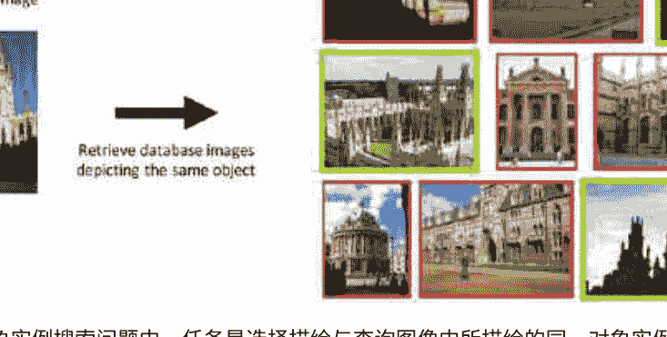

与CNN描述符相关的两个问题需要解决：首先，CNN描述符缺乏变换（特别是尺度和旋转）不变性；其次，描述符的高维度和标量性质使得描述符匹配效率低下。

我们通过将描述符哈希为小的二进制码来解决第一个问题，以便使用汉明距离进行高效匹配，同时保持未压缩描述符的良好搜索性能[12, 46–48]。该方法专门针对非常低的比特率范围（32-1024位）。所提出的哈希流水线首次展示了如何将高维度描述符压缩为非常紧凑的二进制表示。在低比特率下实现出色性能的关键是对堆叠限制玻尔兹曼机（RBM）进行正则化。接下来展示了如何使用Siamese微调来提高性能。这种技术适用于存在标记的匹配实例对的外部数据。

为了解决第二个问题，我们提出了嵌套不变性池化（NIP）[45, 50, 53, 54]，一种从CNN提取的视觉表示中生成紧凑全局图像描述符的方法，这些描述符对于多种类型的图像变换（如平移、旋转和尺度变化）具有鲁棒性。NIP受到不变性理论（i-theory）[3–5]的启发，这是一种最近提出的用于计算前馈神经网络中群不变性变换的数学理论。

我们展示了NIP生成的紧凑（但非二进制）全局图像描述符在大多数评估数据集上优于其他方案的等效描述符维度。最后，结合NIP和哈希流程在文献中提供了一些表现最佳的哈希函数，特别是在非常低的比特率（256位及以下）下。

# 2 相关工作

手工制作的全局描述符 目前用于对象搜索的最先进的手工制作的全局描述符是Fisher向量（FV）[58]和局部聚合描述符向量（VLAD）[38]，它们通常是从局部描述符（如SIFT [52]）聚合而成的（图2）。FV是通过将局部特征描述符集合量化为一个小的码本（64-512个聚类中心）并聚合特征量化到每个聚类中心的一阶和二阶残差统计量来获得的。从每个聚类中心得到的残差统计量被串联在一起，得到高维全局描述符表示，通常为8192到65536维。如[58]所示，全局描述符的维度增加时，性能也会提高。

VLAD描述符可以被视为FV的特殊情况，其中特征描述符进行硬量化，仅在最终描述符表示中连接第一阶残差统计量。

在基线VLAD和FV方法上已经提出了几种改进方法。在[15]中，提出了另一种用于残差的归一化方案，其中计算每个聚类的残差均值，而不是总和，增强了VLAD描述符的区分能力。在[38]中，提出了类似的有符号平方根（SSR）归一化方案。

![图2：显示了从图像中提取全局描述符的Fisher向量（FV）和卷积神经网络（CNN）的流程。（转载自参考文献[11]，获得Elsevier的许可）](img/162990c10259bfd3b3d26f8f39dcc79d_204_0.png)

在VLAD中提出了一种称为SSR归一化方案。在[36]中，通过使用PCA白化和多个聚类进行量化来扩展VLAD。在[6]中提出了一种内部归一化方案，以减轻突发视觉特征[37]的不利影响，在每个VLAD块内对残差进行L2归一化。通过使用非线性加性核和归一化，改进了基线方法[58]的FV。对基线FV [58]的其他改进包括增强的残差视觉向量[16]，可扩展的压缩Fisher向量[44]，更好的匹配核[65]和更好的聚合方案[39]。一些最佳的实例搜索结果仍然基于手工制作的FV [65]。接下来，将讨论CNN在对象实例搜索问题中的应用。

深度卷积神经网络描述符 与精心设计的描述符相反，在最近的文献中对对象实例搜索的CNN描述符进行了大量研究[8, 9, 26, 60, 62, 66]。Razavian等人[60]评估了从CNN完全连接层提取的表示在各种任务中的表现，包括作为实例搜索的全局描述符，并展示了有希望的初步结果。然后，Babenko等人[9]展示了可以使用预训练的CNN对特定领域的数据（对象，场景等）进行微调，以提高相关数据集上的实例搜索性能。在[8]中，Babenko等人展示了如何使用CNN的汇聚中间层作为实例搜索的起始表示。他们表明，在图像表示进行白化时，中间特征图的求和池化比最大池化效果更好。请注意，[8]中的方法对平移具有有限的不变性，但对于尺度或旋转没有不变性。在MOP-CNN [26]中，作者提出使用滑动窗口方法在图像的不同尺度上提取CNN激活，然后计算局部CNN描述符的高维VLAD表示。虽然这会产生高性能的描述符，但起始表示通常相差数个数量级。比原始描述符更大。参考文献[7, 62]表明，中间地图的空间最大池化是一种有效的表示方法，并且与使用完全连接的层相比，可以实现更高的性能。另一项非常新的工作[66]提出了在图像中对区域边界框进行池化的方法，类似于用于对象检测的流行的R-CNN方法[21]。

尽管深度学习无疑已成为许多视觉任务的主要方法，但来自CNN的原始图像描述符在对象实例搜索中并不系统地占优势。这两种类型的描述符在性质上有着根本的不同，可以预期它们在特定问题的具体方面表现出非常不同的行为。与为FV流程提供尺度和旋转不变性的兴趣点不同，用于图像分类的CNN表示是通过对调整大小的规范图像进行密集采样获得的。CNN没有内置机制来确保对尺度和旋转的几何变换具有韧性，因此不提供明确的旋转和尺度不变性，而这些通常是实例搜索任务的关键。尽管CNN特征在管道中的最大池化操作、训练数据的多样性（通常包含不同尺度和方向的对象）以及训练阶段的数据增强间接实现了适度的尺度和旋转不变性，其中数据可以在不同尺度和方向上预处理并输入到CNN中。

哈希这些全局描述符的维度通常非常高：FV[58]需要8192到65536个浮点数，CNN[41]需要4096个，而64位哈希等极度紧凑的图像表示对于快速图像实例搜索是必不可少的，因为（1）64位提供了足够的容量来解决任何实际问题，包括互联网规模的问题，（2）64位哈希可以直接在RAM中寻址，并使用汉明距离进行快速匹配。将这样高维的表示降低到64位哈希是一个相当大的挑战。

虽然有很多关于学习二进制码[29]以压缩像SIFT这样的小描述符的工作，但对于高维全局描述符的压缩研究相对较少。用于压缩像SIFT或GIST这样的描述符的提出的方法包括[13, 14, 24, 29, 31, 42, 49, 56, 67, 69, 70]。本研究考虑的全局描述符数据的维度比问题更具挑战性，高出两个数量级。

本文回顾了应用于全局描述符压缩问题的最重要的哈希技术。Perronnin等人[58]提出了对FV进行三值量化，将每个维度量化为 +1, -1或0。作者表明，这种表示方式几乎不会损失性能。然而，这导致描述符的大小达到了数千位。Perronnin等人还探索了局部敏感哈希[18]和谐哈希[70]。谱哈希在高速率下表现不佳，而LSH和简单的三值量化需要数千位才能达到良好的性能。

Gong等人在[24]中提出了流行的迭代量化（ITQ）方案，并将其应用于GIST描述符。ITQ首先进行主成分分析（PCA）以降低维度，然后学习旋转以最小化将转换后的数据映射到零中心二进制超立方体的量化误差。这种方案的一个缺点是PCA矩阵可能需要数GB的内存来处理高维全局描述符。在随后的工作中，Gong等人在[23]中展示了如何使用双线性投影来创建VLAD的二进制哈希。Gong等人[23]专注于生成全局描述符的非常长的代码，而基于双线性投影的二进制代码（BPBC）方案需要数万位才能达到未压缩全局描述符的性能。

MPEG-CDVS标准采用了可扩展压缩的Fisher向量[44]，该向量是基于高维Fisher向量的二值化。在MPEG-CDVS标准中，压缩描述符的大小范围从每个图像的256字节到几千字节不等，具体取决于操作点。通过贪婪地选择位，以最大化成对接收器操作特性（ROC）匹配性能。堆叠限制玻尔兹曼机（RBM），主要被认为是强大的降维技术[61]，也可以用于哈希。

# 3 紧凑不变深度描述符

在本节中，我们展示了提出的框架概述，用于紧凑的不变深度表示的对象实例搜索（见图3）。通过从CNN中提取的输出，我们的方法由两个关键组成部分组成：提出了多组嵌套不变池化来获得平移、旋转和尺度不变的表示（第3.3节），然后在第3.1节和第3.2节中提出了描述符哈希方案，旨在实现最佳性能的32-256位哈希。

图3 嵌套不变性池化（NIP）用于从CNN中生成稳健描述符，可以在之后使用RBMH进行紧凑和不变哈希。（ACM通讯，©2017 ACM，Inc.http://doi.acm.org/10.1145/3078971.3078987）

首先，我们提出了所提出的哈希流水线，主要由两部分组成：（a）使用受限玻尔兹曼机（RBM）进行无监督降维方法，在目标比特率下生成二进制哈希（第3.1节）；（b）通过堆叠的RBM改进生成的二进制嵌入函数的微调步骤（第3.2节）。具体来说，第一步降维应用了一种专门设计用于优化生成的二进制哈希码分布的RBM正则化。所提出的方法是一种批级正则化方案，旨在通过鼓励在哈希内部和跨哈希之间高效利用潜在子空间来改善非常低比特率的哈希。第二个微调步骤基于Siamese网络的度量细化，这个想法最初由Bromley等人在[10]中提出。该方法基于使用标记的匹配和非匹配实例对的训练集。与通常在较低维度上使用的成对对比损失函数（如[17, 30]）相反，我们展示了Siamese网络损失函数的关键改进导致搜索结果的改进。

在第3.3节中，我们提出了一种基于i理论的新方法Nested Invariance Pooling (NIP)，用于从CNN中创建稳健且紧凑的全局图像描述符，用于对象实例搜索。该方法提供了一种实用且经过数学证明的计算不变对象表示的方式，使用前馈神经网络。通过彻底的实证研究，我们展示了按照该方法引入每个新的群不变性属性会导致搜索结果的一致且显著改善。NIP有一些参数（变换的顺序和统计矩的选择很重要），但实验表明，许多默认和合理的设置可以产生能够在所有数据集上泛化良好的结果，这意味着过拟合的风险很低。本研究还证实了特征金字塔（pool5）作为高性能紧凑哈希的起始表示的潜力，而不是更常用的第一个全连接层（fc6）。

最后，在第3.4节中，NIP被证明能够有效地与RBM哈希方案结合，从而产生既紧凑又能够抵抗多种图像变换的哈希。通过对小规模和大规模数据集进行彻底的实证评估，结果表明所提出的方案能够产生极其紧凑的哈希，尤其在非常低的比特率（32-256位）下表现优异。

## 3.1 用于哈希的受限玻尔兹曼机

### 3.1.1 方法

受限玻尔兹曼机受限玻尔兹曼机（RBM）[64]是玻尔兹曼机[34]的一种变体。RBM是一个无向二分图模型，由一层可见单元x和一层隐藏单元组成。

隐藏单元 $z$。一组对称权重 $W$ 连接了 $x$ 和 $z$。对于具有二进制可见单元和隐藏单元的RBM，可见单元和隐藏单元的联合集合具有以下能量函数：

$$E(x, z) = -\sum_{i} c_{i}x_{i} - \sum_{j} b_{j}z_{j} - \sum_{i,j} x_{i}z_{j}w_{ij} \qquad (1)$$

其中， $x_{i}$ 和 $z_{j}$ 分别是可见单元和隐藏单元的二进制状态， $w_{ij}$ 是连接这些单元的权重，而 $c_{i}$ 和 $b_{j}$ 是它们各自的偏置项。使用方程（1）中的能量函数，可以为 $x$ 分配一个概率，如下所示：

$$P(x) = \sum_{z} \frac{\exp(-E(x, z))}{Z}$$

其中， $Z$ 是一个“分区”项，通过对所有可能的可见单元和隐藏单元的组合求和得到：

$$Z = \sum_{x,z} \exp(-E(x, z))$$

通过将另一层的状态固定，可以对一层中的单元的激活概率进行采样，如下所示：

$$P(z_{j} = 1|x) = f\left( b_{j} + \sum_{i} w_{ij}x_{i} \right) \qquad (2)$$

同样，对称权重的情况下：

$$P(x_{i} = 1|z) = f\left( c_{i} + \sum_{j} w_{ij}z_{j} \right) \qquad (3)$$

其中 $f(\cdot)$ 是标准的逻辑函数。RBMs可以通过最小化对比散度目标[32]来进行训练，该目标近似于最大似然输入分布。基于方程(2)和(3)的交替Gibbs采样用于获取网络状态以更新参数 $w_{ij}$， $b_{i}$， $b_{j}$ 通过梯度下降。

批级正则化在RBM的训练过程中，适当的正则化是关键。对于分类，通过约束二进制潜在单元很少被激活或稀疏[55]来改善判别性能。这对于分类任务是可取的，因为它提高了数据的可分离性，但对于哈希来说，这不一定是理想的，因为高效利用有限的潜在子空间是关键。所提出的RBMH方法是一种批级正则化方案（不同于稀疏性通常情况下，这些方案是基于实例级别的）。它通过控制稀疏性来实现高效的空间利用，以最大化每个哈希内部以及不同哈希之间的熵。这有效地鼓励：

1.  对于给定的图像，哈希位的一半处于活跃状态
2.  每个哈希位在图像之间具有等概率

因此，我们提出了一种专门为哈希设计的批级正则化方案，称为RBMH。我们首先讨论了如何在RBMH框架中鼓励高批级熵。接下来，我们介绍了如何通过堆叠多个RBMH来构建深度RBMH。方法的概览图可参见图4。

对于两个连续的层 $l - 1$ 和 $l$ ，以及输入实例 $z_{\alpha}^{l-1}$ 的批次 $B$ 和相应的潜在表示 $z_{\alpha}^{l}$ ，我们定义了从[22]中提出的细粒度正则化适应的正则化项：

图4 在哈希框架的RBM中，堆叠的RBM被训练用于哈希全局描述符。潜在表示被规范化，使得位激活概率 $p$ 等于0.5，既在单个哈希的位之间，也在相同潜在单元的图像之间。(©[2016] IEEE.转载，获得许可，来自Ref.[46])

图5 使用RBMH和Nair和Hinton提出的RBM的哈希位激活概率。32位二进制哈希的统计数据是在 Holiday 数据集上计算的。两个激活直方图的均值都接近0.5，而RBMH的直方图在单元之间分布更均匀（即标准差较小）。 (a) Hinton RBM, (b) RBMH. (Communications of the ACM, ©2017 ACM, Inc. http://doi.acm.org/10.1145/3078971.3078987).

$$ h(B) = - \sum_{z_{\alpha}^{l} \in B} \sum_{j} t_{j\alpha}^{l} \log z_{j\alpha}^{l} + (1 - t_{j\alpha}^{l}) \log(1 - z_{j\alpha}^{l}). \quad (4) $$

其中 \( t_{j\alpha l} \) 是每个样本 \( z_{j\alpha l}^{-1} \) 的目标激活值 \( z_{j\alpha l} \)。与[22]不同，我们选择 \( t_{j\alpha l} \) ，使得每个 \( \{t_{j\alpha l}\}_{j} \) 对于固定的 \( \alpha \) ，以及每个 \( \{t_{j\alpha l}\}_{\alpha} \) 对于固定的 \( j \) 都按照 \( U(0, 1) \) 分布，从而有效地最大化熵。均匀分布适用于哈希高维向量，因为正则化项鼓励每个潜在单元的平均激活值为0.5，同时避免激活饱和。

#### RBMH的整体目标函数为：

$$ \arg \min_{\{W^l, b^l, c^{l-1}\}} - \sum_{\alpha} \log \left( \sum_{z_{\alpha}^{l} \in E_{\alpha}} P(z_{\alpha}^{l-1}, z_{\alpha}^{l}) + \lambda h(B) \right), \quad (5) $$

其中 \( \lambda \) 是一个正则化常数。它通过批量梯度下降使用对比散度算法进行优化。

图5显示了由RBMH提供的32位哈希的激活概率和[55]中提出的RBM的激活概率。在两种情况下，激活的平均概率几乎为0.5，但是RBMH在位上的分布更加均匀。

堆叠的RBMH原始图像表示集合位于一个复杂的流形中在一个非常高维的特征空间中。更深的网络有潜力发现更复杂的非线性哈希函数并提高对象实例搜索性能。根据[33]的方法，我们堆叠多个RBMH，逐层贪婪地训练以创建一个具有多个层的深度网络。

每一层都模拟了前一层的激活分布，并捕捉了这些单元之间的高阶相关性。对于哈希问题，我们对64、256和1024位的低速点感兴趣。我们逐渐减小潜在层的维度，每层减少2倍\(^n\)，其中 \(n\) 是一个可调参数。对于我们的最终模型，\(n\) 是根据每层的经验选择的，从而导致网络深度的变化。

输出二值化二进制哈希对于使用汉明距离进行快速匹配是理想的。因此，RBMH使用sigmoid激活函数。此外，最顶层的RBMH（层 L）的输出在0.5附近进行二值化：

$$ z^{L}_{j} = \begin{cases} 1, & \text{if } \frac{1}{1+\exp(-w^{L}_{j} z^{l-1}-b_{j})} > 0.5 \\ 0, & \text{否则。} \end{cases} \quad (6) $$

在下一节中，我们将评估所提出的SRBMH方案的性能。

### 3.1.2 评估框架

全局描述符SIFT [51] 特征是从高斯差分（DoG）兴趣点中获取的，用于FV。PCA用于将SIFT描述符的维度从128降低到64维，这已经被证明可以提高性能 [38]。我们使用具有128个中心的高斯混合模型（GMM），每个模型的一阶和二阶统计量都有8192维。全局描述符表示中只保留了一阶统计量，因为二阶统计量只会稍微提高性能 [44]。FV在经过有符号幂归一化（称为FV）后进行$L_{2}$归一化为单位范数。使用开源软件Caffe [40] 提取DCNN特征，使用了AlexNet参考模型，该模型是针对2012年ImageNet分类任务提出的 [41]。DCNN描述符是从第一个全连接层fc6中提取的，已经证明对于实例搜索来说是有效的描述符。从现在开始，我们将这个4096维的描述符称为CNN描述符。

SRBMH训练 对于哈希问题，我们对64、256和1024位的低速率点感兴趣。SRBMH是以逐层方式贪婪地训练的，即每个新的RBMH都在前一个RBMH的基础上进行训练，而不修改前一个RBMH的参数。使用ImageNet的一个随机子集（共15万张图像）作为训练数据。选择该集合是因为它具有多样性和通用性，并且与搜索实验中使用的图像没有交集。所有实验的批量大小为100。权重和偏置参数的学习率设置为0.001，动量设置为0.9。训练最多运行30个时期。对于每个速率点，考虑不同的模型。对于我们的最终模型，每个层的n是根据经验选择的，从而得到可变的网络深度。每个目标设置需要几个小时的训练。

基准线四种最先进的哈希方案被视为基准线:局部敏感哈希（LSH）、迭代量化（ITQ）、双线性投影二进制码（BPBC）和产品量化（PQ）。LSH基于原始描述符的随机单位-范数投影，然后进行符号二值化[73]。ITQ在对原始描述符进行两次变换后应用符号二值化：首先是PCA，然后是旋转[25]。与ITQ不同，BPBC应用双线性随机投影，这需要更少的内存来转换数据[23]。

对于 FV，我们考虑维度为 D = 64,256 和 1024 的块，并进行训练。对于每个块，我们考虑 K =256 个质心，结果为 b = 128,256 和 64 位描述符，分别。对于 CNN，我们考虑维度为 D = 32,128 和 512 的块，具有 K =256 个质心，结果为相同的比特率。PQ 和未压缩描述符使用 L2范数，而所有二进制哈希方案使用汉明距离。

数据集小规模对象实例搜索实验使用 Holidays 和 UKBench数据集。对于大规模实验，这两个数据集与一百万个 MIR FLICKR干扰图像相结合。

评估指标在大多数图像搜索应用中，重要的是相关图像在流水线的第一步中出现，即匹配全局描述符，以便几何一致性检查（GCC）[19]步骤随后找到它。然而，GCC步骤计算复杂，只能在少量图像上执行。因此，重要的是相关图像出现在一个短列表中，以便GCC步骤可以找到它。因此，对于小型和大型实验，分别在R = {10,100}和R = 1000的典型操作点上给出召回率。对于 UKBench小规模实验，提供4 × Recall@ R =4，以保持与文献一致。

### 3.1.3 实验结果

批级熵目标的影响在图6a中，我们展示了在单层RBM 8192-b上应用所提出的正则化的效果，对于 b =64, 256,1024。哈希正则化显著提高了性能， ~10% 绝对召回率 @ R =10 在低速率点 b =64 处。随着速率的降低，性能差距增加。这是直观的，因为正则化鼓励更有效地使用潜在空间。

深度的影响在图6b中，我们绘制了在给定速率点 b增加深度时在 Holidays上的召回率 @ R =10。对于 b =1024，我们考虑深度为8192 –1024、8192 –4096 –1024和8192 –4096 –2048 –1024的架构。分别对应深度为1、2和3。对于速率点 b =64和256，选择了类似的不同深度的配置。我们观察到，在没有正则化的情况下，对于 b =256和 b =64，随着深度的增加，召回率提高，最佳深度分别为三和四，之后性能下降。在更高的速率 b =1024及以上，增加深度并不能提高性能。对于哈希，观察到深度参数在每个速率点上存在性能的最佳值，因为更深的网络可能会导致信息在层之间的丢失。

对于召回率 @ R =100，得到了类似的趋势。重要的是，我们观察到，在提出的正则化方法下，我们可以在每个速率点上以更低的深度实现相同的性能。这是至关重要的，因为深度越低，哈希生成速度越快，内存需求越低。

与FV-RBMH和CNN-RBMH的比较在给定的速率点上，CNN-RBMH在所有数据集上优于FV-RBMH，如图7所示。在低速率下，CNN-RBMH在小数据集上的性能提高了10%以上，可能是因为CNN特征能够捕捉到更复杂的低级特征，并且与FV相比，起始维度较低。

与未压缩描述符的比较在图7中，将RBMH的性能与未压缩描述符进行了比较。对于CNN哈希的256位，与所有数据集上的未压缩描述符相比，我们只观察到了轻微的下降（几个百分点）进行检索。对于FV，未压缩描述符的性能在1024位时匹配。随着向64位哈希的转变，实例搜索哈希问题变得越来越困难，性能急剧下降。

与现有技术的比较小规模搜索结果如图7所示。可以看到，在所有数据集上，无论是CNN还是FV特征，所提出的RBMH在大多数速率上都优于现有技术。与第二个性能最好的方案ITQ相比，在FV上，在 Holidays上，绝对召回率@ R=100时， b=64位的情况下，RBMH有2.4%的改进。

其他方案的性能排序取决于比特率和特征类型，而RBMH在数据集上保持一致。与应用单个PCA变换的ITQ方案相比，RBMH的每个输出比特都是通过一系列投影生成的。在考虑低速率时，PQ方案的性能较差，因为全局描述符的大块被用少量的质心进行量化，这在之前的研究中已经观察到。LSH在低速率下表现不佳，但在足够的比特数下迎头赶上。在图8中观察到了一致的趋势，适用于大规模搜索。

## 3.2 双边界孪生微调

在前一节中，我们展示了全局描述符可以使用RBMH哈希成小的二进制描述符，同时保持良好的搜索性能。然而，RBMH专门针对压缩进行了优化，并没有内置机制来确保原始描述符的良好度量性质得到保留。在本节中，我们提出了一种弱监督方法，通过权重共享网络和额外的匹配和非匹配对的标记数据集（图9）来改善二进制嵌入函数的局部结构。

图8 不同压缩方案下的大规模搜索结果（使用100万个干扰图像，在召回率@R = 1000时）。RBMH在大多数速率点和数据集上表现优于其他方案。(a)CNN，*Holidays*+ 1M。 (b) CNN，*UKBench*+ 1M。（©[2016] IEEE。转载，获得许可，来自Ref. [46]）

图9 学习二进制嵌入函数的提议方法包括无监督的预训练阶段，然后是弱监督的微调阶段。在第一阶段，RBM以逐层的方式进行训练，并堆叠成深度网络（第3.1节）。在第二阶段，首先将第一阶段的参数加载到一个Siamese网络中，然后使用匹配和非匹配对数据进行微调。（ACM通讯，©2017 ACM，Inc. http://doi.acm.org/10.1145/3078971.3078983）

### 3.2.1 方法

微调是使用一种称为Siamese网络的学习架构进行的，该架构最早在[30]中引入。该原理后来成功应用于面部识别的深度架构[17]，并且在输入空间中对各种变换产生了鲁棒的表示[30]。最近在从CNN特征进行图像搜索的背景下，建议使用Siamese架构作为对现有技术的可能改进[9]。

Siamese网络是一种弱监督方案，用于从标记为匹配或非匹配的数据实例对中学习相似度测量。在我们对该概念的改进中，训练的RBM网络的权重在每个中间层都通过学习相似度测量进行微调，除了目标空间之外。给定一对数据 (𝒛_𝛼^0, 𝒛_𝛽^0)，对于每一层 l，定义了对比损失 𝒟_l，并通过梯度下降进行误差反向传播。同时执行对各个层的损失 (l = 1 … L) 的反向传播。应用Hadsell等人在[30]中提出的损失函数得到：

```
𝒟_l(𝒛_𝛼^0, 𝒛_𝛽^0) = y‖𝒛_𝛼^l − 𝒛_𝛽^l‖_2^2 + (1 − y) max(m − ‖𝒛_𝛼^l − 𝒛_𝛽^l‖_2^2, 0)
```

其中 y = 1，如果 (𝒛_𝛼^0, 𝒛_𝛽^0) 是匹配对，否则 y = 0，且 m > 0 是一个影响非匹配对的边界参数。如图10a所示，其效果是在任何匹配对的元素之间施加收缩力，并在非匹配对的元素之间施加排斥力，其元素间距离小于 m。

图11显示了一个8192 – 4096(top)–2048(middle)–64(bottom)堆叠的RBM网络中，2万个匹配对和4万个不匹配对的平方欧氏距离的直方图。图像对来自于Yandex数据集。红色和蓝色的竖线分别表示匹配对和不匹配对的中位数值。共享的Siamese损失边界值m被系统地设置为两个值的平均值（黑色竖线）。
(ACM通讯，©2017 ACM, Inc. http://doi.acm.org/10.1145/3078971.3078983)

然而，图12的实验结果表明损失函数（7）导致搜索结果迅速下降。仅使用不匹配对的结果表明处理匹配对是导致下降的原因。匹配对的不确定收缩远远超出了区分它们与非匹配元素所需的程度，这是一种有害的行为，特别是在微调上下文中，因为网络首先以不同的目标进行全局优化。图11显示了在高维空间中，任意两个元素，即使是匹配的，也总是相距很远。请注意，这种现象发生在哈希的目标比特率（例如64位及更高）上，并不是在[30]中考虑的远低维度潜在空间中的问题。

> 作为解决方案，我们提出了一个具有额外参数的双边界损失，影响匹配对：
$$
\mathcal{D}_l(\mathbf{z}_\alpha^0, \mathbf{z}_\beta^0) = y \max(||\mathbf{z}_\alpha^l - \mathbf{z}_\beta^l||_2^2 - m_1, 0) + (1-y)\max(m_2 - ||\mathbf{z}_\alpha^l - \mathbf{z}_\beta^l||_2^2, 0)
\tag{8}
$$

如图10b所示，新的损失函数可以被解释为学习“局部大边界分类器”（如果m_1 ≤ m_2），以区分匹配和非匹配元素。在实践中，我们发现两个边界参数可以设置为相等（m_1 = m_2 = m）并根据采样匹配和非匹配对的统计分布自动调整（图11和12）。

### 3.2.2 评估框架

首先，使用相同的 FV 描述符提取策略，将 SRBM 训练如第 3.1 节所述。然后，使用一组匹配和非匹配的图像对进行微调。这 200K 个匹配对数据集是由 Yandex 在他们最近的工作中提供的[9]。它包含通过在 Yandex 搜索引擎中最受欢迎的维基百科地标页面的名称来收集的著名地标的图像。数据集的可视化显示大多数图像描绘建筑物。对于每个匹配对，随机选择一张图像生成两个非匹配对。

Holidays、UKBench 和 Oxbuild 数据集用于小规模搜索实验。对于大规模实验，Holidays 和 UKBench 数据库与一百万个 MIR FLICKR 分散图像相结合。请注意，基于 Yandex 的训练集与用于评估的数据是独立的，因为作者删除了与牛津相关的查询和 Holidays 的近似图像。

### 3.2.3 实验结果

在 Siamese 微调之前和之后，三层模型的详细搜索结果在表 1 中提供。结果显示，在所有数据集和比特率上都有一致的改进，平均改进为 2.78%（最高可达 6.24%）。与 R = 100 时相比，当召回率较高时，平均为 2.43% @ R = 10，而不是 3.13% @ R = 100。然而，当考虑相对改进率时，它们是相当可比的：相对于 R = 10，改进率为 7.46%，相对于 R = 100，改进率为 7.24%。

表1 Siamese微调之前和之后的小规模搜索结果，以及相应的改进。在ImageNet FV描述符上训练了一个SRBM模型（8192 – 4096 – 2048 – 64），然后在Yandex上进行微调。对于每个模型，在Holidays、UKBench和Oxbuild数据集上，在微调之前和之后评估了三层的搜索性能。Siamese微调一致地提高了所有三层的搜索性能。

| 数据集 | 层 | 召回率 @ R = 10 | 召回率 @ R = 100 |
| :--- | :--- | :--- | :--- | :--- | :--- | :--- | :--- |
| | | **之前** | **之后** | **差异** | **之前** | **之后** | **差异** |
| 假期 | 4096 | 70.83 | 73.67 | **2.84** | 89.92 | 91.40 | **1.48** |
| | 2048 | 67.74 | 71.12 | **3.38** | 88.77 | 92.04 | **3.27** |
| | 64 | 52.06 | 53.04 | **0.98** | 80.38 | 83.91 | **3.53** |
| UKBench | 4096 | 79.22 | 82.22 | **3.00** | 92.04 | 93.73 | **1.69** |
| | 2048 | 75.62 | 79.37 | **3.75** | 90.79 | 92.82 | **2.03** |
| | 64 | 47.94 | 49.25 | **1.31** | 73.02 | 73.94 | **0.92** |
| Oxbuild | 4096 | 19.38 | 21.73 | **2.35** | 41.09 | 45.19 | **4.10** |
| | 2048 | 14.32 | 17.23 | **2.91** | 36.03 | 41.03 | **5.00** |
| | 64 | 10.69 | 12.01 | **1.32** | 23.75 | 29.99 | **6.24** |

表2 Siamese微调前后的大规模搜索结果，以及相应的差异。首先，分别训练三个SRBM，将高维FV描述符哈希到比特率 b = 1024、256和64。然后使用Siamese网络进行微调。微调改善了两个数据集上所有比特率的搜索性能。

| 数据集 | 比特率 | 召回率 @ R = 1000 |
| :--- | :--- | :--- | :--- | :--- |
| | | **之前** | **之后** | **差异** |
| 假期+ 1M | 1024 | 52.49 | 56.48 | **3.99** |
| | 256 | 46.07 | 49.60 | **3.53** |
| | 64 | 30.63 | 31.87 | **1.24** |
| UKBench + 1M | 1024 | 85.66 | 86.41 | **0.75** |
| | 256 | 78.70 | 80.74 | **2.04** |
| | 64 | 61.13 | 62.74 | **1.61** |

我们注意到在测试集上存在差异，特别是在牛津数据集上的改进更为显著。微调数据集 Yandex和搜索数据集Oxbuild主要描绘了地标结构。两个数据集之间的相似性可能解释了在Oxbuild上性能改进更高的原因。尽管如此，对所有数据集的系统性改进仍然证明了无监督训练和半监督微调的高可迁移性。

在表2的大规模搜索实验中观察到类似的趋势，在所有比特率和所有数据集上，Siamese微调都能提高性能。

## 3.3 嵌套不变性池化

在本节中，我们提出了Nested Invariance Pooling（NIP）方法，该方法可以从从CNN中提取的视觉表示中生成紧凑的全局图像描述符。该方法的灵感来自于数学理论i-theory[3-5]，这是一种计算群不变转换的数学理论，用于前馈神经网络。该理论是一个信息处理模型，解释了如何使前馈信息处理对各种类型的信号失真具有鲁棒性。

在证明CNN与i-theory兼容后，我们提出了一种简单实用的方法，将该理论应用于构建全局图像描述符，使其对输入图像的各种类型的变换具有鲁棒性。通过基于多个公开数据集的彻底实证评估，我们展示了所提出的方法能够显著且一致地提高搜索结果，同时保持低维度。本节研究了旋转、平移和尺度变化，但所提出的方法也适用于其他类型的变换。我们展示了使用逐渐增加的阶数的矩来引入对多个变换群的不变性的重要性。生成的NIP描述符对各种类型的图像变换具有不变性，并且我们展示了该过程显著提高了搜索结果，同时保持低维度（512维）。

### 3.3.1 理论概述

许多常见的图像变换类别，如旋转、平移和尺度变化，可以通过变换群的作用来建模。设图像 $x \in E$，变换群 $G$ 对 $E$ 的作用用点 $(\cdot)$ 表示。由 $G$ 对 $x$ 的轨道是 $E$ 的子集，定义为 $O_x = \{g.x \in E | g \in G\}$。轨道对应于对 $x$ 进行旋转、平移和尺度变换等群操作的集合。很容易证明 $O_x$ 对 $G$ 的任何元素的作用都是全局不变的，因此，直接从 $O_x$ 计算的任何描述符都对 $G$ 是全局不变的。i-理论为给定对象 $x \in E$ 与预定义模板 $t \in E$ 之间的关系构建不变表示，通过点积 $D_{x,t}$ 的分布来实现。

```
$\{< g.x, t > \in \mathbb{R} | g \in G\} = \{< x, g.t > \in \mathbb{R} | g \in G\} \text{ over the orbit.}$
```

以下的表示（对于任意的 $n \in \mathbb{N}^*$）在群是紧致或局部紧致的情况下被证明具有适当的不变性和选择性属性：

```
$$\mu_{G,t,n}(x) = \frac{1}{\int_G dg} \left( \int_G |< g.x, t >|^n dg \right)^{\frac{1}{n}}$$
```

需要注意的是，变换可以在图像或模板上任意应用。注意，序列 $(\mu_{G,t,n}(x))_{n \in \mathbb{N}^*}$ 类似于直方图。

### 3.3.2 卷积神经网络是I-Theory兼容的网络

为图像分类而设计的流行的卷积神经网络架构，如 AlexNet [41]和 OxfordNet [63]，共享一个共同的构建模块：一系列卷积-池化操作，旨在建模越来越高级的视觉表示数据。最高级别的视觉特征可以被馈送到作为分类器的全连接层中。

如图13a所示，典型卷积神经网络中的卷积和池化操作的连续性实际上是一种严格遵守 i-theory提出的框架的局部平移不变性的方式。网络架构提供了与不变性理论预测的鲁棒性，而通过反向传播进行的训练确保了模板的正确选择。

多个卷积池化步骤被应用（在 AlexNet和OxfordNet中都是五次），从而增加了鲁棒性和更高级别的模板。请注意，局部平移不变性的迭代组合近似地将特征在 pool5层的局部弹性扭曲中具有鲁棒性。

在这项研究中，我们决定使用局部不变性的 pool5作为提出的全局描述符的起始表示，以进一步增强它们对选定变换群的鲁棒性，而不是使用流行的第一个全连接层（fc6），这在平均情况下是用作全局开箱即用描述符的最佳单个CNN层进行图像搜索。这种方法受到了 i-theory的启发。

### 3.3.3 多组不变CNN描述符

我们从已经具有局部鲁棒性的 pool5特征图开始构建NIP描述符，这些特征图来自 OxfordNet。然后，我们按照 i-theory框架依次引入对多个变换群的全局不变性。本研究考虑的具体变换群包括平移 G_T、旋转 G_R和尺度变化 G_S。对于 pool5层的每个特征图 i（0 ≤ i <512），我们用 f_i（x）表示相应单元的输出。如图13b所示，变换g应用于输入图像 x，从而改变 pool5特征 f_i（g.x）的输出。请注意，由于多次卷积池化，变换 f_i是非线性的。

图13 (a) 从CNN的单个输入层和单个输出单元的示意图中的单个卷积-池化操作。与i-理论的类比表明，CNN的通用构建块与输入的局部平移不变性的理论相容。网络架构负责不变性属性，而反向传播提供了一种从数据中学习模板的实际方法。(b) CNN学习的一系列卷积和池化操作（以红色表示）计算出每个特征图,的池5特征 f i。可以对输入 x应用多种变换g以改变响应 f i(g.x)。(c) 提出的方法从i-理论中汲取灵感，从CNN中创建紧凑且鲁棒的全局图像描述符。从原始的pool5描述符开始，可以使用它来堆叠任意数量的变换群不变性，同时保持维度可控。图中所示的特定变换群序列和统计矩在平均情况下产生了最佳性能的哈希，但其他任意组合也能改善搜索结果。

因此，它不严格是一个数学上的点积，但仍然可以看作是内积。因此，NIP使用的池化方案为G∈ {G_T, G_R, G_S}：

```
$$ \mathcal{H}_{G,i,n}(x) = \frac{1}{\int_G dg} \left( \int_G f_i(g.x)^n dg \right)^{\frac{1}{n}} $$
$$= \frac{1}{m} \left( \sum_{j=0}^{m-1} f_i(g_j.x)^n \right)^{\frac{1}{n}} \quad (11)$$
```

当 $O_x$ 离散化为 $m$ 个样本时。在每个池化步骤之后，通过连接各个特征的矩来获得相应的全局图像描述符：

```
$$\mathcal{X}_{G,n}(x) = (\mathcal{X}_{G,i,n}(x))_{0 \leq i < 512} \quad (12)$$
```

如公式11所示，池化操作具有一个参数 $n$来定义池化的“硬度”。当 $n =1$ 时，为平均池化，而当 $n \to +\infty$时，为最大池化。当 $n =2$时，类似于标准差。随后，我们将 $n = 1, 2, +\infty$的矩称为 $\mathscr{A}_G$, $\mathscr{S}_G$和 $\mathscr{M}_G$。在i-理论[74]中的研究表明，可以将多种类型的群不变性依次链接起来。我们通过使NIP描述符对多种变换具有不变性来应用这一原理。例如，通过以下方式实现了尺度不变性（使用平均值，$n =1$）和平移不变性（使用硬最大池化，$n \to +\infty$）：

```
$$\max_{g_t \in G_T} \left( \frac{1}{\int_{g_s \in G_S} dg_s} \int_{g_s \in G_S} f_i(g_t g_s.x) dg_s \right) \quad (13)$$
$$= \max_{j \in [0, m_t-1]} \left( \frac{1}{m_s} \sum_{i=0}^{m_s-1} f_i(g_{t,j} g_{s,i}.x) \right) \quad (14)$$
```

操作有时是可交换的（例如，$\mathscr{A}_G$ 和 $\mathscr{A}_{G'}$），有时不是（例如，$\mathscr{A}_G$ 和 $\mathscr{M}_G$），这取决于具体的矩阵组合，因此变换的顺序对于NIP很重要。硬度参数 $n$也必须谨慎选择。经验上，我们发现逐渐增加矩阵的池化（例如，$\mathscr{A}_G$，然后 $\mathscr{S}_G$，然后 $\mathscr{M}_G$）效果很好，如实验部分所述。

成对匹配距离对象实例搜索从构建一个按照与查询图像的成对匹配距离排序的数据库图像列表开始。使用CNN描述符，匹配距离受常见的图像变换的影响很大。我们观察到，将查询图像旋转超过10度会导致结果急剧下降。这个特定问题在流行的Fisher向量中不太明显，这主要是由于兴趣点检测器的使用。

图14提供了一个洞察力，即如何通过添加不同类型的不变性来影响不同图像对的匹配距离。随着每个新的变换组的加入，我们注意到匹配距离的相对减少在受变换组影响最大的图像对中最为显著。

图14 来自UKBench的三个匹配对的距离。对于每对，计算四个成对距离（L2-归一化）对应于以下描述符：pool5，$\mathcal{A}_G$，$\mathcal{A}_{G_T}$，和$\mathcal{A}_{G_S}$。添加尺度不变性对(b)产生最大影响，平移不变性对(c)产生影响，旋转对(a)产生影响，这与相应图像对所示的场景一致。（ACM通讯，©2017 ACM, Inc. http://doi.acm.org/10.1145/3078971.3078987）

### 3.3.4 评估框架

选择了来自16层OxfordNet[63]的第5个池化层作为起始表示，总维度为25,088，由512个大小为7 × 7的特征图组成。为了实现旋转不变性，旋转输入图像时使用了从ImageNet数据集计算得到的平均像素值进行填充。旋转步长为10°，每个轨道生成36个旋转图像。为了实现尺度变化，采用了从总图像的100%到50%的十个不同中心裁剪。对于平移，每个特征都使用整个特征图，结果是一个轨道大小为7 × 7 = 49。

我们对四个流行的数据集：Holidays、UKBench、Oxbuild和Graphics进行了描述符的实例搜索性能评估。选择这四个数据集是因为它们提供了多样化的数据：UKBench和Graphics是以室内环境中物体的特写为特点的对象数据集。Holidays和Oxbuild是以室外建筑和场景为主的场景中心数据集。使用平均精度（mAP）和4×Recall@R=4对UKB进行评估，以保持与文献一致。

### 3.3.5 实验结果

转换、顺序和矩阵 如表3所示，我们首先研究了将各种转换群体纳入描述符和使用不同矩阵对描述符的影响。提供了作为基准的NIP描述符的起始点Pool 5和被认为是现成描述符fc6。我们对平均池化的所有可能的转换群体组合以及单个最佳表现者$\mathcal{A}_G$进行了结果展示。

$S-\mathcal{A}_G_T-\mathcal{M}_G_R$（顺序重要）。

首先，我们可以立即指出pool5的高潜力。尽管它的表现明显不如fc6，但在翻译空间的简单平均池化中，它表现得更好且更紧凑。使其比fc6更好且更紧凑八倍。类似的观察结果也已经被[7, 8]报道过。

其次，如图15所示，准确率随着涉及的转换组数量的增加而增加。平均而言，单一转换方案的性能比pool5、2个转换方案的性能提高了21%，而3个转换方案的性能提高了41%。

表3 不同转换组和时刻的搜索结果（mAP）。结果使用平均精度（mAP）指标计算。作为参考，对于UKBench，还提供了4×Recall@4的结果（括号内）。$\mathcal{G}_T$，$\mathcal{G}_R$和$\mathcal{G}_S$分别表示平移、旋转和缩放的组。请注意，平均值与其他平均值交换位置时，组合的顺序不重要，只涉及平均值时。选择特定时刻可以获得最佳结果。$\mathcal{A}$，$\mathcal{J}$和$\mathcal{M}$分别表示时刻的平均值、标准差和最大值。$\mathcal{A}_G$对应于最佳平均表现者。fc6和pool5作为基准提供。

| 序列 | 维度 | Oxbuild | Holidays | UKB | Graphics (1) | Graphics (2) |
| :--- | :--- | :--- | :--- | :--- | :--- | :--- |
| pool5 | 25,088 | 0.427 | 0.823 | (3.11) | 0.315 | |
| fc6 | 4096 | 0.461 | 0.910 | (3.50) | 0.312 | |
| $\mathcal{A}_{\mathcal{G}_T}$ | 512 | 0.477 | 0.924 | (3.56) | 0.322 | |
| $\mathcal{A}_{\mathcal{G}_R}$ | 25,088 | 0.462 | 0.954 | (3.72) | 0.500 | |
| $\mathcal{A}_{\mathcal{G}_S}$ | 25,088 | 0.430 | 0.828 | (3.12) | 0.394 | |
| $\mathcal{A}_{\mathcal{G}_T}$-$\mathcal{A}_{\mathcal{G}_R}$ | 512 | 0.418 | 0.955 | (3.73) | 0.417 | |
| $\mathcal{A}_{\mathcal{G}_T}$-$\mathcal{A}_{\mathcal{G}_S}$ | 512 | 0.537 | 0.931 | (3.61) | 0.430 | |
| $\mathcal{A}_{\mathcal{G}_R}$-$\mathcal{A}_{\mathcal{G}_S}$ | 25,088 | 0.494 | 0.959 | (3.75) | 0.552 | |
| $\mathcal{A}_{\mathcal{G}_T}$-$\mathcal{A}_{\mathcal{G}_R}$-$\mathcal{A}_{\mathcal{G}_S}$ | 512 | 0.484 | 0.971 | (3.82) | 0.509 | |
| $\mathcal{A}_{\mathcal{G}_S}$-$\mathcal{J}_{\mathcal{G}_T}$-$\mathcal{M}_{\mathcal{G}_R}$ | 512 | 0.592 | 0.975 | (3.84) | 0.589 | |

图15 表3的结果对七种策略使用仅使用平均值（第三到第九行）以mAP改进的形式表达在invariance groups的数量上聚合。改进范围从在一个转换上对Oxbuild为+5%到在三个转换上对UKBench为+83.5%。在所有四个数据集上，结果明显随着考虑的groups数量的增加而改善。

图16 根据表3的结果以mAP改进的形式表示pool5。大多数策略在大多数数据集上都比pool5有显著改进。最佳策略的平均改进率为68%。

第三，选择与平均值不同的统计矩可以进一步改善搜索结果。从图16中我们可以观察到$\mathcal{A}_{\mathcal{G}_S}$-$\mathcal{S}-\mathcal{I}_{\mathcal{G}_T}$-$\mathcal{M}_{\mathcal{G}_R}$的平均结果比$\mathcal{A}_{\mathcal{G}_S}$要好大约17%（对所有数据集进行平均）。值得注意的是，最佳组合对应于矩的阶数增加：$\mathcal{A}$为一阶矩，$\mathcal{I}$为二阶矩，$\mathcal{M}$为无穷阶矩。另一种表述这个事实的方式是，更不变的表示需要更高阶的池化。总体而言，$\mathcal{A}_{\mathcal{G}_S}$-$\mathcal{S}-\mathcal{I}_{\mathcal{G}_T}$-$\mathcal{M}_{\mathcal{G}_R}$改善了起始表示的结果。对于数据集，pool5提高了39%（Oxbuild）至87%（Graphics）。与Graphics相关的改进可以解释为数据集中存在许多旋转（以不同角度拍摄的较小物体），而以直立建筑为主的Oxbuild通过引入旋转不变性的帮助较小。

与最先进的描述符进行比较，最先进的描述符包括VLAD/FV的变体[28, 39]，深度描述符[8, 9, 62, 66]，以及深度CNN和VLAD/FV的组合描述符[26, 57]。如表4所示，我们观察到512维NIP描述符在所有数据集上大大优于大多数512维或更高维度的最先进方法。根据[8, 62, 66]的方法，我们还进行了PCA白化以将NIP的维度降低到256。可以看出，256维的NIP描述符在所有数据集上的性能优于[8, 62, 66]。

首先，我们将NIP与最相关的论文[8, 62, 66]进行比较，这些论文通过聚合卷积特征和各种池化操作提出了256-D深度描述符。只有一层池化的情况下，[7, 8, 62]可以被视为NIP的特殊情况，只提供有限的平移不变性水平。最近提出的区域最大激活卷积（R-MAC）[66]在具有非常小维度的Oxbuild建筑数据集上报告了出色的结果（例如，512-D R-MAC的0.668 mAP和256-D R-MAC的0.561 mAP）。作者提出了一种快速的R-CNN类型的池化[20]，当感兴趣的对象位于图像的一小部分时，这种方法非常有效。当感兴趣的对象受到旋转和透视等多种扭曲的影响并位于图像中心时，这种方法将不太有效。在这里，我们观察到通过逐渐增加嵌套池化的方式对多种扭曲进行池化处理。

表4 将NIP与其他最先进方法进行搜索性能比较。我们在最近的论文中包含了与这些论文中报告的维度可比的描述符结果。所有方法都使用L2距离。

| 方法 | 维度 | Oxbuild | Holidays | UKB |
| :--- | :--- | :--- | :--- | :--- |
| T-embedding [39] | 1024 | | 0.560 | 0.720 (3.51) |
| T-embedding [39] | 512 | | 0.528 | 0.700 (3.49) |
| FV + Proj [28] | 512 | - | 0.789 | 3.36 |
| FC + PCAWhitening [60] | 500 | 0.322 | 0.642 | - |
| FC + VLAD + PCA [26] | 512 | - | 0.784 | - |
| FC + Finetune + PCAWhitening [9] | 512 | 0.557 | 0.789 | 3.30 |
| Conv + MaxPooling [62] | 256 | 0.533 | 0.716 | - |
| FV + FC + PCAWhitening [57] | 512 | - | 0.827 | 3.37 |
| Conv + SPoC + PCAWhitening [8] | 256 | 0.589 | 0.802 | 3.65 |
| R-MAC + PCAWhitening [66] | 512 | 0.668 | - | - |
| R-MAC + PCAWhitening [66] | 256 | 0.561 | - | - |
| NIP | 512 | 0.592 | 0.838 | 3.84 |
| NIP + PCAWhitening | 256 | 0.609 | 0.836 | 3.83 |

通过低维描述符实现几何不变性和高搜索性能是至关重要的。此外，[66]中提出的技术可以与NIP结合使用以进一步提高性能。

接下来，我们注意到[62]在Holidays（0.881 mAP）和Oxfordbuild（0.844 mAP）上报告了更好的结果，使用非常高维的描述符（从10K到100K）。这些非常高维的描述符是通过将CNN描述符与空间最大池化[7]相结合获得的。相比之下，NIP的结果仅使用256到512维的描述符生成。

## 3.4 具有不变描述符的哈希

在本节中，我们将NIP与RBMH（图3）结合起来，这是前几节中介绍的描述符哈希方案，旨在实现最佳性能的小型32-256位哈希。多组不变的NIP表示，在前一节中表现出色，被用作哈希的起始表示。

然后使用RBMH从$\mathcal{S}-\mathcal{I}_{\mathcal{G}_T}-\mathcal{M}_{\mathcal{G}_R}$生成紧凑的二进制哈希512维浮点数值描述符。

将生成的哈希与使用相同起始表示的流行无监督哈希方法进行比较，包括ITQ [24]、双线性投影二进制码（BPBC）[23]、PCAHash [24]、LSH [18]、SKLSH [59]、SH [70]和RBM。评估的比特率范围从32到256位。原始$\mathcal{S}-\mathcal{I}_{\mathcal{G}_T}-\mathcal{M}_{\mathcal{G}_R}$还引入了512维浮点描述符作为基准的未压缩方案。

实验分别使用小规模（第3.4节）和大规模（第3.4节）的搜索数据集进行。对于小规模对象实例搜索实验，使用了四个流行的数据集：Holidays、UK Bench、Oxfordbuild和Graphics。对于大规模实验，使用了四个数据集与一百万个MIR FLICKR分散图像[35]的组合进行结果展示。

最后，在第3.4节中将NIP + RBMH的结果与其他最先进的方法进行了比较。NIP + RBMH被证明是文献中报告的对象实例搜索中最紧凑和高效的二进制编码之一。

小规模实验中，多组不变哈希的小规模搜索结果如图17所示，与其他流行的无监督哈希方法进行了比较。在所有数据集上，RBMH编码在大多数码大小上优于其他方法。首先，在较小的码大小（如32位）上，由于所提出的批级正则化，有显著的改进：在Holidays上，与第二性能最好的方法RBM相比，mAP为0.457比0.369更高。其次，随着码大小的增加（除了SKLSH），NIP + RBMH相对于其他方法的改进变得越来越小。对于大于256位的码大小，所有方法的性能接近上限，即未压缩描述符。最后，与未压缩描述符相比，在256位的UKBench上，所有方法都有轻微下降，而在其他数据集上，性能差距更大。

## 基于深度学习的对象实例搜索描述符

图17 RBMH与其他四个基准数据集上的哈希方法的比较。所有方法都是基于最佳NIP描述符构建的。为了检查压缩的效果，还提供了使用未压缩的NIP描述符进行搜索的结果。(a)假日。(b)英国建筑库（UKB）。(c)牛津建筑库（Oxbuild）。(d)图形。（ACM通讯，©2017 ACM, Inc. http://doi.acm.org/10.1145/3078971.3078987）

大规模实验在图18中，展示了与每个数据集结合使用一百万个MIR FLICKR干扰图像的大规模搜索结果。观察到与图17中小规模搜索结果一致的趋势。

与最先进技术的比较不变的二进制哈希与不同的最先进技术流水线进行比较，包括将VLAD/FV压缩并直接进行二值化的方法[58]，哈希方法[27]，PQ [38, 76]，以及基于紧凑深度描述符的方法[9, 62]。

如表5所示，首先，对$\mathcal{A}_{\mathcal{G}_S}$-$\mathcal{S}-\mathcal{P}_{\mathcal{G}_T}-\mathcal{M}_{\mathcal{G}_R}$描述符应用简单的二值化策略（阈值设为数据集均值）仅会轻微降低搜索性能，但足以获得比[9, 58]更高的准确性。

表5 比较NIP+RBMH与其他最先进方法在小代码大小（从32到512位）上的搜索性能。ADC表示非对称距离计算[27, 38]。

| 方法 | DIMS (位数) | 距离 | Oxford | Holidays | UKB |
| :--- | :--- | :--- | :--- | :--- | :--- |
| 二值化FV [58] | 520(520) | 余弦 | - | 0.460 | 2.79 |
| FV + SSH [27] | 256(256) | ADC | - | 0.544 | 3.08 |
| FV + SSH [27] | 128(128) | ADC | - | 0.499 | 2.91 |
| FV + SSH [27] | 32(32) | ADC | - | 0.334 | 2.18 |
| FV + PQ [38] | 128(128) | ADC | - | 0.506 | 3.10 |
| VLAD + PQ [75] | 128(128) | L2 | - | 0.586 | 2.88 |
| VLAD + CQ [75] | 128(128) | L2 | - | 0.644 | 3.19 |
| VLAD + SQ [76] | 128(128) | L2 | - | 0.639 | 3.06 |
| FC + Finetune + PCAWhitening [9] | 16(512) | L2 | 0.418 | 0.609 | 2.41 |
| Conv + MaxPooling [62] | 256(256) | 余弦 | 0.436 | 0.578 | - |
| 二值化NIP | 512(512) | 海明 | 0.477 | 0.781 | 3.70 |
| NIP + RBMH | 256(256) | 海明 | 0.445 | 0.739 | 3.59 |
| NIP + RBMH | 128(128) | 海明 | 0.359 | 0.705 | 3.38 |
| NIP + RBMH | 32(32) | 海明 | 0.274 | 0.458 | 2.26 |

在相同的代码大小（512位）下，例如，在UKBench上，4×Recall @ R = 4的情况下，3.7与2.79相比，代码大小相当。其次，NIP + RBMH在相当的代码大小（从32到256位）上表现出比现有技术显著的优势。NIP+RBMH在小代码大小（128位）上在Holidays数据集上取得了最佳性能，0.705 vs. 0.644 mAP，这是现有技术[75]中报告的结果。

需要注意的是，多组不变二进制描述符使用汉明距离，而其他方法如PQ变体使用欧氏距离（L2或ADC），通常比汉明距离具有更高的准确性，但计算成本更高。

# 4 结论与未来工作

在本章中，我们解决了CNN描述符对几何变换的有限鲁棒性的问题，随后对CNN描述符进行了降维和二值化处理。我们首先展示了如何使用无监督的方式将高维描述符压缩为非常紧凑的二进制表示，使用了RBM并提出了一种新颖的RBM正则化方案用于哈希（RBMH），这对于在低比特率下获得出色的性能至关重要。接下来，我们展示了如何使用Siamese微调来进一步提高哈希的性能，并提出了一种适用于在高维潜在空间设置中训练Siamese网络的新颖目标函数。随后，我们提出了Nested Invariance Pooling（NIP），一种从CNN生成全局图像描述符的新方法。最后，我们展示了NIP与RBMH哈希方案的兼容性；将NIP + RBMH流程结合起来可以产生一些在文献中表现最好的哈希，特别是在非常低的比特率（256位及以下）下。

这篇论文为未来的工作开辟了几个有趣的方向。

- 预训练的CNN模型用于大规模图像分类任务，通过更多的数据，有可能进一步提高对象实例搜索的性能。例如，使用完整的ImageNet数据集进行训练的CNN模型，包含了1400万张图像和10000个类别，可以为实例搜索任务提供更具有区分性的特征。
- 尽管在大规模图像分类中，有监督的CNN模型远远优于无监督的CNN模型，但后者在实例搜索的背景下值得仔细研究。对于实例搜索任务，我们希望能够获得低级图像信息的丰富表示，这可以直接从互联网上可用的大量未标记图像数据中学习。由于图像分类并不是最终目标，使用大量数据训练的无监督CNN模型可能会在实例搜索任务中实现可比或更好的性能。大量训练数据的可用性（例如，Yahoo的1亿图像数据集[72]）以及大规模分布式深度学习的开源软件的最新进展（例如，TensorFlow [2]）将使得大规模无监督CNN模型的训练成为可能。如果无监督的CNN模型在实例搜索中表现良好，它们将使得对不同类型的图像数据库进行更容易的训练和适应。
- 旋转和尺度不变性对于实例搜索任务至关重要。虽然本文提出的池化方案非常有效，但在CNN上解决不变性问题更多地是事后思考。学习本质上具有尺度和旋转不变性的CNN表示是一个令人兴奋的方向。
- 兴趣点检测器提供了一种高效且有效的方法来实现所需的不变性（从尺度和旋转不变性到仿射不变性）。精心手工制作的SIFT描述符在实例搜索任务中非常有效；然而，现在可以使用大量数据集（如Winder和Brown补丁数据集[71]和斯坦福移动视觉搜索补丁数据集[1]）来学习补丁级描述符。兴趣点检测器与学习的CNN描述符表示的混合方法可能会显著提高搜索性能。
- 基于深度采样的CNN特征的有效性，需要重新审视像稠密兴趣点检测器这样的混合兴趣点检测方案，如最初在[68]中提出的。最近对稠密兴趣点检测器的调查[68]是一个很好的起点。

# 参考文献

1. CDVS补丁（2013年）。 http://blackhole1.stanford.edu/vijayc/cdvs_patches.tar
2. Abadi, M., Agarwal, A., Barham, P., Brevdo, E., Chen, Z., Citro, C., Corrado, G.S., Davis, A., Dean, J., Devin, M., et al.: Tensorflow: 大规模机器学习在异构分布式系统上的应用。arXiv预印本arXiv:1603.04467（2016年）
3. Anselmi, F., Leibo, J.Z., Rosasco, L., Mutch, J., Tacchetti, A., Poggio, T.: 魔法材料：用于学习感知表示的深层分层架构的理论。CBCL论文（2013年）
4. Anselmi, F., Leibo, J.Z., Rosasco, L., Mutch, J., Tacchetti, A., Poggio, T.: 在分层架构中无监督学习不变表示。arXiv预印本 arXiv:1311.4158(2013)
5. Anselmi, F., Poggio, T.: 感知皮层中的表示学习:一种理论。技术报告, 大脑、思维和机器中心 (CBMM) (2014)
6. Arandjelovic, R., Zisserman, A.: 关于VLAD的一切。在计算机视觉和模式识别(CVPR)中, 第1578-1585页 (2013)
7. Azizpour, H., Razavian, A., Sullivan, J., Maki, A., Carlsson, S.: 从通用到特定的深度表示用于视觉识别。在计算机视觉和模式识别工作坊 (CVPR)中, 第36-45页 (2015)

- 8. Babenko, A., Lempitsky, V.: 聚合局部深度特征用于图像检索. 在: 国际计算机视觉会议(ICCV), pp. 1269–1277 (2015)
- 9. Babenko, A., Slesarev, A., Chigorin, A., Lempitsky, V.: 图像检索的神经编码. 在: 欧洲计算机视觉会议(ECCV), pp. 584–599. Springer (2014)
- 10. Bromley, J., Guyon, I., LeCun, Y., Sackinger, E., Shah, R.: 使用 Siamese时延神经网络进行签名验证. 在: J. Cowan, G. Tesauro (eds.) 神经信息处理系统(NIPS), vol. 6. Morgan Kaufmann (1993)
- 11. Chandrasekhar, V., Lin, J., Morre, O., Goh, H., Veillard, A.: CNNs和Fisher向量在图像实例检索中的实用指南. 信号处理(SIGPRO) (2016)
- 12. Chandrasekhar, V., Lin, J., Morre, O., Veillard, A., Goh, H.: 用于视觉搜索的紧凑全局描述符. 在: 数据压缩会议(DCC), pp. 333–342. IEEE (2015)
- 13. Chandrasekhar, V., Makar, M., Takacs, G., Chen, D., Tsai, S.S., Cheung, N.M., Grzeszczuk, R., Reznik, Y., Girod, B.: SIFT压缩方案综述. 在: 移动多媒体处理研讨会(MMP), pp. 35–40. Citeseer (2010)
- 14. Chandrasekhar, V., Takacs, G., Chen, D., Tsai, S., Grzeszczuk, R., Girod, B.: Chog: Compressed histogram of gradients a low bit-rate feature descriptor. 在: Computer Vision and Pattern Recognition (CVPR), pp. 2504–2511. IEEE (2009)
- 15. Chen, D., Tsai, S., Chandrasekhar, V., Takacs, G., Chen, H., Vedantham, R., Grzeszczuk, R., Girod, B.: Residual enhanced visual vectors for on-device image matching. Conference Record of the Forty Fifth Asilomar Conference on Signals, Systems and Computers (ASILOMAR) pp. 850–854 (2011). URL http://ieeexplore.ieee.org/lpdocs/epic03/wrapper.htm?arnumber=6190128
- 16. Chen, D., Tsai, S., Chandrasekhar, V., Takacs, G., Vedantham, R., Grzeszczuk, R., Girod, B.: Residual enhanced visual vector as a compact signature for mobile visual search. Signal Processing (SIGPRO) 93(8), 2316–2327 (2013)
- 17. Chopra, S., Hadsell, R., LeCun, Y.: 通过学习相似度度量来进行面部验证的应用. 在: 计算机视觉和模式识别 (CVPR), vol. 1, pp. 539–546. IEEE (2005)
- 18. Datar, M., Immorlica, N., Indyk, P., Mirrokni, V.S.: 基于p稳定分布的局部敏感哈希方案. 在: 计算几何年度研讨会 (SoCG), pp.253–262. ACM (2004)
- 19. Fischler, M.A., Bolles, R.C.: 随机采样一致性: 一种模型拟合的范例，适用于图像分析和自动制图. ACM通信 24(6), 381–395 (1981)
- 20. Girshick, R.: 快速R-CNN. 在: 国际计算机视觉会议 (ICCV), pp. 1440–1448 (2015)
- 21. Girshick, R., Donahue, J., Darrell, T., Malik, J.: 用于准确目标检测和语义分割的丰富特征层次结构. 在: 计算机视觉和模式识别 (CVPR), pp. 580–587. IEEE (2014)
- 22. Goh, H., Thome, N., Cord, M., Lim, J.H.: 使用受限玻尔兹曼机的无监督和监督视觉编码. 在: 欧洲计算机视觉大会 (ECCV), pp.298–311. Springer (2012)
- 23. Gong, Y., Kumar, S., Rowley, H., Lazebnik, S.: 使用双线性投影学习高维数据的二进制编码. 在: 计算机视觉和模式识别 (CVPR), pp.484–491 (2013)
- 24. Gong, Y., Lazebnik, S.: 迭代量化: 一种学习二进制编码的方法. 在: 计算机视觉和模式识别 (CVPR), 第817-824页. IEEE (2011)
- 25. Gong, Y., Lazebnik, S.: 迭代量化: 学习二进制编码的一种Procrustean方法. 计算机视觉和模式识别 (CVPR) 第817-824页 (2011)
- 26. Gong, Y., Wang, L., Guo, R., Lazebnik, S.: 多尺度无序池化深度卷积激活特征. 在: 欧洲计算机视觉会议 (ECCV), 第392-407页. Springer (2014)
- 27. Gordo, A., Perronnin, F., Gong, Y., Lazebnik, S.: 用于二进制嵌入的非对称距离. 模式分析与机器智能 (PAMI) 36 (1), 33-47页 (2014)
- 28. Gordo, A., Rodríguez-Serrano, J.A., Perronnin, F., Valveny, E.: 利用类别级别标签进行实例级图像检索. 在: 计算机视觉和模式识别（CVPR），第3045-3052页. IEEE（2012）
- 29. Grauman, K., Fergus, R.: 学习用于大规模图像搜索的二进制哈希码. 在: 机器计算机视觉中的学习，第49-87页. Springer（2013）
- 30. Hadsell, R., Chopra, S., LeCun, Y.: 通过学习不变映射进行降维. 在: 计算机视觉和模式识别（CVPR），第2卷，第1735-1742页. IEEE（2006）
- 31. Heo, J.P., Lee, Y., He, J., Chang, S.F., Yoon, S.E.: 球面哈希. 在: 计算机视觉和模式识别（CVPR），第2957-2964页. IEEE（2012）
- 32. Hinton, G.E.: 通过最小化对比散度训练专家产品. 神经计算（NC）14（8），1771-1800页（2002）
- 33. Hinton, G.E., Osindero, S., Teh, Y.W.: 一种用于深度信念网络的快速学习算法. 神经计算（NC）18（7），1527-1554页（2006）
- 34. Hinton, G.E., Sejnowski, T.J.: 学习和重新学习Boltzmann机器. 并行分布式处理：认知微结构的探索1，282–317（1986）
- 35. Huiskes, M.J., Thomee, B., Lew, M.S.: 视觉概念检测中的新趋势和思想：mir flickr检索评估倡议. 在: 多媒体信息检索（MIR），pp. 527–536. ACM（2010）
- 36. Jégou, H., Chum, O.: 图像检索中的负证掘和共现：pca和白化的好处. 在: 欧洲计算机视觉会议（ECCV），pp. 774–787. Springer（2012）
- 37. Jégou, H., Douze, M., Schmid, C.: 视觉元素的突发性. 在: 计算机视觉和模式识别（CVPR），pp. 1169–1176. IEEE（2009）
- 38. Jégou, H., Perronnin, F., Douze, M., Sanchez, J., Perez, P., Schmid, C.: 将局部图像描述符聚合为紧凑代码. Pattern Analysis and Machine Intelligence (PAMI)34(9), 1704–1716 (2012)
- 39. Jégou, H., Zisserman, A.: 用于图像搜索的三角嵌入和民主聚合. 在: 计算机视觉与模式识别（CVPR）, pp. 3310–3317. IEEE (2014)
- 40. Jia, Y., Shelhamer, E., Donahue, J., Karayev, S., Long, J., Girshick, R., Guadarrama, S., Darrell, T.: Caffe: 用于快速特征嵌入的卷积架构. 在: 多媒体会议（ACMMM）, pp. 675–678. ACM (2014)
- 41. Krizhevsky, A., Sutskever, I., Hinton, G.E.: 使用深度卷积神经网络进行Imagenet分类. 神经信息处理系统（NIPS）第1-9页（2012）. 网址 https://papers.nips.cc/paper/4824-imagenet-classification-with-deep-convolutional-neural-networks.pdf
- 42. Kulis, B., Grauman, K.: 用于可扩展图像搜索的核化局部敏感哈希. 在: 国际计算机视觉会议（ICCV），第2130-2137页. IEEE（2009）
- 43. Liao, Q., Leibo, J.Z., Poggio, T.: 学习不变表示及其在人脸验证中的应用. 在: 神经信息处理系统（NIPS），第3057-3065页（2013）
- 44. Lin, J., Duan, L.Y., Huang, T., Gao, W.: 用于大规模图像检索的鲁棒Fisher编码. 在: 声学与信号处理国际会议（ICASSP）（2013）
- 45. Lin, J., Duan, L.Y., Wang, S., Bai, Y., Lou, Y., Chandrasekhar, V., Huang, T., Kot, A., Gao, W.: H NIP：用于视频匹配、定位和检索的紧凑深度不变表示. 多媒体交易（TMM）（2017）
- 46. Lin, J., Morre, O., Chandrasekhar, V., Veillard, A., Goh, H.: 用于图像实例检索的共稀疏正则化深度哈希. 在: 国际图像处理会议（ICIP）. IEEE（2016）
- 47. Lin, J., Morre, O., Petta, J., Chandrasekhar, V., Veillard, A.: 用于图像检索的小型描述符与无监督三元哈希. 在: 数据压缩会议（DCC）（2016）
- 48. Lin, J., Morre, O., Veillard, A., Duan, L.Y., Goh, H., Chandrasekhar, V.: 用于图像实例检索的深度哈希：正确地进行正则化、深度和微调. 在: ACM国际多媒体检索会议（2017）
- 49. Liu, W., Wang, J., Ji, R., Jiang, Y.G., Chang, S.F.: 带有核函数的监督哈希. 在: 计算机视觉和模式识别（CVPR），第2074-2081页. IEEE（2012）
- 50. Lou, Y., Bai, Y., Lin, J., Wang, S., Chen, J., Chandrasekhar, V., Duan, L.Y., Tiejun, H., Kot, A., Gao, W.: 用于视频检索的紧凑深度不变描述符. 在: 数据压缩会议 (DCC) (2017)
- 51. Lowe, D.: 尺度不变关键点的独特图像特征. 国际计算机视觉杂志 (IJCV) 60 (2), 91-110 (2004)
- 52. Lowe, D.G.: 尺度不变关键点的独特图像特征. 国际计算机视觉杂志 (IJCV) 60 (2), 91-110 (2004). doi:10.1023/B:VISI.0000029664.99615.94. URL http://link.springer.com/10.1023/B:VISI.0000029664.99615.94
- 53. Morre, O., Lin, J., Veillard, A., Duan, L.Y., Chandrasekhar, V., Poggio, T.: 嵌套不变性池化和rbm哈希用于图像实例检索. 在: ACM国际会议上多媒体检索 (2017)
- 54. Morre, O., Veillard, A., Lin, J., Petta, J., Chandrasekhar, V., Poggio, T.: 图像实例检索的群不变深表示. 在: AAAI智能科学研讨会 (2017)
- 55. Nair, V., Hinton, G.E.: 用深度信念网络进行3D对象识别. 在: 神经信息处理系统 (NIPS), 第1339-1347页 (2009)
- 56. Norouzi, M., Blei, D.M.: 用于紧凑二进制码的最小损失哈希. 在: 国际机器学习会议 (ICML), 第353-360页 (2011)
- 57. Perronnin, F., Larlus, D.: Fisher向量与神经网络相结合的混合分类架构. 在: 计算机视觉与模式识别 (CVPR), 第3743-3752页 (2015)
- 58. Perronnin, F., Liu, Y., Sánchez, J., Poirier, H.: 基于压缩Fisher向量的大规模图像检索. 在: 计算机视觉与模式识别 (CVPR), 第3384-3391页. IEEE (2010)
- 59. Raginsky, M., Lazebnik, S.: 从平移不变核生成局部敏感二进制码. 在: 神经信息处理系统 (NIPS), 第1509-1517页 (2009)
- 60. Razavian, A., Azizpour, H., Sullivan, J., Carlsson, S.: CNN特征即插即用：一个令人惊讶的识别基准. 在: 计算机视觉与模式识别研讨会 (CVPR), 第806-813页 (2014)
- 61. Salakhutdinov, R., Mnih, A., Hinton, G.: 用于协同过滤的受限玻尔兹曼机. 在: 国际机器学习大会 (ICML), 第791-798页. ACM (2007)
- 62. Sharif Razavian, A., Sullivan, J., Maki, A., Carlsson, S.: 基于深度卷积网络的视觉实例检索基准. 在: 国际学习表示大会 (ICLR). ICLR (2015)
- 63. Simonyan, K., Zisserman, A.: 用于大规模图像识别的非常深的卷积网络. 在: 国际学习表示大会 (ICLR) (2015)
- 64. Smolensky, P.: 动态系统中的信息处理：和谐理论的基础. 在: 并行分布式处理：认知微结构的探索，第194-281页. MIT出版社 (1986)
- 65. Tolias, G., Avrithis, Y., Jégou, H.: 是否聚合：选择性匹配核函数用于图像搜索. 在: 国际计算机视觉会议 (ICCV), 第1401-1408页 (2013)
- 66. Tolias, G., Sicre, R., Jégou, H.: 利用CNN的积分最大池化进行特定对象检索. 在: 国际学习表示会议 (ICLR) (2016)
- 67. Torralba, A., Fergus, R., Weiss, Y.: 用于识别的小代码和大型图像数据库. 在: 计算机视觉和模式识别 (CVPR), 第1-8页. IEEE (2008)
- 68. Tuytelaars, T.: 密集兴趣点. 在: 计算机视觉和模式识别 (CVPR), 第2281-2288页. IEEE (2010)
- 69. Wang, J., Kumar, S., Chang, S.F.: 用于可扩展图像检索的半监督哈希. 在: 计算机视觉和模式识别 (CVPR), 第3424-3431页. IEEE (2010)
- 70. Weiss, Y., Torralba, A., Fergus, R.: 光谱哈希. 在: 神经信息处理系统 (NIPS), 第1753-1760页 (2009)
- 71. Winder, S., Hua, G., Brown, M.: 选择最佳的雏菊. 在: 计算机视觉和模式识别 (CVPR), 第178-185页. IEEE (2009)
- 72. 雅虎：雅虎！1亿图像数据集. http://webscope.sandbox.yahoo.com/
- 73. Yeo, C., Ahammad, P., Ramchandran, K.: 使用随机投影进行速率高效的视觉对应. 在: 国际图像处理会议（ICIP），第217-220页. IEEE（2008）
- 74. Zhang, C., Evangelopoulos, G., Voinea, S., Rosasco, L., Poggio, T.: 用于不变性和音乐分类的深度表示. 在: 声学、语音和信号处理（ICASSP），第6984-6988页. IEEE（2014）
- 75. Zhang, T., Du, C., Wang, J.: 用于近似最近邻搜索的复合量化. 在: 国际机器学习会议（ICML），第838-846页（2014）
- 76. Zhang, T., Qi, G.J., Tang, J., Wang, J.: 稀疏复合量化. 在: 计算机视觉和模式识别（CVPR），第4548-4556页（2015）