# 神经网络和深度学习教科书第二版


Charu C. Aggarwal


Charu C. Aggarwal
IBM T. J. Watson研究中心
国际商业机器公司
纽约镇高地，纽约，美国

ISBN 978-3-031-29641-3      ISBN 978-3-031-29642-0 (电子书)

https://doi.org/10.1007/978-3-031-29642-0

© Springer Nature Switzerland AG 2018, 2023

本作品受版权保护。出版商保留所有权利，无论是整体还是部分材料，特别是翻译权、再版权、插图重用权、朗读权、广播权、微缩胶片复制权或以任何其他实体方式复制、传输或存储和检索信息、电子适应、计算机软件，或通过现有或今后开发的类似或不同的方法。

在本出版物中使用一般描述性名称、注册名称、商标、服务标志等，并不意味着即使在没有明确声明的情况下，这些名称也不受相关保护法律和法规的约束，因此可以自由使用。

出版商、作者和编辑可以安全地假设本书中的建议和信息在出版日期时被认为是真实和准确的。出版商、作者或编辑对本文所包含的材料不提供任何明示或暗示的保证，也不对可能存在的任何错误或遗漏承担责任。出版商在已发表的地图和机构隶属方面保持中立。

这个Springer印记由注册公司Springer Nature Switzerland AG出版
注册公司地址为：瑞士Cham市Gewerbestrasse 11号，邮编6330

献给我的妻子拉塔、我的女儿萨亚尼，以及我已故的父母普雷姆·萨鲁普博士和普什普拉塔·阿加尔瓦尔夫人。

## 前言

> > “任何足够聪明以通过图灵测试的人工智能都足够聪明以知道它会失败。”——***伊恩·麦克唐纳

神经网络的发展是为了模拟人类神经系统进行机器学习任务，通过以类似于人类神经元的方式处理学习模型中的计算单元。神经网络的宏伟愿景是通过构建模拟人类神经系统中的计算的机器来创建人工智能。尽管神经网络的生物模型令人兴奋，并引发与科幻作品的比较，但神经网络的数学基础要比复杂的生物系统简单得多。神经网络抽象可以被视为一种模块化的方法，用于实现基于输入和输出之间的数学依赖关系的连续优化的学习算法。这些想法与控制理论中的经典优化方法非常相似，而这些方法在神经网络算法的发展之前就存在了。

神经网络在五六十年代计算机问世后不久得到发展。罗森布拉特的感知器算法被视为神经网络的基石，这引起了一段初期的狂喜时期，但随后的失望使得初期的成功有些受限。最终，在世纪之交时，更多的数据可用性和不断增长的计算能力导致了神经网络的更大成功，并在新的“深度学习”标签下重新焕发了生机。尽管我们离人工智能（AI）接近人类表现的那一天还有很长的路要走，但在图像识别、自动驾驶汽车和游戏玩耍等特定领域，AI已经达到或超过了人类的表现。预测AI在未来能够做什么也很困难。例如，二十年前很少有计算机视觉专家会认为任何自动化系统能够比人类更准确地对图像进行直观的分类，比如猫。近年来可用的大量数据以及增加的计算能力使得可以尝试比以前更复杂和深层的神经网络架构。由此带来的成功改变了对深度学习潜力的更广泛认知。本书从这个现代视角讨论神经网络。本书的章节组织如下：

- 1. 神经网络的基础：第1、2和3章讨论了神经网络设计和反向传播算法的基础知识。许多传统的机器学习模型可以理解为神经网络的特例。理解传统机器学习和神经网络之间的关系是理解后者的第一步。第3章提供了使用神经网络模拟各种机器学习模型的方法。这将使分析师对神经网络如何推动传统机器学习算法的发展有所了解。
- 2. 神经网络基础知识：虽然第1、2和3章概述了神经网络的训练方法，但第4和5章提供了更详细的训练挑战的理解。第6和7章介绍了径向基函数（RBF）网络和受限玻尔兹曼机。
- 3. 神经网络的高级主题：深度学习的许多最近成功是由于各个领域的专门架构，例如循环神经网络和卷积神经网络。第8章和第9章讨论了循环神经网络和卷积神经网络。第10章讨论了图神经网络。第11章和第12章讨论了深度强化学习、注意机制、神经图灵机制和生成对抗网络等几个高级主题。

我们还包括了一些“被遗忘”的架构，如RBF网络和Kohonen自组织映射，因为它们在许多应用中具有潜力。本书始终强调以应用为中心的视角，以使读者对技术有所了解。

## 第二版的新内容

第二版着重改进了第一版的内容，并添加了新的材料。几乎所有章节都进行了重大改动，以改善表达并添加必要的新材料。在某些情况下，不同章节的内容进行了重新组织和排序，以改善阐述。关于深度训练挑战的讨论已与反向传播章节分开，以便更详细地讨论这两个主题。二阶方法的解释更加清晰，并提供了示例。第8章关于GRU的讨论得到了极大的增强。第9章讨论了使用注意力的新卷积架构，例如Squeeze-and-Excitation Networks。重新组织了强化学习章节，以提供更清晰的阐述。蒙特卡洛采样方法在强化学习中有专门的章节进行了更详细的讨论。第12章对于图形和计算机视觉的注意力机制、变压器、预训练语言模型和对抗学习进行了扩展讨论。

## 符号说明

在本书中，向量或多维数据点用上划线标注，例如 X 或 y。向量或多维点可以用小写字母或大写字母表示，只要有上划线即可。向量点积用中心点表示，例如 X · Y。矩阵用大写字母表示，没有上划线，例如 R。在整本书中，与训练数据集对应的 n × d 矩阵用 D 表示，其中有 n 个文档和 d 个维度。因此，D 中的每个数据点都是 d 维的行向量。另一方面，对于每个数据点都有一个分量的向量通常是 n 维列向量。一个例子是类变量 y_i 的观察值为 n 维列向量。预测值与观察值有所区别，用变量顶部的帽子标记表示，例如 ŷ_i。

美国纽约州约克敦海茨 Charu C. Aggarwal

## 致谢

### 第一版致谢

我要感谢我的家人在写作过程中对我的爱和支持。我还要感谢我的经理Nagui Halim在写作过程中的支持。

本书中的一些图表由各个个人和机构提供。史密森尼学会免费提供了Mark I感知器的图像（参见图1.5）。Saket Sathe根据[243, 604]中提供/描述的代码为第8章的微型莎士比亚数据集提供了输出。Andrew Zisserman在卷积可视化部分提供了图9.13和图9.17。Matthew Zeiler提供了卷积网络中特征图的另一种可视化方法（参见图9.16）。NVIDIA在第11章中提供了用于自动驾驶汽车的卷积神经网络的图11.10，并且Sergey Levine在同一章节中提供了关于自学习机器人的图像（参见图11.9）。Alec Radford在第12章中提供了图12.11。Alex Krizhevsky提供了包含AlexNet的图9.9(b)。

这本书受益于多年来与许多同事的重要反馈和合作。我要感谢Quoc Le、Saket Sathe、Karthik Subbian、Jiliang Tang和Suhang Wang对本书的各个部分提供的反馈。Shuai Zheng在第5章关于正则化自编码器的部分提供了反馈。Lei Cai和Hao Yuan对自编码器的章节提供了反馈。Hongyang Gao、Shuiwang Ji和Zhengyang Wang对卷积神经网络的章节提供了反馈。Shuiwang Ji、Lei Cai、Zhengyang Wang和Hao Yuan还对第4章和第8章进行了审查，并提出了几处修改建议。他们还建议使用图9.6和9.7来阐明卷积/反卷积操作的思路。

为了他们的合作，我要感谢Tarek F. Abdelzaher, Jinghui Chen, Jing Gao, Quanquan Gu, Manish Gupta, Jiawei Han, Alexander Hinneburg, Thomas Huang, Nan Li, Huan Liu, Ruoming Jin, Daniel Keim, Arijit Khan, Latifur Khan, Mohammad M. Masud, Jian Pei, Magda Procopiuc, Guojun Qi, Chandan Reddy, Saket Sathe, Jaideep Srivastava, Karthik Subbian, Yizhou Sun, Jiliang Tang, Min-Hsuan Tsai, Haixun Wang, Jianyong Wang, Min Wang, Suhang Wang, Joel Wolf, Xifeng Yan, Mohammed Zaki, ChengXiang Zhai 和 Peixiang Zhao。我还要感谢我的导师James B. Orlin在我作为研究人员的早年给予我的指导。

我要感谢Lata Aggarwal在本书中使用PowerPoint图形创建一些图像方面的帮助。我的女儿Sayani在本书中的一些地方帮助我加入了特殊效果（例如图像颜色、对比度和模糊）。

### 第二版致谢

图神经网络章节受到了与Jiliang Tang、Lingfei Wu和Suhang Wang的合作的益处。Shuiwang Ji、Meng Liu和Hongyang Gao对图神经网络章节以及本书的其他部分提供了详细的评论。Zhengyang Wang和Shuiwang Ji对变压器网络的新部分提供了反馈。Yao Ma和Jiliang Tang允许使用图10.3。Yao Ma还对图神经网络章节提供了详细的评论。RPI的博士生Sharmistha Dutta校对了第10章，并指出了需要进一步澄清的部分。我的经理Horst Samulowitz在撰写本书第二版期间提供了支持。

## 目录

- 1 神经网络简介
  - 1.1 简介
  - 1.2 单层计算层：感知器
    - 1.2.1 偏置的使用
    - 1.2.2 感知器优化的目标函数是什么？
  - 1.3 神经网络的基本组件
    - 1.3.1 激活函数的选择
    - 1.3.2 Softmax激活函数
    - 1.3.3 常见的损失函数
  - 1.4 多层神经网络
    - 1.4.1 多层网络作为计算图
  - 1.5 非线性的重要性
    - 1.5.1 非线性激活函数的作用
  - 1.6 高级架构和结构化数据
  - 1.7 两个著名的基准
    - 1.7.1 手写数字的MNIST数据库
    - 1.7.2 ImageNet数据库
  - 1.8 摘要
  - 1.9 参考文献和软件资源
  - 1.10 练习
- 2 反向传播算法
  - 2.1 简介
  - 2.2 计算图抽象
    - 2.2.1 计算图创建复杂函数
  - 2.3 计算图中的反向传播
    - 2.3.1 使用链式法则计算节点之间的导数
    - 2.3.2 动态规划用于计算节点之间的导数
    - 2.3.3 将节点之间的导数转换为损失对权重的导数
  - 2.4 神经网络中的反向传播
    - 2.4.1 激活函数的一些有用导数
    - 2.4.2 各种激活函数的更新示例
  - 2.5 向量中心视角的反向传播
    - 2.5.1 向量的导数
    - 2.5.2 向量中心链式法则
    - 2.5.3 向量中心反向传播的解耦视角
    - 2.5.4 非分层向量中心反向传播架构
  - 2.6 不那么不重要的细节
    - 2.6.1 小批量随机梯度下降
    - 2.6.2 学习率衰减
    - 2.6.3 检查梯度计算的正确性
    - 2.6.4 正则化
    - 2.6.5 隐藏节点上的损失函数
    - 2.6.6 处理共享权重的反向传播技巧
  - 2.7 调整和预处理
    - 2.7.1 调整超参数
    - 2.7.2 特征预处理
    - 2.7.3 初始化
  - 2.8 反向传播是可解释的
  - 2.9 摘要
  - 2.10 参考文献和软件资源
  - 2.11 练习
- 3 使用浅层神经网络的机器学习
  - 3.1 简介
  - 3.2 二分类模型的神经网络架构
    - 3.2.1 重新审视感知器
    - 3.2.2 最小二乘回归
  - 3.6 使用Word2vec的文本嵌入
    - 3.6.1 使用连续词袋模型的神经嵌入
    - 3.6.2 使用Skip-Gram模型的神经嵌入
    - 3.6.3 Word2vec（SGNS）是逻辑矩阵分解
  - 3.7 用于图嵌入的简单神经网络架构
    - 3.7.1 处理任意边数
    - 3.7.2 超越一跳结构模型
    - 3.7.3 多项式模型
  - 3.8 摘要
  - 3.9 参考文献和软件资源
  - 3.10 练习
- 4 深度学习：原理和训练算法
  - 4.1 简介
  - 4.2 为什么深度有益？
    - 4.2.1 分层特征工程：深度揭示丰富结构
  - 4.3 为什么训练深度网络很难？
    - 4.3.1 梯度比率效应的几何理解
    - 4.3.2 梯度消失和梯度爆炸问题
    - 4.3.3 悬崖和山谷
    - 4.3.4 深度收敛问题
    - 4.3.5 局部最小值
  - 4.4 深度友好的神经网络架构
    - 4.4.1 激活函数选择
    - 4.4.2 死亡神经元和“脑损伤”
      - 4.4.2.1 泄漏的ReLU
      - 4.4.2.2 最大输出网络
    - 4.4.3 使用跳跃连接
  - 4.5 深度友好的梯度下降策略
    - 4.5.1 预处理和初始化的重要性
    - 4.5.2 基于动量的学习
    - 4.5.3 Nesterov动量
    - 4.5.4 参数特定的学习率
      - 4.5.4.1 AdaGrad
      - 4.5.4.2 RMSProp
      - 4.5.4.3 AdaDelta
    - 4.5.5 结合参数特定的学习和动量
      - 4.5.5.1 带有Nesterov动量的RMSProp
      - 4.5.5.2 Adam
    - 4.5.6 梯度裁剪
    - 4.5.7 Polyak平均
  - 4.6 二阶导数：牛顿法
    - 4.6.1 例子：二次碗中的牛顿法
    - 4.6.2 例子：非二次函数中的牛顿法
    - 4.6.3 使用二阶方法解决鞍点问题
  - 4.7 牛顿法的快速近似
    - 4.7.1 共轭梯度法
    - 4.7.2 拟牛顿方法和BFGS
  - 4.8 批归一化
  - 4.9 加速和压缩的实用技巧
    - 4.9.1 GPU加速
    - 4.9.2 并行和分布式实现
    - 4.9.3 模型压缩的算法技巧
  - 4.10 摘要
  - 4.11 参考文献和软件资源
  - 4.12 练习
- 5 教导深度学习器进行泛化的方法
  - 5.1 简介
    - 5.1.1 例子：线性回归
    - 5.1.2 例子：多项式回归
  - 5.2 偏差-方差权衡
  - 5.3 模型调优和评估中的泛化问题
    - 5.3.1 使用留出法和交叉验证进行评估
    - 5.3.2 大规模训练中的问题
    - 5.3.3 如何检测需要收集更多数据
  - 5.4 基于惩罚的正则化
    - 5.4.1 与噪声注入的关联
    - 5.4.2 L1-正则化
    - 5.4.3 L1-或 L2-正则化？
    - 5.4.4 惩罚隐藏单元：学习稀疏表示
  - 5.5 集成方法
    - 5.5.1 装袋和子采样
    - 5.5.2 参数模型选择和平均
    - 5.5.3 随机连接丢弃
    - 5.5.4 丢弃
    - 5.5.5 数据扰动集成
  - 5.6 提前停止
    - 5.6.1 从方差角度理解提前停止
  - 5.7 无监督预训练
    - 5.7.1 无监督预训练的变种
    - 5.7.2 关于有监督预训练的问题？
  - 5.8 延续和课程学习
  - 5.9 参数共享
  - 5.10 无监督应用中的正则化
    - 5.10.1 当隐藏层比输入层宽时
      - 5.10.1.1 稀疏特征学习
    - 5.10.2 噪声注入：去噪自编码器
    - 5.10.3 基于梯度的惩罚：收缩自编码器
    - 5.10.4 隐藏的概率结构：变分自编码器
      - 5.10.4.1 重构和生成采样
      - 5.10.4.2 条件变分自编码器
      - 5.10.4.3 与生成对抗网络的关系
  - 5.11 摘要
  - 5.12 参考文献和软件资源
  - 5.13 练习
- 6 径向基函数网络
  - 6.1 简介
  - 6.2 训练 RBF 网络
    - 6.2.1 训练隐藏层
    - 6.2.2 训练输出层
    - 6.2.3 隐藏层的迭代构建
    - 6.2.4 完全监督学习隐藏层
  - 6.3 RBF 网络的变体和特殊情况
    - 6.3.1 使用感知器准则进行分类
    - 6.3.2 使用铰链损失进行分类
    - 6.3.3 RBF 促进的线性可分性示例
    - 6.3.4 插值应用
  - 6.4 与核方法的关系
    - 6.4.1 核回归是 RBF 网络的特殊情况
    - 6.4.2 核 SVM 是 RBF 网络的特殊情况
  - 6.5 摘要
  - 6.6 参考文献和软件资源
  - 6.7 练习
- 7 限制玻尔兹曼机
  - 7.1 简介
  - 7.2 霍普菲尔德网络## 8 循环神经网络
### 8.1 简介
## 8.2 循环神经网络的架构
#### 8.2.1 RNN的语言建模示例
#### 8.2.2 透过时间的反向传播
#### 8.2.3 双向循环网络
#### 8.2.4 多层循环网络
## 8.3 训练循环网络的挑战
### 8.3.1 层归一化
## 8.4 回声状态网络
### 8.5 长短期记忆（LSTM）
### 8.6 门控循环单元（GRU）
## 8.7 循环神经网络的应用
#### 8.7.1 具有ELMo的上下文化词嵌入
### 8.7.2 应用于自动图像字幕
### 8.7.3 序列到序列学习和机器翻译
#### 8.7.4 应用于句子级分类
#### 8.7.5 具有语言特征的标记级分类
#### 8.7.6 时间序列预测和预测
### 8.7.7 时间推荐系统
#### 8.7.8 次级蛋白质结构预测
### 8.7.9 端到端语音识别
### 8.7.10 手写识别
### 8.8 摘要
## 8.9 参考文献和软件资源
## 8.10 练习
## 9 卷积神经网络
### 9.1 简介
#### 9.1.1 历史视角和生物启示
### 9.1.2 关于卷积神经网络的更广泛观察
## 9.2 卷积网络的基本结构
### 9.2.1 填充
### 9.2.2 步幅
### 9.2.3 ReLU层
### 9.2.4 池化
### 9.2.5 全连接层
#### 9.2.6 层之间的交错
### 9.2.7 分层特征工程
## 9.3 训练卷积网络
#### 9.3.1 通过卷积进行反向传播
### 9.3.2 反向传播作为卷积与倒置/转置滤波器
### 9.3.3 卷积/反向传播作为矩阵乘法
### 9.3.4 数据增强
## 9.4 卷积架构的案例研究
### 9.4.1 AlexNet
### 9.4.2 ZFNet
### 9.4.3 VGG
### 9.4.4 GoogLeNet
### 9.4.5 ResNet
### 9.4.6 压缩与激励网络 (SENet)
### 9.4.7 深度的影响
### 9.4.8 预训练模型
## 9.5 可视化和无监督学习
### 9.5.1 可视化训练网络的特征
### 9.5.2 卷积自编码器
## 9.6 卷积网络的应用
### 9.6.1 基于内容的图像检索
#### 9.6.2 目标定位
### 9.6.3 目标检测
#### 9.6.4 使用TextCNN进行自然语言和序列学习
### 9.6.5 视频分类
### 9.7 摘要
## 9.8 参考文献和软件资源
### 9.9 练习
## 10 图神经网络
### 10.1 简介
### 10.2 传统方法的节点嵌入架构
### 10.2.1 邻接矩阵表示和特征工程
## 10.3 图神经网络：通用框架
### 10.3.1 邻域函数
### 10.3.2 图卷积函数
### 10.3.3 GraphSAGE
### 10.3.4 处理边权重
### 10.3.5 处理新顶点
### 10.3.6 处理关系网络
### 10.3.7 有向图
### 10.3.8 门控图神经网络
### 10.3.9 与图像卷积网络的比较
### 10.4 图神经网络中的反向传播
### 10.5 超越节点：生成图级别模型
## 10.6 图神经网络的应用
### 10.7 摘要
## 10.8 参考文献和软件资源
## 10.9 练习
## 11 深度强化学习
### 11.1 简介
## 11.2 无状态算法：多臂赌博机
## 11.3 强化学习的基本框架
## 11.4 蒙特卡洛采样
### 11.4.1 蒙特卡洛采样算法
### 11.4.2 带有函数逼近器的蒙特卡洛模拟
### 11.5 用于值函数学习的自举法
### 11.5.1 Q学习
### 11.5.2 深度学习模型作为函数逼近器
#### 11.5.3 示例：视频游戏环境中的神经网络细节
#### 11.5.4 在策略和非策略方法之间：SARSA
### 11.5.5 建模状态与状态-动作对
## 11.6 策略梯度方法
### 11.6.1 有限差分方法
### 11.6.2 似然比方法
### 11.6.3 演员-评论家方法
### 11.6.4 连续动作空间
## 11.7 蒙特卡洛树搜索
## 11.8 案例研究
### 11.8.1 AlphaGo和AlphaZero在围棋和国际象棋中的应用
### 11.8.2 自学习机器人
#### 11.8.2.1 运动技能的深度学习
#### 11.8.2.2 视觉运动技能的深度学习
#### 11.8.3 构建对话系统：聊天机器人的深度学习
### 11.8.4 自动驾驶汽车
#### 11.8.5 利用强化学习进行神经架构搜索
## 11.9 与安全相关的实际挑战
## 11.10 总结
### 11.11 参考文献和软件资源
## 11.12 练习
## 12 深度学习的高级主题
### 12.1 简介
## 12.2 注意机制
### 12.2.1 视觉注意力的循环模型
### 12.2.2 图像字幕的注意力机制
### 12.2.3 具有空间变换器的软图像注意力
### 12.2.4 机器翻译的注意力机制
### 12.2.5 变压器网络
#### 12.2.5.1 自注意力的帮助
#### 12.2.5.2 自注意力模块
#### 12.2.5.3 结合位置信息
#### 12.2.5.4 序列到序列变压器
#### 12.2.5.5 多头注意力
## 12.2.6 基于变压器的预训练语言模型
### 12.2.6.1 GPT-n
### 12.2.6.2 BERT
### 12.2.6.3 T5
## 12.2.7 视觉变压器（ViT）
## 12.2.8 图中的注意力机制
### 12.5.3 使用生成对抗网络生成图像数据
### 12.5.4 条件生成对抗网络
## 12.6 竞争学习
### 12.6.1 向量量化
### 12.6.2 Kohonen自组织映射
## 12.7 神经网络的局限性
### 12.7.1 一个理想目标：少样本学习
### 12.7.2 一个理想目标：能源高效学习
### 12.8 摘要
# 12.9 参考文献和软件资源
## 12.10 练习
# 参考文献
## 索引

## 作者简介

Charu C. Aggarwal是IBM T. J. Watson研究中心的杰出研究员(DRSM)，位于纽约州约克镇海茨。他于1993年从印度理工学院获得计算机科学学士学位，并于1996年从麻省理工学院获得博士学位。

他在数据挖掘领域有着广泛的工作经验。他在学术会议和期刊上发表了400多篇论文，并拥有80多项专利。他是20本书的作者或编辑，包括关于数据挖掘、推荐系统和异常检测的教材。由于他专利的商业价值，他曾三次被IBM评为杰出发明家。他曾因在数据流中的生物恐怖主义威胁检测方面的工作获得IBM公司奖(2003年)，因对隐私技术的科学贡献获得IBM杰出创新奖(2008年)，并因在数据流/高维数据方面的工作获得IBM杰出技术成就奖两次(2009年、2015年)。他因其基于浓缩的隐私保护数据挖掘工作获得了EDBT 2014年度最佳论文奖。他是IEEE ICDM研究贡献奖(2015年)和ACM SIGKDD创新奖的获得者，这两个奖项是数据挖掘领域最具影响力的研究贡献奖。他还是IEEE计算机学会在计算机科学领域唯一颁发的最高奖项W. Wallace McDowell奖的获得者。

他曾担任IEEE大数据会议（2014年）的总共同主席，以及ACM CIKM会议（2015年），IEEE ICDM会议（2015年）和ACM KDD会议（2016年）的程序共同主席。他曾担任IEEE知识与数据工程交易杂志的副编辑（2004年至2008年）。他是IEEE大数据交易杂志的副编辑，数据挖掘与知识发现杂志的行动编辑，以及知识与信息系统杂志的副编辑。他曾担任或目前担任ACM知识发现与数据交易杂志的主编，以及ACM SIGKDD探索杂志的主编。他还是ACM图书的主编。他是Springer出版的社交网络讲义的顾问委员会成员。他曾担任副总裁。

他是SIAM数据挖掘活动小组的成员，并且是SIAM工业委员会的一员。他因为在组织会议和期刊方面的贡献而获得了ACM SIGKDD服务奖，这是对数据挖掘领域服务的最高荣誉。他是SIAM、ACM和IEEE的会士，因为对知识发现和数据挖掘算法的贡献而获得了这一荣誉。

# 第1章 神经网络简介

> “不可制造一台机器来仿造人类的思维。”–弗兰克·赫伯特

## 1.1 简介

人工神经网络是流行的机器学习技术，模拟生物有机体学习的机制。人类的神经系统包含称为神经元的细胞。神经元通过轴突和树突相互连接，轴突和树突之间的连接区域称为突触。这些连接如图1.1(a)所示。突触连接的强度通常会对外部刺激做出改变。这种改变是生物有机体学习的方式。

这种生物机制在人工神经网络中得到了模拟，其中包含被称为神经元的计算单元。在本书中，我们将使用术语“神经网络”来指代人工神经网络，而不是生物神经网络。这些计算单元通过权重相互连接，这些权重在生物体中起到突触连接强度的作用。每个神经元的输入都会乘以一个权重，这会影响该单元计算的函数。这种架构在图1.1(b)中有所说明。人工神经网络通过将计算值从输入神经元传播到输出神经元，并使用权重作为中间参数来计算输入的函数。学习是通过改变连接神经元的权重来实现的。就像生物体中需要外部刺激来进行学习一样，人工神经网络中的外部刺激是由训练数据提供的，这些数据包含了要学习的输入-输出对的示例。例如，训练数据可能包含图像的像素表示（输入）和它们的注释标签（例如，胡萝卜、香蕉）作为输出。通过使用输入表示来将这些训练数据对输入到神经网络中，以对输出标签进行预测。训练数据根据预测输出（例如，胡萝卜的概率）与特定输入的匹配程度，提供对神经网络中权重正确性的反馈。训练数据中的注释输出标签。可以将神经网络在计算函数时产生的错误视为生物有机体中的一种不愉快的反馈，从而导致突触强度的调整。同样，神经元之间的权重在预测错误时会进行调整。调整权重的目标是修改计算的函数，使预测在未来的迭代中更加准确。因此，权重在数学上经过仔细的调整，以减少在该示例上的计算误差。通过在许多输入-输出对之间连续调整神经元之间的权重，神经网络计算的函数随时间逐渐完善，从而提供更准确的预测。因此，如果神经网络使用许多不同的香蕉图像进行训练，它最终将能够正确识别未曾见过的香蕉图像。通过在有限的输入-输出对集合上进行训练，准确计算未见输入的函数的能力被称为模型泛化。所有机器学习模型的主要用途在于它们能够将从已见训练数据中学到的知识推广到未见示例中。

生物比较经常被批评为对人脑工作的非常糟糕的夸张描述；然而，神经科学的原理在设计神经网络架构方面经常很有用。另一种观点是神经网络是基于常用于机器学习的经典模型的更高级抽象。事实上，神经网络中最基本的计算单元受到传统机器学习算法如最小二乘回归和逻辑回归的启发。

神经网络通过组合许多这样的基本单元并共同学习不同单元的权重来获得其能力，以最小化预测误差。从这个角度来看，神经网络可以被看作是一个由基本单元构成的计算图，通过特定的连接方式获得更大的能力。当神经网络以其最基本的形式使用时，没有连接多个单元，学习算法通常会简化为经典的机器学习模型（见第3章）。神经模型相对于经典方法的真正优势在于这些基本计算单元的组合。通过组合多个单元，可以增加模型学习数据中比基本机器学习模型更复杂的函数的能力。这些单元的组合方式也对架构的能力起到作用，并需要分析师的一些理解和洞察力。

### 人类与计算机：拓展人工智能的极限

人类和计算机天生适合不同类型的任务。例如，计算一个大数的立方根对于计算机来说非常容易，但对于人类来说非常困难。另一方面，识别图像中的物体对于人类来说是一件简单的事情，但对于传统的自动学习算法来说一直非常困难。直到最近几年，深度学习在某些任务上的准确性超过了人类。事实上，深度学习算法在图像识别方面超过人类性能的最新结果[194]，在20年前大多数计算机视觉专家都不会认为可能。

许多神经网络通过精心连接计算单元和深层结构展现出了非凡的性能。这种性能反映了生物神经网络通过深度和精心连接获得的力量。不幸的是，生物网络的连接方式我们还没有完全理解。在少数情况下，当生物结构在某种程度上被理解时，通过沿着这些线路设计人工神经网络取得了重大突破。这种架构的一个经典例子是使用卷积神经网络进行图像识别。这种架构受到了Hubel和Wiesel在1959年对猫视觉皮层神经元组织的实验[223]的启发。卷积神经网络的前身是基于这些结果的neocognitron [132]。

人类神经元连接结构经过数百万年的进化，以优化以生存为驱动的性能；生存与我们将感觉和直觉融合的能力密切相关，这是目前机器无法实现的。生物神经科学[242]是一个仍处于起步阶段的领域，对大脑的真正工作原理了解有限。因此，公平地说，卷积神经网络在其他环境中可能会复制生物启发的成功，因为我们对人脑的工作原理了解更多[186]。

神经网络最近的成功很大程度上可以解释为现代计算机的数据可用性和计算能力超过了传统机器学习算法的限制，传统机器学习算法无法充分利用现在的可能性。图1.2展示了这种情况。在较小的数据集上，传统机器学习的性能仍然更好，因为有更多的选择更多，模型解释更容易，并且倾向于手工设计可解释的特征，融入领域特定的见解。在数据有限的情况下，机器学习中非常多样化的模型中的最佳模型通常比单一类别的模型（如神经网络）表现更好。这是神经网络潜力在早期没有被实现的一个原因。

“大数据”时代得益于数据收集技术的进步；今天我们几乎做的所有事情，包括购买商品、使用手机或点击网站，都被收集和存储在某个地方。此外，强大的图形处理器单元（GPU）的发展使得对这些大型数据集的处理越来越高效。这些进步在很大程度上解释了近年来深度学习的成功，这些算法与二十年前的版本只有轻微的调整。

此外，这些最近对算法的调整是由于计算速度的增加而实现的，因为减少的运行时间可以实现高效的测试（和随后的算法调整）。如果需要一个月来测试一个算法，在单个硬件平台上一年最多可以测试十二个变体。这种情况在历史上限制了对神经网络学习算法进行调整所需的大量实验。与改进数据、计算和实验三个支柱相关的快速进展使人们对深度学习的未来越来越乐观。预计到本世纪末，计算机将具备训练与人脑一样多神经元的神经网络的能力。虽然很难预测到那时人工智能的真正能力将会是什么，但我们在计算机视觉方面的经验应该让我们对未知有所准备。

### 章节组织

本章的组织如下。下一节介绍单层和多层网络。第1.3节讨论了神经网络的不同组成部分。第1.4节介绍了多层神经网络。第1.5节讨论了非线性的重要性。第1.6节讨论了深度学习的高级主题。第1.7节讨论了深度学习社区使用的一些著名基准。第1.8节提供了一个总结。

### 神经网络的基本思想

所有神经网络都从输入节点到输出节点计算函数。每个节点内部都有一个变量，它是函数计算的结果或者是外部固定的（对于输入节点来说）。神经网络被构造成一个有向无环图的结构。神经网络的边缘带有权重参数，因此在节点上计算的函数受到传入边缘的权重以及节点尾部的变量的影响。网络计算的整体函数是通过级联节点上的函数计算得到的；通过适当设置边缘上的权重，可以计算出几乎任何从输入到输出的函数。在单层网络中，一组输入直接连接到一个或多个输出节点，输出节点根据输入和边缘上的权重计算函数。在多层神经网络中，神经元按照分层的方式排列，输入层和输出层由一组隐藏层节点分隔开。

神经网络的目标是通过使用训练样本，学习将一个或多个输入与一个或多个输出相关联的函数。换句话说，我们只有输入和输出的示例，神经网络会“构建”一个将输入与输出相关联的函数。

输入到输出的计算是通过设置边缘上的权重来实现的。 通过以这样的方式设置神经网络中的输入到输出的计算，使其与观察到的数据相匹配，从而实现这种“构建”。 以数据驱动的方式设置边缘权重是所有神经网络学习的核心。 这个过程也被称为训练。

为了简单起见，我们首先考虑输入为 $d$ 个和一个二进制输出的情况，输出取自 $\{-1, +1\}$ 因此，每个训练实例的形式为 $(X, y)$，其中每个 $X = [x_1, \dots x_d]$ 包含 $d$ 个特征变量，而 $y \in \{-1, +1\}$ 包含二进制类变量的观察值。 通过“观察值”我们指的是它作为训练数据的一部分给出的事实，我们的目标是预测在没有观察到的情况下的类变量。 变量 $y$ 被称为目标变量，并且它代表了机器学习算法试图预测的非常重要的属性。 换句话说，我们想要学习函数 $f(\cdot)$，其中我们有以下内容：

$y = f_W(X)$

在这里， $X$ 对应于特征向量，而 $W$ 是一个需要以数据驱动方式计算的权重向量，以“构建”预测函数。该函数 $f(X)$ 已经用权重向量作为下标，以显示它也依赖于 $W$。 大多数机器学习问题都可以归结为以下形式的优化问题：

最小化预测值 $y$ 和 $f_W(X)$ 之间的不匹配

通过使用损失函数来惩罚预测值和观察值之间的不匹配。 例如，在信用卡欺诈检测应用中，向量 $X$ 可能表示信用卡交易的各种属性（例如金额和交易类型），而二进制类变量 $y \in \{1, -1\}$ 可能表示该交易是否欺诈。 显然，在这种类型的应用中，会有历史案例，其中观察到了类变量（即带有其欺诈指示符的交易），以及其他（当前）交易案例，其中类变量尚未观察到，但需要进行预测。 这种第二类型的数据被称为测试数据。 因此，必须首先构建函数 $f(X)$ 使用训练数据（通过推导神经网络的权重间接实现），然后使用该函数来预测在目标变量中未知的情况下的 $y$ 的值。 在下一节中，我们将讨论一个具有单个计算层的神经网络，可以使用这种类型的数据进行训练。

## 1.2 单层计算：感知器

最简单的神经网络被称为感知器。 这个神经网络包含一个输入层和一个输出节点。 感知器的基本结构如图1.3(a)所示。由于训练数据有 $d$ 个输入和一个输出，我们假设神经网络有 $d$ 个输入，用行向量表示。 $X$ （作为待学习函数的参数） 和一个输出 $y$。输入层包含 $d$ 个节点，传输 $d$ 个特征。 $x_1 \dots x_d$ 包含在行向量 $X = [x_1 \dots x_d]$ 中。 我们使用行向量表示特征（而不是通常使用列向量的约定），因为特征向量通常是从数据矩阵的行中提取的。 输入层是权重的入射边。 $w_d$ 包含在列向量 $W = [w_1 \dots w_d]^T$ 中，所有这些边都与一个单独的输出节点相连。输入层不执行任何计算。

# 第1章. 神经网络简介

在其自身的权威性上。线性函数 $W \cdot X^T = \sum_{i=1}^{d} w_i x_i$ 在输出节点处计算。随后，使用这个实数的符号来预测依赖变量 $y$ of $X$。因此，预测 $\hat{y}$ 的计算如下：$\hat{y} = f(X) = \mathrm{sign}\{W \cdot X^T\} = \mathrm{sign}\{\sum_{j=1}^{d} w_j x_j\} \quad (1.1)$

符号函数将实数映射为 +1 或 -1，这对于二元分类是合适的。 请注意变量上的符号 $\hat{y}$ 表示它是一个预测的值，而不是（原始的）观察值 $y_o$。 可以看出，神经网络创建了一个基本形式的函数 $f(\cdot)$ 需要学习，尽管权重 $W$ 是未知的，需要从训练数据中以数据驱动的方式推断出来。 在大多数情况下，使用损失函数来量化当类变量的观察值 $y$ 与预测值 $\hat{y}$ 不同时的非零（正）成本。 神经网络的权重是通过学习来最小化所有训练实例上的总损失。

最初，列向量 $W$ 中的权重是未知的，可以随机设置。因此，对于给定的输入 $X$，预测 $y$ 将是随机的，并且可能与观察到的值 $y$ 不匹配。学习过程的目标是利用这些误差来修改权重，使神经网络的预测更准确。因此，神经网络从一个基本形式的函数 $f(X)$ 开始，同时允许一些参数的不确定性。通过学习这些参数，也称为权重，人们还可以学习神经网络计算的函数。这是机器学习中的一个通用原则，选择一个关联两个或多个变量的函数的基本结构，并留下一些参数未指定。然后，以数据驱动的方式学习这些参数，使得两个变量之间的函数关系与观测数据一致。这个过程需要制定一个优化问题的公式。

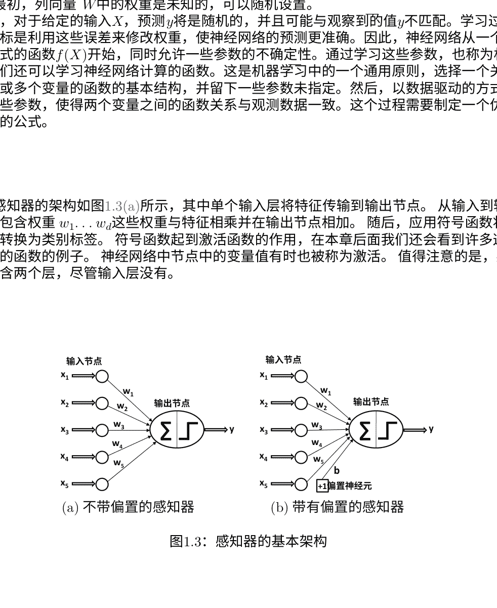

# 1.2. 单层计算层：感知器

执行任何计算并仅传输特征值。这在所有神经网络结构中都是正确的，输入层只起到传输作用。输入层不计算神经网络中层数的数量。由于感知器只包含一个计算层，因此被认为是单层网络。

在罗森布拉特[421]提出感知器算法的时候，权重是通过实际的硬件电路使用启发式的更新过程来学习的，并没有以机器学习中常见的损失函数优化的形式来呈现。然而，目标始终是最小化预测误差，即使没有提出正式的优化公式。因此，感知器算法是启发式设计的，旨在最小化错误分类的数量。训练算法通过逐个（或小批量）将每个输入数据实例 $X$ 输入到网络中，创建预测 $\hat{y} = \mathrm{sign}\{W \cdot X^T\}$。当这个预测与观察到的类别 $y \in \{-1, +1\}$ 不同时，权重会使用误差值 $(y - \hat{y})$ 进行更新，以减少这种错误发生的可能性。具体来说，当数据点 $X$ 输入到网络中时，权重向量 $\overline{W}$（一个列向量）的更新如下：

$$ \overline{W} \leftarrow \overline{W} + \alpha (y - \hat{y}) X^T \tag{1.2} $$

上述更新的（启发式）原理是它总是增加了权重向量和 $X^T$ 的点积的数量成比例地增加了。$(y - \hat{y})$ 这一项有助于改善对于该训练实例的预测。参数 $\alpha$ 调节神经网络的学习率，尽管在感知机的特殊情况下可以将其设置为1（因为它只缩放权重）。感知机算法会以随机顺序反复遍历所有训练示例，并迭代地调整权重，直到达到收敛。

单个训练数据点可能会被多次遍历。每个这样的循环被称为一个时期。

由于 $(y - \hat{y}) \in \{-2, 0, +2\}$ 的值始终等于 $2y$ 在 $y = \hat{y}$ 的情况下，可以将感知器更新写成如下形式：

$$ \overline{W} \leftarrow \overline{W} + \alpha y X^T \tag{1.3} $$

请注意，学习率中已经吸收了一个因子2，并且仅对 $y = \hat{y}$ 的示例进行更新。对于分类正确的训练实例，不进行更新。

感知器中提出的模型类型是线性模型，其中方程式 $\overline{W} \cdot \overline{X}^T = 0$ 定义了一个线性超平面。在这里，$\overline{W} = [w_1 \dots w_d]^T$ 是一个垂直于这个超平面的 $d$ 维向量，而 $W \cdot X^T$ 的值对于超平面一侧的 $X$ 值是正的，对于超平面另一侧的 $X$ 值是负的。当数据是线性可分时，这种类型的模型表现特别好。

线性可分性是指两个类别可以通过一个线性超平面进行分离。图1.4展示了线性可分和不可分数据的例子。在线性可分的情况下，可以找到一个权重向量 $W$，通过感知器算法总是可以找到一个权重向量 $W$，使得 $W \cdot X^T$ 的符号与 $y_i$ 匹配。对于每个训练实例 $X_i$，都有一个对应的 $y_i$。已经证明[421]，当数据是线性可分的时候，感知器算法总是能够收敛并在训练数据上提供零误差。然而，在数据不是线性可分的情况下，感知器算法不能保证收敛。

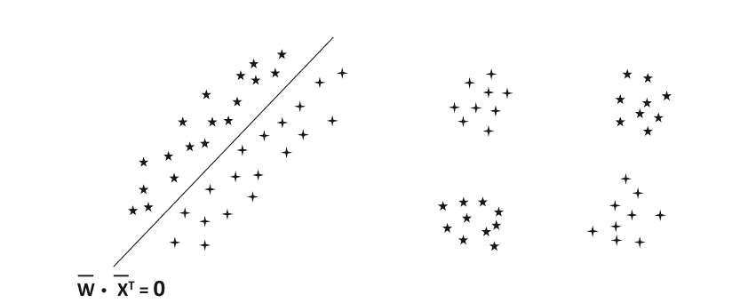

图1.4：两类线性可分和不可分数据的例子

### 1.2.1 使用偏置

在许多情况下，预测中存在一个不变的部分，被称为偏置。例如，考虑一种情况，其中特征变量是均值居中的，但是从 $\{-1,+1\}$ 的二元类别预测的均值不为0。这通常发生在二元类别分布高度不平衡的情况下。在这种情况下，上述方法对于预测是不足够的，因为不同的训练点的总和为零，而类别变量不为零。这是因为将所有预测值（忽略符号运算符）相加，我们得到以下不可取的属性：

$$ \overline{W} \cdot \sum_i \overline{X}^T_i = \sum_i y_i $$

当差异很大时，这个模型在训练数据上表现不佳。我们需要加入一个额外的偏置变量 b 来捕捉预测中的不变部分：

$$ \hat{y} = \mathrm{sign}\{\overline{W} \cdot \overline{X}^T + b\} = \mathrm{sign}\{\sum_{j=1}^{d} w_j x_j + b\} \quad (1.4) $$

可以通过使用一个偏置神经元将偏置变量作为边的权重来加入。这可以通过添加一个始终传输值为1到输出节点的神经元来实现。连接偏置神经元和输出节点的边的权重提供了偏置变量。偏置神经元的示例如图1.3(b)所示。在单层架构中，另一种有效的方法是使用一个具有常数值1的额外特征。这个特征的系数提供了偏置，然后可以使用方程1.1进行计算。在本书中，为了简化架构表示，不会明确使用偏置（使用偏置神经元可以实现）。然而，在实践中，它们通常是重要的，因为它们对预测准确性的影响可能非常大。

### 1.2.2 感知器优化的目标函数是什么？

大多数机器学习算法（包括神经网络）可以被看作是损失优化问题，其中使用梯度下降更新来最小化损失。Rosenblatt的原始感知器论文[421]没有正式提出损失函数。在那些年里，这些实现是通过实际的硬件电路来实现的。

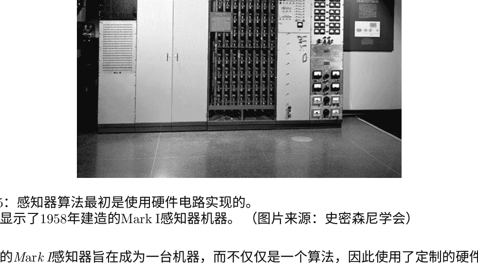

图1.5: 感知器算法最初是使用硬件电路实现的。该图显示了1958年建造的Mark I感知器机器。（图片来源：史密森尼学会）

原始的Mark I感知器旨在成为一台机器，而不仅仅是一个算法，因此使用了定制的硬件来创建它（参见图1.5）。神经结构的动机来自于（生物学的）McCulloch-Pitts模型[332]，而不是数学模型。总体目标是通过启发式的更新过程（在硬件中）来最小化分类错误，每当发生错误时，权重都会朝着“正确”的方向进行更改。这种启发式的更新过程与梯度下降非常相似，但它并不是从梯度下降方法中推导出来的。然而，后来的研究通过逆向工程从启发式更新中推导出了损失函数。本节将介绍这个回顾性的损失函数。

考虑一个训练实例 $(X_i, y_i)$，其中 $X_i$ 是包含特征的行向量而 $y_i$ 是观察到的类变量。感知机准则[41]是一个损失函数，当 $W \cdot X_i^T$ 与 $y_i$ 的符号不同时，会对训练实例进行惩罚：

$$ L_i = \max\{-y_i(W \cdot X_i^T), 0\} $$

此外，$W \cdot X_i^T$ 的绝对值较大且与 $y_i$ 的符号不匹配时，会受到更大的惩罚。梯度下降法通过更新 $W$ 的负梯度方向来进行更新（相对于 $W$ 的梯度）。可以使用微积分来验证损失的梯度如下：

$$ \frac{\partial L_i}{\partial W} = \begin{cases} -y_i X_i^T & \text{如果符号}\{W \cdot X_i^T\} \neq y_i \\ 0 & \text{否则} \end{cases} $$

请注意矩阵微积分符号的使用 $\frac{\partial L_i}{\partial W}$，它是一个标量对向量的导数，只是一个 $d$ 维向量 $\left[ \frac{\partial L_i}{\partial w_1}, \cdots, \frac{\partial L_i}{\partial w_d} \right]^T$。向量的负数是损失最快减小的方向，这为感知器更新提供了理论依据：

$$ W \Leftarrow W - \eta \frac{\partial L_i}{\partial W} $$
$$ = W + \alpha y_i X_i^T \text{ [对于被错误分类的实例]} $$

这个损失函数揭示了原始算法中更新的一些弱点；可以将 $W$ 设置为零向量，无论训练数据集如何，以获得最优的损失值为0。尽管如此，感知器更新仍然会收敛到一个有意义的解，在线性可分的训练数据集和非零初始化的 $W$ 中。在线性可分的数据集中，存在一个非零权重向量 $W$ 使得 $W \cdot X^T$ 的符号正确地匹配了符号 $y_i$ 对于每个训练实例 $(X_i, y_i)$。

然而，感知器算法对于线性不可分的数据的行为是相当随意的，得到的解有时甚至不是一个好的近似类别分离器。 损失与权重向量的大小成正比，这可能会削弱通过简单减小权重向量的大小来实现类别分离的目标；在改善损失的同时，更新可能会显著恶化错误分类的数量。 因此，(原始) 感知器不稳定，并且可能产生质量差异很大的解 (对于不可分的类别)。 因此，针对不可分数据提出了几种感知器的变体，并且一种自然的方法是始终跟踪在错误分类数量方面的最佳解决方案[133]。这种始终将最佳解决方案保留在“口袋”中的方法被称为口袋算法。

## 1.3 神经架构的基本组件

感知器算法的神经架构使用单个输出节点和符号激活函数。 神经架构的这些方面是设计的关键部分，并且可能因所使用的模型而有所不同。 本节讨论了神经架构的一些常见组件。

### 1.3.1 激活函数的选择

激活函数的选择是神经网络设计的关键部分。 常用的非线性函数类型包括符号、Sigmoid或双曲正切。

我们已经在感知器中看到了符号激活的使用。 我们使用符号 $\Phi$ 来表示激活函数。 具有列向量 $W$ 的单层网络，权重矩阵 $W$ 和输入（行）向量 $X$ 的网络的预测形式如下:

$$ \hat{y} = \Phi(\overline{W} \cdot \overline{X}^T) \tag{1.6} $$

最基本的激活函数 $\Phi(\cdot)$ 是线性激活函数，也被称为恒等激活函数:

$$ \Phi(v) = v $$

线性激活函数通常在输出节点中使用，当目标是实数值时。

在神经网络发展的早期阶段，使用的经典激活函数包括符号函数、sigmoid函数和双曲正切函数:

$$ \Phi(v) = \mathrm{sign}(v) \text{ (符号函数)} $$

$$ \Phi(v) = \frac{1}{1+e^{-v}} \text{ (sigmoid函数)} $$

$$ \Phi(v) = \frac{e^{2v}-1}{e^{2v}+1} \text{ (双曲正切函数)} $$

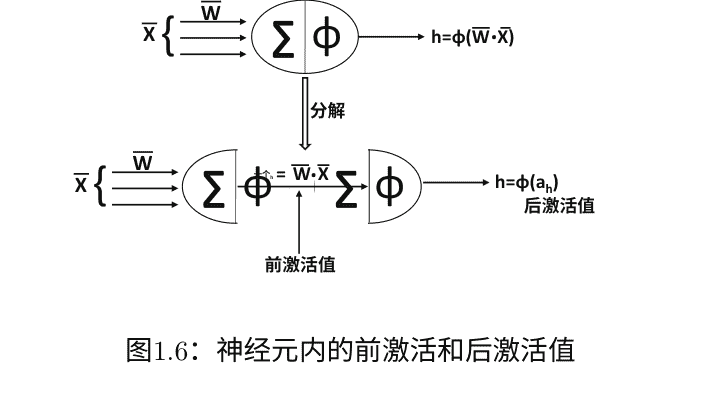

# 图1.6：神经元内的前激活和后激活值

将神经元计算分为两个独立的值，如图1.6所示。一个神经元实际上在节点内计算两个函数，这就是为什么我们加入了求和符号 $\Sigma$ 以及神经元内的激活符号 $\Phi$。在应用激活函数之前计算的值 $\Phi(\cdot)$ 将被称为前激活值，而在应用激活函数之后计算的值被称为后激活值。从图1.6中可以得出一个重要观点，即可以将具有非线性激活的节点视为两个独立的计算节点，一个执行线性变换 $a_h = W \cdot X$，第二个执行非线性变换 $\Phi(a_h)$。事实上，这种解耦的架构经常用于简化神经网络中各种类型的分析结果。

尽管符号激活可以用于在预测时映射到二进制输出，但其不可微性阻止了其在训练时创建损失函数的使用。例如，感知器在预测时使用符号函数，感知器准则仅使用线性激活。Sigmoid激活函数输出一个值在 $(0, 1)$，这有助于将输出解释为概率。tanh函数的形状与Sigmoid函数类似，只是在水平方向上被拉伸和在垂直方向上平移/重新缩放到 $[-1, 1]$。tanh和Sigmoid函数的关系如下（参见练习3）：

$$ \tanh(v) = 2 \cdot \mathrm{sigmoid}(2v) - 1 $$

当计算的输出既希望为正数又希望为负数时，tanh函数优于Sigmoid函数。Sigmoid和tanh函数一直是在神经网络中引入非线性的历史工具。然而，在最近几年中，一些分段线性激活函数变得更受欢迎:

- $\Phi(v) = \max\{v, 0\}$ (修正线性单元[ReLU])
- $\Phi(v) = \max \{\min [v, 1], -1\}$ (硬双曲正切)

在现代神经网络中，修正线性单元（ReLU）和硬双曲正切激活函数已经大量取代了S型函数和软双曲正切激活函数（参见第4章）。

图1.7展示了所有上述激活函数的图示。值得注意的是，这里展示的所有激活函数都是单调的。此外，除了恒等激活函数外，大多数其他激活函数在参数的绝对值较大时会饱和，进一步增加参数值不会对激活产生太大变化。正如我们将在后面看到的那样，这样的非线性激活函数是¹修正线性单元（ReLU）显示出不对称的饱和特性。

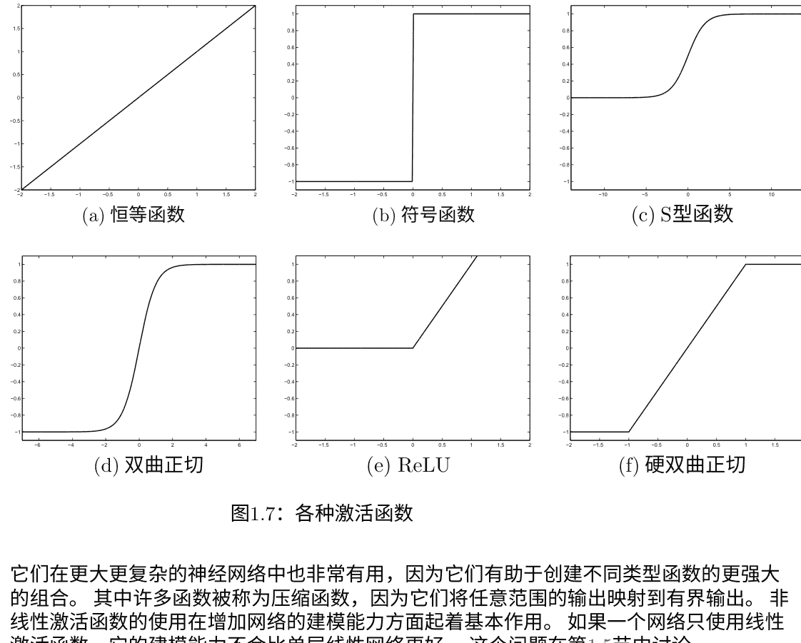

它们在更大更复杂的神经网络中也非常有用，因为它们有助于创建不同类型函数的更强大的组合。其中许多函数被称为压缩函数，因为它们将任意范围的输出映射到有界输出。非线性激活函数的使用在增加网络的建模能力方面起着基本作用。如果一个网络只使用线性激活函数，它的建模能力不会比单层线性网络更好。这个问题在第1.5节中讨论。

### 1.3.2 Softmax激活函数

Softmax激活函数的独特之处在于它几乎总是用于输出层，将k个实数映射为k个离散事件的概率。例如，考虑一个k分类问题，每个数据记录需要映射到k个无序类标签之一。在这种情况下，可以使用k个输出值，在给定层的节点上使用softmax激活函数对k个实值输出进行映射。$v = [v_1, ..., v_k]$。

这个激活函数将实数映射到总和为1的概率。具体来说，第i个输出的激活函数定义如下：

$$ \Phi(v)_i = \frac{\exp(v_i)}{\sum_{j=1}^{k} \exp(v_j)} \quad \forall i \in \{1, \ldots, k\} \tag{1.7} $$

图1.8展示了具有三个输出的softmax函数的示例，并且相同图中也显示了值 $v_1, v_2$ 和 $v_3$。请注意，这三个输出对应于三个类别的概率，并且他们使用softmax函数将最终隐藏层的三个输出转换为概率。通常，最终隐藏层在输入到softmax层时使用线性（恒等）激活函数。此外，

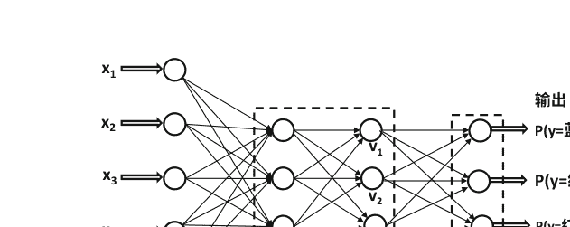

图1.8: 使用Softmax层进行分类的多输出示例

Softmax层没有与之关联的权重，因为它只是将实值输出转换为概率。 每个输出都是特定类别的概率。

### 1.3.3 常见的损失函数

选择损失函数在定义输出方面至关重要，以使其对应应用程序敏感。 例如，具有数值输出的最小二乘回归需要形式为 $(y - \hat{y})^2$ 的简单平方损失，表示单个训练实例的目标 $y$ 和预测 $\hat{y}$ 的平方损失。 对于对分类数据进行概率预测，根据预测是二元还是多元，使用两种类型的损失函数：

1.  二进制目标（逻辑回归）：在这种情况下，假设观察到的值 $y$ 是从 $\{-1, +1\}$ 中抽取的，预测 $\hat{y}$ 使用sigmoid激活函数输出。 $\hat{y} \in (0,1)$ 表示观察值 $y$ 为1的概率。然后，负对数 $|y/2 - 0.5 + \hat{y}|$ 提供了损失。这是因为 $|y/2 - 0.5 + \hat{y}|$ 表示预测正确的概率。
2.  分类目标：在这种情况下，如果 $\hat{y}_1, \cdots, \hat{y}_k$ 是 $k$ 类的概率（使用方程式1.7的softmax激活），而 $r$ 类是真实的类别，则单个实例的损失函数定义如下：
    $$ L = -\log(\hat{y}_r) \quad (1.8) $$
    这种类型的损失函数实现了多项式逻辑回归，并且被称为交叉熵损失。 请注意，在后者中，当 $k$ 的值设置为2时，二元逻辑回归与多项式逻辑回归是相同的。

要记住的关键点是输出节点的性质、激活函数和损失函数取决于具体的应用。

## 1.4 多层神经网络

多层神经网络包含多个计算层。 感知器包含输入层和输出层，其中输出层是唯一的计算层。 输入层将数据传输到输出层，所有的计算对用户完全可见。 多层神经网络包含多个计算层；额外的中间层（在输入和输出之间）被称为隐藏层，因为执行的计算对用户不可见。

## 第1章. 神经网络简介

图1.9：具有两个隐藏层和单个输出层的前馈网络的基本架构。尽管每个单元包含一个标量变量，但通常将一个层中的所有单元表示为单个向量单元。向量单元通常表示为矩形，并且它们之间有连接矩阵。

多层神经网络的具体架构被称为前馈网络，因为连续的层以从输入到输出的正向方向相互连接。前馈网络的默认架构假设一层中的所有节点都连接到下一层的节点。因此，一旦确定了层数和每层的节点数量/类型，神经网络的架构几乎就被完全定义了。唯一剩下的细节是在输出层中优化的损失函数。与感知器准则类似，损失函数惩罚神经网络的预测输出与训练数据中观察到的输出之间的不良偏差。

与单层网络的情况类似，偏置神经元可以同时用于隐藏层和输出层。多层网络的示例，无论是否有偏置神经元，分别显示在图1.9(a)和(b)中。在每种情况下，神经网络都包含三层。请注意，输入层通常不计算在内，因为它只是传输数据，该层不进行计算。如果一个神经网络在每个层中都包含 p_1, ..., p_k 个单元，则这些输出的（列）向量表示，用 h_1, ..., h_k 表示，具有维度 p_1, ..., p_k。因此，每层中的单元数被称为该层的维度。

输入层与第一个隐藏层之间的连接权重包含在一个大小为 p_1 × d 的矩阵 W_1 中，而第 r 个隐藏层与第 (r+1) 个隐藏层之间的权重用 W_{r+1} 表示，大小为 p_{r+1} × p_r 的矩阵。注意在 W_{r+1} 中的单元数(r+1)层定义了行数，而第 r层定义了列数。如果输出层包含o个节点，则最终矩阵 W_{k+1} 的大小为 o × p_k。输入向量 \bar{x} 的维度为d。使用以下递归方程将x转换为输出：

```
\overline{h}_1 = \Phi(W_1 \overline{x}) \quad \text{[输入到隐藏层]} \\
\overline{h}_{p+1} = \Phi(W_{p+1} \overline{h}_p) \quad \forall p \in \{1 \ldots k-1\} \quad \text{[隐藏到隐藏层]} \\
\overline{o} = \Phi(W_{k+1} \overline{h}_k) \quad \text{[隐藏到输出层]}
```

尽管激活函数（如sigmoid函数）具有标量参数，但它们可以以逐元素的方式应用于它们的向量参数。换句话说，激活函数应用于向量的每个元素，以相同的顺序创建一个长度相等的向量，其中包含输出。人们还可以用向量变量表示神经网络架构。许多架构图将单个层中的单元组合成一个单一的向量单元，该向量单元用矩形而不是圆圈表示。

例如，图1.9(c)中的架构图（具有标量单元）已经转换为图1.9(d)中的基于向量的神经架构。请注意，向量单元之间的连接权重现在是矩阵。值得注意的是，即使在图1.9(d)中，5维输入层和第一个3维隐藏层之间的连接矩阵被注释为一个 5 × 3矩阵，但仍需要使用一个 3 × 5 矩阵。为了乘以5维列向量的输入。因此，权重矩阵的维度是连接矩阵维度的转置。

向量化神经架构中的一个隐含假设是，同一层中的所有单元使用相同的激活函数，该函数以逐元素方式应用于该层。这个约束通常不是一个问题，因为大多数神经架构在整个计算流程中使用相同的激活函数，唯一的偏差是由输出层的性质引起的。在本书中，包含向量变量的神经架构将用矩形单元表示，而标量变量将对应于圆形单元。

### 1.4.1 多层网络作为计算图

将神经网络视为计算图是有帮助的，计算图是通过组合许多基本参数模型构建的。神经网络基于其构建模块更加强大，因为这些模型的参数是联合学习的，以创建这些模型的高度优化的组合函数。

多层网络评估在各个节点计算的函数组合。神经网络中长度为2的路径，在其中函数 f(·) 跟随 g(·) 可以被视为一个复合函数 f(g(·))。此外，如果 g_1(·), g_2(·)... g_k(·) 是在第 m层计算的函数，而特定的层-(m+1) 节点计算 f(·)，则由层-(m+1) 节点计算的复合函数关于层-m输入的表达式为 f(g_1(...g_k(...)))。

值得注意的是，由于边权重的存在，这些函数都是参数化的。因此，我们有以下内容：

一个多层网络计算了参数化多元函数的嵌套组合。从输入到输出计算的整体函数可以通过选择参数来进行精确控制。学习的概念是指通过设置参数使整体函数与观察到的输入-输出对一致。

重复的嵌套和每层中的大量节点使得很难以简洁和易懂的方式表达神经网络的输入到输出函数。这是与传统机器学习算法的一个重要区别，传统机器学习算法的预测函数通常可以以封闭形式清晰地编写。

非线性激活函数的使用是增加多层网络能力的关键。如果所有层都使用恒等激活函数，那么多层网络的能力不会超过单层网络（见下一节）。已经证明[218]，具有单个（非线性）隐藏层和单个（线性）输出层的网络可以计算几乎任何“合理”的函数。因此，神经网络通常被称为通用函数逼近器，尽管这个理论上的主张并不总是容易转化为实际的有用性。

权重是通过惩罚观察值和预测输出之间的差异来学习的。对于第i个训练实例，使用损失函数 L_i 进行惩罚（类似于感知器准则）。神经网络的权重然后通过梯度下降进行更新以减少每个损失L_i:

```
$$W \leftarrow W - \alpha \frac{\partial L_i}{\partial W}$$ (1.9)
```

与感知器类似，训练实例逐个输入神经网络以进行更新。

如何计算这种形式的梯度 ∂L_i/∂W？多层神经网络通常不会创建像感知器那样简单的损失函数，可以用闭式表达（简洁地）。在传统机器学习中，闭式损失函数的可用性实际上是一种奢侈品，有助于使用微积分来对参数进行损失函数的微分和执行更新，如方程1.9所示。多层神经网络的损失函数通常太复杂（而且庞大），无法用闭式形式表示，这从梯度下降的角度带来了挑战。在这方面，神经网络范式的皇冠明珠是反向传播算法；该算法可以根据底层计算图的结构和每个节点计算的函数来解决复杂的参数更新步骤。分析师不必花费时间和精力来明确计算损失函数以闭式形式并使用微积分计算导数。解决这些步骤通常是大多数机器学习算法中最困难的部分，神经网络范式的一个重要贡献是将模块化思维引入机器学习。换句话说，神经网络设计中的模块化转化为学习参数的模块化。这种模块化的具体名称是“反向传播”。这使得神经网络的设计更多地成为（经验丰富的）工程师的任务，而不是数学练习。反向传播算法在第2章中详细讨论。

“构建块”描述对于多层神经网络特别合适。很多时候，用于构建神经网络的现成软件为分析师提供了访问这些构建块的途径。分析师可以指定每个层中的单元数量和类型，以及现成或定制的损失函数。一个包含数十层的深度神经网络通常可以用几百行代码来描述。这对于分析师来说，使用许多现成软件构建神经网络往往可以轻松尝试不同类型的架构。使用许多现成软件构建神经网络通常被比作一个孩子用适合的积木搭建玩具。

每个积木就像一个具有特定激活类型的单元（或一层单元）。所有这些现成软件的目标都是使用反向传播算法学习神经网络的权重。

## 1.5 非线的重要性

在其最基本的层面上，神经网络是一个计算图，它执行更简单函数的组合，以提供更复杂的函数。深度学习的很大一部分能力来自于函数的重复组合具有重要的表达能力。并非所有的基本函数在实现这个目标时都同样好。事实上，神经网络中使用的非线性压缩函数并非是任意选择的，而是经过精心设计的，因为具有某些类型的特性。例如，想象一种情况，在每一层中都使用恒等激活函数，以便只计算线性函数。在这种情况下，得到的神经网络不比单层线性网络更强大：

> 定理 1.5.1 多层网络在所有层中只使用恒等激活函数时，会简化为一个单层网络。

证明: 考虑一个包含k隐藏层的网络，因此总共包含 (k+1) 计算层（包括输出层）。相应的 (k+1) 相邻层之间的权重矩阵用 W_1\dots W_{k+1} 表示。设 \bar{x} 是与输入对应的d维列向量，\bar{h}_1\dots \bar{h}_k 是与隐藏层对应的列向量，\bar{o} 是与输出对应的m维列向量。

那么，对于多层网络，我们有以下递归条件：

$$\begin{aligned}
\bar{h}_1 &= \Phi(W_1\bar{x}) = W_1\bar{x} \\
\bar{h}_{p+1} &= \Phi(W_{p+1}\bar{h}_p) = W_{p+1}\bar{h}_p \quad \forall p \in \{1\dots k-1\} \\
\bar{o} &= \Phi(W_{k+1}\bar{h}_k) = W_{k+1}\bar{h}_k
\end{aligned}$$

在上述所有情况下，激活函数 $\Phi(\cdot)$ 被设置为恒等函数。
然后，通过消除隐藏层变量，我们得到以下结果：

$$\bar{o} = \underbrace{W_{k+1}W_k\dots W_1}_{W_{xo}}\bar{x}$$

请注意，可以用新的 $d \times m$ 矩阵 $W_{xo} = W_{k+1}W_k\dots W_1$ 替换所有矩阵 $W_1, W_2\dots W_{k+1}$，并学习 $W_{xo}$ 的系数，不会损失表达能力。换句话说，我们有以下结果：

$$\bar{o} = W_{xo}\bar{x}$$

然而，这个条件与具有多个输出的线性回归完全相同[7]。因此，具有恒等激活函数的多层神经网络在表达能力方面并不比单层网络更强。

上述结果适用于具有数值目标变量的回归建模情况。类似的结果也适用于二元目标变量。在特殊情况下，所有层都使用恒等激活函数，最后一层使用带有符号激活函数的单个输出进行预测，多层神经网络简化为感知器。下面总结了这个结果。

引理 1.5.1 考虑一个多层网络，其中所有隐藏层都使用恒等激活函数，单个输出节点使用线性激活函数，并使用感知器准则作为损失函数。这个神经网络简化为单层感知器。

由于多层神经网络执行的是形式为 $f(g(\cdot))$ 的函数的重复组合，上述结果也可以表述为：

观察 1.5.1 线性函数的组合始终是线性函数。简单非线性函数的重复组合可以得到非常复杂的非线性函数。

这些观察结果表明，只有在中间层的激活函数是非线性的情况下，深度网络才大致合理。通常，类似于sigmoid和tanh的函数是压缩函数，其输出在一个区间内，梯度在接近零值时最大。对于它们的参数的绝对值较大的情况，这些函数被认为达到饱和，进一步增加参数的绝对值不会显著改变其值的符号。

神经网络的普适逼近结果[218]认为，在单个隐藏层中使用许多压缩函数（如sigmoid），然后是一个线性层，可以很好地逼近任何函数。因此，只要隐藏单元的数量足够大，两层网络就足够了。然而，为了模拟任意函数中的转折和曲线，总是需要一种基本的非线性激活函数。为了理解这一点，注意到所有的一维函数都可以近似为一系列缩放/平移的阶跃函数，而本章讨论的大多数激活函数（如sigmoid）看起来非常像阶跃函数（见图1.7）。这个基本思想是神经网络的普适逼近定理的本质。然而，这个理论结果并不总能在有限的数据量下转化为实际的有用性。

### 1.5.1 非线性激活函数的作用

前一节提供了一个具体的证明，即只有具有线性激活函数的神经网络在增加层数时不会获益。例如，考虑图1.10中所示的二分类数据集，该数据集在两个维度上表示为 $x_1$ 和 $x_2$。有两个实例，A和B，表示为‘*’的类，其坐标为 (1, 1) 和 (-1, 1)。还有一个单独的实例B，表示为‘+’的类，其坐标为 (0, 1)。只有具有线性激活函数的神经网络永远无法完美地对训练数据进行分类，因为这些点不是线性可分的。

另一方面，考虑一种情况，隐藏单元具有ReLU激活函数，并且它们学习了两个新特征 $h_1$ 和 $h_2$，它们如下所示：

```
h_1 = \max\{x_1, 0\} \\
h_2 = \max\{-x_1, 0\}
```

请注意，通过使用适当的权重从输入到隐藏层，并应用ReLU激活单元，可以实现这些目标。后者实现了将负值阈值设为0的目标。我们已经在图中标出了相应的权重。

图1.10中显示的神经网络。我们在同一图中显示了数据的绘图，以 h1和 h2表示。2维隐藏层中三个点的坐标为：(1, 0), (1, 0) 和 (0, 1)。很明显，两个类在新的隐藏表示中变得线性可分。从某种意义上说，第一层的任务是进行表示学习，以便使用线性分类器解决问题。

因此，如果我们在神经网络中添加一个线性输出层，它将能够完美地对这些训练实例进行分类。关键点在于非线性ReLU函数的使用对于确保线性可分性至关重要。激活函数能够对数据进行非线性映射，使得嵌入点能够线性可分。

实际上，如果从隐藏层到输出层的权重都设置为1，并使用线性激活函数，输出 O将定义如下：

$$O = h_1 + h_2 \quad (1.10)$$

这个简单的线性函数将这两个类别分开，因为对于标记为'*'的两个点，它总是取值为1，对于标记为'+'的点，它总是取值为0。因此，神经网络的很大一部分能力隐藏在激活函数的使用中。图1.10中显示的权重需要以数据驱动的方式进行学习，尽管有许多可选的权重选择可以使隐藏表示线性可分。因此，如果进行实际训练，学到的权重可能与图1.10中显示的权重不同。然而，在感知器的情况下，没有一组权重可以使得我们希望能够完美地对这个训练数据集进行分类，因为该数据集在原始空间中不是线性可分的。换句话说，激活函数能够对数据进行非线性转换，随着层数的增加，其能力越来越强大。一系列非线性激活函数对学习模型施加了一种特定类型的结构，其能力随着神经网络的深度（即层数）的增加而增强。

另一个经典的例子是XOR函数，其中两个点 {(0,0),(1,1)} 属于一类，另外两个点 {(1,0),(0,1)} 属于另一类。

## 1.6 高级架构和结构化数据

有许多先进的架构可用于解决不同类型的数据和学习设置。其中一些架构在实际应用中已经不受青睐，但由于它们所体现的原则而仍然很重要；其中两个这样的架构是径向基函数网络和受限玻尔兹曼机。这两种架构与经典机器学习方法密切相关。前者是经典机器学习方法的推广，被称为支持向量机，而后者是经典机器学习家族的一个特例，被称为概率图模型。因此，了解这些模型有助于将神经网络与经典机器学习方法联系起来。第6章提供了径向基函数网络的讨论，第7章提供了受限玻尔兹曼机的讨论。第12章讨论了许多其他先进主题，如注意机制、生成对抗网络和Kohonen自组织映射。

许多类型的数据中嵌入了结构，其中数据的各个元素彼此不独立。例如，在文本文档中，连续的单词彼此不独立，在时间序列中，连续的序列元素彼此不独立。同样，在图像数据集中，相邻的像素具有高度相关的值。在所有这些情况下，根据我们对数据的领域特定理解（例如文本或图像），使用专门设计的神经架构是有意义的。本书将讨论三种众所周知的神经架构，这些架构专门用于序列、图像和图数据。

- 1. 序列数据：递归神经网络专门设计用于文本句子、时间序列和其他离散序列（如生物序列）等顺序数据。在这些情况下，输入的形式为 $x_1 \ldots x_n$，其中 $x_t$ 是在时间戳 $t$ 接收到的一个 $d$ 维点。例如，向量 $x_t$ 可能包含多变量时间序列的 $t$ 时刻的 $d$ 个值。在文本环境中，向量 $x_t$ 将包含 $t$ 时刻的 one-hot 编码单词。在 one-hot 编码中，我们有一个长度等于词汇表大小的向量，相关单词的分量值为1。其他所有分量为0。这种输入之间的顺序依赖关系可以通过递归神经网络来处理，这将在第8章中讨论。
- 2. 图像数据：图像数据的空间特性通过具有空间结构的层来适应。换句话说，层中的特征与图像中的像素一样具有空间关联性。这样的空间层需要使用不同类型的操作来考虑特征的空间排列。中间节点中需要考虑特征的空间排列的操作类型有多种。其中一个重要的操作是卷积操作，卷积神经网络就是从这个操作中得名。卷积神经网络在第9章中进行了讨论。
- 3. 图数据：许多现实世界中的网络实体，如Web和各种类型的社交网络，都被表示为图。图神经网络隐式地创建了一个基于学习到的图的神经网络结构。图神经网络的构建基于递归网络和卷积网络的原则。图神经网络在第10章中进行了讨论。

卷积神经网络在所有类型的神经网络中历史上一直是最成功的。它们广泛用于图像识别、目标检测/定位，甚至文本处理。这些网络的性能最近在图像分类问题上超过了人类[194]。

## 1.7 两个值得注意的基准

神经网络文献中使用的基准主要来自计算机视觉领域。尽管传统的机器学习数据集（如UCI存储库[625]）可以用于测试神经网络，但总体趋势是使用可以很好地可视化的感知导向数据领域的数据集。尽管有各种各样的文本和图像领域的数据集，但其中两个因其在深度学习论文中的普遍性而脱颖而出。尽管两者都是来自计算机视觉的数据集，但第一个数据集足够简单，以至于它也可以用于测试视觉领域之外的通用应用。接下来，我们将简要介绍这两个数据集。

### 1.7.1 手写数字的MNIST数据库

MNIST数据库代表着改进的国家标准与技术研究所database，是一个包含大量手写数字的数据库[287]。正如其名称所示，这个dataset是通过修改NIST提供的原始手写数字数据库而创建的。该数据集包含60,000个训练图像和10,000个测试图像。每个图像都是从0到9的手写数字的扫描，不同图像之间的差异是个体书写差异造成的。这些个体是美国人口普查局的员工和美国高中学生。NIST的原始黑白图像经过尺寸归一化，以适应一个20×20像素的框，并保持其纵横比，然后居中在一个28×28像素的图像中，通过计算像素的质心来实现。这些图像被平移以使该点位于图像的中心。28×28个像素点。每个像素点的值范围从0到255，取决于它在灰度光谱中的位置。与图像相关联的标签对应于十个数字值。MNIST数据库中的数字示例如图1.11所示。数据集的大小相当小，只包含一个简单的与数字对应的对象。因此，有人可能认为MNIST数据库是一个玩具数据集。然而，它的小规模和简单性也是一个优点，因为它可以用作快速测试机器学习算法的实验室。此外，由于数字（大致）居中的数据集的简化，使得它易于用于测试超越计算机视觉的算法。计算机视觉算法需要特殊的假设，如平移不变性。这个数据集的简单性使得这些假设变得不必要。正如Geoff Hinton [623]所指出的，MNIST数据库被神经网络研究人员用于获得早期和快速结果（在更复杂的生物体上进行严格测试之前），就像生物学家使用果蝇一样。

虽然每个图像的矩阵表示适合于卷积神经网络，但也可以将其转换为多维表示 28 × 28 = 784维。这种转换会丢失图像中的一些空间信息，但这种损失并不严重（至少在MNIST数据集的情况下），因为它相对简单。事实上，在784维表示上使用简单的支持向量机可以获得令人印象深刻的错误率约为 0.56%。在多维表示上的简单2层神经网络（不使用图像中的空间结构）通常比支持向量机在广泛的参数选择范围内表现更差！一个没有任何特殊卷积结构的深度神经网络可以将错误率降低到 0.35% [75]。更深的神经网络和卷积神经网络（使用空间结构）可以通过使用五个卷积网络的集合将错误率降低到 0.21% [419]。因此，即使在这个简单的数据集上，神经网络相对于传统机器学习的相对性能对于前者所使用的具体架构是敏感的。

最后，需要注意的是，784维的非空间表示被用于测试所有类型的神经网络算法，超越了计算机视觉的领域。尽管使用784维的（展平的）表示对于视觉任务来说并不合适，但它仍然对于测试非视觉导向（即通用）的神经网络算法的普遍有效性非常有用。例如，MNIST数据经常用于测试多维数据的数据重建算法，而不仅仅是图像数据。即使使用表格化（即非图像领域特定）算法重建MNIST图像，也可以通过可视化重建的像素来了解算法对数据的处理过程。这种视觉探索通常为研究人员提供了一些在UCI机器学习库[625]等任意数据集中无法获得的见解。从这个意义上说，MNIST数据集比许多其他类型的数据集具有更广泛的可用性。

### 1.7.2 ImageNet数据库

ImageNet数据库[605]是一个包含超过1400万张图片的巨大数据库，涵盖了1000个不同的类别。它的类别覆盖范围非常广泛，几乎包含了日常生活中遇到的大多数类型的图片。该数据库按照一种名为WordNet的名词层次结构进行组织。

一个名为WordNet的名词层次结构[341]。WordNet数据库是一个包含英语单词之间关系的数据集，使用了同义词集的概念。WordNet层次结构已经成功地应用于自然语言领域的机器学习，因此围绕这些关系设计一个图像数据集是很自然的。

ImageNet数据库因为每年都会举办一次ImageNet大规模视觉识别挑战(ILSVRC)[606]而闻名。这个比赛在视觉界非常有声望，并且吸引了来自计算机视觉领域的大多数主要研究团队的参赛作品。参赛作品对于当今的图像识别架构产生了很多最先进的方法，包括在某些狭窄任务（如图像分类）上超过人类表现的方法。由于这些数据集上已知结果的广泛可用性，它成为了一个流行的用于基准测试的替代选择。

数据集足够大且多样化，能够代表图像领域内的关键视觉概念。因此，卷积神经网络通常在这个数据集上进行训练；预训练的网络可以用来从任意图像中提取特征。这种图像表示是由神经网络倒数第二层的隐藏激活所定义的。这种方法创建了适用于传统机器学习方法的图像数据集的新的多维表示。

可以将这种方法视为一种迁移学习，其中将ImageNet数据集中的视觉概念转移到其他应用的未见数据对象上。

## 1.8 总结

尽管神经网络可以被视为对生物体学习过程的模拟，但对神经网络的更直接理解是作为计算图。这种计算图通过递归组合较简单的函数来学习更复杂的函数。由于这些计算图是参数化的，问题通常归结为学习图的参数以优化损失函数。

最简单的神经网络类型通常是基本的机器学习模型，如最小二乘回归。神经网络的真正威力是通过使用底层函数的更复杂组合来释放的。神经范式的主要优势在于可以使用反向传播算法来计算梯度。

在特定领域（如文本和图像）中设计深度学习方法需要精心设计的架构，例如循环神经网络和卷积神经网络。

## 1.9 参考文献和软件资源

正确理解神经网络设计需要对机器学习算法有扎实的理解，尤其是基于梯度下降的线性模型。建议读者参考[2, 3, 40, 187]了解机器学习方法的基本知识。

关于神经网络在不同背景下的大量调查和综述可在[28, 29, 208, 283, 356, 450]中找到。关于模式识别中的神经网络的经典书籍可在[41, 192]中找到，而关于深度学习的最新观点可在[1, 54]中找到。最近的一本文本挖掘书籍[7]也讨论了文本分析中深度学习的最新进展。关于深度学习与计算神经科学之间关系的概述可在[186, 249]中找到。

感知器算法是由罗森布拉特[421]提出的。为了解决稳定性问题，还有口袋算法[133]、最大化算法[542]和其他基于边界的方法。其他类似性质的早期算法还包括Widrow-Hoff[550]和Winnow算法[255]。Winnow算法使用乘法更新而不是加法更新，在许多特征不相关的情况下特别有用。反向传播的原始思想是基于控制理论中的函数复合的微分思想[54, 247]。自六十年代以来，使用动态规划对通过有向无环图相关的变量进行基于梯度的优化一直是一种标准做法。然而，当时还没有观察到使用这些方法进行神经网络训练的能力。1969年，明斯基和帕佩特出版了一本关于感知器的书[342]，这本书对正确训练多层神经网络的潜力持否定态度。这本书表明单个感知器的表达能力有限，而且没有人知道如何训练多层感知器。明斯基是人工智能领域的一个有影响力的人物，他的书中的负面态度为神经网络领域的第一个冬天做出了贡献。将动态规划方法应用于神经网络的反向传播首次由保罗·韦尔博斯在他的博士论文中提出[543]。然而，韦尔博斯的工作无法克服当时已经根深蒂固的对神经网络的强烈观点。反向传播算法在1986年由Rumelhart等人再次提出[424, 425]。Rumelhart等人的工作在其表达方式的美感方面具有重要意义，它能够至少解决明斯基和帕佩特之前提出的一些问题。这也是Rumelhart等人的论文在反向传播的角度被认为非常有影响力的原因之一，尽管它并不是第一个提出这种方法的论文。关于反向传播算法的历史讨论可以在保罗·韦尔博斯的书中找到[544]。

在这一点上，神经网络领域只是部分复苏，因为训练神经网络仍然存在问题。此外，反向传播在训练更深的网络时效果较差，因为存在梯度消失和梯度爆炸的问题。然而，到那个时候，一些知名研究人员已经假设现有算法在数据增加、计算能力增强和算法实验方面会取得巨大的性能提升。大数据框架与GPU的结合在2000年代末对神经网络研究产生了巨大的推动作用。随着计算能力的增加，实验的周期时间缩短，像预训练这样的技巧在2000年代末开始出现。公众明显看到神经网络的复苏是在2011年以神经网络在图像分类的深度学习竞赛中取得的惊人胜利。深度学习算法在这些竞赛中的持续胜利为我们今天所见的爆炸式的普及奠定了基础。值得注意的是，这些获胜架构与二十多年前开发的架构相比，差异虽小但至关重要。

神经网络的理论表达能力在其发展的早期就被认可了。例如，早期的研究认识到，具有单个隐藏层的神经网络可以用来逼近任何函数[218]。进一步的结果是，某些神经网络结构，如循环网络，是图灵完备的[464]。这意味着神经网络有潜力模拟任何算法。当然，神经网络训练中存在许多实际问题，这就是为什么这些令人兴奋的理论结果并不总是能够转化为现实世界性能的原因。

### 视频讲座

深度学习有大量免费的视频讲座，可以在You Tube和Coursera等资源上找到。最权威的资源之一是Geoff Hinton在You Tube上的课程[623]和Andrew Ng在Coursera上的课程[624]。Coursera在深度学习方面提供了多个课程，并提供了一系列相关课程。在编写本书期间，还添加了Andrew Ng的一门易于理解的课程。斯坦福大学的一门关于卷积神经网络的课程可以在You Tube上免费观看[246]。Karpathy、Johnson和Fei-Fei的斯坦福课程[246]是关于卷积神经网络的，但它在涵盖神经网络的更广泛主题方面做得非常出色。课程的初始部分涉及基本的神经网络和训练方法。

Nando de Freitas在You Tube上提供了许多关于机器学习[92]和深度学习[93]的讲座。Hugo Larochelle在Sherbrooke大学提供了另一个有趣的神经网络课程[268]。Ali Ghodsi在滑铁卢大学提供了一门深度学习课程[143]。David Silver的强化学习课程可在[641]上找到。

### 软件资源

深度学习得到了许多软件框架的支持，如Caffe [596]、Torch [597]、Theano [598]和TensorFlow [599]。可以使用Python和MATLAB扩展Caffe。Caffe是在加州大学伯克利分校开发的，它是用C++编写的。它提供了一个高级接口，可以指定网络的架构，并且可以用很少的代码编写和相对简单的脚本构建神经网络。Caffe的主要缺点是文档相对有限。Theano [35]是基于Python的，它提供了高级包，如Keras [600]和Lasagne [601]作为接口。Theano基于计算图的概念，大部分提供的功能都明确使用了这个抽象。

TensorFlow [599] 也是面向计算图的框架，是由谷歌提出的。Torch [597]是用一种叫做Lua的高级语言编写的，相对来说比较易于使用。近年来，Torch在其他框架中取得了一些进展。支持GPU的功能在Torch中得到了紧密集成，这使得在GPU上部署基于Torch的应用相对容易。这些框架中许多都包含了计算机视觉和文本挖掘的预训练模型，可以用来提取特征。许多现成的深度学习工具可以从DeepLearning4j仓库[614]中获取。IBM拥有一个PowerAI平台，在IBM Power Systems [622]之上提供了许多机器学习和深度学习框架。值得注意的是，在编写本书时，该平台还提供了一个免费版本，适用于特定用途。

## 1.10 练习题

- 1. 考虑XOR函数的情况，其中两个点 {(0,0),(1,1)}属于一类，另外两个点 {(1,0),(0,1)}属于另一类。展示如何使用ReLU激活函数以类似于图1.10中的例子来分离这两个类别。
- 2. 展示sigmoid和tanh激活函数的以下性质（分别用Φ(·)表示）：
  - (a) Sigmoid激活: Φ(-v) = 1 - Φ(v)
  - (b) Tanh激活: Φ(-v) = -Φ(v)
  - (c) Hard tanh激活: Φ(-v) = -Φ(v)
- 3. 证明tanh函数是一个重新缩放的具有水平和垂直拉伸以及垂直平移的Sigmoid函数:
  $$tanh(v) = 2\sigma(2v) - 1$$
- 4. 考虑一个数据集，其中两个点 {(-1,-1),(1,1)}属于一类，另外两个点 {(1,-1),(-1,1)}属于另一类。从(0,0)开始，使用 α=1进行一些逐点梯度下降更新。在执行梯度下降更新时，可以以任意顺序循环遍历训练点。
  - (a) 算法是否以目标函数的变化变得极小为收敛?
  - (b) 解释为什么(a)中的情况会发生。
- 5. 对于练习4中的数据集，其中两个特征由(x1, x2)表示，定义一个新的一维表示 z如下:
  $$z = x_1 \cdot x_2$$
  数据集在与 z对应的一维表示中是否线性可分? 解释非线性变换在分类问题中的重要性。
- 6. 使用您选择的编程语言实现感知器。
- 7. 证明Sigmoid激活函数的导数最大为0.25, 无论其参数的值如何。Sigmoid激活函数在其参数取何值时达到最大值?
- 8. 证明tanh激活函数的导数最大为1, 无论其参数的值如何。tanh激活函数在其参数取何值时达到最大值?
- 9. 考虑一个具有两个输入 x1和x2的网络。它有两个隐藏层, 每个隐藏层都包含两个单元。假设每个层中的权重设置为使得每个层的顶部单元对其输入的总和应用sigmoid激活函数, 而每个层的底部单元对其输入的总和应用tanh激活函数。最后, 单个输出节点对其两个输入的总和应用ReLU激活函数。将这个神经网络的输出以闭合形式表示为 x1和 x2的函数。这个练习应该让你对神经网络计算的函数复杂性有一个概念。
- 10. 计算前面练习中计算的闭合形式对 x1的偏导数。在神经网络中, 使用闭合形式表达式(如传统机器学习中的方法)计算梯度下降的导数是否可行?
- 11. 考虑一个二维数据集，其中所有满足 $x_1 > x_2$ 的点属于正类，而所有满足 $x_1 \le x_2$ 的点属于负类。因此，两个类的真正分离器是由 $x_1 - x_2 = 0$ 定义的线性超平面（直线）。现在在正象限内的单位正方形中随机生成20个点，创建一个训练数据集。根据第一个坐标 $x_1$ 是否大于第二个坐标 $x_2$ 来标记每个点。实现感知器算法，对上述20个点进行训练，并在单位正方形内随机生成1000个点进行准确性测试。使用与训练点相同的过程生成测试点。
- 12. 假设你知道（作为领域知识），神经模型的实值输出总是在范围 $[a, b]$ 内。展示如何在输出或隐藏层中使用激活函数来建模这个事实。

# 第2章

## 反向传播算法

> “不要重新发明轮子，只需重新调整它。” - Anthony J. D'Angelo

## 2.1 引言

本章将介绍反向传播算法，这是多层神经网络学习的关键。在早期，训练多层网络的方法并不为人所知，主要是因为计算机科学界对控制理论中经常使用的思想不熟悉 [54, 247]。在他们有影响力的书中，Minsky和Papert [342] 强烈反对训练多层网络的前景，认为无法训练多层网络。因此，神经网络在八十年代之前一直不受青睐。在这一时期，Rumelhart等人通过“反向传播”算法 [424, 425] 推广了一种训练神经网络的算法。这个算法源于控制理论，并且被多次重新发明 [54, 247, 543, 544]。这个算法的引入重新引起了对神经网络的兴趣。然而，使用这个算法时遇到了几个计算、稳定性和过拟合的挑战。因此，神经网络领域的研究再次不受青睐。

在世纪之交，几项进展再次使神经网络流行起来。并非所有这些进展都是以算法为中心的。例如，增加的数据可用性和计算能力在这一复兴中起到了主要作用。然而，对基本的反向传播算法进行了一些改变，以及聪明的初始化方法也有所帮助。近年来，由于缩短了测试周期时间，执行需要进行算法调整的密集实验变得更加容易。

尽管反向传播算法是由Rumelhart等人的论文[424, 425]推广的，但它在控制理论的背景下也曾被独立研究过。关键是，Paul Werbos在1974年的被遗忘的（最终被重新发现的）论文[543]中讨论了如何在神经网络中使用这些反向传播方法。然而，Rumelhart等人在1986年的论文对于更好地理解和欣赏这些思想起到了重要作用。(由改进的计算硬件引起)。因此，增加的数据、计算能力和减少的实验时间(用于算法调整)是相辅相成的。

### 章节组织

本章的组织如下。第2.2节介绍了神经网络的计算图抽象。第2.3节从计算图的角度讨论了反向传播算法。第2.4节讨论了计算图抽象在神经网络中的泛化。第2.5节介绍了反向传播的向量中心视图。第2.6节讨论了重要细节和特殊情况。第2.7节讨论了特征预处理和初始化问题。第2.8节介绍了反向传播的可解释性。第2.9节给出了总结。

## 2.2 计算图抽象

计算图是一个比神经网络更一般化的抽象，它的定义如下:

定义2.2.1 (有向无环计算图) 一个有向无环计算图是一个由节点组成的有向无环图，每个节点包含一个变量。边可能与可学习的参数相关联。节点中的变量要么是外部固定的 (对于没有入边的输入节点)，要么是根据入边的尾端变量和入边上的可学习参数计算得到的。

需要注意的是，上述计算图的定义并不对节点中计算的函数类型做出任何假设，尽管在神经网络中通常使用线性函数和激活函数的组合。此外，计算图的节点不需要按层次排列，这在神经网络的情况下是常见的。主要限制是图必须是无环的，以便以明确定义的方式执行变量的计算。

一些节点中的变量是可观测的，并被称为输出节点。这些输出节点与损失函数相关联，该函数使用训练数据中的观测输入-输出对进行计算。对于每个观测输入，损失函数量化了输出节点中的预测值与观测输出值的匹配程度 (当输入节点变量固定为观测输入时)。损失函数的选择取决于具体应用。例如，可以通过使用与输入变量 (回归器) 数量相等的输入节点和一个包含预测因变量的单个输出节点来建模最小二乘回归。在该模型中，从每个输入节点到唯一的输出节点存在有向边，每条边上的参数对应于权重。与该输入变量 $w_i$ 相关联。$x_i$ (参见图2.1)。计算节点是唯一的计算节点，它计算以下变量。$x_1 \dots x_d$ 在输入节点中的 $d$ 个输入中:
$$
输出 = f(1, x_2, \dots, x_d) = \sum_{i=1}^{d} w_i x_i
$$

图2.1中的计算图相对简单，计算的函数并不特别复杂。然而，神经网络计算的函数的闭式表示随着从单层网络到多层网络的转变而变得越来越复杂和难以处理。

### 2.2.1 计算图创建复杂函数

任何计算图（如神经网络）都会评估在各个节点计算的函数的组合。在计算图中，长度为2的路径上的函数 $f(\cdot)$ 跟随 $g(\cdot)$ 可以被视为一个复合函数 $f(g(\cdot))$。正是这种函数的递归嵌套使得很难用闭式形式表达计算图的输出（或损失函数）作为其输入和边界特定参数的直接函数。由于无法轻松地用边界特定参数的闭式形式表达优化函数（这在所有机器学习问题中都很常见），导致计算梯度下降所需的导数计算困难。无法轻松地用边界特定参数的闭式形式表达优化函数（这在所有机器学习问题中都很常见）导致计算梯度下降所需的导数计算困难。

考虑一个变量 $x$ 在一个只有三个节点的计算图中，其中包含长度为2的路径。第一个节点应用函数 $g(x)$，而第二个节点应用函数 $f(\cdot)$ 到结果上。这样的图计算函数 $f(g(x))$，并且在图2.2中显示。图2.2中的示例使用了 $f(x) = \cos(x)$ 和 $g(x) = x^2$。因此，整体函数为 $\cos(x^2)$。现在，考虑另一种情况，其中 $f(x)$ 和 $g(x)$ 都设置为相同的函数，即sigmoid函数：
$$f(x) = g(x) = \frac{1}{1 + \exp(-x)}$$
然后，计算图评估的全局函数如下所示：
$$f(g(x)) = \frac{1}{1 + \exp\left[-\frac{1}{1 + \exp(-x)}\right]} \quad \text{(2.1)}$$
这个简单的图已经计算出了一个相当尴尬的组合函数。当我们增加计算图的复杂性时，尝试以代数方式找到这个组合函数的导数变得越来越繁琐。

考虑一个情况，其中函数 $g_1(\cdot), g_2(\cdot) \dots g_k(\cdot)$ 是在第$m$层计算的函数，并且它们输入到特定的层-$( m+ 1)$ 节点计算多变量函数$f(\cdot)$ 使用前一层计算的值作为参数。因此，层-$(m+ 1)$ 函数计算$f(g_1(\cdot), \dots g_k(\cdot))$ 这种多变量组合函数已经显得相当尴尬。随着层数的增加，一个在计算图中距离源节点有多个边的函数将具有与路径长度相同的嵌套层数。例如，如果我们有一个有10层、每层2个节点的计算图，整体组合函数将具有 $2^{10}$个嵌套的“项”，如果试图在纸上写出它的闭式形式。事实上，这样一个“闭式”函数甚至无法适应我们习惯写作的任何合理大小的纸张上！

为了理解这一点，考虑图2.3中的函数。在这种情况下，除了输出层之外，每个层都有两个节点。输出层只是对其输入求和。每个隐藏层包含两个节点。第$i$层中的变量分别用$x_i$ 和$y_i$表示。输入节点（变量）使用下标0，因此在图2.3中它们用$x_0$和$y_0$表示。第$i$层中的两个计算函数分别为 $F(\cdot)$ 和 $G(\cdot)$。

接下来，我们将写出每个节点中变量的表达式，以显示随着层数增加而增加的复杂性：
$$
\begin{aligned}
x_1 &= F(x_0, y_0) \\
y_1 &= G(x_0, y_0) \\
x_2 &= F(x_1, y_1) = F(F(x_0, y_0), G(x_0, y_0)) \\
y_2 &= G(x_1, y_1) = G(F(x_0, y_0), G(x_0, y_0))
\end{aligned}
$$
我们已经可以看到表达式已经开始变得难以控制。在计算下一层的值时，这一点变得更加明显：
- $x_3 = F(x_2, y_2) = F(F(F(x_0, y_0), G(x_0, y_0)), G(F(x_0, y_0), G(x_0, y_0)))$
- $y_3 = G(x_2, y_2) = G(F(F(x_0, y_0), G(x_0, y_0)), G(F(x_0, y_0), G(x_0, y_0)))$

## 2.3 计算图中的反向传播

为了学习计算图的权重，从训练数据中选择一个输入-输出对，并将输入节点中的变量实例化为训练数据中相应的输入变量。然后，在有向无环图上按照正向方向进行计算，以确定输出的预测值。

如果这些预测值与训练数据中的观察值不同，将使用损失函数来量化误差。计算损失函数相对于计算图中的权重的梯度。使用这些梯度来更新权重。因此，训练计算图的整体方法如下：

- 1. 使用训练数据点的输入部分的属性值来固定输入节点的值。重复选择一个节点，该节点的所有输入节点的值已经计算出来，并应用节点特定的函数来计算其变量。通过按照距离输入节点递增的顺序处理节点，在有向无环图中找到这样的节点。重复这个过程，直到所有节点（包括输出节点）的值都被计算出来。如果输出节点上的值与训练点中输出的观察值不匹配，则计算损失值。这个阶段被称为正向传播阶段。
- 2. 计算损失相对于边上的权重的梯度。这个阶段被称为反向传播阶段。之所以称之为“反向传播阶段”，是因为相对于输出（损失函数计算的地方）附近的权重的导数更容易计算，并且首先计算。随着我们向远离输出的边缘权重移动（向反向方向），导数变得越来越复杂，并且需要重复使用链式法则来计算它们。
- 3. 沿着梯度的负方向更新权重。

重复遍历训练数据点，直到达到收敛。一次完整遍历所有训练数据点被称为一个周期。

尽管我们想要计算损失函数相对于计算图中的权重的梯度。事实证明，节点变量的导数相对于彼此的导数可以轻松地用于计算损失函数相对于边上的权重的导数。因此，在这个讨论中，我们将重点关注变量相对于彼此的导数的计算。稍后，我们将展示如何将这些导数转换为相对于权重的损失函数的梯度。

### 2.3.1 使用链式法则计算节点之间的导数

如前一节所讨论的，可以使用一个笨拙的闭式表达式来表示计算图中早期层的节点。如果确实计算这个闭式表达式的导数，就需要使用微分计算的链式法则来处理函数的重复组合。然而，在这种情况下，盲目应用链式法则是相当浪费的，因为内部嵌套的不同部分中的许多表达式是相同的，而且会重复计算相同的导数。

在计算图上进行自动微分的关键思想是认识到计算图的结构已经提供了关于哪些项是重复的所有信息。我们可以通过使用计算图本身的结构来存储中间结果（从输出节点开始向后计算导数）来避免重复计算这些项！这是动态规划中的一个众所周知的思想，在控制理论中经常使用[54, 247]。在神经网络中，这个算法被称为反向传播。值得注意的是，这个思想在控制理论中的应用在1960年就为传统优化社区所熟知[54, 247]，尽管在人工智能领域的研究者一段时间内不知道这个思想（他们在20世纪80年代独立提出和描述了这个思想，并将其称为“反向传播”来在神经网络的背景下提出和描述）。链式法则的最简单版本是针对函数的单变量组合定义的：

> $$\frac{\partial f(g(x))}{\partial x} = \frac{\partial f(g(x))}{\partial g(x)} \cdot \frac{\partial g(x)}{\partial x} \qquad \qquad \qquad (2.2)$$

这个变体被称为一元链式法则。请注意，右侧的每一项都是一个局部梯度，因为它计算的是相对于其直接参数的局部函数的导数，而不是递归导出的参数。基本思想是将一系列函数应用于输入 $x$ 以产生最终输出，最终输出的梯度由沿该路径的局部梯度的乘积给出。每个局部梯度只需要关心其特定的输入和输出，这简化了计算。图2.2中展示了一个例子，其中函数因此，组合函数为 $\cos(x^2)$。使用一元链式法则，我们得到以下结果：

> $$\frac{\partial f(g(x))}{\partial x} = \frac{\partial f(g(x))}{\partial g(x)} \cdot \frac{\partial g(x)}{\partial x} = -2x \cdot \sin(x^2)$$

图2.2的例子是一个相当简单的情况，计算图是一个单一路经。一般来说，具有良好表达能力的计算图不会是一个单一路经。在神经网络中，单个节点将其输出馈送给多个节点。从计算导数的角度来看，这种情况也是一个具有挑战性的情况，因为全局函数相对于早期节点中的变量的闭式形式变得相当复杂庞大而笨重。

考虑一个简单的情况，我们只有一个输入 x，并且我们有 k个独立的计算节点来计算函数 $g_1(x), g_2(x), \dots g_k(x)$。如果这些节点连接到一个计算函数的单个输出节点 $f(\cdot)$ 有k个参数，那么计算出的结果函数是 $f(g_1(x), \dots g_k(x))$。在这种情况下，需要使用多元链式法则。多元链式法则定义如下：

$$ \frac{\partial f(g_1(x), \dots, g_k(x))}{\partial x} = \sum_{i=1}^{k} \frac{\partial f(g_1(x), \dots, g_k(x))}{\partial g_i(x)} \cdot \frac{\partial g_i(x)}{\partial x} \qquad \qquad (2.3)$$

很容易看出，方程2.3的多元链式法则是方程2.2的简单推广。

人们还可以将多元链式法则视为一种路径中心的方式，而不是节点中心的方式。对于任意一对源-汇节点，可以递归地应用多元链式法则，推导出汇节点中的变量对源节点中的变量的导数是所有存在于该节点对之间的路径上应用一元链式法则得到的表达式的和。

虽然这种观点导致了任意一对节点之间的导数的直接表达，但它导致了过多的重复计算。这是因为节点对之间的路径数量与路径长度呈指数关系。为了展示操作的重复性质，我们使用一个非常简单的闭式函数来工作，它只有一个输入 x：

$$ o = \sin(x^2) + \cos(x^2) \quad (2.4) $$

计算图如图2.4所示。在这种情况下，多元链规则被应用于计算输出 $o$ 相对于 $x$ 的导数。这是通过对从 $x$ 到 $o$ 的两条路径分别应用一元链规则并求和来实现的。

$$ \frac{\partial o}{\partial x} = \frac{\partial K(p, q)}{\partial p} \cdot g'(y) \cdot f'(x) + \frac{\partial K(p, q)}{\partial q} \cdot h'(z) \cdot f'(x) $$
$$ = -2x \cdot \sin(y) + 2x \cdot \cos(z) $$
$$ = -2x \cdot \sin(x^2) + 2x \cdot \cos(x^2) $$

很容易看出，在计算图上应用链式法则可以正确计算导数。在这个简单的例子中，有两条路径，都计算函数 $f(x) = x^2$。因此，同一个函数被求导两次，每条路径一次。此外，关于 $x$ 的全局梯度是通过计算沿着两条路径的局部梯度的乘积，然后将它们相加得到的。这种重复的方式对于包含许多共享节点的大型多层网络可能会产生严重影响，其中同一个函数可能会被求导数数十万次作为嵌套递归的一部分。正是这种重复和浪费的方法导致了在计算图的全局函数中以闭式形式和显式求导是不切实际的。可以将多元链式法则的路径中心观点总结如下：

> **引理231** (路径聚合引理) 考虑一个有向无环计算图，在其中第 $i$ 个节点包含变量 $y(i)$。局部导数 $z(i, j)$ 是有向边 $(i, j)$ 的值，表示 $\frac{\partial y(j)}{\partial y(i)}$。假设存在一组非空路径 $\mathcal{P}$ 从图中的节点 $s$ 到节点 $t$。那么，$\frac{\partial y(t)}{\partial y(s)}$ 的值为计算沿着每条路径的局部梯度的乘积，并将这些乘积在 $\mathcal{P}$ 中的所有路径上求和。
> $$
> \frac{\partial y(t)}{\partial y(s)} = \sum_{P \in \mathcal{P}} \prod_{(i, j) \in P} z(i, j) \tag{2.5}
> $$

通过在计算图上递归地应用多元链式法则（方程2.3），可以很容易地证明这个引理。尽管路径聚合引理在计算导数时是一种浪费的方法，但它帮助我们开发了一个相对简单的指数时间算法。

### 一个指数时间算法

路径聚合引理提供了一个自然的指数时间算法，大致上与通过对于特定变量表达计算函数的闭式形式，然后对其进行微分的步骤相似。具体来说，路径聚合引理导致了以下指数时间算法，用于计算输出 $o$ 相对于图中的变量 $x$ 的导数：

- 1. 使用计算图来计算数值。在前向阶段中计算每个节点。
- 2. 计算局部偏导数。$z(i, j) = \frac{\partial y(j)}{\partial y(i)}$ 在计算图中的每条边上计算。
- 3. 令 $\mathcal{P}$ 为从具有值 $x$ 的输入节点到输出节点 $o$ 的所有路径的集合。对于每条路径 $P \in \mathcal{P}$，计算该路径上每个局部导数 $z(i, j)$ 的乘积。
- 4. 将这些值在 $\mathcal{P}$ 中的所有路径上相加。

一般来说，计算图的路径数量会随着深度呈指数增长，必须将所有路径上的局部导数乘积相加。图2.5展示了一个例子，其中有五层，每层只有两个单元。

在这种情况下，输入和输出之间的路径数为 $2^5 = 32$。第 $i$ 层的第 $j$ 个隐藏单元表示为 $h(i, j)$。每个隐藏单元定义为其输入的乘积：

$$ h(i, j) = h(i-1, 1) \cdot h(i-1, 2) \quad \forall j \in \{1, 2\} $$

在这种情况下，输出为 $x^{32}$，可以用闭式表达，并且可以轻松地对 $x$ 进行微分。换句话说，我们实际上不需要计算图来进行微分。然而，我们将使用指数时间算法来阐明其工作原理。每个 $h(i, j)$ 对其两个输入的偏导数是互补输入的值，因为两个变量相乘的偏导数是互补变量：

$$ \frac{\partial h(i, j)}{\partial h(i-1, 1)} = h(i-1, 2), \quad \frac{\partial h(i, j)}{\partial h(i-1, 2)} = h(i-1, 1) $$

路径聚合引理意味着 $\frac{\partial o}{\partial x}$ 的值是从输入到输出的所有 32 条路径上的局部导数（在这种特殊情况下是互补输入值）的乘积：

$$ \frac{\partial o}{\partial x} = \sum_{j_1, j_2, j_3, j_4, j_5 \in \{1, 2\}^5} \prod_{i=1}^{5} h(i, j_i) \cdot x \cdot x^2 \cdot x^4 \cdot x^8 \cdot x^{16} = \sum_{\text{所有32条路径}} x^{31} = 32 x^{31} $$

当然，这个结果与对 $x^{32}$ 直接进行微分得到的结果一致。然而，一个重要的观察是，为了计算相对简单的图的导数，需要进行 $2^5$ 次聚合。更重要的是，我们在一个节点中重复地对计算的相同函数进行微分以进行聚合。例如，对变量 $x$ 的微分，$h(3, 1)$ 被执行了 16 次，因为它在从 $x$ 到 $o$ 的 16 条路径中出现。

显然，这是一种计算梯度的低效方法。对于每层有 100 个节点且有三层的网络，我们将有一百万条路径。然而，在传统机器学习中，当我们的预测函数是一个复合函数时，这正是我们所做的。手动计算复合函数的细节是繁琐且在一定复杂程度上是不切实际的。正是在这里，我们可以应用动态规划（根据计算图的结构指导）来存储重要的中间结果。通过使用这种方法，我们可以最小化重复计算，并实现多项式复杂度。

### 2.3.2 用于计算节点间导数的动态规划

在图论中，使用动态规划来计算有向无环图上的所有类型的路径聚合值。考虑一个有向无环图，其中值 $z(i, j)$ （解释为节点 $j$ 相对于节点 $i$ 的局部偏导数）与边 $(i, j)$ 相关联。换句话说，如果 $y(p)$ 是节点 $p$ 中的变量，则我们有以下关系：

$$ z(i, j) = \frac{\partial y(j)}{\partial y(i)} \tag{2.7} $$

这种计算图的一个示例如图2.6所示。在这种情况下，我们将边 $(2,4)$ 与相应的偏导数关联起来。我们想要计算在每条路径 $P\in\mathcal{P}$ 上计算 $z(i, j)$ 的乘积。从源节点 $s$ 到输出节点 $t$ 的路径，并按顺序将它们相加，以获得偏导数 $S(s, t) = \frac{\partial y(t)}{\partial y(s)}$:

$$ S(s, t) = \sum_{P\in\mathcal{P}} \prod_{(i,j)\in P} z(i, j) \tag{2.8} $$

假设 $A(i)$ 是从节点 $i$ 出发的出边的终点节点集合。我们可以计算聚合值 $S(i, t)$ 对于每个中间节点 $i$（在源节点 $s$ 和输出节点 $t$ 之间），可以使用以下众所周知的动态规划更新计算：

$$ S(i, t) \leftarrow \sum_{j\in A(i)} S(j, t)z(i, j) \tag{2.9} $$

这个计算可以从直接与节点 $t$ 相连的节点开始反向进行，因为 $S(t, t) = \frac{\partial y(t)}{\partial y(t)}$ 已知为1。这是因为一个变量对其自身的偏导数始终为1。因此，可以将该算法的伪代码描述如下：

```
初始化 S(t, t) = 1;
重复
  选择一个未处理的节点 i, 使得对于所有出边的节点 j ∈ A(i)，S(j, t) 都已知;
  更新 S(i, t) ← Σ_{j∈A(i)} S(j, t) * z(i, j);
直到选择完所有节点;
```

请注意，上述算法总是选择一个节点 i，其对于所有节点 j ∈ A(i)，都可以获得 $S(j, t)$。在有向无环图中，总是可以找到这样的节点，并且节点选择顺序总是从节点 $t$ 开始向后方向。因此，上述算法仅在计算图中没有循环时有效。

上述算法被网络优化社区用于计算有向无环图上所有类型的路径相关函数 *source-sink node pairs* (s, t) 的方法，否则将需要指数时间。例如，甚至可以使用上述算法的变体来找到有向无环图中的最长路径[8]。

当应用于神经网络对应的计算图时，上述算法被称为反向传播算法。

有趣的是，上述动态规划更新正是方程 2.3 的多变量链式法则，在已知局部梯度的情况下，从输出节点开始，以反向方向重复应用。这是因为我们在第一次推导损失梯度的路径-聚合形式（引理 2.3.1）时，就是使用了这个链式法则。

主要区别在于我们按照特定顺序应用这个规则，以最小化计算量。由于这一点很重要，我们在下面进行总结：

> 使用动态规划来高效地聚合计算图中指数级路径上的局部梯度乘积，结果与微分计算的多变量链式法则完全相同。动态规划的主要目的是按照特定顺序应用这个规则，以避免在不同节点上重复计算导数。

这种方法是神经网络中使用的反向传播算法的基础。上述梯度用于更新神经网络的权重。在有多个输出节点的情况下，可以初始化每个 $S(t_r, t_r)$ 为 1，然后对每个 $t_r$ 应用相同的方法。

### 计算节点之间导数的示例

为了展示反向传播方法的工作原理，我们将提供一个包含 10 个节点的图中节点之间导数计算的示例（见图2.7）。各个节点中计算了各种函数，例如求和函数（用‘+’表示）、乘积函数（用‘*’表示）和三角正弦/余弦函数。10 个节点中的变量用 $y(1)...y(10)$ 表示，其中变量 $y(i)$ 属于图中的第 i 个节点。进入节点 6 的两条边也具有权重 $w_2, w_3$ 与之相关联。其他边没有与之相关联的权重。

各层中计算的函数如下：

- 第1层：$y(4) = y(1) \cdot y(2), y(5) = y(1) \cdot y(2) \cdot y(3), y(6) = w_2 \cdot y(2) + w_3 \cdot y(3)$
- 第2层：$y(7) = \sin(y(4)), \quad y(8) = \cos(y(5)), \quad y(9) = \sin(y(6))$
- 第3层：$y(10) = y(7) \cdot y(8) \cdot y(9)$

我们想要计算输出 $y(10)$ 相对于每个输入 $y(1), y(2), y(3)$ 的导数。一种可能性是简单地表达 $y(10)$ 的闭式形式，以输入 $y(1), y(2), y(3)$ 为基础，然后计算导数。通过递归使用上述关系，很容易证明 $y(10)$ 可以表示为 $y(1), y(2), y(3)$ 如下：

$$ y(10) = \sin(y(1) \cdot y(2)) \cdot \cos(y(1) \cdot y(2) \cdot y(3)) \cdot \sin(w_2 \cdot y(2) + w_3 \cdot y(3)) $$

正如之前讨论的那样，对于较大的网络来说，计算闭式导数是不实际的。此外，由于需要计算输出对网络中每个节点的导数，这种方法还需要用上游节点的闭式表达式，如 $y(4), y(5)$ 和 $y(6)$。所有这些都会增加重复计算的量。幸运的是，反向传播使我们摆脱了这种重复计算，因为 $y(10)$ 对每个节点的导数是通过反向传播计算的。

算法从初始化输出 $y(10)$ 对自身的导数开始，即为1：

$$ S(10, 10) = \frac{\partial y(10)}{\partial y(10)} = 1 $$

随后，计算 $y(10)$ 对其所有传入节点上的变量的导数。由于 $y(10)$ 是由传入它的变量 $y(7), y(8)$ 和 $y(9)$ 表示的，这很容易做到，并且结果用 $z(7,10), z(8,10)$ 和 $z(9,10)$ 表示（与本章前面使用的符号一致）。因此，我们有以下内容：

$$ z(7,10) = \frac{\partial y(10)}{\partial y(7)} = y(8) \cdot y(9) $$
$$ z(8,10) = \frac{\partial y(10)}{\partial y(8)} = y(7) \cdot y(9) $$
$$ z(9,10) = \frac{\partial y(10)}{\partial y(9)} = y(7) \cdot y(8) $$

随后，我们可以使用这些值来计算 $S(7,10), S(8,10)$ 和 $S(9,10)$。使用递归反向传播更新来计算：

$$ S(7,10) = \frac{\partial y(10)}{\partial y(7)} = S(10,10) \cdot z(7,10) = y(8) \cdot y(9) $$
$$ S(8,10) = \frac{\partial y(10)}{\partial y(8)} = S(10,10) \cdot z(8,10) = y(7) \cdot y(9) $$
$$ S(9,10) = \frac{\partial y(10)}{\partial y(9)} = S(10,10) \cdot z(9,10) = y(7) \cdot y(8) $$

## 2.3. 计算图中的反向传播

接下来，我们计算导数 $z(4,7)$, $z(5,8)$, 以及 与节点7、8和9相连的所有边的导数 $z(6,9)$:

$$z(4,7) = \frac{\partial y(7)}{\partial y(4)} = \cos[y(4)]$$
$$z(5,8) = \frac{\partial y(8)}{\partial y(5)} = -\sin[y(5)]$$
$$z(6,9) = \frac{\partial y(9)}{\partial y(6)} = \cos[y(6)]$$

这些值可以用来计算 $S(4,10)$, $S(5,10)$, 和 $S(6,10)$:

$$S(4,10) = \frac{\partial y(10)}{\partial y(4)} = S(7,10) \cdot z(4,7) = y(8) \cdot y(9) \cdot \cos[y(4)]$$
$$S(5,10) = \frac{\partial y(10)}{\partial y(5)} = S(8,10) \cdot z(5,8) = -y(7) \cdot y(9) \cdot \sin[y(5)]$$
$$S(6,10) = \frac{\partial y(10)}{\partial y(6)} = S(9,10) \cdot z(6,9) = y(7) \cdot y(8) \cdot \cos[y(6)]$$

为了计算相对于输入值的导数，现在需要计算 $z(1,3)$, $z(1,4)$, $z(2,4)$, $z(2,5)$, $z(2,6)$, $z(3,5)$和 $z(3,6)$的值:

$$z(1,4) = \frac{\partial y(4)}{\partial y(1)} = y(2)$$
$$z(2,4) = \frac{\partial y(4)}{\partial y(2)} = y(1)$$
$$z(1,5) = \frac{\partial y(5)}{\partial y(1)} = y(2) \cdot y(3)$$
$$z(2,5) = \frac{\partial y(5)}{\partial y(2)} = y(1) \cdot y(3)$$
$$z(3,5) = \frac{\partial y(5)}{\partial y(3)} = y(1) \cdot y(2)$$
$$z(2,6) = \frac{\partial y(6)}{\partial y(2)} = w_2$$
$$z(3,6) = \frac{\partial y(6)}{\partial y(3)} = w_3$$

这些偏导数可以通过反向传播来计算 $S(1,10)$, $S(2,10)$和 $S(3,10)$:

$$S(1,10) = \frac{\partial y(10)}{\partial y(1)} = S(4,10) \cdot z(1,4) + S(5,10) \cdot z(1,5)$$
$$= y(8) \cdot y(9) \cdot \cos[y(4)] \cdot y(2) - y(7) \cdot y(9) \cdot \sin[y(5)] \cdot y(2) \cdot y(3)$$

$$S(2,10) = \frac{\partial y(10)}{\partial y(2)} = S(4,10) \cdot z(2,4) + S(5,10) \cdot z(2,5) + S(6,10) \cdot z(2,6)$$
$$= y(8) \cdot y(9) \cdot \cos[y(4)] \cdot y(1) - y(7) \cdot y(9) \cdot \sin[y(5)] \cdot y(1) \cdot y(3)$$
$$+ y(7) \cdot y(8) \cdot \cos[y(6)] \cdot w_2$$

$$S(3,10)=\frac{\partial y(10)}{\partial y(3)} = S(5,10)\cdot z(3,5) + S(6,10)\cdot z(3,6)$$
$$=-y(7)\cdot y(9)\cdot \sin[y(5)]\cdot y(1)\cdot y(2)+y(7)\cdot y(8)\cdot \cos[y(6)]\cdot w_3$$

请注意，使用反向传播的优点是计算导数 $y(10)$（输出节点变量）相对于所有隐藏节点和输入节点变量的导数。这些不同的导数有许多共同的子表达式，尽管这些子表达式的导数计算不会重复。这是使用反向传播进行导数计算的优势，而不是使用闭式表达式。

由于输出的闭式表达式的繁琐性，导数的代数表达式也非常冗长和笨拙（无论我们如何计算它们）。可以看出，即使是本节的简单计算图（只包含十个节点），这也是正确的。例如，如果我们检查 $y(10)$相对于每个节点 $y(1)$，$y(2)$和 $y(3)$的导数，代数表达式会换行。此外，在代数导数中无法避免重复的子表达式。这是不利于我们使用反向传播算法的初衷，因为我们原本的目标是避免使用闭式表达式进行传统导数计算时的重复计算。因此，在实际网络中不会代数地计算这些类型的表达式。首先，我们会对特定输入的所有节点变量进行数值计算。随后，我们会向后数值地计算导数，这样就不必在向后方向上携带大量的代数表达式（其中包含许多重复的子表达式）。数值计算的优势在于多个项被合并为一个特定输入的单个数值。尽管必须为每个训练点重复执行向后计算算法，但这仍然比在一次计算中计算（庞大的）符号导数并在不同的训练点上替换值更好。这就是为什么这种方法被称为数值微分而不是符号微分的原因。在许多机器学习中，首先计算代数导数，然后将变量的数值替换到表达式（导数）中以执行梯度下降更新。这与计算图的情况不同，在计算图中，向后算法被数值地应用于每个训练点。

### 2.3.3 将节点到节点的导数转换为损失到权重的导数

大多数计算图都是根据输出节点变量定义损失函数的。我们需要计算相对于边上的权重的导数，而不是节点变量的导数（以便更新权重）。通常，可以通过应用单变量和多变量链式法则将节点到节点的导数转换为损失到权重的导数。

考虑这样一种情况，我们已经计算了输出节点中索引为 $t_1, t_2, \ldots$ 的节点相对于节点 $i$ 的导数。使用前一节中的动态规划方法计算相对于节点 $i$ 中的变量的导数。因此，计算图中有 $p$ 个输出节点，对应的变量值为 $y(t_1)\ldots y(t_p)$（因为输出节点的索引为 $t_1\ldots t_p$）。损失函数用 $L(y(t_1),\ldots y(t_p))$表示。我们希望计算该损失函数相对于节点 $i$ 的入边上的权重的导数。在本讨论中，假设 $w_{ji}$是从节点索引 $j$到节点索引$i$的边的权重。因此，我们希望计算损失函数关于损失函数的 $w_{ji}$ 的导数. 在接下来的内容中, 我们将缩写为 $L(y_t \ldots y_{t_p})$ 用 $L$ 表示以简化符号:

$$
\frac{\partial L}{\partial w_{ji}} = \left[ \frac{\partial L}{\partial y(i)} \right] \frac{\partial y(i)}{\partial w_{ji}} \quad \text{[一元链式法则]}
$$

$$
= \left[ \sum_{k=1}^{p} \frac{\partial L}{\partial y(t_k)} \frac{\partial y(t_k)}{\partial y(i)} \right] \frac{\partial y(i)}{\partial w_{ji}} \quad \text{[多元链式法则]}
$$

在这里, 值得注意的是损失函数通常是节点索引变量的一个闭合形式函数 $t_1 \ldots t_p$, 例如可能是最小二乘函数。因此, 损失函数 $L$ 对每个导数 $y(t_i)$ 都很容易计算。此外, 每个 $\frac{\partial y(t_k)}{\partial y(i)}$ 对于 $k \in \{1 \ldots p\}$ 可以使用前一节的动态规划算法计算得到。该值为 $\frac{\partial y_i}{\partial w_{ji}}$ 是每个节点的局部函数的导数, 通常具有简单的形式。

因此, 一旦使用动态规划计算出节点之间的导数, 就可以相对容易地计算出损失对权重的导数。

尽管可以应用第38页的伪代码来计算 $\partial y(t_k)$, 但更高效的方法是将所有这些计算合并为一个单一的反向算法。对于每个 $k \in \{1, , p\}$, 计算 $\partial y(i)$。在实践中, 人们将输出节点的导数初始化为损失导数。 $\frac{\partial L}{\partial y(t_k)}$ 对于每个 $k \in \{1, , p\}$, 而不是像第38页的伪代码中所示的值1。随后, 整个损失导数 $\Delta(i) = \frac{\partial L}{\partial y(i)}$ 向后传播。因此, 计算损失导数的修改算法对于节点变量和边变量如下:

初始化: $\Delta(t_r) = \frac{\partial L}{\partial y(t_r)}$ 对于每个 $k \in \{1 ... p\}$
重复
    选择一个未处理的节点 $i$, 使得 $\Delta(j)$ 所有出边的节点 $j \in A(i)$ 可用; 更新 $\Delta(i)$
        $\leftarrow \sum_{j\in A(i)} \Delta(j) z(i,j)$
; 直到选择完所有节点; 对于每条边 $(j,i)$ 权重为 $w_{ji}$ 计算。
    $\frac{\partial L}{\partial w_{ji}} = \Delta(i) \frac{\partial y(i)}{\partial w_{ji}}$

在上述算法中, $y(i)$ 表示节点 $i$ 处的变量。与第38页上的算法相比, 其关键区别在于初始化的性质和计算边缘导数的最后一步。然而, 计算节点之间导数的核心算法仍然是该算法的一个重要部分。实际上, 可以将所有边上的权重转换为包含权重参数的额外“输入”节点, 并且还可以添加计算节点, 将权重与边的尾节点处的相应变量相乘。此外, 还可以添加一个计算输出节点的损失的计算节点。例如, 图27的架构可以转换为图28中的架构。在图28中仅从损失节点到权重节点进行节点之间的导数计算等效于从损失到权重的导数计算。

换句话说, 在加权图中, 损失对权重导数的计算等同于在修改后的计算图中进行节点对节点的导数计算。损失对每个权重的导数可以用向量表示。 $\frac{\partial L}{\partial W}$ (在矩阵微积分中$^3$)

3在矩阵微积分中, 标量对向量的梯度是一个长度相同的向量, 在其中第 i 个分量是标量对向量的第 i 个分量的偏导数。通过适当的约定选择, 标量对列向量的梯度映射为列向量。

符号表示），其中 $W$ 表示权重向量。随后，可以执行标准梯度下降更新：

$\overleftarrow{W} \leftarrow W - \alpha \frac{\partial L}{\partial W}$ (2.10)

这里，$\alpha$ 是学习率，控制步长的大小。通过重复使用不同的输入来学习计算图的权重，以达到收敛的更新类型。

### 计算损失对权重的导数的示例

考虑图2.7的情况，损失函数由定义。$L = \log[y(10)^2]$，我们希望计算损失对权重 $w_2$ 和 $w_3$ 的导数。在这种情况下，损失对权重的导数如下所示：

$$\frac{\partial L}{\partial w_2} = \frac{\partial L}{\partial y(10)} \frac{\partial y(10)}{\partial y(6)} \frac{\partial y(6)}{\partial w_2} = \left[ \frac{2}{y(10)} \right] [y(7) \cdot y(8) \cdot \cos[y(6)]] y(2)$$
$$\frac{\partial L}{\partial w_3} = \frac{\partial L}{\partial y(10)} \frac{\partial y(10)}{\partial y(6)} \frac{\partial y(6)}{\partial w_3} = \left[ \frac{2}{y(10)} \right] [y(7) \cdot y(8) \cdot \cos[y(6)]] y(3)$$

请注意，数量 $\frac{\partial y(10)}{\partial y(6)}$ 是通过前一节中的示例计算得到的，该示例涉及节点之间的导数。在实践中，这些数量不是通过代数计算得到的。这是因为上述代数表达式在大型网络中可能非常复杂。相反，对于每个数值输入集合 $\{y(1), y(2), y(3)\}$，需要计算正向阶段中的损失相对于每个节点变量（和传入权重）的导数在反向阶段中计算。

同样，这些值是针对特定输入集合进行数值计算的 $\{y(1), y(2), y(3)\}$。数值梯度可用于更新权重以进行学习。

## 2.4 神经网络中的反向传播

在本节中，我们将描述基于计算图的通用算法如何用于执行神经网络中的反向传播算法。关键思想是神经网络中的特定变量需要被定义为计算图的节点。

### 2.4.1 神经网络中的反向传播

计算图抽象。同一个神经网络可以用不同类型的计算图来表示，这取决于神经网络中使用哪些变量来创建计算图节点。执行反向传播更新的精确方法在很大程度上取决于这个设计选择。

考虑一个神经网络的情况，首先应用带有权重 $w_{ij}$ 的线性函数到其输入上，以创建预激活值 $a(i)$，然后应用激活函数 $\Phi(\cdot)$ 以创建输出 $h(i)$：

$$h(i) = \Phi(a(i))$$

变量 $h(i)$ 和 $a(i)$ 在图29中显示。在这种情况下，值得注意的是计算图可以有几种不同的创建方式。例如，可以创建一个计算图，其中每个节点包含后激活值 $h(i)$，因此我们隐式地设置 $y(i)=h(i)$。第二种选择是创建一个计算图，其中每个节点包含前激活变量 $a(i)$，因此我们设置 $y(i)=a(i)$。甚至可以创建一个解耦的计算图，其中包含 $a(i)$ 和 $h(i)$；在最后一种情况下，计算图将比神经网络多两倍的节点。在所有这些情况下，可以使用相对简单的特殊情况/简化的伪代码来学习梯度:

- 1. 激活后的数值 $y(i) = h(i)$ 可以表示图中第 $i$ 个计算节点中的变量。因此，这样的图中每个计算节点首先应用线性函数，然后应用激活函数。激活后的数值显示在图29中。在这种情况下，$z(i, j) = \frac{\partial y(j)}{\partial y(i)} = \text{第43页伪代码中的} w_{ij} \Phi'_j$。这里，$w_{ij}$ 是从 $i$ 到 $j$ 的边的权重，$\Phi'_j = \frac{\partial \Phi(a(j))}{\partial a(j)}$ 是节点 $j$ 处激活函数的局部导数，关于其参数的。每个的值。$\Delta(t_r)$ 在输出节点处。$t_r$ 是损失函数关于 $h(t_r)$ 的导数。关于权重的最终导数 $w_{ji}$ (在第43页伪代码的最后一行)等于 $\Delta(i) \frac{\partial h(i)}{\partial w_{ji}} = \Delta(i) h(j) \Phi'_i$。
- 2. 预激活值（应用线性函数后），用 $a(i)$ 表示，可以表示图中每个计算节点 $i$ 中的变量。注意计算节点和神经网络节点之间的微妙区别。每个计算节点在应用线性函数之前先对其输入应用激活函数，而在神经网络中这些操作是按相反的顺序执行的。计算图的结构与神经网络大致相似，只是计算图的第一层节点不包含激活函数。在这种情况下，$z(i, j) = \frac{\partial y(j)}{\partial y(i)}$ 在第43页的伪代码中是 $\Phi'_{i} w_{ij}$。注意 在这种情况下，$\Phi(a(i))$ 被微分，而不是 与后激活变量的情况不同，这里是针对$\Phi(a(j))$ 进行微分的。 损失函数对于预激活变量的导数值为 第 $r$ 个输出节点中的预激活值 $t_r$ 需要考虑到它是一个预激活值，因此不能直接使用对后激活值的损失函数导数。 相反，后激活损失函数导数需要乘以导数 $\Phi'_t$

使用预激活变量进行反向传播比使用后激活变量更常见。 因此，我们使用预激活变量以简明的伪代码形式呈现反向传播算法。 让 $t_r$ 是第 $r$ 个输出节点的索引。 然后，使用预激活变量的反向传播算法可以如下呈现：

初始化。$\Delta(t_r) = \frac{\partial L}{\partial y(t_r)} = \Phi'(a(t_r)) \frac{\partial L}{\partial a(t_r)}$ 对于每个输出节点 $t_r$， 其中 $r \in \{1 ... k\}$;
重复
选择一个未处理的节点 $i$， 使得 的值为$\Delta(j)$ 所有出边的节点 $j \in A(i)$ 可用; 更新 $\Delta(i) \leftarrow \Phi'_i \sum_{j \in A(i)} w_{ij} \Delta(j)$;
直到选择完所有节点;
对于每条边 $(j, i)$ 权重为 $w_{ji}$ 计算。 $\frac{\partial L}{\partial w_{ji}} = \Delta(i) h(j)$;

还可以将预激活和后激活变量作为计算图的独立节点使用。 在第2.5.3节中，我们将结合这种方法与矢量中心表示。

反向传播算法在可使用的架构类型上非常通用。 它最常用于前馈神经网络，其中所有输入节点都输入到第一个隐藏层，隐藏层依次输入到其他隐藏层，最后一个隐藏层输入到输出层。 隐藏层通常不接受输入，并且损失通常不计算隐藏层的值。 由于这种关注点，很容易忘记反向传播算法可以用于任何类型的参数化计算图，只要它是无环的。 例如，在[535]中提出了一种神经网络，允许将随机特征包直接输入到隐藏层（见图2.10）。 即使在这种情况下，上面讨论的反向传播伪代码也能工作，因为它只需要一个有向无环图。 此外，只要可以进行微分，就可以轻松尝试在计算节点中使用任何类型的函数（超出众所周知的线性求和和激活函数）。

### 2.4.2 一些激活函数的有用导数

前一节中的所有更新都需要使用各种激活函数的导数。 因此，本书中反复使用这些激活函数的导数。 本节提供了这些导数的详细信息。

- 1. 线性和符号激活函数：线性激活函数在所有位置的导数都为1。$sign(v)$的导数在 $v$ 的所有值上都为0，除了在 $v = 0$ 的地方，那里是不连续且不可导的。由于这种激活函数的零梯度和不可导性，它在损失函数中很少使用。

## 2.4. 神经网络中的反向传播

即使在测试时用于预测时也是如此。线性和符号激活函数的导数分别在图2.11(a)和(b)中说明。

### 2. Sigmoid激活函数
Sigmoid激活函数的导数特别简单，当它以sigmoid的输出而不是输入来表示时。设v为sigmoid函数的输出：
$$ = \frac{1}{1 + \exp(-v)} $$
然后，可以将激活函数的导数写成如下形式：
$$ \frac{\partial o}{\partial v} = \frac{\exp(-v)}{(1 + \exp(-v))^2} $$
关键点是这个sigmoid函数可以更方便地用输出来表示：
$$\frac{\partial o}{\partial v} = (1 - o) \tag{2.13}$$
sigmoid函数的导数通常作为输出的函数而不是输入的函数。sigmoid激活函数的导数在图2.11(c)中说明。

### 3. Tanh激活函数
与sigmoid激活函数类似，tanh激活函数通常作为输出的函数而不是输入$v$的函数。
$$\tanh = \frac{\exp(2v) - 1}{\exp(2v) + 1} \tag{2.14}$$
然后可以按照以下方式计算导数：
$$\frac{\partial o}{\partial v} = \frac{4 \cdot \exp(2v)}{(\exp(2v) + 1)^2} \tag{2.15}$$
也可以用输出$o$来表示这个导数：
$$\frac{\partial o}{\partial v} = 1 - o^2 \tag{2.16}$$
tanh激活函数的导数如图2.11(d)所示。

### 4. ReLU和硬tanh激活函数
ReLU在其参数为非负值时的偏导数为1，否则为0。硬tanh函数在参数值在$[-1, +1]$范围内的偏导数为1，其他情况下为0。ReLU和硬tanh激活函数的导数分别如图2.11(e)和(f)所示。

## 2.4.2 不同激活函数的更新示例
由于使用预激活变量进行更新更为常见，我们提供了使用预激活变量的具体更新方法。我们使用预激活变量重复前一节伪代码中讨论的更新方法：
$$\Delta(i) \leftarrow \Phi_i' \sum_{j \in A(i)} w_{ij} \Delta(j)$$
由于$\Delta(i)$对应于预激活变量，后激活值用$h(i) = \Phi(v(i))$表示。接下来，我们提供了使用不同类型激活函数的上述预激活更新的实例。请注意，这些更新始终以后激活值表示。$h(i) = \Phi(v(i))$，即使计算图隐式使用预激活变量：
$$\Delta(i) \leftarrow \sum_{j \in A(i)} w_{ij} \Delta(j) \quad [\text{线性 }]$$
$$\Delta(i) \leftarrow h(i)[1 - h(i)] \sum_{j \in A(i)} w_{ij} \Delta(j) \quad [\text{Sigmoid }]$$
$$\Delta(i) \leftarrow [1 - h(i)^2] \sum_{j \in A(i)} w_{ij}\Delta(j) \quad [\text{Tanh}]$$
请注意，Sigmoid函数的导数可以用其输出值 h(i)来表示。同样，tanh函数的导数可以表示为[1-h(i)^2]。不同激活函数的导数在第一章的241节中进行了讨论。

对于ReLU函数，$\Delta(i)$可以按情况方式计算：
$$\Delta(i) \leftarrow \begin{cases} \sum_{j \in A(i)} w_{ij}\Delta(j) & \text{如果 } 0 < a(i) \\ 0 & \text{否则} \end{cases}$$
类似的递归可以用于硬tanh函数，只是更新条件略有不同：
$$\Delta(i) \leftarrow \begin{cases} \sum_{j \in A(i)} w_{ij}\Delta(j) & \text{如果 } -1 < a(i) < 1 \\ 0 & \text{否则} \end{cases}$$
值得注意的是，ReLU和tanh在条件边界处是不可微分的。然而，在实际环境中，这很少是一个问题，因为我们使用有限精度。

### Softmax的特殊情况
Softmax激活是一个特殊情况，因为该函数不是针对一个输入计算的，而是针对多个输入计算的。因此，不能完全使用与其他激活函数相同类型的更新。如第1章方程1.7所讨论的，softmax激活函数是一个向量到向量的函数，将 k实值预测 v_1...v_k转换为输出概率 o_1...o_k使用以下关系：
$$o_i = \frac{\exp(v_i)}{\sum_{j=1}^k \exp(v_j)} \quad \forall i \in \{1, \dots, k\} \qquad (2.17)$$
请注意，如果我们尝试使用链式法则来反向传播损失函数 L对于 v_1...v_k，那么就需要计算每个 \partial L/\partial o_i 以及每个 \partial o_i/\partial v_j。当我们考虑到以下两个事实时，这个softmax的反向传播就大大简化了：

1.  softmax几乎总是在输出层使用。
2.  softmax几乎总是与交叉熵损失配对使用。如果 y_1...y_k ∈ {0,1}，是 k个互斥类别的独热编码（观察到的）输出，则交叉熵损失定义如下：
$$L = -\sum_{i=1}^k y_i \log(o_i) \qquad (2.18)$$
关键点是的值 $\partial L/\partial v_i$ 在softmax的情况下，它有一个特别简单的形式：
$$\frac{\partial L}{\partial v_i} = \sum_{j=1}^k \frac{\partial L}{\partial o_j} \cdot \frac{\partial o_j}{\partial v_i} = o_i - y_i \qquad (2.19)$$
鼓励读者详细推导上述结果；虽然繁琐，但相对来说是相当直接的代数运算。推导的关键在于 $\frac{\partial o_j}{\partial v_i}$ 的值。在方程2.19中，当时，可以证明等于 $o_i(1 - o_i)$（与sigmoid相同），否则可以证明等于 $-o_i o_j$（见练习7）。在这种情况下，我们将softmax激活的反向传播更新与加权层的更新解耦。通常，将反向传播视为线性矩阵乘法和激活层解耦是有帮助的，因为它极大地简化了更新过程。下一节将讨论这个视角。

## 2.5 反向传播的向量中心视图
在本节中，我们将讨论反向传播的向量中心视图。首先，我们回顾了第一章中讨论的神经网络的向量架构。相应的 $(k+1)$ 相邻层之间的权重矩阵用 $W_1...W_{k+1}$ 表示。令 $x$ 是与输入对应的 $d$ 维列向量，$h_1...h_k$ 是与隐藏层对应的列向量，$o$ 是与输出对应的 $m$ 维列向量。然后，对于多层网络，我们有以下递归条件：
$$\begin{align*}
\overline{h}_1 &= \Phi(W_1 x) \\
\overline{h}_{p+1} &= \Phi(W_{p+1} \overline{h}_p) \quad \forall p \in \{1 ... k - 1\} \\
\overline{o} &= \Phi(W_{k+1} \overline{h}_k)
\end{align*}$$
函数 $\Phi(\cdot)$ 以逐元素的方式应用。这里的一个关键是每个上述函数都是线性层和非线性激活层的向量组合。此外，输出是之前层的更复杂的组合函数。
在图2.12中，将标量架构与向量架构进行比较。值得注意的是输入层和第一隐藏层之间的连接矩阵的大小为 $5 \times 3$，因为有5个输入。然而，为了应用线性变换 $W_1 x$ 到5维列向量 $x$，权重矩阵的大小将为 $3 \times 5$，使得 $\Phi(W_1 x)$ 是一个3维向量。一个关键点是整个神经网络可以表示为具有向量为中心的操作的单一路径，这极大地简化了计算图的拓扑结构。然而，在神经网络的向量为中心的视图中，所有函数都是向量到向量的函数。因此，需要使用向量到向量的导数和相应的链式法则。通过这个工具，反向传播变得更简单，因为在逐层神经网络的情况下，拓扑结构非常简单，只有一条路径。

### 2.5.1 对向量求导
反向传播算法需要计算节点到节点的导数和损失到节点的导数作为中间步骤。在向量中心视角中，我们希望计算对整个节点层的导数。为了做到这一点，必须使用矩阵微积分表示法，它允许计算标量和向量对其他向量的导数。

例如，考虑希望计算标量损失 $L$ 对向量层 $x$ 的导数，其中 $x = [x_1 \dots x_d]^T$ 是一个 $d$维列向量。标量对列向量的导数是另一个列向量，使用矩阵微积分的分母布局约定。这个导数表示为
$$\nabla L = \frac{\partial L}{\partial x} = \left[ \frac{\partial L}{\partial x_1} \dots \frac{\partial L}{\partial x_d} \right]^T$$
矩阵微积分符号还允许对向量关于向量求导。例如，对于一个 $m$维列向量 $h = [h_1, \dots, h_m]^T$关于一个 $d$维列向量 $x = [x_1, \dots, x_d]^T$ 的导数是一个 $d \times m$矩阵。在分母布局约定中，这个矩阵的维度是 $d \times m$，$(i, j)$th元素是 $h_j$关于 $i$：
$$\left[ \frac{\partial h}{\partial x} \right]_{ij} = \frac{\partial h_j}{\partial x_i} \quad (2.20)$$
这个矩阵与矩阵微积分中的雅可比矩阵密切相关。雅可比矩阵的$(i, j)$元素始终是 $\frac{\partial h_i}{\partial x_j}$，因此它是矩阵 $\frac{\partial h}{\partial x}$ 的转置 在方程2.20中显示的$\frac{\partial h}{\partial x}$：
$$\text{雅可比矩阵}(h, x) = \left[ \frac{\partial h}{\partial x} \right]^T$$
转置是由于使用分母布局。事实上，雅可比矩阵完全等于 $\frac{\partial h}{\partial x}$ 在矩阵微积分的分子布局约定中。然而，在本书中，我们将始终使用分母约定。

神经网络中有两种特殊情况的向量导数非常有用。第一种是线性传播 $h = W x$，在神经网络的线性层中发生。在这种情况下，$\frac{\partial h}{\partial x}$ 可以证明为 $W^T$。第二种情况是逐元素激活函数 $h = \Phi(x)$ 应用于 $d$维输入向量 $x$创建另一个 $d$-维向量。在这种情况下，$\frac{\partial h}{\partial x}$ 可以证明为 $d \times d$对角矩阵，其中第 $i$个对角线元素是导数 $\Phi'(x_i) = \frac{\partial \Phi(x_i)}{\partial x_i}$。在这里，$x_i$是向量 $x$的第 $i$个分量。

### 2.5.2 向量中心链式法则
如上所述，分层神经网络使用重复的向量函数组合。因此，由分层神经网络计算的函数具有嵌套形式
$$\bar{o} = F_k(F_{k-1}(... F_1(\bar{x})))$$
假设每个 $F_i(\cdot)$ 将一个 $n_i$维列向量作为输入，并输出一个 $n_{i+1}$维列向量。因此，输入 $x$ 是一个 $n_1$ 维向量，最终输出 $o$ 是一个 $n_{k+1}$维向量。为简洁起见，向量链式法则断言如下：
$$\underbrace{\begin{bmatrix} \dfrac{\partial \bar{o}}{\partial \bar{x}} \end{bmatrix}}_{n_1 \times n_{k+1}} = \underbrace{\begin{bmatrix} \dfrac{\partial \bar{h}_1}{\partial \bar{x}} \end{bmatrix}}_{n_1 \times n_2} \underbrace{\begin{bmatrix} \dfrac{\partial \bar{h}_2}{\partial \bar{h}_1} \end{bmatrix}}_{n_2 \times n_3} \cdots \underbrace{\begin{bmatrix} \dfrac{\partial \bar{h}_{k-1}}{\partial \bar{h}_{k-2}} \end{bmatrix}}_{n_{k-1} \times n_k} \underbrace{\begin{bmatrix} \dfrac{\partial \bar{o}}{\partial \bar{h}_{k-1}} \end{bmatrix}}_{n_k \times n_{k+1}}$$
很容易看出，在这种情况下矩阵乘法的大小约束得到了满足。

### 2.5.3 向量中心反向传播的解耦视图
在前面的讨论中，提供了基于预激活和后激活值计算更新的两种等效方法。在每种情况下，实际上是同时通过线性矩阵乘法和激活计算进行反向传播。

然而，在许多实际实现中，线性计算和激活计算被解耦为单独的“层”，并且分别通过两个层进行反向传播。此外，我们使用向量中心表示神经网络，因此对层的向量表示进行的操作是向量到向量的操作，例如线性层中的矩阵乘法（参见图2.12）。这种观点极大地简化了计算，因为整个神经网络是一条路径（尽管是向量中心的路径）。因此，可以创建一个神经网络，其中激活层与线性层交替排列，如图2.13所示。请注意，激活层可以使用恒等激活函数（如果需要）。激活层（通常）对向量组件执行一对一的逐元素计算，使用激活函数 $\Phi(\cdot)$，而线性层通过与系数矩阵 $W$相乘执行全对全计算。然后，对于每对矩阵乘法和激活函数层，需要执行以下前向和反向步骤：
$\bar{z}_{i+1}$是正向传播时激活的列向量，表示从第 $i$ 层到第 $i+1$ 层的线性变换矩阵。($i+1$)th层用$W$表示。此外，令 $\bar{g}_i$ 和 $\bar{g}_{i+1}$ 是反向传播时的梯度向量，在两个层之间。每个元素 $g_i$是损失函数对于第 $i$层隐藏变量的偏导数。因此，我们有以下结果：
$$\bar{z}_{i+1} = W \bar{z}_i \qquad [\text{正向传播}]$$
$$\bar{g}_i = W^T \bar{g}_{i+1} \qquad [\text{反向传播}]$$

现在考虑一种情况，激活函数 $\Phi(\cdot)$ 应用于每个节点在层 $(i+1)$ 以获得层 $(i+2)$ 中的激活值。然后，我们有以下内容：
$$\bar{z}_{i+2} = \Phi(\bar{z}_{i+1})$$
$$\bar{g}_{i+1} =\bar{g}_{i+2} \odot \Phi^{\prime}(\bar{z}_{i+1})$$
这里， $\Phi(\cdot)$ 及其导数 $\Phi^{\prime}(\cdot)$ 以逐元素方式应用于向量参数。符号 $\odot$ 表示逐元素乘法。

注意，一旦激活与矩阵乘法在层中解耦，其极其简单。前向和反向计算如图2.13所示。此外，的导数$\Phi(z_{i+1})$ 的导数通常可以根据下一层的输出计算得出。根据第2.4.2节，对于sigmoid激活函数，可以证明以下结果：
$$\Phi^{\prime}(\bar{z}_{i+1}) = \Phi(\bar{z}_{i+1}) \odot (1 - \Phi(\bar{z}_{i+1})) = \bar{z}_{i+2} \odot (1 - \bar{z}_{i+2})$$
不同类型的反向传播更新的示例，对于各种前向函数在表2.1中显示。在这种情况下，我们使用了层索引 $i$ 和 $(i+1)$来表示线性变换。层 $i$ 中的隐藏值和梯度用 $z_i$ 和 $g_i$表示。其中一些计算使用 $I(\cdot)$ 作为二进制指示函数。

表2.1：不同函数及其在层$i$和 $(i+1)$之间的反向传播更新的示例

| 函数 | 类型 | 前向 | 后向 |
| :--- | :--- | :--- | :--- |
| 线性 | 许多-许多 | $\overline{z}_{i+1} = W\overline{z}_{i}$ | $\overline{g}_{i} = W^{T}\overline{g}_{i+1}$ |
| Sigmoid | 一对一 | $\overline{z}_{i+1} =\mathrm{sigmoid}(\overline{z}_{i})$ | $\overline{g}_{i} =\overline{g}_{i+1} \odot \overline{z}_{i+1} \odot (1-\overline{z}_{i+1})$ |
| Tanh | 一对一 | $\overline{z}_{i+1} =\mathrm{tanh}(\overline{z}_{i})$ | $\overline{g}_{i} =\overline{g}_{i+1} \odot (1-\overline{z}_{i+1} \odot \overline{z}_{i+1})$ |
| ReLU | 一对一 | $\overline{z}_{i+1} = \overline{z}_{i} \odot I(\overline{z}_{i} >0)$ | $\overline{g}_{i} =\overline{g}_{i+1} \odot I(\overline{z}_{i} > 0)$ |
| 硬 Tanh | 一对一 | 设为 $\pm 1$ $(\in [-1, +1])$ 复制 $(\in [-1, +1])$ | 设为0 $(\in [-1, +1])$ 复制 $(\in [-1, +1])$ |
| 最大值 | 多对一 | 输入的最大值 | 设为0 (非最大输入) 复制 (最大输入) |
| 任意的函数 $f_k(\cdot)$ | 任何东西 | $\overline{z}_{i+1}^{(k)} = f_k(\overline{z}_{i})$ | $\overline{g}_{i} = J^{T}\overline{g}_{i+1}$ $J$是雅可比矩阵 (方程 2.21) |## 关于权重矩阵的导数

在进行反向传播时，只能得到节点对损失的导数，而不能直接得到对权重的导数。请注意权重矩阵 $W$ 中的元素。$g_i$ 表示损失对第 $i$ 层激活的梯度，因此需要额外的步骤来计算对权重的梯度。损失对第 $p$ 个单元和第 $q$ 个单元之间的权重的梯度可以通过将 $g_{i-1}$ 的第 $p$ 个元素与 $g_i$ 的第 $q$ 个元素相乘得到。也可以通过向量化的方法实现这个目标，只需计算 $g_i$ 和 $g_{i-1}$ 的外积即可。即将 $g_{i-1}$ 的第 $p$ 个元素与 $g_i$ 的第 $q$ 个元素相乘。换句话说，损失对第 $(i-1)$ 层和第 $i$ 层之间的权重矩阵元素的导数矩阵 $M$ 可以通过以下方式得到：第 $(i-1)$ 层和第 $i$ 层之间的权重矩阵元素的导数矩阵 $M$ 的所有元素可以表示为以下形式：

$$M = \overline{g}_i \overline{z}_{i-1}^T \tag{2.23}$$

由于 $M$ 由一个列向量和一个行向量的乘积给出，它的大小与两个连续层之间的权重矩阵完全相同，因此它是一个矩阵。矩阵 $M$ 的 $(q, p)$ 元素给出了损失函数对第 $p$ 个元素和第 $q$ 个元素之间的权重的导数。其中 $z_{i-1}$ 和 $z_i$ 是矩阵 $M$ 的第 $p$ 个元素和第 $q$ 个元素。

### 向量中心反向传播的示例

为了解释向量特定的反向传播，我们将使用一个例子，其中线性层和激活层已经解耦。图2.14显示了一个解耦的神经网络的示例。

## 2.5. 向量中心视角的反向传播

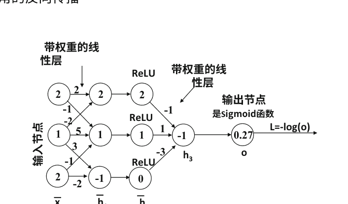

一个具有两个计算层的神经网络，但它们看起来像四个层，因为激活层已经从线性层中分离出来。输入层的向量用三维列向量 $\bar{x}$ 表示，计算层的向量为 $\bar{h}_1$（三维），$\bar{h}_2$（三维），$\bar{h}_3$（一维），输出层 $o$（一维）。损失函数为 $L = -\log(o)$。这些符号在图2.14中有注释。输入向量 $\bar{x}$ 为 $[2, 1, 2]^T$，两个线性层中的边的权重在图2.14中有注释。$\bar{x}$ 和 $\bar{h}_1$ 之间缺少的边被假设为零权重。接下来，我们将详细介绍前向和反向阶段的细节。

## 前向传播阶段：

第一个隐藏层 $\bar{h}_1$ 与输入向量 $\bar{x}$ 通过权重矩阵 $W$ 计算：$\bar{h}_1 = W \bar{x}$。我们可以重构权重矩阵 $W$ 然后计算前向传播中的隐藏层。

$$W = \left[\begin{array}{rrr} 2 & -2 & 0 \\ -1 & 5 & -1 \\ 0 & 3 & -2 \end{array}\right]; \quad \bar{h}_1 = W \bar{x} = \left[\begin{array}{rrr} 2 & -2 & 0 \\ -1 & 5 & -1 \\ 0 & 3 & -2 \end{array}\right]\left[\begin{array}{c} 2 \\ 1 \\ 2 \end{array}\right] = \left[\begin{array}{r} 2 \\ 1 \\ -1 \end{array}\right]$$

通过逐元素应用ReLU函数获得隐藏层 $\bar{h}_2$：在前向传播阶段，ReLU函数应用于 $\bar{h}_1$。因此，我们得到以下结果：

$$\bar{h}_2 = \text{ReLU}(\bar{h}_1) = \text{ReLU} \left[\begin{array}{r} 2 \\ 1 \\ -1 \end{array}\right] = \left[\begin{array}{r} 2 \\ 1 \\ 0 \end{array}\right]$$

接下来，$1 \times 3$ 权重矩阵 $\bar{W}_2 = [-1, 1, -3]$ 用于将3维向量 $\bar{h}_2$ 转换为1维“向量” $\bar{h}_3$ 如下：

$$\bar{h}_3 = \bar{W}_2 \bar{h}_2 = [-1, 1, -3]\left[\begin{array}{c} 2 \\ 1 \\ 0 \end{array}\right] = -1$$

输出 $o$ 通过将sigmoid函数应用于 $\bar{h}_3$ 获得。换句话说，我们有以下内容：

$$o = \frac{1}{1 + \exp(-\bar{h}_3)} = \frac{1}{1 + e} \approx 0.27$$

点特定损失为 $L = -\log_e(0.27) \approx 1.3$。

反向阶段：在反向阶段，我们首先初始化 $\partial L / \partial o$ 为 $-1/o$，即 $-1/0.27$。然后，1维“梯度” $g_3$ 是隐藏层 $h_3$ 的梯度，通过使用表2.1中sigmoid函数的反向传播公式获得：

$$g_3 = o(1 - o) \frac{\partial L}{\partial o} = o - 1 = 0.27 - 1 = -0.73 \tag{2.24}$$

隐藏层 $\bar{h}_2$ 的梯度 $g_2$ 通过与权重矩阵 $\bar{W}_2 = [-1, 1, -3]$ 的转置相乘获得：

$$\bar{g}_2 = \bar{W}_2^T g_3 = \begin{bmatrix} -1 \\ 1 \\ -3 \end{bmatrix} (-0.73) = \begin{bmatrix} 0.73 \\ -0.73 \\ 2.19 \end{bmatrix}$$

根据表2.1中ReLU函数的条目，梯度 $g_2$ 可以向后传播到 $g_1 = \frac{\partial L}{\partial \bar{h}_1}$，通过复制 $g_2$ 的分量到 $g_1$，当对应的分量在 $\bar{h}_1$ 中为正时；否则，将 $g_1$ 的分量设为零。因此，梯度 $g_1 = \frac{\partial L}{\partial \bar{h}_1}$ 可以通过简单地复制 $\bar{g}_2$ 的第一和第二个分量到 $g_1$ 的第一和第二个分量，并将 $g_1$ 的第三个分量设置为0。

换句话说，我们有以下内容：

$$\bar{g}_1 = \begin{bmatrix} 0.73 \\ -0.73 \\ 0 \end{bmatrix}$$

请注意，我们还可以计算输入层 $\bar{x}$ 的损失梯度 $g_0 = \frac{\partial L}{\partial \bar{x}}$，只需简单地计算 $g_0 = W^T g_1$。然而，这实际上并不需要计算损失对权重的导数。

计算损失对权重的导数：到目前为止，我们只展示了如何计算在这个特定的例子中损失对节点的导数。这些需要通过乘以一个隐藏层来转换为损失对权重的导数。令 $M$ 为损失对权重矩阵 $W$ 的导数矩阵。请注意，$M$ 和 $W$ 的元素位置之间存在一一对应关系。然后，矩阵 $M$ 定义如下：

$$M = \bar{g}_1 \bar{x}^T = \begin{bmatrix} 0.73 \\ -0.73 \\ 0 \end{bmatrix} [2,1,2] = \begin{bmatrix} 1.46 & 0.73 & 1.46 \\ -1.46 & -0.73 & -1.46 \\ 0 & 0 & 0 \end{bmatrix}$$

同样地，可以计算 $h_2$ 和 $\bar{h}_3$ 之间的 $1 \times 3$ 矩阵 $\bar{W}_2$ 的损失对权重导数矩阵 $M_2$：

$$M_2 = g_3 \bar{h}_2^T = (-0.73)[2, 1, 0] = [-1.46, -0.73, 0]$$

注意矩阵 $M_2$ 的大小与 $\bar{W}_2$ 相同，尽管不应更新缺失边的权重。

### 2.5.4 非分层架构的向量中心反向传播

大多数神经网络是分层架构，其中第 $i$ 层的所有节点都与第 $(i+1)$ 层的节点相连。因此，计算图视为单一路径。当计算图具有任意结构时会发生什么？例如，图2.15(a)中的计算图具有跳跃连接在交替层之间。这种情况确实发生在一些最近的卷积架构中，如 $\text{ResNet} [193,194]$。

在这种情况下，我们可能会遇到一个情况，即节点 $\bar{v}$ 和后续层中的网络之间有多个节点 $\bar{h}_{1} \ldots \bar{h}_{s}$，如图2.15(b)所示。假设向量 $\bar{h}_{i}$ 的维度为 $m_{i}$。在这种情况下，偏导数结果是单路径情况的简单推广：

$$\frac{\partial L}{\partial \bar{v}} = \sum_{i=1}^{s} \frac{\partial \bar{h}_{i}}{\partial \bar{v}} \frac{\partial L}{\partial \bar{h}_{i}} = \sum_{i=1}^{s} \text{Jacobian}(\bar{h}_{i}, \bar{v})^T \frac{\partial L}{\partial \bar{h}_{i}}$$

在大多数分层神经网络中，我们只有一条路径，很少需要处理分支情况。然而，在具有跳跃连接的神经网络中，这些分支可能会出现（参见图2.15(a)和(b)）。然而，即使在这些类型的复杂网络架构中，在反向传播过程中，每个节点只需要关注其局部的出边。这是反向传播范式的关键点，在梯度计算过程中不需要担心图的全局结构。

考虑一个包含向量值变量的输出节点的情况，其中变量的索引用 $t_1 \ldots t_p$ 表示，变量为 $y(t_1) \ldots y(t_p)$。在这种情况下，损失函数 $L$ 可能是这些向量中所有分量的函数。假设第 $i$ 个节点包含一个列向量变量 $y(i)$。此外，在矩阵微积分的分母布局中，每个 $\Delta(i) = \frac{\partial L}{\partial y(i)}$ 是一个与 $y(i)$ 维度相同的列向量。正是这个损失导数向量将被向后传播。计算导数的向量中心算法如下：

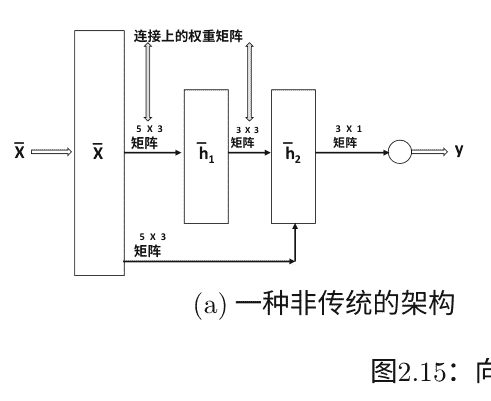

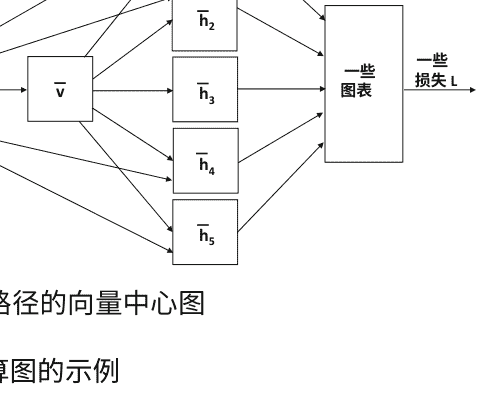

初始化：对于每个输出节点 $t_k$，$k \in \{1 \dots p\}$，$\Delta(t_k) = -\frac{\partial L}{\partial y(t_k)}$；
重复
- 选择一个未处理的节点 $i$，使得所有出边节点 $j \in \overline{A(i)}$ 的 $\Delta(j)$ 可用；
- 更新 $\Delta(i) \Leftarrow \sum_{j \in A(i)} \text{Jacobian}(y(j), y(i))^T \Delta(j)$；
直到所有节点都被选择；
对于每个节点 $i$ 的入边向量 $w_i$，计算 $\frac{\partial L}{\partial w_i} = \frac{\partial y(i)}{\partial w_i} \Delta(i)$。

在上述伪代码的最后一步中，计算了向量 $y(i)$ 相对于向量 $w_i$ 的导数，它本身是雅可比矩阵的转置。这最后一步将相对于节点变量的偏导数向量转换为相对于节点入边的偏导数向量。

## 2.6 不那么不重要的细节

在本节中，我们将讨论反向传播算法的一些重要特殊情况和细节。

### 2.6.1 小批量随机梯度下降

到目前为止，神经网络权重的所有更新都是以点特定的方式进行的，这被称为随机梯度下降。在本节中，我们提供了对这种选择的正当性的解释，以及类似小批量随机梯度下降的相关变体。我们还提供了对各种选择的优缺点的理解。

大多数机器学习问题可以重新构造为对单个训练数据点上的损失函数的线性可加性求和的优化问题。然而，很少一次使用所有的点，而是可能随机选择一个点来更新参数以减少该点特定的损失。在神经网络中，这个过程是自然的，因为我们迄今为止介绍的简单方法是以前向和后向传播的方式逐点处理，以迭代地最小化点特定的损失。然而，整个数据集上的损失实际上被定义为各个训练点上损失的总和。可以将神经网络的损失函数写成点特定损失的总和：

$$L = \sum_{i=1}^{n} L_i \tag{2.25}$$

这里，$L_i$ 是第 $i$ 个训练点贡献的损失。在梯度下降中，通过沿着所有点的损失梯度的负方向移动参数，试图最小化神经网络的损失函数。例如，在感知器的情况下，参数对应于 $W = (w_1 \dots w_d)$。因此，人们会尝试同时计算所有点上潜在目标函数的损失，并进行梯度下降。因此，在传统的梯度下降中，人们会尝试执行以下梯度下降步骤：

$$\overline{W} \Leftarrow \overline{W} - \alpha \left( \frac{\partial L}{\partial w_1}, \frac{\partial L}{\partial w_2} \dots \frac{\partial L}{\partial w_d} \right) \tag{2.26}$$

这种类型的导数也可以用向量表示法（即矩阵微积分表示法）简洁地写成：

$$\overline{W} \Leftarrow \overline{W} - \alpha \frac{\partial L}{\partial W} \tag{2.27}$$

相应地，很容易证明感知器的真实更新应该是以下内容（基于方程2.25）：

$$\overline{W} \leftarrow \overline{W} - \frac{\partial L}{\partial \overline{W}} = \overline{W} - \sum_{i=1}^{n} \frac{\partial L_i}{\partial \overline{W}} \tag{2.28}$$

这在感知器中是可能实现的，但是如果要将上述更新推广到多层架构，就需要同时将所有示例前向和后向地通过网络运行，以计算梯度。请注意，每个训练实例的中间激活和导数都需要同时维护在数十万个神经网络节点上。在大多数实际情况下，这可能非常庞大。因此，在一次性中同时运行所有示例通过网络计算梯度对整个数据集来说是不切实际的。到目前为止，逐点更新实际上是通过使用 $L_i$ 而不是 $L$ 来进行的真实更新的实用近似。

$$W \leftarrow W - \frac{\partial L_i}{\partial \overline{W}} \tag{2.29}$$

假设点的随机排序，每次更新可以看作是真实更新的概率近似，尽管重复更新的长期效果大致相同。这种概率近似因此被称为随机梯度下降。随机梯度下降的主要优点是快速和内存效率高，尽管以准确性为代价。

随机梯度下降的主要问题是逐点方法有时会表现不稳定，因为训练数据中的个别点可能被错误标记或存在其他错误。然而，可以通过使用小批量随机梯度下降来找到一个折中的方法。这个想法是在每次更新中使用一批点而不是一个点。在小批量随机下降中，使用一批训练点进行更新：

$$\overline{W} \leftarrow \overline{W} - \alpha \sum_{i \in B} \frac{\partial L_i}{\partial \overline{W}} \tag{2.30}$$

在机器学习问题中使用的数据通常在不同训练点捕获的知识方面存在很高的冗余，因此从样本点获得的梯度通常非常准确。此外，权重在学习过程开始时通常是如此不正确，以至于即使使用少量样本点也可以创建出梯度的优秀估计。这一观察结果为小批量随机梯度下降的成功提供了实际基础，它通常在稳定性、速度和内存需求之间展现出最佳的平衡。

在使用小批量随机梯度下降时，每一层的输出都是矩阵而不是向量，前向传播需要将权重矩阵与激活矩阵相乘。反向传播也是如此，梯度矩阵被保持。因此，小批量随机梯度下降的实现增加了内存需求，这是限制其规模的一个因素。

另一方面，随机梯度下降还具有间接的正则化效果（参见第5章），因此降低通常不太显著。有时，它甚至在样本外数据的性能方面优于普通的梯度下降。然而，它在某些类型的数据集上有时会产生较差的结果。

然而，在实际情况下，内存很少是一个限制因素，因为通过增加批量大小在梯度计算中并不能获得更高的准确性，除非批量大小超过几百个点。通常使用2的幂作为小批量的大小，因为这种选择通常在大多数硬件架构上提供最佳效率；常用的值有32、64、128或256。尽管小批量随机梯度下降在神经网络学习中普遍使用，但本书大部分内容将使用单个点进行更新（即纯随机梯度下降），以简化演示。

### 2.6.2 学习率衰减

一个恒定的学习率并不理想，因为它给分析师带来了一个困境。一般来说，最好在算法开始时选择一个较高的学习率，然后在后续阶段选择一个较低的学习率。困境如下。在早期使用较低的学习率会导致算法花费太长时间才能接近最优解。

另一方面，较大的初始学习率会使算法在开始时能够接近一个好的解；然而，如果保持高学习速率，算法将在该点周围长时间振荡，或者以不稳定的方式发散。

无论哪种情况，保持恒定的学习率都不理想。随着时间的推移，允许学习率衰减可以自然地实现所需的学习率调整，以避免这些挑战。

最常见的衰减机制是指数衰减和反比衰减，它们定义了学习率 $\alpha_t$ 以初始衰减率 $\alpha_0$ 和时期 $t$ 如下：

$$ \alpha_t = \alpha_0 \exp(-k \cdot t) \quad \text{[指数衰减]}$$

$$ \alpha_t = \frac{\alpha_0}{1 + k \cdot t} \quad \text{[反向衰减]}$$

参数 $k$ 控制衰减速率。另一种方法是使用阶梯衰减，在几个周期后将学习率降低一个特定因子。例如，学习率可能每5个周期乘以 0.5。一种常见的方法是跟踪训练数据集中保留部分的损失，并在该损失不再改善时降低学习率。在某些情况下，分析师甚至可能会监督学习过程，并根据进展手动更改学习率。这种方法可以与简单的梯度下降实现一起使用，尽管它不能解决许多其他问题。因此，更复杂的梯度下降算法在第4章中进行了讨论。

### 2.6.3 检查梯度计算的正确性

反向传播算法非常复杂，有时需要检查梯度计算的正确性。可以使用数值方法轻松进行此操作。考虑网络中随机选择的一条边的特定权重 $w$。$L(w)$ 是当前损失的值。将此边的权重通过添加一个小量 $\epsilon > 0$ 进行扰动。然后，使用这个扰动后的权重执行前向算法，并计算损失 $L(w + \epsilon)$。然后，可以证明损失对权重 $w$ 的偏导数如下所示：

$$ \frac{\partial L(w)}{\partial w} \approx \frac{L(w + \epsilon) - L(w)}{\epsilon} \tag{2.31}$$

当偏导数不足够接近时，很容易检测到计算错误。需要对上述估计进行以下操作。## 2.6.4 正则化

在训练过程中只有两个或三个检查点，这是非常高效的。然而，在这些检查点上可能建议对参数的适度子集进行检查。为了确定梯度是否“足够接近”，必须考虑这些梯度的绝对大小，并使用相对比率进行计算。

将反向传播确定的导数表示为 $G_e$，并将上述估计表示为 $G_a$。那么，相对比率 $\rho$ 定义如下：

$$
\rho = \frac{|G_e - G_a|}{|G_e + G_a|}
$$

(2.32)

通常，比率应小于 $10^{-6}$，尽管对于某些激活函数（如ReLU），导数在特定点发生剧烈变化，数值梯度可能与计算梯度不同。在这种情况下，比率仍应小于 $10^{-3}$。可以使用这个数值近似来检查与一部分权重相关的梯度的正确性。如果有数百万个参数，那么可以对导数的样本进行快速检查以验证正确性。

在训练过程中，建议在两个或三个时间点进行此检查，因为初始化时的检查可能对应于后期不成立的特殊情况。

正如您将在第5章中学到的那样，每次进行更新时，通过缩小权重来对随机梯度下降进行正则化是很重要的。例如，如方程2.29所示，对于第i个数据点的随机梯度下降更新在此重复显示：

$$
W \leftarrow W - \alpha \frac{\partial L_i}{\partial W}
$$

(2.33)

在正则化中，还会应用一个额外的缩小因子 $(1 - \alpha\lambda)$ 应用于权重向量，其中 $\lambda > 0$ 是正则化参数：

$$
W \leftarrow W(1 - \alpha\lambda) - \alpha \frac{\partial L_i}{\partial W}
$$

(2.34)

如第5章所讨论的，正则化通常会提高在预测时的样本外数据准确性（尽管可能会降低训练数据的准确性）。

## 2.6.5 隐藏节点上的损失函数

在某些形式的稀疏特征学习中，甚至隐藏节点的输出也与损失函数相关联。这在鼓励隐藏层的特定属性方面经常发生。在这种情况下，反向传播算法只需要进行轻微修改，使得反向传播的梯度流包括隐藏节点的损失（类似于输出节点的处理方式）。这可以通过简单地聚合不同损失导致的梯度流来实现。从根本上讲，反向传播方法仍然是相同的。

考虑损失函数 $L^{hi}$ 与隐藏节点 $h(i)$ 相关联的情况。此外，让 $\Delta(i)$ 表示从 $i$ 可达的所有节点的梯度流。然后，标准的预激活更新被修改以添加隐藏节点损失的影响：

$$
\Delta(i) \leftarrow [\Phi'_i \sum_{j \in A(i)} w_{ij} \Delta(j)] + \Phi'_i \frac{\partial L^h_i}{\partial h(i)}
$$

(2.35)

请注意，上述更新中的第二项考虑了损失对隐藏节点 i 的影响。这个项只是在反向传播过程中增加了梯度流。这个添加的代数形式与输出节点的初始化值类似。

因此，反向传播的整体框架几乎完全相同，唯一的区别是反向传播算法从隐藏节点的损失中获得了额外的贡献。

### 2.6.6 处理共享权重的反向传播技巧

对于正则化神经网络，一种非常常见的方法是使用共享权重。基本思想是，如果我们对网络中的不同节点计算出类似的函数具有一些语义洞察力，那么与这些节点相关联的权重将被约束为相同的值。以下是一些示例：

-   1. 在一个自编码器中，模拟奇异值分解（参见第3.4.1.2节），输入层和输出层的权重是共享的。
-   2. 在文本的循环神经网络中（参见第8章），不同时间层的权重是共享的，因为句子中的每个单词共享相同的语言模型。
-   3. 在卷积神经网络中，整个图像输入使用相同的权重滤波器（参见第9章），因为像素以一致的方式进行解释。

以语义洞察的方式共享权重是成功神经网络设计的关键技巧之一。当可以确定共享相似语义关系的特定节点集时，使用共享权重是有意义的。

乍一看，计算相对于共享权重的损失梯度可能似乎是一项繁重的任务，因为计算图中的损失函数复杂。然而，可以从微积分中借用一个关键技巧来实现简单的计算。设 w 是网络中 T 个节点共享的权重，相应的权重副本用 $w_1 ... w_T$ 表示。设损失函数为 L。然后，可以使用链式法则来证明以下关系：

$$
\frac{\partial L}{\partial w} = \sum_{i=1}^{T} \frac{\partial L}{\partial w_i} \cdot \frac{\partial w_i}{\partial w} = \sum_{i=1}^{T} \frac{\partial L}{\partial w_i}
$$

换句话说，我们所要做的就是假装这些权重是独立的，计算它们的导数，然后相加！因此，我们只需执行反向传播算法，然后将不同副本的梯度相加。这个简单的观察构成了许多关键神经网络架构（如循环、卷积和图神经网络）中的学习算法的基础。

## 2.7 调整和预处理

神经网络的设置、预处理和初始化涉及几个重要问题。首先，需要选择神经网络的超参数（如学习率和正则化参数）。特征预处理和初始化也非常重要。与其他机器学习算法相比，神经网络往往具有更大的参数空间，这在很多方面放大了预处理和初始化的影响。接下来，我们将讨论基本方法。

### 2.7.1 调整超参数

神经网络有很多超参数，如学习率、正则化权重等。术语“超参数”用于特指调节模型设计的参数（如学习率和正则化），它们与神经网络中表示连接权重的更基本参数不同。在贝叶斯统计中，超参数的概念用于控制先验分布，尽管在这里我们对该定义使用了一种稍微宽松的方式。从某种意义上说，神经网络中存在着两层参数组织，其中主要的模型参数如权重是在固定超参数（手动或通过调整阶段）之后才通过反向传播进行优化的。正如我们将在第5章的第5.3节中讨论的那样，超参数不应该使用用于梯度下降的相同数据进行调整。相反，一部分数据被保留为验证数据，并使用不同的超参数选择在验证集上测试算法的性能。这种方法确保调整过程不会过拟合训练数据集（同时提供较差的测试数据性能）。

应该如何选择候选超参数进行测试？最著名的技术是网格搜索，在其中为每个超参数选择一组值。在最直接的网格搜索实现中，以确定最佳选择的顺序测试所选超参数的所有组合。这个过程的一个问题是超参数的数量可能很大，并且随着超参数的数量增加，网格中的点数呈指数增长。例如，如果我们有5个超参数，并且我们为每个超参数测试10个值，训练过程需要执行 $10^5=100000$ 次以测试其准确性。尽管人们不会完全运行这样的测试过程，但运行次数仍然太多，以至于对于大多数设置来说无法合理执行。因此，常用的技巧是首先使用粗略的网格。稍后，当缩小到特定的兴趣范围时，使用更精细的网格。当选择的最佳超参数位于网格范围的边缘时，必须小心，因为需要测试超出范围以查看是否存在更好的值。

即使使用粗粒度到细粒度的过程，测试方法有时候可能会太昂贵。已经指出[37]，基于网格的超参数探索不一定是最佳选择。在某些情况下，随机在网格范围内均匀采样超参数是有意义的。与网格范围的情况类似，可以进行多分辨率采样，首先在完整的网格范围内进行采样。然后创建一组新的网格范围，这些范围在先前探索样本的最佳参数周围，并且比先前的网格范围几何上更小。在这个较小的范围内重复采样，并且整个过程迭代地多次重复以优化参数。

关于采样许多类型的超参数的另一个关键点是，采样的是超参数的对数而不是超参数本身。这样的参数的两个例子包括正则化率和学习率。例如，我们首先采样学习率 $\alpha$ 在 0.1和 0.001之间，而不是直接采样。在 $\log(\alpha)$ 的范围内均匀分布在 -1 和 -3 之间，然后将其指数化为10的幂。

在对数空间中搜索超参数更为常见，尽管有一些超参数应该在均匀尺度上搜索。

最后，关于大规模设置的一个关键点是，由于所需的大量训练时间，有时不可能完全运行这些算法。例如，在图像处理中，一个卷积神经网络的单次运行可能需要几周的时间。尝试在许多不同的参数组合上运行算法是不切实际的。然而，我们通常可以在短时间内获得算法的整体行为的合理估计。因此，通常会对算法进行一定数量的迭代来测试进展。明显表现不佳或无法收敛的运行可以迅速终止。在许多情况下，可以同时运行具有不同超参数的多个进程，并可以逐步终止或添加新的采样运行。最终，只允许一个获胜者完成训练。有时可以允许几个获胜者完成训练，并将它们的预测结果作为集成的平均值。

寻找最佳神经网络配置的一般问题被称为神经架构搜索，其范围比本章讨论的要广泛得多[115]。例如，用于架构搜索的强化学习（参见第11.8.5节）或参数搜索的贝叶斯优化[41, 317]。对于较小的网络，可以使用诸如Hyperopt[637]、Spearmint[639]和SMAC[638]等库。

### 2.7.2 特征预处理

用于神经网络训练的特征处理方法与其他机器学习算法并没有太大的不同。机器学习算法中有两种形式的特征预处理：

-   1. 加法预处理和均值居中：在许多算法中，将数据均值居中可以去除某些类型的偏差效应。许多传统机器学习算法（如主成分分析）也使用均值居中的数据。在这种情况下，每个数据点都会减去一列的均值向量。均值居中通常与标准化配对使用，标准化在特征归一化部分讨论。

当希望所有特征值都为非负数时，可以使用第二种预处理方法。在这种情况下，将特征的最小负值的绝对值加到每个数据点的相应特征值上。通常，这与最小-最大归一化结合使用，下面将对此进行讨论。

-   2. 特征归一化：常见的一种归一化方法是将每个特征值除以其标准差。当将此类型的特征缩放与均值居中相结合时，数据被称为已标准化。基本思想是假设每个特征都是从均值为零、方差为一的标准正态分布中抽取的。

另一种特征归一化的类型在数据需要在范围(0,1)内进行缩放时很有用。让 $min_j$ 和 $max_j$ 分别表示第j个属性的最小值和最大值。然后，每个特征值 $x_{ij}$ 表示第i个点的第j个维度的特征值，通过最小-最大归一化进行缩放，具体如下：

$$ x_{ij} \leftarrow \frac{x_{ij} - min_j}{max_j - min_j} $$
(2.36)

特征归一化通常能够提高性能，因为特征的相对值往往会有一个数量级的差异。在这种情况下，参数学习面临着病态问题，即损失函数对某些参数比其他参数更敏感。正如我们将在第4章中看到的，这种类型的病态会影响梯度下降的性能。

因此，建议在开始时进行特征缩放。

### 白化

另一种特征预处理的形式被称为白化，其中轴系统被旋转以创建一组新的去相关特征，每个特征都被缩放到单位方差。通常，主成分分析被用于实现这个目标。主成分分析可以看作是在数据矩阵进行均值中心化（即从每列中减去均值）之后应用奇异值分解。

令 $D$ 为一个 $n \times d$ 数据矩阵已经进行了均值中心化。令 $C$ 为一个 $d \times d$ 协方差矩阵，其中 $D$ 的 $(i, j)$ 元素是维度 $i$ 和 $j$ 之间的协方差。由于矩阵 $D$ 是均值中心化的，我们有以下关系：

$$C = \frac{D^T D}{n} \propto D^T D$$

协方差矩阵的特征向量提供了数据中去相关的方向。
此外，特征值提供了每个方向上的方差。因此，如果使用协方差矩阵的前 $k$ 个特征向量（即最大的 $k$ 个特征值），将保留数据中的大部分方差并去除噪声。也可以选择 $k = d$，但这通常会导致接近零的特征向量上的方差被计算误差所主导。包含由计算误差引起的方差的维度是一个不好的选择，因为这样的维度对于学习应用特定知识几乎没有有用的信息。此外，白化过程将使每个转换后的特征缩放到单位方差，这将放大这些方向上的误差。至少，建议在特征值的幅度上使用一些阈值，如 $10^{-5}$。因此，实际上，$k$ 很少会完全等于 $d$。或者，在缩放每个维度之前，可以为正则化添加 $10^{-5}$ 到每个特征值。

令 $P$ 为 $d \times k$ 矩阵，其中每列包含前 $k$ 个特征向量之一。
然后，通过与矩阵 $P$ 进行后乘，数据矩阵 $D$ 可以转换为 $k$ 维坐标系。结果为转换后的 $k$ 维数据点组成的 $n \times k$ 矩阵 $U$ 如下所示：

$$U = DP$$

请注意，$U$ 的列方差是对应的特征值，因为这是主成分分析去相关化变换的特性。

在白化过程中，通过将 $U$ 的每列除以其标准差（即对应特征值的平方根），使其具有单位方差。转换后的特征被输入神经网络。由于白化可能会减少特征数量，因此这种预处理方法也可能会影响网络的架构，因为它减少了输入的数量。

白化的一个重要方面是，可能不希望通过大型数据集进行一次遍历来估计其协方差矩阵。在这种情况下，协方差矩阵和原始数据矩阵的列均值可以在数据样本上估计。计算一个 $d \times k$ 特征向量矩阵 P，其中列包含前 k 个特征向量。随后，对于每个数据点使用以下步骤：（i）从相应特征中减去每列的均值；（ii）将表示训练数据点（或测试数据点）的 $d$ 维行向量与 P 进行矩阵乘法，得到一个 $k$ 维行向量；（iii）将这个 $k$ 维表示的每个特征除以相应特征值的平方根。

白化背后的基本思想是假设数据是由每个主成分上的独立高斯分布生成的。通过白化，假设每个这样的分布都是标准正态分布，并对不同特征提供相等的重要性。请注意，在白化之后，数据的散点图将大致呈现球形，即使原始数据在任意方向上呈椭圆形伸展。这个想法是，数据中的不相关概念现在已经被缩放到相等的重要性（在先验的基础上），神经网络可以决定在学习过程中强调哪些概念。另一个问题是，当不同特征的缩放差异很大时，在学习的初始阶段，激活和梯度将被“大”特征所主导。这可能会损害网络中某些重要权重的相对学习速率。

### 2.7.3 初始化

初始化在神经网络中尤为重要，因为与神经网络训练相关的稳定性问题。正如你将在4.3.2节中学到的那样，神经网络经常表现出稳定性问题，即每一层的激活要么逐渐变弱，要么逐渐变强。这种影响与网络的深度呈指数关系，因此在深度网络中尤为严重。改善这种影响的一种方法是选择良好的初始化点，使得梯度在不同层之间保持稳定。

初始化权重的一种可能方法是从均值为零、标准差较小的高斯分布中生成随机值，例如 $10^{-2}$。通常情况下，这将导致既有正值又有负值的小随机值。这种初始化的一个问题是它对于特定神经元的输入数量不敏感。

例如，如果一个神经元只有2个输入，而另一个神经元有100个输入，由于更多输入的加法效应，前者的输出对平均权重更敏感（这将显示为更大的梯度）。一般来说，可以证明输出的方差与输入数量成线性比例，因此标准差与输入数量的平方根成比例。为了平衡这个事实，每个权重都初始化为从均值为零、标准差为 $\sqrt{1/r_{in}}$ 的正态分布中抽取的值，其中 $r_{in}$ 是该神经元的输入数量。偏置神经元的权重始终初始化为零。或者，可以将权重初始化为在 $[-1/\sqrt{r_{in}}, 1/\sqrt{r_{in}}]$ 中均匀分布的值。

更复杂的初始化规则考虑了不同层中的节点相互作用以贡献输出的敏感性。因此，更大的出度也会导致激活的幅度增加。让 $r_{in}$ 和 $r_{out}$ 分别是特定神经元的扇入和扇出。一种建议的初始化规则，称为Xavier初始化或Glorot初始化，是使用均值为零、标准差为 $\sqrt{2/(r_{in} + r_{out})}$ 的正态分布。

在使用随机方法时，一个重要的考虑是对称性的打破是重要的。如果所有的权重都初始化为相同的值（如0），所有的更新都会在一个层中，锁步进行。因此，神经元在一个层中会创建相同的特征。重要的是在神经元之间有一个不对称性的来源。

## 2.8 反向传播是可解释的

关于神经网络的一个常见说法是它们缺乏可解释性[99]。然而，事实证明可以使用反向传播来确定对于特定测试实例的分类贡献最大的特征。这为分析师提供了对每个特征与分类的相关性的理解。

这种方法还具有一个有用的特性，即可以用于特征选择[422]。考虑一个测试实例 $X = [x_1, ..., x_d]$，其中神经网络的多标签输出分数为 $o_1...o_k$。此外，让我们将 $k$ 个输出中获胜的类别的输出设为 $o_m$，其中 $m \in \{1...k\}$。目标是识别对于这个测试实例的分类最敏感的特征。因此，对于每个属性 $x_i$，我们希望确定输出 $o_m$ 对于 $x_i$ 的敏感性，这相当于计算 $\partial o_m/\partial x_i$ 的绝对值。这个导数的符号也告诉我们增加 $x_i$ 的值会稍微增加还是减少获胜类别的分数。对于非获胜类别，导数还提供了一些对敏感性的理解，但是当类别数量很大时，这种额外的敏感性次于获胜类别的重要性。导数 $\partial o_m/\partial x_i$ 可以通过节点之间的导数计算（参见第2.3.1节）直接计算，而不是专注于损失对权重的导数。

人们还可以通过对所有类别和所有正确分类的训练实例的梯度绝对值进行聚合来使用这种方法进行特征选择。在整个训练数据上具有最大聚合敏感性的特征是最相关的。

严格来说，人们不需要对所有类别进行聚合，而是可以仅使用获胜类别来正确分类的训练实例。然而，[422]中的原始工作对所有类别和所有实例进行了聚合。

在计算机视觉中，这些解释类型尤其直观[482]（参见第9章的第9.5.1节），因为视觉效果有时非常壮观。例如，对于一张狗的图片，分析将告诉我们哪些特征（即像素）导致该图片被认为是一只狗。因此，我们可以创建一张黑白显著性图像，在其中与狗对应的部分以浅色突出显示，背景为暗色（参见第9章的图9.13）。反向传播还可以用于确定隐藏特征相对于原始数据特征的敏感性。对于给定的隐藏特征 $h_m$，的值 $\partial h_m/\partial x_i$ 告诉我们隐藏特征对特定输入可能有多敏感。对于像图像数据这样的某些类型的数据，可以将这种敏感性绘制在像素上，从而对特征的工程化有很高的理解度。例如，每个隐藏特征通常对应于一个经常出现的形状，在后续层中变得越来越复杂（参见第9章的图9.16）。

## 2.9 总结

本章详细介绍了反向传播算法。在计算图的背景下，讨论了反向传播的一般观点。随后，对这一一般观点进行了神经网络应用的讨论。反向传播仅提供了有效学习所需的梯度步骤。该算法需要与下降的计算算法配对使用。这些算法中的许多在第四章中进行了讨论。

## 2.10 参考文献和软件资源

反向传播的原始思想基于控制理论中的函数复合的微分思想[54, 247]，在自动微分的范畴下发展而来。将这些方法应用于神经网络的提议是由Paul Werbos在他的博士论文中于1974年提出的[543]，尽管一种更现代化的算法形式是由Rumelhart等人于1986年提出的[424]。关于反向传播算法的历史讨论可在Paul Werbos的书中找到[544]。

关于神经网络和其他机器学习算法的超参数优化算法的讨论可以在[36, 38, 507]中找到。随机搜索方法用于超参数优化的讨论可以在[37]中找到。贝叶斯优化用于超参数调整的讨论可以在[41, 317, 478]中找到。有许多库可用于贝叶斯调整，如Hyperopt [637]，Spearmint [639]和SMAC [638]。

初始权重应根据节点的入度和出度来确定，与之成比例，即 $\sqrt{2/(r_{in} + r_{out})}$，基于[147]。对于修正线性单元神经网络的初始化方法进行了分析，详见[193]。关于特征预处理对神经网络学习的影响的评估和分析可参考[284, 551]。讨论了使用修正线性单元来解决一些训练挑战的方法，详见[148]。

### 软件资源

反向传播算法被几乎所有深度学习框架支持，如Caffe [596]、Torch [597]、Theano [598]和TensorFlow [599]。Caffe也可以在Python和MATLAB中使用。所有这些框架都提供了许多优化算法，这些算法在第4章中进行了讨论。

## 2.11 练习题

-   1. 考虑以下递归关系：
    $$(x_{t+1}, y_{t+1}) = (f(x_t, y_t), g(x_t, y_t))$$ (2.39)
    这里，$f()$和$g()$是多元函数。
    (a) 推导出 $\frac{\partial x_{t+2}}{\partial x_t}$ 只用 $x_t$ 和 $y_t$ 的表达式。
    (b) 你能画出对应于上述递归的神经网络架构吗？假设神经元可以计算任何你想要的函数。
-   2. 考虑一个具有两个输入的神经元，它将两个输入 $x_1$和 $x_2$相乘以得到输出 $o$。令 $L$为在 $o$处计算的损失函数。假设你知道 $\frac{\partial L}{\partial o} = 5$， $x_1=2$，且 $x_2=3$。计算 $\frac{\partial L}{\partial x_1}$ 和 $\frac{\partial L}{\partial x_2}$。
-   3. 考虑一个具有三层的神经网络，包括一个输入层。第一（输入）层有四个输入 $x_1$, $x_2$, $x_3$和 $x_4$。第二层有六个隐藏单元，对应于所有的两两乘法。输出节点 $o$简单地将六个隐藏单元的值相加。

## 2.11 练习题

4. 当输出 o 计算为其六个输入的最大值而不是求和时，你对前一个问题的答案有何变化？

5. 本章讨论（参见表2.1）如何通过使用雅可比矩阵的乘法来执行任意函数的反向传播。讨论为什么在使用这种以矩阵为中心的方法时必须小心。[提示：计算相对于sigmoid函数的雅可比矩阵]

6. 考虑损失函数 $L = x^2 + y^{10}$。实现一个简单的最陡下降算法，以绘制坐标在从初始化点到最优值0的变化过程中的轨迹。考虑两个不同的初始化点（0.5，0.5）和（2，2），并以恒定的学习率绘制两种情况下的轨迹。你观察到两种情况下算法的行为有什么不同?

7. 考虑输出层中的softmax激活函数，其中实值输出 $v_1 \ldots v_k$ 按照以下方式转换为概率（根据方程2.17）：

$$
o_i = \frac{\exp(v_i)}{\sum_{j=1}^{k} \exp(v_j)} \quad \forall i \in \{1, \ldots, k\}
$$

(a) 证明 $\frac{\partial o_i}{\partial v_j}$ 的值在 $i = j$ 的情况下，证明这个值是 $- o_i o_j$。

(b) 使用上述结果证明方程2.19的正确性：

$$
\frac{\partial L}{\partial v_i} = o_i - y_i
$$

假设我们使用交叉熵损失 $L = - \sum_{i=1}^{k} y_i \log(o_i)$，其中 $y_i \in \{0,1\}$ 是对不同的 $i \in \{1 \ldots k\}$ 进行独热编码的类别标签。

8. 考虑神经网络结构的变种，如图2.12(b)所示，在输入层 $x$ 和隐藏层 $h_2$ 之间存在一个跳跃连接，其递归方程如下：

$$
\overline{h}_1 = \text{ReLU}(W_1 \overline{x}), \quad \overline{h}_2 = \text{ReLU}(W_2 \overline{x} + W_3 \overline{h}_1), \quad y = W_4 \overline{h}_2
$$

在这里，$W_1, W_2, W_3$ 和 $W_4$ 是适当大小的矩阵。使用向量中心的反向传播算法推导出关于 $\frac{\partial y}{\partial \overline{h}_2}, \frac{\partial y}{\partial \overline{h}_1}$ 和 $\frac{\partial y}{\partial \overline{x}}$ 的表达式，其中包含中间层的矩阵和激活值。

9. 可解释性：考虑一个用于二分类问题的神经网络，其中输出 $o$（通过sigmoid激活函数生成）表示类别标签为+1的概率。讨论如何使用反向传播来确定哪些隐藏单元对于特定测试实例的分类起到重要作用。

10. 让 $f(x)$ 定义如下：

$$
f(x) = \sin(x) + \cos(x)
$$

考虑函数 $f(f(f(f(x))))$。写出这个函数的闭式形式，以便更好地理解这个笨拙的长函数。使用计算图抽象方法，在 $x = \pi/3$ 弧度处求这个函数的导数。

11. 考虑一个多层神经网络，其中每个激活函数产生正输出（例如，sigmoid函数）。证明所有输入到同一个神经元的权重在梯度下降步骤中会同时增加或减少。[这是tanh函数比sigmoid函数具有更好收敛性的原因之一。]

12. 正向模式微分：反向传播算法需要计算输出节点对所有其他节点的节点导数，因此向后计算梯度是有意义的（见第38页的伪代码）。然而，也可以计算节点对节点的导数 $\frac{\partial x}{\partial s_i}$，其中 $x$ 相对于源(输入)节点 $s_1\ldots s_k$。提出第38页伪代码的一个变体，用于在正向方向计算节点之间的梯度。

13. 所有节点之间的全对全导数：设 $y(i)$ 是包含 $n$个节点和 $m$条边的有向无环计算图中节点 $i$的变量。考虑计算 $S(i, j) = \frac{\partial y(j)}{\partial y(i)}$的情况。在计算图中计算所有节点对之间的 $\frac{\partial y(j)}{\partial y(i)}$，使得至少存在一条从节点 $i$到节点 $j$的有向路径。提出一个 $O(n^2 m)$的全对全导数计算算法。[提示：路径聚合引理对此有帮助。首先计算 $S(i, j, t)$，它是引理中属于长度恰好为 $t$的路径的 $S(i, j)$的一部分，并建立一个递推关系来增加 $t$。]

14. 使用路径聚合引理计算关于每个 $y(1)$, $y(2)$, 和 $y(3)$的导数（作为代数表达式）（参见图2.7）。你应该得到与本章文本中得到的相同的导数。

15. 考虑图2.6的计算图。对于特定的数值输入 $x = a$，你发现了一对 $\frac{\partial y(j)}{\partial y(i)}$值（$\frac{\partial y(j)}{\partial y(i)}$都是0.3）。计算输出对于输入 $x$（在 $x = a$处）的偏导数的数值。使用路径聚合引理和反向传播算法展示计算过程。

16. 考虑图2.6的计算图。每一层的上方节点计算 $\sin(x + y)$，每一层的下方节点计算 $\cos(x + y)$。对于第一隐藏层，只有一个输入 $x$，因此计算出 $\sin(x)$和 $\cos(x)$的值。最终输出节点计算其两个输入的乘积。单个输入 $x$为1弧度。计算输出对于输入 $x$（在 $x = 1$弧度处）的偏导数的数值。使用路径聚合和反向传播展示计算过程。

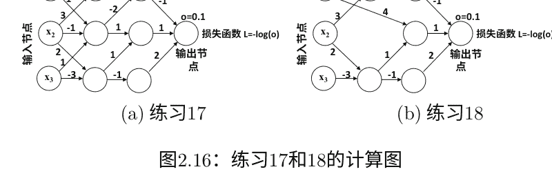

17. 考虑图2.16(a)所示的计算图，在每条边(i, j)上显示局部导数 $\partial y(j)$，其中$y(k)$表示节点$k$的激活值。对于每个输入$x_i$。用路径聚合和反向传播计算。

18. 考虑图2.16(b)所示的计算图，在每条边(i, j)上显示局部导数 $\partial y(j)$ 对于每个输入$x_i$。用路径聚合和反向传播计算。

## 第三章

### 浅层神经网络的机器学习

> “简单即是最高的复杂。” - 莱昂纳多·达·芬奇

## 3.1 引言

传统机器学习通常使用优化和梯度下降方法来学习参数化模型。神经网络也是参数化模型，可以使用连续优化方法进行学习。在所有这些情况下，机器学习模型构建一个封闭形式的损失函数，并使用梯度下降来学习最优参数。本章将展示在机器学习中，广泛使用的以优化为中心的方法可以用非常简单的神经网络架构来表示，这些神经网络架构只包含一层或两层。事实上，神经网络可以被看作是这些简单模型的更强大的泛化形式，其中深度创建了一个难以用封闭形式表达的损失函数，但也更强大，可以从数据中学习丰富的结构。早期展示这些相似之处是有用的，因为这样可以理解深度网络的设计是基本单元的组合，这些基本单元在机器学习中经常使用。此外，展示这种关系可以让人们更好地理解传统机器学习与神经网络的不同之处，并了解在哪些情况下可以希望使用神经网络取得更好的结果。

在数据有限的情况下，复杂的神经网络架构往往是过度的。此外，在数据稀缺的环境中，优化传统机器学习模型更容易。另一方面，随着更多数据的增加，神经网络具有越来越大的优势，因为它们保留了在需要时建模更复杂函数的灵活性。图3.1说明了这一点，其中显示了神经网络的优势随着数据的增加而增加。

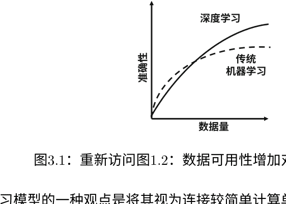

图3.1：重新访问图1.2：数据可用性增加对准确性的影响。

深度学习模型的一种观点是将其视为连接较简单计算单元（如感知器）的网络。这些较简单模型的两个例子是线性回归和逻辑回归。这些类型单元的计算图显然类似于较简单机器学习模型中使用的预测函数的组合。尽管许多神经网络可以从这个角度来看，但这种观点并不能完全捕捉到深度学习模型所涉及的复杂性和思考方式。例如，几个模型（如循环神经网络或卷积神经网络）以特定的方式执行这种堆叠，具有对输入数据的领域特定理解。能够巧妙地组合基本单元是深度学习从业者所需的关键架构技能。然而，学习机器学习中基本模型的属性也很重要，因为它们在深度学习中被重复使用作为计算的基本单元。因此，本章将探讨这些基本模型。

- 监督模型：本章主要讨论的监督模型主要对应于线性模型及其变体。这些方法包括最小二乘回归、支持向量机和逻辑回归。这些模型的多类别变体也将被研究。
- 无监督模型：本章主要讨论的无监督模型主要对应于降维和矩阵分解。

本章假设读者对经典机器学习模型有基本了解。然而，对于初学者，本章还将提供每个模型的简要概述。

### 章节组织

下一节将讨论一些基本的分类和回归模型，例如最小二乘回归、二元Fisher判别、支持向量机和逻辑回归。这些模型的多类别变体将在第3.3节中讨论。无监督学习中的自编码器在第3.4节中讨论。还讨论了几个领域特定的应用，如推荐系统（参见第3.5节）、文本嵌入（参见第3.6节）和图嵌入（参见第3.7节）。第3.8节给出了总结。

## 3.2 用于二元分类模型的神经网络结构

在本节中，我们将讨论一些基本的机器学习模型架构，例如最小二乘回归和分类。正如我们将看到的，相应的神经网络结构是机器学习中感知器模型的微小变化。主要的区别在于最后一层中所使用的激活函数的选择，以及在这些输出上所使用的损失函数。这将是本章中的一个重要主题，我们将看到神经网络结构的微小变化可以导致与传统机器学习不同的模型。

在本节中，我们将使用一个具有 d个输入节点和一个输出节点的单层网络进行工作。从输入节点到输出节点的连接的系数用 W= [w_1 .. w_d]^T来表示。因此，权重向量被假定为列向量。另一方面，训练实例是数据矩阵的行，因此每个训练实例用 X_i表示。特征变量的训练实例X_i被假定为行向量。

此外，偏差不会明确显示，因为它可以无缝地建模为具有常数值1的附加虚拟输入的系数。

### 3.2.1 重新审视感知器

让 [X_i, y_i] 是一个训练实例，其中观察到的值为 y_i是从行向量 X_i中的特征变量使用以下关系预测的：

```
ŷ_i = sign(W·X_i^T) \tag{3.1}
```

在这里， W是感知器学习到的 [w_1, ... w_d]^T的维度为d的列向量。注意 ŷ_i上面的插入符号表示它是一个预测值，而不是一个观察值。一般来说，训练的目标是确保预测值 ŷ_i尽可能接近观察值 y_i。感知器的梯度下降步骤专注于减少错误分类的数量，因此更新与基于第1章图13的讨论的观察值和预测值之间的差异 (y_i - ŷ_i)。

```
W ← W + α(y_i - ŷ_i)X \tag{3.2}
```

通常，基于观察值和预测值之间的差异的梯度下降更新是由诸如 的平方损失函数引起的。(y_i - ŷ_i)^2 (见下一节)。然而，这种看似明显的与平方损失的联系是误导性的，因为 y_i和 y_î是来自 的离散值。{-1, +1}，真实的损失函数与不可微的值 (y_i - ŷ_i)^2不同。

感知器是少数几个学习模型之一，其损失函数是在（启发式定义的）“梯度下降”更新提出之后才被逆向工程设计出来的。为了获得可微分的损失函数，有助于使用指示函数将感知器更新重写为。我(·)∈{0,1}，当其参数中的误分类条件 (即， y_i ŷ_i < 0) 成立时取值为1:

```
W ← W + αy_i X_i^T [I(y_i ŷ_i < 0)] \tag{3.3}
```

这个从方程3.2重写为方程3.3的过程利用了 这个事实对于误分类点， y_i = (y_i - ŷ_i)/2，当时此外，可以吸收一个常数因子。在学习率为2的范围内。可以证明，更新等价于使用损失函数梯度下降 L_i（特定于第 i 个训练示例）如下所示：

```
L_i = \max\{0, -y_i \hat{y}_i\} = \max\{0, -y_i(\overline{W} \cdot \overline{X}_i^T)\}
```

这个损失函数被称为感知机准则，在图3.3(a)中相应地反映出来。很容易证明，方程式3.3的更新是随机梯度下降更新：

```
\overline{W} \leftarrow \overline{W} - \alpha \frac{\partial L_i}{\partial \overline{W}}
```

因此，感知器的更新也是随机梯度下降更新，尽管在（启发式的）更新提出之后历史上才逆向工程出损失函数。图3.3(a)中的感知器架构使用线性激活函数来计算连续的损失函数，这与第1章中感知器架构中使用的符号激活函数不同。前者被称为训练架构，而后者被称为预测架构。现代神经网络几乎总是默认以训练架构的方式进行描述。感知器在显示预测架构方面有些例外，这是因为它的更新最初是在没有使用正式损失函数和启发式定义的离散输出的情况下提出的。实际上，可以为感知器创建一个扩展架构（参见图3.2），其中既输出连续值（用于训练），又输出离散值（用于预测）。在本书的其余部分，我们重点关注训练架构，每当提供神经网络的示例时。

### 3.2.2 最小二乘回归

在最小二乘回归中，训练数据包含 n 个不同的训练对 [\overline{X}_n, y_n]，其中每个 \overline{X}_i 是一个 d 维行向量的特征变量，每个 y_i 是一个实值目标。目标是实值的事实很重要，因为底层问题被称为回归而不是分类。最小二乘回归是所有学习问题中最古老的，最初的表述归功于十九世纪的数学家如Legendre和Gauss（在计算机出现之前）。

在最小二乘回归中，目标变量与特征变量之间存在以下关系：

```
\hat{y}_i = \overline{W} \cdot \overline{X}_i^T
```

注意训练实例的转置，因为它是行向量，而 $W$ 是列向量。注意 上方的圆圈符号的存在。$y_i$ 表示它是一个预测值。预测的误差，$e_i$，由 $e_i = (y_i - \hat{y_i})$ 给出。在这里，$\overline{W}= [w_1...w_d]^T$ 是一个需要学习的$d$维列向量权重，以便最小化训练数据上的总平方误差，即 $\sum_{i=1}^n e_i^2$。特定于第$i$个训练实例的损失部分如下所示：

> $$L_i = e_i^2 = (y_i - \hat{y_i})^2 \tag{3.7}$$

这个损失可以通过使用与感知器类似的架构来模拟，只是我们使用平方损失而不是感知器准则。这个架构如图33(b)所示，而感知器架构如图33(a)所示。与感知器算法一样，随机梯度下降步骤是通过计算 $e_i^2$ 相对于 $\overline{W}$ 的梯度来确定的。当训练对 $(X_i, y_i)$ 被呈现给神经网络时。这个梯度可以如下计算：

> $$\frac{\partial e_i^2}{\partial \overline{W}} = -e_i \overline{X}_i^T \tag{3.8}$$

因此，对于 $\overline{W}$ 的梯度下降更新如下计算：$\overline{W}$ 使用上述梯度和步长 $\alpha$ 进行计算：

$$\overline{W} \leftarrow \overline{W} + \alpha e_i \overline{X}_i^T$$

可以将上述更新重写为以下形式：

> $$\overline{W} \leftarrow \overline{W} + \alpha (y_i - \hat{y_i}) \overline{X}_i \tag{3.9}$$

上述更新看起来与方程32的感知器更新完全相同。然而，由于预测值的计算方式不同，更新并不完全相同。在这两种情况下，$\hat{y_i}$ 的计算方式不同。在感知器的情况下，将符号函数应用于 $\overline{W} \cdot \overline{X}^T$ 以便计算二进制值$\hat{y}_i$因此误差$(y_i - \hat{y}_i)$只能取自$\{-2, +2\}$。在最小二乘回归中，预测值$\hat{y}_i$是一个实数值，没有应用符号函数。这个想法也可以用Widrow-Hoff学习来处理二进制目标。

#### 3.2.2.1 Widrow-Hoff学习

可以直接应用最小二乘回归来最小化实值预测的平方距离 $\hat{y}_i$ 来自观察到的二进制目标 $y_i \in \{-1, +1\}$，这种特殊的回归情况被称为最小二乘分类。梯度下降更新与方程式39中所示的更新相同，与感知器的方程式32看起来相同。然而，最小二乘分类方法与感知器不同，因为感知器在更新中使用 $\hat{y}_i = \text{sign}\{W \cdot X^T\}$，而最小二乘分类使用 $\hat{y}_i = W \cdot X^T$。 将最小二乘回归直接应用于二进制目标被称为Widrow-Hoff学习。Widrow-Hoff学习规则于1960年提出。然而，这种方法并不是一种根本上的新方法，因为它是将古老的最小二乘回归方法直接应用于二进制目标。

使用Widrow-Hoff方法进行分类的神经网络结构如图33(b)所示。感知器和Widrow-Hoff方法中的梯度下降步骤都可以通过方程式39来计算，只是在计算方式上有所不同 $(y_i - \hat{y}_i)$ 的计算方法。对于感知器来说，该值$\hat{y}_i$是一个整数，因此$(y_i - \hat{y}_i)$的取值范围为$\{-2, +2\}$。对于Widrow-Hoff方法来说，这些误差可以是任意实数值，因为$\hat{y}_i$被设置为$W \cdot X^T$而不使用符号函数。当应用于二进制目标时，方程式39的学习规则可以被称为最小二乘分类、最小均方算法(LMS)、Widrow-Hoff学习规则、delta规则或Adaline。最小二乘分类方法的家族在文献中以不同的名称和不同的动机被多次重新发现。

由于其二进制响应，Widrow-Hoff方法的损失函数也可以用不同的形式重新编写 $L_i = (y_i - \hat{y}_i)^2 = y_i^2 - 2y_i\hat{y}_i + \hat{y}_i^2 = 1 - 2y_i\hat{y}_i + \hat{y}_i^2 = (1 - \hat{y}_i y_i)^2$。只有当目标变量$y_i$来自$\{-1, +1\}$因为我们可以使用$y_i^2 = 1$。将Widrow-Hoff目标函数转换为这个（等价的）形式是有帮助的，因为它可以更容易地与其他二进制目标的目标函数相关联（如感知器或支持向量机）。实际上，术语$\hat{y}_i y_i$在各种二进制目标的损失函数中反复出现。例如，感知器的准则简单地是$\text{max}\{-\hat{y}_i y_i, 0\}$，而支持向量机的损失函数（见下一节）是本章讨论的几乎所有二分类模型都是最小二乘分类的修改版本，它们解决了最小二乘分类损失函数中的一些关键弱点。这些弱点是盲目将二进制标签视为实际目标的结果，并将在本章中讨论其他算法使用的更好的损失函数的背景下进行讨论。

由于二进制响应变量的原因，最小二乘回归的梯度下降更新（参见方程3.9）可以稍微改写为Widrow-Hoff学习的形式：

```
◦ W ⇐ W + α(yi − ŷi)X       [适用于数值和二进制响应变量]
= W + αyi(1 − yiŷi)X_i^T    [仅适用于二进制响应变量，因为 yi^2 = 1]
```

更新的第二种形式有助于将其与感知器相关联，感知器在 1 − yiŷi > 0时使用指示函数值1，而不是 (1 − yiŷi)。

#### 3.2.2.2 闭式解

最小二乘回归和分类的特殊情况可以通过使用 的伪逆来在闭式形式下解决（无需梯度下降）。n × d训练数据矩阵D，其行为 X1. . . Xn。将依赖变量的n维列向量表示为 y= [y1. . . yn]^T。矩阵 D的伪逆定义如下：

```
D^+ = (D^T D)^{-1} D^T    (3.10)
```

然后，最优的列向量 可以证明 [6], W如下所示：

```
W = D^+ y̅    (3.11)
```

如果加入正则化，系数向量 W由以下给出：

```
W̅ = (D^T D + λI)^{-1} D^T y̅    (3.12)
```

在这里，λ > 0是正则化参数。然而，更常见的是使用梯度下降方法，如Widrow-Hoff规则，而不是使用解的矩阵形式。

### 3.2.3 支持向量机

考虑由 [X1, y1], [X2, y2], . . . [X n, yn] 表示的训练数据集。每个 Xi是一个特征变量的行向量，而yi是从中抽取的类变量。{-1, +1}。支持向量机的神经结构与最小二乘分类相同（即Widrow-Hoff方法），唯一的区别在于损失函数的选择。与最小二乘分类一样，预测。训练点。的预测值ŷi。通过在。W·X_i^T上应用恒等激活函数，可以得到X_i。

```
ŷi = W·X_i^T
```

在这里，W= [w1, . . . wd]^T 包含了单层网络中d个不同输入的列向量权重。因此，神经网络的输出为。ŷi = W·X^T 计算损失函数时，尽管测试实例是通过将符号函数应用于输出来预测的。损失函数。支持向量机中第i个训练实例的损失函数定义如下：

```
L_i = max{0, 1 − yiŷi} = max{0, 1 − yi(W·X_i^T )}    (3.13)
```

大于1）被认为是正确的预测，因此不会受到损失函数的惩罚。这与Widrow-Hoff损失函数$(1 - y_i\hat{y}_i)^2$不同，后者会惩罚实例，即使预测分数对于真实标签是“确信”的正确的。例如，Widrow-Hoff损失函数会严重惩罚一个真实标签为$y_i = 1$且预测分数为$\hat{y}_i = +10^6$的实例。支持向量机不会惩罚这些实例。

事实上，Hinton提出了损失值为 $[\max\{(1 - \hat{y}_i y_i), 0\}]^2$ 来修复这个问题在 Widrow-Hoff损失函数[200]中，结果证明它与 的损失函数相同。$L_2$-SVM（独立提出得更晚）。

SVM损失函数背后的整体思想是，对于预测分数小于1的正类训练实例只会受到惩罚（即模型在“自信”方面不够正确），而对于预测分数大于-1的负类训练实例只会受到惩罚（即在“自信”方面不够正确）。为了避免惩罚，需要“自信”，这被称为SVM中的边界概念。

将这个损失函数与 Widrow-Hoff 损失值进行比较是有帮助的 $(1 - y_i\hat{y}_i)^2$，其中预测值与目标值不同会受到惩罚。将方程式 3.13 的合页损失与方程式 3.4 的感知机准则进行比较更加有启发性，因为它表明合页损失在水平上相对于感知机准则平移了一个单位。请注意，感知机在右侧不保留常数项 1，而合页损失在最大化函数中保留了这个常数，因此当模型对于正确预测的实例不够自信时会触发更新。感知机准则和合页损失之间的关系如图 3.4 所示。这种平移是由于在支持向量机中使用了间隔的概念；这一点很重要，因为它使支持向量机在嘈杂的数据集中更加稳定。

随机梯度下降法计算逐点偏导数
损失函数 $L_i$ 相对于$W$中的元素. 梯度的计算如下所示:

```
$$\frac{\partial L_i}{\partial \overline{W}} = \begin{cases} -y_i \overline{X}_i^T & \text{如果 } y_i\hat{y}_i < 1 \ 0 & \text{否则} \end{cases} \tag{3.14}$$
```

因此，随机梯度法会采样一个点，并检查是否 $y_i\hat{y}_i < 1$. 如果是这种情况，则执行与 $y_i X^T$成比例的更新 $\overline{X}_i$:

```
$$\overline{W} \Leftarrow \overline{W} + \alpha y_i \overline{X}_i^T [I(y_i\hat{y}_i < 1)] \tag{3.15}$$
```

图3.4: 感知机准则函数与合页损失的比较

在这里， I(·)∈ {0, 1}是指示函数，当其参数中的条件满足时取值为1。 这种方法是SVM的最简单版本^1 of the primal update for SVMs [468]。

上述更新与感知器的更新完全相同（参见方程3.3），只是感知器的更新条件为。 $y_i\hat{y}_i < 0$，而支持向量机中对应的条件为。 $y_i\hat{y}_i < 1$。 因此，感知器只在点被错误分类时进行更新，而支持向量机也会对被正确分类的点进行更新，尽管置信度不高。 它们更新之间的这种巧妙关系是它们损失函数之间关系的直接结果。

正如第1章1.2.2节中所讨论的，感知器的损失函数存在一些弱点，导致在数据不是线性可分时性能较差。在这种情况下，感知器的更新甚至可能不收敛。另一方面，支持向量机通常会收敛，无论类别是否线性可分。因此，线性支持向量机也被称为最优稳定感知器。

### 3.2.4 逻辑回归

逻辑回归是一个概率模型，根据概率来对实例进行分类。 设 $[X_n, y_n]$是一组 $n$训练对，其中 $X_i$是一个行向量，包含第 $i$个训练点的 $d$维特征，而 $y_i∈ \{-1, +1\}$是一个二进制类变量。 与感知机类似，使用单层架构和权重向量 $W= [w_1 .\ldots w_d]^T$。 逻辑回归将软sigmoid函数应用于 $W \cdot X_i^T$。

为了估计 $y_i$为1的概率:

$$
\hat{y}_i = P(y_i = 1) = \frac{1}{1 + \exp(-W \cdot X_i^T)} \tag{3.16}
$$

请注意 当 $W \cdot X^T$ 时，$P(y_i= 1)$为0.5 $X_i = 0$。 因此，逻辑回归可以被视为线性分离器，尽管在分离器的两侧仍然可以获得类别的非零概率（分离器本身是临界点）。 这使得逻辑回归成为一种概率预测器。

我们现在将描述概率训练过程。 对于训练数据中的正样本，我们希望最大化 $P(y_i= 1)$，对于负样本，我们希望最大化 $P(y_i = -1)$。 对于满足 $y_i= 1$的正样本，我们希望最大化 $\hat{y}_i$，而对于满足 $y_i = -1$的负样本，我们希望最大化 $1 -\hat{y}_i$。 可以将这种情况下的最大化写成一种统一的表达式，始终最大化

这些概率的乘积必须在所有训练实例上最大化，以最大化似然 $\mathcal{L}$:

$$
\mathcal{L} = \prod_{i=1}^{n} |y_i/2 - 0.5 + \hat{y}_i| \tag{3.17}
$$

目标是最大化 $\mathcal{L}$，对应于最大似然模型 使用的负对数 $\mathcal{L}$将逐个乘积的最大化转换为对训练实例的累加最小化。

$$\mathcal{LL} = -\log(\mathcal{L}) = \sum_{i=1}^{n} \underbrace{-\log(|y_i/2 - 0.5 + \hat{y}_i|)}_{L_i} \tag{3.18}$$

因此，损失函数被设定为 对于每个训练实例，$L$损失函数为$|y_i/2 - 0.5 + \hat{y}_i|$。目标函数的加法形式对于神经网络中常见的随机梯度更新特别方便。整体架构和损失函数如图3.3(d)所示。

设第 $i$个训练实例的损失为 $L_i$，该值也在方程3.18中注明。然后，对于权重 $W$，可以计算出 的梯度如下：

$$\frac{\partial L_i}{\partial W} = -\frac{\text{sign}(y_i/2 - 0.5 + \hat{y}_i)}{|y_i/2 - 0.5 + \hat{y}_i|} \cdot \frac{\partial \hat{y}_i}{\partial W} = -\frac{\text{sign}(y_i/2 - 0.5 + \hat{y}_i)}{|y_i/2 - 0.5 + \hat{y}_i|} \cdot \frac{\exp(-W \cdot X_i^T)X_i^T}{[1 + \exp(-W \cdot X_i^T)]^2}$$

可以将 $y_i$和 的值替换为 $\{-1, +1\}$的两种情况通过方程3.16中的$\hat{y}_i$可以得到以下结果：

$$\frac{\partial L_i}{\partial W} = \begin{cases} -\frac{X_i^T}{1+\exp(W \cdot X_i^T)} & \text{if } y_i = 1 \ \frac{X_i^T}{1+\exp(-W \cdot X_i^T)} & \text{如果 } y_i = -1 \end{cases}$$

注意，可以简洁地将上述梯度写为：

$$\frac{\partial L_i}{\partial W} = -\frac{y_i X_i^T}{1 + \exp(y_i W \cdot X_i^T)} = - [\text{在}(X_i, y_i)\text{上的错误概率} \qquad\qquad ](y_i X_i^T) \tag{3.19}$$

因此，逻辑回归的梯度下降更新如下：

$$W \leftarrow W + \alpha \frac{y_i X_i^T}{1 + \exp[y_i(W \cdot X_i^T)]} \tag{3.20}$$

正如感知器和Widrow-Hoff算法使用（各种函数的）错误的大小来进行更新一样，逻辑回归方法使用错误的概率来进行更新。这是损失函数的概率性质的自然结果。

值得注意的是，逻辑回归的损失函数也可以直接写成以下形式：

$$L_i = \log(1 + \exp(-y_i[W \cdot X_i^T])) \tag{3.21}$$

方程式3.21的损失函数使得可以直接比较各种模型的损失函数，这将在下一节中探讨。

### 3.2.5 不同模型的比较

图3.5：不同变体感知器的损失函数对于一个正类实例而言。关键观察：(i) SVM损失相对于感知器（替代）损失向右移动了一个单位；(ii) 逻辑回归损失是SVM损失的平滑变体；(iii) Widrow-Hoff损失是唯一一种对于“过于正确”分类点逐渐加重惩罚的情况。

| 模型 | 损失函数 $L_i$ 为 $(X_i, y_i)$ |
| :--- | :--- |
| 感知器 | $\max\{0, -y_i \cdot (\overrightarrow{W} \cdot \overrightarrow{X}_i^T)\}$ |
| Widrow-Hoff学习 | $(y_i - \overrightarrow{W} \cdot \overrightarrow{X}_i^T)^2 = \{1 - y_i \cdot (\overrightarrow{W} \cdot \overrightarrow{X}_i^T)\}^2$ |
| 支持向量机 (Hinge) | $\max\{0, 1 - y_i \cdot (\overrightarrow{W} \cdot \overrightarrow{X}_i^T)\}$ |
| 支持向量机 (Hinton的 $L_2$-Loss) [200] | $[\max\{0, 1 - y_i \cdot (\overrightarrow{W} \cdot \overrightarrow{X}_i^T)\}]^2$ |
| 逻辑回归 | $\log(1 + \exp[-y_i (\overrightarrow{W} \cdot \overrightarrow{X}_i^T)])$ |

对于支持向量机的情况，我们已经添加了Hinton的 $L_2$-loss到表格中，这在本章中尚未讨论。这个损失函数只是Hinge损失的平方，它在历史上非常重要，因为它是在支持向量机被机器学习界发现之前提出的。因此，$L_2$-SVM在传统机器学习中被提出之前，作为一个神经结构中的未命名损失函数被提出！很明显，所有的损失函数都是 $W \cdot X^T$ 的函数。

我在和他们在训练实例时以不同的方式进行惩罚 $W \cdot X^T$ 我与观察值不同 $y_i$

我们还展示了不同损失函数对于正向训练实例的价值
在不同的 $W \cdot X^T$ 值下的 $[X_i, y_i]$ 在图3.5中，X轴显示了 $\overrightarrow{W}_i \cdot X$ 而Y轴显示了一个实例的损失，其中 $y_i = +1$。由于 $W \cdot X^T$ 的增加不应该减少实例的惩罚 $i$，理想情况下，当 $W \cdot X^T$ 时，损失函数应该很少惩罚实例 $X^T$ 时，它应该尽量少地惩罚实例 $i \ge 1$。这确实是支持向量机的情况，在该情况下，铰链损失函数突然变为零损失 $W \cdot X^T$ $i$ 超过了目标值 +1 换句话说，只有被错误分类的点或者离决策边界太近的点 $W \cdot X^T = 0$ 会受到惩罚
感知机准则的形状与合页损失相同，只是向左移动了一个单位。逻辑回归的损失函数形状与SVM损失类似

函数，尽管它会稍微惩罚训练实例的 $W \cdot X^{T}$ 值为 $W \cdot X^{T}$时，该损失函数是单调递减的 $\bar{\bar{}} \_{i} \ge 1.$，这对于正类实例是可取的 Widrow-Hoff方法是唯一一种对于具有过大正值的正训练点进行惩罚的情况 $\bar{\bar{}} \_{i}$。换句话说，$W_{i}$drow-Hoff方法对于被“过于正确”分类的点进行惩罚。这是$W_{i}$drow-Hoff目标函数的一个潜在问题，机器学习中的许多损失函数（例如，$H_{i}$nton的 $L_{2}$-SVM损失）都是出于修复$W_{i}$drow-Hoff损失的需要而提出的。

值得注意的是，本节中得出的所有更新通常对应于传统机器学习中遇到的随机梯度下降更新。无论我们是否使用神经架构来表示这些算法的模型，更新都是相同的。 我们进行这个练习的主要目的是展示，神经网络的基本特例是机器学习文献中众所周知的算法的实例化。关键是，随着更多数据的可用性，可以增加额外的节点和深度来增加模型的能力，从而解释了具有更大数据集的神经网络的优越行为（参见图3.1）。

## 3.3 多类模型的神经网络结构

到目前为止，在本章中讨论的所有模型都是为二分类设计的。 在本节中，我们将讨论如何通过稍微改变感知器的结构并允许多个输出节点来设计多类分类模型。

### 3.3.1 多类感知器

考虑一个具有 $k$个不同类别的情景。 因此，每个训练实例。 $[X_{i}, c(i)]$ 的形式为，其中 的值为。 $X_{i}$是一个 $d$维行向量，表示特征，而 $c(i) \in \{1...k\}$表示第 $i$个训练实例的正确类别索引。 在这种情况下，我们希望找到 $k$个系数列向量 $W_{1}...W_{k}$同时，使得值为

$\bar{W}_{c(i)} \cdot \bar{X}_{i}^{T}$ 大于 $W_{r} \cdot X^{T} \bar{\bar{}} \_{i}$ 对于任何 $r = c(i)$。 这是因为总是将训练实例预测为具有最大值的类别 $r$的结果 $W_{r} \cdot X^{T} \bar{\bar{}} \_{i}$。换句话说，预测值 $\hat{c}(i)$ 是第 $i$个训练实例所属类别的预测结果，具体如下所示：

$$\hat{c}(i) = \mathrm{argmax}_{r} W_{r} \cdot X_{i}^{T}$$

请注意 上面的抑扬符号$c(i)$表示它是一个预测值而不是观察值。 因此，对于第 $i$个训练实例，损失函数惩罚与分隔符的偏差如下：

$$L_{i} = \max_{r: r \neq c(i)} \max(W_{r} \cdot \bar{X}_{i}^{T} - \bar{W}_{c(i)} \cdot \bar{X}_{i}^{T}, 0) \qquad \qquad \qquad \qquad \qquad (3.22)$$

错误分类时，损失是正数 $_{r} = c(i)$ 具有最大的值 $W_{r} \cdot X^{T} \bar{\bar{}} \_{i}$。多类感知器在图3.6(a)中有示意图。与所有神经网络模型一样，可以使用梯度下降来确定更新。 对于正确分类的实例，梯度始终为0，没有更新。 对于错误分类的实例，梯度如下：

$$\frac{\partial L_{i}}{\partial W_{r}} = \begin{cases} -\bar{X}_{i}^{T} & \text{如果 } r = c(i) \ \bar{X}_{i}^{T} & \text{如果 } r = \hat{c}(i) \text{ 是最错误分类的预测} \ 0 & \text{否则} \end{cases} \qquad \qquad \qquad \qquad \qquad (3.23)$$因此，随机梯度下降法的应用如下。每个训练实例都被输入到网络中。如果正确的类别 $r = c(i)$ 接收输出中的最大值 $\overline{W}_r \cdot \overline{X}_i^T$，那么不需要执行任何更新。否则，对于每个分隔符 $W_r$，进行以下更新，学习率为 $\alpha > 0$:

$$
\overline{W}_r \leftarrow \overline{W}_r + \begin{cases} \alpha \overline{X}_i^T & \text{如果 } r = c(i) \\ -\alpha \overline{X}_i^T & \text{如果 } r = \text{最错误分类的类} \\ 0 & \text{否则} \end{cases} \quad (3.24)
$$

在给定时间内，只有两个分隔符始终被更新。在特殊情况下 $k=2$，这些梯度更新变成了感知机，因为两个分隔符 $W_1$ 和 $W_2$ 将相关联，如 $W_1 = -\overline{W}_2$。如果下降从 $W_1 = W_2 = 0$ 开始。另一个奇怪之处是，对于未正则化的感知机，可以使用学习率 $\alpha=1$ 而不影响学习，因为 $\alpha$ 的值只会在 $W_j=0$ 时起作用（参见练习2）。然而，这个特性对于其他线性模型来说并不成立，其中 $\alpha$ 的值会影响学习。

### 3.3.2 韦斯顿-沃特金斯支持向量机

与多类感知器的情况类似，假设第 $i$ 个训练实例被表示为 $[X_i, c(i)]$，其中 $X_i$ 包含特征变量的 $d$ 维行向量，而 $c(i)$ 包含从 $\{1, \ldots, k\}$ 中抽取的类别索引。我们希望学习 $d$ 维列向量 $W_1 \ldots W_k$ 表示（理想情况下）满足条件的系数。具有最大值的类索引 r。预测为正确类。c(i)的韦斯顿-沃特金斯损失函数[548]。Li对于第 i个训练实例。[Xi, c(i)]惩罚偏离这种理想条件的程度，定义如下：

$$L_i = \sum_{r:r \neq c(i)} \max(\overline{W}_r \cdot \overline{X}_i^T - \overline{W}_{c(i)} \cdot \overline{X}_i^T + 1, 0) \quad (3.25)$$

韦斯顿-沃特金斯支持向量机的神经结构如图36(b)所示。比较韦斯顿-沃特金斯支持向量机的目标函数（方程式325）与多类感知器的目标函数（方程式322）是有益的。首先，对于每个类 $r \neq c(i)$，如果预测 $\overline{W}_r \cdot \overline{X}_i^T$ 滞后于真实类别的时间不超过1个边界值，则会对该类别产生损失。此外，所有这些类别的损失 $r \neq c(i)$ 被累加，而不是取最大损失。这两个差异实现了以下直观目标：

- 1. 多类感知器只更新被错误预测最多的类的线性分隔器，以及真实类的线性分隔器。另一方面，韦斯顿-沃特金斯支持向量机更新任何被预测得比真实类更有利的类的分隔器。
- 2. 韦斯顿-沃特金斯支持向量机不仅在错误分类的情况下更新分隔器，还在错误类别得到与真实类别“非常接近”的预测的情况下更新分隔器。这是基于边界的概念。

损失函数相对于每个 $W_r$ 的梯度计算如下。如果损失函数 $L_i$ 的情况下当为0时，损失函数的梯度也为0。因此，不需要进行更新。然而，如果损失函数非零，我们要么有一个错误分类的预测，要么是一个“几乎正确”的预测，其中模型没有充分区分第二好和最好的类别预测。在这种情况下，需要进行更新。

方程式325的损失函数是通过累加 $(k - 1)$ 属于错误类别的分隔符的贡献而创建的。让 $\delta(r, X_i)$ 是一个0/1指示函数，当方程式325中的第 r类分隔符对损失函数有正向贡献时，它的值为1。在这种情况下，损失函数的梯度如下所示：

$$\frac{\partial L_i}{\partial \overline{W}_r} = \begin{cases} -\overline{X}_i^T [\sum_{j \neq r} \delta(j, \overline{X}_i)], & \text{如果 } r = c(i) \\ \overline{X}_i^T [\delta(r, \overline{X}_i)], & \text{如果 } r \neq c(i) \end{cases} \quad (3.26)$$

这导致以下随机梯度下降步骤：

$$\overline{W}_r \leftarrow \overline{W}_r + \alpha \begin{cases} \overline{X}_i^T [\sum_{j \neq r} \delta(j, \overline{X}_i)], & \text{如果 } r = c(i) \\ -\overline{X}_i^T [\delta(r, \overline{X}_i)], & \text{如果 } r \neq c(i) \end{cases} \quad (3.27)$$

在这里，参数 $\alpha$ 表示学习率。在大多数情况下，权重向量也会通过正则化参数 $\lambda > 0$ 进行缩小。可以通过添加收缩更新来实现正则化。在每次损失更新后，使用更新规则 $W \leftarrow W (1 - \alpha\lambda)$ 来缩小权重向量。

### 3.3.3 多项式逻辑回归（Softmax分类器）

多项式逻辑回归可以被看作是逻辑回归的多路推广，就像韦斯顿-沃特金斯支持向量机是二进制的支持向量机的多路推广一样。与多类感知器的情况类似，假设模型的输入是一个包含形式为 $[\overline{X}_i, c(i)]$ 的训练数据集，其中 $\overline{X}_i$ 是一个特征的行向量，而 $c(i) \in \{1\dots k\}$ 是 $\overline{X}_i$ 的类别索引。与前两个模型的情况类似，具有最大值的类别 $\overline{W}_r \cdot \overline{X}_i^T$ 被预测为数据点 $\overline{X}_i$ 的标签。然而，在这种情况下，$\overline{W}_r \cdot \overline{X}_i^T$ 不是判别值，而是在后验概率方面。$P(r|\overline{X}_i)$ 表示给定数据点 $\overline{X}_i$ 的情况下预测类别 $r$ 的概率。这个估计可以通过softmax激活函数自然地完成：

$$P(r|\overline{X}_i) = \frac{\exp(\overline{W}_r \cdot \overline{X}_i^T)}{\sum_{j=1}^{k} \exp(\overline{W}_j \cdot \overline{X}_i^T)} \quad (3.28)$$

需要注意的是，较大的 $\overline{W}_r \cdot \overline{X}_i^T$ 对应较大的概率，并且所有类别的概率之和始终为1。损失函数 $L_i$ 对于第 $i$ 个训练实例是由交叉熵损失定义的，它是真实类别概率的负对数。softmax分类器的神经网络结构如图36(c)所示。交叉熵损失可以用输入特征或softmax预激活值 $v_r = \overline{W}_r \cdot \overline{X}_i^T$ 来表示。如下所示：

$$\begin{aligned}
L_i &= -\log[P(c(i)|\overline{X}_i)] = -\overline{W}_{c(i)} \cdot \overline{X}_i + \log[\sum_{j=1}^{k} \exp(\overline{W}_j \cdot \overline{X}_i^T)] \\
&= -v_{c(i)} + \log[\sum_{j=1}^{k} \exp(v_j)]
\end{aligned} \quad (3.29)$$

因此，对于 $L_i$ 的偏导数可以计算如下：$v_r$ 的偏导数可以计算如下：

$$\frac{\partial L_i}{\partial v_r} = \begin{cases} 
-\left( 1 - \frac{\exp(v_r)}{\sum_{j=1}^{k} \exp(v_j)} \right) & \text{如果 } r = c(i) \\
\left( \frac{\exp(v_r)}{\sum_{j=1}^{k} \exp(v_j)} \right) & \text{如果 } r \neq c(i)
\end{cases} \quad (3.30)$$

$$= \begin{cases} -(1 - P(r|\overline{X}_i)) & \text{如果 } r = c(i) \\
P(r|\overline{X}_i) & \text{如果 } r \neq c(i)
\end{cases} \quad (3.31)$$

使用微分计算链式法则，可以计算第 $i$ 个训练实例的损失相对于第 $r$ 个类别的分隔器的梯度，其中使用了其预激活值 $v_j = \overline{W}_j \cdot \overline{X}_i^T$：

$$\frac{\partial L_i}{\partial \overline{W}_r} = \sum_j \left( \frac{\partial L_i}{\partial v_j} \right) \left( \frac{\partial v_j}{\partial \overline{W}_r} \right) = \frac{\partial L_i}{\partial v_r} \frac{\partial v_r}{\partial \overline{W}_r} = \frac{\partial L_i}{\partial v_r} \overline{X}_i^T \quad (3.32)$$

在上述简化中，我们使用了 $\frac{\partial v_j}{\partial \overline{W}_r} = 0$ 对于 $j \neq r$ 的事实。因此，梯度为：

请注意，我们使用概率（基于方程3.28）间接表示了梯度，这样做既为了简洁起见，也为了直观地理解梯度与不同类型错误的概率之间的关系。每个术语 $[1-P(r|X_i)]$ 和 $P(r|X_i)$ 是具有标签的实例犯错误的概率 $r$ 类别的预测，$c(i)$ 相对于预测的误差。

第 $r$ 类别的分隔符更新如下：

$$\bar{W}_r \leftarrow \bar{W}_r + \alpha \begin{cases} X_i^{T} & \text{如果 } r = c(i) \\
-X_i^{T} P(r|\bar{X}_i) & \text{如果 } r \neq c(i) \end{cases} \quad (3.33)$$

这里，$\alpha$ 是学习率。与多类别感知器和韦斯顿-沃特金斯支持向量机不同，softmax分类器更新每个训练实例的所有 $k$ 个分隔符，每个训练实例只更新一小部分分隔符（或不更新分隔器）。这是概率建模的结果，其中正确性的概念不是绝对的。

## 3.4 使用自动编码器进行无监督学习

自动编码器是一种用于各种类型的无监督学习应用的基本架构。具有线性层的最简单的自动编码器映射到众所周知的维度降低技术，如奇异值分解。然而，具有非线性的深度自动编码器映射到传统机器学习中可能不存在的复杂模型。因此，本节的目标是展示两件事：

- 1. 传统的降维方法，如奇异值分解，是浅层神经架构的特殊情况。
- 2. 通过在基本架构中添加深度和非线性，可以生成复杂的非线性数据嵌入。虽然传统机器学习中也有非线性嵌入，但后者受限于能够以紧凑形式表示的损失函数。深度神经架构的损失函数不再紧凑；然而，它们通过进行各种类型的架构更改（并允许反向传播处理不同的复杂性）来提供前所未有的灵活性，以控制嵌入的属性。

自编码器的基本思想是具有与输入相同维度的输出层。其目的是尝试重构输入数据实例。自编码器将数据从输入复制到输出，因此有时被称为复制神经网络。尽管通过简单地将数据从一层复制到另一层来重构数据似乎是一个微不足道的问题，但当中间单元的数量受限时，这是不可能的。换句话说，每个中间层中的单元数量通常少于输入（或输出）中的数量。因此，不能简单地将数据从一层复制到另一层。因此，受限层中的激活包含了数据的降维表示；这种重构的结果是固有的有损的。自编码器的一般表示如图3.7(a)所示，其中显示了一个具有三个受限层的架构。请注意，输出层的单元数量与输入层相同。该神经网络的损失函数使用输入和输出特征值之间的平方差之和，以尽可能使输出与输入相似。

对于一个 $M$ 层自编码器来说，它在输入和输出之间通常（但不是必须）具有对称的架构，在第 $k$ 层的单元数目为与第 $M - k + 1$ 层中的相同。此外，M 的值通常是奇数，因此第 $(M + 1)/2$ 层是最受限制的层。架构中的对称性通常延伸到从第 $k$ 层出发的权重与进入第 $M - k$ 层的权重相绑定。在许多架构中，这种对称性还延伸到从第k层出发的权重与进入第M-k层的权重相绑定。在这里，我们将（非计算）输入层视为第一层，因此自编码器中的最小层数为三，分别对应输入层、受限制层和输出层。

数据在最紧缩层的减少表示有时被称为编码，而这一层的单元数是减少的维度。瓶颈之前的神经网络结构的初始部分被称为编码器（因为它创建了一个减少的编码），而架构的最后部分被称为解码器（因为它从编码中重构）。自编码器的一般示意图如图3.7(b)所示。

### 3.4.1 具有单隐藏层的线性自编码器

矩阵分解是无监督学习中最广泛研究的问题之一，它用于降维、聚类和推荐系统中的预测建模。在矩阵分解中，我们希望将 $n \times d$ 矩阵 $D$ 分解为一个 $n \times k$ 矩阵 $U$ 和一个 $d \times k$ 矩阵 $V$ ：

$$D \approx U V^T \quad (3.34)$$

这里，$k \ll n$ 是分解的秩。矩阵 $U$ 包含了数据的降维表示，矩阵 $V$ 包含了基向量。在传统机器学习中，通过最小化残差矩阵的Frobenius范数来解决这个问题，表示为 $(D-UV^T)$。矩阵的平方Frobenius范数是矩阵中各元素平方的和。因此，可以将优化问题的目标函数表示为：

$$最小化 J = \| D - UV^T \|_F^2$$

这里，符号 $\| \cdot \|_F$ 表示Frobenius范数。参数矩阵 $U$ 和 $V$ 需要通过学习来优化上述误差。虽然对于这个优化问题（不涉及神经网络）可以相对容易地推导出梯度下降步骤[7]，但我们的目标是在神经网络架构中捕捉这个优化问题。通过这个练习，我们可以展示简单的矩阵分解是自编码器架构的一个特例，为理解深层自编码器的优势奠定基础。

从神经网络的角度来看，需要以这样的方式设计架构，即将 $D$ 的行输入神经网络，并在将原始数据输入神经网络时从压缩层获得 $U$ 的减少行。单层自编码器如图3.8所示，其中隐藏层包含 $k$ 个单元。

将 $D$ 的行输入自编码器，而 $U$ 的 $k$ 维行是隐藏层的激活。注意。解码器中的 $k \times d$ 矩阵必须是 $V^T$，因为需要能够将 $U$ 的行乘以 $V$ 以重构 $D$ 的行。

根据上面讨论的优化模型，有 $D \approx U V^T$。如后续章节所示，编码器中的权重矩阵 $W^T$ 也可以用 $D$、$U$ 和 $V$ 表示。

网络中特定层的值向量可以通过将前一层的值向量与连接两层的权重矩阵相乘（使用线性激活函数）来获得。在这里，$\overline{u}_i$ 是包含第 $i$ 行的行向量 $U$ 的。$\overline{X}'_i$ 是 $D$ 的第 $i$ 行 $X_i$ 的重构。首先，使用矩阵 $W^T$ 对 $X_i$ 进行编码，然后将其解码（重构）为 $\overline{X}'_i$，使用 $V^T$：

$$\begin{align*}
\overline{u}_i &= \overline{X}_i W^T \quad \quad (3.35)\\
\overline{X}'_i &= \overline{u}_i V^T \quad \quad (3.36)
\end{align*}$$

尽管本书中神经网络的激活函数被选择为列向量，但在这里（以及前向传播矩阵运算）我们使用了（等效的）行向量变体，以显示与传统矩阵分解模型的相似性。例如，很容易看出方程3.36是方程3.34中基于行的重构的变体。自编码器最小化输入和输出之间的平方差异的总和，这等效于最小化 $\sum_i ||\overline{X}_i - \overline{X}'_i||^2$。后者是目标 $\|D - UV^T\|^2_F$ 的逐行变体。因此，神经网络的架构与矩阵分解具有完全相同的损失函数。然而，行 $u_i$ 在神经网络中是由 $D$ 的线性变换生成的，使用矩阵 $W$，这将导致 $D$、$u_i$ 和 $V$ 之间存在特定的关系（即约束）。需要证明这个约束不会影响最优解的性质。在下一节中，我们将研究线性变换 $W$ 的性质。

#### 推导编码器权重

如图38所示，编码器权重包含在 $k \times d$ 矩阵 $W$ 中。这个矩阵与 $V$ 有什么关系？注意到降维表示训练实例 $i$ 的降维表示可以通过将输入层与 $W^T$ 相乘来获得 $u_i = X_i W^T$。我们需要计算 $W$ 的闭式解，假设 $V$ 固定。由于神经网络最小化 $\sum_i ||X_i - X'_i||^2$，问题归结为最小化 $\sum_i ||X_i - X_i W^T V^T||^2$。该问题的最优解可以表示为 $W = V$，其中 $V$ 是伪逆矩阵（见练习14）。换句话说，最优激活函数 $u_i$ 通过将每个行向量 $X_i$ 与伪逆矩阵 $V^+$ 相乘得到： $u_i = X_i (V^+)^T$。

在传统矩阵分解中（见[6]），已知如果矩阵 $D$ 通过最小二乘损失分解为 $U V^T$，则最优矩阵 $U$ 和 $V$ 之间的关系为 $U = D V (V^T V)^{-1}$。因此，所有目标函数和参数与神经网络激活之间的关系与传统矩阵分解完全相同。

#### 3.4.1.1 与奇异值分解的连接

单层自编码器架构与奇异值分解（SVD）密切相关。无约束矩阵分解的损失函数 $\|D-U V^T\|_F^2$ 与SVD（以及因此该神经网络）的损失函数相同，与奇异值分解的损失函数相同（例如，参见[6]）。主要区别在于矩阵分解目标函数具有无限多个全局最优解，而SVD仅对应于列 $V$ 正交且列 $U$ 互相正交的特定全局最优解（对于无约束问题，始终存在这样的备选最优解[6]）。矩阵 $U$ 和 $V$ 的 $L_2$ 归一化列分别称为左奇异向量和右奇异向量。使用神经网络进行梯度下降更新时，无法保证 $U$ 和 $V$ 具有这些属性。然而，由神经网络找到的矩阵 $V$ 的 $k$ 列张成的子空间与SVD的前k个基向量张成的子空间相同，只要反向传播算法完美运行。最优解 $V$ 可以与SVD的最优解 $V_{svd}$ 相关联，如 $V = V_{svd} A$，其中 $A$ 是任意的 $k \times k$ 可逆矩阵。相应的矩阵 $U$ 与 $U_{svd}$ 相关联，如 $U = U_{svd} (A^T)^{-1}$。可以轻松验证 $U V^T = U_{svd} V_{svd}^T$，因此重构的质量不受影响。选择 $A$ 取决于学习算法、梯度下降或参数初始化的具体情况。使用图3.8的基本架构无法轻松控制 $A$。

#### 3.4.1.2 在编码器和解码器中共享权重

在自编码器构建中常用的做法是在编码器和解码器之间共享一些权重。这也被称为权重绑定。特别地，自编码器具有固有的对称结构，其中编码器和解码器的权重在对称匹配的层中被强制为相同。在上面讨论的单层情况下，编码器和解码器的权重共享如下：

$$W = V^T \quad (3.37)$$

## 3.4. 无监督学习与自编码器

换句话说，一个 $d \times k$ 权重矩阵 $V$ 首先被用来将 $d$ 维数据点 $X$ 转换为 $k$ 维表示。然后，矩阵 $V^T$ 被用来将数据重构为其原始表示。

权重的绑定有效地意味着在整个数据集 $D$ 上最小化 $\| D - D V V^T \|_F^2$。尽管权重的绑定使优化问题更加受限，但至少在这种简单架构的情况下，最优目标函数值并不会变差。然而，在具有非线性激活函数的更复杂的架构中，这种理想的性质可能不成立。还可以证明，当 $D$ 至少具有 $k$ 个线性独立的列时，通过梯度下降找到的最优 $V$ 具有正交列（参见练习14）。这使得它在找到交替最优解方面更接近奇异值分解。与奇异值分解的主要区别在于，通过这种架构找到的最优 $V$ 可以是一个 $k$ 维的旋转反射。奇异值分解的最优基矩阵 $V_{svd}$（使用任意 $k \times k$ 正交矩阵 $P$，取决于梯度下降的变化）。此外，通过堆叠激活得到的 $n \times k$ 矩阵 $U = [\bar{u}_1 \ldots \bar{u}_n]$ 将与 $U_{svd}$ 相关， $U = U_{svd}P$，我们总是有 $U V^T = U_{svd} V_{svd}^T$。矩阵 $U$ 的列可能不是相互正交的。

当有多个层时，如何连接权重？一般来说，隐藏层的数量是奇数，权重矩阵的数量是偶数。通常的做法是以对称的方式匹配权重矩阵，使其围绕中间对称排列。在这种情况下，对称排列的隐藏层需要具有相同数量的单元。虽然在编码器和解码器部分之间共享权重不是必需的，但它可以将参数数量减少一半。从创建更稳定的模型以更好地重构样本外数据的角度来看，这是有益的（尽管样本内重构可能稍微变差）。

在训练过程中，权重的共享确实需要对反向传播算法进行一些修改。然而，这些修改并不是非常困难。你所需要做的就是假装权重没有绑定，执行正常的反向传播来计算梯度。然后，将相同权重的梯度相加，以计算梯度下降步骤。关于如何处理共享权重的逻辑在第二章的2.6.6节中进行了讨论。

### 3.4.2 非线性激活函数和深度

单层自编码器似乎并没有取得太大的成果，因为有很多现成的工具可以进行奇异值分解。然而，通过使用非线性激活函数和多层结构，自编码器可以实现更复杂的目标。例如，考虑一个矩阵 $D$ 是二进制的情况。在这种情况下，可以使用与图38中所示的相同神经网络结构，但是在最后一层使用 sigmoid 函数来预测输出。这个 sigmoid 层与负对数损失结合在一起。因此，对于一个二进制矩阵 $B= [b_{ij}]$，模型假设如下：

$$B \sim \text{sigmoid}(U V^T)$$

在这里，sigmoid 函数以逐元素的方式应用。请注意，使用 $\sim$ 代替 $\approx$ 在上述表达式中，这表示二进制矩阵 $B$ 是从伯努利分布中随机抽取的实例对应参数包含在 $\text{sigmoid}(U V^T)$ 中。结果分解可以证明等价于逻辑矩阵分解。基本思想是 $(i, j)$ 元素 $U V^T$ 是伯努利分布的参数，二进制条目 $b_{ij}$ 是从这些参数生成的伯努利分布。因此，$U$ 和 $V$ 是使用此对数似然损失学习的生成模型。对数似然损失隐含地试图找到参数矩阵 $U$ 和 $V$ 使得由这些参数生成矩阵 $B$ 的概率最大化。

逻辑矩阵分解最近才被提出 [235] 作为一种用于二进制数据的复杂矩阵分解方法，对于具有隐式反馈评分的推荐系统非常有用。隐式反馈指用户的二进制行为，如购买或不购买特定物品。这项最新的逻辑矩阵分解工作 [235] 的解决方法似乎与SVD大不相同，并且不是基于神经网络方法。然而，对于神经网络从业者来说，从SVD模型转换到逻辑矩阵分解模型只是一个相对较小的变化，只需要改变神经网络的最后一层。正是神经网络的这种模块化特性使其对工程师非常有吸引力，并鼓励各种类型的实验。随着深度结构的使用，这种优势会成倍增加。

在神经网络领域，自编码器的真正威力体现在使用更深层次的变体时。例如，图3.7(a)展示了一个具有三个隐藏层的自编码器。可以增加中间层的数量以进一步增加神经网络的表示能力。值得注意的是，深度自编码器的某些层必须使用非线性激活函数来增加其表示能力。正如第1章引理1.5.1所示，在只使用线性激活函数时，多层网络不会获得额外的能力。尽管这个结果是针对分类问题在第1章中展示的，但对于任何类型的多层神经网络（包括自编码器）都是普遍适用的。

具有多层的深度网络提供了非凡的表示能力。这个网络的多层次提供了数据的分层减少表示。对于像图像这样的数据领域，分层减少表示是特别自然的。事实上，对于自动编码器的多层变体，传统机器学习中通常不存在精确的对应物。一个重要的观点是，即使损失函数可能过于复杂而无法用闭式表达，反向传播方法也可以帮助我们克服计算复杂梯度下降步骤所带来的挑战。

非线性降维方法可以将数据映射到比奇异值分解等方法更低维的空间中（具有良好的重构特性）。图3.9(a)展示了一个分布在非线性螺旋上的数据集的例子。这个数据集不能使用奇异值分解来降低维度（而不引起显著的重构误差）。然而，使用非线性降维方法可以将非线性螺旋展平成一个二维表示。这个表示如图3.9(b)所示。

自编码器是神经网络无监督学习中的主力军。它们被用于许多应用，本书将在全书中进行讨论。训练自编码器后，不必同时使用编码器和解码器部分。例如，在使用该方法进行降维时，可以使用编码器部分来创建数据的降维表示。解码器的重构可能根本不需要。

### 3.4.3 可视化应用

使用这种方法可以实现非常紧凑的降维。使用非线性单元始终可以实现更大的降维，它们将扭曲的流形隐式映射到线性超平面上。在这些情况下，降维效果更好，因为更容易实现。

通过更多的点穿过一个扭曲的表面（而不是线性表面）。非线性自编码器的这个特性经常用于通过创建一个最紧凑的隐藏层只有两个维度的深度自编码器来进行二维数据可视化。然后可以将这两个维度映射到一个平面上以可视化这些点。在许多情况下，数据的类结构以明显分离的聚类形式呈现。图3.10展示了自动编码器获得的降维典型行为的示例，其中深度自动编码器创建的二维映射似乎清晰地将不同类别分开。另一方面，奇异值分解创建的映射似乎无法很好地分离类别。图3.9展示了一个非线性螺旋映射到线性超平面的例子，阐明了这种行为的原因。在许多情况下，数据可能包含严重交织的螺旋（或其他形状）。线性降维方法无法实现明显的分离，因为非线性交织的形状不是线性可分的。另一方面，具有非线性的深度自动编码器更加强大，能够解开这种形状的交织。

深度自动编码器有时可以作为其他鲁棒可视化方法（如t分布随机邻居嵌入）的替代品。与t分布随机邻居嵌入相比，自动编码器的优势在于更容易推广到样本外数据。当接收到新的数据点时，可以简单地通过自动编码器的编码器部分将其传递以将其添加到当前可视化的点集中。

### 3.4.4 异常检测应用

降维与异常检测密切相关，因为异常点很难在不丢失大量信息的情况下进行编码和解码。众所周知，如果矩阵 $D$ 被分解为 $D \approx D' = UV^T$，那么低秩矩阵 $D'$ 是数据的去噪代表。毕竟，压缩表示 $U$ 只捕捉数据中的规律性，无法捕捉特定点的异常变化。因此，对 $D$ 的重构 $D'$ 会忽略所有这些异常变化。

绝对值的条目的 $(D - D')$ 代表矩阵条目的异常得分。因此，可以使用这种方法来找到异常条目，或者将 $D$ 每行的条目的平方得分相加以找到该行的异常得分。因此，可以识别异常数据点。此外，通过将 $D$ 每列的平方得分相加，可以找到异常特征。这对于聚类中的特征选择等应用非常有用，因为具有较大异常得分的特征可以被删除，因为它会给聚类添加噪音。有关异常检测方法的更多详细信息，请参阅参考文献注释。

### 3.4.5 多模态嵌入的应用

人们还可以使用自编码器将多模态数据嵌入到一个共同的潜在空间中。多模态数据本质上是输入特征异构的数据。例如，带有描述性标签的图像可以被视为多模态数据。多模态数据对挖掘应用提出了挑战，因为不同的特征需要不同类型的处理和处理方法。通过将异构属性嵌入到统一的空间中，可以消除挖掘过程中的困难源。自编码器可以用来将异构数据嵌入到一个共同的空间中。这种设置的一个示例如图3.11所示。该图显示了一个只有单层的自编码器，尽管一般情况下可能有多个层[368,484]。这样的共同空间在由于在已知算法中往往很难集成来自多个数据源的数据而不改变算法，因此深度学习在各种应用中都很常见。另一方面，隐藏层中的集成数据表示可以直接输入任何处理多维数据的机器学习算法。

### 自编码器的优势

尽管机器学习中已知有几种非线性降维方法，但神经网络在这些方法上具有一些优势：

- 1. 许多非线性降维方法在将样本外数据点映射到降维表示时往往很困难，除非这些点在训练数据中提前包含。另一方面，通过网络传递一个样本外点的降维表示是很简单的。
- 2. 神经网络允许在中间阶段使用的层数和类型的变化，从而在非线性数据降维中提供更多的能力和灵活性。此外，通过选择特定层中的特定类型的激活函数，可以将降维的性质与数据的属性相匹配。例如，对于二进制数据集，使用具有对数损失的逻辑输出层是有意义的。

从架构的角度来看，从一个架构转换到另一个架构所需的工作量通常只需修改几行代码。这是因为现代构建神经网络的软件通常提供描述神经网络架构的模板，其中每个层都是独立指定的。从某种意义上说，神经网络就像一个孩子用知名的机器学习单元组装玩具积木一样“构建”起来。反向传播负责优化的细节，同时将用户屏蔽免于复杂的步骤。考虑到SVD和逻辑矩阵分解的具体细节之间的显著数学差异。将输出层从线性变为sigmoid（连同损失函数的更改）可能只需修改极少量的代码行，而不需要修改大部分其他代码。这种模块化在应用中心的环境中非常有用。

## 3.5 推荐系统

矩阵分解最有趣的应用之一是为推荐系统设计神经网络架构。考虑一个 $n \times d$ 评分矩阵 $D$，其中有 $n$ 个用户和 $d$ 个项目。这个矩阵的 $(i, j)$ 元素是用户 $i$ 对项目 $j$ 的评分。然而，矩阵中的大多数元素都没有观测到（即缺失），这导致使用传统的自编码器架构变得困难。这是因为传统的自编码器是为完全指定的矩阵设计的，其中一次只输入矩阵的一行。另一方面，推荐系统天生适合逐元素学习，其中可能只有一行中的一小部分评分可用。作为实际问题，可以将推荐系统的输入视为以下形式的三元组集合：

⟨行ID⟩, ⟨列ID⟩, ⟨评分⟩

我们的目标是学习一个 $k$ 维参数向量 $u_i$ 对于每个用户 $i\in \{1..n\}$, 以及一个 $k$ 维参数向量 $v_j$ 对于每个物品 $j\in \{1..d\}$。人们希望学习这些参数使得 $u_i \cdot v_j$ 成为评分矩阵的 $(i, j)$ 元素的近似值。请注意，这与传统的矩阵分解条件相同 $D \approx UV^T$，通过将 $u_i$ 和 $v_j$ 视为 $U$ 和 $V$ 的行，分别。然而，推荐系统与传统的矩阵分解的区别在于矩阵 $D$ 没有完全指定。因此，必须使用基于三元组的输入来学习每个 $u_i$ 和 $v_j$。这使得在（完全指定的）矩阵分解中使用传统的自编码器架构变得困难。

因此，在这种神经架构中使用了一种不同类型的编码方式，其中一个独热编码的行索引被映射到该行的评分。输入层包含 $n$ 个输入单元，这与行数（用户数）相同。输入是一个独热编码的行标识符索引；独热编码指的是其中一个输入为1，其余输入为0的事实。因此，输入唯一地指定了其中一个用户。

隐藏层包含 $k$ 个单元，其中 $k$ 是分解的秩。最后，输出层包含 $d$ 个具有恒等激活函数的实值单元，其中 $d$ 是列数（物品数）。输出是一个包含 $d$ 个评分的向量（尽管只有其中的一小部分被观察到）。网络的所有层都是密集连接的。目标是通过使用数据矩阵 $D$ 的行作为训练点来训练神经网络。

对于数据矩阵的每一行，输入的是独热编码的行索引，网络输出该用户的所有评分。此外，尽管网络输出了该用户的所有评分，但只有部分评分的真实信息是可用的。因此，损失函数需要考虑这些缺失的信息。

事实证明，神经网络的权重编码了矩阵 $U$ 和 $V$ 中用于重构的参数 $D \approx UV^T$。考虑一种情况，其中 $n \times k$ 输入到隐藏层的矩阵是 $U$，而 $k \times d$ 隐藏层到输出层的矩阵是 $V^T$。矩阵 $U$ 的元素用 $u_{iq}$ 表示。矩阵 $V$ 的元素用 $v_{jq}$ 表示。从第 $i$ 个用户（输入）到第 $k$ 个隐藏单元的 $k$ 个权重构成了 $U$ 的第 $i$ 行，用 $\bar{u_i} = [u_{i1}, \dots, u_{ik}]$ 表示。从第 $k$ 个隐藏单元到第 $j$ 个项目（输出）的权重构成了 $V$ 的第 $j$ 行，用 $v_j = [v_{j1} \dots v_{jd}]$ 表示。所有层都使用恒等激活函数，因此该架构中没有非线性。损失函数是输出层误差平方和。然而，由于缺失的条目，不是所有的输出节点都有观察到的输出值，更新仅针对已知的条目进行。这个神经网络的整体架构如图3.12所示。对于任何特定的逐行输入，我们正在训练一个基于这个基础网络的子集的神经网络，具体取决于哪些条目被指定。

然而，我们可以为网络中的所有输出给出预测（尽管无法计算缺失条目的损失函数）。

我们如何证明上述神经架构执行矩阵分解？考虑这样一种情况，我们正在尝试使用神经网络重构第 $r$ 个用户的评级。然后，网络的输入是一个独热编码的输入向量。长度为 $n$ 的行向量，其中只有第 $r$ 个条目的值为1，其余条目的值为0。假设 $e_r$ 是一个行向量。由于这个输入，神经网络只是将权重从 $e_r$ 复制到隐藏单元，也可以写成 $e_r U$ 到隐藏单元，也可以写成 $u_r$。

此外，下一层的权重包含矩阵 $V^T$，因此通过将隐藏层激活 $e_r U$ 与 $V^T$ 相乘，得到输出向量 $d$。

人们还可以从线性层在网络中执行矩阵乘法的角度理解这个过程，这个神经网络包含 $U$ 和 $V^T$ 作为权重矩阵。实质上，当第 $r$ 个用户作为一个独热编码向量输入到神经网络中时，神经网络中的计算会从乘积 $U V^T$ 中提取出第 $r$ 行权重矩阵 $U$ 和 $V^T$ 的乘积。第 $r$ 行的相应 $d$ 值在 $U V^T$ 出现在输出层，并表示第 $r$ 个用户的逐项评分预测。因此，所有特征值可以一次性地重构。

训练是如何进行的？这种架构的主要吸引力在于可以以逐行方式或逐元素方式进行训练。当以逐行方式进行训练时，输入的是该行的独热编码索引，并且使用该行的所有指定条目来计算损失。反向传播算法仅在指定评级的输出节点处聚合平方损失。

从理论角度来看，每一行都在稍微不同的神经网络上进行训练，这些神经网络是基础输出节点的子集（取决于观察到的条目），尽管不同神经网络的权重是共享的。图3.13展示了两个不同用户Bob和Sayani的电影评级的神经网络。例如，Bob没有给Shrek评级，因此相应的输出节点缺失。然而，由于Bob和Sayani都给E.T.评级，所以当处理Bob或Sayani时，矩阵V中该电影的 $k$ 维隐藏因子将在反向传播过程中更新。

图3.13：在训练时，缺失值会丢弃输出节点。在预测过程中，所有输出节点都会被实例化。

```
u_{iq} \Leftarrow u_{iq}(1 - \alpha \lambda) + \alpha e_{ij} v_{jq}
v_{jq} \Leftarrow v_{jq}(1 - \alpha \lambda) + \alpha e_{ij} u_{iq}
```

在这里，$\alpha$ 是步长，而 $\lambda$ 是正则化参数。这些更新与推荐系统中用于矩阵分解的随机梯度下降方法完全相同。然而，使用神经网络架构（而不是传统的矩阵分解）的一个重要优势是我们可以以许多不同的方式对其进行变化，以实现不同的性质。例如，当数据可用性更高时，我们可以加入多个隐藏层来创建更强大的模型。由此产生的损失函数可能甚至无法以闭合形式（因此超出传统机器学习的范畴）表达。对于具有二进制数据的矩阵，我们可以在输出中使用逻辑层。这将导致逻辑矩阵分解。对于具有分类条目（并附加到条目的计数权重）的矩阵，可以在最后使用softmax层。这将导致多项式矩阵分解。迄今为止，我们还没有看到传统机器学习中对多项式矩阵分解的正式描述；然而，它是推荐系统（隐式）使用的神经网络架构的一个简单修改。一般来说，当使用神经网络架构时，往往很容易遇到复杂的模型，因为它们具有模块化结构。神经网络抽象使得从事机器学习的从业者（没有太多数学训练）更接近复杂的方法，同时通过反向传播框架来保护他们免受优化细节的影响。

## 3.6 使用Word2vec进行文本嵌入

神经网络方法已被用于学习文本数据的词嵌入。这样的嵌入是从词-词上下文矩阵中学习得到的。对于一个包含 $d$ 个词的词典，$d \times d$ 的词-词上下文矩阵，它的 $(i, j)$ 元素是词 $j$ 在词 $i$ 的上下文中出现的频率。“上下文”一词指的是一个长度为 $t$ 的窗口，该窗口位于句子中的一个词周围，因此包含了 $2t$ 个词（不包括中心的“目标”词）。嵌入可以通过两种方式生成。第一种方式是直接分解词-词上下文矩阵。第二种方式是生成一个神经模型，其中上下文词是通过从训练句子中提取训练点窗口来生成目标词的。正如我们将在本节中展示的那样，这两种方法是等价的。

考虑一个包含单词 $w_1 w_2 \ldots w_n$ 的句子。使用上下文窗口从每个句子生成多个训练数据点。有两种变体 word2vec，取决于是从上下文预测目标词还是从目标词预测上下文：

- 1. 从上下文预测目标词：该模型试图预测第 $i$ 个单词 $w_i$，在句子中使用宽度为 $t$ 的窗口。因此，这些单词## 第100章 浅层神经网络的机器学习

使用 $w_{i+t-1}w_{i+t}$ 来预测目标词 $w_i$。这个模型也被称为连续词袋（CBOW）模型。

- 2. 从目标词预测上下文：该模型试图预测上下文 $w_i$，给定句子中的第$i$个单词，表示为 $w_i$。这个模型被称为skip-gram模型。然而，有两种方法可以进行这种预测。第一种技术是一个多项式模型，它预测出 $d$ 个结果中的一个单词。第二个模型是一个伯努利模型，它预测每个上下文是否存在于特定的单词中。第二个模型使用负采样来提高上下文的效率和准确性。

本节将讨论这些方法中的每一种。

### 3.6.1 连续词袋神经嵌入

在连续词袋（CBOW）模型中，训练对是所有上下文-词对其中一个上下文词窗口作为输入，预测一个目标词。上下文包含 $2 \cdot t$ 个词，对应于目标词之前和之后的词。

为了简便起见，我们将使用长度 $m=2 \cdot t$ 来定义上下文的长度。因此，系统的输入是一组 $m$ 个词。不失一般性，让这些词的下标编号，以使用 $w_1...$ 表示。$w_m$，并且让上下文窗口中间的目标（输出）词表示为 $w$。注意，$w$ 可以被视为一个具有 $d$ 个可能值的分类变量，其中 $d$ 是词汇表的大小。神经模型预测输出节点中的概率 $P(w|w_1 w_2... w_m)$，并创建一个损失函数，通过最小化所有训练实例上对应的负对数概率的和来隐式地最大化这些概率的乘积。

该模型的整体架构如图314所示。在架构中，我们有一个单一的输入层，具有 $m \times d$ 个节点，一个具有 $p$ 个节点的隐藏层，以及一个具有 $d$ 个节点的输出层。输入层中的节点被聚集成 $m$ 个不同的组，每个组都有 $d$ 个单元。每个具有 $d$ 个输入单元的组是由CBOW模型建模的 $m$ 个上下文单词中的一个的独热编码输入向量。这些 $d$ 个输入中只有一个为1，其余的输入为0。因此，可以用一个输入 $x_{i_j}$ 表示，其中两个下标对应上下文位置和单词标识符。具体来说，输入 $x_{ij} \in \{0, 1\}$ 包含两个下标 $i$ 和 $j$，其中 $i \in \{1...m\}$ 表示上下文的位置，$j \in \{1...d\}$ 表示单词的标识符。

隐藏层包含 $p$ 个单元，其中 $p$ 是word2vec中隐藏层的维度。让 $h_1, h_2, ... h_p$ 是隐藏层节点的输出。请注意，词典中的每个 $d$ 个单词在输入层都有对应的不同上下文单词的表示，但是每个连接的权重都是相同的。$m$ 这样的权重被称为共享权重。在神经网络中，共享权重是一种常用的正则化技巧，当对领域有特定见解时使用。让从词典中的第 $j$ 个单词到第 $q$ 个隐藏层节点的每个连接的共享权重表示为 $u_{jq}$。请注意，输入层中的每个 $m$ 组都与隐藏层有由相同的 $d \times p$ 权重矩阵 $U$ 定义的连接。这种情况如图3.14所示。

值得注意的是 $u_j = [u_{j1}, u_{j2}, ... u_{jp}]$（即 $U$ 的第 $j$行）可以看作整个语料库中第 $j$个输入词的$p$维嵌入，并且 $\bar{h} = [h_1 ... h_p]$ 提供了输入上下文的特定实例的嵌入。然后，输出

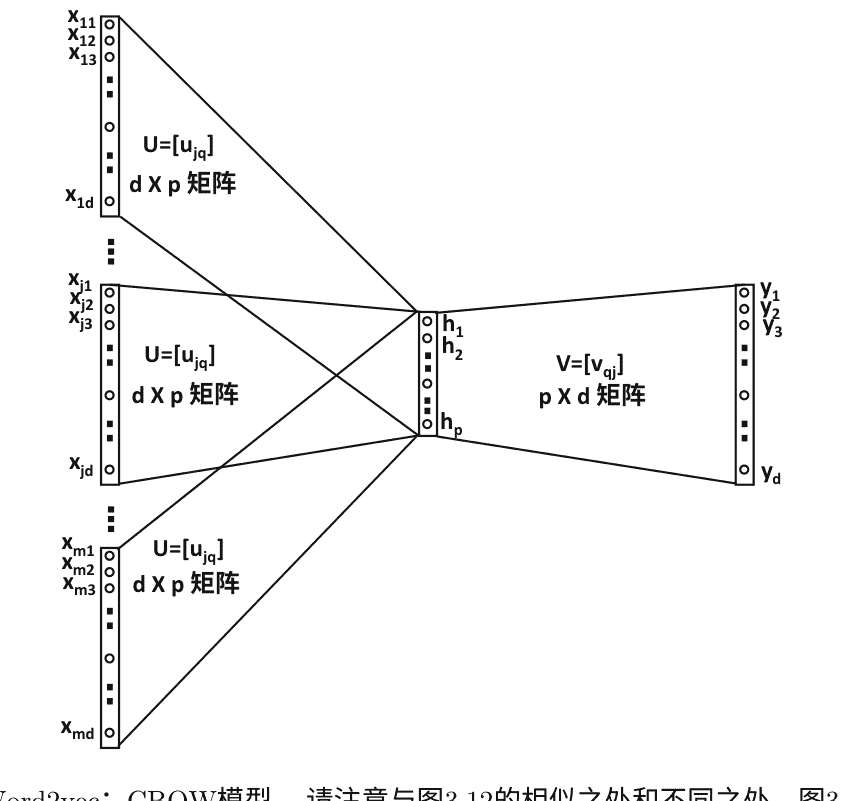

图3.14：Word2vec：CBOW模型。请注意与图3.12的相似之处和不同之处，图3.12使用单一输入集合和线性输出层。也可以选择将 $m$ 个 $d$ 个独热编码输入节点合并为一个 $d$ 个实值输入节点，这些节点接收 $m$ 个独热编码输入的平均值以达到相同的效果。

隐藏层的输出是通过对上下文中存在的单词的嵌入进行平均得到的。可以用向量形式表示这个关系：

$$ \overline{h} = \frac{1}{m} \sum_{i=1}^{m} \sum_{j=1}^{d} \overline{u}_j x_{ij} \quad (3.39) $$

本质上，输入单词的独热编码被聚合起来，这意味着窗口大小为 $m$ 的单词顺序不会影响模型的输出。这就是为什么该模型被称为连续词袋模型的原因。

嵌入 $[h_1 \ldots h_p]$ 用于预测目标词是每个输出的概率，使用softmax函数。输出层的权重参数化为 $d \times p$ 矩阵 $V = [v_{jq}]$。$V$ 的第 $j$ 行表示为 $v_{j \circ}$。由于隐藏到输出矩阵是一个 $p \times d$ 矩阵，所以用 $V^T$ 而不是 $V$ 来注释图314中。注意隐藏向量 $h$ 与 $V^T$ 相乘得到 $hV^T$ 将创建一个实值向量 $[h \cdot v_1, \ldots, h \cdot v_d]$。对该向量应用softmax函数。

将其转换为 $d$ 个概率。$\hat{y}_1 . . . \hat{y}_d$ 总和为1。这些输出是给定上下文的目标词的 $d$ 个概率：

$$ \hat{y}_j = P(y_j=1|w_1 . . . w_m) = \frac{\exp(\overline{h} \cdot \overline{v}_j)}{\sum_{k=1}^{d} \exp(\overline{h} \cdot \overline{v}_k)} \quad (3.40) $$

只有一个输出的真实值。对于给定的训练实例，$y_1$ 到 $y_d$ 中一个为1，其余值为0：如下所示：

$$ y_j = \begin{cases} \text{如果目标词} w \text{是第} j \text{个词，则为1} \\ \text{否则为0} \end{cases} \quad (3.41) $$

对于特定的目标词当 $w=$ 第 $r$ 个词时，损失函数为 $L = -\log[P(y_r=1|w_1 . . . w_m)] = -\log(\hat{y}_r)$。使用负对数将不同训练实例的乘法似然转化为使用负对数似然的加法损失函数。

通过逐个传递训练实例通过神经网络，使用反向传播算法计算梯度来更新 $U$ 和 $V$ 的行。具有学习率 $\alpha$ 的更新方程如下：

$$ \overline{u}_i \Leftarrow \overline{u}_i - \alpha \frac{\partial L}{\partial \overline{u}_i} \quad \forall i $$
$$ \overline{v}_j \Leftarrow \overline{v}_j - \alpha \frac{\partial L}{\partial \overline{v}_j} \quad \forall j $$

接下来，我们提供了对于这个损失函数的上述偏导数的表达式[337, 339, 420]。在词典中，对于第 $j$ 个词预测错误的概率由 $|y_j - \hat{y}_j|$ 定义。然而，我们使用有符号的错误 $\epsilon_j$，其中只有正确的词带有 $y_j=1$ 被赋予一个正的错误值，而词典中的其他词都被赋予负的错误值。这通过去掉模数来实现：

$$ \epsilon_j = y_j - \hat{y}_j \quad (3.42) $$

注意 $\epsilon_j$ 也是对于 $j$ 个输入到softmax层的交叉熵损失的负导数（参见方程219）。进一步的反向传播导致以下更新：

$$ \overline{u}_i \Leftarrow \overline{u}_i + \frac{\alpha}{m} \sum_{j=1}^{d} - \epsilon_j v_j \quad [\forall \text{上下文窗口中的单词 } i \text{ present}] $$
$$ \overline{v}_j \Leftarrow \overline{v}_j + \alpha \epsilon_j \overline{h} \quad [\forall j \text{ 在词典中}] $$

这里，$\alpha > 0$ 是学习率。上下文窗口中重复的单词 $i$ 会触发多次 $u_i$ 的更新。在输入中使用一个聚合的上下文窗口对CBOW模型具有平滑效果，尤其对于较小的数据集非常有帮助。

上下文-目标对的训练样本逐个呈现，并且权重被训练到收敛。在最终训练之后，得到的不是一个而是两个不同的嵌入，分别对应矩阵 $U$ 的 $p$ 维行和矩阵 $V$ 的 $p$ 维行。前一种类型的单词嵌入被称为输入嵌入，而后一种被称为输出嵌入。在CBOW模型中，输入对应于上下文，因此使用输出嵌入是有意义的。然而，输入嵌入（或输入和输出嵌入的求和/连接）对许多任务也是有帮助的。

### 3.6.2 使用Skip-Gram模型的神经嵌入

Skip-Gram模型将单个目标词 $w$ 作为输入，并输出 $m$ 个用 $w_1 \ldots w_m$ 表示的上下文单词。因此，目标是预测 $P(w_1, w_2, \ldots, w_m | w)$，这与CBOW模型中预测的数量 $P(w | w_1 \ldots w_m)$ 不同。与连续词袋模型一样，在Skip-Gram模型中，我们可以使用独热编码来表示（分类）输入和输出。经过这样的编码，Skip-Gram模型将具有 $m$ 个由 $x_1 \ldots$ 表示的二进制输入，对应于单个输入词的 $m$ 个可能值。类似地，每个训练实例的输出被编码为 $m \times d$ 个值。$y_{ij} \in \{0,1\}$，其中 $i$ 的取值范围为1到 $m$（上下文窗口的大小），$j$ 的取值范围为1到 $d$（词汇表的大小）。每个 $y_{ij} \in \{0,1\}$ 表示第 $i$ 个上下文词在训练实例中取 $j$ 的可能值。然而，$(i, j)$ 号输出节点只计算一个软概率值。因此，概率值对于固定的 $i$ 和变化的 $j$，在输出层中的 $\hat{y}_{ij}$ 之和为1，因为第 $i$ 个上下文位置只能取 $d$ 个词中的一个。隐藏层包含由向量 $h = [h_1 \ldots h_p]$ 表示的 $p$ 个单元。

每个输入 $x_j$ 与所有隐藏节点连接，其中 $d \times p$ 矩阵 $U$ 中，第 $i$ 行表示为 $u_i$。

此外，隐藏节点与每个 $m$ 组 $d$ 个输出节点连接，使用相同的一组共享权重。隐藏节点与每个上下文词的 $d$ 个输出节点之间的这组共享权重由 $p \times d$ 矩阵 $V^T$ 定义。

因此，$V$ 是一个 $d \times p$ 矩阵，其中第 $j$ 行是 $v_j$。请注意，skip-gram模型的输入-输出结构是CBOW模型输入-输出结构的倒置版本。skip-gram模型的神经架构如图315(a)所示。然而，在skip-gram模型的情况下，可以将 $m$ 个相同的输出合并为一个输出，并且只需在随机梯度下降期间使用一种特定类型的小批量处理即可获得相同的结果。特别地，一个上下文窗口的所有元素总是被强制归属于同一个小批量处理。该架构如图315(b)所示。由于 $m$ 的值很小，这种特定类型的小批量处理的影响非常有限，因此图315(b)的简化架构足以描述模型，无论是否使用任何特定类型的小批量处理。为了进一步讨论，我们将使用图315(a)的架构。

隐藏层的输出可以通过输入层使用权重的 $d \times p$ 矩阵 $U = [u_{jq}]$ 计算得到，表示输入层和隐藏层之间的关系如下：

$$ \bar{h} = \sum_{j=1}^{d} \bar{u}_j x_j $$

上述方程的解释很简单，因为输入词 $w$ 通过 $x_1 \ldots x_d$ 的独热编码表示。如果输入词 $w$ 是第 $r$ 个词，则只需复制 $u_r$ 到隐藏层。换句话说，复制第 $r$ 行 $U$ 的 $u_r$ 到隐藏层。如上所述，隐藏层与 $m$ 组 $d$ 个输出节点相连，每个输出节点与隐藏层之间有一个 $d \times p$ 矩阵 $V = [v_{jq}]$。由于隐藏层到输出层的矩阵大小为 $p \times d$，所以使用矩阵 $V^T$ 代替 $V$。这 $m$ 组 $d$ 个输出节点分别计算特定上下文词的各个词的概率。

第 $j$ 列的 $V$ 用 $v_j$ 表示，代表第 $j$ 个单词的输出嵌入。输出 $\hat{y}_{ij}$ 是第 $i$ 个上下文位置的单词取第 $j$ 个词典中的概率。然而，由于所有组共享相同的矩阵 $V$，所以

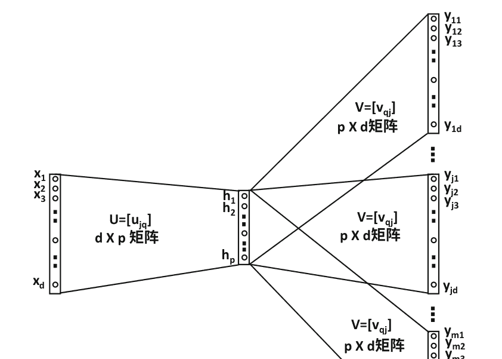

(a) 上下文窗口中的所有元素都明确显示

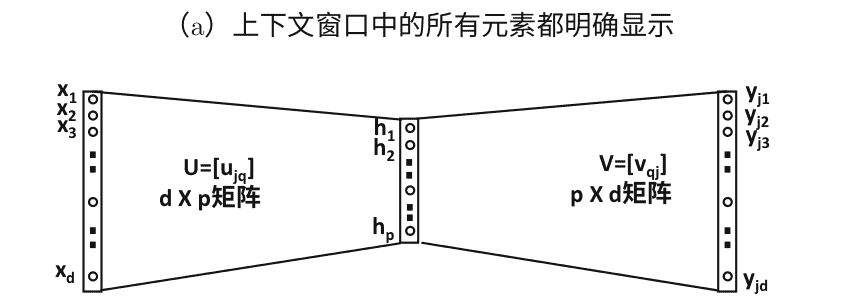

在随机梯度下降期间，将每个上下文窗口中的m个d维输出向量进行小批量处理。显示的输出 $v_{jk}$ 对应于第j个输出中的第m个。
(b) 上下文窗口中的所有元素未明确显示

图3.15: Word2vec: 跳字模型。请注意与图3.12的相似之处，后者使用了一组线性输出。也可以选择将(a)中的 $m$ 组输出节点合并为一组 $m$ 个输出，并在随机梯度下降期间将 $m$ 个实例在单个上下文窗口中进行小批量处理，以达到相同的效果。在(a)中，明确显示了小批量中的所有元素，而在(b)中，未明确显示小批量的元素。然而，只要尊重小批量处理的性质，两者是等价的。

### 3.6.3 使用Word2Vec进行文本嵌入

神经网络对每个上下文单词预测相同的多项分布。因此，我们有以下结果：

$$ \hat{y}_{ij} = P(y_{ij} = 1|w) = \frac{\exp(\overline{h} \cdot \overline{v}_j)}{\sum_{k=1}^{d} \exp(\overline{h} \cdot \overline{v}_k)} \quad \forall i \in \{1 \ldots m\} \quad (3.44) $$

与上下文位置 $i$ 无关。

请注意，概率对于不同的 $i$ 和固定的 $j$，$\hat{y}_{ij}$ 是相同的，因为上述方程的右侧不依赖于上下文窗口中的确切位置 $i$。反向传播算法的损失函数是负对数似然的值。训练实例的输出 $y_{ij} \in \{0, 1\}$。这个损失函数 $L$ 由以下公式给出：

$$ L = -\sum_{i=1}^{m} \sum_{j=1}^{d} y_{ij} \log(\hat{y}_{ij}) \quad (3.45) $$

请注意，对数函数外面的值是一个真实的二进制值，而对数函数内部的值是一个预测的（概率）值。因为对于固定的 $i$ 和不同的 $j$，$y_{ij}$ 是独热编码的，目标函数只有 $m$ 个非零项。对于每个训练实例，这个损失函数与反向传播结合使用，更新节点之间的连接权重。具有学习率 $\alpha$ 的更新方程如下：

$$ \overline{u}_i \Leftarrow \overline{u}_i - \alpha \frac{\partial L}{\partial \overline{u}_i} \quad \forall i $$
$$ \overline{v}_j \Leftarrow \overline{v}_j - \alpha \frac{\partial L}{\partial \overline{v}_j} \quad \forall j $$

接下来，我们推导出上面的梯度。在预测词典中，对于第 $i$ 个上下文中预测第 $j$ 个词的错误概率定义为 $|y_{ij} - \hat{y}_{ij}|$。然而，我们使用有符号的错误 $\epsilon_{ij}$，其中只有预测的词（正例）有正概率。这是通过去掉模数来实现的：

$$ \epsilon_{ij} = y_{ij} - \hat{y}_{ij} \quad (3.46) $$

然后，对于特定的输入词 $r$ 及其输出上下文，更新如下：

$$ \overline{u}_r \Leftarrow \overline{u}_r + \alpha \sum_{j=1}^{d} \left[ \sum_{i=1}^{m} \epsilon_{ij} \right] \overline{v}_j \quad \text{[仅适用于输入词 } r \text{]} $$
$$ \overline{v}_j \Leftarrow \overline{v}_j + \alpha \left[ \sum_{i=1}^{m} \epsilon_{ij} \right] \overline{h} \quad \text{[对于词典中的所有词 } j \text{]} $$

这里，$\alpha > 0$ 是学习率。矩阵 $U$ 的 $p$ 维行用作词的嵌入。换句话说，约定是使用 $U$ 的行中的输入嵌入，而不是使用 $V$ 的行中的输出嵌入。在[294]中指出，添加输入和输出嵌入可以在某些任务中有所帮助（但在其他任务中可能有害）。两者的串联也可能有用。

### 实际问题

与 $word2vec$ 框架的准确性和效率相关的几个实际问题。增加嵌入维度可以提高区分度，但需要更多的数据。一般来说，典型的嵌入维度是数百个维度的数量级，尽管对于非常大的集合，也可以选择数千个维度。上下文窗口的大小通常在5到10之间变化，与CBOW模型相比，skip-gram模型使用更大的窗口大小。使用随机窗口大小是一种变体，它隐含地增加了靠近的单词的权重。skip-gram模型速度较慢，但对于不常见的单词和较大的数据集效果更好。

另一个问题是频繁和较少有区分性的单词（例如“the”）可能会主导结果。因此，常见的方法是对频繁单词进行下采样，这既提高了准确性又提高了效率。请注意，对频繁单词进行下采样隐含地增加了上下文窗口的大小，因为在两个单词中间删除一个单词会使后面的两个单词更接近。非常罕见的单词是拼写错误，很难为它们创建有意义的嵌入而不过拟合。

因此，这些词被忽略。

从计算的角度来看，输出嵌入的更新是昂贵的。这是由于对一个包含 $d$ 个词的词典应用softmax，这需要更新每个 $v_j$。一种可能性是使用分层softmax模型[337, 339, 420]。更受欢迎的选择是稍微改变损失函数（和神经网络结构），这被称为带有负采样的skip-gram。这种方法将在下一节中讨论。

### 带有负采样的skip-gram

在带有负采样的skip-gram（SGNS）模型[339]中，训练时同时使用了单词-上下文对的存在与不存在。基本思想是，不直接预测上下文窗口中的每个 $m$ 个单词，而是独立地尝试预测词典中的每个单词是否存在于窗口中。换句话说，图3.15的最后一层不是softmax预测，而是一层sigmoid的伯努利层。图3.15中每个上下文位置的每个单词的输出单元是一个sigmoid，提供该位置上该单词的概率值。由于也有真实值可用，可以使用逻辑损失函数计算所有单词的损失。因此，从这个角度来看，即使预测问题的定义也不同。当然，尝试对所有 $d$ 个单词进行二进制预测在计算上是低效的，但是不同单词的预测是独立的，这使得只需使用负输出的一个子集（因为词典中的大多数单词都不存在）。因此，SGNS方法在上下文窗口中使用所有正样本和一部分负样本。负样本的数量是正样本数量的 $k$ 倍。这里，$k$ 是控制采样率的参数。在这个修改后的预测问题中，负采样变得至关重要，以避免学习预测所有示例为1的无意义权重。换句话说，我们不能完全避免负样本（即，我们不能将其设置为 $k=0$）。这个模型与推荐系统模型中的不完整输出非常相似，如第3.5节所讨论的。主要的区别在于，“不可用”输出的原因是自愿的负采样，而不是观察到的评分不足（如在推荐系统中）导致的。

如何生成负样本？基础的单词分布按照它们在语料库中的相对频率进行采样。$f_1...f_d$。通过按照 $f_j^{3/4}$ 的比例对单词进行采样，可以获得更好的结果[339]。与所有的word2vec模型一样，令 $U$ 为表示输入嵌入的 $d \times p$ 矩阵，$V$ 为表示输出嵌入的 $d \times p$ 矩阵。令 $u_i$ 为 $U$ 的第 $i$ 行（第 $i$ 个单词的输入嵌入），$v_j$ 为 $V$ 的第 $j$ 行（第 $j$ 个单词的输出嵌入）。令 $P$ 为上下文窗口中的正目标-上下文词对集合，$N$ 为通过采样创建的负目标-上下文词对集合。因此，$\mathcal{P}$的大小等于上下文窗口 $m$ 的大小，$\mathcal{N}$的大小等于$m \cdot k$的大小。然后，每个上下文窗口的（最小化）目标函数是通过对正样本和负样本的逻辑损失求和得到的：

```
$$O = -\sum_{(i,j) \in \mathcal{P}} \log(P[\text{预测 } (i, j) \text{ 为 } 1]) - \sum_{(i,j) \in \mathcal{N}} \log(P[\text{预测 } (i, j) \text{ 为 } 0]) \quad (3.47)$$
```

```
$$= -\sum_{(i,j) \in \mathcal{P}} \log \left( \frac{1}{1 + \exp(-\overline{u}_i \cdot \overline{v}_j)} \right) - \sum_{(i,j) \in \mathcal{N}} \log \left( \frac{1}{1 + \exp(\overline{u}_i \cdot \overline{v}_j)} \right) \quad (3.48)$$
```

这个修改后的目标函数用于更新 $U$ 和 $V$ 的权重。 SGNS在数学上与之前讨论的基本跳字模型不同。 SGNS不仅高效，而且在不同的跳字模型变体中提供了最佳结果。

### SGNS的实际神经架构是什么？

尽管原始的 word2vec论文似乎将SGNS视为跳字模型的一种效率优化，但在最后一层中使用了一种基本不同的激活函数，从而形成了一种根本上不同的架构。不幸的是，原始的 word2vec论文没有明确指出这一点（只提供了改变的目标函数），这引起了困惑。

SGNS的修改后神经网络架构如下。在SGNS实现中不再使用softmax层。相反，图3.15中的每个观察值 $y_{ij}$ 被独立地视为二进制结果，而不是作为多项式结果，其中上下文位置的概率预测取决于彼此。它使用sigmoid激活而不是softmax来创建预测 $\hat{y}_{ij}$ 的概率预测 $\hat{y}_{ij}$，无论 $y_{ij}$ 是0还是1。然后，可以将对于所有 $m \cdot d$ 可能的 $y_{ij}$ 值的 $\hat{y}_{ij}$ 相对于观察到的 $y_{ij}$ 的对数损失相加，以创建上下文窗口的完整损失函数。然而，这是不切实际的，因为 $y_{ij}$ 的零值太多，而且零值本身就是噪声。因此，SGNS使用负采样来近似这个修改后的目标函数。这意味着对于每个上下文窗口，我们只从图3.15中的一部分 $m \cdot d$ 输出进行反向传播。这个子集的大小是 $m + m \cdot k$。这就是实现效率的地方。然而，由于最后一层使用二进制预测（带有sigmoid函数），即使在使用的基本神经网络方面，SGNS架构与基本的skip-gram模型也有根本的不同（即逻辑回归代替softmax激活）。SGNS模型与基本的skip-gram模型之间的差异类似于 naïve Bayes分类中伯努利模型和多项式模型之间的差异（仅将负采样应用于伯努利模型）。显然，一个不能被认为是另一个的直接效率优化。

### 3.6.3 Word2vec（SGNS）是逻辑矩阵分解

尽管[293]中的工作显示了word2vec和矩阵分解之间的隐含关系，但我们在这里提供了一个更直接的关系。跳字模型的架构看起来与推荐系统中行索引到值预测中使用的架构非常相似（参见第3.5节）。从观察到的输出子集进行反向传播类似于负采样的思想，只是在负采样中会丢弃输出，目的是为了提高效率。

## 第108章 使用浅层神经网络的机器学习

负采样中丢弃输出是为了提高效率。然而，与第3.5节中的图3.12的线性输出不同，SGNS模型使用逻辑输出来建模二进制预测。word2vec的SGNS模型可以用逻辑矩阵分解来模拟。为了理解与第3.5节问题设置的相似之处，可以使用以下三元组来理解特定单词-上下文窗口的预测:

<WordId>, <上下文 WordId>, <0/1>

每个上下文窗口产生 $m \cdot d$ such 三元组，尽管负采样只使用 $m \cdot k + m$ of them，并且在训练过程中对它们进行mini-batches。这种小批量处理是 Figures 3.12 和 3.15 之间架构差异的另一个来源，其中后者有 $m$ different groups of outputs 来容纳 $m$ positive samples。然而，这些差异相对较表面，人们仍然可以使用逻辑矩阵分解来表示底层模型。

令 $B = [b_{ij}]$ 是一个二进制矩阵，其中 $(i, j)$th 值为1，如果单词 $j$ 至少在数据集中的单词 $i$ 的上下文中出现一次，否则为0。任何单词 $(i, j)$ 在语料库中出现的权重由单词 $j$ 在单词 $i$ 的上下文中出现的次数定义。矩阵B中零元素的权重定义如下。对于 B中的每一行 $i$，我们采样 $k\sum$

```
最小化_{U,V} \sum_{i,j} c_{ij}(b_{ij} - \bar{u}_i \cdot \bar{v}_j)^2 \tag{3.49}
```

即使矩阵 B的大小为 $O(d^2)$，这个矩阵分解在目标函数中只有有限数量的非零项，其中 $c_{ij} > 0$。这些权重取决于共现计数，但某些零条目也具有正权重。

因此，随机梯度下降步骤只需关注具有 $c_{ij} > 0$ 的条目。每个随机梯度下降周期在非零条目数量上是线性的，就像在SGNS实现的 word2vec中一样。

然而，这个目标函数看起来与 word2vec有些不同，后者具有逻辑形式。就像在二元目标的监督学习中建议用逻辑回归替代线性回归一样，在二元矩阵的矩阵分解中也可以使用相同的技巧[235]。我们可以将平方误差项改为熟悉的似然项。

$L_{ij}$，在逻辑回归中使用的:

```
L_{ij} = \left| b_{ij} - \frac{1}{1 + \exp(\bar{u}_i \cdot \bar{v}_j)} \right| \tag{3.50}
```

的值为 $L_{ij}$ 始终在范围 $(0,1)$ 内，较高的值表示更大的可能性（导致最大化目标）。上述表达式中的模数仅对 $b_{ij}=0$ 的负样本翻转符号。现在，可以优化以下最小化形式的目标函数:

```
最小化_{U,V} J = - \sum_{i,j} c_{ij} \log(L_{ij}) \tag{3.51}
```

与 word2vec的目标函数（参见方程3.48）相比，主要区别在于这是一个全局目标函数，涵盖了所有矩阵元素，而不是一个特定上下文窗口的局部目标函数。在矩阵分解中使用小批量随机梯度下降（使用适当选择的小批量）使得该方法几乎与 word2vec的反向传播更新完全相同。

如何解释这种类型的分解？我们不再有 $B \approx UV$，而是有 $B \approx f(UV)$，其中 $f(\cdot)$ 是sigmoid函数。更准确地说，这是一种概率分解，其中计算矩阵 $U$ 和 $V$ 的乘积，然后应用sigmoid函数来获得生成 $B$ 的伯努利分布的参数：

```
$$P(b_{ij} = 1) = \frac{1}{1 + \exp(-\vec{u}_i \cdot \vec{v}_j)}$$ [矩阵分解的逻辑回归类比]
```

从方程350中也很容易验证 $L_{ij}$ 是正样本的 $P(b_{ij} = 1)$ 和负样本的 $P(b_{ij}= 0)$。因此，分解的目标函数是对数似然最大化的形式。这种类型的逻辑回归矩阵分解在推荐系统中常用[235]，适用于二进制数据（例如用户点击流）。

### 梯度下降

检查分解的梯度下降步骤也是有帮助的。可以计算出 $J$ 对输入和输出嵌入的导数：

```
$$\frac{\partial J}{\partial \vec{u}_i} = -\sum_{j:b_{ij}=1} \frac{c_{ij} \vec{v}_j}{1 + \exp(\vec{u}_i \cdot \vec{v}_j)} + \sum_{j:b_{ij}=0} \frac{c_{ij} \vec{v}_j}{1 + \exp(-\vec{u}_i \cdot \vec{v}_j)} \\ = -\sum_{j:b_{ij}=1} c_{ij} P(b_{ij}=0) \vec{v}_j + \sum_{j:b_{ij}=0} c_{ij} P(b_{ij}=1) \vec{v}_j \\ \underbrace{\hspace{3cm}}_{\text{正误差}} \quad \underbrace{\hspace{3cm}}_{\text{负误差}}$$
```

```
$$\frac{\partial J}{\partial \vec{v}_j} = -\sum_{i:b_{ij}=1} \frac{c_{ij} \vec{u}_i}{1 + \exp(\vec{u}_i \cdot \vec{v}_j)} + \sum_{i:b_{ij}=0} \frac{c_{ij} \vec{u}_i}{1 + \exp(-\vec{u}_i \cdot \vec{v}_j)} \\ = -\sum_{i:b_{ij}=1} c_{ij} P(b_{ij}=0) \vec{u}_i + \sum_{i:b_{ij}=0} c_{ij} P(b_{ij}=1) \vec{u}_i \\ \underbrace{\hspace{3cm}}_{\text{正误差}} \quad \underbrace{\hspace{3cm}}_{\text{负误差}}$$
```

优化过程使用梯度下降法收敛：

```
$$\vec{u}_i \Leftarrow \vec{u}_i - \alpha \frac{\partial J}{\partial \vec{u}_i} \quad \forall i$$ $$\vec{v}_j \Leftarrow \vec{v}_j - \alpha \frac{\partial J}{\partial \vec{v}_j} \quad \forall j$$
```

值得注意的是，导数可以用预测错误的概率来表示 $b_{ij}$。这在梯度下降法与对数似然优化中很常见。值得注意的是，方程3.48中SGNS目标函数的导数也得到了类似的形式的梯度。唯一的区别是SGNS目标函数的导数是在一个较小的实例批次上表示的，由上下文窗口定义。我们也可以使用小批量随机梯度下降法来解决概率矩阵分解问题。

## 第110章 浅层神经网络的机器学习

通过选择适当的小批量，矩阵分解的随机梯度下降变得与SGNS的反向传播更新相同。唯一的区别是，SGNS对每组更新的负样本进行动态采样，而矩阵分解则提前固定了负样本。当然，矩阵分解更新也可以使用动态采样。观察到图3.15(b)的结构与图3.12中推荐系统的矩阵分解结构几乎相同，可以推断SGNS与矩阵分解的相似性。与推荐系统一样，SGNS也存在缺失（负）样本。这是因为负采样仅使用了零值的子集。两种情况之间唯一的区别是SGNS的输出层使用了sigmoid单元，而推荐系统使用线性层。然而，使用隐式反馈的推荐系统使用了逻辑矩阵分解[235]，这与word2vec的设置类似。

## 3.7 图嵌入的简单神经网络架构

由于在许多社交和网络中心应用中的普遍存在，大型网络已经变得非常常见。图是包含节点和连接它们的边的结构化实体。例如，在一个社交网络中，每个人都是一个节点，两个人之间的友谊链接是一条边。友谊链接被认为是无向的，因为它在两个节点之间是对称的，而关注者-被关注者链接被认为是有向的。

图通常用邻接矩阵表示。对于一个有 $n$ 个节点的图，它的邻接矩阵 $A$ 是一个 $m \times n$ 的矩阵，其中 $(i, j)$ 的元素表示从节点 $i$ 到节点 $j$ 的有向边的权重。如果边不是有向的，则邻接矩阵是对称的。

在这个特定的阐述中，我们考虑非常大的网络，比如Web、社交网络或通信网络。目标是将节点嵌入特征向量中，以便图表捕捉节点之间的关系。为了简单起见，我们考虑无向图，尽管带有边权重的有向图可以通过对下面的阐述进行很少的更改来轻松处理。

考虑一个 $n \times n$ 邻接矩阵 对于一个具有 $n$ nodes的图，$B = [b_{ij}]$。条目 如果节点 $i$ 和 $j$ 之间存在无向边，则 $b_{ij}$ 为1。此外，矩阵 $B$ 是对称的，因为我们有 对于无向图，$b_{ij} = b_{ji}$。为了确定嵌入，我们希望确定两个 $n \times p$ 因子矩阵 $U$ 和 $V$，使得可以将 $B$ 表示为 $UV^T$ 的函数。在最简单的情况下，可以将 $B$ 设置为完全 $UV^T$，这与传统的矩阵分解方法用于分解图[4]没有区别。然而，对于二进制矩阵，可以使用逻辑矩阵分解来获得更好的结果。换句话说，$B$ 的每个条目都是使用 $f(UV^T)$ 中的伯努利参数矩阵生成的，其中

$f(\cdot)$ 是对其参数矩阵中的每个元素应用sigmoid函数的逐元素操作:

$$ f(x) = \frac{1}{1 + \exp(-x)} $$ (3.52)

因此，如果 $u_i$ 是 $U$ 的第 $i$ 行，而 $v_j$ 是 $V$ 的第 $j$ 行，我们有以下结果:

$$ b_{ij} \sim \text{参数为 } f(u_i \cdot v_j) \text{ 的伯努利分布} $$ (3.53)

这种类型的生成模型通常使用对数似然模型来解决。此外，问题的形式与word2vec中SGNS模型的逻辑矩阵分解等价。

图中显示了五个节点以及用于行索引到邻居指示器映射的神经架构。所示的输入和输出表示节点3及其邻居。请注意与图3.12的相似之处。主要区别在于上方没有缺失值，并且输入的数量与输出的数量相同，适用于方阵。输入和输出都是二进制向量。然而，如果使用sigmoid激活进行负采样，则大多数具有零值的输出节点可能会被丢弃。

请注意，所有 word2vec模型都是图3.12中将行索引映射到具有线性激活的值的逻辑/多项式变体。为了解释这一点，我们在图3.16中展示了一个包含5个节点的玩具图的神经网络架构。输入是 B中一行的独热编码索引（即节点），输出是网络中所有节点的所有0/1值的列表。在这种特殊情况下，我们展示了节点3的输入及其相应的输出。由于节点3有三个邻居，输出向量包含三个1。请注意，这个架构与图3.12并没有太大的不同，只是在输出处使用了sigmoid激活函数（而不是线性激活函数）。此外，由于输出中0的数量通常比1的数量多得多，因此可以通过使用负采样来减少许多0。

这种负采样类型会创建一个类似于图3.13的情况。使用这种神经网络架构，梯度下降步骤与word2vec的SGNS模型完全相同。主要区别在于一个节点最多只能作为另一个节点的邻居出现一次，而一个单词在另一个单词的上下文中可能会出现多次。允许边上的任意计数会消除这种区别。

### 3.7.1 处理任意边计数

上述讨论假设每条边的权重是二进制的。考虑一个设置，其中任意计数 $c_{ij}$ 与边 $(i, j)$ 相关联。在这种情况下，需要进行正负采样。第一步是根据与 $c_{ij}$ 成比例的概率从网络中采样一条边 $(i, j)$ 从网络中以与 $c_{ij}$ 成比例的概率采样。因此，输入是这条边的一端节点（比如 $i$）的独热编码向量。输出是节点 $j$ 的独热编码。默认情况下，输入和输出都是 $n$ 维向量。

然而，如果使用负采样，则可以将输出向量减少到一个 $(k + 1)$-维度向量。在这里，$k \ll n$ 是一个定义采样率的参数。总共采样了 $k$ 个负节点，其概率与它们的（加权）度数成比例，并且这些节点的输出为0。可以将对数似然损失视为对每个输出进行伯努利试验的结果，其中伯努利试验的参数是S型激活函数的输出。梯度下降是根据这个损失进行的。这个变体几乎是word2vec模型的SGNS变体的精确模拟。

## 第112章 使用浅层神经网络的机器学习

### 3.7.2 超越一跳结构模型

前一节讨论的方法可以被视为一跳结构模型，其中节点的直接邻接可以被利用来创建嵌入。在实践中，人们希望利用更多的结构信息来提高表示的质量。有两种实现这个目标的方法，下面将进行讨论。

- 首先，可以使用各种类型的预处理来替换边缘计数。用多跳步行计数的方式计算 $c_{ij}$。例如，可以在图上进行随机游走来（间接地）生成 $c_{ij}$。在这种情况下，$c_{ij}$ 可以被解释为节点 $i$ 的邻域中节点 $j$ 出现的次数，因为它被包含在从节点 $i$ 开始的广度优先或深度优先游走中。与原始图中的原始权重相比，基于游走的模型中 $c_{ij}$ 的值可以提供更稳健的节点 $i$ 和 $j$ 之间的亲和度度量。当然，使用随机游走来提高 $c_{ij}$ 的稳健性并没有什么特殊的。这个广泛的想法是 node2vec [171] 和 DeepWalk [385] 等算法的基础。
- 在生成这种类型的亲和值方面，选择的数量几乎是无限的。所有的链接预测方法[304] 都会生成节点对之间的亲和值，这些值可以用来修改边的权重。例如，Adamic-Adar度量、Jaccard系数和Katz度量都在[304]中讨论过。
- Katz度量也与节点对之间的随机游走次数密切相关。
- 使用预处理的方法可以看作是一种手工特征工程，以改善输入表示。当然，这与神经网络的存在理由相悖，神经网络旨在成为端到端的系统。这种形式的多跳特征工程可以通过使用图神经网络来实现，在第10章中详细讨论。图神经网络构建了一个神经网络，其隐藏层架构严重依赖于基础图的结构，以找到嵌入。我们将进一步讨论放到第10章。

### 3.7.3 多项式模型

word2vec的基本跳字模型是一个多项式模型。也可以使用多项式模型来创建嵌入。唯一的区别是图3.16中神经网络的最后一层需要使用softmax激活函数（而不是sigmoid激活函数）。此外，多项式模型中不使用负采样，输入和输出层都包含恰好 $n$ 个节点。与SGNS模型一样，使用概率与单个边 $(i, j)$ 的采样概率与 $c_{ij}$ 成比例。$c_{ij}$ 用于创建每个输入-输出对。输入是 $i$ 的独热编码，输出是 $j$ 的独热编码。

还可以使用小批量采样边来提高性能。该模型的随机梯度下降步骤与vanilla skip-gram模型中使用的步骤几乎相似 as used in word2vec.

## 3.8 总结

本章讨论了一些用于监督和无监督学习的神经模型。目标是展示许多传统机器学习中使用的模型是相对简单的神经模型的实例。当将传统的机器学习技术如奇异值分解推广到神经表示时，结果大致相等。然而，神经模型的优势在于它们通常可以推广到更强大的非线性模型。此外，使用神经网络可以相对容易地尝试传统机器学习模型的非线性变体。本章还讨论了浅层模型的几个实际应用，如推荐系统、文本和图嵌入。

## 3.9 参考文献和软件资源

感知器算法由Rosenblatt [421]提出，并在[421]中有详细讨论。Widrow-Hoff算法由[550]提出，并与Tikhonov-Arsenin的工作[516]密切相关。Fisher判别法由Ronald Fisher [125]于1936年提出，是线性判别分析方法家族[333]的一个特例。尽管Fisher判别法使用的目标函数似乎与最小二乘回归不同，但事实证明它是最小二乘回归的一个特例，其中二元响应变量被用作回归变量[40]。关于广义线性模型的详细讨论可参见[331]。关于多项式逻辑回归的各种方法，如广义迭代缩放、迭代加权最小二乘和梯度下降，在[188]中有讨论。支持向量机通常归功于Cortes和Vapnik [85]，尽管原始方法是由提出的。$L_2$-loss SVMs (间接地) 在几年前由Hinton [200]在神经网络的背景下提出。这种方法通过保留二次损失曲线的一半并将剩余部分设为零来修复最小二乘分类的损失函数，使其看起来像是hinge loss的平滑版本 (在图35上尝试一下)。这个贡献的具体意义在更广泛的神经网络文献中被忽视了。从相关作品[417]可以看出，SVM与最小二乘分类之间的关系是明显的，其中二次和hinge-loss SVM是正则化的自然变体 $L_2$-loss (即Fisher判别法) 和 $L_1$-loss分类将二元类变量作为回归响应[146]。Weston-Watkins多类别SVM在[548]中引入。

在[418]中显示，一对多方法对于泛化多个类别似乎与紧密集成的多类别变体一样有效。

自编码器的最早引入 (以更一般的形式) 在反向传播论文[424]中给出。关于自编码器的更详细讨论在[47, 281]中提供。关于单层无监督学习的讨论可以在[80]中找到。在第5章中讨论了许多类型的正则化自编码器 (对具有特定属性的样本外数据具有很好的泛化能力)。自编码器在异常检测方面的应用在[64, 191, 589]中进行了探讨，并在[9]中提供了关于其在聚类中的应用的调查。在[208]中讨论了受限玻尔兹曼机在降维中的应用。

## 第114章 浅层神经网络的机器学习

在[456]中讨论了基于项目的自编码器，这种方法是基于项目邻域回归[261]的神经泛化。主要区别在于回归权重受限于一个受限制的隐藏层。在[488, 555]中讨论了使用去噪自编码器的不同类型的项目对项目模型的类似工作。矩阵分解方法的更直接的推广可以在[196]中找到，尽管[196]中的方法与本章中更简单的方法略有不同。在[533]中讨论了在构建深度学习推荐系统中融入内容的方法。在[112]中提出了一种多视图深度学习方法，后来还将其扩展到时间推荐系统中。在[584]中可以找到关于推荐系统的深度学习方法的调查。在[431]中可以找到使用受限玻尔兹曼机进行降维的推荐系统的应用。

word2vec模型是在[337, 339]中提出的，并且可以在[420]中找到详细的阐述。为了实现更高的效率，SGNS模型的替代方案是使用分层softmax层，其中每个类别对应于二叉树的一个叶子节点。例如，如果预测是一个目标词，可以使用WordNet层次结构[341]来指导分组。由于WordNet层次结构不完全是二叉树，可能需要进一步重新组织[355]。另一种选择是使用Huffman编码来创建二叉树[337, 339]。word2vec的基本思想已经扩展到句子和段落级别的嵌入，使用的模型被称为doc2vec[278]。GloVe是word2vec的另一种选择，它使用了不同类型的矩阵分解[384]。

多语言词嵌入在[10]中介绍。将word2vec扩展到具有节点级嵌入的图中，在DeepWalk [385]和node2vec [171]模型中提供。第10章详细讨论了网络嵌入。

### 软件资源

线性回归、支持向量机和逻辑回归等机器学习模型可从scikit-learn [611]获取。DISSECT（分布式语义组合工具包）[612]是一个利用词共现计数来创建嵌入的工具包。GloVe方法可从斯坦福NLP [613]和gensim库[410]获取。Apache许可下提供了word2vec工具，还有一个TensorFlow版本[616]。Python实现了word2vec和doc2vec的gensim库[410]。Java版本的doc2vec、word2vec和GloVe可以在DeepLearning4j存储库[614]中找到。

在一些情况下，可以简单地下载预训练的表示版本（在被认为是文本的普遍代表性的大型语料库上），并直接使用它们作为方便的替代方法，而不是针对特定语料库进行训练。node2vec软件可从原作者处[617]获取。

## 3.10 练习

- 1. 考虑以下用于训练对（X, y）的损失函数：

```
$L = \max\{0, a - y(\overline{W} \cdot \overline{X})\}$
```

测试实例的预测值为 $\hat{y} = \text{sign}\{W \cdot X^T\}$。当不使用正则化时，$a=0$ 对应于感知机准则，$a=1$ 对应于SVM。证明当$a>0$时，不使用正则化时SVM的最优解保持不变。使用正则化时会发生什么？

- 2. 基于练习1，为韦斯顿-沃特金斯支持向量机制定一个广义目标。

- 3. 考虑学习率 α 的二元类别无正则化感知器更新。证明使用任何 α 值都是无关紧要的，因为它只是将权重向量缩放了一个 α 的因子。证明这些结果在多类情况下也成立。当使用正则化时，结果是否仍然成立？

- 4. 证明如果将韦斯顿-沃特金斯支持向量机应用于一个具有 k=2 类别的数据集，得到的更新等同于本章讨论的二元支持向量机的更新。

- 5. 证明如果将多项式逻辑回归应用于一个具有 k=2 类别的数据集，得到的更新等同于逻辑回归的更新。

- 6. 使用你选择的深度学习库实现 softmax 分类器。

- 7. 在基于线性回归的邻域模型中，预测一个项目的评分是作为相同用户的其他项目评分的加权组合，其中项目特定的权重是通过线性回归学习得到的。展示如何构建一个自动编码器架构来创建这种类型的模型。讨论这种架构与矩阵分解架构的关系。

- 8. 逻辑矩阵分解：考虑一个具有输入层、包含降维表示的单隐藏层和具有sigmoid单元的输出层的自动编码器。隐藏层具有线性激活函数：
  (a) 当已知输入数据矩阵包含来自 {0,1} 的二进制值时，建立一个负对数似然损失函数。
  (b) 当输入数据矩阵包含来自[0,1]的实值时，建立一个负对数似然损失函数。

- 9. 使用自动编码器的非负矩阵分解：设 D 为一个具有非负元素的 n × d 数据矩阵。展示如何通过使用具有 d 个输入和输出的自动编码器架构，近似地将 D ≈ UV^T 分解为两个非负矩阵 U 和 V。[提示：选择适当的激活函数在隐藏层中，并修改梯度下降更新。]

- 10. 概率潜在语义分析：参考[216]中对概率潜在语义分析的定义。针对概率潜在语义分析，提出了对练习9中方法的修改。[提示：非负矩阵分解与概率潜在语义分析之间有什么关系？]

- 11. 模型组合集成的模拟：在机器学习中，模型组合集成通过对多个模型的分数进行平均，以创建更稳健的分类分数。讨论如何用两层神经网络来近似Adaline和逻辑回归的平均。讨论当使用反向传播来训练时，这种架构与实际模型组合集成的相似之处和不同之处。展示如何修改训练过程，使最终结果是对模型组合集成的微调。

- 12. 模拟堆叠集成：在机器学习中，堆叠集成在第一级分类器学习到的特征之上创建了一个更高级别的分类模型。讨论如何修改练习11的架构，使得第一级分类器对应于Adaline和逻辑回归分类器，而高级别分类器对应于支持向量机。讨论此架构与实际堆叠集成的相似之处和不同之处，当使用反向传播进行训练时。展示如何修改神经网络的训练过程，使得最终结果是对堆叠集成的微调。

- 13. 证明感知机、Widrow-Hoff学习、SVM和逻辑回归的随机梯度下降更新都具有形式$W \Leftarrow W(1 - \alpha\lambda) + \alpha y[\delta(X, y)]X^T$..这里，误差函数 $\delta(X, y)$ 对于最小二乘分类是$1 - y \overline{( W \cdot X^T)}$，对于感知机/SVM是一个指示变量，对于逻辑回归是一个概率值。假设 $\alpha$ 是学习率，$y\in \{-1, +1\}$. 写出每种情况下 $\delta(X, y)$ 的具体形式。

- 14. 本章讨论的线性自编码器应用于数据集 $D$的每个 $d$维行，以创建一个 $k$维表示。编码器权重包含 $k \times d$的权重矩阵 $W$，解码器权重包含 $d \times k$的权重矩阵 $V$。因此，重构的表示为 $DW^TV^T$，并且通过整个训练数据集最小化聚合损失值 $\|DW^TV^T - D\|^2_{F}$。
  (a) 对于固定的值 $V$，证明最优矩阵 $W$ 必须满足 $D^TD(W^TV^TV - V) = 0$。
  (b) 使用 (a) 证明如果矩阵 $D$的秩为 $d$，我们有 $W^TV^TV = V$。
  (c) 使用 (b) 证明 $W = (V^TV)^{-1}V^T$。假设 $V^TV$ 可逆。
  (d) 当编码器-解码器权重被绑定为 $W = V^T$时，重复练习部分 (a)、(b) 和 (c)。证明 $V$的列必须正交。

- 15. 在第3.4.1.2节中，具有共享权重的自编码器在寻找与主导的右奇异向量相同子空间的权重矩阵 $V$方面模拟了奇异值分解（SVD），但是该权重矩阵的列代表了奇异值分解的主导奇异向量的旋转。讨论如何使用迭代训练自编码器架构并逐步添加隐藏单元来精确确定奇异值分解的主导奇异向量。

- 16. 最大间隔矩阵分解：SVM的合页损失函数设计用于二元分类。借鉴这个灵感，设计一个神经网络架构，用于从 $\{-1, +1\}$中抽取二元矩阵的矩阵分解。设计一个类似于合页损失函数的矩阵分解损失函数。

- 17. 多项式矩阵分解：假设你有一个包含分类条目的矩阵，比如邮政编码、种族身份等等。讨论如何利用自编码器架构以及适当的激活函数和损失函数来进行因子分解。[提示：查看softmax回归中的输出层。]

- 18. 现实世界中的大多数矩阵都是混合的，可能包含实值、二进制和分类列的组合。你对练习16和17的答案如何帮助处理这样的矩阵？

- 19. 具有分类条目的不完整矩阵：假设你有一个不完整的矩阵，其中每个条目都是一个分类值，而矩阵的不同列对应于不同的分类属性（例如邮政编码或种族）。你想要预测缺失的条目。从本章讨论的推荐系统架构中汲取灵感，为这种情况提出一个神经模型。

- 20. 讨论当每个项目都有一个与之关联的d维属性（除了一个不完整的评分矩阵）时，你将如何修改章节中讨论的推荐系统架构。你的架构应该在已经提出的架构基础上进行构建。
- 21. 对于章节中讨论的图嵌入算法，无向图和有向图的训练过程有何不同？
- 22. 开放性问题：根据你对word2vec CBOW模型的理解，提出一个完成一个集合的子集的神经网络。每个集合都是来自有限宇宙的无序离散（可能重复）元素的集合。

# 第四章 深度学习：原理与训练算法

> “我讨厌每一分钟的训练，但我说，‘不要放弃。现在受苦，以后做个冠军。’” - 穆罕默德·阿里

## 4.1 引言

深度学习模型的巨大威力伴随着计算挑战。一个关键点是反向传播算法对算法设置的微小变化非常不稳定，例如方法使用的初始化点。当使用非常深的网络时，这种不稳定性尤为显著。

神经网络参数优化是一个多变量优化问题。这些变量对应于各个层中连接的权重。多变量优化问题经常面临稳定性挑战，因为必须按照“正确”的比例沿着每个方向执行步骤。这在深度网络中特别困难，因为很难控制这个比例。一个问题是梯度只提供每个方向上无限小时间内的变化率，而实际步骤具有有限长度。为了在优化中取得任何实质性进展，需要选择合理大小的步骤。问题在于梯度在有限长度的步骤中会发生变化，而在某些情况下它们会发生剧烈变化。深度网络呈现的复杂优化曲面在这方面特别棘手，而且在选择不当的设置（如初始化点或输入特征的归一化）的情况下问题会加剧。因此，（容易计算的）最陡方向通常不是保留使用大步骤能力的最佳方向。小步骤导致进展缓慢，而使用大步骤时优化曲面可能以不可预测的方式发生变化。所有这些问题使得神经网络优化比起初看起来更加困难。然而，许多这些问题可以解决。

通过仔细调整梯度下降步骤，可以避免对优化表面的特性过于敏感。本章将讨论这样的算法。

## ## 章节组织

本章的组织如下。下一节讨论增加深度的好处。第4.3节介绍了训练深度网络的常见挑战。基于神经网络架构的简单解决方案在第4.4节中介绍。第4.5节讨论了深度学习的梯度下降策略。第4.6节介绍了牛顿法，并在第4.7节中讨论了其快速近似方法。第4.8节介绍了批归一化方法。第4.9节介绍了神经网络的加速实现。总结在第4.10节中呈现。

## ## 4.2 为什么深度有益？

正如在第1章中讨论的那样，深度的好处在于使用非线性激活函数。事实上，线性函数的重复组合会产生另一个线性函数（参见第1.5节）；因此，它不会增加学习算法的能力。然而，重复组合非线性函数会导致更强大的模型。通常，网络的每一层都构建出与当前预测问题相关的逐渐复杂的特征。这个原则被称为分层特征工程。

### ### 4.2.1 分层特征工程：深度如何揭示丰富的结构

许多具有前馈结构的深层架构都有多个层，其中前一层输入的连续变换会导致数据的越来越复杂的表示。对于特定输入，每个隐藏层的值都包含输入点的转换表示，随着层次接近输出节点，这个表示对我们试图学习的目标值越来越有信息量。中间层的非线性激活在特征工程过程中起着关键作用。

如第1.5.1节所示，适当转换的特征表示更适合于像分类这样的预测设置。例如，如果最后一层使用线性分离器进行分类，中间层可能会将数据转换为一个线性分离器有效工作的表示。从隐藏层到最终预测层的分工可以这样理解，早期层创建了一个对于预测任务更具信息量的特征表示。最终层利用这个学习到的特征表示进行预测。这种分工在图4.1中展示。可以将这个过程看作一种分层特征工程，早期层的特征表示代表了数据的原始特征，而后期层的特征表示代表了与类别标签有语义意义的复杂特征。

更深的架构的理念是它们可以更好地利用数据模式中的重复规律，以减少计算单元的数量，从而将学习推广到没有示例的数据空间。

通常，这些重复的规律是由神经网络在权重中学习的，作为分层特征的基向量。尽管详细的证明[351]超出了本文的范围，我们提供一个简单的例子来阐明这一点。考虑这样一种情况，一个一维函数由1024个相同大小和高度的重复步骤定义。一个只有一个隐藏层和步骤激活函数的浅层网络需要至少1024个单元来建模这个函数。然而，一个多层网络会在第一层建模一个1步的模式，在下一层建模2步的模式，在第三层建模4步的模式，以此类推。这种情况在图42中有所说明。请注意，1步的模式是最简单的特征，因为它重复了1024次，而2步的模式更复杂。因此，连续层中的特征（和学到的函数）是层次相关的。在这种情况下，需要总共10层，并且每层需要少量的常数节点来建模前一层的两个模式的连接。因此，所需节点的总数比单层网络所需的数量小一个数量级。这意味着学习所需的数据量也少一个数量级。这样做的原因是，多层网络隐式地寻找重复的规律并用少量的数据学习它们，而不是试图明确地学习目标函数的每一个转折点和曲线。

人们还可以从以下事实中理解深度的重要性：多层神经网络是函数的组合，组合的深度对应于神经网络的深度。例如，如果第i层计算向量到向量的函数 fi(·)，那么具有 t个计算层的神经网络计算的整体函数是 ft(ft−1(…(f1(x)))，其中输入向量为 x。我们在下面总结这个原则：

> 相对简单的非线性函数（如神经网络激活函数）的重复组合可以用来创建非常复杂的非线性函数。神经网络计算的整体函数的丰富程度随着组合的深度增加。神经网络的每一层可以从前面层学习到更加精细的模式。

这种行为在某些领域中以一种可视化的方式特别明显，比如卷积神经网络用于图像数据（参见第9章）。在卷积神经网络中，较早层的特征捕捉到的是数据集中的细节但原始的形状，比如线条或边缘。另一方面，较后层的特征捕捉到的是更复杂的形状，比如六边形、蜂窝等，这取决于提供的训练数据的类型。需要注意的是，这种语义可解释的形状通常与图像领域中的类别标签更密切相关。例如，几乎任何图像都会包含线条或边缘，但属于特定类别的图像更有可能包含六边形或蜂窝。较后的层可能对应于复杂的形状，比如人脸。另一方面，单个层很难对人脸的每一个弯曲和转折进行建模，因为它很难识别人脸的重复规律，这只有通过更深的透视才能实现。

这使得深层模型能够学习数据中的丰富结构。这个特性使得后面的层的表示更容易用简单的线性分类器进行分类。这个过程在图4.1中有所说明。早期层中的特征被反复使用作为构建更复杂特征的基础。这个将简单特征组合成更复杂特征的一般原则是神经网络取得成功的核心。

## 4.3 为什么训练深层网络很困难？

增加网络的深度并非没有缺点。更深的网络通常更难训练，并且对参数选择非常不稳定。这是因为深度通过递归组合增加了损失函数的复杂性，导致梯度下降的行为出乎意料。

### 4.3.1 梯度比率效应的几何理解

在使用神经网络时出现的一个重要问题是梯度消失和梯度爆炸问题。这个问题的基本思想（在本章后面详细讨论）是，不同层的损失函数对权重的梯度在大小上差异很大。例如，对于最后一层的权重，偏导数的（大小）可能是第一层权重偏导数的10^6倍。因此，通过改变最后一层的参数02个单位的梯度下降更新（可以忽略不计）通过改变第一层的权重 $2 \times 10^{-6}$ 来改变权重。换句话说，在反向传播过程中，梯度消失了。同样，在反向传播过程中，梯度可能无法控制地爆炸，早期层的梯度幅度远大于后期层的梯度。这可能导致优化过程中的问题，无法进行有意义的更新。

梯度消失和梯度爆炸问题是多变量优化的固有问题，即使在没有局部最优解的情况下也是如此。事实上，在几乎任何凸优化问题中，都会遇到这个问题的轻微表现。因此，在本节中，我们将考虑一个最简单的情况，即具有碗状形状和单个全局最小值的凸二次目标函数。在单变量问题中，最陡下降路径（也是唯一的下降路径）将始终通过碗的最小点（即最优目标函数值）。然而，一旦我们将优化问题中的变量数量从1增加到2，情况就不再如此。理解的关键点是，在大多数损失函数中，最陡下降路径只是最佳移动方向的瞬时方向，并不是长期下降的正确方向。换句话说，总是需要“修正”的小步骤。当优化问题出现梯度消失问题时，意味着只有通过使用大量微小的更新和修正才能达到最优点，这显然非常低效。

为了理解这一点，我们看一下图4.3中的两个双变量损失函数。在这个图中，显示了损失函数的等值线图，其中每条线对应于XY平面上具有相同值的点。最陡下降的方向始终与这条线垂直。第一个损失函数的形式为 $L = x^2 + y^2$，如果将高度视为目标函数值，则呈现出一个完美圆形的碗状。这个损失函数对待 $x$ 和 $y$ 是对称的。第二个损失函数的形式为 $L = x^2 + 4y^2$，它是一个椭圆形的碗状。请注意，与 $x$ 值的变化相比，这个损失函数对 $y$ 值的变化更敏感，尽管具体的敏感性取决于数据点的位置。

在这些情况下，二阶导数 $\frac{\partial^2 L}{\partial x^2}$ 和 $\frac{\partial^2 L}{\partial y^2}$ 在损失函数的情况下是不同的。二阶导数也被称为曲率，因为它们控制了在这两种情况下斜率的变化。

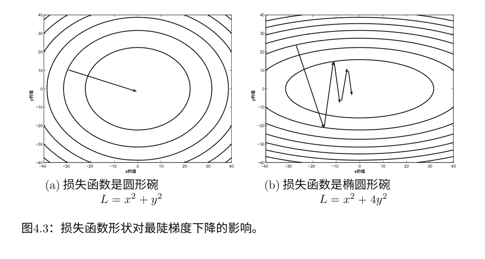

## 第124章 深度学习：原理和训练算法

在图4.3(a)的圆形碗的情况下，梯度直接指向最优解，只要使用正确的步长，就可以在一步中达到最优解。这在图4.3(b)的损失函数中并不完全成立，在该函数中，与 $x$ 方向相比，梯度在 $y$ 方向上通常更显著。此外，梯度从不指向最优解，因此在下降过程中需要进行许多次修正。一个显著的观察是，沿着 $y$ 方向的步长很大，但随后的步骤会撤销之前步骤的效果。另一方面，沿着 $x$ 方向的进展是一致但微小的。尽管几乎任何使用最陡梯度下降的优化问题都会出现图4.3(b)的情况，但梯度消失问题是这种行为的一个极端表现。一个简单的二次碗（与深度网络的典型损失函数相比微不足道）在最陡梯度下降方法中显示出如此多的振荡是令人担忧的。毕竟，函数的重复组合（如底层计算图所暗示的）在网络的不同部分对参数的输出敏感性方面是非常不稳定的。在真实的神经网络中，不同相对导数的问题非常严重，因为我们有数百万个参数和梯度比例差异达到数量级。此外，许多激活函数的导数始终小于1，这倾向于通过在反向传播过程中重复乘以这些导数（根据链式法则）来鼓励梯度消失问题。因此，后面层中具有大下降分量的参数通常会振荡并进行大幅更新，而前面层中的参数则进行微小但一致的更新。因此，早期层和后期层都很难接近最优解。结果可能是即使经过长时间的训练，进展也很小。在下一节中，我们将针对神经网络的具体情况提供一个理解。

### 4.3.2 梯度消失和梯度爆炸问题

神经网络具有数百万个参数，其中梯度的某些分量与其他分量相比非常大。这种偏斜的梯度比在神经网络中表现出特定的方式，不同层的权重的偏导数非常不同。这主要是因为神经网络在不同层之间计算函数组合的方式，以及每个层的组合中由于微分计算的链式法则机制而引入了一个乘法因子到梯度中。为了理解这一点，让我们考虑一个非常深的网络，每层只有一个节点。我们假设有 $(m+1)$ 层，包括非计算输入层。各层之间的边的权重用 $w_1, w_2, \dots w_m$ 表示。此外，假设在每个层中应用sigmoid激活函数 $\Phi(\cdot)$ 在每个层中应用。令 $x$ 为输入， $h_1 \dots h_{m-1}$ 为各层的隐藏值， $o$ 为最终输出。令 $\Phi'(h_t)$ 为隐藏层 $t$ 的激活函数的导数。令 $\frac{\partial L}{\partial h_t}$ 是损失函数对隐藏激活的导数 $h_t$。神经网络的架构如图4.4所示。请注意，每个隐藏层的输出是通过以下关系从前一层定义的：

$$h_{t+1} = \Phi(w_{t+1}h_t)$$

因此，我们有以下结果：

$$\frac{\partial h_{t+1}}{\partial h_t} = \Phi'(w_{t+1}h_t)w_{t+1}$$

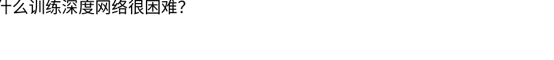

可以使用反向传播更新中的链式法则来展示以下关系：

$$\frac{\partial L}{\partial h_t} = \frac{\partial L}{\partial h_{t+1}} \frac{\partial h_{t+1}}{\partial h_t} = \Phi'(w_{t+1}h_t) \cdot w_{t+1} \cdot \frac{\partial L}{\partial h_{t+1}} \quad (4.1)$$

由于每个节点的入度为1，假设权重从标准正态分布初始化。因此，每个 $w_t$ 的预期平均幅度为1。

让我们来研究一下当使用 sigmoid 激活函数时，这个递归的具体行为。对于输出为 sigmoid 函数的导数 $f \in (0, 1)$ 给出 $f(1-f)$。这个值在 $f=0.5$ 时达到最大值，因此 $\Phi'(w_{t+1}h_t)$ 的值为0.25。即使在最大值时也不超过0.25。由于 $w_{t+1}$ 的绝对值预计为1，因此每次权重更新都会导致 $\frac{\partial L}{\partial h_t}$ 的值小于 0.25。

$\frac{\partial L}{\partial h_t}$ 的值小于 $\frac{\partial L}{\partial h_{t+1}}$。因此，在移动了大约 $r$ 层之后，这个值通常会小于 $0.25^r$。只是为了解这个下降的幅度，如果我们设置 $r=10$，那么梯度更新的幅度将降低到原始值的 $10^{-6}$！值得注意的是，尽管我们展示了对隐藏层的导数，但对于权重的导数是隐藏层导数的直接倍数；趋势将是相似的。因此，在使用反向传播时，较早的层将接收到比较小的更新。这个问题被称为梯度消失问题。请注意，我们可以尝试通过使用具有更大梯度的激活函数和初始化较大的权重来解决这个问题。然而，如果我们在这方面做得太过火，很容易出现梯度爆炸的情况，而不是梯度消失。一般来说，除非我们初始化每条边的权重，使得权重和每个激活函数的导数的乘积恰好为1，否则偏导数的幅度将会相当不稳定。

在实践中，由于激活函数的导数在每次迭代中都会变化，所以大多数激活函数都无法实现这一点。

虽然我们在这里使用了一个过于简化的例子，每层只有一个节点，但是很容易将这个论点推广到每层有多个节点的情况。一般来说，可以证明层与层之间的反向传播更新包括矩阵乘法（而不是标量乘法）。正如重复的标量乘法本质上是不稳定的，重复的矩阵乘法也是如此。特别地，在第 $i$ 层的损失导数中，$\nabla_{h_i} L$ 会与一个被称为雅可比矩阵的矩阵相乘（参见方程 2.21）。雅可比矩阵包含了第 $i$ 层激活函数的导数。$\nabla_{h_{i+1}} L$ 相对于第 $i$ 层的导数。在某些情况下，如循环神经网络，雅可比矩阵是一个方阵，可以通过对雅可比矩阵的最大特征值施加稳定性条件来解决梯度消失和梯度爆炸问题。这些稳定性条件很少能完全满足，因此模型具有固有的趋向于出现梯度消失和梯度爆炸问题。此外，激活函数（如 sigmoid 函数）的作用往往会加剧梯度消失问题。可以将这个问题总结如下：

## 第126章 深度学习：原理与训练算法

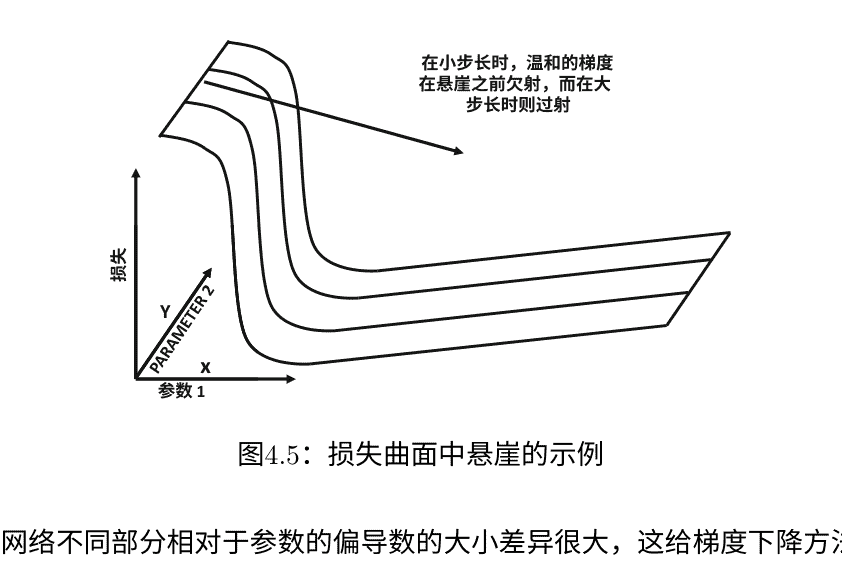

**观察4.3.1** 网络不同部分相对于参数的偏导数的大小差异很大，这给梯度下降方法带来了问题。

### 4.3.3 悬崖和山谷

梯度下降使用一阶导数。然而，梯度下降中的步长是有限的，并且在步长过程中会发生变化。一阶导数的变化率可以用二阶导数来量化，这也被非正式地称为曲率。从梯度下降的角度来看，悬崖是一种令人不安的拓扑结构的特例。

图4.5展示了一个损失曲面的例子。在这种情况下，有一个缓缓倾斜的曲面，迅速变为陡峭的下降曲面；这种曲面被称为悬崖。然而，如果只计算关于图中变量x的一阶偏导数，只能看到一个缓缓的斜坡。因此，较小的学习率会导致学习速度非常慢，而增加学习率可能会突然导致超出最优解的位置。这个问题是由曲率的性质（即变化的梯度）引起的，一阶梯度不包含控制更新大小所需的信息。在许多情况下，可以使用二阶导数来计算梯度的变化率，这提供了有用的（额外的）信息。

悬崖是不可取的，因为它们在损失函数中表现出一定程度的不稳定性。这意味着神经网络权重的微小变化可能只会微小地改变损失，或者突然改变损失的程度如此之大，以至于得到的解决方案距离真正的最优解更远。因此，在梯度下降步骤中很容易错过最优解。这种情况通常通过修改梯度以偏向低曲率方向的技术来解决，或者明确使用损失函数的曲率（即二阶导数）来解决。

本章将讨论几种这样的算法。

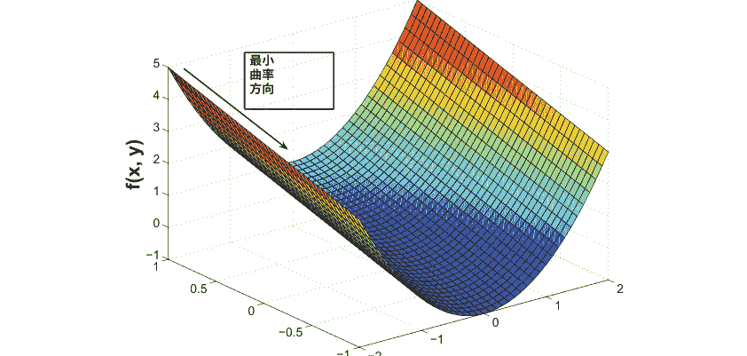

**图4.6：山谷中的曲率效应**

当遇到具有倾斜或蜿蜒山谷形状的损失函数时，曲率的特定效应尤为明显。图4.6展示了一个倾斜山谷的例子。山谷对于梯度下降方法来说是一种危险的地形，特别是如果山谷底部具有陡峭且快速变化的表面（形成一个狭窄的山谷）。当然，图4.6并不是这种情况，它是一个相对较容易的情况。然而，即使在这种情况下，最陡下降的方向通常会沿着山谷的两侧弹跳，并且如果步长选择不准确，沿着斜坡下降的速度相对较慢。

在狭窄的山谷中，梯度下降方法会更加剧烈地沿着陡峭的山谷两侧弹跳，而在缓缓倾斜的方向上几乎没有取得多少进展，而这个方向上存在着最大的长期收益。很明显，仅选择最陡下降的方向并不有用；相反，还必须偏向低曲率的方向。

### 4.3.4 深度收敛问题

非常深的架构在反向传播过程中很难收敛到最优解。这个问题已经在[193, 194]中进行了探讨，据推测深度网络的收敛速度随着深度的增加呈指数级下降。尽管消失梯度和爆炸梯度问题也会导致收敛问题，但[193, 194]的研究表明，采用各种技巧来减少消失梯度和爆炸梯度问题仍然会导致收敛问题。因此，收敛问题似乎是多方面的，不能简单地用单一因素（如消失梯度和爆炸梯度问题）来解释。一个问题是不同层的偏导数是相互依赖的，而且在权重的改变在不同层之间传播需要一段时间（特别是随着深度的增加）。因此，不同层的权重可能会在不收敛到最优解的情况下移动。

### 4.3.5 局部极小值

某些类型的损失函数具有唯一的全局最小值。这类问题被称为凸优化问题，并且它们代表了最简单的优化情况。

一个损失函数 $L(\overline{w})$ 映射到实数值，如果满足以下条件，则称为凸函数，对于所有的权重向量 $w_1$ 和 $w_2$ 以及 $\lambda \in (0, 1)$： $L(\lambda\overline{w}_1 + [1 - \lambda]\overline{w}_2) \leq \lambda L(\overline{w}_1) + (1 - \lambda) L(\overline{w}_2)$

## 第128章 深度学习：原理和训练算法

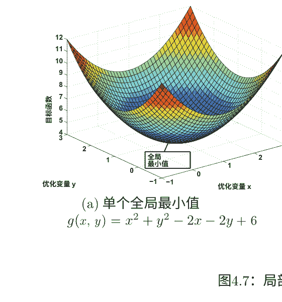

**(a) 单个全局最小值**
$$g(x,y) = x^2 + y^2 - 2x - 2y + 6$$

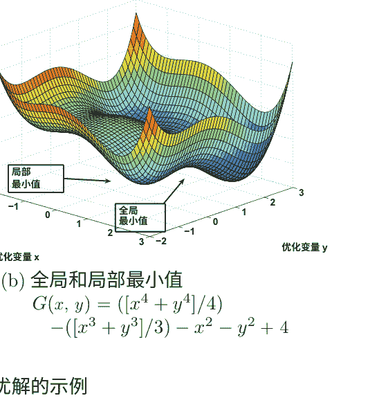

**(b) 全局和局部最小值**
$$G(x,y) = \frac{x^4 + y^4}{4} - \frac{x^3 + y^3}{3} - x^2 - y^2 + 4$$

**图4.7：局部和全局最优解的示例**

凸损失函数的形状类似于一个有一个底部的碗，而非凸函数可能在碗中有多个“坑洞”。一个二维凸损失函数的例子 $g(x,y) = x^2 + y^2 - 2x - 2y + 6$ 在图4.7(a)中有示，其中两个水平轴是变量，垂直轴是损失值。很明显，这个函数在 $(x,y) = (1,1)$ 有一个单个全局最小值。另一方面，损失函数图4.7(b)中的 $G(x,y)$ 不是凸函数，它有多个局部最小值。

从梯度下降的角度来看，函数的凸性很重要。当梯度下降到这样一个坑时，可能无法从该点逃脱，因为坑底的梯度为0，而所有瞬时移动方向都会使损失函数变得更糟。在第3章讨论的大多数浅层神经网络中，损失函数是凸函数，因此不会出现这种情况。这些损失函数的凸性证明可以在[6]中找到。

一般的原因是，这些浅层结构大多可以用一个简单的组合来解释。凸非线性损失函数的组合 $g(f(·))$。组合 $g(·)$ 和线性函数 $f(·)$ 保持损失函数的凸性[6]，只要这个组合的外层是凸非线性函数。例如，线性函数 $f(x_1,x_2) = x_1 - x_2$ 和二次函数 $g(x) = x^2$ 都是凸函数，而函数 $g(f(x_1,x_2)) = (x_1 - x_2)^2$ 是凸函数。然而，随着深度的增加，损失函数通常不是凸函数。这主要是因为大多数激活函数是凸函数，尽管多次组合线性函数和非线性凸函数(或以“错误”的顺序)并不总是凸的。例如，线性函数 $f(x_1, x_2) = x_1 - x_2$ 和二次函数 $g(x) = x^2$ 都是凸函数，但函数 $f(g(x_1), g(x_2)) = x_1^2 - x_2^2$ 不是凸函数。

深度神经网络是许多线性点积和非线性激活函数的组合结果。在这种情况下，网络计算的整体函数不再是输入或权重变量的凸函数。因此，梯度下降不再保证收敛到全局最优解。该过程很容易陷入损失函数的“坑洼”之一；这些虚假的“最小值”也被称为局部最优解。

## 4.4 深度友好的神经网络架构

当局部最小值的目标函数值明显大于全局最小值时，局部最小值会成为问题。然而，在实践中，神经网络似乎并非如此。许多研究结果[91, 443]表明，现实生活中的网络的局部最小值与全局最小值的目标函数值非常相似。因此，它们的存在似乎并不会引起严重问题。此外，本章讨论的一些训练方法，如动量法，非常适合在梯度下降过程中避免局部最优解。

某些类型的神经网络架构比其他类型更容易训练。激活函数的具体选择以及单元之间的连接方式都会对梯度下降产生影响。本节将讨论各种深度友好的架构技巧。

### 4.4.1 激活函数的选择

激活函数的具体选择往往对消失梯度问题的严重程度有很大影响。Sigmoid和tanh激活函数的导数分别在图4.8(a)和(b)中说明。Sigmoid激活函数的梯度永远不会超过 0.25，因此它非常容易受到消失梯度问题的影响。此外，在参数的绝对值较大时，它会饱和，这意味着梯度几乎为0。在这种情况下，神经元的权重变化非常缓慢。因此，网络中的少数这样的激活函数会显著影响梯度计算。与Sigmoid函数相比，tanh函数在原点附近具有梯度为1，但在越来越大的值时梯度会迅速饱和。

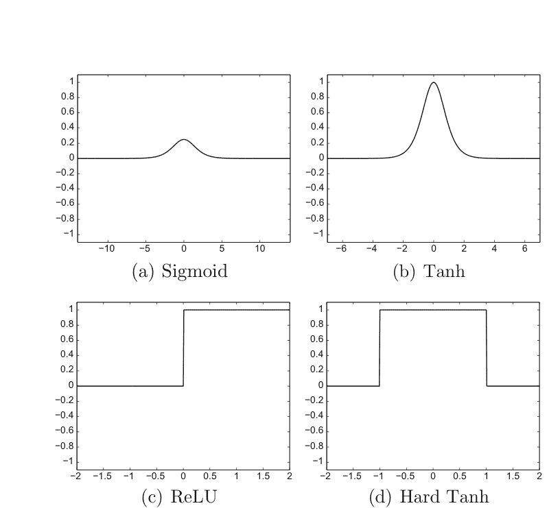

## 第130章 深度学习：原理和训练算法

参数的绝对值。因此，tanh函数也容易出现梯度消失问题。

近年来，sigmoid和tanh激活函数的使用越来越多地被ReLU和hard tanh函数所取代。ReLU的训练速度更快，因为其梯度计算只需检查非负性。ReLU和hard tanh函数的导数分别显示在图4.8(c)和(d)中。

显然，这些函数在大区间内的导数为1，而在区间外为0。因此，梯度消失问题往往较少发生，这些分段线性变体相对于平滑的对应函数变得越来越受欢迎。然而，ReLU的使用只是部分修复，因为它没有考虑跨层矩阵乘法相关的梯度流动。

此外，分段线性激活函数引入了一个新问题：死神经元。

### 4.4.2 死亡神经元和“脑损伤”

从图4.8(c)可以明显看出，ReLU的导数在负数参数上为零。这可能是由于各种原因引起的。例如，考虑输入神经元始终为非负值，而所有权重却以某种方式被初始化为负值的情况。因此，输出将为0。另一个例子是使用高学习率的情况。在这种情况下，ReLU的预激活值可能跳到梯度为0的范围，而与输入无关。换句话说，高学习率可能会“淘汰”ReLU单元。在这种情况下，ReLU可能对任何数据实例都不会激活。一旦神经元达到这一点，与ReLU之前的权重相关的损失梯度将始终为零。换句话说，在训练过程中，这个神经元的权重将不会进一步更新。此外，它的输出在不同的输入选择下不会变化，因此在区分不同实例方面不起作用。这样的神经元可以被视为死亡，在生物学术语中被视为一种永久的“脑损伤”。死亡神经元的问题可以通过使用适度的学习率来部分缓解。另一种解决方法是使用泄漏的ReLU。

#### 4.4.2.1 渗漏ReLU

渗漏ReLU是使用一个额外的参数 $\alpha \in (0,1)$ 来定义的：

$$\Phi(v) = \begin{cases} \alpha \cdot v & v \leq 0 \\ v & \text{否则} \end{cases}$$

因此，在 $v$ 的负值处，渗漏ReLU仍然可以传播（即 leak）一些梯度向后传递，尽管传递速率由 $\alpha < 1$ 定义。虽然 $\alpha$ 是用户选择的超参数，但也有可能学习它。

渗漏ReLU的收益并不保证。一个关键点是死神经元并不总是一个问题，因为它们代表了定义神经网络结构的一种修剪。因此，一定程度的神经元丢弃可以被视为学习过程的一部分。毕竟，我们调整每层神经元数量的能力是有限的。死亡神经元为我们的调整工作做了一部分。事实上，有意地修剪连接有时被用作正则化策略[288]。当然，如果网络中的神经元大部分都死亡，那可能是一个问题。

## 4.4 深度友好的神经网络架构

这是因为神经网络的很大一部分会处于非活跃状态。此外，在模型非常差的早期训练阶段，过多的神经元被淘汰是不可取的。

#### 4.4.2.2 最大化网络

最近提出的解决方案之一是使用maxout单元 [155]，它利用两个系数向量 $W_1$ 和 $W_2$ 而不是一个。 maxout单元计算函数 $\max\{W_1 \cdot X, W_2 \cdot X\}$。如果使用偏置神经元，则maxout激活为 $\max\{W_1 \cdot X + b_1, W_2 \cdot X + b_2\}$。可以将maxout视为ReLU的一般化，因为ReLU通过将其中一个系数向量设置为0来获得。甚至可以证明，泄漏ReLU是maxout的一种特殊情况，其中我们设置 $W_2 = \alpha W_1$，其中 $\alpha \in (0,1)$。与ReLU一样，maxout函数是分段线性的。然而，它几乎不会饱和，在几乎所有地方都是线性的。尽管它是线性的，但已经证明[155]，maxout网络是通用函数逼近器。maxout相对于ReLU具有优势，并增强了像 Dropout（参见第5章第5.5.4节）这样的集成方法的性能。然而，maxout的一个缺点是它会使参数数量翻倍。

### 4.4.3 使用跳跃连接

大多数神经网络以分层方式排列，其中从第i层到第i+1层的连接总是流动的。最近一种改善神经网络收敛行为的想法是使用跳跃连接，其中第i层的节点可以连接到第i+k层的节点，其中k > 1。这个想法在图像识别中被广泛使用，一个著名的网络，称为ResNet[193, 194]，已经设计了超过100层。图4.9展示了第i层和第i+2层之间的一个跳跃连接的示例。跳跃连接背后的基本思想是网络根据需要使用尽可能多的深度来学习具有不同丰富程度的特征。通过频繁使用跳跃连接来学习简单特征，而使用大量层来学习复杂特征。同时，网络更容易训练，因为大部分基本特征可以使用少量层来训练。这个基本思想被称为残差学习，因为更深的网络只是学习数据中无法使用较少层学习的“残差”模式。总的原则是使用额外的层来学习更精细的特征，但不要忘记之前层学到的有用特征。

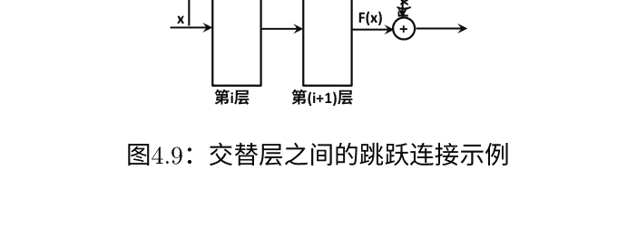

## 4.5 深度友好的梯度下降策略

从无穷小步长的角度来看，最陡的下降方向是最优的方向，但在更大的步长上可能会恶化目标函数。因此，需要进行许多次修正。这种现象的一个具体例子在第4.3.1节中讨论，其中对不同特征的敏感性的微小差异可能导致最陡下降算法出现振荡。当步长沿着损失函数中的高曲率方向执行时，振荡和曲线行进的问题会变得严重。

本节讨论了在这些情况下表现良好的几种聪明的学习策略。

### 4.5.1 预处理和初始化的重要性

在第二章的第2.7节中讨论的预处理和初始化策略对于避免梯度下降过程中的病态条件非常重要。一般来说，当不同层的激活值的大小稳定时，梯度在各层之间也是稳定的。通过以下预处理和归一化方法可以实现稳定性：

- 特征归一化的重要性：当某些特征的方差远大于其他特征时，会导致某些权重对损失函数的影响远大于其他权重。损失函数对不同权重的敏感性不同可能会导致4.3节讨论的折返行为。因此，一种常见的方法是使用标准化来使所有输入的方差相等。白化还可以去相关性，并将权重的相关移动合并为较少的非冗余权重。特征居中也有帮助，因为它使不同的输入特征值具有不同的符号 - 这确保了从输入层指向同一神经元的所有权重不受限制地朝着同一方向移动（避免了折返行为）。

- 初始化的重要性：深度网络中的不良初始化可能加剧梯度消失和梯度爆炸问题。对于某些类型的初始化权重，梯度消失和梯度爆炸问题可能在一开始就加剧，从而使梯度下降难以恢复。连接到节点的初始化权重被设置为与该节点的入度的倒数的平方根成比例，通过从零均值和标准差参数设置为 \(1/\sqrt{r_{in}}\) 的正态分布中进行采样。这个想法是每个权重都贡献了与 \(1/r_{in}\) 成比例的方差，并且在具有不同入度值的节点上的加法效应变得相似。然而，这种类型的初始化没有考虑到节点的出度也会对后续层的激活幅度产生影响。让 \(r_{out}\) 是特定神经元的出度。Xavier初始化或Glorot初始化使用零均值和标准差为的正态分布。

特征的归一化不仅在初始层中有帮助，而且在后续层中也有帮助。如在第4.8节中讨论的那样，通过使用一种称为批归一化的方法，对隐藏层的激活进行归一化可以获得更多的好处。

### 4.5.2 基于动量的学习

基于动量的方法通过认识到强调中长期一致运动方向是有益的，从而解决了局部最优、平坦区域和曲率中心的折返问题，因为它们减弱了损失拓扑中的局部扭曲。因此，为了加快梯度下降过程，使用了来自先前步骤的聚合度量。类似地，一个在有许多坑洞和其他扭曲的斜面上滚动的大理石通常能够利用其动量克服这些小障碍。

考虑一个情景，在这个情景中，我们正在对参数向量W进行梯度下降。对于损失函数L（定义在一个小批量实例上），梯度下降的常规更新如下：

$\overline{V} \leftarrow -\alpha \frac{\partial L}{\partial \overline{W}}; \overline{W} \leftarrow \overline{W} + \overline{V}$

这里，α是学习率。我们使用矩阵微积分约定¹，即标量 L对于列向量 的导数：W是列向量 ∇L：

$\nabla L = \frac{\partial L}{\partial \overline{W}} = \left[ \frac{\partial L}{\partial w_1} \cdots \frac{\partial L}{\partial w_d} \right]^T$

在基于动量的下降中，向量 V 继承了一部分 β的速度来自于其上一步，除了当前梯度，其中 β ∈ (0,1) 是动量参数：

$\overline{V} \leftarrow \beta \overline{V} - \alpha \frac{\partial L}{\partial \overline{W}}; \overline{W} \leftarrow \overline{W} + \overline{V}$

设置 β=0 特化为简单的小批量梯度下降。较大的值 β ∈ (0,1) 帮助方法保持一致的速度V在正确的方向上。动量参数β也被称为摩擦参数。“摩擦”一词来源于小值β起到“刹车”的作用，就像摩擦一样。设置 β > 1 可能导致不稳定，梯度下降可能会朝着越来越大的损失值不受控制地移动。

动量有助于梯度下降过程在平坦区域和局部最优点中导航。基于动量的方法的一个好比喻是将它们类比为大理石沿着碗滚动的方式。当大理石加速时，它能够快速穿越表面的平坦区域并逃离碗中的坑洼。这是因为积累的动量帮助它逃离坑洼。图4.10展示了一个大理石沿着复杂的损失曲面滚动（随着滚动速度增加），这说明了这个概念。

动量的使用通常会导致解决方案稍微超过速度方向，就像大理石在碗里滚动时会超过一样。然而，通过适当选择 β，它仍然比不使用动量的情况表现更好。基于动量的方法通常表现更好，因为大理石在碗里滚动时会增加速度；更快地到达最优解比超过目标更为重要。超过目标是可取的，因为它有助于避免局部最优解。参数 β控制大理石在损失曲面上滚动时遇到的摩擦量。虽然增加 β有助于避免局部最优解，但也可能增加振荡。从这个意义上讲，基于动量的方法在复杂损失曲面上滚动的物理学上有一个简洁的解释。

> ¹这种约定被称为矩阵微积分的分母布局[6]。在分子布局中，标量对列向量的导数是行向量。

### 4.5.3 Nesterov动量

此外，基于动量的方法有助于减少目标函数损失曲面中曲率的不良影响。 基于动量的技术认识到，之字形移动是高度矛盾的步骤相互抵消，从而减小了正确（长期）方向上步骤的有效大小。 图4.3(b)展示了这种情况的一个例子。 仅仅试图增加步骤的大小以获得更大的正确方向移动可能实际上会使当前解决方案与最优解更远。 从这个角度来看，以最近几步的“平均”方向移动更有意义，以平滑之字形移动。这种平均是通过使用前几步的动量来实现的。 振荡方向对更新没有一致的速度贡献。

使用基于动量的下降法，通常会朝着更接近最优解的方向移动，并且无用的“侧向”振荡会被抑制。 基本思想是在多个步骤中更加偏好像一致的方向，这在下降过程中更加重要。 这样可以在正确的方向上使用更大的步长，而不会导致侧向方向的恶化。 结果就是加速学习。图4.11展示了动量的使用示例。从图4.11(a)可以明显看出，动量增加了梯度在正确方向上的相对分量。 图4.11(b)和(c)展示了对更新的相应影响。 显然，基于动量的更新可以在较少的更新次数内达到最优解。 通过将一个大理石沿着图4.6的山谷滚动的过程进行可视化，也可以理解这个概念。当大理石在缓坡的山谷中加速下滚时，随着时间的推移，沿着山谷两侧弹跳的效果会被减弱。

Nesterov动量[364]是传统动量方法的一种改进，在该方法中，梯度是在执行一次之后到达的点计算的。β-先前步骤的折扣版本（即当前步骤的动量部分）。通过将先前的更新向量与摩擦参数相乘来获得该点。V。β然后在W + βV处计算梯度。 这个修正后的梯度使用了对梯度因动量部分更新而改变的方式的更好理解，并将这个信息融入到更新的梯度部分中。因此，在计算更新时使用了一定量的前瞻。 让我们用表示损失函数。当前解W处的损失函数为L(W)。 在这种情况下，由于梯度的计算方式，明确表示损失函数的参数是很重要的。 因此，可以按以下方式计算更新：

$$
\overline{V} \leftarrow \beta \overline{V} - \alpha \frac{\partial L(\overline{W} + \beta \overline{V})}{\partial \overline{W}}; \quad \overline{W} \leftarrow \overline{W} + \overline{V}
$$

请注意，与标准动量方法唯一的区别在于梯度计算的位置。稍微延迟使用梯度的值可以加快收敛速度。在之前的滚动大理石的类比中，当大理石接近碗底时，这种方法会开始在梯度下降过程中“刹车”，因为前瞻会“警告”它梯度方向的反转。

Nesterov方法仅适用于小批量梯度下降，并且批量大小适中；使用非常小的批次是一个坏主意。在这种情况下，可以证明Nesterov方法将误差减小到。在 $t$ 步骤之后，误差为 $O(1/t^2)$，与。相比在动量法中，误差为 $O(1/t)$。

### 4.5.4 参数特定的学习率

前一节中动量法的基本思想是利用某些参数梯度方向的一致性来加速更新。通过为不同的参数设置不同的学习率，也可以更明确地实现这个目标。这个想法是，具有较大偏导数的参数通常会振荡和曲折，而具有较小偏导数的参数倾向于更一致地朝着同一个方向移动。早期的一种方法是在这个方向上提出的 $delta\text{-}bar\text{-}delta$ 方法[228]。这种方法跟踪每个偏导数的符号是变化还是保持不变。如果偏导数的符号保持一致，那么说明方向是正确的。在这种情况下，该方向上的偏导数增加。另一方面，如果偏导数的符号一直翻转，那么偏导数减小。然而，这种方法是为梯度下降而设计的，而不是随机梯度下降，因为随机梯度下降中的误差可能会被放大。因此，已经提出了许多方法，即使在使用小批量方法时也能很好地工作。

#### 4.5.4.1 AdaGrad

在AdaGrad算法[110]中，我们跟踪算法过程中每个参数的偏导数的平方和。这个值的平方根与该参数的均方根斜率成比例（尽管绝对值会随着迭代次数增加而增加，因为会进行累加）。

令 $A_i$ 为第 $i$ 个参数的累加值。因此，在每次迭代中，执行以下更新：
$$
A_i \Leftarrow A_i + \left(\frac{\partial L}{\partial w_i}\right)^2 ; \quad \forall i \tag{4.3}
$$

第 $i$ 个参数 $w_i$ 的更新如下：
$$
w_i \Leftarrow w_i - \frac{\alpha}{\sqrt{A_i}} \left(\frac{\partial L}{\partial w_i}\right) ; \quad \forall i
$$

如果需要，可以在分母中使用 $\sqrt{A_i + \epsilon}$ 而不是 $\sqrt{A_i}$ 以避免病态条件。这里，$\epsilon$ 是一个小的正值，例如 $10^{-8}$。
将导数与的倒数进行缩放 $\sqrt{A_i}$ 是一种“信噪比”归一化，因为 $A_i$ 只测量梯度的历史幅度，而不是其符号；它鼓励沿着具有一致符号的缓坡方向进行更快的相对移动梯度。如果梯度沿着 $i$ 方向的分量在 $+100$ 和 $-100$ 之间剧烈波动，这种幅度为中心的归一化将对该分量的惩罚远远大于另一个始终接近 $0$（但符号一致）的梯度分量。例如，在图411中，沿着振荡方向的移动将被减弱，而沿着一致方向的移动将被强调。然而，所有分量的绝对移动都会随时间而减慢，这是该方法的主要问题。减速是由于 $A_i$ 是所有偏导数历史记录的总和值。

这将导致缩放导数的值逐渐减小。结果是，AdaGrad的进展可能过早变得过慢，并最终（几乎）停止进展。另一个问题是聚合缩放因子依赖于古老的历史，最终可能变得陈旧。使用陈旧的缩放因子可能会增加不准确性。

正如我们将在后面看到的，大多数其他方法使用指数平均化来解决这两个问题。

#### 4.5.4.2 RMSProp

RMSProp算法[204]使用与AdaGrad类似的动机，通过梯度的绝对值的“信噪比”归一化来进行缩放。$\sqrt{A_i}$。然而，它不是简单地将平方梯度添加到估计值 $A_i$，而是使用指数平均化。
由于使用平均化来进行归一化而不是聚合值，进展不会被不断增加的缩放因子 $A_i$ 过早地减慢。基本思想是使用一个衰减因子 $\rho \in (0, 1)$，并通过 $\rho\ t$ 加权出现在 $t$ 次更新之前的平方偏导数。注意，这可以通过将当前的平方聚合（即运行估计）乘以 $\rho$ 然后加上 $(1 - \rho)$ 乘以当前（平方）偏导数来轻松实现。运行估计初始化为 $0$。这会导致一些（不希望的）偏差在较长的时间内，早期迭代中的这种现象会消失。因此，如果 $A_i$ 是 $ith$ 参数的指数平均值对于 $w_i$，我们有以下更新方式 $A_i$:

$$ A_i \leftarrow \rho A_i + (1 - \rho) \left( \frac{\partial L}{\partial w_i} \right)^2; \quad \forall i $$

对于每个参数，使用其梯度的平方根来进行归一化。然后，对于（全局）学习率 $\alpha$，使用以下更新。

$$ w_i \leftarrow w_i - \frac{\alpha}{\sqrt{A_i}} \left( \frac{\partial L}{\partial w_i} \right); \quad \forall i $$

如果需要，可以在分母中使用 $\sqrt{A_i} + \epsilon$ 而不是 $\sqrt{A_i}$ 以避免病态条件。在这里，$\epsilon$ 是一个小的正值，例如 $10^{-8}$ RMSProp相对于AdaGrad的另一个优点是，古老（即陈旧）梯度的重要性随时间指数衰减。此外，它可以在计算算法中结合动量的概念（参见4551和4552节）。RMSProp的缺点是运行估计 $A_i$ 的二阶矩的估计在早期迭代中存在偏差，因为它被初始化为0。

#### 4.5.4.3 AdaDelta

AdaDelta算法[578]使用了与RMSProp类似的更新方式，不同之处在于它通过计算前几次迭代中的增量更新来消除全局学习参数的需求。考虑下面的RMSProp更新:

$$ w_i \leftarrow w_i - \frac{\alpha}{\sqrt{A_i}} \left( \frac{\partial L}{\partial w_i} \right); \quad \forall i $$

我们将展示如何。$\alpha$被一个依赖于前面增量更新的值所取代。在每次更新中，的值都会发生变化。$\Delta w_i$是 $w_i$ 值的增量。与指数平滑梯度一样，我们保留了先前迭代中的指数平滑值 $\delta_i$，其衰减参数为 $\rho$。$A_i$，我们保留了先前迭代中的指数平滑值 $\delta_i$，其衰减参数为 $\rho$。$\Delta wi$在前几次迭代中以相同的衰减参数 $\rho$ 进行更新:

$$ \delta_i \leftarrow \rho \delta_i + (1 - \rho) (\Delta w_i)^2; \quad \forall i $$

对于给定的迭代，的值可以通过之前的迭代计算得到 $\delta_i$ 的计算只需要使用它之前的迭代，因为的值 $\Delta w_i$ 尚不可用。另一方面，的值 $A_i$ 的计算可以使用当前迭代的偏导数进行 这是计算 $A_i$ 和 $\delta_i$ 之间微妙的差异 这导致了以下AdaDelta更新:

$$ w_i \leftarrow w_i - \sqrt{\frac{\delta_i}{A_i}} \left( \frac{\partial L}{\partial w_i} \right); \quad \forall i $$

值得注意的是，参数 在此更新中完全缺失 学习率$\alpha$在此更新中完全缺失 AdaDelta方法与二阶方法有一些相似之处，因为比值 $\sqrt{\frac{\delta_i}{A_i}}$ 在更新中是二阶导数关于的启发式替代 [578]。正如后续章节中所讨论的，许多二阶方法如牛顿法也不使用学习率

## 第138章.深度学习：原理与训练算法

### 4.5.5 结合参数特定学习和动量

虽然参数特定学习可以帮助区分沿不同方向的运动的一致性，但它们不会因为一致的运动（如动量方法）而在特定方向上获得速度。几种方法将参数特定学习与动量方法相结合，以从两者中获得优势。

#### 4.5.5.1 具有Nesterov动量的RMSProp

RMSProp可以与Nesterov动量相结合。让令A_i为第i个权重的平方累加。在这种情况下，我们引入额外的参数 β ∈ (0,1)，并使用以下更新：

$$v_i \leftarrow \beta v_i - \frac{\alpha}{\sqrt{A_i}} \left( \frac{\partial L(\overline{W} + \beta \overline{V})}{\partial w_i} \right) ; \quad w_i \leftarrow w_i + v_i; \quad \forall i$$

请注意，损失函数的偏导数是在一个偏移点计算的，这在Nesterov方法中很常见。权重 W 也会被偏移 在计算与损失函数相关的偏导数时，使用 β V 进行计算。同时，也要保持 使用 偏移梯度进行 A_i 的计算：

$$A_i \leftarrow \rho A_i + (1 - \rho) \left( \frac{\partial L(\overline{W} + \beta \overline{V})}{\partial w_i} \right)^2; \quad \forall i \tag{4.6}$$

虽然这种方法通过向RMSProp添加动量来获益，但它并不能纠正初始化偏差。

#### 4.5.5.2 Adam

Adam算法与AdaGrad和RMSProp使用类似的“信号噪声”归一化方法，但它还将动量纳入了更新中。此外，它直接解决了纯RMSProp指数平滑中的初始化偏差问题。与RMSProp一样，假设假设A_i是 ith参数 w_i的指数平均值。这个值的更新方式与RMSProp相同，使用了衰减参数。

ρ ∈ (0,1):
$$A_i \leftarrow \rho A_i + (1 - \rho) \left( \frac{\partial L}{\partial w_i} \right)^2; \quad \forall i \tag{4.7}$$

同时，梯度的指数平滑值也被维护，其中第i个分量用 F_i 表示。这种平滑是使用不同的衰减参数 ρ_f 来进行的：

$$F_i \leftarrow \rho_f F_i + (1 - \rho_f) \left( \frac{\partial L}{\partial w_i} \right); \quad \forall i \tag{4.8}$$

这种指数平滑梯度与 相结合的方法。ρ_f是动量方法的一种变体，该方法在第4.5.2节中讨论（由摩擦参数 β 而不是 ρ_f 进行参数化）。然后，在学习率 α_t在第 t次迭代中使用以下更新：

$$w_i \leftarrow w_i - \frac{\alpha_t}{\sqrt{A_i}} F_i; \quad \forall i$$与RMSProp算法相比，有两个关键差异。首先，为了引入动量，梯度被其指数平滑值所取代。其次，学习率 α_t 现在取决于迭代索引 t，并定义如下：

调整偏置：
$$\alpha_t = \alpha \left( \frac{\sqrt{1 - \rho^t}}{\sqrt{1 - \rho_f^t}} \right)$$
(4.9)

从技术上讲，学习率的调整实际上是一个偏置校正因子，用于解决两个指数平滑机制的不切实际的初始化问题，这在早期迭代中尤为重要。两者 F_t 和 A_t 在初始化时被设为0，这导致早期迭代中存在偏差。这两个量受偏差的影响不同，这解释了公式(4.9)中的比率。值得注意的是，每个 ρ^t 和 ρ_f^t 在大的 t 时收敛于0，因为 ρ, ρ_f ∈ (0,1)。因此，公式(4.9)的初始化偏置校正因子收敛于1，而 α_t 收敛于 α。根据原始的Adam论文[251]，默认建议的值为 ρ_f 和 ρ分别为0.9和0.999。

有关选择其他标准（如参数稀疏性）的详细信息，请参考[251]。与其他方法一样，Adam在更新的分母中使用 √A_t + ϵ（而不是 √A_t）以获得更好的条件。Adam算法非常受欢迎，因为它结合了其他算法的大部分优点，并且通常在性能上与其他方法[251]中的最佳方法竞争。

### 4.5.6 梯度裁剪

梯度裁剪是一种用于处理偏导数在不同方向上具有极大差异的情况的技术。某些形式的梯度裁剪使偏导数的不同分量更相似。最常见的两种梯度裁剪形式是：

- 基于值的裁剪：在基于值的裁剪中，对梯度值设置最小和最大阈值。所有小于最小阈值的偏导数都设置为最小阈值。所有大于最大阈值的偏导数都设置为最大阈值。
- 基于范数的剪切：在这种情况下，整个梯度向量被归一化整个向量的 L_2 范数。请注意，这种类型的剪切不会改变沿不同方向的更新的相对大小。然而，对于在不同层之间共享参数的神经网络（如递归神经网络），这两种剪切的效果非常相似。通过剪切，可以实现值的更好调整，使得从小批量到小批量的更新大致相似。因此，它可以防止特定小批量中的异常梯度爆炸对解决方案产生过大影响。

总的来说，与许多其他方法相比，梯度剪切的效果相当有限。然而，它在避免递归神经网络中的梯度爆炸问题方面特别有效（参见第8章）。

### 4.5.7 Polyak平均

二阶方法的一个动机之一是避免由高曲率区域引起的反弹行为。在山谷中引起的反弹行为的例子（参见图4.6）是这种情况的另一个例子。通过随时间指数衰减参数的平均值，可以使任何学习算法具有一定的稳定性，从而避免反弹行为。让 $W_1 \dots W_T$ 是任何学习方法在完整的 $T$ 步骤序列上找到的参数序列。在Polyak平均的最简单版本中，只需计算所有参数的平均值作为最终集合 $W^f$：

$$ W_T^f = \frac{\sum_{i=1}^{T} W_i}{T} \quad (4.10) $$

对于简单平均，我们只需要在过程结束时计算 $W^f$，我们不需要计算 $1 \dots T - 1$ 的值，只需计算一次即可。

然而，对于衰减参数的指数平均，$\beta < 1$时，通过迭代计算这些值并在算法过程中保持一个运行平均值是有帮助的：

$$ \overline{W}_t^f = \frac{\sum_{i=1}^{t} \beta^{t-i} W_i}{\sum_{i=1}^{t} \beta^{t-i}} \quad \text{[显式公式]} $$
$$ \overline{W}_t^f = (1 - \beta) \overline{W}_t + \beta \overline{W}_{t-1}^f \quad \text{[递归公式]} $$

上述两个公式在较大的 $t$ 值时近似等价。第二个公式更加方便，因为它可以在算法过程中进行维护，而不需要维护所有参数的完整历史记录。指数衰减平均比简单平均更有用，可以避免陈旧数据的影响。在简单平均中，最终结果可能过于受早期数据的影响，这些数据对正确解的逼近较差。

## 第140章 深度学习：原理和训练算法

## 4.6 二阶导数：牛顿法

近年来提出了许多使用二阶导数进行优化的方法。这些方法可以在一定程度上缓解损失函数高曲率带来的问题。

考虑参数向量 $W = [w_1 \dots w_d]^T$，表示为列向量。损失函数 $L(W)$ 的二阶导数形式如下：

$$ H_{ij} = \frac{\partial^2 L(\overline{W})}{\partial w_i \partial w_j} $$

注意，偏导数在分母中使用了所有成对的参数。因此，对于一个具有 $d$ 个参数的神经网络，我们有一个 $d \times d$ 的Hessian矩阵 $H$，其中 $(i, j)$th元素为 $H_{ij}$。

可以通过以下泰勒展开，在参数向量 $W_0$ 附近对损失函数进行二次逼近：

$$ L(W) \approx L(W_0) + (W - W_0)^T [\nabla L(W_0)] + \frac{1}{2} (W - W_0)^T H (W - W_0) \quad (4.11) $$

这个近似的准确性随着 $||W - W_0||$ 的增加而下降。这是 $W$ 和 $W_0$ 之间的欧几里得距离，Hessian矩阵 $H$ 是在 $W_0$ 处计算的。在这里，参数向量 $W$ 和 $W_0$ 是 $d$ 维列向量，梯度也是如此。

损失函数的这是一个二次逼近，可以将梯度设置为0，从而得到二次逼近的最优条件如下：

∇L(W) = 0 [损失函数的梯度]
∇L(W_0) + H(W - W_0) = 0 [Taylor逼近的梯度]

可以重新排列上述最优条件，得到以下牛顿更新公式：

W* ← W_0 - H^{-1}[∇L(W_0)]    (4.12)

公式(4.12)与最陡梯度下降法的更新的主要区别是最陡方向（即[∇L(W_0)]）与Hessian矩阵的逆的预乘。这种与Hessian矩阵的逆的预乘在改变最陡梯度下降的方向上起着关键作用，使得在该方向上可以采取更大的步长（从而更好地改善目标函数），即使该方向上的瞬时变化率不如最陡下降方向大。这是因为Hessian矩阵编码了梯度在每个方向上的变化速度。梯度的变化对于较大的更新是不好的，因为在步骤中可能会意外地恶化目标函数，如果梯度的许多分量的符号在步骤中发生变化。在梯度与梯度变化率之比较大的方向上移动是有利可图的，这样就可以采取更大的步骤而不会对优化造成伤害。与Hessian矩阵的逆的预乘实现了这个目标。图4.12展示了最陡下降方向与Hessian矩阵的逆的预乘的效果。将这个图与图4.3中二次碗的例子进行对比是有帮助的。从某种意义上说，与Hessian矩阵的逆的预乘将学习步骤偏向低曲率方向。在一维情况下，牛顿步骤简单地是一阶导数（变化率）与二阶导数（曲率）的比值。在多维情况下，由于与逆Hessian矩阵的乘法，低曲率方向往往占优势。公式(4.12)的更新有一个有趣的特点，即它直接从最优条件中得到，因此没有学习率。换句话说，这个更新是用二次碗近似损失函数，并在单步中准确地移动到碗的底部；学习率已经隐含地被纳入其中。然而，在处理非二次函数时，将学习率纳入其中并将其设置为最小化目标函数（而不仅仅是二次函数）是有用的。

## 第142章 深度学习：原理与训练算法

因此，对于非二次函数，使用以下迭代更新：

$$ \overline{W}_{t+1} \leftarrow \overline{W}_t - \alpha_t H^{-1}[\nabla L(\overline{W}_t)] \quad (4.13) $$

在这里，$\alpha_t$被选择为最小化 $L(\overline{W}_{t+1})$。这是通过一种称为线搜索的过程来完成的。假设 $q_t = -H^{-1}\nabla L(W_t)$ 表示牛顿法中的移动方向。那么，公式(4.13)可以写成如下形式：

$$ \overline{W}_{t+1} \leftarrow \overline{W}_t + \bar{\alpha}_t q_t $$

在线搜索中，步长 $\alpha_t$计算如下：

$$ \alpha_t = \arg\min_{\alpha} L(\overline{W}_t + \bar{\alpha} q_t) \quad (4.14) $$

有几种进行线性搜索的方法，例如二分搜索和黄金分割搜索。在二分搜索中，首先假设 $\alpha_t$属于范围 $[a, b] = [0, \alpha_{max}]$，其中通过不断加倍的方式可以得到 $\alpha_{max}$。随后，通过测试两个点可以在每次迭代中将区间的大小缩小一半。$c < d$接近区间的中点，并缩小到区间 $[a, d]$ 如果评估在 $\alpha_t = d$更大。否则，使用区间 $[c, b]$。

### 4.6.1 示例：二次碗中的牛顿法

我们将重新讨论牛顿法在图4.3的二次碗中的行为。考虑以下椭圆目标函数，与图4.3(b)中讨论的函数相同：

$$ J(w_1, w_2) = w_1^2 + 4w_2^2 $$

这是一个非常简单的凸二次函数，其最优点是原点。应用直接梯度下降算法从任意点开始，如 $[w_1, w_2] = [1, 1]$ 将导致图43(b)所示的反弹行为。另一方面，考虑Newton方法，从点 $[w_1, w_2] = [1, 1]$ 开始。梯度可以计算为：

此函数的Hessian矩阵是一个常数，与 $[w_1, w_2]^T$ 无关：

$$ H = \begin{bmatrix} 2 & 0 \\ 0 & 8 \end{bmatrix} $$

应用牛顿更新得到以下结果：

$$ \begin{bmatrix} w_1 \\ w_2 \end{bmatrix} \leftarrow \begin{bmatrix} 1 \\ 1 \end{bmatrix} - \begin{bmatrix} 2 & 0 \\ 0 & 8 \end{bmatrix}^{-1} \begin{bmatrix} 2 \\ 8 \end{bmatrix} = \begin{bmatrix} 0 \\ 0 \end{bmatrix} $$

换句话说，单步就足以达到这个二次函数的最优点。这是因为二阶泰勒“近似”二次函数是精确的，而牛顿方法在每次迭代中解决这个近似。当然，现实世界的函数不是二次的，因此通常需要多个步骤。

### 4.6.2 例子：非二次函数中的牛顿方法

在本节中，我们将修改前一节的目标函数，使其变为非二次的。相应的函数如下：

$$ J(w_1, w_2) = w_1^2 + 4w_2^2 - \cos(w_1 + w_2) $$

假设 $w_1$ 和 $w_2$ 以弧度表示。请注意，这个目标函数的最优解仍然是 $[w_1, w_2] = [0, 0]$，因为 $J(0, 0)$ 的值为在这一点上，上述表达式的每个加法项都取得了最小值，其值为-1。我们将再次从 $[w_1, w_2] = [1, 1]$ 开始，并且证明在这种情况下一个迭代不再足够。

在这种情况下，我们可以展示梯度和海森矩阵如下：

$$\nabla J(1, 1) = \begin{bmatrix} 2 + \sin(2) \\ 8 + \sin(2) \end{bmatrix} = \begin{bmatrix} 2.91 \\ 8.91 \end{bmatrix}$$

$$H = \begin{bmatrix} 2 + \cos(2) & \cos(2) \\ \cos(2) & 8 + \cos(2) \end{bmatrix} = \begin{bmatrix} 1.584 & -0.416 \\ -0.416 & 7.584 \end{bmatrix}$$

海森矩阵的逆如下：

$$H^{-1} = \begin{bmatrix} 0.64 & 0.035 \\ 0.035 & 0.134 \end{bmatrix}$$

因此，我们得到以下的牛顿更新：

$$\begin{bmatrix} w_1 \\ w_2 \end{bmatrix} \leftarrow \begin{bmatrix} 1 \\ 1 \end{bmatrix} - \begin{bmatrix} 0.64 & 0.035 \\ 0.035 & 0.134 \end{bmatrix} \begin{bmatrix} 2.91 \\ 8.91 \end{bmatrix} = \begin{bmatrix} 1 \\ 1 \end{bmatrix} - \begin{bmatrix} 2.1745 \\ 1.296 \end{bmatrix} = \begin{bmatrix} -1.1745 \\ -0.2958 \end{bmatrix}$$

请注意，虽然我们肯定没有达到最优点，但我们确实更接近最优解。这是因为在这种情况下，目标函数不是二次的，而是只能达到目标函数近似二次碗底部。然而，牛顿法在真实目标函数值方面找到了更好的点。海森矩阵的近似性质是为什么必须使用精确或近似线搜索来控制步长的原因。请注意，如果我们使用步长为 0.6而不是默认值1，将得到以下解：

$$\begin{bmatrix} w_1 \\ w_2 \end{bmatrix} \leftarrow \begin{bmatrix} 1 \\ 1 \end{bmatrix} - 0.6 \begin{bmatrix} 2.1745 \\ 1.296 \end{bmatrix} = \begin{bmatrix} -0.30 \\ 0.22 \end{bmatrix}$$

虽然这只是对最优步长的一个非常粗略的近似，但它仍然更接近真正的最优值 $[w_1, w_2] = [0, 0]$ 而且相对容易证明这组参数会产生更好的目标函数值。为了越来越接近最优解，这个步骤需要重复执行。

### 4.6.3 二阶方法中的鞍点问题

二阶方法容易受到鞍点的影响。鞍点是梯度下降方法的一个稳定点，因为它的梯度为零，但它不是一个最小值（或最大值）。鞍点是一个拐点，根据我们从哪个方向接近它，它看起来可能是一个最小值或最大值。因此，牛顿法的二次近似将根据从哪个方向接近鞍点而产生截然不同的形状。具有鞍点的一维函数如下所示：

$$f(x) = x^3$$

该函数在图4.13(a)中显示，并且在 $x=0$ 处有一个拐点。请注意，二次近似在 $x>0$ 时，看起来像一个竖直的碗，而二次在 $x < 0$时，看起来像一个倒立的碗。此外，即使在优化过程中达到$x=0$，二阶导数和一阶导数都将为零。因此，牛顿更新将采取0/0的形式，并变得不确定。从数值优化的角度来看，这样的点是退化点。并非所有的鞍点都是退化点，反之亦然。对于多元问题，这样的退化点通常是宽而平坦的区域，不是目标函数的最小值。它们对数值优化来说是一个重要的问题。这样一个函数的例子是 $h(x, y)=x^3 + y^3$，在(0,0)处是退化的。此外，靠近(0,0)的区域将会呈现出一个平坦的高原。这些类型的高原对于学习算法来说会造成问题，因为一阶算法在这些区域中变慢，而二阶算法也无法将其识别为不值得探索的区域。值得注意的是，这种鞍点只出现在高度非线性的函数中，这在神经网络优化中很常见。

检查一个非退化点的鞍点也是有益的。一个具有鞍点的二维函数的例子如下：$g(x, y) = x^2 - y^2$。这个函数在图 4.13(b)中显示。鞍点是 (0, 0)。很容易看出，这个函数的形状类似于骑马鞍。在这种情况下，从$x$方向或从 $y$方向接近将导致非常不同的二次近似。在某种情况下，函数将看起来是一个最小值，在另一种情况下，函数将看起来是一个最大值。此外，鞍点(0,0)将从牛顿更新的角度来看是一个静止点，尽管它不是一个极值点。鞍点经常出现在损失函数两个山之间的区域，并且对于二阶方法来说，它们呈现出问题的地形。有趣的是一阶方法通常能够逃离鞍点[153]，因为一阶方法的轨迹根本不会被这些点吸引。另一方面，牛顿法将直接跳到鞍点。

不幸的是，一些神经网络的损失函数似乎包含大量的鞍点。因此，二阶方法并不总是优于一阶方法；特定损失函数的拓扑结构可能起着重要的作用。

## 4.7 牛顿法的快速近似

在大多数大规模的环境中，海森矩阵太大无法显式存储或计算。神经网络的参数往往有数百万个，这并不罕见。尝试计算一个 $10^{6} \times 10^{6}$ 的海森矩阵的逆矩阵在当前的计算能力下几乎是不可能的任务。事实上，即使计算海森矩阵本身也是困难的，更不用说求其逆矩阵了！下面的章节将讨论牛顿法的高效变体，这些变体不会显式计算海森矩阵。

### 4.7.1 共轭梯度法

共轭梯度法[1,99]需要多个步骤才能达到二次损失函数的最优解（而不是单个牛顿步骤）。基本思想是通过适当的变量基变换，将任何二次函数转化为线性可加函数。这些变量表示数据中不相互作用的方向。这种不相互作用的方向对于优化非常方便，因为它们可以通过线性搜索独立地进行优化。由于只有对于二次损失函数才可能找到这样的方向，我们首先讨论假设损失函数 $L(W)$ 是二次的共轭梯度法。稍后，我们将讨论对非二次函数的推广。

这种方法在神经网络的经典文献中是众所周知的[4, 463]，最近还以“无海森优化”为标题重新出现。这个名称的动机是可以在不显式计算海森矩阵的情况下计算搜索方向。一个二次凸损失函数 $L(W)$ 在图4.14中显示了一个椭圆形等高线图，并且在优化空间的所有区域上具有恒定的海森矩阵。正交的特征向量 $q_0\dots q_{d-1}$ 表示对称海森矩阵的椭圆形等高线图的轴方向。可以通过使用特征向量作为基向量，在新的坐标空间中重新定义损失函数，使其成为线性可加的二次函数。这是因为新的坐标系创建了一个与基向量对齐的椭圆，它不具有 $x_ix_j$ 这种相互作用的二次项。因此，每个转换后的变量可以独立于其他变量进行优化。或者，可以使用原始变量（不进行变换），并沿着海森矩阵的每个特征向量进行线性搜索以选择步长。

运动的本质在图4.14(a)中有所说明。请注意，沿着第 $j$ 个特征向量的运动不会干扰沿其他特征向量的工作，因此只需进行 $d$ 步即可在二次损失函数中达到最优解。

虽然计算Hessian矩阵的特征向量是不切实际的，但存在其他可以高效计算的方向，满足类似的性质；这个关键性质被称为向量的互共轭。请注意，这两个特征向量 $q_i$ 和 Hessian矩阵的特征向量 $q_j$ 满足由于对称矩阵的特征向量正交，所以 $q_i^T q_j = 0$。

### 4.7.1 共轭梯度法

Hessian矩阵的特征向量相互正交：$q^{Ti} q_j=0$。共轭方向则满足：任意共轭对 $\bar{q}_i^T H\bar{q}_j = 0$。

图4.14: 二次函数的海森矩阵的特征向量代表二次椭球体的正交轴，也是相互正交的。海森矩阵的特征向量是正交共轭方向。共轭的广义定义可能导致非正交方向。

此外，由于 $q_j$ 是 $H$ 的特征向量，我们有：$Hq_j = \lambda_j q_j$，其中$\lambda_j$是标量特征值。两边乘以 $q^{Ti}$，我们可以轻松地证明海森矩阵的特征向量满足：$q^{Ti} Hq_j = 0$ 成对地满足。条件 $q^{Ti} Hq_j = 0$ 在线性代数中称为$H$-正交性，也称为优化中的互共轭条件。正是这种互共轭条件导致了线性分离的变量。然而，特征向量并不是唯一的一组互共轭条件。

正如存在无限数量的正交基集合一样，在$d$维空间中存在无限数量的$H$-正交基集合。如果我们用共轭方向的任意（可能是非正交的）坐标来重新编写二次损失函数，目标函数将包含线性可加的组成部分，每个部分都是一个一元函数。我们可以分别沿着这些$H$-正交方向（以原始变量为基准）进行优化，以解决二次优化问题，需要$d$步。可以使用$H$-正交方向上的线搜索来执行这些优化步骤。Hessian特征向量代表了一组非常特殊的$H$-正交方向，它们也是正交的；除了Hessian特征向量之外的共轭方向，如图4.14(b)所示，它们不是相互正交的。因此，共轭梯度下降通过将损失函数隐式地转换为一个非正交基，线性可加地表示目标函数，从而优化二次目标函数。可以将这个观察结果表述如下：

**观察4.7.1 ($H$-正交方向的性质)** 设 $H$ 为二次目标函数的海森矩阵。如果选择了一组$d$个$H$-正交方向进行移动，则隐式地沿着函数的一个可加分离变量在变换后的表示中移动。因此，对于二次优化，最多需要 $d$步。

沿着每个可分离方向（带有线搜索）进行独立优化，确保梯度在每个共轭方向上的分量为0。严格凸损失函数具有线性无关的共轭方向（参见练习5）。换句话说，最终梯度与$d$个线性无关方向的点积为零；这只有在最终梯度为零向量时才可能发生（参见练习6），这意味着对于凸函数来说是最优的。实际上，通常可以在少于 d 次更新中达到接近最优的解。

如何确定共轭方向？最简单的方法是使用广义 Gram-Schmidt 正交化方法来生成二次函数的 Hessian 矩阵的正交方向（参见练习7）。使用任意向量作为起始点很容易实现这种正交化。然而，这个过程仍然可能非常耗时，因为每个方向 $q_t$ 需要使用所有之前的方向 $q_0, ..., q_{t-1}$ 用于 Gram-Schmidt 方法中的迭代生成。由于每个方向都是一个 d 维向量，并且在过程结束时有 O(d) 个这样的方向，因此每一步都需要 O(d^2) 的时间。有没有办法只使用之前的方向来减少这个时间，从 O(d^2) 减少到 O(d)？令人惊讶的是，在使用最陡下降方向进行迭代生成时，只需要最近的共轭方向来生成下一个方向[370, 463]。换句话说，不应该使用任意向量进行 Gram-Schmidt 正交化，而应该使用最陡下降方向作为原始向量进行正交化。这个选择在确保更高效的正交化形式方面起到了关键作用。这不是一个显而易见的结果（参见练习8）。方向 $q_{t+1}$ 因此，被定义为前一个共轭方向的线性组合和当前最陡下降方向。$\nabla L(W_{t+1})$ 与组合参数 $\beta_t$:

$$q_{t+1} = -\nabla L(W_{t+1}) + \beta_t q_t$$

两边都乘以 $q_t^T H$ 并使用共轭条件将左边设置为0，可以解出 $\beta_t$:

$$\beta_t = \frac{q_t^T H[\nabla L(W_{t+1})]}{q_t^T H q_t}$$

这导致了一个迭代更新过程，它初始化为 $q_0 = -\nabla L(W_0)$，并计算 T:

1.  更新 $W_{t+1} \leftarrow W_t + \alpha_t q_t$。这里，步长 $\alpha_t$ 通过线搜索来计算，以最小化损失函数。
2.  设置 $q_{t+1} = -\nabla L(W_{t+1}) + \left(\frac{q_t^T H[\nabla L(W_{t+1})]}{q_t^T H q_t}\right) q_t$。将 t 增加1。

可以证明[370, 463]，$q_{t+1}$ 满足共轭关系，对于所有之前的 $q_i$ 提供了这个证明的系统性路线图在练习8中。

上述更新似乎不是 Hessian-free，因为矩阵 H 包含在上述更新中。然而，底层计算只需要沿特定方向的 Hessian 投影；我们将看到这些可以通过使用有限差分方法间接计算，而不需要显式计算 Hessian 的各个元素。v 是需要计算投影 Hv 的向量方向。

有限差分方法计算当前参数向量的损失梯度。$W + \delta v$ 对于一些小的值 $\delta$ 为了进行近似:

$$Hv \approx \frac{\nabla L(W + \delta v) - \nabla L(W)}{\delta} \propto \nabla L(W + \delta v) - \nabla L(W)$$

右侧不包含 Hessian 矩阵。该条件对于二次函数是精确的。
关于无 Hessian 矩阵更新的其他选择在[41]中讨论。
到目前为止，我们讨论了简化的二次损失函数情况，其中 Hessian 矩阵是一个常数矩阵（即与当前参数向量无关）。然而，机器学习中大多数损失函数不是二次的，因此Hessian矩阵依赖于参数向量的当前值$W_t$，这导致在非二次函数中有几种选择如何创建一个修改后的算法。我们首先在一个点创建一个二次近似，然后在Hessian矩阵（二次近似）在该点固定的情况下进行几次迭代求解，还是在每次迭代中随着参数向量的变化而改变Hessian矩阵？前者被称为线性共轭梯度法，而后者被称为非线性共轭梯度法。

在非线性共轭梯度法中，方向的互相共轭性（即H正交性）会随着Hessian矩阵在每一步中的变化而恶化。这可能对从一步到下一步的整体进展产生不可预测的影响。此外，共轭方向的计算需要每隔几步重新开始，因为互相共轭性会恶化。如果恶化速度过快，重新开始的频率会非常频繁，而且无法从共轭性中获得太多好处。另一方面，在线性共轭梯度法中，每个二次近似都可以精确求解，并且通常在比$d$更少的迭代次数内（几乎）得到解决。因此，在每次迭代中，可以取得与牛顿法类似的进展。只要二次近似质量较高，所需的近似次数通常不会太多。从历史的角度来看，非线性共轭梯度法在传统机器学习中得到了广泛应用[41]，尽管最近的研究[324, 325]提倡使用线性共轭方法。[324, 325]中的实验结果表明线性共轭梯度法具有一些优势。

### 4.7.2 拟牛顿法和BFGS

BFGS是Broyden-Fletcher-Goldfarb-Shanno算法的缩写，它是Newton方法的近似。让我们重新审视一下Newton方法的更新。Newton方法的典型更新如下：

$$\overline{W}^* \Leftarrow \overline{W}_0 - H^{-1}[\nabla J(\overline{W}_0)] \qquad\qquad (4.18)$$

在拟牛顿法中，使用一系列逆Hessian矩阵的近似来进行各个步骤。假设在第$t$步的逆Hessian矩阵的近似为$G_t$。在第一次迭代中，$G_t$的值被初始化为单位矩阵，相当于沿着最陡的下降方向移动。这个矩阵会不断地从$G_t$更新到$G_{t+1}$，使用低秩更新（从第1章的矩阵求逆引理中得出）。Newton更新的逆Hessian矩阵的直接表述$G_t$到$G_{t+1}$的低秩更新（从第1章的矩阵求逆引理中得出）。Newton更新的逆Hessian矩阵的直接表述 $G_t \approx H_t^{-1}$如下所示：

$$\overline{W}_{t+1} \Leftarrow \overline{W}_t - G_t[\nabla J(\overline{W}_t)] \qquad\qquad (4.19)$$

上述更新可以通过优化学习率进行改进$\alpha_t$用于非二次损失函数与（逆）Hessian近似工作，如$G_t$：

$$\overline{W}_{t+1} \Leftarrow \overline{W}_t - \alpha_t G_t[\nabla J(\overline{W}_t)] \qquad\qquad (4.20)$$

优化学习率$\alpha_t$通过线性搜索确定。线性搜索不需要精确执行（如共轭梯度法），因为维护共轭性不再关键。然而，当从单位矩阵开始时，该方法仍然通过早期一组方向的近似共轭性来维护。可以选择性地将$G_t$重置为单位矩阵，每隔$d$次迭代执行一次（尽管这很少见）。

如何更新矩阵$G_{t+1}$？为此目的，需要满足拟牛顿条件，也称为割线条件：

$$\overline{W}_{t+1} - \overline{W}_t = G_{t+1} [\nabla J(\overline{W}_{t+1}) - \nabla J(\overline{W}_t)] \qquad (4.21)$$
（参数变化 = 逆Hessian近似 × 一阶导数变化）

上述公式只是一个有限差分近似。直观地说，将二阶导数矩阵（即海森矩阵）与参数变化（向量）相乘近似地提供了梯度变化。因此，将逆海森近似 $G_{t+1}$ 与梯度变化相乘提供了参数变化。目标是找到满足方程4.21的对称矩阵 $G_{t+1}$，但它表示一个具有无限解的欠定方程组。在这些解中，BFGS选择最接近当前 $G_t$ 的对称 $G_{t+1}$，并通过将最小化目标函数 $||G_{t+1} - G_t||_w$ 表示为加权Frobenius范数来实现这个目标。

换句话说，我们想要找到满足以下条件的 $G_{t+1}$：
最小化 $||G_{t+1} - G_t||_w$
受限于：
$\overline{W}_{t+1} - \overline{W}_t = G_{t+1} [\nabla J(\overline{W}_{t+1}) - \nabla J(\overline{W}_t)]$
$G_{t+1}^T = G_{t+1}$

范数的下标用“w”注释，表示它是一种加权形式的范数。这个权重是Hessian的“平均”形式，我们将读者引用到[370]中，了解平均的具体方法。注意，并不局限于使用加权Frobenius范数，构造范数的不同变体导致了拟牛顿方法的不同变体。例如，可以用Hessian而不是逆Hessian来表达相同的目标函数和割线条件，得到的方法被称为Davidson-Fletcher-Powell (DFP)方法。在接下来的内容中，我们将坚持使用逆Hessian，即BFGS方法。

由于加权范数使用了Frobenius矩阵范数（以及一个权重矩阵），上述问题是一个带有线性约束的二次优化问题。一般来说，当线性等式约束与二次目标函数配对时，优化问题的结构非常简单，可以找到闭式解。这是因为等式约束通常可以与相应的变量一起消除（使用高斯消元等方法），并且可以用剩余变量来定义一个无约束的二次优化问题。这些问题有时会有类似最小二乘回归的闭式解。在这种情况下，上述优化问题的闭式解如下：

$$G_{t+1} \leftarrow (I - \Delta_t q_t v_t^T) G_t (I - \Delta_t q_t v_t^T) + \Delta_t q_t q_t^T \qquad (4.22)$$

在这里，(列)向量 $q_t$ 和 $v_t$ 表示参数变化和梯度变化；标量 $\Delta_t = 1/(q_t^T v_t)$ 是这两个向量的点积的倒数。
$$q_t = \overline{W}_{t+1} - \overline{W}_t; \quad v_t = \nabla L(\overline{W}_{t+1}) - \nabla L(\overline{W}_t)$$

3目标函数的形式是 $||A^{1/2}(G_{t+1} - G_t)A^{1/2}||_F$ 范数，其中 $A$ 是在不同步长上平均的Hessian矩阵的版本。详细信息请参阅[370]。

通过扩展方程4.22的更新，可以使其更节省空间，从而减少需要维护的临时矩阵。对于实现细节和这些更新的推导，感兴趣的读者可以参考[309, 370, 390]。

尽管BFGS从近似逆Hessian中受益，但它确实需要在迭代之间传递一个大小为 O(d^2) 的矩阵 G_t。有限内存BFGS（L-BFGS）通过不传递上一次迭代的矩阵 G_t，将内存需求大大降低到 O(d)。在L-BFGS方法的最基本版本中，矩阵 G_t 在方程4.22中被替换为单位矩阵，以推导出 G_{t+1}。更精细的选择是存储近似 m ≈ 30个最近的向量 q_t 和 v_t。然后，L-BFGS 等效于将 G_{t-m+1} 初始化为单位矩阵，并递归地应用方程4.22 m次以推导出 G_{t+1}。在实践中，实现经过优化，直接计算出移动方向，而无需显式存储从 G_{t-m+1} 到 G_t 的大型中间矩阵。

## 4.8 批归一化

批归一化是解决梯度消失和梯度爆炸问题的一种最近方法，这些问题导致连续层中的激活梯度要么减小要么增加。训练深度网络中的另一个重要问题是内部协变量偏移。问题在于参数在训练过程中发生变化，因此隐藏变量的激活也会发生变化。换句话说，从早期层到后续层的隐藏输入不断变化。从早期层到后续层的输入变化导致训练过程中收敛速度变慢，因为后续层的训练数据不稳定。批归一化能够减少这种效应。

在批量归一化中，思想是在隐藏层之间添加额外的“归一化层”，通过创建具有相似方差的特征来抵抗这种行为。此外，归一化层中的每个单元都包含两个额外的参数 β_i 和 γ_i，用于调节 ith单元中归一化的精确水平；这些参数是以数据驱动的方式学习的。基本思想是，每个单元的输出在每个小批量的训练实例上具有 β_i 的均值和 γ_i 的标准差。人们可能想知道是否有意义将每个 β_i 设置为0，每个 γ_i 设置为1，但这样做会降低网络的表示能力。例如，如果进行这种转换，那么 Sigmoid 单元将在其线性区域内运行，特别是如果归一化是在激活之前执行的（有关图4.15的讨论，请参见下文）。请回顾第1章中的讨论，多层网络在没有非线性激活的情况下无法从深度中获得能力。因此，允许这些参数有一些“摆动”，并以数据驱动的方式学习它们是有意义的。此外，参数 β_i 扮演了一个学习的偏置变量的角色，因此我们在这些层中不需要额外的偏置单元。

我们假设第 i 个单元连接到一种特殊类型的节点 BN_i，其中 BN 代表批量归一化。该单元包含两个参数 β_i 和 γ_i 需要学习。注意 BN_i 只有一个输入，它的工作是执行归一化和缩放。然后，该节点以标准方式连接到网络的下一层，就像神经网络连接到未来的层一样。在这里，我们提到归一化层可以连接的两个选择：

1.  归一化可以在将激活函数应用于线性变换输入后立即执行。该解决方案显示在图4.15(a)中。因此，归一化是在激活后的值上执行的。

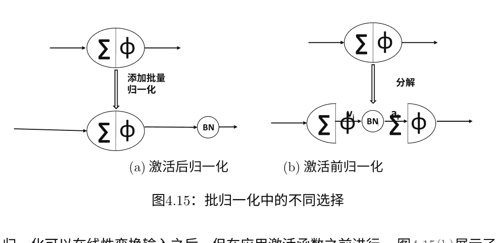

2.  归一化可以在线性变换输入之后，但在应用激活函数之前进行。图4.15(b)展示了这种情况。因此，归一化是在激活前的值上进行的。

在[225]中认为第二种选择更有优势。因此，在本文中我们将重点关注这个选择。图4.15(b)中显示的BN节点就像任何其他计算节点一样（尽管具有一些特殊属性），可以像任何其他计算节点一样通过这个节点进行反向传播。

BN节点 应用了哪些变换？考虑其输入为 $v_i$ 的情况。$v_i^{(r)}$ 对应于输入到第i个单元的批次的第r个元素。每个 $v_i^{(r)}$ 是通过使用由系数向量 $W_i$（如果有的话还包括偏置）定义的线性变换得到的。
对于一批特定的 m个实例，将 m个激活值表示为 $v_i^{(1)}, v_i^{(2)}, \ldots, v_i^{(m)}$。
第一步是计算均值 $\mu_i$ 和标准差 $\sigma_i$ 用于第i个隐藏单元。然后使用参数 $\beta_i$ 和 $\gamma_i$ 对其进行缩放，以创建下一层的输出:

$$\mu_i = \frac{\sum_{r=1}^{m} v_i^{(r)}}{m} \quad \forall i \qquad (4.23)$$
$$\sigma_i^2 = \frac{\sum_{r=1}^{m} (v_i^{(r)} - \mu_i)^2}{m} + \epsilon \quad \forall i \qquad (4.24)$$
$$\hat{v}_i^{(r)} = \frac{v_i^{(r)} - \mu_i}{\sigma_i} \quad \forall i, r \qquad (4.25)$$
$$a_i^{(r)} = \gamma_i \cdot \hat{v}_i^{(r)} + \beta_i \quad \forall i, r \qquad (4.26)$$

一个小的值 $\epsilon$ 被添加到 $\sigma_i^2$ 中用于规范化所有激活值相同的情况，这将导致方差为零。注意 $a_i^{(r)}$ 是第 i个节点的预激活输出，当第 r个批次实例通过它时。如果没有应用批量归一化，这个值本来会被设置为 $v_i^{(r)}$。我们用一个特殊节点 $BN_i$ 来概念上表示这个节点。$BN_i$ 执行这个额外的处理。这个节点在图4.15(b)中显示。因此，反向传播算法必须考虑到这个额外的节点，并确保早于批量归一化层的损失导数考虑到这些新节点所暗示的变换。重要的是要注意，每个特殊的BN节点应用的函数是特定于当前批次的。对于神经网络来说，这种计算方式是不寻常的，因为梯度是对个别训练样例的梯度的线性加和。这在某种程度上并不完全正确，在这种情况下，批归一化层从批次中计算非线性度量（例如其标准差）。因此，激活值取决于批次中的示例之间的关系，这在大多数神经计算中并不常见。

然而，BN节点的这个特殊属性并不妨碍我们在其中执行的计算进行反向传播。
下面将描述归一化层引起的反向传播算法的变化。这个变化的主要目的是展示如何通过新添加的归一化节点进行反向传播。另一个需要注意的是，我们希望优化参数 $\beta_i$ 和 $\gamma_i$。对于每个 $\beta_i$ 和 $\gamma_i$ 的梯度下降步骤，我们需要相对于这些参数的梯度。假设我们已经反向传播到BN节点的输出，因此我们拥有每个参数的梯度。假设我们已经反向传播到BN节点的输出，因此我们拥有每个参数的梯度 $\frac{\partial L}{\partial a_i^{(r)}}$ 可用的。然后，可以计算出对这两个参数的导数如下：

$$\frac{\partial L}{\partial \beta_i} = \sum_{r=1}^{m} \frac{\partial L}{\partial a_i^{(r)}} \cdot \frac{\partial a_i^{(r)}}{\partial \beta_i} = \sum_{r=1}^{m} \frac{\partial L}{\partial a_i^{(r)}}$$
$$\frac{\partial L}{\partial \gamma_i} = \sum_{r=1}^{m} \frac{\partial L}{\partial a_i^{(r)}} \cdot \frac{\partial a_i^{(r)}}{\partial \gamma_i} = \sum_{r=1}^{m} \frac{\partial L}{\partial a_i^{(r)}} \cdot \hat{v}_i^{(r)}$$

我们还需要一种计算 $\frac{\partial L}{\partial v_i^{(r)}}$ 的方法。计算出这个值后，可以进行反向传播到预激活值。对于前一层中的所有节点 $j$，使用本章前面介绍的直接反向传播更新方法。因此，动态规划递归将完成，因为可以使用这些值来计算 $\frac{\partial L}{\partial v_i^{(r)}}$ 的值。

以计算出的值 $\frac{\partial L}{\partial v_i^{(r)}}$。通过观察，可以将$\sigma_i$的值计算为仅与 $\hat{v}_i^{(r)}$、均值$\mu_i$和方差$\sigma_i^2$的（归一化）函数。请注意$v_i^{(r)}$可以写成仅与 $\hat{v}_i^{(r)}$、均值$\mu_i$和方差$\sigma_i^2$的（归一化）函数。请注意$\sigma_i$不被视为常数，而是变量，因为它们取决于当前的批次。因此，我们有以下内容：

$$\frac{\partial L}{\partial v_i^{(r)}} = \frac{\partial L}{\partial \hat{v}_i^{(r)}} \frac{\partial \hat{v}_i^{(r)}}{\partial v_i^{(r)}} + \frac{\partial L}{\partial \mu_i} \frac{\partial \mu_i}{\partial v_i^{(r)}} + \frac{\partial L}{\partial \sigma_i^2} \frac{\partial \sigma_i^2}{\partial v_i^{(r)}} \qquad (4.27)$$
$$= \frac{\partial L}{\partial \hat{v}_i^{(r)}} \left( \frac{1}{\sigma_i} \right) + \frac{\partial L}{\partial \mu_i} \left( \frac{1}{m} \right) + \frac{\partial L}{\partial \sigma_i^2} \left( \frac{2(v_i^{(r)} - \mu_i)}{m} \right) \qquad (4.28)$$

我们需要根据已经执行的反向传播动态规划更新计算出的量来评估等式右侧的三个偏导数。这允许创建批归一化层的递归方程。其中，第一个表达式，即 $\frac{\partial L}{\partial \hat{v}_i^{(r)}}$，可以通过观察下一层的损失导数来替代。$a_i^{(r)}$ 与 $\hat{v}_i^{(r)}$ 通过比例常数 $\gamma_i$关联：

$$\frac{\partial L}{\partial \hat{v}_i^{(r)}} = \gamma_i \frac{\partial L}{\partial a_i^{(r)}} \quad [\text{由于} \quad a_i^{(r)} = \gamma_i \cdot \hat{v}_i^{(r)} + \beta_i] \qquad (4.29)$$

因此，通过替换这个值 $\frac{\partial L}{\partial \hat{v}_i^{(r)}}$ 在方程4.28中，我们有以下结果:

$$\frac{\partial L}{\partial v_i^{(r)}} = \frac{\partial L}{\partial a_i^{(r)}} \left( \frac{\gamma_i}{\sigma_i} \right) + \frac{\partial L}{\partial \mu_i} \left( \frac{1}{m} \right) + \frac{\partial L}{\partial \sigma_i^2} \left( \frac{2(v_i^{(r)} - \mu_i)}{m} \right) \qquad (4.30)$$现在剩下的是计算损失相对于均值和方差的偏导数。损失相对于方差的偏导数计算如下：

$$
\frac{\partial L}{\partial \sigma_i^2} = \sum_{q=1}^{m} \frac{\partial L}{\partial \hat{v}_i^{(q)}} \cdot \frac{\partial \hat{v}_i^{(q)}}{\partial \sigma_i^2} \xrightarrow[\text{使用方程4.25}]{\text{链式法则}} - \frac{1}{2\sigma_i^3} \sum_{q=1}^{m} \frac{\partial L}{\partial \hat{v}_i^{(q)}} (v_i^{(q)} - \mu_i) \xrightarrow[\text{从方程4.29进行替换}]{\text{链式法则}} - \frac{1}{2\sigma_i^3} \sum_{q=1}^{m} \frac{\partial L}{\partial a_i^{(q)}} \gamma_i \cdot (v_i^{(q)} - \mu_i)
$$

损失相对于均值的偏导数可以如下计算：

$$
\begin{aligned}
\frac{\partial L}{\partial \mu_i} & = \sum_{q=1}^{m} \frac{\partial L}{\partial \hat{v}_i^{(q)}} \cdot \frac{\partial \hat{v}_i^{(q)}}{\partial \mu_i} + \frac{\partial L}{\partial \sigma_i^2} \cdot \frac{\partial \sigma_i^2}{\partial \mu_i} \xrightarrow[\text{使用方程4.24和4.25}]{\text{链式法则}} - \frac{1}{\sigma_i} \sum_{q=1}^{m} \frac{\partial L}{\partial \hat{v}_i^{(q)}} - 2 \frac{\partial L}{\partial \sigma_i^2} \cdot \frac{\sum_{q=1}^{m} (v_i^{(q)} - \mu_i)}{m} \n& = - \frac{\gamma_i}{\sigma_i} \sum_{q=1}^{m} \frac{\partial L}{\partial a_i^{(q)}} + \left( \frac{1}{\sigma_i^3} \right) \cdot \left( \sum_{q=1}^{m} \frac{\partial L}{\partial a_i^{(q)}} \gamma_i \cdot (v_i^{(q)} - \mu_i) \right) \cdot \left( \frac{\sum_{q=1}^{m} (v_i^{(q)} - \mu_i)}{m} \right) \xrightarrow[\text{替换为}]{\text{方程4.29}} \frac{\partial L}{\partial \sigma_i^2}
\end{aligned}
$$

通过将损失相对于均值和方差的偏导数代入方程4.30，我们得到了对 $\frac{\partial L}{\partial v_i^{(l)}}$ （批量归一化层之前的值）的完整递归表达式。

$$ \frac{\partial L}{\partial a_i^{(l)}} $$

（批量归一化层之后的值）。这提供了通过BN节点对损失进行反向传播的批量归一化层的完整视图。反向传播的其他方面与传统情况类似。批量归一化可以加快推断速度，因为它可以防止梯度爆炸和梯度消失等问题（导致学习速度慢）的发生。

在推理（预测）时，关于批归一化的一个自然问题会产生。由于变换参数 $\mu_i$ 和 $\sigma_i$ 取决于批次，当只有一个测试实例可用时，应该如何计算它们？在这种情况下，$\mu_i$ 的值和 $\sigma_i$ 是在使用整个训练数据集计算得到的，并在测试时视为常数。在训练过程中，还可以对这些值进行指数加权平均。因此，在推理过程中，归一化是一个简单的线性变换。

批归一化的一个有趣特性是它也起到了正则化的作用。请注意，同一数据点可能会导致稍微不同的更新，这取决于它所在的批次。可以将这种效应视为更新过程中添加的一种噪声。正则化通常通过向训练数据添加一小部分噪声来实现。实验证明，当使用批归一化时，正则化方法（如 Dropout，参见第5章5.5.4节）似乎并没有改善性能，尽管对此观点尚无完全一致的意见。一种批归一化的变体，称为层归一化，已被证明在循环网络中效果良好。这种方法在第8章8.3.1节中进行了讨论。

## 4.9 加速和压缩的实用技巧

神经网络学习算法在模型参数数量和需要处理的数据量方面可能非常昂贵。有一些常见的策略用于加速和压缩底层实现。

# 第154章 深度学习：原理和训练算法

有几种策略用于加速和压缩底层实现。
其中一些常见策略如下：

- 1. GPU加速：图形处理器单元（GPU）历来被用于渲染具有复杂图形的视频游戏，因为它们在需要重复矩阵运算（例如，对图形像素）的情况下非常高效。机器学习社区（以及GPU硬件公司）最终意识到这种重复的矩阵运算也被用于深度学习。即使使用单个GPU，也可以显著加快实现速度，因为它具有高内存带宽和多核架构的多线程功能。
- 2. 并行实现：可以通过使用多个GPU或CPU来并行化神经网络的实现。神经网络模型或数据可以在不同的处理器上进行分区。这些实现被称为模型并行和数据并行实现。
- 3. 模型压缩的算法技巧：关于神经网络的实际使用，一个关键点是它们在训练和部署（预测）过程中具有不同的计算需求。虽然在最先进的硬件上训练一个模型一周是可以接受的，但最终的部署可能在内存和计算能力有限的手机上进行。因此，在测试时使用了许多模型压缩的技巧。这种压缩通常会导致更好的缓存性能和效率。

接下来，我们将讨论一些加速和压缩技术。

### 4.9.1 GPU加速

最初，GPU是为了在屏幕上渲染图形而开发的，使用了三维坐标的列表。因此，图形卡天生就设计成可以并行执行许多矩阵乘法，以快速渲染图形。GPU处理器已经发展得非常成熟，远远超出了其最初的图形渲染功能。

与图形应用程序类似，神经网络的实现也需要大量的矩阵乘法，这与GPU的设置非常契合。在传统的神经网络中，每次前向传播都是矩阵和向量的乘法，而在卷积神经网络中，两个矩阵相乘。当使用小批量方法时，传统神经网络中的激活变成了矩阵（而不是向量）。因此，前向传播需要进行矩阵乘法。对于反向传播也是类似的，经常需要两个矩阵相乘来向后传播导数。换句话说，大部分的密集计算涉及向量、矩阵和张量运算。即使是单个GPU也能够在其不同的核心中通过多线程并行化这些操作[213]，其中一些共享相同代码的线程组同时执行。这个原则被称为单指令多线程（SIMT）。虽然CPU也支持单指令多数据（SIMD）指令进行短向量数据并行化，但与GPU相比，其并行度要低得多。在使用GPU与传统CPU时存在不同的权衡。GPU非常擅长重复操作，但在执行类似于if-then语句的分支操作时有困难。神经网络学习中的大部分密集操作都是在不同的训练实例之间进行重复的矩阵乘法，因此这种设置非常适合GPU。尽管GPU的时钟速度

# 4.9. 加速和压缩的实用技巧

GPU中的单个指令比传统的CPU慢，但GPU的并行化程度更高，因此获得了巨大的优势。

GPU线程被分组成小单元，称为 warp。 warp中的每个线程在每个周期中共享相同的代码，这种限制使得线程能够并发实现。实现需要仔细设计，以减少内存带宽的使用。这可以通过将来自不同线程的内存读取和写入 coalescing在一起来实现，从而可以使用单个内存事务来读取和写入不同线程的值。考虑在神经网络设置中进行矩阵乘法的常见操作。

通过使每个线程负责计算产品矩阵中的一个条目来进行矩阵乘法。例如，考虑一个情况，其中一个 $100 \times 50$ 矩阵与一个 $50 \times 200$ 矩阵相乘。在这种情况下，总共启动 $100 \times 200 = 20000$ 个线程来计算矩阵的条目。这些线程通常会被分成多个warp，每个warp都高度并行化。因此，可以实现加速。关于在GPU上进行矩阵乘法的讨论可参考[213]。

由于高度的并行化，内存带宽通常是主要的限制因素。内存带宽是指处理器从内存中存储的位置访问相关参数的速度。与传统的CPU相比，GPU具有高度的并行性和高内存带宽。请注意，如果无法快速从内存中访问相关参数，则更快的执行速度对计算速度没有帮助。在这种情况下，无论是使用CPU还是GPU，内存传输都无法跟上处理器的速度，CPU/GPU核心将处于空闲状态。GPU在缓存访问、计算和内存访问之间有不同的权衡。CPU的缓存比GPU大得多，并且它们依赖缓存来存储中间结果，例如两个数字的乘积结果。从缓存中访问计算出的值比再次相乘要快得多，这是CPU相对于GPU的优势所在。然而，在神经网络设置中，参数矩阵和激活的大小通常太大，无法适应CPU缓存。即使CPU缓存比GPU缓存更大，也无法处理神经网络操作的规模。在这种情况下，人们必须依赖高内存带宽，这是GPU相对于CPU的优势所在。此外，当使用GPU时，执行相同的计算比从内存中访问它要快，假设结果在缓存中不可用。因此，GPU的实现与传统的CPU实现有所不同。此外，所获得的优势可能对神经网络架构的选择敏感，因为不同架构的内存带宽要求和多线程收益可能不同。

乍一看，似乎每个基于GPU的神经架构都需要大量具有挑战性和定制化的低级编程。考虑到这个问题，像NVIDIA这样的公司已经将程序员接口与GPU实现模块化。关键点在于，通过提供一系列在幕后执行这些更快操作的神经网络操作库，可以隐藏诸如矩阵乘法和卷积等基本操作的加速过程。GPU库与Caffe或Torch等深度学习框架紧密集成，以利用加速的GPU操作。这样的库的一个具体例子是NVIDIA CUDA深度神经网络库 [664]，简称为 cuDNN。CUDA是一个与CUDA启用的GPU处理器配合使用的并行计算平台和编程模型。

然而，它提供了一个抽象和编程接口，使用相对有限的代码重写即可轻松使用。cuDNN库可以与多个深度学习框架集成，如Caffe、TensorFlow、Theano和Torch。更改如下：

# # 第156章 深度学习：原理与训练算法

通常情况下，将特定神经网络的训练代码从CPU版本转换为GPU版本所需的修改往往很小。例如，在Torch中，CUDA Torch包被整合到代码的开头，并且各种数据结构（如张量）被初始化为CUDA张量（而不是常规张量）。通过这些适度的修改，几乎相同的代码可以在Torch中在GPU上运行，而不是在CPU上运行。其他深度学习框架也是如此。这种方法使开发人员免于在GPU框架中进行底层性能调优，因为库原生的实现会处理所有GPU并行化的底层细节。

## 4.9.2 并行和分布式实现

通过使用多个CPU或GPU，可以使训练速度更快。由于多个GPU的使用更为常见，我们重点关注这种设置。在使用GPU时，并行性并不是一件简单的事情，因为不同处理器之间的通信会带来一些开销。最近，专用的网络卡用于GPU到GPU的传输，从而减少了这些开销引起的延迟。此外，算法技巧，如使用梯度的8位近似[100]，可以加快通信速度。有几种方式可以将工作分配给不同的处理器，即超参数并行、模型并行和数据并行。

这些方法将在下面讨论。

### 超参数并行

在训练过程中实现并行的最简单方法是在不同的处理器上使用不同的参数设置来训练神经网络，而不会增加太多开销。在不同的执行之间不需要进行通信，因此避免了不必要的开销。正如本章前面所讨论的，通常会在运行完之前终止具有次优超参数的运行。然而，通常会使用少量具有优化参数的不同运行来创建模型集合。可以在不同的处理器上独立地训练不同的集合组件。

### 模型并行

当单个模型过大无法放入GPU时，模型并行特别有用。在这种情况下，隐藏层被分割到不同的GPU上。不同的GPU在完全相同的训练数据批次上工作，尽管不同的GPU计算激活和梯度的不同部分。每个GPU只包含与其内部激活相乘的权重矩阵部分。然而，它仍然需要将其激活结果传递给其他GPU。类似地，它需要接收其他GPU中对隐藏单元的导数，以计算其隐藏单元与其他GPU之间的权重梯度。这是通过跨GPU之间的互连来实现的，这些互连的计算增加了开销。在某些情况下，为了减少通信开销，这些互连在部分层中被删除（尽管得到的模型与顺序版本不完全相同）。当神经网络中的参数数量较小时，模型并行不起作用，只应用于大型网络。模型并行的一个很好的实际例子是 AlexNet的设计（参见第9章9.4.1节）。

图9.9所示的第二版AlexNet的顺序版本和GPU分区版本都展示了

# 4.9. 加速和压缩的实用技巧

在第9章的图9.9中。请注意，图9.9中的顺序版本与GPU分区版本并不完全相等，因为某些层之间的互连已经被删除。有关模型并行性的讨论可参见[77]。

### 数据并行性

当模型足够小以适应每个GPU，但训练数据量很大时，数据并行性效果最好。在这些情况下，参数在不同的GPU之间共享，并且更新的目标是使用不同的处理器和不同的训练点进行更快的更新。问题在于更新的完美同步可能会减慢进程，因为需要使用锁机制来同步更新。关键点是每个处理器都必须等待其他处理器进行更新。结果，最慢的处理器会成为瓶颈。在[94]中提出了一种使用异步随机梯度下降的方法。基本思想是使用参数服务器来在不同的GPU处理器之间共享参数。

更新是在不使用任何锁机制的情况下进行的。换句话说，每个GPU都可以随时读取共享参数，进行计算，并将参数写入参数服务器，而不必担心锁定。在这种情况下，低效率仍然是由一个GPU处理器覆盖另一个GPU的进度造成的，但是不会有写入的等待时间。因此，总体进展仍然比同步机制快。分布式异步梯度下降在大规模工业环境中是一种非常流行的并行策略。

### 利用混合并行性的权衡

从上面的讨论可以看出，模型并行性非常适合具有大参数占用的模型，而数据并行性非常适合较小的模型。事实证明，可以在网络的不同部分上结合这两种类型的并行性。

在某些具有全连接层的卷积神经网络中，绝大多数参数出现在全连接层中，而在前面的层中执行更多的计算。在这些情况下，对于网络的前部分使用数据并行性，对于网络的后部分使用模型并行性是有意义的。这种方法被称为混合并行性。关于这种方法的讨论可以在[262]中找到。

### 4.9.3 模型压缩的算法技巧

训练神经网络和部署神经网络通常在内存和效率要求方面有不同的要求。虽然训练神经网络在识别图像中的人脸可能需要一周的时间，但最终用户可能希望在几秒钟内使用训练好的神经网络来识别人脸。此外，模型可能部署在内存和计算能力有限的移动设备上。在部署时，计算效率通常不是问题，因为对测试实例的预测通常只需要在几个层上进行简单的矩阵乘法运算。另一方面，存储需求通常是一个问题，因为多层网络中有大量的参数。在这种情况下，有几种用于模型压缩的技巧。在大多数情况下，会修改一个较大的训练好的神经网络，以便通过近似模型的某些部分来减少所需的空间。此外，在预测时还可以通过模型进行一些效率改进。

由于更好的缓存性能和较少的操作，压缩效果更好，尽管这不是主要目标。有趣的是，这种近似可能偶尔会提高样本外预测的准确性，因为正则化效应，特别是如果原始模型与训练数据大小相比过大。

### 修剪神经网络权重

神经网络中的链接与权重相关联。如果特定权重的绝对值较小，则该权重对模型的影响不大。这样的权重可以被丢弃，然后可以从未被丢弃的链接上开始微调神经网络。通过反复进行网络修剪和微调的过程，可以改善压缩效果。可以通过使用 $L_1$ 正则化来鼓励链接的丢弃。$L_1$ 正则化会导致许多学习到的权重为零（参见第5章）。然而，由于更高的准确性，似乎更喜欢使用$L_2$正则化（与低权重的修剪）。一个有趣的最新结果，被称为“中奖彩票假设”[126]，表明不是对学习到的权重进行微调，而是使用上一轮训练的初始化权重新训练网络可以获得出色的结果（而在修剪后的网络上进行随机初始化效果不好）。基本思想是神经网络需要具有大量冗余的结构才能实现高准确性，并且特定的初始化隐式选择了适当的子网络。对于适度程度的修剪，由于正则化效应，准确性可能会提高。

在[178]中报告了进一步的改进，该方法与Huffman编码和量化相结合，用于压缩。量化的目标是减少表示每个连接的位数。这种方法将存储要求从约240MB降低到6.9MB，减少了35倍，而且没有损失准确性。

由于这种减少，现在可以将模型放入片上SRAM缓存中，而不是片外DRAM内存；这也对预测时间产生了有益影响。

### 压缩网络权重

在[96]中显示，神经网络中的绝大部分权重是冗余的。换句话说，对于任何具有 $m_1$ 和 $m_2$ 个单元的层对之间的 $n$ 权重矩阵 $W$，可以将该权重矩阵表示为 $W \approx UV^T$，其中 $U$ 和 $V$ 的大小为 $m_1 \times k$ 和 $m_2 \times k$，分别。此外，假设 $k$

这种现象是由于训练过程中的几个特殊性导致的。例如，神经网络中的特征和权重往往会因为网络的不同部分以不同的速度进行训练而共同适应。因此，网络中较快的部分经常会适应较慢的部分。结果，网络中存在大量的冗余，无论是在特征还是权重方面，网络的完全表达能力从未得到利用。

在这种情况下，可以用大小为 $m_1$, $k$ 和 $m_2$ 的三层替换包含权重矩阵 $W$ 的一对层。第一对层之间的权重矩阵是 $U$，第二对层之间的权重矩阵是 $V^T$。即使新矩阵更深，只要 $W - UV^T$ 只包含噪音，它就会更好地规范化。此外，矩阵 $U$ 和 $V$ 需要 $(m_1 + m_2) \cdot k$ 个参数，这少于$W$中的参数数量，只要 $k$ 小于 $m_1$ 和 $m_2$ 的调和平均数的一半：

$$\frac{\text{参数在 } W}{\text{参数在 } U, V} = \frac{m_1 \cdot m_2}{k(m_1 + m_2)} = \frac{\text{谐波平均}(m_1, m_2)}{2k}$$

如[96]所示，神经网络中超过 95%的参数是冗余的，因此一个较低的秩 $k$ 就足以进行近似。

我们还可以使用反向传播来微调$U$和$V$。一个重要的观点是，在学习$W$和初始化$U$和$V$完成之后，必须在完成之后再进行微调$U$和$V$，以使$UV^T \approx W$。例如，如果我们用与$U$和$V$相同形状的两个权重矩阵所对应的三个层替换与$W$相对应的层对，可能无法获得良好的结果。如果从头开始训练并用$V^T$进行训练，可能无法获得良好的结果。这是因为在训练过程中会再次发生共适应，并且得到的矩阵$U$和$V$的秩可能比$k$还要低。因此，可能会出现欠拟合的情况。在权重剪枝之后，也可以应用矩阵分解。

### 基于哈希的压缩

通过强制随机选择的权重矩阵条目采用参数的共享值，可以减少需要存储的参数数量。通过在矩阵中的条目位置$(i, j)$应用哈希函数来实现随机选择。

例如，假设我们有一个大小为$100 \times 100$的权重矩阵，有$10^4$个条目。在这种情况下，可以将每个权重哈希到范围$\{1, \dots, 1000\}$中的一个值，以创建1000个组。每个组将包含平均10个共享权重的连接。反向传播可以使用第2.6.6节讨论的方法处理共享权重。这种方法只需要矩阵的1000个空间需求，即原始空间需求的10%。注意，也可以使用大小为 $100 \times 10$ 实现相同的压缩，但关键是使用共享权重不会像减小权重矩阵的大小那样严重损害模型的表达能力。更多关于这种方法的细节在[68]中讨论。

### 利用模仿模型

[14,55]中的一些有趣结果表明，通过从训练模型创建一个新的训练数据集，可以显著压缩模型，这样更容易建模。这个“更容易”的训练数据可以用来训练一个更小的网络，而不会显著损失准确性。这个更小的模型被称为模仿模型。创建模仿模型的以下步骤：

- 1. 在原始训练数据上创建一个模型。这个模型可能非常大，在空间受限的环境中不适合使用。假设该模型输出不同类别的softmax概率。这个模型也被称为教师模型。
- 2. 通过训练过的网络将未标记的示例传递，创建新的训练数据。新创建的训练数据中的目标被设置为在未标记示例上训练模型的softmax概率输出。由于未标记的数据通常很丰富，因此可以通过这种方式创建大量的训练数据。新的训练数据包含软（概率性）目标，而不是离散标签，其关键影响将在后面讨论。
- 3. 使用这个合成的训练数据来训练一个更小、更浅的网络，称为模仿或学生模型。这个模型可以很容易地在空间受限的环境中部署。模仿模型的准确性通常不会与原始神经模型相比有明显下降。

一个显著的观察是，一个浅层神经模型在原始训练数据上训练时可能表现不佳，而相似大小的模仿模型表现非常好。
对于这种现象，已经提出了许多可能的原因[14]：# 第五章 教授深度学习的泛化能力

> > “所有的概括都是危险的，甚至这个。”-亚历山大·大仲马

## 5.1 引言

神经网络是强大的学习器，在许多领域中反复证明了其能够学习复杂函数的能力。然而，神经网络的巨大能力也是它们最大的弱点；如果不小心设计学习过程，神经网络往往会过度拟合训练数据。从实际角度来看，过度拟合意味着神经网络在构建时对训练数据具有出色的预测性能，但在未见过的测试实例上表现不佳。这是因为学习过程经常记住了训练数据的随机特征，这些特征在测试数据上不具有很好的泛化能力。过度拟合的极端形式被称为记忆化。

一个有用的类比是想象一个孩子，他或她可以解决所有已经见过解决方案的分析问题，但无法为一个新问题提供有用的解决方案。然而，如果孩子接触到越来越多不同类型问题的解决方案，他或她更有可能通过抽象出在不同问题及其解决方案中重复出现的本质模式来解决新问题。机器学习以类似的方式进行，通过识别对预测有用的模式。例如，在垃圾邮件检测应用中，如果模式“免费钱！”在垃圾邮件中出现了数千次，机器学习器会推广这个规则来识别之前未见过的垃圾邮件实例。另一方面，基于在一个小的训练数据集中观察到的模式进行预测，会在训练数据中的两封邮件上表现良好，但（通常）在新邮件上表现不佳。学习者在未见过的实例上提供有用的预测能力被称为泛化。

泛化是一个有用的实践属性，因此是所有机器学习应用的圣杯。毕竟，如果训练样本已经标记，那么预测这些样本就没有实际用途。例如，在图像字幕应用中，人们总是希望利用标记的图像来学习之前未见过的图像的字幕。

### 5.1.1 示例：线性回归

为了理解泛化问题，考虑一个简单的单层神经网络，它在一个具有五个属性的数据集上使用恒等激活函数来学习一个实值目标变量。这个架构几乎与图1.3相同，只是使用了恒等激活函数来预测一个实值目标。

因此，网络试图学习以下函数：

$$\hat{y} = \sum_{i=1}^{5} w_i \cdot x_i \quad(5.1)$$

考虑一种情况，观察到的目标值是实数，并且始终是第一个属性值的两倍，而其他属性与目标值完全无关。然而，我们只有四个训练实例，这比特征数（自由参数）少一个。例如，训练实例可以如下所示：

| x1 | x2 | x3 | x4 | x5 | y |
|----|----|----|----|----|---|
| 1 | 1 | 0 | 0 | 0 | 2 |
| 2 | 0 | 1 | 0 | 0 | 4 |
| 3 | 0 | 0 | 1 | 0 | 6 |
| 4 | 0 | 0 | 0 | 1 | 8 |

在这种情况下，正确的参数向量是 $W = [2, 0, 0, 0, 0]$，基于已知的第一个特征和目标之间的关系。训练数据也提供了零误差，尽管需要从给定的实例中学习该关系，因为它不是事先给定的。然而，问题在于训练点的数量少于参数的数量，并且可能找到无限多个零误差的解。例如，参数集 $[0, 2, 4, 6, 8]$ 也提供了训练数据上的零误差。然而，如果我们在未见过的测试数据上使用这个解决方案，很可能会提供非常差的性能，因为学到的参数是虚假推断的，并且不太可能很好地推广到目标是第一个属性的两倍（和其他属性是随机的）的新点。这种虚假推断是由于训练数据的不足，其中随机细微差别被编码到模型中。因此，解决方案在未见过的测试数据上的泛化能力不好。这种情况几乎类似于死记硬背，对于训练数据具有很高的预测性，但对于未见过的测试数据没有预测性。增加训练实例的数量可以提高模型的泛化能力，而增加模型的复杂性会降低其泛化能力。同时，当有大量训练数据可用时，过于简单的模型不太可能捕捉到特征和目标之间的复杂关系。一个好的经验法则是，训练数据点的总数应至少是神经网络参数数量的2到3倍，尽管具体的数据实例数量取决于具体的模型。一般来说，参数数量较多的模型被认为具有较高的容量，并且需要更多的数据才能对未见过的测试数据具有泛化能力。

例如，如果我们将上表中的训练数据更改为另一组四个点，我们很可能会学到完全不同的参数集（从随机中这些点的细微差别）。这个新模型在相同的测试实例上很可能会产生完全不同的预测，与使用第一个训练数据集进行预测相比。因此，过度拟合训练数据的模型被认为具有高方差。

### 5.1.2 示例：多项式回归

想象一种情况，我们试图使用以下多项式回归公式来预测变量$y$与$x$之间的关系：

$$\hat{y}=\sum_{i=0}^{d} w_{i} x^{i} \quad(5.2)$$

这是一个使用$(d+1)$参数$w_{0} \ldots w_{d}$的模型，用来解释配对$(x, y)$对我们来说是可用的。可以通过使用一个具有$d$个输入的神经网络来实现这个模型，对应于 $x, x^{2}\ldots x^{d}$, 以及一个单一的偏置神经元，其系数为$w_{0}$。损失函数使用观察值$y$和预测值$\hat{y}$之间的平方差。一般来说，较大的$d$值可以捕捉更好的非线性关系。例如，在图5.1的情况下，具有非线性模型$d=4$应该能够比具有线性模型$d=1$的情况下更好地拟合数据，给定无限量（或大量）的数据。然而，在使用一个小的有限数据集时，情况并不总是如此。

如果我们有$(d+1)$或更少的训练对$(x, y)$，即使这些训练对很差地反映了真实分布，也有可能完全拟合数据而没有错误。例如，考虑一种情况，我们有五个特别糟糕（不具代表性）的训练点可用。可以证明，使用4次多项式可以完全拟合训练点而没有错误。然而，这并不意味着在未见过的测试数据上能够达到零错误。图5.2展示了这种情况的一个例子，其中显示了线性模型和多项式模型在三组随机选择的五个数据点上的情况。很明显，线性模型是稳定的，尽管无法完全模拟真实数据分布的曲线特性。另一方面，即使多项式模型能够更接近地模拟真实数据分布，它在不同的训练数据集上变化非常大。因此，相同的测试实例在$x=2$（如图5.2所示）将从线性模型获得类似的预测，但在不同的训练数据选择上将从多项式模型获得非常不同的预测。多项式模型的行为当然是从实践者的角度来看不可取的，他们希望对于特定的测试实例，即使使用不同的训练数据样本，也能得到类似的预测。由于多项式模型的所有不同预测都不能正确，可以看出增加的能力多项式模型相对于线性模型的错误实际上会增加，而不是减少。对于相同的测试实例（但不同的训练数据集），这种预测差异表现为模型的方差。从图5.2可以看出，具有高方差的模型倾向于记忆训练数据的随机特征，导致对未见过的测试实例的预测不一致和不准确。值得注意的是，高阶多项式模型本质上比线性模型更强大，因为可以将高阶系数设为0；然而，在数据量有限时，它无法发挥其全部潜力。简单来说，数据集的有限性导致增加复杂度是得不偿失的。模型的能力和在有限数据上的性能之间的权衡被称为偏差-方差权衡。

过拟合的几个明显特征有：

1.  当一个模型在不同的数据集上训练时，同一个测试实例可能会得到非常不同的预测结果。这表明训练过程是在记忆特定的训练数据集的细微差别，而不是学习适用于未见过的测试实例的模式。请注意，在图5.2中的三个预测值 $x=2$ 对于多项式模型来说是相当不同的。而对于线性模型来说，情况并不完全如此。
2.  预测训练实例和未见过的测试实例之间的误差差距相当大。请注意，在图5.2中，未见过的测试点 $x=2$ 的预测通常在多项式模型中比线性模型更不准确。另一方面，多项式模型的训练误差始终为零，而线性模型的训练误差通常为非零。

由于训练误差和测试误差之间存在较大差距，模型通常会在未见过的训练数据部分上进行测试。这些未见过的训练数据部分通常在早期被保留下来，然后用于进行不同类型的算法决策，如参数调整。这组点被称为验证集。最终的准确率是在完全不用于模型构建或参数调整的样本集上进行测试的。在样本外的测试数据上的误差也被称为泛化误差。

神经网络很大，复杂应用中可能有数百万个参数。尽管存在这些挑战，但可以使用一些技巧来确保过拟合不成为问题。在神经网络中避免过拟合的关键方法如下：

**1 基于惩罚的正则化：**

基于惩罚的正则化是神经网络中最常用的技术，用于避免过拟合。正则化的思想是在参数上创建惩罚或其他类型的约束，以倾向于更简单的模型。例如，在多项式回归的情况下，对参数的一个可能约束是确保最多 k 个不同的值为非零。这将确保更简单的模型。然而，由于很难明确地施加这样的约束，一个更简单的方法是施加一个更软的惩罚，如 $\lambda \sum_{i=0}^{d} w_{i}^{2}$，并将其添加到损失函数中。这种方法大致相当于在每次更新时将每个参数 $w_{i}$ 乘以一个乘法衰减因子 $(1-\alpha\lambda)$，学习率为 $\alpha$ 时进行更新。

**2. 通用和定制的集成方法：**

许多集成方法不特定于神经网络。我们将讨论装袋和子采样，这是两种几乎可以应用于任何模型或学习问题的最简单的集成方法。还有一些专门为神经网络设计的集成方法。一种直接的方法是对通过快速且不精确的超参数优化得到的不同神经结构的预测进行平均。*Dropout*是另一种专为神经网络设计的集成技术。本章将讨论其中一些方法。

**3. 提前停止：**

在提前停止中，迭代优化方法在训练数据上提前终止而不收敛到最优解。停止点是使用未用于模型构建的训练数据的一部分来确定的。当保留数据上的错误开始上升时，终止训练。尽管这种方法对于训练数据来说并不是最优的，但由于停止点是使用保留数据确定的，它在测试数据上表现良好。

**4. 预训练：**

预训练是一种学习形式，其中使用贪婪算法来找到一个良好的初始化。神经网络的不同层的权重是按贪婪的方式顺序训练的。这些训练好的权重被用作整个学习过程的良好起点。预训练可以被证明是一种间接的正则化形式。

**5. 延续和课程方法：**

这些方法通过首先训练简单模型，然后使其变得更复杂来更有效地执行。这个想法是，训练简单模型而不过拟合是容易的。此外，从简单模型的最优点开始为与简单模型密切相关的复杂模型提供了良好的初始化。值得注意的是，其中一些方法可以被认为与预训练类似，它通过将深度神经网络分解为一组浅层进行训练来转换解决方案。

（接下页）

---

# 第162章。 深度学习：原理和训练算法

1.  原始训练数据中的错误标记示例会导致训练模型中的不必要复杂性。新的训练数据通常会包含与原始标签“不一致”的软概率。

2.  如果决策空间中存在复杂区域，教师模型具备将其以最准确的方式简化的能力。有选择地简化复杂性可以提高浅层模型的性能。

3.  原始目标可能依赖于训练数据中不存在的输入。另一方面，教师创建的标签仅依赖于可用的输入。这使得模型更容易学习，并消除了未解释的复杂性。

4.  原始训练数据包含0/1值的目标，而新创建的训练数据包含（更具信息量的）软目标。这在具有类别间相关性的独热编码多标签目标中特别有用。

人们可以将上述好处之一视为一种正则化效应。在[14]中的结果令人振奋，因为它们表明深度网络在理论上并不是必需的，尽管在使用原始训练数据时，深度的正则化效应在实践中是必需的。模仿模型通过使用人工创建的目标而享受这种正则化效应的好处。

## 4.10 总结

本章讨论了训练深度神经网络的问题。介绍了梯度消失和梯度爆炸问题，以及与不同优化变量的损失函数的敏感性变化相关的挑战。某些类型的激活函数如ReLU对这个问题不太敏感。然而，如果对学习速率不小心，使用ReLU有时可能导致神经元死亡。用于加速学习的梯度下降类型对于更高效的执行也很重要。修改后的随机梯度下降方法包括使用Nesterov动量、AdaGrad、AdaDelta、RMSProp和Adam。所有这些方法都鼓励加速学习过程的梯度步骤。

为了解决悬崖问题，已经引入了许多使用二阶优化方法的方法。特别是，Hessian-free优化被认为是处理许多底层优化问题的有效方法。最近使用的一种令人兴奋的方法是批量归一化，用于改善学习速率。批量归一化逐层转换数据，以确保不同变量的缩放以最佳方式完成。批量归一化在不同类型的深度网络中已经变得非常常见。已经提出了许多加速和压缩神经网络算法的方法。通过硬件改进通常可以实现加速，而通过算法技巧可以实现压缩。

## 4.11 参考文献和软件资源

Nesterov的梯度下降算法可以在[364]中找到。Delta-bar-delta方法是由[228]提出的。AdaGrad算法是在[110]中提出的。RMSProp算法-该算法在[204]中讨论。另一个使用随机梯度下降的自适应算法是 AdaDelta，在[578]中讨论。该算法与二阶方法有一些相似之处，特别是与[447]中的方法相似。 Adam算法是一种进一步改进的算法，它在[251]中进行了讨论。初始化和动量在深度学习中的实际重要性在[494]中进行了讨论。除了使用随机梯度方法外，还提出了使用坐标下降法的方法[279]。 Polyak平均策略在[394]中进行了讨论。

与梯度消失和梯度爆炸问题相关的一些挑战在[147, 215, 381]中进行了讨论。避免一些问题的参数初始化思路在[147]中进行了讨论。梯度裁剪规则在Mikolov的博士论文[336]中进行了讨论。在循环神经网络的背景下，提供了梯度裁剪方法的讨论[381]。ReLU激活函数在[174]中被引入，其一些有趣的性质在[148, 232]中进行了探讨。

在[41, 309, 570]中提供了几种二阶梯度优化方法（如牛顿法）的描述。共轭梯度法的基本原理已经在几本经典书籍和论文中进行了描述[41, 199, 463]，而[324, 325]中的工作讨论了其在神经网络中的应用。[327]中的工作利用了克罗内克分解的曲率矩阵来进行快速梯度下降。近似牛顿法的另一种方法是拟牛顿法[279, 309]，其中最简单的近似是对角海森矩阵[25]。BFGS是Broyden-Fletcher-Goldfarb-Shanno算法的缩写。一种称为有限内存BFGS或L-BFGS的变体[279, 309]不需要太多内存。另一种流行的二阶方法是Levenberg-Marquardt算法。然而，这种方法仅适用于平方损失函数，不能用于神经网络中常见的许多交叉熵或对数损失函数。关于这种方法的概述可以在[139, 309]中找到。关于不同类型非线性规划方法的一般讨论可以在[24, 39]中找到。

神经网络对局部最小值的稳定性在[91, 443]中进行了讨论。批量归一化方法最近在[225]中被引入。一种使用白化进行批量归一化的方法在[98]中进行了讨论，尽管这种方法似乎不太实用。批量归一化需要对循环网络进行一些小的调整[84]，尽管对于循环网络来说，更有效的方法是层归一化[15]。在这种方法中（参见第8.3.1节），一个训练样例用于对一层中的所有单元进行归一化，而不是对单个小批量归一化。这种方法对于循环网络很有用。与批量归一化类似的概念是权重归一化[436]，在学习过程中，权重向量的大小和方向是解耦的。相关的训练技巧在[373]中进行了讨论。

关于使用GPU加速机器学习算法的更广泛讨论可以在[665]中找到。关于GPU的各种并行化技巧在[77, 94, 262]中进行了讨论，并且对卷积神经网络的具体讨论在[563]中提供。模型压缩与正则化在[178, 179]中进行了讨论。提出了一种相关的模型压缩方法在[224]中。使用模仿模型进行压缩的方法在[14, 55]中进行了讨论。一种相关的方法在[212]中进行了讨论。利用参数冗余来压缩神经网络在[96]中进行了讨论。使用哈希技巧压缩神经网络在[68]中进行了讨论。

## # 软件资源

本章讨论的所有训练算法，包括批量归一化选项，都得到了众多深度学习框架的支持，如 Caffe [596], Torch [597], Theano [598]，和 TensorFlow [599]。有几个软件库可用于超参数优化，如 Hyperopt [637]，Spearmint [639]，和 SMAC [638]。指向NVIDIA cuDNN及其支持的深度学习框架的指针，详见[664, 666]。

## 4.12 练习

1.  某些网络，如循环神经网络，使用多个层之间的共享权重。讨论为什么在这种情况下梯度消失和梯度爆炸更有可能发生。
2.  考虑一个具有2个特征的线性回归问题，其中 $x_1$ 始终在[8, 9]范围内而 $x_2$ 始终在[8000, 9000]范围内。通过检查一个包含三个示例的玩具训练集上的目标函数，评论为什么在特征归一化后梯度下降更有可能更高效。
3.  假设你有一个二次函数 $f(x) = ax^2 + bx + c$，其最优值为 $x = -b/2a$。证明从任意起始点 $x = x_0$ 开始的单个牛顿步骤总会导致 $x = -b/2a$，无论 $x_0$ 的值如何。这个结果如何说明使用牛顿更新可以达到最大值而不是最小值?
4.  考虑目标函数 $f(x) = [x(x - 2)]^2 + x^2$。写出其从 $x=1$ 开始的牛顿更新。讨论为什么在这种情况下进行线性搜索很重要。
5.  对于一个强凸二次函数，Hessian矩阵 $H$ 总是满足 $x^T H x > 0$，对于任意非零向量 $x$。对于这样的问题，证明所有共轭方向都是线性独立的。
6.  证明如果一个 $d$ 维向量 $v$ 与 $d$ 个线性无关的向量的点积为0，则 $v$ 必须是零向量。
7.  本章使用最陡下降方向来迭代生成共轭方向。假设我们选择 $d$ 个任意的方向 $v_0 \ldots v_{d-1}$ 线性无关。证明（通过适当选择 $\beta_{ti}$），我们可以从 $q_0 = v_0$ 开始，按照以下形式生成连续的共轭方向：
    $$\bar{q}_{t+1} = \bar{v}_{t+1} + \sum_{i=0}^{t} \beta_{ti} \bar{q}_i$$
    讨论为什么这种方法比章节中讨论的方法更昂贵。
8.  在4.7.1节中，对 $\beta_t$ 的定义确保 $q_t$ 是 $q_{t+1}$ 的共轭。这个练习系统地展示了对于任何 $i \leq t$ 的方向 $q_i$，都满足 $q_i^T H q_{t+1} = 0$。[提示：用归纳法证明(b)、(c)和(d)，同时观察(a)。]
    (a) 从方程4.17中回忆起，对于二次损失函数，有 $H q_i = [\nabla L(W_{i+1}) - \nabla L(W_i)] / \delta_i$，其中 $\delta_i$ 取决于第 $i$ 步的步长。将这个条件与方程4.15结合起来，对于所有的 $i \leq t$，可以得到以下结果：
    $$\delta_i [\bar{q}_i^T H \bar{q}_{t+1}] = -[\nabla L(W_{i+1}) - \nabla L(W_i)]^T [\nabla L(W_{t+1})] + \delta_i \beta_t (\bar{q}_i^T H \bar{q}_t)$$
    还要证明 $[\nabla L(W_{t+1}) - \nabla L(W_t)] \cdot \bar{q}_i = \delta_t \bar{q}_i^T H \bar{q}_t$。
    (b) 证明 $∇L(W_{t+1})$ 与每个 $q_i$ (对于 $i \leq t$) 都正交。[当 $i = t$ 时，证明是显然的，因为在线搜索终止时的梯度总是与搜索方向正交。]
    (c) 证明 $W_0 \ldots W_{t+1}$ 处的损失梯度都是相互正交的。
    (d) 证明 $q^{T_i} H q_{t+1} \equiv 0$ (对于 $i \leq t$)。[当 $i = t$ 时，情况是显然的。]
9.  重新讨论第2章练习题11，并讨论为什么tanh激活函数比sigmoid激活函数更不容易导致梯度下降出现折返。还讨论为什么tanh激活函数不太容易出现梯度消失的问题。
10. 权重剪枝、矩阵分解和模仿模型都是压缩技术。如果你必须将它们结合使用，你会按照什么顺序应用它们，为什么？

简单到复杂的转换方法之一是将深度神经网络分解为一组浅层进行训练。

- 6. 与特定领域见解共享参数：在文本和图像等数据领域中，通常对参数空间的结构有一些见解。在这种情况下，网络不同部分的一些参数可以设置为相同的值。这减少了模型的自由度。这种方法在循环神经网络（用于序列数据）和卷积神经网络（用于图像数据）中使用。

本章首先通过引入与偏差-方差权衡相关的一些理论结果，以一种通用的方式讨论模型泛化问题。随后，将讨论不同的减少过拟合的方法。

有趣的观察是，几种形式的正则化可以被证明与在输入数据或隐藏变量中注入噪声大致等效。例如，可以证明许多基于惩罚的正则化器等价于添加噪声[43]。此外，即使使用随机梯度下降而不是梯度下降，也可以看作是算法步骤中添加噪声的一种方式。因此，随机梯度下降在测试数据上通常表现出良好的准确性，尽管其在训练数据上的性能可能不如梯度下降。

此外，一些集成技术如Dropout和数据扰动等效于注入噪声。在本章中，将根据需要讨论噪声注入和正则化之间的相似之处。

尽管避免过拟合的一种自然方法是简单地构建较小的网络（具有较少的单元和参数），但通常观察到构建大型网络然后对其进行正则化以避免过拟合更好。这是因为大型网络保留了构建更复杂模型的option，如果确实需要的话。同时，正则化过程可以平滑掉不受足够数据支持的随机伪像。通过使用这种方法，我们给模型选择的权力来决定它需要的复杂性，而不是事先为模型做出严格的决策（甚至可能对数据进行欠拟合）。

监督设置往往比无监督设置更容易过拟合，因此监督问题是关于泛化的主要焦点。为了理解这一点，考虑到监督应用试图学习一个单一的目标变量，并且可能有数百个输入（解释性）变量。由于每个训练示例只有有限的监督程度（例如，二进制标签），因此很容易过拟合学习一个非常专注的目标。另一方面，无监督应用具有与解释变量相同数量的目标变量。在后一种情况下，过拟合的可能性较小，因为单个训练示例具有更多的信息位。然而，在无监督应用中仍然使用正则化，特别是当意图是对学习表示施加所需的结构时。

### 章节组织

本章的组织如下。下一节介绍偏差-方差权衡。在第5.3节中讨论了偏差-方差权衡对模型训练的实际影响。在第5.4节中介绍了基于惩罚的正则化方法来减少过拟合。第5.5节介绍了集成方法。第5.6节讨论了早停方法。第5.7节讨论了无监督预训练的方法。在第5.8节中介绍了继续学习和课程学习的方法。第5.9节讨论了参数共享的方法。第5.10节讨论了无监督形式的正则化。第5.11节给出了总结。

### 5.2 偏差-方差权衡

引言部分提供了一个多项式模型拟合较小训练数据集的示例，导致对未见过的测试数据的预测比（更简单的）线性模型的预测更错误。这是因为多项式模型需要更多的数据才能避免被训练数据集的随机特征所误导。更强大的模型并不总是在有限的数据集上以预测准确性获胜，这是偏差-方差权衡的关键要点。

偏差-方差折衷原理指出学习算法的平方误差可以被分为三个部分：

- 1. 偏差：偏差是模型中简化假设引起的错误，导致某些测试实例在不同的训练数据集选择下具有一致的错误。即使模型可以访问无限量的训练数据，偏差也无法消除。例如，在图5.2的情况下，线性模型的模型偏差比多项式模型更高，因为它无论有多少数据可用，都无法完全拟合（稍微弯曲的）数据分布。对于任何训练样本的选择，使用线性模型预测特定的样本外测试实例时，在 $x=2$ 处始终会有一个特定方向的误差。假设图5.2左上角的线性和曲线线是使用无限量的数据估计的，则在任何特定的 $x$ 值处两者之间的差异就是偏差。图5.2展示了 $x=2$ 处偏差的一个例子。
- 2. 方差：方差是由于在统计上做不到对模型的所有参数进行充分学习，尤其是当数据有限且模型参数较多时所导致的。高方差的存在表现为对特定训练数据集过拟合。因此，如果使用不同的训练数据集，对于相同的测试实例将提供不同的预测结果。请注意，在 $x=2$ 处，线性预测提供了类似的预测结果。在图5.2中，当 $x=2$ 时，多项式模型的预测结果在不同的训练实例选择下变化很大。在许多情况下，$x=2$ 处的预测结果是非常不一致的，这是模型方差的一种表现。
- 3. 噪音：噪音是由数据中固有的误差引起的。例如，散点图中的所有数据点都与图5.2左上角的真实模型有所不同。如果没有噪音，散点图中的所有点都会与表示真实模型的曲线重叠。

上述描述提供了偏差-方差权衡的定性视角。接下来，我们将提供一个更正式和数学的视角。

### 正式视角

我们假设生成训练数据集的基本分布为 $\mathcal{B}$。可以从这个基本分布生成一个数据集 $\mathcal{D}$：

$$\mathcal{D} \sim \mathcal{B} \quad (5.3)$$

可以以许多不同的方式绘制训练数据，例如仅选择特定大小的数据集。暂时假设我们有一些明确定义的生成过程，根据这个过程从 $\mathcal{B}$ 中绘制训练数据集。下面的分析不依赖于从 $\mathcal{B}$ 中绘制训练数据集的具体机制。访问基本分布 $\mathcal{B}$ 等同于拥有无限的训练数据资源，因为可以无限次地使用基本分布生成训练数据集。实际上，这样的基本分布（即无限的数据资源）是不可用的。实际上，分析师使用某种数据收集机制仅收集一个有限的实例 $\mathcal{D}$。然而，从中可以生成其他训练数据集的基本分布的概念在理论上量化训练这个有限数据集中的错误来源时是有用的。

现在想象一下，分析师拥有一组 $t$ 个测试实例，维度为 $d$ 个维度，由 $Z_1 \ldots Z_t$ 表示。这些测试实例的因变量用 $y_1 \ldots y_t$ 表示。为了讨论的清晰，让我们假设测试实例及其因变量也是从相同的基本分布 $\mathcal{B}$ 中生成的。$\mathcal{B}$ 由第三方生成，但分析师只能访问特征表示 $Z_1, \ldots, Z_t$，而无法访问因变量 $y_1 \ldots y_t$。因此，分析师的任务是使用训练数据集 $\mathcal{D}$ 的单个有限实例来预测 $Z_1, \ldots, Z_t$ 的因变量。现在假设因变量 $y_i$ 和其特征表示 $Z_i$ 由未知函数 $f(\cdot)$ 定义如下：

$$y_i = f(Z_i) + \epsilon_i \quad (5.4)$$

这里，符号 $\epsilon_i$ 表示内在噪声，与所使用的模型无关。$\epsilon_i$ 的值可能是正数或负数，尽管假设 $E[\epsilon_i]=0$。如果分析师知道这个关系对应的函数 $f(\cdot)$，那么他们可以简单地将该函数应用于每个测试点 $Z_i$ 以近似依赖变量 $y_i$，唯一剩下的不确定性是由内在噪声引起的。

问题在于分析师不知道实际上函数 $f(\cdot)$ 是什么。请注意，这个函数在基本分布 $\mathcal{B}$ 的生成过程中使用。整个生成过程就像一个对分析师不可用的预言机。分析师只有这个函数的输入和输出的示例。显然，分析师需要开发某种类型的模型 $g(Z_i, \mathcal{D})$ 使用训练数据以数据驱动的方式近似这个函数。

$$\hat{y}_i = g(Z_i, \mathcal{D}) \quad (5.5)$$

请注意变量上的插入符号（即符号“^”）的使用 $\hat{y}_i$ 表示它是由特定算法预测的值，而不是观察到的（真实）值 $y_i$。所有学习模型（包括神经网络）的预测函数都是估计函数 $g(\cdot, \cdot)$ 的示例。一些算法（如线性回归和感知器）甚至可以以简明易懂的方式表示：

```
$$ g(\overline{Z}_i, \mathcal{D}) = \overline{W} \cdot \overline{Z}_i \quad \text{[线性回归]} $$
$$ \underbrace{\text{用 } \mathcal{D} \text{ 学习 } W}_{\quad} $$
$$ g(\overline{Z}_i, \mathcal{D}) = \text{sign}\{\overline{W} \cdot \overline{Z}_i\} \quad \text{[感知器]} $$
$$ \underbrace{\text{用 } \mathcal{D} \text{ 学习 } W}_{\quad} $$
```

大多数神经网络在算法上被表示为在不同节点上计算的多个函数的组合。计算函数的选择包括其特定参数设置的影响，例如感知器中的系数向量 $W$。具有更多单元的神经网络将需要更多参数来完全学习函数。这就是在相同的测试实例上产生预测差异的地方；当使用不同的训练数据集时，具有大参数集 $W$ 的模型将学习到非常不同的这些参数值。因此，对于不同的训练数据集，相同测试实例的预测也会非常不同。这些不一致性会增加误差，如图5.2所示。

偏差-方差权衡的目标是以偏差、方差和（数据特定的）噪声来量化学习算法的预期误差。为了讨论的广泛性，我们假设目标变量采用数值形式，这样误差可以通过预测值 $\hat{y}_i$ 和观测值 $y_i$ 之间的均方误差直观地量化。学习算法的均方误差 $MSE_g(\cdot, \mathcal{D})$ 在测试实例 $Z_1 \ldots Z_t$ 的集合上定义如下：

$$ \text{均方误差} = \frac{1}{t} \sum_{i=1}^{t} (\hat{y}_i - y_i)^2 = \frac{1}{t} \sum_{i=1}^{t} (g(\overline{Z}_i, \mathcal{D}) - f(\overline{Z}_i) - \epsilon_i)^2 $$

估计错误的最佳方法是计算在不同训练数据集选择下的期望误差：

$$ \begin{aligned} E[MSE] &= \frac{1}{t} \sum_{i=1}^{t} E[(g(\overline{Z}_i, \mathcal{D}) - f(\overline{Z}_i) - \epsilon_i)^2] \\ &= \frac{1}{t} \sum_{i=1}^{t} E[(g(\overline{Z}_i, \mathcal{D}) - f(\overline{Z}_i))^2] + \frac{\sum_{i=1}^{t} E[\epsilon_i^2]}{t} \end{aligned} $$

第二个关系是通过展开第一个方程右侧的二次表达式得到的，然后利用平均值为0的事实。在大量测试实例上的平均值为0。

上述表达式的右侧可以通过添加和减去 $E[g(Z_i, \mathcal{D})]$ 进一步分解右侧的平方项：

$$ E[MSE] = \frac{1}{t} \sum_{i=1}^{t} E[\{(f(\overline{Z}_i) - E[g(\overline{Z}_i, \mathcal{D})]) + (E[g(\overline{Z}_i, \mathcal{D})] - g(\overline{Z}_i, \mathcal{D}))\}^2] + \frac{\sum_{i=1}^{t} E[\epsilon_i^2]}{t} $$

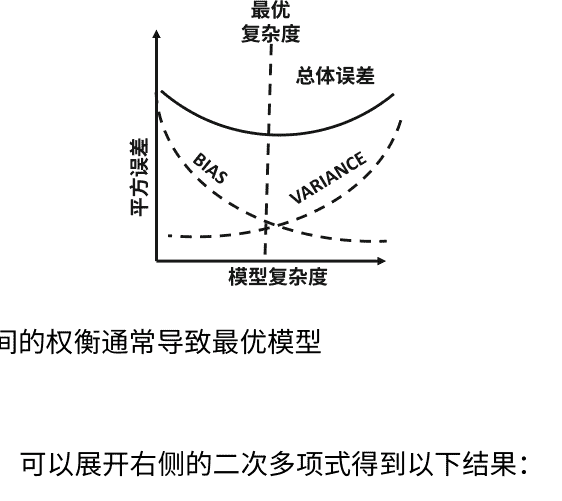

图5.3：偏差和方差之间的权衡通常导致最优模型复杂度的点。

可以展开右侧的二次多项式得到以下结果：

$$E[MSE] = \frac{1}{t}\sum_{i=1}^{t}E[\{f(\overline{Z}_i) - E[g(\overline{Z}_i, \mathcal{D})]\}^2] + \frac{2}{t}\sum_{i=1}^{t}\{f(\overline{Z}_i) - E[g(\overline{Z}_i, \mathcal{D})]\}\{E[g(\overline{Z}_i, \mathcal{D})] - E[g(\overline{Z}_i, \mathcal{D})]\} + \frac{1}{t}\sum_{i=1}^{t}E[\{E[g(\overline{Z}_i, \mathcal{D})] - g(\overline{Z}_i, \mathcal{D})\}^2] + \frac{\sum_{i=1}^{t}E[\epsilon_i^2]}{t}$$

上述表达式右侧的第二项评估为0，因为其中一个乘法因子是 $E[g(\overline{Z}_i, \mathcal{D})] - g(\overline{Z}_i, \mathcal{D})$。简化后，我们得到以下结果：

$$E[MSE] = \frac{1}{t}\sum_{i=1}^{t}\{f(\overline{Z}_i) - E[g(\overline{Z}_i, \mathcal{D})]\}^2 + \frac{1}{t}\sum_{i=1}^{t}E[\{g(\overline{Z}_i, \mathcal{D}) - E[g(\overline{Z}_i, \mathcal{D})]\}^2] + \frac{\sum_{i=1}^{t}E[\epsilon_i^2]}{t}$$
\(\underbrace{\hspace{5em}}_{\text{偏差}^2}\) \(\underbrace{\hspace{5em}}_{\text{方差}}\) \(\underbrace{\hspace{2em}}_{\text{噪音}}\)

换句话说，平方误差可以分解为（平方）偏差、方差和噪音。方差是阻止神经网络泛化的关键术语。

通常情况下，参数较多的神经网络的方差会更高。另一方面，模型参数过少会导致偏差，因为没有足够的自由度来建模数据分布的复杂性。

随着模型复杂性的增加，偏差和方差之间的权衡在图5.3中有所体现。显然，存在一个最佳模型复杂性的点，性能得到了优化。此外，训练数据的不足会增加方差。然而，仔细选择设计可以减少过拟合。本章将讨论几种这样的选择。

### 5.3 模型调优和评估中的泛化问题

在神经网络模型的训练中存在一些实际问题，由于偏差-方差权衡的关系，必须小心处理。其中第一个问题与模型调优和超参数选择有关。例如，如果使用相同的数据对神经网络进行调优，将无法获得很好的结果，因为会出现过拟合。因此，超参数（例如正则化参数）是在与神经网络的权重参数学习不同的保留集上进行调优的。

给定一个带有标签的数据集，需要将这个资源用于模型的训练、调优和测试准确性。显然，不能将整个带有标签的数据资源用于模型构建（即学习权重参数）。例如，对于模型构建和测试使用相同的数据集会严重高估准确性。这是因为分类的主要目标是将带有标签的数据的模型推广到未见过的测试实例。

此外，用于模型选择和参数调整的数据集部分需要与用于模型构建的数据集不同。一个常见的错误是在参数调整和最终评估（测试）中使用相同的数据集。这种方法部分混合了训练和测试数据，导致的准确性过于乐观。

给定的数据集应该根据数据使用的方式分为三个部分：

- 1. 训练数据：这部分数据用于构建训练模型（即在神经网络权重学习过程中）。可以使用不同的超参数和架构构建多个模型。这个过程为模型选择奠定了基础，从这些不同的模型中选择最佳算法。然而，对于选择最佳模型的实际评估不是在训练数据上进行，而是在单独的验证数据集上进行，以避免偏向过拟合的模型。
- 2. 验证数据：这部分数据用于模型选择和参数调整。在训练数据上构建的各种模型的准确性通过验证集进行测试。如第2章第2.7.1节所讨论的，参数的不同组合在范围内进行抽样，并在验证集上进行准确性测试。通过使用这个准确性确定最佳的参数组合。从某种意义上说，验证数据应该被视为一种用于调整算法参数（例如学习率、每层的层数或单元数）或选择最佳设计选择（例如sigmoid与tanh激活）的测试数据集。
- 3. 测试数据：这部分数据用于测试最终（调整后）模型的准确性。在参数调整和模型选择过程中，重要的是不要查看测试数据，以防止过拟合。测试数据仅在整个过程的最后一次使用。此外，如果分析师使用测试数据的结果来以某种方式调整模型，那么结果将受到测试数据的影响。只允许查看测试数据集一次的想法是一个非常严格的要求（也是一个重要的要求）。然而，在现实生活中的基准测试中，这种要求经常被违反。从最终准确性评估中学到的东西使用的诱惑力太大了。

标记数据集的划分为训练数据、验证数据和测试数据如图5.4所示。严格来说，验证数据也是训练数据的一部分，因为它会影响最终的模型（尽管通常只将模型构建部分称为训练数据）。按照2:1:1的比例划分是自九十年代以来一种常规的经验法则。然而，它不应被视为严格的规则。对于非常大的标记数据集，只需要少量的示例来估计准确性。当有非常大的数据集可用时，使用尽可能多的数据是有意义的。

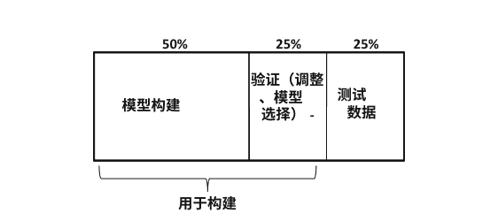

图5.4：将标记数据集划分为评估设计

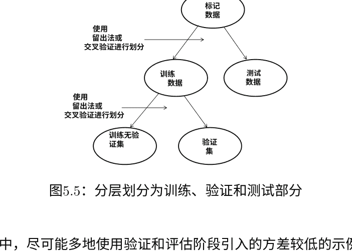

图5.5：分层划分为训练、验证和测试部分

在模型构建过程中，尽可能多地使用验证和评估阶段引入的方差较低的示例（例如，少于几千个）即可提供准确的估计。2:1:1的划分是一个经验法则，现在已经过时，因为它是从数据集较小的时代继承而来。在现代时代，数据集较大，几乎所有的点都用于训练，而只有少量（恒定数量）用于验证和测试。像98:1:1这样的划分并不罕见。

#### 5.3.1 使用留出法和交叉验证进行评估

前面描述的将标记数据分成三个部分的方法是对一种称为留出法的方法的隐式描述，用于将标记数据分成不同的部分。然而，将其分成三个部分并非一次完成。相反，首先将训练数据分成两个部分进行训练和测试。然后，测试部分被仔细隐藏起来，直到最后才能使用一次。然后，将数据集的剩余部分再次分成训练和验证部分。这种递归分割的类型如图5.5所示。

在层次结构的两个级别上，分割的类型在概念上是相同的。在接下来的内容中，我们将始终使用图5.5中第一级别分割的术语，即“训练”和“测试”数据，即使相同的方法也可以用于第二级别的模型构建和验证部分的分割。这使我们能够对分割的两个级别的评估过程提供统一的描述。

### 留出法

在留出法中，一部分实例用于构建训练模型。剩余的实例，也称为留出实例，用于测试。然后报告预测留出实例标签的准确率作为整体准确率。这种方法确保报告的准确率不是由于过拟合特定数据集而产生的，因为训练和测试使用了不同的实例。然而，这种方法低估了真实准确率。考虑这样一种情况，留出实例中某个类别的存在比标记数据集中更高。这意味着留在内部的实例对同一类别的平均存在有较低的影响，这将导致训练和测试数据之间的不匹配。此外，留在内部实例的类别频率总是与留出实例的类别频率成反比。这将导致评估中持续的悲观偏差。尽管存在这些弱点，留出法具有简单和高效的优点，因此在大规模环境中很受欢迎。从深度学习的角度来看，这是一个重要的观察，因为大数据集很常见。

### 交叉验证

在交叉验证方法中，标记数据被分成 q 个相等的部分。其中一个部分用于测试，剩下的 (q - 1) 个部分用于训练。这个过程通过使用每个部分作为测试集来重复 q 次。报告 q 个不同测试集的平均准确率。请注意，当 q 的值很大时，这种方法可以很好地估计真实准确率。一个特殊情况是选择 q 等于标记数据点的数量，因此只使用一个点进行测试。由于这个单一点被从训练数据中排除，这种方法被称为留一法交叉验证。尽管这种方法可以很好地近似准确率，但通常训练模型多次会非常耗费资源。事实上，由于效率问题，神经网络很少使用交叉验证。

#### 5.3.2 训练规模的问题

在神经网络的特定情况下，一个实际问题是训练数据集的大小很大。因此，虽然像交叉验证这样的方法在传统机器学习中被认为是优选的选择，但它们的技术可靠性常常为了效率而被牺牲。一般来说，训练时间在神经网络建模中是非常重要的考虑因素，因此为了实现实际应用，往往需要做出很多妥协。

在网格搜索超参数的情况下，常常会出现计算问题（参见第2章的2.7.1节）。即使是单个超参数的选择有时也需要几天的评估时间，而网格搜索则需要测试大量的可能性。

因此，一种常见的策略是对每个设置的训练过程运行固定数量的迭代。在不同的执行线程中，对不同的超参数选择进行多次运行。那些在固定数量的迭代后没有取得良好进展的超参数选择将被终止。最终，只有少数集成成员被允许完整运行。这种方法有效的一个原因是因为大部分进展通常在训练的早期阶段就已经完成。这个过程也在第2章的2.7.1节中有所描述。

### 5.3.3 如何检测需要收集更多数据

神经网络中的高泛化误差可能由几个原因引起。首先，数据本身可能有很多噪音，在这种情况下，为了提高准确性，很少有什么可以做的。其次，神经网络很难训练，大误差可能是算法收敛行为差的原因。误差也可能是由高偏差引起的，这被称为欠拟合。最后，过拟合（即高方差）可能导致大部分泛化误差。在大多数情况下，误差是这些不同因素的组合。然而，可以通过检查训练和测试准确性之间的差距来检测特定训练数据集中的过拟合。过拟合表现为训练和测试准确性之间的巨大差距。即使在小训练集上，训练准确率接近100%，测试误差仍然很低，这并不罕见。解决这个问题的第一个方法是收集更多的数据。随着训练数据的增加，训练准确率会降低，而测试/验证准确率会提高。然而，如果没有更多的数据可用，为了提高泛化性能，就需要使用其他技术，如正则化。

## 5.4 基于惩罚的正则化

基于惩罚的正则化是减少过拟合的最常见方法。为了理解这一点，让我们重新回顾一下多项式的例子，其次数为 $d$。在这种情况下，对于给定的 $x$ 值，$\hat{y}$ 的计算如下：

$$\hat{y} = \sum_{i=0}^{d} w_{i}x^{i}$$

可以使用具有 $d$ 个输入和一个带有权重的偏置神经元的单层网络来建模这个预测。第 $i$ 个输入是 $x^{i}$。这个神经网络使用线性激活函数和平方损失函数来训练一组训练实例。来自数据集 $\mathcal{D}$ 的实例 $(x, y)$ 的损失 $L$ 可以定义如下：

$$L = \sum_{(x, y) \in \mathcal{D}} (y - \hat{y})^{2}$$

正如在图5.2的例子中讨论的那样，$d$ 的值越大，过拟合的风险越高。解决这个问题的一种可能方法是减小 $d$ 的值。换句话说，使用具有参数经济性的模型会导致一个更简单的模型。例如，将 $d$ 减小到1会创建一个具有较少自由度并且倾向于在不同训练样本上以类似方式拟合数据的线性模型。然而，这样做确实会失去一些表达能力，当数据模式确实复杂时。换句话说，过度简化会降低神经网络的表达能力，使其无法充分调整到不同类型的数据集的需求。

如何在不引起过度拟合的情况下保留一些表达能力？不是通过硬性减少参数数量，而是可以对参数的使用施加软性惩罚。此外，参数的大（绝对）值比小值受到更严厉的惩罚，因为小值对预测的影响不大。可以使用什么样的惩罚？最常见的选择是 $L_{2}$ 正则化，也称为Tikhonov正则化。在这种情况下，额外的惩罚由参数值的平方和定义。然后，对于正则化参数 $\lambda > 0$，可以定义正则化目标函数 $J$（包括损失 $L$）如下：

$$J = \underbrace{\sum_{(x,y) \in \mathcal{D}} (y - \hat{y})^2}_{L} + \lambda \cdot \sum_{i=0}^{d} w_i^2$$

增加或减少 $\lambda$ 的值会减少惩罚的程度。可以调整这个参数以在数据集的一部分上获得最佳性能。使用这种方法比起一开始就固定模型的复杂度更加灵活。考虑上面讨论的多项式回归的情况。一开始限制参数的数量会严重限制学习到的多项式的形状（例如，线性模型），而软惩罚能够以更加数据驱动的方式控制学习到的多项式的形状。一般而言，实验证明使用带有正则化的复杂模型（例如，更大的神经网络）比起不带正则化的简单模型更加理想。前者还通过提供可调节的旋钮（即，正则化参数）提供了更大的灵活性，可以以数据驱动的方式选择，而不是一开始就对模型的大小做出刚性决策。

正则化如何影响神经网络中的更新？对于给定的权重 $w_i$ 在神经网络中，更新由梯度下降（或其批处理版本）定义：

$$w_i \leftarrow w_i - \alpha \frac{\partial J}{\partial w_i}$$

在这里，$\alpha$ 是学习率。使用 $L_2$ 正则化大致等同于在每次参数更新后使用衰减约束：

$$w_i \leftarrow w_i(1 - \alpha\lambda) - \alpha \frac{\partial L}{\partial w_i}$$

请注意，上述更新首先将权重与衰减因子 $(1 - \alpha\lambda)$ 相乘，然后使用基于梯度的更新。如果我们假设权重的初始值接近于0，则可以将权重的衰减解释为一种生物学解释。可以将权重衰减视为一种遗忘机制，将权重接近其初始值。这确保只有重复的更新对权重的绝对值产生显著影响。遗忘机制防止模型记忆训练数据，因为只有重要且重复的更新会反映在权重中。

### 5.4.1 带噪声注入的连接

将噪声添加到输入中与基于惩罚的正则化有关。可以证明，向每个输入添加相等数量的高斯噪声等效于具有恒等激活函数（用于线性回归）的单层神经网络的Tikhonov正则化。

证明这个结果的一种方法是检查单个训练案例 $(X, y)$，在添加方差为 $\lambda$ 的噪声到每个特征之后变为 $(X + \sqrt{\lambda} \epsilon, y)$。这里，$\epsilon$ 是一个随机向量，其中每个条目 $\epsilon_i$ 都是从均值为零，方差为一的标准正态分布中独立抽取的。然后，基于 $X + \sqrt{\lambda} \epsilon$ 的噪声预测 $\hat{y}$ 如下所示：

$$\hat{y} = W \cdot (X + \sqrt{\lambda} \epsilon) = W \cdot X + \sqrt{\lambda} W \cdot \epsilon \quad (5.7)$$

现在，让我们来检查平方损失函数 $L=(y-\hat{y})^2$ 由单个训练案例贡献。我们将计算损失函数的期望值。很容易证明以下期望值：

$$E[L] = E[(y-\hat{y})^2] = E[(y - W \cdot X - \sqrt{\lambda} W \cdot \epsilon)^2]$$

然后可以将右侧的表达式展开如下：

$$E[L] = (y - W \cdot X)^2 - 2\sqrt{\lambda}(y - W \cdot X) E[W \cdot \epsilon] + \lambda E[(W \cdot \epsilon)^2]$$
$$= (y - W \cdot X)^2 + \lambda E[(W \cdot \epsilon)^2]$$

第二个表达式可以使用 $\vec{\epsilon} = (\epsilon_1 \ldots \epsilon_d)$ 和 $W = (w_1 \ldots w_d)$。此外，可以将任何形式的项 $E[\epsilon_i \epsilon_j]$ 设置为 $E[\epsilon_i] \cdot E[\epsilon_j] = 0$，因为随机变量 $\epsilon_i$ 和 $\epsilon_j$ 是独立的。任何形式的项 $E[\epsilon_i^2]$ 被设置为1，因为每个 $\epsilon_i$ 是从标准正态分布中抽取的。展开 $E[(W \cdot \vec{\epsilon})^2]$ 并进行上述替换，可以得到以下结果：

$$E[L] = (y - W \cdot X)^2 + \lambda \left(\sum_{i=1}^d w_i^2\right)$$ (5.8)

值得注意的是这个损失函数与 $L_2$ 正则化对于单个实例的损失完全相同。

尽管在线性回归的情况下，权重衰减和噪声添加之间的等价性是成立的，但在具有非线性激活函数的神经网络的情况下，分析并不完全准确。然而，在这些情况下，基于惩罚的正则化仍然与噪声添加直观上相似。由于这些相似之处，有时候人们会尝试通过直接添加噪声来进行正则化。其中一种方法被称为数据扰动，在训练输入中添加噪声，并使用添加噪声后的测试数据点进行预测。这种方法在第5.5.5节中有描述。

### 5.4.2 $L_1$-正则化

使用平方范数惩罚，也被称为 $L_2$-正则化是正则化的最常见方法。然而，也可以使用其他类型的参数惩罚。常见的方法是 $L_1$-正则化将平方惩罚替换为对系数绝对值之和的惩罚。

因此，新的目标函数如下：

$$J = L + \lambda \cdot \sum_{i=0}^d |w_i| = \sum_{(x,y)\in\mathcal{D}} (y-\hat{y})^2 + \lambda \cdot \sum_{i=0}^d |w_i|$$

这个目标函数的主要问题是它包含了项 $|w_i|$，当 $w_i$ 等于0时不可微分。这需要对梯度下降方法进行一些修改，当 $w_i$ 等于0时。对于 $w_i$ 非零时，可以使用通过计算偏导数得到的直接更新。通过对上述目标函数进行微分，我们可以至少定义出在 $w_i$ 不等于0的情况下的更新方程：

$$w_i \leftarrow w_i - \alpha \lambda s_i - \alpha \frac{\partial L}{\partial w_i}$$

$s_i$ 的值是 $|w_i|$ 关于 $w_i$ 的偏导数，如下所示：

$$s_i = \begin{cases} -1 & w_i < 0 \\ +1 & w_i > 0 \end{cases}$$

然而，我们也需要为 $w_i$ 的值恰好为0的情况设置 $|w_i|$ 的偏导数。一种可能性是使用次梯度方法，其中 $w_i$ 的值被随机设置为 $\{-1, +1\}$ 中的一个值。然而，这在实践中并不是必需的。计算机是有限精度的，计算误差很少会导致 $w_i$ 恰好为0。因此，计算误差通常会执行本应由随机抽样完成的任务。此外，对于那些 $w_i$ 的值恰好为0的罕见情况，可以省略正则化并将 $s_i$ 设置为0。这种对次梯度方法的近似在许多情况下都能很好地工作。

更新方程中的一个区别是 $L_1$-正则化和 $L_2$-正则化之间的区别在于 $L_2$-正则化使用乘法衰减作为遗忘机制，而 $L_1$-正则化使用加法更新作为遗忘机制。在这两种情况下，正则化部分的更新倾向于将系数移动到接近0的位置。然而，它们具有不同的特性，这将在下一节中讨论。

### 5.4.3 $L_1$-或 $L_2$-正则化？

一个问题出现了，是否 $L_1$- 或 $L_2$-正则化是可取的。从准确性的角度来看，$L_2$-正则化通常优于 $L_1$-正则化。这就是 $L_2$-正则化几乎总是优于 $L_1$-正则化在大多数实现中使用的原因。

当输入和单元的数量较大时，性能差距很小。

然而，$L_1$-正则化从可解释性的角度来看确实有特定的应用。一个有趣的特性是 $L_1$-正则化会创建稀疏解，其中绝大多数的 $w_i$ 值在忽略计算误差后都是0。

如果 $w_i$ 的值为零，对于连接到输入层的连接，则该特定输入对最终预测没有影响。换句话说，这样的输入可以被丢弃，而 $L_1$ 正则化器可以作为特征选择器。因此，可以使用 $L_1$ 正则化器来估计哪些特征对于当前应用是有预测能力的。

隐藏层中连接的权重设置为0怎么办？这些连接可以被丢弃，从而得到一个稀疏的神经网络。这种稀疏的神经网络在重复对同一类型的数据集进行训练时非常有用，但数据集的性质和更广泛的特征不会随时间显著改变。由于稀疏的神经网络只包含原始神经网络中的一小部分连接，因此每当接收到更多的训练数据时，可以更高效地重新训练。

### 5.4.4 惩罚隐藏单元：学习稀疏表示

到目前为止，已经讨论的基于惩罚的方法对神经网络的参数进行惩罚。另一种方法是对神经网络的激活进行惩罚，以便在任何给定的数据实例中只有一小部分神经元被激活。换句话说，即使神经网络可能很大且复杂，但只有其中的一小部分用于预测任何给定的数据实例。

实现稀疏性的最简单方法是对隐藏单元施加 $L_1$ 惩罚。换句话说，第 $i$ 个隐藏单元的损失是 $\lambda |h(i)|$，其中 $\lambda$ 是正则化参数。因此，原始损失函数 $L$ 被修改为正则化损失函数 $L^+$ 如下所示：

$$L^+ = L + \sum_{i=1}^M L_i^h = L + \lambda \sum_{i=1}^M |h(i)|$$ (5.9)

这里，$M$ 是网络中的总单元数，而 $h(i)$ 是第 $i$ 个隐藏单元的值。

正如第2章第265节所讨论的，损失函数的这种变化不会影响反向传播的整体动态和原则。反向传播算法需要进行修改，以便将隐藏单元贡献的正则化惩罚纳入到该节点的反向梯度流中。让 $\Delta(i)$ 表示对节点 $i$ 的预激活值的损失导数，而 $A(i)$ 表示与节点 $i$ 通过从节点 $i$ 出发的出边连接的节点集合。此外，让 $\Phi'_i$ 表示节点 $i$ 处激活函数的局部导数的数值，而 $w_{ij}$ 表示从节点 $i$ 到节点 $j$ 的边的权重。我们重复第2章第265节的方程式235，该方程式显示如何通过额外的流动项来考虑节点惩罚的影响：

$$\Delta(i) \leftarrow [\Phi'_i \sum_{j \in A(i)} w_{ij} \Delta(j)] + \Phi'_i \frac{\partial L_i^h}{\partial h(i)}$$ (5.10)

上述更新是针对节点 $i$ 的，因为它计算了损失相对于节点 $i$ 的预激活变量的偏导数。第二项考虑了节点的惩罚。可以简化此更新以获得以下结果：

$$\Delta(i) \leftarrow [\Phi'_i \sum_{j \in A(i)} w_{ij} \Delta(j)] + \lambda \Phi'_i \text{sign}\{h(i)\}$$ (5.11)

换句话说，对于节点特定的梯度更新所需的唯一更改是添加该节点处正则化惩罚的导数。

## 5.5 集成方法

集成方法从偏差-方差权衡中获得灵感。减少分类器误差的一种方法是找到一种设计分类器以减少偏差平方和方差的方法。神经网络中的大多数集成方法都专注于减少方差。这是因为神经网络以能够构建复杂模型且偏差相对较低而受到重视。然而，在偏差-方差权衡的复杂端操作几乎总是导致更高的方差，表现为过拟合。因此，本节将重点介绍这种方差减少方法。

### 5.5.1 Bagging和子抽样

想象一下，如果你有一个无限的训练数据资源可用，你可以从基本分布中生成任意数量的训练点。在这种情况下，减少方差的一种自然方法是反复创建不同的训练数据集。使用这些数据集来预测相同的测试实例。然后可以对不同的数据集进行预测平均，得到最终的预测结果。如果使用足够多的训练数据集，预测的方差将降低到0，尽管偏差仍取决于模型的选择。

上述方法只能在有无限的数据资源可用时使用。然而，在实践中，我们只有一个有限的数据实例可用。在这种情况下，显然无法实施上述方法。然而，事实证明，对上述方法进行不完美的模拟仍然比在整个训练数据集上单次执行模型具有更好的方差特性。基本思想是通过抽样从单个基本数据实例生成新的训练数据集。抽样可以进行有放回或无放回。然后，将从使用不同训练集构建的模型获得的对特定测试实例的预测进行平均，以创建最终的预测结果。可以对实值预测（例如，类标签的概率估计）或离散预测进行平均。在实值预测的情况下，有时使用值的中位数可以获得更好的结果。

通常使用softmax函数来产生离散输出的概率预测。如果将概率预测值进行平均，通常会对这些值的对数进行平均。这相当于使用概率的几何平均值。对于离散预测，通常使用算术平均投票。这种对离散和概率预测处理的区别也适用于其他需要对预测结果进行平均的集成方法。这是因为概率的对数具有对数似然解释，而对数似然是固有可加性的。

-   装袋和子采样的主要区别在于创建采样训练数据集时是否使用替换。我们总结如下这些方法：

1.  装袋：在装袋中，训练数据是带有替换的采样。样本大小 $s$ 可能与训练数据大小 $n$ 不同，尽管经典方法是将 $s$ 设置为 $n$。在后一种情况下，重新采样的数据将包含重复项，大约有一部分 $(1 - 1/n)^n \approx 1/e$ 的原始数据集将完全不包含在内。这里，符号 $e$ 表示自然对数的底数。在重新采样的训练数据集上构建模型，并对每个测试实例使用重新采样的数据进行预测。重新采样和模型构建的整个过程重复 $m$ 次。对于给定的测试实例，这 $m$ 个模型中的每一个都应用于测试数据。来自不同模型的预测然后取平均值，得到一个单一的稳健预测。尽管经典的装袋使用 $s = n$，但通常选择比 $n$ 小得多的 $s$ 值可以获得最佳结果。

2.  子采样与装袋类似，只是不重复地创建数据样本来构建不同的模型。来自不同模型的预测值取平均。在这种情况下，选择 $s < n$ 是至关重要的，因为选择 $s = n$ 会产生相同的训练数据集，并在不同的集成组件之间产生相同的结果。

当有足够的训练数据时，子采样通常优于装袋。然而，当可用数据量有限时，使用装袋是有意义的。值得注意的是，使用装袋或子采样不能完全消除所有方差，因为不同的训练样本会有重叠的点。因此，来自不同样本的测试实例的预测结果将呈正相关。一组正相关的随机变量的平均值总是具有正相关性的方差会增加。因此，在预测中总会存在残差方差。这种残差方差是基于以下事实的结果，即装袋和子采样是从基本分布中抽取训练数据的不完美模拟。尽管如此，这种方法的方差仍然低于在整个训练数据集上构建单个模型的方差。直接使用装袋进行神经网络训练的主要挑战在于必须构建多个训练模型，这是非常低效的。然而，不同模型的构建可以完全并行化，使得这种方法具有高度可扩展性。

### 5.5.2 参数模型选择和平均

在神经网络构建的情况下，一个挑战是选择大量的超参数，如网络的深度和每层神经元的数量。此外，激活函数的选择也会对性能产生影响，具体取决于所处理的应用。大量参数的存在在模型构建中会带来问题，因为性能可能对特定的配置敏感。一种可能性是保留一部分训练数据，并尝试不同的参数和模型选择组合。然后，选择在保留的训练数据部分上提供最高准确性的组合用于预测。

这当然是所有机器学习模型参数调整的标准方法，也被称为模型选择。从某种意义上说，模型选择本质上是一种集成为中心的方法，选择最佳模型。因此，这种方法有时也被称为模型集合技术。

深度学习环境中的主要问题是可能的配置数量相当大。例如，可能需要选择层数、每层的单元数和激活函数。这些可能性的组合相当大。因此，人们通常只能尝试有限数量的可能性来选择配置。另一种用于减少方差的方法是选择 $k$ 个最佳配置，然后对这些配置的预测进行平均。

这种方法可以得到更稳健的预测，特别是如果配置彼此非常不同。即使每个单独的配置可能不是最优的，整体预测仍然会非常稳健。与装袋法类似，可以并行训练多个配置。

### 5.5.3 随机连接丢弃

在多层神经网络中，不同层之间的连接随机丢弃经常导致不同的模型，这些模型使用不同的特征组合来构建隐藏变量。由于层之间的连接丢弃会给模型构建过程增加约束，因此会创建出更弱的模型。

然而，由于不同模型中随机丢弃的连接不同，因此不同模型的预测结果非常多样。这些不同模型的平均预测通常非常准确。值得注意的是，在这种方法中，不同模型的权重是不共享的，这与另一种称为 Dropout 的技术不同。随机连接丢弃可以用于任何类型的预测问题，而不仅仅是分类问题。例如，该方法已经被用于自编码器集合进行异常检测 [64]。

正如第3章第3.4.4节中讨论的那样，自编码器可以通过估计每个数据点的重构误差来进行异常检测。[64]中的工作使用了多个具有随机连接的自编码器，然后进行聚合。

为了创建一个数据点的得分，需要从这些不同的组件中获取异常值得分。然而，在[64]中，使用中位数比均值更受青睐。在[64]中已经证明，这种方法可以提高异常值检测的整体准确性。值得注意的是，这种方法表面上看起来与Dropout和Drop Connect相似，但实际上是完全不同的。这是因为像Dropout和Drop Connect这样的方法在不同的集成组件之间共享权重，而这种方法不共享任何集成组件之间的权重。

### 5.5.4 Dropout

Dropout是一种使用节点采样而不是边缘采样来创建神经网络集成的方法。如果一个节点被丢弃，那么与该节点相关的所有传入和传出连接也需要被丢弃。节点只从网络的输入层和隐藏层中进行采样。请注意，如果对输出节点进行采样，将无法提供预测和计算损失函数。在某些情况下，输入节点的采样概率与隐藏节点的采样概率不同。因此，如果完整的神经网络包含M个节点，则可能的采样网络总数为2M。

与前一节讨论的连接采样方法不同的一个关键点是，不同采样网络的权重是共享的。因此，Dropout将节点采样与权重共享相结合。然后，训练过程使用单个采样示例来使用反向传播更新采样网络的权重。训练过程按照以下步骤进行，以便循环遍历网络中的所有训练点：

- 1. 从基础网络中采样一个神经网络。输入节点的每个节点都以概率 p_i 进行采样，隐藏节点的每个节点都以概率 p_h 进行采样。此外，所有样本彼此独立。当从网络中移除一个节点时，所有与其相连的边也会被移除。
- 2. 采样单个训练实例或一批训练实例。
- 3. 使用采样的训练实例或一批训练实例上的反向传播来更新网络中保留的边的权重。

通常会以20%至50%的概率丢弃节点。通常会使用较大的学习率与动量，同时通过对权重进行最大范数约束来调节。换句话说，每个节点输入的权重的L2范数受到约束，不会超过一个小的常数，比如3或4。

值得注意的是，每个小的迷你批次训练样本都会使用不同的神经网络。因此，采样的神经网络数量相当大，并且取决于训练数据集的大小。这与大多数其他集成方法（如装袋法）不同，其中集成组件的数量很少超过25个。在Dropout方法中，会采样数千个具有共享权重的神经网络，并使用一个小的训练数据集来更新每种情况下的权重。即使采样了大量的神经网络，采样出来的神经网络占基本可能性的比例仍然微小。这类神经网络的另一个假设是输出以概率的形式呈现。这个假设对于如何组合不同神经网络的预测结果有影响。

如何使用神经网络集成来为一个未见过的测试实例创建预测？一种可能性是使用所有神经网络对测试实例进行预测，然后使用不同网络预测的概率的几何平均值。使用几何平均值而不是算术平均值，是因为假设网络的输出是概率，而几何平均值等同于对数似然的平均。例如，如果神经网络具有 $k$ 个与 $k$ 个类对应的概率输出，而第 $j$ 个集成产生了一个关于第 $i$ 个类的输出为 $p_i^{(j)}$，则第 $i$ 个类的集成估计计算如下：

$$ p_i^{Ens} = \left[ \prod_{j=1}^m p_i^{(j)} \right]^{1/m} $$

这里，$m$ 是集成组件的总数，在 Dropout 方法中可能非常大。这种估计的一个问题是使用几何平均值会导致不同类别的概率不总和为1。因此，概率值被重新归一化，使它们总和为1:

$$ p_i^{Ens} \leftarrow \frac{p_i^{Ens}}{\sum_{i=1}^k p_i^{Ens}} $$

这种方法的主要问题是集成组件的数量太大，导致方法效率低下。

Dropout 方法的一个关键洞察是不需要在所有集成组件上评估预测。相反，可以在只有基本网络（没有丢弃）上进行前向传播，然后重新缩放权重。基本思想是将每个单元的输出权重乘以采样该单元的概率。通过使用这种方法，可以捕捉到从采样网络中得到的该单元的期望输出。这个规则被称为权重缩放推理规则。使用这个规则还确保了进入一个单元的输入与在采样网络中出现的预期输入相同。

对于许多具有线性激活函数的网络，权重缩放推理规则是精确的，尽管对于具有非线性的网络，该规则并不完全正确。在实践中，该规则在各种各样的网络中表现良好。由于大多数实际的神经网络具有非线性激活函数，Dropout 的权重缩放推理规则应被视为一种启发式方法，而不是理论上证明的结果。

Dropout 的主要作用是将正则化纳入学习过程中。通过同时丢弃输入单元和隐藏单元，Dropout 有效地将噪声引入到输入数据和隐藏表示中。这种噪声的性质可以被视为一种掩蔽噪声，其中一些输入和隐藏单元被设置为0。添加噪声是一种正则化形式。在原始论文[483]中已经证明，Dropout 这种方法比其他正则化器（如权重衰减）效果更好。Dropout 防止了隐藏单元之间发生的特征共适应现象。

由于 Dropout 的效果是一种掩蔽噪声，它强制在不同隐藏单元学习的特征之间存在一定程度的冗余。这种冗余导致了增强的鲁棒性。

Dropout 是有效的，因为每个采样的子网络都是用一小组采样实例进行训练的。因此，只需要额外完成对隐藏单元的采样工作。然而，由于 Dropout 是一种正则化方法，它降低了网络的表达能力。因此，为了充分利用 Dropout 的全部优势，需要使用更大的模型和更多的单元。这导致了隐藏计算的开销。此外，如果原始训练数据集已经足够大，以减少过拟合的可能性，那么 Dropout的额外计算优势可能很小，但仍可察觉。例如，许多在像 ImageNet [263] 这样的大型数据存储库上训练的卷积神经网络报告使用 Dropout后结果持续改善约2%。一种变体是 DropConnect，它将类似的方法应用于权重而不是神经网络节点 [531]。

### 关于特征共适应的注释

为了理解为什么 Dropout有效，了解特征共适应的概念是有用的。理想情况下，神经网络的隐藏层应该创建反映输入的重要分类特征的特征，而不依赖于其他特征，除非这些其他特征真正有用。为了理解这一点，考虑这样一种情况：每层中与 50%的节点相连的所有边都固定为初始随机值，并且在反向传播过程中不进行更新（尽管所有梯度都是以正常方式计算的）。有趣的是，即使在这种情况下，神经网络通常也能通过调整其他权重和特征来适应这些随机固定的权重子集（以及相应的激活）而提供相当好的结果。当然，这并不是一种理想的情况，因为特征共同工作的目标是结合每个重要特征所具有的能力，而不仅仅是让一些特征适应其他特征的不利影响。即使在神经网络的正常训练中（其中所有权重都会更新），这种共适应也可能发生。例如，如果神经网络的某些部分的更新速度不够快，一些特征将变得无用，而其他特征将适应这些不太有用的特征。这种情况在神经网络训练中非常常见，因为神经网络的不同部分确实倾向于以不同的速度学习。当共适应的特征在预测训练点方面表现良好时，会出现更令人担忧的情况，因为它们捕捉到了训练点中的复杂依赖关系，而这些依赖关系在样本外的测试点上不具有很好的泛化能力。Dropout通过强制神经网络仅使用输入和激活的子集来防止这种共适应类型。这迫使网络能够以一定程度的冗余进行预测，同时鼓励较小的学习特征子集具有预测能力。换句话说，只有在建模过程中真正需要而不是学习训练数据的随机细微差别时，才会发生共适应。当然，这是一种正则化的形式。此外，通过学习冗余特征，Dropout对冗余特征的预测进行平均，类似于装袋法。

### 5.5.5 数据扰动集成

许多方差减少方法，如基于惩罚的正则化和 Dropout等效于噪声注入。数据扰动明确地向训练数据中注入噪声。在最简单的情况下，可以向输入数据中添加少量噪声，并且可以在扰动数据上学习权重。可以通过多次添加这样的扰动到训练数据中来重复此过程，并且不需要添加到测试数据中。当明确添加噪声时，重要的是在多次运行中对相同的测试实例进行预测的平均，以确保解决方案正确地表示损失的期望值（不受噪声引起的方差影响）。这种方法是一种通用的集成方法，不仅限于神经网络。如第5.10节所讨论的，在无监督设置中常常使用这种方法与去噪自编码器一起。它也可以向隐藏层添加噪声。然而，在这种情况下，噪声必须经过仔细校准[396]。值得注意的是，Dropout方法通过随机丢弃节点间接地向隐藏层添加噪声。被丢弃的节点类似于掩蔽噪声，该节点的激活值被设置为0。

还可以执行其他类型的数据集增强。例如，可以旋转或平移图像实例以增加数据集。精心设计的数据增强方案通常可以大大提高学习器的准确性，增加其泛化能力。然而，严格来说，这样的方案不属于扰动方案，因为增强的示例是通过校准的过程和对领域的理解创建的。这种方法在卷积神经网络中常见（参见第9章的9.3.4节）。

## 5.6 提前停止

神经网络使用梯度下降方法的变种进行训练。在大多数优化模型中，梯度下降方法被执行到收敛。然而，执行梯度下降到收敛只优化了训练数据上的损失，而不一定优化了样本外的测试数据。这是因为最后几步往往过拟合于训练数据的细微差异，这可能不会很好地推广到测试数据。

解决这个困境的一个自然方法是使用提前停止。在这种方法中，训练数据的一部分被保留作为验证集。基于反向传播的训练仅应用于不包括验证集的训练数据部分。同时，不断监测模型在验证集上的误差。在某个时刻，尽管在训练集上误差继续减小，但在验证集上误差开始上升。这是进一步训练导致过拟合的点。因此，可以选择这个点作为终止点。在学习过程中，重要的是跟踪到目前为止在验证数据上获得的最佳解决方案。这是因为在样本外误差微小增加时不会进行提前停止（这可能是由于噪声变化引起的），但建议继续训练以检查误差是否继续上升。换句话说，在验证集上的误差继续上升，且改善验证集上的误差性能的希望已经丧失后，才选择终止点。

早停法的一个优点是它可以轻松地添加到神经网络训练中，而不会显著改变训练过程。此外，像权重衰减这样的方法需要我们尝试不同的正则化参数值，λ，这可能是昂贵的。由于它与现有算法的结合容易，早停法可以与其他正则化器相对简单地结合使用。因此，几乎总是使用早停法，因为将其添加到学习过程中不会损失太多。

可以将早停法视为对优化过程的一种约束。通过限制梯度下降中的步骤数，实际上限制了最终解与初始化点之间的距离。向机器学习问题的模型添加约束通常是一种正则化形式。

### 5.6.1 从方差的角度理解提前停止

理解偏差-方差权衡的一种方式是，只有当我们拥有无限数据时，才能构建优化问题的真实损失函数。如果我们只有有限的数据量，从训练数据构建的损失函数无法反映真实损失函数。图5.6展示了真实损失函数及其在训练数据上的偏移对应的轮廓的说明性示例。这种偏移是由特定训练数据集所创建的预测方差的间接表现。不同的训练数据集将以不同且不可预测的方式使损失函数发生偏移。

不幸的是，学习过程只能在训练数据集上定义的损失函数上执行梯度下降，因为真实的损失函数是未知的。然而，如果训练数据代表真实的损失函数，两种情况下的最优解将会相当接近，如图5.6所示。正如第4章所讨论的那样，大多数梯度下降过程在寻找最优解时会采取迂回和振荡的路径。在收敛到最优解（在训练数据上）的最后阶段，梯度下降通常会在真实的损失函数上遇到更好的解，然后才会收敛到相对于训练数据的最佳解。这些解将通过验证集上的改进准确性来检测，因此提供了良好的终止点。图5.6展示了一个良好的早停止点的示例。

## 5.7 无监督预训练

由于前一章中讨论的多种不同特性，深度网络本质上很难训练。其中一个问题是梯度爆炸和梯度消失问题。因此，神经网络的不同层次不能以相同的速度进行训练。神经网络的多个层次会导致梯度失真，使其难以训练。

在这个背景下，一个突破性的进展是使用无监督预训练来提供稳健的初始化[206]。通过逐层贪婪地训练网络来实现这种初始化。这种方法最初是在深度置信网络的背景下提出的，但后来扩展到其他类型的模型，如自编码器[402, 526]。在本章中，我们将研究自编码器方法，因为它很简单。首先，我们将从降维应用开始，因为这种应用是无监督的，并且很容易展示如何在这种情况下使用无监督预训练。然而，无监督预训练也可以用于带有轻微修改的有监督应用，如分类。

在预训练中，采用贪婪的方法逐层训练网络，先学习外部隐藏层的权重，然后学习内部隐藏层的权重。得到的权重被用作传统神经网络反向传播的起始点，以便对其进行微调。

考虑图5.7中的自编码器和分类器架构。由于这些架构有多个层，随机初始化有时会带来挑战。然而，可以通过贪婪的方式逐层设置初始权重来创建一个良好的初始化。首先，我们描述了自编码器的过程，如图5.7(a)所示，尽管几乎相同的过程也适用于图5.7(b)中的分类器。我们故意选择了两种情况下的神经网络架构，使得隐藏层具有相似数量的节点。

预训练过程如图5.8所示。基本思想是假设两个（对称的）外部隐藏层包含更高维度的第一级降维表示，而内部隐藏层包含更低维度的第二级降维表示。因此，第一步是使用图5.8(a)中的简化网络学习第一级降维表示和与外部隐藏层相关的权重。在该网络中，中间隐藏层缺失，两个外部隐藏层被合并为一个隐藏层。假设是两个外部隐藏层之间存在对称关系，就像一个较小的自编码器。在第二步中，使用第一步中的降维表示来学习内部隐藏层的第二级降维表示（和权重）。因此，神经网络的内部部分被视为一个更小的自编码器。由于这些预训练的子网络要小得多，权重可以更容易地学习。然后，使用这组初始权重来进行整个神经网络的反向传播训练。请注意，对于包含任意数量隐藏层的深度神经网络，此过程可以以逐层的方式执行。

到目前为止，我们只讨论了如何在无监督应用中使用无监督预训练。一个自然的问题是如何在有监督应用中使用预训练。考虑一个具有单个输出层和 $k$ hidden层的多层分类架构。在预训练阶段，移除输出层，并以无监督方式学习最终隐藏层的表示。这是通过创建一个具有 $2 \cdot k - 1$ 个隐藏层的自编码器来实现的，其中中间层是有监督设置的最终隐藏层。例如，图57(b)的相关自编码器显示在图57(a)中。因此，额外的 $(k - 1)$ 个隐藏层被添加，每个隐藏层在原始网络中都有一个对称的对应层。这个网络的训练方式与上面讨论的自编码器架构完全相同。只使用这个自编码器的编码器部分的权重来初始化进入所有隐藏层的权重。最终隐藏层和输出层之间的权重也可以通过将最终隐藏层和输出节点视为单层网络来初始化。这个单层网络使用预训练中学习到的最终隐藏层的降维表示进行输入。

在所有层的权重学习完成后，输出节点重新连接到最后一个隐藏层。反向传播算法应用于这个初始化的网络，以微调从预训练阶段得到的权重。请注意，这种方法以无监督的方式学习所有初始的隐藏表示，只有进入输出层的权重使用标签进行初始化。因此，预训练仍然可以被认为主要是无监督的。

在早期，预训练通常被视为训练深度网络的更稳定的方法，不同层之间初始化的机会更好。尽管这个问题确实在解释预训练的改进方面起到了一定作用，但问题通常表现为过拟合。正如第4章讨论的那样，在网络出现梯度消失问题时，早期层的（最终收敛的）权重可能与其随机初始化时变化不大。即使前几层的连接权重是随机的（由于训练不良的结果），后面的层仍然可以适应其权重，以使误差为零，即使在训练数据上也是如此。在这种情况下，早期层中的随机连接提供了接近随机的转换给后续层，但后续层仍然能够过拟合这些特征，以提供非常低的训练误差。换句话说，后续层中的特征会根据训练的低效性而适应早期层中的特征。由于训练的低效性导致的任何特征共适应几乎总是导致过拟合。因此，当这种方法应用于未见过的测试数据时，过拟合就变得明显，因为各个层次并没有专门适应这些未见过的测试实例。从这个意义上说，预训练是一种不寻常的正则化形式。

顺便说一下，即使在训练数据量非常大的情况下，无监督预训练也有所帮助。很可能这种行为是因为预训练在模型泛化之外的问题上有所帮助。这一事实的一个证据是，在更大的数据集上，即使在训练数据上的误差也很高，如果不使用预训练等方法。在这些情况下，早期层的权重通常不会从其初始化中改变太多，并且只使用了少量后续层对数据进行随机转换（由早期层的随机初始化定义）。因此，网络的训练部分相当浅，由于随机转换而导致一些额外的损失。在这种情况下，预训练还可以帮助模型实现深度的全部好处，从而促进在更大的数据集上提高预测准确性。

> 这个原则在图像分类的上下文中由Geoff Hinton [202]总结如下：“要识别形状，首先学会生成图像。这种类型的正则化在参数空间的一个语义相关区域中预先调整了训练过程，在这个区域中已经学到了几个重要特征，并且进一步训练可以微调和组合它们进行预测。”

### 5.7.1 无监督预训练的变种

有许多不同的方式可以引入无监督预训练的变化。例如，可以同时训练多个层，而不是一次只进行预训练一个层。一个特例是 VGG(参见第9章的9.4.3节)，其中甚至训练了十一层更深的架构。确实，在预训练中尽可能地将许多层分组在一起有一些优势，因为使用更大的神经网络片段进行（成功的）训练会导致更强大的初始化。另一方面，在每个预训练条件中将太多层分组在一起可能会导致问题（例如梯度消失和梯度爆炸问题）。图5.8的预训练过程假设自编码器在完全对称的方式下工作，即编码器的第 k层的减少与解码器中其镜像层的减少大致相似。这在实践中可能是一个限制性的假设，如果在不同的层中使用不同类型的激活函数。例如，编码器的特定层中的sigmoid激活函数只会产生非负值，而匹配的解码器中的tanh激活函数则不同。解码器的某一层可能会产生正值和负值。另一种方法是使用一种放松的预训练架构，在其中我们学习编码器中第k级降维和解码器中其镜像的分别降维。这允许编码器和解码器中的相应降维是不同的。必须在两个层之间添加一个额外的权重层，以允许两个降维之间的差异。这个额外的权重层在降维后被丢弃，只有编码器-解码器权重被保留。唯一一个不使用额外权重进行预训练的位置是内部降维，其过程与之前的部分类似（参见图5.8(b)）。图5.8(a)的第一级降维的一个例子如图5.9所示。请注意，在这种情况下，编码器和解码器层的第一级表示可能会有很大的差异，这在预训练过程中提供了一定的灵活性。当该方法用于分类时，只能使用编码器中的权重，并且最终的降维码可以用一个分类层进行学习。

### 5.7.2 关于监督预训练的问题？

到目前为止，我们只讨论了无监督预训练，无论基础应用是监督还是无监督。即使在基础应用是监督的情况下，初始化也是使用无监督的自编码器架构进行的。虽然也可以进行监督预训练，但有一个有趣且令人惊讶的结果是，在某些情况下，监督预训练似乎不如无监督预训练产生好的结果[31, 116]。这并不意味着监督预训练从不有用。事实上，有些网络的训练非常困难，因为它们的深度问题。例如，具有数百层的网络非常难以训练，因为涉及到收敛和其他问题。在这种情况下，即使在训练数据上的错误也很高，这意味着无法使训练算法正常工作。这是一个与模型泛化不同的问题。

除了监督预训练之外，许多技术，如构建 highway网络 [168, 486]、门控网络 [214]和残差网络 [194]，可以解决许多这些问题。然而，这些解决方案并没有具体解决过拟合问题，而无监督预训练似乎在至少某些类型的网络中同时解决了这两个问题。

在监督预训练[31]中，自编码器架构不用于学习隐藏层上的连接权重。在第一次迭代中，构建的网络仅包含第一个隐藏层，该隐藏层与输出层中的所有节点相连。这一步学习了从输入到隐藏层的连接权重，尽管输出层的权重被丢弃。随后，第一个隐藏层的输出被用作训练样本的新表示。然后，我们创建另一个神经网络，包含第一和第二隐藏层以及输出层。

第一隐藏层现在被视为输入层，其输入是在前一次迭代中学习到的训练点的转换表示。然后使用这些表示来学习下一层的权重和隐藏表示。这种方法一直重复到最后一层。尽管这种方法确实比不使用预训练的方法有所改进，但在至少某些情况下，它似乎不如无监督预训练效果好。性能上的主要差异在于对未见过的测试数据的泛化误差，而训练数据上的误差通常相似[31]。这几乎可以确定是不同方法过度拟合的不同水平的迹象。

为什么在许多情况下，监督预训练的帮助不如无监督预训练大？监督预训练的一个关键问题是它有点过于贪婪，早期层的初始化表示与输出直接相关。因此，深度的全部优势没有得到充分利用。这是一种不同类型的过度拟合。

无监督预训练成功的一个重要解释是，学到的表示通常与类标签有一种温和的关联；因此，进一步的学习能够隔离和精细调整这些表示的重要特征。

因此，人们可以将预训练视为一种不寻常的半监督学习形式，它强制隐藏层的初始表示位于数据实例的低维流形上。预训练成功的秘密在于，这些流形上的更多特征对于分类准确性的预测比对应于数据空间中随机区域的特征更有意义。毕竟，类别分布在底层数据流形上平滑变化。因此，数据点在这些流形上的位置是预测类别分布的好特征。因此，最后阶段的学习只需要对这些特征进行微调和增强。

## 5.8 继续学习和课程学习

前几章和当前章节的讨论表明，神经网络参数的学习本质上是一个复杂的优化问题，其中损失函数具有复杂的拓扑结构。此外，训练数据上的损失函数与真实损失函数并不完全相同，这导致了虚假的极小值。这些极小值是虚假的，因为它们可能在训练数据上接近最优极小值，但在未见过的测试实例上可能根本不是极小值。在许多情况下，优化复杂的损失函数往往会导致这种具有很少泛化能力的解决方案。

预训练的经验表明，简化优化问题（或提供简单的贪婪解决方案而不需要太多优化）通常可以将解决方案预置到测试数据上更好的极小值区域。换句话说，不要试图一次性解决一个复杂的问题，而是应该先尝试解决简化问题，逐渐朝着复杂解决方案迈进。其中两个概念是连续性和课程学习：

- 1. 继续学习：在继续学习中，我们从一个简化版本的优化问题开始并解决它。从这个解决方案开始，我们继续对优化问题进行更复杂的细化并更新解决方案。

这个过程会重复进行，直到解决复杂的优化问题。因此，继续学习利用了从简单到复杂问题的模型中心视角。例如，如果一个损失函数有许多局部最优解，我们可以将其平滑为一个具有单一全局最优解的损失函数，并找到最优解。然后，我们可以逐渐使用更好的逼近（增加复杂性），直到使用精确的损失函数。

- 2. 课程学习：在课程学习中，我们从简单的数据实例开始训练模型，然后逐渐添加更难的实例到训练数据中。因此，课程学习利用了从简单到复杂的数据中心视角，而继续学习方法利用了模型中心视角。

通过研究人类自然学习任务的方式，可以获得对课程和延续学习的不同视角。人类通常先学习简单的概念，然后再转向复杂的概念。为了加速学习，孩子的培训通常使用这样的课程设置。这个原则在机器学习中也表现良好。接下来，我们将同时研究延续学习和课程学习。

### 延续学习

在延续学习中，人们设计了一系列损失函数$L_1...L_r$，其中优化这一系列损失函数的难度从简单到困难逐渐增加。换句话说，每个$L_{i+1}$的优化比$L_i$更困难。所有的优化问题都定义在相同的参数集上，因为它们都定义在相同的神经网络上。损失函数的平滑是一种正则化形式。每个$L_i$是$L_{i+1}$的平滑版本。解决每个$L_i$将解决方案更接近于从泛化误差的角度看最优解的盆地。

连续损失函数通常通过使用模糊来构建。其思想是在给定点附近的采样点上计算损失函数，然后对这些值进行平均，以创建新的损失函数。例如，可以使用标准差$\sigma_i$来计算第$i$个损失函数$L_i$的正态分布。可以将这种方法视为对损失函数的噪声添加，也是一种正则化形式。模糊的程度取决于用于模糊的局部区域的大小，由$\sigma_i$定义。如果$\sigma_i$的值设置得太大，那么所有点的成本将非常相似，损失函数将无法保留关于目标的足够细节。然而，它通常很容易优化。另一方面，设置$\sigma_i$趋近于0将保留损失函数中的所有细节。因此，自然的解决方案是从较大的值开始。$\sigma_i$然后逐渐减小该值以逼近损失函数。可以将这种方法视为在早期迭代中使用更多的噪声进行正则化，然后随着算法接近吸引解，减少正则化的程度。在许多优化技术中，通过添加不同量的校准噪声来避免局部最优解是一个经常出现的主题，例如模拟退火[254]。延续方法的主要问题是由于需要优化一系列损失函数而导致的计算成本高。

### 课程学习

课程学习方法采用以数据为中心的目标，这与以模型为中心的延续学习方法不同。主要的假设是不同的训练数据集对学习者的难度水平不同。在课程方法中，首先向学习者呈现简单的示例。定义困难示例的一种可能方式是它在感知器或SVM的决策边界错误一侧。还有其他可能性，例如使用贝叶斯分类器。基本思想是困难的示例通常是嘈杂的，或者它们代表混淆学习者的异常模式。因此，不建议从这些示例开始训练。

换句话说，随机梯度下降的初始迭代只使用简单的示例来“预训练”学习者以获得合理的参数设置。随后，在后续迭代中，困难的示例与简单的示例一起包含在内。在后期阶段中，包括简单和困难的示例非常重要，否则学习者将过度拟合于困难的示例。在许多情况下，困难的示例可能是空间中特定区域的异常模式，甚至可能是噪音。如果后期阶段只呈现困难的示例给学习者，整体准确性将不好。

通常通过在后期阶段使用简单和困难的示例的随机混合来获得最佳结果。随着课程的进行，困难示例的比例逐渐增加，直到输入代表真实的数据分布。这种类型的随机课程已被证明是一种有效的方法。

## 5.9 参数共享

一种自然的正则化形式是通过在不同连接之间共享参数来减少模型的参数占用。通常，这种类型的参数共享是通过领域特定的洞察力来实现的。共享参数所需的主要洞察力是两个节点计算的函数应该以某种方式相关。当人们对特定计算节点与输入数据的关系有一个很好的想法时，就可以获得这种洞察力。这种参数共享方法的示例如下：

- 1. 在自编码器中共享权重：自编码器的编码器和解码器部分通常共享对称权重。尽管自编码器无论权重是否共享都可以工作，但共享权重可以改善算法对样本外数据的泛化性能。
- 2. 循环神经网络：这些网络通常用于建模时序数据，如时间序列、生物序列和文本。在循环神经网络中，创建了一个时间分层表示，其中神经网络在与时间戳相关联的层之间复制。由于假设每个时间戳使用相同的模型，因此参数在不同层之间是共享的。循环神经网络在第8章中详细讨论。
- 3. 卷积神经网络：卷积神经网络用于图像识别和预测。相应地，网络的输入被排列成一个矩形网格模式，以及网络的所有层。此外，网络上连续的补丁之间的权重通常是共享的。基本思想是图像的矩形补丁对应于视觉场的一部分，并且无论其位置在哪里，都应该以相同的方式解释。换句话说，胡萝卜不管在图像的左边还是右边，意义都是相同的。

图像。实质上，这些方法利用数据的语义洞察来减少参数占用空间，共享权重并稀疏连接。卷积神经网络在第9章中进行了讨论。

在许多这些情况中，很明显参数共享是通过使用域特定的关于训练数据的洞察以及对节点上计算函数与训练数据的关系的良好理解来实现的。用于启用权重共享所需的反向传播算法的修改在第2章的第2.6.6节中进行了讨论。

另一种权重共享的方式是软权重共享 [371]。在软权重共享中，参数并不完全绑定在一起，而是与它们的差异相关联一个惩罚项。例如，如果期望权重 $w_i$ 和 $w_j$ 相似，可以将惩罚项 $\lambda(w_i - w_j)^2/2$ 添加到损失函数中。在这种情况下，数量 $\alpha\lambda(w_j - w_i)$ 可能会添加到 $w_i$ 的更新中，而数量 $\alpha\lambda(w_i - w_j)$ 可能会添加到 $w_j$ 的更新中。这里，$\alpha$ 是学习率。这些对更新的改变往往会将权重拉向彼此。

## 5.10 无监督学习中的正则化应用

尽管过拟合在无监督应用中确实会发生，但通常不是一个很大的问题。在分类问题中，我们试图学习与每个示例相关联的单个信息位，因此使用的参数数量超过示例数量可能会导致过拟合。然而，在无监督应用中情况并非如此，一个训练示例可能包含与不同维度对应的更多信息位。一般来说，信息位的数量将取决于数据集的内在维度。因此，在无监督应用中，人们往往听到更少关于过拟合的抱怨。然而，在许多无监督设置中，使用正则化是有益的。本节将讨论这些设置。

### 5.10.1 当隐藏层比输入层更宽时

第3章中对自编码器的讨论假设隐藏层的单元数少于输入层。当我们寻找数据的压缩表示时，隐藏层的单元数少于输入层是有意义的。一个受限的隐藏层强制进行维度降低，并且损失函数被设计为避免信息损失。这种表示被称为欠完备表示，并且对应于自编码器的传统用例。

当隐藏单元的数量大于输入维度时怎么办？这种情况对应于超完备表示的情况。增加隐藏单元的数量超过输入单元的数量，使得隐藏层可以简单地学习恒等函数（损失为零）。仅仅在层之间复制输入似乎并不特别有用。然而，在实践中（学习权重时），这种情况并不会发生，特别是如果对隐藏层施加了某些类型的正则化和稀疏性约束。即使没有施加稀疏性约束，并且使用随机梯度下降进行学习，随机梯度下降引起的概率正则化足以确保隐藏表示始终在输出之前对输入进行混洗。这是因为随机梯度下降是学习过程中的一种噪声添加类型，因此不可能学习到简单地将输入复制到输出的权重作为恒等函数在层之间。此外，由于训练过程的一些特殊性，神经网络几乎从不使用其完整的建模能力，这导致权重之间存在依赖关系[96]。相反，可能会创建一个过度完备的表示，尽管它可能没有稀疏性的属性（需要明确鼓励）。下一节将讨论鼓励稀疏性的方法。

#### 5.10.1.1 稀疏特征学习

当明确施加稀疏性约束时，得到的自编码器被称为稀疏自编码器。一个维度为 d 的稀疏表示是一个维度为 k 的点，在该表示中 k ≫ d 和稀疏表示中的大多数值为0。稀疏特征学习在许多场景中具有巨大的适用性，例如图像数据，从应用特定的角度来看，学到的特征通常更易解释。

稀疏表示还能够有效地使用特定类型的高度依赖于稀疏性的算法。有许多方法可以对隐藏层施加约束以创建稀疏性。一些例子如下：

- 1. 可以对隐藏层的激活施加 L1-惩罚来强制稀疏激活。关于使用 L1-惩罚创建稀疏解（在权重或隐藏单元方面）的概念在第5.4.2和5.4.4节的第5章中进行了讨论。在这种情况下，反向传播还必须传播这个惩罚的梯度。令人惊讶的是，这种自然的替代方法很少被使用。
- 2. 在隐藏层中，只允许前 r 个激活值非零 r ≤ k。在这种情况下，反向传播只通过激活的单元进行反向传播。这种方法被称为 r 稀疏自编码器[321]。
- 3. 另一种方法是取胜自编码器[322]，其中每个隐藏单元的激活值只允许超过训练数据的一小部分 f。在这种情况下，顶部激活值是在训练样本之间计算的，而在前一个情况下，顶部激活值是在单个训练样本的隐藏层之间计算的。因此，需要使用小批量的统计数据来估计节点特定的阈值。反向传播算法只需要通过激活的单元传播梯度。

请注意，竞争机制的实现几乎与自适应阈值的ReLU激活函数相似。有关这些算法的指针和更多详细信息，请参阅参考文献。

### 5.10.2 噪声注入：去噪自编码器

如第5.4.1节所讨论的，噪声注入是一种基于惩罚的正则化方法，用于对权重进行调整。在输入中使用高斯噪声大致相当于在具有线性激活函数的单层网络中使用L2正则化。去噪自编码器基于噪声注入而不是对权重或隐藏单元进行惩罚。然而，去噪自编码器的目标是从损坏的训练数据中重建好的样本。

因此，噪声的类型应根据输入的性质进行校准。可以添加几种不同的噪声类型：

- 1. 高斯噪声：这种噪声适用于实值输入。添加的噪声具有零均值和方差，λ > 0，其中λ是正则化参数。
- 2. 掩码噪声：基本思想是将输入的一部分设置为零，以破坏输入。在处理二进制输入时，这种方法特别有用。
- 3. 椒盐噪声：在这种情况下，输入的一部分根据公平的硬币抛掷结果被设置为最小或最大可能值。这种方法通常用于二进制输入，其中最小和最大值分别为0和1。

去噪自编码器在处理受损数据时非常有用。因此，这种自编码器的主要应用是重构受损数据。自编码器的输入是受损的训练记录，输出是未受损的数据记录。因此，自编码器学会了识别输入数据的损坏，并且需要重构输入的真实表示。因此，即使测试数据存在损坏（由于特定应用的原因），该方法也能够重构出干净的测试数据版本。请注意，训练数据中的噪声是明确添加的，而测试数据中的噪声已经存在，是由于各种特定应用的原因。例如，如图5.10的顶部所示，可以使用该方法从图像中去除模糊或其他噪声。

添加到输入训练数据中的噪声的性质应该基于对测试数据中存在的损坏类型的洞察。因此，为了获得最佳性能，确实需要未损坏的训练数据示例。在大多数领域，这并不是很难实现。例如，如果目标是从图像中去除噪声，则训练数据可能包含高质量图像作为输出和人工模糊图像作为输入。当用于从损坏的数据中进行重建时，去噪自编码器通常是过完备的。然而，这个选择也取决于输入的性质和添加的噪声量。除了用于重建输入之外，添加噪声还是一种优秀的正则化器，可以使方法在样本外输入上的工作效果更好，即使自编码器是欠完备的。

去噪自编码器的工作方式是利用输入数据中的噪声来学习数据嵌入的真实流形。每个损坏的点都被投影到数据分布的真实流形上的“最接近”匹配点。最接近的匹配点是模型预测的流形上的预期位置，从该位置预测出的噪点的来源。这个投影显示在图5.10的底部部分。与噪声数据相比，真实的流形是数据的更简洁表示，这种简洁性是由于输入中添加噪声的正则化所导致的。所有形式的正则化都倾向于增加底层模型的简洁性。

### 5.10.3 基于梯度的惩罚：收缩自编码器

与去噪自编码器的情况类似，收缩自编码器的隐藏表示通常是过完备的，因为隐藏单元的数量大于输入单元的数量。收缩自编码器是一种严重正则化的编码器，我们不希望隐藏表示在输入值的小变化下发生很大变化。显然，这也会导致输出对输入的敏感性降低。

## 第5章 教授深度学习的泛化能力

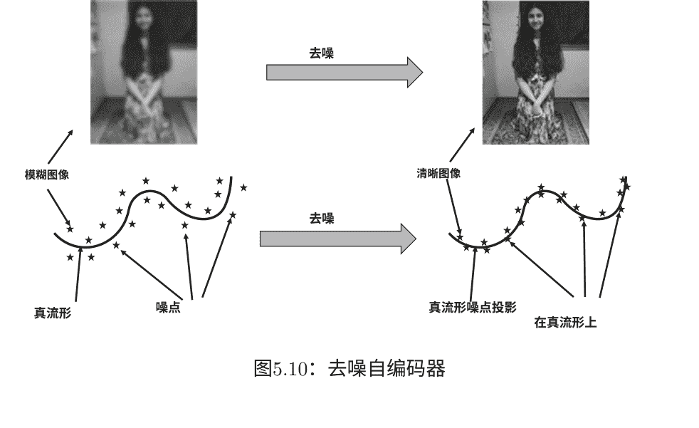

图5.10：去噪自编码器

试图创建一个输出对输入变化不敏感的自编码器乍一看似乎是一个奇怪的目标。毕竟，自编码器应该精确地重构数据。因此，正则化的目标似乎与损失函数中的收缩正则化部分完全相悖。

关键点在于，收缩编码器仅设计为对输入数据的微小变化具有鲁棒性。此外，它们倾向于对与数据流形结构不一致的变化不敏感。换句话说，如果对输入进行微小的变化，而这些变化不在输入数据的流形结构上，收缩自编码器将倾向于抑制重构表示中的变化。在这里，重要的是要理解高维输入数据（具有较低维流形）中的绝大多数（随机选择的）方向倾向于与流形结构近似正交，这会改变流形结构上的变化分量。基于局部流形结构对重构表示中的变化的抑制也被称为自编码器的收缩特性。因此，收缩自编码器倾向于从输入数据中去除噪声（就像去噪自编码器一样），尽管其机制与去噪自编码器不同。正如我们将在后面看到的，收缩自编码器对于输入的梯度进行惩罚。当隐藏值对于输入的梯度较低时，意味着它们对于输入的微小变化不太敏感（尽管较大的变化或与流形结构平行的变化会改变梯度）。

为了方便讨论，我们将讨论压缩自编码器只有一个隐藏层的情况。推广到多个隐藏层是直接的。让 $h_1 \ldots h_k$ 是输入变量 $x_1 \ldots x_d$ 的 $k$ hidden units 的值。让输出层中的重构值由 $\hat{x}_1 \ldots \hat{x}_d$ 给出。那么，目标函数由重构损失和正则化项的加权和给出。对于单个训练实例，损失函数 $L$ 由以下公式给出：

$$L = \sum_{i=1}^{d} (x_i - \hat{x}_i)^2$$

### 5.10. 无监督应用中的正则化

正则化项由所有隐藏变量对所有输入维度的偏导数的平方和构成。 对于具有 k hidden units 的问题，记为 h1...hk，正则化项 R 可以写成以下形式：

$$ R = \frac{1}{2} \sum_{i=1}^d \sum_{j=1}^k \left( \frac{\partial h_j}{\partial x_i} \right)^2 \quad (5.15) $$

在原始论文[414]中，隐藏层使用了Sigmoid非线性函数，在这种情况下，可以证明如下（参见第2章2.4.2节）：

$$ \frac{\partial h_j}{\partial x_i} = w_{ij} h_j (1 - h_j) \quad \forall i, j \quad (5.16) $$

这里， $w_{ij}$ 是输入单元 i 到隐藏单元 j 的权重。 对于单个训练实例，总目标函数由损失项和正则化项的加权和给出。

$$ J = L + \lambda \cdot R = \sum_{i=1}^d (x_i - \hat{x}_i)^2 + \frac{\lambda}{2} \sum_{j=1}^k h_j^2 (1 - h_j)^2 \sum_{i=1}^d w_{ij}^2 $$

这个目标函数包含了权重和隐藏单元的正则化的组合。 隐藏单元的惩罚可以以与第2.6.5节中讨论的相同方式处理 第 2章。让 $a_{h_j}$ 成为节点 $h_j$ 的预激活值。 反向传播更新通常是根据预激活值定义 的，其中的值为 $\frac{\partial J}{\partial a_{h_j}}$ 向后传播。在计算出 $\frac{\partial J}{\partial a_{h_j}}$ 后，可以进一步更新它以包含 $h_j$ 的隐藏层正则化效果：

$$ \frac{\partial J}{\partial a_{h_j}} \Leftarrow \frac{\partial J}{\partial a_{h_j}} + \frac{\lambda}{2} \frac{\partial [h_j^2 (1 - h_j)^2]}{\partial a_{h_j}} \sum_{i=1}^d w_{ij}^2 $$
$$ = \frac{\partial J}{\partial a_{h_j}} + \lambda h_j (1 - h_j)(1 - 2h_j) \frac{\partial h_j}{\partial a_{h_j}} \sum_{i=1}^d w_{ij}^2 $$
$$ = \frac{\partial J}{\partial a_{h_j}} + \lambda h_j^2 (1 - h_j)^2 (1 - 2h_j) \sum_{i=1}^d w_{ij}^2 $$

The value of $\frac{\partial h_j}{\partial a_{h_j}}$ is set to $h_j(1-h_j)$因为假设使用了sigmoid激活函数，尽管对于其他激活函数可能会有所不同。 根据链式法则，的值 应该乘以的值。$\frac{\partial a_{h_j}}{\partial w_{ij}} = x_i$ 以获得损失相对于 $w_{ij}$ 的梯度。 然而，根据多变量链式法则，我们还需要直接添加正则化项相对于 $w_{ij}$ 的导数。 以获得完整的梯度。 因此，隐藏层正则化项 R 相对于权重的偏导数如下所示：## 第5章 教授深度学习的泛化能力

$$\begin{aligned} \frac{\partial J}{\partial w_{ij}} &\Leftarrow \frac{\partial J}{\partial a_{h_j}} \frac{\partial a_{h_j}}{\partial w_{ij}} + \lambda \frac{\partial R}{\partial w_{ij}} \ &= x_i \frac{\partial J}{\partial a_{h_j}} + \lambda w_{ij} h_j^2 (1 - h_j)^2 \end{aligned}$$

有趣的是，如果使用线性隐藏单元而不是Sigmoid函数，很容易看出目标函数将变得与自动编码器的相同。$L_2$正则化自动编码器。因此，只有在非线性隐藏层中使用这种方法才有意义，因为线性隐藏层可以以更简单的方式处理。编码器和解码器中的权重可以是绑定的或独立的。如果权重是绑定的，则需要将两个权重副本的梯度相加。上述讨论假设只有一个隐藏层，尽管很容易推广到更多的隐藏层。[414]中的工作表明，使用更深层次的变体可以实现更好的压缩效果。

去噪自动编码器与对比自动编码器之间存在一些有趣的关系。去噪自动编码器通过显式添加噪声来实现其鲁棒性目标，而对比自动编码器通过添加正则化项来实现其目标。在去噪自动编码器中，通过添加少量的高斯噪声可以实现与对比自动编码器类似的目标，当隐藏层使用线性激活时。当隐藏层使用线性激活时，隐藏单元对输入的偏导数就是连接权重，因此对比自动编码器的目标函数变为以下形式：

$$J_{\text{线性}} = \sum_{i=1}^{d} (x_i - \hat{x}_i)^2 + \frac{\lambda}{2} \sum_{i=1}^{d} \sum_{j=1}^{k} w_{ij}^2 \tag{5.17}$$

在这种情况下，收缩自编码器和去噪自编码器都类似于带有 $L_2$正则化的正则化奇异值分解。去噪自编码器和收缩自编码器之间的区别在图5.11中有直观的说明。在左侧的去噪自编码器的情况下，自编码器通过使用输出中的损坏数据与输入中的真实数据之间的关系来学习未损坏数据的真实流形方向。在收缩自编码器中，这个目标是通过分析实现的，因为当流形的维度远小于输入数据的维度时，绝大多数随机扰动与流形近似正交。在这种情况下，稍微扰动数据点不会对流形上的隐藏表示产生很大变化。对隐藏层的偏导数在所有方向上进行惩罚，确保偏导数仅在真实流形的少数方向上显著，并且在绝大多数正交方向上的偏导数接近0。换句话说，对于当前特定训练数据集的分布来说，与其无关的变化被抑制，只有有意义的变化被保留。

两种方法之间的另一个区别是去噪自编码器在正则化方面在编码器和解码器之间共享责任，而对比自编码器只将此责任放在编码器上。只有编码器部分用于特征提取；因此，对比自编码器在特征工程方面更有用。

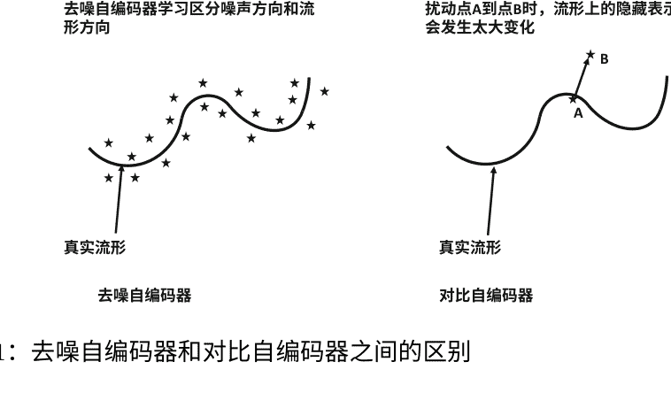

### 5.10.4 隐藏的概率结构：变分自编码器

就像稀疏编码器对隐藏单元施加稀疏约束一样，变分编码器对隐藏表示施加特定的概率结构。 具体来说，假设整个数据的隐藏表示应该从每个方向上均值为零、方差为单位的标准高斯分布中抽取。

通过在隐藏表示上施加这种概率结构，解码器对数据生成非常有用 - 只需将来自标准正态分布的样本输入解码器，即可生成非常逼真的训练数据样本。 在传统的自编码器中，这是不可能的，因为隐藏空间具有任意的结构，而从未被填充的隐藏空间区域中随意选择的样本可能无法解码为原始数据的逼真正样本。 正态分布假设可以被视为概率先验，尽管在看到特定输入对象后，隐藏层中激活的条件（或后验）分布将是具有非零均值和小于单位标准差的高斯分布（由于对对象的更多了解）。

如何通过适当的损失函数控制隐藏分布？ 使用正则化项将条件高斯分布（相对于单个对象）拉向标准正态分布，这也会将整个数据的隐藏表示拉向标准正态分布。关键是使用重新参数化方法，其中编码器创建条件高斯分布的k维均值和标准差向量，并惩罚该条件分布与标准正态分布之间的KL散度 - 从该条件高斯分布中对特定对象的隐藏向量进行采样，如图5.12(a)所示，以使用解码器创建其重构（其损失也受到惩罚）。不幸的是，这个网络有一个采样组件。这样的网络的权重无法通过反向传播学习，因为计算中的随机部分不可微分，因此无法使用反向传播。因此，可以通过用户明确生成从标准正态分布中抽取的k维样本来处理其中的随机部分。编码器输出的均值和标准差用于缩放和平移高斯分布中的输入样本。该架构如图5.12(b)所示。通过将随机部分明确地作为输入的一部分生成，得到的架构现在是完全确定性的，并且可以通过反向传播学习其权重。值得注意的是，反向传播更新将取决于随机采样的噪声（尽管在大量样本中，这种噪声的影响会减弱）。

对于每个对象。对于均值和标准差，为X分别创建隐藏激活。均值和标准差的k维激活分别表示为μ（X）和σ（X）。此外，从N（0，I）生成一个k维样本z，并被视为用户的隐藏层输入。隐藏表示h（X）通过以下方式对这个随机输入向量z进行缩放：z的均值和标准差如下：将其与均值和标准差一起缩放。

```
h(X) = z ⊙ σ(X) + μ(X)      (5.18)
```

在这里，⊙表示逐元素相乘。这些操作在图5.12(b)中显示小圆圈中包含了乘法和加法运算符。向量的元素。特定对象的h(X)显然会与标准正态分布不同除非向量。μ(X)和。σ(X)只包含0和1。这不是因为损失的重构部分，它强制特定点的隐藏表示的条件分布具有不同的均值和较低的标准差，而不是标准正态分布（类似于先验分布）。特定点的隐藏表示的分布是后验分布（在特定的训练数据点上条件），因此它与高斯先验不同。总损失函数表示为重构损失和正则化损失的加权和。可以使用多种选择来计算重构误差，为了简单起见，我们将使用平方损失，定义如下：

```
L = ||\overline{X} - \overline{X}^{'}||^2
```

这里, $\overline{X}^{'}$ 是从解码器中重构的输入点 $X$ 正则化损失 $\overline{R}$简单地是条件隐藏分布与参数 之间的Kullback-Leibler（KL）散度度量$(\mu(X), \sigma(X))$ 相对于每个方向上的单位方差的 $k$维球形高斯分布KL散度项定义如下：

```
R = \frac{1}{2} \left( ||\overline{\mu}(\overline{X})||^2 + ||\overline{\sigma}(\overline{X})||^2 - 2 \sum_{i=1}^{k} \ln(\overline{\sigma}(\overline{X})_i) - k \right)
```

数据点的整体目标函数 $J$定义为重构损失和正则化项的加权和$X$的定义为重构损失和正则化项的加权和

```
J = L + \lambda R
```

在这里, $\lambda > 0$ 是正则化参数。小的 $\lambda$值会偏向于精确重构，就像传统的自编码器一样。当 $(\mu(X), \sigma(X)) = (0, 1)$ 对应于均值为零、方差为单位的标准高斯分布时，正则化项的值将达到最小值0。然而，目标函数的重构部分将推动 $\mu(X)$朝着非零值，以更好地重构 $X$和 $\sigma(X)$的分量朝着小于1的值（在重构之前，添加较少的点特定噪声到隐藏表示中）。尽管由 $(\mu(X), \sigma(X))$表示的点特定后验分布与标准高斯分布相差很远，但是由于正则化项的存在，所有训练点的隐藏表示的分布将更接近于标准高斯分布。

正则化项强制隐藏表示为随机的，这样多个隐藏表示几乎生成相同的点。这增加了泛化能力，因为在隐藏值的随机范围内，更容易对训练数据中的新图像进行建模，这些图像与训练数据中的图像相似（但不完全相同）。然而，由于相似点的隐藏表示的分布之间会有重叠，因此会产生一些不良的副作用。例如，图像数据点的重构往往会模糊不清。这是由于对相似图像的平均效果。在极端情况下，如果选择的 值过大，所有点将具有相同的隐藏（后验）分布-均值为零，方差为单位的各向同性高斯分布。由此产生的重构结果将对整个训练数据显示出明显的平均效果，这显然是没有意义的。结果重构结果将对整个训练数据显示出明显的平均效果，这显然是没有意义的。

## 5.11 训练变分自编码器

变分自编码器的训练相对简单，因为随机性已经作为额外的输入被提取出来。可以像传统神经网络一样进行反向传播。唯一的区别是需要在不寻常的5.18式上进行反向传播。此外，在反向传播过程中需要考虑隐藏层的惩罚项。

首先，可以使用传统方法将损失 L 反向传播到隐藏状态 h(X) = (h_1 ... h_k)。让 z= (z_1 ... z_k) 是当前迭代中使用的 k 个来自 N(0,1) 的随机样本。为了从 h(X) 反向传播到 μ(X) = (μ_1 ... μ_k) 和 σ(X) = (σ_1 ... σ_k)，可以使用以下关系：

J = L + λR (5.22)
$$\frac{\partial J}{\partial \mu_i} = \frac{\partial L}{\partial h_i} \frac{\partial h_i}{\partial \mu_i} + \lambda \frac{\partial R}{\partial \mu_i} = \frac{\partial L}{\partial h_i} \cdot 1 + \lambda \frac{\partial R}{\partial \mu_i}$$ (5.23)
$$\frac{\partial J}{\partial \sigma_i} = \frac{\partial L}{\partial h_i} \frac{\partial h_i}{\partial \sigma_i} + \lambda \frac{\partial R}{\partial \sigma_i} = \frac{\partial L}{\partial h_i} \cdot z_i + \lambda \frac{\partial R}{\partial \sigma_i}$$ (5.24)
在下划线下方的数值表示对 h_i 的偏导数的评估，分别对 μ_i 和 σ_i。请注意，$$\frac{\partial h_i}{\partial \mu_i} = 1, \quad \frac{\partial h_i}{\partial \sigma_i} = z_i$$ 通过对对方程5.18分别对 μ_i 和 σ_i 求导得到。
$$\frac{\partial L}{\partial h_i}$$ 右侧的值可以通过反向传播获得。$$\frac{\partial R}{\partial \mu_i}$$ 和 $$\frac{\partial R}{\partial \sigma_i}$$ 是方程5.20中KL散度的直接导数。从 μ(X) 和 σ(X) 的激活开始的后续误差传播可以以类似于反向传播算法的方式进行。

变分自编码器的架构被认为与其他类型的自编码器根本不同，因为它以随机的方式对隐藏变量进行建模。然而，仍然存在一些有趣的联系。在去噪自编码器中，将噪声添加到输入中；然而，对隐藏分布的形状没有约束。在变分自编码器中，我们使用随机的隐藏表示进行工作，尽管通过在训练过程中将其作为附加输入来消除随机性。换句话说，噪声是添加到隐藏表示而不是输入数据中。变分方法改善了泛化能力，因为它鼓励每个输入映射到隐藏空间中的自己的随机区域，而不是映射到单个点。因此，隐藏表示中的微小变化不会对重构产生太大的影响。这个断言在使用收缩自编码器时也是正确的。然而，将隐藏分布的形状约束为高斯分布是变分自编码器与其他类型的转换更基本的不同之处。

### 5.10.4.1 重构和生成采样

该方法可用于创建减少表示以及生成样本。在数据减少的情况下，使用均值为的高斯分布。μ(X) 和标准差。σ(X) 是获得的，它表示隐藏表示的分布。

然而，变分自动编码器的一个特别有趣的应用是从潜在数据分布中生成样本。就像特征工程方法一样，仅在训练完成后使用自动编码器的编码器部分，变分自动编码器仅使用解码器部分。基本思想是反复从高斯分布中抽取一个点，并将其馈送到解码器的隐藏单元中。解码器的“重构”输出将是满足与原始数据类似分布的点。因此，生成的点将是原始数据的一个真实样本。样本生成的架构如图5.13所示。所示图像仅用于说明，并不反映变分自动编码器的实际输出（通常质量稍低）。要理解为什么变分自动编码器可以以这种方式生成图像，有助于查看无正则化自动编码器和变分自动编码器等方法创建的典型嵌入类型。在图5.14的左侧，我们展示了一个无正则化自动编码器创建的二维嵌入示例，该自动编码器是一个四类分布（例如MNIST的四个数字）的。显然，在潜在空间的特定区域存在较大的不连续性，并且这些稀疏区域可能不对应有意义的点。

另一方面，变分自编码器中的正则化项鼓励训练点（大致上）分布在高斯分布中，在图5.14右侧的嵌入中几乎没有不连续性。因此，在潜在空间中从任意点进行采样将产生对MNIST数据集中四个类别（即MNIST的四个数字之一）的有意义的重构。此外，在第二种情况下，沿着直线从潜在空间中的一个点“行走”到另一个点将导致在类别之间进行平滑的转换。例如，在MNIST数据集的潜在空间中，从包含‘4’实例的区域行走到包含‘7’实例的区域将导致数字‘4’风格的缓慢变化，直到过渡点，在该点手写数字可以被解释为‘4’或‘7’。这种情况在现实中确实发生，设置也是重要的，因为在MNIST数据集中会出现这种类型的混淆手写数字。此外，不同数字在嵌入中的放置应该是这样的，即在混淆点（例如 [4, 7]或 [5, 6]）处具有平滑过渡的数字对应该相邻放置在潜在空间中。

重要的是要理解生成的对象通常与训练数据中的对象相似，但并不完全相同。由于其随机性质，变分自编码器能够探索生成过程的不同模式，从而在面对模糊性时具有一定的创造力。通过将方法与另一个对象进行条件约束，可以充分利用这一特性。

### 5.10.4.2 条件变分自编码器

人们可以将条件应用于变分自编码器，以获得一些有趣的结果[479, 530]。条件变分自编码器的基本思想是添加一个额外的条件输入，通常提供相关的上下文。例如，上下文可能是一个带有缺失空洞的损坏图像，自编码器的任务是对其进行重构。在这种类型的设置中，预测模型通常表现不佳，因为模糊性可能太大，对所有图像进行平均重构可能没有用处。在训练阶段，需要损坏和原始图像的配对，因此编码器和解码器能够学习上下文与从训练数据生成的图像之间的关系。训练阶段的架构如图5.15上部所示。训练过程与无条件变分自编码器类似。在测试阶段，上下文作为额外的输入提供，自编码器根据在训练阶段学到的模型以合理的方式重构缺失部分。重构阶段的架构如图5.15下部所示。这种架构的简洁性特别值得注意。所示的图像仅用于说明；在实际的图像数据执行中，生成的图像通常在缺失部分模糊不清。这是一种图像到图像的转换方法，在第12章中将在生成对抗网络的背景下重新讨论。

### 5.10.4.3 与生成对抗网络的关系

变分自编码器与另一类模型密切相关，称为生成对抗网络。然而，也存在一些关键的差异。与变分自编码器类似，生成对抗网络可以用于创建与基础训练数据集相似的图像。此外，这两种模型的条件变体对于完成缺失数据非常有用，特别是在需要生成过程具有一定创造力的情况下。然而，生成对抗网络的结果通常更加逼真，因为解码器明确地训练用于创建良好的伪造品。这是通过将鉴别器作为生成对象质量的评判者来实现的。此外，生成对象的生成方式也更具创造性，因为生成器从未看到训练数据集中的原始对象，而只是得到欺骗鉴别器的指导。因此，生成对抗网络学会创建具有创造性的伪造品。在图像和视频数据等特定领域，这种方法可以产生令人惊叹的结果；与变分自编码器不同，图像的质量不会模糊。人们可以创建具有艺术风格的生动图像和视频，给人以梦幻的印象。这些技术还可以用于诸多应用，如文本到图像或图像到图像的转换。例如，可以指定一个文本描述，然后获得与描述相匹配的幻想图像[408]。生成对抗网络在第12章的第12.5节中进行了讨论。

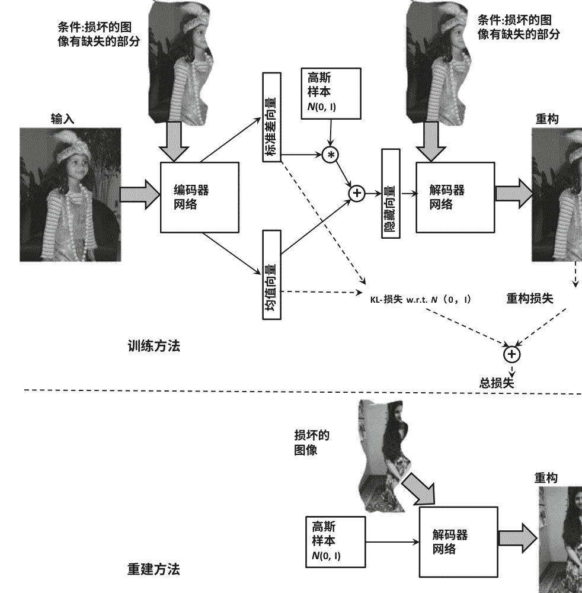

图5.15: 使用条件变分自编码器重建损坏的图像。这些图像仅供说明。

## 5.11 总结

大型神经网络经常面临过拟合的挑战。在底层模型复杂时，提前减小网络大小会导致次优解。一种更灵活的方法是使用可调节的正则化，允许大量参数。

在这种情况下，正则化以柔性方式限制参数空间的大小。最常见的正则化形式是基于惩罚的正则化，可以应用于参数或隐藏单元。集成学习是减少方差的常见方法，一些集成方法如Dropout专门为神经网络设计。其他常见的正则化方法包括提前停止和预训练。预训练作为通过作为一种半监督学习的形式，正则化器可以从简单到复杂地工作，通过使用简单的启发式方法进行初始化，并使用反向传播来发现更精细的解决方案。 其他相关技术包括课程和延续方法，也是从简单到复杂地工作，以提供具有低泛化误差的解决方案。 虽然过拟合在无监督设置中不是一个严重的问题，但正则化经常被用来对学习到的表示施加结构。

## 5.12 参考文献和软件资源

关于偏差-方差权衡的详细讨论可以在[187]中找到。 偏差-方差权衡起源于统计学领域，在回归问题的背景下提出。 在分类中，将二元损失函数推广到一般情况是在[257, 260]中提出的。 早期减少过拟合的方法是在[185, 288]中提出的，其中从网络中删除不重要的权重以减少其参数占用空间。

研究表明，这种修剪方法在泛化方面具有显著的好处。早期的研究还表明[470]，深而窄的网络比宽而浅的网络更容易泛化。 这主要是因为深度对数据施加了一种结构，可以用更少的参数表示数据。 最近的一项研究[582]提供了关于神经网络模型泛化的信息。

使用 L2-正则化在回归中可以追溯到Tikhonov-Arsenin的开创性工作[516]。 Bishop [43]证明了Tikhonov正则化和加噪声训练的等价性。使用 L1-正则化在[189]中进行了详细研究。还提出了一些专门为神经网络设计的正则化方法。

例如，[211]中的工作提出了一种约束神经网络每层范数的正则化技术。 在[69, 279, 280, 290, 365]中探索了数据的稀疏表示。

有关分类的集成方法的详细讨论可以在[458, 591]中找到。关于装袋和子采样方法的讨论可以在[49, 56]中找到。 在[535]中提出了一种受随机森林启发的集成架构。 该架构在第1章的图2.10中进行了说明。 这种类型的集成特别适用于数据集较小的问题，随机森林在这种情况下表现良好。 随机边缘删除方法是在异常检测的背景下引入的[64]，而Dropout方法是在[483]中提出的。 [592]中的工作讨论了将表现最佳的集成组件的结果进行组合而不是将所有组件进行组合的概念。 大多数集成方法都是为了减少方差而设计的，尽管一些技术如提升[127]也是为了减少偏差而设计的。 提升也已经在神经网络学习的背景下使用过[455]。 然而，在神经网络中使用提升通常仅限于基于错误特征增加隐藏单元。 关于提升的一个关键点是它倾向于过拟合数据，因此适用于高偏差的学习器而不适用于高方差的学习器。 神经网络本质上是高方差的学习器。 [32]指出了提升与某些类型的神经架构之间的关系。 将数据扰动方法与集成相结合的方法在[5]中进行了讨论。 提出了神经网络的集成方法[180]。

在神经网络的背景下，已经探索了不同类型的预训练方法[31, 116, 206, 402, 526]。 最早的无监督预训练方法是在[206]中提出的。 预训练的原始工作[206]基于概率图模型（参见第7.7节），后来扩展到传统的自编码器[402, 526]。

与无监督预训练相比，有监督预训练的效果有限[31]。关于为什么无监督预训练有助于深度学习的详细讨论，请参见[116]。这项工作认为，无监督预训练隐含地充当了正则化器，因此提高了对未见测试实例的泛化能力。这一事实也在[31]的实验结果中得到证实，该结果显示有监督预训练的变体并不像无监督预训练那样有帮助。预训练似乎也无法帮助某些类型的任务[312]。另一种半监督学习的形式可以通过使用梯度网络[404, 520]来实现，在其中使用了自编码器类似的架构和跳跃连接。

课程和延续学习是从简单到复杂模型的原则应用的例子。延续学习方法在[350, 557]中讨论。早年提出了许多方法[114, 439, 480]，展示了课程学习的优势。课程学习的基本原则在[248]中讨论。课程学习和延续学习之间的关系在[33]中探讨。

稀疏自编码器在[69, 279, 280, 290, 365]中讨论。去噪自编码器在[526]中讨论。压缩自编码器在[414]中讨论。在推荐系统中讨论了去噪自编码器的使用在[488, 555]中。压缩自编码器中的思想让人想起了双重反向传播[109]，其中输入的微小变化不会改变输出。相关思想也在切线分类器[415]中讨论。

变分自编码器在[252, 416]中被引入。使用重要性加权来改善变分自编码器学习到的表示，在[58]中进行了讨论。条件变分自编码器在[479, 530]中进行了讨论。关于变分自编码器的教程可在[108]中找到。关于去噪自编码器的生成变体在[34]中进行了讨论。变分自编码器与生成对抗网络密切相关，这在第12章中进行了讨论。设计对抗自编码器的相关方法在[323]中进行了讨论。

### 软件资源

许多集成方法可以从机器学习库（如scikit-learn [611]）中获得。大多数权重衰减和基于惩罚的方法都作为深度学习库的标准化选项提供。然而，像Dropout这样的技术是应用特定的，需要从头开始实现。可以在[618]中找到几种不同类型的自编码器的实现。可以在[619, 620, 662]中找到几种变分自编码器的实现。

## 5.13 练习题

- 1. 考虑两个用于回归建模的神经网络，每个网络都有一个输入层，10个包含100个单元的隐藏层，以及一个线性输出单元。唯一的区别是其中一个在隐藏层中使用线性激活函数，另一个使用sigmoid激活函数。哪个模型的预测方差更高？

- 2. 考虑一种情况，你有四个属性 \(x_1...x_4\)，以及因变量 \(y\)，满足 \(y=2x_1\)。创建一个包含5个不同示例的小训练数据集，在没有正则化的线性回归模型中，将有无限多个系数解，其中 \(w_1 = 0\)。讨论这种模型在样本外数据上的性能。为什么正则化会有帮助？

- 3. 实现一个带有和不带有正则化的感知机。在UCI机器学习库的 Ionosphere数据集上，测试两种变体在训练数据和样本外数据上的准确性。在这两种情况下，正则化的效果是什么？使用更小的 Ionosphere训练数据样本重复实验，并报告你的观察结果。

- 4. 使用单隐藏层实现自编码器。使用（a）没有添加噪声和权重正则化，（b）添加了高斯噪声但没有权重正则化的方法，重构上一个练习中的离子层数据集的输入。

- 5. 本章中的讨论使用了一个示例，该示例使用了Sigmoid激活函数进行了压缩自编码器。考虑一个具有单隐藏层和ReLU激活函数的压缩自编码器。讨论当使用ReLU激活函数时，更新如何改变。

- 6. 假设你有一个模型，在训练数据和样本外测试数据上都能达到80%的准确率。你会建议增加数据量还是调整模型来提高准确率？

- 7. 在本章中，我们展示了在线性回归中向输入特征添加高斯噪声等价于对线性回归进行L2-正则化。讨论为什么在具有线性单隐藏层自编码器的情况下，向输入数据添加高斯噪声与进行L2-正则化奇异值分解大致等价。

- 8. 考虑一个具有单个输入层、两个隐藏层和一个输出层的网络，用于预测二进制标签。所有隐藏层使用sigmoid激活函数，不使用正则化。输入层包含 d个单元，每个隐藏层包含 p个单元。假设在当前两个隐藏层之间添加一个额外的隐藏层，该隐藏层包含 q个线性单元。

(a) 即使通过添加隐藏层增加了参数数量，当q < p时，讨论为什么该模型的容量会减少。

(b) 当q > p时，模型的容量是否增加？

- 9. 鲍勃将标记的分类数据分为一部分用于模型构建，另一部分用于验证。然后，鲍勃通过在模型构建部分学习参数（反向传播）并在验证部分测试准确性来测试1000个神经网络架构。讨论为什么生成的模型在样本外测试数据上的准确性很可能比验证数据上的准确性差，即使验证数据没有用于学习参数。对于鲍勃在使用他的1000个验证结果方面有什么建议吗？

- 10. 训练数据的分类准确率是否随着训练数据规模的增加而提高？？对于训练实例上的损失的逐点平均值如何？
在哪种数据规模下，训练和测试准确率变得相似？请解释你的答案。

- 11. 增加正则化参数对训练和测试准确率有什么影响？？在哪种正则化参数下，训练和测试准确率变得相似？

## 12.

考虑一个具有 $k$ 个实值单元的自编码器 $h_1,\dots$ 隐藏层中的 $k$ 单元。除了最小二乘损失 $L$，您还应用以下正则化项 $R$，以创建正则化参数 $\lambda > 0$ 的目标函数 $L + \lambda R$：

$$R = \sum_{i=1}^{k} \max\{1 - h_i, 0\}$$

讨论这种正则化对隐藏表示的影响。[提示：铰链损失]

## 第六章 径向基函数网络

> > “两只鸟争夺一个果仁，第三只鸟飞下来把它带走了。”-非洲谚语

## 6.1 引言

径向基函数（RBF）网络与之前章节中所见的架构有根本的不同。所有之前的章节都使用前馈网络，其中输入以类似的方式从一层传递到另一层，以创建最终的输出。前馈网络可能有多个层，非线性通常是通过重复组合激活函数来创建的。

另一方面，RBF网络通常只使用一个输入层、一个单独的隐藏层（其行为由RBF函数定义）和一个输出层。虽然可以用多个前馈层（类似于传统网络）替换输出层，但得到的网络仍然非常浅，并且其行为受到特殊隐藏层性质的强烈影响。为了简化讨论，我们将只使用一个输出层。与前馈网络一样，输入层实际上不是一个计算层，它只是将输入向前传递。隐藏层的计算性质与前馈网络迄今为止所见的非常不同。特别是，隐藏层基于与原型向量的比较进行计算，这在前馈网络中没有确切的对应物。特殊隐藏层的结构和计算是RBF网络强大的关键。

可以将隐藏层和输出层的功能差异描述如下：

- 1. 隐藏层接收输入点，其中类别结构可能不是线性可分的，并将它们转换为一个新的空间，该空间通常是线性可分的。隐藏层的维度通常比输入层高，因为为了确保线性可分性，通常需要将数据转换到高维空间中。这个原则基于 Cover定理，该定理说明模式分类问题在进行非线性变换的高维空间中更容易线性可分 [87]。此外，某些类型的变换，其中特征表示空间中的小区域，更容易导致线性可分性。尽管隐藏层的维度通常大于输入维度，但它始终小于或等于训练点的数量。当隐藏层的维度等于训练点的数量时，可以将其视为核学习器的近似。这类模型的例子包括核回归和核支持向量机。

- 2. 输出层根据应用的性质使用激活函数和损失函数。例如，二进制预测可能使用逻辑损失，而实值预测可能使用具有恒等激活函数的平方损失。从隐藏层到输出层的连接带有权重。输出层的计算方式与标准前馈网络相同。

虽然也可以用多个前馈层替换输出层，但这在实践中很少见。

RBF网络的特殊情况可用于实现核回归、最小二乘核分类和核支持向量机。与前馈网络一样，RBF网络是通用函数逼近器。

RBF网络的层设计如下：

- 1. 输入层只是将输入特征传输到隐藏层。因此，输入单元的数量与数据的维度$d$相等。与前馈网络的情况一样，在输入层不执行任何计算。

在所有前馈网络中，输入单元与隐藏单元完全连接，并将它们的输入传递下去。

- 2 隐藏层中的计算基于与原型向量的比较 每个隐藏单元包含一个 $d$维原型向量。设第 $i$ 个隐藏单元的原型向量为 $\mu_i$ 此外，第 $i$个隐藏单元包含一个带宽，表示为 $\sigma_i$ 尽管原型向量始终特定于特定单元，但不同单元的带宽 $\sigma_i$通常设置为相同的值 $\sigma$ 原型向量和带宽通常通过无监督方式或轻度监督方式进行学习。

然后，对于任何输入训练点 $X$，第$\Phi_i(X)$个隐藏单元的激活 定义如下:

$$ h_i = \Phi_i(\overline{X}) = \exp \left( - \frac{\|\overline{X} - \overline{\mu}_i\|^2}{2 \cdot \sigma_i^2} \right) \quad \forall i \in \{1, \ldots, m\} \tag{6.1} $$

隐藏单元的总数用 $m$表示。这 $m$个单元中的每一个都被设计成对最接近其原型向量的点簇具有很高的影响力。因此，可以将 $m$视为用于建模的簇的数量，并且它代表了算法中的一个重要超参数。

对于低维输入，通常 $m$ 的值会大于输入的维度 $d$，但小于训练点的数量 $n$。

3 对于任何特定的训练点 X，让 h_i 是第 i 个隐藏单元的输出，根据公式61定义。从隐藏层到输出节点的连接权重设置为 w_i。然后，RBF网络在输出层的预测 ŷ 定义如下：

$$\hat{y} = \sum_{i=1}^{m} w_i h_i = \sum_{i=1}^{m} w_i \Phi_i(\overline{\mathbf{X}}) = \sum_{i=1}^{m} w_i \exp\left( - \frac{\|\overline{\mathbf{X}} - \overline{\boldsymbol{\mu}}_i\|^2}{2 \sigma_i^2} \right)$$

变量 ŷ 顶部有一个小圆圈表示它是一个预测值而不是观察值。如果观察目标是实值的，则可以建立一个最小二乘损失函数，这与前馈网络中的损失函数非常相似。权重 w_1 ... w_m 的值需要以监督方式学习。

一个额外的细节是神经网络的隐藏层包含偏置神经元。请注意，偏置神经元可以通过输出层中的单个隐藏单元来实现，该单元始终处于激活状态。也可以通过创建一个隐藏单元来实现这种类型的神经元，在该单元中σ_i的值为∞。无论哪种情况，在本章的讨论中都假设这个特殊的隐藏单元被吸收在 m 隐藏单元中。因此，它不会以任何特殊的方式处理。图61展示了RBF网络的一个示例。在RBF网络中，有两组计算对应于隐藏层和输出层。参数 μ_i of 隐藏层以无监督的方式学习，而输出层的参数以梯度下降的方式进行有监督的学习。后者类似于前馈网络的情况。原型 μ_i 可以从数据中采样，也可以设置为 m 个聚类算法的 m 个质心。换句话说，我们可以使用现成的聚类算法将训练数据分成 m 个簇，并将这些簇的均值作为 m 个原型。

参数 σ_i 通常设置为单个超参数值 σ，通过保留数据的一小部分来学习 σ 设置为能够最大化保留数据准确性的值。在第62节中详细讨论了训练神经网络的不同方法。

一个有趣的特例是将原型设置为单个训练点（因此值 m 与训练样本数量相同）。在这种情况下，RBF网络可以显示为机器学习中的著名核方法 [7]。

学习。这种关系将在第6.4节中详细讨论，并且表明RBF网络比核方法具有更强大和灵活的能力。

### 何时使用RBF网络

一个关键点是RBF网络的隐藏层是以无监督的方式创建的，倾向于使其对所有类型的噪声具有鲁棒性。前馈网络在深度增加时对噪声的影响变得越来越敏感。与此同时，RBF网络在学习数据中的结构方面存在一定的限制。深度前馈网络能够有效地从具有丰富结构的数据中学习，因为多层非线性激活允许网络学习特定类型的模式。

此外，通过调整连接的结构，可以在前馈网络中融入特定领域的见解。这种设置的例子包括循环和卷积神经网络。RBF网络的单层限制了学习的结构数量。虽然RBF网络和深度前馈网络都被认为是通用函数逼近器，但前者对于具有有限结构的噪声数据效果更好，而后者适用于具有丰富结构（但噪声较少）的数据。

### 章节组织

本章的组织结构如下。下一节讨论了RBF网络的各种训练方法。第6.3节讨论了RBF网络在分类和插值中的应用。第6.4节讨论了RBF方法与核回归和分类的关系。第6.5节提供了总结。

## 6.2 训练RBF网络

RBF网络的训练与前馈网络完全不同，前者在不同层之间完全集成。在RBF网络中，隐藏层的训练通常以无监督的方式进行。虽然原则上可以使用反向传播训练原型向量和带宽，但问题是与前馈网络相比，RBF网络的损失曲面上存在更多的局部最小值。

因此，隐藏层中的监督（如果使用）通常相对温和，或者仅限于对已经学习的权重进行微调。尽管如此，由于隐藏层的有监督训练普遍存在过拟合问题，我们的讨论将仅限于无监督方法。接下来，我们将首先讨论RBF网络隐藏层的训练，然后再讨论输出层的训练。

### 6.2.1 训练隐藏层

RBF网络的隐藏层包含多个参数，包括原型向量 μ₁, …, μₘ 和带宽 σ₁, …, σₘ。超参数 m 控制隐藏单元的数量。实际上，每个单元的带宽 σᵢ 没有为每个单元单独设置，所有单元都具有相同的带宽 σ。然而，各个隐藏单元的均值 μᵢ 是不同的，因为它们定义了至关重要的原型向量。模型的复杂性由隐藏单元的数量和带宽调节。小带宽和大量隐藏单元的组合增加了模型的复杂性，当数据量很大时，这是一个有用的设置。较小的数据集需要较少的单元和较大的带宽，以避免过拟合。变量 $m$ 的值通常大于输入数据的维度，但永远不会大于训练点的数量。将变量 $m$ 的值设置为训练点的数量，并将每个训练点用作隐藏节点中的原型，使该方法等效于传统的核方法。

带宽还取决于选择的原型向量 $\mu_1 ... \mu_m$。理想情况下，带宽应该被设置为每个点只受到少量原型向量的（显著）影响，这些原型向量对应于其最近的聚类。如果与原型之间的距离相比，带宽设置得太大或太小，分别会导致欠拟合和过拟合。让 $d_{max}$ 是原型中心对之间的最大距离，而 $d_{ave}$ 是它们之间的平均距离。然后，设置带宽的两种启发式方法如下：

$$\sigma = \frac{d_{最大}}{\sqrt{2}}$$
$$\sigma = 2^{\sqrt{2}} \cdot d_{ave}$$

这种选择的一个问题是 $\sigma$ 是最佳带宽的值可能在输入空间的不同部分有所不同。例如，数据空间中密集区域的带宽应该比空间中稀疏区域的带宽小。带宽还应该取决于原型向量在空间中的分布。因此，一个可能的解决方案是选择带宽 $\sigma_i$ 为第 $i$ 个原型向量到其原型中的第 $r$ 个最近邻的距离。这里，$r$ 是一个小值，如5或10。

然而，这些只是启发式规则。可以通过使用数据集的一部分进行微调这些值。换句话说，候选值为。在的推荐值附近生成候选值的邻域内。作为初始参考点的。然后，使用这些候选值构建多个模型。（包括训练输出层）选择的训练。使用在训练数据集的保留部分上产生最小误差的。这种方法在选择带宽时确实使用了一定程度的监督，而不会陷入局部最小值。然而，监督的性质相当温和，这在处理RBF网络的第一层参数时特别重要。

原型向量的选择稍微复杂一些。特别是经常做出以下选择：

- 1. 原型向量可以从训练点中随机采样。总共的。为了创建原型向量，从训练点中采样 $m < n$ 个训练点。这种方法的主要问题是它会过度代表数据密集区域的原型，而稀疏区域可能得到很少或没有原型。因此，在这些区域的预测准确性将受到影响。
- 2. 可以使用 $k$-means 聚类算法来创建 $m$ 个聚类。这些 $m$ 个聚类的中心点可以用作原型。使用 $k$-means 算法是学习原型向量的最常见选择。
- 3. 还使用了将数据空间（而不是数据点）进行分区的聚类算法变体。一个具体的例子是使用决策树来创建原型。
- 4. 训练隐藏层的另一种方法是为隐藏层单元尝试不同的原型。这种方法使用了一定程度的监督。

在这种方法中，原型向量是从训练数据中逐个选择的，以便在一个样本外的测试集上最小化预测的残差误差。由于这种方法需要理解输出层的训练，所以它的讨论将推迟到后面的章节。

接下来，我们简要描述一下用于创建原型的 $k$均值算法，因为它是实际实现中最常见的选择。均值算法是聚类文献中的一种经典技术。它将聚类原型作为RBF方法中隐藏层的原型。广义上讲，均值算法的步骤如下。初始化时，$m$个聚类原型被设置为随机训练点。随后，每个数据点被分配给与其欧氏距离最小的原型。每个原型的分配点被平均以创建一个新的聚类中心。换句话说，创建的聚类的质心被用来用新的原型替换其旧的原型。这个过程迭代地重复直到收敛。当聚类分配在迭代过程中没有显著变化时，达到收敛。

### 6.2.2 训练输出层

在隐藏层训练完成后，输出层进行训练。输出层的训练非常直接，因为它只使用一个具有线性激活函数的单层。为了方便讨论，我们首先考虑目标层为实值的情况。稍后，我们将讨论其他设置。输出层包含一个 $m$维权重向量 $W=[w_1 \dots w_m]^T$需要学习。假设向量 $W$是一个列向量。

考虑训练数据集包含 $n$个点 $X_1 \dots X_n$，每个都是一个行向量。输入$X_i$被转换为 $m$维行向量.隐藏层中的 $m$个单元为 $H_i$。可以将 $n$个行向量 $H_1 \dots H_n$堆叠在一起，形成一个 $n \times m$矩阵 $H$。此外，训练点的观察目标由 $y_1, y_2, \dots, y_n$表示，可以写成一个 $n$维列向量。$\bar{y} = [y_1 \dots y_n]^T$。

训练点的预测由 $HW$ 的元素给出，其中 $n$是维度的列向量.理想情况下，我们希望这些预测尽可能接近观察到的向量 $y$。因此，学习输出层权重的损失函数 $L$通过使用预测向量的平方差得到.$HW$和观察到的向量 $.y$之间的差异：

$$L = \frac{1}{2}||H\bar{W} - \bar{y}||^2$$

为了减少过拟合，可以将Tikhonov正则化添加到目标函数中：

$$L = \frac{1}{2}||H\bar{W} - \bar{y}||^2 + \frac{\lambda}{2}||\bar{W}||^2 \quad \quad \quad (6.2)$$

在这里，$\lambda > 0$是正则化参数。通过计算损失函数 $L$对权重向量元素的偏导数，我们得到以下结果：

$$\frac{\partial L}{\partial \bar{W}} = H^T(H\bar{W} - \bar{y}) + \lambda\bar{W} = 0$$

上述导数是用矩阵微积分符号表示的。$\frac{\partial L}{\partial \bar{W}}$指的是以下内容：

$$\frac{\partial L}{\partial \bar{W}} = \begin{bmatrix} \frac{\partial L}{\partial w_1} & \dots & \frac{\partial L}{\partial w_d} \end{bmatrix}^T \quad \quad \quad (6.3)$$通过重新调整上述条件，我们得到以下结果：

$$(H^T H + \lambda I)\overline{W} = H^T \overline{y}$$

当 $\lambda > 0$时，矩阵 $H^T H + \lambda I$是正定的，因此可逆。换句话说，我们可以得到一个简单的闭式解来求解权重向量：

$$\overline{W} = (H^T H + \lambda I)^{-1} H^T \overline{y} \quad (6.4)$$

因此，只需进行简单的矩阵求逆即可找到权重向量，完全不需要反向传播。

然而，实际情况是，在实践中使用闭式解是不可行的，因为矩阵 $H^T H$的大小为 $m \times m$，非常大。在RBF网络的特殊情况下，$m$的值通常大于数据的输入维度。这可能会使矩阵 $H^T H$非常大。因此，在实践中使用随机梯度下降来更新权重向量。在这种情况下，梯度下降更新（使用所有训练点）如下：

$$
\begin{aligned}
\overline{W} & \Leftarrow \overline{W} - \alpha \frac{\partial L}{\partial \overline{W}} \\
& = \overline{W}(1 - \alpha \lambda) - \alpha H^T \underbrace{(\overline{HW} - \overline{y})}_{\text{当前误差}}
\end{aligned}
$$

在上述更新中，可以选择使用小批量梯度下降，其中矩阵 $H$可以被替换为随机的行子集。从$H$中选择与小批量对应的行 $H_r$。这种方法等同于传统神经网络中使用小批量随机梯度下降的方法。然而，在这种情况下，它仅应用于连接到输出层的权重。

### 带伪逆的表达式

当正则化参数 $\lambda$设置为0时，权重向量 $\overline{W}$ 定义如下：

$$\overline{W} = (H^T H)^{-1} H^T \overline{y} \quad (6.5)$$

矩阵 $(H^T H)^{-1} H^T$ 被称为矩阵 $H$的伪逆。矩阵 $H$的伪逆记为 $H^{+}$。因此，权重向量 $\overline{W}$ 可以表示如下：

$$\overline{W} = H^{+} \overline{y} \quad (6.6)$$

伪逆是对非奇异或矩形矩阵的逆的一种推广。在这种特殊情况下，假设$H^T H$是可逆的，尽管可以在$H$的伪逆中计算，即使在$H$不可逆的情况下也可以计算。$H^T H$不可逆。在$H$是方阵且可逆的情况下，伪逆与其逆矩阵相同。

### 6.2.3 隐藏层的迭代构建

该算法通过使用预测的准确性来优化隐藏层原型的选择。因此，隐藏层的训练过程是有监督的，尽管监督仅限于从原始训练点中进行迭代选择。

该算法逐个从训练点中选择原型向量，以尝试其准确性，并根据预测误差选择/丢弃它们。

该算法首先建立一个具有单个隐藏节点的RBF网络，并尝试将每个可能的训练点作为原型以计算预测误差。然后从训练点中选择最小化预测误差的原型。在下一次迭代中，将一个原型添加到所选原型中，以构建具有两个原型的RBF网络。与上一次迭代一样，尝试所有 (n-1) 剩余的训练点作为可能的原型，以添加到当前原型集合中，并且添加到集合中的标准是最小化预测误差。在 (r + 1) 次迭代中，尝试所有 (n - r) 剩余的训练点，并添加其中一个到原型集合中，以使预测误差最小化。数据中的一些训练点被保留，不用于预测的计算或作为原型的候选。这些样本外的点用于测试添加原型对误差的影响。在早期迭代中，将基于预测准确性选择最佳原型添加到隐藏层会降低整体准确性。在某个点上，无法通过向隐藏层添加更多原型来进一步减少保留集上的误差。保留测试集上的误差增加表明进一步增加原型将导致过拟合。这是终止算法的时刻。

这种方法的主要问题是非常低效。在每次迭代中，必须运行 O(n) 训练过程，因为必须逐个尝试每个训练点作为隐藏层的候选选项；对于大型训练数据集来说，这在计算上是不可行的。为了提高效率，可以使用正交最小二乘算法 [67]。这个算法与上面描述的算法类似，原型向量是从原始训练数据集中迭代添加的。然而，添加原型的过程要高效得多。更多细节请参考[41]。

### 6.2.4 隐藏层的完全监督学习

隐藏层的迭代构建代表了一种轻度监督的类型，根据对整体预测误差的影响，从训练点中选择原型向量。还可以进行更强类型的监督，可以通过反向传播来更新原型向量和带宽。

考虑在各个训练点上的损失函数 L:

$$ L = \frac{1}{2} \sum_{i=1}^{n} (\overline{W} \cdot \overline{H}_{i}^{T} - y_i)^2 $$ (6.7)

在这里, \( \overline{H}_i \) 表示隐藏层中第 \( i \) 个训练点的激活的 \( m \) 维行向量 \( \overline{X}_i \), 和 \( \overline{W} \) 是输出层中的权重列向量。

对于每个带宽 \( \sigma_j \) 的偏导数可以如下计算:

$$ \frac{\partial L}{\partial \sigma_j} = \sum_{i=1}^{n} (\overline{W} \cdot \overline{H}_{i}^{T} - y_i) w_j \frac{\partial \Phi_j (\overline{X}_i)}{\partial \sigma_j} = \sum_{i=1}^{n} (\overline{W} \cdot \overline{H}_{i}^{T} - y_i) w_j \Phi_j(\overline{X}_i) \frac{||\overline{X}_i - \overline{\mu}_j||^2}{\sigma_j^3} $$

如果所有带宽 \( \sigma_j \) 被固定为相同的值 \( \sigma \), 如在RBF网络中常见的那样, 那么可以使用处理共享的常用技巧来计算导数。

权重:

$$\frac{\partial L}{\partial \sigma} = \sum_{j=1}^{m} \frac{\partial L}{\partial \sigma_j} \cdot \frac{\partial \sigma_j}{\partial \sigma}$$
$$= \sum_{j=1}^{m} \frac{\partial L}{\partial \sigma_j}$$
$$= \sum_{j=1}^{m} \sum_{i=1}^{n} (\overline{W} \cdot \overline{H}_i^T - y_i) w_j \Phi_j(\overline{X}_i) \frac{||\overline{X}_i - \overline{\mu}_j||^2}{\sigma^3}$$

还可以计算关于原型向量的每个分量的偏导数。让 $\mu_{jk}$ 表示 $\overline{\mu}_j$ 的第 $k$ 个元素。同样，让 $x_{ik}$ 表示第 $i$ 个训练向量 $\overline{X}_i$ 的第 $k$ 个分量。关于 $\mu_{jk}$ 的偏导数的计算如下:

$$\frac{\partial L}{\partial \mu_{jk}} = \sum_{i=1}^{n} (\overline{W} \cdot \overline{H}_i^T - y_i) w_j \Phi_j(\overline{X}_i) \frac{(x_{ik} - \mu_{jk})}{\sigma_j^2}$$

利用这些偏导数，可以同时更新带宽和原型向量以及权重。不幸的是，这种强监督方法似乎效果不佳。这种方法有两个主要缺点：

1.  RBF的一个吸引人的特点是，如果使用无监督方法进行训练，它们是高效的。然而，如果采用完全反向传播，这个优势就会丧失。
2.  RBF的损失曲面有许多局部最小值。从泛化误差的角度来看，这种方法往往会陷入局部最小值。

由于RBF网络的这些特性，很少使用监督训练。事实上，在[353]中已经证明，监督训练往往会增加带宽并鼓励广义响应。当使用监督时，应该通过反复测试样本外的性能来控制使用，以减少过拟合的风险。

总的来说，RBF的两阶段训练是RBF网络的一个高效特性。

## RBF网络的变体和特殊情况

上述讨论仅考虑了监督训练设计为数值目标变量的情况。实际上，目标变量可以是二进制的。

一种可能性是将二进制类标签视为数值响应，并使用根据方程6.4设置权重向量的相同方法: $\{-1, +1\}$

$$\overline{W} = (H^T H + \lambda I)^{-1} H^T \overline{y}$$

如第3章的3.2.2.1节所讨论的，这个解决方案也等同于费舍尔判别和Widrow-Hoff方法。主要的区别在于这些方法被应用在一个维度增加的隐藏层上，这有助于在更复杂的分布中获得更好的结果。还有助于研究在前馈神经网络中常用的其他损失函数，用于分类。

### 6.3.1 使用感知机准则进行分类

使用前一节中引入的符号，第i个训练实例的预测由 $\overline{W} \cdot \overline{H}_i^T$ 给出。这里，$\overline{H}_i$表示第i个训练实例的隐藏层中的m维行向量 $\overline{X}_i$，而$\overline{W}$是输出层中的权重列向量。然后，如第1章的1.2.2节所讨论的，感知机准则对应以下损失函数：

$$ L = \max\{-y_i(\overline{W} \cdot \overline{H}_i^T), 0\} $$ (6.9)

此外，还有一个Tikhonov正则化项 $\lambda||\overline{W}||^2$（正则化参数 $\lambda > 0$）通常添加到损失函数中。

然后，对于每个小批量 $S$ 的训练实例，令 $S^+$ 表示被错误分类的实例。被错误分类的实例被定义为损失 $L$非零的实例。对于这样的实例，将符号函数应用于 $\overline{W} \cdot \overline{H}_i^T$ 将产生与观察标签 $y_i$相反的预测。

$$ \overline{W} \Leftarrow \overline{W}(1 - \alpha \lambda) + \alpha \sum_{(\overline{H_i}, y_i) \in S^+} y_i \overline{H_i}^T $$ (6.10)

在这里，$\alpha > 0$ 是学习率。

### 6.3.2 带有Hinge Loss的分类

Hinge Loss在支持向量机中经常使用。事实上，在高斯RBF网络中使用Hinge Loss可以看作是支持向量机的一种泛化。Hinge Loss是感知机准则的一个偏移版本：

$$ L = \max\{1 - y_i(\overline{W} \cdot \overline{H}_i^T), 0\} $$ (6.11)

由于Hinge Loss和感知机准则之间的损失函数相似，更新也非常相似。主要的区别在于在感知机准则的情况下，$S^+$ 只包括被错误分类的点，而在Hinge Loss的情况下，$S^+$既包括被错误分类的点，也包括被边缘分类的点。这是因为$S^+$由损失函数非零的点集定义，但是（与感知机准则不同）即使对于边际分类的点，合页损失函数也是非零的。因此，对于这个修改后的定义$S^+$，使用以下更新：

$$ \overline{W} \Leftarrow \overline{W}(1 - \alpha \lambda) + \alpha \sum_{(\overline{H_i}, y_i) \in S^+} y_i \overline{H_i}^T $$ (6.12)

在这里，$\alpha > 0$是学习率，而$\lambda > 0$是正则化参数。请注意，可以轻松地为逻辑损失函数定义类似的更新（参见练习2）。

### 6.3.3 RBF促进线性可分性的示例

隐藏层的主要目标是执行促进线性可分性的转换，以便即使是线性分类器也能在转换后的数据上很好地工作。

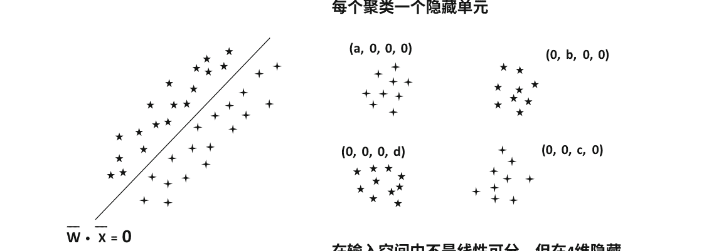

图6.2：重新审视图1.4：高斯RBF通过对隐藏层的转换促进可分离性。

感知机和线性支持向量机在类别不是线性可分离时表现不佳。当使用感知机准则和铰链损失等损失函数时，高斯RBF分类器能够将输入空间中不可线性分离的类别分开。关键在于隐藏层创建的局部转换。一个重要的观点是，带有小带宽的高斯核通常会导致只有少数几个隐藏单元在特定局部区域被激活为显著的非零值，而其他值几乎为零。这是因为高斯函数的指数衰减特性，在特定区域之外取接近零的值。通过聚类中心识别原型通常将空间划分为局部区域，在这些局部区域中只有一小部分空间能够实现显著的非零激活。实际上，空间的每个局部区域都被分配了自己的特征，对应于被其最强烈激活的隐藏单元。

两个数据集的示例如图6.2所示。这些数据集在第1章中引入，用于说明（传统的）感知机能够或不能够解决的情况。第1章的传统感知机能够找到左侧数据集的解决方案，但对右侧数据集效果不佳。然而，高斯RBF方法使用的转换能够解决右侧聚类数据集的可分离性问题。考虑一种情况，即将图6.2中的四个聚类的质心用作原型。这将导致数据的4维隐藏表示。请注意，隐藏维度高于输入维度，在这些设置中很常见。通过适当选择带宽，只有一个隐藏单元将强烈激活，对应于点所属的聚类标识符。其他隐藏单元将被弱激活，并且接近于0。这将导致一个相当稀疏的表示，如图6.2所示。我们展示了每个聚类中点的近似4维表示。图6.2中的a、b、c和d的值将在相应聚类的不同点上变化，尽管与其他坐标相比，它们始终非常非零。请注意其中一个类别在第一和第三维度上，由强非零值定义，而在第二和第四维度上，第二类别由强非零值定义。因此，权重向量 $\overline{W} = [1, -1, 1, -1]$ 将提供优秀的非线性分离两个类别。理解的关键点是，高斯RBF创建了局部特征，导致类别的可分性。这正是核支持向量机实现线性可分性的方式。

### 6.3.4 插值应用

高斯RBF最早的应用之一是在一组点上进行函数值的插值。这里的目标是对提供的点进行精确插值，使得结果函数通过所有输入点。可以将插值视为回归的特殊情况，其中每个训练点都是一个原型，因此列向量 $\overline{W}$ 中的权重数量 $m$ 与训练示例的数量 $n$ 完全相等。

在这种情况下，可以找到一个 $m$ 维权重向量 $\overline{W}$ 具有零误差。在这种情况下，激活 $\overline{H}_1 \dots \overline{H}_n$ 表示 $n$ 维行向量。因此，通过将这些行向量叠加在一起，得到的矩阵 $H$ 的大小为 $n \times n$。设 $\overline{y} = [y_1, y_2, \dots y_n]^T$ 为 $n$ 维列向量的观测变量。

在线性回归中，通过最小化损失函数 $\| H\overline{W} - \overline{y} \|^2$ 来确定 $\overline{W}$。这是因为矩阵 $H$ 不是方阵，方程组 $H\overline{W} = \overline{y}$ 是过完备的。然而，在线性插值的情况下，矩阵 $H$ 是方阵，方程组不再过完备。因此，可以找到一个满足以下方程组的精确解（零损失）：

$$H\overline{W} = \overline{y} \qquad\qquad (6.13)$$

可以证明，当训练点彼此不同 [334] 时，该方程组有唯一解。权重向量 $\overline{W}$ 的值然后可以计算如下：

$$\overline{W} = H^{-1}\overline{y} \qquad\qquad (6.14)$$

值得注意的是，这个方程是方程 6.6 的特殊情况，因为方阵和非奇异矩阵的伪逆等于其逆。在矩阵 $H$ 是非奇异的情况下，可以简化伪逆如下：

$$\begin{aligned} H^+ &= (H^T H)^{-1} H^T \\ &= H^{-1} (H^T)^{-1} H^T \\ &= H^{-1} \end{aligned}$$

因此，线性插值是最小二乘回归的特殊情况。换句话说，最小二乘回归是一种有噪音的插值方法，由于隐藏层的自由度有限，无法通过所有训练点来拟合函数。将隐藏层的大小调整为训练数据大小可以实现精确插值。精确插值不一定对计算样本外点的函数值更好，因为这可能是过拟合的结果。

## 6.4 与核方法的关系

RBF网络通过将输入点映射到一个高维隐藏空间中，在该空间中线性模型足以建模非线性。这与核方法（如核回归和核支持向量机）使用的原理相同。实际上，可以证明RBF网络的某些特殊情况可以简化为核回归和核支持向量机。

### 6.4.1 核回归是RBF网络的特殊情况

在RBF网络中，权重向量$\overline{W}$被训练以最小化以下预测函数的平方损失：

$$ \hat{y}_i = \overline{W} \cdot \overline{H}_i^T = \sum_{j=1}^{m} w_j \Phi_j(\overline{X}_i) $$

现在考虑原型与训练点相同的情况，因此我们设置 $\overline{\mu}_j = \overline{X}_j$ 对于每个 $j \in \{1...n\}$。注意，这种方法与函数插值中使用的方法相同，其中原型被设置为所有训练点。

此外，每个带宽 $\sigma$ 被设置为相同的值。在这种情况下，可以将上述预测函数写成以下形式：

$$ \hat{y}_i = \sum_{j=1}^{n} w_j \exp \left( -\frac{||\overline{X}_i - \overline{X}_j||^2}{2\sigma^2} \right) $$

方程右侧的指数项可以写成点 $\overline{X}_i$ 和 $\overline{X}_j$ 之间的高斯核相似度。这个相似度用 $K(\overline{X}_i, \overline{X}_j)$ 表示。因此，预测函数变为以下形式：

$$ \hat{y}_i = \sum_{j=1}^{n} w_j K(\overline{X}_i, \overline{X}_j) $$

这个预测函数与带宽为 $\sigma$ 的核函数回归中使用的预测函数 $\hat{y}_i$ 是用拉格朗日乘子 $\lambda_j$ 而不是权重 $w_j$ 来定义的（例如，参见[7]）：

$$ \hat{y}_i^{\text{内核}} = \sum_{j=1}^{n} \lambda_j y_j K(\overline{X}_i, \overline{X}_j) $$

此外，（平方）损失函数在这两种情况下是相同的。因此，高斯RBF解和内核回归解之间将存在一对一的对应关系，设置 $w_j = \lambda_j y_j$ 会导致损失函数的值相同。因此，它们的最优值也将相同。换句话说，在原型向量设置为训练点的特殊情况下，高斯RBF网络提供与内核回归相同的结果。然而，RBF网络更强大和通用，因为它可以选择不同的原型向量；因此，RBF网络可以建模内核回归无法实现的情况。从这个意义上讲，将RBF网络视为内核方法的灵活神经变体是有帮助的。

### 6.4.2 核支持向量机是RBF网络的特例

与核回归一样，核支持向量机（SVM）也是RBF网络的特例。与核回归的情况类似，原型向量被设置为训练点，并且所有隐藏单元的带宽都被设置为相同的值 σ。此外，权重 w_j 被学习以最小化预测的合页损失。

在这种情况下，可以证明RBF网络的预测函数如下：

$$ \hat{y}_i = \text{sign} \left\{ \sum_{j=1}^{n} w_j \exp \left( -\frac{\|\overline{X}_i - \overline{X}_j\|^2}{2\sigma^2} \right) \right\} \quad (6.19) $$

$$ \hat{y}_i = \text{sign} \left\{ \sum_{j=1}^{n} w_j K(\overline{X}_i, \overline{X}_j) \right\} \quad (6.20) $$

比较一下这个预测函数与核SVM中使用的预测函数是有益的（参见，例如，[7]）与拉格朗日乘子 λ_j：

$$ \hat{y}_i^{\text{内核}} = \text{sign} \left\{ \sum_{j=1}^{n} \lambda_j y_j K(\overline{X}_i, \overline{X}_j) \right\} \quad (6.21) $$

这个预测函数的形式与核支持向量机（kernel SVMs）中使用的形式相似，只是变量使用上有一点不同。在这两种情况下，都使用了合页损失（hinge-loss）作为目标函数。通过设置。当representer定理在核方法中使用时，w_j = λ_j y_j 可以得到相同的损失函数值。因此，核支持向量机和RBF网络的最优解也将根据条件 w_j = λ_j y_j 而相关联。换句话说，核支持向量机也是RBF网络的一种特殊情况。注意，权重 w_j 也可以被视为每个数据点的系数，当在核方法中使用representer定理时[7]。

### 观察

可以通过改变损失函数，将上述论证推广到其他线性模型，如核费舍尔判别和核逻辑回归。事实上，只需将二进制变量作为目标，并应用核回归技术，就可以得到核费舍尔判别。然而，由于费舍尔判别在假设数据居中的情况下工作，需要在输出层添加一个偏置来吸收非居中数据的偏移。因此，通过选择适当的损失函数，RBF网络可以模拟几乎任何核方法。一个关键点是，RBF网络比核回归或分类提供了更大的灵活性。例如，在隐藏层中选择节点的数量以及原型的数量都有更大的灵活性。以更经济的方式明智地选择原型有助于提高准确性和效率。这些选择涉及一些关键的权衡。增加隐藏单元的数量会增加所建模函数的复杂性。它对于建模复杂函数可能很有用，但也可能导致过拟合。

选择隐藏单元数量的一种方法是保留一部分数据，并使用不同数量的隐藏单元在保留集上估计模型的准确性。然后将隐藏单元的数量设置为优化此准确性的值。

## 6.5 总结

本章介绍径向基函数（RBF）网络，它代表了一种基于神经网络架构的根本不同的使用方式。与前馈网络不同，隐藏层和输出层的训练方式略有不同。隐藏层的训练是无监督的，而输出层的训练是有监督的。隐藏层通常比输入层具有更多的节点。关键思想是使用局部敏感变换将数据点转换为高维空间，使得转换后的点线性可分。通过改变损失函数的性质，该方法可以用于分类、回归和线性插值。在分类中，可以使用不同类型的损失函数，如 Widrow-Hoff损失、hinge损失和logistic损失。不同损失函数的特殊情况专门用于众所周知的核方法，如核支持向量机和核回归。

RBF网络在近年来很少被使用，已经成为被遗忘的神经结构类别。然而，在任何使用核方法的场景中，它都具有重要的潜力。此外，可以通过使用多层表示来将这种方法与前馈结构相结合，紧随第一个隐藏层之后。

## 6.6 参考文献和软件资源

RBF网络是由Broomhead和Lowe [51]在函数插值的背景下提出的。Cover的工作 [87] 展示了高维变换的可分性。关于RBF网络的综述可以在[374]中找到。Bishop [41] 和 Haykin [192] 的书籍也对这个主题进行了很好的阐述。在[57]中提供了径向基函数的概述。在[183, 378]中提供了使用RBF网络进行通用函数逼近的证明。在[379]中提供了对RBF网络逼近性质的分析。

对于RBF网络的高效训练算法在[358, 440]中有描述。在[549]中提出了一种学习RBF网络中心位置的算法。讨论了使用决策树初始化RBF网络的方法在[264]中。正交最小二乘算法在[67]中提出。关于RBF网络的有监督和无监督训练的早期比较在[353]中提供。根据这个分析，完全监督似乎增加了网络陷入局部最小值的可能性。关于提高RBF网络泛化能力的一些想法在[42]中提供。增量RBF网络在[130]中讨论。关于RBF网络和核方法之间关系的详细讨论在[449]中提供。

## 6.7 练习

一些练习需要额外的关于机器学习的知识，这本书中没有讨论。练习5、7和8需要额外的核方法、谱聚类和异常检测的知识。

1. 考虑以下径向基函数网络的变体，其中隐藏单元取值为0或1。如果到原型向量的距离小于 σ，则隐藏单元取值为1。否则，隐藏单元取值为0。讨论该方法与RBF网络的关系，以及其相对优势/劣势。

2. 假设您在最后一层使用sigmoid激活来预测RBF网络输出节点中的二进制类标签作为概率。为此设置一个负对数似然损失。推导最后一层权重的梯度下降更新。这种方法与第3章中讨论的逻辑回归方法有何关联？在哪种情况下，这种方法比逻辑回归表现更好?

3. 讨论为什么RBF网络是最近邻分类器的监督变体。

4. 讨论如何将第二章中讨论的三种多类模型扩展到RBF网络。特别讨论(a)多类感知器、(b)韦斯顿-沃特金斯SVM和(c)softmax分类器与RBF网络的扩展。讨论这些模型比第二章中讨论的模型更强大的原因。

5. 提出一种将RBF网络扩展到自编码器无监督学习的方法。在输出层中，你将重构什么？你的方法的一个特殊情况应该能够粗略模拟核奇异值分解。

6. 假设你改变了RBF网络，只保留隐藏层中的前k个激活，并将其余的激活设置为0。讨论为什么这种方法将在有限数据下提供改进的分类准确性。

7. 将第6题中构建RBF层的前k个方法与第5题中的RBF自编码器结合起来进行无监督学习。讨论为什么这种方法将创建更适合聚类的表示。讨论这种方法与谱聚类的关系。

8. 异常值的流形观点是将其定义为不自然地适应于训练数据的非线性流形的点。讨论如何使用RBF网络进行无监督的异常值检测。

9. 假设在隐藏层中不使用RBF函数，而是使用原型和数据点之间的点积进行激活。证明这种情况的特例可以简化为线性感知器。

10. 讨论如何修改练习5中的RBF自编码器以执行半监督分类，当你有大量未标记的数据和有限的标记数据时。

11. RBF反向传播：有时通过RBF层进行反向传播计算灵敏度是有用的。∂o/∂xj of类输出概率 o对每个输入特征值 xj的敏感度。假设第 i个隐藏特征。RBF层的_i的计算结果为。推导出 ∂hi/∂xj的表达式。

12. RBF网络作为注意力机制：假设每个输入到RBF网络的规范化为 L2-范数为1，并且RBF原型是从数据中采样的。假设RBF层使用Exercise 11中显示的标准RBF函数。讨论这样一层与以每个输入为输入的softmax层的相似之处和不同之处 对于所有原型_i， X·μ io。你如何在RBF层之后添加一些简单的（非参数化）计算单元并适当地选择σ，以获得softmax输出？换句话说，RBF网络关注固定的原型。

## 第七章

## 受限玻尔兹曼机

> > “可用能量是存在的斗争和世界演化的主要目标。” - 路德维希·玻尔兹曼

## 7.1 引言

受限玻尔兹曼机（RBM）是一种与前馈网络根本不同的模型。传统神经网络是输入-输出映射网络，其中一组输入被映射到一组输出。另一方面，RBM是一种学习网络的概率状态的输入集的网络，这对于无监督建模非常有用。虽然前馈网络通过最小化预测的损失函数（根据观察到的输入计算）来建模，但受限玻尔兹曼机模型是观察到的属性与一些隐藏属性的联合概率分布。传统的前馈网络具有从输入到输出的计算流的有向边，而RBM是无向网络，因为它被设计用于学习概率关系而不是输入-输出映射。受限玻尔兹曼机是创建潜在数据点表示的概率模型。虽然自编码器也可以用于构建潜在表示，但表示是确定性的；玻尔兹曼机创建随机隐藏表示。因此，RBM需要一种根本不同的训练和使用方式。在核心上，RBM是无监督模型，可以生成数据点的潜在特征表示，尽管有许多扩展方法可以用于监督情况。值得注意的是，RBM通常以其最自然的形式使用二进制状态，尽管也可以使用其他数据类型。本章大部分讨论将限制在具有二进制状态的单元上。

### 历史背景

受限玻尔兹曼机起源于神经网络领域中的经典模型，被称为Hopfield网络。该网络包含节点，节点具有二进制状态，表示训练数据中的二进制属性值。Hopfield网络通过节点之间的加权边创建了关系的确定性模型，用于表示不同属性之间的关系。最终，Hopfield网络演变成了Boltzmann机的概念，Boltzmann机使用概率状态来表示二进制属性的伯努利分布。Boltzmann机包含可见状态和隐藏状态。可见状态模拟观测数据点的分布，而隐藏状态模拟潜在（隐藏）变量的分布。各个状态之间的连接参数调节它们的联合分布。目标是学习模型参数，使模型的似然性最大化。

玻尔兹曼机是（无向）概率图模型家族的一员。最终，玻尔兹曼机演变成了受限玻尔兹曼机（RBM）。玻尔兹曼机和受限玻尔兹曼机的主要区别在于后者只允许隐藏单元和可见单元之间的连接。

从实际角度来看，这种简化非常有用，因为它允许设计更高效的训练算法。RBM是概率图模型类别中的一种特殊情况，被称为马尔可夫随机场。

在最初的几年里，RBM被认为训练速度太慢，因此并不受欢迎。然而，在世纪之交，针对这类模型提出了更快的算法。此外，它们作为Netflix奖项竞赛[602]中获胜的[431]参赛作品的集成组件之一而受到一定的关注。成功训练具有RBM的深度网络先于成功训练传统神经网络的经验；然后将类似的思想推广到传统网络。

### 章节组织

本章的组织结构如下。下一节将介绍Hopfield网络，它是Boltzmann模型系列的前身。Boltzmann机在第7.3节中介绍。受限Boltzmann机在第7.4节中介绍。受限Boltzmann机的应用在第7.5节中讨论。在第7.6节中讨论了将RBM用于二进制表示之外的广义数据类型。在第7.7节中讨论了堆叠多个受限Boltzmann机以创建深度网络的过程。第7.8节给出了总结。

## 7.2 Hopfield网络

Hopfield网络于1982年提出[217]，作为存储记忆的模型。Hopfield网络是一个无向网络，其中的单元（或神经元）由取自{1…d}的值索引。每个连接的形式为(i, j)，其中每个i和j是从{1…d}中取值的神经元。每个连接(i, j)是无向的，并且与一个权重相关联。

尽管假设所有节点对之间都有连接，设置。w_{ij}为0会导致连接断开。(i, j)的权重。w_{ii}被设置为0，因此没有自环。每个神经元i与状态。s_i相关联。Hopfield网络的一个重要假设是每个。s_i是从二进制值中提取的。{0, 1}，尽管也可以使用其他约定，如{-1, +1}。第i个节点还有一个偏置。b_i与之相关联；较大的值。b_i鼓励第i个状态为1。Hopfield

网络是一种无向模型，用于描述属性之间的对称关系，因此权重始终满足 $w_{ij} = w_{ji}$。

Hopfield网络中的每个二进制状态对应于（二进制）训练数据集中的一个维度。因此，如果需要记忆一个 $d$ 维的训练数据集，我们需要一个具有 $d$ 个单元的Hopfield网络。网络中的第 $i$ 个状态对应于特定训练示例中的第 $i$ 个位。状态的值表示来自训练示例的二进制属性值。Hopfield网络中的权重是其参数；状态对之间的大正权重表示状态值之间具有高度正相关性，而大负权重表示高度负相关性。图7.1显示了一个带有相关训练数据集的Hopfield网络的示例。在这种情况下，Hopfield网络是完全连接的，六个可见状态对应于训练数据中的六个二进制属性。

Hopfield网络使用优化模型来学习权重参数，以便捕捉训练数据集中属性之间的正负关系。Hopfield网络的目标函数也被称为能量函数，类似于传统前馈神经网络的损失函数。Hopfield网络的能量函数被设置成这样一种方式，即最小化该函数鼓励具有大正权重连接的节点对具有相同的状态，并且具有大负权重连接的节点对具有不同的状态。因此，Hopfield网络的训练阶段通过学习边的权重来最小化能量，当Hopfield网络的状态被固定为个体训练点中的二进制属性值时。因此，学习Hopfield网络的权重隐式地构建了训练数据集的无监督模型。Hopfield网络的特定状态组合 $s=(s_1, ... s_d)$ 的能量 $E$ 可以定义如下：

> $$E = -\sum_{i} b_i s_i - \sum_{i, j: i<j} w_{ij} s_i s_j \quad\quad\quad (7.1)$$

该术语 $-b_i s_i$ 鼓励 $s_i = 1$ 当 $b_i$ 为正以便最小化能量。同样地，该术语 $-w_{ij} s_i s_j$ 鼓励 $s_i = s_j$ 当 $w_{ij} > 0$ 换句话说，正权重会导致状态“吸引”，而负权重会导致状态“排斥”。对于一个小的训练数据集，这种建模方式会导致记忆，使得人们可以通过探索能量函数在这些查询点附近的局部极小值来检索类似的、不完整的或损坏的查询点的训练数据点。换句话说，通过学习Hopfield网络的权重，人们在隐式地记忆训练样本，尽管从一个包含 $d$ 个单元的Hopfield网络中可以相对保守地记忆的样本数量有一个相对限制。这个限制也被称为模型的容量。

### 训练网络的最佳状态配置

训练过的Hopfield网络包含许多局部最优解，每个最优解对应于训练数据中的一个记忆点，或者是训练数据中一个密集区域的代表点。在讨论Hopfield网络权重训练之前，我们将讨论当已经给定训练好的权重时，如何找到Hopfield网络的局部能量最小值的方法。局部最小值被定义为一组状态的组合，在这组状态中，翻转网络的任何特定比特都不会进一步降低能量。训练过程通过设置权重的方式，使得训练数据中的实例倾向于成为Hopfield网络中的局部最小值。

找到最佳状态配置有助于Hopfield网络进行记忆回忆。Hopfield网络本质上学习关联记忆，因为对于给定的状态集合（即位模式的输入模式），它会重复翻转位来改善目标函数，直到找到一个无法进一步改善目标函数的模式。这个局部最小值（最终状态的组合）通常只与起始模式（初始状态集合）相差几位，因此会回忆起一个与之密切相关的模式，在该模式中找到一个局部最小值。此外，这个最终模式通常是训练数据集的成员（因为使用该数据学习了权重）。从某种意义上说，Hopfield网络提供了一种内容寻址存储器的路径。

给定一个起始状态组合，一旦权重已经固定，如何学习最接近的局部最小值？可以使用阈值更新规则来更新网络中的每个状态，以使其向全局能量最小值移动。为了理解这一点，让我们比较网络在状态设置为1和状态设置为0时的能量。因此，可以将两个不同的值代入方程7.1中，得到能量差的以下值：s_i可以替换为两个不同的值。将s_i代入方程7.1中，可以得到能量差的以下值：

$$\Delta E_i = E_{s_i=0} - E_{s_i=1} = b_i + \sum_{j:j=i} w_{ij} s_j \quad (7.2)$$

为了使状态翻转，此值必须大于0 s_i从0变为1是有吸引力的。因此，对于每个状态，可以得到以下更新规则 s_i:

$$s_i = \begin{cases} \text{如果 } \sum_{j:j=i} w_{ij} s_j + b_i \geq 0 & \text{为1} \\ \text{否则} & \text{为0} \end{cases} \quad (7.3)$$

上述规则被迭代地用于测试每个状态 s_i然后根据需要翻转状态以满足条件。如果给定权重和偏差，重复使用状态更新可以达到局部能量最小值。

Hopfield网络的局部最小值取决于其训练后的权重。因此，为了“回忆”一个记忆，只需提供一个类似于存储的记忆的d维向量，并且Hopfield网络将通过将其作为起始状态来找到与该点相似的局部最小值。这种关联记忆的回忆方式在人类中也很常见，他们经常通过类似的关联过程来检索记忆。可以提供部分初始状态向量，并使用它来恢复其他状态。考虑图7.1中显示的Hopfield网络。注意权重设置的方式

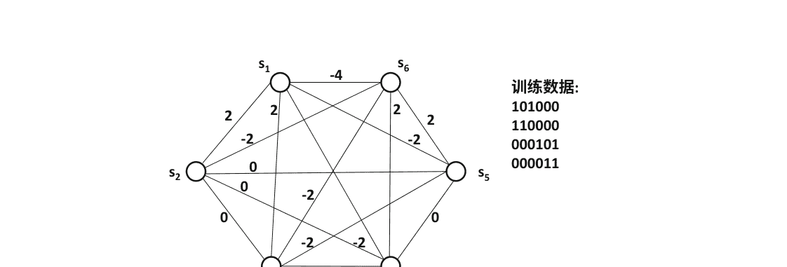

图7.1：一个具有6个可见状态的Hopfield网络，对应于6维训练数据。

图中的四个训练向量的能量都很低。然而，并不能保证局部最小值总是对应于训练数据中的点。
然而，局部最小值确实对应于训练数据的一些关键特征。
例如，考虑对应于111000的最小值。值得注意的是，前三位是正相关的，而后三位也是正相关的。
因此，尽管训练数据中没有明确出现，但111000的最小值确实反映了底层数据中的一个广泛模式。这是因为该网络的权重与训练数据中的模式密切相关。例如，在各自的组内，第一个三位和最后三位的元素是正相关的。此外，这两组元素之间存在负相关。因此，每个集合内的边缘都是正的，而这两个集合之间的边缘是负的。{s_4, s_5, s_6}倾向于正的，而这两个集合之间的边缘是负的。以这种数据特定的方式设置权重是训练阶段的任务（参见第7.2.1节）。

迭代状态更新规则将到达Hop-field网络的许多局部最小值之一，取决于初始状态向量。这些局部最小值中的每一个可能是训练数据集中学到的一个关联记忆，并且将到达初始状态向量最近的记忆。这些记忆在训练阶段学习的权重中隐式存储。Hopfield网络类似于人类回忆记忆，即将过去看到的模式与当前模式大致关联起来。然而，当相关训练模式合并为单个（更深）最小值时，Hopfield网络可能会到达一个密切相关的模式。例如，如果训练数据包含1110111101和1110111110，Hopfield网络可能会学习1110111111作为局部最小值。因此，在某些查询中，可能会恢复一个与实际存在于训练数据中的模式相差很少的模式。然而，这只是一种模型泛化的形式，Hop-field网络存储的是代表性的“聚类”中心，而不是单个训练点。

当数据量超过模型容量时，模型开始泛化而不是记忆；毕竟，Hopfield网络是根据数据构建无监督模型的。
Hopfield网络可用于回忆联想记忆、纠正损坏的数据或属性补全。对于回忆联想记忆或清理损坏的数据，使用（可能损坏的）目标向量作为起始状态进行回忆。最终状态是回忆的输出（或清理后的输出）。在属性补全中，状态向量通过将观察到的状态设置为已知值，并随机设置未观察到的状态进行初始化。此时，只有未观察到的状态会更新到收敛。这些状态在收敛时的位值提供了完成的表示。

### 7.2.1 训练Hopfield网络

对于包含n个实例的给定训练数据集，需要学习权重，使得该网络的局部最小值位于训练数据集的实例（或密集区域）附近。Hopfield网络使用Hebbian学习规则进行训练。根据Hebbian学习的生物学动机，当突触两侧的神经元具有高度相关的输出时，突触的强度会增强。令x_{ij} ∈ {0, 1}表示第i个训练点的第j位。网络的权重使用Hebbian学习规则进行设置:

$$w_{ij} = 4 \sum_{k=1}^{n} (x_{ki} - 0.5) \cdot (x_{kj} - 0.5) \qquad \qquad (7.4)$$理解这个规则的一种方式是，如果训练数据中的两个位，\( i \)和\( j \)，呈正相关，则值 \( (x_{ki} - 0.5) \cdot (x_{kj} - 0.5) \)通常为正数。因此，相应单元之间的权重也将被设置为正值。另一方面，如果两个位通常不一致，则权重将被设置为负值。

偏置 \( b_i \)可以通过假设它是某个始终处于开启状态的单元与第\( i \)个单元之间的权重来设置，因此它等于 \( 2 \sum_k (x_{kj} - 0.5) \)。可以使用以下方式逐步增加 \( w_{ij} \)，只使用第\( k \)个训练数据点：
\[ w_{ij} \leftarrow w_{ij} + 4(x_{ki} - 0.5) \cdot (x_{kj} - 0.5) \quad \forall i, j \]

假设 \( b_i \) 表示始终处于开启状态的单元与第\( i \)个状态之间的权重，可以通过以下方式更新：
\[ b_i \leftarrow b_i + 2(x_{ki} - 0.5) \quad \forall i \]
在状态向量从 \( \{-1, +1\} \) 中提取的情况下，上述规则简化为以下形式：
\[ w_{ij} \leftarrow w_{ij} + x_{ki}x_{kj} \quad \forall i, j \]
\[ b_i \leftarrow b_i + x_{ki} \quad \forall i \]

还有其他学习规则，比如常用的Storkey学习规则。请参考参考文献注释。

### Hopfield网络的容量

一个具有 \( d \) 个可见单元的Hopfield网络能够存储多大规模的训练数据，而不会导致联想回忆错误？可以证明，一个具有 \( d \) 个单元的Hopfield网络的存储容量仅约为 \( 0.15 \cdot d \) 个训练样例。由于每个训练样例包含 \( d \) 个比特，因此可以得出结论，Hopfield网络只能存储约为 \( 0.15 d^2 \) 个比特。这不是一种高效的存储形式，因为网络中的权重数量由 \( d^2 \) 给出。此外，这些权重不是二进制的，可以证明它们需要 \( O(\log(d)) \) 个比特。当训练样例的数量很大时，会产生许多错误（在联想回忆中）。这些错误代表了来自更多数据的广义预测。虽然这种类型的泛化对于机器学习可能很有用，但在使用Hopfield网络进行此类应用时存在一些限制。

### 7.2.2 构建一个玩具推荐系统及其限制

Hopfield网络通常用于以记忆为中心的应用，而不是需要泛化的典型机器学习应用。为了了解Hopfield网络的限制，我们将考虑二进制协同过滤问题，其中每个用户与是否观看每个可能的电影相关联。考虑这样一种情况，用户Bob观看了电影Shrek和Aladdin，而用户Alice观看了Gandhi、Nero和Terminator。在所有电影的宇宙中构建一个全连接的Hopfield网络，并将观看状态设置为1，其他状态设置为0是很容易的。

可以将这种配置用于每个训练点以更新权重。当基本状态（电影）的数量非常大时，这种方法可能非常昂贵。对于包含 \( 10^6 \) 部电影的数据库，我们将有 \( 10^{12} \) 条边，其中大多数将连接包含零值的状态。这是因为这种类型的隐式反馈数据通常是稀疏的，大多数状态将取零值。

解决这个问题的一种方法是使用负采样。在这种方法中，每个用户都有自己的Hopfield网络，其中包含他们观看的电影和一小部分未观看的电影样本。例如，可以随机抽取20部未观看的电影（属于爱丽丝），并创建一个包含\(20 + 3 = 23\)个状态的Hopfield网络（包括观看的电影）。鲍勃的Hopfield网络将包含\(20 + 2 = 22\)个状态，未观看的样本也可能非常不同。然而，对于两个网络中共同的电影对，权重将被共享。在训练过程中，所有边的权重都初始化为0。可以使用重复迭代训练不同的Hopfield网络来学习它们的共享权重（使用之前讨论的相同算法）。

主要的区别是在不同的训练点上进行迭代将导致在不同的Hopfield网络上进行迭代，每个网络都包含基础网络的一个子集。通常，这些网络中只有很小一部分 \( 10^{12} \) 条边会出现，大多数边在任何网络中都不会遇到。这样的边将被默认权重为零。

现在想象一个叫玛丽的用户，她观看了\(E.T.\)和\(Shrek\)。我们想要向这个用户推荐电影。我们使用完整的Hopfield网络，只有非零边存在。我们将\(E.T.\)和\(Shrek\)的状态初始化为1，其他状态初始化为0。随后，我们允许更新除\(E.T.\)和\(Shrek\)之外的所有状态，以便识别Hopfield网络的最小能量配置。在更新过程中设置为1的所有状态都可以推荐给用户。然而，我们理想情况下希望有一个推荐电影的排序。提供所有电影的排序的一种方法是使用每部电影两个状态之间的能量差来排名电影。只有在找到最小能量配置之后才计算能量差。然而，这种方法相当天真，因为Hopfield网络的最终配置是一个包含二进制值的确定性配置，而外推值只能用概率来估计。例如，使用能量差的某个函数（例如sigmoid函数）来创建概率估计会更自然。

此外，能够捕捉具有一定潜在（或隐藏）状态的相关电影集合将会很有帮助。显然，我们需要技术来增加Hopfield网络的表达能力。

### 7.2.3 增加Hopfield网络的表达能力

虽然这不是标准做法，但可以向Hopfield网络添加隐藏单元以增加其表达能力。隐藏状态的作用是捕捉数据的潜在结构。隐藏单元与可见单元之间的连接权重将捕捉潜在结构与训练数据之间的关系。在某些情况下，仅通过少量隐藏状态就可以近似表示数据。例如，如果数据包含两个紧密相连的簇，可以通过两个隐藏状态来捕捉这种情况。考虑一种情况，我们增强了图7.1中的Hopfield网络，并添加了两个隐藏单元。图7.2显示了结果网络。为了清晰起见，图中已删除了权重接近零的边。尽管原始数据是用六个位定义的，但两个隐藏单元提供了一个用两个位表示数据的隐藏表示。这种隐藏表示是数据的压缩版本，它告诉我们有关所处理模式的一些信息。实质上，所有模式都被压缩为模式10或01，具体取决于前三位或后三位在训练模式中的占主导地位。如果将Hopfield网络的隐藏状态固定为10，并随机初始化可见状态，那么在重复使用方程式7.3的逐状态更新规则时，通常会得到模式111000。

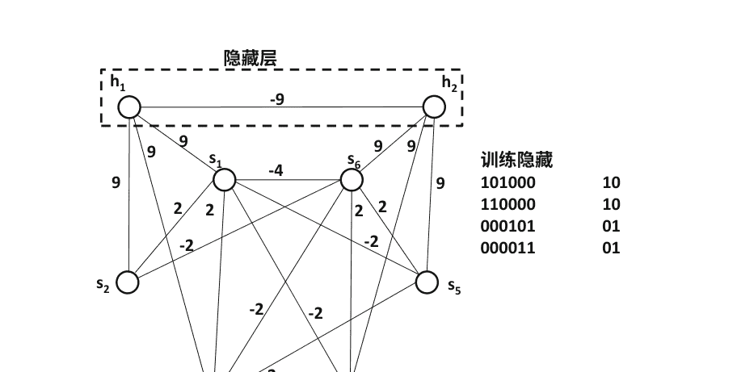
图7.2: 具有两个隐藏节点的Hopfield网络

当以隐藏状态01开始时，最终得到模式000111。值得注意的是，模式000111和111000是数据中两种类型模式的近似，这是压缩技术所期望的。如果我们提供一个不完整的可见单元版本，并使用方程式7.3的更新规则迭代更新其他状态，通常会得到000111或111000，这取决于不完整表示中的位分布。如果我们向Hopfield网络添加隐藏单元，并允许状态是概率性的（而不是确定性的），我们就得到了Boltzmann机。这就是为什么Boltzmann机可以被视为具有隐藏单元的随机Hopfield网络的原因。

## 7.3 Boltzmann机器

在本节中，我们假设Boltzmann机器总共包含 \( q = (m + d) \) 个状态，其中 \( d \) 是可见状态的数量，\( m \) 是隐藏状态的数量。特定的状态配置由状态向量的值定义 \( s=(s_1...s_q) \)。如果有人明确想要划分可见状态和隐藏状态 \( s \)，则状态向量 \( s \) 可以写成一对 \( (v, h) \)，其中 \( v \) 表示可见单元的集合，\( h \) 表示隐藏单元的集合。在 \( (v, h) \) 中的状态与 \( s=\{s_1...s_q\} \) 相同，只是前者明确划分了可见和隐藏单元。

玻尔兹曼机是霍普菲尔德网络的概率推广。霍普菲尔德网络确定性地将每个状态 \( s_i \) 设置为1或0，取决于状态的能量差 \( \Delta E_i \) 的正负。回想一下，第 \( i \) 个单元的能量差定义为其两个配置之间的能量差（其他状态被预定义值固定）：

$$\Delta E_i = E_{s_i=0} - E_{s_i=1} = b_i + \sum_{j:j=i} w_{ij}s_j$$

Hopfield网络确定性地设置 \( s_i \) 的值。当能量差是正数时，将 \( s_i \) 设置为1。另一方面，Boltzmann机根据概率分配 \( s_i \) 的值，取决于能量差。正能量差被分配的概率大于0.5。状态 \( s_i \) 的概率通过将能量差应用于sigmoid函数来定义：

$$P(s_i = 1|s_1, \dots s_{i-1}, s_{i+1}, s_q) = \frac{1}{1 + \exp(-\Delta E_i)}$$

请注意 \( s_i \) 现在是一个伯努利随机变量，零能隙导致状态的二进制结果的概率为0.5。

对于一组特定的参数 \( w_{ij} \) 和 \( b_i \)，玻尔兹曼机定义了各种状态配置的概率分布。特定配置 \( s=(v,h) \) 的能量被表示为 \( E(s)=E([v, h]) \)，并且与Hopfield网络类似地定义如下：

$$E(\bar{s}) = -\sum_i b_i s_i - \sum_{i,j:i<j} w_{ij} s_i s_j$$

然而，在玻尔兹曼机的情况下，这些配置只是以概率的形式已知（根据方程式7.6）。方程式7.6的条件分布来自于无条件概率的定义配置 \( s \) 的概率 \( P(s) \)：

$$P(\bar{s}) \propto \exp(-E(\bar{s})) = \frac{1}{Z} \exp(-E(\bar{s}))$$

归一化因子 \( Z \) 确保所有可能的配置的概率之和为1：

$$Z = \sum_{\bar{s}} \exp(-E(\bar{s}))$$

归一化因子 \( Z \) 也被称为分区函数。一般来说，计算分区函数是困难的，因为它包含了与所有可能状态配置对应的指数数量的项。由于分区函数的不可计算性，无法精确计算 \( P(s)=P(v,h) \)。

然而，许多类型的条件概率计算（例如，\( P(v|h) \)）是可能的，因为这些条件概率是比率，而难以处理的归一化因子在计算中被消除。例如，方程7.6的条件概率可以从更基本的配置概率定义（参见方程7.8）推导出来，如下所示：

$$P(s_i = 1|s_1, \dots s_{i-1}, s_{i+1}, s_q) = \frac{P(s_1, \dots s_{i-1}, 1, s_{i+1}, s_q)}{P(s_1, \dots s_{i-1}, 1, s_{i+1}, s_q) + P(s_1, \dots s_{i-1}, 0, s_{i+1}, s_q)} = \frac{\exp(-E_{s_i=1})}{\exp(-E_{s_i=1}) + \exp(-E_{s_i=0})} = \frac{1}{1 + \exp(E_{s_i=1} - E_{s_i=0})} = \frac{1}{1 + \exp(-\Delta E_i)} = \text{Sigmoid}(\Delta E_i)$$

这与方程7.6的条件相同。由于状态是概率性的，我们可以从它们的联合概率分布中采样，以创建看起来像原始数据的新数据点。因此，玻尔兹曼机可以用作生成模型。机器学习中的许多生成模型（例如，用于聚类的高斯混合模型）使用先从先验中采样隐藏状态，然后在隐藏状态的条件下生成可见观测值的顺序过程。这在Boltzmann机中并不是这样，其中所有状态对之间的依赖关系是无向的；可见状态与隐藏状态之间的依赖程度与隐藏状态与可见状态之间的依赖程度一样大。因此，与许多其他生成模型相比，使用Boltzmann机生成数据可能更具挑战性。

### 7.3.1 Boltzmann机如何生成数据

Boltzmann机在数据生成方面的主要挑战是由状态之间的循环依赖关系引起的（基于方程7.6）。因此，Boltzmann机使用基于方程7.6的概率抽样过程。Boltzmann机通过使用前一次迭代中的状态值生成的条件分布迭代地对状态进行抽样，直到达到热平衡。热平衡的概念意味着对各种属性值进行抽样的观察频率代表它们的长期稳态概率分布。达到热平衡的过程如下。我们从一组随机状态开始，使用方程7.6计算它们的条件概率，然后再次使用这些概率对状态的值进行抽样。请注意，我们可以使用方程7.6中的 \( P(s_i=1|s_1 \dots s_{i-1}, s_{i+1} \dots s_q) \) 迭代地生成 \( s_i \)。运行此过程一段时间后，可见状态的抽样值为我们提供了生成数据点的随机样本。达到热平衡所需的时间被称为过程的燃烧时间。这种方法被称为Gibbs抽样或马尔可夫链蒙特卡罗（MCMC）抽样。

在热平衡状态下，生成的点将代表着玻尔兹曼机所捕捉到的模型。请注意，生成的数据点中的维度将与各个状态之间的权重相关。具有较大权重的状态之间将倾向于高度相关。例如，在文本挖掘应用中，状态对应于单词的存在，单词之间将存在相关性。因此，如果玻尔兹曼机在文本数据集上经过适当的训练，即使状态是随机初始化的，在热平衡状态下它也会生成包含这些单词相关性的向量。值得注意的是，即使使用玻尔兹曼机生成一组数据点也比许多其他概率模型更复杂。例如，从高斯混合模型生成数据点只需要直接从采样的混合成分的概率分布中采样点。然而，玻尔兹曼机的无向性质迫使我们运行过程直到达到热平衡状态才能生成样本。因此，对于给定的训练数据集来说，学习状态之间的权重更加困难。

### 7.3.2 学习玻尔兹曼机的权重

在玻尔兹曼机中，我们希望以一种方式学习权重，以最大化手头特定训练数据集的对数似然。通过使用方程式7.8中的概率的对数来计算各个状态的对数似然。因此，通过取方程式7.8的对数，我们得到以下结果：

$$ \log[P(s)] = -E(s) - \log Z \quad (7.10) $$

因此，计算 \( \frac{\partial \log[P(s)]}{\partial w_{ij}} \) 需要计算能量的负导数，尽管我们有一个涉及分区函数的附加项。方程式7.7中的能量函数在权重 \( w_{ij} \) 上是线性的。 \( w_{ij} \) 的系数为 \( -s_is_j \)。因此，能量对权重 \( w_{ij} \) 的偏导数是 \( -s_is_j \)。因此，可以证明以下结果：

$$\frac{\partial \log [P(\bar{s})]}{\partial w_{ij}} = \langle s_i, s_j \rangle_{\text{数据}} - \langle s_i, s_j \rangle_{\text{模型}} \quad (7.11)$$

在这里，\( \langle s_i, s_j \rangle_{\text{数据}} \) 表示通过运行第7.3.1节中的生成过程，当可见状态被固定为训练数据点中的属性值时，获得的 \( s_is_j \) 的平均值。平均值是在一个小批量的训练点上进行的。同样地，\( \langle s_i, s_j \rangle_{\text{模型}} \) 表示在热平衡时 \( s_is_j \) 的平均值，而不将可见状态固定为训练点，只需运行第7.3.1节的生成过程。在这种情况下，平均值是通过多次运行过程到达热平衡来计算的。直观上，当可见状态被固定为训练数据点时，我们希望加强状态之间的连接权重，这些状态在一起被打开的倾向。这正是上述更新所实现的，它利用了数据和模型之间在 \( \langle s_i, s_j \rangle \) 值上的差异。

从上面的讨论可以清楚地看出，为了进行更新，需要生成两种类型的样本。这是为了执行更新所需的两种类型的样本：

- **数据中心样本**：第一种样本将可见状态固定为从训练数据集中随机选择的向量。隐藏状态初始化为从伯努利分布中随机抽取的值，概率为0.5。然后根据方程7.6重新计算每个隐藏状态的概率。从这些概率中重新生成隐藏状态的样本。这个过程重复进行一段时间，直到达到热平衡。此时隐藏变量的值提供所需的样本。请注意，可见状态被固定为相关训练数据向量的属性，因此它们不需要被采样。
- **模型中心样本**：第二种样本不对将状态固定为训练数据点施加任何约束，只是希望从无限制的模型中获得样本。方法与上述讨论相同，只是可见状态和隐藏状态都初始化为随机值，并且进行更新直到达到热平衡。

这些样本帮助我们为权重创建更新规则。从第一类样本中，可以计算 \( \langle s_i, s_j \rangle_{\text{数据}} \)，表示节点 \( i \) 和 \( j \) 的状态之间的相关性，当可见向量固定为训练数据中的一个向量时，而隐藏状态允许变化。由于使用了一个小批量的训练向量，可以获得多个状态向量的样本。值 \( \langle s_i, s_j \rangle \) 的计算是通过对从吉布斯采样获得的所有的这样的状态向量的平均乘积进行计算的。类似地，可以估计的值 \( \langle s_i, s_j \rangle_{\text{模型}} \) 使用从吉布斯采样获得的模型中心样本的平均乘积进行计算。一旦这些值被计算出来，就使用以下更新规则：

$$w_{ij} \leftarrow w_{ij} + \alpha \quad (\langle s_i, s_j \rangle_{\text{数据}} - \langle s_i, s_j \rangle_{\text{模型}}) \quad (7.12)$$

偏置的更新规则类似，只是状态 \( s_j \) 被设置为1。可以通过使用一个可见且连接到所有状态的虚拟偏置单元来实现这一点：

$$b_i \leftarrow b_i + \alpha (\langle s_i, 1 \rangle_{\text{数据}} - \langle s_i, 1 \rangle_{\text{模型}}) \quad (7.13)$$

请注意 \( \langle s_i, 1 \rangle \) 的值只是 \( s_i \) 的采样值的平均值。对于一个小批量的训练样例，可以来自数据中心的样例或模型中心的样例。这种方法类似于 Hopfield 网络的 Hebbian 更新规则，只是我们还在更新中去除了模型中心的相关性。去除模型中心的相关性是为了在方程7.10的对数概率表达式中考虑分区函数的影响。上述更新规则的主要问题是在实践中速度较慢。这是因为蒙特卡洛采样过程需要大量样本才能达到热平衡。

## 7.4 限制玻尔兹曼机

在玻尔兹曼机中，隐藏单元和可见单元之间的连接可以是任意的。例如，两个隐藏状态之间可能存在边，两个可见状态之间也可能存在边。这种广义假设会增加不必要的复杂性。玻尔兹曼机的一个自然特例是限制玻尔兹曼机（RBM），它是二分图的，连接只允许在隐藏单元和可见单元之间。

受限玻尔兹曼机的一个示例如图7.3(a)所示。在这个特定的示例中，有三个隐藏节点和四个可见节点。每个隐藏状态都与一个或多个可见状态相连，尽管隐藏状态之间和可见状态之间没有连接。受限玻尔兹曼机也被称为谐振器[477]。

我们假设隐藏单元为 \( h_1 \dots h_m \) 和可见单元为 \( v_1 \dots v_d \)。与可见节点 \( v_i \) 相关联的偏置用 \( b_i^{(v)} \) 表示。与隐藏节点 \( h_j \) 相关联的偏置用 \( b_j^{(h)} \) 表示。注意上标以区分可见节点和隐藏节点的偏置。可见节点 \( v_i \) 和隐藏节点 \( h_j \) 之间的边的权重用 \( w_{ij} \) 表示。受限玻尔兹曼机的权重符号也略有不同（与玻尔兹曼机相比），因为隐藏单元和可见单元是分别索引的。例如，我们不再有 \( w_{ij} = w_{ji} \)，因为第一个索引 \( i \) 始终属于可见节点，而第二个索引 \( j \) 属于隐藏节点。在推导前一节的方程时，牢记这些符号上的差异非常重要。

为了提供更好的可解释性，我们将在本节中使用一个运行示例，我们称之为“爱丽丝的冰淇淋卡车”示例，基于图7.3(b)中的Boltzmann机器。想象一种情况，训练数据与之对应的是“卡车”。

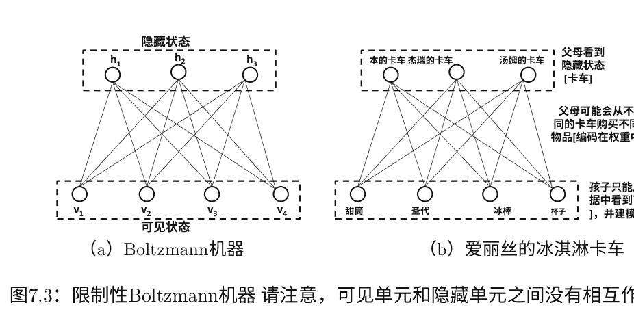## 7.4. 受限玻尔兹曼机

代表爱丽丝每天从父母那里收到的冰淇淋的四位二进制数。这些代表我们示例中的可见状态。因此，爱丽丝每天可以收集4维的训练数据点，因为她每天会收到（0到4个）不同类型的冰淇淋。然而，这些冰淇淋是爱丽丝的父母从图中所示的三辆卡车中购买的，这些卡车是隐藏状态。这些卡车的身份对爱丽丝是隐藏的，尽管她知道她的父母从中购买冰淇淋的卡车有三辆（一天可以使用多辆卡车来构建一套冰淇淋）。爱丽丝的父母是优柔寡断的人，他们的决策过程不寻常，因为他们在选择冰淇淋后会改变主意，选择卡车后也会改变主意。特定冰淇淋被选中的可能性取决于选择的卡车以及这些卡车的权重。同样，选择卡车的可能性取决于打算购买的冰淇淋和相同的权重。

因此，爱丽丝的父母在选择卡车后可以随时改变他们选择冰淇淋的想法，并且在选择冰淇淋后选择卡车的想法（一段时间内）直到他们每天做出最终决定。正如我们将看到的，这种循环关系是无向模型的特征，爱丽丝的父母使用的过程类似于吉布斯采样。

使用二分约束大大简化了RBM中的推理算法，同时保留了很多应用中心的能力。如果我们知道所有可见单元的值（通常在提供训练数据点时），可以在一步中计算隐藏单元的概率，而无需经过艰苦的吉布斯采样任务。每个隐藏单元取值为1的概率可以直接表示为可见单元值的逻辑函数。换句话说，我们可以将方程7.6应用于RBM，得到以下结果：

$$P(h_j = 1|\vec{v}) = \frac{1}{1 + \exp\left(-b_j^{(h)} - \sum_{i=1}^{d} v_i w_{ij}\right)}$$ (7.14)

这个结果直接来自于方程7.6，它将状态概率与能量差 $\Delta E_j$ 之间的关系联系起来 $h_j= 0$ 和 $h_j = 1$。$\Delta E_j$ 的值是 $b_j$ 当可见状态被观察到时，$v_i w_{ij}$ 的值为 与无限制玻尔兹曼机器相比，上述方程的右侧不包含任何（未知的）隐藏变量，只包含可见变量。一旦权重被学习，这个关系也有助于创建每个训练向量的简化表示。

具体来说，对于一个具有 $m$ 隐藏单元的玻尔兹曼机器，可以将第 $j$ 个隐藏值的值设置为方程7.14中计算得到的概率。注意，这种方法提供了二进制数据的实值简化表示。也可以使用sigmoid函数来表示上述方程：

$$P(h_j= 1|\vec{v}) = \text{Sigmoid} \left(b_j^{(h)} + \sum_{i=1}^{d} v_i w_{ij} \right)$$ (7.15)

人们还可以使用隐藏状态的样本来一步生成数据点。这是因为RBM的可见单元和隐藏单元之间的关系在无向和二分架构中是相似的。换句话说，我们可以使用方程7.6来得到以下结果：

$$P(v_i= 1|\vec{h}) = \frac{1}{1 + \exp\left(-b_i^{(v)} - \sum_{j=1}^{m} h_j w_{ij}\right)}$$ (7.16)

¹这个例子在没有选择卡车的情况下在语义可解释性方面是棘手的。
即使在这种情况下，各种冰淇淋的概率也会因偏差而非零。
人们可以通过添加一个始终被选择的虚拟卡车来解释这种情况。

人们还可以用Sigmoid函数来表示这个概率：
$$P(v_i=1|h) = \text{Sigmoid}\left(b_i^{(v)} + \sum_{j=1}^{m} h_j w_{ij}\right)$$ (7.17)

使用Sigmoid函数的一个好处是，通常可以创建一个相关的前馈网络，其中使用Sigmoid激活单元，该网络利用Boltzmann机器学习到的权重进行有向计算和输入输出映射。然后使用反向传播算法对该网络的权重进行微调。我们将在应用部分给出示例。

请注意，权重编码了可见状态和隐藏状态之间的关联。一个较大的正权重意味着这两个状态很可能同时出现。例如，在图7.3(b)中，父母更有可能从Ben的卡车购买冰淇淋和圆筒，而更有可能从Tom的卡车购买冰棍和杯子。这些倾向性被编码在权重中，它们以循环方式调节可见状态选择和隐藏状态选择。循环关系带来了挑战，因为冰淇淋选择和卡车选择之间的关系是双向的；这是Gibbs采样的原因。尽管爱丽丝可能不知道冰淇淋来自哪辆卡车，但她会注意到训练数据中位数之间的相关性。实际上，如果爱丽丝知道RBM的权重，她可以使用Gibbs采样来生成代表未来几天她将收到的“典型”冰淇淋的4位点。甚至模型的权重也可以通过示例从爱丽丝那里学习，这就是无监督生成模型的本质。鉴于存在3个隐藏状态（卡车）和足够多的4维训练数据点的示例，爱丽丝可以学习到可见冰淇淋和隐藏卡车之间的相关权重和偏置。下一节将讨论执行此操作的算法。

### 7.4.1 训练RBM

通过类似于玻尔兹曼机的学习规则来实现RBM的权重计算。特别地，可以基于小批量数据创建一个高效的算法。权重 $w_{ij}$ 被初始化为小的值。对于当前的权重集合 $w_{ij}$，更新如下：

- 正相位：算法使用一个小批量的训练实例，并使用方程7.14准确地计算每个隐藏单元的状态的概率。然后从这个概率中生成每个隐藏单元的一个样本。

  这个过程对于训练实例的每个元素都会重复。计算这些不同训练实例之间的相关性 $v_i$ 和生成实例的 $h_j$ 之间的相关性被计算；它被表示为 $\langle v_i, h_j \rangle_{pos}$。这个相关性实际上是每对可见单元和隐藏单元之间的平均乘积。

- 负相位：在负相位中，算法从随机初始化的状态开始，并使用方程7.14和7.16反复达到热平衡，计算可见单元和隐藏单元的概率。如果，这些概率用于绘制样本。$v_i$ 和 $h_j$，并且整个过程重复多次。使用多个样本计算平均乘积 $\langle v_i, h_j \rangle_{neg}$ 的计算方式与正相位相同。

然后可以使用与Boltzmann机器相同类型的更新：

$$\begin{aligned} w_{ij} &\leftarrow w_{ij} + \alpha \left( \langle v_i, h_j \rangle_{pos} - \langle v_i, h_j \rangle_{neg} \right) \\ b_i^{(v)} &\leftarrow b_i^{(v)} + \alpha \left( \langle v_i, 1 \rangle_{pos} - \langle v_i, 1 \rangle_{neg} \right) \\ b_j^{(h)} &\leftarrow b_j^{(h)} + \alpha \left( \langle 1, h_j \rangle_{pos} - \langle 1, h_j \rangle_{neg} \right) \end{aligned}$$

在这里，$\alpha > 0$ 表示学习率。每个 $\langle v_i, h_j \rangle$ 通过对 $v_i$ 和 $h_j$ 的乘积进行平均估计。尽管 $v_i$ 和 $h_j$ 的值在小批量中是不同的，但是 $h_j$ 的值是通过小批量计算的。分别在正相位和负相位以不同的方式计算 $h_j$。此外，$\langle v_i, 1 \rangle$ 表示小批量中 $v_i$ 的平均值。而 $\langle 1, h_j \rangle$ 表示小批量中 $h_j$ 的平均值。

通过图7.3(b)中的Alice的卡车来解释上述更新是有帮助的。当某些可见位（例如锥形和圣代）的权重高度相关时，上述更新将倾向于将权重推向可以通过卡车和冰淇淋之间的权重来解释这些相关性的方向。例如，如果锥形和圣代高度相关，但所有其他相关性都非常弱，这可以通过这两种类型的冰淇淋和一个卡车之间的高权重来解释。实际上，相关性将更加复杂，底层权重的模式也将更加复杂。

### 7.4.2 对比散度算法

上述方法的一个问题是需要花费时间达到热平衡并生成负样本。然而，事实证明，可以通过将蒙特卡洛采样仅运行一小段时间，并将可见状态固定为小批量训练数据点之一，仍然可以获得梯度的良好近似。对比散度方法的最快变体在正相位之外使用了一次额外的蒙特卡洛采样迭代，以生成隐藏状态和可见状态的样本。首先，通过将可见单元固定为训练点（在正相位中已经完成），生成隐藏状态，然后再次使用蒙特卡洛采样从这些隐藏状态生成可见单元（仅一次）。可见单元的值被用作采样的负状态，而不是在热平衡时获得的状态。然后，使用这些可见单元再次生成隐藏单元。因此，正相位和负相位之间的主要区别仅在于使用相同初始化的可见状态对训练点运行方法的迭代次数。在正相位中，我们仅使用半次迭代来计算隐藏状态。在负相位中，我们使用至少一次额外的迭代（以便从隐藏状态重新计算可见状态并再次生成隐藏状态）。这种迭代次数的差异导致了两种情况下状态分布之间的对比散度。直觉上，增加迭代次数会使分布从数据条件状态移动（即发散）到当前权重向量提出的状态。因此，对比散度的值 $(\langle v_i, h_j \rangle_{pos} - \langle v_i, h_j \rangle_{neg})$ 在更新中量化了对比散度的程度。这种对比散度算法的最快变体被称为 $CD_1$，因为它使用一次（额外的）迭代来生成负样本。

当然，使用这种方法只是对真实梯度的近似。通过增加额外的迭代次数 $k$，可以提高对比散度的准确性，在这些迭代中数据被重构 $k$ 次。这种方法被称为 $CD_k$。增加 $k$ 的值可以在速度上付出代价，但可以获得更好的梯度。

在早期迭代中，使用 $CD_1$ 已经足够好，尽管在后续阶段可能没有帮助。因此，一种自然的方法是逐渐增加 $k$ 的值，同时在训练中应用 $CD_k$。可以总结这个过程如下：

1.  在梯度下降的早期阶段，权重非常不准确。在每次迭代中，只需要进行一次对比散度的额外步骤就足够了，因为只需要一个粗略的下降方向来改善不准确的权重。因此，即使执行 $CD_1$，在大多数情况下也能获得一个好的方向。
2.  当梯度下降接近更好的解时，需要更高的准确性。因此，使用两个或三个对比散度步骤（即 $CD_2$ 或 $CD_3$）。一般来说，在固定数量的梯度下降步骤之后，可以将马尔可夫链步骤的数量加倍。[485]中提倡的另一种方法是在每10,000步之后将 $k$ 的值增加1。[485]中使用的 $k$ 的最大值为20。

在[203]中可以找到一个出色的训练受限玻尔兹曼机的实用指南。本指南讨论了一些实际问题，如初始化、调整和更新。以下简要介绍了其中一些实际问题。

### 实际问题和改进

尽管我们一直假设蒙特卡洛采样过程生成离散样本，但蒙特卡洛采样的某些迭代会通过直接使用计算得到的概率（参见方程7.14和7.16）而不是离散样本来进行改进。这样做可以减少训练中的噪音，因为概率值保留了比二进制样本更多的信息。具体而言，使用以下改进措施：

- 采样隐藏状态的改进：最后一次迭代 $CD_k$ 根据方程式7.14计算隐藏状态作为概率值，用于正样本和负样本。因此， 的值是 用于计算 的 $h_j$ 的值。$\langle v_i, h_j \rangle_{pos} - \langle v_i, h_j \rangle_{neg}$ 对于正样本和负样本始终是一个实数值。这个实数值是一个分数，因为在方程式7.14中使用了 sigmoid函数。
- 采样可见状态的改进：因此，蒙特卡洛采样可见状态的改进始终与计算相关 $\langle v_i, h_j \rangle_{neg}$ 而不是 $\langle v_i, h_j \rangle_{pos}$ 因为可见状态始终固定为训练数据。对于负样本，蒙特卡洛过程始终根据方程式7.16计算可见状态的概率值，而不是使用0-1值。这对于隐藏状态来说并非如此，直到最后一次迭代之前它们始终是二进制的。

使用概率值迭代而不是采样的二进制值会引入偏差，并且无法达到正确的热平衡。然而，对比散度算法本身就是一种近似方法，这种方法可以减少噪声（方差），但会带来一些偏差。

权重可以从均值为零、标准差为 0.01 的高斯分布中初始化。初始权重的较大值可以加快学习速度，但可能导致最终模型稍差。可见偏置初始化为 $\log(p_i / (1 - p_i))$，其中 $p_i$ 是数据点中第 $i$ 个维度取值为1的比例。

隐藏偏置的值初始化为0。小批量大小应该在10到100之间。示例的顺序应该是随机的。对于带有类标签的监督设置，小批量应该以分层的方式选择，使得批量中的标签比例大致与整个数据集相匹配。

## 7.5 受限玻尔兹曼机的应用

在本节中，我们将研究受限玻尔兹曼机的几个应用。这些方法在各种无监督应用中非常成功，尽管它们也被用于监督应用。在实际应用中使用RBM时，通常需要从输入到输出的映射，而传统的RBM只设计用于学习概率分布。通常可以通过使用从学习的RBM导出的权重建一个前馈网络来实现输入到输出的映射。换句话说，通常可以得到一个与原始RBM相关联的传统神经网络。

在这里，我们将讨论RBM节点的状态和相关联神经网络中节点的激活之间的差异。节点的状态是从由方程7.14和7.16定义的伯努利概率中采样得到的二进制值。另一方面，相关联神经网络中节点的激活是通过在方程7.14和7.16中使用Sigmoid函数得到的概率值。在训练后，许多应用使用相关联神经网络中节点的激活，而不是原始RBM中的状态。请注意，对比散度算法的最后一步在更新权重时也利用了节点的激活，而不是状态。在实际环境中，激活更加丰富信息，因此非常有用。使用激活与传统神经网络架构一致，可以使用反向传播算法。在能够应用该方法于监督应用时，使用反向传播的最后阶段至关重要。在大多数情况下，RBM的关键作用是进行无监督特征学习。因此，在监督学习中，RBM的作用通常仅限于预训练。事实上，预训练是RBM的重要历史贡献之一。

### 7.5.1 维度降低和数据重构

RBM的最基本功能是降低维度和无监督特征工程。RBM的隐藏单元包含了数据的降维表示。然而，我们还没有讨论如何使用RBM（类似于自编码器）重构数据的原始表示。为了理解重构过程，我们首先需要理解无向RBM与有向图模型[259]的等价性，其中计算按照特定方向进行。实现有向概率图是将传统神经网络（源自RBM）实现的第一步，在该网络中，可以用实值Sigmoid激活替代Sigmoid的离散概率采样。

尽管RBM是一个无向图模型，但可以展开RBM以创建一个按特定方向进行推理的有向模型。一般来说，无向RBM可以证明与具有无限层数的有向图模型等价。展开在可见单元被固定为特定值时特别有用，因为展开的层数与原始RBM中的层数正好是两倍。此外，通过用连续Sigmoid单元替换离散概率采样，该有向模型可以作为虚拟自编码器，具有编码器部分和解码器部分。尽管RBM的权重是使用离散概率采样训练的，但它们也可以在这个相关的神经网络中使用，并进行一些微调。这是一种启发式方法，将从Boltzmann机器（即权重）学到的知识转化为用sigmoid单元初始化传统神经网络的权重。

RBM可以被看作是一个无向图模型，它使用相同的权重矩阵来学习从 $\bar{v}$ 到 $\bar{h}$ 的关系，也学习从 $\bar{h}$ 到 $\bar{v}$ 的关系。如果仔细观察方程7.14和7.16，可以发现它们非常相似。主要的区别在于这些方程使用不同的偏置，并且它们使用彼此权重矩阵的转置。换句话说，可以将方程7.14和7.16重写为以下形式，其中 $f(\cdot)$ 是某个函数。

$$\begin{align*}
\bar{h} &\sim f(\bar{v}, \bar{b}^{(h)}, W) \\
\bar{v} &\sim f(\bar{h}, \bar{b}^{(v)}, W^T)
\end{align*}$$

函数 $f(\cdot)$ 通常由二进制RBM中的Sigmoid函数定义，这是该类模型的主要变体。忽略偏差，可以将RBM的无向图替换为两个有向链接，如图7.4(a)所示。请注意，两个方向上的权重矩阵分别为 $W$ 和 $W^T$。然而，如果我们将可见状态固定为训练点，我们可以执行这些操作的两次迭代，以实值近似重构可见状态。换句话说，我们通过用连续值Sigmoid激活（作为启发式方法）替换离散采样，将训练后的RBM近似为传统神经网络。这个转换如图7.4(b)所示。换句话说，我们用概率值替换样本，而不是使用“~”的采样操作：

$$\begin{align*}
\bar{h} &= f(\bar{v}, \bar{b}^{(h)}, W) \\
\bar{v}' &= f(\bar{h}, \bar{b}^{(v)}, W^T)
\end{align*}$$

请注意 $\bar{v}'$ 是 $\bar{v}$ 的重建版本并且它将包含实数值（与 $\bar{v}$ 中的二进制状态不同）。在这种情况下，我们使用实值激活而不是离散样本。因为不再使用采样，并且所有计算都是根据期望值进行的，所以我们只需要执行一次方程7.14的迭代，以学习减少的表示。此外，只需要执行一次方程7.16的迭代，就可以学习重建的数据。预测阶段仅在一个方向上工作，从将输入点映射到重构数据，并显示在图7.4(b)的右侧。我们修改方程7.14和7.16来定义这个传统神经网络的状态为实值：

$$\hat{h}_j = \frac{1}{1 + \exp(-b_j^{(h)} - \sum_{i=1}^{d} v_i w_{ij})}$$

对于总共 $m$ 个设置隐藏状态，实值化简表示为 $(\hat{h}_1, \ldots, \hat{h}_m)$。创建隐藏状态的第一步相当于自编码器的编码器部分，这些值是二进制状态的期望值。然后可以使用方程7.16将这些概率值（无需创建蒙特卡洛实例）来重构可见状态，如下所示：

$$\hat{v}_i = \frac{1}{1 + \exp(-b_i^{(v)} - \sum_{j} \hat{h}_j w_{ij})}$$

虽然 $\hat{h}_j$ 确实代表了第 $j$ 个隐藏单元的期望值，但对这个实值版本再次应用sigmoid函数得到的结果 $\hat{h}_j$ 只提供了对 $v_i$ 期望值的粗略近似。然而，实值预测 $\hat{v}_i$ 是 $v_i$ 的一个近似重构。请注意，为了进行这种重构，我们使用了与传统神经网络相似的操作，而不是概率图模型中麻烦的离散样本。因此，我们现在可以将这个相关的神经网络作为使用传统反向传播进行权重微调的良好起点。这种重构类型类似于第3章中讨论的自编码器架构中使用的重构。

初次印象上，训练一个RBM似乎没有太多意义，因为可以用传统的自编码器达到类似的目标。然而，通过训练一个RBM来推导出传统的神经网络在处理堆叠的RBM时特别有用（参见第7.7节）。堆叠RBM的训练不会面临与深度神经网络相关的挑战，尤其是消失梯度和爆炸梯度问题。就像简单的RBM为浅层自编码器提供了一个很好的初始化点一样，堆叠的RBM也为深层自编码器提供了一个很好的起点[208]。这个原则导致了在传统的预训练方法没有使用RBM的情况下，使用RBM进行预训练的想法的发展。正如本节讨论的，人们还可以将RBM用于其他以降维为中心的应用，如协同过滤和主题建模。

### 7.5.2 用于协同过滤的受限玻尔兹曼机

前一节展示了受限玻尔兹曼机作为无监督建模和降维的替代方法。然而，正如第3章第3.5节讨论的那样，降维方法也被用于各种相关应用，如协同过滤。接下来，我们将提供一个以受限玻尔兹曼机为中心的替代推荐技术，该技术在第3章第3.5节中有所描述。这种方法基于[431]中提出的技术，并且它是Netflix奖竞赛中获胜条目的集成组件之一。

在处理评分矩阵时面临的挑战之一是它们的不完整规定。这使得为协同过滤设计神经架构比传统的降维更加困难。回顾第3.5节的讨论，使用传统神经网络对这种不完整矩阵进行建模也面临相同的挑战。在那一节中，展示了如何创建不同的训练对于每个用户，根据该用户观察到的评分，为每个实例和每个用户定义一个不同的神经网络。所有这些不同的神经网络共享权重。在受限玻尔兹曼机中，采用完全相同的方法，为每个用户定义一个训练案例和一个RBM。然而，在RBM的情况下，还存在一个额外的问题，即单元是二进制的，而评分可以取1到5的值。因此，我们需要一种处理额外约束的方法。

为了解决这个问题，RBM中的隐藏单元允许是5路softmax单元，以对应于1到5的评分值。换句话说，隐藏单元以评分的one-hot编码形式定义。one-hot编码自然地用softmax进行建模，它定义了每个可能位置的概率。

第i个softmax单元对应于第i个电影，给予该电影特定评分的概率由softmax概率分布定义。因此，如果有d个电影，我们总共有d个这样的独热编码评分。相应的独热编码可见单元的二进制值用$v_i^{(1)},\ldots,v_i^{(5)}$表示。

请注意，对于固定的$i$和可变的$k$，只有一个$v_i^{(k)}$的值可以为1。隐藏层假设包含$m$个单元。权重矩阵对于softmax单元的每个多项式结果都有一个单独的参数。因此，可见单元$i$和隐藏单元$j$之间的权重对于结果$k$被表示为$w_{ij}^{(k)}$。此外，我们对可见单元$i$有5个偏差，用$b_i^{(k)}$表示，其中$k\in\{1,\ldots,5\}$。隐藏单元只有一个偏差，第$j$个隐藏单元的偏差用$b_j$表示（没有上标）。协同过滤的RBM架构如图7.5所示。这个例子中包含$d=5$个电影和$m=2$个隐藏单元。在这种情况下，图中显示了两个用户Sayani和Bob的RBM架构。在Sayani的情况下，她只为两部电影指定了评分。因此，在她的情况下，将存在$2\times2\times5=20$个连接，尽管我们只显示了其中的一部分以避免图中的混乱。

对于Bob来说，他有四个观察到的评分，因此他的网络将包含总共$4\times2\times5=40$个连接。请注意，Sayani和Bob都对电影E.T.进行了评分，因此从这部电影到隐藏单元的连接将共享权重对应的RBM之间。二进制隐藏状态的概率是用sigmoid函数定义的：

$$ P(h_j = 1|\vec{v}^{(1)} \dots \vec{v}^{(5)}) = \frac{1}{1 + \exp(-b_j - \sum_{i,k} v_i^{(k)} w_{ij}^k)} \quad (7.20) $$

与方程7.14相比的主要区别是可见单元还包含一个上标，对应不同的评分结果。否则，条件几乎相同。可见单元的概率与传统的RBM模型使用softmax函数定义的方式有更大的不同：

$$ P(v_i^{(k)} = 1|\vec{h}) = \frac{\exp(b_i^{(k)} + \sum_j h_j w_{ij}^{(k)})}{\sum_{r=1}^5 \exp(b_i^{(r)} + \sum_j h_j w_{ij}^{(r)})} \quad (7.21) $$

训练是通过蒙特卡洛采样完成的。与先前讨论的方法的主要区别在于，可见状态是从多项式模型生成的。用于训练权重的相应更新如下：

$$ w_{ij}^{(k)} \leftarrow w_{ij}^{(k)} + \alpha \left( \langle v_i^{(k)}, h_j \rangle_{pos} - \langle v_i^{(k)}, h_j \rangle_{neg} \right) \quad \forall k \quad (7.22) $$

请注意，仅更新观察到的可见单元到所有隐藏单元的权重，用于单个训练示例（即用户）。换句话说，使用的玻尔兹曼机是用户特定的。

## 7.5. 受限玻尔兹曼机的应用

尽管权重在不同用户之间共享，但对于数据中的每个用户来说，它们是不同的。两个不同训练示例的Boltzmann机器示例如图7.5所示，Bob和Sayani的架构是不同的。然而，代表$E.T.$的单元的权重是共享的。这种方法也在第3.5节的传统神经结构中使用，在每个训练示例中使用的神经网络是不同的。如该部分所讨论的，传统神经结构等同于矩阵分解技术。Boltzmann机器往往会给出与矩阵分解技术略有不同的评分预测，尽管准确性相似。

### 进行预测

一旦权重学习完毕，它们可以用于进行预测。然而，预测阶段使用的是实值激活，而不是二进制状态，就像传统的具有sigmoid和softmax单元的神经网络一样。首先，可以使用方程7.20来学习隐藏单元的概率。假设第$j$个隐藏单元为1的概率表示为$\hat{p}_j$。然后，使用方程7.21计算未观察到的可见单元的概率。计算方程7.21的主要问题是它是根据隐藏单元的值来定义的，而这些值只能根据方程7.20的概率形式得知。然而，可以简单地用$\hat{p}_j$替换每个$h_j$，在方程7.21中，为了计算可见单元的概率。请注意，这些预测提供了每个物品可能评分值的概率。如果需要，这些概率也可以用于计算评分的期望值。尽管从理论上讲，这种方法是近似的，但在实践中效果很好且非常快速。通过使用这些实值计算，可以将RBM有效地转换为具有隐藏层的传统神经网络架构，并且输入和输出层使用逻辑单元和softmax单元。尽管原始论文[431]没有提到，但是可以使用反向传播来调整该网络的权重（参见练习1）。

RBM方法与传统的矩阵分解方法一样有效，尽管它倾向于给出不同类型的预测。从使用集合为中心的方法的角度来看，这种多样性是一个优势。因此，可以将结果与矩阵分解方法相结合，以获得与集合方法自然相关的改进。当结合多种准确性相似的方法时，集合方法通常显示出更好的改进。可以使用一些技巧，例如条件因式分解[431]，以提高RBM的准确性。

### 7.5.3 使用RBM进行分类

使用RBM进行分类的最常见方法是作为预训练过程。换句话说，玻尔兹曼机首先用于执行无监督特征工程。然后，根据第7.5.1节中描述的方法，将RBM展开为相关的编码器-解码器架构。这是一个传统的神经网络，其激活单元为sigmoid单元，其权重是从无监督的RBM中导出的，而不是通过反向传播。这个神经网络的编码器部分还带有一个用于类别预测的输出层。

然后，使用反向传播对这个神经网络的权重进行微调。这种方法甚至可以与堆叠的RBM（参见第7.7节）一起使用，以得到一个深度分类器。使用RBM初始化（传统的）深度神经网络的这种方法是预训练深度网络的最早方法之一。

然而，还有另一种替代方法可以使用RBM进行分类，它将RBM的训练和推断与分类过程更紧密地结合在一起。这种方法在某种程度上类似于前一节讨论的协同过滤方法。协同过滤问题也被称为矩阵补全，因为它预测了一个不完全指定矩阵的缺失条目。

在推荐系统中使用RBM为其在分类中的使用提供了一些有用的提示。这是因为分类可以被看作是矩阵补全问题的简化版本，其中我们将训练和测试行合并成一个矩阵，并且缺失的值属于矩阵的特定列。这一列对应于类变量。此外，在分类的情况下，所有缺失值都存在于测试行中，而在推荐系统的情况下，缺失值可以存在于矩阵的任何位置。在分类中，对于对应于训练点的行，观察到所有特征，这简化了建模过程（与协同过滤相比，在协同过滤中通常不会观察到任何行的完整特征集）。

我们假设输入数据包含d个二进制特征。类别标签有k个离散值，对应于多类别分类问题。通过以下方式，可以将分类问题建模为RBM：定义隐藏特征和可见特征如下：

1. 可见层包含两种类型的节点，分别对应于特征和类别标签。特征对应 $d$ 个二进制单元，类别标签对应 $k$ 个二进制单元。然而，这 $k$ 个二进制单元中只有一个可以取值为1，这对应于类别标签的独热编码。类别标签的编码类似于协同过滤应用中用于编码评分的方法。特征的可见单元表示为 $v_1^{(f)}\dots v_d^{(f)}$，类别标签的可见单元表示为 $v_1^{(c)}\dots v_k^{(c)}$。请注意，上标符号表示可见单元是特征还是类别标签。

2. 隐藏层包含 $m$ 个二进制单元。隐藏单元用 $h_1 \dots h_m$ 表示。第 $i$ 个特征特定可见单元 $v_i^{(f)}$ 和第 $j$ 个隐藏单元 $h_j$ 之间的连接权重为 $w_{ij}$。这导致了一个 $d \times m$ 连接矩阵 $W= [w_{ij}]$。第 $i$ 个类别特定可见单元 $v_i^{(c)}$ 和第 $j$ 个隐藏单元 $h_j$ 之间的连接权重为 $u_{ij}$。这导致了一个 $k \times m$ 连接矩阵 $U= [u_{ij}]$。对于 $d=6$ 个特征，$k=3$ 个类别和 $m=5$ 个隐藏特征，图7.6展示了不同类型节点和矩阵之间的关系。第 $i$ 个特征特定可见节点的偏置为 $b_i^{(f)}$，第 $i$ 个类别特定可见节点的偏置为 $b_i^{(c)}$。第 $j$ 个隐藏节点的偏置为 $b_j$ (没有上标)。隐藏节点的状态是使用sigmoid函数定义的，与所有可见节点相关：

$$ P(h_j=1|\vec{v}^{(f)}, \vec{v}^{(c)}) = \frac{1}{1 + \exp(-b_j - \sum_{i=1}^d v_i^{(f)}w_{ij} - \sum_{i=1}^k v_i^{(c)}u_{ij})} \quad (7.23) $$

请注意，这是玻尔兹曼机中隐藏单元概率的标准定义方式。然而，特征特定可见单元和类别特定可见单元的概率定义之间存在一些差异。对于特征特定可见单元，其关系与标准玻尔兹曼机并没有太大不同：

$$ P(v_i^{(f)} = 1|\vec{h}) = \frac{1}{1 + \exp(-b_i^{(f)} - \sum_{j=1}^m h_j w_{ij})} \quad (7.24) $$

然而，类单元的情况略有不同，因为我们必须使用softmax函数而不是sigmoid函数。这是因为类的独热编码。因此，我们有以下结果：

$$ P(v_i^{(c)} = 1|\vec{h}) = \frac{\exp(b_i^{(c)} + \sum_j h_j u_{ij})}{\sum_{l=1}^k \exp(b_l^{(c)} + \sum_j h_j u_{lj})} \quad (7.25) $$

对Boltzmann机进行训练的一种天真的方法是使用类似于前几节的生成模型。多项式模型用于生成可见状态。$v_i^{(c)}$用于类。对比散度算法的相应更新如下：

$$ w_{ij} \leftarrow w_{ij} + \alpha \left( \langle v_i^{(f)}, h_j \rangle_{pos} - \langle v_i^{(f)}, h_j \rangle_{neg} \right) \quad \text{如果 } i \text{ 是特征单元} $$

$$ u_{ij} \leftarrow u_{ij} + \alpha \left( \langle v_i^{(c)}, h_j \rangle_{pos} - \langle v_i^{(c)}, h_j \rangle_{neg} \right) \quad \text{如果 } i \text{ 是类单元} $$

这种方法是协同过滤的直接扩展。然而，主要问题是这种生成方法不能完全优化分类准确性。为了提供一个与自动编码器的类比，简单地将类变量包括在输入中不一定在有监督意义上显著提高维度缩减。缩减通常会受到特征之间的无监督关系的影响。相反，学习的整个重点应该是优化分类准确性。因此，通常使用一种判别式方法来训练RBM，其中权重被学习以最大化真实类的条件似然度。请注意，通过使用隐藏特征和类/特征之间的概率依赖关系，很容易建立类变量在给定可见状态下的条件概率。例如，在传统形式的限制性玻尔兹曼机中，我们正在最大化特征变量 $v_i^{(f)}$ 和类变量 $v_i^{(c)}$ 的联合概率。然而，在判别式变体中，目标函数被设定为最大化类变量的条件概率 $y\in \{1...k\}$。这种方法更加专注于最大化分类准确性。虽然可以使用对比散度训练判别式受限玻尔兹曼机，但问题简化了，因为可以估计 $P(v_y^{(c)}=1|v^{(f)})$ 可以通过闭式形式计算，而不需要使用迭代方法。这个形式可以表示为以下形式[269, 431]：

$$ P(v_y^{(c)}=1|v^{(f)}) = \frac{\exp(b_y^{(c)}) \prod_{j=1}^m [1 + \exp(b_j^{(h)} + u_{yj} + \sum_i w_{ij} v_i^{(f)})]}{\sum_{l=1}^k \exp(b_l^{(c)}) \prod_{j=1}^m [1 + \exp(b_j^{(h)} + u_{lj} + \sum_i w_{ij} v_i^{(f)})]} \quad (7.26) $$

通过这个可微的闭合形式，对于随机梯度下降法，对上述表达式的负对数进行微分是很简单的。如果 $\mathcal{L}$ 是上述表达式的负对数的对数，而 $\theta$ 是Boltzmann机器的任意特定参数（例如，权重或偏置），可以证明如下：

$$ \frac{\partial \mathcal{L}}{\partial \theta} = \sum_{j=1}^m \text{Sigmoid}(o_{yj}) \frac{\partial o_{yj}}{\partial \theta} - \sum_{l=1}^k \sum_{j=1}^m \text{Sigmoid}(o_{lj}) \frac{\partial o_{lj}}{\partial \theta} \quad (7.27) $$

在这里，我们有 $o_{yj} = b_j^{(h)} + u_{yj} + \sum_i w_{ij} v_i^{(f)}$。上述表达式可以轻松计算每个训练点和每个参数，以执行随机梯度下降过程。使用方程式7.26可以相对简单地对未见过的测试实例进行概率预测。更多细节和扩展内容在[269]中讨论。

### 7.5.4 具有RBM的主题模型

主题建模是一种特定于文本数据的降维方法。最早的主题模型对应于概率潜在语义分析（PLSA），在[216]中提出。在PLSA中，基向量彼此不正交。这也是奇异值分解的情况。另一方面，基向量和转换后的表示都受到非负值的约束。每个转换特征的非负值在语义上是有用的，因为它表示了一个特定文档中一个主题的强度。在RBM的背景下，这种强度对应于在观察到一个特定文档中的单词时，一个特定隐藏单元取值为1的概率。因此，可以使用隐藏状态的条件概率向量（当可见状态固定为文档单词时）来创建每个文档的简化表示。假设词汇表大小为$d$，而隐藏单元的数量为$m$。

这种方法与协同过滤技术中使用的技术有一些相似之处，其中为每个用户（矩阵的行）创建了一个单独的RBM。在这种情况下，为每个文档创建了一个单独的RBM。为每个单词创建了一组可见单元，因此可见单元组的数量等于文档中的单词数量。接下来，我们将具体定义RBM的可见状态和隐藏状态，以描述模型的具体工作方式：

1.  对于包含$n_t$个单词的第$t$个文档，总共有$n_t$个softmax组被保留。每个softmax组包含与词汇表中的$d$个单词对应的$d$个节点。因此，每个文档的RBM是不同的，因为单元的数量取决于文档的长度。然而，在文档内部和跨多个文档之间，所有softmax组共享与隐藏单元的连接的权重。文档中的第$i$个位置对应于第$i$个可见softmax单元组。第$i$个可见单元组用$v_i^{(1)}, \ldots, v_i^{(d)}$表示。与$v_i^{(k)}$相关联的偏置为$b^{(k)}$。请注意，第$i$个可见节点的偏置仅取决于$k$（单词标识），而不取决于$i$（单词在文档中的位置）。这是因为该模型使用了词袋模型的方法，单词的位置是无关紧要的。

2.  有$m$个隐藏单元，用$h_1, \ldots, h_m$表示。第$j$个隐藏单元的偏置为$b_j$。

3.  每个隐藏单元与每个可见单元都有连接，数量为$n_t \times d$。在单个RBM内以及不同RBM之间（对应不同文档），所有softmax组共享相同的$d$权重。第$k$个隐藏单元与一组具有$d$权重的softmax单元相连，表示为$W^{(k)} = (w_1^{(k)}, \ldots, w_d^{(k)})$。换句话说，第$k$个隐藏单元与每个$n_t$组具有相同权重$W^{(k)}$的softmax单元相连。

RBM的架构如图7.7所示。基于这个架构，可以用以下方式表示隐藏状态的概率：

$$ P(h_j = 1|\vec{v}^{(1)}, \ldots, \vec{v}^{(d)}) = \frac{1}{1 + \exp\left(-b_j - \sum_{i=1}^{n_t} \sum_{k=1}^{d} v_i^{(k)} w_j^{(k)}\right)} \quad (7.28) $$

还可以使用多项式模型来表示可见状态：

$$ P(v_i^{(k)} = 1|\vec{h}) = \frac{\exp\left(b^{(k)} + \sum_{j=1}^{m} w_j^{(k)} h_j\right)}{\sum_{l=1}^{d} \exp\left(b^{(l)} + \sum_{j=1}^{m} w_j^{(l)} h_j\right)} \quad (7.29) $$

分母中的归一化因子确保每个可见单元上所有单词的概率之和为1。此外，上述方程的右侧与可见单元的索引 i 无关，因为这个词袋模型不依赖于单词在文档中的位置。

有了这些关系，可以应用MCMC采样来生成对比散度算法的隐藏和可见状态的样本。请注意，尽管这些RBM共享权重，但对于不同的文档，RBM是不同的。与协同过滤应用程序的情况类似，每个RBM只与一个训练示例相关联，对应于相关文档。用于梯度下降的权重更新与传统RBM相同。唯一的区别是不同可见单元之间的权重是共享的。这种方法类似于协同过滤中的方法。我们将权重更新的推导留给读者作为练习（参见练习5）。

在进行训练后，通过应用方程式7.28对文档的单词进行计算，得到每个文档的降维表示。隐藏单元的概率的实值数值提供了文档的 m 维降维表示。本节所描述的方法是原始工作[485]中描述的多层方法的简化版本。

### 7.5.5 用于多模态数据的受限玻尔兹曼机

玻尔兹曼机也可以用于处理多模态数据的机器学习。多模态数据是指从具有多种模态的数据点中提取信息的设置。例如，带有文本描述的图像可以被视为多模态数据。这是因为这个数据对象具有图像和文本两种模态。

处理多模态数据的主要挑战在于往往难以使用机器学习算法处理这种异构特征。多模态数据通常通过使用共享表示来处理，其中两种模态被映射到一个联合表示中。

## 图7.8：用于多模态数据处理的RBM架构

空间。实现这个目标的一种常见方法是共享矩阵分解。关于如何使用文本和图像数据进行共享矩阵分解的各种方法在[7]中进行了讨论。由于在许多情况下，RBM提供了与矩阵分解方法的替代表示，因此自然而然地探索是否可以使用这种架构来创建数据的共享潜在表示。

图7.8 (a) 显示了一个用于多模态建模的架构示例[484]。在这个示例中，假设两种模式对应于文本和图像数据。图像和文本数据用于创建特定于图像和文本的隐藏状态。然后，这些隐藏状态输入到单个共享表示中。这种架构与图7.6的分类架构的相似之处令人惊讶。

这是因为两种架构都试图将两种类型的特征映射到一组共享的隐藏状态中。然后可以使用这些隐藏状态进行不同类型的推理，例如使用共享表示进行分类。如第7.7节所示，甚至可以使用反向传播来改进这种无监督表示的方法。

还可以使用该模型生成缺失的数据模态。

通过使用深度，可以选择性地提高该模型的表达能力。在图7.8(b)中，在可见状态和共享表示之间添加了一个额外的隐藏层。请注意，可以添加多个隐藏层以创建深度网络。然而，我们还没有描述如何实际训练多层RBM。这个问题在第7.7节中讨论。

使用多模态数据的另一个挑战是特征通常不是二进制的。对于这个问题有几种解决方案。对于文本（或具有小基数离散属性的数据模态），可以使用类似于RBM用于主题建模的方法，其中离散属性的计数用于创建 one-hot 编码属性的实例。当数据包含任意实数值时，这个问题变得更具挑战性。这些问题将在下一节中讨论。

## 7.6 使用 RBMs 处理非二进制数据类型

本章的整个讨论都集中在二进制数据类型上，这是大多数 RBMs 使用的设置。对于某些类型的数据，例如分类数据或有序数据（例如评级），可以使用第 7.5.2 节中描述的 softmax 方法。例如，第 7.5.4 节讨论了在单词计数数据中使用 softmax 单元的情况。当有序属性的离散值数量较小时，可以使用 softmax 方法处理有序属性。

第 7.5.2 节描述的方法提供了关于如何处理不同数据类型的一些提示。例如，分类或有序数据通过改变可见单元的概率分布来更适应问题。一般来说，不仅需要改变可见单元的分布，还需要改变隐藏单元的分布。这是因为隐藏单元的性质取决于可见单元。

对于实值数据，一个自然的解决方案是使用高斯可见单元。此外，隐藏单元也是实值的，并且假设它们包含ReLU激活函数。特定组合的能量 (v, h)由以下给出：

$$ E(\overline{v}, \overline{h}) = \sum_i \frac{(v_i - b_i)^2}{2\sigma_i^2} - \sum_j b_j h_j - \sum_{i,j} \frac{v_i}{\sigma_i} h_j w_{ij} \quad (7.30) $$

注意，可见单元偏置的能量贡献由一个抛物线包含函数给出。使用这种包含函数的效果是使第 i 个可见单元的值接近 b_i。与其他类型的Boltzmann机一样，能量函数对不同变量的导数也提供了对数似然函数的导数。这是因为概率总是通过指数化能量函数来定义的。

使用这种方法存在几个挑战。一个重要问题是，这种方法在选择方差参数时相当不稳定。特别是，可见层的更新往往太小，而隐藏层的更新往往太大。解决这个困境的一个自然方法是使用比可见单元更多的隐藏单元。通常还会对输入数据进行单位方差归一化，以使可见单元的标准差 σ 可以设为1。ReLU单元被修改为创建一个带有噪声的版本。具体来说，在对单位进行阈值处理之前，将 log(1+exp(v)) 添加到单位的值中，使其成为非负值。使用这种不寻常的激活函数的动机是它可以被证明等同于一个二项式单元 [359, 512]，它编码的信息比通常使用的二进制单元更多。在处理实值数据时，启用这种能力非常重要。实值RBM的Gibbs采样与二进制RBM类似，一旦生成了MCMC样本，权重的更新也是如此。保持学习率较低以防止不稳定性非常重要。

## 7.7 堆叠限制玻尔兹曼机

传统神经结构的大部分能力来自于具有多层单元。更深的网络被认为更强大，可以建模更复杂的函数，而代价是更少的参数。 一个自然的问题是是否可以通过组合多个RBM来实现类似的目标。
事实证明，RBM非常适合创建深度网络，并且在创建具有预训练的深度模型方面比传统神经网络更早地使用。 换句话说，RBM使用吉布斯采样进行训练，并且得到的权重被继承到具有连续Sigmoid激活函数的传统神经网络中（而不是基于Sigmoid的离散采样）。

为什么要费劲地训练一个RBM来训练传统神经网络呢？ 这是因为玻尔兹曼机的训练方式与传统神经网络中的反向传播方法根本不同。

对比散度方法倾向于同时训练所有层，这不会导致消失和爆炸梯度问题，这在传统神经网络中是存在的。

乍一看，从RBM创建深度网络的目标似乎相当困难。
首先，RBM不像前馈单元那样按照特定方向进行计算。 RBM是对称模型，其中可见单元和隐藏单元以无向图模型的形式相连。 因此，需要定义多个RBM之间相互交互的具体方式。
在这种情况下，一个有用的观察是，尽管RBM是对称和离散模型，但学习到的权重可以用于定义一个在连续激活空间中执行有向计算的相关神经网络。 由于通过离散采样进行了学习，这些权重已经非常接近最终解决方案。 因此，这些权重可以通过传统的反向传播进行相对较小的调整。

为了理解这一点，考虑图7.4中所示的单层RBM，它表明即使是单层RBM也等价于一个无限长度的有向图模型。 然而，一旦可见状态被固定，只需要保留这个计算图的三层，并使用从Sigmoid激活函数得到的连续值进行计算。 这种方法已经提供了一个很好的近似解。
得到的网络是一个传统的自编码器，尽管它的权重是以一种非传统的方式（近似地）学习的。本节将展示如何将这种方法应用于堆叠的RBM。

什么是堆叠的RBM集合？考虑一个具有 d维度的数据集，目标是创建一个具有 m₁维度的降维表示。可以通过包含 d可见单元和 m₁隐藏单元的RBM来实现这个目标。通过训练这个RBM，可以得到数据集的一个 m₁维度表示。现在考虑一个具有 m₁可见单元和 m₂隐藏单元的第二个RBM。我们可以简单地将第一个RBM的 m₁输出复制为第二个RBM的输入，它具有 m₁ × m₂个权重。因此，可以通过使用第一个RBM的输出作为其输入来训练这个新的RBM，从而创建一个 m₂维度的表示。注意，我们可以重复这个过程 k次，使得最后一个RBM的大小为 mₖ₋₁ × mₖ。因此，我们通过将一个RBM的输出复制到另一个RBM的输入中，依次训练每个RBM。

图7.9(a)的左侧显示了一个堆叠的RBM示例。这种类型的RBM通常在图7.9(a)的右侧以简洁的图表形式显示。请注意，两个RBM之间的复制是在相应节点之间进行的简单的一对一复制，因为第r个RBM的输出层与第（r+1）个RBM的输入层具有完全相同数量的节点。
由此产生的表示是无监督的，因为它们不依赖于特定的目标。 另一个要点是Boltzmann机是一个无向模型。 然而，通过堆叠Boltzmann机，我们不再拥有无向模型，因为上层从下层接收反馈，但反则不然。 实际上，可以将每个Boltzmann机视为单个计算模型，具有许多输入和输出的单元，以及从一台机器复制到另一台机器的操作作为两个计算单元之间的数据传输。从Boltzmann机器堆栈的这个特定视图作为计算图，甚至可以执行反向传播，如果回到使用Sigmoid单元创建实值激活而不是创建绘制二进制样本所需的参数。尽管使用实值激活只是一个近似，但由于Boltzmann机器的训练方式，它已经提供了一个很好的近似。这初始权重集可以通过反向传播进行微调。毕竟，反向传播可以在任何计算图上执行，无论图内计算的函数的性质如何，只要计算的是一个连续函数。在监督学习的情况下，反向传播的微调方法尤为重要，因为从Boltzmann机器学习到的权重始终是无监督的。

### 7.7.1 无监督学习

即使在无监督学习的情况下，堆叠的受限玻尔兹曼机通常会提供比单个受限玻尔兹曼机更好的降维效果。然而，这种受限玻尔兹曼机的训练必须小心进行，因为仅仅训练所有层并不能得到高质量的结果。通过使用预训练方法可以获得更好的结果。图7.9(a)中的三个受限玻尔兹曼机依次进行训练。首先，使用提供的训练数据作为可见单元的值来训练RBM1。然后，使用第一个RBM的输出来训练RBM2。重复这个过程来训练RBM3。注意，使用这种方法可以贪婪地训练任意多层。假设三个学习到的RBM的权重矩阵分别为 $W_{1}$，$W_{2}$和$W_{3}$。一旦学习到这些权重矩阵，可以像图7.9(b)所示那样使用这三个权重矩阵组合成一个编码器-解码器对。三个解码器的权重矩阵为 $W_{1}^{T}$，$W_{2}^{T}$ 和 $W_{3}^{T}$，因为它们执行的是编码器的逆操作。因此，现在有一个有向的编码器-解码器网络，可以像任何传统神经网络一样使用反向传播进行训练。该网络中的状态是使用有向概率操作计算的，而不是使用蒙特卡洛方法进行采样。可以通过层级反向传播来进行微调学习。注意，图7.9(b)右侧的权重矩阵已经根据这个微调进行了调整。此外，编码器和解码器的权重矩阵不再以对称的方式相关联，这是微调的结果。与较浅的受限玻尔兹曼机相比，这种堆叠的受限玻尔兹曼机提供了更高质量的降维效果[431]，这类似于传统神经网络的行为。

### 7.7.2 监督学习

如何以这样的方式学习权重，以鼓励玻尔兹曼机产生特定类型的输出，例如类标签？想象一下，如果要使用一堆RBM进行k分类。在第7.5.3节中已经讨论了使用单层RBM进行分类的情况，并且相应的架构在图7.6中有所说明。可以通过将单隐藏层替换为一堆隐藏层来修改该架构。隐藏特征的最后一层然后连接到可见的softmax层，该层输出与不同类别相对应的k个概率。与降维的情况一样，预训练是有帮助的。因此，第一阶段是完全无监督的，不使用类标签。换句话说，我们单独训练每个隐藏层的权重。这是通过首先训练较低层的权重，然后再训练较高层的权重来实现的，就像任何堆叠的RBM一样。在以无监督方式设置初始权重之后，可以执行在最终隐藏层和可见层之间的权重的初始训练。然后，可以像无监督设置的情况一样，使用这些初始权重创建一个有向计算图。

在这个计算图上进行反向传播，以进行学习权重的微调。

### 7.7.3 深度玻尔兹曼机和深度置信网络

可以以不同的方式堆叠RBM的不同层，以实现不同类型的目标。在某些堆叠形式中，不同玻尔兹曼机之间的相互作用是双向的。这种变体被称为深度玻尔兹曼机。在其他形式的堆叠中，一些层是单向的，而其他层是双向的。一个例子是深度置信网络，其中只有上层RBM是双向的，而下层是单向的。其中一些方法可以证明等价于各种类型的概率图模型，如sigmoid信念网络[361]。

深度玻尔兹曼机特别值得注意，因为每对单元之间都有双向连接。复制发生在两个RBM相邻节点之间的事实意味着我们可以将这些节点合并为一个节点层。

此外，观察到可以通过将奇数层放在一个集合中，偶数层放在另一个集合中，将RBM重新排列成一个二分图。换句话说，深层RBM等效于单个RBM。与单个RBM的区别在于，可见单元仅形成一个层中单元的一个小子集，并且所有节点对之间没有连接。由于所有节点对之间没有连接，上层节点的权重往往比下层节点的权重小。因此，再次进行预训练变得必要，首先训练较低层，然后以贪婪的方式训练较高层。随后，所有层一起进行训练，以微调方法。有关这些高级模型的详细信息，请参阅参考文献注释。

## 7.8 总结

Boltzmann机器的最早变种是Hopfield网络。 Hopfield网络是一种基于能量的模型，它将训练数据实例存储在其局部极小值中。 Hopfield网络可以使用Hebbian学习规则进行训练。 Hopfield网络的一种随机变体是Boltzmann机器，它使用概率模型来实现更好的泛化。此外，Boltzmann机器的隐藏状态保持了数据的简化表示。 Boltzmann机器可以使用随机变体的Hebbian学习规则进行训练。 Boltzmann机器的主要挑战在于它需要Gibbs采样，在实践中可能会很慢。 受限Boltzmann机器只允许隐藏节点和可见节点之间的连接，这简化了训练过程。 对于受限Boltzmann机器，有更高效的训练算法可用。 受限Boltzmann机器可以用作降维方法；它还可以在具有不完整数据的推荐系统中使用。 受限Boltzmann机器还被推广到计数数据、序数数据和实值数据。 然而，绝大多数RBM仍然基于二进制单元的假设构建。 近年来，已经提出了几种受限Boltzmann机器的深度变体，可用于传统的机器学习应用，如分类。

## 7.9 参考文献和软件资源

Boltzmann模型家族的最早变种是Hopfield网络[217]。 Storkey学习规则在[487]中提出。 最早使用蒙特卡洛采样学习Boltzmann机的算法是在[1, 207]中提出的。 关于马尔可夫链蒙特卡洛方法的讨论可以在[144, 362]中找到，这些方法对Boltzmann机也很有用。 RBM最初由Smolensky发明，并被称为谐振器。 关于基于能量的模型的教程可以在[286]中找到。 Boltzmann机的训练困难是因为单元之间的相互依赖的随机性质。 配分函数的难以计算这也使得Boltzmann机的学习变得困难。 然而，可以使用退火重要性采样[363]来估计配分函数。 Boltzmann机的一种变体是均场Boltzmann机[388]，它使用确定性实值单元而不是随机单元。 然而，这种方法是一种启发式方法，很难证明其有效性。 尽管如此，在推断时使用实值近似是很常见的。 换句话说，通常会使用从训练的Boltzmann机中得到的具有实值激活和权重的传统神经网络进行预测。 RBM的其他变体，如神经自回归分布估计器[271]，可以看作是自编码器。

Boltzmann机的高效小批量算法在[508]中有描述。 对于RBM，有用的对比散度算法在[61, 201]中有描述。 在[508]中提出了一种称为持续对比散度的变体。 逐渐增加 k的值的想法在训练中被提出。 在[61]中提出了在训练过程中逐渐增加CD_k的方法。 [61]中的研究表明，Gibbs采样方法的单次迭代（大大减少了预烧时间）在最终结果中只产生了很小的偏差，这可以通过逐渐增加 k的值来减小。 在训练过程中逐渐增加CD_k。

这一观点对RBM的高效实现至关重要。 对比散度算法中的偏差进行分析可参考[30]。 [495]中的研究分析了RBM的收敛性质。 同时也表明对比散度算法是一种启发式方法，实际上并没有真正优化任何目标函数。 关于训练Boltzmann机的讨论和实际建议可参考[124, 203]。 RBM的通用逼近性质在[352]中有讨论。

RBMs已被用于各种应用，如降维、协同过滤、主题建模和分类。 在[431]中讨论了使用RBM进行协同过滤的方法。 这种方法很有教育意义，因为它还展示了如何使用RBM处理包含少量值的分类数据。 在[269, 270]中讨论了将判别式限制玻尔兹曼机应用于分类的方法。

基于[485]，本章讨论了使用具有softmax单元的玻尔兹曼机进行文档主题建模的方法。 在[140, 560]中讨论了使用泊松分布进行主题建模的高级RBM方法。 这些方法的主要问题是无法很好地处理长度不同的文档。 在[209]中讨论了使用复制softmax的方法。 这种方法与语义哈希[432]的思想密切相关。

大多数RBM是为二进制数据提出的。 然而，近年来，RBM也被推广到其他数据类型。 在[485]中讨论了使用softmax单元对计数数据进行建模的主题建模。 与这种类型的建模相关的挑战在[89]中进行了讨论。 在[541]中讨论了RBM在指数分布族中的使用，并在[359]中提供了对实值数据的讨论。 在[512]中提出了使用二项式单元编码比二进制单元更多信息的方法。 这种方法被证明是ReLU的嘈杂版本[359]。 在[129]中首次提出了用含有高斯噪声的线性单元替换二进制单元的方法。 在[485]中讨论了使用深度Boltzmann机对文档进行建模。 Boltzmann机还被用于图像和文本的多模态学习[368, 484]。

深度变种的Boltzmann机的训练提供了第一个表现良好的深度学习算法[206]。 这些算法是第一个预训练方法，后来推广到其他类型的神经网络。 有关预训练的详细讨论可在第5章的第5.7节中找到。 在[434]中讨论了深度Boltzmann机，并在[210, 435]中讨论了高效算法。

与Boltzmann机器相关的几种架构提供了不同类型的建模能力。 Helmholtz机器和wake-sleep算法在[205]中提出。 RBM及其多层变体可以证明与不同类型的概率图模型（如sigmoid信念网络[361]）等价。 关于概率图模型的详细讨论可参见[259]。 在高阶Boltzmann机器中，能量函数由 $k$ 个节点组成，其中 $k > 2$。 例如，一个三阶Boltzmann机器将包含形式为 $w_{ijk}s_i s_j s_k$ 的项。 这些高阶机器在[457]中进行了讨论。 尽管这些方法在潜力上比传统的Boltzmann机器更强大，但由于需要大量的数据进行训练，它们并没有得到很大的流行。

## 7.10 练习题

- 1. 本章讨论了如何使用玻尔兹曼机进行协同过滤。
   尽管在学习模型时使用了对比散度算法的离散采样，但最终的推理阶段使用了实值的sigmoid和softmax激活函数。 讨论如何利用这一事实来优化通过反向传播学习的模型。
- 2. 实现受限玻尔兹曼机的对比散度算法。
   还要实现推理算法，用于推导给定测试样例的隐藏单元的概率分布。 可以使用Python或其他编程语言。
- 3. 提出一种使用RBM进行异常检测的方法。
- 4. 推导基于RBM的主题建模方法中的权重更新公式，使用相同的符号表示。
- 5. 展示如何通过添加额外层将RBM用于协同过滤（在本章的7.5.2节中讨论），使其更加强大。
- 6. 在第7.5.3节的末尾介绍了一种用于分类的判别式玻尔兹曼机。 然而，这种方法是为二元分类设计的。 展示如何将这种方法扩展到多类别分类。
- 7. 展示如何修改本章中讨论的主题建模RBM，以便从大型稀疏图（如社交网络）中创建每个节点的隐藏表示。
- 8. 讨论如何改进练习7的模型，以包含与每个节点关联的无序关键字列表的数据。（例如，社交网络节点与墙贴和消息内容相关联。）
- 9. 讨论如何使用多层增强本章中讨论的主题建模RBM。

# 第8章 循环神经网络

> “民主是一种经常性的怀疑，即超过一半的人在大部分时间里是正确的。” –《纽约客》，1944年7月3日。

## 8.1 引言

在之前的章节中讨论的所有神经网络结构都是为多维数据设计的，其中属性之间没有固有的顺序，维度（输入数据项）是固定的。然而，时序数据类型（如时间序列、文本和生物数据）不遵循这个特性：

- 1. 在时间序列中，值的顺序是有序的。重新排列时间序列的时间顺序会完全丢失时间序列中的信号。一个关键点是，时间序列在时间 t 的值与其在前一个窗口中的值密切相关。
- 2. 尽管文本通常被处理为词袋，但通过使用单词的顺序可以获得更好的语义洞察。值得注意的是，句子的长度可能会有很大的变化。
- 3. 生物数据通常包含序列，其中符号可能对应于氨基酸或构成DNA的核碱基之一。

序列中的各个值可以是实值或符号值。实值序列也被称为时间序列。循环神经网络可以用于任何类型的数据，尽管最常见的用例是文本序列，即符号序列。

以文本为中心的应用有时被处理为词袋。这种方法忽略了文档中单词的顺序，并且对于某些类型的应用（如广泛主题的分类）效果很好。然而，在需要对句子进行语义解释的应用中，这种方法是不够的。

句子的语义解释很重要，这种方法是不足够的。考虑以下一对句子：

- * 狮子追逐鹿。
- * 鹿追逐狮子。

这两个句子显然非常不同（而且第二个句子很不寻常）。然而，词袋表示法会认为它们是相同的。因此，这种表示法对于更简单的应用（如分类）效果很好，但对于更复杂的应用（如情感分析或机器翻译）需要更高程度的语言智能。

一个可能的解决方案是避免使用词袋方法，并为序列中的每个位置固定输入神经元索引，从序列的开头开始。考虑一种情况，即使用传统的神经网络（每个句子位置都有一个输入）进行情感分类。情感可以是二进制标签，取决于其是否积极或消极。我们将面临的第一个问题是不同句子的长度不同。因此，如果我们使用具有5组独热编码单词输入的神经网络（参见图8.1(a)），那么无法输入超过五个单词的句子。此外，任何少于五个单词的句子都会有缺失的输入（参见图8.1(b)），需要用虚拟单词进行填充。

在某些情况下，比如网络日志序列，输入序列的长度可能会达到数十万，这会增加参数的占用空间。更重要的是，每个单词都与句子的前一部分遵循相同的语法规则相关联，而这种结构并没有考虑到这一点。因此，重要的是在网络的架构中以更直接的方式对单词顺序进行编码。这种方法的目标是随着序列长度的增加减少参数需求；递归神经网络通过领域特定的见解提供了一个很好的例子，以实现（参数方面的）节俭的架构设计。

因此，处理序列的两个主要要求包括（i）能够按照序列中的顺序接收和处理输入，以及（ii）在每个时间戳上以类似的方式处理输入，与之前的输入历史相关。一个关键挑战是我们需要构建一个具有固定参数数量但能够处理可变数量输入的神经网络。

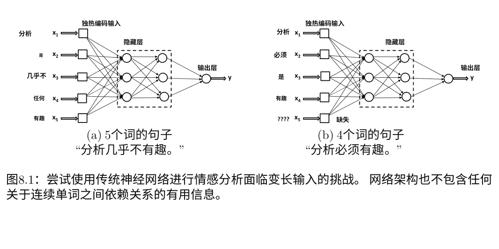

使用循环神经网络（RNNs）可以自然地满足这些要求。在循环神经网络中，网络的层与序列中的特定位置之间存在一一的对应关系。序列中的位置也被称为其时间戳。因此，网络中不再有单个输入层中的可变数量的输入，而是包含可变数量的层，并且每个层都有与该时间戳对应的单个输入。输入还可以根据它们在序列中的位置与下游隐藏层直接交互。每个层使用相同的参数集，以确保在每个时间戳上进行类似的建模，因此参数的数量也是固定的。换句话说，相同的逐层架构在时间上重复出现，因此该网络被称为循环的。循环神经网络也是基于时间分层概念的前馈网络，因此它们可以接受一系列输入并产生一系列输出。每个时间层可以接受一个输入数据点（单个属性或多个属性），并可选择生成多维输出。这种模型对于序列到序列的学习应用非常有用，例如机器翻译或预测序列中的下一个元素。循环神经网络已经在许多应用领域中使用，如序列到序列的学习、图像字幕生成、机器翻译和情感分析。本章还将研究循环神经网络在这些不同应用背景下的使用。

循环神经网络被认为是图灵完备的[464]。图灵完备意味着循环神经网络可以模拟任何算法，只要有足够的数据和计算资源[464]。事实上，一种被称为神经图灵机的架构，就是受到这个特性的启发。详细讨论请参阅第12章的第12.3节。然而，循环网络的图灵完备性在实践中并不是非常有用，因为实现这个目标所需的数据量和计算资源可能是不现实的。此外，训练循环神经网络存在实际问题，如梯度消失和梯度爆炸问题。这些问题随着序列长度的增加而增加，而架构的更稳定变体只能在有限程度上解决这个问题。

### 章节组织

本章的组织结构如下。下一节将介绍循环神经网络的基本架构以及相关的训练算法。讨论了训练循环网络的挑战在第8.3节。由于这些挑战，已经提出了几种循环神经网络架构的变体。本章将研究几种这样的变体。在第8.4节介绍了回声状态网络。在第8.5节讨论了长短期记忆网络。在第8.6节中讨论了门控循环单元。在第8.7节中讨论了循环神经网络的应用。在第8.8节中给出了总结。

## 8.2 循环神经网络的架构

尽管循环神经网络可以在几乎任何序列领域中使用，但在文本领域中的使用广泛而自然。在本节中，我们将假设在整个文本领域中使用，以便直观简单地解释各种概念。因此，本章的重点主要是离散RNN，因为这是最常见的用例。假设用于描述文本序列的基本符号对应于词汇表中的单词。

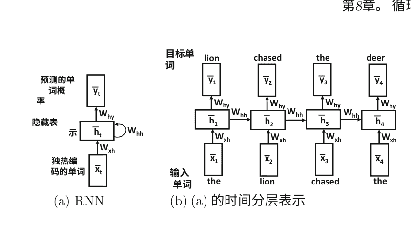

图8.2：一个循环神经网络及其时间分层表示

最简单的循环神经网络如图8.2(a)所示。这里的一个关键点是图8.2(a)中的自环，它会导致神经网络的隐藏状态在序列中的每个单词输入后发生变化。通过将循环展开成一个“时间层次化”的网络，这个网络的架构变得更清晰，更像一个前馈网络。这个网络如图8.2(b)所示。在这种情况下，我们在每个时间戳上都有一个不同的隐藏状态节点，并且自环已经展开成一个前馈网络。第i个时间层节点的输入是第i个单词。这种表示在数学上等价于图8.2(a)，但由于其与传统网络的相似性，更容易理解。不同时间层的权重矩阵是共享的，以确保每个时间戳使用相同的函数。注释 \(W_{xh}\), \(W_{hh}\) 和 \(W_{hy}\) 的权重矩阵在图8.2(b)中清楚地显示了共享。

值得注意的是，图8.2展示了一个每个时间戳都有输入、输出和隐藏单元的情况。在实践中，输入单元或输出单元在任何特定的时间戳上都可能缺失。图8.3展示了一些具有缺失输入和输出的情况示例。缺失的输入和输出的选择取决于具体的应用。例如，在时间序列预测应用中，我们可能需要在每个时间戳上都有输出，以便预测时间序列的下一个值。另一方面，在序列分类应用中，我们可能只需要一个与其类别相对应的序列末尾的单个输出标签。一般来说，在特定的应用中，任何输入或输出的子集都可能缺失。下面的讨论将假设所有的输入和输出都存在，尽管通过简单地在前向传播方程中删除相应的项，可以很容易地将其推广到一些缺失的情况。

图8.2中显示的特定架构适用于语言建模。语言模型是自然语言处理中一个众所周知的概念，它根据前面的单词历史预测下一个单词。在图8.2(a)的神经网络中，单词的独热编码序列按正确的顺序输入。这个时间过程相当于在图8.2(b)中在相关时间戳（即序列位置索引）将单个单词输入到输入中。在语言建模的设置中，输出是对序列中下一个单词预测的概率向量。例如，考虑以下句子：

狮子追逐鹿。

当输入单词“The”时，输出将是一个包含单词“lion”在内的整个词汇表的概率向量，并且当输入单词“lion”时，我们将再次得到一个概率向量来预测下一个单词。这当然是经典的语言模型定义，其中单词的概率是基于前面单词的即时历史估计的。在实践中，输入在两侧用 <START>和 <END>标记来标记输入的开始和结束。通常，在时间 t的输入向量（例如，第 t个单词的独热编码向量）是 xt，时间 t的隐藏状态是 ht，时间 t的输出向量（例如，第 (t+ 1)个单词的预测概率）是 yt。 xt和 yt都是一个大小为 d的词汇表的 d维向量。隐藏向量 ht是一个 p维向量，其中 p调节嵌入的复杂性。为了讨论的目的，我们假设所有这些向量都是列向量。在许多应用程序中，例如分类，输出不是在每个时间单位产生的，而是仅在句子末尾的最后一个时间戳触发。尽管输出和输入单元可能仅存在于时间戳的子集中，但我们研究的是它们存在于所有时间戳的简单情况。那么，时间 t的隐藏状态由时间 (t−1)的输入向量和隐藏向量的函数给出：

$$h_{t} = f(h_{t-1}, x_{t}) \tag{8.1}$$

这个函数是通过使用权重矩阵和激活函数（所有神经网络用于学习的方式）来定义的，并且在每个时间戳上使用相同的权重。因此，即使隐藏状态随时间演变，权重和底层函数仍然保持不变。\(f(·,·)\)在神经网络训练后的所有时间戳（即顺序元素）上保持不变。一个单独的函数。\(y_t = g(h_t)\)用于从隐藏状态中学习输出概率。

接下来，我们具体描述函数 \(f(·,·)\)和 \(g(·)\)。我们定义一个 \(p \times d\) 输入隐藏矩阵 \(W_{xh}\)，一个 \(p \times p\) 隐藏隐藏矩阵 \(W_{hh}\)，和一个 \(d \times p\) 隐藏输出矩阵 \(W_{hy}\)。然后，可以扩展方程8.1，并将输出的条件写成如下形式：

$$h_t = \tanh(W_{xh}x_t + W_{hh}h_{t-1})$$
$$y_t = W_{hy}h_t$$

在这里，“tanh”符号以向量形式定义，其中函数以逐元素的方式应用于 \(p\) 维列向量，以创建一个 \(p\) 维向量，其中每个元素在 \([-1,1]\) 范围内。在本节中，将使用这种向量化表示来表示激活函数。在第一个时间戳中，假设 \(h_{t-1}\) 是一些默认的常量向量（例如0），因为在句子开头没有来自隐藏层的输入。如果需要，也可以学习这个向量。尽管隐藏状态在每个时间戳上都会改变，但权重矩阵在各个时间戳上保持不变。注意，输出向量 \(y_t\) 是一组与词汇表具有相同维度的连续值。在 \(y_t\) 之上应用了一个softmax层，以便结果可以解释为概率。隐藏层在文本段末尾的 \(t\) 个单词的 \(h_t\) 的嵌入，并且 \(W_{xh}\) 提供了单词的嵌入的另一种选择（参见第3章）。后者提供了一种替代 word2vec 嵌入的方法（参见第3章）。

实际上，如果训练数据集不是很大，建议将该层的权重固定为预训练的word2vec编码（以避免过拟合）。

由于方程8.1的递归性质，循环网络具有计算可变长度输入函数的能力。换句话说，可以扩展方程8.1的递归来定义函数。\(h_t\) 以 \(t\) 输入为条件。例如，从开始。\(h_0\) 通常固定为某个常向量（如零向量），我们有 \(h_1\) 仅是 \(x_1\) 的函数，而 \(h_2\) 是 \(x_1\) 和 \(x_2\) 的函数。一般来说，\(h_t\) 是 \(x_1...x_t\) 的函数。由于输出 \(y_t\) 是 \(h_t\) 的函数，这些属性也被 \(y_t\) 继承。一般地，我们可以写成以下形式：

$$y_t = F_t(x_1, x_2, ..., x_t) \quad (8.2)$$

请注意函数。\(F_t(\cdot)\) 随着 \(t\) 的值而变化，尽管它与其前一个状态的关系始终相同（基于方程式8.1）。这种方法对于可变长度的输入特别有用。这种设置在许多领域中经常出现，比如文本，其中句子的长度是可变的。例如，在语言建模应用中，函数。\(F_t(\cdot)\) 表示下一个单词的概率，考虑到句子中的所有前一个单词。

### 8.2.1 循环神经网络的语言建模示例

为了说明循环神经网络的工作原理，我们将使用一个玩具示例，该示例是在一个由四个单词构成的词汇表上定义的单个序列。考虑以下句子：

狮子追逐鹿。

在这种情况下，我们有一个由四个单词组成的词汇表，它们是 { “the,” “lion,” “chased,” “deer” }。在图8.4中，我们展示了从1到4个时间戳的下一个单词的概率预测。理想情况下，我们希望下一个单词的概率能够从前面单词的概率中正确预测出来。每个独热编码的输入向量 \(x_t\) 的长度为四，其中只有一位为1，其余位都是0。这里的主要灵活性在于隐藏表示的维度 \(p\)，我们在这个例子中将其设置为2。因此，矩阵 \(W_{xh}\) 将是一个 \(2 \times 4\) 的矩阵，这样它可以将一个独热编码的输入向量映射成一个隐藏向量 \(h_t\) 大小为2的向量。作为实际问题，每一列 \(W_{xh}\) 对应于四个单词中的一个，其中的一列被复制了。

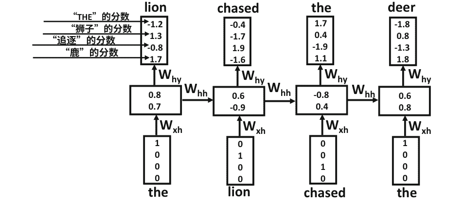

图8.4：使用递归神经网络进行语言建模的示例

表达式 \(W_{xh}x_t\)。请注意，此表达式添加到 \(W_{hh}h_t\) 中。然后通过tanh函数转换产生最终表达式。最终输出 \(y_t\) 由以下方式定义：请注意，矩阵 \(W_{hh}\) 和 \(W_{hy}\) 的大小分别为 \(2 \times 2\) 和 \(4 \times 2\)。在这种情况下，输出是连续值（而不是概率），较大的值表示更大的存在可能性。这些连续值最终通过softmax函数转换为概率，因此可以将它们视为对数概率的替代品。在第一个时间戳上，预测出的单词“狮子”的值为1.3，尽管这个值似乎被“鹿”超过了，对应的值为1.7。然而，单词“追逐”在下一个时间戳上似乎被正确预测出来。与所有学习算法一样，不能指望完全预测每个值，这样的错误更有可能在反向传播算法的早期迭代中发生。然而，随着网络在多次迭代中的重复训练，它在训练数据上的错误会减少。

生成语言样本

这种方法也可以用来生成一种语言的任意样本，一旦训练完成。在预测时如何使用这种语言模型，因为每个状态都需要一个输入词，在语言生成过程中没有可用的词（与训练过程不同）？可以使用第一个时间戳的标记为 <START>的标记作为输入来生成第一个时间戳的标记的可能性。由于训练数据中也有 <START>的标记，模型通常会选择一个经常作为文本段落开头的词。随后，想法是在每个时间戳上随机选择一个生成的标记（基于预测的可能性），然后将其用作下一个时间戳的输入。为了提高顺序预测标记的准确性，可以使用波束搜索来扩展最有可能的可能性，始终跟踪任意特定长度的 \(b\) 最佳序列前缀。其中 \(b\) 的值是用户驱动的参数。通过递归应用此操作，可以生成反映特定训练数据的任意文本序列。如果预测到 <END>的标记，表示该文本段落的结束。尽管这种方法通常会产生句法正确的文本，但在意义上可能是荒谬的。例如，由Karpathy、Johnson和Fei Fei [243, 604]创作的字符级RNN是在William Shakespeare的剧本上进行训练的。字符级循环神经网络需要神经网络学习语法和拼写。在完整数据集上仅进行了五次迭代学习后，以下是输出的一部分示例：

> 国王理查二世：
请唱，因为她的手不在这里，
瓦利是你的家。
诺伦斯：
大多数人，让他自己享受他的快乐；
一个表演，过错，我们为了安慰你而去做，
笑声的离开：我们将有更多的乐趣。

请注意，这种情况下有很多拼写错误，很多单词是无意义的。然而，当训练继续进行到50次迭代时，以下是生成的一部分示例：

> 国王理查二世：
尽管他们非常极端，如果你诅咒它们；
使它们所有的缺点和爱的外表；
力量之王在保护中变得不确定
为了你的力量无情。 一只鸟在我的膝盖上
忏悔并摆脱救赎。
格洛斯特：
我必须等待。

这段生成的文本在句法和拼写上与威廉·莎士比亚的戏剧中的古老英语基本一致，尽管仍然存在一些明显的错误。此外，该方法还通过在合理的位置放置换行符来缩进和格式化文本，类似于戏剧中的做法。继续训练更多迭代使输出几乎无误，还可以在[245]处找到一些令人印象深刻的样本。

当然，从机器学习应用的角度来看，这种生成无意义的文本的有用性可能有限，语义意义有限。关键在于提供额外的上下文输入，例如图像的神经表示，神经网络可以产生智能输出，如语法正确的描述（即标题）图像。换句话说，语言模型最好通过生成有条件的输出出来使用。

语言建模循环神经网络的主要目标不是创建任意的语言序列，而是提供一个可以根据特定上下文进行修改的架构基础。例如，像机器翻译和图像字幕这样的应用会学习一个以另一个输入为条件的语言模型，比如源语言的句子或要添加字幕的图像。因此，应用相关的循环神经网络的精确设计将使用与语言建模循环神经网络相同的原则，但会对基本架构进行小的改动以适应特定的上下文。

循环神经网络产生两种有用的嵌入：

- 1. 每个时间戳的隐藏单元激活包含了该时间戳之前的段序列的多维嵌入。因此，循环神经网络为序列的每个前缀提供了一个嵌入。
- 2. 权重矩阵 \(W_{xh}\) 从输入到隐藏层包含每个单词的嵌入。权重矩阵 \(W_{xh}\) 是一个 \(p \times d\) 矩阵，用于表示大小为 \(d\) 的词汇表。这意味着该矩阵的每个 \(d\) 列都包含一个单词的 \(p\) 维嵌入。这些嵌入提供了与第3章讨论的 word2vec 嵌入的替代方案。

对于其他类型的序列输入，将学习应用特定的嵌入（例如蛋白质序列中的氨基酸嵌入）。

### 8.2.2 通过时间的反向传播

将各个时间戳的正确单词的负对数softmax概率聚合起来创建损失函数。softmax函数在第2章的2.4.2节中有描述，我们直接在这里使用那些结果。如果输出向量 \(y_t\) 可以写成 \([\hat{y}_t^1 \dots \hat{y}_t^d]\)，则首先使用softmax函数将其转换为一个 \(d\) 概率向量：

\[[\hat{p}_t^1 \dots \hat{p}_t^d] = \mathrm{Softmax}([\hat{y}_t^1 \dots \hat{y}_t^d])\]

上述的softmax函数可以在第2章的方程式2.17中找到。如果 \(j_t\) 是训练数据中时间 \(t\) 的真实单词的索引，那么所有 \(T\) 时间戳的损失函数 \(L\) 可以计算如下：

\[L = -\sum_{t=1}^{T} \log(\hat{p}_t^{j_t}) \tag{8.3}\]

这个损失函数是第2章方程式2.18的直接结果。关于原始输出的损失函数的导数可以如下计算（参见第2章方程式2.19）：

\[\frac{\partial L}{\partial \hat{y}_t^k} = \hat{p}_t^k - I(k, j_t) \tag{8.4}\]

在这里，\(I(k, j_t)\) 是一个指示函数，当 \(k\) 和 \(j_t\) 相同时为1，否则为0。从这个偏导数开始，可以使用第2章（在展开的时间网络上）的直接反向传播更新方法来计算不同层权重的梯度。然而，还必须考虑各个时间层中权重矩阵的共享；如第2章的第2.6.6节所讨论的，修改反向传播算法以处理共享权重并不困难。

处理共享权重的主要技巧是首先“假装”不同时间层的参数彼此独立。为此，我们引入了时间变量 \(W_{xh}^{(t)}, W_{hh}^{(t)}\) 和 \(W_{hy}^{(t)}\) 表示时间戳 \(t\)。传统的反向传播首先假设这些变量彼此不同，并进行计算。然后，将不同时间层的权重参数对梯度的贡献相加，以创建每个权重参数的统一更新。这种特殊的反向传播算法被称为时间反向传播（BPTT）。

我们将BPTT算法总结如下：

- (i) 按时间顺序将输入逐个传递到前向方向，并在每个时间戳计算错误（以及softmax层的负对数损失）
- (ii) 在未展开的网络上，反向计算边权重的梯度，不考虑不同时间层的权重是共享的事实
- (iii) 将不同时间层中共享的相同权重参数的梯度相加
- (iv) 使用合并的梯度来更新权重

### 截断的反向传播通过时间

训练递归网络的一个计算问题是底层序列可能非常长，结果网络中的层数也可能非常大。这可能导致计算、收敛和内存使用问题。

这个问题通过使用截断的时间反向传播来解决。这种技术可以看作是递归神经网络的随机梯度下降的类比。在这种方法中，状态值在前向传播过程中被正确计算，但是反向传播更新只在序列的一部分（如100个）上进行。换句话说，只有在相关片段上的损失部分被用来计算梯度并更新权重。这些片段按照它们在输入序列中出现的顺序进行处理。前向传播不需要一次性完成，而是可以在相关片段上进行，只要在下一个层次的片段中使用当前片段的最后时间层的值来计算状态值。当前片段的最后一层的值被用来计算下一个片段的第一层的值。

$$
\frac{\partial L}{\partial W_{xh}} = \sum_{t=1}^{T} \frac{\partial L}{\partial W_{xh}^{(t)}}
$$
$$
\frac{\partial L}{\partial W_{hh}} = \sum_{t=1}^{T} \frac{\partial L}{\partial W_{hh}^{(t)}}
$$
$$
\frac{\partial L}{\partial W_{hy}} = \sum_{t=1}^{T} \frac{\partial L}{\partial W_{hy}^{(t)}}
$$

在所有共享权重的反向传播方法中（参见第2章第2.6.6节），我们使用了损失相对于每个参数的偏导数可以通过将相对于每个参数的导数相加来获得的事实。

此外，对于每个参数的时间副本的偏导数的计算与传统的反向传播没有任何不同。因此，只需要将时间聚合包装在常规的反向传播中，以计算更新方程。反向传播通过时间的原始算法可以归功于Werbos在1990年的开创性工作[545]，在递归神经网络变得流行之前很久就有了。

因此，前向传播始终能够准确地维护状态值，尽管反向传播仅使用了损失的一小部分。

### 实际问题

每个权重矩阵的元素都初始化为小值 in $[-1/\sqrt{r}, 1/\sqrt{r}]$，其中$r$是该矩阵的列数。 还可以初始化输入权重矩阵的每个 $d$列。 $Wxh$ 对应单词的 $word2vec$嵌入（参见第3章）。 这种方法是一种预训练的形式，在训练数据量较小时很有帮助。

另一个细节是训练数据通常包含一个特殊的 $<START>$和一个 $<END>$标记，分别位于每个训练段的开头和结尾。 这些类型的标记有助于模型识别特定的文本单元，如句子、段落或文本的开头。 文本段开头的单词分布通常与整个训练数据的分布非常不同。 因此，在$<START>$出现后，模型更有可能选择开始一个特定的文本段的单词。 还有其他方法用于决定在特定点是否结束一个段落。 一个具体的例子是使用二进制输出来决定序列是否应该在特定点继续。 请注意，二进制输出是除了其他应用特定输出之外的一种输出。 这种方法在处理实值序列时很有用。

在训练RNN时也存在一些实际挑战，这使得需要设计各种架构增强来解决这些挑战。值得注意的是，在所有实际应用中都使用了多个隐藏层（带有长短期记忆增强），这将在8.2.4节中讨论。然而，为了清晰起见，应用中心的阐述将使用更简单的单层模型。 将这些应用程序的泛化到增强架构是直接的。

### 8.2.3 双向递归网络

递归网络的一个缺点是在特定时间单位上，状态只能了解到句子中某一点之前的输入，而对未来状态一无所知。 在某些应用中，例如推断词义，通过了解过去和未来状态，结果得到了极大的改善。 例如，在处理单词“right”之前，无法推断出“right choice”中多义词“right”的具体语义。 因此，没有处理单词之后的位置，可能很难推断出一个词的正确语义。 传统的递归网络至少在某种程度上无法实现这个目标，因为在出现这些信息性位置之前的中间状态所做的任何预测很可能缺乏足够的上下文。

双向递归神经网络适用于预测不基于历史窗口的因果关系的应用。 一个经典的因果关系示例是一个符号流，在这个流中，事件是基于先前符号的历史来预测的。 尽管语言建模应用在形式上被认为是因果关系应用（即基于前一个单词的即时历史），但实际上，通过使用其两侧的上下文单词，可以更准确地预测给定的单词。 总的来说，双向RNN在基于双向上下文的应用中表现良好。 这类应用的例子包括手写识别和语音识别，其中序列中各个元素的属性取决于其两侧的元素。 例如，如果一个手写字符是以笔画表示的，那么特定位置两侧的笔画有助于识别正在合成的特定字符。 它越来越成为各种以语言为中心的应用中，常常使用双向递归网络而不是单向网络。

在双向递归网络中，我们有单独的隐藏状态 $h^{(f)}_t$ 和 $h^{(b)}_t$ 用于前向和后向方向。前向隐藏状态只与彼此交互，后向隐藏状态也是如此。主要的区别是前向状态在前向方向上相互作用，而后向状态在后向方向上相互作用。两者 $h^{(f)}_t$ 和 $h^{(b)}_t$，然而，从相同的向量接收输入 $\overline{x}_t$（例如，词的独热编码）与相同的输出向量 $\hat{y}_t$ 相互作用。图8.5显示了双向RNN的三个时间层的示例。在双向网络的情况下，我们有单独的前向和后向参数矩阵。输入-隐藏、隐藏-隐藏和隐藏-输出的前向矩阵分别表示为 $W^{(f)}_{xh}$，$W^{(f)}_{hh}$ 和 $W^{(f)}_{hy}$。输入-隐藏、隐藏-隐藏和隐藏-输出的后向矩阵分别表示为 $W^{(b)}_{xh}$，$W^{(b)}_{hh}$ 和 $W^{(b)}_{hy}$，并且 $W^{(b)}_{hy}$，分别。

递归条件可以写成如下形式：

$\overline{h}^{(f)}_{t} = \tanh(W^{(f)}_{xh} \overline{x}_t + W^{(f)}_{hh} \overline{h}^{(f)}_{t-1})$

$\overline{h}^{(b)}_{t} = \tanh(W^{(b)}_{xh} \overline{x}_t + W^{(b)}_{hh} \overline{h}^{(b)}_{t+1})$

$\overline{y}_t = W^{(f)}_{hy} \overline{h}^{(f)}_{t} + W^{(b)}_{hy} \overline{h}^{(b)}_{t}$

很容易看出，双向方程是单向条件的简单推广。假设上述神经网络中总共有 $T$ 个时间戳，其中 $T$ 是序列的长度。一个问题是关于边界条件对应的前向输入 $t=1$ 和后向输入 $t=T$，这些都没有定义。在这种情况下，可以在每种情况下使用默认常数值 0，尽管也可以将这些值的确定作为学习过程的一部分。

关于前向和后向方向的隐藏状态的一个直接观察是它们之间根本不相互作用。因此，可以先运行在正向方向上计算隐藏状态的序列，然后在反向方向上运行序列以计算隐藏状态。此时，输出状态是从两个方向的隐藏状态计算得出的。在计算完输出后，应用反向传播算法来计算各个参数的偏导数。

首先，计算输出状态的偏导数，因为正向和反向状态都指向输出节点。然后，仅计算正向隐藏状态的反向传播，从 \(t = T\) 向下到 \(t= 1\)。最后，计算反向隐藏状态的反向传播，从 \(t = 1\) 到 \(t = T\)。

最后，关于共享参数的偏导数被聚合。因此，BPTT算法可以推广到双向网络，具体如下：

1. 在单独的传递中独立计算前向和后向隐藏状态。
2. 从后向和前向隐藏状态计算输出状态。
3. 计算损失相对于输出状态和每个输出参数的偏导数。
4. 使用反向传播独立计算损失相对于前向状态和后向状态的偏导数。使用这些计算来评估相对于每个前向和后向参数的偏导数。
5. 聚合共享参数的偏导数。

双向循环网络与两个独立的循环网络集合有些相似-一个以原始形式呈现输入，另一个以相反形式呈现输入。主要区别在于前向和后向状态的参数是相互依赖的，因此在双向网络中进行联合训练。

### 8.2.4 多层递归网络

在所有上述应用中，为了便于理解，都使用了单层RNN架构。然而，在实际应用中，为了构建更复杂的模型，使用了多层架构。图8.6展示了一个包含三层的递归网络的示例。请注意，高层节点接收来自低层节点的输入。隐藏状态之间的关系可以直接从单层网络推广。首先，我们将隐藏层的递归方程（对于单层网络）重写为适应多层网络的形式：

$$
\overline{h}_t = \tanh(W_{xh}\overline{x}_t + W_{hh}\overline{h}_{t-1}) = \tanh W \left[ \begin{array}{c} \overline{x}_t \\ \overline{h}_{t-1} \end{array} \right]
$$

在这里，我们将一个更大的矩阵组合在一起。$W= [W_{xh}, W_{hh}]$，其中包括列同样地，我们创建了一个更大的列向量，将时间的第 $t$ 个隐藏层的状态向量堆叠起来。$t - 1$和时间$t$的输入向量。为了区分上层隐藏节点，让我们给隐藏状态添加一个额外的上标，并用 $h_t^{(k)}$ 表示时间戳 $t$和层 $k$的隐藏状态向量。

同样地，第 $k$个隐藏层的权重矩阵表示为 $W^{(k)}$。值得注意的是，权重在不同的时间戳之间是共享的（就像单层循环网络一样），但在不同的层之间是不共享的。因此，权重的上标是层索引 k在 $W^{(k)}$中。第一个隐藏层很特殊，因为它既接收当前时间戳的输入层的输入，又接收上一个时间戳的相邻隐藏状态。因此，矩阵 $W^{(k)}$的大小为 $p \times (d + p)$只适用于第一层（即 $k = 1$），其中 $d$ 是输入向量的大小 $\overline{x}_t$ 和 $p$ 是隐藏向量的大小 $\overline{h}_t$。请注意，$d$ 通常不会与 $p$ 相同。第一层的循环条件已经通过设置 $W^{(1)} = W$ 显示在上面。因此，让我们专注于所有的隐藏层 $k$，其中 $k \geq 2$。具有的层的循环条件 $k \geq 2$ 也与方程8.5类似：

$$
\mathbf{h}_t^{(k)} = \tanh W^{(k)} \begin{bmatrix} \mathbf{h}_t^{(k-1)} \\ \mathbf{h}_{t-1}^{(k)} \end{bmatrix}
$$

在这种情况下，矩阵 $W^{(k)}$的大小是。从隐藏层到输出层的转换与单层网络中的转换相同。在实际应用中，通常使用两层或三层。更多的层数将需要更多的训练数据以避免过拟合。

## 8.3 训练循环网络的挑战

由于时间层叠网络可以是长输入序列的非常深的网络，因此循环神经网络的训练非常困难；毕竟，时间层叠的深度是与输入相关的。与所有深度网络一样，损失函数对于不同的时间层具有高度变化的梯度幅度。此外，相同的参数矩阵被不同的时间层共享。这种梯度幅度的变化和不同层之间共享参数的组合可能导致一些异常不稳定的效果。

循环神经网络训练面临的主要挑战是梯度消失和梯度爆炸问题。这些问题在详细说明中解释。第四章的4.3.2节在本节中，我们将在递归神经网络的背景下重新讨论这个问题。通过研究每层只有一个单元的递归网络，最容易理解与递归网络相关的挑战。

考虑一组 $T$ 连续的层，在每对层之间应用双曲正切激活函数 $\Phi(\cdot)$ 是在每对层之间应用的激活函数。一对隐藏节点之间的共享权重用 $w$ 表示。令 $h_1...h_T$ 是各层的隐藏值。令 $\Phi'(h_t)$ 是隐藏层 $t$ 的激活函数的导数。令 $t$ 层中共享权重的副本为 $w$，以便可以检查反向传播更新的效果。令 $\frac{\partial L}{\partial h_t}$ 将损失函数对隐藏激活的导数记为 $h_t$。神经网络的架构如图8.7所示。然后，通过反向传播推导出以下更新方程：

$$\frac{\partial L}{\partial h_t} = \Phi'(w_{t+1}h_t) \cdot w_{t+1} \cdot \frac{\partial L}{\partial h_{t+1}}$$ (8.6)

由于不同时间层的共享权重相同，梯度乘以相同的数量 $w_t = w$ 对于每一层。这种乘法会导致一致的消失偏差：当 $w < 1$ 时，会有一致的消失偏差；当 $w > 1$ 时，会有一致的爆炸偏差。然而，激活函数的选择也会起到作用，因为导数 $\Phi'(w_{t+1}h_t)$ 被包含在乘积中。例如，存在tanh激活函数，其导数 $\Phi'(\cdot)$ 几乎总是小于1，倾向于增加梯度消失问题的可能性。

尽管上述讨论仅研究了具有一个隐藏层单元的简单情况，但可以将论证推广到具有多个隐藏层单元的情况[231]。在这种情况下，可以证明梯度的更新归结为与相同矩阵 $A$ 的重复乘法。可以证明以下结果：

引理8.3.1 设 $A$ 为一个方阵，其最大特征值的幅值为 $\lambda$。那么，$A^t$ 随着 $t$ 的增大趋于0，当 $\lambda < 1$ 时。另一方面，$A^t$ 的元素随着 $t$ 的增大而发散，当 $\lambda > 1$ 时。

上述结果的证明可以通过对 $A = P\Delta P^{-1}$ 进行对角化来轻松展示。然后，可以证明 $A^t = P\Delta^t P^{-1}$，其中 $\Delta$ 是一个对角矩阵。最大对角元素的幅值 $\Delta^t$ 要么随着 $t$ 的增大趋于零，要么随着 $t$ 的增大而趋于越来越大的值（绝对值），这取决于特征值是小于1还是大于1。在前一种情况下，矩阵 $A^t$ 趋于0，因此梯度消失。在后一种情况下，梯度爆炸。当然，这还不包括激活函数的影响，可以通过改变最大特征值的阈值来设置梯度消失或梯度爆炸的条件。例如，Sigmoid激活函数导数的最大可能值为0.25，因此当最大特征值小于$1/0.25=4$时，梯度消失问题肯定会发生。当然，将矩阵乘法和激活函数的效果合并为一个单一的雅可比矩阵（参见第2章表2.1），其特征值可以进行测试。

在循环神经网络的特殊情况下，梯度消失/爆炸和跨不同层之间的参数绑定导致循环神经网络以不稳定的方式行为，梯度下降步长也是如此。换句话说，如果我们选择的步长太小，那么一些层的效果将导致进展很小。另一方面，如果我们选择的步长太大，那么一些层的效果将导致步长以不稳定的方式超过最优点。这里一个重要的问题是，梯度只告诉我们无限小步长的最佳移动方向；对于有限步长，更新的行为可能与梯度预测的行为大不相同。循环网络中的最优点通常隐藏在悬崖或其他地形变化不可预测的区域中，这导致瞬时移动的最佳方向极其不准确，有限移动的最佳方向也是如此。由于任何实际的学习算法都需要以合理的步长进行有限步骤，以便朝着最优解取得良好的进展，这使得训练变得相当困难。图8.8展示了一个悬崖的示例。与悬崖相关的挑战在第4章的第4.3.3节中进行了讨论。

解决梯度消失和梯度爆炸问题有几种方法，并不是所有方法都同样有效。第4章的4.5.6节讨论了一种解决方法，即梯度剪裁。梯度剪裁非常适合解决梯度爆炸问题。

常用的剪裁方法有两种。第一种是基于数值的剪裁，第二种是基于范数的剪裁。在基于数值的剪裁中，梯度的最大时间分量在相加之前被剪裁。这是最早提出的剪裁方法，由Mikolov在他的博士论文[336]中提出。第二种剪裁方法是基于范数的剪裁。这个想法是当整个梯度向量的范数超过特定阈值时，将其重新缩放到阈值。这两种剪裁方法的表现方式相似，[381]中提供了分析。

关于突然变化的曲率（如悬崖），一阶梯度通常无法完全建模局部误差曲面。因此，一个自然的解决方法是使用高阶梯度。高阶梯度的主要挑战是计算成本高。例如，使用二阶方法（参见第4章的第4.6节）需要对Hessian矩阵进行求逆。对于一个具有 $10^6$个参数的网络，这将需要对一个 $10^6 \times 10^6$的矩阵进行求逆。 从实际角度来看，根据目前可用的计算能力，这是不可能完成的。 然而，在第4章的第4.7节中讨论了一些巧妙的实现二阶方法的技巧。这些方法在训练循环神经网络方面也取得了一些成功。

优化过程面临的不稳定性类型对当前解所在的损失曲面上的具体点非常敏感。 因此，选择良好的初始化点至关重要。[147]中的工作讨论了几种可以避免梯度更新不稳定性的初始化类型。 使用动量方法（参见第4章）也有助于解决一些不稳定性问题。 关于初始化和动量在解决这些问题方面的能力的讨论可参见[494]。 通常使用简化的循环神经网络变体，如回声状态网络，来创建循环神经网络的稳健初始化。

另一个常用的技巧是批归一化，用于解决梯度消失和梯度爆炸问题，尽管基本方法需要对循环网络进行一些修改[84]。 批归一化方法在第4章的第4.8节中进行了讨论。 然而，在循环网络中，一种被称为层归一化的变体更加有效。 层归一化方法非常成功，已经成为在使用循环神经网络或其变体时的标准选项。

最后，为了解决梯度消失和梯度爆炸问题，使用了许多循环神经网络的变体。 第一个简化是使用回声状态网络，其中隐藏到隐藏的矩阵是随机选择的，但只有输出层被训练。在早期，当认为训练循环神经网络太困难时，回声状态网络被用作可行的替代方案。然而，这些方法在非常复杂的环境中过于简化，无法使用。

然而，这些方法仍然可以用于循环神经网络中的稳健初始化[494]。 处理梯度消失和梯度爆炸问题的更有效方法是为循环网络提供内部记忆，这使得网络的状态更加稳定。 使用长短期记忆（LSTM）已成为处理梯度消失和梯度爆炸问题的有效方法。 这种方法引入了一些额外的状态，可以解释为一种长期记忆。 长期记忆提供了随时间更稳定的状态，并且还为梯度下降过程提供了更高的稳定性水平。 这种方法在第8.5节中进行了讨论。

### 8.3.1 层归一化

第4章的第4.8节讨论的批归一化技术旨在解决深度神经网络中的梯度消失和梯度爆炸问题。 尽管在大多数类型的神经网络中都很有用，但该方法在循环神经网络中面临一些挑战。首先，批统计量随神经网络的时间层变化，因此需要为不同的时间戳维护不同的统计量。

此外，递归网络中的层数取决于输入。 因此，如果测试序列比数据中遇到的任何训练序列都要长，那么一些时间戳可能无法获得小批量统计信息。 一般来说，小批量统计的计算对于不同的时间层并不同样可靠（无论小批量大小如何）。 最后，批量归一化在在线学习任务中很难应用，因为它需要事先收集批量统计信息。尽管批量归一化可以适应递归网络[84]，但更有效的方法是层归一化。

在层归一化中，归一化仅针对单个训练实例执行，尽管归一化因子是通过使用该层中所有当前激活的当前实例获得的。这种方法更接近传统的神经网络操作，我们不再需要维护小批量统计的问题。神经网络与深度学习教材 第二版

计算实例的激活所需的所有信息只能从该实例中获取！

为了理解逐层归一化的工作原理，我们重复第269页的隐藏到隐藏递归：

```
$$\bar{h}_t = \tanh(W_{xh} \bar{x}_t + W_{hh} \bar{h}_{t-1})$$
```

由于时间层之间的乘法效应，这种递归容易出现不稳定的行为。我们将展示如何通过逐层归一化修改这个递归。与第4章中的传统批归一化一样，归一化是在应用tanh激活函数之前应用于预激活值的。因此，第t个时间戳的预激活值计算如下：

```
$$\bar{a}_t = W_{xh} \bar{x}_t + W_{hh} \bar{h}_{t-1}$$
```

注意 a_t 是一个具有与隐藏层单元数相同的分量的向量（在本章中我们一直将其表示为 p）。我们计算预激活值的均值 μ_t 和标准差 σ_t 的值在 a_t 中：

```
$$\mu_t = \frac{\sum_{i=1}^p a_{ti}}{p}, \quad \sigma_t = \sqrt{\frac{\sum_{i=1}^p a_{ti}^2}{p} - \mu_t^2}$$
```

在这里，a_{ti} 表示向量 a_t 的第i个分量。

与批归一化一样，我们有与每个单元相关的额外学习参数。具体而言，对于第t层中的p个单元，我们有一个p维向量的增益参数 γ_t，以及一个p维向量的偏置参数，用 β_t 表示。这些参数类似于批归一化中的参数 γ_i 和 β_i。在第48节中，这些参数的目的是以可学习的方式重新缩放归一化的值并添加偏置。

因此，下一层的隐藏激活 h_t 计算如下：

```
$$\bar{h}_t = \text{双曲正切} \left( \frac{\gamma_t}{\sigma_t} \odot (\bar{a}_t - \mu_t) + \beta_t \right) \quad (8.7)$$
```

在这里，符号 ⊙ 表示逐元素乘法，而符号 μ_t 表示一个包含 p 个标量 μ_t 的向量。层归一化的作用是确保激活的幅值不会随时间戳连续增加或减少（导致梯度消失和梯度爆炸），而可学习的参数增加了灵活性。

## 8.4 回声状态网络

回声状态网络是循环神经网络的简化表示。当输入的维度较小时，它们表现良好；这是因为回声状态网络在时间单元的数量上具有良好的扩展性，但在输入的维度上没有。因此，这些网络对于基于回归的建模是一个可靠的选择，可以用于单个或一小部分实值时间序列在相对较长的时间范围内。然而，它们在建模文本方面是一个糟糕的选择，因为输入维度（基于一热编码）将是表示文档的词汇表的大小。然而，即使在这种情况下，回声状态网络在网络的初始化中仍然是实用的。回声状态网络也被称为液态机器 [315]，只是后者使用具有二进制输出的尖峰神经元，而回声状态网络使用传统的激活函数，如sigmoid和tanh函数。

回声状态网络在隐藏层和输入到隐藏层中使用随机权重，尽管隐藏状态的维度几乎总是比输入状态的维度大得多。对于单个输入序列，使用维度约为200的隐藏状态是很常见的。因此，只有输出层被训练，通常使用线性层进行实值输出。请注意，输出层的训练只是聚合不同输出节点的错误，尽管不同输出节点的权重仍然是共享的。然而，目标函数仍然评估为线性回归的情况，可以非常简单地进行训练而不需要反向传播。因此，回声状态网络的训练非常快速。

与传统的循环网络一样，隐藏层之间的连接具有非线性激活函数，如逻辑sigmoid函数，但也可以使用tanh激活函数。在初始化隐藏层之间的连接时，一个非常重要的注意事项是权重矩阵的最大特征值。应该设置为1。可以通过首先从标准正态分布中随机采样权重矩阵。然后将每个条目除以最大绝对特征值。

```
W_{hh} \leftarrow W_{hh}/|\lambda_{max}| \quad (8.8)
```

在进行归一化之后，该矩阵的最大特征值将为1，对应于其谱半径。然而，使用谱半径为1可能过于保守，因为非线性激活函数会对状态值产生抑制效应。例如，当使用sigmoid激活函数时，sigmoid的最大偏导数始终为0.25，因此使用谱半径远大于4（比如10）是可以的。当使用tanh激活函数时，谱半径约为2或3是合理的选择。这些选择通常仍会导致一定程度的抑制效应，这实际上是一种有用的正则化，因为长期关系通常比短期关系在时间序列中要弱得多。还可以通过在保留数据上尝试不同的缩放因子γ来调整谱半径，以基于性能来设置。W_{hh} = γW_0。在这里，W_0是一个随机初始化的矩阵。

建议在隐藏层之间的连接中使用稀疏连接，在涉及随机投影的情况下这是常见的。为了实现这个目标，在其中的连接数量是很多的。W_{hh}可以被采样为非零值，其他的则被设为0。这个连接数量通常与隐藏单元的数量成线性关系。

另一个关键技巧是将隐藏单元分成索引 1...K，并且只允许隐藏状态之间的连接属于相同的索引。这种方法可以等效地训练一组回声状态网络（见练习2）。

另一个问题是关于输入到隐藏层的矩阵 W_{xh} 的设置。对于这个矩阵的缩放需要小心，否则每个时间戳中输入的影响可能会严重破坏隐藏状态中携带的信息。因此，矩阵 W_{xh} 首先是随机选择的 W_1，然后根据超参数 β 的不同值对其进行缩放，以确定最终的矩阵 W_{xh} = β W_1 可以在留出数据上获得最佳的准确性。

回声状态网络的核心是基于一个非常古老的想法，即通过非线性变换扩展数据集的特征数量通常可以增加输入表示的表达能力。例如，RBF网络（参见第6章）和核支持向量机都通过扩展底层特征空间来获得其能力，这符合Cover关于模式可分离性的定理[87]。唯一的区别是，回声状态网络使用随机投影进行特征扩展；这种方法并不是没有先例，因为各种类型的随机变换也被用作机器学习中快速替代核方法的选择[401, 536]。值得注意的是，特征扩展主要通过非线性变换实现，而这些变换是通过隐藏层中的激活函数提供的。从某种意义上讲，回声状态方法在时间域中使用了与RBF网络类似的原理，就像递归神经网络在时间域中取代了前馈网络一样。就像RBF网络用于提取隐藏特征的训练非常少一样，回声状态网络用于提取隐藏特征的训练也很少，而是依赖于特征空间的随机扩展。

当应用于时间序列数据时，该方法在预测未来的值时提供了出色的结果。关键的技巧是选择与时间序列输入值对应的时间戳$t$的目标输出值。$t+k$，其中$k$是预测所需的前瞻。换句话说，回声状态网络是一种用于建模时间序列数据的优秀非线性自回归技术。即使在多变量时间序列的预测中也可以使用这种方法，尽管在时间序列数量非常大时不建议使用该方法。这是因为用于建模的隐藏状态的维度会变得非常大。本节详细讨论了回声状态网络在时间序列建模中的应用。同时还与传统时间序列预测模型进行了比较。

尽管这种方法不能真实地用于非常高维的输入（如文本），但对于初始化[494]仍然非常有用。基本思想是通过使用其回声状态变体来训练输出层来初始化递归网络。此外，通过尝试不同的缩放因子$\beta$和$\gamma$（如上所述），可以设置适当的初始化值$W_{hh}$和$W_{xh}$的缩放。随后，使用传统的反向传播来训练递归网络。这种方法可以看作是递归网络的轻量级预训练。

最后一个是关于权重连接的稀疏性。矩阵$W_{hh}$应该是稀疏的吗？这通常是一个有争议和分歧的问题；虽然自早年以来就推荐使用稀疏连接的回声状态网络[230]，但其原因并不十分清楚。原始工作[230]指出，稀疏连接导致各个子网络的解耦，从而促进了各个动力学的发展。这似乎是增加回声状态网络所学习的特征多样性的一个论点。如果解耦确实是目标，那么明确地这样做并将隐藏状态分为不相连的组会更有意义。

这种方法有一个以集合为中心的解释。在涉及随机投影的方法中，经常建议增加稀疏性以提高计算效率。密集连接可能导致不同状态的激活嵌入到大量高斯随机变量的乘性噪声中，因此更难提取。

## 8.5 长短期记忆 (LSTM)

如第83节所讨论的，循环神经网络存在与梯度消失和梯度爆炸相关的问题[215, 381, 382]。这是神经网络更新中的一个常见问题，其中连续乘以矩阵 \(W^{(k)}\) 本质上是不稳定的；它要么在反向传播过程中梯度消失，要么以不稳定的方式爆炸成大值。这种不稳定性是在各个时间戳上与 (递归) 权重矩阵的连续乘法的直接结果。

第二个问题是循环神经网络在保留长段文本信息方面存在困难，因为每个转换都会擦除之前学到的一些信息。例如，考虑以下句子：“在岔路口选择左侧分支是一个错误，我应该明白选择右侧更合理。”在这种情况下，“右侧”一词指的是方向，“一个”一词指的是分支。然而，当RNN到达句子末尾时，它可能难以理解这一点，因为大部分相关信息已经被连续的转换打乱了。解决这个问题的一种方法是改变隐藏向量的递归方程，使用LSTM和长期记忆来学习。LSTM的操作旨在对写入这个长期记忆的数据进行细粒度控制。LSTM的操作旨在对写入这个长期记忆的数据进行细粒度控制。

与前几节一样，符号 \(h^{(k)}\) 表示隐藏状态 \(\bar{h}^{(k)}_t\) 表示多层LSTM的第 \(k\) 层的隐藏状态。为了方便表示，我们还假设输入层 \(x_t\) 可以用 \(h^{(0)}_t\) 表示 (尽管这一层显然不是隐藏层)。与循环网络的情况一样，输入向量 \(x_t\) 是 \(d\) 维的，而隐藏状态是 \(p\) 维的。LSTM是循环神经网络架构的改进，图86中我们改变了隐藏状态 \(h^{(k)}_t\) 的传播条件。为了实现这个目标，我们有一个额外的 \(p\) 维隐藏向量，用 \(c^{(k)}_t\) 表示，并称之为细胞状态。可以将细胞状态视为一种长期记忆，通过部分“遗忘”和“增量”操作保留了先前状态中的一部分信息。在[243]中已经证明了记忆的性质。

\(\bar{c}^{(k)}_t\) 当应用于文本数据 (如文学作品) 时，它有时是可以解释的。例如，在中的一个 \(p\) 值 \(c^{(k)}_t\) 在开头引号后可能会改变符号，然后只有在引号关闭后才会恢复。这种现象的结果是，生成的神经网络能够模拟语言中的长程依赖关系，甚至是一个延伸到大量标记的特定模式 (如引号)。通过在时间上使用温和的方法来更新这些细胞状态，从而实现了这一点，以便信息存储更加持久。状态值的持久性避免了消失梯度和爆炸梯度问题的不稳定性。直观地理解这一点的一种方式是，如果不同时间层中的状态之间共享更高水平的相似性 (通过长期记忆)，那么对于与传入权重相关的梯度来说，它们很难截然不同。

与多层递归网络一样，更新矩阵用表示 \(W^{(k)}\) 和用于对列向量 \([\bar{h}^{(k-1)T}_t, \bar{h}^{(k)T}_{t-1}]^T\) 进行预乘。然而，该矩阵的大小为\(^2\) \(2\)在第一层，矩阵 \(W^{(1)}\) 的大小为 \(4p \times (p + d)\)，因为它与大小为 \((p + d)\) 的向量相乘。

4p × 2p，因此对大小为2p的向量进行预乘$W^{(k)}$的结果是一个大小为4p的向量。在这种情况下，更新使用四个中间的、p维向量变量 i, f, o分别对应于4p维向量。中间变量i, f和o分别被称为输入、遗忘和输出变量，因为它们在更新细胞状态和隐藏状态时的作用。隐藏状态向量的确定。和细胞状态向量。使用一个多步骤的过程，首先计算这些中间变量，然后从这些中间变量计算隐藏变量。注意中间变量向量。c和主要细胞状态之间的差异

```
输入门: 
遗忘门: 
输出门: 
新的C.-状态: 
$\begin{bmatrix} \vec{i} \\ \vec{f} \\ \vec{o} \\ \vec{c} \end{bmatrix} = \begin{bmatrix} \text{sigm} \\ \text{sigm} \\ \text{sigm} \\ \text{tanh} \end{bmatrix} W^{(k)} \begin{bmatrix} \vec{h}_t^{(k-1)} \\ \vec{h}_{t-1}^{(k)} \end{bmatrix}$ [设置中间变量]
```

```
$\vec{c}_t^{(k)} = \vec{f} \odot \vec{c}_{t-1}^{(k)} + \vec{i} \odot \vec{c}$ [有选择性地忘记并添加到长期记忆]
```

```
$\vec{h}_t^{(k)} = \vec{o} \odot \tanh(\vec{c}_t^{(k)})$ [有选择性地泄漏长期记忆到隐藏状态]
```

这里，向量的逐元素乘积用"⊙"表示，符号“sigm”表示sigmoid操作。对于第一层（即k=1），上述方程中的符号$h_t^{(k-1)}$应该替换为$x_t$，矩阵$W^{(1)}$的大小为$4p × (p + d)$。在实际实现中，上述更新中也使用偏置，尽管这里为简单起见省略了。上述更新似乎相当晦涩，因此需要进一步解释。

上述方程序列的第一步是设置中间变量向量i, f, o, 和c，其中前三个在概念上应被视为二进制值，尽管它们在(0,1)范围内是连续值。将一对二进制值相乘就像对一对布尔值使用AND门一样。我们将此操作称为门控。向量i, f, 和o被称为输入、遗忘和输出门。特别地，这些向量在概念上被用作布尔门，用于决定(i)是否将其添加到细胞状态中，(ii)是否遗忘细胞状态，以及(iii)是否允许从细胞状态向隐藏状态泄漏。将输入、遗忘和输出变量抽象为二进制有助于理解更新所做的决策类型。在实践中，连续值在(0,1)范围内，这些变量中包含，如果将输出视为概率，则可以以概率的方式强制执行二进制门的效果。在神经网络设置中，使用连续函数是必要的，以确保梯度更新所需的可微性。向量c包含细胞状态的新提议内容，尽管输入和遗忘门调节了它对先前细胞状态的改变程度（以保留长期记忆）。

四个中间变量i, f, o, 和c, 是使用权重矩阵设置的$W^{(k)}$是上述第k层的第一个方程中的权重矩阵。现在让我们来看一下第二个方程，它使用其中一些中间变量来更新细胞状态:

```
$\vec{c}_t^{(k)} = \vec{f} \odot \vec{c}_{t-1}^{(k)} + \vec{i} \odot \vec{c}$ 重置？增量？
```

3与遗忘门相关的偏置特别重要。遗忘门的偏置通常被初始化为大于1的值[239]，因为这似乎可以避免初始化时的梯度消失问题。

这个方程有两个部分。 第一部分使用 $p$遗忘位 来决定上一个时间戳的哪些细胞状态要重置为0，并使用 $p$输入位$f$来决定上一个时间戳的哪些细胞状态要重置为0，并使用 $p$输入位$\bar{o}$。 我决定是否从中添加相应的组件。$\bar{c}$到每个细胞状态中。
请注意，细胞状态的更新是以加法形式进行的，这有助于避免由乘法更新引起的梯度消失问题。 人们可以将细胞状态向量视为持续更新的长期记忆，其中遗忘和输入位分别决定了 (i) 是否从上一个时间戳重置细胞状态并遗忘过去，以及 (ii) 是否从上一个时间戳增加细胞状态，以将新信息从当前单词纳入长期记忆中。该向量

$\bar{o} \bar{c}$包含增加细胞状态的数量，这些值在$\bar{o}$. [-1, +1]，因为它们都是tanh函数的输出。

最后，隐藏状态 $h_t^{(k)}$ 通过从细胞状态中泄漏进行更新。 隐藏状态的更新如下所示：

```
$$ \bar{o}_t h_t^{(k)} = \bar{o} \odot \tanh(\bar{c}_t^{(k)}) $$
**泄漏 $\bar{c}_t^{(k)}$ 到 $h_t^{(k)}$**
```

在这里，我们将每个细胞状态的函数形式复制到每个隐藏状态中，具体取决于输出门（由$\bar{o}$）是0还是1。 当然，在神经网络的连续设置中，部分门控发生，并且只有一部分信号从每个细胞状态复制到相应的隐藏状态。 值得注意的是，最终的方程并不总是使用tanh激活函数。 可以使用以下替代更新:

```
$$ \bar{o}_t h_t^{(k)} = \bar{o} \odot \bar{c}_t^{(k)} $$
```

与所有神经网络一样，反向传播算法用于训练目的。

为了理解为什么LSTM提供比普通RNN更好的梯度流，让我们来看一个简单的单层LSTM的更新，其中 $p=1$。在这种情况下，细胞更新可以简化为以下形式:

```
$$ \circ c_t = c_{t-1} * f + i * c \tag{8.9} $$
```

因此，对于，其偏导数为 $c_{t-1}$ 是 $f$，这意味着反向梯度流为 $c_t$与遗忘门 $f$的值相乘。 由于逐元素操作，该结果适用于任意状态维度 $p$。 遗忘门的偏置通常最初设置为较高的值，以便梯度流相对较慢地衰减。 遗忘门 $f$在不同的时间戳上也可以不同，这减少了梯度消失问题的倾向。 隐藏状态可以用细胞状态表示为 $h_t = o * \tanh(c_t)$，因此可以计算关于 的偏导数。使用单个$tanh$导数可以计算出$h_t$。 换句话说，长期细胞状态起到梯度超高速公路的作用，泄漏到隐藏状态中。

## 8.6 门控循环单元 (GRUs)

门控循环单元（GRU）可以看作是LSTM的简化版本，不使用显式的细胞状态。 另一个区别是LSTM直接控制使用单独的忘记门和输出门来改变隐藏状态中的信息量。另一方面，GRU使用单个重置门来实现相同的目标。然而，GRU的基本思想与LSTM相似，部分地重置隐藏状态。与前几节一样，我们假设有一个多层架构（除了时间层次化）；因此，符号 \(h_t^{(k)}\) 表示时间戳 \(t\) 的第 \(k\)层的隐藏状态，其中 \(k \geq 1\)。

状态，其中 \(k \geq 1\)。为了方便表示，我们还假设输入层 \(\bar{x}_t\) 可以用 \(h_t^{(0)}\) 来表示。（尽管这一层显然不是隐藏层）。

与LSTM的情况类似，我们假设输入向量 \(\bar{x}_t\) 是 \(d\)维的，而隐藏状态是 \(p\)维的。第一层的转换矩阵的大小相应地进行调整以考虑这一事实。在第一层中，转换矩阵的大小相应地进行调整以考虑这一事实。

在GRU的情况下，我们使用两个矩阵 \(W^{(k)}\) 和 \(V^{(k)}\)，它们的尺寸分别为 \(2p \times 2p\) 和 \(p \times 2p\)。将大小为2p的向量与 \(W^{(k)}\)进行预乘，得到大小为2p的向量，然后通过sigmoid激活函数生成两个中间的，维度为p的向量变量 \(z_t\) 和 \(r_t\)。中间变量 \(z_t\) 和

\(r_t\)分别称为更新门和重置门。隐藏状态向量。\(h_t^{(k)}\)的确定

使用两步过程，首先计算这些门，然后使用它们来决定如何通过权重矩阵 \(V^{(k)}\)来改变隐藏向量的程度:

```
$$\begin{bmatrix} \bar{z} \\ \bar{r} \end{bmatrix} = \left( \begin{matrix} \text{sigm} \\ \text{sigm} \end{matrix} \right) W^{(k)} \begin{bmatrix} \bar{h}_t^{(k-1)} \\ \bar{h}_{t-1}^{(k)} \end{bmatrix} \quad \text{[设置门]}$$

$$\bar{h}_t^{(k)} = \bar{z} \odot \bar{h}_{t-1}^{(k)} + (1 - \bar{z}) \odot \tanh V^{(k)} \begin{bmatrix} \bar{h}_t^{(k-1)} \\ \bar{r} \odot \bar{h}_{t-1}^{(k)} \end{bmatrix} \quad \text{[更新隐藏状态]}$$
```

这里，向量的逐元素乘积用“⊙”表示，符号“sigm”表示sigmoid操作。对于第一层（即，k=1），上述方程中的符号 \(h_t^{(k-1)}\) 在上述方程中，应该用 \(x_t\)来替换。此外，矩阵。W^{(1)}和。V^{(1)}的大小分别为。2p × (p + d) 和 p × (p + d)。可以通过一个单一的GRU函数来表示上述方程的整体功能:

```
$$\bar{h}_t^{(k)} = \text{GRU} \left( \bar{h}_t^{(k-1)}, \bar{h}_{t-1}^{(k)}, W^{(k)}, V^{(k)} \right) \quad (8.10)$$
```

V^{(k)}是用于设置门和更新隐藏状态的矩阵，在第k层中使用。在这里，我们还省略了偏置的提及，但在实际实现中通常会包括它们。接下来，我们将进一步解释这些更新，并将其与LSTM的更新进行对比。就像LSTM使用输入、输出和遗忘门来决定从上一个时间步传递多少信息到下一个步骤一样，GRU使用更新门和重置门。GRU没有单独的内部记忆，也需要更少的门来执行从一个隐藏状态到另一个隐藏状态的更新。因此，关于更新门和重置门的确切作用，自然而然地引发了一个问题。重置门 r决定从上一个时间步传递多少隐藏状态用于矩阵更新（如循环神经网络）。更新门 z决定了这个基于矩阵的更新和更直接的贡献之间的相对强度。

## 循环神经网络的应用

循环神经网络在机器学习应用中有许多应用，与信息检索、语音识别和手写识别相关。文本数据是循环神经网络应用的主要场景，但也有一些应用于计算生物学。循环神经网络的大部分应用可以分为两类：

- 1. 条件语言建模：当循环网络的输出是一个语言模型时，可以通过上下文来增强它，以提供相关的输出。在大多数情况下，上下文是另一个神经网络的神经输出。举个例子，在图像字幕生成中，上下文是由卷积网络提供的图像的神经表示，而语言模型为图像提供了一个字幕。在机器翻译中，上下文是源语言中的一个句子的表示（由另一个循环神经网络生成），而目标语言中的语言模型提供了一个翻译。

- 2. 利用特定令牌的输出：不同令牌的输出可以用于学习语言模型之外的其他属性。例如，不同时间戳的标签可能对应于令牌的属性（例如它们的词性）。在手写识别中，标签可能对应于字符。在某些情况下，可能并不是所有时间戳都有输出，但是句子的结束标记可能会输出整个句子的标签。这种方法被称为句子级分类，通常用于情感分析。

在某些应用中，双向递归网络被使用，因为单词两侧的上下文是有帮助的。

下面的材料将概述递归神经网络的众多应用。在大多数情况下，我们将使用单层递归网络进行简单的解释和图示说明。然而，在大多数情况下，会使用多层LSTM。在其他情况下，会使用双向LSTM，因为它提供更好的性能。在以下任何应用中，用多层/双向LSTM替换单层RNN是很简单的。我们更广泛的目标是说明这个系列的架构如何在这些环境中使用。

### 8.7.1 带有ELMo的上下文化词嵌入

循环神经网络在构建预训练语言模型方面非常强大，然后用于各种下游应用。关于语言模型的一个重要观察是，它们是无监督的多任务学习者。例如，如果从一个语言模型开始，然后进行任务特定的微调，那么本节讨论的大多数应用可以更高效地完成。执行微调所需的工作量通常比从头开始训练模型所需的工作量要小得多。这本质上是一种迁移学习的例子，即在前期完成的训练工作可以用于任务特定的训练。构建一个有用的预训练语言模型的主要注意事项是它需要足够大且建立在充足的训练数据上。这种类型的模型在构建上下文化的词表示方面也很有用，相对于像word2vec这样的模型，它具有创建特定于句子的嵌入的优势。例如，考虑以下一对句子：

> 他用一根棍子撬开了大门。
> 邮票没有正确地粘在信封上。

word2vec嵌入不是针对特定句子的，因此它将在两种情况下给出相同的表示，可以看作是基于在训练语料库中的相对存在情况，对两个上下文的嵌入的加权平均。

然而，在某些应用中，人们可能希望得到一种特定于特定句子的词嵌入。这种方法在许多应用中很有用，比如词义消歧，我们希望确定一个特定词语的正确意义。

ELMo语言模型[386]是通过使用双向循环神经网络（参见第8.2.3节）构建的，更具体地说，是双向LSTM。在训练完成后，可以生成给定句子中单词的上下文化嵌入。通过将句子输入训练过的网络。单词的上下文表示由句子中该位置的前向和后向（隐藏）状态的串联给出。如果使用多层递归神经网络，则在特定位置上的所有层的前向和后向状态被串联起来。这种类型的单词表示对于诸如识别特定句子中的词性之类的逐词应用非常有用。此外，可以将句子末尾的前向隐藏状态和句子开头的后向隐藏状态串联起来，以获得整个句子的表示。语言模型也可以用于多任务训练，因为训练序列可以以任务特定的前缀（例如“从英语翻译成德语：”）开头，后面是源序列和目标序列，中间用特殊标记分隔。ELMo的预训练语言模型已经在许多自然语言处理应用中使用，例如实体提取、词义消歧和情感分析。

### 8.7.2 应用于自动图像字幕

在图像字幕中，训练数据由图像-字幕对组成。例如，图8.9左侧的图像$^6$是从美国国家航空航天局网站获取的。这张图像的字幕是“宇宙冬季仙境。”可能会有成千上万这样的图像-字幕对。这些对用于训练神经网络中的权重。一旦训练完成，就可以对未知的测试实例进行字幕预测。因此，可以将这种方法视为图像到序列学习的一个实例。

图像自动字幕化中的一个问题是需要一个单独的神经网络来学习图像的表示。学习图像表示的常见架构是卷积神经网络。第9章详细讨论了卷积神经网络。考虑一种情况，卷积神经网络产生$q$维向量$v$作为输出表示。然后将该向量作为神经网络的输入，但仅在第一个时间戳处<sup>7</sup>使用。为了考虑到这个额外的输入，我们需要另一个 $p \times q$ 矩阵 $W_{ih}$，它将图像表示映射到隐藏层。因此，各个层的更新方程需要进行如下修改：

$$
\begin{aligned}
\bar{h}_1 &= \tanh(W_{xh}\bar{x}_1 + W_{ih}\bar{v}) \\
\bar{h}_t &= \tanh(W_{xh}\bar{x}_t + W_{hh}\bar{h}_{t-1}) \quad \forall t \ge 2 \\
\bar{y}_t &= W_{hy}\bar{h}_t
\end{aligned}
$$

这里一个重要的观点是，卷积神经网络和循环神经网络并不是孤立训练的。虽然可以孤立地训练它们以创建初始化，但最终的权重总是通过将每个图像通过网络并将预测的标题与真实标题匹配来共同训练。换句话说，对于每个图像-标题对，当在预测标题的任何特定标记时发生错误时，两个网络中的权重都会更新。在实践中，错误是软性的，因为每个点的标记是以概率方式预测的。这种方法确保了学习到的表示 $v$ 图像对于预测标题的特定应用是敏感的。

在所有权重训练完成后，将一个测试图像输入整个系统，并通过卷积神经网络和循环神经网络进行处理。对于循环神经网络，第一个时间戳的输入是 <开始> 令牌和图像的表示。在后续的时间戳中，输入是在上一个时间戳预测的最可能的令牌。还可以使用束搜索来跟踪 $b$ 在每个点上扩展的最可能的序列前缀。这种方法与第8.2.1节讨论的语言生成方法并没有太大的不同，只是它是基于输入到循环神经网络第一个时间戳的图像表示条件的。这导致对图像的相关标题的预测。

### 8.7.3 序列到序列学习和机器翻译

就像可以组合卷积神经网络和循环神经网络来进行图像字幕生成一样，可以组合两个循环网络来将一种语言翻译成另一种语言。这种方法也被称为序列到序列学习，因为一个语言中的序列被映射到另一种语言的序列。原则上，序列到序列学习可以通过将任何输入-输出对（例如分类或问题回答）构建为文本到文本的翻译来具有广泛的适用性。

接下来，我们提供了使用循环神经网络进行机器翻译的简单解决方案，尽管很少直接使用简单形式的循环神经网络来处理此类应用。相反，使用循环神经网络的变体，如长短期记忆（LSTM）或门控循环单元（GRU）模型。最近，广泛使用变压器（参见第12章的第12.2.5节）进行翻译。

在机器翻译应用中，两个不同的RNN被端到端地连接在一起，就像卷积神经网络和循环神经网络被连接在一起用于图像字幕。第一个循环网络使用源语言的单词作为输入。在这些时间戳上不产生输出，并且连续的时间戳在隐藏状态中累积源句子的知识。随后，遇到了句子结束符号，并且第二个循环网络开始通过输出目标语言的第一个单词。第二个递归网络的下一组状态逐个输出目标语言句子的单词。这些状态还使用目标语言的单词作为输入，这对于训练实例是可用的，但对于测试实例（使用预测值）则不可用。该架构如图8.10所示。

图8.10的架构类似于自编码器，甚至可以用于相同语言中的相同句子对来创建句子的固定长度表示。两个递归网络分别表示为RNN1和RNN2，它们的权重不相同。例如，在RNN1中，两个连续时间戳的隐藏节点之间的权重矩阵表示为 $W_{hh}^{(1)}$，而在RNN2中，相应的权重矩阵表示为 $W_{hh}^{(2)}$。权重矩阵 $W_{es}$ 连接两个神经网络的链接是特殊的，可以独立于两个网络之一。如果两个RNN中隐藏向量的大小不同，则必须这样做，因为矩阵 $W_{es}$ 的维度将与 $W_{hh}^{(1)}$ 和 $W_{hh}^{(2)}$ 的维度不同。作为简化，可以在两个网络中使用相同大小的隐藏向量，并设置 $W_{es} = W_{hh}^{(1)}$。RNN1中的权重用于学习源语言的编码，而RNN2中的权重用于利用这个编码来生成目标语言的输出句子。我们可以将这种架构类比为图像字幕应用，只是我们使用了两个循环网络而不是卷积循环对。RNN1最后一个隐藏节点的输出是源句子的固定长度编码。因此，无论句子的长度如何，源句子的编码都取决于隐藏表示的维度。

源语言和目标语言的句子的语法和长度可能不相同。为了在目标语言中提供一个符合语法的输出，RNN2需要学习其语言模型。值得注意的是，RNN2中与目标语言相关的单元的输入和输出的排列方式与语言模型的循环神经网络相同。同时，RNN2的输出受到其输入的条件限制。

原始工作[494]中似乎使用了这个选项。在Google神经机器翻译系统[603]中，这个权重被移除了。这个系统现在被用于Google翻译。

从RNN1接收的信息有效地导致了语言翻译。为了实现这个目标，使用了源语言和目标语言的训练对。该方法通过图8.10的架构将源-目标对传递，并使用反向传播算法学习模型参数。由于只有RNN2中的节点有输出，所以只有在预测目标语言单词时产生的错误才会反向传播到两个神经网络的权重训练中。这两个网络是联合训练的，因此两个网络中的权重都被优化为RNN2的翻译输出中的错误。从实际角度来看，这意味着RNN1学习到的源语言的内部表示高度优化为机器翻译应用程序，与使用RNN1执行源句子的语言建模时学习到的内部表示非常不同。在学习了参数之后，源语言的句子首先通过RNN1运行，以提供必要的输入给RNN2。除了这个上下文输入之外，RNN2的第一个单元的另一个输入是 <EOS> 标签，这导致RNN2输出目标语言第一个标记的可能性。

使用波束搜索（参见8.2.1节）选择最有可能的令牌，并将其作为下一个时间戳中递归网络单元的输入。这个过程递归地应用，直到RNN2中的单元输出也是 <EOS>。如8.2.1节所述，我们使用语言建模方法从目标语言生成句子，只是具体的输出是基于源句子的内部表示条件的。

神经网络用于机器翻译的应用相对较新。循环神经网络模型的复杂性远远超过传统机器翻译模型。后一类方法使用以短语为中心的机器学习，这种方法通常不足以学习两种语言之间的细微差异。在实践中，使用多层深度模型来提高性能。

这种翻译模型的一个弱点是在句子很长的情况下往往效果不佳。已经提出了许多解决这个问题的方法。最近的一个解决方案是将源语言中的句子按相反的顺序输入[494]。这种方法使得两种语言中句子的前几个词在循环神经网络架构中的时间戳更接近。因此，目标语言中的前几个词更有可能被正确预测。在预测后续词语时，预测前几个词语的正确性也对目标语言中的神经语言模型有帮助。

### 其他自然语言处理应用

序列到序列学习在机器翻译之外还有许多应用。一些例子如下：

- 在抽象文本摘要中，源序列和目标序列对应于原始段落和摘要段落。假设已经有一些这样摘要的例子。

- 在知识图谱上的问答中，问题通常以自然语言提出，然后需要将其翻译成类似于SPARQL的结构化查询语言。在这种情况下，训练对应的是问题的非正式和正式表示。例如，可以有以下问题的训练对：

中国的首都是什么？<EOQ1>

CapitalOf(中国,?)<EOQ2>

右侧的表达式是一个结构化问题，用于查询不同类型的实体，如人物、地点和组织。在实践中，结构化查询将明确使用SPARQL表示（尽管我们将其写成了关系的形式）。第一步是将问题转换为上述的内部表示，这样更容易进行查询回答。可以使用问题和其内部表示的训练对以及递归网络来完成此转换。

序列到序列模型也可以用于构建各种类型的文本自编码器，用于无监督学习。实际上，大多数具有输入输出结构的任务可以将输入和输出视为两个文本序列的文本到文本任务进行建模（例如，将输入句子作为句子分类的输出文本标签）。这是一些预训练方法设计的一般原则，例如T5 [400]，尽管该方法使用的是transformers（参见第12章），而不是循环神经网络。

### 8.7.4 句子级分类的应用

在这个问题中，每个句子被视为用于分类目的的训练（或测试）实例。句子级分类通常比文档级分类更困难，因为句子很短，向量空间表示中通常没有足够的证据来进行准确的分类。然而，以序列为中心的观点更强大，通常可以用于进行更准确的分类。

句子级别分类的RNN架构如图8.11所示。请注意，与图8.12相比，我们不再关心每个节点的输出，而是将类别输出推迟到句子的末尾。换句话说，在句子的最后一个时间戳上预测一个单一的类别标签，并用它来反向传播类别预测误差。

句子级别分类经常在情感分析中使用。这个问题试图通过分析句子的内容来发现用户对特定主题的积极或消极程度[7]。例如，可以使用句子级别分类来确定一个句子是否表达了积极情感，将情感极性视为类别标签。在图8.11中所示的例子中，这个句子明确表示了一个积极情感。然而，请注意，不能简单地使用包含单词“爱”的向量空间表示来推断积极情感。例如，如果在“爱”之前出现诸如“不”或“几乎不”之类的词，情感将从积极变为消极。这些词被称为语境价值转移词[391]，它们的影响只能在序列中心设置中建模。循环神经网络可以处理这样的设置，因为它们利用了特定单词序列上的累积证据来预测类别标签。还可以将这种方法与语言特征相结合。在下一节中，我们将展示如何使用语言特征进行标记级别的分类；类似的思想也适用于句子级别的分类情况。

### 8.7.5 基于语言特征的标记级别分类

标记级别分类的众多应用包括信息提取和文本分割。在信息提取中，识别出与人物、地点或组织对应的特定单词或词组。在这些应用中，单词的语言特征（大写、词性、拼写）比典型的语言建模或机器翻译应用更重要。然而，本节讨论的用于整合语言特征的方法可以用于前面讨论的任何应用。为了讨论的目的，考虑一个命名实体识别应用，其中每个实体都被分类为人物（P）、地点（L）或其他（O）之一。在这种情况下，训练数据中的每个标记都有这些标签之一。一个可能的训练句子示例如下：

威廉 杰弗逊 克林顿 生活 在 纽约 约克
P P P O O L L

在实践中，标记方案通常更复杂，因为它编码了关于一组具有相同标签的连续标记的开始和结束的信息。对于测试实例，无法获得有关标记的令牌信息。

递归神经网络可以像语言建模应用中一样进行定义，只是输出由标签而不是下一组单词定义。每个时间戳的输入 $t$ 是一位热编码。令 $x_t$ 为令牌的输入，输出 $y_t$ 为标签。此外，我们还有一组额外的 $q$ 维语言特征，与时间戳 $t$ 相关联的令牌的特征 $f_t$。这些语言特征可能对大写、拼写、大小写等信息进行编码。因此，隐藏层从标记和语言特征中接收两个独立的输入。相应的架构如图8.12所示。我们有一个额外的 $p \times q$ 矩阵 $W_{fh}$ 将特征 $f_t$ 映射到隐藏层。然后，每个时间戳 $t$ 的递归条件如下：

$$
\begin{aligned}
\bar{h}_t &= \tanh(W_{xh}\bar{x}_t + W_{fh}\bar{f}_t + W_{hh}\bar{h}_{t-1}) \\
\bar{y}_t &= W_{hy}\bar{h}_t
\end{aligned}
$$

这里的主要创新在于对语言特征使用额外的权重矩阵。输出标签类型的变化对整体模型影响不大。在某些变体中，将语言特征和标记特征连接到单独的嵌入层中可能也是有帮助的，而不是将它们相加。在[590]中的工作提供了推荐系统案例，尽管这个原则也可以应用在这里。整体的学习过程也没有显著的不同。在标记级别的分类应用中，使用双向递归网络有时是有帮助的，其中递归发生在两个时间方向上[454]。

### 8.7.6 时间序列预测和预测

递归神经网络是时间序列预测和预测的自然选择。与文本的主要区别在于输入单元是实值向量，而不是（离散的） one-hot编码向量。对于实值预测，输出层始终使用线性激活函数，而不是softmax函数。如果输出是离散值（例如，特定事件的标识符），也可以使用具有softmax激活的离散输出。尽管可以使用任何变体的递归神经网络（例如LSTM或GRU），但时间序列分析中的一个常见问题是这些序列可能非常长。即使LSTM和GRU在时间序列长度增加时提供了一定程度的保护，但性能仍然存在限制。这是因为LSTM和GRU在超过一定长度的序列上会退化。许多时间序列可能具有非常多的时间戳，具有各种类型的短期和长期依赖关系。在这些情况下，预测和预测问题具有独特的挑战。

然而，在时间序列预测的情况下，存在一些有用的解决方案，至少在时间序列的数量不是太大的情况下。最有效的方法是使用回声状态网络（参见第8.4节），可以有效地预测和预测实值和离散观测，只需少量的时间序列。需要注意的是，输入数量较少是一个重要因素，因为回声状态网络通过隐藏单元对特征空间进行随机扩展（参见第8.4节）。如果原始时间序列的数量太大，那么扩展隐藏空间的维度可能不够大，无法捕捉到这种类型的特征工程。值得注意的是，时间序列文献中的大多数预测模型实际上是单变量模型。经典的例子是自回归模型（AR），它利用历史的即时窗口来进行预测。

使用回声状态网络进行时间序列回归和预测是直接的。在每个时间戳，输入是一个对应于被建模的不同时间序列的 $d$ 值的向量。假设 $d$ 时间序列是同步的，通常通过预处理和插值来实现。每个时间戳的输出是预测值。在预测中，预测值简单地是 $k$ 个单位之后的不同时间序列的值。可以将这种方法视为...作为离散序列的时间序列模型的类比。还可以选择与数据中不存在的时间序列相对应的输出（例如，从一个股票价格预测另一个股票价格），或者选择与离散事件相对应的输出（例如，设备故障）。所有这些情况之间的主要区别在于所选择的输出的损失函数的具体选择。在时间序列预测的特定情况下，可以展示自回归模型和回声状态网络之间存在一个有趣的关系。

### 与自回归模型的关系

自回归模型将时间序列的值建模为其长度为 p的历史的线性函数。该模型的系数通过线性回归学习。回声状态网络可以被证明与自回归模型密切相关，其中隐藏层之间的连接以特定的方式进行采样。回声状态网络相对于自回归模型的额外能力来自于隐藏层之间使用的非线性函数。为了理解这一点，我们将考虑回声状态网络的特殊情况，其中其输入对应于单个时间序列，并且隐藏层之间具有线性激活函数。现在想象一下，我们可以以某种方式选择隐藏层之间的连接，使得每个时间戳的隐藏状态值恰好等于最后 p个时间序列的值。什么样的采样权重矩阵可以实现这个目标？

首先，隐藏状态需要有 p个单元，因此 Whh的大小为 p×p。很容易证明，权重矩阵是通过一个单位将隐藏状态移位并将输入值复制到移位引起的空缺状态，将得到一个隐藏状态，该隐藏状态与最后 p个点的窗口完全相同。换句话说，矩阵 Whh将具有 (p-1)形式为 (i, i+1)的非零项，其中 i∈{1...p-1}。

因此，对任何 p维列向量 ht进行预乘以 Whh将使 ht的项向右移动一个单位。对于一维时间序列，元素 xt是回声状态网络中第 t个隐藏状态的一维输入，而 Wxh的大小因此为 p×1。Wxh的唯一非零项为 (p, 1)，其值为1，其他所有项均为0，这将导致复制将输入复制到隐藏状态。将 xt插入到 ht的第一个元素中。矩阵 Why是一个 1×p的学习权重矩阵，使得 Whyht产生预测 ŷt，是观测值 yt的预测值。在自回归建模中， yt的值被简单地设置为 xt+某个前瞻值k，而 k的值通常设置为1。值得注意的是，矩阵 Whh和 Wxh是固定的，只有 Why需要学习。这个过程导致了一个与时间序列自回归模型[3]相同的模型的发展。

时间序列自回归模型与回声状态网络的主要区别在于后者固定了 Whh和 Wxh是随机选择的，并且使用了更大的隐藏状态维度。此外，隐藏单元中使用了非线性激活函数。只要 Whh的谱半径（略微）小于1，矩阵 Whh和 Wxh的随机选择就可以。

具有线性激活函数的回声状态网络可以被视为自回归模型的衰减变体。这是因为矩阵 Whh只对先前的隐藏状态进行随机（但稍微衰减）的转换。使用先前隐藏状态的衰减随机投影直观上实现了与滑动窗口平移副本相似的目标。精确的谱半径为 Whh控制衰减速率。具有足够数量的隐藏状态，矩阵 Why提供足够的自由度来建模最近历史的任何衰减函数。此外，适当的缩放 Wxh确保最新的条目不会给予过多或过少的权重。请注意，回声状态网络会测试矩阵 Whh的不同缩放。Wxh以确保该输入的影响不会抹去隐藏状态的贡献。回声状态网络中的非线性激活给予这种方法比时间序列自回归模型更大的能力。从某种意义上说，回声状态网络可以模拟时间序列的复杂非线性动态，而不像现成的自回归模型那样。

### 8.7.7 时间推荐系统

近年来，已经提出了几种解决方案[481, 554, 590]来进行推荐系统的时间建模。其中一些方法使用用户的时间特征，而其他方法使用用户和物品的时间特征。一个观察结果是，物品的属性在时间上往往比用户的属性更加固定。因此，只在用户层面上使用时间建模的解决方案通常已经足够。然而，一些方法[554]在用户层面和物品层面都进行时间建模。

接下来，我们讨论了[481]中讨论的模型的简化版本。在时间推荐系统中，利用用户评分的时间戳进行推荐过程。考虑这样一种情况，用户 i 对物品 j 在时间戳 t 的观察评分表示为 r_{ijt}。为简单起见，我们假设时间戳 t 只是按照接收到评分的顺序进行索引（尽管许多模型使用实际时间）。因此，RNN所建模的序列是与评分相关的内容中心表示的评分值序列。因此，我们希望将评分值建模为每个时间戳的内容中心输入的函数。

我们在下面描述这些内容为中心的表示。评分的预测 r_{ijt} 被假设依赖于（i）与项目相关的静态特征，（ii）与用户相关的静态特征，以及（iii）与用户相关的动态特征。与项目相关的静态特征可能是项目标题或描述，可以创建项目的词袋表示。与用户相关的静态特征可能是用户特定的个人资料或用户对此用户的固定访问历史记录，该历史记录在数据集上不会更改。与用户相关的静态特征通常也被表示为词袋，并且甚至可以考虑项目评级对作为伪关键字，以便将用户指定的关键字与评级活动结合起来。在使用评级活动的情况下，始终利用用户的固定访问历史记录来设计静态特征。

动态用户特征更有趣，因为它们基于动态变化的用户访问历史。在这种情况下，可以使用一段短的物品-评分对的历史作为伪关键词，并且可以在时间戳 t 处创建一个词袋表示。在几种情况下，没有明确的评分，但是有对应于用户点击物品的隐式反馈数据。如果使用隐式反馈，则需要进行负采样，其中未发生活动的用户-物品对以随机方式包含在序列中。这种方法可以看作是基于内容和协同推荐方法之间的混合。虽然它像传统的推荐模型一样使用用户-物品-评分三元组，但用户和物品的以内容为中心的表示在每个时间戳上作为输入。然而，不同时间戳的输入对应于不同的用户-物品对，因此还利用了不同用户和物品之间评分模式的协同作用。

这个推荐系统的整体架构如图8.13所示。很明显，这个架构包含了三个不同的子网络，用于从静态物品特征、静态用户特征和动态用户特征中创建特征嵌入。这三个子网络中的前两个是前馈网络，而最后一个是循环神经网络。首先，使用两个以用户为中心的网络的嵌入通过连接或逐元素乘法进行融合。在后一种情况下，需要创建静态和动态用户特征的嵌入具有相同的维度。然后，将时间戳t时的融合用户嵌入和静态物品嵌入用于预测时间戳t时的评分。对于隐式反馈数据，可以预测特定用户-物品对的正向活动概率。选择的损失函数取决于所预测评分的性质。训练算法需要使用一系列连续的训练三元组（固定的小批量大小），并同时反向传播到网络的静态和动态部分。

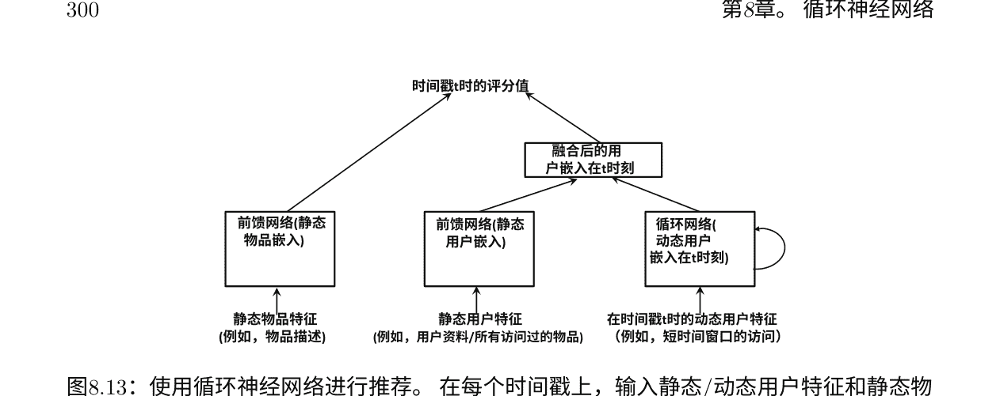

图8.13：使用循环神经网络进行推荐。在每个时间戳上，输入静态/动态用户特征和静态物品特征，并输出该用户-物品组合的评分值。

上述介绍简化了[481]中所述训练过程的几个方面。例如，假设每个时间戳t只收到一个评分，并且固定的时间范围足以进行时间建模。实际上，不同的设置可能需要以不同的粒度处理时间方面。

因此，[481]中的工作提出了解决建模过程中不同粒度的方法。也可以在纯协同过滤的情况下进行推荐，而不以任何方式使用基于内容的特征。例如，可以通过使用循环神经网络（参见练习3）来改进第3章第3.5节中讨论的推荐系统。

另一项最近的工作[590]将该问题视为在电子商务网站上处理产品-动作-时间三元组的问题。这个想法是，网站记录每个用户对各种产品执行的顺序动作，例如从主页、分类页面或销售页面访问产品页面，以及实际购买产品。每个动作都有一个停留时间，表示用户执行该动作所花费的时间。停留时间被离散化为一组间隔，这取决于具体应用，可以是均匀间隔或几何间隔。将时间离散化为几何递增的间隔是有意义的。

每个用户都收集了一个序列，对应于用户执行的操作。可以将序列的第r个元素表示为 (p_r, a_r, t_r)，其中 p_r是独热编码的产品， a_r是独热编码的动作；而 t_r是独热编码的离散化时间间隔值。每个 p_r， a_r和 t_r是一个独热编码向量。使用权重矩阵 Wp， Wa和 Wt用于创建表示。

-   这些矩阵是使用word2vec训练预训练的

即使从第3.5节的改编是最自然和明显的，我们在文献中没有看到过。因此，对于读者来说，实现第3题的改编可能是一个有趣的练习。

提取自电子商务网站的序列。随后，输入到递归神经网络中的是 e1...eT，用于预测输出 o1...oT。时间戳 t 的输出对应于用户在该时间戳的下一个动作。请注意，嵌入层也连接到递归网络，并在反向传播过程中进行微调（超出其 word2vec 初始化）。原始工作[590]还添加了一个注意力层，尽管即使没有这个层也可以获得良好的结果。

## 8.7.8 二级蛋白质结构预测

在蛋白质结构预测中，序列的元素是表示20种氨基酸之一的符号。这20种可能的氨基酸类似于文本环境中使用的词汇。因此，在这些情况下，使用一位有效编码的输入是有效的。每个位置与对应的二级蛋白质结构类别标签相关联。

这种二级结构可以是α-螺旋、β-折叠或卷曲。因此，这个问题可以简化为标记级别的分类。输出层使用了三路softmax。文献[21]中的工作使用了双向循环神经网络进行预测。

这是因为蛋白质结构预测是一个受益于特定位置两侧上下文的问题。一般来说，使用单向网络还是双向网络的选择在很大程度上取决于预测是否与历史片段有因果关系，或者是否依赖于两侧的上下文。

### 8.7.9 端到端语音识别

在端到端语音识别中，我们尽可能少地经过中间步骤，试图将原始音频文件转录为字符序列。为了使数据能够作为输入序列呈现，仍然需要进行少量预处理。

例如，[164]中的工作将数据呈现为使用 matplotlib python 工具包的 specgram 函数从原始音频文件派生的频谱图。使用了宽度为254的傅里叶窗口，每帧重叠127帧，每帧有128个输入。输出是转录序列中的一个字符，可以包括字符、标点符号、空格，甚至是空字符。标签可能因应用而异。例如，标签可以是字符、音素或音符。

双向递归神经网络在这种情况下最合适，因为字符两侧的上下文有助于提高准确性。

与此类设置相关的一个挑战是需要音频的帧表示与转录序列之间的对齐。这种类型的对齐不是事先可用的，实际上是系统的输出之一。这导致了分割和识别之间的循环依赖问题，也被称为 Searle的悖论。这个问题通过使用连接主义时间分类来解决。在这种方法中，将动态规划算法[160]与递归网络的（softmax）概率输出相结合，以确定最大化生成总概率的对齐。详细信息请参阅[160, 164]。

### 8.7.10 手写识别

与语音识别密切相关的应用是手写识别[161, 163]。在手写识别中，输入是一系列的 (x, y) 坐标，表示每个时间戳时笔尖的位置。输出对应于手写的字符序列。然后使用这些坐标提取进一步的特征，例如指示笔是否接触书写表面的特征，附近线段之间的角度，书写速度以及坐标的归一化值。

[161]中的工作提取了总共25个特征。很明显，多个坐标会形成一个字符。然而，很难确定每个字符需要多少个坐标，因为它可能在不同书写者的手写和风格中有很大的变化。与语音识别类似，适当的分割问题会带来许多挑战。这与语音识别中遇到的Searle悖论相同。

在无约束的手写识别中，手写包含一组笔画，通过将它们组合在一起可以得到字符。一种可能性是提前识别笔画，然后使用它们来构建字符。然而，这种方法会导致不准确的结果，因为识别笔画边界是一个容易出错的任务。

由于错误往往在不同阶段累积，将任务分解为单独的阶段通常不是一个好主意。从基本层面上讲，手写识别的任务与语音识别没有区别。唯一的区别在于输入和输出的具体表示方式。与语音识别类似，连接主义时间分类使用了动态规划方法和递归神经网络的softmax输出的组合。因此，对齐和逐标签分类是同时进行的，使用动态规划来最大化特定输入序列生成特定输出序列的概率。读者可以参考[161, 163]。

## 8.8 总结

循环神经网络是一类用于序列建模的神经网络。它们可以被表示为时间分层网络，其中权重在不同层之间共享。循环神经网络很难训练，因为容易出现梯度消失和梯度爆炸的问题。可以通过使用增强的训练方法来解决其中一些问题，如第4章所讨论的。然而，还有其他训练更健壮的循环网络的方法。一个特别受欢迎的例子是使用长短期记忆网络。这个网络使用了一种更温和的隐藏状态更新过程，以避免梯度消失和梯度爆炸的问题。循环神经网络及其变种在许多应用中得到了应用，如图像字幕生成、标记级别分类、句子分类、情感分析、语音识别、机器翻译和计算生物学。

## 8.9 参考文献和软件资源

最早的递归网络之一是Elman网络[113]。这个网络是现代递归网络的前身。Werbos提出了最初的递归神经网络反向传播算法[545]。另一种递归神经网络反向传播算法在[389]中提供。关于递归网络的大部分工作都是关于符号数据的，尽管也有一些关于实值时间序列的工作[83, 103, 583]。递归神经网络的正则化在[577]中讨论。

隐藏-隐藏矩阵的谱半径对于梯度消失/爆炸问题的影响在[231]中进行了讨论。关于递归神经网络的梯度消失等问题可以在[381, 382]中找到。递归神经网络（以及其高级变体）在2010年左右开始变得更加有吸引力，当时硬件进步、数据增加和算法调整使得这些方法变得更加有吸引力。不同类型的深度网络，包括递归网络，在[147, 215, 381]中讨论了梯度消失和爆炸问题。梯度剪切规则在Mikolov的博士论文[336]中进行了讨论。包含ReLU的递归网络的初始化在[277]中进行了讨论。

早期的循环神经网络包括回声状态网络[230]，也被称为液态机器[315]。这种范式也被称为储备计算。在[310]中提供了回声状态网络在储备计算原理中的概述。教师强制方法在[107]中讨论。

在[15]中已经证明，层归一化比批归一化提供更好的性能。一些相关的归一化[303]也可以用于在线学习[303]。
LSTM首次在[214]中提出，并且其在语言建模中的应用在[492]中讨论。训练循环神经网络所面临的挑战在[215, 381, 382]中讨论。通过对隐藏到隐藏矩阵施加约束[338]可以解决其中一些问题。关于语言建模的循环神经网络和LSTM的几种变体在[72, 74, 158, 159, 325, 340]中讨论。双向循环神经网络在[454]中提出。本章对LSTM的特定讨论基于[158]，并且在[72, 74]中介绍了一种替代的门控循环单元（GRU）。关于理解循环神经网络的指南可在[243]中找到。关于循环神经网络的序列中心和自然语言应用的进一步讨论可在[150, 307]中找到。LSTM网络也用于序列标注[157]。关于使用卷积神经网络和循环神经网络进行图像字幕生成的讨论可在[236, 529]中找到。关于机器翻译的序列到序列学习方法在[72, 241, 496, 556]中讨论。关于蛋白质结构预测、手写识别、翻译和语音识别的双向循环网络和LSTM的讨论可在[21, 161, 162, 164, 392, 493]中找到。近年来，神经网络还被用于时间协同过滤[481, 554, 584]。关于使用循环网络进行对话生成的生成模型在[460, 461]中讨论。关于使用循环神经网络进行动作识别的讨论可在[523]中找到。大规模预训练语言模型在ELMo [386]中提出，可用于各种下游任务。

### 软件资源

循环神经网络受到许多软件框架的支持，如 *Caffe* [596]， *Torch* [597]， *Theano* [598]和 *TensorFlow* [599]。本章的字符级RNN [243, 640] 可在 [604] 处获得。ELMo的 *TensorFlow* 实现可在 [678] 处获得。

## 8.10 练习

-   1. 下载 [604] 处的字符级RNN，并在相同位置上的“tiny Shakespeare”数据集上进行训练。在训练后创建语言模型的输出(i) 5个epochs，(ii) 50个epochs和(iii) 500个epochs。你在这三个输出之间看到了什么显著的差异？

-   2. 考虑一个回声状态网络，其中隐藏状态被分成 *K* 组，每组有 *p/K* 个单元。只允许特定组的隐藏状态

-   3. 展示如何修改第3章第3.5节中讨论的前馈架构，以创建一个能够处理时间推荐系统的循环神经网络。实现这种改进，并将其性能与Netflix奖数据集上的前馈架构进行比较。

-   4. 考虑一个每个时间层中具有两个隐藏状态的循环网络。隐藏状态之间的转换的$2 \times 2$矩阵 $W_{hh}$的每个元素都是3.5。在不同时间层的隐藏状态之间使用sigmoid激活。网络更容易出现梯度消失问题还是梯度爆炸问题?

-   5. 假设你有一个包含从 $\{A, C, T, G\}$中提取的核苷酸序列的大型生物字符串数据库。其中一些字符串包含表示核苷酸变化的异常突变。提出一种使用RNN的无监督方法（即神经网络架构）来检测这些突变。

-   6. 如果给你一个训练数据库，其中突变位置被标记（但未标记测试样本），你的Exercise 5架构会如何改变?

-   7. 在序列到序列学习的机器翻译方法中，推荐预训练输入和输出层的可能方法。

-   8. 考虑一个社交网络，发送者-接收者之间发送大量消息，并且我们只对包含一个标识关键字的消息感兴趣，称为 $hashtag$。使用RNN创建一个实时模型，该模型具有推荐每个用户感兴趣的hashtag的能力，以及可能对与该hashtag相关的消息感兴趣的潜在关注者。假设你有足够的计算资源来逐步训练一个RNN。

-   9. 如果训练数据集被一个特定因子重新缩放，批归一化或层归一化的学习权重会发生变化吗？如果只有训练数据集中的一个小子集被重新缩放，你的答案会是什么？如果数据集被重新居中，归一化方法中的学习权重会受到影响吗?

-   10. 考虑这样一种情况，你有一个多语言的翻译句子数据库。尽管每种语言都有足够的表示，但有些句子对可能没有很好的表示。展示如何利用这个训练数据来（i）在所有语言中创建相同的通用代码，以及（ii）在数据库中没有很好表示的语言对之间进行翻译的能力。

-   11. 讨论如何使用适当的训练数据，直接训练执行语言建模的神经网络架构（图8.4）进行机器翻译。

-   12. 有挑战性的：递归神经网络似乎天生适用于一维序列。你能想到一种将递归神经网络扩展到二维序列的方法吗？例如，一张黑白图像可以被视为一个由像素强度组成的二维序列。提出前向传播的递归方程。

# 第9章

## 卷积神经网络

> > “灵魂在没有图像的情况下永远不会思考。”-亚里士多德

## 9.1 引言

卷积神经网络设计用于处理具有网格结构的输入，在网格的局部区域具有强烈的空间依赖性。网格结构数据的最明显的例子是二维图像。这种类型的数据也表现出空间依赖性，因为图像中相邻的空间位置通常具有相似的像素颜色值。另一个维度捕捉不同的颜色，从而创建一个三维输入体积。因此，卷积神经网络中的特征在空间距离上相互依赖。其他形式的序列数据，如文本、时间序列和序列，也可以被视为具有不同类型关系的网格结构数据的特例。因此，卷积网络有时也被应用于这些类型的数据。图像数据的一个优点是可以以直观的方式描述特定输入对特征表示的影响。因此，本章将主要处理图像数据设置。还将简要讨论其他数据领域。

卷积神经网络的一个重要定义特征是一种操作，被称为卷积。卷积操作是一个点积操作在输入体积中从不同的空间位置绘制的网格结构权重和类似的网格结构输入之间。这种类型的操作对于具有高度空间或其他局部性的数据非常有用，例如图像数据。因此，卷积神经网络被定义为至少在一层中使用卷积操作的网络，尽管大多数卷积神经网络在多个层中使用此操作。

### 9.1.1 历史背景和生物启发

卷积神经网络是深度学习的首批成功案例之一，远在最近的训练技术进步之前，其他类型的性能得到了改善。

### 9.1.2 关于卷积神经网络的更广泛观察

任何神经结构成功的秘密在于以对手头领域的语义理解来设计网络的结构。卷积神经网络在很大程度上基于这一原则，因为它们以一种领域敏感的方式使用稀疏连接和高度参数共享。换句话说，并不是特定层中的所有状态都以不加区分的方式连接到前一层中的状态。相反，特定层中的特征值只与前一层中的局部空间区域连接，并且在整个图像的空间范围内具有一致的共享参数集。

层与前一层的连接不是以不加区分的方式进行的。相反，特定层中的特征值只与前一层中的局部空间区域连接，并且在整个图像的空间范围内具有一致的共享参数集。这种类型的架构可以被视为一种领域感知的正则化，它源自于Hubel和Wiesel早期工作中的生物学洞察。总的来说，卷积神经网络的成功对其他数据领域有重要的启示。

精心设计的架构利用数据项之间的关系和依赖关系，以减少参数占用空间，这是实现高准确性的关键。

循环神经网络还提供了一种显著水平的领域感知正则化方法，它可以共享不同时间段的参数。这种共享是基于时间依赖性保持不变的假设。循环神经网络基于对时间关系的直观理解，而卷积神经网络基于对空间关系的直观理解。后者的直觉直接来自猫视觉皮层中生物神经元的组织结构。这一卓越的成就激发了探索如何利用神经科学以巧妙的方式设计神经网络的动机。尽管人工神经网络只是对生物大脑真实复杂性的夸张描述，但通过研究神经科学的基本原理，人们可以获得宝贵的直觉。

### 章节组织

本章的组织结构如下。下一节将介绍卷积神经网络的基础知识，各种操作以及它们的组织方式。卷积网络的训练过程在第9.3节中讨论。在第9.4节中讨论了一些赢得最近比赛的典型卷积神经网络的案例研究。卷积自编码器在第9.5节中讨论。在第9.6节中讨论了卷积网络的各种应用。第9.7节给出了总结。

## 9.2 卷积网络的基本结构

在卷积神经网络中，每一层的状态都按照空间网格结构排列。这些空间关系是从一层继承到下一层的，因为每个特征值都基于前一层的一个小的局部空间区域。保持这些网格单元之间的空间关系非常重要，因为卷积操作和转换到下一层的操作在很大程度上依赖于这些关系。卷积网络中的每一层都是一个三维网格结构，具有高度、宽度和深度。卷积神经网络中的一层的深度不应与网络本身的深度混淆。当单独讨论一层时，深度一词指的是每层中的通道数，例如输入图像中的主要颜色通道数（例如蓝色、绿色和红色）或隐藏层中的特征图数。将深度一词用于既指每层中的特征图数，又指层数的数量，在卷积网络中是一个不幸的术语重载，但我们在使用这个术语时会非常小心，以便从上下文中清楚地理解其含义。

卷积神经网络的功能与传统的前馈神经网络类似，只是其层中的操作在空间上是有序的，具有稀疏性（和精心设计的层之间的连接。在卷积神经网络中，常见的三种类型的层是卷积层、池化层和ReLU层。ReLU激活与传统神经网络没有区别。此外，通常还有一组最终的全连接层，以应用特定的方式映射到一组输出节点。

接下来，我们将描述每种不同类型的操作和层，以及这些层在卷积神经网络中交错使用的典型方式。

为什么我们需要卷积神经网络每一层都有深度？为了理解这一点，让我们来看看卷积神经网络的输入是如何组织的。卷积神经网络的输入数据被组织成一个二维网格结构，每个网格点的值被称为像素。因此，每个像素对应于图像中的一个空间位置。然而，为了编码像素的精确颜色，我们需要在每个网格位置上使用一个多维数组的值。

在RGB颜色模式中，我们有三种主要颜色的强度，分别对应红色、绿色和蓝色。因此，如果图像的空间尺寸为32×32像素，深度为3（对应RGB颜色通道），那么图像中的像素总数为32×32×3。这种特定的图像尺寸非常常见，在一个被广泛使用的用于基准测试的数据集CIFAR-10中也出现过。

图9.1(a)展示了这种组织的一个示例。在这个三维结构中，将输入层表示为是很自然的，因为两个维度用于空间关系，第三个维度用于这些通道上的独立属性。例如，在第一层中，主要颜色的强度是独立的属性。在隐藏层中，这些独立属性对应于从图像的局部区域提取出的各种形状。为了讨论的目的，假设第q层的输入大小为L_q × B_q × d_q。这里，L_q指的是高度（或长度），B_q指的是宽度（或广度），而d_q是深度。在几乎所有以图像为中心的应用中，L_q和B_q的值是相同的。然而，为了保持表述的普遍性，我们将使用不同的符号表示高度和宽度。

对于第一（输入）层，这些值由输入数据的性质及其预处理决定。在上面的例子中，这些值是L_1 = 32, B_1 = 32, 和 d_1 = 3。后续层具有完全相同的三维组织结构，只是每个特定输入的二维值网格不再被视为原始像素的网格。此外，d_q的值要比隐藏层的三个值大得多，因为给定局部区域的独立属性数量与分类相关的可能相当显著。对于q > 1，这些值网格被称为特征图或激活图。这些值类似于前馈网络中隐藏层的值。

在卷积神经网络中，参数被组织成一组三维结构单元，称为过滤器或卷积核。过滤器的空间维度通常是正方形的，比其应用的层的维度要小得多。另一方面，过滤器的深度始终与其应用的层相同。假设第q层过滤器的维度为F_q × F_q × d_q。一个具有F_1 = 5 和 d_1 = 3的过滤器示例如图9.1(a)所示。通常F_q的值较小且为奇数。常用的F_q值为3和5，尽管也有一些有趣的情况可以使用其他值。

$F_q = 1$。卷积操作将滤波器放置在图像（或隐藏层）的每个可能位置上，以便滤波器完全与图像重叠，并在之间执行点积F_q × F_q × d_q滤波器中的参数与输入体积中的匹配网格（具有相同的大小F_q × F_q × d_q）进行点积。点积是通过将条目视为

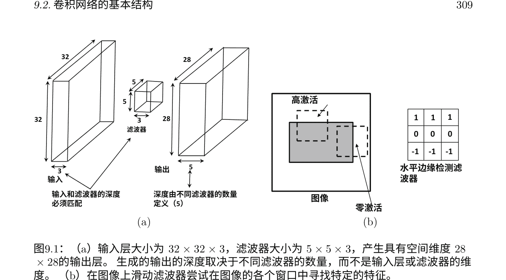

> 图9.1: (a) 输入层大小为 $32 \times 32 \times 3$，滤波器大小为 $5 \times 5 \times 3$，产生具有空间维度 $28 \times 28$的输出层。生成的输出的深度取决于不同滤波器的数量，而不是输入层或滤波器的维度。(b) 在图像上滑动滤波器尝试在图像的各个窗口中寻找特定的特征。

在输入体积和滤波器的相关三维区域中，将它们作为大小为向量的向量 $F_q \times F_q \times d_q$，因此两个向量中的元素按照它们在网格结构体积中的对应位置进行排序。放置滤波器有多少种可能的位置？这个问题很重要，因为每个这样的位置都定义了下一层的“像素”（或者更准确地说是一个特征）。换句话说，滤波器和图像之间的对齐次数定义了下一个隐藏层的空间高度和宽度。下一层中特征的相对空间位置是根据上一层对应空间网格的左上角的相对位置来定义的。在第 $q$ 层进行卷积时，可以将滤波器对齐在 $L_{q+1}= (L_q - F_q + 1)$ 的高度和。 $B_{q+1}= (B_q - F_q + 1)$ 的宽度（不允许滤波器的一部分“突出”图像的边界）。这总共有。$L_{q+1} \times B_{q+1}$个可能的点积，这定义了下一个隐藏层的大小。

在前面的例子中，。$L_2$和。$B_2$因此定义如下:

```
$L_2= 32 -5 +1=28$
$B_2 = 32 -5 +1=28$
```

下一个尺寸为 $28 \times 28$ 的隐藏层如图9.1(a)所示。然而，这个隐藏层也有一个尺寸为 $d_2=5$ 的深度。这个深度是从哪里来的？这是通过使用5个不同的滤波器及其独立的参数集来实现的。从单个滤波器的输出中获得的这5组空间排列的特征中的每一组都被称为一个特征图。显然，特征图的数量增加是由于更多的滤波器（即参数占用）的数量增加，这是对于第 $q$ 层，$F_q^2 \cdot d_q \cdot d_{q+1}$。每层使用的滤波器数量控制了模型的容量，因为它直接控制了参数的数量。此外，增加特定层中的滤波器数量会增加下一层的特征图（即深度）的数量。不同层可以具有非常不同数量的特征图，这取决于我们使用的滤波器的数量。

用于前一层的卷积操作。例如，输入层通常只有三个颜色通道，但是每个后续隐藏层的深度（即特征图的数量）可能超过500。这里的想法是，每个滤波器都试图在图像的一个小矩形区域中识别特定类型的空间模式，因此需要大量的滤波器来捕捉创建最终图像所组合的各种可能形状（与输入层的情况不同，在输入层中，三个RGB通道就足够了）。通常，后面的层在空间上的占用较小，但在特征图的数量上具有更大的深度。例如，图9.1(b)中显示的滤波器表示在一个灰度图像上的水平边缘检测器。如图9.1(b)所示，结果特征在每个位置上都会有高激活，其中可以看到水平边缘。完全垂直的边缘将产生零激活，而倾斜的边缘可能会产生中间激活。

因此，在图像中滑动滤波器将在输出体积的单个特征图中已经检测到图像的几个关键轮廓。使用多个滤波器创建一个具有多个特征图的输出体积。例如，不同的滤波器可能创建一个垂直边缘激活的空间特征图。

我们现在准备正式定义卷积操作。第p个层中的第q个滤波器具有由三维张量表示的参数。W^(p,q)=[w_ijk^(p,q)]。指标i，j，k表示滤波器的高度、宽度和深度位置。第q个层中的特征图由三维张量表示。当q的值为1时，对应于符号的特殊情况。H^(1)简单表示输入层（不是隐藏层）。然后，从第个层到第层的卷积操作定义如下：（q+1）th层。

```
h_{ijp}^{(q+1)} = \sum_{r=1}^{F_q} \sum_{s=1}^{F_q} \sum_{k=1}^{d_q} w_{rsk}^{(p,q)} h_{i+r-1,j+s-1,k}^{(q)} \quad \forall i \in \{1 \dots, L_q - F_q + 1\}
\forall j \in \{1 \dots, B_q - F_q + 1\}
\forall p \in \{1 \dots, d_{q+1}\}
```

上述表达式在符号上看起来很复杂，但底层的卷积操作实际上是在整个滤波器的体积上进行的简单点积，该操作在所有有效的空间位置上重复进行(i, j)和滤波器（由p索引）。通过将滤波器放置在图9.1(a)第一层的所有可能空间位置之一，并在滤波器中的5×5×3=75个值和H^(1)中对应的75个值之间进行点积，可以直观地理解卷积操作。即使在图9.1(a)中输入层的大小为32×32，但只有(32−5+1)×(32−5+1)可能的空间对齐方式，用于输入大小为32×32和滤波器大小为5×5的情况下。卷积操作让人想起Hubel和Wiesel的实验，他们使用视野中小区域的激活来激活特定的神经元。在卷积神经网络中，这个视野由滤波器定义，滤波器应用于图像的所有位置，以便在每个空间位置检测形状的存在。

此外，早期层中的滤波器往往会检测到更原始的形状，而后期层中的滤波器则会创建这些原始形状的更复杂组合。这并不是特别令人惊讶，因为大多数深度神经网络擅长分层特征工程。

卷积的一个特性是它对平移具有等变性。换句话说，如果我们将输入中的像素值在任何方向上移动一个单位，然后应用卷积，相应的特征值将随着输入值的变化而变化。这是因为

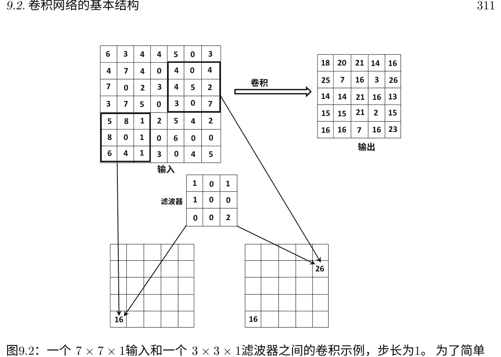

图9.2：一个 7 × 7 × 1输入和一个 3 × 3 × 1滤波器之间的卷积示例，步长为1。为了简单起见，选择了深度为1的滤波器/输入。对于深度大于1的情况，每个输入特征图的贡献将被相加，以创建特征图中的单个值。无论其深度如何，单个滤波器始终只会创建一个特征图。

在整个卷积中共享滤波器的参数之一。在整个卷积中共享参数的原因是，图像中的特定形状的存在应该以相同的方式处理，无论其具体的空间位置如何。

在接下来的内容中，我们提供了一个卷积操作的示例。在图9.2中，我们展示了一个输入层和一个深度为1的滤波器的示例，为了简单起见（在灰度图像和单色通道的情况下确实会发生）。请注意，一个层的深度必须与其滤波器/核的深度完全匹配，并且在特定层的相应网格区域中的所有特征图的点积的贡献（在一般情况下）需要相加，以创建下一层中的单个输出特征值。

图9.2展示了卷积操作的两个具体示例，其中包含一个尺寸为7 × 7 × 1和底行的。3 × 3 × 1滤波器。此外，图9.2右上方显示了下一层的整个特征图。两个卷积操作的输出分别为16和26。通过以下乘法和聚合操作得到这些值：

```
5 × 1 + 8 × 1 + 1 × 1 + 1 × 2 = 16
4 × 1 + 4 × 1 + 4 × 1 + 7 × 2 = 26
```

上述聚合中省略了与零的乘法。如果层的深度和其对应的滤波器深度大于1，则对每个空间映射执行上述操作，然后在整个滤波器的深度上进行聚合。

第 q 层的卷积将特征的感受野从第 q 层增加到第 (q + 1) 层。换句话说，下一层中的每个特征捕捉到输入层中更大的空间区域。例如，当连续使用 3 × 3 滤波器进行三层卷积时，第一、第二和第三个隐藏层的激活分别捕捉到原始输入图像中大小为 3 × 3、5 × 5 和 7 × 7 的像素区域。正如我们将在后面看到的，其他类型的操作进一步增加了感受野，因为它们减小了层的空间占用。这是一个自然结果，因为后面的层中的特征捕捉到了更大的空间区域上的图像的复杂特征，并将前面层中的简单特征组合起来。

当从第 q 层执行操作到时(q + 1)层，深度计算层的深度 d_{q+1} 取决于第 q 层中的滤波器数量，并且与第 q 层的深度或其他维度无关。换句话说，第层的深度 d_{q+1} 始终等于第q层中的滤波器数量。例如，在图9.1(a)中，第二层的深度为5，因为第一层使用了总共五个滤波器进行转换。然而，为了执行第二层的卷积（创建第三层），现在必须使用深度为5的滤波器，以匹配该层的新深度，即使在第一层的卷积中使用了深度为3的滤波器（创建第二层）。然而，为了执行第二层的卷积（创建第三层），现在必须使用深度为5的滤波器，以匹配该层的新深度，即使在第一层的卷积中使用了深度为3的滤波器（创建第二层）。

### 9.2.1 填充

一个观察是，卷积操作会减小的大小。与q层相比，(q + 1)层的大小会减小。一般来说，这种大小的减小是不可取的，因为它往往会丢失图像边界（或隐藏层的特征图）上的一些信息。可以通过使用填充来解决这个问题.在填充中，将在特征图的边界周围添加。为了保持空间特征，需要在特征图的边界周围添加 (F_q - 1)/2 个“像素”。需要注意的是，在填充隐藏层时，这些像素实际上是特征值。这些填充的特征值的值都设置为0，无论是填充输入层还是隐藏层。因此，输入体积的空间高度和宽度都会增加。这正好是它们在卷积之后（在输出体积中）减小的值 (F_q - 1)。填充部分不会对最终的点积产生贡献，因为它们的值都被设置为0。从某种意义上说，填充的作用是允许卷积操作与图层的一部分“突出”边界，并仅在值被定义的图层部分进行点积运算。这种填充方式被称为半填充，因为（几乎）一半的滤波器从空间输入的所有边缘位置伸出。

半填充旨在保持空间尺寸完全一致。

当不使用填充时，所得到的“填充”也被称为有效填充。从实验角度来看，有效填充通常效果不佳。使用半填充可以确保在层的边界处的一些关键信息以独立的方式表示。在有效填充的情况下，与下一隐藏层中心像素相比，边界像素的贡献将被低估，这是不可取的。此外，这种低估将在多个层中累积。因此，通常在所有层中进行填充，而不仅仅是在空间位置对应输入值的第一层。考虑一个情况，层的尺寸为 32 × 32 × 3，滤波器的尺寸为 5 × 5 × 3。因此，(5 - 1)/2 = 2 个零被填充在图像的所有边缘。因此，32 × 32 的空间足迹由于填充而首先增加到 36 × 36，然后再减少到 32 × 32。

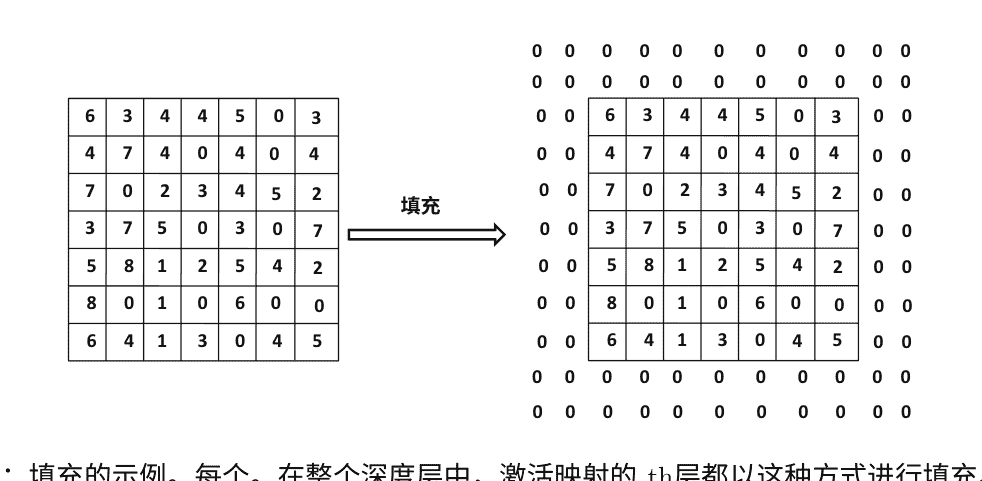

图9.3：填充的示例。每个。在整个深度层中，激活映射的qth层都以这种方式进行填充。

在执行卷积之后。图9.3显示了单个特征图的填充示例，在图像（或特征图）的所有边缘上填充了两个零。这与上面讨论的情况类似（添加两个零），只是图像的空间尺寸比。32 × 32小得多，以便在合理的空间内进行说明。

另一种有用的填充形式是全填充。在全填充中，我们允许（几乎）整个滤波器从输入的各个边缘突出出来。换句话说，滤波器的一部分大小为。F_q - 1可以从输入的任一边缘突出出来，但只有一个空间特征的重叠。例如，卷积核和输入图像可能在一个极角的单个像素处重叠。因此，输入被填充为。(F_q - 1)个零在每一侧。换句话说，输入的每个空间维度增加。2(F_q - 1)。因此，如果原始图像中的输入维度为。L_q和。B_q，那么输入体积中的填充空间维度变为。L_q + 2(F_q - 1)和。B_q + 2(F_q - 1)。执行卷积后，第(q+1)层的特征图维度变为。L_q + F_q - 1和。B_q + F_q - 1，分别。

尽管卷积通常会减小空间尺寸，但全填充会增加空间尺寸。有趣的是，全填充会使空间尺寸的每个维度增加相同的值（F_q - 1），而无填充会减小空间尺寸。这种关系并非巧合，因为可以通过在完全填充的输出上（原始卷积的输出）应用另一个具有相同大小的卷积核的卷积操作来实现“反向”卷积操作。这种类型的“反向”卷积在卷积神经网络的反向传播和自编码器算法中经常出现。完全填充的输入很有用，因为它们增加了空间尺寸，这在几种类型的卷积自编码器中是必需的。

### 9.2.2 步幅

卷积还可以通过其他方式减小图像（或隐藏层）的空间尺寸。上述方法在特征图的每个空间位置上执行卷积。然而，在图层中并不需要在每个空间位置上执行卷积。可以通过使用步幅的概念来减小卷积的粒度。上述描述对应于使用步幅为1的情况。当在第q层使用步幅为S_q时，在图层的两个空间维度上的位置为1、S_q + 1、2S_q + 1等进行卷积。

在执行这个卷积时，输出的空间尺寸的高度为 $(L_{q} - F_{q}) / S_{q} + 1$并且宽度为 $(B_{q} - F_{q}) / S_{q} + 1$ 因此，使用步幅会导致每个空间维度的层减小约 $S_{q}$倍，面积减小 $S_{q}^{2}$，尽管实际因素可能因边缘效应而有所变化。 通常使用步幅为1，偶尔也会使用步幅为2。 在正常情况下，很少使用大于2的步幅。 尽管在2012年ILSVRC竞赛的获胜架构[263]的输入层中使用了步幅为4，但随后一年的获胜作品将步幅减小到2 [581] 以提高准确性。 如果空间分辨率不必要地高，较大的步幅可以在内存受限的环境或减少过拟合方面有所帮助。 步幅的作用是快速增加隐藏层中每个特征的感受野，同时减小整个层的空间占用。 增加的感受野有助于在图像的更大空间区域中捕捉复杂特征。 正如我们将在后面看到的，卷积神经网络的分层特征工程过程在后面的层中捕捉到更复杂的形状。 在历史上，感受野的增加是通过另一种操作来实现的，称为最大池化操作。 近年来，较大的步幅已经被用来替代最大池化操作[194, 482]，这将在后面讨论。

### 典型设置

通常使用步长为1，偶尔使用步长为2。 此外，常用的是使用正方形图像 $L_{q} = B_{q}$。 如果输入图像不是正方形，则使用预处理来强制执行此属性。 例如，可以提取图像的正方形补丁来创建训练数据。 每个层中的滤波器数量通常是2的幂次，因为这通常会导致更高效的处理。 这种方法还导致隐藏层深度为2的幂次。 滤波器尺寸的典型值（用 $F_{q}$表示）为3或5。 一般来说，较小的滤波器尺寸通常提供最佳结果，尽管使用过小的滤波器尺寸存在一些实际挑战。 较小的滤波器尺寸通常更强大，因为它们会导致更深的网络（对于相同的参数占用）。 事实上，在ILSVRC比赛中排名靠前的一个条目，被称为VGG [474]，是第一个尝试仅使用 $F_{q}$维度的滤波器的方法。 对于所有层，F_q = 3，并且与较大的滤波器尺寸相比，这种方法效果非常好。

### 偏置的使用

在所有神经网络中，也可以在前向操作中添加偏置。 每个层中的每个独特滤波器都与其自己的偏置相关联。 因此，第 $p$个滤波器在第 $q$层中具有偏置 b^{(p,q)}。 当在第 $q$层中使用第 $p$个滤波器进行卷积时，偏置 b^{(p,q)}的值会被加到点积中。 偏置 b^{(p,q)}会被加到点积中。 使用偏置只是增加了每个滤波器中的参数数量1个，因此它不是一个重要的开销。 与所有其他参数一样，偏置在反向传播过程中进行学习。 可以将偏置视为一个连接的权重，其输入始终设置为 +1。 无论卷积的空间位置如何，都会使用这个特殊的输入。 因此，可以假设输入中存在一个特殊的像素，其值始终设置为1。 因此，第 $q$层的输入特征数量为1 + $L_{q} \times B_{q} \times d_{q}$。 这是一种用于处理所有形式机器学习中偏置的标准特征工程技巧。

1在这里，假设 $(L_{q} - F_{q})$ 能被整除 为了使卷积滤波器与原始图像完全匹配，需要对$S_{q}$ 进行调整。 否则，需要进行一些临时修改来处理边缘效应。 一般来说，这不是一个理想的解决方案。

### 9.2.3 ReLU层

卷积操作与池化和ReLU操作交替进行。ReLU激活函数在应用于卷积神经网络时，与传统神经网络中的应用方式没有太大区别。对于层中的每个值，即对于 $L_q \times B_q \times d_q$ 个值，应用ReLU激活函数来创建 $L_q \times B_q \times d_q$ 个阈值化的值。然后将这些值传递给下一层。因此，应用ReLU不会改变层的维度，因为它是激活值的简单一对一映射。在传统神经网络中，激活函数与权重矩阵的线性变换相结合，创建下一层的激活。类似地，ReLU通常跟随卷积操作（这相当于传统神经网络中的线性变换），并且ReLU层通常在大多数卷积神经网络架构的图示中没有明确显示。

值得注意的是，ReLU激活函数的使用是最近的一种演变，它取代了饱和激活函数如sigmoid和tanh的使用。在[263]中已经证明，ReLU的使用在速度和准确性方面都具有巨大优势，远超过这些激活函数。增加的速度也与准确性相关，因为它允许使用更深的模型并对其进行更长时间的训练。近年来，在卷积神经网络设计中，ReLU激活函数已经取代了其他激活函数，在本章中将默认使用ReLU作为激活函数（除非另有说明）。

### 9.2.4 池化

然而，池化操作却非常不同。池化操作在大小为 $P_q \times P_q$ 的小网格区域上工作。在每一层中，池化操作以 $P_q \times P_q$ 为单位，并产生另一层，深度与原层相同（不同于滤波器）。对于大小为 $P_q \times P_q$ 的每个正方形区域，在每个 $P_q \times P_q$ 中，对于 $d_q$ 个激活图，返回其中的最大值。这种方法被称为最大池化。如果使用步长为1，则会产生一个大小为 $(L_q - P_q + 1) \times (B_q - P_q + 1) \times d_q$ 的新层。然而，在池化中更常见的是使用步幅 $S_q > 1$。在这种情况下，新层的长度将是 $(L_q - P_q)/S_q + 1$，宽度将是 $(B_q - P_q)/S_q + 1$。因此，池化大大减少了每个激活图的空间维度（从而实现高效学习）。最大池化层与卷积/ReLU层交替出现，尽管在深层架构中，最大池化在几个连续的卷积/ReLU层之后发生。这是因为池化大大减小了特征图的空间大小，只需要少量池化操作即可将空间图减小到一个小的恒定大小。

与卷积操作不同，池化是在每个激活图的级别上进行的。而卷积操作同时使用所有 $d_q$ 特征图与一个滤波器结合产生一个特征值，池化独立地对每个特征图进行操作以产生另一个特征图。因此，池化操作不会改变特征图的数量。换句话说，使用池化创建的层的深度与执行池化操作的层的深度相同。

图9.4展示了步长为1和2的池化示例。在这里，我们使用 $3 \times 3$ 的区域进行池化。典型的池化区域大小为 $2 \times 2$。当步长为2时，不同区域之间没有重叠，通常使用这个设置来减小激活图的空间占用。

另一种不常用的池化类型是平均池化，它对像素进行平均而不是取最大值。在最早的卷积网络中，被称为 LeNet-5 的一个变种，使用了平均池化，并被称为子采样。最大池化通过选择最亮的“像素”来提取图像中的主要特征（例如，暗背景中的锐利边缘），而平均池化通过对区域进行平均来平滑特征并简化分辨率。在现代用法中，子采样是指通过单个像素替换网格中的像素（也起到了降低分辨率的作用）。

两种池化操作符都可以减小空间占用并实现高效训练。然而，最大池化还具有保持平移不变性的重要作用。这个观点是，香蕉在图像的顶部或底部具有相同的解释。这个特性有助于能够以准确的方式对具有不同相对位置的对象进行一致的图像分类。最大池化导致对平移的（某种）不变性，因为移动图像会减小池化后激活图中的移动量。然而，平均池化不能解决平移不变性，并且实际上可以通过具有多个固定权重的卷积操作来实现（参见练习11）。因此，池化操作符的选择也应取决于图像中对象的相对位置的重要性。

池化的另一个重要目的是增加感受野的大小，同时通过使用大于1的步幅来减小层的空间占用。为了能够在后续层中捕捉到图像中更大的区域内的复杂特征，需要增加感受野的大小。层的空间占用的快速减小（以及特征的感受野的相应增加）大多是由池化操作引起的。卷积只会轻微增加感受野，除非步幅大于1。近年来，有人提出池化并不总是必要的。可以设计一个只包含卷积和ReLU操作的网络，并通过在卷积操作中使用更大的步幅来扩大感受野[194, 482]。因此，近年来出现了一个趋势，即完全摒弃最大池化层。然而，在撰写本书时，这一趋势尚未得到充分验证。虽然可以理解为什么步幅卷积可能取代平均池化，但最大池化除了减小空间占用外还有其他作用。最大池化引入了非线性和更多的平移不变性，与步幅卷积相比。虽然可以通过ReLU激活函数实现非线性，但最大池化的平移效应无法通过步幅卷积完全复制。至少，这两个操作不能完全互换。

### 9.2.5 全连接层

最终空间层中的每个特征都与第一个全连接层中的每个隐藏状态相连。这一层的功能与传统的前馈网络完全相同。这些层之间的连接结构与传统的前馈网络完全相同，并且通常有多个层。由于全连接层是密集连接的，绝大多数参数都位于全连接层中。例如，如果两个全连接层中的每个层都有4096个隐藏单元，则它们之间的连接将有超过1600万个权重。同样，从最后一个空间层到第一个全连接层的连接将具有大量的参数。

尽管卷积层具有更多的激活（和更大的内存占用），但全连接层通常具有更多的连接（和参数占用）。激活对内存占用的贡献更显著的原因是，激活的数量会乘以小批量大小，同时在前向和反向传播的过程中跟踪变量。在选择基于特定资源约束（例如数据与内存可用性）的神经网络设计时，这些权衡是有用的。卷积神经网络的输出层是根据特定应用设计的。在分类和回归的特定情况下，最终的全连接层可能使用逻辑、softmax或线性激活函数。

使用全局平均池化代替全连接层的一种替代方法是，在最终的激活图集上进行整体空间区域的平均池化，以创建一个单一的值。因此，最终空间层中创建的特征数量将与滤波器数量完全相等。在这种情况下，如果最终的激活图大小为 $7 \times 7 \times 256$，则将创建256个特征。每个特征将是聚合49个值的结果。这种方法极大地减少了全连接层的参数占用，并在泛化能力方面具有一些优势。这种方法在 GoogLeNet [501]中被使用。在一些应用中，如图像分割，每个像素与一个类别标签相关联，并且不使用全连接层。为了创建一个输出空间映射，使用具有 $1\times 1$ 卷积的全卷积网络。

### 9.2.6 层间交错

在神经网络中，卷积层、池化层和ReLU层通常交错使用，以增加网络的表达能力。ReLU层通常跟随在卷积层之后，就像非线性激活函数通常跟随线性点积一样。在传统神经网络中，卷积层和ReLU层通常紧密结合在一起。因此，卷积层和ReLU层通常一个接一个地连接在一起。一些神经网络结构的图示，如AlexNet[263]，没有明确显示ReLU层，因为它们被假定始终紧贴在线性卷积层的末尾。经过两到三组卷积-ReLU组合后，可能会有一个最大池化层。以下是这种基本模式的一些示例：

```
CRCRP
CRCRCRP
```

在这里，卷积层用C表示，ReLU层用R表示，最大池化层用P表示。为了创建一个深度神经网络，整个模式（包括最大池化层）可能会重复几次。例如，如果上述第一个模式重复三次，并且后面跟着一个全连接层（用F表示），那么我们就得到了以下神经网络：

```
CRCRPCRCRPCRCRPF
```

上述描述不完整，因为需要指定过滤器/池化层的数量/大小/填充方式。池化层是关键步骤，它倾向于通过使用大于1的步幅来减小激活图的空间占用。也可以使用步幅卷积而不是最大池化来减小空间占用。这些网络通常非常深，卷积网络的层数超过15层并不罕见。最近的架构还使用层间的跳跃连接，在网络深度增加时变得越来越重要（参见第9.4.5节）。

### LeNet-5

早期的网络相当浅。最早的神经网络之一是LeNet-5[285]的示例。输入数据为灰度图像，只有一个颜色通道。假设输入是字符的ASCII表示。为了讨论的目的，我们假设有十种字符类型（因此有10个输出），尽管这种方法可以用于任意数量的类别。

该网络包含两个卷积层，两个池化层和三个完全连接层。然而，由于每层使用了多个滤波器，后面的层包含多个特征图。该网络的架构如图9.5所示。第一个完全连接层在原始工作中也被称为卷积层（标记为 C 5），因为它具有将其推广到更大输入图像的空间特征的能力。然而，LeNet-5的具体实现中，C 5被用作完全连接层，因为滤波器的空间尺寸与输入的空间尺寸相同。这就是为什么在本文中将 C 5计为完全连接层的原因。值得注意的是，LeNet-5的两个版本分别在图9.5(a)和(b)中显示。图9.5(a)的上部图示明确显示了子采样层，这是一种在乘以可训练系数和添加可训练偏置之后进行平均池化的变体。现代架构图像如AlexNet[263]通常不会明确显示子采样或最大池化层，以适应大量的层。图9.5(b)中展示了LeNet-5的简洁架构。激活函数层在任一图中也没有明确显示。在LeNet-5的原始工作中，使用了sigmoid激活函数。尽管这种顺序在最近的架构中相对不常见，但它通常在子采样操作之后立即发生。在大多数现代架构中，子采样被最大池化所取代，并且最大池化层的出现频率比卷积层要少。此外，激活通常是在每次卷积之后立即执行的（而不是在每次最大池化之后）。

架构中的层数通常是根据具有加权空间滤波器的层数和完全连接层的数量来计算的。换句话说，子采样/最大池化和激活函数层通常不单独计算。

LeNet-5中的子采样使用了 $2 \times 2$ 的空间区域和步长为2。此外，与最大池化不同的是，数值被平均化，并且通过可训练的权重进行缩放，然后加上一个偏置。在现代架构中，线性缩放和偏置添加操作已经被取消了。图9.5(b)的简洁架构表示对于初学者有时会令人困惑，因为它缺少诸如最大池化/子采样滤波器大小之类的细节。事实上，表示这些架构细节的方法并不唯一，不同的作者使用了许多变种。本章将在案例研究中展示几个这样的例子。

按照现代标准，这个网络非常浅；然而基本原理自那时起并没有改变。主要的区别是ReLU激活在那个时候还没有出现，早期的架构通常使用sigmoid激活。此外，与最大池化相比，平均池化的使用非常罕见。近年来，人们越来越少使用最大池化和子采样，而更倾向于使用步长卷积。LeNet-5在最后一层也使用了十个径向基函数（RBF）单元（参见第6章），其中每个单元的原型与其输入向量进行比较，并输出它们之间的平方欧氏距离。

### 9.2.7 分层特征工程

检查不同层中真实世界图像创建的滤波器的激活是有益的。在第9.5节中，我们将讨论一种具体的方式，可以可视化各个层中提取的特征。目前，我们提供一个主观解释。早期层中的滤波器的激活是低级特征，如边缘，而后期层中的滤波器将这些低级特征组合在一起。例如，中级特征可能会将边缘组合在一起形成一个六边形，而高级特征可能会将中级六边形组合在一起形成一个蜂窝。很容易看出为什么低级滤波器可能会检测到边缘。考虑一种情况，图像的颜色沿着边缘发生变化。因此，相邻像素值之间的差异只会在边缘上非零。这可以通过选择相应低级滤波器中的适当权重来实现。请注意，检测水平边缘的滤波器与检测垂直边缘的滤波器不同。这让我们回到Hubel和Weisel的实验，其中猫的视觉皮层中的不同神经元被不同的边缘激活。图9.6中示例了检测水平和垂直边缘的滤波器。下一层滤波器作用于隐藏特征，因此更难解释。尽管如此，下一层滤波器能够通过组合水平和垂直边缘来检测矩形。

在后面的章节中，我们将展示如何可视化现实世界图像的较小部分激活不同的隐藏特征，就像Hubel和Wiesel的生物模型中不同的形状似乎激活不同的神经元一样。因此，卷积神经网络的强大之处在于能够将这些原始形状逐层组合成更复杂的形状。请注意，第一个卷积层不可能学习大于 $F_1 \times F_1$ 像素的任何特征，其中 $F_1$ 的值通常很小，像3或5这样的数字。然而，下一个卷积层将能够将许多这些补丁组合在一起，从而创建一个更大的图像区域的特征。在较早的层中学到的原始特征以一种语义上连贯的方式组合在一起，以学习越来越复杂和可解释的视觉特征。学到的特征的选择受到反向传播如何将特征适应当心损失函数需求的影响。例如，如果一个应用程序正在训练将图像分类为汽车，该方法可能会学习将弧线组合在一起以创建一个圆，然后将圆与其他形状组合在一起以创建一个车轮。所有这些都是由深度网络的分层特征实现的。

最近的ImageNet竞赛表明，图像识别的强大能力在于网络的增加深度。没有足够的层次将有效地阻止网络学习图像中的分层规律，这些规律结合在一起创建其语义相关的组件。另一个重要观察结果是，学到的特征的性质将对特定的数据集敏感。例如，用于识别卡车的特征将与用于识别胡萝卜的特征不同。然而，一些数据集（如ImageNet）足够多样化，以至于通过在这些数据集上训练学到的特征具有通用的意义，适用于许多应用。

## 9.3 训练卷积网络

训练卷积神经网络的过程使用了反向传播算法。主要有三种类型的层，分别对应于卷积层、ReLU层和最大池化层。我们将分别描述通过每个层的反向传播算法。ReLU层的反向传播相对简单，因为它与传统神经网络没有区别。对于没有重叠的最大池化，只需要确定池中的最大值单元（如果有并列最大值，则任意选择或按比例分配）。损失相对于池化状态的偏导数会回传到具有最大值的单元。网格中除最大值以外的所有条目将被赋值为0。请注意，最大化操作的反向传播也在第2章的表2.1中进行了描述。对于池有重叠的情况，假设 $P_{1} ... P_{r}$ 是涉及单元 $h$ 的池，具有相应的激活 $h_{1} ... h_{r}$ 在下一层中。如果 $h$ 是池 $P_{i}$ 中的最大值（因此 $h_{i} = h$），则损失相对于 $h_{i}$ 的梯度会回传到 $h$（如果有并列最大值，则任意选择或按比例分配）。为了计算相对于单元 $h$ 的梯度，将不同重叠池（来自下一层的 $h_{1} ... h_{r}$）的贡献相加。因此，最大化和ReLU操作的反向传播与传统神经网络中的反向传播并没有太大区别。

### 9.3.1 反向传播卷积

卷积的反向传播与前馈网络中的线性变换（即矩阵乘法）并没有太大的不同。当我们将卷积表示为矩阵乘法时，这个观点将变得特别清晰。正如在前馈网络中的反向传播从层 (i+1) 到层 i 的传播是通过将误差导数与层 i 的转置相乘来实现的。正如在卷积网络中的反向传播可以看作是一种转置卷积的形式，它将 (i+1) 层与层 i 之间的前向传播矩阵的转置相乘（参见第2章的表21）。

首先，我们描述了一种简单的逐元素反向传播方法。假设在层 $i+1$ 中的单元的损失梯度已经计算出来。对于层 $i$ 中的单元，损失导数定义为损失函数对该单元中隐藏变量的偏导数。卷积将层 $i$ 中的激活与滤波器元素相乘，以创建下一层中的元素。因此，层 $i$ 中的单元 $c$ 对下一层 $i+1$ 中的元素有贡献。层 $i$ 中的细胞 $c$ 对层 $i+1$ 中的多个元素（用集合 $S_c$ 表示）有贡献，尽管它贡献的元素数量取决于下一层的深度和步幅。识别这个“前向集合”是反向传播的关键。一个关键点是细胞 $c$ 通过将细胞 $c$ 的激活与滤波器元素相乘后以加法方式对 $S_c$ 中的每个元素进行贡献。因此，反向传播只需要将 $S_c$ 中每个元素相对于相应滤波器元素的损失导数与 $c$ 处的聚合进行乘法运算。对于层 $i$ 中的任何特定细胞 $c$，可以使用以下伪代码将层 $i+1$ 中的现有导数反向传播到层 $i$ 中的细胞 $c$：

```
识别所有层 i+1 中的细胞 S_c 对于层 i 中的细胞 c 的贡献;
对于每个细胞 r ∈ S_c, 令 δ_r 为其（已经反向传播的）相对于细胞 r 的损失导数;
对于每个细胞 r ∈ S_c, 令 w_r 为从细胞 c 到 r 的贡献所使用的滤波器元素的权重;
δ_c = Σ_{r∈Sc} δ_r · w_r;
```

在计算完损失梯度之后，将其与层 $i-1$ 隐藏单元的值相乘以获得相对于层 $i-1$ 和 $i$ 层之间权重的梯度。换句话说，一个权重的一端的隐藏值与另一端的损失梯度相乘，以获得相对于该权重的偏导数。然而，这个计算假设所有的权重都是不同的，而滤波器中的权重在整个空间范围内是共享的。因此，我们必须小心地考虑共享权重，并将所有共享权重的偏导数相加。换句话说，我们首先假装每个位置使用的滤波器是不同的，以计算对每个共享权重的每个副本的偏导数，然后将损失相对于所有特定权重的偏导数相加。

请注意，上述方法使用简单的线性梯度累积，类似于传统的反向传播。然而，在跟踪下一层中影响其他单元的单元时，需要稍微小心。可以通过张量乘法操作来实现反向传播，这可以进一步简化为从这些张量派生的矩阵的简单矩阵乘法。由于这种观点提供了许多关于如何将前馈网络的许多方面推广到卷积神经网络的见解，因此将在接下来的两节中讨论这一观点。

### 9.3.2 反向传播作为卷积与倒置/转置滤波器

在传统的神经网络中，通过将层的梯度向量与层之间的转置权重矩阵相乘来执行反向传播操作，以获得层 $q$ 的梯度向量（参见表21）。在卷积神经网络中，反向传播的导数也与层中的空间位置相关联。在卷积神经网络中，我们可以对层中的反向传播导数的空间范围应用类似的卷积操作，以获得前一层的导数。事实证明，这是可能的。

让我们考虑一种情况，即在第 $q$ 层的激活经过滤波器与第 $l$ 层的激活进行卷积，从而创建第 $q+1$ 层的激活。为了简单起见，考虑输入层的深度 $d_l$ 和输出层的深度 $d_{q+1}$ 的情况。假设输入层和输出层的深度都为1，并且使用步长为1的卷积。在这种情况下，反向传播的卷积滤波器在水平和垂直方向上都被翻转。图9.7展示了这种翻转的滤波器的示例。这种翻转的直观原因是，滤波器在输入体积的空间区域上进行“移动”以执行点积，而反向传播的导数是相对于输入体积的，其相对于滤波器的移动与卷积过程中的滤波器移动相反。请注意，卷积滤波器的极端左上角的元素可能甚至不会对输出体积的极端左上角的元素产生贡献（因为填充的原因），但它几乎总是会对输出体积的极端右下角的元素产生贡献。这与滤波器的翻转是一致的。第 $q$ 层的反向传播导数集合与这个翻转的滤波器进行卷积，以获得第 $l$ 层的反向传播导数集合。正向卷积和反向卷积的填充是如何相关的？对于步长为1的情况，在正向传播和反向传播过程中的填充之和为 $F_q - 1$，其中 $F_q$ 是第 $q$ 层滤波器的边长。

现在考虑深度 $d_q$ 和 $d_{q+1}$ 不再是1，而是任意的值。在这种情况下，需要进行额外的张量转置。在第 $q$ 层的第 $(i, j, k)$ 个位置上的第 $p$ 个滤波器的权重是 $W = [w_{ijk}^{(p,q)}]$。请注意，$i$ 和 $j$ 表示空间位置，而 $k$ 表示权重的深度位置。在这种情况下，让对应于反向传播滤波器的5维张量来自层 $q+1$ 到 layer $q$ 用 $U = [u_{ijk}^{(p,q+1)}]$ 来表示。那么，这个张量的元素如下所示：

$$u_{sp}^{(k,q+1)} = w_{ijk}^{(p,q)} \qquad (9.1)$$

在这里，我们有 $r = F_q - i + 1$ 和 $s = F_q - j + 1$。请注意，公式9.1中的滤波器标识符和深度 $k$ 之间的索引已在 $W$ 和 $U$ 之间互换。这是一种以张量为中心的转置。

为了理解上述转置，考虑这样一种情况，我们在3通道RGB体积上使用20个滤波器，以创建深度为20的输出体积。在反向传播过程中，我们需要将深度为20的梯度体积转换为深度为3的梯度体积。因此，我们需要为反向传播创建3个滤波器，每个滤波器对应红色、绿色和蓝色。我们从应用于红色的20个滤波器中提取出20个空间切片，使用图9.7的方法进行反转，然后创建一个深度为20的单一滤波器，用于反向传播相对于红色切片的梯度。类似的方法也适用于绿色和蓝色切片。公式9.1中的转置和反转对应于这些操作。

### 9.3.3 卷积/反向传播作为矩阵乘法

将卷积视为矩阵乘法是有帮助的，因为它帮助我们定义了各种相关概念，如转置卷积、反卷积和分数卷积。这些概念不仅有助于理解反向传播，还有助于开发卷积自编码器所需的机制。

在传统的前馈网络中，用于在前向阶段转换隐藏状态的矩阵在反向阶段被转置（参见表2.1），以便在层之间进行反向传播的偏导数。类似地，在传统设置中，当使用自编码器时，编码器中使用的矩阵通常在解码器中被转置。尽管卷积神经网络的空间结构掩盖了底层矩阵乘法的本质，但可以通过“展平”这种空间结构来执行乘法，并使用扁平矩阵元素的已知空间位置重新塑造为空间结构。这种间接的方法有助于理解卷积操作与前馈网络中的矩阵乘法在非常基本的层面上的相似之处。此外，卷积的实际实现通常是通过矩阵乘法完成的。

为了简单起见，让我们首先考虑卷积层和相应的过滤器都具有单位深度的情况。此外，假设我们使用步长为1且填充为零的情况。因此，输入的维度为 $L_I \times L_I \times 1$，输出的维度为 $L_O \times L_O \times 1$。在常见的情况下，空间维度是正方形的（即 $L_I = B_I$），可以假设输入的空间维度为 $A_I = L_I \times L_I$，输出的空间维度为 $A_O = L_O \times L_O$，其中 $A_I$ 和 $A_O$ 分别是输入和输出矩阵的空间面积。通过将面积 $A_I$ 展开，可以表示输入为一个 $I$ 维列向量，其中空间区域的行从上到下连接起来。这个向量用 $f$ 表示。在我们使用 $2 \times 2$ 滤波器在一个 $3 \times 3$ 的输入上的例子如图9.8所示。因此，输出的大小为 $2 \times 2$，我们有 $A_I = 3 \times 3 = 9$，和 $A_O = 2 \times 2 = 4$。图9.8展示了一个 $3 \times 3$ 输入的9维列向量。

我们使用一个稀疏矩阵 $C$ 来代替滤波器，这是将卷积表示为矩阵乘法的关键。$C$ 的大小为 $A_O \times A_I$，其中每一行对应于一个卷积位置。这些行与它们派生自的输入矩阵中左上角的卷积区域的空间位置相关联。每行中每个条目的值对应于输入矩阵中的一个 $A_I$ 位置，但如果该输入位置不参与该行的卷积，则该值为0。否则，该值设置为用于乘法的相应滤波器的值。一行中条目的排序基于与将输入矩阵展平为 $A_I$ 维向量时使用的相同的空间敏感排序。由于滤波器的大小通常远小于输入的大小，矩阵 $C$ 中的大多数条目都是0，并且每个滤波器的条目在 $C$ 的每一行中都会重复 $A_O$ 次。因此，滤波器中的每个条目在 $C$ 中都会重复 $A_O$ 次，因为它用于 $A_O$ 次乘法。

一个 $4 \times 9$ 矩阵 $C$ 的示例如图9.8所示。随后的乘法将 $C$ 与 $f$ 相乘，得到一个 $A_O$ 维向量。相应的4维向量如图9.8所示。由于矩阵 $C$ 的 $A_O$ 行与空间位置相关联，这些位置被 $Cf$ 继承。这些空间位置用于将 $Cf$ 重塑为一个空间矩阵。将4维向量重塑为一个 $2 \times 2$ 矩阵的过程也在图9.8中显示。

这个特定的阐述使用了深度为1的简化情况。如果深度大于1，则对每个二维切片应用相同的方法，并将结果相加。换句话说，我们进行聚合 $\sum_{p} C_p \bar{f}_p$ over the various slice indices $p$ and then the results are re-shaped into a 2-dimensional matrix。这种方法相当于一个张量乘法，它是矩阵乘法的直接推广。张量乘法方法是卷积实际上的实现方式。

一般来说，会有多个滤波器，对应多个输出图。在这种情况下，第 $k$ 个滤波器将被转换为稀疏矩阵 $C_{p, k}$，输出体积的第 $k$ 个特征图将是 $\sum_{p} C_{p, k} \bar{f}_p$。

基于矩阵的方法非常有用，因为可以通过相同的方法在反向传播中向后传播梯度，只是矩阵需要转置 $C^T$ 用于与输出梯度的二维切片的展平向量版本进行乘法运算。请注意，对于空间映射的梯度的展平可以以类似的方式进行，就像展平向量 $\bar{f}$ 在前向阶段创建。

考虑输入和输出体积的深度都为1的简单情况。如果 $g$ 是损失相对于输出空间映射的展平向量梯度，则相对于输入空间映射的展平梯度可以通过 $C^T g$ 获得。这种方法与前馈神经网络中使用的方法一致，在反向传播中使用了前向矩阵的转置。上述结果是针对输入和输出体积深度都为1的简单情况。在一般情况下会发生什么？当输出体积的深度 $d > 1$ 时，相对于输出映射的梯度用 $g_1 \ldots g_d$ 表示。相对于输入体积中第 $p$ 个空间切片的特征的相应梯度由 $\sum_{k=1}^{d} \overline{C}_{p, k}^T g_k$ 给出。这里，矩阵 $C_{p, k}$ 是将第 $p$ 个空间切片的第 $k$ 个滤波器转换为稀疏矩阵得到的。这种方法是方程9.1的结果。这种转置卷积的方法也适用于卷积自编码器中的解卷积操作，这将在本章后面讨论（参见第9.5节）。

### 9.3.4 数据增强

在卷积神经网络中，减少过拟合的常见技巧是数据增强的概念。通过对原始示例进行变换，可以生成新的训练示例。数据增强非常适用于图像领域，因为许多变换（如平移、旋转、裁剪和反射）不会从根本上改变图像中对象的属性。使用这些变换来增强训练数据可以增加模型的泛化能力。例如，如果一个数据集使用镜像图像和所有香蕉的反射版本进行训练，那么模型能够更好地识别不同方向的香蕉。

许多形式的数据增强需要很少的计算量，因此增强后的图像不需要提前明确生成。相反，它们可以在训练时生成，当处理图像时。例如，在处理香蕉图像时，可以在训练时将其反射成修改后的香蕉。同样，同一香蕉在不同图像中可能以稍微不同的颜色强度表示，因此在不同颜色强度下创建相同图像的表示可能会有帮助。在许多情况下，使用图像块创建训练数据集可能会有帮助。一种重要的神经网络重新激发了对深度学习的兴趣，它赢得了ILSVRC挑战，这个网络被称为AlexNet。该网络通过从图像中提取224×224×3块来进行训练，这也定义了网络的输入尺寸。在随后的ILSVRC比赛中，进入比赛的神经网络使用了类似的方法来提取块。

虽然大多数数据增强方法非常高效，但使用主成分分析（PCA）的某些形式的变换可能更昂贵。PCA用于改变图像的颜色强度。如果计算成本很高，提前提取图像并存储它们变得很重要。这里的基本思想是使用每个像素值的3×3协方差矩阵并计算主成分。

然后，对每个主成分添加均值为零、方差为0.01的高斯噪声。这个噪声在特定图像的所有像素上都是固定的。这种方法依赖于对象身份对颜色强度和光照的不变性。据报道[263]，数据集增强可以将错误率降低1%。

在盲目应用数据增强时，必须小心考虑数据集和应用程序。例如，在MNIST手写数字数据集[287]上应用旋转和翻转是一个坏主意，因为数据集中的数字都以相似的方向呈现。此外，一个非对称数字的镜像不是一个有效的数字，而一个‘6’的旋转是一个‘9’。决定哪种类型的数据增强是合理的关键是考虑到完整数据集中图像的自然分布，以及特定类型变换对类标签的影响。

## 9.4 卷积架构的案例研究

接下来，我们提供一些卷积架构的案例研究。这些案例研究是从近年来在ILSVRC竞赛中取得成功的参赛作品中得出的。这些案例研究很有教育意义，因为它们能够帮助我们理解神经网络设计中的重要因素，从而使这些网络能够良好地工作。尽管近年来在架构设计方面发生了一些变化（如ReLU激活函数），但现代架构与LeNet-5的基本设计非常相似，这一点令人惊讶。从LeNet-5到现代架构的主要变化在于深度的爆炸性增长、ReLU激活函数的使用以及现代硬件/优化技术带来的训练效率。

增强。现代架构更深，并且它们使用各种计算、架构和硬件技巧来高效地训练这些大量数据的网络。不应低估硬件进步；基于现代GPU的平台比当时提出*LeNet-5*时的系统快10,000倍。即使在这些现代平台上，训练一个足够准确的卷积-神经网络以在ILSVRC竞争中具有竞争力通常需要一周的时间。硬件、以数据为中心的和算法上的改进在一定程度上是相互关联的。如果没有足够的数据和计算能力来合理地尝试复杂/更深的模型，尝试新的算法技巧是困难的。因此，深度卷积网络的最近革命之所以可能，是因为当今有大量的数据和增加的计算能力。在接下来的几节中，我们将概述一些著名的图像分类模型。

### 9.4.1 AlexNet

*AlexNet*是2012年ILSVRC比赛的冠军。*AlexNet*的架构如图9.9(a)所示。值得一提的是，它有两个并行的流水线。

在原始架构中进行处理，这些处理在图9.9(a)中没有显示出来。这两个流水线是由两个GPU共同工作来更高效地构建训练模型引起的。该网络最初是在一块具有3GB内存的GTX 580 GPU上进行训练的，在这个空间中不可能容纳中间计算。因此，该网络被分割到两个GPU上。原始架构如图9.9(b)所示，其中工作被分割到两个GPU上。我们还展示了没有GPU引起的架构的变化，以便更容易与本章讨论的其他卷积神经网络架构进行比较。值得注意的是，在图9.9(b)的部分层中，GPU之间是相互连接的，这导致了图9.9(a)和9.9(b)在实际构建的模型方面存在一些差异。

具体来说，GPU分区架构的权重较少，因为并非所有层都有互连。减少一些互连可以减少处理器之间的通信时间，从而提高效率。

AlexNet从224 × 224 × 3的图像开始，并在第一层使用了96个尺寸为11 × 11 × 3的滤波器。使用步长为4。这导致了一个大小为55 × 55 × 96的第一层。在计算完第一层之后，使用了一个最大池化层。这一层在图9.9(a)中被标记为‘MP’。请注意，图9.9(a)的架构是图9.9(b)中显示的架构的简化版本，后者明确显示了两个并行流水线。

例如，图9.9(b)显示了第一卷积层的深度仅为48，因为96个特征图被分配给了多个GPU进行并行计算。另一方面，图9.9(a)不假定使用GPU，因此宽度明确显示为96。在每个卷积层之后应用了ReLU激活函数，然后是响应归一化和最大池化。尽管最大池化在图中有标注，但在架构中没有被分配一个块。此外，ReLU和响应归一化层在图中没有明确显示。这些简洁的表示在神经网络结构的图示中很常见。

第二个卷积层使用第一卷积层的响应归一化和池化输出，并用5 × 5 × 96大小的256个滤波器进行过滤。第三、第四和第五个卷积层中没有插入池化或归一化层。

第三、第四和第五个卷积层的过滤器大小为3 × 3 × 256（具有384个过滤器）、3 × 3 × 384（具有384个过滤器）和3 × 3 × 384（具有256个过滤器）。所有的最大池化层在步长为2时使用3×3的过滤器。因此，池之间存在一些重叠。全连接层有4096个神经元。最终的4096个激活可以被视为图像的4096维表示。AlexNet的最后一层使用1000路softmax进行分类。值得注意的是，4096个激活的最后一层（在图9.9(b)中标记为FC7）经常被用于创建图像的4096维表示，用于超越分类的应用。通过将任何待测图像通过训练好的神经网络，可以提取这些特征。这些特征通常对其他数据集和其他任务具有很好的泛化能力。这些特征被称为FC7特征。事实上，在AlexNet之后，使用倒数第二层提取的特征作为FC7变得流行，尽管这种方法早在此之前就已经被知晓。因此，从卷积神经网络的倒数第二层提取的特征通常被称为FC7特征，而不管该网络中的层数。值得注意的是，中间层的特征图数量远大于输入层中体积的初始深度（仅为3，对应RGB颜色），尽管它们的空间尺寸较小。这是因为初始深度仅包含RGB颜色分量，而后面的层捕捉到了特征图中不同类型的语义特征。

在后来的架构中，许多设计选择成为了标准。一个具体的例子是在架构中使用ReLU激活函数（而不是sigmoid或tanh单元）。ReLU的使用现在已经成为默认选择，尽管在AlexNet之前并非如此。一些其他的训练技巧是由AlexNet推广的（尽管它们早在之前就已经被知晓）。一个例子是使用数据增强，这在提高准确性方面非常有用。AlexNet还强调了在这样大规模数据集上使用专门的硬件（如GPU）进行训练的重要性。为了提高泛化能力，Dropout与$L_2$权重衰减一起使用。Dropout的使用在几乎所有类型的架构中都很常见，因为它在大多数情况下提供了额外的增益。AlexNet还在层内使用了一种称为局部响应归一化的归一化方法；然而，后来发现这个技巧是无效的，并且最终停止使用。

我们还简要提到了AlexNet中使用的参数选择。感兴趣的读者可以在[608]找到AlexNet的完整代码和参数文件。使用参数为$5 \times 10^{-4}$的$L_2$正则化。使用Dropout以0.5的概率对单元进行采样。使用基于动量的（小批量）随机梯度下降法对AlexNet进行训练，参数值为0.8。批量大小为128。学习率为0.01，尽管随着方法开始收敛，学习率最终降低了几次。即使使用了GPU，AlexNet的训练时间也需要一周左右。

最终的前5错误率，定义为正确图像不在前5个图像中的比例，约为15.4%。这个错误率${}^2$与之前的获胜者相比，错误率超过25%。与比赛中第二名表现者相比，差距也相似。使用单个卷积网络的前5错误率为18.2%，而使用七个模型的集合提供了获胜的错误率为15.4%。请注意，这些基于集合的技巧可以在大多数架构中始终提供2%至3%的改进。此外，由于大多数集合方法的执行可以进行尴尬并行化，只要有足够的硬件资源，执行它们相对容易。

由于在计算机视觉领域中赢得了ILSVRC比赛，AlexNet被认为是一项重要的进展。这一成功重新点燃了对深度学习的兴趣，特别是对卷积神经网络的兴趣。

### 9.4.2 ZFNet

ZFNet的一个变种[581]是2013年ILSVRC比赛的冠军。它的架构在很大程度上基于AlexNet，尽管对其进行了一些改进以进一步提高准确性。这些改变大多与超参数选择有关，因此ZFNet在基本层面上与AlexNet并没有太大区别。从AlexNet到ZFNet的一个改变是将初始大小为$11\times11\times3$的滤波器改为$7\times7\times3$。步长从4改为2。第二层也使用了大小为$5\times5$的滤波器，步长为2。与AlexNet一样，ZFNet有三个最大池化层，并且使用了相同大小的最大池化滤波器。然而，第一对最大池化层是在第一次和第二次卷积之后进行的，而不是在第二次和第三次卷积之后。因此，第三层的空间尺寸变为$13\times13$，而不是$27\times27$，尽管其他所有空间尺寸与AlexNet保持不变。AlexNet和ZFNet中各个层的大小列在表9.1中。

表 9.1: AlexNet和ZFNet的比较

|  | AlexNet | ZFNet |
| :--- | :--- | :--- |
| 体积: 操作: | 224 × 224 × 3 卷积 11 × 11 (步幅4) | 224 × 224 × 3 卷积 7 × 7 (步幅2), 最大池化 |
| 体积: 操作: | 55 × 55 × 96 卷积 5 × 5, 最大池化 | 55 × 55 × 96 卷积 5 × 5 (步幅2), 最大池化 |
| 体积: 操作: | 27 × 27 × 256 卷积 3 × 3, 最大池化 | 13 × 13 × 256 卷积 3 × 3 |
| 体积: 操作: | 13 × 13 × 384 卷积 3 × 3 | 13 × 13 × 512 卷积 3 × 3 |
| 体积: 操作: | 13 × 13 × 384 卷积 3 × 3 | 13 × 13 × 1024 卷积 3 × 3 |
| 体积: 操作: | 13 × 13 × 256 最大池化, 全连接 | 13 × 13 × 512 最大池化, 全连接 |
| FC6: 操作: | 4096 全连接 | 4096 全连接 |
| FC7: 操作: | 4096 全连接 | 4096 全连接 |
| FC8: 操作: | 1000 Softmax | 1000 Softmax |

尽管最后三个卷积层的深度不同，但大多数层中的空间尺寸相似。从整体上看，ZFNet使用了与AlexNet类似的原则，主要通过改变AlexNet的架构参数来获得主要收益。这种架构将前5个错误率从15.4%降低到14.8%，而来自同一作者的宽度/深度进一步降低错误率至11.1%。由于AlexNet和ZFNet之间的大部分差异都是一些次要的设计选择，这强调了在使用深度学习算法时小细节的重要性。因此，对神经网络架构进行广泛的实验有时很重要，以获得最佳性能。ZFNet的架构变得更宽更深，并在2013年以Clarifai的名义提交给ILSVRC比赛，Clarifai是由[581]的第一作者创办的一家公司。Clarifai和ZFNet之间的差异在于网络的宽度/深度，尽管这些差异的确切细节不可得知。这个参赛作品是2013年ILSVRC比赛的获胜作品。

详细信息和架构的图示请参考[581]。

### 9.4.3 VGG

VGG [474] 进一步强调了网络深度增加的发展趋势。测试的网络采用了不同的配置，层数在11到19层之间，尽管表现最好的版本有16层或更多。VGG是2014年ILSVRC竞赛中表现最好的参赛作品，但并非冠军。冠军是GoogLeNet，其前5错误率为6.7%，而VGG的前5错误率为7.3%。然而，VGG的重要性在于它展示了几 个重要的设计原则，这些原则最终成为未来架构的标准。

VGG的一个重要创新是减小了滤波器的尺寸，但增加了网络的深度。理解减小滤波器尺寸必然导致增加网络深度的重要性是很重要的。这是因为一个小的滤波器只能捕捉到图像的一个小区域，除非网络很深。例如，一个由三个大小为3×3的连续卷积得到的单个特征将捕捉到一个大小为7×7的输入区域。请注意，直接在输入数据上使用一个7×7的滤波器也将捕捉到一个7×7输入区域的视觉特性。在第一种情况下，我们使用了3×3×3=27个参数，而在第二种情况下我们使用了7×7×1=49个参数。因此，在使用三个连续卷积时，参数的占用空间较小。然而，三个连续卷积通常可以捕捉到比单个卷积更有趣和复杂的特征，而单个卷积的结果激活将看起来像原始的边缘特征。因此，具有7×7滤波器的网络将无法捕捉到较小区域中的复杂形状。

由于存在更多的ReLU层，更深的网络在特征工程中会有更多的非线性，而且由于增加的深度通过重复卷积的组合在层上施加了一种结构，所以会有更多的正则化。如上所述，深度更大且滤波器尺寸较小的架构需要更少的参数。这部分是因为每层的参数数量由滤波器尺寸的平方给出，而参数数量则与深度线性相关。因此，通过使用较小的滤波器尺寸可以大大减少参数数量，并通过增加深度来“使用”这些参数。增加深度可以改善特征工程和判别能力。因此，VGG始终使用空间尺寸为3×3的滤波器和2×2的池化。卷积步长为1，使用了1个填充。池化步长为2。使用3×3的滤波器和1个填充可以保持输出体积的空间尺寸，尽管池化总是会压缩空间尺寸。因此，池化是在非重叠的空间区域上进行的（与前两种架构不同），并且总是将空间尺寸（高度和宽度）减小了2倍。VGG的另一个有趣的设计选择是在每次最大池化后将滤波器数量增加一倍。这个设计选择的思想是，每当空间尺寸减小一倍时，深度就增加一倍。这个设计选择使得各层之间的计算工作量在一定程度上保持平衡，并且被一些后来的架构如ResNet所继承。使用深层配置的一个问题是，增加的深度会导致初始化时更大的敏感性，这已知会引起不稳定性。通过使用预训练来解决了这个问题，首先训练一个较浅的架构，然后再添加更多的层。然而，预训练不是逐层进行的。相反，首先训练了架构的一个11层子集。这些训练好的层被用来初始化更深架构中的一部分层。VGG在ILSVRC比赛中取得了仅为7.3%的前5错误率，这是其中表现最好但不是冠军的架构之一。

VGG的不同配置在表9.2中显示。其中，列D表示的架构是获胜的架构。请注意，每次最大池化后，滤波器的数量会增加2倍。因此，最大池化会使空间高度和宽度减少2倍，但通过增加深度2倍来进行补偿。使用3×3的滤波器和填充1进行卷积不会改变空间尺寸。因此，表9.2中列D中不同最大池化层之间每个空间维度（即高度和宽度）的尺寸分别为224、112、56、28和14。在创建完全连接层之前，最后进行一次最大池化，进一步减小空间尺寸至7。因此，第一个完全连接层在4096个神经元和一个7×7×512的体积之间有密集连接。正如我们将在后面看到的，神经网络的大部分参数都隐藏在这些连接中。

在[246]中展示了一个有趣的练习，关于大多数参数和激活的内存存储位置。特别是绝大部分的内存，在前向和后向阶段中，存储激活和梯度所需的内存由具有最大空间占用的卷积神经网络的早期部分所需。这一点很重要，因为一个小批量的内存需求与小批量的大小成比例。例如，在[246]中已经显示，每个图像需要约93MB的内存。因此，对于批量大小为128，总内存需求约为12GB。尽管早期层由于其较大的空间占用而需要最多的内存，但由于稀疏连接和权重共享，它们的参数占用并不多。实际上，大部分参数是由最后的全连接层所需的。连接最后的7×7×512空间层（参见表9.2中的列D）到4096个神经元需要7×7×512×4096 = 102,760,448个参数。所有层中的参数总数约为138,000,000。因此，近75%的参数是由全连接层所需的。

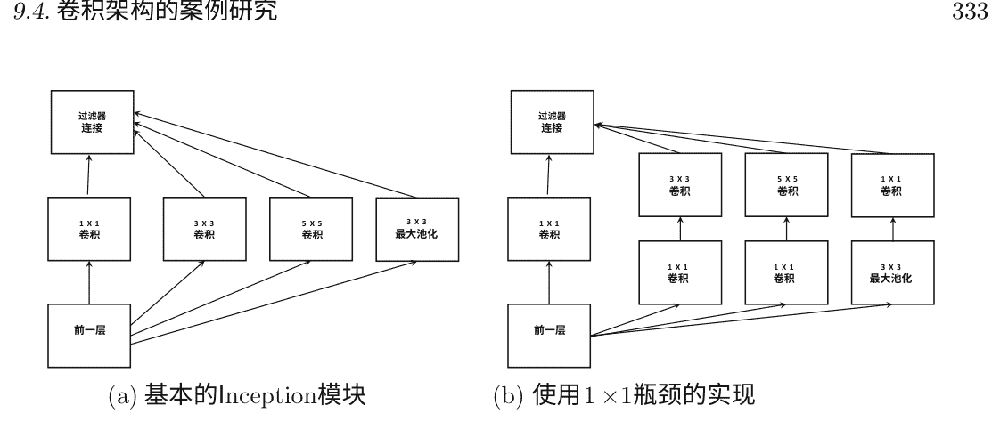

参数中的大部分位于单层连接中。此外，剩余参数中的大部分位于最后两个全连接层中。总的来说，密集连接占神经网络参数的90%。这一点很重要，因为GoogLeNet在最后几层中使用了一些创新来减少参数的占用。

值得注意的是，一些架构允许1×1卷积。虽然1×1卷积不会合并空间上相邻特征的激活，但在体积的深度大于1时，它会合并不同通道的特征值。使用1×1卷积也是在架构中引入额外非线性的一种方式，而不会在空间层面上进行根本性的改变。这种额外的非线性是通过每层附加的ReLU激活函数实现的。更多细节请参考[474]。

### 9.4.4 GoogLeNet

GoogLeNet提出了一个称为内部架构的新概念。内部架构是一个网络中的网络。架构的初始部分与传统的卷积网络非常相似，并被称为干扰。网络的关键部分是一个中间层，被称为内部模块。内部模块的示例如图9.10(a)所示。内部模块的基本思想是图像中的关键信息在不同层次的细节中可用。如果我们使用一个大的滤波器，我们可以捕捉到包含有限变化的更大区域的信息；如果我们使用一个较小的滤波器，我们可以在较小的区域捕捉到详细的信息。虽然一个解决方案是将许多小的滤波器连接在一起，但这样做会浪费参数和深度，而当使用更大区域的更广泛的模式时就足够了。问题是我们事先不知道图像的每个区域适合哪个层次的细节。为什么不给神经网络以不同粒度建模图像的灵活性呢？

这是通过一个内嵌模块实现的，该模块与三种不同的滤波器尺寸并行卷积。这些滤波器尺寸分别为1×1、3×3和5×5。当面对不同尺度的对象和不同图像时，纯粹的顺序滤波器传输是低效的。由于内嵌层上的所有滤波器都是可学习的，神经网络可以决定哪些滤波器对输出影响最大。通过选择不同路径上的不同尺寸的滤波器，不同的区域以不同的粒度级别表示。

GoogLeNet由九个顺序排列的内嵌模块组成。因此，可以通过架构选择许多替代路径，得到表示非常不同的空间区域的特征。例如，通过四个3×3的滤波器传输只有 $1 \times 1$ 的滤波器将捕捉到一个相对较小的空间区域。另一方面，通过许多 $5 \times 5$ 的滤波器将导致一个更大的空间占用。换句话说，在不同隐藏特征中捕捉到的形状的尺度差异将在后续层中被放大。近年来，批归一化已经与Inception架构一起使用，这简化了网络结构从其原始形式。

一个观察结果是，Inception模块由于不同尺寸的卷积数量较多而导致一些计算效率低下。因此，在图9.10(b)中展示了一种高效的实现方式，首先使用 $1 \times 1$ 的卷积来减少特征图的深度。这是因为 $1 \times 1$ 卷积滤波器的数量比输入体积的深度要少一些。例如，可以通过使用64个不同的 $1 \times 1$ 滤波器将输入的深度从256减少到64。这些额外的 $1 \times 1$ 卷积被称为Inception模块的瓶颈操作。通过初始减少特征图的深度（使用廉价的 $1 \times 1$ 卷积），在应用瓶颈卷积之后，减少了层的深度，从而提高了计算效率。可以将 $1 \times 1$ 卷积视为在应用更大的空间滤波器之前的一种有监督的降维操作。降维是有监督的，因为瓶颈滤波器中的参数是在反向传播过程中学习的。瓶颈还有助于在池化层之后减少深度。瓶颈层的技巧也在其他一些架构中使用，它有助于提高效率和输出深度。

GoogLeNet的输出层也展示了一些有趣的设计原则。通常在输出附近使用全连接层是很常见的。然而，GoogLeNet使用了整个最后一组激活图的平均池化来创建一个单一的值。因此，最后一层创建的特征数量将与滤波器的数量完全相等。一个重要的观察是，绝大多数参数都用于将最后一个卷积层连接到第一个全连接层。这种详细的连接对于只需要预测一个类别标签的应用程序来说是不必要的。因此，采用了平均池化的方法。然而，平均池化的表示完全丢失了所有的空间信息，因此在使用它的应用程序类型上必须小心。GoogLeNet的一个重要特性是，与VGG相比，它在参数数量上非常紧凑，前者的参数数量少一个数量级。这主要是因为平均池化的使用，在许多后续架构中最终成为标准。另一方面，GoogLeNet的整体架构在计算上更加昂贵。

GoogLeNet的灵活性体现在22层的inception架构中，通过适当的滤波器尺寸处理不同尺度的对象。多粒度分解的灵活性是由inception模块实现的，这是其性能的关键之一。此外，将全连接层替换为平均池化可以大大减少参数占用。这个架构是2014年ILSVRC比赛的冠军，而VGG则紧随其后。尽管GoogLeNet的性能优于VGG，但后者在简洁性方面具有优势，有时受到从业者的青睐。这两种架构展示了卷积神经网络的重要设计原则。自那时以来，inception架构一直是重要的研究焦点[502, 503]，并提出了许多改进建议。后来，这个架构的一个版本被称为Inception-v4，结合了ResNet中的一些思想，创建了一个75层的架构，仅有3.08%的错误率。

### 9.4.5 ResNet

ResNet [194] 使用了152层，几乎比其他架构使用的层数多一个数量级。这个架构是2015年ILSVRC竞赛的冠军，并且取得了3.6%的前五错误率，这是第一个具有人类水平性能的分类器。这种准确性是通过ResNet网络的集成实现的；即使是单个模型也能达到4.5%的准确率。训练一个152层的架构通常是不可能的，除非加入一些重要的创新。

训练这样深层网络的主要问题是，深层之间的梯度流受到深层中大量操作的阻碍，这些操作可以增加或减小梯度的大小。正如第4章所讨论的，诸如梯度消失和梯度爆炸等问题是由于深度增加而引起的。然而，[194]中的研究表明，这样深层网络的主要训练问题可能不一定是由于这些问题，特别是如果使用了批归一化。主要问题是在合理的时间内使学习过程正常收敛的困难。这种收敛问题在具有复杂损失曲面的网络中很常见。

尽管一些深度网络在训练和测试误差之间存在较大差距，但许多深度网络的训练和测试数据上的误差都很高。这意味着优化过程没有取得足够的进展。

尽管分层特征工程是使用神经网络学习的终极目标，但其逐层实现会导致图像中的所有概念都需要相同的抽象层级。有些概念可以通过使用浅层网络来学习，而其他概念则需要细粒度的连接。例如，考虑一个站在方形框架上的马戏团大象。大象的一些复杂特征可能需要大量层次的工程，而方形框架的特征可能只需要很少的层次。

当使用具有固定深度的非常深的网络来学习概念时，收敛速度会变得不必要地缓慢，而这些概念中的许多也可以使用浅层架构来学习。为什么不让神经网络决定使用多少层来学习每个特征呢？

ResNet在层之间使用跳跃连接以实现层之间的复制，并引入了特征工程的迭代视图（而不是分层视图）。长短期记忆网络和门控循环单元通过允许状态的部分复制从一个层到下一个层来利用序列数据中的类似原理，使用可调节的门。在ResNet的情况下，假设不存在的“门”始终完全打开。大多数前馈网络只包含层 i 和 (i+1) 之间的连接，而 ResNet 包含层 i 和 (i+r) 之间的连接，其中 r>1。这些跳跃连接的示例是 ResNet 的基本单元，如图9.11（a）所示，其中 r=2。这种跳跃连接简单地将层 i 的输入复制并添加到层 (i+r) 的输出中。这种方法使得梯度能够有效地传播，因为反向传播算法现在具有通过跳跃连接向后传播梯度的高速公路。这个基本单元被称为残差模块，整个网络是通过将许多这些基本模块组合在一起创建的。

在大多数层中，使用适当填充的滤波器⁶和步长为1，以确保输入的空间尺寸和深度在每一层之间保持不变。在这种情况下，很容易将第 i 层的输入简单地添加到(i+r)层的输入中。然而，有些层确实使用步长卷积来将每个空间维度减小2倍。同时，通过使用更多的滤波器，深度增加2倍。在这种情况下，不能在跳跃连接上使用恒等函数。因此，可能需要在跳跃连接上应用线性投影矩阵以调整维度。该投影矩阵定义了一组步长为2的1×1卷积操作，以将空间范围减小2倍。投影矩阵的参数需要在反向传播过程中学习。

在原始的 ResNet 思想中，只在层 i 和 (i+r) 之间添加连接。例如，如果我们使用 r=2，则只在连续的奇数层之间使用跳跃连接。后来的增强，如 DenseNet通过添加连接改善了性能在所有层之间。图9.11(a)的基本单元在 ResNet中重复出现，因此可以多次遍历跳跃连接，以在执行非常少的前向计算后将输入传播到输出。图9.11(b)显示了架构的前几层示例。此特定快照基于34层架构的前几层。图9.11(b)中的大多数跳跃连接以实线显示，这对应于使用具有不变的滤波器体积的恒等函数。然而，在某些层中，使用步幅为2，这会导致空间和深度占用发生变化。在这些层中，需要使用投影矩阵，用虚线跳跃连接表示。原始工作[194]中测试了四种不同的架构，分别包含34、50、101和152层。152层的架构表现最好，但即使是34层的架构也比前一年最佳的ILSVRC入口表现更好。

跳跃连接的使用提供了无阻碍梯度流动的路径，因此对于反向传播算法的行为具有重要影响。跳跃连接在梯度流动中起到超高速公路的作用，从输入到输出存在多条长度可变的路径。在这种情况下，最短路径实现最有效的学习，而较长的路径可以看作是残差贡献。这使得学习算法能够灵活选择特定输入的适当非线性水平。可以用分类的方式对输入进行分类的输入少量的非线性将跳过许多连接。其他具有更复杂结构的输入可能需要遍历更多的连接以提取相关特征。因此，这种方法也被称为残差学习，其中沿着更长路径的学习是对沿着较短路径的更容易学习的一种微调。换句话说，这种方法非常适合图像中不同方面具有不同复杂程度的情况。文献[194]中的研究表明，深层的残差响应通常相对较小，这验证了固定深度对正确学习的阻碍。在这种情况下，收敛通常不是一个问## 9.4.6 压缩与激励网络（SENets）

2017年ILSVRC竞赛中图像分类任务的获胜者是Squeeze-and-Excitation网络（SENet）[219]。SENet中的基本思想是使用一个Squeeze-and-Excitation块（SE块），该块可以与任何现有网络的一对卷积操作之间集成。SE块首先将第 q 个空间层转换为一个大小为 H_q=[h^q_{ijp}]，大小为 L_q × B_q × d_q 转换为一个大小为 d_q 的单一向量。通过对整个空间区域进行通道方式的平均池化，将 d_q 转换为一个大小为 d_q 的向量。这定义了压缩操作。换句话说，向量 z=[z_1, z_2, ... z_d]^T 使用以下特征定义如下 h^q_{ijp}：

$$z_p = \frac{\sum_{i=1}^{L_q} \sum_{j=1}^{B_q} h_{ijp}}{L_q \cdot B_q} \qquad \forall p \in \{1 ... d_q\} \text{ [类似平均池化的挤压]}$$

请注意，向量 z 包含通道-wise 平均特征。此时，d_q 维向量 z 通过具有单层和缩小因子为 r 的非线性架构传递，以便使用学习到的权重使不同通道的聚合特征相互作用。这是激励操作，它使用大小为 d_q × d_q/r 的学习矩阵 W 来进行操作。以创建大小为 d_q 的新向量 z'：

$$\mathbf{z}' = \text{Sigmoid} \left( \mathbf{W}_2 \text{ReLU}(\mathbf{W}_1^T \mathbf{z}) \right) \quad \text{[学习通道权重]}$$

基于不同通道强度分布，受限架构学习通道权重。这种方法对于后续层特别重要，通常不适用于输入层（即使图9.12提供了一个概念上的颜色对比示例）。强调的特征将对任务（例如图像分类）、数据集和输入图像特征（平均通道强度）敏感。同样，在面部识别中，鼻子特征比窗户特征更重要。这一层被称为“激励”层，因为它根据信息量为不同通道提供权重。因此，这些 d_q 权重 z'=[z'_1, z'_2, ... z'_{d_q}]^T 将用于按顺序缩放原始空间特征表示中的每个 d_q 通道 H_q 以创建增强特征 H'_q=[h'^q_{ijp}] 在重新加权后：

$$h'_{ijp} = h_{ijp} \cdot z'_p \qquad \forall i, j, p \quad \text{[逐通道缩放信息特征]}$$

SE块的整体架构如图9.12所示。收缩因子 r 的值通常选择为16左右。

SE块通过使用特征的聚合统计数据来跨所有层进行特征工程，以适当地缩放逐通道表示，从而更强调更多信息的特征。以这种方式强调某些特征的思想也被称为注意机制（参见第12章第2节）。这种类型的缩放在整个网络中的作用不同（如SE块可以在所有层中使用）。在较早的层中，以类无关的方式强调信息特征，而在较后的层中，倾向于强调类特定的特征。SENet架构的美妙之处在于它可以与任何早期的架构集成，例如VGG，inception模块或ResNet。在这个意义上，SE块提供了对基本模型的额外性能改进，就像元学习器或集成学习器一样。在ILSVRC竞赛中，使用ResNet的变体获得了最佳结果，仅获得了仅2.25%的前5名错误率。

| 姓名 | 年份 | 层数 | 前5名错误率 |
| --- | --- | --- | --- |
| - | 2012年之前 | ≤5 | >25% |
| AlexNet | 2012 | 8 | 15.4% |
| ZFNet/Clarifai | 2013 | 8/>8 | 14.8% / 11.1% |
| VGG | 2014 | 19 | 7.3% |
| GoogLeNet | 2014 | 22 | 6.7% |
| ResNet | 2015 | 152 | 3.6% |

### 9.4.7 深度的影响

最近几年在ILSVRC比赛中性能的显著提升主要是由于改进的计算能力、更多的数据可用性以及架构设计的变化，这些都使得神经网络的有效训练变得更加深入。这三个方面也相互支持，因为只有在有足够的数据和改进的计算效率的情况下，才能进行更好的架构实验。这也是为什么直到最近才对已知问题的相对老旧架构（如循环神经网络）进行微调和调整的原因之一。

各种网络的层数和错误率在表9.3中显示。从2012年到2015年的短时间内精度的快速提高非常引人注目，这在大多数像图像识别这样经过深入研究的机器学习应用中是不寻常的。另一个重要观察结果是神经网络的深度增加与错误率的改善密切相关。因此，近年来研究的重点之一是实现支持增加深度的算法修改。值得注意的是，卷积神经网络是所有神经网络类别中最深的之一。有趣的是，在其他领域的传统前馈网络对于大多数应用（如分类）来说并不需要非常深入。事实上，“深度学习”这个术语的提出很大程度上归功于卷积神经网络的出色表现以及随着深度增加而观察到的特定改进。2016年和2017年的改进并不是通过增加深度实现的，而是通过集成和使用Squeeze-and-Excitation Blocks等技巧实现的。

### 9.4.8 预训练模型

图像领域分析师面临的挑战之一是，对于特定应用可能没有可用的标记训练数据。考虑这样一种情况，有一组需要用于图像检索的图像。在检索应用中，标签不可用，但特征的语义连贯性很重要。在其他一些情况下，人们可能希望对一个较小的数据集进行分类，该数据集具有特定的标签集，这可能与ImageNet的标签集不同。这些设置会导致问题，因为神经网络需要大量的训练数据才能从头开始构建。

然而，关于图像数据的一个关键点是，从特定数据集中提取的特征在不同数据源之间是高度可重用的。例如，如果在不同的数据源中使用相同数量的像素和颜色通道来表示猫，其表示方式不会有很大变化。在这种情况下，代表广泛图像谱的通用数据源是有用的。例如，ImageNet数据集[605]包含超过一百万张来自日常生活中遇到的1000个类别的图像。所选择的1000个类别和数据集中的大量多样性图像是具有代表性和全面的，足以用于提取图像的通用特征。

例如，从 ImageNet数据中提取的特征可以通过预训练的卷积神经网络（如 AlexNet）传递，并从完全连接的层中提取多维特征来表示一个完全不同的图像数据集。这种新的表示可以用于完全不同的应用，如聚类或检索。这种方法非常常见，很少有人从头开始训练卷积神经网络。从倒数第二层提取的特征通常被称为FC7特征，这是从 AlexNet中的层名继承而来。当然，任意的卷积网络可能没有与 AlexNet相同的层数；然而，FC7这个名字已经被沿用下来。

这种即插即用的特征提取方法[406]可以看作是一种迁移学习，因为我们使用像 ImageNet这样的公共资源来提取特征，以解决在没有足够训练数据的情况下的不同问题。这种方法已经成为许多图像识别任务的标准做法，并且许多软件框架如 Caffe提供了对这些特征的便捷访问[609, 610]。实际上，Caffe提供了一个可以下载和使用的“动物园”预训练模型[610]。

如果有额外的训练数据可用，可以仅微调更深层的层（即靠近输出层的层）。早期层（靠近输入）的权重是固定的。仅训练更深层而保持早期层固定的原因是早期层只捕捉到像边缘这样的原始特征，而更深层捕捉到更复杂的特征。原始特征在应用中不会发生太大变化，而更深层的特征可能对应用更敏感。例如，所有类型的图像都需要不同方向的边缘来表示（在早期层中捕捉），但是与卡车轮子相关的特征只对包含卡车图像的数据集有意义。换句话说，早期层倾向于捕捉高度可推广的特征（跨不同的计算机视觉数据集），而后期层倾向于捕捉特定于数据的特征。关于从卷积神经网络中提取的特征在数据集和任务之间的可转移性的讨论可参见[372]。

## 9.5 可视化和无监督学习

卷积神经网络的一个有趣特性是它们在学习的特征类型方面具有很高的可解释性。然而，要真正解释这些特征需要一些努力。首先想到的方法是简单地可视化滤波器的二维（空间）组成部分。尽管这种可视化方法可以提供一些有趣的图像，展示了神经网络第一层学习到的原始边缘和线条，但对于后续层次并不是很有用。在第一层，可以可视化这些滤波器，因为它们直接作用于输入图像，并且通常看起来像图像的原始部分（如边缘）。然而，在后续层次中，要可视化这些滤波器就不那么简单了，因为它们作用于已经通过卷积操作混合的输入体积。为了获得任何形式的可解释性，必须找到一种将所有操作的影响一直追溯到输入层的方法。因此，可视化的目标通常是识别和突出显示输入图像中特定隐藏特征所响应的部分。

例如，一个隐藏特征的值可能对图像中对应卡车轮子部分的变化敏感，而另一个隐藏特征可能对其引擎盖敏感。这可以通过计算隐藏特征相对于输入图像的每个像素的敏感度（即梯度）来自然实现。正如我们将看到的，这些类型的可视化与反向传播、无监督学习和转置卷积操作（用于创建自编码器的解码器部分）密切相关。

因此，本章将以一种综合的方式讨论这些密切相关的主题。有两种主要情况可以对图像进行编码和解码。在第一种情况下，压缩的特征图是通过使用前面章节中讨论的任何监督模型来学习的。一旦网络以监督方式训练完成，就可以尝试重建激活给定特征的图像部分。此外，最有可能激活特定隐藏特征或类别的图像部分被识别出来。正如我们将在后面看到的，这个目标可以通过各种反向传播和优化方法来实现。第二种设置是纯粹的无监督设置，其中卷积网络（编码器）连接到反卷积网络（解码器）。正如我们将在后面看到的，后者也是一种转置卷积的形式，类似于反向传播。然而，在这种情况下，编码器和解码器的权重是联合学习的，以最小化重构误差。显然，第一种设置更简单，因为编码器是以监督方式训练的，只需学习输入字段的不同部分对各个隐藏特征的影响。在第二种设置中，整个网络的训练和权重学习都必须从头开始进行。

### 9.5.1 可视化训练网络的特征

考虑一个已经使用大型数据集（如 ImageNet）进行训练的神经网络。目标是可视化和理解输入图像的不同部分（即感受野）对隐藏层和输出层中的各种特征（例如 AlexNet中的1000个softmax输出）的影响。我们希望回答以下问题：

- 1. 给定神经网络中某个特征对于特定输入图像的激活，可视化该特征对应的输入部分。注意，该特征可能是空间排列的隐藏层中的一个特征，也可能是完全连接的隐藏层（例如，FC7）中的一个特征，甚至可能是softmax输出中的一个特征。在最后一种情况下，可以获得一些关于特定输入图像到一个类的激活的具体关系的见解。例如，如果一个输入图像激活了“香蕉”的标签，我们希望看到与香蕉最相似的特定输入图像的部分。

- 2. 在神经网络中的任何一个特征中，找到一个最有可能激活该特征的幻想图像。与前面的情况类似，该特征可能是隐藏特征之一，甚至是来自softmax输出的特征之一。例如，一个人可能想知道在手头的训练网络中，最有可能将一个“香蕉”分类的幻想图像类型。

在这两种情况下，可视化特定特征影响的最简单方法是使用基于梯度的方法。上述目标中的第二个目标相当困难，通常需要仔细的正则化才能获得令人满意的可视化效果。

### 激活特征的基于梯度的可视化

用于训练神经网络的反向传播算法对于基于梯度的可视化也是有帮助的。值得注意的是，基于反向传播的梯度计算是一种转置卷积的形式。在传统的自编码器中，通常在解码器中使用转置权重矩阵（与编码器层中使用的权重矩阵相同）。因此，反向传播和特征重建之间的联系是深入的，并且适用于所有类型的神经网络。与传统的反向传播设置相比，我们的最终目标是确定隐藏/输出特征相对于输入图像的不同像素的敏感性，而不是相对于权重的敏感性。然而，即使传统的反向传播也会计算输出相对于各个层的敏感性作为中间步骤，因此几乎可以使用完全相同的方法来处理这两种情况。

当计算输出对输入像素的敏感性时，对应像素上的敏感性可视化被称为显著性图 [476]。例如，输出可能是类别“香蕉”的softmax概率（或应用softmax之前的非归一化分数）。然后，对于每个像素在图像中的$x_i$，我们希望确定的值 $\frac{\partial o}{\partial x_i}$。这个值可以通过直接的反向传播计算，一直$^7$到输入层。“香蕉”的softmax概率对于图像中与香蕉识别无关的部分的微小变化相对不敏感。因此，的值 $\frac{\partial o}{\partial x_i}$。对于这些无关的区域，其值将接近于0，而定义香蕉的图像部分将具有较大的幅度。例如，在 AlexNet的情况下，整个 $224 \times 224 \times 3$的体积由定义。$\frac{\partial o}{\partial x_i}$反向传播的梯度中的一部分将具有与图像中的香蕉对应的大幅度。为了可视化这个体积，我们首先将其转换为灰度图像，方法是在三个RGB通道上取梯度的绝对值的最大值，从而创建一个$224 \times 224 \times 1$的映射，只有非负值。这个灰度图像的亮部将告诉我们输入图像的哪个部分与香蕉相关。

图9.13展示了激发相关类别的图像部分的灰度可视化示例。例如，图9.13(a)中图像的亮部激发了图像中的动物，也代表了它的类别标签。

这些图像出现在Simonyan、Vedaldi和Zisserman的作品中[476]。经许可复制。(版权)2014 Simonyan、Vedaldi和Zisserman)

这种通用方法也被用于可视化特定隐藏特征的激活。考虑特定输入图像的隐藏变量值 h 。这个变量在当前激活水平下如何响应输入图像？ 这个想法是，如果我们稍微增加或减少一些像素的颜色强度， h的值会比增加或减少其他像素的值更受影响。首先，隐藏变量 h 会受到图像的一个小矩形部分（即感受野）的影响，在早期层中感受野非常小，但在后期层中感受野要大得多。例如，在 VGG的第一个隐藏层中选择 h时，其感受野可能只有 3 × 3的大小。 图9.14右侧每行显示了特定隐藏层中某个神经元高度激活的图像裁剪示例。请注意，每行包含一个相似的图像。这不是巧合，因为该行对应于特定的隐藏特征，并且该行的变化是由于图像的不同选择引起的。请注意，选择某一行的图像也不是随机的，因为我们选择的是最激活该特征的图像。因此，所有的图像都包含相同的视觉特征，导致该隐藏特征被激活。可视化的灰度部分对应于特征对应图像裁剪中像素特定值的敏感性。

在高激活水平的情况下，接受域中的一些像素对于 h比其他像素更敏感。通过隔离对隐藏变量 h h最敏感的像素，并可视化相应的矩形区域，可以了解输入图的哪个部分最影响特定的隐藏特征。因此，任何特定的像素 x_i，我们想要计算。 ∂h/∂x_i，然后将这些像素可视化为具有较大值的梯度。然而，有时候使用的是“反卷积网络”[581]和“引导反向传播”[482]的概念。“反卷积网络”的概念也被用于卷积自编码器。主要的区别在于ReLU非线性函数的梯度是如何向后传播的。如第2章的表2.1所讨论的，如果ReLU单元的输入在反向传播过程中是正数，它的偏导数会被复制向后传播。然而，在“反卷积网络”中，如果这个偏导数本身大于0，则将ReLU单元的偏导数向后复制。这就像在反向传播中对传播的梯度使用ReLU一样。换句话说，我们将 $g_i = g_{i+1} \odot I(z_i >0)$ 替换为 $g_i = g_{i+1} \odot I(z_i >0) \odot I(g_{i+1} > 0)$，在表21中，将$g_i = g_{i+1} \odot I(z_i >0)$替换为 $z_i$表示前向激活，而 $g_{i+1}$表示反向传播梯度。$g_i$表示相对于第$i$层的仅包含ReLU单元的反向传播梯度。函数 $I(\cdot)$是逐元素指示函数，当向量参数的条件对于该元素为真时，它的值为1。在引导反向传播中，我们通过使用传统反向传播和ReLU中使用的条件 $I(z_i > 0)$ 来结合。图9.15显示了反向传播的三种变体的图示说明。[482]建议引导反向传播比“反卷积网络”给出更好的可视化效果，而后者又比传统反向传播给出更好的结果。

解释传统反向传播和“解码器”之间的区别的一种方式是将梯度的反向传播解释为解码器相对于编码器的转置卷积操作[476]。然而，在这个解码器中，我们再次使用ReLU函数而不是基于梯度的变换，这与ReLU所隐含的变换不同。毕竟，所有形式的解码器都使用与编码器相同的激活函数。在[482]中可视化方法的另一个特点是完全省略了卷积神经网络中的池化层，而是依赖于步幅卷积。[482]中的工作确定了特定输入图像对应的特定层中高度激活的神经元，并提供了这些隐藏神经元的感受野对应的图像的矩形区域的可视化。我们已经在之前讨论过，图9.14的右侧包含了隐藏层中特定神经元对应的输入区域。图9.14的左侧还显示了激活该特定神经元的每个图像的特定特征。左侧的可视化是使用引导反向传播获得的。请注意，上面的图像集对应于第六层，而下面的图像集对应于卷积网络的第九层。因此，下面的图像集对应于包含更复杂形状的输入图像的较大区域。

来自[581]的另一组优秀的可视化结果显示在图9.16中。主要区别在于[581]中的工作还使用了最大池化层，并且基于反卷积而不是引导反向传播。所选择的特定隐藏变量是每个特征图中前9个最大激活值。在每种情况下，显示了图像的相关区域以及相应的可视化结果。很明显，早期层中的隐藏特征对应于基本线条，在后续层中变得越来越复杂。这是卷积神经网络被视为创建分层特征的方法之一的原因。早期层中的特征更通用，可以在更广泛的数据集上使用。后续层中的特征更具体，适用于个别数据集。这是迁移学习应用中的一个关键特性，预训练网络被广泛使用，只有后续层根据数据集和应用程序进行微调。

### 激活特征的合成图像

上述示例告诉我们一个特定图像的部分对一个特定神经元的影响最大。一个更一般的问题是询问什么样的图像补丁会最大程度地激活一个特定的神经元。为了方便讨论，我们将讨论神经元是特定类别的输出值（即，在应用softmax之前的非归一化输出）的情况。例如，$o$的值可能是“香蕉”的非归一化分数。注意，除了类别分数之外，也可以对中间神经元应用类似的方法。我们希望学习输入图像 $x$ 最大化输出$o$，同时对$x$应用正则化：

最大化 $J(\underline{x}) = -(o - \lambda ||x||^2)$

在这里，$\lambda$是正则化参数，对于提取语义可解释的图像非常重要。可以使用梯度上升法结合反向传播来学习输入图像 $x$。因此，## Layer 1

### Layer 2

### Layer 3

### Layer 4

### Layer 5

图9.16: 基于Zeiler和Fergus的工作[581]，不同层的激活可视化示例。经许可从[581]转载。版权所有©2014 Springer International Publishing Switzerland.

我们从一个空白图像开始，并使用梯度上升结合反向传播来更新使用上述目标函数，通过梯度上升结合反向传播来更新 \(x\)。换句话说，使用以下更新：

$$
x \leftarrow x + \alpha \nabla_x J()
$$
（9.2）

这里，\(\alpha\)是学习率。关键点是反向传播被用于以一种不寻常的方式更新图像像素，同时保持（已学习的）权重不变。图9.17展示了三类合成图像的示例。其他基于类别标签生成更逼真图像的高级方法在[369]中讨论。

### 9.5.2 卷积自编码器

传统神经网络中使用自编码器的讨论在第3章和第5章中进行。回想一下，自编码器在通过压缩阶段后重构数据点。在某些情况下，数据并没有被压缩，尽管表示是稀疏的。架构中最压缩层之前的部分被称为编码器，压缩部分之后的部分被称为解码器。

我们在图9.18(a)中重复了传统情况下编码器-解码器架构的图示。卷积自编码器具有类似的原理，通过压缩阶段后重构图像。传统自编码器和卷积自编码器之间的主要区别在于后者专注于利用点之间的空间关系来提取具有视觉解释的特征。中间层的空间卷积操作正是实现这一目标的。图9.18(b)与图9.18(a)相比，展示了卷积自编码器的示意图。请注意第二种情况下编码器和解码器的三维空间形状。然而，可以构想出几种对这种基本架构的变体。例如，中间的编码可以是空间的，也可以通过使用全连接层进行扁平化，具体取决于应用场景。全连接层对于创建可用于任意应用的多维码是必要的（无需考虑特征之间的空间约束）。接下来，我们将简化讨论，假设中间的压缩码是空间性质的。

正如编码器的压缩部分使用卷积操作一样，解压缩操作使用反卷积操作。类似地，池化与反池化操作相匹配。反卷积也被称为转置卷积。有趣的是，转置卷积操作与反向传播所使用的操作相同。

术语“反卷积”可能有点误导，因为每个反卷积实际上都是与通过转置和翻转表示原始卷积滤波器的张量的卷积（参见图9.7和方程9.1）。我们已经可以看到，反卷积使用了与反向传播类似的原理。主要的区别在于如何处理ReLU函数，这使得反卷积更类似于“反卷积网络”或引导反向传播。实际上，卷积自编码器中的解码器执行的操作与基于梯度的可视化的反向传播阶段类似。一些架构放弃了池化和反池化操作，仅使用卷积操作（以及激活函数）[469, 482]。

事实上，反卷积操作与卷积操作并没有太大的区别，这并不令人意外。即使在传统的前馈网络中，网络的解码器部分执行的是与编码器部分相同类型的矩阵乘法，只是使用了转置的权重矩阵。可以总结传统自编码器和卷积自编码器之间的类比关系如表9.4所示。请注意，在传统和卷积神经网络中，正向反向传播之间的关系在执行相应的矩阵操作方面是相似的。关于编码器和解码器之间的关系性质，也可以得出类似的观察结论。

有三个操作对应于卷积、最大池化和ReLU非线性。目标是在解码器层中执行编码器层中已执行的操作的反转。没有一种简单的方法可以完全反转其中一些操作。

然而，通过适当的设计选择，仍然可以实现出色的图像重建。首先，我们描述了具有卷积、ReLU和最大池化的单层自编码器的情况。然后，我们讨论如何将其推广到多层。

尽管通常希望在解码器中使用编码器操作的逆操作，但ReLU不是可逆函数，因为0的值有许多可能的逆操作。因此，在解码器层中，一个ReLU被另一个ReLU所取代（尽管还有其他选择可能）。因此，这个简单自编码器的架构如下：

请注意，这些层在编码器和解码器中是对称排列的，以匹配解码器中的相应层的效果。然而，这个基本主题有很多变种。例如，ReLU可能会放在反卷积之后。此外，在某些变种中[322]，建议使用比解码器更深的编码器，采用非对称架构。然而，通过对上述对称架构的堆叠变种，可以仅训练编码器，并使用其对称的解码器（具有转置/反转的滤波器）进行“反卷积网络”可视化[581]。虽然可以始终使用这种方法来初始化自动编码器，但我们将讨论增强这个概念的方法，即以无监督的方式联合训练编码器和解码器。我们将把卷积和ReLU等操作视为单独的层，因此总共有七个层，包括输入层。这种架构很简单，因为它在每个编码器和解码器中只使用了一个卷积层。在更一般化的架构中，这些层被堆叠起来创建更强大的架构。然而，将基本操作（如反池化和反卷积）与它们的编码对应操作（如池化和卷积）进行对比有助于理解它们之间的关系。另一个简化是代码包含在一个空间层中，而中间也可以插入全连接层。虽然这个例子（和图9.18(b)）使用了空间编码，但在实际应用中，中间插入全连接层更有用。另一方面，中间的空间层可以用于可视化。

考虑编码器使用大小为 \(F_1 \times F_1 \times d_1\) 的平方滤波器。还假设第一层是大小为 \(L_1 \times L_1 \times d_1\) 的（空间上的）方形体积。第一层中第 \(p\) 个滤波器的 \((i, j, k)\) th条目具有权重 \(w_{ijk}^{(p, 1)}\)。这些符号与第9.2节中使用的符号一致，其中定义了卷积操作。通常在卷积层中使用所需的精确填充级别，以便第二层的特征图也具有大小 \(L_1\)。这个填充级别是 \(F_1 - 1\)，也称为半填充。然而，如果在相应的反卷积层中使用全填充，则卷积层中也可以不使用填充。一般来说，卷积层和相应的反卷积层之间的填充之和必须等于 \(F_1 - 1\)，以保持卷积-反卷积对中层的空间大小。

在这里，重要的是要明白，尽管每个 \(W^{(p,1)} = [w_{ijk}^{(p,1)}]\) 是一个三维张量，但可以通过在张量中包含索引 \(p\) 来创建一个四维张量。反卷积操作使用了这个张量的转置，类似于反向传播中使用的方法（参见第9.3.3节）。反卷积操作从第六层到第七层进行（通过计算中间的ReLU/池化/反池化层）。因此，我们将定义（反卷积）张量 \(U^{(s,6)} = [u_{ijk}^{(s,6)}]\) 相对于 \(W^{(p,1)}\) 相关。第5层包含 \(d_2\) 个特征图，这些特征图是从第一层的卷积操作继承而来的（并且通过池化/反池化/ReLU操作保持不变）。需要将 \(d_2\) 个特征映射映射到 \(d_1\) 层，其中 \(d_1\) 的值为3，表示RGB颜色通道。因此，解卷积层中的滤波器数量等于卷积层中滤波器的深度，反之亦然。可以将形状的这种变化视为滤波器创建的4维张量的转置和空间反转的结果。此外，这两个4维张量的元素之间存在以下关系：

$$
u_{ik}^{(s,6)} = w_{rms}^{(k,1)} \quad \text{对于所有的 } 1 \leq s \leq d_1 \text{ 和 } 1 \leq k \leq d_2
$$
（9.3）

在这里，\(r = n - i + 1\) 和 \(m = n - j + 1\)，其中第一层的空间占用为 \(n \times n\)。注意上述关系中指标 \(s\) 和 \(k\) 的转置。这个关系与方程式9.1相同。在编码器和解码器之间没有必要绑定权重，甚至不需要在编码器和解码器之间使用对称结构[322]。

过滤器。第六层中的 \(U^{(s,6)}\) 与任何其他卷积一样，用于从第6层的激活中重建图像的RGB颜色通道。因此，反卷积操作实际上是一种卷积操作，只是使用了一个转置和空间反转的滤波器。如第9.3.2节所讨论的，这种类型的反卷积操作也用于反向传播。卷积/反卷积操作也可以通过矩阵乘法来执行，如该部分所述。

然而，池化操作会不可逆地丢失一些信息，因此无法完全逆转。这是因为池化操作会永久丢失层中的非最大值。最大非池化操作是通过开关来实现的。当进行池化操作时，最大值的精确位置被存储。例如，考虑常见情况，在步长为2的情况下进行2×2池化。在这种情况下，池化将两个空间维度都减小了2倍，并且在每个（非重叠的）池化区域中选择了最大值。（最大）值的确切坐标被存储，并被称为开关。在反池化时，维度增加了2倍，并且从上一层复制了开关位置的值。其他值被设置为0。因此，在最大反池化之后，在非重叠的2×2池化的情况下，层中有75%的条目具有未复制的值为0。

与传统的自编码器一样，损失函数是通过对所有 \(L_1 \times L_1 \times d_1\) 像素的重构误差进行定义的。因此，如果 \(h_{ijk}^{(1)}\) 表示第一（输入）层中的像素值，而 \(h_{ijk}^{(7)}\) 表示第七（输出）层中的像素值，则重构损失 \(E\) 定义如下：

$$
E = \sum_{i=1}^{L_1} \sum_{j=1}^{L_1} \sum_{k=1}^{d_1} (h_{ijk}^{(1)} - h_{ijk}^{(7)})^2
$$
（9.4）

还有其他类型的误差函数（如 \(L_1\) 损失和负对数似然）也被使用。可以使用传统的反向传播算法与自编码器一起使用。通过反向传播算法进行反卷积或ReLU与卷积的情况没有任何不同。在最大非池化的情况下，梯度只通过未改变的开关流动。由于编码器和解码器的参数是绑定在一起的，所以在梯度下降过程中需要将两个层中匹配参数的梯度相加。另一个有趣的观点是，通过反卷积进行反向传播与通过卷积进行前向传播几乎使用相同的操作。这是因为反向传播和反卷积都会导致用于转换的四维张量的连续转置。

这个基本的自编码器可以很容易地扩展到使用多个卷积、池化和ReLU的情况。在[579]中的工作讨论了多层自编码器的困难，并提出了几种改进性能的技巧。还有几种其他的架构设计选择经常被用来提高性能。一个关键点是，在编码器中通常使用步幅卷积（而不是最大池化）来减小空间占用，在解码器中必须使用分数步幅卷积来平衡。考虑这样一种情况，编码器使用步幅为S的填充来减小空间占用。在解码器中，可以通过以下技巧来增加空间占用的大小。在执行卷积时，我们通过在每对行之间插入S-1行零来拉伸输入体积。在应用滤波器之前，在每对列之间插入S-1列零。结果是，输入体积在每个空间维度上已经拉伸了大约S倍。在执行转置滤波器的卷积之前，可以在边界上应用额外的填充。这种方法的效果是在解码器中提供了一个分数步幅并扩展了输出大小。拉伸卷积输入体积的另一种方法是在输入体积的原始条目之间插入插值值（而不是零）。插值是使用最近四个值的凸组合进行的，并且距离每个值的距离的递减函数被用作插值的比例因子[469]。拉伸输入的方法有时与拉伸滤波器的方法相结合，通过在滤波器中插入零[469]。拉伸滤波器会导致一种称为扩张卷积的方法，尽管它的使用对于分数步幅卷积来说并不普遍。关于卷积算术的详细讨论（包括分数步幅卷积）可以在[111]中找到。与传统的自编码器相比，卷积自编码器的实现要更加棘手，有许多不同的变体以获得更好的性能。请参考参考文献节点。

无监督方法也可以应用于改进监督学习。其中最明显的方法是预训练，在第5章的第5.7节中进行了讨论。在卷积神经网络中，预训练的方法在原理上与传统神经网络的使用方法并没有太大的不同。预训练还可以通过从训练好的深度置信卷积网络中导出权重来进行。这类似于传统神经网络中的方法，其中堆叠的玻尔兹曼机是用于预训练的最早模型之一。

## 9.6 卷积网络的应用

卷积神经网络在目标检测、定位、视频和文本处理等方面有多个应用。其中许多应用都基于于使用卷积神经网络提供的工程特征，构建多维应用。卷积神经网络的成功几乎无与伦比，超过了几乎所有类别的神经网络。近年来，甚至已经提出了用于序列到序列学习的竞争方法，这在传统上一直是递归网络的领域。

### 9.6.1 基于内容的图像检索

在基于内容的图像检索中，首先使用预训练的分类器（如 AlexNet）将每个图像转换为一组多维特征。通常在前期使用大型数据集（如 ImageNet）进行预训练。有很多选择的预训练分类器可在[610]中找到。可以使用分类器的全连接层的特征来创建图像的多维表示。图像的多维表示可以与任何多维检索系统结合使用，以提供高质量的结果。关于图像检索中神经编码的使用，请参阅[17]。这种方法有效的原因是因为从 AlexNet 提取的特征对数据中不同类型的形状具有语义意义。因此，当使用这些特征进行检索时，检索的质量通常非常高。

### 9.6.2 对象定位

在对象定位中，我们有一张图像中的一组固定对象，并且我们希望识别图像中出现对象的矩形区域。基本思想是将具有固定数量对象的图像中的每个对象都放入一个边界框中。在接下来的内容中，我们将考虑只有一个对象存在于图像中的简单情况。图像定位通常与分类问题集成在一起，其中我们首先希望对图像中的对象进行分类，并在其周围绘制一个边界框。为了简单起见，我们考虑图像中只有一个对象的情况。我们在图9.19中展示了图像分类和定位的示例，其中识别出了“鱼”类，并在图像的一部分周围绘制了一个边界框来标示该类别。

图像的边界框可以用四个数字唯一标识。常见的选择是标识边界框的左上角和两个尺寸。因此，可以用四个唯一的数字来标识一个框。这是一个具有多个目标的回归问题。在这里，关键是要理解可以为分类和回归训练几乎相同的模型，它们只在最后的部分有所不同。

图9.19：图像分类/定位的示例，其中类别“鱼”与其边界框一起被识别出来。该图仅用于说明。

图9.20：分类和定位的广义框架

两个全连接层。这是因为从卷积网络中提取的特征的语义性质通常在各种任务中具有很高的泛化能力。因此，可以使用以下方法：

-   1. 首先，我们训练一个类似于 AlexNet的神经网络分类器，或者使用预训练版本的该分类器。在第一阶段，只需使用图像-类别对来训练分类器即可。甚至可以使用一个现成的在 ImageNet上训练过的分类器的预训练版本。
-   2. 最后两个全连接层和softmax层被移除。这个被移除的层集合被称为分类头。附加一个新的两个全连接层和一个线性回归层。然后，只有这些层与包含图像和边界框的训练数据一起进行训练。这个新的层集合被称为回归头。请注意，卷积层的权重是固定的，不会改变。分类和回归头在图9.20中显示。由于分类和回归头在任何方式上都没有连接在一起，这两个层可以独立训练。卷积层的作用是为分类和回归创建视觉特征。
-   3. 可以选择性地微调卷积层，使其对分类和回归都敏感（因为它们最初只是为了分类而训练的）。在这种情况下，会附加分类和回归头，并将图像、它们的类别和边界框的训练数据展示给网络。使用反向传播来微调所有层。完整的架构如图9.20所示。
-   4. 整个网络（包括附加的分类和回归头）然后用于测试图像。分类头的输出提供类别概率，而回归头的输出提供边界框。

图9.21：目标检测示例。四个对象（“鱼”，“女孩”，“桶”和“座位”）以及它们的边界框被识别出来。该图仅供说明。

使用滑动窗口方法可以获得更好的结果；基本思想是在图像上滑动一个窗口以识别多个位置，然后整合不同运行的结果。这种方法的一个例子是 Overfeat方法[462]。有关其他定位方法的指引，请参考参考文献注释。

### 9.6.3 目标检测

目标检测与目标定位非常相似，只是图像中存在不同类别的可变数量的对象。目标是识别图像中的所有对象以及它们的类别。我们在图9.21中展示了一个目标检测的例子，其中有四个对象对应于“鱼”，“女孩”，“桶”和“座位”这些类别。图中还显示了这些类别的边界框。由于输出数量的可变性，目标检测通常比定位问题更加困难。实际上，人们甚至事先不知道图像中有多少个对象；因此，不能使用固定数量的分类或回归头。

一种选择是使用滑动窗口。在这种方法中，尝试在图像中的所有可能的边界框上应用目标定位方法来检测单个对象。因此，可能会在不同的边界框中检测到不同的对象，或者在重叠的边界框中检测到相同的对象。然后，可以将来自不同边界框的检测结果进行整合，以提供最终结果。不幸的是，这种方法可能非常昂贵。对于一个大小为 L×L的图像，可能的边界框数量为 L^4。请注意，需要对每个边界框执行分类/回归操作。在测试时，每个图像有L^4种可能性。这是一个问题，因为测试时间通常应该足够短以提供实时响应。

为了解决这个问题，提出了区域建议方法。区域建议方法是一种通用的目标检测器，它识别出有前景的区域，并用这些区域创建一组候选边界框。然后，在每个候选边界框中运行目标分类/定位方法。请注意，某些候选区域可能没有有效的对象，而其他候选区域可能存在重叠的对象。然后，使用这些候选区域进行整合，并识别图像中的所有对象。这种更广泛的方法已经在各种技术中使用，如 MCG [182]、 EdgeBoxes [594]和SelectiveSearch [519]。

### 9.6.4 自然语言和序列学习与TextCNN

虽然循环网络代表了文本处理的传统方法，但卷积神经网络的使用越来越流行。乍一看，卷积神经网络似乎不是文本挖掘任务的自然选择。首先，图像的形状被解释为相同的方式，无论它们在图像中的位置如何。但对于文本来说情况并非如此，一个词在句子中的位置似乎非常重要。其次，在文本数据中，位置的转换和移动等问题不能以相同的方式处理。图像中的相邻像素通常非常相似，而文本中的相邻单词几乎从不相同。尽管存在这些差异，卷积网络在文本方面表现出色，并且具有高度的并行性（与循环网络不同）。高度的并行性使得可以使用更大的训练数据集并获得更好的准确性。

就像图像被表示为一个二维对象，附加的深度维度由颜色通道的数量定义一样，文本序列被表示为一个一维对象，其深度由其表示维度定义。使用一位有效编码的天真解决方案是一个坏主意，因为它会增加表示的维度（以及相应的参数占用空间）。典型语料库的词汇大小通常为 10^6。因此，使用各种预训练的单词嵌入，如 word2vec 或 GloVe [384]，代替单词的一位有效编码（参见第3章）。这种单词编码还具有语义丰富性的优势，并且表示的维度可以减少到几千个（从十万个减少）。因此，对于文本数据，滤波器不是具有空间范围和深度（颜色通道/特征图）的三维框，而是具有沿句子滑动的窗口（序列）长度和由word2vec嵌入定义的深度的二维框。在卷积网络的后续层中，深度由前一层中的滤波器数量定义（与图像数据相同）。在图像数据中，我们在所有二维位置上执行卷积，而在文本数据中，我们在句子的所有一维点上使用相同的滤波器执行卷积。可以使用不同宽度的卷积核来捕捉不同数量的单词之间的相关性。

与图像数据类似，填充可以用于防止卷积输出尺寸的不受控制的减小，而步幅或最大池化可以用于明确控制卷积的时间足迹的减小。在某些情况下，可以对整个时间足迹执行最终的最大池化，以便每个通道产生一个输出，并且不同通道的输出之间没有顺序。然后，这些输出将经过一组全连接层，进一步馈送到输出层。可以将最大池化的过程视为在每个word2vec维度（通道）上找到主要概念，然后将输入句子视为这些概念的融合。例如，最大池化操作的每个通道都能够捕捉到句子是否涉及特定概念（例如餐馆、评论）以及是否传达积极情感。TextCNN模型已成功应用于情感分析应用。

### 9.6.5 视频分类

视频可以被视为图像数据的推广，其中包含了一个时间组件作为图像序列的固有属性。这种类型的数据可以被视为时空数据，需要我们将二维空间卷积推广到三维时空卷积。视频中的每一帧可以被视为一张图像，因此我们在时间上接收到一系列图像。考虑这样一种情况，每个图像的尺寸为 224 × 224 × 3，总共接收到10帧。因此，视频片段的尺寸为 224 × 224 × 10 × 3 。与使用二维空间滤波器（额外的深度维度捕捉3个颜色通道）进行空间卷积不同，我们使用三维时空滤波器（并且有一个深度维度捕捉颜色通道）进行时空卷积。值得注意的是，滤波器的性质取决于手头的数据集。纯粹的序列数据集（例如文本）需要使用窗口进行一维卷积，图像数据集需要使用二维卷积，视频数据集需要使用三维卷积。有关视频分类中三维卷积的指引，请参考参考文献。

有趣的观察是，三维卷积仅仅在通过图像分类器对单个帧的分类结果进行平均时添加了有限的信息。问题的一部分是，运动仅仅为分类目的提供了有限的信息，这些信息已经在单个帧中可用。此外，很难获得足够大的视频数据集。例如，即使包含一百万个视频的数据集通常也不足够，因为三维卷积所需的数据量比二维卷积所需的数据量要大得多。最后，对于较长的视频，三维卷积神经网络对于相对较短的视频片段（例如半秒钟）效果很好，但对于较长的视频可能效果不佳。

对于较长的视频，将循环神经网络（或LSTM）与卷积神经网络结合起来是有意义的。例如，我们可以对单个帧使用二维卷积，但使用循环网络将状态传递到下一帧。还可以在短视频片段上使用三维卷积神经网络，然后将其与循环单元连接起来。这种方法有助于识别较长时间范围内的动作。有关结合卷积和循环神经网络的方法，请参考参考文献注释。

## 9.7 总结

本章讨论了卷积神经网络在图像处理中的应用。这些网络受到生物启发，是神经网络力量的最早成功故事之一。本章的重点是分类问题，尽管这些方法也可以用于其他应用，如无监督特征学习、目标检测和定位。卷积神经网络通常在不同层次上学习分层特征，早期层次学习基本形状，而后期层次学习更复杂的形状。卷积神经网络的反向传播方法与解卷积和可视化问题密切相关。卷积神经网络也被推广到文本和序列处理。

## 9.8 参考文献和软件资源

卷积神经网络最早的灵感来自于Hubel和Wiesel对猫视觉皮层的实验[223]。基于这些原理，提出了新认知机的概念[132]。这些想法随后推广到第一个卷积网络，被称为Le Net-5[285]。关于卷积神经网络的最佳实践和原则的早期讨论可在[472]中找到。关于卷积神经网络的优秀概述可在[246]中找到。关于卷积算术的教程可在[111]中找到。应用方面的讨论可参考[289]。

像ImageNet挑战 (ILSVRC) [606] 这样的竞赛，在过去五年中提供了一些最好的算法来源。在各种竞赛中表现出色的神经网络示例包括AlexNet [263]、ZFNet [581]、VGG [474]、GoogLeNet [501]和ResNet [194]。ResNet与高速公路网络 [524] 密切相关，并提供了特征工程的迭代视图。GoogLeNet的一个有用的前身是Network-in-Network (NiN) 架构 [306]，它展示了一些有用的设计原则，如瓶颈操作的使用。关于为什么ResNet表现良好的几种解释可以在[195, 524]中找到。在[559]中提出了在跳跃连接之间使用inception模块的方法。在[221]中讨论了将随机深度与残差网络结合使用的方法。在[574]中提出了宽残差网络。

一个相关的架构，被称为 FractalNet [274]，在网络中使用短路径和长路径，但不使用跳跃连接。训练是通过在网络中删除子路径来完成的，尽管预测是在完整的网络上进行的。挤压与激励网络在[219]中进行了讨论。图像识别的一个最新进展是使用胶囊网络 [430]来更好地建模层次关系。

[482]中的工作提出，用具有增加步幅的卷积层替换最大池化层是有意义的。在自动编码器的构建中，不使用最大池化层是一个优势，因为可以在解码器中使用具有分数步幅的卷积层。[398] 当希望通过卷积操作增加空间占用时，分数步幅会在输入体积的行和列中插入零。有时也会使用dilated卷积 [569]的概念，在滤波器的行/列中插入零（而不是输入体积）。在[476, 482]中讨论了解卷积网络和基于梯度的可视化之间的连接。在[105]中讨论了通过卷积神经网络创建的特征的简单反演方法。在[320]中的工作讨论了如何从给定的特征表示中最优地重建图像。在[403]中讨论了最早使用卷积自编码器的情况。在[329, 579, 580]中提出了基本自编码器架构的几个变体。还可以借鉴受限玻尔兹曼机的思想进行无监督特征学习。使用深度置信网络 (DBNs) 的最早的这种想法在[291]中进行了讨论。在[135, 579-581]中讨论了不同类型的解卷积、可视化和重建。关于从图像中进行无监督特征提取的非常大规模研究在[276]中报告。

有一些学习特征表示的无监督方法，似乎效果很好。在[79]中，使用k-means算法对小图像块进行聚类，以生成特征。可以使用聚类的中心点来提取特征。另一种选择是使用随机权重作为滤波器来提取特征[88, 232, 442]；[442]的研究表明，卷积和池化的组合具有频率选择性和平移不变性，即使使用随机权重。

在[17]中提供了关于图像检索的神经特征工程的讨论。近年来，已经提出了许多图像定位的方法。在这方面，特别突出的系统是Overfeat[462]，它是2013年ImageNet竞赛的冠军。该方法采用滑动窗口的方法来获得优质的结果。AlexNet、VGG和ResNet的变体在ImageNet竞赛中也表现出色。关于目标检测的一些最早的方法在[90, 122]中提出。后者也被称为可变形部件模型[122]。这些方法没有使用神经网络或深度学习，尽管一些连接已经被建立[170]在可变形部件模型和卷积神经网络之间。在深度学习时代，已经提出了许多方法，如MCG[182]、EdgeBoxes[594]和SelectiveSearch[519]。这些方法的主要问题是它们有点慢。最近，提出了一种快速目标检测方法Yolo [407]。在[190]中讨论了使用卷积神经网络进行图像分割。在[412]中讨论了区域建议网络。在[137, 138, 237]中提出了使用卷积神经网络进行纹理合成和风格迁移的方法。

近年来，在人脸识别方面取得了巨大进展，使用了神经网络。早期的工作[275, 423]展示了如何使用卷积网络进行人脸识别。在[380, 490, 491]中讨论了深度变体。

在[81, 82, 104, 238, 250, 537]中讨论了用于自然语言处理的卷积神经网络。这些方法通常利用word2vec或GloVe方法来获得更丰富的特征[337, 384]。循环和卷积神经网络的概念也被结合用于文本分类[266]。在[585]中讨论了使用字符级卷积网络进行文本分类。在[236, 529]中讨论了通过结合卷积和循环神经网络进行图像字幕生成的方法。下一章将讨论使用卷积神经网络原理处理图结构数据。提供了使用卷积神经网络处理时间序列和语音的讨论[282]。

从卷积网络的角度来看，视频数据可以被视为图像数据的时空泛化[505]。关于大规模视频分类的三维卷积神经网络的使用在[18, 233, 244, 517]中进行了讨论，而[18, 233]中的作品提出了最早的三维卷积神经网络在视频分类中的方法。所有用于图像分类的神经网络都有自然的三维对应物。例如，关于使用三维卷积网络将VGG推广到视频领域的讨论在[517]中进行。令人惊讶的是，三维卷积网络的结果与单帧方法相比只稍微好一些，单帧方法是从视频的各个帧进行分类。一个重要的观察是，单个帧已经包含了很多用于分类的信息，而添加运动通常对分类没有帮助，除非运动特征对于区分类别是必要的。视频分类还需要大量的训练数据，即使是像[244]中的大型存储库（包含超过一百万个YouTube视频）似乎也不足以进行稳健的训练。毕竟，视频处理需要比图像处理更复杂的三维卷积。因此，将手工制作的特征与卷积神经网络[534]相结合通常是有益的。近年来，另一个有用的特征是光流的概念[53]。使用三维卷积神经网络有助于在较短的时间尺度上对视频进行分类。

另一个常见的视频分类思想是将卷积神经网络与循环神经网络结合起来[18, 102, 367, 475]。[18]中的工作是将循环神经网络和卷积神经网络结合起来的最早方法。在需要在较长时间尺度上进行分类时，使用循环神经网络是有帮助的。最近的一种方法[22]通过使卷积网络中的每个神经元都变成循环的方式将循环神经网络和卷积神经网络结合起来。

### 软件资源和数据集

有多种用于卷积神经网络深度学习的软件包可用，如Caffe [596]、Torch [597]、Theano [598]和TensorFlow [599]。可以将Caffe扩展到Python和MATLAB。

在[234, 406]中讨论了使用预训练模型的现成特征提取方法。在应用的性质与ImageNet数据非常不同的情况下，仅从预训练模型的较低层提取特征可能是有意义的（这些层只捕捉到基本特征）。可以在[609]中找到有关从Caffe提取特征的讨论。可以在[610]中找到Caffe的预训练模型“模型动物园”。Theano是基于Python的，它提供了高级包，如Keras [600] 和Lasagne [601]作为接口。在MATLAB中有一个名为MatConvNet的开源卷积神经网络实现，可以在[522]中找到。AlexNet的代码和参数文件可以在[608]中找到。

用于测试卷积神经网络的两个最受欢迎的数据集是 MNIST和 ImageNet。这两个数据集在第一章中有详细描述。由于 MNIST数据集的图像已经居中和归一化，因此该数据集的行为良好。因此，即使使用传统的机器学习方法，也可以准确地对 MNIST中的图像进行分类，因此不需要卷积神经网络。另一方面， ImageNet中的图像包含来自不同角度的图像，因此需要卷积神经网络。然而， ImageNet的1000个类别设置以及其庞大的规模使其成为一个难以在计算上高效测试的候选数据集。一个规模较小的数据集是 CIFAR-10 [607]。该数据集仅包含60,000个实例，分为十个类别，包含6,000个彩色图像。数据集中的每个图像的大小为 32 × 32 × 3。在进行更大规模的 ImageNet训练之前， CIFAR-10数据集经常用于小规模测试。CIFAR-100数据集与 CIFAR-10数据集非常相似，只是它有100个类别，每个类别包含600个实例。这100个类别被分为10个超类。

## 9.9 练习题

- 1. 考虑一个一维时间序列，其值为2、1、3、4、7。使用一个一维滤波器1、0、1进行卷积，并进行零填充。
- 2. 对于长度为L的一维时间序列和大小为F的滤波器，输出的长度是多少？为了保持输出大小恒定，需要多少填充?
- 3. 考虑一个大小为13 × 13 × 64的激活体积和一个大小为3 × 3 × 64的滤波器。讨论是否可以使用步长2、3、4和5进行卷积。在每种情况下，给出你的答案的理由。
- 4. 计算表9.2中每个空间卷积层的尺寸。在每种情况下，我们从一个输入图像体积224 × 224 × 3开始。
- 5. 计算表9.2中D列每个空间层的参数数量。
- 6. 从你选择的神经网络库中下载 AlexNet架构的实现。使用来自 ImageNet数据集的不同大小的子集训练网络，并绘制随数据大小变化的前5个错误率。
- 7. 使用图9.2左上角的输入体积与图9.1(b)中的水平边缘检测滤波器进行卷积计算。使用步长为1且不进行填充。
- 8. 对图9.4左上角的输入体积进行4 ×4的池化操作，步长为1。
- 9. 讨论在第8章8.7.2节中讨论的图像字幕应用中可以使用的各种预训练方法。
- 10. 你有用户对不同图像的评分。展示如何将卷积神经网络与第3章讨论的协同过滤思想相结合，创建一个内容敏感的图像推荐系统。
- 11. 证明对于具有 d通道的图像，平均池化操作可以实现为具有固定权重为0或常数a的分步卷积操作，其中 a的值是适当选择的。那么 a的值是多少?

# 第十章

## 图神经网络

> > “每个人都应该在需要之前构建自己的网络。” ——戴夫·德兰尼

## 10.1 引言

图在各种应用中起着重要作用，例如网络、社交网络、通信网络和化学化合物。图可以是有向的或无向的。在有向图中，边具有方向，而在无向图中，边没有方向。有向图中的边用带箭头的线表示，而无向图中的边用不带箭头的线表示。

一些实际图的例子如下：
1. 在社交网络中，节点是用户，边是用户之间的友谊链接。友谊链接是无向的，而关注者-被关注者链接是有向的。
2. 在一个网络中，一个网页是一个节点，一个超链接是一个有向边。
3. 在一个化合物中，一个元素是一个节点，一个化学键是一条边。这种设置与前两种设置略有不同，因为我们通常有多个小图而不是一个大图用于学习目的。

图通常使用邻接矩阵来表示。对于一个有n个节点的图，它的邻接矩阵A是一个n × n的矩阵，其中(i, j)的元素表示从节点i到节点j的有向边的权重。如果边不是有向的，则邻接矩阵是对称的。本章大部分内容都基于无向网络的假设。对于无向网络，与节点i关联的节点集合用A(i)表示。在某些情况下，假设邻接矩阵的元素来自{0, 1}，当边的权重不可用时。

图神经网络有两个不同的应用场景。在第一个场景中，有一个大型图（例如，Twitter网络），节点上有特征。然后，这些节点特征根据结构被提炼到一个精细的潜在空间中。局部性（使连接的节点具有相似的表示）是重要的。节点表示用于以节点为中心的预测。在第二个场景中，有一个大量的较小图（例如，化学化合物），希望将每个图（而不是节点）嵌入到一个潜在空间中。图表示用于以图为中心的预测。第二个场景比第一个场景更具挑战性，因为必须将结构特征学习推广到多个图中。

### 章节组织

本章的组织如下。在下一节中，我们将根据第3章的讨论，回顾一些简单的基于节点嵌入的神经网络。在第10.3节中介绍了一种专门针对图设置进行节点嵌入优化的图神经网络架构。在第10.4节中讨论了图神经网络的反向传播算法。在第10.5节中讨论了完整图的嵌入。在第10.6节中讨论了图神经网络的应用。第10.7节给出了总结。

## 10.2 使用传统架构进行节点嵌入

在本节中，我们将根据第3章第37节的早期讨论，回顾一些简单的基于节点嵌入的神经网络。考虑一个 n × n邻接矩阵。对于具有 n nodes的图，矩阵A = [a_{ij}]。条目 a_{ij}如果节点 i 和 j之间存在无向边，则为1。此外，矩阵 A是对称的，因为我们有。对于无向图， a_{ij} = a_{ji}。如第37节所讨论的，可以使用逻辑矩阵分解来生成矩阵 A的条目。矩阵 A的每个条目都是使用 f(UV^T)中的伯努利参数矩阵生成的，其中 f(·)是对矩阵的每个条目 x应用逐元素的sigmoid函数：

$$ f(x) = \frac{1}{1 + \exp(-x)} \tag{10.1} $$

因此，如果 \overline{u_i}是 U的第i行，而 v_j是 V的第j行，我们有以下结果：

$$ a_{ij} \sim \text{伯努利分布，参数为} f(u_i \cdot v_j) \tag{10.2} $$

模型的神经结构如图10.1所示，该图包含了一个玩具图形，其中有5个节点。输入是 A中一行的独热编码索引（即节点），输出是网络中所有节点的所有0/1值的列表。在这种特殊情况下，我们展示了节点3的输入及其相应的输出。由于节点3有三个邻居，输出向量包含三个1。输出对应于具有对数似然损失的sigmoid单元。可以增加隐藏层的数量以创建更具表达力的模型。

大多数网络是稀疏的，因此输出中的0的数量远大于1的数量。因此，可以使用类似于word2vec的SGNS模型的技巧，并通过负采样来消除许多0。每个负节点输出可以作为其节点度数的次线性幂进行采样。反向传播仅从采样的节点中执行，以在节省计算时间的同时进行嵌入。实际上，该架构与 word2vec非常相似，在第3章中已经证明它等价于逻辑矩阵分解。因此，这种方法等价于对邻接矩阵进行逻辑矩阵分解，并进行一些额外的采样改进（以提高计算性能）。

在大多数实际应用中，邻接矩阵不是二进制的，因为边具有权重。如第3.7节所讨论的，可以使用采样来处理加权边，其中输出是采样的二进制值，采样的概率与权重成比例。对于缺失的边（对于特定输入节点），也可以按比例对输入节点另一端的加权节点度数进行采样。在其核心，这类方法通过实现神经矩阵分解紧密模仿 word2vec。

上述模型执行无监督节点嵌入，尽管可以将此方法扩展到监督设置。例如，在集体分类问题中，一些节点被标记为 m个类别之一，索引为{1, ..., m}。

集体分类问题的目标是为图中的所有未标记节点分配类别标签。图10.1的架构可以按以下方式进行修改。架构中添加了一个具有 m个可能输出的单一softmax输出层。此softmax层连接到所有隐藏单元（图10.1中未显示）。请注意，附加的输出层不会替换图10.1中包含的输出，而是添加到这些输出中（从而创建一个半监督模型）。该softmax单元输出每个类别标签的概率。损失函数也需要进行修改，因为我们有两组输出。

除了对应于存在或不存在不同节点的逻辑输出的对数损失函数之外，还添加了与softmax输出中观察到的类别标签相关的交叉熵损失。可以适当加权这两个损失的组成部分，以达到所需的监督程度。对于输出标签缺失的节点，只从无监督输出单元（对应于节点标识符）进行反向传播。尽管这种架构不使用输入节点嵌入

### 10.2.1 邻接矩阵表示和特征工程

图10.1的神经网络架构利用节点之间的直接连接创建输入-输出对。实际上，节点的特征表示不仅应该依赖于其直接邻居，还应该依赖于通过短路径连接的节点。实现这个目标的一种方法是通过使用随机游走改变输入边的权重 - 两个节点之间的边的权重被修改为一个节点在以另一个节点为起点的短随机游走中出现的次数，反之亦然。节点 $i$ 和 $j$ 之间长度为 $k$ 的随机游走的数量包含在 $A^k$ 的 $(i, j)$ th条目中。因此，可以使用Katz度量创建一个新的加权邻接矩阵，在其中将所有可能长度的随机游走的数量在衰减后进行聚合：

$$ A_{\alpha} = \sum_{i=1}^{\infty} (\alpha A)^i = (I - \alpha A)^{-1} - I $$

在这里，$\alpha$ 是一个衰减参数，范围在 $(0, 1)$ 之间。使用 $\alpha < 1$ 是必要的，以确保无限求和收敛，并且 $\alpha$ 应该始终选择为小于 $A$ 的最大特征向量的倒数的大小。Katz度量本质上是一对节点之间所有衰减加权路径的总和，其中较长的路径通过衰减因子减弱。使用以路径为中心的邻接矩阵 使用 $A_{\alpha}$ 而不是 $A$ 会导致更稳健的结果，因为间接连接被纳入输入表示中。

可以将这种方法视为一种特征工程，以改进邻接矩阵的输入表示。特征工程弥补了底层神经网络的浅层特性——毕竟，深度的主要目的是通过每一层深度工程越来越复杂的特征。将这种手工特征工程与浅层网络结合在一起，违背了神经网络设计的初衷，神经网络设计通常旨在成为一个可以自动执行特征工程的端到端系统。为了实现这个目标，图神经网络在学习过程中直接使用图的结构跨多个层次（就像卷积网络一样）。

## 10.3 图神经网络：通用框架

图神经网络在相邻节点的表示中强制实施相似性，就像卷积神经网络利用相邻像素的表示相似性的思想一样。这些网络使用分层架构，每一层中神经网络节点与图节点之间存在一对一的对应关系。给定层中的节点表示是根据前一层中该节点及其相邻节点的表示的函数获得的。这种邻接性也在卷积神经网络中用于图像（使用滤波器）。通过在少数层上重复执行这种基于邻接性的转换，节点的嵌入能够融入其局部结构。因此，网络连接性利用结构来促进高度连接节点的相似表示。在图神经网络中，节点之间在时间戳上的隐藏值传递被称为消息传递。

在本节中，我们假设我们有一个包含 $n$ 个节点的图形，其输入特征向量为 $x_1 \ldots x_n$。第 $i$ 个节点的特征向量是一个 $d$ 维列向量 $x_i$。在实践中，图形的输入特征向量可能包含应用特定的特征（例如社交网络中的用户配置文件）和基于图形的局部结构的手工制作特征（例如节点度和邻域大小）。

手工制作的特征具有很高的灵活性，因为从技术上讲，可以在节点 $i$ 的邻接矩阵的整行中包含在 $x_i$ 中。使用这种方法的主要问题是它使输入稀疏且高维。一些方法使用归一化邻接矩阵$^1$的主特征向量来首先生成每个节点的低维嵌入。将这个低维嵌入与各种应用特定和结构特征连接起来，以创建第 $i$ 个节点的输入 $x_i$。大多数模型在输入中完全省略了邻接矩阵的使用，并且仅在神经网络中定义基于邻接的转换。

为了简化起见，我们首先假设我们始终使用二进制邻接矩阵进行工作，并在后面将讨论推广到加权邻接矩阵。尽管本章大部分讨论是针对无向图设计的，但我们首先从一个有向图的例子开始。我们首先从有向图开始的原因是边的方向会引起一些额外的复杂性，在无向图的情况下不会发生。在简要讨论了如何处理这些复杂性的一般方法后，我们将把大部分章节用于对无向图的简化讨论。

现在我们介绍神经架构中隐藏状态的符号表示。输入特征被假设为零层的“隐藏特征”。因此，输入向量 ($x_1, \ldots, x_n$) 也可以用“嵌入” ($h^{(0)}$) 表示。$\bar{h}_1^{(0)}, \bar{h}_2^{(0)}, \ldots \bar{h}_n^{(0)}$。第 $i$ 个节点在第 $k$ 层的表示用 $h_i^{(k)}$ 表示，其中 $k$ 的取值范围从输入层索引0到输出层索引 $T$。上标 $(k)$ 不应与指数混淆。像 $x_i$ 一样，每个 $h_i^{(k)}$ 是一个列向量。注意，在每一层中，图节点和神经网络节点之间存在一一对应的关系，导致每一层都有特定的节点 $h_1^{(k)}, h_2^{(k)}, \ldots h_n^{(k)}$。假设第 $k$ 层的隐藏表示为 $p_k$ 维度的，可以随着层索引的变化而变化。$p_0$ 的值因此等于节点特征的输入维度 $d$。

$^1$ 对于邻接矩阵 $A$，我们可以先将边的权重除以其端点加权节点度的几何平均数，以便将其归一化为 $A_c$。然后，对称矩阵 $A_c A^{T_c}$ 被对角化为 $P \Delta P^T$，并保留与最大特征值对应的前 $s$ 列以创建一个 $n \times s$ 矩阵 $P_s \Delta_s$，其中 $\Delta_s$ 是相应的 $s \times s$ 特征值对角矩阵。

$s$ 的值通常比 $n$ 小几个数量级。矩阵 $P_s$ 的第 $i$ 行包含了第 $i$ 个节点的嵌入。因此，矩阵 $P_s$ 可以作为神经网络输入节点的结构特征输入给第 $i$ 个图节点。

图10.2：显示了一个由五个节点组成的有向图，以及如何将其转换为具有自连接和邻居连接的分层架构的示意图。

神经网络中的连接也继承自图的结构。神经网络中的相邻层之间有两种类型的连接，分别对应于自连接和邻居连接。这两种类型的连接定义如下：

-   自连接：每个节点 $h^{(k)}_j$ 直接连接到下一层中对应的节点 $h^{(k+1)}_j$。一对层之间的自连接数量恰好等于原始图中的节点数量。自连接的目的是将某些嵌入特征从一个时间戳传递到下一个时间戳。
-   邻居连接：对于原始图中的每条边 $(i, j)$，在从层 $k$ 到层 $(k+1)$ 的图中存在对应的边。因此，从包含隐藏表示 $h^{(k)}_i$ 的神经网络节点到边存在。到包含 $h^{(k+1)}_j$ 的节点。一对层之间的邻居连接数等于原始图中的边数。由于连接节点的嵌入应该是相关的，因此一个节点的嵌入应该依赖于关联节点的嵌入。在这里，一个关键点是边的方向。例如，由于在图10.2的基本图中从节点4到节点5有一条边，而在层 $k$ 的节点4到层 $(k+1)$ 的节点5也有一条边。这种方法将基于入度连接学习节点嵌入。还可以构建一个神经网络，其中边从层 $k$ 的节点5到层 $(k+1)$ 的节点4。这样的神经网络将基于出度连接学习节点嵌入。通过连接这两种特征，可以获得完整的嵌入。

图10.2展示了一个图如何转换为图神经网络结构的示例。层 $k$ 和 $(k+1)$ 之间的连接显示了一个特定基础图的情况。由于基础图中总共有五个节点，相邻层神经网络的相应节点之间存在五个自连接。这些连接用虚线表示。此外，由于有五条边，还存在五个邻居连接，用实线表示。

## 10.3. 图神经网络：通用框架

这些连接用于确保节点 $i$ 在第 $k$ 层的隐藏状态是从前一层的相同节点及其邻居生成的，具体如下：

$(∀i, k): \bar{h}^{(k)}_i = \text{函数}(\bar{h}^{(k-1)}_i \text{和所有} \bar{h}^{(k-1)}_j \text{的函数（对于所有相连的} j \text{）})$

通过改变这个函数的选择，可以设计出具有不同特性的各种图神经网络。函数的选择及其对嵌入的影响将成为后续章节中的重要讨论话题。

值得注意的是，图10.2假设神经网络从一个层到下一个层的连接遵循基础（有向）图中边的方向。因此，第 $k$ 层的节点只包含基础图的出边，而第 $(k+1)$ 层的节点只包含基础图的入边。一般情况下，这并不一定成立，因为节点的出边与入边提供了不同的信息。为了理解这一点，需要注意在Twitter上关注摇滚明星的粉丝与摇滚明星本人关注的（更加独特的）人群是完全不同的。因此，在这两种情况下，表示学习的性质将有根本的不同。因此，可以修改图10.2，将第 $k$ 层和 $(k+1)$ 层之间的额外边也包括在内，和基础图中的边方向相反。因此，在基础图中，既有正向邻居连接，也有反向邻居连接，上述函数需要对它们进行不同处理。在无向图中，这种区别并不重要，因为两个节点之间的边是对称的（因此在分层网络中自动存在两个方向的边）。此外，不需要明确区分正向和反向连接。从现在开始，我们将假设本章讨论的所有图都是无向的，节点 $i$ 的邻接表用 $A(i)$ 表示。假设图是无向的使我们摆脱了处理入度和出度特性的挑战。

输出层的结构可以有很大的变化。虽然可以只将神经网络的最后一个隐藏层输入到具有适当输出维度的输出层中，但通常还将较早的隐藏层连接到输出层。

这些连接类型类似于利用神经网络较早层次的学习的跳跃连接。每个节点的输出可以是无监督的或有监督的，具体取决于应用。特别是，可以选择以下类型的输出：

-   无监督：在这种情况下，每个节点的输出维度与输入维度相同，并使用重构损失。这类似于自编码器对多维数据进行重构输出的方式。
-   有监督：在这种情况下，只有标记节点具有可训练的输出用于反向传播，尽管所有节点都具有用于预测的输出。对于输出层中的每个节点，我们有一个对应于 $m$ 类的神经网络节点的softmax层，其中 $m$ 是类的数量。使用的损失是标记节点的交叉熵损失的总和（相对于真实类别标签）。在预测时，使用未标记节点的softmax输出来预测给定节点的每个标签的概率。
-   半监督学习：在这种情况下，我们有两组输出节点 - 一组节点对每个节点进行无监督重构，另一组节点使用softmax层进行有监督的类别预测任务。这两种类型的节点已经在上面讨论过，它们都连接到最终的隐藏层。

隐藏层。总损失是无监督损失和有监督损失的加权和。两种损失的相对权重调节监督程度，并且可以在保留标记节点的验证集上进行调整，以最大化分类准确性。

对于图神经网络的有监督和半监督版本，主要输出是对未标记节点的类别标签预测。对于图神经网络的无监督和半监督版本，各隐藏层中每个节点的隐藏变量值提供了一个嵌入，可以在各种应用场景中使用。来自较早时间层（即靠近输入层的层）的嵌入往往编码了更局部和基本的结构特征，而来自较晚时间层的嵌入往往编码了节点的更全局和复杂的特征。两者在不同类型的应用中都很有用，并且通常连接起来创建完整的嵌入。接下来，我们将讨论一些在隐藏层中传播值时有用的关键函数。

### 10.3.1 邻域函数

用于设计图神经网络的最简单函数是邻居函数。在邻居函数中，使用所有相邻节点的平均嵌入来生成第 $k$ 层的嵌入，从第 $(k-1)$ 层的嵌入中生成。邻居函数的定义如下：

$$h_i^{(k)} = \Phi\left( W^{(k)} \sum_{j \in A(i)} \frac{h_j^{(k-1)}}{|A(i)|} + B^{(k)} h_i^{(k-1)} \right) \quad (10.3)$$

在这里，$\Phi(\cdot)$ 是一个非线性激活函数（例如ReLU），应用于其向量参数的每个元素；$W^{(k)}$ 和 $B^{(k)}$ 是在反向传播过程中学习的可训练矩阵，它们在不同节点之间共享。这两个矩阵的大小都是 $P^k \times P^{k-1}$。可以将其视为 $W^{(k)}$ 作为一个权重矩阵应用于邻居连接，和 $B^{(k)}$ 作为一个偏置矩阵应用于自连接。可训练的矩阵 $W^{(k)}$ 和 $B^{(k)}$ 在一层中的节点之间是共享的，但在不同层之间是不共享的。这类似于卷积神经网络，它在整个图像上共享滤波器，但在不同层之间不共享。

值得注意的是，邻居函数平均邻居嵌入而不是求和它们。这对于归一化很重要，因为大多数现实世界的图表满足幂律度分布 [3]，这导致节点具有非常不同的度数。使用求和而不是平均将导致在具有非常不同度数的节点之间生成可比较的嵌入时存在相当大的困难。正如我们后面将看到的，不同类型的函数使用不同形式的归一化来考虑到极大变化的节点度数。

$p_k$ 的值通常比节点数的平方根小，并且因此参数的数量也小于节点数。减少参数的数量有助于避免过拟合。

### 10.3.2 图卷积函数

图卷积网络使用类似于基于邻域的聚合的原理，但底层度规范化的性质是不同的。虽然邻域聚合算子使用节点级归一化，图卷积算子使用嵌入的边级归一化，使用边两端度数的几何平均值。此外，一个独立的矩阵 $B^{(k)}$ 不用于在自连接中传输嵌入值，而是添加了一个权重等于节点度数的自环。通过这样做，可以使用一个单独的矩阵 $W^{(k)}$ 来处理自连接和邻居连接。因此，图卷积函数可以写成以下形式：

$$h_i^{(k)} = \Phi\left(W^{(k)} \sum_{j \in \mathcal{A}(i) \cup \{i\}} \frac{h_j^{(k-1)}}{\sqrt{|\mathcal{A}(i)| \cdot |\mathcal{A}(j)|}}\right) \quad (10.4)$$

请注意，上述转换中包括自连接，因为节点的聚合操作包括其来自上一层的表示。激活函数 $\Phi(\cdot)$ 以逐元素的方式应用于其向量参数。通过使用这种类型的归一化，高度节点的嵌入对其邻居的影响较小，尽管高度节点倾向于具有略大（绝对值）的嵌入组件。

卷积操作可以用矩阵形式表示。$p_k$ 维隐藏表示可以堆叠成一个 $n \times p_k$ 矩阵 $H^{(k)}$，如下所示：

$$H^{(k)} = [h_1^{(k)}, h_2^{(k)}, \ldots, h_n^{(k)}]^T$$

换句话说，$H^{(k)}$ 的第 $i$ 行包含 $h_i^{(k)}$。让 $\Delta$ 是 $n \times n$ 对角度矩阵，其中包含（对称）邻接矩阵 $A$ 的行元素之和。$n \times n$ 归一化和调整条件的邻接矩阵定义如下：

$$A_c = \Delta^{-1/2}(A + \Delta)\Delta^{-1/2} = I + \Delta^{-1/2}A\Delta^{-1/2}$$

上述操作使用节点度数的几何平均数对 $A$ 中的每个边权重进行归一化，并将对角线元素加1（从0翻转为1）。对角线上的1对于执行跨自连接的操作很重要。

然后，更新可以以矩阵形式表示如下：

$$H^{(k)} = \Phi\left(A_c H^{(k-1)} W^{(k)}\right) \quad (10.5)$$

激活函数 $\Phi(\cdot)$ 以逐元素方式应用于其矩阵参数。由于上述乘积中最大的矩阵 $A_c$ 是稀疏的，因此可以高效地进行乘法运算。

### 10.3.3 GraphSAGE

GraphSAGE是邻域聚合函数的广义变体，它将自连接和邻居连接的操作分开。我们重新陈述方程式10.3的邻域聚合函数：

（对于所有的 $i, k$）： $h_i^{(k)} = \Phi \left( W^{(k)} \sum_{j \in A(i)} \frac{h_j^{(k-1)}}{|A(i)|} + B^{(k)} \bar{h}_i^{(k-1)} \right)$

请注意，前一层的自嵌入与邻域模型中的邻居嵌入一起聚合。相反，我们可以选择将它们连接起来（即将它们堆叠成一个更长的向量），如下所示：

（对于所有的 $i, k$）： $h_i^{(k)} = \Phi \left[ \begin{array}{c} W^{(k)} \sum_{j \in A(i)} \frac{h_j^{(k-1)}}{|A(i)|} \\ B^{(k)} \bar{h}_i^{(k-1)} \end{array} \right]$

函数 $\Phi(\cdot)$ 是一个非线性激活函数，以逐元素的方式应用于其向量参数。连接相比聚合的优势是什么？通过连接，自连接之间的特征得到了强调，因为它们不会在与其他邻域特征的连续聚合中“丢失”。正如我们在本章后面将看到的，连续的聚合通常导致所有节点的特征表示变得非常相似。这个问题被称为过度平滑[300]，通过连接在一定程度上得到缓解。

GraphSAGE可以通过用一个通用的聚合算子替换前向传播更新中的邻居聚合来更一般地表达。$\Gamma(\cdot)$：

（对于所有的 $i, k$）： $h_i^{(k)} = \Phi \left[ \begin{array}{c} W^{(k)} \Gamma\{h_j^{(k-1)} \quad \forall j \in A(i)\} \\ B^{(k)} \bar{h}_i^{(k-1)} \end{array} \right] \quad (10.6)$

请注意，方程10.3可以通过将操作符 $\Gamma(\cdot)$ 设置如下得到方程10.6的特殊情况：

$\Gamma\{h_j^{(k-1)} \quad \forall j \in A(i)\} \quad = \quad \sum_{j \in A(i)} \frac{h_j^{(k-1)}}{|A(i)|}$

然而，只要它在给定节点的邻居上是可微分的（用于反向传播）并且对置换不变，就可以选择其他形式的聚合算子。其中一个重要的算子是最大池化算子：

$\Gamma\{h_j^{(k-1)} : \forall j \in A(i)\} = \text{ELEMENTWISE-MAX}_{j \in A(i)} W_{pool} h_j^{(k-1)}$

在这里，我们使用了一个额外的矩阵 $W_{pool}$ 用于池化，在反向传播过程中需要学习。将每个 $j$ 节点的隐藏表示与其邻居节点相乘 $W_{pool}$ 为每个邻居节点生成一个向量。通过对这些不同向量进行逐元素最大化，将结果合并（即聚合）为一个单向量。原始的GraphSAGE出版物表明，池化运算符比简单的聚合运算符效果更好。

另一种聚合运算符是在邻居节点上应用LSTM后获得的嵌入。然而，LSTM适用于序列，而邻居节点必须以一种排列不变的方式处理。因此，LSTM应用于节点的随机排列。池化运算符和LSTM运算符相似。准确性虽然LSTM运算符要慢得多。这表明在本节介绍的运算符中，池化运算符是首选。

尽管我们在聚合运算符中使用了所有邻居节点，但使用固定大小的随机节点样本就足够了。对节点进行采样也可以使更新更加高效。该方法在使用少量（两个或三个）隐藏层时效果最好。

### 10.3.4 处理边权重

到目前为止，讨论中的隐含假设是边缘具有二进制性质，因为节点的所有邻居都以统一方式处理。然而，在实践中，边缘确实具有与之相关的权重，并且在嵌入过程中应该给予具有较大权重的边缘更多的重要性。因此，所有邻域聚合都根据相应的边缘权重进行加权。设边 $(i, j)$ 的权重为 $c_{ij}$。简单的邻域聚合算子可以根据这些边权重进行修改，如下所示：

（对于所有的 $i, k$）： $\bar{h}^{(k)}_{i} = \Phi \left( W^{(k)} \sum_{j \in A(i)} \frac{c_{ij} \bar{h}^{(k-1)}_{j}}{\sum_{j \in A(i)} c_{ij}} + B^{(k)} \bar{h}^{(k-1)}_{i} \right)$

对于图卷积算子的更新也非常类似。事实上，矩阵形式的更新完全相同，只是矩阵以加权的方式定义。我们使用归一化和条件化的邻接矩阵 $A_c$ 重新表述图卷积网络中的矩阵更新（参见方程 10.5）：

$$H^{(k)} = \Phi \left( A_c H^{(k-1)} W^{(k)} \right)$$

与无权版本的更新相比，主要区别在于矩阵 $A_c$ 的定义方式。首先，原始的邻接矩阵 $A$ 被加权，度矩阵 $\Delta$ 也是包含节点加权度的对角矩阵。然后，$A_c$ 被定义为 $I + \Delta^{-1/2}A\Delta^{-1/2}$。

在聚合过程中，可以通过按照邻居的权重比例对其进行采样来处理加权网络。这种方法可以与像GraphSAGE这样的算法很自然地配合使用，因为它们在学习过程中已经内置了某种形式的采样。

### 10.3.5 处理新顶点

许多现实世界的社交网络是增量的，即新节点（与网络中的一些旧节点相连）会随时间到来。在第10.2节讨论的浅层网络（如node2vec和Deep Walk）中，一个重要的特性是无法从已经训练好的模型中嵌入新节点。这是因为输入是一个独热编码，包含与节点数量相同的可能结果。一旦使用这种类型的输入结构训练了网络，除非加入额外的输入和输出并对权重进行更新，否则无法再嵌入新节点。如果使用随机游走来定义边权重，那么随着新节点的添加，输入可能会发生很大变化。可以使用原始权重作为起点（加入额外的输入和输出），并将新节点的权重初始化为零。

---
$^1$ 对于邻接矩阵 $A$，我们可以先将边的权重除以其端点加权节点度的几何平均数，以便将其归一化为 $A_c$。然后，对称矩阵 $A_c A^{T_c}$ 被对角化为 $P \Delta P^T$，并保留与最大特征值对应的前 $s$ 列以创建一个 $n \times s$ 矩阵 $P_s \Delta_s$，其中 $\Delta_s$是相应的 $s \times s$ 特征值对角矩阵。

网络中的连接。尽管这种增量训练比从头开始进行整个训练要少，但仍然可能非常昂贵。

然而，本节中的分层网络可以用于嵌入新节点，即使没有任何额外或增量训练，因为权重矩阵是共享的。因此，可以将卷积操作应用于已经学习的输入表示的新节点，使用矩阵进行计算。这个过程可以在各层之间重复应用，以创建新节点的输出嵌入，而无需额外的训练。

### 10.3.6 处理关系网络

在关系网络中，边可以是不同类型的，表示实体之间的不同类型的关系。这样的网络也被称为异构信息网络，并且在知识图谱中很常见。例如，由演员、导演和电影组成的网络可能包含各种类型的边，如“导演于”或“参演于”边。为了讨论的目的，我们假设总共有 \(l\) 不同的边类型。然后，对应于不同边类型的邻域聚合操作（在神经网络中）学习不同的权重矩阵，并将不同边类型的影响进行聚合。设 \(k\) 层中第 \(r\) 个边类型的权重矩阵为 \(W^{(k, r)}\) 和 \(B^{(k, r)}\) 是邻域聚合运算符的情况下。

此外，让 \(A^{1}...A^{l}\) 为 \(l\) 不同边类型的邻接矩阵，令 \(A^{l(i)}\) 为节点 \(i\) 的 \(l\) 不同边类型的邻接列表。然后，根据方程式10.3的简单邻域聚合更新，可以修改如下：

```
\((对于所有的 i, \bar{h}_i^{(k)}): \quad \bar{h}_i^{(k)} = \Phi \left( \sum_{r=1}^{l} W^{(k,r)} \sum_{j \in A^r(i)} \frac{\bar{h}_j^{(k-1)}}{|A^r(i)|} + \sum_{r=1}^{l} B^{(k,r)}\bar{h}_i^{(k-1)} \right)\)
```

通过添加可训练的参数\(\beta_1, \beta_2, \dots \beta_l\)，可以为不同的模态提供不同的权重 \(\beta_l\) 用于不同的链接类型：

```
\((对于所有的 i, \bar{h}_i^{(k)}): \quad \bar{h}_i^{(k)} = \Phi \left( \sum_{r=1}^{l} \beta_r W^{(k,r)} \sum_{j \in A^r(i)} \frac{\bar{h}_j^{(k-1)}}{|A^r(i)|} + \sum_{r=1}^{l} B^{(k,r)}\bar{h}_i^{(k-1)} \right)\)
```

方程式10.5的卷积更新也可以修改为以下不同的边类型：

```
\[H^{(k)} = \Phi \left( \sum_{r=1}^{l} A_c^r H^{(k-1)} W^{(k,r)} \right)\]
```

在这里，规范化矩阵 \(A_c^r\) 是使用邻接矩阵 \(A^r\) 构建的。每种链接类型的度矩阵是使用其自己的邻接矩阵进行规范化构建的。

也可以通过使用可训练参数 \(\beta_1...\beta_l\) 来灵活地确定不同链接类型的重要性：

```
\[H^{(k)} = \Phi \left( \sum_{r=1}^{l} \beta_r A_c^r H^{(k-1)} W^{(k,r)} \right)\]
```

值得注意的是，在大多数实际情况下，边类型（例如“acted-in”）隐含地定义了边两端的节点类型（例如“actor”、“movie”），以及不同节点类型的属性类型可能不同。在这种情况下，不同的边权重矩阵的大小会因属性的基数在两端不同而有所不同。

### 10.3.7 有向图

有向图与无向图存在一些不同的挑战，因为入节点对特征的影响与出节点的影响有明显的区别。例如，一个关注很多其他用户的Twitter用户的特征与被很多用户关注的用户的特征是不同的。因此，需要使用单独的矩阵。

对于入节点和出节点分别使用不同的矩阵。同样，节点 i 的入邻节点用 \(A_{in}(i)\) 表示。节点i的出邻节点用 \(A_{ou}(i)\) 表示。可以为入节点和出节点创建单独的邻域模型，然后将它们聚合成一个单一的模型。方程10.3的邻域模型如下修改：

```
$$ (\forall i, k) : \overline{h}_{in}[i, k] = \Phi \left( W_{in}^{(k)} \sum_{j \in A_{in}(i)} \frac{h_{j}^{(k-1)}}{|A_{in}(i)|} + B_{in}^{(k)} \overline{h}_{i}^{(k-1)} \right) \quad [传入] $$
```

```
$$ (\forall i, k) : \overline{h}_{ou}[i, k] = \Phi \left( W_{ou}^{(k)} \sum_{j \in A_{ou}(i)} \frac{h_{j}^{(k-1)}}{|A_{ou}(i)|} + B_{ou}^{(k)} \overline{h}_{i}^{(k-1)} \right) \quad [传出] $$
```

```
$$ (\forall i, k) : h_{i}^{(k)} = \overline{h}_{in}[i, k] + \overline{h}_{ou}[i, k] \quad [聚合] $$
```

上述从无向图到有向图的概括已经针对最简单的（邻域）模型进行了介绍。然而，类似的变化也可以应用于其他模型，如图卷积网络。

### 10.3.8 门控图神经网络

尽管图神经网络尝试通过使用多个隐藏层（与第10.2节讨论的无层框架不同）来学习图的更深层次的结构属性，但使用的层数相当有限。实际上，大多数图卷积网络最多只使用3或4层。与任何深层架构一样，这样的网络容易出现梯度消失和梯度爆炸问题。更重要的是，在给定邻域中重复聚合节点的表示会导致过度平滑，使得所有节点的表示非常相似[300]。尽管串联在一定程度上缓解了平滑问题（如GraphSAGE中所示），但平滑问题仍然在特征的聚合部分中显现出来；此外，梯度消失和梯度爆炸问题可能会发生在跨自连接的特征中。这个问题是图神经网络独有的，其中节点在与参数矩阵相乘之前进行聚合（与其他神经网络不同，其表示在聚合之前与参数相乘）。此外，所有节点共享相同的参数矩阵，并且每个聚合表示与参数矩阵的乘积无法区分底层表示。现实世界的社交图具有小世界属性，其中大多数节点对位于大约3或4跳之内。因此，在经过3或4层之后，所有节点都会受到大多数其他节点的影响，尽管比例略有不同。随着层数的增加，这使得越来越难以区分节点之间的表示。

为了解决梯度消失/爆炸问题和过度平滑问题，在创建更深的网络时，借鉴了门控（在循环神经网络中）的思想。门控循环单元使用了类似于序列数据中使用的门控循环单元（GRUs）的思想。回想一下，GRUs能够通过在循环神经网络的上下文中使用门控单元来避免梯度消失和爆炸问题。构建门控图神经网络使用了类似的思想。

为了减少参数数量，门控图神经网络在不同层之间共享与邻域聚合算子一起使用的矩阵。尽管这样做可能会加剧梯度消失和爆炸问题，但门控图神经网络通过GRU单元中的门控机制缓解了这个问题。

基本思想是这样的，这些单元使用门控机制来允许梯度流动，从而减轻梯度消失和爆炸问题的强度。

第一步是从节点的所有邻居设置一条消息。来自节点邻居的消息 \(m_i^{(k)}\) 是其邻居在上一个时间层中所有嵌入的平均值：

```
$\overline{m}_i^{(k)} = \frac{\sum_{j \in A(i)} \overline{h}_j^{(k-1)}}{|A(i)|}$
```

为简单起见，我们假设每个时间层中的隐藏单元是\(p\)维的。然后，每个时间层的GRU更新是通过\(2p \times 2p\)矩阵\(U\)和\(p \times 2p\)矩阵\(V\)定义如下：

```
$(\forall i, k > 1): \overline{h}_i^{(k)} = \mathrm{GRU}(\overline{m}_i^{(k)}, \overline{h}_i^{(k-1)}, U, V)$
```

请注意，此更新基于第8.10章中引入的GRU单元的语法。因此，上述方程中参数的顺序和语义与方程8.10中的相同。值得注意的是，由于参数矩阵$U$和$V$在所有隐藏层之间共享，因此该方法在参数数量方面非常节省。由于使用了门控单元，可以构建非常深的网络（在10到20层范围内），而不会遇到梯度消失和梯度爆炸等问题。

这种深度可以为学习带来很大的丰富性，因为大多数现实世界的图形的直径不会大于7到10；因此，使用10个或更多层可以学习到图形的大量结构信息。

### 10.3.9 与图像卷积网络的比较

用于图像数据的卷积神经网络可以被视为一种特殊类型的图神经网络，其中每个像素是一个图节点的类比；因此，图像的“节点”以网格结构排列，并且相邻节点被定义为在滤波器的空间范围内进行卷积的节点。就像一个滤波器在整个图像上共享一样，图神经网络中的转换矩阵也在所有节点之间共享。就像更深的层次可以创建具有更多全局特征（和更大空间范围）的嵌入图像一样，图神经网络中更深的层次可以捕捉基于更大邻域（和更大拓扑范围）的图节点的特征。实际上，每个卷积层大致上会使半径加倍用于创建节点特征的节点周围区域。特定节点捕获的原始图的邻域区域称为其感受野。

然而，也存在一些关键的差异。图像卷积网络中的滤波器具有特定于滤波器所覆盖区域内像素的相对空间位置的参数。因此，滤波器的大小取决于其卷积的空间足迹的大小。另一方面，在图中没有节点之间的排序，不同节点的邻域大小因节点度数的差异而变化很大。因此，图卷积网络中的参数与邻域中特定节点之间没有直接映射；相反，邻域中所有节点的特征（经过归一化）相加，然后与参数矩阵相乘。因此，参数矩阵的大小与所考虑的局部邻域的大小无关（不像图像滤波器）。在乘以参数矩阵之前，将所有邻域节点的表示加在一起会导致定性上不同的结果，因为它经常导致表示在更多层上的不受控制的平滑化。这是图卷积网络相对于图像卷积网络使用较少层数的原因之一。图卷积网络在使用类似自编码器的架构重构特征表示时也更难，因为平滑化可能导致信息的不可逆丢失。强调和减弱不同节点（就像图像卷积滤波器对像素所做的那样）对于提高表示质量至关重要。这通常通过使用图注意力网络来实现（参见第12章第12.2.8节）。

不同节点的度数变化会带来一些其他后果 - 通常会导致低度节点的输入较少，这些节点通常具有工程不良的表示和低分类准确性[504]。

另一个重要的观点是，图神经网络在节点级别而不是图级别生成嵌入，而大多数图像卷积网络在图像级别而不是像素级别生成嵌入。在图像卷积神经网络中，节点嵌入的类比是像素嵌入。尽管一些卷积神经网络（用于图像）是针对像素级别的特定应用设计的，但这并不是主要的使用情况。在图像数据中，卷积神经网络使用各种方法来减小空间占用，例如池化操作，生成图像级别的嵌入。

池化等操作使得分层特征工程成为可能。另一方面，图卷积神经网络本质上是平面的，不适合分层特征工程。为了减小图的大小以进行表示目的，需要进行池化操作。在第10.5节中，将讨论用于图的池化操作的设计（以及相应的图级别嵌入的生成）。

### 10.4 图神经网络中的反向传播

在本节中，我们将讨论图神经网络中的反向传播。我们将主要关注基于邻域的变换作为示例，尽管这种方法可以很容易地推广到图卷积变换。假设图神经网络有T层（不包括输入层），每层包含邻域聚合，然后是逐元素激活函数。因此，各层隐藏表示的值（包括输入层）为

$$\overline{h}_i^{(0)}, \overline{h}_i^{(1)} \ldots \overline{h}_i^{(T)}$$ 对于第i个节点。这些值表示在应用激活函数之后的后激活值。

激活函数已经被应用。为了简化起见，我们将解耦预激活和后激活值，以便我们可以在第2章的第2.5.3节中使用解耦版本的反向传播。因此，预激活值的相应向量由 $u_i^{(0)}, u_i^{(1)} \dots u_i^{(T)}$ 表示。然后，可以将方程10.3中最简单的基于邻域的转换解耦，以便用预激活和后激活值表示：

```
(\forall i, k) : \overline{u}_i^{(k)} = W^{(k)} \sum_{j \in A(i)} \frac{h_j^{(k-1)}}{|A(i)|} + B^{(k)} \overline{h}_i^{(k-1)} \quad \text{[预激活]} \\ \overline{h}_i^{(k)} = \Phi(\overline{u}_i^{(k)}) \quad \text{[后激活]}
```

设 $L$ 为神经网络的损失函数，设 $g_i^{(k)}$ 和 $z_i^{(k)}$ 为损失相对于预激活和后激活变量的梯度向量，因此，我们有以下矩阵微积分表示：

```
(\forall i, k) : \overline{g}_i^{(k)} = \frac{\partial L}{\partial \overline{u}_i^{(k)}} \quad \text{[预激活导数]} \\ \overline{z}_i^{(k)} = \frac{\partial L}{\partial \overline{h}_i^{(k)}} \quad \text{[后激活导数]}
```

然后，通过使用第2.5.1节和第2.5.3节讨论的向量导数规则，可以得到以下反向传播递推关系：

```
(\forall i, k) : \overline{g}_i^{(k)} = \Phi'(\overline{u}_i^{(k)}) \odot \overline{z}_i^{(k)} \\ \overline{z}_i^{(k-1)} = \left[W^{(k)}\right]^T \sum_{j \in A(i)} \frac{\overline{g}_j^{(k)}}{|A(i)|} + \left[B^{(k)}\right]^T \overline{g}_i^{(k)}
```

请注意，反向传播的递归与前向传播的递归非常相似，只是使用了激活函数的逐元素导数，并且权重矩阵被转置。这类似于第2.5.3节讨论的解耦视图。

到目前为止，我们只讨论了如何计算每一层激活函数的导数。这些导数需要转换为每一层权重矩阵的导数。在这里，我们只展示了对 $W^{(k)}$ 的导数计算步骤，因为计算对 $B^{(k)}$ 的导数的步骤类似（参见练习6）。需要记住的主要问题是权重矩阵在给定层的节点之间是共享的。因此，我们首先“假装”权重矩阵不共享，并计算对节点 $i$ 的特定副本 $W_i^{(k)}$ 的导数。对节点 $i$ 的特定副本的导数用 $M_i^{(k)}$ 表示，它的大小与 $W_i^{(k)}$ 相同。在计算完对特定副本的导数后，将所有副本的导数相加（参见第2章第6节的266节）以获得相对于权重矩阵 $W^{(k)}$ 的导数矩阵 $M^{(k)}$。

$$M^{(k)} = \sum_i M_i^{(k)}$$

如何计算 $M_i^{(k)}$？ $M_i^{(k)}$ 是相对于第$i$个节点特定副本的损失的导数。$W^{(k)}$ 是第 $k$ 层的权重矩阵。这可以通过与前向传播方程结合使用预激活梯度来轻松完成：

```
$$M_i^{(k)} = \overline{g}_i^{(k)} \sum_{j \in A(i)} \frac{\begin{bmatrix} h_j^{(k-1)} \end{bmatrix}^T}{|A(i)|}$$
```

可以将上述两个方程组合起来得到一个关于权重矩阵的单一表达式。请注意，右侧是两个向量之间的外积形式，它创建了一个矩阵。这个方程与传统神经网络中第223章的方程223完全类似。类似的方法也可以用来计算相对于矩阵$B^{(k)}$的损失导数。$B^{(k)}$调节自连接的传播，我们将这个问题留作练习（见练习6）。

## 10.5 超越节点：生成图级模型

图卷积网络与图像卷积网络的相似性引发了一个问题，即是否可以构建能够处理完整图而不仅仅是嵌入节点的神经网络。这种能力在药物发现等应用中至关重要，因为药物的性质与化学化合物的完整图表示相关，而不仅仅是个体节点。为了创建这样的模型，能够设计类似于图像数据中的池化操作对于图形至关重要。这是因为池化操作有助于创建分层特征工程方法，使得所有图形都可以被减少到一个固定长度的多维表示。然后，这个固定长度的表示可以与传统的神经网络连接起来，用于分类等任务。请注意，传统的神经网络和图神经网络都可以通过反向传播进行端到端训练。

与在图像中池化像素相比，实现节点池化的目标存在几个额外的挑战。一个关键点是图像像素基于空间局部性明显地聚集在一起，而在图中，局部性的概念更具挑战性，并且在不同的图之间有所不同。在图中，不能简单地选择一个“空间”节点区域进行粗化，特别是因为必须对不同的输入图使用相同的池化模型（具有可能不同数量的节点且没有明确的节点对应关系）。因此，需要一些聚类的概念，无缝地嵌入到神经网络模型中。与图像中的池化不同，不能事先对包含在特定池中的节点做出硬决策（这就需要将池化决策整合到模型本身中）。值得注意的是，聚类本质上是一个离散优化问题，而池构建与模型设计的紧密集成会对神经网络学习所需的可微性造成问题。这表明使用节点的软聚类是有意义的，其中节点根据预定义的概率进行定义。软聚类通常可以通过连续优化模型来建模。另一个问题是神经网络构建的模型必须在多个图上进行泛化，而不仅仅是单个图。因此，用于对节点进行聚类（用于池化）的任何模型必须具有泛化能力对于多个图形，它无法表示仅针对单个图形进行聚类的模型。当所有图形都属于特定领域并具有一些典型特征时，通常可以实现这一点。

在本节中，我们将讨论完整图形的神经网络架构，其中的池化层被称为 DiffPool，它是 Differentiable Pooling [568] 的缩写。该架构交替排列图卷积网络模块和池化层，以逐步减小图形的大小。卷积模块本身可能需要多次迭代的消息传递，并且这些卷积模块的具体细节被从讨论中抽象出来。

假设输入到架构的是 n₀ × n₀ 邻接矩阵 A₀ 和 n₀ × d 特征矩阵 H₀；后者也可以看作是第零层的隐藏表示（尽管它是一个输入 n × d 矩阵）。在 k 层池化之后，粗化网络中的节点数用 n_k 表示。因此，我们总是有 n_{k+1} < n_k 由于池化的结果。相应地，我们将在池化后的第 k 层隐藏表示称为 n_k × n_k（粗化）邻接矩阵 A_k 和 n_k × p_k 特征矩阵 H_k，分别。可以假设每个 A_k 是加权邻接矩阵。此外，由于图卷积模块和池化层交替出现，第 k 个图卷积模块后的特征表示矩阵是 n_k × p_k 特征矩阵 F_k。第 k 个池化模块后的特征表示是 H_k。两者之间的主要区别是 F_k 和 H_k，前者是卷积模块的输出，而后者是池化层的输出。这两个层交替出现。因此，图的特征表示序列（以矩阵形式）如下所示：

随着下标索引的增加，这些矩阵的行数会减小，因为节点被汇集成“超节点”。从技术上讲，邻接矩阵和汇集簇分配矩阵也是在这个过程中生成的。因此，我们有以下内容：

$$[S_T, F_T], [A_T, H_T]$$

图神经网络中的最后一层（就在传统神经网络之前）始终是一个池化层，因为上述序列以 [A_T, H_T] 结束。矩阵 A_T 始终是一个具有一个节点的邻接矩阵，而矩阵 H_T 始终是一个 1 × d 矩阵，具有长度固定的表示。因此，总共会有 T 个卷积中心转换和 T 个池化操作。图中的架构示例在 T=3 在图103中显示。接下来，我们将讨论这些矩阵如何通过各种矩阵操作和模块顺序生成。

在第 k 层对图进行池化的一个关键要求是一个 n_k × n_{k+1} 聚类分配矩阵 S_{k+1}，将 n_k 个节点映射到 n_{k+1} 个聚类（在聚类节点池化后成为下一层的节点）。该矩阵的第 i 行包含原始/粗化图中第 i 个节点的概率每个聚类分配一个 k。因此，每行的和必须为 1。请注意，这是一种软聚类分配，每个 n_k 个节点都有属于每个聚类的非零概率。给定邻接矩阵 A_k 和特征矩阵 H_k，通过两个具有不同参数的独立图卷积网络学习一个新的 n_k × p_{k+1} 特征矩阵 F_{k+1} 和 n_k × n_{k+1} 分配矩阵 S_{k+1}。这两个卷积网络分别称为特征转换模块 GCN Fk 和池化模块 GCN Pk。

图10.3：在DiffPool中交替使用池化和卷积。© Yao Ma和Jiliang Tang。获得许可使用。

对于第k层。换句话说，我们有以下内容：

```
$[F_{k+1}]_{n_k \times p_{k+1}} = \text{GCN}^F_k (A_k, H_k)$ [新特征矩阵]
```

```
$[S_{k+1}]_{n_k \times n_{k+1}} = \text{Softmax} [\text{GCN}^P_k (A_k, H_k)]$ [聚类分配矩阵]
```

对聚类分配概率进行逐行应用softmax函数。对于图卷积网络模块的输出，使用该聚类分配矩阵逐行计算聚类分配概率，使得每行的概率之和为1。利用这个聚类分配矩阵，可以生成汇聚邻接矩阵，生成这个较小图的$A_{k+1}$和特征矩阵，生成这个较小图的$H_{k+1}$。汇聚邻接矩阵的构建如下所示：

```
$[A_{k+1}]_{n_{k+1} \times n_{k+1}} = S_{k+1}^T A_k S_{k+1}$
```

通过这种汇聚方法，可以创建一个 $n_{k+1} \times n_{k+1}$的邻接矩阵，通过将同一聚类对中的所有节点对之间的边的权重进行聚合，创建了一个由超节点组成的$A_{k+1}$。这样做是为了创建新的权重。由于同一聚类中的节点，会创建自环。此外，聚合是以软方式进行的，使用 $S_k$中的概率权重。此外，生成了新的 $n_{k+1} \times p_{k+1}$的特征矩阵，通过这个汇聚邻接矩阵 $A_{k+1}$生成了$H_{k+1}$。生成$A_{k+1}$的方法如下：

```
$[H_{k+1}]_{n_{k+1} \times p_{k+1}} = S_{k+1}^T F_{k+1}$
```

这个转换简单地聚合了每个簇中的特征，同时根据其簇分配概率加权每个节点的特征。请注意，由于使用了软簇分配概率，DiffPool操作是完全可微分的。为了确保矩阵的每一行 $S_k$产生的概率对于少数簇来说很大，交叉熵损失 $E(S_k)$是每个矩阵的节点分配的损失函数。$S_k$在所有 $k$上进行聚合，并添加到具体应用的损失函数中：

```
$E(S_k) = - \sum_i \sum_j s_{ij}^{(k)} \ln(s_{ij}^{(k)})$
```

这里，$s_{ij}^{(k)}$是 $S_k$ 的 $(i, j)$ 元素。当软聚类分配接近每行的one-hot编码时，此损失函数的值最小为0。

聚类分配矩阵。$S_T$ 在最后的池化操作之前出现的是特殊的，因为它不是学习而是硬编码为一个 $n_k \times 1$ 的全为1的矩阵。这确保了整个图被缩减为一个具有 $1 \times 1$ 的“邻接矩阵”，并且倒数第二层中所有节点的特征向量被聚合起来，以创建一个具有 $d$ 个特征的固定长度表示。因此，矩阵 $H_T$ 的大小为 $1 \times d$，它包含了整个图的 $d$ 维多维表示。

这个表示可以输入到传统的神经网络中进行特定应用的分类或回归。请注意，这个架构非常复杂，因为它包含了多个图卷积神经网络模块，池化层，以及一个传统网络。所有这些组件都是以端到端的方式使用反向传播进行训练的。这种方法可以直接用于测试图的分类，甚至可以从最终汇聚的节点中提取单个图的嵌入。

### 无监督自编码器

无监督嵌入也可以通过使用自编码器架构生成，该架构使用了 $unpooling$ 操作和池化操作。从技术上讲，$unpooling$ 操作可以被视为池化操作的有损反演。为了使架构适用于监督学习，可以设计一个具有相应嵌入的对称架构 $F'_k$ 和 $H'_k$ 在解码器中，其中特征 $F'_{k+1}$ $unpool$ 到 $H'_{k+1}$。该架构如图10.4所示。一个重要问题是，$unpooling$ 操作需要从编码器中的池化变量镜像，以使池化和$unpooling$ 相对应。可以通过复制来获得该矩阵。从编码器到解码器的复制过程是通过对其进行列归一化，然后转置以创建宽矩阵 $S'_k$ 完成的。这个复制过程在图10.4中用虚线表示。可以使用 $S'_k$ 矩阵来进行unpool（解聚簇）操作，其关系如下：

```
$$F'_{k+1} = [S'_{k+1}]^T H'_{k+1}$$
$$A'_k = [S'_{k+1}]^T A'_{k+1} [S'_{k+1}]$$
```

请注意 $S'_{k+1}$ 是 $S_{k+1}$ 的左逆。在理想情况下，的每一行都是$S_{k+1}$的one-hot编码，并且在这个理想情况下，$S_{k+1}[S'_{k+1}]^T$具有特殊的结构，称为投影矩阵。这意味着仅对邻接矩阵应用池化和反池化操作而不进行卷积会导致将图的邻接矩阵投影为具有等于簇数的秩的丢失。主要的损失函数是原始图中相应节点的特征变量与重构图中的特征变量之间的平方误差。还可以允许最内层的节点数是输入图中节点数的特定比例（而不是减少到一个节点）。当图太大且减少到一个节点会丢失太多信息时，这可能会导致更好的重构。尽管最内层的（嵌入）矩阵在不同的图上不会具有固定的大小，但是该矩阵的行可以在离线情况下平均到一个固定长度的表示，以用于各种应用特定的任务，如分类。

一种不同的方法，称为图形 $U-Net$ [136]，使用节点下采样和上采样进行池化和解池化操作（而不是聚类聚合和解聚合）。采样需要比聚类更少的参数来捕捉池化操作。具体来说，一个可训练的（单元）投影向量 $s_k$，大小为$\bar{p}_k$，代替了矩阵 $n_k \times n_{k+1} S_k$。为了创建一个最大 $n_{k+1}$项的索引列表，该 $n_k$维列向量 $F_{k+1} s_{k+1}$，在池化过程中，相应的行这些索引包含在 $H_{k+1}$，以创建 $n_{k+1} \times \bar{p}_k$ 矩阵 $H_{k+1}$。此外，池化矩阵的每一行 $H_{k+1}$与节点的相应值进行缩放，该 $n_k$维向量 [$\text{sigmoid}(F_{k+1} s_{k+1})$]。此操作还使得池化过程可微分。在反池化过程中，较小矩阵的所有行 $H'_{k+1}$放回到它们原来的行索引位置（在池化过程中提取）以生成 $F'_{k+1}$（与 $F_{k+1}$相同大小）。$F'_{k+1}$的剩余行用零向量填充。请注意，需要与池化行索引列表对应的放置信息来执行此操作，因此它从每个池化层传输到相应的反池化层，使用图10.4中的点连接。以采样为中心的池化可能导致图连接中断，因此“采样”邻接矩阵 $A'_{k+1}$通过选择池化的行和列（更密集的二阶行走矩阵 $A^2_k$）而不是 $A_k$之间添加了相应的卷积表示的跳跃连接，编码器和解码器以提高准确性。编码器的卷积表示可以与解码器中的表示连接或相加。图 U-Net方法没有将不同节点聚合到单个节点的最终层，因此降低的表示可能在不同输入图上具有可变长度。

## 10.6 图神经网络的应用

图神经网络最直接的用途是节点分类，这在本章前面已经讨论过。从图神经网络构建的嵌入还有许多用途。本节将讨论其中一些应用。不同隐藏层中的嵌入提供具有不同属性的嵌入。在较早的层中出现的节点通常学习非常局部（和简单）的特征，而在较后的层中的节点倾向于学习更复杂（和全局）的特征。

可以将最后两层或三层中的特征连接起来创建一个单一的嵌入。尽管在分类等应用中通常不需要嵌入，但聚类和链接预测等其他相关应用非常受益于嵌入。

从图形数据中进行机器学习的挑战之一是图形数据的表示包含了各种特征，如结构和应用特定属性，这些特征不太容易与大多数现成的机器学习算法一起使用。虽然有专门的算法可以将机器学习算法应用于图形，但应用特定属性与结构特征的存在大大减少了可直接使用的算法数量。另一方面，大多数已知的机器学习算法是为多维数据开发的。因此，这些嵌入自然地推广了许多现成的机器学习算法（用于多维数据）对图形数据的使用。

从图形神经网络构建的嵌入可以在各种以图形为中心的应用中利用，如聚类、链接预测和异常检测。换句话说，嵌入可以在各种任务中使用。图卷积网络支持的应用程序将在下面讨论。

### 分类

在图卷积网络支持的所有任务中，这可能是最常见的任务。在大多数情况下，嵌入不需要从隐藏层中提取。为了对节点进行分类，需要使用多个层。对于大多数这样的设置，图卷积网络是在带标签的网络上进行训练的，并且直接使用softmax层预测未标记节点的标签。关于如何为分类问题设计输出层和损失函数的讨论已在前面的章节中提供。使用图10.3中的架构，该方法还可以用于对完整图进行分类（而不仅仅是节点）。

### 聚类

在聚类中，目标是创建具有相似性的节点组，无论是在局部结构、邻居类型还是节点属性方面。虽然有许多算法可以直接发现图数据上的聚类，但属性特定数据（例如社交网络配置文件）以及图结构（例如邻接矩阵）的存在大大减少了可以直接用于聚类目的的应用程序数量。另一方面，一旦从节点创建了多维嵌入，就可以使用任何现有的聚类算法（例如k均值）来从图中创建相似节点的组。

### 异常检测

异常检测与聚类密切相关，我们试图找到与图中其他节点根本不同的节点。图中异常的潜在因果关系可能非常复杂。例如，一个节点可能是异常的，因为它具有非常高的度，或者一个节点可能是异常的，因为它与许多不同社区的节点相连。例如，在出版网络中，一个与数学/工程学科以及人文学科社区高度相关的研究人员是非常不寻常的，可能被视为异常。显然，除非对网络结构已经有一些领域知识，否则很难仅通过使用网络结构发现这种异常。

因此，简单的多维度异常检测算法（例如，将节点嵌入与其他嵌入的k最近邻距离作为异常分数报告）可以直接发现这种异常特征。

### 链接预测和推荐

在链接预测问题中，目标是找到当前未连接但未来可能连接的节点对。例如，在一个社交网络中，与同一组人有联系的两个演员未来更有可能建立联系。同样，如果他们的个人资料显示他们有相同的母校，他们也有可能建立联系。因此，相似的节点倾向于根据同质性原则（即喜欢相似的）建立联系，尽管在没有对网络的某些领域知识的情况下，发现网络中的相似节点通常很困难。由图神经网络生成的多维嵌入在发现这样的相似演员方面非常有帮助，因为嵌入已经包含了演员之间连接的最典型特征。因此，在多维嵌入上进行的简单k最近邻算法通常可以提供高质量的链接预测。

## 10.7 总结

本章讨论了不同类型的图神经网络的设计。 用于嵌入节点的最简单的神经网络类型是word2vec框架的推广。然而，为了学习图的丰富特征，创建利用图结构创建神经网络的深度神经网络非常重要。因此，图神经网络的广泛灵感来自于循环网络，其中参数矩阵在不同层和数据项（序列元素）之间共享。在简单版本的图神经网络中，参数矩阵在不同数据项（节点）之间共享，但在不同时间层之间不共享。 然而，这种方法只能达到两到三层深度。 为了使图神经网络变得深层，许多来自门控循环单元的思想已经被应用到图神经网络中。 还设计了用于图池化和解池化的方法，这对于嵌入完整的图非常有用。

从图神经网络生成的嵌入具有许多应用，例如聚类、分类、异常检测、链接预测和推荐。

## 10.8 参考文献和软件资源

关于图神经网络的概述可以在Hamilton等人的教程[177]和Karypis等人的教程[587]中找到。后一篇教程的视频版本可供参考[587]，它涵盖了使用图表示学习库进行实践训练的内容。关于这个主题的优秀综述可以在[175]和[558]中找到。

浅层图嵌入的基本思想已经在像word2vec[171]和Deep Walk[385]这样的算法中涵盖。使用这种浅层网络的一个关键点是更加重视使用高阶邻接矩阵，例如使用邻接矩阵的k次幂，而不是直接使用邻接矩阵。

图神经网络不需要进行这样的特征工程，而是直接使用原始的邻接矩阵。邻域聚合的基本思想是基于Scarselli等人对图神经网络模型的早期工作[444]。图卷积网络模型首次在[253]中提出。使用图卷积网络对关系数据进行建模的讨论可参考[314, 448]。关于异构网络嵌入的其他深度架构可参考[63]。GraphSage模型的介绍可参考[176]。为了加速图卷积网络并减少方差，还提出了各种类型的采样方法[65, 66]。图神经网络中过度平滑的问题以及深度图神经网络相关问题的讨论可参考[297, 300]。关于度相关偏差的影响可参考[504]。使用门控的深度网络的发展可参考[302]。关于深度图网络的复杂性是否真的有必要以及是否可以通过特征工程（例如使用多跳特征或随机游走）来实现与浅层网络相同的结果存在一些争议[553]。DiffPool方法改编自[568]，通常用于监督学习。使用特征池化提高监督学习的方法可参考[313]。无监督学习还需要进行反池化操作，相关讨论可参考[136]。图注意力网络的讨论可参考[525]，该类方法在第12章的第12.2.8节中介绍。

在[177]的WWW教程中讨论了图神经网络的许多应用。在[119, 567]中讨论了图神经网络在Web规模和社交推荐系统中的应用。在[572, 573]中讨论了深度网络嵌入在异常检测中的应用。在[145]中讨论了用于药物发现的全图模型的应用。

### 软件资源和数据集

从SNAP Stanford数据集仓库[667]中可以获得许多网络数据集。GraphSAGE的代码也可以从[668]下载。基于原始的图卷积网络实现的代码可以从[253]获得。作者原始的DiffPool实现的代码可以在[568]找到。各种类型的图神经网络的TensorFlow实现列表可以在[669]中找到。深度图库还包含了了几种用于图表示学习的实现[670]。另一个包含各种图神经网络的流行库是基于PyTorch的几何深度学习扩展库[671]。

## 10.9 练习

- 1. 考虑一个图，其中有应用特定的节点属性可用，这些属性是多维的（例如，社交网络中的用户年龄和性别）。讨论如何修改图10.1的架构，以创建考虑这些额外节点属性的嵌入。
- 2. 考虑一个关系图，其中边的类型不同。例如，在一个包含电影、演员和导演的数据库中，可能会有链接，如 acted in和directed in。讨论如何改变图10.1的输出，以考虑这些异构边的类型。
- 3. 知识图可能包含与节点相关的属性以及不同类型的边。这正是结合练习1和2条件的情况。 讨论如何修改图10.1的架构，以适应不同类型的链接和节点属性。
- 4. 假设你有一个图，其中每个节点对应一个蛋白质，边对应蛋白质之间的相似度关系。 每个节点包含一个描述其功能的句子（或标题）。 没有其他与节点相关的属性。 讨论如何将图神经网络与递归神经网络结合起来，以生成每个节点的嵌入，该嵌入考虑了其句子描述和与其他蛋白质的关系。 现在假设网络中添加了一个新节点，并与与新蛋白质最相似的节点相连。 您将如何使用上述神经网络结构为该新节点生成标题?
- 5. 假设您有不同的网络（例如Facebook和Twitter），这些网络共享一些已知的公共节点。 根据本章讨论的思想，讨论为什么使用图卷积网络将网络中的每个节点嵌入到共享空间中是直接的。
- 6. 第10.4节讨论了基于邻域聚合的反向传播算法，并展示了如何计算相对于权重矩阵 $W^{(k)}$的损失导数，该矩阵定义了从邻居连接传播。 然而，关于矩阵 $B^{(k)}$对自连接传播的损失导数没有讨论。 提出了描述相对于 $B^{(k)}$的损失导数的方程，该方程与层和层激活的梯度有关。
- 7. 将第10.4节中讨论的简单基于邻域的算法推广到图卷积算子。
- 8. 讨论如何通过单个超参数将方程10.5中的图卷积算子推广，以便在卷积操作中更好地控制自连接的重要性。
- 9. 开放问题：考虑一个图，其中节点具有类型，但边没有类型（或在数据中未指定）。 你会如何修改第10.3.6节的模型以适应这种情况？ 如何处理不同节点类型具有完全不同属性的情况？
- 10. 开放式问题：考虑一个对象的集合，你不知道它们的表示方式。 你只知道它们之间的成对相似性函数。 讨论如何修改第10.2节的模型，以学习每个节点的表示。
- 11. 讨论GraphSAGE和ResNets中跳跃连接的概念相似性。
- 12. 开放式问题：考虑一个推荐应用程序，其中有具有用户属性的用户，具有物品属性的物品，以及用户和物品之间的稀疏矩阵评分。用户属性和物品属性在语义解释上可能非常不同。讨论如何构建一个利用所有这些信息的图卷积网络。描述图卷积网络的结构以及输出层的结构。

# 第11章 深度强化学习

> “苦难的回报是经验。”--哈里·S·杜鲁门

## 11.1 引言

人类不是从具体的训练数据中学习的。人类的学习是一个持续的经验驱动过程，在这个过程中做出决策，并根据从环境中获得的奖励/惩罚来指导未来决策的学习过程。换句话说，智能生物的学习是通过奖励引导的试错过程。此外，人类智慧和本能的很大部分都编码在遗传中，这是一个经过数百万年演化的环境驱动过程，称为进化。因此，几乎所有的生物智慧，就我们所知，都是通过与环境的互动式试错过程产生的。在他关于人工智能的有趣书籍中[473]，赫伯特·西蒙提出了一个重要的假设：

> “作为行为系统的人类非常简单。我们行为随时间的表现的复杂性主要是我们所处环境的复杂性的反映。”

人类被认为是简单的，因为他们是一维的、自私的、以奖励为驱动的实体（从整体上看），因此所有的生物智能都可以归因于这个简单的事实。由于人工智能的目标是模拟生物智能，因此从生物贪婪的成功中汲取灵感来简化高度复杂的学习算法设计是很自然的。

一种以奖励驱动的试错过程，系统通过与复杂环境的互动来实现有益的结果，在机器学习术语中被称为强化学习。在强化学习中，试错的过程是由于需要在时间上最大化预期的奖励。强化学习可以成为追求创造真正智能的代理人（如游戏算法、自动驾驶汽车甚至与环境互动的智能机器人）的入口。

简单来说，它是通往通用人工智能的入口。我们还没有完全达到那个水平。然而，近年来我们取得了巨大的进展，取得了令人兴奋的结果：

- 1. 通过强化学习，深度学习者已经被训练来玩视频游戏。深度学习者的输入是游戏当前状态的像素显示。强化学习算法根据显示预测动作，并将其输入到视频游戏控制台中。最初，计算机会犯很多错误，这些错误会通过控制台给出的虚拟奖励来反映。随着学习者从错误中积累经验，它会做出更好的决策。这正是人类学习玩视频游戏的方式。视频游戏是强化学习算法的优秀测试平台，因为它们可以被视为各种决策中心设置中所需做出的选择的高度简化表示。
简单来说，视频游戏代表了现实生活的微缩世界。
- 2. DeepMind通过使用从计算机自我对弈中获得的经验，训练了一个深度强化学习算法AlphaZero来玩国际象棋、将棋和围棋。[465, 467] AlphaZero不仅成功地击败了人类选手，还对人类下棋风格的创新做出了贡献。这些创新是AlphaZero随着时间的推移通过自我对弈获得的奖励驱动经验的结果（就像人类通过实践学习创新一样）。
- 3. 近年来，深度强化学习已经被应用于自动驾驶汽车中，通过利用车辆周围各种传感器的反馈来做出决策。[628] 这样的汽车现在比人类一致地犯更少的错误。
- 4. 创建自学习机器人的追求是强化学习的一个任务。[292, 305, 451] 为了教会机器人走路，我们通过激励机器人尽可能高效地利用其可用的肢体和电机从A点到达B点。[451] 通过奖励引导的反复试错，机器人学会了滚动、爬行，最终学会了走路。

强化学习适用于评估简单但难以明确指定的任务。例如，在象棋这样复杂的游戏结束时，评估玩家的表现很容易，但在每种情况下明确指定确切的行动却很困难。与生物有机体一样，强化学习通过仅定义奖励并让算法学习最大化奖励的行为，提供了简化学习复杂行为的路径。这些行为的复杂性自动继承自环境的复杂性。这是赫伯特·西蒙在本章开头提出的蚂蚁假设的本质。强化学习系统本质上是端到端系统，不将复杂任务分解为较小的组件，而是通过简单的奖励视角来看待。

### 章节组织

本章的组织如下。下一节介绍了多臂赌博机，这是强化学习中最简单的设置。引入了状态的概念。

在第11.3节中讨论了蒙特卡洛采样算法，在第11.4节中介绍了自举方法，在第11.5节中讨论了策略梯度方法，在第11.6节中讨论了蒙特卡洛树搜索策略的使用，在第11.7节中讨论了一些案例研究，在第11.8节中讨论了与深度强化学习方法相关的安全问题，在第11.9节中给出了总结。

## 11.2 无状态算法：多臂赌博机

强化学习环境中最简单的例子是多臂赌博机问题，它解决了一个赌徒在选择众多老虎机中以最大化自己的回报为目标的问题。赌徒怀疑各个老虎机的（预期）回报不相同，因此玩具有最大预期回报的机器是有意义的。由于老虎机的预期回报事先不知道，赌徒必须通过玩不同的老虎机来探索，并利用所学知识来最大化回报。多臂赌博机算法提供了精心设计的策略，以优化探索和利用之间的权衡。

尽管探索特定的老虎机可能会获得一些额外的关于其回报的知识，但它会承担（潜在的徒劳的）玩它的成本风险。随机尝试老虎机是浪费的，但有助于积累经验。尝试老虎机的次数很少，然后总是选择最好的机器可能会导致长期来看结果很差。如何在探索和利用之间进行权衡？请注意，对于给定的动作，每次试验提供的奖励都与先前试验具有相同的概率分布，因此在这样的系统中没有状态的概念（不像国际象棋，其中动作取决于棋盘状态）。这是强化学习中最简单的情况。

接下来，我们将简要介绍在多臂赌博机系统中用于调节探索和利用之间权衡的一些常见策略。所有这些方法都很有教育意义，因为它们提供了基本思想和框架，这些思想和框架在强化学习的广义设置中被使用。事实上，一些这些无状态算法也被用于定义一般形式的强化学习中的状态特定策略。因此，探索这个简化的设置非常重要。

### 天真算法

在这种方法中，赌徒在探索阶段为每台机器玩固定次数的游戏。随后，在利用阶段永远使用回报最高的机器。尽管这种方法乍一看似乎合理，但它有一些缺点。第一个问题是很难确定在多少次试验后可以自信地预测一台特定的老虎机是否比另一台更好。估计回报的过程可能需要很长时间，特别是在回报事件与非回报事件相比较罕见的情况下。使用许多探索试验将浪费大量精力在次优策略上。此外，如果最终选择了错误的策略，赌徒将永远使用错误的老虎机。

因此，在现实世界的问题中，永远固定一种特定的策略是不现实的。

### ε-贪婪算法

ε-贪婪算法旨在尽快使用最佳策略，而不浪费大量的尝试。基本思想是在一部分试验中随机选择一个老虎机。这些探索性试验也是随机选择的（以概率ε）从所有试验中选择，并且与利用试验完全交错。在剩下的(1-ε)的试验中，到目前为止平均回报最高的老虎机被使用。这种方法的一个重要优势是，你不会永远陷入错误的策略中。此外，由于利用阶段开始得早，所以很可能大部分时间都使用最佳策略。

数值ε是一个算法参数。例如，在实际环境中，可以将ε=0.1，尽管ε的最佳选择将因应用而异。通常很难确定ε的最佳值。在特定环境中使用ε的最佳值往往很困难。然而，ε的数值需要相对较小，以便从利用部分获得显著优势。然而，在ε的小值情况下可能需要很长时间才能找到正确的老虎机。常见的方法是使用退火，其中ε的数值初始时较大，随着时间的推移值逐渐减少。

### 上界方法

尽管ε贪婪策略在动态环境中比朴素策略更好，但在学习新老虎机的回报时仍然相当低效。在上界方法中，赌徒不使用老虎机的平均回报。相反，赌徒对尚未充分尝试的老虎机持更加乐观的态度，因此使用具有最佳统计上界回报的老虎机。因此，可以考虑上界。测试老虎机_i的上界U_i定义为预期奖励的总和Q_i和单侧置信区间长度C_i：

U_i = Q_i + C_i  (11.1)

C_i的值就像是对赌徒心中那台老虎机的不确定性的一种奖励。这个值C_i与到目前为止尝试的平均奖励的标准差成正比。根据中心极限定理，这个标准差与老虎机i被尝试的次数的平方根成反比（在独立同分布的假设下）。可以估计出第i个老虎机的平均值μ_i和标准差σ_i，然后将C_i设置为Kσ_i/√n_i，其中n_i是第i个老虎机被尝试的次数。在这里，K决定了置信区间的水平。因此，很少被测试的老虎机往往会有更大的上界（因为置信区间C_i更大），因此会被更频繁地尝试。与ε贪婪算法不同，试验不再分为探索和利用两个类别；选择具有最大上界的老虎机的过程同时编码了探索和利用两个方面。可以通过使用特定水平的统计置信度来调节探索和利用之间的权衡。选择K=3可以得到一个99.99%的置信区间（在高斯假设下）作为上界。一般来说，增加K会给予更大的奖励C_i用于不确定性，从而导致探索在比K值较小的算法中占比更大的游戏。

## 11.3 强化学习的基本框架

赌徒算法是无状态的。换句话说，每个时间步所做的决策在相同的环境下进行，并且过去的行动只影响代理的知识（而不影响环境）。这在通用的强化学习设置中并非如此，比如视频游戏或自动驾驶汽车，它们具有状态的概念。在玩视频游戏时，以某种方式移动摇杆（行动）的奖励取决于过去所有其他行动，这些行动被纳入视频游戏像素的状态中（环境）。同样，在自动驾驶汽车中，以正常交通条件下猛烈转向车辆的奖励与表示碰撞危险的情况下的奖励截然不同。因此，行动的评估需要考虑状态敏感性。

在强化学习环境中，一些奖励的例子如下：

- 1. 井字棋、国际象棋或围棋游戏：状态是棋盘在任意时刻的位置，动作对应于代理人所下的棋步。奖励是+1、0或-1（取决于胜利、平局或失败），在游戏结束时获得。 请注意，策略明智的动作通常不会立即获得奖励。
- 2. 机器人运动：状态对应于机器人关节的当前配置和位置。动作对应于施加在机器人关节上的扭矩。每个时间步的奖励是机器人保持直立和从A点到B点的前进距离的函数。
- 3. 自动驾驶汽车：状态对应于汽车的传感器输入，动作对应于转向、加速和刹车选择。奖励是汽车进展和安全性的手工设计函数。

在强化学习中，与环境进行交互以执行动作并获得奖励的虚拟实体被称为代理（例如视频游戏玩家）。这些动作改变了环境的状态（例如移动摇杆改变游戏状态）。环境给予代理奖励（例如虚拟积分）。一个动作的后果有时会持续很长时间。例如，代理可能巧妙地将光标放置在几个移动之前的一个特别方便的位置，当前的动作可能只因为那个位置而获得高奖励。因此，不仅需要给予当前状态-动作对以适当的奖励，还需要给予过去的状态-动作对（例如放置光标）在获得奖励（例如视频游戏积分）时适当的奖励。此外，一个动作的奖励可能不是确定性的（如纸牌游戏），这增加了复杂性。强化学习的主要目标之一是确定不同状态下动作的内在价值，而不考虑奖励的时间和随机性。然后代理可以根据这些价值选择动作。

这个一般原则是从生物学中强化学习的工作方式中得出的。考虑一只老鼠学习通过迷宫以获得奖励。老鼠的特定行为的价值（例如，左转）取决于它在迷宫中的位置。

当通过达到目标来获得奖励时，老鼠大脑中的突触权重会调整以反映各个位置上的所有过去行为，而不仅仅是最后一步。这正是深度强化学习中使用的方法，其中使用神经网络从感知输入（例如，视频游戏的像素）预测行动的值，并且根据接收到的奖励间接更新各个状态下过去行动的值（通过更新神经网络的权重）。代理和环境之间的这种关系如图11.1所示。

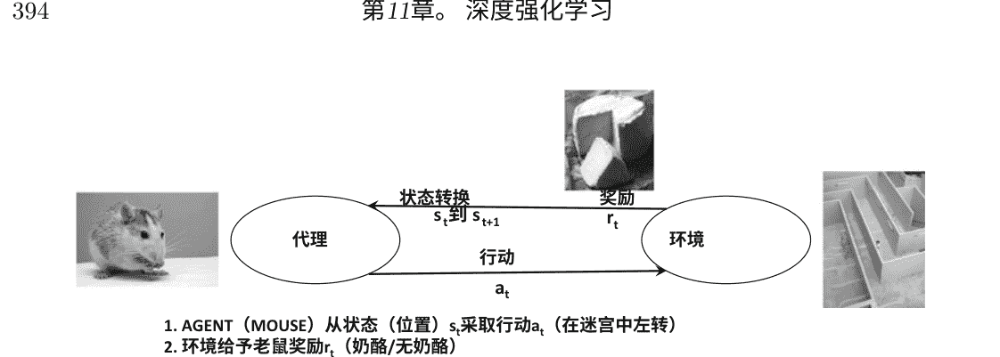

- 1. AGENT (MOUSE) 从状态（位置）s_t采取行动a_t（在迷宫中左转）
- 2. 环境给予老鼠奖励r_t（奶酪/无奶酪）
- 3. 代理的状态变为s_{t+1}
- 4. 老鼠的神经元根据行动是否获得奶酪来更新突触权重

总体而言：代理随着时间学会采取与状态相关的行动以获得奖励

图11.1：强化学习的广义框架

生成一系列状态、行动和奖励的过程称为马尔可夫决策过程。马尔可夫决策过程的主要特性是，在任何特定的时间戳，状态都包含了环境根据代理的行动进行状态转换和奖励分配所需的所有信息。有限马尔可夫决策过程（例如，井字棋）在有限的步骤内终止，这被称为一个回合。无限马尔可夫决策过程（例如，持续工作的机器人）没有有限长度的回合，被称为非回合或连续的。马尔可夫决策过程可以表示为以下的一系列行动、状态和奖励：

```
o s0 a0 r0 s1 a1 r1 ... st at rt ...
```

s_t是执行动作之前的状态。a_t是执行的动作。r_t是执行动作之后的奖励。r_t仅对应于在时间t收到的具体金额。为了估计每个状态-动作对的长期累积未来奖励的内在价值，我们需要一个概念：累积预期奖励E[R_t|s_t, a_t]。对于状态-动作对(s_t, a_t)，累积预期奖励是由折扣因子γ ∈ (0,1)计算的所有未来预期奖励的折现总和：

```
E[R_t|s_t, a_t] = E[r_t + γ·r_{t+1} + γ^2·r_{t+2} + γ^3·r_{t+3}...|s_t, a_t] = ∑_{i=0}^{∞} γ^i E[r_{t+i}|s_t, a_t] (11.2)
```

折扣因子 γ ∈ (0, 1) 调节我们在分配奖励时的近视程度。价值γ是一个小于1的特定于应用的参数，因为未来的奖励被认为比即时奖励更不重要。选择 γ = 0将导致近视地将完整奖励 R_t设置为 r_t，而没有其他内容。较大的值γ将具有更好的长期视角，但需要更多的数据进行稳健学习。如果可以学习到所有状态-动作对的累积预期奖励，那么就可以为强化学习算法提供选择每个状态下最佳动作的基础。然而，学习状态-动作对的值存在许多挑战，原因如下：

- 如果我们定义一个状态敏感的探索-利用策略（例如在多臂赌博机中的ε-贪婪策略），以便创建用于估计的随机动作序列E[R_t|s_t, a_t]，对于的估计值E[R_t|s_t, a_t]将对所使用的策略敏感。这是因为行动具有长期影响，可能会与策略的后续选择相互作用。例如，一个非常探索性的策略将不会学习到 的较大值。对于那些使机器人靠近边缘的动作，的E[R_t|s_t, a_t]值较低。在非探索性环境中，使机器人靠近悬崖的动作是最优的。

- 强化学习系统可能具有非常多的状态（例如国际象棋中的位置数）。因此，明确地制表$E^p[R_t|s_t, a_t]$不再可能，并且需要作为参数化的函数 of $(s_t, a_t)$来学习。模型泛化的主要功能是深度学习的任务。

即使是状态中的最优动作在非探索性环境中，使机器人靠近悬崖的动作是最优的。在预测高质量动作时，使用$E^p[R_t|s_t, a_t]$仍然非常有帮助。$E p[R_t|s_t, a_t]$的符号表示特定于策略$p$的期望值。幸运的是，$E_p[R_t|s_t, a_t]$仍然对合理策略预测高质量动作非常有帮助。

我们首先介绍最简单的方法，称为蒙特卡洛采样。

## 11.4 蒙特卡洛采样

强化学习的最简单方法是使用蒙特卡洛采样，其中使用当前估计值的策略p来采样一系列动作序列。E^p[R_t|s_t, a_t]，同时也改进这些估计值。每个采样的序列（回合）被称为蒙特卡洛模拟。这种方法是多臂赌博机算法的一种推广，其中不同的臂被重复采样以学习动作的值。在无状态的多臂赌博机中，奖励仅取决于动作。在一般的强化学习中，我们还有一个状态的概念，因此必须估计对于状态-动作对，而不仅仅是动作，使用E^p[R_t|s_t, a_t]来表示。因此，关键思想是应用通用的随机抽样策略，例如在状态敏感的方式下，使用ε-贪婪策略。在下一节中，我们将介绍一个简单的蒙特卡洛算法，其中

虽然可以使用其他策略设计类似的算法，例如上界策略的随机变体或有偏抽样，但使用ε-贪婪策略。请注意，学习的状态-动作对的值对所使用的策略甚至对ε的值都很敏感。

### 11.4.1 蒙特卡洛采样算法

ε-贪婪算法是多臂赌博机的最简单示例，其中模拟老虎机来决定哪些动作是有回报的。即使对于确定性游戏，只要ε > 0。在本节中，我们将展示如何将无状态的ε-贪婪算法推广到具有状态的环境（以井字棋游戏为例）。回想一下，赌徒（多臂赌博机）持续尝试老虎机的不同臂以便在较长期内学习更有利可图的动作。然而，井字棋环境不再是无状态的，移动的选择取决于当前井字棋板的状态。在这种情况下，每个棋盘位置都是一个状态，而动作对应于在有效位置放置“X”或“O”。3×3棋盘的有效状态数上界为3^9 = 19683，每个位置有三种可能性（'X'、'O'和空白）。请注意，并非所有这19683个位置都是有效的，因此它们可能在实际游戏中无法到达。

与其估计多臂赌博机中每个（无状态）动作的值，我们现在估计每个状态-动作对的值(s, a)，基于历史表现来估计动作a在状态s中对抗假设为'O'玩家（而代理程序扮演'X'）的人类对手的价值。较短的胜利在折扣因子γ < 1下更受青睐，因此状态s中动作a的非标准化值会随γ^{r-1}在胜利的情况下增加，-γ^{r-1}在输掉r步（包括当前步）之后减小，平局得分为0。

归一化的值代表对E^p[R_t | s_t, a_t]的估计，通过将非标准化值除以状态-动作对更新的次数（单独维护）来获得。表格从小的随机值开始，以贪婪的方式选择动作a在状态s中归一化值最高的动作，概率为1-ε，否则选择一个随机动作。在每局游戏结束后，所有的移动都会得到奖励。在每个动作之后给予奖励的情况下，需要使用时间折扣值更新所有过去的动作。

随着时间的推移，对于'X'玩家的所有状态-动作对的值将被学习，并且由此产生的移动也会适应人类对手的游戏。使用人类对手会减慢训练速度。因此，可以使用自我对弈来最优地生成这些表，而无需人类的努力。当使用自我对弈时，为'X'和'O'玩家分别维护不同的表。这些表从一个值{−γ^r, 0, γ^r}中进行更新，取决于从进行移动的玩家的视角来看是胜利/平局/失败。通过多次模拟，ε的值会经常退火到0。在推理时，选择具有最高归一化值的移动，无论是来自'X'表还是'O'表（同时设置ε=0）。

蒙特卡洛采样算法在井字棋中的总体目标是学习固有的长期价值，每个状态-动作对的E^p[R_t | s_t, a_t]。通过玩每一局游戏，某些状态-动作对比其他更有可能获胜，这个事实最终会反映在状态-动作对的表格统计中。在训练的早期阶段，只有非常接近胜利/失败/平局的状态-动作对（即，只有一两步可以导致结果）才会有准确的长期价值，而棋盘上的早期位置则没有准确的价值。然而，随着更多的蒙特卡洛模拟，这些统计数据的改进，早期阶段位置的价值也开始变得越来越准确。因此，训练过程能够学习在特定状态下哪些动作具有最佳的长期结果。例如，在井字棋中做出聪明的一步可能会设下陷阱，最终导致确保的胜利。图11.2(a)展示了两种这样的情况的示例（尽管右侧的陷阱不太明显）。因此，在状态-动作对的表格中，需要对一个战略性好的动作给予积极的评价，而不仅仅是最终的获胜动作。基于蒙特卡洛方法的试错技术确实会给聪明的陷阱赋予高价值。图11.2(b)展示了这样一个表格中的典型值。请注意，图11.2(a)中不太明显的陷阱的值稍低，因为在较长时间后确保胜利的移动被折扣了γ，基于采样的试错可能更难找到设下陷阱后的胜利。这种方法也可以用于非对抗性的环境，例如学习玩视频游戏或训练机器人行走。

### 11.4.2 带有函数逼近器的蒙特卡洛模拟

这种方法的主要问题是，在许多强化学习环境中，状态的数量太大，无法明确列出。例如，在国际象棋游戏中，可能的状态数量非常大，以至于人类所知的所有位置的集合只是有效位置的微小部分。事实上，第11.4.1节的算法是一种改进的蒙特卡洛学习算法，用于改进和记忆已见状态的长期价值。只有通过先前的蒙特卡洛模拟多次从确切的棋盘位置获胜，才能了解井字游戏中陷阱的价值。在象棋等大多数具有挑战性的环境中，必须将从先前经验中学到的知识推广到学习者以前未见过的状态。所有形式的学习（包括强化学习）在将已知经验推广到未知情况时最有用。在这种情况下，以表为中心的形式

逐步改善位置优势是最优秀的人类玩家的标志，而不是像 Stockfish 这样的国际象棋软件，其手工制作的评估有时无法准确捕捉到位置的微妙差异。强化学习中的神经网络将棋盘状态作为输入，以一种综合的方式评估位置，而不需要任何先前的假设。通过反复试错生成的数据为训练一个非常复杂的评估函数提供了唯一的经验，该函数间接地编码在神经网络的参数中。因此，训练过的网络可以将这些学到的经验推广到新的位置。这类似于人类从以前的游戏中学习以更好地评估棋盘位置。

图11.2：对于像(c)这样的大状态空间，需要深度学习者。

强化学习的方法非常不足。深度学习模型充当函数逼近器的角色。与其学习和制表所有位置上所有移动的值（使用基于奖励的试错方法），而是根据先前位置的结果，将每个位置的值作为输入状态的函数来学习，基于训练好的模型。

这个想法是，学习者可以在棋盘上发现重要的模式，并将它们整合到对特定位置的评估中。换句话说，爆炸性可能性的明确制表被压缩的机器学习模型所取代。如果没有这种方法，强化学习无法超越井字棋等玩具设置。

考虑设计一个用于国际象棋的蒙特卡洛算法。我们使用相同的ε贪婪算法（第11.4.1节）的价值，但状态-动作对的值(s_t, a_t)通过使用动作后的棋盘状态进行估计。将动作a_t作为输入传递给卷积神经网络。输出是对的估计通过利用的估计值，模拟贪婪采样算法直到终止。每个选择的移动的折扣后的真实值来自{γ^{r-1}, 0, -γ^{r-1}}基于游戏结果和到终止的移动数r。与其为模拟中的每个选择的移动更新一个状态-动作对表，不如将神经网络的参数更新为将相应的棋盘位置视为训练点，并结合来自

在推理时，移动a_t具有最大由神经网络预测的动作E[R_t|s_t, a_t]，可以在不需要ε贪婪探索的情况下选择。

尽管上述方法有些天真，但可以通过蒙特卡洛树搜索来加强；其中一种系统被称为*Alpha Zero*，最近已经被训练[467]来下棋。图11.2(c)提供了*Alpha Zero*和传统国际象棋程序*Stockfish-8.0*之间比赛中来自不同游戏的两个位置[467]的示例。在左边的国际象棋局面中，强化学习系统通过牺牲立即的材料来压制对手的主教，这是大多数手工评估计算机不会选择的。在右边的局面中，*Alpha Zero*为了逐步限制黑方，牺牲了两个兵和一个兑子。即使*AlphaZero*（可能）在训练过程中从未遇到过这些特定的局面，它的深度学习器仍然能够从先前的试错经验中提取相关特征和模式。在这种特殊情况下，神经网络似乎认识到空间模式对于表示微妙的位置因素的重要性超过了有形的材料因素（就像人类的神经网络一样）。

在现实世界的环境中，状态通常使用感官输入来描述。深度学习者使用这种状态的输入表示来学习特定动作的值（例如，在游戏中进行移动），而不是使用状态-动作对的表格。即使状态的输入表示（例如像素）非常原始，神经网络也能够提取相关的洞察力。这类似于人类处理原始感官输入以定义世界状态并根据行动使用我们的生物神经网络的方法。对于每种可能的现实生活情况，我们没有预先记忆的状态-动作对表格。深度学习范式将庞大的状态-动作值表格转换为参数化模型，将状态-动作对映射到值，可以通过反向传播轻松训练。

## 11.5 基于值函数的自举学习

蒙特卡洛采样方法在非情节性设置中不起作用. 在情节性设置中，最多可以使用一个固定长度的九个移动序列来## 11.5.1 Q学习

考虑一个马尔可夫决策过程，其状态、动作和奖励的序列表示为重复的序列 $s_t, a_t, r_t$ 在时间戳 $t$。假设奖励是按折扣因子 $\gamma$ 获得的，基于方程11.2。状态-动作对 $(s_t, a_t)$ 的Q函数或Q值表示为 $Q(s_t, a_t)$，是执行动作 $a_t$ 在状态 $s_t$ 时的内在（即长期）价值的度量（在最佳动作选择下）。这个值可以看作是期望回报方程11.2的优化版本。 $E^*[R_{t|s_t, a_t}]$ 是对所有可能动作集合 $A$ 的这个值的最大化，可以选择代理的下一个动作：

```
$$a_t^* = \text{argmax}_{a_t \in A} Q(s_t, a_t) \tag{11.3}$$
```

这个预测的动作是下一步的好选择，尽管通常会与探索性组件（例如，$\epsilon$-贪婪策略）结合起来，以改善长期的训练结果。这与蒙特卡洛模拟中选择动作的方式完全相似。主要的区别在于 $Q(s_t, a_t)$ 是通过引导计算而不是模拟计算，并且在寻找最优策略方面有所不同。

不使用显式的终止回滚来为状态值对的值进行归因，而是通过使用单步来计算 $Q(s_t, a_t)$。$s_{t+1}$，并且使用状态 $s_{t+1}$ 的最佳可能Q值估计。为了更新 $Q(s_t, a_t)$，需要更新 $s_{t+1}$。这种类型的更新被称为贝尔曼方程，它是一种动态规划的形式：

```
$$ Q(s_t, a_t) \Leftarrow r_t + \gamma \max_a Q(s_{t+1}, a) \tag{11.4}$$
```

这个更新是基于直觉11.5.1的自举原则，我们使用了比较好的运行状态的估计值，以便创建一个改进的估计值。Q(s_t, a_t)上述更新方程式11.4替换了蒙特卡洛采样的更新，以创建Q学习算法。当使用Monte Carlo采样中的实际结果时，Q学习方法通过自举和动态规划的组合来近似最佳结果。继续模拟状态空间采样（如蒙特卡洛采样）是很诱人的。然而，一个重要的观点是最佳动作不用于进行步骤。相反，最佳移动的概率为$(1 - \epsilon)$并且以概率$\epsilon$进行随机移动以便进行算法的下一次迭代。这样做是为了能够正确地处理探索和利用的平衡。继续模拟以改进表格估计值 $Q(s, a)$ 随时间变化。与蒙特卡洛采样不同，步骤的进行方式（通过随机探索）与更新的方式之间存在二分法。Q(s, a)的更新方式（通过动态规划）是最优的。这种二分法意味着无论使用什么策略（例如，$\epsilon$贪婪或有偏采样）进行模拟，都将始终计算相同的$E^*[R_t|s_t, a_t]=Q(s_t, a_t)$，这是最优策略。

在情节序列的情况下，前一节的蒙特卡洛采样方法改进了后面的状态-动作对的值的估计（更接近终止）。这也适用于Q学习，其中对于一个距离终止状态只有一步的状态的更新是精确的。设置非常重要。在执行后，如果过程终止，则将Q(s_{t+1}, a)设置为0。对于情节序列，这是必要的。因此，状态-动作对值的估计的准确性将从接近终止的状态向早期状态传播（这是引导的基本原理）。例如，在井字棋游戏中，一个状态中获胜动作的值将在单次迭代中准确估计，而井字棋中的早期移动的值将需要通过贝尔曼方程将值从后续状态传播到早期状态。这种传播类型将需要几次迭代。

在状态空间非常小的情况下（比如井字游戏），可以通过学习来使用贝尔曼方程（参见方程11.4）在每一步更新一个包含显式值 Q(s_t, a_t)的数组来明确地计算Q(s_t, a_t)。然而，直接使用方程11.4可能会在早期导致不稳定，因为条目的随机初始化。因此，使用学习率 $\alpha < 1$进行温和的更新：

```
$$ Q(s_t, a_t) \leftarrow Q(s_t, a_t)(1 - \alpha) + \alpha(r_t + \gamma \max_a Q(s_{t+1}, a)) \quad (11.5) $$
```

使用 $\alpha = 1$将导致方程11.4。持续更新数组将导致一个包含每个移动的正确战略值的表；例如，参见图11.2(a)以了解战略值的概念。图11.2(b)包含了这样一个表中的四个条目的示例。请注意，这是对蒙特卡洛采样的表格方法的直接替代方案，并且将得到与最终表中的值相同的结果，但仅适用于井字游戏等玩具设置。

### 11.5.2 深度学习模型作为函数逼近器

与蒙特卡洛采样的情况类似，在象棋或视频游戏等大状态空间中，不可能列出（或仅仅评估一次）所有可能状态的值。这就是象棋和视频游戏等设置与井字棋不同的地方。请注意，方程式11.5仅在右侧的估计有意义时才有效。如果方程式11.5的右侧（即 Q(s_t, a) ）大部分时间都没有遇到过（即使经过了很长时间的学习），更新将是无用的。因此，需要函数逼近器（如蒙特卡洛采样）。

为了方便讨论，我们将使用Atari设置[346]，其中最后几个像素快照的固定窗口提供状态 $s_t$。假设 $s_t$ 的特征表示由 $X_t$ 表示。神经网络使用 $X_t$ 作为输入，并输出 $Q(s_t, a)$ 对于来自动作集合 $A$ 的每个可能合法动作 $a$。假设神经网络由权重的列向量 $W$ 参数化，并且它具有 $|A|$ 个输出，包含与 $A$ 中各个动作对应的Q值。换句话说，对于每个动作 $a \in A$，神经网络能够计算函数 $F(X_t, W, a)$，它被定义为 $Q(s_t, a)$ 的学习估计值：

> $F(X_t, W, a) = \hat{Q}(s_t, a) \quad (11.6)$

请注意，Q函数上方的折线表示它是一个预测值。使用学习的参数 $W$ 学习 $W$ 是使用模型在特定时间戳上决定使用哪个动作的关键。例如，考虑一个视频游戏，其中可能的移动是上、下、左和右。在这种情况下，神经网络将有四个输出，如图11.3所示。在Atari 2600游戏的具体情况下，输入包含 $m=4$ 个灰度空间像素图，表示最后m个移动的窗口[346, 347]。卷积神经网络用于将像素转换为Q值。这个网络被称为Q网络。我们将在后面提供更多关于架构的细节。

权重神经网络的权重需要通过训练来学习。在这里，我们遇到了一个有趣的问题。只有在观察到Q函数的值时，我们才能学习到权重向量。通过观察到的Q函数值，我们可以轻松地建立一个损失函数，以 为基础。为了在每次动作之后进行学习，我们需要计算Q(s_t, a) - \hat{Q}(s_t, a)。问题在于，Q函数表示所有未来动作组合的最大折扣奖励，而在当前时间无法观察到它。

正是在这里，引入了引导技巧来建立神经网络的损失函数。根据直觉11.5.1，我们在设置损失函数时并不真正需要观察到的Q值，只要我们能够利用未来的部分知识来得到改进的Q值估计。然后，我们可以使用这个改进的估计值来创建一个替代的“观察”值。这个“观察”值由之前讨论过的贝尔曼方程（参见方程11.4）定义：

> $Q(s_t, a_t) = r_t + \gamma \max_a \hat{Q}(s_{t+1}, a) \quad (11.7)$

这个关系的正确性源于Q函数被设计成最大化折扣未来回报。我们实际上是在向前看一步来创建一个改进的估计 $Q(s_t, a_t)$。设置 是很重要的。在执行 $a_t$ 之后，如果过程终止，将 $\hat{Q}(s_{t+1}, a)$ 设置为0。对于周期性序列，我们可以将 $a_t$ 写成这个关系的形式。我们也可以用神经网络的预测来表示这个关系：

> $F(X_t, W, a_t) = r_t + \gamma \max_a F(X_{t+1}, W, a) \quad (11.8)$

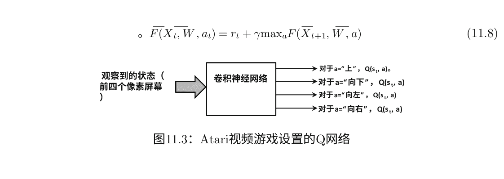

请注意，必须先等待观察到状态 $X_{t+1}$ 和奖励 $r_t$ 通过执行动作 $a_t$ 来获得之前，我们可以计算上述方程右侧时间戳 $t$ 处的“观察到”的值。这提供了一种自然的方式来表达损失神经网络在时间戳 $t$ 处的损失 $L_t$ 通过将（替代）观察到的值与时间戳 $t$ 处的预测值进行比较来计算：

> \[
L_t = \left\{ \left[ r_t + \gamma \max_a F(X_{t+1}, W, a) \right]_{\substack{\ \ \text{将其视为常数的真实值}}} - F(X_t, W, a_t) \right\}^2
\tag{11.9}
\]

因此，我们现在可以更新权重向量使用反向传播算法在这个损失函数上更新权重矩阵 $W$。在这里，重要的是要注意，使用输入值估计的目标值被反向传播算法视为常数真实值 $(t+1)$ 被反向传播算法视为常数真实值。因此，损失函数的导数将把这些估计值视为常数，即使它们是从参数化的神经网络与输入 $X_{t+1}$ 获得的。不将 $F(X_{t+1}, W, a)$ 视为常数将导致结果不佳。这是因为我们将的预测值视为改进的真实值估计（基于自助法则）。因此，反向传播算法将计算以下内容：

> \[
W \Leftarrow W + \alpha \left\{ \left[ r_t + \gamma \max_a F(X_{t+1}, W, a) \right]_{\substack{\ \ \text{将其视为常数的真实值}}} - F(X_t, W, a_t) \right\} \frac{\partial F(X_t, W, a_t)}{\partial W}
\tag{11.10}
\]

在矩阵微积分符号中，函数的偏导数 $F()$ 关于向量 $W$ 的偏导数实际上是梯度 $\nabla_W F$。在过程开始时，神经网络估计的 Q 值是随机的，因为权重向量 $W$ 是随机初始化的。然而，随着时间的推移，估计值逐渐变得更加准确，因为权重不断变化以最大化奖励。

因此，在任何给定的时间戳 $t$ 下，动作 $a_t$ 和奖励 $r_t$ 已经被观察到，以下训练过程用于更新新权重 $W$：

-   1. 通过输入 $X_{t+1}$ 进行网络的前向传播，计算 $\hat{Q}_{t+1} = \max_a F(X_{t+1}, W, a)$。如果执行 $a_t$ 后终止，该值为 0。特殊处理终止状态是很重要的。
-   2. 根据贝尔曼方程，前一个时间戳 $t$ 的 Q 值应该是 $r_t + \gamma \hat{Q}_{t+1}$ 对于观察到的动作 $a_t$ 在时间 $t$。因此，我们没有使用目标的观察值，而是为时间 $t$ 创建了一个替代目标的伪造值，并假装这个伪造值是给我们的观察值。
-   3. 通过网络进行前向传播，输入为 $X_t$，计算 $F(X_t, W, a_t)$。
-   4. 在 $L_t$ 中设置损失函数。$L_t = (r_t + \gamma \hat{Q}_{t+1} - F(X_t, W, a_t))^2$，并在网络中进行反向传播，输入为 $X_t$。请注意，此损失与神经网络输出节点对应的动作 $a_t$ 有关，而其他动作的损失为 0。
-   5. 现在可以使用反向传播算法来更新权重向量 $W$，以便于更新损失函数。尽管术语 $r_t + \gamma \hat{Q}_{t+1}$ 在损失函数中也被作为输入的预测结果获得 $X_{t+1}$ 作为神经网络的输入，但在反向传播算法的梯度计算过程中，它被视为（常数）观察值。

训练和预测同时进行，因为动作的值被用来更新权重和选择下一个动作。很容易选择具有最大Q值的动作作为相关预测。然而，这种方法可能无法充分探索搜索空间。因此，人们将最优性预测与策略相结合，例如 $\epsilon$ 贪婪算法以选择下一个动作。

以概率 $(1-\epsilon)$ 选择具有最大预测收益的动作。否则，选择一个随机动作。值为 $\epsilon$ 可以通过从大值开始逐渐减小来退火。因此，神经网络的目标预测值是使用贝尔曼方程中的最佳动作计算的（这可能最终与观察到的动作 $a_{t+1}$ 基于 $\epsilon$ 贪婪策略可能不同）。这就是为什么Q-learning被称为一种off-policy算法，其中神经网络更新的目标预测值是使用未来可能与实际观察到的动作不同的动作计算的。

### 11.5.3 例子：视频游戏设置的神经网络细节

对于卷积神经网络[346, 347]，屏幕尺寸设置为 84 × 84像素，这也定义了卷积网络中第一层的空间足迹。输入是灰度的，因此每个屏幕只需要一个空间特征图，尽管输入层需要深度为4来表示前四个窗口的像素。使用了三个卷积层，滤波器尺寸分别为 8 × 8， 4 × 4和 3 × 3。第一个卷积层使用了32个滤波器，其他两个卷积层分别使用了64个滤波器，卷积的步长分别为4、2和1。卷积层后面是两个全连接层。倒数第二层的神经元数量等于512，最后一层的神经元数量等于输出的数量（可能的动作）。输出层的数量在4到18之间变化，具体取决于游戏。卷积网络的整体架构如图11.4所示。

所有隐藏层都使用ReLU激活函数，输出层使用线性激活函数以预测实值Q值。没有使用池化操作，卷积中的步幅提供了空间压缩。Atari平台支持许多游戏，并且在不同游戏中使用相同的更广泛的架构以展示其普适性。在不同游戏中，性能存在一定的差异，尽管在许多情况下超过了人类的表现。该算法在需要长期策略的游戏中面临着最大的挑战。尽管如此，相对均匀的框架在许多游戏中表现出了强大的性能，这是令人鼓舞的。

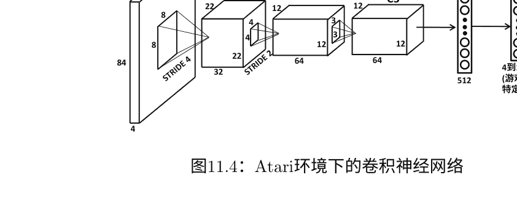

### 11.5.4 在策略和非策略方法之间: SARSA

Q-Learning方法属于一类被称为时序差分学习的方法。在Q-learning中，根据一个 $\epsilon$ 贪婪策略选择动作。然而，神经网络的参数是根据贝尔曼方程在每一步基于最佳可能的行动进行更新的。每一步的最佳可能行动与不完全相同。$\epsilon$贪婪策略用于执行模拟。因此，Q学习是一种离线强化学习方法。选择不同的策略来执行动作与执行更新的策略不同，这是因为贝尔曼更新旨在寻找最优策略，而不是评估特定策略，如 $\epsilon$贪婪 (与蒙特卡洛方法一样)。在蒙特卡洛采样等在线方法中，动作与更新是一致的，因此更新可以被视为策略评估而不是策略优化。因此，在蒙特卡洛采样中，更改策略会更显著地影响预测的动作，而在Q学习中则不然。使用SARSA (状态-动作-奖励-状态-动作)算法可以实现蒙特卡洛采样的引导近似，在下一步中更新奖励使用的动作。由预测的下一步动作。$\epsilon$贪婪策略而不是贝尔曼方程的最优步骤。让 $Q^P(s, a)$ 是对策略P (在这种情况下是 $\epsilon$贪婪策略) 的评估，对于状态-动作对 $(s, a)$。然后，在采样动作 $A_{t+1}$ 之后使用 $\epsilon$-贪婪，更新如下:

```
$$Q^p(s_t, a_t) \leftarrow Q^p(s_t, a_t)(1 - \alpha) + \alpha(r_t + \gamma Q^p(s_{t+1}, a_{t+1})) \tag{11.11}$$
```

如果动作在状态 $s_t$ 导致终止 (对于周期性过程)，那么 $Q^p(s_t, a_t)$ 简单地设置为 $r_t$。请注意，此更新与方程式11.5的Q-Learning更新不同，因为动作 $a_{t+1}$ 包括探索的影响。

在使用函数逼近器时，下一步的损失函数定义如下:

```
$$L_t = \left\{r_t + \gamma F(X_{t+1}, W, a_{t+1}) - F(X_t, W, a_t)\right\}^2 \tag{11.12}$$
```

函数 $F(\cdot, \cdot, \cdot)$ 的定义与前一节相同。基于这个损失，更新权重向量，并执行动作 $a_{t+1}$:

```
$$W \leftarrow W + \alpha \left\{ \begin{array}{l} \left[ r_t + \gamma F(X_{t+1}, W, a_{t+1}) \right] - F(X_t, W, a_t) \end{array} \right\} \frac{\partial F(X_t, W, a_t)}{\partial W} \tag{11.13}$$
\underbrace{\phantom{\left[ r_t + \gamma F(X_{t+1}, W, a_{t+1}) \right] - F(X_t, W, a_t)}}_{\text{将其视为常数的真实值}}
```

在这里，将这个更新与根据方程式11.10在Q-learning中使用的更新进行比较是有益的。在Q-learning中，为了更新参数，使用的是每个状态下的最佳动作，即使实际执行的策略可能是 $\epsilon$-贪婪法 (鼓励探索)。在SARSA中，我们使用实际选择的动作来执行更新的 $\epsilon$-贪婪法，以执行更新。因此，这种方法是一种基于策略的方法。与Q-learning等离线方法能够将探索与利用分离不同，基于策略的方法则不能。请注意，如果我们将 $\epsilon$ 的值设置为0 (即纯贪婪法)，那么Q-Learning和SARSA将专门化为相同的算法。然而，这种方法不会很好地工作，因为没有探索。当学习无法与预测分开时，SARSA很有用。当学习可以离线进行时，Q-learning很有用，随后使用纯贪婪法的学习策略进行利用 $\epsilon = 0$ (不需要进一步的模型更新)。在推理时使用 $\epsilon$-贪婪法可能是危险的，因为没有探索。在Q学习中，因为策略从不为其探索组件（在更新中）付费因此不会学习如何保持探索的安全。例如，基于Q学习的机器人将选择最短路径从点A到点B，即使它沿着悬崖的边缘而SARSA训练的机器人则不会。SARSA还可以使用n步先行搜索（而不是1步引导），这使其更接近第11.4节中的蒙特卡洛采样。

### 11.5.5 建模状态与状态-动作对

在前几节中，主题的一个小变化是学习特定状态的值而不是状态-动作对。可以通过维护状态值而不是状态-动作对来实现之前讨论的所有方法。例如，可以通过评估每个可能动作导致的所有状态的值来实现SARSA，并且根据预定义的策略选择一个好的动作，如$\epsilon$贪婪策略。事实上，最早的时序差异学习方法（或TD学习）是维护状态的值而不是状态-动作对。从效率的角度来看，一次性输出所有动作的值更方便（而不是重复评估每个前向状态）用于基于值的决策。仅当策略无法以状态-动作对的形式清晰表达时，使用状态值而不是状态-动作对才有用。例如，我们可以评估一个前瞻性的有希望的棋局树，并报告一些用于引导的平均值。在这种情况下，评估状态而不是状态-动作对是可取的。因此，本节将讨论一种直接评估状态的时序差异学习的变体。

将状态 $s_t$ 的值表示为 $V(s_t)$。现在假设你有一个参数化的神经网络，它使用观察到的属性 $X_t$（例如，Atari游戏中最后四个屏幕的像素）来估计状态 $s_t$ 的值 $V(s_t)$。这个神经网络的示例如图11.5所示。然后，如果神经网络计算的函数是 $G(X_t, W)$，其中参数向量为 $W$，则有以下结果：

```
$$ G(X_t, W) = \hat{V}(s_t) $$
```

请注意，决定行动的策略可能会使用一些任意的前瞻状态评估来决定行动。目前，我们假设我们有一些合理的启发式策略来选择使用前瞻状态的行动。例如，如果我们评估每个由行动产生的前瞻状态，并根据预定义的策略（例如，$\epsilon$-贪婪）选择其中一个，那么下面讨论的方法与SARSA相同。

如果动作执行动作 $a_t$ 时，获得奖励 $r_t$，那么结果状态为 $s_{t+1}$，其值为 $V(s_{t+1})$ 的估计值。可以通过以下方式获得 $V(s_t)$ 的估计值:

```
$$ V(s_t) = r_t + \gamma V(s_{t+1}) $$
```

这个估计值也可以用神经网络参数表示：

$$G(\overline{X_t}, \overline{W}) = r_t + \gamma G(\overline{X_{t+1}}, \overline{W}) \tag{11.16}$$

在训练阶段，需要调整权重以使$G(X_t, W)$向改进的“真实值”靠近时，需要调整权重。与Q-learning类似，我们使用自举的假设来处理值 $r_t + \gamma G(X_{t+1}, W)$是给定的观测值。因此，我们希望最小化以下TD误差的定义：

$$\delta_t = \underbrace{r_t + \gamma \overline{G}(X_{t+1}, \overline{W})}_{\text{“观察到的”值}} - G(\overline{X_t}, \overline{W}) \tag{11.17}$$

因此，损失函数$L_t$的定义如下：

$$L_t = \delta_t^2 = \left\{ \underbrace{r_t + \gamma G(\overline{X_{t+1}}, \overline{W})}_{\text{“观察到的”值}} - G(\overline{X_t}, \overline{W}) \right\}^2 \tag{11.18}$$

与Q-learning类似，首先要计算时间戳$t$时状态的“观察到的”值，使用输入。将$X_{t+1}$输入神经网络计算。因此，必须等到动作$a_t$被观察到，因此观察到的特征$X_{t+1}$作为状态$s_{t+1}$的观察到的特征可用。这个“观察到的”值(由$r_t + \gamma \overline{G}(X_{t+1}, \overline{W})$) 定义的状态$s_t$的值$\overline{s_t}$然后用作更新神经网络权重的(常数)目标，当输入$X_t$用于预测状态$s_t$的值。因此，需要根据以下损失函数的梯度移动神经网络的权重：

$$\begin{aligned}
&\overline{W} \Leftarrow \overline{W} - \alpha \frac{\partial L_t}{\partial \overline{W}} \\
&= \overline{W} + \alpha \left\{ \underbrace{[r_t + \gamma G(\overline{X_{t+1}}, \overline{W})] - G(\overline{X_t}, \overline{W})}_{\text{“观察到的”值}} \right\} \frac{\partial G(\overline{X_t}, \overline{W})}{\partial \overline{W}} \\
&= \overline{W} + \alpha \delta_t (\nabla G(\overline{X_t}, \overline{W}))
\end{aligned}$$

这个算法是$TD(\lambda)$算法的一个特例，其中$\lambda$设置为0。这个特例只通过基于下一个时间戳的评估创建一个引导的“真实值”来更新神经网络。这种类型的真实值是一种固有的近视近似。例如，在国际象棋游戏中，强化学习系统可能在许多步之前无意中犯了一些错误，而现在在引导预测中突然显示出高误差。引导预测中的误差表明我们已经获得了关于每个过去状态$X_k$的新信息，我们可以用它来改变它的预测。

一种可能性是通过向前多步进行引导(参见练习7)。另一种解决方案是使用$TD(\lambda)$，它在完美蒙特卡罗基准和具有平滑衰减的单步逼近之间探索连续性。对于旧的预测进行的调整以$\lambda < 1$的速率逐渐折扣。在这种情况下，更新可以表示为以下形式[498]：

$$\overline{W} \Leftarrow \overline{W} + \alpha \delta_t \sum_{k=0}^{t} \underbrace{(\lambda \gamma)^{t-k} (\nabla G(\overline{X_k}, \overline{W}))}_{\text{修改 } x \text{ 的预测}} \tag{11.19}$$

在$\lambda=1$时，该方法可以被证明等价于一种使用蒙特卡罗评估（即，将一个情节过程滚动到结束）来计算基准的方法[498]。这是因为我们始终使用新的错误信息来完全纠正过去的错误，而不进行折扣处理。$\lambda=1$，从而创建一个无偏估计。注意$\lambda$仅用于折扣处理步骤，而$\gamma$也用于计算TD误差。根据方程式11.17计算δ_t的参数。$\lambda$是算法特定的，而$\gamma$是环境特定的。使用$\lambda=1$或蒙特卡罗采样会导致较低的偏差和较高的方差。例如，考虑一个国际象棋游戏，代理人艾丽斯和鲍勃在一场比赛中各犯了三个错误，但艾丽斯最终获胜。这个单一的蒙特卡罗模拟将无法区分每个具体错误的影响，并将对最终游戏结果进行折扣处理，分配给每个棋盘位置。另一方面，一个n步时序差异方法（即，n层次的棋盘评估）可能会看到每个棋盘位置的时序差异错误，代理人在其中犯了一个错误，并被n步的前瞻性检测到。只有在有足够的数据（即更多的游戏）的情况下，蒙特卡罗方法才能区分不同类型的错误。然而，选择很小的值$\lambda$将难以学习开局（即，更大的偏差），因为长期影响的错误将不会被检测到。这些开局问题已经有很好的文献记录[23, 513]。

Samuel的著名跳棋程序[438]中使用了时序差异学习，并且也激发了Tesauro为Backgammon开发TD-Gammon[509]的动机。神经网络被用于状态值估计，并且其参数通过时间差异引导在连续的移动中进行更新。最终的推理是通过对改进的评估函数进行极小化评估，深度通常为2或3。TD-Gammon能够击败几位专家玩家。它还展示了一些被顶级玩家最终采纳的非常规游戏策略。

## 11.6 策略梯度方法

基于值的方法，如Q-learning，尝试用神经网络预测动作的值，并将其与通用策略（如$\epsilon$-贪婪）相结合。另一方面，策略梯度方法估计每个步骤中每个动作的概率，目标是最大化总体奖励。因此，策略本身是参数化的，而不是将值估计作为选择动作的中间步骤。

用于估计策略的神经网络被称为策略网络，在其中输入是系统的当前状态，输出是与视频游戏中各种动作（例如向上、向下、向左或向右移动）相关的一组概率。与Q网络的情况类似，输入可以是代理状态的观察表示。例如，在Atari视频游戏环境中，观察到的状态可以是最后四个屏幕的像素。图11.6显示了一个策略网络的示例，该示例与Atari视频游戏环境相关。

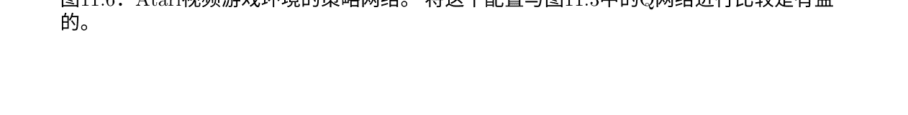

Atari环境。将这个策略网络与图11.3中的Q网络进行比较是有益的。给定各种动作的概率输出，我们使用与这些概率相关联的面的有偏骰子，并选择其中一个动作。因此，对于每个动作$a$，观察到的状态表示$X_t$和当前参数$W$，神经网络能够计算函数$P (X_t, W , a)$，即应执行动作$a$的概率。从中采样一个动作，并观察到相应的奖励（有时使用蒙特卡洛采样）。如果策略不好，动作更有可能是错误的，奖励也会很差。权重向量$W$然后通过梯度上升来更新以进行下一次迭代（以最大化预期奖励而不是最小化损失）。主要挑战在于计算期望的梯度。常见的策略梯度方法包括有限差分方法、似然比方法和自然策略梯度。接下来，我们只讨论前两种方法。

### 11.6.1 有限差分方法

有限差分法通过提供梯度的估计值来规避随机性问题，这些估计值是通过经验模拟得到的。有限差分法使用权重扰动来估计奖励的梯度。这个想法是使用不同的神经网络权重扰动，并检查奖励的预期变化$\Delta J$。需要注意的是，为了估计奖励的变化，我们需要运行扰动策略的$H$个步骤。这样一系列的$H$个步骤被称为一次模拟。例如，在Atari游戏中，我们需要为每组扰动权重的不同集合玩$H$个步骤的轨迹，以估计奖励的变化。在没有足够强大的对手进行训练的游戏中，可以对基于几次迭代学习的对手版本进行游戏。

在给定的时间段内，通过使用从一开始开始的截断版本的方程11.2，计算折扣奖励$H$：

$$J = \sum_{t=0}^{H} \gamma^t r_t \tag{11.20}$$

为了最大化奖励，我们使用梯度上升法更新权重向量如下：

$$\overline{W} \Leftarrow \overline{W} + \alpha \nabla J \tag{11.21}$$

一般来说，$H$的值可能足够大，以至于我们可能达到游戏的结尾，因此使用的分数将是游戏结束时的分数。在一些游戏中，如围棋，分数只在游戏结束时可用，赢得一局得$+1$，输掉一局得$-1$。在这种情况下，选择足够大的$H$变得更加重要，以便玩到游戏的结尾。因此，我们将有$S$个不同的列向量$\Delta W_1 \dots \Delta WS$权重变化，以及相应的变化$\Delta J_1 \dots \Delta JS$总奖励。这些对大致满足以下关系：

$$(\Delta W_r) \cdot \nabla J \approx \Delta J_r \quad \forall_r \in \{1 \dots s\} \tag{11.22}$$

我们可以创建一个$s$维列向量$y = [\Delta J_1 \dots \Delta J_s]^T$表示目标函数的变化。通过将行堆叠在一起，我们可以得到一个$N \times s$矩阵$D$。$\Delta W_r$放在每个行的顶部，其中N是神经网络中的参数数量。因此，我们有以下结果：

$$D[\nabla J] \approx y \qquad\qquad\qquad\qquad\qquad\qquad\qquad\qquad\quad\; (11.23)$$

然后，通过对权重向量的变化与目标函数的变化进行直接线性回归，可以得到策略梯度。通过使用线性回归的公式（参见第3章第2.2.2节），我们得到以下结果：

$$\nabla J= (D^T D)^{-1} D^T y \qquad\qquad\qquad\qquad\qquad\qquad\qquad\quad\; (11.24)$$

这个梯度用于方程11.21的更新。对于每个样本，需要运行策略进行一系列H步骤来估计梯度。这个过程有时可能很慢。

### 11.6.2 似然比方法

在REIN-FORCE算法的背景下，Williams [552]提出了似然比方法。考虑我们以概率向量$p$遵循策略的情况，并且我们想要最大化$E[Q^p(s, a)]$，这是神经网络从状态$s$和每个采样的动作$a$中得到的长期期望值。考虑动作$a$的概率是$p(a)$的情况（由神经网络输出）。在这种情况下，我们希望找到$E[Q^p(s, a)]$关于权重向量$W$的梯度。$W$是神经网络用于随机梯度上升的权重向量。从采样事件中找到期望的梯度是不明显的。然而，对数概率技巧允许我们将期望移到梯度之外，这是对状态-动作对样本的可加性。

$$\nabla E[Q^p(s, a)] = E[Q^p(s, a)\nabla\log(p(a))] \qquad\qquad\qquad\qquad\qquad\qquad\quad\; (11.25)$$

我们证明了上述结果关于偏导数的证明，假设$a$是一个离散变量，对于单个神经网络权重$w$:

$$
\begin{aligned}
\frac{\partial E[Q^p(s, a)]}{\partial w} &= \frac{\partial \left[ \sum_a Q^p(s, a) p(a) \right]}{\partial w} = \sum_a Q^p(s, a) \frac{\partial p(a)}{\partial w} = \sum_a Q^p(s, a) \left[ \frac{1}{p(a)} \frac{\partial p(a)}{\partial w} \right] p(a) \\
&= \sum_a Q^p(s, a) \left[ \frac{\partial \log(p(a))}{\partial w} \right] p(a) = E \left[ Q^p(s, a) \frac{\partial \log(p(a))}{\partial w} \right]
\end{aligned}
$$

上述结果也可以用于连续变量的情况（参见练习1）。在机器人技术中，连续动作经常发生(例如，移动手臂的距离)。

对于神经网络参数估计，使用这个技巧很容易。模拟中的每个动作$a$与长期奖励相关联。通过蒙特卡洛模拟获得的$Q^p(s, a)$。根据上述关系，通过乘以对数概率的梯度获得了预期优势的梯度。该动作的对数概率$\log(p(a))$（可以通过使用反向传播从图116中的神经网络计算）与长期奖励$Q^p(s, a)$相关。通过蒙特卡洛模拟获得。

我们得到了各种输入状态和相应输出在神经网络中的训练样本。例如，如果我们运行了100次模拟，我们最多会得到$100 \times H$个不同的样本。其中每个样本都有一个从中抽取的长期奖励。对于这些样本中的每一个，奖励在梯度上升更新采样动作的对数概率时作为权重。

$$ W \leftarrow W + Q^p(s, a) \nabla \log(p(a)) \quad (11.26) $$

在这里，$p(a)$是神经网络输出的采样动作的概率。梯度是使用反向传播计算的，并且这些更新与第1121式中的更新类似。这个采样和更新的过程一直进行到收敛。

请注意，通常使用地面真实类别的对数概率梯度来更新具有交叉熵损失的softmax分类器，以增加正确类别的概率（这在直观上与此处的更新类似）。这里的区别在于，我们使用Q值加权更新，因为我们希望更积极地推动参数朝着高回报的动作方向。也可以在采样的轨迹中使用小批量梯度上升。从不同的轨迹中随机采样可以帮助避免由于相关性引起的局部最小值问题，因为每个轨迹的连续样本彼此之间密切相关。

通过基线减少方差：虽然我们使用了长期奖励$Q^p(s, a)$作为要优化的量，通常会从该量中减去一个基线值以获得其优势（即，动作的差异影响超过期望）。理想情况下，基线是特定于状态的，但也可以是常数。在REINFORCE的原始工作中，使用了一个常数基线（通常是所有状态的平均长期奖励的某种度量）。即使这种简单的度量也可以帮助加快学习速度，因为它减少了低于平均水平的概率并增加了高于平均水平的概率（而不是以不同的速率增加两者）。基线的常数选择不会影响过程的偏差，但会减少方差。基线的一个状态特定选择是值。在采样动作$a$之前，状态$s$的值函数$V^p( s)$。这种选择导致了优势$(Q^p(s, a) - V^p(s))$与时间差分误差相同。这个选择在直觉上是有意义的，因为时间差分误差包含了比选择动作之前我们所知道的更多关于动作的差异奖励的信息。关于基线选择的讨论可以在[387, 452]中找到。

考虑一个Atari游戏代理的例子，在这个例子中，一个roll-out样本选择了向上移动，并输出了向上移动的概率为0.2。假设（常数）基准线为0.17，并且该动作的长期奖励为+1，因为游戏结果是胜利的（且没有奖励折扣）。因此，在该roll-out中，每个动作的得分为0.83（减去基准线后）。然后，除了该时间步骤的UP动作对应的输出节点之外，所有动作（神经网络的输出节点）的收益为0，而与UP对应的输出节点的收益为$0.83 \times \log(0.2)$。然后，可以通过反向传播来更新神经网络的参数。

使用特定状态的基准线进行调整在直观上很容易解释。考虑Alice和Bob之间的国际象棋比赛的例子。如果我们使用基准线为0，则每个移动只会得到与最终结果相对应的奖励，好的移动和坏的移动之间的差异将不明显。换句话说，我们需要模拟更多的游戏来区分位置。另一方面，如果我们使用状态值（在执行动作之前）作为基准线，则使用（更精细的）时间差分误差作为动作的优势。在这种情况下，具有更大状态特定影响的动作将被认为具有更高的优势（在单个游戏中）。因此，学习所需的游戏数量将减少。

### 将监督学习与策略梯度相结合

在应用强化学习之前，监督学习对于初始化策略网络的权重非常有用。例如，在国际象棋游戏中，可能已经有了专家走法的先前示例，这些走法已经被认为是好的。在这种情况下，我们只需使用相同的策略网络执行梯度上升，只是根据公式11.25为每个专家走法分配固定的1来评估梯度。这个问题与softmax分类的问题相同，策略网络的目标是预测与专家相同的走法。可以通过从计算机评估中获得的具有负面评价的一些错误示例来提高训练数据的质量。

这种方法被认为是监督学习，而不是强化学习，因为我们只是使用先前的数据，而不是生成/模拟我们从中学习的数据（这在强化学习中很常见）。这个通用思想可以扩展到任何强化学习环境中，其中一些先前的动作和相关奖励的示例是可用的。由于在过程的早期阶段很难获得高质量的数据，所以在这些环境中，监督学习非常常见于初始化阶段。

许多已发表的作品也将监督学习和强化学习交错使用，以实现更高的数据效率[292]。

### 11.6.3 演员-评论家方法

到目前为止，我们已经讨论了以下两种方法：要么由评论家主导，要么由演员主导：

1.  Q学习和$T D(\lambda)$方法使用优化的价值函数。这个价值函数是评论家，而演员的策略（例如，$\epsilon$-贪婪）直接从这个评论家中派生。因此，这些方法被认为是仅评论家的方法。
2.  策略梯度方法直接学习策略动作的概率。各种动作的优势通常使用蒙特卡罗采样来估计。因此，这些方法被认为是仅演员的方法。

请注意，策略梯度方法确实需要评估中间动作的优势，并且迄今为止，这种估计一直是通过蒙特卡罗模拟来完成的。然而，蒙特卡洛模拟在在线环境中成本高昂且不切实际。事实证明，可以使用值函数方法学习中间动作的优势。与前一节相同，我们使用符号$Q^{\pi}(s_t, a)$表示使用策略网络跟随的策略下动作$a$的值。因此，现在我们将有两个耦合的神经网络-一个策略网络和一个Q网络。策略网络学习动作的概率，而Q网络学习值$Q^{p}(s_t, a)$估计策略网络的优势。因此，策略网络使用$Q^{p}(s_t, a)$（带有基准调整）来加权其梯度上升更新。

Q网络使用类似于SARSA的在线策略更新进行更新，其中策略由策略网络控制（而不是$\epsilon$-贪婪）。然而，Q网络不像Q学习那样直接决定动作，因为策略决策超出了其控制范围（超出了其作为评论家的角色）。因此，策略网络是演员，而值网络是评论家。

网络是评论家。为了区分策略网络和Q网络，我们将策略网络的参数向量表示为 $\Theta$，Q网络的参数向量表示为 $W$。我们假设时间戳 $t$ 的状态表示为 $s_t$，并且输入神经网络的可观测特征表示为 $X_t$。因此，我们将使用 $s_t$和$\overline{X}_t$在下面可以互换使用。考虑在第 $t$个时间戳的情况，其中动作 $a_t$在状态$s_t$之后被观察到，带有奖励 $r_t$。然后，对于第 $(t+1)$步，应用以下步骤序列：

1.  从策略网络中使用当前参数状态采样动作 $a_{t+1}$。
    注意当前状态为 $s_{t+1}$，因为动作 $a_t$已经被观察到。
2.  令 $F(X_t, W, a_t) = \hat{Q}^p(s_t, a_t)$ 表示估计值 $Q^p(s_t, a_t)$ 是由观察到的表示使用 Q-网络计算得到的 $X_t$表示状态和参数 $W$ 估计量 $Q^p(s_t, a_t)$ 和使用 Q-网络计算 $Q^p(s_{t+1}, a_{t+1})$。计算 TD-误差 $\delta_t$如下：
    $$
    \begin{aligned}
    \delta_t &= r_t + \gamma \hat{Q}^p(s_{t+1}, a_{t+1}) - \hat{Q}^p(s_t, a_t) \\
    &= r_t + \gamma F(\overline{X}_{t+1}, \overline{W}, a_{t+1}) - F(\overline{X}_t, \overline{W}, a_t)
    \end{aligned}
    $$
3.  [更新策略网络参数]：令 $P(X_t, \Theta, a_t)$ 是动作的概率。由策略网络预测的动作为按以下方式更新策略网络的参数：
    $$
    \overline{\Theta} \leftarrow \overline{\Theta} + \alpha \hat{Q}^p(s_t, a_t) \nabla_{\Theta} \log(P(\overline{X}_t, \overline{\Theta}, a_t))
    $$
    在这里，$\alpha$是策略网络的学习率，$\hat{Q}^p(s_t, a_t) = F(\overline{X}_t, \overline{W}, a_t)$ 是从Q网络获得的。
4.  [更新Q网络参数]：按以下方式更新Q网络的参数：
    $$
    \overline{W} \leftarrow \overline{W} + \beta \delta_t \nabla_{W} F(\overline{X}_t, \overline{W}, a_t)
    $$
    这里，$\beta$是Q网络的学习率。需要注意的是，Q网络的学习率通常比策略网络的学习率要高。

动作然后执行$a_{t+1}$，以观察状态 $s_{t+2}$，并且 $t$的值增加。在这个增加的 $t$值上执行下一次迭代（通过重复上述步骤）。重复迭代，使得方法收敛。值为 $\hat{Q}^p(s_t, a_t)$与值 $\hat{V}^p(s_{t+1})$相同。

如果我们使用 $\hat{V}^p(s_t)$作为基准，优势 $\hat{A}^p(s_t, a_t)$由以下定义：
$$
\hat{A}^p(s_t, a_t) = \hat{Q}^p(s_t, a_t) - \hat{V}^p(s_t)
$$
这将改变更新如下：
$$
\overline{\Theta} \leftarrow \overline{\Theta} + \alpha \hat{A}^p(s_t, a_t) \nabla_{\Theta} \log(P(\overline{X}_t, \overline{\Theta}, a_t))
$$
请注意，在原始算法描述中，将 $\hat{Q}(s_t, a_t)$ 替换为 $\hat{A}(s_t, a_t)$。为了估计值 $\hat{V}^p(s_t)$的一个可能性是维护另一组表示值网络的参数（与Q网络不同）。TD算法可用于更新值网络的参数。然而，事实证明一个单独的值网络就足够了。这是因为我们可以使用 $r_t + \gamma \hat{V}^p(s_{t+1})$代替 $\hat{Q}(s_t, a_t)$。

这导致了一个优势函数，它与TD误差相同：
$$
\hat{A}^p(s_t, a_t) = r_t + \gamma \hat{V}^p(s_{t+1}) - \hat{V}^p(s_t)
$$
换句话说，我们需要单值网络（参见图11.5），它充当评论家。
上述方法也可以推广到使用$TD(\lambda)$算法。

### 11.6.4 连续动作空间

到目前为止讨论的方法都与离散动作空间相关。例如，在视频游戏中，我们可能有一组离散的选择，比如是否将光标向上、向下、向左和向右移动。然而，在机器人应用中，我们可能有连续的动作空间，我们希望移动机器人的手臂一定的距离。

一种可能性是将动作离散化为一组细粒度的间隔，并使用间隔的中点作为代表值。然后可以将问题视为离散选择的问题。然而，这不是一个特别令人满意的设计选择。首先，通过将本质上有序（数值）的值视为分类值，不同选择之间的排序将丢失。其次，它会扩大可能动作的空间，特别是如果动作空间是多维的（例如，机器人的手臂和腿的移动距离分别有不同的维度）。这种方法可能会导致过拟合，并且大大增加学习所需的数据量。

常用的方法是允许神经网络输出连续分布的参数（例如，高斯分布的均值和标准差），然后从该分布的参数中采样以计算下一步动作的值。因此，神经网络将输出均值 $\mu$ 和标准差 $\sigma$ 用于机器人手臂移动的距离，实际动作 $a$ 将从高斯分布 $\mathcal{N}(\mu, \sigma)$ 中采样：
$$
a \sim \mathcal{N}(\mu, \sigma) \quad (11.27)
$$
在这种情况下，动作 $a$ 表示机器人手臂移动的距离。通过反向传播算法可以学习到 $\mu$ 和 $\sigma$。在某些变体中，$\sigma$ 被固定为超参数，只有均值 $\mu$ 需要学习。似然比技巧也适用于这种情况，只是我们使用的是在 $a$ 处的密度的对数，而不是动作 $a$ 的离散概率。

### 策略梯度的优点和缺点

策略梯度方法在具有连续状态和动作序列的应用中是最自然的选择。对于具有多维和连续动作空间的情况，可能的动作组合数量非常大。由于 Q-learning 方法需要计算所有这些动作的最大 Q 值，这一步骤可能会导致计算难以处理。此外，策略梯度方法往往稳定并具有良好的收敛性质。

然而，策略梯度方法容易受到局部最小值的影响。虽然 Q学习方法有时会以不稳定的方式在特定解周围振荡，但它们具有更好的能力接近全局最优解。

## 11.7 蒙特卡洛树搜索

蒙特卡洛树搜索可以看作是强化学习中蒙特卡洛模拟的一种变体。主要区别在于，树结构明确地构建了状态之间的层次关系，而这些状态是在遇到时逐渐形成的。这种树结构还可以与类似时序差分学习的自举方法相结合。它还被用作概率性替代传统游戏软件中使用的确定性极小化树（尽管适用范围不限于游戏）。

正如其名称所示，蒙特卡洛树搜索在强化学习过程中构建了一个状态树。树中的每个节点对应一个状态，每个分支对应一个可能的动作。随着搜索过程中遇到新的状态，树会随时间增长。树搜索的目标是选择最佳分支来推荐代理的预测动作。每个分支都与一个值相关联，该值基于树搜索中该分支的先前结果以及随着探索增加而减少的上限“奖励”。这个值用于在探索过程中设置分支的优先级。每次探索后，分支的学习好处都会进行调整，以便在后续的探索中更喜欢导致积极结果的分支。

接下来，我们将描述在 AlphaGo中使用的蒙特卡洛树搜索作为一个案例研究。假设每个动作（移动） $a$在状态（棋盘位置） $s$的概率$P(s, a)$可以通过策略网络进行估计。同时，对于每个移动，我们有一个数量 $Q(s, a)$表示在状态 $s$下移动 $a$的质量。例如，$Q(s, a)$ 的值会随着从状态 $s$进行模拟的行动$a$的胜利次数增加而增加。AlphaGo系统使用了一种更复杂的算法，还结合了几步后棋盘位置的神经评估（参见第11.8.1节）。然后，在每次迭代中，在状态 $s$下移动 $a$的“上界”质量 $u(s, a)$如下所示：
$$
u(s, a) = Q(s, a) + K \cdot \frac{P(s, a) \sqrt{\sum_{b} N(s, b)}}{N(s, a) + 1} \quad (11.28)
$$
在这里，$N(s, a)$ 是动作 $a$从状态 $s$到达的次数，在蒙特卡洛树搜索过程中。换句话说，上界是通过从质量 $Q(s, a)$开始，并在其上添加一个依赖于 $P(s, a)$ 和分支被跟随的次数的“奖励”来获得的。通过访问次数来缩放 $P(s, a)$ 的想法是为了阻止频繁访问的分支，并鼓励更大的探索。蒙特卡洛方法基于选择具有最大上界的分支的策略，就像多臂赌博机方法一样（参见第11.2节）。在这里，方程式11.28右侧的第二项起到计算上界的置信区间的作用。随着分支的播放次数越来越多，该分支的探索“奖励”会减少，因为其置信区间的宽度减小。超参数 $K$控制探索的程度。

在任何给定的状态下，选择具有最大值 $u(s, a)$ 的动作。这种方法递归地应用，直到跟随最优动作不再导致现有节点。这个新状态 $s'$现在将作为叶节点添加到树中，并将每个值初始化为 $N(s', a)$和 $Q(s', a)$设为0。请注意，直到叶节点的模拟是完全确定性的，没有涉及随机化，因为 $P(s, a)$和 $Q(s, a)$是确定性可计算的。蒙特卡洛模拟用于估计新添加的叶节点 $s'$的值。具体来说，从策略网络进行蒙特卡洛模拟（例如，使用 $P(s, a)$来采样动作）返回 $+1$或 $-1$，取决于胜利还是失败。在评估叶节点之后，更新所有边上的 $Q(s'', a'')$和 $N(s'', a'')$的值。$(s'', a'')$在从当前状态$s$到叶节点 $s'$的路径上进行更新。保持 $Q(s'', a'')$的值作为蒙特卡洛树搜索期间从该分支到达的所有叶节点评估的平均值。从$s$进行多次搜索后，选择访问次数最多的边作为相关边，并将其报告为所需的动作。

### 在引导中的使用

传统上，蒙特卡洛树搜索提供了一个改进的估计。通过执行重复的蒙特卡洛模拟来计算状态-动作对的值 $Q(s, a)$。然而，使用模拟的方法通常可以用引导来代替蒙特卡洛模拟。蒙特卡洛树搜索提供了一种优秀的替代方法来进行 $n$-步时序差分学习。关于在线 $n$-步时序差分学习的一个要点是，它们通过使用贪婪策略来探索单个序列的 $n$-步移动。因此，它们往往过于弱（在增加探索深度但不增加探索广度时）。加强它们的一种方法是检查所有可能的 $n$-序列，并使用最优的序列来进行离线策略学习（即，推广贝尔曼的一步方法）。事实上，这是 Samuel 的跳棋程序 [438] 中使用的方法，它使用最小化树中的最佳选项进行引导（后来被称为 $TD$-$Leaf$ [23]）。这导致了探索所有可能的 $n$-序列的复杂性的增加。蒙特卡洛树搜索可以为引导提供一个强大的替代方法，因为它可以探索从一个节点到多个分支的平均目标值。例如，基于前瞻的真实值可以使用从给定节点开始的所有探索的平均性能。

$AlphaGo$ $Zero$ [467] 通过引导策略而不是状态值来启动策略，这是非常罕见的。$AlphaGo$ $Zero$使用每个节点处分支的相对访问概率作为该状态下动作的后验概率。这些后验概率通过蒙特卡洛树的深层节点的评估，改进了策略网络的概率输出。因此，后验概率被作为相对于策略网络概率的真实值进行引导，并用于更新权重参数（参见第11.8.1节）。

## 11.8 案例研究

接下来，我们将展示来自真实领域的案例研究，展示不同的强化学习设置。我们将展示在围棋、机器人、对话系统、自动驾驶汽车和神经网络超参数学习中的强化学习示例。

### 11.8.1 AlphaGo和AlphaZero在围棋和国际象棋中的应用

围棋是一种类似于国际象棋的双人棋盘游戏。一个双人棋盘游戏的复杂性主要取决于棋盘的大小和每个位置的有效移动数量。最简单的棋盘游戏示例是一个 $3\times3$ 的井字棋盘，大多数人类可以在不需要计算机的情况下最优解地解决它。国际象棋是一个更复杂的游戏，有一个 $8\times8$ 的棋盘，尽管通过巧妙地变化暴力搜索的方法，有选择性地探索最小最大树的移动，可以比今天最好的人类表现得更好。围棋因为它的 $19\times19$ 的棋盘而处于极端复杂性的尽头。

玩家使用白色或黑色的棋子，这些棋子放在围棋棋盘旁边的碗里。图11.7展示了一个围棋棋盘的例子。游戏从一个空棋盘开始，随着玩家在棋盘上放置棋子，棋盘逐渐填满。黑方先行，并从她的碗中拿出181颗棋子，而白方从她的碗中拿出180颗棋子。交叉点的总数等于两位玩家碗中棋子的总数。玩家每次在特定位置（从碗中）放置自己颜色的棋子，并且一旦放置就不能移动。可以通过围绕对手的棋子来俘获对手的棋子。

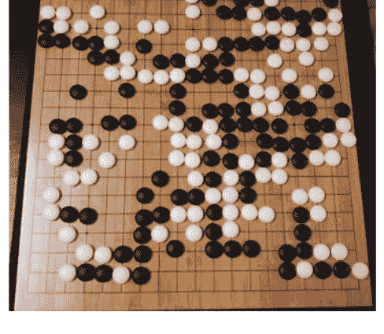

图11.7：带有棋子的围棋棋盘示例。

游戏的目标是玩家通过用自己的棋子将对手围住来控制棋盘的更大部分。

在特定的国际象棋位置上，人们可以进行大约35种可能的移动（即树的分支因子），而在特定的围棋位置上，平均可能的移动数为250，几乎是数量级更大。此外，围棋游戏的平均连续移动数（即树的深度）约为150，是国际象棋的两倍左右。所有这些因素使得从自动游戏玩耍的角度来看，围棋更加困难。国际象棋软件的典型策略是构建一个极小极大树，其中包含玩家在一定深度内可以进行的所有移动组合，然后使用国际象棋特定的启发式方法（例如剩余材料的数量和各种棋子的安全性）评估最终的棋盘位置。根据启发式方法，树的次优部分被修剪。这种方法只是一个改进版本的蛮力策略，即探索所有可能的位置，直到达到给定的深度。在围棋的极小极大树中，即使在分析的适度深度（每个玩家20步）下，节点的数量也大于可观测宇宙中的原子数量。由于在这些情境中空间直觉的重要性，人类在围棋上总是比蛮力策略表现更好。在围棋中使用强化学习更接近于人类的尝试。我们很少尝试探索所有可能的移动组合；相反，我们通过视觉学习棋盘上预测有利位置的模式，并尝试朝着预期能提高我们优势的方向移动。

使用卷积神经网络可以实现对预测良好性能的空间模式的自动学习。系统的状态被编码在特定点的棋盘位置中，尽管AlphaGo的棋盘表示中包含了一些关于交叉点状态或自上次落子以来的移动次数的附加特征。为了提供完整的状态知识，需要多个这样的空间地图。例如，一个特征地图可以表示每个交叉点的状态，另一个可以编码自上次落子以来的回合数，以此类推。整数特征地图被编码成多个独热平面。总共，游戏棋盘可以用$19 \times 19$像素的48个二进制平面来表示。

AlphaGo利用对专家玩家的移动以及与自身对局的胜负经验，通过策略网络学习在不同位置上的良好策略。此外，对于围棋棋盘上的每个位置，使用值网络来进行评估。随后，蒙特卡洛树搜索算法被使用。

用于最终推断。因此，AlphaGo是一个多阶段模型，其组件在下面的章节中讨论。

#### 策略网络

策略网络以前述的棋盘视觉表示作为输入，并输出在状态$s$下采取行动$a$的概率。这个输出概率表示为$p(s, a)$。请注意，围棋中的行动对应于在棋盘上每个合法位置放置石头的概率。因此，输出层使用softmax激活函数。使用不同的方法训练了两个独立的策略网络。这两个网络在结构上是相同的，包含具有ReLU非线性激活函数的卷积层。每个网络包含13层。大多数卷积层使用$3 \times 3$滤波器进行卷积，除了第一个和最后一个卷积层。第一个和最后一个滤波器分别进行$5 \times 5$和$1 \times 1$过滤器卷积。卷积层进行了零填充以保持其大小，并使用了192个过滤器。使用了ReLU非线性函数，并且为了保持空间特征，没有使用最大池化。

网络的训练方式如下：

-   **监督学习**：从专家玩家中随机选择样本作为训练数据。输入是网络的状态，输出是专家玩家执行的动作。这样一步的得分（优势）始终为+1，因为目标是训练网络模仿专家的走法，这也被称为模仿学习。因此，神经网络通过所选择移动的概率的对数似然进行反向传播，作为其增益。这个网络被称为SL策略网络。值得注意的是，这些监督形式的模仿学习在强化学习中经常用于避免冷启动问题。然而，后续的研究[466]表明，放弃这部分学习是一个更好的选择。
-   **强化学习**：在这种情况下，使用强化学习来训练网络。一个问题是，围棋需要两个对手，因此网络会自己对弈以生成着法。当前网络总是与几次迭代之前随机选择的网络对弈，以便强化学习可以有一组随机对手。游戏一直进行到最后，然后根据胜负，每一步都与 +1或 -1相关联。然后使用这些数据来训练策略网络。这个网络被称为强化学习策略网络。

这些网络本身就是强大的围棋选手，并且它们与蒙特卡洛树搜索相结合以增强它们的实力。

#### 价值网络

这个网络也是一个卷积神经网络，它使用网络的状态作为输入，并预测得分为下一个玩家的得分。输出为$[-1, +1]$，其中+1表示完美的概率为1。输出是下一个玩家的预测得分，无论是白色还是黑色，因此输入还以“玩家”或“对手”的形式编码棋子的“颜色”，而不是白色或黑色。价值网络的架构与策略网络非常相似，只是在输入和输出方面有一些差异。输入包含一个额外的特征，对应于下一个要下棋的玩家是白色还是黑色。得分是使用一个tanh单元计算的。

结束，因此值在范围 $[-1, +1]$内。价值网络的早期卷积层与策略网络相同，尽管在第12层添加了一个额外的卷积层。最后一个卷积层后面是一个具有256个单元和ReLU激活函数的全连接层。为了训练网络，一种可能性是使用来自数据集[630]的围棋对局位置。然而，首选的选择是使用自我对弈生成数据集，使用SL策略和RL策略网络一直进行到最后，以生成最终结果。状态-结果对被用来训练卷积神经网络。由于单个游戏中的位置相关，按顺序使用它们进行训练会导致过拟合。为了防止由于密切相关的训练样本引起的过拟合，从不同游戏中抽样位置是重要的。因此，每个训练样本都来自不同的自我对弈游戏。

#### 蒙特卡洛树搜索

用于探索的简化版本方程式11.28的变体，相当于在每个节点 $s$ 处设置 $K = 1/\sqrt{\sum_b N(s, b)}$。第11.7节描述了蒙特卡洛树搜索方法的一个版本，其中仅使用RL策略网络评估叶节点。在 AlphaGo 的情况下，结合了两种方法。首先，从叶节点到创建评估的快速蒙特卡洛模拟。虽然可以使用策略网络进行模拟，但 AlphaGo 使用了一个简化的softmax分类器，其中包含人类对局的数据库和一些手工特征，以提高模拟速度。其次，价值网络创建了叶节点的单独评估 $e_2$。最终评估 $e$ 是两个评估的凸组合：$e = \beta e_1 + (1-\beta) e_2$。使用 $\beta=0.5$ 可以获得最佳性能，尽管仅使用价值网络也可以获得接近的性能（也是可行的选择）。蒙特卡洛树搜索中访问最多的分支被报告为预测的移动。

#### AlphaZero：对零人类知识的增强

这个想法的一个后续改进，被称为 AlphaGo Zero [466]，去除了对人类专家移动（或SL网络）的需求。单个网络输出策略（即动作概率）和价值的组合。$p(s, a)$ 和价值 $v(s)$ 的位置。在输出策略概率上的交叉熵损失和值输出上的平方损失被添加到一起形成单一损失。与 AlphaGo 的原始版本仅用蒙特卡洛树搜索进行推理不同，零知识版本还使用蒙特卡洛树搜索中的访问计数进行训练。

可以将树搜索中每个分支的访问计数视为策略改进算子，通过其基于前瞻性探索的预测概率 $p(s, a)$，这为神经网络学习创建了基础的自举的真实值。虽然时间差分学习自举状态值，但这种方法自举访问计数以学习策略。在棋盘状态 $s$ 中，蒙特卡洛树搜索对动作 $a$ 的预测概率是 $\pi(s, a) = \frac{N(s, a)^{1/\tau}}{\sum_b N(s, b)^{1/\tau}}$。$\tau$ 是一个温度参数。

$N(s, a)$ 的计算使用类似于 AlphaGo 的蒙特卡洛搜索算法，其中先验概率由神经网络输出的 $p(s, a)$ 用于计算公式 11.28 的值。方程 11.28 中的 $Q(s, a)$ 设置为从新创建的叶节点的神经网络中获取的 $v(s')$ 的值的平均值。通过从状态$s$开始进行蒙特卡洛搜索来更新 AlphaGo Zero 的神经网络，将 $\pi(s, a)$ 作为基准，而使用蒙特卡洛模拟生成基准状态值。

在每个状态 $s$ 中，概率 $\pi(s, a)$ 和值 $Q(s, a)$ 以及访问计数 $N(s, a)$ 通过运行蒙特卡洛树搜索过程（重复）从状态$s$开始更新。使用上一次迭代的神经网络根据公式 11.28 选择分支，直到达到不存在于树中的状态或达到终止状态。对于每个不存在的状态，向树中添加一个新的叶节点，并将其 $Q$ 值和访问值初始化为零。根据神经网络的叶节点评估（或根据游戏规则对终止状态进行评估），更新从 $s$ 到叶节点的所有边的 $Q$ 值和访问计数。从节点 $s$ 开始进行多次搜索后，使用后验概率 $\pi(s, a)$ 用于自我对弈中采样一个动作并到达下一个节点 $s'$。在节点 $s'$ 上重复执行本段讨论的整个过程，直到递归完成游戏，并返回作为基准值均匀采样的游戏路径上的状态 $s$ 的 $z(s)$。请注意，$z(s)$ 是从状态 $s$ 的玩家的角度定义的。概率的真实值 $\pi(s, a)$ 已经在中可用。因此，可以创建一个训练实例，其中包含状态 $s$ 的输入表示，中的引导真实概率以及蒙特卡洛真实值 $\pi(s, a)$。

这个训练实例用于更新神经网络参数。因此，如果神经网络的概率和值输出为 $p(s, a)$ 和 $v(s)$，则具有权重向量 $W$ 的神经网络的损失如下：

$L = [v(s) - z(s)]^2 - \sum_{a} \pi(s, a) \log[p(s, a)] + \lambda ||W||^2 \quad (11.29)$

这里，$\lambda > 0$ 是正则化参数。进一步的进展以 Alpha Zero [467] 的形式提出，它可以玩多种游戏，如围棋、将棋和国际象棋。AlphaZero轻松击败了最好的国际象棋软件 Stockfish，也击败了最好的将棋软件 (Elmo)。对于大多数顶级选手来说，国际象棋的胜利尤其出乎意料，因为人们一直认为国际象棋对于强化学习系统来说需要太多的领域知识才能战胜手工评估系统。

### 性能评论

AlphaGo在与各种计算机和人类对手的比赛中表现出色。在与各种计算机对手的比赛中，即使在残局设置下，它也赢得了大多数比赛。它还击败了最好的人类对手，如欧洲冠军、世界冠军和排名第一的选手。

它的表现更值得注意的一点是它取得胜利的方式。在它的几场比赛中，AlphaGo做出了许多非传统和独创性的着法，有时只有在程序获胜后才能理解其意义[631, 632]。有些情况下，AlphaGo的着法与传统智慧相悖，但最终揭示了 AlphaGo在自我对弈中获得的创新见解。

在这场比赛之后，一些顶级围棋选手重新考虑了他们对整个游戏的方法。Alpha Zero在国际象棋中的表现类似，它经常进行材料牺牲，以逐步改善自己的位置并限制对手。这种行为是人类游戏的标志，与传统的国际象棋软件（已经比人类强多了）非常不同。与手工制作的评估不同，它似乎没有关于棋子材料价值的预设观念，也没有关于国王在棋盘中央是否安全的观念。此外，它通过自我对弈自主发现了大多数众所周知的国际象棋开局，并且似乎对哪些开局更好有自己的看法。

与监督学习相比，强化学习的一个关键区别是它具有通过奖励引导的试错学习的能力，从而能够创新超越已知知识。这种行为在其他应用中有一些潜力。

### 11.8.2 自学习机器人

自学习机器人代表着人工智能领域的一个重要前沿，在这个领域中，机器人可以通过奖励驱动的方法进行训练，以执行各种任务，如运动、机械维修或物体检索。例如，考虑这样一种情况，一个机器人被构建成在物理上能够运动（就其构造和可用的运动选择而言），但它必须学习精确的运动选择，以保持平衡并从A点移动到B点。作为两足行走的人类，我们能够自然地行走和保持平衡，甚至不需要思考，但对于两足机器人来说，这并不是一件简单的事情，因为错误的关节运动选择很容易导致机器人倒下。当不确定的地形和障碍物出现在机器人的路上时，问题变得更加困难。

这种类型的问题自然适合强化学习，因为很容易判断一个机器人是否正确行走，但很难对机器人在每种可能的情况下应该做什么给出精确的规则。在奖励驱动的强化学习方法中，机器人在从A点到B点的运动中每次取得进展时都会获得（虚拟）奖励。否则，机器人可以自由采取任何行动，并且它没有预先训练过关于保持平衡和行走的具体行动选择的知识。换句话说，机器人没有被赋予任何关于行走是什么样子的知识（除了它将被奖励使用可用的行动来从A点到B点取得进展）。这是强化学习的一个经典例子，因为机器人现在需要学习采取特定的行动序列以获得目标驱动的奖励。虽然我们在这个例子中使用运动作为具体示例，但这个通用原则适用于机器人中的任何类型的学习。例如，第二个问题是教导机器人进行操纵任务，如抓取物体或拧紧瓶盖。接下来，我们将简要讨论这两种情况。

#### 11.8.2.1 运动技能的深度学习

在这种情况下，虚拟机器人被教授了运动技能[452]，其中机器人是通过 MuJoCo物理引擎[633]进行模拟的，该引擎代表着带有接触的多关节动力学。它是一个旨在促进机器人学、生物力学、图形学和动画等领域的研究和开发的物理引擎，需要快速准确的模拟而无需构建实际机器人。同时使用了一个人形机器人和一个四足机器人。图11.8显示了双足模型的一个示例。这种类型的模拟的优点是，使用虚拟模拟是廉价的，并且避免了在实验框架中由于高水平的错误/事故而导致的自然安全和费用问题。

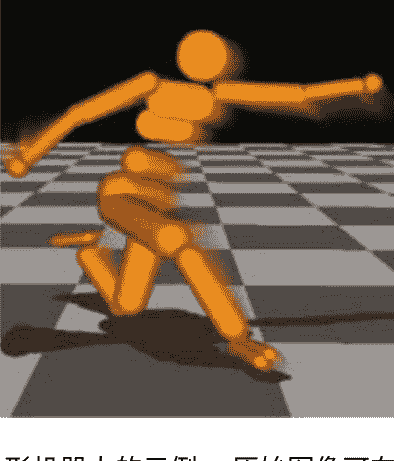

图11.8：虚拟人形机器人的示例。原始图像可在[633]中找到。

从侧面来看，物理模型能提供更真实的结果。一般来说，在建立物理模型之前，模拟通常可以用于小规模测试。人形模型有33个状态维度和10个可操纵自由度，而四足模型有29个状态维度和8个可操纵自由度。模型在前进时会获得奖励，但当机器人的质心低于一定点时，该回合会终止。机器人的动作由关节扭矩控制。机器人可以使用多种功能，例如传感器提供障碍物位置、关节位置、角度等信息。这些功能被输入到神经网络中。使用了两个神经网络；一个用于价值估计，另一个用于策略估计。因此，采用了策略梯度方法，其中价值网络起到估计优势的作用。这种方法是演员-评论家方法的一个实例化。

使用了一个前馈神经网络，具有三个隐藏层，分别为100、50和25个tanh单元。在[452]中的方法需要估计策略函数和值函数，并且在隐藏层中使用了相同的架构。然而，值估计器只需要一个输出，而策略估计器需要与动作数量相同的输出。因此，这两种架构之间的主要区别在于输出层和损失函数的设计方式。广义优势估计器（GAE）与基于信任的策略优化（TRPO）相结合使用。参考文献中包含了这些方法的具体细节指引。通过强化学习对神经网络进行1000次迭代训练，机器人学会了以视觉上令人愉悦的步态行走。机器人行走的最终结果的视频可在[634]处找到。Google DeepMind随后发布了类似的结果，具有更广泛的避开障碍物或其他挑战的能力[197]。

#### 11.8.2.2 视觉运动技能的深度学习

在[292]中提供了一个关于强化学习的第二个有趣案例，其中一个机器人被训练用于完成几个家庭任务，例如将衣架放在架子上，将方块插入形状分类的立方体中，用不同的抓取方式将玩具锤子的爪子放在钉子下面，并将盖子拧在瓶子上。这些任务的示例如图11.9(a)所示，同时还附有机器人的图像。这些动作是7维关节电机扭矩指令，每个动作都需要一系列指令以便最佳地完成任务。在这种情况下，使用了一个真实的机器人物理模型进行训练。机器人使用了一个摄像头图像来定位物体并对其进行操作。

这个摄像头图像可以被视为机器人的眼睛，机器人使用的卷积神经网络与视觉皮层的概念原理相同（基于Hubel和Wiesel的实验）。尽管这种设置乍一看似乎与Atari视频游戏的设置非常不同，但在图像帧如何帮助映射到策略动作方面存在显著的相似之处。例如，Atari设置也使用了卷积神经网络处理原始像素。然而，在这里还有一些额外的输入，对应机器人和物体的位置。这些任务需要在视觉感知、协调和接触动力学方面进行高水平的学习，所有这些都需要自动学习。

一种自然的方法是使用卷积神经网络将图像帧映射到动作。与Atari游戏的情况类似，在适合任务敏感方式中获得相关奖励的卷积神经网络的层中需要学习空间特征。卷积神经网络有7层和92,000个参数。

前三层是卷积层，第四层是空间softmax，第五层是从空间特征映射到简洁的两个坐标的固定变换。这个想法是对空间特征图上的响应应用softmax函数。这提供了特征图中每个位置的概率。预期的使用该概率分布来确定位置，得到二维坐标，称为特征点。 请注意，卷积层中的每个空间特征图都会创建一个特征点。 特征点可以看作是对空间概率分布的一种软最大值。第五层与卷积神经网络中通常看到的层有很大不同，它被设计为创建适用于反馈控制的视觉场景的精确表示。空间特征点与机器人的配置进行连接，这是仅在卷积层之后出现的额外输入。这个连接的特征集被送入两个全连接层，每个层都有40个修正单元，然后线性连接到扭矩。请注意，只有与相机对应的观测数据被馈送到卷积神经网络的第一层，与机器人状态对应的观测数据被馈送到第一个全连接层。这是因为卷积层不能很好地利用机器人状态，所以在卷积层处理完视觉输入后，将状态中心的输入连接起来是有意义的。整个网络包含大约92,000个参数，其中86,000个在卷积层中。卷积神经网络的架构如图11.9(b)所示。观测数据包括RGB相机图像、关节编码器读数、速度和末端执行器姿态。


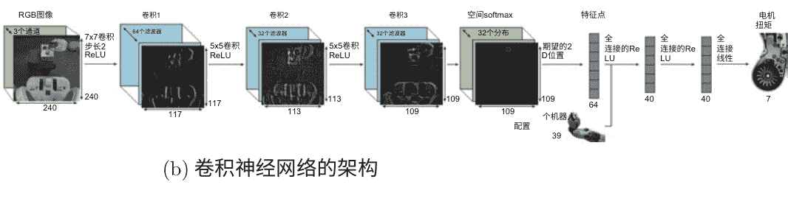

图11.9：视觉运动技能的深度学习。这些图出现在[292]中。（©2016 Sergey Levine, Chelsea Finn, Trevor Darrell, and Pieter Abbeel）

完整的机器人状态包含在14到32个维度之间，例如关节角度、末端执行器姿态、物体位置和它们的速度。这提供了一个实际的状态概念。与所有基于策略的方法一样，输出对应于各种动作（电机力矩）。在[292]中讨论的方法的一个有趣之处是将强化学习问题转化为监督学习。使用了一种名为引导策略搜索的方法，本章不讨论此方法。这种方法将强化学习问题的部分转化为监督学习。有兴趣的读者可以参考[292]，其中还可以找到使用该系统训练的机器人性能视频。

### 11.8.3 构建对话系统：用于聊天机器人的深度学习

聊天机器人也被称为对话系统或对话系统。 聊天机器人的最终目标是构建一个能够自由与人类进行关于各种话题的自然对话的代理人。我们离实现这个目标还有很长的路要走。然而，在构建特定领域和特定应用的聊天机器人方面已经取得了重大进展（例如，谈判或购物助手）。一个相对通用的系统的例子是苹果的Siri，它是一个数字个人助理。人们可以将Siri视为开放域系统，因为可以与它进行关于各种话题的对话。

对于使用Siri的任何人来说，很明显助手有时候要么无法提供令人满意的对困难问题的回答，要么对常见问题的回答是硬编码的，有时候还很滑稽。当然，这是很自然的，因为该系统相对而言是通用的，我们离构建一个人类级对话系统还有很长的路要走。

相比之下，封闭领域的系统有一个具体的任务，因此可以更容易地进行可靠的训练。

在接下来的内容中，我们将描述一个由 Facebook 构建的端到端学习系统，用于学习谈判技巧[296]。这是一个封闭领域的系统，因为它是为谈判的特定目的而设计的。

作为一个测试平台，使用了以下谈判任务。两个代理人被展示了一系列不同类型的物品（例如两本书，一个帽子，三个球）。代理人被指示通过谈判来将这些物品分配给彼此。一个关键点是，每种类型的物品对于两个代理人的价值是不同的，但他们不知道对方物品的价值。这在现实生活中的谈判中经常发生，用户试图通过谈判达成一个对他们有价值的互相满意的结果。物品的值始终被假设为非负数，并在测试环境中以一定约束条件下随机生成。首先，用户的所有物品的总价值为10。其次，每个物品对至少一个用户具有非零价值，因此忽略一个物品几乎没有意义。最后，某些物品对两个用户都具有非零价值。由于这些约束条件，两个用户都无法达到最大分数10，这确保了一个竞争性的谈判过程。经过10轮后，代理人可以选择以没有协议的方式结束谈判，这对两个用户来说价值为0分。使用了书籍、帽子和球三种物品类型，并且池中总共存在5到7个物品。物品的值对于两个用户来说是不同的（没有关于对方分配值的知识），这一事实是重要的；如果两个谈判者都能力强，他们将能够在彼此之间的物品上实现总价值大于10。然而，更好的谈判者将能够通过最优地谈判对他们有较高价值的物品来获得更大的价值。

这种强化学习设置的奖励函数是用户获得的物品的最终价值。可以利用之前的对话进行监督学习，以最大化话语的可能性。直接使用递归网络来最大化话语的可能性会导致代理人过于急于妥协。

因此，该方法将监督学习与强化学习相结合。在强化学习中引入监督学习有助于确保模型不会偏离人类语言。引入了一种称为对话展开的对话规划形式。该方法使用编码器-解码器递归架构，其中解码器最大化奖励函数而不是话语的可能性。

这种编码器-解码器架构基于序列到序列学习，如第8章8.7.3节所讨论的。

为了方便监督学习，从亚马逊机械土耳其人收集了对话。总共收集了5808个对话，在2236个独特的场景中，其中一个场景定义了对物品的一组特定值的分配。其中252个场景对应526个对话被保留。每个场景产生两个训练样本，这些样本从每个代理人的角度派生。一个具体的训练样本可以是将物品分配给两个代理人的情况，例如3本书，2顶帽子和1个球。这些是每个代理人的输入的一部分。第二个输入可以是每个物品对代理人的价值，分别是（i）代理人A：书：1，帽子：3，球：1，以及（ii）代理人B：书：2，帽子：1，球：2。请注意，这意味着代理人A应该秘密地尽量获取尽可能多的帽子，而代理人B应该专注于书籍和球。训练数据中的一个对话示例如下[296]：

-   特工A：我想要书和帽子，你拿球。
-   特工B：也给我一本书，我们就成交。
-   特工A：好的，成交。
-   特工B：<选择>

每个特工的对话也从他们自己的角度来看，包括读取部分和写入部分。因此，每个场景生成两个训练样本，并且相同的循环网络用于生成写入和每个特工的最终输出。对话 x是一个标记列表 x0...xT，其中包含每个特工的轮次，交替出现的符号标记着轮次是由特工还是他们的伙伴书写的。最后一个特殊标记表示一名特工标记达成了协议。

监督学习过程使用了四个不同的门控循环单元（GRUs）。第一个门控循环单元 GRUg编码输入目标，第二个门控循环单元 GRUq生成对话中的术语，一个前向输出门控循环单元GRU~o，以及一个后向输出门控循环单元 GRUo。输出基本上是由一个双向GRU产生的。这些GRUs以端到端的方式连接在一起。在监督学习方法中，参数是使用训练数据中可用的输入、对话和输出进行训练的。监督模型的损失是对话的标记预测损失和输出选择预测损失的加权和。

然而，对于强化学习，使用对话回滚。请注意，监督模型中的一组GRUs本质上提供概率输出。因此，可以通过简单地改变损失函数来将相同的模型适应于强化学习。换句话说，GRU组合可以被视为一种策略网络。

可以使用这个策略网络生成各种对话的蒙特卡洛模拟和它们的最终奖励。每个采样动作都成为训练数据的一部分，并且该动作与模拟的最终奖励相关联。换句话说，这种方法使用自我对弈，即代理与自己协商以学习更好的策略。模拟的最终奖励用于更新策略网络参数。该奖励是基于对话结束时协商物品的价值计算得出的。这种方法可以看作是REINFORCE算法的一个实例。自我对弈的一个问题是，代理往往会学习自己的语言，这与当双方都使用强化学习时的自然人类语言偏离。因此，其中一个代理被限制为监督模型。

对于最终的预测，一种可能性是直接从GRU输出的概率中进行采样。然而，当使用循环网络时，这种方法通常不是最优的。因此，采用了两阶段的方法。首先，通过采样创建候选话语。计算每个候选话语的预期奖励，并选择具有最大预期值的话语。为了计算预期奖励，输出被对话的概率进行了缩放，因为低概率的对话不太可能被任何一方选择。

在[296]中对该方法的性能进行了一些有趣的观察。首先，监督学习方法往往容易放弃，而强化学习方法更加坚持不懈地努力获得良好的交易。其次，强化学习方法经常展示出类似人类的谈判策略。在某些情况下，它会假装对一个并不真正有很大价值的物品感兴趣，以便为另一个物品获得更好的交易。

### 11.8.4 自动驾驶汽车

就像机器人行走任务一样，汽车在从点A到点B的过程中，如果没有发生事故或其他不良道路事件，就会得到奖励。汽车配备了各种类型的视频、音频、接近和运动传感器，以记录观察结果。强化学习系统的目标是让汽车在不考虑道路条件的情况下安全地从点A到点B。

驾驶是一项难以在每种情况下指定正确行动规则的任务；另一方面，判断自己是否正确驾驶相对容易。这正是适合强化学习的环境。尽管一个完全自动驾驶汽车会有大量对应于各种类型输入和传感器的组件，但我们专注于一个简化的环境，其中只使用一个摄像头[45, 46]。

这个系统很有教育意义，因为它表明即使只有一个前置摄像头，结合强化学习也能够取得很大的成就。有趣的是，这项工作受到了1989年Pomerleau [395]的工作的启发，他建立了一个名为Autonomous Land Vehicle in a Neural Network (ALVINN)的系统，与25年前的工作相比，主要区别在于数据和计算能力的增加。此外，这项工作还使用了卷积神经网络的一些进展进行建模。因此，这项工作展示了增加数据和计算能力在构建强化学习系统中的重要性。

训练数据是通过在各种道路和条件下驾驶收集的。数据主要来自新泽西中部，尽管还从伊利诺伊、密歇根、宾夕法尼亚和纽约收集了高速公路数据。尽管在驾驶员位置上使用了一个朝前的摄像头作为主要数据源来做出决策，但训练阶段使用了其他位置的两个附加摄像头来收集旋转和平移的图像。这些辅助摄像头并没有用于最终的决策，但它们对于收集额外的数据非常有用。附加摄像头的安置确保它们的图像被平移和旋转，因此它们可以用于训练网络以识别汽车位置受损的情况。

简而言之，这些摄像头对于数据增强非常有用。神经网络被训练以最小化网络输出的转向命令与人类驾驶员输出的命令之间的误差。请注意，这种方法倾向于使方法更接近监督学习而不是强化学习。这些类型的学习方法也被称为模仿学习[445]。模仿学习通常被用作缓冲强化学习系统中的冷启动问题的第一步。

涉及模仿学习的场景通常与涉及强化学习的场景相似。在这种情况下，使用强化学习设置相对容易，只需在汽车在没有人为干预的情况下取得进展时给予奖励。另一方面，如果汽车既没有取得进展，又需要人为干预，就会受到惩罚。然而，这似乎不是[45, 46]的自动驾驶系统训练的方式。像自动驾驶汽车这样的设置存在一个问题，即在训练过程中必须始终考虑安全问题。尽管大多数可用的自动驾驶汽车的详细信息有限，但在这种情况下，监督学习似乎是首选的方法，而不是强化学习。然而，使用监督学习和强化学习之间的差异在神经网络的更广泛架构方面并不显著。关于自动驾驶汽车背景下的强化学习的一般讨论可参见[635]。

卷积神经网络的架构如图11.10所示。网络由9层组成，包括一个归一化层，5个卷积层和3个全连接层。第一个卷积层使用了一个5×5的滤波器，步长为2。接下来的两个卷积层分别使用了非步进卷积和一个3×3的滤波器。这些卷积层后面跟着三个全连接层。最终输出值是一个控制值，对应于倒转半径。该网络有2700万个连接和250,000个参数。关于深度神经网络如何执行转向的具体细节，请参考[46]。

得到的汽车在模拟和实际道路条件下进行了测试。在道路测试中，始终有一名人类驾驶员在必要时进行干预。基于此，计算了人类干预所需时间的百分比。发现该车辆在98%的时间内是自动驾驶的。通过可视化经过训练的卷积神经网络的激活图（基于第9章讨论的方法），得到了一些有趣的观察结果。特别是观察到，这些特征在学习与驾驶相关的图像方面存在严重偏差。在未铺设道路的情况下，特征激活图能够检测到道路的轮廓。另一方面，如果汽车位于森林中，特征激活图中充满了噪音。需要注意的是，这种情况在训练于ImageNet的卷积神经网络中不会发生，因为特征激活图通常包含树木、叶子等有用的特征。这两种情况的差异是因为自动驾驶设置中的卷积网络是以目标驱动的方式进行训练的，它学习检测与驾驶相关的特征。森林中树木的具体特征与驾驶无关。

图11.11：用于学习子网络卷积架构的控制器网络[595]。控制器网络使用REINFORCE算法进行训练。

### 11.8.5 使用强化学习进行神经架构搜索

强化学习的一个有趣应用是学习用于执行特定任务的神经网络架构。为了讨论目的，让我们考虑一个设置，在这个设置中，我们希望确定用于对类似CIFAR-10 [607]的数据集进行分类的卷积神经架构的结构。显然，神经网络的结构取决于一些超参数，例如过滤器数量、过滤器高度、过滤器宽度、步幅高度和步幅宽度。这些参数彼此依赖，后面层的参数依赖于前面层的参数。

强化学习方法使用循环网络作为控制器来决定卷积网络的参数，也被称为子网络 [595]。循环网络的整体架构如图11.11所示。选择循环网络的原因是不同架构参数之间存在顺序依赖关系。Softmax分类器用于将每个输出预测为一个标记而不是一个数值。然后，该标记被用作下一层的输入，如图11.11中的虚线所示。将参数生成为标记导致离散动作空间，这在强化学习中通常比连续动作空间更常见。

从CIFAR-10中抽取的验证集上评估子网络的性能用于生成奖励信号。请注意，为了测试子网络的准确性，需要在CIFAR-10数据集上对其进行训练。因此，这个过程需要对子网络进行完整的训练过程，这是非常昂贵的。这个奖励信号与REINFORCE算法结合使用，以训练控制器网络的参数。因此，在这种情况下，控制器网络实际上是策略网络，它生成一系列相互依赖的参数。

一个关键点是子网络的层数（也决定了递归网络的层数）。这个值不是固定的，而是随着训练的进行按照一定的时间表进行调整。在早期迭代中，层数较少，因此卷积网络的学习架构较浅。随着训练的进行，层数会随时间逐渐增加。策略梯度方法与本章前面讨论的方法并没有太大的不同，只是用奖励信号训练了一个递归网络而不是前馈网络。

还讨论了各种优化方法[595]，例如并行实现和学习高级架构设计（如跳跃连接）。

## 11.9 与安全相关的实际挑战

通过强化学习简化高度复杂的学习算法设计有时会产生意想不到的效果。由于强化学习系统比其他学习系统具有更大的自由度，它自然而然地引发了一些与安全相关的担忧。虽然生物的贪婪是人类智慧的一个强大因素，但也是人类行为中许多不良方面的根源。奖励驱动学习的简单性既是其最大的优势，也是生物系统中最大的陷阱。

因此，模拟这些系统会导致类似的人工智能的问题。例如，设计不良的奖励可能会导致意想不到的后果，因为系统学习行为的方式是探索性的。强化学习系统经常会学习到不完美设计的视频游戏中的未知“作弊”和“黑客”行为，这给我们讲述了一个警示性的故事，告诉我们在一个不完美的现实世界中可能会发生什么。机器人学会了只是假装拧瓶盖就能获得更快的奖励，只要人类或自动评估者被这个动作欺骗了。换句话说，奖励函数的设计有时并不是一件简单的事情。

此外，系统可能会试图以“不道德”的方式获得虚拟奖励。例如，一个清洁机器人可能会试图通过先制造混乱然后再清理它们来获得奖励[11]。人们可以想象出更黑暗的机器人护士场景。有趣的是，这些行为有时也会出现在人类身上。这些不良的相似之处是通过利用生物有机体学习的简单贪婪原则来简化机器学习过程的直接结果。追求简单性会导致更多的控制权交给机器，这可能会产生意想不到的影响。在某些情况下，甚至设计奖励函数都存在道德困境。例如，如果一起事故不可避免，自动驾驶汽车应该救自己的驾驶员还是两个行人？在这种情况下，大多数人类会以本能的生物反射为自己的安全着想；然而，说服一个人类操作员相信一个不以她的安全为学习系统的首要任务的车辆是非常困难的。强化学习系统也容易受到人类操作员与其互动以及操纵其基础奖励函数的方式的影响；有时候聊天机器人被教会发表冒犯性或种族主义言论的情况也发生过。

学习系统在将其经验推广到新情况上更加困难。这个问题被称为分布偏移。例如，一个在一个国家训练的自动驾驶汽车在另一个国家可能表现不佳。同样，强化学习中的探索性行为有时可能是危险的。想象一下，一个机器人试图在一个电子设备中焊接电线，而这些电线周围都是脆弱的电子元件。在这种情况下尝试探索性行为是充满危险的。这些问题告诉我们，我们不能忽视安全性地构建人工智能系统。事实上，一些组织如OpenAI [636]在确保安全方面已经走在了前列。其中一些问题也在[11]中以更广泛的解决方案框架进行了讨论。在许多情况下，似乎人类必须在某种程度上参与其中，以确保安全[441]。

## 11.10 总结

本章研究了强化学习的问题，其中代理与环境以奖励驱动的方式进行交互，以学习最优行动。

### 11.11 参考文献和软件资源

关于强化学习的优秀概述可以在Sutton和Barto的书[499]中找到。关于强化学习的许多调查报告可以在[301]处找到。David Silver关于强化学习的讲座可以在YouTube上免费观看[641]。时间差异法是Samuel在一个跳棋程序的背景下提出的[438]，并由Sutton[498]进行了形式化。Watkins在[539]中提出了Q-learning算法，并在[540]中提供了收敛证明。SARSA算法在[428]中被引入。早期在强化学习中使用神经网络的方法在[305, 360, 509-511]中被提出。

在[509]中开发了TD-Gammon，这是一个打黑白棋的程序。

在[346, 347]中首创了使用卷积神经网络和原始像素创建深度Q学习算法的系统。在[346]中提出了一种方法，该论文认为可以通过其他众所周知的想法（如优先扫描[354]）来改进该方法。在[348]中讨论了使用多个代理进行学习的异步方法。

Q学习的一个缺点是在某些情况下被知道高估行动的价值。这个问题在[184]中提出的双Q学习中得到了解决。在[446]中讨论了使用优先经验回放来改善稀疏数据下强化学习算法的性能。这种方法显著提高了Atari游戏的表现。

近年来，策略梯度比Q学习方法更受欢迎。关于Atari游戏Pong的这种方法的有趣且简化的描述在[629]中提供。早期使用有限差分法进行策略梯度的方法在[149, 366]中讨论。策略梯度的似然方法由REINFORCE算法[552]开创。关于这类算法的一些分析结果在[500]中提供。策略梯度已经在围棋学习中使用[465]，尽管整体方法结合了许多不同的元素。自然策略梯度在[240]中提出。其中一种方法[451]已经被证明在机器人的运动学习中表现良好。在连续奖励下使用广义优势估计（GAE）的方法在[452]中讨论。[451, 452]中的方法使用自然策略梯度进行优化，该方法被称为信任域策略优化（TRPO）。基本思想是在强化学习中，糟糕的梯度下降步骤会导致更严重的后果（与监督学习相比），因为收集数据的质量变差。因此，TRPO方法更喜欢使用共轭梯度的二阶方法（参见第2章），其中更新倾向于保持在良好的信任区域内。还有一些关于特定类型的强化学习方法的调查可用，例如演员-评论家方法[169]。

蒙特卡洛树搜索是在[256]中提出的。随后，它被用于围棋游戏 [141, 357, 465, 466]。关于这些方法的调查可以在[52]中找到。后来的 AlphaGo 版本放弃了有监督学习的部分，适应了国际象棋和将棋，并在零初始知识下表现更好[466, 467]。AlphaGo的方法结合了几个思想，包括策略网络的使用、蒙特卡洛树搜索和卷积神经网络。使用卷积神经网络来下围棋已经在[76, 318, 497]中进行了探索。许多这些方法使用有监督学习来模仿人类围棋专家。一些用于国际象棋的TD学习方法，如 NeuroChess [513]、KnightCap [23]和 Giraffe [265]已经进行了探索，但没有像传统引擎那样成功。卷积神经网络和强化学习在空间游戏中的配对似乎是一个新的（并且成功的）配方，这使得 AlphaZero 与这些方法有所不同。关于训练自学习机器人的几种方法在[292, 451, 452]中介绍。关于对话生成的深度强化学习方法的概述在[298]中提供。仅使用循环网络进行有监督学习的对话模型在[461, 528]中讨论。本章讨论的谈判聊天机器人在[296]中有描述。关于自动驾驶汽车的描述基于[45, 46]。

麻省理工学院有一门关于自动驾驶汽车的课程可供学习 [635]。强化学习也已经被用于从自然语言中生成结构化查询 [588]，或者用于在各种任务中学习神经网络架构 [20, 595]。

强化学习还可以改进深度学习模型。这是通过注意力的概念实现的 [349, 562]。这个想法是，数据的大部分通常是无关紧要的，学习如何集中注意力在选择性的数据部分上可以显著改善结果。通过强化学习实现对数据的相关部分的选择。注意机制在第12章的第12.2节中进行了讨论。

### 软件资源和测试平台

尽管近年来在设计强化学习算法方面取得了显著进展，但使用这些方法的商业软件仍然相对有限。然而，有许多可用于测试各种算法的软件测试平台。也许最好的高质量强化学习基准源自于OpenAI [645]。TensorFlow [646]和Keras [647]实现的强化学习算法也是可用的。

大多数用于测试和开发强化学习算法的框架都专门针对特定类型的强化学习场景。一些框架轻量级，可用于快速测试。例如，由 Facebook创建的ELF框架[515]专为实时策略游戏设计，是一个开源且轻量级的强化学习框架。OpenAI Gym[642]提供环境用于开发Atari游戏和模拟机器人的强化学习算法。OpenAI Universe[643]可用于将强化学习程序转化为 Gym环境。例如，自动驾驶汽车模拟已添加到此环境中。在 Atari游戏环境中开发代理程序的街机学习环境在[26]中有描述。MuJoCo模拟器[633]，代表多关节动力学与接触，是一个物理引擎，专为机器人模拟设计。本章描述了一个使用MuJoCo的应用程序。ParlAI[644]是一个由 Facebook开发的用于对话研究的开源框架，使用Python实现。百度开发了一个自动驾驶汽车项目的开源平台，称为Apollo[648]。

## 11.12 练习

1. 本章证明了对于离散情况下的似然比技巧（参见方程11.25），该章节给出了一个证明。将这个结果推广到连续值动作。
2. 在本章中，一个被称为策略网络的神经网络被用来实现策略梯度。讨论在不同环境中选择网络架构的重要性。
3. 你有两台老虎机，每台机器都有一个由100个灯组成的数组。从每台机器玩的奖励的概率分布是一个未知的（可能是机器特定的）函数，它取决于当前亮着的灯的模式。玩老虎机会以某种明确定义但未知的方式改变它的灯光模式。讨论为什么这个问题比多臂赌博机问题更困难。设计一个深度学习解决方案，在每次试验中选择机器，以使每次试验的平均奖励达到稳态时最大化。
4. 考虑一下众所周知的剪刀石头布游戏。人类玩家经常试图使用之前的动作历史来猜测下一个动作。你会使用Q学习还是基于策略的方法来学习玩这个游戏？为什么？现在考虑一种情况，其中一个人类玩家以一个未知的函数概率从之前的10个动作历史中选择三个动作之一。提出一种深度学习方法，旨在与这样的对手对战。一个设计良好的深度学习方法是否对这个人类玩家有优势？人类玩家应该使用什么策略来确保与深度学习对手具有概率平等性？
5. 考虑一下井字棋游戏，在游戏结束时给出一个来自{-1, 0, +1}的奖励。假设你学习了所有状态的值（假设双方都采取最优策略）。讨论为什么非终止位置的状态将具有非零值。这告诉你什么关于中间动作与最终奖励值之间的信用分配？
6. 编写一个Q学习实现，通过反复与人类对手对战来学习井字棋的每个状态-动作对的值。不使用任何函数逼近器，因此使用方程11.4学习整个状态-动作对表。假设您可以将表中的每个Q值初始化为0。
7. 两步TD误差的定义如下：
`δ_t^{(2)} = r_t + γr_{t+1} + γ^2 V(s_{t+2}) - V(s_t)`
- (a) 为2步情况提出一个TD学习算法。
- (b) 提出一个基于策略的n步学习算法，类似于SARSA。将这种方法与n=∞时的其他算法联系起来。
- (c) 提出一个基于离策略的n步学习算法，类似于Q学习，并讨论其相对于(b)的优缺点。
8. 假设有人给你一个黑盒应用程序编程接口（API），它可以高效地评估国际象棋的局面，使用一个特定领域的评估函数（比如，一个极快的版本的Stockfish评估）。你如何利用这个黑盒来生成一个更强大的评估黑盒，它被编码在神经网络的参数中呢？
9. 假设你玩一个无限序列的公平硬币翻转游戏，在每次翻转时你可以选择正面或反面。。每次翻转的结果对应的回报是一个未知的哈希函数，该函数依赖于长度为2k的位串，其中包含最后 k次翻转和翻转结果的交替序列。你如何使用Q-learning和/或蒙特卡洛模拟（使用表格方法）来学习如何在可管理的 k值下进行选择呢？定义所有的状态、动作和使用的数据结构。
10. 对于Exercise 9中较大的k值，模型泛化的有效性进行评论。它如何取决于哈希函数的性质？

# 第12章 深度学习的高级主题

> “你可以给任何人的最好的礼物之一就是关注。” - 吉姆罗恩

## 12.1 引言

本章涵盖了深度学习中的几个高级主题，这些主题要么不自然地适应于前几章的重点，要么因为它们的复杂性水平需要单独处理。本章讨论的主题包括以下内容：

- 1. 注意力模型：人类在任何给定时间内并不主动使用环境中的所有可用信息。相反，他们专注于与手头任务相关的特定数据部分。这种生物学概念被称为注意力。同样，具有注意力的神经网络专注于与手头任务相关的较小数据部分。
- 2. 具有选择性访问内部存储器的模型：这些模型使用寻址机制来控制对神经网络内部存储器的读写操作，从而产生类似于传统计算机编程风格的逻辑控制流程。这种架构被称为记忆网络或神经图灵机。
- 3. 生成对抗网络：生成对抗网络是数据的生成模型，通过使用两个对抗性网络从训练数据中创建逼真的样本。生成器网络创建合成样本，而鉴别器网络是一个分类器，用于区分真实样本和合成样本。这两个网络同时作为对手进行训练，直到鉴别器无法再区分真实样本和合成样本为止。

此外，本章还介绍了竞争学习的经典主题，其中一个具体示例是 Kohonen 自组织映射。这种方法对于无监督学习应用非常有用，如聚类、降维和压缩。

### 章节组织

本章的组织结构如下。下一节讨论了深度学习中的注意机制。神经图灵机在第12.3节中介绍。对抗学习在第12.4节中介绍。生成对抗网络在第12.5节中讨论。竞争学习方法在第12.6节中讨论。神经网络的局限性在第12.7节中介绍。总结在第12.8节中呈现。

## 12.2 注意机制

人类很少使用所有可用的感官输入来完成特定任务。考虑一下找到一个由特定门牌号定义的地址的问题。这个过程的一个关键部分是确定房子正面的具体位置，数字是写在哪里的。虽然视网膜通常有一个更广泛的房子正面的图像，但人们很少专注于整个图像。视网膜有一个小部分，称为黄斑，中央有一个凹点，与眼睛的其余部分相比，分辨率极高。这个区域有高浓度的色敏锥体，而眼睛的非中央部分分辨率相对较低，以色敏棒体为主。眼睛的不同区域如图12.1所示。当阅读街道号码时，凹点会注视着数字，并且它的图像落在与黄斑（尤其是凹点）相对应的视网膜部分。虽然人们意识到中央视野之外的其他物体，但几乎不可能使用周围区域的图像来执行细节导向的任务。例如，很难阅读投影在视网膜周围部分的字母。凹点区域是整个视网膜的一个微小部分，直径只有1.5毫米。眼睛有效地传输了落在整个视网膜上的图像表面积不到 0.5%的高分辨率版本。这种方法在生物学上是有优势的，因为只有精心选择的图像部分以高分辨率传输，并且减少了处理特定任务所需的内部处理。注意选择性的概念不仅限于视觉方面，还适用于其他感官输入，如听觉或嗅觉。类似的观察也适用于神经网络，其中注意力应用于计算机视觉和自然语言处理等不同领域。

注意力的一个有趣应用是受到Google街景的启发，它可以实现基于Web的街景图像检索。这种检索需要将房屋图像与其街道编号关联起来。通常，这些信息需要从图像中提取出来。给定一张房屋正面的图像，如何识别它的街道编号？这里的主要挑战是能够聚焦于（即关注于）包含街道编号的图像的相关部分。因此，在搜索图像的特定部分时，需要使用从先前迭代中获得的知识进行迭代的方法。在这里，从生物有机体的工作方式中汲取灵感是有用的。生物有机体从他们关注的任何事物中迅速获得视觉线索，以确定下一步要看什么以获得他们想要的东西。例如，如果我们首先偶然关注到门把手，那么我们就知道根据经验（即我们训练过的神经元告诉我们）要向它的左上方或右上方看以找到街道编号。这种迭代过程听起来与前一章讨论的强化学习方法非常相似，其中通过从先前步骤中获取线索来学习如何获得奖励（即完成像找到街道号码这样的任务）。尽管许多注意机制确实基于强化学习，但大多数现代注意机制（例如第9.4.6节中的SENet的通道加权）通过学习软权重来强调信息特征，而无需使用强化学习。

注意力的概念也非常适用于自然语言处理，其中注意力用于关注包含问题答案的文本的相关部分，或者用于关注将源句子翻译为目标句子的特定部分。自然语言处理中的大多数注意机制不使用强化学习，而是使用软加权（这是目前主流的注意方法）。软注意力的思想与监督最近邻分类密切相关，其中学习数据对象的权重是数据驱动的方式[397]。接下来，我们将讨论图像、自然语言和图领域的各种注意机制。

### 12.2.1 视觉注意力的循环模型

关于视觉注意力的循环模型的研究[349]使用强化学习来聚焦于图像的重要部分。这个想法是使用一个（相对简单的）神经网络，其中只有图像特定位置周围的分辨率较高。随着时间的推移，这个位置可以改变，因为人们对图像的相关部分有了更多的了解。在给定的时间戳中选择特定的位置被称为一次窥视。循环神经网络被用作控制器，以在每个时间戳中识别精确的位置；这个选择是基于上一个时间戳中窥视的反馈。[349]中的研究表明，使用一个简单的神经网络（称为“窥视网络”）与强化学习训练一起处理图像可以胜过卷积神经网络进行分类。

我们考虑一个动态环境，在这个环境中图像可能是部分可见的，并且可见的部分可能随时间戳变化。因此，这个环境非常通用，尽管我们显然可以将其用于图像在时间上固定的更简单的环境中。整体架构可以通过将神经网络的特定部分视为黑盒来以模块化的方式描述。下面描述了这些模块化部分：图12.2: 利用视觉注意力的循环架构

-   1. GLIMPSE传感器：给定一个表示为 \(X_{(t)}\) 的图像，GLIMPSE传感器创建了一个类似视网膜的图像表示。概念上假设GLIMPSE传感器无法完全访问图像（由于带宽限制），只能以高分辨率访问图像的一个小部分，该部分位于中心位置。该部分被称为glimpse窗口。这类似于眼睛在现实生活中访问图像的方式。图像中特定位置的分辨率随着距离的增加而降低。图像的降维表示用 \(\rho(X_t, l_{t-1})\) 表示。瞥视传感器位于图12.2左上角，是更大瞥视网络的一部分。下面将讨论该网络。

-   2. 瞥视网络：瞥视网络包含瞥视传感器，并使用线性层将瞥视位置 \(l_{t-1}\) 和瞥视表示编码为隐藏空间。随后，使用另一个线性层将两者合并为单个隐藏表示。生成的输出 \(g_t\) 是递归神经网络中隐藏层的第 t 个时间步的输入。瞥视网络在图12.2右下角显示。

-   3. 循环神经网络：循环神经网络是在每个时间步骤中创建动作驱动输出的主要网络（用于获得奖励）。循环神经网络包括窥视网络，因此也包括窥视传感器（因为窥视传感器是窥视网络的一部分）。网络在时间步骤 t 的输出动作表示为 \(a_t\)，并且与该动作相关联的是奖励。在最简单的情况下，奖励可能是对象的类标签或Google Streetview示例中的数字。它还输出一个位置 \(l_t\) 在下一个时间步骤的图像中，窥视网络应该聚焦在该位置上。输出 \(\pi(a_t)\) 被实现为动作的概率。\(a_t\) 的概率是使用softmax函数实现的，这在策略网络中很常见（参见第11章的图116）。循环网络的训练使用REINFORCE框架的目标函数来最大化随时间变化的预期奖励。每个动作的增益通过将 \(\log(\pi(a_t))\) 与该动作的优势相乘来获得（参见第11章的第1162节）。因此，整体方法是一种强化学习方法，同时学习注意位置和可操作输出。值得注意的是，历史记录这个循环网络的动作被编码在隐藏状态中。\(h_{t}\)。神经网络的整体架构如图122右侧所示。请注意，瞥见网络作为整体架构的一部分被包含在内，因为循环网络在每个时间戳中利用图像的一瞥（或当前场景状态）来执行计算。

请注意，在这些情境中，使用循环神经网络架构是有用但不是必需的。

### 强化学习

这种方法是嵌入在强化学习框架中的，它允许用于任何类型的视觉强化学习任务（例如，机器人选择行动以实现特定目标），而不仅仅是图像识别或分类。尽管如此，监督学习是这种方法的一个简单特例。

这些动作，\(a_{t}\) 通过使用softmax预测选择类别标签。奖励。如果分类在那次滚动的 \(t\) 时间戳之后是正确的，则在 \(t\) 时间戳中的奖励 \(t\) 可能为1，否则为0。总体奖励。在 \(t\) 时间戳上的总奖励 \(R_{t}\) 是未来时间戳上所有折扣奖励的总和。然而，这个动作可以根据具体应用而变化。例如，在图像字幕应用中，动作可能对应于选择下一个单词。

这种设置的训练过程与第11章的11.6.2节中讨论的方法类似。在时间戳 \(t\) 处的预期奖励的梯度由以下给出：

$$
\nabla E[R_t] = R_t \nabla \log(\pi(a_t))
$$

在神经网络中使用这个梯度和策略回滚进行反向传播。在实践中，每个回滚都包含多个动作。因此，为了获得上升的最终方向，必须添加相对于所有这些动作（或这些动作的小批量）的梯度。与策略梯度方法中常见的做法一样，从奖励中减去一个基准值以减小方差。由于每个时间戳输出一个类标签，使用更多的瞥见将提高准确性。

该方法在各种类型的数据上使用六到八个瞥见表现得非常好。

### 12.2.2 图像字幕的注意力机制

在本节中，我们将讨论视觉注意力方法（在前一节中讨论）在图像字幕问题中的应用。图像字幕问题在第8章的第8.7.2节中进行了讨论。在这种方法中，整个图像的单一特征表示。

\(v\) of 整个图像的特征表示被输入到第一个时间戳0的递归神经网络中。当整个图像的特征表示被输入时，只有在生成字幕开始时的第一个时间戳才会提供作为输入。然而，当使用注意力时，我们希望将注意力集中在与正在生成的单词相对应的图像部分上。

因此，在不同的时间戳上提供不同的注意力中心输入是有意义的。例如，考虑以下带有标题的图像：

> “鸟在日落时飞翔。”

在生成“飞翔”一词时，注意力应集中在图像中与鸟的翅膀相对应的位置上，而在生成“夕阳”一词时，注意力应集中在夕阳上。

在生成“sunset”这个词时，每个时间戳的递归神经网络都应该接收到一个图像的表示，其中注意力集中在特定的位置。此外，正如前一节所讨论的，这些位置的值也是由上一个时间戳的递归网络生成的。

请注意，这种方法已经可以在图122所示的架构中实现，通过在每个时间戳中预测标题的一个单词（作为动作）和一个位置一起。图像中的 \(l_t\) 将成为下一个时间戳中关注的焦点。[562]中的工作是这个想法的一种改编，但它使用了几种修改来处理问题的更高复杂性。首先，glimpse网络确实使用了更复杂的卷积架构来创建一个 \(14 \times 14\) 特征图。这个架构在图123中有所说明。[562]中的工作不是使用一个glimpse传感器在每个时间戳中产生图像的修改版本，而是从图像的 \(L\) 个不同预处理变体开始。这些预处理变体在图像中居中，因此注意机制仅限于从这些位置中选择一个。然后，它不是在第 \((t-1)\) 个时间戳中产生一个位置 \(l_t\)，而是产生一个概率向量 长度为 \(L\) 的 \(\alpha_t\) 表示每个预处理在卷积神经网络中的表示的相关性。在硬注意模型中，使用概率向量 \(\alpha_t\) 从 \(L\) 个位置中采样，并将该位置的预处理表示作为输入提供给隐藏状态 \(\alpha_t\)，并将该位置的预处理表示作为输入提供给隐藏状态在下一个时间戳的循环网络的隐藏状态。换句话说，在分类应用中，将注意力网络替换为这种采样机制。在软注意力模型中，所有 \(L\) 个位置的表示模型通过使用概率向量 \(\alpha_t\) 的加权平均来计算。这个平均表示作为输入提供给时间戳 \(t\) 的隐藏状态。对于软注意力模型，使用直接反向传播进行训练，而对于硬注意力模型，使用REINFORCE算法（参见第11章的第1162节）进行训练。有关详细信息，请参阅[562]，其中讨论了这两种方法。

### 12.2.3 具有空间变换器的软图像注意力

我们已经在第9章的第9.4.6节中讨论了使用SENet的卷积网络的通道重新加权的概念。在本节中，我们将讨论使用注意机制进行空间重新加权的概念，这被称为空间变换器[229]。除了作为注意机制的一种形式，这种通用方法还允许各种类型的空间变换，如旋转、缩放和平移，它还可以以一种选择性和图像特定的方式实现空间不变性（不同于最大池化）。

这种方法是模块化的，可以在现有的空间层之间的任何位置插入（例如在每对卷积层之间）。它产生一个与输入大小完全相同的卷积块，因此可以非常轻松地集成到现有的卷积神经网络架构中，对整体架构几乎没有任何干扰（就像SENet一样）。

卷积块的大小与其输入完全相同，因此可以非常轻松地集成到现有的卷积神经网络架构中，对整体架构几乎没有任何干扰（就像SENet一样）。

该方法依赖于线性代数中的基本极分解结果 [6]。基本原理是，将图像像素的二维行向量坐标与一个 \(2 \times 2\) 矩阵相乘，可以对坐标进行旋转、反射和缩放的某种组合。此外，通过将像素坐标的行向量添加一个值为1的第三维，并与一个 \(3 \times 2\) 矩阵相乘，可以模拟平移（其中 \(3 \times 2\) 矩阵的最后一行包含沿两个空间方向的平移）。换句话说，我们需要总共 \(2 * 3 = 6\) 个值来学习如何转换图像。这六个值是通过一个图像特定的定位网络生成的，以使任何变换或注意力操作都是图像特定的。考虑一个 \(28 \times 28\) 矩阵，其中 \((i, j)\)th 值简单地是 \((i, j)\)，对应于包含 \(28 \times 28\) 像素值的坐标网格中的一个256个特征图之一（参见图12.4）。尽管在本讨论中我们使用“像素”一词来简化，但变换通常应用于隐藏层中的值（其中激活不是原始像素）。此外，图中所示的图像变换仅是概念上的，因为该方法可以应用于隐藏层中的特征图而没有类似的可解释性。然后，行向量 \([i, j, 1]\) 通过与 \(3 \times 2\) 矩阵 \(A\) 相乘，转换为实值的二维坐标映射 \([x_{ij}, y_{ij}]\)。

\[
[x_{ij}, y_{ij}] = [i, j, 1]A \quad \forall i, j \in \{1, \ldots, 28\}
\]

简单地说，整数坐标 \([i, j] \in 28 \times 28\) 的像素值在转换后的图像中映射到实值“坐标”的像素值在原始图像中的 \([x_{ij}, y_{ij}]\) 处。为了处理 \([x_{ij}, y_{ij}]\) 的非整数值可以从围绕 \([x_{ij}, y_{ij}]\) 的四个最近像素坐标进行插值在原始图像中的 \([x_{ij}, y_{ij}]\) 处。新的像素值在 \([i, j]\) 处计算 \([i, j]\) 的加权平均值是(通常)围绕“坐标”的四个像素值 \([x_{ij}, y_{ij}]\)，使用以下（子）可微插值函数计算：

\[
h_{ijq}' = \sum_{m=1}^{28} \sum_{n=1}^{28} \max\{0, 1 - |x_{ij} - m|\} * \max\{0, 1 - |y_{ij} - n|\} h_{mnq} \quad \forall \text{ channels} \quad q, i, j \in \{1, \ldots, 28\}
\]

在这里，\(h_{mnq}\) 是原始图像中 \((m, n)\)th 像素的值，而 \(h_{ijq}'\) 提供了变换图像中 \([i, j]\)th 像素的值（对于特定通道 \(q\)）。如果坐标对集合 \([i, j] \in 28 \times 28\) 映射到一组坐标对 \([x_{ij}, y_{ij}]\)，这些坐标对不能完全覆盖原始的 \(28 \times 28\) 网格，图像的一部分将被裁剪掉，因为它是无关的。

因此，锁定图像的特定部分的一种方法是使用上三角矩阵 \(A\) 的上2 × 2子矩阵中的对角线值为2的对角矩阵。\(s \in (0,1)\) 在两个条目中。
\(s\) 的值为图像的反放大因子。最低行。矩阵 \(A\) 的 \([a, b]\) 将注意力中心转移到此放大的图像的相关部分。如果不希望旋转和不成比例的扭曲，定位网络可以输出三个值。而不是6个值，输出的 \(s\) 由sigmoid激活函数生成。通过考虑其上2 × 2子矩阵的极分解，可以理解 \(A\) 执行的几何变换的性质。将A分解为正交矩阵 \(U\) 和对称正半定矩阵 \(S\) 如下：

$$
A' = U S
$$

将 \([i, j]\) 与相乘 \(A'\) 可以被看作是与 \(U\) 和 \(S\) 分别进行乘法运算的序列。与 \(U\) 相乘会旋转和/或翻转图像，与对称正半定矩阵 \(S\) 相乘会沿两个互相垂直的方向（由其特征向量定义）放大图像，放大因子不同。沿着两个特征向量方向的放大因子是相应特征值的倒数（因为我们将转换后的坐标逆映射到原始坐标）。原始矩阵A的最后一行提供了沿两个方向的平移。

矩阵 \(A\) 的6个元素是通过执行回归的本地化（神经）网络生成的6维输出。这个网络可以是卷积网络，甚至是全连接网络。请注意，矩阵 \(A\) 因此对于每个图像都是不同的，因为每个图像都有不同的相关变换或“重要”部分需要关注。注意机制的整体架构如图12.4所示。

### 12.2.4 机器翻译的注意力机制

如第8章的8.7.3节所讨论的，循环神经网络（尤其是像LSTMs和GRUs这样的变体）经常用于机器翻译。在接下来的内容中，为了简化阐述（和便于神经网络结构的说明），我们使用了一个单层的基本循环神经网络，尽管在实践中更复杂的结构如LSTMs和GRUs被广泛使用。当使用多个隐藏层时，注意力机制几乎总是应用于顶层隐藏层。神经机器翻译中基于RNN的注意力机制有两种常见形式：Luong注意力[311]和Bahdanau注意力[19]。在这里，我们介绍Luong注意力。

#### Luong注意力

我们从第8章的873节讨论的架构开始。为了方便讨论，我们在图12.5(a)中复制了该节的神经网络结构。请注意，有两个循环神经网络，其中一个负责将源语句编码为固定长度的表示，另一个负责将该表示解码为目标语句。源语言（编码器）和目标语言（解码器）网络的隐藏状态分别用 \(h_t^{(1)}\) 和 表示。其中 \(h_t^{(2)}\) 表示目标语句的隐藏状态。\(h_t^{(1)}\) 对应于源语句中第个单词的隐藏状态，而 \(h_t^{(2)}\) 对应于目标语句中第个单词的隐藏状态。这些符号来自第8章的873节。

在基于注意力的方法中，隐藏状态 \(h_t^{(2)}\) 被转换为增强状态 \(H_t^{(2)}\)。通过注意力层的一些额外处理，与一个注意力层. 注意力层的目标是将源隐藏状态的上下文融入目标隐藏状态中，以创建一组新的增强目标隐藏状态。

为了进行基于注意力的处理，目标是找到与当前目标隐藏状态 接近的源表示。正在处理的 \(h_t^{(2)}\)。这是通过使用源向量的相似性加权平均来创建一个上下文向量 \(c\) 实现的:

$$
\bar{c}_t = \frac{\sum_{j=1}^{T_s} \exp(\bar{h}_j^{(1)} \cdot \bar{h}_t^{(2)})\bar{h}_j^{(1)}}{\sum_{j=1}^{T_s} \exp(\bar{h}_j^{(1)} \cdot \bar{h}_t^{(2)})} \quad (12.2)
$$

在这里, \(T_s\) 是源句子的长度。注意机制将这种相似性加权表示为数据库查询处理的语言。在任何给定的时间戳 t （即，对于第 t 个单词），状态 \(\overline{h}_t^{(2)}\) 在目标语言中处理的单词被视为对源语言中所有状态（单词）的“数据库”进行查询，以确定最佳的等效单词（上下文）。与任何数据库一样，源语言的“数据库”具有一组值-键对，其中源语言“数据库”的第 j 个值和键都等于 \(\overline{h}_j^{(1)}\)。一个查询表示 \(\overline{h}_t^{(2)}\) 在目标句子中创建一个上下文向量，c_t ，通过“软搜索”找到最佳匹配的键 \(\overline{h}_j^{(1)}\) 在源句子中和展示其值。通过软搜索，我们指的是与其呈现一个最佳匹配的源语言状态，该方法会对相应的值进行加权处理使用查询-键相似性（可以解释为最佳匹配的概率）对这些键进行加权处理。这种方法是一种交叉注意机制，因为相似性值是在两个不同的对象集（源句子和目标句子的不同位置的隐藏表示）之间计算的。用于加权的相似性值是注意力权重。a（t，s），它表示在位置 s的（键）源向量对于位置 t的（查询）目标向量的重要性：

> \[ a(t, s) = \frac{\exp(\overline{h}_s^{(1)} \cdot \overline{h}_t^{(2)})}{\sum_{j=1}^{T_s} \exp(\overline{h}_j^{(1)} \cdot \overline{h}_t^{(2)})} \]

这些相似性权重的总和类似于概率，并且整个权重向量 。[a(t,1), a(t,2), ... a(t, T_s)]用于目标。\(\overline{h}_t^{(2)}\)用注意力向量 。a_t。目标位置 t的关注表示是对所有源隐藏向量的期望 \(\overline{h}_j^{(1)}\) 使用概率注意力权重。对于固定的j，记作a(t, j)：

> \[ c_t = \sum_{j=1}^{T_s} a(t, j) \overline{h}_j^{(1)} \]

在这里。c_t为 \(\overline{h}_t^{(2)}\) 提供与源相关的上下文匹配 \(\overline{h}_t^{(2)}\) ，可以添加到已包含在 \(\overline{h}_t^{(2)}\) 中的信息中 \(\overline{h}_t^{(2)}\) 。因此，可以将单层前馈神经网络应用于 c_t和 \(\overline{h}_t^{(2)}\) 的连接 \(\overline{h}_t^{(2)}\) 创建一个新的目标隐藏状态 \(H_t^{(2)}\)：

> \[ H_t^{(2)} = \tanh\left( W_c \begin{bmatrix} c_t \\ \overline{h}_t^{(2)} \end{bmatrix} \right) \]

这个新的隐藏表示 \(H_t^{(2)}\) 用于替代原始的隐藏表示 \(\overline{h}_t^{(2)}\) 用于最终的预测。注意敏感系统的整体架构如图12.5(b)所示。请注意，相对于图12.5(a)，增加了一个注意力层。在翻译“我不懂西班牙语”时，注意机制能够通过返回相应状态对的高注意力值，对齐英语和西班牙语句子中相关位置（例如 understand和 entiendo）。

这个模型在[311]中被称为全局注意力模型，因为它使用源句子中的所有单词。[311]中的工作还提出了一个局部注意力模型，将权重限制在最相关的一部分单词上，因此可以看作是软注意力和硬注意力的结合。这种方法通过使用重要性加权，将注意力集中在与最佳对齐源状态周围的一个小窗口上。

#### 变体和与Bahdanau注意力的比较

几个改进可以提高基本注意模型。首先，通过指数化源状态和目标状态之间的原始点积计算注意向量。$\vec{a}_t$ 通过计算 $h_s^{(2)}$ 之间的原始点积来计算 $h_s^{(1)}$ 和 $h_t^{(2)}$，如公式12.3所示。通过在注意计算中添加可学习的参数，可以进一步增加模型的容量。计算源状态和目标状态之间相似性的参数化替代方法如下[311]:

$$
\text{得分}(t, s) = \begin{cases} \left( h_s^{(1)} \right)^T h_t^{(2)} & \text{[点积]} \\ \left( h_t^{(2)} \right)^T W_a h_s^{(1)} & \text{[参数化点积与 $W_a$ 的乘积]} \\ v_a^T \tanh \left( W_a \begin{bmatrix} h_s^{(1)} \\ h_t^{(2)} \end{bmatrix} \right) & \text{[参数化前馈神经网络与 $W_a$ 和 $v_a$ 的乘积]} \end{cases} \quad (12.6)
$$

这些选项中的第一个与方程12.3的点积注意力完全相同，第二个选项（在[311]中称为 $general$）是其参数化版本。第三个选项将两层前馈神经网络（FFN）应用于连接的源-目标对 $[h_s^{(1)}, h_t^{(2)}]$，其中两层的参数分别设置为矩阵 $W_a$ 和向量 $v_{a\circ}$。这个模型在[311]中被称为 $concat$，在最初的Bahdanau论文中被提出时被称为 $additive\ attention$，因此被广泛称为 $Bahdanau\ attention$。最后两个模型的参数化提供了额外的灵活性，可以在训练过程中进行学习。注意力值可以通过使用 $softmax$ 激活函数（与前一节中一样）从分数向量计算得到:

$$
a(t, s) = \frac{\text{exp}(\text{Score}(t, s))}{\sum_{j=1}^{T_s} \text{exp}(\text{Score}(t, j))} \quad (12.7)
$$

这些注意力概率用于计算期望的上下文向量 $c_t$ 从源句子中计算。令人惊讶的是，在全局注意力模型中，无参数的点积比参数化的替代方法更准确，尽管在局部注意力模型中，参数化的替代方法表现更好。无参数的点积模型的良好性能可能是由于其对模型的正则化效果。参数化的点积模型通常比 $concat$ 模型（即加法或Bahdanau注意力）表现更好。

最后，我们简要描述了原始的Bahdanau注意力模型，阐明了它与Luong注意力的区别。首先，Bahdanau注意力中的编码器是双向的，解码器是单向的，而Luong注意力中两者都是单向的。

因此，Bahdanau编码器的每个前向-后向状态对在加性注意力计算之前被连接起来。其次，对于每个解码器时间戳 $t$，Bahdanau注意力计算应用于目标隐藏状态 $h_t^{(2)}$。从上一个时间戳 $t-1$ 到当前时间戳，创建上下文向量 $c_t$。这个上下文向量连接 $h_t^{(2)}$ 然后通过递归神经网络的一步来创建当前隐藏状态 $\bar{h}_t^{(2)}$。

在 $t$ 时进行的单词预测是通过传递这个隐藏状态 $\bar{h}_t^{(2)}$ 通过一个深层输出层。与Luong注意力不同，Bahdanau注意力没有单独的注意力层来创建一个后注意隐藏状态，例如 $\tilde{H}_t^{(2)}$，因为它的计算...## 12.2.5 变压器网络

正如前一节的机器翻译示例所示，注意力可以添加到循环神经网络中以提高准确性。事实证明，可以通过将注意力机制与位置编码相结合来处理序列，而无需使用循环神经网络。这导致了一个更简单的架构，性能更好。

这种方法放弃了循环神经网络的使用，并回到了传统的多层神经网络，注意力和位置编码起着重要的作用。这种架构被称为变压器网络 [521]。变压器网络的使用现在已成为自然语言处理中循环神经网络的一个值得考虑的替代方案。变压器网络相对于循环神经网络的一个优势是底层计算可以很容易地并行化，这使得更高效地使用GPU等硬件进步成为可能。循环神经网络架构的最大弱点是其依赖于顺序计算状态的难以并行化；通过摒弃这种顺序计算的方式变压器具有明显的计算优势。计算效率的提高通常会转化为更好的准确性，因为可以构建更大的模型进行更强大的训练。

#### 12.2.5.1 自注意力的帮助

变压器学习单词的嵌入（例如 word2vec），但它根据单词在序列（或句子）中的位置和上下文调整嵌入以适应每个特定用法。考虑一个包含 n 个单词的序列，每个单词都有代码 $h_1 \ldots h_n$。这些代码可以从另一个学习机制（如 word2vec）派生出来，也可以通过变压器神经架构内的反向传播进行学习/微调。虽然句子中第 j 个单词的表示 $h_j$ 取决于它在整个训练数据中的用法和上下文（从中派生），但也希望根据变压器处理的特定句子中的术语用法来调整这些表示。

这种调整是通过使用自注意机制来实现的，其中句子中的单词用于提供额外的上下文。特别地，表示 $h_1 \ldots h_n$ 可以通过以下方式映射到上下文表示 $c_1 \ldots c_n$，使用点积自注意力如下：

$$\overline{c_t} = \frac{\sum_{j=1}^n \exp(\overline{h_j} \cdot \overline{h_t}) \overline{h_j}}{\sum_{j=1}^n \exp(\overline{h_j} \cdot \overline{h_t})}$$

(12.8)

在这个调整之后，“right”在句子片段“turn right”中的代码将与“do right”中的代码不同。虽然循环神经网络也能够对整个句子进行上下文编码，但是对于较长的句子，它似乎存在更大的问题，例如下面的句子：“在分叉口选择右边的分支是一个错误，我应该明白选择左边的分支更合理。”这是因为循环神经网络中状态的顺序更新会导致一些先前状态的信息被打乱。另一方面，变压器将能够使用与“left”相关的单词的注意力来调整“right”的编码，而不考虑这两个单词之间的距离。

人们还可以用相对相似性值 $a_{tj}$ 来表达这个操作， vectors $h_j$ 和 $h_t$ 之间的相对相似性：

$$ a_{tj} = \frac{\exp(\bar{h}_j \cdot \bar{h}_t)}{\sum_{j=1}^n \exp(\bar{h}_j \cdot \bar{h}_t)} $$

相对相似性值 $a_{tj}$ 是正数，并且在 j 上总和为 1 — 这些用于创建重新加权的编码如下：

$$ \bar{c}_t = \sum_{j=1}^n a_{tj} \bar{h}_j $$

香草点积的大小倾向于随着维度的平方根而增长 — 因此，通常使用缩放的点积注意力，其中每个 $h_j \cdot h_t$ 被维度的平方根除 $h_j$ 在指数化之前。

#### 12.2.5.2 自注意力模块

注意力操作可以使用查询、键和值的概念来表达，这源于注意力根据“匹配”查询词与句子中相关词的调整单词表示的事实。对于每个查询向量 $h_t$，它被转换为相应的注意力修改向量 $c_t$，它是 values（值向量） 的加权平均值 $h_j$ 包含在句子中（参见方程12.10）。每个值向量与一个 key vector 相关联，查询以软方式与点积注意力中的 key vector “匹配”。在这种简化情况下，值向量和键向量是相同的。值向量的查询特定“匹配”权重（用于注意力重新调整）是通过将查询向量和该值向量的键向量之间的点积相似性应用于 softmax 来获得的。因此，方程12.9中的符号 $h_t$ 是查询，方程中的符号 $h_j$ 对应于键。通过使用这种方法，特定主题（例如体育）上的查询词的表示更有可能受到句子中其他与体育相关的词的表示的影响。因此，新的表示更具上下文敏感性。

在这个简化的注意力解释中，与单词 j 相关的查询、键和值都具有相同的 p 维列向量表示。这引出了一个问题，为什么我们需要为注意力方程的不同部分使用不同的术语。首先，它提供了一个类似于注意力机制中查询匹配权重的类比。其次，在许多跨注意力的应用中，目标语言中的查询可能与源语言中的键/值对不同。最后，即使在自注意力中，将查询、键和值转换为不同的 q 维向量 $W^Q$, $W^K$, 和 $W^V$ 是常见的，这样可以增加模型的容量。考虑将列向量 $[h_1 \ldots h_n]$ 堆叠在一起得到的 p × n 矩阵 H。特定输入句子的查询、键和值的长度分别可以用 n × q 矩阵 $Q = (W^Q H)^T$, $K = (W^K H)^T$, 和 $V = (W^V H)^T$ 来表示。值矩阵 $W^V$ 也可以具有不同的大小 q1 × p，尽管原始的 Transformer 论文中使用 q1 = q。矩阵 $W^Q$, $W^K$, 和 $W^V$ 被认为是注意力子单元的一部分，并且它们在反向传播过程中进行学习。这个额外的步骤对于防止注意力模型欠拟合和提高准确性非常重要。

注意力操作（带缩放）可以通过对每一行应用 softmax 操作来实现 $(QK^T)/\sqrt{q}$ 得到一个相同大小的矩阵，然后乘以与 $V$ 相乘，创建 $n \times q$ 重新加权的值矩阵 $\mathrm{Softmax}(QK^{T} / \sqrt{q}) V$。这些操作可以通过在GPU上进行高效且可并行化的矩阵运算来实现。为了确保注意力层输出与输入具有相同的 $p$ 维大小的向量 $\bar{h_j}$（并且为了实现额外的学习），对每个转置行 $x$ of the $n \times q$ 矩阵 $\mathrm{Softmax}(QK^{T} / \sqrt{q}) V$ 应用线性维度固定变换 $W^{fix}$。从 $p$ 维词向量嵌入到另一组 $p$ 维嵌入的注意力中心转换序列 $h_n$ 被称为 Att-Sublayer。

为了避免在原始表示中丢失任何重要信息。当一个特定的单词转换为 $x$ 时，使用注意力子层的 $\text{Att-Sublayer}(x)$，在其中使用了跳跃连接，将注意力修改后的向量添加到原始向量中，然后进行层归一化（参见第8.3.1节）以创建归一化输出 $x' = \text{LayerNorm}(x + \text{Att-Sublayer}(x))$。这个原则类似于在循环神经网络（通过LSTMs）和卷积神经网络（通过ResNets）的门控机制中广泛使用的残差学习原则，以避免丢失已经学到的特征。基于注意力的机制的架构如图12.6(a)的上部所示。请注意，查询、键和值（用 $Q,K$ 和 $V$ 表示）被简化地显示为输入到这个注意力块中，尽管它们实际上是由这个块使用学习到的矩阵 $W^{Q}, W^{K}$ 和 $W^{V}$ 作用于输入矩阵 $H$ 进入块中，因此这些矩阵也属于注意力块。

我们将这个块计算的整体函数称为 $[\bar{h^{\prime}_{1}} \ldots \bar{h^{\prime}_{n}}] = \text{SelfAtt}(\bar{h}_{1}, \ldots, \bar{h}_{n})$。最后，这些 $p$ 维的注意力向量经过一个两层前馈神经网络，隐藏层维度为 $4p$，输出维度为 $p$（即与输入相同）。因此，这个前馈网络 $\text{FFN}(\cdot)$ 将包含 $p \times 4p$ 和 $4p \times p$ 矩阵 $W_{1}$ 和 $W_{2}$，这些矩阵也在反向传播过程中进行学习：

> $$\text{FFN}(\bar{x}) = W_{1}(\text{ReLU}(W_{2}\bar{x}))$$

与注意力子层类似，输出 前馈子层的 $\text{FFN}(x)$ 经过跳过连接和归一化处理，创建输出 $\text{LayerNorm}(x + \text{FFN}(x))$。自注意力子层和前馈子层的组合创建了变压器的一个“层”（在图12.6(a)中用虚线标记），其输出维度与输入维度相同。总共堆叠了 M 个这样的层，以创建具有更强表达能力的深度编码器。每个层的输出（用 $\text{LayerNorm}(x + \text{FFN}(x))$ 表示）对于序列中的每个 n 个单词可以用来创建另一个 p×n 矩阵 H'，可以输入到下一层，并使用矩阵 $W^Q, W^K, W^V$，创建下一层的新查询、键和值矩阵。不共享不同层的参数。因此，虽然我们使用了共享符号，如 $W^Q, W^K, W^V, W^{fix}, W_1$ 和 $W_2$ 为了减少符号复杂性，这些矩阵在每一层中是不同的。$W_1$ 和 $W_2$ 在层之间重复使用。原始的Transformer [521] 使用 $M=6$，尽管最近的语言模型使用更深的架构。编码器独立地处理句子中的每个单词，并为输入序列中的每个单词创建一个输出编码。这与传统的循环神经网络不同，后者会创建完整句子的固定长度表示（这可能是次优的）。整个过程代表了序列到序列学习器的编码部分（参见图12.6(a)的底部部分），尽管我们还没有讨论图中所示的位置编码的创建。

#### 12.2.5.3 结合位置信息

注意机制在计算上下文表示时不使用单词的相对位置。注意，向量 $h_1...h_n$ 被独立处理，改变句子中单词的顺序不会以任何方式改变学习。因此，与循环神经网络的编码不同，Transformer的编码即使在序列排列之后也是相同的。这可能是一个问题，因为像“热狗掉在人行道上”和“狗掉在热的人行道上”这样的短语中单词的顺序非常重要。因此，在执行任何其他操作之前，Transformer会为单词编码添加位置编码。与 d 维度的单词嵌入类似，位置编码是一个 p 维向量。表示第 t 个位置的单词的 $z_t$。然后，向量 $z_t$ 的第 j 个分量 $z_t^j$ 的定义如下：

$$ z_t^j = \begin{cases} \sin(t \cdot \omega_j) & \text{如果 } j \text{ 是偶数} \\ \cos(t \cdot \omega_{j-1}) & \text{如果 } j \text{ 是奇数} \end{cases} $$

频率值 $\omega_j$ 的定义如下 $\omega_j= 10000^{-(j/p)}$ 这里的基本思想是用具有不同周期（对应不同粒度级别）的正弦波来捕捉位置信息。在任何特定粒度级别上彼此接近的位置向量分量将具有类似的位置编码值。

然后将位置编码添加到单词编码中，以便创建包含位置信息的编码：

$$\overline{h_t} \Leftarrow \overline{h_t} + z_t$$

初始单词嵌入 通过将包含每个单词编码的参数矩阵与每个单词在序列中的独热编码输入向量相乘，可以获得添加了位置编码的 $h_t$（其中位置编码被添加）。这个权重矩阵（在图12.6(a)底部）可以初始化为word2vec编码，并在反向传播过程中进行微调。

#### 12.2.5.4 序列到序列变压器

与任何序列到序列学习方法一样，需要一个解码器和一个编码器。考虑机器翻译应用的情况，我们试图将句子“我不懂西班牙语”翻译成‘No entiendo espanol’。在图12.6(b)中，我们展示了右侧的解码器。很明显，解码器的结构与编码器非常相似。解码器层堆叠 N 次，就像编码器层堆叠 M 次一样。然而，自注意力和交叉注意力在解码器的不同部分中被用于实现翻译。

整个源句子被输入到编码器中，而目标句子的最左部分被输入到解码器中，以输出该段之后单词出现的概率。这个过程对每个单词都重复进行，因此解码器需要对句子中的每个单词进行训练（这使得它变慢）。

例如，编码器始终将完整的英文句子“我不懂西班牙语”作为输入，但它只将最左边的部分作为输入，例如“<start> No”或“<start> No entiendo”当“<start> No”作为输入时，目标是预测下一个单词“entiendo”的概率，而不知道该单词和句子中的“espanol”是否出现。这是通过掩码机制实现的，因此在当前预测单词之后出现的单词被强制具有注意权重 $a_{tj}$ of 0。每个目标句子的开头都添加了一个“<start>”标记，将其向右移动一个单位。因此，当“<start>”作为输入时，目标是预测“没有。”

在通过自注意力层传递目标句子（片段）之后，我们应用第二个交叉注意力机制。在这种情况下，查询由输入目标句子（段）的单词定义，而键/值由编码器生成的源句子表示定义。图12.6(b)中强调了这一点，通过将变换 $W^K$ 和 $W^V$ 与编码器输入矩阵相乘来创建配对（K, V），而查询矩阵 Q（不完全翻译句子中的表示矩阵）通过将变换 $W^Q$ 与解码器输入矩阵相乘来获得。这种交叉注意力机制在翻译下一个单词时给予源句子中最相关的单词更大的权重，这与第12.2.4节中基于RNN的交叉注意力计算类似。不同之处在于翻译模型不再使用循环网络，只需要注意力和位置编码。解码器块与编码器块类似，包含前馈网络、跳跃连接和归一化。解码器还包含多个层，就像编码器一样。在通过解码器传递部分翻译句子中的每个单词后，它们的向量通过线性层（或平均层）传递，以创建一个单一的代码，并在该代码与语言字典代码之间的相似性上应用softmax函数，以预测翻译语言中下一个目标单词的概率。预测的单词与基准单词进行交叉熵损失训练。

#### 12.2.5.5 多头注意力

正如前面讨论的，注意机制不需要应用于与查询键和值对应的原始代码，而是应用于转换后的向量 $W^Qh_j, W^Kh_j$ 和 $W^Vh_j$。通常情况下，q 小于 p，这导致将投影到较小的向量中。这些投影矩阵是神经网络架构中的学习参数。投影矩阵专注于单词的特定维度（元概念），其效果是将注意力集中在这些元概念上。

一个单词可能包含多个感兴趣的元概念。多头机制的关键在于我们可以并行使用 k 组不同的投影矩阵集合（表示为 $W_i^Q, W_i^K$ 和 $W_i^V$），以便为同一输入序列中的单词学习不同的输出向量。因此，注意机制可以关注不同的元概念集合。这些并行管道中的每一个都是一个注意力头。这些不同注意力头的 q 维输出向量然后连接成一个长度为 $k \cdot q$ 的长向量，其中包含有关所有不同元概念的信息。然而，由于 $k \cdot q$ 可能与 p 不同，因此需要将此向量与 $p \times (k \cdot q)$ 矩阵 $W^{fix}$ 相乘。$W^{fix}$ 也是注意力块的一部分，作为线性前馈单元。这种对基本注意力块的多个注意力头的修改在图12.6(a)顶部进行，因此所有矩阵，如 $W_i^Q, W_i^K, W_i^V$ 和 $W^{fix}$ 属于该注意力块（在层间不共享）。矩阵 $W_i^Q, W_i^K, W_i^V$ 和 $W^{fix}$ 可以在序列到序列学习的端到端模型的反向传播过程中学习。

多头注意力更加稳健，是变换器网络的实际实现。它也具有高度的并行性，因为不同的头可以在不同的GPU或机器上实现。尽管多个注意力头确实提高了性能，但一个有趣的观察结果[335]是大多数层只需要一个单独的头即可获得良好的性能，多余的头可以通过验证阶段或（更高效地）通过反向传播算法估计损失函数对每个头的敏感性来剪枝。

## 12.2.6 基于变压器的预训练语言模型

通过逐渐取代循环神经网络，变压器从根本上改变了自然语言处理的格局。实现这一目标的一种机制是创建一个大规模的预训练语言模型（基于互联网规模的语料库）；两个例子包括OpenAI的生成预训练变压器（GPT-n）[50]和Google的双向编码器变压器（BERT）[101]。然而，这些模型与前一节的变压器模型有一个重要的区别，即GPT-n和BERT更多地是用于无监督学习和语言建模的通用模型，而不是用于机器翻译。这些无监督模型可以针对大量自然语言处理任务进行微调，并且它们使用变压器的编码器或解码器之一。因此，这些模型的基本架构与传统变压器架构有所不同，传统变压器架构具有连接的编码器-解码器对。除了传统变压器中编码器向解码器的馈送之外，编码器和解码器之间的主要区别在于前者是双向的，而后者是单向的（只在一个方向上使用掩码输入）。GPT-n仅使用架构的解码器部分（因此继承了其单向性质），而BERT使用编码器（具有双向特性）。另一方面，T5 [400]使用原始变压器的编码器-解码器结构，因此是一个文本到文本模型。在使用解码器的情况下（GPT-n），交叉注意力单元被自注意力单元替换，而在使用编码器的情况下（BERT），现在将输出馈送到额外的输出层，预测某些位置的单词。所有这些模型都非常庞大，并使用具有数千亿参数的大型训练数据集。在训练数据和模型规模方面的影响确实令人惊叹，能够学习执行各种语言处理任务的能力。

### 12.2.6.1 GPT-n

GPT-n系列架构已经有过几个版本，它们分别是GPT，GPT-2，GPT-3，GPT-3.5，GPT -3.5 Turbo和GPT-4，每个版本都在前一个版本的基础上进行了改进（通常是通过增加训练数据的规模和进行小的架构修改）。在各种模型中，只有关于GPT-3和早期模型的技术细节是可用的。即使是最新模型的参数数量也不为人所知，除了GPT-3的1750亿个参数数量显著增加之外。除了GPT-3之外，GPT-3.5，GPT-3.5 Turbo和GPT-4在类似但更大的变压器架构的背景下使用了更多的参数。从GPT-3.5 Turbo开始，这些版本的GPT还使用了强化学习和人类反馈。值得注意的是，强化学习已经成为GPT的后续版本中的一种训练机制，不仅用于预训练，还用于对ChatGPT等特定应用的微调。尽管有关GPT-4的技术报告¹ 可用，但它只关注GPT-4的能力，并没有提供强化学习算法的具体技术细节或扩展变压器架构以使用更多参数的具体方式。根据GPT-4的上述技术报告，对技术细节的限制是考虑到这类AI模型的“竞争环境”。已知的是，GPT-4具有与GPT-3类似（但更大）的变压器部分的架构，但它还具有基于强化学习和人类反馈的额外训练机制。

除了使用近端策略优化（PPO）[453]进行强化学习外，没有提供算法具体细节。然而，变压器仍然是GPT-4架构的主要部分，这也是GPT-3所使用的方法。从神经架构的角度来看，GPT-3和GPT-4之间的主要区别似乎是模型的规模。因此，本节将重点介绍变压器架构的技术描述，因为它出现在GPT-3中（因为这是最后一个提供精确技术细节的模型版本）。GPT-n在训练和预测中都使用了图12.6(b)中的序列到序列架构的解码器部分。由于没有交叉注意力模块，它被自注意力输入的键值对取代。与所有实际变压器架构一样，使用了多头版本。

与机器翻译的原始变压器架构不同，GPT-n通过预测下一个单词来从数据中学习语言模型，给定当前单词左边的所有单词。因此，GPT-n的输入是一个序列，在目标单词右边的所有单词都被掩盖。输出是一个下一个单词预测的softmax概率数组。GPT-3使用最大序列输入长度为2048，并填充较短的序列。使用词汇表中的所有不同单词作为标记可能会导致词汇表过大。

因此，GPT-3使用字节对编码[459]，其中使用两个字符的子词作为标记，而不是整个单词。例如，使用“love”代替的标记是“lo”和“ve”。由于一个字节可以表示2^8=256个字符，字节对编码的最大词汇表大小为256^2=65536。然而，使用合并规则选择大约50,000个最常共现的字符对进行合并。原始的256个字符标记和特殊的文本结束标记也被包括在GPT-3的标记中。然后，这些标记在GPT-3中被转换为维度为12288的实值嵌入向量，就像word2vec将单词转换为向量一样。GPT-n通过在反向传播过程中学习单热编码标记到嵌入转换来创建这些向量。因此，嵌入输入序列的总维度为2048×12288。在本节中，## 12.2. 注意力机制

我们将使用“单词”和“标记”互换使用，尽管从语义角度来看，GPT-3（或BERT）的标记并不真正是一个单词。

与图12.6(b)中的解码器一样，位置编码被添加到序列中，然后使用自注意力模块以及前馈层来创建上下文敏感的词嵌入。与原始Transformer架构中的解码器不同，这里不使用交叉注意力（因为没有编码器输入进行解码）。最新的（GPT-3）模型在其层中采用了稀疏变换器[71]的变体。GPT-3的前馈网络包含一个具有4 * 12888个单元的隐藏层。最大的GPT-3模型包含96个自注意层，每个层都有96个注意头，维度为128。通过交叉熵损失训练softmax输出，以学习模型的权重。除了维基百科、Books1、Books2和WebText2数据集外，GPT-3还使用了一个非常大的Web常规爬行（通过Common Crawl数据集），该数据集经过质量过滤以减少污染的影响。Common Crawl数据集中包含了4100亿个标记，总训练数据中共有4990亿个标记，这些数据集的详细信息在[50]中讨论。

GPT-n的一个显著特点是它对所有下游任务使用相同的预训练模型。这是可能的，因为下一个词预测是一项具有高重复性的基本语言建模任务。该模型还可以选择性地通过一些应用特定的示例进行进一步的微调。请注意，只要将两种语言中的句子对作为单个序列处理，就可以轻松地将语言模型用于机器翻译的原始变压器应用。然而，少数几个句子的例子对于GPT-3的性能有着显著的帮助，以至于达到了最先进的水平。

GPT-3的一个有趣应用是条件生成模型，通过提供上下文输入（如提示“文章：”，标题和副标题），可以生成接近人类质量的文本。GPT-3能够写出大约200字的短文，很难与人类写的文章区分开来。此外，GPT-3在几个闭卷问答任务上取得了最先进的性能。GPT-3在一些常识推理任务上表现良好，但在其他任务上表现不佳。总体而言，GPT-3能够匹配或超越十二项自然语言处理任务中的大多数任务。考虑到模型的通用性质，这尤其令人印象深刻。在算术任务上的性能特别差，它只能以9%的准确率完成五位数的运算。这并不令人特别惊讶，因为它从文本中学习语言模型（而不是算术计算），很少遇到所有五位数的数字对。然而，9%的准确率远高于语言模型中的学习类型所表明的水平。这表明GPT-3至少学习了一些算术运算中的常见模式。然而，推理和算术的差劲表现强烈暗示了模型的“理解”水平仅限于语言中固有的语义模式。GPT-4在各种任务上的性能要好得多。它在大多数高级放置考试、SAT、GRE、律师资格考试和美国医学执照考试（MLE）中表现良好。它在代码补全方面也表现出色。除此之外，这些模型还被应用到ChatGPT和InstructGPT等应用程序中，引起了广大人民的想象。所有这些结果预示着大型语言模型的美好未来。

### InstructGPT和ChatGPT

InstructGPT [375]和ChatGPT [682]是两个应用程序，它们将GPT-n的微调与强化学习相结合，从而创建具有指导能力的代理和用户进行聊天。首先构建了InstructGPT，然后作为增强功能构建了ChatGPT。目前，只有InstructGPT的具体细节可作为白皮书[375]提供。即使在InstructGPT的情况下，也没有提供精确的技术细节。因此，以下讨论以高层次的方式呈现。

正如名称所示，InstructGPT旨在遵循自然语言指令，并提供诸如“编写一份关于如何烹饪鸡肉千层面的指南。”之类的任务步骤。InstructGPT的主要创新是通过使用人类反馈来对齐语言模型与用户意图。InstructGPT模型使用监督学习和强化学习的组合。使用一组用户提示来收集用于使用监督学习对GPT-3进行微调的标注演示数据集。然后使用用户定义的模型输出排名来使用强化学习对此监督模型进行微调，使用人类反馈。训练奖励模型来预测标注者更喜欢的模型输出。特别地，使用近端策略优化算法[453]来最大化奖励。通过使用这种方法，通过谨慎筛选的标注和反馈，避免了有害的输出。

ChatGPT是InstructGPT的类似应用，能够使用Web界面与人类进行对话 [682]。ChatGPT使用GPT-3.5 Turbo及更高版本作为其预训练模型。迄今为止，它是使用人工智能开发的最逼真的聊天应用之一。ChatGPT的广泛训练方法与InstructGPT类似，即使用监督学习和强化学习的组合。在强化学习中使用了近端策略优化算法，就像InstructGPT的情况一样。在这种情况下，人工智能训练师在用户和AI助手之间的对话中扮演了双方的角色，生成了强化学习的训练数据。训练师可以获得书面建议来模拟他们的回答。

在将其转换为对话格式后，使用了这个新的对话数据集。为了创建奖励模型，比较数据包含了两个或多个模型回答按质量排序的结果。这些回答是通过AI训练师和聊天应用之间的对话收集的。为了生成训练反馈，AI训练师对一条抽样消息的多个备选完成进行了排序。利用奖励模型使用近端策略优化进行了微调 [453]。经过多次迭代，得到了一个令人惊讶的强大模型，它能够创建逼真的聊天，并且还能像InstructGPT一样继续提供指导。

### 12.2.6.2 BERT

GPT-n使用单向语言模型，这在某些任务（如问答）中可能会带来挑战，因为来自两个方向的上下文都是有用的。例如，“right turn”和“right choice”中“right”这个词的嵌入是不同的，只有通过检查它后面出现的部分才能消除歧义。与GPT-n不同，BERT调整了图12.6(b)中的transformer编码器，而不是GPT-3使用的解码器；这导致训练过程是双向的。BERT使用12或24层的堆叠（而不是原始transformer中的6层）。BERT中的分词方法使用了WordPiece [556]，它类似于字节对编码，但它通过最大化训练数据的似然性来执行合并操作（而不是使用频繁共现）。BERT中学习了位置嵌入[532]，而不是固定的正弦函数。

BERT使用的损失函数是缺失词预测和句子连续性预测的组合。因此，每个训练样本都是一对句子，以帮助进行两种类型的预测。对于缺失词组件，大约15%的单词在输入中随机选择进行预测，其中80%的单词被替换为[MASK]，剩下的单词有相等的可能性被真实单词或随机选择的单词替换（类似于去噪自编码器）。BERT在编码器的末尾放置了一个词预测层，将损失与上述预测位置相关联。当每个单词的嵌入由深度变换器（编码器）的最后一层生成时，计算每个这些表示与每个词汇单词的输入表示的点积，并使用softmax函数将其转换为概率值。

这个概率用于计算相对于真实单词的交叉熵损失。损失的第二个组成部分基于下一个句子的预测。模型输入是一对句子，并且任务是预测这些句子是否在文档中连续出现。因此，50%的训练对是在文档中连续出现的，另外50%是随机选择的。每个句子末尾添加一个[SEP]标记，并在第一个句子前添加一个特殊的[CLS]标记。为“句子A”添加一个嵌入到第一个句子中，为“句子B”添加一个嵌入到第二个句子中，因为这有助于模型在仅使用[SEP]标记时区分这两个句子。[CLS]标记的编码器输出通过分类层传递，输出两个句子是否连续的概率。对这个概率值应用对数损失。缺失词和句子连续性预测的两个损失组件然后聚合成一个值。第一个损失组件学习单词之间的语义关系，而第二个损失组件学习句子之间的语义关系。BERT使用英文维基百科和BooksCorpus [593]的所有文本部分。

BERT和GPT之间的另一个区别是BERT需要一个额外的任务特定的神经层或者改变的损失函数以及相应的微调来用于特定的应用。这个区别是因为BERT在训练过程中没有使用一个广谱的语言模型（可以很容易地适应机器翻译等任务而不需要架构改变）。对于标记类的逐词任务，标签与输出的词嵌入相关联，而对于句子级的任务，标签与句子级的标记（如[CLS]）相关联。对于句子级分类任务，可以将一个单独的句子输入到BERT中，句子开头有一个[CLS]，结尾有一个[SEP]，然后是一个退化的空句子。这是因为BERT实际上期望看到句子对而不是单个句子，而句子对中的第二个句子只是一个空句子。[CLS]的表示然后通过一个额外的输出层映射到一个类别概率。总的来说，输出层的性质因任务而异，因为对于逐词级的任务，需要将权重与输出表示相关联。输出层的权重需要通过改变的架构和损失函数进行微调（特定于当前任务）。通常情况下，所需的微调量是适度的，BERT在情感分析、问答和命名实体识别等各种任务上表现得非常好。总体而言，BERT在十一个自然语言处理任务上取得了最先进的性能。现在，谷歌搜索查询由BERT处理。

### 12.2.6.3 T5

T5模型[400]使用文本到文本模型进行预训练，因此它比其他两个模型更接近原始的Transformer架构。使用文本到文本模型的基本思想是，可以通过添加任务特定的前缀将序列到序列学习器视为多任务学习器。例如，如果想要从英语翻译成德语，可以使用以下输入和输出序列：

```
输入序列：翻译英语到德语：那是好的。
输出序列：Das ist gut.
```

请注意，可以通过使用不同的前缀来翻译到不同的语言。

同样，对于文本摘要任务，输入和输出序列如下：

```
输入序列：summarize: state authorities dispatched emergency crews tuesday to survey the damage after an onslaught of severe weather in mississippi。〈段落继续指定住院人数和县的身份。〉
输出序列：风暴后，阿塔拉县有六人住院。
```

语法检查任务通常应用于 CoLA基准（即语言可接受性语料库），通过在输入前缀中添加“cola句子”，输出可以是“可接受”或“不可接受”。

```
输入序列：cola句子：这门课跳得很好。
输出序列：不可接受
```

上述例子提供了一个句子分类的实例，可以推广到其他自然语言处理应用，如情感分析。

为了支持这些不同类型的任务，T5变压器使用单一的无监督预训练阶段，然后是任务特定的微调。预训练方法受到BERT的启发，它在一个大型语料库上使用掩码语言建模（在本节末尾描述）。基本思想是随机丢弃约15%的标记，并用哨兵标记替换连续的丢弃标记。例如，考虑以下句子，其中需要屏蔽掉划线的部分：

感谢你上周邀请我参加你的派对。

然后，T5编码器的输入会去掉划线的部分，并用特定于当前序列的标记替换它们。在这种情况下，两个标记〈X〉和〈Y〉用于两个划线的跨度：

```
谢谢你〈X〉邀请我参加你的派对〈Y〉上周。
```

请注意，“for inviting”是一组连续的被遮盖标记，因此被替换为单个特殊标记。然后输出包含这些特殊标记，后面跟着它们在原始（未遮盖）输入中所代表的序列。另外一个特殊标记〈Z〉被保留为表示输出结束的最后一个标记。请注意，所有特殊标记都不同，以便区分它们。因此，在训练期间，T5解码器接收的真实序列如下：

```
〈X〉邀请〈Y〉上次〈Z〉
```

编码器-解码器架构的训练在编码器和解码器中都使用了12层。所有子层和嵌入的维度为768。每个块中的前馈网络包含一个维度为3072的中间层，后面跟着ReLU非线性激活函数。所有注意力机制都使用了12个头，每个头的内部维度为64。对于任务特定的调整，（最佳）模型采用了逐渐解冻的方法，首先只调整编码器和解码器的顶部块（使用任务特定数据），同时冻结较低块中的参数。然后，编码器-解码器堆栈的下一个较低块与顶部块一起进行调整（保持这种方法一直延续到编码器-解码器堆栈中的12个块（其中前10个块被冻结）下方的所有12个块。

请注意，这种方法使用预训练后的微调来处理单个任务。在真正的多任务学习中，也可以通过将来自不同任务的示例混合在一起（在微调阶段）来执行。由于每个任务都有自己的前缀，模型可以根据输入中的前缀来识别特定的任务。多任务学习的主要挑战是模型可能过度拟合特定任务，并且某些任务的训练数据可能会干扰其他任务。这个问题被称为负迁移。因此，T5变换器大致按照任务特定数据集大小的比例混合示例（即连接数据集），同时减少那些数据集太大的比例（以避免挤出较小数据集的任务）。这是通过对每个数据集的最大大小设置一个阈值来实现的。这种方法的变体使用基于温度的混合，其中从数据集中采样的概率与 $s^{1/t}$ 成正比，其中 $s$ 是数据集大小，$t$ 是温度参数。在 $t=1$ 时，这种方法等同于连接数据集，而较大的 $t$ 值会对数据集大小产生抑制效应（以避免挤出）。最佳结果是在 $t=2$ 时获得的，尽管多任务学习方法无法与在预训练后使用单任务特定微调的模型的性能相匹配。这种差异是自然的，因为不同任务的模型之间存在一定程度的交叉干扰。

用于构建掩码模型的预训练数据是 *The Colossal Clean Crawled Corpus*，它利用 *Common Crawl* 作为原始来源，在清理后。清理过程删除了包含菜单、错误消息、胡言乱语、重复文本、代码或冒犯性词语的文本。删除不包含标点符号或包含少于三个单词的行。删除少于五个句子的页面。其他一些用于清理数据集的启发式方法在[400]中描述。

## 12.2.7 视觉变压器（ViT）

就像文本变换器处理序列而不使用RNN一样，视觉变换器[106]处理图像而不使用CNN。视觉变换器只是将图像转换为一系列补丁，然后以与BERT非常相似的方式使用变换器模型。考虑一个 $n \times n \times 3$ 表示图像，其中三个通道对应于RGB颜色。视觉变换器将空间区域划分为 $n/p \times n/p$ 大小为 $p \times p \times 3$ 的补丁。换句话说，矩形图像被划分为 $n^2/p^2$ 个方形的瓷砖或补丁。这些补丁中的每一个都以类似于自然语言处理中的“单词”的方式处理，并且对这些补丁施加了顺序，就像英语单词写在一张矩形纸上一样。图127展示了一个图像被分割成 $3 \times 3$ 个瓷砖的示例。可以将补丁大小视为将输入表示为序列的分辨率程度。减小补丁大小可以提高输入分辨率，但会大幅增加计算需求和参数数量。由于在大型数据集上进行有效训练在计算上是昂贵的，将补丁大小减小到一定程度对准确性没有帮助。在原始论文中，$p$ 的值被选择为 $n/16$，结果为 $16 \times 16$ 个“单词”。然后，这些补丁被展开成长度为 $n^2/p^2$ 的序列，其中 $(i, j)$th 瓷砖是序列中的 $k=[(i-1) \ast (n/p) + j]$th 元素（见图127）。每个补丁包含 $p \times p \times 3 = 3p^2$ pixels，第 $k$ 个补丁被展平成长度为 $3p^2$ 的向量 $x_k$。然后，使用嵌入（投影）矩阵 $E$ [通过反向传播学习]来创建较小的向量 $Ex_k$ 用于每个 $_k$（就像文本变换器映射 one-hot编码到词嵌入）。每个 $Ex_k$基于正弦函数的顺序补丁位置 $k = [(i - 1) * (n/p) + j]$（类似于普通变换器）。这个向量序列在开始处预先添加了一个特殊的补丁嵌入（在图12.7中标记为'C'），就像BERT在每个句子的开头添加了一个[CLS]标记一样。这个特殊补丁的输出嵌入（经过变换器的应用）馈入输出（分类）层，产生类别预测。这种简单的方法将每个图像视为一个“句子”的 $n^2/p^2$个词，并且能够与最好的卷积神经网络相比实现最先进的准确性。像普通变换器一样，这种方法具有高度可并行化和可扩展性的优势。

图像可以以这种方式被视为序列的事实非常令人惊讶和有用，因为它使得可以在几乎不改变的情况下使用现成的架构。即使是简单的一维正弦位置编码也能准确地工作——使用更详细的位置编码，包括二维补丁位置的两个坐标，似乎并没有提高准确性。

## 12.2.8 图中的注意力机制

图像卷积网络和图卷积网络之间的一个关键区别是前者在聚合之前通过与滤波器权重相乘来对不同的像素进行不同的加权。另一方面，图卷积网络在与权重矩阵相乘之前聚合所有邻居。图注意力网络在卷积操作中通过使用注意机制对不同的节点进行不同的加权。第10章方程10.4中描述的卷积操作在此处重复：

$$ \text{(对于所有的} \overline{i}, \overline{k})\text{): } \overline{h} = \Phi \left( W^{(k)} \sum_{j \in A(i) \cup \{i\}} \frac{h_j^{(k-1)}}{\sqrt{|A(i)| \cdot |A(j)|}} \right) \quad \text{(12.11)} $$

这里的符号与第10章方程104中的符号相同，我们建议读者在继续之前重新阅读该部分。假设图中包含 $n$个顶点。集合 $A(i)$是顶点 $i$上的关联顶点集合 $\overline{h}_i^{(k)}$ 包含 $p_k$维激活函数是第 $k$层中第 $i$个顶点的激活值。参数矩阵 $W^{(k)}$是一个 $p_k \times p_{k-1}$矩阵，位于第 $(k-1)$层和第 $k$层之间。上述模型使用几何平均值的倒数来硬编码两个顶点之间的激活流的权重它们的度数。在注意力中心模型中，硬编码的度数权重被注意力中心的权重 所取代α_{ij}^{(k)}是可学习的数据驱动方式:

```
(对于所有的 i, \overline{k}) : h = \Phi \left( W^{(k)} \sum_{j \in A(i) \cup \{i\}} \alpha_{ij}^{(k)} \overline{h}_j^{(k-1)} \right)  (12.12)
```

如何高效地学习边缘特定权重 α_{ij}^{(k)}如何避免过拟合，特别是因为这些权重的数量与边的数量成比例？在这种情况下，参数 通常是共同的α_{ij}^{(k)}间接地通过一个压缩的注意力向量来定义 α^{(k)}是一个学习得到的 (2p_k) 维列向量。具体来说，注意力系数 α_{ij}^{(k)}是根据 定义的 (2p_k) 维注意力向量 a^{(k)}如下所示:

```
(\forall i, j, k) : \alpha_{ij}^{(k)} = \text{Softmax} \left( \text{ReLU} \left( \left[ \overline{a}^{(k)} \right]^T \left[ \begin{array}{c} W^{(k)} \overline{h}_i^{(k-1)} \\ W^{(k)} \overline{h}_j^{(k-1)} \end{array} \right] \right) \right)
```

尽管为了简单起见，我们在上面使用了ReLU激活函数，但通常会用Leaky ReLU来替代，以避免太多节点的激活值为零。请注意，在注意力机制中普遍使用了softmax函数 - 在这里，它应用于每个向量 of α^{(k)}对于固定的 ，_{ij}值_i,k和变化的 j,α_{ij}^{(k)}对于任何特定的 i和 k组合，都满足_i α_{i}=1。紧凑的注意力向量 通过反向传播算法学习得到的a^{(k)}。注意力向量的整体效果是学习不同相邻节点的重要性，以便以更具有区分性的方式执行激活流动，并与相关的顶点一起进行。

## 12.3 神经图灵机

神经图灵机是具有外部记忆的神经网络。有选择地访问记忆的基本原理类似于注意力机制。除了LSTM之外，大多数神经网络在长时间尺度上没有持久记忆的概念。事实上，在传统的神经网络中（包括LSTM），计算和存储器的概念并没有明确分离。这是因为神经网络中的计算与隐藏状态中的值紧密集成在一起，隐藏状态起到存储计算中间结果的作用。在神经图灵机中，这种分离更加清晰。基本神经网络可以读取或写入外部存储器，因此在引导计算方面起到控制器的作用。能够操作持久存储器，结合记忆与计算的明确分离，可以模拟输入和输出示例中的算法的可编程计算机。

神经图灵机清楚地区分了神经网络中的外部存储器和隐藏状态。神经网络中的隐藏状态可以类比于用于瞬时计算的CPU寄存器，而外部存储器用于持久计算。外部存储器使得神经图灵机能够以类似于人类程序员在现代计算机上操作数据的方式进行计算。这个特性通常使得神经图灵机在学习过程中具有比LSTM更好的泛化能力。这种方法还为定义与神经计算相分离的持久数据结构提供了一条路径。

图12.8展示了神经图灵机的架构。神经图灵机的核心是一个控制器，它使用循环神经网络实现（尽管也有更简单的替代方案）。循环架构将“执行”的状态从一个时间步传递到下一个时间步，使神经图灵机能够实现任何特定的算法。它具有与环境交换输入和输出的能力，就像任何计算机程序一样。此外，它还有一个外部内存，可以通过读头和写头进行读写操作。内存结构化为一个 $N \times m$ 矩阵。在内存中有 $N$ 个内存单元，每个内存单元的长度为 $m$。在第 $t$ 个时间步，内存中第 $i$ 行的 $m$ 维向量表示为 $\overline{M}_t(i)$。

头部输出一个权重 $w_t(i) \in (0,1)$，与每个位置 $i$ 在时间戳 $t$ 相关联，控制其读取和写入每个内存位置的程度，其中所有内存位置上的权重总和为1。权重符号使用时间戳 $t$ 作为下标，因为它随时间变化。尽管我们使用了一个常见的符号 $w_t(i)$，读头发出的权重用于读取，写头发出的权重用于写入。例如，如果读头输出一个权重为0.1，那么它会解释从 $i$-th内存位置读取的任何内容，在缩放后与0.1相加在不同的 $i$ 值上加权读取。因此，位于位置 $i$ 的 $m$ 维向量可以被读取为不同内存位置的向量的加权组合：

$$r_t = \sum_{i=1}^{N} w_t(i) \overline{M}_t(i) \qquad \qquad (12.13)$$

由于所有内存位置上的权重之和为1（即，$\sum_{i=1}^{N} w_t(i) = 1$），读取的值 $r_t$ 是内存内容的凸组合。有时将这些权重视为从各个内存位置读取或写入的概率是有帮助的，只是操作是通过软权重而不是硬权重执行的（这些是可微分的操作）。

内存位置是通过首先擦除一个位置，然后添加到该位置来写入的。在第 $t$ 个时间戳中，写头发出一个加权向量 $w_t(i)$，与长度为 $m$ 的擦除-添加向量 $\overline{e}_t$ 和 $\overline{a}_t$ 一起。然后，内存位置 $i$ 的更新如下：

$$\overline{M}'_t(i) \leftarrow \overline{M}_{t-1}(i) \odot \underbrace{(1 - w_t(i)\overline{e}_t)}_{\text{软擦除}}, \quad \overline{M}_t(i) = \underbrace{\overline{M}'_t(i) + w_t(i)\overline{a}_t}_{\text{软加法}}$$

这里，符号 $\odot$ 表示记忆矩阵第i行的逐元素乘法。擦除向量中的每个元素 $e_t(j)$ 都是从(0,1)中随机选择的。这个m维擦除向量对于选择可以擦除的m维行中的元素具有细粒度控制。还可以有多个写头进行顺序更新，因为乘法和加法是可交换和可结合的，所以更新的顺序不重要。然而，所有的擦除操作必须在所有的加法操作之前完成，以确保结果的一致性。

可以将上述更新视为直观上与随机选择记忆中的N行之一（概率为 $w_t(i)$）并对其进行采样（概率为 $e_t$）以进行更改的类似效果。然而，随机更新是不可微分的，而神经图灵机的软更新是可微分的。人们还可以将这些权重类比为LSTM的门控机制，以调节对每个长期记忆位置的读写量（参见第8章）。

### 权重作为寻址机制

这些权重可以类似于寻址机制的工作方式来看待。例如，可以选择以概率 $w_t(i)$ 采样记忆矩阵的第i行用于读取或写入，这是一种硬机制。神经图灵机的软寻址机制通过与 $w_t(i)$ 成比例的数值来改变所有单元。权重 $w_t(i)$ 可以通过内容或位置来计算。

$$w_t^c(i) = \frac{\exp(\beta_t \cos(\overline{v}_t, \overline{M}_t(i)))}{\sum_{j=1}^N \exp(\beta_t \cos(\overline{v}_t, \overline{M}_t(j)))} \quad (12.14)$$

温度参数 $\beta_t \geq 1$ 调节权重的锐度。增加 $\beta_t$ 使方法更接近硬寻址，因为权重接近0或1值。

上述选择权重的方法导致纯基于内容的寻址，几乎类似于随机访问。例如，如果一个内存位置的内容 $\overline{M}_t(i)$ 包括其位置，则基于关键字的检索就像对内存进行软随机访问。第二种寻址方法是使用相对于上一个时间戳的位置和相对于连续内存位置的顺序寻址。这种方法被称为基于位置的寻址。在基于位置的寻址中，前一次迭代中的权重 $w_{t-1}(i)$ 和当前迭代中的内容权重 $w_t^c(i)$ 通过插值操作生成。然后，一个移位操作添加了对连续（可能相关）内存位置的访问元素。最后，寻址的软度被锐化更接近二进制值。具体步骤如下：

- 内容权重 $(\overline{v}_t, \beta_t)$ ⇒ 插值 $(g_t)$ ⇒ 移位 $(s_t)$ ⇒ 锐化 $(\gamma_t)$

输入参数显示在每个操作旁边，并从控制器中获取。由于内容权重 $w_t^c(i)$ 的生成已经讨论过，我们解释其他三个步骤：

#### 1 插值：

上一次迭代的权重向量 $w_{t-1}(i)$ 与当前迭代中的内容权重 $w_t^c(i)$ 使用单个插值权重 $g_t \in (0,1)$ 由控制器输出：

$$w_t^g(i) = g_t \cdot w_t^c(i) + (1 - g_t) \cdot w_{t-1}(i) \quad (12.15)$$

请注意，如果 $g_t$ 为0，则内容将不被使用。

#### 2. 移位：

在这种情况下，使用一个在整数位移上归一化的向量进行旋转移位。例如，考虑一种情况，其中 $s_t[-1] = 0.2, s_t[0] = 0.5$ 和 $s_t[1] = 0.3$。这意味着权重应该通过 $-1$ 进行移位，并带有门控权重 $0.2$、$0$（对应 $s_t[0]$），$1$，并通过门控权重 $0.3$。移位向量 $w_t^s(i)$ 的定义如下：

$$w_t^s(i) = \sum_{j=1}^{N} w_t^g(j) \cdot s_t[i-j] \quad (12.16)$$

索引计算 $[i-j]$ 经过适当修改，允许通过将内存位置1和 $N$ 视为相邻位置进行旋转移位。

#### 3 锐化：

平移操作通过对多个值进行平均来模糊权重。因此，锐化将权重偏向于0或1的值，而不改变它们的顺序。一个参数 $\gamma_t \geq 1$ 调节锐化程度：

$$w_t(i) = \frac{[w_t^s(i)]^{\gamma_t}}{\sum_{j=1}^{N} [w_t^s(j)]^{\gamma_t}} \quad (12.17)$$

较大的 $\gamma_t$ 会导致更强的锐化效果。参数 $\gamma_t$ 在内容相关的权重锐化中起到类似的作用，类似于温度参数。

在使用门控权重 $g_t$ 为1时，结果是纯粹的基于内容的寻址（即随机访问），而 $g_t < 1$ 会给 $w_{t-1}(i)$ 非零权重，从上一步的参考点开始进行顺序访问。

### 控制器的架构

一个重要的设计选择是在控制器中选择神经网络的架构。一个自然的选择是使用循环神经网络，其中已经存在时间状态的概念。此外，使用LSTM为神经图灵机提供了额外的内部存储器。神经网络中的状态类似于用于内部计算的CPU寄存器，但它们不是持久的（不像外部存储器）。值得注意的是，一旦我们有了外部存储器的概念，就不一定非要使用循环网络。这是因为存储器可以捕捉状态的概念；在连续的时间戳上从相同的位置读取和写入实现了时间状态性，就像循环神经网络一样。因此，也可以使用前馈神经网络作为控制器，这提供了一个更简单的解决方案。

### 与LSTM的比较

已知所有循环神经网络都是图灵完备的[464]，这意味着它们可以用来模拟任何算法。因此，神经图灵机不会在理论上比LSTM更强大。然而，从实践角度看，神经图灵机可以增强任何循环神经网络（包括LSTM）的固有能力。[165]中的实验比较表明，与LSTM相比，神经图灵机在处理更长的输入序列时效果更好。其中一个实验将LSTM和神经图灵机分别提供了相同的输入/输出序列对，目标是将输入复制到输出。在这种情况下，神经图灵机通常比LSTM表现更好，尤其是在输入较长的情况下。神经图灵机的复制算法甚至可以推广到比训练时见过的更长序列。然而，LSTM只能在与训练数据中相同范围的序列上表现良好。从某种意义上说，神经图灵机的直观更新机制为其提供了有益的正则化和更好的泛化能力。

## 12.4 对抗深度学习

由于机器学习算法经常用于在许多现实世界的情境中做出重要决策，这种增加重要性的必然结果是诱使对手试图以期望的方式影响这些算法的输出，以谋求利润或恶意。对手通常采用的一种方法是在预测时以一种难以察觉的方式操纵他们的输入，以便也改变算法的输出。对手使用的关键见解是，机器学习算法通常将其模型推广到输入空间的未知部分，因为不可能为每个可能的输入训练一个模型。因此，并非每个可能的输入示例都能得到正确的输出，一些精心选择的示例会导致非常糟糕的结果。尽管这样的示例在以随机方向沿着训练点附近的采样点进行采样时在百分比平均值方面可能很少见，但如果选择沿着特定方向移动以挖掘它们，它们就会大量存在。结果非常惊人，因为它揭示了大多数深度学习算法在输入发生微小变化时可能会给出令人惊讶的糟糕预测。例如，在图12.9(a)中，对原始带有真实标签为猴子和鸟的图像添加一些精心选择的噪声后，它们被错误地分类为狗和乌龟，尽管添加的噪声对人类来说并没有使图像看起来有任何不同。关键在于，尽管深度学习在许多领域（如图像分类）可能已经超过了人类水平的识别能力，但通过精心校准输入，以一种与人类视觉不同寻常的方式欺骗深度学习算法是非常容易的。

对抗性样本是专门设计的，旨在引发最坏情况下的性能，而不是平均情况下的性能 - 从相对意义上来说，它们是罕见的，但从绝对意义上来说，它们是丰富的。

虽然对抗性机器学习领域非常广泛，但我们专注于攻击深度学习算法（或更一般地说，基于梯度下降的机器学习算法）所使用的常见方法。我们考虑对抗学习的两种情景。第一种是白盒攻击，即对手可以访问深度学习算法使用的模型；第二种是黑盒攻击，即对手无法访问该模型，但只能观察深度学习算法的输出。黑盒攻击更加现实，但它建立在白盒攻击的思想基础上。

> 图12.9：对抗误分类和基于梯度的解释示例。这些图出现在[518]中 (©Dimitris Tsipras, Shibani Santurkar, Logan Engstrom, Alexander Turner, Aleksander Madry)

### 白盒攻击

考虑一个神经网络，其中模型的源代码对攻击者可见，因此攻击者可以计算损失的梯度。对于任意特定的输入 $\overline{x} = [x_1, ..., x_d]^T$ 和类别标签 $y$，使用神经网络参数 $\overline{w}$ 计算损失函数 $L(\overline{x}, y, \overline{w})$。例如，每个 $x_i$ 可能是图像中的像素值，$y$ 可能是图像的类别，而权重 $\overline{w}$ 包含神经网络的参数。对抗攻击问题可以看作是在 $\overline{x}$ 上添加一个小的变化 $\delta \overline{x}$，使其 $L_p$-范数受到上界限制（以保持扰动不可察觉），以便输出损失 $L(\overline{x}, y, \overline{w})$ 尽可能增加（可能是由于误分类）：

$$ \delta \overline{x} = \arg\max_{\overline{r}} \{ L(\overline{x} + \overline{r}, y, \overline{w}) : \|\overline{r}\|_p \le \epsilon \} $$

因此，对于具有固定权重的神经网络 $\overline{w}$，可以使用节点到节点的导数（参见231节）来计算损失对输入的敏感性。一种特别流行的方法是使用快速梯度符号方法[151]以一步添加整个扰动 $\|\delta \overline{x}\|_\infty \le \epsilon$：

$$ \overline{x} \leftarrow \overline{x} + \epsilon \cdot \text{sign}\left( \frac{\partial L(\overline{x}, y, \overline{w})}{\partial \overline{x}} \right) $$

在这里，符号函数逐元素应用于导数向量。请注意，这是一个梯度上升更新，而不是梯度下降更新（因为我们试图最大化损失），并且是相对于输入而不是权重执行的。这本质上是一个单一的投影梯度下降步骤，将步长保持在一个角落的位置，边界框的中心 $\overline{x}$ 并在每个方向上延伸到距离 $\pm \epsilon$。更强大的对抗性攻击明确地使用多步投影梯度下降，其中使用较小的步长 $\alpha \le \epsilon$，但是它会重复多次，并且在每个步骤之后将扰动的示例投影回最接近的点，边界框，如果扰动的例子永远不会超出以 $\overline{x}$ 为中心的方框。多步版本（即，投影梯度下降）更强大，但也更昂贵。虽然我们在上面的例子中使用了 $L_\infty$ 范数，但在使用 $L_1$-和 $L_2$-范数也很常见。对于扰动，有时候使用 $L_2$-范数。在某些情况下，对手可能希望神经网络产生一个期望的输出，例如目标类 $y_{false}$。因此，优化问题变为以下形式:

$$ \delta \overline{x} = \arg\max_{\overline{r}} \{ L(\overline{x} + \overline{r}, y, \overline{w}) - L(\overline{x} + \overline{r}, y_{false}, \overline{w}) : \|\overline{r}\|_p \le \epsilon \} $$

一种简单的方法是将快速梯度符号法修改如下:

$$ \overline{x} \leftarrow \overline{x} + \epsilon \cdot \text{sign} \left\{ \frac{\partial L(\overline{x}, y, \overline{w})}{\partial \overline{x}} - \frac{\partial L(\overline{x}, y_{false}, \overline{w})}{\partial \overline{x}} \right\} \quad (12.20) $$

也可以简单地通过最小化损失 $L(\overline{x} + \overline{r}, y_{false}, \overline{w})$ 来为了获得扰动。一个令人惊讶的观察结果[151]是，提供来自一个训练模型的扰动输入通常会在一个完全不同的神经网络结构上（在类似的训练数据上）产生类似的预测结果。这种现象最有可能的原因是，即使是高容量的独立模型通常也会继承与最低容量模型（例如线性模型）中的类似偏差，因此往往会提供类似的结果。这种性质被称为对抗样本的可转移性，对于攻击者来说非常有用，因为它可以进一步改进以创建一个黑盒攻击。

### 黑盒攻击

白盒攻击是不现实的，因为攻击者很少能够访问训练好的模型。更现实的情况是，攻击者可以观察训练模型的输出，但无法访问模型本身。因此，攻击者反复向模型提供样本以观察输出，然后记录输入-输出对以创建一个新的训练数据集。然后，攻击者使用新构建的训练数据集构建一个替代模型。这个替代模型将受到白盒攻击，以创建扰动的输入样本[376]。对抗转移的原则对确保这种攻击也适用于原始模型非常有用。

构建代理模型的主要挑战是查询原始模型以获取足够数量的有用输入。使用随机输入样本是不可取的，因为它不足以反映输入数据点的真实分布。理想情况下，我们希望从与原始模型训练数据相似的初始（种子）数据点开始。通常可以获得这样的样本点。随后，我们希望采样更多的点，以创建一个与原始模型构建的决策边界类似的新模型。在这方面，获取靠近决策边界的训练点特别有帮助。附加的训练点是在早期训练点的邻域中采样的，沿着在给定输入训练点上输出变化最大的方向移动。这个想法是在那个方向上存在最大的不确定性（可能接近具有高变异性的决策边界）。因此，沿着那个方向采样有助于更接近地模拟原始分布。让 $\overline{o}$ 是给定输入（列）向量 $\overline{x}$ 的输出（列）向量。然后，使用输出关于输入的雅可比矩阵来识别观察到最大类别变化的方向，并乘以一个小的步长值 $\lambda$：

$$ \Delta \overline{x} = \lambda \cdot \text{sign}\left(\left[ \frac{\partial \overline{o}}{\partial \overline{x}} \right]^T \overline{x} \right) $$

上述表达式使用了矩阵微积分的分母布局，因此需要对向量导数进行转置，以获得雅可比矩阵。这个方向用于构造下一个训练点 $\overline{x} + \Delta \overline{x}$。这个过程应用于种子集中的每个训练样本，然后使用新生成的样本集迭代地重复该过程。重复这个过程以生成一个大的训练数据集有助于构建一个良好的模仿原始模型的神经网络。该过程被称为基于雅可比矩阵的数据集增强。请注意，可以使用反向传播算法中的节点到节点导数 (参见第2.3.1节) 来获得雅可比矩阵。

### 对抗性鲁棒训练

在对抗性攻击中，存在着重大挑战，特别是因为对手使用的模型是未知的。因此，所有的防御都有限制，只能在特定情况下保护模型。另一种常见的对抗攻击防御策略是防御蒸馏 [377]。在这种情况下，思路是构建一个原始模型的第二个模仿模型 (使用相同的神经网络结构)，只是将原始模型的softmax输出用作训练样本。这类似于第159页讨论的模仿模型，只是这里的目的是创建一个更强大的 (而不是压缩的) 模型。通过使用softmax输出，我们使用每个类别的概率作为目标，因此使用了更多的信息，尽管这些信息是从第一个模型的输出中获得的。这种方法导致了更平滑的决策边界，并消除了脆弱和无法解释的模型复杂性区域 (这些区域是成功对抗性攻击的来源)。

另一种简单的方法是生成大量对抗性示例，并将这些示例与数据集合并。一种等效的方法是在[151]中建议的，即使用修改后的目标函数 - 对于每个训练示例 $\overline{x}$，损失函数被修改为原始损失和扰动损失的凸组合：

$$ L'(\overline{x}, y, \overline{w}) = \alpha L(\overline{x}, y, \overline{w}) + (1 - \alpha) L(\overline{x} + \delta \overline{x}, y, \overline{w}) $$

在这里，$\delta \overline{x}$ 是通过快速梯度符号方法等方法生成的扰动，而 $\alpha \in (0, 1)$ 是凸组合参数。然而，为训练生成对抗性示例并不总是有效的，尤其是在使用单步方法如快速梯度符号方法时。对抗性学习的一种更一般的方法是将其视为以下极小极大优化问题[319]：

$$ \min_{\overline{w}} \sum\limits_{(\overline{x},y)} \max_{\|\overline{r}\|_p \leq \epsilon} \{ L(\overline{x} + \overline{r}, y, \overline{w}) \} \quad (12.21) $$

敏锐的读者已经可以看出上述目标函数是通过在神经网络参数上添加一个外部优化问题来直接获得的，该问题是对输入扰动进行内部优化问题的对手。优化的顺序很重要，因为它使对手成为“先行者”。由于内部和外部优化问题在不相交的变量集上定义，这是传统优化中的经典鞍点学习问题。这类问题通常很难解决 (就收敛行为而言)，尽管在神经网络参数和扰动值上交替执行优化步骤的迭代方法有时可以提供良好的结果。我们建议读者参考[319, 679]以获取有关解决此优化问题及其各种属性的更多详细信息。

## 12.5 生成对抗网络（GANs）

生成对抗网络可以被视为无监督生成建模的替代模型，与变分自编码器（参见第5章5.10.4节）相比。生成对抗网络同时使用两个神经网络模型。第一个模型是生成模型，用于生成对象的合成样本（模拟真实样本库），目标是使它们足够逼真，以至于无法区分特定对象是真实还是合成的。例如，如果我们有一个汽车图像库，生成网络将使用生成模型创建汽车图像的合成样本。判断生成的样本是否足够逼真是通过第二个判别模型实现的，它是一个二元分类器，旨在将图像识别为真实或合成。生成器和判别器的训练是迭代和同时进行的，彼此之间进行反馈。因此，这两个网络是对手，训练使得两个对手都变得更好，直到它们达到平衡。从某种意义上说，可以将生成网络视为试图制造假钞的“伪造者”，而判别网络则是试图抓住制造假钞的“警察”。

鉴别器的错误分类会导致其权重被修改（与任何二元分类器一样），而鉴别器对合成对象的正确分类会导致生成器的权重被修改。生成器权重的修改是为了使鉴别网络更难区分真实样本和伪造样本。因此，两个网络的权重都会根据对抗目标进行修改。随着时间的推移，生成网络在生成伪造品方面变得越来越好。最终，鉴别器无法区分真实对象和合成对象。正如我们将在后面看到的，这种对抗性训练方法归结为一个极小极大优化问题。

生成的对象通常用于为机器学习算法创建大量的合成数据，并且在数据增强中可能发挥有用的作用。此外，通过添加上下文，可以使用这种方法生成具有不同属性的对象。例如，输入可能是一个文本标题，如“带着花纹的猫”，输出将是与描述相匹配的幻想图像[343，408]。生成的对象有时也用于艺术创作。最近，这些方法也在图像到图像的转换中找到了应用。在图像到图像的转换中，图像的缺失特征以逼真的方式完成。

### 12.5.1 训练生成对抗网络

生成对抗网络的训练过程通过交替更新生成器和判别器的参数进行。生成器和判别器都是神经网络。判别器是一个具有d维输入和单个输出的神经网络，输出值在(0,1)之间，表示d维输入示例是真实的概率（值为1表示图像是真实的）。

生成器从p维标准高斯分布中输入噪声样本，并用它生成d维数据示例。可以将生成器类比为变分自编码器的解码器部分（参见第5章5.10.4节），它也输入噪声样本并输出数据示例。

然而，这里的训练过程非常不同。与其使用重构误差梯度来修改权重，而是使用鉴别器成功识别假样本来修改生成器权重，而鉴别器无法正确分类任何类型的样本则用来修改鉴别器权重。

让$R_m$是从真实数据集中随机抽取的m个示例，而$S_m$是从生成器生成的合成样本。合成样本是通过首先创建一个$N_m$个p维噪声样本$\{Z_1...Z_m\}$，然后将这些噪声样本作为输入应用于生成器来创建数据样本$S_m=\{G(Z_1)...G(Z_m)\}$。设输入X的鉴别器的概率输出为$D(X) \in (0,1)$。那么，鉴别器的最大化目标函数$J_D$如下所示：

```
$$\text{最大化} \quad J_D = \sum_{\overline{X} \in R_m} \log[D(\overline{X})] + \sum_{\overline{X} \in S_m} \log[1 - D(\overline{X})]$$
$m$个真实样本      $m$个合成样本
```

很容易验证，当真实样本被正确分类为1，合成样本被正确分类为0时，该目标函数将被最大化。

接下来，我们定义生成器的目标函数，其目标是欺骗判别器。对于生成器来说，我们不关心真实样本，因为生成器只关心它生成的样本。生成器创建了m个合成样本$S_m$，生成器的目标是确保判别器错误分类它们。因此，生成器的目标函数为$J_G$，最小化这些样本被标记为合成的可能性，从而得到以下优化问题：

```
$$\text{最小化} \quad J_G = \sum_{\overline{X} \in S_m} \log[1 - D(\overline{X})] = \sum_{\overline{Z} \in N_m} \log[1 - D(G(\overline{Z}))]$$
$m$个合成样本
```

当合成样本被错误分类为1时，该目标函数被最小化。由于生成器和鉴别器的优化变量是不相交的，可以将这两个不同的优化问题合并为一个极小极大问题：

```
$$\text{最小化}_G \text{最大化}_D \quad J_D$$
(12.22)
```

这种极小极大优化问题的解是一个鞍点，也是极小极大博弈的纳什均衡点。图4.13(b)展示了多元鞍点的一个例子，鞍点对于某些优化变量（判别器参数）是最大值，而对于其他变量（生成器参数）是最小值。

随机梯度上升应用于判别器的参数，随机梯度下降应用于生成器的参数。生成器的单次更新与判别器的k次更新交替进行，具体如下：

+   1. （重复k次）：构建一个大小为2·m的小批量，其中包含相等数量的真实和合成样本。合成样本是通过将噪声样本输入先验分布的生成器来创建的，而真实样本则从基础数据集中选择。基于反向传播的随机梯度上升被用于判别器的参数（相对于这个小批量），以最大化判别器正确分类真实和合成样本的可能性。
+   2. （执行一次）：将钩子连接到生成器的末尾，如图12.10所示。为生成器提供m个噪声输入，以创建m个合成示例（即当前的小批量）。对生成器的参数执行随机梯度下降，以最小化钩子正确分类合成示例的可能性。最小化损失函数中明确鼓励将这些伪造品预测为真实。尽管钩子连接到生成器（并且反向传播将为两者计算梯度更新），但实际的更新仅针对生成器的参数执行。

重复更新直到收敛。通常，k的值小于5。如果生成器的更新频率高于钩子，它可以根据特定的钩子模型重新调整自身，并导致生成器重复产生非常相似的样本，缺乏多样性。这种现象被称为模式坍塌，是生成对抗网络中常见的问题。

在早期迭代中，对生成器的目标函数进行启发式调整是为了最大化$\log [D(X)]$ 对于每个 $X \in S_m$ 而不是最小化 $\log [1 - D(X)]$。原因是生成器在早期迭代中会产生质量较差的样本，因此 $D(X)$ 将对于所有合成样本都接近于0。结果是，生成器的损失函数将接近于0，并且其梯度也将非常适度。这种饱和现象导致生成器参数的训练速度变慢。将优化模型更改为最大化$\log [D(X)]$，在早期迭代中，生成器的优化速度得到了改善。

### 12.5.2 与变分自编码器的比较

变分自编码器和生成对抗网络是在大致相同的时间内独立开发的，这两个模型实现了类似的目标。与变分自编码器不同，生成对抗网络只学习解码器（即生成器），而不学习编码器。因此，生成对抗网络不像变分自编码器那样设计用于重构特定的输入样本。然而，两个模型都可以生成类似于基础数据的图像，因为隐藏空间具有已知的结构（通常是高斯分布），可以从中采样点。一般来说，生成对抗网络生成的样本质量更好（例如，图像更清晰），而不是变分自编码器。这是因为对抗性方法专门设计用于生成逼真的图像，而变分自编码器的正则化实际上会损害生成对象的质量。此外，当使用重构误差为变分自编码器创建特定图像的输出时，它会强制模型对所有合理的输出进行平均。对合理的输出进行平均，这些输出通常略有偏移，是模糊的直接原因。另一方面，生成对抗网络专门设计用于生成能够欺骗鉴别器的对象，这导致生成的图像清晰逼真。

这两个模型的训练原则非常不同。变分自编码器在训练过程中直接看到真实图像，而生成对抗网络的生成器从未直接看到真实图像——只有鉴别器参数会针对真实图像进行更新。只有当鉴别器正确分类一个合成样本时，生成对抗网络的生成器才会被更新。因此，从真实图像到生成器的反馈非常间接，并且需要通过鉴别器模型的判断（这赋予图像其逼真的质量）。

### 12.5.3 使用生成对抗网络生成图像数据

生成对抗网络通常用于生成具有不同类型上下文的图像对象。事实上，图像场景是迄今为止生成对抗网络最常见的用例。图像场景的生成器被称为反卷积网络。生成对抗网络中设计反卷积网络的最流行方法在[398]中进行了讨论。因此，相应的生成对抗网络也被称为DCGAN。值得注意的是，近年来，“反卷积”一词通常被“转置卷积”取代，因为前者有些误导性。

在[398]中的工作从100维高斯噪声开始，这是解码器的起点。这个100维高斯噪声被重塑成大小为 $4 \times 4$的1024个特征图。这是通过与100维输入进行全连接矩阵乘法来实现的，结果被重塑成张量。随后，每个层的深度减少了2倍，同时长度和宽度增加了2倍。

例如，第二层包含512个特征图，而第三层包含256个特征图。

然而，使用卷积增加长度和宽度似乎很奇怪，因为即使步幅为1的卷积也倾向于减小空间映射的大小（除非使用额外的零填充）。那么如何使用卷积将长度和宽度增加2倍？这是通过使用分数步幅卷积或转置卷积来实现的，分数值为0.5。这些类型的转置卷积在第9章9.5.2节进行了描述。分数步幅的情况与单位步幅并没有太大的不同，可以在概念上将其视为在输入体积在空间上拉伸后执行的卷积，可以通过在行/列之间插入零或插入插值值来实现。由于输入体积已经被特定因子拉伸，对该输入应用步幅为1的卷积等效于在原始输入上使用分数步幅。与分数步幅卷积的方法相比，使用池化和反池化来操作空间足迹是另一种选择。当使用分数步幅卷积时，不需要使用池化或反池化。DCGAN中生成器的架构概述如图12.11所示。有关分数步幅卷积所需的卷积算术的详细讨论可参考[111]。

生成的图像对噪声样本非常敏感。图12.11(b)展示了使用不同噪声样本生成的图像示例。一个有趣的例子在第六行中展示了一个没有窗户的房间逐渐变成一个有大窗户的房间[398]。在变分自编码器的情况下，也观察到了这样的平滑过渡。噪声样本也适用于向量运算，具有语义可解释性。例如，可以从一个中性女性的噪声样本中减去一个微笑女性的噪声样本，并加上一个微笑男性的噪声样本。将这个噪声样本输入生成器，以获得一个微笑男性的图像样本。这个例子[398]在图12.11(c)中展示。

鉴别器也使用了卷积神经网络架构，只是使用了泄漏的ReLU而不是ReLU。鉴别器的最后一个卷积层被展平并输入到一个sigmoid输出中。生成器和鉴别器都没有使用全连接层。与卷积神经网络中常见的做法一样，使用了ReLU激活函数。为了减少梯度消失和梯度爆炸问题，使用了批归一化[225]。

### 12.5.4 条件生成对抗网络

在条件对抗生成网络（CGANs）中，生成器和判别器都以额外的输入对象为条件，这个对象可以是标签、标题，甚至是同类型的另一个对象。在这种情况下，输入通常对应于目标对象和上下文的相关对。上下文通常以某种领域特定的方式与目标对象相关联，这是模型学习到的。例如，像“微笑的女孩”这样的上下文可能提供一个微笑的女孩的图像。在这里，重要的是要注意，CGAN可以为微笑的女孩创建许多可能的图像选择，具体选择取决于噪声输入的值。因此，CGAN可以基于特定的条件创建一系列目标对象。

图12.12展示了条件GAN中不同类型的条件示例。上下文提供了所需的额外输入。一般来说，上下文可以是任何对象数据类型，生成的输出可以是任何其他数据类型。CGAN使用中更有趣的情况是上下文的复杂性要远远低于生成的输出的情况（例如，一个标题与一个图像相比）。

在这种情况下，CGAN在填补缺失细节方面显示出一定的创造力。这些细节可能会根据输入到生成器的噪声而改变。一些对象-上下文对的示例可能如下所示：

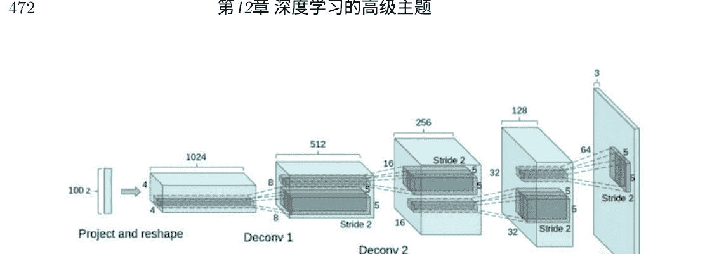

# (a) Convolution architecture of DCGAN

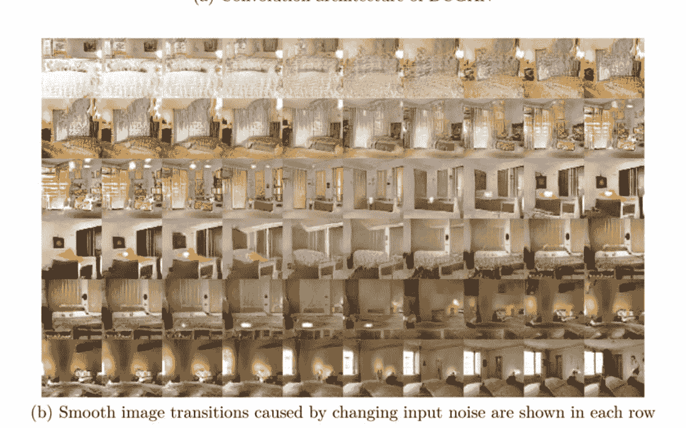

# (b) Smooth image transitions caused by changing input noise are shown in each row

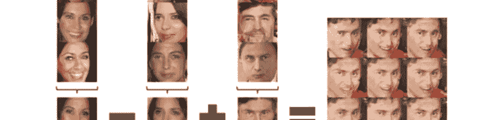

# (c) Arithmetic operations on input noise have semantic significance

> 图12.11：DCGAN的卷积架构和生成的图像。 这些图像出现在[A. Radford, L. Metz和S. Chintala. 使用深度卷积生成对抗网络进行无监督表示学习。 arXiv预印本arXiv:1511.06434, 2015]中。 版权所有2015 Alec Radford。 经许可使用。

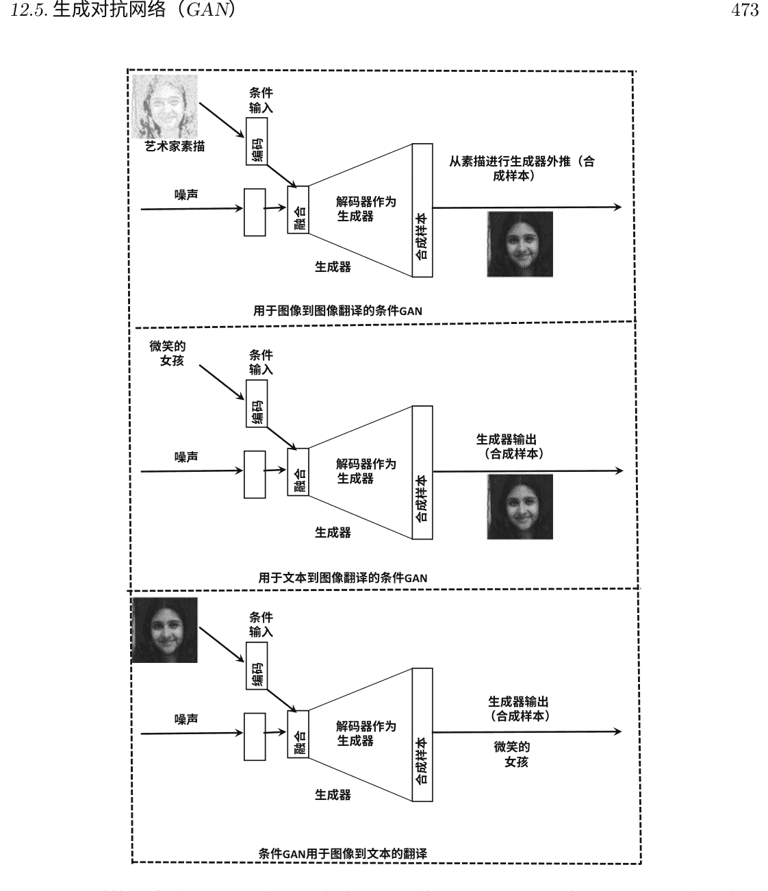

图12.12: 对抗网络的不同类型的条件生成器。这些示例仅具有说明性质，不反映实际的CGAN输出。

+   1. 每个对象可以与一个标签相关联。标签为生成图像提供了条件。例如，在MNIST数据集（参见第1章）中，条件可能是从0到9的标签值，生成器在提供该条件时应该创建该数字的图像。同样，对于图像数据集，条件可能是像“胡萝卜”这样的标签，输出将是一个胡萝卜的图像。原始条件对抗网络的实验[343]基于从0到9的标签生成了一个784维的数字表示。这些数字的基本示例来自MNIST数据集（参见第1章的1.7.1节）。
+   2. 目标对象及其上下文可能是相同类型的，尽管上下文可能缺少目标对象的丰富细节。例如，上下文可能是一个人类艺术家对钱包的草图，而目标对象可能是同一个钱包的实际照片，其中包含了所有细节。另一个例子可能是一个犯罪嫌疑人的艺术家草图（即上下文），而目标对象（生成器的输出）可能是该人的实际照片的推断。目标是使用给定的草图生成各种具有填充细节的逼真样本。如图12.12顶部所示的例子。当上下文对象具有复杂的表示，例如图像或文本句子时，它们可能需要通过编码器转换为多维表示，以便与多维高斯噪声融合。根据具体的数据类型，编码器可能是卷积神经网络或循环神经网络。
+   3. 每个对象可能与一个文本描述相关联（例如，带有标题的图像），后者提供了上下文。标题为对象提供了条件。这个想法是通过提供像“带有锋利爪子的蓝色鸟”这样的上下文，生成器应该提供一个反映这个描述的幻想图像。使用上下文“微笑的女孩”生成的一个说明性图像示例如图12.12所示。请注意，也可以使用图像上下文，并使用GAN为其生成标题，如图底部所示。然而，更常见的是从简单的上下文（例如，标题）生成复杂的对象（例如，图像），而不是相反。这是因为在尝试从复杂对象（例如，图像）生成简单对象（例如，标签或标题）时，可以使用各种更准确的监督学习方法。
+   4. 基础对象可以是黑白照片或视频（例如经典电影），输出对象可以是对象的彩色版本。本质上，GAN从这些成对示例中学习如何以最真实的方式给黑白场景上色。例如，它将使用训练数据中树木的颜色来给生成的对象提供相应的颜色，而不改变其基本轮廓。

在所有这些情况下，显然GAN非常擅长填补缺失的信息。无条件GAN是这种情况的特例，其中缺少所有形式的上下文，因此GAN被迫在没有任何信息的情况下创建图像。有条件的情况从应用的角度来看可能更有趣，因为通常情况下只有少量的部分信息可用，而且必须以逼真的方式进行外推。当可用上下文的数量非常少时，缺失数据分析方法将无法工作，因为它们需要更多的上下文来提供重建。另一方面，GAN不能保证忠实的重建（像自编码器或矩阵分解方法那样），但它们以逼真和和谐的方式填充对象中的缺失细节进行逼真的外推。因此，GAN利用这种自由来生成高质量的样本，而不是模糊的平均重建估计。尽管给定的生成可能不完全反映给定的上下文，但可以始终生成多个样本以探索相同上下文的不同类型的外推。例如，给定一个犯罪嫌疑人的草图，可以生成具有不同细节的不同照片，这些细节在草图中不存在。从这个意义上说，生成对抗网络展示了一定程度的艺术/创造力，这在传统的数据重建方法中是不存在的。

当一个人只有很少的上下文时，这种创造力是必不可少的。首先，模型需要具有足够的自由度以合理的方式填补缺失的细节。

值得注意的是，各种各样的机器学习问题（包括分类）可以被视为缺失数据插补问题。从技术上讲，CGAN也可以用于这些问题。然而，CGAN对于特定类型的缺失数据更有用，其中缺失部分太大，无法由模型忠实地重建。虽然人们甚至可以使用CGAN进行分类或图像字幕生成，但这显然不是生成模型的最佳用途，因为它专门用于生成创造力。当条件对象比输出对象更复杂时，CGAN可能会陷入生成固定输出的情况，而不考虑输入噪声。

对于生成器而言，输入对应于从噪声分布和条件对象生成的点，它们被合并成一个隐藏编码。这个输入被馈送到生成器（解码器），它为数据创建一个有条件的样本。对于鉴别器而言，输入是来自基础数据及其上下文的样本。首先，基础对象及其条件输入被融合成一个隐藏表示，然后鉴别器提供一个分类，判断它是真实的还是生成的。生成器部分的训练整体架构如图12.13所示。将这个架构与图12.10中的无条件GAN进行比较是很有启发性的。主要区别在于第二种情况提供了额外的条件输入。

损失函数和隐藏层的整体布局在两种情况下非常相似。因此，从无条件GAN转变为有条件GAN只需要对整体架构进行一些小的改变。反向传播方法基本上没有受到影响，只是在与条件输入相关的神经网络部分可能需要更新一些额外的权重。

使用GANs处理各种数据类型的一个重要观点是，它们可能需要一些修改，以便以数据敏感的方式执行编码和解码。在我们的讨论中，我们给出了来自图像和文本领域的几个例子。

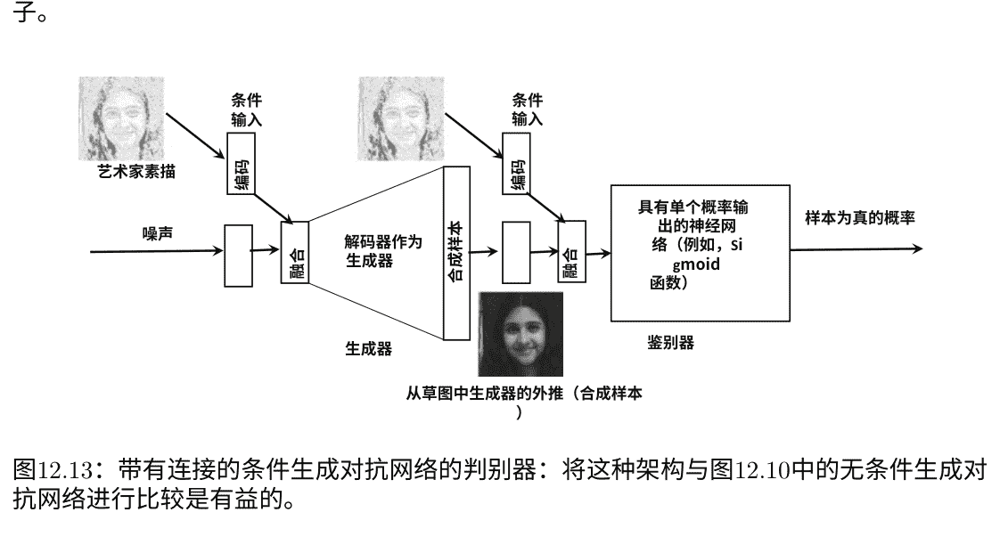

> 事实证明，通过修改判别器以输出类别（包括假类），可以使用很少的标签获得最先进的半监督分类[437]。然而，使用生成器输出标签并不是一个好选择。

上面，算法的大部分描述都集中在多维数据（而不是图像或文本数据）上。即使使用标签作为上下文，也需要将其编码为多维表示（例如，独热编码）。因此，图12.12和图12.13都包含一个专门标注的组件来编码上下文。在最早的有条件GANs的工作中[343]，使用预训练的AlexNet卷积网络[263]作为图像上下文的编码器（不包括最终的标签预测层）。AlexNet是在ImageNet数据库上进行预训练的。[343]中的工作甚至在一个多模态设置中，将图像与一些文本注释一起输入。输出是另一组进一步描述图像的文本标签。对于文本注释，使用预训练的word2vec（skip-gram）模型作为编码器。值得注意的是，甚至可以在更新生成器的权重时微调这些预训练编码器网络的权重（通过将反向传播扩展到编码器）。

如果GAN中对象生成的数据集的性质与预训练的编码器的数据集非常不同，这将非常有用。然而，[343]中的原始工作将这些编码器固定为它们的预训练配置，并且仍然能够生成相当高质量的结果。

## 12.6 竞争学习

本书讨论的大多数学习方法都是基于更新神经网络中的权重以纠正错误。竞争学习是一种根本不同的范式，其目标不是为了纠正错误而将输入映射到输出。相反，神经元们竞争权利来响应一部分相似的输入数据，并将它们的权重推向一个或多个输入数据点。因此，学习过程与神经网络中使用的反向传播算法也非常不同。

训练的基本思想如下。输出神经元的激活随着神经元的权重向量与输入之间的相似性增加而增加。假设神经元的权重向量与输入具有相同的维度。一种常见的方法是使用输入和权重向量之间的欧氏距离来计算激活。较小的距离导致较大的激活。对于给定的输入，具有最高激活的输出单元被宣布为获胜者，并向输入靠近。

在赢者通吃的策略中，只有获胜的神经元（即具有最大激活的神经元）会被更新，其余神经元保持不变。竞争学习范式的其他变体允许其他神经元根据预定义的邻域关系参与更新。此外，还有一些机制可以让神经元相互抑制。这些机制是一种正则化形式，可用于学习具有特定类型的预定义结构的表示，这在二维可视化等应用中非常有用。首先，我们讨论一个简单版本的竞争学习算法，其中采用赢者通吃的方法。

让 $X$ 是一个在 d 维度上的输入向量，而 $W_i$ 是与第 i 个神经元相关联的权重向量，具有相同的维度。假设总共使用 m 个神经元，其中 m 通常远小于数据集的大小。通过反复从输入数据中采样 $X$ 来使用以下步骤，并进行以下计算：

+   1. 欧几里得距离：对于每个 i，计算 $||W_i - X||$。如果第 p 个神经元具有最小的欧几里得距离值，则它被声明为获胜者。注意 $||W_i - X||$ 的值被视为第 i 个神经元的激活值。

2. 使用以下规则更新第 $p$ 个神经元：

$$W_p \leftarrow W_p + \alpha (X - W_p) \quad (12.23)$$

在这里，$\alpha > 0$ 是学习率。通常，$\alpha$ 的值远小于1。在某些情况下，学习率 $\alpha$ 随算法的进行而减小。

竞争学习的基本思想是将权重向量视为原型（类似于 $k$ 均值聚类中的质心），然后将（获胜的）原型向训练实例移动一小段距离。这里的 $\alpha$ 值调节了点与权重向量之间距离的一部分，从而导致 $W_p$ 的移动。请注意，$k$ 均值聚类也以类似的方式实现了类似的目标，尽管方式不同。毕竟，在将点分配给获胜的质心后，它会将该质心向训练实例移动一小段距离，迭代结束时。竞争学习允许这个框架的一些自然变化，可用于无监督应用，如聚类和降维。

### 12.6.1 向量量化

向量量化是竞争学习的最简单应用。通过敏感性的概念对基本的竞争学习范式进行了一些改变。每个节点都有一个敏感性。与之相关的敏感性值 $s_i \geq 0$ 有助于在不同的聚类之间平衡点。向量量化的基本步骤与竞争学习算法中的步骤类似，只是由于如何更新和使用 $s_i$ 的差异而引起的。$s_i$ 的值在计算中被更新和使用。每个点的 $s_i$ 被初始化为0。在每次迭代中，$s_i$ 的值增加 $\gamma > 0$ 对于非获胜者，而对于获胜者则设置为0。

此外，为了选择获胜者，选择最小值 $||W_i - X|| - s_i$ 被使用。这种方法倾向于使聚类更加平衡，即使不同区域的密度差异很大。这种方法确保密集区域的点通常非常接近其中一个权重向量，而稀疏区域的点近似得非常差。

这种属性在降维和压缩等应用中很常见。数值 $\gamma$ 调节灵敏度的效果。设置 $\gamma$ 设为0将恢复到纯竞争学习，如上所述。

向量量化最常见的应用是压缩。在压缩中，每个点都由其最近的权重向量表示 $W_i$，其中 $i$ 的范围从1到 $m$。注意 $m$ 的值远小于数据集中的点数 $n$。第一步是构建包含向量 $W_1..W_m$ 的码书，需要 $m \cdot d$ 的空间，其中数据集的维度为 $d$。每个点都从以1到 $m$ 的索引值存储，取决于其最近的权重向量。然而，只需要 $\log_2(m)$ 位来存储每个数据点。因此，总体空间需求为 $m \cdot d + \log_2(m)$，这通常远小于原始数据集的空间需求 $n \cdot d$。例如，一个包含100维的100亿个点的数据集，如果每个维度需要4字节，则需要约4TB的空间。另一方面，通过量化使用 $m=10^6$，码书所需的空间不到半个千兆字节，每个点需要20位。因此，点的空间需求（不包括码书）小于3千兆字节。因此，总体空间需求小于包括码书在内的35千兆字节。请注意，这种压缩是有损的，点 $X$ 的近似误差为 $||X - W_i||$。密集区域的点近似得很好，而稀疏区域的异常值近似得很差。

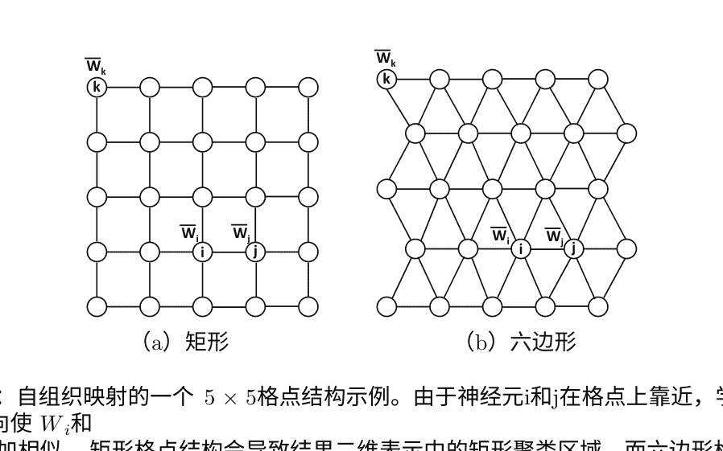

图12.14：自组织映射的一个 $5 \times 5$ 格点结构示例。由于神经元$i$和$j$在格点上靠近，学习过程会偏向使 $W_i$ 和 $W_j$ 更加相似。矩形格点结构会导致结果二维表示中的矩形聚类区域，而六边形格点结构会导致结果二维表示中的六边形聚类区域。

### 12.6.2 Kohonen自组织映射

Kohonen自组织映射是竞争学习范式的一种变体，其中神经元被赋予一维线状或二维格点状结构。这种格点结构使得所有点都能够映射到一维或二维空间中进行可视化。图12.14(a)展示了一个由 $5 \times 5$ 矩形网格排列的25个神经元的二维格点结构示例。图12.14(b)展示了包含相同数量神经元的六边形格点结构。格点的形状会影响聚类映射的二维区域形状。一维线状结构的情况类似。使用格点结构的思想是相邻格点神经元的 $W_i$ 的值倾向于相似。在这里，重要的是定义不同的符号以区分距离 $\|W_i - W_j\|$ 和格点上的距离。格点上相邻神经元对之间的距离恰好为一个单位。例如，基于图12.14(a)中的格点结构，神经元 $i$ 和 $j$ 之间的距离为1个单位，神经元 $i$ 和 $k$ 之间的距离为 $\sqrt{2^2 + 3^2} = \sqrt{13}$。

原始输入空间中的向量距离（例如， $\|X - W_i\|$ 或 $\|W_i - W_j\|$）用 $Dist(W_i, W_j)$ 表示。另一方面，神经元 $i$ 和 $j$ 之间的距离在格子结构上用 $LDist(i, j)$ 表示。请注意 $LDist(i, j)$ 的值仅取决于索引 $(i, j)$，与向量 $W_i$ 和 $W_j$ 的值无关。

自组织映射中的学习过程是通过调节神经元 $i$ 和 $j$ 之间的接近程度（基于格子距离）来使它们的权重向量更加相似。换句话说，自组织映射的格子结构在学习过程中起到了正则化的作用。正如我们将在后面看到的，将这种二维结构 imposed 在学习到的权重上有助于用二维嵌入来可视化原始数据点。

整体自组织映射训练算法的步骤与竞争学习类似，通过采样来进行。从训练数据中获取 $X$，并根据欧几里得距离找到获胜神经元。获胜神经元中的权重以类似于基本竞争学习算法的方式进行更新。然而，主要区别在于将这种更新的阻尼版本也应用于获胜神经元的格点邻居。

事实上，在这种方法的软变体中，可以将此更新应用于所有神经元，以及阻尼水平取决于该神经元到获胜神经元的晶格距离。阻尼函数始终位于 [0, 1] 之间，通常由高斯核定义：

$$\text{Damp}(i, j) = \exp\left(-\frac{\text{LatticeDistance}(i, j)^2}{2\sigma^2}\right) \quad (12.24)$$

在这里，$\sigma$ 是高斯核的带宽。使用极小值的 $\sigma$ 会恢复到纯粹的获胜神经元学习，而使用较大值的 $\sigma$ 会导致更大的正则化，其中晶格相邻单元的权重更相似。对于较小的 $\sigma$，阻尼函数只对获胜神经元为1，对其他神经元为0。因此，$\sigma$ 的值是用户用于调整的参数之一。请注意，还有许多其他可能用于控制正则化和阻尼的核函数。例如，可以使用阈值步进核函数代替平滑的高斯阻尼函数，当晶格距离$(i, j) < \sigma$时，它的值为1，否则为0。

训练算法重复从训练数据中获取 $X$，并计算 $X$ 与每个权重 $W_i$ 的距离。计算获胜神经元的索引 $p$。与其仅将更新应用于 $W_p$ （如获胜者通吃），而应用以下更新到每个 $W_i$ ：

$$W_i \leftarrow W_i + \alpha \cdot \text{Damp}(i, p) \cdot (X - W_i) \quad \forall i \quad (12.25)$$

在这里，$\alpha > 0$ 是学习率。通常允许学习率 $\alpha$ 随时间减小。这些迭代将继续，直到达到收敛。请注意，相邻的权重将接收类似的更新，因此随着时间的推移，它们倾向于变得更相似。因此，训练过程强制相邻的聚类具有相似的点，这对于可视化很有用。

# 使用学习到的映射进行2D嵌入

自组织映射可以用来诱导点的2维嵌入。对于一个 $k \times k$网格，所有2维的格点坐标将位于第一象限的一个正方形内，顶点为 $(0, 0)$, $(0, k - 1)$, $(k - 1, 0)$，和 $(k - 1, k - 1)$。请注意，格点在格子中的每个点都是具有整数坐标的顶点。最简单的2维嵌入就是通过表示每个点 $X$ 与其最近的格点（即获胜神经元）一起表示。然而，这种方法会导致点的重叠表示。此外，可以构建数据的2维表示，其中每个坐标是 $k \times k$ 值之一，来自 $\{0...k-1\} \times \{0...k-1\}$。这就是为什么自组织映射也被称为离散化降维方法的原因。

可以使用各种启发式方法来消除这些重叠点的歧义。当应用于高维文档数据时，视觉检查通常显示特定主题的文档被映射到特定的局部区域。此外，相关主题的文档（例如，政治和选举）往往被映射到相邻的区域。图12.15(a)和(b)分别显示了自组织映射如何将四个主题的文档排列成矩形和六边形的格子。根据属于相应区域的文档的主要主题，区域被着不同的颜色。

自组织映射在神经生物学上与哺乳动物大脑的结构有着密切的关系。在哺乳动物的大脑中，各种类型的感觉输入（例如触觉）被映射到一些折叠的细胞层面上，这些细胞层面被称为“片” [134]。当身体的部分靠近一起接收输入（例如触觉输入），则在大脑中物理上靠近一起的细胞群也会一起激活。因此，(感官)输入的接近性映射到神经元的接近性，就像自组织映射的情况一样。与卷积神经网络的神经生物学启发一样，这些见解总是用于某种形式的正则化。

尽管在深度学习的现代时代中，Kohonen网络的使用较少，但它们在无监督设置中具有重要潜力。此外，竞争的基本思想甚至可以纳入多层前馈网络中。许多竞争原则通常与更传统的前馈网络结合使用。例如，稀疏自编码器和胜者通吃自编码器（参见第3章的5.10.1.1节）都基于竞争原则。即使在本章讨论的注意力概念中，也使用了竞争原则来聚焦于一部分激活。因此，尽管自组织映射在近年来变得不太流行，但竞争的基本原则也可以与传统的前馈网络集成。

## 12.7 神经网络的局限性

深度学习在近年来取得了显著进展，并且在像图像分类这样的许多任务上甚至超过了人类。同样，强化学习在一些需要顺序规划的游戏中展示了超人类的表现，这是非常非凡的。因此，诱人的是认为人工智能可能最终接近甚至超过人类在更通用的方式上的能力。然而，在我们能够构建像人类一样学习和思考的机器之前，还有几个基本的技术障碍需要克服[267]。特别是，神经网络需要大量的训练数据才能提供高质量的结果，这在很大程度上不如人类的能力。此外，神经网络在各种任务中所需的能量远远超过人类进行类似任务所消耗的能量。

这些观察结果对于神经网络超过人类性能的能力有着根本性的限制。接下来，我们将讨论这些问题以及一些最近的研究方向。

### 12.7.1 一个理想目标：少样本学习

尽管深度学习近年来因其在大规模学习任务上的成功而受到越来越多的关注（与早期在较小数据集上的平庸表现相比），但这也暴露了当前深度学习技术的一个重要弱点。对于像图像分类这样的任务，深度学习已经超过了人类的表现，但它是一种以样本效率低下的方式实现的。例如，ImageNet数据库包含超过一百万张图像，神经网络通常需要成千上万个类别的样本才能正确分类。而人类不需要成千上万张卡车的图像就能学会它是一辆卡车。如果一个孩子看过一次卡车，她通常能够在稍微不同的型号、形状和颜色的卡车上识别出另一辆卡车。这表明与人工神经网络相比，人类在推广到新环境方面具有更好的能力。能够从很少的例子中学习的一般原则被称为少样本学习。在少样本学习中，学习从很少的例子中也与人工通用智能密切相关，因为少样本学习通常是通过以更一般的方式（像人类一样）同时学习许多任务来实现的。

人类用较少的例子进行泛化的能力并不令人惊讶，因为人脑中的神经元连接性经过了数百万年的进化算法，并且代代相传。从间接的角度来看，人类的神经连接结构已经对数百万年的进化经验进行了一种“知识”编码。此外，人类还通过各种任务在一生中获得知识，这有助于他们更快地学习特定任务。随后，学习执行特定任务（如识别卡车）只是对一个人天生具备的编码以及一生中获得的编码进行微调。换句话说，人类在代际间和代际内都是迁移学习的大师。人们可以将这个长期过程看作是一种无监督学习，而任务特定的学习则是有监督的微调。基本思想要么是使用无监督学习，要么是重复利用早期任务中学到的知识来学习另一个任务。

一种支持多个任务的学习的一般形式，只需相对较少的任务特定示例即可作为元学习或学习到学习。Thrun和Platt在[514]中定义了学习到学习如下。给定一组任务，每个任务的训练经验和一组性能度量（每个任务一个），如果算法在每个任务上的性能随着经验和任务数量的增加而改善，则称其为学习到学习。因此，快速学习发生在任务内部，而学习是由逐渐在任务之间获得的知识指导的，这捕捉了任务结构在目标领域中变化的方式[433]。正是这种任务间的变化使得学习到学习具有挑战性。学习到学习的能力是一种定义生物特性，因为生物体自然地利用他们在早期任务中的经验来展示在弱相关任务中的改进性能。

知识重用的核心思想是学习的某些方面具有广泛的普适性。粗略地说，神经网络的预训练本身就是学习到学习的一个例子，因为从一个任务的训练中学到的特征可以用于另一个任务。例如，在卷积神经网络中，早期层的特征是原始形状（例如边缘），无论应用于何种任务和数据集，它们都保持可用性。如第9章所讨论的，卷积神经网络如AlexNet [263]通常在像ImageNet这样的大型图像库上进行预训练。随后，当神经网络需要应用于新的数据集或任务时，可以用新的数据集对权重进行微调。通常，这种微调只需要较少的示例，因为早期层学到的大部分基本特征不会随着数据集或任务的变化而改变。

通过去除后面的层或网络并添加额外的任务特定层，学到的特征也可以在任务之间进行泛化。因此，卷积神经网络的预训练已经提供了知识重用的基本示例。神经网络的预训练已经提供了跨任务知识重用的基本示例。

早期的少样本学习研究[121]使用贝叶斯框架来将学习到的知识从一个类别转移到另一个类别。一些成功的元学习案例展示了利用结构化架构来利用注意力、递归和记忆的概念。特别是，在神经图灵机[433]上展示了在跨类别学习任务上取得的良好结果。神经图灵机还被用于一次性学习中识别新类别[527]。

元学习还被应用于自然语言处理领域，其中语言模型被视为无监督多任务学习器，正如GPT-2论文[399]中所讨论的那样。GPT-3 [50]和BERT [101]模型是基于更大的文本语料库构建的。然后，这些模型通过仅有少量示例进行特定任务的微调。然而，在一些需要常识推理的关键任务上，性能仍然较差。尽管如此，这些模型在自然语言处理的许多任务上的出色泛化能力已经取得了突破，至少在特定领域的设置中，使我们更接近人工通用智能。

### 12.7.2 一个理想目标：能源高效学习

深度学习模型通常在需要大量电力的强大硬件上进行训练。在并行使用多个GPU单元时，通常需要数千瓦的功率。另一方面，人脑只需要大约20瓦的功率来运作，这远远低于一个灯泡所需的功率。另一个观点是，人脑通常不会进行精确的详细计算，而只是进行估算。在许多学习环境中，这是足够的，有时甚至可以增加泛化能力。

这表明，在强调泛化而不是准确性的架构中，有时可以找到能源效率。

最近已经开发出了几种算法，可以在计算精度上进行权衡，以提高计算的功率效率。其中一些方法还因低精度计算的噪声效应而显示出改进的泛化能力。在[86]中的工作提出了使用二进制权重进行高效计算的方法。

在[295]中提供了使用不同表示代码对能源效率的影响的分析。某些类型的神经网络，包含尖峰神经元，被认为更加节能[60]。尖峰神经元的概念受到哺乳动物大脑的生物模型的启发。基本思想是神经元不会在每个传播周期都发射，而是只有当其膜电位达到特定值时才会发射。

当神经网络的规模较小且冗余连接被修剪时，通常可以实现能源效率。去除冗余连接还有助于正则化。[179]中的工作提出通过修剪冗余连接同时学习神经网络中的权重和连接。特别是可以删除接近零的权重。如第5章所讨论的，通过 L1-正则化可以实现训练网络以获得接近零的权重。然而，[179]中的工作表明 L2-正则化可以获得更高的准确性。因此，[179]中的工作使用 L2-正则化并修剪低于特定阈值的权重。修剪是以迭代方式进行的，先修剪权重，然后重新训练它们，然后再次修剪低权重的边缘。在每次迭代中，使用上一阶段的训练权重用于下一阶段。因此，密集网络可以被稀疏化为一个连接更少的网络。此外，死神经元（输入和输出连接为零的神经元）被修剪。在[178]中报告了进一步的改进，该方法与Huffman编码和量化相结合进行压缩。量化的目标是减少表示每个连接所需的位数。这种方法将AlexNet的存储需求从约240MB减少到6.9MB，而不会丢失准确性，减少了35倍。因此，可以将模型适应于芯片上的SRAM缓存，而不是片外的DRAM内存。从速度、能量效率以及在嵌入式设备中进行移动计算的能力的角度来看，这具有优势。[178]中使用了硬件加速器来实现这些目标，这种加速是通过将模型适应于SRAM缓存上实现的。

另一个方向是开发直接针对神经网络的硬件。值得注意的是，在人类中没有软件和硬件之间的区别；虽然从计算机维护的角度来看，这种区别是有帮助的，但它也是一种不效率的来源，而人脑则没有这种区别。简单来说，硬件和软件在脑启发式计算模型中紧密集成在一起。近年来，在神经形态计算领域取得了进展[117]。这个概念基于一个包含尖峰神经元、低精度突触和可扩展通信网络的新芯片架构。读者可以参考[117]。

# 12.8 总结

本章讨论了深度学习中的几个高级主题。本章以对注意机制的讨论开始，这有助于使神经网络更具表达能力和泛化能力。这些机制已经被用于图像、文本和图形数据。注意机制还可以用于通过神经图灵机来增强计算机的外部存储器。

生成对抗网络是最近使用生成网络和判别网络之间的对抗性交互过程来生成与真实样本书据库相似的合成样本的技术。此外，通过对生成过程施加条件，可以创建具有不同类型上下文的样本。这些思想已经在各种应用中使用，例如文本到图像和图像到图像的转换。

# 12.9 参考文献和软件资源

在神经网络训练中使用注意力的早期技术是在[59, 272]中提出的。本章中的视觉注意力循环模型基于[349]。在图像中使用视觉注意力识别多个对象的讨论见[16]，空间变换器的介绍见[229]。最著名的两个注意力神经机器翻译模型的讨论见[19, 311]。注意力的思想还被扩展到图像字幕生成中[562]。关于文本摘要的注意力模型的使用见[429]。注意力的概念对于聚焦于图像的特定部分以实现视觉问答非常有用[411, 561, 564]。
在没有循环神经网络的情况下处理文本的Transformer网络是在[521]中提出的，在没有卷积神经网络的情况下处理图像的Transformer网络的讨论见[106]。Transformer网络已经被用于无监督的自然语言生成模型和元学习以Google BERT [101]和OpenAI的GPT-n [50]的形式呈现。 T5模型提出于[400]。其他值得注意的语言模型包括T5 [400]，Microsoft Turing自然语言生成器（NLG）[672]，XLNet [565]和Switch Transformer [120]。图注意力网络的讨论改编自[525]。

神经图灵机[165]和记忆网络[489, 547]是在同一时间提出的类似架构。[409]中的工作提出了一个神经程序解释器，它是一个学习表示和执行程序的神经网络。在神经图灵机中使用强化学习的讨论见[575, 576]。可微分神经计算机[166]是神经图灵机的增强版，具有先进的内存分配和顺序写入管理。

关于对抗学习方法的调查和教程见[62, 679]。生成对抗网络（GANs）提出于[156]，并且可以在[152]中找到一份优秀的教程。改进的训练算法在[437]中讨论。训练对抗网络的主要挑战与不稳定性和饱和度有关[12, 13]。基于能量的GANs提出于[586]，据称具有更好的稳定性。对抗思想也已推广到自动编码器架构[323]。用于图像的生成对抗网络使用反卷积网络生成逼真的图像[97, 398]，因此生成的GAN被称为DCGAN。关于条件生成网络及其在生成具有上下文的对象方面的使用见[343, 408]。最近还将该方法用于图像到图像的转换[226, 383, 538]。在[330]中讨论了使用CGANs预测视频中的下一帧。生成对抗网络也已扩展到序列[571]。

关于竞争学习的最早研究可在[426, 427]中找到。Gersho和Gray [142]提供了向量量化方法的优秀概述。向量量化方法是稀疏编码技术的替代方法[78]。Kohonen自组织特征映射在[258]中详细讨论。许多基本架构的变体，如神经气体，用于增量学习[131, 328]。

关于学习方法的讨论可在[514]中找到。在这个领域使用的方法范围广泛，包括贝叶斯模型[121]，神经图灵机[433, 527]，和进化算法[566]。深度学习的能量高效方法包括使用二进制权重[86, 405]，专门设计的芯片[117]，增强的数据重用[70]和压缩机制[178, 179, 224]。

### 软件资源

视觉注意力的循环模型可在[649]中找到。本章讨论的神经机器翻译注意力机制的MATLAB代码（来自原始作者）可在[650]中找到。Transformer网络的实现可在HuggingFace和Google Brain Trax等地方找到[673, 680, 681]。许多语言模型的实现可用，例如ELMo [678]，BERT [674]，T5 [675]，XLNet [677]和Switch Transformer [676]。在TensorFlow中可以找到神经图灵机的实现[651, 652]。这两个实现是相关的，因为[652]中的方法采用了[651]的部分内容。原始实现中使用了LSTM控制器。在Keras，Lasagne和Torch中可以找到实现[653-655]。来自Facebook的几个内存网络实现可在[656]中找到。在TensorFlow中可以找到内存网络的实现[657]。动态内存网络的Theano和Lasagne实现可在[658]中找到。

在TensorFlow中实现的DCGAN可以在[659]中找到。事实上，这一章讨论的GAN的几个变体（以及其他主题）可以从这个贡献者[660]那里找到。GAN的Keras实现可以在[661]中找到。包括Wasserstein GAN和变分自编码器在内的各种类型的GAN的实现可以在[662]中找到。这些实现是在PyTorch和TensorFlow中执行的。在TensorFlow中提供了一个文本到图像GAN的实现[663]，这个实现是基于前面提到的DCGAN实现[659]构建的。

## 12.10 练习

- 1. 训练硬注意力模型和软注意力模型使用的方法主要有哪些不同之处？
- 2. 自注意机制在长度为n的句子上的计算复杂度是多少？
- 3. 讨论k均值算法与竞争学习的关系。
- 4. 使用（i）矩形格点和（ii）六边形格点实现Kohonen自组织映射。
- 5. 考虑一个类似GANs的双人游戏，目标函数为f(x, y)，我们想要计算min_x max_y f(x, y)。讨论min_x max_y f(x, y)和max_y min_x f(x, y)之间的关系。它们何时相等？
- 6. 考虑函数f(x, y) = sin(x + y)，我们试图最小化f(x, y)关于x的值，并最大化关于y的值。按照书中讨论的GANs的交替梯度下降和上升过程来优化这个函数。你是否总是在不同的起始点上得到相同的解决方案？
- 7. 讨论Luong注意力模型如何用于语言建模中的自注意力。提供一个注意力可能有助于预测的例子。
- 8. 讨论如何强制定位网络和网格生成在空间变换器中确保（a）只允许旋转而不允许平移、反射或缩放，以及（b）允许在所有方向上具有相等大小的缩放以及旋转和平移，但不允许反射。
- 9. 构造一个坐标变换矩阵，使得变换后的图像的下半部分为空白。
- 10. 考虑一个使用采样数据点作为RBF层均值的RBF分类器。讨论为什么它可以被视为注意机制的一个简单示例。将注意方法与一般的核分类器联系起来。
- 11. 讨论具有大幅度分量的向量上的softmax函数的行为。缩放在缩放点积注意力中的目标是什么？你能想到优化特定训练数据集缩放的方法吗？
- 12. 提出一种将SENet的通道注意力和空间变换器的空间注意力结合起来的架构。
- 13. 你会对变压器架构做出哪些改变，使其适用于集合而不是序列？

# 参考文献

- [1] D. Ackley, G. Hinton, and T. Sejnowski. 一种Boltzmann机器的学习算法。*Cognitive Science*, 9(1), pp. 147–169, 1985.
- [2] C. Aggarwal. 数据分类：算法与应用, *CRC Press*, 2014.
- [3] C. Aggarwal. 数据挖掘: 教材. *Springer*, 2015.
- [4] C. Aggarwal. 推荐系统: 教材. *Springer*, 2016.
- [5] C. Aggarwal. 异常值分析. *Springer*, 2017.
- [6] C. Aggarwal. 机器学习的线性代数和优化: 教材. *Springer*, 2020.
- [7] C. Aggarwal. 文本的机器学习. *Springer*, 2018.
- [8] R. Ahuja, T. Magnanti, 和 J. Orlin. 网络流: 理论, 算法和应用- *Prentice Hall*, 1993.
- [9] E. Aljalbout, V. Golkov, Y. Siddiqui, 和 D. Cremers. 深度学习的聚类: 分类和新方法. *arXiv:1801.07648*, 2018. [https://arxiv.org/abs/1801.07648](https://arxiv.org/abs/1801.07648)
- [10] R. Al-Rfou, B. Perozzi, 和 S. Skiena. Polyglot: 分布式词表示用于多语言自然语言处理. *arXiv:1307.1662*, 2013. [https://arxiv.org/abs/1307.1662](https://arxiv.org/abs/1307.1662)
- [11] D. Amodei等. AI安全中的具体问题. *arXiv:1606.06565*, 2016. [https://arxiv.org/abs/1606.06565](https://arxiv.org/abs/1606.06565)
- [12] M. Arjovsky 和 L. Bottou. 用于训练生成对抗网络的原则方法. *arXiv:1701.04862*, 2017. [https://arxiv.org/abs/1701.04862](https://arxiv.org/abs/1701.04862)
- [13] M. Arjovsky, S. Chintala, 和 L. Bottou. Wasserstein gan. *arXiv:1701.07875*, 2017. [https://arxiv.org/abs/1701.07875](https://arxiv.org/abs/1701.07875)
- [14] J. Ba和R. Caruana. 深度网络真的需要深吗? *NeurIPS*, pp. 2654–2662, 2014.
- [15] J. Ba, J. Kiros和G. Hinton. 层归一化。arXiv:1607.06450, 2016. https://arxiv.org/abs/1607.06450
- [16] J. Ba, V. Mnih和K. Kavukcuoglu. 带有视觉注意力的多目标识别。arXiv: 1412.7755, 2014. https://arxiv.org/abs/1412.7755
- [17] A. Babenko, A. Slesarev, A. Chigorin, and V. Lempitsky. 图像检索的神经编码。arXiv: 1404.1777, 2014. https://arxiv.org/abs/1404.1777
- [18] M. Baccouche, F. Mamalet, C. Wolf, C. Garcia, and A. Baskurt. 用于人类动作识别的顺序深度学习。国际人类行为理解研讨会, 第29-39页, 2011年.
- [19] D. Bahdanau, K. Cho, and Y. Bengio. 通过联合学习对齐和翻译的神经机器翻译。ICLR, 2015. https://arxiv.org/abs/1409.0473
- [20] B. Baker, O. Gupta, N. Naik, and R. Raskar. 使用强化学习设计神经网络架构。arXiv: 1611.02167, 2016. https://arxiv.org/abs/1611.02167
- [21] D. Baldi, S. Brunak, P. Frasconi, G. Soda, 和 G. Pollastri. 在蛋白质二级结构预测中利用过去和未来。生物信息学, 15(11), 页码 937–946,1999年.
- [22] N. Ballas, L. Yao, C. Pal, 和 A. Courville. 深入研究卷积神经网络以学习视频表示。arXiv:1511.06432, 2015年. https://arxiv.org/abs/1511.06432
- [23] J. Baxter, A. Tridgell, 和 L. Weaver. Knightcap: 通过结合td (lambda)和游戏树搜索来学习的国际象棋程序。arXiv cs/9901002, 1999年. https://arxiv.org/abs/cs/9901002
- [24] M. Bazaraa, H. Sherali, 和 C. Shetty. 非线性规划: 理论和算法。John Wiley and Sons, 2013年.
- [25] S. Becker, 和 Y. LeCun. 使用二阶方法改进反向传播学习的收敛性。1988年连接主义模型暑期学校论文集, 第29-37页, 1988年.
- [26] M. Bellemare, Y. Naddaf, J. Veness, 和 M. Bowling. 街机学习环境：通用智能体评估平台。人工智能研究杂志, 第47期, 第253-279页, 2013年.
- [27] R. E. Bellman. 动态规划。普林斯顿大学出版社, 1957年.
- [28] Y. Bengio. 为人工智能学习深度架构。机器学习基础与趋势, 第2卷第1期, 第1-127页, 2009年.
- [29] Y. Bengio, A. Courville, 和 P. Vincent. 表示学习：综述与新视角。IEEE TPAMI, 第35卷第8期, 第1798-1828页, 2013年.
- [30] Y. Bengio 和 O. Delalleau. 证明和推广对比散度。神经计算, 21(6), 第1601–1621页, 2009年.
- [31] Y. Bengio, P. Lamblin, D. Popovici 和 H. Larochelle. 逐层贪婪训练深度网络. *NeurIPS*, 19, 153, 2007年.
- [32] Y. Bengio, N. Le Roux, P. Vincent, O. Delalleau 和 P. Marcotte. 凸神经网络. *NeurIPS*, 第123-130页, 2005年.
- [33] Y. Bengio, J. Louradour, R. Collobert 和 J. Weston. 课程学习. *ICML*, 2009年.
- [34] Y. Bengio, L. Yao, G. Alain 和 P. Vincent. 广义去噪自编码器作为生成模型. *NeurIPS*, 第899-907页, 2013年.
- [35] J. Bergstra等. Theano: 一个用Python编写的CPU和GPU数学编译器. 2010年Python科学会议.
- [36] J. Bergstra, R. Bardenet, Y. Bengio和B. Kegl. 超参数优化算法. 2011年*NeurIPS*, pp. 2546-2554.
- [37] J. Bergstra和Y. Bengio. 超参数优化的随机搜索. 机器学习研究杂志, 第13期, pp. 281-305, 2012年.
- [38] J. Bergstra, D. Yamins和D. Cox. 在视觉架构中进行数百维度的模型搜索的科学方法: 超参数优化. 2013年*ICML*, pp. 115-123.
- [39] D. Bertsekas. 非线性规划 *Athena Scientific*, 1999年.
- [40] C. M. Bishop. 模式识别与机器学习. *Springer*, 2007.
- [41] C. M. Bishop. 模式识别的神经网络. 牛津大学出版社, 1995.
- [42] C. M Bishop. 提高径向基函数神经网络的泛化性能. 神经计算, 3(4), 页579-588, 1991.
- [43] C. M. Bishop. 噪声训练等价于Tikhonov正则化. 神经计算, 7(1), 页108-116, 1995.
- [44] C. M. Bishop, M. Svensen, and C. K. Williams. GTM: 一种有原则的自组织映射的替代方法. *NeurIPS*, 页354-360, 1997.
- [45] M. Bojarski et al. 自动驾驶汽车的端到端学习. *arXiv:1604.07316*, 2016. https://arxiv.org/abs/1604.07316
- [46] M. Bojarski等。 解释端到端训练的深度神经网络如何驾驶汽车。 *arXiv:1704.07911*, 2017. https://arxiv.org/abs/1704.07911
- [47] H. Bourlard和Y. Kamp。 多层感知器和奇异值分解的自联想。 生物控制, 59(4), 页码291-294, 1988.
- [48] L. Breiman。 随机森林。 机器学习, 45(1), 页码5-32, 2001.
- [49] L. Breiman。 装袋预测器。 机器学习, 24(2), 页码123-140, 1996.
- [50] T. Brown等。 语言模型是少样本学习器。 *arXiv:2005.14165*, 2020. https://arxiv.org/abs/2005.14165
- [51] D. Broomhead 和 D. Lowe. 多变量函数插值和自适应网络。复杂系统, 2, 页码 321–355, 1988.
- [52] C. Browne等. 蒙特卡洛树搜索方法综述。IEEE Transactions on Computational Intelligence and AI in Games, 4(1), 页码 1–43, 2012.
- [53] T. Brox 和 J. Malik. 大位移光流：变分运动估计中的描述符匹配。IEEE TPAMI, 33(3), 页码 500–513, 2011.
- [54] A. Bryson. 用于优化多阶段分配过程的梯度方法。哈佛大学数字计算机及其应用研讨会, 1961.
- [55] C. Bucilu, R. Caruana, 和 A. Niculescu-Mizil. 模型压缩。KDD, 页码 535–541, 2006.
- [56] P. Bühlmann 和 B. Yu. 分析装袋技术。统计学年鉴, 第927-961页, 2002年.
- [57] M. Buhmann. 径向基函数：理论与实现。剑桥大学出版社, 2003年.
- [58] Y. Burda, R. Grosse, 和 R. Salakhutdinov. 重要性加权自编码器。arXiv:1509.00519, 2015年. [https://arxiv.org/abs/1509.00519](https://arxiv.org/abs/1509.00519)
- [59] N. Butko 和 J. Movellan. I-POMDP: 一种眼动的最大信息模型。IEEE国际发展与学习会议, 第139-144页, 2008年.
- [60] Y. Cao, Y. Chen, 和 D. Khosla. 用于能效物体识别的脉冲深度卷积神经网络。国际计算机视觉杂志, 113(1),第54-66页, 2015年.
- [61] M. Carreira-Perpinan 和 G. Hinton. 对比散度学习。AISTATS, 10, pp. 33–40, 2005.
- [62] A. Chakraborty等. 对抗攻击和防御：一项调查。arXiv:1810.00069 2018. [https://arxiv.org/abs/1810.00069](https://arxiv.org/abs/1810.00069)
- [63] S. Chang, W. Han, J. Tang, G. Qi, C. Aggarwal, 和 T. Huang. 通过深度架构进行异构网络嵌入。KDD, pp. 119–128, 2015.
- [64] J. Chen, S. Sathe, C. Aggarwal, 和 D. Turaga. 自编码器集成的异常检测。SDM Conference, 2017.
- [65] J. Chen, J. Zhu, 和 L. Song. 具有方差减少的图卷积网络的随机训练。arXiv:1710.10568, 2017. [https://arxiv.org/abs/1710.10568](https://arxiv.org/abs/1710.10568)
- [66] J. Chen, T. Ma, and C. Xiao. Fastgcn: 基于图卷积网络的快速学习通过重要性采样. arXiv:1801.10247, 2018. [https://arxiv.org/abs/1801.10247](https://arxiv.org/abs/1801.10247)
- [67] S. Chen, C. Cowan, and P. Grant. 正交最小二乘学习算法用于径向基函数网络.IEEE TNNLS, 2(2), pp. 302–309, 1991.
- [68] W. Chen等. 用哈希技巧压缩神经网络. ICML, 2015.
- [69] Y. Chen and M. Zaki. KATE: 文本的K-竞争自编码器. KDD, 2017.
- [70] Y. Chen, T. Krishna, J. Emer, and V. Sze. Eyeriss: 一种用于深度卷积神经网络的能效可重构加速器. IEEE Journal of Solid-State Circuits, 52(1), pp. 127–138, 2017.
- [71] R. Child等. 用稀疏变压器生成长序列. arXiv:1904.10509, 2019.
- [72] K. Cho, B. Merrienboer, C. Gulcehre, F. Bougares, H. Schwenk, 和 Y. Bengio. 使用RNN编码器-解码器学习短语表示进行统计机器翻译. EMNLP, 2014. https://arxiv.org/abs/1406.1078
- [73] J. Chorowski, D. Bahdanau, D. Serdyuk, K. Cho, 和 Y. Bengio. 基于注意力的语音识别模型. NeurIPS, pp. 577–585, 2015.
- [74] J. Chung, C. Gulcehre, K. Cho, 和 Y. Bengio. 对序列建模中门控循环神经网络的实证评估. arXiv:1412.3555, 2014. https://arxiv.org/abs/1412.3555
- [75] D. Ciresan, U. Meier, L. Gambardella, and J. Schmidhuber. 用于手写数字识别的深度、大规模、简单的神经网络。神经计算, 22(12), 页码 3207-3220,2010年.
- [76] C. Clark 和 A. Storkey. 训练深度卷积神经网络下围棋. ICML, 页码 1766–1774, 2015年.
- [77] A. Coates, B. Huval, T. Wang, D. Wu, A. Ng, 和 B. Catanzaro. 使用COTS HPC系统进行深度学习. ICML, 页码 1337–1345, 2013年.
- [78] A. Coates 和 A. Ng. 编码与稀疏编码和向量量化的训练的重要性. ICML, 页码 921–928, 2011年.
- [79] A. Coates 和 A. Ng. 使用k-means学习特征表示. 神经网络: Tricks of the Trade, Springer, 第561-580页, 2012年.
- [80] A. Coates, A. Ng, 和 H. Lee. 对无监督特征学习中的单层网络进行分析. AAAI, 第215-223页, 2011年.
- [81] R. Collobert等人从零开始的自然语言处理. 机器学习研究杂志, 第12期, 第2493-2537页, 2011年.
- [82] R. Collobert 和 J. Weston. 用于自然语言处理的统一架构: 多任务学习的深度神经网络. ICML, 第160-167页, 2008年.
- [83] J. Connor, R. Martin, 和 L. Atlas. 循环神经网络和鲁棒时间序列预测. IEEE TNNLS, 第5卷第2期, 第240-254页, 1994年.
- [84] T. Cooijmans, N. Ballas, C. Laurent, C. Gulcehre, and A. Courville. 循环批量归一化. arXiv:1603.09025, 2016. https://arxiv.org/abs/1603.09025
- [85] C. Cortes and V. Vapnik. 支持向量网络.机器学习, 20(3), 页码 273–297, 1995.
- [86] M. Courbariaux, Y. Bengio, and J.-P. David. BinaryConnect: 在传播过程中使用二进制权重训练深度神经网络. arXiv:1511.00363, 2015. https://arxiv.org/abs/1511.00363

[87] T. Cover. 具有模式识别应用的线性不等式系统的几何和统计特性. *IEEE Transactions on Electronic Computers*, 页码 326–334, 1965.

[88] D. Cox 和 N. Pinto. 超越简单特征: 一种大规模特征搜索方法用于无约束人脸识别. 人脸和手势识别, 第8-15页, 2011年.

[89] G. Dahl, R. Adams 和 H. Larochelle. 在单词观察上训练受限玻尔兹曼机. *arXiv:1202.5695*, 2012年. https://arxiv.org/abs/1202.5695

[90] N. Dalal 和 B. Triggs. 用于人体检测的梯度方向直方图. *CVPR*, 第886-893页, 2005年.

[91] Y. Dauphin, R. Pascanu, C. Gulcehre, K. Cho, S. Ganguli 和 Y. Bengio. 在高维非凸优化中识别和攻击鞍点问题. *NeurIPS*, 第2933-2941页, 2014年.

[92] N. de Freitas. 机器学习, 牛津大学 (课程视频), 2013. https://www.youtube.com/watch?v=w2OtwL5T1ow&list=PLE6Wd9FR--EdyJ5lbFl8UuGjecvVw66F6

[93] N. de Freitas. 深度学习, 牛津大学 (课程视频), 2015. https://www.youtube.com/watch?v=PlhFWT7vAEw&list=PLjK8ddCbDMphIMSXn-w1IjyYpHU3DaUYw

[94] J. Dean等人大规模分布式深度网络. *NeurIPS*, 2012年.

[95] M. Defferrard, X. Bresson和P. Vandergheynst. 具有快速局部化谱滤波的图卷积神经网络. *NeurIPS*, 页码3844-3852, 2016年.

[96] M. Denil, B. Shakibi, L. Dinh, M. A. Ranzato, 和 N. de Freitas. 在深度学习中预测参数. *NeurIPS*, pp. 2148–2156, 2013.

[97] E. Denton, S. Chintala, 和 R. Fergus. 使用拉普拉斯金字塔对抗网络的深度生成图像模型. *NeurIPS*, pp. 1466–1494, 2015.

[98] G. Desjardins, K. Simonyan, 和 R. Pascanu. 自然神经网络. *NeurIPS*, pp. 2071–2079, 2015.

[99] F. Despagne 和 D. Massart. 多元校准中的神经网络. *Analyst*, 123(11), pp. 157R–178R, 1998.

[100] T. Dettmers. 用于深度学习中的并行计算的8位近似. *arXiv:1511.04561*, 2015年. https://arxiv.org/abs/1511.04561

[101] J. Devlin等. Bert: 用于语言理解的深度双向变换器的预训练. *arXiv:1810.04805*, 2018年. https://arxiv.org/abs/1810.04805

[102] J. Donahue, L. Anne Hendricks, S. Guadarrama, M. Rohrbach, S. Venugopalan, K. Saenko, and T. Darrell. 用于视觉识别和描述的长期循环卷积网络. *CVPR*, 页码: 2625 -2634, 2015年.

[103] G. Dorffner. 用于时间序列处理的神经网络. *Neural Network World*, 1996年.

[104] C. Dos Santos 和 M. Gatti. 用于短文本情感分析的深度卷积神经网络. *COLING*, 第69-78页, 2014年.

[105] A. Dosovitskiy 和 T. Brox. 用卷积神经网络反转视觉表示. *CVPR Conference*, 第4829-4837页, 2016年.

[106] A. Dosovitsky等一幅图像相当于16 × 16个单词: 用于大规模图像识别的Transformer模型 *arXiv:201011929*, 2020年 [https://arxiv.org/abs/201011929](https://arxiv.org/abs/201011929)

[107] K. Doya. 渐变下降学习中递归神经网络的分叉. *IEEE TNNLS*, 1, 第75-80页, 1993年.

[108] C. Doersch. 变分自动编码器教程. *arXiv:1606.05908*, 2016年. [https://arxiv.org/abs/1606.05908](https://arxiv.org/abs/1606.05908)

[109] H. Drucker 和 Y. LeCun. 使用双向反向传播提高泛化性能. *IEEE TNNLS*, 3(6), pp. 991–997, 1992年.

[110] J. Duchi, E. Hazan 和 Y. Singer. 适应性次梯度方法用于在线学习和随机优化. 机器学习研究杂志, 12, pp. 2121–2159, 2011年.

[111] V. Dumoulin 和 F. Visin. 深度学习卷积算术指南. *arXiv:1603.07285*, 2016年. [https://arxiv.org/abs/1603.07285](https://arxiv.org/abs/1603.07285)

[112] A. Elkahky, Y. Song, 和 X. He. 一种用于跨领域用户建模的多视角深度学习方法在推荐系统中. *WWW Conference*, pp. 278–288, 2015.

[113] J. Elman. 在时间中寻找结构. 认知科学, 14(2), pp. 179–211, 1990.

[114] J. Elman. 神经网络中的学习和发展：开始小的重要性. 认知, 48, pp. 781–799, 1993.

[115] T. Elsken, J. Metzen, 和 F. Hutter. 神经架构搜索：一项调查. 机器学习研究杂志, 20(55), pp. 1–21, 2019.

[116] D. Erhan et al.为什么无监督预训练有助于深度学习？ 机器学习研究杂志, 11, pp. 625–660, 2010.

[117] S. Essar等. 用于快速、节能的神经形态计算的卷积神经网络. 美国国家科学院会议录, 第113卷(41期), 第11441-11446页, 2016年.

[118] A. Fader, L. Zettlemoyer和O. Etzioni. 基于释义的开放式问答学习. *ACL*, 第1608-1618页, 2013年.

[119] W. Fan等. 用于社交推荐的图神经网络. *WWW*, 2019年.

[120] W. Fedus, B. Zoph和N. Shazeer. 开关变压器：用简单高效的稀疏性扩展到万亿参数模型. *arXiv:2101.03961*, 2021年. [https://arxiv.org/abs/2101.03961](https://arxiv.org/abs/2101.03961)

[121] L. Fei-Fei, R. Fergus, and P. Perona. 对象类别的一次性学习. *IEEE TPAMI*, 28(4), pp. 594–611, 2006.

[122] P. Felzenszwalb, R. Girshick, D. McAllester, and D. Ramanan. 基于部分训练模型的对象检测. IEEE TPAMI, 32(9), pp. 1627–1645, 2010.

[123] A. Fader, L. Zettlemoyer, and O. Etzioni. 在策划和提取的知识库上进行开放式问题回答. KDD, 2014.

[124] A. Fischer and C. Igel. 限制玻尔兹曼机入门. 模式识别、图像分析、计算机视觉和应用的进展, pp. 14–36, 2012.

[125] R. Fisher. 在分类问题中使用多个测量值. 遗传学年鉴, 7: pp. 179–188, 1936.

[126] J. Frankle 和 M. Carbin. 彩票假设： 寻找稀疏、可训练的神经网络. arXiv:1803.03635, 2018. https://arxiv.org/abs/1803.03635

[127] Y. Freund 和 R. Schapire. 在线学习的决策理论推广及其应用于提升. 计算学习理论, pp. 23–37, 1995.

[128] Y. Freund 和 R. Schapire. 利用感知器算法进行大边界分类. 机器学习, 37(3), pp. 277–296, 1999.

[129] Y. Freund 和 D. Haussler. 使用两层网络对二进制向量进行无监督学习. 技术报告, Santa Cruz, CA, USA, 1994

[130] B. Fritzke. 增量式RBF网络的快速学习. 神经处理信件, 1994年1月1日(1), 第2-5页.

[131] B. Fritzke. 一个成长型神经气体网络学习拓扑结构. NeurIPS, 第625-632页, 1995年.

[132] K. Fukushima. Neocognitron: 一种自组织的神经网络模型, 用于不受位置偏移影响的模式识别机制. 生物控制论, 1980年36卷4期, 第193-202页.

[133] S. Gallant. 基于感知器的学习算法. IEEE TNNLS, 1990年1卷2期, 第179-191页.

[134] S. Gallant. 神经网络学习与专家系统. MIT Press, 1993年.

[135] H. Gao, H. Yuan, Z. Wang, and S. Ji. 像素反卷积网络. arXiv:1705.06820, 2017年. https://arxiv.org/abs/1705.06820

[136] 高和季. 图形U-Net. arXiv:1905.05178, 2019. http://proceedings.mlr.press/v97/gao19a/gao19a.pdf Code: https://github.com/divelab/gunet

[137] L. Gatys, A. S. Ecker, and M. Bethge. 使用卷积神经网络进行纹理合成. NeurIPS, pp. 262–270, 2015.

[138] L. Gatys, A. Ecker, and M. Bethge. 使用卷积神经网络进行图像风格转移. CVPR, pp. 2414–2423, 2015.

[139] H. Gavin. Levenberg-Marquardt方法用于非线性最小二乘曲线拟合问题, 2011. http://people.duke.edu/~hpgavin/ce281/lm.pdf

[140] P. Gehler, A. Holub, and M. Welling. 适应速率泊松（RAP）模型用于信息检索和物体识别. *ICML*, 2006年.

[141] S. Gelly等. 计算机围棋的重大挑战：蒙特卡洛树搜索和扩展. *ACM通信*, 55, pp. 106-113, 2012年.

[142] A. Gersho和R. M. Gray. 向量量化和信号压缩. *Springer Science and Business Media*, 2012年.

[143] A. Ghodsi. STAT 946: 概率与统计主题: 深度学习, 滑铁卢大学, 2015年秋季. https://www.youtube.com/watch?v=fyAZszlPphs&list=PLehuLRPyt1Hyi78UOkMPWCGRxGcA9NVOE

[144] W. Gilks, S. Richardson, and D. Spiegelhalter. 实践中的马尔科夫链蒙特卡罗方法. *CRC Press*, 1995.

[145] J. Gilmer等神经信息传递用于量子化学. *ICML*, 2017.

[146] F. Girosi 和 T. Poggio. 网络与最佳逼近性质. 生物控制论, 63(3), 页码 169-176, 1990.

[147] X. Glorot 和 Y. Bengio. 理解训练深度前馈神经网络的困难. *AISTATS*, 页码 249-256, 2010.

[148] X. Glorot, A. Bordes, 和 Y. Bengio. 深度稀疏整流神经网络. *AISTATS* 15(106), 2011.

[149] P. Glynn. 似然比梯度估计: 概述, 1987年冬季模拟会议, 第366-375页, 1987年.

[150] Y. Goldberg. 自然语言处理中神经网络模型入门. 人工智能研究杂志 (*JAIR*), 第57期, 第345-420页, 2016年.

[151] I. Goodfellow, J. Shlens, 和 C. Szegedy. 解释和利用对抗性示例. *arXiv:1412.6572*, 2014年. https://arxiv.org/abs/1412.6572

[152] I. Goodfellow. NIPS 2016 教程: 生成对抗网络. *arXiv:1701.00160*, 2016年. https://arxiv.org/abs/1701.00160

[153] I. Goodfellow, O. Vinyals, 和 A. Saxe. 定性地描述神经网络优化问题. *ICLR*, 2015年. https://arxiv.org/abs/1412.6544

[154] I. Goodfellow, Y. Bengio, 和 A. Courville. 深度学习. *MIT Press*, 2016.

[155] I. Goodfellow, D. Warde-Farley, M. Mirza, A. Courville, 和 Y. Bengio. Maxout 网络. *arXiv:1302.4389*, 2013.

[156] I. Goodfellow, J. Pouget-Abadie, M. Mirza, B. Xu, D. Warde-Farley, S. Ozair, A. Courville, 和 Y. Bengio. 生成对抗网络. *NeurIPS*, 2014.

[157] A. Graves, M. Liwicki, S. Fernandez, R. Bertolami, H. Bunke, 和 J. Schmidhuber. 一种新颖的连接主义系统用于无约束手写识别. IEEE TPAMI, 31(5), 第855-868页, 2009.

[159] A. Graves. 用循环神经网络进行监督序列标注 Springer, 2012.

[160] A. Graves, S. Fernandez, F. Gomez, 和 J. Schmidhuber. 连接主义时间分类: 用循环神经网络对未分段的序列数据进行标注. ICML, 第369-376页, 2006.

[161] A. Graves, M. Liwicki, S. Fernandez, R. Bertolami, H. Bunke, 和 J. Schmidhuber. 一种新颖的连接主义系统用于无约束手写识别. IEEE TPAMI,31(5), 第855-868页, 2009.

[162] A. Graves 和 J. Schmidhuber. 使用双向LSTM和其他神经网络架构进行逐帧音素分类. 神经网络, 18(5-6), 第602-610页, 2005.

[163] A. Graves 和 J. Schmidhuber. 多维递归神经网络的离线手写识别. NeurIPS, 第545-552页, 2009年.

[164] A. Graves 和 N. Jaitly. 迈向端到端语音识别的递归神经网络. ICML, 第1764-1772页, 2014年.

[165] A. Graves, G. Wayne 和 I. Danihelka. 神经图灵机. arXiv:1410.5401, 2014年. https://arxiv.org/abs/1410.5401

[166] A. Graves等. 使用具有动态外部内存的神经网络的混合计算. Nature, 538.7626, 第471-476页, 2016年.

[167] K. Greff, R. K. Srivastava, J. Koutnik, B. Steunebrink 和 J. Schmidhuber. LSTM: 一个搜索空间的奥德赛. IEEE TNNLS, 2016年.

[168] K. Greff, R. K. Srivastava, 和 J. Schmidhuber. 高速公路和残差网络学习展开迭代估计. arXiv:1612.07771, 2016. https://arxiv.org/abs/1612.07771

[169] I. Grondman, L. Busoniu, G. A. Lopes, 和 R. Babuska. 演员-评论家强化学习综述: 标准和自然策略梯度. IEEE Transactions on Systems, Man, and Cybernetics, 42(6), pp. 1291–1307, 2012.

[170] R. Girshick, F. Iandola, T. Darrell, 和 J. Malik. 可变形部件模型是卷积神经网络. CVPR, pp. 437–446, 2015.

[171] A. Grover 和 J. Leskovec. node2vec: 可扩展的网络特征学习. KDD, pp. 855–864, 2016.

[172] X. Guo, S. Singh, H. Lee, R. Lewis, 和 X. Wang. 实时 Atari 游戏玩法的深度学习，使用离线 Monte-Carlo 树搜索规划. NeurIPS, pp. 3338–3346, 2014.

[173] M. Gutmann 和 A. Hyvarinen. 噪声对比估计: 一种新的非标准化统计模型估计原则. AI STATS, 1(2), pp. 6, 2010.

[174] R. Hahnloser 和 H. S. Seung. 对称阈值线性网络中的允许和禁止集合. NeurIPS, pp. 217–223, 2001.

- [175] W. Hamilton, R. Ying, 和 J. Leskovec. 图表示学习: 方法和应用. arXiv:1709.05584, 2017. [https://arxiv.org/abs/1709.05584](https://arxiv.org/abs/1709.05584)
- [176] W. Hamilton, R. Ying, 和 J. Leskovec. 大规模图的归纳表示学习. NeurIPS, pp. 1024–1034, 2017.
- [177] W. Hamilton, J. Leskovec, R. Ying, 和 R. Sosic. 网络表示学习, WWW 教程, 2018. [http://snap.stanford.edu/proj/embeddings-www/](http://snap.stanford.edu/proj/embeddings-www/)
- [178] S. Han, X. Liu, H. Mao, J. Pu, A. Pedram, M. Horowitz, 和 W. Dally. EIE: 压缩神经网络的高效推理引擎. ACM SIGARCH Computer Architecture News, 44(3), pp. 243–254, 2016.
- [179] S. Han, J. Pool, J. Tran, and W. Dally. 学习权重和连接以实现高效的神经网络. NeurIPS, pp. 1135–1143, 2015.
- [180] L. K. Hansen 和 P. Salamon. 神经网络集成. IEEE TPAMI, 12(10), pp. 993–1001, 1990.
- [181] M. Hardt, B. Recht, 和 Y. Singer. 更快地训练，更好地泛化：随机梯度下降的稳定性. ICML, pp. 1225–1234, 2006.
- [182] B. Hariharan, P. Arbelaez, R. Girshick, 和 J. Malik. 同时检测和分割. arXiv:1407.1808, 2014. [https://arxiv.org/abs/1407.1808](https://arxiv.org/abs/1407.1808)
- [183] E. Hartman, J. Keeler, 和 J. Kowalski. 具有高斯隐藏单元的分层神经网络作为通用逼近. 神经计算, 2(2), 页码 210–215, 1990.
- [184] H. van Hasselt, A. Guez, 和 D. Silver. 双 Q-Learning 的深度强化学习. AAAI, 2016.
- [185] B. Hassibi 和 D. Stork. 网络修剪的二阶导数: 最优脑外科医生. NeurIPS, 1993.
- [186] D. Hassabis, D. Kumaran, C. Summerfield, 和 M. Botvinick. 受神经科学启发的人工智能. Neuron, 95(2), 页码 245–258, 2017.
- [187] T. Hastie, R. Tibshirani, 和 J. Friedman. 统计学习的要素. Springer, 2009年.
- [188] T. Hastie 和 R. Tibshirani. 广义加性模型. CRC Press, 1990年.
- [189] T. Hastie, R. Tibshirani 和 M. Wainwright. 稀疏统计学习：套索和推广. CRC Press, 2015年.
- [190] M. Havaei等. 使用深度神经网络进行脑肿瘤分割. 医学图像分析, 第35卷, 第18-31页, 2017年.
- [191] S. Hawkins, H. He, G. Williams 和 R. Baxter. 使用复制神经网络进行异常检测. 数据仓库和知识发现国际会议, 第170-180页, 2002年.
- [192] S. Haykin. 神经网络和学习机器. Pearson, 2008年.
- [193] K. He, X. Zhang, S. Ren, 和 J. Sun. 深入研究整流器：超越人类级性能的图像分类. ICCV, 第1026-1034页, 2015年.
- [194] K. He, X. Zhang, S. Ren, 和 J. Sun. 深度残差学习用于图像识别. CVPR, 第770-778页, 2016年.
- [195] K. He, X. Zhang, S. Ren, 和 J. Sun. 深度残差网络中的身份映射. ECCV, 第630-645页, 2016年.
- [196] X. He, L. Liao, H. Zhang, L. Nie, X. Hu, 和 T. S. Chua. 神经协同过滤. WWW, 第173-182页, 2017年.
- [197] N. Heess等. 在丰富环境中的运动行为的出现. arXiv:1707.02286, 2017. https://arxiv.org/abs/1707.02286 视频1: https://www.youtube.com/watch?v=hxbgoTF7bs 视频2: https://www.youtube.com/watch?v=gn4nRCC9TwQ&feature=youtu.be
- [198] M. Henaff, J. Bruna, 和 Y. LeCun. 基于图结构的深度卷积网络数据. arXiv:1506.05163, 2015. https://arxiv.org/abs/1506.05163
- [199] M. Hestenes 和 E. Stiefel. 共轭梯度法解线性系统的方法. 国家标准研究所研究杂志, 49(6), 1952.
- [200] G. Hinton. 连接主义学习过程. 人工智能, 40(1-3), 页码 185-234, 1989.
- [201] G. Hinton. 通过最小化对比散度训练专家产品. 神经计算, 14(8), 页码 1771-1800, 2002.
- [202] G. Hinton. 要识别形状，首先学会生成图像. 大脑研究进展, 165, 页码 535-547, 2007.
- [203] G. Hinton. 限制玻尔兹曼机训练实用指南. 动量, 9(1), 926, 2010.
- [204] G. Hinton. 机器学习的神经网络, Coursera 视频, 2012年.
- [205] G. Hinton, P. Dayan, B. Frey, and R. Neal. 无监督神经网络的唤醒-睡眠算法. 科学, 268(5214), 页码 1158-1162, 1995年.
- [206] G. Hinton, S. Osindero, and Y. Teh. 一种用于深度置信网络的快速学习算法. 神经计算, 18(7), 页码 1527-1554, 2006年.
- [207] G. Hinton and T. Sejnowski. 学习和重新学习玻尔兹曼机. 并行分布式处理：认知微结构探索, MIT出版社, 1986年.
- [208] G. Hinton and R. Salakhutdinov. 用神经网络降低数据的维度. 科学, 313, (5766), 页码 504-507, 2006年.
- [209] G. Hinton and R. Salakhutdinov. 复制的softmax: 一种无向主题模型. NeurIPS, 页码 1607-1614, 2009年.
- [210] G. Hinton and R. Salakhutdinov. 更好的预训练深度玻尔兹曼机方法. NeurIPS, 第2447-2455页, 2012年.
- [211] G. Hinton, N. Srivastava, A. Krizhevsky, I. Sutskever, 和 R. Salakhutdinov. 通过防止特征检测器的共适应来改进神经网络. arXiv:1207.0580, 2012年. https://arxiv.org/abs/1207.0580
- [212] G. Hinton, O. Vinyals, 和 J. Dean. 提取神经网络中的知识. NeurIPS Workshop, 2014年.
- [213] R. Hochberg. 使用CUDA进行矩阵乘法: CUDA编程模型的基本介绍. 未发表的手稿, 2012年. http://www.shodor.org/media/content/petascale/materials/UPModules/matrixMultiplication/moduleDocument.pdf
- [214] S. Hochreiter 和 J. Schmidhuber. 长短期记忆. 神经计算, 9(8), 第1735-1785页, 1997年.
- [215] S. Hochreiter, Y. Bengio, P. Frasconi, and J. Schmidhuber. 循环神经网络中的梯度流: 学习长期依赖的困难. 动力学循环神经网络领域指南, IEEE出版社, 2001年.
- [216] T. Hofmann. 概率潜在语义索引. ACM SIGIR会议, 第50-57页, 1999年.
- [217] J. J. Hopfield. 具有新兴集体计算能力的神经网络和物理系统. 美国国家科学院, 79(8), 第2554-2558页, 1982年.
- [218] K. Hornik, M. Stinchcombe, and H. White. 多层前馈网络是通用逼近器. 神经网络, 2(5), 第359-366页, 1989年.
- [219] J. Hu, L. Shen, and G. Sun. 挤压激励网络. CVPR, pp. 7132–7141, 2018.
- [220] Y. Hu, Y. Koren, and C. Volinsky. 隐式反馈数据的协同过滤. IEEE国际数据挖掘会议, pp. 263–272, 2008.
- [221] G. Huang, Y. Sun, Z. Liu, D. Sedra, and K. Weinberger. 具有随机深度的深度网络. ECCV, pp. 646–661, 2016.
- [222] G. Huang, Z. Liu, K. Weinberger, and L. van der Maaten. 密集连接卷积网络. arXiv:1608.06993, 2016. https://arxiv.org/abs/1608.06993
- [223] D. Hubel 和 T. Wiesel. 猫脑皮层单个神经元的感受野. 《生理学杂志》, 124(3), 页码 574–591, 1959年.
- [224] F. Iandola等. SqueezeNet: 与AlexNet相当的准确率，参数减少50倍，<0.5 MB模型大小. arXiv:1602.07360, 2016年. https://arxiv.org/abs/1602.07360
- [225] S. Ioffe 和 C. Szegedy. 批归一化: 通过减少内部协变量偏移加速深度网络训练. arXiv:1502.03167, 2015年. https://arxiv.org/abs/1502.03167
- [226] P. Isola, J. Zhu, T. Zhou, 和 A. Efros. 带条件的图像到图像翻译, 通过对抗网络. arXiv: 1611.07004, 2016年. https://arxiv.org/abs/1611.07004
- [227] M. Iyyer, J. Boyd-Graber, L. Claudino, R. Socher, 和 H. Daume III. 用于段落事实型问题回答的神经网络. EMNLP, 2014.
- [228] R. Jacobs. 通过学习率适应提高收敛速度. 神经网络, 1(4), 页码 295–307, 1988.
- [229] M. Jaderberg等. 空间变换网络. NeurIPS, 页码 2017–2025, 2015.
- [230] H. Jaeger. “回声状态”方法用于分析和训练递归神经网络 - 含勘误说明. 德国国家信息技术研究中心 GMD 技术报告, 148(34), 13, 2001.
- [231] H. Jaeger 和 H. Haas. 利用非线性性质: 预测混沌系统和节约无线通信能量. Science, 304, 页码 78–80, 2004.
- [232] K. Jarrett, K. Kavukcuoglu, M. Ranzato, 和 Y. LeCun. 什么是最好的多阶段架构用于目标识别? ICCV, 2009.
- [233] S. Ji, W. Xu, M. Yang, 和 K. Yu. 用于人体动作识别的3D卷积神经网络. IEEE TPAMI, 35(1), pp. 221–231, 2013.
- [234] Y. Jia等. Caffe: 用于快速特征嵌入的卷积架构. ACM International Conference on Multimedia, 2014.
- [235] C. Johnson. 用于隐式反馈数据的逻辑矩阵分解. NeurIPS, 2014.
- [236] J. Johnson, A. Karpathy, 和 L. Fei-Fei. Densecap: 用于密集字幕的全卷积定位网络. CVPR, pp. 4565–4574, 2015.
- [237] J. Johnson, A. Alahi, and L. Fei-Fei. 用于实时风格转换和超分辨率的感知损失. ECCV, 第694-711页, 2015年.
- [238] R. Johnson and T. Zhang. 使用词序进行文本分类的有效方法: 卷积神经网络. arXiv: 1412.1058, 2014年. https://arxiv.org/abs/1412.1058
- [239] R. Jozefowicz, W. Zaremba, and I. Sutskever. 循环神经网络结构的实证探索. ICML, 第2342-2350页, 2015年.
- [240] S. Kakade. 自然策略梯度. NeurIPS, 第1057-1063页, 2002年.
- [241] N. Kalchbrenner and P. Blunsom. 连续循环翻译模型. EMNLP, 3, 39, 第413页, 2013年.
- [242] H. Kandel, J. Schwartz, T. Jessell, S. Siegelbaum, and A. Hudspeth. 神经科学原理. 麦格劳希尔, 2012.
- [243] A. Karpathy, J. Johnson, and L. Fei-Fei. 可视化和理解循环神经网络. arXiv:1506.02078, 2015. https://arxiv.org/abs/1506.02078
- [244] A. Karpathy, G. Toderici, S. Shetty, T. Leung, R. Sukthankar, and L. Fei-Fei. 使用卷积神经网络进行大规模视频分类. CVPR, pp. 725–1732, 2014.
- [245] A. Karpathy. 循环神经网络的非合理性有效性, 博客文章, 2015. http://karpathy.github.io/2015/05/21/rnn-effectiveness/
- [246] A. Karpathy, J. Johnson, and L. Fei-Fei. 斯坦福大学CS231n课程：用于视觉识别的卷积神经网络, 2016年. http://cs231n.github.io/
- [247] H. J. Kelley. 最优飞行路径的梯度理论. Ars Journal, 30(10), 第947-954页, 1960年.
- [248] F. Khan, B. Mutlu, and X. Zhu. 人类如何教学：关于课程学习和教学维度. NeurIPS, 第1449-1457页, 2011年.
- [249] T. Kietzmann, P. McClure, and N. Kriegeskorte. 计算神经科学中的深度神经网络. bioRxiv, 133504, 2017年. https://www.biorxiv.org/content/early/2017/05/04/133504
- [250] Y. Kim. 用于句子分类的卷积神经网络. arXiv:1408.5882, 2014年. https://arxiv.org/abs/1408.5882
- [251] D. Kingma和J. Ba. Adam: 一种随机优化方法. arXiv:1412.6980, 2014年. https://arxiv.org/abs/1412.6980
- [252] D. Kingma和M. Welling. 自编码变分贝叶斯. arXiv:1312.6114, 2013年. https://arxiv.org/abs/1312.6114
- [253] T. Kipf和M. Welling. 带有图卷积网络的半监督分类. arXiv:1609.02907, 2016年. https://arxiv.org/abs/1609.02907 代码: https://github.com/tkipf/gcn
- [254] S. Kirkpatrick, C. Gelatt, and M. Vecchi. 模拟退火优化算法. 科学, 220, pp. 671–680, 1983.
- [255] J. Kivinen and M. Warmuth. 感知器算法与winnow算法：当输入变量很少相关时的线性与对数误差界. 计算学习理论, pp. 289–296, 1995.
- [256] L. Kocsis and C. Szepesvari. 基于赌博机的蒙特卡洛规划. ECML, pp. 282-293, 2006.
- [257] R. Kohavi and D. Wolpert. 零一损失函数的偏差加方差分解. ICML, 1996.
- [258] T. Kohonen. 自组织映射. Springer, 2001.
- [259] D. Koller and N. Friedman. 概率图模型：原理与技术. MIT出版社, 2009年.
- [260] E. Kong和T. Dietterich. 纠正输出编码纠正偏差和方差. ICML, 第313-321页, 1995年.
- [261] Y. Koren. 因素在邻居中：可扩展和准确的协同过滤. ACM TKDD杂志, 4(1), 1, 2010年.
- [262] A. Krizhevsky. 并行化卷积神经网络的一个奇怪的技巧. arXiv:1404.5997, 2014年. https://arxiv.org/abs/1404.5997

[263] A. Krizhevsky, I. Sutskever和G. Hinton. 使用深度卷积神经网络的Imagenet分类. NeurIPS, 第1097-1105页, 2012.

[264] M. Kubat. 决策树可以初始化径向基函数网络. IEEE TNNLS, 9(5), pp. 813–821, 1998.

[265] M. Lai. 长颈鹿：使用深度强化学习下棋. arXiv:1509.01549, 2015. https://arxiv.org/abs/1509.01549

[266] S. Lai, L. Xu, K. Liu, and J. Zhao. 循环卷积神经网络用于文本分类. AAAI, pp. 2267–2273, 2015.

[267] B. Lake, T. Ullman, J. Tenenbaum, and S. Gershman. 构建像人一样学习和思考的机器. 行为与脑科学, pp. 1–101, 2016.

[268] H. Larochelle. 神经网络(课程). Universite de Sherbrooke, 2013. https://www.youtube.com/watch?v=SGZ6BttHMPw&list=PL6Xpj9l5qXYEhOhn7TqghAJ6NAPrNmUBH

[269] H. Larochelle and Y. Bengio. 使用判别式受限玻尔兹曼机进行分类. ICML, pp. 536–543, 2008.

[270] H. Larochelle, M. Mandel, R. Pascanu, and Y. Bengio. 用于分类受限玻尔兹曼机的学习算法. 机器学习研究杂志, 13, pp. 643–669, 2012.

[271] H. Larochelle and I. Murray. 神经自回归分布估计器. 国际人工智能与统计学会议, pp. 29–37, 2011.

[272] H. Larochelle和G. E. Hinton. 学习将视觉瞥见与第三阶 Boltzmann 机器结合起来. NeurIPS, 2010.

[273] H. Larochelle, D. Erhan, A. Courville, J. Bergstra和Y. Bengio. 对具有多个变化因素的问题进行深度架构的实证评估. ICML, pp. 473–480, 2007.

[274] G. Larsson, M. Maire和G. Shakhnarovich. Fractalnet: 无残差的超深度神经网络. arXiv:1605.07648, 2016. https://arxiv.org/abs/1605.07648

[275] S. Lawrence, C. L. Giles, A. C. Tsoi和A. D. Back. 人脸识别: 一种卷积神经网络方法. IEEE TNNLS, 8(1), pp. 98–113, 1997.

[276] Q. Le et al. 使用大规模无监督学习构建高级特征. ICASSP, 2013.

[277] Q. Le, N. Jaitly, 和G. Hinton. 用修正线性单元初始化循环网络的简单方法. arXiv:1504.00941, 2015. https://arxiv.org/abs/1504.00941

[278] Q. Le和T. Mikolov. 句子和文档的分布式表示. ICML, pp. 1188–1196, 2014.

[279] Q. Le, J. Ngiam, A. Coates, A. Lahiri, B. Prochnow, 和A. Ng. 关于深度学习的优化方法. ICML, pp. 265–272, 2011.

[280] Q. Le, W. Zou, S. Yeung, 和 A. Ng. 用独立子空间分析学习层次化时空特征进行动作识别. CVPR, 2011.

[281] Y. LeCun. 连接主义学习模型. 博士学位论文，巴黎大学，1987.

[282] Y. LeCun和Y. Bengio. 用于图像、语音和时间序列的卷积网络. 大脑理论和神经网络手册, 3361(10), 1995.

[283] Y. LeCun, Y. Bengio和G. Hinton. 深度学习. 自然, 521(7553), pp. 436–444, 2015.

[284] Y. LeCun, L. Bottou, G. Orr和K. Muller. 高效的反向传播. 在G. Orr和K. Muller (eds.) 神经网络: 实用技巧, Springer, 1998.

[285] Y. LeCun, L. Bottou, Y. Bengio和P. Haffner. 基于梯度的学习应用于文档识别. IEEE会议论文集, 86(11), pp. 2278–2324, 1998.

[286] Y. LeCun, S. Chopra, R. M. Hadsell, M. A. Ranzato, and F.-J. Huang. 基于能量的学习教程. 预测结构化数据, MIT出版社, 第191-246页, 2006.

[287] Y. LeCun, C. Cortes, and C. Burges. 手写数字的MNIST数据库, 1998. http://yann.lecun.com/exdb/mnist/

[288] Y. LeCun, J. Denker, and S. Solla. 最优脑损伤. NeurIPS, 第598-605页, 1990.

[289] Y. LeCun, K. Kavukcuoglu, and C. Farabet. 卷积网络及其在视觉中的应用. IEEE国际电路与系统研讨会, 第253-256页, 2010.

[290] H. Lee, C. Ekanadham, 和 A. Ng. 用于视觉区域 V2 的稀疏深度信念网络模型. NeurIPS, 2008.

[291] H. Lee, R. Grosse, B. Ranganath, 和 A. Y. Ng. 用于可扩展无监督学习的卷积深度信念网络. ICML, pp. 609–616, 2009.

[292] S. Levine, C. Finn, T. Darrell, 和 P. Abbeel. 深度视觉运动策略的端到端训练. 机器学习研究杂志, 17(39), pp. 1–40, 2016. 视频网址: https://sites.google.com/site/visuomotorpolicy/

[293] O. Levy 和 Y. Goldberg. 神经词嵌入作为隐式矩阵分解. NeurIPS, pp. 2177–2185, 2014.

[294] O. Levy, Y. Goldberg, 和 I. Dagan. 从词嵌入中学到的改进分布相似性. 计算语言学协会交易, 3, 页码 211–225, 2015.

[295] W. Levy 和 R. Baxter. 能源高效的神经编码. 神经计算, 8(3), 页码 531–543, 1996.

[296] M. Lewis等人. Deal or No Deal? 端到端学习用于谈判对话. arXiv:1706.05125, 2017. https://arxiv.org/abs/1706.05125

[297] G. Li, M. Muller, A. Thabet, 和 B. Ghanem. Deepgcns: GCNs能像CNNs一样深入吗? CVPR, 页码 9267-9276, 2019.

[298] J. Li, W. Monroe, A. Ritter, M. Galley, J. Gao, and D. Jurafsky. 深度强化学习用于对话生成. arXiv:1606.01541, 2016. https://arxiv.org/abs/1606.01541

[299] L. Li, W. Chu, J. Langford, and R. Schapire. 个性化新闻文章推荐的上下文-强盗方法. WWW Conference, pp. 661–670, 2010.

[300] Q. Li, Z. Han, and X.-M. Wu. 对半监督学习中图卷积网络的更深入理解. AAAI, 2018.

[301] Y. Li. 深度强化学习概述. arXiv:1701.07274, 2017. https://arxiv.org/abs/1701.07274

[302] Y. Li, D. Tarlow, M. Brockschmidt, and R. Zemel. 门控图序列神经网络. arXiv:1511.05493, 2015. https://arxiv.org/abs/1511.05493

[303] Q. Liao, K. Kawaguchi, and T. Poggio. 流式归一化：朝着在线和循环学习更简单和更符合生物学的归一化方法. arXiv:1610.06160, 2016. https://arxiv.org/abs/1610.06160

[304] D. Liben-Nowell, and J. Kleinberg. 社交网络中的链接预测问题. 《美国信息科学与技术学会杂志》, 58(7), pp. 1019–1031, 2007.

[305] L.-J. Lin. 使用神经网络的机器人强化学习. 技术报告, DTIC文档, 1993.

[306] M. 林, Q. 陈, 和 S. 颜. 网络中的网络. arXiv:1312.4400, 2013. https://arxiv.org/abs/1312.4400

[307] Z. 利普顿, J. 伯克维茨, 和 C. 埃尔坎. 递归神经网络在序列学习中的关键评论. arXiv:1506.00019, 2015. https://arxiv.org/abs/1506.00019

[308] J. 卢, J. 杨, D. 巴特拉, 和 D. 帕里克. 视觉问答的分层问题-图像共同关注. NeurIPS, 第 289-297页, 2016.

[309] D. 卢恩伯格和 Y. 叶. 线性和非线性规划, Addison-Wesley, 1984.

[310] M. 卢科塞维修斯和 H. 耶格. 基于储层计算的递归神经网络训练方法. 计算机科学评论, 第3卷第3期, 第127-149页, 2009.

[311] M. Luong, H. Pham, and C. Manning. 基于注意力的神经网络机器翻译的有效方法. arXiv:1508.04025, 2015. https://arxiv.org/abs/1508.04025

[312] J. Ma, R. P. Sheridan, A. Liaw, G. E. Dahl, and V. Svetnik. 深度神经网络作为定量结构活性关系的方法. 化学信息与建模杂志, 55(2), pp. 263–274, 2015.

[313] Y. Ma, S. Wang, C. Aggarwal, and J. Tang. 具有特征池化的图卷积网络. KDD, 2019. 代码: https://github.com/alge24/eigenpooling

[314] Y. Ma, S. Wang, C. Aggarwal, D. Yin, and J. Tang. 多维图卷积网络. SDM会议, 2019.

[315] W. Maass, T. Natschlager, 和 H. Markram. 基于扰动的神经计算新框架: 无稳态实时计算. 神经计算, 14(11), 页码 2351–2560, 2002.

[316] L. Maaten 和 G. E. Hinton. 使用 t-SNE 可视化数据. 机器学习研究杂志, 9, 页码 2579–2605, 2008.

[317] D. J. MacKay. 用于反向传播网络的实用贝叶斯框架. 神经计算, 4(3), 页码 448–472, 1992.

[318] C. Maddison, A. Huang, I. Sutskever, 和 D. Silver. 使用深度卷积神经网络进行围棋移动评估. ICLR, 2015.

[319] A. Madry 等人. 朝着对抗攻击具有抵抗力的深度学习模型. arXiv:1706.06083, 2017. https://arxiv.org/abs/1706.06083

[320] A. Mahendran 和 A. Vedaldi. 通过反转它们来理解深度图像表示. CVPR, 第5188-5196页, 2015.

[321] A. Makhzani 和 B. Frey. K-稀疏自编码器. arXiv:1312.5663, 2013. https://arxiv.org/abs/1312.5663

[322] A. Makhzani 和 B. Frey. 胜者通吃自编码器. NeurIPS, 第2791-2799页, 2015.

[323] A. Makhzani, J. Shlens, N. Jaitly, I. Goodfellow 和 B. Frey. 对抗自编码器. arXiv:1511.05644, 2015. https://arxiv.org/abs/1511.05644

[324] J. Martens. 通过无Hessian优化的深度学习. ICML, 第735-742页, 2010.

[325] J. Martens和I. Sutskever. 通过无Hessian优化的学习循环神经网络. ICML, 第1033-1040页, 2011.

[326] J. Martens, I. Sutskever和K. Swersky. 通过反向传播曲率估计Hessian. arXiv:1206.6464, 2016. https://arxiv.org/abs/1206.6464

[327] J. Martens和R. Grosse. 通过Kronecker分解近似曲率优化神经网络. ICML, 2015.

[328] T. Martinetz, S. Berkovich和K. Schulten. 用于向量量化和时间序列预测的'神经气'网络. IEEE TNNLS, 4(4), 第558-569页, 1993.

[329] J. Masci, U. Meier, D. Ciresan, and J. Schmidhuber. 堆叠卷积自编码器用于分层特征提取. 人工神经网络和机器学习, 第52-59页, 2011.

[330] M. Mathieu, C. Couprie, and Y. LeCun. 深度多尺度视频预测超过均方误差. arXiv:1511.05440, 2015. https://arxiv.org/abs/1511.05440

[331] P. McCullagh and J. Nelder. 广义线性模型. CRC Press, 1989.

[332] W. S. McCulloch and W. H. Pitts. 神经活动中固有思想的逻辑演算. 数学生物物理学通报, 第5卷第4期, 第115-133页, 1943.

[333] G. McLachlan. 判别分析和统计模式识别, John Wiley & Sons, 2004.

[334] C. Micchelli. 散乱数据的插值: 距离矩阵和条件正定函数构造逼近, 2, 第11-22页, 1986.

[335] P. Michel, O. Levy, 和 G. Neubig. 十六个头真的比一个好吗? arXiv:1905.10650, 2019. https://arxiv.org/abs/1905.10650

[336] T. Mikolov. 基于神经网络的统计语言模型. 博士论文, 布尔诺科技大学, 2012.

[337] T. Mikolov, K. Chen, G. Corrado, 和 J. Dean. 在向量空间中高效估计词表示. arXiv:1301.3781, 2013. https://arxiv.org/abs/1301.3781

[338] T. Mikolov, A. Joulin, S. Chopra, M. Mathieu, and M. Ranzato. 在递归神经网络中学习更长的记忆. arXiv:1412.7753, 2014. https://arxiv.org/abs/1412.7753

[339] T. Mikolov, I. Sutskever, K. Chen, G. Corrado, and J. Dean. 单词和短语的分布式表示及其组合性. NeurIPS, pp. 3111–3119, 2013.

[340] T. Mikolov, M. Karafiat, L. Burget, J. Cernocky, and S. Khudanpur. 基于递归神经网络的语言模型. Interspeech, Vol 2, 2010.

[341] G. Miller, R. Beckwith, C. Fellbaum, D. Gross, and K. J. Miller. WordNet简介: 一个在线词汇数据库. International Journal of Lexicography, 3(4), pp. 235–312, 1990. https://wordnet.princeton.edu/

[342] M. Minsky 和 S. Papert. 感知机. 计算几何导论, MIT Press, 1969.

[343] M. Mirza 和 S. Osindero. 条件生成对抗网络. arXiv:1411.1784, 2014. https://arxiv.org/abs/1411.1784

[344] A. Mnih 和 K. Kavukcuoglu. 有效地使用噪声对比估计学习词嵌入. NeurIPS, pp. 2265–2273, 2013.

[345] A. Mnih 和 Y. Teh. 一种快速简单的训练神经概率语言模型的算法. arXiv:1206.6426, 2012. https://arxiv.org/abs/1206.6426

[346] V. Mnih等. 通过深度强化学习实现人类水平控制, Nature, 518 (7540), pp. 529–533, 2015.

[347] V. Mnih等. 使用深度强化学习玩Atari游戏, arXiv:1312.5602, 2013. https://arxiv.org/abs/1312.5602

[348] V. Mnih 等. 深度强化学习的异步方法, ICML, pp. 1928–1937, 2016.

-   [349] V. Mnih, N. Heess, 和 A. Graves. 视觉注意力的循环模型. *NeurIPS*, pp. 2204–2212, 2014.

-   [350] H. Mobahi 和 J. Fisher. 通过高斯连续化的优化的理论分析. *AAAI*, 2015.

-   [351] G. Montufar. 具有离散单元的窄信念网络的通用逼近深度和误差神经计算, 26(7), pp. 1386–1407, 2014.

-   [352] G. Montufar 和 N. Ay. 对深度置信网络和受限玻尔兹曼机的普适逼近结果的改进。神经计算, 23(5), 第1306–1319页, 2011年。

-   [353] J. Moody 和 C. Darken. 局部调谐处理单元网络的快速学习。神经计算, 1(2), 第281–294页, 1989年。

-   [354] A. Moore 和 C. Atkeson. 优先扫描：用更少的数据和时间进行强化学习。机器学习, 13(1), 第103–130页, 1993年。

-   [355] F. Morin 和 Y. Bengio. 分层概率神经网络语言模型。*AISTATS*, 第246–252页, 2005年。

-   [356] R. Miotto, F. Wang, S. Wang, X. Jiang 和 J. T. Dudley. 医疗保健的深度学习：回顾、机遇和挑战。生物信息学简报, 第1–11页, 2017年。

-   [357] M. Müller, M. Enzenberger, B. Arneson, and R. Segal. Fuego - 基于蒙特卡洛树搜索的开源框架和围棋引擎。*IEEE计算智能与人工智能游戏交易*, 2, pp. 259–270, 2010.

-   [358] M. Musavi, W. Ahmed, K. Chan, K. Faris, and D. Hummels. 关于径向基函数分类器的训练。神经网络, 5(4), pp. 595–603, 1992.

-   [359] V. Nair and G. Hinton. 矫正线性单元改进了受限玻尔兹曼机。*ICML*, pp. 807–814, 2010.

-   [360] K. S. Narendra and K. Parthasarathy. 使用神经网络识别和控制动态系统。*IEEE TNNLS*, 1(1), pp. 4–27, 1990.

-   [361] R. Neal. 连接主义信念网络的学习。人工智能, 1992年。

-   [362] R. Neal. 使用马尔可夫链蒙特卡洛方法的概率推断。技术报告 *CRG-TR-93-1*, 1993年。

-   [363] R. Neal. 退火重要性采样。统计与计算, 11(2), 第125–139页, 2001年。

-   [364] Y. Nesterov 一种具有收敛速率的凸规划问题求解方法. O(1/k^2)苏联数学报告, 27, 第372–376页, 1983年。

-   [365] A. Ng. 稀疏自编码器. *CS294A* 讲义, 2011年. https://nlp.stanford.edu/~socherr/sparseAutoencoder_2011new.pdf https://web.stanford.edu/class/cs294a/sparseAutoencoder_2011new.pdf

-   [366] A. Ng 和 M. Jordan. PEGASUS: 一种用于大型 MDPs 和 POMDPs 的策略搜索方法。人工智能中的不确定性, 第406-415页, 2000年。

-   [367] J. Y.-H. Ng, M. Hausknecht, S. Vijayanarasimhan, O. Vinyals, R. Monga, 和 G. Toderici. 超越短片段：用于视频分类的深度网络。 CVPR, 第4694-4702页, 2015年。

-   [368] J. Ngiam, A. Khosla, M. Kim, J. Nam, H. Lee, 和 A. Ng. 多模态深度学习。 ICML, 第689-696页, 2011年。

-   [369] A. Nguyen等. 通过深度生成器网络合成神经网络中神经元的首选输入。 NeurIPS, 第3387-3395页, 2016年。

-   [370] J. Nocedal 和 S. Wright. 数值优化. Springer, 2006.

-   [371] S. Nowlan 和 G. Hinton. 通过软权重共享简化神经网络.神经计算, 4(4), 页码 473-493, 1992.

-   [372] M. Oquab, L. Bottou, I. Laptev 和 J. Sivic. 使用卷积神经网络学习和传递中层图像表示。 CVPR, 页码 1717-1724,2014.

-   [373] G. Orr 和 K.-R. Müller (编辑). 神经网络：行业内的技巧, Springer, 1998.

-   [374] M. J. L. Orr. 径向基函数网络简介.爱丁堡大学技术报告, 认知科学中心, 1996. ftp://ftp.cogsci.ed.ac.uk/pub/mjo/intro.ps.Z

-   [375] 欧阳等使用人类反馈训练语言模型以遵循指令。 arXiv:2203.02155, 2022年. https://arxiv.org/abs/2203.02155

-   [376] Papernot等实用的针对机器学习的黑盒攻击。 ACM CCS 会议, 2017年. https://dl.acm.org/doi/pdf/10.1145/3052973.3053009

-   [377] Papernot等。 蒸馏作为对抗深度神经网络扰动的防御方法。 arXiv:1511.04508, 2015年. https://arxiv.org/abs/1511.04508

-   [378] Park和Sandberg。 使用径向基函数网络进行通用逼近。 神经计算, 3(1), 第246-257页, 1991年。

-   [379] J. Park 和 I. Sandberg. 近似和径向基函数网络。 神经计算, 5(2), 305-316页, 1993年.

-   [380] O. Parkhi, A. Vedaldi, 和 A. Zisserman. 深度人脸识别。 BMVC, 1(3), 6页, 2015年.

-   [381] R. Pascanu, T. Mikolov, 和 Y. Bengio. 训练循环神经网络的困难。 ICML, 28, 1310-1318页, 2013年.

-   [382] R. Pascanu, T. Mikolov, 和 Y. Bengio. 理解梯度爆炸问题。 CoRR, abs/1211.5063, 2012年.

-   [383] D. Pathak, P. Krahenbuhl, J. Donahue, T. Darrell, 和 A. A. Efros. 上下文编码器：通过修复学习特征。 CVPR Conference, 2016年.

-   [384] J. Pennington, R. Socher, and C. Manning. Glove: 全局词向量表示. EMNLP, 第1532-1543页, 2014年.

-   [385] B. Perozzi, R. Al-Rfou, and S. Skiena. Deepwalk: 在线学习社交表示. KDD, 第701-710页, 2014年.

-   [386] M. Peters等. 深度上下文化词表示. arXiv:1802.05365, 2018年. https://arxiv.org/abs/1802.05365

-   [387] J. Peters 和 S. Schaal. 通过策略梯度强化学习运动技能. 神经网络, 21(4), 第 682-697页, 2008年.

-   [388] C. Peterson 和 J. Anderson. 用于神经网络的均场理论学习算法. 复杂系统, 1(5), 第995-1019页, 1987年.

-   [389] F. Pineda. 将反向传播推广到循环神经网络。 Physical Review Letters, 59(19), 2229, 1987.

-   [390] E. Polak. 优化中的计算方法：一种统一的方法。 Academic Press, 1971.

-   [391] L. Polanyi 和 A. Zaenen. 上下文情感转移。 在文本中计算态度和情感：理论和应用, p pp. 1–10, Springer, 2006.

-   [392] G. Pollastri, D. Przybylski, B. Rost, 和 P. Baldi. 使用循环神经网络和配置文件改进蛋白质二级结构的预测。 蛋白质：结构、功能和生物信息学, 47(2), pp. 228–235, 2002.

-   [393] J. Pollack. 递归分布式表示。 人工智能, 46(1), 页码 77–105, 1990.

-   [394] B. Polyak 和 A. Juditsky. 平均随机逼近的加速。 SIAM控制与优化杂志, 30(4), 页码 838–855, 1992.

-   [395] D. Pomerleau. ALVINN: 一个神经网络中的自主陆地车。 技术报告, 卡内基梅隆大学, 1989.

-   [396] B. Poole, J. Sohl-Dickstein, 和 S. Ganguli. 分析自编码器和深度网络中的噪声。 arXiv:1406.1831, 2014. https://arxiv.org/abs/1406.1831

-   [397] T. Plotz 和 S. Roth. 神经最近邻网络。 NeurIPS, 页码 1087–1098, 2018.

-   [398] A. Radford, L. Metz, 和 S. Chintala. 用深度卷积生成对抗网络进行无监督表示学习。 arXiv:1511.06434, 2015. https://arxiv.org/abs/1511.06434

-   [399] A. Radford等. 语言模型是无监督的多任务学习器。 OpenAI博客, 1(8), 2019.

-   [400] C. Raffel等. 探索统一的文本到文本转换的迁移学习极限。 arXiv:1910.10683, 2019. https://arxiv.org/abs/1910.10683

-   [401] A. Rahimi 和 B. Recht. 用于大规模核机器的随机特征。 NeurIPS, pp. 1177–1184, 2008.

-   [402] M. A. Ranzato, Y-L. Boureau, 和 Y. LeCun. 稀疏特征学习用于深度置信网络. NeurIPS, pp. 1185–1192, 2008.

-   [403] M. A. Ranzato, F. J. Huang, Y-L. Boureau, 和 Y. LeCun. 无监督学习不变特征层次结构及其在目标识别中的应用. *CVPR*, pp. 1–8, 2007.

-   [404] A. Rasmus, M. Berglund, M. Honkala, H. Valpola, 和 T. Raiko. 带有梯度网络的半监督学习. *NeurIPS*, pp. 3546–3554, 2015.

-   [405] M. Rastegari, V. Ordonez, J. Redmon, 和 A. Farhadi. Xnor-net: 使用二值卷积神经网络进行Imagenet分类. *ECCV*, pp. 525–542, 2016.

-   [406] A. Razavian, H. Azizpour, J. Sullivan, and S. Carlsson. CNN特征即插即用：一个惊人的识别基准。*CVPR研讨会*, 页码806-813, 2014年。

-   [407] J. Redmon, S. Divvala, R. Girshick, and A. Farhadi. 你只需要一次看：统一的、实时的目标检测。*CVPR*, 页码779-788, 2016年。

-   [408] S. Reed, Z. Akata, X. Yan, L. Logeswaran, B. Schiele, and H. Lee. 生成对抗性文本到图像的合成。*ICML会议*, 页码1060-1069, 2016年。

-   [409] S. Reed and N. de Freitas. 神经程序员解释器。*arXiv:1511.06279*, 2015年。

-   [410] R. Rehurek 和 P. Sojka. 用于大型语料库主题建模的软件框架。*LREC 2010 新挑战的 NLP 框架研讨会*, 第 45-50 页, 2010 年。 [https://radimrehurek.com/gensim/index.html](https://radimrehurek.com/gensim/index.html)

-   [411] M. Ren, R. Kiros 和 R. Zemel. 探索图像问题回答的模型和数据。*NeurIPS*, 第 2953-2961 页, 2015 年。

-   [412] S. Ren, K. He, R. Girshick 和 J. Sun. Faster r-cnn: 实时目标检测与区域提议网络。*NeurIPS*, 2015 年。

-   [413] S. Rendle. 因子分解机。*IEEE ICDM 会议*, 第 995-100 页, 2010 年。

-   [414] S. Rifai, P. Vincent, X. Muller, X. Glorot 和 Y. Bengio. 收缩自编码器：特征提取过程中的显式不变性。*ICML*, 第 833-840 页, 2011 年。

-   [415] S. Rifai, Y. Dauphin, P. Vincent, Y. Bengio, and X. Muller. 流形切线分类器. *NeurIPS*, pp. 2294–2302, 2011.

-   [416] D. Rezende, S. Mohamed, and D. Wierstra. 随机反向传播和深度生成模型的近似推断. *arXiv:1401.4082*, 2014. [https://arxiv.org/abs/1401.4082](https://arxiv.org/abs/1401.4082)

-   [417] R. Rifkin. 一切旧的都是新的：对机器学习中历史方法的新视角.麻省理工学院博士论文, 2002.

-   [418] R. Rifkin and A. Klautau. 为一对多分类辩护.机器学习研究杂志, 5, pp. 101–141, 2004.

-   [419] V. Romanuke. 并行计算中心（乌克兰赫梅利尼茨基）代表了一个由5个卷积神经网络组成的集合，在MNIST上的错误率为0.21%。检索于2016年11月24日。

-   [420] X. Rong. Word2vec参数学习解释。*arXiv:1411.2738*, 2014年。 [https://arxiv.org/abs/1411.2738](https://arxiv.org/abs/1411.2738)

-   [421] F. Rosenblatt. 感知器：大脑中信息存储和组织的概率模型。心理评论，65（6），386，1958年。

-   [422] D. Ruck, S. Rogers和M. Kabrisky。使用多层感知器进行特征选择。神经网络计算杂志，2（2），第40-88页，1990年。

-   [423] H. A. Rowley, S. Baluja和T. Kanade。基于神经网络的人脸检测。IEEE TPAMI, 20（1），第23-38页, 1998年。

-   [424] D. Rumelhart, G. Hinton, 和 R. Williams. 通过反向传播错误学习表示。自然, 323 (6088), 页码 533–536, 1986年。

-   [425] D. Rumelhart, G. Hinton, 和 R. Williams. 通过反向传播错误学习内部表示。在并行分布式处理:认知微结构探索, 页码 318–362, 1986年。

-   [426] D. Rumelhart, D. Zipser, 和 J. McClelland. 并行分布式处理, MIT出版社, 页码 151–193, 1986年。

-   [427] D. Rumelhart 和 D. Zipser. 通过竞争学习进行特征发现。认知科学, 9(1), 页码 75–112, 1985年。

-   [428] G. Rummery 和 M. Niranjan. 使用连接主义系统进行在线Q学习 (Vol. 37). 剑桥大学工程系, 1994年。

-   [429] A. M. Rush, S. Chopra, 和 J. Weston. 用于抽象句子摘要的神经注意模型. arXiv:1509.00685, 2015. [https://arxiv.org/abs/1509.00685](https://arxiv.org/abs/1509.00685)

-   [430] S. Sabour, N. Frosst, 和 G. Hinton. 胶囊之间的动态路由. arXiv:1710.09829, 2017. [https://arxiv.org/abs/1710.09829](https://arxiv.org/abs/1710.09829)

-   [431] R. Salakhutdinov, A. Mnih, 和 G. Hinton. 用于协同过滤的受限玻尔兹曼机. ICML, pp. 791–798, 2007.

-   [432] R. Salakhutdinov 和 G. Hinton. 语义哈希.SIGIR 信息检索和图模型应用研讨会, 2007.

-   [433] A. Santoro et al. 一次性学习与记忆增强神经网络. arXiv:1605.06065, 2016年. [https://arxiv.org/abs/1605.06065](https://arxiv.org/abs/1605.06065)

-   [434] R. Salakhutdinov 和 G. Hinton. 深度玻尔兹曼机。AISTATS, 第448-455页, 2009年。

-   [435] R. Salakhutdinov 和 H. Larochelle. 高效学习深度玻尔兹曼机。AISTATS, 第693-700页, 2010年。

-   [436] T. Salimans 和 D. Kingma. 权重归一化：加速深度神经网络训练的简单重参数化。NeurIPS, 第901-909页, 2016年。

-   [437] T. Salimans, I. Goodfellow, W. Zaremba, V. Cheung, A. Radford, 和 X. Chen. 改进的生成对抗网络训练技术。NeurIPS, 第2234-2242页, 2016年。

-   [438] A. Samuel. 使用跳棋游戏进行机器学习的一些研究。IBM研究与开发杂志, 3, 第210-229页, 1959年。

# 参考文献

-   [439] T Sanger. 使用逐渐增加的任务难度的神经网络学习控制机器人操作器。 IEEE机器人与自动化交易, 10(3), 1994年。

-   [440] H. Sarimveis, A. Alexandridis, 和 G. Bafas. 基于减法聚类的RBF网络的快速训练算法。 神经计算, 51, 第501-505页, 2003年。

-   [441] W. Saunders, G. Sastry, A. Stuhlmuelle, 和 O. Evans. 无错误的试验:通过人类干预实现安全强化学习。 arXiv:1707.05173, 2017年。 https://arxiv.org/abs/1707.05173

-   [442] A. Saxe, P. Koh, Z. Chen, M. Bhand, B. Suresh, and A. Ng. 关于随机权重和无监督特征学习的研究. ICML, 第1089-1096页, 2011年.

-   [443] A. Saxe, J. McClelland, and S. Ganguli. 深度线性神经网络学习非线性动力学的精确解。 arXiv:1312.6120, 2013年. https://arxiv.org/abs/1312.6120

-   [444] F. Scarselli等. 图神经网络模型. IEEE TNNLS, 20(1), 第61-80页, 2008年.

-   [445] S. Schaal. 模仿学习是实现人形机器人的途径吗? Trends in Cognitive Sciences, 3(6), 第233-242页, 1999年.

-   [446] T. Schaul, J. Quan, I. Antonoglou, 和 D. Silver. 优先经验回放. arXiv:1511.05952, 2015. https://arxiv.org/abs/1511.05952

-   [447] T. Schaul, S. Zhang, 和 Y. LeCun. 不再烦人的学习率. ICML, pp. 343–351, 2013.

-   [448] M. Schlichtkrull等用图卷积网络建模关系数据. 欧洲语义网会议, Springer, 2018.

-   [449] B. Schölkopf等将支持向量机与高斯核与径向基函数分类器进行比较.IEEE信号处理杂志, 45(11), pp. 2758–2765, 1997.

-   [450] J. Schmidhuber. 神经网络中的深度学习概述.神经网络, 61, pp. 85–117, 2015.

-   [451] J. Schulman, S. Levine, P. Abbeel, M. Jordan, 和 P. Moritz. 信任区域策略优化. ICML, 2015.

-   [452] J. Schulman, P. Moritz, S. Levine, M. Jordan, 和 P. Abbeel. 使用广义优势估计的高维连续控制. ICLR, 2016.

-   [453] J. Schulman et al. 近端策略优化算法. arXiv预印本 arXiv:1707.06347, 2017. https://arxiv.org/abs/1707.06347

-   [454] M. Schuster 和 K. Paliwal. 双向递归神经网络.IEEE信号处理杂志, 45(11), pp. 2673–2681, 1997.

-   [455] H. Schwenk 和 Y. Bengio. 提升神经网络.神经计算, 12(8), pp. 1869–1887, 2000.

-   S. Sedhain, A. K. Menon, S. Sanner, and L. Xie. Autorec: 自动编码器与协同过滤相遇. WWW, pp. 111–112, 2015.

-   T. J. Sejnowski. 高阶Boltzmann机器. AIP会议论文集, 15(1), pp. 298–403, 1986.

-   G. Seni and J. Elder. 数据挖掘中的集成方法: 通过组合预测提高准确性. Morgan and Claypool, 2010.

-   B. Sennrich, B. Haddow, and A. Birch. 稀有词的神经机器翻译与子词单元. arXiv:1508.07909, 2015. https://arxiv.org/abs/1508.07909

-   I. Serban, A. Sordoni, R. Lowe, L. Charlin, J. Pineau, A. Courville, and Y. Bengio. 一种用于生成对话的分层潜变量编码器-解码器模型. AAAI, pp. 3295–3301, 2017.

-   I. Serban, A. Sordoni, Y. Bengio, A. Courville, and J. Pineau. 使用生成式分层神经网络模型构建端到端对话系统. AAAI, pp. 3776–3784, 2016.

-   P. Sermanet, D. Eigen, X. Zhang, M. Mathieu, R. Fergus, and Y. LeCun. Overfeat: 使用卷积网络进行集成识别、定位和检测. arXiv:1312.6229, 2013. https://arxiv.org/abs/1312.6229

-   J. Shewchuk. 一种无痛苦的共轭梯度法介绍. 技术报告, CMU-CS-94-125, 卡内基梅隆大学, 1994.

-   H. Siegelmann and E. Sontag. 关于神经网络的计算能力. 计算机与系统科学杂志, 50(1), pp. 132–150, 1995.

-   D. Silver等人用深度神经网络和树搜索掌握围棋。自然, 529.7587, 第484-489页, 2016年。

-   D. Silver等人在没有人类知识的情况下掌握围棋。自然, 550.7676, 第354-359页, 2017年。

-   D. Silver等人通过自我对弈和通用强化学习算法掌握国际象棋和将棋。 arXiv, 2017年。 https://arxiv.org/abs/1712.01815

-   S. Shalev-Shwartz, Y. Singer, N. Srebro, and A. Cotter. Pegasos: 支持向量机的原始估计次梯度求解器。 数学规划, 127(1), 第3-30页, 2011年。

-   E. Shelhamer, J., Long, and T. Darrell. 全卷积网络用于语义分割. IEEE TPAMI, 39(4), pp. 640–651, 2017.

-   J. Sietsma and R. Dow. 创建泛化的人工神经网络. 神经网络, 4(1), pp. 67–79, 1991.

-   B. W. Silverman. 统计与数据分析的密度估计. Chapman and Hall, 1986.

-   P. Simard, D. Steinkraus, and J. C. Platt. 卷积神经网络应用于视觉文档分析的最佳实践. ICDAR, pp. 958–962, 2003.

-   H. Simon. 人工科学. MIT Press, 1996.

-   [474] K. Simonyan 和 A. Zisserman. 非常深的卷积网络用于大规模图像识别. *arXiv:1409.1556*, 2014. https://arxiv.org/abs/1409.1556

-   [475] K. Simonyan 和 A. Zisserman. 用于视频动作识别的双流卷积网络. *NeurIPS*, pp. 568–584, 2014.

-   [476] K. Simonyan, A. Vedaldi 和 A. Zisserman. 卷积网络的深层内部: 可视化图像分类模型和显著性图. *arXiv:1312.6034*, 2013. https://arxiv.org/abs/1312.6034

-   [477] P. Smolensky. 动力系统中的信息处理: 和谐理论的基础. 并行分布式处理: 认知微结构探索, 第1卷: 基础. pp. 194–281, 1986.

-   [478] J. Snoek, H. Larochelle, 和 R. Adams. 机器学习算法的实用贝叶斯优化. *NeurIPS*, 第2951-2959页, 2013年.

-   [479] K. Sohn, H. Lee, 和 X. Yan. 使用深度条件生成模型学习结构化输出表示. *NeurIPS*, 2015年.

-   [480] R. Solomonoff. 基于算法概率的增量学习系统. 第六届以色列人工智能会议, *CVPR*, 第515-527页, 1994年.

-   [481] Y. Song, A. Elkahky, 和 X. He. 用于时间推荐的多速率深度学习. *ACM SIGIR*会议, 第909-912页, 2016年.

-   [482] J. Springenberg, A. Dosovitskiy, T. Brox, 和 M. Riedmiller. 追求简单性: 全卷积网络. *arXiv:1412.6806*, 2014年. https://arxiv.org/abs/1412.6806

-   [483] N. Srivastava等人Dropout: 一种防止神经网络过拟合的简单方法. 机器学习研究杂志, 15(1), 第1929–1958页, 2014年。

-   [484] N. Srivastava和R. Salakhutdinov. 用深度Boltzmann机进行多模态学习. *NeurIPS*, 第2222–2230页, 2012年。

-   [485] N. Srivastava, R. Salakhutdinov和G. Hinton. 用深度Boltzmann机对文档进行建模. 人工智能中的不确定性, 2013年。

-   [486] R. K. Srivastava, K. Greff和J. Schmidhuber. Highway networks. *arXiv:1505.00387*, 2015年. https://arxiv.org/abs/1505.00387

-   [487] A. Storkey. 增加Hopfield网络的容量而不牺牲功能. 人工神经网络, 第451-456页, 1997年。

-   [488] F. Strub和J. Mary. 带有堆叠去噪自编码器和稀疏输入的协同过滤. *NeurIPS*机器学习电子商务研讨会, 2015年。

-   [489] S. Sukhbaatar, J. Weston和R. Fergus. 端到端记忆网络. *NeurIPS*, 第2440-2448页, 2015年。

-   [490] Y. Sun, D. Liang, X. Wang和X. Tang. Deepid3: 使用非常深的神经网络进行人脸识别. *arXiv:1502.00873*, 2013年. https://arxiv.org/abs/1502.00873

-   [491] Y. Sun, X. Wang, 和 X. Tang. 从预测10,000个类别中学习深度学习人脸表征. *CVPR*, 第1891-1898页, 2014年.

-   [492] M. Sundermeyer, R. Schluter, 和 H. Ney. 用于语言建模的LSTM神经网络. *Interspeech*, 2010年.

-   [493] M. Sundermeyer, T. Alkhouli, J. Wuebker, 和 H. Ney. 双向递归神经网络的翻译建模. *EMNLP*, 第14-25页, 2014年.

-   [494] I. Sutskever, J. Martens, G. Dahl, 和 G. Hinton. 初始化和动量在深度学习中的重要性. *ICML*, 第1139-1147页, 2013年.

-   [495] I. Sutskever 和 T. Tieleman. 对比散度的收敛性质. 国际人工智能与统计学会议, 第789-795页, 2010年.

-   [496] I. Sutskever, O. Vinyals, 和 Q. V. Le. 序列到序列学习与神经网络. *NeurIPS*, 第3104-3112页, 2014年.

-   [497] I. Sutskever 和 V. Nair. 用卷积神经网络模仿围棋专家. 国际人工神经网络会议, 第101-110页, 2008年.

-   [498] R. Sutton. 通过时间差分法学习预测. 机器学习, 第3页, 第9-44页, 1988年.

-   [499] R. Sutton 和 A. Barto. 强化学习导论. *MIT出版社*, 1998年.

-   [500] R. Sutton, D. McAllester, S. Singh, 和 Y. Mansour. 基于函数逼近的强化学习策略梯度方法. *NeurIPS*, 第1057-1063页, 2000年.

-   [501] C. Szegedy, W. Liu, Y. Jia, P. Sermanet, S. Reed, D. Anguelov, D. Erhan, V. Vanhoucke, 和 A. Rabinovich. 用卷积深入研究. *CVPR*, 页码 1-9, 2015.

-   [502] C. Szegedy, V. Vanhoucke, S. Ioffe, J. Shlens, 和 Z. Wojna. 重新思考计算机视觉中的Inception架构. *CVPR*, 页码 2818–2826, 2016.

-   [503] C. Szegedy, S. Ioffe, V. Vanhoucke, 和 A. Alemi. Inception-v4, Inception-ResNet 和残差连接对学习的影响. *AAAI*, 页码 4278–4284, 2017.

-   [504] X. Tang, H. Yao, Y. Sun, Y. Wang, J. Tang, C. Aggarwal, P. Mitra, 和 S. Wang. 研究和减轻图卷积网络中与度相关的偏差. *CIKM会议*, 2020年.

-   [505] G. Taylor, R. Fergus, Y. LeCun, 和 C. Bregler. 时空特征的卷积学习. *ECCV*, 第140-153页, 2010年.

-   [506] G. Taylor, G. Hinton, 和 S. Roweis. 使用二进制潜在变量建模人类动作. *NeurIPS*, 2006年.

-   [507] C. Thornton, F. Hutter, H. H. Hoos, 和 K. Leyton-Brown. Auto-WEKA: 组合选择和超参数优化的分类算法. *KDD*, 第847-855页, 2013年.

-   [508] T. Tieleman. 使用对似然梯度的近似训练受限玻尔兹曼机. *ICML*, 第1064-1071页, 2008年.

-   [509] G. Tesauro. 时间差分学习的实际问题. *NeurIPS*, 第259-266页, 1992年.

-   [510] G. Tesauro. Td-gammon: 一个自学习的黑白棋程序。神经网络的应用, Springer出版社, 第267-285页, 1992年。

-   [511] G. Tesauro. 时间差分学习和TD-Gammon。ACM通信, 第38卷第3期, 第58-68页, 1995年。

-   [512] Y. Teh和G. Hinton. 用于人脸识别的速率编码受限玻尔兹曼机。NeurIPS, 2001年。

-   [513] S. Thrun. 学习下棋的方法 NeurIPS, 第1069-1076页, 1995年.

-   [514] S. Thrun 和 L. Platt. 学习如何学习. Springer, 2012年.

-   [515] Y. Tian, Q. Gong, W. Shang, Y. Wu 和 L. Zitnick. ELF: 一个广泛、轻量级和灵活的实时策略游戏研究平台.arXiv:1707.01067, 2017年. https://arxiv.org/abs/1707.01067

-   [516] A. Tikhonov 和 V. Arsenin. 解决病态问题的方法. Winston and Sons, 1977年.

-   [517] D. Tran 等. 用3D卷积网络学习时空特征. ICCV, 2015年.

-   [518] D. Tsipras等.鲁棒性可能与准确性相矛盾.ICLR会议, 2019年.

-   [519] R. Uijlings, A. van de Sande, T. Gevers, 和 M. Smeulders. 用于目标识别的选择性搜索. 国际计算机视觉杂志, 2013年, 104(2).

-   [520] H. Valpola. 从神经PCA到深度无监督学习.独立成分分析和学习机器的进展, Elsevier出版社, 2015年, pp. 143–171.

-   [521] A. Vaswani等.注意力就是你所需要的. NeurIPS会议, 2017年. https://arxiv.org/abs/1706.03762

-   [522] A. Vedaldi 和 K. Lenc. Matconvnet: 用于Matlab的卷积神经网络.ACM多媒体国际会议, 2005年, pp. 689–692. http://www.vlfeat.org/matconvnet/

-   [523] V. Veeriah, N. Zhuang, 和 G. Qi. 差分递归神经网络用于动作识别. ICCV, pp. 4041–4049, 2015.

-   [524] A. Veit, M. Wilber, 和 S. Belongie. 残差网络表现得像相对较浅的网络集合. NeurIPS, pp. 550–558, 2016.

-   [525] P. Velickovic等.图注意力网络.arXiv:1710.10903, 2017. https://arxiv.org/abs/1710.10903

-   [526] P. Vincent, H. Larochelle, Y. Bengio, 和 P. Manzagol. 用去噪自编码器提取和组合稳健特征. ICML, pp. 1096–1103, 2008.

-   [527] O. Vinyals, C. Blundell, T. Lillicrap, and D. Wierstra. 用于一次性学习的匹配网络。 NeurIPS, pp. 3530–3638, 2016.

-   [528] O. Vinyals and Q. Le. 一个神经对话模型。 arXiv:1506.05869, 2015. https://arxiv.org/abs/1506.05869

# 参考文献

-   [529] O. Vinyals, A. Toshev, S. Bengio, and D. Erhan. Show and Tell: A Neural Image Caption Generator. CVPR, pp. 3156–3164, 2015.
-   [530] J. Walker, C. Doersch, A. Gupta, and M. Hebert. Uncertain Future: Using Variational Autoencoders for Prediction from Static Images. ECCV, pp. 835–851, 2016.
-   [531] L. Wan, M. Zeiler, S. Zhang, Y. LeCun, and R. Fergus. Regularization of Neural Networks using DropConnect. ICML, pp. 1058–1066, 2013.
-   [532] B. Wang et al. On the Position Embedding in BERT. ICLR, 2021.
-   [533] H. Wang, N. Wang, and D. Yeung. Collaborative Deep Learning for Recommender Systems. KDD, pp. 1235–1244, 2015.
-   [534] L. Wang, Y. Qiao, and X. Tang. Action Recognition with Trajectory-Pooled Deep-Convolutional Descriptors. CVPR, pp. 4305–4314, 2015.
-   [535] S. Wang, C. Aggarwal, and H. Liu. Random-Forest-Inspired Neural Networks and Their Improvement. SDM Conference, 2017.
-   [536] S. Wang, C. Aggarwal, and H. Liu. Random Feature Engineering as a Fast and Accurate Alternative to Kernel Methods. KDD, 2017.
-   [537] T. Wang, D. Wu, A. Coates, and A. Ng. End-to-End Text Recognition with Convolutional Neural Networks. International Conference on Pattern Recognition, pp. 3304–3308, 2012.
-   [538] X. Wang and A. Gupta. Generative Image Modeling Using Style and Structure Adversarial Networks. ECCV, 2016.
-   [539] C. J. H. Watkins. Learning from Delayed Rewards. PhD thesis, King’s College, Cambridge, 1989.
-   [540] C. J. H. Watkins and P. Dayan. Q-learning. Machine Learning, 8(3–4), pp. 279–292, 1992.
-   [541] M. Welling, M. Rosen-Zvi, and G. Hinton. Exponential Family Harmoniums with an Application to Information Retrieval. NeurIPS, pp. 1481–1488, 2005.
-   [542] A. Wendemuth. Learning the Unlearnable. Journal of Physics A: Math. Gen., 28, pp. 5423–5436, 1995.
-   [543] P. Werbos. Beyond Regression: New Tools for Prediction and Analysis in the Behavioral Sciences. PhD thesis, Harvard University, 1974.
-   [544] P. Werbos. The Roots of Backpropagation: From Ordered Derivatives to Neural Networks and Political Forecasting (Vol. 1). John Wiley and Sons, 1994.
-   [545] P. Werbos. Backpropagation Through Time: What It Does and How to Do It. Proceedings of the IEEE, 78(10), pp. 1550–1560, 1990.
-   [546] J. Weston, A. Bordes, S. Chopra, A. Rush, B. van Merriënboer, A. Joulin, and T. Mikolov. Towards AI-Complete Question Answering: A Set of Prerequisite Toy Tasks. arXiv:1502.05698, 2015. https://arxiv.org/abs/1502.05698
-   [547] J. Weston, S. Chopra, and A. Bordes. Memory Networks. ICLR, 2015.
-   [548] J. Weston and C. Watkins. Multi-Class Support Vector Machines. Technical Report CSD-TR-98-04, Department of Computer Science, Royal Holloway, University of London, May 1998.
-   [549] D. Wettschereck and T. Dietterich. Improving Performance of Radial Basis Function Networks by Learning Center Locations. NeurIPS, pp. 1133–1140, 1992.
-   [550] B. Widrow and M. Hoff. Adaptive Switching Circuits. IREWESCON Convention Record, 4(1), pp. 96–104, 1960.
-   [551] S. Wieseler and H. Ney. A Convergence Analysis of Log-Linear Training. NeurIPS, pp. 657–665, 2011.
-   [552] R. J. Williams. A Simple Statistical Gradient-Following Algorithms for Connectionist Reinforcement Learning. Machine Learning, 8(3–4), pp. 229–256, 1992.
-   [553] F. Wu et al. Simplifying Graph Convolutional Networks. arXiv:1902.07153, 2019. https://arxiv.org/abs/1902.07153
-   [554] C. Wu, A. Ahmed, A. Beutel, A. Smola, and H. Jing. Recurrent Recommender Networks. WSDM Conference, pp. 495–503, 2017.
-   [555] Y. Wu, C. DuBois, A. Zheng, and M. Ester. Collaborative Denoising Auto-Encoders for Top-N Recommender Systems. WSDM Conference, pp. 153–162, 2016.
-   [556] Y. Wu et al. Google’s Neural Machine Translation System: Bridging the Gap between Human and Machine Translation. arXiv:1609.08144, 2016. https://arxiv.org/abs/1609.08144
-   [557] Z. Wu. Global Continuation for Distance Geometry Problems. SIAM Journal on Optimization, 7, pp. 814–836, 1997.
-   [558] Z. Wu et al. A Comprehensive Survey on Graph Neural Networks. IEEE TNNLS, 2020.
-   [559] S. Xie, R. Girshick, P. Dollár, Z. Tu, and K. He. Aggregated Residual Transformations for Deep Neural Networks. arXiv:1611.05431, 2016. https://arxiv.org/abs/1611.05431
-   [560] E. Xing, R. Yan, and A. Hauptmann. Mining Associated Text and Images with Dual-Wing Harmoniums. Uncertainty in Artificial Intelligence, 2005.
-   [561] C. Xiong, S. Merity, and R. Socher. Dynamic Memory Networks for Visual and Textual Question Answering. ICML, pp. 2397–2406, 2016.
-   [562] K. Xu et al. Show, Attend and Tell: Neural Image Caption Generation with Visual Attention. ICML, 2015.
-   [563] O. Yadan, K. Adams, Y. Taigman, and M. Ranzato. Multi-GPU Training of ConvNets. arXiv:1312.5853, 2013. https://arxiv.org/abs/1312.5853
-   [564] Z. Yang, X. He, J. Gao, L. Deng, and A. Smola. Stacked Attention Networks for Image Question Answering. CVPR, pp. 21–29, 2016.
-   [565] Z. Yang et al. XLNet: Generalized Autoregressive Pretraining for Language Understanding. arXiv:1906.08237, 2019. https://arxiv.org/abs/1906.08237
-   [566] X. Yao. Evolving Artificial Neural Networks. Proceedings of the IEEE, 87(9), pp. 1423–1447, 1999.
-   [567] Z. Ying et al. Graph Convolutional Neural Networks for Large-Scale Recommendation Systems. KDD, 2018.
-   [568] Z. Ying et al. Hierarchical Graph Representation Learning with Differentiable Pooling. NeurIPS, 2018. Code: https://github.com/RexYing/diffpool
-   [569] F. Yu and V. Koltun. Multi-Scale Context Aggregation by Dilated Convolutions. arXiv:1511.07122, 2015. https://arxiv.org/abs/1511.07122
-   [570] H. Yu and B. Wilamowski. Levenberg-Marquardt Training. Industrial Electronics Handbook, 5(12), 1, 2011.
-   [571] L. Yu, W. Zhang, J. Wang, and Y. Yu. SeqGAN: Sequence Generative Adversarial Nets with Policy Gradient. AAAI, pp. 2852–2858, 2017.
-   [572] W. Yu, W. Cheng, C. Aggarwal, K. Zhang, H. Chen, and W. Wang. NetWalk: A Flexible Deep Embedding Approach for Anomaly Detection in Dynamic Networks. KDD, 2018.
-   [573] W. Yu, C. Zheng, W. Cheng, C. Aggarwal, D. Song, B. Zong, H. Chen, and W. Wang. Learning Deep Network Representations with Adversarially Regularized Autoencoders. KDD, 2018.
-   [574] S. Zagoruyko and N. Komodakis. Wide Residual Networks. arXiv:1605.07146, 2016. https://arxiv.org/abs/1605.07146
-   [575] W. Zaremba and I. Sutskever. Reinforcement Learning Neural Turing Machines. arXiv:1505.00521, 2015. https://arxiv.org/abs/1505.00521
-   [576] W. Zaremba, T. Mikolov, A. Joulin, and R. Fergus. Learning Simple Algorithms from Examples. ICML, pp. 421–429, 2016.
-   [577] W. Zaremba, I. Sutskever, and O. Vinyals. Recurrent Neural Network Regularization. arXiv:1409.2329, 2014. https://arxiv.org/abs/1409.2329
-   [578] M. Zeiler. ADADELTA: An Adaptive Learning Rate Method. arXiv:1212.5701, 2012. https://arxiv.org/abs/1212.5701
-   [579] M. Zeiler, D. Krishnan, G. Taylor, and R. Fergus. Deconvolutional Networks. CVPR, pp. 2528–2535, 2010.
-   [580] M. Zeiler, G. Taylor, and R. Fergus. Adaptive Deconvolutional Networks for Mid and High Level Feature Learning. ICCV, pp. 2018–2025, 2011.
-   [581] M. Zeiler and R. Fergus. Visualizing and Understanding Convolutional Networks. ECCV, Springer, pp. 818–833, 2013.
-   [582] C. Zhang, S. Bengio, M. Hardt, B. Recht, and O. Vinyals. Understanding Deep Learning Requires Re-Thinking Generalization. arXiv:1611.03530, 2016. https://arxiv.org/abs/1611.03530
-   [583] L. Zhang, C. Aggarwal, and G.-J. Qi. Stock Price Prediction via Discovering Multi-Frequency Trading Patterns. KDD, 2017.
-   [584] S. Zhang, L. Yao, and A. Sun. Deep Learning based Recommender System: A Survey and New Perspectives. arXiv:1707.07435, 2017. https://arxiv.org/abs/1707.07435
-   [585] X. Zhang, J. Zhao, and Y. LeCun. Character-level Convolutional Networks for Text Classification. NeurIPS, pp. 649–657, 2015.
-   [586] J. Zhao, M. Mathieu, and Y. LeCun. Energy-Based Generative Adversarial Networks. arXiv:1609.03126, 2016. https://arxiv.org/abs/1609.03126
-   [587] D. Zheng, M. Wang, Q. Gan, Z. Zhang, and G. Karypis. Learning Graph Neural Networks with Deep Graph Library. WWW Tutorial, 2020. https://youtu.be/bD6S3xUXNds
-   [588] V. Zhong, C. Xiong, and R. Socher. Seq2SQL: Generating Structured Queries from Natural Language Using Reinforcement Learning. arXiv:1709.00103, 2017. https://arxiv.org/abs/1709.00103
-   [589] C. Zhou and R. Paffenroth. Anomaly Detection with Robust Deep Autoencoders. KDD, pp. 665–674, 2017.
-   [590] M. Zhou, Z. Ding, J. Tang, and D. Yin. Microscopic Behavior: A New Perspective for E-commerce Recommendation Systems. WSDM Conference, 2018.
-   [591] Z.-H. Zhou. Ensemble Methods: Foundations and Algorithms. CRC Press, 2012.
-   [592] Z.-H. Zhou, J. Wu, and W. Tang. Ensembling Neural Networks: Many Could Be Better Than All. Artificial Intelligence, 137(1–2), pp. 239–263, 2002.
-   [593] Y. Zhu et al. Aligning Books and Movies: Towards Story-like Visual Explanations by Watching Movies and Reading Books. CVPR, 2019.
-   [594] C. L. Zitnick and P. Dollár. Edge Boxes: Locating Object Proposals from Edges. ECCV, pp. 391–405, 2014.
-   [595] B. Zoph and Q. V. Le. Neural Architecture Search with Reinforcement Learning. arXiv:1611.01578, 2016. https://arxiv.org/abs/1611.01578
-   [596] http://caffe.berkeleyvision.org/
-   [597] http://torch.ch/
-   [598] https://pypi.org/project/Theano/
-   [599] https://www.tensorflow.org/
-   [600] https://keras.io/
-   [601] https://lasagne.readthedocs.io/en/latest/
-   [602] http://www.netflixprize.com/community/topic_1537.html
-   [603] https://arxiv.org/abs/1609.08144
-   [604] https://github.com/karpathy/char-rnn
-   [605] http://www.image-net.org/
-   [606] http://www.image-net.org/challenges/LSVRC/
-   [607] https://www.cs.toronto.edu/~kriz/cifar.html
-   [608] http://code.google.com/p/cuda-convnet/
-   [609] http://caffe.berkeleyvision.org/gathered/examples/feature_extraction.html
-   [610] https://github.com/caffe2/caffe2/wiki/Model-Zoo
-   [611] http://scikit-learn.org/
-   [612] http://clic.cimec.unitn.it/composes/toolkit/
-   [613] https://github.com/stanfordnlp/GloVe
-   [614] https://deeplearning4j.org/
-   [615] https://code.google.com/archive/p/word2vec/
-   [616] https://www.tensorflow.org/tutorials/word2vec/
-   [617] https://github.com/aditya-grover/node2vec
-   [618] https://github.com/caglar/autoencoders
-   [619] https://github.com/y0ast
-   [620] https://github.com/fastforwardlabs/vae-tf/tree/master
-   [621] https://science.education.nih.gov/supplements/webversions/BrainAddiction/guide/lesson2-1.html
-   [622] https://www.ibm.com/us-en/marketplace/deep-learning-platform
-   [623] https://www.youtube.com/watch?v=2fRnHVVLf1Y&list=PLiPvV5TNogxKKwvKb-1RKwkq2hm7ZvpHz0
-   [624] https://www.coursera.org/learn/neural-networks-deep-learning
-   [625] https://archive.ics.uci.edu/ml/datasets.html
-   [626] http://www.bbc.com/news/technology-35785875
-   [627] https://deepmind.com/blog/exploring-mysteries-alphago/
-   [628] http://deeplearning.mit.edu/
-   [629] http://karpathy.github.io/2016/05/31/rl/
-   [630] https://github.com/hughperkins/kgsgo-dataset-preprocessor
-   [631] https://www.wired.com/2016/03/two-moves-alphago-lee-sedol-redefined-future/
-   [632] https://qz.com/639952/googles-ai-won-the-game-go-by-defying-millennia-of-basic-human-instinct/
-   [633] http://www.mujoco.org/
-   [634] https://sites.google.com/site/gaepapersupp/home
-   [635] https://www.youtube.com/watch?v=1L0TKZQcUtA&list=PLrAXtmErZgOeiKm4-sgNOknGvNjby9efdf
-   [636] https://openai.com/
-   [637] http://jaberg.github.io/hyperopt/
-   [638] http://www.cs.ubc.ca/labs/beta/Projects/SMAC/
-   [639] https://github.com/JasperSnoek/spearmint
-   [640] http://colah.github.io/posts/2015-08-Understanding-LSTMs/
-   [641] https://www.youtube.com/watch?v=2pWv7GOvuf0
-   [642] https://gym.openai.com
-   [643] https://universe.openai.com
-   [644] https://github.com/facebookresearch/ParlAI
-   [645] https://github.com/openai/baselines
-   [646] https://github.com/carpedm20/deep-rl-tensorflow
-   [647] https://github.com/matthiasplappert/keras-rl
-   [648] http://apollo.auto/
-   [649] https://github.com/Element-Research/rnn/blob/master/examples/
-   [650] https://github.com/lmthang/nmt.matlab
-   [651] https://github.com/carpedm20/NTM-tensorflow
-   [652] https://github.com/camigord/Neural-Turing-Machine
-   [653] https://github.com/SigmaQuan/NTM-Keras
-   [654] https://github.com/snipsco/ntm-lasagne
-   [655] https://github.com/kaishengtai/torch-ntm
-   [656] https://github.com/facebook/MemNN
-   [657] https://github.com/carpedm20/MemN2N-tensorflow
-   [658] https://github.com/YerevaNN/Dynamic-memory-networks-in-Theano
-   [659] https://github.com/carpedm20/DCGAN-tensorflow
-   [660] https://github.com/carpedm20

# 参考文献
- [661] https://github.com/jacobgil/keras-dcgan
- [662] https://github.com/wiseodd/generative-models
- [663] https://github.com/paarthneekhara/text-to-image
- [664] https://developer.nvidia.com/cudnn
- [665] http://www.nvidia.com/object/machine-learning.html
- [666] https://developer.nvidia.com/deep-learning-frameworks
- [667] http://snap.stanford.edu
- [668] http://snap.stanford.edu/graphsage/
- [669] https://github.com/microsoft/tf-gnn-samples
- [670] https://www.dgl.ai/
- [671] https://github.com/rusty1s/pytorch_geometric
- [672] https://msturing.org/
- [673] https://www.tensorflow.org/tutorials/text/transformer
- [674] https://github.com/google-research/bert
- [675] https://github.com/google-research/text-to-text-transfer-transformer
- [676] https://github.com/tensorflow/mesh/blob/master/mesh_tensorflow/transformer/moe.py
- [677] https://github.com/zihangdai/xlnet
- [678] https://github.com/allenai/bilm-tf
- [679] https://adversarial-ml-tutorial.org/
- [680] https://github.com/huggingface/transformers
- [681] https://github.com/google/trax
- [682] https://chat.openai.com/chatgpt

## 索引
### 符号
- t-SNE, 95
- ϵ-贪婪算法, 392
- L1-正则化, 180
- L2-正则化, 178

### A
- 激活函数, 6
- AdaDelta算法, 137
- AdaGrad, 136
- Adaline, 78
- Adam算法, 138
- 自适应线性神经元, 78
- 对抗学习, 463
- AlexNet, 327
- AlphaGo, 415
- ALVINN自动驾驶系统, 426
- 退火重要性采样, 263
- 蚁群假设, 389
- Apollo自动驾驶, 431
- 关联记忆, 234
- 关联回忆, 234
- 注意力层, 443
- 注意力机制, 431,436
- 自编码器, 88,347
- 自动微分, 68
- 自回归模型, 298
- 平均池化, 316

### B
- 反向传播, 38
- 递归神经网络反向传播 (BPTT), 273,274
- 装袋法, 182
- 批归一化, 150
- BERT, 451,482,484
- BFGS, 148,161
- 双向循环网络, 275,297
- 黑盒攻击, 463
- 模型桶, 184
- 字节对编码, 452

### C
- Caffe, 25,68,161,303
- 向量导数的链式法则, 52
- 聊天机器人, 423
- ChatGPT, 453
- CIFAR-10, 308,359
- 竞争学习, 476
- 计算图, 15
- 条件生成对抗网络 (CGAN), 471
- 条件变分自编码器, 208
- 共轭梯度法, 145
- 连接时序分类, 301
- 内容可寻址存储器, 234,461
- 连续学习, 194
- 连续动作空间, 413
- 连续词袋模型 (CBOW模型), 100
- 收缩自编码器, 199
- 对比散度, 245
- 对话系统, 423
- 卷积神经网络, 20,291,305
- 卷积操作, 307
- 协变量偏移, 150
- 交叉熵损失, 13
- 交叉验证, 177
- cuDNN, 155
- 课程学习, 194

### D
- 数据增强, 326
- 数据并行, 157
- Davidson-Fletcher-Powell (DFP), 149
- DCGAN, 470
- 反卷积, 348
- 深度信念网络, 262
- 深度玻尔兹曼机, 261
- DeepLearning4j, 114
- 防御蒸馏, 466
- 可变形零件模型, 357
- Delta规则, 78
- 去噪自编码器, 198
- DenseNet, 337
- 对话系统, 423
- 扩张卷积, 351,357
- 分布偏移, 429
- Doc2vec, 114
- 双反向传播, 211
- DropConnect, 185,187
- Dropout, 185

### E
- 提前停止, 188
- 回声状态网络, 282,297,303
- EdgeBoxes, 354
- Elman网络, 302
- ELMo, 290,303
- 能源高效计算, 482
- 集成, 182
- 梯度爆炸问题, 124
- 外部内存, 459

### F
- 人脸识别, 358
- FC7特征, 328,340
- 特征共适应, 187
- 特征预处理, 62
- 少样本学习, 481
- 卷积滤波器, 308
- 有限差分方法, 408
- 费舍尔线性判别, 78
- FractalNet, 357
- 分数卷积, 324
- 分数步长卷积, 351
- 全填充, 313
- 全卷积网络, 317

### G
- 门控图神经网络, 374
- 门控循环单元（GRU）, 287
- 泛化误差, 169
- 生成对抗网络（GANs）, 208,467
- 吉布斯采样, 240
- Glorot初始化, 66,132
- GloVe, 114
- GoogLeNet, 333,357
- GPT-n, 451,484
- 基于梯度的可视化, 342
- 梯度裁剪, 139,280
- 图卷积函数, 368
- 图神经网络, 361
- GraphSAGE, 369
- Graph U-Net, 380
- 图形处理器单元（GPUs）, 154
- 引导反向传播, 343

### H
- 半填充, 312
- 手写识别, 301
- 硬双曲正切激活, 11
- 谐振器, 242
- 基于哈希的压缩, 159
- 赫布学习规则, 235
- 赫尔姆霍兹机器, 264
- 海森矩阵, 140
- 分层特征工程, 320
- 分层softmax, 114
- 留出法, 177
- 霍普菲尔德网络, 232
- Hubel和Wiesel, 306
- 混合并行计算, 157
- 双曲正切激活, 10
- 超参数优化, 64,162
- 超参数并行计算, 156

### I
- 恒等激活, 10
- ILSVRC, 23,357
- 图像字幕生成, 291
- ImageNet, 22,306
- ImageNet竞赛, 23,306
- 图像检索, 352
- 模仿学习, 426
- Inception架构, 333
- 信息抽取, 266
- InstructGPT, 453
- 插值, 226

### J
- 雅可比矩阵, 51

### K
- Keras, 25
- 卷积核, 308
- Kohonen自组织映射, 478

### L
- 梯度下降网络, 211
- Lasagne, 25
- 层归一化, 153,281
- L-BFGS, 148,150,161
- Leaky ReLU, 130
- 学习率衰减, 60
- 学习到学习, 481
- 最小二乘回归, 76
- 留一交叉验证, 177
- LeNet-5, 306
- Levenberg-Marquardt算法, 161
- 线性激活, 10
- 线性共轭梯度法, 148
- 液态机器, 283,303
- 逻辑回归, 81
- 逻辑损失, 13
- 逻辑矩阵分解, 93
- 逻辑回归, 13
- 彩票假设, 158

### M
- 机器翻译, 292,442
- Mark I感知器, 9
- 马尔可夫链蒙特卡洛 (MCMC), 240
- 马尔可夫决策过程, 394
- MatConvNet, 359
- 矩阵微积分符号, 51
- 矩阵分解, 88
- 最大似然估计, 82
- 最大输出网络, 131
- 最大池化, 315
- 麦卡洛-皮茨模型, 9
- MCG, 354
- 均场玻尔兹曼机, 263
- 记忆网络, 459
- 元学习, 481
- 模仿模型, 159
- MNIST数据库, 21
- 模型压缩, 157,482
- 模型并行性, 156
- 基于动量的学习, 133
- 蒙特卡洛树搜索, 413
- 多臂赌博机, 391
- 多类模型, 84
- 多类感知机, 84
- 多类支持向量机, 85
- 多层神经网络, 13
- 多模态学习, 95,256
- 多项式逻辑回归, 13,86

### N
- 纳什均衡, 469
- 神经认知机, 306
- 内斯捷罗夫动量, 134
- 神经架构搜索, 64,428
- 神经气体, 484
- 神经图灵机, 459
- 神经形态计算, 483
- 牛顿更新, 141
- 非线性共轭梯度法, 148
- NVIDIA CUDA深度神经网络库, 155

### O
- 目标定位, 352
- 独热编码, 20
- 离策略强化学习, 404
- 在策略强化学习, 404
- OpenAI, 429
- Overfeat, 354,357

### P
- 参数共享, 196
- ParlAI, 431
- 分区函数, 239
- 感知器, 5
- 持续对比散度, 263
- 口袋算法, 10
- 策略梯度方法, 407
- 策略网络, 407
- Polyak平均, 139
- 池化, 308,315
- PowerAI, 25
- 预训练, 189,262
- 概率隐语义分析(PLSA), 254
- 蛋白质结构预测, 301
- Q网络, 401
- 拟牛顿方法, 148
- 问答, 294

### R
- 径向基函数网络(RBF网络), 215
- 感受野, 312
- 推荐系统, 96,249,299
- 视觉注意力的循环模型, 437
- 循环神经网络, 20,265
- 区域提议方法, 354
- 正则化, 178
- REINFORCE, 430
- 强化学习, 389
- ReLU激活, 11
- 复制神经网络, 88
- 储备计算, 303
- ResNet, 335,357
- ResNext, 337
- 受限玻尔兹曼机(RBM), 20, 231, 242
- RMSProp, 136
- 带有Nesterov动量的RMSProp, 138
- 鞍点, 143
- 人工智能的安全问题, 429
- 显著性地图, 342
- SARSA, 404
- Sayre悖论, 301
- Scikit-Learn, 114
- SelectiveSearch, 354
- 自动驾驶汽车, 390,425
- 自学习机器人, 420
- 自组织映射, 478
- 语义哈希, 263
- 情感分析, 266
- 序列到序列学习, 292
- SGNS, 107
- Sigmoid激活, 10
- Sigmoid信念网络, 262
- 符号激活, 10
- 模拟退火, 195
- 奇异值分解, 91
- 跳跃连接, 131
- SMAC, 64, 162
- Softmax激活函数, 12
- Softmax分类器, 86
- 软权重共享, 197
- 稀疏自编码器, 198
- 空间变换器, 440
- Spearmint, 64, 162
- 语音识别, 301
- 脉冲神经元, 482
- Squeeze-And-Excitation 网络 (SENet), 338
- 随机课程, 196
- ResNets 中的随机深度, 338
- Storkey 学习规则, 236
- 步幅, 313
- 子采样, 182
- 支持向量机, 79
- 切线分类器, 211
- TD(λ) 算法, 406
- TD-Gammon, 430
- TD-Leaf, 415
- 教师强制方法, 303
- 时序差分学习, 404
- 时序推荐系统, 299
- TensorFlow, 25, 68, 162, 303
- TextCNN, 355
- Theano, 25, 68, 162, 303
- Tikhonov 正则化, 178
- 时间序列数据, 265
- 时间序列预测, 297
- 主题模型, 254
- Torch, 25, 68, 162, 303
- 迁移学习, 340
- Transformer 网络, 446
- 转置卷积, 324,348
- 调整超参数, 63
- 图灵完备, 267,462
- 通用函数逼近器, 16,18
- 反池化, 348
- 无监督预训练, 189
- 强化学习中的上界估计, 392

### V
- 有效填充, 312
- 值函数模型, 398
- 值网络, 417
- 梯度消失问题, 124
- 变分自编码器, 203,470
- 向量化, 477
- VGG, 330,357
- 视频分类, 355
- 视觉变换器, 457
- 视觉注意力, 437
- 可视化, 95

### W
- 权重缩放推理规则, 186
- Weston-Watkins SVM, 85
- 白盒攻击, 463
- 白化, 65
- Widrow-Hoff学习, 78
- Winnow算法, 24
- WordNet, 23

### X
- Xavier初始化, 66,132

### Y
- Yolo, 358

### Z
- ZFNet, 329,357