# 肿瘤医学物理与放射学中的机器与深度学习

**Issam El Naqa**

**Martin J. Murphy**

编辑

第二版

## 第一版前言

本书基于正在进行的计算机革命中最重要的新兴结果之一，即在适当的条件下，计算机可以被训练以可靠地对新数据进行分类，例如患者数据。 这种能力被称为机器学习（或统计学习），已在技术、商业和医学等许多领域得到应用。 数据挖掘和统计预测模型已经渗透到现代生活的许多领域，包括广告、银行、体育、天气预报、政治、科学以及特别是医学。

计算机能够越来越自然地与人们交流（理解语言并与我们对话）的能力，比如著名的IBM“沃森”在“危险边缘”节目中的亮相，或者iPhone上的“Siri”，预示着复杂计算机模型在预测和响应我们的请求方面的加速作用。

从根本上说，这些发展依赖于统计计算方法从噪声中提取信号的能力（正如Nate Silver所说）。传统的统计方法通常试图确定特定变量在确定感兴趣的结果方面的作用（因此，对于预测模型中包含的每个变量，需要许多数据点），而机器学习则代表了一个不同的目标，即可靠地预测结果，例如，一个影像异常是良性的，有很高的确定性。在这个新兴领域工作的统计学家和计算机科学家通常乐于使用大量的变量（或先前的数据实例），这些变量本质上以非线性的方式进行投票。简单性很高兴地被交换为更好的预测能力。

本书的章节全面回顾了在放射肿瘤学和诊断放射学的许多领域中先前使用的机器学习和相关建模方法。编辑和作者是这个新领域的探索者，通过调查和绘制许多已取得的成就，并概述了许多潜在应用领域，为我们提供了巨大的帮助。早期的章节回顾了机器学习方法的基本特征和种类，包括与预测模型性能评估相关的难题。机器学习最成熟的应用是创建计算机辅助诊断（CAD）模型，为放射科医生提供可靠的“第二意见”来读取乳腺X线照片以检测乳腺癌。在放射组学中，越来越多的广泛成像特征被称为“放射组学”，类似于“基因组学”，在疾病检测的放射组学和诊断的放射组学，或者“治疗诊断学”[1]章节中介绍了基于图像的信息学格式的细节。

包括共享和从机构数据库中学习的工具的数据库系统。回顾了在放射治疗的规划、交付和质量保证中辅助的机器学习方法。还详细回顾了预测放射治疗反应的努力。在预测建模中，获得足够质量和多样性的数据是最大的挑战。只有在跨机构和国家边界共享数据的情况下，无论是学术还是社区卫生保健系统，这才是可能的。

机器学习结合计算机视觉和图像处理技术，在放射肿瘤学和放射学的诊断、治疗计划和结果预测中已被证明是有用的。这一点尤为重要，因为我们知道医生在预测现代复杂患者治疗结果方面越来越困难。本书对这一重要领域的过去成就、当前挑战和新兴方法进行了精彩总结。与许多改进医学的其他方法不同，使用改进和持续更新的预测模型组合在“决策支持系统”中的使用具有改善临床决策的潜力，并对患者造成最小的成本。这种方法的直观吸引力特点是使用所有可用的数据（而不仅仅是使用一种类型的数据，如剂量或基因谱）。我们预计基于预测模型的决策支持系统将促进个性化（或精准）医学的实施。

尽管投资于改善临床医生的技能，患者仍然报告参与度较低[5]。确实有来自Cochrane系统评价的一级证据，评估了86项涉及20,209名参与者的研究，这些研究包括发表的随机对照试验，证明决策辅助工具可以增加人们的参与度，在患者与医生之间的沟通中支持基于价值观的知情选择，并提高对结果的知识和现实感知[5]。因此，我们相信下一步将是在可能的情况下整合共享决策制定方法（参见，例如，www.treatmentchoice.info; www.optiongrid.org），以包括患者对最佳治疗选择的观点[6]。

我们真诚地相信这本书将继续推动肿瘤学中的精准医学。

Philippe Lambin
放射肿瘤科
GROW研究所，Maastro诊所，
马斯特里赫特大学，
荷兰马斯特里赫特

Joseph O. Deasy
医学物理学系
纪念斯隆·凯特琳癌症中心，
纽约，纽约州，美国

## 参考文献

1.  Lambin P, Rios-Velazquez E, Leijenaar R, 等。 放射学：利用先进特征分析从医学图像中提取更多信息。 欧洲癌症杂志。 2012;48:441–6.
2.  Lambin P, Roelofs E, Reymen B, Velazquez ER, Buijsen J, Zegers CM, Carvalho S, Leijenaar RT, Nalbantov G, Oberije C, Scott Marshall M, Hoebers F, Troost EG, van Stiphout RG, van Elmpt W, van der Weijden T, Boersma L, Valentini V, Dekker A. 快速学习医疗保健在肿瘤学中的应用-一种支持决策系统的方法，实现定制放射治疗。 放射治疗。 2013;109(1):159–64.
3.  Oberije C, Nalbantov G, Dekker A, Boersma L, Borger J, Reymen B, van Baardwijk A, Wanders R, De Ruysscher D, Steyerberg E, Dingemans AM, Lambin P. 一项前瞻性研究，比较医生与模型对肺癌患者治疗结果的预测：迈向个体化护理和共享决策的一步。 放射治疗。 2014;112(1):37–43.
4.  Lambin P, van Stiphout RG, Starmans MH等。 预测放射治疗结果的多因素决策支持系统。 Nat Rev Clin Oncol.2013;10:27–40.
5.  Stacey D, Bennett CL, Barry MJ等。 面对健康治疗或筛查决策的决策辅助工具。 Cochrane Database Syst Rev.2011;10:CD001431.
6.  Stiggelbout AM, Van der Weijden T, De Wit MP等。 共享决策：真正将患者置于医疗中心。 BMJ. 2012;344:e256.

## 编者

- Issam El Naqa
  机器学习部门
  莫菲特癌症中心
  美国佛罗里达州坦帕
- Martin J. Murphy
  放射肿瘤学部门
  弗吉尼亚联邦大学
  美国弗吉尼亚州里士满

ISBN 978-3-030-83046-5       ISBN 978-3-030-83047-2 (电子书)

[https://doi.org/10.1007/978-3-030-83047-2](https://doi.org/10.1007/978-3-030-83047-2)

© Springer Nature Switzerland AG 2022
本作品受版权保护。出版商保留所有权利，包括整体或部分材料的权利，特别是翻译、再版、插图的重复使用、朗诵、广播、胶片复制或以任何其他实体方式的复制，以及信息的传输或存储和检索、电子适应、计算机软件，或者通过类似或不同的已知或今后开发的方法。

在本出版物中使用的一般描述性名称、注册名称、商标、服务标志等，并不意味着即使在没有具体声明的情况下，这些名称免于相关的保护法律和法规，并因此可以自由使用。

出版商、作者和编辑可以安全地假设本书中的建议和信息在出版日期时被认为是真实和准确的。出版商、作者或编辑对本文所包含的材料不提供明示或暗示的保证，也不对可能存在的任何错误或遗漏负责。出版商在已发表的地图和机构隶属方面保持中立。

这本Springer印记由注册公司Springer Nature Switzerland AG出版，注册公司地址为：瑞士Cham市Gewerbestrasse 11号。

## 第二版前言

这是原放射肿瘤学机器学习书籍的修订和扩展版。本次扩展版将全面介绍机器学习和深度学习，以及它们在放射肿瘤学、医学物理以及相关的普通肿瘤学和放射学领域中的作用。 本书从基本理论、方法到这些领域的示范应用都有涉及。 本书还通过例子和插图进一步丰富了内容，以满足读者的兴趣。 目标仍然是为读者提供一本全面且易于理解的关于这一主题的文本，以填补肿瘤学、放射学和机器学习文献中的重要空白。

自2015年第一版出版以来，机器学习和深度学习在医学领域，特别是放射学科中取得了巨大的发展。 这是紧随深度学习的出现和其在各个领域成功应用之后的重要时刻。 第一版简要介绍了深度学习；这个新版专门有一章介绍了这个重要的主题。 此外，关于机器学习的导论章节已经进行了修订和/或扩展，并新增了关于深度学习、量子计算和软件工具的新章节。应用章节也进行了修订和重组，增加了医学图像分析、放射治疗计划与实施以及结果建模和决策支持的专门部分。

这本修订版教材的目标读者是肿瘤学和放射学的学生和住院医师，他们希望获得一个入门指南，并在机器学习和深度学习及其应用方面建立坚实的基础。 与第一版一样，这本书也旨在成为经验丰富的从业者、研究人员以及放射学科和应用机器学习领域成员的信息资源，作为连接这些社群之间的桥梁。 这一点体现在这本书是由放射学科和机器学习领域的专家共同撰写的事实上。

这本书的修订版分为四个部分：

- 第一部分介绍了机器学习和深度学习，并且对于新手来说是必读的。 它从机器学习和深度学习的定义开始（第1章），然后讨论了主要的计算学习原理（第2章）。 接下来的两章描述了常用的机器学习算法；其中一章着重介绍传统的有监督学习方法、无监督和强化学习算法，演示了肿瘤学/放射学领域（第3章）和深度学习领域（第4章）中的应用。其中一个章节专注于数据表示和学习任务嵌入在同一框架中的深度学习领域。本章从基本的多层神经网络过渡到更高级的卷积、循环、对抗性架构及其变体，并提供编程示例。第5章介绍了量子计算在机器学习中的新兴主题，不仅吸引信息理论家，也吸引了医学物理学家，他们现在可以通过数据分析的新视角看到自己学科的基本原理以及它如何重塑这两个领域。第6章介绍了用于评估学习方法性能的不同方法和技术的描述。接下来是关于机器学习和深度学习的软件平台、库和工具的描述，为读者提供了许多可供选择的选项，以便快速开始他们的机器学习之旅（第7章）。最后，鉴于在全球放射学科网络中交换数据所面临的现实挑战，第一部分通过讨论数据共享、保护和生物伦理学，以及在医学领域和推进人类福祉方面应用联邦学习和FAIR原则，为机器学习和深度学习的正确应用提供了结论（第8章）。

- 第二部分总结了机器学习在医学图像分析中的成功应用，最近在计算机辅助检测（第9章）、计算机辅助诊断（第10章）以及自动轮廓和分割（第11章）方面得到了深度学习的推动。

- 第三部分介绍了机器学习和深度学习在放射治疗计划和交付中的应用，作为安全和质量保证的工具（第12章），基于知识的计划的计算工具（第13章）以及智能运动管理（第14章）。

- 最后一部分致力于结果建模和决策支持，这是个性化循证医学的核心。它从肿瘤学结果的机器学习预测分析开始（第15章），强调了影像学（放射组学）和遗传学（基因组学）在构建这些模型和改善它们的相互关系（放射基因组学）中的作用（第16章）。第17章展示了放射治疗、正常组织并发症和肿瘤控制概率中成功的机器学习应用示例。第18章讨论了利用机器学习和深度学习优化决策制定和设计智能治疗策略的方法。本部分最后讨论了机器/深度学习算法在改进医学实践和临床试验的黄金标准方面的潜力，通过减轻当前的挑战并提高其效果（第19章）。

这本书是编辑、作者和出版团队协同努力的产物，旨在向肿瘤学和放射学领域的新一代从业人员介绍机器学习和深度学习的原理和应用，希望推动这些领域的进步。

美国佛罗里达州坦帕
美国弗吉尼亚州里士满

Issam El Naqa
马丁·J·墨菲

## 目录

### 第一部分 机器学习和深度学习原理介绍

- 1. 什么是机器学习和深度学习? Issam El Naqa和Martin J. Murphy 3
- 2. 计算学习理论 Issam El Naqa和Jen-Tzung Chien 17
- 3. 传统机器学习方法 Sangkyu Lee和Issam El Naqa 27
- 4. 深度机器学习方法概述 Julia Pakela和Issam El Naqa 51
- 5. 量子计算用于机器学习 Dipesh Niraula, Jamalina Jamaluddin, Julia Pakela和Issam El Naqa 79
- 6. 性能评估 Nathalie Japkowicz 103
- 7. 用于机器学习和深度学习的软件工具 Dipesh Niraula和Issam El Naqa 117
- 8. 隐私保护的联邦数据分析: 数据共享、保护和生物伦理在医疗保健中的应用 Ananya Choudhury, Chang Sun, Andre Dekker, Michel Dumontier和Johan van Soest 135

### 第二部分 医学图像分析中的机器学习

- 9. 在放射学和肿瘤学中的计算机辅助病变检测：早期深度学习模型的图像 铃木健二 175
- 10. 恶性和良性肿瘤的分类 王娟、伊萨姆·埃尔·纳卡和杨勇义 205
- 11. 图像引导和治疗计划的自动轮廓 Rachel B. Ger、Tucker J. Netherton、Dong Joo Rhee、Laurence E. Court、Jinzhong Yang和Carlos E. Cardenas 231

### 第三部分 放射肿瘤学工作流程的机器学习

- 12. 质量保证中的机器学习应用 吉尔默·瓦尔德斯、阿隆·维茨图姆和玛丽亚·F·陈 297
- 13. 基于知识的治疗计划 张佳涵、葛耀荣和吴Q·杰基 307
- 14. 智能呼吸运动管理 马丁·J·墨菲 335

## 第四部分 用于结果建模和决策支持的机器学习

- 15. 肿瘤学治疗结果的预测 崔苏南和伊萨姆·埃尔·纳卡 361
- 16. 放射组学和放射基因组学 李瑞江 385
- 17. 放射治疗反应的建模 (TCP/NTCP) 萨拉·古利福德和伊萨姆·埃尔·纳卡 399
- 18. 智能自适应治疗策略 曾焕新、兰德尔·K·天·哈肯和伊萨姆·埃尔·纳卡 439
- 19. 临床试验中的人工智能 希娜·赛义德和伊萨姆·埃尔·纳卡 453

索引 503## 第一部分机器学习和深度学习原理简介

## 机器学习和深度学习是什么？

Issam El Naqa和Martin J. Murphy

### 1.1 概述

机器学习或深度学习算法是一种计算过程，它使用输入数据来实现所需的任务，而不是被直接编程（即“硬编码”）以产生特定的结果。这些算法在某种程度上是“软编码”的，因为它们通过重复（即经验）自动改变或调整其架构，以便在实现所需任务方面变得越来越好。

适应过程称为训练，其中提供了输入数据的样本以及期望的结果。然后，算法会优化配置自身，以便不仅在提供训练输入时产生期望的结果，而且可以推广到从新的、以前未见过的数据中产生期望的结果。这种训练是机器学习和深度学习过程中的“学习”部分。训练不必局限于有限时间内的初始适应。与人类一样，一个好的算法可以在处理新数据并从错误中学习时进行“终身”学习。

计算算法可以通过训练来自适应的方式有很多种。输入数据可以选择和加权，以提供最具决定性的结果。算法可以具有可调节的数值参数，通过迭代优化进行调整。它可以具有一组可能的计算路径网络，以实现最佳结果。它可以从输入数据中确定概率分布，并用它们来预测结果。

I. El Naqa (✉)
机器学习部门，莫菲特癌症中心，美国佛罗里达州坦帕
放射肿瘤学系，密歇根大学，美国安娜堡，密歇根州
邮箱： ielnaqa@med.umich.edu; Issam.elnaqa@moffitt.org
M. J. Murphy
放射肿瘤学系，弗吉尼亚联邦大学，
弗吉尼亚州里士满，美国

机器学习的理想是模仿人类（和其他有感知能力的生物）学习处理感官（输入）信号以实现目标的方式。传统上，机器学习算法会将计算机提取的人工设计模式（特征）从原始数据中提取出来，例如计算机视觉方法，然后将其馈送给算法执行指定的学习任务；这个过程现在通俗地称为浅层学习。这与一种特殊的机器学习相对应，它允许组合数据表示（例如特征提取）和任务学习（例如分类或检测），被称为深度学习。从概念上讲，深度学习包括学习方法，它们提供原始数据，然后使用指定的机器学习方法自动发现检测或分类所需的特征。在任何学习过程中，目标可能是模式识别中的任务，其中学习者希望区分苹果和橙子。每个苹果和橙子都是独一无二的，但我们通常能够区分它们。与其用许多准确的苹果和橙子表示来硬编码计算机，或者用详尽的定义特征集，不如通过反复接触实际的苹果和橙子来让计算机学会区分它们。这是一个很好的有监督学习的例子，其中每个带有特征（颜色、形状、质地等）的输入数据的训练示例都与其已知的分类标签（苹果或橙子）配对。它使学习者能够处理类内具有许多可变属性的相似性和差异性，但仍具有识别它们的基本特性。最重要的是，成功的学习者应该能够识别以前从未见过的苹果或橙子。

第二种机器学习是所谓的无监督算法。这可能的目标是试图将飞镖投向靶心。设备（或人类）在控制飞镖路径的机制中具有各种自由度。与其事先精确编程运动学先验，学习者练习投掷飞镖。对于每次试验，运动学自由度都会进行调整，使得飞镖越来越接近靶心。从训练的角度来看，这是无监督的，因为训练不会将特定的运动学输入配置与特定的结果关联起来。算法从训练输入数据中找到自己的方法。理想情况下，经过训练的飞镖投手将能够调整学到的运动学来适应目标位置的变化，例如。

第三种机器学习是半监督学习，其中部分数据被标记，其他部分没有标记。在这种情况下，标记部分可以用来帮助学习未标记部分。这种情景更符合自然界中的大多数过程，并更接近人类如何发展他们的技能。

第四种机器学习类型是强化学习，算法学习将输入映射为优化的行动，即目标导向任务。

这些算法目前代表了机器/深度学习的主要类别，其中监督学习是肿瘤学、医学物理和放射学中最常见的类型，应用范围从检测到诊断、药物发现和治疗干预。然而，有几种技术正在出现，以减轻监督学习中数据标注的负担和成本，包括：上述的半监督方法、迁移学习（使用知识从其他领域（例如学习医学图像时学习自然图像）、主动学习（涉及人类参与的交互式方法）以及最近的弱监督学习（假设标签不准确或有噪声）等方面，都可以应用于医学领域。

成功的算法有两个特别重要的优势。首先，它可以替代繁琐重复的人力工作。其次，更重要的是，它有可能学习到输入数据中比普通人观察者更复杂和微妙的模式。这两个优势对于医学物理学、肿瘤学和放射学应用非常重要。例如，在治疗计划期间，每天对肿瘤和风险器官进行轮廓划定是一种基于观察者对诊断图像中解剖学外观的熟悉度和经验的模式识别的耗时过程。然而，这种熟悉度是有限的，因此在结果轮廓中存在不确定性和观察者间的变异性。有可能一个轮廓算法可以捕捉到一幅图像中的纹理或形状的微妙之处，或者同时结合来自多个来源的数据，或者融合多个观察者的经验，从而减少轮廓的不确定性。

医学物理、肿瘤学和放射学过程的复杂性可能会有所不同，并且可能涉及多个复杂的人机交互和决策阶段，这自然会引入机器/深度学习算法来优化和自动化这些过程，包括但不限于计算机辅助检测、诊断、分级、放射物理质量保证、轮廓和治疗计划、图像引导、呼吸运动管理、治疗反应建模和治疗结果预测。

### 1.2 背景

机器学习是一类能够模拟人类智能某些方面的计算机算法。它借鉴了人工智能、概率与统计学、计算机科学、信息论、心理学、控制论和哲学等不同学科的思想[1-3]。人工智能、机器学习和深度学习之间的关系如图1.1所示[4]。这项技术已经应用于诸如模式识别[3]、计算机视觉[5]、航天工程[6]、金融[7]、娱乐[8, 9]、生态学[10]、计算生物学[11, 12]以及生物医学和医学应用[13, 14]等多个领域。这些算法最重要的特性是它们具有从输入数据中有或没有教师的情况下学习周围环境的独特能力[1, 2]。

从历史上看，机器学习的起源可以追溯到17世纪，帕斯卡和莱布尼茨开发出可以模拟人类加减能力的机器[15]。在现代历史中，IBM的亚瑟·塞缪尔提出了“机器学习”这个术语，并证明计算机可以被编程学会下棋[16]。随后，罗森布拉特开发出了感知器，作为早期神经网络架构之一，于1958年问世[17]。然而，对感知器的早期热情被冷却了下来，因为明斯基观察到感知器的分类能力仅限于线性可分问题，而不适用于常见的非线性问题，如简单的异或逻辑[18]。1975年，沃伯斯开发了多层非线性感知器（MLP），取得了重大突破[19]。此后，奎恩兰于1986年开发了决策树[20]，科尔特斯和瓦普尼克开发了支持向量机[21]。随后提出了集成机器学习算法，包括Adaboost [22]和随机森林[23]，它们通过提升弱学习器或模型平均化来结合多个学习器。

最近，分布式多层学习算法，如卷积神经网络（CNN），在深度学习的概念下出现[24]。这些算法能够学习到使构建分类器或其他预测器时更容易自动提取有用信息的数据的良好表示[25]，与传统的机器学习算法相比，如下所讨论的。

### 1.3 机器学习定义

机器学习领域在文献中得到了几个正式的定义。Arthur Samuel在他的开创性工作中将机器学习定义为“一种使计算机具有学习能力而无需明确编程的领域”[16]。Tom Mitchell使用计算机科学词汇将其定义为“如果计算机程序在某类任务（T）上的性能，根据性能度量（P）来衡量，随着经验（E）的增加而提高，则称其从经验（E）中学习”[1]。Ethem Alpaydin在他的教材中定义了机器学习作为“使用示例数据或过去经验来优化计算机性能标准的领域”[2]。这些不同的定义都共享了通过重复示例学习周围环境的概念，以使计算机能够智能地执行超越传统数值计算的任务。传统的各种机器学习算法将在第3章中进行回顾。

### 1.4 深度学习定义

深度学习（DL），如前所述，是机器学习的一个子类，处理表示学习，其中原始信息或数据直接输入算法，然后算法可以自动发现检测或分类任务所需的潜在模式（特征）[26]。从概念上讲，它可以应用于任何机器学习技术，如图1.2所示，但目前已经实际证明在深度神经网络方法[27, 28]中最有效，这将在第4章中详细讨论。

### 1.5 从数据中学习

通过周围环境的输入进行学习的能力，无论是玩跳棋还是国际象棋游戏，还是识别书面模式，或者解决医学物理学、肿瘤学或放射学中的困难问题，是成功的机器学习应用的关键。在这个背景下，学习被定义为从数据中估计依赖关系[29]。

数据挖掘和机器学习领域是相互交织的。数据挖掘利用机器学习算法来查询大型数据库并发现数据中的隐藏知识，而许多机器学习算法则使用数据挖掘方法对数据进行预处理[30]。然而，需要注意的是，机器学习不仅限于解决类似数据库的问题，还可以扩展到解决复杂的人工智能挑战，通过学习和适应动态变化的情况，例如在繁忙的放射肿瘤学实践中遇到的情况。

机器/深度学习既有工程科学方面的内容，如数据结构、算法、概率与统计，信息与控制理论，也有社会科学方面的内容，借鉴了心理学和哲学的思想。

### 1.6 机器学习和深度学习方法概述

根据数据标记的性质，机器学习或深度学习可以分为监督学习、无监督学习、半监督学习和强化学习，如图1.3所示。

- 监督学习用于从已知的输入-输出样本中估计未知的输入-输出映射，其中输出是有标签的（例如分类和回归）。
- 在无监督学习中，只提供输入样本给学习系统（例如聚类和概率密度函数估计）。
- 半监督学习是监督学习和无监督学习的结合，其中部分数据被部分标记，标记部分用于推断未标记的部分（例如，文本/图像检索系统）。
- 在强化学习中，机器学习算法旨在通过适应反馈系统来控制学习，在该系统中，代理尝试采取一系列可能最大化累积奖励的动作，例如赢得跳棋游戏 [31]。这种方法在自适应或顺序决策应用中特别有用，将在第19章中讨论。

从概念学习的角度来看，机器学习可以分为传导学习和归纳学习[32]。传导学习涉及从特定的训练案例推断出特定的测试案例，使用离散标签，如聚类，或使用连续标签，如流形学习。另一方面，归纳学习旨在预测学习者以前未遇到的输入的输出。在这方面，米切尔认为训练过程中的归纳偏差是必要的，以使机器学习算法能够推广到未见过的观察结果[33]。

从概率的角度来看，机器学习算法可以分为判别模型和生成模型。判别模型测量通常是确定性输入条件下输出的条件概率，如神经网络或支持向量机。生成模型是完全概率化的，无论是使用贝叶斯网络等图模型技术，还是不使用，如朴素贝叶斯的情况。

### 1.7 量化数据和学习目标

机器学习算法执行的第一步是识别要模拟或识别或分类的过程的显著特征。这些特征必须是定量的，因为这毕竟是一个计算问题。特征是从原始输入数据中提取出来，然后组装成一个‘特征向量’呈现给算法。提取过程几乎总是涉及数据压缩，以避免完全淹没后续的计算步骤。例如，当我们看一张图片时，我们看到的不是单个像素，而是可识别的结构。

特征提取的艺术在于使算法能够‘看到’输入数据中的结构和特征。特征向量越小越好，但关键是它能够准确地表示数据和学习目标。最有用特征的识别和量化是设计机器学习算法的基本部分，最近在深度学习的背景下已经实现了自动化。

在目标分类（例如苹果和橙子）中，特征可以是直接可量化的经验属性，例如尺寸、重量、密度等，也可以是间接可量化的特征，例如颜色、质地或气味。需要进一步对间接特征进行预处理，将它们转换为数值化的度量。

可以通过数据转换或降维技术提取形式特征。如果原始输入数据具有许多离散元素，例如图像中的像素值，则将整个图像作为特征向量使用会导致计算开销过大。然而，如果这些元素不是随机的，那么可以通过降维和压缩的方法（如主成分分析（PCA）或傅里叶分析）大大减小输入特征向量的大小，同时最小化信息损失。PCA将一组复杂相关的数据元素转换为一组最大化不相关的主成分基向量及其相关系数。可以通过基向量和相关系数的线性组合来表示数据。

系数以一定的准确度重现了原始数据集，这个准确度取决于从分析中保留的向量数量。在高度相关的数据中，只需很少量的PCA向量和系数就足以描述其结构。然后将最重要的系数收集到特征向量中。将输入数据进行傅里叶分解，得到一组傅里叶基向量和系数，达到相同的目标，但不同之处在于PCA方法需要一组代表性的训练样本来确定主成分，而傅里叶分解可以使用固定的基向量逐个案例进行。傅里叶变换方法在图像压缩方面自然而然地适用，这在JPEG算法中是众所周知的，但相比PCA方法，它可能需要更多的系数来捕捉显著的图像内容。这两种方法都自然而然地适用于模式识别和分类算法，如神经网络和支持向量机。正式的特征提取或表示也自然而然地适用于深度学习应用，它作为原始输入数据和学习算法之间的接口来自动化该过程。

### 1.8 在生物医学中的应用

机器学习算法在生物医学中的应用越来越广泛，最早在神经科学和认知心理学中得到应用，这得益于Donald Hebb在他1949年的著作[34]中发展了关联学习或Hebbian学习原理作为神经元适应机制的基础，以及Frank Rosenblatt在1958年开发了感知机作为智能代理[17]。紧接着，Ledley和Lusted在他们1959年的论文中提出了概率逻辑方法在理解和支持医生推理方面的作用[35]。早期的一个重要机器学习项目是斯坦福大学在1970年代的MYCIN项目，这是一个基于规则的系统，用于识别可能引起传染病的细菌类型[36]，在专家小组中获得了65%的可接受度评级[37]。关于机器学习在生物医学和医学中的应用的最新综述可参考[12, 13, 38, 39]。

### 1.9 放射学和肿瘤学中的应用

在放射学和医学图像分析领域，机器学习算法是最早被采用的。Winsberg等人在1967年报告了一种用于乳房X光片异常检测的计算机检测算法[40]。

Lodwick等人提出了一种用于分析骨骼和肺癌图像的X光片概念[41, 42]，Meyers等人开发了一种自动计算机分析心胸比例的方法[43]。然而，主要的突破发生在20世纪80年代，计算机辅助检测（CADe）和计算机辅助诊断（CADx）取得了巨大的发展，为放射科医生提供了计算机输出作为“第二意见”来辅助做出最终决策[44-49]。这些CAD系统利用基于图像特征的分析来检测乳房X光片中的微钙化[50–53]和数字胸部X光片中的肺结节[54]。这在放射学的各个领域中得到了扩展，以决策支持系统的形式存在。在肿瘤学和具体而言是放射治疗领域，早期的机器学习应用主要集中在治疗计划和预测正常组织毒性方面[55-57]，但现在它的应用已经扩展到该领域的几乎每个部分，包括肿瘤反应建模、放射物理质量保证、轮廓和治疗计划、图像引导放射治疗以及呼吸运动管理。本书的下半部分将重点介绍机器学习和深度学习的应用实例。

### 1.10 机器学习应用中的伦理挑战

机器学习在医学中的应用并非没有挑战，甚至引起了争议。这是可以理解的，因为这些算法是数据驱动的，与数据共享、来源、患者隐私以及医学数据获取的性质相关的注意事项不仅在技术和参数上有所不同，而且随着新的发展而不断变化。此外，还需要考虑与学习偏差[58]和对抗性示例[60, 61]相关的问题。例如，一个用于预测肺炎风险的机器学习算法出人意料地表明，患有肺炎和哮喘的患者的死亡风险比患有肺炎但没有哮喘的患者要低[59]。

类似的有争议的例子在皮肤癌风险预测的情况下也有所提及，图像中的尺子可能是ML算法高风险的线索[62]，或者胸部X光中的管子出现可能表明严重的肺部疾病[63]。这些例子和其他例子强调了在训练和应用这些强大工具时数据质量和上下文的重要性。

这些挑战促使美国食品和药物管理局（FDA）、欧盟和其他国际机构倡导从技术和社会角度进行合法、道德和健壮的应用。为了实现这个目标，已经开始转向开发更易解释/可解释的机器学习算法[64]，这将有助于更好地透明、监督和问责。

### 1.11 进入机器学习天堂的步骤

对于机器学习的成功应用，无论是在一般领域还是在医学物理学、放射学和肿瘤学领域，首先需要正确地描述问题的性质，包括输入数据和期望的输出。其次，尽管机器学习对噪声具有鲁棒性，但好的模型不能替代糟糕的数据，要记住模型主要是建立在近似上的，并且有人说“所有模型都是错误的；有些模型是有用的（George）”。此外，这也被称为GIGO原则，垃圾进垃圾出，如图1.4所示[65]。

第三，模型需要推广到观察不到的数据，正如之前提到的归纳偏差所示。为了实现这个目标，模型需要尽可能简单，但不能过于简单，这是被称为简洁性的属性，源自奥卡姆剃刀原理：“在竞争的假设中，应选择假设最少的。”从分析上来说，模型的复杂性可以使用不同的度量标准来衡量，例如在第2章中讨论的Vapnik-Chervonenkis（VC）维度[32]。然而，深度学习算法通过其大量的层来学习数据表示和在相同架构中进行模型预测，可能对这一经典概念提出未来的挑战，但总体目标仍然是相同的，即实现对样本外数据的泛化能力，这应该在第6章中进行仔细评估。最后，医学界普遍采用机器学习，特别是深度学习的一个主要限制是“黑盒子”的污名和无法提供直观解释学习过程的能力，这可能有助于临床从业人员更好地理解他们的数据并信任模型的预测。这是一个需要机器学习社区在生物医学领域特别关注的活跃且必要的研究领域。为了创建一个更可解释的机器学习范式，已经出现了一些解决方案，例如推导代理模型、开发注意力图、提供分解表示或使用已知运算符进行学习[66-70]。

### 1.12 结论

机器学习和深度学习是能够从周围环境中学习并优化解决方案的计算机算法。它建立在人工智能、概率与统计学、计算机科学、信息论和认知神经心理学等多个领域的专业知识基础上。根据数据的性质、表示方式、学习过程和模型类型，机器学习算法可以分为不同的类别。机器学习在生物医学领域，特别是放射学方面有着悠久的历史，但在医学物理和肿瘤学领域的应用还处于初级阶段，具有很高的潜力和有希望的未来，可以改善临床护理的安全性和有效性，推动癌症研究的发现。

## 参考文献

1. Mitchell TM. 机器学习. 纽约: 麦格劳-希尔; 1997.
2. Alpaydin E. 机器学习导论. 第3版. 剑桥, 麻省: 麻省理工学院出版社; 2014年.
3. Bishop CM. 模式识别与机器学习. 纽约: Springer出版社; 2006年.
4. El Naqa I, Haider MA, Giger ML, Ten Haken RK. 人工智能: 重塑21世纪放射学科学实践. 英国放射学杂志. 2020;93:20190855.
5. Apolloni B. 机器学习与机器人感知. 柏林: Springer出版社; 2005年.
6. Ao S-I, Rieger BB, Amouzegar MA. 机器学习与系统工程. 多德雷赫特/纽约: Springer出版社; 2010年.
7. Györfi L, Ottucsák G, Walk H. 金融工程的机器学习. 新加坡/伦敦: 世界科学出版社; 2012年.
8. Gong Y, Xu W. 多媒体内容分析的机器学习. 纽约/伦敦: Springer出版社; 2007年.
9. 余杰, 陶迪. 现代机器学习技术及其在卡通动画研究中的应用. 第一版. 霍博肯: Wiley出版社; 2013年.
10. Fielding A. 生态学应用中的机器学习方法. 波士顿: Kluwer Academic; 1999年.
11. Mitra S. 机器学习与生物信息学导论. 博卡拉顿: CRC; 2008年.
12. 杨志荣. 生物信息学的机器学习方法. 哈肯萨克: 世界科学出版社; 2010年.
13. Cleophas TJ. 医学中的机器学习. 纽约: Springer; 2013.
14. Malley JD, Malley KG, Pajevic S. 生物医学数据的统计学习. 剑桥: 剑桥大学出版社; 2011.
15. Ifrah G. 计算机的普遍历史: 从算盘到量子计算机. 纽约: John Wiley; 2001.
16. Samuel AL. 使用跳棋进行机器学习的一些研究. IBM J Res Dev. 1959;3:210–29.
17. Rosenblatt F. 感知器: 大脑中信息存储和组织的概率模型. 心理学评论. 1958年; 65: 386–408.
18. Minsky ML, Papert S. 感知器: 计算几何的介绍. 剑桥, MA: 麻省理工学院出版社; 1969年.
19. Werbos PJ. 超越回归: 行为科学中的新预测和分析工具. 哈佛大学博士论文; 1974年.
20. Quinlan JR. 决策树的引入. 机器学习. 1986;1:81–106.
21. Cortes C, Vapnik V. 支持向量网络. 机器学习. 1995;20:273–97.
22. Schapire RE. 提升算法简介. 在: 第16届国际人工智能联合会议论文集, 第2卷. 斯德哥尔摩: 摩根·考夫曼出版社; 1999年. 第1401–6页.
23. Breiman L. 随机森林. 机器学习. 2001;45:5–32.
24. Hinton GE. 学习多层次的表示. 认知科学趋势. 2007;11:428–34.
25. Bengio Y, Courville A, Vincent P. 表示学习: 一项综述和新视角. IEEE Trans Pattern Anal Mach Intell. 2013;35:1798–828.
26. Rumelhart DE, Hinton GE, Williams RJ. 通过反向传播错误学习表示. 自然. 1986;323(6088):533–6. https://doi.org/10.1038/323533a0.
27. Hinton GE, Salakhutdinov RR. 用神经网络降低数据的维度. 科学. 2006;313(5786):504–7. https://doi.org/10.1126/science.1127647.

28. LeCun Y, Bengio Y, Hinton G. 深度学习. 自然. 2015;521(7553):436–44. https://doi.org/10.1038/nature14539.
29. Cherkassky VS, Mulier F. 从数据中学习: 概念、理论和方法. 第2版. 霍博肯: IEEE出版社/Wiley-Interscience; 2007年.
30. Kargupta H. 数据挖掘的下一代. 博卡拉顿: CRC出版社; 2009年.
31. Sutton RS, Barto AG. 强化学习: 一种介绍. 剑桥, 马萨诸塞州: MIT出版社; 1998年.
32. Vapnik VN. 统计学习理论. 纽约: Wiley; 1998年.
33. Mitchell TM. 学习概括的需求. 新不伦瑞克: 罗格斯大学; 1980年.
34. Hebb DO. 行为的组织; 一种神经心理学理论. 纽约: Wiley; 1949年.
35. Ledley RS, Lusted LB. 医学诊断的推理基础; 符号逻辑、概率和价值理论有助于我们理解医生的推理方式. 科学. 1959年; 130(3366): 9-21.
36. Shortliffe EH, Buchanan BG. 医学中不精确推理的模型. Math Biosci. 1975年; 23(3): 351–79. https://doi.org/10.1016/0025-5564(75)90047-4.
37. Yu VL, Fagan LM, Wraith SM, Clancey WJ, Scott AC, Hannigan J, Blum RL, Buchanan BG, Cohen SN. 计算机选择的抗菌药物: 感染病专家的盲评估. JAMA. 1979年; 242(12): 1279–82. https://doi.org/10.1001/jama.1979.03300120033020.
38. Rajkomar A, Dean J, Kohane I. 医学中的机器学习. N Engl J Med. 2019年; 380(14): 1347–58. https://doi.org/10.1056/NEJMra1814259.
39. Saria S, Butte A, Sheikh A. 通过机器学习实现更好的医学: 真实与虚拟之间的界限? PLoS Med. 2018;15(12):e1002721. https://doi.org/10.1371/journal.pmed.1002721.
40. Winsberg F, et al. 通过光学扫描和计算机分析在乳腺X光照片中检测异常. 放射学. 1967;89(2):211–5.
41. Lodwick GS, Keats TE, Dorst JP. 将Roentgen图像编码为计算机分析, 应用于肺癌. 放射学. 1963;81(2):185–200.
42. Lodwick GS, et al. 骨肿瘤的计算机诊断. 放射学. 1963;80(2):273–5.
43. Meyers PH, et al. 放射图像的自动化计算机分析. 放射学. 1964;83(6):1029–34.
44. Doi K. 医学影像中的计算机辅助诊断: 历史回顾、现状和未来潜力. 计算机医学成像图形学. 2007;31(4-5): 198-211.
45. Doi K, 等. 放射学中的人工智能和神经网络: 应用于计算机辅助诊断方案. 在: Hendee W, Trueblood J, 编辑. 数字成像. AAPM医学物理专著; 1993年. 第301-22页.
46. Giger M, 等. 乳腺X线摄影中的计算机辅助诊断. 在: Sonka M, Fitzpatrick M, 编辑. 医学成像手册. 费城, 宾夕法尼亚州: SPIE; 2000年. 第915-1004页.
47. Giger ML. 乳腺成像的未来. 计算机辅助诊断. 在: Haus A, Yaffe M, 编辑. AAPM/RSNA乳腺成像技术方面的分类课程; 1992年. 第257-70页.
48. Giger ML. 放射学中的计算机辅助诊断. Acad Radiol. 2002;9(1):1–3.
49. Swett H, Giger M, Doi K. 计算机视觉和决策支持. 在: Hendee W, Wells P, 编辑. 对视觉信息的感知. 柏林: Springer-Verlag; 1993. p. 272–315.
50. Chan HP等. 数字放射学中的图像特征分析和计算机辅助诊断. I.乳腺X线摄影中微钙化的自动检测. Med Phys. 1987;14(4):538–48.
51. El-Naqaa I, Yang Y, Wernick MN, Galatsanos NP, Nishikawa RM. 一种支持向量机方法用于微钙化的检测. IEEE Trans Med Imaging. 2002;21:1552–63.
52. Gurcan MN, Chan HP, Sahiner B, Hadjiiski L, Petrick N, Helvie MA. 最佳神经网络架构选择: 改进微钙化的计算机检测. Acad Radiol. 2002;9:420–9.
53. El-Naqaa I, Yang Y, Galatsanos NP, Nishikawa RM, Wernick MN. 一种基于相似性学习的内容检索方法: 应用于数字乳腺X线摄影. IEEE Trans Med Imaging. 2004;23:1233–44.
54. Giger ML, Doi K, MacMahon H. 数字放射摄影中的图像特征分析和计算机辅助诊断. 3. 自动检测外周肺部结节. Med Phys. 1988;15(2):158–66.
55. Gulliford SL, Webb S, Rowbottom CG, Corne DW, Dearnaley DP. 使用人工神经网络预测接受前列腺放射治疗患者的生物学结果. Radiother Oncol. 2004;71:3–12.
56. Munley MT, Lo JY, Sibley GS, Bentel GC, Anscher MS, Marks LB. 一个神经网络用于预测肺部症状性损伤. Phys Med Biol. 1999;44:2241–9.
57. Su M, Miften M, Whiddon C, Sun X, Light K, Marks L. 用于预测放射性肺炎发生率的人工神经网络. 医学物理学. 2005年;32:318–25.
58. Raji ID, Buolamwini J. 可操作的审计: 调查公开命名商业AI产品偏见性能结果的影响. 在: 2019年AAAI/ACM AI、伦理和社会会议论文集. 夏威夷檀香山: ACM; 2019年. 第429–35页.
59. Caruana R, et al. 可理解的医疗模型: 预测肺炎风险和30天住院再入院. 在: 第21届ACM SIGKDD国际数据挖掘大会论文集. 悉尼, 新南威尔士州: ACM; 2015年. 第1721–30页.
60. Biggio B, Roli F. 野生模式: 在对抗性机器学习兴起十年后. 模式识别. 2018年;84:317–31.
61. Finlayson SG等. 对医学机器学习的对抗性攻击. Science. 2019年;363(6433):1287–9.
62. Esteva A等. 使用深度神经网络对皮肤癌进行皮肤科医生级别的分类. Nature. 2017年;542(7639):115–8.
63. Rajpurkar P等. 使用深度学习在胸部X射线上实现放射科医生级别的肺炎检测. 在: arXiv e-prints; 2017年.
64. Luo Y等. 在放射治疗结果建模中平衡准确性和可解释性的机器学习方法. BJR Open. 2019年;1(1):20190021.
65. Tweedie R, Mengersen K, Eccleston J. 垃圾进, 垃圾出: 统计学家能否量化糟糕数据的影响? Chance. 1994年;7:20–7.
66. Philbrick KA等人. 深度学习看到了什么? 从CT图像中预测对比增强阶段的分类器的见解. 美国放射学杂志. 2018年;211(6):1184–93.
67. Seah JCY等人. 充血性心力衰竭的胸部X射线: 可视化神经网络学习. 放射学. 2019年;290:514–22.
68. Luna JM等人. 用可加树构建更准确的决策树. Proc Natl Acad Sci U S A. 2019;116(40):19887–93.
69. Nazmul Haque K, Latif S, Rana R. 用信息最大化自编码器进行解耦表示学习. 在: arXiv e-prints; 2019.
70. Maier AK等人. 使用已知运算符进行学习可以减小最大误差界限. 自然机器智能. 2019年;1(8):373–80.

## 计算学习理论

Issam El Naqa和Jen-Tzung Chien

### 2.1 介绍

在许多计算学习问题中，我们只有从总体中观察到的相对较少的数据样本，并被要求根据这些数据了解功能依赖关系并做出决策或执行任务。 在罗纳德·费舍尔于1920-1930年代引入的标准统计学中，学习依赖关系是基于充分性和辅助统计量的概念，这要求通过有限的参数集合来表示依赖关系，然后使用最大似然估计或贝叶斯技术来估计这些参数。 然而，统计学习理论在1960年代由弗拉基米尔·瓦普尼克及其同事引入了一种范式转变，其中费舍尔范式所施加的参数估计限制被未知依赖关系所属函数集合的一些一般性质所取代。 确定估计未知数据依赖关系的一般条件，描述归纳学习关系的方法，并开发实现这些原则的算法是现代计算学习理论的主题。

在这个学习理论框架中，重点是小样本统计，其中机器学习算法是在数据的子集（训练数据）上进行训练的，用于识别学习函数以实现所需的任务响应，并且旨在预测未见数据（外部样本或测试数据）的响应。这是一个具有挑战性的任务，引发了关于我们应该选择哪种学习过程。所选择算法的学习能力是什么、预期错误或其界限是什么、成功学习可能或不可能的条件是什么以及特定学习算法在什么条件下能够成功学习的几个问题[3,4]。这些理论在深度学习的背景下面临进一步的挑战，将在这里介绍。

I. El Naqa (✉) 机器学习部门，莫菲特癌症中心，美国佛罗里达州坦帕 放射肿瘤学系，密歇根大学，美国安娜堡，密歇根州 e-mail: ielnaqa@med.umich.edu; Issam.elnaqa@moffitt.org

J.-T. Chien 国立交通大学电机与计算机工程系，台湾新竹

国立交通大学计算机科学系，台湾新竹，电子邮件：jtchien@nctu.edu.tw

© Springer Nature Switzerland AG 2022 I. El Naqa, M. J. Murphy (eds.), 肿瘤学、医学物理及放射学中的机器学习与深度学习, https://doi.org/10.1007/978-3-030-83047-2_2

在本章中，我们将首先强调统计分析和统计建模之间的区别。

我们将介绍计算学习的理论背景。具体而言，将讨论分析学习算法的框架，即可能近似正确（PAC）和Vapnik-Chervonenkis（VC）理论。这是在特定的深度学习背景下。此外，还将介绍特定的深度学习背景。

最后，将介绍用于估计学习泛化能力和模型复杂度的实用方法。

### 2.2 计算建模与统计学

在数据的统计分析和计算建模之间经常混淆。统计分析的目标是使用统计学描述数据，并对总体进行推断，以进行假设检验。例如，变量 x 在解释观察到的临床感兴趣的终点时是显著的，而变量 y 则不是。在计算建模的情况下，目标是提供对观察数据中依赖关系的充分描述，并总结其潜在特征，以进行假设生成，如图2.1 [5]所示。

机器学习是计算建模的一个分支，继承了许多其特性，并利用统计建模技术作为其工具之一。例如，放射肿瘤学中质量保证（QA）的机器学习模型可以捕捉到数据中可能影响质量的许多显著特征。

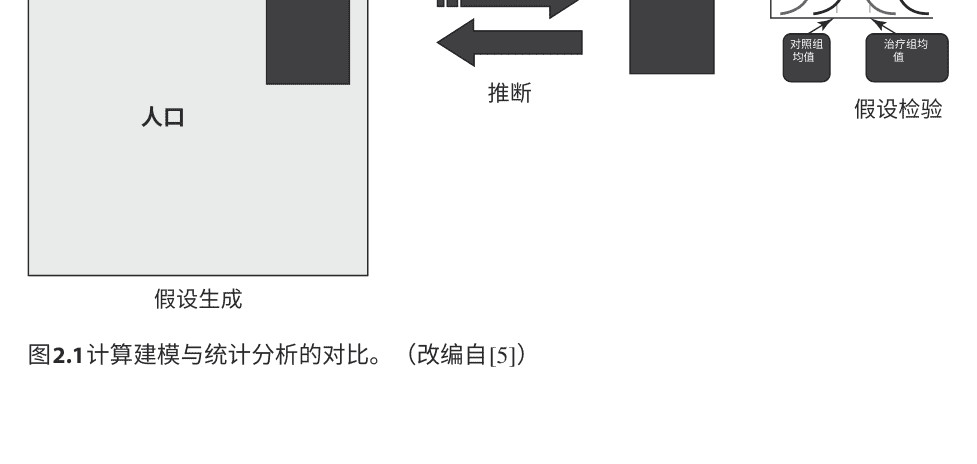

交付的治疗及其可能的相互依赖性，可以进一步对其严重性和可能的行动水平进行不同假设的测试以减轻其影响。 然而，可以使用确定性和统计学方法来开发计算建模技术。 另一方面，深度学习是机器学习的一个子类，算法可以从原始信息中学习数据表示（不需要人工设计的特征提取），并随后对这些数据进行学习任务。

### 2.3 学习能力

学习能力或“可学习性”定义了机器学习算法在模型复杂性和所需的训练样本数量方面学习任务的能力以优化性能指标。 使用正式的统计学习分类法[6]，假设训练集 Ξ of n维向量，

$x_i^n, i=1:m$，每个都被标记为1或0，根据一个目标函数$f$来确定，该函数对学习者来说是未知的，被称为目标概念，用$c$表示，属于函数集$C$，即目标函数的空间，如图2.2所示。任何给定向量$X$存在于$Ξ$中的概率是$P(X)$。 训练的目标是根据$Ξ$中的标记样本猜测一个基于$X$的函数$h$，称为假设。 我们假设目标函数是假设空间$H$中的一个元素。 例如，在我们的质量评估示例中，如果我们对开发一个治疗计划质量度量感兴趣，我们将有一个输入特征$X$的列表（例如能量、束流安排、监控单位），在我们的治疗计划池中受到某个联合概率密度函数$P$的控制。 根据临床经验，这些计划中的一些被认为是好的，而其他计划则被认为是坏的，这构成了我们感兴趣的目标概念（$c$），其具有未知的函数形式$f$，我们的目标是估计它。在训练过程中，我们尝试使用不同的机器学习算法来识别一个假设函数$h(X)$，该函数将近似于对$c$的映射，我们的假设映射函数与目标质量度量概念之间的重叠越高，学习过程越成功，如图2.2的文氏图所示。

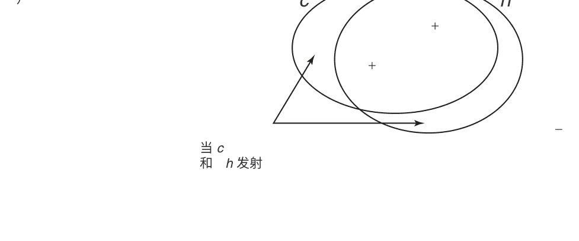

有两个主要理论试图描述经典机器学习算法的可学习性：PAC理论和VC理论，如下所讨论。深度学习的特殊背景将在后续章节中讨论。

### 2.4 PAC学习

一种表征机器学习算法可学习性的方法是通过学习一个假设 $h (X)$ 所需的训练样本数量，如前面提到的。这可以通过学习一个近似正确的假设的概率（PAC）来衡量。形式上，可以定义如下。考虑一个定义在实例集 $X$ of 长度 $m$ 上的概念类 $C$ 和一个使用假设空间 $H$ 的学习器 $L$。使用 $H$ 的 $L$ 可以通过 $C$ 进行PAC学习。

如果对于所有 $c \in C$，分布 $D$ over $X$， $\varepsilon$ 满足 $0<\varepsilon<1/2$ 和 $\delta$ 满足 $0<\delta<1/2$，存在一个学习器 $L$，以至少 $(1-\delta)$ 的概率输出一个假设 $h \in H$，使得错误 $D (h) \leq \varepsilon$，并且时间是多项式的 $1/\varepsilon$， $1/\delta$， $n$ 和大小 ($c$) [4]。对于有限的假设空间 $H$，将错误概率降低到所需水平 $\delta$ 所需的训练样本数 ($m$) 由以下公式给出，假设训练误差为零：

$$m \geq \frac{1}{\varepsilon} \left( \ln |H| + \ln (1/\delta) \right) \tag{2.1}$$

这个估计的训练样本数量足以确保任何一致的假设在概率 $(1-\delta)$ 内准确（误差 $\varepsilon$）。在训练误差不一定为零的情况下，所需的训练样本数量变为：

$$m \geq \frac{1}{2\varepsilon^2} \left( \ln |H| + \ln (1/\delta) \right) \tag{2.2}$$

承认这样的估计在实践中可能是一个过高的估计 [4]。PAC中的另一个问题是它包括假设空间 $H$ 的大小，而实际上可能是未知的或无限的。

### 2.5 VC维度

衡量可学习性的另一种替代方法是使用Vapnik-Chervonenkis (VC) 维度 [3]。VC维度衡量的是假设空间 $H$ 的复杂性，而不是像PAC中的假设数 $H$ 那样通过 $X$ 中的不同实例数来衡量。在实例空间 $X$ 上定义的假设空间 $H$ 的 $VC(H)$ 是由 $H$ 完全区分的最大有限子集 $X$ 的大小。如果 $H$ 可以通过任意大的有限 $X$ 集合来区分，则 $VC(H)=\infty$。需要注意的是，对于任何有限的 $H$， $VC(H) \leq \log 2|H|$。为了证明这一点，假设 $VC(H)=d$。那么，$H$ 将需要 $2^d$ 个不同的假设来区分 $d$ 个实例。因此，$2^d \leq \log 2|H|$。这

如图2.2所示。然而，如果假设的数量远远超过可用的训练样本数量，那么我们面临的是维度诅咒现象。这种维度诅咒或无法学习和推广高维数据的现象激发了深度学习方法的发展[7]，下面将对此进行讨论。

### 2.6 深度学习的学习

深度学习 (DL) 如前所述是机器学习的一个子类，处理的是表示学习，其中原始信息或数据直接输入算法，算法可以自动发现用于检测或分类任务所需的潜在模式 (或潜在特征) [8]。从概念上讲，这可以应用于任何机器学习技术，如图1.2所示，但目前已经实际证明在深度神经网络 (DNNs) 方法中最有效[9, 10]。DNN的描述和它们的架构将在第4章详细介绍；这里我们重点关注底层学习原理。一个解释是通过流形学习假设提供的，其中输入的有趣部分仅出现在具有少量特征的流形集合上，并且DNN通过从一层到下一层的转换来学习如何以这种流形的坐标表示数据，如图2.3所示[7]。另一种解释集中在张量分解和正齐次正则化器如何在非凸问题中导致全局最优解[11]。

### 2.7 实践中的模型复杂性分析

多变量分析通常涉及数据样本中的大量变量或特征[7]。学习模型的复杂性随着输入特征的数量增加而增加 (即输入特征向量的维度) ；因此，有必要关注表征观察结果的最重要特征。

这些通常是未知的。因此，实际的维度约简或子集选择旨在找到“显著”的特征集。找到最佳的子集

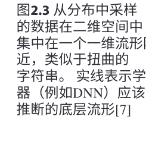

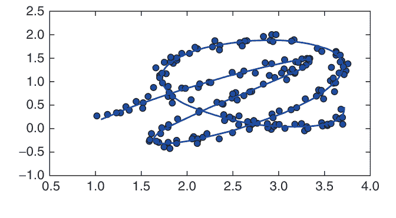

特征的选择在非线性模型的情况下确实具有挑战性。目标是减少模型复杂性，减轻计算负担，并提高对未见数据的泛化能力，如前面所解释的。一种直接的方法是根据经验和领域知识进行有根据的猜测，然后应用特征变换（例如主成分分析（PCA））[12-14]或使用有组织的搜索（例如顺序前向选择或顺序后向选择或两者的组合）进行敏感性分析[14, 15]。还提出了一种基于机器学习的递归消除技术[16]。在这种技术中，数据集被初始化为包含整个集合，在数据上训练预测器（例如支持向量机（SVM）分类器），根据某个标准（例如特征的权重）对特征进行排序，并通过消除排名最低的特征进行迭代。值得注意的是，模型阶数的具体定义取决于函数形式。在逻辑回归中，可以通过参数的数量来确定，而在神经网络的情况下，可以通过神经元和层数来确定（参见图2.4）等。然而，在任何这些形式中，模型阶数在模型复杂性（增加的模型阶数）和模型泛化到未见数据的能力之间创建了一个平衡。在统计学习理论中，找到这种平衡被称为偏差-方差困境（参见图2.5），其中过于简单的模型预计会对数据进行欠拟合（大偏差和小方差），而过于复杂的模型预计会对数据进行过拟合（小偏差和大方差）[17]。因此，目标是实现一个最优的简约模型，即一个具有正确复杂度程度以适应数据并具有最大泛化能力的模型，换句话说，从数据本身推导出其VC维。实际方法利用信息论方法或统计重采样进行讨论。

图2.4 一个在2维空间中分割4个点的14个二分法示例。（来源：Nilsson [6]）

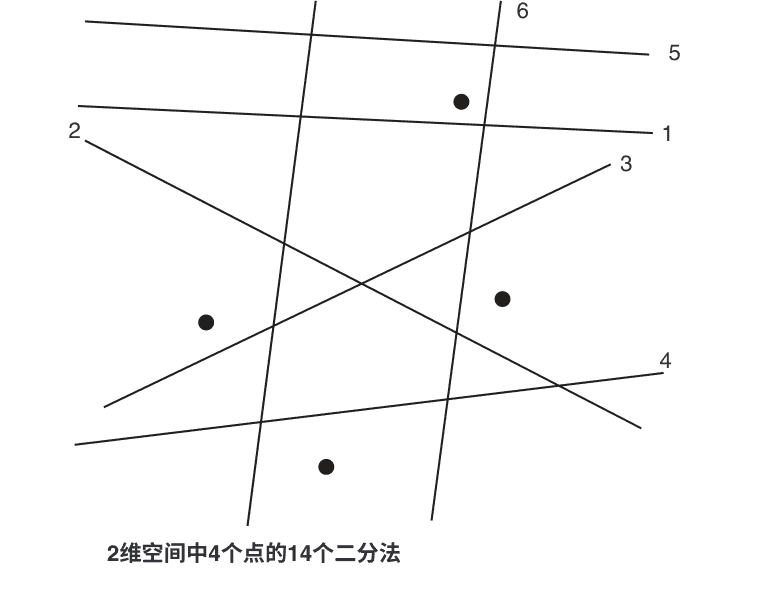

图2.5 该图说明了模型预测能力在预测偏差（平均误差）和预测方差（平方误差）之间的常见权衡。随着模型复杂度的增加，平均预测误差（偏差）往往会减少，而平均平方误差也会减少。最佳复杂度点往往接近平均误差和平方误差大小相似的点。（经Deasy和El Naqa [18]许可重制）

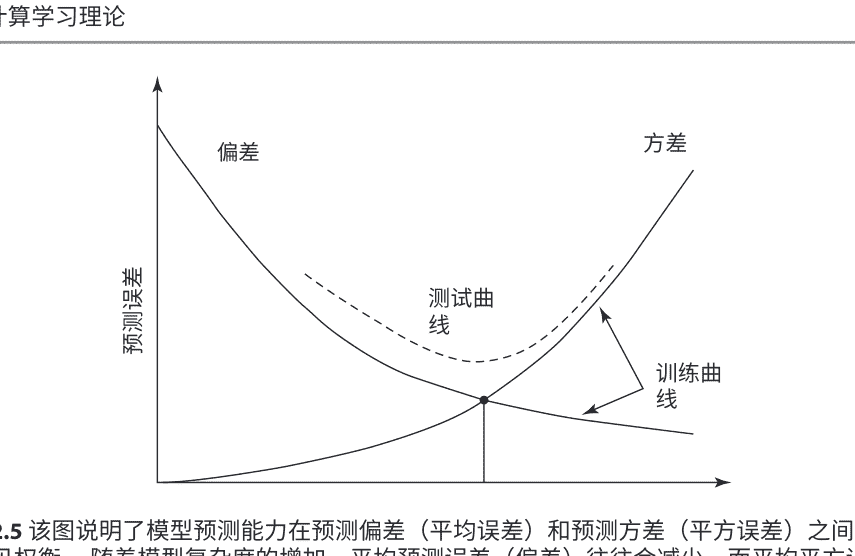

图2.6 使用逻辑回归模型对干燥口腔症进行AIC和BIC绘图，这些模型校正了拟合过程的对数似然效应，分别使用了5个和3个变量的模型阶数[21]。

#### 2.7.1 基于信息论的模型阶数

信息论提供了模型阶数最优性的直观度量；其中最常用的是阿卡伊克信息准则（AIC）和贝叶斯信息准则（BIC）[19]。AIC是模型预测能力的估计，包括最大似然原则和一个模型复杂度项，惩罚具有增加参数数量的模型（以避免过拟合数据）。BIC源自贝叶斯理论，导致一个与参数数量线性增加的惩罚项。图2.6展示了在头颈部癌症放疗后建模干燥口腔（干嘴）的一个示例。

图2.7 留一次交叉验证(LOO-CV)和训练自举法(顶部两条曲线)在模型大小为xerostomia数据上使用Spearman等级系数(Rs)作为度量[21]的比较

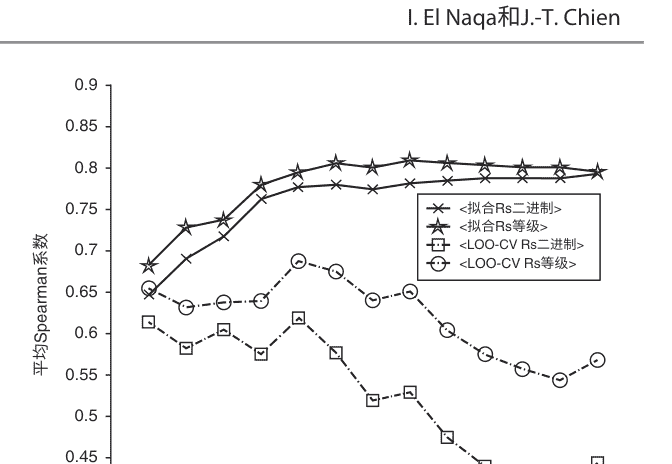

#### 2.7.2 基于重采样方法的模型阶数

当可用数据集有限时(这在肿瘤学中几乎总是情况)，重新采样技术用于模型选择和性能比较目的，以提供统计上可靠的结果。我们使用两种类型的适应-验证方法：交叉验证方法和自助法重新采样技术。交叉验证[14]使用部分数据来训练模型，另一部分数据用于测试模型的有效性。我们经常使用的类型是“留一法”交叉验证(LOO-CV)过程(也称为“Jackknife法”)。在每个LOO-CV迭代中，所有数据都用于训练/拟合，除了一个数据点用于测试，这样每个数据点都被排除一次。预测被排除数据的整体成功是对新数据集上模型性能的定量估计。自助法[20]是一种计算密集型的过程，但可以生成更真实的结果。通常，通过复制原始数据点并以63%的概率随机选择，生成自助伪数据集。即使在数据集较小或不均匀分布的情况下，自助法通常也能很好地工作。为了获得有效的结果，这个过程必须重复多次，通常是几百次或几千次。将这些方法应用于放射治疗中的结果建模的示例(参见图2.7)可以在我们的先前工作[21]中找到，并在[18]中详细讨论。

### 2.8 结论

在本章中，我们讨论了计算学习的一些指导原则。在可能近似正确(PAC)的框架内，我们确定了可以和不可以从多项式数量的假设中学习的类别。训练示例并定义了一个自然的复杂度度量来限制归纳学习所需的训练示例数量。在错误边界框架内，我们研究了学习者在确定正确假设之前会犯多少个训练错误。

VC维提供了一种衡量可学习性的替代方法，通过估计区分假设所需的实例数量。我们还讨论了一些基本原理，以解释深度学习算法通过流形学习或张量分解的泛化能力。除了这些理论方法，我们还介绍了基于信息理论和统计重采样的实际方法来估计模型复杂度。重采样技术，如交叉验证和自助法，是文献中最常用的方法之一，并将在第6章中进一步讨论性能评估的背景下。

## 参考文献

+   1. Fisher RA. 研究工作者的统计方法。 爱丁堡：Oliver and Boyd; 1925年。
+   2. Fisher RA. 实验设计。 爱丁堡：Oliver and Boyd; 1935年。
+   3. Vapnik VN. 统计学习理论的本质。纽约：Springer; 2000年。
+   4. Mitchell TM. 机器学习。纽约：McGraw-Hill; 1997年。
+   5. Berry MJA, Linoff G. 数据挖掘技术：用于市场营销、销售和客户关系管理。第2版。印第安纳波利斯，IN：Wiley; 2004年。
+   6. Nilsson NJ. 学习机器的数学基础。 圣马特奥：摩根考夫曼；1990年。
+   7. Goodfellow I, Bengio Y, Courville A. 深度学习。 自适应计算和机器学习。 剑桥，MA：麻省理工学院出版社；2016年。
+   8. Rumelhart DE, Hinton GE, Williams RJ. 通过反向传播错误学习表示。自然. 1986;323(6088):533–6. https://doi.org/10.1038/323533a0.
+   9. Hinton GE, Salakhutdinov RR. 用神经网络降低数据的维度。科学. 2006年；313 (5786) : 504–7。
+   10. LeCun Y, Bengio Y, Hinton G. 深度学习。自然. 2015年； 521 (7553) : 436–44. https://doi.org/10.1038/nature14539。
+   11. Haeffele BD, Vidal R. 张量分解、深度学习及其它领域的全局最优性。在：arXiv电子打印件; 2015年。
+   12. Guyon I, Elisseeff A. 变量和特征选择简介。 J Mach Learn Res. 2003;3:1157–82。
+   13. Dawson LA, Biersack M, Lockwood G, Eisbruch A, Lawrence TS, Ten Haken RK. 利用主成分分析评估正常组织对放射线的部分耐受性。 Int J Radiat Oncol Biol Phys. 2005;62:829–37。
+   14. Kennedy R, Lee Y, Van Roy B, Reed CD, Lippman RP. 通过模式识别解决数据挖掘问题。 Upper Saddle River, NJ: Prentice Hall; 1998。
+   15. Härdle W, Simar L. 应用多元统计分析。 Berlin/New York: Springer; 2003。
+   16. Guyon I, Weston J, Barnhill S, Vapnik V. 使用支持向量机进行癌症分类的基因选择。机器学习. 2002年;46:389–422。
+   17. Hastie T, Tibshirani R, Friedman JH. 统计学习的要素： 数据挖掘、推断和预测：附带200幅全彩插图。纽约：斯普林格； 2001年。
+   18. Deasy JO, El Naqa I. 基于图像的放射治疗正常组织并发症概率建模。癌症治疗研究. 2008年;139:215–56。
+   19. Burnham KP, Anderson DR. 模型选择和多模态推断：一种实用的信息论方法。第2版。纽约：斯普林格；2002年。
+   20. Efron B, Tibshirani R. 自助法的介绍。纽约：查普曼和霍尔；1993年。
+   21. El Naqa I, Bradley JD, Lindsay PSE, Blanco AI, Vicic M, Hope AJ, et al. 包括剂量容积和临床因素在内的放射治疗结果的多变量建模。国际放射肿瘤学、生物物理学杂志. 2006年;64:1275–86。

# 传统机器学习方法

Sangkyu Lee和Issam El Naqa

### 3.1 介绍

在这个背景下，学习被定义为从数据中估计统计依赖关系。有三种常见的学习类型[1]: 无监督学习、监督学习和强化学习。在无监督学习中，只有输入样本被提供给学习系统（例如，聚类和概率密度函数估计）。监督学习用于从已知的（输入，输出）样本中估计未知的（输入，输出）映射（例如，分类和回归），其中教师提供输出样本（标签）。在强化学习中，映射是环境输入数据和相应动作之间的映射，而不是标签。这些概念将在本章中详细介绍，使用传统的机器学习技术，其中首先从原始数据中提取特征，然后将其输入算法以学习所需的任务。深度学习的讨论，其中算法直接作用于原始数据，将在第4章中介绍。

### 3.2 无监督学习

#### 3.2.1 线性主成分分析

假设我们有一组患者的肿瘤治疗数据或图像，其中一些患者出现了晚期并发症，而其他患者没有。例如，在前列腺癌放射治疗的情况下，数据可能包括患者的年龄和体重，Gleason评分等诊断因素，计划靶体积（PTV）的剂量，一个或多个关键结构的剂量等。我们想知道这些数据中是否存在可以预测并发症的模式。第一步是将数据集减少到最具信息量的元素，即特征。

通常会有多个数据，这些数据测量的是相同的事物，多少有些差异。我们希望将数据向量减少到一个较小的维度，只包含明显不同的组成部分（即彼此不相关的组成部分）。为了做到这一点，我们将患者数据排列成一个矩阵 \(X\)，其中每一行和每一列分别代表一个患者和一个变量。作为预处理步骤，矩阵 \(X\) 中的每一列都被归一化为零均值和单位方差（z-score）。然后对归一化后的 \(X\) 应用主成分分析（PCA）来识别一组主成分（PCs），其表示为：

\(PC = U^T X = \Sigma V^T\) （3.1）

其中 \(U\Sigma V^T\) 是 \(X\) 的奇异值分解（SVD）。这相当于将数据转换为一个新的坐标系，使得数据在任何投影上的最大方差位于第一个坐标（第一个主成分），第二大方位于第二个坐标（第二个主成分），依此类推。为了可视化PCA，通常使用z-score对异质变量进行归一化（零均值和单位方差）。在PCA图中使用的方差解释是指数据模型关于平均预后输入因子值的方差。数据模型是由其主成分的线性组合形成的。因此，如果数据的PC表示解释了数据关于完整数据均值的扩散（方差），那么可以预期这种PC表示将捕捉到足够的建模信息。此外，PCA分析可以提供关于类别可分性的指示；然而，需要注意的是，PCA只是一个指示，并不一定针对此目的进行优化，例如，有监督的线性判别分析[2]。

图3.1展示了应用于三种不同预后挑战的患者数据的主成分分析（PCA）的三个示例：干燥口腔（干嘴）、食管炎（食管炎症）和肺炎（肺炎症）。在这种情况下，PCA的主要目的是可视化有无并发症的患者之间的分离程度。对于干燥口腔的情况，PCA揭示了预后数据中几个显著的主要模式，其中前两个仅解释了数据成分中总方差的60%。

然而，前两个主成分已经显示出了有和没有干燥口腔的情况之间的明显区别，这意味着剩下的方差可能与并发症无关。相比之下，主成分分析只显示食管炎和肺炎只有一个强主模式，即原始数据组分之间高度相关，主成分分析将它们降低为一个主成分。投影数据没有明显的分离，这需要一种非线性建模方法，如基于核的方法（见第3.3.4节）。

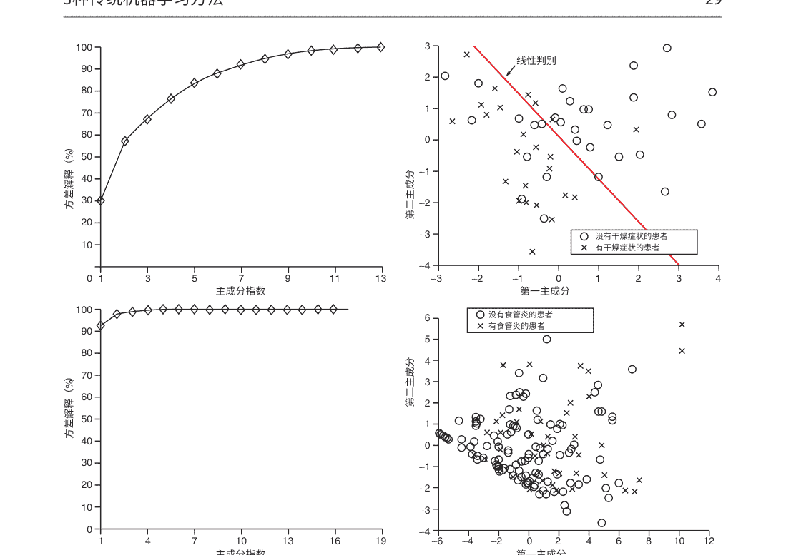

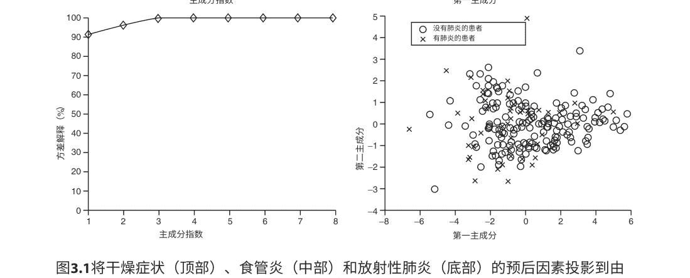

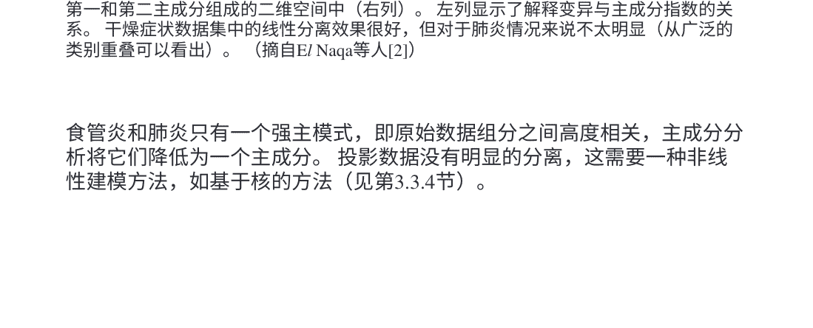

图3.1 将干燥症状（顶部）、食管炎（中部）和放射性肺炎（底部）的预后因素投影到由第一和第二主成分组成的二维空间中（右列）。左列显示了解释变异与主成分指数的关系。干燥症状数据集中的线性分离效果很好，但对于肺炎情况来说不太明显（从广泛的类别重叠可以看出）。（摘自El Naqa等人[2]）

#### 3.2.2 核主成分分析

核主成分分析是一种非线性的主成分分析方法，通过使用核技术（参见即将介绍的支持向量机（SVM）部分）来实现。它对于检测数据中无法用现有变量的线性组合表示的非线性行为非常有用。核技巧有效地将输入空间转换为一个更高维的特征空间，在这个空间中可以以线性方式发现非线性模式（图3.2）。这个概念类似于在理论物理中将维度映射到更高维度，以识别粒子和自然力行为的统一框架（例如弦理论）。然而，输入空间的转换不需要显式地定义，因为主成分分析只需要在转换后的空间中的协方差矩阵的知识。对于数据 \(x_1, x_2, ..., x_n\) 的协方差矩阵的 \((i,j)\) 元素可以直接从核函数 \(k(\cdot, \cdot)\) 计算：

\(K_{ij} = \langle \Phi(x_i), \Phi(x_j) \rangle = k(x_i, x_j) \quad (3.2)\)

其中 \(\Phi(x)\) 表示输入空间的转换。然后对 \(K\) 进行对角化，提取一组主成分（PCs）及其对应的特征值。当样本数量超过输入维度时，核PCA比线性PCA更加计算密集。然而，当应用于包含非线性模式（例如手写）的问题时，非线性PCA在减少数据维度以进行分类任务之前可能更加合适[3]。

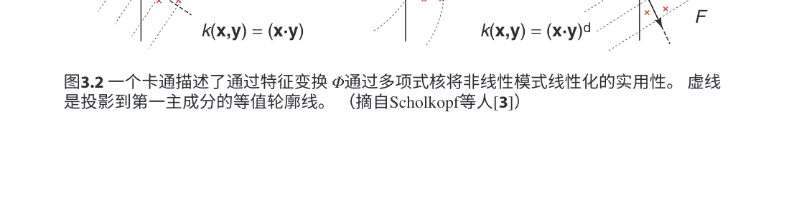

图3.2 一个卡通描述了通过特征变换 \(\Phi\) 通过多项式核将非线性模式线性化的实用性。虚线是投影到第一主成分的等值轮廓线。（摘自Scholkopf等人[3]）

#### 3.2.3 因子分析 (FA)

因子分析（FA）旨在捕捉观察变量的共同变异模式。与PCA类似，因子分析可以被视为一种降维技术，将大量观察变量总结为较少数量的潜在变量或因子。PCA和FA都通过使用潜在变量的线性组合来重构方差/协方差矩阵。然而，PCA和FA之间的主要区别在于对变量方差的假设。因子分析将变量的方差分为两个部分：（1）可以通过因子的线性组合来解释的方差和（2）各个变量特有的方差，因此无法通过因子来解释。这可以表示为：

\(X = WZ + \mu + \varepsilon \qquad (3.3)\)

其中 \(X\) 是一个 \(p \times n\) 矩阵，表示1,....p个观测变量，\(Z\) 是一个 \(l \times n\) 矩阵，表示1,....l个因子，\(\mu\) 包含观测变量的均值，\(\varepsilon\) 表示每个变量特有的方差。称为加载的 \(p \times l\) 矩阵 \(W\) 指定了因子的线性组合的加权因子。在PCA中，其经典形式假设\(\varepsilon\)为零。换句话说，它强制使方差完全由潜在变量解释，没有独特的方差。因此，PCA可以看作是FA的特例。有两种类型的因子分析。探索性因子分析（EFA）将因子数设置为变量数，并允许任何因子与任何变量相关联。它在探索阶段进行，正如其名称所示，以观察变量和构造之间的相关模式。相比之下，验证性因子分析（CFA）测试现有潜在结构模型（基于先前知识或EFA结果构建）对观测数据的有效性。与EFA不同，CFA不允许一个变量与多个因子相关联。EFA和CFA之间的区别在图3.3中说明。

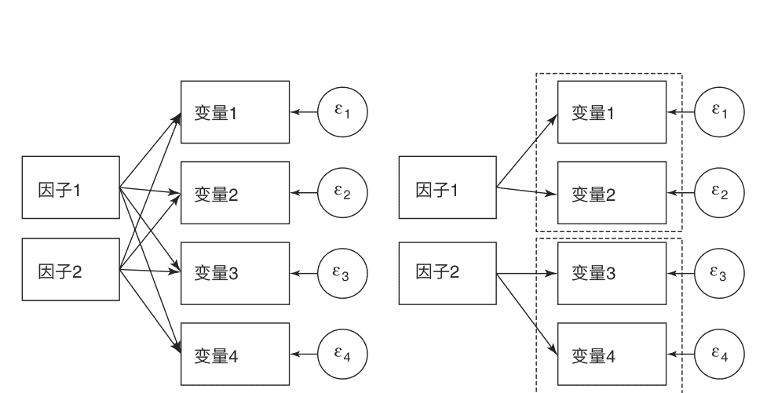

因子分析对于识别调查或问卷数据中的不同响应模式特别有用。它已被应用于研究以问卷形式报告的放射治疗结果。例如，Thor等人使用因子分析从前列腺患者的正常组织治疗后效应（LENT）问卷数据中识别出8个症状领域，并确定了可以简化毒性报告过程的冗余或无关问题。

#### 3.2.4 聚类

聚类分析是基于相似性标准在数据中检测集体模式的方法。它可以以监督或无监督的方式进行。将数据点分组成簇在多个方面都很有用。首先，它可以在主要调查之前提供直观而简洁的数据性质表示。其次，聚类可以将复杂的数据分布压缩成一组对应于簇中心的向量（向量量化）。

K均值聚类是最流行的聚类方法之一。它从给定数量（K）的聚类开始进行随机分区。然后通过以下步骤迭代地改进分区：（1）分配步骤（根据与聚类中心的距离重新分配每个数据点的聚类成员资格）和（2）更新步骤（将更新后的成员资格的几何平均值重新计算为聚类中心）。Minkowski距离是d维向量 \(\mathbf{a}\) 和 \(\mathbf{b}\) 之间的距离，也被称为 \(L_p\) norm，用作近似度的度量：

\(L_k(\mathbf{a},\mathbf{b}) = \left( \sum_{i=1}^{d} |\mathbf{a}_i - \mathbf{b}_i|^k \right)^{1/k} \quad (3.4)\)

广泛使用的欧几里德距离和曼哈顿距离分别指的是Minkowski距离在p=2和p=1时的情况。K均值因其简单性和快速收敛性而受到欢迎[8]。该算法的一个缺点是在初始分区选择不仔细时容易收敛到局部最小值[8]。通过引入种子启发式算法，如Arthur和Vassilvitskii提出的K-means++算法[9]，可以在一定程度上克服这个问题。此外，原始的K均值算法需要事先给出聚类的数量（K）。选择可以基于领域知识进行，也可以在数据中以交叉验证的方式进行优化。优化方法使用贝叶斯信息准则（BIC）[10]或最小描述长度（MDL）[11]作为目标函数，惩罚更大数量的聚类。

另一个越来越受欢迎的聚类算法是一种神经网络衍生的方法，称为自组织映射（SOM）或Kohonen映射[12]。在SOM中，输入数据中的不同模式由节点表示，这些节点通常以二维六边形或矩形网格的形式排列，以便更好地进行可视化。每个节点都被分配在网格中的位置和输入变量上的权重向量。学习算法从随机化节点权重开始。然后，从训练集中随机选择一个训练样本，并确定与其最接近的节点（可以使用闵可夫斯基度量）作为最佳匹配单元（BMU）。根据以下更新公式，调整BMU及其附近节点的权重向量，以减小与训练样本的距离：

\(\mathbf{w}_v(t+1) = \mathbf{w}_v(t) + \alpha(t) \Lambda\left( \left\| \mathbf{w}_{\text{BMU}}(t) - \mathbf{w}_v(t) \right\| \right) (\mathbf{x}_i - \mathbf{w}_v(t)) \quad (3.5)\)

其中 \(\mathbf{w}_v(t)\) 是迭代 \(t\) 时节点v的权重向量，\(\mathbf{x}_i\) 是第 \(i\) 个输入样本。更新的幅度由依赖于因素决定，这些因素取决于从BMU到其最佳匹配单元(BMU)的距离，以及迭代次数(t)。窗口函数(Λ)在v=BMU时最高，并随着节点远离BMU而逐渐减小。它确保节点在拓扑上有序排列（相邻节点具有相似的权重模式）。学习率α(t)通常随着迭代次数的增加而减小，以确保收敛。在所有训练样本上重复学习后，节点倾向于聚集在频繁出现在输入模式中的权重上（拓扑排序）。SOM已被证明在语音识别、语言学和机器人控制等领域非常有用（图3.4）。

层次聚类能够构建层次簇。与前两种算法相比，用户不需要指定簇的数量。通过将每个样本作为一个簇，并在每次迭代中合并一对簇来构建簇（凝聚聚类）。在这种情况下，要合并的两个簇是基于用户定义的相似度度量确定，两个簇之间的相似度可以基于最相似的一对样本（单链接），最不相似的一对样本（完全链接），或合并簇内的总方差（Ward方法）。较少常用的方法是从单个簇中的所有样本开始，并在迭代过程中将一个簇分裂为两个簇（分裂聚类）。相同的原则可以应用于聚类变量，而不是样本（通过转置数据矩阵可以轻松实现）。

层次聚类的结果在一个称为树状图的二叉树中进行可视化（图3.5）。在这个图中，每个样本都表示为一个终端节点，并且聚类的形成通过边来展示。层次聚类提供了关于样本或变量中可能存在的显著群组数量的可视化洞察。然而，计算时间在样本大小方面呈二次增长，这使得它比k-均值算法更慢。

图3.5 应用于R内置数据集mtcars的层次聚类的树状图。相似度度量表示为一个分支的高度。

另一种流行的聚类技术是t-分布式随机邻居嵌入（t-SNE）算法，它允许在高维空间中对数据进行可视化，就像PCA和KPCA一样。然而，在t-SNE中，构建了一个概率分布，其中相似的对象由附近的点建模，不相似的对象由远离的点建模，并使用度量如欧氏距离或更常见的Kullback-Leibler（KL）散度来计算相应的概率[13]。已经将t-SNE应用于从超声/磁共振成像中识别乳腺病变[14]。

生物信息学中的许多挑战都被定义为聚类问题，例如在特定条件或疾病下识别出一组显示相似表达模式的基因。Svensson等人的一项研究[15]是放射治疗毒性建模的一个很好的例子。他们根据基因在辐射后淋巴细胞中的表达模式将1182个候选晚期毒性标记基因分为两组，尽管这种分组与毒性状态无关。相比之下，Chen等人建立的放射性肺炎风险因素自组织映射（SOM）显示出因素之间的分组模式可以用于预测毒性，准确度较高（AUC=0.73）。在许多放射组学研究中，层次聚类已被采用来识别一组相关或冗余的放射组学特征[17-19]。

### 3.3 监督学习

#### 3.3.1 逻辑回归

在治疗结果建模中，响应变量通常会遵循一个S形曲线。这表明具有S形状的模型更适合使用[20-27]。常用的S形模型是逻辑模型，它还具有良好的数值稳定性特性。逻辑模型由[28, 29]给出：

$$ f(x_j) = \frac{e^{g(x_j)}}{1 + e^{g(x_j)}}, \quad i=1,2,\ldots,n \tag{3.6} $$

其中，n是案例（患者）的数量，x是用于预测结果y_i的输入变量值的向量。这里的f(·)被称为逻辑变换。“x轴”上的求和g(x_i)由以下公式给出：

$$ g(x_i) = \beta_0 + \sum_{j=1}^{s} \beta_j x_{ij}, \quad i=1,\ldots,n \quad j=1,\ldots,s \tag{3.7} $$

其中，s是模型变量的数量，β是一组模型系数，通过最大化数据产生观测值的概率（即似然函数）来确定。许多商业软件包，如SAS、SPSS和Stata，提供了逻辑回归模型系数及其统计显著性的估计。这种方法的结果不像上述那样以闭式形式表示，而是通过逐步方式选择模型参数，以定义回归模型的横坐标，如图3.6所示。然而，分析师有责任测试估计响应的交互作用，这可以通过在方程（3.6）中添加交叉项来进行修正。然而，这种转换存在一定的局限性。

学习能力。在这样的模型中，用户有责任确定是否应添加交互项或高阶项。应用人工智能方法可以解决这个问题。

#### 3.3.2 前馈神经网络（FFNN）

神经网络被描述为自适应的大规模并行分布式计算模型，由许多非线性元素按照类似生物神经元网络的模式排列而成。典型的神经网络结构如图3.7所示。

神经网络已成功应用于建模许多不同类型的复杂非线性过程，包括许多模式识别问题[31]。一个三层的前馈神经网络将具有以下近似函数的模型：

$$ f(\mathbf{x}) = \mathbf{v}^{T}\mathbf{w}^{(2)} + b^{(2)} \tag{3.8} $$

其中 v 是一个向量，其元素是隐藏神经元的输出，即

$$ \mathbf{v} = s\left(\mathbf{x}^{T}\mathbf{w}_{i}^{(1)} + b^{(1)}\right) \tag{3.9} $$

其中 x 是输入向量，w^{(j)} 和 b^{(j)} 分别是第 j 层的互连权重向量和偏置项，j=1,2。在前馈神经网络中，激活函数 s(·) 通常是一个 sigmoid 函数，但也可以使用径向基函数[32]。前馈神经网络可以通过两种方式进行训练：批处理模式或顺序模式。在批处理模式下，所有的训练样本一次性使用；在顺序模式下，训练

图3.7 神经网络结构包括输入层、中间层（隐藏层）和输出层。网络的突触由根据其选择的激活函数而触发的神经元组成。

#### 3.3.3 通用回归神经网络（GRNN）

GRNN [33] 是一种基于神经网络结构的概率回归模型。它被称为非参数模型，这意味着它不需要任何预先确定的函数形式（例如多项式）。相反，它通过训练数据估计输入变量 x 和目标变量 y 的联合密度。使用GRNN的回归输出通过取给定观测值 X 和联合密度 g(x, y) 的期望值来获得。

$$ \hat{y}(\mathbf{X}) = E(y|\mathbf{X}) = \frac{\int_{-\infty}^{\infty} yg(\mathbf{X}, y)dy}{\int_{-\infty}^{\infty} g(\mathbf{X}, y)dy} \tag{3.10} $$

联合密度 g(x, y) 是通过训练样本 xi 和 yi 估计得到的，使用帕尔森估计器，其中密度被视为以观测点为中心的高斯核的叠加，具有扩展 σ。回归函数的结果形式为：

$$ \hat{y}(\mathbf{X}) = \frac{\sum_{i=1}^{n} y_i \exp \left( \frac{-D_i^2}{2\sigma^2} \right)}{\sum_{i=1}^{n} \exp \left( \frac{-D_i^2}{2\sigma^2} \right)} \tag{3.11} $$

其中 D_i^2 = (X - X_i)^T (X - X_i) 表示测试数据 X 和第 i 个训练数据 X_i 之间的欧氏距离。

GRNN的训练相当简单，只需调整高斯宽度 σ 即可。因此，GRNN的实现不需要优化求解器来获得权重，就像FFNN的情况一样。然而，输出是所有训练样本的加权和，这可能在运行时效率上不够高。通过对训练数据进行聚类分析（见第3.2.3节），可以将其压缩为少数个簇中心，从而只需在这些中心点和测试样本之间计算度量 D_i。计算速度也可以通过并行化神经网络实现得到改善，因为每个求和可以使用突触和指数激活函数独立进行。在我们之前的工作中，我们证明了GRNN在放射治疗结果预测方面可以胜过传统的FFNN [34]。

#### 3.3.4 基于核的方法

基于核的方法及其最重要的成员，支持向量机（SVM），是基于统计学习理论的通用构造学习过程[35]。为了区分放射治疗低风险患者和高风险患者，基于核的技术的主要思想是在由隐式核映射定义的非线性特征空间中，通过最大化它们之间的间隔来分离这两个类别的超平面。优化问题的目标函数定义如下：

$$ L(\mathbf{w}, \xi) = \frac{1}{2} \mathbf{w}^T \mathbf{w} + C \sum_{i=1}^{n} \xi_i \tag{3.12} $$

受以下约束条件限制：

$$ y_i \left( \mathbf{w}^T \Phi(\mathbf{x}_i) + b \right) \geq 1 - \xi_i $$
$$ \xi_i \geq 0 \quad \text{对于所有 } i $$

其中 w是权重向量， Φ(·)是非线性映射函数。 ξ_i表示每个样本允许在错误的一侧的容忍误差。请注意，最小化方程（3.12）中的第一项会增加两个类别之间的分离度（提高泛化能力），而最小化第二项（惩罚项）会提高拟合精度。复杂性和拟合误差之间的权衡由正则化参数 C控制。然而，这种非线性公式会受到维度灾难的影响（即，问题的维度变得太大而无法解决）[1, 36]。然而，通过解决双重优化问题而不是原问题，可以实现计算效率，该问题是凸的，复杂度仅取决于样本数量[35]。在这种情况下，预测函数仅由一部分训练数据（称为支持向量）来描述：

$$ f(\mathbf{x}) = \text{sign}\left( \sum_{i=1}^{n_s} \alpha_i y_i K(\mathbf{x}_i, \mathbf{x}) + b \right) \tag{3.13} $$

其中， n_s是支持向量的数量， α是通过二次规划确定的对偶系数， K(·,·)是下面讨论的核函数。通常使用非线性核函数，包括：

- 多项式: $K(\mathbf{x}, \mathbf{x}') = \left( \mathbf{x}^T \mathbf{x}' + c \right)^q$
- 径向基函数(RBF): $K(\mathbf{x}, \mathbf{x}') = \exp\left( -\frac{\| \mathbf{x} - \mathbf{x}' \|^2}{2\sigma^2} \right)$

其中， c是常数， q是多项式的阶数， σ是径向基函数的宽度。基于核函数的方法非常灵活，可以通过使用S型核函数的组合来构建神经网络或选择其他方法。

#### 3.3.5 决策树和随机森林

决策树适用于生成由多个属性的布尔条件组成的假设（析取假设）。虽然它也可以进行回归，但我们将限制讨论其在分类中的应用。决策树将输入空间划分为几个不相交的子区域。在对其属性值进行连续测试后，测试实例将落入其中一个子区域。

然后，实例将被赋予其分类结果，该结果是分配给给子区域的值。测试按照树结构指定的顺序进行组织（图3.8）。树由节点、分支和叶子组成，分别表示以下内容：

- 节点：要进行测试的属性
- 分支：测试的结果，例如，患者的体温是否高于37°（连续属性）或患者是否服用阿司匹林（分类属性）？
- 叶节点：位于树的末端的节点，表示数据子集和分配给该子集的类标签

树及其参数是从训练数据中以监督方式学习得到的。学习过程可以被看作是将训练实例分成子组（对应节点），以使子组中的类标签尽可能使其同质化。决策树学习中的主要问题是（1）以何种顺序测试属性，（2）希望通过单个测试得到的分区类标签的纯度水平是多少，以及（3）需要多少个节点。

ID3（迭代二分器3）算法是一种决策树学习算法的原始形式，旨在通过贪婪搜索找到最优决策树[44]。ID3算法通过识别第一个属性（根节点）来创建第一组分区，并通过将相同的过程应用于生成的子集和剩余属性来进一步分支树。在每一轮分区中，选择要分割的属性是基于它本身对目标类的预测能力。在决策树学习的背景下，属性$A$相对于类别$C$的预测值是通过其信息增益来衡量的，其定义如下：

$$\text{Gain}(A) = H(C) - H(C|A) \qquad \qquad (3.14)$$

其中，$H$表示熵，是由概率分布传达的信息度量。对于具有分布为$c$个离散状态和相应概率$p_1, p_2, ..., p_c$的变量$A$，熵的计算公式为：

$$H(A) = \sum_{i=1}^{c} -p_i \log_2 p_i \qquad \qquad (3.15)$$

对于连续属性，设置一个阈值（$A_{th}$）将数据分成两个子集，比例分别为$p_1$和$p_2$，其中$p_1 = p(A < A_{th})$ 和 $p_2 = p(A > A_{th})$。选择$A_{th}$的值，使得得到的信息增益最大。

当所有属性都被使用或者分支的所有分区被纯化为一个类时，树的分支停止生长。然而，当没有采取任何调节措施时，树可以通过添加更多的分支来过度拟合数据，直到每个训练实例都被正确分类。已经提出了许多预防方法来提高树的泛化能力。减少错误修剪[45]是在学习了一棵树之后通过对分支进行迭代修剪来减小树的大小。首先删除靠近叶子的分支，然后向上修剪，直到修剪后的树的验证性能开始下降。

过拟合问题也可以通过一种称为集成学习的元算法来缓解。其思想是使用给定数据集训练一组分类器，并将它们的输出组合起来，以弥补单个模型的高方差。Breiman在树学习中应用了这个概念，被称为随机森林。在创建模型集合时，随机森林算法引入了两个级别的随机化：首先，通过有放回地重新采样（自助法）来随机化训练样本。其次，在每个分支步骤中，它从随机选择的属性子集中选择一个属性进行分割。训练完一组决策树后，对所有个体树进行预测，并选择树中最频繁的类作为最终结果。Boosting是另一种常与决策树结合使用的集成元算法。在这种设置下，树是按顺序学习的：在学习一棵树后，错误分类的样本会被加权，以便在下一棵树的学习中更加关注这些样本。训练样本被赋予更大的权重，并使用重新加权的训练集学习后续树。最终的分类结果被视为一组树的平均输出。详细的算法可以参考Freund和Schapire的一篇论文[47]。

决策树一直是许多决策支持系统的热门选择，特别是在医学领域，因为它们将假设表示为顺序的“如果-那么”子句，易于解释，并且在某种程度上类似于人类推理。例如，Delaney等人[48]进行了一项文献调查，构建了一棵树来确定基于几个临床属性的黑色素瘤患者的放疗建议（图3.9）。Das等人[49]训练了一组树，将剂量学和非剂量学风险因素结合起来，表明通过组合更多的树可以提高预测能力。使用一组树的缺点是失去了可解释性：Valdes等人[50]在他们的算法MediBoost中解决了这个问题，通过引入“软”分区来以增强的方式训练决策树。在其他研究中，利用随机森林的变量重要性度量来解释放疗毒性的预测模型[51, 52]。

#### 3.3.6 贝叶斯网络

贝叶斯信念网络，或贝叶斯网络，旨在模拟一组随机变量之间的概率关系。贝叶斯网络的一个关键特征是通过有向无环图（DAG）对关系进行图形化表示，该图编码了变量之间的存在和影响方向。在DAG中，每个变量被分配给一个节点，并通过边（顶点）与其他变量相连，该边起源于影响所连接变量（子节点）的变量（父节点）。因此，随机变量的概率被设置为其在父变量的条件下。DAG中的连接信息导出了条件独立关系，可以表示为：给定另一变量集合 $Z_1, Z_2,..., Z_n$，随机变量 X和Y在条件下是独立的，当且仅当：

$$ P(X \mid Y, Z_1, Z_2, \ldots, Z_n) = P(X \mid Z_1, Z_2, \ldots, Z_n) \qquad (3.16) $$

在DAG中指定的一组条件独立关系通过使用这个方便的属性大大简化了概率分布的计算：整个变量集合 $\mathbf{X} = X_1, X_2, ..., X_n$的联合概率分布可以通过取每个父子集合的所有条件概率的乘积来获得（贝叶斯网络的链式法则[53]）。图3.10展示了与非小细胞肺癌（NSCLC）的局部控制相关的临床和剂量学变量的网络，包括年龄（A）、GTV体积（G）、PTV覆盖（V75, V60）和治疗前化疗（C）[54]。使用链式法则，联合概率可以分解为：

图3.9 树状图表示决策规则，根据疾病特征确定是否对黑色素瘤患者使用放射治疗。RT：放射治疗，LN：淋巴结。（摘自Delaney等[48]）

图3.10 一个贝叶斯网络有向无环图，用于预测非小细胞肺癌的局部控制，使用放射治疗和临床变量。该有向无环图是由Oh等人[54]根据临床数据进行训练的。

$$ P(LC|A, G, V75, V60, C) = P(A)P(G)P(V75)P(C|A,G)P(V60|G)P(LC|A,G,C,V75,V60) $$

条件概率值通常被称为贝叶斯网络的“参数”。这些参数可以通过数据训练得到，可以是最大似然估计或最大后验概率（MAP），其中将先验概率与观测到的似然结合起来。

可以使用先前对研究领域的了解构建有向无环图（DAG）。当领域知识不足时，可以使用观察数据来搜索最能描述数据的DAG。DAG搜索可以被视为一个优化问题，通过最大化预定义的评分函数来搜索可能的DAG配置空间。搜索算法可以根据评分函数和搜索过程的选择而有所不同。广泛使用的评分函数包括边际似然（贝叶斯）评分和贝叶斯信息准则（BIC）评分。这两个评分旨在在数据适应性（边缘更可能在数据中具有更强相关性的变量之间形成）和图的复杂性（由边缘或参数的数量量化）之间取得平衡，尽管在惩罚复杂性的程度上存在差异。数学细节可以参考Koller和Friedman的入门指南[53]。

由于可能的DAG数量随变量数量呈超指数增长，因此在整个图空间上进行穷举搜索最高评分的DAG是不切实际的。已经提出了各种启发式方法来减少计算成本。例如，贪婪搜索算法从空图开始，只有在导致更高图评分时才添加边缘。还可以对图拓扑施加约束，以限制搜索算法的搜索范围。例如，搜索可以限制在树状结构（Chow-Liu树）[55]或仅允许变量之间按降序排列的边缘（K2算法）[56]。

高分数的有向无环图可以通过采样方法（如马尔可夫链蒙特卡罗方法）[57]来发现。马尔可夫链蒙特卡罗算法生成样本在图空间的随机游走过程中遇到的有向无环图（马尔可夫链）可以近似为链收敛时的有向无环图的后验分布。

贝叶斯网络的概率方法使其适用于处理不确定性。特别是在医学领域，缺失的记录或测试结果可能对预测性能产生负面影响。贝叶斯网络在预测时不需要完整观察其特征，因为它能够利用特征之间的条件依赖关系建立和边际化联合概率。与非概率分类器（如支持向量机）相比，贝叶斯网络在肺癌患者的生存预测中显示出优势，这是由Jayasurya等人[38]证明的。放射治疗学中贝叶斯网络的其他应用包括前列腺癌[58]和肺癌[54]的预后网络。

#### 3.3.7 朴素贝叶斯

朴素贝叶斯是贝叶斯网络的简化派生，仅用于分类。该方法假设特征变量在给定类变量的情况下是独立的。这种所谓的朴素独立性假设可以用贝叶斯有向无环图（DAG）表示，如图3.11所示。根据独立性假设，可以从最大后验概率（MAP）规则推导出类别C的最可能状态的推断。

$$C_{MAP} = \arg \max_C P(C|A_1, A_2, ..., A_n):$$
$$= \arg \max_C \frac{P(A_1, A_2, ..., A_n|C)P(C)}{P(A_1, A_2, ..., A_n)}$$
$$= \arg \max_C \frac{P(C)\prod_{i=1}^{N}P(A_i|C)}{P(A_1, A_2, ..., A_n)}$$
$$\propto \arg \max_C P(C)\prod_{i=1}^{N}P(A_i|C)$$

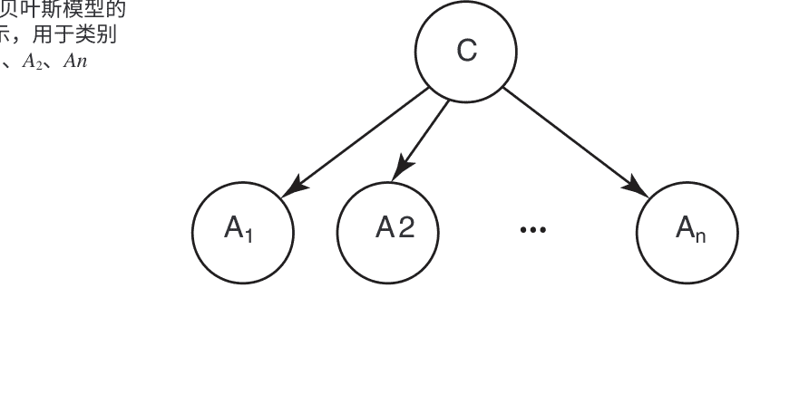

朴素贝叶斯在高维空间中的分类效果很好，因为估计完整变量集的联合概率是具有挑战性的。其理论性质显示对输入中的噪声变化不太敏感，这有助于其稳健的性能[59]。然而，朴素贝叶斯不适用于直接估计类后验概率，因为不切实际的独立性假设会导致概率估计不准确。尽管如此，它已经应用于许多医学预后问题，其中对疾病状态的分类是唯一的兴趣。例如，Kazmierska和Malicki使用朴素贝叶斯从一组96个特征中预测脑肿瘤复发，其准确性超过了贝叶斯网络和决策树算法[60]。

### 3.4 强化学习

强化学习（RL）是一类机器学习算法，学习者或软件代理根据底层环境状态尝试采取一系列行动，以最大化累积奖励，例如赢得跳棋或国际象棋游戏[61]。在某种程度上，强化学习模仿了人类学习的方式，将马尔可夫决策过程（MDP）（例如动态规划）与监督学习相结合。强化学习可以如图3.12所示[62]，在任何时间点（t），代理通过采取行动（a_t）从当前环境状态（s_t）获得奖励（r_{t+1}）。目标是在特定状态下最大化预期的折扣回报值（V），给定策略（π）：

$$V^\pi(s_t) = E\{R | s_t, \pi\} \quad (3.16)$$

其中R是回报函数 $R = \sum_{t=0}^{\infty} \gamma^t r_{t+1}$ 并且 $0 \le \gamma \le 1$ 为折扣回报率。解决这种折扣无限视界MDP的已知方法是Q-learning随机算法[63]，它是一种使用无模型的迭代方法来解决贝尔曼最优性的动作选择问题。

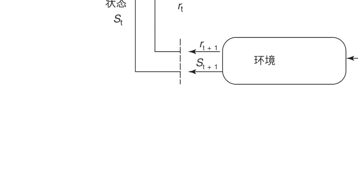

（无监督）或基于模型的（有监督）方法。基于RL的技术已被采用在自适应临床试验的设计中，以估计个体治疗规则[64]。例如，顺序多重分配随机试验（SMART）已被应用于不同疾病相关的药物滥用、HIV/AIDS和精神疾病的自适应干预，取得了有希望的结果[65]。金等人[66]提出了将RL应用于放射治疗的示例，他们展示了使用马尔可夫决策过程来修改剂量分数计划的数值示例，用于自适应放射治疗应用。文森特等人提出了另一个例子，用不同的效用函数来优化每个分数的剂量在细胞培养实验中[67]。

#### 3.4.1 自适应肝癌治疗的强化学习

自适应放射治疗应用于88例肝体立体定向放射治疗（SBRT）患者中的35例非自适应和53例自适应方案，来自145例患者中的一个人群[68]。适应性基于肝功能，在一个月的休息期间进行3+2次分割疗程。放射治疗期间和之前分析了血浆生物标志物。正常组织并发症概率（NTCP）通过ALBI毒性评分的一级变化来评估。放射治疗环境被建模为2阶段MDP：基线和放射治疗后一个月的状态。状态由患者的临床、剂量和生物学协变量表示。在第2阶段考虑了两种决策情景来评估RL：（1）是否进行分割疗程的适应，以及（2）在初始3次疗程后是否进行额外的2次疗程。奖励/遗憾由无并发症的肿瘤控制（P+）定义为肿瘤控制概率（TCP）和NTCP的函数：[P+=TCP×（1-NTCP）]。使用简单回归的Q学习用于策略优化。性能评估使用调整后的R平方（aR²）来纠正过拟合。使用临床和剂量学（肿瘤大小、肿瘤剂量、平均肝脏剂量）协变量的状态，一个月后的Q学习（第2阶段）选择了分割疗程适应作为最佳行动，aR²=0.65（p<0.001）。细胞因子TGF-β1浓度的百分比变化是唯一与结果（ALBI评分，p=0.03）相关的生物学变量。其添加改善了拟合度，aR²=0.74。在确定3次与5次疗程的情况下，提供2次额外疗程的行动效果更好，aR²=0.66（p<0.001），有70.5%的患者受益。添加TGF-β1改善了拟合度，患者从当前临床适应中受益的百分比为65.5%，如图3.13所示。

#### 不足适应案例

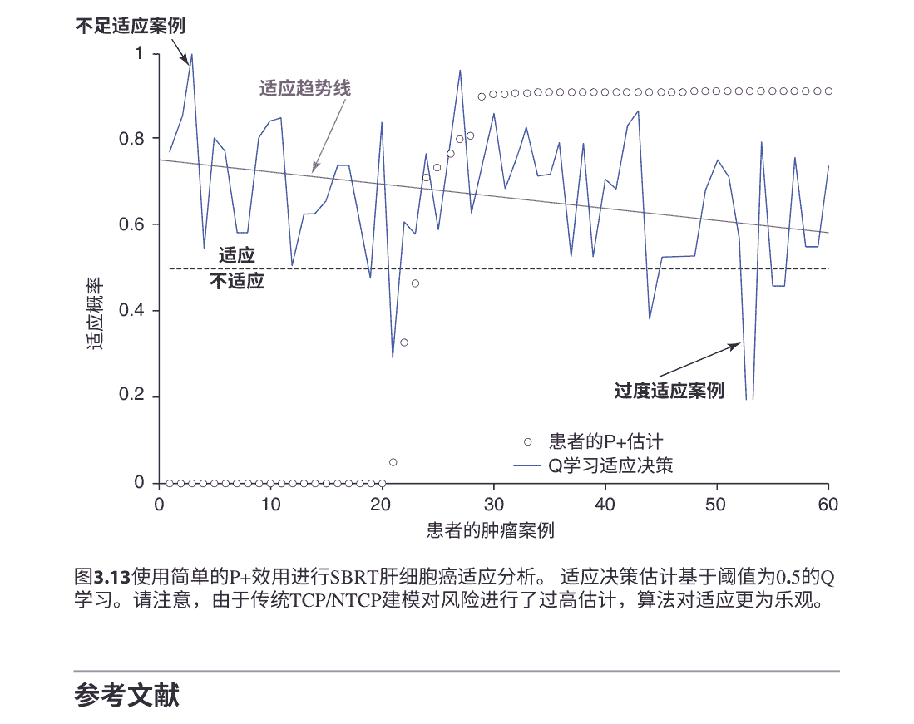

图3.13 使用简单的P+效用进行SBRT肝细胞癌适应分析。适应决策估计基于阈值为0.5的Q学习。请注意，由于传统TCP/NTCP建模对风险进行了过高估计，算法对适应更为乐观。

## 参考文献

1. Hastie T, Tibshirani R, Friedman J. 统计学习的要素：数据挖掘、推理和预测。纽约：斯普林格出版社；2009年。
2. El Naqa I, Bradley JD, Lindsay PE, Hope AJ, Deasy JO. 使用统计学习技术预测放射治疗结果。物理医学与生物学。2009年；54（18）：S9。
3. Scholkopf A, Smola J, Muller KR. 核主成分分析。剑桥：麻省理工学院出版社；1999年。第327-52页。
4. Farnell DJ, Mandall P, Anandadas C, 等. 开发一种患者报告的问卷，用于收集前列腺放射治疗后的毒性数据。放射治疗与肿瘤学。2010年；97（1）：136-42。
5. Kuku S, Fragkos C, McCormack M, Forbes A. 放射治疗引起的肠道损伤：妇科癌症治疗后生存率的影响。英国癌症杂志。2013年；109（6）：1504-12。
6. Xiao C, Hanlon A, Zhang Q, 等. 在接受同步化学放射治疗的头颈癌患者中的症状群集。口腔肿瘤学。2013年；49（4）：360-6。
7. Thor M, Olsson C, Oh JH, 等. 前列腺癌放疗后患者报告的泌尿生殖系统并发症领域与膀胱剂量-反应关系。放射治疗与肿瘤学。2016年；119（1）：117-22。
8. Jain AK, Murty MN, Flynn PJ. 数据聚类：一项综述。ACM计算机调查。1999年；31（3）：264-323。
9. Arthur D, Vassilvitskii S. K-means++：小心种子的优势。在：第十八届ACM-SIAM离散算法年会论文集，SODA'07。费城：工业与应用数学学会；2007年。第1027-35页。
10. Pelleg D, Moore A. X-means：使用高效估计聚类数的扩展k-means算法。在：第17届国际机器学习会议论文集。旧金山：摩根考夫曼出版社；2000年。第727-34页。
11. Bischof H, Leonardis A, Selb A. 用于鲁棒向量量化的最小描述长度原则。模式分析应用。1999年；2（1）：59-72。
12. Kohonen T. 自组织映射。Proc IEEE. 1990年；78（9）：1464–80。
13. van der Maaten L, Hinton G. 使用t-SNE可视化数据。J Mach Learn Res. 2008年；9：2579–605。
14. Jamieson AR, Giger ML, Drukker K, Li H, Yuan Y, Bhooshan N. 在乳腺Cadx中探索非线性特征空间维度缩减和数据表示的Laplacian eigenmaps和t-SNE。Med Phys. 2010年；37（1）：339–51。
15. Svensson JP, Stalpers LJA, Lange REEE, Franken NAP, Haveman J, Klein B, Turesson I, Vriel ing H, Giphart-Gassler M. 使用基因集分析基因表达，区分具有和没有晚期放射毒性的癌症患者。PLoS Med. 2006年；3（10）：e422。
16. Chen S, Zhou S, Yin FF, Marks LB, Das SK. 使用患者数据相似性通过自组织映射预测放射性肺炎。物理医学与生物学。2008年；53（1）：203。
17. Choi W, Oh JH, Riyahi S, 等. 肺结节的放射组学分析用于早期检测肺癌。医学物理学。2018年；45（4）：1537–49。
18. Parmar C, Leijenaar RT, Grossmann P, 等. 特定于肺癌和头颈癌的放射组学特征聚类和预后标志。科学报告。2015年；5：11044。
19. Hunter LA, Krafft S, Stingo F, 等. 高质量机器鲁棒图像特征：在非小细胞肺癌计算机断层扫描图像中的识别。医学物理学。2013年；40（12）：121916。
20. Blanco AI, Chao KSC, El Naqa I, Franklin GE, Zakarian K, Vicic M, Deasy JO. 在接受放射治疗的头颈癌患者中，唾液功能的剂量-体积建模。Int J Radiat Oncol Biol Phys. 2005年；62（4）：1055–69。
21. Bradley J, Deasy JO, Bentzen S, El-Naq a I. 肺癌放疗患者急性食管炎的剂量相关性。Int J Radiat Oncol Biol Phys.2004年；58（4）：1106–13。
22. Bradley JD, Hope A, El Naqa I, Apte A, Lindsay PE, Bosch W, Matthews J, Sause W, GrahamMV, Deasy JO. 一个从rtog 9311和机构数据的综合分析中得出的预测放射性肺炎的计算图。Int J Radiat Oncol Biol Phys. 2007年；69（4）：985–92。
23. Hope AJ, Lindsay PE, Naqa IE, Alaly JR, Vicic M, Bradley JD, Deasy JO. 用临床、剂量和空间参数建模放射性肺炎风险。Int J Radiat Oncol BiolPhys. 2006年；65（1）：112–24。
24. Huang EX, Bradley JD, El Naqa I, Hope AJ, Lindsay PE, Bosch WR, Matthews JW, SauseWT, Graham MV, Deasy JO. 模拟华盛顿大学和rtog试验93-11肺癌患者放射性急性食管炎的风险。Int J Radiat OncolBiol Phys. 2012年；82（5）：1674–9。
25. Huang EX, Hope AJ, Lindsay PE, Trovo M, El Naqa I, Deasy JO, Bradley JD. 心脏照射作为放射性肺炎的危险因素。Acta Oncol. 2011年；50（1）：51–60。
26. Marks LB. 辐射性肺损伤的剂量预测因素。Int J Radiat Oncol Biol Phys. 2002年；54（2）：313–6。
27. Tucker SL, Cheung R, Dong L, Liu HH, Thames HD, Huang EH, Kuban D, Mohan R. 剂量-体积响应分析：前列腺癌放疗后晚期直肠出血。Int J Radiat Oncol Biol Phys. 2004年；59（2）：353–65。
28. Hosmer D, Lemeshow S. 应用逻辑回归。纽约：约翰·威利；2000年。
29. Vittinghoff E, Glidden D, Shiboski S, McCulloch C. 生物统计学中的回归方法：线性、逻辑、生存和重复测量模型。纽约：斯普林格；2006年。
30. El Naqa I, Bradley J, Blanco AI, Lindsay PE, Vicic M, Hope A, Deasy JO. 放射治疗结果的多变量模型，包括剂量-体积和临床因素。Int J Radiat OncolBiol Phys. 2006年；64（4）：1275–86。
31. Ripley BD. 模式识别和神经网络。剑桥/纽约：剑桥大学出版社；1996年。
32. 苏M, Miften M, Whiddon C, Sun X, Light K, Marks L. 用于预测放射性肺炎发生率的人工神经网络。医学物理学。2005年；32（2）：318-25。
33. Specht DF. 一般回归神经网络。IEEE Trans Neural Netw. 1991年；2（6）：568-76。
34. El Naqa I, Bradley J, Deasy J. 放射生物学结果模型的机器学习方法。在：Mehta M, Paliwal B, Bentzen S, 编辑。放射肿瘤学中的物理、化学和生物靶向。麦迪逊：医学物理学；2005年。第150-9页。
35. Vapnik V. 统计学习理论。纽约：Wiley；1998年。
36. Haykin S. 神经网络：一个全面的基础。Upper Saddle River: Prentice Hall PTR; 1998.
37. Dehing-Oberije C, Yu S, Ruys s cher DD, Meerss chout S, Beek KV, Lievens Y, MeerbeeckJV, Neve WD, Rao B, van der Weide H, Lambin P. 发展和外部验证非小细胞肺癌患者2年生存预测模型，该患者接受化疗-放疗治疗。Int J Radiat Oncol Biol Phys. 2009年；74（2）：355–62。
38. Jayasurya K, Fung G, Yu S, Dehing-Oberije C, De Ruys s cher D, Hope A, De Neve W, Lievens Y, Lambin P, Dekker ALAJ. 比较贝叶斯网络和支持向量机模型，用于肺癌患者放疗后两年生存预测。Med Phys. 2010年；37（4）：1401–7。
39. Klement R, Allgauer M, Appold S, Dieckmann K, Ernst I, Ganswindt U, Holy R, Nestle U,Ne vinny-Stickel M, Semrau S, Sterzing F, Wittig A, Andratschke N, Guckenberger M. 基于支持向量机的预测方法，用于立体定向放射治疗早期非小细胞肺癌后的局部肿瘤控制。Int J Radiat Oncol Biol Phys. 2014年；88（3）：732–8。
40. Chen S, Zhou S, Yin F-F, Marks LB, Das SK. 调查支持向量机算法以预测肺放射治疗引起的肺炎。Med Phys. 2007年；34（10）：3808–14。
41. Spencer SJ, Bonnin DA, Deasy JO, Bradley JD, El Naqa I. 用于从异质的回顾性和前瞻性数据中学习放射治疗引起的肺炎的生物信息学方法。J Biomed Biotechnol. 2009年；2009：892 863. https://doi.org/10.1155/2009/892863.
42. Pella A, Cambria R, Riboldi M, Jereczek-Fossa BA, Fodor C, Zerini D, Torshabi AE,Cattani F, Garibaldi C, Pedrolli G, Baroni G, Orecchia R. 使用机器学习方法预测前列腺放射治疗后器官风险的急性毒性。Med Phys.2011年；38（6）：2859–67。
43. Mitchell TM. 机器学习. 第1版. 纽约: 麦格劳-希尔; 1997年.
44. Quinlan JR. 决策树的归纳. 机器学习. 1986年；1：81–106.
45. Quinlan JR. 决策树的简化. 国际人机研究杂志. 1987年；27（3）：221–34.
46. Breiman L. 随机森林. 机器学习. 2001年；45（1）：5–32.
47. Freund Y, Schapire RE. 提升方法简介. 在: 第十六届国际人工智能联合会议论文集. 旧金山: 摩根考夫曼;1999年. 第1401–6页.
48. Delaney G, Barton M, Jacob S. 估计黑色素瘤的最佳放射治疗利用率. 癌症. 2004年；100（6）：1293–301.
49. Das SK, Zhou S, Zhang J, Yin F-F, Dewhirst MW, Marks LB. 使用参数化Lyman probit和非参数化决策树模型预测肺放射治疗引起的肺炎. 国际放射肿瘤学、生物学、物理学杂志. 2007年；68（4）：1212–21.
50. Valdes G, Luna JM, Eaton E, Simone CB, Ungar LH, Solberg TD. MediBoost: 一种用于可解释决策的患者分层工具在精准医学时代. 科学报告. 2016年；6：37854.
51. Oh JH, Kerns S, Ostrer H, Powell SN, Rosenstein B, Deasy JO. 使用全基因组关联研究的计算方法预测放射治疗并发症并识别相关分子过程. 科学报告. 2017年；7：43381.
52. 李斯，科恩斯，奥斯特尔，罗森斯坦，迪西JO, Oh JH. 基于全基因组关联研究的机器学习预测前列腺放射治疗后晚期泌尿生殖毒性. 国际放射肿瘤学、生物物理学杂志. 2018年；101（1）：128–35.
53. Koller D, Friedman N. 概率图模型：原理与技术-自适应计算与机器学习. 剑桥：麻省理工学院出版社;2009年.
54. Oh JH, Craft JM, Townsend R, Deasy JO, Bradley JD, El Naqa I. 一种生物信息学方法用于从有限蛋白质组学数据中识别放射性肺炎引起的肺炎生物标志物. J Proteome Res. 2011年；10（3）：1406–15。

## 深度机器学习方法概述

Julia Pakela和Issam El Naqa

### 4.1 介绍

深度机器学习或‘深度学习’是指一类机器学习方法，它以原始数据作为输入，并通过训练学习多个相关潜在特征层，将原始输入映射到所需的输出空间；所需的映射由输出的奖励或损失函数来定义，用于检测或分类任务[1]。这与浅层学习形成对比，浅层学习中特征是手动设计的，不包含多层抽象。

从概念上讲，深度学习可以应用于任何机器学习技术，如图4.1所示，但目前实际上最有效的是深度神经网络[2, 3]，这将是本章的主要内容。

深度学习算法通常采用具有多个隐藏层的人工神经网络（ANNs）的形式；然而，重要的是要认识到，深度学习的定义是能够从原始输入中自动学习相关特征（数据表示），而不是任何特定的结构方案[3]。这是通过使用高度参数化的网络来实现的，该网络具有节点层，每个节点从其他节点接收加权输出作为输入，并使用非线性变换对输入的加权和加上附加的偏差项产生自己的输出（稍后将讨论）。

深度学习的基础工作在其流行之前几十年就已经奠定了基础：首先是在1950年代，罗森布拉特引入了感知器的概念（今天神经网络中隐藏节点的前身），然后是在1980年代，辛顿和塞诺斯基发明了玻尔兹曼机（一种设计类似于现代神经网络的多层网络）[4， 5]。 然而，几十年来，深度学习方法在解决实际问题方面并不可行。 这部分是由于深度学习研究人员设想的多层网络的计算机处理能力的限制，也是由于需要进一步的算法创新（如dropout和随机优化方案）来提高训练效率。 到了2010年代初，这些发现与计算机并行处理能力和GPU的改进相结合，帮助提供了深度学习方法所需的条件，从而在世界范围内引起了轰动。 这是一个现象，可以说始于2012年在Image Net竞赛中的惊人胜利（这是一项每年的图像分类挑战，为计算机视觉的最新技术设定了标杆），使用了AlexNet: 一种深度卷积神经网络架构[6]。 深度学习随后在许多不同的挑战中取得了巨大成功，包括语言翻译、语音识别、自动驾驶汽车的训练，甚至股市预测[7]。

自从最近变得流行起来，深度机器学习也在医学领域产生了重大影响，特别是在诊断（放射学）和治疗（放射肿瘤学）放射学科学领域[8]。

自从上世纪80年代以来，放射学和计算机辅助诊断（CAD）应用一直是医学中机器学习和深度学习应用的前沿[9–14]。这些应用包括使用人工神经网络（ANNs）[15]以及用于乳腺癌检测和诊断的卷积神经网络（CNNs）[16–18]。

开创性的工作导致了几个FDA批准的系统，包括QuantX Advanced系统用于乳腺癌诊断（CADx），最初由Giger和同事开发[19-23]。 如今，深度学习技术正在影响放射学的方方面面，从改善当前图像重建和模态滤波（如MRI [24]、CT [25]和超声[26]）的图像质量，到图像分割[27]、配准[28]，再到精准医学和可重复性成像生物标志物的推导[29]。

作为另一个创新和数据密集型领域，放射肿瘤学在深度学习应用方面独具优势。 过去5年中，发表的放射肿瘤学和医学物理学论文中涉及深度学习的数量稳步增加，应用领域广泛，包括治疗计划[30-33]、适应性放射治疗[34-38]、质量保证[39-42]和结果建模[43-49]。 对于感兴趣的读者，还有几篇关于医学物理学和放射肿瘤学中深度学习、机器学习和人工智能应用的综述文章[50-53]。 图4.2展示了深度学习在生物医学文献以及医学物理学和放射肿瘤学专业出版物中的增长趋势。

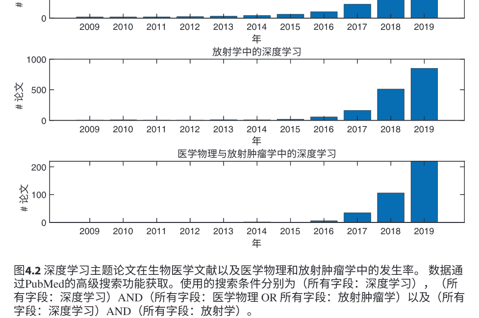

图4.2 深度学习主题论文在生物医学文献以及医学物理和放射肿瘤学中的发生率。数据通过PubMed的高级搜索功能获取。使用的搜索条件分别为（所有字段：深度学习），（所有字段：深度学习）AND（所有字段：医学物理 OR 所有字段：放射肿瘤学）以及（所有字段：深度学习）AND（所有字段：放射学）。

### 4.2 基本神经网络

标准的“全连接”或“基本”神经网络由神经元层（也称为“单元”或“节点”）组成。在给定的层中，每个节点与前一层和后一层的每个节点都有加权连接。节点在同一层内不共享连接。这种正向传递的信息流是为什么基本神经网络也被称为“前馈神经网络”的原因。在文献中，人们也可以看到术语“多层感知器”用来指代全连接前馈神经网络。

图4.3可视化了一个三层的普通神经网络的结构。神经网络中的第一层是输入层，\(\mathbf{x}^{(1)}\)。输入层接收原始数据输入并传递给下一层。最后一层，\(\mathbf{x}^{(3)}\)，是输出层。输出层的结果代表网络的输出，并用于定义损失函数。输入和输出层的宽度（即节点数）通常由数据的固有特性和网络执行的任务决定。例如，设计用于处理128×128像素灰度图像的网络将在其输入层中具有16，384个节点，其中每个节点表示图像中像素的强度。如果网络的任务是对手写数字进行分类，则输出层的宽度将为10，每个节点输出给定数字的原始预测分数（稍后将被归一化为概率）。隐藏层（\(\mathbf{x}^{(2)}\)）包括输入层和输出层之间的所有层。

隐藏层的宽度和总数是hyperparameters，意味着它们

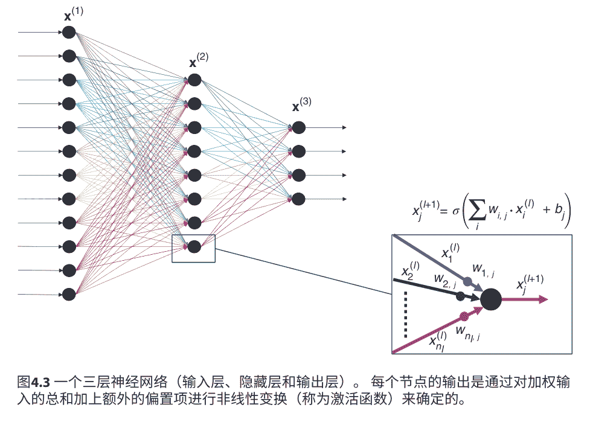

#### 4.2.1 训练神经网络

训练神经网络的过程涉及训练一组权重和偏置，它们像“旋钮”一样控制信息在网络中的流动。训练所需的权重和偏差数量取决于网络的大小：图4.2中显示的示例神经网络有128个权重和12个偏差，但是一个典型的网络可以有数亿个权重[3]。如第4.2节所述，神经网络中的每个节点都从前一层的每个节点接收信息（可以通过图4.3中的彩色箭头进行可视化）。每个节点的输出是每个输入信号的加权和加上一个偏差项的函数。因此，我们可以写出给定节点的输出，

x_j^{(l+1)}，在层内，l+1，如下所示：

x_j^{(l+1)} = σ(∑_i W_ij · x_i^{(l)} + b_j) (4.1)

其中 W_ij表示与节点 x_i^{(l)} to x_j^{(l+1)}相关联的权重，bj是节点 x_j^{(l+1)}的偏差，σ是激活函数。在生物神经网络中，为了使神经元发放，它需要从其他神经元接收足够的电信号以克服被称为激活电位的阈值。在人工神经网络中，激活函数起到类似的作用：它确定节点是否接收到足够的“信号”来发放。常见的激活函数选择包括双曲正切、Sigmoid、Softmax和修正线性单元（ReLU）函数。在这三个函数中，ReLU可以说是最受欢迎的，因为研究发现它使网络更容易训练[3， 56]。图4.4显示了每个函数的方程和图形表示。重要的是，神经网络激活函数共享的一个特征是它们是非线性函数：它们对输入特征进行非线性操作或转换以产生输出。这一特征非常重要，因为它使神经网络能够建模输入数据和期望输出之间的复杂非线性关系。

在训练开始时，网络的权重和偏差被初始化。一种常见的初始化方法是Xavier初始化，其中偏差最初设置为0，并且给定节点的权重从正态分布中随机采样并受到限制：

[ -6/√(n_j+n_{j+1})， 6/√(n_j+n_{j+1}) ] (4.2)

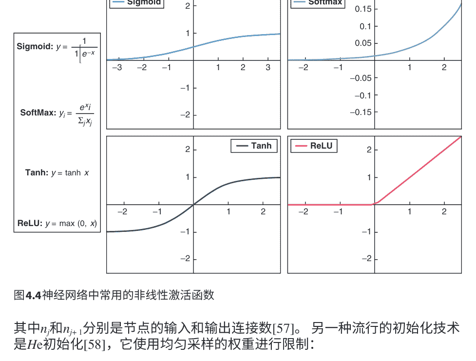

## 图4.4神经网络中常用的非线性激活函数

其中$n_j$和$n_{j+1}$分别是节点的输入和输出连接数[57]。另一种流行的初始化技术是He初始化[58]，它使用均匀采样的权重进行限制：

```
$$ \left[-\sqrt{\frac{2}{n_j}}, \sqrt{\frac{2}{n_j}}\right] \tag{4.3} $$
```

初始化后，数据被输入到网络中，产生一个输出。然后将该输出输入到成本函数（也称为损失函数）中计算损失。
然后通过梯度下降更新网络的权重和值。
使用链式法则计算损失函数相对于网络中每个节点的权重和偏差的梯度。
然后通过将梯度项乘以一个通常为百分之几或千分之几的分数学习率来更新这些参数。然后以迭代的方式重复这个过程，直到满足停止准则，即损失达到最小准则或执行了最大迭代次数。对于一个大型网络，计算相对于数百万个参数的损失函数的梯度是一项计算成本高昂的工作。深度学习领域的一个重大突破是反向传播算法的引入，它提供了一种有效计算损失梯度相对于网络参数的方法[1， 59]。

#### 4.2.2 与训练相关的超参数

与训练过程相关的四个重要超参数是批量大小、迭代次数、学习率和丢弃率。批量大小是在更新权重和偏置之前输入到网络中的数据样本数量。批量大小可以从1（网络在处理单个样本后更新）到训练数据集的大小（网络仅在看到所有可能的数据样本后更新）。批量大小为1的训练方案称为随机梯度下降，而批量大小等于训练样本数量的训练方案称为批量梯度下降。如果批量大小是介于1和训练样本大小之间的数字，则该算法被称为小批量梯度下降。在这三种训练方案中，批量梯度下降是最不受噪声影响的，因为它在计算梯度时使用了每个数据样本，这意味着它不会受到数据集内部变化的影响。

然而，对于非常大的数据集（数量级为数百万个训练样本），在每次更新之前将所有数据通过网络进行传递在计算上是昂贵的，这会增加整体训练时间。随机梯度下降导致学习过程更加嘈杂，因为网络仅在单个数据样本之后进行更新，这可能不代表整个数据集。随机梯度下降的一个好处是，在仅使用单个样本进行更新时，损失函数可能以更快的速度接近全局最小值。然而，这也意味着网络必须更频繁地进行更新，这也是计算上昂贵的。小批量梯度下降在这两个极端之间达成妥协，它使用足够大的批量大小以在某种程度上代表整个数据集，从而最小化训练噪声，但又足够小以使网络能够更频繁地进行更新，从而加快整体训练时间。

在训练过程中，标准做法是对网络输入进行批次归一化，即批次归一化，以提高训练速度和模型稳定性[60]。

一个周期指的是整个训练数据集通过网络的一次实例。所以，周期数是一个超参数，描述了整个数据集在训练过程中通过网络的次数。通常，在损失函数收敛到最小值之前，网络需要多次通过整个训练数据集。

学习率（在第4.2.2节中简要提到）是应用于损失函数梯度的分数系数，可以看作是在更新权重和偏差以最小化损失函数时使用的步长。神经网络优化的一种常见选择是使用自适应学习率，使用 Adam随机优化算法定义[61]。

在神经网络训练过程中，Dropout是一种常见的做法，用于防止模型过拟合。它包括随机选择网络中一组节点，并将它们的输出设置为0，从而有效地将它们（及其连接）从网络中删除。在训练过程中，给定层中被丢弃的神经元的比例被称为dropout率 [62]。

### 4.2.3 什么使神经网络变得深度？

深度机器学习在第4.1节中被定义为从原始数据中学习多层潜在特征的任何机器学习方法。迄今为止，深度神经网络是最成功的深度学习架构，以至于有时将术语“深度学习”与“神经网络”互换使用。本小节旨在提供一些关于为什么和在什么条件下神经网络表现出色的直觉。

神经网络的一个重要特性（在第4.2.1节中已经提到）是使用非线性激活函数，这使得模型能够学习数据和输出之间的非线性关系。就建模能力而言，已经证明神经网络是通用逼近器：一个具有至少一个隐藏层和任意有界、非常数激活函数的前馈神经网络可以以任意精度近似闭合且有界的Rⁿ子集上的任何实数连续函数[63]。这个结果通常被称为通用逼近定理，并告诉我们，只要隐藏节点足够多，多层前馈神经网络可以表示几乎任何函数。该结果经历了多次迭代，以阐明激活函数必须满足什么条件才能使定理成立，特别是通过展示通用逼近定理扩展到非常成功的ReLU激活函数[64， 65]。

通用逼近定理的一个关键限制是它并不告诉我们网络需要多大（以层数或神经元计）才能实现通用逼近，也不能保证一个足够大的网络能够成功且高效地训练成具有泛化能力的网络，即一个足够大的网络可以在训练数据集上以高准确性执行，但在验证数据上表现不佳[65]。

虽然只有一个隐藏层的浅层神经网络能够成为通用逼近器，但这样的网络需要在其隐藏层中拥有如此多的节点，以至于高效且有效的训练是不可行的——它太宽了[65， 66]。研究发现，具有更多隐藏层的神经网络减少了每层所需的宽度，最终减少了高准确性所需的总节点数，提供了训练效率和模型性能之间的最佳平衡。

一般来说，如果神经网络具有多个隐藏层，则被认为是深度的。

### 4.2.4 示例：用于二元分类的神经网络

在本小节中，我们提供了一个教学示例，借鉴了Cui等人的研究，展示了一个在放射肿瘤学范式中执行二元分类任务的前馈神经网络[67]。

输入数据分别来自癌症基因组图谱肺腺癌（TCGA-LUAD）和肺鳞状细胞癌（TCGA-LUSC）数据集。选择标准包括这些数据集中接受外部束放射治疗的原发肿瘤患者。

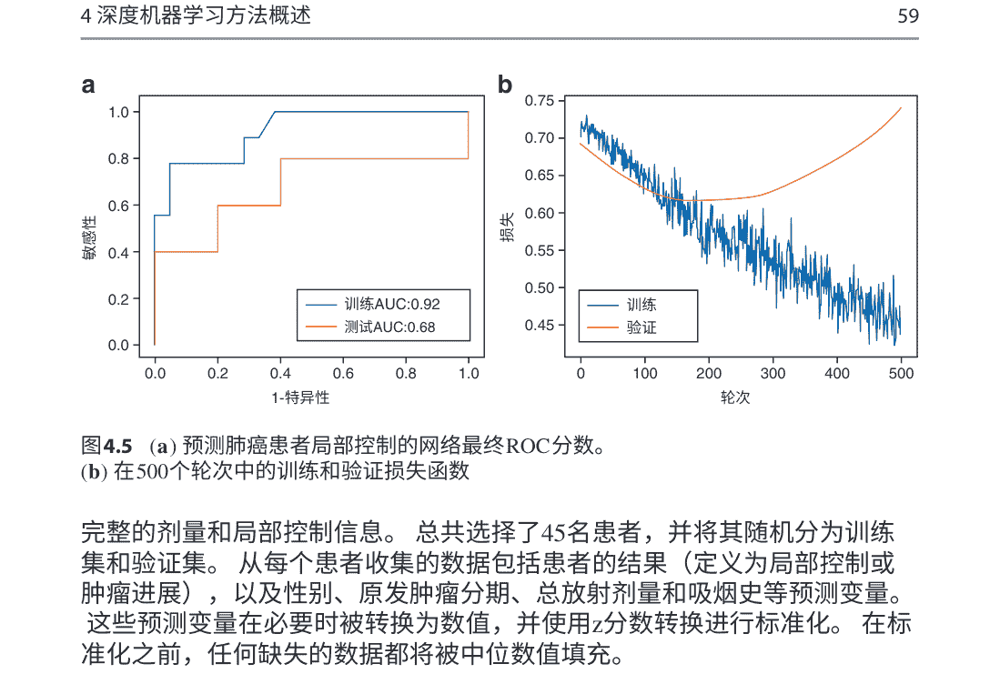

完整的剂量和局部控制信息。总共选择了45名患者，并将其随机分为训练集和验证集。从每个患者收集的数据包括患者的结果（定义为局部控制或肿瘤进展），以及性别、原发肿瘤分期、总放射剂量和吸烟史等预测变量。这些预测变量在必要时被转换为数值，并使用z分数转换进行标准化。在标准化之前，任何缺失的数据都将被中位数值填充。

使用PyTorch框架构建的前馈神经网络在肺病患者数据集上进行训练，以预测患者的结果。该网络有两个隐藏层；每个层都采用ReLU激活函数和dropout（dropout率=20%）。最后的输出层经过sigmoid激活。模型使用Adam优化算法进行500个epochs的训练。训练和测试损失以及最终的ROC曲线和代码如下所示。代码和数据也可以在以下链接下载：https://github.com/sunancui/lung_TCGA_prediction (图4.5)。

```

import numpy as np
import pandas as pd
import os
import torch
import matplotlib.pyplot as plt
from sklearn.preprocessing import StandardScaler
from sklearn.model_selection import train_test_split
from sklearn.metrics import roc_auc_score
from sklearn.metrics import roc_curve
##### 处理数据，转换为数值型数值
def data_processing(data_df):
    data_df['gender']=data_df['gender'].replace(["男性","女性"],[0,1])
    data_df['pathologic_N']=data_df['pathologic_N'].replace(["N0","N1","N2","N3","NX"],[0,1,2,3,np.nan])

```

```
data_df['pathologic_stage']=data_df ['pathologic_stage'].replace(["IA期","IB期","IIA期","IIB期","IIIA期","IIIB期","[差异]"],[1,1,2,2,3,3,np.nan])
data_df['pathologic_T']=data_df['pathologic_T'].replace(["T1","T1a","T1b","T2","T2a","T2b","T3","T4"],[1,1,1,2,2,2,3,4])
data_df['other_dx']=data_df['other_dx'].replace(["否","是, 有先前恶性肿瘤病史"],[0,1])
data_df['tobacco_smoking_history']=data_df['tobacco_smoking_history'].replace(["1","2","3","4","[Not Available]"],[1,2,3,4,np.nan])
data_df['primary_outcome']=data_df['primary_outcome'].replace(["progressive","local"],[1,0])
#使用中位数填充缺失数据
data_dfl_fill=data_dfl.fillna(data_dfl.median())
return data_dfl_fill
os.chdir("/Users/sunan/Desktop/github/lung_TCGA_prediction")
AD_SC_patient=pd.read_csv("./rd_AD_SC.csv",index_col=0)
select_column=["gender","pathologic_N","pathologic_stage","pathologic_T", 'other_dx', 'tobacco_smoking_history','radiation_total_dose','primary_outcome']
data_all=AD_SC_patient.loc[:,select_column]
data_all_values=data_processing(data_all)
##特征
data_X=data_all_values.iloc[:,:-1].values
scaler=StandardScaler()
scaler.fit(data_X)
X_scaled=scaler.transform(data_X)
##标签
data_Y=data_all_values.iloc[:,-1].values
##训练测试分割
X_train, X_test, Y_train, Y_test=train_test_split(X_scaled,data_Y,test_size=0.33,random_state=0,stratify=data_Y)
##将numpy数组转换为torch张量
X_train_torch=torch.from_numpy(X_train)
Y_train_torch=torch.from_numpy(Y_train.reshape(-1,1))
X_test_torch=torch.from_numpy(X_test)
Y_test_torch=torch.from_numpy(Y_test.reshape(-1,1))
##设置一些参数
input_dim=X_train.shape[1]
output_dim=1
hidden_dim=5
learning_rate=0.001
num_epoch=500
##### 定义一个有2个隐藏层的全连接神经网络
```

55. Chow C， Liu C。 用依赖树近似离散概率分布。 IEEE Trans Inf Theor。 2006； 14（3）：462–7。

56. Cooper GF， Herskovits E。 一种从数据中归纳概率网络的贝叶斯方法。 Mach Learn。 1992； 9（4）：309–47。

57. Madigan D， York J， Allard D。 用于离散数据的贝叶斯图模型。 Int Stat Rev。 1995； 63（2）：215–32。

58. Smith WP， Doctor J， Meyer J， Kalet IJ， Phillips MH。 一种基于预测贝叶斯网络和马尔可夫模型的前列腺癌强度调控放射治疗计划选择决策辅助系统。 Artif Intell Med。 2009； 46（2）：119–30。

59. Friedman JH。 关于偏差、方差、0/1损失和维度诅咒的研究. 数据挖掘与知识发现。 1997; 1(1):55–77。

60. Kazmierska J， Malicki J。 应用朴素贝叶斯分类器优化治疗决策。 放射治疗与肿瘤学。 2008; 86(2):211–6。

61. Sutton RS， Barto AG。 强化学习导论。 剑桥: MIT出版社; 1998。

62. Kulkarni P。 强化和系统机器学习用于决策制定。 霍博肯: Wiley-IEEE出版社; 2012。

63. Watkins CJCH， Dayan P。 技术说明: Q学习。 机器学习。 1992;8(3):279–92。

64. Kosorok M， Moodie E。 实践中的自适应治疗策略。 费城， 宾夕法尼亚州: SIAM出版社; 2016。

65. Lei H， Nahum-Shani I， Lynch K， Oslin D， Murphy SA。 用于构建个体化治疗序列的“SMART”设计。 年度临床心理学综述。 2012;8(1):21–48。

66. Kim M， Ghate A， Phillips MH。 用于辐射治疗计划中剂量分数的时间调制的马尔可夫决策过程方法。 物理医学与生物学。 2009;54(14):4455。

67. Vincent R， Pineau J， Ybarra N， El Naqa I。 动态治疗方案中的实用强化学习。 在: Kosorok MR， Moodie EEM， 编辑。 实践中的自适应治疗策略: 个性化医学的计划试验和数据分析。 费城， 宾夕法尼亚州: SIAM; 2016。

68. El Naqa I， Feng M， Bazzi L， 等。 基于知识的自适应放射治疗决策的强化学习策略: 在肝癌中的应用。 国际放射肿瘤学、生物学、物理学杂志。 2016;96(2):S45。

```python
class MLP_NN(torch.nn.Module):
    def __init__(self, input_dim, hidden_dim_1,hidden_dim_2,output_dim):
        super(MLP_NN, self).__init__()
        self.L1=torch.nn.Linear(input_dim,hidden_dim_1)
        self.D1=torch.nn.Dropout(0.2)
        self.L2=torch.nn.Linear(hidden_dim_1,hidden_dim_2)
        self.D2=torch.nn.Dropout(0.2)
        self.L3=torch.nn.Linear(hidden_dim_2,output_dim)
    def forward(self,x):
        a1=torch.relu(self.L1(x))
        a1=self.D1(a1)
        a2=torch.relu(self.L2(a1))
        a2=self.D2(a2)
        outputs=torch.sigmoid(self.L3(a2))
        return outputs
```

##### 初始化模型

model=MLP_NN(input_dim,hidden_dim,hidden_dim,output_dim)

##### 使用二元交叉熵作为损失函数

criterion=torch.nn.BCELoss(reduction='mean')

##### 使用Adam优化器

optimizer=torch.optim.Adam(model.parameters(), lr=learning_rate)

history_loss_train=[]

history_loss_test=[]

```python
for i in range(num_epoch):
    #训练数据
    model.train()
    optimizer.zero_grad()
    y_pred=model(X_train_torch.float())
    #定义损失函数，添加L2正则化
    loss=criterion(y_pred,Y_train_torch.float())
    loss.backward()
    optimizer.step()
    #在测试数据上评估
    model.eval()
    y_pred_test=model(X_test_torch.float())
    loss_test=criterion(y_pred_test,Y_test_torch.float())
    if i%10==0:
        print(i, loss, loss_test)
    history_loss_test.append(loss_test.detach().numpy())
    history_loss_train.append(loss.detach().numpy())
#绘制训练/测试损失的历史记录
plt.figure()
```

##### 训练数据

model.train()

optimizer.zero_grad()

y_pred=model(X_train_torch.float())

##### 定义损失函数，添加L2正则化

loss=criterion(y_pred,Y_train_torch.float())

loss.backward()

optimizer.step()

##### 在测试数据上评估

model.eval()

y_pred_test=model(X_test_torch.float())

loss_test=criterion(y_pred_test,Y_test_torch.float())

if i%10==0:

    print(i, loss, loss_test)

history_loss_test.append(loss_test.detach().numpy())

history_loss_train.append(loss.detach().numpy())

##### 绘制训练/测试损失的历史记录

plt.figure()

```python
plt.plot(np.arange(0,num_epoch),history_loss_train,label="training")
plt.plot(np.arange(0,num_epoch),history_loss_test,label="validation")
plt.xlabel("epoch",fontsize=18)
plt.ylabel("Loss",fontsize=18)
plt.legend(prop={'size':16})
plt.show()
##### 计算训练/测试集的AUC
auc_train=roc_auc_score(Y_train, y_pred.detach().numpy())
auc_test=roc_auc_score(Y_test, y_pred_test.detach().numpy())
fpr, tpr,thresholds=roc_curve(Y_train, y_pred.detach())
plt.figure()
fpr_t, tpr_t,thresholds=roc_curve(Y_test, y_pred_test.detach().numpy())
plt.plot(fpr,tpr,label="训练AUC:"+str(round(auc_train,2)))
plt.plot(fpr_t,tpr_t,label="测试AUC:"+str(round(auc_test,2)))
plt.legend(prop={'size':16})
plt.xlabel('1-特异性',fontsize=16)
plt.ylabel('敏感性',fontsize=16)
plt.show()
```

### 4.3 自编码器

自编码器（AEs）是一类无监督深度学习架构，它使用两部分编码器-解码器框架来学习低维数据表示（或特征表示）。AE的编码器部分将原始数据作为输入，并将其编码为数据的低维表示或潜空间表示，$h$。解码器部分将潜空间表示，$h$，作为输入，然后输出与原始原始数据相同维度的重构。损失函数定义为输入，$x$，和最终重构，$x'$，之间的差异的函数。图4.6显示了一个使用前馈节点作为构建块的简单AE的示例。然而，请注意，AE也可以在其设计中使用CNN（第4.4节）。AE在特征学习和将高维数据集减少为其最关键组件以便在其他架构类型上进行更高效训练方面有用。变分自编码器（VAE）是AE的一种变体，它利用相同的编码器-解码器架构，但额外假设数据的潜空间服从均值，$\mu$，和方差，$\sigma$，的高斯分布[68]。在VAE中，编码器接收输入并生成定义潜空间分布的参数。然后对该潜空间分布进行采样以生成潜空间表示。

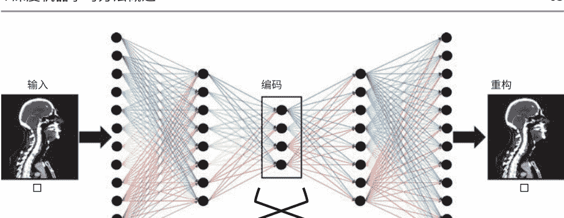

图4.6 自编码器架构示意图

表示，$h$，随后被输入解码器以产生重建-结构，$x^{\prime}$。 VAEs使用的损失函数可以写成[49, 68]:

$L=||x-x^{\prime}||^{2}+\frac{1}{2}\sum_{j=1}^{J}\left(1+\log \left(\sigma_{j}^{2}\right)-\mu_{j}^{2}-\sigma_{j}^{2}\right) \quad(4.4)$

方程（4.4）中的第一项表示重建误差，是对 $x$正确观察到的负对数似然的近似估计。 第二项作为正则化惩罚，是网络学习到的潜在空间分布与标准正态分布之间的近似Kullback-Leibler散度。 由于VAE试图学习真实的潜在分布和潜在表示，因此可以用作生成器来产生额外的数据样本，这些样本代表真实数据集。

### 4.4 卷积神经网络（CNNs）

在最著名的深度学习算法中，卷积神经网络（CNNs）是其中之一。 CNNs受到动物视觉皮层的生物启发，于1980年首次提出[69]，并从此彻底改变了计算机视觉领域。 CNN的一个重要特性是它们的平移不变性，这是它们在计算机视觉和图像应用中受欢迎的主要原因。 CNN与标准的前馈神经网络不同之处在于它们能够学习依赖于数据中的局部结构关系的特征，使它们在涉及图像数据的任务中特别擅长。

CNN的标准构建模块是卷积层，负责创建输入数据的特征图； 池化层，用于减少模型中的参数数量并防止过拟合；以及网络末端的一个或多个全连接层。 这些组件将在下面的章节中详细讨论。 图4.7显示了一个简单的

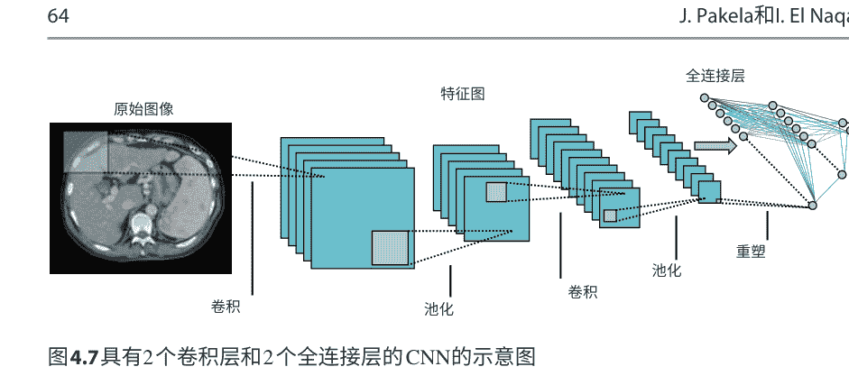

图4.7 具有2个卷积层和2个全连接层的CNN的示意图

CNN具有两个卷积层、两个池化层和三个全连接层。

#### 4.4.1 卷积

卷积是两个函数之间的运算，产生第三个函数；通常用星号 *表示。 两个实值连续函数的卷积在数学上表示为两个函数乘积的积分，其中一个函数被翻转和平移：

$(f * g)(x) = \int f(t) \cdot g(x - t) \, dt$

卷积的一个已知性质是它们是可交换的，意味着 $(f * g) = (g * f)$，方程(4.5)的顺序可以根据需要进行翻转。 在机器学习中，特别是图像处理中，输入数据和模型参数都是离散值，因此不是由连续函数表示，而是由定义在有限范围上的离散函数表示。 对于定义在从 $-M$到 $M$的集合上的两个离散复函数，离散卷积定义为：

$(f * g)[x] = \sum_{m=-M}^{M} f[m] \cdot g[x - m] \quad (4.6)$

对于定义在 $-M$到 $M$和 $-N$到 $N$上的二维离散函数，相应的二维卷积可以通过使用交换律来表示：

$(f * g)[x, y] = (g * f)[x, y] = \sum_{m=-M}^{M} \sum_{n=-N}^{N} f[x - m, y - n] \cdot g[m, n] \quad (4.7)$

函数 $f$通常被称为输入，在方程（4.7）的情况下， $f$可以是一个 $M \times M$的值网格，例如一个二维灰度图像。函数 $g$（在方程（4.7）中，一个 $N \times N$的值网格）被称为卷积核。 卷积核内的值是在训练开始时初始化的学习参数，然后进行更新。

在反向传播期间。 需要注意的一个细节是，许多机器学习库（包括PyTorch和Tensorflow）实际上执行的操作是一个交叉相关操作，它类似于卷积但不会翻转核的方向[65, 70, 71]：

$(g * f)[x,y] = \sum_{m=-M}^{M} \sum_{n=-N}^{N} f[x + m, y + n] \cdot g[m, n]$

在使用交叉相关代替真正的卷积时，这是一种方便的选择，对网络的性能能力没有影响。 使用交叉相关训练的CNN与使用卷积训练的CNN之间的区别在于，后者学习的核将与前者相对翻转[65]，即学习的权重保存在不同的位置。 为了简单起见，我们将继续将卷积层中发生的操作称为“卷积”，但需要理解，除非另有说明，否则我们指的是交叉相关过程。

将核与输入进行卷积的过程可以将其视为核在输入体积上滑动，其中特征图每个索引处存储的值是重叠网格之间的乘积之和（见图4.8）。卷积操作可以推广到任意维度，从而可以应用于3D图像，如CT扫描、视频和彩色图像。 彩色图像可以表示为具有图像高度x图像宽度x3的3D图像，其中第三个维度表示红色、蓝色和绿色通道，分别。 对于视频，第三个维度表示时间，通道的数量取决于视频中的时间帧数。

在CNN中，卷积的输出被称为特征图并包含有关原始样本输入的高阶信息。 特征图的维度由输入大小、卷积核大小、步长（每次子计算之间卷积核移动的距离）以及输入是否在边界周围填充来确定。 图4.8a显示了一个没有填充的卷积操作

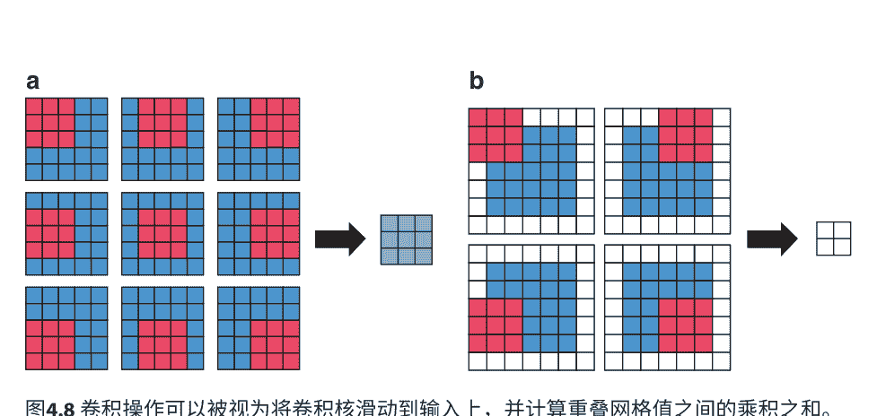

图4.8 卷积操作可以被视为将卷积核滑动到输入上，并计算重叠网格值之间的乘积之和。（a）显示了没有填充和卷积核步长为1的输入上的卷积操作，而（b）显示了在填充了1层并且卷积核步长为3的输入上的卷积操作

填充了输入并且步长为1，而图4.8b显示了填充了1层并且步长为3的示例。关于CNN的卷积操作，可以在Dumoulin和Visin的卷积算术指南[72]中找到丰富的视觉评论，而在Goodfellow等人的深度学习教材[73]中可以找到更多数学描述。特征图通常通过非线性函数（如ReLU）传递，并在经过池化后，要么作为输入传递给另一个卷积操作（表示网络中的新卷积层），要么被重塑为向量，作为输入传递给前馈神经网络。大多数CNN的后端框架是一个前馈神经网络，通常被称为完全连接层。

CNN的一个重要特点是，卷积方法创建特征图需要卷积层的参数权重（由卷积核定义）在整个输入中共享。这与使用远小于输入的核的维度的核相结合，极大地提高了模型训练效率，并允许模型输出在平移不变性方面进行翻译[65]。

#### 4.4.2 池化

在作为新层的输入之前，特征图通常经历池化操作：一种降低其维度的操作。池化可以被看作是将特征图分割成统一大小的区域，并在最终的低维特征图中保存每个区域的单个代表值。常见的变体包括最大池化，它保存感兴趣区域内的最大值；平均池化，它保存感兴趣区域内的平均值；以及L2范数池化，它保存感兴趣区域内的欧几里得范数。用户选择的超参数决定了感兴趣区域的大小，以及由此产生的维度减少程度。池化是CNN模型的重要组成部分，因为它教会模型在不对小的平移敏感的情况下识别数据中的内在模式。可以想象在分类问题的背景下，这个特性将是有价值的。例如，如果CNN的目标是识别恶性肿瘤的存在，网络并不需要学习肿瘤的精确像素位置来执行此任务——只需知道图像的右上角某处存在一个肿瘤即可。

### 4.5 循环神经网络

循环神经网络（RNN）是一种深度学习方法，旨在处理顺序数据或时间相关数据，例如文本、音频或视频。RNN在结构上与普通神经网络不同，网络的宽度（即每层的节点数）由元素的数量决定

信息的流动不是单向的，而是同时在层之间“向上”流动和在序列本身“水平”流动。在RNN的每个层中，给定时间步t的单元计算一个隐藏状态 $h_t$，它保存了网络在该时间步之前的记忆。对于任何RNN，隐藏状态可以表示为：

$h_t = f(x_t, h_{t-1}) \qquad (4.9)$

其中 $f$ 是输入状态 $x_t$ 和前一个隐藏状态 $h_{t-1}$ 的函数。对于标准的或普通的RNN，隐藏状态定义为：

$h_t = \sigma (W_{ih}x_t + b_{ih} + W_{hh}h_{t-1} + b_{hh}) \qquad (4.10)$

其中 $W_{ih}$、$b_{ih}$、$W_{hh}$ 和 $b_{hh}$ 是网络的权重和偏置项，$\sigma$ 是激活函数，通常为tanh或ReLU。RNN在序列中的每个单元中共享相同的权重和偏置项，这显著减少了网络需要训练的参数数量。这个特性也是RNN被称为循环的原因：方程(4.9)中的操作在网络中的每个节点中重复进行，只有输入在改变。网络最后一层中每个节点的输出计算如下：

$o_t = \sigma (W_{oh}h_t + b_{oh}) \qquad (4.11)$

其中 $\sigma$ 再次表示非线性激活函数。对于具有多个层的RNN，输出 $o_t$ 仅对最后一层中的隐藏状态集合进行计算，并且中间层的节点将前一层的相应隐藏状态作为输入，$x_t$。RNN的一般结构如图4.9所示。

传统的循环神经网络的一个重要限制是随着序列长度的增加，长期记忆的影响变得越来越小，导致性能下降。这个挑战通常被称为梯度消失问题，因为用于更新网络权重和偏置参数的梯度变得非常小，模型停止学习[74]。

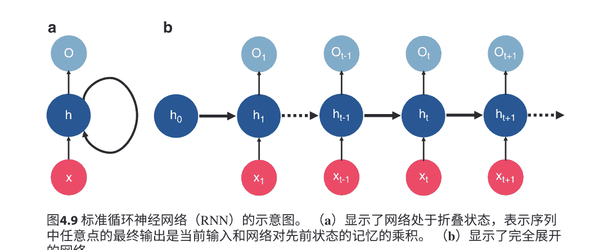

图4.9 标准循环神经网络（RNN）的示意图。（a）显示了网络处于折叠状态，表示序列中任意点的最终输出是当前输入和网络对先前状态的记忆的乘积。（b）显示了完全展开的网络。

研究发现，缓解梯度消失问题的一种方法是在网络中构建一种学习‘忘记’部分过去历史的方式，同时保留对最小化特定损失函数至关重要的记忆。标准RNN的两种主要变体，即长短期记忆（LSTM）网络和门控循环单元（GRU），在下面的章节中详细讨论。

#### 4.5.1 长短期记忆（LSTM）

LSTM是RNN的一种变体，它能够自适应地学习仅与所解决问题相关的历史信息。LSTM架构由Hochreiter和Schmidhuber于1997年提出[75]。

自从提出以来，LSTM已经有许多变体和演化，但目前被深度学习界接受的LSTM版本被称为标准或“纯粹”的版本，由Graves和Schmidhuber于2005年描述[76, 77]。因此，当引用LSTM而没有指定具体版本时，可以推断出是指Graves和Schmidhuber的实现。

方程（4.12） - （4.17） 描述了纯粹LSTM网络中每个单元的计算过程，其中σ表示Sigmoid激活函数，⊙表示Hadamard乘积，即对两个变量进行逐元素相乘。

$$i_t = \sigma (W_{ix}x_t + b_{ii} + W_{ih}h_{t-1} + b_{hi})$$

$$f_t = \sigma (W_{fx}x_t + b_{if} + W_{fh}h_{t-1} + b_{hf})$$

$$g_t = \tanh(W_{gx}x_t + b_{ig} + W_{hg}h_{t-1} + b_{hg})$$

$$o_t = \sigma (W_{ox}x_t + b_{io} + W_{oh}h_{t-1} + b_{ho})$$

$$c_t = f_t \odot c_{t-1} + i_t \odot g_t$$

$$h_t = o_t \odot \tanh(c_t)$$

LSTMs每个时间步骤都有三个状态：输入状态，隐藏状态和细胞状态。细胞状态是LSTMs的关键组成部分，因为它允许选择性信息在网络中传播长距离，从而给予网络长期记忆。变量i、f、g和o分别表示输入门、遗忘门、细胞和输出门。输入门和遗忘门用于控制信息在细胞门之间的流动，输入门控制将哪些信息合并到当前细胞状态中，而遗忘门允许状态“重置”自身。细胞门（也称为块输入）与输入门一起工作，帮助确定添加到细胞状态的新信息。最后，输出门控制从细胞状态中合并到隐藏状态中的信息。

#### 4.5.2 门控循环单元（GRUs）

GRUs是LSTM的一种变体，其成功和流行程度与传统的LSTM相媲美。GRUs由Cho等人于2014年提出，其设计与LSTMs类似，但包含的门数量较少，因此训练速度更快[78]。GRUs和LSTMs都表现出优于传统RNN的性能；然而，哪种网络更优尚不确定，可能取决于手头的数据集[79, 80]。GRU的每个单元由以下门组成：

$$ r_{t} = \sigma (W_{ir}x_{t} + b_{ir} + W_{hr}h_{t-1} + b_{hr}) $$  (4.18)

$$ z_{t} = \sigma (W_{iz}x_{t} + b_{iz} + W_{hz}h_{t-1} + b_{hz}) $$  (4.19)

$$ n_{t} = \tanh (W_{in}x_{t} + b_{in} + r_{t} \odot (W_{hn}h_{t-1} + b_{hn})) $$  (4.20)

$$ h_{t} = (1 - z_{t}) \odot n_{t} + z_{t} \odot h_{t-1} $$  (4.21)

方程（4.18）定义了重置门，$r_{t}$。重置门负责允许节点重置自身或忘记一些来自先前隐藏状态的信息。方程（4.19）定义了更新门，$z_{t}$，它控制了从先前隐藏状态$h_{t-1}$传递到当前隐藏状态$h_t$的信息量。方程（4.18）和（4.19）中的$\sigma$项表示sigmoid激活函数。方程（4.20）定义了中间状态$n_{t}$，它参与计算隐藏状态$h_{t}$。如前所述，在第5.5.1节中，$\odot$符号表示Hadamard乘积，它在两个变量之间执行逐元素乘法。图4.10显示了LSTM单元（a）和GRU单元（b）的示意图。

### 4.6 生成对抗网络（GANs）

生成网络代表了一类深度学习算法，旨在生成与训练数据集具有代表性的数据样本。流行的生成网络包括第4.3节讨论的VAEs和生成对抗网络（GANs）。GANs最早由Goodfellow等人在2014年提出[81]，并且在图像和视频的生成方面取得了成功。在医学影像和放射肿瘤学中，GANs已被应用于诸如从MRI扫描生成合成CT图像[82]、降噪低剂量CT图像[83]以及通过生成患者示例来减少深度强化治疗决策网络的训练数据的稀疏性[35]等任务。尽管GANs已被证明是合成数据生成的强大工具，但其主要缺点是训练过程非常困难。

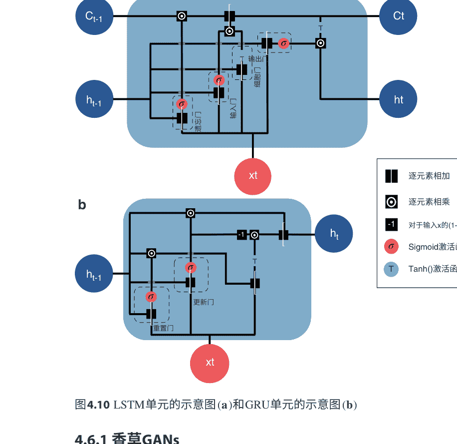

图4.10 LSTM单元的示意图(a)和GRU单元的示意图(b)

#### 4.6.1 香草GANs

GANs由两个相互竞争的网络组成：一个生成器，它使用从用户选择的分布中采样的随机变量生成“假”数据，以及一个鉴别器，其任务是区分真实数据和假数据。这两个网络通常是前馈网络或CNN。生成器和鉴别器在一个值函数定义的两人零和博弈框架下同时进行训练：

$$ \min_G \max_D V(D,G) = \mathbb{E}_{x\sim p_{\text{数据}}(x)}(\log(D(x))) + \mathbb{E}_{z\sim p_z(z)}(1-\log(D(G(z)))) $$ (4.22)

在训练过程中，对于鉴别器$D$，最小化 $V(D,G)$，同时对于生成器 $G$，最大化该函数。表达式 $D(x)$表示（根据鉴别器）样本 $x$是来自真实数据集的概率，而表达式 $G(z)$表示（通过生成器）从分布 $z$到假样本的映射。术语 $p_{\text{data}}$ 表示由 $x$ 给出的数据分布，但用户并不明确知道。变量 $p_z$ 表示从分布（如均匀分布或高斯分布）中随机采样的分布。当鉴别器学习识别真实数据和伪造数据时，生成器同时学习生成更好的伪造数据。生成器执行的操作可以被视为从用户选择的分布 $p_z$ 到模型分布 $p_g$ 的映射。生成器的目标是最小化 $p_g$ 和数据分布 $p_x$ 之间的差异。当鉴别器预测真实样本和生成样本的真实性概率相等时（即，$D(x) = D(G(z)) = 0.5$）时，达到最佳模型（图4.11）。

#### 4.6.2 常见的GAN变种：DCGAN，WGAN

自它们的提出以来，对于原始GAN已经有了几个变种。其中一个值得注意的变种是Wasserstein GAN（WGAN），在理论和实践中都显示出比原始GAN更稳定（因此更容易）的训练[84]。WGAN通过将分布差异定义为近似地移动距离（也称为Wasserstein-1距离）来实现这种改进的性能，从而得到一个值函数：

$$ \min_G \max_D V(G,D) = \mathbb{E}_{x\sim p_{\text{data}}}[D(x)] - \mathbb{E}_{z\sim p_z}[D(G(z))] $$ (4.23)

从理论上讲，地面距离在训练中具有优势，因为在一些弱假设下，可以证明它在任何地方都是连续的，并且几乎在任何地方都是可微的[84]。

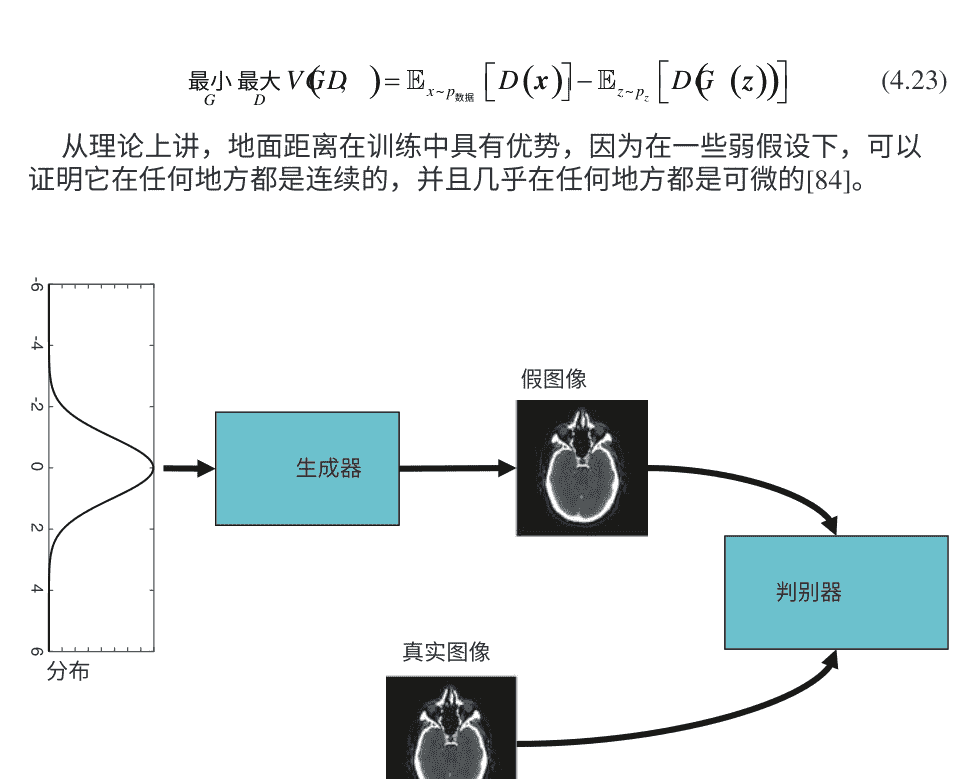

图4.11 生成对抗网络（GAN）

另一种类型的GAN是深度卷积（DC）GAN[85]。DCGAN中的生成器是一个CNN架构。此外，DCGAN允许生成带有标签的数据。这是通过将标签随机分配给输入生成器的随机采样变量，并教导判别器不仅要识别假数据，还要正确地为数据分配标签来实现的。

### 4.7 深度强化学习（DRL）

DRL代表了深度学习和强化学习的结合，使得网络能够以无监督的方式进行决策任务。强化学习（RL）可以被概念化为一种机器学习的类型，在这种类型中，一个代理（即最优搜索算法）通过与环境的交互（马尔可夫决策过程[MDP]）学习进行一系列的顺序决策，以最大化累积奖励函数。基于外部刺激的这种学习方法本身就很有趣，因为它类似于人类（或其他生物代理）的学习方式。DRL在执行各种决策任务方面表现出色，成功击败了扑克、国际象棋和围棋等游戏中的顶级人类选手。DRL的一个变种是深度Q学习（DQN）；在DQN中，代理根据其环境状态选择最优行动，通过最大化Q函数来定义，该函数是代理从当前状态到所有未来步骤的平均折扣奖励之和。已经证明DQN能够在放射治疗人工环境中模仿临床医生的剂量调整决策。

### 4.8 当前挑战和未来方向

尽管深度学习在医学和放射科学中扮演着重要角色，但在将深度学习应用纳入临床工作流程中仍存在一些挑战，这些挑战必须加以解决。一个挑战是需要大规模、可访问的数据集来训练和验证深度学习模型。目前有一项活跃的工作领域致力于创建系统，允许机构间共享数据，同时保持HIPAA和IRB合规性，并确保数据以标准化和易于使用的方式进行整理或“整理”[87]。

另一个重要的挑战与深度学习方法在医学界的接受程度有关。对于临床使用深度学习模型的一个合理担忧是它们类似于黑匣子——很难解释深度学习模型在将输入数据映射到输出预测时的“思考”过程[88]。这种特性使得深度学习方法所做出的预测容易受到偏见或错误的影响，从而可能损害患者护理的质量。为了获得临床医生的支持，必须进一步发展技术，使医务人员能够直观地解释深度学习模型所做出的预测。深度学习可视化的最新发展已经开始打开黑匣子的过程，特别是对于图像分类模型。这些深度学习可视化技术可以帮助用户了解图像的哪些部分对网络最终决策起到最大的贡献。例如，Grad-CAM是一种技术，通过创建一个定位图来展示卷积神经网络决策过程中哪些区域对于确定网络最终预测最重要。显著性图是另一种可视化分类卷积神经网络的方法；显著性图使用给定点处类别得分相对于图像值的导数来显示给定图像中哪些像素对于给定类别预测有最大影响。获得对深度神经网络内部工作原理更深入的理解的另一种方法是可视化网络各部分学习识别的特征。这可以通过将反卷积神经网络连接到CNN的每一层来实现，以产生特征图。

### 4.9 结论

深度机器学习方法在人工智能领域取得了重大突破。随着大型数据集在不同领域之间变得更加容易获取，深度学习将继续对许多领域做出重要贡献。深度学习技术已经开始在医学领域产生影响，放射学和放射肿瘤学等数据密集型专业将受到这些创新的影响。尽管对未来的任何预测都存在很大的不确定性，但我们可以从阿玛拉定律中获得一些关于深度学习如何影响放射学和放射肿瘤学的见解：我们往往高估技术在短期内的影响，低估其在长期内的影响[92]。换句话说，人们往往对新兴技术抱有很高的期望，但一旦最初的炒作过去，人们就会对其固有的局限性有更广泛的认识，从而产生幻灭感。在本书出版时，作者认为社会已经接近深度学习炒作周期的尾声。就医学领域而言，这一观察或许更加确定，因为尽管取得了早期的成功，深度学习方法在临床实施方面仍面临着重大挑战，包括可解释性和透明度，这两者对于确保这些技术遵循“首先不要伤害”原则并对患者负责是必要的。随着深度学习在从实验室到床边的转化过程中的持续进行，很容易变得悲观并低估其价值。因此，我们应该记住，深度学习的未来非常光明。

## 参考文献

- 1. Rumelhart DE, Hinton GE, Williams RJ. 通过反向传播误差学习表示。自然.1986年;323（6088）:533–6。
- 2. Hinton GE, Salakhutdinov RR. 用神经网络降低数据的维度。科学.2006年；313（5786）:504–7。
- 3. LeCun Y, Bengio Y, Hinton G. 深度学习。自然.2015年;521（7553）:436–44。
- 4. Sejnowski TJ. 深度学习在人工智能中的非理性有效性。美国国家科学院院刊。2020年;117:201907373。
- 5. Wang H, Raj B. 深度学习的起源。在: arXiv预印本arXiv:170207800; 2017年。
- 6. Krizhevsky A, Sutskever I, Hinton GE. 使用深度卷积神经网络进行图像分类。在: 神经信息处理系统25的进展（NIPS 2012）。红钩，纽约州: Curran Associates; 2012年。
- 7. Sejnowski TJ. 深度学习革命。剑桥，马萨诸塞州: 麻省理工学院出版社; 2018年。
- 8. El Naqa I, Haider MA, Giger ML, Ten Haken RK. 人工智能: 重塑21世纪放射科学实践。Br J Radiol. 2020;93(1106):20190855。
- 9. Doi K. 医学影像中的计算机辅助诊断: 历史回顾，现状和未来潜力。Comput Med Imaging Graph. 2007;31(4-5):198–211。
- 10. Doi K, Giger ML, Nishikawa R, MacMahon H, Schmidt R. 放射学中的人工智能和神经网络: 应用于计算机辅助诊断方案。In: Hendee W, Trueblood J, editors. 数字成像。2: AAPM医学物理专著; 1993年。第301-22页
- 11. Giger M, Huo Z, Kupinski M, Vyborny C. 乳腺X线摄影中的计算机辅助诊断。在: Sonka M, Fitzpatrick M, 编辑. 医学成像手册, 第2卷。Bellingham, WA: SPIE; 2000. 第915-1004页
- 12. Giger ML. 乳腺成像的未来。计算机辅助诊断。在: Haus A, Yaffe M, 编辑。AAPM/RSNA乳腺成像技术方面的分类课程; 1992年。第257-70页。
- 13. Giger ML. 放射学中的计算机辅助诊断。Acad Radiol. 2002;9(1):1-3页。
- 14. Swett H, Giger M, Doi K. 计算机视觉和决策支持。在: Hendee W, Wells P, 编辑. 视觉信息的感知。柏林: Springer-Verlag; 1993. 第272-315页。
- 15. Wu Y, Doi K, Giger ML, Nishikawa RM. 数字乳腺X线摄影中簇状微钙化的计算机检测: 人工神经网络的应用。Med Phys.1992;19(3):555-60页。
- 16. Chan HP, Lo SC, Sahiner B, Lam KL, Helvie MA. 人工神经网络在乳腺钼靶微钙化的计算机辅助检测中的模式识别。Med Phys. 1995年;22(10):1555-67。
- 17. Sahiner B, Chan HP, Petrick N, Wei D, Helvie MA, Adler DD等。具有空间域和纹理图像的卷积神经网络分类器对乳腺肿块和正常乳房组织进行分类。IEEE Trans Med Imaging. 1996年;15(5):598-610。
- 18. Zhang W, Doi K, Giger ML, Wu Y, Nishikawa RM, Schmidt RA。使用平移不变人工神经网络在数字乳腺钼靶中检测聚集微钙化。Med Phys. 1994年;21(4):517–24。
- 19. Chen W，Giger ML, Newstead GM, Bick U, Jansen SA, Li H等。使用DCE-MRI对乳腺病变恶性程度进行计算机评估: 来自两个制造商的两个独立临床数据集的稳健性研究。Acad Radiol. 2010年;17(7):822–9。
- 20. Chen W, Giger ML, Bick U。基于模糊c均值（FCM）的计算机辅助动态对比增强MR图像中乳腺病变分割方法。Acad Radiol.2006;13(1):63–72。
- 21. Bhooshan N, Giger ML, Jansen SA, Li H, Lan L, Newstead GM. 动态对比增强MR图像中的恶性乳腺病变: 基于图像的预后标志的计算机特征化。放射学. 2010;254(3):680–90.
- 22. Yuan Y, Giger ML, Li H, Bhooshan N, Sennett CA. FFDM和DCE-MRI辅助的多模态乳腺癌诊断。Acad Radiol. 2010;17(9):1158–67.
- 23. https://www.prnewswire.com/news-releases/quantitative-insights-gains-industrys-first-fda-clearance-for-machine-learning-driven-cancer-diagnosis-300495405.html.
- 24. Lundervold AS, Lundervold A. 关于MRI的医学影像深度学习综述。 Z Med Phys。 2019;29(2):102–27
- 25. Akagi M, Nakamura Y, Higaki T, Narita K, Honda Y, Zhou J, 等。 深度学习重建改善腹部超高分辨率CT图像质量。 欧洲放射学杂志。 2019年;29(11)：6163-71。
- 26. Liu S, Wang Y, Yang X, Lei B, Liu L, Li SX, 等。 医学超声分析中的深度学习综述 。 工程学。 2019年;5(2)：261-75。
- 27. Graffy PM, Sandfort V, Summers RM, Pickhardt PJ。 非增强腹部CT自动化肝脂定量用于基于人群的脂肪肝评估。 放射学。 2019年;293(2)：334-42。
- 28. Haskins G, Kruger U, Yan P。 医学图像配准中的深度学习综述。 在： arXiv电子打印[互联网]; 2019年。 https://ui.adsabs.harvard.edu/abs/2019arXiv190302026H。 访问日期： 2019年3月1日。
- 29. Giger ML。 医学影像中的机器学习。 J Am Coll Radiol。 2018;15(3 Pt B)：512–20.
- 30. Fan J, Wang J, Chen Z, Hu C, Zhang Z, Hu W。 基于深度学习技术预测的三维剂量分布的自动治疗计划。 Med Phys.2019;46(1):370–81。
- 31. Liu F, Yadav P, Baschnagel AM, McMillan AB。 基于深度学习方法的放射治疗中的MR治疗计划。 J Appl Clin Med Phys。 2019;20(3):105–14。
- 32. Shen C, Gonzalez Y, Klages P, Qin N, Jung H, Chen L, et al. 智能逆向治疗计划的深度强化学习， 高剂量率宫颈癌的原理性研究。 Phys Med Biol。 2019;64(11):115013。
- 33. 刘洋， 雷洋， 王涛， Kayode O， 田帅， 刘涛等。 基于MRI的肝脏立体定向放射治疗的治疗计划： 基于深度学习的合成CT生成方法的验证。 英国放射学杂志。 2019年;92（1100）：20190067。
- 34. Elmaqhy MS, Jagt T, Zinkstok RT, Qiao Y, Shahzad R, Sokooti H等。 使用深度学习和图像配准的鲁棒轮廓传播用于前列腺癌的在线自适应质子治疗。 医学物理学。 2019年;46（8）：3329-43。
- 35. Tseng H-H, Luo Y, Cui S, Chien J-T, Ten Haken RK, Naqa IE。 用于肺癌自动化放射适应的深度强化学习。 医学物理学。 2017年;44（12）：6690-705。
- 36. Chun J, Zhang H, Gach HM, Olberg S, Mazur T, Green O, 等。 在有限的训练数据和未知的翻译模型的情况下， 使用级联深度学习进行MRI超分辨率重建， 用于MRI引导的自适应放射治疗。 医学物理学。 2019年;46（9）：4148-64。
- 37. Kurz C, Maspero M, Savenije MHF, Landry G, Kamp F, Pinto M, 等。 使用循环一致的生成对抗网络和非配对训练进行CBCT校正， 以实现光子和质子剂量计算。 物理医学与生物学。 2019年;64（22）：225004。
- 38. Huang P, Yu G, Lu H, Liu D, Xing L, Yin Y, 等。 基于注意力的全卷积神经网络与卷积长短期记忆网络， 用于基于超声的运动跟踪。 医学物理学。 2019年;46（5）：2275-85。
- 39. Nyflot MJ, Thammasorn P, Wootton LS, Ford EC, Chaovalitwongse WA。 深度学习用于患者特异性质量保证： 通过卷积神经网络对伽马图像进行放射学分析以识别放射治疗传递中的错误。 医学物理学。 2019年;46（2）：456-64。
- 40. Tomori S, Kadoya N, Takayama Y, Kajikawa T, Shima K, Narazaki K, 等。 基于深度学习的患者特异性质量保证伽马评估预测模型。 医学物理学。 2018年;45（9）：4055-65。
- 41. Galib SM, Lee HK, Guy CL, Riblett MJ, Hugo GD。 一种用于肺部CT扫描上可变形图像配准质量保证的快速可扩展方法， 使用卷积神经网络。 医学物理学。 2020年;47（1）：99-109。
- 42. Kimura Y, Kadoya N, Tomori S, Oku Y, Jingu K。 使用卷积神经网络和剂量差异图进行误差检测， 用于体积调制弧放疗的患者特异性质量保证。 物理医学。 2020年;73:57-64。

## 量子计算用于机器学习 5

Dipesh Niraula、 Jamalina Jamaluddin、 Julia Pakela和Issam El Naqa

### 5.1 介绍

量子力学可以说是物理学上二十世纪最有影响力的发明之一。这个基础理论及其应用的进步使我们对统治我们周围宇宙的自然法则有了更好的理解，同时也发明了许多现代电子设备，如晶体管、电子显微镜、激光、磁共振成像和发光二极管。晶体管的发明彻底改变了现代工业和消费技术，显著减小了它们的占地面积，从而降低了功耗。这在个人电脑的情况下尤为明显，最初由笨重的真空管供电。晶体管技术的进一步发展，从点接触晶体管到集成电路再到超大规模集成工艺，逐渐使计算机更便宜、更快、计算能力更强大、更多功能，使其成为当今现代社会不可或缺的组成部分。

当然，软件技术也随着硬件组件的发展取得了巨大的进步。1936年，艾伦·图灵设计了一个称为图灵机的概念性认知系统，正式引入了认知计算的数学模型，为计算机科学中现代人工智能的理论发展提供了帮助。紧接着，克劳德·香农在1937年实现了布尔逻辑（二进制）在编程中的应用，作为一种原始的电磁计算机，从而证明了一台机器可以仅仅使用“0”和“1”来运行。编译器和解释器等软件工具将高级编程语言翻译成机器级二进制语言，通过简化软件开发和编程的任务，快速推动了软件技术的发展，使得在不必理解微小的硬件细节的情况下编程成为可能。这种责任的分离简化了软件开发和编程的任务，将世界转变为数字时代。当前商业（主流）计算范式基于确定性的经典布尔逻辑。尽管硬件技术在其发展中广泛应用了量子力学原理，但计算过程本身纯粹是经典的，基于二进制逻辑。为了更好地利用量子力学在计算层面上的能力，计算机科学家和物理学家一直在积极研究将量子力学、信息理论和计算相结合，创建一种被称为量子计算的新计算范式。这个概念最初的灵感来自于著名物理学家和诺贝尔奖得主理查德·费曼在20世纪70年代提出的。他假设量子计算机可以解决经典计算机无法解决的问题。这个想法是在保罗·贝尼奥夫提出的量子力学图灵机模型之后提出的。

这种新的量子计算范式在软件和硬件层面上与当前的经典计算范式有着很大的不同。与经典信息/计算的基本单元比如比特，它可以是“0”或“1”不同，量子的对应单元叫做量子比特，它可以存在于混合态；一个量子比特可以用线性叠加表示，

```
⟨|ψ⟩ = c₀|0⟩ + c₁|1⟩, (5.1)
```

其中概率振幅c₀和c₁是复数，因此可以取无限多个值。只有在事件发生，即量子测量时，|ψ⟩会坍缩为|0⟩或|1⟩的二进制量子态，概率分别为|c₀|²或|c₁|²。扩展到更多量子比特，一个n量子比特寄存器可以同时表示2ⁿ个状态。例如，对于一个2量子比特系统，一个均匀叠加态，

```
|ψ⟩ = 1/2(|00⟩ + |01⟩ + |10⟩ + |11⟩)
```

同时代表四个状态。这种性质量子态被称为量子叠加，它进一步允许量子并行提供了比经典计算更快的计算速度的量子计算。

量子并行是同时对所有叠加态进行并行操作的能力。由于量子比特寄存器表示的状态数量随寄存器数量呈指数增长，与相同数量的寄存器上的经典计算机相比，量子计算机上执行的操作将需要指数级的操作。量子并行性的一个权衡是测量2^n状态中的一个特定状态的概率也会指数级下降。任何量子算法的主要挑战是克服这一点，在Peter Shor [5]和Grover [6]提出的常见量子算法的背景下将在第5.4节中讨论。

与量子计算相关的另一个量子力学现象是量子纠缠。例如，一个纠缠的贝尔态：

```
$\frac{1}{\sqrt{2}} (|00\rangle + |11\rangle)$
```

，有50%的概率被测量为|00>态，50%的概率被测量为|11>态。此外，这两个量子比特是相关的，即如果第一个量子比特被测量为|1>态，第二个量子比特也会坍缩为|1>态。纠缠现象为量子计算提供了一种在经典计算中不存在的资源，使得超密编码和量子传送等在经典计算中不可能的过程成为可能。量子通信的一个积极追求的现实应用是为密码学中的密钥分发创建一个无法窃听的通道[7]。在计算领域，这意味着对高度相关信息的有效表示，这在经典计算中仍然是一个挑战。

虽然量子算法和量子信息在多个方面都有改进的潜力，但要实现这些理论上的收益，需要量子计算机这样的设备才行。因此，私营部门和政府对量子硬件和量子计算机的研究和开发越来越感兴趣[8-10]。量子计算机是由量子电路和量子门构建的，就像经典计算机由电路和逻辑门组成一样。通过不同的方法已经实现了量子电路的物理实现：囚禁离子[11]、核磁共振（NMR）和线性光学系统以及超导固态系统[12]。目前，超导固态系统是商业领域和公司的主要关注点，谷歌、IBM、微软和英特尔正在竞相建造通用量子计算机，而NMR、光学和囚禁离子计算系统则在学术和政府研究机构中得到了最积极的研究。

在大数据分析和机器学习的时代，一个新兴的混合领域捕捉了量子计算和机器学习的最佳特点，产生了诸如量子神经网络[13]、量子卷积神经网络[14]、量子生成对抗网络[15]和量子强化学习[16, 17]等新颖的想法。这种混合模型的深度学习部分赋予了这些工具表示复杂数据模式的能力，而量子信息部分使它们更快且不易受到数据中的噪音波动的影响。

尽管量子技术仍处于初级阶段，但它有潜力在计算领域带来一个新时代，并通过延伸带来机器学习的新时代。本章提供了量子计算的高级概述，包括量子硬件发展的当前状态摘要，承诺在经典计算机上实现量子霸权的两个主要量子计算算法的回顾——Shor算法和Grover算法，对量子机器学习领域的新兴研究进行了回顾，包括量子深度神经网络和量子强化学习，并最后回顾了目前量子计算在医学物理学中的应用情况。

### 5.2 量子力学的假设

为了更好地理解本章后续内容，需要对量子力学和线性代数有一定的工作知识。为了方便起见，在本节中回顾了六个简明扼要地涵盖了量子力学基础的假设。这些假设的起源主要基于狄拉克-冯·诺伊曼公理、泛函分析，并且是标准量子物理学课程的一部分。

此外，随后介绍了理解这些假设所需的数学工具的描述。对于线性代数的基本理解，读者可以参考[18]。

1.  量子力学系统的状态完全由一个归一化的态矢量 \(|\psi\rangle\) 表示。
    *   从数学上讲，凯特是存在于称为希尔伯特空间的复数域上的内积向量空间中的向量。虽然希尔伯特空间可以表示无限维空间，但希尔伯特空间的维数由问题的物理学确定。
    *   向量空间满足封闭性质，即向量空间中任意两个向量的线性组合必须位于同一向量空间中。这意味着两个状态的叠加也是系统的一个状态：如果 \(|\psi_0\rangle\) 和 \(|\psi_1\rangle\) 是系统的两个可能状态，那么 \(|\psi\rangle = c_0|\psi_0\rangle + c_1|\psi_1\rangle\)，其中 \(c_0\) 和 \(c_1\) 是复数。
    *   在狄拉克符号中，‘bra’ (\(\langle|\)) 是向量‘ket’ (\(|\rangle\)) 的对偶，并且在bra-ket的顺序中定义了内积。从数学上讲，‘bra’表示一个线性泛函 \(f: V \rightarrow \mathbb{C}\)，它将向量‘ket’映射到复平面上的一个数。狄拉克符号简化了内积符号，特别适用于连续变量的状态，这些状态用波函数表示，即
        ```
        \[\langle\psi | \phi\rangle = \int \mathrm{d}x \, \psi^*(x) \phi(x)\]
        ```
2.  量子力学系统的每个物理可观测属性都由作用于描述该系统的态矢的厄米算符 \(\hat{O}\) 来描述。
    *   可观测量是物理上可测量的属性，例如位置、线性和角动量、能量等。
    *   如果一个算符等于其共轭转置，则它是厄米算符，即 \(\hat{O} = \hat{O}^\dagger\)。这个性质保证了可观测量具有实数本征值，这对于可观测量是物理的是必要的。

## 参考文献

43. Hosny A, Parmar C, Coroller TP, Grossmann P, Zeleznik R, Kumar A, 等。深度学习用于肺癌预后评估：一项回顾性多队列放射组学研究。PLoS Med. 2018;15(11):e1002711。
44. Wei L, Osman S, Hatt M, El Naqa I。基于放射组学的多模态和多参数建模的机器学习。Q J Nucl Med Mol Imaging。2019;63(4):323–38。
45. Bibault J-E, Giraud P, Housset M, Durdux C, Taieb J, Berger A, 等。深度学习和放射组学预测新辅助化疗放疗后局部晚期直肠癌的完全缓解。科学报告。8:12611。
46. Xu Y, Hosny A, Zeleznik R, Parmar C, Coroller T, Franco I, Mak RH, Aerts HJWL。深度学习从连续医学影像中预测肺癌治疗反应。临床癌症研究。2019;25(11):3266–75。https://doi.org/10.1158/1078-0432.CCR-18-2495。Epub 2019年4月22日。PMID: 31010833; PMCID: PMC6548658。
47. Shen W-C, Chen S-W, Wu K-C, Hsieh T-C, Liang J-A, Hung Y-C, et al。深度学习从[18F]-氟脱氧葡萄糖正电子发射计算机断层扫描中预测局部复发和远处转移在经过化学放射治疗的宫颈癌患者中。欧洲放射学。2019;29(12):6741–9。
48. Cui S, Luo Y, Hsin Tseng H, Ten Haken RK, El Naqa I。具有复合结构的人工神经网络用于放射治疗中的局部控制预测。IEEE Trans Radiat Plasma Med Sci. 2019;3(2):242–9。
49. Cui S, Luo Y, Tseng H-H, Ten Haken RK, El Naqa I。将手工特征与机器学习中的潜在变量相结合，用于预测放射性肺损伤。
50. Sahiner B, Pezeshk A, Hadjiiski LM, Wang X, Drukker K, Cha KH等。医学影像和放射治疗中的深度学习。
51. Bibault J-E, Giraud P, Burgun A。放射肿瘤学中的大数据和机器学习：现状和未来展望。
52. Boldrini L, Bibault J-E, Masciocchi C, Shen Y, Bittner M-I。深度学习：放射肿瘤学综述。Front Oncol. 2019;9:977。
53. Tseng H-H, Luo Y, Ten Haken RK, El Naqa I。机器学习在基于知识的适应性放射治疗中的作用。Front Oncol. 2018;8:266。
54. Hutter F, Lücke J, Schmidt-Thieme L。超参数的手动调整之外。Künstliche Intelligenz. 2015;29(4):329–37。
55. Luo G。机器学习算法和超参数值的自动选择方法综述。在健康信息学和生物信息学中的网络建模分析。2016;5(1):18。
56. Xavier G, Antoine B, Yoshua B。深度稀疏整流神经网络。PMLR; 2011。p. 315–23。访问日期：2011年6月14日。
57. Glorot X, Bengio Y。理解训练深度前馈神经网络的困难。在：第十三届人工智能与统计学国际会议论文集；2010年。
58. He K, Zhang X, Ren S, Sun J。深入研究整流器：在ImageNet分类上超越人类水平的性能。在：计算机视觉国际会议；2015年。第1026-34页。
59. Nielsen MA。神经网络与深度学习。旧金山，加利福尼亚州：决心出版社；2015年。
60. Ioffe S, Szegedy C。批归一化：通过减少内部协变量偏移加速深度网络训练。在：arXiv预印本arXiv: 150203167；2015年。
61. Kingma DP, Ba J。Adam：一种随机优化方法。在：arXiv预印本arXiv: 14126980；2014年。
62. Srivastava N, Hinton G, Krizhevsky A, Sutskever I, Salakhutdinov R。Dropout: 一种简单的方法，用于防止神经网络过拟合。J Mach Learn Res. 2014;15(1):1929–58。
63. Hornik K。多层前馈网络的逼近能力。神经网络。1991;4(2):251–7。
64. Leshno M, Lin VY, Pinkus A, Schocken S。具有非多项式激活函数的多层前馈网络可以逼近任何函数。神经网络。1993;6(6):861–7。
65. Goodfellow I, Bengio Y, Courville A. 深度学习。 剑桥，马萨诸塞州: 麻省理工学院出版社; 2016年。
66. Bengio Y. 为人工智能学习深度架构。德尔夫特: 现在出版社; 2009年。
67. Cui S, Tseng H-H, Pakela J, Ten Haken RK, El Naqa I. 机器学习与深度学习在医学物理学家中的介绍。 医学物理学。 2020;47(5):e127–e47。
68. Kingma DP, Welling M. 自动编码变分贝叶斯。 在: arXiv预印本 arXiv:13126114; 2013年。
69. Fukushima K, Miyake S. Neocognitron: 一种自组织神经网络模型，用于视觉模式识别的机制。 在: 神经网络中的竞争与合作。 柏林:Springer; 1982年。 p. 267–85。
70. Paszke A, Gross S, Massa F, Lerer A, Bradbury J, Chanan G, et al.. Pytorch: 一种命令式风格、高性能的深度学习库。2019年。
71. Abadi M, Barham P, Chen J, Chen Z, Davis A, Dean J, et al. Tensorflow: 一种用于大规模机器学习的系统。2016年。
72. Dumoulin V, Visin F. 深度学习中的卷积算术指南。 在: arXiv预印本 arXiv:160307285; 2016年。
73. Goodfellow I, Bengio Y, Courville A. 深度学习。 剑桥，马萨诸塞州: 麻省理工学院出版社; 2016年。
74. Hochreiter S. 在学习递归神经网络和问题解决过程中的梯度消失问题。 不确定模糊知识基础系统国际杂志。1998;6(02):107–16。
75. Hochreiter S, Schmidhuber J. 长短期记忆。 神经计算。 1997;9(8):1735–80。
76. Greff K, Srivastava RK, Koutník J, Steunebrink BR, Schmidhuber J. LSTM: 一次搜索空间奥德赛。 IEEE Trans Neural Netw Learn Syst. 2016;28(10):2222–32。
77. Graves A, Schmidhuber J. 使用双向LSTM和其他神经网络架构进行逐帧音素分类。 神经网络。2005;18(5):602-10。
78. Cho K, Van Merriënboer B, Gulcehre C, Bahdanau D, Bougares F, Schwenk H,等. 使用RNN编码器-解码器学习短语表示进行统计机器翻译。 在: arXiv预印本 arXiv: 14061078; 2014年。
79. Jozefowicz R, Zaremba W, Sutskever I. 对循环网络架构进行经验性探索。 在: 机器学习国际会议;2015年。 页2342-50。
80. Chung J, Gulcehre C, Cho K, Bengio Y. 对序列建模中门控循环神经网络的实证评估。 在: arXiv电子打印。 arXiv: 1412.3555; 2014年。
81. Goodfellow I, Pouget-Abadie J, Mirza M, Xu B, Warde-Farley D, Ozair S, 等。 生成对抗网络。 在: arXiv:1406.2661; 2014。
82. Kazemifar S, Barragán Montero AM, Souris K, Rivas ST, Timmerman R, Park YK, 等。 用于脑肿瘤MRI-only质子治疗计划的GAN生成的合成CT的剂量学评估。 J Appl Clin Med Phys. 2020;21(5):76–86。
83. Yang Q, Yan P, Zhang Y, Yu H, Shi Y, Mou X, 等。 使用Wasserstein距离和感知损失的生成对抗网络进行低剂量CT图像去噪。 IEEE Trans Med Imaging. 2018;37(6):1348–57。
84. Arjovsky M, Chintala S, Bottou L. Wasserstein gan。 在: arXiv预印本 arXiv:170107875; 2017。
85. Radford A, Metz L, Chintala S. 无监督表示学习与深度卷积 generative对抗网络。 在: arXiv预印本 arXiv:151106434; 2015。
86. François-Lavet V, Henderson P, Islam R, Bellemare MG, Pineau J. 深度强化学习简介。 在: arXiv预印本 arXiv:181112560; 2018。
87. Mayo CS, Kessler ML, Eisbruch A, Weyburne G, Feng M, Hayman JA, 等。 放射肿瘤学中的大数据努力: 数据挖掘还是数据农耕? Adv Radiat Oncol. 2016;1(4):260–71。
88. El Naqa I, Ruan D, Valdes G, Dekker A, McNutt T, Ge Y, 等。 机器学习和模型验证: 数据、验证、沟通挑战。 医学物理学。 2018;45(10):e834–e40。
89. Selvaraju RR, Cogswell M, Das A, Vedantam R, Parikh D, Batra D. Grad-cam: 基于梯度的定位的深度网络的可视化解释。 国际计算机视觉杂志。 2017;2:336–59。
90. Simonyan K, Vedaldi A, Zisserman A. 卷积神经网络的深入理解: 图像分类模型和显著性图的可视化。 在: arXiv预印本 arXiv:13126034; 2013年。
91. Zeiler MD, Fergus R. 可视化和理解卷积网络。 柏林: 施普林格; 2014年。
92. Coates JF, Jarratt J. 未来学家的信仰. Bethesda, MD: Lomond; 1989。

### 5.3 量子硬件

量子硬件是能够实现自然界中存在的几种量子对象和/或现象的设备。例如，光学量子设备使用光子的偏振作为量子态，镜子、分束器、相移器和干涉仪作为量子门。光子的使用具有稳定性的优势，但光子之间缺乏相互作用是一个主要的缺点。类似地，离子阱量子计算设备是基于通过振荡场创建一个鞍状电势并来捕获离子。量子态是通过将激光照射到离子上来操纵原子自旋（磁化）的。目前最受欢迎和有前景的量子对象是超导体。超导量子计算机已经被IBM、谷歌和英特尔等科技巨头积极开发，以追求创建通用量子计算机。在超导体中，被称为库珀对的电子对作为基本的电荷载体。每对电子都有一个关联的整数自旋，因此实际上作为玻色子。量子比特然后被定义为对的相位、电荷或流量。

除了基础的量子对象外，量子硬件可以根据其功能进行分类。例如，光学量子设备正在开发用于量子通信，而超导量子计算设备更多用于通用目的。尤其是放射治疗学已经发现了使用量子退火器和通用量子计算（模拟器）来解决各种优化问题，如逆向治疗计划问题[19]。

#### 5.3.1 量子退火器

量子退火器是一类通过量子退火过程解决优化问题的量子硬件。量子退火最初由Kadowaki和Nishimori [20]提出，它利用了量子绝热定理的结果，该定理指出当量子系统从Hi逐渐变化到Hf时，如果它起始于Hi的第n个本征态，它将最终处于相应的Hf的第n个本征态。

这意味着可以构建一个量子系统，使其从已知（或可解的）目标函数的基态开始。其总能量从 Hi到 Hf，如果它起始于Hi的第n个本征态，它将最终处于相应的Hf的第n个本征态。这意味着可以构建一个量子系统，使其从已知（或可解的）目标函数的基态开始。然后逐渐转移到感兴趣的目标函数的基态，使用一个退火系数，\( T(t) \) ：\( H(t) = H_f + T(t) H_i \) 。在优化过程开始时，退火变量 \( T(t) \) 非常大，使得 \( H \approx T(t) H_i \)。在优化过程结束时，\( T(t) \) 趋近于0，系统现在处于由感兴趣的目标函数定义的哈密顿量的最低能量本征态，\( H \approx H_f \)。因此，类似于模拟退火，如果量子退火被允许运行足够长的时间，它可以保证找到全局最优解，理论和实验结果表明，量子退火在性能上优于其经典对应物模拟退火[21, 22]。

最初的量子退火研究是在经典计算机上进行的模拟[23]；然而，对于更高阶的目标函数（例如许多实际问题所必需的函数），经典模拟这个量子过程计算上非常昂贵，因此不切实际。量子退火器是使用量子硬件来实现量子退火过程的设备。迄今为止，主要的量子退火器开发商是DWave INC。DWave量子退火器使用由超导电流环组成的量子比特（qubits）——产生的磁场方向（向下还是向上）定义了量子比特的经典二进制状态（0还是1），但作为量子对象，它们也可以同时存在于两个状态。截至目前，DWave硬件支持最多2000个量子比特，可以表示 \( 2^{2000} \) 个唯一状态。

#### 5.3.2 通用量子计算机

通用量子计算机类似于图灵的通用机器。为了使计算机具有通用性，它必须能够接受任意一组输入或指令，并将其转换为相应的任意一组输出。这个要求在经典计算中很容易满足，但在量子计算中并不那么直接。在量子世界中，并不是每个可观测量都是可交换的：如果可观测量A和B的操作顺序不影响结果，则A和B是可交换的，即AB=BA。为了使量子计算机具有通用性，它必须能够处理不可交换的可观测量。

例如，在[24]中考虑实现幺正操作 \( U = e^{i (a X + b Z)} \)，其中X和Z是一些不可交换的可观测量。注意，任何可观测量A（厄米算符）都可以与一个幺正操作关联起来，即 \( U = e^{i A} \)。由于X和Z不可交换，\( e^{i (a X + b Z)} \neq e^{i a X} e^{i b Z} \)。然而，通过将操作分解为小的部分，可以近似实现这个操作。

通过使用近似 \( \hat{U} \approx \lim_{n \to \infty} \left( e^{\frac{i a X}{n}} e^{\frac{i b Z}{n}} \right)^n \) 这将导致一个错误其缩放为 \( 1/n^2 \)。通过组合n个切片，目标U的近似值存在一个缩放为1/n的误差。因此，通过增加切片的数量，可以尽可能接近U。只要保持足够的切片数量，即将任务分解为足够小的操作，电路型量子计算机的普适性可以得到保证。目前，包括IBM、Google、Intel和Microsoft在内的商业部门正在大力投资于创建一台通用的量子计算机，其计算能力足以执行实际任务。最先进的通用量子计算机已经突破了50个量子比特的标志，并且在未来将更加强大，有预测称在未来几年内量级将增加数倍。目前量子计算机发展面临的一个重要挑战是在足够长的时间内保持足够多的量子比特的相干性，以执行感兴趣的计算。因此，重要的是要注意，目前许多文献中提出的量子算法是通过在经典计算机上模拟量子态而不是通过实际的量子计算硬件来测试的。只要保持足够的切片数量，即将任务分解为足够小的操作，电路型量子计算机的普适性可以得到保证。

### 5.4 常见的量子计算算法

为了量子算法能够有用，至少在理论上要优于最佳的经典算法，考虑到它们固有的复杂性。

#### 5.4.1 Grover算法

Grover算法是一种量子搜索算法，旨在进行无结构搜索。它可以将无结构搜索问题的速度提高到比任何经典算法快平方倍，并且其概率幅放大子程序适用于超出纯粹搜索问题的优化过程[24]；在后面的部分中，我们将利用Grover迭代作为优化过程。

无结构搜索问题是从大量的N个项目中定位一个标记的项目m的任务。平均而言，经典算法需要N/2步来定位m，在最坏的情况下需要N步。通过概率幅放大技巧，Grover算法可以在大约 √N步中找到m，提供了二次加速，例如，对于一个包含1亿个无结构项目的列表，经典搜索算法平均需要1.5亿次操作，而Grover算法只需要大约1.7万次。

此外，它不利用项目的内部结构，使其成为一种通用算法，也被称为黑盒算法。在进行Grover迭代之前，N个项目由均匀分布的2^n叠加的量子态表示，其中n是量子比特的数量。这个过程需要准备量子态，通常准备在|0⟩态中，然后通过Hadamard门创建叠加态。从数学上讲，Hadamard门是一种酉操作，将|0⟩转换为 \frac{|0\rangle+|1\rangle}{\sqrt{2}}。在矩阵中表示， H = \frac{1}{\sqrt{2}}\begin{pmatrix} 1 & 1 \\ 1 & -1 \end{pmatrix}。 |0\rangle = \begin{pmatrix} 1 \\ 0 \end{pmatrix}。对于n个量子比特，需要使用n个Hadamard门来创建2^n个叠加态。例如，在一个三比特系统中，有八个叠加态

图5.1 三比特量子电路中Grover放大过程的示意图。在进行Grover放大之前，量子比特被创建为|0⟩状态，然后通过Hadamard门，创建一个均匀的叠加态。一个Grover迭代由相位预言机和扩散器组成。量子测量在最后进行以获得结果。

图5.2通过概率幅度图（顶部行）和几何解释（底部行）可视化Grover迭代，在标记状态（|m⟩）和未标记状态（|um⟩）所张成的平面上。相位预言算子（Ô）翻转了|m⟩的概率幅度符号，而扩散器（D̂）则将叠加态|a⟩关于平均值放大|m⟩。从几何上看，Ô是关于|um⟩的反射，D̂是关于|a⟩的反射。总体上，它们导致|a⟩绕着由|a⟩和|um⟩所张成的角度的奇数倍旋转。

$$|a\rangle = \frac{1}{\sqrt{8}} (|000\rangle + |001\rangle + |010\rangle + |011\rangle + |100\rangle + |101\rangle + |110\rangle + |111\rangle) \quad (5.2)$$

Grover迭代由两个操作组成，即G = D̂Ô，其中Ô和D̂分别代表相位预言机和扩散器操作。图5.1展示了一个三比特量子电路中的一个Grover迭代的示意图。实际上，在测量之前，可以进行多次Grover迭代。这增加了从测量中获得标记项的机会。

相位Oracle运算符Ô翻转了标记状态|m⟩的概率振幅符号，然后Diffuser运算符D̂，也称为关于均值的反转，将整个叠加态关于反转的标记状态和剩余的未标记状态|um⟩进行反转，如图5.2所示。概率振幅上的均值1/√N在相位Oracle运算后减小到 (1-2M/N)/√N ，在扩散器操作后，均值更接近未标记状态，反转会增强|m⟩而减弱|um⟩。

在数学上，相位Oracle Ô = I - 2|m⟩⟨m| 和扩散器 D̂ = 2|a⟩⟨a| - Î。

假设Eq. 5.2中叠加的三比特系统的第三个状态|010⟩是标记状态，则操作和转换如下：

$$Ô|a\rangle = |a\rangle - 2|m\rangle\langle m|a\rangle$$

$$= \frac{1}{\sqrt{8}} (|000\rangle + |001\rangle - |010\rangle + |011\rangle + |100\rangle + |101\rangle + |110\rangle + |111\rangle)$$

$$\hat{D} \{\hat{O}|a\rangle\} = (2|a\rangle\langle a| - \hat{I})(|a\rangle - 2|m\rangle\langle m|a\rangle) = \frac{1}{2}|a\rangle + \frac{2}{\sqrt{8}}|m\rangle$$

$$= \frac{1}{2\sqrt{8}} (|000\rangle + |001\rangle + 5|010\rangle + |011\rangle + |100\rangle + |101\rangle + |110\rangle + |111\rangle).$$

由于这两个算符都是酉算符，每次变换后的总概率为1。标记态|010⟩在第一次操作后的概率振幅发生翻转，并放大到未标记态的五倍。经过一次Grover迭代，通过量子测量获得标记态|010⟩的机会为 $$|5/2\sqrt{8}|^2 = 78.1\%$$。通过重复Grover迭代，这个机会可以增加。

然而，当超过一个限制时，系统将开始表现不稳定。通过对算符进行几何分析，可以确定这个限制。

从几何上讲，Grover迭代可以理解为在基矢|m⟩和|um⟩所张成的平面上进行反射和旋转的两个酉变换。可以通过从|a⟩中去除|m⟩来构造|um⟩。 $$|um\rangle = \sqrt{\frac{N}{N-M}}|a\rangle - \sqrt{\frac{M}{N-M}}|m\rangle$$。

如图5.2所示，相位预言机是沿着|um⟩的反射，而扩散器是沿着|a⟩的反射。这两个反射导致了叠加态|a⟩绕2θ的旋转，其中θ是|a⟩和|um⟩之间的夹角。可以证明，在t次Grover迭代中，|a⟩将绕(2t+1)θ的角度旋转。由于Grover迭代的目标是尽可能地将|a⟩旋转到|m⟩，t必须受到限制，使得 $$2(t + 1)θ \leq \frac{\pi}{2}$$ 其中角度为 $$θ = \arccos\left(\langle a|um\rangle\right) = \arccos\left(\sqrt{\frac{N-M}{N}}\right)$$。

同样，对于给定的量子比特数量，标记状态的数量也有限制。由于一个Grover迭代将|a⟩旋转2θ，如果θ > 30°，旋转将可能越过|m⟩到第二象限。可以通过使用更多的量子比特来避免这个问题。

#### 5.4.2 量子相位估计

相位估计在许多量子计算算法中起着关键作用，作为执行复杂计算任务的子程序之一，其中之一是Shor的因式分解算法。因此，全面了解相位估计是至关重要的。

给定一个具有特征向量|u⟩和特征值 e^{2πiθ} 的酉算符 U，相位估计算法的目标是估计 θ。该设置涉及两个寄存器：一个计数寄存器，包含 n 量子比特以存储 2^n θ值，初始状态为|0⟩；第二个寄存器处于状态|ψ⟩，包含所需的量子比特数量。

从数学上讲，初始设置 Ψ₀，如下所示：

$$\Psi_0 = |0\rangle^{\otimes n} |\psi\rangle$$

对计数寄存器应用Hadamard变换：

$$\Psi_1 = \frac{1}{\sqrt{2^n}} \left( |0\rangle + |1\rangle \right)^{\otimes n} |\psi\rangle$$

接下来，在第二个寄存器上应用一组受控-U操作，其中 U 被连续平方。请注意，根据 U的定义，将 U应用于 |ψ⟩得到：

$$U^{2^j} |\psi\rangle = U^{2^{j-1}} U |\psi\rangle = U^{2^{j-1}} e^{2\pi i \theta} |\psi\rangle = U^{2^{j-2}} e^{2\pi i 2\theta} |\psi\rangle = \ldots = e^{2\pi i 2^j \theta} |\psi\rangle$$

第一个寄存器的最终状态现在是：

$$\Psi_2 = \frac{1}{\sqrt{2^n}} \left( |0\rangle + e^{2\pi i \theta 2^{n-1}} |1\rangle \right) \otimes \cdots \otimes \left( |0\rangle + e^{2\pi i \theta 2^{0}} |1\rangle \right) \otimes |\psi\rangle = \frac{1}{\sqrt{2^n}} \sum_{k=0}^{2^n-1} e^{2\pi i \theta k} |k\rangle \otimes |\psi\rangle$$

不详细介绍，量子傅里叶变换（QFT）操作可以表示为：

$$\text{QFT} |x\rangle = \frac{1}{\sqrt{2^n}} \left( |0\rangle + e^{\frac{2\pi i}{2} x} |1\rangle \right) \otimes \left( |0\rangle + e^{\frac{2\pi i}{2^2} x} |1\rangle \right) \otimes \cdots \otimes \left( |0\rangle + e^{\frac{2\pi i}{2^n} x} |1\rangle \right)$$

注意与 $\Psi_2$ 的形式相似之处。因此，将逆QFT应用于 $\Psi_2$ 将恢复所需的状态：

$$|\Psi_3\rangle = \frac{1}{\sqrt{2^n}} \sum_{x=0}^{2^n-1} \sum_{k=0}^{2^n-1} e^{\frac{2\pi ik}{2^n}(x-2^n\theta)} |x\rangle \otimes |\psi\rangle.$$

测量 $|\Psi_3\rangle$ ，其在 $x=2^n\theta$ 附近达到峰值，以高概率获得相位，假设 $x$ 是整数：

$$|\Psi_4\rangle = |2^n\theta\rangle \otimes |\psi\rangle.$$

即使 $x$ 不是整数，峰值仍然接近于 $x=2^n\theta$ 的概率高于40%。

#### 5.4.3 Shor算法

将一个复合数分解为两个质数是许多密码算法的核心。由于信息安全依赖于经典算法无法快速破解RSA加密的事实，因此在现实世界中成功实现Shor算法非常受追捧。

要找到一个数 $N$ 的因子，关键是找到一个随机数 $a$ ，使得 $1 < a \leq N-1$ 的模 $N$ 的阶数。阶数 $r$ 是最小的正整数 $r$ ，满足 $a^r \mod N= 1$。如果 $r$ 是奇数或者 $r$ 是偶数但是 $a^{r/2} \equiv -1(\mod N)$，则用不同的随机数重复这些步骤。否则， $N$ 的因子将是 $\gcd(a^{r/2} \pm 1, N)$。

对于量子分解，首先准备一个表示数字 $N$ 的量子寄存器，使其处于等概率叠加态：

$$|0\rangle^{\otimes n} |0\rangle^{\otimes m} = \sum_{x=0}^{2^n-1} |x\rangle |0\rangle^{\otimes m-1} |1\rangle.$$

然后利用QPE子程序进行模指数运算，产生一个纠缠态：

$$\sum_{x=0}^{2^n-1} |x\rangle |a^x \mod N\rangle$$

最后，应用逆量子傅里叶变换，然后进行测量，得到所需的顺序 $r$ 。最终获得因子的后处理步骤与经典方法相同，通过使用最大公约数（gcd）。在量子计算机上，Shor算法可以在多项式时间内分解一个数字。相比之下，当前最好的经典计算机使用一般数域筛法在亚指数时间内分解复合数。话虽如此，由于量子计算机的发展停滞不前，大型复合数的因式分解仍然不可行。IBM首次演示了Shor算法，使用7个量子比特的NMR实现将15分解为3×5。

#### 5.4.4 量子机器学习

近年来，量子与机器学习的交织概念在解决复杂的数据分析问题中出现。量子力学的固有特性，如量子相干、纠缠和并行性，为推进机器学习和深度学习算法的当前能力提供了宝贵的工具，从而形成了新兴的量子机器学习领域。量子机器学习领域承诺以指数级速度解决当前的数据分析问题，比传统方法快得多。此外，量子机器学习可以克服经典机器学习算法遇到的几个障碍，如稀疏矩阵约束和对噪声数据的性能不佳。由于现实世界的数据很可能是嘈杂和密集的，量子机器学习无疑是克服经典机器学习和深度学习应用中当前障碍的有吸引力的前景。

##### 5.4.4.1 量子支持向量机

支持向量机（SVM）通过找到一个最大间隔的超平面来解决一个有监督的分类问题，该超平面将数据分为两个类别[30]，如第3章所述。

给定一组 M训练数据点，{(\mathbf{x}_1, y_1), ..., \mathbf{x}_M, y_M)}，其中 y_i \in \{-1, 1\}，取决于 \mathbf{x}_i 所属的类别。在最简单的线性超平面解决方案中，SVM的输出形式为 y_i = \pm (\mathbf{w} \cdot \mathbf{x}_i + b)，其中 \mathbf{w} 是超平面的法向量， b/|\mathbf{w}|是距离原点的偏移量。为了找到最优超平面，SVM的目标是最小化

$$\frac{1}{2} |\mathbf{w}|^2 + C \sum_{i=1}^{M} \xi_i \tag{5.3}$$

满足约束条件 y_i(\mathbf{w} \cdot \mathbf{x}_i + b) \geq 1 - \xi_i 对于所有 i，并且 \xi_i \geq 0。 在这里， \xi 表示分类错误， C是成本参数。 优化问题的对偶形式可以通过引入Karush-Kuhn-Tucker乘子来定义。 相反，可以最大化：

$$\sum_{i=1}^{M} \alpha_i - \frac{1}{2} \sum_{i,j=1}^{M} \alpha_i y_i K_{i,j} \alpha_j y_j$$ (5.4)

受限于约束条件 $\sum_{i=1}^{M} \alpha_i y_i = 0, \alpha_i \in [0, C]$ 对于所有训练数据点。

函数是核矩阵，需要在所有训练数据点上进行评估，然后通过找到最优 α_j 来解决对偶形式。

目前有两种已知的实现方法可以将量子力学应用于SVM。在这两个版本中，首先将经典数据 x 映射到量子态 |Φ(x)⟩。量子SVM的一种直接方法是将其视为一个判别器，在量子计算机上完全训练量子数据，通过测量产生分离的超平面[31]。另一种方法使用量子计算机估计核函数，然后像经典SVM一样进行训练[32]。该方法将SVM近似为最小二乘问题，并利用量子矩阵求逆来制定最优解。这种最小二乘近似方法在NMR上也经过了手写数字分类问题的实验证明[33]。

核估计是量子支持向量机在其经典对应物上具有优势的地方。通过量子，支持向量机已被证明具有指数级加速。引入量子还允许使用密集训练向量，这对于实际应用非常有用。

##### 5.4.4.2 量子主成分分析

主成分分析（PCA）通常用作处理高维数据集的降维工具。PCA找到零均值数据集的协方差矩阵的主成分（特征向量），然后进行基变换。然后，PCA将高维数据集投影到由前几个主成分构成的低维子空间中，通过丢弃对应于阈值以下的特征值的特征向量。其主要思想是协方差矩阵的第一个主成分对应于最大方差，因此代表了系统最重要的行为。

量子主成分分析（qPCA）[34]利用QPE算法和密度矩阵指数进行量子状态上的PCA。一旦使用预言机生成了与数据集的协方差矩阵对应的量子状态（用密度矩阵表示ρ），通过制作ρ的副本定义了一个单位算子 e^{-iρt}，并对协方差矩阵进行谱分解（找到特征值和特征向量）进行了QPE算法。qPCA基于量子测量原理：由于测量之前的量子态无法得知，因此需要准备许多给定态的副本，并对不同的可观测量进行测量以进行统计分析。有关qPCA的详细说明，包括其限制，可参考文献[34]。qPCA所需的计算时间的数量级为 O(1/d) 用于 R 秩的 d 维度 ρ 矩阵。

##### 5.4.4.3 量子贝叶斯网络

贝叶斯网络（BN）是概率有向无环图（DAG），其中节点表示随机变量，边表示条件依赖节点之间的关系。BN是广泛使用的机器学习工具，可以通过专家知识准备或直接从数据中学习，然后用于进行推理。每个节点都被分配一个条件概率分布$P(x_i|x_{A_i})$表示变量$X_i$在其父节点值为$x_{A_i}$的条件下的概率$x_{A_i}$。条件概率必须是非负实数，且$\sum_{x_i} P(x_i|x_{A_i}) =1$对于所有$i$，其中对$x_i$的求和包括随机变量$X_i$可以假设的所有状态。

量子贝叶斯网络（qBN）[35]采用贝叶斯网络，并用复数概率振幅替代每个节点的概率。条件概率振幅是一个复数，概率振幅$\psi(x_i|x_{A_i})$是一个复数。现在满足$\sum |\psi(x_i|x_{A_i})|^2=1$必须等于1。从数学上讲，qBN可以表示更多信息-比传统的BN更多，这是由于复数系统的性质：给定一个qBN，可以通过平方构建一个特殊的BN $\psi(x_i|x_{A_i})$在每个节点上；然而，给定一个BN，可以通过取平方根构建一整个qBN家族 of $P(x_i|x_{A_i})$ 乘以一个相位因子，$e^{i\phi}$。相位因子$e^{i\phi}$是一个需要根据具体问题进行调整的附加参数。量子概率论可以解释经典概率论无法解释的某些现象。因此，在已知经典上违反了Sure Thing Principle的情况下，qBN在正确建模决策过程方面取得了成功；Moreira等人[36]在之前的qBN[35, 37]的基础上进行了额外的修改，成功地建模了囚徒困境和两阶段的赌博游戏。此外，Borujeni等人[38]提出了贝叶斯网络的量子电路表示，用于实现完全量子的qBNs。

##### 5.4.4.4 量子神经网络和深度学习

神经网络（NNs）是目前机器学习领域中深度学习任务中的最先进工具，其在计算机视觉、计算机听觉和自然语言处理领域取得了广泛成功。NNs根据任务的复杂性进行缩放；复杂任务需要比简单任务更多的NN层。然而，经典硬件几乎已经达到了其尺寸限制，最终将停止缩小。这可以通过创建神经网络（QNN）的量子版本来部分克服，该版本可以固有地处理和存储更多信息。

NN的单元，感知器或神经元，由输入节点、权重、激活函数和输出节点组成。通过反向传播进行NN的训练，通过前馈在经过训练的NN上进行推理。反向传播通过梯度下降过程最小化NN的损失函数来调整权重。调整后的权重然后被存储用于推理。

QNN利用量子力学和量子计算来开发感知器和相关过程的量子模拟。

由于QNN是一项新兴技术，普遍接受的神经元设计仍然缺失。然而，所有常见的设计都将神经元定义为一个单位算子[13]。由于量子力学基于线性代数，定义非线性激活函数需要额外的努力；这是通过使用QPE算法实现的。类似地，前馈、损失函数和反向传播被定义为参数化的单位算子，其中权重参数通过模拟时间演化过程的量子动力下降过程进行更新[39]。权重参数被定义为量子门旋转角度。还存在混合量子-经典NN [24]，其中量子电路用作隐藏层：加权的经典输入层被映射到量子电路，然后将量子电路的测量统计量输入到经典输出层。可以使用参数移位[40]规则来实现反向传播。

随着QNN及其实现的发展，量子卷积NN和量子生成对抗网络等其他深度学习工具的量子模拟也得到了积极发展。Li等人[14]使用量子参数化电路和变分量子算法开发了一个QCNN框架，并通过在MNIST和GTSRB数据集上的测试证明了其可行性。同样，Zoufal等人[15]在开发QGAN框架时实现了经典NN和量子参数化电路；他们在模拟器和真实的IBM Q Experience量子处理器上训练和测试了该框架，展示了在金融应用中的可能应用。

##### 5.4.4.5 量子强化学习

量子强化学习（QRL）[16]是另一种利用量子计算在动态系统中寻找最优决策策略的QML算法。自问世以来，QRL已被用于各种任务，如机器人导航[41]和人类决策制定[17]。具体而言，QRL在经典RL框架中实现了Grover算法作为优化工具，该框架在第3章中进行了回顾。通过这样做，它将框架引入了量子信息领域，增加了二次速度，并提供了所谓的探索-利用权衡的自然解决方案。

如第3章所述，并在此简要回顾，经典强化学习[42, 43]由五个元素组成：代理、环境、策略、奖励和值函数。假设满足马尔可夫性质，即环境在时间 $t+1$ 的响应仅取决于时间 $t$ 的状态和动作表示，强化学习任务在数学上被描述为马尔可夫决策过程（MDP）。MDP是一个4元组（$S, A, p, r$），其中$S$是有限状态集合，$A$是有限动作集合，$p$是转移函数，将时间 $t$ 的状态$S$和动作$A$映射到下一个状态$S'$，$r$是奖励函数，将从状态$S$转移到$S'$后分配奖励。

最优策略 $\pi^*$ 对应于找到最优状态值函数（$v_{\pi^*}(s) = \max_{\pi} v_{\pi}(s)$）或最优动作值函数（$q_{\pi^*}(s, a) = \max_{\pi} q_{\pi}(s, a)$）。最优策略将使代理人以最大回报达到其目标，例如代理人通过Gridworld环境中的最短路径到达终端网格。最优策略是通过在每个步骤中遵循贪婪策略来实现的。

训练过程的步骤。在实践中，$v_*(s)$是通过遵循基于策略的迭代时差（TD）一步更新规则计算的，

> $$ V(s_t) \leftarrow V(s_t) + \alpha [r_{t+1} + \gamma V(s_{t+1}) - V(s_t)], \tag{5.5} $$

当$q_*(s)$通过一步离策略TD控制规则计算时，也被称为Q学习[43]，

> $$ Q(s_t, a_t) \leftarrow Q(s_t, a_t) + \alpha [r_{t+1} + \gamma \max_a Q(s_{t+1}, a) - Q(s_t, a_t)]. \tag{5.6} $$

在在线策略方案中，动作选择和值更新是从一个公共策略中实现的，而在离线策略中，遵循两个单独的策略。例如，在Q学习的动作选择（行为策略）中，采用$\epsilon$贪婪或$\epsilon$软策略，而动作值函数则使用最佳动作（目标策略）进行更新。$\epsilon$贪婪或$\epsilon$软策略是为了平衡探索与利用的权衡；只有通过对未知环境进行足够的探索，才能学习到最优的决策策略。通常情况下，策略以概率$\epsilon$选择一个随机动作，以概率$1-\epsilon$选择最佳动作。随着训练的进行，概率$\epsilon$逐渐减小，使得智能体在初始阶段更多地探索环境，并在后期利用所获得的知识。有关强化学习算法的深入分析和明确示例，请参考文献[42]。

Dong等人[16]在寻找最佳行动（即产生最大价值的行动）中实现了Grover的搜索算法。为了应用Grover的搜索算法，通过量子态定义行动。量子态的概率性质为代理的探索与开发权衡提供了自然解决方案，而无需定义$\epsilon$和其他相关可调参数。一般来说，Grover算法无法将最佳行动（标记状态）的概率幅放大到1。因此，量子测量总是有可能产生次优的（非标记的）行动。产生最佳行动的概率高于产生次优行动的概率。这与$\epsilon$-贪婪策略非常相似，只是所有参数都由问题固定。

QRL算法的训练过程可以总结如下：代理从初始状态开始，准备一个叠加的行动量子态，其中每个本征态代表一种行动。对行动态进行量子测量，将其坍缩为一种行动，然后执行该行动，观察代理的下一个状态，获得奖励值，并使用公式（5.5）（或5.6）更新状态值。然后通过Grover迭代更新行动量子态的概率幅。从量子测量开始，重复该过程直到达到目标状态。直到收敛为止，重复这个训练过程。在第5.2节中介绍了QRL的一个应用。

### 5.5 量子计算在医学物理中的应用

在本出版日期之前，量子计算在医学物理中的应用相对较少。这并不令人惊讶，因为从许多方面来看，量子计算领域仍处于初级阶段。

#### 5.5.1 优化与规划

在优化问题中，目标是通过找到参数的最佳组合来最小化用户定义的目标函数。在放射治疗中，这样一个问题的常见例子是治疗计划优化，其中目标函数通常是肿瘤和风险器官的预定剂量和剂量容积约束的总和，需要优化的参数包括束流权重、束流方向或多叶片调控器孔径形状。对于许多实际应用，找到最优解是一个非平凡的任务，因为解空间是非凸的，意味着存在许多潜在解，它们是目标函数能量景观中的局部极小值，并且优化搜索算法在找到全局最小值之前会陷入这些局部极小值中。一些优化算法，如模拟退火，在某些条件下保证收敛到全局最小值，但对于大问题，这通常需要过多甚至无限的计算时间。因此，开发能够在合理的时间内找到具有挑战性的非凸优化问题的最优（或接近最优）解的算法是一个活跃的研究领域。

量子计算在医学物理学中的最早应用是在2015年发表的一项研究中，该研究调查了量子退火作为IMRT治疗计划优化方法的可行性[44]。在这项研究中，使用量子退火硬件优化了两个前列腺癌病例的IMRT束流权重，并与两种优化方法——禁忌搜索和模拟退火在标准经典计算机上实现的方法进行了比较。每个算法都运行了相同数量的目标函数评估，并通过计算速度（定义为挂钟时间）、最终目标函数值以及生成的治疗计划的整体质量来评估性能。对于这两个病例，量子退火的挂钟时间比模拟退火快两倍以上，比禁忌搜索快三倍以上。对于这两个病例，模拟退火产生的治疗计划质量最高，量子退火技术分别排在第二和第三位。

在量子硬件上进行计算的一个独特方面是问题必须被制定成输入和测量输出是二进制的形式。在上述研究中，每个束流权重值被表示为一个5位向量（$w_b \in \{[00000], [10000], [01000],…, [11111]\}$），允许32个离散级别。总共，每个束流需要7个量子比特进行优化，其中5个用于表示数值，2个用于功能平滑。需要注意的是，在使用量子硬件进行优化时，解决方案搜索的规模大小空间受硬件支持的量子比特总数限制。上述研究中使用的量子退火设备支持512个量子比特。因此，作者定义了束流维度，使得每个计划优化了70个束流权重。然而，对于临床应用来说，典型的调强放疗计划可能有数千到数万个束流，这是由于使用了更多的治疗束（上述研究仅使用了5个）以及更小的束流尺寸。此外，束流权重通常表示为（几乎）连续的变量，这意味着每个束流权重可以取得更大范围的潜在值。截至2020年，最先进的量子退火器支持最多2000个量子比特，因此技术尚未达到支持放射肿瘤学中这类优化问题的完全复杂性的程度。然而，如果量子退火器能够每2-4年将其支持的量子比特数量翻倍（历史上一直如此），那么在未来十年内，这可能不再是一个问题。

2020年，Pakela等人发表的另一项研究调查了一种量子启发式优化算法—量子隧道退火（QTA）在IMRT治疗计划优化中的应用[19]。QTA将解的搜索建模为一个粒子在一维势能景观上进行随机行走，并具有穿越能量壁垒的潜力。与其经典邻居模拟退火类似，在QTA中，当粒子探索解空间时，它总是移动到更低能量的解，但有时也会接受更高能量（即更差）的解。偶尔接受更差的解的能力有助于防止粒子陷入局部最小值。QTA和模拟退火之间的关键区别在于接受更差解的概率。

在模拟退火中，解的搜索模拟了一个处于热浴中的多体系统，其接受更差解的概率与它们各自的玻尔兹曼因子之比成正比：

$P(t) \propto \exp\left(\frac{-\Delta V}{T(t)}\right)$

在这里，ΔV表示潜在能量的变化（定义为考虑解决方案和当前接受解决方案之间的目标函数值的差异）。T(t)表示系统的温度；T最初设置为一个较大的值，并逐渐降低（退火）以减少系统接受较差解决方案的可能性。

在QTA中，接受较差解决方案的概率由粒子穿越一维潜在能量景观隧道通过宽度为w的屏障表示。使用Wentzel-Kramers-Brillouin（WKB）近似，可以近似计算出这个概率：

$P(t) \propto \exp\left(\frac{-w(t)\sqrt{\Delta V}}{T(t)}\right)$

其中ΔV再次表示潜在能量的变化，T(t)表示退火变量，表示系统的动能（类似于模拟退火中的T），w(t)表示潜在能量屏障的宽度。这个屏障宽度是一个启发式的、动态的参数，作为退火进程中的额外自由度。

QTA的性能与模拟退火进行了基准测试，用于两个立体定向体放射治疗（SBRT）肝脏病例的IMRT束流重量优化。通过累积剂量体积直方图和3D剂量分布，发现两种算法产生的治疗计划几乎具有相同的质量，尽管对于第一个病例，QTA表现出更高的稳定性——100%的时间收敛到最优计划，而SA只有60%的时间收敛到最优计划。此外，对于第二个更具挑战性的病例，QTA的收敛速度比SA快了高达26.8%。该研究结果表明，屏障宽度参数的存在可能成为改善治疗计划优化速度和稳健性的有价值工具。

#### 5.5.2 结果建模/决策制定

癌症是一种复杂的疾病，其治疗如放射治疗（RT）是一个涉及数百个变量的复杂过程。尽管追踪所有变量及其动态是一项极其困难的任务，但在规划治疗时考虑到所有因素几乎是不可能的。因此，临床决策支持系统（CDSS）对于帮助医生和患者做出关于最佳治疗方案的明智决策非常有价值。Tseng等人。

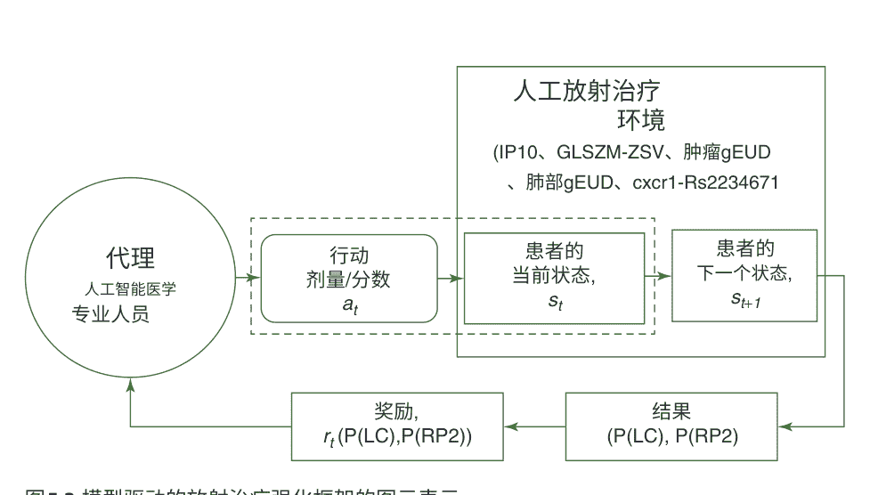

图5.3 模型驱动的放射治疗强化框架的图示表示

[45]基于深度强化学习开发了一种用于肺癌响应自适应放射治疗的CDSS框架。响应自适应放射治疗是个性化和精准医学的一种有前景的范式，它利用患者特异性信息（如剂量、成像（放射组学）、临床和生物标志物）来识别患者的剂量反应并在治疗中进行必要的剂量调整。

生物数据集本质上是嘈杂的，因为所有生物在各个层面上都存在差异：基因、细胞、组织等。在处理这些数据集时，应用量子态和量子计算相对于经典信息系统具有更大的信息处理能力。因此，Niraula等人[46]基于三比特量子强化学习（QRL）开发了一种用于肺癌响应自适应放射治疗的CDSS，类似于Tseng等人[45]的工作，后者基于深度强化学习。如图5.3所示，实施了基于模型的强化学习。从多目标贝叶斯网络方法[47]中选择了五个患者特异性特征，创建了一个人工放射治疗环境。这些特征包括IP10（细胞因子）、GLSZM-ZSV（放射组学成像）、肿瘤和肺部gEUD（放射剂量）以及cxcx1-Rs2234671（遗传学）。选择了一个三层深度神经网络（DNN）作为状态动力学的转移函数，并选择了两个四层DNN作为结果预测器。这些DNN在67例非小细胞肺癌患者的数据集中进行了训练。选择了局部肿瘤控制（LC）和2级或更高程度的放射性肺炎（RP2）作为结果。选择了一个奖励函数，使优化能够最大化局部控制，同时最小化RP，并实施了表格 q-learning方法。

Qiskit [24] 量子计算模拟器被应用于定义一个三量子比特的量子电路和必要的量子门。八个量子行动状态被分配了剂量值，范围从1.75到3.5 Gy/frac。

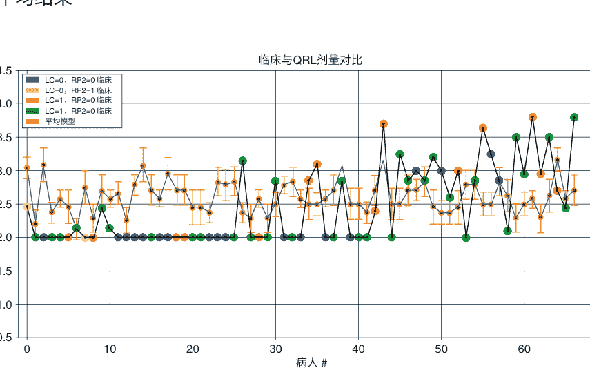

图5.4 临床处方剂量与QRL推荐剂量在放疗治疗的第4周到第6周的比较。颜色代码基于临床结果

来自六个经过训练的QRL模型的结果显示在图5.4中，与临床结果进行了比较。

### 5.6 结论

在本章中，我们提供了量子计算及其在机器学习中的崛起作用的概述，这是一个被称为量子机器学习的新领域。讨论了对传统机器学习算法包括PCA、BN、SVM、NN、RL和深度学习的几种实现。此外，我们展示了医学物理治疗优化和放射治疗决策的示例应用。

## 参考文献

+ 1. Savage JE. 计算模型：探索计算的能力。波士顿：Addison Wesley; 1998.
2. Nielsen MA, Chuang IL. 量子计算与量子信息。剑桥：大学出版社；2010年。
3. Rieffel E, Polak W. 量子计算：一种温和的介绍。剑桥：麻省理工出版社；2011年。
4. Benioff P. 计算机作为物理系统：一种微观量子力学哈密顿模型，用图灵机表示计算机。J Stat Phys. 1980;22:563–91。
5. Shor PW. 在量子计算机上进行质因数分解和离散对数的多项式时间算法。arXiv:quant-ph/9508027; 1995年。
6. Grover LK. 一种快速的量子机械算法用于数据库搜索。arXiv:quantph/9605043; 1996年。
7. Yin J, Li Y-H, Liao S-K, 等。基于纠缠的安全量子密码学在1120公里范围内。自然。2020年;582:501–5。
8. Arute F, Arya K, Babbush R, 等。使用可编程超导处理器实现量子霸权。自然。2019年;574:505–10。
9. 美国量子信息科学小组委员会，科学委员会，国家科学技术委员会。量子信息科学的国家战略概览。白宫。2018年。https://trumpwhitehouse.archives.gov/wp-content/uploads/2018/09/National-Strategic-Overview-for-Quantum-Information-Science.pdf。
10. 美国科学技术政策办公室。人工智能和量子信息科学研发摘要：2020-2021财年。白宫。2020年。https://trumpwhitehouse.archives.gov/wp-content/uploads/2017/12/Artificial-Intelligence-Quantum-Information-Science-R-D-Summary-August-2020.pdf。
11. Steane AM. 离子阱量子信息处理器。arXiv:quant-ph/9608011; 1996年。
12. Huang H-L, Wu D, Fan D, 等。超导量子计算：一项综述。Sci China Inf Sci. 2020;63:180501。
13. Beer K, Bondarenko D, Farrelly T, 等。训练深度量子神经网络。Nat Commun. 2020;11:808。
14. Li Y, Zhou R-G, Xu R, 等。用于图像识别的量子深度卷积神经网络。Quantum Sci Technol. 2020;5:044003。
15. Zoufal C, Lucchi A, Woerner S. 量子生成对抗网络用于学习和加载随机分布。npj量子信息。2019;5:103。
16. Dong D, Chen C, Li H, Tarn T-J. 量子强化学习。IEEE Trans Syst Man Cybern B Cybern. 2008;38:1207–20。
17. Li J-A, Dong D, Wei Z, 等。人类决策过程中的量子强化学习。Nat Hum Behav. 2020;4:294–307。
18. Strang G. 线性代数导论。Wellesley: Cambridge Press; 2016。
19. Pakela JM, Tseng H-H, Matuszak MM, 等。用于放射治疗计划优化的量子启发式算法。医学物理学。2020;47:5–18。
20. Kadowaki T, Nishimori H. 横向伊辛模型中的量子退火。物理评论E。1998;58:5355。
21. Morita S, Nishimori H. 量子退火的数学基础。J Math Phys. 2008;49:125210。
22. Mukherjee S, Chakrabarti BK. 多变量优化：量子退火和计算。Eur Phys J Special Top. 2015;224:17–24。
23. Farhi E, Goldstone J, Gutmann S, Lapan J, Lundgren A, Preda D, Quantum A. 用于随机NP完全问题实例的绝热演化算法。Science.2001;292:472–5。
24. Asfaw A, Bello L, Haim YB等。使用Qiskit学习量子计算。2020年。http://community.qiskit.org/textbook。
25. Vandersypen LMK, Steffen M, Breyta G等。利用核磁共振实现Shor的量子因子分解算法。自然。2001年;414:883–7。
26. Martin-Lopez E, Laing A, Lawson T, 等。利用量子比特回收实现Shor的量子因子分解算法的实验实现。自然光子学。2012年;6:773-6。
27. Lanyon BP, Weinhold TJ, Langford NK, 等。通过量子纠缠实验演示了Shor算法的编译版本。物理评论快报。2007年;99:250505。
28. Lu C-Y, Browne DE, Yang T, Pan J-W. 利用光子量子比特演示了Shor的量子因子分解算法的编译版本。物理评论快报。2007年;99:250504。
29. Peng W-C, Wang B-N, Hu F, 等。通过优化参数的量子退火，用较少的量子比特分解更大的整数。中国科学物理学力学天文学。2019年;62:1-8。
30. Cortes C, Vapnik V. 支持向量网络. 机器学习. 1995;20(3):273–97.
31. Rebentrost P, Mohseni M, Lloyd S. 量子支持向量机用于大数据分类. 物理评论快报. 2014; 113:130503.
32. Havlicek V, Corcoles AD, Temme K, 等. 基于量子增强特征空间的监督学习. 自然. 2019;567:209–12.
33. Zhaokai L, 等. 量子支持向量机的实验实现. 物理评论快报. 2015;114:140504.
34. Lloyd S, Mohseni M, Rebentrost P. 量子主成分分析. 自然物理学. 2014;10:631–3.
35. Tucci R. 量子贝叶斯网络. 现代物理学国际期刊. 1995;B9:295–337.
36. Moreira C, Wichert A. 用于建模决策的类量子贝叶斯网络. Front Psychol. 2016;7:11.
37. Leifer M, Poulin D. 量子图模型和信念传播. Ann Phys J. 2008;323:1899–946.
38. Borujeni SE, Nannapaneni S, Nguyenb NH, Behrman EC, Steck JE. 用于贝叶斯网络的量子电路表示. arXiv:2004.14803v1 [quant-ph]; 2020.
39. Verdon G, Pye J, Broughton M. 量子深度学习的通用训练算法. arXiv:1806.09729v1 [quant-ph]; 2018.
40. Crooks GE. 使用参数移位规则和门分解的参数化量子门梯度, arXiv:1905.13311v1 [quant-ph]; 2019.
41. 董D, 陈C, 楚J, 谭T-J. 鲁棒的量子启发式强化学习用于机器人导航。IEEE/ASME机电工程学报。2012年;17:86–97。
42. Sutton RS, Barto AG. 强化学习：一种介绍。剑桥: 麻省理工学院出版社; 2018年。
43. Watkins CJCH. 从延迟奖励中学习。博士论文，国王学院，剑桥大学，英格兰; 1989年。http://www.cs.rhul.ac.uk/~chrisw/new_thesis.pdf。
44. Nazareth DP, Spaans JD。量子退火在IMRT束流强度优化中的首次应用。物理医学生物学。2015年;60:4137–48。
45. 曾HH, 罗Y, 崔S等。深度强化学习用于肺癌自动化放射适应。医学物理学。2017年;44:6690–705。
46. Niraula D, Jamalauddin J, Haken RT, El Naqa I. 应用量子强化学习和深度神经网络进行放射治疗临床决策支持。在：AMOS 2020虚拟联合AAPM/COMP会议，温哥华；2020年。
47. Luo Y, McShan DL, Matuszak MM等。一种多目标贝叶斯网络方法，用于非小细胞肺癌(NSCLC)放射治疗中肿瘤局部控制和放射性肺炎的联合预测。医学物理学。2018年; 45：3980-95。

## 性能评估

Nathalie Japkowicz

正如在每个实验科学中一样，基础或应用机器学习的进展必须严格验证。这同样适用于应用于肿瘤学、医学物理和放射学领域的机器学习。Japkowicz和Shah[1]编制了一系列与机器学习评估的三个主要原则相关的技术，并重点讨论了在何时选择一种技术而不是另一种技术的最佳实践。特别是，该书讨论了选择适当的任务性能度量的问题；误差估计或如何明智地对可用数据进行采样的问题；以及在给定情况下应用适当的统计检验和解释检验结果的问题。本章的目的是就这些技术在肿瘤学、医学物理和放射学的进展中的应用进行综述，并讨论特别适用于这些任务的额外评估技术。

本章分为两个部分。第一部分介绍了机器学习社区根据Japkowicz和Shah[1]使用的标准评估方法，并讨论了在医学和图像处理领域使用的一些额外方法。第二部分回顾了在肿瘤学、医学物理和放射学领域应用深度学习系统的当前实践，并根据机器学习社区的实践提出了一些建议，以改进这些实践。

### 6.1 机器学习系统的标准评估方法

Japkowicz和Shah [1]描述了用于分类系统的传统评估框架。它包括在标记的数据集上训练一个监督式机器学习算法来学习模型。然后评估该模型以评估其捕捉表示对象和标签之间关系的能力。例如，一个对象可以是患者经历的一系列症状或缺乏症状，而标签或类别可以是医生对该患者的诊断。类似地，一个对象可以是医学影像，如X射线或MRI扫描，而类别可以指示该影像中肿瘤的存在或类型。

在进行分类器评估之前，需要回答以下三个重要问题：

- 应该使用哪种性能指标来得出有意义的模型评估结果？
- 哪种错误估计（或更直观地说，抽样）方法可能产生最可靠的结果？换句话说，在数据稀缺的情况下，我们如何将可用数据划分为训练集和测试集，并采取特殊预防措施。
- 我们应该进行哪些统计检验来帮助我们相信我们观察到的结果？

第一个问题涉及将性能指标与手头问题相匹配的问题。根据上下文或领域的不同，模型性能的某些方面可能并不重要，而其他方面则很重要。例如，在医学领域，敏感性和特异性经常是重要的性能指标，而AUC是一个更抽象的概念，对医务人员来说可能并不那么重要。我们以一个分类器被要求预测乳腺癌复发的领域为例进行说明。在这样一个领域中，敏感性告诉我们分类器正确预测的实际复发病例的百分比，特异性告诉我们它正确预测的非复发病例的百分比，而AUC表示分类器将随机选择的复发实例排在非复发实例之前的能力。虽然AUC是分类器在不同分布下性能的重要内在指标，但很难将其意义与具体数量联系起来。

第二个问题涉及如何将可用数据分成训练集和测试集，考虑到相关数据可能稀缺的事实，使用相同数据集进行训练和测试会导致对所考虑模型的过于乐观的评估是不可接受的，并且可能有必要以不同的方式对同一数据集进行重复实验，以尽可能可靠地估计模型的性能。

第三个问题涉及更熟悉的统计显著性主题，试图评估所选择的度量和抽样策略所得结果在多大程度上取决于偶然性或真实能力。具体而言，它询问了在研究中使用的实验框架中最适合的统计检验是哪些。

总的来说，这三个问题旨在找到一种评估设计用于预测未知标签数据类别的机器学习系统的方法。我们现在简要回顾一下用于进行这种评估的最常用方法。有关更详细信息，请参阅Japkowicz和Shah [1, 2]。

一个重要的事实要记住的是，虽然有一些“错误”的分类器评估方法，但没有“正确”的方法。选择度量标准、采样技术或统计检验方法取决于研究人员或从机器学习方法中获得的实践者最感兴趣的内容。

#### 6.1.1 选择适当的性能度量

多年来，在各种应用领域中提出了许多不同的性能度量方法。所有这些度量标准都源于混淆矩阵的概念，如图6.1所示，用于解决两类问题。

混淆矩阵同时表示了两个二分法。一方面，它考虑了数据分类所导出的二分法。数据要么是阳性（例如，乳腺癌复发），要么是阴性（例如，乳腺癌无复发）。另一方面，它考虑了真实与预测的二分法：分类要么是真实的，要么是假设的。将这两个二分法叠加在一起，我们得到了四个量：

- TP：真正阳性的数量，即被预测为阳性且实际上是阳性的实例数量。
- TN：真正阴性的数量，即被预测为阴性且实际上是阴性的实例数量。
- FP：假阳性的数量，即被预测为阳性但实际上是阴性的实例数量。
- FN：假阴性的数量，即被预测为阴性但实际上是阳性的实例数量。

| 真实类别→ 假设类别 | 类别 V | 阳性 | 阴性 |
| :--- | :--- | :--- | :--- |
| 是 | TP | FP |
| 否 | FN | TN |
| | P=TP+FN | N=FP+TN |

图6.1 混淆矩阵

##### 6.1.1.1 所有机器学习应用中常用的指标

混淆矩阵的各个元素的组合可以得到最简单、最通用和最直观的度量之一，即分类器的准确率或其相反的错误率。准确率是机器学习算法正确分类为阳性或阴性的所有实例与数据集中实例总数的比率。错误率是相反的比率，即机器学习算法错误分类的所有实例与数据集中实例总数的比率。两个数量的公式分别显示在公式（6.1）和（6.2）中。

```
准确率 = (TP + TN)/(P + N)    (6.1)
错误率 = (FP + FN)/(P + N)    (6.2)
```

不幸的是，尽管直观，这些度量指标在面对几乎所有领域中普遍存在的问题时过于乐观，即类别不平衡问题[3]。类别不平衡问题是指机器学习系统在面对倾斜分布时表现不佳的现象。这在许多领域中都很常见，包括医学领域，其中癌症或其他疾病的发生相对于整个人口来说是很少的。虽然分类器倾向于将所有实例标记为多数类别标签，但准确率和错误率等评估指标往往奖励这种行为而不是揭示它。

此外，在医学领域，准确率和错误率并不是最有趣的指标。更有趣的是从混淆矩阵中定义的敏感性和特异性，如公式（6.3）和（6.4）所示。

```
敏感度 = 真阳性 / 阳性    (6.3)
特异度 = 真阴性 / 阴性    (6.4)
```

敏感度可以捕捉到有癌症的人中被准确标记为有癌症的比例，而特异度可以指出没有癌症的人中被正确标记为没有该疾病的比例。

其他感兴趣的指标包括精确度的概念，以及一些先前提到的指标的两种广泛使用的组合，即F-度量（或F-分数）和AUC。它们的定义如公式（6.5）、（6.6）和（6.7）所示。精确度表示分类器中被标记为阳性的人群中真阳性的比例。例如，它询问了所有被检测出为阳性的人中实际患有疾病的比例，比如新冠病毒。F-度量是精确度和召回率的平衡组合（尽管可以根据需要偏好精确度或召回率），而AUC则是在分类器阈值设置为分类而不是得分的情况下，可以表示为敏感度和特异度的组合。

精确度 = 真阳性 / (真阳性 + 假阳性)    (6.5)
平衡的(F度量) = (2 × 精确度 × 召回率) / (精确度 + 召回率)    (6.6)
(AUC分类) = (敏感性 + 特异性) / 2    (6.7)

当学习系统的结果是连续的而不是离散的时，另外两个常用的度量是均方根误差（RMSE）和平均绝对误差（MAE）。这两个度量在公式（6.8）和（6.9）中定义。

均方根误差 = √[ (1/n) Σ(y_j - ŷ_j)² ]    (6.8)
平均绝对误差 = (1/n) Σ|y_j - ŷ_j|    (6.9)

##### 6.1.1.2 特别用于医学机器学习应用的度量

虽然敏感性和特异性在医学领域很有用，但它们假设一个类别的数据比另一个类别的数据更重要。在某些情况下，考虑两个类别同等重要的度量更有用。一些结合了敏感性和特异性的度量，在Sokolova等人的研究中指出，包括Youden指数、似然度和判别力，定义在公式（6.10）、（6.11）和（6.12）中。

尤登指数 = 敏感性 - (1 - 特异性)    (6.10)
似然率 L+ = 敏感性 / (1 - 特异性)    (6.11)
L- = 特异性 / (1 - 敏感性)
判别力 = (√3 / π) [ log( 敏感性 / (1 - 敏感性) ) + log( 特异性 / (1 - 特异性) ) ]    (6.12)

尤登指数评估分类器避免失败的能力。它同等地衡量算法在正例和负例上的性能。正例和负例的似然率分别独立但同等对待敏感性和特异性。更高的正例似然率和更低的负例似然率表示在正例和负例上的更好性能。两个独立算法的似然率之间的关系确定了哪个算法更可取，在哪种情况下更可取[5]。判别力评估算法在正例和负例之间区分的能力。

##### 6.1.1.3 计算机成像应用中常用的指标

到目前为止，所有讨论的指标都是由机器学习社区提出或借用（从其他领域）。现在我们将转向对肿瘤学、医学物理和放射学感兴趣的其他指标。对于图像分割的重要任务，Jaccard指数和Dice系数在公式（6.13）和（6.14）中定义。

$$ J(A, B) = |A \cap B| / |A \cup B| \quad (6.13) $$
$$ D(A, B) = 2 * |A \cap B| / (|A| + |B|) \quad (6.14) $$

Jaccard指数衡量了预测形状与真实形状之间重叠区域的面积与表示它们的并集的面积之比。Dice系数非常相似，它衡量了预测形状与真实形状之间的重叠，但在将该数量除以预测形状和真实形状的总和之前，将其乘以2。当然，在这两种情况下，如果A = B，即理想情况，则结果为1。

尽管这两个度量对于图像分割非常重要，但值得注意的是，已经提出了其他更专门的监督和无监督评估度量方法，并在Zhang [6, 7]等其他作品中进行了调查。

现在我们转向错误估计或数据采样的重要问题。

#### 6.1.2 选择适当的采样方法

理想情况下，在评估分类器时，我们将能够访问整个人群或大量代表性数据。不幸的是，通常情况下并非如此，有限的可用数据必须以巧妙的方式重复使用，以尽可能可靠地估计我们分类器的错误。这是机器学习评估的子领域，我们称之为错误估计，但更直观的术语可能是采样和/或重新采样。

在错误估计方面要避免的主要错误是在同一数据集上训练和测试分类器。由于诱导分类器的目的是为了进行预测，将分类器在训练数据上进行测试并不能说明它在以前从未见过的数据上的表现如何。评估它在未来的有用性的方法是在未经训练的数据上测试分类器。如果数据丰富，这是一个相对容易的任务：完整的数据集可以分为两个大的集合，一个训练集和一个测试集。分类器在训练集上进行训练并在测试集上进行测试。在分类器具有需要调整的参数的情况下，数据必须分为三个集合：一个训练集、一个验证集和一个测试集。训练集用于训练多个学习算法的实例化（每个实例化代表不同的参数组合），这些实例化在验证集上进行测试。一旦找到最佳实例化，它就会在测试集上进行测试。重要的是要记住，虽然训练和验证集可以多次使用，测试集应该只使用一次，以免结果有偏差。

在数据稀缺的情况下，将其分成三个甚至两个集合是不可行的。在这种情况下，常用的策略是称为 $k$折交叉验证。它将数据分成$k$个不相交的子集，并训练和测试 $k$个分类器。每个分类器在 $k-1$个子集上进行训练，并在未训练的子集上进行测试。被测试的子集会轮换，以便最终$k$个分类器都对所有数据进行测试。该过程在图6.2中有示意图。当然，$k$个分类器是不同的，但它们有很多共同之处，因为它们之间的差异不超过数据集中实例数$N$的 $2*/k$。每个分类器在其专用测试集（称为折叠）上获得的性能会在所有k折叠上进行平均，并代表该数据集上的方法性能。报告k折叠的平均值和标准差是一个好的做法，因为它表示分类器的稳定性。重要的是要注意，如果分类器是参数化的，则在每个折叠中，训练集需要分成训练集和验证集，并且参数必须在不使用该折叠的测试集的情况下进行调整。

如果数据集非常小，则不将数据分成k个子集，而是将其分成N个子集，每个子集包含一个实例（$N$，再次强调，是数据集中实例的数量）。N折交叉验证过程与上述过程相同，但 $k = N$。这种变化被称为留一法或Jacknife。与k折交叉验证相比，它需要更多的时间（例如，$k= 10$或$k= 5$），但由于每个折叠所使用的训练集最多只相差两个实例（尽管一些不稳定性可能来自于分类器本身而不仅仅是训练数据），因此它具有创建更稳定分类器的倾向。

另一种称为自助法的误差估计过程有时用于数据集太小以至于交叉验证或留一法无法得到良好估计的情况。自助法的思想是从整个数据集 $D$中进行随机有放回抽样，得到一组非常大的新数据集 $D_i$ ($i= 1$到$N$，一个大的数，至少大于200)，其大小与 $D$相同。未被随机抽样过程选择的实例代表与$D_i$相关联的测试数据。$\epsilon_{0i}$表示第$i$次运行时分类器的错误。$\epsilon_0$表示所有 $\epsilon_{0\text{-}i}$ 的平均值。 它被称为 $\epsilon_{0}$ 自助法。 然而，自助法倾向于悲观，因为它每次只在数据的63.2%上进行训练。 $\epsilon_{632}$ 试图纠正这一点。 其公式如式(6.15)所示。

$$ e_{632}=0.632 \times e_{0}+0.368 \times \text{err}(f) \quad\quad (6.15) $$

其中 $\text{err}(f)$ 是在训练集上获得的乐观偏差误差率。 有关交叉验证、留一法和自助法的更多细节，请参阅Japkowicz和Shah [1]。

现在我们转向统计测试我们的结果以评估其可靠性的问题。

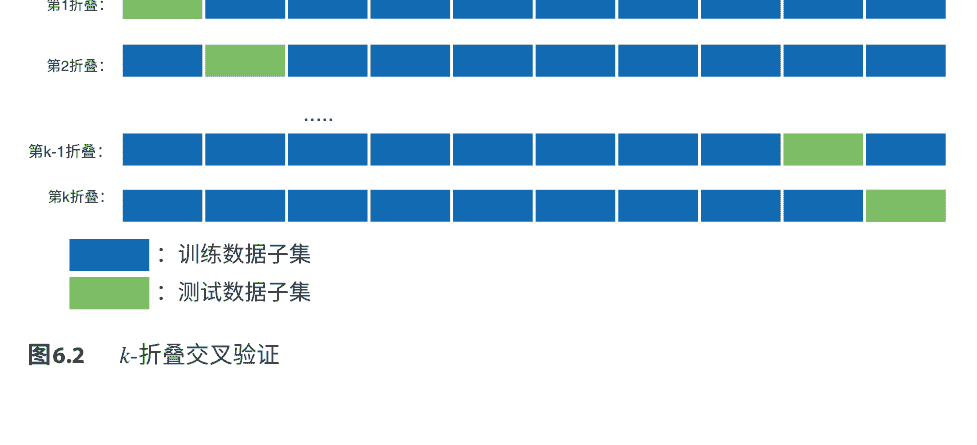

图6.2  $k$-折叠交叉验证

#### 6.1.3 选择适当的统计测试策略

本节中提出的主要问题是：使用先前讨论的度量和误差估计方法得到的评估结果是否可以归因于所研究的分类器的真实特征，还是仅仅是偶然观察到的？这个主要问题可以在单个分类器和多个分类器的背景下重新表述：

*   使用第1.1节和第1.2节讨论的方法得到的结果是否是我们分类器真实性能的良好估计？
*   在一个或多个领域上比较多个分类器时，使用第1.1节和第1.2节讨论的方法得到的结果是否真正表明最佳分类器？

我们建议在第1.3.1节和第1.3.2节中回答这些问题的方法。更多细节可以在Mitchell [8]和Japkowicz和Shah [1]中找到。

##### 在单个分类器的背景下

为了估计分类器的真实误差（但也可以是在第1.1节讨论的任何其他度量值），基于我们在测试集上观察到的误差，我们可以构建一个置信区间。如果考虑的n个值（无论是数据样本本身，如果使用测试集，还是在k折交叉验证中对折叠进行平均）是相互独立且与分类器无关的，并且n大于或等于30（即测试集中至少需要有30个数据点或者必须运行30个独立的折叠），那么就可以进行这样的构建。

在这种情况下，可以根据公式（6.16）计算出关于误差（或任何其他度量值）的95%置信区间：

$$ e \pm 1.96 \sqrt{\frac{e(1-e)}{n}} \quad\quad (6.16) $$

这意味着真实误差位于方程（6.16）所示的区间内，近似为95%的概率。

##### 在多个分类器的背景下

在考虑选择最佳分类器的问题时，考虑到分类器及其设置对特定且通常未知的数据特征的敏感性，没有可靠的方法可以事先选择分类方法，而不与其他竞争者的性能进行比较。例如，即使生成对抗网络（GAN）在胸部X射线数据集上表现最佳，但在另一个胸部X射线数据集和特定任务上，卷积神经网络实际上可能效果更好。只有在使用经过优化的数据设置训练两个模型并比较结果之后，才能知道。当然，之前对类似数据集的研究是有用的，因为它们可以帮助排除那些在该类数据上表现不佳的分类器，从而集中精力研究最佳竞争者。另一方面，如果某种类型的分类器在各种相关任务中始终优于其他分类器，那么可以假设它是该任务的最佳竞争者。然而，即使如此，验证实验结果适用于特定的数据集也是一个好主意。

在这种情况下，统计显著性检验的目的是帮助收集证据，以确定评估指标在不同分类器和可能不同数据集上返回的比较结果是否代表我们分类器的一般行为。用于建立这些结果的原则是众所周知的假设检验原则。

假设检验包括陈述一个通常与我们希望测试的相反的零假设（例如，分类器A和B的性能相等）。然后我们选择一个合适的统计检验和统计量来拒绝零假设。我们还选择一个临界区域，使得统计量位于其中，足够极端以拒绝零假设。我们从数据中计算出观察到的检验统计量，并检查它是否位于临界区域内。

如果是这样，应该拒绝零假设。如果不是这样，不能拒绝零假设，但也不能接受它。拒绝零假设是使我们对我们的观察结果不仅仅是偶然发生的信念有一定程度的信心。

一个假设可以通过统计检验来测试。然而，在选择统计检验时需要考虑几个方面。正在处理什么样的问题？我们是否有足够的信息来应用参数检验来检验分类器结果的潜在分布？关于问题的类型，我们区分如下：

*   在单个领域上比较2种算法
*   在多个领域上比较2种算法
*   在多个领域上比较多种算法
*   在单个领域上比较多种算法

关于第二个问题，我们经常建议使用非参数检验，因为这些检验对于所测试数据的分布做出的假设较少。另一方面，这些检验的功效较小，如果它们没有达到统计显著性，那么在验证了检验的所有假设后，可能需要进行参数检验。

表6.1列出了考虑到的每种情况下的推荐检验：这些检验在下面的图6.3、6.4、6.5、6.6和6.7中进行了描述，并从《学习算法性能评估教程》[9]中重新印刷。
我们不会在这里详细讨论每个推荐的测试，但可以在Japkowicz和Shah [1]中找到更深入的讨论。
这就结束了我们对机器学习系统标准评估方法的回顾。下一节将对这些方法在医学影像领域是否合适提出质疑。

### 6.2 医学影像与肿瘤学的标准实践

在本节中，我们将回顾一些在医学影像与肿瘤学领域进行的研究，评论当前社区中的常规评估实践以及从机器学习领域长期应对评估问题的经验中可以学到什么。

表6.1 推荐的统计检验

| 场景 | 推荐检验 |
| :--- | :--- |
| 两个分类器，一个领域 | 符号检验（非参数，功效非常低）<br>麦克纳马尔检验（非参数）<br>T检验（参数） |
| 两个分类器，多个领域 | 符号检验（非参数）<br>威尔科克森符号秩检验（非参数） |
| 多个分类器，多个领域 | Friedman的检验（非参数）后跟Nemenyi的检验<br>ANOVA（参数）后跟Tukey的检验、Nemenyi的检验等。 |
| 多个分类器，单个领域 | Friedman的检验（非参数）后跟Nemenyi的检验<br>（多个分类器多个领域的特殊情况。稍微修改的ANOVA和Friedman的检验版本适用。） |

图6.3 T检验。pm代表性能度量（例如准确率、AUC等）， $\overline{pm}$ 表示n次试验中性能度量的平均值。

$$ t = \frac{\bar{d} - 0}{\sigma_d / \sqrt{n}} $$
其中 $ \bar{d} = \overline{pm}(f_1) - \overline{pm}(f_2) $ 且 $ \sigma_d = \sqrt{\frac{\sum_{i=1}^{n}(d_i - \bar{d})^2}{n-1}} $
$\bar{d}$ 是应用分类器 $f_1$ 和 $f_2$ 时获得的性能指标均值之差。
$d_i$ 是分类器 $f_1$ 和 $f_2$ 在第i次试验中的性能指标差异。n是试验次数。

图6.4 麦克尼马尔检验

麦克尼马尔检验是t检验的非参数对应物。它依赖于测试集上观察到的4个值：

*   两个分类器都将实例错误分类的数量（c00）
*   被 f1错误分类但被 f2正确分类的实例数量（c01）
*   被 f2错误分类但被 f1正确分类的实例数量（c10）
*   两个分类器都正确分类的实例数量（c11）

$$ \chi^2_{MC} = \frac{(|c_{01} - c_{10}| - 1)^2}{c_{01} + c_{10}} $$

如果 c01 + c10 ≥ 20，则将 $\chi^2_{MC}$ 与 $\chi^2$ 统计量进行比较。如果 $\chi^2_{MC}$ 超过 $\chi^2_{1,1-α}$ 统计量，则我们可以拒绝假设，假设 f1 和 f2 以 1-α 的置信度表现相同。

如果 c01 + c10 < 20，则无法使用此检验，应改用符号检验。

图6.5 符号检验

*   我们计算 f1 胜过 f2 的次数，$n_+$ 以及 f2 胜过 f1 的次数，$n_-$
*   如果胜利次数符合二项分布，则零假设认为两个分类器的表现相同。
*   实际上，一个分类器在至少 $w_α$ 个数据集上表现更好，才能在 α 显著水平上被认为在统计上显著更好，其中 $w_α$ 是 α 显著水平下符号检验的临界值。

图6.6 威尔科克森符号秩检验

*   对于每个领域，我们计算两个分类器的性能差异。
*   我们对这些差异的绝对值进行排名，并在排名前面加上符号。
*   我们分别计算正排名和负排名的总和（WS1和WS2）。
*   $T_{Wilcoxon} = min(WS1, WS2)$
*   与临界值 $V_α$ 进行比较。如果 $V_α \ge T_{Wilcoxon}$，则在α置信水平上拒绝零假设，即两个分类器的表现相同。

图6.7 Friedman检验

*   所有算法在每个领域中分别排名。通过将所有涉及到的分类器的平均排名分配给这些分类器来解决并列的情况。
*   对于每个分类器，在所有领域上获得的排名之和被计算并命名为$R_j$其中j是所考虑的分类器。
*   Friedman统计量的计算公式如下：
    *   $ \chi_F^2 = \left[\frac{12}{n \times k \times (k-1)} \times \sum_{j=1}^{k} (R_j)^2 \right] - 3 \times n \times (k-1) $
        其中n表示领域的数量，k表示分类器的数量。
    *   如果$\chi_F^2$超过了特定于Friedman检验的$\chi^2_{k-1}$统计量，那么我们可以拒绝所有分类器性能相同的零假设。

#### 6.2.1 医学影像学和肿瘤学的现行实践回顾

本讨论基于Sahiner等人的研究[10]，其中作者回顾了深度学习在医学影像和放射治疗中的应用。他们确定的主要问题类型有三个¹：

*   图像分割（器官或肿瘤分割）
*   检测（器官或病变检测）
*   表征（病变、组织、诊断、预后、分期）

此外，还介绍了两个任务，处理和重建，以及成像和治疗，但与本章讨论的内容关系较小。

评估问题在论文的一个部分中进行了讨论，特别是对在相同数据上测试分类器的警告，并包括除训练集外还必须创建验证集的更微妙的问题。该调查还建议如果数据集太小而无法划分为训练验证和测试集，则使用交叉验证。隐式提到了留一法（参见Sahiner等人的表1-6，其中报告了属于不同类型问题的大量研究所使用的实验设置）。

虽然度量标准没有明确描述，但许多隐含地考虑了（参见Sahiner等人的表1-6）。在审查中未提及用于验证结果的统计测试，尽管在测量误差的标准差方面隐式地提到了统计可靠性的一种度量（参见Sahiner等人的第3表[10]）。

#### 6.2.2 可以改进的领域

Sahiner等人的表1-6中报道的研究的讨论和实际方法在评估的主要规则方面表现良好。

在指标方面，这些研究的作者对常见指标的一些缺点表现出很高的敏感性，并采用了更复杂的指标。特别是，通常避免使用准确度，这是解决类别不平衡情况下的不足之处的一个好方法，这是医学环境中普遍存在的问题。

然而，在一些研究中观察到了一个令人担忧的趋势，这主要是由于可用数据集的规模较小。 特别是，有一些研究考虑了大约15-20个患者用于训练和8-10个患者用于测试的数据集。这是令人担忧的。 即使测试患者的数量达到20个，结果仍然值得怀疑。 从统计学角度来看，这是情况，因为可靠的置信区间只能从30个样本开始建立，这是由于中心极限定理。 从严格的机器学习角度来看，训练集中的问题由于数据的高维度而加剧，因此在少数实例上进行训练会增加过拟合的可能性。 在数据集非常有限的情况下，强烈建议不要将数据分为训练集和测试集，而是使用留一法和自助法。 如果这样的评估方案过于昂贵，作者至少应考虑使用适当的k值进行k折交叉验证。 要求研究人员遵守这些更高的评估标准将有助于验证机器学习和深度学习方法在肿瘤学、医学物理和放射学中的应用。

在统计测试方面，Sahiner等人的第10张表[10]报告了使用回归测量方法进行器官和解剖结构检测结果，列出了平均误差及其标准差，但在其他研究中没有记录任何统计有效性的测量。 浏览了一些论文后发现，确实很少考虑这些问题。 需要注意的是，在评估分类器的真实效用时，计算置信区间或验证比较的统计显著性在第1.3节中讨论的内容非常有用。 除了仔细采样外，考虑这些因素将有助于加快该领域的发展，因为它可以帮助我们专注于真正有效的方法，并成为该领域重要实际进展的基础。

#### 6.2.3 过去的经验教训

深度学习的出现促使了机器学习在医学影像领域的应用，尽管这仍然是一个相对较新的现象。 在调整现有架构和尝试新方法的重点上，评估可能并不是当务之急。

这是自然的，发生在每个领域。 例如，在机器学习领域的最初阶段就发生了类似的事情。 1980年，一些论文以陈述的方式发布了结果，如“程序运行良好”和“所开发的规则与人类玩同一游戏时发明的规则相似（已分析了15局完整的比赛）”[11]。 尽管存在这种模糊的证据，但这些论文对机器学习方法的发展非常重要。 另一方面，其他文章已经使用了混淆矩阵、训练集和测试集的概念[12]。 然而，他们没有进一步挖掘评估标准。 到了20世纪90年代初，Weiss和Kulikowski [13]推广了交叉验证和假设检验的使用。 到了20世纪90年代末，Provost等人[14]开始质疑准确性作为可靠指标，而到了2000年代中期，Dems ar对t检验的过度使用提出了批评，并向机器学习社区介绍了前面提到的更合适的统计检验方法[15]。因此，尽管机器学习有着悠久的历史，但它花费了很长时间才引起人们的关注。

为了加快肿瘤学、医学物理和放射学领域的进展，借鉴机器学习评估方面的一些进展并快速适应社区的需求可能会很有用。

## 参考文献

1.  Japkowicz N, Shah M. 评估学习算法：分类的视角。 剑桥：剑桥大学出版社；2011年。
2.  Japkowicz N, Shah M. 机器学习中的性能评估。 在：El Naqa I等，编辑。放射肿瘤学中的机器学习：理论与应用。Cham：Springer；2015年。
3.  Branco P, Torgo L, Ribeiro RP. 不平衡分布下的预测建模调查。ACM计算调查。2016年；49（2）：31：1-31：50。
4.  Sokolova, M., Japkowicz, N. and Szpakowicz, S. 2006, 超越准确度、F-score和ROC：用于性能评估的一系列判别度量，在2006年澳大利亚人工智能会议论文集中。
5.  Biggerstaff B. 比较诊断测试：使用似然比的简单图形。Stat Med. 2000年;19(5):649–63.
6.  张永杰。图像分割评估方法综述。Pattern Recogn. 1996年;29(8):1335–46.
7.  张宏，Fritts JE，Goldman SA。图像分割评估：无监督方法综述。Comput Vis Image Understanding. 2008年;110(2):260–80.
8.  Mitchell T. 机器学习。纽约：麦克劳希尔出版社；1996年。
9.  Japkowicz, N. 学习算法的性能评估，加拿大人工智能2016年，5月31日，维多利亚，BC。http://fs2.american.edu/japkowic/www/#Tutorials
10. Sahiner B, Pezeshk A, Hadjiiski LM, Wang X, Drukker K, Cha KH, Summers RM, Giger ML. 医学影像和放射治疗中的深度学习。Med Phys. 2019年1月;46(1):e1–e36.
11. Dietterich TG. 将通用归纳方法应用于纸牌游戏Eleusis。在：人工智能国家会议论文集，AAAI-80，加利福尼亚斯坦福大学；1980年。第218-20页。
12. Michalski RS, Chilausky RL. 通过被告知和从示例中学习：两种知识获取方法的实验比较。波兰分析与信息系统。1980年6月；4（2）：125-61
13. Weiss SM, Kulikowski CA. 学习的计算机系统：来自统计学的分类和预测方法。在：神经网络、机器学习和专家系统。圣马埃托：摩根考夫曼；1991年。
14. Provost F, Fawcett T, Kohavi R. 反对使用准确性估计来比较归纳算法。在：Shavlik J，编辑。ICML-98会议论文集。旧金山：摩根考夫曼；1998年。第445-53页
15. Demsar J. 对多个数据集上的分类器进行统计比较。J Mach Learn Res. 2006年;7:1-30.

## 机器学习与深度学习的软件工具

Dipesh Niraula和Issam El Naqa

### 7.1 介绍

随着深度学习在计算机视觉和自然语言处理中的成功，机器学习取得了巨大的飞跃。深度学习使计算机能够直接从原始图像和视频中获取准确的高级信息，模仿人类视觉系统和人类听觉系统。这种能力对于各种医疗和非医疗系统的全自动化至关重要。因此，机器学习和深度学习算法的应用在医学研究、自动驾驶、航空航天和国防、工业自动化、电子、商业等各个领域都大幅增加。相应地，机器学习计算机软件和工具得到了积极研究和快速发展。本章介绍了几个深度学习平台，并简要描述了一些最受欢迎的平台，如图7.1所示。由于Python是一种解释型、高级、通用的语言，易于理解和使用，最受欢迎的开源机器学习和深度学习平台最近都是用Python语言开发的。事实上，由于基于Python的深度学习社区的爆炸式增长，Python语言的流行度已经超过了C++，仅次于Java和C [1]。因此，本章主要关注基于Python的库。云计算是一项新兴技术，简化了计算过程和资源访问，用户可以通过互联网访问数据存储和计算能力，而无需直接维护昂贵的硬件资源。从本地到云计算的这种范式转变可能很快成为常态，因此我们在本书中讨论了一些配备机器学习工具的常见云计算平台。

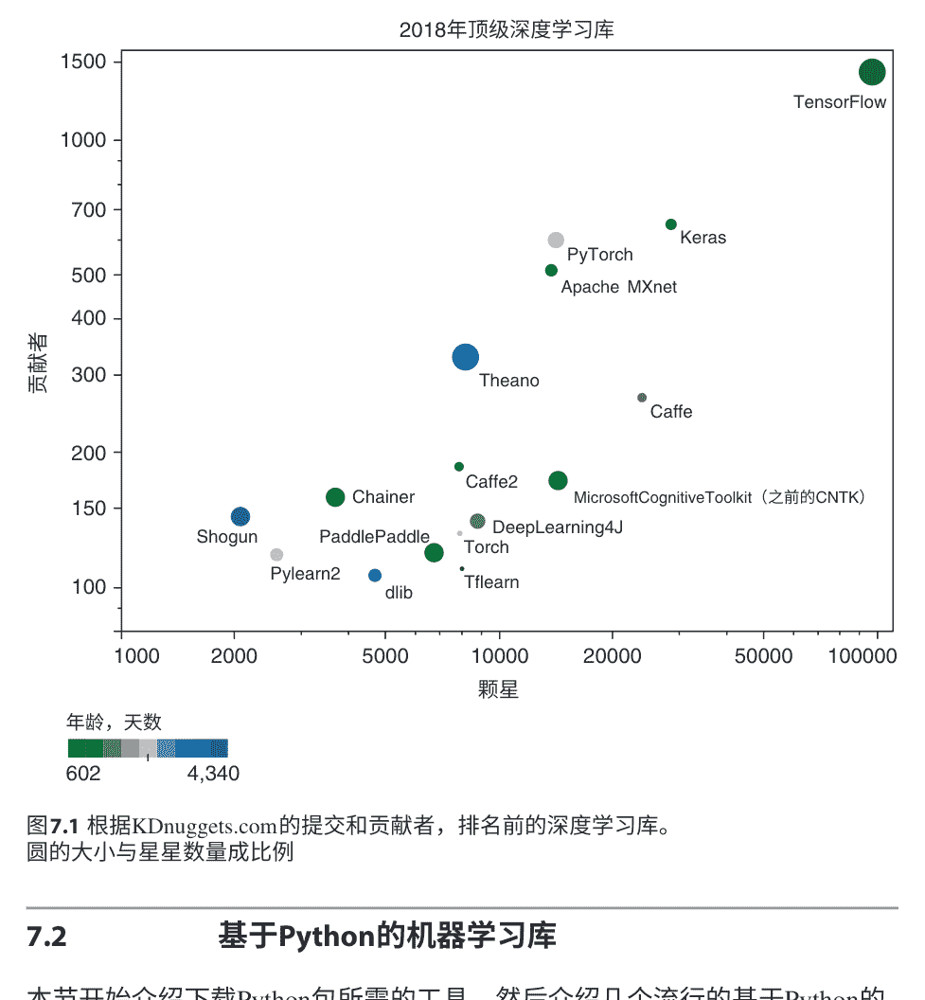

图7.1根据KDnuggets.com的提交和贡献者，排名前的深度学习库。圆的大小与星星数量成比例

### 7.2 基于Python的机器学习库

本节开始介绍下载Python包所需的工具，然后介绍几个流行的基于Python的机器学习和深度学习库。

#### 7.2.1 Pip和Conda

Pip和Conda是两个用于安装Python包的软件工具。Pip是Python Packaging Authority推荐的工具，用于从Python Package Index（PyPI）安装包。Conda是一个跨平台的包和环境管理器，可以从Anaconda Repository或Anaconda Cloud（www.anaconda.com）安装包。pip和conda的主要区别是pip安装Python包，而conda可以安装可能包含其他依赖项的软件。因此，必须预先安装Python解释器以进行pip，而conda也可以安装Python包以及Python解释器。另一个区别是conda可以创建隔离的虚拟环境，可以包含不同版本的包，而pip则必须使用类似virtualenv和venv的辅助工具。在实践中，这两个工具可以互换使用，以获得最佳效果。

#### 7.2.2 NumPy和SciPy

虽然与机器学习或深度学习没有直接关系，但NumPy [3, 4]和SciPy[5]包是Python语言中最有用的科学计算包。 NumPy提供了处理多维数组（张量）的能力，而建立在NumPy之上的SciPy提供了高级数学函数和算法，如优化、积分等，还可以处理稀疏矩阵和k维树。这使得完全可以纯粹使用NumPy和SciPy构建深度学习工具；约47%的所有机器学习项目在GitHub上使用了SciPy [5]。此外，许多流行的深度学习库要么是基于NumPy，要么试图模仿NumPy。

#### 7.2.3 专用机器学习库

机器学习库包含支持向量机（SVM）、K最近邻分类器、层次聚类和主成分分析（PCA）等工具，用于解决回归、分类、聚类、降维等问题。以下是一些常见的机器学习库。

##### 7.2.3.1 Scikit-Learn

Scikit-learn [6, 7] 是一个基于NumPy、SciPy和matplotlib的开源鲁棒机器学习库，也是最流行的独立机器学习库。它最初是由David Cournapeau在2007年的Google暑期项目中创建的。它拥有一系列监督学习和无监督学习算法，以及丰富的数据预处理、模型选择和评估、降维等资源，在其3000页的用户指南[8]中有详细记录。虽然该软件包是用Python编写的，但它还集成了C++库，如LibSVM和LibLinear。在实践中，它的数据预处理工具经常与其他深度学习库一起使用。

##### 7.2.3.2 Shogun

Shogun [9] 是一个开源的机器学习库，由Soeren Sonnenburg和Gunnar Raetsch于1999年发起，专注于生物信息学。它是最古老的库之一，用C++编写，并与Python、Octave、Java等语言接口。它还提供与其他几个库的绑定，如LibSVM、LibLinear、SVMLight、LibOCAS、libqp、VowpalWabbit、Tapkee、SLEP、GPML等。云版本也可以通过Jupyter笔记本进行远程访问。Scikit和shogun目前被认为是两个综合性的机器学习库。

##### 7.2.3.3 mlpy

Machine Learning Python (mlpy) [10] 是一个开源的机器学习库，由Davide Albanese开发，专门用于计算生物学和功能基因组建模。它构建在NumPy、SciPy和GNU Scientific Library之上，并使用CPython与GNU进行通信，GNU是用C编写的。最后一个稳定版本发布于2012年。

##### 7.2.3.4 PyMVPA

Python中的多变量模式分析(PyMVPA) [11] 是一个开源的机器学习库，于2009年开发用于功能性磁共振成像数据分析。该库建立在NumPy和SciPy之上。除了基本的机器学习算法外，它还包括通过Python包装器RPy进行R语言统计工具的分析。它还使用了ShoGun。

##### 7.2.3.5 MDP

数据处理的模块化工具包(MDP) [12] 是一个开源的机器学习库，于2009年作为神经科学理论研究的一部分开发。它建立在NumPy和SciPy之上。它包括有监督和无监督学习算法以及其他称为节点的数据处理单元，这些节点可以组合成一个序列，即前馈网络架构，这是深度学习模型的构建块。

##### 7.2.3.6 PyBrain

基于Python的强化学习、人工智能和神经网络库(PyBrain) [13]是一个开源的基于Python的机器学习工具箱它包括神经网络的早期版本。它是建立在SciPy之上的，提供了监督、无监督和强化学习的工具。除了支持向量机(SVM)、高斯过程等机器学习算法外，它还包含了深度学习的元素，如长短期记忆(LSTM)循环神经网络(RNN)和深度置信网络。PyBrain是一个混合库，它构建了机器学习和深度学习库之间的桥梁。

#### 7.2.4 深度学习

深度学习库包含与神经网络相关的工具，如通用神经网络、卷积神经网络(CNN)、RNN、激活函数、优化器、权重和偏置初始化器以及标准化器等。所有的库都在矩阵和张量运算上效率高，并且其中许多库都是为了利用单个GPU或多个GPU进行并行分布式训练。还包括了几种随机梯度下降(SGD)算法的变体。

##### 7.2.4.1 Theano

Theano [14] 是一个开源的深度学习框架，由蒙特利尔学习算法研究所（MILA）于2008年开始开发。Theano高效地编译多维数组，可在CPU和GPU上使用CUDA（Compute Unified Device Architecture）进行高度优化的计算。此外，Theano的API使用和模仿NumPy，并且许多深度学习框架都是在其基础上构建的。Theano采用定义和运行或静态图的方法，即定义各种数学运算之间的固定连接，然后运行训练。静态图方法对于静态神经网络架构（如CNN）是最优的。

##### 7.2.4.2 Chainer

Chainer [15] 是一个由日本初创公司Preferred Networks于2015年开发的开源深度学习框架。Chainer采用定义即运行或动态图的方法，即在训练过程中确定网络中的连接。动态图方法对于变长数据（如深度强化学习和LSTM RNN）比CNN中使用的静态图更好。它利用了使用CUDA加速的矩阵库CuPy来提高训练速度。CuPy与NumPy非常相似且高度兼容。Chainer支持GPU（CUDA）和分布式并行训练。对于计算机视觉任务，还提供了一个附加包ChainerCV。

##### 7.2.4.3 TensorFlow

Tensorflow [16] 是由Google Brain团队开发的开源机器学习库，特别专注于深度学习。它是用C++核心语言编写的，以Python作为绑定语言。它默认实现了静态图方法，并在急切模式下切换到动态图（自TensorFlow 2.0起，默认为急切模式）。Tensorflow还提供了一个名为Tensorboard的可视化工具，用于跟踪和说明深度学习过程。Keras是一个与tensorflow集成的高级API。它具有简洁的语法，如示例1所示，非常适合用于生产目的。

##### 7.2.4.4 PyTorch

PyTorch [17] 是由Facebook AI研究实验室基于最初用Lua编写的Torch库开发的开源机器学习库。它支持GPU（CUDA）和分布式并行训练。实际上，就语法而言，PyTorch的分布式训练比TensorFlow更容易设置。示例2展示了一个使用GPU的PyTorch代码示例（如果有可用的GPU）。

##### 7.2.4.5 Caffe

Caffe [18]是由伯克利人工智能研究所开发的开源深度学习框架。Caffe代表卷积架构用于快速特征嵌入。它是用C++核心语言编写的，并支持Python和MATLAB作为绑定语言。它实现了静态图方法。

##### 7.2.4.6 MXNet

MXNet，发音为mix-net，是一个由Apache软件基金会于2015年开发的开源深度学习软件框架[19]。MXNet采用静态和动态图混合的方法，以获得最佳性能。它是用C++核心语言编写的，并支持Python、R、Julia和Go作为绑定语言。它支持多GPU和分布式并行训练。

#### 7.2.5 示例

本节介绍了Tensorflow和PyTorch中的两个分类模型示例，以突出这两个流行平台之间的主要差异，并提供可以根据其他章节中的模型构建和评估进行定制的示例代码，用于其他放射学应用。

```
示例1：TensorFlow.Keras中的分类
##### TensorFlow和tf.keras库
import tensorflow as tf

##使用二进制标签（y）加载数据（x）
(x_train, y_train), (x_test, y_test) = load_data()

##构建密集模型：y=W.x+b
###### 设置层
model = tf.keras.models.Sequential([
    tf.keras.layers.Dense(64, activation='elu'),
    tf.keras.layers.Dense(64, activation='elu'),
    tf.keras.layers.Dropout(0.2),
    tf.keras.layers.Dense(1, activation='sigmoid')
])
#编译模型
model.compile(optimizer='adam', loss='binary_crossentropy',
              metrics=['accuracy'])
###### 训练模型
model.fit(x_train, y_train, epochs=100)
###### 评估模型
model.evaluate(x_test, y_test)
```

```
示例2：PyTorch中的分类
##### Pytorch库和辅助函数
import torch
import torch.nn as nn
import torch.nn.functional as F
import torch.optim as optim
import NumPy as np

##如果可用，则选择GPU
device = torch.device("cuda:0"
                 if torch.cuda.is_available() else "cpu")
class Model(nn.Module):
    def __init__(self,input_dim):
        super(Model_LCRP2,self).__init__()
##将模型构建为密集层：y=W.x+b
###### 设置层
        self.linear1=nn.Linear(input_dim,64)
        self.linear2=nn.Linear(64,64)
        self.dropout3=nn.Dropout(p=0.2)
        self.linear4=nn.Linear(64,1)

    def forward(self,x):
        x=F.elu(self.linear1(x))
        x=F.elu(self.linear2(x))
        x=self.dropout3(x)
        return F.sigmoid(self.linear4(x))
###### 定义训练和测试模块
def test(model,x,y):
    model.eval()
    test_acc = 0.0
    for x,y in zip(x,y):
        outputs = model(x)
        prediction=outputs.data
        test_acc+= torch.sum(prediction.round()
                            == y.data.round())
    # 计算所有测试样本的平均准确率
    test_acc = test_acc / len(x)
    return test_acc
def train(model,optimizer,num_epochs,model_name,
                  x_train,y_train,x_test,y_test):
    Losses=np.zeros(num_epochs)
    TestAccuracy=np.zeros(num_epochs)
    TrainAccuracy=np.zeros(num_epochs)
    for epoch in range(num_epochs):
        model.train()
        train_acc=0.0
        train_loss=0.0
        for x, y in zip(x_train,y_train):
            #清除所有累积的梯度
            optimizer.zero_grad()
            outputs = model(x)
            loss = loss_fn(outputs,y)
            #反向传播损失
            loss.backward()
            #根据计算得到的梯度调整参数
            optimizer.step()
            #用于性能指标
            train_loss += loss.item()
            prediction=outputs.data
            train_acc += torch.sum(prediction.round() == y.data.round())
        #计算所有训练样本的平均值
        train_acc = train_acc / len(x_train)
        train_loss = train_loss / len(x_train)
        #评估测试集
        test_acc = test(model,x_test,y_test)
        Losses[epoch]=train_loss
        TestAccuracy[epoch]=test_acc
        TrainAccuracy[epoch]=train_acc
        #打印指标
        print("Epoch {}, Train Accuracy: {:.2f}, Train Loss: {:.2f}, Test Accuracy: {:.2f}".format(epoch, train_acc, train_loss, test_acc))
    #输出指标
    return Losses, TestAccuracy, TrainAccuracy
(x_train, y_train), (x_test, y_test) = load_data()
model = Model(input_dim=10).to(device)
optimizer = optim.Adam(model.parameters(), lr=1e-4)
loss_fn=nn.BCELoss()
epoch=100
if __name__ == "__main__":
    Losses, TestAccuracy, TrainAccuracy=train(model,optimizer,epoch,x_train,y_train,x_test,y_test)
```

#### 7.2.6 基准测试

本节为读者提供了上述各种机器学习和深度学习库的比较性能，以及在使用它们时所采用的权衡。本节中的指标是从相应表标题中引用的研究论文中累积得出的。表7.1比较了六个机器学习库在Madelon数据集[20]上执行不同任务的计算速度。表7.2、7.3、7.4、7.5、7.6和7.7比较了不同深度学习库的性能。表7.2、7.3、7.4和7.5的基准测试是在NVIDIA Digits DevBox上运行的，配备了4个Titan X GPU和一个Core i7-5930K CPU。此外，使用了cuda 7.5.17和cuDNN v4以及数据类型float 32。

表7.1 计算时间（秒）[6]

| | Scikit-Learn | mlpy | PyBrain | PyMVPA | MDP | Shogun |
|---|---|---|---|---|---|---|
| 支持向量分类 | 5.2 | 9.47 | 17.5 | 11.52 | 40.48 | 5.63 |
| Lasso (LARS) | 1.17 | 105.3 | – | 37.35 | – | – |
| 弹性网络 | 0.52 | 73.7 | – | 1.44 | – | – |
| 最近邻算法 | 0.57 | 1.41 | – | 0.56 | 0.58 | 1.36 |
| PCA (9个组件) | 0.18 | – | – | 8.93 | 0.47 | 0.33 |
| k-means (9个聚类) | 1.34 | 0.79 | >1小时 | – | 35.75 | 0.68 |

Madelon 数据集的计算时间 [20]

表7.2 CNN：每个小批量的前向|后向计算时间（毫秒）[14]

| | AlexNet | OverFeat | VGG | GoogLeNet |
|---|---|---|---|---|
| Theano | 32\|99 | 94\|288 | 178\|600 | 172\|546 |
| Theano 快速编译 | 44\|118 | 111\|319 | 263\|758 | 250\|680 |
| Torch | 27\|80 | 90\|269 | 164\|525 | 132\|470 |
| Tensorflow | 27\|80 | 88\|277 | 155\|538 | 128\|443 |

Imagenet 数据集上各种卷积神经网络（CNN）的处理时间 [21] CNN 的规格为：AlexNet 的单列变体[22]，批量大小为128；Overfeat 的快速变体[23]，批量大小为128；模型A VGG（oxfordnet）[24]，批量大小为64；GoogLeNet V1[25]，批量大小为128

表7.3 RNN：每秒1000个单词[14]

| | Small | 中等 | 大 |
|---|---|---|---|
| Theano | 14 | 12 | 10 |
| Theano快速编译 | 11 | 10 | 8 |
| Torch | 12 | 8 | 6 |
| Tensorflow | 17 | 11 | 8 |

长短期记忆 (LSTM) 模型在Penn Treebank数据集上的处理速度 [26]。这里，小型模型对应于单层，200个隐藏单元，序列长度为20，中型模型对应于单层，600个隐藏单元，序列长度为40，大型模型对应于两层，每层650个隐藏单元，序列长度为50。使用了20的批量大小## 7.3 Weka

Weka [27] 是一个传统的机器学习工具，具有图形用户界面(GUI)，可以在不编程的情况下应用机器学习。它的开发始于1997年，由怀卡托大学的开发人员开发，是一个开源软件，可以免费下载。它是用Java编写的，与大多数现代计算平台兼容。它可以访问其他机器学习和深度学习工具箱，如scikit-learn、R和Deeplearning4j。此外，WekaDeeplearning4j是Weka的一个深度学习包，为Weka的GUI添加了深度学习功能。

### 7.4 R

R支持诸如线性判别分析、分类和回归树、k最近邻、具有线性核的SVM、随机森林等机器学习方法。对于深度学习，keras和tensorflow推出了R版本，为具备统计能力的R提供了先进的深度学习功能。另外，可以通过使用reticulate库将Python函数和工具包装成R包装器函数，在R中使用。

### 7.5 Matlab

Matlab拥有出色的深度学习工具箱（图7.2），其中包含了全面的深度学习工具和模型。Matlab支持单个或多个GPU（CUDA），并可以通过ONNX格式与Tensorflow和PyTorch交换模型，还可以从TensorFlow-keras和Caffe导入模型。该工具箱支持使用DarkNet-53、ResNet-50、NASNet、SqueezeNet等预训练模型进行迁移学习。尽管Matlab不是开源软件，除了深度学习工具箱外，它还包含几乎所有工程领域的计算工具，用于创建跨学科的深度学习模型。

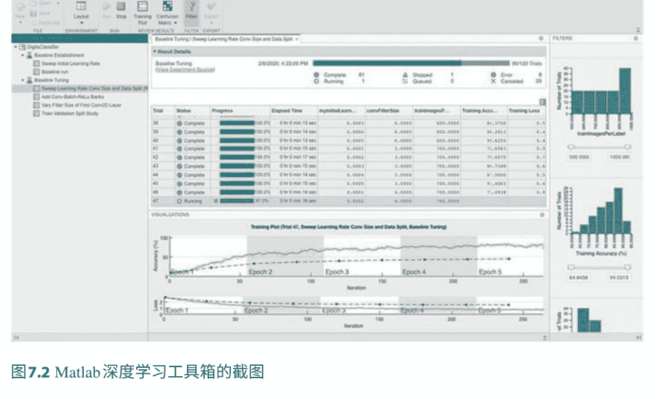

### 7.6 基于云的平台

随着云和无服务器系统的进步，计算范式正在转向基于Web浏览器的计算。云计算的主要吸引力在于无需担心备份、存储、安装和更新软件，以及维护服务器，而只需支付使用费。然而，这仍然是与本地IT团队控制安全性和隐私问题的本地集群资源（如高性能计算（HPC）服务器）之间的权衡，而维护此类资源则是一个问题。

有几个提供机器和深度学习在线平台服务的来源。本节中提到了几个流行的应用程序。在实践中，云服务在具有快速互联网连接的地方非常方便。

#### 7.6.1 AWS深度学习AMI和SageMaker

亚马逊网络服务（AWS）深度学习亚马逊机器映像（DLAMI）提供了云中深度学习的基础设施和工具。可以从https://aws.amazon.com/machine-learning/amis/访问。用户可以访问多个CPU和GPU以训练更大的模型。该服务预装了流行的深度学习框架和接口，如TensorFlow、Keras、PyTorch、Theano等。为了计算加速，它包括最新的NVIDIA GPU加速，通过预配置的CUDA和cuDNN驱动程序，以及Intel Math Kernel Library，并预装了Anaconda平台。

亚马逊还提供了SageMaker作为与DL AMI分开的平台，可以从https://aws.amazon.com/sagemaker/访问。SageMaker是一个适用于开发应用程序的开发平台，而DL AMI适用于研究和开发。与DLAMI类似，它还支持TensorFlow、PyTorch、Apache MXNET、Chainer、Keras、Scikit-learn等框架。SageMaker有三种不同类型：SageMaker、SageMaker Studio（图7.3）和SageMaker Autopilot。Studio是一个完全集成的开发环境，而Autopilot具有用于工业目的的自动化机器学习开发能力（图7.3）。

#### 7.6.2 谷歌Colab

谷歌Colab（图7.4）是一个在云中运行的免费深度学习计算平台的jupyter笔记本环境。可以从https://colab.research.google.com/notebooks/intro.ipynb访问。它包含预安装的深度学习包，如Keras、Tensorflow、PyTorch和其他相关库。要添加新的库，只需简单地使用pip install命令。它具有开放访问平台，用户可以免费运行深度学习模型。对于更大的开发项目，用户可以按需付费使用强大的GPU甚至TPU。

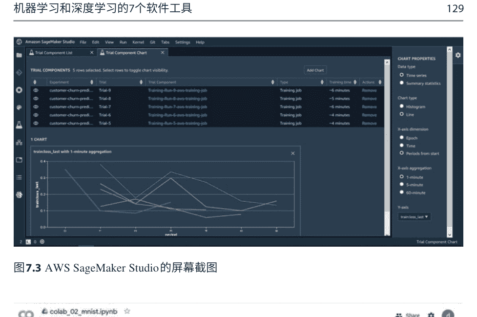

图7.3 AWS SageMaker Studio的屏幕截图

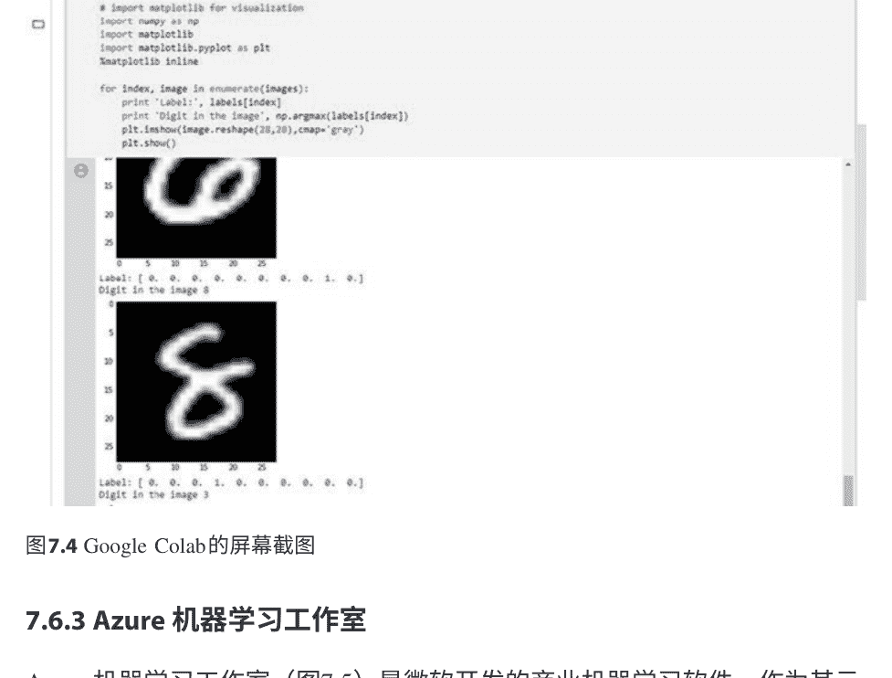

图7.4 Google Colab的屏幕截图

#### 7.6.3 Azure 机器学习工作室

Azure 机器学习工作室（图7.5）是微软开发的商业机器学习软件，作为其云服务Azure的一部分。可以从https://azure.microsoft.com/en-us/services/machine-learning/访问。它具有交互式图形用户界面，用户可以拖放工具来创建和训练深度学习模型，适用于商业解决方案。它支持开源工具和框架，如PyTorch、TensorFlow和scikit-learn。可以选择开发工具，包括流行的集成开发环境、Jupyter笔记本和命令行界面，或者使用Python和R等编程语言。

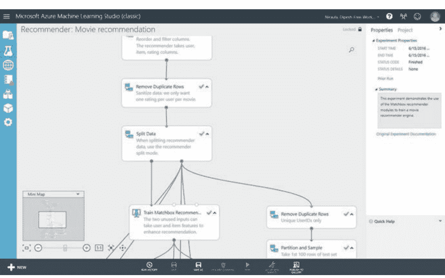

图7.5 Azure Machine Learning Studio的截图

#### 7.6.4 IBM Watson 机器学习工作室

IBM Watson 机器学习工作室（图7.6）是IBM开发的商业机器学习平台，通过IBM云进行操作。可以从https://www.ibm.com/cloud/machine-learning访问。与Azure ML工作室类似，它具有交互式图形用户界面。它基于基于Kubernetes和Docker软件打包组件的开源平台构建。它提供模型的图形视图，并提供用于交互式编程环境的笔记本。它还包括分布式训练功能，并支持GPU，有助于优化超参数和部署训练好的模型和Python函数。它支持scikit-learn、XGBoost、TensorFlow、Keras、Caffe、PyTorch、IBM SPSS Modeler等机器学习框架。

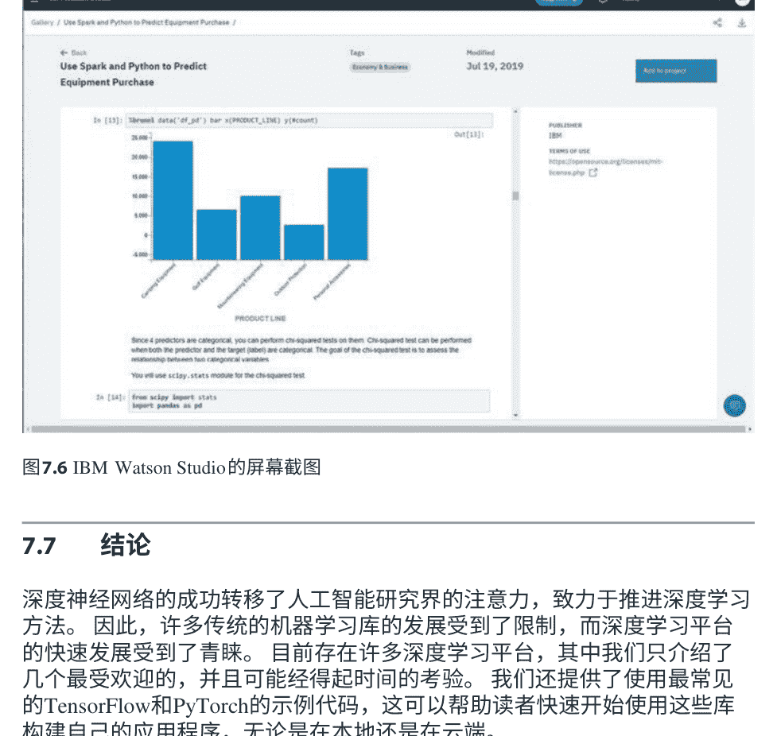

图7.6 IBM Watson Studio的屏幕截图

### 7.7 结论

深度神经网络的成功转移了人工智能研究界的注意力，致力于推进深度学习方法。因此，许多传统的机器学习库的发展受到了限制，而深度学习平台的快速发展受到了青睐。目前存在许多深度学习平台，其中我们只介绍了几个最受欢迎的，并且可能经得起时间的考验。我们还提供了使用最常见的TensorFlow和PyTorch的示例代码，这可以帮助读者快速开始使用这些库构建自己的应用程序，无论是在本地还是在云端。

## 参考文献

1. 2020年4月TIOBE指数，Tiobe。 (2020) https://www.tiobe.com/tiobe-index/ 引用日期：2020年4月2日。
2. Helmus J，了解Conda和Pip，Anaconda。 (2018) https://www.anaconda.com/understanding-Conda-and-pip/。 引用日期：2020年3月25日。
3. Oliphant TE. NumPy指南. 美国：Trelgo出版社；2006年。
4. van der Walt S, Colbert SC, Varoquaux G. NumPy数组：高效数值计算的结构。计算机科学与工程。2011年；13：22-30。
5. Virtanen P, Gommers R, Oliphant TE, Haberland M, Reddy T, Cournapeau D, Burovski E, Peterson P, Weckesser W, Bright J, van der Walt SJ, Brett M, Wilson J, Millman KJ, Mayorov N, Nelson ARJ, Jones E, Kern R, Larson E, Carey C, Polat I, Feng Y, Moore EW, VanderPlas J, Laxalde D, Perktold J, Cimrman R, Henriksen I, Quintero EA, Harris CR, Archibald AM, Ribeiro AH, Pedregosa F, van Mulbreg P. SciPy 1.0贡献者, SciPy 1.0: Python科学计算的基本算法。自然方法。2020年； 17： 261–272。 https://doi.org/10.1038/s41592-019-0686-2
6. Pedregosa F, Varoquaux G, Gramfort A, Michel V, Thirion B, Grisel O, Blondel M, Prettenhofer P, Weiss R, Dubourg V, Vanderplas J, Passos A, Cournapeau D, Brucher M, Perrot M, Duchesnay E. Scikit-learn: Python中的机器学习. J Mach Learn Res. 2011;12:2825–30.
7. Buitinck L, Louppe G, Blondel M, Pedregosa F, Mueller A, Grisel O, Niculae V, Prettenhofer P, Gramfort A, Grobler J, Layton R, Vanderplas J, Joly A, Holt B, Varo-quaux G, 机器学习软件的API设计: 来自scikit-learn项目的经验. 2013,arXiv:1309.0238[cs.LG].
8. scikit-learn开发者, scikit-learn用户指南, 版本0.22.2发布于2020年. https://scikit-learn.org/stable/downloads/scikit-learn-docs.pdf
9. Sonnenburg S, Strathmann H, Lisitsyn S, Gal V, Iglesias García FJ, Lin W, De S, Zhang C, Frx, Tklein23, Andreev E, Behr J, Sploving, Mazumdar P, Widmer C, Deng P, De Toni G, Mahindre S, Kislay A, Hughes K, Voytyakov R, Khalednasr, Sharma S, Novik A, Panda A, Anagnostopoulos E, Pang L, Binder A, Serialhex, Björn Esser. Shogun-toolbox/shogun: Shogun 6.1.0. Zenodo; 2017. https://doi.org/10.5281/zenodo.1067840.
10. Albanese D, Kessler FB, Visintainer R, Merler S, Riccadonna S, Jurman G, Furlanello C, mlpy: 机器学习Python. 2012, arXiv:1202.6548 [cs.MS].
11. Hanke M, Halchenko YO, Sederberg PB, Hanson SJ, Haxby JV, Pollmann S. PyMVPA: 一种用于fMRI数据的多变量模式分析的Python工具箱. Neuroinformatics. 2009;7:37–53. https://doi.org/10.1007/s12021-008-9041-ya.
12. Zito T, Wilbert N, Wiskott L, Berkes P. 模块化数据处理工具包(MDP): 一个Python数据处理框架. Front Neuroinform. 2009;2:8. https://doi.org/10.3389/neuro.11.008.2008.
13. Schaul T, Bayer J, Wierstra D, Sun Y, Felder M, Sehnke F, Ruckstieb T, Schmidhuber J. PyBrain. J Mach Learn Res. 2010;11:743–6.
14. Al-Rfou R, Alain G, Almahairi A, Angermueller C, Bahdanau D, Ballas N, Bastien F, Bayer J, Belikov A, Belopolsky A, Bengio Y, Bergeron A, Bergstra J, Bisson V, Snyder JB, Bouchard N, Lewandowski NB, Bouthillier X, de Brebisson A, Breuleux O, Carrier P-L, Cho K, Chorowski J, Christiano P, Cooijmans T, Cote M-A, Cote M, Courville A, Dauphin YN, Delalleau O, Demouth J, Desjardins G, Dieleman S, Dinh L, Ducoffe M, Dumoulin V, Kahou SE, Erhan D, Fan Z, Firat O, Germain M, Glorot X, Goodfellow I, Graham M, Gulcehre C, Hamel P, Harlouchet I, Heng J-P, Hidasi B, Honari S, Jain A, Jean S, Jia K, Korobov M, Kulkarni V, Lamb A, Lamblin P, Larsen E, Laurent C, Lee S, Lefrancois S, Lemieux S, Leonard N, Lin Z, Livezey JA, Lorenz C, Lowin J, Ma Q, Manzagol P-A, Mastropietro O, McGibbon RT, Memisevic R, van Merrienboer B, Michalski V, Mirza M, Orlandi A, Pal C, Pascanu R, Pezeshki M, Raffel C, Renshaw D, Rocklin M, Romero A, Roth M, Sadowski P, Salvatier J, Savard F, Schluter J, Schulman J, Schwartz G, Serban IV, Serdyuk D, Shabanian S, Simon E, Spieckermann S, Subramanyam SR, Sygnowski J, Tanguy J, van Tulder G, Turian J, Urban S, Vincent P, Visin F, de Vries H, Farley DW, Webb DJ, Willson M, Xu K, Xue L, Yao L, Zhang S, Zhang Y, Theano: A Python framework for fast computation of mathematical expressions. 2016年, arXiv:1605.02688 [cs.SC].
15. Tokui S, Okuta R, Akiba T, Niitani Y, Ogawa T, Saito S, Suzuki S, Uenishi K, Vogel B, Vincent HY, Chainer: 一个加速研究周期的深度学习框架。2019年, arXiv:1908.00213 [cs.LG].
16. M. Abadi, A. Agarwal, P. Barham, E. Brevdo, Z. Chen, C. Citro, G. S. Corrado, A. Davis, J. Dean, M. Devin, S. Ghemawat, I. Goodfellow, A. Harp, G. Irving, M. Isard, R. Jozefowicz, Y. Jia, L. Kaiser, M. Kudlur, J. Levenberg, D. Manã, M. Schuster, R. Monga, S. Moore, D. Murray, C. Olah, M. Schuster, J. Shlens, B. Steiner, I. Sutskever, K. Talwar, P. Tucker, V. Vanhoucke, V. Vasudevan, F. Viégas, O. Vinyals, P. Warden, M. Wattenberg, M. Wicke, Y. Yu, X. Zheng, TensorFlow: 大规模异构分布式系统上的机器学习。2016年, 第1603.04467号。

表7.4 从视频生成标题，前向/后向计算时间/小批量 (ms) [14]
| 批量大小 | 32 | 64 | 128 |
| :--- | :--- | :--- | :--- |
| Theano | 72\|298 | 102\|520 | 182\|923 |
| Tensorflow | 100\|323 | 135\|520 | 232\|850 |

从视频表示生成单词序列的处理时间。输入视频帧经过预处理，由预先训练用于ImageNet分类的GoogLeNet处理。

表7.5 Theano数据并行性与LSTM，每批次同步/每100批次同步: 1000个单词/秒 [14]
| 小型 | 中等 | 大型 |
| :--- | :--- | :--- |
| 1个GPU | 14\|14 | 12\|12 | 10\|10 |
| 2个GPU | 23\|27 | 20\|24 | 15\|19 |
| 4个GPU | 45\|55 | 39\|47 | 31\|38 |

使用Platoon在LSTM模型上使用多个GPU的处理速度，每个批次和每100个批次同步。小型、中型和大型模型与表7.3相同。

表7.6 单机基准测试：训练步骤时间（毫秒）[16]
|  | AlexNet | OverFeat | OxfordNet | GoogLeNet |
| :--- | :--- | :--- | :--- | :--- |
| Caffe | 324 | 823 | 1068 | 1935 |
| Neon | 87 | 211 | 320 | 270 |
| Torch | 81 | 268 | 529 | 470 |
| Tensorflow | 81 | 279 | 540 | 445 |

使用32位浮点数在一个GPU上进行训练步骤的时间。

表7.7 吞吐量：每秒样本数[17]
|  | AlexNet | OverFeat | OxfordNet | GoogLeNet |
| :--- | :--- | :--- | :--- | :--- |
| Chainer | 778 ± 15 | 无法适用 | 219 ± 1 | 无法适用 |
| CNTK | 845 ± 8 | 84 ± 3 | 210 ± 1 | 无法适用 |
| MXNet | 1554 ± 22 | 113 ± 1 | 218 ± 2 | 444 ± 2 |
| PaddlePaddle | 933 ± 123 | 112 ± 2 | 192 ± 4 | 557 ± 24 |
| TensorFlow | 1422 ± 27 | 66 ± 2 | 200 ± 1 | 216 ± 15 |
| PyTorch | 1547 ± 316 | 119 ± 1 | 212 ± 2 | 463 ± 17 |

使用32位浮点数进行训练的速度；吞吐量以每秒图像数来衡量。

表7.6的基准测试在主频为3.5 GHz的六核Intel Core i7-5930K CPU上运行，表7.7的基准测试在主频为2.20 GHz的2个Intel Xeon E5-2698 v4上运行，每个插槽有20个核心，以及1个Nvidia Quadro GP100。

```python
images = data[0]
labels = data[1]

# import matplotlib for visualization
import numpy as np
import matplotlib
import matplotlib.pyplot as plt
%matplotlib inline

for index, image in enumerate(images):
    print 'Label:', labels[index]
    print 'Digit in the image', np.argmax(labels[index])
    plt.imshow(image.reshape(28,28),cmap='gray')
    plt.show()
```17. Paszke A, Gross S, Massa F, Lerer A, Bradbury J, Chanan G, Killeen T, Lin Z, Gimelshein N, Antiga L, Desmaison A, Kopf A, Yang E, De Vito Z, Raison M, Tejani A, Chilamkurthy S, Steiner B, Fang L, Bai J, Chintala S. PyTorch: 一种命令式风格、高性能的深度学习库，神经信息处理系统进展，第32卷。第2版。纽约：Curran Associates, Inc.; 2019年。p. 8024–35。http://papers.neurips.cc/paper/9015-pytorch-an-imperative-style-high-performance-deep-learning-library.pdf

18. Jia Y, Shelhamer E, Donahue J, Karayev S, Long J, Girshick R, Guadarrama S, Darrell T. Caffe: 用于快速特征嵌入的卷积架构。2014年，arXiv:1408.5093 [cs.CV]。

19. Chen T, Li M, Li Y, Lin M, Wang N, Wang M, Xiao T, Xu B, Zhang C, Zhang Z。MXNet: 一种用于异构分布式系统的灵活高效的机器学习库。2015年，arXiv:1512.01274 [cs.DC]。

20. Guyon I, Gunn S, Ben Hur A, Dror G. NIPS 2003特征选择挑战的结果分析。在：NIPS'04：第17届国际神经信息处理系统会议论文集，2004年12月；2004年。p. 545–552。

21. Deng J, Dong W, Socher R, Li L, Li K, Fei F. ImageNet: 一个大规模的分层图像数据库，2009年IEEE计算机视觉和模式识别会议，迈阿密，佛罗里达州，2009年，第248-255页。

22. Krizhevsky A. 并行化卷积神经网络的一个奇怪的技巧。2014年，arXiv:1404.5997 [cs.NE]

23. Sermanet P, Eigen D, Zhang X, Mathieu M, Fergus R, LeCun Y. OverFeat: 使用卷积网络的集成识别、定位和检测。2014年，arXiv:1312.6229 [cs.CV]。

24. Simonyan K, Zisserman A。用于大规模图像识别的非常深的卷积网络。2014年，arXiv:1409.1556 [cs.CV]。

25. Szegedy C, Liu W, Jia Y, Sermanet P, Reed S, Anguelov D, Erhan D, Vanhoucke V, Rabinovich A. 使用卷积进行更深层次的学习。2014年，arXiv:1409.4842 [cs.CV]。

26. Marcus M, Santorini B, Marcinkiewicz MA. 构建一个大型英语注释语料库：The Penn Treebank. 1993. https://repository.upenn.edu/cis_reports/237/.

27. Frank E, Hall MA, Witten IH. WEKA工作台。“数据挖掘：实用机器学习工具和技术”在线附录，Morgan Kaufmann，第4版。2016年。https://www.cs.waikato.ac.nz/ml/weka/Wittenextunderscoretextunderscorealextunderscore-score2016extunderscoreappendix.pdf.

## 隐私保护的联邦数据分析：医疗保健中的数据共享、保护和生物伦理学

Ananya Choudhury, Chang Sun, Andre Dekker, Michel Dumontier, and Johan van Soest

### 8.1 介绍

物理学、放射生物学和工程学（以及间接的化学）领域的技术进步是放射肿瘤学中更好、更具特异性的治疗机会的主要推动力。这些进步在很大程度上影响了治疗方法，特别是治疗计划（IGRT、IMRT、VMAT）和放射技术的使用方面。

在当前循证医学（EBM）时代，所有这些进步都需要经过验证，以确保特定治疗（计划）是否比当前标准更好（例如，可能的患者预后方面）。然而，我们也观察到新的治疗选择不一定能改善整个人群的预后，但可能只对特定患者群体有效。标准化治疗（根据当前指南）可能对特定患者群体过于强烈（导致更高的毒副作用和/或其他放射引起的并发症），或者可能导致患者接受不足的治疗。此时，将机器学习应用于回顾性地识别预后因素（例如风险因素）并开发预测模型以将患者分类为不同的群体变得有趣[1]。

然后可以使用这些群体来改变治疗选择，例如加强或调节治疗。我们能够识别的亚组越多，就能更好地为个体患者优化治疗，迈向下一个被称为个体化医学（PM）的时代。

这也对患者亚组发现和预后模型的发展提出了挑战，这些工作已经进行了多年。只有几个大型机构（以每年患者流动量为单位）才能进行细粒度的亚组分析，因为我们需要一定数量的具有特定结果的患者和没有特定结果的患者来测试针对特定亚组的新治疗选择的假设。只有拥有这些大量患者的数据，我们才能通过临床决策支持系统（CDSS）的方式将个体化医学[2]的结果转化为临床实践。近年来，随着围绕医疗生态系统的新技术的发展，产生了越来越多的数据。先进的分析技术可以增强从医疗机构和个人通过应用程序和设备生成的数据收集，并在治疗和疾病诊断方面带来创新；改善对患者的护理；使公民能够参与关于自己的健康和幸福的决策过程。在机构和个人之间共享健康数据将极大地惠及个体患者、健康研究社区和整个社会。然而，健康数据的敏感性质禁止医疗机构共享数据。在健康数据共享方面，道德、法律和社会障碍比技术障碍更具影响力。然而，通过专门设计满足道德、法律和社会障碍的基础设施，可以实现更可持续的放射治疗数据生态系统。个人健康列车（PHT）是一种新颖的方法，旨在建立一个分布式数据分析基础设施，使分布式医疗数据能够（重新）使用，同时数据所有者保持对自己数据的控制。PHT的主要原则是数据保留在其原始位置，分析任务访问数据源并执行任务。PHT提供了一种分布式、灵活的方法，通过采用FAIR原则在参与者网络中使用数据。它通过采用国际原则和法规促进对敏感和/或个人数据的负责任使用。因此，我们需要在放射肿瘤学研究中进行合作并共享数据，以便在更大规模、分布式的数据集上进行机器学习。

在本章中，我们将解释机器学习在分布式环境中的当前可能性。我们将从先决条件和基础设施开始。之后，我们将描述集中式和分布式机器学习的概念，包括其优势和挑战。最后，我们将描述几个与分布式机器学习相关的应用/倡议，并总结本章内容。

注意：在本章中，多中心学习、分布式学习和联邦学习这些术语是可以互换使用的。然而，对于所有提到这些术语的地方，其含义和意图仍然是指来自分布式数据集的联邦机器学习。

#### 8.1.1 数据景观

##### 8.1.1.1 结构化数据和非结构化数据

放射治疗数据可以是结构化和非结构化的。结构化数据是指以“键-值”对形式组织的患者临床信息，并以csv数据、关系数据库或其他医疗标准表示。放射学图像、数字化演讲、自由文本（临床记录）、扫描等都是非结构化信息。在本章中，我们主要讨论只考虑结构化信息。通过自然语言处理工具，可以将临床记录等非结构化数据转换为结构化信息。从放射学信息中提取的放射组学信息可以被视为结构化信息，如果适当表示的话。

##### 8.1.1.2 水平分割数据和垂直分割数据

除了数据结构，数据分割是另一个需要考虑的关键因素，特别是在健康数据共享中。在实践中，数据主要分割为两种不同的情况。第一种情况被称为水平分割数据，它包含来自不同数据实例（例如患者）的相同特征。例如，患者的健康数据可以由几个独立的医疗保健提供者收集。每个提供者从不同患者收集相同的特征，如人口统计信息、医院记录和实验室结果。结合和分析来自不同医疗保健提供者的各种患者数据将有助于更好地理解某些疾病。图8.1显示了水平分割数据的一个示例。

第二种情况被称为垂直分割数据，即不同的（医疗）数据提供者收集自同一组患者的不同特征。例如，一个医疗数据提供者收集了患者的人口统计信息、医院记录和实验室结果，另一个医疗数据提供者则拥有同一组患者的先前诊断、当前药物和治疗计划。当我们需要预测某个患者的最佳治疗计划时，需要使用来自两个医疗数据提供者的数据。合并垂直分割数据将扩大对患者观察和某些疾病知识的了解。图8.2展示了一个垂直分割数据的示例。

**图8.1 水平分割数据的示例**

| ID | 性别 | 年龄 | BMI | ... |
| :--- | :--- | :--- | :--- | :--- |
| 1000 | 女性 | 35 | 22 | ... |
| 1001 | 男性 | 41 | 24 | ... |
| 1002 | 男性 | 52 | 26 | ... |
| ... | ... | ... | ... | ... |
| **医院B** | | | | |
| 1473 | 男性 | 28 | 23 | ... |
| 1475 | 女性 | 67 | 26 | ... |
| 1476 | 男性 | 34 | 24 | ... |
| ... | ... | ... | ... | ... |
| **医院C** | | | | |
| 1623 | 男性 | 43 | 25 | ... |
| 1624 | 男性 | 39 | 28 | ... |
| 1627 | 女性 | 21 | 20 | ... |
| ... | ... | ... | ... | ... |

**图8.2 垂直分区数据示例**

| ID | 性别 | 年龄 | BMI | ... | 胰岛素 | 2型糖尿病 | ... |
| :--- | :--- | :--- | :--- | :--- | :--- | :--- | :--- |
| 1000 | 女性 | 35 | 22 | ... | 24mIU/L | 否 | ... |
| 1001 | 男性 | 41 | 24 | ... | 无 | 无无 | |
| 1002 | 男性 | 52 | 26 | ... | 28mIU/L | 是 | ... |
| 1004 | 女性 | 23 | 21 | ... | 22mIU/L | 否 | ... |
| ... | | | | | | | |

### 8.2 先决条件

在医疗保健中，隐私保护数据共享取决于一些先决条件。在实际开始机器学习过程之前，这些条件需要仔细处理。在本段中，我们将描述数据提取（第8.2.1节）、表示和FAIR数据原则（第8.2.2节）、网络基础设施（第8.2.3节）、分布式学习算法（第8.2.4节）和数据保护（第8.2.5节）的主题。

#### 8.2.1 数据提取

放射治疗数据的分布式数据分析需要以有意义的方式提供数据。在放射肿瘤学中，为机器学习而进行的数据提取是一项劳动密集型的任务，因为存在许多数据孤岛（组织内的孤立数据收集），数据存储在其中。一般来说，我们需要连接到不同的数据源，使用本地查询方言从这些源中提取数据，然后将提取的数据存储在医院的中央存储中。这些步骤需要针对放射肿瘤学中使用的不同信息系统进行。我们将在本段中描述最常见的系统。首先，我们需要包括电子病历（EMR），其中存储了患者的一般特征（例如年龄、性别和诊断、地理和随访信息，如并发症和生活质量评分）。其次，医学影像（用于诊断、治疗和验证目的）存储在图像存档和通信系统（PACS）中。尽管图像不能直接用于预测模型训练，但可以使用从这些图像中提取的信息。第三，需要整合与治疗计划相关的信息（例如辐射计划信息，包括射束和剂量），因为治疗计划系统（TPS）将信息存储在其自己的数据库中，以及PACS中。第四，记录和验证系统（R&V）包含有关计划治疗（例如剂量、分次、射束）和实际治疗的信息。在机器学习过程中也需要这些信息，例如确定计划和实际治疗的结构差异。其他系统（例如包含生物数据的源）可能适用于特定或未来的设置；然而，我们只指定了用于机器学习的一般信息源。

在分布式学习环境中，从医院的不同信息系统中提取数据是一项具有挑战性的任务。不同的机构使用来自不同供应商的产品，因此需要定制化的数据提取方法。然后，提取的数据必须以可发现、可访问、可互操作和可重复使用（FAIR）[3]（第8.2.2节）的方式进行整理。

##### 8.2.1.1 ETL工具和数据仓库

为了（持续地）提取数据并将其存储在一个中央位置，可以考虑使用提取、转换和加载（ETL）工具。这种工具可以从不同的来源（不同的系统）提取数据，并对属于同一数据的数据进行对账（一个患者），并将数据存储在一个中央数据库中：数据仓库（DWH）。这对于具有许多较小规模试验的大规模机器学习和研究机构可能非常有用。正如Roelofs等人所示[4]，实施数据仓库可以显著减少数据收集时间，与手动数据提取和收集相比。关于分布式设置，这也减少了用户/研究人员在数据请求/检索过程中需要包含的系统/数据库数量，从而减少了合并所有不同数据集的时间。此外，当数据被提取并插入到DWH中时，应该知道数据代表什么。ETL过程因此应该对查询、转换和存储在DWH中的数据的含义进行良好的文档化。与直接查询源系统以进行研究目的相比，DWH具有几个不足之处。这些不足主要涉及查询和数据有效性以及对生产/源系统的查询负载。当DWH存在时，查询有效性不应成为问题（因为数据在纳入DWH之前会进行检查）。此外，查询负载问题应得到缓解，因为DWH应在与生产/源系统不同的数据库/服务器上运行，因此不会影响临床运营。

##### 8.2.1.2 图像生物标志物提取

如第8.2.1节所述，需要从实际图像切片中提取图像的内在信息（不仅仅是现成的元数据）。提取图像的“特征”不是PACS的标准功能；然而，特征可能会偶尔作为TPS系统在DICOM图像的元数据中存储附加信息。如果特征存储在元数据中，则需要验证这些值，特别是在分布式环境中，不同的站点可能使用不同的TPS系统，这些系统可能实现不同的算法来计算这些特征。

当没有（或只有少量）现有特征可用时，分布式环境中的每个站点都需要实施特征提取流程，该流程基于本地PACS中可用的图像计算变量。由于本地PACS存储了CT和/或PET图像、轮廓（RTSTRUCT）、计划（RTPLAN）和已交付（RTDOSE）剂量信息，需要提取的特征数量变得更多。例如，我们可以提取有关肿瘤体积、最大直径、靶区或风险器官的剂量体积直方图（DVH）的特定点、肿瘤活性/代谢以及计划剂量与实际剂量之间的差异的信息。此外，对这些图像进行放射组学分析会产生200多个特征，基于更高级的图像处理算法（例如通过计算基于傅里叶变换和小波的强度分布度量）。其中一些特征是潜在的成像生物标志物：这些特征在患者预后或肿瘤反应方面具有预测和预测价值。

最好的情况是，这个特征提取流程应该使用常见的通信协议，比如DICOM（接收图像）和SQL（将提取的特征发送到本地数据库）。这增加了在所有提交中心中重复使用该流程的可能性，并增加了应用程序和计算算法之间的一致性。最终，使用相同的特征提取流程应该更容易比较中心之间的特征/变量。尽管我们可以推广应用程序和使用的算法，包括扫描和重建参数，但在特征提取流程的输入端仍存在很大的变异性：不同中心之间的划定差异。正如文献中所示，划定差异可能发生在个体之间，甚至在一个站点内部[6]。这些划定差异可能导致在特征提取后产生不同的结果。特别是当两个不同的结构（例如直肠和膀胱）靠近时，例如，划定个体可能意外将膀胱壁划定为直肠的一部分。这会导致更高的SUV均值/最大值，从而可能损害提取特征的预测价值。

根据分割差异和计算应用/使用的算法示例，明确指定特定变量的来源非常重要：我们如何获取/提取这些信息（以及我们使用了哪些算法）？并且提取信息所使用的来源是什么？我们将在下一节详细阐述这些问题。

#### 8.2.2 数据表示和FAIR数据原则

使用PHT进行分布式机器学习的先决条件之一是数据需要符合FAIR原则。FAIR原则强调提高数据的机器可解释性和数据的重复使用性。数据不可知的机器学习算法依赖于每个医院FAIR端点上发布的FAIR数据描述。源头的数据管理在推动分布式和联邦机器学习成为现实中起着重要作用。FAIR基本原则由更详细的15个指导原则明确描述。

放射治疗数据可以通过分配全球唯一和持久的标识符并关联足够的元数据来实现可发现性。元数据描述被注册或索引在可搜索的资源中。一些文献和实施强调在分布式机器学习中使用数字对象标识符来处理涉及的数据和服务[7, 8]。

医院放射治疗部门的FAIR仓库应以一种全球可接受、免费且可实施的协议方式托管数据。语义Web技术，如资源描述框架（RDF）和HL7快速医疗互操作性资源（FHIR），提供了一种RESTful的方式来查询和访问数据。

最后，FAIR强调数据在源头的互操作性的重要性。在IEEE标准术语表中定义的互操作性是指“两个或多个系统或组件交换信息并使用已交换的信息的能力”。每个跨机构数据交换都需要数据在语法和语义上具有互操作性。语法互操作性意味着不同的利益相关者必须就使用哪种（技术）协议达成一致，以传输数据，这意味着参与方之间的数据表示应该是相等的。使数据互操作的一种方法是在源头对数据进行标准化。然而，仅仅标准化还不足够，通常不同的利益相关者可能选择实施不同的标准（HL7版本2.X和3.X，OpenEHR和ISO 13606，HL7 CDA，XDS，OHDSI OMOP等）。在标准化的语法互操作性之外，语义互操作性也需要存在。我们将使用Valentini等人[9]的定义来描述语义互操作性：“任何通信实体（不仅仅是计算机）共享明确无歧义的含义的能力。”对于计算机来说，这意味着能够交换信息并且接收系统能够按照发送系统的意图正确解释该信息。一般来说，这意味着接收者不能以不同的方式解释信息，因为发送者使用明确无歧义的术语来描述该信息。因此，我们需要使用发送者和接收者都熟悉的术语系统。正如De Keizer等人[10]所定义的，术语系统可以是词库、分类、词汇、命名系统或编码系统。术语系统可能涉及多个这些系统。

例如，ICD-10 [11] 是一个编码系统和词汇表（术语伴随着定义）的例子；另一个例子是国家癌症研究所的词库（NCIT）[12]，它除了包含词汇表外，还包含同义词或其他关系的列表。SNOMED CT 在医疗系统中广泛用于编码疾病、发现、程序和物质的概念[13]。最后，多个术语系统可以嵌入到本体中，其中术语系统的概念被重复使用，并描述了特定领域中概念的关系。此外，本体可以用作共识模型，用于在不同参与站点之间表示特定领域（如放射肿瘤学）中的数据[10]。

##### 8.2.2.1 关系数据库和本体

关于分布式学习，我们需要确保每个参与站点使用相同的数据库结构，以便能够统一查询（或联合）数据仓库（DWH）数据库（第8.2.1.1节）。这个数据库结构可以通过基于本体创建所谓的实体-关系（ER）模型来推导出来；然而，所有中心都需要遵守它。一个推导这个ER模型的例子是Gali等人描述的标准化通用方法[14]。除了数据库结构之外，使用相同的数据库系统也很重要，因为不同的数据库系统/供应商有不同的方言。为了减少数据库系统/供应商之间的差异，还可以使用自动转换库，如Hibernate（http://hibernate.org/），尽管这些系统在执行查询和/或数据联合时增加了另一层复杂性。

在遵循本体论时，需要用本体中定义的术语系统中的标准化值替换本地系统中的值。例如，包含文本“男性”或“女性”的生物性别属性需要分别替换为NCI词库代码C20197或C16576。另一个参与站点可能使用0和1或“m”和“f”，但在DWH数据库中，所有站点都应使用NCI词库代码以实现语义互操作性。这种值的转换通常在转换步骤中完成。

ETL过程。因此，ETL过程需要根据参与中心进行定制。

虽然数据表示在关系数据库中是可能的，但在分布式机器学习环境中维护起来很麻烦。随着新的结果对生物概念和关系提供新的见解，对额外变量的需求正在迅速增长。鉴于这一事实，分布式机器学习网络将不可避免地有大量的停机时间。例如，当本体中添加了一个新概念时，每个参与站点都需要更新其ETL系统和DWH数据库结构，以与新的本体版本保持最新。

这可能需要一些时间，因为ETL和DWH系统的管理员需要验证此更改是否有效，并且不会危及患者去识别。如果查询的列中有一列不可用，关系数据库管理系统（RDBMS）将会报错，而不是返回一个空结果集。因此，整个联邦/分布式查询系统可能无法工作（如果没有适当的错误处理）。在这个例子中，我们使用了添加列的操作，这是一个相对简单且经常发生的任务。然而，本体和数据库结构中的变化越复杂，重新启动网络所需的时间和精力就越多。

##### 8.2.2.2 语义网、RDF和链接数据

在分布式环境中应对快速变化的本体的解决方案之一是从关系数据库转向语义网技术[15, 16]。在本段中，我们只讨论资源描述框架（RDF）、链接数据和SPARQL协议与RDF查询语言（SPARQL）作为语义网技术的一个子集。

###### 资源描述框架

RDF是一种标准，由万维网联盟（W3C）推荐[17]，可以看作是关系数据库的灵活替代。在“传统”关系数据库中，数据存储在表和列的结构中，而RDF只指定了一个表，其中包含三列，分别命名为主题、谓词和对象。这个单表存储库中的每一行被称为三元组，因为它只有三个单元格。由于结构上的基本差异，数据表示的概念也不同。由于固定的表结构，本体论变得更加重要，并且在中心之间作为数据模型共识的服务。例如，我们有一个描述患者及其名字、姓氏、生物性别和年龄的本体论。展示了这个本体论的可视化表示。基于这个本体论的RDF三元组表示如下。图8.3显示了示例本体论的RDF表示。

###### 唯一资源标识符和链接数据

为了确保语义互操作性，我们将使用唯一资源标识符（URIs）的概念，这已纳入RDF规范中。RDF规范规定所有资源（概念和谓词）都需要有一个URI，可以是唯一资源定位符（URL；“http://www.mydomain.org/ontology#hasFirstName”）或唯一资源名称 (URN; 例如 myOntology:hasFirstName)。这意味着某人需要拥有一个域名 (例如 mydomain.org) 并且是该域名的管理员。如果是这样，他或她可以为该域名创建唯一的URL，例如为患者1001创建一个唯一的URI (例如 http://www.mydomain.org/rdf#patient1001)。如果域名管理员将域的特定子路径分配给数据集(称为命名空间)，例如 http://www.mydomain.org/rdf#，那么这个子路径也可以被一个前缀替代，例如“mySet”。这个命名空间可以用来缩短唯一患者的表示方式，如所示。这个概念也适用于本体，其中前缀“myOntology”可以用来定义命名空间 http://www.mydomain.org/ontology#，而前缀“ncit”则指的是NCI词库的唯一位置。由于每个人都应该使用相同的唯一命名空间，使用URI强制实现了语义互操作性。

因此，在资源描述框架内强制实施语义互操作性。

在强制实施语义互操作性之外，使用统一资源标识符 (URI) 还有一个附加好处，即链接数据的可能性。由于每个资源都有其唯一的URI，因此站点A上的RDF存储可以通过使用站点B上资源的URI指向站点B上的资源[18]。例如，如果一个患者在A医院接受了诊断扫描，并在B诊所接受治疗，那么诊所B可以指定治疗并将其与在A医院中使用的唯一URI链接到患者资源中。

###### 使用SPARQL进行查询

我们已经描述了如何在RDF中表示数据，以及URI如何强制实施语义互操作性和链接数据。但是我们如何从RDF存储中检索这些数据呢？为了查询这些RDF存储，W3C采用了SPARQL协议和RDF查询语言(SPARQL)[19]。大多数RDF存储在其RDF存储中集成了一个SPARQL端点。SPARQL端点是接收SPARQL查询并返回结果表的公共接口，全部使用HTTP协议。与SQL查询相比，SPARQL查询不会搜索表，因为底层RDF存储结构不同。SPARQL查询在三元组存储中执行模式匹配，其中变量可用于检索未知值或动态链接值。例如，列表8.1中的查询将尝试检索所有患者的名字、姓氏和年龄。我们将简要描述此查询示例中的行。

在第1-3行，定义了URL位置的简写（前缀）表示法。第5行定义了从模式匹配中检索的变量；这些变量必须以问号开头。第6-11行定义了实际搜索的模式。如列表8.1所示，我们的基本模式是检索所有具有名为“rdf:type”的谓词的患者资源，该谓词指的是患者的术语代码，在NCI Thesaurus中定义（使用前缀“ncit:”，在第3行替换为完整URL）。然后，我们通过包括与患者资源链接的每个资源的额外属性来扩展我们的模式匹配。如果患者变量的链接资源与我们指定的属性（在我们的本体中）匹配，则变量firstName、lastName或age将填充找到的值。如果未找到，则查询将返回患者资源URI；但是，变量firstName、lastName或age不会被填充（由于“OPTIONAL”关键字）。

除了查询一个RDF存储之外，SPARQL查询还可以联合多个存储。这对于分布式学习来说是一个优势，因为一个查询可以从多个来源检索数据。由于RDF存储的结构，地理上分离的RDF存储中的数据可以很容易地合并，因为所有存储的数据结构都相同（1个表；3个列），并且所有RDF存储都应该使用URI。联合可以在水平（不同患者在不同的RDF存储中）和垂直（单个患者的信息存储在多个RDF存储中）方向上进行。

```
1 PREFIX rdf: <http://www.w3.org/1999/02/22-rdf-syntax-ns#>
2 PREFIX ontology: <http://www.mydomain.org/ontology#>
3 PREFIX ncit: <http://ncicb.nci.nih.gov/xml/owl/EVS/Thesaurus.owl#>
4 
5 SELECT ?patient ?firstName ?lastName ?age
6 WHERE {
7   ?patient rdf:type ncit:C16960 .
8   OPTIONAL { ?patient ontology:hasFirstName ?firstName . }
9   OPTIONAL { ?patient ontology:hasLastName ?lastName . }
10  OPTIONAL { ?patient ontology:hasAge ?age . }
11 }
```

清单8.1基本的SPARQL查询，检索存储在RDF存储中的患者资源、相关的名字和年龄数据，基于图8.3中定义的本体

在SPARQL查询中，水平联合的一个应用示例在清单8.2中展示；垂直联合的一个应用示例在清单8.3中展示。

在这些示例中，我们将使用SPARQL的“SERVICE”命令来识别在不同的SPARQL端点上执行子查询（或模式匹配）。在第8.3节的示例中，我们在服务/子查询中使用了完全相同的模式查询（第7-19行）。两个子查询被发送到各自的端点，并且子查询结果在联合端点处合并。最后，请求的变量将返回给请求的应用程序或用户。在第8.3节的示例中，两个服务具有不同的匹配模式。第一个服务（第7-11行）在SPARQL端点1上搜索所有患者及其名字。第二个服务（第13-15行）将重用在端点1中找到的患者资源，并尝试找到与这些给定患者资源匹配的hasAge谓词的模式。当找到时，它将使用与hasAge谓词链接的对象（在本例中为整数类型的文字）并将其存储在变量“?age”中。最后，查询引擎将将输出作为一个表返回（使用第5行的变量作为列），包括从两个端点检索到的信息。

在这一段中，我们提出了一种替代广为人知的关系数据库来表示和检索数据的方法。使用语义Web技术，尤其是RDF，在关系数据库方面具有几个优势。特别是RDF的元结构（与建模域无关）和使用URI在灵活存储解决方案方面非常有用，同时具备语义互操作性和链接数据。另一方面，使用

```
sparql
PREFIX rdf: <http://www.w3.org/1999/02/22-rdf-syntax-ns#>
PREFIX ontology: <http://www.mydomain.org/ontology#>
PREFIX ncit: <http://ncicb.nci.nih.gov/xml/owl/EVS/Thesaurus.owl#>

SELECT ?patient ?firstName ?lastName ?age
WHERE {
    SERVICE <http://endpoint1.mydomain.org/> {
        ?patient rdf:type ncit:C16960 .
        OPTIONAL { ?patient ontology:hasFirstName ?firstName . }
        OPTIONAL { ?patient ontology:hasLastName ?lastName . }
        OPTIONAL { ?patient ontology:hasAge ?age . }
    }
    SERVICE <http://endpoint2.mydomain.org/> {
        ?patient rdf:type ncit:C16960 .
        OPTIONAL { ?patient ontology:hasFirstName ?firstName . }
        OPTIONAL { ?patient ontology:hasLastName ?lastName . }
        OPTIONAL { ?patient ontology:hasAge ?age . }
    }
}
```

列表8.2 SPARQL查询中的水平联合示例

```
1 PREFIX rdf: <http://www.w3.org/1999/02/22-rdf-syntax-ns#>
2 PREFIX ontology: <http://www.mydomain.org/ontology#>
3 PREFIX ncit: <http://ncicb.nci.nih.gov/xml/owl/EVS/Thesaurus.owl#>
4
5 SELECT ?patient ?firstName ?lastName ?age
6 WHERE {
7     SERVICE <http://endpoint1.mydomain.org/> {
8         ?patient rdf:type ncit:C16960 .
9         OPTIONAL { ?patient ontology:hasFirstName ?firstName . }
10        OPTIONAL { ?patient ontology:hasLastName ?lastName . }
11    }
12
13    SERVICE <http://endpoint2.mydomain.org/> {
14        OPTIONAL { ?patient ontology:hasAge ?age . }
15    }
16 }
```

清单8.3 SPARQL查询中垂直联合的示例

在分布式机器学习中使用语义Web技术存在一些缺点。主要的缺点是需要向本地机构员工介绍语义Web技术，以维护这些数据存储库和终端点。此外，RDF存储/存储库领域的发展是一个持续进行的过程，并且在可靠性和性能方面尚不可与关系数据库相比，尤其是在日常临床实践中。相反，对于研究项目（其中可用时间不那么关键），语义Web更具优势，因为它在存储和数据结构方面更加灵活。

##### 8.2.2.3 HL7 FHIR和REST-APIs

确保FAIR原则中的“I”部分得到满足的另一种方法是使用HL7 FHIR数据标准化。FHIR以资源的形式描述可交换的信息。资源是FHIR的构建块，由一组元数据描述和一个可读的部分明确定义。资源中的数据元素和元数据与适当的编码术语相关联，从而强调语义互操作性方面。每个FHIR资源都是一个唯一的实体，由唯一标识符（URI）标识，并以XML或JSON格式表示。这意味着所有FHIR资源都可以以RESTful的方式访问。除了描述资源外，FHIR还提供了REST应用程序编程接口来查询这些资源。FHIR的核心资源是患者资源。所有其他资源都建立在该资源之上，并通过URI链接。图8.4显示了患者资源与FHIR中其他资源的关系。

图8.5显示了来自图8.3和表8.1的信息的可视化表示：基于表8.1本体的患者的RDF表示。

###### 图8.4 FHIR中患者资源与其他资源的关系快照

-   ### 患者（领域资源）
    - 标识符: 标识符[0..*]
    - active: 布尔值 [0..1]
    - name: 人名 [0..*]
    - gender: 代码 [0..1]
      - <<行政性别>>
    - birthDate: 日期[0..1]

-   ### 病情（领域资源）
    - 标识符: 标识符[0..*]
    - clinicalStatus: 可编程概念[0..1]
    - code: 可编程概念[0..1]
      - <<病情/问题/诊断代码...??>>
    - subject: 引用 [1..1]
      - <<患者|组>>
    - recordDate: 日期时间[0..1]

```
json
{
  "resourceType": "Patient",
  "id": "645116",
  "text": {
    "status": "generated"
  },
  "name": [{
    "family": "Doe",
    "given": ["John"]
  }],
  "gender": "male",
  "birthDate": "1951-08-11"
}
```

图8.5 (a)显示了来自图8.3和表8.1的信息的可视化表示。此外，我们还展示了如何通过患者资源的资源标识符将其与病情资源关联起来。(b)显示了患者资源实例的json表示

###### 表8.1 基于图8.3本体论的患者的RDF表示

| 主题 | 谓词 | 对象 |
|------|------|------|
| mySet:patient1001 | rdf:type | ncit:C16960 |
| mySet:patient1001 | myOntology:hasFirstName | "John"^^xsd:string |
| mySet:patient1001 | myOntology:hasLastName | "Doe"^^xsd:string |
| mySet:patient1001 | myOntology:hasBiologicalSex | ncit:C20197 |
| mySet:patient1001 | myOntology:hasAge | "67"^^xsd:integer |

此外，我们还展示了如何通过患者资源的资源标识符将患者资源与病情资源相关联。以资源形式的患者记录可以使用FHIR REST API进行查询。以下是一个检索所有于1970年1月1日之后出生且被诊断为原发性肺肿瘤（肺癌）的患者的示例FHIR查询。

```
<base_url>是托管资源的FHIR服务器的地址。
示例：<base_url>条件?_include=条件：患者。birthDate=le197001-1&code=http://snomed.info/sct|93880001
```

#### 8.2.3 网络基础设施

前一节描述了如何从多个来源（数据库、图像存档）中提取信息，并在从这些来源提取的数据上应用标准化术语系统。此外，我们还描述了在隐私保护的联邦机器学习设置中，FAIR数据表示的重要性。在本段中，我们将结合前面段落的主题，解释如何将它们结合使用。首先，我们将描述机构基础设施，然后描述隐私保护的分布式/联邦机器学习基础设施，即个人健康列车（PHT）[8]。

##### 8.2.3.1 机构基础设施

机构基础设施为从医院的许多不同系统中获取数据奠定了基础，并为外部世界（例如，在分布式机器学习环境中参与的站点）提供了一个单一访问点。我们将描述两种不同的方法：

-   传统的ETL和DWH。
-   FAIR数据存储库。

###### 传统的ETL和DWH

在使用关系数据库的方法中（第8.2.2.1节），来自不同来源系统（例如EMR、PACS、TPS和R&V）的记录使用ETL工具合并，并按照所有合作伙伴使用的标准转换为所请求的数据格式。合并和转换后的数据被保存在DWH数据库中。在请求机器学习数据时，将查询此数据库。因此，此数据库需要符合本体结构（在所有参与中心之间）。当本体结构发生变化时，所有参与中心都需要更新DWH数据库结构，以及ETL工具中的转换和/或存储脚本。图8.6显示了将数据从多个来源获取到医院内的单个DWH的机构基础设施。

###### FAIR数据存储

不同医院使用不同供应商的产品，并遵循不同的医疗标准。这意味着源数据的表示可能因不同中心而异（第8.2.2节）。与使用SQL DWH托管数据不同，

图8.6 传统ETL和DWH方法的基础设施

完全相同的架构，医院可以将数据存储在具有足够元数据描述的FAIR数据端点中。每个中心可以选择不同的本地表示，同时遵循FAIR数据原则。我们描述了四种不同的方法来托管中心内的FAIR数据端点。

-   传统的ETL和DWH与FAIR存储库。
-   传统的ETL和DWH与虚拟FAIR存储库。
-   每个研究所的虚拟FAIR存储库。
-   每个来源和研究所的虚拟FAIR存储库。

###### 传统的ETL和DWH与FAIR存储

这种方法在传统的ETL和DWH方法之上使用了一个FAIR数据端点（图8.7）。它使得可以创建一个机构级的DWH，而不是专门为研究而设计的DWH。随后，“数据库到FAIR数据”转换应用程序读取DWH数据库并转换数据，考虑给定的本体论。这个FAIR端点在请求机器学习目的的数据时将被查询。只有“数据库到FAIR端点”应用程序需要遵循本体论中定义的规则和数据结构。当本体论被修改时（例如添加额外的数据元素），只需修改这个数据库到FAIR应用程序（当信息已经在DWH中可用时）。更新FAIR存储是通过清除和重新填充来完成的，并在特定的时间间隔内执行。

###### 传统ETL和DWH与虚拟FAIR存储

这种方法仅使用数据库到FAIR转换应用程序在传统ETL和DWH方法之上（图8.6）。这种方法几乎与## 图8.7 使用传统DWH和FAIR存储的方法的基础设施

物理FAIR存储方法（图8.7）。然而，它在将关系数据库转换为FAIR时有一个区别。

在这种情况下，“数据库到FAIR”应用程序充当SPARQL端点或FHIR端点，接受SPARQL查询或FHIR查询，并返回这些查询的结果。没有存储数据，因为没有RDF存储，只有一个SPARQL端点或FHIR端点。执行SPARQL查询时，数据库到FAIR应用程序将转换SPARQL查询和/或FHIR查询为SQL查询，并在DWH上执行这些SQL查询。在维护方面，此选项与使用物理RDF存储相同要求。

唯一的区别是没有中间的RDF存储，导致DWH中的数据实时可用（图8.8）。

###### 每个研究所的虚拟FAIR存储

由于DWH通常不是临床可用数据的实时表示，这种方法去除了DWH并直接查询源系统。在这种方法中，数据库到FAIR应用程序充当没有RDF存储的SPARQL端点，并将SPARQL查询转换为不同源系统的SQL查询（图8.9）。因此，它为数据库到FAIR应用程序带来了挑战，因为它需要转换数据（将本地术语转换为标准术语），这之前是由ETL工具完成的。如果涉及多个源系统，则数据库到FAIR应用程序将合并所有源的结果，并将其呈现为SPARQL查询结果。这种方法的主要优点是我们可以查询实时数据，而不必等待数据添加到DWH中。此外，中间数据的冗余性不需要存储资源，减少了对存储资源的需求。然而，主要的缺点是性能方面的问题，因为数据和查询是即时转换的。

###### 图8.8 使用传统ETL和DWH与虚拟RDF存储的方法的基础设施

###### 图8.9 仅使用虚拟FAIR存储的基础设施

###### 每个来源和研究所的虚拟FAIR存储

这种方法与“每个研究所的虚拟RDF存储”方法几乎相似，但在数据转换和联邦方面存在差异（图8.10）。首先，每个本地数据源将获得一个FAIR终端，例如使用数据库到FAIR应用程序。该应用程序将将数据从源系统转换为符合分布式设置中使用的本体的RDF格式。然后，中央联邦终端将用于合并来自所有数据库到FAIR应用程序/源的所有数据元素（垂直联邦）。在这种设置中，将向联邦终端发送一个SPARQL查询。该联邦终端将将SPARQL查询拆分为多个子SPARQL查询，并在数据源之上的SPARQL终端上执行这些SPARQL查询。

之后，联邦端点将合并结果并将合并的结果集返回给执行查询的应用程序/用户。这种方法的好处是将计算资源分配到减少查询执行时间。

缺点是需要维护和更新$n+1$个应用程序（其中$n$是数据库到FAIR应用程序的数量），当本体发生变化时。

##### 8.2.3.2 机器学习基础设施

在前一段中，我们描述了创建每个中心的一个门面或数据查询端点的机构基础设施选项。这取决于我们是否使用集中式或分布式机器学习，以及是否需要每个中心的附加计算单元（例如，每个中心的专用或虚拟服务器）。分布式和集中式方法都可以使用关系数据库或FAIR数据存储来实现。参与中心可以选择不同的数据表示方式，但必须同意公开发布元数据描述。

在这一段中，我们首先将描述集中式机器学习基础设施，然后转向PHT。

###### 集中式机器学习基础设施

集中式多中心基础设施的总体概述如图8.11所示。参与的站点被显示为数据存储，因为我们不需要知道机构基础设施的样子。这种方法为参与中心提供了根据当地政策建立机构基础设施的机会。除了所有机构入口点外，还需要设置一个中央机器学习服务器（执行计算）和一个中央联邦点。中央联邦点将在参与中心之间执行水平联邦。为了确保隐私，参与中心的数据存储可能通过仅允许从中央联邦点访问来限制外部访问。中央机器学习服务器将接受并执行算法（包括在中央联邦点上执行的查询）。算法完成后，将返回计算结果给发送作业的外部源（算法+查询）。启动机器学习过程的研究人员将无法直接访问数据。然而，需要提到的是，数据将位于中心之外，因此可能存在与共享患者数据相关的隐私和保密问题。

图8.11 集中式机器学习基础设施

###### 分布式机器学习基础设施：个人健康列车

在本节中，我们将讨论使用PHT在分布式环境中进行隐私保护的机器学习。PHT的核心原理是通过将数据保留在源头来确保数据隐私。这意味着，与数据集中收集的传统方法不同，PHT将算法发送到数据源并仅获取结果。每个参与站点或中心生成一个或多个结果集，这些结果集被聚合以获得全局分析结果。由于没有中心需要共享数据，PHT成为一个以隐私为设计的基础设施。与集中式版本相比，PHT在计算位置上有所不同。如图8.12所示，中央联邦点已被移除，引入了本地计算单元（机器学习从属/代理）。在这种基础设施设置中，中央机器学习服务器是一个协调服务器。当作业（算法+查询）提交给中央ML主服务器时，算法被分割成较小的子算法。这些子算法和查询被打包成子作业并发送到本地计算单元。它们将查询本地端点并执行子算法。完成子算法后，结果被发送回中央ML主服务器，该服务器收集所有本地端点的结果。然后，中央主服务器将确定是否在所有端点上执行新的子作业或聚合值，并将最终（聚合）结果发送回作业提交者。

由于研究人员发送的算法无法知道源头的确切数据模式，PHT 依赖于 FAIR 数据原则和每个中心可用的 FAIR 数据描述。PHT 利用容器化技术将算法打包并发送到分布式源[20]。这确保算法以系统隔离和平台无关的方式执行，从而减少了医院方面的 IT 维护任务。

在分布式环境中处理不同的隐私问题的方式如下所述：

数据隐私：根据个体患者记录在不同中心之间的分布方式，数据隐私机制可能会有所不同（第 8.1.1 节）。对于水平分割的数据，PHT 通过将数据保留在源头并仅从数据中提取分析来确保数据隐私[21-23]。对于垂直分割的数据，采用了密码学方法，如同态加密、安全多方计算或差分隐私机制，以确保隐私[24-26]。

模型隐私：攻击者和恶意用户可以通过逆向工程训练过的机器学习模型来重新生成原始患者数据的模式[27, 28]。通过使用差分隐私技术和加密机制来存储和传输模型参数，可以实现模型隐私保护。

系统和用户隐私：采用适当的身份验证和授权技术可以保护恶意攻击者免于访问基础设施。只有在经过适当的身份验证后，研究人员、数据提供者和服务器应用程序才能访问基础设施。各方之间的所有通信都使用适当的加密机制进行加密。

#### 8.2.4 集中式和分布式机器学习算法

当语义互操作性、数据结构、基础设施和隐私保护的先决条件具备时，我们可以开始进行机器学习。在本节中，我们仅涉及集中式机器学习，而不是全面描述分布式机器学习方法，后者被认为是未来大规模实施的优越选择。

##### 8.2.4.1 集中式机器学习

如上所述，集中式方法只需要一个机器学习单元（图8.11）。在这种情况下，机器学习系统将查询和检索数据，无论实际数据来自哪里（除非在该数据集中包含来源变量）。由于检索到的数据集与传统机器学习方法没有区别，我们可以使用标准的机器学习工具包，如Weka [29], RapidMiner [30]或其他工具 [31]。缺点是，在执行机器学习算法时，无论是否进行隐私保护，数据都会传输到中央位置。

这可能与中心关于数据共享的政策相矛盾。

##### 8.2.4.2 分布式机器学习

分布式和集中式机器学习的主要区别在于数据传输与训练模型传输。在集中式方法中，数据被传输到机器学习系统，而在分布式方法中，数据保留在机构内部。与请求数据集不同，分布式方法将机器学习算法的子进程派发到机构的机器学习单元，并返回该子进程的结果。在这种设置中，每次传输的数据量减少，但数据传输频率增加。

联邦机器学习被定义为一个过程，在这个过程中，N个数据所有者（ΦΦΦ₁,₂…ₙ）共同训练一个机器学习模型（M）FED 在其中，任何数据所有者都不会向其他人暴露其数据（Δ）ᵢ。[32] 分布式学习或联邦机器学习算法理想情况下应该遵循以下四点：

- 该算法应该以数学方式分割，使得在分布式数据集上的全局近似与在包含所有训练数据的单个数据源上训练的集中模型相当。
- 训练过程除了基础设施外，还应确保数据永远不会离开源头。
- 不应该有可能从训练模型中重新构建原始训练数据，因此应采用适当的加密机制。

如第8.1.1.2节所述，患者数据在不同中心之间进行水平或垂直分区。根据数据在中心之间的分布方式，机器学习算法分为两种不同的类型：水平分布式（联邦）算法和垂直分布式（联邦）算法。下一节简要介绍了这两个类别。我们还介绍了第三个类别，被广泛称为联邦迁移学习。

###### 水平分布式（联邦）机器学习

水平分割的数据意味着每个中心都包含完全相同的患者变量来训练算法。在这种情况下，通过在训练过程中始终将数据保留在源头来确保患者数据的隐私。这种类型的学习也被称为样本分割的联邦学习，并假设参与者诚实并对抗一个诚实但好奇（半诚实）的服务器。这意味着只有服务器可以危及用户隐私和参与者的[33, 34]。使用PHT或类似的客户端服务器基础架构进行水平联邦机器学习的训练过程通常包括以下步骤：

步骤1：研究人员通过向中央服务器发出信号来启动训练过程。中央服务器要求所有站点训练一个机器学习算法。在PHT的情况下，机器学习算法可以封装在一个Docker镜像中，并存储在私有的Docker注册表中。 私有的Docker注册表只对基础架构的授权用户可访问。

步骤2：参与机器学习过程的数据中心在本地训练算法，计算训练梯度或模型权重，对其进行加密并发送到服务器。

步骤3：服务器调用中心平均算法并进行安全聚合，例如通过加权平均。

步骤4：服务器将聚合结果发送给参与中心。

步骤5：中心使用接收到的梯度更新各自的模型。

通过上述步骤的迭代继续，直到损失函数收敛或达到最大允许迭代次数 。 文献中提供了非线性和线性联邦机器学习模型。 表8.2列出了一些用于水平分割数据的线性和非线性算法：分布式机器学习算法的详细解释由Boyd等人[40]和Wu等人[38]给出。 近年来，许多涉及分布式机器学习应用于放射治疗或肿瘤学的研究引起了广泛关注。Deist等人[22]展示了如何使用PHT进行机器学习，并扩展到包括大规模分布式队列（20,000+患者）。 他们训练了一个分布式逻辑回归模型，并通过ADMM进行优化，以预测肺癌患者2年后的治疗生存率。Deist等人[23]早些时候提出了一个类似的研究，通过ADMM训练SVM以预测肺癌患者放射治疗后的呼吸困难。Shi等人[21]使用PHT训练了一个分布式Cox回归算法，以开发肺癌患者2年生存的放射组学标志。

Jochems等人研究了贝叶斯网络模型[42, 43]。 传统的水平数据分区机器学习已经得到广泛探索，并且开发了许多算法和应用。 计算能力的最新进展已经为神经网络和深度学习在集中和分布式环境中的应用打开了大门。Balachandran等人[44]提出了一种分布式深度学习算法来学习医学图像。 该模型通过循环权重转移方法进行训练，其中一个中心为该模型进行了一定次数的训练迭代并将其传输到下一个中心。所有中心以循环方式训练模型，直到达到收敛。McMahan等人[41]提出了一种不同的方法，即通过聚合算法（FedAvg）聚合所有中心的权重。虽然这种方法是一种通信高效的SGD或DNN训练方式，但它会暴露梯度或模型权重，可能对患者数据构成隐私威胁。可以使用具有同态加密（AHE）或学习错误（LWE）的FedAvg来增强算法的隐私和安全功能。

####### 表8.2 水平联邦学习的机器学习模型列表

| 算法 | 线性/非线性 | 隐私机制 | 优化器/备注 |
|------|-------------|----------|-------------|
| 线性回归 [35, 36] | 线性 |  |  |
| 逻辑回归[22, 37] | 线性 | PHT，按设计 | 网格二元逻辑回归（GLOR E）[38] |
| Cox回归 [21, 39] | 线性 | 按基础设施设计 |  |
| 支持向量机[23] | 非线性 | PHT，按设计 | 交替方向乘子法（ADMM）[40] |
| FedAVG [41] | 非线性、神经网络 |  | 随机梯度下降（SGD） |

###### 垂直分布（联邦）学习

当每个数据中心托管同一组患者的不同特征集时，进行垂直分布（联邦）学习。在训练算法之前，必须在数据中心之间匹配和链接患者的记录。将多个垂直分区数据链接起来的最常见方法是使用唯一标识符（例如社会安全号码）。每次在每个数据中心开始垂直分布（联邦）学习时，都应对唯一标识符进行伪匿名处理，以防止个人被重新识别。不幸的是，在实际使用案例中，很少有研究在垂直分区数据场景中研究记录链接问题的工作存在。与水平分布（联邦）学习一样，在垂直分布设置中，数据中心也被假定为对彼此的数据保持诚实但好奇（半诚实）。

表8.3列出了一些最近的隐私保护机器学习模型和基于垂直分割数据的基础设施学习。Sun等人[45]使用线性回归模型部署了个人健康列车架构，学习了2型糖尿病患者的垂直分割数据。他们的方法需要一个可信第三方来链接多个数据集并以安全的方式执行数据分析。这是列表中唯一描述垂直联邦学习中记录链接的研究。另一种针对垂直分割数据的线性回归模型是由[46]提出的。他们的方法结合了多方计算技术（Yao的混淆电路协议）和共轭梯度下降。

####### 表8.3 垂直联邦学习的机器学习模型列表

| 算法 | 线性/非线性 | 隐私机制 | 优化器/备注 |
|------|-------------|----------|-------------|
| 线性回归[45] | 线性 | PHT，按设计 | 带有可信第三方 |
| 线性回归[46] | 线性 | 共轭梯度下降 | 适用于高维数据 |
| 逻辑回归[25] | 线性 | 全局格拉姆矩阵 | 固定海森牛顿方法以提高可扩展性 |
| 广义线性模型[47] | 线性 | 分布式块坐标下降 | 可扩展至混合分区情况 |
| 支持向量机[48, 49] | 非线性 | 通过基础设施设计 | 专为临床/医学使用 |
| 回归和神经网络模型[50] | 非线性 | 通过基础设施设计 | 随机梯度下降 |

算法来解决高维数据问题。 效率和可扩展性是这项研究的两个主要优势。Li等人[25]提出了一种新的方法通过使用核技巧来获得全局格拉姆矩阵来解决二元逻辑回归问题。 他们还应用了固定海森牛顿方法来解决大规模数据集的时间复杂性问题。Van Kesteren等人[47]提出了一种使用分布式块坐标下降的方法，适用于所有广义线性模型。 这种方法不仅适用于垂直分区的数据，也适用于水平和垂直联合学习的混合场景。 除了线性模型，Rahulamathavan等人[48]和Zhu等人[49]特别为临床和医学目的开发了保护隐私的SVM算法。Rahulamathavan等人[48]研究了基于SVM高斯核的分类用于临床决策支持系统，而Zhu等人[49]开发了一种使用非线性核SVM算法的在线医学预诊框架。

这两项研究都应用了加密技术来加密患者的数据。 Mohassel和Zhang [50] 提出了线性回归、逻辑回归和神经网络模型，结合了随机梯度下降方法和安全多方计算技术。 该方法在效率和可扩展性方面表现出色，但仅限于参与方的数量（仅有2个参与方）。

#### 8.2.5 生物伦理学和数据保护

生物伦理学问题已在整个数据生命周期中得到考虑，包括数据收集、数据处理、数据查询、数据发布和数据共享。 个人、数据实体和社会参与数据生命周期的不同部分（表8.2）。 当数据实体收集个人数据时，必须明确说明他们正在收集什么数据，数据将保留多长时间以及在何处，目的是什么，数据的使用情况，如果其他实体请求访问数据和数据生成的其他信息，数据实体在数据保护法规的限制下有什么限制。 作为个人，我们应该知道在什么条件下收集了我们的哪些数据。 个人被期望提供可靠的数据用于健康研究。 为了进行科学的健康研究，需要共同努力以道德地收集个人健康数据。由于收集的数据由数据实体维护和管理，因此数据处理和查询中的伦理问题必须由他们解决。 存在几种匿名化或伪匿名化的现有方法，用于去标识化个人，下面将对其进行讨论。 此外，实际数据在去标识化后可以进行泛化或修改，以保护个人的隐私。 在数据查询中，数据实体必须确保查询结果被聚合，以防止个人数据的暴露。 在科学目的下，数据发布通常要求为人口或整个社会创造价值和利益。 数据实体和我们的社会需要关注伦理问题。这需要数据实体和公众之间的相互信任。 正如我们所知，数据隐私和数据效用之间存在权衡。 当数据受到严格保护时，由于数据的效用下降，其用于研究或临床使用的效果将显著降低。

##### 表8.4 数据生命周期中的数据保护参与

| 数据收集 | 数据处理 | 数据查询 | 数据发布 | 数据共享 |
|----------|----------|----------|----------|----------|
| 个人 | ✓ | | | | |
| 数据实体 | ✓ | ✓ | ✓ | ✓ | ✓ |
| 社会 | | | ✓ | ✓ | |

由于隐私保护方法导致的信息丢失。所有相关方需要在信任和问题的紧迫性方面做出平衡。数据共享阶段是最复杂的情况，通常涉及所有相关方——个人、数据实体和社会（表8.4）。以下小节将对这种情况进行说明。

##### 8.2.5.1 生物伦理学和数据保护：个人

数据共享涉及两个或通常多个数据实体共同解决一些数据问题。对于使用分布式和集中式多中心基础设施进行数据共享，保护个人隐私是一个重要的议题。只有在个人获得知情并授权的情况下，才能共享数据。在最常见的情况下，个人可以给出具体的知情同意，说明数据收集的时间、数据使用的期限、用于什么目的的数据以及数据将如何处理。在某些条件下，可以应用广泛的知情同意或动态知情同意来进行更广泛的使用。

无论给予何种类型的知情同意，个人都应能够随时轻松撤回知情同意以限制其数据的使用。

如果分布式多中心基础设施正确实施，它比集中设置更尊重个人的隐私，因为算法的结果（例如预测模型）是传输的，而不是原始数据。个人对自己的数据拥有完全控制权，因此他们可以在数据共享和分析过程中随时撤回或重新授权他们的权限，因为数据从未离开或复制自数据实体。这在集中方式下要更加困难。此外，由于算法是传输到数据中，数据实体和个人可以检查并了解数据的处理方式和过程。分布式多中心基础设施在尊重个人隐私方面可能优于集中设置。

##### 8.2.5.2 生物伦理学和数据保护：数据实体

尽管分布式基础设施是考虑保护个人隐私的更好选择，但这并不意味着与隐私保护相关的问题已经解决。例如，仍然有可能检索到关于一个小组患者数据集的元数据，从而容易重新识别出这些患者。在本节中，我们将讨论几种隐私保护的选项，从假名化到对原始数据集进行不可逆修改。尽管下面描述了所有的选项，但我们必须声明，在我们看来，没有一种标准方法可以确保隐私。

保护。基础设施的研究者/设计者始终需要在信息损失（数据效用）和参与患者的匿名性（数据隐私）之间找到平衡。

###### 假名化

隐私保护的第一种选择是双向假名化患者标识符，例如，用研究特定的替代方式替换患者姓名和医院的患者识别号码。这可以通过维护一个两列表格来实现，其中一列包含患者的识别号码，第二列包含该患者的研究识别号码。对这个概念的变化可能适用，例如，使用额外的列来维护适用于该映射的研究。通常，在ETL过程的转换部分完成医院到研究识别号码的假名化。其他患者识别信息（例如，名字和姓氏）可以用相同的研究ID替换，或者在ETL过程中被移除。

第二种选择是使用单向假名化算法，例如，通过对患者标识符进行哈希处理（例如，使用SHA-{1-3}算法）。这个哈希应该是单向的，意味着假名化的患者标识符不能被逆向还原为原始标识符。单向假名化可能比双向假名化更合适，但在需要将研究数据与实际患者关联时可能会引入问题。

例如，当研究结果显示特定患者的预后较差，并且对这些患者隐瞒这些信息是不道德的时候。

###### 数据混淆

当使用严格的纳入标准和罕见变量时，可能导致得到的数据集非常小，患者可能通过组合变得可识别。例如，如果只有两个患者符合某些纳入标准，并且生物性别（作为一个请求的变量）在这两个患者中是不同的，当查询本地源系统时，我们可以识别这些患者。这个问题对于集中和分布式基础设施都存在。为了减少患者匿名性被破坏的机会，Murphy和Chueh [52]提出了一种数据混淆的方法，通过返回一个基于实际值的特定范围内的随机值来混淆结果（特别是在事件/患者数量较少的情况下）。

这种方法并不能完全解决问题，因为有恶意意图的人可以通过多次发送相同的请求来逼近原始值。为了规避这些行为，Murphy和Chueh提议实施一个审计系统，在特定时间范围内多次执行相同的查询将导致请求被拒绝。通过这种方式，系统返回的值不完全代表实际值，但在可接受的范围内返回一个值（不超过最大请求数）。

###### 数据扰动

混淆的缺点是它改变了点（例如患者或观察）在k维空间中的距离（例如欧几里得距离），其中每个维度可能是数据集中的特定变量。随着距离的变化，它可能会影响预测模型训练算法并训练一个不代表实际数据和值的模型。这可能会导致验证过程中出现问题，特别是当验证数据被混淆时，然而以另一种方式（由于混淆算法中的随机性）。因此，数据的转换可能是一个解决方案，因为整个数据集在保持点之间的距离的同时进行了转换。正如Liu等人[53]所示，这种转换对于隐私保护来说仍然不够好，因为原始数据可以使用独立成分分析（ICA）或过完备ICA来推导出来。为了克服这个问题，Liu等人建议使用他们的基于随机投影的乘法扰动（RPBMP）方法，该方法减少了维度的数量并转换了数据集，同时保持了变量之间的统计信息。使用这种方法，不可能检索到原始值，因此无法将变量与个体患者匹配。随后，Yu等人[54]重新使用了这种RPBMP方法，他们探索了降维选项的差异，并将其应用于非小细胞肺癌（NSCLC）数据集。数据扰动和降维是在多中心环境中保护隐私的潜在解决方案，尽管它们可能在进行风险分析（识别影响特定结果的变量）时会导致问题。然后，风险分析只能确定哪些压缩维度对结果有影响，但无法确定哪些生物（或源）变量/特征对患者结果的影响负责。

##### 8.2.5.3 生物伦理学和数据保护：社会

与个人和数据实体相比，我们的社会在获得和维护公众对健康数据共享和使用的信任和参与方面发挥着重要作用。我们的社会需要在尊重个人隐私和通过挖掘共享数据创造最大社会利益和价值之间找到平衡。为实现这一目标，数据本身应该是可找到的、可访问的、可互操作的和可重复使用的（FAIR），而数据模型和算法则需要公平、准确、保密和透明（FACT）。

#### 8.2.6 应用和倡议

在前面的段落中，我们定义了先决条件并描述了如何进行分布式机器学习。在本段中，我们将讨论分布式机器学习的几个倡议和应用。并不是所有应用都必须使用本章前面描述的完整的先决条件。

##### 8.2.6.1 数据保护

Datashield是一个通过将分析带到数据而不是将数据带到分析中，从而提升生物医学数据科学研究的倡议。该基础设施使研究人员能够在多个中心进行协作数据分析，而无需将数据带出中心。与PHT类似，Datashield通过将数据保留在源头来保护患者隐私。该基础设施由三个组件组成：每个源研究主机上的计算机服务器托管一个Opal数据库，统计编程环境（R）以及安装在数据服务器和客户端计算机（联邦分析点）上的Datashield特定的R库[55]。KETOS是基于Datashield的临床决策支持和机器学习服务。它利用容器化技术Docker，并使用HL7 FHIR标准与Web服务进行接口交互，以访问存储在OMOP（OMOP通用数据模型—OHDSI）数据库中的患者数据[56]。关于妊娠结果、流行病学数据管理、衰老和心理健康、心血管风险评估以及代谢综合征预测的成功研究表明，联邦或分布式分析确实是一种可行的解决方案，其中直接数据共享是不可能的[57-61]。然而，与PHT不同，Datashield限制研究人员使用专用软件包和数据库。PHT在算法实现的选择和源数据表示方面更加灵活。这增加了患者队列的多样性，包括更多的中心，并减轻了医院方面的IT管理负担。

##### 8.2.6.2 I2B2

用于整合生物学和床边的信息学（I2B2; http://www.i2b2.org）项目旨在整合来自不同生物医学学科的数据，并将这些数据交付给研究人员。该项目提供工具将基因组学和生物学发现转化为临床发现（例如疾病或障碍）。为了能够实现这种转化医学方法，机构数据源通过ETL工具在I2B2 DWH中进行联合。DWH数据库结构称为临床研究图表（CRC），用于医学目的，因为它不定义特定的数据字段。数据库结构基本上是一个“星型模式”，只存储患者信息和观察结果[62]。为了描述观察中心存储的所有信息，需要使用本地术语或标准化术语系统来定义不同类型的观察结果。之后，研究人员可以查询/请求数据。当查询特定数据集时，可以使用相同的CRC数据库结构将该数据集存储在单独的数据库中。

在这个独立的数据库中，研究人员可以根据自己的需求清洗/修改数据集，并在该数据集上执行机器学习算法。关于多中心机器学习，I2B2支持使用Shared Health Research Information Network (SHRINE)工具[63]合并多个研究数据库，从而形成一个多中心研究数据库。因此，它为集中式多中心学习提供了机会。在这种方法中，当合并数据库时，可以对定义观测的术语进行对齐，也可以保持分开[64]。在后一种方法中，研究人员在分析过程中需要投入更多的努力来进行数据对齐，这是不利的，因为它容易导致分析中的错误。

##### 8.2.6.3 VATE

VATE（基于大型数据库分析的高技术验证学习机器）项目与EuroCAT项目的目标相同。主要的区别在于该项目基于开放标准（关于IT基础设施），并使用语义Web技术（如RDF和本体论）作为数据表示的基础。在该项目之前，涉及的研究机构已经使用开放标准开发了一个用于研究目的的数据基础设施[65]。与EuroCAT项目相同，VATE项目为直肠癌开发了一个总体协议[66]。与EuroCAT项目不同，用于记录的变量根据数据集的完整性被分类为几个级别，并在一个公开可用的本体论（http://www.github.com/RadiationOncologyOntology/ROO）中进行维护。这些排名和公开的总体协议的理论基础是，只要数据根据本体论规则进行了指定，无论可用变量的数量如何，任何拥有直肠癌患者数据的人都可以加入这个链接数据网络。由于选择了在VATE基础设施上训练直肠癌的贝叶斯网络，可以在训练过程中对缺失数据进行插补或忽略，正如Jayasurya等人所示[67]。

##### 8.2.6.4 PCORnet

患者中心结果研究网络（PCORnet）是一个旨在建立一个国家级研究网络的计划，该网络将来自多个中心的临床生产系统的数据集链接起来，使用标准化的数据平台[68]。该计划包括11个临床数据研究网络（CDRN）和18个患者驱动的研究网络（PPRN）。CDRN的目标与先前描述的EuroCAT和VATE项目相似。PPRN项目旨在赋予权力患者。在这些PPRN中，患者将提供数据，而不是从临床系统中检索数据。因此，这些项目收集的数据和研究问题与CDRN项目不同[69]。

该计划的第一个（短期）目标是在所有CDRN和PPRN中建立和实施网络，并在项目启动后的18个月内纳入一百万患者。长期目标是在网络上进行（分布式）机器学习。

##### 8.2.6.5 FAIRHealth

FAIRHealth项目是荷兰国家研究议程资助的价值创造与大数据负责访问和使用项目之一（VWData, https://com-mit2data.nl/vwdata）。该项目的目标是研究年度医疗保健费用与2型糖尿病（T2D）发病率的关系，而不泄露任何原始数据[24, 45]。我们使用了来自De Maastricht Studie（[www.demaastrichtstudie.nl](www.demaastrichtstudie.nl)）的3283名患者的健康数据，该研究具有广泛的表型特征，并提供有关T2DM的病因学、病理生理学、并发症和合并症的信息。所有参与者年龄在40至75岁之间，居住在荷兰南部地区。我们请求完整且同意的属性。我们将这些数据与他们的医疗保险报销数据链接到统计数据荷兰（www.cbs.nl）。我们扩展了个人健康列车架构，并在每个站点建立了一个FAIR数据站。原始数据文件（SAV、CSV）通过定义SPARQL构造查询自动转换为RDF，并随后加载到三元存储中，并按照FAIR数据站规范提供。为了在合并的数据集上执行分析，我们使用了可信安全环境，该环境也有一个FAIR站点。简而言之，在这个基础设施中，数据访问由托管站点的数据提供者进行调节。如果获得访问权限，数据提供者会对数据进行加密，并将其发送到TSE。TSE执行研究人员的应用程序，并允许返回聚合结果给研究人员。

##### 8.2.6.6 个人健康列车倡议

在医疗保健研究社区中，利用PHT改善医疗保健已经变得越来越受欢迎。在欧洲地区和世界其他地区（https://pht.health-ri.nl/）有许多倡议。许多不同的研究机构和医院携手合作，利用PHT改善癌症，通过增强数据共享来改善癌症筛查、检测和预测治疗结果。AMICUS旨在利用医学图像上的分布式深度学习来改善癌症筛查、检测和预测治疗结果。我的最佳治疗是一个旨在为晚期肺癌患者提供最佳决策支持系统的项目。PROTRAIT旨在建立一个与荷兰的新型质子治疗相关的自动数据注册基础设施。CONVINCED旨在使用多方计算（第8.2.4.2.2节）对垂直分区数据进行隐私保护的生存分析。RAREC AREnet Asia的目标是研究欧洲和亚洲罕见癌症的发病率和生存模式。项目“了解荷兰和台湾口腔腔腔癌生存情况”的目标是基于癌症登记数据对口腔腔腔癌患者的生存进行联合分析。其中一个值得注意的项目是EuroCAT伞形项目和20K挑战，具体描述如下：

###### EuroCAT

Euregional计算辅助治疗(EuroCAT; http://www.eurocat.info)项目旨在重复使用临床数据进行研究，并提高临床研究的速度和质量。该项目采用分布式学习方法，如前所述，针对肺癌的预测模型。为了能够执行这种分布式学习方法，参与合作伙伴开发了一个所谓的伞协议。该协议描述了标准化的数据收集，包括要记录的变量（和术语系统to use），问卷和知情同意文件模板。EuroCAT系统的第一个版本在当地研究所使用了DWH和ETL基础设施。

后来，DWH被RDF存储库取代。EuroCAT系统已经证明，当正确实施时，分布式多中心机器学习可以产生与集中式学习相同的结果[70]。此外，该项目还表明，当在外部数据集上进行验证时，分布式多中心学习确实提高了预测模型的稳健性[71]。同样，在同一伞下的其他项目，如“荷兰计算机辅助治疗网络（duCAT）”，“直肠癌预测模型的快速学习基础设施（chinaCAT）”和“通过跨3个国家的分布式学习为非小细胞肺癌患者建立生存预测模型（meerCAT）”，都旨在通过利用分布式机器学习技术改善癌症护理结果。

###### 20K挑战

该项目旨在展示PHT可以从多个医院扩展到成千上万的患者。通过PHT连接了来自五个不同国家的八个医疗数据提供者的FAIR数据。共连接了8个中心（阿姆斯特丹、卡迪夫、马斯特里赫特、曼彻斯特、奈梅亨、罗马、鹿特丹和上海）的23,203个患者病例。在1978年至2011年间接受治疗的14,810名患者（仅有临床信息）上训练了一个预测术后2年生存的逻辑回归模型，并在2012年至2015年间接受治疗的8,393名患者上进行了验证。该项目成功地展示了PHT可以从多个中心扩展到成千上万名患者[22]。

### 8.2.7 总结

在本章中，我们看到使用分布式数据集进行机器学习既可以采用集中式方法，也可以采用联邦式方法。要能够建立分布式机器学习环境，需要解决几个与生物医学信息学相关的问题。最重要的问题是参与中心之间的语义互操作性。如果参与中心无法就定义达成一致，我们如何知道所有数据是否格式相同？其次，需要实施基础设施（包括机构和中央），以及选择的数据表示形式。选择基础设施的同时也要选择集中式或分布式方法。第三，需要解决隐私保护问题，这可能会影响选择集中式或分布式方法以及实施的保护措施（例如单向或双向伪匿名化或数据扰动与转换）。当满足所有先决条件时，可以进行实际的机器学习。在这部分中，集中式方法与传统机器学习没有区别。分布式机器学习方法需要对传统机器学习算法进行一些修改，因为需要将本地结果聚合合并到中央位置。因此，在分布式机器学习中，传统算法需要分为两部分：中央节点执行通用算法，机构节点执行中央节点请求的委派任务。最后，我们展示了分布式机器学习在实践中是可行的。展示了几个项目或倡议，在这些项目中，来自不同地点的数据被用于开发预测模型。

总的来说，我们已经证明分布式机器学习不仅仅是传统机器学习专家的任务（这在医疗保健和放射肿瘤学中已经不是这样了），它还需要其他学科的知识，比如术语/本体论的发展、网络/基础设施以及安全/隐私方面的专业知识。

## 参考文献

+   1. Lambin P, van Stiphout RGPM, Starmans MHW, Rios-Velazquez E, Nalbantov G, AertsHJWL, Roelofs E, van Elmpt W, Boutros PC, Granone P, Valentini V, Begg AC, De RuuysscherD, Dekker A. 预测放射肿瘤学结果--多因素决策支持系统。 Nat Rev Clin Oncol. 2013;10:27–40. https://doi.org/10.1038/nrclinonc.2012.196.
+   2. Abernethy AP, Etheredge LM, Gan z PA, Wallace P, German RR, Neti C, Bach PB, MurphySB. 癌症护理的快速学习系统。 J Clin Oncol. 2010;28:4268–74.
+   3. FAIR指导原则对科学数据管理和保护的要求。 科学数据。 https://www.nature.com/articles/sdata201618。 最后访问日期为2019年1月14日。
+   4. Roelofs E, Persoon L, Nijsten S, Wiessler W, Dekker A, Lambin P. 通过数据挖掘工具建立临床数据仓库以收集放射治疗试验数据的好处。 放射治疗与肿瘤学。 2013;108:174–9。 https://doi.org/10.1016/j.radonc.2012.09.019。
+   5. Lambin P, Rios-Velazquez E, Leijenaar R, Carvalho S, van Stiphout RGPM, Granton P, ZegersCML, Gillies R, Boellard R, Dekker A, Aerts HJWL. 通过高级特征分析从医学图像中提取更多信息的放射学： 放射学。 2012;48:441–6。 https://doi.org/10.1016/j.ejca.2011.11.036。
+   6. Leijenaar RTH, Carvalho S, Velazquez ER, van Elmpt WJC, Parmar C, Hoekstra OS, Hoekstra CJ, Boellaard R, Dekker ALAJ, Gillies RJ, Aerts HJWL, Lambin P. FDG-PET 放射组学特征的稳定性： 测试-重测和观察者间变异性的综合分析。 Acta Oncol. 2013;52:1391–7. https://doi.org/10.3109/0284186X.2013.812798.
+   7. Juty N, Wimalaratne SM, Soiland-Reyes S, Kunze J, Goble CA, Clark T. 独特、持久、可解析： 标识符作为FAIR的基础。 Data Intell. 2019;2:30–9. https://doi.org/10.1162/dint_a_00025。
+   8. Beyan O, Choudhury A, van Soest J, Kohlbacher O, Zimmermann L, Stenzhorn H, Ka rimMdR, Dumontier M, Decker S, da Silva Santos LOB, Dekker A. 敏感医疗数据的分布式分析： 个人健康列车。 数据智能。 2019:96–107。 https://doi.org/10.1162/dint_a_00032。
+   9. 直肠癌的多学科管理:问题与答案。 Vincenzo Valentini。 Springer。 https://www.springer.com/gp/book/9783319432151。 最后访问日期: 2020年4月9日。
+   10. de Keizer NF, Abu-Hanna A, Zwetsloot-Schonk JH。 理解术语系统I: 术语和分类。 方法信息医学。 2000;39:16–21。
+   19. Prud’Hommeaux E, Seaborne A. SPARQL查询语言用于 RDF。 W3C推荐。 2008年； 15。
+   20. 什么是容器。 https://www.docker.com/resources/what- container。 最后访问于2018年10月22日。
+   21. 分布式放射学作为个人健康列车基础设施的签名验证研究。 科学数据。 https://www.nature.com/articles/s41597- 019- 0241- 0。 最后访问时间为9 Mar 2020。
+   22. Deist TM, Dankers FJWM, Ojha P, Scott Marshall MS, Janssen T, Faivre-Finn C, Masciocchi C, Valentini V, Wang J, Chen J, Zhang Z, Spezi E, Button M, Jan Nuyttens J, Vernhout R, van Soest J, Jochems A, Monshouwer R, Bussink J, Price G, Lambin P, Dekker A. 分布式学习超过20,000例肺癌患者-个人健康列车。 放射治疗与肿瘤学。 2020;144:189–200. https://doi.org/10.1016/j.radonc.2019.11.019.
+   23. Deist TM, Jochems A, van Soest J, Nalbantov G, Oberije C, Walsh S, Eble M, Bulens P, Coucke P, Dries W, Dekker A, Lambin P。 用于隐私保护的多中心快速学习医疗保健的基础设施和分布式学习方法； euroCAT。 Clin Transl Radiat Oncol. 2017;4:24–31. https://doi.org/10.1016/j.ctro.2016.12.004。
+   24. van Soest J, Sun C, Mussmann O, Puts M, van den Berg B, Malic A, van Oppen C, Towend D, Dekker A, Dumontier M。 使用个人健康列车进行自动化和隐私保护的垂直分割数据分析。 Stud Health Technol Inform. 2018;247:581–5.
+   25. Li Y, Jiang X, Wang S, Xiong H, Ohno-Machado L。 VERTical Grid lOgistic regression (VERTIGO)。 J Am Med Inform Assoc. 2016;23:570–9. https://doi.org/10.1093/jamia/ocv146。
+   26. Li Q, Wen Z, Wu Z, Hu S, Wang N, He B。 联邦学习系统综述： 数据隐私和保护的愿景、炒作和现实。 ArXiv190709693 Cs Stat.; 2020.
+   27. Shokri R, Stronati M, Song C, Shmatikov V。 针对机器学习模型的成员推断攻击。 ArXiv161005820 Cs Stat.; 2017.
+   28. Nasr M, Shokri R, Houmansadr A。 深度学习的全面隐私分析： 被动和主动白盒推断攻击下的独立和联邦学习。 ArXiv181200910 Cs Stat.; 2018.
+   29. Hall M, Frank E, Holmes G, Pfahringer B, Reutemann P, Witten IH。 WEKA数据挖掘软件的更新。 ACM SIGKDD Explor Newsl. 2009;11:10. https://doi.org/10.1145/1656274.1656278.
+   30. Hofmann M, Klinkenberg R, 编辑。 RapidMiner： 数据挖掘用例和业务分析应用。 Boca Raton： CRC Press； 2013年。
+   31. Ramamohan Y, Vasantharao K, Chakravarti CK, Ratnam ASK。 数据挖掘工具在知识发现过程中的研究。 Int J Soft Comput Eng。 2012:2:4。
+   32. Yang Q, Liu Y, Chen T, Tong, Y。 联邦机器学习： 概念与应用； 2019。 https://doi.org/10.1145/3298981。
+   33. 隐私保护机器学习的实用安全聚合。 在： 计算机与通信安全的2017 ACM SIGSAC会议论文集。 https://dl.acm.org/doi/10.1145/3133956.3133982。 最后访问日期： 2020年4月15日。
+   34. Phong LT, Aono Y, Hayashi T, Wang L, Moriai S。 通过加法同态加密实现隐私保护的深度学习； 2017年。
+   35. Dobriban E, Sheng Y。 通过平均分布的线性回归。 ArXiv181000412 Math Stat.; 2019年。
+   36. Yuan D, Proutiere A, Shi G. 分布式在线线性回归。 ArXiv190204774 Cs Math Stat.; 2019.
+   37. Bogowicz M, Jochems A, Deist TM, Tanadini-Lang S, Huang SH, Chan B, Waldron JN,Bratman S, O’Sullivan B, Riesterer O, Studer G, Unkelbach J, Barakat S, Brakenhoff RH,Nauta I, Gazzani SE, Calareso G, Scheckenbach K, Hoebers F, Wesseling FWR, Keek S,Sanduleanu S , Leijenaar RTH, Vergeer MR, Leemans CR, Terhaard CHJ, van den BrekelMWM, Hamming-Vrieze O, van der Heijden MA, Elhalawani HM, Fuller CD, GuckenbergerM, Lambin P。 隐私保护的分布式学习放射组学预测头颈癌的总生存率和HPV状态。 科学报告。 2020;10:1–10. https://doi.org/10.1038/s41598- 020- 61297- 4。

- 38. Wu Y, Jiang X, Kim J, Ohno-Machado L. 网格二进制逻辑回归（GLORE）：构建共享模型而不共享数据。J Am Med Inform Assoc. 2012;19:758–64. https://doi.org/10.1136/amiajnl-2012-000862.
- 39. Lu C-L, Wang S, Ji Z, Wu Y, Xiong L, Jiang X, Ohno-Machado L. WebDISCO：一种用于分布式Cox模型学习的网络服务，无需共享患者级数据。J Am Med Inform Assoc.2015;22:1212–9. https://doi.org/10.1093/jamia/ocv083.
- 40. 通过交替方向乘子法进行分布式优化和统计学习。Foundations and Trends® in Machine Learning. https://dl.acm.org/doi/10.1561/2200000016. 最后访问日期：2020年4月15日。
- 41. McMahan HB，Moore E，Ramage D，Hampson S，Arcas BA。y：基于分散数据的通信高效学习深度网络。ArXiv160205629 Cs；2017。
- 42. 分布式学习：基于多家医院数据开发预测模型，无需数据离开医院-一个真实生活中的概念验证。ScienceDirect。https://www.sciencedirect.com/science/article/pii/S0167814016343365。最后访问日期：2020年3月9日。
- 43. Jochems A，Deist TM，El Naqa I，Kessler M，Mayo C，Reeves J，Jolly S，Matuszak M，TenHaken R，van Soest J，Oberije C，Faivre-Finn C，Price G，de Ruysscher D，Lambin P，DekkerA。通过跨3个国家的分布式学习开发和验证非小细胞肺癌患者的生存预测模型。Int J Radiat Oncol。2017;99：344–52。https://doi.org/10.1016/j.ijrobp.2017.04.021。
- 44. Balachandar N，Chang K，Kalpathy-Cramer J，Rubin DL。在医学影像的多机构分布式深度学习中考虑数据变异性。J Am Med Inform Assoc.2020;27(5):700–8. https://doi.org/10.1093/jamia/ocaa017.
- 45. Sun C，Ippel L，van Soest J，Wouters B，Malic A，Adekunle O，van den Berg B，Mussmann O，Koster A，van der Kallen C，van Oppen C，Townend D，Dekker A，Dumontier M。在垂直分区场景中分析个人健康数据的隐私保护基础设施。Stud Health Technol Inform. 2019;264:373–7. https://doi.org/10.3233/SHTI190246.
- 46. Gascón A，Schoppmann P，Balle B，Raykova M，Doerner J，Zahur S，Evans D。在高维数据上进行隐私保护的分布式线性回归。Proc Priv EnhancingTechnol. 2017;2017:345–64. https://doi.org/10.1515/popets-2017-0053.
- 47. van Kesteren E-J，Sun C，Oberski DL，Dumontier M，Ippel L。使用分布式块坐标下降的隐私保护广义线性模型。ArXiv191103183 Cs Stat；2019。
- 48. Rahulamathavan Y，Veluru S，Phan RC-W，Chambers JA，Rajarajan M。使用高斯核分类的隐私保护临床决策支持系统。IEEE J BiomedHealth Inform. 2014;18:56–66. https://doi.org/10.1109/JBHI.2013.2274899.
- 49. Zhu H，Liu X，Lu R，Li H。使用非线性支持向量机的高效隐私保护在线医学预诊框架。IEEE J Biomed Health Inform. 2017;21:838–50. https://doi.org/10.1109/JBHI.2016.2548248.
- 50. Mohassel P，Zhang Y。SecureML：一种可扩展的隐私保护机器学习系统。在：2017年IEEE安全与隐私研讨会（SP）；2017年。第19-38页。https://doi.org/10.1109/SP.2017.12.
- 51. 生物和健康数据。https://www.nuffieldbioethics.org/publications/biological-and-health-data。最后访问日期为2020年4月15日。
- 52. Murphy SN，Chueh HC。用于访问大型生物医学数据库的查询工具的安全架构。在：A MIA研讨会论文集；2002年。第552-56页。
- 53. Liu K，Kargupta H，Ryan J。基于随机投影的乘法数据扰动用于隐私保护的分布式数据挖掘。IEEE Trans Knowl Data Eng. 2006;18(1):92–106.
- 54. Yu S，Fung G，Rosales R，Krishnan S，Rao RB，Dehing-Oberije C，Lambin P。用于生存分析的隐私保护Cox回归。第14届ACM SIGKDD国际会议的论文集。2008年；1034-42。https://doi.org/10.1145/1401890.1402013.
- 55. Gaye A，Marcon Y，Isaeva J，LaFlamme P，Turner A，Jones EM，Minion J，Boyd AW，Newby CJ，Nuotio M-L，Wilson R，Butters O，Murtagh B，Demir I，Doiron D，Giepmans L，Wallace SE，Budin-Ljøsne I，Oliver Schmidt C，Boffetta P，Boniol M，Bota M，Carter KW，deKlerk N，Dibben C，Francis RW，Hiekkalinna T，Hveem K，Kvaløy K，Millar S，Perry IJ，Peters A，Phillips CM, Popham F, Raab G, Reischl E, Sheehan N, Waldenberger M, Perola M, van den Heuvel, Macleod J, Knoppers BM, Stolk RP, Fortier I, Harris JR, Woffenbuttel BH, Murtag hMJ, Ferretti V, Burton PR. DataSHIELD: 将分析带到数据，而不是将数据带到分析。Int J Epidemiol. 2014;43:1929–1944. https://doi.org/10.1093/ije/dyu188.
- 56. Gruendner J, Schwachhofer T, Sippl P, Wolf N, Erpenbeck M, Gulden C, Kapsner LA, ZierkJ, Mate S, Stürzl M, Croner R, Prokosch H-U, Toddenroth D. KETOS: 临床决策支持和机器学习作为服务 - 基于Docker、OMOP-CDM和FHIR Web服务的培训和部署平台。PLoS One. 2019;14:e0223010. https://doi.org/10.1371/journal.pone.0223010.
- 57. 孕早期和晚期母亲体力活动与新生儿出生体重之间的关联：来自八个队列研究的远程联合个体水平荟萃分析 -Pastorino.BJOG. 2019. https://obgyn.onlinelibrary.wiley.com/doi/full/10.1111/1471- 0528.15476. 最后访问日期：2020年4月15日。
- 58. MINDMAP: 建立一个集成的数据库基础设施，用于研究老龄化、心理健康和城市环境。 BMC公共卫生 | 全文。 https://bmcpublici-chealth.biomedcentral.com/articles/10.1186/s12889- 018- 5031- 7. 最后访问日期：2020年4月15日。
- 59. 软件应用概况: Opal和Mica: 流行病学数据管理、协调和传播的开源软件解决方案。国际流行病学杂志。牛津学术出版社。 https://academic.oup.com/ije/article/46/5/1372/4102813. 最后访问日期：2020年4月15日。
- 60. 长期暴露于道路交通噪音、环境空气污染和心血管风险因素在HUNT和lifelines队列中的影响。欧洲心脏杂志。牛津学术出版社。 https://academic.oup.com/eurheartj/article/38/29/2290/3858093. 最后访问日期为2020年4月15日。
- 61. van Vliet-Ostaptchouk JV, Nuotio M-L, Slagter SN, Doiron D, Fischer K, Foco L, Gaye A, Gogele M, Heier M, Hiekalinna T, Joensuu A, Newby C, Pang C, Partinen E, Reischl E, Schwienbacher C, Tammesoo M-L, Swertz MA, Burton P, Ferretti V, Fortier I, Giepmans L, Harris JR, Hillege HL, Holmen J, Jula A, Kootstra-Ros JE, Kvaloy K, Ho Imen TL, Männistö S, Metspalu A, Midthjell K, Murtagh MJ, Peters A, Pramstaller PP, Saaristo T, Salomaa V, Stolk RP, Uusitupa M, van der Harst P, van der Klauw MM, Waldenberger M, Perola M, Wolfenbuttel BH. 代谢综合征和代谢健康性肥胖在欧洲的患病率：十个大型队列研究的合作分析。BMC内分泌失调。2014年;14:9. https://doi.org/10.1186/1472- 6823- 14- 9.
- 62. Murphy SN, Mendis M, Hackett K, Kuttan R, Pan W, Phillips LC, Gainer V, Berkowicz D,Gl aser JP, Kohane I, Chueh HC. 来自信息学的开源临床研究图表的架构，用于整合生物学和床边。 AMIA Annu Symp Proc. 2007;2007:548–52.
- 63. Weber GM, Murphy SN, McMurry AJ, MacFadden D, Nigrin DJ, Churchill S, Kohane IS. 共享健康研究信息网络（SHRINE）：临床数据存储库的原型联合查询工具。 J Am Med Inform Assoc. 2009;16:624–30. https://doi.org/10.1197/jamia.M3191.
- 64. Murphy SN, Weber G, Mendis M, Gainer V, Chueh HC, Churchill S, Kohane I. 通过信息学为企业和其他领域提供整合生物学和床边服务（i2b2）。 J AmMed Inform Assoc JAMI A. 2010;17:124–30. https://doi.org/10.1136/jamia.2009.000893.
- 65. Roelofs E, Dekker A, Meldolesi E, van Stiphout RGPM, Valentini V, Lambin P. 用于放射治疗研究的国际数据共享：基于开源的多中心临床数据挖掘基础设施。 Radiother Oncol. 2014;110:370–4. https://doi.org/10.1016/j.radonc.2013.11.001.
- 66. Meldolesi E, van Soest J, Dinapoli N, Dekker A, Damiani A, Gambacorta MA, Valentini V. 一个用于标准化数据收集（SDC）的综合协议：支持个体化医学的前瞻性统一命名和流程约定。 放射治疗与肿瘤学。2014年;112:59–62.
- 67. Jayasurya K, Fung G, Yu S, Dehing-Oberije C, De Ruysscher D, Hope A, De Neve W, Lieven s Y, Lambin P, Dekker ALAJ. 肺癌放疗患者两年生存预测的贝叶斯网络和支持向量机模型的比较：肺癌生存预测的贝叶斯网络。医学物理学。2010年;37:1401–7. https://doi.org/10.1118/1.3352709.
- 68. Waitman LR, Aaronson LS, Nadkarni PM, Connolly DW, Campbell JR. 大平原协作组：一个PCORnet临床研究数据网络。 https://doi.org/10.1136/amiajnl-2014-002756.
- 69. Fleurence RL, Curtis LH, Califf RM, Platt R, Selby JV, Brown JS. 发起PCORnet，一个国家级以患者为中心的临床研究网络。J Am Med Inform Assoc. 2014;21:578–82. https://doi.org/10.1136/amiajnl- 2014- 002747.
- 70. Wiessler W, Dekker A, Nalbantov G, Oberije C, Eble M, Dries W, Janvary L, Bulens P, Balaji K. Lambin P. 隐私保护的、跨机构和国家的多中心机器学习：是否有效？在2013年4月日内瓦举行的会议上介绍。
- 71. Dekker A, Nalbantov G, Oberije C, Wiessler W, Eble M, Dries W, Janvary L, Bulens P,Krish napuram B, Lambin P. 基于联邦式IT基础设施的多中心学习：应用于2年肺癌生存预测。在：第二届ESTRO论坛；2013年。第S35页。日内瓦：爱思唯尔。

## 医学图像中的机器学习分析在放射学和肿瘤学中

铃木健二

### 9.1 介绍

计算机辅助检测（CADe）和诊断（CADx）[1-4]是医学影像领域的研究热点。CADe/CADx被定义为由医生/放射科医师根据计算机输出作为“第二意见”进行的检测/诊断[1]。CADe侧重于检测任务，即在医学图像中定位病变。CADx侧重于诊断（表征）任务，例如区分良性和恶性病变。计算机辅助诊断（CAD）不区分CADe和CADx，简称为CAD。随着成像技术的进步，产生了大量的医学图像，医生/放射科医师必须阅读。他们可能会忽视这么多的医学图像中的病变。因此，CAD在医生的决策中变得不可或缺。有证据表明，CAD可以帮助提高医生/放射科医师的诊断性能[5-11]。因此，许多研究人员开发了CAD方案，例如用于胸部X射线片中肺结节的检测[12-14]和胸部CT[15-17]，用于乳腺X线摄影中微钙化/肿块的检测[18]，乳腺MRI[19]和乳腺超声[20]，以及用于CT结肠造影中息肉的检测[21-23]。

机器学习（ML）在CAD中起着至关重要的作用，因为医学图像中的病变和器官等对象可能过于复杂，无法通过简单的方程准确表示；对于这种复杂对象的建模通常需要通过数据确定的参数数量[24-26]。例如，肺结节通常被建模为固体球体，但也有带刺的结节和玻璃样结节[27]。虽然结肠中的息肉被建模为球状物体，但也有呈扁平形状的息肉[28, 29]。因此，医学图像中的诊断任务基本上需要“从示例（或数据）中学习”，以确定复杂模型中的参数数量。由于其重要性和意义，医学图像中的机器学习领域变得非常活跃[30-32]。

关于医学影像中机器学习的特刊已经在各种期刊上发表[33-37]；从2010年开始，一系列关于这个主题的国际研讨会也已经举行[38-41]。

在计算机辅助诊断中，机器学习最常见的应用之一是将病变候选区分为特定的类别（例如异常或正常、病变或非病变、恶性或良性），这是基于从分割候选区获得的输入特征（例如面积、对比度和圆度）。机器学习的任务是确定在多维特征空间中分离类别的“最佳”边界，该空间由输入特征形成[42]。用于分类的机器学习算法包括线性判别分析[43]、二次判别分析[43]、多层感知器[44, 45]和支持向量机[46, 47]。这些机器学习算法已应用于胸部X射线摄影[48-51]和胸部CT[15, 52-54]中的肺结节检测、乳腺X射线摄影[55-58]中的微钙化检测、乳腺X射线摄影[59]中的肿块检测、CT结肠镜检查[60-62]中的息肉检测、乳腺X射线摄影[63-65]中的主观相似度测量以及脑部MRI[66]中的动脉瘤检测。

最近，在计算机视觉领域出现了一个名为深度学习的机器学习领域[67-69]，并在几乎所有领域都变得非常流行。这项研究的“繁荣”始于2012年末的一次事件。基于卷积神经网络（CNN）[70]的深度学习方法在全球计算机视觉竞赛ImageNet分类中以比第二名低11%的错误率压倒性胜利[71]。因此，麻省理工科技评论将其评为2013年的十大突破性技术之一。从那时起，包括医学影像在内的几乎所有领域的研究人员开始积极参与深度学习这一迅速发展的领域[67]。有关深度学习算法的详细信息可参见第4章。

在这场深度学习研究繁荣开始的十多年前，医学影像领域于2002年发明和开发了一种早期的深度学习模型，称为大规模训练人工神经网络（MTANNs）[72]。MTANNs在2003年应用于胸部CT中的肺结节检测[73]，在2009年进行端到端的肺结节检测[74]，在2004年进行胸部X射线片中骨骼与软组织的分离[75, 76]，以及在2013年对CT图像上的噪声和伪影进行降噪[77]。

在本章中，描述了CADe和CTC胸部和结肠的CADx方案中使用的ML技术和早期深度学习模型，包括用于胸部放射和胸部CT中肺结节的CADe方案以及用于CTC中息肉检测的方案。

图9.1 用于诊断图像中病变检测的通用CAD方案流程图（左侧）以及基于深度学习的CAD方案的流程图

### 9.2 CADe方案的架构概述

图9.1显示了诊断图像中病变的通用CADe方案的流程图。CADe方案通常包括四个核心步骤：（1）检测病变候选区域，（2）分割检测到的病变候选区域，（3）对分割的病变候选区域进行特征分析，（4）使用具有特征的分类器对病变候选区域进行分类（基于特征的机器学习）。检测病变候选区域的开发通常旨在获得高灵敏度水平，因为在此步骤中丢失的灵敏度无法在后续步骤中恢复。在下一步中，检测到的（或定位的）病变候选区域被分割，并进行连通组件标记[78-86]以将每个分割的候选区域识别为单独的孤立对象。从分割的候选区域中提取灰度级特征、纹理特征和形态学特征等模式特征。最后，使用分类器（或基于特征的机器学习）将检测到的病变候选区域分类为病变或非病变。这最后一步非常重要，因为它决定了CADe方案在不使用附加的FP减少步骤时的最终性能。

分类步骤的发展旨在尽可能多地去除非病变（即假阳性），同时最小化病变（即真阳性检测）的去除。在开发了一个CADe方案之后，对所开发方案的独立性能进行评估是CADe开发的最后一步。CADe研究并不在这一步结束：使用开发的CADe方案评估放射科医生的表现是CADe研究的重要最后一步。

### 9.3 计算机辅助诊断中的机器学习（ML）

#### 9.3.1 基于特征的（基于分割对象的）机器学习（分类器）

ML技术通常用于病变候选分类的步骤中。ML技术通过一组输入特征和正确的类别标签进行训练。

特征基于机器学习（ML）类别，基于分割对象的机器学习（ML）类别，或简称为分类器。ML的任务是在由输入特征形成的多维特征空间中确定“最佳”边界[42]。标准分类方法如图9.2a所示。首先，使用分割方法对病变（病变候选）进行分割。然后，从分割的病变中提取特征。接下来，提取的特征作为输入进入ML模型，例如线性判别分析[43]，二次判别分析[43]，多层感知器（或人工神经网络）[44, 45]和支持向量机[46, 47]。当使用人工神经网络作为分类器时，可以使用敏感性分析[87, 88]等自动设计方法设计人工神经网络的结构。ML模型通过一组输入特征和正确的类别标签进行训练。特征选择通常用于选择给定任务的“有效”特征。最近最有前景的特征选择方法之一是根据接收器操作特性曲线下的最大面积准则进行特征选择[89]。有关基于特征的分类器的详细信息，请参考模式识别的许多教材，如Bishop [90]，Duda等人[42]，Fukunaga [43]，Rumelhart等人[45]和Vapnik [46]。

图9.2基于特征（基于分割对象）的机器学习（分类器）和深度学习之间的差异

#### 9.3.2 早期深度学习模型

##### 9.3.2.1 概述

2002年，在医学影像领域发明和开发了一种早期的深度学习模型，称为大规模训练人工神经网络（MTANNs）[72]。MTANNs在2003年应用于胸部CT中肺结节的检测[73]，在2009年进行端到端的肺结节检测[74]，在2004年进行胸部X射线片中骨骼与软组织的分离[75, 76]，以及在2013年对CT图像上的噪声和伪影进行降噪[77]。在深度学习热潮开始之前，CNN也被应用于医学影像中的CAD[70, 91–99]。

MTANN的前身是为医学图像处理/分析和计算机视觉任务开发的：(1)神经滤波器[100, 101]和(2)神经边缘增强器[102, 103]。改进的MTANN模型[23, 73, 74, 76, 104]的发展包括多个MTANNs[13, 15, 73, 100, 101, 105]，专家MTANNs的混合[22, 106]，多分辨率MTANN[76]，拉普拉斯特征函数MTANN（LAP-MTANN）[107]和大规模训练支持向量回归（MTSVR）[108]。神经滤波器类别用于图像处理任务，如荧光透视、放射照片和其他数字图片的边缘保留降噪[100, 101]。神经边缘增强器类别用于从噪声图像中增强边缘[102]，以及增强医生在心脏图像中追踪的主观边缘[103]，最近被称为“语义分割”[109]。MTANN类别用于分类，例如在胸部X射线（CXR）[13]和胸部CT[9, 15, 73]中用于肺结节检测的计算机辅助诊断（CAD）方案中的假阳性（FP）降低，CT中良性和恶性肺结节的区分[105]，以及CT结肠镜检查中息肉检测的CAD方案中的FP降低[22, 23, 106–108]。MTANNs还应用于模式增强和抑制，例如在CXR中分离骨骼和软组织[76, 104, 110–112]，以及在CT中增强肺结节[74]。

##### 9.3.2.2 深度学习和基于特征的机器学习之间的区别（分类器）

深度学习模型和普通分类器（即基于特征的机器学习或基于分割对象的机器学习）之间的一个主要区别是输入信息，如图9.2a、b所示。普通分类器使用从给定图像中的分割对象提取的特征，而深度学习模型使用给定图像中图像块中的像素值作为输入信息。尽管深度学习模型的输入信息可以是特征（例如，参见[101]中将特征添加到神经滤波器的输入信息），但这些特征是从图像块的像素逐像素获得的（而不是从分割对象或通过对象获得的）。换句话说，深度学习模型的特征是给定图像中每个像素的特征，而普通分类器的特征是来自分割对象的特征。从这个意义上说，基于特征的分类器可以称为基于分割对象的分类器。因为深度学习模型直接使用图像中图像块中的像素/体素值，而不是从中计算得到的特征。

由于分割对象作为输入信息，因此不需要对分割结果进行分割或特征提取。尽管分割技术的发展已经研究了很长时间，但是对于复杂对象、微妙对象和复杂背景中的对象的分割仍然具有挑战性。因此，对于这种复杂对象可能会出现分割错误。

由于深度学习模型可以避免由于不准确的分割和从分割结果中计算不准确的特征而引起的错误，所以在某些情况下，如复杂对象，深度学习模型的性能可能高于普通分类器。因此，深度学习不需要分割和特征分析步骤，它可以从输入的诊断图像中获取病变检测的最终结果，如图9.1所示，这被称为端到端的机器学习范式。

MTANN深度学习模型与普通分类器（或基于特征的机器学习）和其他深度学习模型之间的一个主要区别是输出信息。普通分类器和其他深度学习模型（如CNN）的输出信息是名义类标签，例如正常或异常（例如0或1），而神经滤波器、神经边缘增强器和MTANN的输出信息是像素块（局部窗口）或图像，即连续值。最近，提出了可以学习和输出图像的深度学习模型，例如完全卷积网络[109]和U-Net[113]。在MTANN中的评分方法中，MTANN的输出图像被转换为用于区分类别的似然分数，这使得MTANN能够进行分类。除了分类，MTANN还可以执行模式增强和抑制以及对象检测，而其他深度学习模型则不能。

##### 9.3.2.3 早期深度学习模型：大规模训练人工神经网络（MTANN）

早期的深度学习模型，MTANN通过扩展神经滤波器和神经边缘增强器来适应各种模式识别任务[73]。首先开发了一个二维（2D）MTANN用于区分2D图像中的特定浑浊物和其他浑浊物[73]。2D MTANN被应用于在2D CT图像和CXR中逐层减少计算机检测肺结节的假阳性[9, 15, 73]，在CXR中分离肋骨和软组织[75, 76, 104]，以及在2D CT切片上区分良性和恶性肺结节[105]。为了处理三维（3D）体积数据，通过扩展2D MTANN的结构开发了一个3D MTANN，并应用于3D CT结肠镜检查数据[22, 23, 106–108]中的息肉CADe。

MTANN的广义架构如图9.3所示。MTANN由一个机器学习模型（通常是回归模型），如线性输出的ANN回归模型[102]和支持向量回归模型[108]组成，后者能够直接处理像素/体素数据[102]。线性输出的ANN回归模型使用线性函数而不是Sigmoid函数作为输出层单元的激活函数，因为ANN的特性是当应用于图像处理中的值的连续映射时，线性函数显著改善了[102]。请注意，隐藏层单元的激活函数是非线性处理的sigmoid函数，输入层单元的激活函数是恒等函数，与通常情况相同。输入图像/体积的像素/体素值可以从0到1进行归一化。MTANN的输入由从输入图像/体积中提取的子区域/子体积（图像块或局部窗口）的像素/体素值组成，R。MTANN的输出是一个连续的标量值，通常与子区域（图像块）中心体素相关，并由表示

$$O(x, y, z \text{ 或 } t) = \text{ML} \{ I(x-i, y-j, z-k \text{ 或 } t-k) \mid (i, j, k) \in R \} \quad (9.1)$$

其中 $x$，$y$，和 $z$ 或 $t$ 是坐标索引，$\text{ML}(\cdot)$ 是ML模型的输出，而 $I(x, y, z \text{ 或 } t)$ 是输入图像/体积的像素/体素值。ANN中输入单元的结构和隐藏单元的数量可以通过基于敏感性的单元修剪方法[87, 88]进行设计。其他ML模型，如支持向量回归[46, 47]，可以作为MTANN的核心部分。MTANN框架适用于ML回归模型，而不是ML分类模型，因为MTANN的输出是连续的标量值（而不是名义类别或类别，例如0或1）。整个输出图像/体积通过在整个输入图像/体积上使用MTANN的输入子体积（局部窗口）进行扫描，获得。输入子区域/子体积和MTANN的扫描可以类比于卷积滤波器的核和滤波器的卷积操作，分别。

图9.3 MTANN的架构，这是一个早期的深度学习模型

MTANN通过输入图像/体积和相应的“教学”（设计）图像/体积进行训练，以增强特定模式并抑制图像/体积中的其他模式。“教学”图像/体积是相应输入图像/体积的理想或期望图像。为了增强病变并抑制非病变，教学体积包含一个表示“可能是病变”的映射，表示为

$$T(x, y, z \text{ 或 } t) = \begin{cases} \text{否则，病变的某种分布} \\ 0 \end{cases}$$

为了丰富训练样本，从输入图像中提取的训练区域 $R_T$ 被逐像素地划分为大量重叠的子区域。从相应的教学图像中提取单个像素作为教学值。MTANN通过使用大量输入子区域（图像块）和相应的教学单个像素进行大规模训练，因此被称为“大规模训练ANN”。MTANN的训练所要最小化的误差表示为

$$E = \frac{1}{P} \sum_{c} \sum_{(x, y, z \text{ 或 } t) \in R_T} \left\{T_c(x, y, z \text{ 或 } t) - O_c(x, y, z \text{ 或 } t)\right\}^2$$

其中 $c$ 是训练案例编号，$O_c$ 是第 $c$ 个案例的MTANN输出，$T_c$ 是第 $c$ 个案例的MTANN教学值，$P$ 是MTANN的训练区域 $R_T$ 中的总训练体素数。专家级3D MTANN通过线性输出的反向传播（BP）算法[102]进行训练，该算法是通过使用广义Delta规则[45]针对线性输出ANN模型推导出来的。

训练后，MTANN预计在病变位于MTANN子区域中心时输出最高值，在距离子区域中心增加时输出较低值，并且当输入子区域包含非病变时输出为零。

### 9.4 胸部影像中的计算机辅助诊断

#### 9.4.1 用于肺癌检测的胸部影像

肺癌在美国和日本等其他国家仍然是癌症死亡的主要原因。由于CT在检测小结节和早期肺癌方面比胸部X射线更敏感，因此正在研究肺癌筛查计划，其中低剂量CT作为筛查方式。有证据表明早期发现肺癌可以为患者提供更及时的治疗干预。然而，螺旋CT生成了大量需要由放射科医生/医师解读的图像。这可能会给放射科医生/医师带来“信息过载”。此外，在解读CT图像时，他们可能会漏掉一些癌症。因此，已经研究了用于肺癌筛查的CT图像中肺结节检测的计算机辅助诊断方案。

#### 9.4.2 胸部CT中肺结节的CADe

##### 9.4.2.1 概述

1994年，Giger等人[122]基于几何特征的比较，开发了一种用于CT中肺结节检测的CADe方案。他们将他们的CADe方案应用于一个厚层诊断CT扫描的数据库。1999年，Armato等人[52, 123]扩展了该方法，包括3D特征分析、基于规则的方案和LDA进行分类。他们使用一个厚层（10毫米）诊断CT扫描的数据库对他们的CADe方案进行了测试。Gurcan等人[124]采用了类似的方法，即基于2D和3D特征的基于规则的方案，然后使用LDA进行分类。他们在一个厚层（2.5-5毫米，大部分为5毫米）诊断CT扫描的数据库中，通过留一法测试，实现了84%的敏感性，每个病例有74.4个FP。Lee等人[125]采用了一种更简单的方法，即基于13个特征的基于规则的方案进行分类。他们在一个厚层（10毫米）诊断CT扫描的数据库中，通过留一法测试，实现了72%的敏感性，每个病例有30.6个FP。

Suzuki等人[73]开发了一种称为MTANN的深度学习技术，用于减少单个FP源和多个未被LDA移除的FP源的多个MTANN方案。他们在一个验证测试中，对包含66个癌症的71个实体、部分实体和非实体模式的63名患者的10mm切片（10mm）筛查LDCT扫描数据库中，实现了80.3%的灵敏度和每例4.8个FP。这种MTANN方法不需要大量的训练案例：MTANN能够用10个阳性和10个阴性案例进行训练[126-128]，而基于特征的分类器通常需要400-800个训练案例[126-128]。Arimura等人[15]采用了基于规则的方案，然后使用LDA或MTANN[73]进行分类。他们使用了一个包含109个癌症的73名患者的106个厚切片（10mm）筛查LDCT扫描数据库对他们的方案进行了测试，并在验证测试中实现了83%的灵敏度和每例5.8个FP（或者对于LDA的留一患者测试）。Farag等人[129]开发了一种使用水平集进行分类的模板建模方法。他们在一个包含119个结节和34名正常患者的16名患者的薄切片筛查LDCT扫描数据库中，实现了93.3%的灵敏度和3.4%的FP率。Ge等人[130]在LDA中结合了3D梯度场描述符和椭球特征进行分类。他们在LDA分类之前采用了Wilks' lambda逐步特征选择方法来选择特征。他们在一个包含56个患者的82个薄切片CT扫描数据库中，实现了80%的灵敏度和每例14.7个FP。在一个留一病人测试中，有116个实体结节的患者。Matsumoto等人[131]使用了具有八个特征的LDA进行分类。他们在一个留一测试中，使用了由五个患者的厚层诊断CT扫描中的50个结节组成的数据库，实现了90%的敏感性和每个病例64.1个假阳性。Yuan等人[132]测试了一种商用CADe系统（ImageChecker CT，LN-1000，由R2 Technology，Sunnyvale，CA；现在由Hologic公司）。他们在一个独立测试中，使用了由150名患者的1.25mm薄层CT扫描中的628个结节组成的数据库，实现了73%的敏感性和每个病例3.2个假阳性。Pu等人[133]基于介似形状的相似距离开发了一种评分方法进行分类。他们在一个由52名患者的薄层筛查CT扫描中的184个结节（包括16个非实体结节）组成的数据库中，使用了基于像素值的子体积神经方法（即MTANN方法的一类）进行分类，实现了81.5%的敏感性和每个病例6.5个假阳性。Retico等人[134]使用了基于体素的神经方法进行分类，将子体积中的像素值作为输入。他们在一个由39名患者的薄层筛查CT扫描中的102个结节组成的数据库中，实现了80-85%的敏感性和每个病例10-13个假阳性。Ye等人[54]使用了基于规则的方案，然后使用加权支持向量机进行分类。他们在一个独立测试中，使用了由54名患者的薄层筛查CT扫描中的118个结节（包括17个非实体结节）组成的数据库，实现了90.2%的敏感性和每个病例8.2个假阳性。Golosio等人[135]使用了固定拓扑的人工神经网络进行分类，并使用了来自肺部图像数据库联盟（LIDC）[136]的公开数据库评估他们的CADe方案。他们在一个独立测试中，使用了由83名患者的薄层CT扫描中的148个结节（由一名放射科医生从LIDC数据库中检测到）组成的数据库，实现了79%的敏感性和每个病例4个假阳性。

Murphy等人[137]使用了一个k最近邻分类器，并选择了135个特征进行分类。他们在一个大型的薄层筛查CT扫描数据库中，对813名患者的1525个结节进行了独立测试，结果显示灵敏度为80%，每个病例有4.2个假阳性。Tan等人[138]基于遗传算法和人工神经网络开发了一个特征选择分类器用于分类。他们在一个包含125名患者的薄层CT扫描数据库中，对80个从LIDC数据库中四名放射科医生一致认定的结节进行了独立测试，结果显示灵敏度为87.5%，每个病例有4个假阳性。Messay等人[139]开发了一个顺序前向选择过程，用于选择LDA和二次判别分析(QDA)的最佳特征。他们在一个包含84名患者的薄层CT扫描数据库中，对来自LIDC数据库的143个结节进行了七折交叉验证测试，结果显示灵敏度为83%，每个病例有3个假阳性。Riccardi等人[140]使用了基于几何特征的启发式方法，然后使用支持向量机进行分类。他们在一个包含154名患者的薄层CT扫描数据库中，对117个从LIDC数据库中四名放射科医生一致认定的结节进行了两折交叉验证测试，结果显示灵敏度为71%，每个病例有6.5个假阳性。

因此，针对CT中肺结节的CADe方案已经提出了各种方法。CT中肺结节的检测灵敏度在70%到95%之间，每个病例的假阳性（FP）数量从几个到70个不等。假阳性的主要来源是各种大小的肺血管。假阴性的主要来源是玻璃样结节、附着在血管上的结节和附着在肺壁上的结节（即紧贴胸膜的结节）。玻璃样结节很难检测，因为它们细微、对比度低且边界不清晰。MTANN方法能够增强并检测到玻璃样结节[73]。由于血管附着结节和紧贴胸膜结节的误分割和特征计算不准确，导致了假阴性。由于MTANN方法不需要分割或特征计算，它能够检测到这些结节[73]。

##### 9.4.2.2 CADe方案的示例

图9.4a展示了肺部CT扫描的轴向切片，显示了肺癌。CT图像上的肺癌是我们想要用CADe方案检测的目标。图9.4b展示了简单阈值分割后的肺部分割结果，接着进行了数学形态学滤波。

Suzuki [11]基于MTANN开发了一种监督的“病变增强”滤波器，用于增强医学图像中的病变并抑制非病变。图9.5b展示了在原始轴向CT切片上使用经过训练的MTANN病变增强滤波器增强肺结节的效果。在输出图像中，原始CT图像中的肺结节得到了增强，而肺血管等正常结构则被大幅抑制。图9.5c展示了使用简单阈值分割和去除小区域的方法对肺结节进行检测和分割的结果。在阈值分割之后，进行了连通区域标记[79, 84, 86]来计算每个孤立区域（即连通分量）的面积。通过去除小区域，肺结节被正确检测，没有FP检测。通过使用MTANN病变增强滤波器，可以实现肺结节的检测和分割，实现端到端的方式。

为了减少剩余的FP，Suzuki等人开发了一种基于MTANNs的FP降低技术[73]。用于FP降低的MTANN的架构如图9.6所示。为了增强结节（即真阳性）并抑制非结节（即FP）在CT图像上，教学图像包含表示“可能是结节”的值分布。例如，教学体积包含具有标准差 σ_T 的3D高斯分布，用于表示病变。

图9.5通过受监督的MTANN病变增强滤波器进行病变增强。（a）带有肺结节的原始轴向CT切片。（b）经过训练的MTANN结节增强滤波器的输出图像。在输出图像（b）中，原始CT图像（a）中的肺结节得到增强，而肺血管等正常结构被大幅抑制。（c）使用阈值分割和去除小区域进行结节的检测和分割。

对于非病变，分布为零（即完全黑暗），如图9.6所示。该分布表示“可能是病变”的概率：

$$T(x,y,z \text{ or } t) = \begin{cases} \frac{1}{\sqrt{2\pi}\sigma_{\text{T}}}\exp\left\{-\frac{(x^2+y^2+z^2 \text{ or } t)}{2\sigma_{\text{T}}^2}\right\} & \text{for } a \text{ 病变} \\ 0 & \text{否则。} \end{cases} \qquad (9.4)$$

评分方法用于将训练过的MTANN的输出体素组合起来，如图9.7所示。给定感兴趣区域（ROI）的MTANN的评分定义为

$$S = \sum_{(x,y,z \text{ or } t) \in \mathcal{R}_{\text{E}}} f_{\text{w}}(x,y,z \text{ or } t) \times O(x,y,z \text{ or } t), \qquad (9.5)$$

其中图9.6 用于FP降低的MTANN架构。病变的教学图像包含一个高斯分布；非病变的教学图像为零（完全黑暗）。训练后，MTANN期望增强病变并抑制非病变。

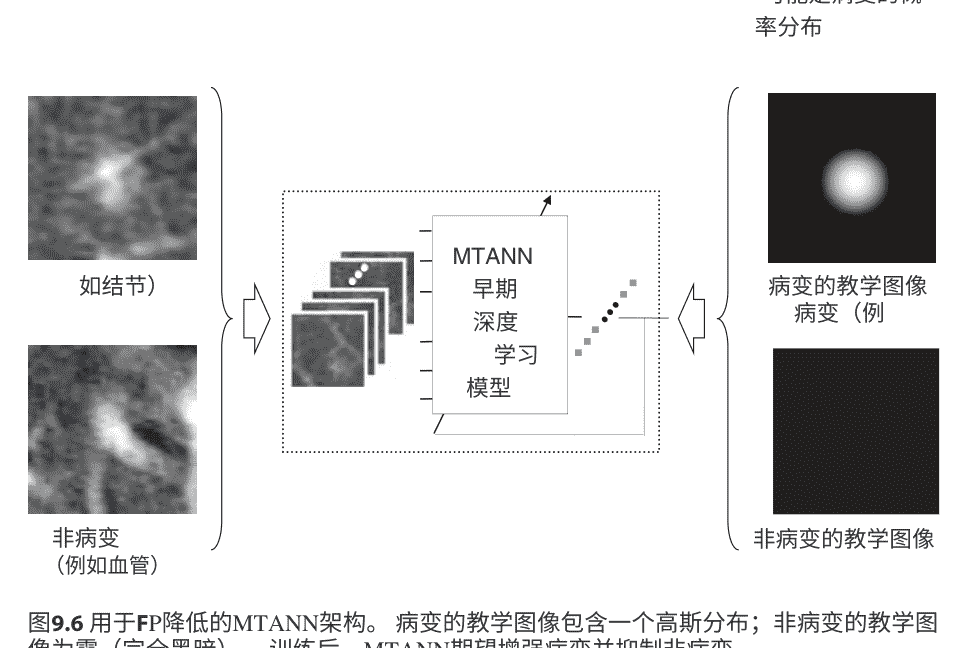

图9.7 用于将经过训练的MTANN的基于像素的输出响应组合成每个ROI的单一评分的评分方法

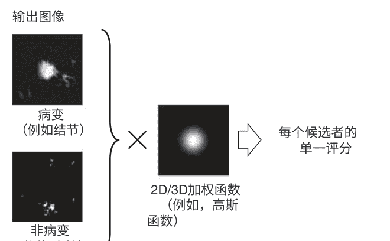

$$f_{W}\left(x,y,z \text{ 或 } t\right)=f_{G}\left(x,y,z \text{ 或 } ;t \ \sigma\right)=\frac{1}{\sqrt{2\pi\sigma}}e^{-\frac{x^2+y^2+z^2 \text{或 } t^2}{2\sigma^2}}$$经过训练的MTANN的响应（输出）作为3D分布。使用3D高斯函数进行评分，因为经过训练的MTANN的输出预计与教学图像中使用的3D高斯分布类似。该评分表示ROI（病变候选者）在中心附近可能包含病变的可能性估计的加权和，即较高的评分表示病变，较低的评分表示非病变。

然后对评分进行阈值处理以区分病变和非病变。

MTANN经过训练以增强肺结节并抑制各种类型的FP（即非结节），如肺血管。图9.8显示了增强各种肺结节（如非实性（玻璃密度）、部分实质性（混合玻璃密度）和实性结节（a））以及抑制各种大小的肺血管（b）的结果。图9.9显示了一个自由响应接收器操作特征（FROC）曲线[141]显示了CADe方案中训练的MTANNs的性能。

| 类别 | 输入图像 | 输出图像 |
| :--- | :--- | :--- |
| 非实性结节 | [图像块1] [图像块2] [图像块3] | [图像块4] [图像块5] [图像块6] |
| 部分实性结节 | [图像块7] [图像块8] [图像块9] | [图像块10] [图像块11] [图像块12] |
| 实性结节 | [图像块13] [图像块14] [图像块15] | [图像块16] [图像块17] [图像块18] |
| 中等血管 | [图像块19] [图像块20] [图像块21] | [图像块22] [图像块23] [图像块24] |
| 周围血管 | [图像块25] [图像块26] [图像块27] | [图像块28] [图像块29] [图像块30] |
| 肺门大血管 | [图像块31] [图像块32] [图像块33] | [图像块34] [图像块35] [图像块36] |
| 带有一些浓度的血管 | [图像块37] [图像块38] [图像块39] | [图像块40] [图像块41] [图像块42] |

图9.8 通过使用MTANNs进行FP减少，增强肺结节并抑制FPs（即肺血管）。一旦肺结节被增强，FPs被抑制，可以通过使用从输出图像中获得的分数来区分FPs和肺结节。

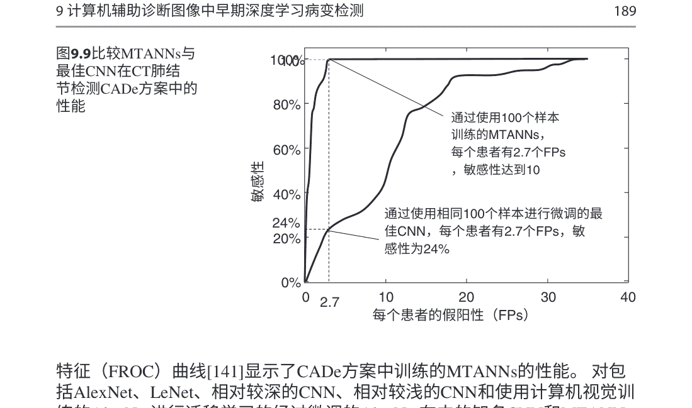

对包括AlexNet、LeNet、相对较深的CNN、相对较浅的CNN和使用计算机视觉训练的AlexNet进行迁移学习的经过微调的AlexNet在内的知名CNN和MTANNs进行了广泛比较[142]。使用相同数据库对CT中的肺结节进行了比较实验。实验结果表明，在相同条件下，MTANNs的性能明显优于最佳CNN模型的性能，如图9.9所示。MTANNs在100%的灵敏度下每个患者产生2.7个FPs，这显著低于最佳CNN模型（经过微调的AlexNet）在相同灵敏度下每个患者产生的22.7个FPs（p<0.05）。图9.10显示了肺部CT图像上CADe输出的示例。CADe方案正确检测到一个肺结节，并产生了一个FP，该FP是肺血管的一个分支。

#### 9.4.3 CXR中肺结节的CADe

胸部X射线检查（CXR）是最常用的胸部疾病成像检查，因为它是最具成本效益、常规可用和剂量有效的诊断检查[143, 144]。由于CXR被广泛使用，改进CXR中肺结节的检测可能对早期发现肺癌产生重大影响。研究表明，然而，30%的CXR中的结节被放射科医生错过，而这些结节在回顾中是可见的。

因此，已经研究了CXR中结节的CADe方案[12, 14]，以帮助放射科医生提高敏感性。已经开发了各种各样的CXR结节检测CADe方案。Giger等人开发了一种差异图像技术，用于减少复杂的解剖背景结构，同时增强类似结节的结构，用于初始结节候选检测[12, 145]。Lo等人使用了一种类似差异图像技术的技术。

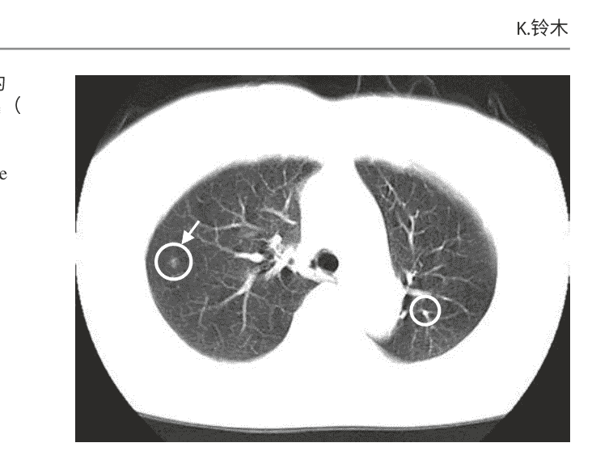

通过基于边缘检测、灰度阈值化和球面轮廓匹配的特征提取技术处理肺结节增强图像，然后进行处理[146, 147]。然后，在分类步骤中使用了卷积神经网络。Penedo等人通过在曲率峰值空间中使用互相关教学图像和输入图像来改进方案的性能[148]。Coppini等人开发了一个基于生物启发式人工神经网络和模糊编码的CADe方案[49]。

Shiraishi等人将基于解剖分类和自动化技术的局部搜索方法纳入到CADe方案中，用于三种类型的ANN参数设置[51]。

研究表明，82-95%的被错过的肺癌在胸部X线检查中部分被覆盖的骨骼（如肋骨和/或锁骨）所遮挡[149, 150]。为了解决这个问题，Suzuki等人[76, 151]开发了一种多分辨率MTANN，用于将胸部X线检查中的骨骼（如肋骨和锁骨）与软组织分离开来。他们采用了多分辨率分解/合成技术[152, 153]将原始高分辨率图像分解为不同分辨率的图像。首先，通过平均下采样从原始高分辨率图像 \(g_H(x,y)\)中获得中分辨率图像 \(g_M(x,y)\)，即将原始图像中的四个像素替换为具有四个像素值的平均值的像素，表示为

$$g_{\mathrm{M}}(x,y) = \frac{1}{4} \sum_{i,j \in R_{22}} g_{\mathrm{H}}(2x-i,2y-j), \quad (9.7)$$

其中 \(R_{22}\)是一个 \(2\times 2\)像素区域。通过像素替换进行上采样，即将中分辨率图像中的一个像素替换为具有相同像素值的四个像素，得到了中分辨率图像

$$g_{\mathrm{M}}^{\mathrm{U}}(x,y) = g_{\mathrm{M}}(x/2,y/2). \quad (9.8)$$

然后，通过从高分辨率图像中减去放大后的中分辨率图像，得到高分辨率差异图像 \(g_{H}(x,y)\)。

$$d_{\text{H}}(x, y) = g_{\text{H}}(x, y) - g_{\text{M}}^{\text{U}}(x, y) \quad (9.9)$$

这些步骤会重复进行，产生进一步的低分辨率图像。因此，通过多分辨率分解技术获得具有不同频率的多分辨率图像。

这种技术的一个重要特性是，通过执行逆过程，即多分辨率组合技术，可以从多分辨率图像、$d_{\text{H}}(x,y)$和 $g_{\text{M}}(x,y)$中获得完全相同的原始分辨率图像 $g_{\text{H}}(x,y)$：

$$g_{\text{H}}(x, y) = g_{\text{M}}(x/2, y/2) + d_{\text{H}}(x, y) \quad (9.10)$$

因此，我们可以独立处理多分辨率图像，而不是直接处理原始高分辨率图像；也就是说，通过这些技术，可以通过组合处理后的多分辨率图像获得处理后的原始高分辨率图像。在每个分辨率图像中，多个MTANN只需要支持有限的空间频率范围，而不是整个原始图像中的所有空间频率。

首先，将输入的胸部X射线图像和相应的教学骨图像分解为不同分辨率的图像集，然后使用这些图像集来训练多分辨率MTANN中的三个MTANN。每个MTANN都是某个分辨率的专家，即低分辨率MTANN负责肋骨的低频成分，中等分辨率MTANN负责中等频率成分，高分辨率MTANN负责高频成分。每个分辨率MTANN都独立训练，使用相应的分辨率图像。

训练后，MTANN生成不同分辨率的图像，然后使用多分辨率合成技术将这些图像组合在一起，提供完整的高分辨率图像。预期完整的高分辨率图像与教学骨图像相似；因此，多分辨率MTANN将提供一种将肋骨和锁骨与软组织分离的“骨图像样”图像。Chen和Suzuki [111,112]通过解剖学特异性的多个MTANN改进了MTANN“虚拟”双能量胸部X线摄影的性能。Zarshenas和Suzuki通过融合小波变换改进了MTANN [154]。图9.11显示了使用MTANNs [111]从胸部X线摄影中抑制骨骼对软组织的影响。

Suzuki等人在CXR结节CADe方案中基于MTANNs开发了一种FP减少技术。他们去除了特征基准机器学习未能去除的68%的FPs，CADe方案的性能从每幅图像的4.5个FPs大幅提高到1.4个FPs，同时保持原始敏感性为81.3%。

陈和铃木基于特征的支持向量机（SVM）开发了一种基于胸部X线片的肺结节CADe方案[155]。他们通过使用MTANN虚拟双能成像[110]改善了性能。他们将性能从每张图像5个假阳性的79%的原始灵敏度大幅提高到了85%的灵敏度，假阳性率保持不变。图9.12展示了他们的CADe方案在有无MTANN虚拟双能成像[110]的情况下的计算机输出。

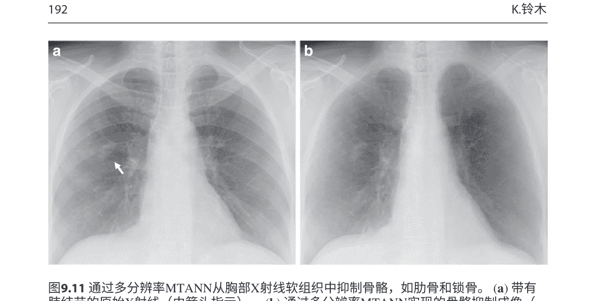

图9.11 通过多分辨率MTANN从胸部X射线软组织中抑制骨骼，如肋骨和锁骨。(a) 带有肺结节的原始X射线（由箭头指示）。(b) 通过多分辨率MTANN实现的骨骼抑制成像（或‘虚拟’双能量放射成像）结果

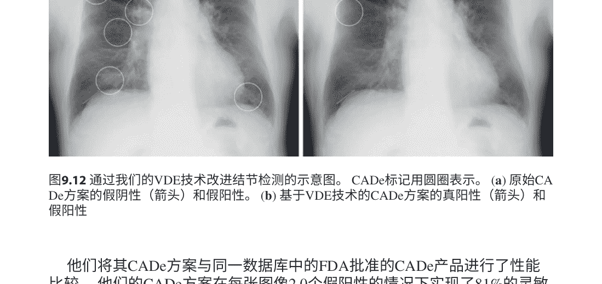

图9.12 通过我们的VDE技术改进结节检测的示意图。CADe标记用圆圈表示。(a) 原始CADe方案的假阴性（箭头）和假阳性。(b) 基于VDE技术的CADe方案的真阳性（箭头）和假阳性

他们将其CADe方案与同一数据库中的FDA批准的CADe产品进行了性能比较。他们的CADe方案在每张图像2.0个假阳性的情况下实现了81%的灵敏度，而FDA批准的产品在相同的假阳性率下实现了明显较差的性能，灵敏度为67%。他们还使用相同的公开可用的JSRT数据库将其CADe方案与文献中的其他CADe方案进行了性能比较[156]。魏等人报道称，他们的CAD方案在每张图像5.4个假阳性的情况下实现了80%的灵敏度。Hardie等人报道称，他们的方案在每张图像5个假阳性的情况下标记了80%的结节。

陈和铃木的CADe方案的性能明显优于Hardie的CADe方案，即在每张图像的FP率为2.0时，其灵敏度达到78%，而Hardie的CADe方案的灵敏度为63%。

### 9.5 结肠成像中的CADe

#### 9.5.1 结肠成像用于结直肠癌检测

结直肠癌是美国癌症死亡的第二大原因[157]。证据表明，早期发现和切除息肉（即结直肠癌的前体）可以减少结直肠癌的发病率[158, 159]。因此，美国癌症协会（ACS）建议，一个平均风险患者在50岁开始，应进行结直肠癌筛查，包括光学结肠镜检查和CTC。CTC（或虚拟结肠镜检查）是一种通过使用结肠的CT扫描来检测结直肠肿瘤的技术[160]。然而，CTC在检测息肉方面的诊断性能因放射科医师的经验、医院和协议而异[161]。因此，已经进行了息肉的CADe研究以解决CTC中的这个问题[162–164]。

#### 9.5.2 CT结肠镜CADe概述

CADe有潜力（a）提高放射科医生对息肉的敏感性，（b）减少读者之间的差异性，以及（c）在初步阅读时减少放射科医生的阅读时间[163, 164]。许多研究者已经开发了用于CT结肠镜中息肉检测的CADe方案[62, 165–170]。

图9.13显示了CT结肠镜中用于检测息肉的CADe输出的示例。CADe方案正确检测到了息肉。2000年，Summers等人[21]基于曲率分析开发了一种用于CT结肠镜中息肉检测的CADe方案。2001年，Yoshida和Nappi [62]基于曲率分析开发了一种称为形状指数的CADe方案。2001年，Gokturk等人[171]使用直方图输入的SVM作为形状签名进行分类。Näppi和Yoshida [172]基于LDA或QDA开发了一种基于54个体积特征（6个特征的9个统计量）的CADe方案。Acar等人[173]使用边缘位移场和QDA进行分类。Jerebko等人[60]在他们的CADe方案中使用多层感知器对息肉候选进行分类，并通过引入多层感知器委员会[174]和SVM委员会[175]来提高性能。Wang等人[176]基于LDA开发了一种基于息肉的内部特征（几何、形态和纹理）的分类方法。铃木等人[23]通过扩展2D MTANN [17]的结构来处理CTC中的3D体积数据，开发了一个3D MTANN。他们的CADe方案基于贝叶斯ANN和纹理、几何特征，

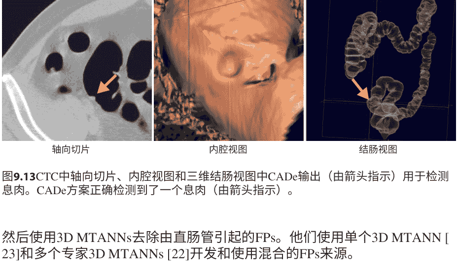

图9.13 CTC中轴向切片、内腔视图和三维结肠视图中CADe输出（由箭头指示）用于检测息肉。CADe方案正确检测到了一个息肉（由箭头指示）。

然后使用3D MTANNs去除由直肠管引起的FPs。他们使用单个3D MTANN[23]和多个专家3D MTANNs[22]开发和使用混合的FPs来源。

李等人[177]基于SVM分类器和基于小波的特征开发了一种分类方法。王等人[61]通过使用非线性降维（即扩散映射和局部线性嵌入）改进了SVM的性能。姚等人[178]使用地形高度图计算SVM分类器的特征。

铃木等人[106]测试了基于贝叶斯ANN和MTANNs的CADe方案。他们在多中心临床试验[180]中使用了24名患者的CTC数据，包括23个息肉（6-25mm）和一个肿块（35mm），这些病灶被放射科医生[179]“漏诊”。在分类部分的留一病灶外交叉验证测试中，他们实现了96.4%（100%）的病灶（按患者计）敏感性，每个患者1.1个FPs。铃木等人[107, 181]还通过引入基于主成分分析和拉普拉斯特征映射的降维技术提高了MTANN方法的效率。徐和铃木[108]表明，在MTANN框架中，可以使用支持向量机和非线性高斯过程回归模型等其他非线性回归模型作为核心模型。

Zhou等人[182]为SVM分类器开发了投影特征。Wang等人[183]通过在多核学习中添加统计曲率特征来改善CAD方案的性能。他们在分类部分的留一法交叉验证测试中获得了83%的灵敏度和每个患者5个假阳性。

因此，在CTC的CADe方案中提出了各种ML方法，包括LDA、QDA、SVM、ANN和贝叶斯ANN。现有的CADe方案往往会错过表面隆起的肿瘤（通常称为扁平病变）[28, 184]。铃木等人开发了一种用于检测表面隆起肿瘤的CADe方案[185]。检测表面隆起肿瘤非常重要，因为它们在CTC中常被放射科医生以及内镜检查中的胃肠科医生忽视，而这些肿瘤在组织学上具有侵袭性。

### 9.6 总结

本章描述了在胸部X射线和胸部CT中用于肺结节检测以及在CTC中用于息肉检测的ML技术和早期深度学习模型。在引入深度学习之前，基于特征的（基于分割对象的）ML（分类器）在CADe方案的某个步骤中占主导地位。深度学习是一种端到端的ML范式，跳过了CADe方案中的多个步骤。在CAD和医学影像领域，早期的深度学习模型被称为神经滤波器、神经边缘增强器和MTANNs，用于医学影像中的检测、分类和图像处理任务。MTANNs具有小样本训练、高性能、稳定训练和高效训练和计算等优势，优于其他深度学习模型。

致谢：在这项工作中，没有无数人的帮助和支持是不可能的。作者对芝加哥大学放射学系、伊利诺伊理工学院医学成像研究中心的铃木实验室的所有成员，包括博士后研究员、计算机科学家、访问学者/教授、医学生、研究生/本科生、研究技术员、研究志愿者和支持人员，对他们在研究中提供的宝贵帮助表示感谢，对同事和合作伙伴的宝贵建议表示感谢。在芝加哥大学开发的CAD技术、MTANNs技术、骨分离技术及其源代码已经授权给包括R2 Technology（Hologic）、Riverain Medical（Riverain Technologies）、Median Technologies和AlgoMedica在内的公司。

## 参考文献

1.  Doi K. 医学成像中计算机辅助诊断的现状和未来潜力。Br J Radiol. 2005;78(Spec No 1): S3–19.
2.  Doi K. 医学影像中的计算机辅助诊断：历史回顾、现状和未来潜力。计算机医学成像图形学。2007年；31：198-211。
3.  Giger ML, Chan HP, Boone J。周年论文：CAD和定量图像分析的历史和现状：医学物理学和AAPM的作用。医学物理学。2008年；35：5799-820。
4.  Giger ML, Suzuki K。计算机辅助诊断（CAD）。在：Feng DD，编辑。生物医学信息技术。圣地亚哥：学术出版社；2007年。第359-74页。
5.  Chan HP, Sahiner B, Helvie MA, Petrick N, Roubidoux MA, Wilson TE, Adler DD, Paramagul C, Newman JS, Sanjay-Gopal S。通过使用计算机辅助诊断改善放射科医生对乳腺X线摄影肿块的表征：一项ROC研究。放射学。1999年；212：817-27。
6.  Dachman AH, Obuchowski NA, Hoffmeister JW, Hinshaw JL, Frew MI, Winter TC, VanUitert RL, Periaswamy S, Summers RM, Hillman BJ。计算机辅助检测对多读者、多病例试验中的CT结肠镜检查的影响。放射学。2010年；256：827-35。https://doi.org/10.1148/radiol.10091890。
7.  Dean JC, Ilvento CC。使用计算机辅助检测进行诊断和筛查乳腺摄影术的癌症检测改善：104例癌症的前瞻性研究。AJR Am J Roentgenol. 2006年；187：20-8。
8.  Li F, Aoyama M, Shiraishi J, Abe H, Li Q, Suzuki K, Engelmann R, Sone S, Macmahon H, Doi K。放射科医师在高分辨率CT上区分良性和恶性肺结节的表现，使用计算机估计的恶性可能性。AJR Am J Roentgenol. 2004年；183：1209-15。
9.  Li F, Arimura H, Suzuki K, Shiraishi J, Li Q, Abe H, Engelmann R, Sone S, MacMahon H, Doi K. CT中被忽略的周围肺癌的计算机辅助检测：有无定位的ROC分析。放射学。2005年；237：684-90。
10. Petrick N, Haider M, Summers RM, Yeshwant SC, Brown L, Iuliano EM, Louie A, Choi JR, Pickhardt PJ. CT结肠造影与计算机辅助检测作为第二读者：观察者表现研究。放射学。2008年；246：148-56。
11. Suzuki K, Hori M, McFarland E, Friedman AC, Rockey DC, Dachman AH. CAD能帮助放射科医生在CT结肠造影中检测困难息肉的表现吗？ 在：RSNA年会论文集，芝加哥；2009年。第872页。
12. Giger ML, Doi K, MacMahon H. 数字放射学中的图像特征分析和计算机辅助诊断。3. 自动检测外周肺部结节。Med Phys。1988;15:158–66。
13. Suzuki K, Shiraishi J, Abe H, MacMahon H, Doi K. 通过大规模训练人工神经网络在胸部X射线照片中检测结节的计算机辅助诊断方案中的假阳性减少。Acad Radiol。2005;12:191–201。
14. van Ginneken B, ter Haar Romeny BM, Viergever MA. 胸部X射线照片中的计算机辅助诊断：一项调查。IEEE Trans Med Imaging。2001;20:1228–41。
15. Arimura H, Katsuragawa S, Suzuki K, Li F, Shiraishi J, Sone S, Doi K. 用于肺癌筛查的低剂量计算机断层扫描图像中肺结节的自动检测计算机方案。Acad Radiol。2004;11:617–29。
16. Armato SG 3rd, Li F, Giger ML, MacMahon H, Sone S, Doi K. 肺癌：自动肺结节检测在CT筛查项目中的应用性能。放射学。2002年;225:685–92。
17. Suzuki K, Armato SG, Li F, Sone S, Doi K. 用于低剂量CT中肺结节计算机检测的假阳性减少的大规模训练人工神经网络（MTANN）。医学物理学。2003年;30:1602–17。
18. Chan HP, Doi K, Galhotra S, Vyborny CJ, MacMahon H, Jokich PM. 数字放射学中的图像特征分析和计算机辅助诊断。I. 乳腺X线摄影中微钙化的自动检测。医学物理学。1987年;14:538–48。
19. Gilhuijs KG, Giger ML, Bick U. 三维动态磁共振成像中乳腺病变的计算机分析。医学物理学。1998年;25:1647–54。
20. Drukker K, Giger ML, Metz CE. 计算机辅助乳腺超声成像中病变检测和分类方案的稳健性研究。放射学。2005;237:834–40。
21. Summers RM, Beaulieu CF, Pusanik LM, Malley JD, Jeffrey RB Jr, Glazer DI, Napel S. CT结肠造影自动息肉检测器的可行性研究。放射学。2000;216:284–90。
22. Suzuki K, Yoshida H, Nappi J, Armato SG 3rd, Dachman AH. 用于CT结肠造影中息肉检测的多种假阳性减少的专家混合3D大规模训练人工神经网络。医学物理学。2008;35:694–703。
23. Suzuki K, Yoshida H, Nappi J, Dachman AH. 用于计算机辅助息肉检测中减少假阳性的大规模训练人工神经网络（MTANN）：抑制直肠管。医学物理学。2006;33:3814–24。
24. 铃木K. 基于像素的医学影像机器学习（PML）。Int J Biomed Imaging. 2012;2012:792079, 18页。
25. 铃木K. 胸部和结肠影像的计算机辅助诊断综述。QuantImaging Med Surg. 2012;2:163–76。 https://doi.org/10.3978/j.issn.2223-4292.2012.09.02.
26. 铃木K. CT扫描中胸部和结肠的计算机辅助诊断中的机器学习综述。IEICE Trans Inf Syst. 2013;E96-D:772–83。
27. 李F, 宋S, 阿贝H, 麦克马洪H, 阿玛托SG 3rd, 土井K. 低剂量螺旋CT筛查中错过的肺癌在一般人群中的比较：临床、组织病理学和影像学结果的比较。放射学。2002;225:673–83。
28. Lostumbo A, Wanamaker C, Tsai J, Suzuki K, Dachman AH. CT结肠造影中二维和三维视图对扁平病变评估的比较。Acad Radiol. 2010;17:39–47. https://doi.org/10.1016/j.acra.2009.07.004. pii: S1076-6332(09)00400-0.

29. Soetikno RM, Kaltenbach T, Rouse RV, Park W, Maheshwari A, Sato T, Matsui S, Friedland DS. 无症状和有症状成年人非息肉样（扁平和凹陷）结直肠肿瘤的患病率。 JAMA. 2008;299:1027–35.

30. Shen D, Wu G, Zhang D, Suzuki K, Wang F, Yan P. 医学影像中的机器学习。 Comput Med Imaging Graph. 2015;41:1–2. https://doi.org/10.1016/j.compmedimag.2015.02.001.

31. Suzuki K, Zhou L, Wang Q. 医学影像中的机器学习。 Pattern Recognit. 2017;63:465–7. https://doi.org/10.1016/j.patcog.2016.10.020.

32. Yan P, Suzuki K, Wang F, Shen D. 医学影像中的机器学习。 Mach Vis Appl. 2013;24:1327–9. https://doi.org/10.1007/s00138-013-0543-8.

33. Shen D, Wu G, Zhang D, Yan P, Suzuki K, Wang F. 医学影像中的机器学习。 Comput Med Imaging Graph. 2014;41:1–2.

34. Suzuki K. 医学影像的机器学习。算法; 2010年。

35. Suzuki K. 医学影像的机器学习2012年。算法; 2012年。

36. Suzuki K, Yan P, Wang F, Shen D. 医学影像中的机器学习。 Int J Biomed Imaging. 2012;2012:123727. https://doi.org/10.1155/2012/123727.

37. Yan P, Suzuki K, Wang F, Shen D. 医学影像中的机器学习。 Mach Vis Appl. 2012;24:1327.

38. Suzuki K, Wang F, Shen D, Yan P. 医学影像中的机器学习（MLMI）。计算机科学讲义，第7009卷。柏林：Springer; 2011年。第355页。

39. Wang F, Shen D, Yan P, Suzuki K. 医学影像中的机器学习（MLMI）。计算机科学讲义，第7588卷。柏林：Springer; 2012年。第276页。

40. Wang F, Yan P, Suzuki K, Shen D. 医学影像中的机器学习（MLMI）。计算机科学讲义，第6357卷。柏林：Springer; 2010年。第192页。

41. Wu G, Zhang D, Shen D, Yan P, Suzuki K, Wang F. 医学影像中的机器学习（MLMI）。计算机科学讲义，第8184卷。柏林：Springer; 2013年。第262页。

42. Duda RO, Hart PE, Stork DG. 模式识别。第2版。霍博肯：Wiley Interscience; 2001年。

43. Fukunaga K. 统计模式识别导论。第2版。圣地亚哥：学术出版社; 1990年。

44. Rumelhart DE, Hinton GE, Williams RJ. 通过误差传播学习内部表示。并行分布式处理。1986年；1：318–62。

45. Rumelhart DE, Hinton GE, Williams RJ. 通过反向传播学习表示。自然。1986年；32 3：533–6。

46. Vapnik VN. 统计学习理论的本质。柏林：斯普林格; 1995年。

47. Vapnik VN. 统计学习理论。纽约：Wiley; 1998年。

48. Chen S, Suzuki K, MacMahon H. 通过支持向量分类的两阶段结节增强在胸部X射线片中的计算机辅助诊断方案。医学物理学。2011年；38：1844–58。

49. Coppini G, Diciotti S, Falchini M, Villari N, Valli G. 神经网络用于计算机辅助诊断：在胸部放射图中检测肺结节。IEEE Trans Inf Technol Biomed. 2003;7:344–57.

50. Hardie RC, Rogers SK, Wilson T, Rogers A. 用于在胸部X射线片上识别肺结节的新型计算机辅助检测系统的性能分析。Med Image Anal. 2008;12:240–58. https://doi.org/10.1016/j.media.2007.10.004.

51. Shiraishi J, Li Q, Suzuki K, Engelmann R, Doi K. 用于在胸部X射线片上检测肺结节的计算机辅助诊断方案：基于解剖分类的局部搜索方法。Med Phys. 2006;33:2642–53.

52. Armato SG 3rd, Giger ML, MacMahon H. 在CT扫描中自动检测肺结节：初步结果。医学物理学。2001;28:1552–61.

53. Way TW, Sahiner B, Chan HP, Hadjiiski L, Cascade PN, Chughtai A, Bogot N, Kazerooni E. 在CT扫描中的肺结节计算机辅助诊断：通过结节表面特征提高分类性能。医学物理学。2009;36:3086–98.

54. Ye X, Lin X, Dehmeshki J, Slabaugh G, Beddoe G. 基于形状的胸部CT图像肺结节计算机辅助检测。IEEE生物医学工程学报。2009;56:1810–20. https://doi.org/10.1109/TBME.2009.2017027.

55. El-Naqa I, Yang Y, Wernick MN, Galatsanos NP, Nishikawa RM. 一种支持向量机方法用于微钙化的检测。IEEE Trans Med Imaging. 2002;21:1552–63.

56. Ge J, Sahiner B, Hadjiiski LM, Chan HP, Wei J, Helvie MA, Zhou C. 全数字乳腺X线照片上微钙化簇的计算机辅助检测。Med Phys. 2006;33:2975–88.

57. Wu Y, Doi K, Giger ML, Nishikawa RM. 数字乳腺X线照片中聚集微钙化的计算机检测：人工神经网络的应用。Med Phys. 1992;19:555–60.

58. Yu SN, Li KY, Huang YK. 使用小波滤波器和马尔可夫随机场模型检测数字乳腺X线照片中的微钙化。Comput Med Imaging Graph. 2006;30:163–73.

59. Wu YT, Wei J, Hadjiiski LM, Sahiner B, Zhou C, Ge J, Shi J, Zhang Y, Chan HP. 基于双侧分析的假阳性减少用于计算机辅助乳腺肿块检测。Med Phys. 2007;34:3334–44.

60. Jerebko AK, Summers RM, Malley JD, Franaszek M, Johnson CD. 使用神经网络和二分类树的CT结肠镜辅助结肠息肉检测。Med Phys. 2003;30:52–60.

61. Wang S, Yao J, Summers RM. 通过非线性降维改进的CT结肠镜计算机辅助息肉检测分类器。Med Phys. 2008;35:1377–86.

62. Yoshida H, Nappi J. 用于结肠息肉检测的三维计算机辅助诊断方案。IEEE Trans Med Imaging. 2001;20:1261–74.

63. Muramatsu C, Li Q, Schmidt R, Suzuki K, Shiraishi J, Newstead G, Doi K. 对乳房X光照片上聚集的微钙化对的主观相似性进行实验确定：观察者研究结果。医学物理学。2006;33:3460–8.

64. Muramatsu C, Li Q, Schmidt RA, Shiraishi J, Suzuki K, Newstead GM, Doi K. 对乳房X光照片上的肿块对和聚集的微钙化对的主观相似性进行确定：相似性排名分数和绝对相似性评分的比较。医学物理学。2007;34:2890–5.

65. Muramatsu C, Li Q, Suzuki K, Schmidt RA, Shiraishi J, Newstead GM, Doi K. 对乳房X光照片上类似图像的心理物理测量的研究：初步结果。医学物理学。2005;32:2295–304.

66. Arimura H, Li Q, Korogi Y, Hirai T, Katsuragawa S, Yamashita Y, Tsuchiya K, Doi K. 三维MR血管造影中颅内动脉瘤的计算机检测：基于形状差异图像技术的小突起特征提取。医学物理学。2006;33:394–401.

67. LeCun Y, Bengio Y, Hinton G. 深度学习。自然。2015;521:436–44. https://doi.org/10.1038/nature14539.

68. Suzuki K. 医学影像中深度学习的概述。放射学物理技术。2017;10:257–73. https://doi.org/10.1007/s12194-017-0406-5.

69. Suzuki K. 深度学习在医学图像分析中的应用调查。医学影像技术。2017;35:212–26.

70. Lawrence S, Giles CL, Tsoi AC, Back AD. 面部识别：一种卷积神经网络方法。IEEE Trans Neural Netw. 1997;8:98–113.

71. Krizhevsky A, Sutskever I, Hinton GE. 使用深度卷积神经网络的Imagenet分类。Adv Neural Inf Process Syst. 2012;25:1097–105.

72. Suzuki K, Doi K. 用于检测医学图像异常的大规模训练人工神经网络（MTANN）。美国专利; 2002.

73. Suzuki K, Armato SG 3rd, Li F, Sone S, Doi K. 用于低剂量计算机断层扫描中肺结节计算机辅助检测的大规模训练人工神经网络（MTANN）以减少误报。Med Phys. 2003;30:1602–17.

74. Suzuki K. 在计算机辅助诊断（CAD）中使用大规模训练人工神经网络（MTANN）的监督性“病变增强”滤波器。Phys Med Biol. 2009;54:S31–45. https://doi.org/10.1088/0031-9155/54/18/S03.

75. Suzuki K, Abe H, Li F, Doi K. 通过大规模训练人工神经网络抑制胸部X射线片中肋骨的对比度。在SPIE医学成像会议记录中（SPIE MI），圣地亚哥；2004年，第1109-9页。

76. Suzuki K, Abe H, MacMahon H, Doi K. 通过大规模训练人工神经网络（MTANN）抑制胸部X射线片中肋骨的图像处理技术。IEEE Trans Med Imaging. 2006;25:406–16. https://doi.org/10.1109/TMI.2006.871549.

77. Suzuki K, Liu Y, Higaki T, Fujima N, Arimura K. 使用基于像素的机器学习将超低剂量转换为更高剂量的CT图像：幻影和初步患者研究。在北美放射学会（RSNA）科学大会和年会的程序中，SST14-06，芝加哥，第SST14-06卷；2013年。

78. He L, Chao YKS, Yu Q, Tang W, Shi Z. 一个用于标记连通分量和孔洞的算法。美国工程技术研究杂志。2011;11:2149–54.

79. He L, Chao Y, Suzuki K. 一种基于运行的两次扫描标记算法。IEEE图像处理期刊。2008;17:749–56. https://doi.org/10.1109/TIP.2008.919369.

80. He L, Chao Y, Suzuki K. 两种基于标签等价的连接组件标记算法用于3D二值图像。IEEE图像处理期刊。2011;20:2122–34. https://doi.org/10.1109/TIP.2011.2114352.

81. He L, Chao Y, Suzuki K. 一种新的第一次扫描方法用于两次扫描标记算法。在：肺癌计算机辅助诊断系统，卷E95-D; 2012年。第2142–5页。

82. He L, Chao Y, Suzuki K. 基于配置转换的连通组件标记。IEEE图像处理交易。2014;23:943–51. https://doi.org/10.1109/TIP.2013.2289968.

83. He L, Chao Y, Suzuki K, Nakamura T. 一种基于栅格扫描的标记算法的新的首次扫描策略。日本信息处理学会学报。2011;52:1813–9.

84. He L, Chao Y, Suzuki K, Wu K. 快速连通组件标记。模式识别。2009;42:1977–87.

85. He L, Chao Y, Yang Y, Li S, Zhao X, Suzuki K. 一种新的两次扫描连通组件标记算法。IAENG工程技术交易。2013:445–59.

86. Suzuki K, Horiba I, Sugie N. 基于顺序局部操作的线性时间连通组件标记。计算机视觉与图像理解。2003;89:1–23.

87. Suzuki K. 确定神经滤波器的感受野。J Neural Eng. 2004;1:228–37. https://doi.org/10.1088/1741-2560/1/4/006.

88. Suzuki K, Horiba I, Sugie N. 一个简单的神经网络修剪算法及其在滤波器合成中的应用。Neural Process Lett. 2001;13:43–53.

89. Xu J-W, Suzuki K. 在CT结肠造影中的息肉计算机辅助检测中的最大AUC特征选择。IEEE J Biomed Health Inform. 2014;18:585–93. https://doi.org/10.1109/JBHI.2013.2278023.

90. Bishop CM. 用于模式识别的神经网络。纽约：牛津大学出版社；1995.

91. Lin JS, Lo SB, Hasegawa A, Freedman MT, Mun SK. 使用两级神经分类减少肺结节检测中的假阳性。IEEE Trans Med Imaging. 1996;15:206–17. https://doi.org/10.1109/42.491422.

92. Lo SB, Lou SA, Lin JS, Freedman MT, Chien MV, Mun SK. 用于肺结节检测的人工卷积神经网络技术和应用。IEEE Trans Med Imaging. 1995;14:711–8. https://doi.org/10.1109/42.476112.

93. Lo SC, Li H, Wang Y, Kinnard L, Freedman MT. 用于乳腺肿块检测的多圆路径卷积神经网络系统。IEEE Trans Med Imaging. 2002;21:150–8. https://doi.org/10.1109/42.993133.

94. Lo SCB, Chan HP, Lin JS, Li H, Freedman MT, Mun SK. 用于医学图像模式识别的人工卷积神经网络。神经网络。1995;8:1201–14.

95. Neubauer C. 评估用于视觉识别的卷积神经网络。IEEE Trans Neural Netw. 1998;9:685–96.

Sahiner B, Chan HP, Petrick N, Wei D, Helvie MA, Adler DD, Goodsitt MM. 乳房组织的分类：具有空间域和纹理图像的卷积神经网络分类器。IEEE Trans Med Imaging. 1996;15:598–610. https://doi.org/10.1109/42.538937.

Wei D, Nishikawa RM, Doi K. 纹理分析和平移不变人工神经网络在微钙化簇检测中的应用。放射学。1996;201:696.

Zhang W, Doi K, Giger ML, Nishikawa RM, Schmidt RA. 一种改进的平移不变人工神经网络用于计算机检测数字乳房X线照片中的聚集微钙化。医学物理学。1996;23:595–601.

Zhang W, Doi K, Giger ML, Wu Y, Nishikawa RM, Schmidt RA. 使用平移不变人工神经网络在数字乳房X线照片中检测聚集微钙化。医学物理学。1994;21:517–24.

Suzuki K, Horiba I, Sugie N. 用于去除图像中量子噪声的神经滤波器的高效近似。IEEE信号处理杂志。2002;50:1787–99.

Suzuki K, Horiba I, Sugie N, Nanki M. 具有输入特征选择的神经滤波器及其在医学图像序列质量改善中的应用。IEICE信息系统交易。2002;E85-D:1710–8.

Suzuki K, Horiba I, Sugie N. 用于从噪声图像中进行监督边缘增强的神经边缘增强器。IEEE模式分析与机器智能交易。2003;25:1582–96.

Suzuki K, Horiba I, Sugie N, Nanki M. 通过神经边缘检测器从左心室造影图中提取左心室轮廓。IEEE医学成像交易。2004;23:330–9.

Oda S, Awai K, Suzuki K, Yanaga Y, Funama Y, MacMahon H, Yamashita Y. 放射科医师在胸部X射线片上检测小肺结节的表现：大规模训练人工神经网络对肋骨抑制的影响。AJR Am J Roentgenol. 2009;193:W397–402. https://doi.org/10.2214/AJR.09.2431.

Suzuki K, Li F, Sone S, Doi K. 利用大规模训练人工神经网络在胸部低剂量CT中区分良性和恶性结节的计算机辅助诊断方案。IEEE Trans Med Imaging. 2005;24:1138–50.

Suzuki K, Rockey DC, Dachman AH. CT结肠造影：利用MTANNs进行“漏诊”息肉检测的先进计算机辅助检测方案在多中心临床试验中的应用。Med Phys. 2010;37:12–21.

Suzuki K, Zhang J, Xu J. 大规模训练人工神经网络与基于拉普拉斯特征的降维相结合，用于计算机辅助检测CT结肠镜中的息肉。IEEE Trans Med Imaging. 2010;29:1907–17. https://doi.org/10.1109/TMI.2010.2053213.

Xu J, Suzuki K. 大规模训练支持向量回归和高斯过程，用于计算机辅助检测CT结肠镜中的假阳性减少。Med Phys. 2011;38:1888–902.

Long J, Shelhamer E, Darrell T. 用于语义分割的全卷积网络。在：计算机视觉和模式识别IEEE会议论文集; 2015. p. 3431–40.

Chen S, Suzuki K. 通过“虚拟双能量”放射学检测计算机化检测肺结节。IEEE Trans Biomed Eng. 2013;60:369–78. https://doi.org/10.1109/TBME.2012.2226583.

Chen S, Suzuki K. 通过解剖特异性多重大规模训练人工神经网络与总变差最小化平滑分离胸部X射线中的骨骼。IEEE Trans Med Imaging. 2014;33:246–57. https://doi.org/10.1109/TMI.2013.2284016.

Chen S, Zhong S, Yao L, Shang Y, Suzuki K. 通过骨抑制和一致处理增强重症监护病房中获得的胸部X射线。Phys Med Biol. 2016;61:2283–301. https://doi.org/10.1088/0031-9155/61/6/283.

Ronneberger O, Fischer P, Brox T. U-net：用于生物医学图像分割的卷积网络。在：MICCAI国际医学图像计算与计算辅助干预会议。纽约：斯普林格；2015年。第234-41页。

114. Henschke CI, McCauley DI, Yankelevitz DF, Naidich DP, McGuinness G, Miettinen OS, Libby DM, Pasmantier MW, Koizumi J, Altorki NK, Smith JP. Early Lung Cancer Action Project: overall design and findings from baseline screening. The Lancet. 1999; 354: 99-105.

115. Kaneko M, Eguchi K, Ohmatsu H, Kakinuma R, Naruke T, Suemasu K, Moriyama N. Peripheral lung cancer: screening and detection with low-dose spiral CT versus radiology. Radiology. 1996; 201: 798-802.

116. Miettinen OS, Henschke CI. CT screening for lung cancer: addressing the nihilist’s objection. Radiology. 2001; 221: 592-6.

117. Sone S, Takashima S, Li F, Yang Z, Honda T, Maruyama Y, Hasegawa M, Yamanda T, Kubo K, Hanamura K, Asakura K. Mass screening for lung cancer with mobile spiral computerized tomography scanner. The Lancet. 1998; 351: 1242-5.

118. Henschke CI, Yankelevitz DF, Naidich DP, McCauley DI, McGuinness G, Libby DM, Smith JP, Pasmantier MW, Miettinen OS. CT screening for lung cancer: suspiciousness of nodules based on nodule size on baseline scans. Radiology. 2004; 231: 164–8.

119. Swensen SJ, Jett JR, Hartman TE, Midthun DE, Sloan JA, Sykes AM, Aughenbaugh GL, Clemens MA. CT lung cancer screening: the Mayo Clinic experience. Radiology. 2003; 226: 756–61.

120. Heelan RT, Flehinger BJ, Melamed MR, Zaman MB, Perchick WB, Caravelli JF, Martini N. Non-small-cell lung cancer: results of the New York screening program. Radiology. 1984; 151: 289–93.

121. Gurney JW. Missed lung cancer at CT: imaging findings in nine patients. Radiology. 1996; 199: 117–22.

122. Giger ML, Bae KT, MacMahon H. Computerized detection of pulmonary nodules in computed tomography images. Invest Radiol. 1994; 29: 459-65.

123. Armato SG 3rd, Giger ML, Moran CJ, Blackburn JT, Doi K, MacMahon H. Computerized detection of pulmonary nodules in CT scans. Radiographics. 1999; 19: 1303-11.

124. Gurcan MN, Sahiner B, Petrick N, Chan HP, Kazerooni EA, Cascade PN, Hadjiiski L. Lung nodule detection on thoracic computed tomography images: preliminary evaluation of a computer-aided diagnosis system. Med Phys. 2002; 29: 2552–8.

125. Li Y, Harada T, Hotta F, Ito S, Ishigaki T. Automatic detection of pulmonary nodules in spiral CT images based on an improved template-matching technique. IEEE Trans Med Imaging. 2001; 20: 595-604.

126. Chan HP, Sahiner B, Wagner RF, Petrick N. Classifier design for computer-aided diagnosis: effects of finite sample size on the mean performance of classical and neural network classifiers. Med Phys. 1999; 26: 2654-68.

127. Sahiner B, Chan HP, Hadjiiski L. Classifier performance prediction for computer-aided diagnosis using a limited data set. Med Phys. 2008; 35: 1559-70.

128. Suzuki K, Doi K. How can a massive training artificial neural network (MTANN) be trained with a small number of cases to distinguish nodules from vessels in chest CT? Acad Radiol. 2005; 12: 1333-41.

129. Farag AA, El-Baz A, Gimelfarb G, El-Ghar MA, Eldiasty T. Quantitative nodule detection in low-dose chest CT scans: new template modeling and evaluation for CAD system design. Med Image Comput Comput Assist Interv. 2005; 8: 720–8.

130. Ge Z, Sahiner B, Chan HP, Hadjiiski LM, Cascade PN, Bogot N, Kazerooni EA, Wei J, Zhou C. Computer-aided detection of lung nodules: false positive reduction with 3D gradient field method and 3D ellipsoid fitting. Med Phys. 2005; 32: 2443–54.

131. Matsumoto S, Kundel HL, Gee JC, Gefter WB, Hatabu H. Pulmonary nodule detection in CT images with quantized convergence index filter. Med Image Anal. 2006; 10: 343–52. https://doi.org/10.1016/j.media.2005.07.001.

132. Yuan R, Vos PM, Cooperberg PL. Computer-aided detection in screening CT for pulmonary nodules. AJR Am J Roentgenol. 2006; 186: 1280–7. https://doi.org/10.2214/AJR.04.1969.

133. Pu J, Zheng B, Leader JK, Wang XH, Gur D. An automated CT scheme for lung nodule detection using signed distance field based geometric analysis. Med Phys. 2008; 35: 3453–61.

134. Retico A, Delogu P, Fantacci ME, Gori I, Preite Martinez A. Lung nodule detection in low-dose and thin-slice computed tomography. Comput Biol Med. 2008; 38: 525–34. https://doi.org/10.1016/j.compbiomed.2008.02.001.

135. Golosio B, Masala GL, Piccioli A, Oliva P, Carpinelli M, Cataldo R, Cerello P, De Carlo F, Falaschi F, Fantacci ME, Gargano G, Kasae P, Torsello M. A novel multithreshold method for nodule detection in lung CT. Med Phys. 2009; 36: 3607–18.

136. Armato SG III, McLennan G, McNitt-Gray MF, Meyer CR, Yankelevitz D, Aberle DR, Henschke CI, Hoffman EA, Kazerooni EA, MacMahon H, Reeves AP, Croft BY, Clarke LP. The Lung Image Database Consortium (LIDC) and Image Database Resource Initiative (IDRI): a completed reference database of lung nodules on CT scans. Radiology. 2004; 232: 739–48.

137. Murphy K, van Ginneken B, Schilham AM, de Hoop BJ, Gietema HA, Prokop M. A large-scale evaluation of automatic pulmonary nodule detection in chest CT using local image features and k-nearest-neighbour classification. Med Image Anal. 2009; 13: 757-70. https://doi.org/10.1016/j.media.2009.07.001.

138. Tan M, Deklerck R, Jansen B, Bister M, Cornelis J. A novel computer-aided lung nodule detection system for CT images. Med Phys. 2011; 38: 5630-45. https://doi.org/10.1118/1.3633941.

139. Messay T, Hardie RC, Rogers SK. A new computationally efficient CAD system for pulmonary nodule detection in CT imagery. Med Image Anal. 2010; 14: 390-406. https://doi.org/10.1016/j.media.2010.02.004.

140. Riccardi A, Petkov TS, Ferri G, Masotti M, Campanini R. Computer-aided detection of lung nodules via 3D fast radial transform, scale space representation, and Zernike MIP classification. Med Phys. 2011; 38: 1962–71.

141. Bunch PC, Hamilton JF, Sanderson GK, Simmons AH. A free-response approach to the measurement and characterization of radiographic observer performance. J Appl Photogr Eng. 1978; 4: 166–71.

142. Tajbakhsh N, Suzuki K. Comparing two classes of end-to-end machine learning models in lung nodule detection and classification: MTANNs vs. CNNs. Pattern Recognit. 2017; 63: 476–86.

143. Murphy GP, Lawrence W, Lenhard RE, American Cancer Society. American Cancer Society Textbook of Clinical Oncology. 2nd ed. Atlanta: The Society; 1995.

144. Zhao H, Lo SC, Freedman MT, Wang Y. Enhanced lung cancer detection in temporal subtraction chest radiography using定向边缘滤波技术. In: SPIE Medical Imaging Conference Proceedings, San Diego, Vol. 4684; 2002.

145. Giger ML, Ahn N, Doi K, MacMahon H, Metz CE. Computerized detection of pulmonary nodules in digital chest images: use of morphological filters in reducing false-positive detections. Med Phys. 1990; 17: 861-5.

146. Lo SC, Freedman MT, Lin JS, Mun SK. Automatic lung nodule detection using profile matching and back-propagation neural network techniques. J Digit Imaging. 1993; 6: 48-54.

147. Lo SC, Lou SL, Lin JS, Freedman MT, Chien MV, Mun SK. Artificial convolution neural network techniques and applications for lung nodule detection. IEEE Trans Med Imaging. 1995; 14: 711-8.

148. Penedo MG, Carreira MJ, Mosquera A, Cabello D. Computer-aided diagnosis: a neural-network-based approach to lung nodule detection. IEEE Trans Med Imaging. 1998; 17: 872-80.

149. Austin JH, Romney BM, Goldsmith LS. Missed bronchogenic carcinoma: radiographic findings in 27 patients with a potentially resectable lesion evident in retrospect. Radiology. 1992; 182: 115-22.

150. Shah PK, Austin JH, White CS, Patel P, Haramati LB, Pearson GD, Shi au MC, Berkmen YM. Missed non-small cell lung cancer: radiographic findings that are potentially resectable only in retrospect. Radiology. 2003; 226: 235-41.

151. Suzuki K, Abe H, Li F, Doi K. Suppression of contrast of ribs in chest radiographs by means of massive training artificial neural network. Proc SPIE Med Imaging (SPIE MI). 2004; 5370: 1109.

152. Akansu AN, Haddad RA. Multiresolution Signal Decomposition. Boston: Academic Press; 1992.

153. Stephane GM. A theory for multiresolution signal decomposition: the wavelet representation. IEEE Trans Pattern Anal Mach Intell. 1989; 11: 674–93.

154. Zarshenas A, Liu J, Forti P, Suzuki K. Separation of bone and soft tissue in chest radiographs: anatomy-specific and frequency-specific deep neural network convolution. Med Phys. 2019; 46: 2232–42. https://doi.org/10.1002/mp.13468.

155. Chen S, Suzuki K, MacMahon H. Development and evaluation of a computer-aided diagnostic scheme for lung nodule detection in chest radiographs by means of two-stage nodule enhancement and support vector classification. Med Phys. 2011; 38: 1844–58.

156. Wei J, Hagihara Y, Shimizu A, Kobatake H. Optimal image feature set for detection of lung nodules in chest X-ray images. In: Computer Assisted Radiology and Surgery; 2002. p. 706–11.

157. Jemal A, Murray T, Ward E, Samuels A, Tiwari RC, Ghafoor A, Feuer EJ, Thun MJ. Cancer statistics. CA Cancer J Clin. 2005; 55: 10–30.

158. Dachman AH. Atlas of Virtual Colonoscopy. New York: Springer; 2003.

159. Winawer SJ, Fletcher RH, Miller L, Godlee F, Stolar MH, Mulrow CD, Woolf SH, Glick SN, Ganiats TG, Bond JH, Rosen L, Zapka JG, Olsen SJ, Giardiello FM, Sisk JE, Van Antwerp R, Brown-Davis C, Marciniak DA, Mayer RJ. Colorectal cancer screening: clinical guidelines and rationale. Gastroenterology. 1997; 112: 594–642.

160. Macari M, Bini EJ. CT colonography: where have we been and where are we going? Radiology. 2005; 237: 819-33.

161. Fletcher JG, Booya F, Johnson CD, Ahlquist D. CT colonography: unraveling the twists and turns. Curr Opin Gastroenterol. 2005; 21: 90-8.

162. Suzuki K, Dachman AH. Computer-aided diagnosis in CT colonography. In: Dachman AH, Laghi A, editors. Atlas of Virtual Colonoscopy. 2nd ed. New York: Springer; 2011. p. 163-82.

163. Yoshida H, Dachman AH. Computer-aided diagnosis for CT colonography. Semin Ultrasound CT MR. 2004; 25: 419-31.

164. Yoshida H, Dachman AH. CAD techniques, challenges, and controversies in computed tomographic colonography. Abdom Imaging. 2005; 30: 26-41.

165. Kiss G, Van Cleynenbreugel J, Thomeer M, Suetens P, Marchal G. Computer-aided diagnosis in virtual colonography via combination of surface normal and sphere fitting methods. Eur Radiol. 2002; 12: 77–81.

166. Paik DS, Beaulieu CF, Rubin GD, Acar B, Jeffrey RB Jr, Yee J, Dey J, Napel S. Surface normal overlap: a computer-aided detection algorithm with application to colonic polyps and lung nodules in helical CT. IEEE Trans Med Imaging. 2004; 23: 661–75.

167. Summers RM, Johnson CD, Pusanik LM, Malley JD, Youssef AM, Reed JE. Automated polyp detection at CT colonography: feasibility assessment in a human population. Radiology. 2001; 219: 51–9.

168. Summers RM, Yao J, Pickhardt PJ, Franaszek M, Bitter I, Brickman D, Krishna V, Choi JR. Computed tomographic virtual colonoscopy computer-aided polyp detection in a screening population. Gastroenterology. 2005; 129: 1832–44.

169. Yoshida H, Masutani Y, MacEneaney P, Rubin DT, Dachman AH. Computerized detection of colonic polyps at CT colonography on the basis of volumetric features: preliminary study. Radiology. 2002; 222: 327–36.

170. Yoshida H, Nappi J, MacEneaney P, Rubin DT, Dachman AH. Computer-aided diagnosis scheme for detection of polyps at CT colonography. Radiographics. 2002; 22: 963–79.

171. Gokturk SB, Tomasi C, Acar B, Beaulieu CF, Paik DS, Jeffrey RB Jr, Yee J, Napel S. A statistical 3-D pattern processing method for computer-aided detection of polyps in CT colonography. IEEE Trans Med Imaging. 2001; 20: 1251–60.

172. Nappi J, Yoshida H. Automated detection of polyps in CT colonography: evaluation of volumetric features for reduction of false-positive diagnoses. Acad Radiol. 2002; 9: 386–97.

173. Acar B, Beaulieu CF, Gokturk SB, Tomasi C, Paik DS, Jeffrey RB Jr, Yee J, Napel S. A edge displacement field-based classification for improved detection of polyps in CT colonography. IEEE Trans Med Imaging. 2002; 21: 1461–7.

174. Jerebko AK, Malley JD, Franaszek M, Summers RM. Multiple neural network classification schemes for detection of colon polyps in CT colonography data sets. Acad Radiol. 2003; 10: 154–60.

175. Jerebko AK, Malley JD, Franaszek M, Summers RM. Support vector machine ensembles for computer aided detection of colonic polyps in CT colonography. Acad Radiol. 2005; 12: 479–86.

176. Wang Z, Liang Z, Li L, Li X, Li B, Anderson J, Harrington D. Reduction of false positives in virtual colonoscopy with an internal feature based approach. Med Phys. 2005; 32: 3602–16.

177. Li J, Van Uitert R, Yao J, Petrick N, Franaszek M, Huang A, Summers RM. Wavelet method for computer-aided detection of polyps in CT colonography. Med Phys. 2008; 35: 3527–38.

178. Yao J, Li J, Summers RM. Employing topographic height map for colon polyp measurement and false positive reduction. Pattern Recognit. 2009; 42: 1029–40. https://doi.org/10.1016/j.patcog.2008.09.034.

179. Doshi T, Rusinak D, Halvorsen RA, Rockey DC, Suzuki K, Dachman AH. CT colonography: false-negative interpretations. Radiology. 2007; 244: 165–73.

180. Rockey DC, Paulson E, Niedzwiecki D, Davis W, Bosworth HB, Sanders L, Yee J, Henderson J, Hatten P, Burdick S, Sanyal A, Rubin DT, Sterling M, Akerkar G, Bhutani MS, Binmoeller K, Garvie J, Bini EJ, McQuaid K, Foster WL, Thompson WM, Dachman A, Halvorsen R. Analysis of air contrast barium enema, computed tomographic colonography, and colonoscopy: prospective comparison. The Lancet. 2005; 365: 305–11. https://doi.org/10.1016/S0140-6736(05)17784-8.

181. Suzuki K, Wu J, Sheu I. Principal component massive training machine learning regression for false positive reduction in computer-aided detection of polyps in CT colonography. Lecture Notes in Computer Science, Machine Learning in Medical Imaging (MLMI), Vol. 6357. Beijing: Springer; 2010. p. 182-9.

182. Zhu H, Liang Z, Pickhardt PJ, Barish MA, You J, Fan Y, Lu H, Posniak EJ, Richards RJ, Cohen HL. Increasing the specificity of computer-aided detection for CT colonography by projection features. Med Phys. 2010; 37: 1468-81.

183. Wang S, Yao J, Petrick N, Summers RM. Combining statistical and geometrical features for CTC polyp detection based on multi-kernel learning. Int J Comput Intell Appl. 2010; 9: 1-15. https://doi.org/10.1142/S1469026810002744.

184. Lostumbo A, Suzuki K, Dachman AH. Flat lesions in CT colonography. Abdom Imaging. 2010; 35: 578–83. https://doi.org/10.1007/s00261-009-9562-3.

185. Suzuki K, Sheu I, Kawaler E, Ferraro F, Rockey DC, Dachman AH. Computer-aided detection (CADe) of flat lesions in CT colonography (CTC) using rotation tangent technique. In: RSNA Program; 2010. p. 319.

## 恶性和良性肿瘤的分类

### 10

王娟、伊萨姆·埃尔·纳卡和杨勇义

### 10.1 引言

近年来，对于自动分类肿瘤或病变为恶性或良性的计算机化方法引起了极大的兴趣和努力。这些方法被统称为计算机辅助诊断（CADx），其目的是为放射科医生提供第二意见，协助他们对检测到的肿瘤进行诊断。事实上，在文献中，CADx技术已经研究了各种疾病类型和不同的成像模式，从肿瘤学中的CT，到用于脑肿瘤的磁共振成像（MRI），再到乳腺癌的乳腺X线摄影和超声。例如，CT在早期肺癌的应用引起了极大的兴趣。在最近的一项名为NELSON试验的随机临床试验中，共有15,822名参与者 [1]，结果显示低剂量CT筛查可以提高肺癌检测的敏感性和特异性 [2]。然而，在头颈部肿瘤的情况下，这种情况更具挑战性，其中与正电子发射断层扫描（PET）的结合克服了CT的一些缺点，并革新了该癌症的治疗 [3]。另一方面，磁共振成像（MRI）在近年来在诊断难例，如前列腺癌 [4]、脑肿瘤 [5, 6] 和乳腺癌 [7] 等方面得到了广泛应用，尽管其费用更高，但具有更好的软组织判别能力，并避免了暴露于电离辐射。

在乳腺X线摄影术中，已经开发了许多用于良性和恶性肿瘤分类的CADx技术。例如，在早期的研究中[8]，使用反向传播算法训练了一个三层前馈神经网络，用于乳腺病变（包括微钙化和肿块）的解释。随后，对于MC病变的诊断进行了各种监督学习技术的研究（例如[9-15]），以及对于肿块病变的研究（例如[16-20]）。还有一些实验室研究表明，CADx技术可以比人类读者更准确，或者帮助提高他们的诊断准确性[11,21-26]。

在本章的其余部分，我们首先概述了用于肿瘤分类CADx框架开发的主要组成部分（第10.2节）。然后，我们将通过一些乳腺X线摄影术中的CADx技术示例来说明这个框架（第10.3节）。此外，我们还将介绍一种基于多维缩放（MDS）技术的可视化工具，用于探索一组肿瘤之间的相似性（第10.4节）。这样的工具有潜力用于将待考虑的病例与参考库中的一些相似已知病例进行比较。我们还将讨论CADx技术开发和应用中的一些问题和挑战（第10.5节）。

### 10.2 分类框架概述

在操作时，肿瘤分类的CADx框架的功能如下：对于给定的肿瘤，首先从肿瘤中计算一组图像特征来量化其潜在特征。这些特征在数学上由一个向量x在一个n维空间R^n中表示。然后，将数学函数f(x)应用于特征向量x，其值用于反映肿瘤是恶性还是良性的可能性。函数f(x)被称为决策函数或分类器函数。

CADx框架的开发涉及以下关键组成部分：
(1) 确定用于肿瘤分类的相关特征x，
(2) 设计适用于任务的分类器函数f(x)，以及
(3) 评估分类器输出的准确性水平（即性能指标），这对于“第二意见”的信心水平至关重要。值得注意的是，随着近年来深度神经网络的发展，上述前两个组成部分可以在单个代表性学习框架中以所谓的“端到端”方式完成，例如使用深度神经网络。

#### 10.2.1 感知建模

在过去几十年中，关于开发图像定量测量、客观图像解释、特征提取和语义描述方面取得了显著进展[27, 28]。然而，一些主要的关于CADx应用仍然存在一些困难。 首先，我们知道定量测量可以因放射科医生对图像的感知相似性的不同方面而有所不同；因此，选择适当的相似性度量就成为了问题的依赖。 其次，当比较两幅图像时，低层次视觉特征与高层次专家人类对相似性的解释之间的关系并不明确；因此，不清楚哪些特征或其组合对于这样的判断是相关的[29, 30]。 我们一直在开发用于基于内容的乳腺X线摄影图像检索（CBIR）的感知相似度度量[31]。 在这种方法中，相似性的概念被建模为一对包含感兴趣病变（例如微钙化簇）的乳腺X线摄影图像的图像空间（特征）的非线性函数。

如果我们让向量u和v表示两个MCC的特征，下面的回归模型用于确定它们的相似系数（SC）：

```
SC(u,v) = f(u,v) + ζ, (10.1)
```

其中f（u，v）是使用机器学习方法确定的函数，我们选择支持向量机（SVM）学习[32]，ζ是建模误差。 方程（10.1）中的相似函数f（u，v）是使用观察者研究中收集的数据样本进行训练的。

#### 10.2.2 肿瘤定量特征提取

特征提取的目的是通过一组定量描述符（称为特征），用向量x表示，来描述考虑中的肿瘤的内容。从概念上讲，这些特征应与肿瘤的疾病状况相关。

例如，它们可以用于量化肿瘤的大小、肿瘤的几何形状、组织的密度等，具体取决于肿瘤类型和特定应用。

在文献中，已经研究了许多用于良性和恶性肿瘤分类的特征类型。例如，在[33]中，基于乳房X线照片中MCs的物理特性定义了有效厚度和有效体积，并证明了其在诊断中的有用性。在[34]中，从增强后的T1加权MR图像中提取了图像强度和纹理特征，并证明了其在脑肿瘤分类中的帮助作用。在[35]中，将小波特征与Haralick特征[36]进行了MC分类的比较。

- 1. 基于边界的特征
- 2. 基于区域的特征

基于边界的特征用于描述肿瘤的几何边界的属性。例如，它们包括周长、傅里叶描述符和边界矩[37]。相反，基于区域的特征是从肿瘤区域内部得出的，包括形状、纹理或频域信息。一些基于区域的特征的例子包括肿瘤大小、图像矩特征[37]、小波特征[35]和纹理特征[34]。

为了确保良好的分类性能，从肿瘤中提取的特征应具有与应用相关的特定属性。例如，一个常见的要求是特征应对肿瘤图像中的任何平移或旋转具有平移不变性。在提取或设计定量特征时，其他考虑因素包括图像分辨率和用于图像的灰度量化效果。图像分辨率可以影响与肿瘤大小相关的特征，如面积和周长。图像中的量化级别可以影响与图像强度相关的特征，如图像矩和灰度共生矩阵（GLCM）导出的特征[34]。因此，在特征提取之前，需要适当地对肿瘤图像进行预处理，以避免分辨率和量化方面的差异。

在CADx框架中，一个重要的任务是如何确定一组在肿瘤分类问题中具有区分能力的特征。这些特征应具有良好的良性和恶性肿瘤之间的区分能力。一种方法是利用临床医生的工作知识，并选择与临床医生在诊断病变时密切相关的特征[11]。例如，对于MC病变，MC的大小和形状以及它们的空间分布都被认为是重要的，因为MC往往更不规则，并且在恶性病变中有更大的聚集[15]。另一种确定用于分类的最显著特征的方法是在分类器的训练阶段使用系统化的特征选择过程。文献中常用的特征选择方法包括过滤算法[38]、包装算法[39]和嵌入算法[40]。

#### 10.2.3 使用机器学习设计决策函数

将良性或恶性肿瘤进行分类是一个经典的二分类问题，其中良性肿瘤是一类，恶性肿瘤是另一类。对于一个由特征向量 x描述的给定肿瘤，设计一个决策函数 f(x) 来确定它属于哪一类（恶性或良性）是一个基本问题。解决这个问题的常见方法是应用监督学习，首先在一组已知案例上训练一个模式分类器，表示为{( xi, yi), i= 1,...,N}，其中训练样本由特征向量x i描述， yi表示其已知的类别标签（1表示恶性肿瘤， -1表示良性肿瘤）。

训练完成后，分类器随后被应用于分类其他案例（在训练期间未见过的案例）。广义而言，根据其数学形式，决策函数 f(x) 被分为线性分类器和非线性分类器。线性分类器表示为

$$ f(\mathbf{x}) = \mathbf{w}^T \mathbf{x} + b $$

其中 w 是判别向量，b 是偏置，这些参数是从训练样本中确定的。相比之下，非线性分类器 f(x) 在特征变量 x 方面具有更复杂的数学形式，不再是线性函数。一个例子是前馈神经网络，在网络中使用（非线性）sigmoid激活函数。

由于其简单的形式，线性分类器比非线性分类器更容易训练，并且不容易过拟合。此外，在线性分类器中，分类器输出与各个特征变量之间的关系更容易检查和解释。因此，在某些应用中，线性分类器可能更受青睐。另一方面，由于其更复杂的形式，非线性分类器在决策面在两个类之间本质上是非线性的问题中，可以更加灵活并且实现更好的性能。

无论其具体形式如何，分类器函数通常涉及一些参数，在将其应用于对未知案例进行分类之前，这些参数需要确定。已经设计了许多不同的算法来确定这些参数，这些算法被统称为监督式机器学习算法。这些在第3章中详细讨论，在这里简要回顾一下。

例如，考虑线性分类器在方程10.2中的情况。参数w和b可以根据以下不同的最优原则确定: (1)逻辑回归[41]，在此下，最大化训练数据样本的对数似然函数，该函数基于逻辑概率模型; (2)线性判别分析（LDA）[42]，在此下，根据数据样本来自两个类别的多元高斯分布的假设确定最优决策边界; (3)支持向量机（SVM）[43]，在此下，参数被设计为实现两个类别之间的最大分离（在训练样本中）。

同样地，存在许多用于设计非线性分类器的方法。一种流行的非线性分类器类型是基于核的方法[44]。在基于核的方法中，首先使用所谓的核技巧将输入向量 x通过非线性映射映射到更高维空间; 然后，在这个映射空间中应用线性分类器，最终得到原始特征空间中的非线性分类器。一个典型的例子是流行的非线性支持向量机分类器。其他基于核的方法包括核费舍尔判别(KFD)、核主成分分析(KPCA)和相关向量机(RVM)[45]。

另一种常用的非线性CADx分类器类型是基于委员会的方法。这些方法基于将一系列个体弱分类器的输出系统地聚合起来形成一个（更强大的）决策函数的思想。Adaboost [46]和随机森林[47]是这类基于委员会的方法的著名例子。例如，在Adaboost中，训练集被连续应用以获得一系列弱分类器; 每个弱分类器的输出根据其在训练集上的分类错误通过权重因子进行调整，以形成一个聚合的决策函数[46]，而随机森林使用装袋（平均）方法来开发委员会分类器[47]。最近，梯度提升方法似乎在这个领域表现出了优越的性能[48]。

#### 10.2.4 深度学习方法

深度学习是一种基于人工神经网络的特殊机器学习方法家族。在医学影像学中，一种流行的深度学习架构是深度卷积神经网络（CNN）。有关深度学习的详细信息可以在第4章中找到。例如，在CADx的背景下，[13]中使用它来区分乳腺X线照片中的恶性和良性MC病变，而[16]中则应用于肿块诊断。按设计，CNN通常由一系列的卷积、批量归一化、池化、全连接层和其他层级组成，下面将对其进行描述。

卷积层用于在输入图像中提取不同空间尺度的图像特征。在卷积层内，一组滤波器用于对输入进行操作，其输出被馈送到下一层。每个滤波器的输出称为特征图。具体而言，对于给定的层，设其第k个输入特征图为x_k，第h_j个滤波器表示其对应的输出特征图的卷积滤波器。然后，输出可以表示为

$$ y_j = f \left( \sum_{k=1}^K x_k * h_j^k + b \right) \quad (10.3) $$

其中，*表示卷积操作，K是输入特征图中的通道数，b是偏置常数，f(·)是激活函数，它是从输入到输出的非线性变换。深度学习的最新发展在一定程度上得益于激活函数的设计，以解决传统sigmoid函数饱和问题。一些常用的激活函数如下：

- 1. 修正线性单元 (ReLU)

$$ f(x) = \begin{cases} 0 & \text{对 } x \leq 0 \\ x & \text{于 } x > 0 \end{cases} \quad (10.4) $$

- 2. 泄漏修正线性单元 (Leaky ReLU)

$$ f(x) = \begin{cases} 0.01x & \text{对 } x \leq 0 \\ x & \text{于 } x > 0 \end{cases} \quad (10.5) $$

#### 3. 参数修正线性单元 (PReLU)

$$ f(x) = \begin{cases} \alpha x & \text{对 } x \leq 0 \\ x & \text{于 } x > 0 \end{cases} \quad (10.6) $$

批归一化层用于处理训练过程中的内部协变量漂移问题，即层输入的分布随其前一层参数的变化而变化的现象。批归一化已被证明可以加快学习速度并提高分类性能。通过归一化步骤来控制每个层输入的均值和方差值。对于特征图中的每个特征，应用z-score归一化，使得每个结果特征具有零均值和单位标准差。

从数学上讲，令$x_k^i$是一个小批量中第$i$个训练样本的第$k$个特征，则归一化输出可以表示为

$$ y_k^i = \gamma_k Z(x_k^i) + \beta_k \quad (10.7) $$

其中 $\gamma_k$ 和 $\beta_k$ 是用于恢复网络表示能力的参数，在训练过程中学习得到，$Z(x_k^i)$ 表示在训练过程中，从小批量中的所有样本中估计得到的特征图中第$k$个特征的z-score归一化，其中使用了均值和标准差。

池化层用于通过减少数据的空间维度，对相邻区域的特征进行汇总。池化操作可以在局部或全局范围内进行。常用的局部池化方法是将数据组合在2×2或3×3的小区域中。全局池化作用于特征图的整个空间维度。在池化过程中，可以计算区域的最大值或平均值。最大池化计算其输入特征的最大值，平均池化使用其输入特征的平均值。

完全连接层用于将一个层中的每个神经元连接到另一个层中的每个神经元，就像传统的前馈神经网络一样。完全连接层通常用作深度神经网络中的最后一层，以实现分类任务。

虽然深度学习方法在许多应用中取得了巨大成功，但一个主要挑战是需要获取大量的训练样本。迁移学习已被用于解决这个问题。迁移学习是一种利用来自不同应用领域更容易获得的数据创建高性能分类器的技术[49]。例如，在[50]中，它被用于使用经典的LeNet-5模型对胸部CT图像中的肺结节进行分类。在[51]中，它被用于使用GoogLeNet对脑肿瘤进行分类。另一种解决训练样本不足问题的方法是将深度学习和传统机器学习技术结合起来进行分类。它通常使用预训练的CNN或无监督的深度学习模型进行特征提取，然后应用机器学习方法进行分类。例如，在[52]中，使用预训练的CNN提取不同层次的特征（以及手工特征）进行SVM分类。在[53]中，使用了变分自编码器进行特征学习。在[54]中，使用在ImageNet数据集上预训练的CNN进行特征提取，并使用SVM来预测乳腺钼靶检测到的乳腺病变的恶性可能性。

#### 10.2.5 CADx分类器的训练和性能评估

从概念上讲，CADx分类器应该使用以下三组数据样本进行训练和评估：训练集、验证集和测试集。训练集用于获取分类器的模型参数（例如方程10.2中线性分类器中的w和b）。验证集通常与训练集独立，并用于确定分类器的调优参数（如果有）。例如，在核SVM中，可能需要决定要使用的核函数类型。最后，测试集用于评估所得分类器的性能。为了避免任何潜在的偏差，它必须独立于训练集和验证集。

理想情况下，当可用数据样本的数量足够大时，上述的训练、验证和测试集应该是互斥的。然而，在实践中，数据样本往往很少，这使得无法获得独立的训练、验证和测试集，尤其是在使用临床案例时更为常见。为了解决这个困难，通常使用k折交叉验证过程。该过程的工作方式如下：首先，可用的k数据样本被随机分成大致相等的子集；随后，每个k子集依次被保留用于测试，而其余的(k－1)个子集则用于训练。最后，将在k个保留测试子集上的性能平均，以获得整体性能。在k折交叉验证过程中，特殊情况是k＝n，也称为留一法（LOO）过程。已知较小的k会产生较低的方差，但估计性能的偏差较大。在实践中，通常使用k=5或10作为交叉验证的良好折衷方案[55,56]。

当分类器模型中需要调整(hyper)-parameters时，可以应用双重循环(嵌套)交叉验证过程[57]来避免任何潜在的偏差。双重循环交叉验证过程具有嵌套结构，包括两个循环(内循环和外循环)。外循环与上述标准的k折交叉验证相同，用于评估分类器的性能。内循环进一步执行标准的k折交叉验证，仅使用外循环的每次迭代中的训练样本部分，用于选择调整参数。

用于评估CADx分类器性能的常规方法是接收器操作特性(ROC)分析。ROC曲线是将分类敏感性(即真正例比例)作为纵坐标，特异性(即假正例比例)作为横坐标的图形。对于给定的分类器，通过在其操作范围内连续变化与其决策函数相关联的阈值来获得ROC曲线。作为总体诊断性能的摘要指标，

## 乳腺X线摄影的应用示例

## 乳腺X线摄影

乳腺X线摄影是一种通过低能量X射线拍摄乳房图像的成像过程。通常情况下，其剂量约为0.7 mSv。乳腺X线摄影可以在肿瘤足够大以前就能检测到乳房中的癌症或癌前病变。尽管成像技术有所进步，但乳腺X线摄影仍然是临床实践中最具成本效益的早期乳腺癌检测策略。对于没有症状的患者，乳腺X线摄影的敏感性可能高达90%左右。然而，这种敏感性在很大程度上取决于患者的年龄、病变的大小和显著性、肿瘤的激素状态、女性乳房的密度、整体图像质量以及放射科医生的解读技巧。因此，乳腺X线摄影的整体敏感性可能仅在90%至70%之间变化。此外，很难区分乳腺X线摄影中的良性病变和恶性病变。据估计，经常进行筛查的妇女中有三分之一在10年内至少经历一次假阳性（对良性病变进行活检）筛查乳腺X线摄影。一项基于人群的研究包括约27,394例筛查乳腺X线摄影，由1067名放射科医生解读，显示放射科医生的假阳性率存在较大的变异，范围从1.5%到24.1%。

不必要的活检经常被认为是筛查乳腺X线摄影的“风险”之一。手术、针心和细针抽吸活检对患者来说既昂贵又侵入性，对其造成创伤。

#### 10.3.2 乳腺X线摄影中集群微钙化的检测

集群微钙化（MCs）可能是女性乳腺癌的一个重要早期征兆。它们在乳腺X线摄影诊断的病例中出现率为30-50%。MCs是非常小的钙沉积物，它们在乳腺X线摄影中呈现为一组颗粒状的亮点（例如，图10.1）。尽管经常可见，但准确地检测乳腺X线摄影中的MCs可能很困难，因为它们在外观上很微妙，形状和大小变化多样，并且周围组织的均匀性不一。在计算机辅助诊断中，准确地检测集群中的单个MCs很重要，因为检测到的MCs的图像特征将进一步用于良性或恶性的分类分析[9, 63]。研究表明，检测到的单个MCs的准确性会影响CADx的性能[24, 25, 64, 65]。

在文献中，已经研究了用于准确检测聚集的乳腺钙化灶的计算机方法。例如，在[66]中，使用了高斯差分（DoG）滤波器，其中滤波器由两个具有有限宽度参数的核组成，用于乳腺钙化灶的检测。在[67]中，采用了支持向量机（SVM），以局部图像窗口作为输入。在[68]中，考虑了两个卷积神经网络（CNN）用于多供应商乳腺X线摄影中的乳腺钙化灶检测，其中一个CNN用于去除简单样本，另一个用于对存活样本进行分类；输入样本由检测位置的局部窗口组成。在Wang等人的研究中[69]，开发了一个CNN用于检测乳腺X线摄影中聚集的乳腺钙化灶的存在。

使用深度学习进行乳腺钙化灶检测的示例：在本节中，我们演示了使用深度神经网络（DNN）进行乳腺钙化灶检测的方法[70]。我们将乳腺钙化灶检测定义为一个二分类问题，其中使用分类器进行检测。

确定在乳房X线照片中所考虑位置是否存在微钙化对象（类别1）或不存在（类别0）。图10.2显示了深度神经网络的架构。它不仅考虑了微钙化的局部图像特征，还考虑了其周围图像背景对微钙化检测的影响。具体而言，检测器网络由两个子网络组成，一个用于提取局部图像特征，一个用于学习周围背景的图像特征。两个子网络提取的特征随后被组合起来，用于分类判断检测位置是否存在微钙化。因此，检测器响应会自动适应微钙化所在的图像背景；因此，该检测器被称为上下文敏感的深度神经网络。

为了评估上下文敏感的DNN检测器，使用了300个乳腺X线照片进行训练，117个用于验证，125个用于测试。从每个测试图像中裁剪出两个图像ROI（500×500或1000×1000像素），用于性能评估，一个包含聚集的微钙化，一个不包含任何微钙化。为了总结检测性能，进行了自由响应接收器操作特性（FROC）分析。FROC曲线是一个图，显示了检测到的微钙化的真阳性（TP）比例与单位图像区域（面积为1平方厘米）的平均假阳性（FP）数量随决策阈值在操作范围内变化的关系。在FROC分析中，TP比例是根据具有聚集微钙化的ROI的TP比例的平均值计算的，而FP率是根据具有和不具有任何微钙化的ROI计算的。在检测器输出中，当一个检测到的对象的面积至少与真实微钙化的面积重叠40%，或者其与真实微钙化中心的距离不大于0.3毫米时，将其视为TP；否则将其视为FP。图10.3显示了上下文敏感的DNN分类器[70]、统一的SVM检测器[71]和本地DNN（仅使用本地网络）获得的FROC曲线。上下文敏感的DNN分类器的FROC曲线明显更高。

- **图10.3 不同分类器在检测单个MC时获得的FROC曲线：**
  - （1）上下文敏感DNN（Context DNN）[70]
  - （2）统一-SVM[71]
  - （3）本地DNN

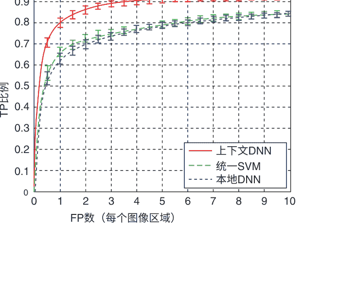

（因此具有更好的检测性能）比统一SVM和本地DNN的性能更好。特别是，在TPF为80%的情况下，上下文敏感DNN分类器的FP率为1.03 FPs/cm²，而统一SVM的FP率为5.69 FPs/cm²（减少了81.9%），本地DNN的FP率为6.00 FPs/cm²（减少了82.8%）。

#### 10.3.3 乳腺X线照片中微钙化病变的计算机辅助诊断（CADx）

由于乳腺X线照片中微钙化的细微特征，对于放射科医生来说，准确诊断乳腺微钙化病变的良恶性是一个非常具有挑战性的问题。研究表明，虚假阳性的诊断影像研究会导致对良性病变进行不必要的活检，其阳性预测值仅为20-40% [72]。在聚集性乳腺微钙化的CADx技术的发展方面，已经进行了大量的研究，其目的是为放射科医生提供第二意见，以提高诊断的准确性和效率[21]。在文献中，已经使用了各种机器学习方法，如LDA、逻辑回归、ANN和SVM，用于聚集性乳腺微钙化的CADx分类器的开发。例如，在[73]中，使用了LDA分类器根据可见性和形状特征对良性和恶性乳腺微钙化进行分类。随后，在[21]中将该方法扩展到了形态学和纹理特征。在[74]中，证明了基于ANN的方法可以提高放射科医生对乳腺微钙化的诊断性能。在[15]中，FKD、ANN、SVM、RVM和委员会机器在比较研究中进行了探索，其中SVM表现出了比其他方法更好的性能。总的来说，报道的研究结果表明，CADx有潜力提高放射科医生在乳腺癌诊断中的表现[75]。

在CADx技术的发展中，文献中研究了各种类型的特征来表征MC病变[10, 19, 65, 76-78]。这些特征被定义为表征MC病变的灰度特性（例如，个别MC的亮度、对比度和梯度，病变区域的纹理）或MC病变的几何特性（例如，个别MC的大小和形状，MC的数量，簇的面积、形状和空间分布）。它们可以从个别MC或整个病变区域中提取出来。从个别MC中提取的特征通常使用统计方法来表征MC簇。

CADx示例：MC分类的机器学习方法。在本节中，我们展示了两种用于MC簇的CADx分类器的使用，一种是基于逻辑回归的线性分类器，另一种是带有RBF核的非线性SVM分类器[15]。在逻辑回归中，参数 w 和 b 在（10.2）中通过最大化以下对数似然函数来确定：

```
$$ L(\mathbf{w}, b) = \sum_{i=1}^{N} \log p(y_i, \mathbf{x}_i; \mathbf{w}, b) \quad (10.8) $$
```

其中概率项由给出

```
$$p(y_i = 1, \mathbf{x}_i, \mathbf{w}, b) = \left[ 1 + \exp\left( -\mathbf{w}^T \mathbf{x}_i - b \right) \right]^{-1}.$$
(10.9)
```

对于非线性SVM分类器，可以表示为：

```
$$f(\mathbf{x}) = \mathbf{w}^T \Phi(\mathbf{x}) + b$$
(10.10)
```

其中 w是判别向量，b是偏置，Φ(x)是由核函数（在我们的情况下是RBF）隐式定义的非线性映射函数。

根据最大边际准则，参数 w和b在方程 (10.10) 中确定如下：

```
$$\min J(\mathbf{w}, \xi) = \frac{1}{2} \|\mathbf{w}\|^2 + C \sum_{i=1}^{N} \xi_i$$
$$\text{s.t. } y_i f(\mathbf{x}_i) \geq 1 - \xi_i, \xi_i \geq 0, i = 1, 2 \cdots, N$$
(10.11)
```

为了测试这些分类器，我们使用了一个包含104个病例（46个恶性，58个良性）的数据集，其中所有病例都包含聚集的MCs。这个数据集是在芝加哥大学收集的。它包含一些难以分类的病例；在这个数据集上，五名主治放射科医生的平均分类性能仅为0.62的ROC曲线下面积[11]。这些乳腺X线照片中的MCs由一组专家读者标记。

- 对于这个数据集，提取了一组八个特征来描述MC聚类[11]：
  - 1. 聚类中的MC数量
  - 2. 单个MC的平均有效体积（面积乘以有效厚度）
  - 3. 聚类的面积
  - 4. 聚类的圆形度
  - 5. 有效厚度的相对标准差
  - 6. 有效体积的相对标准差
  - 7. MC的平均面积
  - 8. 第二高的形状不规则度测量。选择这些特征是因为它们与放射科医生在临床诊断MC病变时使用的特征密切相关。

为了评估分类器，对104个病例采用了一种留一法（LOO）程序，并使用ROCKIT软件计算了性能AUC。逻辑回归分类器的AUC为0.7174。相比之下，支持向量机的AUC为0.7373。这些结果表明分类器的分类性能远非完美，这说明在乳腺X线照片中诊断MC病变的困难。

#### 10.3.4 基于内容的图像检索（CBIR）增强的自适应CADx

近年来，CBIR已被研究作为肿瘤分类的诊断辅助[79, 80]，其目标是为放射科医生提供与评估病变相似的已知病理学例子。CBIR系统可以被视为一种用于提供基于案例推理证据的CADx工具。

CBIR系统首先检索与查询相似的一组案例，这些案例可以用于辅助查询的决策。例如，在[82]和[83]中，所有检索到的案例中恶性案例的比例被用作查询的预测。在[84]中，查询和检索案例之间的相似性水平被用作预测的加权因素。

我们一直在研究一种使用检索图像来提升CADx分类器的方法[85-87]。在传统的CADx中，首先在一组训练案例上训练模式分类器，然后将其应用于后续的测试案例。与这种方法不同的是，对于要分类的给定案例（即查询），我们首先从参考数据库中获取具有相似特征的已知案例集，并使用这些检索到的案例来调整CADx分类器，以提高其在查询案例上的分类准确性。下面我们使用逻辑回归的线性分类器来说明这种方法[85]。

假设一个基线分类器 \(f(\mathbf{x})\) 的形式为方程10.2，已经通过逻辑回归（方程10.8）在一组训练样本上进行了训练：\(\{(\mathbf{x}_i, y_i), i=1,...,N\}\)。现在，考虑一个待分类的查询病变 \(\mathbf{x}\)。让 \(\{\mathbf{x}_i^{(r)}, y_i^{(r)}\}_{i=1,...,N_r}\) 是一组与 \(\mathbf{x}\) 相似的 \(N_r\) 检索到的病例。在我们的案例自适应方法中，我们使用检索到的样本 \(\{\mathbf{x}_i^{(r)}, y_i^{(r)}\}_{i=1,...,N_r}\) 为了适应分类器 \(f(\mathbf{x})\)。具体来说，(10.8)中的目标函数被修改为

```
\[ L(\mathbf{w}, b) = \sum_{i=1}^{N} \log p(y_i, \mathbf{x}_i; \mathbf{w}, b) + \sum_{i=1}^{N_r} \beta_i \log p(y_i^{(r)}, \mathbf{x}_i^{(r)}; \mathbf{w}, b) \quad (10.12) \]
```

在方程式 10.12 中，权重因子 \(\beta_i\) 根据相似性进行调整 \(\mathbf{x}_i^{(r)}\) 到查询 \(\mathbf{x}\)。这个想法是更加强调那些与查询更相似的检索样本，以便在查询附近的分类器决策边界上进行细化。实际上，方程式 10.12 中的第一项只是方程式 10.8 中的对数似然函数，而第二项可以被视为那些检索到的相似样本的加权似然。直观地说，检索到的样本用于将方程式 10.8 中的预训练分类器引导到在查询 \(\mathbf{x}\) 附近更加强调的位置。请注意，方程式 10.12 中的目标函数与方程式 10.8 中的原始优化问题具有相同的数学形式，可以通过迭代重新加权最小二乘法 (IRLS) [41] 高效地求解。

在我们的研究中，我们采用了以下策略来根据检索样本与查询样本的相似度水平调整 \(\beta_i\)：

```
\[ \beta_i = 1 + k \cdot \frac{\alpha_i}{\max_{j=1,\ldots,N_r}\{\alpha_j\}}, \quad i=1,\ldots,N_r \quad (10.13) \]
```

其中 \(\alpha_i\) 表示查询样本 \(\mathbf{x}\) 与检索样本 \(\mathbf{x}_i^{(r)}\) 的相似度度量。\(\alpha_i\) 与查询样本 \(\mathbf{x}\) 和检索样本 \(\mathbf{x}_i^{(r)}\) 的相关性，以及 \(k > 0\) 是一个用于控制相对于其他训练样本的强调程度的参数。方程 (10.13) 中的形式选择是为了使权重因子与检索样本与查询样本 \(\mathbf{x}\) 的相似度水平线性增加，其中最相似的样本获得最大权重 \(1 + k\)。

相当于在目标函数（10.13）中比现有训练样本具有 k 倍的影响力。

作为检索样本的相似度度量，我们使用了高斯径向基核函数：

```
$$\alpha_i = \exp\left(-\|\mathbf{x}_i^{(r)} - \mathbf{x}\|^2 / \gamma^2\right), i=1,\ldots,N_r$$ (10.14)
```

其中 γ是一个控制 α_i对查询样本与检索样本之间距离敏感性的缩放因子。在我们的实验中，参数 γ被设置为训练集中每对可能图像之间距离的第十个百分位数。这样的选择是考虑到数据库中的大多数案例通常不相似。那些与查询样本 x距离较远的案例将因此获得较低的相似度度量。

为了演示这种方法，从南佛罗里达大学维护的DDSM数据库中提取了一组589个病例（331个良性，258个恶性），所有病例都包含MC病变[88]。提取的乳腺X线照片图像被调整为相同的光密度，并具有0.05毫米/像素的均匀分辨率。为了量化这些乳腺X线照片中的MC病变，我们首先使用SVM分类器[31,89]应用了MC检测算法，自动定位数据集中每个病变区域中的MC病变。为了帮助抑制检测中的误报，图像在检测之前首先使用各向同性归一化技术进行处理[90]。检测到的MC病变被分组成簇。

随后，为数据集中的簇状MC病变计算了一组描述性特征；使用了以下九个特征[85]：

- (1) 簇的面积
- (2) 簇的紧凑度
- (3) 簇的密度，表示单位面积内的MC病变数量
- (4) 相邻MC病变之间的距离的标准差
- (5) 簇中的MC病变数量
- (6) 簇中所有MC病变对象大小的总和
- (7) 每个MC病变对象的平均亮度
- (8) 每个MC病变对象的强度标准差的平均值
- (9) 簇中第二个最不规则MC病变对象的紧凑度

这些特征被用来形成数据集中每个病变的向量 x。

为了评估分类性能，从数据集中随机选择了120个案例（70个良性，50个恶性）用于训练基线分类器，并使用剩下的469个案例来测试自适应分类器。对于每个测试案例，采用了LOO过程，其中使用了所有剩余案例进行检索。在图10.4中，我们展示了自适应分类器和基线分类器的性能结果；对于自适应分类器，AUC值在不同数量的检索案例 N_r下显示。从图10.4可以看出，当 N_r= 20时，自适应分类器获得了最佳性能（AUC = 0.7755），而基线分类器的AUC值为0.6848（p值<0.0001）。性能还会随着 N_r的增加而稍微下降。这是因为给定查询的相似案例数量通常很小，这是由于参考库中案例数量有限所致。当 N_r较大时，一些检索到的案例将变得与查询不太相似，并且对查询的分类没有帮助。

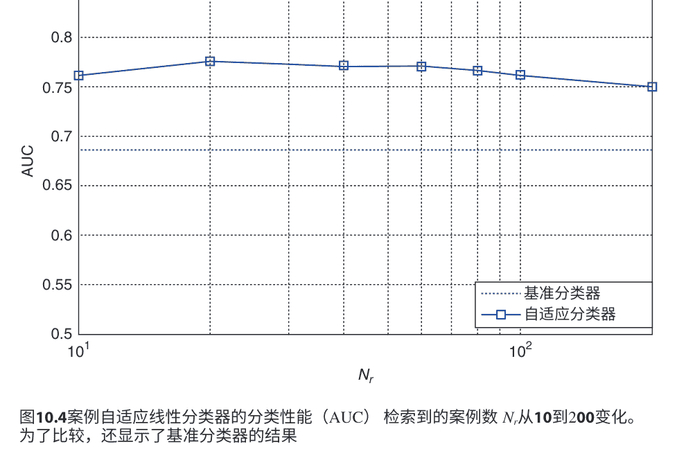

图10.4案例自适应线性分类器的分类性能（AUC）检索到的案例数 N_r从10到200变化。为了比较，还显示了基准分类器的结果

### 10.4 MDS作为示例病变的可视化工具

作为CADx的替代方法，检索一组与正在评估的病变相似的已知病例可能对放射科医生的诊断有价值。近年来，研究人员已经研究并应用了这种方法来处理不同类型的病变和成像模态[31, 84, 86, 89, 91–94]。为此，我们一直在研究在大型数据集中使用多维缩放（MDS）来表示和分析相似病变的方法。在检索框架中，MDS可以用来研究查询肿瘤与从参考库中检索到的一组相似图像的关系[86]。当用作可视化工具时，MDS允许直观地浏览和探索数据集中良性和恶性MC病变的分布，并检查该分布与肿瘤特征的关系[14, 15, 92, 95]。

#### 10.4.1 多维缩放（MDS）技术

MDS是一种基于对象之间相似性（或不相似性）测量的数据嵌入技术，用于表示和分析一组对象[96]。

MDS的基本思想是将感兴趣的对象表示为低维空间（通常是2D或3D），使得该空间中点之间的几何距离与相应对象之间的相似性测量一致。在这个较低维度空间中得到的表示方式可以以相当直观的方式可视化对象之间的关系。

具体而言，考虑一组$N$个对象。MDS试图将这些对象嵌入到较低维度空间（$R^2$或$R^3$）中作为一组数据点$x_i$，$i=1,\dots,N$，使得一对点$x_i$和$x_j$之间的欧氏距离$d(x_i, x_j)$与它们的成对接近度测量$\delta_{ij}$成比例。这通过最小化以下目标函数来实现：

```
$$\sigma^2 = \frac{\sum w_{ij} \left[ d(x_i, x_j) - \delta_{ij} \right]^2}{\sum w_{ij} \delta_{ij}}$$ \quad (10.15)
```

其中$w_{ij}$是权重因子（由用户指定）。数量$\sigma$被称为应力-1，它衡量了MDS模型的拟合程度。在我们的应用中，我们使用MDS将乳腺X光图像中的肿瘤表示为二维平面上的点，其中一对肿瘤图像的相似性根据它们的感知相似性来定义。因此，在MDS图中彼此接近的肿瘤对应于感知上相似的肿瘤。

#### 10.4.2 使用MDS探索相似的乳腺结节

为了探索具有聚集乳腺结节的感知相似病例在其潜在特征（从疾病状况到图像特征）方面如何相关，我们进行了一项观察者研究，从222个病例中选择了2000对图像进行相似性评分的收集。随后，我们应用MDS将所有病例嵌入到一个二维图中，根据它们的相似性评分展示了不同病例之间的潜在关系。这样的图可以研究邻近病例（即彼此相似的病例）之间的关系。特别是，我们将研究以下几个方面的病例之间的关系：（1）病例病理学，（2）聚集乳腺结节的空间分布模式，以及（3）高度相似的聚集乳腺结节图像对。

数据集：本研究使用的数据集由芝加哥大学放射学系收集。它包括365个乳腺X线照片，来自222个病例（110个恶性，112个良性），其中所有病例都经过活检证实含有乳腺结节。这些图像的尺寸为1024×1024或512×512像素，空间分辨率为0.1毫米/像素。在这222个病例中，有143个病例同时拥有头尾位（CC）和斜位（MLO）的图像。每个乳腺X线照片中的乳腺结节由一组经验丰富的放射科医生手动标识。这些乳腺结节被用作我们研究中的基准真值。

由于我们主要关注相似的图像对，我们首先根据这些病例中乳腺结节的图像特征应用选择过程，以识别那些可能相似的图像对进行读者评分。为此，我们使用了一组九个图像特征[11, 97]来量化乳腺结节；这些特征通常用于计算机辅助诊断（CADx）中乳腺结节的分类。具体而言，它们包括：（1）描述单个乳腺结节的图像特征，包括乳腺结节图像对比度值的标准差，以及乳腺结节尺寸的最大值和标准差，（2）乳腺结节的空间聚类特征，包括聚类中的乳腺结节数量、聚类区域的面积和聚类的紧密度，以及（3）基于纹理的特征，包括从灰度共生矩阵中得出的能量、对比度和相关性。然后，根据乳腺结节的特征值（欧氏距离），选择数据集中的病例进行配对。最终，共选择了2000对图像。

随后，基于收集到的2000对图像的相似度分数（如下所述），我们进一步从中选择了1000对图像，目的是为了进一步筛选出一组潜在相似对以供读者评分。这些对图像的选择是基于读者的相似度分数和所有九个特征的欧氏距离。

读者研究：由五名放射科医师组成的小组对1000对图像进行了读者研究，根据它们的感知相似度，使用离散刻度从0（最不相似）到10（最相似）进行评分。这五名放射科医师是MQSA合格的乳腺影像学家，拥有2至20年的经验。为了减少读者疲劳的影响，图像对集合被随机分成了四个独立的评分会话。类似地，由一组五名非放射科医师对2000对图像进行了单独的读者研究（用于上述进一步的图像对筛选）。这些读者是乳腺成像领域的研究人员，拥有至少5年的经验。总共使用了10个独立的评分会话。

由于乳腺X光照片中聚集的微钙化的解释具有主观性，读者的相似度评分可能会有所不同。为了抑制这种明显的差异，我们首先将各个读者的相似度评分转化为z分数。随后，对于这组1000个读者评分进行了平均。图像对（用 S1表示），由放射科医生和非放射科医生评分 放射科医生对另一组1000个图像对（用 S2表示）进行评分，而非放射科医生仅对其进行评分。平均分数进一步转化为z分数。

MDS图：为了探索具有聚类MC的感知相似病例之间的关系，我们应用MDS技术将不同病例嵌入到基于相似度得分的2D图中。考虑一对具有相似度得分SCij的病例i和j。在MDS布局中，它们将通过接近程度分开。为了确保 \(d_{ij}\) 为正，需要添加一个常数偏移量3.75（超过三个标准差）。由于只有那些由读者评分的图像对之间才有相似度分数可用，因此使用加权MDS技术，其中未评分的图像对被分配权重为0；对于评分的图像对，根据相似度水平和评分读者进行调整权重，如下所示：对于由病例 \(i\) 和 \(j\) 组成的图像对 \(p\),

\[
w_p = \begin{cases} 
1 & \text{if } p \in S_2 \text{ 和 } SC_{ij} \leq 0 \\
1.5 & \text{如果 } p \in S_1 \text{ 和 } SC_{ij} \leq 0 \\
2 & \text{如果 } p \in S_2 \text{ 和 } SC_{ij} > 0 \\
3 & \text{如果 } p \in S_1 \text{ 和 } SC_{ij} > 0
\end{cases} \tag{10.17}
\]

这样选择的理由是为了给更相似且由更多读者评分的对分配更高的权重值。

在图10.5中，我们展示了数据集中所有222个案例的MDS嵌入，根据它们的相似分数。虽然乍一看癌症和良性病例之间没有明显的分离，但很明显右半边的图中有更多的癌症病例（较少的良性病例）比左半边的图中。更重要的是，同一种疾病的病例倾向于在局部聚集在一起。例如，虽然癌症病例在图中分散在不同的区域，但它们也分布在小的簇中，其中一个癌症病例被其他癌症病例紧密包围；良性病例也是如此。

此外，为了探索读者对相似性的概念如何与聚类的MCs的图像特征相关，我们还在图10.5中展示了一些样本案例的聚类MCs的空间分布模式，其中个体MCs的空间位置用“+”符号表示。可以看出，相邻的案例倾向于具有相似大小和形状的MC簇，并且图中右半边的MC簇倾向于更大且不规则。

### 10.5 问题和建议

尽管已经开发了许多计算机化方法用于CADx方案作为诊断辅助工具来提高放射科医生的诊断准确性，但仍然存在一些重要且具有挑战性的问题有待解决。下面我们讨论其中的一些问题，这些问题并不是完整的。

多个实验室观察者研究表明，CADx方案可以帮助提高良恶性肿瘤鉴别的诊断准确性。例如，在乳腺X线摄影中，使用CADx的放射科医生可以通过将更多的癌症病例和较少的良性病例送去活检来改善他们的活检建议。

在CADx中，计算机预测病变恶性的可能性，并将其作为第二意见呈现给放射科医生。在临床实施CADx时的一个困难是，CADx分类器常常被批评为“黑盒子”方法。当放射科医生面对一个数值，比如恶性可能性，但没有额外的支持证据时，将这个数值最佳地纳入他或她的决策可能是困难的。作为一种替代辅助工具，图像检索近年来作为CADx工具进行了研究。我们推测通过将检索系统与CADx分类器集成，检索到的图像可以作为支持证据提供给放射科医生，从而有助于解释放射科医生对恶性可能性的理解。

在文献中，CADx方案通常是使用不同数据集开发的，这些数据集受可用病例数量的限制。不同数据集之间的异质性将不可避免地导致评估CADx方案性能时的变异性。因此，建立足够大且能代表疾病人群的共同基准数据库是可取的。在实践中，这可能是一个昂贵的过程。它将确保CADx方案可以进行优化和测试，没有任何偏见，以便在应用于数据库之外的情况下能够很好地推广。

最后，虽然研究和开发已经提高了CADx的性能，作为诊断辅助工具，CADx分类器所达到的准确性水平对于某些肿瘤类型来说相对较低，这是由于问题本身的困难性（例如，MC病变）。仍然需要开发更显著的特征和CADx算法，以提高分类准确性。这可能包括从多模态成像中获取的额外特征的使用。

### 10.6 结论

在本章中，我们介绍了机器学习算法在CADx系统中的应用。特别是，我们介绍了它在乳腺X线摄影中区分良性和恶性病例的应用实例。传统CADx方法在临床实施时的一个主要批评是CADx分类器可能被视为“黑盒子”方法。作为一种替代辅助工具，最近几年已经研究了基于内容的图像检索（CBIR）作为CADx工具。我们推测，通过整合检索系统和CADx分类器，检索到的图像可以作为支持CADx分类器的证据，从而有助于放射科医生在临床实践中解释恶性可能性。在本章中，我们介绍了开发和验证这种系统的过程，利用了监督和无监督的机器学习算法。

## 参考文献

1. 国家肺癌筛查试验研究团队。低剂量计算机断层扫描筛查可降低肺癌死亡率。新英格兰医学杂志。2011年;365(5):395-401。
2. Horeweg N，Scholten ET，de Jong PA，van der Aalst CM，Weenink C，Lammers J-WJ，等。通过低剂量CT筛查检测肺癌（NELSON）：筛查测试性能和间隔癌症的预先指定分析。《柳叶刀肿瘤学》。15：1342-50。https://doi.org/10.1016/S1470-2045(14)70387-0。
3. Agarwal V，Branstetter Iv BF，Johnson JT。PET/CT在头颈部的适应症。耳鼻喉科临床北美。2008；41：23-41。https://doi.org/10.1016/j.otc.2007.10.005
4. Thompson J，Lawrentschuk N，Frydenberg M，Thompson L，Stricker P，Usanz V。磁共振成像在前列腺癌诊断和治疗中的作用。BJU Int。2013；112（Suppl 2）：6-20。https://doi.org/10.1111/bju.12381。
5. Leung D，Han X，Mikkelsen T，Nabors LB。MRI在原发性脑肿瘤评估中的作用。J Nat Compreh Cancer Netw. 2014;12:1561–8。
6. Young RJ，Knopp EA。脑MRI：肿瘤评估。J Mgmt Reson Img. 2006;24:709–24。https://doi.org/10.1002/jmri.20704。
7. Pilewskie M，King TA。新诊断乳腺癌患者的磁共振成像：文献综述。Cancer. 2014;120:2080–10。https://doi.org/10.1002/cncr.28700。
8. Wu Y，Giger M，Doi K，Vyborny C，Schmidt R，Metz C。乳腺X线摄影中的人工神经网络：在乳腺癌诊断中的应用。Radiology.1993;187(1):81–7。
9. Andreadis II, Spyrou GM, Nikita KS. 乳腺微钙化分类图像特征的比较研究。测量科学技术。2011年;22(11):114005。
10. Cheng HD, Cai X, Chen X, Hu L, Lou X. 乳腺X线照片中微钙化的计算机辅助检测和分类综述。模式识别。2003年;36:2967–91。
11. Jiang Y, Nishikawa RM, Wolverton EE, Metz CE, Giger ML, Schmidt RA, VybornyCJ. 恶性和良性聚集微钙化的自动特征分析和分类。放射学。1996年;198:671–8。
12. Sakka E, Prentza A, Koutsouris D. 乳腺X线照片中微钙化的分类算法（综述）。肿瘤学报告。2006年;15(4):1049–55。
13. Wang J, Yang X, Cai H, Tan W, Jin C, Li L. 通过深度学习在乳腺X线摄影中鉴别带有微钙化的乳腺癌。科学报告。2016年;6(1):1–10。
14. Wei L, Yang Y, Nishikawa RM, Wenick MN, Edwards A. 用于自动检测聚集微钙化的相关向量机。IEEE医学成像交易。2005年;24(10):1278–85。
15. Wei L, Yang Y, Nishikawa RM, Jiang Y. 关于恶性和良性聚集微钙化分类的几种机器学习方法的研究。IEEE医学成像交易。2005年;24(3):371–80。
16. Al-antari MA, Al-masni MA, Choi MT, Han SM, Kim TS. 通过深度学习检测、分割和分类的数字X线乳腺摄影完全集成的计算机辅助诊断系统。国际医学信息学。2018年;117:44–54。
17. Bozek J, Mustra M, Delac K, Grgic M. 数字乳腺X线摄影中图像处理算法的调查。Rec Adv Multimedia Signal Process Commun. 2010;15:631–57。
18. Cheng HD, Shi XJ, Min R, Hu LM, Cai XP, Du HN. 乳腺X线摄影中肿块自动检测和分类的方法。Pattern Recogn. 2006;310(4):646–68。
19. Elter M, Horsch A. 乳腺X线摄影中乳腺肿块和聚集微钙化的CADx综述。Med Phys. 2001;36:2052–68。
20. Huo Z, Giger ML, Vyborny CJ, Wolverton DE, Metz CE. 数字化乳腺X线摄影中良性和恶性肿块的计算机分类研究的稳健性。Acad Radiol.2000;7(12):1077–84。
21. Chan H, Sahiner B, Lam KL, Petrick N, Helvie MA, Goodsitt MM, Adler DD. 在形态学和纹理特征空间中对乳腺钼靶微钙化的计算机化分析。Med Phys. 1998;25:2007–2011。
22. Horsch K, Giger ML, Vyborny CJ, Lan L, Mendelson EB, Hendrick RE. 使用多模态计算机辅助诊断对乳腺病变进行分类：独立临床数据集上的观察者研究结果。放射学。2006;240:357–68。
23. Huo Z, Giger ML, Vyborny CJ, Wolverton DE, Schimidt RA, Doi K. 对数字化乳腺钼靶上的恶性和良性肿块进行自动化计算机分类。Acad Radiol.1998;5(3):155–68。
24. Jiang Y, Nishikawa RM, Schmidt RA, Toledano AY, Doi K. 计算机辅助诊断的潜力，可以减少放射科医生对描绘微钙化的乳腺钼靶的解读中的变异性。放射学。2001a;220:787–94。
25. Jiang Y, Nishikawa RM, Papaioannou J. 计算机对聚集微钙化的分类依赖于正确检测微钙化。Med Phys.2001b;28(9):1949–57。
26. Wang J, Yang Y, Wernick MN, Nishikawa RM. 一种基于图像检索的聚集微钙化辅助诊断系统。IEEE第13届国际生物医学成像研讨会（ISBI）。2016b;10:1076–9。
27. Muller H, Michoux N, Bandon D, Geissbuhler A. 医学应用中基于内容的图像检索系统的综述-临床效益和未来发展方向。Int J Med Inform.2004;73:1–23。
28. Bustos B, Keim D, Saupe D, Schreck T. 基于内容的3D对象检索。IEEE计算机图形应用。2007;27:22–7。
29. Bhanu B, Peng J, Qing S. 在图像数据库中学习特征相关性和相似度量。IEEE Workshop Proceedings on Content-Based Access of Image and Video Libraries.1998;12:14–8。
30. El Naqa I, Yang Y, Galatsanos NP, Nishikawa RM, Wernick MN. 一种相似度学习方法用于基于内容的图像检索：应用于数字乳腺摄影。IEEE Trans Med Imaging. 2004;23:1233–4。
31. El-Naq I, Yang Y, Galatsanos NP, Nishikawa RM, Wernick MN. 一种相似度学习方法用于基于内容的图像检索：应用于数字乳腺摄影。IEEE Trans Med Imaging. 2004a;23:1233–44. https://doi.org/10.1109/TMI.2004.834601。
32. Vapnik V. 统计学习理论。纽约：Wiley；1998年。
33. Jiang Y, Nishikawa RM, Giger ML, Doi K, Schmidt R, Vyborny C. 从数字乳房X光片中提取微钙化信号区域和信号厚度的方法。Proc SPIE. 1992;1778:28–36。
34. Sachdeva J, Kumar V, Gupta I, Khandelwal N, Ahuja CK. 脑肿瘤分割、特征提取和多类别分类。J Digit Imaging. 2013;26(6):1141–50。
35. Soltanian-Zadeh H, Rafiee-Rad F, Pourabdollah-Nejad S. 乳房X光片中微钙化分类的多小波、小波、Haralick和形状特征比较。Pattern Recogn. 2004;37:1973–86。
36. Haralick R, Shanmugam K, Dinstein I. 图像分类的纹理特征。IEEE Trans On Systems Man and Cybernetics. 1973;3:610–21。
37. Gonzalez RC, Woods RE. 数字图像处理。普林斯顿：普林斯顿大学出版社；2002年。
38. Yu L, Liu H. 高维数据的特征选择：一种基于快速相关性过滤的解决方案。ICML。2003年；3：856-63。
39. Kohavi R, John GH. 特征子集选择的包装器。人工智能。1997年；97（1）：273-324。
40. Perkins S, Lacker K, Theiler J. 种植：通过函数空间中的梯度下降进行快速增量特征选择。机器学习研究杂志。2003年；3：1333-56。
41. Bishop CM. 模式识别与机器学习。纽约：斯普林格出版社；2006年。
42. Friedman J, Hastie T, Tibshirani R. 统计学习的要素。纽约：斯普林格出版社；2001年。
43. Cortes C, Vapnik V. 支持向量网络。机器学习。1995年；20（3）：273-97。
44. Cristianini N, Shawe-Taylor J. 支持向量机和其他基于核的学习方法简介。剑桥：剑桥大学出版社；2000年。
45. Tipping ME。稀疏贝叶斯学习和相关向量机。J Mach Learn Res。2001年；1：211-44。
46. Freund Y, Schapire RE. 在线学习的决策理论推广及其应用。J Comput Syst Sci。1997年；55（1）：119-131。
47. Dietterich TG。构建决策树集成的三种方法的实验比较：bagging、boosting和随机化。Mach Learn。2000年；40（2）：139-57。
48. Natekin A, Knoll A。梯度提升机教程。Front Neurorobot。2013年；7：21。
49. Weiss K, Khoshgoftaar TM, Wang D。迁移学习综述。大数据杂志。2016;3(1):10。
50. Zhang S, Sun F, Wang N, Zhang C, Yu Q, Zhang M, Ba B, Zhong H. 使用迁移学习的胸部CT图像肺结节的计算机辅助诊断（CAD）。J Dig Imag.2011;32(6):995–1007。
51. Deepak S, Ameer PM. 使用深度CNN特征通过迁移学习进行脑肿瘤分类。计算生物医学。2011;111:103345。
52. Natalia A, Huynh BQ, Giger ML. 一种用于乳腺癌诊断的深度特征融合方法，在三种成像模态数据集上进行了演示。医学物理学。2017;44(10):5162–71。
53. Cui S, Luo Y, Zeng H, Ten Haken RK, El Naqa I. 将手工特征与机器学习中的潜在变量相结合，用于预测放射性肺损伤。医学物理学。2011;46(5):2497–511。
54. Wang Y, Heidari M, Mirniaharikandehei S, Gong J, Qian W, Qiu Y, Zheng B. 一种混合深度学习方法用于使用乳房X线照片预测乳房病变的恶性程度。医学影像学。2018年;12:10579。
55. Breiman L, Spector P。回归中的子模型选择和评估。x-随机情况。Int Stat Rev. 1992;14:291–311。
56. Kohavi R。交叉验证和自助法在准确性估计和模型选择中的研究。IJCAI。1995年;14(2):1137–45。
57. Mertens BJ, de Noo ME, Tollenaar RAEM, Deelder AM。质谱蛋白质组学诊断：实施双重交叉验证范式。J Comput Biol。2006年;13(9):1591–605。
58. Mushlin AI, Kouides RW, Shapiro DE。估计筛查乳房X线照片的准确性：一项荟萃分析。美国预防医学杂志。1998年;14:143–53。
59. Urbain JL。乳腺癌筛查、诊断准确性和医疗政策。CMAJ。2005;172:210–1。
60. Kolb TM, Lichy J, Newhouse JH。筛查乳腺摄影、体格检查和乳腺超声的性能比较和影响因素评估：27825例患者评估分析。放射学。2002;225:165–75。
61. Elmore JG, Barton MB, Moceri VM, Polk S, Arena PJ, Fletcher SW。假阳性筛查乳腺摄影和临床乳腺检查的十年风险。N Engl J Med.1998;338(16):1089–96。
62. Tan A, Freeman DH Jr, Goodwin JS, Freeman JL。1067名放射科医师乳腺摄影阅片假阳性率的变异：基于人群的评估。Breast CancerRes Treat。2006;100:309–18。
63. Wang J, Yang Y。通过检索具有相似疾病可能性的病例来提高乳腺癌的分类。ICASSP。2016;12:908–11。
64. de Cea MVS, Nishikawa RM, Yang Y。估计聚类微钙化中各个检测的准确性水平。IEEE Trans Med Imaging。2017;36(5):1162–71。
65. Wang J, Yang Y。用于区分良性和恶性微钙化病变的空间密度建模。ICIP。2013:133–6。
66. Salfity MF, Nishikawa RM, Jiang Y, Papaioannou J。在乳腺X线摄影微钙化检测中使用先验信息以改善其分类。Med Phys。2003;30(5):823–31。
67. El-Naqa I, Yang Y, Wernick MN, Galatsanos NP, Nishikawa RM。一种用于检测微钙化的支持向量机方法。IEEE Trans Med Imaging。2002;21(12):1552–63。
68. Mordang JJ, Gubern-Mérida A, Bria A等。早期发现与乳腺癌相关的钙化物在筛查中的重要性。乳腺癌研究与治疗。2018年;167(2):451–58。https://doi.org/10.1007/s10549-017-4527-7。
69. Wang J, Nishikawa RM, Yang Y。使用深度学习网络在乳腺X线照片中全局检测聚集微钙化物的方法。医学成像杂志。2017年;4(2):024501。
70. Wang J, Yang Y。一种上下文敏感的深度学习方法用于乳腺X线照片中的微钙化物检测。模式识别。2018年;78:12–22。
71. Wang J, Nishikawa RM, Yang Y。使用上下文敏感的分类模型提高聚集微钙化物检测的准确性。医学物理学。2016a年;43(1):159–70。
72. Sickles EA, Miglioretti DL, Ballard-Bash R, Geller BM, Leung JWT, Rosenberg RD, Smith-Bindman R, Yankaskas BC。诊断乳腺X线摄影的性能基准。放射学。2005年;235:775–90。
73. Chan H, Wei D, Lam K, Lo S, Sahiner B, Helvie M, Adler D。乳腺X线摄影中微钙化的计算机检测和分类。SPIE。1995年;2434:612–20。
74. Markopoulos C, Kouskos E, Koufopoulos K, Kyriakou V, Gogas J。人工神经网络（计算机分析）在乳腺X线摄影中微钙化诊断中的应用。欧洲放射学杂志。2001年;39（1）：60–5。
75. Jiang Y, Nishikawa RM, Schmidt RA, Metz CE, Giger ML, Doi K。通过计算机辅助诊断改善乳腺癌诊断。学术放射学。1991年;6：22–33。
76. Nishikawa RM。乳腺X线摄影中计算机辅助诊断的现状和未来发展方向。Comput Med Imaging Graph。2007;31:224–35。
77. Rangayyan RM, Fabio JA, Desautels JL。乳腺癌计算机辅助诊断综述：朝着检测细微迹象的方向发展。J Franklin Instit。2007;344:312–48。
78. Sampat MP, Markey MK, Bovik AC。乳腺X线摄影中的计算机辅助检测和诊断。图像与视频处理手册第2版，第10.4章，Elsevier Academic Press New York; 2005。

## 11 图像引导和治疗计划的自动轮廓

Rachel B. Ger、Tucker J. Netherton、Dong Joo Rhee、Laurence E. Court、Jinzhong Yang和Carlos E. Cardenas

### 11.1 引言

图像分割是放射治疗中常规执行的重要任务，用于识别治疗目标和解剖结构（风险器官）。在典型的临床工作流程中，放射肿瘤学家或剂量师会手动在放射治疗模拟扫描中分割这些感兴趣区域（ROI）。传统上，计算机断层扫描（CT）用于放射治疗模拟；然而，随着磁共振成像在放射治疗中的作用越来越大，并且随着磁共振引导的外部束放射治疗的出现，磁共振（MR）模拟扫描在全球的放射治疗计划中被更快地采用。

这些感兴趣区域的手动分割是一个耗时的过程，一些研究报告显示每个患者需要几个小时的医生时间 [1-3]。这可能导致放射治疗的延迟，特别是在资源有限的诊所中，这与局部区域控制和整体生存率较差有关 [4, 5]。此外，为了适应性放射治疗，分割每个患者的感兴趣区域需要大量时间，这被认为是一个限制速率的步骤，因为需要在反映患者解剖学变化的新成像上进行分割，以确保放射治疗的剂量累积估计的准确性。

放射治疗计划的疗效和安全性需要准确的分割，因为这些感兴趣区域通常用于优化和评估计划的质量。然而，在评估观察者间和观察者内分割变异性的研究中，目标和器官分割的不一致性已被报道 [1, 6–8]。这些不一致性可能源于分割任务在本质上是主观的，因为执行分割的专家评估可用成像，然后根据先前的知识和/或经验决定将哪些体素包括在正在分割的感兴趣区域中。随后，在手动分割中观察到的固有变异可能对定量分析 [9–13]（例如，放射组学）和剂量分析 [1, 14–16] 产生重大影响。因此，自动分割（或自动轮廓勾画）是首选，因为它可以解决这些挑战。自动分割算法必须克服几个与图像相关的问题，以确保准确的预测。首先，医学图像受到可能影响体素强度的噪声的影响。其次，患者体内的组织通常表现出强度不均匀性，这意味着单个组织内的体素强度可能在图像的范围内变化。最后，医学图像在获取过程中进行重建，具有预定义的体素大小，这导致部分体积平均化。由于有限的图像分辨率限制，体素可能包含多种组织，因此体素的强度可能不代表任何组织类别。此外，不同成像模态之间可能存在特定的挑战。尽管磁共振扫描提供了精细的软组织对比度，但由于磁敏感性伪影的存在，图像强度在不同采集中会有所变化。这些问题，加上人口中不同个体之间的大量解剖变异和组织分布，表明无论是手动还是自动分割都会存在一定程度的不确定性。

医学图像自动分割领域在过去二十年中迅速发展。以前，自动分割技术被分为第一、第二和第三代算法，代表了算法发展的新标准 [17]。然而，最近基于深度学习的自动分割技术已经显示出比传统方法更显著的改进，表明我们已经进入了第四代自动分割算法的发展阶段。

深度学习领域在 Krizhevsky 等人的开创性论文之后变得更加流行，他们展示了使用深度卷积神经网络结构（AlexNet）可以显著提高图像分类和识别任务的预测能力 [18]。在他们的工作中，作者采用图形处理单元（GPU）来执行卷积计算，显著缩短了在 ImageNet 数据集上训练分类模型所需的时间 [19]。不久之后的研究表明，使用卷积神经网络（CNN）进行图像分割任务可以超越先前首选的算法，从而迅速推广这些架构用于医学图像自动分割。

本章简要介绍了传统（深度学习时代之前）的自动分割技术，介绍了基于深度学习的自动分割算法的概念。

*本章节的摘录曾在“自动分割的进展”（2019）中发表过，Radiation Oncology. Vol. 29, No. 3, pp. 185–197. 作者为 Cardenas 等人。*

R. B. Ger
约翰霍普金斯医学院放射肿瘤学和分子放射科学系，美国马里兰州巴尔的摩市

T. J. Netherton · D. J. Rhee · L. E. Court · J. Yang
德克萨斯大学 MD 安德森癌症中心放射物理学系，美国德克萨斯州休斯顿市

C. E. Cardenas (✉)
阿拉巴马大学伯明翰分校放射肿瘤学系，美国阿拉巴马州伯明翰市
电子邮件：cecardenas@uabmc.edu

### 11.2 传统自动分割技术

自动分割算法的发展伴随着算法在新的分割任务中使用先前知识的能力。在早期阶段，由于计算机性能和分割数据的可用性的限制，大多数分割技术没有或很少使用先前知识，被称为低级分割方法。为了避免启发式方法，更先进的技术被开发出来，引入了不确定性模型和优化方法 [17, 20]。

#### 11.2.1 第一代自动分割技术

第一代自动分割技术是低级技术，几乎不包含任何先前信息。这些包括阈值、区域生长和边缘追踪。这些技术在大多数商业轮廓解决方案中都很常见和可用。阈值是通过截断图像强度单位来简单应用的，以识别图像强度对比的区域。这些通常在商业系统中用于轮廓对比器官与其周围区域，如肺部或大脑。区域生长涉及选择一个种子位置并确定一个均匀性标准。满足这些标准的像素或体素将被包括在内。该过程从种子位置向外应用，以确定轮廓。区域生长通常用于轮廓 PET 图像上的病变，而对于 CT 轮廓，由于难以确定要使用的均匀性标准，结果不太一致。第一代技术常常受到困扰自动分割技术的所有主要问题：影响像素强度的图像噪声，强度非均匀性，即给定组织在图像上逐渐变化的强度，以及部分体积平均。用户总是需要对使用这些技术生成的结构进行重大编辑。

#### 11.2.2 第二代自动分割技术

第二代技术试图通过不确定性模型和优化方法来处理影响自动分割的这些问题。属于这一组的技术包括统计模式识别、c 均值聚类、可变形模型、图搜索、多分辨率方法、最小路径和目标跟踪。

基于区域的技术，如活动轮廓、水平集、图割和分水岭算法，已经在医学成像自动分割中得到应用。活动轮廓和水平集算法被视为可变形模型，因为它们使用能够收缩或扩展以适应图像中不同特征的闭合曲面，而图割和分水岭算法则采用了图论原理来最大化图像体素之间的互连。

基于概率的自动分割技术，如高斯混合模型、聚类、k 最近邻、贝叶斯分类器和浅层人工神经网络，由于统计学界的进步和计算能力的提高，在本世纪初变得越来越流行。这些方法的特点是能够将图像中的每个体素分类为已知类别集合中的一类；然而，这些方法通常缺乏来自相邻体素的上下文信息（因为体素是独立分类的），这通常通过实施隐马尔可夫随机场来调节。

#### 11.2.3 第三代自动分割技术

第三代技术进一步建立在第二代的进展基础上，通过整合更高级别的知识来避免分割中的基于图像的问题。这是通过先验信息、定义规则和所需轮廓的模型来实现的。这些技术包括形状模型、外观模型、基于图谱的分割、基于规则的分割和耦合表面。

在过去的二十年里，已经投入了大量的探索性工作来利用先验知识。一个例子是利用解剖结构的形状和外观特征来弥补 CT 数据中软组织对比度不足的问题，从而无法准确定义解剖边界。

根据算法中使用的先验知识的多少，这些方法可以分为（多）基于图谱的分割、基于模型的分割和基于机器学习的分割 [22]。

单一基于图谱的分割使用一个已经分割好感兴趣结构的参考图像作为新分割任务的先验知识 [23]。新图像的分割依赖于可变形配准，找到图谱和新图像之间的最佳变换，将图谱轮廓映射到新图像上（图 11.1）。已经使用了各种可变形配准算法来实现这个目的 [24-29]，其中大部分是基于强度的算法。分割性能完全取决于可变形配准的性能，而可变形配准的性能受到图谱和新图像中感兴趣器官形态相似性的影响。为了获得良好的分割结果，已经提出了各种图谱选择策略 [30-36]。或者，使用反映平均患者解剖结构的图谱可能会提高分割性能 [37, 38]。

基于图谱的分割通常受到个体间变异的影响。与使用单一图谱不同，多图谱方法使用多个图谱（通常约 10 个）作为新分割任务的先验知识 [39-44]。与基于单一图谱的方法类似，可变形配准是将个体图谱轮廓映射到新图像的关键技术（图 11.1）。还需要进行额外的步骤，通常称为标签/轮廓融合，将多个图谱的个体分割合并，生成最佳估计的真实分割结果 [36, 45-48]。多图谱分割已被证明可以减小个体间变异的影响并改善分割结果。

单图谱方法的分割准确性。图谱定义了先验知识，因此可以影响基于图谱表示的轮廓的准确性；例如，如果只使用术后头颈部患者来定义头颈部图谱，那么对于术前患者的轮廓效果不好，因为该患者在先验知识中没有被表示。在过去的十年中，多图谱分割已被证明是几个重大挑战中最有效的分割方法之一 [49-51]。这种方法已经在临床放射肿瘤学应用中得到验证，用于轮廓头颈正常组织 [52]、心脏亚结构 [53]、臂丛神经 [41] 等。

当有更多轮廓图像可用时，可以利用感兴趣结构的形状或外观的特征变化来训练统计形状模型 (SSM) 或统计外观模型 (SAM) 进行自动分割。SSM 使用可变形模型，同时限制模型变形的范围。在训练图像上识别和分析物体边界上的标志点，以确定统计表示。然后在轮廓中发生变形，但限制在模型的范围内。SAM 是 SSM 的扩展，将物体的形状和强度都纳入统计模型中。这些方法可以将最终分割结果限制在由模型描述的解剖学上合理的形状中 [54]。然而，基于模型的分割由于统计模型所特征的特定形状的限制而不够灵活。此外，训练数据的大小和内容限制了分割性能。在放射肿瘤学应用中，基于模型的分割主要用于盆腔区域结构的分割 [55-57]。

另一方面，当有更多轮廓图像可用时，机器学习方法可以通过学习结构和器官的对应特征或像素分类的图像上下文和组织外观来帮助分割 [58-60]。支持向量机 [61-65] 和树集成（即随机森林）[66-72] 算法在胸部、腹部和盆腔肿瘤和正常组织分割方面显示出有希望的结果。这些方法通常使用人工设计的特征（即影像组学特征），通常从大型患者数据库中提取图像强度直方图作为输入来训练分割模型（图 11.2）。传统的影像组学特征最初是为了在卫星图像中确定图像内的对象而设计的，例如 Haralick 的灰度共生矩阵 [73]。尽管这些传统特征的生物学意义可能难以理解，但医学界已经采用了这些特征，与强度直方图特征（如峰度）相比。此外，使用影像组学特征的研究通常在提取特征之前使用不同的滤波器，这会产生大量需要分析的特征。因此，在进行模型构建之前，必须采用技术有效地减少特征数量，以确保保留足够的能力。通常，在轮廓确定中，使用简单的强度和梯度特征。影像组学特征已被用于轮廓脑肿瘤 [58, 61, 62]、肝脏 [63]、肺结节 [65]、心脏结构 [66]、前列腺和前列腺病变 [57, 60, 74]、盆腔器官 [70]、肾脏亚结构 [68]、胸部淋巴结 [71] 等。

由于计算系统的进步，传统的自动分割技术在过去十年中取得了显著进展。第一代技术简单且不需要太多的计算能力。这些技术是大多数商业轮廓系统中的标准工具。随着计算机的进步，第二代和第三代技术应运而生，并允许使用先验信息。其中最重要的技术是基于图谱的分割技术，因为它在商业系统中越来越容易获得。最近，计算系统的进一步发展将自动分割技术转向深度学习，并过渡到第四代自动分割技术。

### 11.3 基于深度学习的自动分割

在过去几年中，深度学习网络在图像分割方面取得了巨大进展，从而诞生了新一代的分割模型。作为第四代自动分割算法的开创者，深度学习模型通常在公开的分割挑战中实现最高的分割准确性，这表明我们正在进入医学图像自动分割算法发展的范式转变阶段。

#### 11.3.1 卷积神经网络和全卷积网络

卷积神经网络（CNN）在计算机视觉任务（如分割、检测、分类）中很有意义，因为它们学习了以前在传统方法中设计的滤波器或卷积核。这些架构通常由多种类型的层（卷积层、池化层、全连接层等）堆叠而成，将输入（图像）转换为所需的输出。卷积层、池化层和全连接层在下面的段落中进一步定义（图 11.3）。

卷积层包含一组可学习的滤波器或核。每个滤波器都有预定义的大小（宽度、高度和深度），通常在空间上与输入图像大小相比较小。例如，一个三维图像分割网络可能使用初始的滤波器大小为 3×3×3，对应于宽度为 3 个体素，高度为 3 个体素，深度为 3 个体素，其中宽度和高度可以被视为轴向切片中的像素，深度提供了中央切片下方和上方的信息。在训练过程中，卷积层内的滤波器在输入图像上进行卷积，计算滤波器和输入图像在任何位置的值的点积。随着滤波器在整个输入图像上的卷积，卷积层生成一个激活图，提供了该滤波器在每个空间位置的响应。通过训练过程，网络最初会学习到在看到特定的视觉特征（如边缘或纹理）时激活的滤波器，最终在网络的更高层次上学习更抽象的模式。通常，一个卷积层中使用多个滤波器，每个滤波器将产生单独的激活图，然后将它们连接起来以产生一个卷积层的输出。卷积层的一个重要特征是它们提供了相邻层神经元之间的局部连接。这使得网络能够在全局和局部之间学习特征，从而能够检测输入数据中的细微变化。

卷积层通常定义的参数包括填充、步长和扩张。图像填充（即在图像边缘添加新的像素）可用于确保卷积层的输入和输出体积在空间上具有相同的大小。步长是卷积核在输入体积上进行卷积时的步长。例如，使用步长 S=1 可以确保滤波器在输入体积的每个像素上进行卷积，而使用步长 S=2 只会计算每隔一个像素的激活值。使用步长 S>1 会导致输出体积减小。要确定填充/步长对输出体积 O 的影响，可以使用以下关系式：O=(W−F+2P)/S+1，其中 W 是输入体积大小，F 是滤波器大小，P 是所使用的填充，S 是步长。对于一个 17×17 的输入，滤波器大小为 3，填充为 1，步长为 2，O 的输出图像将为 9×9 [(17−3+2(1))/2+1=9]。卷积层的另一个超参数是滤波器的扩张。传统上，图像中使用的滤波器是连续的（扩张 D=1），这意味着卷积的点积中使用的像素都是空间上相邻的。使用扩张大于 1（D>1）的滤波器可以快速增加感受野的大小。

**参考文献列表**

1.  Muller H, Michoux N, Bandon D, Geissbuhler A. A review of content-based image retrieval systems in medical applications - clinical benefits and future directions. Int J Med Inform. 2004;73:1-23.
2.  Rahman M, Want T, Desai B. Medical image retrieval and registration: towards computer aided diagnostic approach. In: Proceedings of the IDEA S Medical Information System Conference: Digital Hospital. 2004; 78-810.
3.  Holt A, Bichindaritz I, Schmidt R, Perner P. Case-based reasoning in medical applications. Knowledge Engineering Review. 2005; 20:289-92.
4.  Floyd CE, Lo J, Tourassi GD. Case-based reasoning computer algorithm for use of mammographic findings for biopsy decision. American Journal of Roentgenology. 2000; 175(5):1347-52.
5.  Bilská-Wolak A, Floyd E. Development and evaluation of a case-based reasoning classifier for prediction of biopsy outcome using BI-RADS™ lexicon. Medical Physics. 2002; 29:2090.
6.  Zheng B, Lu A, Hardesty LA, Sumkin JH, Hakim CM, Ganott MA, Gur D. An interactive computer-aided diagnosis scheme for enhancing visual similarity of mammographic masses. Medical Physics. 2006; 33:111-7.
7.  Jing H, Yang Y. Image retrieval based case-adaptive classification for computer-aided diagnosis. ICIP. 2010;12:4333-6.
8.  Wei L, Yang Y, Nishikawa RM, Jiang Y. Learning perceptual similarity from expert readers for mammogram retrieval. ISBI. 2006:1356-13510.
9.  Wei L, Yang Y, Nishikawa RM. Microcalcification classification assisted by content-based image retrieval for breast cancer diagnosis. Pattern Recogn. 2001;42:1126-32.
10. Heath M, Bowyer K, Kopans D, Moore R, Kegelmeyer WP. The Digital Database for Screening Mammography. In: Proceedings of the Fifth International Workshop on Digital Mammography. 2001;15:212-8.
11. El-Naqa I, Yang Y, Galanos NP, Nishikawa RM, Wernick MN. A similarity learning based content retrieval method: application to digital mammography. IEEE Trans Med Imag. 2004b;23:1233-44.
12. Mcloughlin KJ, Bones PJ, Karsssemeijer N. Noise equalization for microcalcification cluster detection in direct digital mammography. IEEE Trans. Med. Imag. 2004;23(3):313-20.
13. Aisen A, Broderick L, Winer-Muram H, Brodley C, Kak A, Pavlopoulou C, Dy J, Shyu C, Marchiori A. Automated storage and retrieval of thin-section CT images for computer-assisted diagnosis: system description and preliminary evaluation. Radiology. 2003;228:265-70.
14. Muramatsu C, Nishimura K, Endo T, Oiwa M, Shiraiwa M, Doi K, Fujita H. Representation of lesion similarity for mammographic masses using multidimensional scaling. J Digit Imaging. 2013;26(4):740-7.
15. Tourassi GD, Harrawood B, Singh S, Lo JY, Floyd CE. Evaluation of information-theoretic similarity measures for content-based retrieval and detection of masses in mammograms. Medical Physics. 2007;34:140-50.
16. Yang L, Jin R, Mummert L, Sukthankar R, Goode A, Zheng B, Hoi SCH, Satyanarayanan M. A boosting framework for visuality-preserving distance metric learning and its application to medical image retrieval. IEEE Trans Pattern Anal Mach Intell. 2010;32(1):30-44.
17. Wang J, Jing H, Wernick MN, Nishikawa RM, Yang Y. Analysis of perceptual similarity between microcalcification clusters in mammograms. Medical Physics. 2014;41(5):051904.
18. Borg I, Groenen PJF. Modern Multidimensional Scaling: Theory and Applications. New York: Springer; 2005.
19. Karahaliou AN, Boniatis IS, Skiadopoulos SG, Sakellaropoulos FN, Arikidis NS, Likaki EA, Panayiotakis GS, Costaridou LI. Breast cancer diagnosis: analyzing the texture of mammary microcalcifications. IEEE Trans Inf Technol Biomed. 2008;12:731-8.
20. Hadjiiski L, Chan HP, Sahiner B, Helvie MA, Roubidoux MA, Blane C, Paramagul C, Petrick N, Bailey J, Klein K, Foster M, Patterson S, Alder D, Nees A, Shen J. Computer-aided diagnosis for improved characterization of malignant and benign masses on serial mammograms: an ROC study. Radiology. 2004;233:255-65.
21. Cardenas CE, et al. Advances in automated segmentation. Radiation Oncology. 2019; Vol. 29, No. 3, pp. 185–197.
22. (文中提及的参考文献编号 [1-3], [4, 5], [1, 6–8], [9–13], [1, 14–16], [17], [18], [19], [17, 20], [17], [18], [19], [17, 20], [22], [23], [24-29], [30-36], [37, 38], [39-44], [36, 45-48], [49-51], [52], [53], [41], [54], [55-57], [58-60], [61-65], [66-72], [58, 61, 62], [63], [65], [66], [57, 60, 74], [70], [68], [71], [73] 等均保留在正文中，未在列表中单独列出。)

*(图11.1, 11.2, 11.3 的图片引用已保留原文格式)*

- 图11.1 单图谱和多图谱自动分割的比较。对于基于多图谱的自动分割，使用多个图谱在新的CT图像上生成轮廓；然后将生成的个体图谱分割合并以得到最终的自动分割轮廓。
- 图11.2 来自 Serag 等人的插图 [72] 展示了如何使用成像特征进行医学图像分割。绿色框表示来自测试图像的一个小窗口，从该窗口计算出不同的特征图（由绿色矩形表示）。类似地，来自其他患者的特征被用来训练一个可以用作分类器的模型，以对测试窗口上的个别像素进行分类。

图11.3 插图改编自Cardenas等人[20]，展示了卷积神经网络和完全卷积网络（编码器-解码器）之间的区别。中间面板显示了卷积网络中常用的组件，而底部面板则提供了卷积层参数如何影响层输出大小的示例（包括增加层的感受野）。

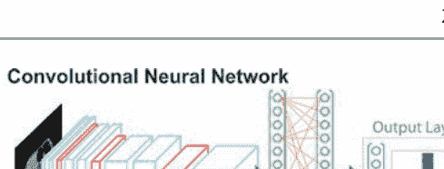

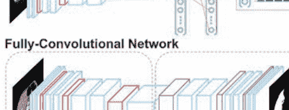

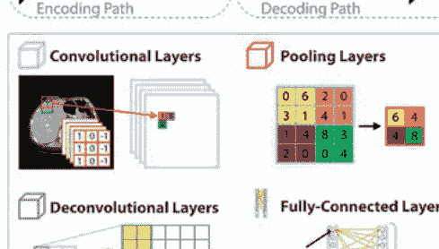

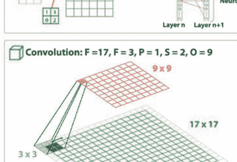

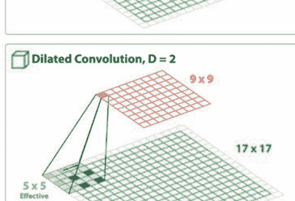

通过使用在点积过程中像素之间具有间隔的滤波器对层进行卷积。在这里，感受野被定义为特定CNN特征所关注的输入空间区域（即受其影响的区域）。例如，具有扩张 $D=2$ 的 $3\times3$ 滤波器具有等效的 $5\times5$ 滤波器的感受野（参见图11.3）。池化层通常在典型的卷积神经网络中紧随连续的卷积层之后。这些层通过减少卷积层输出体积的空间大小来减少参数和计算量。池化层对来自前一层的每个单独激活图进行空间调整，通常使用最大池化操作。为了进一步解释这个过程，我们举一个例子：使用 $2\times2$ 大小的滤波器进行卷积，步长为2的池化层会导致输入体积在每个维度上减小2倍。在这个2D场景中，池化层通过最大池化操作从4个数字中取最大值（$2\times2$ 滤波器大小），从而去除了75%的激活。还有其他池化操作，如平均池化或L2范数池化，但由于其数学简单性和可靠性，最大池化通常更受青睐。

全连接层在图像分割中现在不常用，但在理解上很重要，因为在CNN中常用于分类（例如，前馈/感知器）。这些层中的所有神经元都与前一层中的所有激活连接，并且可以通过矩阵乘法计算，使其计算速度比卷积层更快。全连接层在许多流行的CNN分类架构中被用作网络输出之前的最后几层；在特征提取（通过卷积层）之后，全连接层能够通过学习从卷积层输出的高级特征之间的函数将数据分类为N个定义的类别。

最初，像AlexNet [18]和VGG [75]这样的CNN架构被用于通过生成单个像素分类来进行分割。这种方法在计算上效率低下，因为由于相邻像素之间的输入块之间存在大量重叠，同样的卷积会被计算多次，并且导致像素预测与相邻像素之间缺乏相关性。

完全卷积网络（FCNs）是由Long等人引入的，旨在克服完全连接层作为分类CNN的最后一层实现时导致的空间信息丢失[76]。在这项开创性的工作中，作者修改了VGG16 [75]和GoogLeNet [77]，并用完全卷积层替换了所有的完全连接层。使用这种方法会导致模型产生空间分割图，而不是单个体素分类得分。Long等人使用跳跃连接将来自较早层的特征图串联起来，并将其与模型的最终层组合在一起，这些层被上采样回原始图像大小，以产生准确和详细的分割。这项工作是最早证明深度学习网络可以以端到端的方式进行语义分割的工作之一。

用于医学图像分割的大多数架构都基于从计算机视觉中成功方法的2D或3D变体进行调整。特别是在3D卷积计算效率和硬件方面的改进，尤其是快速增长的可用的GPU内存，促进了这些方法在3D图像处理中的推广。针对这些瓶颈，引入了基于块状结构的架构，其中使用2D \((N_x \times N_y)\) 或 3D \((N_x \times N_y \times N_z)\) 块状结构，以图像中的体素为中心。在这种简单的方法中，从整个图像中提取的块状结构，以及它们对应的标签图，用于训练分割网络。目前正在使用一些方法（移位和拼接、融合等）来组合单个块状结构分割概率图，以创建密集输出 [76, 78, 79]。一些结果表明，通过使用多尺度输入（具有不同块状结构大小的多个输入），可以改善块状结构架构的性能，从而为网络提供全局和局部上下文 [80, 81]。

#### 11.3.2 流行的深度学习自动分割架构

最流行的医学图像分割深度学习架构是U-Net [82]（图11.4）。虽然之前的研究已经提出了使用编码和解码路径来创建密集输出的方法，但Ronneberger等人将这种方法与跳跃连接相结合，将编码层到解码层的特征连接在一起[82]。因此，来自编码路径的更高分辨率特征以及来自解码路径的上采样特征使得该架构能够更好地定位和学习输入图像的表示。此外，U-Net允许高效的端到端训练，这意味着它不需要预训练的网络，而是可以通过很少的标记训练数据来产生准确的分割结果。Cicek等人将U-Net的原始2D应用扩展到使用3D图像来训练该网络[83]。

其他研究小组引入了原始U-Net架构的变体。Milletari等人提出了V-Net [84]，这是U-Net架构的3D版本，引入了Dice系数损失函数，并在每个分辨率阶段实现了残差学习[85]（图11.4）。U-Net的其他变体包括混合密集连接U-Net（H-DenseUNet）[86]，Res-UNet [87]和UNet ++[88]。每个从原始U-Net进行的改进都实现了新颖的策略，可以在与原始U-Net架构相比时实现更好的分割准确性。稠密U-Net利用架构层之间的稠密（或“跳跃”）连接；例如，H-DenseUNet使用重复的密集连接构建块（构建块是一组堆叠的卷积层），其中每个块与所有后续层都有连接[86]。使用稠密连接具有一些优势：层之间的稠密连接导致输出维度较传统网络少，避免了学习不必要的特征。此外，具有稠密路径导致每个层接收到之前层学习到的所有信息，改善了深度神经网络中的梯度流，这在训练和搜索最佳解决方案时是至关重要的。

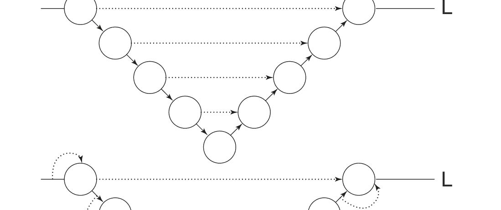

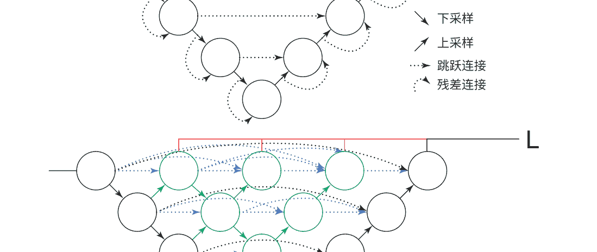

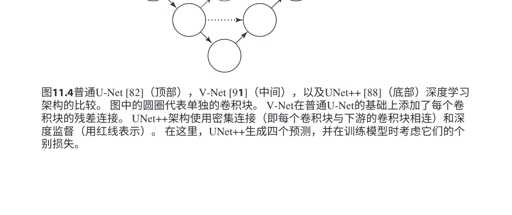

图11.4 普通U-Net [82] (顶部)， V-Net [91] (中间)， 以及UNet++ [88] (底部) 深度学习架构的比较。图中的圆圈代表单独的卷积块。V-Net在普通U-Net的基础上添加了每个卷积块的残差连接。UNet++架构使用密集连接（即每个卷积块与下游的卷积块相连）和深度监督（用红线表示）。在这里，UNet++生成四个预测，并在训练模型时考虑它们的个别损失。

修改后的残差块与He等人引入的残差块[85]相似；残差块对于减少深层结构中普遍存在的梯度消失和梯度爆炸问题非常有用。此外，他们在每个残差块中使用扩张（空洞）卷积来增加每层的感受野。

UNet++结合了先前引入的密集连接和深度监督，以进一步改进传统的U-Net。在UNet++中，编码路径的连接通过一个密集连接块，其中卷积层数取决于金字塔级别（图11.4中的绿色圆圈）。深度监督是深度学习中的一种技术，模型学习在网络的多个层次上生成输出的表示，并导致更快的收敛。

深度监督可以被看作是改进学习过程的一种方式；在这里，通过深度监督（即与医生批准的分割进行评估），检查网络中的先前层，以确保学习到的特征传递给后续层，并在网络变得更深时有助于识别附加特征。在这项工作中，作者设计了UNet++以在多个级别（图11.4中的红线所示）生成全分辨率的特征图，每个级别都有独立的损失度量，以便在网络的每个级别上集中学习。

Kamnitsas和合作者[80, 92]引入了DeepMedic架构，该架构使用多尺度3D CNN和完全连接的条件随机场[93]进行脑损伤分割（图11.5）。他们的双通道架构通过同时使用多个尺度的图像块，为网络提供了局部和更全局的上下文。其他研究小组也使用了这种多尺度方法来改善自动分割结果。例如，Roth等人使用了个多尺度金字塔的3D FCN进行腹部器官分割[94]。在这项工作中，作者使用来自两个尺度（低分辨率和高分辨率输入）的输入围绕相同的体素进行正常组织自动分割的改进[94]；这里，使用了两个FCN，其中第一个网络使用低分辨率图像，其输出被调整大小并用作高分辨率图像的附加输入。使用这种方法，作者能够从低分辨率图像中提供全局上下文，同时能够对高分辨率输入进行精细细节分割，并进行端到端的训练。

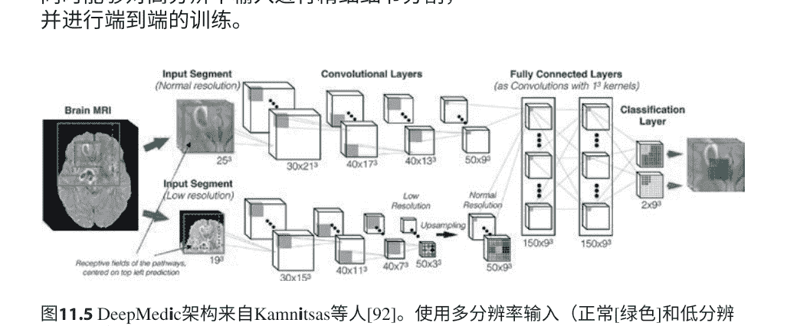

扩张卷积网络，如DeepLab系列和密集连接的空洞空间金字塔池化（DenseASPP）[95]在图像分割中非常流行。由Chen等人开发的DeepLabV1 [96]、DeepLabV2 [97]、DeepLabV3 [98]和DeepLabV3+ [99]（DeepLab系列）是深度卷积神经网络，在其发表时被认为是最先进的分割架构。在DeepLabV1中，作者使用空洞卷积来明确控制架构内计算特征图的分辨率。DeepLabV2增加了使用空洞空间金字塔池化（ASPP），允许网络以多个采样率对多个尺度的对象进行分割，从而为分割任务提供了额外的上下文。DeepLabV3在ASPP模块中使用图像级特征来捕获远程信息；此外，作者还包括批量归一化层以改善训练。DeepLabV3+实现了编码器-解码器架构，使用DeepLabV3框架作为编码器。此外，网络中使用了扩张深度可分离卷积和点卷积。类似地，DenseASPP [95]架构利用密集连接的空洞卷积层在深度网络中有效地生成密集的空间采样和尺度采样特征。该网络的一个优点是没有池化操作（没有编码/解码路径），因此网络中的每一层都捕获了输入图像的原始分辨率的特征。

虽然生成对抗网络（GANs）在医学影像学中找到了一个小众领域，可以从MR扫描中生成合成CT图像等合成图像，但是GANs也被证明在分割任务中产生了高质量的结果[100]。采用GANs的自动分割模型通常训练一个分割网络（生成器），该网络与一个对抗网络相结合，该对抗网络可以区分医生批准的分割图与由分割网络生成的分割图。这里的判别网络用于判断生成器网络是否能够生成“欺骗”判别器的分割图，即生成与手动轮廓不可区分的分割图（图11.6）。将这些网络耦合在一起可以得到一个端到端的解决方案，可以产生更加逼真的分割结果。虽然GANs在图像分割方面非常有前景，但是在训练过程中它们往往不稳定，导致模型无法收敛，生成器崩溃，或者判别器过于成功导致生成器的梯度消失，从而导致模型在训练过程中无法学习。

循环神经网络（RNN）以前已经被探索过，以利用3D图像分割的上下文信息。RNN通常与卷积神经网络（例如U-Net）一起使用，该网络在2D图像上生成分割结果，提供了切片内上下文，而RNN则利用切片间上下文来提高自动生成的分割结果的准确性。

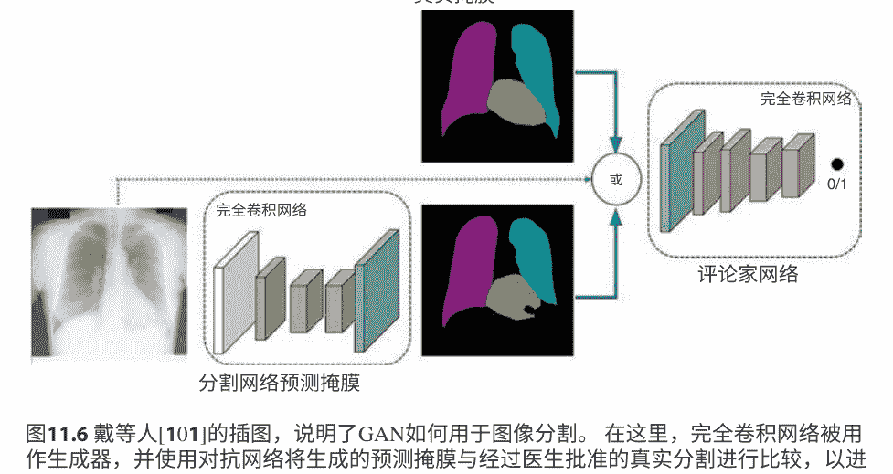

图11.6 戴等人[101]的插图，说明了GAN如何用于图像分割。在这里，完全卷积网络被用作生成器，并使用对抗网络将生成的预测掩膜与经过医生批准的真实分割进行比较，以进一步改进自动分割

## # 肿瘤学、医学物理及放射学中的机器学习与深度学习

基于注意力的图像分割架构近来变得流行起来。注意力门可以通过允许网络专注于图像中更相关的部分并抑制不重要的区域来减少冗余的模型参数。注意力的推导方式在不同的架构中可能有所不同；其中一个关键的变体是软注意力或硬注意力的使用。软注意力是指网络将上下文向量计算为编码器隐藏状态的加权和。硬注意力不同之处在于注意力分数被用来选择单个隐藏状态（例如，使用argmax函数）。硬注意力和软注意力方法都有所探索，但软注意力机制通常更受青睐，因为它们是可微分的，并且可以通过反向传播进行更新，使其相对容易训练。将注意力门纳入现有架构（如U-Net，图11.7）可以提高模型对结果分割的敏感性和准确性，而不会显著增加计算开销。

当使用U-Net作为示例时，在连接跳跃连接和上卷积层之前实现注意力门；通过仅合并相关激活，携带来自背景类的信息的梯度在反向传播过程中，通过降低权重，使得先前层的参数更新集中在与分割任务相关的空间区域。最近，已经开始研究通道注意力模块。在这里，通道是由卷积层块生成的特征图。可以将这些通道（或特征图）视为具有类别特定响应的，不同特征与各个分割类别/器官相关联的。此外，研究表明，将空间和通道自注意模块结合起来，与单独使用模块相比，可以进一步提高分割准确性。

### # 图11.7 Kearney等人的3D U-Net实现，使用注意力门的跳跃连接和深度监督


## ## 11.4 图像分割软件包和公开可用数据集

开源软件和公开可用数据集几十年来为医学图像研究做出了贡献和支持，推动了我们对计算算法的认识和理解，从而在算法开发和医学图像分析任务的各个方面取得了突破，包括图像分割。在本节中，我们提供医学图像分割开源软件的概述，强调公开可用数据集在推动医学图像分割研究方面的作用，并讨论当前商业系统中的自动分割工具。

### ### 11.4.1 开源图像分割软件包

过去十年中，已经开发了几种用于医学图像分割的开源软件工具。下面描述的软件工具提供了不同复杂程度的自动分割算法，包括基本的强度阈值技术、半自动方法（使用用户定义的种子的主动轮廓）、基于图谱的算法以及最近的深度学习算法。本节描述的工具是为研究而开发的，不适用于临床使用。

3D Slicer是一款用于医学图像分析和可视化的软件平台[104]。它支持多模态成像，包括MRI、CT、超声、核医学和显微镜图像。3D Slicer在医学成像界广泛使用，因为它提供了插件功能，可以添加新的算法和应用。其中一些插件的例子包括半自动PET肿瘤分割[105]，GrowCut方法的快速实现[106]，以及DeepInfer[107]，它是一个深度学习部署工具包扩展。ITK-SNAP是一款专注于医学图像分割的软件工具[108]。它的界面提供了手动分割和图像导航工具，并配备了半自动分割工具，使用主动轮廓分割算法。ITK-SNAP的最新版本（3.8.0）引入了分布式分割服务（DSS），它是一种允许实现分割任务的架构的互联网服务[109]。DSS为分割算法开发人员提供了一个平台，使他们的算法可以公开供ITK-SNAP用户使用。

Plastimatch [110]是一个软件工具，用于执行医学图像的体积配准（即CT、MR、PET），并提供了一个系统来执行基于多模板的分割（MABS）。在Plastimatch中，用户可以使用MABS来准备自己的模板，执行分割，并在MABS中调整参数以进一步提高自动分割的质量。MABS的一个特点是用户可以选择配准策略，包括算法和配准度量。Seg3D是另一个专门用于医学图像分割的开源软件工具[111]。其界面允许用户使用基本的半自动分割工具，如强度阈值分割和水平集分割，该分割使用种子在数据体积中查找与原始种子相似的区域，使用种子区域中计算的统计量来确定体积扩展的范围。

随着深度学习分割研究在过去几年的迅速发展，出现了几个开源平台，以增加对这些算法和训练模型的访问和可用性。深度学习工具包[112]（DLTK）是一个用Python编写的神经网络工具包，它使用TensorFlow[113]作为其后端，TensorFlow是一个用于开发和训练机器学习模型的开源库。DLTK拥有一个模型库，提供了有限数量的分割模型。NiftyNet [114]是另一个基于TensorFlow构建的开源卷积神经网络平台，用于医学图像分析和分割研究。NiftyNet提供了一种简便的方式来共享网络和预训练模型，以及常用架构（如U-Net、DeepMedic）、损失函数和图像分割的综合评估指标列表的实现。

在2020年初，NiftyNet的开发人员决定将开发工作从NiftyNet转向Project MONAI（医学开放网络人工智能）。MONAI[115]是一个使用PyTorch[116]进行医疗影像深度学习的框架。虽然还处于早期阶段，但MONAI提供了训练体积图像分割模型的教程示例。Eisen是另一个基于PyTorch直接构建的框架，可以简单快速地开发和实验深度学习模型。Eisen [117]提供了一个功能，用户可以通过可视化混合（拖放）Eisen构建块来设计实验和定义深度学习工作流程。使用卷积神经网络进行医学图像分割[118]（MIScnn）是一个开源的Python库，它提供了基于Keras和Tensorflow的医学图像分割流水线的API。它提供了各种2D和3D分割架构以及用于医学图像分割模型训练的常用损失函数。NVIDIA的Clara [119]是一个用于AI驱动的成像、基因组学以及智能传感器开发和部署的医疗应用框架。通过Clara Train SDK，Clara允许使用联邦学习和迁移学习等技术进行AI辅助标注和协作学习，从而使研究人员能够在保护数据隐私和安全的同时进行协作和构建AI模型。此外，Clara还提供了Clara Deploy SDK，用于创建AI模型推理的应用工作流程。

### **11.4.2 公开可用的数据集**

公开可用的数据集与手动标记的分割结果的可用性促进了分割算法的发展。这些数据集通常作为“大挑战”的一部分进行发布，通常由美国医学物理学会（AAPM）、医学图像计算与计算机辅助干预学会（MICCAI）和国际光学与光子学学会（SPIE）等组织主办。这些分割挑战允许参与者评估他们的算法在一个共同的基准图像数据集上的性能。癌症影像存档[120]（TCIA）在向公众提供医学影像数据集方面发挥了巨大作用。TCIA数据以患者队列或“集合”形式组织，许多公开可用的数据集提供包含临床轮廓或为特定目的生成的轮廓（即分割挑战）的RTSTRUCT文件。类似地，网站https://grand-challenge.org（于2020年7月27日访问）为医学影像社区提供了一个方便、安全地上传医学影像数据的平台。通过这个网站，全球的研究人员能够共享医学影像挑战数据，促进学术竞赛中的算法发展。一些流行的分割挑战数据集，如LiTS [121]、BraTS [122]、KiTS [123]、SegTHOR [124]、RT-MAC[125]、PROMISE12 [126]、Head And Neck Auto-Segmentation Challenge [50] 都在该网站上进行了广告宣传。

目前，由于数据共享的众多障碍，放射肿瘤学数据集相对稀缺。作为一个社区，我们应该努力推动和采用跨机构和国际边界的数据共享解决方案。关于放射肿瘤学中的数据共享障碍，Thompson等人[127]建议“就像公共研究必须要求开放获取出版物一样，也许符合FAIR标准的DICOM-RT和匹配的临床数据出版物应该成为任何公共资助的放射治疗试验的要求。”获得标准化数据集可以进一步促进算法的开发，并作为算法评估的共同基础；然而，应考虑几个因素以确保策划的数据集能够代表多样化的临床人群，以减少隐含的偏见。对于图像分割，拥有训练数据中具有代表性的患者分布以及明确指示这一点非常重要。对于广泛分布的模型，这些模型应包括具有各种解剖学表现（即手术后）、患者体位（仰卧、俯卧等）以及人口统计学和临床背景的患者。对于特定于某一患者群体的模型，训练数据可以限制在该特定群体，但应明确注明此限制，以免将模型错误地应用于其他患者群体。此外，为了实现自动分割的高鲁棒性，考虑医学图像的质量非常重要。例如，图像噪声、空间分辨率和低对比度等因素可能会影响分割结果的质量。

#### 11.4.3 商业系统

第一代和第二代自动分割工具，如强度阈值和区域生长算法，几乎包含在每个商业轮廓软件中。第三代和第四代技术在平台上的可用性更加新颖且不断增长。

Raystation、Velocity、Elekta和Philips提供基于模型的分割，适用于少量供应商定义的具有可调形状、大小和属性参数的风险器官。目前有许多商业系统提供基于图谱的轮廓 [128]。Mirada Medical提供WorkFlow Box，使用可变形图像配准自动将轮廓应用于CT。MIM Software拥有MIM Maestro，可以使用自动专家图谱或用户定义的图谱。这些可以按照TNM状态、病变侧性或医生进行排序。可以选择多个图谱来开始自动分割，这种情况下，为每个图谱创建一个结构集，并对每个轮廓使用STAPLE。Elekta拥有基于图谱的自动分割（ABAS），通过扫描参考图像库来近似轮廓。

用户可以从库中选择一个图谱，或选择使用STAPLE算法。用户无法在ABAS中查看或编辑轮廓，但可以将轮廓导入其他轮廓软件。飞利浦提供智能概率图像轮廓引擎（SPICE），它位于治疗计划系统Pinnacle中。SPICE使用刚性和可变形配准的组合，以及基于概率的结构细化。Raystation提供解剖约束变形算法（ANACONDA），它使用图像强度和解剖信息的混合模型。

Velocity具有基于图谱的模型，使用B样条可变形图像配准。它既有专家图谱，也允许用户定义图谱[129]。Velocity允许对个别结构进行局部可变形配准，从而在结构创建之前实现更好的匹配。Velocity还允许用户定义排除区域，例如由于牙齿工作或手臂引起的高对比度伪影，以实现更好的配准。Varian在治疗计划系统Eclipse中提供了SmartSegmentation，专注于基于CT的自动分割。SmartSegmentation提供了基于可变形图像配准算法的自动分割解决方案（Demons算法的增强形式结合多分辨率方法[24]）。Brainlab在其治疗计划软件中提供了基于图谱的轮廓，可轮廓解剖和外科结构[130, 131]。参考图谱是基于单个患者的CT构建的，采用可变形图像配准和主动后处理进行分割。其他商业图谱分割系统包括Dosisoft的IMAgo，OSL的OnQ RTS和Accuray的MultiPlan。

目前，商业上可用的基于深度学习的分割选项较少，尽管随着许多供应商投资于开发这些工具，情况正在迅速改变。其中大部分是黑盒系统，对其设计的信息很少。Mirada的DLCExpert使用卷积神经网络对各种解剖部位的器官进行自动分割。

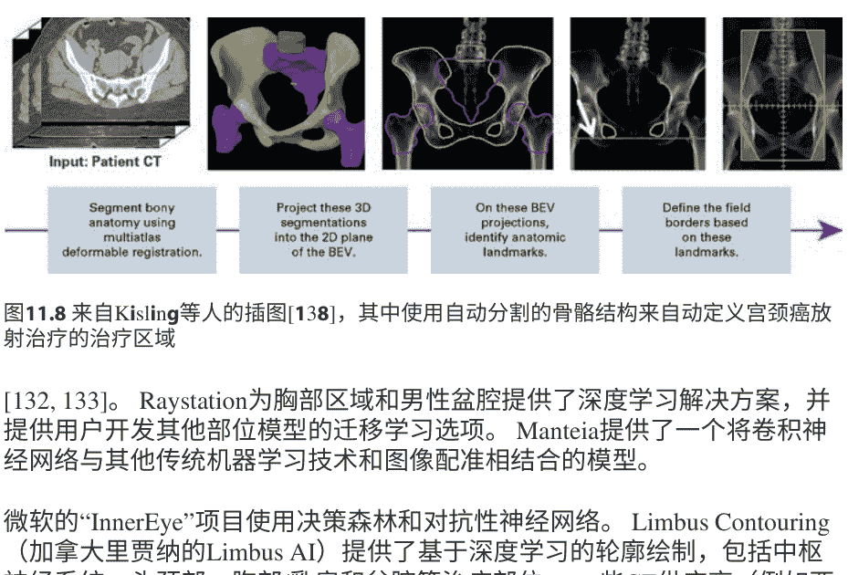

[132, 133]。Raystation为胸部区域和男性盆腔提供了深度学习解决方案，并提供用户开发其他部位模型的迁移学习选项。Manteia提供了一个将卷积神经网络与其他传统机器学习技术和图像配准相结合的模型。

微软的“InnerEye”项目使用决策森林和对抗性神经网络。Limbus Contouring（加拿大里贾纳的Limbus AI）提供了基于深度学习的轮廓绘制，包括中枢神经系统、头颈部、胸部/乳房和盆腔等治疗部位。一些CT供应商（例如西门子的SOMATOM go.Sim）也提供基于人工智能的自动轮廓绘制。

放射治疗规划助手（RPA，https://rpa.mdanderson.org）是德克萨斯大学MD安德森癌症中心正在开发的基于云的服务，提供一套完全自动化的轮廓和放射治疗规划工具（图11.8）。虽然RPA目前可用于回顾轮廓和放射治疗计划[137-140]，但它正在寻求美国食品和药物管理局的医疗器械许可，以将RPA提供给放射治疗有限且不易获得的低收入和中等收入国家。RPA使用基于深度学习的自动分割模型，自动生成各种治疗部位的轮廓[141-146]。

### 11.5 自动分割软件的委托和质量保证

当轮廓用于放射治疗计划过程中时，分割中的任何错误都会对患者的治疗产生严重影响。根据AAPM TG 275《放射治疗中有效物理计划和图表审查策略》，放射治疗计划中排名前十的故障模式中，有两个是由于“错误”或“不准确”的靶区轮廓[147]。根据错误的位置和程度，正常组织（例如脊髓）可能会接收到意外剂量，或者靶区可能会接受不足的治疗。因此，对自动分割算法进行适当的评估和委托，对系统进行例行程序维护，并对自动分割进行患者特异性验证非常重要。

#### 11.5.1 自动分割评估

委托过程涉及对给定软件的功能进行测试，并记录其不同能力的文档。分割软件最明显的测试是通过与手工绘制的轮廓进行重叠和距离度量的比较来评估分割的准确性。关于医学成像分割定量分析中使用的重叠和距离度量的详细回顾可以在Taha和Hanbury的出版物[148]中找到。在下面的段落中，我们对文献中最常用的分割度量进行了简要总结，并介绍了一些最近提出的度量方法（图11.9）。值得一提的是，定量度量可以用于评估自动分割与其对应的医生批准（手动）分割之间的相似性，但它们也可以用于评估多个观察者之间的手动分割以量化观察者间的变异性，并评估单个观察者的多个轮廓以测量观察者内的变异性（即可重复性）。

```
$$\boxed{DSC} = \frac{2|A\cap B|}{|A|+|B|} \tag{11.1}$$
```

其中|A|和|B|分别表示轮廓A和B的体积，|A ∩ B|表示轮廓A和B之间的交集体积。DSC的值范围在0到1之间，得分为1表示完全重叠，得分为0表示分割之间没有重叠。Jaccard指数[150]（JI）与DSC类似，值范围从0到1（1表示完全重叠）；JI测量两个轮廓之间的交集（|A ∩ B|）与并集（|A ∪ B|）（公式11.2）。

```
$$\boxed{JI} = \frac{|A\cap B|}{|A\cup B|} \tag{11.2}$$
```

在比较两个分割的表面距离度量时，平均表面距离（MSD）通常被称为平均对称表面距离（ASSD）[54]，而Hausdorff距离[151]（HD）通常被称为最大对称表面距离（MSSD），在医学图像分割研究中经常使用。这些度量计算两个闭合表面上有限点之间的最小距离（通常为欧氏距离）（方程式11.3）。在这里，对于一个体积A，距离是从体积B中的每个点（b）到体积A上的每个点（a）计算的，结果是一个与体积A表面上的点数相等长度的距离向量（d（A，B））。

图11.9所定义的重叠和距离度量的可视化表示，以及表面Dice度量

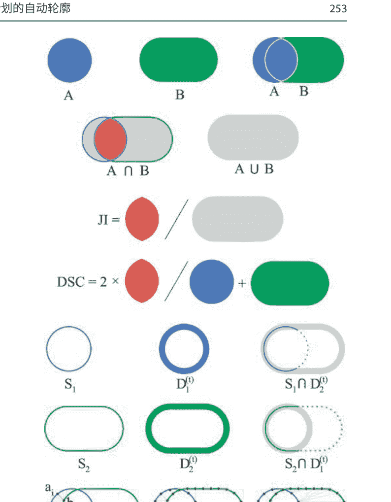

```
$$d(A,B) = \min_{a \in A, b \in B} ||a - b||$$
```

一般来说，这些距离是在两个方向上计算的（即，A → B和B → A），并且从两个表面计算的距离列表用于计算MSD和HD。MSD和HD分别在公式11.4和11.5中定义。

```
$$MSD = \frac{1}{2}\left( \frac{1}{N_a}\sum_{b \in B} d(b, A) + \frac{1}{N_b}\sum_{a \in A} d(a, B) \right)$$
```

```
$$HD = \max\left( \max_{a \in A} d(a, B), \max_{b \in B} d(b, A) \right)$$
```

HD的一个局限性是它对异常值敏感。因此，文献中经常使用第95百分位HD（95HD）（公式11.6）。

```
$$95HD = \max\left( percentile(d(A, B), 95), percentile(d(B, A), 95) \right) \tag{11.6}$$
```

在这里，95百分位是根据计算出的距离向量计算的。

最近，Nikolov等人引入了表面Dice作为一种比较两个分割体积的新度量[152]。在这里，每个体积的表面（S1和S2，图11.9）使用预定义的容差值（τ）进行膨胀。然后，使用膨胀的表面（即D1(τ)和D2(τ)）来计算非膨胀和相反膨胀表面之间的重叠（即S1∩D2(τ)）。使用表面Dice的一个优点是它允许生成器官特定的容差值，这些容差值可以使用多个观察者的手动轮廓生成（Nikolov等人使用多个分割的距离的第95百分位[152]）；然而，使用这个度量来比较文献中的研究时，需要生成每个器官的容差值，并且这些容差值可能依赖于多种因素，如解释者的经验、图像模态、图像质量等，这可能是使用这个度量的一个限制因素。

最后，Vaassen等人最近引入了添加路径长度（APL）作为评估手动调整自动分割的度量标准[133]。在这项研究中，作者们展示了在手动编辑自动分割器的过程中，需要添加的轮廓的路径长度（无论是通过缩小还是扩大体积）与满足机构轮廓指南所需的时间密切相关。

#### 11.5.2 患者特定评估

目前，对于自动轮廓的患者特定评估还没有具体的指导，因为自动分割系统在临床中的应用还没有得到广泛采用。随着这些工具的使用增加，需要在AAPM报告发布之前提供指导。以前的AAPM报告可以填补这一空白。AAPM TG-132 [153]是关于放射治疗中图像配准的报告，其中的概念直接适用于自动分割。AAPM TG-132指出：“对于图像配准系统的初始委托，需要进行定量验证；然而，对于图像配准的患者特定评估，由于时间和资源有限以及确定基准真实性的困难，定量验证并不总是可行的。”同样，对于自动轮廓，基准真实轮廓也无法参考。因此，这些轮廓必须由剂量师、物理师或医生进行定性评估。在委托过程中，应该建立关于每个轮廓可以有多少偏差的具体指导。自动轮廓可能与手动轮廓不同，但这些差异应该很小，对于大多数轮廓而言，只会对轮廓进行微小的外观变化，几乎没有剂量学影响，否则该工具就不是一个适合临床的合适选择。编辑自动轮廓可能是一项耗时的活动；因此，在委托时建立的指导方针将决定哪些轮廓需要在定性审查期间进行手动编辑。

还研究了自动分割的自动质量保证[141, 154-156]。这些测量ROI特定特征（质心、体积、形状等），并使用统计方法来确定分割体积中的任何大偏差。例如，另一种建议的方法可以使用主要分割算法的结果，并将其与次要验证算法进行比较[141]。这种方法要求两个算法是独立的，因为假设它们会以不同的方式失败。虽然这种方法不能替代主治医师对轮廓的仔细审查的需求，但它可以帮助标记需要额外关注的病例。

#### 11.5.3 委托和质量保证

然而，临床使用的评估需要比仅仅定量分析更全面的评估。委托过程应包括使用来自本地机构的患者数据进行广泛测试，以确保软件在其图像类型、患者解剖等范围内按预期工作。此外，还重要的是确保在一个软件工具中创建的分割能够正确导出/导入到其他系统，并且所有分割信息能够一致准确地传输到治疗计划系统。如果分割对于任何这些组合都不能足够、准确或可靠地工作，则应清楚记录这种限制，以便用户知晓，并且供应商可以解决这些问题。最后，重要的是培训用户，使他们了解自动分割软件的潜力和限制（风险）。

AAPM TG-53提供了关于TPS质量保证的信息[157]。它详细介绍了治疗计划过程中的许多QA检查，不仅仅是系统本身。它具体讨论了应在表3-4和3-5中执行的测试（参见AAPM TG-53）。MPPG 5a讨论了TPS的委托，强调应在委托中使用代表性患者病例[158]。同样，对于自动分割，应选择代表性患者用于委托，并使用其中的一部分进行常规QA，如MPPG 5a所建议。这样的特定部位（如腹部、胸部）使用自动分割工具应单独进行委托。同样，如果自动分割工具用于单一或多模态成像，应在适当的成像模态（如CT、CBCT、MR）上对工具进行评估。在委托过程中应进行轮廓相似性和剂量比较，以建立临床使用的指导。TG-132提出的两个定量指标用于委托和QA，涉及轮廓的使用，因此可以直接应用于自动分割评估[153]。这些指标是一致性均值距离（是MSD的单向等效，即仅A→B）和DSC，应用于确定手动轮廓之间的相似性。

轮廓和自动轮廓。用于此目的的手动轮廓应在临床的典型工作流程中进行，无论是剂量师、物理学家还是医生对解剖进行轮廓。实现这一目标的简单方法是选择先前治疗过的患者。TG-132建议的这两个定量指标的容差可以应用于此处：平均一致性距离应“在结构或最大体积尺寸的轮廓不确定性范围内（约2-3毫米）”，DSC应“在结构的轮廓不确定性范围内（约0.80-0.90）”。

对于剂量比较，应使用使用手动轮廓和典型工作流程生成的计划，然后在自动轮廓上重新计算。定性DVH分析可以与每个OAR的特定临床终点一起进行，以确定自动轮廓是否提供准确合理的表示。还应使用自动轮廓创建计划，然后进行比较，以确定由于使用它们而导致的优化是否有重大差异。使用先前治疗过的患者也将使此步骤更容易，因为无需在手动轮廓上创建治疗计划，因为这已经存在。轮廓和剂量评估的结果应允许对自动轮廓进行必要的编辑的具体指导（例如，识别不需要使用的整容变化）。这应该在培训期间清楚地记录和呈现给将在临床中使用自动分割工具的人员。确保准确性的一种方法是端到端测试。如果自动分割工具将在临床护理路径中使用（无论是在治疗计划期间还是在图像引导或自适应治疗期间在线使用），将这些工具纳入端到端测试是可取的，但目前尚无自动分割评估的方法。

在自动分割工具的投入使用后，应建立适当的容忍度和行动水平（作为站点、成像模态和临床终点的函数）。对这些工具的评估应通过持续的定期质量保证计划进行。在自动轮廓软件更新后，应进一步评估其性能变化可能对临床分割质量产生的影响。此外，需要注意的是，模拟过程的变化（例如，患者定位、使用新的模拟设备）可能会对自动分割工具的性能产生意想不到的影响。因此，任何成像或模拟协议的变化都应伴随着使用质量保证计划中的已建立测试评估工具性能。质量保证测试的结果可能表明软件更新或程序修改是否产生了符合可接受水平的结果。由于轮廓可能导致放射治疗的主要故障模式，执行类似于AAPM TG-100中描述的故障模式与影响分析可以进一步阐明潜在的故障模式[159]。在将新技术纳入临床护理路径时，强烈建议进行这样的过程，因为新技术可能会引入新的故障模式。

一旦校准过程完成，并且物理学家建立了一个质量保证程序，软件就可以发布供临床使用。对于自动分割软件，培训用户并强调潜在的限制和在校准过程中发现的风险是至关重要的。

在校准过程中发现的风险。之后需要进行一些例行维护，以确保软件继续以一致的方式运行。然而，现在的质量重点是在个别患者的基础上进行的。在治疗计划中使用之前，所有分割都应该经过当地临床人员（如放射肿瘤学家）的仔细审查和批准。

在部署的初期阶段，自动分割软件的输出应该被视为一个实习生完成轮廓的结果，也就是说，这可能是一个合理的起点，但是仔细审查是必要的。通过质量保证轮廓评估进行同行评审的好处已经有过报道[160-162]，建立类似的实践来评估自动分割结果，即使是已经证明具有出色分割效果的算法，也可以确保放射治疗的整体安全性。

#### 11.5.4 自动分割算法的当前限制 开发和实施

自动分割算法的发展和使用存在几个重要限制。自动分割应用中存在许多与数据相关的挑战，特别是对高质量分割数据集的要求。自动分割算法的性能不仅取决于分割数量，还取决于用于训练或开发模型的分割质量（即先验知识）。通过采用已建立的国际共识指南，可以通过标准化手动轮廓来解决这个限制。

减少观察者之间和观察者内部轮廓的变异性可以进一步提高现有模型的预测准确性。

许多算法在生成自动分割时提供非常少的可解释性，很难理解哪些特征（解剖学和/或图像强度）在生成自动分割中起重要作用。基于多图谱的分割和基于深度学习的分割都受到这个限制的影响，这可能会阻碍研究人员或最终用户充分理解和确定不准确分割的原因。

各个算法都有自己的局限性。对于第一代和第二代技术，图像中的对比度和噪声对分割的性能起着重要作用。对于基于图谱的方法，自动分割的质量与配准算法的性能密切相关。如果图谱患者与参考患者的图像之间的配准不好，那么预期基于图谱的方法会生成质量较差的分割。深度学习方法可能会出现过拟合问题，这通常发生在模型在训练集中捕捉到的模式的准确性远高于模型在未见数据上的预测准确性时。基于深度学习的图像分割中过拟合的主要原因之一是使用的样本数据集不代表更大的患者群体。内部器官的位置和形状可能因患者在图像获取过程中的设置方式而有很大的变化。

患者的临床表现（例如，由于病理学引起的解剖和密度变化）和/或先前的干预措施，如手术。

最后，图像采集协议的变化可能会影响自动分割算法的性能。Ger等人使用局部头部协议、局部肺部协议和控制协议在100台CT扫描仪上扫描了一个放射学模拟体[163]。尽管只有20%的扫描仪位于放射治疗部门，但在头部和肺部协议扫描中使用的设置有很大的差异，这将导致噪声和部分体积效应的差异。控制协议可以减少超过50%的成像特征的变异性。然而，对于患者来说，这样的标准化协议并不是每个机构都会看到的，因为每个机构都会优化其扫描协议，因此局部协议扫描的变异性是一个现实的快照。这可能会导致一些模型无法转移，因为它们只使用一个机构的训练数据，而该机构使用的扫描协议与另一个机构显著不同。最近，黄等人展示了这些成像协议设置对基于图谱和基于深度学习的自动轮廓的潜在影响[164]。这项工作表明，基于深度学习的自动分割可能比基于图谱的方法更具鲁棒性，可以适应成像协议的变化。

### 11.6 医学图像自动分割的最新成果概述

以下部分总结了最近发表的自动分割作品在正常组织、肿瘤和临床靶区方面的最新成果。

#### 11.6.1 正常组织

##### 11.6.1.1 颅脊髓

人类中枢神经系统由大脑和脊髓组成。用于中枢神经系统解剖成像的两种主要体积成像模式是MRI和CT。总的来说，MRI具有优于CT的软组织对比度，并且可以通过利用弛豫时间的差异来区分不同的组织。为了将大脑与非大脑结构（例如皮肤、颅骨、眼睛）隔离开来，在许多神经影像工作流程、形态学研究和涉及临床诊断的研究中，“去颅骨”或大脑提取是一个必要的步骤。已经开发了许多著名的自动去颅骨方法，包括基于数学形态学的方法、基于强度的方法、可变形表面的方法、基于图谱的方法和混合方法，并且在Kalavathi等人的论文[165]中进行了详细讨论。然而，这些方法可能会因MRI扫描的类型和扫描中存在的病理而失败。

为了解决这些失败，使用卷积神经网络的三维深度学习方法被提出了用于改善头骨剥离失败的三维深度学习方法，以提高头骨剥离在不同成像模态和病理学中的鲁棒性。当这些深度学习方法在来自预处理连接组计划[166]的公开可用的头骨剥离数据库上进行评估时，提取的大脑的平均DSC值、敏感性和特异性超过0.985 [167, 168]。

2013年，通过MICCAI启动了MRBrainS13研讨会，使用3T多序列（T1w， T2-FLAIR和T1-IR）MRI扫描来分割白质（WM），灰质（GM）和脑脊液（CSF）。领先的团队能够分割WM， GM和CSF，其DSC平均值分别为0.88， 0.84和0.78 [169]。为了分割脑内的其他亚结构，Moeskops等人使用了一个具有9个分支的CNN架构，输入T1w， T2-FAIR和T1-IR扫描，并输出WM，皮质灰质（cGM），基底节和丘脑（BGT），小脑（CB），脑干（BS），侧脑室脑脊液（lvCSF），外周脑脊液（pCSF）和白质高信号强度（WMH）的分割结果[170]。使用这种方法，各结构的平均DSC值分别为0.87， 0.85， 0.82， 0.93， 0.92， 0.93， 0.76 [171]。2018年，Luna等人设计了一个三维分块U-Net模型，带有过渡层，用于分割GM， BGT， WM， WMH， CSF，脑室，小脑和脑干，其平均DSC值分别为0.86， 0.83， 0.88， 0.65， 0.84， 0.93， 0.94和0.91 [171]。

在脑放射治疗计划中，MRI具有优势，可以准确勾画脑部及其亚结构。然而，由于MRI图像体素不包含异质剂量计算所需的相关电子密度信息，必须将CT图像与MRI扫描进行配准以便进行剂量计算。为了评估脑部及其亚结构的剂量，可以将使用MRI制作的轮廓映射到CT上，或者仅使用CT生成轮廓。在MRI扫描被禁忌或成本过高的情况下，许多作者研究了使用GANs进行跨模态合成，从CT扫描或反之亦然生成合成MRI扫描[100]。这样的工作可能很快允许在一种成像模态上制作的轮廓直接映射到合成扫描中，以用于自适应放射治疗或图像引导。尽管由于软组织对比度差，自动勾画颅部结构的兴趣历来有限，但最近进行了使用基于图谱的方法的研究[172, 173]（图11.10）。本节描述了直接从CT图像中自动分割脑和脑干的当前深度学习方法（请参见第11.6.1.2节）。MRI图像中脊髓的分割在神经疾病研究中有许多应用。脊髓的大小或形状变化已知与皮层活动的变化相关，并且还可以评估功能障碍[174, 175]。为了对脊髓MRI图像中灰质和白质分割的最新性能进行表征，组织了脊髓灰质分割挑战赛[176]。Perone等人最近提出的一种使用深度扩张卷积来分割脊髓灰质的方法，在该公共数据集上的平均DSC为0.85 [177]。脊髓也可以在CT图像上轻松勾画，用于放射治疗的目的。图11.10来自Irimia等人的插图[172]展示了图像分辨率对自动分割的影响（B行与C行）。作者使用全分辨率（1×1×1.25 mm³，B行）和降采样分辨率（1×1×3.75 mm³，C行）的CT扫描评估了模型。如预期，降采样图像上的分割受到了空间分辨率较低的限制，导致分割质量较低。为了进一步可视化分割的灰质，作者提供了T1加权MR图像（A行）；在这里，白质分割没有被勾勒出来，以便欣赏白质/灰质之间的对比区域。

计划。由于脊髓是一个串行器官，当剂量容忍度超过时对患者有严重后果，准确勾画脊髓是至关重要的。根据Cardenas等人对自动分割的综述，许多深度学习研究报告了脊髓的DSC值，范围从0.82到0.96 [20]。

脊髓周围和保护脊髓的是脊柱。为了执行与医学图像相关的任务，如放射治疗计划、肿瘤外科分期、图像引导干预或临床诊断，必须定位（即标记）和/或分割脊柱的特定区域。可以通过MRI来可视化软组织并发症的评估或脊柱的受累情况，而CT成像则最能可视化骨骼完整性或空间准确的三维形态[178, 179]。除了定位和分割是耗时的任务外，与解剖异常（例如脊柱侧弯，非典型的椎体数目）和影像学协议的变化（例如视野，层厚，患者定位）相关的挑战使得定位和分割的自动化变得困难。这些领域的最新进展是由高质量数据集的可用性、国际挑战、多中心研究和机器学习与深度学习的创新推动的。

SpineWeb (http://spineweb.digitalimaging-group.ca/) 存档的数据集和挑战包括CT、MRI、平面X射线和其他成像模式。这些挑战涉及CT上的椎体定位和分割[180, 181]，MR上的椎间盘定位和分割，以及其他许多问题。

这些竞赛中的许多都是通过MICCAI或年度CSI研讨会举办的。为了为研究人员提供一个共同的基准，开发准确的算法，Sekuboyina等人组织了大规模椎骨分割挑战（VerSe），并与MICCAI 2019一同举行。VerSe提供了迄今为止最大的公开可用CT扫描集合（141名患者的160个图像系列；1725个椎骨的标注掩模）[182]。从这个比赛中，Payer等人的方法[183]使用了空间配置网络加上U-Net，在测试集中脊柱的所有椎体上获得了89.8%的DSC和94.2%的识别率[184]。

基于深度学习的定位的一个挑战是找到一种有效的方法来将远距离解剖标志的长程上下文信息编码到模型中。为了自动标记CT图像中的椎体，作者们采用了多种方法，包括多视图框架[142, 185, 186]（图11.11），循环网络[187, 188]，隐马尔可夫模型[189, 190]或其他分类技术[191-193]来结合CNN进行定位。许多定位网络，例如Payer等人的方法，采用两步法，先进行定位，然后进行分割[183]。在其他情况下，网络使用一个框架同时进行定位和分割[189, 192, 194]。Lessmann等人的方法是一个例子，他们的FCN进行迭代实例分割、解剖标签回归和可见性预测[192]。这种方法在MRI和CT图像上进行了验证，并在VerSe 2019挑战赛中获得了第二名，DSC为85.85%，识别率为89.9%。

图11.11 Netherton等人提出的X-Net架构[142]用于通过自动分割各个椎体的质心来自动标记椎体。该模型使用多视图输入，从患者的CT扫描生成矢状和冠状强度投影图像。

##### 11.6.1.2 头颈部

头颈部癌症放射治疗计划被认为是最复杂的部位之一，因为头颈区域存在大量的风险器官。开发一个自动轮廓工具可以减轻这个过程的复杂性，节省大量轮廓这些组织的时间。

因此，许多关于自动轮廓头颈部正常组织的研究已经由各个团体进行。此外，通过AAPM或MICCAI年会进行了许多挑战和竞赛，以研究开发自动轮廓工具的最佳方法。

CT是头颈部放疗规划过程中主要的成像模态，因此，大部分用于头颈部正常组织的自动轮廓工具都是针对CT图像开发的。Nikolov等人[152]训练了一个3D U-Net来自动轮廓21个头颈部正常组织（脑、脑干、耳蜗、泪腺、晶状体、肺、下颌骨、视神经、眼眶、腮腺、脊柱管、脊髓和颌下腺），并实现了0.57至0.99之间的平均DSC值（图11.12）。他们从TCIA[120]获取了CT图像，并从放射肿瘤学家和放射治疗技师那里创建了手动轮廓来测试他们的模型，然后公开提供这些轮廓，以便其他研究人员可以将其用作基准数据。Rhee等人[141]使用基于CNN的分类架构来限制头颅-尾状方向上的CT切片范围，并应用分割模型来自动轮廓16个正常组织，使用3D V-Net [84]实现了0.41至0.98之间的平均DSC值。Wang等人使用了一个两阶段的3D U-Net框架[196]（图11.13），其中器官感兴趣的边界框位于第一阶段，然后在第二阶段对边界框进行细分。他们对下颌骨、腮腺、脑干、颌下腺、视神经和交叉点分别实现了0.93、0.86、0.88、0.76、0.74、0.4和0.45的平均DSC值。Iyer等人[197]使用DeepLabV3+在2.5D中开发了一个专门用于吞咽和咀嚼结构的自动轮廓工具，其中模型输入由三个连续切片组成，对右质量肌、左质量肌、喉、左内翼状肌、右内翼状肌和收缩肌分别实现了0.88、0.87、0.83、0.81、0.80和0.67的平均DSC值。

尽管头颈部放射治疗计划完全基于MR图像并不常见，但MR-LINAC在线自适应治疗的可用性增加了开发基于MR的头颈部正常组织自动轮廓工具的愿望。Lei等人[198]使用3D Faster R-CNN [199]分割了八种正常组织，分别得到了0.89、0.89、0.85、0.85、0.84、0.82、0.81和0.79的平均DSC值，分别对应口腔、脊髓、下颌骨、咽、食管、左腮腺、右腮腺和喉咙。

##### 11.6.1.3 胸部

身体胸部区域的正常组织结构示例包括乳房、淋巴结（例如锁骨上、腋窝、内乳）、脊髓、肺、食管和心脏。这些结构通常在CT或MRI图像用于放射治疗计划的目的。手动轮廓这些器官的指南通常可以在国际共识指南中找到，例如来自北美放射治疗肿瘤学组织（RTOG）和欧洲放射治疗与肿瘤学协会（ESTRO）的指南。为了进一步提高轮廓的一致性和效率，可以使用图谱和深度学习方法来自动轮廓胸部区域的正常组织结构，以进行放射治疗计划。尽管在胸部结构的任何成像模态中都不存在黄金标准库，但通过专业组织举办的各种大挑战已经建立了用于评估准确自动分割技术的基准数据集。其中一个例子是AAPM 2017年胸部自动分割挑战赛。

从多个诊所提供的CT数据和RTOG引导的分割（左右肺、心脏、食道和脊髓）在癌症影像存档（TCIA）中可供参与者训练和测试其自动分割技术[51, 120]。从比赛结果中发现，深度学习在准确性和预测时间方面优于基于图谱的分割[51]。其他证据表明，基于深度学习的分割方法在性能上优于基于图谱的分割方法，商业工具如MIRADA的DLC Expert用于肺癌中的风险器官[132]。胸部分割竞赛（Elekta）的获胜团队使用分层分割方法，使用快速的2.5D残差U-Net对肺部进行分割，裁剪肺部周围区域，然后使用3D模型对胸部结构进行分割。左肺、右肺、心脏、食道和脊髓的平均DSC和HD95%值分别为0.97和2.9毫米，0.97和4.7毫米，0.93和5.8毫米，0.72和7.3毫米，以及0.88和2.0毫米。使用AAPM胸部分割挑战的相同训练和测试数据，Dong等人通过在U-Net-GAN中结合GAN的使用改进了以前基于U-Net的方法，用于多器官分割[200]。该方法涉及使用鉴别器，优于单独的U-Net，并且对于食道的平均DSC值优于2017年挑战赛的结果，对于其他结构的MSD和HD95值也优于以往所有竞争者[200]。

尽管上述模型在竞赛的测试集上表现良好，但在预测图像上的轮廓时，由于模拟过程和患者定位的差异，可能会导致样本外输入的复杂性与训练集中使用的那些不同。冯等人在使用之前训练过的网络与AAPM胸部分割挑战数据集[201]时，患者腹部位置的差异导致了错误的分割（图11.14）。通过将其他数据集中的至少10个病例纳入，模型的准确性和鲁棒性恢复到之前达到的水平[202]。此外，Schreier等人研究了在乳腺癌放射治疗中使用多机构、单机构和第三方训练模型来创建准确训练的深度学习模型。本研究使用的模型是BibNet，它是一种受U-Net启发的架构，具有每个分辨率级别的残差和跳跃连接，分别对左乳房、右乳房和心脏的平均DSC值为0.924、0.929和0.951[203]。

图11.14 冯等人使用的两步方法的示意图[201]。在这里，作者首先在CT扫描中确定一个包含各个风险器官的边界体积，然后使用各个风险器官模型生成各个感兴趣区域的自动分割

图11.15 由Morris等人[205]自动分割的心脏结构。从左到右，作者展示了自动分割被分类为最差、平均和最佳质量的情况，这是基于与手动轮廓的重叠和距离度量进行比较

多模态全心分割（MM-WHS）挑战赛与MICCAI 2017一同举办，为研究人员提供了包含手动轮廓心脏亚结构的多模态扫描（60 CT和60 MRI）在提交的十二个小组中，发现基于CT的模型通常优于基于MRI的方法[204]最佳算法能够在挑战赛的最终测试数据集上实现0.908和0.870的平均DSC值，分别针对CT和MR的方法 对于不包含增强扫描的数据集，Morris等人开发了3D深度学习技术来分割心脏的亚结构（图11.15），这些技术优于多图谱技术[205]

##### 11.6.1.4 骨盆和腹部

腹部和盆腔区域的正常组织在肝脏、胰腺、子宫颈、前列腺和直肠等放射治疗部位中往往存在大量重复[206]。然而，不同的部位具有不同的治疗方案（例如，充盈与排空膀胱）、不同的患者体位（例如，仰卧位与俯卧位）以及男性/女性患者的不同器官（例如，前列腺、子宫）。这使得开发一个普适的自动分割工具变得非常复杂。相反，自动分割工具已经针对每个部位/方案进行了开发[20]。

在腹部区域，肝脏和胰腺癌通常采用放射治疗。对于肝癌，自动分割模型主要是针对CT图像进行开发的，因为CT是放射治疗的主要模态。Ahn等人[207]使用了FusionNet[208]来自动分割肝癌放射治疗的正常组织，并且对于心脏、肝脏、右肾、左肾和胃，平均DSC值分别为0.92、0.93、0.86、0.85和0.60。Kim等人[209]使用3D U-Net自动分割腹部器官，并且对于肝脏、胃、十二指肠、右肾和左肾，平均DSC值分别为0.96、0.81、0.60、0.90和0.91。Tong等人[210]提出了一种自适应DenseNet架构，用于开发八个腹部结构的自动分割模型，并且对于肝脏、脾脏、左肾、胃、胆囊、胰腺、食管和十二指肠，平均DSC值分别为0.96、0.95、0.95、0.89、0.81、0.79、0.72和0.69。Anderson等人[211]使用DeepLabV3+开发了一个肝脏自动分割模型，并且对于对比增强和非对比增强CT图像，平均DSC值均为0.96。然而，对于胰腺癌，MRI有助于描绘肿瘤，因为其软组织对比度更好[212-214]；因此，大多数自动分割系统是针对MR图像开发的，特别是用于使用MR-LINAC的在线自适应放疗。Fu等人[215]提出了一种基于CNN的架构，以条件随机场作为后处理方法。他们训练了该架构，用于MRI引导的自适应放疗中自动轮廓五个腹部正常组织，并且对于肝脏、肾脏、肠道、胃和十二指肠，平均DSC值分别为0.95、0.93、0.87、0.85和0.66（图11.16）。Liang等人[216]使用多级融合方法自动轮廓肝脏、左肾和右肾，用于在线自适应MR引导放疗，并且分别达到了0.97、0.90和0.86的平均DSC值。

在盆腔区域，前列腺癌、宫颈癌和直肠癌是最常见的接受放射治疗的癌症部位。对于前列腺癌，CT和MRI都常用于描绘肿瘤和正常组织。Elguindi等人[217]使用DeepLabV3+对男性盆腔MRI进行自动器官分割训练，达到的平均DSC值分别为0.93、0.83、0.82、0.81、0.74和0.69，对应膀胱、前列腺和精囊、直肠、直肠间隔、阴茎灯、尿道。Dong等人[218]使用cCycle GAN从CT图像中合成MR图像，然后使用合成的MR图像训练了一个深度注意力U-Net模型。他们分别在膀胱、前列腺和直肠上实现了0.95、0.87和0.89的平均DSC值。Balagopal等人[219]在CT图像上使用了2D U-Net进行器官定位和带有ResNeXt块的3D U-Net进行器官分割，并分别实现了左股骨、右股骨、膀胱、前列腺和直肠的0.96、0.95、0.95、0.90和0.84的平均DSC值。与前列腺癌相比，宫颈癌和直肠癌的自动分割研究相对较少。

刘等人[220]提出了一种基于CNN的新架构，通过替换卷积层为上下文聚合块来修改U-Net。他们在CT图像上训练了修改后的U-Net，用于宫颈癌放射治疗中的六种正常组织的自动分割，并分别实现了膀胱、股骨、骨髓、小肠、脊髓和直肠的0.92、0.91、0.85、0.83、0.83、0.79的平均DSC值。Song等人[221]训练了DeepLabV3+来分割直肠癌的正常组织，在CT图像上实现了膀胱、股骨和小肠的0.90、0.90、0.76的平均DSC值。此外，Men等人[222]研究了患者体位（俯卧位或仰卧位）对基于CNN的直肠癌自动分割模型的影响，并证明在特定体位上，从结合两种体位的数据训练的模型与从单一体位的数据训练的模型一样好（图11.17）。

#### 11.6.2 肿瘤和临床靶区

##### 11.6.2.1 肿瘤

肿瘤的总体积（GTV）是恶性生长的明显范围和位置，其中肿瘤细胞密度最高[223]。GTV的形状、大小和位置通常是通过多种成像技术确定的，如X射线、CT、各种MRI序列和PET图像。在放射治疗计划中，准确而一致地定义真实的GTV是一个重大挑战，因为GTV在不同的成像模式下可能呈现不同的大小和形状。根据成像检查的可用性和放射肿瘤学家的经验，定义的GTV轮廓可能因医生而异。即使进行了多次成像检查，GTV定义仍然存在显著的观察者间变异[224, 225]。

正常组织自动分割的成功引发了对GTV自动分割的研究。然而，与正常组织相比，GTV的自动分割要困难得多。当前最先进的分割算法，如基于图谱、基于模型或基于深度学习的方法，依赖于对要分割的底层结构/解剖的先验知识[20]。这里的基本假设是要分割的结构在患者之间是相似的，因此算法可以学习现有的知识（即轮廓化的患者）。对于正常组织来说，这个假设通常是正确的。然而，与正常组织不同的是，肿瘤在大小、形状和位置上因患者而异。此外，肿瘤的大小和形状可能会从一天到另一天发生变化。这种变化需要建立一个复杂的模型来分割GTV，并且训练和构建这样一个复杂的模型并不简单。此外，通常需要多种图像模态来准确定义GTV。从多模态图像进行自动分割会增加创建分割模型的复杂性[226, 227]。尽管如此，关于GTV自动分割已经进行了积极的研究，并根据解剖部位总结了当前的状况。

脑肿瘤分割可能是所有肿瘤部位中最广泛研究的，主要是因为有广泛可用的基准数据集。一个典型的例子是BRATS，多模态脑肿瘤图像分割基准[122]。常用多个MRI序列进行脑肿瘤分割。偶尔，CT图像可能会被包含在内。一篇很好的综述文章总结了近年来MRI图像的脑肿瘤分割[228]。在其中总结的方法中，DeepMedic与条件随机场（CRF）方法取得了最佳性能，整个肿瘤分割的平均DSC值为0.90 [92]。

最近，提出了更多的脑肿瘤分割方法，几乎都使用了深度学习方法。一些最近的研究发表了不同深度学习架构的不同组使用的平均DSC值为0.91的结果[229-231]（图11.18）。另一方面，研究人员还研究了立体定向放射外科治疗中脑转移的检测和分割[232, 233]。最近的研究报告了检测准确性，接收器操作特征曲线下面积（AUC）为0.98，检测和分割准确性的平均DSC值为0.79 [233]。

头颈部肿瘤通常在非对比CT上不可见。为了准确定义治疗计划中的GTV，放射肿瘤学家通常使用MR（T1、T1c和T2）、CT、PET/CT和/或双能CT图像的组合。在过去几十年中，大多数GTV自动分割的发展集中在PET或PET/CT图像对上。已经提出了各种方法，包括图割[234, 235]，马尔可夫随机场[236]，随机游走[237]，决策树[238]和k最近邻[239]。最近的两项研究还提出了2D CNN和3D CNN来从PET-CT图像对中分割GTV [240, 241]。邓等人提出了一种支持向量机方法来从增强对比MRI中分割GTV [242]。唯一的多模态分割是由杨等人提出的[243]，他们使用马尔可夫随机场和期望最大化算法从PET-CT图像对、T1加权对比MRI和模拟CT图像中进行分割。多模态分割达到了0.74的平均DSC值。

肺肿瘤通常在CT上可见，但其密度与正常组织相似。根据肿瘤的位置，仅从CT图像中进行分割可能是一个简单的过程，如果肿瘤位于肺部中央。然而，如果肿瘤附着在胸壁或纵隔上，往往很难将其与周围正常组织分离开来。在这种情况下，使用PET图11.18周等人在FLAIR MR扫描中进行的脑肿瘤分割[230]。从左到右，作者展示了经医生批准的四种不同自动分割模型的结果，最右列显示了使用作者提出的方法进行的自动分割。轮廓包括水肿（绿色）、坏死和非增强肿瘤（红色）以及肿瘤核心（蓝色）

结合CT可以极大地提高分割准确性。各种传统的分割方法，大多是半自动的，已经被开发用于从PET或CT图像中分割肺肿瘤。代表性的方法包括单击集成方法[244]和标记控制分水岭方法[245]。

最近，人们在开发深度学习方法用于肺肿瘤分割方面进行了协同努力。例如，开发了一种多分辨率残差网络(MRRN)用于从CT图像中分割肺肿瘤，报告的平均DSC值为0.75 [246] (图11.19)。结合CNN的多模态空间注意模块被开发用于从PET-CT中分割肺肿瘤。报告的平均DSC值为0.71 [247]。其他一些最近开发的方法在2020年SPIE医学成像会议上进行了介绍[248, 249]。尽管MR不常用于肺肿瘤分割，但最近的一项研究开发了一种深度学习方法，将CT和MR结合起来进行肺肿瘤分割，报告的平均DSC值为0.75 [250]。

由于临床可用性有限、难以达到理想结果以及基准影像数据集的有限可用性，很少有研究调查腹部肿瘤分割或盆腔肿瘤分割。最近的研究开发了一种基于放射组学引导的GAN方法，用于从MR图像中分割肝肿瘤[251]。另一方面，提出了一种弱监督的CNN方法，用于从腹部CT血管造影图像中分割肾肿瘤[252]。值得一提的是，存在统一且端到端的对抗学习方法专门用于从CT图像中进行肿瘤分割的CTumorGAN框架，包括一个生成器网络和一个判别器网络，已经被开发出来[253]。 该分割方法经过肺肿瘤、肝肿瘤和肾肿瘤的测试，平均DSC值分别为0.71、0.80和0.84。

##### 11.6.2.2 临床靶区

临床靶区（CTV）的定义是一个复杂的任务，放射肿瘤学家决定哪些与肿瘤相关的区域需要接受放射治疗。通常，CTV由GTV加上一个边缘扩展组成，旨在覆盖任何目前无法通过现有医学成像设备看到的微观病变[223]。 与正常组织或GTV分割相比，划定CTV被认为是一个更困难的任务，因为它需要对周围解剖结构和肿瘤扩散途径有详细的了解。

此外，为了向特定治疗部位输送降低剂量的中间和/或低风险疾病扩散区域（如头颈淋巴结水平和盆腔区域），通常会使用多个CTV水平，增加了复杂性。在放射肿瘤学中，准确且可重复的CTV划定非常重要。由于医生依赖培训和经验来手动划定CTV，这个过程可能变得主观，并且不同医生之间的轮廓可能存在很大差异[1, 254]。 通过系统定义这些体积，自动分割CTV可以解决这些问题，增加一致性[255]。

在考虑大多数癌症部位时，CTV可以根据其原发病灶（CTVp）和/或淋巴结疾病（CTVn）进行定义。对于许多情况，CTVp可以定义为GTV加上一些边缘扩展，可能需要根据肿瘤侵袭的解剖障碍进行修正。自动CTV定义方法应该与此方法相一致。Belshi等人提出了一种基于解剖障碍规则的GTV到CTV边缘扩展，其中障碍物是手动定义的[256]。最近，Shusharina等人开发了一种基于深度学习自动分割相邻解剖障碍物的GTV到CTV扩展方法，从而实现了与神经解剖学一致的CTV定义的自动化工作流程[257]。

如第11.6.1节所讨论的，深度学习已被证明是一种有前途的工具，可用于自动分割各种解剖部位的风险器官。这些相同的模型可以用于放射治疗部位（如前列腺）的CTVp划定。刘等人[258]表明，在CT图像上自动分割前列腺是可能的，报告的平均DSC值为0.85，与医生绘制的体积之间。Elquindi等人[217]在MR图像上展示了类似的结果，他们在前列腺放射治疗CTV（前列腺+精囊）中实现了平均DSC值为0.83。Anas等人展示了使用经直肠超声图像实现前列腺放射治疗CTV自动划定的可行性，平均DSC值为0.94 [259]。Men等人使用深度扩张残差网络自动定义完整的乳房，用于乳腺癌放射治疗，平均DSC值为0.91 [260]。最近，Schreier等人使用密集连接的3D U-Net自动分割乳房，实现了中位数DSC值为0.93 [203]。

通过基于图谱的方法进行淋巴结水平分割已经在头颈部[27, 261, 262]、乳房[263]、盆腔[263]和胸部[264]进行了研究。最近，深度学习方法已经被研究用于进一步提高自动分割结果的准确性。对于头颈部，Cardenas等人[145]开发了一个模型，可以自动勾画淋巴结水平目标体积（图11.20），为医生提供多个目标覆盖选项（即，覆盖选项包括淋巴结水平的组合：Ia到V，Ib到V，II到IV和后咽淋巴结），与医生轮廓的高一致性（所有目标体积的平均DSC值为0.89）。

此外，作者通过对自动勾画的目标体积进行多机构评估，发现99%的目标体积可以由治疗医生使用而不会有风险。Rhee等人[144]开发了一个深度学习模型，用于自动分割宫颈癌CTV和风险器官（图11.21），分别达到了盆腔和腹主动脉淋巴结的平均DSC值为0.81和0.76。在医生评估后，作者报告称，70%的盆腔淋巴结CTV和87%的腹主动脉淋巴结CTV可以在不需要重大手动编辑的情况下被临床接受。一些研究报告了使用单个ROI提供CTVp和CTVn覆盖的基于深度学习的直肠癌CTV定义的有希望的结果。Men等人使用2D深度扩张CNN自动勾画直肠癌CTV，并报告了0.88的目标体积的平均DSC值[265]。Song等人使用DeepLabV3+架构也取得了类似的结果（平均DSC值为0.88）[221]。

上述段落介绍了分割问题，其中任务的重点是解剖结构而不是肿瘤。对于许多部位来说，肿瘤的位置、大小和周围解剖的侵袭决定了疾病扩散的潜在途径。深度学习相对于先前开发的技术具有优势，因为它可以基于GTV的位置从先前治疗体积中识别CTV划定模式。Men等人和Cardenas等人分别证明了划定模式可以被捕捉并用于自动定义鼻咽癌[266]和咽喉癌[267]患者的低风险CTV。类似地，Cardenas等人[143]开发了一个深度学习模型，用于自动划定咽喉癌患者的高风险CTV，平均DSC值达到0.81。Jin等人研究了使用相邻解剖结构为深度网络提供空间上下文来自动划定食管CTV的方法[268]；在这项工作中，作者报告了这些CTV的平均DSC值为0.84。术后CTV的定义带来了额外的挑战，因为原始肿瘤不再存在，并且由于手术过程可能会发生剧烈的解剖变化。Balagopal等人开发了一个3D深度网络，用于定位和分割术后前列腺癌放疗的CTV，报告了自动划定CTV的平均DSC值为0.87。Bi等人在术后非小细胞肺癌患者中展示了与初级医生划定相比，自动划定CTV的一致性得到了改善，平均DSC值为0.75（手动轮廓为0.72）[270]。基于深度学习的自动分割方法能够识别和复制先前放疗病例中的划定模式，这在推动CTV划定的计算模型的使用方面具有潜力。

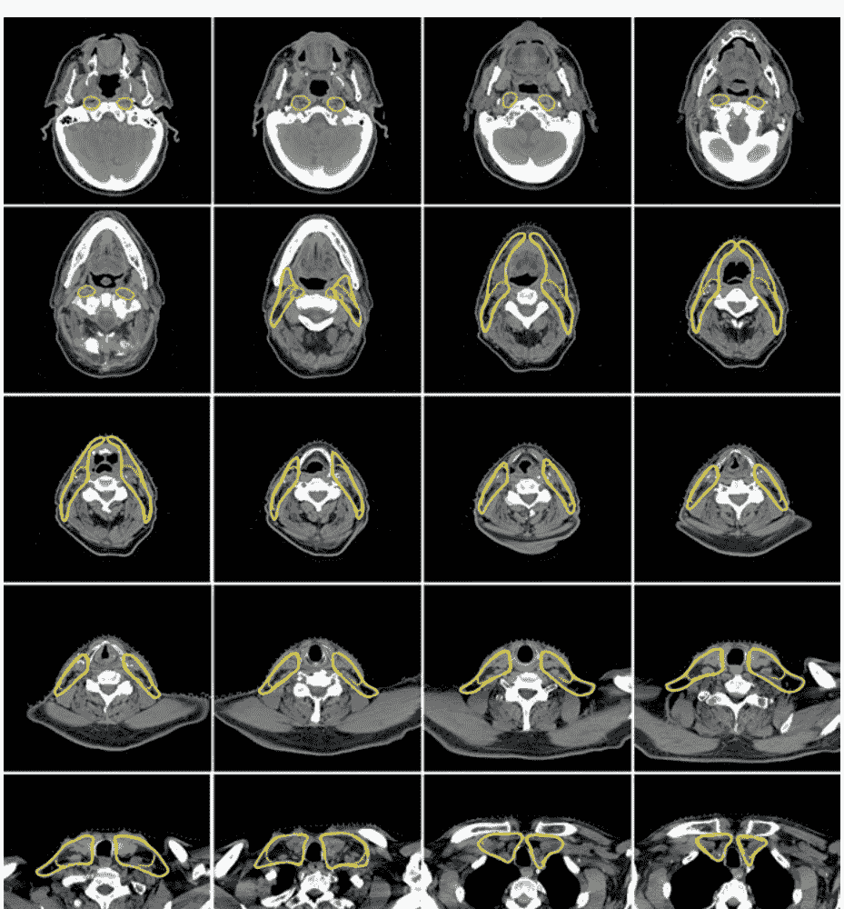

- 🟨 Level Ia-V
- 🟦 Level Ib-V
- 🟥 Level II-IV
- 🟩 RP

图11.20 基于深度学习的淋巴结水平目标体积自动分割由Cardenas等人[145]完成。每个面板显示了一个测试患者的CT切片；这里，每个切片显示了淋巴结水平Ia-V（黄色）、水平Ib-V（蓝色）、水平II-IV（红色）和咽后结（RP，绿色）的目标体积

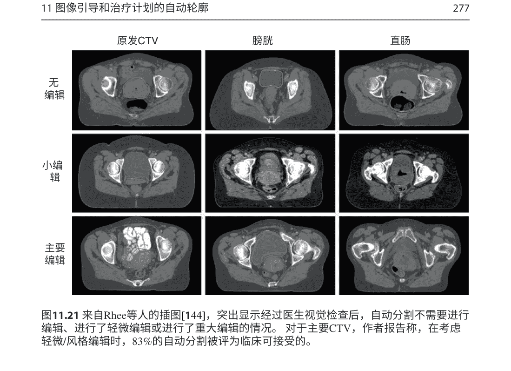

图11.21 来自Rhee等人的插图[144]，突出显示经过医生视觉检查后，自动分割不需要进行编辑、进行了轻微编辑或进行了重大编辑的情况。对于主要CTV，作者报告称，在考虑轻微/风格编辑时，83%的自动分割被评为临床可接受的。

### 11.7 结论

自动分割在最近几十年中取得了许多进展。第一代和第二代算法中的许多技术仍然在今天使用，因为它们简单易用。第三代技术，特别是基于图谱的轮廓，已经几乎无处不在，大多数商业和许多开源系统都提供基于图谱的自动轮廓解决方案。最近，随着计算和算法的进步，深度学习技术已经成为医学图像分割的最新技术，将该领域推向了自动分割技术发展的第四代。深度学习技术包括CNNs、FCNs、GANs等等。算法的发展非常迅速，新颖的架构和自动分割策略经常涌现，并在自动轮廓挑战中击败其他技术。

最近，图像分割从使用2D输入转向使用深度学习处理3D体积。深度学习技术已经应用于许多解剖部位，包括胸部、腹部、盆腔、头颈部和脑部，用于自动分割目标和正常组织，有些应用的结果甚至优于测量的观察者间和观察者内的轮廓变异性。

此外，深度学习已经显示出对肿瘤和CTV的轮廓进行分割，这表明在放射治疗的治疗计划中，深度学习可能是未来的方向。与其他技术相比，这些深度学习系统仍处于相对初级阶段，但它们的令人印象深刻的结果和不断增加的使用将导致深度学习基于自动分割工具在放射治疗治疗计划中的商业和开源可用性增加，以及自动分割工具在临床实践中的接受度和实施度的增加。对于所有类型的自动分割、委托和定期质量保证对于确保患者安全和正确使用系统至关重要。特别是在基于深度学习的自动轮廓技术的性能方面，我们可能正在接近手动分割的终结，因为自动轮廓解决方案相比手动的观察者间和观察者内的轮廓变异更可靠，并且显著减少了制定放射治疗计划所需的时间，使在线自适应放射治疗更加可行。

## 参考文献

1. Hong TS, Tome WA, Harari PM。头颈部IMRT靶区设计和临床实践的异质性。放射治疗与肿瘤学。2012;103 (1) : 92-8。 https://doi.org/10.1016/j.radonc.2012.02.010.
2. 多机构肿瘤标定。放射治疗目标体积标定中的人机交互：一项前瞻性、多机构比较用户输入设备的研究。2011年;24:794–803。 https://doi.org/10.1007/s10278-010-9341-2.
3. Harari PM, Song S, Tomé WA。强调对头颈部癌症IMRT计划的适应性避免与目标定义。 Int J Radiat Oncol Biol Phys. 2010;77(3):950–8. https://doi.org/10.1016/j.ijrobp.2009.09.062.
4. Chen Z, King W, Pearcey R, Kerba M, Mackillop WJ。放射治疗等待时间与临床结果的关系：文献综述。放射治疗与肿瘤学。2008年;87(1):3–16。 https://doi.org/10.1016/j.radonc.2007.11.016.
5. Stefoski Mikeljevic J, Haward R, Johnston C, 等。乳腺癌保乳手术后放射治疗延迟的趋势及其对生存的影响。Br J Cancer. 2004;90(7):1343–8. https://doi.org/10.1038/sj.bjc.6601693.
6. Li XA, Ph D, Tai A, 等。乳腺癌放射治疗中靶区和正常结构划定的可变性：RTOG多机构和多观察者研究。 Int J Radiat Oncol Biol Phys. 2009;73(3):944–51. https://doi.org/10.1016/j.ijrobp.2008.10.034.
7. Eminowicz G, McCormack M。子宫颈癌放射治疗中临床靶区划定的可变性。Radiother Oncol. 2015;117(3):542–7. https://doi.org/10.1016/j.radonc.2015.10.007.
8. Ng SP, Dyer BA, Kalpathy-Cramer J等。高风险口腔癌术后靶区划分的跨学科和跨观察者空间变异的前瞻性计算机模拟分析：医生专业是否重要？ Clin Transl Radiat Oncol. 2018;12:40–6. https://doi.org/10.1016/j.ctro.2018.07.006.
9. Owens CA, Peterson CB, Tang C等。肺肿瘤分割方法：对非小细胞肺癌放射组学特征的不确定性的影响。PLoS One. 2018;13:1–23. https://doi.org/10.1371/journal.pone.0205003.
10. Parmar C, Velazquez ER, Leijenaar R等。使用半自动体积分割的稳健放射组学特征量化。PLoS One. 2014;9(7):1–8. https://doi.org/10.1371/journal.pone.0102107.
11. Balagurunathan Y, Gu Y, Wang H等。从CT图像中提取的定量特征的可重复性和预后。转化肿瘤学。2014年;7（1）：72-87。 https://doi.org/10.1593/tlo.13844.
12. Lee M, Woo B, Kuo MD, Jamshidi N, Kim JH。胶质母细胞瘤放射学特征的质量：半自动肿瘤分割软件的影响。韩国放射学杂志。2017年;18（3）：498-509。 https://doi.org/10.3348/kjr.2017.18.3.498.
13. Kalpathy-cramer J, Mamomov A, Zhao B等。肺结节的放射学：定量成像特征的稳健性和一致性的多机构研究。断层摄影。2016年;2（4）：430-7。 https://doi.org/10.18383/j.tom.2016.00235.
14. Rasch C, Steenbakkers R, Van Herk M。前列腺、头部和颈部的靶区定义。放射肿瘤学半月刊。2005年；15（3）：136-45。 https://doi.org/10.1016/j.semradeonc.2005.01.005.
15. Weiss E, Hess CF. 肿瘤总体积（GTV）和临床靶区（CTV）定义对放射治疗总体准确性的影响：理论和实践经验。 放射治疗和肿瘤学。 2003年； 179： 21-30。 https://doi.org/10.1007/s00066-003-0976-5.
16. Saarnak AE, Boersma M, Van Bunningen BNFM, Wolterink R, Steggerda MJ. 子宫颈癌放射治疗中膀胱和直肠轮廓的描绘的观察者间变异性。 放射治疗学。 2000;56(1):37–42. https://doi.org/10.1016/S0167-8140(00)00185-7.
17. Withey DJ, Koles ZJ. 医学图像分割：方法和软件。 Proc NFSI-ICFBI. 2007:2007:140–3. https://doi.org/10.1109/NFSI-ICFBI.2007.4387709.
18. Krizhevsky A, Sutskever I, Hinton GE. 使用深度卷积神经网络的ImageNet分类。 Adv Neural Inf Process Syst. 2012:1–9. https://doi.org/10.1016/j.protcy.2014.09.007.
19. Deng J, Dong W, Socher R, Li L-J, Li K, Li Fei-Fei. ImageNet: 一个大规模的分层图像数据库。 In: 2009 IEEE计算机视觉和模式识别会议。 Piscataway,新泽西: IEEE; 2009. p. 248–55. https://doi.org/10.1109/CVPR.2009.5206848.
20. Cardenas CE, Yang J, Anderson BM, Court LE, Brock KB. 自动分割的进展。 Semin Radiat Oncol. 2019;29(3):185–97. https://doi.org/10.1016/j.semradonc.2019.02.001.
21. Zhang Y, Brady M, Smith S. 通过隐马尔可夫随机场模型和期望最大化算法对脑MR图像进行分割。 IEEE Trans Med Imaging.2001;20(1):45–57. https://doi.org/10.1109/42.906424.
22. Sharp G, Fritscher KD, Pekar V, 等。关于放射治疗自动图像分割的视角。 Med Phys. 2014;41(5):050902.
23. Rohlfing T, Brandt R, Menzel R, Russakoff DB, Maurer CR. Quo Vadis, 基于图谱的分割？ In: Handbook of biomedical image analysis. Boston, MA: Springer US; 2005. 第435-86页。 https://doi.org/10.1007/0-306-48608-3_11.
24. Thirion J-P. 图像匹配作为扩散过程：与麦克斯韦的恶魔的类比。医学图像分析。 1998年;2(3):243-60. https://doi.org/10.1016/S1361-8415(98)80022-4.
25. Rueckert D, Sonoda LI, Hayes C, Hill DLG, Leach MO, Hawkes DJ. 非刚性配准使用自由形变： 应用于乳腺MR图像。 IEEE Trans Med Imaging. 1999年;18(8):712-21. https://doi.org/10.1109/42.796284.
26. Qazi AA, Pekar V, Kim J, Xie J, Breen SL, Jaffray DA. 头颈部CT图像中正常和目标结构的自动分割： 基于特征驱动的模型方法。医学物理学。 2011年;38(11):6160-70. https://doi.org/10.1118/1.3654160.
27. Han X, Hoogeman MS, Levendag PC等。基于图谱的头颈部CT图像自动分割。 Med Image Comput Comput Assist Interv. 2008;11:434–41. https://doi.org/10.1007/978-3-540-85990-1_52.
28. Klein S, van der Heide UA, Lips IM, van Vulpen M, Staring M, Pluim JPW。 基于图谱匹配和局部互信息的3D MR图像前列腺自动分割。 https://doi.org/10.1118/1.2842076.
29. Wang H, Dong L, Lii MF等。 用于靶向前列腺癌放疗的三维可变形配准算法的实施和验证。 https://doi.org/10.1016/j.ijrobp.2004.07.677.
30. Commowick O, Malandain G. 在： Ayache N, Ourselin S, Maeder A, 编辑。 高效选择数据库中最相似的图像进行关键结构分割， 第4792卷。 柏林，海德堡： Springer Berlin Heidelberg; 2007. https://doi.org/10.1007/978-3-540-75759-7.
31. Rohlfing T, Brandt R, Menzel R, Maurer CR. 评估用于基于图谱的图像分割的图谱选择策略，并应用于蜜蜂大脑的共焦显微镜图像。 NeuroImage. 2004;21(4):1428–42. https://doi.org/10.1016/j.neuroimage.2003.11.010.
32. Blezek DJ, Miller JV. 图谱分层。 Med Image Anal. 2007;11(5):443–57. https://doi.org/10.1016/j.media.2007.07.001.
33. Aljabar P, Heckemann RA, Hammers A, Hajnal JV, Rueckert D. 基于多图谱的脑图像分割：图谱选择及其对准确性的影响。 NeuroImage.2009;46(3):726–38. https://doi.org/10.1016/j.neuroimage.2009.02.018.
34. Wu M, Rosano C, Lopez-Garcia P, Carter CS, Aizenstein HJ. 基于图谱的分割的最佳模板选择。 NeuroImage. 2007;34(4):1612–8. https://doi.org/10.1016/j.neuroimage.2006.07.050.

35. 贾华，吴刚，王强，沈迪。ABSORB：自组织注册和捆绑的图谱构建。 在：2010年IEEE计算机学会计算机视觉和模式识别会议，第51卷。 新泽西州皮斯卡特维，IEEE；2010年。第2785-90页。 https://doi.org/10.1109/CVPR.2010.5540007。

36. 杨杰，哈斯，方瑞等。CT扫描中食管自动分割的图谱排名和选择。Phys Med Biol. 2017;62(23):9140–58. https://doi.org/10.1088/1361-6560/aa94ba。

37. 杨杰，张勇，张亮，董亮。使用多个图谱对CT扫描中的腮腺进行自动分割。医学图像分析临床挑战。2010年：323-30。

38. Commowick O, Warfield SK, Malandain G。使用弗兰肯斯坦的创造物范例构建患者特异性图谱。医学图像计算机辅助干预。2009年；12：993-1000。https://doi.org/10.1007/978-3-642-04271-3_120。

39. Iglesias JE, Sabuncu MR。生物医学图像的多图谱分割：一项调查。医学图像分析。2015年；24（1）：205-19。https://doi.org/10.1016/j.media.2015.06.012。

40. Chen A, Niermann KJ, Deeley MA, Dawant BM。评估基于多图谱的策略在头颈部CT图像中甲状腺分割的应用于IMRT。物理医学生物学。2012年；57（1）：93-111。https://doi.org/10.1088/0031-9155/57/1/93。

41. 杨杰，阿米尼，威廉姆森等。使用多阿特拉斯方法自动勾画肺癌放射治疗中的臂丛。Pract Radiat Oncol. 2013;3(4):e139–47. https://doi.org/10.1016/j.prro.2013.01.002。

42. Sjöberg C, Lundmark M, Granberg C, Johansson S, Ahnesjö A, Montelius A。临床评估基于多阿特拉斯的头颈部和前列腺癌淋巴结区域分割。Radiat Oncol. 2013;8(1):1–7. https://doi.org/10.1186/1748-717X-8-229。

43. Kirişli HA, Schaap M, Klein S,等。评估基于多阿特拉斯的心脏CTA数据分割方法：一项大规模、多中心和多供应商的研究。Med Phys. 2010;37(12):6279–91. https://doi.org/10.1118/1.3512795。

44. Isgum I, Staring M, Rutten A, Prokop M, Viergever MA, van Ginneken B。基于多模板的局部决策融合分割——在CT扫描中应用于心脏和主动脉分割。IEEE Trans Med Imaging. 2009;28(7):1000–10. https://doi.org/10.1109/TMI.2008.2011480。

45. Sabuncu MR, Yeo BTT, Van Leemput K, Fischl B, Golland P。基于标签融合的图像分割生成模型。IEEE Trans Med Imaging. 2010;29(10):1714–29. https://doi.org/10.1109/TMI.2010.2050897。

46. Warfield SK, Zou KH, Wells WM。同时真实性和性能水平估计（STAPLE）：一种用于图像分割验证的算法。IEEE Trans Med Imaging. 2004;23(7):903–21。

47. Langerak TR, van der Heide UA, Kotte ANTJ, Viergever MA, van Vulpen M, Pluim JW。使用选择性和迭代方法进行基于图谱的分割中的标签融合（SIMPLE）。IEEE Trans Med Imaging. 2010年；29（12）：2000-8。https://doi.org/10.1109/TMI.2010.2057442。

48. Ramus L, Malandain G。基于多图谱的分割：应用于头颈部放疗计划。Med Image Anal Clin. 2010年：281-8。http://www.diagnijmegen.nl/~bram/grandchallenge2010/281.pdf

49. Pekar V, Allaire S, Qazi A。头颈部自动分割挑战：腮腺的分割。MICCAI 2010 Grand Challenge Clin. 2010年：273-280。http://www.diagnijmegen.nl/~bram/grandchallenge2010/273.pdf。

50. Raudaschl PF, Zaffino P, Sharp GC, 等。评估头颈部CT图像分割方法：2015年自动分割挑战。医学物理学。2017年;44(5)：2020-36。https://doi.org/10.1002/mp.12197。

51. Yang J, Veeraraghavan H, Armato SG, 等。胸部放射治疗的自动分割：AAPM 2017年的大挑战。医学物理学。2018年;45(10)：4568-81。https://doi.org/10.1002/mp.13141。

52. McCarroll RE, Beadle BM, Balter PA, 等。头颈部风险器官自动轮廓的回顾性验证和临床实施：迈向自动化放射治疗规划适用于低收入和中等收入国家。J Glob Oncol. 2018;4:1-11. https://doi.org/10.1200/JGO.18.00055.

53. Zhou R, Liao Z, Pan T, et al. 用于自动分割心脏亚结构的心脏图谱开发和验证。放射治疗与肿瘤学。2017;122(1):66-71. https://doi.org/10.1016/j.radonc.2016.11.016.

54. Heimann T, Meinzer H-P. 用于3D医学图像分割的统计形状模型：一个综述。医学图像分析。2009;13(4):543-63. https://doi.org/10.1016/j.media.2009.05.004.

55. Pekar V, McNutt TR, Kaus MR. 用于前列腺区域放射治疗计划的自动模型基于器官划定。国际放射肿瘤学杂志。2004;60(3):973-80. https://doi.org/10.1016/j.ijrobp.2004.06.004.

56. Freedman D, Radke RJ, Zhang T, Jeong Y, Lovelock DM, Chen GTY. 基于模型的医学图像分割通过匹配分布。IEEE Trans Med Imaging. 2005;24(3):281-92. https://doi.org/10.1109/TMI.2004.841228.

57. Feng Q, Foskey M, Chen W, Shen D. 使用人群和患者特定统计数据对CT前列腺图像进行分割，用于放射治疗。Med Phys. 2010;37(8):4121-32. https://doi.org/10.1118/1.3464799.

58. Geremia E, Clatz O, Menze BH, Konukoglu E, Criminisi A, Ayache N. 多通道磁共振图像中用于MS病变分割的空间决策森林。NeuroImage. 2011;57(2):378-90. https://doi.org/10.1016/j.neuroimage.2011.03.080.

59. Criminisi A, Shotton J, Konukoglu E. 决策森林：分类、回归、密度估计、流形学习和半监督学习的统一框架。Found Trends Comput Graph Vis. 2011;7(2-3):81-227. https://doi.org/10.1561/0600000035.

60. Li W, Liao S, Feng Q, Chen W, Shen D. 学习图像上下文进行CT引导放射治疗中的前列腺分割。Med Image Comput Comput Assist Interv. 2011;14(Pt 3):570-8. http://www.ncbi.nlm.nih.gov/pubmed/22003745

61. Bauer S, Nolte L-P, Reyes M. 使用支持向量机分类与分层条件随机场正则化的完全自动脑肿瘤图像分割。In: Medical Image Computing and Computer-Assisted Intervention: MICCAI ... International Conference on Medical Image Computing and Computer-Assisted Intervention, vol 14; 2011. p. 354-61. https://doi.org/10.1007/978-3-642-23626-6_44.

62. Vaishnavee KB, Amshakala K. 使用SOM聚类和近支持向量机分类器的自动化MRI脑图像分割和肿瘤检测。在：2015年IEEE国际工程与技术会议 (ICETECH) 中。 皮斯塔卡塔韦，新泽西州：IEEE； 2015年。 第1-6页。 https://doi.org/10.1109/ICETECH.2015.7275030.

63. Lu J, Wang D, Lin S, Heng PA. 基于支持向量机的CT图像自动肝脏分割。在：2012年IEEE-EMBS国际生物医学和健康信息学会议论文集，第25卷。 皮斯塔卡塔韦，新泽西州：IEEE； 2012年。 第333-6页。 https://doi.org/10.1109/BHI.2012.6211581。

64. Zhang X, Tian J, Xiang D, Li X, Deng K. 使用支持向量分类与分水岭的CT扫描交互式肝脏肿瘤分割。在：2011年IEEE工程医学与生物学学会年会，第2011卷。 皮斯塔卡塔韦，新泽西州：IEEE； 2011年。 第6005-8页。 https://doi.org/10.1109/IEMBS.2011.6091484。

65. Rendon-Gonzalez E, Ponomaryov V. 基于SVM的CT图像中肺结节的自动分割和分类。在：2016年第9届国际哈尔科夫微波、毫米波和亚毫米波物理与工程学研讨会 (MSMW) 中。 Piscataway, 新泽西州：IEEE； 2016年。 第1-4页。 https://doi.org/10.1109/MSMW.2016.7537995.

66. Mahapatra D. 利用随机森林的语义信息进行自动心脏分割。J Digit Imaging. 2014;27(6):794-804. https://doi.org/10.1007/s10278-014-9705-0.

67. Pereira S, Pinto A, Oliveira J, Mendrik AM, Correia JH, Silva CA. 利用随机森林和条件随机场在MR图像中进行自动脑组织分割。J Neurosci Methods. 2016;270:111-23. https://doi.org/10.1016/j.jneumeth.2016.06.017.

68. Jin C, Shi F, Xiang, 等。基于改进的AAM和随机森林的肾脏的3D快速自动分割。IEEE Trans Med Imaging. 2016;35(6):1395-407. https://doi.org/10.1109/TMI.2015.2512606.

69. Chang KW, Summers RM, Narayanan D等。通过多图谱标签融合和随机森林分类的随机森林分类，在胸部CT扫描中自动分割甲状腺。Medical Imaging. 2017;3 (2) : 044006。 https://doi.org/10.1117/1.JMI.2.4.044006.

70. 高洋。通过增量级联学习和基于回归的可变形模型准确分割CT盆腔器官。ProQuest Diss Theses. 2016;35 (6) : 153。

71. Liu J, Hoffman J, Zhao J等。使用空间先验和随机森林在胸部CT上进行纵隔淋巴结检测和站点映射。Med Phys. 2016;43(7):4362–74。https://doi.org/10.1118/1.4954009.

72. Serag A, Wilkinson AG, Telford EJ等。SEGMA：一种使用滑动窗口和随机森林的人脑MRI自动分割方法。Front Neuroinform. 2017;11(January):1–11。https://doi.org/10.3389/fninf.2017.00002.

73. Haralick RM, Dinstein I, Shanmugam K. 用于图像分类的纹理特征。IEEE Trans Syst Man Cybern. 1973;SMC-3(6):610–21。https://doi.org/10.1109/TSMC.1973.4309314.

74. Shiradkar R, Podder TK, Algohary A, Viswanath S, Ellis RJ, Madabhushi A. 基于放射组学的靶向放疗计划(rad-TRaP)：一种用于前列腺癌治疗计划的计算框架与MRI。Radiat Oncol 2016;11(1):1–14。doi: https://doi.org/10.1186/s13014-016-0718-3.

75. Simonyan K, Zisserman A. 面向大规模图像识别的非常深的卷积神经网络。第三届国际学习代表大会ICLR 2015 - 会议论文集。2014年9月：1-14。 http://arxiv.org/abs/1409.1556.

76. Long J, Shelhamer E, Darrell T. 用于语义分割的全卷积网络。2015年IEEE计算机学会计算机视觉与模式识别会议论文集。349：3431-40。https://doi.org/10.1109/CVPR.2015.7298965.

77. Szegedy C, Liu W, Jia Y等。用卷积深入。2014年IEEE计算机学会计算机视觉与模式识别会议论文集：1-9。https://doi.org/10.1109/CVPR.2015.7298594。

78. Liu H, Yan M, Song E等。基于稀疏补丁表示的脑MRI图像分割的标签融合方法。IET图像处理。2017年；11（7）：502-11。https://doi.org/10.1049/iet-ipr.2016.0988。

79. 朱Y, 王L, 刘M等。基于MRI的前列腺癌检测与高级表征和分层分类。医学物理学。2017年;44（3）：1028-39。https://doi.org/10.1002/mp.12116.

80. Kamnitsas K, Ferrante E, Parisot S等。DeepMedic用于脑肿瘤分割。在：脑损伤：胶质瘤、多发性硬化症、中风和创伤性脑损伤BrainLes, 2016年卷。纽约：斯普林格出版社；2016年。第138-49页。https://doi.org/10.1007/978-3-319-55524-9_14.

81. Roth HR, Oda H, Zhou X等。级联3D全卷积网络在医学图像分割中的应用。计算机医学成像图形学。2018年;66：90-9。https://doi.org/10.1016/j.compmedimag.2018.03.001.

82. Ronneberger O, Fischer P, Brox T. U-Net: 生物医学图像分割的卷积网络。在：Navab N, Hornegger J, Wells W, Frangi A. (eds) 医学图像计算与计算机辅助干预-MICCAI 2015. MICCAI 2015. 计算机科学讲义，第9351卷。斯普林格，香槟。https://doi.org/10.1007/978-3-319-24574-4_28。

83. Çiçek Ö, Abdulkadir A, Lienkamp SS, Brox T, Ronneberger O. 3D U-net: 从稀疏注释中学习密集体积分割。计算机科学讲义。2016;9901：424-32。https://doi.org/10.1007/978-3-319-46723-8_49.

84. Milletari F, Navab N, Ahmadi S-A. V-Net: 全卷积神经网络用于体积医学图像分割。在：2016年第四届三维视觉国际会议（3DV）。Piscataway, New Jersey: IEEE; 2016. p. 565–71. https://doi.org/10.1109/3DV.2016.79

85. He K, Zhang X, Ren S, Sun J. 深度残差学习用于图像识别。在：IEEE计算机视觉与模式识别（CVPR）会议，美国内华达州拉斯维加斯，2016年，pp.770–8. https://doi.org/10.1109/CVPR.2016.90.

86. Li X, Chen H, Qi X, Dou Q, Fu C-W, Heng P-A. H-DenseUNet: 混合密集连接UNet用于CT体积的肝脏和肿瘤分割。IEEE Trans Med Imaging. 2018;37(12):2663–74. https://doi.org/10.1109/TMI.2018.2845918.

87. Diakogiannis FI, Waldner F, Caccetta P, Wu C. ResUNet-a: 一种用于遥感数据语义分割的深度学习框架。ISPRS J Photogramm Remote Sens. 2020年；162：94-114。https://doi.org/10.1016/j.isprsjprs.2020.01.013。

88. Zhou Z, Rahman Siddiquee MM, Tajbakhsh N, Liang J. Unet++: 一种用于医学图像分割的嵌套U-Net架构。Lect Notes Comput Sci. 2018年；11045：3-11。https://doi.org/10.1007/978-3-030-00889-5_1。

89. Zhang J, Jin Y, Xu J, Xu X, Zhang Y. MDU-Net: 一种用于生物医学图像分割的多尺度密集连接U-Net。2018年。http://arxiv.org/abs/1812.00352。

90. Zhang H, Li J, Shen M, Wang Y, Yang GZ. DDU-nets: 分布式密集模型用于3D MRI脑肿瘤分割，卷11993。纽约：斯普林格国际出版社；2020年。https://doi.org/10.1007/978-3-030-46643-5_20。

91. Milletari F, Navab N, Ahmadi S. V-Net: 全卷积神经网络用于体积医学图像分割，2016年第四届三维视觉国际会议（3DV），2016年，第565-71页。https://doi.org/10.1109/3DV.2016.79。

92. Kamnitsas K, Ledig C, Newcombe VFJ, et al. 高效多尺度3D CNN与完全连接CRF用于准确的脑损伤分割。医学图像分析。2017年；36：61-78。https://doi.org/10.1016/j.media.2016.10.004。

93. Krähenbühl P, Koltun V. 高斯边缘潜力下完全连接的CRF中的高效推理。Adv Neural Inf Process Syst. 2012;24:109–17。

94. Roth HR等。用于腹部多器官分割的3D完全卷积网络的多尺度金字塔。在：Frangi A.，Schnabel J.，Davatzikos C.，Alberola-López C.，Fichtinger G. (eds) 医学图像计算与计算机辅助干预-MICCAI 2018. MICCAI 2018。计算机科学讲义，第11073卷。Springer，Cham。https://doi.org/10.1007/978-3-030-00937-3_48。

95. 杨梅，于凯，张超，李忠，杨凯。街景语义分割中的DenseASPP。Proc IEEE Comput Soc Conf Comput Vis Pattern Recognit. 2018:3684–92。https://doi.org/10.1109/CVPR.2018.00388。

96. Chen L-C, Papandreou G, Kokkinos I, Murphy K, Yuille AL. 使用深度卷积神经网络和完全连接的条件随机场进行语义图像分割。IEEE Trans Pattern Anal Mach Intell. 2014;40(4):834–48。http://arxiv.org/abs/1412.7062

97. Chen LC, Papandreou G, Kokkinos I, Murphy K, Yuille AL. DeepLab: 使用深度卷积神经网络、空洞卷积和完全连接的条件随机场进行语义图像分割。IEEE Trans Pattern Anal Mach Intell. 2018;40(4):834–48。https://doi.org/10.1109/TPAMI.2017.2699184.

98. Chen L-C, Papandreou G, Schroff F, Adam H. 重新思考用于语义图像分割的空洞卷积。2017。http://arxiv.org/abs/1706.05587。

99. Chen LC, Zhu Y, Papandreou G, Schroff F, Adam H. 具有孔洞可分离卷积的编码器-解码器用于语义图像分割。在：Ferrari V，Hebert M，Sminchisescu C，Weiss Y。(eds) 计算机视觉-ECCV 2018。ECCV 2018。计算机科学讲义，第11211卷。斯普林格，香槟。https://doi.org/10.1007/978-3-030-01234-2_49。

100. Yi X, Walia E, Babyn P. 医学成像中的生成对抗网络：综述。Med Image Anal. 2019;58 https://doi.org/10.1016/j.media.2019.101552。

101. Dai W, Dong N, Wang Z, Liang X, Zhang H, Xing EP. SCAN: 用于胸部X射线器官分割的结构校正对抗网络。在：Stoyanov D, Taylor Z, Carneiro G, et al., 编辑。计算机科学讲义，第11045卷。香槟：斯普林格国际出版；2018年。第263-73页。https://doi.org/10.1007/978-3-030-00889-5_30。

102. Chen J, Yang L, Zhang Y, Alber M, Chen DZ. 结合全卷积和循环神经网络进行三维生物医学图像分割。Adv Neural Inf Process Syst. 2016:3044–52。

103. Kearney V, Chan JW, Wang T, Perry A, Yom SS, Solberg TD. 使用深度监督的注意力增强的三维卷积神经网络进行语义CT分割。Phys Med Biol. 2019;64(13):135001。https://doi.org/10.1088/1361-6560/ab2818。

## 11 图像引导和治疗计划的自动轮廓

104. Kikinis R, Pieper SD, Vosburgh KG. 3D切片器：用于特定主体图像分析、可视化和临床支持的平台。 Intraoperative Imaging Image-Guided Ther. 2014:277–89. https://doi.org/10.1007/978-1-4614-7657-3.

105. PET肿瘤分割扩展-3D Slicer。 https://www.slicer.org/wiki/Documentation/Nightly/Extensions/PETTumorSegmentation.

106. 快速生长切割-3D Slicer。 https://www.slicer.org/wiki/Documentation/4.3/Modules/FastGrowCut.

107. DeepInfer-3D Slicer。 https://www.slicer.org/wiki/Documentation/Nightly/Modules/DeepInfer.

108. Yushkevich PA, Piven J, Hazlett HC等。 用户引导的三维主动轮廓分割解剖结构：效率和可靠性显著提高。 NeuroImage. 2006;31(3): 1116–28. https://doi.org/10.1016/j.neuroimage.2006.01.015.

109. 分布式分割服务-ITK-SNAP。 https://alfabis-server.readthedocs.io/en/latest/.

110. Zaffino P, Raudaschl P, Fritscher K, Sharp GC, Spadea MF. 技术说明：Plastimatch MABS，自动图像分割的开源工具。 Med Phys. 2016;43(9): 5155–60. https://doi.org/10.1118/1.4961121.

111. CIBC. Seg3D: 体积图像分割和可视化. 科学计算与成像研究所 (SCI). http://www.seg3d.org.

112. Pawlowski N, Ktena SI, Lee MCH, 等. DLTK: 医学图像深度学习的最新参考实现 2017:1–4. https://arxiv.org/abs/1711.06853.

113. Abadi M, Barham P, Chen J, 等. TensorFlow: 用于大规模机器学习的系统. 第12届USENIX操作系统设计实现研讨会 (OSDI ‘16). 2016:265–284. https://doi.org/10.1038/nn.3331

114. Gibson E, LiW, Sudre C, 等. NiftyNet: 用于医学图像的深度学习平台. 计算方法与生物医学. 2018;158:113–22. https://doi.org/10.1016/j.cmpb.2018.01.025.

115. MONAI: 人工智能的医学开放网络. https://monai.io/.

116. Paszke A, Gross S, Massa F, 等. PyTorch: 一种命令式风格、高性能的深度学习库. 2019;(NeurIPS). https://arxiv.org/abs/1912.01703.

117. EISEN.ai. https://eisen.ai/.

- 127. Thompson RF, Valdes G, Fuller CD, et al. Artificial intelligence in radiation oncology: a specialty-wide disruptive transformation? Radiother Oncol. 2018;129(3):421–6. https://doi.org/10.1016/j.radonc.2018.05.030.

- 128. Delpon G, Escande A, Ruef T, et al. Comparison of automated atlas-based segmentation software for postoperative prostate cancer radiotherapy. Front Oncol. 2016;6:1–6. https://doi.org/10.3389/fonc.2016.00178.

- 129. 胡Y，拜恩M，阿奇博尔德-希伦B等。实施用户定义的基于图谱的自动分割用于大型多中心组织：澳大利亚经验。J Med RadiatSci. 2019;66(4):238–49. https://doi.org/10.1002/jmrs.359.

- 130. Wittenstein O, Hiepe P, Sowa LH, Karsten E, Fandrich I, Dunst J. 基于合成组织模型的自动图像分割，用于脊柱转移治疗计划中的风险器官划定。Strahlenther Onkol. 2019;195(12):1094–103. https://doi.org/10.1007/s00066-019-01463-4.

- 131. Daisne J-F, Blumhofer A。基于图谱的头颈部风险器官和淋巴结靶区的自动分割：临床验证。Radiat Oncol. 2013;8(1):154. https://doi.org/10.1186/1748-717X-8-154.

- 132. Lustberg T, van Soest J, Gooding M, 等。基于图谱和深度学习的肺癌自动轮廓的临床评估。放射治疗与肿瘤学. 2018;126(2):312–7. https://doi.org/10.1016/j.radonc.2017.11.012.

- 133. Vaassen F, Hazelaar C, Vaniqui A, 等。评估放射治疗中自动器官风险分割节省时间的措施。Phys Imaging Radiat Oncol.2020;13:1–6. https://doi.org/10.1016/j.phro.2019.12.001.

- 134. Wong J, Fong A, McVicar N, 等。将基于深度学习的自动器官风险分割和临床靶区体积与专家间观察者变异性在放射治疗计划中进行比较。放射治疗与肿瘤学. 2020;144:152–8. https://doi.org/10.1016/j.radonc.2019.10.019.

- 135. Zabel WJ, Conway JL, Gladwish A等。深度学习和基于图谱的膀胱和直肠自动轮廓在前列腺放射治疗中的临床评估。Pract Radiat Oncol.2020;11:1–10. https://doi.org/10.1016/j.prro.2020.05.013.

- 136. SOMATOM go.Sim by Siemens. https://www.siemens-healthineers.com/radiotherapy/ct-for-rt/somatomo-go-sim. 2020年3月8日访问。

- 137. Court LE, Kisling K, McCarroll R等。放射治疗规划助手——一种简化、全自动的放射治疗计划系统。J Vis Exp. 2018;134:e57411. https://doi.org/10.3791/57411.

- 138. Kisling K, Zhang L, Simonds H等。局部晚期宫颈癌外照射放疗的全自动治疗计划：一种适用于资源匮乏诊所的工具。J GlobOncol. 2019;5:1–9. https://doi.org/10.1200/jgo.18.00107.

- 139. Kisling K, Zhang L, Shaitelman SF, 等。自动化乳腺切除术后放射治疗的治疗计划。医学物理学。2019年;46(9):3767–75. https://doi.org/10.1002/mp.13586.

- 140. Kisling K, Johnson JL, Simonds H, 等。自动化治疗计划的风险评估和临床部署建议。医学物理学。2019年;46(6):2567–74. https://doi.org/10.1002/mp.13552.

- 141. Rhee DJ, Cardenas CE, Elhalawani H, 等。使用卷积神经网络自动检测轮廓错误。医学物理学。2019年;46:5086–97. https://doi.org/10.1002/mp.13814.

- 142. Netherton T, Joo Rhee D, Cardenas C, 等。评估多视角架构用于姑息性放射治疗模拟CT图像的自动椎体标记。医学物理学。2020年;47(11):5592–608. https://doi.org/10.1002/mp.14415.

- 143. Cardenas CE, McCarroll RE, Court LE等。具有内置Dice相似系数参数优化函数的自动划定高风险咽喉临床靶区的深度学习算法。Int J Radiat Oncol Biol Phys. 2018;101(2):468–78. https://doi.org/10.1016/j.ijrobp.2018.01.114.

- 144. Rhee DJ, Jhingran A, Rigaud B等。 使用卷积神经网络的宫颈癌自动轮廓系统。 Med Phys. 2020;47(11):5648–58. https://doi.org/10.1002/mp.14467.

- 145. Cardenas CE， Beadle BM， Garden AS等。 使用完全自动化的基于深度学习的方法为头颈部癌症放疗生成高质量的淋巴结临床靶区。 https://doi.org/10.1016/j.ijrobp.2020.10.005.

- 146. Kisling K, Cardenas C, Anderson BM, 等. 宫颈癌放射治疗中束孔的自动验证. Pract Radiat Oncol. 2020年5月:1–10. https://doi.org/10.1016/j.prro.2020.05.001.

- 147. Ford E, Conroy L, Dong L, 等. 放射治疗中有效的物理计划和图表审核策略: AAPM 275号任务组报告. Med Phys. 2020;47(6):e236–72. https://doi.org/10.1002/mp.14030.

- 148. Taha AA, Hanbury A. 评估3D医学图像分割的度量标准:分析、选择和工具. BMC Med Imaging. 2015;15(1):29. https://doi.org/10.1186/s12880-015-0068-x.

- 149. Dice LR. 物种之间生态关联程度的测量。 生态学。 1945年;26(3):297–302。 https://doi.org/10.2307/1932409。

- 150. Jaccard P. 高山带植物区系的分布. 新植物学. 1912年;XI(2):37–50。 https://doi.org/10.1111/j.1469-8137.1912.tb05611.xo.

- 151. Huttenlocher DP, Rucklidge WJ, Klanderman GA. 在平移下使用Hausdorff距离比较图像。 Proc IEEE Comput Soc Conf Comput Vis Pattern Recognit. 1992:654–6。 https://doi.org/10.1109/CVPR.1992.223209.

- 152. Nikolov S, Blackwell S, Mendes R, 等. 深度学习实现临床可应用的头颈解剖分割，用于放射治疗2018:1–31。 http://arxiv.org/abs/1809.04430.

- 153. Brock KK, Mutic S, McNutt TR, Li H, Kessler ML. 在放射治疗中使用图像配准和融合算法和技术的AAPM放射治疗委员会132号任务组报告。 Med Phys. 2017年;44（7）：e43–76。 https://doi.org/10.1002/mp.12256。

- 154. Chen HC, Tan J, Dolly S等。基于监督几何属性分布模型的放射治疗自动轮廓错误检测的通用策略。 Med Phys. 2015年;42（2）：1048–59。 https://doi.org/10.1118/1.4906197。

- 155. McCarroll R, Yang J, Cardenas CE等。 用于预测头颈部临床自动轮廓中医师编辑的机器学习。 Med Phys. 2017年;44（6）：3160。

- 156. Hui CB, Nourzadeh H, Watkins WT等。 使用参数统计方法的放射治疗中器官风险划定质量保证工具。 Med Phys. 2018年；45（5）：2089-96。 https://doi.org/10.1002/mp.12835。

- 157. Fraass B, Doppke K, Hunt M等。 美国医学物理学会放射治疗委员会任务组53：临床放射治疗计划质量保证。 Med Phys. 1998年；25（10）：1773-829。 https://doi.org/10.1118/1.598373。

- 158. Smilowitz JB, Das IJ, Feygelman V等。 AAPM医学物理实践指南5.a.：治疗计划剂量计算的委托和质量保证-兆伏级光子和电子束。 J Appl Clin Med Phys. 2016年；17（1）：6166。 https://doi.org/10.1120/jacmp.v17i1.6166。

- 159. Huq MS, Fraass BA, Dunscombe PB, 等。 AAPM第100任务组的报告：应用风险分析方法于放射治疗质量管理。 Med Phys.2016年;43(7):4209–62. https://doi.org/10.1118/1.4947547.

- 160. Cardenas CE, Mohamed ASR, Tao R, 等。 关于头颈部肿瘤放射治疗的实时同行评审质量保证会议的前瞻性定性和定量分析。 Int J Radiat Oncol Biol Phys. 2017年;98(3):532–40. https://doi.org/10.1016/j.ijrobp.2016.11.019.

- 161. Marks LB, Adams RD, Pawlicki T, 等。 加强以病例为导向的同行评审在放射肿瘤学中的作用以提高质量和安全性：执行摘要。 Pract Radiat Oncol.2013年;3(3):149–56. https://doi.org/10.1016/j.prro.2012.11.010.

- 162. Cox BW，Kapur A，Sharma A等。前瞻性轮廓绘制：一种新颖、高影响力的优化质量保证工具。Pract Radiat Oncol. 2015;5(5):e431–6. https://doi.org/10.1016/j.prro.2015.05.005.

- 163. Ger RB，Zhou S，Chi PCM等。对放射学研究中CT图像变异性的全面调查。Sci Rep. 2018;8(1):1–14. https://doi.org/10.1038/s41598-018-31509-z.

- 164. Huang K，Rhee DJ，Ger RB等。CT图像采集和重建参数对自动轮廓算法的影响。Med Phys. 2019;46(6):E138–9.

- 165. Kalavathi P，Prasath VBS。关于MRI头部扫描图像的头骨剥离方法综述。J Digit Imaging. 2016;29(3):365–79. https://doi.org/10.1007/s10278-015-9847-8.

- 166. Puccio B，Pooley JP，Pellman JS，Taverna EC，Craddock RC。经过预处理的连接组学项目存储库，手动校正的去颅骨T1加权解剖MRI数据。 Gigascience. 2016年；5（1）：45。https://doi.org/10.1186/s13742-016-0150-5.

- 167. Hwang H，Rehman HZU，Lee S。用于脑MRI中去颅骨的3D U-net。应用科学。2019年；9（3）：569。https://doi.org/10.3390/app9030569。

- 168. Kleesiek J，Urban G，Hubert A，等。深度MRI脑提取：用于去颅骨的3D卷积神经网络。神经影像。2016年；129：460-9。https://doi.org/10.1016/j.neuroimage.2016.01.024。

- 169. Mendrik AM，Vincken KL，Kuijf HJ等。MRBrainS挑战：用于3T MRI扫描中脑图像分割的在线评估框架。Comput Intell Neurosci。2015;2015: 1-16。https://doi.org/10.1155/2015/813696.

- 170. Moeskops P，de Bresser J，Kuijf HJ等。评估用于MRI中脑组织和被认为是血管性的白质高信号区的深度学习方法。NeuroImage Clin。2018;17：251-62。https://doi.org/10.1016/j.nicl.2017.10.007。

- 171. Luna M，Park SH。用于MR脑分割的3D Patchwise U-Net与过渡层。 在：Crimi A，Bakas S，Kuijf H，Keyvan F，Reyes M，van Walsum T。（eds）Brainlesion：Glioma，Multiple Sclerosis，Stroke and Traumatic Brain Injuries. BrainLes 2018。Lecture Notes in Computer Science，vol 11383。Springer，Cham。https://doi.org/10.1007/978-3-030-11723-8_40。

- 172. Irimia A，Maher AS，Rostowsky KA，Chowdhury NF，Hwang DH，Law EM。基于不同空间分辨率的健康老龄化和老年脑震荡的计算机断层扫描脑分割。Front Neuroinform。2019;13:9。https://doi.org/10.3389/fninf.2019.00009.

- 173. Manniesing R，Oei MTH，Oostveen LJ，等。4D计算机断层扫描中的白质和灰质分割。Sci Rep。2017;7(1):119。https://doi.org/10.1038/s41598-017-00239-z。

- 174. Losseff NA，Webb SL，O’Riordan JI，等。多发性硬化的脊髓萎缩和残疾。Brain。1996;119(3):701–8。https://doi.org/10.1093/brain/119.3.701.

- 175. Freund P，Weiskopf N，Ward NS，等。脊髓损伤后的残疾、萎缩和皮层重组。Brain。2011;134(6):1610–22。https://doi.org/10.1093/brain/awr093.

- 176. Prados F，Ashburner J，Blaiotta C，等。脊髓灰质分割挑战。 NeuroImage。2017;152:312–29。https://doi.org/10.1016/j.neuroimage.2017.03.010.

- 177. Perone CS，Calabrese E，Cohen-Adad J。使用深度扩张卷积进行脊髓灰质分割。Sci Rep。2018;8(1):5966。https://doi.org/10.1038/s41598-018-24304-3。

- 178. Tins B。CT成像的技术方面。Insights Imaging。2010;1(5–6):349–59。 https://doi.org/10.1007/s13244-010-0047-2。

- 179. Shah LM，Salzman KL。脊柱转移性疾病的成像。Int J Surg Oncol。2011;2011:1–12。https://doi.org/10.1155/2011/769753。

- 180. Yao J，Burns JE，Forsberg D，等。临床椎骨CT分割的多中心里程碑研究。计算机医学成像图形学。2016;49:16–28。https://doi.org/10.1016/j.compmedimag.2015.12.006。

- 181. Glocker B，Feulner J，Criminisi A，Haynor DR，Konukoglu E。任意视野CT扫描中椎骨的自动定位和识别。在。2012:590–8。https://doi.org/10.1007/978-3-642-33454-2_73。

182. Löffler MT, Sekuboyina A, Jacob A, 等。具有骨折分级的椎骨分割数据集。放射学人工智能。2020; 2(4): e190138. https://doi.org/10.1148/ryai.2020190138.

183. Payer C, Štern D, Bischof H, Urschler M. 空间配置网络和U-net进行粗到细的椎骨定位和分割。VISIGRAPP 2020 - proc 15th Int Jt Conf Comput Vision, Imaging Comput Graph Theory Appl. 2020; 5: 124–33. https://doi.org/10.5220/0008975201240133.

184. Sekuboyina A, Bayat A, Husseini ME, 等。VerSe: 一个椎骨标记和分割基准。2020年1月。 http://arxiv.org/abs/2001.09193.

185. Sekuboyina A, Rempfler M, Valentinitisch A, Kirschke JS, Menze BH. 对抗学习局部解剖先验: 用于椎骨标记的2D重建。2019年2月。 http://arxiv.org/abs/1902.02205.

186. 陈杰等。LSRC: 一种用于自动3D椎骨定位的长短范围上下文融合框架。在: Shen D. 等。(eds) 医学图像计算与计算机辅助干预 - MICCAI 2019. MICCAI 2019. 计算机科学讲义，卷11769. Springer, Cham. https://doi.org/10.1007/978-3-030-32226-7_11.

187. 秦C，姚D，庄H，王H，史Y，宋Z。基于残差块的多标签分类和定位网络与整体回归用于椎骨标记。2020年1月。 http://arxiv.org/abs/2001.00170.

188. 杨D等。基于形状基础学习的深度图像到图像循环网络用于大规模3D CT体积的自动椎骨标记。在: Descoteaux M, Maier-Hein L, Franz A, Jannin P, Collins D, Duchesne S. (eds) 医学图像计算与计算机辅助干预-MICCAI 2017. MICCAI 2017. 计算机科学讲义，第1043卷。斯普林格，香槟。https://doi.org/10.1007/978-3-319-66179-7_5.

189. 楚C，贝拉维DL，阿姆布雷希特G，班斯曼M，费尔森伯格D，郑G。基于学习的方法从CT/MR图像完全自动定位和分割3D椎体。PLoS One. 2015; 10(11): e0143327. https://doi.org/10.1371/journal.pone.0143327.

190. Chen Y, Gao Y, Li K, Zhao L, Zhao J. 利用完全卷积网络和隐马尔可夫模型进行椎骨识别和定位。IEEE Trans Med Imaging. 2020; 39(2): 387–99. https://doi.org/10.1109/TMI.2019.2927289.

191. Korez R, Ibragimov B, Likar B, Pernus F, Vrtvec T. 一种基于插值的自动脊柱和椎骨检测和基于模型的分割框架。IEEE Trans Med Imaging. 2015; 34(8): 1649–62. https://doi.org/10.1109/TMI.2015.2389334.

192. Lessmann N, van Ginneken B, de Jong PA, Išgum I. 用于自动椎骨分割和识别的迭代完全卷积神经网络。 Med Image Anal. 2019; 53: 142–55. https://doi.org/10.1016/j.media.2019.02.005.

193. Jakubicek R, Chmelik J, Jan J, Ourednicek P, Lambert L, Gavelli G. 基于学习的三维CT数据中可能不完整和病理性脊柱的椎体定位和标记。 计算方法程序生物医学。2020年; 183: 105081。 https://doi.org/10.1016/j.cmpb.2019.105081.

194. Janssens R, Zeng G, Zheng G. 使用级联的三维全卷积网络从CT图像中完全自动分割腰椎。 在: 2018年IEEE第15届国际生物医学成像研讨会 (ISBI 2018)，卷2018。 新泽西州皮斯卡塔韦: IEEE。 页码: 893-7。 https://doi.org/10.1109/ISBI.2018.8363715.

195. Cardenas CE, Mohamed ASR, Yang J, 等。 用于通过专家手动分割确定T2加权磁共振成像中自动分割准确性的头颈癌患者图像。 医学物理学。2020年; 47(5): 2317-22。 https://doi.org/10.1002/mp.13942.

196. Wang Y, Zhao L, Wang M, Song Z. 基于3D U-net的头颈部CT图像中的危及器官分割的两阶段分割框架。 IEEE Access. 2019; 7: 144591–602. https://doi.org/10.1109/ACCESS.2019.2944958.

197. Iyer A, Thor M, Haq R, Deasy JO, Apte AP. 基于深度学习的CT图像中吞咽和咀嚼结构的自动分割(2020)。 bioRxiv 772178; https://doi.org/10.1101/772178.

198. Lei Y, Zhou J, Dong X, 等。 基于U-Faster-RCNN的头颈部MRI多器官分割。 在: Landman BA, Işgum I, 编辑。 医学成像2020: 图像处理。 华盛顿贝灵汉姆: SPIE; 2020年。 第117页。 https://doi.org/10.1117/12.2549596.

199. Ren S, He K, Girshick R, Sun J. Faster R-CNN: 实时目标检测与区域建议网络。IEEE Trans Pattern Anal Mach Intel. 2017; 39(6): 1137–49. https://doi.org/10.1109/TPAMI.2016.2577031.

200. 董X, 雷Y, 王T等。 使用U-net-GAN在胸部CT图像中进行自动多器官分割。 医学物理学。2019年; 46(5): 2157-68. https://doi.org/10.1002/mp.13458.

201. 冯X, 庆K, Tustison NJ, Meyer CH, 陈Q。 使用裁剪的3D图像进行胸部器官风险的深度卷积神经网络分割。 医学物理学。2019年; 46(5): 2169-80. https://doi.org/10.1002/mp.13466.

202. 冯X, 伯纳德ME, 亨特T, 陈Q。 改进基于深度卷积神经网络的胸部OAR分割的准确性和鲁棒性。 物理医学生物学。2020年; 65(7): 07NT01。 https://doi.org/10.1088/1361-6560/ab7877.

203. Schreier J, Attanasi F, Laaksonen H. 用于乳腺癌放射治疗中CT图像的全图像深度分割器。 Front Oncol. 2019; 9: 677. https://doi.org/10.3389/fonc.2019.00677.

204. Zhuang X, Li L, Payer C, 等。 多模态全心脏分割算法的评估: 一个开放式挑战。 Med Image Anal. 2019; 58: 101537. https://doi.org/10.1016/j.media.2019.101537.

205. Morris ED, Ghanem AI, Dong M, Pantelic MV, Walker EM, Glide-Hurst CK. 用于改善心脏保护的深度学习心脏亚结构分割。 Med Phys. 2020; 47(2): 576–86. https://doi.org/10.1002/mp.13940.

206. Rhee DJ, Jhingran A, Kisling K, Cardenas C, Simonds H, Court L. 用于宫颈癌的自动化放射治疗计划。 放射肿瘤学半月刊。 2020年; 30(4): 340-7. https://doi.org/10.1016/j.semradonc.2020.05.006.

207. Ahn SH, Yeo AU, Kim KH等。 肝癌器官结构的图谱和深度学习自动分割的比较临床评估。 放射肿瘤学。2019年; 14(1): 213. https://doi.org/10.1186/s13014-019-1392-z.

208. Quan TM, Hildebrand DGC, Jeong W-K. FusionNet: 一种用于连接组学图像分割的深度全残差卷积神经网络。2016年12月。 http://arxiv.org/abs/1612.05360.

209. Kim H, Jung J, Kim J等。 使用基于3D补丁的深度卷积神经网络进行腹部多器官自动分割。 科学报告。2020年; 10(1): 6204. https://doi.org/10.1038/s41598-020-63285-0.

210. Tong N, Gou S, Niu T, Yang S, Sheng K. 具有边界约束的自适应密集网络用于腹部CT图像的自动多器官分割。 Phys Med Biol. 2020年; 65(13): 135011. https://doi.org/10.1088/1361-6560/ab9b57.

211. Anderson BM, Lin EY, Cardenas C等。 对变异对比度CT肝脏图像进行自动轮廓。 先进放射肿瘤学。2020年; 6(1): 100464. https://doi.org/10.1016/j.adro.2020.04.023.

212. Kim JH, Park SH, Yu ES等。 动态增强CT中视觉等密度胰腺癌的频率、临床和病理特征以及影像检查诊断。 放射学。2010年; 257(1): 87–96. https://doi.org/10.1148/radiol.10100015.

213. Koay EJ, Hall W, Park PC, Erickson B, Herman JM. 影像学在胰腺癌放射治疗临床实践中的作用。 腹部放射学。2018年; 43(2): 393–403. https://doi.org/10.1007/s00261-017-1373-3.

214. Park HS, Lee JM, Choi HK, Hong SH, Han JK, Choi BI. 胰腺癌的术前评估: 钆增强动态MRI与MR胆管胰管造影与MDCT的比较。 J Magn Reson Imaging. 2009年; 30(3): 586-95. https://doi.org/10.1002/jmri.21889.

215. Fu Y, Mazur TR, Wu X等。 一种基于CNN的MRI分割方法, 用于MRI引导的自适应放射治疗的校正网络。 Med Phys. 2018年; 45(11): 5129-37. https://doi.org/10.1002/mp.13221.

216. Liang F, Qian P, Su K-H等。 用于在线自适应磁共振引导放射治疗的腹部多器官自动轮廓方法：一种智能的多级融合方法。 Artif Intell Med. 2018年；90：34-41。 https://doi.org/10.1016/j.artmed.2018.07.001。

217. Elguindi S, Zelefsky MJ, Jiang J等。 基于深度学习的磁共振成像计划前目标和风险器官自动分割。 Phys Imaging Radiat Oncol. 2019年；12：80-6。 https://doi.org/10.1016/j.phro.2019.11.006。

218. Dong X, Lei Y, Tian S等。 基于循环一致的深度注意力网络的男性盆腔CT上的合成MRI辅助多器官分割。 放射治疗。2019年；141：192-9。 https://doi.org/10.1016/j.radonc.2019.09.028。

219. Balagopal A, Kazemifar S, Nguyen D, 等。 在男性盆腔CT图像中完全自动化的器官分割。 Phys Med Biol. 2018; 63(24): 245015。 https://doi.org/10.1088/1361-6560/aaf11c。

220. Liu Z, Liu X, Xiao B, 等。 使用卷积神经网络在宫颈癌CT图像中分割危及器官。 Phys Med. 2020; 69: 184–91。 https://doi.org/10.1016/j.ejmp.2019.12.008。

221. Song Y, Hu J, Wu Q, 等。 通过深度学习自动划定直肠癌术后放疗的临床靶区和危及器官。 Radiother Oncol. 2020; 145: 186–92。 https://doi.org/10.1016/j.radonc.2020.01.020。

222. Men K, Boimelp, Janopaul-Naylor J等。 使用卷积神经网络对直肠癌进行分割准确性的定位方向效应研究。 J Appl Clin Med Phys. 2019; 20(1): 110–7。 https://doi.org/10.1002/acm2.12494。

223. 国际放射单位和测量委员会（ICRU）。 报告62：处方、记录和报告光子束治疗（ICRU报告50的补充）。马里兰州贝塞斯达；1999年。

224. Riegel AC, Berson AM, Destian S等。 使用CT和PET/CT融合在头颈部肿瘤中对肿瘤体积划定的可变性。 Int J Radiat Oncol. 2006; 65(3): 726–32。https://doi.org/10.1016/j.ijrobp.2006.01.014。

225. Breen SL, Publicover J, De Silva S等。 头颈部肿瘤FDG-PET-CT图像中GTV划定的内观察者和间观察者变异性。 Int J Radiat Oncol. 2007; 68(3): 763–70。 https://doi.org/10.1016/j.ijrobp.2006.12.039。

226. Zhou T, Ruan S, Canu S。 综述：基于多模态融合的医学图像分割的深度学习。 Array. 2019; 3–4: 100004。 https://doi.org/10.1016/j.array.2019.100004。

227. Guo Z, Li X, Huang H, Guo N, Li Q。 基于深度学习的多模态医学图像分割。 IEEE Trans Radiat Plasma Med Sci. 2019; 3(2): 162–9。 https://doi.org/10.1109/TRPMS.2018.2890359。

228. Wadhwa A, Bhardwaj A, Singh VV。 MRI图像的脑肿瘤分割综述。 磁共振成像。2019年; 61: 247–59。 https://doi.org/10.1016/j.mri.2019.05.043.

229. Feng X, Tustison NJ, Patel SH, Meyer CH。 使用3D U-net集合进行脑肿瘤分割并使用放射学特征进行总体生存预测。 Front Comput Neurosci. 2020; 14: 25。 https://doi.org/10.3389/fnc om.2020.00025。

230. Zhou C, Ding C, Wang X, Lu Z, Tao D。 一次多任务网络与跨任务引导注意力的脑肿瘤分割。 IEEE Trans Image Process. 2020; 29: 4516–29。 https://doi.org/10.1109/TIP.2020.297 3510。

231. Ben Naceur M, Akil M, Saouli R, Kachouri R。 基于深度学习的选择性注意力和多类加权交叉熵的全自动脑肿瘤分割，使用重叠补丁和多类加权交叉熵。 医学图像分析。202 0; 63: 101692。 https://doi.org/10.1016/j.media.2020.101692。

232. Liu Y, Stojadinovic S, Hrycushko B, 等。 基于深度卷积神经网络的多个脑转移灶立体定向放射外科的自动划定策略。 PLoS One. 2017; 12(10): e0185844。 https://doi.org/10.1371/ journal.pone.0185844。

233. Grøvik E, Yi D, Iv M, Tong E, Rubin D, Zaharchuk G。 深度学习实现多序列MRI上脑转移灶的自动检测和分割。 磁共振成像杂志。2020; 51(1): 175–82。 https://doi.org/10.1002/jm ri.26766。

234. Song Q, Bai J, Han D等。 具有上下文信息的PET-CT图像中肿瘤的最佳共分割。 IEEE Trans Med Imaging. 2013; 32(9): 1685–97. https://doi.org/10.1109/TMI.2013.2263388.

235. Beichel RR, Van Tol M, Ulrich EJ等。 18F-FDG PET扫描中头颈癌的半自动分割：一种刚好足够交互的方法。 Med Phys. 2016; 43: 2948–64. https://doi.org/10.1118/1.4948679.

236. Zeng Z, Wang J, Tiddeman B, Zwiggelaar R。 使用局部和全局强度拟合主动表面和alpha抠图的PET中的无监督肿瘤分割。 Comput Biol Med. 2013; 43(10): 1530–44. https://doi.org/10.1016/j.compbiomed.2013.07.027.

237. Stefano A, Vitabile S, Russo G等。 PET研究中头颈癌描绘的增强随机行走算法。 Med Biol Eng Comput. 2017; 55(6): 897–908. https://doi.org/10.1007/s11517-016-1571-0.

238. Berthon B, Evans M, Marshall C, 等。 使用一种新颖的PET自动分割算法进行头颈部靶区划分。 放射治疗与肿瘤学。2017; 122(2): 242–7. https://doi.org/10.1016/j.radonc.2016.12.008.

239. Comelli A, Stefano A, Benfante V, Russo G。 正电子发射断层扫描肿瘤学研究中的正常和异常组织分类。 模式识别与图像分析。2018; 28(1): 106–13. https://doi.org/10.1134/S1054661818010054.

240. Huang B, Chen Z, Wu P-M, 等。 使用深度学习在PET-CT上全自动划定头颈部肿瘤的总体肿瘤体积：一项双中心研究。 对比介质分子成像。2018; 2018: 1–12. https://doi.org/10.1155/2018/8923028.

241. 郭Z, 郭N, 龚K, 钟, 李Q。 使用深度密集多模态网络进行头颈部肿瘤体积分割的研究。 Phys Med Biol. 2019; 64(20): 205015. https://doi.org/10.1088/1361-6560/ab440d.

242. 邓W, 罗L, 林X, 等。 使用支持向量机在动态增强MRI中进行头颈部肿瘤分割。 https://doi.org/10.1155/2017/8612519.

243. 杨J, 比德尔BM, 加登AS, 施瓦茨DL, 阿里斯托芬斯M。 用于头颈部放射治疗中自动目标划定的多模态分割框架。 Med Phys. 2015; 42(9): 5310–20. https://doi.org/10.1118/1.4928485.

244. Gu Y, Kumar V, Hall LO等。 使用单击集成分割方法从CT图像中自动划定肺部肿瘤。 模式识别。2013年; 46(3): 692-702。 https://doi.org/10.1016/j.patcog.2012.10.005.

245. Tan Y, Schwartz LH, Zhao B。 使用分水岭、活动轮廓和马尔可夫随机场在CT扫描上分割肺部病变。 医学物理学。2013年; 40(4): 043502. https://doi.org/10.1118/1.4793409.

246. Jiang J, Hu Y-C, Liu C-J等。 用于从CT图像中自动分割肺部肿瘤的多分辨率残差连接特征流。 IEEE Trans Med Imaging。2019年; 38(1): 134-44。 https://doi.org/10.1109/TMI.2018.2857800.

247. Fu X, Bi L, Kumar A, Fulham M, Kim J。 用于定位多模态PET-CT肺部肿瘤分割的多模态空间注意力模块。2020年7月。 http://arxiv.org/abs/2007.14728.

248. Byun S, Jung J, Hong H, Oh H, Kim BS。 使用耦合网络和基于形状的先验在非小细胞肺癌患者的胸部CT图像中进行肺肿瘤分割。 在： Hahn HK, Mazurowski MA, 编辑。 医学成像2020年：计算机辅助诊断。贝灵汉姆，华盛顿州：SPIE；2020年。第90页。 https://doi.org/10.1117/12.2551280.

249. Tian H, Xiang D, Zhu W, Shi F, Chen X。 全卷积网络与稀疏特征-图像组合用于PET图像中的自动肺肿瘤分割。 在： Landman BA, Išgum I, 编辑。 医学成像2020年：图像处理。贝灵汉姆，华盛顿州：SPIE；2020年。第59页。 https://doi.org/10.1117/12.2548670.

250. Jiang J, Hu Y, Tyagi N, 等。 跨模态（CT-MRI）先验增强的深度学习用于从小数据集中稳健地进行肺肿瘤分割。 医学物理学。2019年；46(10): 4392-404。 https://doi.org/10.1002/mp.13695.

## 放射肿瘤学中的机器学习
### 第三部分
### 工作流程
## 机器学习在放射治疗质量保证中的应用
吉尔默·瓦尔德斯、阿隆·维茨图姆和玛丽亚·F·陈
### 12.1 引言
放射治疗传递是一个复杂的过程，需要在每个步骤中进行质量保证测试，以防止错误并确保患者正确接受规定的治疗。本章将回顾机器学习在放射治疗质量保证中的应用。机器学习是指自动检测数据中有意义模式的方法，已成为研究的重要领域和放射治疗中许多过程中常用的工具[1]。与此同时，医学物理师每天执行的质量保证任务数量增加，并且美国医学物理学会（AAPM）100号任务组已将优先考虑与提供最安全治疗相关的任务[2]。因此，随着采用更复杂的治疗方法，从质量保证数据中学习以识别需要早期干预的任务对我们的专业变得越来越重要。然而，目前仅利用质量保证数据来决定特定测试结果是否符合给定规格。本章希望展示机器学习的力量以及它在质量保证项目中所能提供的优势。

G. Valdes (✉) · A. Witztum
加利福尼亚大学旧金山分校，旧金山，加利福尼亚，美国
电子邮件：Gilmer.Valdes@ucsf.edu

M. F. Chan
医学物理学系，斯隆凯特琳癌症中心，纽约，纽约，美国

### 12.2 机器学习在质量保证和治疗交付中的应用概述
机器学习非常适合分析放射治疗质量保证程序的多个要素。简要概述一下，李等人预测了线性加速器（Linac）随时间的性能变化[3]。更具体地说，Carlson等人使用机器学习来预测多叶片准直器（MLC）的位置误差[4]。Valdes等人能够自动检测线性加速器成像系统的问题[5]，并继续开发了一种用于预测IMRT质量保证通过率的机器学习方法[6, 7]。更广泛地说，El Naqa等人开发了一种异常检测系统，用于模拟放射治疗中的质量保证错误和罕见事件[8]，而Ford等人则量化了放射治疗质量控制检查的错误检测效率[9]。这些例子已经证明了机器学习算法能够识别出需要更仔细调查的质量保证案例，正如Task Group 100所推荐的那样[2]。

本章将详细讨论机器学习在自动化图表审核、线性加速器质量保证和调强放疗质量保证中的应用。

#### 12.2.1 自动化图表审核
医学物理师的任务是在计划交付给患者之前和治疗过程中验证每个计划的完整性，这通常被称为图表审核。这些审核在第一次分数交付给患者之前进行，然后每周进行，直到最后的治疗验证完成。

AAPM任务组275对这个过程进行了审查并提出了建议[10]。这个任务组的报告强调了在计划交付之前需要检查的不同方面：技术参数和数据从治疗计划系统和治疗控制台的传输，计算准确性，图像引导，计划质量和考虑技术临床因素。这个检查非常重要，它构成了许多错误治疗的最后保障，因为33%的近失误事件发生在治疗准备过程中[11]。

然而，由于任务的重复性和评审人员需要处理的大量信息，物理学家只能识别出所有可检测错误的25-38% [12, 13]。因此，使用机器学习来帮助物理学家完成这项任务是一种自然且重要的应用。一些例子包括使用聚类方法基于计划比较来检测异常值 [14, 15]，以及使用贝叶斯网络结构来检测工作流中更可能引入错误的链接 [16]。

#### 12.2.2 机器学习应用于传递系统
本节将重点介绍机器学习在直线加速器质量保证中的应用。直线加速器中一个可能对剂量传递产生重大影响的元素是多叶片准直器（MLC）。首次使用机器学习技术预测了MLC位置的差异 [4]。本研究中，预测的叶片位置和速度被计算为模型的预测叶片运动参数。

作者使用了三种机器学习算法——线性回归、随机森林和Cubist模型，其中Cubist模型在准确性方面表现最好。将DICOM-RT文件和DynaLog文件之间的位置差异用作训练机器学习模型的目标。作者使用了三种机器学习算法——线性回归、随机森林和Cubist模型，其中Cubist模型在准确性方面表现最好。将来，这些预测结果可以整合到治疗计划系统中，使临床医生能够更真实地可视化剂量分布。

庄等人开发了一个机器学习模型，使用先前的轨迹日志文件[17]来预测传递过程中的多叶片调强（MLC）差异。通过从这些日志文件中提取差异和机械参数的工作流程，作者构建了多个机器学习模型，包括线性回归、决策树和集成方法，用于预测这些差异。

李和陈通过将人工神经网络（ANN）时间序列预测建模应用于长期每日线性加速器质量保证（QA）数据，预测了线性加速器随时间的性能变化[3]。网络架构是通过试错过程形成的，结果是一个隐藏层、六个隐藏神经元和两个输入延迟。与新的ANN时间序列模型相比，使用基准自回归综合移动平均（ARIMA）模型的准确性较低。

最近，Naqa等人使用支持向量数据描述方法在8台线性加速器的119个EPID图像上检测到超出建议的AAPM任务组142容限的QA结果[8]。最近，开始出现了关于预测质子治疗不同QA方面的同样重要的工作。在这种情况下，通常从质子机器预测输出也与特定患者的QA密切相关。孙等人开发了一种基于集成方法的机器学习算法，用于预测紧凑型质子机器的监控单位。这些模型的性能优于先前开发的经验方法[18]。此外，Grewal等人使用基于机器学习的方法预测均匀扫描质子治疗的输出。作者得出结论，使用机器学习的模型优于使用经验方程式开发的先前模型[19]。表12.1列出了本节讨论的应用机器学习方法进行线性加速器质量保证（QA）的最新研究。

### 12.2.3 机器学习应用于IMRT QA
本节将重点介绍机器学习在IMRT QA中的应用。一般的工作流程是从每个治疗计划中提取特征，并计算与通过率相关的许多复杂度指标。使用这些特征构建模型，以预测新计划的通过率。

第一个使用机器学习开发的虚拟IMRT QA模型是由Valdes等人开发的，他们使用了来自宾夕法尼亚大学的498个临床IMRT计划，并使用MapCHECK（Sun Nuclear Corporation, Melbourne, FL） QA设备获得了相关的QA通过率结果[6]。另外一个数据集包含203个临床IMRT计划是从纪念斯隆·凯特琳癌症中心获得的，与此案例相关的QA通过率是使用门户剂量测量获得的[7]。两个数据集中的所有计划都是在Eclipse（Varian Medical Systems, Palo Alto, CA）中计划的。参数是使用SQL查询从Eclipse中自动提取的，每个IMRT束的。使用脚本提取MLC位置和准直器旋转。

通过开发MATLAB函数（TheMathWorks Inc., Natick, MA）计算了每个射束的特征。使用机器学习算法来学习计划特征和通过率之间的关系。初始模型的学习曲线表明，需要大约200个组合计划进行充分的训练。门户剂量学模型的学习曲线表明，如果使用宾夕法尼亚大学训练的原始模型作为起点，大约需要100个IMRT场进行可靠模型的训练。

对于MapCHECK数据，提取了78个特征，其中最重要的特征包括在20厘米半径圆外交付的面积比例（用于捕捉对称性不一致）、占空比和小于5毫米孔径的相对MLC的比例（用于量化MLC中圆角叶片的影响）。对于门户剂量学数据，额外计算了10个特征以考虑门户剂量学的特性，其中重要特征包括CIAO面积、具有小于20或5毫米间隙的MLC叶片的比例，以及接收到少于总校准MUs的50%的面积比例。MapCHECK测量的QA通过率与使用未曾见过的数据使用虚拟IMRT模型预测的通过率之间存在强相关性。所有通过率预测的误差都在3%以内。甚至尽管通过率取决于场地，但对于宾夕法尼亚大学和斯隆-凯特琳癌症中心，没有建立不同的模型，因为在计划特征条件下，这种依赖性消失了。

在临床上实施虚拟IMRT QA需要以下工作流程：（1）收集或提取IMRT QA数据，（2）从计划中提取IMRT场的参数，（3）提取特征并计算复杂度指标，（4）应用机器学习算法构建预测模型。还应该确定预测通过率的最重要特征，并告知物理学家可能需要解决的可能故障模式，以加强QA程序。

这个过程需要计算与计划特征和通过率相关的特征。Valdes团队的Interian等人将他们自己的泊松回归模型与使用深度神经网络构建的模型进行了比较，后者能够设计自己的特征[20]。每个计划的流量图被用作卷积神经网络（CNN）的输入，CNN是一种专门用于图像分析的神经网络，模型使用TensorFlow和Keras进行训练，以预测QA通过率。尽管虚拟IMRT QA模型使用了物理专家设计的特征，但CNN和虚拟IMRT QA预测结果是可比较的。作者得出结论，使用迁移学习的CNN可以通过自动设计流量图的特征来预测IMRT QA通过率，无需人工专家监督。

在另一项预测IMRT QA伽马评估结果的研究中，Tomori等人将深度学习方法应用于60个IMRT QA计划[21]。开发了15层卷积神经网络，用于从QA幻影中学习平面剂量分布，并使用EBT3胶片测量伽马通过率。PTV、直肠和重叠区域的体积以及每个场的监控单元被包括在模型的输入中。使用五折交叉验证构建了CNN，以预测不同标准下的伽马通过率：2%/2 mm、3%/2 mm、2%/3 mm和3%/3 mm。测量值和预测值之间存在线性相关性，这表明深度学习方法可以预测IMRT QA的伽马评估结果。

深度学习还可以用于分类潜在的治疗传递错误，正如Nyflot等人所示，他们从QA计划中导出了三组平面剂量，分别对应无错误情况、随机MLC错误情况和系统性MLC错误情况[22]。计划被传递到一个EPID面板上，并使用EPID剂量测量软件进行伽马分析。使用卷积神经网络和人工设计的纹理特征两种放射组学方法，用于确定输入到四个机器学习分类器中的指标，以确定图像是否包含错误。卷积神经网络的性能优于纹理特征方法，而两种放射组学方法在预测临床相关错误方面均优于使用伽马通过率。

Granville等人采用了另一种预测VMAT QA测量结果的方法，该方法结合了治疗计划特征和线性加速器性能指标[23]。该研究使用支持向量分类器（SVC），模型输出类别表示测量和预期剂量分布之间的中位数剂量差异（±1%），而不是通过率。在开发这个模型的过程中，使用了递归特征消除（RFE）技术与交叉验证来去除不重要的特征。用于预测的十个最重要的特征包括五个代表治疗计划特征和五个代表线性加速器性能指标的特征。这个模型展示了利用机器学习和计划特征来预测质量保证结果的潜力。

交付特征也会影响治疗计划的剂量准确性。Li等人从344个质量保证计划中提取了十个指标，并发现叶速度是影响妇科、直肠和头颈部计划准确性的最重要因素[24]。他们还发现现场复杂度、小孔得分和监护单元是影响前列腺计划准确性的最重要因素。Li等人还使用机器学习探索了使用VMAT质量保证结果预测的准确性，构建了两个预测模型：经典的泊松回归模型和新的随机森林分类模型[25]。在255个VMAT计划上进行了十折交叉验证，评估了模型在不同gamma准则和行动限制下的性能。使用独立的验证集（48个VMAT计划）对这些模型进行了验证，没有进行交叉验证。预测的准确性受到测量的gamma通过率和gamma准则绝对值的极大影响。尽管回归模型准确预测了大多数VMAT计划的通过率，但分类模型对于准确检测失败的质量保证计划具有更好的敏感性。Lam等人应用基于树的机器学习模型，包括1269个IMRT束流，以提高2%/2mm gamma准则下5%阈值的门户剂量学预测准确性[26]。

随后，李等人[25]继续他们的工作，并通过使用基于自编码器的分类回归（ACLR）来改进他们的模型[27]，以54个复杂度指标作为模型的输入来生成GPR预测。这种混合模型能够提高经典的泊松套索回归模型的预测准确性。

Hirashima等人再次证明了虚拟IMRT QA的有效性，他们创建了一个模型，使用计划复杂度和剂量特征作为Gradient Boosting的输入来预测ArcCHECK测量结果，这被认为是迄今为止最准确的表格数据分析算法[28]。表12.2按时间顺序总结了本节中讨论的虚拟IMRT/VMAT QA的研究。

### 12.3未来的方向
放射治疗是复杂的，需要进行广泛的QA过程来确保安全地给患者进行治疗。随着这些技术的复杂性增加，需要实施的QA任务数量呈指数增长。这促使美国医学物理学会通过100号工作组提出了优先考虑那些对确保放射治疗安全最重要的任务。机器学习技术以其处理大量数据的自然机制，似乎是促进QA任务的有价值的伴侣。本章中引用了大量的示例来说明它们的用途。它们可以用于检测异常值。

251. 肖晓等。基于放射组学引导的生成对抗网络用于无对比剂肝肿瘤分割。在：沈抖等（编）医学图像计算与计算机辅助干预- MICCAI 2019. MICCAI 2019. 计算机科学讲义，第11765卷。斯普林格，香槟。https://doi.org/10.1007/978-3-030-32245-8_27.
252. 杨国，王超，杨杰等。弱监督的肾脏肿瘤CTA图像卷积神经网络分割。BMC医学成像。2020年;20（1）：37。https://doi.org/10.1186/s12880-020-00435-w.
253. 庞硕，杜昂，Orgun MA等。CTumorGAN：用于自动计算机断层扫描肿瘤分割的统一框架。欧洲核医学与分子影像学杂志。2020年;47（10）：2248-68。https://doi.org/10.1007/s00259-020-04781-3.
254. Cloke K, Jameson MG, Paneghel A, 等。在进行前列腺切除术后放射治疗时，轮廓变异是主要误差来源：澳大利亚和新西兰放射肿瘤学小组08.03放射治疗辅助与早期挽救（RAVES）基准测试的结果。J Med Imaging Radiat Oncol. 2019;63(3):390–8. https://doi.org/10.1111/1754-9485.12884.
255. Unkelbach J, Bortfeld T, Cardenas CE, 等。计算方法在自动化和改进临床靶区定义中的作用。放射治疗与肿瘤学。2020;153:15–25. https://doi.org/10.1016/j.radonc.2020.10.002.
256. Belshi R, Pontvert D, Rosenwald J-C, Gaboriaud G。应用于确定调强放疗中临床靶区体积的自动三维扩展结构。Radiat Oncol. 1997;37(3):731–6.
257. Shusharina N, Söderberg J, Edmunds D, Löfman F, Shih H, Bortfeld T。使用解剖约束的三维扩展肿瘤体积的临床靶区自动划定。https://doi.org/10.1016/j.radonc.2020.01.028.
258. Liu C, Gardner SJ, Wen N, 等。使用深度神经网络（DNN）在CT图像上自动分割前列腺。https://doi.org/10.1016/j.ijrobp.2019.03.017.
259. Anas EMA, Nouranian S, Mahdavi SS, 等。使用残差神经网络在前列腺放射治疗中进行临床靶体积划定。在：Descoteaux M, Maier-Hein L, Franz A, Jannin P, Collins DL, Duchesne S, 编辑。计算机科学讲义，第10435卷。Cham: Springer International Publishing; 2017. 第365-73页。https://doi.org/10.1007/978-3-319-66179-7_42.
260. Men K, Zhang T, Chen X, 等。使用大数据和深度学习对乳腺癌放疗的临床靶体积进行全自动和稳健的分割。物理医学。2018;50:13-9。https://doi.org/10.1016/j.ejmp.2018.05.006.
261. Teguh DN, Levendag PC, Voet PWJ等。头颈部多个靶区和正常组织（咽喉/咀嚼）结构的基于图谱的自动分割的临床验证。Int J Radiat Oncol Biol Phys. 2011;81(4):950–7. https://doi.org/10.1016/j.ijrobp.2010.07.009.
262. Yang J, Beadle BM, Garden AS等。头颈部放射治疗低风险临床靶区的自动分割。Pract Radiat Oncol. 2014;4(1):e31–7. https://doi.org/10.1016/j.prro.2013.03.003.
263. Anders LC, Stieler F, Siebenlist K, Schäfer J, Lohr F, Wenz F。基于图谱的自动分割软件在乳腺和直肠癌放射治疗靶区划定中的性能。Radiother Oncol. 2012;102(1):68–73. https://doi.org/10.1016/j.radonc.2011.08.043.
264. Sarrut D, Claude L, Rit S, Pinho R, Pitson G, Lynch R。根据专家指南研究胸部CT中纵隔淋巴结分割。MICCAI，第一届国际多模态剂量计划放射治疗图像引导工作坊。2012年。http://hal.archives-ouvertes.fr/docs/00/75/22/ANNEX/Sarrut.pdf.
265. Men K, Dai J, Li Y。使用深度扩张卷积神经网络在直肠癌CT计划中自动分割临床靶区和风险器官。医学物理学。2017年;44(12):6377–89。https://doi.org/10.1002/mp.12602.
266. Men K, Chen X, Zhang Y, 等。用于计划计算机断层扫描图像中鼻咽癌目标分割的深度解卷积神经网络。Front Oncol. 2017;7:1–9. https://doi.org/10.3389/fonc.2017.00315.
267. Cardenas CE, Anderson BM, Aristophanous M, 等。使用3D卷积神经网络自动划定口咽部临床靶区。Phys Med Biol. 2018;63(21):215026. https://doi.org/10.1088/1361-6560/aae8a9.
268. Jin D, 等。使用编码的3D空间上下文划定食管临床靶区、淋巴结和风险器官。在：Shen D. 等。 (eds)医学图像计算与计算机辅助干预 - MICCAI 2019. MICCAI 2019. Lecture Notes in Computer Science, vol 11769. Springer, Cham. https://doi.org/10.1007/978-3-030-32226-7_67.
269. Balagopal A, Nguyen D, Morgan H, 等。用于分割术后前列腺癌放疗的基于深度学习的框架，估计不确定性。2020. http://arxiv.org/abs/2004.13294.
270. Bi N, Wang J, Zhang T, 等。深度学习改善了非小细胞肺癌术后放射治疗中临床靶区轮廓的质量和效率。《前沿肿瘤学》。2019;9:1192. https://doi.org/10.3389/fonc.2019.01192.

表12.1 使用机器学习技术进行机器质量保证研究总结
| 群组 | 质量保证来源 | 数据集 | 机器学习模型 | 任务 |
| :--- | :--- | :--- | :--- | :--- |
| Carlson等人, *PMB*, 2016 [4] | DICOM-RT, Dynalog文件 | 74个VMAT计划 | 线性回归，随机森林，Cubist | MLC位置误差检测 |
| Li和Chan, *AMLS*, 2017 [3] | 每日质量保证设备 | 5年每日质量保证数据 | ANN时间序列，ARIMA模型 | 对称性预测 |
| Sun等人, *Med Phys*, 2018 [18] | 离子室 | 1754个质子场 | 随机森林，XGBoost，Cubist | 紧凑型质子机器的输出 |
| Naqa等人, *Med Phys*, 2019 [8] | EPID | 来自8台线性加速器的119张图像 | 支持向量数据描述，聚类 | 回转仰角下降，辐射场偏移，MLC偏移 |
| Chuang等人, *Med Phys*, 2021年[17] | 轨迹日志文件 | 116个IMRT计划，125个VMAT计划 | 提升树优于LR | 交付和反馈过程中的MLC差异 |
| Grewal等人, *Med Phys*, 2020年[19] | 离子室 | 4231个质子场 | 高斯过程和浅层神经网络 | 质子输出和患者QA |

表12.2 按时间顺序总结的虚拟IMRT/VMAT QA研究
| 时间 | 研究者 | 方法 | 目标 |
| :--- | :--- | :--- | :--- |
| 2016 | Carlson等人 | 随机森林，Cubist | 检测MLC位置误差 |
| 2017 | Li和Chan | ANN时间序列 | 预测对称性 |
| 2018 | Sun等人 | 集成方法 | 预测质子输出 |
| 2019 | Naqa等人 | 支持向量数据描述 | 检测QA异常 |
| 2020 | Grewal等人 | 机器学习模型 | 预测质子输出 |
| 2021 | Chuang等人 | 提升树 | 预测MLC差异 |

| 组 | TPS/交付 | 质量保证工具 | 数据来源 | 机器学习模型 | 研究亮点 |
| :--- | :--- | :--- | :--- | :--- | :--- |
| Valdes等人 医学物理学, 2016 [6] | Eclipse/ Varian | MapCHECK2 | 498 IMRT 计划 | 泊松回归 | 创始论文 |
| Valdes等人 JACMP, 2017 [7] | Eclipse/ Varian | 门户剂量学 | 203 IMRT束 | 泊松回归 | 多中心验证 |
| Interian等人 医学物理学, 2018 [20] | Eclipse/ Varian | MapCHECK2 | 498 IMRT 计划 | 卷积神经网络 | 作为输入的流量图 |
| Tomori等人 医学物理学, 2018 [21] | iPlan/ Varian | EBT3胶片 | 60个IMRT 计划 | 卷积神经网络 | 平面剂量、体积、MU |
| Nyflot等人 医学物理学, 2019 [22] | Pinnacle/ Elekta | EPID | 186 IMRT 束 | 卷积神经网络 | 图像、纹理特征 |
| Granville等人 PMB, 2019 [23] | Monaco/ Elekta | Delta4 | 1620 VMAT 束 | 支持向量分类器 | 第一次VMAT和带有质量控制指标 |
| Li等人 红色期刊 2019 [24] | Eclipse/ Varian | MatriXX | 248 VMAT 束 | 泊松套索和随机森林 | 特异性和敏感性 |
| Lam等人 Med Phys, 2019 [26] | Eclipse/ Varian | Portal 剂量学 | 1269 IMRT 束 | Ada-boost, RF, XGBoost | 2%/2 mm的高准确性, 5% TH |
| Wang等人 PMB, 2020 [27] | Eclipse/ Varian | MatriXX | 400 VMAT 束 | 混合模型 ACLR | 高预测准确性 |
| Hirashima 等人 RO, 2020 [28] | Acuros/ 折叠锥 | ArcCHECK | 1255 VMAT 计划 | XGBoost | 计划复杂度和剂量学 |

并提醒物理学家采取积极行动并做出明智决策，以应对那些需要立即关注的计划和质量保证方面的问题。然而，值得注意的是，在放射治疗这个不断变化的世界中，这些用于检测错误的算法的准确性可能会随着时间的推移而降低。因此，它们只应该用于协助物理学家并促进任务的完成，而不是替代人类监督。此外，目前缺乏对这些算法进行质量保证的机制和指南，需要更多的工作来确保安全过渡到机器学习辅助的质量保证程序。

大多数机器学习应用于质量保证的方法是预测质量保证通过率。为了能够实施AAPM TG-100报告中建议的基于风险的程序，必须全面了解交付准确性和质量保证失败的所有因素。未来的发展可能允许将质量保证预测纳入治疗计划系统中，以便优化器可以确保通过质量保证。这将允许物理学家只需专注于对那些预期通过率最低的计划进行质量保证测试。临床实施的预测质量保证结果的能力将对当前治疗工作流程和相应的治疗时间产生深远影响。

利益冲突作者声明已阅读该章节，并无竞争利益。

## 参考文献

1. Feng M, Valdes G, Dixit N, Solberg TD. 放射肿瘤学中的机器学习：机遇、要求和需求。Front Oncol. 2018;8:110. https://doi.org/10.3389/fonc.2018.00110.
2. Huq MS, Fraass BA, Dunscombe PB, Gibbons JP Jr, Ibbott GS, Mundt AJ, et al. AAPM任务组100报告：将风险分析方法应用于放射治疗质量管理。Med Phys. 2016;43:4209–62. https://doi.org/10.1118/1.4947547.
3. Li Q, Chan MF. 使用人工神经网络进行线性加速器束对称性的预测时间序列建模——实证研究。Ann N Y Acad Sci. 2017;1387(1):84–94. https://doi.org/10.1111/nyas.13215.
4. Carlson JN, Park JM, Park SY, 等. 一种机器学习方法用于准确预测多叶准直器位置误差. 物理医学与生物学. 2016;61:2514. https://doi.org/10.1088/0031-9155/61/6/2514.
5. Valdes G, Morin O, Valenciaga Y, Kirby N, Pouliot J, Chuang C. 使用TrueBeam开发者模式进行成像质量保证. 应用临床医学物理学杂志. 2015;16:5363. https://doi.org/10.1120/jacmp.v16i4.5363.
6. Valdes G, Scheuermann R, Hung CY, 等. 一种使用机器学习的虚拟IMRT质量保证的数学框架. 医学物理学. 2016;43(7):4323–34. https://doi.org/10.1118/1.4953835.
7. Valdes G, Chan MF, Lim S, Scheuermann R, Deasy JO, Solberg TD. 使用机器学习的IMRT质量保证: 多机构验证. 应用临床医学物理学杂志. 2017;18(5):278–84. https://doi.org/10.1002/acm2.12161.
8. Naqa IE, Irrer J, Ritter TA, 等. 机器学习在放射治疗自动化质量保证中的应用: 以EPID数据描述为例。 医学物理学。 2019;46(4):1914–21. https://doi.org/10.1002/mp.13433.
9. Ford EC, Terezakis S, Souranis A, Harris K, Gay H, Mutic S. 质量控制量化(QCQ): 用于测量放射肿瘤学质量控制检查价值的工具。 Int J Radiat Oncol Biol Phys. 2012;84:e263–9. https://doi.org/10.1016/j.ijrobp.2012.04.036.
10. Ford E, Conroy L, Dong L, 等. 放射治疗中有效的物理计划和图表审查策略: AAPM 275号任务组报告。 医学物理学。 2020;47(6): e236–72。
11. Novak A, Nyflot MJ, Ermoian RP, Jordan LE等. 通过在近似事故学习系统中识别事故起源和检测来改善安全性。 Med Phys. 2016;43(5):2053–62.
12. Ezzell G, Chera B, Dicker A等. RO-ILS数据中常见的错误路径，展示了提高治疗安全性的机会。
13. Gopan O, Zeng J, Novak A等. 放射治疗中预处理物理计划审查的有效性。
14. Azmandian F, Kaeli D, Dy JG等. 开发放射治疗计划错误检查器的初步研究。
15. Furhang EE, Dolan J, Sillanpaa JK等. 自动化初始物理图表检查过程。 J Appl Clin Med Phys。 2009;10:129–35。
16. Bojechko C, Philips M, Kalet A等. EPID剂量测量和基于软件的计划验证系统在放射治疗事故检测中的有效性量化。 Med Phys。 2015;42:5363。
17. Chuang K.-C, Giles W, Adamson J. 使用轨迹日志文件进行机器参数交付差异的患者特异性预测工具。Med. Phys. 2021;48:978–90. https://doi.org/10.1002/mp.14670。
18. Sun B, Lam D, Yang D等. 一种用于紧凑质子机器准确预测监控单元的机器学习方法。Med Phys。2018;45(5):2243–51。
19. Grewal HS, Chacko MS, Ahmad S等. 使用机器学习和深度学习方法预测输出因子的均匀扫描质子疗法。J Appl Clin Med Phys。2020年；21（7）：128-34。 https://doi.org/10.1002/acm2.12899。
20. Interian Y, Rideout V, Kearney VP等. 医学物理中的深度网络与专家设计的特征：IMRT QA案例研究。 https://doi.org/10.1002/mp.12890。
21. Tomori S, Kadoya N, Takayama Y等. 基于深度学习的患者特异性质量保证γ评估预测模型。Med Phys。2018年；45（5）：456-65。https://doi.org/10.1002/mp.14115。
22. Nyflot MJ, Thammasorn P, Wooton LS等. 通过放射图像的卷积神经网络进行放射治疗交付的深度学习病人特异性质量保证：通过辐射分析识别错误。医学物理学。2019年;46（2）：456-64。 https://doi.org/10.1002/mp.13338。
23. Granville DA, Sutherland JG, Belec JG等. 使用支持向量分类器预测VMAT病人特异性QA结果，该分类器是根据治疗计划特征和线性加速器QC指标进行训练的。Phys Med Biol。2019年;64：095017。 https://doi.org/10.1088/1361-6560/ab142e。
24. Li J, Zhang X, Li J等. 交付特征对不同治疗部位容积调制弧放疗剂量准确性的影响。放射研究。2019年;60（5）：603-11。 https://doi.org/10.1093/jrr/rrz033。
25. 李静，王亮，张晓等. 机器学习用于VMAT患者特异性质量保证的预测和分类准确性。Int J Radiat Oncol Biol Phys。2019;105(4):893–902。https://doi.org/10.1016/j.ijrobp.2019.07.049。
26. 林丹，张晓，李华等. 使用机器学习预测基于门户剂量计的IMRT QA的伽马通过率。Med Phys。2019;46(10):4666–75。
27. 王亮，李静等. 基于多任务自编码器的分类回归（ACLR）模型用于VMAT的患者特异性质量保证。Phys Med Biol。2020;65(23):235023。
28. 平岛浩，入间浩，向本宁等. 通过使用计划复杂性和剂量组学特征改善伽马通过率的预测和分类性能。Radiat Oncol。2020;153:250–7。

## 基于知识的治疗计划

张佳涵、葛耀荣和吴Q·杰基

### 13.1 引言

放射治疗是一种广泛采用且有效的癌症治疗方式，利用高度先进和复杂的技术。 随着调强放射治疗（IMRT）的出现，医生有很大的机会在最大程度上控制癌症同时最小化对正常器官的毒性。 然而，要使用IMRT实现这一本质上相互矛盾的目标，需要广泛的知识、经验和时间，因为技术的复杂性和对患者状况的理解的限制。

为了应对放射治疗的挑战，早在1980年代就开发了基于知识的系统，以帮助设计放射治疗计划[1, 2]。 在那个时期报道的基于知识的系统主要是指旨在捕捉临床医生知识和经验的专家系统，以规则和算法的形式表达。 近年来，这些基于规则的方法导致了一种常被称为“自动（或自动化）规划系统”的系统类型（例如，[3-5]）。 这些系统旨在将人类规划者通过规划经验获得的复杂规划知识编码为复杂且常常是迭代的算法，以自动生成临床上最佳的IMRT计划。

请注意，这些自动规划系统和早期形式的基于知识的系统在数据驱动方面并不是基于人类知识的直接编码，也不依赖于基于先前计划数据的预测模型。

随着过去二十年来IMRT经验特别是精心设计的临床计划的积累，近年来已经开发出一套新的数据驱动方法，旨在通过从过去的高质量临床计划中学习来提高IMRT计划的质量和效率。术语“基于知识的规划”或简称KBP现在经常用于指代这种特定类别的数据驱动IMRT规划方法。其中一些发展最近已经导致了商业产品，并允许在许多临床应用中研究KBP。这在某种程度上巩固了KBP的较窄定义，该定义从先前的临床计划数据库中提取知识，并假设其他知识来源，如治疗权衡和临床经验，嵌入在先前临床计划的设计中。我们注意到最近的研究[6]强烈肯定了这一假设，并强调了数据驱动KBP方法相对于自动规划系统的潜在优势，因为复杂的临床经验，如权衡决策，很难编码为规则或算法。

在KBP技术的核心是KBP模型，它预测了每个患者最佳实现的计划参数（例如剂量容积约束、最佳射束角度和流量图）。由于KBP模型是从在临床实体（例如一个癌症中心或多个癌症中心的临床试验）创建和交付的高质量先前计划中学习的，所以预测的计划参数反映了临床实体的集体知识所能实现的最佳结果，因此对患者来说是最优的。这里存在着KBP方法的潜在局限性，即KBP的质量可能受到用于构建KBP模型的先前计划质量的限制。这个限制已经通过多种方式得到解决。为了确保在构建KBP模型之前，先前计划的质量最高，我们可以利用KBP技术迭代地提高先前计划数据库的整体质量。另一种解决方案是通过利用由最有经验的规划师创建的计划来改善具有不同资源的许多中心的整体计划质量，从而利用建立在这些计划上的KBP模型。

KBP模型预测的计划参数可以有许多不同类型和形式。由于训练数据集相对较小，早期模型往往会预测剂量体积直方图（DVH）等摘要剂量参数。已经尝试了各种方法来预测像素级剂量分布[7, 8]，但取得的成功有限。随着深度学习模型在近年来的出现，像素级剂量预测在许多癌症部位上取得了显著进展[9–11]。此外，直接预测辐射流图也取得了有希望的结果[12–14]。另一种重要类型的KBP模型旨在预测射束配置。这些模型对于复杂的癌症病例至关重要，其中简单的几何形状和固定共面射束角度是不够的[15]。

KBP技术的发展面临许多挑战。这在一定程度上反映在几乎每个建模和机器学习技术都被应用于各种KBP模型的发展中。一个变得不那么突出但仍然重要的挑战是缺乏高质量的先前计划。这种数据缺乏要求研究人员探索基于图谱的模型和其他基于相似性的机器学习方法。这引入了对增量学习作为新的计划数据继续积累的一部分，并且也引入了处理异常值的挑战，因为新的计划数据可能来自非常不同类型的患者，并且可能具有可变的计划质量。知识基础模型建模中的另一个主要挑战是涉及的因素数量和复杂性很大。鉴于有限的数据样本，仅通过增加模型的复杂性无法解决这个挑战。因此，仔细设计能够揭示数据样本中的变化的模型架构[16-18]和能够有效提取预测因素的特征的适当设计[19, 20]通常是开发成功的知识基础模型的重要任务。最后，知识基础模型不仅仅是剂量模型或射束模型。成功的知识基础模型技术需要一个完整而高效的规划工作流程，无缝集成多个模型、算法和规划师的输入。

在接下来的章节中，我们将详细讨论知识基础模型开发的一些挑战，并介绍有效解决这些挑战的示例。

### 13.2 基于解剖特征的KBP模型

在IMRT治疗计划过程中，医生根据患者特定的解剖结构和疾病特点，为器官风险（OAR）分配剂量约束。
然后，规划师在TPS中设置优化约束，以实现这些约束，并尽可能地减少OAR的损伤，同时保证目标区域的覆盖。这个过程非常主观，并且可能引入不必要的计划质量差异。已经开发了一种数据驱动方法，可以可靠地预测最佳的OAR剂量减少，利用了以前治疗计划中嵌入的知识[19]。在这种方法中，我们建立了以前治疗患者的OAR剂量体积直方图（DVHs）和解剖特征之间的相关性，并利用这种相关性来预测最佳的DVHs并指导治疗计划。

#### 13.2.1 到目标的距离直方图

DVHs本质上是三维剂量分布的一维表示。降低的维度使得DVH曲线在定量解释OAR毒性方面非常有用。类似地，为了预测OAR的DVH，我们首先需要找到OAR体素与PTV之间的空间关系的低维表示。考虑到患者内部剂量分布的主要预测因素是与PTV的距离，我们将距离到目标的直方图（DTH）定义为在距离PTV表面一定距离内的OAR体积分数的直方图。从OAR体素$v_{OAR}^{i}$到PTV表面的欧氏距离函数$r(v_{OAR}^{i}, PTV)$是

$$r\left(v_{OAR}^{i}, PTV\right) = \min_k \left\{\left\| v_{OAR}^{i} - v_{PTV}^{k} \right\| \;\middle|\; v_{PTV}^{k} \in S_{PTV} \right\}$$

对于PTV内的OAR体素，距离值被赋予负号。为了改善DTH与DVH的相关性，对欧氏距离进行了修改，以考虑远离PTV区域中剂量下降较慢的情况。首先，将最接近OARi的体素v定位在PTV表面上。然后，当OAR体素vOARi位于距离rXYcutoff之外的位置时，欧氏距离r(vOARi,PTV)会通过因子α进行缩小（α<1）。最接近vOARi的PTV表面上的体素v被定位。然后，欧氏距离r(vOARi,PTV)会通过因子α进行缩小（α<1），当OAR体素vOARi位于距离rXYcutoff之外的位置时。

$$r'(v_{OAR}^{i}, PTV) = \alpha r(v_{OAR}^{i}, PTV)$$

其中，$r'(v_{OAR}^{i},PTV)$是修改后的距离。

#### 13.2.2 模型训练与验证

DTH和DVH都是连续函数，直接将DVH建模为DTH的函数是困难的。为了有效地将DVH的变化与DTH的变化相关联，应用主成分分析（PCA）对两种类型的直方图进行降维处理。通过PCA，直方图的大部分变异性可以由少量的主成分解释。特别地，选择主成分得分（PCS）的前三个分量作为解剖特征。将DTH PCS与OAR体积、PTV体积、OAR体积与PTV体积重叠的比例以及OAR体积在治疗区域之外的比例等解剖因素结合起来形成特征向量。

杜克大学医学中心的一项最早的KBP模型研究使用了临床数据库中的88个前列腺IMRT计划。这些患者的剂量处方是相同的：将包围前列腺和精囊加上标准边缘5毫米的PTV处方为54Gy，将包围前列腺的PTV加强为76Gy。这些临床计划是使用机构前列腺IMRT计划方案生成的，使用七个标准共面15 MV束位于：205°、255°、310°、0°、50°、105°和55°的转盘角度。在这些计划中，选择了64个前列腺患者进行训练，其余24个前列腺计划保留用于验证。

训练工作流程总结如图13.1所示。在数据提取和预处理之后，将DVH PCS拟合到解剖特征上。为了定量建立相关性，采用逐步多元回归方法。逐步回归方法通过部分决定系数选择对模型最重要的特征，该系数衡量了该因素与模型中已包含因素未能解释的DVH变化之间的相关性。

训练过程的结果是一个由回归系数和DTH/DVH PCA基向量组成的KBP模型。该模型可以用于预测未来患者的OAR DVH。

根据图13.2所示的流程图，通过训练数据集训练的回归模型计算验证数据集中的膀胱和直肠的剂量体积直方图（DVH）。将这些模型预测的DVH与实际临床计划中的相应DVH进行比较，以评估研究中确定的因素的有效性。如果训练的回归模型中使用的因素能够捕捉到显著的影响。在预测验证数据集中的剂量容积直方图时，模型应能够预测患者间器官风险剂量节省变异的部分。图13.3显示了验证计划子集的剂量容积直方图比较。

为了模拟的剂量体积直方图（DVH）与实际计划的DVH之间的一致性水平，分析了特定的剂量-体积参数。对于前列腺验证计划，将模拟计划中处方剂量的99%、85%和50%对应的体积与实际计划中的数值进行比较。对于膀胱和直肠，24个计划中有17个（71%）在6%的误差范围内，21个（85%）在10%的误差范围内。

## 13.3 强大的集成模型与异常值过滤机制

前向选择是一种逐步回归的方法，在第13.2节中讨论的模型中使用。它逐步找到最显著的特征进行添加，因此得名。选定的特征使用普通最小二乘法拟合数据，而其余的特征则被舍弃。

特征中的一些被丢弃。这个过程存在一些潜在的问题，导致模型训练过程的不稳定性。为了解决模型的鲁棒性问题，并使KBP建模更适用于临床环境，我们开发了一个集成模型[18]，它利用了各种建模方法，并具有内置的异常值过滤机制。

### 13.3.1 集成KBP模型

我们首先制定KBP模型回归，并描述了四种回归模型，包括岭回归[21, 22]，套索回归[23]，弹性网络回归[24]和逐步回归。这些模型也作为最终集成模型的基本学习器。

前三个模型共享相同的目标函数

$$ \beta = \arg \min \left\{ \| Y - X\beta \|_2^2 + \varphi(\beta) \right\} $$

其中 $X \in \mathbb{R}^{N \times P}$ 表示来自N个训练案例的P个特征值，$Y \in \mathbb{R}^N$ 表示训练集中案例的OAR DVH主成分得分（PCS），$\beta \in \mathbb{R}^P$ 表示与P个解剖特征（如距离目标直方图（DTH）的PCS）相对应的回归系数。最后一项被称为惩罚项，用于平衡训练模型的偏差和方差。KBP的目标是基于经验规划师之前规划的案例，获得回归系数 $\beta$，并且当需要规划新案例时，可以简单地使用模型预测的 $X\beta$ 的OAR DVH来计算最优解。在岭回归中，惩罚项 $\varphi(\beta)$ 是回归系数 $\beta$ 的 $\ell_2$-范数的平方；在套索回归中，惩罚项是 $\beta$ 的 $\ell_1$-范数；在弹性网络中，惩罚项是 $\ell_1$-范数和 $\ell_2$-范数平方的线性组合：

$$ \varphi(\beta) = \lambda_1 \|\beta\|_1 + \lambda_2 \|\beta\|_2^2 $$

在不同的环境中，不同的回归模型表现良好，没有一个模型始终比其他模型表现更好。因此，为了提高模型的一致性，我们提出了一种集成模型，该模型使用模型堆叠方法结合了上述的个体模型。先前的研究表明，即使仅仅使用具有不同惩罚权重 $\lambda$ 的岭回归模型进行堆叠，也可以提高模型的泛化性能，并且使用具有不同特征的堆叠模型可以进一步改善 [25]。集成方法如公式 (13.1–13.3) 所示。

$$ z_{kn} = \beta_k x_n, \quad k=1, K \tag{13.1} $$

$$ \alpha_k^* = \arg\min_{\alpha_k} \sum_{n=1}^N \left( y_n - \sum_{k=1}^K \alpha_k z_{kn} \right)^2, \quad s.t. \forall \alpha_k \geq 0 \tag{13.2} $$

$$ Y = \sum_{k=1}^K \alpha_k^* \beta_k X \tag{13.3} $$

首先，个体模型 $\beta_k$，其中 $k \in [1, K]$ 表示个体模型索引，分别在训练数据集上重复训练，除了案例 n。然后生成在训练集中但不在模型中的案例 $z_{kn}$ 的预测。该过程重复进行，直到所有模型都覆盖了训练集中的所有案例。随后，模型权重 $\alpha^*$ 被优化以最小化内部交叉验证误差。应用非负约束以防止过拟合并增加模型的可解释性。这个优化步骤是在元数据上完成的，并且每个模型对每个案例的预测结果是用于优化模型权重。在预测任务中表现良好的个别模型往往会获得更大的权重。K个个体模型 $\beta_k$ 被组合并用于预测DVH PCS Y。本研究中的集成模型包括逐步回归、岭回归、套索回归和弹性网络，具有六个不同的 $\lambda_2$-to-$\lambda_1$ 比率。图13.4显示了个体模型的模型权重的一个例子。该模型是使用50个前列腺顺序增强病例构建的。Y是膀胱DVH PCS1，X包括膀胱解剖特征。

显然，回归系数在不同的模型之间有所不同，尽管它们都是线性回归模型的变体。请注意，模型1，逐步回归，使用最少的特征，而模型2，岭回归，明显欠拟合。

### 13.3.2 异常值过滤

在先前的研究中，已经指出自动异常值去除需要进一步研究[26, 27]。为了缓解这个问题，我们在集成模型中加入了基于模型的自动异常值去除程序，以进一步提高模型的鲁棒性并解决临床数据的不稳定性。我们利用所提出的集成方法的交叉验证元数据来识别和去除有影响的剂量学和解剖学异常值。

#### 13.3.2.1 解剖学异常值和剂量学异常值

第一类异常值是解剖学异常值。解剖学异常值是指与剂量-体积直方图预测相关的不常见解剖特征的情况，例如异常的器官风格、与PTV表面相对的异常器官体积分布。

一般来说，解剖学异常值更容易偏离线性模型，当它们偏离时，这些情况的影响通常比正常情况更大。这是由于回归模型的二次数据保真度项。因此，在训练模型之前，有必要识别对模型构建有害的解剖异常案例，并将其从模型中删除。除了解剖异常者外，由于有限的器官风险限制努力和/或能力，还存在对模型构建有害的案例。这些计划被归类为剂量异常值。剂量异常值包括但不限于（1）器官风险限制较差的治疗计划，（2）错误标记的数据，例如将3D计划混合在IMRT计划中。

#### 13.3.2.2 预测性能度量

加权均方根误差（wRMSE）被定义为评估模型预测准确性的指标：

$$ wRMSE = \sum_{i=1}^{N} w_i (DVH_i - \widehat{DVH_i})^2 $$

wRMSE衡量了预测的DVH与临床计划的真实DVH之间的整体偏差。引入权重以强调剂量分布曲线（DVH）的高剂量区域，这些区域通常被认为具有更高的临床意义。

在OAR剂量预测中，这里 $w = Nw_i = w_i / \sum_{j=1}^{N} w_j$ 表示归一化的DVH曲线的第i个bin的加权因子。

#### 13.3.2.3 基于模型的案例过滤方法

为了进一步提高集成模型的稳健性，将具有最高s%中位数（所有个体模型的）内部交叉验证RMSE误差的案例从训练集中删除。百分比阈值s被选择以平衡模型的稳健性和准确性之间的权衡。经验上，我们发现10%通常是一个不错的选择，尽管异常案例的实际百分比未知且可能与10%不同。具有基于模型的案例过滤的集成模型的完整工作流程如图13.5所示。与第13.2节中介绍的模型类似，训练过程的最终结果是一组回归系数，可用于预测未来案例的OAR DVH。

### 13.3.3 回顾性验证

为了定量评估这些回归方法在各种具有挑战性的临床环境中的稳健性，KBP模型在有限的训练集大小、训练集中受解剖学异常污染和剂量异常污染的情况下进行了评估。在异常值稳健性测试中，我们故意将预定义的异常情况混入训练集，并使用正常情况验证最终模型。添加异常情况的理由是为数据集添加受控变化，并评估所提出模型的稳健性。实验中使用的数据类型的详细信息总结在表13.1中。

##### 图13.5 提出的集成学习工作流程

##### 表13.1 实验中使用的数据总结

| 数据集类型   | 训练数据                                     | 验证数据                     |
|--------------|----------------------------------------------|------------------------------|
| 解剖学异常值 | 治疗包括淋巴结的前列腺病例10例和不包括淋巴结的40例 | 治疗不包括淋巴结的前列腺病例111例 |
| 剂量学异常值 | 前列腺IMRT病例40例和前列腺适形弧计划10例     | 前列腺IMRT计划110例           |
| 小训练集     | 前列腺IMRT病例20例                           | 146例前列腺IMRT病例           |

图13.6显示了个体模型和集成模型的预测性能，以DVH RMSE衡量。在每种具有挑战性的情况下，集成模型始终比最佳个体模型预测更好或类似。它在至少一个临床场景中优于每个个体模型。通过改进稳健性，所提出的回归方法有潜力使最终用户能够构建特定于站点、特定于医生甚至特定于规划师的模型，而无需手动筛选训练病例。

## 13.4 用于多个PTV计划的KBP模型

前面章节介绍的基于PCA的DVH预测模型仅能在具有一个PTV的治疗计划中本地预测DVH。通过使用简单的特征求和方法，可以修改该模型以预测具有多个PTV的情况。然而，这种修改只在特定情况下有效（例如，相似的处方剂量比）。在本节中，我们介绍了一种新颖的KBP模型，结合了广义特征[20]，用于处理具有多个PTV的计划。

### 13.4.1 广义目标距离直方图

我们首先定义了一个多维特征集，广义目标距离直方图（gDTH），用于表示OAR对多个PTV的几何变化。在本节中，我们将重点讨论这个概念的二维版本，但对于具有两个以上PTV的情况，可以类似地开发更高维的gDTH。gDTH矩阵的元素定义为

$$ G_{ij} = \frac{ \text{满足 } d_1 < d(i) \text{ 和 } d_2 < d_1 + d(j) \text{ 的体素数量} }{ \text{OAR 中的体素数量} } $$

其中 $d_1$ 和 $d_2$ 表示从体素到主要和增强 PTV 的距离，分别。$G_{ij}$ 是 OAR 体积中距离主要 PTV 表面小于 $d(i)$，距离增强 PTV 表面小于 $d_1 + d(j)$ 的部分。为了生成 OAR 的完整 gDTH，我们首先计算 OAR 内所有体素的 $d_1$ 和 $d_2$，然后将 $d_1$ 和 $d_2 - d_1$ 按照二维图进行离散分组。

### 13.4.2 使用基于gDTH的相似度度量进行建模

为了有效利用gDTH特征，我们引入了一种度量相似度的相似度度量，该度量度量了OAR相对于多个PTV的几何相似性。第一个项是两个案例的gDTH之间差异的Frobenius范数。为了考虑处方剂量的变化，我们添加了第二个项来表示剂量比相似性，并定义相似度度量为：

$$ \left\| gDTH_{\text{目标}} - gDTH_{\text{参考}} \right\|_F^2 + \lambda \left( \frac{d_{\text{目标主}}}{d_{\text{目标增强}}} - \frac{d_{\text{参考主}}}{d_{\text{参考增强}}} \right)^2 $$

其中，$gDTH_{\text{目标}}$ 和 $gDTH_{\text{参考}}$ 分别表示目标计划和从数据库中引用的计划的gDTH；$\lambda$ 是一个经验调整的平衡因子，以匹配训练数据集中第一项和第二项的均值；$d$ 表示处方剂量。

使用这个相似度度量，k最近邻（kNN）搜索然后选择一个与验证案例相似的训练案例子集。T分布统计邻近嵌入（t-SNE）[28]用于可视化这个高维特征空间，并验证特征空间分布上的相似度度量。T-SNE将高维欧氏距离转换为条件概率，并将高维数据映射到低维，同时保留数据集的局部结构。图13.7显示了所提出的数据集特征映射的可视化。图13.7a显示了本研究中120个训练数据集的左颌下腺gDTHs的二维t-SNE映射（红色和蓝色点）。图13.7b是随机选择的一个验证案例，用来展示所提出的特征在区分具有不同OAR-PTV形状分布的案例上的有效性。地图上的蓝色点（图13.7a）是相似度度量选择的用于构建模型来预测图13.7b（验证案例）的颌下腺DVH的案例，而红色点是被排除在建模之外的案例。

图13.7c-f进一步展示了所选病例的PTV和左侧腮腺解剖结构（图13.7f），以及未选中的病例（图13.7c-e）的PTV和左侧腮腺解剖结构，并且它们在2D t-SNE地图上的相应位置由箭头指示。

### 13.4.3 数据增强

头颈部治疗计划具有很高的患者间空间变异性，考虑到来自不同亚部位的增强PTV（即GTV）位于不同区域，而OARs也因患者而异。因此，要成功训练可靠的头颈部治疗KBP模型，需要许多治疗计划。然而，可用于训练目的的治疗计划有限。为了有效利用训练案例并有效增加训练数据集，我们在这里提出了两种数据增强方法用于我们的建模过程。这两种方法利用单个PTV病例和多个PTV病例的主要计划来合成gDTHs。

第一个数据增强方法源自于gDTH的内在属性。gDTH的最右列等同于与主要PTV相关的DTH。在某些情况下，某些OAR仅受主要PTV的影响，因为与增强PTV的距离比与主要PTV的距离大5厘米以上。这种形状分布在脑干和腮腺中最常见。

为了模拟这种情况，我们将OAR DVH缩放到各种常见的临床剂量比例，例如44 Gy / 70 Gy，50 Gy / 60 Gy，并生成只有最右列与原始情况相同的零填充gDTH。我们以这种方式复制整个数据集。通过生成这些额外的情况，我们有效地增加了仅受主要PTV影响的OAR DVH的训练案例数量。

没有增强PTV的治疗计划可用于模拟两个PTV具有相同体积的情况。对于某些情况，增强PTV表面与靠近OAR的主要PTV表面重叠。我们做出的近似是主要PTV计划可以缩放到增强PTV剂量水平，并且可以被视为具有相同形状的主要和增强PTV的计划。对于这种类型的增强案例，可以通过将原始主要PTV视为主要PTV和增强PTV来生成gDTH。

### 13.4.4 训练和验证

经过IRB批准，共检索了268例头颈部肿瘤病例用于模型的训练和验证。从这些病例中，随机选择了120例用于模型的调优（特征选择、增强方法评估），以避免结果的正向偏差。剩余的148例病例用于测试模型的性能。为了评估所提出的数据增强方法的有效性，我们首先将训练集映射到一个二维PCA空间中。训练集gDTH的前两个主成分得分分别设置为X轴和Y轴（图13.8）。如图所示，数据增强过程在gDTH分布的两个相对的边缘填充了数据点，这些数据点是稀疏的。因此，当预测接近地图边缘的gDTH的验证病例的剂量体积直方图（DVH）时，会选择增强的病例来构建模型，从而提高预测的准确性和稳健性。

图13.8 训练数据集中第一和第二主成分得分的分布。蓝色十字表示增强案例，红色点表示原始训练数据。图中还显示了三个结构集示例对，展示了原始和合成案例的相似之处。左侧腮腺、主要和增强PTV结构用青色轮廓、红色段和橙色段标记。

表13.2 先前建模过程[19]和提出的建模过程在模型预测准确性方面的比较，包括数据增强和无数据增强的情况DVH RMSE（体积%）

| 器官   | 先前模型       | 提出的模型       | 带数据增强的提出模型 |
|--------|----------------|------------------|----------------------|
| 腮腺   | 7.99 (0.36)    | 6.92 (0.30)      | 6.83 (0.28)          |
| 脑干   | 5.11 (0.39)    | 3.73 (0.23)      | 3.77 (0.26)          |
| 脊髓   | 5.53 (0.27)    | 5.19 (0.25)ᵃ     | 4.92 (0.25)          |
| 下颌骨 | 6.31 (0.23)    | 5.70 (0.21)      | 5.59 (0.22)          |
| 喉咙   | 9.32 (0.74)    | 8.46 (0.80)ᵃ     | 7.19 (0.35)          |
| 口腔   | 8.23 (0.43)    | 7.58 (0.40)      | 7.33 (0.41)          |
| 咽     | 7.63 (0.28)    | 7.04 (0.32)      | 6.65 (0.27)          |

ᵃ相较于先前的方法，改进并没有统计学上的显著差异（配对样本t检验，p > 0.05）

为了定量衡量提出的建模工作流相对于先前过程的改进，我们通过均方根误差（RMSE）评估DVH预测准确性。之前用120个HN病例调整过的模型使用一个包含148个病例（全部有2个PTV）的独立验证数据集进行评估。与当前最先进的KBP模型[19]相比，该模型在脑干（p < 0.001）、下颌骨（p = 0.004）、咽喉（p = 0.034）、口腔（p = 0.022）和腮腺（p < 0.001）的预测RMSE方面显著降低，但对于脊髓（p = 0.051）和喉咙的改进不显著（p = 0.099）。当训练数据集包含增强案例时，所有器官风险值（DVH）的预测都显示出统计学上显著的改善，包括脑干（p < 0.001）、脊髓（p < 0.001）、喉（p = 0.004）、下颌骨（p < 0.001）、咽（p = 0.001）、口腔（p = 0.011）和腮腺（p < 0.001），如表13.2所示。特别是在实施数据增强的情况下，与没有数据增强的模型相比，DVH预测准确性有适度的提高。对于一些具有较高DVH变异性的器官风险值（例如喉部），改善是显著的。

多个PTV模型工作流程生成准确且稳健的DVH。由提出的模型指导的KBP计划表明，DVH预测模型的改进可以转化为基于知识的计划中更好的质量。使用提出的建模方法的KBP可以帮助规划者实现更高且更一致的计划质量，与当前的临床计划流程相比。

## 13.5 头颈部权衡KBP模型

在头颈部等治疗部位，标准KBP模型提供的一组DVH预测可能不足以进行临床计划，因为OAR权衡关系和考虑的复杂性。医生通常根据最佳可实现的DVH估计来规定OAR剂量约束，规划师必须与治疗计划进行交互。

## 13.5.1 计划权衡建模

所提出方法的工作流程如图13.9所示，首先建立一个局部KBP模型。首先，给定一个要预测的案例，使用来自参考数据库的治疗计划建立一个包含N个参考案例的案例参考集（CRS）。这里介绍的KBP模型基于第13.4节中讨论的KBP模型。广义距离目标（gDTH）特征被修改为选择所有OARs方面相似的计划。建立KBP模型后，将其应用于CRS中的所有案例，以提取与权衡相关的变化。对于所有OARs，估计并形成预测的DVH PCS（来自临床计划）与实际DVH PCS之间的差异，表示为E∈R^{N×M}P，这实质上是CRS中N个训练案例（本研究中N=35）的拟合残差，每个案例具有^{M}个OARs和P个DVH PCS分数。我们在临床中观察到，拟合误差的很大一部分是由于权衡关系引起的。因此，拟合残差中包含有价值的信息。减去预测的PCS的目的是消除变化

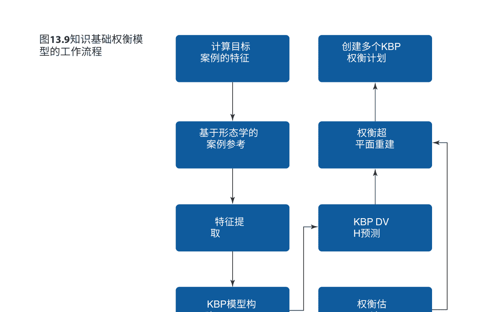

与解剖差异相关联，并仅提取由权衡决策可能引起的KBP模型与临床计划之间的差异。随后，通过主成分分析（PCA）处理OAR DVH拟合残差的矩阵E，以进一步降低维度，取前三个主成分作为主要权衡方向。权衡方向有效地揭示了在解剖变异调整后CRS中最显著的DVH变化模式。这些模式代表了历史参考数据库中常见的权衡情况。由于模型构建中用作训练案例的CRS是基于与当前案例形态学相似性选择的，因此提取的权衡方向对当前案例是特定的。这些方向形成了一个权衡超平面，为良好约束和临床可行的权衡子空间提供了有效的指导。

## 13.5.2 折衷模拟与验证

图13.10显示了通过折衷超平面预测的剂量体积直方图（DVH）与自动生成的折衷计划实现的相应DVH之间的均方根误差（RMSE）。这些RMSE值表示自动生成的折衷计划与超平面模型预测之间的准确性，并与KBP模型基线以及临床-DVH拟合结果进行评估。最大剂量约束的器官风险（脊髓、脑干、下颌骨）的RMSE通常比剂量-体积约束的器官风险（例如腮腺）的值更高。在临床计划中，当器官风险受到最大剂量约束时，规划师倾向于在Dmax以外的剂量-体积点上对这些器官风险给予非常低的优先级。这导致了与解剖差异无关的大量DVH变化。因此，这些DVH曲线的预测准确性不如其他器官风险（例如腮腺和口腔）的DVH。由于这种变化，即使对于KBP计划，RMSE值也不会为零。然而，正如文献中已经显示的那样，KBP模型预测的DVH确实是可实现的[29]，KBP模型预测的非零RMSE可以为超平面模型建立基线。

所有12个超平面引导的权衡计划的均方根误差与基准均方根误差没有显著差异（p > 0.05；配对t检验；n = 30个验证样本）。这些结果表明，所有权衡计划与KBP计划一样可实现。表13.3显示了各个权衡位置上所有计划中所有OAR的平均均方根误差值。与其他权衡位置（±σ）相比，离得更远的权衡位置（±2σ）的均方根误差值似乎更高。

具有三个方向的权衡超平面在训练计划中解释了68.9% ± 0.5%的方差，在验证计划中解释了57.5% ± 3.0%的方差。所有14个重新计划的案例与预测的超平面位置非常接近（DVH均方根误差<10%）。所提出模型的特征提取、回归和DVH预测与传统基于模型的KBP相似。工作流程的终点是具有各种权衡偏好的最佳可实现计划的集合。此外，工作流程可以为临床医生提供实时的规划权衡估计。

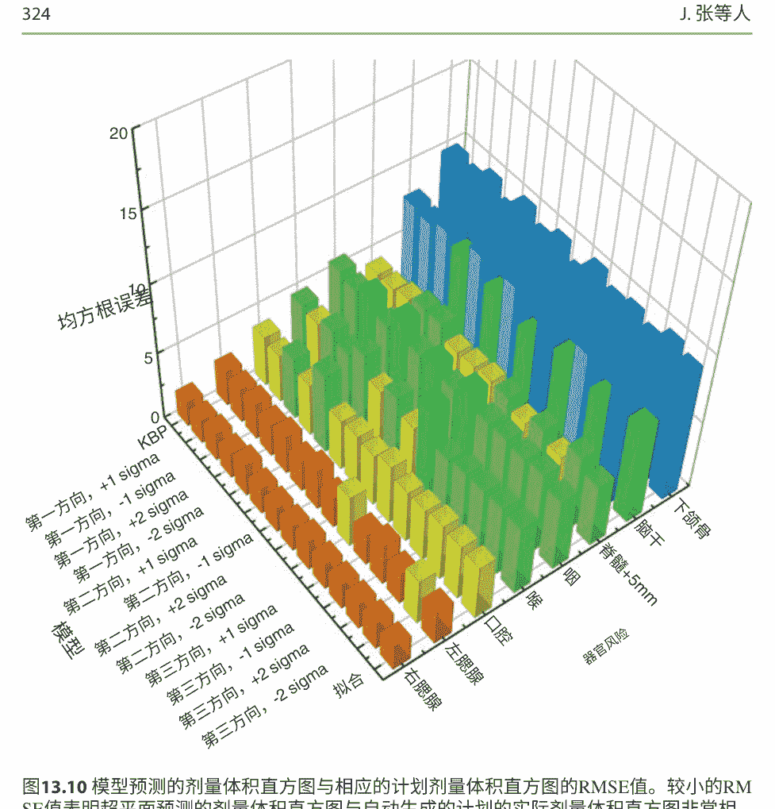

图13.10 模型预测的剂量体积直方图与相应的计划剂量体积直方图的RMSE值。较小的RMSE值表明超平面预测的剂量体积直方图与自动生成的计划的实际剂量体积直方图非常相似，从而证明超平面剂量体积直方图的预测是非常可行的。不同颜色表示不同范围的RMSE值

##### 表格 13.3 不同权衡位置的平均均方根误差值

| 剂量体积直方图（DVH）指导类型 | 平均均方根误差（%） | 标准偏差（%） |
| :--- | :--- | :--- |
| KBP（无权衡） | 4.96 | 2.48 |
| 第一权衡方向，±1 σ | 5.07 | 2.56 |
| 第一权衡方向，±2 σ | 5.39 | 2.52 |
| 第二方向，±1 σ | 5.05 | 2.50 |
| 第二方向，±2 σ | 5.35 | 2.62 |
| 第三方向，±1 σ | 5.08 | 2.46 |
| 第三方向，±2 σ | 5.30 | 2.51 |
| 临床DVH拟合 | 5.02 | 2.33 |

从而为明智的决策提供关于最佳可实现剂量参数的系统指导。

## 13.6 整个乳腺放射治疗的KBP规划完整工作流程

乳腺放射治疗（WBRT）常用于术后设置，以减少局部区域复发的风险。描述切线束配置。对于WBRT，前向规划技术如场中场和流量编辑是标准做法。在流量编辑方法中，规划师从初始流量开始，迭代修改流量。这种技术需要数小时手动微调流量，并且计划质量高度依赖于规划师的经验。在本节中，我们介绍了一种用于WBRT的自动规划方法[13]。与前面章节中介绍的KBP模型不同，WBRT自动规划方法直接生成流量图，而不使用嵌入在TPS中的逆优化引擎。

### 13.6.1 数字重建放射图（DRR）基于能量选择

在计划全脑放疗病例时，首先需要选择合适的射束能量。在我们的机构，通常使用两种类型的射束：（1）单一能量（SE）：6X射束和（2）混合能量（ME）：6X和15X射束。计划员通过检查射束路径长度来确定射束能量配置。为了构建一个自动化的能量选择工具，先前的临床计划被用来构建一个二元决策模型（选择单一或混合能量），并对查询病例进行能量选择分类。在每个射束方向上生成数字重建放射图（DRRs），并计算辐照体积内的灰度直方图。然后对训练集中每个病例的灰度直方图进行主成分分析（PCA），以减少数据维度。随后，将前两个主成分得分用作分类模型的特征。然后在二维特征空间中确定能量决策边界。值得注意的是，该模型的思想是放射学路径长度在射束方向上可以通过DRR灰度值有效表示，并由PCA捕获。

### 13.6.2 解剖学驱动的辐射通量估计

工作流程的第二步是生成一个通量图，以实现在三维目标体积内的最佳剂量分布。通量图是通过预测通量图上每个像素的通量强度来生成的。理想情况下，最佳剂量分布应覆盖整个乳腺靶区并达到处方剂量，同时最小化热点体积（处方剂量的105%）。已经开发了一种机器学习算法，用于学习解剖特征与最佳通量强度之间的相关性。我们利用随机森林（RF）模型总结输入特征（基于形状的特征，包括灰度强度、乳腺靶区的穿透深度、肺部的穿透深度等）与输出变量（像素级通量强度）之间的关系。RF是一个高度非线性的模型，它使用来自训练数据集的随机抽样数据初始化决策树，并通过对所有树的输出进行平均来生成预测。RF模型使用了所有20个训练计划和150棵树进行训练。对于查询案例，RF模型在像素级别预测通量强度，整个通量图作为相应射束的通量估计。对于ME案例，整个预测的通量图被分为低能量（6X）和高能量（15X）两个组成部分。来自同一侧的低能量和高能量射束共享相同的射束参数，如回转角度、准直器角度和铅挡大小。通量图上每个像素的低能量通量强度和高能量通量强度的比例取决于束流穿透深度，这种关系是从10个训练ME计划中学习到的。

## 13.6.3 患者特定的辐射通量微调

从RF模型生成的辐射通量图继承了训练案例的计划质量。然而，医生可能对目标覆盖率或高剂量体积或热点有特定要求。第三步为医生提供了与3D剂量分布进行交互微调的机会。

这是通过指定要传递给锚点的剂量来实现的，同时平衡来自两个射束的剂量贡献。剂量锚点在两个步骤中被确定。首先，在照射体积的等剂量面上确定它们，然后在中心性校正步骤中进行调整。然后，中心性校正步骤主动平衡乳腺组织内来自两侧的束流穿透深度，针对每个剂量锚点。这些剂量锚点的几何和剂量参数（穿透深度、锚点处的剂量等）从训练计划中总结出来，作为基准值，并且这些参数可以进一步调整，以为任何查询患者提供特定的覆盖率或剂量减少。

## 13.6.4 计划验证

### 13.6.4.1 数据选择

前面的章节已经提到了用于训练等的案例数量。共有40个经过机构审查委员会批准的来自杜克大学医学中心的全脑放疗计划进行了回顾性研究。所有计划都接受了50Gy的25次分割治疗。随机选择了20个计划，其中10个使用单一能量（SE，6MV），另外10个使用混合能量（ME，6/15MV），用于建立所提出方法的优化参数。剩下的20个计划（10个SE和10个ME）计划被保留用于验证。在这20个训练案例中，有12个是左乳腺病例。在验证案例中，20个中有9个是左乳腺病例。SE计划使用两个6MV束，即医生设置的中央束和侧面束，以包括整个乳房和皮肤闪光。对于ME计划，两个高能量束（15MV）使用与两个低能量束相同的束设置和束孔径（6MV）在相应的射束方向上。所有40例病例的临床计划都是通过规划师在Eclipse™ TPS中手动生成的，通过迭代地绘制流量并计算剂量分布。

### 13.6.4.2 模型训练和验证

主成分分析结果如图13.11所示。每个患者的DRR强度直方图如图13.11a所示。在图13.11b中，红点代表单能量病例，绿点代表混合能量病例。实心方块代表训练病例，圆圈代表验证病例。PC1 = 0作为一个良好的分类器，在验证队列中的准确率为19/20，意味着该模型建议与临床计划相同的能量组合。

### 13.6.4.3 计划质量比较

剂量分布在手动生成的临床计划和自动生成的计划之间进行了定性比较。图13.12显示了一个大乳房病例（左三列）和一个小乳房病例（右三列）的等剂量分布比较。临床计划和自动计划之间的剂量均匀性相当。高剂量体积（105% Rx剂量体积）在两个计划组之间的位置和体积上相似。

剂量-体积指标的箱线图如图13.13所示。每个终点的中位数和四分位数范围在两个计划组之间是可比较的。

### 13.6.4.4 计划效率

自动计划的平均优化时间小于20秒。即使作为独立平台，整个过程包括数据的传输从治疗到治疗

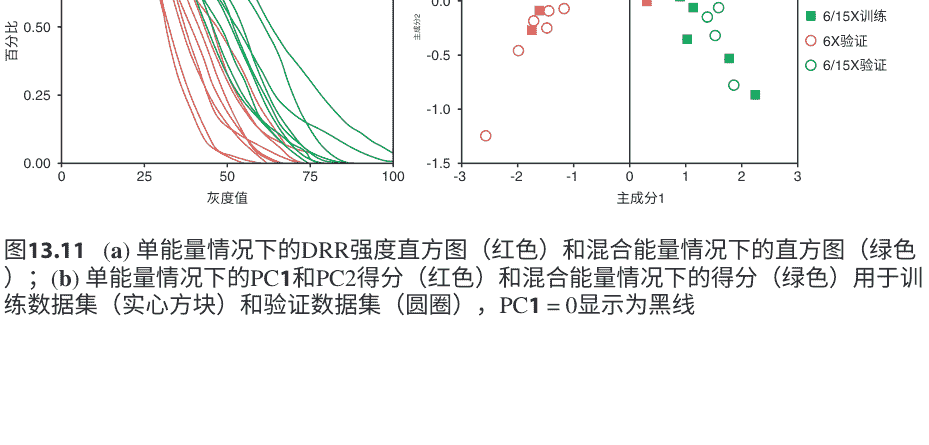

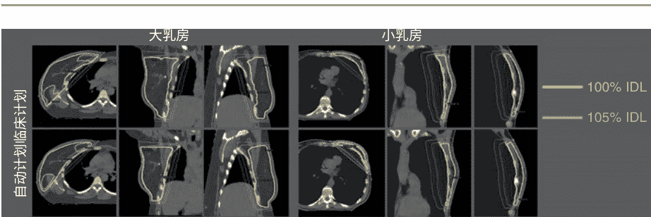

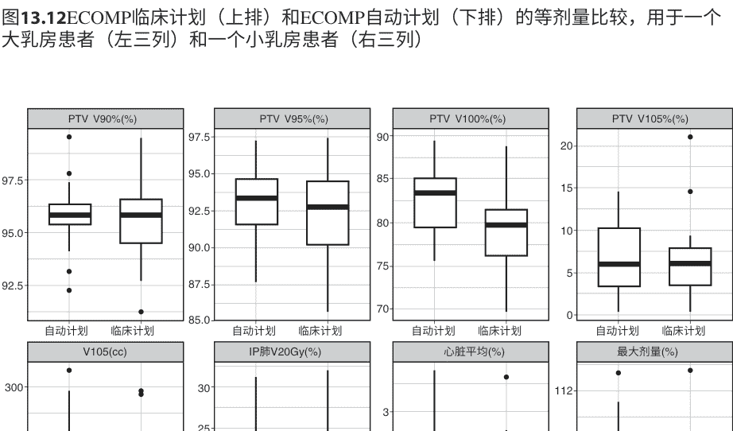

在我们的诊所中，规划系统可以在5分钟内完成。这比手动过程快得多，手动过程的时间范围为30分钟到4小时。

## 13.7 肺部射野知识模型用于IMRT计划

治疗计划的另一个重要方面是射野选择。对于某些计划部位，如肺部，良好的射野选择决策对于创建高质量的治疗计划至关重要。在临床实践中，射野通常是基于规划师的经验选择，并通过试错进行调整以找到最佳的

最佳的射野角度或射野构型。在本节中，我们介绍一种建立肺IMRT计划的标准化小射野构型集合的方法[15]。射野构型是通过学习先前临床计划的多维射野配置特征的模式来确定的，使用聚类分析方法进行分析。

### 13.7.1 两个射野构型之间的差异度量

首先，我们定义了两个射野构型之间的差异度量。差异度量是通过计算两个构型中每对对应射野之间的角度差来计算的。在比较两个射野时，它考虑了每个构型内射野的排列。具体而言，首先定义了两个角度a和b之间的距离

$$ \delta (a,b) = \min_{k \in Z} |a - b + 360k| $$

其中 k 可以取整数集合 Z 中的任意值，而 360 k 项则考虑了角度空间中的 360 度模运算。然后，两个具有相同射野数 x1=(x11, x21, ..., xn1) 和 x2=(x12, x22, ..., xn2)的构型之间的不相似度度量为

$$ d^1 (x_1, x_2) = \min_{\sigma \in \pi} \sum_{l=1}^{n} \delta (x_{\sigma(l)}^1, x_l^2) $$

其中 σ 是射野顺序的任意排列 π。在我们的数据集中，计划中使用的射野数量范围从6到11，因此有必要对具有不同射野数量的射野设置进行分类，通过定义具有不同射野数量的射野之间的不相似度测量。如果两个构型 x1 和 x2 具有不同的射野数量 n1 和 n2，并且假设 n1> n2 而不失一般性，我们将不相似度定义为两个项的和：

$$ d (x_1, x_2) = \min_{x_1' \subseteq x_1} d^1 (x_1', x_2) + \min_{x_2' \subseteq x_2} d^1 (x_1 \setminus x_1', x_2') $$

其中 x1' 是 x1 的子集，其具有与 x2 相同数量的射野，x2' 是一个具有射野数量 n1- n2 的 x2 的子集。第一项比较了 x1 中的 n2 个射野与 x2 用于计算距离，而第二项比较剩余的 n1- n2 个射野在 x1 中与 x2' 进行比较。这一步确保了计划中的每个射野都被考虑在计算具有不同射野数量的两个构型之间的不相似性时。

### 13.7.2 建立标准化的射野构型

在计算每对构型之间的不相似性（或距离）之后，使用k-medoids方法将射野配置排序为簇。中心点被定义为簇中的对象，其平均距离

对于同一聚类中的所有其他对象（聚类内距离），最小值是聚类的中心点。因此，聚类的中心点是聚类内所有情况中最具代表性的射野角度配置。所有中心点的集合描述了临床肺IMRT计划中经常使用的主要射野角度设置类型，并被指定为标准化的射野构型。与标准化射野构型相对应的中心点案例被指定为该构型的参考案例。

平均轮廓宽度s是数据集中所有数据点的轮廓指数s(i)的平均值。轮廓指数衡量了一个聚类中的每个点与相邻聚类中的数据点之间的接近程度。对于聚类A中的数据点i，设a(i)为i到聚类A中所有其他点的平均距离，b(i, C)为i到另一个聚类C中所有数据点的平均距离。轮廓指数定义如下：

$$ s(i) = 1 - \frac{a(i)}{\min\limits_{C \neq A} b(i, C)} $$

轮廓系数s(i)的数值范围为+1到-1。较大的正数值表示一个簇中的点与相邻簇之间距离较远，而负数值表示该点可能被错误地分配到一个簇中。轮廓系数图可用于可视化结果簇的分离程度。它将每个数据点的轮廓系数s(i)绘制为水平条形图。较宽的轮廓系数图表示较大的s(i)值。训练数据集中的射野设置被k-medoids算法分类为3-8个簇。图13.14a中绘制了每个分类结果的平均轮廓宽度s随簇数的变化情况。如图所示，使用六个簇进行分类

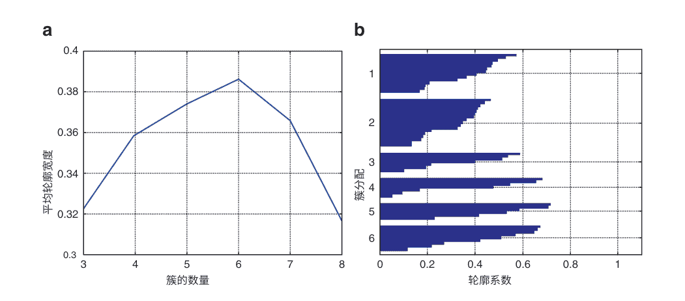

图13.14 (a) 每个给定聚类数的分类的平均轮廓宽度。(b) 具有六个聚类的分类的轮廓图。每个水平条表示一个对象的轮廓指数，根据其聚类分配进行分组。条的宽度表示轮廓指数值。垂直轴上的数字表示聚类的指数。

具有最大平均轮廓宽度值0.39的六个构型最好地表示数据集中的射野配置模式。具有六个聚类的轮廓图显示在图13.14b中。所有正值的轮廓指数值表明射野配置在其分配的聚类中很好地对齐。

图13.15显示了与六个聚类的中心对应的射野构型。这些构型中的射野数量从7到9不等，反映了参考临床计划中使用的射野数量。图中还显示了这些参考计划的代表性轴向CT图像切片。如图所示，这些射野配置反映了肿瘤的解剖和位置特征。

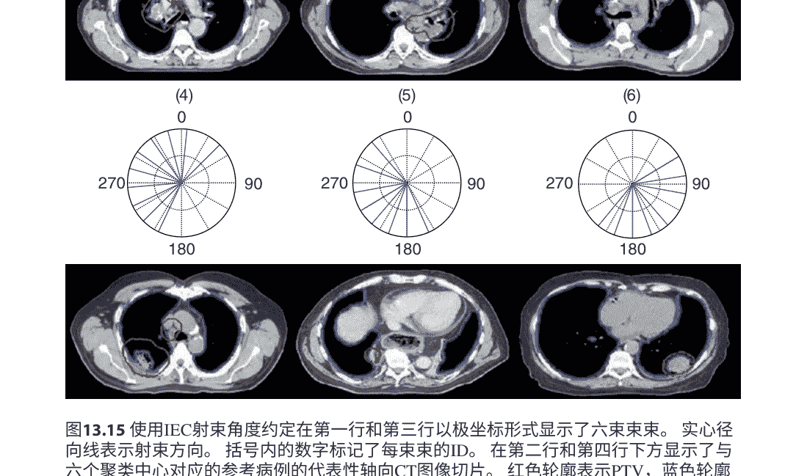

图13.15 使用IEC射野角度约定在第一行和第三行以极坐标形式显示了六种射野构型。实心径向线表示射野方向。括号内的数字标记了每种构型的ID。在第二行和第四行下方显示了与六个聚类中心对应的参考病例的代表性轴向CT图像切片。红色轮廓表示PTV，蓝色轮廓表示肺部。

### 13.7.3 临床案例验证

在经过IRB批准的研究方案下，回顾性研究了60例肺部IMRT计划，处方剂量范围为45 Gy至70 Gy。这些计划有六到十一个共面射野角度，平均射野数量为八个。数据集中的肿瘤大小范围广泛（从12 cm³到4432 cm³，平均502 cm³），并且分布在不同位置。数据集中的肿瘤位置分布如下：右肺26例，左肺23例，纵隔8例，胸壁3例。

额外选择了二十个随机的肺癌病例进行重新计划，以评估使用标准化射野构型的有效性。对于每个病例，经验丰富的计划师根据他/她对病例的肿瘤位置和患者解剖特征与参考病例的相似性的判断，手动选择了一个标准化射野构型。计划师对原始临床计划中使用的射野配置没有任何了解。在选择射野构型后，使用相同的剂量目标进行逆向优化，与临床计划中的剂量目标相同。使用六种构型的计划和临床计划中的剂量参数的均值和标准差（SD）进行比较。通过配对t检验进行比较。

表13.4列出了基于射野构型的计划和临床计划的剂量参数的均值和标准差，以及配对t检验的值。肺V10Gy、食管平均剂量、脊髓D2%和PTV剂量均匀性（定义为D2%-D99%）在基于构型的计划中统计上更好（p值<0.05），但改善幅度（<5%）较小，可能在临床上没有显著意义。其他剂量参数在统计上没有显著差异。

## 13.8 总结

在现代放射治疗学时代，KBP越来越多地被用于促进高质量和高效的治疗计划。KBP是指将临床计划知识嵌入先前治疗过的病例中，并利用这些知识来帮助生成新的计划的概念。KBP存在各种形式，从正向计划到逆向计划不等。在本章中，我们有

**表13.4 使用六种射野构型和临床计划的剂量学参数**

| OAR/PTV | 参数 | 构型计划 | 临床计划 | p值 |
| :--- | :--- | :--- | :--- | :--- |
| 肺 | V10Gy (OAR体积的百分比) | 29.1 ± 11.7 | 32 ± 12.6 | 0.01 |
| 肺 | V20Gy (OAR体积的百分比) | 18.3 ± 8.1 | 18.9 ± 8.7 | 0.44 |
| 肺 | 平均剂量 (% Dx) | 18.8 ± 7.0 | 19.2 ± 7.0 | 0.28 |
| 食管 | 平均剂量 (% Dx) | 32.0 ± 16.3 | 34.4 ± 17.9 | 0.01 |
| 心脏 | V60Gy (OAR体积的百分比) | 0.6 ± 1.1 | 1.2 ± 2.7 | 0.39 |
| 心脏 | 平均剂量 (% Dx) | 19.2 ± 16.5 | 19.4 ± 16.6 | 0.74 |
| 脊髓 | D2% (%Dx) | 47.7 ± 18.8 | 52.0 ± 20.3 | 0.01 |
| PTV | D2%-D99% (% Dx) | 17.1 ± 15.4 | 20.7 ± 12.2 | 0.03 |讨论了逆向IMRT/VMAT计划的DVH预测模型，乳腺WBRT自动计划技术和肺部射束角选择模型。

成功构建稳健的KBP模型的关键要素是数据质量和数据充分性。考虑到临床环境的时间敏感性和患者人群的大幅变化，临床数据库中可能存在一些不符合一般计划趋势的计划。在训练KBP模型时，这些计划被视为异常值。KBP建模的异常值效应已经得到广泛研究。例如，Delaney等人已经证明剂量学异常值对结果计划质量的影响较小。为了直接解决异常值的影响，Sheng开发了一种异常值识别方法[17]。然而，在临床使用之前，必须对KBP模型进行详细检查和适当验证，以确保该模型确实代表了以往经验中最佳可实现的计划质量。

知识库建模的另一个重要方面是用于训练模型的计划数量。Boutilier等人已经表明，不同的模型需要不同数量的案例[30]。因此，在设计用于临床使用的知识库建模时，仍需要仔细考虑稳健模型的案例数量。

知识库建模的未来研究可能会集中在更复杂的建模方法和更复杂的计划场景上。这两个方向将通过跨机构的整合努力以及个体机构内计划案例的积累来实现更大规模、高质量的临床计划数据库的发展。最近的研究发表已经展示了使用复杂非线性模型（如卷积神经网络）成功预测某些癌症部位的体素剂量的有希望结果。工作还开始处理更复杂的癌症靶区、更复杂的权衡决策以及更复杂的治疗技术。除了更复杂和强大的模型外，建模方法的复杂性还意味着更先进的学习、演化和集成模型的算法。到目前为止，数据驱动的知识库建模主要集中在批处理模式下构建模型，即从静态数据集中学习。随着这些模型的成熟并在临床使用中部署，另一个重要的研究问题将解决如何在积累新的临床案例和发展新的治疗技术时改进这些模型。

致谢 本工作部分得到了美国国立卫生研究院（NIH）的资助（编号：#R01CA201212）和Varian Medical Systems的硕士研究资助。

## 参考文献

- 1. Kalet IJ, Paluszynski W。基于知识的放射治疗计划的计算机系统。Am J Clin Oncol。1990年；13（4）：344-51。
- 2. Shwe MA，Tu SW，Fagan LM。验证治疗计划系统的知识库。Methods Inf Med。1989年；28（1）：36-50。
- 3. 张翔等。肺癌自动调强放射治疗计划的方法学。Phys Med Biol。2011年；56（13）：3873。
- 4. Voet PW等。朝着完全自动化的多标准计划生成：一项前瞻性临床研究。Int J Radiat Oncol Biol Phys。2013年；85（3）：866-72。
- 5. Hazell I等。头颈部治疗计划的自动化规划。J Appl Clin Med Phys。2016年；17（1）：272-82。
- 6. 张杰等。基于知识的头颈部治疗计划的权衡超平面。Int J Radiat Oncol Biol Phys. 2020;106(5):1095–103.
- 7. McIntosh C, Purdie TG。基于体素的多患者图谱选择的自动放射治疗计划剂量预测。Phys Med Biol. 2016;62(2):415–31.
- 8. Shiraishi S, Moore KL。外部束放射治疗三维剂量分布的基于知识的预测。Med Phys. 2016;43(1):378–87.
- 9. 张杰等。基于扩张卷积的密集连接网络的体素级放射治疗剂量预测。在：放射治疗中的人工智能。Cham: Springer International Publishing; 2019.
- 10. Nguyen D, et al. 具有分层密集连接U-net深度学习架构的头颈癌患者三维放射治疗剂量预测。Phys Med Biol.2019;64(6):065020.
- 11. 李明山等。深度剂量：一种使用深度卷积神经网络进行个性化内部剂量估计的体素剂量估计方法。科学报告。2019;9(1):10308。
- 12. 李华等。使用深度神经网络生成前列腺强度调控放疗计划的辐射流图。科学报告。2019;9(1):15671。
- 13. 盛勇等。使用机器学习模型自动规划全乳房放射治疗。前沿肿瘤学。2019;9:750。
- 14. 李晓等。自动IMRT计划通过静态场辐射流量预测（AIP-SFFP）：一种用于实时前列腺治疗计划的深度学习方法，在AAPM第61届年会和展览会上。美国德克萨斯州圣安东尼奥；2019年。
- 15. 袁亮等。肺IMRT计划的标准束束。Phys Med Biol. 2015;60(5):1831–43。
- 16. Yuan L等。在头颈部IMRT中预测腮腺剂量节省模型中引入单侧节省。医学物理学。2014;41(2):021728。
- 17. Sheng Y等。放射治疗知识导向计划中的异常值识别：盆腔病例研究。医学物理学。2017;44(11):5617–26。
- 18. Zhang J等。一种集成方法用于基于知识的调强放射治疗计划。前沿肿瘤学。2018;8:57。
- 19. Yuan L等。定量分析影响IMRT计划中患者间器官风险剂量节省变异的因素。医学物理学。2012;39(11):6868–78。
- 20. Zhang J等。在基于知识的治疗计划中对头颈部治疗的多个计划靶体积建模。医学物理学。2019;46(9):3812–22。
- 21. Tikhonov AN。关于逆问题的稳定性。Comptes Rendus De L Academie Des Sciences De L Urss. 1943;39:176–9.
- 22. Hoerl AE, Kennard RW。岭回归：非正交问题的有偏估计。Technometrics. 2000;42(1):80–6.
- 23. Tibshirani R。回归收缩和通过套索进行选择。J Royal Stat Soc Series B Methodol. 1996;58(1):267–88.
- 24. Zou H, Hastie T。正则化和通过弹性网络进行变量选择。J Royal Stat Soc Ser B Stat Methodol. 2005;67:301–20.
- 25. Wolpert DH。堆叠泛化。神经网络。1992;5(2):241–59.
- 26. Tol JP, et al. 评估一种基于知识的头颈癌治疗规划解决方案。Int J Radiat Oncol Biol Phys. 2015;91(3):612–20.
- 27. Delaney AR等。剂量异常值对商业知识规划解决方案性能的影响。Int J Radiat Oncol Biol Phys. 2016;94(3):469–77.
- 28. van der Maaten LJP, Hinton GE。使用t-SNE可视化高维数据。J Mach Learn Res. 2008;9:2579–605.
- 29. Wall PDH, Carver RL, Fontenot JD。知识规划中数据库质量对前列腺癌治疗的影响。Pract Radiat Oncol. 2018;8(6):437–44.
- 30. Boutilier JJ等。知识规划的样本大小要求。Med Phys. 2016;43(3):1212–21.

## 14.1 放射治疗中的呼吸运动问题

外部束放射治疗的一些治疗部位，如肺部、乳腺、胰腺和肝脏癌症，在患者呼吸时会移动，这会影响其照射的精确性。在本章中，我们将以肺部肿瘤作为范例来代表这个运动问题。

为了在呼吸过程中实现对运动的治疗目标的最佳覆盖率，有四种基本方法：（1）通过屏住呼吸或使用物理约束来抑制运动；（2）扩大治疗束的范围，使肿瘤永远不会移出束外（边缘方法）；（3）只在肿瘤位于或接近束等中心时开启束（门控方法）；（4）使束或患者与呼吸同步移动，以使束始终与肿瘤保持对齐（追踪方法）。在追踪方法中[45]，束可以通过移动线性加速器（LINAC）本身[1, 9, 60, 61, 63]，或者移动多叶片准直器（MLC）孔径[5, 12, 20, 30, 39–42, 49, 55, 59, 68]，或者在带电粒子束的情况下，通过磁控来调整束的方向[4]。另外，可以通过移动床位来使患者移动，以使肿瘤保持在固定的束等中心位置[10, 38, 52, 54, 64, 65]。

门控和跟踪是两种需要在治疗过程中实时适应肿瘤运动的方法。

一些患者呼吸规律，一些患者则不规律。同样，呼吸过程中的解剖运动有时简单，有时复杂。图14.1和图14.2展示了两个代表性患者的呼吸模式，通过胸部上的光学标记测量得到。图14.3和图14.4展示了一系列呼吸时间序列预测误差。

图14.1 规律呼吸的示例

图14.2 高度不规律呼吸的示例

图14.3 肿瘤位置和胸部标记位置的一系列测量结果，显示出随时间的紧密相关性[50]

图14.4 肿瘤和胸部标记位置的一个例子，随时间没有保持紧密相关性[50]

通过标记物测量的表面呼吸运动可以与通过X射线荧光成像测量的肿瘤实际位置相关联。这四个图示结合起展示了呼吸模型的复杂性和预测问题。尽管表面上看起来规律（如图14.1），正常呼吸并不严格周期性，而是随时间改变振幅和周期[34，69]。在极端情况下，呼吸模式可以高度不规律，甚至呈现混沌状态（图14.2）。例如，肿瘤和胸部运动之间的关系可以从稳定、线性和紧密相关（图14.3）到不稳定、非线性或其他相关性较差（图14.4）[50]。肿瘤/替代物的相关性可以随时间变化（例如通过运动的相对振幅和相位的变化），因此替代物和肿瘤位置的一系列测量看起来是不相关的（如图14.4）。这极大地复杂化了依赖呼吸替代物推断肿瘤运动的任何传递补偿方法（如门控或跟踪）。

呼吸和肿瘤运动的这些特征使得设计一个能够准确连续描述解剖运动并进行预测的先验生物力学模型变得极其困难。

相反，这个问题是机器学习方法的一个很好的候选，可以使用这些算法可以通过对患者实际呼吸示例进行训练来学习模仿和重现运动模式。这些模型可以在治疗计划和执行过程中开发和应用。

呼吸管理的第一步发生在治疗计划阶段，首先检测和表征运动。历史上，这是通过4DCT扫描实现的。然而，4DCT扫描通常具有较粗的时间分辨率。此外，呼吸运动可以从一天到另一天甚至每分钟都会发生变化，使得任何特定的扫描都可能是不典型的示例。每天重新扫描以适应这些变化会增加剂量，并且还需要重新计划。

Lin等人[35, 36]开发并测试了一个超级学习模型，用于计划阶段的运动预测和管理。他们的模型利用从治疗计划CT中提取的临床和影像特征来训练一个呼吸模型，可以预测治疗期间实际肿瘤运动。

他们主要关注预测肿瘤运动的可能方向和幅度，而无需进行4D CT。他们提出该模型可以根据建模肿瘤运动的范围和其他特征选择适当的运动补偿方法（如屏气或门控）。他们的超级学习器是一种混合算法，结合了随机森林、自适应神经网络和其他机器学习组件。

如果治疗计划过程建议在治疗期间使用动态补偿方法（如门控或追踪），则需要确定将在治疗期间使用的可观察呼吸信号与实际肿瘤运动的关系。这可能涉及通过成像观察肿瘤本身（带或不带植入物标记），测量胸部标记等代理呼吸信号，或两者兼而有之。如果要在治疗期间使用胸部标记等代理物来推断肿瘤位置（如瓦里安RPM系统，瓦里安医疗系统，加利福尼亚州帕洛奥图），则图14.3和14.4说明了潜在的困难。有时肿瘤和代理运动之间存在良好稳定的关系，可以仅通过标记来预测肿瘤；有时关系并不简单或稳定。无论哪种情况，机器学习算法都可以用于学习和跟踪这种关系，从治疗计划期间的4DCT或荧光成像开始，然后在治疗的动态控制过程中继续。在接下来的章节中，我们将讨论治疗期间的动态呼吸补偿，同时理解这些过程所使用的算法是在治疗计划阶段初始化的。

## 14.2 动态补偿策略在传递过程中的应用

在治疗传递过程中，适应肿瘤运动存在两个基本问题：（1）确定任意给定时间点的精确肿瘤位置；（2）采取同步自适应响应以保持束/肿瘤对准。肿瘤位置可以通过成像或其他检测方法直接测量，也可以通过可靠与肿瘤运动相关的呼吸运动测量来推断 [2, 18, 24, 25, 29, 31, 50, 70, 75–77]。

在这里，我们对从某种替代呼吸信号中学习和预测肿瘤位置感兴趣。保持束对准移动肿瘤的基本机制在图14.5和14.6中以示意图的形式进行了说明。图14.5是一个适用于闸门或束追踪方案的“开环”控制架构。

图14.5和14.6以示意图的形式说明了保持束对准移动肿瘤的基本机制。图14.5是一个适用于闸门或束追踪方案的“开环”控制架构。

肿瘤仅在患者运动（例如呼吸）的影响下移动。呼吸和/或肿瘤位置传感器提供输入给回路。校正信号通过各种系统组件传播，每个组件都需要一定时间来反应，导致在束流响应校正之前存在累积延迟。图14.6是一个“闭环”架构，其中系统的响应与患者的解剖运动相结合，影响着与束流等中心相对的靶点位置，从而成为回路的输入。这对于一个自适应系统是必需的，该系统根据肿瘤的移动移动床和患者，以使肿瘤在空间中保持固定位置（设定点）。在这种情况下，呼吸和床位移动结合起来移动肿瘤。在这两种架构中，肿瘤位置可以通过跟随与肿瘤运动相关的替代呼吸信号，直接观察肿瘤位置，或两者兼而有之来确定。

图14.5 一个用于维持束流和肿瘤对准的开环控制架构

图14.6 一个用于束流对准的闭环架构

对于运动的自适应响应不可能瞬间发生，因此需要在肿瘤定位和射束定时或对准调整之间进行补偿延迟。这归结为通过预测未来肿瘤位置（或其代理呼吸信号）来调整适应性，使其与肿瘤的实际位置同步。这些延迟可以在50至1000毫秒之间，具体取决于跟踪/校正方法[3, 9, 13–15, 26, 32, 58, 73]。通过机器学习算法对肿瘤未来位置进行时间预测已经成为大量广泛研究的主题，并且不断激发新的更复杂的方法。

智能传递算法必须能够持续适应运动模式的变化，通过连续重新训练的方法来实现，随着患者呼吸。已经研究了许多不同的跟踪算法（参见，例如，[11]）。其中，自适应神经网络早期被发现是解决这个问题的有效机器学习方法[27]。因此，它们将为动态治疗交付的机器学习讨论提供入口点。

本讨论的对象是在图14.5和14.6中标识为“相关器/预测器”的控制环路元素。该元素接收呼吸的某种测量作为输入，并将预期的肿瘤位置作为输入提供给射束或床控制器。为了允许控制环路延迟，“相关器/预测器”必须模拟患者的呼吸，以预测未来的呼吸信号和/或肿瘤位置。

## 14.3 使用人工神经网络（ANN）建模和预测呼吸运动

机器/深度学习算法在开环和闭环控制系统中提供了执行相关/预测功能的有效手段。它的优点在于可以从真实世界数据中进行训练，而另一种选择将是构建一个详细的生物力学呼吸模型，尽管仍然需要为每个患者定制。

人工神经网络（ANN）是一种可训练的机器学习算法。一种非常有用于预测信号幅度的形式是基本架构如图14.7所示。在这种应用中，我们有一些测量信号S(t)作为输入，将来的信号实例S(t + n)作为输出目标。ANN的工作是根据输入信号的样本，对未来的目标信号进行估计S'(t + n)。网络的输入层接收过去信号历史的离散测量样本，隐藏层计算输入数据的加权组合，输出层提供未来时间的目标信号估计。

图14.7 一个人工神经网络架构，用于预测信号幅度S(t)

图14.8 一个配置用于预测不同信号P(t + n)与输入信号S(t)相关的ANN

在图14.7中，目标信号是输入信号的未来样本，此时网络被训练成模仿输入信号，以便能够预测其未来行为。当目标信号最终在时间t + n到达时，预测S'(t + n)与其进行比较，计算出误差，并使用该误差来调整网络权重，以产生更准确的下一个样本的预测。图14.8显示了一种使用输入信号S(t)来预测与输入信号某种相关的不同信号P(t)的配置。

网络被训练用于从输入中预测相关的目标信号。目标预测可能是当前时刻或未来某个时刻的。

在我们的呼吸预测问题中，我们将输入数据标识为患者呼吸的离散测量序列。这可以是简单的单个呼吸信号的振幅的时间历史，例如移动标记器[44]或呼吸计信号[25, 77]，也可以包括多个呼吸信号的同时测量[76]。如果我们只关心预测呼吸运动以补偿治疗系统的滞后时间，那么目标信号将是患者测量呼吸的未来实例，网络的输出将是对该未来实例的估计。如果我们有兴趣从测量的呼吸信号中推断肿瘤位置，那么输入信号将是呼吸替代测量，目标数据将是某个特定时间点肿瘤的空间位置的测量。它可以是当前时间点的肿瘤位置，在这种情况下，ANN在肿瘤和呼吸运动之间进行空间相关性，或者它可以是肿瘤的未来位置，在这种情况下，网络既进行相关性又进行时间预测，以得出肿瘤位置的良好估计。

## 14.4 基本神经网络架构用于相关性和预测

### 14.4.1 单个神经元，或线性滤波器

通过考虑一个简单的网络配置来预测离散时间间隔采样的单个呼吸信号的未来振幅，我们可以介绍人工神经网络的基本计算组件。它从一个单个神经元开始，如图14.9所示。（这在历史上被称为线性感知器。）输入是振幅历史记录的测量信号 $S(t)$，以 $\tau$ 秒为间隔采样。对于大多数人的呼吸来说，周期为几秒钟，$\tau$ 可能在100毫秒左右。我们取最近的 $N$ 个样本。每个样本乘以权重 $w_i$，并对 $N$ 个样本求和：

$$S'(t) = \sum_{i=1}^{N} w_i S(t - i\tau)$$
(14.1)

如果我们停在这里，我们就有一个简单的线性滤波器，其中 $S'(t)$ 是基于前 N 个样本的滤波器对当前时间的信号幅度的估计。将 $S'(t)$ 与 $S(t)$ 进行比较，并使用误差来调整权重，直到差异最小化。如果我们希望它在未来的某个时间 $t + \Delta t$ 预测 $S$，而不是当前时间，我们需要等待 $\Delta t$ 秒，等待实际信号到达，将其与 $S'$ 进行比较以找到误差，并相应地调整权重。

图14.9和方程式14.1中的线性滤波器（即单个神经元）可以合理地预测呼吸，前提是模式不太可变或不规则[46]。它为预测和相关性的人工神经网络的开发引入了几个基本要素的起点。

权重在训练阶段进行初始优化。对于基本的信号预测滤波器，通常包括提供具有代表性的预先记录的信号历史，这些历史代表了最终想要预测的信号。

例如，如果想要定制一个滤波器来模拟和预测特定患者的呼吸，首先需要记录患者呼吸信号的一段时间。然后通过一个滑动窗口逐步将其呈现给滤波器，该窗口的宽度为 $N$ 个样本，以便滤波器在输入时获得一组 $N$ 个样本，在时间 $t$ 处进行预测，与目标进行比较，目标是记录在时间 $t + \Delta t$ 处的信号，调整权重，向前移动一个样本，并重复该过程。这是有监督的顺序训练的一个例子。顺序训练的优点是，随着滤波器接收到之前未见过的新的呼吸数据，它可以继续该过程，不断进行重新训练以适应新的呼吸模式。

初始训练过程必须以这样的方式进行，即在实际到达实时之前，在训练阶段不会“看到”未来的样本。

线性神经元的最简单训练算法是LMS（最小均方）方法。设 $S_i$ 为第i个训练信号历史的 $N$ 个输入样本的向量，设 $W_i$ 为分配给输入的 $N$ 个权重的向量，设 $\varepsilon_i$ 为预测信号样本与目标信号样本之间的差异。更新的权重向量为

$$W_{i+1} = W_i + \alpha \varepsilon_i S_i$$
(14.2)

其中 $\alpha$ 是确定收敛速度的参数。

在顺序训练的情况下，每个训练信号历史 $S_i$ 只是前一个信号历史向前推进一个样本。

还有许多其他更新权重的算法。有关ANN训练算法的更全面的综述，请参阅例如[22]，或[21]，或其他关于神经网络的入门教材。

## 14.4.2 基本的前馈人工神经网络 用于预测

在单神经元感知器被提出作为一种原始的模式识别机器学习算法后不久，明斯基证明它以及任何由线性组合的神经元执行eq. 14.1函数的能力只能进行线性判别，无法执行甚至简单的异或函数[43]。这导致了非线性神经网络的发展，用于更复杂的模式识别和信号处理。图14.10是最简单的非线性神经网络的示意图——一个具有一个隐藏层的前馈网络，用于信号预测。输入并行分布到两个或多个神经元中，就像图14.9中的一个神经元（简单线性滤波器）一样。它们组成了“隐藏”层。（该层是“隐藏”的，因为无法直接从外部访问。）每个神经元的输出 xo通过非线性“激活”函数（eq. 14.3中的sigmoid函数是最常用的）加权并与输出神经元中的其他信号相加，从而得到最终的信号估计。

```
$y = f(x) = 1/(1 + e^{-x})$  (14.3)
$df / dx = y(1 - y)$  (14.4)
```

激活函数必须是非线性的；否则网络将简化为一个线性神经元，没有任何收益。

图14.10 一个基本的前馈网络，具有一个隐藏层的神经元和一个输出层的单个神经元

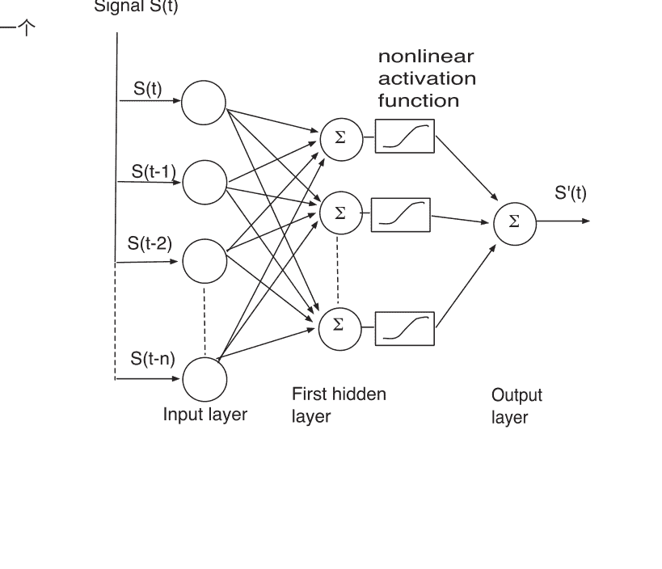

## 14.4.3 训练前馈网络

图14.10中隐藏层和输出层中每个神经元的每个输入都有一个独立可变的权重。然而，隐藏层中的权重被非线性激活函数“阻塞”了输出信号误差。这样防止了LMS算法在eq.14.2中的简单线性推广。这个问题通过误差反向传播的方法来解决。

虽然关于反向传播的基础知识可以在任何关于神经网络的教科书中找到（例如，[21]），但在这里提供它们有一些优势，使用图14.10中的简单两层网络作为架构。设第1层为隐藏层，第2层为输出层（在这种情况下只有一个神经元）。让索引i应用于数据样本，j应用于第1层的神经元数量（也是第2层的输入权重的数量）。设W₁,ⱼ为第1层第j个神经元的权重向量（具有组成部分w₁,ⱼᵢ），W₂为输出（第2层）神经元的权重向量（具有组成部分w₂,ⱼ）。第1层神经元的输出在激活之前为x₁,ⱼ，在激活之后为y₁,ⱼ。预测输出信号的误差为ε。

```
Δ₂=ε
```

```
Δ₁ⱼ=[y₁ⱼ(1−y₁ⱼ)][Δ₂w₂ⱼ]
```

```
δw₂ⱼ=αΔ₂y₁ⱼ
δw₁ⱼᵢ=αΔ₁ⱼSᵢ
```

除了LMS之外，还有许多其他算法可以用来更新权重[21, 22]。无论使用哪种算法，都有一些通用原则可以遵循以获得最佳结果。第一步是初始化所有的权重。通常的做法是随机选择它们，因为这样可以使神经元独立地工作。然而，随机初始化总会有一些机会得到一个表现不佳的不利滤波器。可以通过多次进行随机初始化和后续训练，同时在独立的验证信号上测试每个完全训练的滤波器，来避免这种情况。对于预先记录的信号，验证信号可以是任何未用于训练的部分。

通常情况下，单次通过训练数据不会导致权重的最优收敛。因此，习惯上要反复通过训练数据，每次训练通过都从权重开始，训练数据通常需要多次迭代，并计算并用于更新权重。希望的优势是，来自（潜在噪声的）测量的原始输入数据通过来自输出的滤波数据来平滑网络的响应。循环网络可以像前馈网络一样进行训练，例如通过反向传播。Mafi和Moghadam [37]研究了用于呼吸运动预测的循环/动态网络的使用。

## 14.4.4 循环网络

一个静态神经网络被训练，然后无需修改地应用于测试数据。一个自适应神经网络在获取新数据时重新训练神经元权重。循环网络是一个闭环反馈结构，其中来自隐藏层和输出层的信号被反馈到先前的隐藏层和/或输入层。这种结构受到人脑是一个循环网络的观察启发。循环网络有时被称为动态网络，因为它们通过反馈环路调整神经元权重以适应持续的经验。反馈的时机决定了网络的短期或长期记忆。在图14.11中，用于预测的简单循环网络在每个时间步骤 S(t) 的输入信号中将先前的 m-1 个预测反馈到输入层。输出信号在预测间隔 τ 之前被保留，然后再提供给输入，以便计算 S(t) 和 S'(t) 之间的误差。

图14.10中的前馈预测网络可以通过将其输出与肿瘤位置的某种测量进行比较，如图14.8所示，来进行时间预测和位置相关性的泛化。

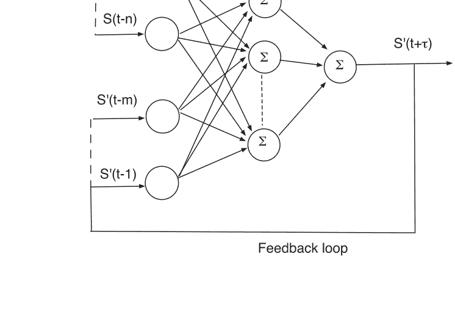

## 14.5 基本神经网络预测肿瘤运动的性能

使用人工神经网络预测呼吸问题已经被许多研究人员研究过（例如，[8, 19, 27, 28, 33, 44, 47, 48, 56, 62, 67]）。

### 14.5.1 简单前馈网络的呼吸预测示例

前馈网络可以有多个隐藏层，每个隐藏层可以有多个神经元。输出层也可以有多个神经元（参见图14.12）。每个隐藏神经元的输出在传递到下一层的神经元之前会经过激活函数的处理。然而，研究发现，一个仅有两个隐藏神经元和一个输出神经元的前馈网络可以像更复杂的结构一样准确地预测呼吸[8, 27, 44]。因此，我们可以使用这样一个简单的网络来学习一些关于基本呼吸预测的重要知识。

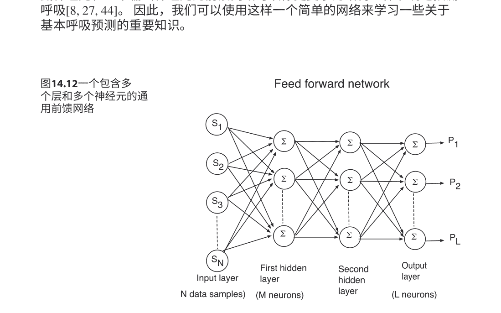

一些关于基本呼吸预测的重要事项。下面是使用单个呼吸振幅（胸部标记的位移）作为输入信号、隐藏层中有两个神经元、使用Sigmoid激活函数和一个输出神经元（用于未来信号振幅）的前馈人工神经网络（ANN）的呼吸预测结果示例。在通过LMS进行初始训练后，每当有新的呼吸数据点可用时，网络会进行更新（适应）。为了量化呼吸预测的准确性，使用无量纲的标准化均方根误差（公式14.5）来比较预测的（$P_i$）和实际的（$D_i$）未来振幅，预测的时间范围从100毫秒到500毫秒。

```
$nRMSE = \left[ \Sigma_i (D_i - P_i)^2 / \Sigma_i (D_i - \mu)^2 \right]^{1/2}$ \quad (14.5)
```

这里 $\mu$ 是所有观测值的平均值。

在设计前馈神经网络预测滤波器时，有几个参数需要确定——输入信号历史的长度（以秒为单位）和其中的样本数（即采样率），训练周期数以及LMS更新规则中的训练速率 $\alpha$（方程式14.2）。关于网络测试的详细信息已在[48]中详细报告，可以简单地说，通过改变这些网络参数中的每一个来探索网络在预测各种不同呼吸示例时的性能，以找到提供最佳结果的值。一个明显的问题是，一个单一的网络设置是否能够合理地预测各种呼吸模式，或者滤波器设置是否需要针对每个病人进行优化。为了回答这个问题，首先优化了每个病人的呼吸历史的滤波器设置，并记录了其准确性。然后，在结果中确定了全局最优的采样长度和速率、训练周期数和训练速率，并用于配置标准化的滤波器，然后对所有个体病人的历史进行测试。图14.13显示了结果[48]。

从一组接受肺癌治疗的患者中随机选择了1-14号患者，呼吸模式范围广泛；15-27号患者是健康志愿者，通过视听反馈进行呼吸规律化[16, 17]。对于接受健康指导的患者，标准化滤波器的效果与个性化滤波器基本相当，并且即使对于最不规律的肺癌患者，其效果仍然相当不错。这表明并不总是需要为每个患者进行复杂的滤波器优化过程，这是令人鼓舞的。

如果呼吸模式随时间变化，任何预测性滤波器的准确性都可能会下降，因为滤波器必须重新训练自己以适应这些变化，而这需要时间。可以通过计算呼吸规律性指标，然后观察预测准确率与该指标的关系来证明这一点。

对于一个有限长度的连续患者呼吸信号 $S(t)$，自相关系数 $C(\tau)$ 定义为 $S(t)$ 与自身的互相关积分，在延迟时间 $\tau$ 上：

```
$C(\tau) = \int S(t) S(t-\tau) dt$ (14.6)
```

对于一个稳定周期信号，$C(\tau)$ 关于 $\tau$ 的平均值将近似恒定，而对于一个非稳定（时间变化）信号，$C(\tau)$ 的平均值将随着 $\tau$ 的增加而变小。我们可以通过平均相关系数随 $\tau$ 减小的速率的倒数来表征信号的稳定性。将其称为相关衰减时间。为了计算衰减时间，在呼吸时间序列中的某一点设置了一个60秒的窗口，并计算了 $0<\tau<60$ s 的 $C(\tau)$。自相关系数正半周期的峰值被绘制在半对数尺度上，作为 $\tau$ 的函数。图形的反斜率给出了该呼吸信号窗口位置的衰减时间。快速变化的信号将具有较短的衰减时间；缓慢变化的信号将具有较长的衰减时间；完全稳定的信号将具有无限的衰减时间。

图14.14显示了ANN滤波器的预测准确性与呼吸信号衰减时间的关系（来自[48]）。正如预期的那样，快速演变的呼吸模式更难预测，无论滤波器设计得多好。

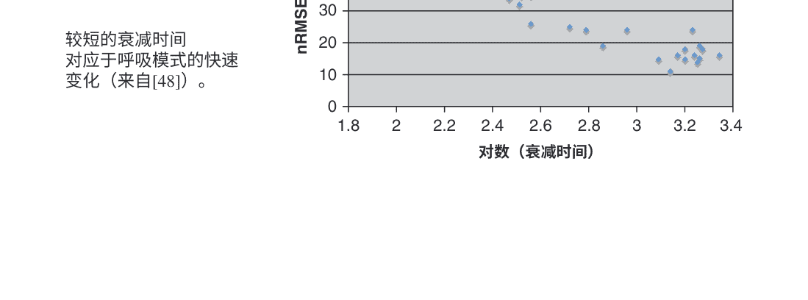

## 14.6 高级神经网络架构

### 14.6.1 二次神经单元

在基本的前馈神经网络感知器中，神经元对加权输入进行线性求和。它使用Sigmoid激活函数将每层的神经元输出传递到下一层，在那里它们再次进行线性求和。正如前面提到的，如果没有连接层之间的非线性激活函数，多层感知器将简化为单层感知器。

在多项式神经网络中，神经元对输入进行高阶多项式组合。例如，一个二次神经单元计算：

```
y = Σ_ij w_ij x_i x_j
```

Bukovsky等人[6]测试了一个带有二次神经单元的神经网络，用于预测呼吸时间序列。该网络通过适用于多项式神经元的Levenberg-Marquardt算法进行训练。他们发现它可以实时重新训练，并在预测范围为一秒钟时达到良好的准确性。

### 14.6.2 使用卡尔曼滤波器作为训练循环的一部分进行预测/校正

考虑一个通过周期性数据样本观察的系统。假设每个数据样本由于系统本身的行为（植物噪声）和测量的不确定性（测量噪声）而随机波动。如果系统的演变状态由线性函数控制，则下一个样本的最佳估计由卡尔曼滤波器预测器提供，该预测器是一个持续更新的算法，它采用其对系统状态的当前估计，对下一个信号样本进行预测，将其与下一个可用的数据测量组合，并计算校正以更新系统的状态，然后通过预测/校正循环重新循环。这样的滤波器不断适应系统的演变。

呼吸信号具有可分为两个来源的变异性——实际呼吸的不规则性（植物噪声）和观测误差（测量噪声）。这激发了使用卡尔曼滤波器预测呼吸的研究。然而，呼吸系统是非线性的，因此卡尔曼滤波器必须推广为扩展卡尔曼滤波器（EKF）。扩展卡尔曼滤波器试图线性化观测（通常通过泰勒展开），以便可以使用基本的卡尔曼预测/校正算法。不幸的是，这证明是有问题的，扩展卡尔曼滤波器在呼吸方面的性能通常不如其他方法有利。

回顾图14.7，可以看到权重是从最近的误差信号更新的。这些误差信号还包括植物和测量噪声。这表明可以使用扩展卡尔曼滤波器来训练人工神经网络[74]。在这个应用中，它将用于计算（预测）权重的每次更新，从而计算出人工神经网络的状态，而不是对呼吸状态进行建模和更新。这可以结合人工神经网络和扩展卡尔曼滤波器的优点。图14.15说明了这种策略。例如，Lee等人[33]研究了这种呼吸预测架构，并介绍了计算网络权重的扩展卡尔曼预测/校正的细节。

具有p输出的循环EKF-ANN用一个由神经元权重向量描述系统状态，需要一个大小为s²的误差协方差矩阵和计算复杂度为O(ps²)。当网络输入较多时，这可能变得很苛刻。然而，可以在EKF阶段解耦各个权重，使误差协方差矩阵变为分块对角矩阵，从而将计算复杂度降低到O(ps)[33, 53]。

### 14.6.3 具有多个呼吸信号输入的网络

到目前为止，关于呼吸预测和相关性的ANN讨论都是使用单一的一维呼吸信号S(t)作为输入。在临床环境中，通常会有多个传感器，每个传感器测量运动中的三个空间自由度。CyberKnife（Accuray Incorporated，加利福尼亚州Sunnyvale）利用分布在患者胸部和腹部的光学跟踪红外发射器阵列记录呼吸。呼吸数据与定期的肿瘤位置X射线测量相关，以提供线性加速器的定位信号，从而进行补偿校正。

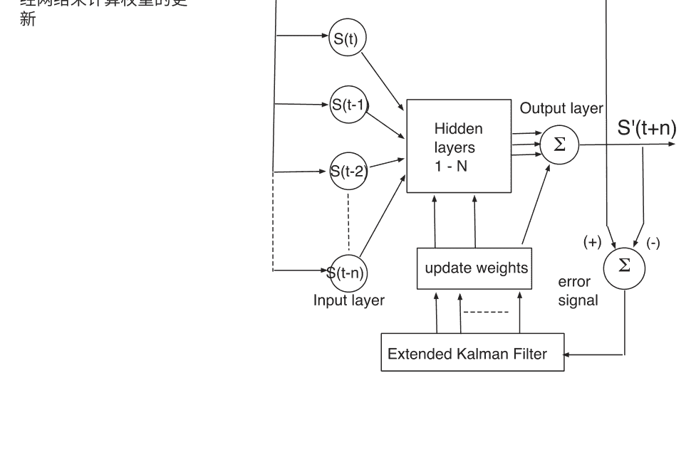

治疗束的方向[60, 61]。这样做的优点是多个冗余测量可以减少测量噪声的影响，并且在训练过程中可以确定患者是胸部呼吸还是腹部呼吸。

对于m个呼吸信号源的最基本的泛化方法就是创建一个输入层，为每个信号提供n个延迟，总共有nm个输入节点。然而，对于一个呼吸患者，m组输入样本将彼此相关。在EKF-ANN中，这种相关性将反映在误差协方差中。可以通过将每个信号通道的卡尔曼滤波器耦合在一起来处理这个问题（同时保持权重解耦，如上所述）。这个问题已经由Lee等人研究过[33]。或者，可以对信号进行主成分分析（PCA），以获得最大化不相关数据的输入向量。

### 14.6.4 深度学习神经网络用于预测

传统神经网络用于序列模式识别的一个限制是它们倾向于忘记旧的输入数据。这在短期内部分得到缓解，通过使用递归神经网络，但是当网络在实时中重新训练以适应不断变化的输入时，旧的学习参数会被有意地修改以响应新的、不同的输入信号。这样做的好处是保持网络的最新状态，但是限制了网络学习和记忆大量先前数据的能力。为了缓解这个缺点，发展了长短期记忆（LSTM）网络[23]。

在呼吸预测的自适应重新训练中，基本网络架构（模型）对于特定患者是固定的，但是学习参数会实时修改以适应患者呼吸的变化。研究发现，在具有规律呼吸模式的患者群中，可以为所有患者使用标准网络模型，但是当患者呼吸变得不规律时，将网络模型个性化对患者变得越来越有利。将网络模型个性化对每个患者进行耗时的过程必须在治疗开始之前完成。拥有一个经过开发和训练的标准化网络架构，该架构已经在具有广泛变化的呼吸模式的患者群中使用，将是非常理想的。这样的网络需要对过去见过的每个患者都有“记忆”。Lin等人[35, 36]将LSTM网络模型应用于一组患者，这些患者的个体呼吸模式是使用实时位置测量数据（RPM，Varian Medical Systems， Palo Alto， CA）记录的。Wang等人[72]同样将深度长短期记忆应用于呼吸预测问题。

## 14.7 支持向量回归（SVR）作为呼吸预测的神经网络替代方案

传统前馈神经网络在模式识别中的一个缺点是容易陷入局部最小值，从而错过真正的损失函数最小值。前馈人工神经网络应用硬决策边界，容易受到异常训练数据的干扰。随着多维决策面变得模糊，个别训练示例重叠以模糊真正的最小值，这一问题变得更加严重。支持向量机的概念是由Vapnik [71]开发的，旨在解决这个问题。

支持向量机是一种概率学习算法，与人工神经网络类似，但在决策面上使用软边界，允许分类器容忍个别分类错误，只要它们小于某个上限 epsilon。

这些算法的次要变体被称为支持向量回归（SVR）[57]。研究[7]表明，当应用于自适应运动补偿的呼吸预测时，SVR方法能够实现更好的时间序列预测准确性。

## 14.8 概率神经网络

另一个统计学习算法是所谓的概率神经网络(PNN)，由Specht在20世纪60年代开发，与Vapnik在SVM的早期工作几乎同时。在PNN中，训练数据使用带有高斯核的Parzen窗口[51]进行平滑处理，以提供多参数训练数据集的函数表示，然后将各个分类输入定位在该多参数函数空间中，并为其分类分配正确的概率。这种方法自然地适应了稀疏训练数据集和数据中的异常值。Specht已经证明，PNN的功能与前馈神经网络相同，只是将Sigmoid激活函数替换为指数函数。这些算法已成功应用于各种时间序列预测和预测问题，但在撰写本文时尚无证据表明它们应用于呼吸时间序列。

## 14.9 总结

在治疗计划阶段开始使用机器学习技术分析和预测患者呼吸和肿瘤运动模式，可以减少CT成像的数量来表征4D运动。放射治疗期间的自适应呼吸补偿需要通过直接从成像数据或间接从替代呼吸数据预测肿瘤运动来补偿适应过程中不可避免的滞后时间的方法。

尽管大多数人的呼吸表面上看起来是规律的，但实际上周期和振幅是可变的。此外，在呼吸的影响下，解剖的不同部分的相对运动可能随时间变化，这使得将肿瘤运动与其他替代运动联系起来变得困难。机器学习算法提供了一种模拟这些复杂行为的有吸引力的方法，而无需进行生物力学建模。它们本质上能够适应个体的呼吸模式，并实时适应呼吸行为的变化。

人工神经网络是一种简单的机器学习算法，已经证明在预测呼吸行为方面非常有效。它相对于基本的线性自适应滤波器具有明显的优势，而且额外的计算负担不多[46]。更有用的是，许多研究人员发现，使用非常简单的网络结构可以达到可接受的预测准确性水平，而添加反馈环路或更多层次和神经元通常并没有带来更多的改进[8, 27, 44]。此外，并不总是需要根据每个个体患者来定制网络结构[48]。

当采取措施通过训练和反馈来规范个体的呼吸时，这种情况最为明显[48]。然而，深度学习神经网络已被证明能够从表现出不同呼吸特征的患者群体中进行广义训练[35, 36]。

虽然各种运动自适应治疗设备的延迟时间可以（并且已经）得到系统性的缩短，使得时间预测在肿瘤跟踪系统中变得不那么重要，但通过代理呼吸信号跟踪肿瘤运动的问题仍然存在。与时间预测相比，人工神经网络在这方面的应用研究还不够充分，需要进一步探索。

在放射治疗期间智能呼吸管理的重要性在过去二十年的大量研究中已经显而易见。在这段时间里，开发人员已经从简单的线性滤波器发展到了高度复杂的机器学习和深度学习算法。这个问题对工程师和临床医生来说仍然具有重要的研究意义。

## 参考文献

1. Adler JR, Murphy MJ, Chang S, Hancock S. 图像引导的机器人放射外科。 神经外科。 1999年;44:1299–306。
2. Ahn S, Yi B, Suh Y, Kim J, Lee S, Shin S, Choi E. 从皮肤运动预测肺部肿瘤位置的可行性研究。 英国放射学杂志。 2004年;77:588–96。
3. Bedford JL, Fast MF, Nill S, et al. MLC跟踪延迟对4D立体定位肺部治疗中的体积调制弧治疗计划的影响。 放射治疗与肿瘤学。 2015年;117(3):491–5。
4. Bert C, Saito N, Schmidt A, Chaudhri N, Schardt D, Rietzel E. 扫描粒子束的靶运动跟踪。 医学物理学。 2007年;34(12):4768–71。
5. Booth JT, Caillet V, Hardcastle N等。使用MLC跟踪进行肺SABR的电磁引导实时自适应放射治疗的第一例患者治疗。 放射治疗与肿瘤学。 2016年;121（1）：19-25。

-   6. Bukovsky I, Homma N, Ichiji K, Cejnek M, Slama M, Benes PM, Bila J. 一种快速神经网络方法，用于预测放射治疗应用中呼吸过程中肺肿瘤运动。 Biomed Res Int. 2015;
-   7. Choi SW, Chang Y, Kim N, Park SH, Song SY, Kang HS. 使用自适应支持向量回归改进呼吸肿瘤运动预测的性能：与自适应神经网络方法进行比较。 Int J Imaging Systems and Technology. 2014;2(1):8–15.
-   8. Davuluri P, Hobson RS, Murphy MJ, Najarian K. 用于呼吸预测的Volterra预测器和神经网络的性能比较。 In: First international conference on biosciences. Cancun, Mexico: IEEE; 2010. p. 6–10.
-   9. Depuydt T, Verellen D, Hass O, Gevaert T, Linthout N, Duchateau M, Tournel K, Reynders T, Leysen K, Hoogeman M, Storme G, De Ridder M. 一种新型基于万向节的放射治疗肿瘤跟踪系统的几何精度。 放射治疗与肿瘤学。 2011;98(3):365–72.
-   10. Ehrbar S, Schmid S, Jahl A, 等。 前列腺癌立体定向体放射治疗中多叶片准直器跟踪和治疗床跟踪的比较。 放射治疗与肿瘤学。 2017;125(3):445–52.
-   11. Ernst F, Schweikard A.基于相关性和预测的机器人LINAC跟踪。 在: Murphy MJ, 编辑。 放射治疗中的运动适应性。 纽约: 泰勒和弗朗西斯出版社; 2012年。
-   12. Falk M, Munck AF, Rosenchöld P, Keall P, Catell H, Cho BC, Poulson P, Povsner S, Sawant A, Zimmerman J and Korreman S, 实时动态MLC跟踪用于反向优化弧线放疗。 放射治疗与肿瘤学。 2010年； 94： 218-23.
-   13. Fast MF, Nill S, Bedford JL, Oelfke U。 使用Elekta agility MLC进行动态肿瘤追踪。 Med Phys. 2014年； 41 （11）： 111719。
-   14. Fledelius W, Keall PJ, Cho B等。 基于图像的动态MLC追踪中的追踪延迟与直接图像采集。 Acta Oncol. 2011年； 50 （6） ： 952–9。
-   15. Freislederer P, Reiner M, Hoischen W等。 使用Elekta linac上的光学表面成像和门控系统进行门控治疗的特点。 Radiation Oncology. 2015年； 10 （1） ： 68。
-   16. George R, Chung TD, Vedam SS, Ramakrishnan V, Mohan R, Weiss E, Keall PJ。 呼吸门控放射治疗的音频-视觉生物反馈: 音频指导和音频-视觉生物反馈对呼吸门控放射治疗的影响。 Int J Radiat Oncol Biol Phys. 2006年； 65 （3） ： 924–33。
-   17. George R, Suh Y, Murphy M, Williamson J, Weiss E, Keall P. 关于放射治疗过程中目标跟踪的移动平均算法准确性的研究。 Med Phys. 2008;35(6):2356–65.
-   18. Gierga DP, Brewer J, Sharp GC, Betke M, Willett CG, Chen GTY。 腹部肿瘤内外标记物之间的相关性：对呼吸门控的影响。 Int J Radiat Oncol Biol Phys. 2005;61(5):1551–8.
-   19. Goodband JH, Haas OCL, Mills JA。 在IGRT中在线预测的神经网络方法比较。 Med Phys. 2008;35(3):1113–22.
-   20. Hansen R, Ravkilde T, Worm ES, et al. 在TrueBeam加速器上的电磁引导床和多叶片准直器跟踪。 Med Phys. 2016;43(5):2387.
-   21. Haykin S. 神经网络与学习机器. 第3版. 伦敦: Pearson; 2009.
-   22. Haykin S. 卡尔曼滤波和神经网络. 纽约: Wiley Interscience; 2001.
-   23. Hochreiter S, Schmidhuber J. 长短期记忆. 神经计算. 1997;9:1735–80.
-   24. Hoisak JDP, Sixel KE, Tirona R, Cheung PCF, Pignol J-P. 肺肿瘤运动与呼吸外部替代指标的相关性。 Int J Radiat Oncol Biol Phys. 2004;60(4):1298–306.
-   28. Kakar M, Mystrom H, Aarup LR, Nottrup TJ, Olsen DR. 使用自适应神经模糊推理系统(ANFIS)预测呼吸运动。 Phys Med Biol. 2005;50:4721–8.
-   29. Kanoulas E, Aslam JA, Sharp GC, Berbeco RI, Nishioka S, Shirato H, Jiang SB. 通过定期更新新内部/外部相关性，从外部呼吸替代物中推导肿瘤位置。 Phys Med Biol. 2007;52(17): 5443–56.
-   30. Keall PJ, Cattell H, Pokhrel D, Dieterich S, Wong K, Murphy MJ, Vedam SS, Wijesooriya K, Mohan R. 用于实时目标跟踪的系统的几何精度与动态 MLC。 Int J Rad Onc Biol Phys. 2006;65 (5) : 1579-84。
-   31. Koch N, Liu HH, Starkschall G, Jacobson M, Forster KM, Liao Z, Komaki R, Stevens CW. 使用MRI评估呼吸门控放射治疗的内部肺运动：第一部分 -将内部肺运动与皮肤标记运动相关联。 Int J Radiat Oncol Biol Phys. 2004;60 (5) : 1459-72.
-   32. Krauss A, Nill S, Oelfke U. 四种呼吸运动预测器的比较性能-用于实时肿瘤跟踪。 Phys Med Biol. 2011;56: 5303-17。
-   33. Lee SJ, Motai Y, Murphy M. 使用扩展卡尔曼滤波器的混合实现进行呼吸运动估计。 IEEE Trans Ind Electron. 2012;59(11):4421–32.
-   34. Liang P, Pandit JJ, Robbins PA. 呼吸逐呼吸通气的非稳态性及对建模方法的探讨。 In: Semple SJG, Adams L, Whipp BJ, editors. 通气的建模与控制。 纽约：普列纳姆出版社；1995年。第117-21页。
-   35. Lin H, Zou W, Li T, Feigenberg SJ, Teo B-K, Dong L. 一个用于放射治疗中肿瘤运动预测和管理的超级学习模型：开发和可行性评估。 Nat Sci Rep. 2019a;14868
-   36. Lin H, Shi C, Wang B, Chan MF, Tang X, Ji W. 基于长短期记忆神经网络的实时呼吸运动预测。 Phys Med Biol. 2019b;64(8):1361–72.
-   37. Mafi M, Moghadam SM. 使用动态神经网络实时预测肿瘤运动。 医学与生物工程与计算。2020;58:129–39。
-   38. Malinowski K, D'Souza WD. 基于床的靶标对齐。 在：Murphy MJ, 编辑。 放射治疗中的运动适应。 纽约：泰勒和弗朗西斯出版社；2012年。
-   39. McQuaid D, Webb S. 使用动态MLC跟踪向移动靶标传递IMRT：在束视图中移动的二维靶标的传递。 物理医学与生物学。 2006;51:4819–39。
-   40. McQuaid D, Webb S. 使用传统多叶片准直器计划的目标跟踪传递，通过4D直接孔径优化。 物理医学与生物学。 2008;53:4013–29。
-   41. McQuaid D, Partridge M, Symonds Tayler R, Evans PM, Webb S. 在Elekta线性加速器上进行目标跟踪传递：可行性研究。 物理医学与生物学。 2009;54:3563–78。
-   42. McQuaid D, Webb S. 使用线性加速器多叶片调制器进行追踪的基础。 在：Murphy MJ, 编辑。 放射治疗中的运动适应性。 纽约：泰勒和弗朗西斯出版社；2012年。
-   43. Minsky M, Papert S. 感知器。 剑桥：麻省理工学院出版社；1969年。
-   44. Murphy MJ, Jalden J, Isaksson M. 自适应滤波预测肺肿瘤呼吸运动自由呼吸。 第16届国际计算机辅助放射学和外科大会论文集。 巴黎；2002年。第539-544页。
-   45. Murphy MJ, 实时追踪移动器官。 在：Chen S and Bortfeld R, 编辑。 放射肿瘤学研讨会, 第14卷（1）。2004年。第91-100页。
-   46. Murphy MJ, Dieterich S. 线性和非线性神经网络预测不规则呼吸的比较性能。 物理医学生物学。 2006; 51: 5903-14。
-   47. Murphy MJ, 使用神经网络预测呼吸运动。 在：第七届国际机器学习应用大会。 圣地亚哥，加利福尼亚州：IEEE；2008年。第528-32页。
-   48. Murphy MJ, Pokhrel D. 优化和评估自适应神经网络滤波器以预测呼吸运动。 医学物理学。 2009; 36（1）: 40-7页。
-   49. Neicu T, Shirato H, Seppenwoolde Y. 同步移动孔径放射治疗（SMART）；肺部患者的平均肿瘤轨迹。 物理医学与生物学。 2003; 48: 587-98页。
-   50. Ozhasoglu C, Murphy MJ. 外部束放疗期间呼吸运动补偿的问题。 Int J Radiat Oncol/Biol/Phys. 2002; 52: 1389-99页。
-   51. Parzen E. 关于概率密度函数和模式的估计。 Ann Math Stat. 1962年；33：1065-76页。
-   52. Podder TK, Buzurovic I, Galvin JM, Yu Y. 基于动力学的分散控制机器人床和多叶片准直器以跟踪肿瘤运动。 IEEE国际机器人与自动化会议。 2008年;19(23):2496-502。
-   53. Puskorius GV, Feldkamp LA. 具有Kalman滤波器的非线性动态系统的神经控制训练循环网络。 IEEE Trans Neural Netw. 1994年;5(2):279-97。
-   54. Qiu P, D'Souza WD, McAvoy TJ, Liu KJR. 推理建模和预测反馈控制在实时运动补偿中使用治疗床在放射治疗期间。 物理医学生物学。 2007年;52:5831-54。
-   55. Rangaraj D, Papiez L. 用于静止和移动目标的DMLC强度调制放射治疗的同步传递。 医学物理学。 2005年;32:1802-17。
-   56. Ren Q, Nishioka S, Shirato H, Berbeco RI. 用于运动补偿放射治疗的呼吸运动自适应预测。 物理医学与生物学。 2007年; 52 (22) : 6651-61。
-   57. Riaz N, Shanker P, Wiersma R, Gudmundsson O, Mao W, Widrow B, Xing L. 使用多维自适应滤波器和支持向量回归预测呼吸性肿瘤运动。 Phys Med Biol. 2009;54(19):5735–48。
-   58. Saito M, Sano N, Ueda K, 等。 技术说明： 使用Elekta线性加速器和呼吸指示器设备评估呼吸门控系统的延迟和射束特性。
-   59. Sawant A, Venkat R, Srivastava V, Carlson D, Povzner S, Cattell H, Keall P. 通过实时DMLC跟踪管理三维内部运动。 Med Phys. 2008年;35:2050–61。
-   60. Schweikard A, Glosser G, Bodduluri M, Murphy MJ, Adler JR. 机器辅助手术中用于呼吸运动的机器人运动补偿。 计算机辅助手术。 2000;5:263–77。
-   61. Schweikard A, Shiomi H, Adler J. 放射外科中的呼吸跟踪。 Med Phys. 2004;31(1):2738–41。
-   62. Sharp GC, Jiang SB, Shimizu S, Shirato H. 实时图像引导放射治疗中的呼吸肿瘤运动预测。 物理医学与生物学。 2004;49(3):425–40。
-   63. Solberg TD, Medin PM, Ramirez E, Ding C, Foster RD, Yordy J. Vero的委托和初始立体定向消融放射治疗经验。 应用临床医学物理学杂志。 2014;15(2):205–25。
-   64. D'Souza WD, Naqvi SA, Uu CX. 使用治疗床进行实时分数内运动跟踪的可行性研究。 物理医学与生物学。 2005;50:4021–33。
-   65. D'Souza WD, McAvoy TJ. 对呼吸引起的运动补偿的治疗床和控制系统动力学分析。 医学物理学。 2006年;33(12):4701–9。
-   66. Specht DF. 概率神经网络。 神经网络。 1990年;3:109–18。
-   67. 孙文忠。 基于自适应增强和多层感知器神经网络的呼吸信号预测。 Phys Med Biol. 2018年;62(17):6822–35。
-   68. Tacke MB, Nill S, Krauss A, Oelfke U. 实时肿瘤追踪： 使用西门子160 MLC自动补偿目标运动。 医学物理学。 2010年;37:753–61。
-   69. Tobin MJ, Mador MJ, Guenther SM, Lodato RF, Sackner MA. 健康受试者静息呼吸驱动力和时间的变异性。 应用生理学杂志。 1988年;65:309–17。
-   70. Tsunashima Y, Sakae T, Shioyama Y, 等。 呼吸传感器测量的呼吸波形与门控放射治疗中的三维肿瘤运动之间的相关性。 Int J Radiation Oncology Biol Phys. 2004;60(3):951–8。
-   71. Vapnik V. 统计学习理论的本质。 纽约： Springer; 1995年。
-   72. Wang R, Liang X, Zhu X, 等。 基于深度双向LSTM的呼吸预测的可行性研究，用于实时肿瘤跟踪。 IEEE Access; 2018年。
-   73. Wiersma RD, McCabe BP, Belcher AH, Jensen PJ, Smith B, Aydogan B. 技术说明： 门控响应时间的高时间分辨率表征。 医学物理学。 2016年；43(6):2802–6。
-   74. Williams RJ. 使用扩展卡尔曼滤波器训练递归网络。 Int Joint Conf on Neural Networks. 1992; 4: 241–6。
-   75. 吴华等人。基于内部/外部信号的门控与动态相关更新。物理医学生物学。2008;53(24): 7137–50。
-   76. 严辉，尹飞飞，朱国平，Ajlouni M，金俊浩。利用外部标记物运动自适应预测内部目标运动：技术研究。物理医学生物学。2006;51(1):31–44。
-   77. 张涛等人。呼吸门控放射治疗中的呼吸器应用。医学物理学。2003;30(12):3165–71。

## 第四部分 用于结果建模和决策支持的机器学习

## 肿瘤治疗的预测结果

崔苏南和伊萨姆·埃尔·纳卡

### 15.1 引言

结果建模在肿瘤学和治疗个性化中起着重要作用。这包括了理解对不同治疗癌症药物（化疗、放疗、检查点阻断等）的反应，治疗调整以及设计未来的临床试验，这将是第18章和第19章的主题。从历史上看，结果模型的应用伴随着肿瘤学实践的起源；然而，它已经从基于经验和对癌症行为简化理解的简单手工计算发展成为更先进的计算机模拟模型，受到患者特异性数据的指数级增长和对响应更准确预测的强烈渴望的驱动[1]。

结果建模的概念源于将治疗个性化到每个患者个案的临床需求。这个概念起源于2500年前的希波克拉底，即西方医学之父，他写道：“不同的[药物]适用于不同的患者，因为甜的东西并不对每个人都有益，收敛的东西也不是，也不是所有的患者都能喝同样的东西[2]。”然而，在希波克拉底时代，体格和临床检查是唯一的信息资源。由于定量多模态成像（例如放射组学）和高通量生物技术（基因组学、蛋白质组学、转录组学、代谢组学等）的最新进展，这种情况已经发生了巨大变化，这些是第16章的主题。这些信息共同构成了肿瘤学的大数据或全组学，如图15.1所示[3]。

放射肿瘤学作为一种癌症治疗模式，历来处于模拟治疗反应的前沿；然而，最近的临床试验在研究局部晚期癌症患者的治疗强化时，显示出局部控制和总体生存方面的渐进改善，但也存在一些有争议的结果[4] [5]，无论如何，放射性毒性仍然是主要的剂量限制因素，也可能是这些争议的罪魁祸首[6-8]。

因此，有必要进行研究，以预测治疗效益与失败风险。 这还需要了解将放射治疗与化疗、手术或最近与免疫疗法相结合，相比单一模式，可以带来改善的结果[9]。

临床上，确定这种治疗预测因子将允许更个体化的癌症治疗计划。 换句话说，医生可以根据局部控制效益和毒性风险的模型预测，为个体开具更或更少强度的单一或多模式方案。 这样的个体化方案旨在实现优化的癌症治疗反应，同时要记住，承诺改善肿瘤控制的更积极治疗，除非在治疗计划过程中考虑并限制严重毒性，否则不会转化为改善生存。 因此，在最佳治疗管理设计过程中，应考虑改进的模型来预测局部控制和副作用。

在本章中，我们以放射肿瘤学中的结果建模为案例研究，同时强调了在应用于其他治疗模式时的相似性和差异。 我们将概述目前数据驱动的结果建模技术在预测肿瘤反应和患者治疗副作用方面的当前状况，特别关注机器学习和深度学习方法在改善结果建模和反应预测方面的新兴作用。 然后，我们介绍肿瘤学数据资源及其大数据（全组学）概念的示例。 最后，我们讨论应用生物信息学和机器/深度学习策略所面临的潜力和一些具有挑战性的障碍。

图15.1 人体是各种固体和液体样本的宝贵资源，可以产生不同的组学（基因组学、蛋白质组学、转录组学、代谢组学、放射组学）预测生物标志物，除了放射治疗中使用的剂量和临床因素外，这些生物标志物在应用于治疗结果建模（例如肿瘤反应、副作用）之前需要进行重要的注释、整理和准备工作。

用于肿瘤学结果建模。对于对这个主题的详细处理感兴趣的读者，建议查阅专门的教材[1]。

## 15.2 放射治疗中的结果建模

放射治疗的结果通常由两个指标来描述：肿瘤控制概率（TCP）[10, 11]和周围正常组织的正常组织并发症概率（NTCP）[12]。TCP/NTCP模型可以在咨询期间用作排列治疗选择的指南[7, 8]。或者，一旦达成决策，这些模型可以被纳入客观函数中，驱动实际患者的治疗计划优化问题可以用与最大化肿瘤根除效益和最小化并发症风险相关的术语来制定[9, 13, 14]。传统的TCP/NTCP模型及其变体仅使用剂量分布和分数化信息。然而，众所周知，放射治疗的结果也可能受到多种临床和生物预后因素的影响，如分期、体积、肿瘤缺氧[15, 16]等，如图15.2所示。因此，近年来，利用信息学技术的数据驱动模型逐渐出现。剂量容积指标与其他患者或疾病基础的预后因素相结合[17-23]。

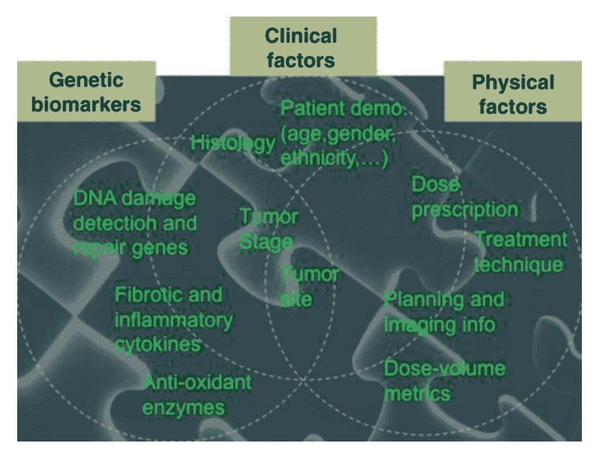

图15.2 放射治疗涉及物理、生物和临床因素的复杂相互作用。成功的信息学方法应能够解决观察到的每个患者的治疗结果（如局部控制或毒性）中的这种相互作用“难题”[24]。

## 15.3 数据资源

在肿瘤学中，有一个包括但不限于患者人口统计学、治疗处方、3D和4D解剖和功能性疾病纵向成像特征（放射组学），以及从外周血液和组织标本中获得的基因组学和蛋白质组学数据的“大数据”池（图15.1）。在放射治疗的情况下，还可以获得关于肿瘤和周围组织的辐射暴露的容积剂量数据。因此，这些肿瘤学中的大数据可以根据其性质分为四个类别：临床、剂量、成像和生物学。下面将介绍这四个类别的放射治疗大数据。

### 15.3.1 临床数据

肿瘤学和特别是化学放射治疗中的临床数据通常指的是癌症诊断信息（例如部位、组织学、分期、分级等）、与患者相关的特征（例如年龄、性别、合并症）以及生理指标（例如肺功能测量、心率/脉搏、血细胞计数、体重指数（BMI））。在基因分析时代之前，这些临床变量被认为是肿瘤学临床管理和决策的唯一黄金标准。从信息学的角度来看，挖掘这些数据可能具有挑战性，特别是如果数据是非结构化的，这通常是情况；然而，应用自然语言处理（NLP）技术来协助组织这些数据有很好的机会[25]。

### 15.3.2 剂量学数据

这种类型的数据与放射治疗的治疗计划过程或化疗中的化学药物有关。在放射治疗中，涉及使用计算机断层扫描成像进行辐射剂量模拟，具体包括从剂量-体积直方图（DVH）图中导出的剂量-体积指标。剂量-体积指标已在放射肿瘤学文献中广泛研究[17-20]，用于结果建模[26, 27]。这些指标是从DVH中提取的，例如接受特定剂量的体积（Vx）；x%体积的最小剂量（Dx）；平均、最大和最小剂量等。更多细节请参阅我们的综述章节[28]。此外，我们还开发了一个专用软件工具，名为“剂量响应浏览器”（DREES）[29]，用于导出这些指标和放射治疗响应建模。

有不同类别的化学药剂，旨在消灭肿瘤癌症[30]。其中最常见的是烷化剂，它们替代有机化合物中的烷基基团（碳氢化合物）包括DNA（例如，替莫唑胺）。还有抗生素（例如，多柔比星，博莫霉素）。另一个常见的是抗代谢物（例如，甲氨蝶呤，5-氟尿嘧啶，紫杉醇，长春碱）。不属于这些类别的其他药物包括：铂类化合物（顺铂）和拓扑异构酶（DNA缠绕酶）抑制剂。最近，开发了更多的信号通路靶向药物，如抗EGFR药物，如西妥昔单抗或厄洛替尼[31]。除了药物类型和剂量外，药物给药的时间也会影响治疗反应。化疗可以在局部治疗（如放疗）完成后进行，称为辅助化疗，在局部治疗之前进行，称为诱导化疗，或在局部治疗期间进行，称为同步化疗。特别是，同步放化疗已被证明对多种癌症治疗有效，其中化疗药物可以作为放射敏化剂，帮助破坏放射线抵抗性克隆，或者可以系统地作用并潜在地根除远处转移[32]。

### 15.3.3 放射组学（影像特征）

癌症患者的治疗是基于对诊断影像特别是计算机断层扫描（CT）的观察评估，结合其他临床因素[33]。来自多种影像模态的信息可以用于改善不同癌症类型的治疗监测和预后。例如，生理信息（肿瘤代谢、增殖、坏死、缺氧区域等）可以直接从核医学影像模态（如单光子发射计算机断层扫描（SPECT）和正电子发射断层扫描（PET））或间接从磁共振成像（MRI）中收集[34, 35]。这些不同影像模态的互补性质已经促使人们努力将信息结合起来，以实现更好的治疗效果。例如，PET/CT已被用于分期、计划和评估化学放射治疗的反应[36, 37]。同样，MRI已被应用于头颈癌的肿瘤划定和毒性评估[38, 39]。此外，来自混合影像模态的定量信息可以与生物学和临床终点相关联，这是一个新兴的领域，被称为“放射组学”[40, 41]。这一新领域在食管癌[42]、头颈癌[43, 44]、宫颈癌[43, 45]、肺癌[46][47]和肉瘤[48]等癌症中已经展示了监测和预测化学放射治疗反应的潜力，最近还在免疫治疗反应的预测[49, 50]方面取得了进展，从而实现了治疗的个体化和个性化[51]。

### 15.3.4 生物标志物

生物标志物被定义为“客观测量和评估的特征，作为正常生物过程、病理过程或药物治疗干预的指标”[52]。生物标志物可以根据标志物的生化来源分为外源性和内源性。外源性生物标志物是基于将外来物质引入患者体内，例如分子成像中使用的物质。内源性生物标志物是基于患者体内已有的生物化学物质。相反，内源性生物标志物可以进一步分为（1）“表达生物标志物”，测量基因表达或蛋白质水平的变化，或者（2）“遗传生物标志物”，基于肿瘤或正常组织中潜在的DNA遗传密码的变异。测量通常基于组织或液体标本，使用分子生物学实验室技术进行分析[53]。大规模遗传生物标志物的聚合已成为大型国家项目的研究重点，例如癌症基因组图谱（TCGA）数据门户，该门户为研究人员提供了一个非常有用的平台来分析TCGA生成的数据集。它包含不同癌症类型中肿瘤基因组的临床信息、基因组特征数据和高级序列分析[54-57]。

## 15.4 数据库技术在肿瘤学中的机器学习中

传统上，关系数据库管理系统（RDBMS）一直是存储和查询肿瘤学信息的首选技术。RDBMS基于按照Codd的12条规则[58]将数据关系模式以表格格式（行（元组）和列（属性）的集合）组织起来。SQL（结构化查询语言）是一种第四代编程语言，用于处理RDBMS中的数据。RDBMS和SQL一直是电子健康记录（EHR）管理软件的主要技术，包括肿瘤学领域。存在着几个政府、商业和开源的EHR资源。例如，在美国，超过50%的患者记录存储在Epic系统（位于威斯康星州维罗纳）中，这是一家私有软件公司，采用面向对象的RDBMS。此外，还有开源的EHR系统；然而，它们并没有得到广泛应用。

最近，NoSQL（不仅仅是SQL）数据库技术出现了复兴。NoSQL允许结构化和非结构化数据的混合使用，除非需要，否则不需要遵守模式，并且在聚合和查询大规模数据集方面具有卓越的水平可扩展性。有趣的是，20世纪60年代由退伍军人事务部开发的VistA电子病历系统基于MUMPS（马萨诸塞州总医院实用多编程系统），这是一个键值NoSQL数据库系统。如今，NoSQL开源Hadoop架构被认为是处理大数据和潜在的肿瘤学数据的首选平台。支持其大数据分析潜力的关键技术被称为MapReduce，它是一种新的并行编程范式，包括两个步骤：用于过滤和排序的Map函数和用于数据分组和聚合的Reduce函数。然而，在某些情况下可能影响NoSQL采用的问题是常见的所谓ACID（原子性、一致性、隔离性、持久性）属性，这些属性由传统RDBMS提供以确保数据可靠性，但在大规模分布式系统中可能难以完全实现。

## 15.5 泛基因组学与个体基因组学的比较

由于成像和生物技术的进步，放射治疗数据在过去十年中呈现出巨大的指数增长；然而，癌症发病率的数量通常趋于稳定，如图15.3所示。事实上，$p$ (变量) $>> n$ (样本) 对于统计学习的类推断方法构成了严峻的挑战。这种 $p$-组学现象可能会产生不良影响，如虚假相关性、回声室异常、尤尔-辛普森逆转悖论或误导性的幽灵分析，如下所讨论的。

### 15.5.1 虚假关系

当两个变量之间没有真正的关系时，这种陷阱通常在大数据分析中出现；然而，由于混淆效应的影响，可能会错误地推断出这种关系[59]。在尝试识别生物标志物时，这是一个重要的过程，例如，化学放射治疗反应。这种情况的著名例子是冰淇淋销量与溺水风险增加的关联；混杂效应或潜在的解释变量仅仅是温暖季节。了解问题设置和可能的潜在混杂效应的先前知识有助于减轻这种效应。

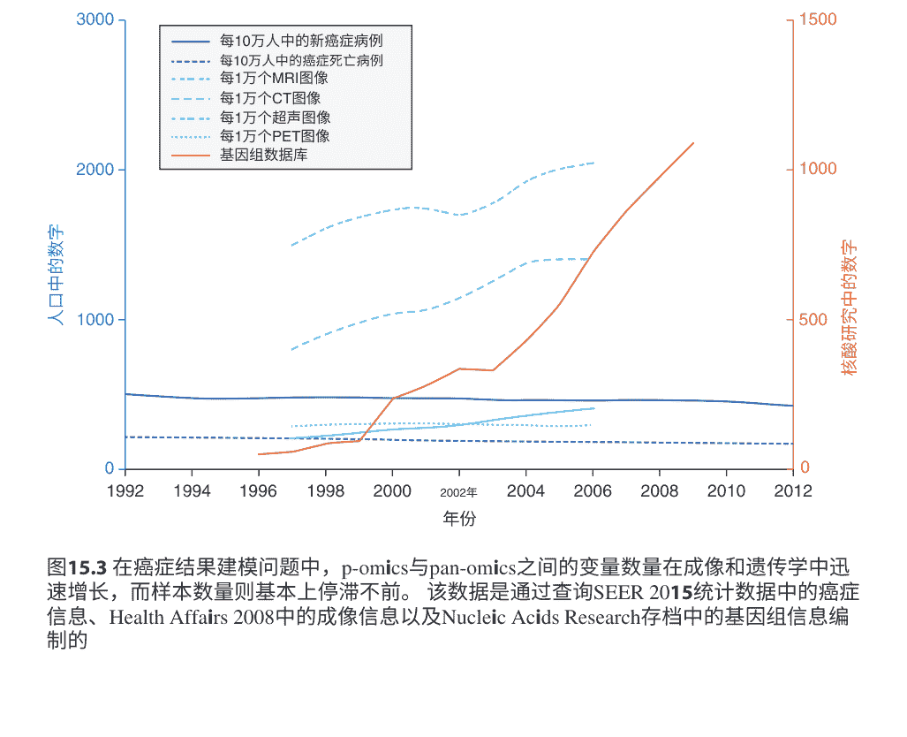

### 15.5.2 回音室效应

当数据关联在循环方式中被数据聚合过程本身放大时，就会发生这种情况[60]。这通常是一个抽样问题（选择偏差），分析的样本不代表预期的总体。一个常见的例子是在先前的肿瘤学生物标志物研究结果的荟萃分析中遇到的，负面结果通常不太可能被发表[61]。

### 15.5.3 尤尔-辛普森悖论

这是回音室的反向效应，即在小数据集中找到真实关联，但在聚合更大数据时丢失甚至反转。辛普森在解释二阶交互作用的列联表分析中报告了这个悖论[62]。癌症研究中这个悖论的一个著名例子是托马塞蒂和沃格尔斯坦的论文引起的反弹，该论文暗示癌症风险的变化主要由干细胞分裂次数解释[63]，这仅仅是一个“倒霉”的问题，与环境无关。这一点已经在进行的数据分析中激烈辩论，展示了选择偏差和尤尔-辛普森效应。导致这种悖论的一个常见陷阱是在进行人群研究时没有考虑已知的患者特征，如年龄和性别。例如，已知药物剂量与男性和女性的康复之间存在负相关关系；然而，当将两组合并在一起时，出现了令人惊讶的正相关关系，如图15.4所示[65]。解决这种效应的一种可能方法是使用变量分层或更系统地进行无监督聚类，以发现这种亚人群效应。

### 15.5.4 幽灵分析

这指的是在分析大型数据集时错误地使用统计测试或学习算法。例如，当在应用统计测试之前不考虑嵌入在其中的假设时，就会出现这个问题。一个经典的例子是在进行多重比较和报告“显著”的零假设检验的p值时，由于没有调整第一类错误的水平，导致产生误导性的结果。有趣的是，当统计学家R. Fisher引入p值的概念时，并不打算将其作为一个确定性的检验，而只是作为一种判断关联证据是否值得再次关注的非正式方式。因此，在尝试应用统计检验以获得有意义的结果之前，有必要了解所做的假设。

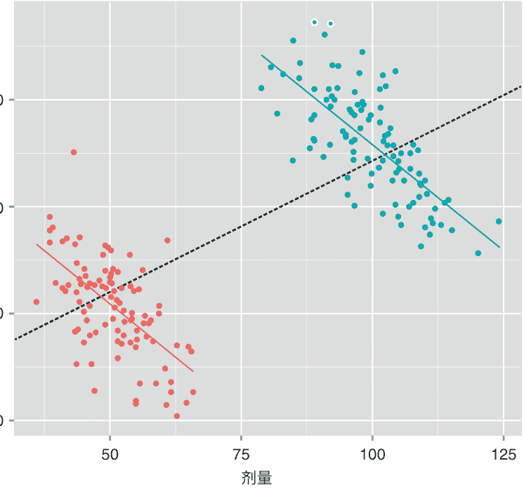

图15.4 辛普森悖论的示例，当分析药物剂量与男性和女性的康复之间的关联时，总体和亚群给出了矛盾的结果（来自[65]）

## 15.6 建模方法

肿瘤学和放射肿瘤学中的建模技术通常可以分为自下而上和自上而下的方法，如图15.5所示。本综述将重点介绍自上而下的方法，同时也会描述自下而上的方法以完整地限制数据挖掘的搜索空间。

### 15.6.1 自下而上的肿瘤学响应建模方法

这些方法利用物理学、化学和生物学的基本原理，对细胞损伤在治疗过程中的时间和空间上进行建模。通常，它们会应用先进的数值方法，如蒙特卡洛（MC）技术来进行计算。例如，在放射治疗的情况下，电离辐射效应的时间和空间演变可以分为三个阶段：物理、化学和生物，以多尺度的方式进行[67]。然而，这些信息可以用来指导将先前的知识纳入数据挖掘方法，从而缩小其搜索空间以获得最佳答案。

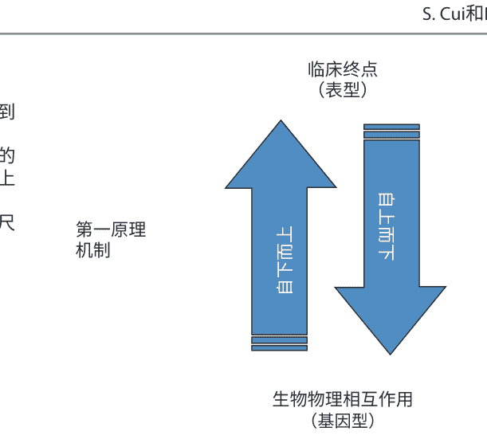

### 15.6.2 自顶向下的肿瘤学响应建模方法

这些通常是现象学（非机械式）模型，依赖于从收集的临床、剂量和/或生物学数据中获得的参数[3]。在数据驱动和多变量结果建模的背景下，观察到的治疗结果被视为多个输入变量的功能映射结果[68]。数学上，这可以表示为 f(x; w*): X → Y，其中 x ∈ ℝᴺ 由输入指标（患者疾病特异性预后因素、剂量指标或生物标志物）组成。表达式 y ∈ Y 是相应的观察治疗结果。变量 w* 包括模型 f(·) 的最优参数，这些参数是通过基于指定目标函数的学习获得的。在这个结果建模的背景下，学习被定义为从数据中估计依赖关系[27]。基于人机交互，有两种常见的学习类型：监督学习和无监督学习。当治疗的终点，如肿瘤控制或毒性等级已知时，使用监督学习；这些终点由经验丰富的肿瘤学家根据机构或国家癌症研究所（NCI）的标准提供，并且是结果建模中最常用的学习方法。然而，无监督方法，如聚类方法或主成分分析（PCA），可以通过特征提取来降低学习问题的维度，并有助于多变量数据的可视化以及有监督学习方法的最优参数选择中都可以使用 [69]。

需要注意的是，模型的函数形式选择 f(•) 与问题的先验知识密切相关。在机械模型中，函数形式的选择基于手头的临床或生物过程；然而，在数据驱动模型中，目标通常是找到最适合数据的函数形式 [70]。下面我们将以逻辑回归和人工智能方法为例，重点介绍临床终点以二元分割（失败/未失败）表示的情况，这是常见的做法。然而，这些方法可以在有多于两个类别或端点为连续变量的情况下进行扩展。

#### 15.6.2.1 逻辑回归

在肿瘤学结果建模中，响应通常会遵循一个S形曲线。这表明具有S形状的模型是最合适的 [21-24, 71-74]。常用的S形式是逻辑回归模型，具有良好的数值稳定性属性。逻辑模型主要用于二元分类，即响应 y=0 或 y=1。y 的概率等于1可以写成，$$ p(y=1) = f(\boldsymbol{x}; \boldsymbol{w}) = \frac{1}{1 + e^{-\boldsymbol{w}^T \boldsymbol{x}}} $$，其中 $\boldsymbol{w}$ 是模型参数，其最优值 $\boldsymbol{w}^*$ 可以通过最大似然估计确定 [75]。解释变量 $\boldsymbol{x}$ 包含特定于患者的信息，可以逐步选择以定义回归模型的横坐标 f(•)。除了原始的特定于患者的变量外，用户可以确定是否添加交互项或高阶变量。基于岭（L2范数）或Lasso（L1范数）方法的惩罚技术可以通过消除最不相关的变量和施加稀疏条件来帮助该过程 [76]。解决这个问题的另一种替代方法是应用基于交叉验证的机器学习模型选择方法 [75]。下面提供了一个示例。

**一个逻辑结果建模示例**

逻辑模型应用于预测非小细胞肺癌（NSCLC）患者在TCGA-LUAD [77]和TCGA-LUSC [78]数据集中的局部进展（LP）$y$（进展：$y=1$，对照：$y=0$）。只有45名接受外部放射治疗作为辅助治疗的患者，以原发肿瘤为治疗部位，并且具有完整的剂量学/LP随访信息被纳入分析。

在这个分析中，解释变量 $\boldsymbol{x}$：$\boldsymbol{x} \in \mathbb{R}^7$包括患者的性别、T分期、N分期、分组分期、先前恶性肿瘤、吸烟史和放射总剂量。在表15.1中展示了三名随机选择患者的解释变量和响应的示例。逻辑模型使用python的scikit-learn [79]包实现。在代码中，$\boldsymbol{X}$：$\boldsymbol{X} \in \mathbb{R}^{S \times N}$表示$S$个患者的解释变量 $\boldsymbol{x}$，$\boldsymbol{Y}$：$\boldsymbol{Y} \in \mathbb{R}^S$表示$S$个患者的局部进展。我们的逻辑模型预测LP结果的总结与真实结果一起呈现（图15.6）。

表15.1 TCGA患者的具体信息，用于LP预测

|    | gender | T    | N    | 阶段 | 先前的M | 烟草 | 剂量 | LP |
| :-- | :----- | :--- | :--- | :--- | :------ | :--- | :--- | :-- |
| 1  | M      | T3   | N0   | T3   | 否      | 4    | 60   | 0   |
| 2  | M      | T1   | N1   | T1   | 否      | 3    | 64   | 0   |
| 3  | F      | T1   | N2   | T1   | 否      | 2    | 50   | 0   |

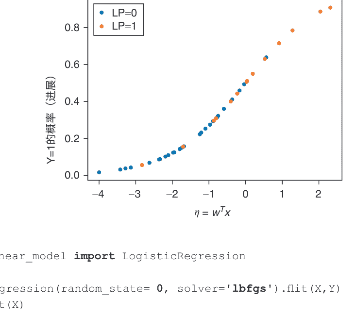

代码：

```python
from sklearn.linear_model import LogisticRegression
###### 模型构建
clf = LogisticRegression(random_state=0, solver='lbfgs').fit(X,Y)
Pred=clf.predict(X)
Pred_prob=clf.predict_proba(X)
sc=clf.score(X, Y)
###### 估计的最优参数
w_est=clf.coef_.reshape(-1,1)
b_est=clf.intercept_
###### 训练好的模型
pred_flucntion=np.matmul(X,w_est)+b_est
```

#### 15.6.2.2 机器学习方法

机器学习技术是一类人工智能技术（例如神经网络、决策树、支持向量机），能够通过学习给定的输入数据中的周围环境来模拟人类智能，并能够检测出这些数据中的非线性复杂模式。特别是神经网络被广泛研究用于模拟放射治疗后的肺损伤[80, 81]、前列腺癌的生化失败和直肠出血[82, 83]。机器学习方法中一种更为稳健的方法是支持向量机（SVM），它是一种基于统计学习理论的通用构造学习过程[84]。为了区分低风险患者和高风险患者的治疗，SVM的主要思想是用“超平面”在非线性特征空间中将这两个类别分开，并最大化它们之间的间隔。这通常通过核映射来实现[10, 11, 70]。然而，这些方法一直被贴上黑匣子的标签，阻碍了它们在实际临床环境中的应用。

为了减轻通用机器学习方法的黑匣子污名，越来越多基于图形方法的系统化方法，如贝叶斯网络（BNs），在癌症结果建模中得到了越来越多的应用[85-87]。BN提供了变量之间关系的图形表示，这些变量被表示为有向无环图（DAG）中的节点，它编码了变量之间的影响以及临床感兴趣的终点。父节点和子节点之间的关系通过使用贝叶斯链规则建模的条件概率来建模。这些方法对于变量的不确定性和缺失数据也很强大，使它们成为临床应用的理想选择[88, 89]。

对于机器学习方法，下面提供了一个建模示例。

**一个机器学习结果建模示例**

多层感知器（MLP）是一种基本的神经网络架构，也是深度学习应用的构建模块[90]。它由几个层组成，每个层都有一定数量的节点。这些节点以前馈方式相互连接，节点与后续层中的节点直接连接。为了计算节点的值，通常会对前一层中的节点的加权和应用所谓的激活函数[91]，以增加非线性。逻辑函数，也称为Sigmoid函数，是一种常见的激活函数选择。具体来说，逻辑回归可以被视为没有任何隐藏层的MLP的极端情况。

在TCGA数据集中，应用了具有2个隐藏层的MLP来预测LP。数据集被随机分成一个训练集（1/3）和一个测试集（2/3）。全部解释变量被标准化为均值为0，标准差为1，以避免数值不稳定。该模型使用Python包Pytorch [92]实现。接收操作特征曲线（ROC）绘制了LP预测结果的计算ROC曲线下面积（AUC），包括训练集和测试集（图15.7）。

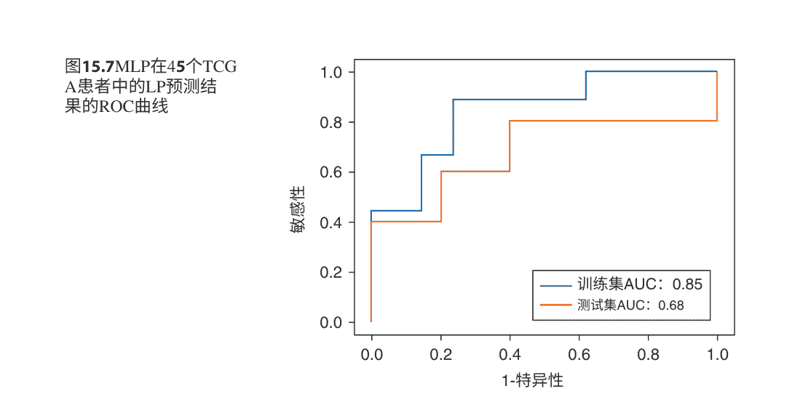

代码:
```
导入 torch
#定义模型
class MLP_NN(torch.nn.Module):
    def __init__(self, input_dim, hidden_dim_1,hidden_dim_2, output_dim):
        super(MLP_NN, self).__init__()
        self.L1=torch.nn.Linear(input_dim,hidden_dim_1)
        self.D1=torch.nn.Dropout(0.2)
        self.L2=torch.nn.Linear(hidden_dim_1,hidden_dim_2)
        self.D2=torch.nn.Dropout(0.2)
        self.L3=torch.nn.Linear(hidden_dim_2,output_dim)
    def forward(self,x):
        a1=torch.relu(self.L1(x))
        a1=self.D1(a1)
        a2=torch.relu(self.L2(a1))
        a2=self.D2(a2)
        outputs=torch.sigmoid(self.L3(a2))
        return outputs
#初始化模型
model=MLP_NN(input_dim,hidden_dim,hidden_dim,output_dim)
#使用二元交叉熵作为损失函数
criterion=torch.nn.BCELoss(reduction='mean')
#使用Adam优化器
optimizer=torch.optim.Adam(model.parameters(), lr=learning_rate)
for i in range(num_epoch):
    #训练
    model.train()
    optimizer.zero_grad()
    y_pred=model(X_train_torch.float())
    #定义损失函数
    loss=criterion(y_pred,Y_train_torch.float())
    loss.backward()
    optimizer.step()
    #在测试数据上进行评估
    model.eval()
    y_pred_test=model(X_test_torch.float())
    loss_test=criterion(y_pred_test,Y_test_torch.float())
```

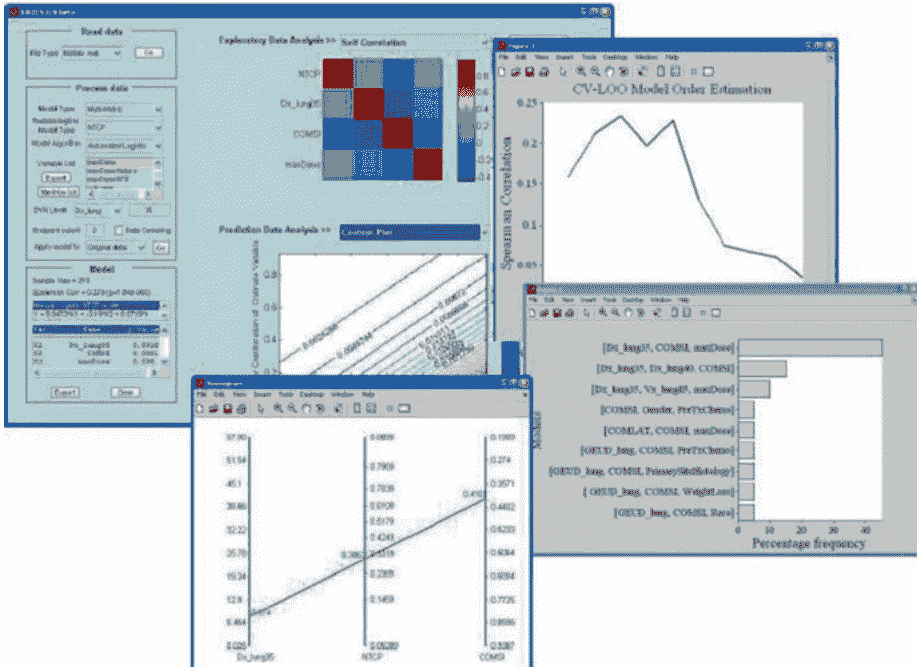

图15.8 DREES允许对结果数据进行TCP/NTCP分析和多变量建模。这个例子是关于肺损伤的。这里展示的组件有主GUI界面、模型顺序和通过重采样方法进行参数选择，以及一个关于平均剂量和位置的结果示意图。

## 15.7 结果建模的软件工具

许多TCP/NTCP结果建模方法需要专用软件工具来实施。文献中关于放射治疗的这类软件工具的例子有BIOPLAN和DREES。BIOPLAN（治疗计划的生物评估）使用多种分析模型评估放射治疗计划[93]，而DREES是我们团队开发的用于使用分析和数据驱动方法进行剂量-反应建模的开源软件包[94]，如图15.8所示。值得一提的是，目前有几个商业治疗计划系统已经纳入了不同的TCP/NTCP模型，主要是用于排序和生物优化目的。TG-166 [18]提供了对这些模型及其质量保证指南的讨论。在机器学习和深度学习应用的一般背景下，可以使用一些开源软件包，如Pytorch，如第15.5.2节的示例所示。有关可用软件工具的进一步讨论请参见第7章。

## 15.8 讨论

在个性化医学时代的肿瘤学中，多模态和多学科的方法提供了临床、物理、技术和生物数据的独特组合，可以作为一个理想的案例研究来应用大数据分析，以提高治疗效果和结果。

肿瘤学数据包括临床患者特征、不同的影像采集、实验室和生化测量等，具有大数据的所有特征。 人们相信大数据分析有很大的潜力来改善安全治疗管理，并为个性化医学的发展提供更好的临床决策支持系统，正如美国国立卫生研究院个性化医学计划（PMI）所赞扬的那样。 此外，大数据分析已被美国临床肿瘤学会（ASCO）在其进展报告中强调为与癌症作斗争的一个有希望的机会，正如其所设想的数据聚合门户CancerLinQ [95]的开发一样。 放射肿瘤学也表达了同样的观点[96]。

肿瘤学中数据收集和聚合的路径通常是根据临床或实验观察的假设来开展的，然后在机构内进行受控临床试验，如果有希望的话，再在多个机构进行试验。 这条路径通常可以涵盖大约3%的患者数据，这些数据是在常规临床过程中生成和存储的，而被称为“暗数据”的97%数据则没有被收集。 然而，这些暗数据通常是无结构、不可信的，无法用于改进研究、质量评估或临床护理。 肿瘤学大数据项目（如CancerLinQ）旨在揭示这些“隐形数据”。 然而，要使这些数据可见，需要文化变革，尊重标准化词汇，并定期对这些数据进行适当的整理。 这将需要促进数据聚合过程的程序，并在肿瘤学界建立起地方和国家级的数据冠军。 此外，要使这些数据更加可见，还需要所有利益相关者之间的合作，以开发基础设施和严格的程序，以确保数据的安全性，并消除患者隐私方面的顾虑。

新的数据库技术，如NoSQL或NewSQL，无论是地面还是云端，将在存储和查询肿瘤学数据方面产生更好的效果，并允许在临床质量保证或改进计划的一部分中实时应用更先进的分析。 MapReduce框架允许将机器学习算法嵌入其架构中。 这项技术将与可并行化的算法很好地配合。 然而，许多肿瘤学建模方案，特别是涉及迭代或梯度下降优化技术的方案，并不自然地适用于这个框架。 这需要进一步研究来克服这个限制，并利用这些技术进行肿瘤学实时分析。

肿瘤学中大数据分析面临的主要挑战之一是固有的p-组学与全组学问题。 在所提出的肿瘤学典型应用示例中，我们展示了不同的方法来减轻这种影响。例如使用先前的知识、信息论技术、机器学习的集成，或者所有这些方法的不同组合。在肿瘤学的大数据环境中，与回声室或尤尔-辛普森悖论相关的问题也需要进行仔细测试。然而，随着越来越多的当前暗数据被揭示出来，其中包含许多缺失或质量不佳的信息，大数据的作用和挑战预计将不断增长，并且应用领域也在不断扩大。当处理多个临床终点时，每个终点可能与输入数据有不同的关系，这个问题进一步恶化。此外，尽管经过几十年的研究，处理多个临床或生物终点的许多问题仍然没有解决[97]。肿瘤学中的典型做法是独立优化每个点，或者使用启发式方法将多个终点组合到效用函数中，以考虑竞争风险效应并量化其主观可取性[98]。或者，这些效用可以被呈现为一个多输出系统，它可以共同优化竞争终点的预测，当然，这会增加样本量的要求，进一步增加了肿瘤学中大数据的挑战。因此，开发利用癌症底层生物学知识与先进的信息论和机器/深度学习方法相结合的肿瘤学特定方法，以开发能够减轻当前嘈杂分析陷阱挑战并实现癌症研究中的大数据承诺的混合模型至关重要。

## 15.9 未来研究方向

尽管临床产生的大规模高保真数据在几乎每天都有，但保持肿瘤学研究的大规模数据仍然是一个主要挑战。实施FAIR（可找到、可访问、可互操作、可重复使用）科学数据管理的指导原则对于实现精确结果建模的目标至关重要，特别是在机器/深度学习方法中。例如，在放射肿瘤学领域，已经有一些机构和多机构的持续进行的倡议，如RTOG、放射基因组学联盟和EuroCAT，旨在开发这样的基础设施；然而，仍然有很多工作要做，以克服与数据共享障碍、患者保密问题、缺乏放射反应信号通路数据库、开发成本效益高的多中心通信系统等相关问题。这些系统允许传输、存储和查询大规模数据集，如图像、剂量计和生物标志物信息。使用自然语言处理技术是组织非结构化临床数据的一种有前途的方法。剂量计和成像数据可以从现有的影像存档和通信系统（PACS）或其他医学影像数据库中受益。基于新兴的系统放射生物学领域的方法将继续快速发展，但它们也可以从开发类似于当前存在的药物基因组学数据库的专门放射反应信号通路数据库中获益匪浅。不同机构之间的数据共享是一个重大障碍，可以通过合作组或分布式数据库的开发来解决。通过与行业合作，以开放资源的方式以成本效益的方式建立必要的生物信息学和通信基础设施。

为了使基于数据驱动的结果模型成为真正的临床工具，应该努力提高机器学习算法的可解释性。可解释性尤为重要，因为它可以作为一种防范措施，防止算法由于未预料到的错误而产生错误的结果。现有的机器学习算法，特别是深度学习算法，已知在准确性和可解释性之间存在权衡。因此，预计会有更多关于解释和解释机器学习算法决策的工作[101]。

具体而言，人机交互（HITL）[102]的概念可以指导优化整个学习过程，通过将人机交互引入系统中。机器以其从大量数据集中学习的能力而闻名，而人类即使在信息稀缺的情况下也能做出合理的决策。将专家的智慧纳入人工智能系统中，可以提高放射肿瘤学临床实际决策的准确性和可解释性。

## 15.10 结论

近年来，医学影像学和生物技术的发展产生了大量的大数据，涵盖了临床、剂量学、影像学和生物标志物。这些数据为重新塑造我们对治疗反应和结果建模的理解提供了新的机会。然而，这些数据的复杂性以及肿瘤和正常组织反应的可变性使得先进的生物信息学和机器学习方法成为不可或缺的工具，以更好地界定治疗复杂相互作用机制，并基本上成为“实现数据梦想”的基石[103]。然而，这也带来了数据聚合、共享、保密和质量方面的新挑战。此外，肿瘤学数据，尤其是放射治疗数据，构成了物理学和生物学之间的独特接口，可以从生物医学信息学研究的一般进展中受益，如系统生物学和可用的网络资源，同时仍然需要开发自己的技术来解决与该接口相关的特定问题。成功应用和开发先进的数据通信和生物信息学工具对于肿瘤学大数据的预测治疗反应至关重要，以配合其他前述技术，并在个体化治疗计划和改善癌症患者生活质量方面取得重大进展。与此同时，人工智能算法在放射肿瘤学诊所中平衡准确性和可解释性的期望将被开发，并作为可行和可靠的决策支持工具。

## 参考文献

- 1. El Naqa I. 放射治疗和肿瘤学中的结果建模指南：倾听数据。 Boca Raton, FL: CRC Press. Taylor & Francis Group; 2018.
- 2. Sykiotis GP, Kalliolias GD, Papavassiliou AG. 希波克拉底著作中的药物基因组学原理。 J Clin Pharmacol. 2005;45(11):1218–20.
- 3. El Naqa I, et al. 放射基因组学和放射治疗反应建模。 Phys Med Biol. 2017;62(16):R179–206.
- 4. Halperin EC, Brady LW. Perez和Brady的放射治疗原理与实践。第5版。费城，PA：Wolters Kluwer Health/Lippincott Williams&Wilkins; 2008.
- 5. Bradley JD, et al. 标准剂量与高剂量适形放射治疗联合同步和巩固性卡铂加紫杉醇，伴或不伴西妥昔单抗治疗III期A或IIIB期非小细胞肺癌（RTOG 0617）：一项随机的二乘二因子第3期研究。 Lancet Oncol. 2015;16(2):187–99.
- 6. Bentzen SM等。 临床中正常组织效应的定量分析（QUANTEC）：科学问题导论。Int J Radiat Oncol Biol Phys. 2010;76(3 Suppl):S3–9。
- 7. Jackson A等。QUANTEC的教训：关于治疗结果剂量-容积依赖性报告和数据收集的建议。 Int J Radiat Oncol Biol Phys. 2010;76(3 Suppl):S155–60.
- 8. Bradley JD等。 RTOG 0617的长期结果：III期非小细胞肺癌标准剂量与高剂量调形化学放射治疗±西妥昔单抗的随机3期比较。Int J Radiat Oncol Biol Phys. 2017;99(2):S105.
- 9. Marciscano AE等。 立体定向体放射治疗的免疫调节效应：临床前瞻和临床机会。 Int J Radiat Oncol Biol Phys. 2019;12:360–1.
- 10. El Naqa I. 用于预测肺癌肿瘤反应的机器学习方法。 Wiley跨学科综述：数据挖掘与知识发现。2012年； 2（2）：173-81。
- 11. El Naqa I等。建模肿瘤控制概率的数据挖掘方法。 Acta Oncol. 2010年； 49（8）：1363-73。
- 12. Deasy JO, El Naqa I. 基于图像的放射治疗正常组织并发症概率建模。癌症治疗研究。2008年； 139：215-56。
- 13. GG S. 基础临床放射生物学。第3版/。2002年，伦敦/纽约。
- 14. Armstrong K等。个体化生存曲线改善患有BRCA1/2突变的女性对癌症风险管理决策的满意度。临床肿瘤学杂志。2005年； 23（36）：9319-28。
- 15. Weinstein MC等。 用于医疗保健和其他政策决策的建模：用途、角色和有效性。价值在健康中。2001年； 4（5）：348-61。
- 16. Moiseenko VK, Van Dyk J. 基于生物学的治疗计划优化：针对调强放疗治疗计划的NTCP模型的系统比较。在第14届国际计算机辅助放射治疗会议上。2004年。首尔。
- 17. Brahme A. 基于放射生物学目标的优化放疗。 放射肿瘤学半月刊。 1999年;9(1):35–47。
- 18. Allen Li X等。 治疗计划中生物相关模型的使用和质量保证: AAPM治疗物理委员会TG-166的简短报告。 医学物理学。 2012年;39(3):1386–409。
- 19. Choi N等。 非小细胞肺癌放疗的预测因素: 现状。 肺癌。 2001年;31(1):43–56。
- 20. Fu XL等。 非小细胞肺癌预后预测因子的研究。 肺癌。 1999年;23(2):143–52。
- 21. Blanco AI等人。 对接受放射治疗的头颈癌患者的唾液功能进行剂量-体积建模。 Int J Radiat Oncol Biol Phys. 2005;62(4):1055–69.
- 22. Bradley J等人。 肺癌放疗患者急性食管炎的剂量相关因素。 Int J Radiat Oncol Biol Phys. 2004;58(4):1106–13.
- 23. Marks LB。 放射性肺损伤的剂量预测因子。 Int J Radiat Oncol Biol Phys. 2002;54(2):313–5.
- 24. Hope AJ等人。 预测非小细胞肺癌局部控制的临床、剂量和位置相关因素。 在ASTRO第47届年会上。 2005年。 科罗拉多州丹佛市。
- 25. Spencer SJ等人。 从异质的回顾性和前瞻性数据中学习放射性肺炎的生物信息学方法。 J Biomed Biotechnol. 2009;2009:892863.
- 26. Härdle W. 应用多元统计分析。 柏林: Springer; 2003年。
- 27. Hastie T, Tibshirani R, Friedman JH. 统计学习的要素: 数据挖掘、推断和预测: 附带200张全彩插图, Springer统计学系列, 第xvi卷。 纽约: Springer; 2001年。 533页。
- 28. El Naqa I, Randall K. 放射治疗和肿瘤学中的结果建模指南中的剂量数据: 倾听数据。 CRC出版社。 Taylor & Francis Group Boca Raton, FL; 2018年。
- 29. El Naqa I等。 剂量响应探索者: 一种集成的开源工具, 用于探索和建模放射治疗剂量容积结果关系。 Phys Med Biol. 2006年; 51 (22) : 5719-35。
- 30. Chabner BA, Roberts TG. 化疗与癌症战争。 Nat Rev Cancer. 2005年; 5 (1) : 65-72。
- 31. Khoukaz T. 抗EGFR疗法的管理: 实用综述。 Semin Oncol Nurs. 22: 20–27.
- 32. Seiwert TY, Salama JK, Vokes EE. 并发化疗放疗范式[mdash]一般原则。 Nat Clin Prac Oncol. 2007;4(2):86–100.
- 33. Wen PY, et al. 高级别胶质瘤的更新反应评估标准: 神经肿瘤学工作组的反应评估。 J Clin Oncol. 2010;28(11):1963–72.
- 34. Condeelis J, Weissleder R. 癌症的体内成像。 Cold Spring Harb Perspect Biol. 2010;2(12):a003848.
- 35. Willmann JK, et al. 药物开发中的分子成像。 Nat Rev Drug Discov. 2008;7(7):591–607.
- 36. Bussink J等。 PET-CT在实体肿瘤放疗治疗计划和反应监测中的应用。 Nat Rev Clin Oncol. 2011;8(4):233–42.
- 37. Zaidi H, El Naqa I。 PET引导下的放射治疗治疗体积划定: 图像分割技术调查。 Eur J Nucl Med Mol Imaging. 2010;37(11):2165–87.
- 38. Newbold K等。 应用于头颈癌放疗计划的先进成像: 临床综述。 Br J Radiol. 2006;79(943):554–61.
- 39. Piet, D.等。 放射治疗前后评估主要唾液腺功能的扩散加权磁共振成像。 Int J Radiat Oncol Biol Phys 2008.
- 40. Lambin P等。 放射医学: 利用先进特征分析从医学图像中提取更多信息。 Eur J Cancer. 2012;48(4):441–6.
- 41. Kumar V等人。 放射组学: 过程与挑战。 磁共振成像。 2012年; 30 (9) : 1234-48。
- 42. Tixier F等人。基线18F-FDG PET图像上的纹理特征表征的肿瘤内异质性预测食管癌对伴随放化疗的反应。核医学杂志。2011年；52（3）：369-78。
- 43. El Naqa I等人。探索基于特征的PET图像方法预测癌症治疗结果。模式识别。2009年；42（6）：1162-71。
- 44. Cheng NM等人。术前18F-FDG PET/CT图像的纹理特征：对晚期T期咽喉鳞状细胞癌患者的预后意义。核医学杂志。2013年；54（10）：1703-9。
- 45. Kidd EA等人。基于FDG-PET的局部晚期宫颈癌预后诊断图表。Gynecol Oncol. 2012;127(1):136–40.
- 46. Vaidya M等人。肺癌放射治疗肿瘤反应的PET/CT图像特征。Radiother Oncol. 2012;102(2):239–45.
- 47. Cook GJ等人。非小细胞肺癌术前18F-FDG PET肿瘤纹理特征与化疗放疗后反应和生存的关联性？ J Nucl Med.2013;54(1):19–26.
- 48. Vallieres M等人。联合FDG-PET和MRI纹理特征的放射学模型用于预测肢体软组织肉瘤的肺转移。 Phys Med Biol.2015;60(14):5471–96.
- 49. Sun R等。一种放射组学方法评估肿瘤浸润的CD8细胞和对抗PD-1或PD-L1免疫疗法的反应：一项成像生物标志物的回顾性多中心研究。《柳叶刀肿瘤学》。2018年；19(9)：1180-91。
- 50. Trebeschi S等。利用非侵入性放射组学生物标志物预测癌症免疫疗法的反应。《肿瘤学年鉴》。2019年；30(6): 998-1004。
- 51. El Naqa I，Ten Haken RK。放射组学能个性化免疫疗法吗？ 《柳叶刀肿瘤学》。2018年；19(9): 1138-9。
- 52. B.D.W.小组。生物标志物和替代终点：首选定义和概念框架。《临床药理学与治疗》。2001年；69(3): 89-95。
- 53. El Naqa I等。早期放射反应的生物标志物用于自适应放射治疗。 在：Li XA（编）自适应放射治疗。 Taylor & Francis: Boca Baton, FL; 2011年. 第53-68页。
- 54. 癌症基因组图谱N. 头颈部鳞状细胞癌的全面基因组特征。 自然。2015年;517（7536）：576-82。
- 55. Abeshouse A等。原发性前列腺癌的分子分类。 细胞。 163（4）：1011-1025。
- 56. 癌症基因组图谱研究N. 肺腺癌的全面分子特征。 自然，2014年;511（7511）：543-550。
- 57. Brennan CW等。胶质母细胞瘤的体细胞基因组景观。 细胞。 155（2）：462-477。
- 58. Codd EF. 数据库管理的关系模型：第2版。 Reading, MA: Addison-Wesley; 1990. xxii, 538页。
- 59. Pearl J，Glymour M，Jewell NP. 统计学中的因果推断：入门。 奇切斯特：Wiley; 2016年。
- 60. Lake P, Drake R. 大数据时代的信息系统管理. 纽约：Springer; 2015.
- 61. Andre F, 等。生物标志物研究：全面生物标志物研究注册的呼吁. Nat Rev Clin Oncol. 2011;8(3):171–6.
- 62. Simpson EH. 交互作用在列联表中的解释. J Royal Stat Soc Series B (方法论). 1951;13(2): 238–241.
- 63. Tomasetti C，Vogelstein B。组织间癌症风险的变异可以通过干细胞分裂的数量来解释。科学。2015年;347（6217）：78-81。
- 64. Albini A，等。预防癌症“厄运”的策略。 J Natl Cancer Inst。 2015年;107：10。
- 65. Kievi R，等。心理科学中的辛普森悖论：实用指南。 Front Psychol。 2013年;4。
- 66. Nikjoo H，等 al. 辐射研究中的轨迹结构代码。 Radiat Meas。2006年;41(9–10):1052–74。

## 放射组学和放射基因组学

李瑞江

### 16.1 引言

放射影像在放射肿瘤学中起着关键作用，包括放射治疗计划和设置、治疗反应评估以及随后的随访和疾病监测[1-4]。在当前的临床实践中，对这些影像的诊断解读依赖于对少量定性影像特征的视觉评估。然而，这种方法无法全面表征疾病，并且在预测或评估治疗反应和预后方面的准确性有限。

放射组学是一种通过对医学影像进行高通量定量分析来发现有前景的生物标志物的强大技术。这可以通过使用预定义的一组手工制作的特征（如形状、直方图和纹理）或深度学习（如卷积神经网络）进行自动特征提取来实现。通过应用适当的统计或机器学习工具，可以开发出预测模型，从而潜在地提高结果预测的准确性。放射基因组学是一个密切相关的领域，涉及对组织尺度上的放射组学特征与基因组、转录组或蛋白质组学特征之间关系的研究。

放射组学已应用于所有类型的标准护理临床图像，如CT、MRI和PET[5-9]。许多研究已经确定了新的成像特征，证明了相对于目前使用的成像指标而言，具有改进的诊断、预后或预测性能，而放射基因组学可能允许识别这些成像表型的潜在生物学基础[10-17]。在接下来的章节中，我们将讨论放射组学和放射基因组学的技术方面、关键发现以及临床应用，重点放在放射肿瘤学上。

R. Li (✉)
斯坦福大学医学院放射肿瘤科
斯坦福，加利福尼亚，美国
e-mail: rli2@stanford.edu

和临床应用的放射组学和放射基因组学。

### 16.2 放射学的技术基础

放射学是一个多步骤的过程，涉及图像获取、肿瘤分割、特征提取、预测建模和模型验证。图16.1展示了放射学的一般工作流程，包括手工制作的特征和深度学习的自动特征提取（在第16.4节中详细讨论）。

放射治疗实践中使用各种放射成像模态，如CT、MRI和PET，以直接可视化和评估肿瘤的潜在解剖或生理特性[18]。由于这些标准护理图像通常用于接受放射治疗的每个患者，它们为机器学习和模型预测提供了必要的大型成像数据。

对于基于手工特征的放射组学方法，通常需要对感兴趣区域（大多数情况下是肿瘤）进行分割。对于接受放射治疗的患者，他们的原发肿瘤已经由放射肿瘤学家手动勾画，并可从治疗计划系统中获取。这些预先存在的轮廓可以极大地促进回顾性放射组学分析。然而，不同肿瘤学家之间的肿瘤轮廓可能存在显著差异。为了考虑肿瘤轮廓的内部和间隔评分者变异，评估图像特征的稳健性以及对下游分析的影响非常重要，可以通过扰动肿瘤轮廓或使用多个勾画来实现。另外，可以使用半自动分割算法以最小化人工干预的方式更一致地定义肿瘤轮廓[19-22]。

常用的两种手工图像特征，语义特征和不可知特征，常用于表征肿瘤表型。语义特征基于现有的放射学词汇来定性描述肿瘤，并可以从美国放射学院的特定成像报告和数据系统的现有指南中得出。另一方面，不可知特征是计算机生成的特征。

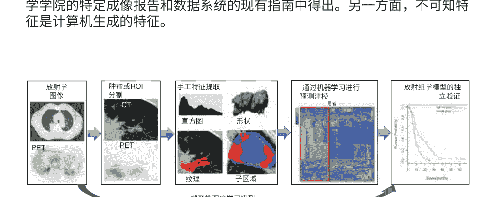

具有预定义数学公式的度量标准。有各种类型的不可知图像特征，描述肿瘤的形状、强度和纹理，以捕捉肿瘤内部的异质性。不可知特征的详细信息已在其他地方进行了审查[7, 23]。常用的放射组学特征已集成到开源软件或商业软件平台中。在这些中[24, 25]， Deasy和同事提供了一个名为CERR的开源平台，专门用于放射组学分析算法的原型研究，用于放射治疗研究。

给定肿瘤表型的放射组学特征，可以应用机器学习算法来发现和量化它们与相关临床终点或基因组特征的关系。根据目标变量的类型，常用的监督学习方法包括回归或分类方法，可以是连续值或类别标签。由于特征数量较多，而样本数量相对较少，特征选择是减少过拟合风险的关键步骤[27]。选择那些对肿瘤轮廓变化影响最小且与其他特征重叠最小的图像特征可能更具优势。可以使用各种特征选择算法，包括逐步前向/后向选择和套索回归，来识别最具信息量的特征以适应预测模型。通常会应用交叉验证来减小潜在的特征选择偏差。除了使用监督学习算法构建预测模型外，还可以应用无监督聚类算法对放射组学特征进行分析，以发现给定疾病的新亚型[13, 14]。

在最初发现和训练有希望的特征之后，任何基于放射组学的模型都应该在独立的、最好是多个外部队列中进行测试。严格验证的关键在于训练和测试应该完全分开，并且两个过程之间不应该发生信息泄漏[28]。此外，评估新提出的放射组学特征与已知临床和病理因素之间的关系也很重要。在多变量模型中提供独立预测能力的放射组学特征更有可能为患者管理增加临床价值。

### 16.3 主要发现和临床应用

在本节中，我们重点介绍一些最近的研究，这些研究可能对放射治疗中的患者管理有潜在的改进作用。鉴于放射组学研究的巨大增长[5-8, 29-35]，感兴趣的读者可以参考最近的综述。

Aerts和他的同事提出了一种基于CT的放射组学特征，用于预测接受放射治疗的非小细胞肺癌（NSCLC）患者的总体生存率[36]。他们从CT图像中提取了400多个计算特征，用于描述肿瘤的强度、形状、纹理和小波。他们从每个类别中选择了4个特征，在超过400名患者的训练队列中构建了一个放射组学特征，并在另外两个队列中确认了其预后价值。自从这项具有里程碑意义的研究发表以来，几个研究小组已经尝试独立验证这个签名，导致了混合的结果[37]。潜在的担忧主要涉及放射组学签名的再现性，以及它与肿瘤大小和体积高度相关[38]，这引发了关于其附加价值的问题，超出了已知的范围。另一个问题是使用总生存期作为终点，这受到许多与疾病无关的因素的干扰，并且对指导管理的用处较小。

在另一项放射组学研究中，吴等人研究了早期非小细胞肺癌的FDG-PET和CT的定量放射组学特征，用于预测立体定向放射治疗（SABR）后的远处转移[39]。基于表征肿瘤形态和肿瘤内代谢异质性的图像特征，他们建立了一个放射组学签名，与传统影像指标相比，显著提高了预后价值。此外，结合影像和组织学信息进一步提高了对远处转移预测的准确性。

除了非小细胞肺癌外，放射组学在头颈部肿瘤中的潜力已经得到了广泛的研究。El Naqa和他的同事研究了FDG-PET/CT放射组学，并将其与临床信息相结合，评估了头颈部肿瘤患者局部复发和远处转移的风险[40]。构建的预测模型的预后价值在外部队列中得到了确认。在另一项最近的研究中，Wu等人分析了基线和中期治疗期间口咽癌（OPC）的原发肿瘤和受累淋巴结的定量图像特征。他们基于随机生存森林开发了一个机器学习模型，并发现淋巴结影像特征是预测远处转移的最重要特征。该模型提供了独立的预后信息，超越了已建立的临床因素，包括分期、吸烟史和HPV状态。它进一步对HPV阳性OPC患者亚组进行了分层。这项研究强调了评估淋巴结影像特征超出原发肿瘤的必要性。机器学习模型有潜力识别出存在远处复发风险的HPV阳性OPC患者，并不适合进行治疗减弱。

大多数放射组学研究都集中在对原发肿瘤的整体分析上。这种整体分析方法隐含地假设肿瘤是异质但混合良好的，而忽视了肿瘤内部的区域变异。为了解决这个问题，提出了生境成像的概念，以在区域水平上更明确地捕捉空间异质性[8, 42]。Cao等人提出了一种基于聚类的算法，用于从动态对比增强（DCE）MRI中识别原发肿瘤的显著亚体积，可以预测头颈癌的局部或区域性失败[43]。Wu等人通过两阶段聚类过程开发了一种稳健的肿瘤分割方法，并确定了肺肿瘤中三个空间上不同且表型一致的亚区域。与肿瘤的代谢活跃度、代谢异质性和实质成分最相关的一个亚区域被定义为“高风险”亚区域。高风险肿瘤内亚区域的体积可以预测局部晚期非小细胞肺癌放疗患者的远处转移[44]。

通过与放射组学或纹理分析相结合，可以扩展肿瘤内部分区方法，以实现更详细和精细的图像表型化。吴等人[45]表明，在DCE MRI中，肿瘤内部亚区域纹理特征的早期变化与快速对比剂冲洗相关，可以预测乳腺癌新辅助化疗的病理完全缓解。崔等人[46]对胶质母细胞瘤的肿瘤亚区域进行了放射组学分析，并在MRI上定义了120个多区域图像特征。在外部队列中，确定了一个由5个特征组成的放射组学标志，用于预测总生存期，其表现优于整个肿瘤的测量结果。Stoyanova和同事通过MRI引导活检组织，研究了MRI放射组学特征与前列腺癌基因表达谱的关联[47]。

这些研究强调了肿瘤分区的必要性，以识别侵袭性肿瘤内部亚区域，适用于许多类型的实体肿瘤。这可能对临床肿瘤学产生重要影响，通过识别重要的肿瘤区域进行活检。此外，这对于放射治疗计划和调整尤为重要，因为与侵袭性疾病相关的高风险亚区域可以通过放射增强来进行靶向治疗，从而可能改善局部肿瘤控制。

### 16.4 新兴范式：深度学习

上述放射组学方法需要领域专业知识来手动构建手工制作的图像。使用先进的深度学习进行自动化特征提取在放射组学中越来越常见。深度学习是一种机器学习技术，详见第4章，它使用多个处理层和连接来学习输入数据与大量标记示例的期望输出之间的复杂关系。与传统的机器学习技术不同，深度学习直接处理原始数据，并自动开发用于模式识别所需的表示，从而消除了明确规定规则或特征的需求[48]。

最近，深度学习技术在各种医学图像解释任务中取得了有希望的、有时甚至是人类专家级的性能，例如在眼底照片中检测糖尿病视网膜病变，在皮肤照片中分类皮肤癌，在病理图像中检测乳腺癌淋巴结转移[49-53]。到目前为止，绝大多数深度学习应用都集中在诊断环境中的疾病检测和分类上[54, 55]。

几个概念验证研究表明，深度学习也可以用于从医学图像中提取信息，预测生存结果[56-59]。目前，相对较少的大型队列研究进行了深度学习图像标志的独立验证，尽管这很可能很快会改变。

在最近的一项研究中，江等人开发并独立验证了一种基于深度学习的CT图像标志，用于预测胃癌患者的生存结果[60]。他们提出了一种新颖的端到端深度神经网络，根据CT图像预测患者的死亡风险。该图像被命名为“S-net”，根据其结构的形状。与传统的深度卷积神经网络不同，S-net融合了多级特征流的概念。这种设计的理论基础是，浅层的低级特征（例如局部边缘和纹理）和深层的高级特征（例如肿瘤的整体外观）都包含了生存分析的有用信息。这将允许提取和整合复杂肿瘤表型的全面多尺度图像特征。深度学习标志的预后价值独立于传统的临床病理风险因素，包括TNM分期。通过结合临床病理和图像预测因子，他们表明综合评分表的预后准确性明显提高，而单独使用任何一种因子则不具备这种准确性。重要的是，提出的图像标志可以预测辅助化疗的效益，并有可能指导胃癌的个体化治疗。

在另一项最近的研究中，Abazeed和同事们应用深度学习来分析944名肺癌患者的术前CT扫描，这些患者接受了立体定向体放射治疗[61]。这个单一机构的队列被分为849名训练队列患者和95名独立验证队列患者。该研究通过多任务学习将传统的放射学特征与时间相关的生存分析相结合，并融入了新的深度学习方法。他们将术前CT图像输入到一个多任务深度神经网络中，并将这些数据与临床变量结合起来，得出个体化的辐射剂量，估计治疗失败的概率。包括深度学习模型和临床变量的模型与传统的放射学特征或临床变量相比，预测治疗失败的准确性有显著提高。这个模型可以帮助识别对放射线最具抵抗力的肿瘤，并可能导致个体化的放射治疗剂量。

### 16.5 放射基因组学：将成像与基因组学相结合

放射基因组学建立在放射组学的基础上，将成像和基因组数据相结合，旨在获得生物学解释或改善精准医学中的患者分层[10-15, 62-66]。根据目标和研究设计，放射基因组学整合有几种主要方法，如图16.2所示。

最常采用的放射基因组学研究设计是寻找与肿瘤特定基因型或分子表型相关的成像相关或替代物。例如，CT语义和放射组学图像特征与肺癌中的*EGFR*或*KRAS*突变相关[67-72]。MRI放射组学特征也与乳腺癌中的内在分子亚型或现有基因组学检测相关[73-75]。一些研究已经调查了成像特征与肿瘤浸润淋巴细胞（TILs）之间的关联[76-79]。例如，Ferté等人将肿瘤核心内和周围的放射组学特征与CD8的表达相关联，并显示成像特征可能有助于估计CD8细胞计数并预测接受免疫治疗的患者的临床结果[77]。

- 67. El Naqa I, Pater P, Seuntjens J. 蒙特卡洛在放射生物学模型中的作用。Phys Med Biol. 2012;57(11):R75-97。
- 68. El Naqa I, et al. 包括剂量体积和临床因素在内的放射治疗结果的多变量建模。Int J Radiat Oncol Biol Phys. 2006;64(4):1275-86。
- 69. El Naqa I, Li R, Murphy MJ. 放射肿瘤学中的机器学习：理论与应用。日内瓦：Springer；2015。
- 70. El Naqa I, et al. 使用统计学习技术预测放射治疗结果。Phys Med Biol. 2009;54:S9-S30。
- 71. Tucker SL, et al. 剂量体积响应分析放射治疗后晚期直肠出血。Int J Radiat Oncol Biol Phys. 2004;59(2):353-65。
- 72. Bradley JD等。从RTOG 9311和机构数据的综合分析中得出的预测放射性肺炎的标度。Int J Radiat Oncol Biol Phys. 2007;69(4):985-92。
- 73. Huang EX等。模拟华盛顿大学和RTOG试验93-11肺癌患者放射性急性食管炎的风险。Int J Radiat Oncol Biol Phys. 2011;12:60。
- 74. Huang EX等。心脏照射作为放射性肺炎的危险因素。Acta Oncol. 2011;50(1):51-60。
- 75. Hastie T, Tibshirani R, Friedman JH. 统计学习的要素：数据挖掘、推理和预测。柏林：Springer；2009。
- 76. Hastie T, Tibshirani R, Wainwright M. 稀疏统计学习：套索和泛化。统计学和应用概率的专著。Boca Raton：CRC Press/Taylor & Francis Group；2015。xv，351页。
- 77. Albertina B, Watson M, Holback C, Jarosz R, Kirk S, Lee Y, Lemmerman J. 来自癌症基因组图谱肺腺癌[TCGA-LUAD]集合的放射学数据，T.C.I. Archive，编辑。2015。
- 78. Kirk S, Lee Y, Kumar P, Filippini J, Albertina B, Watson M, Lemmerman J. 来自癌症基因组图谱肺鳞状细胞癌[TCGA-LUSC]集合的放射学数据。T.C.I. Archive.，编辑。2015。
- 79. Pedregosa AF等。Scikit-learn：Python中的机器学习。J Mach Learn Res 2011; 12: 2825-2830。
- 80. Munley MT等。用于预测肺损伤症状的神经网络。Phys Med Biol. 1999；44：2241-9。
- 81. Su M等。用于预测放射性肺炎发生率的人工神经网络。Med Phys. 2005;32(2):318-25。
- 82. Gulliford SL等。使用人工神经网络预测接受前列腺放射治疗的患者的生物学结果。放射治疗与肿瘤学。2004;71(1):3-12。
- 83. Tomatis S等。三维适形放射治疗后直肠出血：基于神经网络的预测模型的开发。物理医学与生物学。2012;57(5):1399。
- 84. Vapnik V. 统计学习理论。纽约：Wiley；1998。
- 85. Oh JH等。肺癌局部失败建模的贝叶斯网络方法。物理医学与生物学。2011;56(6):163-51。
- 86. Lee S等。贝叶斯网络集成作为预测放射性肺炎风险的多变量策略。医学物理学。2015;42(5):2421-30。
- 87. Jayasurya K等人。比较贝叶斯网络和支持向量机模型在接受放疗治疗的肺癌患者两年生存预测中的表现。Med Phys.2010;37(4):1401-7。
- 88. Koller D, Friedman N. 概率图模型：原理与技术。自适应计算与机器学习。剑桥，马萨诸塞州：麻省理工学院出版社；2009。xxi，1231页。
- 89. Sinoquet C, Moura d RL. 用于遗传学、基因组学和后基因组学的概率图模型。第一版。牛津：牛津大学出版社；2014。xxvii，449页，4页未编号的插图。
- 90. LeCun Y, Bengio Y, Hinton G. 深度学习。自然。2015；521(7553)：436-44。
- 91. Ding B, Qian H, Zhou J. 深度神经网络中的激活函数及其特性。在2018年中国控制与决策会议（CCDC）中；2018。
- 92. Paszke AaG, Sam和Massa, Francisco和Ler, Adam和Bradbury, James和Chanan, Gregory和Killeen, Trevor和Lin, Zeming和Gimelshein, Natalia和Antiga, Luca和Desmaison, Alban和Kopf, Andreas和Yang, Edward和DeVito, Zachary和Raison, Martin和Tejani, Alykhan和Chilamkurthy, Sasank和Steiner, Benoit和Fang, Lu和Bai, Junjie和Chintala, Soumith, PyTorch：一种命令式风格、高性能的深度学习库，在第32届神经信息处理系统中，W.a.H. H., Larochelle和A., Beygelzimer和F, dAlcheBuc和E., Fox和R., Garnett, 编辑。2019，Curran Associates, Inc.
- 93. Eschrich S, 等。 放射敏感性网络的系统生物学建模：一种生物标志物发现平台。 Int J Radiat Oncol Biol Phys. 2009;75(2)： 497-505。
- 94. Shivade C等人。 使用电子健康记录识别患者表型群的方法综述。 J Am Med Inform Assoc. 2014;21(2):221-30。
- 95. Dizon DS等人。 2016年临床癌症进展：美国临床肿瘤学会关于癌症进展的年度报告。 J Clin Oncol. 2015。
- 96. Benedict SH, El Naqa I, Klein EE。 放射肿瘤学中大数据的介绍：探索研究、质量评估和临床护理的机会。 Int J Radiat Oncol Biol Phys. 95(3): 871-872。
- 97. Gail M。 对竞争风险分析中使用的一些模型的回顾和批评。 Biometrics. 1975;31(1):209-22。
- 98. Murray TA, Thall PF, Yuan Y。 基于效用的设计用于具有分类结果的随机比较试验。 Stat Med. 2015。
- 99. Wilkinson MD等人。 FAIR指导原则对科学数据管理和监管的贡献。 科学数据。 2015;3(1):160018。
- 100. Ghorbani AZ。 数据Shapley：机器学习中数据的公平估值。 在机器学习研究中2019。
- 101. Montavon G, Samek W, Müller K-R。 解释和理解深度神经网络的方法。 数字信号处理。 2018;73:1-15。
- 102. Zanzotto FM。 观点：人在环路中的人工智能。 J Artif Intell Res。 2019;64:243-52。
- 103. Wang L等人。 使用混合模型分析生物通路的综合方法。 PLoS Genet。 2008;4(7):e1000115。

##### 图16.2 放射基因组学研究的典型设计

放射基因组学也可以用来创建分子特征与特定成像表型之间的关联图，以揭示其生物学基础。例如，通过FDG-PET检测，具有较高最大标准摄取值的肿瘤被证明与非小细胞肺癌中的上皮间质转化相关[80]。在另一项最近的放射基因组学研究中，通过灌注MRI观察到的肿瘤邻近实质的异质性增强模式与乳腺癌中的肿瘤坏死信号通路和不良生存相关[15]。

除了放射基因组学的关联研究，另一个有趣的研究领域是使用无监督学习，如聚类算法，根据成像表型而不是分子特征对肿瘤进行分类。Itakura等人通过MRI表型鉴定了新的胶质母细胞瘤亚型，这些亚型与不同的分子通路活性相关[13]。Wu等人[14]发现并独立验证了三种乳腺癌成像亚型，其特征为均匀的肿瘤内部增强、最小的实质增强和显著的实质增强。它们被证明是已知内在分子亚型的补充。在超过1000名患者的多队列研究中，每种成像亚型都与不同的预后和失调的分子通路相关。

另一个方向是较少研究但对精准医学尤为重要的是利用成像和分子数据的互补能力，并将它们整合到一个统一模型中，以进一步提高临床结果的预测准确性。在这方面，Cottreau等人[81]表明，结合分子谱和FDG-PET成像的代谢肿瘤体积可以改善弥漫性大B细胞淋巴瘤患者的无进展生存和总体生存的分层。Cui等人[82]表明，将MGMT甲基化状态和多参数MRI中高风险亚区的体积整合起来可以改善胶质母细胞瘤的生存分层。Lee等人开发了基于CT图像的预后标志，并在I期非小细胞肺癌患者的外部队列中进行了验证[83]。

此外，还显示出组合成像和基因组学标志可以改善无论单独使用哪种方法，预测准确性都会提高。这些研究初步证明了基于图像的生物标志物可以提供超越分子分析的额外信息，并且将两者整合将提供更准确的个体化临床预测。

## 16.6 当前挑战和潜在解决方案

尽管许多研究对放射组学标志的临床转化表现出了越来越多的兴趣和有希望的发现，但进展缓慢。重要的是要强调该领域面临的一些技术和实际挑战。这些问题包括图像采集协议和特征提取的标准化、放射组学标志的稳健性和可重复性、数据共享以及在多中心队列中的验证。

### 16.6.1 标准化和定量成像

临床图像通常是为了最大化正常和病变组织之间的对比度而获取的。不同机构之间的成像协议通常缺乏标准化，其采集和重建参数不同，这可能严重阻碍定量放射学分析。在多中心验证研究中，标准化或协调成像数据至关重要。为了解决这个问题，已经有一些努力致力于通过定量成像生物标志物联盟（QIBA）[84]和定量成像网络（QIN）[85]等来标准化成像协议。在回顾性分析中，已经提出了几种策略来协调成像扫描，使其在多个队列之间可比较。一个常见的策略是从功能成像中推导出潜在的生理测量值。例如，可以基于药代动力学建模从DCE MRI计算灌注图。另一种实用的策略是将成像值与选择的正常组织感兴趣区域的值作为基准进行比较。例如，在个体基础上，可以使用背景实质的平均内分位数值来归一化乳腺MRI扫描。此外，可以采用幻影研究来调查成像特征的扫描间和供应商间变异性[87, 88]，这可以为定量成像分析的不确定性提供有用的见解。

### 16.6.2 可复现性和前瞻性验证的需求

目前，放射组学在临床转化中最大的障碍可能是缺乏可重复性。可能涉及到几个陷阱，包括实验设计不当、多次测试导致虚假发现和模型过拟合，以及未经调整的偏倚或混杂因素等[89]。为了增强可重复性，合理的放射组学设计应包括适当的成像标准化，对于分割可变性的放射组学特征的鲁棒性测试，以及严格的模型训练和测试。其次，每个放射组学分析步骤应该有良好的文档记录，并且原始代码和数据易于访问，以便其他研究人员能够复制结果。在任何假设生物标志物的临床转化之前，最关键的步骤是在前瞻性临床试验中进行严格的验证。

### 16.6.3 数据和软件共享

放射组学面临的另一个挑战是在多个中心的大型患者队列中整理和共享图像和相关临床数据[85, 90]。将成像与详细的临床病理和治疗信息以及相关的临床结果进行匹配非常重要。在癌症影像存档的倡议下，已经取得了一些进展，该倡议在公共领域中整理和共享了各种肿瘤部位的图像和临床数据(http://www.cancerimagingarchive.net/)。这些队列来自单一机构或多中心试验，应该极大地促进放射组学模型的发现和验证。

然而，与丰富的公共基因表达数据相比，可用的影像数据要少得多，需要继续努力整理高质量的影像数据集。除了技术挑战之外，还存在行政和监管方面的障碍，需要克服，以便在未来实现大规模数据共享的可行性。由于深度学习模型的复杂性和其黑盒特性，访问和共享软件代码将成为复制和验证模型的必要条件。

## 16.7 结论和未来展望

总之，放射组学和放射基因组学在发现具有潜在预测和预测价值的新型影像生物标志物方面显示出巨大的潜力。然而，需要注意的是，迄今为止，许多研究都是假设生成性质的，很少有放射组学标志物在独立队列中进行了前瞻性验证。此外，为了具有实际价值，任何新的候选影像生物标志物都应该提供与已知临床和病理因素的互补信息。一个关键但尚未充分探索的研究领域是如何将放射组学应用于序列影像扫描，以更好地评估治疗反应，鉴于治疗方案的日益可用。基于增量放射组学的初步研究是令人鼓舞的，但是对于表征纵向变化的最佳方法仍有待确定。

前进中，先进的机器学习技术，如深度卷积神经网络，预计将在定义基于图像的新型预后和预测模型中发挥越来越重要的作用。为了使这种方法有效，需要足够大的数据集来训练可靠的模型，强调了对高质量数据集的策划和数据共享的需求。无论是手工特征还是自动化深度学习的放射组学方法，都需要在多中心临床试验中进行前瞻性研究，以验证新发现的影像生物标志物，并真正确立放射组学在个体化放射治疗中的价值。

利益冲突无。

## 参考文献

- 1. O’Connor JP, Aboagye EO, Adams JE, Aerts HJ, Barrington SF, Beer AJ, et al. Imaging biomarker roadmap for cancer studies. Nat Rev Clin Oncol. 2017;14(3):169–86.
- 2. Yankeelov TE, Mankoff DA, Schwartz LH, Lieberman FS, Buatti JM, Mountz JM, et al. Quantitative imaging in cancer clinical trials. Clin Cancer Res. 2016;22(2):284–90.
- 3. Weissleder R, Schwaiger MC, Gambhir SS, Hricak H. 优化分子疗法的成像方法。科学转化医学。2016年;8(355):355ps16。
- 4. O'Connor JP, 编辑。 癌症异质性和成像。 细胞发育生物学研讨会。 2017年;64:48–57。
- 5. Aerts HJ. 基于放射组学的表型化在精准医学中的潜力: 一篇综述。JAMA Oncol. 2016年;2(12):1636–42。
- 6. Sala E, Mema E, Himoto Y, Veeraraghavan H, Brenton J, Snyder A, 等。 利用下一代成像揭示肿瘤异质性: 放射组学、放射基因组学和生境成像。 Clin Radiol. 2017年;72(1):3–10。
- 7. Lambin P, Leijenaar RT, Deist TM, Peerlings J, de Jong EE, van Timmeren J, 等。 放射组学: 医学成像与个体化医学之间的桥梁。 Nat Rev Clin Oncol. 2017年;14(12):749–62。
- 8. Gillies RJ, Kinahan PE, Hricak H。 放射学: 图像不仅仅是图片，它们是数据。 放射学。2015年:278（2）: 563-77。
- 9. Limkin E, Sun R, Dercle L, Zacharaki E, Robert C, Reuzé S等。 计算医学成像（放射学）在肿瘤学中的实施的承诺和挑战。 Ann Oncol. 2017年;28（6）: 1191-206。
- 10. Diehn M, Nardini C, Wang DS, McGovern S, Jayaraman M, Liang Y等。 识别用于脑肿瘤基因表达模块的非侵入性成像替代物。 Proc Natl Acad SciU S A。 2008年;105（13）: 5213-8。
- 11. Gevaert O, Xu JJ, Hoang CD, Leung AN, Xu Y, Quon A等。 非小细胞肺癌: 利用公共基因表达微阵列数据的预后成像生物标志物的识别方法和初步结果。 放射学。 2012年;264（2）: 387-96。
- 12. Segal E, Sirlin CB, Ooi C, Adler AS, Gollub J, Chen X, 等。 通过非侵入性成像解码肝癌的全球基因表达程序。 自然生物技术。 2007年;25（6）: 675-80。
- 13. Itakura H, Achrol AS, Mitchell LA, Loya JJ, Liu T, Westbroek EM, 等。 磁共振成像特征识别出具有不同分子通路活性的胶质母细胞瘤表型亚型。 科学转化医学。 2015年;7（303）: 303ra138。
- 14. Wu J, Cui Y, Sun X, Cao G, Li B, Ikeda DM, 等。 无监督聚类的定量图像表型揭示具有不同预后和分子通路的乳腺癌亚型。 临床癌症研究。 2017年;23（13）: 3334-42。
- 15. Wu J, Li B, Sun X, Cao G, Rubin DL, Napel S, 等。 MR成像中肿瘤相邻实质的异质性增强模式与信号通路紊乱及乳腺癌患者生存率低下相关。 放射学。 2017年;285（2）: 401-13。
- 16. Colen R, Foster I, Gatenby R, Giger ME, Gillies R, Gutman D, et al. NCI研讨会报告: 将影像表型与基因组学签名相关联的临床和计算要求。 转化肿瘤学。 2014年;7(5): 556-69。
- 17. Fehr D, Veeraraghavan H, Wibmer A, Gondo T, Matsumoto K, Vargas HA, et al. 多参数磁共振成像中前列腺癌格里森分级的自动分类。美国国家科学院院刊。2015年;112(46): E6265-E73。
- 18. Timmerman R, Xing L. 图像引导和自适应放射治疗。 巴尔的摩: Lippincott Williams & Wilkins; 2009年。
- 19. Parmar C, Velazquez ER, Leijenaar R, Jermoumi M, Carvalho S, Mak RH, 等。 使用半自动体积分割的稳健放射组学特征量化。 PLoS One。 2014年; 9 (7) : e102107。
- 20. Arik SO, Ibragimov B, Xing L. 使用卷积神经网络进行完全自动化的定量颅面测量。 J Med Imaging (Bellingham)。 2017年;4 (1) : 014501。
- 21. Ibragimov B, Korez R, Likar B, Pernus F, Xing L, Vrtvec T. 通过基于标记的可变形模型进行病理结构分割。 IEEE Trans Med Imaging。 2017年;36 (7) : 1457-69。
- 22. Ibragimov B, Xing L. 使用卷积神经网络对头颈部CT图像中的风险器官进行分割。 Med Phys。 2017年;44 (2) : 547-57。
- 23. Larue RT, Defraene G, De Ruysscher D, Lambin P, Van Elmp W. 定量放射组学研究用于组织表征：技术和方法程序综述。 Br J Radiol。 2017年;90 (1070) : 20160665。
- 24. Echegaray S, Bakr S, Rubin DL, Napel S. 量化图像特征引擎（QIFE）：一种用于从体积医学图像中提取三维定量特征的开源、模块化引擎。 J Digit Imaging. 2017;31(4):403-14。
- 25. Zhang L, Fried DV, Fave XJ, Hunter LA, Yang J, Court LE. IBEX：一种用于促进放射学协作工作的开放基础软件平台。
- 26. Deasy JO, Blanco AI, Clark VH. CERR：一种用于放射治疗研究的计算环境。
- 27. Chandrashekar G, Sahin F. 特征选择方法综述。 Comput Electr Eng. 2014;40(1):16-28。
- 28. Subramanian J, Simon R. 医生在评估预后基因表达签名时应该注意什么？
- 29. Avanzo M, Stancanello J, El Naqa I. 超越成像：放射组学的承诺。 Phys Med. 2017;38:122-39。
- 30. Colen RR, Hassan I, Elshafeey N, Zinn PO. 在放射组学和放射基因组学时代阐明2016年世界卫生组织对中枢神经系统肿瘤分类的意义。 Magn Reson Imaging Clin. 2016;24(4):741-9。
- 31. Verma V, Simone CB, Krishnan S, Lin SH, Yang J, Hahn SM. 放射组学的崛起及其对肿瘤管理的影响。
- 32. O'Connor JPB, Rose CJ, Waterton JC, Carano RAD, Parker GJM, Jackson A. 影像学内肿瘤异质性：在治疗反应、耐药性和临床结果中的作用。
- 33. Mankoff DA, Farwell MD, Clark AS, Pryma DA. 将分子成像作为临床工具用于精准肿瘤学：综述。 JAMA Oncol. 2017;3(5):695-701。
- 34. Zhang B, Tian J, Dong D, Gu D, Dong Y, Zhang L, 等。 多参数MRI的放射组学特征作为晚期鼻咽癌的新预后因素。 Clin Cancer Res.2017;23(15):4259-69。
- 35. Huang Y-q, Liang C-h, He L, Tian J, Liang C-s, Chen X, 等。 结直肠癌淋巴结转移术前预测的放射组学评分表的开发与验证。 J Clin Oncol. 2016;34(18):2157-64。
- 36. Aerts HJ, Velazquez ER, Leijenaar RT, Parmar C, Grossmann P, Cavalho S, 等。 使用定量放射组学方法通过非侵入性成像解码肿瘤表型。 Nat Commun. 2014;5:4006。
- 37. Ger RB, Zhou S, Elgohari B, Elhalawani H, Mackin DM, Meier JG, 等。 原发肿瘤的放射组学特征未能改善CT和PET成像的头颈癌患者总生存预测。 PLoS One. 2019;14(9):e0222509。
- 38. Welch ML, McIntosh C, Haibe-Kains B, Milosevic MF, Wee L, Dekker A, 等。 放射组学标志物开发的脆弱性：需要保护措施。 Radiother Oncol. 2019;130:2–9。
- 39. Wu J, Aguilera T, Shultz D, Gudur M, Rubin DL, Loo BW Jr, 等。 早期非小细胞肺癌：18F氟脱氧葡萄糖PET/CT的定量成像特征可预测远处转移。 Radiology. 2016;281(1):270–8。
- 40. Vallieres M, Kay-Rivest E, Perrin LJ, Liem X, Furstoss C, Aerts H, 等。 用于头颈癌肿瘤失败风险评估的放射组学策略。 科学报告。 2017;7(1):10116。
- 41. Wu J, Gensheimer MF, Zhang N, Han F, Liang R, Qian Y, 等。 将基线和中期治疗计算机断层扫描中的肿瘤和淋巴结成像特征整合起来，预测口咽癌在同步化疗放疗中的远处转移。 Int JRadiat Oncol Biol Phys. 2019;104(4):942–52。
- 42. Gatenby RA, Grove O, Gillies RJ. 癌症进化与生态学中的定量成像。 放射学。2013年;269(1):8–15。
- 43. Wang P, Popovtzer A, Eisbruch A, Cao Y. 一种从DCE MRI中识别与晚期头颈癌结果相关的显著亚体积的方法。 Med Phys.2012;39(8):5277–85。
- 44. Wu J, Gensheimer MF, Dong X, Rubin DL, Napel S, Diehn M等。 鲁棒的肿瘤内部分区，以识别肺癌的高风险亚区：一项试点研究。 Int J Radiat Oncol BiolPhys. 2016;95(5):1504–12。
- 45. Wu J, Gong G, Cui Y, Li R。 动态对比增强（DCE）-MRI的肿瘤内部分区和纹理分析，以预测乳腺癌对新辅助化疗的病理反应。 J Magn Reson Imaging. 2016;44(5):1107–15。
- 46. Cui Y, Tha KK, Terasaka S, Yamaguchi S, Wang J, Kudo K等。 胶质母细胞瘤的预后成像生物标志物：基于多区域和定量MR图像分析的开发和独立验证。 Radiology. 2015;278(2):546–53。
- 47. Stoyanova R, Pollack A, Takhar M, Lynne C, Parra N, Lam LL, 等。 多参数MRI定量成像特征与前列腺癌基因表达在MRI引导的前列腺活检中的关联。 Oncotarget。 2016年;7(33):53362。
- 48. Esteva A, Robicquet A, Ramsundar B, Kuleshov V, DePristo M, Chou K, 等。 医疗保健中深度学习指南。 Nat Med. 2019年;25(1):24–9。
- 49. Gulshan V, Peng L, Coram M, Stumpe MC, Wu D, Narayanaswamy A, 等。 一种用于检测视网膜底部照片中糖尿病视网膜病变的深度学习算法的开发和验证。 JAMA。 2016年;316(22):2402–10。
- 50. Esteva A, Kuprel B, Novoa RA, Ko J, Swetter SM, Blau HM, 等。 用深度神经网络对皮肤癌进行皮肤科医生级别的分类。 自然。 2017;542(7639):115–8。
- 51. Ehteshami Bejnordi B, Veta M, Johannes van Diest P, van Ginneken B, Karssemeijer N, Litjens G, 等。 对乳腺癌女性淋巴结转移的深度学习算法进行诊断评估。 JAMA。 2017;318(22):2199–210。
- 52. Chilamkurthy S, Ghosh R, Tanamala S, Biviji M, Campeau NG, Venugopal VK, 等。 用于头部CT扫描中关键发现的深度学习算法：一项回顾性研究。 柳叶刀。 2018;392(10162):2388–96。
- 53. Kickingereder P, Isensee F, Tursunova I, Petersen J, Neuberger U, Bonekamp D, 等。 利用人工神经网络对神经肿瘤MRI进行自动定量肿瘤反应评估：一项多中心、回顾性研究。 《柳叶刀肿瘤学》。2019年；20（5）：728–40。
- 54. Li X, Zhang S, Zhang Q, Wei X, Pan Y, Zhao J, 等。 利用深度卷积神经网络模型对超声图像进行甲状腺癌诊断的回顾性、多中心、诊断性研究。 《柳叶刀肿瘤学》。2019年；20（2）：193–201。
- 55. Ardila D, Kiraly AP, Bharadwaj S, Choi B, Reicher JJ, Peng L, 等。 利用三维深度学习对低剂量胸部CT进行端到端肺癌筛查。 《自然医学》。2019年；25（6）：954–61。
- 56. Kather JN, Krisam J, Charoentong P, Luedde T, Herpel E, Weis CA, 等。 利用深度学习从结直肠癌组织学切片预测生存率：一项回顾性多中心研究。 PLoS Med. 2019;16(1):e1002730。

-   57. Hosny A, Parmar C, Coroller TP, Grossmann P, Zeleznik R, Kumar A, 等。深度学习用于肺癌预后评估：一项回顾性多队列放射组学研究。PLoS Med. 2018;15(11):e1002711.
-   58. Peng H, Dong D, Fang M, Li L, Tang LL, Chen L, 等。基于深度学习PET/CT的放射组学的预后价值：在晚期鼻咽癌中未来个体化诱导化疗的潜在作用。临床癌症研究。2019;25(14):4271–9。
-   59. Mobadersany P, Yousefi S, Amgad M, Gutman DA, Barnholtz-Sloan JS, Velazquez Vega JE, 等。使用卷积网络从组织学和基因组学预测癌症结果。Proc Natl Acad Sci U S A. 2018;115(13):E2970–E9。
-   60. Jiang Y, Jin C, Yu H, Wu J, Chen C, Yuan Q, 等。开发和验证一个深度学习CT标志以预测胃癌的生存和化疗效益：一项多中心、回顾性研究。Ann Surg. 2020。
-   61. Lou B, Doken S, Zhuang T, Wingerter D, Gidwani M, Mistry N, 等。一种基于图像的深度学习框架用于个体化放射治疗剂量：对预测结果的回顾性分析。Lancet Digit Health. 2019;1(3):e136–47。
-   62. Bakas S, Akbari H, Pisapia J, Martinez-Lage M, Rozycki M, Rathore S, 等。通过灌注磁共振成像特征检测到EGFRvIII在胶质母细胞瘤中的存在，与深层肿瘤周围浸润一致：φ指数。临床癌症研究。2017;23(16): 4724–34。
-   63. Smits M, van den Bent MJ. 成人胶质瘤基因型的成像相关性。放射学。2017;284(2): 316–31。
-   64. Vargas HA, Huang EP, Lakhman Y, Ippolito JE, Bhosale P, Mellnick V, 等。高级别浆液性卵巢癌的放射基因组学：来自癌症基因组图谱卵巢癌成像研究组的多读者多机构研究。放射学。2017;285(2): 482–92。
-   65. 李杰，崔勇，孙鑫，李斌，吴军，李丹等。基于CT图像的早期非小细胞肺癌定量胸膜接触指数的预后价值和分子相关性。欧洲放射学杂志。2018年;28(2):736–46。
-   66. 朱勇，李华，郭伟，Drukker K，兰莉，Giger ML等。揭示侵袭性乳腺癌定量MRI基因组基础的放射表型。科学报告。2015年;5:17787。
-   67. 刘洋，金杰，巴拉古伦纳坦Y，李琦，加西亚AL，Stringfield O等。放射组学特征与肺腺癌EGFR突变状态相关。临床肺癌。2016年;17(5):441–8.e6。
-   68. Rios Velazquez E, Parmar C, 刘洋, Coroller TP, Cruz G, Stringfield O等。体细胞突变驱动肺癌的不同成像表型。癌症研究。2017年;77(14):3922–30。
-   69. 周敏，梁安，埃切加雷，根特尔斯，斯拉格尔JB，詹森KC等。非小细胞肺癌放射基因组学图谱确定了分子和影像表型之间的关系，并具有预后意义。放射学。2017年;286(1):307-15。
-   70. Yamamoto S, Cohen RL, Okere R, Migdal C, Gottwein MB, Weiss GJ等。非小细胞肺癌中的ALK分子表型：CT放射基因组学特征。放射学。2014年;272(2):568-76。
-   71. Rizzo S, Petrella F, Buscarino V, De Maria F, Raimondi S, Barberis M等。非小细胞肺癌中EGFR，K-RAS和ALK突变的CT放射基因组学特征。欧洲放射学。2016年;26(1):32-42。
-   72. Hasegawa M, Sakai F, Ishikawa R, Kimura F, Ishida H, Kobayashi K. 肺腺癌表皮生长因子受体突变的CT特征：与非突变腺癌的比较。胸腔肿瘤学杂志。2016年;11(6):819-26。
-   73. Wu J, Sun X, Wang J, Cui Y, Kato F, Shirato H, 等。识别乳腺癌影像表型与分子亚型之间的关系：模型发现和外部验证。J磁共振成像。2017年;46(4):1017-27。
-   74. Ashraf AB, Daye D, Gavenonis S, Mies C, Feldman M, Rosen M, 等。乳腺癌肿瘤内在影像表型的识别：与基因表达谱的初步关联。放射学。2014年;272(2):374-84。
-   75. Li H, Zhu Y, Burnside ES, Drukker K, Hoadley KA, Fan C, 等。MR成像放射组学特征用于预测乳腺癌复发风险，研究版本为MammaPrint、Oncotype DX和PAM50基因检测。放射学。2016年;281(2):382–91。
-   76. Braman N, Prasanna P, Whitney J, Singh S, Beig N, Etesami M, 等。周围肿瘤放射组学与肿瘤生物学和术前靶向治疗对HER2（ERBB2）阳性乳腺癌的病理反应的关联。JAMA Netw Open。2019年;2(4):e192561。
-   77. Sun R, Limkin EJ, Vakalopoulou M, Dercle L, Champiat S, Han SR, 等。一种放射组学方法用于评估肿瘤浸润的CD8细胞和对抗PD-1或PD-L1免疫疗法的反应：一项成像生物标志物，回顾性多中心研究。Lancet Oncol。2018年;19(9):1180–91。
-   78. 吴杰, 李晓, 滕旭, 鲁宾DL, 纳佩尔S, 丹尼尔BL等。磁共振成像和与乳腺癌浸润性淋巴细胞相关的分子特征。乳腺癌研究。2018年;20(1):101。
-   79. 唐C, 霍布斯B, 阿默尔A, 李晓, 贝伦斯C, 卡纳莱斯JR等。为非小细胞肺癌开发一种免疫病理学信息辅助放射学模型。科学报告。2018年;8(1):1922。
-   80. Yamamoto S, Huang D, Du L, Cohen RL, Jamshidi N, Burnett BL等。放射基因组学分析显示18F-氟脱氧葡萄糖PET、预后和非小细胞肺癌上皮间质转化之间的关联。放射学。2016年;280(1):261-70。
-   81. Cottereau AS, Lanic H, Mareschal S, Meignan M, Vera P, Tilly H, 等。分子特征和FDG-PET/CT总代谢肿瘤体积改善了弥漫性大B细胞淋巴瘤患者的诊断风险分类。临床癌症研究。2016;22(15):3801-9。
-   82. Cui Y, Ren S, Tha KK, Wu J, Shirato H, Li R。多参数MR成像中高风险肿瘤内亚区域的体积预测了胶质母细胞瘤的总体生存率，并补充了分子分析。欧洲放射学。2017;27(9):3583-92。
-   83. 李杰, 李B, 孙X, 崔Y, 吴J, 朱H, 等。定量CT成像特征预测了I期非小细胞肺癌的生存率，并补充了已建立的预测因子。Int J Radiat Oncol Biol Phys。2018;102(4):1098-106。
-   84. Buckler AJ, Bresolin L, Dunnick NR, Sullivan DC。一个多利益相关者参与的合作企业，推动定量成像的进展。放射学。2011年;258(3):906–14。
-   85. Kalpathy-Cramer J, Freymann JB, Kirby JS, Kinahan PE, Prior FW。定量成像网络：利用癌症成像存档进行数据共享和竞争性算法验证。转化肿瘤学。2014年;7(1):147–52。
-   86. Yankeelov TE, Gore JC。肿瘤学中的动态对比增强磁共振成像：理论、数据采集、分析和示例。当前医学成像评论。2007年;3(2):91–107。
-   87. Mackin D, Fave X, Zhang L, Fried D, Yang J, Taylor B, et al. 测量放射组学特征的CT扫描仪变异性。调查放射学。2015年;50(11):757。
-   88. 赵B, 谭Y, 蔡W-Y, 齐J, 谢C, 卢L等。用成像解读肿瘤表型的放射组学的可重复性。科学报告。2016;6:23428。
-   89. Chalkidou A, O'Doherty MJ, Marsden PK。PET和CT研究中的纹理特征的虚假发现率：系统综述。PLoS One。2015;10(5):e0124165。
-   90. Roelofs E, Dekker A, Meldolesi E, van Stiphout RG, Valentini V, Lambin P。放射治疗研究的国际数据共享：基于开源的多中心临床数据挖掘基础设施。放射治疗与肿瘤学。2014;110(2):370–4。

## 放射治疗反应建模 (TCP/NTCP)

萨拉·古利福德和伊萨姆·埃尔·纳卡

### 17.1 引言

近年来，在放射治疗的治疗计划、图像引导和治疗递送方面取得了巨大的技术进步[1, 2]。此外，对于局部晚期癌症患者进行治疗强化的临床试验显示了局部控制和总体生存的逐渐改善[3]。

传统上，放射治疗结果是通过剂量分布和分次信息进行建模的[4, 5]。然而，众所周知，放射治疗结果是多因素的，也可能受到多个临床和生物预后因素的影响。对于肿瘤来说，这些因素包括分期、体积、肿瘤缺氧等[6, 7]。在放射治疗过程中，不可避免地会对正常组织造成辐射，这是限制对肿瘤处方剂量增加的主要因素。优化这种权衡，即治疗比率，是放射治疗的基本挑战（图17.1）。

准确预测肿瘤反应和相应毒性的风险将为患者及其治疗医生提供更好的工具，以便在决策时能够更好地权衡预期的益处与风险，并提高改善结果的可能性，其中机器学习（ML）方法有望发挥重要作用（图17.2）。

通常，使用剂量容积直方图（DVH）来描述每个轮廓结构的三维剂量分布。差分剂量容积直方图报告了接收特定剂量的结构的体积（绝对或相对）（图17.3顶部）。现代治疗计划系统通常使用<=0.1 Gy的bin宽度计算直方图。更常见的是将直方图显示为累积剂量体积直方图，其中对于每个剂量水平，报告了至少接收该剂量的器官或结构的体积（图17.3，底部）。这些值通常报告为Vx，其中x是相关剂量，例如V60是至少接收60 Gy的结构的体积，或者Dx，其中x通常是相对体积，例如D90是结构体积的最小剂量的90%。

对于健康的正常组织，治疗因素将影响剂量分布，但与合并症相关的其他因素也很重要。患者的基因也被证明会影响TCP和NTCP。近年来，出现了将剂量-体积指标与其他患者或疾病预后因素[8-16]混合的数据驱动模型，以改善结果预测[17]。

### 17.1.1 总体考虑

在数据与终点之间的潜在关系未知且需要对数据进行未来前瞻性评估时，通常会选择使用机器学习（ML）。这正是预测放射治疗反应的情况。

一般来说，肿瘤和风险器官的反应与剂量增加有关，但也取决于许多其他患者和治疗因素。对于风险器官，剂量分布特别不均匀且难以量化。我们会对通过临床的每个治疗计划进行前瞻性评估，开发知识驱动的工具以促进这一过程非常有必要。训练模型对未见数据的泛化能力至关重要。确保这一点的技术包括统计重采样方法，如交叉验证和自助法，这些方法减少了最终模型对特定训练数据集的依赖性。在最终确定模型后，使用独立的（相关的）测试集来衡量模型性能应被视为标准做法，并且TRIPOD准则（透明报告个体预后或诊断的多变量预测模型）[18]强烈推荐这样做。重要的是要了解模型的泛化程度。如果模型是在一个中心的数据上训练的，那么一个良好构建的模型应该能够反映该中心的毒性经验。然而，它可能无法预测邻近中心类似患者群体的毒性，因为治疗技术、毒性报告或患者人口统计学的细微变化可能使模型失效。

由于放射治疗的目的是将毒性发生的比例最小化，数据集中的毒性/非毒性比例可能非常不平衡，只有少数患者报告毒性。虽然这对患者来说通常是好消息，但是对于模型构建来说是一个挑战。存在一些方法来尝试解决这个问题。首先，毒性/非毒性案例的比例应在训练组中标准化，例如分层交叉验证和独立测试集。还可以增加数据集中代表性较低类别的案例数量[19]。

## 17.2 肿瘤控制概率

肿瘤控制严格定义为治疗结束时克隆性肿瘤细胞灭绝的概率[20]。文献中提出了几种放射生物学模型来建模肿瘤控制概率。线性二次模型（LQ）是其中之一。

最常用的模型是用于考虑治疗间修复效应的模型。LQ模型基于克隆细胞存活曲线，并由放射敏感性比(α/β)参数化。人们认为它量化了辐射后肿瘤灭活后既不能修复的损伤，也容易发生错误修复的可修复损伤的效应[21, 22]:

$$ SF = exp(-((α + β * d) * D + ln2 * t / T_{pot})) \quad (17.1) $$

其中，d是分割大小、D是总给药剂量，t是总治疗时间(T)与加速克隆体再生开始之前的滞后期(T_K)之间的差异，Tpot是细胞的潜在倍增时间。ln2/Tpot的比值被称为再生参数。这个模型有几个变种，包括基于泊松分布的[23]和基于出生-死亡模型的[24]。

在最常用的基于LQ的TCP模型[25]中，有：

$$ TCP = exp (-N exp(-((α + β * d) * D + ln2 * t / T_{pot}))) \quad (17.2) $$

最近发表了一篇关于放射治疗中TCP分析方法的详细综述[26]。

## 17.3 用于TCP建模的机器学习

机器学习可以利用数据中的非线性模式，这些模式可能无法直接从使用分析或现象学模型中得到。开发使用机器学习的TCP模型有几个步骤，如下面的示例所示，使用剂量学、临床、影像和生物学数据在肺癌中。

## 17.4 示例1：剂量学和临床变量

### 17.4.1 数据集

使用一组56例非小细胞肺癌 (NSCLC) 患者的数据集，这些患者具有离散的原发病灶、完整的剂量档案和局部控制终点的随访信息（22例局部失败病例）。患者接受三维适形放射治疗 (3D-CRT)，中位处方剂量为70 Gy (60-84 Gy)。剂量分布使用蒙特卡洛模拟进行了异质性校正[27]。临床数据包括年龄、性别、身体状况、体重减轻、吸烟、组织学、新辅助和同步化疗、分期、分次数、肿瘤经过时间、肿瘤体积和处方剂量。治疗计划数据被解档，并提取了潜在的剂量-体积直方图 (DVH) 预测指标，使用CERR[28]。这些指标包括Vx (至少接收到xGy的百分比体积)，其中x从60到80 Gy以5 Gy的步长变化，平均剂量，最小剂量、最大剂量和质心位置在头尾（COMSI）和侧向（COMLAT）方向上。这导致了一组23个候选变量来建模TCP。使用非线性统计学习的建模过程首先应用降维技术，如主成分分析（PCA），将数据可视化为二维空间，并评估低风险和高风险患者之间的可分离性。可分离的情况可以通过线性核来建模，而不可分离的情况则通过允许数据可分离但增加维度的非线性核来建模。这一步骤可以在变量选择过程之前进行，并使用重采样技术来评估模型的泛化能力，如下所述[29]。

### 17.4.2 数据探索

在图17.4a中，我们展示了选定候选变量与临床TCP之间的相关矩阵表示，以及它们之间的交叉相关性，使用Spearman等级相关系数（rs）。请注意，许多基于DVH的剂量学变量之间存在高度交叉相关性，这使得对这些数据进行分析变得复杂。在图17.4b中，我们通过将数据投影到二维空间中进行PCA分析，以便进行可视化。这些图表显示，两个主成分能够解释70%的数据，并反映出具有和没有局部控制的患者之间相对较高的重叠，表明使用非线性核方法可能会有益。

### 17.4.3 逻辑回归建模示例

使用逻辑回归进行多指标模型构建时，采用两步过程来估计模型的顺序和参数。在每一步中，使用顺序前向选择策略从可用池中选择下一个候选变量（在我们的案例中有23个变量），基于Wald统计量的增加的显著性来构建模型[30]。在图17.5a中，我们展示了使用留一法交叉验证（LOO-CV）过程进行模型顺序选择。注意到，两个参数的模型顺序提供了最佳的预测能力，Spearman等级修正系数为0.4。在图17.5b中，我们展示了在自助法重采样（生成了280个样本）中的最优模型参数选择频率。一个由GTV体积（β = -0.029, p= 0.006）和GTV V75（β= +2.24, p= 0.016）组成的模型具有最高的选择频率（45%的时间）。该模型表明，肿瘤体积的增加会导致失败，这是可以预料的，因为较大肿瘤体积中的克隆细胞数量增加。V75指标与肿瘤的剂量覆盖有关，注意到那些肿瘤被75 Gy覆盖少于20%的患者有更高的失败风险。然而，这种逻辑回归方法的一个缺点是它不会自动考虑这些指标之间的可能相互作用，也不会考虑高阶非线性关系。

## 17.4.4 基于核的建模示例

为了考虑主成分分析（PCA）揭示的潜在非线性交互作用，我们将应用基于核的支持向量机（SVM）方法。此外，我们将使用逻辑回归方法选择的相同变量。我们最近证明，这种选择比其他竞争技术更稳健，例如在微阵列分析中使用的递归特征消除（RFE）方法。在这种情况下，通过连接生成一组探索的变量向量。使用z-score方法对变量进行归一化，使其具有零均值和单位方差[31]。我们尝试了不同的核形式；最佳结果显示为径向基函数（RBF）在图17.6a中。图中显示最佳核参数为RBF宽度 σ= 2和正则化参数 C= 10,000。这导致LOO-CV rs = 0.68的预测能力，相比逻辑回归分析结果提高了70%。通过检查图17.6b，可以进一步解释这种改进，该图显示了RBF核如何将变量空间非线性地分割成高风险和低风险的不同区域。图中显示了四个区域，分别表示高/低局部失效风险和高/低置信水平。请注意，落在分类边界内的案例具有低置信度预测能力，并代表中间风险患者，即具有“边界特征”的患者，可能属于任何风险组[29]。Klement等人[19]描述了使用SVM方法预测立体定向放射治疗治疗的早期非小细胞肺癌的TCP。

图17.6 使用支持向量机（SVM）和径向基函数（RBF）核的肺癌中TCP的基于核的建模，使用GTV体积和V75。将患者数据散点图（黑点）与表示失败案例的红色圆圈叠加。（a）在LOO-CV上选择核参数，峰值预测能力达到σ= 2和 C= 10,000。（b）使用四种不同风险的基于核的局部失败（1-TCP）非线性预测模型绘制图表（续）

在三百九十九名患者中，有四十九名在6个月后出现了局部失败。为了解决类别不平衡问题，采用了欠采样和SMOTE（合成少数类过采样技术）方法。只考虑了七个特征，因为剂量学变量之间存在高度相关性。

采用十折交叉验证，并使用AUC评估变量选择。最终模型与多变量逻辑回归进行比较，发现其ROC曲线下面积AUC为0.789，而多变量逻辑回归的AUC为0.696。

## 17.4.5 与其他已知模型的比较

为了与机械性TCP模型进行比较，我们选择了基于泊松分布的TCP模型和细胞杀伤等效均匀剂量（cEUD）模型。NSCLC的基于泊松分布的TCP参数是根据Willner等人的工作[32]选择的，其中每次分割的剂量敏感性（α/β = 10 Gy），50%控制率的剂量（D50 = 74.5 Gy）以及在D50处剂量-反应曲线的斜率（γ50 = 3.4）。该模型的相关性为rs = 0.33。使用D50 = 84.5 和 γ50= 1.5 [33, 34] 得到 rs = 0.33。对于 cEUD 模型，我们选择了2 Gy下的存活分数（SF2 = 0.56），参考了Brodin等人的研究[35]。在这种情况下，得到的相关性为 rs = 0.17。不同方法预测结果的总结图如图17.7所示，将患者分成相等的组。观察到非线性模型（SVM-RBF）的性能最佳。特别是在预测高风险局部复发的患者时，这一点尤为明显。

## 17.5 使用成像特征

放射治疗中可以利用解剖学或功能/分子成像的术前或术后信息来监测和预测治疗结果。例如，计算机断层扫描（CT）中肿瘤体积的变化已被用于预测非小细胞肺癌患者的放射治疗反应[36, 37]。另一方面，功能/分子成像，特别是正电子发射断层扫描（PET）结合氟脱氧葡萄糖（FDG），作为预测放射治疗效果的潜在预后因素受到特别关注[38–41]。例如，高FDG-PET强度已被证明与肺癌的局部控制差相关[42–45]。在我们之前的工作中，基于图像形态学、强度和纹理/粗糙度的新特征可以更完整地表征摄取异质性[41]。最近，我们已经证明除了PET特征外，基于CT的特征（来自总体靶区）也可以提高对局部肿瘤反应的预测，如图17.8所示[46]。

图17.8 基于PET/CT特征的局部区域失败的多指标建模。（a） 使用留一法交叉验证进行模型顺序选择。（b） 使用自助法分析进行最频繁模型选择。（c） 将患者分成等大小组，绘制局部区域失败概率随患者变化的图表，显示模型预测和原始数据。

## 17.6 生物标志物的使用

生物标志物被定义为客观测量和评估的特征，用作正常生物过程、病理过程或药理干预的指标[47]。生物标志物可以是影像标志物，也可以是组织或液体标本中基因表达或蛋白水平的测量。例如，基于血液中缺氧[48]和炎症[49]的蛋白表达已被证明可以预测肿瘤对放射治疗的反应。

因此，我们对肺癌患者的物理因素、从血清中提取的生物因素以及局部控制的组合模型进行了比较研究。为了考虑不同变量之间的层次关系，我们采用了图形贝叶斯网络（BN）框架。BN是一种概率图模型，其中变量（剂量学、临床和生物学）被表示为图中的节点，并且它们的条件依赖关系由有向无环图表示，如图17.9所示[50]。

| 体积减小 | IL-6  | ACE   | TGF-beta | OPN   | GTV   | V75 |
|----------|-------|-------|----------|-------|-------|-----|
| -0.39    | 1.64  | 47643 | 2450     | 12761 | 42.23 | 0   |
| -0.05    | 1.97  | 71805 | 28753    | 3E+07 | 138.11| 0.16|

注意：对于每个变量的分箱任务是按照以下方式进行的：将最小值和低边界之间的值转换为1；将低边界和高边界之间的值转换为2；将高边界和最大值之间的值转换为3。

图17.9 顶部贝叶斯网络，用于结合生物标志物蛋白质和物理变量对非小细胞肺癌局部肿瘤控制建模的概率表。底部每个变量的分箱边界

## 17.7 NTCP建模

虽然在方法上是互补的，但预测正常组织反应的复杂性比预测局部控制问题更高维度。原因如下：（1）通常有多个危及器官受到照射，保护所有这些结构需要妥协；（2）每个结构对放射治疗的反应不同，这是由于细胞类型和组织的结构和功能组织不同；（3）周围正常组织的剂量分布不均匀，与肿瘤的接近程度常常相关（图17.2）。这种变异性导致了大量潜在的剂量分布到结构中。因此，剂量-体积与毒性的关系复杂且不完全理解。

为了模拟结构的响应，已经广泛研究了剂量分布的描述。QUANTEC报告作为《国际放射肿瘤学·生物学·物理学杂志》的附录[51]发表，综合总结了16个风险器官的剂量容积响应的已发表数据，并考虑了数据的局限性，并提出了如何改进未来数据收集和分析的建议。通常，剂量测量被量化为诸如最大剂量或平均剂量或接收指定剂量的结构的体积（Vx）等指标。一旦开发和验证，这些指标可以在治疗计划过程中作为约束条件进行前瞻性使用。每个治疗计划在治疗前进行评估，以确保安全，并评估可能的治疗成功和并发症风险。为了评估这种风险，发展了NTCP的概念。它是给定剂量分布对定义的组织或结构产生可量化（不利）反应的概率。肿瘤对放射线的剂量响应使用S形响应进行表征，而这种响应形状被翻译为NTCP模型的基础。然而，对于肿瘤而言，剂量（理想情况下）是均匀的，而对于正常组织而言，剂量分布理想情况下是不均匀的，尽可能保留更多的组织。

这个结果的挑战是在横坐标上绘制哪个度量标准。

## 17.7.1 NTCP模型

已经开发了一系列NTCP模型，其中最广为人知且可能最常用的是Lyman Kutcher Burman（LKB）模型。该模型包括剂量响应的经验模型作为辐照体积的函数[52]，将剂量-体积直方图简化为单个度量标准[53]，以及基于Emami等人总结的临床知识的个体风险器官的参数拟合[54]的容忍剂量[55]。最初，Lyman模型是为粒子疗法开发的，剂量分布迅速下降，基本上导致器官的一部分以均匀剂量D照射，其余部分几乎没有剂量。容忍剂量参数TD50(1)或TD5(1)是整个结构被照射时出现毒性的50%或5%的概率。

幸存概率模型用于考虑部分照射。 幂律被用于考虑分数照射。

$$NTCP = \frac{1}{\sqrt{2\Pi}} \int_{-\infty}^{t} e^{-t^2/2} dt \quad (17.3)$$

其中

$$t = \frac{D - TD_{50}(V)}{m * TD_{50}(V)} \quad (17.4)$$
$$TD_{50}(V) = TD_{50}(1) / V^n \quad (17.5)$$

$TD_{50}(V)$是部分体积 V的容忍剂量。 参数m是 $TD_{50(1)}$的标准差， $n$表示被评估器官的体积效应。 $n=0$表示完全“串行”结构，最大剂量主导结果， $n=1$是“并行”结构，平均剂量与结果相关。

## 17.7.2 剂量学数据简化-总结指标

实际上，风险器官的剂量分布可能是不均匀的。 在这种情况下，需要进行简化，将不均匀的剂量分布转化为与相应的均匀剂量分布产生相同辐射反应的单一指标。 最常用的指标是广义等效均匀剂量[56]。 最初是作为肿瘤的等效均匀剂量开发的[57]，这个概念被扩展到包括正常组织。 公式通常写作

$$EUD = \left( \sum_i V_i D_i^a \right)^{1/a} \quad (17.6)$$

其中 $D_i$是第i个剂量的DVH中的剂量， $V_i$是接受剂量 $D_i$的组织体积，a是体积参数，等于1/n。

还使用了考虑器官/结构的功能结构的替代模型[58, 59]。

## 17.8 机器学习方法用于NTCP建模

机器学习为预测NTCP的挑战带来了新的工具箱。允许非线性模型在没有“先验”定义输入变量和结果之间关系的情况下发展，消除了我们对正常组织对辐射的反应的有限理解的偏见，并使我们能够发现新的信息。 使用预测NTCP的许多考虑因素

## 17.8.1 多变量逻辑回归

传统模型是通过将一个S形曲线拟合到剂量的测量值来预测毒性。这是通过使用回顾性患者队列的数据来实现的。通常，进行多元逻辑回归[60]，用于预测毒性概率的模型由系数组成，这些系数描述了各个解释变量对最终模型的贡献[61]。模型预测的结果与已知结果进行比较，并通过最小化误差来找到最佳参数拟合。统计技术中的交叉验证和自助法被用来确保模型的泛化能力。

逻辑回归假设模型中的变量是独立且不相关的。由于剂量-体积直方图数据既不是独立的也不是不相关的，因此需要仔细考虑使用逻辑回归的情况。因此，剂量学信息通常仅限于单个摘要指标，如平均剂量，从而在模型中对包含的数据进行折衷。Dean等人[62]描述了使用惩罚逻辑回归来克服相关变量的问题，以预测173例接受头颈部放疗的患者的急性吞咽困难。咽喉黏膜的分数剂量-体积直方图数据以20 cGy的间隔描述，并与化疗和患者特征等临床信息相结合。

此外，剂量分布的空间描述符也使用3D矩和独立训练进行了描述。支持向量机（SVM）和随机森林（RF）也对传统和空间剂量数据进行了训练。

模型性能使用AUC、对数损失和布里尔分数进行评估。华盛顿大学的一个独立数据集包含90名患者，作为独立验证集。总体而言，使用标准DVH指标的惩罚逻辑回归模型在内部验证上的AUC为0.76，在外部验证上为0.82，没有被其他任何模型超越。校准曲线适配到模型中，以展示预测结果与已知结果的比较。曲线可以重新校准以进一步改善模型拟合度。

## 17.8.2 特征选择

特征/变量选择可以被视为预处理步骤或模型拟合的一个重要部分。当个体特征与毒性之间的相关性的存在或强度未知时，原始输入数据需要包含广泛的可能性。还需要考虑变量之间的相互作用，这可能有助于模型的预测能力。

预处理特征选择的优点包括减少模型复杂性、减轻计算负担和提高对未见数据的泛化能力[63]。

有多种变量选择方法可供选择，关于这方面的有用总结可参考[64]。在预测NTCP的机器学习文献中，主成分分析（PCA）无疑是最受欢迎的方法之一。主成分是给定数据集中变量的无相关线性组合，它们解释了数据集中输入特征的方差，而不考虑相应的结果数据，即无监督学习。

理想情况下，具有相同结果类别的数据自然地聚集在一起，并且这些聚类彼此可分。PCA在基于DVH的分析中特别有吸引力，因为变量之间已知高度相关，并且已与传统统计模型（如逻辑回归）以及机器学习方法相结合。

降低维度的结果是能够可视化高阶数据。最早使用主成分分析（PCA）预测NTCP的研究之一是由Dawson等人[65]发表的，他们考虑了两个不同的风险器官。选择PCA是为了考虑DVH的所有区间，而不需要将其缩减为单个指标，如平均剂量，或者总结指标，如EUD。第一组包括56名头颈部患者，使用腮腺数据预测放疗后12个月的干燥症（口干）。剂量学数据以1Gy区间的累积DVH进行描述（总共84个区间）。前两个主成分解释了DVH方差的94%。当这些成分相互绘制并根据结果类别进行标记（图17.10），可以清楚地看到类别之间存在明显的分离，表明结果类别可能是线性可分的。逻辑回归应用于前3个主成分以及患者性别、年龄和诊断。只有第一个主成分与毒副作用显著相关。

与这些明确的结果相反，另一个研究队列中有203名接受部分或整个肝脏放射治疗的患者。前两个主成分与Lyman NTCP模型一起绘制，但未观察到簇之间的分离。尽管如此，逻辑回归的结果包括前三个主成分和相关临床因素，只有第一个主成分与毒性显著相关。

在Dawson、Bauer等人的研究基础上，[66]探索了在一组接受放射治疗的前列腺癌患者中使用主成分分析来量化直肠出血的方法。作者提出使用varimax旋转，一种正交旋转方法。应用于数据集中解释方差最大的主成分子集的旋转。Varimax旋转最大化子集的稀疏性，只有每个模式（成分）的小区域保持较大，从而允许识别特定的DVH区域。然而，该过程重新引入了相关性，必须加以考虑。许多后续研究详细介绍了使用PCA预测前列腺放疗后毒性的方法[67-69]。Sohn等人[67]将PCA应用于262名前列腺癌患者的队列，其中50名患者报告了晚期直肠出血CTCAE v. 3 ≥G2。与前一项研究一样，累积DVH的箱子提供了输入特征，但在这种情况下，箱子宽度为0.1 Gy，共计850个变量。前三个主成分解释了96.1%的变异性。

一项关于在放射治疗中使用主成分分析（PCA）将空间信息纳入剂量学和毒性之间关系的新颖研究发表了。Liang等人[70]使用PCA识别骨盆区域骨髓照射模式，这些模式可能会增加急性血液学毒性。白细胞计数谷底被用作37名接受化疗放疗治疗的宫颈癌患者急性血液学毒性的指标。每个患者的剂量分布通过将每个治疗计划CT映射到可变形的配准模板上进行标准化。配准到骨盆骨模板上。相应的剂量分布被插值并映射到模板上。标准图像中每个像素的剂量被计算并视为预测变量。模板确保每个患者具有相同数量的像素，并且这些像素被系统地采样，从左到右、前到后和上到下，形成每个患者的行向量，包含44146个元素。对于每个患者，相同的元素对应相同的像素。显然，这个数据集可以从降维中受益。与之前的一些研究一样，由于所有变量都使用相同的刻度（Gy）进行测量，因此使用协方差矩阵进行了PCA分析。

在具有相应特征向量的36个非零特征值中，有5个与急性血液毒性通过单变量逻辑回归统计相关。回归结果用于测试剂量空间是否与毒性相关。急性血液毒性通过将白细胞最低值分为<2000/μl表示无毒性（n=23），≥2000/μl表示有毒性（n=14）。将剂量分布的差异图投影到骨盆模板上，比较具有/不具有定义的毒性的体素与回归模型中显示具有统计显著性的体素。

两种评估结果一致（图17.11）。这种映射方法可以可视化活跃骨髓的重要解剖区域，避免使用调强放射治疗（IMRT）时可能避开的区域。

图17.10 引自Dawson等人[65]展示了基于腮腺剂量分布描述干燥症的数据的线性可分性

图17.11 摘自梁等人[70]。顶部行表示与急性血液毒性相关的骨髓区域，将其分为白细胞最低点<或> /2000μml。底部行表示主成分分析后产生的回归系数。

## 17.9 经典机器学习方法

根据第3章的描述，机器学习有很多种类型，然而，大部分与预测NTCP相关的文献都来自于更成熟的技术。这些方法主要可以分为监督学习和无监督学习两类。传统上，模型将多个变量与结果或分类相关联，这就是监督学习。相反，无监督学习仅在输入变量中寻找模式和分组，这些分组应该自然地反映数据的分类。下面的章节将考虑使用监督学习和无监督学习技术来预测NTCP。

## 17.9.1 人工神经网络

人工神经网络（ANNs）是经典机器学习方法之一，可以追溯到McCulloch和Pitts的开创性工作[71]。通过类比人脑的工作方式，人们很容易认为经验丰富的临床医生或医学物理学家的知识可以轻松转移。它已经成为预测正常组织对放射治疗反应的应用中的一种流行选择。最早的一篇论文是由Munley等人[72]发表的，他们训练了一个前馈、反向传播的神经网络，用于预测放射治疗后的肺部症状性损伤。神经网络中包括了97名患者，其中25名经过临床医生评估的症状性肺损伤。包括来自多个肿瘤部位的患者。尽管有2/3的患者接受肺肿瘤治疗，但包括其他肿瘤部位增加了剂量分布和混杂因素在训练队列中的多样性。神经网络有29个输入，对应于预处理特征剂量学，其中包括使用Lyman [73]和Kutcher方法[53]进行剂量容积直方图缩减，肺接受10 Gy的体积（V10），V20，V30，V40，V50，V60，V70和V80以及肺的完整和有效剂量以及肺容积。每个输入被缩放为0-1。架构包括2-5个隐藏节点和一个具有S形激活函数的单个输出节点。使用留一法进行训练，每次将一个患者案例拿出来重新训练神经网络。当ROC分析达到最大值时终止训练。最终结果是AUC为0.833±0.04。将此结果与多元逻辑回归进行比较，多元逻辑回归的AUC为0.813±0.064，以及Kutcher的剂量容积直方图缩减方法的AUC为0.521±0.08。通过将留一法应用于每个变量并在固定迭代次数后评估AUC的恶化程度，评估了每个输入变量的影响。使用留一法训练神经网络可能导致过拟合，但使用留一法来研究各个特征的贡献可以对毒性预测提供有用的见解。

2007年，陈等人[74]在同一机构——杜克大学医学中心（北卡罗来纳州）报告了一组更大的肺癌患者的结果。其中有235名患者接受了三维适形放射治疗，其中34名患者报告出现放射性肺炎（≥2级）。使用一种算法构建了人工神经网络，该算法通过逐步修剪和增加输入特征和隐藏节点，使用训练验证集来评估每次迭代的改进情况。为了避免局部最小值，从5个随机初始集合中训练权重和偏差，并选择最低误差。权重被限制以确保输入变量和结果之间的合理响应。例如，连接剂量学变量的权重被限制为仅具有正值。作者承认这种方法禁止了变量之间的互补减法效应，但他们认为这将防止有害的过度拟合，共有93个潜在的输入变量可用。

剂量学信息包括以2Gy为增量的V6到V60和以0.1为增量的gEUD从0.4到4变化。还包括对心脏的平均剂量。由于许多剂量学变量高度相关，训练规则确保一旦将变量纳入模型，其他高度相关的变量（>0.95）将无法纳入模型。通过引用先前对正常组织反应的分析，证明了包括非剂量学变量的合理性，该分析显示与化疗[75]和年龄[76]的相互作用会改变正常组织反应。与以前的出版物类似，包括了广泛的非剂量学变量，涵盖了患者人口统计学、治疗信息和放疗前肺功能评估。采用十折交叉验证方法确保结果具有普适性。同时，还开发了一种使用所有患者数据进行训练的方法进行前瞻性测试。在这种第二种架构中，采用了一种留一法分析来评估个别选择变量的影响。使用ROC分析进行模型比较。对于使用交叉验证训练的人工神经网络，仅包含剂量学变量的优化架构在独立测试中的ROC为0.67。当将非剂量学变量添加到模型构建中时，ROC提高到0.76。使用交叉验证开发的每个人工神经网络都包含不同的变量，但作者强调每个模型中通常包含高度相关的变量。用于前瞻性测试的模型包括6个变量，V16、gEUD a = 3.5、gEUD a = 1、强制呼气一秒钟体积（FEV1）、肺中一氧化碳扩散能力（DLCO%）（这两个变量在放疗前评估），以及诱导化疗。除了FEV1和诱导化疗之外，所有输入特征都显示出个别统计学显著性。从这些结果可以看出，尽管剂量学相关性受到限制，但最终模型中包含了剂量分布的不同部分。这个结果表明剂量分布的不同部分在预测毒性方面是重要的。我们将在以后的出版物中再次考虑这个问题。

到目前为止，我们考虑的神经网络中，剂量分布的特征是基于累积剂量分布的。使用剂量体积直方图的缺点是丢弃了所有的空间信息。已知每个风险器官都有内部结构和功能，这对于损伤和修复都很重要。有多种方法可以将空间信息纳入正常组织毒性的预测中。一个例子是 Büttner 等人的论文[77]，他们使用直肠的剂量表面图作为输入特征，用一组神经网络预测前列腺放射治疗后的直肠出血。剂量表面图是通过展开治疗计划系统中勾勒的直肠的圆柱结构生成的。已经提出了许多展开方法。在这项研究中，选择了逐层方法，即在每个切片上勾勒直肠轮廓。

治疗计划CT通过在最后面的位置切割来进行虚拟展开。这些图像被逐层标准化，以生成如图17.12所示的图像。由于相邻像素的剂量相关性，构建了四个局部连接的神经网络结构。第一个连接了一行3个相邻像素到隐藏层中的每个节点，重叠1个像素。第二个连接了一个3x3像素组到第一个隐藏层，其中一个4x4节点组连接到第二个隐藏层。在第三个结构中，一个3x3像素组连接到第一个隐藏层。这些节点按行与第二个隐藏层连接，没有重叠。最后，在第四个结构中，输入节点与第二个结构相同，即3x3像素组连接到隐藏节点。每个组之间的权重是共享的，假设可以建立全局剂量响应模型。

相比之下，使用剂量表面直方图值的全连接人工神经网络（ANN）构建了一个具有35个输入的ANN，用于表征5到73Gy之间的剂量。

采用集成方法[78]来训练基于ANN的分类器。集成是一组独立训练的ANN，每个ANN都对输出预测做出贡献。集成应该对过拟合和选择“不具代表性”的局部最小值不太敏感。在这项研究中，构建了一个由250个ANN组成的集成。每个ANN都使用来自训练数据的不同样本进行训练，并在每个ANN中独立初始化权重。由于直肠出血的发生率相对较低（329名患者中有53名患者），未报告直肠出血的患者中有20%的患者和报告直肠出血的患者中有75%的患者参与了训练。

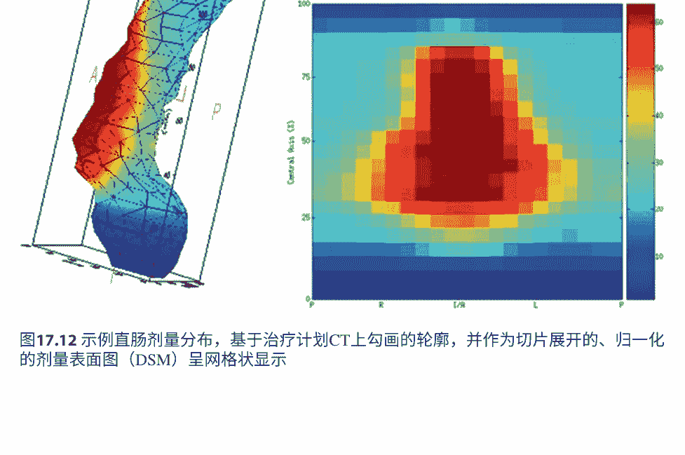

对于每个ANN，随机选择了出血的病例。通过逐步添加ANN来开发专家集合，并使用ROC曲线下面积对来自训练集的子集的预测进行评估。如果最新的ANN的预测改善了AUC，则将该ANN添加到集合中。这个过程重复了3次，并将在所有3个集合中包含的ANN合并到专家集合中。这个整个过程对十折交叉验证的每一折都重复进行。

架构2被证明能够产生最佳的预测结果，ANN的AUC为0.61，专家集成的AUC为0.64，与之相比，这是与AUC相比较的剂量表面直方图基于人工神经网络的AUC为0.59。为了评估交叉验证导致的数据分区的影响，交叉验证分区重复了100次，并重新训练了最有希望的局部连接架构（2）。平均AUC为0.65 ± 0.017。

与其他研究相比，AUC相对较低。然而，当空间信息被纳入时，AUC的改善表明使用空间信息可以改善输入信息，而总体上的缺点可能是由于缺乏非剂量学数据或治疗计划扫描中的放射治疗剂量分布（DVH或DSM）不代表患者在分数治疗过程中实际接收到的剂量分布。

## 17.9.2 支持向量机 (SVM)

支持向量机是一类机器学习方法，试图在特征空间中找到一个分界面，将两个分类结果分开。当情况是线性可分的时，这相对简单，然而，在考虑对正常组织毒性的预测时，情况往往不是线性可分的。在这种情况下，变量可以转换为一个更高维的特征空间，其中可以通过一个超平面将情况分开。这可以通过使用非线性核函数（如多项式或径向基函数）来实现。

每个数据点代表模型中包含的变量的向量。在分离案例的同时提高拟合精度的双重优化导致了一个平衡的权衡。这在计算上是非常密集的，但是可以仅使用训练数据的一个子集来描述预测函数。用于定义类别之间边界的案例被称为支持向量。与其他机器学习方法不同，支持向量机最大化两个类别之间的距离，而不是最小化均方误差，并且允许一定数量的案例位于边界的“错误一侧”。支持向量机的框架隐含地包括变量之间的高阶交互作用，而无需预先定义它们是什么。

陈等人在一篇与他们使用神经网络（在前一节中讨论）相补充的论文中，描述了在相同数据集上使用支持向量机预测肺炎[79]，该数据集是用于人工神经网络[74]报告的。在SVM中，选择了径向基核函数，而不是S型或多项式函数。

由于自由参数的增加可能导致过拟合，所以核函数的选择很重要。SVM仅使用剂量学变量进行构建，也可以使用所有可用变量进行构建。参数值C和σ是通过网格搜索预先确定的。变量选择是通过类似于ANN研究的方法进行的，其中变量是通过十折交叉验证进行迭代添加和替换的。

虽然每个结果都是独立的，但输入变量之间存在很大的交叉。这种折叠之间的一致性对于泛化是令人放心的。包括剂量学和非剂量学变量的SVM的AUC为0.76。采用LOO方法来研究SVMall模型中各个变量的重要性。排除EUD和诱导化疗后，AUC降低了0.19和0.09。这两个变量的重要性与之前的ANN研究结果一致。

然而，如果不使用交叉验证等技术，其他变量的贡献可能会导致过拟合的风险。El Naqa等人描述了使用非线性基于核的方法来预测正常组织毒性[63]，强调了建立混合模型的挑战，包括剂量度量、患者特征和疾病/治疗相关的预后因素等不同数据类型。他们推荐使用基于核的方法，特别是支持向量机，引用以下优点，相对于其他机器学习方法。能够适应人工智能，能够避免过度拟合，保持经典统计方法的计算效率，并总结指出SVM克服了由于严格的数学基础而产生的黑盒子的负面印象。通过主成分分析（PCA）实现对数据的预处理，同时也可以对高维数据进行可视化。演示了两个临床数据集的示例。第一个数据集是由55例头颈部癌症患者组成的小队列，开发了一个模型来预测干燥口腔，这是放射治疗后由于唾液产生不足而导致的。观察到有干燥口腔和无干燥口腔的患者群组相对分离，并随后证明线性核产生的模型在径向基函数或多项式核方面都没有更好的效果。作者评论称，这在放射治疗中“不是常态”，正如第二个数据集所示。使用219例非小细胞肺癌（NSCLC）放疗患者的数据来预测放射性肺炎（RTOG 3级）。通过使用接收剂量为x的体积（Vx）对肺部剂量进行表征。包括从10到80 Gy的10 Gy增量的Vx。使用这些变量，演示了无法使用PCA将类别分离。使用SVM演示了随着多项式阶数的增加，模型性能的改善。还开发了一个包括非剂量度量变量的单独模型，包括患者、疾病和治疗变量。此外，剂量度量描述符扩展到包括Dx（接收最小剂量x的肺部体积）。总共包括58个变量。使用递归特征消除SVM选择了前30个变量。使用变量修剪来解决相关变量的多重共线性问题。该模型的马修斯相关系数（MCC）为0.22，包含6个变量。另外进行了一次SVM

使用从先前研究中通过模型顺序选择和重采样逻辑回归得出的3个变量进行开发。结果SVM使用径向基函数核函数的MCC为0.34。这个值的改善归因于SVM能够考虑模型变量之间的相互作用。

在随后的一篇更全面的出版物中，El Naqa等人[80]对所提供的数据进行了扩展。在放射治疗中，并发症的发生率通常很低。传统上，SVM成本函数对两个潜在类别进行平等处理，但为了考虑类别之间的不平衡，可以为两个不同类别的样本分配不同的权重，并对代表少数类别的样本分配更高的惩罚权重。

因此，惩罚项被扩展为

```
$$C^{+}\sum_{i=z^{+}} \xi + C^{-}\sum_{i=z^{-}} \xi \tag{17.7}$$
```

除了在先前出版物中研究的数据集外，还提供了对166名非小细胞肺癌患者的急性食管炎进行预测的数据。最后，来自多机构RTOG研究（9311）的数据被用作独立验证集，用于预测放射性肺炎。如先前报道的那样，预测口干症的最佳模型是线性分类器，其MCC值为0.64。预测食管炎的模型包括同时化疗和剂量学信息，以Vx的形式呈现。未进行预模型变量选择。

使用径向基函数 σ = 2和C = 100，获得了最佳性能，MCC为0.43。

Schiller等人[81]探讨了使用支持向量机集成的优势。使用WUSTL的放射性肺炎数据，使用学生t检验比较了不同大小的支持向量机集成的AUC差异。结果表明，对于较大的集成，AUC显著提高。

## 17.9.3 无监督学习SOM

自组织映射是一种无监督形式的人工神经网络。无监督学习根据输入特征将相似的数据聚类在一起，而不考虑相应的输出数据。与PCA类似，自组织映射可以降低数据的维度。Kohonen [82]提出的自组织映射是一种由适应权重训练的规则化神经元网格。每个神经元包含有关物理位置和权重的信息，可以将其视为该神经元的输入特征的典型值。相邻的神经元比远离的节点更相似。训练后，通过找到具有最相似权重的神经元，将后续案例映射到SOM上。权重可以随机初始化，但通过执行PCA并使用前2个主成分来初始化权重可以加快该过程。与PCA不同，使用自组织映射来预测正常组织并发症概率非常稀疏。最著名的例子是Chen等人的研究。

[83]这与他们使用ANN和SVM进行研究相补充。与以前的研究一样，开发了两个模型，即SOM剂量模型，其中包括剂量变量，以及SOM全模型，还包括非剂量变量，如化疗状态、肿瘤信息和基线肺功能。在SOM中初始化权重后，每个案例依次呈现给地图。控制SOM学习的两个参数是邻域距离和学习率。邻域距离定义了输入权重与每个神经元关联权重之间的可接受差异，以确定病例是否属于特定节点。在本研究中，使用欧氏距离评估相似性。另一个参数是学习率，它在SOM的上下文中定义了在训练中使用多少来自输入向量的信息（即使用多少输入变量）。一旦将案例分配给一个神经元，相关的权重将被更新，并且该过程将被迭代重复。本研究采用十折交叉验证方法。发现4x3个神经元的地图是最佳的，并使用试验和替代法来包含输入变量。SOM剂量模型的结果AUC为0.67，SOM全模型的结果AUC为0.73。两个AUC之间的差异在统计学上是显著的（p < 0.05）。通过重复分割数据200次并重新训练SOM全模型来测试交叉验证组的影响。令人惊讶的是，AUC为0.724（SD = 0.017），表明结果非常一致。EUD with a = 0.9， 1.1化疗、组织学和肿瘤位置是常选的变量。如先前提到的，EUD with a = 1是平均剂量，先前被认为是预测放射性肺炎的因素。当将此变量从模型中移除时，AUC的减少在统计学上是显著的。唯一另一个在排除时显示出统计学显著减少的变量是化疗。这些结果与同一研究小组的另外两篇论文一致。

## 17.9.4 贝叶斯网络

贝叶斯网络已成为解决复杂非线性问题的流行统计方法。贝叶斯网络使用有向无环图来总结一组变量之间的联合概率分布。通过找到每个节点上最能代表数据集的条件概率来优化网络。Oh等人[84]描述了使用贝叶斯网络来检测剂量-体积相关参数的相互作用以预测放射性肺炎。数据集包括209名接受放射治疗的非小细胞肺癌患者的信息。其中48名患者随后被诊断为放射性肺炎。输入特征包括临床特征和剂量特征，以Vx和Dx（最小剂量到最热x%体积）来描述。总共有160个特征可用，第一步是减少模型中的变量数量。采用基于信息增益的方法进行特征选择。随后，输入特征的数量减少到43个。贝叶斯分类器将每个案例分配给具有最高概率的类别。

后验概率由贝叶斯定理确定。我们之前讨论过剂量体积数据高度相关；然而，朴素贝叶斯分类器假设所有特征相互独立。因此，Oh等人还实现了一种树增强的朴素贝叶斯分类器，允许特征之间的连接，以克服这个挑战。考虑到给定数据集可能存在的网络数量，找到精确解是不可行的，通常采用近似解。在这种情况下，同时实施了爬山算法和K2算法，每个节点允许的最大父节点数为三。使用BDe评分指标对贝叶斯网络进行评估。采用十折交叉验证，并在30次迭代后评估每个网络。使用马修斯相关系数评估每个网络的性能。不同模型之间存在合理的一致性，MCC在0.25到0.3之间。令人意外的是，树增强的朴素贝叶斯分类器在预测能力上被报告为劣于朴素贝叶斯分类器。贝叶斯分类器方法的一个优点是其固有的可视性，因此可以观察变量之间的关系。在这项研究中，与心脏和肺相关的剂量特征被显示为分开聚类。证明不仅心脏和肺之间存在关系，而且每个器官的变量之间也存在关系。

## 17.9.5 决策树

决策树是使用递归分割分析构建的，它通过优化输入变量的连续二分来生成用于分类的树状结构。每棵树都是通过从根节点开始将训练样本分为两个最大分离的类别来“生长”的。这种分支持续进行，直到达到终端节点（叶子节点）。每个叶子节点都有一个与之关联的被分配到特定类别的概率。对于NTCP而言，这是经历定义毒性的概率。一旦训练完成，可以通过沿着相应的分支路径进行测试，最终到达一个叶子节点。

Das等人[86]描述了使用决策树来增强经典Lyman NTCP [52]的预测，通过生成如图17.13所示的组合预测。使用与之前由Chen等人[74, 79, 83]描述的相同数据集，使用十折交叉验证构建了具有潜在剂量和非剂量因素的决策树，每个折叠中都有平衡的放射性肺炎病例。该模型使用AdaBoost算法构建，该算法顺序增加模型中加权的预测单元的数量。

第一个预测单元仅包含Lyman模型，随后的预测单元既包含Lyman模型又包含决策树。每个预测单元的预测误差被计算为个体患者误差（与二元结果的偏差）乘以患者权重的总和。预测单元的权重和患者权重被更新并传递到下一次迭代。使用基尼指数分割阈值准则[78]评估分割的成功程度，该准则在本研究中表示为：

$$Ns\left(1 - p_{inj,s}^2 - p_{uninj,s}^2\right) - N_L\left(1 - p_{inj,L}^2 - p_{uninj,L}^2\right) - N_R\left(1 - p_{inj,R}^2 - p_{uninj,R}^2\right) \quad (17.8)$$

其中S表示正在分割的节点，L和R表示左分支和右分支，N是病例数，p是患者比例。下标inj表示报告了放射性肺炎的患者，uninj表示没有报告的患者。变量根据基尼指数从好到坏进行排序。只有那些基尼指数大于最大基尼减少的80%的变量被包括在模型中。每个预测单元的决策树上只允许有三个节点，以避免过拟合。针对一些变量实施了方向规则，以确保分割是合理的，例如剂量变量和疾病分期被强制为正向，即较高的值与增加的风险相关。使用AUC评估模型的预测准确性，随着添加预测单元的增多。研究表明，在添加了11个单元后，AUC没有进一步增加。该模型的AUC为0.72，而仅使用Lyman NTCP模型进行预测的AUC为0.63。构建了一个简化模型（图17.13），其中将Lyman NTCP值与适当终端节点上的值相结合，提供了整体的预测值。这个简化模型的AUC为0.75，包括了诱导化疗、组织学（鳞状细胞癌与其他类型）、性别和每天的分数数量。最近，Palma等人[87]使用递归分区分析预测了来自国际荟萃分析中的一组患者的放射性肺炎。收集了来自欧洲、北美和亚洲12个不同机构的836名非小细胞肺癌（NSCLC）接受同步化疗放疗的患者的数据。患者被随机分配到训练组和验证组（2/3对1/3）。最初使用单变量逻辑回归来确定与放射性肺炎有关的输入特征。这些特征经过多变量逐步逻辑回归和递归分区分析进行独立评估。放射性肺炎的发生率报告为29.8%，使用多种不同的评分方案进行评分，在每种情况下，2级或更高级别被计为放射性肺炎事件。

**图17.13 决策树示例取自[86]**

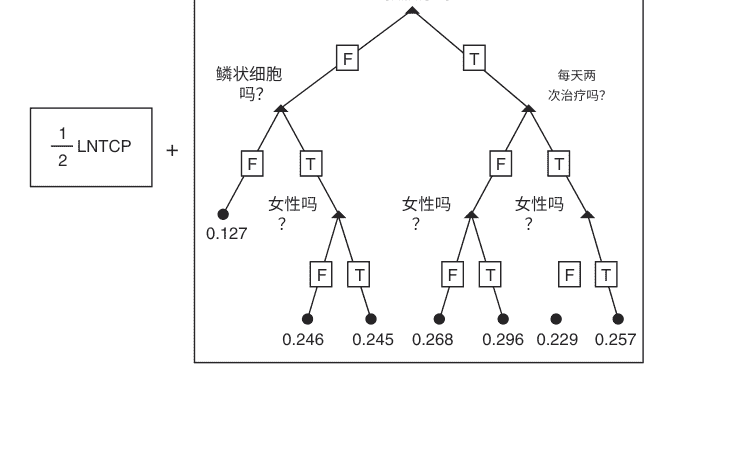

化疗方案、年龄>65岁、V20和平均肺剂量是递归分区模型中使用的变量，用于定义3个风险组。在训练和验证队列中观察到风险组之间肺炎风险的统计学显著差异。尽管没有对预测准确性进行量化以与其他基于模型的研究进行比较，但该研究的结果得到了数据集的不均匀性的加强。

Valdes等人[88]还描述了使用决策树来预测放射性肺炎。使用基尼指数进行了单变量分析。将多变量决策树与RUSboost算法进行了比较，该算法旨在克服类别不平衡的挑战，还使用了随机森林分类器（见下文）。使用F1得分评估分类。

## 17.9.6 随机森林

尽管决策树通常被认为是高度可解释的，但它们不一定是最高性能的分类器。通过创建一个被称为随机森林的决策树集合，可以改善这一点。通过这种方式，个别树的投票被聚合以进行最终预测。Dean等人在一项与逻辑回归部分所描述的研究相补充的研究中，描述了在183名头颈癌患者队列中使用随机森林、支持向量机和逻辑回归预测急性粘膜炎的情况。使用AUC和校准曲线评估模型性能。随机森林模型的AUC为0.71，与SVC和惩罚性逻辑回归相似，但校准更好。此外，从基尼指数派生的重要性因子提供了有关各个变量对模型的贡献的信息。在这种情况下，确定了口腔腔内接受中等和高剂量的体积。

## 17.9.7 混合模型和比较研究

这里的每个模型都显示出了优点和缺点。没有一个被证明是完美的预测器。问题是是否可以通过结合来自不同模型的预测结果来获得“两全其美”。这一点可以通过Das等人的论文[90]进行有用的说明，他们建议融合来自不同模型的预测结果，以获得更真实和稳健的地面真实估计，并且在模型之间存在共识时，这加强了预测结果。本章前面讨论的四项研究结果被合并，使用独立训练的决策树、神经网络、支持向量机和自组织映射的预测结果，给出了放射性肺炎风险的共识预测。每个模型都包含了来自可用输入变量池的剂量和非剂量特征，个别报告[74, 79, 83]表明没有两个模型选择了相同的变量集。在这项研究中，每个模型的预测结果取平均值生成类似预测值。将数据随机分成一百个十折交叉验证的部分，用于从每种模型类型进行预测。在对每种分类器的输出进行平均之前，将这些结果转换为二进制值0（无毒性）和1（毒性），以考虑不同类型分类器的输出之间的缩放差异。这些结果被合并以产生一个模拟预测，该预测在4个模型上进行平均。当选择每个模型的10个随机预测时，所得到的模型的AUC收敛于0.79，这是对每个单独分类器结果的改进。对于除了SVM之外的所有模型，每个模型的任意两个预测之间的斯皮尔曼相关性都很高≥0.9，而模型之间的相关性则较低。这强调了重复交叉验证和不同分类器的组合的好处。使用逆序排名方法测试了个体输入特征的重要性，其中患者的预测根据共识预测被排名为最高到最低的肺炎风险。然后，将一个输入变量的值反转，以便将排名最高的患者的值替换为排名最低患者的值，反之亦然。重新计算预测值并重新计算排名。使用斯皮尔曼相关系数比较了切换前后的排名（进行了10^5次重新采样）。较大的负相关系数将表明变量对预测的影响较大。与先前的出版物一样，高度相关的变量（皮尔逊相关系数>0.9）被排除在已经存在其他相关特征的模型中。因此，剂量测量变量被分组在一起。当两组剂量测量变量和诱导化疗被反转时，观察到最大的负相关系数。女性性别和鳞状细胞组织学也被证明是重要的。剂量测量组代表I EUD（a 0.5 - 1.2）和体积 > 20—30Gy，以及II EUD（a 1.2 - 3）。随后，将共识变量拟合到逻辑回归概率函数中。将机器学习的共识转化为易于解释的模型，使得学到的知识可以转移到临床环境中。

Nalbantov等人[91]结合了十种不同模型的预测结果，预测了放射治疗引起的急性吞咽困难。每个模型被分配相等的投票权，并在一组患者中进行了测试。结果与医生的预测进行了比较。所有人都获得了相同的“输入”信息，包括年龄、性别、WHO表现状态、食道平均和最大剂量、整体治疗时间以及并发/顺序化化疗。使用朴素贝叶斯、Bagging、贝叶斯网络、Boosting、惩罚性逻辑回归、径向基函数网络、随机森林、线性支持向量机和LASSO进行急性吞咽困难≥G3（CTCAE）[92]的预测，并使用相等投票权的组合模型。与任何单个模型相比，组合模型在独立前瞻性验证队列中的AUC（0.77）更高。医生的相应AUC为0.53。

其他研究选择不创建混合模型，而是直接进行了机器学习方法的比较。Pella等人[93]提出了一种基于ANN和SVM的模型进行比较，以预测接受前列腺放疗的321名患者的急性毒性。选择这两种技术是为了能够在同一个模型中考虑剂量学和临床变量的灵活性。输入特征是根据临床知识由作者选择的，与我们考虑的其他研究相比似乎有限。直肠的剂量分布通过直肠的30%和60%收到的剂量（D30和D60）以及计划扫描中直肠的绝对体积（cc）来量化。膀胱的剂量分布仅使用膀胱的50%收到的剂量和治疗计划扫描中的绝对膀胱体积（cc）来描述。不寻常的是，只使用了GI或GU毒性≥2级的单一结果，这个选择是由于队列中GI（37%）和GU（11.5%）毒性的低发生率来证明的。

使用遗传算法优化了人工神经网络架构。报道称优化后的人工神经网络具有两个隐藏层，第一个隐藏层有47个神经元，采用Sigmoid激活函数，第二个隐藏层有44个神经元，也采用Sigmoid激活函数。输出层采用线性激活函数。优化后的人工神经网络的ROC为0.697。相比之下，最优的支持向量机采用了九阶多项式核函数，结果得到了0.717的AUC。这两个值都是针对训练中保留的30个患者子集的。需要注意的是，优化的人工神经网络和支持向量机选择的参数可能导致过拟合。具有13个输入但近100个隐藏节点的人工神经网络很可能过拟合，使用九阶多项式核的支持向量机也是如此。由于没有使用交叉验证，无法推断这些模型的泛化能力如何。没有对两种技术的AUC进行统计比较，这可能再次是由于结果的独特性。Oh等人的另一项研究直接比较了机器学习方法在放射性肺炎预测中的预测结果。比较了特征选择技术和分类方法。特征选择方法包括SVM-递归特征消除、基于相关性的特征选择卡方特征选择和信息增益。分类器包括SVM、决策树、随机森林和朴素贝叶斯。使用马修斯相关系数评估性能。每种方法在华盛顿大学医学院的209名非小细胞肺癌患者队列中进行了测试，其中48名患者报告了放射性肺炎（该研究中也报告了来自同一组的贝叶斯网络的结果）。数据包括临床变量，包括人口统计学和疾病分期，以及剂量学变量，以Vx体积接收x Gy和Dx剂量接收x%体积来量化。一些输入特征在多个特征选择方法中排名较高，但一般来说，特征选择方法之间存在显著的变异性。特征选择与每种分类方法相结合，从最高排名的变量模型开始，逐渐增加变量的数量。观察到使用径向基函数或多项式核函数的支持向量机始终产生最高的马修斯相关系数值。在比较模型时需要谨慎，因为结果可能是数据特定的，但考虑不同方法的相对成功是有用的。值得注意的是变异性特征选择的结果中，并未说明是否对相关输入进行了任何调整，这可能会影响结果。

## 17.10 深度学习

这里描述的许多论文是在机器学习不受青睐的时代发表的，近年来情况发生了巨大变化，机器学习，尤其是深度学习，现在已经在现代生活中无处不在。深度学习神经网络现在是一种常用的工具，其根源可以追溯到多层感知器（MLP）。第4章详细描述了这种方法。Buettner在ANN部分描述的论文描述了一种手工制作的方法，现在已经在局部连接的MLP概念中自动化。Wang等人[94]描述了使用深度感知器网络来预测肺癌患者的结果，使用了来自医院电子健康记录（EHR）系统的各种数据。这个集成网络是使用自动化方法来调整超参数和快照集成重启策略进行训练的，该策略可以在训练集成时快速获取局部最小值的快照。利用帕累托前沿的多目标优化方法用于模型选择。从1007名接受肺癌放疗治疗的患者的电子健康记录（EHR）中提取了不同类型的20个变量。

有趣的是，与放射治疗的细节相关的特征都没有被考虑。1年后的结果进行了预测，并与经典的支持向量机、深度神经网络（DNN）和多目标模型进行了比较。多目标深度学习方法MoeDL被发现具有最高的整体预测指标。这种复杂的架构被应用于一个相对简单的数据集，深度学习通常与复杂的图像等复杂数据相关联。Liang等人[95]描述了使用卷积神经网络方法将3D剂量分布与放射性肺炎相关联。该模型与使用惩罚逻辑回归模型在相同数据集上的先前出版物的结果进行了比较，该模型对剂量/体积参数和剂量学进行了更传统的表征，这些将在下一节中描述。

## 17.11 放射学和剂量学

放射学是用于描述从灰度医学图像（如CT）中提取的定量特征以表征空间信息的术语，[96, 97]。这些影像生物标志物可用于研究分类和肿瘤划定以及预测结果[98, 99]。完整的探索超出了本章的范围，然而，将这些概念转移到3D剂量分布后，对放射反应的预测引起了兴趣。

成像生物标志物是图像体素的强度、纹理和形态描述，例如灰度级运行长度矩阵（GLRLM），它描述了特定灰度级数和定义长度的像素运行在3D图像中的数量。这是Liang等人在他们的先前出版物中使用的特征之一，他们使用惩罚性逻辑回归来预测放射性肺炎。Gabrys等人[100]还详细介绍了基于3D矩的Dosiomic特征，用于多变量NTCP模型，以使用多种特征选择和分类器组合来预测干燥口腔。然而，与腮腺剂量梯度相关的特征的单变量分析获得了最高的AUC。然而，与腮腺剂量梯度相关的特征的单变量分析获得了最高的AUC。

## 17.12 放射基因组学

影响患者毒性经验的众多信息之一是独特的基因密码。近年来，已经进行了许多全基因组关联研究(GWAS)，试图鉴定单核苷酸多态性(SNPs)这种个体差异的遗传标记，这些标记很可能表明辐射反应的差异[101]。由于基因组中可能存在数百万个潜在的SNPs，因此更倾向于使用大型数据集。然而，崔等人[102]证明了结合特征选择的细致考虑和先验知识的组合可以利用中等规模的数据集来预测放射性肺炎。该论文全面探讨了特征选择、经典机器学习和深度学习方法。最初选择了230个感兴趣的特征，其中少数与剂量学(5)和临床因素(13)有关，其余特征是细胞因子水平、SNPs和microRNAs的测量结果。将传统的特征选择方法与变分自动编码器(VAE)方法进行了比较，VAE是一种无监督的深度学习概念，通过减少和扩展信息来实现。结果被用作MLP、SVM和RF等经典机器学习方法的输入。此外，还采用了联合VAE和MLP架构。最后，开发了一个混合系统，将特征选择和VAE选择作为经典分类器的输入。特征选择采用嵌套交叉验证和排名最高的p%方法进行探索，选择最常排名靠前的特征。总体上，混合方法在特征选择中使用了权重修剪和潜在变量，并通过MLP进行训练，获得了最高的AUC值(0.831)。在最终模型中包括的22个特征中，有7个在每个MLP模型中都被识别出来，其中包括平均肺剂量。这是一个令人印象深刻的结果，因为它已知可以预测肺炎，但是它是230个输入变量中的一个。

这个领域正在迅速发展，毫无疑问将会有更多的出版物来进一步探索这个主题[103, 104]。

## 17.13 模拟放射治疗反应的挑战

尽管有许多关于大型高质量数据集的研究，但预测NTCP仍然是一个挑战。以下讨论了这个问题的许多潜在原因。

1. 除了正常组织的剂量反应外，还有许多其他因素会导致毒性的发生，包括患者特征，如合并疾病或先前的治疗，这些可能会改变器官的剂量反应，以及包括化疗在内的其他治疗，这些治疗可能会引起副作用，但也可能会影响剂量反应[105]。
2. 初步数据显示，正常组织的反应在一定程度上取决于遗传易感性。 迄今为止，全基因组关联研究(GWAS)在毒性与单核苷酸多态性(SNPs)之间的关联研究中结果不一致[106]。
3. 目前，对器官的三维剂量分布进行总结和/或减少以提供剂量学信息。 然而，这往往会导致空间信息的丢失。 众所周知，许多器官包含固有的亚结构，这是器官功能的一部分。 肾脏[107]是一个经典的例子，肾单位的剂量被认为很重要。
4. 风险器官的剂量学数据依赖于治疗计划系统上结构的轮廓。 机构应制定协议以确保轮廓的一致性。 然而，定义在机构之间可能会有所不同，当将模型应用于来自另一个机构的数据时，这一点尤为重要[108]。
5. WYSINWYG. 你看到的不是你得到的。除了轮廓的一致性，大多数NTCP研究使用治疗计划扫描来定义风险器官。在放射治疗的每个分数中都会非常小心地确保治疗计划的复制，并且目标得到相应的照射。 然而，正常组织的变异性未必被考虑在内，因此，除非根据每日成像构建累积剂量，否则治疗计划报告的剂量数据与模拟的正常组织剂量可能存在差异[109]。

意识到这些挑战，并在可能的情况下将其纳入到TCP/NTCP模型中，将提高结果模型的稳健性和普适性。

## 17.14 总结

本章回顾了许多应用机器学习来进一步了解TCP和NTCP的研究。考虑到总发表量，机器学习对该领域的影响有限。 在这里，我们考虑为什么会出现这种情况以及如何解决。 机器学习，特别是人工神经网络，传统上被认为是不可解释的黑盒子，无法解释其底层模型。

虽然解释黑盒子的权重是具有挑战性的，但并非不可能，而其他机器学习技术，例如决策树则更加透明。 有各种各样的机器学习技术，决定使用哪种技术可能令人生畏。一套杜克大学的出版物[74, 79, 83, 90, 110]和Oh [111]、Pella [93]、Dean [62, 89]的比较论文很有见地。将AUC指标作为模型之间的比较标准并不明智，因为这可能是数据特定的。然而，考虑最终模型选择的特征的一致性是有用的。在某些情况下，结合不同的模型可以提高预测准确性，特别是在输入特征可能高度相关的情况下。在这种情况下，集成模型可以以稍微不同的形式使用类似的信息。或者，混合方法可以得到最好的结果。另一方面，如果没有经过仔细训练，这些模型本质上是复杂的，并且可能缺乏泛化能力。此外，当许多输入特征分布在模型中时，解释各个输入特征的作用可能更具挑战性。本章介绍的许多研究表明，机器学习的结果优于标准技术。这部分原因在于机器学习可以灵活地组合不同类型的数据。然而，只有在少数情况下，AUC超过0.8。虽然这被认为是医学领域经典统计和机器学习方法的非常好的结果，但理想情况下，每个患者都应该有一个有效的预测。我们达到这个上限的原因很复杂，但基本上是由于未能充分反映患者经历。没有模型可以根据未提供的数据预测结果。随着遗传信息纳入研究，每个患者可用的数据量正在爆炸性增长。此外，对风险器官的剂量分布通过DVH不足以进行表征，通过包含空间信息来改进这一点将进一步增加输入特征的数量。机器学习是一种知识转移工具，允许临床医生提供他们认为与特定预测情境相关的所有数据。显然，医学理解每天都在发展，因此预测模型需要不断更新以包括这种增加的知识。机器学习方法非常适合处理大数据，希望将来能够充分理解癌症治疗后正常组织的反应，包括放射治疗，并且可靠的基于知识的模型将成为临床的标准。

## 17.15 结论

近年来，成像和生物技术的发展为重塑我们对放射治疗反应的理解提供了新的机会。然而，放射引起的效应的复杂性以及肿瘤和正常组织反应的可变性使得机器学习算法的利用成为更好地描绘这些复杂相互作用机制的不可或缺的工具。

## 参考文献

- 1. Bortfeld T, 等. 图像引导的调强放射治疗. 柏林: Springer-Verlag; 2006.
- 2. Webb S. 三维放射治疗物理学: 顺应性放射治疗、放射外科和治疗计划. 医学物理学系列, 第xiv卷. 布里斯托尔: Institute ofPhysics Pub; 2001. 373页.
- 3. Halperin EC, Perez CA, Brady LW. Perez and Brady’s principles and practice of radiation oncology, 第xxxii卷. 第5版. 费城: Wolters Kluwer Health/Lippincott Williams & Wilkins; 2008. 第2106页.
- 4. Moissenko V, Deasy JO, Van Dyk J. 放射生物学建模用于治疗计划。 在: Van Dyk J, 编辑。 放射肿瘤学的现代技术: 医学物理学家和放射肿瘤学家手册。 麦迪逊: 医学物理出版社; 2005年。 第185-220页。
- 5. El Naqa I. 放射治疗和肿瘤学中的结果建模指南: 倾听数据, 医学物理学和生物医学工程系列, 第xxxiv卷. 博卡拉顿: CRC出版社, 泰勒和弗朗西斯集团; 2018年。 第367页。
- 6. Choi N等. 非小细胞肺癌放射治疗中的预测因素: 现状。 肺癌。 2001年;31(1):43–56。
- 7. Fu XL等. 非小细胞肺癌预后预测因子研究。 肺癌。 1999年; 23 (2) : 143-52。
- 8. Blanco AI等. 头颈部癌症患者放射治疗中唾液功能的剂量-体积建模。 Int J Radiat Oncol Biol Phys. 2005年; 62 (4) : 1055-69。
- 9. Bradley J等人. 肺癌放疗患者急性食管炎的剂量相关性。 Int J Radiat Oncol Biol Phys. 2004;58(4):1106–13。
- 10. Marks LB. 放射性肺损伤的剂量预测因素。 Int J Radiat Oncol Biol Phys. 2002;54(2):313–6。
- 11. Hope AJ等人. 非小细胞肺癌局部控制的临床、剂量和位置相关因素预测。 在: Astro 第47届年会。 丹佛: 丹佛, 科罗拉多州; 2005年。
- 12. Tucker SL等人. 前列腺癌放疗后晚期直肠出血的剂量-体积响应分析。 International Journal of Radiation Oncology Biology Physics.2004;59(2):353–65。
- 13. El Naqa I等人. 包括剂量-体积和临床因素在内的放疗结果的多变量建模。 Int J Radiat Oncol Biol Phys. 2006;64(4):1275–86。
- 14. Deasy JO, El Naqa I. 基于图像的放射治疗正常组织并发症概率建模。 癌症治疗研究。 2008;139:215–56。
- 15. Bentzen SM等. 临床中正常组织效应的定量分析 (QUANTEC) : 科学问题导论。 Int J Radiat Oncol Biol Phys. 2010;76(3 Suppl):S3–9。
- 16. Jackson A等. QUANTEC的教训 : 关于治疗结果剂量容积依赖性的报告和数据收集建议。 Int J Radiat Oncol Biol Phys. 2010;76(3 Suppl):S155–60。
- 17. El Naqa I. 用于预测肺癌肿瘤反应的机器学习方法。 Wiley Interdisciplinary Reviews: Data Mining and Knowledge Discovery. 2012;2(2):173–81。
- 18. Collins GS等. 透明报告个体预后或诊断的多变量预测模型 (tripod) : tripod声明。 Ann Intern Med. 2015;162(1):55–63。
- 19. Klement RJ等. 基于支持向量机的早期非小细胞肺癌立体定向放射治疗后局部肿瘤控制的预测。 Int J Radiat OncolBiol Phys. 2014;88(3):732–8。
- 20. Munro TR, Gilbert CW. 肿瘤致死剂量与肿瘤细胞放射敏感性之间的关系。
- 21. Hall EJ, Giaccia AJ. 放射生物学, 第九卷。 第六版。 费城: Lippincott Williams & Wilkins; 2006年。 第546页。
- 22. Joiner M, Kogel AVD. 基础临床放射生物学，第六卷。第四版。伦敦：Hodder Arnold；2009年。第375页。
- 23. Goitein M. 不均匀照射目标体积的肿瘤控制概率。 Zink S, 编辑。 粒子束放射治疗的治疗计划评估。 Bethesda: 国家癌症研究所; 1987年。
- 24. Zaider M, Minerbo GN。 肿瘤控制概率：适用于任何剂量传递时间方案的公式。 物理医学与生物学。2000年:45（2）：279-93。
- 25. Hall EJ。 放射生物学，第xii卷。第4版。费城：J.B. Lippincott; 1994年。第478页。
- 26. Zaider M, Hanin L。 放射治疗中的肿瘤控制概率。 Med Phys。2011年; 38（2）：574-83。
- 27. Lindsay PE等。 有限束重信息的回顾性蒙特卡洛剂量计算。 医学物理。 2007年; 34（1）：334-46。
- 28. Deasy JO, Blanco AI, Clark VH。 CERR：放射治疗研究的计算环境。 医学物理。 2003年; 30: 979-85。
- 29. El Naqa I等人。 建模肿瘤控制概率的数据挖掘方法。 Acta Oncol. 2009年;49(8):1363–73。
- 30. El Naqa I等人。 包括剂量-体积和临床因素在内的放射治疗结果的多变量建模。 Int J Radiat Oncol Biol Phys. 2006年;64(4):1275–86。
- 31. Kennedy R等人。 通过模式识别解决数据挖掘问题。 Upper Saddle River: Prentice Hall; 1998年。
- 32. Willner J等人。 非小细胞肺癌原发放射治疗中剂量、体积和肿瘤控制预测。 Int J Radiat Oncol Biol Phys. 2002年;52(2):382–9。
- 33. Martel MK等人。 通过非小细胞肺癌患者的3D剂量分布估计肿瘤控制概率模型参数。 肺癌。 1999年;24(1):31–7。
- 34. Mehta M等人对非小细胞肺癌的剂量递增提出了一种新方法。 Int J Radiat Oncol Biol Phys. 2001;49(1):23–33。
- 35. Brodin O, Lennartsson L, Nilsson S。 对四种人类肺癌细胞系进行单剂量和分剂量辐射的体外研究。 Acta Oncol. 1991;30(8):967–74。
- 36. Seibert RM等人提出了一种预测肺癌治疗反应的模型。 Int J Radiat Oncol Biol Phys. 2007;67(2):601–9。
- 37. Ramsey CR等人提出了一种适应性图像引导螺旋调强放疗技术用于肺癌。 Int J Radiat Oncol Biol Phys. 2006;64(4):1237–44。
- 38. Borst GR等人发现标准化的FDG摄取量是无法手术切除的非小细胞肺癌的预后因素。 Eur J Cancer. 2005;41(11):1533–41。
- 39. Levine EA等人。 18-氟脱氧葡萄糖正电子发射断层扫描（18F-FDG-PET）在识别局部晚期食管癌化疗放疗治疗反应者中的预测价值。 Ann Surg. 2006;243(4):472–8。
- 40. Ben-Haim S, Ell P。 18F-FDG PET和PET/CT在评估癌症治疗反应中的应用。 J Nucl Med. 2009;50(1):88–99。
- 41. El Naqa I等人。 探索基于特征的PET图像用于预测癌症治疗结果的方法。 Pattern Recogn. 2009;42(6):1162–71。
- 42. Mac Manus MP等人。 非小细胞肺癌根治性放疗/化疗后代谢（FDG-PET）反应与失败模式相关。 Lung Cancer.2005;49(1):95–108。
- 43. Yamamoto Y等人。 FDG-PET结果与非小细胞肺癌诱导化学放疗反应的组织病理学评估相关。 Eur J Nucl MedMol Imaging. 2006;33(2):140–7。
- 44. Pieterman RM等人。 正电子发射断层扫描术对非小细胞肺癌的术前分期。 N Engl J Med. 2000;343(4):254–61。
- 45. Wong CY等人。 通过联合F-18 FDG PET-CT成像将原发性肺癌的代谢和解剖反应与放射治疗相关联。 Radiat Oncol. 2007;2:17。
- 46. Vaidya M等人。 肺癌放射治疗肿瘤反应的PET/CT图像特征。 Radiother Oncol. 2012;10 2(2):239–45。

## 智能自适应治疗策略

曾焕新、兰德尔·K·天·哈肯和伊萨姆·埃尔·纳卡

### 18.1 引言

近年来，肿瘤学领域的癌症患者特异性信息呈现出巨大增长，包括多模态成像（计算机断层扫描（CT）、正电子发射断层扫描（PET）、磁共振成像（MR）、超声（US））和生物技术（基因组学、转录组学、蛋白质组学等），为肿瘤学中的大数据时代开启了新的篇章。随着患者特异性数据的可用性，如临床、治疗、成像、分子标志物等，在肿瘤学和放射治疗过程中出现了个性化治疗的新机会[1,2]。

将这些信息综合起来，形成可操作的知识，以改善患者的结果，目前是现代肿瘤学的主要目标。随后，适应性癌症治疗（ACTs）作为一个重要的框架出现，旨在根据临床、几何变化和生理参数来调整治疗处方，以开发个性化治疗。本章的目标是更详细地探讨ACT框架中涉及的过程，以便以系统化的方式聚合和分析相关患者信息，以实现更准确的决策和优化长期结果。我们将以放射治疗（RT）作为这类应用的示例进行讨论。

H.-H. 曾
中央研究院信息技术创新研究中心，台北，台湾
e-mail: h.tseng@gapp.nthu.edu.tw

R. K. Ten Haken · I. El Naqa (✉)
密歇根大学放射肿瘤科，安娜堡，密歇根州，美国
e-mail: rth@med.umich.edu; ielnaqa@med.umich.edu

© Springer Nature Switzerland AG 2022
I. El Naqa, M. J. Murphy (编), 肿瘤学、医学物理和放射学中的机器学习和深度学习, https://doi.org/10.1007/978-3-030-83047-2_18

## 18.2 放射治疗中的适应性治疗

ACT的概念扩展了传统的适应性放射治疗（ART）[3, 4]的概念，该概念主要基于成像信息进行指导，将其扩展为一个更通用的ART框架，可以接收和处理所有相关的患者特定知识，以用于自适应决策和个性化治疗。

例如，在放疗过程中，肿瘤和周围正常组织发生解剖和生物学变化，应该予以考虑，并调整治疗计划以实现改善的结果。Schwartz等人在头颈癌的前瞻性试验中证明了这种适应性方法的益处[5]。这种方法已在肝脏[6]和肺部[7]癌症的I/II期试验中得到证明。

然而，这些研究中的适应性是基于主观评估和应用短期启发式方法，不能充分利用治疗过程/随访信息来决定最佳的长期适应行动，导致改进有限，并在许多情况下产生令人失望的次优结果[8]。

提出的ACT-ART框架可以被认为由四个阶段组成，如图18.1所示。这些阶段包括：(1)患者规划

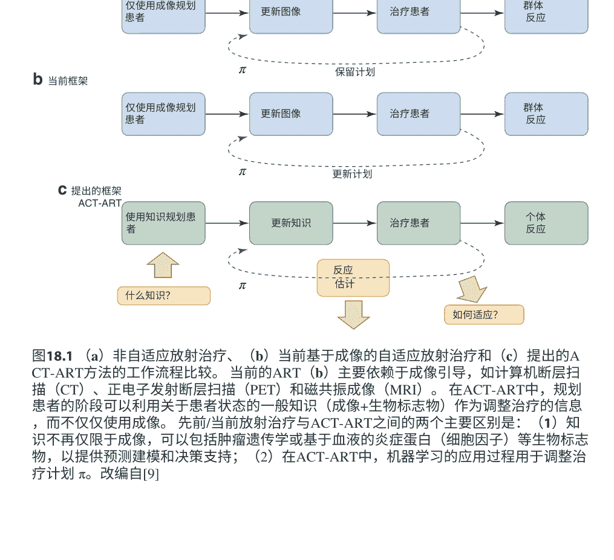

使用现有知识或预处理建模（2）通过疗程中不断更新的知识来更新预测模型，或者在治疗期间进行建模（3）个性化初始患者治疗，以及（4）根据个体反应调整初始治疗，其中中间两个步骤可以在每个放射剂量分数（或几个分数）上重复，以实现最佳治疗目标并优化潜在的长期目标，即长期肿瘤控制并对周围正常组织产生有限的副作用。

ACT-ART框架实施的第一步是在患者计划阶段开始，将当前的“仅图像患者”扩展为更一般的准备阶段，可以整合所有相关的信息学信号来评估可用的治疗选择，参见图18.1a，b。因此，图像信息（CT/PET/MRI）与生物标志物（基因组学、转录组学、蛋白质组学等）相结合，可以潜在地帮助个性化治疗过程，以适应个体患者的分子特征，并且不仅限于当前仅限于图像的情况，如本章后面所讨论的。要开发ACT框架，有三个关键问题需要解决[9]：

Q1 为了ACT规划，需要综合哪些知识？

Q2 我们如何基于这些知识开发强大的预测结果建模技术？

Q3 我们如何以战略性最优的方式使用这些模型来调整患者的治疗计划？

这些问题的答案将成为本章后续部分的主题。

## 18.3 ACT需要哪些知识？

作为ACT-ART知识综合的一部分，有四种主要类型的肿瘤学数据可能有用：临床数据、治疗数据、影像放射组学数据和生物学数据。为了了解它们为何以及如何对评估治疗结果有所帮助，我们对这四类数据进行了简要描述。

### 18.3.1 临床数据

临床数据指的是癌症诊断特征（如等级、分期、组织学、部位等）、生理指标（如血细胞计数、心率/脉搏、肺功能测量等）和与患者相关的信息（如合并症、性别、年龄等）。由于其性质，临床数据通常以非结构化格式存在，使得直接提取信息变得具有挑战性。 因此，在进一步处理之前，自然语言处理中的机器学习技术可以将这些数据转化为结构化格式（例如表格）[10]。

### 18.3.2 治疗数据

例如，在放射治疗（RT）的背景下，治疗肿瘤学数据或剂量学数据对于RT的治疗计划过程具有信息学意义，其中包括使用计算机断层扫描（CT）成像进行辐射剂量的模拟计算。 特别是，例如从剂量体积直方图（DVH）中获得的剂量-容积指标被广泛用于结果建模研究[11-15]。 有用的指标通常是接收大于或等于某一剂量（Vx）的体积，体积中最热点的剂量（Dx），平均剂量，最大剂量，最小剂量等[16]。 值得注意的是，基于MATLAB的专用软件“DREES”可以自动提取这些指标并将其应用于RT响应的结果预测模型[17]。

### 18.3.3 影像数据

定量影像数据或放射组学是医学影像研究的一个领域，旨在从医学影像中提取有意义的定量特征，并将这些信息与临床和生物学终点相关联。 最常见的影像模态是CT，已被认为是肿瘤学和放射治疗规划的标准。 其他影像模态包括正电子发射断层扫描（PET）和磁共振成像（MRI）。

### 18.3.4 生物数据

生物标志物可以被定义为“客观测量和评估的特征，作为正常生物过程、病理过程或药物治疗干预的指标。”生物标志物的测量通常基于组织或液体标本，使用分子生物学实验室技术进行分析，并根据其生化来源分为以下两个类别：

- (a) 外源性生物标志物：通过向患者注射外来物质，例如分子成像中使用的物质，并用于放射组学应用。
- (b) 内源性生物标志物：该类别中存在两个子类：
  - 表达生物标志物：蛋白质水平或基因表达中测量到的变化。
  - 遗传生物标志物：测量基因底物DNA和肿瘤或正常组织之间的变异。

## 参考文献

47. Group, B.D.W. 生物标志物和替代终点：首选定义和概念框架。 Clin Pharmacol Ther. 2001;69(3):89–95.
48. Le Q-T等人。评估早期非小细胞肺癌患者的肿瘤氧合和基因表达。 Clin Cancer Res. 2006;12(5):1507–14.
49. Rube CE等人。细胞因子血浆水平：放射性肺炎的可靠预测因子吗？ PLoS One. 2008;3(8):e2898.
50. Oh JH等人。贝叶斯网络方法用于肺癌局部复发建模。 Phys Med Biol. 2011;56(6):1635–51.
51. Marks LB, Ten Haken RK, Martel MK。 QUANTEC的客座编辑介绍：用户指南。 Int J Radiat Oncol Biol Phys. 2010;76(3 Suppl):S1–2.
52. Lyman JT。 从剂量-体积直方图评估的并发症概率。 Radiat Res Suppl. 1985;8:S13–9.
53. Kutcher GJ等人。用于三维治疗计划评估的直方图缩减方法计算并发症概率。 Int J Radiat Oncol Biol Phys. 1991;21(1):137–46.
54. Burman C等人。将正常组织耐受数据拟合到一个解析函数中。 Int J Radiat Oncol Biol Phys. 1991;21(1):123–35.
55. Emami B等人。正常组织对治疗性放射的耐受性。 Int J Radiat Oncol Biol Phys. 1991;21(1):109–22.
56. Niemierko A。一个广义的等效均匀剂量（EUD）的概念。 Med Phys. 1999;26:1100.
57. Niemierko A。报告和分析剂量分布：等效均匀剂量的概念。 Med Phys. 1997;24(1):103–10.
58. Källman P, Agren A, Brahme A。肿瘤和正常组织对非均匀剂量分数化投递的反应。 Int J Radiat Biol. 1992;62(2):249–62.
59. Jackson A等人。使用并行架构模型分析放射性肝炎的临床并发症数据。 Int J Radiat Oncol Biol Phys. 1995;31(4):883–91.
60. Hosmer DW Jr, Lemeshow S, Sturdivant RX。应用逻辑回归，第398卷。 Hoboken: Wiley; 2013.
61. El Naqa I等人。对放射治疗结果进行多变量建模，包括剂量-体积和临床因素。 Int J Radiat Oncol Biol Phys. 2006;64(4):1275–86.
62. Dean J等人。在基于机器学习的严重急性吞咽困难的正常组织并发症概率（NTCP）模型中引入空间剂量指标。 Clin Transl Radiat Oncol. 2017;8:27–39.
63. El Naqa I, Bradley JD, Deasy J。非线性基于核的方法用于预测正常组织毒性。 In: Seventh international conference on machine learning and applications, proceedings; 2008. p. 539–44.
64. Oh JH, Al-Lozi R, El Naqa I。应用机器学习技术预测肺癌患者放射性肺炎。 在： 第八届国际机器学习与应用会议，论文集； 2009年。 第478-83页。
65. Dawson LA等。使用主成分分析评估正常组织对放射线的部分耐受性。 Int J Radiat Oncol Biol Phys. 2005;62(3):829–37.
66. Bauer JD等。主成分、Varimax旋转和成本分析在3D-CRT治疗前列腺癌患者直肠出血中的体积效应。 Phys Med Biol. 2006;51(20):5105–23.
67. Sohn M, Alber M, Yan D。基于主成分分析的剂量-体积直方图模式分析及对直肠毒性的影响。 Int J Radiat Oncol Biol Phys. 2007;69(1):230–9.
68. Skala M等。患者评估的晚期毒性率和主成分分析在前列腺癌图像引导放射治疗后。 Int J Radiat Oncol Biol Phys. 2007;68(3):690–8.
69. Vespini D等。主成分分析在预测前列腺癌患者放疗治疗中的毒性方面的作用。 Int J Radiat Oncol Biol Phys. 2011;81(4):e415–21.
70. Liang Y等。骨髓放射剂量对宫颈癌急性血液毒性的影响：高维数据的主成分分析。 Int J Radiat Oncol Biol Phys. 2010;78(3):912–9.
71. McCullough WS, Pitts W。 神经活动中即将发生的思想的逻辑演算。 Bull Math Biol. 1943;52(1-2):99–115.
72. Munley MT等。 一个神经网络用于预测肺部症状性损伤。 Phys Med Biol. 1999;44(9):2241–9.
73. Lyman JT, Wolbarst AB。 放射治疗的优化，III：从剂量-体积直方图评估并发症概率的方法。 Int J Radiat Oncol Biol Phys. 1987;13(1):103–9.
74. Chen SF等。 一个神经网络模型用于预测肺放射性肺炎。 Med Phys. 2007;34(9):3420–7.
75. Mcdonald S等。 癌症治疗引起的肺部损伤 - 临床综合征、可测量的终点和潜在的评分系统。 Int J Radiat Oncol Biol Phys. 1995;31(5):1187–203.
76. Lind PA等。 ROC曲线和评估乳腺癌放射性肺毒性。 Int J Radiat Oncol Biol Phys. 2006;64(3):765–70.
77. Buettner F等。 使用剂量表面图预测放射性直肠出血：一种神经网络方法。 Phys Med Biol. 2009;54(17): 5139-53.
78. Hastie TT, Friedman J, Tibshirani R。 统计学习的要素：数据挖掘、推断和预测。 纽约：Springer-Verlag，2002年。
79. Chen S等。 研究支持向量机算法预测肺放射性肺炎。 Med Phys. 2007;34(10): 3808-14.
80. El Naqa I等。 使用统计学习技术预测放射治疗结果。 Phys Med Biol. 2009;54(18): S9-S30.
81. Schiller TW等。 改进放射性肺炎风险的集成支持向量机模型的临床相关性。 在：第八届国际机器学习和应用会议，论文集；2009年。页码：498-503。
82. Kohonen T。 自组织映射的基本原理。 Neural Networks. 2013;37:52–65.
83. Chen SF, 等。 利用患者数据相似性预测自组织映射中的放射性肺炎. Phys Med Biol. 2008;53(1):203–16.
84. Oh JH, El Naqa I。 贝叶斯网络学习用于检测放射性肺炎中剂量-体积相关参数的可靠交互作用。 在：第八届国际机器学习与应用会议, 论文集; 2009. p. 484–8.
85. Heckerman D, Geiger D, Chickering DM。 学习贝叶斯网络-知识与统计数据的结合。 Machine Learning. 1995;20(3):197–243.
86. Das SK, 等。 利用参数化的Lyman probit模型与非参数化的决策树预测肺放射治疗引起的肺炎. Int J Radiat Oncol Biol Phys. 2007;68(4):1212–21.
87. Palma DA等人。 预测肺癌化疗放疗后放射性肺炎的国际个体患者数据荟萃分析。 Int J Radiat Oncol Biol Phys. 2013;85(2):444–50.
88. Valdes G等。 使用机器学习预测立体定向放射治疗治疗的I期非小细胞肺癌患者的放射性肺炎。 Phys Med Biol. 2016;61(16):6105–20.
89. Dean JA等人。 使用空间剂量指标和机器学习方法对头颈放疗引起的严重急性口腔黏膜炎进行正常组织并发症概率（NTCP）建模。 Radiother Oncol. 2016;120(1):21–7.
90. Das SK等人。 结合多个模型生成共识：应用于放射性肺炎预测。 Med Phys. 2008;35(1):5098–109.
91. Nalbantov G等。 将肺癌患者放射性吞咽困难的预测结果从多个模型中结合，提高了每个单独模型的预测准确性。 J Thorac Oncol. 2011;6(6 Suppl 2):S549.
92. Trotti A等。CTCAE v3.0：针对癌症治疗不良反应的综合分级系统的开发。 Semin Radiat Oncol. 2003;13(3):176–81.
93. Pella A等。使用机器学习方法预测前列腺放射治疗后器官风险的急性毒性。 Med Phys. 2011;38(6):2859–67.
94. Wang R等。使用电子健康记录进行多目标集成深度学习，预测肺癌放射治疗后的结果。 Phys Med Biol. 2019;64(24):245005.
95. Liang B等人。基于剂量分布的放射性肺炎预测：基于卷积神经网络（CNN）的模型。 Front Oncol. 2020;9:1500.
96. Hatt M等人。IBSI：国际社区放射组学标准化倡议。 J Nucl Med. 2017;59.
97. Avanzo M, Stancancello J, El Naqa I. 超越成像：放射组学的承诺. Phys Med. 2017;38:122–39.
98. Wei L等人。基于放射组学的多模态和多参数建模的机器学习。 Q J Nucl Med Mol Imaging. 2019;63(4):323–38.
99. Nie K等。NCTN评估放射组学在肿瘤学中的当前应用。 Int J Radiat Oncol Biol Phys. 2019;104(2):302–15.
100. Gabrys HS等。使用放射组学和剂量组学设计和选择机器学习方法，用于干燥症正常组织并发症概率建模。 Front Oncol. 2017;8:35.
101. El Naqa I等。放射组学和放射治疗反应建模。 Phys Med Biol. 2017;62(16):R179–206.
102. Cui S等。将手工特征与潜在变量结合在机器学习中，用于预测放射性肺损伤。 Med Phys. 2019;46(5):2497–511.
103. Rosenstein BS等。放射组学：放射生物学进入大数据和团队科学时代。 Int J Radiat Oncol Biol Phys. 2014;89(4):709–13.
104. El Naqa I, Napel S, Zaidi H. 放射基因组学是临床肿瘤治疗反应评估的未来。 Med Phys. 2017;45(10):4325–8.
105. Kasibhatla M, Kirkpatrick JP, Brizel DM. 在晚期头颈癌中，化疗值得使用多少放射线？ Int J Radiat Oncol Biol Phys. 2007;68(5):1491–5.
106. Barnett GC等人。独立验证与辐射毒性相关的基因和多态性：一项前瞻性分析研究。 Lancet Oncol. 2012;13(1):65-77.
107. Dawson LA等人。辐射相关的肾损伤。 Int J Radiat Oncol Biol Phys. 2010;76(3 Suppl):S108-15.
108. Groom N等人。是否需要临床前质量保证？对于有限期限小细胞肺癌的良好病情患者的CONVERT第III期随机试验的经验。 Br J Radiol. 2014;87(1037):20130653.
109. Jaffray DA等人。准确累积剂量以改善对正常组织辐射效应的理解。 Int J Radiat Oncol Biol Phys. 2010;76(3 Suppl):S135–9.
110. Das SK等人。决策融合机器学习模型以预测放射治疗引起的肺部肺炎。 In: Seventh international conference on machine learning and applications, proceedings; 2008. p. 545–50.
111. Adamina M, Tomlinson G, Guller U。肿瘤学中的贝叶斯统计学：临床研究员指南。 Cancer. 2009;115(23):5371–81.

## 18.4 如何利用这些知识开发结果模型？

治疗反应建模是现代肿瘤学研究的主要目标，因为它是个性化癌症护理的关键。在接下来的内容中，我们将在RT的背景下简要介绍这个主题，有兴趣的读者可以参考第15章，该章节专门讨论这个主题，或者查阅文献以获取更多细节[20]。

RT结果模型通常以肿瘤控制概率（TCP）和正常组织并发症概率（NTCP）来表示[21, 22]。原则上，TCP和NTCP可以使用分析模型和/或数据驱动模型进行评估。尽管前者提供了结构化的公式，但由于放射生物学过程的复杂性，可能会不完整且不准确。另一方面，数据驱动模型倾向于从观察到的数据中经验性地学习，因此它们能够考虑到辐射与生物系统的更高复杂性和相互作用。分析模型和数据驱动模型之间的权衡可以在放射生物学理解和预测准确性方面有所不同。

在这里，我们只关注机器学习方法。

传统上，前馈神经网络被广泛研究用于建模肺损伤[23, 24]、前列腺癌的生化失败和直肠出血[25, 26]的放射治疗结果。随后，基于统计学习理论的通用构造学习程序——支持向量机（SVM）被使用。为了区分低风险患者和高风险患者的治疗，SVM的主要思想是在非线性特征空间中用“超平面”将这两个类别分开，以最大化它们之间的间隔[28–30]。然而，这些方法被贴上了“黑匣子”的标签，阻碍了它们在实际临床环境中的应用。为了消除通用机器学习方法的“黑匣子”污名，并融入更系统化的方法，基于图形方法的方法，如贝叶斯网络（BNs），在癌症结果建模中得到了增加的应用[31–36]。BN提供了变量之间关系的图形表示，这些变量被表示为有向无环图（DAG），它编码了变量之间关系对自身和临床终点的影响的存在和方向。父节点和子节点之间的关系通过使用贝叶斯链规则建模条件概率。最近，基于深度学习的方法被用于结果预测[37, 38]，具有从原始数据中学习的独特能力。更多细节请参见第15章。

## 18.5 如何优化适应性？

机器学习提供了各种工具来适应决策。具体而言，动态机器学习算法如强化学习（RL）已被采用在自适应临床试验的设计中，以估计动态治疗方案[39]。例如，顺序多重分配随机化试验（SMART）已被应用于构建适应性干预措施，用于不同疾病相关的药物滥用、HIV/AIDS和精神疾病，取得了有希望的结果[40]。然而，这种系统化的方法尚未在（放射）肿瘤学中应用。贝里认为，自适应设计在复杂环境中的潜在益处最大，这在个性化医学研究中得到了体现，他建议使用贝叶斯方法来优化顺序决策。

然而，在这种情况下，框架尚未定义，优化条件仍需证明以实现期望的结果[41]。在放射肿瘤学中，Kim等人提出了基于马尔可夫决策过程的模拟研究（MDPs），他们展示了修改剂量分数调度以适应RT应用的数值示例[42]。此外，RL方法也被用于优化每个分数的剂量，使用不同的效用函数在细胞培养实验中[43]。

为了对ACT进行建模，我们可以使用一种强化机器学习框架[44]。在这个框架中，临床（放射治疗）环境被表示为一个马尔可夫决策过程（MDP），如图18.2所示。在自适应放射治疗的情况下，在治疗适应过程中的任何时间点（t）都有一个状态s_t来描述患者的生物状态（例如，肿瘤体积、肿瘤反应（TCP）和周围器官的毒性风险（NTCP）），以及与该状态相关的奖励，R_t = R_t（s_t），以评估当前患者的状态，然后由一个代理人（治疗团队）进行一个外部动作（a_t）（例如，增强肿瘤的活跃部分，修改分数的数量，改变分数的大小，添加/删除化疗药物等）。在MDP设置中，状态和奖励是预先确定的，以模拟患者的生物配置。代理人无法直接改变这些因素，只能通过代理人的行动来影响患者的状态，因此行动a_t是影响MDP动态的唯一外部变量。行动的最优决策基于最大化总和

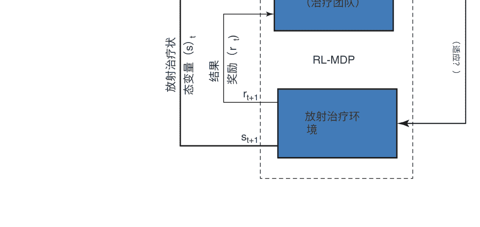

例如，通过在方程（18.1）中优化奖励，使患者的肿瘤反应（TCP）最高，周围器官的毒性风险（NTCP）最低。

直观地说，可以想象一开始代理人对于（$s_t$, $R_t$, $a_t$）之间的关系一无所知，就像新生儿学习与世界互动一样；通过大量的试错过程来理解这三个变量之间的相互作用。这就是强大的统计工具和机器学习的作用所在，可以帮助澄清关系。大多数先进的深度强化学习算法专注于交互学习过程，例如软演员-评论家算法（SAC）、信任区域策略优化（TRPO）、演员-评论家方法（A2C/A3C）等。

上述描述可以通过一个目标函数（MDP的）进行数学描述，该目标函数需要最大化：

$$Q^{\pi}(s, a)=E_{P(s, a)}\left\{\sum_{k=0}^{\infty} \gamma^{k} R(s_{k}) | \pi, s, a\right\}$$

其中 $0 \leq \gamma \leq 1$ 是一个称为折扣率的常数，$\pi: S \rightarrow A$ 被称为一个待确定的策略，它将动作 $a_t$ 与状态 $s_t$ 联系起来，$\pi(s_t) = a_t$，从本质上讲，策略函数 $\pi$ 正是一个代理想要弄清楚的交互方式，如上所述，在医学物理学术语中，它对应于给定的治疗适应策略。

有趣的是，在等式（18.1）中取 $\gamma=0$，$Q^{\pi}(s = s_0, a) = R(s_0)$，等价于说一个代理是极度近视的，只关注当前的奖励或短期收益。相反，当 $\gamma=1$ 时，等式（18.1）导致一个关注未来奖励或长期收益的代理。从数学角度来看，等式（18.1）作为一个定义很容易理解，但由于涉及到无限和的计算，它在计算上是难以处理的。因此，通常会将等式（18.1）转化为一个更易于计算的形式，称为贝尔曼方程：

$$Q_{i+1}(s, a)=E_{s^{\prime} \sim P(s, a)}\left\{R(s, a)+\gamma \max _{a^{\prime} \in A} Q_{i}\left(s^{\prime}, a^{\prime}\right)\right\}$$

使得 $\lim_{i \rightarrow \infty} Q_i \rightarrow Q^*$ 这相当于方程（18.1）。还可以证明数值迭代从贝尔曼方程得到的收敛点 $Q^*$ 是最优的[27]。一旦从方程（18.2）中得到最优 $Q^*$，就可以随后求解相应的策略函数 $\pi$，定义如下：

$$a^{*} \stackrel{\text { def }}{=} \pi\left(\text { 定义 } \max _{a^{\prime} \in A} Q^{*}\left(s, a^{\prime}\right)\right)$$

如上所述，这样完成了（$s_t$, $R_t$, $a_t$）之间的交互。现在清楚的是，通过方程（18.1）中定义的复杂 $Q$ 函数实现了这样的链接。因此，推导策略的方法被称为 $Q$ 学习[28]，通常在ACT应用中遇到。

实际上，还有另一种通过策略-梯度方法来推导策略函数 $\pi$ 的算法[45]。然而，细节不在我们讨论的范围内。

在这里。一个快速的概述是，使用一族可参数化的函数 πθ(s, t) = at 直接逼近最优策略 π*，参见[45]。

### 18.5.1 经典MDP/RL学习

为了计算贝尔曼方程，需要找到一个适当的函数形式来近似方程(18.2)中的每个 Qi。一种传统的方法是假设可以用一个线性的函数基础 f 来逼近。

$$ \{ f_j \}_{j=1}^n $$

$$ Q_i (s,a) = \sum_{j=1}^{n} \alpha_{ij} f_j (s,a) \quad \text{(18.4)} $$

未知参数 α 的位置 $ \{ \alpha_{ij} \}_{j=1}^n $ 在方程（18.4）中可以通过常规的线性回归确定。请注意，方程（18.4）并不意味着 Qi 是线性的，因为 Taylor 展开式中的 sin 函数的展开式 $ x \approx x - \frac{x^3}{3!} + \frac{x^5}{5!} - \dots $ 是方程（18.4）的一个很好的类比，其中 $ \{ \sin x, x, x^3, x^5 \} $ 都不是线性函数。由于一般观察到最优 Q* 通常是高度非线性的，这种经典假设存在两个缺点：（a）如何选择合适的函数基础 $ f $ $ \{ f_j \}_{j=1}^n $ 事先解决 Q* 的问题以及（b）要使用多少个功能成员？（即，选择 n 的数量）。事实上，任何不当的（a）或（b）的选择都很容易导致 Q-learning 的过拟合或欠拟合。然而，这种方法至少可以作为一种可行的解决方案。

### 18.5.2 深度MDP/RL学习

深度学习的引入（第4章）使得从原始数据中提取相关特征的经典方法的困境得以回避，因为深度学习利用深度神经网络（DNNs）对几乎每个连续函数提供了一个强大的非线性逼近器，这在 Hornik 的《通用逼近定理》[46]中得到了严格证明。

为了利用深度学习，只需用 DNN Q 近似 Bellman 方程（18.2）中的 $ Q_i^0 $，即 $ Q_i \leftarrow Q_i^0 $ 表示神经网络的权重。通过这种简单的替换，可以从根本上避免传统方法的缺点(a)、(b)，因为 DNN 对要近似的函数只需要很少的假设。这种对 $ Q_i $ 的 DNN 逼近 $ Q_i \leftarrow Q_i^0 $ 被称为 Deep Q-Net (DQN)，由 Google [47]提出。DQN 是深度强化学习(DRL)的基石。

除了 DRL 更高效地学习环境交互之外，在肿瘤学或放射治疗应用中需要解决的一个棘手问题是转移概率的建模。根据定义，它描述了两个状态在一个动作 s 下的转移 $ \stackrel{a}{\to} $，表示为 $ s' \sim P(s, a) $，在治疗过程中，它表示受给定剂量影响的患者生物状态的转变。因此，从医学角度来看，掌握这些知识至关重要。

## 18.6 放射治疗中的ACT示例

以下我们将在非小细胞肺癌（NSCLC）的自适应放射治疗背景下，给出一个ACT框架的示例。在42名无法手术或无法切除的II期至III期NSCLC患者中，患者被纳入一项自适应放射治疗剂量递增的研究，以改善2年内的局部肿瘤控制。适应性治疗基于中期治疗正电子发射断层扫描（PET）检测到的¹⁸F-脱氧葡萄糖（FDG）亲和区域，如图18.3 [48]所示。

调强放射治疗根据中期治疗FDG-PET上定义的残余肿瘤，使放射性肺炎（RP）的风险固定在大于2级，并适应性地递增剂量，最高可达86 Gy，每日30次分次给药。图18.4在[49]中展示了放射治疗环境的详细构造。主要思想是利用与肿瘤局部控制相关的重要特征。

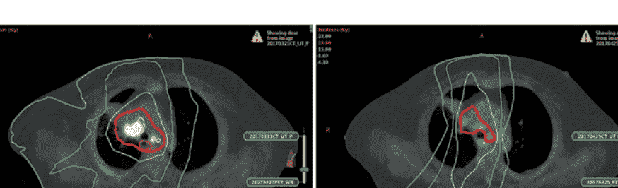

图18.3 NSCLC患者在基于18F-脱氧葡萄糖（FDG）亲和区域的自适应放疗剂量研究中的示例。[左]：术前PET/CT计划显示原始摄取。[右]：中期PET/CT计划显示残留摄取以进行调整。

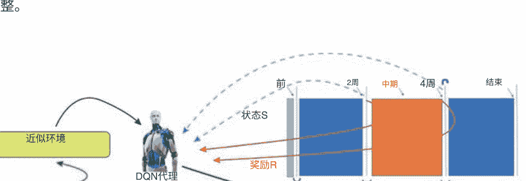

图18.4 强化学习用于在治疗的三分之二时期做出决策（右侧实线绿箭头）。他们框架的第一步是从记录的两个转换的历史数据中学习转换函数，以便可以重建放射治疗环境（称为近似环境）。通过模拟转换，DQN代理可以在每个阶段搜索最佳剂量[49]。

在完整的治疗后，(LC)和放射性肺炎(RP)是常见的并发症。在他们的研究中，细胞因子、SNP、miRNA和PET放射组学因子被认为是信息丰富的，如[34]中的贝叶斯网络(BN)分析所预测的。他们将BN定义为具有适当定义的奖励$R_i$的选定特征状态S，并结合一组DNN来学习历史患者数据中的转移概率$P(s,a)$。一旦建立了适当的放射治疗环境，深度强化学习可以用于有效学习MDP动态交互，在研究[49]中，他们使用DQN来优化总奖励，以获得最佳的适应剂量策略$\pi^* : S \rightarrow A$。

## 18.7 讨论与建议

智能适应性癌症治疗(ACTs)在很大程度上依赖于各种组件的正确整合：信息检索、多模态数据处理、统计推断和最优控制。当前的机器学习技术为改善ACT应用提供了许多机会。

然而，我们还没有完全成熟地运用这些工具进行临床应用。一个主要原因是缺乏对人体生物机制的全面理解。与医疗保健不同，机器学习算法可以通过适当的设计和定制轻松应用于工业中，以完成所需的任务。很多时候，人们无法确定手头的数据是否足够进行预测或达到期望的治疗目标。由于许多方面的不确定性，只有在算法得到智能实施和正确整合后，适应性治疗才能成功执行。

例如，在定义肿瘤治疗（如放射治疗）的MDP环境时，没有统一的方式或标准程序来选择指示性特征。尽管在研究[34]中，SNP、miRNA和PET放射组学等MDP被采用为状态，但可能存在其他合适或更有效的选择。因此，MDP环境的构建和设置需要丰富的医学经验和背景知识，因此它是一个需要广泛探索的大领域。

另一方面，在肿瘤学或放射治疗中有效应用强化学习，还需要根据任务的性质选择机器学习算法，这也是一门艺术与科学的结合。由于数据集的变异性和其固有属性，很难找到适用于所有目的的通用学习算法。特别是在深度学习的情况下，多层神经网络通常作为一个黑盒子。需要更多关注医学输入和输出的分析。一些解释性工具，如LIME（局部可解释的模型无关解释）[50]，可以帮助更好地理解机器学习算法的性能。

## 18.8 结论

个体化癌症治疗是一种将个体的特征和反应纳入治疗处方的方法。实现这些调整的一个重要因素是提高预测能力，以便在事先进行治疗计划和调整。长期以来，临床团队根据他们的专业医学培训来执行这些任务。随着统计工具和计算硬件的成熟，机器学习方法已被证明能够通过挖掘数值数据中隐藏的信息和未被注意到的模式来提供额外的预测能力。在众多可能性中，影像数据（PET/CT/MRI）、放射组学、生物指标、生理信息被认为是可以用于个体化调整的有价值的知识；这就是知识驱动的响应适应性放射治疗潜力的体现。

近年来，成像和生物技术的发展是重塑对肿瘤学反应理解的主要优势。然而，要实现基于知识的适应性放射治疗目标，就需要能够处理治疗效果的复杂性，并考虑肿瘤和正常组织反应的可变性增加。通过适当的信息融合，可以为癌症治疗决策提供准确和高效的方法。人们将依靠处理多维数据的先进算法来实现这一目标，而当前的机器学习发展可以提供解决方案。因此，机器学习和深度学习逐渐成为更好地描述这些复杂相互作用机制的不可或缺的工具，例如将治疗调整到患者的反应情况。

致谢作者要感谢Michael Green博士和Benjamin Rosen博士提供的图18.3。

## 参考文献

- 1. Benedict SH, El Naqa I, Klein EE. 放射肿瘤学中的大数据介绍：探索研究、质量评估和临床护理的机会。Int J Rad Oncol Biol Phys.2016;95(3):871–2. [在线]. 可获取：http://www.sciencedirect.com/science/article/pii/S0360301615271969
- 2. El Naqa I. 关于使大数据分析在肿瘤学中发挥作用的观点。方法。2016年;111:32–44. [在线]. 可用：http://www.sciencedirect.com/science/article/pii/S1046202316302651
- 3. Lim-Reinders S, Keller BM, Al-Ward S, Sahgal A, Kim A. 在线自适应放射治疗。Int J Rad Oncol Biol Phys. 2017;99(4):994–1003. [在线]. 可用：http://www.sciencedirect.com/science/article/pii/S0360301617308271
- 4. Xing L, Siebers J, Keall P. 图像引导放射治疗的计算挑战：框架和当前研究。Semin Radiat Oncol. 2007;17(4):245–57. 图像引导放射治疗。[在线]. 可用：http://www.sciencedirect.com/science/article/pii/S1053429607000616
- 5. Schwartz DL, Garden AS, Thomas J, Chen Y, Zhang Y, Lewin J, Chambers MS, Dong L. 适应性放射治疗用于头颈部癌症：来自前瞻性试验的初步临床结果。Int J Rad Oncol Biol Phys。2012年；83（3）：986-93。[在线]。可用：http://www.sciencedirect.com/science/article/pii/S0360301611031713
- 6. Feng M, Suresh K, Shipper MJ, Bazzi L, Ben-Josef E, Matuszak MM, Parikh ND, Welling TH, Normolle D, Ten Haken RK, Lawrence TS. 针对高风险肝损伤患者的个体化适应性立体定向放射治疗：第2期临床试验。JAMA Oncol。2018年；4（1）：40-7。
- 7. Kong F-M, Hayman JA, Griffith KA, Kalemkerian GP, Arenberg D, Lyons S, Turrisi A, Lichter A, Fraass B, Eisbruch A, Lawrence TS, Haken RKT. 非小细胞肺癌（NSCLC）患者放射剂量递增研究的最终毒性结果：放射性肺炎和纤维化的预测因素。Int J Rad Oncol Biol Phys。2006年；65（4）：1075-86。[在线]。可用：http://www.sciencedirect.com/science/article/pii/S0360301606002495
- 8. Brouwer CL, Steenbakkers RJ, van der Schaaf A, Sopacua CT, van Dijk LV, Kerkels RG, Bijl IH, Burgerhof JG, Langendijk JA, Sijtsema NM. 选择头颈部癌症患者进行自适应放射治疗以减少口干症。放射治疗与肿瘤学。2016;120(1):36–40。[在线]。可获取：http://www.sciencedirect.com/science/article/pii/S01678140163114959。
- 9. Tseng H-H, Luo Y, Ten Haken RK, El Naqa I. 机器学习在基于知识的响应自适应放射治疗中的作用。前沿肿瘤学。2018;8:266。
- 10. Wu JT, Dernoncourt F, Gehrman S, Tyler PD, Moseley ET, Carlson ET, Grant DW, Li Y, Welt J, Celi LA. 幕后：一个医学自然语言处理项目。国际医学信息学。2018;112:68–73。[在线]。可获取：http://www.sciencedirect.com/science/article/pii/S138650561730446X
- 11. Marks LB. 辐射性肺损伤的剂量预测因素。Int J Rad Oncol Biol Phys. 2002;54(2):313–6。[在线]。可访问：http://www.sciencedirect.com/science/article/pii/S0360301602029280
- 12. Levegrun S, Jackson A, Zelefsky MJ, Skwarchuk MW, Venkatraman ES, Schlegel W, Fuks Z, Leibel SA, Ling C. 将肿瘤控制概率模型拟合到前列腺癌三维适形放射治疗后的活检结果：从临床数据中推断肿瘤放射生物学参数的陷阱。Int J Rad Oncol Biol Phys. 2001;51 (4):1064–80。[在线]。可访问：http://www.sciencedirect.com/science/article/pii/S036030160101731X
- 13. Hope AJ, Lindsay PE, El Naqa I, Alaly JR, Vicic M, Bradley JD, Deasy JO. 用临床、剂量和空间参数建模放射性肺炎风险。Int J Rad Oncol BiolPhys. 2006;65(1):112–24。[在线]。可访问：http://www.sciencedirect.com/science/article/pii/S0360301605030750
- 14. Bradley J, Deasy JO, Bentzen S, El Naqa I. 放射治疗肺癌患者急性食道炎的剂量相关性。Int J Rad Oncol Biol Phys.2004;58(4):1106–13。[在线]。可访问：http://www.sciencedirect.com/science/article/pii/S0360301603020236
- 15. Blanco AI, Chao KC, El Naqa I, Franklin GE, Zakarian K, Vicic M, Deasy JO. 放射治疗头颈癌患者唾液功能的剂量-体积模型。Int J Rad Oncol Biol Phys. 2005;62(4):1055–69。[在线]。可访问：http://www.sciencedirect.com/science/article/pii/S0360301605000337
- 16. Deasy JO, Naqa IE. 基于图像的放射治疗正常组织并发症概率建模。波士顿：Springer；2008年。第211–52。https://doi.org/10.1007/978-0-387-36744-6_11。
- 17. El Naqa I, Suneja G, Lindsay PE, Hope AJ, Alaly JR, Vicic M, Bradley JD, Apte A, DeasyJO. 剂量响应探索器：一种用于探索和建模放射治疗剂量容积结果关系的集成开源工具。物理医学与生物学。2006;51(22):5719。[在线]。可获取：http://stacks.iop.org/0031-9155/51/i=22/a=001
- 18. B. D. W. Group. 生物标志物和替代终点：首选定义和概念框架。Clin Pharmacol Therape ut. 2001;69(3):89–95。https://doi.org/10.1067/mcp.2001.113989。

## 临床试验中的人工智能 19

希娜·赛义德和伊萨姆·埃尔·纳卡

### 19.1 引言

由于手术、设备、放射技术、系统治疗（包括靶向药物）、统计工具和临床试验的发展，许多癌症患者的总体生存率和生活质量得到了显著改善。据反复估计，有3-5%的成年癌症患者参加癌症临床试验[1, 2]。这个数字现在被估计为8%[3]。

相反，绝大多数成年癌症患者（>95%）不参加临床试验，尽管据估计有70%的美国人倾向或非常愿意参加临床试验[4]。为了改善肿瘤学研究的轨迹，有必要采用创新的方式来弥合临床试验参与率与患者参与意愿之间的巨大差距，并通过联邦和国际政策以及临床试验伦理准则来提高质量和患者安全（图19.1）。

### 19.1.1 肿瘤学和放射学临床试验背景

为了在临床试验中维护患者护理的质量环境，了解临床试验的历史，包括成功、失败和患者危险的风险，是至关重要的。早期在人体上进行的肿瘤学实验可以追溯到1863年鲁道夫·菲尔柯的工作，通过显微镜追踪癌症到其细胞起源。

使用显微镜[6]。1887年成立了一个一室实验室（后来成为国家卫生研究院（NIH）），1937年成立了国家癌症研究所（NCI）[6]。在1950年代中期，NCI开始资助合作肿瘤学组，以扩大临床试验的招募规模。临床试验合作组计划最初由四个儿科组和九个成人组成。最初的整合发生在2000年，当时四个儿科组合并成为一个组，下一个整合发生在2014年，当时九个成人组合并成为四个成人组。癌症治疗评估计划（CTEP）监督合作肿瘤学组[7]。

到1973年，大多数肿瘤学临床试验在NCI指定的综合癌症中心进行，这些中心从NCI获得核心资助来支持运营。根据NIH的事实表，大约80-85%的癌症患者在社区癌症中心或靠近他们家庭社区的医院接受诊断和治疗，并有机会参与各种临床试验[3, 8]。2013年，NCI成立了社区肿瘤研究计划（NCORP），旨在将最先进的癌症预防、控制、治疗和影像临床试验；癌症护理交付研究；以及不平等研究带给个人所在的社区。2004年，美国食品和药物管理局（FDA）推出了关键路径倡议，旨在加速将基础研究转化为安全有效的医学和治疗选择，以造福患者[9]。这促进了各种生物标志物和其他工具的识别，用于改善患者预后和生存率，并揭示了根据生物标志物和分子异常治疗患者的潜力。

在19世纪末，美国出现了与药物和设备相关的安全和功效欺诈性声明，导致严重的伤害和死亡，并引发了一系列行动，始于1906年的食品和药物法案。其他重要事件包括赫尔辛基宣言（国际伦理1964年的指南[10]），1979年的贝尔蒙特报告，该报告构建了机构审查委员会（IRBs）的概念，概述了协议设计准则，并提出了从所有研究对象[11]获得知情同意的建议，通用规则[12]和2003年的健康保险便携性和责任法案（HIPAA）。2005年通过了《人体研究对象保护的联邦广泛保证》（FWA），强制要求所有涉及非豁免人体研究参与者的研究都受到联邦法规的约束，并且必须遵循包括贝尔蒙特报告和通用规则在内的伦理原则[13]。

缺乏接触先进医疗保健的机会；文化或种族因素；经济状况；语言或识字障碍；以及长期存在的恐惧、担忧和怀疑被认为是少数族裔参与临床试验的障碍[12, 14]。尽管FDA在1977年规定在生育年龄的妇女不得参与I期临床试验，因为担心潜在的致畸效应，但在实践中，这一排除措施被扩大到了所有妇女参与所有临床试验的范围[15]。这些政策严重限制了有关药物安全性和疗效的性别和种族差异的知识[15-17]，其中种族和少数民族成员、低收入人群和居住在农村地区的人仍然少数[18]。1993年的NIH复兴法案要求在所有NIH赞助的临床试验中包括妇女和少数民族[19]。

由于儿童是一个脆弱的人群，已经实施了特殊保护措施来保护他们的治疗[20-22]。此外，年龄小于18岁的儿童如果足够成熟以理解研究试验的期望，现在会被要求给予同意。尽管与知情同意不同，同意并不是法律要求，但许多伦理委员会要求同意。

癌症发病率和死亡率在老年人口中最高。尽管FDA在1989年推荐了老年人参与临床试验的指南，但他们在临床试验中的比例仍然偏低[18]。导致老年人参与度低的原因包括对毒性的担忧、合并症的存在、认为没有好处、诊断时疾病处于晚期、缺乏意识、生活质量的担忧以及各种社会经济障碍[23-25]。排除老年人不仅限制了结果的推广性，还可能导致成本增加，因为由于对耐受性的误解，老年人将无法得到有效治疗[23, 25, 26]，就像脑胶质母细胞瘤（GBM）的临床例子中所看到的那样[27]。如今，合作组试验，如治疗（如化疗）、生活质量试验和注册表，专门设计用于包括老年人。

2010年，为了改善医疗保健的可及性，患者保护和可负担性医疗法案（PPACA）导致了患者中心结果研究机构（PCORI）的发展，并引入了保险公司提供与临床试验参与相关的常规费用的要求[28]。有了这个机制，患者可以选择最佳治疗方案，而不必担心某些测试或程序不会得到保障，这是基于他们参与临床试验的[29]。

由于政策、技术和临床试验的改进，癌症死亡率从1991年开始下降，并持续下降[30]。然而，还有很多工作要做。如今的重点不仅是癌症的治疗和预防，还包括症状管理、生活质量、基因组学、个体化医学和生物样本。

对于癌症患者的临床试验数量远远超过了任何其他单一疾病，使用ClinicalTrials.gov数据库，2010年的癌症临床试验占比22%，最近在美国进行的所有试验中占比40%至50%[31, 32]。肿瘤学试验主要是评估替代终点的早期研究。它们往往是小规模、单臂和开放标签的。这种对较少健壮设计的取向与其他医学领域的试验明显不同。尽管不同类型癌症类型的治疗选择和生存率存在广泛变异，但小型单臂研究的比例在癌症类型之间并没有显著差异，并且在给定癌症类型的试验数量与相对发病率或死亡率之间只有中等相关性。

不幸的是，缺乏比较组的小型试验的高发生率，依赖于历史对照组，并且缺乏随机化，限制了通过系统评价和比较效果研究评估支持特定治疗的证据的能力。值得注意的是，该注册表并不完整，并且存在缺乏标准本体论的问题[33]。

为了有效利用有限资源，准确描述临床研究和可用技术的当前状态至关重要。随后的洞察和指标发展将使我们能够监测活动并推进创新方法。研究界必须考虑竞争优先事项、特定研究问题的重要性、疾病的紧迫性以及地理区域和弱势人群中试验的可用性。不仅需要开发突破性治疗方法，还需要改善现有治疗的使用。随着英国等国家试图协调其临床研究方法，以更好地与公共卫生优先事项保持一致，我们在美国正在进行关于研究优先事项的持续全国性辩论[34]。随着合作组织系统的重组和PPACA的实施，适当优先考虑研究问题，了解试验的理想组合，并对更适用于现代时代的创新试验持开放态度，以优化可行证据的生成至关重要。从财务和临床研究的角度来看，成功将越来越依赖于大数据（包括实际数据）依赖的预测分析、实时临床决策支持、精准医学和积极的人群健康管理，而这些主要受到人工智能（AI）领域的开创性研究的推动，承诺改变当前的临床试验格局。

### 19.1.2 临床试验作为临床实践的黄金标准

随机对照试验（RCTs）是推动临床实践的参考标准。RCTs衡量新干预或治疗的有效性[35]。为了提供真实可靠的有效性评估，RCTs需要进行前瞻性和严谨的研究[36]。在一篇描述六个连续的III期对照试验系列的评论中，注意到当随机护理取代随机、基于意见的护理时，任何专业都可以预期取得渐进性进展[36]。

虽然没有研究可能单独证明因果关系，但随机化减少了固有偏差，并提供了一种严格的工具来研究干预措施与结果之间的因果关系[37]。这是因为在大型研究中，随机化平衡了控制组和治疗组参与者的特征（观察到的和未观察到的），从而可以将任何结果差异归因于干预措施[37]。

所有RCT研究都应该在临床试验数据库中进行预先注册，以避免选择性报告[38]。在设计临床试验时，首先要仔细选择人群、比较的干预措施和预先确定的感兴趣的结果。一旦这些被定义好，就确定了所需参与者的数量或功效计算、研究的时间范围以及用于分析的统计和定性方法。所有RCT研究都应该获得适当的伦理批准，并有一份记录所有试验过程细节的试验方案。在获得适当的伦理批准后，参与者被招募、分层（如果需要）并随机分配（如计算机生成的随机分配）到干预组或对照组。在随机分配后，如果可行，RCT研究可以进行盲法，使参与者、医生、护士以及研究人员不知道每个参与者接受的治疗方式，进一步减少偏倚[39, 40]。

RCTs可以通过意向治疗分析（ITT；分析被随机分配到的组中的受试者），按照方案分析（只分析最初分配的治疗完成的参与者），或其他变体进行分析，ITT通常被认为是最不偏倚的[41]。遵循CONSORT（CONsolidated Standards of Reporting Trials）2010指南可以使读者了解试验的设计、进行、分析和解释，并评估其结果的有效性。它包含一个25项检查表和流程图模板，以改善并行RCT两组的报告[42]。

RCTs可能存在一些缺点，包括时间和金钱成本高、推广性问题（自愿参与的参与者可能不代表被研究的人群）以及失访[43]。除了仔细进行研究和解释外，还应该声明潜在的利益冲突和资金来源[44]。最后，在进行RCT之前和期间，应满足均衡原则[45]。

### 19.1.3 临床试验为什么会失败？

临床试验存在许多失败的机会。资源、时间和资金的投入随着从临床前到第三阶段的连续增长。因此，第三阶段试验失败的成本不仅仅是与之相关的成本。

---

1. El Naqa I, Craft J, Oh J, Deasy J. 早期放射治疗适应性的生物标志物。适应性放射治疗。2011;53-68.
2. El Naqa I. 放射治疗和肿瘤学中的结果建模指南：倾听数据。Boca Raton: CRC Press; 2018.
3. Webb S. 三维放射治疗的物理学：符合放射治疗、放射外科和治疗计划。Boca Raton: CRC Press; 1993.
4. Joiner MC, Van der Kogel A. 基础临床放射生物学第四版。Boca Raton: CRC Press; 2009.
5. Munley MT, Lo JY, Sibley GS, Bentel GC, Ansher MS, Marks LB. 一个神经网络用于预测肺损伤症状。物理医学生物学。1999;44(9):2241-9.
6. Su M, Miften M, Whiddon C, Sun X, Light K, Marks L. 一个用于预测放射性肺炎发生率的人工神经网络。医学物理学。2005;32(2):318-25.
7. Gulliford SL, Webb S, Rowbottom CG, Corne DW, Dearnaley DP. 使用人工神经网络预测接受前列腺放射治疗的患者的生物学结果。放射治疗与肿瘤学。2004;71(1):3-12. [在线]。可用： http://www.sciencedirect.com/science/article/pii/S016781400300272X
8. Tomatis S, Rancati T, Fiorino C, Vavassori V, Fellin G, Cagna E, Mauro FA, Girelli G, Monti A, Baccolini M, Naldi G, Bianchi C, Menegotti L, Pasquino M, Stasi M, Valdagani R. 3D-CRT治疗前列腺癌后的晚期直肠出血：基于神经网络的预测模型的开发。物理医学与生物学。2012;57(5):1399-412.
9. Vapnik V, Vapnik V. 统计学习理论，卷1. 纽约: Wiley; 1998.
10. El Naqa I, Bradley JD, Lindsay PE, Hope AJ, Deasy JO. 使用统计学习技术预测放射治疗结果。物理医学与生物学。2009;54(18):S9-S30.
11. El Naqa I, Deasy JO, Mu Y, Huang E, Hope AJ, Lindsay PE, Apte A, Alaly J, Bradley JD. 用于建模肿瘤控制概率的数据挖掘方法。Acta Oncol. 2010;49(8):1363-73.
12. El Naqa I. 用于预测肺癌肿瘤反应的机器学习方法。WIREs 数据挖掘和知识发现。2012;2(2):173-81.
13. Oh JH, Craft J, Lozi RA, Vaidya M, Meng Y, Deasy JO, Bradley JD, El Naqa I. 用于建模肺癌局部失败的贝叶斯网络方法。物理医学与生物学。2011;56(6):1635-51.
14. Lee S, Ybarra N, Jeyaseelan K, Faria S, Kopek N, Brisebois P, Bradley JD, Robinson C, Seuntjens J, El Naqa I. 贝叶斯网络集合作为一种多变量策略来预测放射性肺炎风险。医学物理学。2015;42(5):2421-30.
15. Jayasurya K, Fung G, Yu S, Dehing-Oberije C, De Ruysscher D, Hope A, De Neve W, Lievens Y, Lambin P, Dekker ALAJ. 比较贝叶斯网络和支持向量机模型在接受放射治疗的肺癌患者两年生存预测中的应用。医学物理学。2010;37(4):1401-7.
16. Luo Y, El Naqa I, McShan DL, Ray D, Lohse I, Matuszak MM, Owen D, Jolly S, Lawrence TS, Kong F-MS, Haken RKT. 通过贝叶斯网络分析揭示非小细胞肺癌放射性肺炎的生物物理相互作用。放射治疗与肿瘤学。2017;123(1):85-92. [在线]。可访问： http://www.sciencedirect.com/science/article/pii/S0167814017300634
17. Luo Y, McShan DL, Matuszak MM, Ray D, Lawrence TS, Jolly S, Kong F-M, Ten Haken RK, El Naqa I. 一种多目标贝叶斯网络方法用于非小细胞肺癌（NSCLC）的肿瘤局部控制和放射性肺炎的联合预测，用于响应自适应放射治疗。医学物理学。2018;45(8):3980-95.
18. Luo Y, McShan D, Ray D, Matuszak M, Jolly S, Lawrence T, Kong F, Ten Haken R, El Naqa I. 一种完全交叉验证的贝叶斯网络方法用于肺癌的局部控制预测。IEEE Trans Rad Plasma Med Sci. 2018;3(2):232-41.
19. Cui S, Luo Y, Tseng H, Haken RKT, El Naqa I. 一种具有复合结构的人工神经网络用于放射治疗的局部控制预测。IEEE Trans Rad Plasma Med Sci. 2018;3(2):242-9.
20. Cui S, Luo Y, Tseng H-H, Ten Haken RK, El Naqa I. 结合机器学习中的手工特征和潜在变量，用于预测放射性肺损伤。医学物理学。2018;46(5):2497–511.
21. Kosorok MR, Moodie EEM. 自适应治疗策略。在: Moodie EEM, Kosorok MR，编辑。实践。费城: 工业和应用数学学会; 2015.
22. Lei H, Nahum-Shani I, Lynch K, Oslin D, Murphy S. 用于构建个体化治疗序列的“智能”设计。年度临床心理学评论。2012;8(1):21–48.
23. Berry DA. 肿瘤学中的自适应临床试验。自然临床肿瘤学评论。2012;9(4):199.
24. Kim M, Ghate A, Phillips MH. 用于放射治疗计划中剂量分数的马尔可夫决策过程方法。物理医学与生物学。2009;54(14):4455–76.
25. Vincent RD, Pineau J, Ybarra N, El Naqa I. 第16章: 动态治疗方案中的实用强化学习。在: 实践中的自适应治疗策略: 规划试验和分析个性化医学数据。费城: 工业和应用数学学会。第263-96页。
26. Andrew AM. 强化学习: Richard S. Sutton和Andrew G. Barto的介绍，自适应计算和机器学习系列，MIT出版社（布拉德福德图书），马萨诸塞州剑桥，1998年，xviii+322页，ISBN 0-262-19398-1（精装，31.95英镑）。机器人学。1999;17(2):229-35.
27. Sutton RS, McAllester DA, Singh SP, Mansour Y. 用于函数逼近的强化学习策略梯度方法。在: 神经信息处理系统的进展; 2000. 第1057-63页。
28. Hornik K, Stinchcombe M, White H. 多层前馈网络是通用逼近器。神经网络。1989;2(5):359–66. http://www.sciencedirect.com/science/article/pii/0893608089900208
29. Mnih V, Kavukcuoglu K, Silver D, Rusu AA, Veness J, Bellemare MG, Graves A, Riedermiller M, Fidjeland AK, Ostrovski G, et al. 通过深度强化学习实现人类水平控制。自然。2015;518(7540):529–33.
30. Kong F-M, Ten Haken RK, Schipper M, Frey KA, Hayman J, Gross M, Ramnath N, Hassan KA, Matuszak M, Ritter T, Bi N, Wang W, Orringer M, Cease KB, Lawrence TS, Kalemkerian GP. 中期PET/CT适应放射治疗联合化疗对局部晚期非小细胞肺癌患者的影响: 2期临床试验。JAMA Oncol. 2017;3(10):1358–65.
31. Tseng H-H, Luo Y, Cui S, Chien J-T, Ten Haken RK, Naqa IE. 深度强化学习用于肺癌自动化放射适应。医学物理学。2017;44(12):6690-705. https://doi.org/10.1002/mp.12625.
32. Ribeiro MT, Singh S, Guestrin C. 为什么我应该相信你？：解释任何分类器的预测。在: 第22届ACM SIGKDD国际会议论文集知识发现与数据挖掘, 系列KDD'16。纽约: 计算机协会机构; 2016. 第1135-44页。 https://doi.org/10.1145/2939672.2939778.

不仅仅是试验本身的成本，还包括之前所有试验的成本，以及追求推进患者治疗机会的时间成本和参与试验的患者的努力。在临床试验方面，保持持续改进的理念非常重要，特别是在优化研究的每个方面以证明继续进行下一阶段的价值。失败可能出现的原因很多，包括疗效不佳、安全问题、缺乏完成试验的资金、无法遵守良好的制造规程、不遵循FDA指导或者患者招募、入组和保留方面的问题[46]。

试验失败的主要原因一直是无法证明有效性。对640个新疗法的第三阶段试验进行评估发现，有54%在临床开发中失败，其中57%因疗效不足而失败，17%因安全问题而失败，22%因商业原因而失败。

有很多原因可能导致潜在有效的药物在展示疗效方面失败，包括有缺陷的研究设计、不适当的统计终点，或者由于招募和保留不足而导致的功效不足的临床试验。癌症药物获得食品和药物管理局（FDA）批准的可能性明显较低[47]。

临床试验在安全性方面也存在失败的情况。安全性在每个临床试验的每个阶段都得到了解决，但是安全性问题可能只有在与第3期研究相关的较大人群中，或者在批准后（第4期）或市场后阶段才会显现[47]。罕见的毒性副作用的出现（使用已批准的药物）是由于自发报告和其他不可靠的检测方法发现的，这导致了对第4期研究的关注。这个阶段采用了更严格的研究方法，涉及大规模数据集的强制和统一报告，可以实时查询提供真实世界的疗效和毒性数据。在没有任何有效治疗的领域，加速药物批准途径的发展进一步增加了这种需求，这种途径导致了在没有严格的临床疗效数据的情况下获得许可。同样重要的是要认识到赞助商希望在临床试验过程中推进药物或设备的愿望。在成功的第2期试验后立即将研究推进到第3期可能不会给予足够的时间来反思如何在第3期中最好地解决安全性问题，并且从成本的角度来看可能是有害的[49]。

识别安全问题并不总是直接的。当人们遇到对他们有关切的不良事件时，他们可能更有倾向于寻求治疗，而不一定是在经历对医生更关切但对他们来说不太关切的不良事件时。这可能会影响报告哪些不良事件，特别是如果它们的严重程度较轻或中等。建议提醒患者重视报告任何不良事件并记录患者报告的耐受性，以提高早期发现安全问题的可能性[50]。

考虑到巨大的成本，许多试验（包括3期之前的试验）资金不足，可能没有任何合理的机会取得积极的结果（即使协议进行了修改，也需要额外的成本）[51]。更一般地说，特别是在美国，遵守日益增加的监管负担的成本也会产生影响，需要更多的员工、存储和财务支出[52]。资金不足的试验在定义上更有可能功效不足，因此无法以预定的有效水平证明统计显著性。

出于战略原因过早终止试验在伦理上是有缺陷的，因为它欺骗了患者，危及了患者与医生的关系，并对医学界造成了伤害。患者通常期望他们参与试验能够在试验成功完成后推动知识的进步。应该努力让患者代表参与指导委员会，并减少或消除赞助商的参与，以限制过早终止的风险[53, 54]。

在理想的情况下，纳入/排除标准应该在统计上与预期的一般患者人群相匹配[55, 56]。然而，研究人员可能会担心存在多种共病，导致撤回和不良事件的风险增加。在设计研究时，他们必须考虑竞争性治疗的可用性。许多肿瘤学研究根据先前的治疗制定了非常具体的纳入/排除标准。靶向治疗将加剧这个问题，因为诊断筛查出更多的个体。排除标准通常没有明确的理由，包括试图排除那些可能对终点显示不足改善的参与者，因为他们的健康状况太好[57]。这些因素可能会影响试验的持续时间和成本，并最终导致方案修正[58]。多达16%的方案修正是由于纳入/排除标准的变化，这可能导致修正前后的患者人群存在差异。此外，在3400个临床试验中，超过40%的试验在第一位受试者访问之前进行了修正，延迟了试验4个月[59, 60]。一些方案修正是无法避免的；然而，通过更好的规划和对设计选择的后果的预见，可以减少方案修正的可能性。

尽管患者通常愿意参与临床试验，因为他们相信自己可能会得到更好的治疗或者试验的结果可以帮助他人[4, 61-63]，但是招募足够数量的受试者仍然是一个长期存在的问题[64, 65]。一项英国研究表明，只有31%的试验达到了招募目标[66]。研究表明，18%至40%的由国家癌症研究所支持的试验未能达到足够的招募目标来回答研究问题，每年有几百到一千名患者参与这些试验[67-69]。一项更广泛的研究对所有赞助商的癌症试验进行了调查，发现因为招募不足而失败的比例为20%，每年有超过6800名患者参与这些失败的试验[70]。此外，Campbell等人报告称，三分之一的公共资助试验需要延长时间，因为它们未能达到最初的招募目标[71]。总体而言，学术中心的试验参与率平均为14.8%，社区中心为6.3%。由于机构决定开展哪些试验，超过一半的患者将无法参与本地试验。40%的有可参与试验的患者（总体的17%）由于符合条件的要求而无法参与试验。在试验设计期间建立。最终，8%将参加试验，18%将不参加。多项研究表明，约30%的符合条件的患者将不被要求参与。总体上，只有很小一部分患者有机会同意参与临床试验的请求，当被问及时，超过一半的患者通常会同意[3, 69, 72]。

一些研究向患者提供报酬，通常是为了支付患者的时间和费用，同时也希望能提高招募率。虽然逻辑认为这可能会提高招募率，患者有时会报告这对他们很重要[73]，但支持这一观点的证据通常不足够[74–76]。然而，Edwards等人发现，货币激励增加了参与者对邮寄和电子问卷的回应[77]。调查显示，然而，患者心目中常常将高报酬与试验风险较高的感知联系在一起，因此不愿意参与[73, 78]。报酬的效果和有效性可能取决于许多因素，并且应该保持为一个开放的研究领域。除了报酬，与患者招募相关的额外成本很难估计且变化很大[79]。营销策略在一些试验的财务可行性中起着重要作用[80]。

医疗保健提供者对患者招募和留住有重要影响。患者一直将医生评为最值得信赖的信息来源[81]。调查一致表明，癌症患者在参加临床试验之前首先从医生那里听说了试验，医生的推荐是参加试验的主要因素[81, 82]。一个历史上对临床试验关注较少或存在其他非科学障碍的研究机构可能导致研究者热情不高，并与低招募率相关[83]。非首席研究员的患者招募数量较少[84]。当研究者有竞争性试验时也可能出现问题。研究表明，临床试验作为治疗选择的讨论质量存在很大差异；然而，培训可以改善这种对话[85, 86]。

专门的内部研究人员被证明可以显著增加研究机构的招募人数[87–89],医疗提供者报告缺乏人员配备是导致癌症临床试验患者招募的主要障碍[90, 91]。当患者认为支持人员不可用或不感兴趣，或者他们必须经常与新员工或临床试验优先于日常运营的缺乏接口时，招募和留住患者可能会受到影响[72, 92]。鉴于这些挑战，保留优质研究人员至关重要。员工的频繁更替可能导致经验不足的研究协调员数量增加，这可能会影响数据质量和试验完成的及时性[93]。

提高工作满意度并激励员工（为招募患者提供资金）已被证明可以改善患者招募[72, 94]。使用护士而不是外科医生进行招募并没有显示出任何差异的结果；然而，可以实现成本节约[95, 96]，这可能在间接支持招募和留住患者或临床试验的其他方面方面具有重要意义。

具有成功绩效记录的研究中心通常更有可能达到招募目标[59]。规模较小或没有临床试验的研究中心仍然可以帮助患者考虑和找到临床试验，但这些中心通常缺乏人员和基础设施[52, 97–99]。与高于平均招募率最相关的几个因素包括：对患者进行系统预筛选以进行试验匹配，吸引其他员工参与，从伦理批准到首次招募的时间以及提供专职试验协调员[100, 101]。在选择研究中心时，要考虑附近的大型人口群体和最小化总时间投资，包括旅行时间[102]，这与满足招募目标的可能性呈正相关，当患者担心被分配到对照组而不是接受主动研究药物时，患者招募和留住受到负面影响[103–105]。部分原因可能是患者对安慰剂或对照组中给予的具体治疗缺乏了解[106]。对于预后不良的患者，担心可能集中在根本没有有效治疗的问题上。患者可能还担心副作用[90]、时间和旅行方面的后勤挑战[90, 107–109]，尤其是对于老年人[110]，以及与此相关的成本，如工作损失或医疗费用[104, 108, 111, 112]。在这些情况下参与的成本可能会使参与者偏向于较高的社会经济水平[25, 113–115]。研究还表明，一些试验的财务影响可能会对患者的依从性和留住产生不利影响[116, 117]。有时患者没有得到为什么他们的参与很重要的明确理由，并且得到的反馈很少。教育也可以帮助患者更倾向于参与临床研究[118]。鼓励患者对临床试验过程的信任可能会导致更好的参与[119]。低效的安排和等待时间与患者满意度呈负相关[120, 121]。与长时间等待或在没有相互共情的情况下在现场的压力源直观地与留住率较低[123]相关。

知情同意通常是冗长且包含复杂的语言和概念，患者往往难以理解[123–127]。普通大众的科学素养可能有限，导致难以理解与临床试验相关的信息[128, 129]。不同研究机构的知情同意流程各不相同，研究表明更多互动的流程，包括视频、问题和答案以及更多人际互动，可以提高理解能力和改善患者满意度[130–133]。

试验的参与率下降可能导致试验功效不足。这可能促使赞助商通过增加试验机构的数量（昂贵的方案修正和延迟）、增加拨款以满足最低招募要求，甚至关闭试验来进行调整。因此，有时需要取消某些计划中的测试以重新分配可用资金。反过来，某些终点指标可能样本量不足以检测重要结果[83]。这反过来又影响了试验的伦理，因为患者知道他们的结果可能不会对统计学上显著的结果做出贡献[134, 135]。

### 19.2 临床试验设计类型

在肿瘤学中，患者通常根据其原发癌症和分期进行分类，并进行随机对照试验以制定标准治疗方案。从历史上看，细胞毒性药物的开发是基于这个观点的。然而，过去二十年的研究和发展使得癌细胞的生长和进展能够在细胞和分子水平上得到定义，分子标志物或基因突变的存在与否使得特定肿瘤类型能够被详细分类为几个亚型。类似地，化疗药物的发展也有所进展，从以细胞毒性药物为中心的治疗转变为使用分子靶向药物，这些药物能够选择性地作用于癌细胞。最近，对免疫检查点抑制剂[136]、针对特定分子标志物如EGFR基因突变阳性的不可手术、复发或转移性非小细胞肺癌[137]以及ALK融合基因阳性的非小细胞肺癌[138]进行了积极的研究。

随着上述变化，基于生物标志物的临床试验设计在过去的二十年中开始流行起来。基于生物标志物策略设计的试验，如ERCC1 [139]，涉及将患者随机分配到使用生物标志物确定治疗方案与标准治疗方案的实验治疗组，或者分配到使用标准治疗方案的对照组。诸如“富集设计”或“靶向设计”等试验设计包括具有单一分子标志物的患者群体，该分子标志物预计对特定肿瘤类型的药物效果具有期望。生物标志物在所有患者中进行评估，但随机分配仅限于具有特定生物标志物值的患者。已建立的分子标志物可以通过诊断工具进行评估，并且与研究药物的疗效具有强相关性。此外，在标志物阴性病例中，从生物学角度来看，预计该药物无效。示例包括涉及曲妥珠单抗 [140, 141] 和CALGB 10603 [142]的临床试验。如果分子标志物未被确认为可靠的标志物，则可以考虑使用标志物分层设计。在这种设计中，患者根据分子标志物的阳性或阴性分配到不同组，并在每个组内进行随机分配。使用标志物分层设计的临床试验包括INTEREST [143]和MARVEL [144, 145]试验。在引入这种设计之后，提出了顺序亚组特异性、标志物顺序测试（MaST）和回退设计作为标志物分层设计的扩展 [146]；这最终导致了使用主协议设计的临床试验的提出。

随着下一代测序和全面基因组分析在肿瘤学中的出现，人们对追求个性化或精准医学的概念充满了热情，旨在利用定制疗法来针对引发肿瘤发展的特定基因变化[147]。然而，根据患者分子亚型，根据每个亚群进行具有足够功效的I至III期试验是不现实的[148-152]。需要常规方案来评估多个分子标记物及其靶向治疗方法，通过多个亚研究来评估单个和/或多个肿瘤类型[153-155]。

这些方案被称为“主方案”，并且作为下一代临床试验设计备受关注。

主方案是为同时进行的多个亚研究评估多个假设而创建的综合方案。它由多个同时运行的亚研究的不同子方案组成（图19.2），其中亚研究通常基于特定肿瘤类型、组织学类型和/或分子标记物进行。主方案试验可以是探索性的或确认性的。探索性主方案试验通常由多个单臂亚研究组成，而确认性主方案试验由多个随机亚研究组成。对于任何一种试验类型，设计和统计考虑通常在所有亚研究之间是标准化的。

主试验方案使用一个共同的集中系统进行患者选择、物流、模板和数据管理。为了收集标准化数据，入组患者的组织学和血液学标本使用共同的基础系统（例如，下一代测序和免疫组织化学）进行测量和分析，以收集一致的分子标记数据。患者可以参与符合其分子标记数据的资格标准的子研究。因此，参与主试验方案增加了患者参与试验的机会，他们可以期望获得最佳的治疗效果。

重要的是，即使没有适合某个患者参与的子研究，他们也将接受随访，并可以被列入等待名单，直到适当的子研究开始。此外，等待名单中的自然历史数据可以作为对单臂子研究中一种研究药物疗效评估的对照组[151]。另一方面，主试验方案所面临的挑战

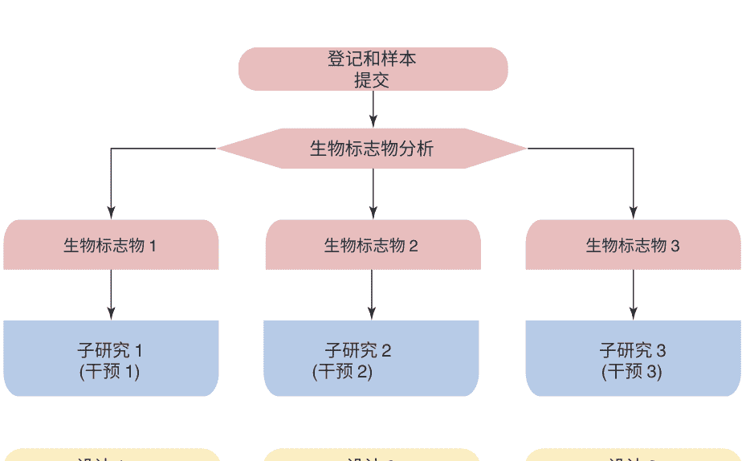

试验中的一个现代挑战是同时进行几个小型子研究，这可能会增加假阳性结果的发现率。主协议可以缓解临床试验面临的一些现代挑战 [152, 156]。首先，经典试验设计范式面临着患者间和患者内异质性的挑战，因为它们无法对低频率的基因组“致癌驱动”异常进行有力的靶向治疗测试。这些低频率的分子驱动因子进一步加剧了临床试验招募困难。相同的肿瘤类型可能对治疗产生不同的反应，取决于患者特征或疾病阶段。即使在同一个患者中，肿瘤内部异质性或基质组织的变异也可能产生不同的治疗反应 [157, 158]。主协议可以高效地招募罕见分数的患者，从而基于共同协议进行集中化患者管理，促进临床开发的加速，并且可以全面利用来自多个子研究的试验数据来评估患者间和患者内的异质性。其次，可以获得与驱动基因突变（致癌驱动基因和致癌物质成瘾）以及癌细胞生长和进展强相关的特定信号通路的发现 [159–161]。第三，结合两种或更多的靶向治疗方法可以扩大正在研究的基因突变范围 [153, 162, 163]。

根据研究人群的特征（例如疾病、组织学类型、分子标记）以及研究治疗方法的类型和数量（表19.1、图19.3），主试验方案通常被分为篮子试验、伞状试验和平台试验。试验定义并没有标准化，并且存在一定的重叠[151、152、156、164-166]。

肿瘤学中的篮子试验通常作为单臂、II期、非随机试验进行，旨在评估概念验证（POC）在早期开发阶段的效果。它通过肿瘤类型和/或跨肿瘤类型检查分子靶向药物对多种肿瘤类型的治疗效果，这些肿瘤类型可能具有共同的单一分子标记或遗传突变。每个分支是一个独立的“篮子”，分配少量的患者队列，并专注与针对特定靶点的一种治疗方法的测试，而不考虑癌症类型 [152]。术语“篮子”指的是将潜在不同的癌症（根据它们开始的身体器官的常见分类[166]或它们的组织学起源类型[167、168]）融合成一种相似的分子水平疾病。缺乏对照组是评估治疗效果的局限性，因此希望收集对照数据。一个篮子试验的例子是2015年由美国国家癌症研究所发起的II期NCI-MATCH（分子分析用于治疗选择，NCT02465060）试验[169]。

表 19.1 主试验协议类型

| 试验类型 | 定义 |
| --- | --- |
| 篮子 | 评估一种靶向治疗对多种疾病或多种疾病亚型 |
| 伞形 | 评估多种靶向治疗对一种疾病或几种疾病 |
| 平台 | 持续评估一种疾病的多种靶向治疗，并在试验期间进一步接受新治疗或患者群体的添加或排除 |

伞形

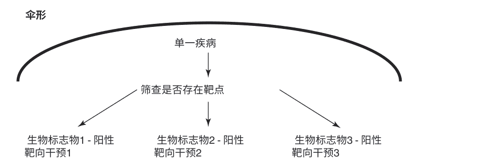

篮子

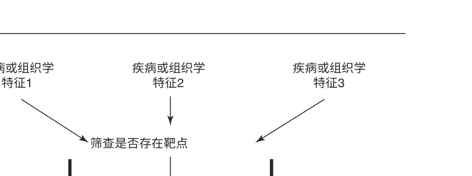

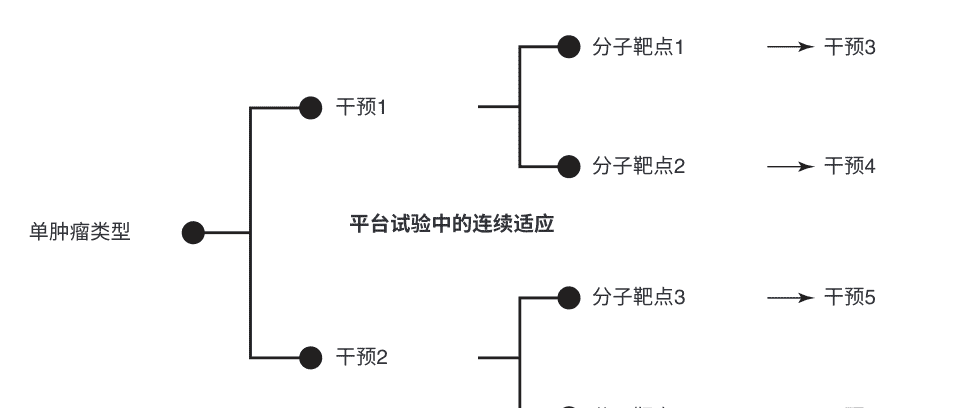

图19.3 篮子、伞和平台设计

篮子试验的特点是通过对少量患者进行单臂试验的全面执行，实现对罕见癌症或罕见分数的高效患者招募。通常，各个子研究的参与者数量在20到50之间，并且只有在有重大治疗效果时才能提出能够证明统计学显著性的假设；因此，篮子试验被认为是一种“信号发现”试验。对于子研究设计，可以使用两阶段或多阶段设计[156]。

值得注意的是，篮子试验被认为能够相当准确地预测具有特定分子特征的肿瘤对靶向治疗的反应；此外，这种对靶向治疗的反应是不考虑肿瘤的组织学类型而建立的。许多研究试图评估使用肿瘤基因组学为个体患者选择治疗的一般策略。

两个非随机化II期篮子研究的荟萃分析得出结论，采用“个性化”策略的试验导致更高比例的患者达到反应和更长的无进展生存期和总生存期[170, 171]。SHIVA研究结果强调了使用肿瘤基因组学指导治疗并不总是有用[172]。

忽视药物活性可能取决于肿瘤组织学和基因改变的可能性，正如vemurafenib试验中对携带V600E BRAF突变的非小细胞肺癌和其他几种组织学类型的患者药物有效，但对结直肠癌无效[173]，这可能会产生一些影响。

因此，在设计篮子试验时，必须非常谨慎地定义要包括的基因改变和匹配策略[174, 175]。

为了解决上述问题，可以针对每种组织学或每种组织学群体分别评估药物方案，通过增加样本量为每种组织学进行单独的两阶段II期设计。然而，如果发现药物在所有组织学群体中都是活性或非活性，这种方法可能效率低下。一种提高效率的建议方法是在中期分析期间通过评估组织学群体的反应率的一致性来并行评估每种组织学。如果反应率看起来是异质的，那么将分别为每种组织学进行两阶段II期设计。如果反应率看起来是均质的，那么将对组织学进行汇总进行单一的两阶段II期设计[164]。

篮子试验通常探索一种药物在一种组织学中的批准外标签使用范围，用于具有基因异常的患者。对于一些罕见的组织学，如果反应率足够大，并且反应持久，那么来自篮子试验的证据可能足以扩展批准适应症。建议的方法是在第三阶段的许可试验中，将在篮子试验中对该药物敏感的罕见组织学与最佳可用治疗对照进行随机分组。这将同时允许将适应症扩展到几种罕见的组织学[176]。

篮子试验中每个子研究中招募的患者通常由肿瘤类型、组织学类型或患者特征方面的异质群体组成。因此，由于很难评估时间至事件终点（例如，无进展生存期或总生存期）。因此，主要终点通常是反应率，对人群异质性的影响较小[176]。

肿瘤学中的伞形试验评估与特定肿瘤类型内的不同分子标记或基因突变相对应的多种靶向治疗方法[166]。子研究可以是单臂、第二阶段或第二/第三阶段试验，与安慰剂或标准治疗进行随机比较。术语“伞形”指的是根据其分子特征将一个所谓的癌症分为多个亚癌症。还有一个“默认组”，将没有特定标记的患者分配到接受标准治疗的组。伞形试验共同具有一个系统统一患者标本的分子特征以进行评估。一个正在进行的试验的例子是Lung-MAP：S1400第二/三期生物标志物驱动的鳞状细胞肺癌二线治疗主协议（NCT02154490）研究，由西南肿瘤学组（SWOG）赞助[177]。

篮子试验通常是探索性的单臂子研究，而伞形试验通常是确认性的单臂或随机子研究。因此，通过肿瘤类型和/或分期的适当入组标准进行随机子研究，可以产生与研究中的靶向治疗相关的确证证据。有时，在检查罕见癌症或罕见分数的分子标记物进行分区时，患者入组可能会减慢。此外，伞形试验通常是大规模、长期的主协议试验，但在该期间标准治疗发生变化时，与接受标准治疗的对照组患者进行比较的临床意义将丧失[148, 163]。

平台试验在一种疾病中评估多种靶向治疗方法，并在试验期间接受新治疗方法或患者群体的添加或排除。如果篮子试验和伞式试验也允许在试验期间添加或排除新的治疗方法，则可以将其视为平台试验。在平台试验中，中期分析评估每种靶向治疗方法的疗效或无效性，并根据结果排除某些靶向治疗方法或添加新的治疗方法。

无效性通常通过贝叶斯方法进行评估[154, 178]。由于分子标记的亚研究不是相互独立的试验，可以通过贝叶斯分层模型[152, 154, 178]估计每个亚研究的靶向治疗方法的疗效。因此，平台试验允许相对灵活地添加或排除治疗方法或患者群体，从而实现有效转变为确认性试验。例如，非小细胞肺癌的BATTLE试验[179, 180]和乳腺癌的I-SPY II试验[181, 182]。平台试验的挑战包括其大规模、长期性质，以及管理和执行试验的高成本，以及需要建立能够持续进行这些试验的组织或框架。平台试验也存在自适应随机化导致的偏倚和预后不平衡的风险。因此，在独立的Ⅲ期试验确认之前，这些分析的表面上的积极结果不应被接受为正确结果。

近年来，有些药物在广泛的研究人群中没有观察到疗效，但在特定患者中表现出显著的疗效。这些患者被称为“特殊反应者”[183]，并且已经采取了新的措施来阐明他们的分子特征。主试验方案也可以用于识别特殊反应者，并有望成为促进个体化医疗的标准临床试验设计之一。

尽管使用主试验方案在时间和资源方面具有好处，但它需要增加前期规划和协调工作，以使更多各方就试验设计、执行和治理达成一致。复杂性和实时决策进一步导致需要更多的前期规划。需要协调多个利益相关者、适当的基础设施和复杂的试验设计元素可能会延长主要方案的启动时间，与单一目的的试验相比，考虑到这一点。

在新干预措施获得批准后，主要协议应允许进行协调的设计调整。通常，单一目的的试验往往更容易适应它。这些调整可能导致暂时停止招募、统计设计的修改以适应变化的比较对象，或与患者对较差治疗方案的感知相关的伦理问题[151]。

在设计这些试验时，考虑到任何相关的伦理问题是很重要的[184]。科学的有效性对于一个伦理上合理的研究至关重要。仅关注针对单一突变的分子治疗而不考虑肿瘤生物学或异质性的复杂性可能引入偏差。由于创新的试验设计，罕见恶性肿瘤的患者有机会参与并从试验中受益，但由于招募不足，试验可能产生临床上无意义的结果[184]。研究组中样本量不足和使用替代终点可能导致批准一种干预措施而没有确认的疗效[185]。因此，在规划阶段，分析方法应与研究目标保持一致，以最小化得出错误结论的可能性。此外，肿瘤样本的复杂性、有限的质量和可用性不仅可能引起偏差和不可靠性，还可能通过将患者分配到不适当的治疗组来对患者造成伤害。其他威胁包括出版偏倚和对协议修改的解释不足[165]。

进行临床试验的伦理要求是基于非恶意和善意的有利风险比，以保护参与者免受剥削[184]。新颖的临床试验可以获得重要的知识，这些知识可以在未来的试验中用于开发有效的治疗方法。然而，它们对患者的直接利益有限。在知情同意过程中过度使用诸如“个体化医学”或“精准肿瘤学”而不是“基于基因组的治疗”等短语可能导致误导信息或治疗误解。这可能错误地表明试验的目标是为患者提供个性化护理，而不是为了为科学知识做出贡献而收集数据[165]。所有潜在参与者必须等待约2周以获取基因筛查结果，这可能会产生压力和焦虑。此外，代理终点并不一定转化为以患者为中心的结果[185, 186]。在伦理角度上，将肿瘤携带多个突变的患者纳入与单个突变匹配的治疗可能是有争议的[165]。此外，招募成千上万的参与者会产生大量数据，这些数据不仅必须快速处理，而且还必须可靠安全地存储，以防止不良人员访问[165]。

### 19.2.1 自适应临床试验

现代肿瘤学中，第三阶段临床试验的规模和费用不断增加，但成功率仍然不可接受——只有34%的第三阶段临床试验自2003年至2010年公布结果的肿瘤学药物试验中，只有34%的试验在主要终点上取得了统计学意义上的显著结果[187]。现代时代所面临的挑战要求适当的调整。 自适应设计是指根据累积数据来修改试验过程的设计。自适应设计非常适合同时解决多个问题。例如，一个单一的试验可以确定适当的患者群体、剂量和方案以及治疗组合，然后无缝地转入第二/第三阶段的确认性试验。自适应设计依赖于信息，包括未达到试验主要终点的患者的信息。生物标志物（血清、分子和基于成像的）的纵向模型可以被自适应地验证以预测长期的主要终点。自适应试验设计可以通过解决药物的安全性和有效性问题，展示药物应该如何使用以及应该面向哪些人群，从而使开发过程更具信息性，并缩短开发时间[188]。自适应临床试验的例子包括BATTLE-2、I-SPY 2和FOCUS4 [189–191]。

贝叶斯观点和更传统的频率学派观点都可以在自适应临床试验的统计设计中使用。贝叶斯观点有助于构建高效准确的试验，包括自适应地使用纵向信息。为了利用这一特性，倾向于频率学派方法的研究人员可以使用贝叶斯观点构建自适应设计，然后使用计算机模拟找到其频率学操作特性，然后通过修改设计来实现更理想的操作特性[192-196]。

基于中期监测的预测概率计算可以作为自适应设计的一部分，并且可以指示治疗方案的优越性或无效性[144, 145, 197-199]。CALGB 49907是一个使用预测概率来调整样本量的试验的例子[200]。一旦开始中期监测，从那时起进行频繁监测几乎没有成本[201]，因此可以更频繁地分析数据并在适当时停止。它加速了重要研究结果的公开传播，并保护试验中的患者免受无效治疗的伤害。自适应设计允许无缝进行I期-II期和II期-III期试验，提高整个过程的效率[202]。中期监测的一个应用是在II/III期设计中的使用，这可以非常快速和有效（特别是在多个实验性治疗和可靠的中间终点的情况下），但是相比于单独进行II期和III期试验，必须更早地对III期问题做出承诺，并且失去了根据II期试验结果修改III期试验设计的灵活性[203, 204]。

由于固有的复杂设计[205]，自适应设计的物流成本可能比传统试验更昂贵。驱动设计自适应方面的关键结果数据必须在患者被招募和随访期间存入中央数据库。实时电子数据录入、处理和分析的增加应该能够实现更频繁的中期分析，从而加快决策。这个数据库必须与确定治疗分配或试验其他自适应方面的软件相连接。自适应设计。

## 19.3 人工智能与临床试验设计

### 19.3.1 临床试验设计中人工智能的需求

人们认识到临床试验的成功率很低。从2000年1月到2019年4月的临床试验数据分析估计，不到12%的药物开发项目取得了成功[206]。如前所述，临床试验的大部分失败可以追溯到干预措施的疗效或安全性不足、研究设计存在缺陷、缺乏资金、保留或招募问题。为了提高现代个体化医学时代临床试验的成功率，必须了解传统障碍以及由设计创新引起的障碍。然而，克服这些障碍的干预措施对于成功和有意义的试验结果至关重要。

招募过程通常是临床研究中最大的障碍，可能耗时且昂贵。根据2016年的一项研究，2000年至2011年间作为美国国家癌症研究所国家临床试验网络一部分的癌症试验中，有18%在经过3年或更长时间的努力后未能找到一半以上的患者，或者在招募了仅有少数志愿者后完全关闭[69]。Haddad等人发现，约有20%的癌症患者有资格参与此类试验，但只有不到5%的人参与[207]。

每个临床试验对参与患者都有个体化的要求，包括可用性（试验对患者的可用时间为44%）、符合条件（27%的患者符合条件）、医生的动机（70%的患者将被要求参与）以及参与的能力（8%的患者将参与）[3]。符合条件且合适的患者可能没有得到适当的激励来参与，即使他们得到了激励，他们可能不知道有适合的试验或者觉得招募过程过于复杂和繁琐。在这些紧迫的招募时间表下，将足够多的患者纳入试验是一个重大挑战，实际上也是试验延迟的主要原因：86%的试验未能按时招募到患者，近三分之一的三期试验因招募问题而失败[208]。

这说明了现有临床试验设计中最严重的缺陷之一：需求最高的试验在患者招募技术上遭受最大的困扰。

一个重要的概念是要理解临床试验通常不是为了在一般人群的随机样本中证明治疗的有效性，而是旨在预先选择人群的一个子集，在这个子集中，如果有干预效果，那么这种效果更容易被证明出来。在这种试验丰富设计中，包括不适合的患者将自动降低正在测试的药物的观察疗效。招募大量合适的患者并不能保证试验的成功，但招募不适合的患者会增加试验失败的可能性。

增加试验的普适性的另一个基本概念是确保试验参与者的多样性。2014年，全球临床试验参与者中有86%是白人[209]。而2019年的一项研究发现，79%的基因组数据来自欧洲血统的人[210]，尽管他们只占世界人口的16%。

通常，患者被鼓励自己寻找试验。通常，人们依赖医生告知他们适合的研究。一些患者会在ClinicalTrials.gov网站上搜索，该网站列出了在美国和其他209个国家进行的超过300,000项研究。试验的资格标准通常涉及大量高度技术性术语，这对患者来说往往令人生畏。患者通常很难理解和评估自己的资格。从这个庞大且非结构化的数据源中手动提取有意义的信息是一项重大任务，对医生和患者都施加了沉重的处理负担。

随着医疗大数据（包括电子健康记录、基因组学和可穿戴设备）的生成和可用性不断增加，肿瘤学家很难处理所有可用信息，这些信息可能会影响结果预测和决策制定。临床试验的成功将越来越依赖于复杂的机器学习（ML）算法来处理依赖于大数据的预测分析和精准医学。这些算法有潜力节省数十亿美元，加快医学进展并扩大对实验性治疗的获取。基于人工智能（AI）和机器学习（ML）的系统可以帮助改善患者队列的组成，并提供患者招募方面的帮助。

除了患者队列选择和招募之外，其他重要因素是缺乏能够应对试验复杂性的技术基础设施。患者在试验中保持参与，遵守试验程序和规则，并高效可靠地收集测试干预影响的所有数据点是至关重要的。只有15%的临床试验没有患者退出，而临床试验的平均退出率为30%。试验中非依从率的线性增加导致额外患者数量呈指数增长，以维持结果的统计功效[208]。这些额外的招募工作导致试验延迟和大量额外费用。例如，如果有20%的患者不依从，则需要额外招募50%的患者。同样，50%的不依从率导致需要额外招募200%的患者。

在进行中的试验期间，改进的患者监测和辅导方法可以用于降低依从负担，使数据点检测更高效，从而减少退出和不依从率。为了符合依从标准，患者需要详细记录他们的药物摄入情况以及与身体功能、对药物的反应等各种数据点以及日常方案。这可能是一项繁重而繁琐的任务，导致平均40%的患者在临床试验进行150天后变得不依从[211]。

每个临床试验都遵循一个详细描述其设计的方案。该方案涉及大量资源，包括先前的研究和监管信息。在试验期间出现的任何问题，需要对方案进行修订，可能导致数月的延迟，并增加数十万美元的成本。通过使用人工智能可以实现更快的试验设计、方案编写和后续修订速度。

在临床试验领域，人工智能克服上述问题的需求是不可争议的。作为一个涵盖多个领域的学科，人工智能不仅能克服历史上的障碍，还能应对不断出现的医学创新所带来的挑战。

### 19.3.2 人工智能在临床试验设计中的多重角色

术语“人工智能”(AI) 是由约翰·麦卡锡和同事在达特茅斯夏季研究项目（达特茅斯学院，1956年）中创造的[212]。人工智能在医学中的应用可以追溯到20世纪70年代初，当时首次引入了专家系统（如MYCIN）来提供基于规则的诊断决策支持[213]。然而，在MYCIN之前，医学成像领域的几个放射学应用就已经存在了[212]。早期的医学人工智能系统主要依靠医学领域的专家，通过将临床知识编码为特定临床场景的逻辑规则来训练计算机。这不仅使系统工作繁重且耗时，而且不够灵活，更新起来更加困难[214]。更先进的机器学习系统能够通过识别和权衡来自数据（如非结构化文本、医学图像和电子病历）的相关特征来自我训练学习这些规则。这些系统在20世纪90年代和2000年代出现，但在临床医生中的应用相对较慢，主要是因为缺乏广泛可用的数据，而且早期的方法需要医学领域专家进行大量的特征工程工作[215]。

几个因素已经极大地改变了这种情况。人工智能领域最近发生了多次转变，这得益于硬件的改进和大规模训练数据集的可用性[216, 217]。由于技术进步，数字化医学数据现在已经广泛可得。公共政策努力，如公共卫生监测和促进互操作性系统，致力于实现美国整个医疗保健系统中可互操作的电子健康记录的有意义使用的关键国家目标，将进一步促进人工智能的使用[218]。

近年来，人工智能在医学领域的努力和早期概念验证成功不断增加，从医学影像学，包括临床照片、数字病理学、放射学图像[217, 219–227]，到临床结果预测的人工智能[228–237]，再到转化肿瘤学的人工智能[238–244]和临床决策的人工智能[245–247]。人工智能技术已经发展到了可以在实际条件下辅助人类决策者的成熟水平。AI技术已经发展到了可以在实际条件下辅助人类决策者的成熟水平。

现在是人工智能为临床试验做出贡献的时机，它有很大的潜力来改变临床试验设计的关键步骤，从研究准备到执行，以提高试验成功率，对时间、金钱的影响都是积极的，同时也优化和推进医疗和患者护理。

进行相关研究的必要文献综述仍然是一项劳动密集型任务，需要具有特定知识的人员来解释先前临床试验的框架、标准和结果。人工智能可以帮助克服当前临床试验设计的这些缺点。机器学习，特别是深度学习（DL）及其卷积神经网络（CNNs），能够自动发现大数据集中的文本、语音或图像的意义模式。其他人工智能领域，如自然语言处理（NLP），可以理解和关联书面或口头语言的内容，例如搜索生物医学文献，人机界面（HMIs）允许计算机与人类之间进行信息交流，推理技术将内容转化为可行动的建议，供人类决策者使用。这些能力可以用于相关大型和多样化的数据集，如电子健康记录（EHRs）、医学文献和试验数据库，以增强试验设计。

每个临床试验都遵循一个详细的方案，准确描述了研究的运行方式。在试验过程中出现的任何问题，需要对方案进行修订，这可能导致数月的延迟，并增加数十万美元的成本。人工智能可以支持更快、更高效的修订过程，以及方案的制定。研究设计者必须考虑不同的纳入/排除标准（以及目标和终点），以及它们对招募、入组、保留和最终完成时间和成本的影响[250-253]。试验的预算是有限的，因此需要考虑各种权衡，包括不仅仅是招募速度，还有达到招募目标的可能性。通过选择一个更便宜但更偏远的研究中心，可以降低成本，但会牺牲招募速度。这可能需要在额外的研究中心上投入更多资金，这会增加评估、培训、方案修订和试验执行的额外成本。量化这些权衡可以帮助做出更好的决策。

试验设计的基本原则是与完美队列构成、有效患者招募和高效患者监测相关的概念。这些概念依赖于与患者相关的特征，如适宜性、合格性、决策能力和动力，以及与试验相关的特征，包括数据点监测、终点检测、合规性和患者保留。临床试验的丰富性和生物标志物验证通过电子表型学减少人群异质性，并改善预后和预测性丰富性。这增加了患者参与试验的适宜性。自动合格性评估、简化试验描述和自动试验推荐有助于临床试验匹配。自动事件记录、鼓励合规性和数据点监测促进使用记录疾病和研究方案日记。 为了提高患者保留率，可以预测退出，并实施患者辅导等干预措施[254]。

上述功能是通过三种主要的人工智能技术的个别组合实现的：机器/深度学习、推理和人机交互界面，它们分析特定的数据源，如电子病历（EMR）、组学、物联网（IoT）、可穿戴设备、临床试验数据库、试验公告、社交媒体、医学文献、语音和视频。总体而言，人工智能有望改善与优化队列构成、提高试验效率和成功概率、降低成本、增加保留率和合规性相关的研究结果。

为了降低成本，同时仍旨在优化临床试验患者队列的组成，一种现实的方法是在缺乏全面的组学和生物标志物列表的情况下，应用复杂的分析方法将组学数据与EMR和其他患者数据相结合，这些数据存在于不同的位置和可变的格式中，以开发出反映有意义的终点的高效测量生物标志物。 人工智能的分支，如自然语言处理和计算机视觉算法，如光学字符识别（OCR），可以用于自动化阅读和积累这些证据。通过使用包括机器学习（ML）、深度学习（DL）和推理在内的预测性和预测性特征，已经报道了更广泛但仍适用于临床试验优化的相关性发现[255]。

最近，各种各样的机器学习方法在处理复杂的现实世界情况方面显示出了显著的改进，以协助电子表型化，从而减少人群异质性[256]。 机器学习方法，包括计算建模，可用于改善临床试验中患者的预测性和预测性富集，这得到了它们在逼近关键生物标志物[257, 258]和基于复杂疾病过程的模型化临床试验设计中的应用的证明[259–261]。 到2023年，通过预筛选患者和生物标志物测试的可用性，肿瘤学试验的整体生产力相对于试验复杂性和持续时间可以分别提高104%和71% [262]。

几种人工智能技术可以通过自动评估患者的资格，提供试验建议，并使招募站点了解患者的资格，从而帮助临床试验匹配。 自然语言处理[46, 263]、推理技术和机器学习/深度学习使系统能够根据适应的底层算法[216, 249]学习和改进其分析结果的质量。基于人工智能的临床试验匹配系统可以自动分析电子病历和临床试验数据库，找到特定患者和招募试验之间的匹配项[263]。

此外，自然语言处理和光学字符识别可以挖掘公开可用的在线内容，如试验公告和社交媒体，自动识别与相关试验可能匹配的潜在患者。 技术，如集成到电子病历系统中的患者匹配/资格算法，有潜力减少确定符合条件的患者所需的人力工作量[264–266]，但即使有技术的支持，仍需要工作人员的时间来寻找并招募临床试验患者。

患者可以使用人工智能工具来简化寻找试验的复杂过程。 这激励患者，并让他们了解相关试验的情况。 这样可以让患者与临床医生进行进一步评估。使用人工智能工具进行数字化招募可以扩大范围，并在更多样化的招募中取得实质性改善。患者更喜欢简化的知情同意书，测试结果显示，使用简化形式时，患者对临床试验细节的理解水平并不降低。同样，患者教育手册应该易于理解。人工智能工具可以在确保这些内容保持简单、透明且适合教育水平的同时发挥作用。基于人工智能的情感分析可以在开发患者材料时提供更富有同情心的语气，并引起更大的患者信任，同时保持适当的阅读水平。

一个名为Criteria2Query的开源网络工具使用人工智能将试验的合格性标准转换为标准化的数据库查询格式，使研究人员和临床医生能够在不需要了解数据库查询语言的情况下搜索数据库[271]。由基于人工智能的试验招募公司Deep 6 AI开发的软件也改善了招募工作。另一个名为DQueST的开源网络工具帮助患者通过阅读ClinicalTrials.gov上的试验来理解合格性标准，然后生成简单明了的问题，例如“你的BMI是多少？”以评估用户的合格性。初步评估显示，在回答50个问题后，该工具可以过滤掉用户不符合条件的60-80%的试验，准确率略高于60% [272]。一家名为Antidote的数字健康公司开发了一款帮助人们搜索试验的工具。同样，IBM的Watson for Clinical Trial Matching系统在一项试点研究中，使乳腺癌试验的平均每月入组率增加了80% [207]。Trials.ai将其人工智能工具描述为基于数据的设计更好的试验方案的指南。它使用人工智能技术收集和分析公开可用的数据以及某些私有数据。该公司的软件可以帮助确定客户提议的试验的各个方面，例如合格性标准的严格程度，可能会如何影响成本、持续时间或参与者保留等结果。

随着商业可用的可穿戴传感器的兴起，具备医疗级健康感知能力和视频监控作为试验设计的一部分，连续的实时患者数据可以自动监测、记录和审查。这减轻了患者的负担，并增加了遵从性。然后，机器学习/深度学习模型可以用来分析这些数据，可靠且高效地识别相关事件和终点，而无需手动患者发起的自我监测过程。在感知点上，将深度学习算法与超低功耗移动处理器相结合，可以用于分析来自可穿戴传感器的时间序列数据[273, 274]。

使用定制移动处理器测量生物参数的可穿戴设备和“认知感知”深度学习模型不仅可以存储和传输信息，还可以通过实时过滤原始数据进行分析，自动记录疾病和结果日记，提取可操作材料，并为患者提供个性化反馈和支持，从而确保遵从性[275, 276]。

通过基于机器学习算法的模式识别和分割技术应用于医学图像（例如视网膜扫描、病理切片和身体表面、骨骼和内部器官），可以实现更快的诊断和疾病进展跟踪[227, 277-279]。这提高了试验效率。

公司正在开发机器学习模型，以预测哪些患者有退出临床试验的风险，以防止对试验有效性的威胁。基于持续数据监测的机器学习算法可以用于评估患者行为和遵守试验方案的情况，并利用这些信息预测特定患者的退出风险。在非遵守的最早警告信号出现时进行及时干预，可以采取有效的患者辅导技术、应对机制、经过试验批准的修改措施和治疗方法，以防止导致退出[280]。值得注意的是，这些可穿戴设备及相关人工智能工具往往高度特定于某种疾病。将这些可穿戴设备与智能手机平台上的深度学习算法相结合，为探索各种机会打开了大门。一项研究发现，使用先进技术实现非侵入性诊断筛查（TES），利用低成本智能手机和其他点对点医疗传感器与传统生命体征检查相比，可以协同支持人群分层和个性化筛查[281]。

通过提高试验效率，这可以提供支持。随着医疗相关物联网（IoT）的进步，可以进一步实现对患者和疾病进展的连续实时监测[282]。非常重要的是，应该安全地存储这些敏感的患者数据和所有相关的分析结果。通过标准化和互操作性，专注于物联网的医疗设备可以作为临床试验的高效认知传感器。可以想象到区块链技术在这方面的应用，以提供安全的不可变数据交换。

在试验跟踪过程中，人工智能有潜力减少患者的时间投入，无论研究地点的限制如何[283, 284]。特别是，基于患者和研究中心的可用性，进化计算模拟算法可以为每个潜在患者分配最合适的研究中心[285]。还有机会根据患者的需求将工作人员与患者匹配，这样患者每次就诊时都能见到熟悉的面孔，或者根据患者的愿望更换工作人员[286]。调度软件可以在有空闲时间时自适应地搜索重新安排患者，以最高效地利用临床试验的时间。同样，它可以用于最小化患者可能遇到的其他冲突。

人工智能和机器学习方法在改进自适应试验设计（如篮子试验、伞状试验和平台试验）方面具有巨大潜力。这些工具可以帮助招募试验患者，利用大型数据集对其进行组学或生物标志物分析，然后利用实际世界数据（RWD）将其与基于个人特征的干预措施进行匹配。此外，可以利用医疗记录数据（EMR）、组学和实际世界数据（如患者报告的问题）等与机器学习技术相结合，以获得更完整的干预和生物标志物发现图景。

在主控方案和自适应设计中，基于人工智能的框架用于制定和实施关于哪些治疗方法进行研究、哪些治疗方法停止研究以及哪些治疗方法进一步研究或提交监管机构的决策，通常涉及统计模型和算法的开发，以及确保信息在相关方（如指导委员会、赞助商和数据监测委员会）之间的快速流动的程序。可以利用基于实际世界数据的模拟来模拟不同研究入选标准的影响。最终评估的时间和研究时间表。医疗产品开发者正在使用这个来支持和开发临床试验设计和观察性研究。

研究现场选择、符合条件的患者识别以及对研究对照组的模拟，有可能取代将患者随机分配到对照组的需要，在某些情况下，可以使用机器学习算法来对患者进行纵向跟踪，并从医院的电子病历“数据湖”中识别出临床上有意义的模式。通过使用RWD和对患者进行纵向跟踪，某些传统上进行的后期试验可以减少或完全消除[287]。

人工智能在临床试验设计中占据重要地位，并可以以多种方式用于促进高效和成功的试验完成。随着医疗保健和技术的创新，大数据的增加和向个体化医学的转变，人工智能的作用将继续扩大，并支持临床研究的进展，如表19.2所总结的。

表19.2 临床试验中的人工智能机会

| 因素 | 机会 | 人工智能的角色 |
| :--- | :--- | :--- |
| 研究设计不佳 | 更全面地审查文献、电子病历、公开可获取的数据库、社交媒体 | NLP和ML（结构化和非结构化）对可获取的文献进行分析，寻找类似的试验、解决类似问题的试验，或者解决不同问题但使用相似技术的试验，并为研究设计者进行总结。 |
| | 适当的结果/终点 | NLP和ML对可获取的文献进行分析，展示其他类似研究中使用的终点/测量指标/生物标志物。 |
| | 适当的入选标准 | NLP和ML评估类似已发表的试验，确定入选和排除标准的适用性和适合性。 |
| | 适当的统计分析 | ML对可获取的文献进行分析，总结统计方法，并将这些方法归类为成功或失败的结果。 |
| | 适当的样本量 | NLP/ML/DL用于预测样本量，估计患者退出率，并进行关键样本量的试验前模拟。 |
| | 减少修订的可能性 | 机器学习/深度学习向设计师呈现相关信息以考虑和潜在的修订。 |
| | 协议中的不一致性 | NLP/ML以表格和模块化格式检查时间和事件安排与文本的一致性，以及任何修订的摘要。 |
| | 自适应治疗的最佳方案/干预措施 | 机器学习/深度学习模拟具有相关参数的各种情景。 |
| 监管/伦理审查不佳 | | 机器学习确保符合监管和伦理要求，特别是在自适应治疗和市场变化方面。 |
| 研究地点选择不佳 | 对每个研究地点进行有效的权衡测量 | 机器学习/深度学习建模评估权衡：研究地点历史、人员支持和经验、研究者热情、可用人口群体、患者负担和与研究地点相关的成本。 |
| 招募不足 | 更好地利用资金 | 通过针对患者个人资料进行有针对性的沟通，包括情感分析，以提高成本效益。 |
| | 确保适当的资格标准 | 利用先前的出版物进行自然语言处理/机器学习，以确定合适和符合条件的标准，以及与其他试验失败相关的标准。 |
| | 优化队列的组成 | 利用机器学习/深度学习搜索电子病历和组学数据库，从预后和预测的角度丰富患者队列，便于找到符合条件的患者。 |
| | 数据库协调，及时提醒研究人员和患者特定的可用试验。协助进行试验匹配。 | |
| | 减少退出率 | 利用自然语言处理/机器学习根据先前的数据对患者进行分析，预测哪些患者更有可能完成试验，减少退出率，预测患者负担， |
| | 知情同意。 | 利用自然语言处理和机器学习进行情感分析，以便编写易于理解的同意书和信息传单。 |
| | 代表性人群的机器学习，确保充分的多样性，包括种族、民族、性别和性取向的偏见。 | |
| 患者保留率低 | 交通和时间投资 | 自适应患者排班。根据可能的情况，将患者配置/排班与患者约束相结合。 |
| | 财务负担 | 对所有患者费用进行系统审查，以确定减少影响的机会。 |
| | 安全 | 自动审查禁忌的先前和同时使用的药物和程序。 |
| | 增加受到尊重的可能性 | 对提供给患者的所有文件进行情感分析和其他人工智能工具应用。培训互动人员进行个性化互动。 |
| | 合规性和依从性 | 实时监测以确保轻度毒性得到解决，并检测患者在满足试验要求方面遇到的微妙困难。 |
| | | 为高风险参与者提供定制的信息和辅导，以增加保留的可能性。 |
| 试验执行不佳 | 自动报告事件 | 自动提示患者和工作人员的事件，更客观的监测，减轻患者负担，检测依从性，提示所需的报告，包括方案偏差和不良事件。 |
| | 准备数据和报告以供撰写。 | 用于清理周期性报告数据的机器学习 |
| | 缺乏一般意识 | 为调查员/研究协调员提供情境意识，监测研究进展、患者进展，如果需要，指示任何自适应干预。 |
| 总体 | 多因素分析，以改善基于预算和其他限制的权衡 | 基于多标准的人工智能决策，以量化权衡，实现成功的试验设计的实施。 |

## 19.3.3 临床试验设计中的人工智能挑战

尽管人工智能/机器学习对于促进临床研究具有重要意义，但其应用尚未被广泛采用。人工智能的有限成功归因于多种因素。一个重要因素是早期缺乏相关技术和无法推广到更复杂和现实的医学数据集的人工智能模型的时间间隔 [288, 289]。

每个基于人工智能的研究设计应用的效率直接取决于数据的质量和数量，因此面临着与电子病历（EMR）数据互操作性、数据隐私、安全性和完整性相同的基本挑战。需要创建专门用于研究的数据湖，可以处理大型临床、病理、影像、组学和治疗数据集。这反过来又需要基础设施和数据科学家等人员的资金支持 [290]。

此外，电子病历数据的数字化和可访问性是人工智能算法的一个重要障碍。缺乏关于数据收集标准化的监管框架导致电子病历格式差异很大，彼此不兼容，或者根本不是数字化的，并且分布在一个分散的生态系统中，有多个来源，没有建立安全的数据交换用于人工智能分析。同样，临床试验匹配是基于人工智能算法的。未来增加的功能和改进的性能主要取决于可用于分析模型开发和试点研究领域验证工作的数据的质量和数量。

在训练数据中存在类别不平衡时，必须注意减少机器学习模型的过拟合。

一些人工智能过程，如自然语言处理算法，对医疗保健提供者和研究人员非常有益。然而，它们仍然需要耗费大量的人力和时间进行数据的手工标注。临床文档中的文本通常是自由流动和非结构化的，有价值的信息可能只是隐含的，需要一些背景知识或上下文来理解。医疗提供者可能以不同的方式提到同一件事。通过接触由研究人员注释过的样本医疗记录，可以训练自然语言处理算法来识别所有这些同义词。然后，该算法可以应用这些知识来解释未经注释的记录。

目前实施的大多数人工智能方法依赖于监督学习技术，而监督学习技术又依赖于大规模的、经过良好注释的数据集[212]。因此，临床医生和研究人员面临着注释这些大型数据集的艰巨任务。通过自然语言处理（NLP）、半监督学习或弱监督学习来帮助减少必须手动注释的案例数量，可以帮助改善数据的整理和注释过程。

除了数据的整理，还需要对开发用于训练、测试和验证AI/ML/DL算法的数据分析流程进行严格的整理或质量保证（QA）。软件版本、硬件平台和开源库的变化都可能影响到可重复性和预测输出。评估AI工具的共享框架、标准化和互操作性的缺乏是一个问题。由于版权问题，往往很难以标准化的方式比较和评估这些技术。许多与试验设计相关的AI方法标准化和互操作性不足，因此无法进行系统验证，无法对试验效率进行评估、文献和数据库搜索、患者匹配和结果监测。

随着可穿戴设备和物联网（IoT）的兴起，具备先进分析能力的医疗级设备用于对患者进行持续实时监测、疾病进展和认知感知的能力将继续增长[282]。在迫切需要标准化和互操作性协议的同时，强调了与适当的完整性和安全性进行敏感数据交换。区块链技术有可能成为安全、不可变数据传输的解决方案。此外，监管机构、学术机构、医疗机构和工业机构的合作已经开始制定可穿戴技术融入临床试验设计的标准化框架和最佳实践建议。

在实施人工智能测试和采用的早期阶段，AI模型的可解释性或分类器如何得出结论对于医生自己的意见尤为重要，特别是如果结论与医生自己的意见不一致。不幸的是，许多深度学习算法受到黑盒子的污名 [291]。为了解决不可解释的人工智能范式问题，出现了多种方法，包括代理模型、注意力图、分解表示或学习已知操作符 [292–296]。需要开发新工具来量化不确定性 [297]，以理解特征归因 [298] 或研究模型的行为。

在电子病历挖掘和临床试验匹配中，需要解决数据隐私和安全的法律问题，以及AI模型透明度的问题，以确保基于AI的系统具有可操作性、符合伦理要求并获得监管批准。

此外，还需要制定数据来源和治理政策，解决机构审查委员会的担忧以及关于将大量患者数据用于研究和与盈利公司共享大量数据的广泛伦理问题。在法律角度上，医生责任和医疗人工智能使用方面缺乏指导。需要制定关于算法与从业人员之间相互作用可能导致的伤害责任分配的新指南（包括人类对AI系统的适当使用）[299, 300]。

## 19.3.4 人工智能在试验设计中的示例应用（SMART）

通过顺序、个体化的方法，可以优化慢性健康障碍的管理，根据个体的特定需求和不断变化的状态，随时间调整和重新调整治疗[301]。在肿瘤学领域存在着高度的个体差异性反应。这就需要使用自适应试验和顺序决策来优化和个性化干预和结果。

在许多肿瘤学场景中，需要个性化和寻找适当的干预措施。此外，治疗的依从性或遵循性可能会有所不同。由于多种因素，如成本、持续时间、毒性或缺乏疗效，无法完全忽视肿瘤的异质性或依从性而启动临床试验。自适应干预提供了一种实施顺序策略（如继续、升级、切换或降级）的方式，从而产生个性化的治疗序列。

顺序多重分配随机试验（SMART）——一种多阶段随机试验设计——旨在通过为个体提供旨在有效且可行的治疗方案来构建最佳自适应干预，而不会造成过多负担。尽管由于其真实世界的临床吸引力、个体化方法、可行性和与现代研究的一致性而越来越受欢迎，SMARTs仍然相对罕见[302]。以前，SMART已被用于肿瘤学中开发用于治疗前列腺癌的药物算法[303, 304]。

在这里，我们简要介绍了Almirall等人对自适应干预的开发和应用进行了研究的一些亮点——形式化个体化的治疗序列——以优化超重成年人的减重。

适当的自适应干预必须考虑由于潜在肿瘤异质性和患者依从性而导致的治疗反应的变化。制定自适应干预工作流程的方法包括以下步骤：

1.  根据生物标志物状态、基线个体化变量和可用治疗选择构建个体化计划
2.  识别出早期出现非响应迹象的个体
3.  中间个体化变量
4.  根据这些非响应个体调整后续治疗

在开发高质量的自适应干预之前，通常需要回答各种关键问题。然而，有时候缺乏足够的经验证据或理论基础来准确可靠地回答这些问题。

SMART使用实验设计原则来补充使用理论模型和专家临床共识，以获得对于构建自适应干预中许多具有挑战性的关键问题的答案[305-308]。

通常，SMART试验具有主效应目标（主要比较）、嵌入式自适应干预目标（交互效应）和优化目标（更深度个体化）。采用强化学习中的Q学习等方法[307, 309]。自适应干预可以跨越急性和维持阶段的连续性。

SMART设计在其核心目标上与标准随机临床试验（RCT）有显著差异。SMART的核心目标是基于数据构建高质量的最优自适应干预，而RCT的核心目标是评估已开发干预措施的有效性。与合适的对照组进行比较。SMART的最终结果是对最优自适应干预的建议。在使用SMART产生的数据开发优化的自适应干预后，研究者可以选择使用随后的RCT评估优化的自适应干预与合适的对照组进行比较。

基于人工智能的方法可以用于SMART设计的开发、数据收集以创建自适应干预、匹配合适的患者、监测结果、改善保留率、数据分析和设计重新调整策略。

### 19.4 讨论与建议

临床试验的发展在预防和治疗许多疾病，包括癌症方面取得了令人信服的进展。今天的重点还包括患者症状管理、生活质量、组学和个体化医学。

医学的进步、改善手术技术、新药物和设备的开发、统计技术在研究中的应用、对监管的认识以及伦理准则的制定都对临床试验产生了影响，无论是在美国还是国际上。为了包括更多不同的人群并增加社区内的外展活动，已经进行了一些发展。患者对他们的诊断和潜在的临床试验有更多的了解，并经常寻求参与研究活动。

随机对照试验是建立标准治疗的金标准，通过评估一个预先设定的统计假设来评估治疗的安全性和有效性。临床试验的不可接受的高失败率需要对研究行业的基本临床和创新模式进行根本性转变，以实现所需的范式转变，从而为进展和成功开辟一条新的可行轨迹。运营临床试验的成本上升限制了对所有重要临床假设进行随机对照试验的可行性。适当优先考虑研究问题，并了解试验的理想组合，以增加可行证据的生成至关重要。准确描述临床研究的现状和失败原因是有效利用有限资源并改变当前进程以最终取得更多成功试验的第一步。

包括试验设计、试验成本、治疗效果缺乏、安全问题、选址不当、符合条件、患者招募和保留、患者负担、结果监测不良以及数据分析低效等多种因素都可能影响试验的成功。协议设计、执行和后续试验计划的各个方面都提供了权衡不同问题的机会，以及仅仅是做出不恰当判断导致不良结果的机会。

在设计和执行临床试验时，制定一个考虑这些因素的清单可以为更好的结果提供基础。然而，并非所有因素都同等重要。例如，招募速度和执行试验的成本之间存在直接的权衡。一个良好结构的数学在各种参数之间进行权衡的框架可以提供一个定量的度量，用于比较替代选择[310]。

为了跟上分子科学和技术创新的快速发展，已经开发出了新的实验试验设计和数据分析方法，以有效评估单个或多个假设。在肿瘤学中，使用篮子、伞、平台或其他主控协议的新临床试验预计将增加，因为重点是组学。主控协议试验可用于识别对特定干预有反应的患者，并预计将成为促进个体化治疗的标准临床试验设计之一。需要增加规划工作和协调以满足不同利益相关者的目标。由于创新设计导致的数据质量改善、试验效率提高以及市场变化导致的协调需求，需要基于人工智能的基础设施。目前，正在改进这些主控协议试验的伦理和统计设计工作。

自适应试验设计方法反映了真实的肿瘤学场景，并有潜力为患者提供更好的治疗。它可以高效地同时解决多个问题，包括早期评估试验/组顺序设计的优越性或无效性、自适应随机化或剂量、添加或删除分组以及改变累积速率/样本量重新估计。凭借其适应性方法，它可以无缝地进行I期-II期和II期-III期试验，对时间和资源都有积极影响。自适应设计的潜在好处在个性化医学研究等复杂环境中最为突出。它利用来自个体患者的纵向信息进行建模，这些信息存储在与适当软件连接的中央数据库中，以预测结果。因此，自适应试验的物流比传统试验更加复杂。从统计学角度来看，贝叶斯统计方法有助于构建复杂但最大程度地提供信息的临床试验。监管指南不仅可以防止临床试验中自适应设计方法的可能滥用和/或误用，还可以维护试验的有效性和完整性。将自适应设计概念与平台协议相结合，导致了自适应平台试验（APTs）——持续测试特定疾病的替代护理策略，并有效利用试验过程中生成的信息以预先指定的方式改变后续操作（图19.4）。这种设计在以患者为中心的精准医学中扮演着一个有希望的角色。

人工智能方法无疑将在试验前设计（评估方案可行性、分析先前试验和科学文献中的结构化和非结构化数据、数据挖掘EMR和公开可用内容）、迭代试验设计（患者队列优化、研究分组、试验内适应、模拟中要变化的参数规范（亚型的基础频率、事件率和累积速率；绝对和相对治疗效应的大小、样本量、终点完成、失败与成功的指定）、试验启动（注册、选址、系统灵活的方案、包括不同模拟轨迹的统计计划、设计过程的文档化（包括模型、算法和模拟的软件）、对各种设计的风险-效益比的伦理审查）、试验执行（患者招募和保留、评估站点绩效、持续生物标志物分析、安全互操作数据共享、通过智能手机和视频工具实时监测和指导患者、预测遵从问题和退出、错过预约的警报)和试验报告(对患者进行详细核算和报告、对整个APT进行定期分析、通过机器学习进行数据清理) [311]。

在过去的十年中，人工智能工具已经发展到一定程度，可以在实际生活中应用，以补充人类在医学领域，尤其是肿瘤学方面的决策能力。人工智能有潜力从研究准备到执行，改变临床试验设计的关键步骤，以提高试验成功率，从而降低相关成本。然而，尽管迫切需要实施技术来增强临床试验的成功率，并且大数据爆炸前所未有，但医疗保健和临床研究领域在适应这种快速创新的速度上相对较慢。严格的法规和政策导致系统的僵化。挑战既定实践的创新变革需要谨慎而系统地实施。此外，在已经资金不足的临床试验领域，至少在前期阶段投资这种技术的额外成本似乎也会阻碍这一趋势。

临床医生、研究人员、生物医学工程师和数据科学家需要共同合作，评估人工智能的当前状态，评估新技术在当前环境中的附加价值，并集中资源应用人工智能工具，以促进临床试验的整体效率。人工智能应用需要以可重复和可复制的方式进行验证。任何涉及伦理、透明度和可解释性的问题都应该得到解决，以便在现实世界的应用中被接受。医疗保健、人工智能行业和监管机构在数据完整性、来源、安全数据交换和互操作性方面的共同努力正在进行中。为了赢得和保持研究人员和临床医生的信任，从一开始就建立高质量和严谨性是至关重要的。需要注意的是，可衡量的影响人工智能工具对临床试验系统的重塑和效率不会立即显现在统计数据中，需要经过5-10年的延迟才能看到。

以下是鼓励广泛采用临床试验中人工智能流程的关键建议：

- 1. 收集、提取和组织大量的全球组学数据、过去的临床研究、期刊文章和真实世界数据，以推进患者选择和资格、试验匹配、患者负担和访问管理、研究中心绩效、合规性、保留统计数据、不良事件检测和结果预测。
- 2. 共享协议和算法库，以提供更深入的洞察和透明度。
- 3. 鼓励安全交换数据集，以允许数据被集体用于训练和测试人工智能和机器学习模型。
- 4. 鼓励安全交换加密的人工智能和机器学习算法。

## 19.5 结论

临床试验的高失败率极大地影响了临床试验过程的效率。随着人工智能和机器学习工具及相关人员的迅速增加，这些流程在创新的临床试验设计、大数据整理、数据分析、患者监测和结果建模方面的应用将无疑增加。人工智能，包括影像信息学，有望为精准医学和个性化医疗发展决策支持系统。然而，人们必须意识到这种颠覆性技术的局限性。人工智能方法需要大量的数据进行训练和验证，这也引发了信任、安全数据共享和隐私问题。关注互操作性、透明度和安全算法交换将有助于验证和促进利益相关者之间的信任。除了媒体炒作外，谨慎部署最先进的人工智能/机器学习技术具有革命临床试验设计和实现预期结果的巨大潜力（见图19.1）。

##### AI中使用的不同术语

人工智能（AI）：软件或机器执行与智能生物常见的任务的能力。该术语通常指具有类似人类智能过程的系统，如推理能力、发现意义、概括或从过去的经验中学习的能力。
脑-机接口（BMI）：增强或有线连接的大脑与外部设备之间的直接通信路径。也称为作为脑-计算机接口（BCI）、心灵-机器接口（MMI）或直接神经接口（DNI）。
- 人机界面（HMI）：用户界面或仪表板允许人与设备直接通信。
- 机器学习（ML）：利用算法和数学建模从数据中学习、改进和预测，而无需明确编程执行任务的能力。
- 深度学习（DL）：一种使用分层人工神经网络从大量原始数据中逐步提取更高级特征的机器学习方法。
- 原始数据：未经处理的数据，如电子病历。
- 分类：利用机器学习将数据分为不同的类别，如生物标志物阳性与阴性。
- 回归：利用机器学习从数据中预测连续数值输出。
- 降维：机器学习中的过程，通过获取一组主要/简化变量来减少考虑的随机/复杂变量的数量。
- 聚类：利用机器学习将一组抽象数据分离成不同的类别或容器，使得同一类别中的对象与其他类别中的对象相比更相似。
- 监督学习：利用机器学习从标记的训练数据中学习模式。
- 无监督学习：利用机器学习从未标记的数据中学习模式，使模型能够自行发现信息。
- 关联规则挖掘：基于规则的机器学习算法，用于在大型数据库中发现和提取未分类变量之间的有趣关系。
- 深度强化学习（DRL）：专注于深度学习（DL）和强化学习（RL）的机器学习，以创建能够在环境中采取行动以最大化某种累积奖励概念的高效算法。
- 自然语言处理（NLP）：人工智能的一个子领域，广义上指的是通过软件对自然语言（如文本和语音）进行自动处理。
- 光学字符识别（OCR）：人工智能的一个子领域，通过模式识别来将打印、手写或印刷文本的图像转换为机器可识别的文本，无论是来自扫描文档、文档照片、场景照片还是来自图像上的字幕文本。

## 参考文献

- 1. Murthy VH, Krumholz HM, Gross CP。参与癌症临床试验：基于种族、性别和年龄的差异。JAMA。2004年；291（22）：2720-6。
- 2. Fouad MN, Lee JY, Catalano PJ, Vogt TM, Zafar SY, West DW, Simon C, Klabunde CE, Kahn KL, Weeks JC, Kiefe CI。肺癌和结直肠癌患者的临床试验入组。J Oncol Pract. 2013年；9（2）：e40-7。
- 3. 美国癌症协会癌症行动网络。癌症治疗临床试验中患者招募的障碍-景观报告。2018年。 https://www.fightcancer.org/sites/default/files/National%20Documents/Clinical-Trials-Landscape-Report.pdf。于2020年3月29日访问。
- 4. Unger JM, Cook E, Tai E, Bleyer A。临床试验参与在癌症研究中的作用：障碍、证据和策略。 Am Soc Clin Oncol Educ B. 2016;35:185–98. https://doi.org/10.1200/EDBK_156686。
- 5. 临床试验成功概率（PoS）的估计。ALPHA项目。更新于2020年1月7日。2019年。 https://projectalpha.mit.edu/pos/。于2020年4月15日访问。
- 6. DeVita VT, Rosenberg SA。两百年的癌症研究。 N Engl J Med. 2012年;366:2207–14。 https://doi.org/10.1056/NEJMra1204479。
- 7. Cheson BD.癌症临床试验：临床试验计划。Semin Oncol Nurs. 1991;7:235–42。
- 8. 国家癌症研究所。NCI社区癌症中心计划试点：2007–2010。2014年。 http://ncccp.cancer.gov/Media/FactSheet.htm。
- 9. Kaitlin Kl, DiMasi JA。21世纪的药物创新：2000–2009年首个十年的新药批准。 Clin Pharmacol Ther. 2011;89:183–8。
- 10. 世界医学协会。赫尔辛基宣言。BMJ. 1996;313:1448–9. https://doi.org/10.1136/bmj.313.7070.1448a。
- 11. Jenkins J, Hubbard S。临床试验的历史。Semin Oncol Nurs. 1991;7:228–34。
- 12. 国家癌症研究所。癌症临床试验：深入计划。NIH出版物编号05-5051。Bethesda, MD: NCI; 2005年。
- 13. 美国卫生与人类服务部。保护人类受试者的联邦政策。2014年。 http://www.hhs.gov/ohrp/humansubjects/commonrule/index.html。
- 14. George S, Duran N, Norris K。对非裔美国人、拉丁裔、亚裔美国人和太平洋岛民参与研究的障碍和促进因素的系统综述。美国公共卫生杂志。2014年;104:e16–28。
- 15. McCarthy CR。有关涉及妇女和少数族裔的临床试验的历史背景。学术医学。1994年;69:695–8。
- 16. Allen M。妇女在临床试验中面临的困境。 J Am Med Wom Assoc. 1994年;49:105–9。
- 17. Merkatz RB, Junod SW。FDA在研究和评估妇女药物政策上的历史背景。学术医学。1994年;69:703–7。
- 18. EDICT。EDICT项目：消除临床试验中的不平等政策建议。休斯顿，德克萨斯州：EDICT项目；2008年。
- 19. Pinn VW。NIH妇女健康研究办公室的作用。Acad Med. 1994;69:698–702。
- 20. Burns JP。儿童研究。Crit Care Med. 2003;31:S131–6。
- 21. Hirtz DG, Fitzsimmons LG。临床研究中涉及儿童的监管和伦理问题。Curr Opin Pediatr. 2002;14:669–75。
- 22. Sparks J。与保护人类受试者相关的法律时间表。2002年。http://history.nih.gov/about/timelines_laws_human.html。
- 23. Hutchins LF, Uger JM, Crowley JJ, Coltman CA, Albain KS。癌症治疗试验中65岁及以上患者的代表性不足。N Engl J Med. 1999;341:2061–7。
- 24. Lewis JH, Kilgore ML, Goldman DP, Trimble EL, Kaplan R, Montello MJ, Housman MG, Escarce JJ。参与65岁及以上患者的癌症临床试验。J Clin Oncol. 2003;21:1383–9。https://doi.org/10.1200/JCO.2003.08.010。
- 25. Talarico L, Chen G, Pazdur R. 美国食品和药物管理局在癌症药物注册的临床试验中招募老年患者的7年经验。 J Clin Oncol.2004;22:4626–31. https://doi.org/10.1200/JCO.2004.02.175.
- 26. Herrera AP, Snipes SA, King DW, Torres-Vigil I, Goldberg DS, Weinberg AD. 临床试验中老年人的不平等包容性： 政策和实践变革的优先事项和机会。 Am J Public Health. 2010;100(Suppl. 1):S105–12.
- 27. Perry JR, Laperriere N, O'Callaghan CJ, Brandes AA, Menten J, Phillips C, Fay M, NishikawaR, Cairncross JG, Roa W, et al. 试验研究者。 老年患者胶质母细胞瘤的短程放射治疗加替莫唑胺。 新英格兰医学杂志。2017年;376:1027–37. https://doi.org/10.1056/NEJMoa1611977.
- 28. Phillips C. 癌症临床试验的保险覆盖范围扩大。 NCI Cancer Bull. 2010;7(10) http://www.cancer.gov/ncicancerbulletin/051810/page5
- 29. Repucci N. 进行临床试验的逐步检查清单医疗保险覆盖分析。在: 医学研究法律与政策报告; 2012. 页. 1–9. http://www.dentons.com/en/insights/articles/2012/october/4/a-stepbystep-checklist-for-conducting-a-clinical-trial-medicare-coverage-analysis.
- 30. NCI. 国家癌症研究所的年度报告： 癌症死亡率持续下降。 马里兰州贝塞斯达： NCI; 2020年。
- 31. 美国制药研究与制造商协会。 生物制药行业赞助的临床试验： 对州经济的影响。 2015年。 http://phrma-docs.phrma.org/sites/default/files/pdf/biopharmaceutical-industry-sponsored-clinical-trials-impact-on-state-economies.pdf。
- 32. Krall RL. 美国控制性临床试验企业的现状。 临床药理学与治疗学。 2011年； 89 (2) ： 225–8. https://doi.org/10.1038/clpt.2010.292。
- 33. Hirsch BR, Califf RM, Cheng SK, Tasneem A, Horton J, Chiswell K, Schulman KA, Dilts DM, Abernethy AP. 肿瘤学临床试验的特点： 来自ClinicalTrials.gov系统分析的见解。 JAMA Intern Med. 2013年； 173 (11) ： 972–9. https://doi.org/10.1001/jamainternmed.2013.627。
- 34. Stead M, Cameron D, Lester N, 等. 英国全国癌症研究网络。 加强英国临床癌症研究。 Br J Cancer. 2011;104(10):1529–153421364584.
- 35. Hariton E, Locascio JJ. 随机对照试验-有效性研究的黄金标准: 研究设计: 随机对照试验。 BJOG. 2018;125(13):1716. https://doi.org/10.1111/1471-0528.15199。
- 36. Djulbegovic B, Kumar A, Glasziou P, 等. 试验的不可预测性带来可预测的治疗效果。 Nature. 2013;500:395–6. https://doi.org/10.1038/500395a.
- 37. Tarnow-Mordi W, Cruz M, Morris JM, Mol BW. 随机对照试验的证据应推动临床实践: 没有随机化的一天就是没有进步的一天。 BJOG. 2017;124:613. https://doi.org/10.1111/1471-0528.14468。
- 38. Prior M, Hibberd R, Asemota N, Thornton JG. 在孕期的孕激素效应的试验和系统评价中的无意中的P-hacking？ 一项系统评价和荟萃分析。 BJOG. 2017;124:1008–15.
- 39. Bonnie S, Martin R. 理解对照试验： 为什么随机对照试验很重要？ BMJ. 1998;316:201.
- 40. Lane S. 最佳证据来自正确的研究设计，而不仅仅是随机试验。 BJOG. 2018;125:1504. https://doi.org/10.1111/1471-0528.15197。
- 41. Ranganathan P, Pramesh CS, Aggarwal R. 统计分析中的常见陷阱： 意图分析与符合方案分析。 Perspect Clin Res. 2016;7(3):144–6. https://doi.org/10.4103/2229-3485.184823。
- 42. Schulz KF, Altman DG, Moher D, for the CONSORT Group. CONSORT 2010声明： 更新的并行组随机试验报告指南。 BMC Med. 2010;8:18.
- 43. Sanson-Fisher RW, Bonevski B, Green LW, D'Este C. 评估基于人群的健康干预的随机对照试验的局限性。 Am J Prev Med. 2007;33(2):155–61. https://doi.org/10.1016/j.amepre.2007.04.007.
- 44. Gasparyan AY, Ayvazyan L, Akazhanov NA, et al. 生物医学出版物中的利益冲突： 作者、同行评审者和编辑的考虑因素。 Croat Med J. 2013;54:600–8.
- 45. Spieth PM, Kubasch AS, Penzlin AI, Illigens BM, Barlinn K, Siepmann T. 随机对照试验-设计问题。 Neuropsychiatr Dis Treat. 2016;12:1341–9. https://doi.org/10.2147/NDT.S101938.
- 46. Fogel DB. 与临床试验失败相关的因素及提高成功可能性的机会：一项综述。 Contemp Clin Trials Commun. 2018;11:156–64. https://doi.org/10.1016/j.conctc.2018.08.001.
- 47. Hwang TJ, Carpenter D, Lauffenburger JC, Wang B, Franklin JM, Kesselheim AS. 临床开发后期的调查药物失败及试验结果的发布。 JAMA Intern Med. 2016;176:1826–33.
- 48. Crowther M. 第4阶段研究：当实践遇到困境时会发生什么？ ASH Educ B. 2013;2013:15–1.
- 49. Shanley A. 预防第III期失败。 Pharm Technol. 2016;2016:24–7.
- 50. Henon C, Lissa D, Paoletti X, Thibault C, Le Tourneau C, Lanoy E, Hollebecque A, Massard C, Sorea J-C, Postel-Vinay S. 患者报告的一期试验中不良事件的耐受性。 ESMO Open. 2017;2:e000148.
- 51. Institute of Medicine. 21世纪的国家癌症临床试验系统。 华盛顿，特区：国家学院出版社；2010年。 https://doi.org/10.17226/12879.
- 52. Getz KA. 描述网站监管合规的真实成本。 应用临床试验。 2015年；
- 53. Lievre M, Menard J, Bruckert E, Cogneau J, Delahaye F, Giral P, Leitersdorf E, Luc G, Masana L, Moulin P, Passa P, Pouchain D, Siest G. 由于与功效、安全性或可行性无关的原因而提前终止临床试验。 BMJ。2001年；322:603–6.
- 54. Williams RJ, Tse T, DePiazza K, Zarin D. 在ClinicalTrials.gov结果数据库中终止的试验：评估主要结局数据的可用性和终止原因。 PLoS One. 2015;10:e0127242.
- 55. Heneghan C, Goldacre B, Mahtani KR. 为什么临床试验结果无法转化为患者的益处。 试验。2017;18:122.
- 56. Verster J, van de Loo AJ, Roehrs T, Roth T. 临床试验参与者是否代表失眠患者？ 睡眠。2017;40:A148.
- 57. Schmidt AF, Groenwold RHH, van Delden JJM, van der Does Y, Klungel OH, Roes KCB, Hoes AW, van der Graaf R. 在心血管试验回顾中，排除标准的合理性报道不足。 J Clin Epidemiol. 2014;67:635–44.
- 58. Babbs CF. 选择最大程度减少临床试验时间和成本的纳入标准。 世界 J Methodol. 2014;4:109–22.
- 59. Getz KA, Zuckerman R, Cropp AB, Hindle AL, Krauss R, Kaitlin KI. 测量协议修正的发生率、原因和后果。 药物信息杂志。2011;45:265–75.
- 60. Lösch C, Neuhäuser M. 当协议修正改变纳入标准时的临床试验统计分析。 BMC Med Res Methodol. 2008;8:16.
- 61. Daugherty C, Ratain MJ, Grochowski E, Stocking C, Kodish E, Mick R, Siegler M. 参与第一阶段试验的癌症患者及其医生的看法。 J Clin Oncol. 1995;13:1062–72.
- 62. Godskesen T, Hansson MG, Nygren P, Nordin K, Kihlbom U. 希望治愈和利他主义是参与第三阶段临床试验的主要动机。 Eur J Cancer Care.2015;24:133.
- 63. Moorcraft SY, Marriott C, Peckitt C, Cunningham D, Chau I, Starling N, Watkins D, RaoS. 患者参与临床试验的意愿和对癌症研究的看法：一项前瞻性患者调查的结果。
- 64. McDonald AM, Knight RC, Campbell MK, Entwistle VA, Grant AM, Cook JA, ElbourneD R, Francis D, Garcia J, Roberts I, Snowdon C. 影响随机对照试验招募的因素是什么？ 两个英国资助机构资助的试验回顾。
- 65. Prescott RJ, Counsell CE, Gillespie WJ, Grant AM, Russell IT, Kiauka S, Colthart IR, RossS, Shepherd SM, Russell D. 限制随机对照试验质量、数量和进展的因素。

66. Bower P, Wallace P, Ward E, Graffy J, Miller J, Delany B, Kinmonth AL. 改善在初级保健中招募健康研究的能力. 家庭医学. 2009;26:391–7.

67. Cheng S, Dietrich M, Finnigan S, et al. 紧迫感：评估临床试验开发时间与CTEP赞助的研究的招募表现之间的联系. 临床肿瘤学. 2009;27(18S):CRA6509. https://doi.org/10.1200/jco.2009.27.18s.cra6509.

68. Korn EL, Freidlin B, Mooney M, Abrams JS. 2000年至2007年间国家癌症研究所合作组织第三期试验的招募经验. 临床肿瘤学. 2010;28(35):5197–201. https://doi.org/10.1200/JCO.2010.31.5382.

69. Bennette CS, Ramsey SD, McDermott CL, Carlson JJ, Basu A, Veenstra DL. 预测国家癌症研究所合作组织临床试验中的低招募率. J Natl Cancer Inst. 2016;108(2):djv324. https://doi.org/10.1093/jnci/djv324.

70. Stensland KD, McBride RB, Latif A, Wisnivesky J, Hendricks R, Roper N, Boffetta P, Hall SJ, Oh WK, Galsky MD. 成人癌症临床试验的未完成情况：一种流行病? J Natl Cancer Inst. 2014;106:dju299. https://doi.org/10.1093/jnci/dju229.

71. Campbell MK, Snowdon C, Francis D, Elbourne D, McDonald AM, Knight R, Grant A. 随机试验的招募策略和参与研究：STEPS研究. Health Technol Assess. 2007;11:105. iii–ix.

72. Dickson SA, Logan J, Hagen S, Stark D, Glazener C, McDonald AM, McPherson G. 反思在英国范围内、多中心、随机对照试验中招募妇科门诊的方法学挑战. 试验. 2013年;14:389.

73. Slomka J, McCurdy S, Ratliff E, Timpson P, Williams M. 非洲裔美国吸毒者参与HIV研究中对研究参与的经济支付的看法. J Gen Intern Med. 2007年;10:1403–9.

74. Bryant J, Powell J. 对医疗保健专业人员进行患者招募的支付：一项系统综述. BMJ. 2005年;331:1377.

75. De Wit NJ, Quartero AO, Zuithoff AP, Numans ME. 在初级保健中参与和成功招募患者. J Fam Pract. 2001年;50:97681.

76. Pearl A, Wright S, Gamble G, Doughty R, Sharpe N. 随机试验在普通医疗实践中的应用：新西兰招募经验. N Z Med J. 2003;116:6817.

77. Edwards PJ, Roberts I, Clarke MJ, Diguiseppi C, Wentz R, Kwan I, Cooper R, Felix LM, Pratap S. 提高邮寄和电子问卷回复率的方法. Cochrane Database Syst Rev. 2009;(3):M000008.

78. Cryder C, London AJ, Volpp K, Lowenstein G. 作为风险信号的研究报酬. Soc Sci Med. 2010;70:455–64.

79. Chin Feman SP, Nguyen LT, Quilty MT, Kerr CE, Nam BH, Conboy LA, Singer JP, Park M, Lembo A, Kaptchuk TJ, Davis RB. 临床试验招募效果的分析：以肠易激综合征患者试验为例. Contemp Clin Trials. 2008;29:241–51.

80. Okuyemi KS, Cox LS, Nollen NL, Snow TM, Kaur H, Choi W, Nazir N, Mayo MS, Ahluwalia JS. 非洲裔美国轻度吸烟者随机临床试验的基线特征和招募策略. 美国健康促进杂志. 2007年;21:183–91.

81. Comis RL, Miller JD, Colaizzi DD, Kimmel LG. 与患者决定参加癌症临床试验有关的医生相关因素. 肿瘤学实践杂志. 2009年;5(2):50–6. https://doi.org/10.1200/JOP.0922001.

82. 纪念斯隆·凯特琳癌症中心. 全国临床试验调查结果概述. 纽约，纽约：纪念斯隆·凯特琳癌症中心； 2016年.

83. 医学研究所. 公众参与和临床试验：新模型和颠覆性技术. 研讨会摘要. 华盛顿特区：国家科学院出版社； 2012年.

84. Mannel RS, Walker JL, Gould N等. 个别医生对临床试验患者招募的影响. 美国临床肿瘤学杂志. 2003年； 26（2）： 171-3. https://doi.org/10.1097/01.COC.0000017798.43288.7C.

85. Ulrich CM, James JL, Walker EM等. RTOG医生和研究助理对临床试验的态度、信念和实践：对改善患者招募的影响. Contemp Clin Trials. 2010;31(3):221–8. https://doi.org/10.1016/j.cct.2010.03.002.

86. Parreco LK, DeJoice RW, Massett HA, Padberg RM, Thakkar SS. 有效临床对话的力量：改善临床试验的招募. J Oncol Pract. 2012;8(5):282–6. https://doi.org/10.1200/JOP.2011.000478.

87. Porter M, Ramaswamy B, Beisler K, 等. 一个增加临床试验招募的全面计划. Ann Surg Oncol. 2016;23(7):2146–52. https://doi.org/10.1245/s10434-016-5091-9.

88. Copur MS, Ramaekers R, Gönen M, 等. 国家癌症研究所社区癌症中心计划对农村内布拉斯加州一个社区癌症中心的临床试验和相关活动的影响. J Oncol Pract. 2016;12(1):67–8. https://doi.org/10.1200/JOP.2015.005736. e44–51.

89. Saphner T, Thompson MA, Planton S, 等. 建立一个新的国家癌症研究所社区肿瘤学研究计划站点的见解. WMJ. 2016;115(4):191–5. http://www.ncbi.nlm.nih.gov/pubmed/29099156. 于2018年2月19日访问.

90. Meropol NJ, Buzaglo JS, Millard J, 等. 肿瘤学家和患者对临床试验参与的障碍. J Natl Compr Cancer Netw. 2007;5(8):655–64. http://www.ncbi.nlm.nih.gov/pubmed/17927923. 2017年10月4日访问.

91. Holcombe RF, Hollinger KJ. 可持续支持学术血液学/肿瘤学教职员工和部门的使命导向、以产出为基础的模型. https://doi.org/10.1200/JOP.091075.

92. Thoma A, Farrokhyar F, McKnight L, Bhandari M. 如何优化患者招募.

93. Raikar S. 研究协调员效能对试验现场效率的影响：来自一项试点研究的证据. 2016年

94. Speicher LA, Fromell G, Avery S等. 学术医疗中心迫切需要评估临床研究协调员的培训、支持和职业发展需求：来自临床与转化科学奖研究协调员工作组的建议*. Clin Transl Sci. 2012;5(6):470–5. https://doi.org/10.1111/j.1752-8062.2012.00423.x.

95. Donovan JL, Peters TJ, Noble S, Powell P, Gillatt D, Oliver SE, Lane JA, Neal DE, Hamdy FC. 谁能最好地招募到随机试验参与者? J Clin Epidemiol. 2003;56:605–9.

96. Fletcher B, Georghiou A, Moore D, Wilson S, Damery S. 改善临床医生在随机对照试验中的招募活动：一项系统综述. BMJ Open. 2012;2:e000496.

97. Jones RH, White H, Velazquez EJ, Shaw LK, Pietrobon R, Panza JA, Bonow RO, Spoko G, O'Connor CM, Rouleau J-L. STICH (ischemic heart failure的外科治疗)试验入组. J Am Coll Cardiol. 2010;56(6):490–8.

98. Lincff AM, Tardif JC, Neal B, Nicholls SJ, Ryden L, Schwartz GG, Malmberg K, Buse JB, Henry RR, Wedel H, Wichert A, Cannata R, Grobbee DE. 评估双过氧化物酶激活受体α/γ激动剂aleglitazar以减少急性冠状动脉综合征和2型糖尿病患者的心血管事件: AleCardio试验的理论和设计. Am Heart J. 2013;166:429–434.e1.

99. Schroen AT, Petroni GR, Gray HWR, Cronin W, Sargent DJ, Benedetti J, Wickerham DL, Djubegovic B, Slingluff CL. 初步评估与提前试验关闭相关的因素以及在III期肿瘤学试验中可行性的招募基准. Clin Trials. 2010;7:312–21.

100. Levett KM, Roberts CL, Simpson JM, Morris JM. 成功招募围产期临床试验的特定地点预测因素. Clin Trials. 2014;11:584–9.

101. Van den Bor RM, Grobbee DE, Oosterman BJ, Vaessen PWJ, Roes KCB. 预测III期多中心临床试验中调查中心的招募表现. Contemp Clin Trials Commun. 2017;7:208–16.

102. Yen W. 成年人为了初级保健而旅行多久、多远？华盛顿州卫生服务研究项目. 研究简报第70号. 华盛顿特区：华盛顿州卫生服务；2013年.

103. Unger JM, Hershman DL, Albain KS等. 患者收入水平与癌症临床试验参与. J Clin Oncol. 2013;31(5):536–42. https://doi.org/10.1200/JCO.2012.45.4553.

104. Zaleta AK, Miller MF, Johnson J, McManus S, Buzaglo JS. 种族和民族少数癌症幸存者对癌症临床试验的看法. 在：美国心理学协会年会.华盛顿特区：APA; 2017.

105. Javid SH, Unger JM, Gralow JR等. 关于年龄对医生和患者在考虑参与乳腺癌临床试验（SWOG S0316）时决策的前瞻性分析. Oncologist. 2012;17(9):1180-90. https://doi.org/10.1634/theoncologist.2011-0220.

106. Hughes J, Greville-Harris M, Graham CA, Lewith G, White P, Bishop FL. 为了知情同意，试验参与者需要被告知关于安慰剂效应的信息：一项调查以确定患有背痛的患者的现有知识. 医学伦理学杂志. 2017年;43:867-70.

107. Chang B-H, Hendricks AM, Slawsky MT, Locastro JS. 慢性心力衰竭随机临床行为疗法的患者招募. BMC医学研究方法学. 2004年;4:8.

108. Nipp RD, Powell E, Chabner B, Moy B. 认识到癌症患者在临床试验中的经济负担. 肿瘤学. 2015年;20:572-5.

109. Majhail NS, Rizzo JD, Hahn T, Lee SJ, McCarthy PL, Ammi M, Denzen E, Drexler R, Flesch S, James H, Omondi N, Pedersen TL, Murphy E, Pederson K. 关于异基因造血干细胞移植患者和照顾者的个人费用的试点研究. 骨髓移植. 2013年;28:865-71.

110. McNeely EA, Clements SD. 招募和留住老年人参与研究的研究. J神经外科护理. 1994年;26:57-61.

111. Ulrich CM, Knafl KA, Ratcliff SJ, Richmond TS, Grady C, Miller-Davis C, Wallen GR. 开发癌症临床试验中研究参与的利益和负担模型. AJOB Prim Res. 2012年;3:10-23.

112. Stump TK, Eghan N, Engleston BL, Hamilton O, Pirollo M, Schwartz JS, Armstrong K, Beck JR, Meropol NJ, Wong Y-N. 癌症患者的成本问题. J Oncol Pract. 2013年;9:251-7.

113. Baquet CR, Elison GL, Mishra SI. 分析马里兰州癌症患者参与国家癌症研究所支持的癌症治疗临床试验. J Clin Oncol. 2008年;26:3380-6.

114. Sateren WB, Trimble EL, Abrams J, Brawley O, Breen N, Ford L, McCade M, Kaplan R, Smith M, Ungerleider R, Christian MC. 社会人口统计学、肿瘤学专家的存在以及医院癌症项目如何影响癌症治疗试验的招募. J Clin Oncol. 2002年；20：2109-17.

115. Townsley CA, Selby R, Siu LL. 老年癌症患者参加临床试验的障碍的系统综述. J Clin Oncol. 2005年；33：3112-24.

116. Zafar SY, Peppercorn JM, Schrag D, Taylor DH, Goetzinger AM, Zhong X, Abernethy AP. 癌症治疗的经济毒性.一项评估个人费用和被保险癌症患者经历的初步研究. 肿瘤学. 2013年；18：381-90.

117. Bernard DS, Farr SL, Fang Z. 2001年至2008年非老年成年人癌症患者自费医疗支出负担的全国估计. J Clin Oncol. 2011年；29：2821-6.

118. Stiles C, Johnson L, Whyte D, Nergaard TH, Gardner J, Wu J. 增加患者意识是否改善了癌症相关临床试验的招募？Cancer Nurs. 2011年；34（5）：E13-9. https://doi.org/10.1097/NCC.0b013e31820254db.

119. Ward PR, Rokkas P, Cenko C, Pulvirenti M, Dean N, Carney AS, Meyer S. 在南澳大利亚进行的关于公立和私立医院的“等待”和“等待中”的患者信任的定性研究. BMC Health Serv Res. 2017年；17：333.

120. Dansky KH, Miles J. 患者对门诊医疗服务的满意度：等待时间和填写时间. Hosp Health Serv Adm. 1997;42:165-77.

121. Oermann MH. 在等候室进行教育干预对患者满意度的影响. J Ambul Care Manag. 2003;26:150-8.

122. Larson G. Vitals. 第9届Vitals等待时间报告. 2018.

123. Lopienski K. 临床试验中的保留 - 保持患者在方案上. 2015. https://fort-eresearch.com/news/infographic/infographic-retention-in-clinical-trials-keeping-patients-on-protocols/.

124. Schumacher A, Sikov WM, Quesenberry MI, 等. 在肿瘤学临床试验中的知情同意：布朗大学肿瘤学研究组前瞻性横断面试验. PLoS One. 2017;12(2):1–14. https://doi.org/10.1371/journal.pone.0172957.

125. Paasche-Orlow MK, Taylor HA, Brancati FL. 与实际可读性相比，知情同意书的可读性标准. NEJM. 2003;348:721–6.

126. Beardsley E, Jefford M, Mileshkin L. 更长的临床试验同意书损害了患者的理解能力：那为什么它们越来越长呢？J Clin Oncol. 2007;25(9):2005–6. https://doi.org/10.1200/JCO.2006.10.3341.

127. Hadden K, Holland J, James L. 为了研究而理解受试者 - 简明的语言IRB知情同意书. 在：PRIM&R Adv Ethical Res Conf (Poster) San Antonio, Abstract 26; 2017.

128. Bostock S, Steptoe A. 低健康素养与老年人死亡率的关联：纵向队列研究. BMJ. 2012; 344:e1602.

129. Krieger JL, Neil JM, Strekalova YA, Sarge MA. 改善低健康素养患者在临床试验中知情同意的语言策略. J Natl Cancer Inst. 2017;109:djw233.

130. 医学研究所. 知情同意和健康素养（研讨会摘要）. 华盛顿，DC：国家学院出版社；2015年. https://doi.org/10.17226/19019.

131. Hoffner B, Bauer-Wu S, Hitchcock-Bryan S, Powell M, Wolanski A, Joffe S. 参与临床试验：适合您吗？癌症. 2012年；118（7）：1877-83. https://doi.org/10.1002/cncr.26438.

132. Sood A, Prasad K, Chhatwani L, Shinozaki E, Cha SS, Loehrer LL, Wahner-Roedler DL. 患者对参与和招募策略的态度和偏好临床试验. 梅奥临床程序. 2009年；84：243-7.

133. Cartmell KB, Bonilha HS, Matson T, Bryant DC, Zapka J, Bentz TA, Ford ME, Hughes-Halberg C, Simpson KN, Alberg AJ. 患者参与癌症临床试验：导航的试点测试. Contemp Clin Trials Commun. 2016；3：86–93.

134. Halpern SD, Karlawish JH, Berlin JA. 低功率临床试验的持续不道德行为. 美国医学协会杂志. 2002年；288：358-62.

135. Carlisle B, Kimmelman J, Ramsay T, MacKinnon N. 试验招募失败和人体保护：最近关闭试验的实证分析. 临床试验. 2015年；12：77-83.

136. Robert C. Pembrolizumab与ipilimumab在晚期黑色素瘤中的比较. N Engl J Med. 2015年;372：2521-32.

137. Zhou C. Erlotinib与化疗作为EGFR突变阳性非小细胞肺癌患者的一线治疗（OPTIMAL，CTONG-0802）：一项多中心、开放标签、随机、3期研究. 柳叶刀肿瘤学. 2011年；12：735-42.

138. Shaw AT. Ceritinib用于ALK重排非小细胞肺癌. N Engl J Med. 2014年；370: 1189-97.

139. Cobo M, Isla D, Massuti B等. 根据定量切除修复互补1 mRNA表达定制顺铂的非小细胞肺癌第III期试验. J Clin Oncol. 2007;25（19）：2747-54.

140. Slamon DJ. 对过表达HER2的转移性乳腺癌使用化疗加单克隆抗体. N Engl J Med. 2001;344：783-92.

141. Perez EA. 乳腺癌HER2阳性可手术切除后辅助化疗联合曲妥珠单抗的四年随访：来自NCCTG N9831和NSABP B-31的数据联合分析. J Clin Oncol. 2011;25：3366-73.

142. Gilliland DG, Griffin JD. FLT3在造血和白血病中的作用. Blood. 2002;100（5）：1532-42.

143. Kim ES. Gefitinib与docetaxel在先前治疗过的非小细胞肺癌中的比较(INTEREST)：一项随机III期试验. 柳叶刀. 2008年;372:1809–18.

144. Freidlin B, McShane LM, Korn EL. 带有生物标志物的随机临床试验：设计问题. 国家癌症研究所杂志. 2010a;102:152–60.

145. Freidlin B, Korn EL, Gray R. 一般无效的中期监测规则用于随机临床试验。临床试验。 2010b;7:197–208。

146. Freidlin B, Korn EL. 生物标志物丰富策略：将试验设计与生物标志物资质相匹配。自然临床肿瘤学评论。 2014年;11:81–90。

147. Idikio HA. 人类癌症分类：基于系统生物学的模型，整合形态学、癌症干细胞、蛋白质组学和基因组学。癌症杂志。 2011年;2:107–15。 https://doi.org/10.7150/jca.2.107。

148. Redman MW, Allegra CJ. 主协议概念. Semin Oncol. 2015;42:723–30.

149. Berry DA. 临床癌症研究的崭新世界：将临床实践与临床研究相结合的自适应生物标志驱动试验。 Mol Oncol. 2015;9:951–9.

150. Malik SM. 国家癌症研究所胸部恶性肿瘤指导委员会共识报告：FDA关于将生物标志物整合到肺癌新疗法临床开发中的策略研讨会，导致肺癌“主协议”诞生。 J Thorac Oncol. 2014;9:1443–8. J Thorac Oncol.2014;9:1443–8.

151. Woodcock J, LaVange LM. 主协议研究多种疗法、多种疾病或两者兼而有之。 N Engl J Med. 2017;377:62–70.

152. Renfro LA, Mandrekar SJ. 肿瘤学个体化医学主协议的定义和统计特性。 J Biopharm Stat. 2018;28(2):217–28. https://doi.org/10.1080/10543406.2017.1372778.

153. Redig AJ, Jänne PA. 篮子试验和基因组医学时代的临床试验设计演变。 J Clin Oncol. 2015;33:975–7.

154. Saville BR, Berry SM. 平台临床试验的效率：未来的愿景。 Clin Trials. 2016;13:358–66.

155. Hyman DM, et al. Vemurafenib在多种非黑素瘤癌症中的应用，具有BRAF V600突变。 N Engl J Med. 2015;373:726–36.

156. Hirakawa A, Asano J, Sato H, Teramukai S. 肿瘤学中的主试验方案：回顾和新的试验设计。 Contemp Clin Trials Commun. 2018;12:1–8. https://doi.org/10.1016/j.conctc.2018.08.009.

157. Catennaci DVT. 下一代临床试验：应对肿瘤分子异质性挑战的新策略。 Mol Oncol. 2015;9:967–96.

158. Bedard PL, Hansen AR, Ratain MJ, Siu LL. 临床中的肿瘤异质性。 自然。 2013年;501 (7467) : 355-64. https://doi.org/10.1038/nature12627。

159. Weinstein IB. 癌症。对癌基因的依赖：癌症的致命弱点。 科学。 2002年;297: 63-4.

160. Weinstein IB, Joe A. 癌基因的依赖性。癌症研究。 2008年;68: 3077-80。

161. Vogelstein B. 癌症基因组景观. 科学. 2013;339:1546–58.

162. Galbraith S. 肿瘤药物开发的变化世界——一家全球制药公司的视角. 中国临床肿瘤学. 2014;3:2.

163. Menis J, Hasan B, Besse B. 胸部肿瘤学中的新临床研究策略：临床试验设计、自适应、篮子和伞形试验、新的终点和新的反应评估。 欧洲呼吸评论。 2014年； 23： 367-78。

164. Cunanan KM. 肿瘤学中的篮子试验：复杂性和效率之间的权衡。 临床肿瘤学杂志。 2017年； 35： 271-3。

165. Strzebonska K, Waligora M. 肿瘤学中的伞形和篮子试验：伦理挑战。 BMC医学伦理学。 2019年； 20 (1) ： 58。 https://doi.org/10.1186/s12910-019-0395-5。

166. West HJ. 新型精准医学试验设计。 JAMA肿瘤学。 2017年； 3 (3) ： 423。 https://doi.org/10.1001/jamaoncol.2016.5299。

167. Fritz A, Percy C, Jack A, Shanmugaratnam K, Sobin L, Parkin DM, et al. 癌症国际分类疾病 (ICD-O) . 第三版. 日内瓦: 世界卫生组织; 2013年. 第一次修订。

168. Hoadley K A, Yau C, Wolf DM, Cherniack AD, Tamborero D, Ng S, et al. 对12种癌症类型的多平台分析揭示了分子分类在起源组织内和跨组织之间的存在. 细胞. 2014;158(4):929–44. https://doi.org/10.1016/j.cell.2014.06.049.

169. 国家癌症研究所. NCI-MATCH试验（分子分析用于治疗选择）. 马里兰州贝塞斯达: NCI; 2015年. https://www.cancer.gov/about-cancer/treatment/clinical-trials/nci-supported/nci-match.

170. Schwaederle M等。基于生物标志物的治疗策略与难治性恶性肿瘤的反应率和无进展生存率的关联：一项荟萃分析。JAMA Oncol. 2016;2:1452–9.

171. Janku F, Berry DA, Gong J, Parsons HA, Stewart DJ, Kurzrock R. 2000年至2009年间发表的关于晚期/转移性非小细胞肺癌单药治疗的II期临床试验结果。Clin Cancer Res. 2012;18:6356–63.

172. Le Tourneau C等。基于肿瘤分子分析的分子靶向治疗与传统治疗相比用于晚期癌症的SHIVA试验：一项多中心开放标签、概念验证、随机对照的II期试验。Lancet Oncol. 2015;16:1324–34.

173. Hyman DM。Memorial Sloan Kettering癌症中心的精准医学：临床下一代测序促进下一代靶向治疗试验。Drug Discov Today.2015;20:1422–8.

174. Andre F, Mardis E, Salm M, Soria JC, Siu LL, Swanton C。为精准癌症医学确定优先目标。Ann Oncol. 2014;25:2295–303.

175. Carr TH, et al。为肿瘤治疗开发定义可行的突变。Nat Rev Cancer. 2016;16:319–29.

176. Beckman RA, Antonijevic Z, Kalamegham R, Chen C。基于假设的预测性生物标志物，在多种肿瘤类型中进行确认性篮子试验的自适应设计。Clin Pharmacol Ther. 2016;100:617–25.

177. Steuer CE, Papadimitrakopoulou V, Herbst RS, Redman MW, Hirsch FR, Mack PC, Ramalingam SS, Gandara DR。Clin Pharmacol Ther. 2015;97(5):488–91.

178. Hobbs BP, Chen N, Lee JJ。使用预测概率的受控多臂平台设计。Stat Methods Med Res. 2016;27:65–78.

179. Kim ES等。BATTLE试验：个体化肺癌治疗。Cancer Discov. 2011;1:44–53.

180. Liu S, Lee JJ。BATTLE试验的设计和实施概述。Chin Clin Oncol. 2015;4:33.

181. Rugo HS等。乳腺癌中维利帕尼-卡铂治疗的自适应随机化。N Engl J Med. 2016;375:23–34.

182. Park JW等。早期乳腺癌中奈拉替尼的自适应随机化。N Engl J Med. 2016;375:11–22.

183. Takebe N, McShane L, Conley B。生物标志物：异常反应者-发现预测性生物标志物。Nat Rev Clin Oncol. 2015;12:132–4.

184. Emanuel EJ, Wendler D, Grady C。什么使临床研究具有伦理性？JAMA. 2000;283:2701–11. https://doi.org/10.1001/jama.283.20.2701.

185. Kemp R, Prasad V。肿瘤学中的替代终点：何时可以接受用于监管和临床决策，目前是否过度使用？BMC Med. 2017;15(1):134. https://doi.org/10.1186/s12916-017-0902-9.

186. Haslam A, Hey SP, Gill J, Prasad V。一项系统评价了肿瘤学中试验水平的荟萃分析，衡量了替代终点与总生存之间的关联强度。Eur J Cancer. 2019;106:196–211. https://doi.org/10.1016/j.ejca.2018.11.012.

187. Bio/BioMedTracker。临床试验成功率研究。2011年。http://insidebioia.files.wordpress.com/2011/02/bio-ceo-biomedtracker-bio-study-handout-final-2-15-2011.pdf.

188. Berry DA。肿瘤学中的自适应临床试验。Nat Rev Clin Oncol. 2012;9(4):199–207. https://doi.org/10.1038/nrclinonc.2011.165.

189. Papadimitrakopoulou V, Lee JJ, Wistuba II。等。BATTLE-2研究：先前接受治疗的晚期非小细胞肺癌患者的生物标志物整合靶向治疗研究。J Clin Oncol. 2016;3430:3638–47.

190. Barker AD, Sigman CC, Kelloff GJ, 等。I-SPY 2：新辅助化疗背景下的自适应乳腺癌临床试验设计。Clin Pharm Ther. 2009;86:97–100.

191. Kaplan R, Maughan T, Crook A, 等。评估肿瘤学中的多种治疗方法和生物标志物：一种新设计。J Clin Oncol. 2013;31:4562–8.

192. Berry DA. 贝叶斯临床试验。Nat Rev Drug Discov. 2006;5:27–36.

193. Berry DA. 第35章。 在： Hong WK等， 编辑。 Holland-Frei癌症医学。 第8版。 Shelton, CT： 人民卫生出版社； 2010年。 第446-63页。

194. Berry DA. 贝叶斯方法III的介绍： 在设计和分析中使用和解释贝叶斯工具。 临床试验。 2005年； 2： 295-300。

195. Berry DA. 统计学： 贝叶斯视角。 贝尔蒙特： 达克斯伯里出版社； 1996年。

196. Berry SM， Carlin BP， Lee JJ， Muller P. 临床试验的贝叶斯自适应方法。 纽约， 纽约： CRC出版社； 2010年。

197. Ellenberg SS， Eisenberger MA. 组合化疗III期研究的高效设计。 癌症治疗报告。 1985年； 69： 1147-52。

198. Wieand S， Schroeder G， O’Fallon JR. 当实验方案似乎没有帮助时停止。 统计医学。 1994年； 13： 1453-8。

199. Zhang Q， Freidlin B， Korn EL， Halabi S， Mandrekar S， Dignam J. 使用已完成的III期肿瘤学试验比较无效监测指南。 临床试验。 2016;14:48。

200. Muss HB等。 早期乳腺癌患者中的辅助化疗。 新英格兰医学杂志。 2009;360:2055–65 。

201. Freidlin B， Korn EL， George SL. 数据监测委员会和中期监测指南。 控制临床试验。 1999;20:395–407。

202. Bretz F， Schmidli H， Konig F， Racine A， Maurer W. 在中期进行假设选择的确认性无缝II/III期临床试验： 一般概念。 生物学杂志。 2006;48:623–34。

203. 美国食品药品监督管理局。 工业草案指南-药物和生物制品的自适应设计临床试验。 Rockville, MD： 美国卫生与公众服务部; 2010年。

204. Cuffe RL， 劳伦斯D， 斯通A， 范德穆勒布鲁克M。 何时是一个无缝的研究可取的? 来自不同制药赞助商的案例研究。 药物统计学。 2014;13:229–37。

205. Gaydos B等。 制药产品开发中自适应临床试验的良好实践。 药物信息学杂志。 2009;43:539–56。

206. Wong CH， Siah KW， Lo AW。 临床试验成功率及相关参数的估计。 生物统计学。 2019;20(2):273–86。 https://doi.org/10.1093/biostatistics/kxx069。

207. Haddad TC等。 J Clin Oncol。 2018;36(Suppl):Abstr. 6550。

208. CLINPAL。 招募信息图。 吸引患者参与临床研究。 斯特灵： CLINPAL; 2019。 https://www.clinpal.com/blog/recruitment-infographic/. 2020年3月5日访问。

209. Knepper TC， McLeod HL。 Nature。 2018;557:157–9。

210. Martin AR, et al。 Nat Genet。 2019;51:584–91。

211. Blaschke TF, et al. Adherence to medications: insights arising from studies on the unreliable link between prescribed and actual drug dosing histories。 Annu Rev Pharmacol Toxicol.2012;52:275–301。

212. El Naqa I, Haider MA, Giger ML, Ten Haken RK. 人工智能： 重塑21世纪放射学科学实践。 Br J Radiol。 2020;93:20190855。

213. Clancey WJ， Shortliffe EH。 Readings in medical artificial intelligence: the first decade。 Boston， MA： Addison-Wesley Longman; 1984。

214. McCauley N, Ala M。 The use of expert systems in the healthcare industry。 Inf Manag。 1992;22:227。

215. Niu F等人。 HOGWILD! ： 一种无锁并行随机梯度下降方法。 arXiv。 2011；

216. LeCun Y等人。 深度学习。 自然。 2015;521:436–44。

217. 王P， 肖X， 布朗JRG等人。 用于结肠镜检测息肉的深度学习算法的开发和验证。 自然生物医学工程。 2018;2:741。

218. 疾病控制中心。 有意义的使用。 亚特兰大， 乔治亚州： CDC; 2020年。 https://www-cdc-gov.proxy.lib.mcw.edu/ehrmeaningfuluse/introduction.html。 于2020年3月28日访问。

219. 常K，白HX，周H等人。用于从MR成像中确定低级别和高级别胶质瘤IDH状态的残余卷积神经网络。 临床癌症研究。2018年;24:1073–81。
220. Ribli D, Horváth A, Unger Z等。使用深度学习在乳腺X光中检测和分类病变。科学报告。2018年;8:4165。
221. Lu Y, Yu Q, Gao Y等。使用更快的基于区域的卷积神经网络在MR成像中识别转移性淋巴结。癌症研究。2018年;78:5135–43。
222. Kann BH, Aneja S, Loganadane GV等。使用深度学习神经网络预测头颈部癌症淋巴结转移和外部扩展。科学报告。2018年;8:14036。
223. Nikolov S, Blackwell S, Mendes R等。使用深度学习实现临床可应用的放射治疗头颈解剖分割。 arXiv。 2018年。 https://arxiv.org/abs/1809.04430。于2018年11月8日访问。
224. Coudray N, Ocampo PS, Sakellaropoulos T, 等。使用深度学习从非小细胞肺癌组织病理学图像进行分类和突变预测。 Nat Med.2018;24:1559–67。
225. Liao S, Gao Y, Oto A, Shen D。 表示学习： 自动前列腺MR分割的统一深度学习框架。 Med Image Comput Comput Assist Interv.2013;16:254–61。
226. Fehr D, Veeraraghavan H, Wibmer A, 等。 多参数磁共振图像中前列腺癌Gleason评分的自动分类。 Proc Natl Acad Sci U SA. 2015;112:E6265–73。
227. Esteva A, 等。使用深度神经网络对皮肤癌进行皮肤科医生级别的分类。 Nature. 2017;542:115–8。
228. Lao J, Chen Y, Li ZC, 等。基于深度学习的放射组学模型用于预测胶质母细胞瘤的生存。 Sci Rep. 2017;7:10353。
229. Yousefi S, Amrollahi F, Amgad M等。使用深度生存模型从大规模癌症基因组数据预测临床结果。 科学报告。2017;7:11707。
230. Zhen X, Chen J, Zhong Z等。 用于宫颈癌放疗中直肠毒性预测的深度卷积神经网络与迁移学习： 可行性研究。 物理医学与生物学。2017年;62:8246–63。
231. Bibault JE, Giraud P, Durdux C等。 深度学习和放射组学预测局部晚期直肠癌新辅助化疗放疗后的完全缓解。 科学报告。2018年;8:12611。
232. Aerts HJ, Velazquez ER, Leijenaar RT等。使用定量放射组学方法通过非侵入性成像解码肿瘤表型。 自然通讯。2014年;5:4006。
233. Chaudhary K, Poirion OB, Lu L, Garmire LX。 基于深度学习的多组学整合可可靠地预测肝癌的生存。 临床癌症研究。2018年;24:1248–59。
234. Sun R, Limkin EJ, Vakalopoulou M, 等。 一种放射学方法评估肿瘤浸润的CD8细胞和对抗PD-1或抗PD-L1免疫疗法的反应： 一项成像生物标志物、 回顾性多中心研究。 柳叶刀肿瘤学。2018年;19:1180–91。
235. Miotto R, Li L, Kidd BA, Dudley JT。 深度患者： 一种无监督的表示方法， 用于预测患者的未来电子健康记录。 科学报告。2016年;6:26094。
236. Pella A, Cambria R, Riboldi M, 等。使用机器学习方法预测前列腺放射治疗后危及器官的急性毒性。 医学物理学。 2011年;38:2859–67。
237. Carrara M, Massari E, Cicchetti A, 等。基于人工神经网络分类的即用型图形工具的开发： 用于预测前列腺癌放疗后晚期肛门失禁。 Int J Radiat Oncol. 2018;102:1533。
238. 冯Q, Dueva E, Cherkasov A, Ester M。 PADME: 基于深度学习的药物靶标相互作用预测框架。 arXiv. 2018. http://arxiv.org/abs/1807.09741。 访问日期 2019年2月14日。
239. Preuer K, Lewis RPI, Hochreiter S, 等。 DeepSynergy: 利用深度学习预测抗癌药物的协同作用。 Bioinformatics. 2018;34:1538–46。
240. Zitnik M, Agrawal M, Leskovec J。 用图卷积网络模拟多药副作用。 Bioinformatics. 2018;34:i457–66。

- 241. 韩 Y，金 D。用于全特异性肽-MHC I级结合预测的深度卷积神经网络。BMC生物信息学。2017;18:585。

- 242. Eulenberg P，Köhler N，Blasi T，等。使用深度学习重建细胞周期和疾病进展。自然通讯。2017;8:463。

- 243. Aliper A，Plis S，Artemov A，等。利用转录组数据进行预测药物药理特性和药物再利用的深度学习应用。分子药理学。2016;13:2524–30。

- 244. Menden MP，Iorio F，Garnett M，等。基于基因组和化学特性的机器学习预测癌细胞对药物的敏感性。PLoS One。2013;8:e61318。

- 245. Sennaar K.临床试验中的人工智能和机器学习：检查3个当前应用。马萨诸塞州波士顿：Emerj - 人工智能研究与洞察；2013年。 https://emerj.com/ai-sector-overviews/ai-machine-learning-clinical-trials-examining-x-current-applications/。访问日期：2020年3月28日。

- 246. Somashekar SP，Sepúlveda MJ，Puglielli S等。Watson用于肿瘤学和乳腺癌治疗建议：与专家多学科肿瘤委员会的一致性。Ann Oncol。2018年；29：418-23。

- 247. Liu C，Liu X，Wu F等。在中国肺癌患者中使用人工智能（Watson for Oncology）进行治疗建议：可行性研究。J Med Internet Res。2018年；20：e11087。

- 248. Mohan S等。生物医学信息检索的深度学习：从点击日志中学习文本相关性。在：Proc c. BioNLP 2017 Workshop, Association for Computational Linguistics; 2017年。第222-31页。

- 249. LeCun Y。深度学习的力量和限制：Yann LeCun在他的IRI奖章演讲中绘制了机器学习技术的发展，并提出了未来可能的发展方向。Res Technol Manag. 2018;61:22–7。

- 250. Alam H，Hartono R，Kumar A，Rahman F，Tarnikova Y，Wilcox C。面向手持设备的网页摘要：一种自然语言方法。In: Proc 7th Int Conf Doc Anal Recog. Edinburgh: IEEE Computer Society; 2013. p. 1153–7。

- 251. Carrell DS, Schoen RE, Leffler DA, Morris M, Rose S, Baer A, Crockett SD, Gourevitch RA, Dean KM, Mehrotra A。将现有的临床自然语言处理系统适应多个不同的医疗保健环境中的挑战。JAMIA. 2017;24:986–91。

- 252. Demner-Fushman D, Chapman WW, McDonald CJ。自然语言处理在临床决策支持中的应用？J Biomed Inform。2009;42:760–72。

- 253. Hripcsak G，Austin JHM，Alderson PO，Friedman C。使用自然语言处理从一个包含889,921份胸部放射报告的数据库中翻译临床信息。Radiology。2002;224:157–63。

- 254. Harrer S，Shah P，Antony B，Hu J。临床试验设计的人工智能。Trends Pharmacol Sci。2019;40(8):577–91。

- 255. 陈Y等。IBM Watson：认知计算如何应用于生命科学研究中的大数据挑战。Clin Ther。2016;38:688–701。

- 256. Fanda JM等。电子表型学的进展：从基于规则的定义到机器学习模型。Annu Rev Bio med Data Sci。2018;1:53–68。

- 257. Goudey B等。血液基于脑脊液Aβ1-42状态的标志物。科学报告。2019年;9:4163。

- 258. Palmqvist S等。准确的 β-淀粉样阳性风险评估以识别早期阿尔茨海默病：实用算法的交叉验证研究。阿尔茨海默病。2019年;15:194–204。

- 259. Romero K等。未来已来：基于模型的阿尔茨海默病临床试验设计。临床药理学与治疗学。2015年;97:210–4。

- 260. Sun Z等。一种基于数据驱动的方法用于生成疾病注册数据中的稳健症状起始指标。AMIA年度研讨会论文集。2017年;2017:1635–44。

- 261. Che C等。具有动态时间匹配的RNN架构用于个性化预测帕金森病。在：2017年SIAM国际数据挖掘会议论文集。费城，宾夕法尼亚州：SIAM；2017年。第198-206页。

- 1. IQVIA. 全球肿瘤学趋势. 北卡罗来纳州: IQVIA; 2019年. https://www.iqvia.com/insights/the-iqvia-institute/reports/global-oncology-trends-2019. 2020年4月10日访问.
- 2. Young T, 等. 基于深度学习的自然语言处理的最新趋势. IEEE 计算智能杂志. 2018年;13:55–75.
- 3. Helgeson J, Rammage M, Urman A, Roebuck MC, Coverdill S, Pomerleau K, Dankwa-Mullan I, Liu L-I, Sweetman RW, Chau Q, Williamson MP, Vinegra M, Haddad TC, and Goetz MP. 临床试验匹配中使用认知计算的临床表现试点在梅奥诊所. 临床肿瘤学杂志. 2018年;36:15_suppl, e18598-e18598.
- 4. Martin-Sanchez FJ, Aguiar-Pulido V, Lopez-Campos GH, Peek N, Sacchi L. 为患者护理收集的大数据的二次使用和分析。Yearb Med Inform. 2017;26(1):28–37. https://doi.org/10.15265/IY-2017-008.
- 5. Penberthy L, Brown R, Puma F, Dahman B. 临床试验资格自动匹配软件：效率和灵活性的衡量。Contemp Clin Trials. 2010;31(3):207–17. https://doi.org/10.1016/j.cct.2010.03.005.
- 6. Embi PJ, Jain A, Clark J, Bizjack S, Hornung R, Harris CM. 临床试验警报系统对医生参与招募的影响。Arch Intern Med. 2005;165(19):2272. https://doi.org/10.1001/archinte.165.19.2272.
- 7. Davis TC, Holcombe RF, Berkel HJ, Pramanik S, Divers SG。临床试验知情同意：标准与简化表格的比较研究。J Natl Cancer Inst. 1998;90:668–74.
- 8. Fan W, Gordon MD。社交媒体分析的力量。Commun ACM。2014;57:74–81.
- 9. Neiger BL, Thackeray R, Van Wagenen SA。社交媒体在健康促进中的应用。Health Promot Pract。2012;13:159–64.
- 10. Taboada M, Brooke J, Tofiloski M, Voll K, Stede M。基于词典的情感分析方法。Comput Ling。2011;37:267–307.
- 11. Yuan C, 等。Criteria2Query：用于队列定义的临床数据库的自然语言接口。J Am Med Inform Assoc. 2019;26:294–305.
- 12. 刘C等人。DQueST：用于搜索临床试验的动态问卷。J Am Med Inform Assoc. 2019;26:1333, https://doi.org/10.1093/jamia/ocz121.
- 13. Labovitz DL等人。使用人工智能降低抗凝治疗患者非依从性的风险。Stroke. 2017;48:1416–9.
- 14. Roy S等人。癫痫类型分类的机器学习：设定基准。arXiv. 2019. https://arxiv.org/abs/1902.01012.
- 15. Harrer S. 测量生命：用于精准医学的传感器和分析。在：van den Driesche S, 编辑。Bio-MEMS和医学微器件II。Bellingham, WA: SPIE; 2015. 51802-1-951802-5.
- 16. Yetisen AK等人。医学中的可穿戴设备。Adv Mater. 2018;30:1706910. 1–26.
- 17. Gulshan V等人开发并验证了一种用于检测视网膜底部照片中糖尿病视网膜病变的深度学习算法。JAMA. 2016;316:2402–10.
- 18. Rodriguez-Ruiz A等人使用独立的人工智能技术在乳腺X线摄影中进行乳腺癌检测，并与101名放射科医生进行了比较。J Natl Cancer Inst. 2019;111:916.
- 19. Mahapatra D等人使用生成对抗网络进行可变形医学图像配准。Biomed Imaging. 2018;1449–53.
- 20. Yauney G, Shah P. 使用基于行动的奖励进行化疗和临床试验剂量方案选择的强化学习。PMLR. 2018;85:161–226.
- 21. Shah P等人在2015年印度昆布梅拉期间进行了心脏节律、视神经、口腔健康、鼓膜、步态和协调等技术辅助检查，并与常规健康筛查一起进行了评估。BMJ Open. 2018;8:e018774.
- 22. M. Gabrani等人。当数据与疾病正面相对：治疗和管理癫痫的新趋势。2018年。https://researcher.watson.ibm.com/researcher/files/au1-sharrer/EpilepsyWP_Nov2018.pdf。
- 23. Berg BP, Denton BT, Erdogan SA, Rohleder T, Huschka T。门诊手术中心的最佳预约和排班。计算机操作研究。2014年；50: 24-37。

- 284. Chien C-F, Tseng F-P, Chen C-H. 康复排班的进化方法。案例研究。欧洲运筹学杂志。2008年；189: 1234-53。

- 285. Keller JM, Liu D, Fogel DB. 计算智能基础。纽约, NY: Wiley; 2016年。

- 286. Burke EK, Causmaecker DP, Berghe GV, Van Landeghem H. 护士排班的现状。计划杂志。2004年；7: 441-99。

- 287. FDA. FDA实际证据计划框架。2018年。 [https://www.fda.gov/science-research/science-and-research-special-topics/real-world-evidence.](https://www.fda.gov/science-research/science-and-research-special-topics/real-world-evidence.)

- 288. Marcus G. 深度学习: 一项关键评估。arXiv。2018年。 [https://ui.adsabs.harvard.edu//abs/2018arXiv180100631M.](https://ui.adsabs.harvard.edu//abs/2018arXiv180100631M.)

- 289. Tu JV. 使用人工神经网络与逻辑回归预测医学结果的优缺点。J Clin Epidemiol. 1996年; 49: 1225–31。

- 290. Bycroft C等。具有深度表型和基因组数据的英国生物库资源。自然。2018年; 562: 203–9。

- 291. Watson DS等。机器学习算法的临床应用: 超越黑匣子。BMJ。2019年; 1: 886。

- 292. Philbrick KA, Yoshida K, Inoue D, Akkus Z, Kline TL, Weston AD等。深度学习能看到什么? 从分类器训练中预测CT图像对比增强阶段的见解。Am J Roentgenol. 2018年; 211: 1184–93。 [https://doi.org/10.2214/AJR.18.20331.](https://doi.org/10.2214/AJR.18.20331.)
- 293. Seah JCY, Tang J SN, Kitchen A, Gaillard F, Dixon AF。充血性心力衰竭的胸部X射线: 可视化神经网络学习。放射学。2019年; 290: 514–22。 [https://doi.org/10.1148/radiol.2018180887.](https://doi.org/10.1148/radiol.2018180887.)

- 294. Luna JM, Gennatas ED, Ungar LH, Eaton E, Diffenderfer ES, Jensen ST等。用可加树构建更准确的决策树。Proc Natl Acad Sci U S A. 2019;116:19887–93. [https://doi.org/10.1073/pnas.1816748116.](https://doi.org/10.1073/pnas.1816748116.)

- 295. Nazmul Haque K, Latif S, Rana R。用信息最大化自编码器进行解耦表示学习。arXiv . 2019;

- 296. Maier AK, Syben C, Stimpel B, Würfl T, Hoffmann M, Schebesch F等。使用已知算子进行学习可以减小最大训练误差界限。Nat Mach Intell. 2019;1:373–80. [https://doi.org/10.1038/s42256-019-0077-5.](https://doi.org/10.1038/s42256-019-0077-5.)

- 297. Eaton-Rosen Z等。朝着安全的深度学习: 准确量化神经网络预测中的生物标志物不确定性。Cham: Springer International Publishing; 2018年。

- 298. Sundararajan M, Taly A, Yan Q。深度网络的公理归因。arXiv。2017年;

- 299. Price WN, Gerke S, Cohen IG。使用人工智能的医生可能面临的责任。JAMA。2019年; 322: 1765。 [https://doi.org/10.1001/jama.2019.15064.](https://doi.org/10.1001/jama.2019.15064.)

- 300. Formation. E.G.o.L.a.N.T.N.T.人工智能和其他新兴数字技术的责任; 2019年。

- 301. Lavori PW, Dawson R。慢性疾病的自适应治疗策略。Annu Rev Med。2008年; 59: 443–53。

- 302. Almirall D, Nahum-Shani I, Sherwood NE, Murphy SA。介绍适应性干预的SMART设计: 以减肥研究为例。Transl Behav Med。2014年; 4 (3) : 260–74。 [https://doi.org/10.1007/s13142-014-0265-0.](https://doi.org/10.1007/s13142-014-0265-0.)

- 303. Thall P, Logothetis C, Pagliaro L, 等。雄激素非依赖性前列腺癌的自适应治疗: 四种方案的随机选择试验。J Natl Cancer Inst. 2007;99(21):1613–22。 [https://doi.org/10.1093/jnci/djm189.](https://doi.org/10.1093/jnci/djm189.)

- 304. Almirall D, Lizotte D, Murphy SA。SMART设计问题及对立结果的考虑。J Am Stat Assoc. 2012;107(498):509–12。 [https://doi.org/10.1080/01621459.2012.665615.](https://doi.org/10.1080/01621459.2012.665615.)

- 305. Lavori PW, Dawson R。动态治疗方案: 实际设计考虑。Clin Trials. 2004;1:9–20。 [https://doi.org/10.1191/1740774S04cn002oa。](https://doi.org/10.1191/1740774S04cn002oa.)

- 306. Murphy SA。一种用于开发自适应治疗策略的实验设计。Stat Med. 2005;24:1455–81。 [https://doi.org/10.1002/sim.2022.](https://doi.org/10.1002/sim.2022.)

- 307. Nahum-Shani I, Qian M, Almirall D, et al. Q-learning: a data analysis method for constructing adaptive interventions. Psychol Methods. 2013;17(4):478–94.

- 308. 雷恩，纳胡姆-沙尼，林奇，等。用于构建个体化治疗序列的“SMART”设计。临床心理学年度回顾。2012;8:21–48. https://doi.org/10.1146/annurev-clinspy-032511-143152.
- 309. 赵阳，科索罗克，曾德。癌症临床试验的强化学习设计。Stat Med. 2009;28(26):3294–315. https://doi.org/10.1002/sim.3720.
- 310. Michalewicz Z, Fogel DB. 如何解决问题：现代启发式方法。第2版。柏林：斯普林格；2004年。第444-9页。
- 311. 自适应平台试验联盟。自适应平台试验：定义、设计、进行和报告考虑因素。自然药物发现评论。2019年；18（10）：797-807。https://doi.org/10.1038/s41573-019-0034-3. 已发表的更正见于自然药物发现评论。2019年。
- 312. Thomas DW, Burns J, Audette J, Carrol A, Dow-Hygelund C, Hay M. 临床开发成功率2006-2015年。加利福尼亚州圣地亚哥：Biomedtracker；2016年。
- 313. Hay M, Thomas DW, Craighead JL, Economides C, Rosenthal J. 用于研究药物的临床开发成功率。自然生物技术。2014年；32：40-51。

# 索引

- A
- 急性血液毒性，415
- 自适应设计，444, 469, 476, 483, 484
- 自适应治疗，256, 439-449
- 阿卡奇信息准则（AIC），23
- 异常检测，放射治疗，298
- 决策函数，298
- 核函数，30, 422
- 概率密度函数，27
- 质量保证，298
- 二次规划，38
- 支持向量机（SVM），298
- 人工神经网络（ANNs）
- 曲线下面积（AUC），417, 420
- 束/肿瘤对齐，338
- 呼吸模式，335, 349, 352
- 化疗和剂量测定，418, 422
- 随时间的相关性，337, 342, 418
- 剂量-表面直方图，418-420
- 剂量信息，418
- 电子门控图像装置（EPID），301
- 等效剂量（EUD），413, 414, 421, 423, 427
- FEV1，418
- 线性加速器（LINAC），298, 299
- 肺损伤，335, 351, 372, 416
- 肺肿瘤，271, 335, 388
- 机器学习算法，340
- 多元逻辑回归，417
- 主成分分析，414
- 肺炎，417, 420
- 前列腺放疗，415, 418
- 直肠出血，372, 418-420
- 回归模型，180, 194
- ROC分析，417, 418
- S型激活函数，417
- 支持向量机，216, 372
- 治疗目标，231, 335, 459, 464
- 口干症，421, 430

- X射线荧光成像，337
- 自动编码器（AE），62-63, 212
- B
- 后向修剪算法，40
- 贝叶斯信息准则（BIC）分数，43
- 贝叶斯网络（BNs）
- 条件概率值，43
- 有向无环图（DAG），41, 92, 373, 410, 423, 443
- 剂量-体积，424
- 图模型技术，9
- 最大似然估计/MAP，17, 23, 43
- 概率方法，44
- 放射性肺炎，423
- 直肠癌，165
- 支持向量机，428
- 技术，17
- 最佳匹配单元（BMU），32, 33
- 大数据资源，放射治疗癌症诊断，364
- 剂量-体积直方图，364, 420
- 外源性生物标志物，366, 442
- 遗传生物标志物，366, 442
- 基因组学和蛋白质组学，364
- GWAS研究，430, 431
- 自然语言处理技术，364
- 放射组学，99, 364, 365
- SNP，430, 431
- 生物伦理学，xiv, 135-168
- 生物信息学
- 数据驱动的结果，309, 362, 370, 371, 375, 378
- 剂量-反应建模，375
- 剂量性放射性肺炎，416
- DREES，364, 375, 442
- 多中心通信系统，377

## 生物信息学（续）

- 多变量建模，375
- NLP技术，377
- 最佳治疗计划，362, 441
- 蛋白质表达测定，410
- 放射治疗，264, 269, 302, 307, 385, 386, 403
- 放射治疗结果，31, 37, 399
- 快速学习，167
- RT OG，421, 422
- 系统放射生物学，377
- TCP/NTCP模型，363, 411
- TPS，303, 309, 322, 324, 325, 327
- 网络资源，379
- 生物医学，12, 13
- BMU，见最佳匹配单元
- 呼吸运动
- ANN闭环流，339
- 相关器/预测器，340
- 离散测量，340, 342
- 开环控制环，339
- 呼吸和肿瘤位置，338, 339
- 信号幅度，341
- 空间相关性，342
- 目标信号，340-343
- Brier得分，413

## C

- CADe，参见计算机辅助检测 (CADe)
- CADx，参见计算机辅助诊断
- 癌症
- 机器学习算法，10-12, 448
- 放射治疗，23, 28, 251, 263, 266, 269, 274, 275
- SVM，39, 44, 158, 216, 219, 406-407, 421, 443
- CBIR，参见基于内容的图像检索 (CBIR)
- 细胞杀伤等效均匀剂量 (cEUD)，408
- 集中式机器学习，154, 156-160
- 胸部X射线片 (CXR s)
- 卷积神经网络，190
- 差异图像技术，189
- FDA批准的产品，192
- FP减少技术，191
- 成像检查，189
- 中分辨率图像，190
- 多分辨率组合技术，190
- 结节检测，189
- 覆盖骨骼，190
- 抑制，骨骼，191
- 分类器函数，206, 209
- 临床数据研究网络 (CDRN)，165
- 临床决策支持系统 (CDSS)，98, 99, 136, 160, 376
- 临床医学电子记录，474
- 临床研究图表 (CRC)，164
- 临床试验，xiv, 46, 194, 205, 308, 361, 376, 393, 394, 399, 443, 453-486

## 聚类

- BMU，32, 33
- 直观简洁的表示，32
- K均值聚类，32, 33
- 优化方法，32
- 放射治疗毒性建模，34
- SOM/Kohonen图，32
- 向量量化，32

## 结肠成像

- 结直肠癌检测，193
- 息肉，CTC，193
- 结直肠癌检测，193

## 放射治疗计算环境研究 (CERR)，387, 403

## 计算学习理论

- 信息论，23, 25
- 学习能力/可学习性，18
- 定义，19
- PAC学习，20
- QA，19
- 训练过程，19
- VC维度，20
- 最大似然/贝叶斯技术，17
- 现代计算学习理论，17
- 主成分分析，22
- 递归消除技术，22
- 重采样方法，24
- 统计学习理论，17, 22
- vs. 统计学
- 假设生成，18
- 假设检验，18
- 放射治疗中的质量保证，18
- 计算机断层扫描 (CT)，53, 65, 69, 140, 175, 176, 179, 180, 182-189, 193, 195, 205, 211, 231, 233-235, 244, 247, 250, 251, 258-263, 265-269, 271, 273, 274, 331, 338, 353, 364, 385, 387-391, 409, 415, 419, 429, 439, 440, 442, 447
- 计算机辅助检测 (CADe)，5, 10, 175-177, 180, 182-185, 189-195
- 分类，181
- 表征，175
- 结肠成像，193
- 流程图，177
- FPs，180, 183–185, 188, 191, 192, 194
- ML，175–177, 191, 195
- 模式特征，177
- PML，180, 182, 184, 190
- 胸部影像学，182
- 计算机辅助诊断(CADx)，10, 52, 53, 175, 176, 205–210, 212, 213, 216–218, 220, 222, 224, 225
- CBIR，225
- 分类器训练和性能评估，212
- 乳腺X线摄影，206, 224, 225
- 微钙化病变，216–217
- 锥束CT(CBCT)，255
- 适形放射治疗(CRT)，403
- 基于内容的图像检索(CBIR)，207, 225
- 分类性能，219
- 传统CADx，218
- 特征，218, 219
- 高斯RBF核函数，219
- 逻辑回归，218
- 肿瘤分类，207
- 卷积神经网络(CNNs)，6, 52, 63–66, 70, 72, 73, 81, 111, 120, 121, 125, 176–178, 189, 210–212, 214, 232, 238–241, 244, 250, 251, 259, 261, 263, 268, 269, 271–273, 275, 301, 303, 333, 385, 386, 390, 429
- 相关性，人工神经网络呼吸信号输入，351–352
- 前馈网络，344–350
- 卡尔曼滤波器，350–352
- 非线性网络，344
- 循环网络，346–347
- Sigmoid函数，344, 350, 353
- 单神经元/线性滤波器，342–343
- 成本函数和MapReduce，38, 56, 366
- CT结肠造影(CTC)
- 恶性肿瘤
- ANN回归模型，180, 194
- CADe输出，193, 194
- 分类方法，193, 194
- 检测，193, 194
- 机器学习方法，194
- 3D MTANN，193, 194
- 胸部X射线片(CXRs)，见胸部放射照片(CXRs)
- 决策函数，206, 208-210, 212
- 决策树
- 提升，40
- 集成学习，40
- ID3 (迭代二分器3)算法，40
- 学习过程，39
- NTCP
- AdaBoost算法，424
- AUC，425
- 二分化，424
- Lyman模型，424
- NSCLC，425
- 放射性肺炎，424-426
- 递归分区模型，424-426
- 毒性，424
- 单变量逻辑回归，425
- 放射治疗，41
- 随机森林算法，39-41, 426
- 减少错误剪枝，40
- 结构，39
- 深度学习 (DL)，xiii, xiv, 3-13, 18-21, 25, 27, 51-53, 56, 58, 62, 63, 66, 68, 69, 72, 73, 81, 91, 93-94, 100, 103, 113, 115, 117-131, 158, 166, 175-195, 210-212, 214-216, 232, 237, 240-248, 250, 251, 257-259, 261, 264-267, 269, 271-278, 301, 308, 340, 352, 354, 362, 373, 375, 377, 378, 385, 386, 389-390, 393, 394, 429, 430, 443, 446, 448, 449, 473-480, 486
- 深度强化学习 (DRL)，72, 121, 445, 446, 448, 486
- 可变形图像配准 (DIR)，250
- 基于可变形模型的方法，233, 236
- Dice相似系数 (DSC) 前列腺分割，267, 269, 274
- 标准差，252
- DICOMan，140
- DICOM-RT，300
- 数字重建射线图 (DRRs)，325, 327
- 有向无环图 (DAG)
- BIC分数，43
- 临床变量，43
- K2算法，43
- 边际似然 (贝叶斯) 分数，43
- MCMC，43
- 概率分布，41
- 树状结构 (Chow-Liu树)，43
- 分布式判别字典 (DDD)

- 分布式机器学习，163
- 成本函数和MapReduce，366, 376
- 线性回归实现
- 成本函数，38, 422
- MapReduce概念，366
- 训练算法，343
- MapReduce和多中心学习
- 训练、测试和验证，108
- 剂量响应浏览器 (DREES)，364, 375
- 剂量-体积直方图 (DVH)
- 相关矩阵，404
- 高斯分布，188
- LKB，411
- PCA，140, 413
- TPS，140
- 剂量学数据降维
- 剂量-响应，412
- 等效均匀剂量，412
- FSU，412
- LKB模型，411
- 器官/结构，412
- 剂量学变量，TCP
- cEUD模型，408
- 相关矩阵，404
- CRT，403
- 数据探索，404
- DVH，403, 404
- 基于核的建模，406–408
- 肺癌，406–407
- 非线性预测模型，406–407
- NSCLC，403, 408
- PCA，404–406
- 基于泊松分布的，403, 408
- SVM-RBF，408
- 剂量学验证
- IMRT，96
- MLC，96
- 前列腺治疗，96
- Dropout，52, 57, 59, 61, 122, 123, 374, 471, 474, 476–478, 484

## E

- 电子病历 (EMR)，139, 474, 479
- 电子门户成像设备 (EPID)，299–301, 303
- 实体关系 (ER) 模型，142
- 等效均匀剂量 (EUD) 人工神经网络 (ANNs)，412
- 剂量体积直方图 (DVH)，412
- 放射性肺炎，423
- 错误事件，297
- 放射治疗，297
- ETL工具，139–140, 149–152, 164
- 提取、转换和加载 (ETL) 工具，139
- 欧洲计算机辅助治疗 (EuroCAT)，165–167, 377
- 循证医学 (EBM)，135
- 扩展卡尔曼滤波器 (EKF)
- 人工神经网络 (ANN)，351, 352
- 呼吸系统，350
- 循环网络，351
- 提取、转换和加载 (ETL) 工具，139–140, 149–152, 164

## F

- 失效模式与影响分析 (FMEA)，256
- FAIR原则，xiv, 136, 141, 147
- 基于特征的机器学习，234
- 特征/变量选择
- 急性血液毒性，415, 416
- 宫颈癌，415
- 剂量体积直方图 (DVH)，414, 415
- 肝放疗，414
- 逻辑回归，414, 416
- 模型拟合，414
- 多变量模型，413
- 腮腺剂量，414, 415
- 主成分分析 (PCA)，414–416
- 盆骨骨髓，417
- 前列腺放疗，415
- 直肠出血，414, 415
- 毒性/非毒性，414, 415
- 方差极大旋转，414, 415
- 口干，415
- 联邦学习，xiv, 137, 157–160, 248
- 前馈神经网络 (FFNN)
- 自相关系数，36
- 反向传播，40
- 批处理模式或顺序模式，36
- 呼吸信号的衰减时间，36
- 隐藏神经元，36
- LMS算法，345
- 肺癌，39
- 多个神经元，36
- 神经网络架构，36
- 最优收敛，40
- 预测滤波器，37
- 均方根误差，348
- 单个神经元，342–343
- 验证信号，345
- 滤波器学习，238
- 氟脱氧葡萄糖 (FDG)，409
- 强制呼气容积1 (FEV1)，418
- 前向学习算法，344
- 弗里德曼检验，112, 114

## G

- 通用回归神经网络 (GRNN)，37
- 生成对抗网络 (GANs)，69–72, 81, 94, 111, 244, 273
- 泌尿生殖系统 (GU) 毒性，39
- 全基因组关联研究 (GWAS)，430, 431
- 垃圾输入垃圾输出原则，12
- 格里森评分，28
- 图形处理单元 (GPU)，121, 122, 126, 128, 130, 232, 241, 245

## H

- 健康保险可携带性和责任法案 (HIPAA)，455
- 医院信息系统 (HLS)，141, 142, 147–149, 164
- 人机交互，5, 370

## I

- ID3 (迭代二分器3) 算法，40
- 图像生物标志提取
- 通信协议，140
- DICOM图像，140
- 放射组学分析，140
- 图像引导放射治疗 (IGRT)
- 基于图谱的分割，234, 265
- 自动分割，232
- CBCT，255
- 可变形分割，233
- DSC，252
- 弹性网络，125, 313, 314
- 混合方法，430, 432
- 器官分割，114, 243, 265, 269
- 盆骨结构，416
- 残差线性回归，159
- 鲁棒性，11
- 分割准确性，237
- SVR模型，353
- 真阳性比例 (TPF)，216
- 肿瘤组织分割，271
- 具有选择性记忆的增量学习 (ILSM)，210
- 级联学习，135
- 修剪和学习，40
- 独立成分分析 (ICA)，163
- 整合生物学和床边信息学 (I2B2)，164
- 信息论，5、12、23、25、80
- 机构基础设施
- 传统ETL和DWH，149
- 使用RDF存储，151
- 使用虚拟RDF存储，151
- 虚拟RDF存储每个机构，151-153
- 每个来源和机构，153-154
- 调强放射治疗 (IMRT)
- 膀胱和直肠，141、310
- 变形，236
- 剂量传递过程，298
- 剂量测量，300
- 剂量体积直方图 (DVHs)，309、310
- 前列腺癌，96
- 治疗传递验证，298、301

## J

- Jacknife，24、109
- “留一法”交叉验证 (LOO-CV) 过程，24

## K

- 卡尔曼滤波器
- 呼吸信号，350
- EKF，350
- 误差协方差矩阵，351
- 系统和测量噪声，350
- 预测/校正循环，350
- 循环神经网络，351
- 基于核的方法
- 决策树，39-41
- 双优化问题，38
- 放射治疗，39
- 支持向量，38
- 支持向量机 (SVMs)，38
- 核主成分分析 (Kernel PCA)，30
- 核技巧，30、160、209
- K折交叉验证过程，109、212
- 基于知识的治疗计划 (KBTP)
- 计算机辅助过程，307
- 剂量分布，308
- 剂量体积直方图 (DVHs)，308
- 调强放射治疗 (IMRT)，307
- 腮腺，318
- 前列腺计划，310
- 质量控制，308
- 肿瘤结构，307
- 科亨图，32

## L

- 留一法 (LOO) 过程，212, 217, 219
- 留一法交叉验证 (LOO-CV) 过程，24, 109, 110, 114, 115, 183, 194, 404, 409
- 线性滤波器，人工神经网络
- 呼吸信号，342
- 最小均方方法，343
- 预测滤波器，348
- 顺序训练，343
- 信号幅度，343
- 线性二次 (LQ) 模型，402
- 链接数据，143-147, 165
- 逻辑回归建模
- 急性血液毒性，415
- 人工智能方法，372, 421
- 二项式偏差，39
- 似然函数，35
- 模型参数，35, 371, 404
- S形形式，35, 371
- 稀疏性约束，371
- 支持向量机，413
- 留一法过程，212, 217, 219
- 留一法 (LOO) 过程，212, 217, 219
- 肺癌检测，205
- CT中的肺结节
- 轴向切片，185
- CADe输出，189, 193
- CADe系统，184, 189
- CXR，179, 180, 189, 191, 195
- 特征，11
- 假阳性减少，架构，177
- FROC曲线指示，189
- 磨玻璃结节，176, 185
- k最近邻分类器，184
- 病变增强，185
- MTANNs，180
- 评分方法，180
- 来源，184
- 和抑制，FPs，177
- 3D高斯函数，188
- Lyman-Kutcher-Burman (LKB) 模型，411, 417
- 分类，7-9, 157, 216
- 混淆矩阵，105, 106
- 相关系数，428
- 数据挖掘，7
- 定义，6, 486
- 判别或生成模型，9
- 剂量体积直方图 (DVH)，417
- 电子门控影像装置 (EPID)，299, 301
- 错误检测，298
- 评估，108
- 特定应用领域，142
- 评估框架，104
- 通用算法，86
- 多个分类器，112
- 性能指标，104-108
- 基于特征的 (基于分割对象的) 和分类器，195
- 垃圾输入，12
- 调强放射治疗 (IMRT)，299
- 输入数据，3, 11, 372
- 核技巧，30, 160, 209
- 多维尺度缩放 (MDS)，220
- 医学物理学，4, 11, 13
- 多层感知器 (MLP)，373
- 非线性模型，412
- 最优原则，209
- 简约性，12
- 主成分分析 (PCA)，92
- 感知器的发展，5, 10
- PML，179
- 放射肿瘤学，10, 11
- 放射治疗，297
- 强化学习，8
- 呼吸门控，337
- ROC分析，418
- 半监督学习，4, 8
- 敏感性和特异性，104
- 监督学习，5, 35-41, 43-45
- 模板匹配，416
- 训练，3, 9
- 转导学习和归纳学习，9
- 无监督学习，27, 28, 30-34, 422, 423

## M

- 机器学习 (ML) 的
- 优势，297, 421
- 方法，8, 9, 156, 236, 308, 412, 413, 416, 421, 427, 430, 432
- 贝叶斯网络，9, 41, 373
- 生物医学，10
- 特征描述，175
- 机器学习多层感知器 (MLP)，373
- 恶性和良性肿瘤
- CADx方案，176, 224
- 分类框架
- CADx训练和评估，212
- 组件，206
- 特征提取，量化，207-208
- 机器学习，208-211
- 感知建模，206-207
- 发展，206诊断准确性，212

乳腺X线摄影，213

MDS，可视化工具，220

## 乳腺X线摄影
- CADx和MCs，213
- 恶性/癌前病变肿瘤，213
- CBIR，217

## MapReduce
- 成本函数，实现，376
- 分布式和多中心学习，137

边际似然（贝叶斯）得分，43

马尔可夫链蒙特卡洛（MCMC），43

马尔可夫决策过程（MDP），45，46，72，94，120，125，444-448

## 大规模训练人工神经网络
- (MTANNs)，176，179，185，186，188，191，194，195
- 激活函数，181
- 人工神经网络（ANN），180-182，184，194
- 架构，180，185
- 中心体素，181
- 发展，180
- 单个像素，182
- 结构，180，193
- “教学”图像/体积，182

MATLAB，122，127，300

最大后验（MAP），43，44

最大似然估计（MLE），371

麦克尼马尔检验，112，113

微钙化簇（MCCs），207

## 微钙化病变
- CADx技术，216
- 癌症诊断，53
- 乳腺X线摄影，216-217
- MC分类，207

最小描述长度（MDL），32

## 运动管理
- 前后方向，416
- 剂量传递，298
- 标记物，338
- 肿瘤定位，99，447
- X射线成像系统，213，261

基于多图谱的图像分割，234，235

## 多中心基础设施
- 集中式，154-155，161
- 分布式，161

## 多中心学习
### 应用
- EuroCAT，165-167
- I2B2，164
- PCORnet，165
- VATE，165

集中式机器学习，156

数据提取
生物数据，139
数据来源，139，141
ETL工具和数据仓库，139
图像生物标志物提取，140-141

## 数据表示
- ICD-10，142

## 国家癌症研究所的词库
- (NCIT)，142

## 关系数据库和本体
- 142语义互操作性，141

## 语义Web技术
- 165语法互操作性，141

## 分布式机器学习
- 137，141，143，147，149，154-160，165，167

## 网络基础设施机构
- 基础设施，149-154

## 多中心基础设施
- 149

## 隐私保护
- 160-163

## 多维缩放（MDS）数据嵌入技术
- 220
- MC病变，220
- 检索框架，2
- 20

## 多层感知器（MLP）
- 54，176，178，193

## 多叶片准直器（MLC）
- 298

## 多分辨率组合技术
- 191

## 多分辨率分解技术
- 191

## 朴素贝叶斯
- 不准确的概率，45
- MAP规则，44
- 朴素独立假设，44

## 国家癌症研究所的词库
- 142

## 自然语言处理（NLP）
- 93，117，137，364，377，442，473，474，477-479，486

## 正常组织并发症概率（NTCP）
- 35，46，400，422，443

## 剂量分布
- 411

## 剂量-体积约束
- 41

## NTCP，混合模型
急性吞咽困难，413，427
ANN，416，428
AUC，413，417
剂量分布，428
前列腺放疗，428
放射性肺炎，428
结果模型，427
Sigmoid激活函数，428
斯皮尔曼相关性，427
鳞状细胞组织学，427
SVM，427，428

## O

本体论，142–145，147–150，153，165，168，456
风险器官（OARs），5，96，140，231，250，263，265，266，268，274，275，402，411，414，432
异常值检测，应用
射束能量，19
BIC，23
计算机聚类，298
协方差矩阵，351
高斯分布，353
K均值聚类算法，32
线性加速器，298
监测单位（MUs），19
PCA，10，92
概率分布模型，423
放射治疗计划，375

## P

PAC，参见可能近似正确（PAC）学习
PACS，参见图像存档和通信系统（PACS）
基于补丁的表示
逻辑回归过程，35
基于补丁/像素的机器学习（PML）
卷积神经网络，180
基于特征的ML（分类器），179
FP减少，179
医学图像处理/分析，179
MTANNs，180
神经滤波器，180
患者中心结果研究网络（PCORnet），165
患者驱动的研究网络（PPRN），165
PCA，参见主成分分析（PCA-74条目）
PCORnet，参见患者中心结果研究网络（PCORnet）

## 性能指标
机器学习评估，103，108，116
机器学习（ML），175，177-182，399，402，471，486

## 性能度量
通用混淆矩阵，105，106
矩阵，准确度，106
概述，105
精确度和召回率，106
ROC分析，212，418

## 显著性测试
Friedman检验，112，114
McNemar检验，113
参数检验，111，112
重采样，24
统计测试，112
Wilcoxon符号秩检验，113

个性化/精准医学，53，99，136，376，390，391，456，462，468，470，471，477，482，483，485

物理和生物变量，410

图像存档和通信系统（PACS），139，140，149，377

计划验证，治疗计划验证，326-328

池化，63，64，66，210，211，238，240，244，466

正电子发射断层扫描（PET），140，205，233，248，269，365，385，386，409，439，440，442，447，448

主成分分析（PCA），9，10，22，28，30，31，92，310，317，323，352，370，404-406，414，415协方差矩阵，30DVH，140

食管炎和肺炎，29

核函数，30

### 线性
格里森分级，28
核方法，29
口干，28
z-得分，28

NTCP，404

可视化，421

## 隐私保护
数据混淆，162
数据扰动，162-163
假名化
双向，162
单向，162

隐私保护，135-168

可能近似正确（PAC）
学习，18，20，24

## 前列腺分割方法
- DSC，268，269
- 弹性网络，313，314
- 标志点检测，236
- 多阿特拉斯分割，236
- 优化，96，428
- 基于人群的学习，213
- 刚性变换，250
- 传统学习方法，167

## Python库
- Conda，118-119
- NumPy，119
- Pip，118-119
- SciPy，119

## Python机器学习库
- Caffe，122
- Chainer，121
- MDP，120
- Mlpy，120
- MXNet，122
- PyBrain，120
- PyMVPA，120
- PyTorch，121
- Scikit-Learn，119
- Shogun，119-120
- TensorFlow，121
- Theano，121

## Q

## 质量保证（QA）
- 应用，297-304
- 数据收集，479
- 非小细胞肺癌，163
- 主成分分析，28
- 放射物理学，11
- 放射治疗中的质量保证，297，298
- 放射治疗过程，263
- RBF，406
- 要求，377
- SBRT，46，47，98
- SVM，406，420-422
- 治疗计划，255

质量控制（QC），298

正常组织效应的定量分析
在临床中（QUANTEC），411

## 量子算法
- Grover算法，86-89
- 量子退火，91
- 量子相位估计，89-90
- Shor算法，90-91
- 量子算法，xiii，xiv，79-100
- 通用量子计算机，85-86
- 量子机器学习，82，91-95，100
- 量子力学，79，80，82-84，91-94

## R

- 径向基函数（RBF），36，38，216，217，219，406-407，420-422，427，428辐射传递线性加速器，298机器学习工具，297QA过程，302标准差，297-304放射肿瘤学（RO）计算机断层扫描（CT），365CT扫描仪，258数据聚合和分析程序，376DICOM-RT，249EUROCAT项目，377指南/建议，136高级/外部来源，155HIS/HL7，141，142，147-149成像和辐射剂量分布，364PACS，370

患者管理系统，387，464

QA，303

放射治疗，303

R&V系统，139

TPS，303

肿瘤分期，59

放射治疗，363-364

供应商，142

放射治疗（RT），38、42、98-100、113、231、251、258、263、302、307、335-354、388、390、439、440、442-444、447放射治疗肿瘤学组（RTOG），264、265、377、421、422放射基因组学，xiv、377、385-394、430放射组学，xiv、34、99、137、140、158、232、236、258、273、301、361、362、364、365、385-394、429-430、441、442、448、449放射治疗社区，12剂量传递，298错误检测/预测，298异常值检测，302质量保证，297、298呼吸性肿瘤运动，335治疗计划，137放射治疗结果，37、39、363、399基于随机投影的乘法扰动（RPBMP）方法，163实时肿瘤跟踪CBCT，255

GPU，121，122，126，130，232，241，245
机器学习，354

## 实时肿瘤跟踪（续）
- 主成分分析，370
- 回归分析，406
- 感兴趣区域，275，386

## 接收器操作特性（ROC）分析
212，417，418，420，428

## 记录和验证系统（R&V）
- 线性加速器，298
- 多叶片准直器（MLC），298
- 工具，139

## 循环神经网络（RNNs）
- 门控循环单元（GRUs），68-70
- 长短期记忆（LSTM），68-70，120，121，352

## 递归特征消除（RFE）方法
302，406，421

## 感兴趣区域（ROI）
66，186，188，231，232，243，255，266，275，386，392

## 强化学习
- 定义，45
- 反馈系统，8
- 马尔可夫决策过程，45

## 关系型数据库管理系统（RDBMS）
143，366

## 重采样
- 自助法，24
- 交叉验证方法，24
- k折交叉验证过程，109，110，115，212
- 留一法或杰克纳夫过程，24

## 资源描述框架（RDF）
141，143-147，152，153，165，166

## 呼吸门控
- ANN，340-342
- 二元分类，58
- 降维，194
- 荧光透视图像，337，338
- 主成分分析，352
- 感兴趣区域，386
- 支持向量机，420-422

## R&V
见 记录和验证系统（R&V）

## S

## 基于分割对象的机器学习
176，178，179

## 自组织映射（SOM）
- ANN，422，423
- AUC，423
- 剂量学变量，423
- 神经元，422
- 主成分分析，422
- 放射性肺炎，423

## 语义网
141，146，147，165

## SPARQL
143

## 语义网技术使用SPARQL查询
14

## 资源描述框架（RDF）
1

## URI和链接数据
143-147

## 监督学习
4，8

## 共享健康研究信息网络（SHRINE）工具
164

## 单核苷酸多态性（SNP）
430，431，448

## SPARQL协议和RDF查询语言（SPARQL）联合查询
145

### HTTP协议
145

### RDF存储
144，145

### 检索患者资源
145

### 语义网技术
146

### URL位置
145

## 稀疏标签传播基于多图谱的概率图
235，248，257

## 前列腺概率图
241，244

## 稀疏表示分类（SRC）自动器官分割
274

## 计算机视觉
238，240

## 人脸识别
2

## 33基于多图谱的分割
235，248，257

## 概率图
241，244

## 信号处理
344

## 体素强度信息
232

## 稀疏形状约束（SSC）组合方法
190，191

## 可变形模型
233，236

## 空间约束多任务SVR
353

统计学习，17，19，22，38，404，443
立体定向体放射治疗（SBRT），46，47，98
结构化查询语言（SQL），140，145，150，151，300，366

## 监督学习
- 贝叶斯网络，41，43，44
- 决策树，39-41
- FFNN，36，37
- GRNN，37
- 输入和输出样本，8，27
- 基于核的方法，38
- 逻辑回归，35，36
- 朴素贝叶斯，44，45

## 支持向量机（SVM）
- 急性食管炎，422
- 异常检测，298
- 剂量学变量，421
- 双重优化，420诱导化疗，421逻辑回归，422MCC，422非线性核，420，421非小细胞肺癌，422主成分分析，421肺炎，422变量，422口干症，422支持向量回归（SVR），180，181，353

监测、流行病学和结果终点（SEER）计划，367

## T

TCP/NTCP，47，363，375，399，402–404，408，409，411–414，416–432
薄层筛查，183，184
胸部影像
胸部X光，189
肺癌检测，182
CT中的肺结节，183–189
转化医学方法，164
治疗交付验证
人工神经网络，299
DRR，325，327
IMRT，298
质量保证计划，298
质量控制，303
放射治疗，298
SBRT，46
VMAT，301
治疗计划系统（TPS）
计算机断层扫描（CT）数据集，231，365，409，440，442
剂量体积直方图（DVH），140
器官风险，256
PACS，139，140，149
治疗计划验证
癌症放射治疗，28，251，263，266，269
IMRT，96，135
发病率和死亡率，455，456
放射剂量，59，99，364，390，441，442
VMAT，135
治疗反应，5，362，378，379，385，443，481生物信息学，378治疗验证人工神经网络，298电子门探测器，299-303SBRT，46，47
真阳性率（TPF），212，216
肿瘤分类，206-208，211，217

肿瘤控制概率（TCP）
生物标志物
贝叶斯网络，410
缺氧和炎症，410
非小细胞肺癌，410
治疗干预，410
决策制定，35
剂量分布，35
剂量-体积指标，35
FDG-PET强度，409
功能/分子成像，409
局部区域失败概率，409
逻辑回归，404
主成分分析，46
现象学模型，403
放射治疗结果，363
肿瘤反应，11，140，362，409

## U

唯一资源标识符（URIs），144，145和链接数据，143-147RDF存储，144语义互操作性，144唯一资源定位符（URL），143唯一资源名称（URN），144无监督学习
聚类，32-34输入样本，32核PCA，30线性PCA，28，29

## V

通过学习机器进行基于大型数据库分析的高技术验证（VATE）项目，165Vapnik-Chervonenkis（VC）维度，12，18，20-22，25
变分自动编码器（VAEs），62，63，69，212，430
VC维度
Vapnik-Chervonenkis（VC）维度，12，20-22，25
体积调制弧线放疗（VMAT），135，300-303，333

## W

Wilcoxon符号秩检验，112，113

## X

X射线计算机断层扫描（X射线CT），269