# 自动化机器人和深度学习


Vishnu Nath
Stephen E. Levinson

## 斯普林格计算机科学简报

系列编辑
- Stan Zdonik
- Peng Ning
- Shashi Shekhar
- Jonathan Katz
- Xindong Wu
- Lakhmi C. Jain
- David Padua
- Xuemin (Sherman) Shen
- Borko Furht
- V.S. Subrahmanian
- Martial Hebert
- Katsushi Ikeuchi
- Bruno Siciliano

更多卷册信息请访问:
http://www.springer.com/series/10028

Vishnu Nath • Stephen E. Levinson

# 自主机器人和深度学习


Vishnu Nath
华盛顿州西雅图，美国

Stephen E. Levinson
伊利诺伊大学香槟分校
伊利诺伊州厄巴纳，美国

ISSN 2191-5768    ISSN 2191-5776（电子版）
ISBN 978-3-319-05602-9    ISBN 978-3-319-05603-6（电子书）
DOI 10.1007/978-3-319-05603-6
斯普林格 香槟 海德堡 纽约 多德雷赫特 伦敦
国会图书馆控制号：2014935166

©作者 2014
本作品受版权保护。出版商保留所有权利，无论是全部还是部分材料，特别是翻译、重印、插图的再利用、朗读、广播、微缩胶片复制或以任何其他实体方式复制、信息存储和检索、电子适应、计算机软件，或通过类似或不同的已知或今后开发的方法。在评论或学术分析或专门为在计算机系统上输入和执行的目的而提供的材料方面，本法律保留不适用于简短的摘录，仅供购买者独家使用。只有在出版商所在地的版权法规定的情况下，才允许复制本出版物或其部分内容，并且必须始终获得Springer的使用许可。可以通过RightsLink在版权清理中心获得使用许可。违反版权法将受到相应的起诉。在本出版物中使用一般描述性名称、注册名称、商标、服务标志等，并不意味着即使在没有明确声明的情况下，这些名称也不受相关保护法律和法规的限制，因此可以自由使用。尽管本书中的建议和信息在出版日期时被认为是真实和准确的，但作者、编辑和出版商对可能出现的任何错误或遗漏不承担任何法律责任。出版商对本文所含材料不作任何明示或暗示的保证。

采用无酸纸印刷

斯普林格是斯普林格科学+商业媒体的一部分（www.springer.com）

致我的父母，卡马尔和贾亚，我对他们的所有成就表示感谢致我的导师，莱文森博士，感谢他的所有帮助和建议
致我的实验室伙伴，亚伦和卢克，感谢他们的所有帮助和支持致我的母校

## 目录

- 1 介绍 ... 1
  参考文献 ... 3
- 2 概率与统计概述 ... 5
  - 2.1 概率 ... 5
    - 2.1.1 引言 ... 5
    - 2.1.2 条件概率和贝叶斯定理 ... 7
  - 2.2 概率分布 ... 10
    - 2.2.1 高斯分布 ... 10
    - 2.2.2 二项分布 ... 12
    - 2.2.3 伯努利分布 ... 13
    - 2.2.4 泊松分布 ... 14
  参考文献 ... 15
- 3 矩阵和行列式入门 ... 17
  - 3.1 矩阵 ... 17
  - 3.2 行列式 ... 22
  - 3.3 特征值和特征向量 ... 23
  参考文献 ... 24
- 4 机器人运动学 ... 25
  - 4.1 iCub物理描述 ... 25
  - 4.2 iCub的DH参数 ... 26
  参考文献 ... 30
- 5 计算机视觉 ... 31
  - 5.1 逆向单应性 ... 31
  - 5.2 迷宫的离线分析 ... 33
  - 5.3 网格大小的选择 ... 36
  - 5.4 在线分析 ... 37
  参考文献 ... 37
- 6 机器学习 ... 39
  - 6.1 机器学习概述 ... 39
  - 6.2 学习算法 ... 42
  参考文献 ... 44
- 7 实验结果 ... 47
  - 7.1 开环测试 ... 47
  - 7.2 闭环测试 ... 47
  参考文献 ... 64
- 8 未来方向 ... 65
  参考文献 ... 66

## 第1章 引言

我们几乎都看过很多围绕同一个主题的科幻电影：科学家们开发出一台具有真正意识的机器人，观察周围的环境，并意识到人类是一个不必要的部分。电影进行到半小时的时候，我们有一支由智能机器人组成的军队，他们决心摧毁人类文明，而主角设法炸毁了中央服务器或者在其中插入了病毒，使所有机器人停止运作，拯救了我们的文明。尽管如此，我们大多数人希望机器人能够执行我们讨厌做的各种日常活动，为我们节省时间，以便我们能够享受更多喜欢的活动。Roomba的商业成功证明了消费者愿意为个人助理付费，更重要的是，他们对机器人并没有深深的不信任。也许Roomba的外形对人们来说很重要，这样在机器人起义的情况下，我们不必过多担心Roomba！

一听到“机器人”这个词，立刻会想到拥有一些我们所知道的最危险武器的凶猛金属生物的形象。总结一下，好莱坞对机器人领域来说并不是最好的公关代理人！从技术上讲，机器人没有特定的形态。它可以是任何形状和大小，并且可以具备各种工具或仅有一个工具，根据其预期的功能（Spong等，2006年）。例如，大多数人都会同意，一个带有三爪夹的机械臂将箱子从一个地方移动到另一个地方是一个机器人。这似乎是正确的，因为它符合我们认为是典型工业机器人的形象。然而，你会认为传送带是一个机器人吗？它也执行将物体从一个地方移动到另一个地方的任务，并且也由电子控制系统和计算机控制。事实上，“机器人”这个术语实际上非常广泛，涵盖了许多设计精美的机器。

与机器人学领域密切相关的另一个领域是人工智能领域。这两个领域如此密切相关，以至于一般大众认为一个术语暗示了另一个。广义上讲，人工智能是研究和设计表现出智能行为的代理的学科（Russell和Norvig 2010）。代理可以是虚拟的或物理的，并且具有智能行为我们指的是能够感知其周围环境并最大化其效用和生存几率的能力。最大化生存几率是所有生命形式的原始本能，而检测威胁并采取适当行动的能力是智能的一种度量。为了更简单地理解，可以将机器人学领域视为处理人体，而人工智能领域则处理人的思维。它们是两个独立的实体，但每个实体都需要另一个实体才能做任何事情。人工智能处理具有输入和输出的算法。如果这些输入来自物理领域，机器人会有传感器将物理刺激转换为可以被人工智能算法理解的形式，并将人工智能算法的输出转换为对环境产生物理影响的形式。因此，人工智能算法具有高度模块化和多功能性，它们可以在各种场景中工作。

人工智能领域分为两派——强人工智能和弱人工智能。弱人工智能派认为人工智能领域只能产生表现出智能行为的代理。这些代理将永远只是按照算法进行操作，对自己所做的事情没有理解，将在一个非终止的循环中运行。强人工智能派的支持者认为人工智能能够做到弱人工智能所能做到的一切，并且发展出意识。他们主张人工智能代理将会自我意识并且意识到周围的环境，能够像人类一样“思考”(Russell and Norvig 2010)。目前人工智能能够实现的绝大多数实际应用都属于弱人工智能派的领域。这些是代理程序被编程完成的特定应用，它根据当时可用的信息执行最佳动作。强人工智能是一个研究课题，有成千上万的计算机科学家致力于希望能够为非生命实体创造一个思维或发展出意识。

然而，强人工智能的可能性和负面影响是科幻作家们喜欢的话题（参考本章开头的近未来末日场景！）（阿西莫夫2008年）。我们最接近强人工智能的是发展出了一个名为机器学习的人工智能子领域。机器学习试图从可用数据中“学习”。可用数据被提供为训练数据，机器学习算法基于此形成一个表示。一旦训练完成，算法会被呈现一个新的未见过的数据点，并且它应该能够根据以前的数据对该点进行合理准确的分类和置信度。我们日常生活中一个常见的例子是电子邮件垃圾邮件检测器。检测器的工作方式是提供一堆明确标记为垃圾邮件的垃圾邮件。同时，还提供一堆标记为非垃圾邮件的常规邮件。现在，当一封新邮件到达时，检测器能够将其分类为垃圾邮件或非垃圾邮件（Michalski和Mitchell 1983年）。当然，即使是最好的这些系统也会犯错，并且处于不断改进的状态。

在本书中，我们尝试通过使用机器人平台来弥合弱人工智能和强人工智能之间的差距。我们编程了一个人形机器人，能够使用球作为视觉指示器来解决一个3D迷宫。唯一预先编程的是寻找迷宫的起点和终点。如果存在的话，机器人必须确定两点之间的最短路径，并旋转迷宫所建立的板，以便球能够滚到预定的位置。必须对各种迷宫布局进行多次迭代，以便机器人能够理解其目标和可用于实现目标的动作。非常重要的是，机器人能够意识到其行为对环境产生影响，这是朝着强人工智能的一小步。本书的后续章节将讨论整个系统的各个组成部分，这些组成部分使得这个项目成为现实。

### 参考文献

- Asimov, I. (2008). 我，机器人。光谱。
- Breazeal, C., Wang, A., & Picard, R. (2007). 与机器人计算机的实验：身体、情感和认知交互。HRI'07(pp. 153–160)。弗吉尼亚州阿灵顿：ACM。
- Kormushev, P., Calinon, S., Saegusa, R., & Metta, G. (2010). 通过一个人形机器人iCub学习射箭技巧。2010年IEEE-RAS国际人形机器人会议。纳什维尔。
- Metta, G., Sandini, G., Vernon, D., & Natale, L. (2008). iCub人形机器人：一个开放的研究平台，用于具身认知研究。智能系统性能度量的第8届研讨会。ACM。
- Michalski, R., Carbonell J., & Mitchell, T. (1983). 机器学习。帕洛阿尔托：Tioga出版公司。
- Michie, D. (1986). 关于机器智能。纽约：约翰·威利和儿子。
- Nath, V., & Levinson, S. (2013a). iCub人形机器人学习射击目标。AAAI Spring Symposium.帕洛阿尔托：AAAI。
- Nath, V., & Levinson, S. (2013b). 使用计算机视觉和机器学习解决3D迷宫。厄巴纳：伊利诺伊大学厄巴纳-香槟分校。
- Nath, V., & Levinson, S. (2014). 使用iCub人形机器人解决3D迷宫：深度学习的序曲。第二十八届AAAI会议。魁北克城：AAAI。
- Russell, S., & Norvig, P. (2010). 人工智能，现代方法。新泽西州：普林斯顿大厅。
- Sandini, G., Metta, G., & Vernon, G. (2007). iCub认知人形机器人：一种开放的系统研究平台，用于感知认知。在人工智能的50年中(第358-369页)。柏林海德堡：斯普林格柏林海德堡。
- Spong, M. W., Hutchinson, S., & Vidyasagar, M. (2006). 机器人建模与控制。新泽西：约翰威利和儿子。
- Tsagarakis, N., Metta, G., & Vernon, D. (2007). iCub：一个开放的人形平台的设计和实现用于认知和神经科学研究。先进机器人21.10, (第1151-1175页)。
- Wells, H. (2005). 世界大战。纽约：NYRB经典著作。

## 第2章 概率与统计概述

摘要 本章讨论了概率和统计的基本概念，以更好地理解本书。本附录涵盖了基本概率、条件概率、贝叶斯定理以及正态分布（也称为高斯分布）、伯努利分布、泊松分布和二项分布等各种分布的主题。

### 2.1 概率

#### 2.1.1 引言

我们观察到的世界非常复杂，每时每刻都发生着无数事件，其中一些事件是相互依赖/相关的，而另一些事件与某些事件无关。 这些事件可以分为两类——（1）确定性事件和（2）概率事件。确定性事件是我们确定在适当条件下将会发生的事件。 这是因果关系的概念，即当对事件A施加适当条件时，事件A将导致事件B发生。严格来说，确定性事件通常被认为更多是一个哲学概念而不是实际概念，因为不可能以完全准确和自信地预测事件。在甚至两个系统的相互作用中，涉及太多的变量，更不用说几百个或几千个系统之间的关系了，预测每一个变量之间的关系是不可能的。

然而，重要的是要注意，粒度的选择取决于事件和被分析系统所需的详细程度。 例如，在抛掷一个两面都是正面的有偏硬币时，包括原子振动的计算是毫无意义的。在这种情况下，硬币正面朝上的事件可以被视为确定性事件，因为我们对硬币正面朝上的结果非常确定。

另一种事件类别是概率事件。这些事件更准确地描述了现实生活中的情景，因为它们提到了事件发生的概率。可能事件的概率将高于不太可能事件的概率，这种变化是概率的度量。概率的度量受到(2.1)的限制。

> $0 \leq P(X) \leq 1$ (2.1)

在(2.1)中，“X”指的是任何事件X。P(X)是表示事件“X”的概率的符号。方程(2.1)表明任何事件的概率的最小值为0，而事件的最大概率为1。这意味着如果一个事件被认为是不可能发生的，它的概率为0，而一个没有失败可能的事件的概率为1。

那么，什么是概率？一般来说，概率可以被看作是某个特定事件发生的可能性。我们大多数人都有一个关于概率的模型，影响着我们的日常生活。例如，在决定是否带伞之前，我们倾向于查看今天下雨的概率。我们在很多交易场所如股市中也使用概率。此外，制造商为新产品指定的保修期是设备在特定时间内正常运行的概率的指示。设备在保修期内发生故障的概率很低，这就是为什么制造商决定只覆盖一定期限而不是无限期的原因。

现在我们已经了解了什么是概率，让我们讨论如何数学地确定特定事件的概率。为了做到这一点，考虑一下最常用的用于教授概率的物体——棋盘游戏的骰子。当我们掷骰子时，只能得到六个数字，即1、2、3、4、5和6。将它们表示为一个集合将得到集合{1, 2, 3, 4, 5, 6}。

这样一个包含特定事件所有可能结果的集合被称为幂集。因此，集合{1, 2, 3, 4, 5, 6}是掷一个公平骰子的事件的幂集。例如，确定掷骰子得到4的概率可以如下确定：

> $P(A) = \frac{\{4\}}{\{1,2,3,4,5,6\}} = \frac{1}{6}$

基本上，我们需要将事件放在分子中，将总事件数放在分母中。从上述方程可以看出，骰子落地为4的概率为1/6。正如你现在可能已经想到的那样，当投掷一个公平的骰子时，任何数字落地的概率都是相同的，即1/6。这意味着当你投掷一个公平的骰子时，你有相等的可能性得到它上面标记的六个数字中的任何一个。

作为另一个常见的例子，让我们考虑一个普通的硬币。这个硬币有两面——正面和反面。当硬币被抛掷时，它会出现正面的概率是多少？硬币抛掷的幂集是{H, T}，其中H表示正面，T表示反面。在这种情况下，

$P(A) = \frac{\{H\}}{\{H, T\}} = \frac{1}{2}$

其中A是硬币投掷结果为正面的事件。通过类似的分析，我们可以确定硬币投掷结果为反面的概率也是1/2。换句话说，两种结果具有相等的概率。从这两个例子中可以得出另一个关键观察结果，即所有事件的概率之和必须等于1。这是概率中的一个规则，可以从上述硬币投掷实验中观察到。两种概率的和为1/2 + 1/2 =1。从骰子实验中也可以观察到同样的结果。该规则的数学表示如下（2.2）。

$\sum_i P(x_i) = 1 \quad\quad (2.2)$

在上述（2.2）中，i表示个体事件，即幂集的子集。所有个体元素的求和将得到该事件的幂集。在相关的注释中，还有另一个概念叫做互补事件，它们是(2.2)的直接结果。互补事件是指其否定事件将会发生。例如，如果事件A被定义为掷骰子得到4点，它的互补事件A'就是不掷骰子得到4点。由于所有概率事件的和必须为1，根据(2.2)，

$P(A') = 1 - P(A) = 1 - 1/6 = 5/6$

也就是说，得到的数字不是4的概率是5/6。这与简单观察一致，因为结果集是{1, 2, 3, 5, 6}。

#### 2.1.2 条件概率和贝叶斯定理

现在我们了解了概率的基础知识，让我们来看看条件概率这个主题。基本上，条件概率是在另一个相关事件发生时，某个事件发生的概率。这个关于另一个相关事件发生的知识将会影响我们对第一个事件的概率，这个概念被称为条件概率，即在特定条件下的概率。

有了这个新信息，概率会改变吗？当然会！在这个新情况下，骰子的幂集是{2,4,6}。因此，得到1、3或5的概率为0。得到2、4或6的概率为1/3。表示条件概率的符号是P(A|B)，读作“在B的条件下A发生的概率”。因此，如果我们形式化刚才讨论的例子，可以表示为：
A: 掷骰子得到2
B: 骰子只包含偶数数字
因此，P(A|B) =1/3.

虽然这种计算满足特定条件并且是幂集成员的事件的方法对于有限的结果数可能有效，但是当我们需要处理大量事件时，这种方法很快就会变得难以控制。这就是条件概率公式派上用场的地方。计算条件概率的公式如下所示（2.3）。

$P(A|B) = \frac{P(A \cap B)}{P(B)} \quad (2.3)$

为了演示使用（2.3）确定条件概率的用法，让我们以一个八面体的例子来说明。八面体与普通骰子只有一个很小的区别，普通骰子有六个面，而八面体有八个面。因此，八面体上标记的数字范围是1到8，而不是普通骰子上的1-6。

现在，让我们定义事件A和B如下：
- A: 掷骰子得到一个偶数
- B: 得到一个大于6的数，不包括6

一个八面体的所有掷骰子结果的幂集是{1,2,3,4,5,6,7,8}。事件A的概率是1/2，因为掷骰子落在奇数或偶数的机会是相等的（读者也可以通过列出所有偶数和幂集来确认这一点）。满足事件B的结果集是{7,8}。这意味着事件B的概率是2/8 =1/4。事件A和B的交集导致结果集{8}。这个集合同时满足事件A和B。事件A ∩ B的概率 =1/8. 因此，应用（2.3）的结果如下：

$P(A|B) = \frac{P(A \cap B)}{P(B)} = \frac{1/8}{2/8} = \frac{1}{2}$

在这个例子中，P(A|B) =P(A)。但这并不总是 necessarily true. 同样，在这个例子中，P(B|A) =P(B)。当这种 condition 发生时，我们说事件A和B statistically independent of each other. 这意味着一个事件发生的概率完全独立于另一个事件发生的概率。这应该...## 2.1 概率

感觉直观，因为当你掷一个八面体时，得到一个奇数/偶数数字和一个大于6的数字之间不应该有任何关系。上述方程在数学上证明了这个观点。此外，当两个事件是独立的时候，它们的联合概率是它们各自概率的乘积。这在(2.4)中显示。

$$P(A \cap B) = P(A) \times P(B) \quad (2.4)$$

条件概率是几个实验中广泛使用的概念，尤其是因为几个事件在某种程度上相互关联。条件概率的概念和贝叶斯定理（我们将在下面讨论）对人工智能领域非常重要，并且广泛应用于本书中描述的算法。

条件概率引出了概率领域中另一个非常重要的定理，即贝叶斯定理。贝叶斯定理被广泛用于计算事件发生的概率，以便更容易计算，有时也是唯一的计算方式。贝叶斯定理的公式如下（2.5）。

$$P(A \mid B) = \frac{P(B \mid A) \times P(A)}{P(B)} \quad (2.5)$$

从（2.5）可以看出，在原始问题中，我们试图计算给定B时A的概率。贝叶斯定理允许我们通过首先计算给定A时B的概率，以及A和B的个别概率来计算这个概率。贝叶斯定理（2.5）还有另一种形式，即（2.6）如下。

$$P(A \mid B) = \frac{P(B \mid A) \times P(A)}{P(B)} = \frac{P(B \mid A) \times P(A)}{P(B \mid A) \times P(A) + P(B \mid A') \times P(A')} \quad (2.6)$$

方程（2.6）是通过在分母中展开P（B）从（2.5）获得的。这是因为事件的概率需要考虑事件发生和事件不发生（互补事件）的条件概率。贝叶斯定理是人工智能领域中最重要的定理之一，因为几乎所有的人工智能都涉及概率事件，而不是确定性事件。

### 2.2 概率分布

在本节中，我们将讨论最常用的概率分布。我们将讨论的分布包括高斯分布、二项分布、伯努利分布和泊松分布。当然，还有其他各种分布，但它们对于理解本书中所介绍的工作并不是必需的，因此被忽略了。

在我们继续讨论分布之前，有两个概念需要向读者解释，以更好地理解材料。第一个概念是概率质量函数（PMF），而第二个概念是累积分布函数（CDF）。

PMF是一个将离散随机变量映射为相应概率的函数。当输入是纯粹离散的时候，就会使用这个函数（Weisstein，“分布函数”）。例如，我们之前讨论的普通六面骰子的输入是离散的，即它保证是介于1和6之间的自然数。正如之前所示，对于一个公平的骰子，每个输入被获得的概率是相等的，即1/6。因此，如果我们绘制一个骰子输入的PMF，它将是六个相等线段，每个线段代表1/6的值。同样，对于一次公平的抛硬币，唯一的两个结果是正面和反面。因此，如果我们获得这个事件的PMF，它将是两个相等线段，每个线段代表1/2的值。

CDF是与PMF类似的函数，不同之处在于该函数给出了直到达到该事件的所有可能概率的总和。对于连续函数，CDF的范围将从负无穷到兴趣事件已在图表上获得/绘制的点（Weisstein）。在讨论的分布中，已经展示了PMF和CDF在某些情况下的情况，作为一个例子。

#### 2.2.1 高斯分布

高斯分布是最常用的概率分布函数之一，也被称为正态分布。高斯分布也被称为钟形曲线，因为正态分布的PMF函数的形状如钟形曲线（钟形曲线在分级测试中有很多应用，因为教授倾向于根据整个班级的表现来“曲线”成绩）。高斯分布有一些需要准确建模的参数。第一个参数是 μ，也被称为分布的均值。均值是分布中所有随机变量乘以每个随机变量的概率的总和。这可以用下面的方程表示，如(2.7)（Weisstein，“正态分布”）。

μ = Σ_x x P(x)  (2.7)

另一个参数是 σ，即分布的标准差。标准差是衡量分布成员与均值之间变化的度量 (Weisstein，“正态分布”)，由公式 (2.8) 给出。

σ = √[ (1/N) Σ_{i=1}^{N} (x_i - μ)^2 ]  (2.8)

在公式 (2.8) 中，x的每个值都是分布的成员。σ²也被称为分布的方差。

现在我们已经有了准确表示高斯分布所需的参数，高斯分布的概率质量函数由公式 (2.9) 给出，而累积分布函数由下面的公式 (2.10) 给出 (Weisstein)。

概率质量函数 = [1 / (σ√(2π))] e^{-(x-μ)^2 / (2σ^2)}  (2.9)

累积分布函数 = (1/2) [1 + erf((x - μ) / (√2 σ))]  (2.10)

图2.1和2.2显示了高斯分布的概率质量函数和累积分布函数。

在结束对高斯分布部分之前，还有一件事情，当 μ = 0 和 σ = 1 时，该分布也可以称为标准正态分布。

#### 2.2.2 二项分布

二项分布是另一种在同一实验重复多次时非常常见的分布类型。实验是通过/失败或是/否类型的，成功的概率由一个参数表示，比如“p”。由于这些实验的结果包括两种可能性，失败的概率将是1 - p。这是因为成功和失败事件的互补性质。

二项分布是用于模拟重复投掷硬币、掷骰子或任何其他类似实验的分布，使用其他模型来模拟这种事件将非常困难。二项分布的PMF由下式(2.11)给出（Weisstein，“二项分布”）。

PMF = \binom{n}{s} p^s (1-p)^{n-s} \quad (2.11)

在（2.11）中，s是实验产生的成功次数，或者我们希望产生的次数。由于实验的总迭代次数是n，实验的失败次数必须是（n - s）。这是超级上标的术语（1 - p），在（2.11）中，因为（1 - p）表示失败的概率。

E[X] = np \quad (2.12)

Var(X) = np(1-p) \quad (2.13)

举个例子，假设一个公平的硬币被抛掷100次。公平硬币的定义，如前所述，是指具有相等概率产生的硬币。当抛掷硬币时，正面或反面的概率为1/2。图2.3和2.4上方显示了这个二项分布实验的概率质量函数和累积分布函数。

#### 2.2.3 伯努利分布

伯努利分布是二项分布的特例。在二项分布中，当n =1时，它就是伯努利分布。伯努利分布的概率质量函数如下所示（Weisstein，“伯努利分布”）：

概率质量函数 = p^s (1-p)^{n-s} \quad (2.14)

参数p、s和n与二项分布相同，即成功的概率、成功的次数/期望次数和实验总次数。如果X是一个随机变量，则X的期望值由下式（2.15）给出，其方差由下式（2.16）给出（Weisstein）。

$$E[X] = p \quad (2.15)$$
$$Var(X) = p(1-p) \quad (2.16)$$

#### 2.2.4 泊松分布

泊松分布是我们在本章中讨论的最后一种分布。如前所述，讨论所有类型的概率分布超出了本书的范围。

泊松分布是我们可用的最多功能的分布之一。在我们知道平均速率的情况下，可以使用该分布来建模时间间隔内事件发生的概率。

例如，泊松分布可以用来模拟一个人在某个月的特定日子打电话的平均次数。这个人可能每天平均打七个电话。然而，有可能他/她在某一天打十个甚至十五个电话，在另一天可能根本不打电话。然而，使用泊松分布，人们能够相对准确地预测这个人在未来某一天打电话的次数。

泊松分布有一个参数， $\lambda$ ，也是分布的均值。该分布可以用Pois ($\lambda$)表示。另一个参数k是实验的迭代次数。这两个参数足以表示泊松函数的PMF。下面的方程式(2.17)给出了泊松函数的PMF(Weisstein，“泊松分布”)。

$$PMF = \frac{e^{-\lambda}\lambda^k}{k!} \quad (2.17)$$

如果X是一个随机变量，那么X的期望值由下式(2.18)给出，其方差由下式(2.19)给出(Weisstein，“泊松分布”)。

$$E[X] = \lambda \quad (2.18)$$
$$Var(X) = \lambda \quad (2.19)$$

图2.5和2.6显示了一个均值为$\lambda = 7.5$的泊松分布的PMF和CDF。

### 参考文献

- 巴伯, D. (2012). 贝叶斯推理与机器学习。剑桥：大学出版社。
- 福赛思, D., 庞斯. (2011). 计算机视觉：现代方法。普林斯顿大学出版社。
- 纳斯, V., 莱文森, S. (2013a). iCub人形机器人学习射击目标。AAAI 春季研讨会。帕洛阿尔托：AAAI。
- Nath, V., & Levinson, S. (2013b). 使用计算机视觉和机器学习解决3D迷宫。厄巴纳：伊利诺伊大学厄巴纳-香槟分校。
- Nath, V., & Levison, S. (2014). 使用iCub人形机器人解决3D迷宫：深度学习的序曲。第二十八届AAAI会议。魁北克城：AAAI。
- Weisstein, Eric W. “二项分布。” 来自 *MathWorld*– 一个Wolfram Web 资源。 http://mathworld.wolfram.com/BinomialDistribution.html
- Weisstein, Eric W. “伯努利分布。” 来自 *MathWorld*– 一个Wolfram Web 资源。 http://mathworld.wolfram.com/BernoulliDistribution.html
- Weisstein, Eric W. “分布函数。” 来自 *MathWorld*– 一个Wolfram Web 资源。 http://mathworld.wolfram.com/DistributionFunction.html
- Weisstein, Eric W. “正态分布。” 来自 *MathWorld*– 一个Wolfram Web 资源。 http://mathworld.wolfram.com/NormalDistribution.html
- Weisstein, Eric W. “泊松分布。” 来自 *MathWorld*– 一个Wolfram Web 资源。 http://mathworld.wolfram.com/PoissonDistribution.html

## 第3章 矩阵和行列式入门

摘要 在本章中，我们将介绍矩阵、行列式、特征值和特征向量的基本概念。如果读者熟悉这些概念，那么读者可以跳过下一章而不会失去连续性。

### 3.1 矩阵

矩阵可以被看作是一组数字或表达式，按行和列排列。矩阵通常是矩形的，尽管有时也可以是正方形的。矩阵是一种常见的表示一组相关数字的方式，可以用来测量或表示测量之间的关系。

矩阵中的每个数字或表达式都被称为一个元素。我们刚才提到矩阵包含行和列。如果一个矩阵包含m行和n列，我们说该矩阵的顺序是m乘以n。矩阵的顺序在矩阵运算中非常重要，因为矩阵的大小和形状由顺序描述。此外，非常重要的是要记住，顺序为m乘以n的矩阵与顺序为n乘以m的矩阵完全不同。最后，矩阵被方括号限定，但有些人更喜欢圆括号。读者选择哪种样式并不重要，这更多的是审美的问题，而不是重要性的问题。

矩阵 \(\begin{bmatrix} 1 & 2 & 3 \\ 4 & 5 & 6 \\ 7 & 8 & 9 \end{bmatrix}\) 有三行三列，因此具有顺序为3乘以3。另一方面，矩阵\(\begin{bmatrix} 1 & 2 \\ 3 & 4 \end{bmatrix}\) 有两行两列，因此具有2乘2的顺序。矩阵中的每个元素都可以唯一地标识和引用。

下图显示了3乘3矩阵中元素的排列方式-

\[\begin{bmatrix} a_{11} & a_{12} & a_{13} \\ a_{21} & a_{22} & a_{23} \\ a_{31} & a_{32} & a_{33} \end{bmatrix}\]

如图所示，下标表示被引用的元素的位置，第一个数字表示行位置，第二个数字表示列位置。例如，a_{32}表示第三行第二列，而a_{13}表示第一行第三列。因此，在上述示例中，对于3乘3矩阵，a_{11}=1, a_{13}=3, a_{22}=5, a_{31}=7和a_{33}=9。通过这种方式，可以确定和引用任何矩阵的每个单独元素，而不会产生任何混淆。

有某些特殊类型的矩阵，特殊在于它们的大小。一些矩阵可以有任意数量的行，但只有一列。它们的顺序是n乘1，并且被称为列向量，因为它们只包含一个列。列向量的一个例子是矩阵 \(\begin{bmatrix} 10 \\ 20 \\ 30 \end{bmatrix}\)。一些矩阵可以有任意数量的列，但只有一行。这些矩阵的顺序是1乘n，并且被称为行向量，因为它们只包含一行。一个行矩阵的例子是 \(\begin{bmatrix} 25 & 30 & 32 \end{bmatrix}\)。

再强调一下，列向量的列数和行向量的行数是无限制的，即可以很大。有某些矩阵的行数和列数相同。这些矩阵的顺序是n乘n，并且也被称为方阵，因为它们的形状类似于具有相等长度和宽度的正方形。矩阵之前讨论过的 \(\begin{bmatrix} 1 & 2 & 3 \\ 4 & 5 & 6 \\ 7 & 8 & 9 \end{bmatrix}\)，是一个方阵的例子。

当然，在这里，行和列的数量没有最大值数字。矩阵， \(\begin{bmatrix} 15 & 16 & -2 & 45 \\ 0 & 99 & 56 & 7 \\ 3 & 21 & 78 & -13 \\ -1 & 17 & 81 & 22 \end{bmatrix}\)，4乘4的阶数，也符合定义，是一个方阵。

为了执行某些矩阵运算，涉及的矩阵的阶数很重要，如加法和乘法。为了执行矩阵加法，两个矩阵必须具有相同的阶数。

因此，为了将一个3乘2的矩阵加到另一个矩阵上，第一个矩阵也必须具有3乘2的阶数。如果两个矩阵的阶数相同，那么只需要将相同位置的元素相加。下面的例子应该能够清楚地说明矩阵加法。

1. \[
\begin{bmatrix}
1 & 2 & 3 \\
4 & 5 & 6 \\
7 & 8 & 9
\end{bmatrix}
+
\begin{bmatrix}
10 & 3 & 0 \\
-2 & 9 & 1 \\
19 & 16 & 3
\end{bmatrix}
=
\begin{bmatrix}
11 & 5 & 3 \\
2 & 14 & 7 \\
26 & 24 & 12
\end{bmatrix}
\]
2. \[
\begin{bmatrix}
1 & 2 \\
3 & 4
\end{bmatrix}
+
\begin{bmatrix}
9 & 3 \\
4 & -1
\end{bmatrix}
=
\begin{bmatrix}
10 & 5 \\
7 & 3
\end{bmatrix}
\]
3. \[
\begin{bmatrix}
15 & 16 & -2 & 45 \\
0 & 99 & 56 & 7 \\
3 & 21 & 78 & -13 \\
-1 & 17 & 81 & 22
\end{bmatrix}
+
\begin{bmatrix}
1 & 2 & 3 \\
4 & 5 & 6 \\
7 & 8 & 9
\end{bmatrix}
= \text{不可能} \quad (\text{订单不匹配})
\]

希望读者现在对矩阵加法有了清楚的了解。下一个操作是矩阵的标量乘法。矩阵的标量乘法是指将矩阵与一个数相乘的操作。当每个矩阵元素与标量相乘时，得到的结果矩阵就是所求的。以下示例应该能为读者解释清楚这个主题。

1. \[
3 \times
\begin{bmatrix}
1 & 2 & 3 \\
4 & 5 & 6 \\
7 & 8 & 9
\end{bmatrix}
=
\begin{bmatrix}
3 \times 1 & 3 \times 2 & 3 \times 3 \\
3 \times 4 & 3 \times 5 & 3 \times 6 \\
3 \times 7 & 3 \times 8 & 3 \times 9
\end{bmatrix}
=
\begin{bmatrix}
3 & 6 & 9 \\
12 & 15 & 18 \\
21 & 24 & 27
\end{bmatrix}
\]
2. \[
-2 \times
\begin{bmatrix}
9 & 3 \\
4 & -1
\end{bmatrix}
=
\begin{bmatrix}
-2 \times 9 & -2 \times 3 \\
-2 \times 4 & -2 \times -1
\end{bmatrix}
=
\begin{bmatrix}
-18 & -6 \\
-8 & 2
\end{bmatrix}
\]

还需要讨论的另一个重要操作是确定矩阵的转置。矩阵A的转置用 A^T 表示。m行n列的矩阵的转置将得到一个n行m列的矩阵，转置矩阵的行是矩阵A的列，转置矩阵的列是矩阵A的行。正如聪明的读者现在可能已经观察到的那样，方阵的转置将得到一个与原矩阵相同阶数的矩阵。

#### 矩阵转置示例

1. $$ \begin{bmatrix} 1 & 2 & 3 \\ 4 & 5 & 6 \\ 7 & 8 & 9 \end{bmatrix}^T = \begin{bmatrix} 1 & 4 & 7 \\ 2 & 5 & 8 \\ 3 & 6 & 9 \end{bmatrix} $$

2. $$ \begin{bmatrix} 9 & 3 \\ 4 & -1 \end{bmatrix}^T = \begin{bmatrix} 9 & 4 \\ 3 & -1 \end{bmatrix} $$

3. $$ \begin{bmatrix} 15 & 16 & -2 & 45 \\ 0 & 99 & 56 & 7 \\ 3 & 21 & 78 & -13 \\ -1 & 17 & 81 & 22 \end{bmatrix}^T = \begin{bmatrix} 15 & 0 & 3 & -1 \\ 16 & 99 & 21 & 17 \\ -2 & 56 & 78 & 81 \\ 45 & 7 & -13 & 22 \end{bmatrix} $$

#### 矩阵乘法

本章我们将讨论的另一个重要的矩阵运算是矩阵乘法。矩阵乘法有一个独特的要求，与之前的要求不同。这个要求是第一个矩阵的列数必须等于第二个矩阵的行数。换句话说，如果第一个矩阵的顺序是m乘以n，那么第二个矩阵的顺序将是n乘以x，其中x可以等于m也可以不等于m。当这些矩阵相乘时，结果矩阵将得到一个m乘以x的矩阵。为了简化问题，读者可以想象在计算两个矩阵时，两个n相互抵消。

一旦满足了矩阵乘法的要求，我们就可以进行实际的乘法运算。基本上，结果矩阵的第一个元素是通过第一个矩阵的第一行与第二个矩阵的最左列进行逐元素相乘并求和得到的。第一行的第二个元素是通过第一个矩阵的第一行与第二个矩阵的第二个最左列进行乘法运算并求和得到的。其他行也需要进行相同的操作。

以这种方式，需要计算结果矩阵的每个元素。以下示例将帮助读者更好地理解矩阵乘法的概念。

1. $$ \begin{bmatrix} 1 & 2 & 3 \\ 4 & 5 & 6 \\ 7 & 8 & 9 \end{bmatrix} \times \begin{bmatrix} 1 & 4 & 7 \\ 2 & 5 & 8 \\ 3 & 6 & 9 \end{bmatrix} \\ = \begin{bmatrix} 1 \times 1 + 2 \times 2 + 3 \times 3 & 1 \times 4 + 2 \times 5 + 3 \times 6 & 1 \times 7 + 2 \times 8 + 3 \times 9 \\ 4 \times 1 + 5 \times 2 + 6 \times 3 & 4 \times 4 + 5 \times 5 + 6 \times 6 & 4 \times 7 + 5 \times 8 + 6 \times 9 \\ 7 \times 1 + 8 \times 2 + 9 \times 3 & 7 \times 4 + 8 \times 5 + 9 \times 6 & 7 \times 7 + 8 \times 8 + 9 \times 9 \end{bmatrix} \\ = \begin{bmatrix} 1 + 4 + 9 & 4 + 10 + 18 & 7 + 16 + 27 \\ 4 + 10 + 18 & 16 + 25 + 36 & 28 + 40 + 54 \\ 7 + 16 + 27 & 28 + 40 + 54 & 49 + 64 + 81 \end{bmatrix} \\ = \begin{bmatrix} 14 & 32 & 50 \\ 32 & 77 & 122 \\ 50 & 122 & 194 \end{bmatrix} $$

2. $$ \begin{bmatrix} 9 & 3 \\ 4 & -1 \end{bmatrix} \times \begin{bmatrix} 1 & 2 \\ 3 & 4 \end{bmatrix} = \begin{bmatrix} 9 \times 1 + 3 \times 3 & 9 \times 2 + 3 \times 4 \\ 4 \times 1 + (-1) \times 3 & 4 \times 2 + (-1) \times 4 \end{bmatrix} \\ = \begin{bmatrix} 9 + 9 & 18 + 12 \\ 4 - 3 & 8 - 4 \end{bmatrix} = \begin{bmatrix} 18 & 30 \\ 1 & 4 \end{bmatrix} $$

3. $$ \begin{bmatrix} 1 & 4 & 7 \\ 2 & 5 & 8 \\ 3 & 6 & 9 \end{bmatrix} \times \begin{bmatrix} 10 \\ 20 \\ 30 \end{bmatrix} = \begin{bmatrix} 1 \times 10 + 4 \times 20 + 7 \times 30 \\ 2 \times 10 + 5 \times 20 + 8 \times 30 \\ 3 \times 10 + 6 \times 20 + 9 \times 30 \end{bmatrix} \\ = \begin{bmatrix} 10 + 80 + 210 \\ 20 + 100 + 240 \\ 30 + 120 + 270 \end{bmatrix} = \begin{bmatrix} 300 \\ 360 \\ 420 \end{bmatrix} $$

4. $$ \begin{bmatrix} 15 & 16 & -2 & 45 \\ 0 & 99 & 56 & 7 \\ 3 & 21 & 78 & -13 \\ -1 & 17 & 81 & 22 \end{bmatrix} \times \begin{bmatrix} 1 & 4 & 7 \\ 2 & 5 & 8 \\ 3 & 6 & 9 \end{bmatrix} \\ = \text{不可能} \quad (\text{维度不匹配}) $$

通过这些示例，我们结束了关于矩阵乘法的部分。本章中我们将讨论的最后一个重要矩阵运算是求矩阵的逆。

对于一个方阵 A，需要遵循以下 (3.1) 来确定其逆矩阵 (Weisstein)。

$$AA^{-1} = A^{-1}A = I \tag{3.1}$$

矩阵 A 的逆矩阵用 A^{-1} 表示。(3.1) 中的 I 是单位矩阵，一个主对角线上的元素都为1，其他地方都为0的方阵。例如，3 ×3 的单位矩阵如下所示。

$$ \begin{bmatrix} 1 & 0 & 0 \\ 0 & 1 & 0 \\ 0 & 0 & 1 \end{bmatrix} $$

对于一个 2 ×2 的矩阵 \(\begin{bmatrix} a & b \\ c & d \end{bmatrix}\)，为了确定其逆，我们使用 (3.1) 和最终得到 (3.2) (Weisstein)。

$$ \begin{bmatrix} a & b \\ c & d \end{bmatrix}^{-1} = \frac{1}{ad - bc} \begin{bmatrix} d & -b \\ -c & a \end{bmatrix} \tag{3.2} $$

作为一个例子，我们将计算矩阵的逆 \(\begin{bmatrix} 1 & 2 \\ 3 & 4 \end{bmatrix}\)。

$$ \begin{bmatrix} 1 & 2 \\ 3 & 4 \end{bmatrix}^{-1} = \frac{1}{1 \times 4 - 2 \times 3} \begin{bmatrix} 4 & -2 \\ -3 & 1 \end{bmatrix} = \frac{1}{4-6} \begin{bmatrix} 4 & -2 \\ -3 & 1 \end{bmatrix} \\ = \frac{1}{-2} \begin{bmatrix} 4 & -2 \\ -3 & 1 \end{bmatrix} = \begin{bmatrix} -2 & 1 \\ 3/2 & -1/2 \end{bmatrix} $$

对于3 ×3矩阵和其他更高阶的矩阵，计算矩阵的逆仍然需要满足(3.1)。然而，通过这种方式确定逆矩阵将会非常繁琐。幸运的是，还有其他方法可以确定逆矩阵，如高斯-约当方法，或者使用子式、余子式等方法(Weisstein)。这些主题的讨论超出了本书的范围，这里不予涵盖。

### 3.2 行列式

对于给定的方阵A，行列式是矩阵A的变换体积。这意味着我们取一个单位体积的超立方体，并在变换下映射每个顶点，结果对象的体积被定义为一个行列式 (Barber 2012)。因此，行列式 \(\begin{bmatrix} 1 & 4 & 7 \\ 2 & 5 & 8 \\ 3 & 6 & 9 \end{bmatrix}\) 可以计算，因为它是一个方阵，而行列式 \(\begin{bmatrix} 10 \\ 20 \\ 30 \end{bmatrix}\) 无法计算，因为它不是一个方阵。

让我们假设一个通用的3 × 3矩阵 \(\begin{bmatrix} a & b & c \\ d & e & f \\ g & h & i \end{bmatrix}\)，并且我们将确定它的行列式。这个方阵的行列式写作 \(\begin{vmatrix} a & b & c \\ d & e & f \\ g & h & i \end{vmatrix}\)，即用竖线表示我们正在尝试确定矩阵的行列式。矩阵 A的行列式用det(A)或|A|表示。这个矩阵的行列式由以下方程给出。

$$ a(e \times i - f \times h) - b(d \times i - f \times g) + c(d \times h - e \times g) $$

这里要指出的一件事是，交替元素的符号会不断变化。以下示例将帮助读者更好地理解确定矩阵行列式的概念。

1.  $$ \begin{vmatrix} 1 & 4 & 7 \\ 2 & 5 & 8 \\ 3 & 6 & 9 \end{vmatrix} \\ = 1(5 \times 9 - 8 \times 6) - 4(2 \times 9 - 8 \times 3) + 7(2 \times 6 - 5 \times 3) \\ = 1(45 - 48) - 4(18 - 24) + 7(12 - 15) \\ = -3 + 24 - 21 = 0 $$

2.  $$ \begin{vmatrix} 1 & 0 & 0 \\ 0 & 1 & 0 \\ 0 & 0 & 1 \end{vmatrix} \\ = 1(1 \times 1 - 0 \times 0) - 0(0 \times 1 - 0 \times 0) + 0(0 \times 0 - 1 \times 0) \\ = 1 - 0 + 0 \\ = 1 $$

有趣的是，det(A^T) = det(A)。此外，如果两个方阵A和B的维度相等，则 det(AB) = det(A) × det(B)。本节简要介绍了行列式的概述。本章的最后一节讨论了特征值和特征向量。

### 3.3 特征值和特征向量

给定矩阵A的特征向量对应于一个坐标系，在该坐标系中，A表示的几何变换最容易理解。从几何角度来看，特征向量是特殊的方向，使得变换A沿着方向e的效果是对e进行缩放（Barber 2012）。对于一个n阶方阵a，如果满足式（3.3），则e是a的特征向量，其特征值为λ。

$$ ae = \lambda e $$ (3.3)

方程（3.3）可以重新写成(a - λ × I)e = 0。如果e ≠ 0，即方程有解，则(a - λ × I) 是不可逆的。以这种形式，解是平凡的。还有另一种可能性，即(a - λ × I) 是不可逆的，即具有非零行列式。因此，λ成为a的特征值，如果：

$$ |a - \lambda \times I| = 0 $$ (3.4)

方程（3.4）也被称为特征方程。 对于本书所介绍的材料的理解，不需要更深入地讨论特征值和特征向量，为了简洁起见，在此省略。

### 参考文献

- Barber, D. (2012). Bayesian Reasoning and Machine Learning. Cambridge: Cambridge University Press.
- Nath, V., & Levinson, S. (2013a). iCub Humanoid Robot Learning to Shoot at Targets. *AAAI* Spring Symposium. Palo Alto: AAAI.
- Nath, V., & Levinson, S. (2013b). Using Computer Vision and Machine Learning to Solve 3D Mazes. Urbana: University of Illinois at Urbana-Champaign.
- Nath, V., & Levinson, S. (2014). Using the iCub Humanoid Robot to Solve 3D Mazes: Prelude to Deep Learning. The Twenty-Eighth *AAAI* Conference. Quebec City: *AAAI*.
- Russell, S., & Norvig, P. (2010). Artificial Intelligence: A Modern Approach. New Jersey: Princeton University Press.
- Weisstein, Eric W. "Matrix Inverse." From *MathWorld* – A Wolfram Web Resource. http://mathworld.wolfram.com/MatrixInverse.html
- Weisstein, Eric W. "Matrix." From *MathWorld* – A Wolfram Web Resource. http://mathworld.wolfram.com/Matrix.html

## 第4章 机器人运动学

摘要 机器人平台是进行实验的物理硬件。所有算法都应该在任何物理机器上可复制，无论个别硬件组件如何。然而，其他所有事情都保持不变的情况下，不可否认的是算法在更强大的硬件上表现更好。在本章中，我们介绍了用于进行实验的iCub机器人平台的物理特性，并使用与机器人领域相关的参数对其进行基准测试。

### 4.1 iCub物理描述

iCub机器人是一个人形机器人，是RobotCub项目的成果，该项目是由欧洲委员会在第六框架计划（FP6）下的E5单元：认知系统、交互与机器人技术的资助下进行的合作项目。虽然创建一个人形机器人的开放硬件和软件平台是RobotCub的目标之一，但RobotCub项目的主要目标是推进当前对自然和人工认知系统的理解（Metta等人，2008年）。

iCub的身高为1.04米（3.41英尺），与三岁半的孩子差不多大。iCub能够执行各种身体动作，如四肢爬行，抓住小球等（Nath和Levinson，2013a，b）。RobotCub对认知的立场是，代理人对物体的操作在其认知能力的发展中起着基础性的作用（Metta等人，2008年）。然而，大多数这样的基本技能，我们往往认为是理所当然的，出生时并不存在，而是通过本体发生发展起来的（Metta等人，2008年）。理想情况下，iCub机器人将推动人类对认知发展的理解的界限，并且实现这一目标的主要方法是让iCub与周围的物体进行互动。

iCub总共有53个自由度（DOF），其中30个自由度位于躯干区域。每只手有9个自由度，有三个独立的手指，第四和第五个手指每个只有1个自由度，因为它们只用于提供额外的稳定性和支持。每条腿有6个自由度，并且足够强大以实现双足行走。iCub还配备了各种力和扭矩传感器、数字摄像头、陀螺仪和加速度计。低级控制循环由一组基于DSP的控制卡处理，它们之间可以使用CAN协议进行全双工通信。所有的感知和运动信息都使用嵌入式基于Pentium的PC104控制器进行处理。对于资源密集型操作，计算是在连接到iCub的外部机群上执行的，使用千兆（1 Gb = 10⁹bits，即十亿位）以太网连接（Metta等人，2008年）进行连接。

### 4.2 iCub的DH参数

描述任何物理系统都需要一个参考系。在机器人中，选择参考系的常用约定之一是Denavit-Hartenberg约定，也称为DH约定。DH约定涉及四个参数—α, θ, a和d。参数的名称如下：

- 1. α—连杆扭转
- 2. θ—关节角度
- 3. a—连杆长度
- 4. d—连杆偏移

这四个参数与特定的连杆和特定的关节相关联。参数“d”用于平移关节，而参数“θ”用于旋转关节（Spong等，2006）。iCub文档提供了iCub机器人右手的DH参数。它们在下表4.1中被复制。

表4.1 iCub右臂的DH参数（Nath和Levinson，2013 a，b）

| 链接 | a | d | α | θ |
|---|---|---|---|---|
| 1 | 32 | 0 | π/2 | 0 |
| 2 | 0 | -5.5 | π/2 | -π/2 |
| 3 | -23.467 | -143.3 | π/2 | -π/2 |
| 4 | 0 | -107.74 | π/2 | -π/2 |
| 5 | 0 | 0 | -π/2 | -π/2 |
| 6 | -15 | -152.28 | -π/2 | -π/2 |
| 7 | 15 | 0 | π/2 | π/2 |
| 8 | 0 | -137.3 | π/2 | -π/2 |
| 9 | 0 | 0 | π/2 | π/2 |
| 10 | 62.5 | 16 | 0 | π |

这些参数都是每个齐次变换的组成部分，用A表示。齐次变换表示为四个变换的乘积，如下所述（Spong等，2006年）。

$$ A_i = Rot_{z,\theta_i} Trans_{z,d_i} Trans_{x,a_i} Rot_{x,\alpha_i} \\ = \begin{bmatrix} c\theta_i & -s\theta_i & 0 & 0 \\ s\theta_i & c\theta_i & 0 & 0 \\ 0 & 0 & 1 & 0 \\ 0 & 0 & 0 & 1 \end{bmatrix} \begin{bmatrix} 1 & 0 & 0 & 0 \\ 0 & 1 & 0 & 0 \\ 0 & 0 & 1 & d_i \\ 0 & 0 & 0 & 1 \end{bmatrix} \begin{bmatrix} 1 & 0 & 0 & a_i \\ 0 & 1 & 0 & 0 \\ 0 & 0 & 1 & 0 \\ 0 & 0 & 0 & 1 \end{bmatrix} \begin{bmatrix} 1 & 0 & 0 & 0 \\ 0 & c\alpha_i & -s\alpha_i & 0 \\ 0 & s\alpha_i & c\alpha_i & 0 \\ 0 & 0 & 0 & 1 \end{bmatrix} \\ = \begin{bmatrix} c\theta_i & -s\theta_i c\alpha_i & s\theta_i s\alpha_i & a_i c\theta_i \\ s\theta_i & c\theta_i c\alpha_i & -c\theta_i s\alpha_i & a_i s\theta_i \\ 0 & s\alpha_i & c\alpha_i & d_i \\ 0 & 0 & 0 & 1 \end{bmatrix} $$

表达一组坐标系的位置和方向与另一组坐标系的位置和方向之间关系的齐次变换矩阵被称为变换矩阵（Spong等，2006年）。如果变换矩阵表示坐标系j与坐标系i的关系，则变换矩阵可以表示为 $T_j^i$，其中

$$ T_j^i = \begin{cases} A_{i+1}A_{i+2}\ldots A_j, & \text{如果 } i < j \\ \mathbf{I}, & \text{如果 } i = j \\ \left(T_i^j\right)^{-1}, & \text{如果 } j > i \end{cases} $$

iCub机器人的参考坐标系的原点位于机器人的躯干和腿的交点处（Sandini等，2007年）。此外，iCub需要伸出右手以便开始解迷宫。根据iCub文档中提供的原理图和信息，我们确定需要计算十个链接的变换矩阵，即需要计算 $T_{10}^0$。计算是根据（4.1）和（4.2）进行的，结果如下所示。

$$ T_1^0 = \begin{bmatrix} 0 & 0 & -1 & 32 \\ 0 & -1 & 0 & 5.5 \\ -1 & 0 & 0 & 0 \\ 0 & 0 & 0 & 1 \end{bmatrix} \\ T_2^0 = \begin{bmatrix} 0 & -1 & 0 & 175.3 \\ 1 & 0 & 0 & -17.967 \\ 0 & 0 & 1 & 0 \\ 0 & 0 & 0 & 1 \end{bmatrix} $$

T_3^0 =
\begin{bmatrix}
1 & 0 & 0 & 175.3 \\
0 & 0 & -1 & -17.967 \\
0 & 1 & 0 & -107.74 \\
0 & 0 & 0 & 1
\end{bmatrix}

T_4^0 =
\begin{bmatrix}
0 & 0 & 1 & 175.3 \\
0 & 1 & 0 & -17.967 \\
-1 & 0 & 0 & -107.74 \\
0 & 0 & 0 & 1
\end{bmatrix}

T_5^0 =
\begin{bmatrix}
0 & -1 & 0 & 175.3 \\
-1 & 0 & 0 & -17.967 \\
0 & 0 & -1 & -107.74 \\
0 & 0 & 0 & 1
\end{bmatrix}

T_6^0 =
\begin{bmatrix}
1 & 0 & 0 & 160.3 \\
0 & 0 & -1 & -17.967 \\
0 & 1 & 0 & 44.54 \\
0 & 0 & 0 & 1
\end{bmatrix}

T_7^0 =
\begin{bmatrix}
0 & 0 & 1 & 160.3 \\
0 & -1 & 0 & -17.967 \\
1 & 0 & 0 & 59.54 \\
0 & 0 & 0 & 1
\end{bmatrix}

T_8^0 =
\begin{bmatrix}
0 & 1 & 0 & 23 \\
1 & 0 & 0 & -17.967 \\
0 & 0 & -1 & 59.54 \\
0 & 0 & 0 & 1
\end{bmatrix}

T_9^0 =
\begin{bmatrix}
1 & 0 & 0 & 23 \\
0 & 0 & 1 & -17.967 \\
0 & -1 & 0 & 59.54 \\
0 & 0 & 0 & 1
\end{bmatrix}

T_{10}^0 =
\begin{bmatrix}
-1 & 0 & 0 & -39.5 \\
0 & 0 & 1 & -1.967 \\
0 & 1 & 0 & 59.54 \\
0 & 0 & 0 & 1
\end{bmatrix}

通过使用这些变换矩阵，以及右臂的DH参数，我们拥有了将右臂提升到略低于肩膀水平的所有所需信息，使其达到解决迷宫的理想水平。

## 图4.1 iCub右臂在初始位置的位置向量（Nath和Levinson 2013a，b）

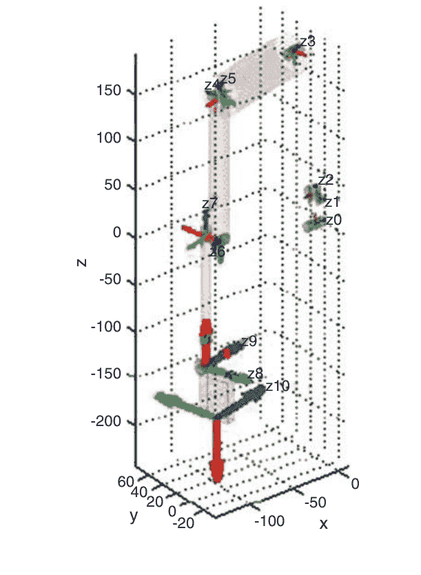

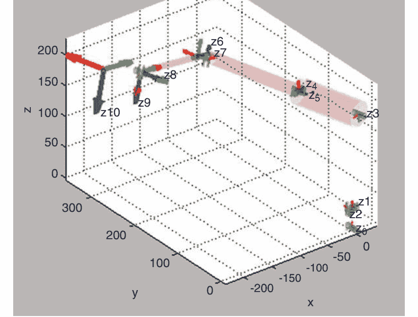

## 图4.2 iCub右臂在最终位置的位置向量（Nath和Levinson 2013a，b）

为了确保所有计算都准确执行，我们将所有转换矩阵输入MATLAB模拟器以观察右臂上的力向量。在图4.1中，我们观察到右臂处于初始阶段时的力向量，即从肩膀悬挂在躯干上的家庭位置。在图4.2中，我们观察到右臂处于最终位置时的所有关节力向量，即伸展开迷宫完全展示给iCub。在这两个图中，x轴显示为红色，y轴显示为绿色，z轴显示为蓝色。

对图4.2中所有关节位置向量的分析为我们提供了转换矩阵计算准确性的证明。需要指出的是，目前系统仅处于初始阶段。为了解决迷宫问题，需要改变关节的参数。这个问题的解决将由核心算法自身处理。

### 参考文献

- Breazeal, C., Wang, A., & Picard, R. (2007). 使用机器人计算机进行实验：身体、情感和认知交互。 *HRI'07* (pp. 153–160). 弗吉尼亚州阿灵顿：ACM。

- Forsyth, D., & Ponce. (2011). 计算机视觉：现代方法。Prentice Hall。

- Harnad, S. (1995). 将符号能力与机器人能力联系起来。纽黑文：劳伦斯埃尔鲍姆。

- Kormushev, P., Calinon, S., Saegusa, R., & Metta, G. (2010). 通过一个人形机器人iCub学习射箭技巧。2010 *IEEE-RAS国际人形机器人会议*。纳什维尔。

- Metta, G., Sandini, G., Vernon, D., & Natale, L. (2008). iCub人形机器人：一个开放的研究平台，用于具身认知研究。第八届智能系统性能度量研讨会。ACM。

- Nath, V., & Levinson, S. (2013a). 通过iCub人形机器人学习射击目标。*AAAI春季研讨会*。帕洛阿尔托：AAAI。

- Nath, V., & Levinson, S. (2013b). 使用计算机视觉和机器学习解决3D迷宫。厄巴纳：伊利诺伊大学厄巴纳-香槟分校。

- Nath, V., & Levinson, S. (2014). 使用iCub人形机器人解决3D迷宫：深度学习的序曲。第二十八届*AAAI会议*。魁北克城：AAAI。

- Russell, S., & Norvig, P. (2010). 人工智能，现代方法。新泽西：普林斯顿大学出版社。

- Sandini, G., Metta, G., & Vernon, G. (2007). iCub认知人形机器人：一种用于主动认知的开放式研究平台。在人工智能的50年 (第358-369页)。柏林海德堡：斯普林格柏林海德堡。

- Spong, M. W., Hutchinson, S., & Vidyasagar, M. (2006). 机器人建模与控制。新泽西：约翰威利和儿子。

- Sutton, R. S., & Barto, A. G. (1998). 强化学习：一种介绍。剑桥：麻省理工学院出版社。

- Tsagarakis, N., Metta, G., & Vernon, D. (2007). iCub：一个开放的人形平台的设计和实现用于认知和神经科学研究。先进机器人21.10, (第1151-1175页)。

## 第5章 计算机视觉

摘要 在本章中，我们介绍了计算机视觉算法的各个组成部分，这些算法用于项目的各个方面。最初，本章从数学的角度讨论了计算机视觉的基本算法。完成这个方面后，下一步是向读者演示我们如何将算法应用于解决研究项目的具体问题。

### 5.1 逆向单应性

作为培训过程的一部分，需要研究每个迷宫以制定控制策略。在理想情况下，迷宫的完美正交视图在任何时候都很难获得。特别是当迷宫沿着视角轴倾斜时，情况尤其如此。因此，必须执行迷宫的逆单应性。为了做到这一点，首先需要识别具有已知几何关系的特征。至少需要识别四个这样的特征来确定迷宫的逆单应性。我们认为最简单的方法是在迷宫板的四个角落放置高对比度的彩色标记。红色被用作四个彩色标记，我们约定不在迷宫的其他地方使用红色。唯一的其他红色物体是用来解决迷宫的球。

迷宫上的所有点坐标都以二维形式表示，即(x, y)。然而，为了进行逆单应性，我们需要齐次图像坐标。
将图像坐标转换为齐次图像坐标是一个相对简单的过程，如下所示（Lazebnik 2013）：

V. Nath 和 S.E. Levinson，自主机器人和深度学习，斯普林格计算机科学简报，*DOI 10.1007/978-3-319-05603-6_5*，© 作者 201431

给定齐次坐标，单应性的方程如下所示 (5.2) 和 (5.3) (Lazebnik 2013 ) :

$(x,y) \Rightarrow \begin{bmatrix} x \\ y \\ 1 \end{bmatrix}$ (5.1)

$\lambda x_i' = H x_i$ (5.2)

$x_i' \times H x_i = 0$ (5.3)

方程式 (5.2) 和 (5.3) 可以展开如下:

$\lambda \begin{bmatrix} x_i' \\ y_i' \\ 1 \end{bmatrix} = \begin{bmatrix} h_{11} & h_{12} & h_{13} \\ h_{21} & h_{22} & h_{23} \\ h_{31} & h_{32} & h_{33} \end{bmatrix} \begin{bmatrix} x_i \\ y_i \\ 1 \end{bmatrix}$ (5.4)

$\begin{bmatrix} x_i' \\ y_i' \\ 1 \end{bmatrix} \times \begin{bmatrix} h_1^T x_i \\ h_2^T x_i \\ h_3^T x_i \end{bmatrix} = \begin{bmatrix} y_i' h_3^T x_i - h_2^T x_i \\ h_1^T x_i - x_i' h_3^T x_i \\ x_i' h_2^T x_i - y_i' h_1^T x_i \end{bmatrix}$ (5.5)

方程式 (5.5) 可以重写为下面的 (5.6) (Lazebnik 2013)。

$\begin{bmatrix} 0^T & -x_i^T & y_i' x_i^T \\ x_i^T & 0^T & -x_i' x_i^T \\ -y_i' x_i^T & x_i' x_i^T & 0^T \end{bmatrix} \begin{bmatrix} h_1 \\ h_2 \\ h_3 \end{bmatrix} = 0$ (5.6)

方程式 (5.6) 有三个方程式，其中只有两个是线性独立的。此外，(5.6)的形式为

$A\mathbf{h}=0$

通过使用齐次最小二乘法，即通过最小化$\|A\mathbf{h}\|^2$来确定$\mathbf{H}$。图5.1显示了带有标记的迷宫的抽象，而图5.2显示了逆向单应性变换后迷宫的未投影坐标。

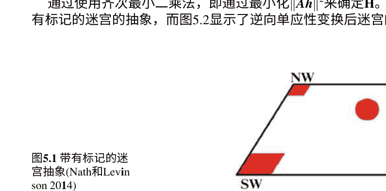

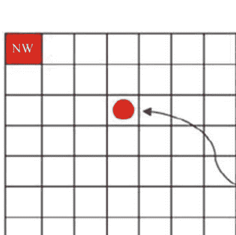

### 5.2 迷宫的离线分析

在这个阶段，逆向单应性变换已经完成，并且预计迷宫板的正交视图始终作为iCub的视觉输入。下一步将是对正交视图进行阈值处理，以确定迷宫的布局。通过颜色阈值处理将得到一个二值图像，指示出红色浓度较高的区域。为了确定这确实是一个好的方法，我们决定确定图像中各个点的RGB值。结果如图5.3所示。

图5.3是在应用任何颜色校正或HSV映射之前的图像。可以看到未映射的RGB值在值上有很大的变化，表明原始RGB值不适合阈值处理。因此，使用RGB值进行图像阈值处理的方法被取消了。另一种方法是使用HSV映射，这种方法得到了更好的结果。为了保持连贯性，HSV映射的结果在第7章中进行了详细讨论。因此，我们决定继续使用HSV值。

可以使用像RasterScan这样的分割算法来标记连续的区域并按大小排序（Bus.oniu等，2010年）。在处理后的图像中，预计最大的四个区域将是四个角标记。为了节省iCub的计算资源，周围边框的其余内容被裁剪掉，因为视频处理是一项计算密集型的过程。裁剪完成后，剩下的是迷宫的墙壁和开放路径。再次使用RasterScan将提供迷宫的开放连续路径。

一旦获得完整路径，可以再次将其离散化为一个n × n网格。图5.4显示了在此阶段执行第二个光栅扫描操作后的结果图像。

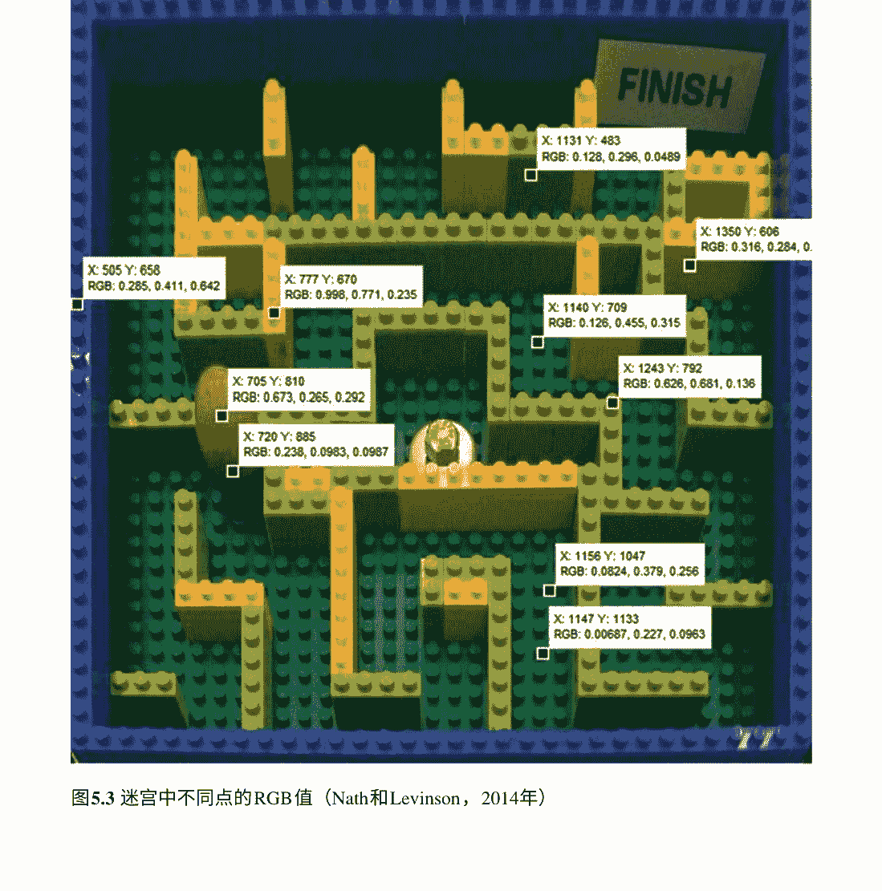

图5.3 迷宫中不同点的RGB值（Nath和Levinson，2014年）

值得一提的另一件重要事情是迷宫的起点和终点。它们需要被标记，以便iCub可以确定起点和终点。虽然这可能看起来是一个微不足道的问题，但对于非常复杂的迷宫来说，确定这两个位置实际上是非常困难的。因此，迷宫板本身包含了两个手动放置在板上表示起点和终点的标签。图5.5显示了生成的路径的结果。一旦将起点和终点与此路径关联起来，就可以开始强化学习。强化学习模拟了模拟迷宫环境的试错运行。控制动作涉及长时间暂停的粗腕运动。每个动作之后，球会出现

图5.4 应用光栅扫描后的结果路径（Nath和Levinson，2014年）

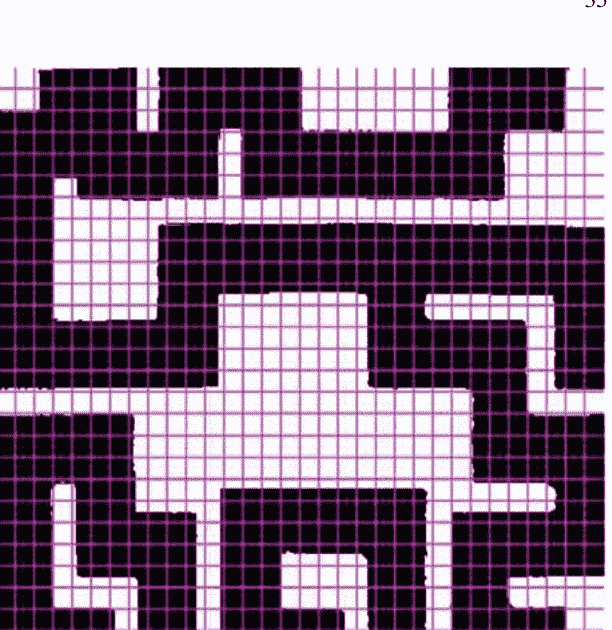

图5.5 标记的起点和终点（Nath和Levinson，2014年）

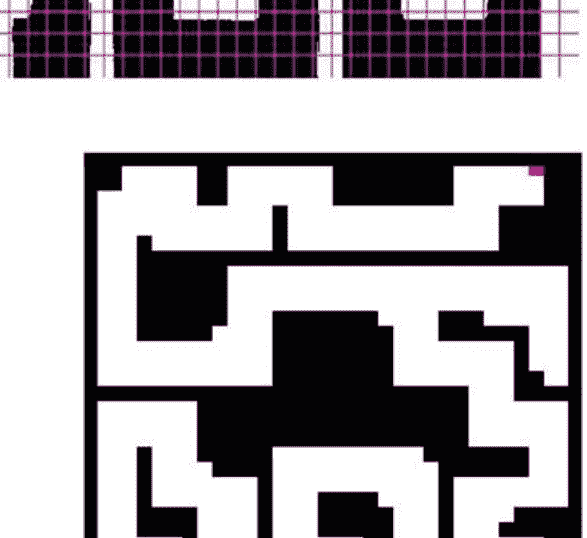

在迷宫的一个角落休息。经过足够长时间的运行，时间值迭代收敛并获得最优策略。对最优策略进行过滤可以提供更一般的控制领域。最终过滤后的控制策略对应于n × n，然后保存用于在线控制。

### 5.3 网格大小的选择

图5.4显示了经过第二轮光栅扫描后的结果路径，以及一个网格。网格对于对任何给定迷宫的在线分析是必要的，因为它有助于推导控制球运动的最佳规则，并且可以在区域基础上进行定位。然而，确定采样视频源的理想分辨率非常关键。采样低于视频源会导致迷宫的退化，并可能导致迷宫中存在开放段，而实际上可能没有。因此，学习的控制策略注定会失败。

另一方面，以远高于阈值的水平进行采样会产生极细的分辨率，这将导致学习算法收敛到解决方案所需的时间大大增加。这是因为以高分辨率处理视频序列是一个计算密集型的过程。这个问题在各种研究文献中经常被称为“维度灾难”（Forsyth和Ponce 2011）。

我们觉得确定理想分辨率的唯一方法是使用试错法。为了做到这一点，我们尝试了几种分辨率，最终将可能的选择缩小到三种分辨率。它们分别是16 ×16、32 ×32和50 ×50。这些分辨率应用于迷宫并得到的路径的结果如下图5.6所示。

从图5.6可以看出，应用16 ×16网格会导致关于迷宫的信息不足，更重要的是，当球位于迷宫的那些区域时。这将导致机器人以随机和意外的方式行动，这是不可取的。因此，这个分辨率也被从可能的候选中舍弃。下一个被测试的分辨率是50 ×50。在这种情况下，机器人肯定能够确定球相对于迷宫的位置。通过观察图5.6最右边的图像，可以很容易地看出整个迷宫路径都存在，并且网格的粒度非常细。在使用这个分辨率测试机器人解决迷宫时，确定结果为

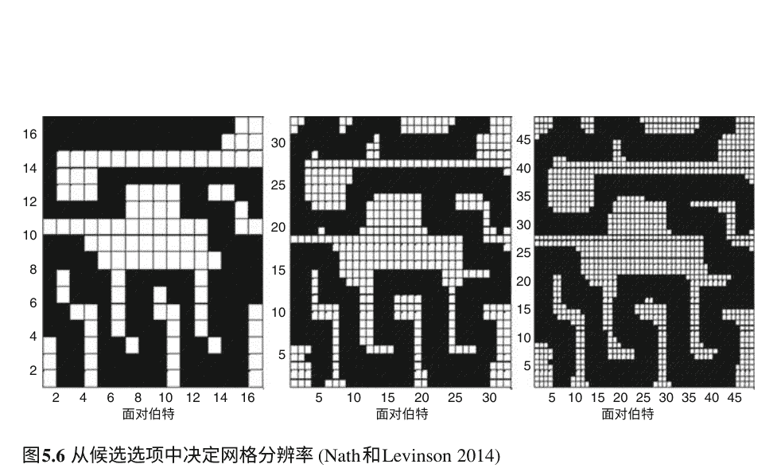

一个不可接受的长时间 不断定位球与其周围环境的持续时间非常关键，因为迷宫解决必须在线进行。

剩下的最后一个分辨率是32 ×32的网格大小。 这个分辨率在两个其他分辨率之间做出了妥协。 从图5.6中间的图像可以清楚地看到，32 ×32的分辨率可以确定球相对于迷宫的位置。 为了这个实验的目的，使用这个分辨率不会有任何预期的信息丢失。

在使用32 ×32的分辨率测试机器人解决迷宫的过程中，确定机器人能够在线解决迷宫。 因此，决定使用32 ×32大小的网格来处理在线分析的视频数据 。

### 5.4 在线分析

一旦通过离线分析获得了最优控制策略，作为训练集的一部分，iCub可以解决任何迷宫。测试迷宫是从投影的角度观察的。 即使在迷宫的在线分析中，也会进行HSV颜色阈值处理，以获得表示红色高浓度的二值图像。 这张图片显示了球的位置和迷宫边缘的四个标记。 然后，iCub应用通过所有训练迭代学到的最优控制策略。 这将导致iCub将板子沿着三个可能的轴之一一定向，并等待一段时间，让球滚动并停在一个角落，然后再次将板子水平。 迷宫的实验运行在第7章中进行了详细讨论。

### 参考文献

- Begum, M., & Karray, F. (2011). 机器人认知的视觉注意力: 一项调查。 IEEE自主心智发展交易。

- Bus,oniu, L., Babus`ka, R., De Schutter, B., & Ernst, D. (2010).使用函数逼近器的强化学习和动态规划。CRC出版社。

- Forsyth, D., & Ponce. (2011).计算机视觉:一种现代方法。Prentice Hall。

- Harnad, S. (1995).将符号能力与机器人能力联系起来。纽黑文: 劳伦斯埃尔鲍姆。

- Kormushev, P., Calinon, S., Saegusa, R., & Metta, G. (2010). 通过一个人形机器人iCub学习射箭技能。2010年IEEE-RAS国际人形机器人会议。纳什维尔。

- Lazebnik, S. (2013).对齐[PDF文档]。从在线讲义网站检索:http://www.cs.illinois.edu/~slazebni/spring13/lec12_alignment.pdf

- Metta, G., Sandini, G., Vernon, D., & Natale, L. (2008). iCub人形机器人: 一个用于具身认知研究的开放平台。智能系统性能度量的第八次研讨会。 ACM。

- Michalski, Carbonell, & Mitchell, T. (1983). 机器学习。 Palo Alto: Tioga Publishing Company.

- Nath, V., & Levinson, S. (2013a). iCub人形机器人学习射击目标。 AAAI Spring Symposium。 Palo Alto: AAAI.

- Nath, V., & Levinson, S. (2013b).使用计算机视觉和机器学习解决3D迷宫。 厄巴纳：伊利诺伊大学厄巴纳-香槟分校。

- Nath, V., & Levinson, S. (2014). 使用iCub人形机器人解决3D迷宫：深度学习的序曲。第二十八届AAAI会议。魁北克城: AAAI

- Russell, S., & Norvig, P. (2010).人工智能，现代方法。新泽西：普林斯顿大学出版社。

- Sandini, G., Metta, G., & Vernon, G. (2007). iCub认知人形机器人：一个用于主动认知的开放系统研究平台。在50年人工智能(pp. 358–369)。 柏林海德堡：斯普林格柏林海德堡。

- Sigaud, O., & Buffet, O. (2010).人工智能中的马尔可夫决策过程。 Wiley。

- Tsagarakis, N., Metta, G., & Vernon, D. (2007). iCub：一个用于认知和神经科学研究的开放人形机器人平台。 高级机器人21.10,(pp. 1151–1175).

## 第6章 机器学习

摘要 当一个问题看起来非常开放，有很多不同的随机变量对过程产生影响时，人类程序员不可能考虑到每一种情况。随着一个额外的参数，情况的数量急剧增加。在这种情况下，概率算法具有最大的适用性。算法需要给出一些可能遇到的情景的例子，算法将能够以合理的准确性处理新的情景。前面陈述中的关键词是“合理”。没有概率算法能够始终以1的概率返回最优结果。这将使它成为一个确定性算法，正如刚才讨论的，它无法处理每一个潜在情况。在本章中，我们讨论了成功完成实验所使用的算法。

### 6.1 机器学习概述

机器学习可以广义地被认为是根据可用数据不断改进自身的算法编程。然而，要使用的学习类型很大程度上取决于处理的数据类型，即没有一个适用于所有情况的策略可以运行。重要的是要记住，机器学习具有概率性的方法，即可能可以使用机器学习技术接近解决问题，但绝对确定地完成任务是不可能的。如果以机器学习为基础的算法的准确性绘制成图形，即使是最好的算法也只能渐近地接近100%，但永远无法完全达到。另一方面，如果程序员了解所有可能的情景，并且如果人类可能解决所有这些情景，那么推荐使用通常的编程模型，其中每个个体案例/状态都得到解决。然而，我们发现这样简单的情景很少，而且模拟真实生活的场景会有大量的变量，使用计算机程序建模会变得过于复杂。在这种情况下，程序员需要使用机器学习技术来开发一种能够返回相对准确解决方案的方法。

如前所述，要使用的学习算法类型取决于数据的类型。如果数据没有标签，即每行数据没有任何相关联的标签，那么这些数据被称为无标签数据。如果数据有标签，那么这些数据被称为有标签数据。例如，昨天的天气可以用向量 <1,0,1,0,1,1,1,0>表示，其中每个数字代表一个感兴趣的特征。虽然特征已经表示出来，但数据还没有被标记，即这些数据代表晴天、雨天还是刮风的情况。另一方面，考虑另一个向量 <0,1,1,1,0,0,0,“雪”>包含一个提到数据代表的标签，这也是任何算法的期望输出。在前一种情况下，数据被称为无标签数据，而在后一种情况下，数据被称为有标签数据。

在无标签数据的情况下，通常会进行聚类，即相似的元素或数据点会因为它们的共同特征而聚集在一起。当这种情况发生时，算法会很擅长将新的输入与现有的聚类进行匹配，尽管它对数据的含义一无所知；匹配是基于数据与每个聚类的相似程度，并选择最接近的一个（Russell和Norvig 2010）。当然，算法可能会出错，而且算法无法检测到错误并采取纠正措施。这就是为什么对于无标签数据来说，训练数据非常重要。在这种情况下，当没有关于数据准确性的反馈时，这种类型的学习被称为无监督学习（Russell和Norvig 2010）。

在有标记数据的情况下，期望的输出已经作为数据的一部分存在。因此，可以根据提供的数据确定从输入到输出的映射函数。在这种情况下，算法会根据它所见到的前几个训练示例来形成一个函数。随着算法在训练数据中的进展，会出现错误并采取纠正措施，以便映射函数能够以最佳方式从输入到输出进行映射。一旦函数被训练“足够”，它应该能够准确地对未见过的测试数据点进行分类。实际上，一个函数可能无法准确地获取每个单独的测试数据点，并且会有一个与之相关的误差函数。这种学习方法被称为监督学习（Russell和Norvig 2010）。

还有一种学习方法似乎更接近真实生活，而不是前面讨论过的两种学习方法。在强化学习的情况下，代理从数据中获得强化信号进行学习。代理的目标是实现所述目标，该目标具有最高的奖励（Russell和Norvig 2010）。被认为有益的路径被分配一个正的奖励分数，而被认为有害的路径被分配一个负的分数。代理尝试找到具有最高总奖励的路径，同时试图最小化惩罚/负奖励。有趣的是，最佳路径可能包含负路径，或者比其他可比较的中间路径具有较低的正奖励。然而，代理将尝试争取最高总奖励。这与我们日常生活非常相似。例如，很多孩子可能不喜欢上学。对他们来说，上学没有即时的好处。相反，他们可能认为这是一种惩罚。然而，我们中几乎没有人会对教育的价值提出质疑。从长远来看，上学的人比没有上学的人更有可能做得更好。因此，尽管看起来可能是一种负奖励，孩子们需要上学。同样，很多人都吃健康食品，避免加工和不健康的食物，并定期锻炼。在短期内，沉溺于加工食品可能看起来更好，因为口感愉悦。经常锻炼的人可能不会立即看到它的好处。然而，从长远来看，照顾自己的身体非常重要，而实现这一点可能会浪费很多短期的幸福感。我们还创造了一个短语“看大局”，以反映这种思维方式。所有这些都可以在数学上建模为强化学习，并且在本书中被广泛使用作为首选的机器学习算法之一。本书中使用的强化学习算法是Q-learning和SARSA，两者在第4.2节中详细讨论。

如前所述，无监督学习主要包括聚类，因为数据中缺乏任何标签。还有其他方法也使用了无监督学习，如隐马尔可夫模型。对这些主题的详细讨论超出了本书的范围，不予讨论。

另一方面，监督学习创建了一个从输入到输出的映射函数，该函数不断通过标记的训练数据进行改进。监督学习在分类和回归应用中有很多应用。

最简单和最常用的分类器之一是感知器，它是一个二元线性分类器。感知器将输入x转换为基于阈值函数（Russell和Norvig 2010）的输出f(x)，该输出为0或1。感知器可以在线训练。感知器包含一个权重向量w，它确定它表示的相应特征的权重。

此外，感知器具有阈值函数，其由阈值(w·x)给出，其中

$$如果a\geq1，则阈值a()=1，否则为0$$

尽管特征向量x不能改变，但权重向量肯定是动态的。当感知器迭代训练样本时，权重向量会收敛到一个解，该解以线性方式对数据进行分类。权重向量的更新方程如下（6.1），也称为感知器学习规则（Russell和Norvig 2010）。

$w_{i}+\alpha x_{i} \geq threshold(x()) \quad \square x_{i}$ (6.1)

另一个基于监督学习的常见分类器是支持向量机 (SVM)。它是一种非参数方法，即SVM必须保留所有的训练样本。然而，在实践中，它们可能只保留了少量的示例数量。SVM构建了一个最大间隔分离器，即具有最大可能距离示例点的决策边界。作为结果，泛化过程可以很好地进行。此外，支持向量机的重要性在于支持向量机可以使用核函数将点投影到更高维空间，以使它们线性可分(Russell和Norvig 2010)。这与感知器的关键区别在于感知器假设所有数据点都是线性可分的。

还有几种基于监督学习的其他类型的分类器。另一种常见的分类器是神经网络。神经网络由连接的节点组成。从一个节点到下一个节点的链接是为了将激活从节点1传播到节点2，并且与该链接相关联的权重w是给予该链接的权重。每个节点的输入是其所有输入的加权和。节点的输出基于激活函数，可以是硬阈值或逻辑函数。如果是硬阈值，则节点被称为感知器(上面讨论过)，如果是逻辑函数，则节点被称为S型感知器(Russell和Norvig 2010)。其他类型的分类器包括朴素贝叶斯、决策树、线性回归和逻辑回归。

### 6.2 学习算法

最强大的学习算法是鲁棒性强的Q学习算法，属于强化学习类别 (Russell和Norvig 2010)。为了应用Q学习算法，我们在开始时设置了一个惩罚，以及总时间的惩罚，在目标状态或确保球到达最终位置时给予奖励。

时序差分Q学习的更新方程如下 (Russell和Norvig 2010)。

$Q(s, a) \quad Q(s, a) + \alpha \left( R(s) + \gamma max_{a'} Q\left( s', a' \right) - Q(s, a) \right)$ (6.2)

其中 $\alpha$ 是学习率，$\gamma$ 是折扣因子。仔细观察(6.2)，我们可以看到Q-learning会备份观察到的转换中达到的状态的最佳Q值。换句话说，Q-learning不关心实际遵循的策略。因此，它也被称为离策略算法，因此它不会生成最大化解决迷宫概率的策略(Russell和Norvig 2010)。然而，显然需要最大化这个概率，需要一个非策略算法。SARSA算法似乎是一个不错的选择，因为它与Q-learning算法非常相似，但是它是一个策略算法。SARSA的更新方程如下所示(6.3)(Russell和Norvig 2010)。

$$Q(s,a) \leftarrow Q(s,a) + \alpha \left( R(s) + \gamma Q\left(s^{\prime},a^{\prime}\right) - Q(s,a) \right)$$ (6.3)

虽然(6.2)和(6.3)之间的差异一开始可能看起来非常微小，但是Q学习和SARSA算法之间存在着相当大的差异。实际上，SARSA算法会等待直到采取行动，然后更新该行动的Q值。简单来说，如果需要一个总是选择具有最佳Q值的行动的贪婪智能体，那么Q学习是要使用的算法。然而，如果需要对状态空间进行探索，SARSA是提供了更多优势的算法。为了这个实验的目的，在最短时间内最大化解决迷宫的概率，需要一个探索性算法。SARSA的最优策略由下式(6.4)给出(Russell和Norvig 2010)。

$$\pi^{*} = \underset{\pi}{argmax} \sum_{h} P\left(h | e\right) u_{h}^{\pi}$$ (6.4)

在 (6.4) 中，后验概率P (hle) 是通过使用贝叶斯规则并将其应用于已获得的观测得到的。

这个实验的学习是通过离散状态-动作空间的值迭代来完成的。该算法使用了基于样本的质量空间 (Sutton和Barto 1998)。所使用的具体算法来自 (Busoniu等人2010年) 并如下所示。在这里，φ是离散化空间的索引，θ是该索引处的值。控制空间为U ={0, 1, 2, 3, 4}，其中0是随机动作，{1, 2, 3, 4}是{东北, 西北, 西南, 东南}方向的手腕倾斜。

状态空间对应于迷宫中32 ×32离散化路径空间的位置。α和γ的值设为0.99，并使用探索函数ε = Q_{visit}^{-0} \cdot 01。

算法的伪代码如下所示。

### Q-Learning with Algorithm2.3:

```
Input: discount factor γ,
       exploration schedule {ϵ_k}_{k=0}^∞ s.t. Σ_{k=0}^∞ ϵ_k = ∞,
       learning rate schedule {α_k}_{k=0}^∞ ∈ [0,1]
       BFs φ_{[j]}: X × U → ℝ^{p(j)},

Initialize parameter vector, e.g., θ_0 ← 0

Measure initial state x_0

For every time step k = 0,1,2,... do

  o u_k ← { u ∈ arg max_{u'} φ^T(x_k, u') θ_ℓ   P = 1 - ϵ_k
            random action in U                  P = ϵ_k

  o Apply u_k, measure next state x_{k+1} and reward r_{k+1}

  o θ_{ℓ+1} ← θ_ℓ + α_k [r_{k+1} + γ max_{u'} φ^T(x_{k+1}, u') θ_ℓ - φ^T(x_k, u_k) θ_ℓ] φ(x_k, u_k)

end
```

### 参考文献

- 巴伯, D. (2012). 贝叶斯推理和机器学习。剑桥: 大学出版社。
- 布雷泽尔, C., 王, A., & 皮卡德, R. (2007). 与机器人计算机的实验: 身体, 情感和认知交互。HRI' 07(第153-160页)。弗吉尼亚州阿灵顿: ACM。
- 布斯尼鸟, L., 巴布斯卡, R., 德舒特, B., & 恩斯特, D. (2010). 强化学习和动态规划使用函数逼近器。CRC出版社。
- 哈纳德, S. (1995). 将符号能力基于机器人能力。纽黑文: 劳伦斯埃尔鲍姆。
- Kormushev, P., Calinon, S., Saegusa, R., & Metta, G. (2010). 通过一个人形机器人iCub学习射箭技巧。2010 IEEE-RAS国际人形机器人会议。纳什维尔。
- Metta, G., Sandini, G., Vernon, D., & Natale, L. (2008). iCub人形机器人: 一个开放的研究平台, 用于具身认知研究。第八届智能系统性能度量研讨会。ACM。
- Michalski, Carbonell, & Mitchell, T. (1983). 机器学习。 Palo Alto: Tioga Publishing Company.
- Michie, D. (1986). 关于机器智能。纽约: 约翰·威利和儿子。
- Nath, V., & Levinson, S. (2013a). iCub人形机器人学习射击目标。 AAAI Spring Symposium. 帕洛阿尔托: AAAI。
- Nath, V., & Levinson, S. (2013b).使用计算机视觉和机器学习解决3D迷宫。厄巴纳：伊利诺伊大学厄巴纳-香槟分校。
- 纳斯，V., & 莱文森，S. (2014). 使用iCub人形机器人解决3D迷宫的机器学习：深度学习的序曲。第二十八届AAAI会议。魁北克城：AAAI。
- Russell, S., & Norvig, P. (2010). 人工智能，现代方法。新泽西：普林斯顿大厅。
- Sandini, G., Metta, G., & Vernon, G. (2007). iCub认知人形机器人：一种开放的系统研究平台，用于感知认知。在人工智能的50年中(第358-369页)。柏林海德堡：斯普林格柏林海德堡。
- Sigaud, O., & Buffet, O. (2010).马尔可夫决策过程在人工智能中。Wiley。
- Sutton, R. S., & Barto, A. G. (1998).强化学习：一种介绍。剑桥：麻省理工学院出版社。
- Tsagarakis, N., Metta, G., & Vernon, D. (2007). iCUb：一个开放的人形平台的设计和实现用于认知和神经科学研究。先进机器人21.10, (第1151-1175页)。

## 第7章 实验结果

摘要在本章中，我们讨论了使用Chap. 6中讨论的算法，通过iCub尝试解决未知迷宫时获得的结果。

### 7.1 开环测试

首先进行的测试是测试iCub的硬件能力，以及迷宫板的耐久性和iCub导航球通过所有可能的角落的能力。为了证明这一点，我们编程iCub来解决一个特定的迷宫，即机器人被预先编程来解决一个特定排列的迷宫。这一步骤使我们能够探索任务的基本命令界面，并解决与抓取和整个迷宫的视野相关的问题。成功执行此任务将为整个实验带来更大的成果。图7.1和7.2显示了iCub在这个开环测试中通过迷宫的工作。

iCub成功完成了整个迷宫，从开始到结束。开环测试的成功完成使我们对iCub能够学习最佳控制策略并解决任何给定的迷宫充满信心。

### 7.2 闭环测试

现在，开环测试成功完成后，下一步是在机器人从未见过的迷宫上进行闭环测试。然而，确保iCub通过学习算法获得了最佳控制策略是至关重要的。因此，我们对iCub进行了23次不同的训练。

图7.1 iCub在开环测试中工作

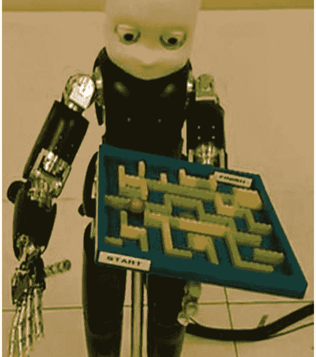

图7.2 下一步动作iCub在开环测试中的表现

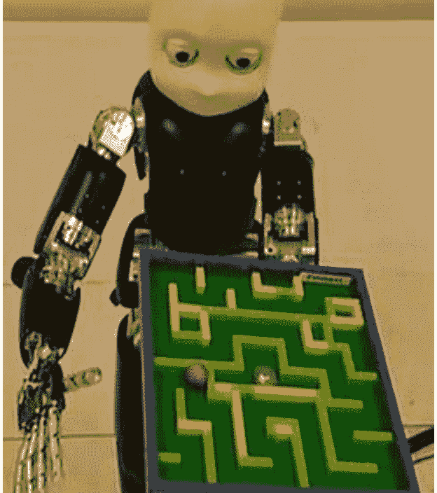

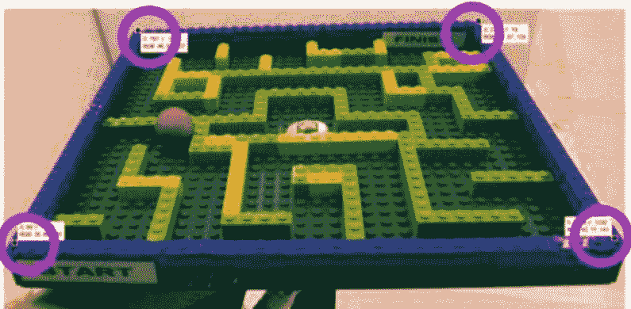

图7.3 迷宫的角落检测（Nath和Levinson 2014）

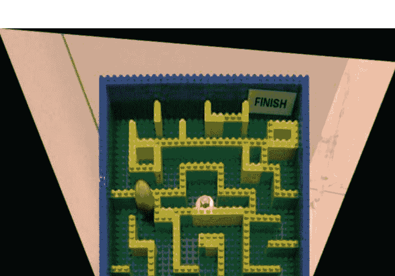

图7.4 逆映射的结果（Nath和Levinson 2014）

迷宫是训练集的一部分。完成后，我们在11个不同的迷宫上测试了iCub。iCub成功解决了每个迷宫配置，准确率达到100%。本节将引导您完成实验的所有部分，同时解决一个特定的测试迷宫。

第一步是识别迷宫板的角落，然后对结果图像进行逆映射。图7.3显示了成功检测到的角落，而图7.4显示了逆映射的结果。

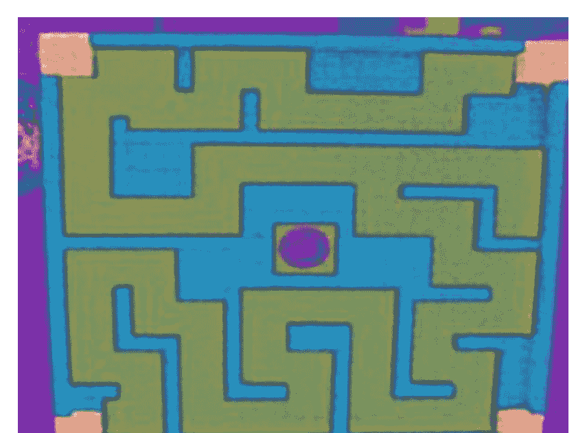

图7.5 经过HSV处理的迷宫（Nath和Levinson 2014）

一旦获得了逆单应性，下一步就是应用HSV映射来便于检测迷宫的特征。图7.5展示了应用于特定迷宫配置的结果HSV映射。

逆单应性后应用32 ×32网格得到的迷宫的RGB图像如图7.6所示。

已经分别在图5.4和图5.5中展示了由光栅扫描和标记起点和终点得到的路径。完成这一步后，对得到的迷宫进行强化学习，起点处设有惩罚，目标处设有奖励，并设有运行时间惩罚。这导致算法有动力在最优时间内确定从起点到终点的路径。该方法的值函数如下图7.7所示。

然后从质量空间计算出最优控制策略。对于具有相同数值的控制值，随机选择其中之一。下图显示了得到的控制策略，如图7.8所示。

从图7.8可以看出，控制策略分散在各个相邻点上。这将导致机器人在解迷宫时手部运动不稳定，容易增加硬件磨损。

然后可以对控制策略应用滤波器，以获得迷宫的平滑策略。迷宫的最优控制策略如下图7.9所示。这个输出正在被iCub机器人用于在线解迷宫。

图7.6 经过逆向透视变换和网格应用的RGB版本迷宫

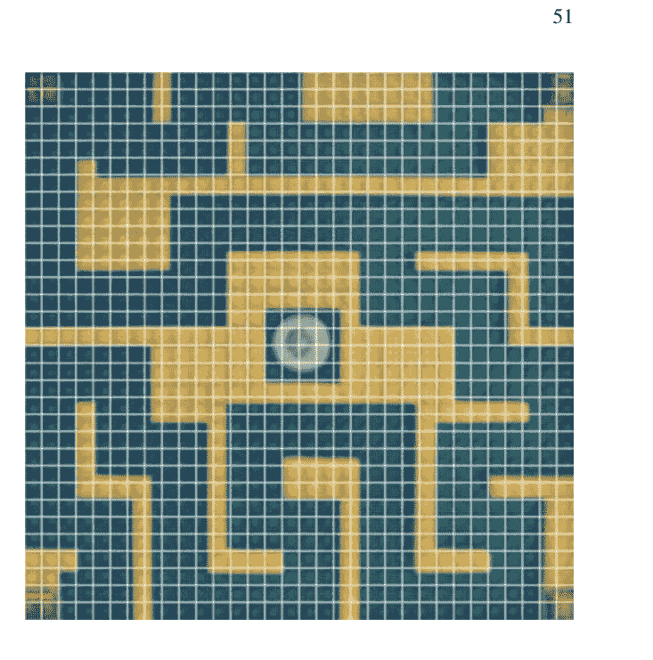

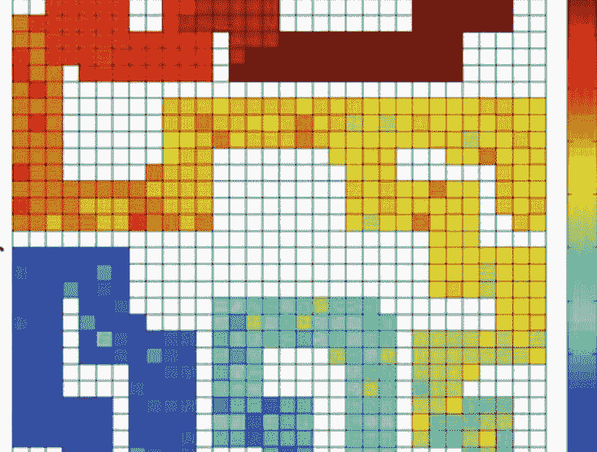

图7.7 迷宫的归一化对数值函数

图7.8 结果控制策略

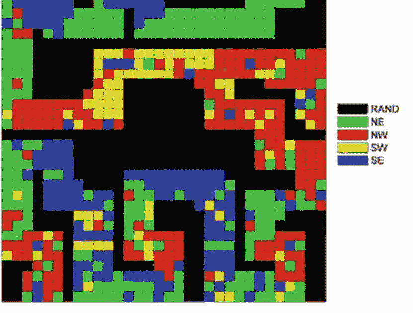

图7.9 平滑后的最优控制策略

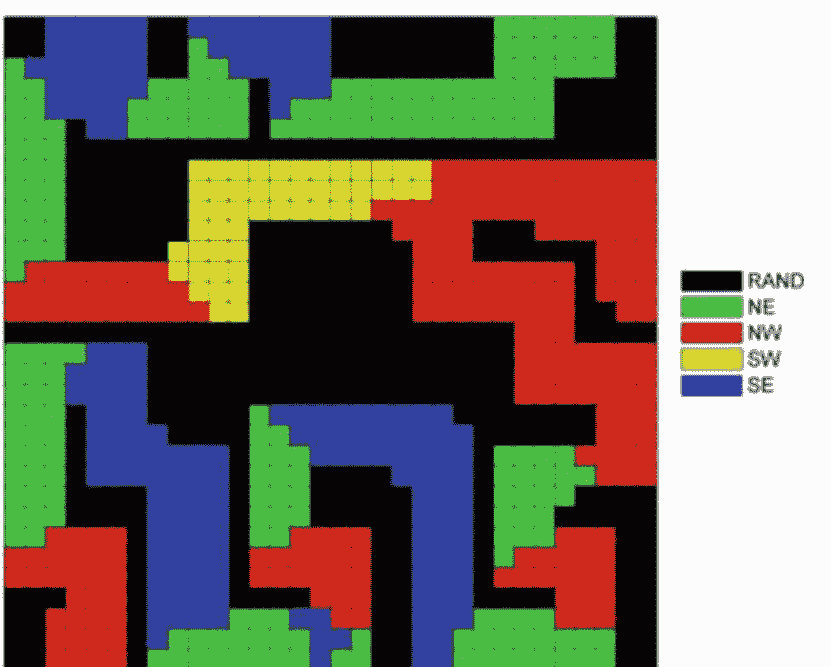

以下一系列图像展示了从iCub的右眼以RGB视图观察解决这个特定迷宫的整个实际序列。每个序列包括当前以RGB形式表示的迷宫，球相对于四个角落的光栅扫描可视化，以及球在迷宫中相对于网格的位置，箭头表示下一个要应用的方向。

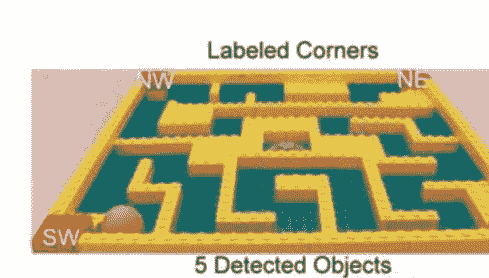

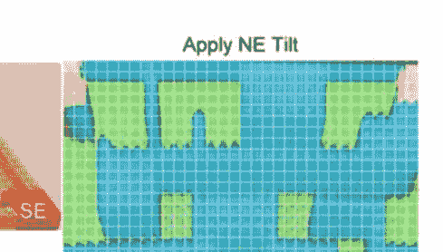

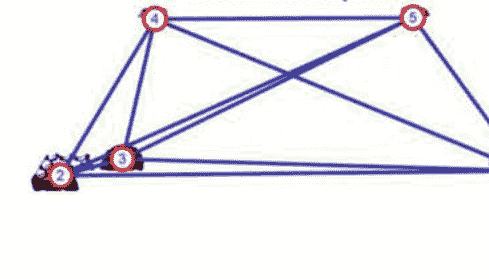

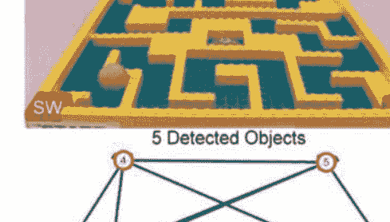

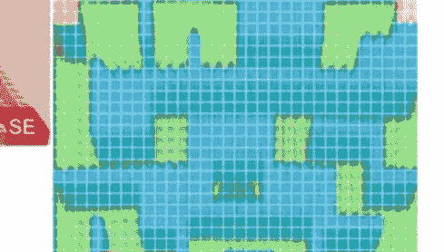

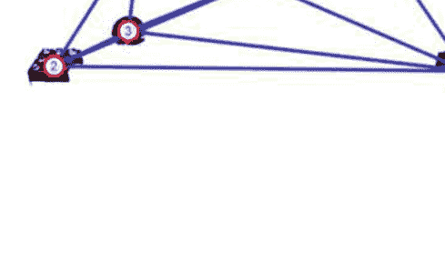

Labeled Corners

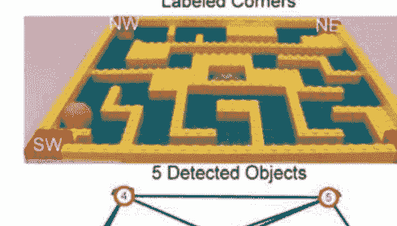

Apply NW Tilt

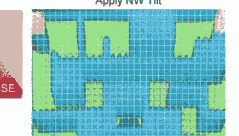

5 Detected Objects


Labeled Corners

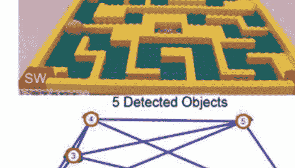

Apply NE Tilt

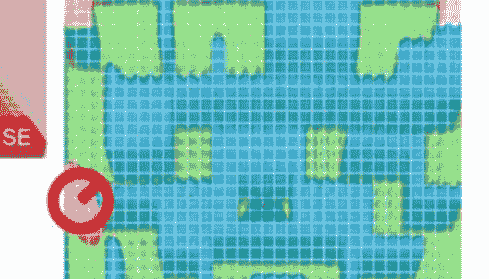

5 Detected Objects


Labeled Corners

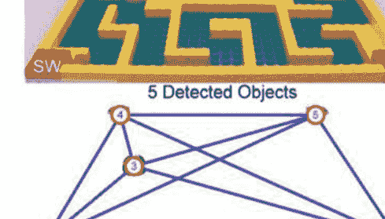

Apply SE Tilt

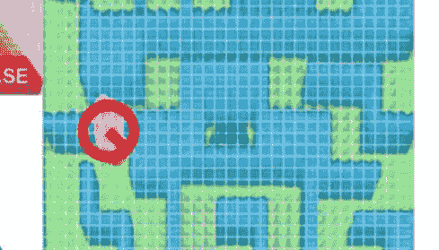

5 Detected Objects


## Labeled Corners

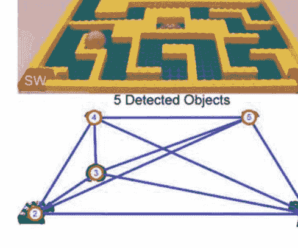

## Apply SE Tilt

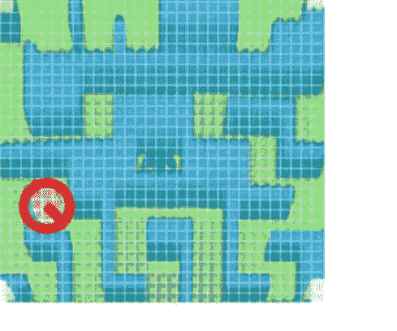

## 5 Detected Objects

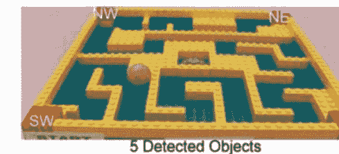

## Labeled Corners

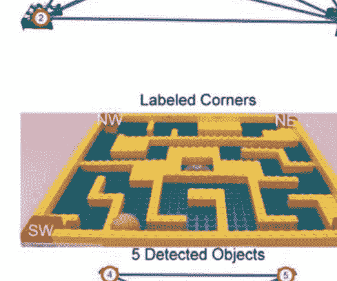

## Apply SE Tilt

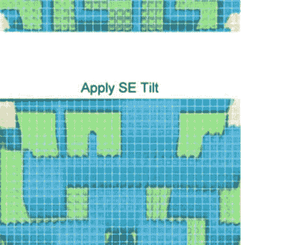

## 5 Detected Objects

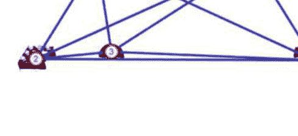

## Labeled Corners


## Apply SE Tilt

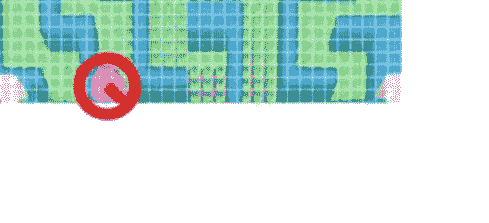

## 5 Detected Objects


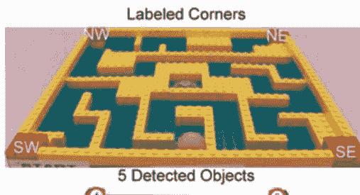

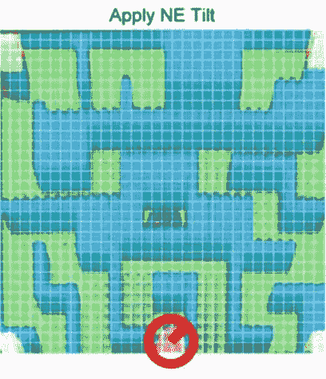

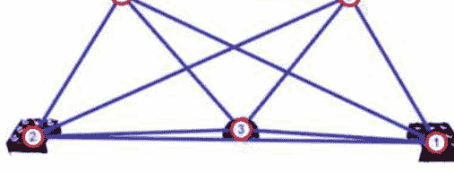

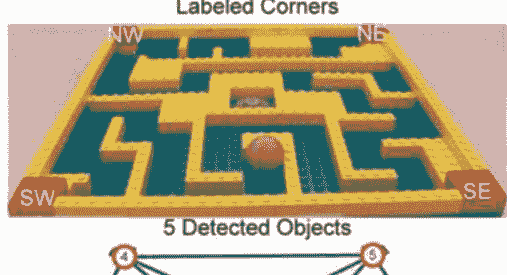

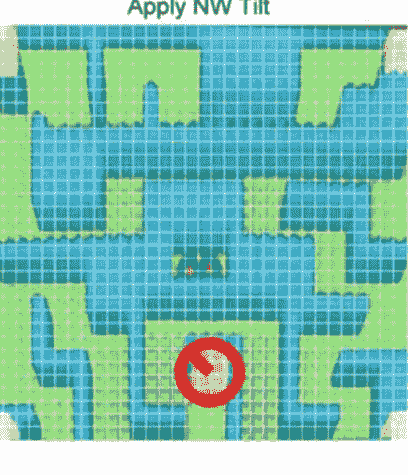

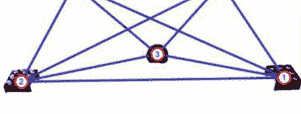

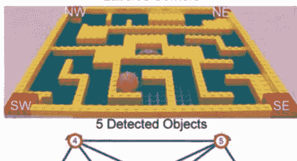

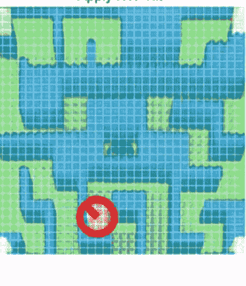

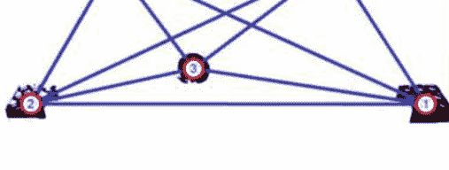

### 7.2 闭环测试

## Labeled Corners

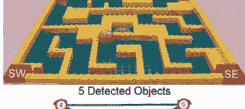

## Apply NE Tilt

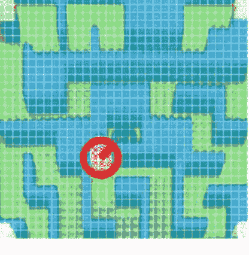

## 5 Detected Objects

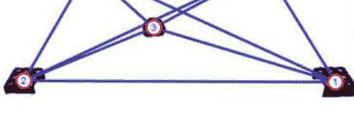

## Labeled Corners

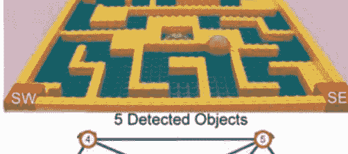

## Apply SE Tilt

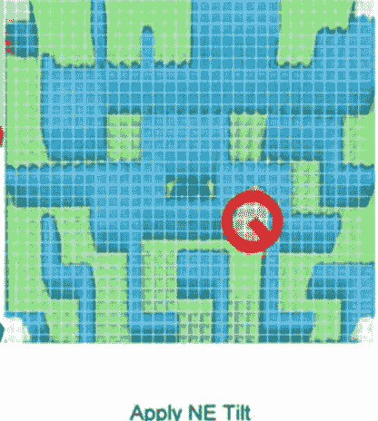

## 5 Detected Objects


## Labeled Corners


## Apply NE Tilt


## 5 Detected Objects


## Labeled Corners


## 4 Detected Objects


## Apply Random Tilt


## Labeled Corners


## 5 Detected Objects


## Apply NW Tilt


## Labeled Corners


## 5 Detected Objects


## Apply NW Tilt


Labeled Corners


5 Detected Objects


Apply NE Tilt


Labeled Corners


5 Detected Objects


Apply NW Tilt


Labeled Corners


5 Detected Objects


Apply NW Tilt


## Labeled Corners

## Apply NW Tilt


## 5 Detected Objects


## Labeled Corners

## Apply NW Tilt


## 5 Detected Objects


## Labeled Corners

## Apply SW Tilt


## 5 Detected Objects


## Labeled Corners


## Apply SE Tilt


## 5 Detected Objects


## Labeled Corners


## Apply NE Tilt


## 5 Detected Objects


## Labeled Corners


## Apply NE Tilt


## 5 Detected Objects


## Labeled Corners


## 5 Detected Objects


## Apply SE Tilt


## Labeled Corners


## 5 Detected Objects


## Apply NE Tilt


## Labeled Corners


## 5 Detected Objects


## Apply NE Tilt


这一系列图像展示了从iCub的视角解决给定迷宫的整个事件序列，从开始到结束。希望这个序列能让读者了解使用机器学习完成三维迷宫的完整解决所需的事件序列。

### 参考文献

- Kormushev, P., Calinon, S., Saegusa, R., & Metta, G. (2010). 通过一个人形机器人iCub学习射箭技巧。2010 IEEE-RAS国际人形机器人会议。纳什维尔。
- Lazebnik, S. 对齐[PDF文档]。从在线讲义网站检索: http://www.cs.illinois.edu/~slazebni/spring13/lec12_alignment.pdf
- Metta, G., Sandini, G., Vernon, D., & Natale, L. (2008). iCub人形机器人：一个用于具身认知研究的开放平台。智能系统性能度量的第八次研讨会。ACM。
- Nath, V., & Levinson, S. (2013a). iCub人形机器人学习射击目标。AAAI Spring Symposium。Palo Alto: AAAI.
- Nath, V., & Levinson, S. (2013b). 使用计算机视觉和机器学习解决3D迷宫。厄巴纳：伊利诺伊大学厄巴纳-香槟分校。
- Nath, V., & Levinson, S. (2014). 使用iCub人形机器人解决3D迷宫：深度学习的序曲。第二十八届AAAI会议。魁北克城：AAAI。
- Tsagarakis, N., Metta, G., & Vernon, D. (2007). iCub：一个开放的人形平台的设计和实现用于认知和神经科学研究。先进机器人21.10, (第1151-1175页)。

## 第8章 未来方向

简单的文献综述将揭示出大量的迷宫解决算法。然而，仅仅按照一系列步骤执行算法并不值得现今的研究，因为它与普通CPU中进行的数百万个顺序执行没有任何区别。此外，如果系统处于未知状态，大多数算法在算法中没有内置的回退机制。工程师们将不得不添加某种安全检查，以使系统恢复到已知状态。有时候，即使这样还不够，因为状态和时间的确切顺序对算法的成功终止至关重要。

在这本书中，我们提出了一种独特的方法来解决任何给定的三维迷宫。这种方法之所以独特，是因为它添加了学习组件，使其成为一个真正通用的算法，能够适应环境变化和意外状态的影响。对于研究的关键重要性在于理解iCub正在形成的演化模型，它通过训练示例并观察更多的测试案例来实现。了解iCub或任何智能代理如何应用模型来解决之前未见过的问题也是非常有趣的。这种理解是至关重要的，因为它使我们离实现强人工智能更进一步，其中机器人可以“意识到”它们是有潜力通过执行的动作来影响和改变周围环境的代理。这种方法与人类婴儿的认知发展非常相似。起初，他们只是随机挥动手臂和腿。这与机器人领域中的运动婴儿学习方法非常相似，机器人能够自主地发展出自己身体和周围环境的内部模型。对于人类婴儿来说，随着年龄的增长，大脑中的神经连接越来越多。很快，婴儿能够建立一个联系，即通过摇动手中的拨浪鼓，它可以产生一些声音。从纯技术角度来看，一个反馈循环刚刚完成。

我们相信iCub平台和AI研究人员社区目前正处于这个阶段。iCub已经“意识到”通过改变板的方向，可以使球朝特定方向滚动。图7.9在第7.2节中。

> V. Nath和S.E. Levinson，自主机器人和深度学习，斯普林格计算机科学简报，DOI 10.1007/978-3-319-05603-6_8，©作者(s) 2014年65

显示了最佳控制策略平滑后的迷宫区域。此时，iCub只需确保遵循生成的最佳控制策略。如果没有，也会根据控制策略采取纠正措施。从某种意义上说，这种方法可以被视为一种Mealy状态机，每个动作都会改变状态并将系统带到一个新状态。这是一个迭代的过程，就像遍历状态机一样。因此，虽然强人工智能迄今为止肯定还没有实现，但我们相信至少在可观察行为方面已经开始越界。

虽然我们还没有达到那个程度，但我们相信强人工智能确实是可能的，至少在可观察行为方面可以与普通人相媲美。希望真正发展出有意识的实体的目标很快就能成为现实。

### 参考文献

- Asimov, I. (2008). 我，机器人。光谱。
- 哈纳德, S. (1995). 将符号能力基于机器人能力。纽黑文：劳伦斯埃尔鲍姆。
- Kormushev, P., Calinon, S., Saegusa, R., & Metta, G. (2010). 通过一个人形机器人iCub学习射箭技巧。2010 IEEE-RAS国际人形机器人会议。纳什维尔。
- Metta, G., Sandini, G., Vernon, D., & Natale, L. (2008). iCub人形机器人：一个开放的研究平台，用于具身认知研究。第八届智能系统性能度量研讨会。ACM。
- Michie, D. (1986). 关于机器智能。纽约：约翰·威利和儿子。
- Nath, V., & Levinson, S. (2013a). iCub人形机器人学习射击目标。AAAI Spring Symposium. 帕洛阿尔托：AAAI。
- Nath, V., & Levinson, S. (2013b). 使用计算机视觉和机器学习解决3D迷宫。厄巴纳：伊利诺伊大学厄巴纳-香槟分校。
- Nath, V., & Levinson, S. (2014). 使用iCub人形机器人通过机器学习解决3D迷宫问题：深度学习的序曲。第二十八届AAAI会议。魁北克市：AAAI。
- Russell, S., & Norvig, P. (2010). 人工智能，现代方法。新泽西：普林斯顿大学出版社。
- Sandini, G., Metta, G., & Vernon, G. (2007). iCub认知人形机器人：一种开放的系统研究平台，用于感知认知。在人工智能的50年中(第358-369页)。柏林海德堡：斯普林格柏林海德堡。
- Spong, M. W., Hutchinson, S., & Vidyasagar, M. (2006). 机器人建模与控制。新泽西：约翰·威利和儿子。
- Tsagarakis, N., Metta, G., & Vernon, D. (2007). iCub：一个用于认知和神经科学研究的开放式人形平台的设计与实现。先进机器人21.10, (pp. 1151-1175).
- Wells, H. (2005). 世界大战。纽约：NYRB经典著作。