# 自动化软件工程：一种基于深度学习的方法

## 前言

深度学习（DL）是从人工智能的机器学习中衍生出来的下一级计算概念。机器学习算法用于解析数据、从数据中学习，并根据其学习进行信息构建，而DL能够构建一个具有无监督学习能力的人工神经网络（ANN），从非结构化数据中学习。DL已被各种研究人员广泛接受，用于解决预测、天气预报、自动文本生成、自动驾驶车辆、自动图像字幕、语音激活助手等领域的问题。

观察当前深度学习应用的趋势，有可能它将成为软件工程领域的改变者。

本书提供了深度学习处理软件工程中开放问题的可能概念，如自动化测试技术的效率，成本估计的预测，数据处理，自动代码生成。

自1970年以来，许多软件成本估计技术已经发展起来，但缺乏通用的成本估计方法。可以使用深度学习开发一种更通用和准确的成本估计技术。软件工程的另一个广阔领域是自动化测试。从测试用例生成到调试，所有自动化测试的领域都需要手动监督的帮助。深度学习的应用将有助于为被测程序（PUT）提供所需的测试环境信息给自动化工具。这样可以减少测试中的人工干预。因此，深度学习在软件开发中具有广泛的应用范围，从自动需求获取到自动源代码生成，自动测试和版本控制在维护阶段。

本书试图从各个方面涵盖完成自动化软件工程研究所需的各种不同主题。在这里，我们对本书中包含的每一章进行了简要介绍。

软件开发中最耗时且昂贵的活动是维护。如果我们能够预测未来可能需要更改的软件模块，那么将大大减少维护工作的工作量。在第1章中，我们验证了不同的神经网络，如Levenberg–Marquardt (LM)、拟牛顿法 (NM)、梯度下降法 (GD)、自适应学习率的梯度下降法 (GDA) 和带动量的梯度下降法 (GDM)，以选择重要的指标，以提高具有高更改倾向性的模块的性能。

在自动化软件开发的情况下，我们希望减少软件开发所需的时间和工作量。有许多传统的努力估计技术是针对独立软件提出的，但现在需要更先进的努力估计技术来应对其他类型的软件。

在第2章中，作者们重点关注了基于Web的应用程序的软件工作量估计，包括应用程序的后端部分，借助实体-关系图、用例点方法和机器学习的帮助。

在第3章中，作者们重点研究了机器学习算法在软件测试和错误修复中的使用和影响。当前软件开发的情景高度依赖于测试和调试的自动化。当任何软件开发组织尝试自动化其软件测试过程时，本章提出的研究将会有所帮助。

在第4章中，作者们提出了一种基于面向对象设计概念的新的测试场景生成方法。作者们还包括了UML图，即序列图和状态图，用于创建状态序列中间图 (SSIG)。深度优先搜索技术被用于遍历SSIG，并结合不同的覆盖准则生成测试场景。

在第5章中，作者提出了一种基于深度学习的应用方法，即卷积神经网络 (CNN) 用于故障预测。所提出的工作通过计算每个语句的可疑分数为每个语句分配了一个排名。故障预测技术有助于识别软件故障的根本原因。本章介绍了软件故障预测领域的最新进展，并找到了最佳的故障预测技术。

在第6章中，作者分析了现有的用于恶意软件检测的监督技术远未达到实际应用的水平，因为它们过于依赖标记数据来训练模型。因此，作者提出了一种半监督方法来检测Android系统中的恶意软件。作者对半监督机器学习技术进行了实证验证，以展示在Android中检测恶意软件的更高准确率。

本书的每一章介绍的主题都是本书独有的，并且基于贡献作者的未发表作品。在编辑本书时，我们试图讨论软件工程领域进行的所有新趋势和实验。我们相信本书已经准备好为更广泛的受众提供参考，如系统架构师、实践者、开发人员和研究人员。

印度布巴内斯瓦尔
Suresh Chandra Satapathy
Ajay Kumar Jena
Jagannath Singh
Saurabh Bilgaiyan

## 致谢

首先，感谢全能的上帝，在我们成功完成编辑书籍的旅程中给予我们的祝福。

我们要衷心感谢我们的家人、朋友、同事和祝福我们的人，在准备这本书的过程中给予我们持续的支持。我们衷心感谢所有的贡献者，他们允许我们在这本书中引用他们的言论和工作。特别要感谢他们在章节修订期间的辛勤工作和合作。

我们还要感谢审稿人宝贵的评论，这使我们能够从众多收到的章节中选择这些章节。这帮助我们提高了章节的质量。

我们特别感谢和赞赏斯普林格团队在整个出版过程中的持续支持。

最后，我们要感谢那些激励我们的研究人员，并希望这项工作一定会激励和指导他们达到自己的目标。我们还要感谢KIIT DU的管理机构，因为他们允许我们继续进行这本书的出版。

## 第一章 选择显著度指标以提高变更易发性模块的性能


Lov Kumar, Chinmay Hota, Sahithi Tummalapalli 和 Lalita Bhanu Murthy Neti

摘要 变更易受影响的模块被描述为源代码中可能在以后修改的编程部分。变更易受影响的预测使编程分析器能够优化和集中测试资源在可能修改的模块上。准确估计工作量、质量和风险等特征是软件生命周期中的主要关注点，对于变更易受影响性而言，这是一个重要问题。根据文献，回归分析和神经网络技术是常用的属性估计方法。在这项研究中，Chidamber和Kemerer度量（CKJM）套件被用作模型训练的输入，使用神经网络和各种算法进行权重和集成技术的优化。这些模型使用五个不同版本的eBay网络服务进行验证。使用三个不同的性能参数（AUC、F-Measure和准确度）计算开发模型的效率。实验结果中的信息表明，使用Levenberg Marquardt（LM）方法训练的模型相比其他分类器构建的模型取得了更好的结果。

关键词 变更易发性·Ck指标·集成技术·人工神经网络

## 1.1 引言

Web服务是分布式的Web应用程序组件，部署在不同的客户端和服务器平台上。它可以使用不同的编程语言实现，使用Web服务描述语言（WSDL）表示，并进行通信，使用开放协议。面向服务的开发方法允许开发人员通过从现有服务或软件中制作不精确耦合的部件来设计新的软件产品。面向服务的架构基于发布/查找/绑定模型。服务提供者的角色是将其服务以WSDL（Web服务描述语言）文档的形式发布到服务存储库，例如通用描述发现和集成（UDDI）。服务请求者的角色是通过服务注册表找到用于消费的服务。这个过程也被称为“服务发现”。在获得适当的服务信息后，它可以尝试将服务请求者与服务提供者绑定以使用他们的服务。现代软件公司更加重视面向服务的计算范式，因为它能够通过促进快速业务变化和推进软件重用来展示高度的适应性和灵活性。检测包含易变性的类对于开发人员来说是有益的，可以控制成本并提高质量，同时还可以帮助项目经理更有效地分配资源[1]。

使用从源代码中提取的特征集训练的面向对象软件的变更易变性模型引起了许多研究动机。然而，使用从WSDL文件中提取的特征集训练的Web服务的变更易变性模型是一个相对未开发的领域。在本文中，我们研究了从WSDL文件中提取的二十一种不同特征（即软件度量）的预测能力，以预测Web服务的变更易变性。服务提供商使用WSDL文件来描述Web服务的特性和功能，而Web服务的变更易变性则是从WSDL文件的连续形式中提取的。我们选择了eBay Web服务的五个版本作为实验数据集，以验证我们提出的模型。

WSDL是一种基于XML的接口定义语言，由服务提供商用于描述Web服务的功能。服务的功能被描述为一个端口类型P= {M0(I0, O0), M1(I1, O1), M2(I2, O2), ..., Mn(In, On)}, 其中包含不同的操作 Mi，返回与输入Ii对应的消息 Oi。在WSDL中，为每个操作、端口类型和消息分配了唯一的名称。

许多工具，如Java2WSDL、WSDL.exe等，经常被不同的作者考虑用于将SDL文档从不同的语言映射。同样，工具如Soap UI、Wsimport等被用来从相应的WSDL文档生成Java文件。在这项研究中，Wsimport工具被考虑用于解析WSDL文档并生成相应的Java文件。表1.1展示了不同WSDL组件与其相应的JAVA类之间的映射。

在有效地从WSDL记录中映射Java文档之后，考虑了许多源代码度量来估计软件的内部结构，例如耦合度、内聚度、复杂度等等。在这项工作中，处理了二十一个不同的源代码度量来建立一个模型，用于预测Web服务的变更倾向。这些源代码度量是使用CKJM工具的扩展版本计算的。
1http://gromet.iiar.pwr.wroc.pl/p_inf/ckjm/.

表1.1 相应的WSDL文档的Java类

| WSDL文件 | JAVA类 |
| --- | --- |
| wsdl:service | 服务类 |
| wsdl:operation /portType | SEI类中的函数 |
| wsdl:port/ wsdl:service | 服务类中的getABCPort()函数 |
| wsdl:portType | 服务端点接口类 |

由于产品易变性预测模型依赖于SCMs，确定合理的SCMs集合成为模型改进过程中的重要部分。在应用任何训练算法之前，确定正确的指标集是数据挖掘中必要的预处理任务。数据挖掘领域的研究人员在各个领域中发现了这些指标的不同用途[2, 3]。在这个实验研究中，我们提出了一个框架来验证指标并确定正确的指标集。所提出的框架基于去除不重要特征和选择最佳组合的概念。重要特征的组合有助于提高模型的性能，也有助于减少开发模型的复杂性。在上述提出的框架中，我们对每个特征应用了单变量逻辑回归的秩和检验，以找到单个特征预测易变性的潜力。在使用上述方法找到重要特征后，我们应用相关性分析和前向特征选择方法来找到正确的一组重要且不相关的特征。所提出的框架的效果使用神经网络和集成技术的不同训练算法进行验证。

多年来，利用人工神经网络（ANN）模型进行实现的兴趣大大增强，这些模型的适用性已经得到全球范围内的认可，并被广泛应用于各种问题领域[4, 5]。ANN在解决回归和分类问题方面表现出良好的潜力。根据应用领域和数据集的不同，选择合适的训练算法是一个重要且核心的问题。在这个实验中，我们考虑了五种不同的技术，即Levenberg Marquardt（LM）、拟牛顿（NM）、梯度下降（GD）、自适应学习率的梯度下降（GDA）和动量梯度下降（GDM），以找到神经网络的最优权重。在本文中，我们还使用了三种不同的组合规则（2个线性和1个非线性）来应用异构集成方法，以改善变更易感性预测模型的性能。集成分类器利用每个预测模型对数据集的能力，以实现更好的性能。本研究的主要贡献如下：
- 数据的收集和预处理。
- 使用提出的源代码度量验证框架验证源代码度量。
- 使用不同的神经网络训练算法和集成技术开发变更易发性预测模型。

## 1.2 实验数据集

在本文中，利用来自免费可访问源的eBay网络服务。已考虑了表1.2中显示的五个不同版本的eBay网络服务，以验证所提出的工作。利用WSDL Diff工具[6]计算这些网络服务的变更易发性。在成功发现两个连续版本的eBay网络服务之间的变更易发性后，我们考虑了一个名为Wsimport的工具，用于从WSDL文档中提取Java源代码。在成功找到相应WSDL文件的Java类之后，我们编译了这些Java类，生成了用于计算软件度量的字节码，利用了CKJM扩展工具。在这项研究中，我们考虑了19种不同的面向对象源代码度量，用于估计Java类的结构和复杂性。所选的面向对象源代码度量的定义在文献[7]中引用。

## 1.3 软件度量验证框架

成功收集数据后，已建立了类的内部结构与易变性之间的关系。因此，在这项工作中，使用类的源代码计算的度量值被视为独立变量，而易变性被视为依赖变量。由于产品易变性预测模型依赖于SCMs，确定合理的SCMs集合成为模型改进过程中的重要部分。在这项研究工作中，我们的目标是开发一个框架来选择一组不相关的显著特征。图1.1显示了我们提出的改进易变性模型性能的计算不相关显著特征集的框架中涉及的步骤。

在这项工作中，我们进行了以下步骤来找到正确的一组显著不相关特征：
i. 数据集收集：最初，我们将eBay网络服务的五个不同版本作为验证我们提出的框架的数据集。我们从WSDL文件中提取了Java源代码，并编译Java类以生成用于计算软件度量大小和结构的字节码，使用了CKJM扩展工具。
ii.数据归一化：成功收集数据集后，使用最小-最大归一化技术将数据归一化到0和1之间。这种方法的概念基于原始特征的线性变换。
iii.Wilcoxon符号秩检验：该框架的第三步是对从源代码提取的所有特征应用秩和检验，以测试变更和非变更易变类的特征值之间的显著差异。秩和检验用于接受和拒绝考虑的零假设。我们将零假设定义为“变更易变类和非变更易变类的度量值之间没有任何显著差异”。在这里，我们只考虑被拒绝的假设特征，即用于变更易变性预测模型的显著特征。
iv. 单变量逻辑回归（ULR）分析：在成功找到所有显著特征后，对每个特征进行ULR分析以找到显著预测因子。我们考虑了秩和检验和ULR分析来找到变更易发性模型的显著特征。
v. 交叉相关分析：该框架的下一步是使用交叉相关分析来去除高度相关的特征。我们对每对特征应用了皮尔逊相关系数，以找到正线性和负线性依赖关系。如果特征对的皮尔逊相关系数显示高相关性，即≥0.7或≤-0.7，则我们将选择那些与变更易发性高度相关的特征。
vi. 多元线性回归逐步前向选择：在找到显著无相关特征后，我们应用多元模型来找到适合变更易发性预测的特征集。
vii.选定源代码度量的效率：所提出架构的最后一步是验证选定的显著特征集对原始易变性预测特征的潜力。在这项工作中，我们考虑了一个具有各种学习算法和集成方法的神经网络，用于比较使用选定的显著特征集开发的模型与使用所有特征开发的模型的输出。

表1.2 Ebay变更易变数据集

| 版本 | 更改的类数 | 未更改的类数 | 类的数量 |
| :--- | :--- | :--- | :--- |
| 863 | 175 | 1332 | 1507 |
| 865 | 102 | 1405 | 1507 |
| 867 | 240 | 1284 | 1524 |
| 869 | 128 | 1381 | 1509 |
| 871 | 119 | 1390 | 1509 |

### 图1.1 从源代码验证中提取的特征框架

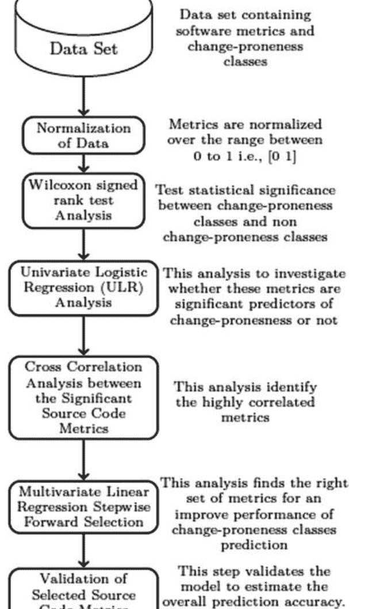

### 1.4分类技术

通过使用两种集成技术和一种人工神经网络（ANN）的五种不同训练算法来评估所提出的源代码度量验证框架的能力和考虑因素。在多个领域的研究人员已经应用ANN来解决各种多样化的问题，包括优化、预测、分类、模式识别、控制和联想记忆[8]。

我们考虑了不同的ANN训练算法来训练变化倾向模型，如图1.2所示。从图1.2可以清楚地看到ANN的架构基于输入层、隐藏层和输出层。训练算法的主要目标是找到输入到隐藏层和隐藏层到输出层之间的最优权重。输入到隐藏层和隐藏层到输出层之间的连接。在这个实验中，我们使用了五种不同的训练算法来找到最优权重。这些技术还用于通过提出的框架使用选定的一组正确不相关的特征来验证所开发的模型。我们的具体目标是研究不同的ANN和集成方法在基于不相关度量作为输入变量和变化倾向作为输出变量的预测模型开发中的应用。

### 图1.2人工神经网络

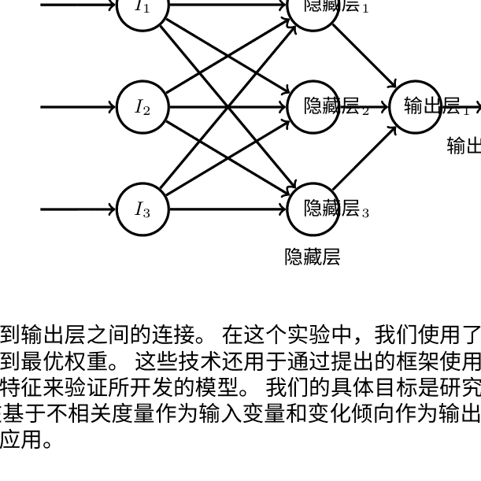

## 1.5 实验设置

本节讨论了使用源代码度量开发变更倾向性预测模型的实验框架。在这项工作中，考虑了一组7种分类器技术，即具有5种训练算法和三种集成技术的人工神经网络，以开发一个估计变更倾向性的模型。构建的模型在5个不同版本的eBay网络服务上进行验证。

图1.3显示了用于预测变更倾向性模型开发的框架。图1.3的信息表明，该提议的框架基于多个步骤。在应用任何分类器之前，首先使用提议的度量验证框架选择不相关的显著特征。所提出的框架用于通过删除不相关的特征来选择正确的一组不相关的显著特征。在计算不相关的显著特征之后，我们使用最小-最大归一化技术将特征值归一化到0到1的范围内，并且在归一化之后的数据中使用5折交叉验证技术将数据分成5组。接下来，考虑了五种不同的技术来找到神经网络的最优权重，例如Levenberg-Marquardt（LM）、拟牛顿（NM）、梯度下降（GD）、具有自适应学习率的GD（GDA）和具有动量的GD（GDM）。在上述步骤中，考虑了三种集成方法来构建变更倾向性预测模型。最后，通过AUC、F-Measure和准确性计算模型的性能，并使用验证方法进行验证。

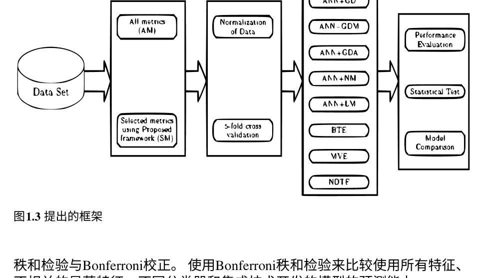

图1.3 提出的框架

秩和检验与Bonferroni校正。使用Bonferroni秩和检验来比较使用所有特征、不相关的显著特征、不同分类器和集成技术开发的模型的预测能力。

数据挖掘领域的研究人员建议使用交叉验证方法来验证模型，而不是保留方法[9]。使用保留方法验证的模型存在过拟合和欠拟合问题。因此，我们使用交叉验证方法来处理由于过拟合和欠拟合引起的问题。这种方法同时用于训练和测试的所有数据。这种方法的基本类型被称为K折交叉验证。上述方法将数据分成k个不同的组，每次使用k-1个折叠数据进行训练，一个折叠数据进行测试。我们应该重复这个过程'k'次，最后使用所有折叠的平均值来计算模型的性能。在这项研究中，我们使用5折交叉验证方法进行模型验证，并使用准确率、F-Measure和AUC来计算这些训练模型的性能。

## 1.6 结果分析

在本节中，将介绍实验结果的详细描述。本研究重点关注从类的源代码中提取的度量值与变更倾向之间的关系。

**特征选择** 在本研究中，我们提出了一个框架来寻找与变更倾向预测相关的一组不相关的显著特征。该框架的概念首先基于使用秩和和单变量逻辑回归找到显著预测器，然后应用相关性和前向特征选择方法来找到一组不相关的显著特征。图1.4

| 版本 | WMC | DIT | NOC | CBO | RFC | LCOM | Ca | Ce | NPM | LCOM3 | DAM | MOA | MFA | CAM | IC | CBM | AMC | LOC | SLOC-P | SLOC-L | MVG |
|------|-----|-----|-----|-----|-----|------|----|----|-----|-------|-----|-----|-----|-----|----|----|----|----|--------|--------|-----|
| 871  | ⊗   | *   |     |     |     |      | ⊗  | ⊗  | *   |       | ⊗   | ⊗   | ⊗   |     |    |    |    |    |        |        |     |
| 869  | ⊗   | *   |     |     |     |      | ⊗  |    |     |       | ⊗   | ⊗   | ⊗   |     |    |    |    |    |        |        |     |
| 865  | ⊗   | *   |     |     |     |      |    |    | ⊗   |       | ⊗   | ⊗   | *   |     |    |    |    |    |        |        |     |
| 863  | ⊗   | *   |     | ⊗   | *   |      | ⊗  |    | ⊗   |       | ⊗   | ⊗   | *   |     |    |    |    |    |        |        |     |

图 1.4 选择的度量集

使用不同符号显示不同项目的选择特征。图 1.4 中使用的不同符号的说明如下：
- 星号：表示经过秩和检验选择的特征相关信息。
- 圆内有星号：表示经过单变量逻辑回归选择的特征相关信息。
- 正方形内有星号和圆：表示经过相关性分析选择的不相关特征相关信息。
- 六边形内有正方形、星号和圆：表示经过前向特征选择方法选择的正确集合的不相关特征相关信息。

图 1.4 的信息表明，对于 eBay 的所有版本，NOC 度量不具有显著性，DIT 度量只是 eBay 所有版本的显著特征，Ca 度量是版本 863、865、869 和 871 的正确集合的一部分不相关特征。图 1.4 的信息还表明，WMC、CBO、Ca、IC 和 CBM 是 eBay 版本 863 的正确集合的不相关特征。

### 1.6.1人工神经网络（ANN）模型

在这项研究中，考虑了五种不同的技术来寻找所考虑神经网络的最优权重的正确组合。考虑的技术有Levenberg-Marquardt（LM）、梯度下降（GD）、拟牛顿（NM）、自适应学习率的GD（GDA）和动量的GD（GDM）。这些神经网络的输入节点和隐藏节点数量相同。这些技术主要用于验证提出的框架。我们使用5折交叉验证验证了这些模型。图1.5、1.6、1.7、1.8和1.9显示了不同训练方法的不同性能值的箱线图。这些图表包含三个子图，每个子图包含两个箱线图，用于表示使用不相关的显著特征和所有特征开发的模型的性能。箱线图中间的红色用于表示性能参数的中位数值。图1.5、1.6、1.7、1.8和1.9的信息表明，使用不相关的显著特征开发的模型在所有特征的情况下具有更好的性能。图1.5、1.6、1.7、1.8和1.9的信息还表明，与其他方法相比，LM具有更好的性能。

### 图1.5箱线图：ANN+GD的AUC、F-度量和准确率

### 图1.6箱线图：ANN+GDM的AUC、F-measure和准确度

图1.7 箱线图: ANN+GDA的AUC、F-measure和准确度

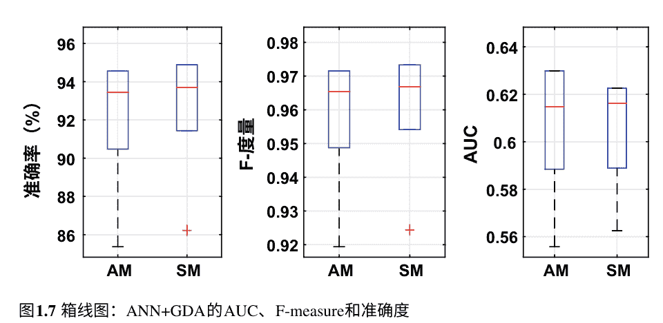

图1.8 箱线图: ANN+NM的AUC、F-measure和准确度

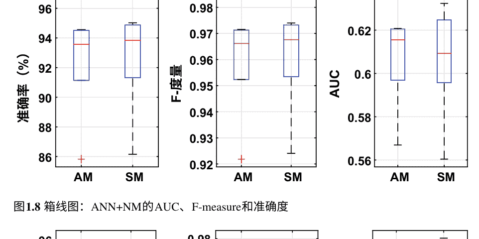

图1.9 箱线图: ANN+LM的AUC、F-measure和准确度

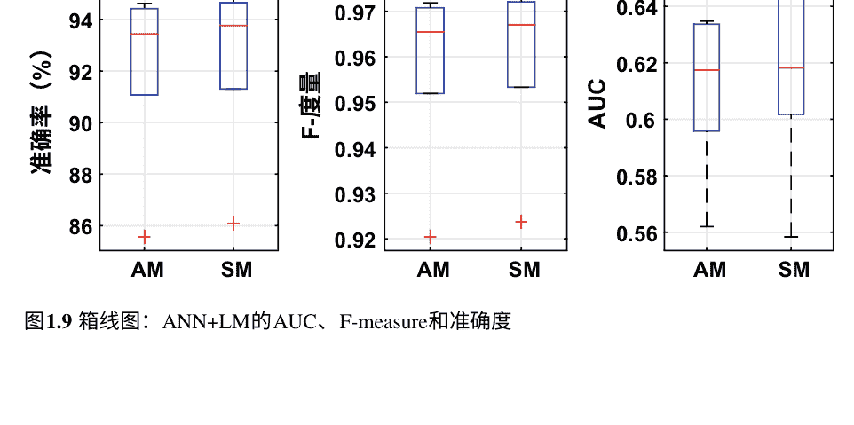

### 1.6.2 分类模型的集成

在这个实验中，我们还使用了具有异质特征的集成技术。这些技术应用于eBay的五个不同版本，采用一个非线性和两个线性的组合规则，目的是提高变化易感性预测模型的性能。这些技术包括最佳训练集成（BTE）、多数投票集成（MVE）和非线性集成决策树森林（NDTF）。图1.10、1.11和1.12显示了不同性能值的箱线图。这些图包含三个子图，每个子图包含两个箱线图，用于表示使用不相关的显著特征和所有特征开发的模型的性能。图1.10、1.11和1.12的信息表明，MVE方法的性能优于BTE和NDTF方法。图1.10、1.11和1.12的信息还表明，使用集成方法开发的模型在使用个体技术开发的模型场景下具有更好的性能。

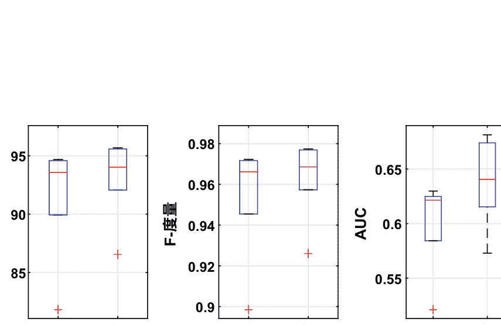

图1.10 箱线图：BTE的AUC、F-measure和准确度

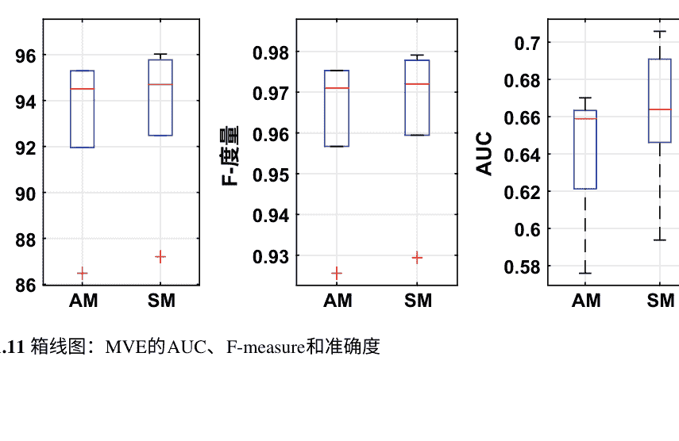

图1.11 箱线图：MVE的AUC、F-measure和准确度## 1.6.3 结果比较

这项工作的主要目标是使用提出的框架找到一组不相关的显著特征，而次要目标是找到最佳的训练算法来建立变化易感模型。在主要目标中，我们使用秩和检验与Bonferroni校正比较了所选特征的预测能力。这个测试的零假设是“使用正确的不相关显著特征集开发的模型的性能值，即AUC，与使用所有特征开发的模型的性能值没有显著差异。”而在次要目标中，我们使用秩和检验与Bonferroni校正比较了不同训练算法的预测能力。

这个测试的零假设是“使用一种算法训练的模型的性能值，即AUC与使用其他算法开发的模型的性能值没有显著差异。”数据挖掘领域的研究人员不建议使用无Bonferroni校正的秩和检验，因为它无法处理家族错误。

所有指标和选定指标：在本节中，我们对AUC、f-Measure、准确率值进行了带有Bonferroni校正的秩和检验，以比较使用不相关显著特征开发的模型与使用所有特征的情况下的性能。上述比较基于一个不同版本的eBay，不同的分类器和不同的集成技术。表1.3显示了对所有性能参数进行带有Bonferroni校正的秩和检验的结果。表1.3包含两个部分。表的第1部分和第2部分用于表示不同组合之间的性能值均差和p值。带有Bonferroni校正的秩和检验的零假设在0.05的阈值上进行评估。表1.3中p值小于0.05的相关信息表明，使用不相关显著特征开发的模型与使用所有特征开发的模型存在显著差异。表1.3中的均差相关信息表明，使用不相关的显著特征开发的模型在使用所有特征的模型场景下具有更好的性能。

## 表1.3 不相关的显著特征和所有特征-秩和检验结果和均值差异结果

|   | P值 |   |   | 均值差异 |   |   |
|---|---|---|---|---|---|---|
|   | AM | SM |   | AM | SM |   |
| 准确率 | 1.000 | 0.000 |   | 0.000 | -0.879 |   |
|   |   |   |   |   |   |   |
| F-度量 | 1.000 | 0.000 |   | 0.000 | -0.005 |   |
|   |   |   |   |   |   |   |
| AUC | 1.000 | 0.002 |   | 0.000 | -0.016 |   |

## 表1.4 分类器：秩和检验结果和均值差异结果

**P值**

|   | GD | GDM | GDX | NM | LM | BTE | MVE | NDTF |
|---|---|---|---|---|---|---|---|---|
| GD | 1.00 | 0.77 | 0.91 | 0.77 | 0.19 | 0.16 | 0.00 | 0.00 |
| GDM | 0.77 | 1.00 | 0.85 | 0.57 | 0.05 | 0.05 | 0.00 | 0.00 |
| GDX | 0.91 | 0.85 | 1.00 | 0.56 | 0.16 | 0.10 | 0.00 | 0.00 |
| NM | 0.77 | 0.57 | 0.56 | 1.00 | 0.08 | 0.08 | 0.00 | 0.00 |
| LM | 0.19 | 0.05 | 0.16 | 0.08 | 1.00 | 0.43 | 0.00 | 0.00 |
| BTE | 0.16 | 0.05 | 0.10 | 0.08 | 0.43 | 1.00 | 0.00 | 0.00 |
| MVE | 0.00 | 0.00 | 0.00 | 0.00 | 0.00 | 0.00 | 1.00 | 0.85 |
| NDTF | 0.00 | 0.00 | 0.00 | 0.00 | 0.00 | 0.00 | 0.85 | 1.00 |

**均值差异**

|   | GD | GDM | GDX | NM | LM | BTE | MVE | NDTF |
|---|---|---|---|---|---|---|---|---|
| GD | 0.00 | 0.02 | 0.00 | 0.00 | 0.01 | 0.01 | 0.05 | 0.05 |
| GDM | -0.02 | 0.00 | 0.00 | 0.00 | 0.03 | 0.03 | 0.06 | 0.07 |
| GDX | 0.00 | 0.00 | 0.00 | 0.01 | 0.01 | 0.01 | 0.05 | 0.05 |
| NM | 0.00 | 0.00 | 0.01 | 0.01 | 0.01 | 0.01 | 0.05 | 0.05 |
| LM | -0.01 | -0.03 | -0.01 | -0.01 | 0.00 | 0.00 | 0.04 | 0.04 |
| BTE | -0.01 | -0.03 | -0.01 | -0.01 | 0.00 | 0.00 | 0.03 | 0.03 |
| MVE | -0.05 | -0.06 | -0.05 | -0.05 | -0.04 | -0.03 | 0.00 | 0.00 |
| NDTF | -0.05 | -0.07 | -0.05 | -0.05 | -0.04 | -0.03 | 0.00 | 0.00 |

分类技术：在本节中，我们对使用不同训练算法开发的模型的AUC、F-Measure、准确率进行秩和检验，并进行Bonferroni校正，以比较与集成技术场景下开发的模型的性能。在这个实验中，我们考虑了五种训练算法和三种集成技术，以开发一个预测易变性的模型。上述比较基于eBay的不同版本和两组不相关的显著特征和所有特征。表1.4显示了不同技术的所有性能参数的秩和检验结果和Bonferroni校正结果。表1.4包含两个部分。表的第一部分和第二部分用于表示不同组合之间性能值的p值和均值差异。秩和检验的零假设进行了Bonferroni校正，评估结果为0.05阈值。上述方程中的变量 i, n 用于表示不同对的数量。由于我们使用了八种技术，所以 i, n 的值变为 8技术C2 = 8*7/2=28。因此，带有Bonferroni校正的秩和检验的零假设被评估为 0.05/28 = 0.0018 阈值。表1.4中与p值相关的信息表明，使用不同技术开发的模型在大多数情况下是显著相同的，即28个中有16个是显著相同的。表1.4中与p值相关的信息还表明，使用神经网络开发的模型与使用MVE和NDTF集成技术开发的模型情景显著不同。表1.4中与均值差异相关的信息表明，使用Levenberg Marquardt (LM) 训练算法开发的模型在与其他训练算法开发的模型情景下具有更好的性能。表1.4中与均值差异相关的信息还表明，使用集成技术开发的模型在与其他训练算法开发的模型情景下具有更好的性能。

## 1.7 结论

在本文中，使用提出的框架研究了度量的预测能力。使用提出的框架检索到了显著不相关的度量，这些度量被视为变更易发性预测模型中的特征。

在五个不同版本的eBay网络服务上研究了提出的框架和开发的模型的可行性和有效性，并使用AUC、F-Measure和准确性等三个性能参数进行了验证。实验结果的信息表明：

- 可以使用度量开发模型来预测Web服务的变更易发性。
- 使用正确的特征集相比于所有特征可以获得更好的性能。
- 使用不同的权重技术训练的模型的预测能力并不显著相同，但Levenberg-Marquardt（LM）训练算法为变更易发性预测提供了更好的模型。
- 即使删除了76.19%的不显著特征，模型的预测能力也没有降低。
- 使用集成技术和神经网络开发的模型明显不同，但集成方法的性能优于神经网络。

## 参考文献

1.  Y. Zhou, H. Leung, 使用多元自适应回归样条预测面向对象软件可维护性。 J. Mater. Process. Technol. **80**(8), 1349–1361 (2007)
2.  G. Forman, 文本分类的特征选择度量的广泛实证研究。 J. Mach. Learn. Res. **3**, 1289–1305 (2003)
3.  C. Furlanello, M. Serafini, S. Merler, G. Jurman, 基于熵的基因排名方法，无选择偏差用于微阵列数据的预测分类。 BMC Bioinform. **4**(1), 1 (2003)
4.  E. Fiesler, 神经网络分类和形式化。 Comput. Stand. Interfaces **16**(3),231–239 (1994)
5.  T.B. Ludermir, W.R. de Oliveira, 无权重神经模型. Comput. Stand. Interfaces **16**(3), 253–263 (1994)
6.  J.L.O. Coscia, M. Crasso, C. Mateos, A. Zunino, S. Misra, 使用细粒度变化分析Web服务的演化, in第19届国际Web服务会议(ICWS) (2012), 页码392–399
7.  S.R. Chidamber, C.F. Kemerer, in面向面向对象设计的度量套件, vol. 26. ACM
8.  W. McCulloch, W. Pitts, 神经活动中的思想逻辑演算. Bull. Math. Biophys. **5**(4), 115–133 (1943)
9.  R. Kohavi, 交叉验证和自助法在准确性估计和模型选择中的研究, in第14届国际人工智能联合会议论文集, 圣马特奥(1995), 页码1137–1143

## 第二章 使用ERD、用例点方法和机器学习进行基于Web的应用程序的工作量估计

Dhiraj Kumar Goswami, Soham Chakrabarti和Saurabh Bilgaiyan

摘要 在开发应用程序之前，基于Web的应用程序的工作量估计被视为最重要的过程。许多研究和调查表明，准确的工作量估计率可以提高应用程序开发的成功率。有几种方法可以估计基于Web的应用程序的工作量。早期的工作量估计过程不包括应用程序的后端部分或数据库部分。由于现在的软件更加数据中心化，因此数据库已成为软件产品的关键部分，因此为了获得更准确的估计结果，必须考虑基于Web的应用程序的后端部分。本文介绍了使用不同技术对包括后端部分的Web应用程序进行更准确的工作量预测。本文讨论了使用后端的提议的工作量估计方法，并与包括机器学习模型在内的当前模型进行了基准测试。

- 机器学习（ML）
- 未调整的演员权重（UAWt）
- 技术考虑复杂性因素（TCCF）
- 环境考虑复杂性因素（ECCF）
- 基本演员总数（TCBA）
- 中等演员总数（TCMA）

## 2.1 引言

对于基于Web的应用程序的工作量估计是IT行业最重要的衡量指标之一。Web应用程序估计也可以被定义为相对判断应用程序所需的工作量。在开发过程的早期阶段估计基于Web的应用程序的工作量和成本是不可能的，因为有许多因素，例如，收集的需求可能不包含所需的估计信息，客户的需求或要求可能在开发过程中发生变化，用于开发应用程序的所需技术可能不足，从而影响开发成本和时间[1, 2]。这可能导致工作量和成本的错误计算，这可能会产生许多后果，例如，应用程序在开发过程中所需的工作量和成本与估计的工作量和成本不同，开发应用程序所需的人力资源可能会有所变化，因此开发过程的成本可能会增加与估计成本相比[3]。因此，如果估计不准确，公司可能会面临巨大的损失。因此，工作量和成本估计过程是公司开发基于Web的应用程序的最重要过程之一[2, 3]。

在估算成本和工作量的过程中可能出现的另一个复杂情况是，在估算过程中没有纳入后端部分的网络应用程序。因此，估算的准确性不高。但是，现在的网络应用程序更加注重后端和数据中心。因此，在工作量估算过程中，网络应用程序的后端部分起着重要的作用[3]。因此，在网络应用程序的工作量估算过程中，后端部分或数据库被纳入考虑。数据库的工作量取决于其大小（即数据库中数据项的数量以及与数据库中不同数据项的关系复杂性）[2, 3]。

软件项目管理是一种方法，其中包括确定产品范围、概述网络应用程序的开发过程、资源管理方法以及安排工作量估算和任务的过程。由于技术发展的巨大变化和增长，SPM是最重要的过程。因此，利用过去的经验来开发基于网络的应用程序变得更加困难。这些限制在网络应用程序的开发过程中产生了风险因素。因此，管理基于网络的应用程序变得更加重要的任务[4, 5]。

用例点（UCPt）是一种基于深度学习的网络应用程序工作量估计方法，用于估计网络产品的大小。在设计网络应用程序时，可以使用UCPt当使用Rational Unified Process（RUP）和Unified modeling Language（UML）时。UCPt的概念完全基于用例建模[6, 7]。通过UCPt计算网络应用程序的大小时，使用用例元素、参与者、考虑技术影响和考虑环境影响等因素。通过UCPt估计网络应用程序的大小基本上分为4个部分。它们是参与者权重（UAWt）、未调整用例权重（UUCWt）、未调整技术考虑复杂性因子（TCCF）和环境考虑复杂性因子（ECCF）[7]。

机器学习方法也可以用于估计工作量。使用随机森林和其他集成学习方法训练的模型可以用于估计基于Web的应用程序的工作量和成本，并产生更准确的结果，因为它们可以防止数据集过拟合[8-10]。

## 2.2 文献综述

对于开发人员来说，预测软件开发过程的工作量和成本被认为是最重要的工作之一。以前，基于Web的应用程序开发过程的成本和工作量估计不包括Web应用程序的后端部分，因此估计的准确性不够。但是现在，软件产品更加以数据为中心，其中的后端部分在应用程序的开发中起着非常重要的作用。因此，现在在开发过程的成本和工作量估计中包括Web应用程序的后端部分。在这篇论文中，Mishra等人提出了一种基于ER图的业务Web应用程序后端大小估计技术。在概念设计阶段，识别了ERD结构的复杂性，包括语义完整性约束的基本概念以及专业化/泛化和聚合的概念。本文还提出了一些用于计算实体、关系和语义完整性约束大小的度量标准。最后，使用COCOMO对软件开发过程的工作量进行了估计。在基于Web的应用程序开发行业中，项目规划的过程是一项至关重要的任务，特别是在需要估计成本、时间和工作量的情况下。在Web应用程序开发过程的工作量估计领域，已经成功开发、测试和实施了许多方法论。但是，与其他软件相比，基于Web的应用程序具有不同的性质，只有少数方法和模型可以提供更准确的开发过程工作量估计。在这篇论文中，Ceke等人分析了使用概念模型和功能大小估计基于Web的应用程序工作量的可能性。

本研究选取了19个基于Web的应用程序及其概念模型进行研究。该研究在构建、评估和验证后显示出有希望的结果。为了成功预测开发软件产品所需的成本、时间和工作量，使用了软件成本和工作量预测方法。

在基于Web的应用程序开发过程中，成本预测通常是根据工作量来确定的。构造性成本模型（COCOMO）是软件开发过程中相当重要的工作量估计技术。在本文中，Algabri等人[12]利用了一些软计算方法，即遗传算法来调整COCOMO模型的参数，以使计算的工作量和成本更加精确。此外，还对提出的方法和COCOMO技术进行了比较，使用了来自NAASA的93个数据集。最终结果提供了更准确和真实的软件开发时间。与开发过程所需的实 际时间相比。这些估计的精确结果对于项目经理来说非常有帮助，可以管理公司的资源。至于未来的工作，必须利用各种软计算方法来调整COCOMO模型的系数。软件成本估算被认为是生产和开发软件项目领域的重要问题。软件开发公司面临的主要问题有两个：按时交付开发的项目和在规定时间内完成开发过程。利用元启发式方法进行软件工作量估算的应用正在增加。工作经验是相对精确估算的先决条件。因此，与软件项目开发相关的风险是基于初始估计的。更高的风险使初始程序更加不确定，随着复杂性和项目规模的增加，不确定性水平也增加。在这篇论文中，Ghar ehchopogh等人[13]通过利用连续遗传算法开发了一种软件工作量估算的进化方法。通过利用NASA项目的数据集来分析和调整COCOMO 2方法，以检验所提出模型的效果。建议的算法对COCOMO 2的变量进行了修正，效果显著。实验结果表明，所提出的方法能够为基于Web的应用程序提供准确的工作量估算。

系统的功能需求在面向对象研究中通过用例模型进行描述。用例点估算考虑了环境和其他技术因素，因此在敏捷开发下能够获得更好的准确性。

它捕捉了系统的功能需求，因此在现代软件工程中被广泛使用。在用例点估算方法中，使用UML用例模型来规定参与者之间的交互，探索架构替代方案，并指定用户界面细节。在这篇论文中，Yavari等人[14]提出，用例点估算建立在用例的大小和复杂性基础上。软件项目的开发是基于之前捕捉到的需求，并且必须按时完成和交付。开发软件的成本需要控制在一定的预算范围内，但往往超出预算，超过时间框架，并且通常无法满足用户的期望。在这篇论文中，Khatri等人[6]指出，尽管以前的估算模型在估算方面取得了成功，但缺乏准确性、客户满意度、软件复杂性以及开发过程中的风险。用例分析捕捉了系统的功能需求，这使其在其他分析方法上具有优势。由于这种优势，用例分析在现代软件工程中被广泛使用。

为了成功交付软件，估计模型在Web应用程序开发过程的早期阶段提供了项目所需工作量的估计，但无法准确预测项目的复杂性。

在这篇论文中，齐等人[7]尝试用增量方法解决了这个困境，其中每个迭代的信息被合并，从而提供了多个工作量估计。这样做是为了在准确性和实用性之间保持平衡。提出了一种工作量估计模型，在用例驱动应用程序开发阶段提供了两个子模型的工作量估计。

D. K. Goswami (✉) · S. Chakrabarti · S. Bilgaiyan
印度奥里萨邦布巴内斯瓦尔的卡林加工业技术学院（KIIT）被认定为大学

电子邮件：dkgoswamiwork@gmail.com
S. Chakrabarti
电子邮件：1605488@kiit.ac.in
S. Bilgaiyan
电子邮件：saurabh.bilgaiyanfcs@kiit.ac.in术语“轻量级”之所以被使用，是因为在早期迭代中可以衡量大小指标。敏捷方法被认为是一种重要的最新软件工程技术，因为它更注重软件开发人员之间的沟通、需求变更和快速交付。传统的方法和度量无法准确预测敏捷软件项目的工作量。在这篇论文中，Garg等人[15]提出了一种最新的工作量和成本估计方法，可用于敏捷软件项目。本文提出的方法适用于敏捷软件项目，因为它利用条件编程来明确检查敏捷方法宣言的适用性。因此，建议的工作量估计技术对于敏捷软件项目具有更准确、更精确的预测，并且更适用。在任何类型的软件项目中，估计工作量的过程不仅是基础，而且被认为是非常重要的组成部分。工作量预测的准确性对于Web应用程序开发的失败/成功率负有重要责任。敏捷方法在基于Web的应用程序开发领域的演变为研究人员提供了更多的空间和需求。

估计敏捷方法的工作量被认为是最大的挑战。尽管传统的估计工作量的技术被用于预测敏捷方法中的工作量，但它们显示出不准确的结果。在这篇论文中，Ziauddin等人[16]主要关注于开发敏捷基于Web的应用程序的工作量估计模型。详细解释了模型的使用和构建。使用了21个软件项目，并根据模型收集了经验数据。最终结果表明，该模型提供了准确的工作量估计。在过去几年中，机器学习已经证明在估计工作量时产生了准确的结果。这篇论文由Monika等人[17]撰写，概述了各种机器学习技术，如人工神经网络、类比估计、模糊逻辑等。本文总结了每种技术的特点和行为，并得出结论，不能将两种技术进行比较，因为它们的行为取决于环境。

本文的下一部分已经以以下方式分布。在第2.3节中，讨论了本文的概述（引言，使用的数据集，问题陈述）。本文提出了对于本文的工作（计算Web应用程序的大小和估计工作量）在第2.4节中进行了描述。最后，第2.5节包含了结论和未来工作。

## 第2.3节的概述

为了开发成功的Web应用程序产品，准确估计开发过程的工作量非常重要。早期的Web应用程序并没有专注于数据库部分，并且在估计过程中没有考虑到它。

但是今天，Web应用程序更加以数据为中心。因此，在工作量估计过程中，包括后端部分和前端部分变得非常重要。

对于传统的Web应用程序开发，已经提出了一些工作量估计方法，例如COCOMO，用例点，功能点等。

因此，在这篇论文中，我们尝试使用两种估算技术（COCOMO和UCPt）的组合来计算Web应用程序的工作量。本研究假设数据库的大小和Web应用程序的前端几乎相等。

### 2.3.1 问题陈述

通过使用实体关系图和用例点的复杂性来估算基于Web的应用程序的工作量。

### 2.3.2 使用的数据集

考虑了5个基于Web的应用程序数据集，用于估算应用程序的大小和预测工作量。所有数据集都是自制的。这5个Web应用程序如下：

- 1. 婚姻网站[18]
- 2. 药店信息[19]
- 3. 酒店管理系统[20]
- 4. 学生注册系统[21]
- 5. 拍卖系统[22]

为每个应用程序设计了ER图和用例模型，以计算每个应用程序的大小。

## 2.4 提出的工作与大小估算

为了更准确地估计基于Web的应用程序的大小，我们使用了两种不同的度量标准。首先，我们利用基于ER图的数据库大小预测（DSPBERD）度量标准估计ER图的大小，该度量标准是由Mishra等人提出的[11]。然后，我们通过设计使用案例模型从先前设计的ER图中估计数据库的大小来计算系统的使用案例点（UCPt）。然后，将两者的总和（即DSPBERD和UCPt）相加，以计算Web应用程序的最终大小。

### 2.4.1 DSPBERD度量标准

为了计算数据库的大小，考虑了以下因素。它们是实体的总大小，关系的大小和语义完整性的大小。

约束。所有这些因素都是从实体关系（ER）图中确定的。使用ER图[11]计算数据库总大小所需的因数如下。

#### 2.4.1.1 实体集的总大小 (TSES)

为了计算实体集中实体的结构大小，首先需要找出属性的数量，它与其他实体集的关系以及它在特化/泛化层次结构中的角色。因此，以下因素是：

- 1. 简单属性的数量 (CSA)
- 2. 派生属性的数量 (CDA)
- 3. 多值属性的数量 (CMA)
- 4. 多对一或一对一完全参与约束的数量 (CM1P)
- 5. 继承深度 (ID)

属性的总数量 (TCOA) = CSA + CDA + CMA + CM1P + ID (2.1)

如果实体集有多个多值属性，则为了保持实体集的关系与第一范式一致，基本关系需要被分解为 (CMA + 1) 个关系。分解后基本关系的属性数量为 (TCOA-CMA)

大小主键 = 1，如果主键在单个属性中存在. (2.2)

大小主键 = x，如果它是一个复合主键并且具有x个属性. (2.3)

大小派生关系 = 大小主键 + 大小多值属性 (2.4)

大小多值属性 = 1，如果多值属性由单个属性组成。 (2.5)

大小多值属性 = x，如果多值属性由m个属性组成. (2.6)

大小实体集 = 大小基本关系 + ∑_{j=1}^{CMA} 大小(派生关系)_j (2.7)

其中，CMA等于从基本关系中获取的满足1NF属性的派生关系的数量

表2.1 TSRS中的因素

| 因素符号 | 因素的描述 |
|----------|------------|
| CODA     | 描述性属性的计数 |
| MMDGR    | M-M关系度 |
| AG       | 聚合计数 |

$$ TotalSize_{Entityset} = \sum_{k=1}^{NP} Size_{(Entityset)_k} $$
其中，NP是ER图中存在的实体集的总数。

#### 2.4.1.2 关系集的总大小（TSRS）

ER图中关系集的结构大小可以被称为它包含的描述性属性的计数，与该关系集链接的实体集的计数以及它在聚合中的关联的度量。用于估计关系大小的因素在下表2.1中提到：

$$ Size_{Relationshipset} = CODA + 2 * Size_{Primarykey}, 当MMDGR = 1 $$

$$ Size_{Relationshipset} = CODA + \sum_{k=1}^{MMDGR} Size_{(Primarykey)_k}, 当MMDGR \geq 2 $$

在这里，k = 与关系集相关的实体集的数量。

关系集的总大小（TSRS）可以通过以下方程计算：

$$ 总大小_{关系集} = \sum_{j=1}^{NQ} 大小_{(关系集)_j} $$

其中，NQ是M-M关系的数量。

#### 2.4.1.3 语义完整性约束的总大小（TSSIC）

所有语义完整性约束的总大小可以估计为每个约束的LOC的总和。

$$ 总大小_{SIC} = \sum_{p=1}^{p=q} (LOC)_p $$

其中，q被称为语义完整性约束的总数。

#### 2.4.1.4 从ER图中的数据库的总大小（TSDBERD）

$总大小_{DBERD} = 总大小_{实体集} + 总大小_{关系集} + 总大小_{SIC}$ (2.13)

### 2.4.2 UCPt 方法

通过UCPt计算Web应用程序的大小，使用案例元素、参与者、技术影响考虑和环境影响考虑等因素被利用。通过UCPt估算Web应用程序的大小基本上分为4个部分。它们是参与者权重（UAWt）、未调整的使用案例权重（UUCWt）、未调整的技术考虑复杂性因素（TCCF）和环境考虑复杂性因素（ECCF）。

#### 2.4.2.1 未调整的使用案例权重（UUCWt）

UUCWt是用于确定Web应用程序大小的组成部分之一。这个计算是基于使用案例的数量和复杂性。每个使用案例都被识别并确定为基本、中等和复杂。这个分类是基于使用案例涉及的事务数量。每个分类都有一个预定的值分配给它。在识别系统中的所有使用案例后，它们被分类到这3个类别中，然后它们被总结起来计算总的UUCWt。表2.2表示使用案例的分类：

$UUCWt_{总计} = (BUC的总数 \times 5) + (MUC的总数 \times 10) + (CUC的总数 \times 15)$ (2.14)

| 用例的分类 | 事务计数 | 预定义权重 |
| :--- | :--- | :--- |
| 基本 | 1-3个事务的计数 | 5 |
| 适度 | 4-7个事务的计数 | 10 |
| 复杂 | 超过8个事务的计数 | 15 |

表2.3 参与者的分类

| 参与者的分类 | 参与者的描述 | 预定义权重 |
| :--- | :--- | :--- |
| 基本 | 通过明确定义的API与另一个系统进行交互的外部系统 | 1 |
| 适度 | 通过使用基本协议如HTTP、数据库、FTP等与另一个系统进行交互的外部系统 | 2 |
| 复杂 | 参与者必须是使用GUI进行交互的人类 | 3 |

#### 2.4.2.2 未调整的参与者权重 (UAWt)

UAWt是另一个用于估计基于Web的应用程序大小的组件。计算是基于用例图中存在的参与者的数量和其复杂性。确定存在的参与者类型的过程与UUCWt相同。它们被分为3个类别：基本、中等和复杂。然后，每个类别都被赋予一些预定义的值。下表2.3将显示分类：

TotalUAWt = (TCBA × 1) + (TXMA × 2) + (TCCA × 3)   (2.15)

#### 2.4.2.3 技术考虑复杂性因素 (TCCF)

该组件用于估计Web应用程序的大小，以便考虑到影响系统的一些技术因素。基本上有13个被考虑的技术因素。因素的影响通过将值从0（最不相关）分配到5（最相关）来确定系统。然后，将分配的值乘以每个因素的预定义值，然后将所有值相加以计算总技术因素（TTF）。然后，这个TTF值进一步用于计算总TCCF。下表2.4显示了所有13个因素及其预定义值：

TotalTCCF = 0.6 + (TTF / 100)   (2.16)

#### 2.4.2.4 环境考虑复杂性因素 (ECCF)

用于估算Web应用程序大小的最后一个组件是ECCF。该因素用于对可能影响系统的环境因素进行一些问责。它通过为每个因素分配从0（最不相关）到5（最相关）的值来进行分类。然后

表2.4 技术因素的描述

| 因素 | 因素的描述 | 预定义权重 |
|------|------------|------------|
| TF1 | 分布式系统 | 2 |
| TF2 | 性能/响应时间 | 1 |
| TF3 | 终端用户的效率 | 1 |
| TF4 | 内部处理的复杂性 | 1 |
| TF5 | 代码的可重用性 | 1 |
| TF6 | 简单安装 | 0.5 |
| TF7 | 简单利用 | 0.5 |
| TF8 | 平台的可移植性 | 2 |
| TF9 | 系统的维护 | 1 |
| TF10 | 并发处理 | 1 |
| TF11 | 安全特性 | 1 |
| TF12 | 第三方参与 | 1 |
| TF13 | 面向最终用户的培训 | 1 |
| TF14 | 所需技术的可用性 | 2 |

该值与每个因素的预定义值相乘，以计算总环境因素（TEF）。下表2.5包含了所有10个环境因素的描述。然后使用TEF的值来通过以下公式计算总ECCF：

$$ ECCF = 1.4 + (-0.03 \times TEF) (2.17) $$

表2.5 环境因素的描述

| 环境因素 | 描述 | 预定义权重 |
|----------|------|------------|
| EF1 | UML知识 | 1.5 |
| EF2 | 应用经验 | 0.5 |
| EF3 | 面向对象系统的经验 | 1 |
| EF4 | 主要分析师的能力 | 0.5 |
| EF5 | 动机 | 1 |
| EF6 | 稳定性要求 | 2 |
| EF7 | 兼职员工的要求 | -1 |
| EF8 | 编程语言的复杂性 | 2 |
| EF9 | 开发的位置 | 2 |
| EF10 | 网络通信 | 1 |

## 基于Web的应用程序的2.5工作量估计

使用DSP-BERD度量和UCPt方法计算了基于Web的应用程序的大小。在表2.6中，通过DSPBERD度量计算了Web应用程序的大小，然后计算了估计工作量和实际工作量。为了计算估计工作量，使用了半脱钩COCOMO方法。

$$ 估计工作量 = 3 \times 总大小^{1.2} (2.18) $$

为了计算实际工作量，使用了公式2.19。

$$ 实际工作量 = -13.074 + 0.092 \times TSES - 2.232 \times TSRS + 1.247 \times TSSIC (2.19) $$

计算工作量的单位是人时 (PH)

现在，同样地，通过使用UCPt方法计算Web应用程序的大小。在找到Web应用程序的大小之后，再次计算估计和实际工作量，如表2.7所示。图2.1显示了实际工作量和估计工作量之间的比较。为了计算估计工作量，使用的公式是所需工作量由估计工作量 = UCP × 每个UCP的PH计算。将20人时PH与确定的UCPt值相乘，如Karner [29]提出的方法，以找到估计工作量。之后是实际值

**表2.6 通过DSPBERD度量进行工作量估计**

| 项目编号 | TSES | TSRS | TSSIC | TSDBERD | 估计工作量 (1) | 实际工作量 (1) |
| :---: | :---: | :---: | :---: | :---: | :---: | :---: |
| 1 | 25 | 12 | 33 | 70 | 50.092 | 18.557 |
| 2 | 24 | 33 | 32 | 89 | 52.837 | 14.263 |
| 3 | 32 | 33 | 42 | 107 | 61.161 | 16.508 |
| 4 | 27 | 12 | 44 | 83 | 50.777 | 17.494 |
| 5 | 33 | 16 | 54 | 103 | 64.666 | 18.644 |

**表2.7 UCPt的工作量估计**

| 项目编号 | UUCWt | UAWt | TCCF | ECCF | TotalUCPt | 预估工作量(2) | 实际工作量(2) |
| :---: | :---: | :---: | :---: | :---: | :---: | :---: | :---: |
| 1 | 35 | 8 | 1.19 | 0.47 | 24.05 | 481 | 840 |
| 2 | 70 | 14 | 1.18 | 0.38 | 37.67 | 753.4 | 600 |
| 3 | 65 | 6 | 1.1 | 0.34 | 26.55 | 531 | 1440 |
| 4 | 40 | 8 | 1.18 | 0.39 | 22.37 | 447.4 | 960 |
| 5 | 65 | 8 | 1.16 | 0.43 | 36.41 | 782.2 | 1080 |

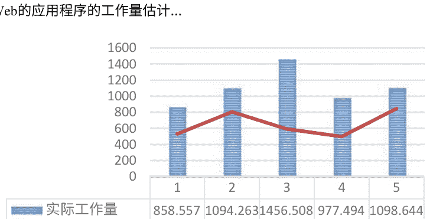

通过使用公式实际工作量＝工人数量 ×每个工人所需时间来计算。工作量的单位为人时（PH）[15]。

在通过DSPBERD度量和UCPt方法计算出估计工作量之后，我们将它们合并在一一起。我们将（估计工作量（1） +估计工作量（2） ）相加以找到总估计工作量。同样，我们将（实际工作量（1） +实际工作量（2） ）相加以找到总实际工作量。然后，我们使用方程式2.20计算相对误差的幅度。然后使用[11]进行平均幅度的相对误差计算。

$$ MRE = \frac{|估计工作量 - 实际工作量|}{实际工作量} $$

通过使用ERR图和用例点的复杂性进行基于Web的应用程序的工作量估计后，我们得到了平均幅度的相对误差为0.391，如表2.8所示。

| 项目编号 | 估计的工作量(1) | 预估工作量(2) | 总估计工作量 | 实际工作量(1) | 实际工作量(2) | 总实际工作量 | MRE | MMRE |
|----------|----------------|---------------|--------------|---------------|---------------|--------------|-----|------|
| 1        | 50.092         | 481           | 531.092      | 18.557        | 840           | 858.557      | 0.381 |      |
| 2        | 52.837         | 753.4         | 806.237      | 14.263        | 600           | 1094.263     | 0.263 |      |
| 3        | 61.161         | 531           | 592.161      | 16.508        | 1440          | 1456.508     | 0.593 | 0.391 |
| 4        | 50.777         | 447.4         | 498.177      | 17.494        | 960           | 977.494      | 0.490 |      |
| 5        | 64.666         | 782.2         | 846.866      | 18.644        | 1080          | 1098.644     | 0.229 |      |

## 表2.9 属性的详细信息

| 属性名称 | 属性信息 |
|----------|----------|
| acap | 分析师能力 |
| pcap | 程序员能力 |
| aexp | 应用经验 |
| modp | 现代编程实践 |
| 工具 | 软件工具的使用 |
| vexp | 虚拟机经验 |
| lexp | 语言经验 |
| sced | 进度约束 |
| stor | 主内存约束 |
| 数据 | 数据库大小 |
| 时间 | CPU的时间限制 |
| 转动 | 周转时间 |
| 虚拟 | 机器的易变性 |
| 复杂 | 进程的复杂性 |
| 可靠性 | 所需软件的可靠性 |
| 行数 | 代码行数 |
| 实际工作量 | 实际工作量 |

## 2.6 使用机器学习进行工作量估计

### 2.6.1 用于训练目的的数据集

Cocomo81 [1] 数据集由Boehm编写，并由“Prentice Hall”出版，标题为“软件工程经济学”，已用于训练目的。总共有63个实例，其中17个属性，其中15个是工作量乘数，一个是关于代码总行数的属性，另一个是实际工作量，如表2.9和2.10所示[23, 24]。

### 2.6.2 支持向量机（SVM）

SVM是一个线性二元分类器，不具备概率性质。给定一个带有类别标签的训练集，模型是基于该训练集构建的，通过该模型可以对测试样本进行类别分配。在SVM模型中，训练实例被映射到一个空间中，通过一个尽可能宽的间隔（边界）来区分不同类别的样本[24]。通过将测试实例映射到同一空间并确定它们所属的类别，可以预测测试实例的类别。在SVM中，数据点被视为具有p维的向量，由一个p-1维超平面分隔。

表2.10 工作量乘数的基本数值

| 参数 | 非常低 | 低 | 标准 | 高 | 非常高 | 超高 |
| :--- | :--- | :--- | :--- | :--- | :--- | :--- |
| acap | 1.46 | 1.19 | 1.00 | 0.86 | 0.71 | 不适用 |
| pcap | 1.42 | 1.17 | 1.00 | 0.86 | 0.70 | 不适用 |
| aexp | 1.29 | 1.13 | 1.00 | 0.91 | 0.82 | 不适用 |
| modp | 1.24 | 1.10 | 1.00 | 0.91 | 0.82 | 不适用 |
| 工具 | 1.24 | 1.10 | 1.00 | 0.91 | 0.83 | 不适用 |
| vexp | 1.21 | 1.10 | 1.00 | 0.90 | 不适用 | 不适用 |
| sced | 1.23 | 1.08 | 1.00 | 1.04 | 1.10 | 不适用 |
| stor | 不适用 | 不适用 | 1.00 | 1.06 | 1.21 | 1.56 |
| 数据 | 不适用 | 0.94 | 1.00 | 1.08 | 1.16 | 不适用 |
| 时间 | 不适用 | 不适用 | 1.00 | 1.11 | 1.30 | 1.66 |
| 转动 | 不适用 | 0.87 | 1.00 | 1.07 | 1.15 | 不适用 |
| 虚拟 | 不适用 | 0.87 | 1.00 | 1.15 | 1.30 | 不适用 |
| 复杂 | 0.70 | 0.85 | 1.00 | 1.15 | 1.30 | 1.65 |
| 可靠性 | 0.75 | 0.88 | 1.00 | 1.15 | 1.40 | 不适用 |

存在许多超平面，但选择具有最大间隔的超平面来分离数据的类别。在支持向量机回归中，第一个任务是定义具有最大间隔的最优超平面。然后对输入x进行非线性映射到m维超空间。然后构建一个线性模型[24, 25]。

对于特征空间f(x, w)，线性模型表示为

$$f(x, \omega) = \sum_{j=1}^{m} \omega_j g_j(x) + b \quad (2.21)$$

其中gj(x)是一组非线性变换，b是偏置项。

线性函数用于映射数据。通过核函数将数据转换到更高维的特征空间，以便进行线性分离，如表2.11所示。图2.2显示了实际工作量与支持向量回归估计的工作量。

表2.11 实际工作量与支持向量回归估计工作量

| 项目编号 | 实际工作量 | 支持向量回归估计工作量 |
| :--- | :--- | :--- |
| 1 | 858.557 | 703.39 |
| 2 | 1094.263 | 731.3818261 |
| 3 | 1456.508 | 811.0344739 |
| 4 | 977.494 | 725.48 |
| 5 | 1098.644 | 731.3829171 |

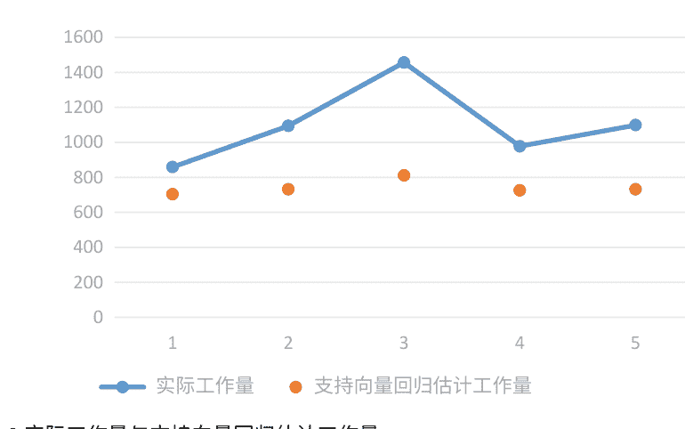

图2.2 实际工作量与支持向量回归估计工作量

使用的参数—[使用的核函数—RBF，Gamma值—0.1，C值—1e0]。

### 2.6.3 最近邻算法

最近邻算法是一种基于实例的学习器。它通过简单地存储输入特征并根据最近邻的距离进行比较，来预测未知样本的因变量值。

邻居元素的计算取决于k的值。k表示确定数据所属类别的邻居数量。

使用多数投票法选举最近邻。k-NN算法不需要显式的训练集。它对数据的结构非常敏感。在k-NN回归中，基于一个或多个独立参数与一个因变量（响应）参数之间的关系建模，从而估计因变量的值[26]。

KNN中使用的距离函数有

- 1. 闵可夫斯基距离
$$D_{M I}=((x_{1}-x_{2})^{2}+(y_{1}-y_{2})^{2})^{\frac{1}{p}}$$
(2.22)

- 2. 欧几里得距离
$$D_{E}=\sqrt[2]{(x_{1}-x_{2})^{2}+(y_{1}-y_{2})^{2}}$$
(2.23)

**表2.12 实际工作量与knn估计工作量**

| 项目编号 | 实际工作量 | knn估计工作量（cluker） |
|----------|------------|-------------------------|
| 1        | 858.557    | 1004.14                 |
| 2        | 1094.263   | 1164.342857             |
| 3        | 1456.508   | 1275.6                  |
| 4        | 977.494    | 976.8                   |
| 5        | 1098.644   | 1168.2317               |

## 3. 汉明距离

$$D^{HAD}(i,j) = \sum_{k=0}^{n-1}[y_{i,k} = y_{j,k}]$$

## 4. 马氏距离

$$D_{MA} = \sqrt{\sum_{i=1}^{n} ((x_i - y_i)^2)}$$

通过选择较大的K值来减少整体噪声。然而，特征空间的明显边界会受到影响。使用交叉验证确定更精确的k值。所提出的方法的优点是对于大数据的训练非常高效，并且对于嘈杂的训练数据也很强韧[10]。该方法的缺点是在预测实例标签时仅使用局部先验概率。在[27]中，通过应用离散傅里叶变换从传输线的一个端口测量的电压信号提取特征。它基于k-NN算法的回归模式设计，根据现有可用模式的表2.12[27, 28]估计与新输入模式相关的故障位置。

使用的参数—[n_neighbors: 24, weights: 'uniform'] (图2.3)。

## 2.7 结论和未来工作

从文献中可以观察到，基于网络的应用程序变得更加数据中心化。此外，由于大数据、云计算、物联网等最新趋势，网络应用程序更加注重数据。由于这些技术产生了大量数据，导致了基于网络的应用程序的后端部分变得更大和复杂。但是，目前还没有足够的技术和方法来估计基于网络的应用程序的工作量。本研究主要关注将实体关系图和用例点方法相结合的复杂性。

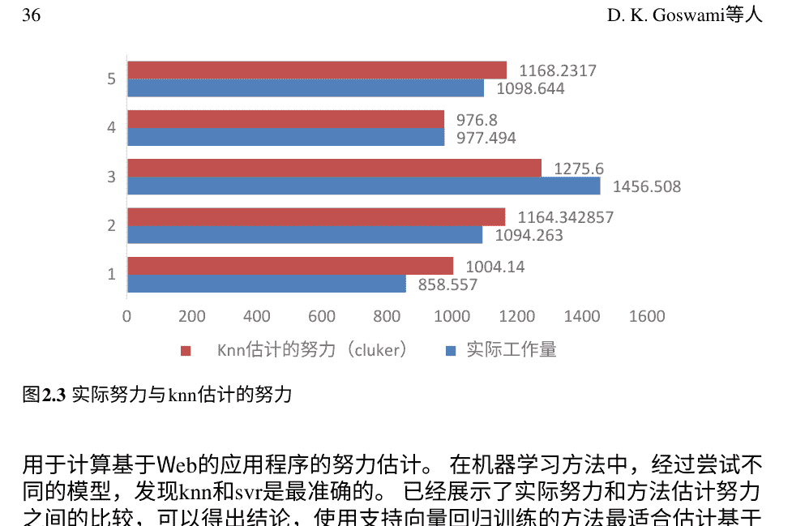

### 图2.3 实际努力与knn估计的努力

用于计算基于Web的应用程序的努力估计。在机器学习方法中，经过尝试不同的模型，发现knn和svr是最准确的。已经展示了实际努力和方法估计努力之间的比较，可以得出结论，使用支持向量回归训练的方法最适合估计基于Web的应用程序的努力。

在Web应用程序的努力估计领域还需要进行更多的研究，并尝试找到更准确地估计努力的因素。Web应用程序的开发正在发生巨大变化。因此，应更加重视努力估计，以提高开发基于Web的应用程序的成功率。还可以考虑采用不同努力估计技术的更多组合，以获得更准确的估计。

使用集成学习方法（如Xgboost和Random Forest）训练的模型可以用于更准确地估计Web应用的工作量。

## 参考文献

- 1. D. Ceke, B. Milašinović, Web应用开发中的早期工作量估计。 J. Syst. Softw. **103**(1), 219–237 (2015)
- 2. M. Usman, R. Britto, L.-O. Damm, J. Börstler, 大规模软件开发中的工作量估计：一个工业案例研究。 Inf. Softw. Technol. **99**(1), 21–40 (2018)
- 3. X. Qin, M. Fang, 软件成本估计的总结。 Procedia Eng. **15**(1), 3027–3031(2011)
- 4. C.T. Cerdeiral, G. Santos, 高成熟度下的软件项目管理：系统文献综述。 J. Syst. Softw. **148**(1), 56–87 (2019)
- 5. J.A.O. Cunha, H.P. Moura, F.J.S. Vasconcellos, 软件项目管理中的决策制定:一项系统性文献综述. Procedia Comput. Sci. **100**(1), 947–954 (2016)
- 6. S.K. Khatri, S. Malhotra, P. Johri, 在软件开发中使用用例点估算技术. Infocom Technologies and Optimization (Trends and Future Directions) (ICRITO)(2016), pp. 123–128
- 7. K. Qi, B.W. Boehm, 在用例驱动项目中的轻量级增量式工作量估算模型. *IEEE第28届年度软件技术会议(STC) (2017), pp. 1–88.*
- 8. J.S. Shirabad, T.J. Menzies, 软件工程数据库的*PROMISE*存储库. Sch.Inf. Technol. Eng. (2015)
- 9. M.Q. 杨, J. 李, S.L. 布隆德, C. 王，基于人工神经网络的直流微电网故障检测和故障定位。 能源程序 *103*, 129-134 (2016年)
- 10. A. 斯韦塔普玛, A. 亚达夫, 基于人工神经网络的双回路串联电容补偿输电线路多点故障定位解决方案。 国际电气能源系统交易 *28* (4), 1-20 (2018年)
- 11. S. 米什拉, R. 玛尔, 基于业务软件后端大小的工作量估计使用ER模型。 世界信息通信技术大会1098-1103 (2011年)
- 12. M. 阿尔加布里, F. 赛义德, H. 马斯库尔, N. 塔古格, 在优化NASA软件项目的软件成本估算使用遗传算法。 信息技术国家研讨会: 走向新的智能世界 (NSITNSW) (2015年), 第1-4页
- 13. F.S. Gharehchopogh, A. Pourali, 基于连续遗传算法的新方法在软件成本估计中。 *J. Sci. Res. Dev. 2*(4), 87–94 (2015)
- 14. Y. Yavari, M. Afsharchi, M. Karami, 使用软件用例点度量法确定软件复杂性水平。 马来西亚软件工程会议(2011), pp. 257–262
- 15. S. Garg, D. Gupta, 基于主成分分析的敏捷软件开发成本估计模型。 国际工业工程与运营管理会议(2015), pp. 1–7
- 16. Z. Ziauddin, S.K. Tipu, S. Zia, 一种敏捷软件开发的工作量估计模型。 *Adv. Comput. Sci. Appl. (ACSA) 2*(1), 314–324 (2012)
- 17. Monika, O.P. Sangwan. 在使用机器学习技术进行软件工作量估计时. 能源第七届云计算、数据科学和工程国际会议—Confluence. Noida (2017年), 第92-98页
- 18. 图片: ASP.Net婚姻网站项目的E-R图. http://wellchoicematrimony.com/membership.php
- 19. 图片: 药店的ER图. 此ER图是创建和共享的. https://beginnersbook.com/2015/04/e-r-model-in-dbms/
- 20. 酒店管理系统中的实体关系|2019年实体关系图模板|酒店预订、管理、图表. https://in.pinterest.com/pin/464011567830372536/?lp=true
- 21. ER图教程|指南和教程|图表、关系、绘图. https://in.pinterest.com/pin/464011567857076609/visual-search/
- 22. 拍卖的实体关系图. 在一个图表中涉及所有实体和连接的关系. 2019年的计算机与电子学, 图表设计, 图表, 数据科学. https://in.pinterest.com/pin/140807925835422457/?autologin=true.
- 23. H. Dubey, 高效准确的基于kNN的分类和回归. 一篇硕士论文提交给国际信息技术研究所数据工程中心, 第500卷, 第32期, 海得拉巴 (2013年)
- 24. M. Farshad, J. Sadeh, 基于k最近邻算法的传输线准确的单相故障定位方法, 使用单端电压. *IEEE Trans. Power Delivery 27*(4), 2360–2367 (2016年)
- 25. A. Swetapadma, A. Yadav, 一种新颖的基于k最近邻算法的并行传输线单端故障定位方案. 计算机与电气工程 *69*(1), 41–53 (2018年)
- 26. M. Kirmani, A. Wahid, 软件工作量估计的用例点和e-use case point方法: 关键性能比较. 国际计算机应用杂志 *5*(3), 1797–2250 (2015年)
- 27. K.H. Zou, K. Tuncali, S.G. Silverman, 相关性和简单线性回归. 放射学*227*(3), 617–628 (2003年)
- 28. Y. Wu, L. Li, Y. Mao, 多类分类器的实验比较 (报告). *Informatica* (2015)
- 29. G. Karner, 在*Objecty*中的度量. 瑞典林雪平大学 (1993)

# 第3章 机器学习在软件测试中的应用

Sumit Mahapatra和Subhankar Mishra

摘要 在软件中找到、定位和修复错误需要软件开发人员付出很大的努力。传统的测试需要人工搜索和分析数据。人类容易做出错误的假设，从而导致结果偏差，忽视了错误。机器学习帮助系统学习并将学到的知识应用于未来，这有助于软件测试人员获得更准确的知识。多种先进的机器学习技术，如深度学习，在代码补全、缺陷预测、错误定位、克隆检测、代码搜索和学习API序列等多个软件工程任务中具有很强的能力。多年来，研究人员提出了许多方法来自动修改程序。通过生成和验证技术修复程序可以产生可接受的补丁，而不是通过从过去的历史中学习并从正确的代码生成补丁来过度拟合。在适当的环境下，这些方法在减少软件开发人员修复错误的工作量、时间消耗和成本方面起到了重要作用。本章探讨了各种机器学习算法在软件测试和错误修复中的影响。最后一章总结了机器学习和预测分析的未来以及它们如何用于更快地应对客户和他们需求的动态期望的挑战。

关键词 机器学习·软件测试·缺陷预测·漏洞分析·自动化软件测试

S. Mahapatra (✉)
数学系，国立技术研究所，鲁尔克拉，
主楼，鲁尔克拉，奥里萨邦769008，印度
e-mail: sumitmahapatra147@gmail.com
S. Mishra
计算机科学学院，国家科学教育研究所，布巴内斯瓦尔，奥里萨邦752050，印度
e-mail: smishra@niser.ac.in
Homi Bhabha国家研究所，培训学校综合大楼，
Anushaktinagar，孟买，马哈拉施特拉邦400094，印度

## 3.1 引言

在当今的时代，计算设备在现代人类生活中起着至关重要的作用。其中尤其是软件及其各种变体使整个人类种族对其产生了依赖。尽管在软件开发中有一些标准实践，但它们是使用各种技术构建的。各种基础技术的广泛应用带来了各自的优点和缺点；然而，也引发了对使用软件构建系统的安全性的担忧。事实上，这是软件工程这个庞大行业中的一个重要关注点。

软件漏洞是一个重大威胁。它们的不同程度以及影响范围、复杂性和攻击面在[1]中已经很清楚地说明了作者们的观点。本章还描述了更多的例子，以说明这个问题的重要性。这种漏洞的一个主要例子是威胁互联网用户安全和隐私的浏览器扩展程序；例如Adobe Flash Player [2]和Oracle Java [3]。

在每年报告的众多漏洞中，上述示例只是其中的几个。这些安全问题的严重性使其成为工业界和学术界持续研究的领域。在[4]中对各种方法进行了简要调查，数据科学和人工智能（AI）的技术最近被用于减轻和避免软件漏洞的发现和分析问题。然而，文献中缺乏对这些技术的调查和分析。

在本章中，第3.2节介绍了数据挖掘和机器学习方法在发现和分析软件漏洞方面的研究。第3.3节简要介绍了软件度量和基于这些度量的漏洞预测。第3.4节介绍了各种异常检测方法。第3.5节介绍了易受攻击代码的模式识别。最后，第3.6节介绍了一种基于机器学习的自动化软件测试系统，并在第3.7节中总结了这些技术。结论在第3.8节中提供。

## 3.2 背景：软件漏洞分析和发现

### 3.2.1 定义

本节将从软件漏洞的定义开始，这是整个章节的核心内容。在关于软件易感性检查的博士论文中，Ivan Krsul指出：

> “软件规范、开发或配置中的错误实例，其执行可能违反安全策略”[5]。

尽管在承认Krsul的观点后，Ozment提出了一点修改，并指出：

> “软件漏洞是规范、开发或配置中的错误实例，其执行可能违反显式或隐式的安全策略”[6]。

与此前提到的定义相一致，行业专家也提供了相应的定义：

> “在软件安全的背景下，漏洞是指软件中的特定缺陷或疏忽，允许攻击者进行恶意操作：暴露或更改敏感信息，破坏或销毁系统，控制计算机系统或程序”[7]。

从上述定义中推断，软件漏洞使用不同的习语进行定义。为了清晰地了解这些习语并选择合适的习语，参考了IEEE软件工程术语标准词汇表[8]。

这里的重点是四个关键术语及其定义：“错误”，“故障”，“失效”和“错误”。根据IEEE标准（1990年）的说法，错误的内涵是：“理论值/条件与计算值或可以称为测量值之间的差异”[8]。现在，故障基本上是指：“系统软件中的错误线索或过程或数据内涵”[8]。缺陷或错误是用来指代故障的常见术语。失效是指：“模块无法在规定的执行要求范围内执行其基本目的”的能力不足[8]。最后，错误是指：“由于人类错误而产生的错误结果”[8]。这种分类的思想是“区分人类错误（错误结果），硬件或软件的缺陷（故障），缺陷的后果（失效），导致错误结论的总体结果差异（错误）”[8]。

软件易受攻击性基本上是由于软件设计、开发或配置中的一个或多个错误而导致的缺陷，从而可以被利用来违反某些明确或隐含的安全策略。

### 3.2.2 完备性、正确性和不可判定性

程序易受攻击性检查基本上用于对给定的程序进行分类，以确定其中是否存在已知的安全漏洞。同样，不可判定意味着对于存在的问题没有适当或确切的结果[9-11]。如果在软件漏洞的上下文中没有可攻击的程序通过，则易受攻击性检查系统是正确的。如果没有错误的易受攻击性通过或者换句话说，所有无错误的程序都被批准，则被称为准确的。因此，一个正确和准确的易受攻击性分析系统可以接受每个无错误的程序并拒绝每个易受攻击的程序[11]。然而，这样的正确和准确的系统并不存在[12]。

现在让我们来看看程序漏洞发现系统基本上是什么。除了已知的漏洞分析之外，一个程序漏洞-能力发现系统被认为是最实用的。与对给定程序的安全性进行审查并批准或不批准的普遍共识相反，程序漏洞发现系统报告了更详细的信息，如类别、位置等，用于指定程序中所有发现的漏洞。在检测和修复漏洞方面起着重要作用的软件开发人员和工程师是最受此系统帮助的人，因此它是软件行业中理想的系统。

### 3.2.3 传统方法

尽管软件安全领域存在问题的单调本质，其分析和发现，学术界和软件领域的执行者们提出了许多观点，这是由于这个问题的重要性。推荐的观点都是自动的近似，每个观点都在某种程度上缺乏。因此，由于软件检查和定位过程的特定步骤，研究人员正在尝试提出与先前解决方案相似的升级解决方案。例如：检查覆盖率、发现精度、运行时效率等。所有检查进展都可以分为基本上三个主要部分：

- 1. 静态分析
- 2. 动态分析
- 3. 混合分析
- 4. 模糊测试 [其他已知方法]
- 5. 静态数据流分析 [其他已知方法]。

#### 3.2.3.1 静态分析

在这种分析中，对给定程序的源代码进行分析，而不实际执行它。这里的技术采用了近似模式，以检查程序的属性（即可能报告最佳的虚假漏洞，且没有漏报的漏洞）。因此，精确的假设会导致较少的错误软件漏洞。基本上，必须在正确检查的准确性和方法性的数量计算之间取得适当的平衡。

#### 3.2.3.2 动态分析

在这种分析中，通过使用一些特定的输入数据来监控给定程序的运行时功能。在这种技术中，使用测试用例分析程序的属性，实际上测试用例的数量可能会突然变化。包括输入数量和运行时间状态，因此它不在此分析系统的范围内分析程序的行为。因此，从实践者的角度来看，最理想的情况是分析系统是完整的。

然而，与此类缺点不同，它在软件行业中被广泛使用。

#### 3.2.3.3 混合分析

它是静态分析和动态分析技术的结合。根据上述描述，关于静态和动态分析的一个误解可能导致得出混合分析比其他分析更好的结论。然而，这是错误的，虽然混合分析技术可以从两种检查方法的优势中受益，但它们也受到两种方法的限制。因此，这种检查技术可以通过静态分析系统和混合分析系统分别排除错误的易感性或检查测试用例偏好和检查程序。其他一些已知的分析包括模糊测试和静态数据流分析。

#### 3.2.3.4 模糊测试

它也被称为随机测试，并且用于检查故障。在这里，输入数据被随机修改，然后使用这些输入对程序进行测试[13, 14]。通常会大量输入这些输入，以便控制故障的数量。

#### 3.2.3.5 静态数据流分析

被称为“污染数据流分析”，这是一种分析技术，其中该技术将来自已知/输入源的可疑数据标记为损坏的数据。然后观察到流向敏感程序（代表敏感程序）的流动，作为漏洞的指标[15–18]。这种分析方法在软件行业中被广泛使用。

### 3.2.4 对以前的工作进行分类

在过去的几年中，已经提出了许多研究，涉及使用机器学习技术来检查软件的易受攻击性和检测。有三个主要类别，定义如下。

#### 3.2.4.1 基于软件度量的漏洞预测模型

这个类别涉及到主要关注点在于基于已知的软件度量特征集建立预测模型，然后根据这个模型评估易受攻击的状态。在这个类别中，软件度量在定位软件漏洞方面起着关键作用。

#### 3.2.4.2 异常检测方法

这种技术使用无监督学习方法来检测漏洞。在这种方法中，基于无监督学习提取模型，并根据源代码检查异常行为。在这里，异常行为在识别和检测漏洞方面起着重要作用。

#### 3.2.4.3 易受攻击代码模式识别

在这种分类中，主要关注点是基于监督机器学习技术提取模式，以便根据先前的样本比较和检测源代码中的漏洞。提取模式然后定位漏洞使得这种技术与其他技术不同。

## 3.3 基于软件度量的漏洞预测

易受攻击性预测模型基本上利用统计分析、机器学习和数据挖掘技术，根据常见度量标准识别易受攻击的程序漏洞。度量标准一词基本上被定义为系统、组件或过程具有给定特征的程度的定量度量。鉴于软件程序的调查和认证的资源有限，因此这个过程有助于引入一个模型，以便考虑到能够进行良好组织的软件检查计划。这些原型在学术界和行业界引起了高度关注，因为它们只处理特定类型的故障。

## 3.4 异常检测方法

下面的部分帮助我们了解使用机器学习和数据挖掘技术进行软件漏洞分析和发现的异常检测方法。这些识别方法用于检测与标准模式不匹配并被归类为异常的框架。这些方法旨在通过查找与预期模式不匹配的程序中的错误点来识别软件易感性。基本示例在API使用领域中，包括但不限于函数调用对malloc和free，锁定和解锁。除了这些已知序列，每个API都有其独特的一套程序，可能写得很熟练，但过于复杂。然而，不符合使用模式将导致软件易感性。

在许多其他领域中，异常检测方法对于软件质量是实用的，其中一个领域是识别被忽视的状态或遗漏的检查。事实上，遗漏的检查被认为是许多软件缺陷的根源。这些检查被广泛分为两类：（1）用于真实API运行的检查和（2）使用程序推理的检查。这两个类别都是软件缺陷或软件漏洞的主要原因。以API函数调用的规定输入数据的检查可以作为第一类的例子。缺乏类似的检查可能导致软件的未定义或意外行为（例如，除以零）。这个漏洞也可能对安全性产生不利影响（例如，缓冲区溢出，SQL注入等）。在检索资源对象时未检查主题的授权被认为是第二类漏洞。这些合理的缺陷被认为是安全反响的主要原因，导致安全逻辑漏洞（例如，机密性和完整性访问控制）。

识别异常方面所需的一个关键特征是通过自动提取详细规则和模式来实现的。自动提取正常行为对这些技术的适用性和成功至关重要。然而，如果正常要求由人类用户分配，这将严重妨碍方法的运行，因为：（1）编写要求是一项困难而繁琐的任务，（2）人为错误可能导致不准确的要求，从而导致不正确的结论。

## 3.5 易受攻击的代码模式识别

在这一部分中，描述了另一类使用数据挖掘和机器学习技术通过模式匹配程序来提取代码的属性和特征，并同时定位软件漏洞的概述。这一组技术检查并从源代码中提取属性，无论是高级还是二进制的。但是，与异常检测组不同，这一组技术努力提取易受攻击的代码的模型和草图，而不是正常性的模型和规则。然而，在这类研究中，主要关注的始终是收集大量的软件漏洞数据集

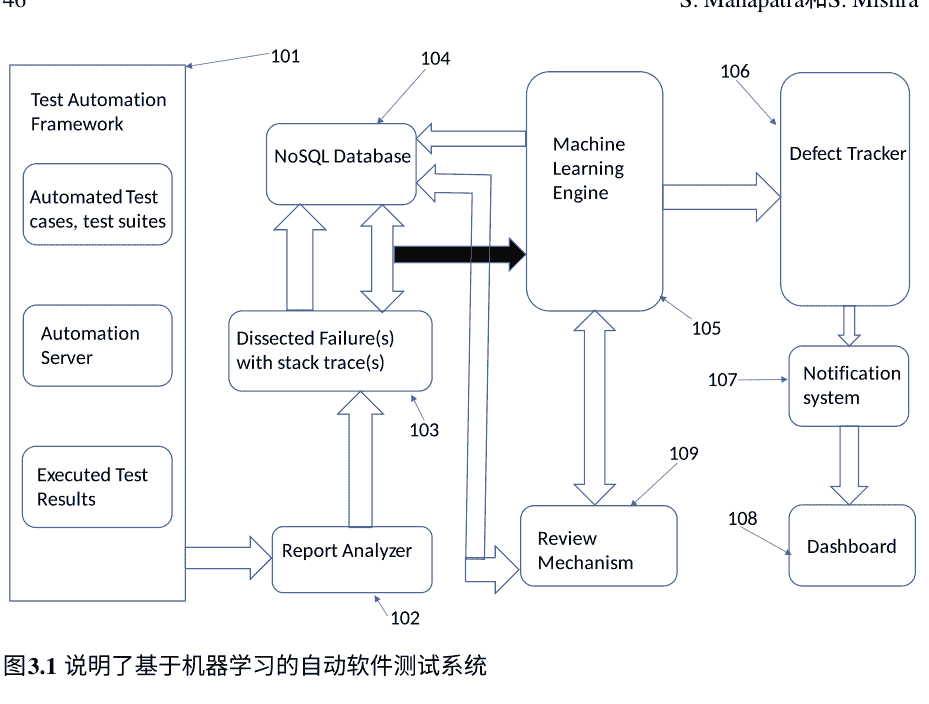

## 3.6 基于机器学习的自动软件测试系统和方法

以机器学习为基础的自动软件测试系统和方法已有先前的发明。基于机器学习的自动错误分类、提交和通知系统是软件测试领域的一种新方法。该发明使现代测试管理生命周期更加高效、自动化和可靠。该发明基于监督/半监督学习，使所有过程自动化并节省时间。算法和程序控制质量，以便以高效的方式处理任意数量的缺陷。

### 自动化软件工程：基于深度学习的方法

软件测试自动化框架101包含自动化测试用例和自动化测试套件。自动化测试用例代码可以用任何首选的编程语言编写。无论是Python还是其他编程语言。自动化测试套件基本上是一组自动化测试用例、页面对象、辅助程序或实用程序的集合。测试套件通过自动化服务器运行。自动化服务器是一个作为接口或工具的服务器，用于轻松配置或集成所需的要求/依赖项/框架/测试套件以执行程序以获得所需的结果。可以根据所需的计划或偏好设置这些作业的时间，无论是运行自动化测试还是构建软件、移动应用等。在发明的首选范例中，当运行自动化测试时，它们以预定的格式提供结果。

报告解析器解析这些结果，捕获失败或异常及其相应的堆栈跟踪。报告解析器102是一个程序，它遍历结果文件的整个内容，并搜索特定的属性或关键字。在发明的范例中，测试自动化结果以任何所需的格式获得，最好是XML格式。系统从Jenkins服务器位置选择包含记录结果的XML文件，并使用首选的编程语言（例如，在这种情况下使用基于Python的解析脚本），它遍历XML文件的全貌，以过滤出所有相应的测试的失败或异常及其相应的堆栈跟踪103。

解析结果的记录是在一个NoSQL数据库104表中完成的，在进一步处理之前，这些结果将与历史结果进行比较。在发明的首选范例中，故障或异常以及已经存在缺陷/错误票的历史捕获故障或异常的列表被存储在NoSQL数据库104中，以便与新遇到的故障或异常进行当前比较。在发明的一种实施方式中，一旦在NoSQL数据库中找到故障或异常，ML引擎105会检测过去是否为自动化测试创建了缺陷票。在这种情况下，故障或异常不是新的，而是已知的，并且已经被归档/记录并用于调试。在发明的首选实施方式中，当ML引擎105无法在历史数据中找到当前的故障或异常时，它会认识到这是一个新的问题，并且需要将其作为新的缺陷进行归档。

ML引擎105使用测试管理工具及其应用程序编程接口（API）将故障或异常作为新缺陷进行报告，并上传所有相关的堆栈跟踪或异常信息到工单中。在发明的范例中，如果失败是历史上遇到的，则错误的严重程度和测试用例的优先级保持不变。但是，如果失败是新的，则ML引擎105获取发生失败的自动化测试用例的优先级并且缺陷的严重程度可以通过两种方式进行映射。在第一种方式中，如果失败的测试用例具有较高的优先级，则认为该错误的严重程度较高如果测试用例失败，则优先级较低，这意味着该错误的严重程度较低。通过这种方式，系统具有将故障的严重程度映射到缺陷工单的机制。在第二种方式中，ML引擎105通过查看故障或异常以及堆栈跟踪来提供学习的能力了解何时发生这种异常以及缺陷工单的严重程度是多少。这种学习是无监督的因为ML使用历史数据进行学习。最好的情况是，如果ML算法预测的严重程度与测试工程师的要求不符，他可以更改在机器学习的NoSQL数据库104映射结构中，对此类故障或异常的严重性进行映射。这是有助于使ML更准确和精确的反馈。

在发明的首选范例中，ML无法处理所有类型的场景和异常情况，因为它是基于提供的数据进行学习的，并以监督和无监督的方式进行学习。反馈机制109有助于微调或调整ML算法，使其学习更加精确和针对性，以提供可以理解的输出。此外，反馈机制还用于微调质量。由于所有过程都是自动化的，因此节省了相关人员的时间。因此，算法和程序控制质量，因此可以处理任意数量的缺陷。发明的另一范例是，故障预测包括在缺陷跟踪工具中创建错误票。票务创建意味着将故障或异常作为缺陷或错误记录在缺陷/错误跟踪工具106中，例如JIRA，Bugzilla等，以便开发人员查看并修复。在发明的首选范例中，如果故障是新的，则创建一个新的错误票，并将新票的状态保持为“打开”。如果故障已经存在于缺陷跟踪工具106中，并且错误票的状态为“关闭”，则将错误票的状态更改为“重新打开”。如果故障已经存在于缺陷跟踪工具中，并且错误票的状态为“已知”，“延迟”，“打开”，“重新打开”，则系统将添加一个带有当前故障详细信息的评论。所有这些都是通过缺陷/错误跟踪系统的应用程序编程接口（API）完成的。

最好能够根据提交的缺陷或错误数量来预测发布的时间线，这些缺陷或错误以新的或重新打开的工单的形式提交。发布的时间线与创建或重新打开的工单数量成正比。修复问题的开发人员会手动进行估计。ML引擎旨在使用相同的无监督学习技术预测开发人员根据某种故障或异常关闭工单的时间。这些技术在错误分类和提交系统中也被使用。在发明的首选实施例中，当在缺陷跟踪系统中创建或重新打开工单时，利用自动通知系统107通知相关利益相关者。通知通过电子邮件或即时消息发送，内容涉及相关工单。在发明的首选实施例中，仪表板108可配置为图形用户工具/程序/界面，通过它们可以轻松访问结果、日志、故障、关键绩效指标等，以直方图、饼图等形式访问数据库中的数据。

### 自动化软件工程：基于深度学习的方法

基于机器学习的自动化软件测试方法包括以下步骤：通过软件测试自动化框架定期收集测试套件和测试执行结果，可以是每小时、每晚、每周等，在步骤201中。在步骤202，报告解析器解析从软件测试自动化框架生成的测试执行结果，提供故障或异常及其相应的堆栈跟踪。在步骤203中，NoSQL数据库存储具有过去故障或异常的历史缺陷、错误票据。在步骤204中，机器学习引擎评估NoSQL数据库的匹配结果，并预测故障或异常的类型。此外，在步骤205中，缺陷跟踪工具根据故障或异常的类型创建相关的错误票据。自动通知系统在步骤206中向利益相关者发送通知，通知他们有关错误票据的状态。此外，手动反馈机制用于调整机器学习算法和NoSQL数据库表项在第207步。

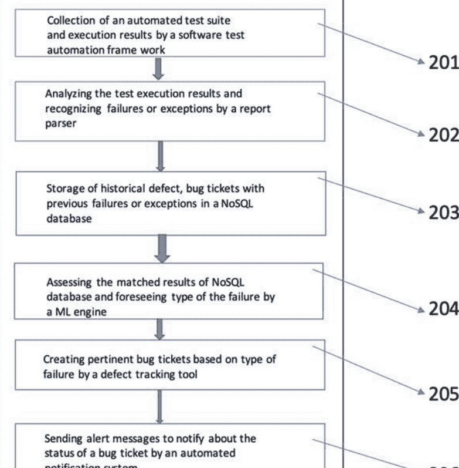

图3.2说明了一种基于机器学习的自动化软件测试方法，符合本发明的一个或多个实施方式

根据发明的一种实施方式，预测故障或异常的方法还包括创建一个新的工单的步骤。这些步骤包括：如果故障是新的，则将状态保持为“打开”。如果工单的状态为“关闭”，则将故障工单的状态更改为“重新打开”，并在更改故障工单的状态后添加带有故障详细信息的评论，以用于已知和延迟的故障。

在发明的一种实施方式中，一旦创建或重新打开故障工单，系统将自动通过电子邮件或即时消息通知相关方有关故障工单的状态。因此，整个过程将自动化。因此，除非算法或机器学习引擎需要通过反馈进行调整，否则不需要人工干预。这使得系统在调试错误时更加精确且耗时更少。与当前最先进的软件测试方法相比，本发明由于更加专注的分析、机器学习算法和反馈机制，提供了更快的操作和更高质量的结果。与静态软件分析工具相比，本发明提供了一种扩展分析以发现深层和复杂的潜在多线程软件错误的方法。此外，通过使用机器学习来学习程序行为，本方法提供了自动挖掘假设程序相关属性的启发式方法。

与计算机软件开发和测试相关的现有原则，特别是基于机器学习的改进软件测试，包括报告解析器、NoSQL数据库、反馈机制和仪表板。通过仪表板可以轻松查看自动化测试套件的质量。因此，可以检查整体质量，并根据观察采取即时行动。

此外，上述各种范式中描述的技术导致了高效、稳健和具有成本效益的软件生产管理和测试，以及软件产品发布后的事件处理。上述范式中描述的技术提供了在生产中测试发现的缺陷的自动化过程，从而确保软件产品质量的一致和可预测交付。机器学习和反馈机制确保该过程在使用后不断提高其效率。反馈机制还接收用户的反馈，以持续改进该过程。

此外，上述范式中描述的技术分析生产缺陷并从中学习模式，将缺陷与现有测试用例相关联，并确保平稳地构建、运行和重新安装到生产环境中。此外，上述范式中描述的技术易于构建和使用，并可与任何系统集成。本系统的描述仅用于说明和描述，不打算详尽或限制所披露的发明形式。对于普通技术人员来说，许多修改和变化都是显而易见的，而不会偏离发明的范围和精神。选择和描述了该实施例，以便最好地解释发明的原则和实际应用，并使其他普通技术人员能够理解适用于各种范式的发明以及各种适合特定使用的修改。

### 所声称的是：

- 1. 基于机器学习（ML）的自动化软件测试系统，该系统包括：
    - a. 一个软件测试自动化框架，配置为收集自动化测试套件和测试执行结果
    - b. 一个报告解析器，用于解析由软件测试自动化框架生成的测试执行结果，并配置为识别故障或异常及其相应的堆栈跟踪）
    - c. 一个NoSQL数据库，配置为保存具有过去故障或异常的历史缺陷、错误票据
    - d. 一个ML引擎，用于评估NoSQL数据库的匹配结果，并配置为预测故障或异常的类型
    - e. 一个缺陷跟踪工具，配置为根据故障或异常的类型创建相关的错误票据
    - f. 一个自动通知系统，配置为通知错误票据的状态
    - g. 一个仪表板，以直方图、饼图等形式便于访问结果、日志、故障、关键绩效指标等
    - h. 用于调整机器学习算法和NoSQL数据库表项的手动反馈机制。
- 2. 根据权利要求1，测试套件通过自动化服务器运行。
- 3. 根据权利要求1，软件测试自动化框架进一步配置为测试Web应用程序、移动应用程序和任何其他类型的软件应用程序，以提供所需形式的测试执行结果。
- 4. 根据权利要求1，报告解析器使用编程语言解析测试执行结果文件。
- 5. 根据权利要求1，ML引擎配置为将解析的失败或异常与NoSQL数据库中的历史数据进行比较，以预测失败或异常是否是新的、延迟的或已知的。
- 6. 根据权利要求5，ML引擎进一步配置为在缺陷跟踪工具中为新的故障创建一个错误票，并更改已知故障的错误票状态。
- 7. 根据权利要求1，自动通知系统被配置为通过电子邮件或即时消息通知利益相关者有关错误票的相应状态。
- 8. 一种基于机器学习（ML）的自动化软件测试方法，该方法包括以下步骤：
    - a. 通过软件测试自动化框架收集自动化测试套件和测试执行结果；
    - b. 通过报告解析器解析从软件测试自动化框架生成的测试执行结果，并识别失败或异常及其相应的堆栈跟踪；
    - c. 在NoSQL数据库中存储具有过去失败或异常的历史缺陷、错误票；
    - d. 通过ML引擎评估NoSQL数据库的匹配结果并预测失败或异常的类型；
    - e. 通过缺陷跟踪工具根据失败或异常的类型创建相关的错误票；
    - f. 通过自动化通知系统发送有关错误票状态的通知；
    - g. 为调整ML算法和NoSQL数据库表项提供手动反馈。
- 9. 根据第8项要求，测试套件通过自动化服务器运行。
- 10. 根据第8项要求，通过使用自动化测试框架测试Web应用程序、移动应用程序和任何其他类型的软件应用程序来收集测试执行结果。
- 11. 根据第8项要求，报告解析器使用编程语言解析测试执行结果文件。
- 12. 根据第8项要求，ML引擎将解析的故障或异常与NoSQL数据库中的历史数据进行比较，以预测故障或异常是否是新的、延迟的或已知的。
- 13. 根据第12项要求，预测故障或异常还包括通过以下方式在缺陷跟踪工具中创建错误票据的方法：
    - a. 如果故障是新的，则创建一个新的票据，并将状态设置为“打开”；
    - b. 如果故障票据的状态为“关闭”，则将故障票据的状态更改为“重新打开”。
    - c. 在将错误票据的状态更改为“重新打开”之后，为已知和延迟的故障添加带有故障详细信息的注释。
- 14. 根据第8项要求，通过电子邮件或即时消息发送通知以通知利益相关者有关故障票据的状态。

## 3.7 技术摘要

为了检测错误或易于出现缺陷的代码，研究人员已经在机器学习方法上工作了大约三十年。当项目过大无法进行彻底测试且预算有限时，这对软件测试工程师非常有用。下表列出了一些技术。

| 序号 | 主要技术 | 子项 |
|---|---|---|
| 1 | 静态属性 | • McCabe度量[20]<br>• Halstead度量[21] |
| 2 | 不平衡学习 | • 成本敏感学习算法[23, 24]<br>• 单类学习[22] |
| 3 | 集成学习 | • 集成学习方法[25, 26] |
| 4 | 多分类器 | • SMOTEBoost [27]<br>• AdaBoost.NC [28, 29] |
| 5 | 重新采样 | • 重新采样 [30]<br>• 分层抽样 [31] |

## 3.8 结论

软件将继续成为人类生活的一部分，就像未来可以预见的那样。因此，当前软件漏洞变得越来越严重的情况具有重大威胁，直接和间接对人类生活产生巨大影响。数据挖掘和机器学习在计算机科学的其他领域取得了一些重大进展，过去十年也见证了这些技术在软件漏洞分析中的应用。本章总结了以前的研究和当前最先进的步骤，以及漏洞分析的每个类别中的技术。本章及其所付出的努力将帮助研究人员掌握当前的最佳实践和一些众所周知的技术。

## 参考文献

1. K. Nayak, D. Marino, P. Efstathopoulos, T. Dumitras, 有些漏洞与其他漏洞不同。在第17届攻击、入侵和防御研究国际研讨会（RAID‘14）论文集（Springer, 2014年），第426-446页
2. 美国计算机紧急响应小组（US-CERT），Adobe Flash和Microsoft Windows漏洞（2015年），检索自https://www.us-cert.gov/ncas/alerts/TA15-195A
3. 美国计算机紧急响应小组（US-CERT），Oracle Java包含多个漏洞（2013年），检索自https://www.us-cert.gov/ncas/alerts/TA13-064A
4. H. Shahriar, M. Zulkernine, 缓解程序安全漏洞：方法和挑战。ACM计算机调查（CSUR）44（3），11（2012年）
5. I.V. Krsul, 软件漏洞分析。博士学位论文。普渡大学, 1998年
6. A. Ozment, 改进漏洞发现模型, 在2007年ACM保护质量研讨会（QoP’07）（ACM, 2007年），第6-11页
7. M. Dowd, J. McDonald, J. Schuh, 软件安全评估艺术，识别和预防软件漏洞(Addison-Wesley Professional, 2007)
8. AIEEE标准，IEEE软件工程术语词汇表，IEEE Std. 610.12-1990 (1990)
9. W. Landi, 静态分析的不可判定性。ACM Lett. Program. Lang. Syst. (LOPLAS) 1(4), 323–337 (1992)
10. T. Reps, 上下文敏感数据依赖性分析的不可判定性。ACM Trans. Program. Lang. Syst. (TOPLAS) 22(1), 162–186 (2000).
11. S.J. Russell, P. Norvig, 人工智能: 现代方法. 第三版 (2009)## 第4章 使用组合面向对象模型生成测试场景

Satya Sobhan Panigrahi和Ajay Kumar Jena

摘要使用面向对象的方法进行软件测试对于研究人员来说始终是一项具有挑战性的工作。为了生产高质量的软件，自动化软件测试起着至关重要的作用。本章重点介绍了一种创新的思路，通过结合UML序列图和状态机图来生成测试场景。首先，作者将模型的案例研究设计为序列图(SD)和状态机图(SMD)。随后，将SD和SMD转换为序列图图形(SDG)和状态机图图形(SMDG)。然后这些图表被合并生成一个中间图表，称为状态序列中间图表（SSIG）。为了检查系统的活动性能并生成测试场景，使用深度优先搜索（DFS）方法遍历了图表。使用各种覆盖准则，如所有转换路径、消息序列路径覆盖、所有状态覆盖和XML解析器，来生成测试场景。在本章中，讨论了图书馆借书系统的案例研究，并在其中实施了上述模型。作者观察到，在我们提出的模型中，所有转换路径覆盖显示出更好的结果。

关键词测试场景·序列图·状态机图·DFS·中间图表·元启发式算法

## 4.1 引言

在软件开发过程中，软件测试在生产可靠和优质产品方面起着重要作用[1]。自动化软件测试减少了手动测试所需的成本、工作量和时间。在自动化面向对象的测试范式中，封装、抽象、多态等新特性继承等是为了消除使用面向对象方法测试最近开发的复杂软件的复杂性而引入的[2-5]。通过针对用户前景测试软件，确保软件产品的卓越性在SDLC的每个阶段都得到保证[6]。详细测试确保交付顶级软件工件，用户满意度，成本最小化和精确结果。

在最近的趋势中，测试自动化是软件测试的美丽之处。测试人员可以免除所有频繁和繁琐的工作，系统会自动解决。然而，测试自动化并没有完全被视为手动测试的替代品。测试用例是一组给定的输入信息，执行操作并得到预期输出[7]。使用所有测试用例来测试整个软件产品非常麻烦。对于一个庞大的软件产品，需要设计成千上万个测试用例，这增加了测试时间、开发成本和工作量[8]。因此，生成测试用例是最耗时的过程。因此，软件自动化是测试环境中的终极解决方案。自动生成测试用例可以减少生成手动测试用例的设计工作量。同时，这有助于通过改进的测试覆盖率提高产品的一致性和准确性[4]。

采用基于模型的测试方法来预测系统的形成和性能，摆脱底层实现技术的限制[24, 25]。在构建和实现软件产品之前，它有助于验证软件设计与客户需求的一致性[9]。我们可以从软件开发生命周期的早期设计阶段的不同模型中生成测试用例，并从源代码进行覆盖分析[10]。自动化测试是基于模型的测试，可以自动生成测试用例。

统一建模语言是用于形成表示面向对象软件设计的模型的标准。它允许识别系统的结构和行为。UML以不同的形式呈现，如可视化工具、需求规范和文档[5]。UML有不同的视图，如结构视图、行为视图、实现视图和用例视图。在UML中，动态方面由序列图、活动图和状态机图捕捉[3]。序列图是一种简单的交互图，展示了消息序列在对象之间的交互方式。该图的优势在于识别程序组织的进展。状态机图表示对象、事件和转换的状态。当对象从一个状态转换到另一个状态时，发生转换[10]。它表示单个用例的行为。

在这个提出的模型中，作者将序列和状态机图改为中间图。从这个中间图中，作者制定了不同的测试场景。从这些测试场景中，创建了测试用例，保证了消息序列测试路径的能力标准。在这里，作者专注于从设计规范中创建测试用例，这在自动化测试方面具有很大的潜力。

本章的其余部分安排如下。第4.2节介绍了基本术语和相关的UML图。第4.3节解释了现有工作的文献综述。第4.4节说明了提出的模型。第4.5节叙述了详细的实验和分析结果。最后，本章在第4.6节总结了研究结果和未来工作。

## 4.2 基本术语

在本节中，作者讨论了研究的基本背景知识的初步概念和定义。

### 4.2.1 测试场景

测试场景是测试脚本或测试用例以及它们执行的安排。测试场景从开始到结束进行测试[7]。

### 4.2.2 顺序图

顺序图是UML中的重要图之一，显示用例的事件。对象之间的交互在这个图中清晰可见。它展示了消息如何在对象之间按顺序从一个特定位置传递[2]。它也被称为事件图，事件按顺序发生。由于其即时的视觉吸引力，软件专业人员可以轻松理解程序的控制流程。这些图表有助于理解对另一个框架的需求或报告当前的过程[11]。在顺序图中，矩形代表对象，垂直条代表生命周期。水平箭头代表对象之间的消息通信。消息可以按顺序从源对象到目标对象进行通信。顺序图有两个轴：水平轴代表对象，垂直轴代表时间。在顺序图中，消息在垂直轴上的位置决定了消息发送的顺序。水平箭头代表对象之间的消息通信。不同类型的箭头代表不同类型的消息，例如同步、异步、反射、通信延迟和删除[2, 3]。

序列图是UML的动态模型，该图集中于生命线、消息序列及其在生命线上的发生，消息通信应在生命线结束之前完成[1,23]。序列图有很多好处。它们用于描述UML用例的细节。这些图模拟了复杂系统和活动的原理。它描述了对象和组件如何相互关联以完成一个过程[12]。

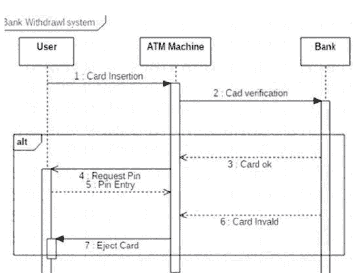

在序列图中，使用交互操作符如 `alt`、`opt`、`break`、`loop`。图4.1表示了一个ATM取款系统的示例序列图。

### 4.2.3 状态机图

这些图有助于限制系统软件的活动。状态机图通过帮助捕捉外部实体之间的通信来实现[12]。状态机图的实时方面由状态机图捕捉。一个对象在其整个生命周期中从一个状态通信到另一个状态。每个状态都有关于对象的一些独特信息。圆形矩形表示状态，每个状态都会被分配一个名称以进行识别。对象的状态由对象状态、状态变量和操作[1, 2]组成。状态通过单向连接器（称为转换）相互连接。当每个对象改变其各自的状态时，它发生。状态机图是所有潜在动态操作的概括。状态和转换是表示状态机图的两个重要视角[13]。

状态机图是用于不同类的UML模型的行为图，用于说明主要的动态行为[14]。状态机图与活动图相似，在术语和用法上有一些小的修改[10]。图4.2表示一个业务流程的示例状态机图。

图4.2 一个示例业务流程的状态机图

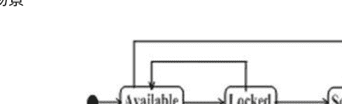

### 4.2.4 测试覆盖准则

在这里，作者讨论了重要UML图的不同测试覆盖准则。覆盖准则有助于识别测试用例的覆盖范围及其在软件中的覆盖情况。测试覆盖准则根据文献中的顺序图描述如下。

- 消息序列路径覆盖：该覆盖准则用于从序列图生成测试场景。对于系统与用户交互的每个常规和替代消息，至少存在一个测试场景。在序列图中，为每个替代消息序列生成一个测试用例。从此开始的一系列消息称为消息序列路径。它表示交互过程中对象之间的行为。
- 对象覆盖：这是一种测试准则，用于验证是否已遍历所有对象以生成测试场景。

文献中提出的基于状态机图的测试覆盖准则如下所述。

- 全状态覆盖：在这些覆盖准则中，图中的每个状态至少被测试用例执行一次。在这里，所有不可见变量也被考虑在内，用于测试[5]。全状态覆盖的值是图中已执行状态与整个状态的比例。
- 全事件覆盖：在这些覆盖准则中，状态机图中的每个事件都包含在测试套件中[15]。
- 转换路径覆盖：这些覆盖准则涵盖了转换过程中所有随机长度的不同路径，用于广泛的测试生成。转换路径覆盖的值是已执行路径与整个路径的比例。由于状态模型中存在一组特征变化，与此方法相关的包含度量是发现测试套件中已执行的变化程度[9， 15]。
- 过渡对覆盖：在这些覆盖准则中，测试用例至少一次包含任意事件中相邻过渡的每对。因此，与过渡路径覆盖[15]相比，测试用例的生成数量更多。

文献中计划的测试覆盖准则基于序列图和状态机图的组合，如下所述。在本节中，作者阐述了几个测试准则，可以通过同时考虑序列图和状态机图来进行特征化。在序列图中，消息序列路径表示消息从开始消息到结束的流程[17]。该消息调用了一个方法调用。所有执行该方法的状态都可以在状态机图中显示。通过使用序列图可以发现整个消息序列路径。但是通过结合序列图和状态机图，作者可以覆盖消息序列和状态路径，这被称为消息序列状态路径。因此，消息序列状态路径比消息序列路径更强大。

### 4.2.5 生物启发的元启发式算法用于面向对象的测试

使用特定覆盖准则通过UML模型进行的测试有助于设计test场景。许多生物启发式元启发式算法，如GA，PSO，DE，ABC，ACO，Firefly，cuckoo search，已被一些研究者用于优化这些测试场景[10, 18, 19]。

## 4.3 文献调研

根据Swain等人的报道[4]，一种基于图形的模型驱动方法被用于从UML状态机图自动生成测试场景。在这项研究中，每个图表都被转换成状态图中间图(SCIG)，然后通过实施基于状态的覆盖准则形成不同的树以生成测试用例。他们的研究解释了往返路径（RTP）测试覆盖准则有效地克服了转换问题，并且全转换（AP）测试覆盖准则无法可靠地检测故障。

正如Lim等人[13]所报道的，采用基于模型的方法从UML状态机图中自动产生测试用例。在这项研究中，作者们描述了一种利用群体智能算法（GGA）自动生成可行转换路径（FTP）的方法。该算法可以通过使用UML状态机图进行转换覆盖测试，并通过设置遗传参数值和最大迭代次数来生成合理的测试路径。计划中的GGA确保了100%的问题对抗和完全的转换覆盖FTP生成。

正如Bothra等人[20]所报道的研究中，采用基于模型的方法从UML状态机图中生成测试场景。在这项研究中，作者们考虑了测试类和集群级别的行为，以生成测试场景。在这项研究中，状态机图被转换为状态机图，然后通过遍历图选择每个事务上的条件谓词。然后这个条件谓词被转换了。最后，使用函数最小化公式来生成测试用例。

在Mohapatra等人的调查中[15]，应用了一种新的方法从UML状态机图中生成测试用例。然后通过遍历图，作者选择了条件谓词，并将条件谓词改变为源代码。然后使用函数最小化技术生成并存储测试场景。这项研究实现了许多重要的覆盖，如状态覆盖、进展覆盖、转换对覆盖和动作覆盖。

在Mohapatra等人的调查中[16]，采用了一种基于模型驱动的方法来使用序列图生成测试场景。在这些研究中，序列图被转换成序列图。然后，通过使用深度优先搜索来遍历图，选择谓词函数，然后将谓词转换为Java代码。然后，从Java代码中收集扩展有限状态机（EFSM）。最后，可以生成测试数据并将其存储以供将来使用。在这项研究中，可以使用深度优先搜索遍历。这种方法在ATM银行系统的案例研究中得到了实施。该模型实现了不同的测试覆盖准则，如对象覆盖、消息路径覆盖、消息路径对覆盖等。

在Malarchelvi等人的调查中[21]，采用了一种基于模型驱动的方法来使用序列图生成测试场景。在这些研究中，设计了案例研究的序列图，并以.mdl扩展名保存。然后从该文件中生成序列依赖表（SDT）。然后使用对象作为节点从SDT生成序列依赖图（SDG）。然后使用深度优先搜索遍历SDG以获得测试路径。最后，可以从该测试路径生成测试用例。作者考虑了ATM银行系统的案例研究来实施提出的模型。

Sharma和Mall [22]将UML用例和序列图结合起来生成测试用例。在他们的方法中，用例图被转换成用例图图形（UDG），序列图被转换成序列图图形（SDG）。UDG和SDG被合并形成系统测试图（STG）。然后，通过自定义的深度优先搜索算法和使用类别划分方法遍历STG以生成测试场景。这种方法仅基于实时系统。通过使用逆向工程，对系统进行测试和检测操作依赖和场景故障非常容易。该方法在“ATM系统中的PIN验证”案例研究中执行，使用白盒测试策略和图覆盖准则。

## 4.4 提出的模型

在本节中，作者提出了他们的工作，从组合的UML序列和状态机图中生成测试场景。图4.3展示了设计分类的提出模型。

图4.3 提出的模型

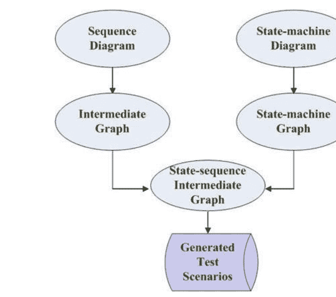

我们提出的测试场景生成方法包括以下步骤。

- i. 为系统定义问题陈述。
- ii. 构建系统的序列和状态机图。
- iii. 生成序列和状态机图的单独图形。
- iv. 生成名为状态序列中间图的组合中间图。
- v. 通过遍历状态序列中间图的路径来推导出所有可能的测试场景。

### 4.4.1 构建系统的序列和状态机图

在这里，作者描述了将必要的测试信息建模到序列和状态机图中的方法。在这里，作者使用StarUml构建序列和状态机图。

### 4.4.2 生成序列和状态机图的单独图形

序列和状态机图被转换为相应的IG（中间图）和SMG（状态机图）。

### 4.4.3 生成名为状态序列中间图的组合中间图

生成一个名为SSIG（状态序列中间图）的组合中间图。

### 4.4.4 生成测试场景SSIG

通过深度优先搜索（DFS）方法遍历SSIG，已经确定了不同的控制流序列。根据Algorithm-TSGSS中的描述，使用所有消息序列覆盖准则生成测试场景。Algorithm TSGSS

```
输入：状态序列中间图（SSIG）
输出：测试场景（TS）
1.  TS_i[ ] ← 0
2.  A ← 初始
3.  C[ ] ← {1,2,......,N}
4.  S1 ← 初始
5.  i ← 1, Avail ← 0
6.  for j ← A to L
7.  对于 k ← S1 到 L
8.  如果 (A! = ACCNO)
9.  显示“无效用户”
10. 跳转到 L
11. 结束如果
12. TSi[] ← S1
13. 当 (!L)循环
14. TSi[] ← TSi[] + S2
15. M ← 0
16. 当 (M <= N) 重复直到
17. 如果 (C[M + +] = = C)
18. TSi[] ← TSi[] + S3
19. 可用 ← 1
20. {循环结束}
21. {循环结束}
22. 如果 (Avail = = 1)
23. TSi[] ← TSi[] + S4
24. 显示“图书已借出”
25. i ++
26. 跳转到 L
27. {for循环结束}
```28. 显示“无效的书”
29. 跳转到$L$
30. {for循环结束}
31. 结束

## 4.5 实施和结果分析

在本节中，作者通过图书馆问题系统的案例研究来描述该方法的工作原理。通过使用UML 2.0的序列图和状态机图，将图书馆问题系统的案例研究转换为相应的模型。图4.4和图4.5分别表示图书馆问题系统的序列图和状态机图。

在图书馆图书问题系统的案例研究中，通常允许经过身份验证的用户从图书馆借书。用户被允许在固定期限内借阅特定数量的书籍。首先测试用户的真实性，然后再搜索用户搜索的书籍。如果满足上述条件，则

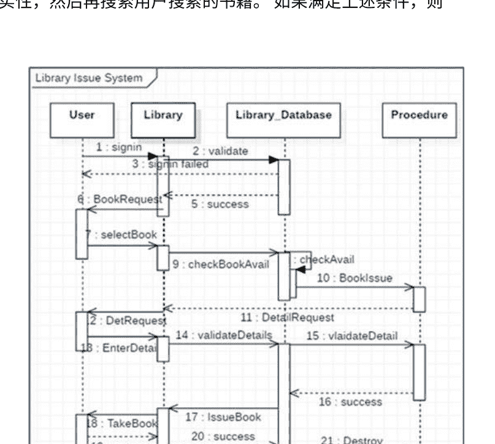

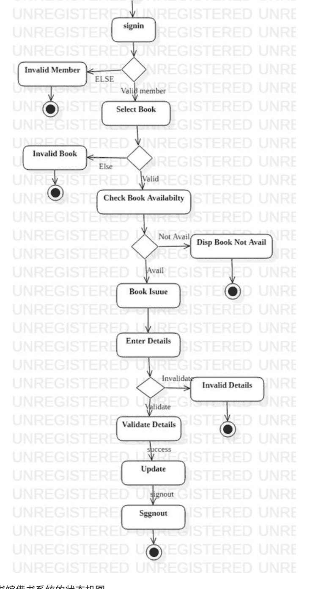

## 图4.5 图书馆借书系统的状态机图

### 4.5.1 生成测试场景SSIG

作者通过考虑节点和消息路径，将序列图和状态机图中设计的模型转换为相应的图形。图4.6和4.7代表中间图（IG）和状态机图（SMG）。

系统将检查书的可用性并将书提供给用户。如果书变得不可用，它会报告一个错误消息。

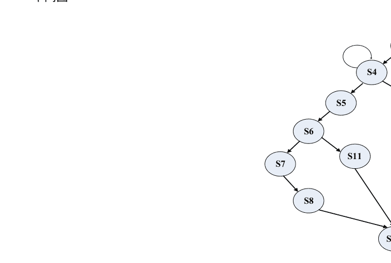

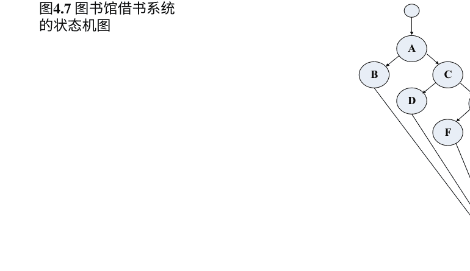

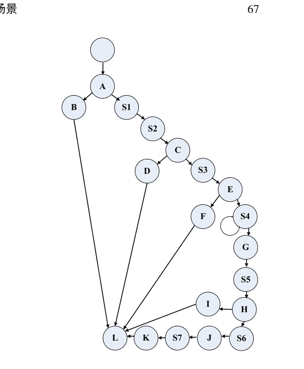

### 4.5.2 组合状态序列中间图（SSIG）的构建

在生成IG和SMG之后，作者尝试将它们组合起来生成如图4.8所示的组合状态序列中间图（SSIG）。组合两个图的方法是，当节点中存在共同功能时，将它们组合在一起，否则直接包含所有节点。

### 4.5.3 测试场景的生成

在创建SSIG之后，通过遍历图来识别不同的控制流序列，以创建测试场景。作者应用了提出的TSGSS算法，并考虑了所有消息序列路径的覆盖准则，生成了以下场景。

- TS1: A → B → L
- TS2: A → S1 → S2 → C → D → L
- TS3: A → S1 → S2 → C → S3 → E → F → L
- TS4: A → S1 → S2 → C → S3 → E → S4 → G → S5 → H→I → L
- TS5: A → S1 → S2 → C → S3 → E→S4 → S4 → G→S5 → H→I → L

```
TS6: A → S1 → S2 → C→S3 → E → S4 → G → S5 → H → S6 → I→S7 → K→S8 → L
TS7: A → S1 → S2 → C → S3 → E → S4 → S4 → G → S5 → H→S6 → I→S7 → K → S8 → L
```

### 4.5.4 观察到的测试用例

后续的测试用例是从第5.3节中给出的测试场景中观察到的。

- TC1<输入：错误的Pin码，输出：登录失败，显示错误的Pin码消息>
- TC2<输入：正确的Pin码，输出：成功，显示图书请求消息>
- TC3<输入：正确的Pin码，正确的选择图书，输出：成功，显示详细请求消息>
- TC4<输入：正确的Pin码，正确的选择图书，输出：选择图书错误，显示失败消息>
- TC5<输入：正确的Pin码，正确的选择图书，正确的检查图书可用性，输出：成功，显示详细请求消息>
- TC6<输入：正确的Pin码，正确的选择图书，错误的检查图书可用性，输出：图书不可用，显示失败消息>
- TC7 <输入：正确的Pin码，正确的选择图书，正确的检查图书可用性，无效的检查可用性，输出：图书当前不可用，显示失败消息>
- TC8 <输入：正确的Pin No.，正确的selectBook，正确的CheckBookAvailable，正确的Check Avail，输出：BookTemporarilyNotAvailable与失败消息>
- TC9 <输入：正确的Pin No.，正确的selectBook，正确的CheckBookAvail-able，正确的CheckAvail，正确的EnterDetails，输出：成功消息的BookIssued>
- TC10 <输入：正确的Pin No.，正确的selectBook，正确的CheckBookAvailable，正确的CheckAvail，错误的EnterDetails，输出：带有失败消息的错误>

### 4.5.5 结果分析

通过创建序列和状态机图的XMI（XML Meta Interface）代码来实现所提出的方法。创建一个Java解析器，将XMI代码作为输入传递给解析器，然后识别节点、边和谓词，并通过链接到图形化工具Graphviz生成图形。图4.9和4.10展示了快照。最后，使用Java解析器从图形中生成测试场景。

```
xml
<?xml version="1.0" encoding="UTF-8"?>
<xmi:XMI xmi:version="2.1" xmlns:uml="http://schema.omg.org/spec/UML/2.1" xmlns:xmi="http://schema.omg.org/spec/XMI/2.1">
    <xmi:Documentation exporter="Visual Paradigm" exporterVersion="1.0">
        <xmi:Extension extender="Visual Paradigm">
            <nickname exportedFromDifferentName="false"/>
        </xmi:Extension>
    </xmi:Documentation>
    <xmi:Extension extender="Visual Paradigm">
        <projectProperties>
            <projectProperty name="author" value="user"/>
        </projectProperties>
        <ProjectOptions>
            <IDPositionRotation>
                <Positions>
                    <Position id="BPTask" value="..."/>
                    <Position id="BPSubProcess" value="..."/>
                    <Position id="BPGateway" value="..."/>
                    <Position id="BPPool" value="..."/>
                    <Position id="BPLane" value="..."/>
                </Positions>
            </IDPositionRotation>
        </ProjectOptions>
    </xmi:Extension>
</xmi:XMI>
```

图4.9序列图的XMI代码预览

```
java
public class Result_Display {
    public static void main(String[] args) throws ParserConfigurationException, IOException {
        final JFrame frame = new JFrame();
        frame.setDefaultCloseOperation(JFrame.EXIT_ON_CLOSE);
        frame.setSize(new Dimension(450, 400));
        frame.setLocation(new Point(400, 300));
        frame.setLayout(new BorderLayout());

        long startTime = System.nanoTime();
        DocumentBuilderFactory docBuilderFactory = DocumentBuilderFactory.newInstance();
        DocumentBuilder docBuilder = docBuilderFactory.newDocumentBuilder();
        Document doc = null;
        try {
            doc = docBuilder.parse(new File("E://Result.docx"));
        } catch (SAXException ex) {
            Logger.getLogger(Result_Display.class.getName()).log(Level.SEVERE, null, ex);
        }

        // normalize text representation
        doc.getDocumentElement().normalize();
    }
}
```

图4.10状态机图的XMI代码预览

## 4.6 结论

在本章中，作者提出了一种基于模型驱动的测试技术，通过使用图书馆借书系统的案例研究，从序列图和状态机图的组合模型中获取测试场景。 他们的方法是半自动的、系统化的，非常合乎逻辑。作者的模型不会产生重复的测试场景，从而节省了系统的时间和成本。 通过使用这个模型，可以实现一些性能目标，如更高的故障检测率、更快的代码覆盖率和最大程度地访问测试节点。 所提出的模型还能处理循环中的故障和错误的消息响应。 作者的方法可以用来组装一个仪器，该仪器将使用例相关的UML图作为输入，并自动产生测试序列。 将来，作者肯定会计划使用一些元启发式技术，如遗传算法、差分进化和粒子群优化，来优化和优先处理测试场景。

## 参考文献

- 1. A. Abdurazik, J. Offutt, 在使用*UML*协作图进行静态检查和测试生成. 国际统一建模语言会议 (Springer，柏林，海德堡，2000年)，第383-395页
- 2. R. Bruce Mall,软件工程基础(PHI Learning Pvt. Ltd.，印度，2018年)
- 3. P.C. Jorgensen,软件测试：工匠的方法. (Auerbach出版社，2013年)
- 4. S. Pradhan，M. Ray，S.K. Swain，基于状态图的转换覆盖率测试用例生成。 J. King Saud Univ. Comput. Inf. Sci. (2019)
- 5. R.K. Sahoo, S.K. Nanda, D.P. Mohapatra, M.R. Patra，使用混合蜜蜂群算法对UML组合图进行模型驱动的测试用例优化. Int. J. Intell. Syst. Appl.9(6)，43 (2017)
- 6. B. Sahu，基于深度学习的自动化软件工程方法. 国家最新商业智能和数据挖掘会议” IJC ST, RABIDM(2013)
- 7. A.K. Jena, S.K. Swain, D.P. Mohapatra, 从 *UML*活动图生成测试用例的新方法 . 2014年智能计算技术问题与挑战国际会议 (ICICT) (IEEE, 2014), pp. 621–629
- 8. M. Shirole, R. Kumar，从*UML*模型中选择并发测试的测试场景. 2015年第八届国际现代计算会议 (IC3) (IEEE, 2015),pp. 531–536
- 9. S.K. Swain, D.P. Mohapatra，从行为*UML*模型生成测试用例. Int. J. Comput. Appl. **6**(8), 5–11 (2010)
- 10. M. Prasanna, K.R. Chandran, 使用遗传算法为*UML*对象图生成自动测试用例。 Int. J. Adv. Soft Comput. Appl. **1**(1), 19–32 (2009)
- 11. I. Septian, R.S. Alianto, F.L. Gaol, 使用深度优先搜索算法从*UML*活动图和序列图生成自动测试用例。 Procedia Comput. Sci. **116**, 629–637(2017)
- 12. J. Cvetkovi´c, M. Cvetkovi´c，评估用于生成测试用例的*UML*图： 互联网成瘾抑郁症案例研究。 Phys. A **525**, 1351–1359 (2019)
- 13. Y.M. Choi, D.J. Lim，使用分组遗传算法从*UML*状态图生成自动可行的转换路径。 Inf. Softw. Technol. **94**, 38–58 (2018)
- 14. S. Vasilache, J. Tanaka, 在使用依赖图从多个相互关联的场景中合成状态机. 第8届世界多学科会议系统、控制论和信息学（SCI 2004），奥兰多，佛罗里达州（2004年），第49-54页
- 15. R. Swain, V. Panthi, P.K. Behera, D.P. Mohapatra, 从UML状态图生成自动测试用例。计算机应用国际期刊 42（7），26-36页（2012年）
- 16. V. Panthi, D.P. Mohapatra, 在使用序列图进行自动测试用例生成。国际计算机会议论文集（斯普林格，新德里，2013年），第277-284页
- 17. S.S. Panigrahi, S. Shaurya, P. Das, A.K. Swain, A.K. Jena, 在使用UML序列图生成测试场景。2018年国际信息技术会议（ICIT）（IEEE，2018年），第50-56页
- 18. P.K. Arora, R. Bhatia, 使用类图、用例和活动图生成基于代理的回归测试用例。Procedia Comput. Sci. 125, 747–753 (2018)
- 19. R.K. Sahoo, D. Ojha, D.P. Mohapatra, M.R. Patra, 自动化测试用例生成和优化: 一项比较性综述。Int. J. Comput. Sci. Inf. Technol 8(5), 19–32 (2016)
- 20. P. Samuel, R. Mall, A.K. Bothra, 使用统一建模语言 (UML) 状态图进行自动化测试用例生成。IET Softw. 2(2), 79–93 (2008)
- 21. S.S. Priya, P.S.K. Malarchelvi, 使用UML序列图生成测试路径。Int. J. Adv. Res. Comput. Sci. Softw. Eng. 3(4) (2013)
- 22. M. Sarma, R. Mall, 在从UML模型生成自动测试用例. 第10届国际信息技术会议（ICIT 2007）（IEEE，2007年），第196-201页
- 23. A.K. Jena, S.K. Swain, D.P. Mohapatra, 从UML序列图创建测试用例: 一种软计算方法，在智能计算、通信和设备（Springer，新德里，2015年），第117-126页
- 24. A.K. Jena, S.K. Swain, D.P. Mohapatra, 基于模型的测试用例生成从uml序列和交互概述图, 在数据挖掘中的计算智能-卷，卷 2（Springer，新德里，2015年），第247-257页
- 25. A.K. Jena, S.K. Swain, D.P. Mohapatra, 使用修改后的模态条件/决策覆盖（mc/dc）进行基于模型的测试套件最小化。 Int. J. Softw. Eng. Appl. 9（5），61-74（2015年）

## 第五章 使用深度学习技术的软件故障预测的新方法

Debolina Ghosh和Jagannath Singh

摘要 现在，由于软件规模和复杂性的增加，软件故障是不可避免的。因此，查找故障是必要的以消除软件故障。基于频谱的故障定位是找到给定程序中有错误的语句的最流行技术。然而，还存在一些限制。对于大型软件，通过传统方法测试所有可能的场景非常困难且耗时。机器学习模型是解决这个问题的有趣方法。

最近，深度学习被广泛用于改进故障查找技术。深度学习模型基于神经网络的架构。基于输入层、隐藏层和输出层的神经网络架构。卷积神经网络（CNN）是深度学习中一个著名的架构。

该网络通过大量的数据和直接从信息中学习特征的神经网络架构进行训练。因此，不需要手动进行特征提取。这种技术能够找到每个程序语句的可疑分数。使用这种技术，我们可以从测试用例中收集大量的数据并提取重要的特征。由于CNN模型的池化层减小了模型的输入大小和复杂性，因此加快了训练过程。该框架还能够计算每个语句的可疑分数并相应地分配排名。

- 关键词
- 测试
- 调试
- 软件故障预测
- 基于频谱的 debugging
- 深度学习
- 卷积神经网络

## 5.1 引言

优质软件始终备受青睐，适当的测试将确保产品的质量。现如今，软件的LOC和大小正在增加，因此测试需要更多的时间和精力。软件测试分为两个阶段：测试和调试[5]。在第一阶段，为待测试程序生成测试用例，并观察程序是否按预期运行。有许多自动化软件测试技术可用于生成测试用例并检查程序行为。在下一个阶段，发现错误的根本原因并进行修正。调试阶段需要比测试更多的时间和精力。

自动化调试工具的研究工作较少[8, 22, 25]。尽管如此，自动化调试工具对于更好的软件调试是必需的。我们在本节中介绍了一些最近的调试技术。在我们的文献中，我们发现基于频谱的调试技术[6]可以用于开发自动化调试工具。对于单一和多故障程序，遗传算法(GA)可以给出令人满意的结果[32]。遗传算法是一种基于自然选择解决优化问题的进化过程。在现代社会中，机器学习算法被广泛应用于不同的方面，从网络搜索到内容过滤，不同的电子商务网站，智能手机相机，无人驾驶汽车等等[19]。深度学习或深度结构学习[18]是机器学习技术的一部分。机器学习是人工智能的一个子集。

深度学习是一类用于特征提取和转换以解决非线性复杂问题的机器学习算法。高层特征是从低层特征中获得的，并形成一个层次结构。基本上，机器学习是一种浅层学习，而深度学习是一种具有抽象的分层学习。现如今，深度学习技术正在快速发展，使系统更加稳健和准确。它已经应用于不同的研究领域，如图像处理，文本摘要，模式识别等。因此，具有多个隐藏层的深度神经网络也可以应用于故障定位技术。在本章中，我们介绍了卷积神经网络(ConvNet或CNN)用于多故障定位。CNN是一类深度神经网络，是多层感知器(MLP)的正则化版本，指的是全连接网络。与MLP相比，CNN具有更少的连接和参数。首先，CNN模型通过测试用例进行训练，然后通过检查虚拟测试套件中的训练模型，计算每个程序语句的可疑分数。

本文的剩余部分按照以下方式组织：第5.2节包含了相关工作的一些细节。第5.3节解释了深度学习的几个基本概念和各种当前的深度学习架构。第5.4节描述了用于多故障定位的提出的CNN结构，第5.5节结束了本文。

## 5.2 相关工作

在本节中，介绍了软件调试和故障定位领域中一些相关的研究工作。

Ribeiro等人[21]提出了一个基于频谱的故障定位开源工具Jaguar（JAva coveraGe faUt localization Ranking）用于Java程序。它使用了数据流的故障定位技术，并包括了更可能是有故障的可疑语句列表的可视化。Zhang等人[28]提出了PRFL，采用了PageRank算法来提升基于频谱的故障定位。该工具分析了每个测试的重要性，并相应地为给定程序中的每个方法分配了排名。

Campos等人[3]提出了GZoltar，一种基于谱故障定位（SBFL）的自动故障定位工具。该工具用作Eclipse插件，以减少和优化测试套件。该工具提供了故障和非故障语句的图形视图。Wong等人[26]引入了一种名为D-Star的故障定位技术，该技术测量可疑分数并确定故障语句。

Chakraborty等人[4]开发了一种基于谱调试的工具，使用不同的统计公式来查找故障语句。Zheng等人[32]开发了一种基于谱故障定位和遗传算法的多故障定位工具（FSMFL）。FSMFL应用于不同的开源基准程序，结果显示该工具在定位多故障程序的第一个故障方面表现更好。

Eniser等人[7]提出了DeepFault，一种基于深度神经网络（DNN）的白盒分析技术，可以检测可疑神经元并合成一个新的输入，从而改善可疑神经元的激活值。研究人员使用这种技术对MNIST和CIFAR-10数据集进行了实验，并展示了DeepFault可以识别可疑神经元。

Zheng等人[31]提出了一种基于深度神经网络的单故障程序故障定位技术。他们在西门子套件和空间程序上进行了实验，并成功地定位了故障。

Zhang等人[30]提出了一种基于深度学习的切片技术，用于故障定位，可以测量故障语句的可疑分数。为了提取上下文信息，然后应用动态反向切片。他们将结果与另一种故障定位技术D-Star进行了比较。Zhang等人[29]提出了一种基于卷积神经网络（CNN）的单故障定位技术。它使用虚拟测试套件通过测试用例评估每个程序语句的可疑分数。实验结果表明，所提出的方法提高了单故障程序的故障定位技术的有效性。

## 5.3 基本概念

我们在本节中介绍了一些相关概念，这些概念将有助于理解我们的工作。

### 5.3.1 深度学习

人工智能[16]是一种能够模仿人脑行为的机器。机器学习是人工智能的一个分支，使机器能够学习。但是机器学习算法无法处理输入和输出数据较大的高维数据。在这种情况下，机器学习算法表现不佳，而深度学习算法表现令人满意。深度学习[11, 18]是机器学习算法的一部分，它使用多层来提取给定原始输入数据的特征。它是人工智能的最新技术。深度学习算法通过不同的神经网络算法运行。神经网络是一组以与人脑的单个神经元相同方式工作的神经元。深度学习模型通过多层对大量数据进行操作，并能够解决复杂问题。深度学习的不同架构，如深度神经网络、循环神经网络和卷积神经网络，已经应用于计算机科学的各个领域。人工智能、机器学习和深度学习之间的关系如图5.1所示。

图5.1 深度学习、机器学习和人工智能的关系

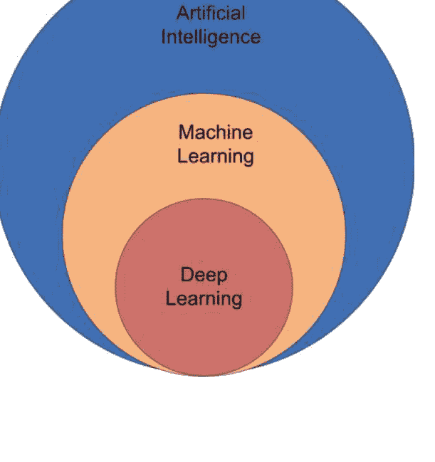

图5.2 神经元的结构

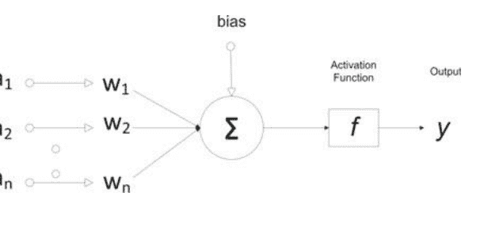

### 5.3.2 基本深度学习术语

在神经网络模型中广泛使用不同的深度学习术语。

神经元：在深度学习中，神经元就像人脑中的神经元一样。当它接收到任何信息时，它会处理并生成输出。类似地，在神经网络中，神经元接收输入，处理它并将输出发送到下一个神经元，如图5.2所示。

权重：当输入值进入神经元时，它会与权重相乘，例如一个神经元有3个输入，每个输入都与其对应的权重相乘。初始时，权重是随机生成的。在训练过程中，权重可以被更新。在图5.2中，通过节点传递的输入a变为 a * w，其中w是输入a在图中分配的权重。

偏差：偏差是在乘以权重后添加到输入中的线性组成部分。偏差通常用于改变权重乘以输入的范围。添加偏差后，输出值变为 a * w + 偏差。

MLP（多层感知器）：感知器是一个线性二元分类器。单个神经元无法解决复杂问题。因此，在特定的多个层中需要多个神经元，即输入层、隐藏层和输出层。每个层由多个神经元组成。一层中的所有神经元与下一层中的所有神经元相连。多层感知器也被称为全连接网络[9, 20]。

激活函数：神经网络中使用不同的激活函数[1, 23]。激活函数对于将非线性引入神经元的输出是必要的。通过引入非线性，激活函数使模型能够学习和执行复杂任务。没有激活函数，模型将作为简单的线性回归模型工作，大多数情况下无法令人满意。每个神经元基于权重、偏差和激活函数工作。每个神经元的权重和偏差根据输出处的误差进行更改。这个过程称为反向传播。因此，在反向传播策略中，我们需要激活函数来优化权重或应用另一种优化技术来减小误差。

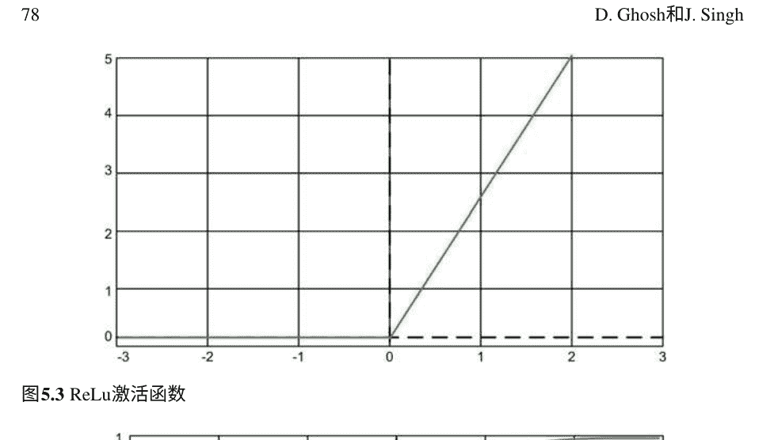

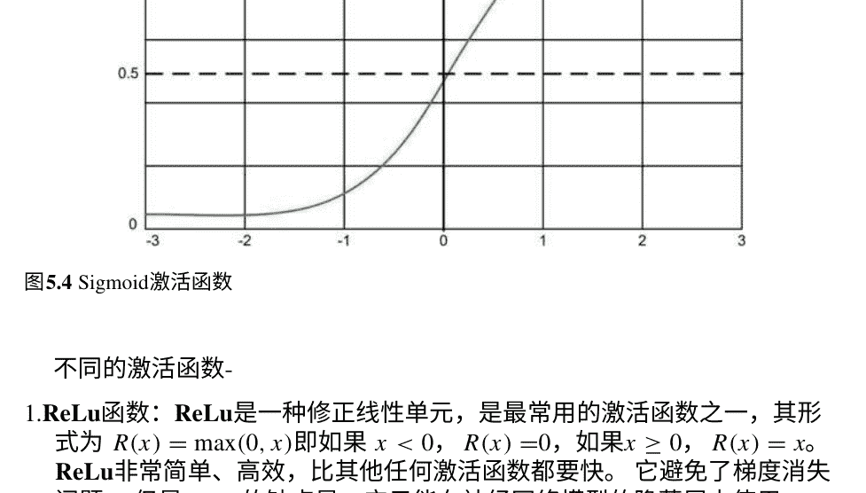

不同的激活函数：

- 1. **ReLu函数**: ReLu是一种修正线性单元，是最常用的激活函数之一，其形式为 $R(x) = \max(0, x)$ 即如果 $x < 0$, $R(x)=0$, 如果 $x \geq 0$, $R(x)=x$。 ReLu非常简单、高效，比其他任何激活函数都要快。 它避免了梯度消失问题。 但是ReLu的缺点是，它只能在神经网络模型的隐藏层中使用。激活ReLu的作用如图5.3所示。

- 2. **Sigmoid函数**: 这个激活函数的形式是 $f(x) = 1/1 + \exp(-x)$, 取值范围从0到1。 曲线呈S形，如图5.4所示。 输出值介于0和1之间，收敛速度较慢。

- 3. **Softmax函数**: Softmax激活函数与Sigmoid函数几乎相似。 在解决分类问题时使用。 在分类器的输出层使用。

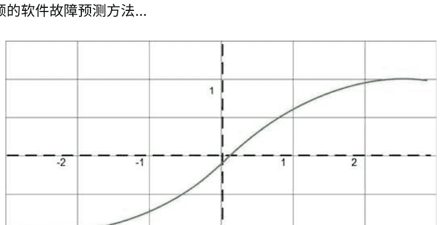

图5.5 双曲正切激活函数

- 4. **双曲正切函数**：双曲正切函数是双曲正切函数。 它可以从Sigmoid函数推导出来。 它的形式为 $f(x) = 2/(1 + e^{-2x}) - 1$ 或 $tanh(x) = 2 * sigmoid(2x) - 1$。 $tanh$函数的范围介于 $-1$ 到 $1$ 之间，如图5.5所示。由于在这个函数中优化很容易，所以它比Sigmoid函数更受青睐。 但是$tanh$函数存在梯度消失的问题。

前向传播：前向传播[10]是通过隐藏层将输入传递到输出层的过程。 没有向后移动。 信息只能向前传递。 输入层提供隐藏层的数据，生成输出。

成本函数：每个神经网络在每次迭代后尝试预测输出。如果结果输出与实际输出接近，则误差最小。这种准确性由成本或损失函数来衡量。 因此，当我们训练网络时，我们的主要目标是最小化成本或损失函数。

反向传播：神经网络为每个输入分配权重，并为节点分配偏置值。 经过一次迭代，我们可以从生成的输出中找出错误。 然后，为了改变权重值，将此错误与其成本函数一起反馈到网络中。 然后更新每个输入权重以最小化错误。这个过程称为反向传播[13]。

批次：在训练过程中，我们将输入数据分成小块发送，而不是一次发送整个输入数据。 这些数据块被称为批次。 将数据发送到批次中使模型更加通用，并且还可以最小化误差。

时代：时代被定义为在向前和向后传播中所有批次的单次迭代。 时代在网络的训练过程中使用。 如果时代的数量很大，网络收敛所需的时间会更长。

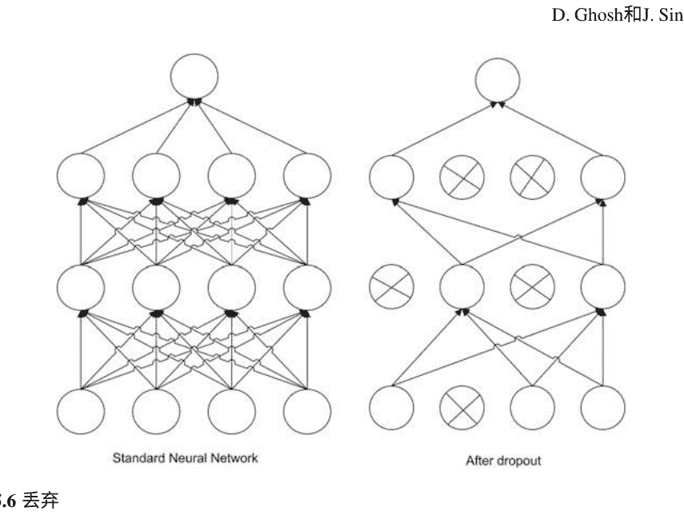

图5.6 丢弃

丢弃：丢弃[14]是一种正则化过程，用于防止网络中的过拟合问题。在训练过程中，隐藏层中的一些神经元被丢弃。在丢弃一些神经元后生成输出，如图5.6所示。

学习率：学习率是在每次迭代中更新权重的数量。它决定了新信息覆盖旧信息的程度。学习率通常介于0和1之间。如果学习速度非常小，网络收敛需要很长时间；如果速率太高，可能会跳过解决方案。

梯度消失问题：梯度消失问题[15]出现在激活函数中，梯度值非常小。在训练过程中，梯度值与权重相乘，下一次迭代中的值变得可以忽略。因此，网络忘记了长期依赖性。梯度消失问题通常发生在循环神经网络中，长期依赖性非常重要。可以通过使用另一个激活函数ReLU来避免这个问题，它没有小的梯度值。

### 5.3.3 深度学习模型

深度学习架构基于人工神经网络。计算机模型可以从图像、声音、语音、模式等对象中执行特定任务。为了训练模型，我们发送大量的输入数据，并通过它从数据集中提取特征。

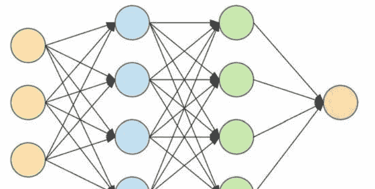

图5.7 DNN的结构

从数据集中提取特征需要经过多个层。 在计算机科学的不同领域中使用了不同类型的深度学习模型。

深度神经网络（DNN）：神经网络是一种模拟人脑活动的特殊技术。 深度神经网络[24]是一个具有一定复杂性的多层神经网络。 DNN具有一层输入和输出，以及几个隐藏层，如图5.7所示。每一层都基于前一层的输出训练一组特征。 每一层都累积了前一层的特征并重新组合它们。 这个过程被称为特征的层次结构，它增强了复杂性和抽象性。 这种类型的神经网络用于无标签和非结构化数据。

递归神经网络（RNN）：递归神经网络[27]是一种神经网络，其中一层的输出发送到下一层，并且该层的输出再次发送回该层，如图5.8所示。RNN维护一个存储所有先前步骤信息的记忆。 因此，RNN也被称为长短期记忆网络（LSTMs）。 它在每个隐藏层中执行相同的任务，因此减少了参数的复杂性。 RNN用于时间序列问题、语音识别和无人驾驶汽车等。

卷积神经网络（CNN）：卷积神经网络[2]是一个减少处理要求的多层感知器。 CNN就像一个闪光灯一样的结构。 CNN层包括一个输入层、一个输出层和一个隐藏层，包括一个卷积层、一个池化层和一个全连接层，如图5.9所示。给定的神经元具有相同数量的输入神经元和相同的权重和偏差。 池化层减小了输入神经元的大小并提高了学习速率。 与其他深度学习架构相比，CNN更容易训练且参数更少。 CNN广泛应用于图像处理、推荐系统、视频识别和自然语言处理。

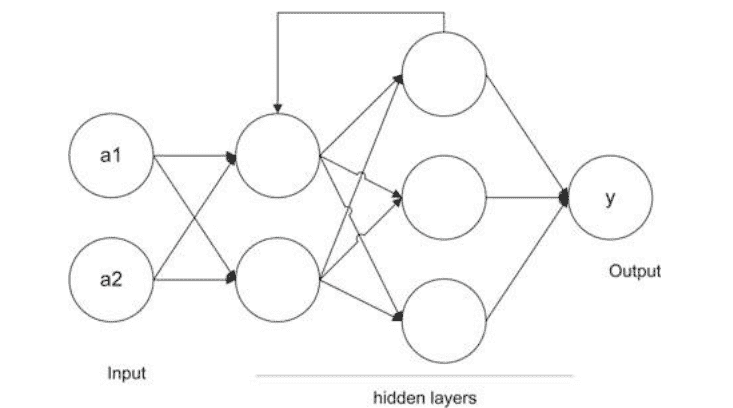

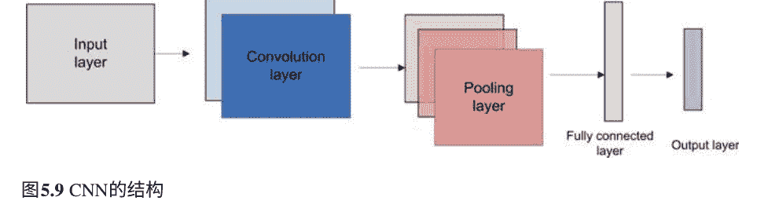

## 5.4 使用CNN进行故障定位

在故障定位中，程序语句和测试用例总是很多。以一个例子来说，如果一个程序有100个语句，并且如果100个语句作为深度学习网络的输入，具有相同大小的隐藏层，那么就会有100 * 100 = 10,000个参数。这使得系统更加复杂。因此，我们需要减少系统的参数和复杂性。

多个隐藏层或太多的输入会使网络变得复杂，这被称为过拟合问题。过拟合问题的解决方案是：

- 将数据分成多个集合，例如训练集、测试集、交叉验证集等。
- 对模型进行正则化，即通过权重将神经元分割。
- 最大范数约束，即根据权重和偏差添加大小限制。
- 丢弃意味着随机关闭一些神经元以解决过拟合问题。

### 5.4.1 框架概述

在本节中，我们介绍了用于多故障定位的卷积神经网络的架构。CNN [12]是一个深度学习网络，它在每个步骤中减少了参数的数量。CNN 的架构包括五个步骤：输入层、卷积层、池化层、输出层和全连接层。使用滤波器，卷积层在输入层上滑动滤波器。输入的大小以矩阵形式呈现。它执行所选输入大小和滤波器大小之间的点积。因此，卷积层由一组独立的滤波器组成。接下来，池化层用于减小网络输入参数的大小和复杂性。它缩小输入并仅保留下一层的重要特征。经过多个卷积层和池化层后，全连接层与所有先前层的激活相连。

对于使用CNN进行故障定位，首先我们使用训练数据集进行卷积。对于给定程序P的每个语句，通过M个测试用例执行，如表5.1所示。错误向量 e_1, e_2…e_n 表示测试用例的执行结果，要么为1（通过），要么为0（失败）。语句 a_{ij} =1 表示第i个测试用例执行了语句j。语句的执行信息与测试用例结果作为卷积层的输入。训练过程将训练模型。然后我们创建一组虚拟测试用例作为测试数据。

表5.2显示了虚拟测试用例的矩阵。我们创建与程序语句数量相等的虚拟测试用例。每个测试用例只执行一条语句。如果 a_i =1，即语句i由测试用例 t_i 执行。当虚拟测试用例矩阵插入训练好的CNN模型时，它计算每个程序语句的可疑得分。可疑得分是由一个语句覆盖的虚拟测试用例执行结果的近似值。较大的值表示更可疑的语句。

表5.1 执行覆盖率和结果
| N个语句 | | ... | | 错误 |
| :--- | :--- | :--- | :--- | :--- |
| a_{11} | a_{12} | ... | a_{1N} | e_1 |
| a_{21} | a_{22} | ... | a_{2N} | e_2 |
| . | . | ... | . | . |
| . | . | ... | . | . |
| a_{M1} | a_{M2} | ... | a_{M N} | e_M |

表5.2 虚拟测试用例
| | a_1 | a_2 | ... | a_N |
| :--- | :--- | :--- | :--- | :--- |
| t1 | 1 | 0 | ... | 0 |
| t2 | 0 | 1 | ... | 0 |
| . | . | ... | . | . |
| . | . | ... | . | . |
| tN | 0 | 0 | ... | 1 |

图5.10描述了使用CNN进行故障定位的过程。语句覆盖数据和每个测试用例的结果被发送到模型的输入层。这是训练过程。这些数据将按照每个阶段训练模型。在模型经过适当的训练后，测试数据（即虚拟测试用例）将被发送到模型以生成每个语句的可疑分数。

卷积模型[17]由不同的层组成。

- 1. 卷积层：CNN中的第一层是卷积层。它从输入中提取特征。它接受输入矩阵，例如h * w * d，其中h是高度，w是宽度，d是输入矩阵的维度。每个输入都会经过一系列的过滤器或卷积核。它执行点积并生成特征图。过滤器从左到右移动，直到完成宽度，然后向下移动。这个过程会一直迭代，直到输入矩阵完成。在图5.11中，输入矩阵的大小为5 * 5，它与大小为3 * 3的过滤器矩阵进行卷积。该过程执行点运算并生成大小为3 * 3的特征图。

- 2. 汇聚层：当输入大小增加时，汇聚层可以最小化参数。通过减小矩阵的大小，它减少了软件的复杂性。它用于从输入中提取主要特征。有两种类型的汇聚层可用，最大汇聚和平均汇聚。最大汇聚从核心或过滤器覆盖的矩阵中取最大值，如图5.12所示。平均汇聚从过滤器或核心覆盖的部分取平均值。在我们的研究中，我们考虑最大汇聚，因为它的性能优于平均汇聚。

- 3. 全连接层：全连接层是一个多层感知器，我们将矩阵展平成向量，并将其馈送到全连接网络中。反向传播应用于每次迭代。特征映射矩阵被转换为向量，并馈送到全连接网络中，如图5.13所示。

- 4. 输出层：可以对数据进行分类的最后一层是输出层。在应用激活函数后，模型将被正确训练并能够对输出进行分类。在我们的研究中，我们应用Sigmoid激活函数，因为我们需要生成每个语句的得分，该得分介于0和1之间。在这里，输出层提供了每个程序语句的可疑得分。

### 5.4.2 实验设置和示例程序

为了进行这个实验，我们需要一台配备3 GHz Intel(R) i5 CPU，32 GB主内存和Python 3.5或以上版本的系统。

在表5.3中，我们选取了一个26行的示例程序P。程序P的总可执行语句为17。在示例程序中，有两个错误语句14和17。最后一行表示测试用例的结果，即通过或失败。如果结果是通过，我们将其视为1，否则为0。

| 1 | 1 | 1 | 0 | 0 | 1 | 0 | 0 | 1 | 0 | 0 | 1 | 1 | 0 | 1 | 1 | 1 |
| 1 | 1 | 1 | 0 | 0 | 1 | 0 | 0 | 1 | 1 | 1 | 0 | 1 | 0 | 1 | 1 | 1 |
| 1 | 0 | 0 | 1 | 1 | 1 | 0 | 0 | 1 | 1 | 1 | 0 | 1 | 0 | 1 | 0 | 1 |

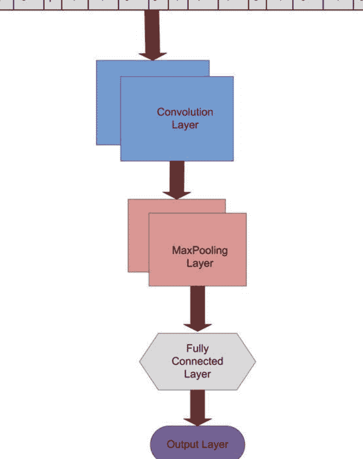

图5.10 CNN的框架

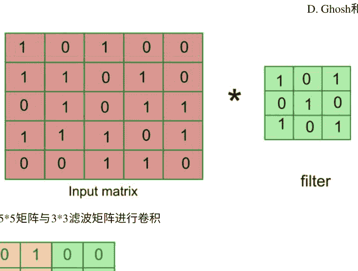

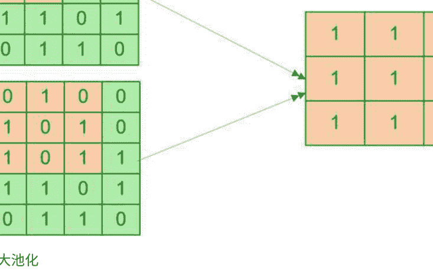

结果为通过时，我们将其视为1，否则为0。在10个测试用例中，有2个测试用例失败，即T3和T4。

首先，我们将创建一个包含输入层、卷积层、池化层、全连接层和输出层的CNN模型。输出节点包含一个单节点，并使用sigmoid函数作为激活函数。

在下一个阶段，我们将使用语句覆盖数据和测试用例结果来训练模型，如表5.1所示。首先，我们将根据构建CNN模型时设置的过滤器大小发送训练数据。如果过滤器大小为3，我们将发送T1、T2、T3的语句覆盖情况和执行结果(1 1 0)。在下一次迭代中，我们将发送T4、T5、T6的语句覆盖情况和执行结果(0,1,1)等等。模型训练完成后，我们将发送用于故障定位的测试数据或虚拟测试套件。虚拟测试套件由17个测试用例组成，每个测试用例只执行一个语句。执行此步骤后，模型将生成每个程序语句的可疑分数。具有较高可疑分数的语句可能存在故障的概率。

## 5.5 使用基于深度学习的方法进行自动化软件工程

在本小节中，我们讨论了使用不同层的卷积神经网络进行多故障定位的详细过程。算法1展示了具体步骤。

- 1. 首先，我们从给定位置读取输入数据集。在我们的研究中，输入数据集是具有测试用例结果的语句覆盖信息。在表5.3中的示例程序中，可执行语句有17个，测试用例有6个。因此，覆盖矩阵的维度必须为6 × 17。
- 2. 在下一个阶段，我们需要将数据集分为输入数据和输出数据。再次，将输入数据集和输出数据集分割为训练集和测试集，以消除复杂性问题或过拟合问题。
- 3. 然后，我们创建卷积模型。
- 4. 在这一步中，根据输入数据集添加多个卷积层和池化层。
- 5. 全连接层将一层中的一个神经元连接到另一层中的每个神经元。这是一个传统的多层感知器（MLP）。
- 6. 稠密层是输出层，它将激活函数应用于前一层的值。一旦应用了激活函数（例如Relu， Sigmoid），输出层为每个语句生成介于0和1之间的分数。分数较高的语句表示更可疑的语句。

## 表5.3 带有语句的示例程序

| 在四个数中找到第二个数 | T1 | T2 | T3 | T4 | T5 | T6 | T7 | T8 | T9 | T10 |
|---|---|---|---|---|---|---|---|---|---|---|
| 1. int find_second(int a, int b, int c, int d){ |  |  |  |  |  |  |  |  |  |  |
| 2. int max,min,temp; |  |  |  |  |  |  |  |  |  |  |
| 3. if(a<=b){ | 1 | 1 | 1 | 1 | 1 | 1 | 1 | 1 | 1 | 1 |
| 4. max=b; | 1 | 1 | 1 | 1 | 0 | 0 | 0 | 0 | 0 | 0 |
| 5. min=a; | 1 | 1 | 1 | 1 | 0 | 0 | 0 | 0 | 0 | 0 |
| 6. } else { |  |  |  |  |  |  |  |  |  |  |
| 7. max=a; | 0 | 0 | 0 | 0 | 1 | 1 | 1 | 1 | 1 | 1 |
| 8. min=b; | 0 | 0 | 0 | 0 | 1 | 1 | 1 | 1 | 1 | 1 |
| 9. } |  |  |  |  |  |  |  |  |  |  |
| 10. if(c > max){ | 1 | 1 | 1 | 1 | 1 | 1 | 1 | 1 | 1 | 1 |
| 11. temp=max; | 0 | 0 | 0 | 0 | 0 | 0 | 0 | 0 | 0 | 0 |
| 12. max=c; | 0 | 0 | 0 | 0 | 0 | 0 | 0 | 0 | 0 | 0 |
| 13. }else if(c < min){ | 1 | 1 | 1 | 1 | 1 | 1 | 1 | 1 | 1 | 1 |
| 14. /*bug,正确的是 temp =min * temp=b; | 0 | 1 | 1 | 0 | 0 | 1 | 0 | 1 | 1 | 1 |
| 15. min=c; | 0 | 1 | 1 | 0 | 0 | 1 | 0 | 1 | 1 | 1 |
| 16. }else { |  |  |  |  |  |  |  |  |  |  |
| 17. /* bug,正确的是 temp =c */ temp=b; | 1 | 0 | 0 | 1 | 1 | 0 | 1 | 0 | 0 | 0 |
| 18. } |  |  |  |  |  |  |  |  |  |  |
| 19. if(d < max && d > temp){ | 1 | 1 | 1 | 1 | 1 | 1 | 1 | 1 | 1 | 1 |
| 20. return d; | 0 | 0 | 0 | 0 | 0 | 0 | 1 | 1 | 0 | 0 |
| 21. } else if(d > max) { | 1 | 1 | 1 | 1 | 1 | 1 | 0 | 0 | 1 | 1 |
| 22. return max; | 1 | 1 | 0 | 0 | 1 | 1 | 0 | 0 | 0 | 0 |
| 23. } else { |  |  |  |  |  |  |  |  |  |  |
| 24. return temp; | 0 | 0 | 1 | 1 | 0 | 0 | 0 | 0 | 1 | 1 |
| 25. } |  |  |  |  |  |  |  |  |  |  |
| 26. } |  |  |  |  |  |  |  |  |  |  |
| 测试用例结果 | P | P | F | F | P | P | P | P | P | P |

7. 在这个阶段，模型会根据输入数据集进行编译和训练。在训练过程中，我们可以选择批量大小和迭代次数。批量大小取决于训练数据的大小。迭代次数通常设置为1，即每个批次模型只会被训练一次。

8. 在这一步中，训练好的模型将预测测试数据的输出并与实际输出进行比较。如果存在错误，模型将反馈给神经元，更新权重并重新训练模型。这个反向传播过程将继续进行，直到错误被最小化。

```
算法 1卷积神经网络(X,Y, 卷积层, 最大池化层, 全连接层)
输入:训练数据集, 测试数据集
输出:程序语句的可疑分数
过程:卷积神经网络(输入数据集)
    数据集=read_dataset()                    ▷读取输入数据集
    X=划分数据集()
    Y=划分数据集()
    X_train, X_test, Y_train, Y_test = train_test_split(X,Y,test_size)    ▷划分数据集
解决过拟合问题
    model = sequential()                      ▷创建模型
    对于 model.add(卷积层(input_size, filter_size, 激活函数, inputShape))
    model.add(最大池化层(size))               ▷创建池化层 do
    end for
    model.add(展平层())                       ▷全连接层
    model.add(全连接层(size, 激活函数))       ▷输出层
    compile.model()                           ▷编译创建的模型
    model.fit(X_train, Y_train, batch_size, epchoss)    ▷训练模型
    模型预测(X_test)                          ▷预测模型
    模型比较(Y_test)                          ▷与实际输出进行比较
返回每个语句的可疑分数
结束过程
```

## 5.5 结论与未来工作

机器学习是一种人工智能技术，可以生成具有学习和工作能力的机器。机器学习算法可以访问数据或信息，从中学习，然后预测未来的输出。但是当数据很大时，机器学习算法无法处理这些数据，它们的性能也不令人满意。因此，深度学习的概念出现了。深度学习是基于人工神经网络的机器学习技术的一部分。深度学习算法受到人脑的功能和结构的启发。现在，深度学习是一个非常新兴的领域。不同的深度学习模型在计算机科学的不同领域中被使用。在本章中，我们使用卷积神经网络提出了一种多故障定位技术。首先，我们需要构建模型，并将语句覆盖数据和错误向量作为输入发送到卷积层。模型训练完成后，我们需要发送测试数据或虚拟测试用例进行故障定位。生成的输出将给出每个语句的可疑性分数。对于多故障定位，我们选择卷积神经网络，因为它减少了软件的参数和复杂性，从而加快了训练过程。

在未来，我们计划在众所周知的多故障基准程序上实施卷积神经网络。我们还计划实施循环神经网络（RNN）来定位多个故障。

## 参考文献

- 1. F. Agostinelli, M. Hoffman, P. Sadowski, P. Baldi, 学习激活函数以改进深度神经网络。 ArXiv预印本arXiv:1412.6830 (2014年)
- 2. D. Britz, 理解用于NLP的卷积神经网络（2015年）。 http://www.wildml.com/2015/11/understanding-convolutional-neuralnetworks-for-nlp/ 访问于2015年7月11日
- 3. J. Campos, A. Ribeira, A. Perez, R. Abreu, Gzoltar：用于测试和调试的Eclipse插件。 在第27届IEEE/ACM国际自动化软件工程会议（ACM，2012年）的论文集中，第378-381页。
- 4. S. Chakraborty, Y. Li, M. Irvine, R. Saha, B. Ray, 使用统计语言模型的熵引导的基于频谱的错误定位。 ArXiv预印本arXiv:1802.06947 (2018)
- 5. N. Chauhan, 软件测试：原理与实践(牛津大学出版社, 2010)
- 6. H.A. de Souza, M.L. Chaim, F. Kon, 基于频谱的软件错误定位：技术、进展和挑战的综述。 ArXiv预印本arXiv:1607.04347 (2017)
- 7. H.F. Eniser, S. Gerasimou, A. Sen, 深度故障：深度神经网络的错误定位。 ArXiv预印本arXiv:1902.05974 (2019)
- 8. P. Fritzson, N. Shahmehri, M. Kamkar, T. Gyimothy, 广义算法调试和测试。 ACM Lett. Programm. Lang. Syst. (LOPLAS) 1(4), 303–322 (1992)
- 9. M.W. Gardner, S. Dorling, 人工神经网络（多层感知器）在大气科学中的应用综述。 大气环境。 32(14–15), 2627–2636 (1998)
- 10. X. Glorot, Y. Bengio, 理解训练深度前馈神经网络的困难，在第十三届国际人工智能与统计学会议(2010)，第249–256页。
- 11. I. Goodfellow, Y. Bengio, A. Courville, 深度学习 (MIT Press, 2016)
- 12. X. Guo, L. Chen, C. Shen, 分层自适应深度卷积神经网络及其应用于轴承故障诊断。 测量 93, 490–502 (2016)
- 13. R. Hecht-Nielsen, 反向传播神经网络理论, in神经网络用于感知(Elsevier, 1992), pp. 65–93
- 14. G.E. Hinton, N. Srivastava, A. Krizhevsky, I. Sutskever, R.R. Salakhutdinov, 通过防止特征检测器的共适应性来改进神经网络。 ArXiv预印本 arXiv:1207.0580 (2012)
- 15. S. Hochreiter, 学习递归神经网络和问题解决过程中的梯度消失问题。 Int. J. Uncertainty Fuzziness Knowl.-Based Syst. 6(02), 107–116 (1998)
- 16. A.K. Jain, J. Mao, K. Mohiudin, 人工神经网络:一个教程。 计算机 3, 31–44(1996)
- 17. A. Krizhevsky, I. Sutskever, G.E. Hinton, 使用深度卷积神经网络进行Imagenet分类，在神经信息处理系统进展(2012年), 第1097-1105页
- 18. Y. LeCun, Y. Bengio, G. Hinton, 深度学习。 自然 521(7553), 436 (2015)
- 19. B.K. Natarajan, 机器学习：理论方法(Elsevier, 2014)
- 20. S.K. Pal, S. Mitra, 多层感知器，模糊集和分类。 IEEE Trans. Neural Netw. 3(5), 683-697 (1992)
- 21. H.L. Ribeiro, H.A. de Souza, R.P.A. de Araujo, M.L. Chaim, F. Kon, Jaguar: 一种面向真实软件的基于频谱的故障定位工具，在2018年IEEE第11届国际软件测试、验证和验证会议(ICST)(IEEE, 2018), 第404–409页
- 22. J. Singh, P.M. Khilar, D.P. Mohapatra, 使用基于切片的内聚度量和面向方面的编程进行代码重构。 Int. J. Bus. Inf. Syst. 27(1), 45-68 (2018)
- 23. D.F. Specht, 概率神经网络。 神经网络。 3(1), 109–118 (1990)
- 24. C. Szegedy, A. Toshev, D. Erhan, 用于目标检测的深度神经网络，在神经信息处理系统进展(2013年), 第2553-2561页
- 25. G.M. Wambugu, K. Mwiti, 自动调试方法：文献综述 (2017)
- 26. W.E. Wong, V. Debroy, R. Gao, Y. Li, 用于有效软件故障定位的dstar方法。 IEEE Trans. Reliab. 63(1), 290–308 (2014)
- 27. W. Zaremba, I. Sutskever, O. Vinyals, 循环神经网络正则化。 ArXiv预印本 arXiv:1409.2329 (2014)
- 28. M. Zhang, X. Li, L. Zhang, S. Khurshid, 使用pagerank提升基于频谱的故障定位，在第26届ACM SIGSOFT国际软件测试与分析研讨会上(ACM, 2017), pp. 261–272
- 29. Z. Zhang, Y. Lei, X. Mao, P. Li, 使用卷积神经网络进行故障定位的有效方法, 2019年IEEE第26届软件分析、演化和重构国际会议(IEEE, 2019), pp. 445–455
- 30. Z. Zhang, Y. Lei, Q. Tan, X. Mao, P. Zeng, X. Chang, 基于深度学习的故障定位与上下文信息。 IEI CE Trans. Inf. Syst. 100(12), 3027–3031 (2017b)
- 31. W. Zheng, D. Hu, J. Wang, 基于深度神经网络的故障定位分析, 在数学问题工程 (2016)
- 32. Y. Zheng, Z. Wang, X. Fan, X. Chen, Z. Yang, 基于进化算法的多软件故障定位. J. Syst. Softw. 139, 107–123 (2018)

## 第6章 基于特征的半监督学习 用于检测Android恶意软件

Arvind Mahindru和A. L. Sangal

摘要 恶意软件对Android操作系统和桌面操作系统一样具有潜在的危害。 随着Android设备的指数增长，我们发现Android恶意软件的增长也在日益增加，对用户的隐私构成了严重的安全威胁。 以前开发的框架和病毒防护软件能够检测到“已知”的恶意软件。

在以前的研究中，研究人员应用了不同的监督机器学习方法来检测“未知”的恶意软件，但实用性还远未达到，因为需要大量标记数据进行训练。 在这项工作中，我们提出了一种独特的半监督学习技术来检测恶意软件。 本章介绍的方法通过应用特征子集选择方法来选择最佳特征，并建立恶意软件检测模型。 我们进行了实证验证，证明半监督机器学习技术在准确率方面能够维持与文献中使用的监督机器学习技术相当的水平。

关键词 Android应用程序·权限模型·API调用·LLGC·特征选择·入侵检测

## 6.1 引言

Android在智能手机行业中占据了主导地位，在2019年第二季度末占据了87.7%的市场份额[1]。Android官方应用商店即Google Play在2018年12月底有370万款应用可供下载[2]，而截至2018年底，应用下载总数已达到2054亿次[3]。Android应用的受欢迎程度吸引了将其视为有利可图目标的网络犯罪分子。根据McAfee 2018年移动威胁报告[4]，Google Play商店中发现了1600万个恶意软件，比前几年翻了一番。Android中存在超过4000种移动威胁[5]。

根据Google Play Protect [6]的说法，他们每天保护超过20亿台设备。然而，2018年McAfee发布的报告[4]却与此相反。Google Play Protect未能保护最常见的恶意软件威胁。在这个方向上进行的研究发现，2018年第一季度有4964460台设备被预装应用程序感染 [6]。

与桌面操作系统类似，手机中也有反恶意软件软件。反恶意软件软件的效率取决于基于签名的方法。基于签名的方法遵循恶意软件感染软件中不断存在的唯字节序列的概念。

这个过程的关键问题是它无法发现新的恶意软件。然而，恶意软件分析师必须等待新的恶意软件进入市场，然后生成一个签名文件并为其用户提供解决方案。当其数据库中存在大量新的恶意软件签名时，这种方法才能发挥作用。

通常采用基于深度学习的机器学习方法来解决基于签名的方法的问题，并从Android中检测未知恶意软件[7]。基于机器学习的方法通过分类算法进行训练，这些算法使用由恶意和良性应用程序的多个特征组成的数据集。在机器学习方法中，特征选择是确定分类器准确率的主要步骤。

在先前的研究中，研究人员应用了各种监督机器学习技术[8-11]来预测应用程序是否被恶意软件感染。监督机器学习技术需要大量标记数据。从现实世界中收集大量标记数据非常困难，例如在Android中已知的恶意应用程序。为两个类别收集标记数据是一个耗时的过程，在这些过程中，一些恶意应用程序可能会逃过检测。

从迄今为止的研究[8-11]中可以观察到，对于监督学习，测试数据可以与训练数据类似分配。然后，在测试数据与训练数据不完全相同的样本上，监督机器学习算法的性能会下降。因此，为了克服监督技术面临的问题，半监督机器学习技术是有帮助的，该技术为两个类别提供了一定数量的标记数据。半监督机器学习技术使用有标记数据训练带有监督分类器，并为每个无标记数据检测标签。

图6.1所提出的Android恶意软件检测方法的流程图

实例。这些技术帮助我们在数据集中没有标签的情况下提高准确性。

在这项工作中，基于半监督机器学习技术的恶意软件检测方法被开发出来。我们将LLGC（局部和全局一致性学习）[12, 13]应用于我们收集的数据集，该数据集包含Android应用程序的动态行为。本研究的独特和创新贡献如下：

- 通过使用适用于所有类别的Android应用程序的不同特征集来开发恶意软件检测模型。
- 证明半监督机器学习方法与监督机器学习方法一样好。

我们在构建一个功能强大的Android恶意软件检测模型时遵循的步骤如图6.1所示。为了构建一个有效的恶意软件检测模型，我们从第6.3节提到的不同来源收集Android应用程序包（.apk）。接下来，重要的是要确定.apk文件的类别（即良性或恶意）。此外，我们使用文献中提供的工具从收集的.apk文件中提取特征，这些收集的特征构成了我们的数据集。然后，通过实施特征子集选择方法选择正确的特征子集。这些选定的特征被识别为使用半监督机器学习方法构建模型的输入。最后，使用提出的检测框架验证开发的模型是否能够从现实世界的应用程序中检测到恶意软件。本章的其余部分安排如下。在第6.2节中，我们讨论了先前开发的Android恶意软件检测模型。在第6.3节中，我们介绍了数据集的描述。在第6.4节中，我们介绍了特征子集选择方法。第6.5节解释了半监督机器学习分类器。

第6.6节提供了提出的检测框架。第6.7节提供了性能评估参数。第6.8节和第6.9节代表了本章的实验设置、实验结果和结论以及未来的研究方向。

## 6.2 相关工作

人工智能和统计学的结合为机器学习提供了概率模型和数据驱动的参数估计的基础[13]。机器学习技术可以进一步分为三种不同的学习原则，即有监督学习、无监督学习和半监督学习[7]。表6.1显示了# 表6.1 现有的开发框架或方法

| 方法/框架 | 描述 | 研究结果 |
| --- | --- | --- |
| AndroSimilar [21] | 使用基于签名的方法来检测未知恶意软件 | 达到60%的准确率 |
| DroidAnalytics [24] | 在三个层面上检测Android应用中的恶意软件 | 从102个家族中检测到2494个恶意软件样本 |
| Sato等人[27] | 轻量级恶意软件检测机制 | 实现90%的准确率 |
| Huang等人[30] | 在提取特征后，将应用程序标记为良性或恶意 | 实现81%的准确率 |
| PUMA [9] | 使用机器学习技术分析应用程序的权限 | 80% |
| Androguard [40] | 反汇编和反编译Android应用程序 | 计算每个方法对之间的归一化压缩距离 |
| DREBIN [33] | 能够检测恶意软件 | 实现94%的准确率 |
| Kang等人[41] | 将创建者的信息作为特征并将恶意应用程序分类到相似的组中 | 显示98%和90%的检测和分类性能 |
| Octeau等人[42] | 使用应用程序之间的通信原理 | 在11267个应用程序的语料库中，有636百万个ICC关系，耗时30分钟 |
| CrowDroid [34] | 异常检测 | 在85%和100%之间实现准确性，取决于恶意软件类型 |
| AntiMalDroid [35] | 它监控应用程序的行为 | 高检测率 |
| Andromaly [10] | 异常检测方法 | 在80%和90%之间实现准确性 |
| DroidScope [37] | 基于仿真的技术 | 准确性取决于特征质量 |
| STREAM [43] | 它能够进行快速、大规模的验证 | 它显示的检测率从68.75%到81.25% |
| DroidAPIMiner [31] | 它提取API级别的权限特征，并利用这些特征评估不同的分类器 | 实现99%的准确性 |
| DroidDolphin [44] | 它利用基于GUI的测试和机器学习技术来处理Android应用程序 | 实现86.1%的准确性 |
| Sheen等人[45] | 通过基于权限的特征和基于API调用的特征进行监控 | 精确度和召回率在83%至95%之间。 |
| MODroid [46] | 基于行为的恶意软件检测技术 | 恶意软件的检测率为60.16%，误报率为39.43% |
| Vinayakumar等人[47] | 在所有提取的特征上使用网络参数 | 动态分析下的Android恶意软件检测率为0.939，静态分析下为0.975 |

过去开发的现有框架或方法。 表6.1的第一列，指向文献中开发的框架或方法的名称。第二列描述了研究人员用于检测Android应用程序中恶意软件的主要原则。第三列呈现了先前开发方法的研究结果。

有两种技术被用于识别Android恶意软件，即静态和动态。 静态技术涉及对代码进行检查和反汇编，以验证功能，并帮助我们在不运行应用程序的情况下评估应用程序[7]。 基于静态的检测方法进一步分为三个部分，即权限、签名和Dalvik。动态技术基于在执行过程中检测Android恶意软件的原理。动态技术根据污点分析、异常和仿真的原理进一步分为三种方法[7]。

在监督学习中，我们通过标记的类别对其进行训练，并在从特征中学习后，在剩余的数据集上进行测试。传统方法包括支持向量机[14, 15]，决策树[1, 16]，最近邻[17]，朴素贝叶斯[11]，随机森林[11]等。在无监督学习中，我们通过无标签的类别对其进行训练，并在从特征中学习后，在剩余的数据集上进行测试。传统方法包括K均值[18]，基于模型的聚类[19]，层次聚类[20]等。半监督学习位于无监督学习和监督学习之间，我们通过无标签数据对数据进行训练，并使用标记和无标签数据进行测试。 典型方法包括隐马尔可夫模型，低密度分离等。

Faruki等人[21]提出了AndroSimilar，它利用签名长度来识别未知的恶意软件，然后将其与数据库中已存在的签名进行比较以检测恶意软件应用程序。Felt等人[22]开发了一个方法来检查Android应用程序是否过度授权。此外，他们的方法在一组不同的Android应用程序上进行了实施，并得出结论有33%的应用程序过度授权。Tang等人[23]开发了一个基于安全距离的模型，并应用于一个关键思想，即如果应用程序的需求超过一个特征，即权限，在时间内引发基于Android的设备安全性的问题。DroidAnalytics [24]利用应用程序的签名和API调用来确定恶意软件应用程序。

Wognsen等人[25]最初开发了Dalvik字节码的形式化版本，该版本基于Java的反射特性。 此外，开发的技术利用数据流分析来确定恶意软件。PUMA [9]通过利用提取的权限和机器学习技术，实现了80%的准确率来检测Android应用中的恶意软件。KIRIN [26]是一个基于证书的轻量级框架，在执行时使用。如果应用程序无法通过所有安全检查，则被视为恶意行为。Sato等人[27]提出了一种轻量级的恶意软件检测方法，该方法研究了Android的"Manifest.xml"文件。它将提取的特征与清单文件进行匹配，并实现了90%的准确率，并计算得分来评估应用程序是否是恶意软件。

DroidMat [28]基于从“Manifest.xml”文件中提取数据的方法，用于Android。为了增强机器学习分类器的性能，他们在收集的数据集上实现了K均值机器学习算法，除了K最近邻算法。Zhou等人[29]开发了DroidMOSS，这是一种类比评估应用程序的方法。模糊哈希技术被用于发现重新打包应用程序中的修改。该框架仅限于有限数量的恶意软件样本。Huang等人[30]通过实施基于机器学习算法的标签规则，能够识别出81%的恶意应用程序。

Aafer等人[31]提出了DroidAPIMiner，它结合了基于行为特征的权限，并实现了一种过滤机制来发现Android应用程序中的恶意软件的存在。作者通过使用API级别来识别恶意软件和良性应用程序，实现了99%的准确性。ComDroid [32]检测应用程序通信漏洞。

DREBIN是由Arp等人提出的一种轻量级方法[33]，它通过利用联合向量空间的标准来发现恶意应用程序。DREBIN通过使用机器学习技术来发现恶意软件应用程序，以达到94%的性能，并带有一些误报。CrowDroid是由Burguera等人提出的，它利用Android应用程序的行为来发现恶意软件，并利用无监督的机器学习技术将结果存储在服务器上。

赵等人提出的AntiMalDroid依靠应用程序的行为来检测应用程序是否为恶意软件和良性软件。AntiMalDroid的工作原理是通过比较签名来识别应用程序属于良性还是恶意类别。Enck等人开发了基于实时分析的TaintDroid。它遵循各种重要信息源并识别数据泄漏。Shabtai等人提出的Andromaly是基于机器学习技术来检查Android设备并识别应用程序属于良性还是恶意类别的。

Yan等人[37]开发了DroidScope，它在Android设备上运行，用于辅助自定义分析和识别基于权限的攻击。Feng等人[38]提出了Apposcopy，具有静态分析、污点分析和组件间调用图的特征，成功识别了恶意软件应用程序。

Narayanan等人[39]开发了可扩展的Android恶意软件检测器和上下文感知自适应系统，能够识别各种恶意行为的应用程序，但对于恶意软件的发展具有适应性。早些时候，研究人员提出了用于检测现实世界应用程序中恶意软件的特征选择技术。表6.2突出了不同作者进行的研究，选择了用于开发从现实世界应用程序中检测恶意软件模型的最佳特征。

# 表6.2 文献中使用的特征选择技术

| 方法/作者 | 使用的特征选择技术 |
|------------|---------------------|
| Andromaly [10] | Fisher分数、卡方和信息增益 |
| Mas’ud等人[48] | 信息增益和卡方 |
| MKLDroid [49] | 卡方 |
| Allix等人[50] | 信息增益 |
| Azmoodeh等人[51] | 信息增益 |

### 6.2.1 研究问题

通过利用提出的检测框架，进行实验以了解恶意软件检测方法的性能。这项工作还强调了识别出最佳特征数量以检测应用程序是良性还是恶意。我们在本章中进行了以下研究问题：

**RQ1:** 是否可以通过使用半监督机器学习技术来检测Android应用程序中的恶意软件？通过这个问题的帮助，我们检查了LLGC检测Android应用程序中的恶意软件的性能。在这项研究中，LLGC半监督机器学习分类器被考虑用于构建一个模型，通过识别一组特征作为输入，能够检测应用程序是良性还是恶意。

**RQ2:** 特征子集选择方法对半监督机器学习分类器的性能是否有影响？注意到某些特征子集选择方法与某些分类技术非常配合。因此，在这项工作中，通过利用LLGC作为分类器，评估了四种不同的子集选择方法。

**RQ3:** 哪种特征子集选择方法在检测Android应用程序中的恶意软件任务中效果最好？这个问题帮助我们通过在我们收集的数据集上应用特征子集选择方法来选择最佳特征。此外，通过特征子集选择方法选择的特征被用来开发一个模型，以检测应用程序是良性还是恶意。

**RQ4:** 对于检测应用程序是良性还是恶意的任务，选择的特征集是否比考虑所有特征集更好？在这个研究问题中，我们的目标是通过应用特征子集选择方法来选择最佳特征集，帮助我们区分良性或恶意应用程序。

## 6.3 数据集描述

早期的框架/方法只审查了少量的Android应用程序，以研究恶意应用程序与一组特征之间的关系。因此，不可能对所有类别的Android应用程序和系统做出适用的决策。在本研究中，调查了30个不同类别的Android应用程序，以推广和加强我们的结果。我们从可信仓库中收集了实验数据集。我们收集了30万个.apk文件，从谷歌的应用商店^1、pandaapp^2、gfan^3、hiapk^4、Android^5、appchina^6、mumayi^7和slideme^8中获取。其中，有27.5万个是不同的。这些应用程序是在通过Virus Total^9和Microsoft Windows Defender报告的病毒后收集的。Virus Total通过反病毒引擎帮助我们识别恶意软件，并包含超过60个反病毒软件。从三个不同的数据集[52-54]中收集了35000个恶意软件样本。在[52]中，Kadir等人介绍了一个由14个不同僵尸网络家族组成的Android样本集，共计1929个僵尸网络。Android恶意软件基因组项目[53]包含了一个包含1200个恶意软件样本的集合，涵盖了目前大部分的Android恶意软件家族。我们从AndroMalShare[54]收集了约17871个样本及其包名。在收集的数据集中去除重复的包后，我们的研究中还剩下25000个不同的恶意软件样本。恶意软件和良性应用程序都是从上述来源收集的，直到2019年3月为止。表6.3给出了Android应用程序的类别及我们研究中使用的样本数量。

接下来，为了开发恶意软件检测模型，我们从收集的.apk文件中提取特征。在我们的研究中，我们使用Android Studio作为模拟器，并通过使用Java语言编写代码提取特征（即权限和API调用），并从收集的Android应用程序中收集特征。此外，提取的特征被分为三十个不同的集合，属于它们的类别。表6.4展示了包含特征信息（即权限、API调用、用户下载应用程序的数量和应用程序的评级）的不同集合的构成。

# 表 6.3 apk文件属于各家族的类别(.apk)

| ID | 类别 | N | T | Ba | W | Bo | S |
| :--- | :--- | :--- | :--- | :--- | :--- | :--- | :--- |
| D1 | 街机和动作 (AA) | 8291 | 440 | 100 | 204 | 130 | 600 |
| D2 | 书籍和参考 (BR) | 8235 | 200 | 250 | 56 | 150 | 150 |
| D3 | 智力和益智 (BP) | 4928 | 820 | 54 | 28 | 50 | 50 |
| D4 | 商务 (BU) | 8308 | 152 | 150 | 150 | 22 | 22 |
| D5 | 卡牌和赌场 (CC) | 8886 | 76 | 65 | 81 | 100 | 44 |
| D6 | 休闲 (CA) | 8010 | 321 | 69 | 46 | 150 | 140 |
| D7 | 漫画 (CO) | 8667 | 65 | 95 | 35 | 3 | 0 |
| D8 | 通讯 (COM) | 18,414 | 250 | 50 | 500 | 3 | 3 |
| D9 | 教育 (ED) | 8744 | 560 | 68 | 50 | 50 | 68 |
| D10 | 娱乐 (EN) | 19,222 | 500 | 500 | 500 | 100 | 42 |
| D11 | 金融 (FI) | 7999 | 50 | 200 | 99 | 65 | 92 |
| D12 | 健康和健身 (HF) | 8551 | 98 | 65 | 45 | 140 | 140 |
| D13 | 图书馆和演示 (LD) | 8655 | 70 | 100 | 100 | 6 | 500 |
| D14 | 生活方式 (LS) | 7650 | 155 | 200 | 100 | 193 | 192 |
| D15 | 媒体和视频 (MV) | 8019 | 100 | 123 | 162 | 450 | 71 |
| D16 | 医疗 (ME) | 6000 | 12 | 13 | 12 | 24 | 25 |
| D17 | 音乐和音频 (MA) | 8621 | 65 | 100 | 65 | 165 | 165 |
| D18 | 新闻和杂志 (NM) | 8164 | 100 | 100 | 100 | 100 | 32 |
| D19 | 个性化 (PE) | 9334 | 500 | 42 | 500 | 200 | 22 |
| D20 | 摄影 (PH) | 9133 | 100 | 120 | 50 | 96 | 500 |
| D21 | 生产力 (PR) | 9850 | 100 | 516 | 250 | 250 | 62 |
| D22 | 赛车 (RA) | 9766 | 50 | 100 | 210 | 100 | 180 |
| D23 | 购物 (SH) | 9673 | 100 | 100 | 120 | 150 | 50 |
| D24 | 社交 (SO) | 6159 | 100 | 50 | 210 | 150 | 150 |
| D25 | 体育 (SP) | 9669 | 100 | 240 | 100 | 450 | 112 |
| D26 | 体育游戏 (SG) | 9889 | 100 | 145 | 145 | 650 | 198 |
| D27 | 工具 (TO) | 8346 | 120 | 500 | 550 | 475 | 563 |
| D28 | 交通 (TR) | 8796 | 2 | 500 | 100 | 100 | 20 |
| D29 | 旅行和本地 (TL) | 9180 | 500 | 220 | 150 | 48 | 100 |
| D30 | 天气 (WR) | 9841 | 120 | 23 | 700 | 50 | 25 |

“N”代表正常，“T”代表木马，“Ba”代表后门，“W”代表蠕虫，“BO”代表僵尸网络，而“S”代表“间谍软件”

# 表6.4 集合的制定（具有权限、API调用、用户下载应用的数量和应用的评级）

| 集合编号 | 描述 | 集合编号 | 描述 |
|----------|------|----------|------|
| S1 | 同步_数据 | S2 | 联系_信息 |
| S3 | 电话状态和电话连接 | S4 | 音频和视频 |
| S5 | 系统设置 | S6 | 浏览器信息 |
| S7 | 捆绑 | S8 | 日志文件 |
| S9 | 位置信息 | S10 | 小部件 |
| S11 | 日历信息 | S12 | 帐户设置 |
| S13 | 数据库信息 | S14 | 图像 |
| S15 | 唯一标识符 | S16 | 文件信息 |
| S17 | 短信彩信 | S18 | 读取 |
| S19 | 访问操作 | S20 | 读取和写入 |
| S21 | 您的帐户 | S22 | 存储文件 |
| S23 | 需要付费的服务 | S24 | 电话呼叫 |
| S25 | 系统工具 | S26 | 网络信息和蓝牙信息 |
| S27 | 硬件控制 | S28 | 默认组 |
| S29 | API调用 | S30 | 评级和用户下载应用程序 |

## 6.4 特征子集选择方法

在机器学习中，选择适当的特征集对于数据预处理任务至关重要。根据表6.2，可以看出在以前的研究中，研究人员应用了不同的特征排序方法来选择最佳特征来检测Android应用程序中的恶意软件。在本章中，我们对30个不同类别的Android应用程序实施了四种不同的特征子集选择方法，以发现最佳特征集，这些特征集可以支持我们以更好的检测率检测恶意软件，并且还可以最小化误分类错误。下面的小节重点介绍了不同的特征子集选择方法，以从所有可能的特征中发现一组有卓越检测能力的有限特征。

### 6.4.1 一致性子集评估方法

一致性子集评估方法根据训练中的类别中的一致性程度对子集的重要性进行分类样本预期落在属性的子集上[55]。一致性率是通过比较两个测量点之间的不一致率来衡量的，如果它们在两个不同的类别名称（即良性或恶意）中具有相似的特征重要性，则被认为是不兼容的。对于这项工作，目标变量即应用程序具有两个不同的特征（即良性应用程序为\(0\)，恶意应用程序为\(1\)）。特征组（GF）具有\(Z\)个样本，其中有\(z\)个实例，以\(Z = X_1 + X_2 + \cdots + X_z\)的方式。实例\(X_i\)在所有\(A\)个样本中出现，其中\(A_0\)个样本标记为\(0\)，\(A_1\)个样本标记为\(1\)，因此\(A = A_0 + A_1\)。如果\(A_1\)小于\(A_0\)，则实例\(X_i\)的差异计数为\(INC_i = A - A_0\)。特征集的不一致率(INCR)通过使用下面的方程计算：

$$INCR = \frac{\sum_{i=1}^{z} IN C_i}{Z}$$ (6.1)

### 6.4.2 过滤子集评估

过滤子集评估是基于从应用任意过滤方法获得的数据集中选择随机子集评估器的原则[56]。过滤技术不基于任何学习归纳算法。过滤子集评估方法快速且可扩展。

### 6.4.3 粗糙集分析方法

粗糙集分析方法基于一对传统清晰集合中集合的相似性原则，提供原始数据集的上限和下限估计[57]。这种正式的相似性描述了原始数据集的上限和下限。粗糙集分析方法通过降低“精确度程度”来创建信息模型[58]。我们使用RSA来搜索减少的特征集。RSA使用三种不同的符号表示，如减少的属性、近似和信息系统。

+   i.近似: 令 \(A = (C, Z)\)， \(X \subseteq Z\)且 \(Y \subseteq C\)。\(X\)-最上层的 \((XY)\)和 \(X\)-最下层的 \((<下划线>X< /下划线>Y)\)逼近 \(X\)的方法被用来估计 \(Y\)。最上层的限制包括可能是集合的一部分的所有对象，最下层的逼近包括肯定是集合的一部分的所有对象。通过以下方程计算\(XY\)和 \((<下划线>X< /下划线>Y)\):### 6.4.4 基于相关性的特征子集选择方法

基于相关性的特征子集选择方法选择了一组与类别（良性或恶意）特别相关的特征子集。对于这项工作，研究了皮尔逊相关系数（R：相关系数）以寻找特征集合中的从属关系。如果测量特征组中的相关系数较大，则表示这些特征之间存在持久的结构连接。具体来说，这意味着尽管特征评估类结构的不同特征，但存在一个符号统计原因，认为具有较低（或最高）特征评估的类别还具有较低（或较高）的其他高度相关特征范围。

## 6.5 机器学习分类器

在我们的研究中，我们应用了LLGC，一种半监督机器学习方法，它通过少量标记实例和大量未标记实例的帮助进行训练，并在未标记数据上进行测试 [12, 59]。LLGC是一个迭代算法，它基于以下假设工作：（1）与期望值更接近的点具有相似的标签，（2）具有相似结构的点有相同的标签。

### LLGC算法 [12, 59] 的描述如下：

```
如果 $j = i$ 且 $A_{i,j} = 0$,
则构建亲和矩阵 $A$，其中 $A_{i,j} = \exp\left(\frac{\|x_i - x_j\|^2}{2\sigma^2}\right)$;
创建矩阵 $M = A^{-1/2} \cdot D \cdot A^{-1/2}$，其中 $A$ 是对角矩阵，其 $(i, i)$ 条目等于 $D$ 的第 $i$ 行的和;
当 $\rightarrow$收敛时
$S(t+1) = \alpha \cdot F \cdot S(t) + (1-\alpha) \cdot Y$ 其中 $\alpha \in (0, 1)$;
$S^*$ 是序列 $\{S(t)\}$ 的边界;
在每个点 $x_i$ 上的标签为 $\text{argmax}_{j \leq c} F_{i,j}^*$;
```

### 算法1：LLGC方法

令 $\chi=\{z_1, z_2, \ldots, z_{l-1}, z_l\} \subset \mathbb{R}^m$ 由样本组成，$\alpha =\{1, 2, \ldots ,C\}$ 是类标签的组（类标签组由两个类组成，即恶意软件和良性软件）。此外，让 $x_a(i + 1 \leq a \leq n)$ 表示未标记的实例。LLGC的目标是检测未标记样本的类别 [12, 59]。
令 $\mathfrak{F}$ 表示具有非负数据的 $m \times n$ 矩阵组的集合，即 $\mathfrak{F}$ 包含类别为数据集 $\chi$ 中每个样本 $x_i$ 的标签 $z_i=\text{argmax}_{j \leq c} \mathfrak{F}_{i, v}$ 的矩阵，如 $\mathfrak{F}=[\mathfrak{F}_1^{'}, \ldots, \mathfrak{F}_{mt}]$。$\mathfrak{F}$ 可以表示为一个向量函数，如 $\mathfrak{F}: \chi \rightarrow R^c$，将向量 $\mathfrak{F}_i$ 给定给样本 $x_i$。$W$ 是一个 $n \times c$ 矩阵，其中 $W \in \mathfrak{F}$ 且 $W_{i, v}=1$ 当 $x_i$ 被标记为 $z_i=v$，$W_{i, v}=0$。

LLGC首先在数据集 $X$ 上描述了一对一关系 $A$，并将对角元素设为0。假设图 $G=(V,E)$ 定义了 $Z$ 之间的关系，其中顶点集 $V$ 等同于 $Z$，边集 $E$ 在 [12, 59] 之间取值。
LLGC对矩阵 $W$ 进行对称归一化 $G$。在半监督学习算法中，这一步骤确保了迭代方法的逼近。在每次迭代之后，每个样本都会获取其邻居实例的知识，同时保留其主要信息。特征 $\alpha$ 表示来自附近实例的合格知识量，以及每个实例的主要知识 [12, 60]。此外，知识是根据对称矩阵 $S$ 进行对称分布的。在最后一步，LLGC方法将每个未标记样本的类别分组为在迭代过程中其预期具有最多知识的类别 [12, 59]。

机器学习分类器的评估通常分为两个连续的阶段，即测试和训练。在测试阶段，我们使用不同的特征子集选择技术从选定的特征中训练数据集。
这些特征是从良性和恶意应用程序中提取的。在测试时间，通过使用选定的性能参数（即F-measure和准确度）来检验分类器的性能。

## 6.6 提出的检测框架

为了检验我们提出的恶意软件检测模型的有效性。我们将我们提出的模型的结果与两种不同的技术进行比较。

-   a. 与杀毒软件扫描器的比较：为了比较我们提出的模型的结果，我们选择了五种不同的杀毒软件扫描器，并将它们的性能与我们提出的框架进行比较。
-   b. 与先前使用的分类器的比较：为了检查我们提出的模型的可行性，我们将F-measure和准确度等参数与文献中构建的其他模型进行比较。

## 6.7 参数评估

本节提供了用于恶意软件检测的性能参数的基本描述。每个性能参数都是通过利用混淆矩阵计算得出的。它包括检测方法完成的实际和检测到的分类信息。表6.5给出了恶意软件检测模型的混淆矩阵。对于我们的工作，使用了两个性能参数F-measure和准确度来评估恶意软件检测方法的性能。F-measure和准确度可以通过使用公式(6.6)和(6.7)来测量。

```
准确率 = \frac{N_{\text{良性} \to \text{良性}} + N_{\text{恶意} \to \text{恶意}}}{N_{\text{类}}} \quad (6.6)
```

```
F_{\text{度量}} = \frac{2 \times \text{精确率} \times \text{召回率}}{\text{精确率} + \text{召回率}} = \frac{2 \times N_{\text{恶意} \to \text{恶意}}}{2 \times N_{\text{恶意} \to \text{恶意}} + N_{\text{良性} \to \text{恶意}} + N_{\text{恶意} \to \text{良性}}} \quad (6.7)
```

表6.5 混淆矩阵用于分类一个Android应用是良性还是恶意（.apk）

|        | 良性             | 恶意             |
|--------|------------------|------------------|
| 良性   | 良性 → 良性      | 良性 → 恶意      |
| 恶意   | 恶意 → 良性      | 恶意 → 恶意      |

## 6.8 实验设置

在本章的这部分中，介绍了使用提出的检测框架来发现恶意软件检测模型的有效性的实验设置。LLGC被用来构建一个模型，用于检测应用是良性还是恶意。这些方法在30个不同类别的Android应用上实施，如表6.3所示。所有这些类别都有不同比例的良性或恶意应用。图6.2显示了恶意软件检测的提出框架。

在选择一组特征来构建恶意软件检测模型时，考虑了以下步骤，这些步骤有助于检测应用程序是良性还是恶意软件。特征集选择方法应用于三十个不同类别的安卓应用程序。因此，在这项工作中共建立了150个不同的检测模型，其中包括4种特征子集选择方法+1种识别所有特征的方法，共30个不同的安卓应用程序数据集和1种检测方法。

-   1.  在这项工作中，我们对三十个不同类别的安卓应用程序实施了四种特征子集选择方法，以选择适当的特征集进行恶意软件检测。
-   2.  从上述步骤中获得的特征子集被视为构建模型时半监督机器学习算法的输入。
为了提高安卓恶意软件检测模型的效果，我们实施了20折交叉验证技术。
通过使用F-measure和准确度这两个不同的性能参数，比较了所有构建的恶意软件检测模型的效果。

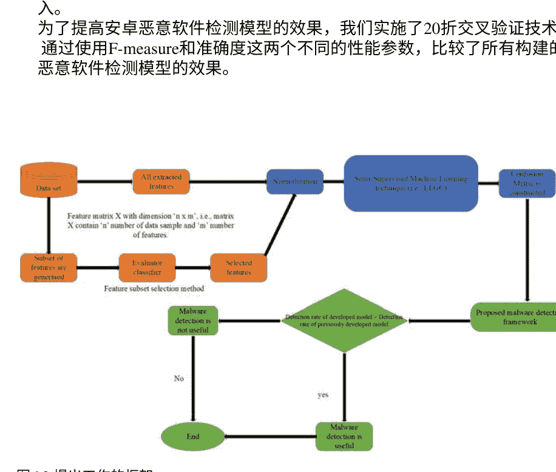

-   3.  从上述两个阶段构建的有效模型用于验证提出的恶意软件检测框架。

## 6.9 实验结果

本章节包含了在Android级别上一组不同特征与恶意软件检测之间的关系。F-measure和准确性被认为是性能评估参数，用于比较利用LLGC作为分类器方法构建的恶意软件检测模型的性能。为了描述结果，我们使用表6.6中显示的相应缩写代替它们的真实名称。

### 6.9.1 特征子集选择方法

在这项工作中，依次对30个Android应用程序数据集实施了四种不同类型的特征子集选择方法。特征子集选择方法基于假设原理，通过从可用的特征中选择最佳特征来构建具有更高准确性和较少错误分类的模型。随后，这些隔离的特征子集被识别为构建检测应用程序是良性还是恶意的模型的输入。不同特征子集选择方法选择的特征在图6.3中展示。

**表6.6 不同方法的命名约定 (.apk)**

| 缩写 | 对应名称             |
|------|----------------------|
| DS   | 数据集               |
| FS1  | 相关性最佳特征选择   |
| FS2  | 分类器子集评估       |
| FS3  | 过滤子集评估         |
| FS4  | 粗糙集分析（RSA）    |
| AF   | 所有提取的特征       |

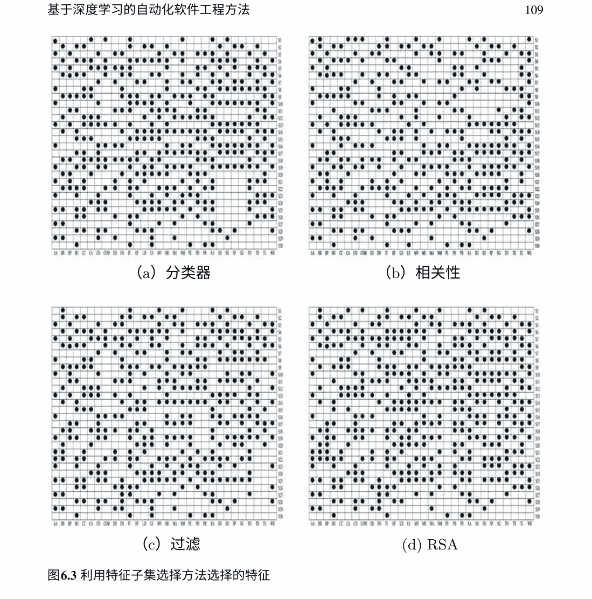

### 6.9.2 机器学习分类器

在本研究中，半监督机器学习分类器被认为是构建一个模型来检测应用程序是良性还是恶意的。将五个特征子集（从特征选择方法中收集的4个结果 + 1个识别所有特征集）作为输入，构建一个用于检测Android应用程序中恶意软件的模型。用于进行此实验的硬件是配备1 TB硬盘和8GB RAM的Core i7处理器。检测模型是通过使用MATLAB环境构建的。通过两个性能参数（F-measure和准确度）来检验各个检测模型的有效性。

表6.7 使用LLGC作为机器学习分类器的测量准确性

**准确率**

| ID  | AF    | FS1   | FS2   | FS3   | FS4   |
|-----|-------|-------|-------|-------|-------|
| D1  | 73.33 | 85.0  | 87.67 | 87.66 | 90    |
| D2  | 70    | 82.08 | 86.27 | 82.66 | 91    |
| D3  | 72    | 84.8  | 84.67 | 81.06 | 90.7  |
| D4  | 72    | 81.08 | 82.27 | 81.60 | 98    |
| D5  | 76    | 81    | 82    | 82    | 96    |
| D6  | 71.8  | 82.08 | 81.27 | 81.66 | 94    |
| D7  | 68    | 85    | 87    | 82    | 96    |
| D8  | 61    | 72    | 78    | 81    | 99    |
| D9  | 76    | 88    | 88    | 86    | 97    |
| D10 | 71    | 81    | 82    | 81    | 98    |
| D11 | 62    | 83    | 84    | 83    | 95    |
| D12 | 70    | 81    | 82    | 82    | 95    |
| D13 | 71    | 81    | 81    | 82    | 99    |
| D14 | 61    | 77    | 80    | 82    | 99    |
| D15 | 72    | 83    | 83    | 82    | 97    |
| D16 | 71    | 80    | 87    | 86    | 98    |
| D17 | 63    | 71    | 72    | 80    | 98    |
| D18 | 72    | 84    | 81    | 80    | 89.9  |
| D19 | 76    | 87    | 89    | 81    | 96    |
| D20 | 72    | 86    | 86    | 84    | 89.8  |
| D21 | 79    | 78    | 80    | 82    | 89.7  |
| D22 | 71    | 86    | 87    | 89.7  | 90    |
| D23 | 70    | 81    | 80.88 | 83.76 | 98.9  |
| D24 | 71    | 80    | 80.8  | 82    | 97.2  |
| D25 | 76    | 88    | 86    | 89    | 97.8  |
| D26 | 74    | 87.7  | 86.9  | 86.6  | 93    |
| D27 | 62    | 85    | 82    | 81    | 90.9  |
| D28 | 76    | 88    | 86    | 82    | 89    |
| D29 | 68    | 82    | 85    | 86    | 94.7  |
| D30 | 76    | 82    | 84    | 87    | 94.8  |

表6.7和6.8显示了使用LLGC作为分类器对不同数据集获得的性能值。根据表6.7和6.8，可以暗示在LLGC的情况下，通过利用FS4识别选定的特征集构建恶意软件检测模型，即RSA相对于其他特征子集选择方法获得更好的结果。

表6.8 使用LLGC作为机器学习分类器的测量F-度量

**F-度量**

| ID  | AF    | FS1  | FS2  | FS3  | FS4  |
|-----|-------|------|------|------|------|
| D1  | 0.71  | 0.82 | 0.83 | 0.83 | 0.89 |
| D2  | 0.68  | 0.82 | 0.84 | 0.83 | 0.89 |
| D3  | 0.71  | 0.80 | 0.81 | 0.80 | 0.87 |
| D4  | 0.73  | 0.80 | 0.82 | 0.81 | 0.9  |
| D5  | 0.71  | 0.77 | 0.82 | 0.81 | 0.83 |
| D6  | 0.78  | 0.82 | 0.84 | 0.83 | 0.94 |
| D7  | 0.61  | 0.80 | 0.82 | 0.81 | 0.89 |
| D8  | 0.61  | 0.80 | 0.82 | 0.80 | 0.92 |
| D9  | 0.69  | 0.81 | 0.84 | 0.83 | 0.87 |
| D10 | 0.52  | 0.81 | 0.80 | 0.82 | 0.86 |
| D11 | 0.60  | 0.81 | 0.82 | 0.82 | 0.88 |
| D12 | 0.62  | 0.80 | 0.81 | 0.81 | 0.89 |
| D13 | 0.78  | 0.80 | 0.81 | 0.80 | 0.88 |
| D14 | 0.72  | 0.82 | 0.81 | 0.80 | 0.93 |
| D15 | 0.72  | 0.84 | 0.83 | 0.82 | 0.89 |
| D16 | 0.62  | 0.81 | 0.80 | 0.80 | 0.9  |
| D17 | 0.72  | 0.80 | 0.83 | 0.85 | 1    |
| D18 | 0.73  | 0.81 | 0.83 | 0.86 | 0.97 |
| D19 | 0.71  | 0.82 | 0.83 | 0.85 | 0.96 |
| D20 | 0.72  | 0.86 | 0.83 | 0.82 | 0.89 |
| D21 | 0.62  | 0.85 | 0.84 | 0.85 | 0.86 |
| D22 | 0.62  | 0.83 | 0.84 | 0.85 | 0.89 |
| D23 | 0.72  | 0.80 | 0.81 | 0.80 | 0.95 |
| D24 | 0.70  | 0.81 | 0.82 | 0.86 | 0.9  |
| D25 | 0.73  | 0.81 | 0.86 | 0.87 | 0.98 |
| D26 | 0.70  | 0.81 | 0.82 | 0.83 | 0.85 |
| D27 | 0.60  | 0.82 | 0.81 | 0.86 | 0.88 |
| D28 | 0.78  | 0.82 | 0.85 | 0.82 | 0.89 |
| D29 | 0.70  | 0.81 | 0.84 | 0.86 | 0.9  |
| D30 | 0.68  | 0.81 | 0.82 | 0.85 | 0.94 |

在本章中，识别了一个分类器和两个评估参数，用于检测应用程序属于良性还是恶意类别。图6.4展示了每种情况下的两个箱线图，即F-度量和准确性。每个图中都包含五个箱线图。具有较高中位数值和较少异常值的模型被认为是优越模型。根据这些箱线图，我们可以分析出：

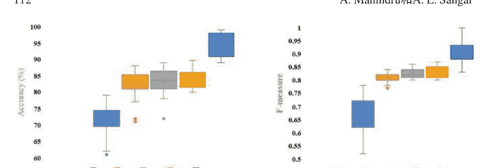

图6.4 箱线图显示了F-度量和准确度

在所有特征子集方法中，FS4的中位数值较高，离群值较少。根据图6.4中的箱线图，FS4产生了更好的结果，即利用RSA计算最佳特征子集以检测恶意软件和良性应用程序，并获得最佳结果。

### 6.9.3 结果比较

利用配对 t 检验来确定哪种特征子集选择方法表现更好，或者所有方法都表现相同。

特征子集选择方法：对于这项工作，我们考虑四种不同的特征子集选择方法作为模型的输入，其中包括30个不同类别的Android应用程序，并考虑两个结果参数，即F-度量和准确度。由于每种特征子集选择方法使用了两个集合，每个集合有30个数据点（1个分类器 × 30个数据集）。因此，对不同的特征子集选择方法进行 t 检验，并与相应的P值进行匹配以衡量统计重要性。图6.5展示了 t 检验的结果。因为P值的值是通过使用两个不同的符号来表示的，例如（绿色圆圈）P值 > 0.05（无相关重要性）和（红色圆圈）<= 0.05（相关重要性）。根据图6.5的基础，可以观察到大量的单元格被绿色圆圈填充，这意味着它们在应用的特征选择方法之间没有显著差异。因此，利用RSA选择的FS4特征集相比其他技术能够获得更好的结果。

### 6.9.4 使用提议的框架进行评估

### 使用提议的检测框架

与AV扫描器的比较：为了验证我们的提议框架能够从Android应用程序中检测恶意软件，我们使用市场上提供的五种不同的反病毒扫描器。这些反病毒扫描器采用基于签名的方法。为此，我们从不同的来源下载了1000个免费的.apk文件，并使用反病毒扫描器从中检测恶意软件。表6.9中提到了不同反病毒扫描器的准确性。根据表6.9，我们可以看到我们的提议方法（FS4 + LLGC）能够检测出97.8%的恶意软件应用，而各种反病毒扫描器只能检测出39%-93%的恶意软件应用。

与先前使用的分类器的比较：在本章的这个子节中，我们将我们构建的模型的性能与现有的分类器进行比较。表6.10向我们展示了与现有分类器的比较。从表6.10中，我们可以分析出我们的提议框架能够从真实世界的应用程序中检测出97.8%的恶意软件，无论与先前使用的哪种机器学习分类器进行比较。

| AV扫描器 | 准确率（%） |
| :--- | :--- |
| AV1（熊猫免费杀毒软件） | 86 |
| AV2（Avast免费杀毒软件） | 93 |
| AV3（Adaware免费杀毒软件） | 39 |
| AV4（Comodo杀毒软件10） | 88 |
| AV5（AVG免费杀毒软件） | 92 |
| 提出的方法（LLGC+ FS4） | 97.8 |

| 机器学习分类器的名称 | 平均准确率（%） |
| :--- | :--- |
| SimpleLogistic [9] | 84.08 |
| BayesNet K2 [9] | 82 |
| BayesNet TAN [9] | 68.51 |
| RandomTree [9] | 83.32 |
| 我们提出的模型（LLGC+FS4） | 97.8 |

### 6.9.5 实验结果

本章的这部分包含迄今为止实证工作的总体发现。通过选择特定特征子集选择技术，对三十个不同类别的Android应用进行了实证工作。此外，选择的特征使用LLGC作为分类器进行训练，并使用F-measure和准确性两个有效的性能参数进行测量。

基于实证研究，本章能够回答以下研究问题。

RQ1：为了构建恶意软件检测模型，LLGC被考虑用于检测应用程序是良性还是恶意。 根据表6.7和6.8的结果，可以暗示使用LLGC开发的模型通过识别选定的特征集合，并利用FS4作为输入时，与其他方法相比，能够获得更好的结果。

RQ2：为了回答RQ2，研究了图6.4，并注意到使用特征子集选择方法得到的结果与LLGC有所不同。这表明LLGC构建检测模型以检测应用程序是良性还是恶意的性能受到特征子集选择方法的影响。

RQ3：在这项工作中，识别了四种不同类型的特征子集选择方法来选择较小的特征子集。 基于 t检验研究，分析表明通过利用FS4（即RSA方法）进行特征子集选择可以获得与其他方法相比最佳的结果。

RQ4：为了回答RQ4，我们分析了图6.4和6.5，我们发现使用四种不同的特征子集选择方法开发的模型比考虑从Android应用程序中提取的所有特征构建的模型更能够检测恶意软件。

## 6.9.6 结论

本研究重点介绍了构建一种恶意软件检测框架，用于识别利用一组特征创建的恶意软件检测模型的效率。 在本章中，使用了三十个不同的特征集来构建一个LLGC模型。 执行过程在三十个不同的Android应用程序类别上进行，实验在MATLAB环境中进行并生成结果。

### 本章的结果如下：

-   我们的实证研究表明，可以确定一小组特征。利用这些确定的特征集构建的恶意软件检测模型能够以更高的准确性和更低的误分类错误率检测良性和恶意应用程序。
-   根据实证研究，我们发现即使减少了60%（平均）的可用特征数量，结果仍然更好。
-   在这项工作中，仅构建了恶意软件检测模型，仅检测应用程序是良性还是恶意。此外，可以进一步研究确定需要多少特征来判断应用程序属于哪个类别。此外，可以在基于软计算模型的其他基准上复制此研究，以实现更高的恶意软件检测准确性。

## 参考文献

-   1. https://www.statista.com/statistics/266136/global-market-share-held-by-smartphone-operating-systems/
-   2. https://www.statista.com/statistics/266210/number-of-available-applications-in-the-google-play-store/
-   3. https://www.statista.com/statistics/271644/worldwide-free-and-paid-mobile-app-store-downloads/
-   4. https://www.mcafee.com/in/resources/reports/rp-mobile-threat-report-2018.pdf
-   5. https://source.android.com/security/reports/Google Android Security 2017 Report Final.pdf
-   6. https://thehackernews.com/2018/03/android-botnet-malware.html
-   7. I.H. Witten, E. Frank, M.A. Hall, C.J. Pal, 数据挖掘：实用机器学习工具和技术 (Morgan Kaufmann, 2016)
-   8. J. Sahs, L. Khan, 一种基于机器学习的安卓恶意软件检测方法, in 2012年欧洲情报与安全信息学会议 (IEEE, 2012), pp. 141–147
-   9. B. Sanz, I. Santos, C. Laorden, X. Ugarte-Pedrero, P. Garcia Bringas, G. Álvarez, Puma: 使用权限检测安卓恶意软件, in 国际联合会议CISIS’12-ICEUTE 12-SOCO 12特别会议 (Springer, Berlin, Heidelberg, 2013), pp. 289–298
-   10. A. Shabtai, U. Kanonov, Y. Elovici, C. Glezer, Y. Weiss, Andromaly: 一种用于安卓设备的行为恶意软件检测框架. J. Intell. Inf. Syst. 38(1), 161–190 (2012)
-   11. A. Mahindru, P. Singh, 基于动态权限的安卓恶意软件检测方法, in 第10届软件工程创新大会 (ACM, 2017), pp. 202–210
-   12. D. Zhou, O. Bousquet, T.N. Lal, J. Weston, B. Schölkopf, 学习与本地和全局一致性. 在神经信息处理系统进展 (2004) pp. 321–328
-   13. L. Chen, M. Zhang, C. Yang, R. Sahita, 海报: 动态安卓恶意软件检测的半监督分类. 在2017年ACM SIGSAC计算机与通信安全会议论文集 (ACM, 2017), pp. 2479–2481
-   14. C. Cortes, V. Vapnik, 支持向量网络. 机器学习. 20(3), 273–297 (1995)
-   15. J. Li, L. Sun, Q. Yan, Z. Li, W. Srisa-an, H. Ye, 基于机器学习的安卓恶意软件检测的重要权限识别. IEEE工业信息学报. 14(7), 3216–3225 (2018)
-   16. A. Zulkifli, I.R.A. Hamid, W. Md Shah, Z. Abdullah, 基于决策树算法的基于网络流量的Android恶意软件检测, 在国际软计算会议 (Springer, Cham, 2018), 页码：485–494
-   17. W. Wang, M. Zhao, J. Wang, 基于深度自编码器和卷积神经网络的有效Android恶意软件检测的混合模型. J. 环境智能. 人性化计算. 10(8), 页码：3035–3043 (2019)
-   18. Z. Aung, W. Zaw, 基于权限的Android恶意软件检测. 科技研究国际期刊. 2(3), 页码：228–234 (2013)
-   19. L. Cen, C.S. Gates, L. Si, N. Li, 一种基于反编译源代码的Android恶意软件检测的概率判别模型. IEEE可靠安全计算交易. 12(4), 页码：400–412 (2014)
-   20. L. Weichselbaum, M. Neugschwandtner, M. Lindorfer, Y. Fratantonio, V. van der Veen, C. Platzer, Andrubis: 安卓恶意软件放大镜下的分析. 维也纳工业大学，技术报告 TR-ISECLAB-0414-001 (2014)
-   21. P. Faruki, V. Ganmoor, V. Laxmi, M.S. Gaur, A. Bharmal, AndroSimilar: 强大的统计特征签名用于安卓恶意软件检测, 第六届国际信息与网络安全会议论文集 (ACM, 2013), 页码 152–159
-   22. A.P. Felt, E. Chin, S. Hanna, D. Song, D. Wagner, Android 权限揭秘, 第18届ACM计算机与通信安全会议论文集 (ACM, 2011), 页码 627–638
-   23. W. Tang, G. Jin, J. He, X. Jiang, 使用安全距离模型扩展安卓安全执行力量, 在2011年国际互联网技术与应用会议 (IEEE, 2011), pp. 1–4
-   24. M. Zheng, M. Sun, J.C.S. Lui, Droid分析: 一种基于签名的分析系统用于收集, 提取, 分析和关联安卓恶意软件, 在2013年第12届IEEE国际计算与通信安全与隐私会议 (IEEE, 2013), pp. 163–171
-   25. E.R. Wognsen, H.S. Karlsen, M.C. Olesen, R.R. Hansen, Dalvik字节码的形式化和分析. Sci. Comput. Program. 92, 25–55 (2014)
-   26. W. Enck, M. Ongtang, P. McDaniel, 关于轻量级移动电话应用程序认证的研究, 在第16届ACM计算机与通信安全会议 (ACM, 2009), pp. 235–245
-   27. R. Sato, D. Chiba, S. Goto, 通过分析清单文件检测Android恶意软件。亚太高级网络会议论文集 36, 23-31 (2013)
-   28. D.J. Wu, C.-H. Mao, T.-E. Wei, H.-M. Lee, K.-P. Wu, Droidmat: 通过清单和API调用跟踪检测Android恶意软件， 在2012年第七届亚洲联合信息安全会议上 (IEEE, 2012), pp. 62-69
-   29. W. Zhou, Y. Zhou, X. Jiang, P. Ning, 在第二届ACM数据和应用安全与隐私会议上检测重新打包的智能手机应用程序 (ACM, 2012), pp. 317-326
-   30. C.Y. Huang, Y.-T. Tsai, C.-H. Hsu, 基于权限的Android恶意软件检测性能评估， 在智能系统和应用方面的进展, vol. 2 (Springer, Berlin, Heidelberg, 2013), pp. 111-120
-   31. Y. Aafer, W. Du, H. Yin, Droidapiminer: 用于在安卓中进行强大恶意软件检测的API级特征挖掘 国际通信系统安全与隐私会议 (Springer, Cham, 2013), 第86-103页
-   32. E. Chin, A.P. Felt, K. Greenwood, D. Wagner, 在安卓中分析应用间通信 第9届国际移动系统、应用和服务会议 (ACM, 2011), 第239-252页
-   33. D. Arp, M. Spreitzenbarth, M. Hubner, H. Gascon, K. Rieck, C.E.R.T. Siemens, Drebin: 你口袋中的安卓恶意软件的有效和可解释的检测。 Ndss 14, 23-26 (2014)
-   34. I. Burguera, U. Zurutuza, S. Nadjm-Tehrani, Crowdroid: 基于行为的安卓恶意软件检测 第1届ACM安全与隐私研讨会 (ACM, 2011), 第15-26页
-   35. M. Zhao, F. Ge, T. Zhang, Z. Yuan, AntiMalDroid: 一种基于SVM的高效恶意软件检测框架，适用于安卓，国际信息计算和应用会议 (Springer, Berlin, Heidelberg, 2011), 第158-166页
-   36. W. Enck, P. Gilbert, S. Han, V. Tendulkar, B.-G. Chun, L.P. Cox, J. Jung, P. McDaniel, A.N. Sheth, TaintDroid: 一种实时隐私监测的信息流追踪系统，适用于智能手机. ACM Trans. Comput. Syst. (TOCS) 32(2) (2014)
-   37. L.K. Yan, H. Yin, DroidScope: 无缝重构操作系统和Dalvik语义视图 用于动态安卓恶意软件分析，在第21届USENIX安全 研讨会上展示 (USENIX Security 12) (2012), 第569-584页
-   38. Y. Feng, S. Anand, I. Dilling, A. Aiken, Apposcopy: 基于语义的通过静态分析检测安卓恶意软件,在第22届ACM SIGSOFT国际软件工程基础研讨会上 (ACM, 2014), 第576-587页
-   39. A. Narayanan, M. Chandramohan, L. Chen, Y. Liu, 上下文感知、自适应和可扩展的 在线学习安卓恶意软件检测(扩展版). arXiv预印本 arXiv:1706.00947 (2017)
-   40. BlackHat, 使用Androguard进行逆向工程 https://code.google.com/androguard (在线; 访问日期：2013年3月29日)
-   41. H. Kang, J. Jang, A. Mohaisen, H.K. Kim, 使用静态分析和创建者信息检测和分类安卓恶意软件. Int. J. Distrib. Sens. Netw. 11(6) (2015)
-   42. D. Octeau, S. Jha, M. Dering, P. McDaniel, A. Bartel, L. Li, J. Klein, Y.L. Traon, 结合静态分析和概率模型以实现市场规模的 安卓组件间分析,在ACM SIGPLAN通知, 第51卷, 第1期 (ACM, 2016), 第469-484页
-   43. B. Amos, H. Turner, J. White, 将机器学习分类器应用于大规模动态安卓恶意软件检测,在2013年第9届国际无线通信和移动计算会议 (IWCMC) (IEEE, 2013), 第1666-1671页
-   44. 吴文超, 洪世豪, DroidDolphin: 一种基于大数据和机器学习的动态Android恶意软件检测框架,在2014年自适应和融合系统研究会议论文集 (ACM, 2014), 第247-252页
-   45. S. Sheen, R. Anitha, V. Natarajan, 基于多特征协同决策融合方法的基于Android的恶意软件检测 神经计算 151, 905-912 (2015)
-   46. M. Damshenas, A. Dehghantana, K.-K. Raymond Choo, R. Mahmud, M0droid: 一种基于Android行为的恶意软件检测模型。信息与隐私安全杂志 11 (3), 141-157 (2015)
-   47. R. Vinayakumar, K.P. Soman, P. Poornachandran, S. Sachin Kumar, 使用长短期记忆 (LSTM) 检测Android恶意软件。智能模糊系统杂志 34 (3), 1277-1288 (2018)
-   48. M.Z. Mas'ud, S. Sahib, M.F. Abdollah, S. Rahayu Selamat, R. Yusof, 分析Android恶意软件检测中的特征选择 和机器学习分类器,在2014年国际信息科学与应用会议 (ICISA) (IEEE, 2014), 第1-5页
-   49. A. Narayanan, M. Chandramohan, L. Chen, Y. Liu, 一种多视图上下文感知的Android恶意软件检测和恶意代码定位方法。经验软件工程 23 (3), 1222-1274 (2018)
-   50. K. Allix, T.F. Bissyandé, Q. Jérôme, J. Klein, Y. Le Traon, 对Android的基于机器学习的恶意软件检测器的实证评估。 Empirical Softw. Eng. 21(1), 183–211 (2016)
-   51. A. Azmoodeh, A. Dehghantanha, K.-K. Raymond Choo, 使用深度特征空间学习对互联网 (战场) 物联网设备进行强大的恶意软件检测。 IEEE Trans. Sustain. Comput. 4(1), 88–95 (2018)
-   52. A.F.A. Kadir, N. Stakhanova, A.A. Ghorbani, Android僵尸网络: URL告诉我们什么,在国际网络与系统安全会议 (Springer, Cham, 2015), pp. 78–91
-   53. Y. Zhou, X. Jiang, 解剖Android恶意软件: 特征和演变,在2012年IEEE安全与隐私研讨会 (IEEE, 2012), pp. 95–109
-   54. 僵尸网络研究团队。SandDroid: 一种APK分析沙箱。西安交通大学 (2014年)
-   55. M. Dash, H. Liu, 基于一致性的特征选择搜索。人工智能。 151 (1-2), 155-176 (2003年)
-   56. R. Kohavi, G.H. John, 用于特征子集选择的包装器。人工智能。 97 (1-2), 273-324 (1997年)
-   57. Z. Pawlak, 粗糙集。国际计算机与信息科学杂志。 11 (5), 341-356 (1982年)

- 58. C.-Y. Huang, Y.-T. Tsai, C.-H. Hsu, 基于权限的安卓恶意软件检测性能评估, 在智能系统和应用进展, 卷2 (Springer, 柏林, 海德堡, 2013年), 第111-120页

- 59. I. Santos, B. Sanz, C. Laorden, F. Brezo, P.G. Bringas, 基于操作码序列的半监督未知恶意软件检测, 在信息系统安全的计算智能中 (Springer, Berlin, Heidelberg, 2011), 第50-57页

- 60. S. Kokoska, C. Nevison, *Cochran's*检验的临界值, 在统计表和公式中 (Springer, New York, 1989), 第74页