# 自动语音识别


# 信号与通信技术

董宇
邓力

深度学习方法

有关该系列的更多信息，请访问http://www.springer.com/series/4748

董宇 · 邓力

# 自动语音识别

深度学习方法

董宇
微软研究院
Bothell
美国

邓力
微软研究院
Redmond, WA
美国

ISSN 1860-4862
ISBN 978-1-4471-5778-6
DOI 10.1007/978-1-4471-5779-3

ISSN 1860-4870（电子版）
ISBN 978-1-4471-5779-3（电子书）

# 图书馆国会控制号：2014951663

Springer伦敦海德堡纽约多德雷赫特

©Springer-Verlag伦敦2015
本作品受版权保护。出版商保留所有权利，无论是全部还是部分材料，特别是翻译、重印、插图的再利用、朗读、广播、微缩胶片复制或以任何其他实体方式的复制，以及信息存储和检索、电子适应、计算机软件，或通过类似或不同的已知或今后开发的方法。在这个法律保留中，免除了简短的摘录，用于评论或学术分析或专门提供的材料用于输入和执行计算机系统，供购买者独家使用。只有在出版商版权法的规定下才允许复制本出版物或其部分内容，以及必须始终从Springer获得使用许可。可以通过RightsLink在版权清除中心获得使用许可。违反者将受到相应版权法的起诉。本出版物中的一般描述性名称、注册名称、商标、服务标志等并不意味着即使在没有明确声明的情况下，这些名称都不受相关保护法律和法规的限制，因此可以自由使用。尽管本书中的建议和信息在出版日期时被认为是真实和准确的，但作者、编辑和出版商对可能出现的任何错误或遗漏不承担任何法律责任。出版商对于本文所含材料不提供任何明示或暗示的保证。

印刷在无酸纸上

Springer是Springer Science+Business Media（www.springer.com）的一部分

给我的妻子和父母 董宇

给Lih-Yuan、Lloyd、Craig、Lyle、Arie和Axel 邓力

# 前言

这是第一本专注于深度学习方法，尤其是深度神经网络（DNN）技术的自动语音识别（ASR）的书籍。这本里程碑式的书代表了DNN技术在过去几年中在ASR领域取得的巨大成功。继作者们最近一本关于“深度学习：方法与应用”的书之后，这本新书深入探讨了ASR技术和应用，而在之前的书中只是相对轻描淡写地涉及了ASR技术，并与深度学习的众多其他应用并列。重要的是，本书提供了ASR的背景材料和DNN的技术细节，包括严谨的数学描述和软件实现，对ASR专家和高级学生来说是非常宝贵的。

本书的一个独特之处在于从目前常用于ASR的DNNs扩展到包括具有自然嵌入领域知识和问题约束优势的深度生成模型。背景材料充分展示了自90年代初以来ASR研究人员开发的深度和动态生成模型的丰富性，同时也没有忽视与最近快速发展的深度判别模型DNNs相关的统一原则。通过对循环神经网络与隐藏动态模型的相对优势进行全面比较，特别有洞察力，为ASR以及其他信号和信息处理应用的深度学习的新发展方向开辟了令人兴奋和有前景的方向。从历史的角度来看，最近对ASR技术进行了四代分析。第四代技术真正体现在本书中详细介绍的深度学习中，特别是当DNNs与深度生成模型无缝集成时，能够以最自然的方式进行扩展知识处理。

总的来说，这本精美的书很可能成为第四代ASR深度学习时代的权威参考书。该书全面地介绍了理解ASR领域所需的基本概念，并深入详细介绍了强大的深度学习方法。这些方法在最近的2年中彻底改变了该领域。阅读本书的读者将能够熟练掌握由DNN技术建立的ASR的最新技术，并有能力构建新的ASR系统以达到或超过人类的表现水平。 由芝加哥丰田技术研究所所长、东京工业大学教授Sadaoki Furui撰写。

# 前言

自动语音识别(ASR)旨在实现自然人机交互，是一个长期的研究领域。在此过程中，已经开发了许多核心技术，如高斯混合模型(GMMs)、隐马尔可夫模型(HMMs)、梅尔频率倒谱系数(MFCCs)及其导数、n-gram语言模型(LMs)、判别式训练和各种适应技术，这些技术大多在新千年之前开发出来。

这些技术极大地推动了ASR及其相关领域的发展。与这些早期成就相比，2010年之前十年间ASR的研究和应用进展相对缓慢且不太令人兴奋，尽管在这一时期，重要的技术，如GMM-HMM序列判别式训练，在实际系统中取得了良好的效果。

然而，在过去几年中，我们观察到ASR的兴趣出现了新的激增。在我们看来，这种变化是由于移动设备对ASR的需求增加以及移动世界中新的语音应用（如语音搜索（VS），短信听写（SMD）和虚拟语音助手（例如苹果的Siri，谷歌现在和微软的Cortana））的成功所带来的。同样重要的是，深度学习技术在大词汇连续语音识别（LVCSR）中的发展，这些技术依靠大数据和大幅增加的计算能力。一组深度学习技术的结合使得在许多实际LVCSR任务上，与传统的GMM-HMM框架相比，错误率降低了超过1/3，并帮助实现了许多实际用户的采用门槛。例如，现在大多数SMD系统的英文单词准确率或中文字符准确率已经超过90%，甚至在某些系统上达到95%。

鉴于近年来ASR在工业界和学术界的兴趣激增，我们作为积极参与并密切见证了许多最近令人兴奋的深度学习技术发展的研究人员，相信现在是时候撰写一本书来总结ASR领域的进展，特别是过去几年的进展。

随着过去二十年左右该领域的发展，我们看到了一些关于ASR和与ASR相关的机器学习的有用书籍，其中一些列举如下：

- 《深度学习：方法与应用》（李登和俞冬，2014年6月）
- 《自动语音和说话人识别：大边界和核方法》（Joseph Keshet, Samy Bengio，2009年1月）
- 《数字通道上的语音识别：鲁棒性和标准》（Antonio Peinado和Jose Segura，2006年9月）
- 《语音和语言处理中的模式识别》（周武和蒋炳煌，2003年2月）
- 《语音处理——一种动态和优化导向的方法》（李邓和道格·奥·肖内西，2003年6月）
- 《口语语言处理：理论、算法和系统指南》（黄学东、亚历克斯·阿塞罗和洪小文，2001年4月）
- 《数字语音处理：合成和识别，第二版》（降幸彦，2001年6月）
- 《语音通信：人与机器，第二版》（道格拉斯·奥·肖内西，2000年6月）
- 《语音和语言处理—自然语言处理、计算语言学和语音识别导论》（丹尼尔·朱拉夫斯基和詹姆斯·马丁，2000年4月）
- 《语音和音频信号处理》（本·戈尔德和纳尔逊·摩根，2000年4月）
- 《语音识别的统计方法》（弗雷德·杰林克，1997年6月）
- 《语音识别基础》（劳伦斯·拉宾纳和彭煌蒋，1993年4月）
- 《自动语音识别中的声学和环境鲁棒性》（亚历克斯·阿塞罗，1992年11月）

然而，所有这些书要么是在2009年深度学习在ASR领域兴起之前出版的，要么是像我们2014年的综述书一样，更多地关注深度学习在ASR中的非技术性方面，而不是所需的技术和数学细节。这些早期的书籍没有包含2010年后开发的新的深度学习技术，也没有足够的技术和数学细节，这是ASR或深度学习专家所要求的。与上述书籍不同，并且除了一些必要的背景材料外，我们目前的书主要是对深度学习或判别式和分层模型在ASR领域最新进展的整理，以及这些模型的洞察力和理论基础，如深度神经网络（DNN）、受限玻尔兹曼机（RBM）、去噪自编码器、深度置信网络、循环神经网络（RNN）和长短期记忆（LSTM）RNN，以及它们在ASR中的应用，包括DNN-HMM等各种技术混合系统，串联和瓶颈系统，多任务和迁移学习，序列判别式训练和DNN适应。本书进一步讨论了在构建实际世界实时ASR系统中应用深度学习模型和相关技术的实际考虑因素，技巧，设置和加速。为了提供背景，我们的书还包括两章介绍GMM和HMM及其变体。然而，我们省略了与本书主题不直接相关的GMM-HMM技术的细节——分层建模或深度学习方法。因此，我们的书在许多类似主题上与上述已出版的书籍互补，而不是取代它们。我们相信这本书将对高级研究生、研究人员、从业人员、工程师和语音处理和机器学习领域的科学家感兴趣。我们希望我们的书不仅提供了许多在该领域使用的技术的参考，而且激发了进一步推动该领域的新思路。

在书的准备过程中，我们得到了Alex Acero、Geoffrey Zweig、Qiang Huo、Frank Seide、Jasha Droppo、Mike Seltzer和Chin-Hui Lee的鼓励和帮助。我们还要感谢Springer编辑Agata Oelschlaeger和Kiruthika Poomalai，他们在润色和出版方面给予了友善和及时的帮助。

美国西雅图，2014年7月

董宇
邓力

# 目录

## 1 介绍

### 1.1 自动语音识别：更好的桥梁通信

#### 1.1.1 人 -人之间的交流

#### 1.1.2 人 -机器之间的交流

### 1.2 ASR系统的基本架构

### 1.3 书籍组织

#### 1.3.1 第一部分：传统声学模型

#### 1.3.2 第二部分：深度神经网络

#### 1.3.3 第三部分：DNN-HMM混合系统用于ASR

#### 1.3.4 第四部分：深度神经网络中的表示学习网络

#### 1.3.5 第五部分：高级深度模型

参考文献

## 第一部分：传统声学模型

## 2 高斯混合模型

### 2.1 随机变量

### 2.2 高斯和高斯混合随机变量

### 2.3 参数估计

### 2.4 高斯混合作为分布模型语音特征的模型

参考文献

## 3 隐马尔可夫模型及其变种

### 3.1 介绍

### 3.2 马尔可夫链

### 3.3 隐马尔可夫序列和模型

#### 3.3.1 隐马尔可夫模型的特征

#### 3.3.2 隐马尔可夫模型的模拟

#### 3.3.3 隐马尔可夫模型的似然评估

#### 3.3.4 高效似然评估的算法

#### 3.3.5 前向和后向递归的证明

### 3.4 EM算法及其在学习中的应用HMM参数

#### 3.4.1 EM算法简介

#### 3.4.2 应用EM算法学习HMM—鲍姆-韦尔奇算法

### 3.5 用于解码HMM状态序列的维特比算法

#### 3.5.1 动态规划和维特比算法

#### 3.5.2 用于解码HMM状态的动态规划

### 3.6 HMM及其变种用于生成式语音建模和识别

#### 3.6.1 用于语音建模的GMM-HMMs和识别

#### 3.6.2 用于语音的轨迹和隐藏动态模型建模和识别

#### 3.6.3 使用生成模型的语音识别问题HMM及其变种的模型

参考文献

## 第二部分 深度神经网络

## 4 深度神经网络

### 4.1 深度神经网络架构

### 4.2 使用误差反向传播进行参数估计

## 5 高级模型初始化技术

### 5.1 受限玻尔兹曼机

#### 5.1.1 RBM的特性

#### 5.1.2 RBM参数学习

### 5.2 深度置信网络预训练

### 5.3 使用去噪自编码器进行预训练

### 5.4 判别式预训练

### 5.5 混合预训练

### 5.6 丢弃预训练

参考文献

## 第三部分 深度神经网络-隐马尔可夫模型用于自动语音识别的混合系统

## 6 深度神经网络-隐马尔可夫模型混合系统

### 6.1 DNN-HMM混合系统

#### 6.1.1 架构

#### 6.1.2 使用CD-DNN-HMM进行解码

#### 6.1.3 CD-DNN-HMM的训练过程

#### 6.1.4 上下文窗口的影响

### 6.2 CD-DNN-HMM中的关键组件及其分析

#### 6.2.1 用于比较的数据集和基准及其分析

#### 6.2.2 建模单音状态或音素

#### 6.2.3 越深越好

#### 6.2.4 利用相邻帧

#### 6.2.5 预训练

#### 6.2.6 更好的对齐有助于

#### 6.2.7 调整转移概率

### 6.3 基于Kullback-Leibler散度的HMM

参考文献

## 7 训练和解码加速

### 7.1 训练加速

#### 7.1.1 使用多个GPU进行流水线反向传播

#### 7.1.2 异步SGD

#### 7.1.3 增广Lagrangian方法和交替方向乘子法

#### 7.1.4 减小模型大小

#### 7.1.5 其他方法

### 7.2 解码加速

#### 7.2.1 并行计算

#### 7.2.2 稀疏网络

#### 7.2.3 低秩近似

#### 7.2.4 用大型DNN教小型DNN

#### 7.2.5 多帧DNN

## 参考文献

## 8 深度神经网络序列判别训练

### 8.1 序列判别训练准则

#### 8.1.1 最大互信息

#### 8.1.2 增强的MMI

#### 8.1.3 MPE/sMBR

#### 8.1.4 统一的表述

### 8.2 实际考虑因素

#### 8.2.1 格生成

#### 8.2.2 格补偿

#### 8.2.3 帧平滑

#### 8.2.4 学习率调整

#### 8.2.5 训练准则选择

#### 8.2.6 其他考虑因素

### 8.3 噪声对比估计

#### 8.3.1 概率密度估计问题的转化作为分类器设计问题

#### 8.3.2 扩展到非归一化模型

#### 8.3.3 在DNN训练中应用NCE

## 参考文献

## 第四部分：深度神经网络中的表示学习

## 9 深度神经网络中的特征表示学习

### 9.1 特征表示和分类器的联合学习

### 9.2 特征层次结构

### 9.3 使用任意输入特征的灵活性

### 9.4 特征的鲁棒性

#### 9.4.1 对说话人变化的鲁棒性

#### 9.4.2 对环境变化的鲁棒性

### 9.5 在所有条件下的鲁棒性

#### 9.5.1 在不同噪声水平下的鲁棒性

#### 9.5.2 在不同说话速度下的鲁棒性

### 9.6 对大幅度扭曲的泛化能力不足

## 参考文献

## 10 融合深度神经网络和高斯混合模型系统

### 10.1 在GMM-HMM系统中使用DNN派生特征

#### 10.1.1 GMM-HMM与串联和瓶颈特征

#### 10.1.2 DNN-HMM混合系统与GMM-HMM具有DNN派生特征的系统

### 10.2 融合识别结果

#### 10.2.1 ROVER

#### 10.2.2 SCARF

#### 10.2.3 MBR格子组合

### 10.3 融合帧级声学分数

### 10.4 多流语音识别

## 参考文献

## 11 深度神经网络的适应

### 11.1 深度神经网络的适应问题

### 11.2 线性变换

#### 11.2.1 线性输入网络

#### 11.2.2 线性输出网络

### 11.3 线性隐藏网络

### 11.4 保守训练

#### 11.4.1 L2正则化

#### 11.4.2 KL散度正则化

#### 11.4.3 减少每个说话者的足迹

## 12 多语言和跨语言语音识别

### 12.2 多语言和跨语言语音识别

#### 12.2.1 串联/瓶颈基于跨语言语音识别

#### 12.2.2 共享隐藏层多语言DNN

#### 12.2.3 跨语言模型迁移

### 12.3 深度神经网络语音的多目标训练识别

#### 12.3.1 多任务下的鲁棒语音识别学习

#### 12.3.2 多任务改进的电话识别学习

#### 12.3.3 同时识别音素和字素

### 12.4 利用音频-视觉信息的鲁棒语音识别

## 参考文献

## 13 循环神经网络和相关模型

### 13.1 引言

### 13.2 基本循环神经网络的状态空间表达

### 13.3 通过时间的反向传播学习算法

#### 13.3.1 最小化目标函数

#### 13.3.2 递归计算误差项

#### 13.3.3 RNN权重的更新

### 13.4 用于学习循环神经网络的原始-对偶技术

#### 13.4.1 学习RNN的困难之处

#### 13.4.2 回声状态属性及其充分条件

#### 13.4.3 将RNN作为约束优化问题进行学习

#### 13.4.4 用于学习RNN的原始-对偶方法

### 13.5 循环神经网络结合LSTM单元

#### 13.5.1 动机和应用

#### 13.5.2 LSTM单元的架构

#### 13.5.3 训练LSTM-RNN

### 13.6 分析循环神经网络—对比方法

#### 13.6.1 信息流的方向：自上而下与自下而上

#### 13.6.2 表示的性质：局部主义或分布式

#### 13.6.3 解释性：推断潜在层与端到端学习相比

#### 13.6.4 参数化：简洁条件与大规模权重矩阵相比

#### 13.6.5 模型学习方法：变分推断与梯度下降相比

#### 13.6.6 识别准确性比较

### 13.7 讨论

## 参考文献

## 14 计算网络

### 14.1 计算网络

### 14.2 前向计算

### 14.3 模型训练

### 14.4 典型计算节点

#### 14.4.1 没有操作数的计算节点类型

#### 14.4.2 一个操作数的计算节点类型

#### 14.4.3 两个操作数的计算节点类型

#### 14.4.4 用于计算统计数据的计算节点类型

### 14.5 卷积神经网络

### 14.6 循环连接

#### 14.6.1 仅在循环内逐个样本处理

#### 14.6.2 同时处理多个语音

#### 14.6.3 构建任意递归神经网络

## 参考文献

## 15 总结和未来方向

### 15.1 路线图

#### 15.1.1 DNN在ASR中的首次亮相

#### 15.1.2 DNN训练和解码的加速

#### 15.1.3 序列判别式训练

#### 15.1.4 特征处理

#### 15.1.5 自适应

#### 15.1.6 多任务和迁移学习

#### 15.1.7 卷积神经网络

#### 15.1.8 循环神经网络和LSTM

#### 15.1.9 其他深度模型

### 15.2 现状和未来发展方向

#### 15.2.1 现状—简要分析

#### 15.2.2 未来发展方向

## 参考文献

## 索引

## 缩写

| 缩写 | 解释 |
|---|---|
| ADMM | 交替方向乘子法 |
| AE-BN | 自动编码器瓶颈 |
| ALM | 增广拉格朗日乘子 |
| AM | 声学模型 |
| ANN | 人工神经网络 |
| ANN-HMM | 人工神经网络-隐马尔可夫模型 |
| ASGD | 异步随机梯度下降 |
| ASR | 自动语音识别 |
| BMMI | 增强最大互信息 |
| BP | 反向传播 |
| BPTT | 时序反向传播 |
| CD | 对比散度 |
| CD-DNN-HMM | 上下文相关的深度神经网络-隐马尔可夫模型 |
| CE | 交叉熵 |
| CHiME | 多源环境中的计算听觉 |
| CN | 计算网络 |
| CNN | 卷积神经网络 |
| CNTK | 计算网络工具包 |
| CT | 保守训练 |
| DAG | 有向无环图 |
| DaT | 设备感知训练 |
| DBN | 深度置信网络 |
| DNN | 深度神经网络 |
| DNN-GMM-HMM | 深度神经网络-高斯混合模型-隐马尔可夫模型 |
| DNN-HMM | 深度神经网络-隐马尔可夫模型 |
| DP | 动态规划 |
| DPT | 判别式预训练 |
| EBW | 扩展鲍姆-韦尔奇算法 |
| EM | 期望最大化 |
| fDLR | 特征空间判别线性回归 |
| fMLLR | 特征空间最大似然线性回归 |
| FSA | 特征空间说话人自适应 |
| F平滑 | 帧平滑 |
| GMM | 高斯混合模型 |
| GPU | 通用图形处理单元 |
| HDM | 隐藏动态模型 |
| HMM | 隐马尔可夫模型 |
| HTM | 隐藏轨迹模型 |
| IID | 独立同分布 |
| KLD | Kullback–Leibler散度 |
| KL-HMM | 基于Kullback–Leibler散度的HMM |
| LBP | 逐层反向传播 |
| LHN | 线性隐藏网络 |
| LIN | 线性输入网络 |
| LM | 语言模型 |
| LON | 线性输出网络 |
| LSTM | 长短期记忆（循环神经网络） |
| LVCSR | 大词汇连续语音识别 |
| LVSR | 大词汇语音识别 |
| MAP | 最大后验 |
| MBR | 最小贝叶斯风险 |
| MFCC | 梅尔频率倒谱系数 |
| MLP | 多层感知器 |
| MMI | 最大互信息 |
| MPE | 最小电话错误 |
| MSE | 均方误差 |
| MTL | 多任务学习 |
| NAT | 噪声自适应训练 |
| NaT | 噪声感知训练 |
| NCE | 噪声对比估计 |
| NLL | 负对数似然 |
| oDLR | 输出特征判别线性回归 |
| PCA | 主成分分析 |
| PLP | 感知线性预测 |
| RBM | 受限玻尔兹曼机 |
| ReLU | 修正线性单元 |
| RKL | 反向Kullback–Leibler散度 |
| RNN | 循环神经网络 |
| ROVER | 识别器输出投票误差减小 |
| RTF | 实时因子 |
| SaT | 说话人感知训练 |
| SCARF | 分段条件随机场 |
| SGD | 随机梯度下降 |
| SHL-MDNN | 共享隐藏层多语言DNN |
| SIMD | 单指令多数据 |
| SKL | 对称Kullback-Leibler散度 |
| sMBR | 状态最小贝叶斯风险 |
| SMD | 短信口述 |
| SVD | 奇异值分解 |
| SWB | 交换机板 |
| UBM | 通用背景模型 |
| VS | 语音搜索 |
| VTLN | 声道长度归一化 |
| VTS | 向量泰勒级数 |
| WTN | 词转换网络 |

## 符号

### 常用数学运算符

- $x$ : 一个向量
- $x_i$ : 向量 $x$ 的第 $i$ 个元素
- $|x|$ : 向量 $x$ 的绝对值
- $\|x\|$ : 向量 $x$ 的范数
- $x^T$ : 向量 $x$ 的转置
- $a^T b$ : 向量 $a$ 和 $b$ 的内积
- $ab^T$ : 向量 $a$ 和 $b$ 的外积
- $a \bullet b$ : 向量 $a$ 和 $b$ 的逐元素乘积
- $a b$ : 向量 $a$ 和 $b$ 的叉积
- $A$ : 一个矩阵
- $A_{ij}$ : 矩阵 $A$ 的第 $i$ 行和第 $j$ 列的元素值
- $tr(A)$ : 矩阵 $A$ 的迹
- 矩阵 $A$ 和 $B$ 的 Khatri-Rao 乘积
- $A \ø B$ : 矩阵 $A$ 和 $B$ 的逐元素除法
- $A \circ B$ : 矩阵 $A$ 和 $B$ 的逐列内积
- $A \odot B$ : 向量在矩阵 $A$ 和 $B$ 的行上的内积
- $A^{-1}$ : 矩阵 $A$ 的逆
- $A^{\dagger}$ : 矩阵 $A$ 的伪逆
- $A^{\alpha}$ : 矩阵 $A$
- $vec(A)$ : 由 $A$ 的列连接形成的向量
- $I_n$ : $n \times n$ 单位矩阵
- $1_{m,n}$ : $m \times n$ 所有元素为1的矩阵
- $\mathbb{E}$ : 统计期望运算符
- $\mathbb{V}$ : 统计协方差运算符
- $\langle x \rangle$ : 向量 $x$ 的平均值
- 卷积运算符
- $H$ : 海森矩阵
- $J$ : 雅可比矩阵

### 更具体的数学符号

- w* : 最优 w
- ŵ : 估计值 w
- R : 相关矩阵
- Z : 分区函数
- v : 网络中的可见单元
- h : 网络中的隐藏单元
- o : 观测（特征）向量
- y : 输出预测向量
- ε : 学习率
- θ : 阈值
- λ : 正则化参数
- N(x; μ, Σ) : 随机变量 x 服从均值向量 μ 和协方差矩阵 Σ 的高斯分布
- μ_i : 均值向量 μ 的第 i 个分量
- σ_i^2 : 第 i 个方差分量
- c_m : 第 m 个高斯分量的高斯混合权重
- a_{i,j} : 从状态 i 到状态 j 的 HMM 转移概率
- b_i(o) : 在状态 i 下观测到观测值 o 的 HMM 发射概率
- Λ : 整个模型参数集
- q : HMM 状态序列
- π : HMM 初始状态概率

## 第1章 引言

摘要 自动语音识别（ASR）是一项重要技术，可以实现和改善人与人之间以及人与计算机之间的交互。在本章中，我们介绍了ASR系统的主要应用领域，描述了它们的基本架构，然后介绍了本书的组织结构。

### 1.1 自动语音识别：构建更好沟通的桥梁

自动语音识别（ASR）已经是一个活跃的研究领域超过五十年。它一直被认为是促进更好的人际和人机沟通的重要桥梁。然而，在过去，语音实际上从未成为人机通信中的重要方式。这部分是因为当时的技术还不足以满足大多数真实世界用户在大多数真实使用条件下的可用性要求，部分是因为在许多情况下，诸如键盘和鼠标之类的替代通信方式在通信效率、限制和准确性方面明显优于语音。

近年来，语音技术开始改变我们生活和工作的方式，并成为人类与某些设备交互的主要手段之一。这一趋势始于在几个关键领域取得的进展。首先，摩尔定律仍然有效。如今可用的计算能力，通过多核处理器、通用图形处理单元（GPGPUs）和CPU/GPU集群，比十年前多了几个数量级。这使得训练更强大但更复杂的模型成为可能。这些更加计算密集的模型，也是本书的主题，显著降低了ASR系统的错误率。其次，我们现在可以访问比以前更多的数据，这要归功于互联网和云计算的持续进步。通过在从真实使用场景中收集的大数据上构建模型，我们可以消除以前的许多模型假设，并使系统更加稳健。第三，移动设备、可穿戴设备、智能客厅设备和车载信息娱乐系统变得流行起来。在这些设备和系统上，替代交互方式键盘和鼠标等输入方式不如个人计算机上的输入方式方便。语音是人与人之间自然的交流方式，大多数人已经具备这种技能，因此在这些设备和系统上，语音成为一种更受欢迎的交互方式。

近年来，语音技术在许多应用中发挥着重要作用。这些应用可以分为帮助改善人与人之间交流（HHC）的应用和帮助改善人与机器之间交流（HMC）的应用。

#### 1.1.1 人与人之间的交流

语音技术可以消除人与人之间的障碍。过去，说不同语言的人需要一个人类翻译才能相互交流。这对人们的交流对象和交流时间设置了重要限制。例如，不会说中文的人在中国独自旅行常常感到困难。然而，这种障碍可以通过语音到语音（s2s）翻译系统来缓解，微软研究院最近的演示可以在[2]中找到。除了旅行者使用外，s2s翻译系统还可以集成到通信工具（如Skype）中，使说不同语言的人可以远程自由交流。图1.1展示了典型s2s翻译系统中的关键组件，其中语音识别是管道的第一阶段。

语音技术还可以以其他方式帮助人与人之间的交流。例如，在统一消息系统中，语音转录子系统可以将来电者留下的语音消息转换为文本。转录的文本可以通过电子邮件、即时消息或短信方便地发送给接收者，并方便地被接收者消费。另一个例子是，ASR技术可以用来口述短信，减少用户发送短信的工作量。语音识别技术还可以用于识别和索引演讲和讲座，使用户可以轻松找到他们感兴趣的信息。

#### 1.1.2 人机交流

语音技术还可以极大地改善人机交流。在这个领域中，最受欢迎的应用包括语音搜索、个人数字助理、游戏、客厅交互系统和车载信息娱乐系统：## 1.2 ASR系统的基本架构

语音搜索（VS）[24-26]应用允许用户通过语音直接搜索餐馆、驾车路线和产品评价等信息。它们显著减少了用户输入搜索查询的工作量。现在，语音搜索应用在iPhone、Windows Phone和Android Phone等移动设备上非常流行。

个人数字助理（PDA）已经有十年的原型。然而，在苹果发布iPhone上的Siri系统之后，它才最近变得流行起来。此后，许多其他公司也发布了类似的产品。PDA了解存储在您的移动设备中的信息、一些世界知识以及用户与系统的互动历史，因此可以更好地为用户提供服务。PDA可以执行的示例任务包括拨打电话、安排会议、提问并通过直接发出语音命令搜索音乐。

如果游戏与语音技术集成，游戏体验将大大提升。例如，在微软的Xbox游戏中，玩家可以与卡通角色交谈以获取信息或下达命令。

客厅交互系统和车载信息娱乐系统[23]在功能上非常相似。这些系统允许用户通过语音与其进行交互，以便用户可以播放音乐、获取信息或控制系统。然而，由于这些系统在不同条件下使用，它们面临不同的设计挑战。

本小节讨论的所有应用和系统都是口语系统的示例[11]。如图1.2所示，口语系统通常包括四个主要组件之一或多个：将语音转换为文本的语音识别组件；从口语中提取语义信息的口语理解组件；传达口语信息的文本到语音组件；以及与应用程序和其他三个组件进行通信的对话管理器。所有这些组件对于构建成功的口语系统都很重要。在本书中，我们只关注语音识别组件。

如图1.3所示，ASR系统的典型架构包括四个主要组件：信号处理和特征提取、声学模型（AM）、语言模型（LM）和假设搜索。

信号处理和特征提取组件以音频信号作为输入，通过去除噪声和信道失真来增强语音，将信号从时域转换为频域，并提取适合于后续声学模型的显著特征向量。声学模型集成了关于声学和语音学的知识，以从特征提取组件生成的特征作为输入，并为可变长度的特征序列生成AM分数。语言模型通过学习（通常是文本）训练语料库中单词之间的相关性来估计假设的单词序列的概率，或者LM分数。如果已知关于领域或任务的先验知识，则通常可以更准确地估计LM分数。假设搜索组件结合了特征向量序列和假设的单词序列的AM和LM分数，并将具有最高分数的单词序列作为识别结果输出。在本书中，我们重点关注AM组件。

AM组件需要处理的两个主要问题是可变长度的特征向量和音频信号的变异性。可变长度特征问题通常通过动态时间规整（DTW）和隐马尔可夫模型（HMM）[18]等技术来解决，我们将在第3章中进行描述。音频信号的变异性是由说话者特征（例如性别、疾病或压力）、语音风格和速度、环境噪声、旁白、信道失真（例如麦克风差异）、方言差异和非母语口音的复杂交互引起的。一个成功的语音识别系统必须应对所有这些声学变异。

随着我们从第1.1节中描述的受限任务转向现实世界的应用，额外的挑战也随之而来。如图1.4所示，现今的实用ASR系统需要处理庞大（数百万）的词汇量、自由对话、嘈杂的远场自发语音和混合语言。

图1.4 我们今天处理的ASR问题（右列）比过去要困难得多，因为来自实际应用的需求

过去，占主导地位的最先进ASR系统通常使用梅尔频率倒谱系数（MFCC）[4]或相对谱变换-感知线性预测（RASTA-PLP）[7]作为特征向量，高斯混合模型（GMM）-HMM作为声学模型。 在1990年代，这些GMM-HMM AMs使用最大似然（ML）训练准则进行训练。 在2000年代，提出了序列判别训练算法，如最小分类错误（MCE）[13]和最小音素错误（MPE）[16]，进一步提高了ASR的准确性。

近年来，鉴别性分层模型如深度神经网络（DNNs）[3, 9]变得可行，并且由于计算能力的持续改进、大规模训练集的可用性以及对这些模型的更好理解，显著降低了错误率。 例如，上下文相关（CD）-DNN-HMM在Switchboard会话转录任务中相对于传统的GMM-HMM系统训练使用序列鉴别性准则的系统，错误率降低了三分之一[22]。

在本书中，我们描述了这些鉴别性分层模型的新发展，包括DNN、卷积神经网络（CNN）和循环神经网络（RNN）。 我们讨论了这些模型的理论基础，以及使系统工作的实用技巧。 由于我们最熟悉我们自己的工作，本书主要关注我们自己的工作，但在适当的时候也会涵盖其他研究人员进行的相关工作。

## 1.3 书籍组织

我们将书籍分为五个部分。 我们将第一部分专门讲解传统的GMM-HMM系统以及相关的数学模型和变体，提取自[5, 10, 19]的经典书籍和教程材料以及[12, 17]的相关内容。 第二部分介绍DNN，以及它的初始化和训练算法。 第三部分讨论了用于语音识别的DNN-HMM混合系统，以及提高DNN训练和评估速度的技巧，以及序列鉴别性训练算法。 第四部分从联合表示学习和模型优化的角度描述了DNN。 基于这个观点，我们介绍了用于语音识别的串联系统以及DNN的适应技术。第五部分涵盖了多语言DNN、循环神经网络和计算网络等高级模型。 我们在第15章总结了本书，概述了发展基于深度学习的ASR系统的重要里程碑，并提供了我们对ASR研究未来方向的一些思考。

与我们最近的书籍[6]相比，本书在技术深度上更加详细，并且专注于语音识别，不涉及其他深度学习应用。

#### 1.3.1 第一部分：传统声学模型

第2章和第3章为您提供了关于传统的GMM-HMM声学模型的基础理论基础。 这些章节为您准备了理解我们在本书的其余部分中将介绍的判别性分层模型的基础。

第2章讨论了高斯混合模型、最大似然原理和期望最大化[15]训练算法。 第3章介绍了隐马尔可夫模型，这是现代语音识别系统中使用最广泛的技术。 它解释了HMM如何处理可变长度信号问题，并描述了前向-后向训练算法和维特比解码算法。 在本书中，GMM-HMM构成了现代语音识别系统的基础，而我们重点关注的是CD-DNN-HMM系统的普及之前。

#### 1.3.2 第二部分：深度神经网络

第4章和第5章为您深入介绍了深度神经网络。 我们重点介绍了在构建实际系统中被证明有效的技术，并从理论和实践的角度详细解释了这些技术的工作原理和原因。

第4章介绍了深度神经网络，著名的反向传播算法[14, 20]以及训练DNN的各种实用技巧。 第5章讨论了高级DNN初始化技术，包括生成式预训练和判别式预训练[21]。 我们重点关注受限玻尔兹曼机（RBM）[8]，噪声自编码器[1]以及两者之间的关系。

### 1.3.3 第三部分：DNN-HMM混合系统用于语音识别

在第6章至第8章中，我们遵循相同的精神，讨论了将DNN与HMM相结合的经过验证的技术，用于语音识别。第6章描述了DNN-HMM混合模型[3]，其中HMM用于建模语音信号的时序特性，DNN用于建模HMM中的发射概率。第7章讨论了改进DNN-HMM系统训练和解码速度的实际实现技巧。第8章讨论了进一步提高DNN-HMM混合系统识别准确性的序列判别训练算法。

#### 1.3.4 第四部分：深度神经网络中的表示学习

在第9-11章中，我们从不同的角度看待DNN，并讨论了DNN在语音识别中的其他应用方法。第9章描述了DNN的联合特征学习和模型优化观点。我们认为DNN可以在任意隐藏层进行分离，将其以下的所有层视为特征转换，将其以上的所有层视为分类模型。第10章介绍了串联架构和瓶颈系统，其中DNN被用作独立的特征提取器，输入到传统的GMM-HMM中。第11章展示了不同的DNN有效适应技术。

#### 1.3.5 第五部分：高级深度模型

从第12章到第14章，我们介绍了几种高级深度模型。在第12章中，我们描述了基于DNN的多任务和迁移学习，其中特征表示在相关任务之间共享和转移。我们将使用多语言和跨语言语音识别作为主要示例，使用共享隐藏层DNN架构来演示这些技术。在第13章中，我们介绍了循环神经网络，包括长短期记忆神经网络，用于语音识别。在第14章中，我们介绍了计算网络，这是一个描述任意学习机器的统一框架，例如深度神经网络（DNNs），计算神经网络（CNNs），循环神经网络（RNNs）（包括带有长短期记忆的版本（LSTM）），逻辑回归和最大熵模型，可以被描述为一系列计算步骤。

## 参考文献

- 1. Bengio, Y., Lamblin, P., Popovici, D., Larochelle, H.: 深度神经网络的贪婪逐层训练。 在：神经信息处理系统（NIPS）的论文集, 第153-160页（2006）
- 2. Clayton, S.: 微软研究展示了语音翻译技术的一个有希望的新突破。 http://blogs.technet.com/b/next/archive/2012/11/08/microsoft-research-shows-a-promising-new-breakthrough-in-speech-translation-technology.aspx （2012）
- 3. Dahl, G.E., Yu, D., Deng, L., Acero, A.: 大词汇语音识别的上下文相关预训练深度神经网络。IEEE Trans. Audio, Speech Lang. Process. 20（1），30–42 （2012）
- 4. Davis, S., Mermelstein, P.: 在连续说话的句子中，单音节词识别的参数表示比较。IEEE Trans. Acoust. Speech Signal Process. 28（4），357–366 （1980）
- 5. 邓, L., 奥肖内西, D.: 语音处理-一种动态和优化导向的方法。马塞尔·德克尔公司, 纽约 （2003年）
- 6. 邓, L., 于, D.: 深度学习: 方法与应用。NOW出版社, 代尔夫特 （2014年）
- 7. Hermansky, H.: 语音的感知线性预测（PLP）分析。J. Acoust. Soc. Am. 87, 1738 （1990年）
- 8. Hinton, G.: 训练受限玻尔兹曼机的实用指南。 技术报告 UTML TR 2010-003, 多伦多大学 （2010年）
- 9. Hinton, G., 邓, L., 于, D., 达尔, G.E., 穆罕默德, A.R., 贾特利, N., 塞尼尔, A., 范霍克, V., 阮, P., 赛纳斯, T.N., 等: 深度神经网络在语音识别中的声学建模: 四个研究小组的共同观点。IEEE信号处理杂志 29 （6），82-97 （2012年）
- 10. 黄, X., Acero, A., Hon, H.W.: 口语处理: 理论、算法和系统开发指南。普林斯顿大学出版社, 恩格尔伍德克利夫斯 （2001）
- 11. 黄, X., Acero, A., Hon, H.W., 等: 口语处理, 第18卷。 普林斯顿大学出版社, 恩格尔伍德克利夫斯 （2001）
- 12. 黄, X., Deng, L.: 现代语音识别概述。 在: Indurkhya, N., Damerau, F.J. (eds.) 自然语言处理手册, 第2版。CRC出版社, 泰勒和弗朗西斯集团, 博卡拉顿 （2010）。 ISBN 978-1420 085921
- 13. Juang, B.H., Hou, W., Lee, C.H.: 语音识别的最小分类错误率方法。IEEE Trans. Speech Audio Process. 5（3），257–265 （1997）
- 14. LeCun, Y., Bottou, L., Orr, G.B., Müller, K.R.: 高效的反向传播。 在: 神经网络: 行业内的技巧, 第9-50页。Springer （1998年）
- 15. Moon, T.K.: 期望最大化算法。IEEE信号处理杂志 13 （6），47-60 （1996年）
- 16. Povey, D., Woodland, P.C.: 最小电话错误和I平滑以改进判别式训练。 在: 国际声学、语音和信号处理会议 （ICASSP） 论文集, 卷1, 第I-105页 （2002年）
- 17. Rabiner, L.: 关于隐藏马尔可夫模型和语音识别中的选定应用的教程。IEEE 77 （2），257-286 （1989年）
- 18. Rabiner, L., Juang, B.H.: 隐藏马尔可夫模型简介。IEEE ASSP杂志 3 （1），4-16 （1986年）
- 19. Rabiner, L., Juang, B.H.: 语音识别基础. Prentice-Hall, Upper Saddle River （1993）
- 20. Rumelhart, D.E., Hintont, G.E., Williams, R.J.: 通过反向传播学习表示. Nature 323（6088），533–536 （1986）
- 21. Seide, F., Li, G., Chen, X., Yu, D.: 上下文相关深度神经网络中的特征工程用于会话语音转录. In: IEEE自动语音识别和理解研讨会 （ASRU） 论文集, pp. 24–29 （2011）
- 22. Seide, F., Li, G., Yu, D.: 使用上下文相关深度神经网络的会话语音转录. In: 国际语音通信协会年会论文集 （INTERSPEECH），pp. 437–440 （2011）
- 23. Seltzer, M.L., Ju, Y.C., Tashev, I., Wang, Y.Y., Yu, D.: 在车内进行媒体搜索。 IEEE信号处理杂志 28（4），50-60 （2011年）
- 24. Wang, Y.Y., Yu, D., Ju, Y.C., Acerol, A.: 语音搜索简介。 IEEE信号处理杂志 25（3），28-38 （2008年）
- 25. Yu, D., Ju, Y.C., Wang, Y.Y., Zweig, G., Acerol, A.: 自动目录辅助系统-从理论到实践。 在： 国际语音通信协会年会论文集 （INTERSPEECH） , 第2709-2712页 （2007年）
- 26. Zweig, G., Chang, S.: 个性化模型[M]用于语音搜索。 在： 国际语音通信协会年会论文集 （INTERSPEECH） , 第609-612页 （2011年）

## 第二章
高斯混合模型

摘要 在本章中，我们首先介绍了随机变量的基本概念和相关分布。然后将这些概念应用于高斯随机变量和高斯混合随机变量。讨论了标量和矢量值的情况，并给出了这些随机变量的概率密度函数及其指定的参数。这个介绍引出了高斯混合模型（GMM），当使用高斯混合随机变量的分布来拟合实际数据，如语音特征时。作为基于傅里叶谱的语音特征的统计模型，GMM在传统语音识别系统的声学建模中起着重要作用。我们讨论了GMM在声学建模中的一些关键优势，其中包括使用EM算法轻松拟合各种语音特征数据的方法。

我们详细描述了最大似然原理和相关的EM算法，用于语音识别中GMM的参数估计，因为它仍然是一种广泛使用的方法。最后，我们讨论了在语音识别中使用GMM的一个严重弱点，激发了新模型和方法的出现，这些模型和方法构成了本书的主要部分。

### 2.1 随机变量

概率论和统计学中最基本的概念是随机变量。标量随机变量是一个基于随机实验结果的实值函数或变量，它取决于随机实验的结果。向量值随机变量是一组标量随机变量，它们可能相互关联或相互独立。由于实验是随机的，随机变量所取的值也是随机的。随机变量可以理解为从随机实验到变量的映射。根据实验的性质和映射的设计，随机变量可以取离散值、连续值或离散和连续值的混合。因此，我们可以称之为离散随机变量、连续随机变量或混合随机变量。随机变量可能取的所有可能值有时也被称为其域。 在本章以及后面的几章中，我们使用相同的符号来描述随机变量和其他概念，就像在[16]中采用的那样。

连续值随机变量 \(x\) 的基本特征是其分布或概率密度函数（PDF），通常用 \(p(x)\)表示。连续随机变量在 \(x = a\)处的概率密度函数（PDF）定义为

$$p(a) \doteq \lim_{\Delta a \to 0} \frac{P(a - \Delta a < x \leq a)}{\Delta a} \geq 0 \tag{2.1}$$

其中 \(P(\cdot)\)表示事件的概率。连续随机变量 \(x\) 的累积分布函数在 \(x = a\)处的定义为

$$P(a) \doteq P(x \leq a) = \int_{-\infty}^{a} p(x)dx. \tag{2.2}$$

一个概率密度函数必须满足归一化的性质：

$$P(x \leq \infty) = \int_{-\infty}^{\infty} p(x)dx = 1. \tag{2.3}$$

如果不满足归一化性质，我们有时称概率密度函数为不适当的密度或非归一化分布。对于连续随机向量 \(\mathbf{x} = (x_1, x_2, \ldots, x_D)^{\mathrm{T}} \in \mathscr{R}^{D}\)，我们可以类似地定义它们的联合概率密度函数 \(p(x_1, x_2, \ldots, x_D)\)。 此外，对于随机向量 \(\mathbf{x}\)中的每个随机变量 \(\mathbf{x}_i\)，我们可以定义边缘概率密度函数

$$p(x_i) \doteq \int \int \ldots \int p(x_1, \ldots, x_D) \, dx_1 \ldots dx_{i-1} dx_{i+1} \ldots dx_D. \tag{2.4}$$

它具有与标量随机变量的概率密度函数相同的性质。

### 2.2 高斯和高斯混合随机变量

如果标量连续随机变量 \(x\)服从正态分布或高斯分布，则其概率密度函数为

$$p(x) = \frac{1}{(2\pi)^{1/2}\sigma} \exp \left[ -\frac{1}{2} \left( \frac{x - \mu}{\sigma} \right)^2 \right] \doteq \mathcal{N}(x; \mu, \sigma^2), \quad (-\infty < x < \infty; \sigma > 0) \quad (2.5)$$

上述的等价符号表示为

$$x \sim \mathcal{N}(\mu, \sigma^2),$$

表示随机变量 \(x\) 服从均值为 \(\mu\) 和方差为 \(\sigma^2\) 的正态分布。通过使用精度参数 \(\tau\)，高斯概率密度函数也可以写成

$$p(x) = \sqrt{\frac{\tau}{\pi}} \exp \left[ -\tau (x - \mu)^2 \right]. \quad (2.6)$$

证明对于高斯随机变量 \(x\)，有 \(E[x] = \mu\)，\(\text{Var}(x) = \sigma^2 = \tau^{-1}\)，这是一个简单的练习。

正态随机向量 \(\mathbf{x} = (x_1, x_2, \ldots, x_D)^T\)，也称为多元或向量值高斯随机变量，由以下联合概率密度函数定义:

$$p(\mathbf{x}) = \frac{1}{(2\pi)^{D/2} |\mathbf{\Sigma}|^{1/2}} \exp \left[ -\frac{1}{2} (\mathbf{x} - \boldsymbol{\mu})^T \mathbf{\Sigma}^{-1} (\mathbf{x} - \boldsymbol{\mu}) \right] \quad \mathbf{x}; \boldsymbol{\mu}, \mathbf{\Sigma} \quad (2.7)$$

一个等价的表示是 \(\mathbf{x} \sim \mathcal{N}( \boldsymbol{\mu} \in \mathscr{R}^D, \mathbf{\Sigma} \in \mathscr{R}^{D \times D})\)。 对于多元高斯随机变量，期望值和协方差矩阵可以很容易地表示为 \(E[ \mathbf{x}] = \boldsymbol{\mu}\)； \(E[(\mathbf{x} - \boldsymbol{\mu})( \mathbf{x} - \boldsymbol{\mu})^T] = \mathbf{\Sigma}\)。

高斯分布在许多工程和科学领域中广泛使用，包括语音识别。它的流行不仅来自于其计算性能的优势，还来自于其能够近似许多自然发生的真实世界数据的能力，这要归功于大数定律。

现在让我们来讨论具有混合高斯分布的高斯混合随机变量。如果一个标量连续随机变量 \(x\) 的概率密度函数由以下方式指定

$$p(x) = \sum_{m=1}^M \frac{c_m}{(2\pi)^{1/2}\sigma_m} \exp \left[ -\frac{1}{2} \left( \frac{x - \mu_m}{\sigma_m} \right)^2 \right] \quad (2.8)$$

$$= \sum_{m=1}^M c_m \mathcal{N}(x; \mu_m, \sigma_m^2) \quad (-\infty < x < \infty; \sigma_m > 0; c_m > 0)$$

其中正的混合权重之和为一：\(\sum_{m=1}^M c_m = 1\)。

高斯混合分布最明显的特性是其多峰性（在方程2.8中 \(M > 1\)），与高斯分布的单峰性相反其中 \(M=1\)。这使得混合高斯分布能够充分描述许多类型的物理数据（包括语音数据），这些数据表现出多峰性，不适合单一高斯分布。

数据中的多峰性可能来自多个潜在原因，每个原因对应分布中的一个特定混合成分。如果这些原因被确定，那么混合分布可以被分解为一组因果相关或上下文相关的成分分布。

很容易证明，具有混合高斯概率密度函数的随机变量 \(x\) 的期望值 \(E(x) = \sum_{m=1}^{M} c_m \mu_m\)。但与单峰高斯分布不同，除非所有的分量均值 \(\mu_m, m = 1, \ldots, M\) 在高斯混合分布中彼此接近，否则这个简单的总结统计量并不是很有信息量。

高斯混合分布的多元推广具有联合概率密度函数

\[p(\mathbf{x}) = \sum_{m=1}^{M} \frac{c_m}{(2\pi)^{D/2} |\mathbf{\Sigma}_m|^{1/2}} \exp \left[ -\frac{1}{2} (\mathbf{x} - \boldsymbol{\mu}_m)^{\mathrm{T}} \mathbf{\Sigma}_m^{-1} (\mathbf{x} - \boldsymbol{\mu}_m) \right] = \sum_{m=1}^{M} c_m \mathcal{N}(\mathbf{x}; \boldsymbol{\mu}_m, \mathbf{\Sigma}_m), \quad (c_m > 0). \tag{2.9}\]

在许多语音识别系统（在深度学习兴起之前）的性能改进中，使用这种多元混合高斯分布是一个关键因素；例如，[14, 23, 24, 27]。在大多数应用中，混合成分的数量，\(M\)，根据问题的性质事先选择，尽管已经尝试避开这种经常困难的问题，即找到“正确”的数量；例如，[31]。

在使用方程2.8的多元混合高斯分布时，如果变量\(x\)的维度，\(D\)，很大（例如，语音识别问题的维度为40），那么使用完整（非对角线）协方差矩阵（\(\mathbf{\Sigma}_m\)）将涉及大量参数（数量级为 \(M \times D^2\)）。为了减少参数的数量，可以选择使用对角协方差矩阵来表示 \(\mathbf{\Sigma}_m\)。或者，当 \(M\) 很大时，也可以约束所有协方差矩阵相同；即，“绑定”所有混合成分的 \(\mathbf{\Sigma}_m\)。使用对角协方差矩阵的另一个优点是简化了高斯混合分布的应用所需的计算。将完整协方差矩阵减少为对角矩阵可能会使数据向量分量之间的相关性减弱。

然而，这种说法是误导性的，因为具有对角线协方差矩阵的高斯混合模型至少可以有效地描述由具有完全协方差矩阵的一个高斯模型建模的相关性。

### 2.3 参数估计

我们刚刚讨论的高斯混合分布包含一组参数。在多变量情况下，方程2.8的参数集合由 \(\Theta = [c_m, \mu_m, \Sigma_m]\)。参数估计问题，也称为学习，是从通常假设为从高斯混合分布中抽取的一组数据中确定这些参数的值。

通常将高斯混合建模和相关参数估计视为缺失数据问题。为了理解这一点，让我们假设所考虑的数据点在我们用来建模数据的各个高斯分布中具有“成员资格”或混合成分。在开始时，这种成员资格是未知的或缺失的。参数估计的任务是学习适当的分布参数，并将数据点与各个高斯分布中的成员资格联系起来。

在这里，我们专注于最大似然方法来估计参数的高斯混合分布，并特别关注期望最大化（EM）算法。EM算法是用于估计给定固定数量混合分量的混合的参数的最流行技术，并且可以用于计算任何参数化混合分布的参数。它是一个迭代算法，包含两个步骤：期望步骤（E-step）和最大化步骤（M-step）。我们将在第3章中更详细地介绍基于[5]的EM算法的一般统计形式，该章节涉及隐马尔可夫模型，并且在这里我们只讨论与高斯混合分布相关的参数估计问题的实际用途。

EM算法对于高斯混合分布特别有吸引力，因为它是本章的主要主题，在M-step中具有闭合形式的表达式，如下所示的迭代方式¹：

$$ c_m^{(j+1)} = \frac{1}{N} \sum_{t=1}^{N} h_m^{(j)}(t), \tag{2.10} $$
$$ \mu_m^{(j+1)} = \frac{\sum_{t=1}^{N} h_m^{(j)}(t) x^{(t)}}{\sum_{t=1}^{N} h_m^{(j)}(t)}, \tag{2.11} $$
$$ \Sigma_m^{(j+1)} = \frac{\sum_{t=1}^{N} h_m^{(j)}(t)[x^{(t)} - \mu_m^{(j)}][x^{(t)} - \mu_m^{(j)}]^T}{\sum_{t=1}^{N} h_m^{(j)}(t)}, \tag{2.12} $$

后验概率（也称为成员责任）从E步计算得到

$$h_m^{(j)}(t) = \frac{c_m^{(j)} \mathcal{N}(\mathbf{x}^{(t)}; \boldsymbol{\mu}_m^{(j)}, \boldsymbol{\Sigma}_m^{(j)})}{\sum_{i=1}^n c_i^{(j)} \mathcal{N}(\mathbf{x}^{(t)}; \boldsymbol{\mu}_i^{(j)}, \boldsymbol{\Sigma}_i^{(j)})}$$

也就是说，在当前（用上标j表示）参数的基础上，对于给定的观测值\(x^{(t)}\)从混合分量\(m\)生成的条件概率在每个数据样本点\(t=1,...,N\)上进行确定，\(N\)是样本大小。然后更新参数，使得新的分量权重对应于平均条件概率，每个分量的均值和协方差是整个样本集的分量特定加权平均值。

已经被广泛认可，每次EM迭代都不会降低似然性，这是大多数其他基于梯度的最大化技术所不具备的特性。此外，EM算法自然地嵌入了对概率向量的约束，并且对于足够大的样本大小，协方差迭代的正定性也得到了保证。这是一个关键优势，因为显式约束方法需要额外的计算成本来检查和维护适当的值。从理论上讲，EM算法是一种一阶方法，因此收敛到固定点解的速度较慢。然而，即使参数值本身的收敛不快，似然性的收敛也是迅速的。EM算法的另一个缺点是其倾向于错误地识别局部最大值，并对初始值敏感。

可以通过在参数空间中评估多个初始点来解决这些问题，尽管这可能会带来计算上的成本。解决这些问题的另一种流行方法是从一个高斯分量开始，在每个时期之后分割高斯分量。

除了上面讨论的用于参数估计的EM算法，该算法基于最大似然或数据拟合，还开发了其他类型的估计方法，旨在进行判别式估计或学习，用于高斯或高斯混合模型，作为相关但更一般的统计模型（如高斯HMM及其高斯混合模型）的特例；例如，[22, 25, 26, 33]。

## 2.4 高斯混合模型作为语音特征分布的模型

当语音波形被处理成压缩形式（例如，通过取对数）的短时傅里叶变换幅度或相关倒谱时，上述讨论的高斯混合分布被证明非常适合拟合这样的语音特征，当丢弃有关时间顺序的信息时。也就是说，可以使用高斯混合分布作为表示基于帧的语音特征的模型。我们使用高斯混合模型（GMM）来指代使用高斯混合分布表示数据分布的方法。在这种情况下，以及本书的其余部分，我们通常使用模型或计算模型用于指代某些现实物理过程（如人类语音过程）的数学抽象形式，遵循[9]中详细阐述的指导原则。这样的模型通常建立在必要的简化和近似的基础上，以实现数学或计算的可处理性。可处理性对于使数学抽象适用于计算机或算法实现的实际工程应用（如语音分析和识别）至关重要。

无论在语音识别领域内外，GMM通常用于数据建模和统计分类。GMM以其能够表示具有多个模式的任意复杂分布而闻名。

基于GMM的分类器在语音研究中非常有效，主要用于说话人识别、降噪语音特征和语音识别。对于说话人识别，GMM直接用作从所有说话人中汇集的语音特征分布的通用背景模型[4, 28, 32, 34]。在语音特征降噪或噪声跟踪应用中，GMM以类似的方式用作先验分布[10-13, 19, 21]。在语音识别应用中，GMM被整合到HMM的双重随机模型中，作为其在状态条件下的输出分布，这个主题将在第3章中详细讨论。

当考虑到语音序列信息时，GMM不再是一个好的模型，因为它不包含序列信息。一类更一般的模型，称为隐马尔可夫模型（HMM），将在第3章中讨论，捕捉了序列信息。在给定HMM的固定状态下，GMM仍然是描述分配给该状态的语音特征向量的概率密度函数（PDF）的一个相当好的模型。

GMM具有几个明显的优点，使其适用于对HMM的每个状态相关的语音特征向量的PDF进行建模。通过足够多的组件，它们可以对PDF进行任何所需的精度建模，并且它们易于使用EM算法来拟合数据，该算法在第2.3节中进行了描述。大量的研究已经投入到寻找约束GMM的方法上，以增加其评估速度并优化其灵活性与所需训练数据量之间的权衡，以避免过拟合。这包括参数绑定或半绑定GMM和子空间GMM的发展。

除了使用EM算法来估计GMM参数之外，如果在GMM系统与HMM接口之后，通过生成训练数据中观察到的语音特征的概率最大化来进行生成性训练，那么GMM系统的语音识别准确性将得到显著提高。特别是，如果用于训练的判别性目标函数与音素、单词或句子的错误率密切相关，这一点尤为明显。还可以通过使用神经网络生成的串联或瓶颈特征来改善准确性，这将在后面的章节中讨论。多年来，GMM在建模语音特征和语音识别的声学建模方面取得了很大成功（直到2010-2011年深度神经网络被证明优于GMM）。

尽管GMM具有许多优点，但也存在一个严重的缺点。也就是说，对于在数据空间中位于或接近非线性流形上的数据，GMM在统计上是低效的。例如，对于位于球面表面附近的点集，只需要使用适当的模型类来表示少量参数，但是需要使用大量对角高斯或相当数量的全协方差高斯。众所周知，语音是通过调制动态系统的相对较少参数来产生的。这表明，语音的真实潜在结构比一个包含数百个系数的窗口中立即显现的维度要低得多。因此，其他能够更好地捕捉语音特征属性的模型比GMM更适用于语音的声学建模。特别是，新模型应更有效地利用嵌入在一大窗口的语音特征帧中的信息，而不是GMM。在下一章中，我们将讨论一种用于描述语音时间属性的模型HMM之后，再回到这个重要的问题，对语音特征进行表征。

## 参考文献

- 1. Bilmes, J.: EM算法及其在高斯混合模型和隐马尔可夫模型参数估计中的应用的简明教程。技术报告，TR-97-021，ICSI（1997）
- 2. Bilmes, J.: HMMs能做什么。IEICE Trans. Inf. Syst. E89-D(3), 869–891 (2006)
- 3. Bishop, C.: 模式识别与机器学习。Springer, Heidelberg (2006)
- 4. Dehak, N., Kenny, P., Dehak, R., Dumouchel, P., Ouellet, P.: 用于说话人验证的前端因子分析。IEEE Trans. Audio, Speech Lang. Process. 19(4), 788–798 (2011)
- 5. Dempster, A. P., Laird, N.M., Rubin, D.B.: 通过EM算法从不完整数据中进行最大似然估计。J. Royal Stat. Soc. Ser. B. 39, 1–38 (1977)
- 6. 邓，L.：具有状态条件趋势函数的广义隐马尔可夫模型用于语音信号。信号处理。27(1), 65-78 (1992)
- 7. 邓，L.：语音产生的计算模型。在：语音模式处理的计算模型，第199-213页。斯普林格，纽约 (1999)
- 8. 邓，L.：用于语音发音和声学的切换动态系统模型。在：数学-语音和语言处理的基础，第115-134页。斯普林格，纽约 (2003)
- 9. 邓，L.：动态语音模型-理论，算法和应用。摩根和克莱-普尔，纽约 (2006)
- 10. 邓，L.，Acero，A.，Plumpe，M.，Huang，X.：在恶劣声学环境下的大词汇量语音识别。在：国际会议论文集语言处理（ICSLP），第806-809页 (2000)
- 11. 邓，L.，Droppо，J.，A. Acero：使用迭代随机逼近对非平稳噪声进行递归估计，用于鲁棒语音识别。IEEE Trans. Speech Audio Process.11, 568–580 (2003)
- 12. 邓，L.，Droppо，J.，Acero，A.：使用动态倒谱先验的语音特征增强的贝叶斯方法。在：国际会议论文集，声学、语音和信号处理（ICASSP），卷1，第I-829–I-832页 (2002)
- 13. 邓，L.，Droppо，J.，Acero，A.：使用相位敏感模型和顺序估计损坏噪声的语音对数梅尔功率谱增强。IEEE Trans. Speech Audio Process. 12（2），133–143（2004）
- 14. 邓，L., Kenny, P., Lennig, M., Gupta, V., Seitz, F., Mermelsten, P.: 用于大词汇量词语识别的连续混合输出密度的音素隐马尔可夫模型。IEEE Trans. Acoust, Speech Signal Process. 39 (7) , 1677–1681 (1991)
- 15. 邓，L.，马克，J.：通过时间离散化的EM算法对马尔可夫调制泊松过程进行参数估计。在：电信系统（1993）
- 16. 邓，L.，奥肖内西，D.：语音处理-一种动态和优化导向的方法。马塞尔·德克尔公司，纽约（2003）
- 17. 邓，L.，拉姆齐，G.，孙，D.：生产模型作为自动语音识别的结构基础。语音通信。 33 (2-3) , 93-111 (1997)
- 18. 邓，L.，拉丁纳维卢，C.：包含状态条件的二阶非平稳马尔可夫模型：应用于语音识别。计算机语音语言。 9 (1) , 63-86 (1995)
- 19. 邓，L.，王，K.，阿塞罗，A.，洪，H.，德罗波，J.，布利斯，C.，王，Y.，雅各比，D.，马哈扬，M.，切尔巴，C.，黄，X.: Mipad多模用户界面中的分布式语音处理。IEEE Trans. Audio Speech Lang. Process. 20(9), 2409–2419 (2012)
- 20. Divenyi, P., Greenberg, S., Meyer, G.: Dynamics of Speech Production and Perception. IOS Press, Washington (2006)
- 21. Frey, B., Deng, L., Acero, A., Kristjansson, T.: Algonquin: iterating laplaces method to remove multiple types of acoustic distortion for robust speech recognition. In: Proceedings of European Conference on Speech Communication and Technology (EUROSPEECH) (2000)
- 22. He, X., Deng, L.: Discriminative Learning for Speech Recognition: Theory and Practice. Morgan and Claypool, New York (2008)
- 23. Huang, X., Acero, A., Hon, H.W., et al.: Spoken Language Processing. Prentice Hall, Englewood Cliffs (2001)
- 24. Huang, X., Deng, L.: An overview of modern speech recognition. In: Indurkhya, N., Damerau, F.J. (eds.) Handbook of Natural Language Processing, 2nd edn. CRC Press, Taylor and Francis Group, Boca Raton, FL (2010). ISBN 978-1420085921
- 25. 姜，H.，李，X.：顺序模式识别中的判别学习-面向优化的语音识别的统一评述。IEEE信号处理杂志。 27(3), 115-127(2010)
- 26. 姜，H.，李，X.，刘，C.：语音识别的大边界隐马尔可夫模型。IEEE音频、语音和语言处理。 14(5), 1584-1595 (2006)
- 27. Juang, B.H., Levinson, S.E., Sondhi, M.M.：马尔可夫链的混合多元随机观测的最大似然估计。在：IEEE国际信息理论研讨会卷。 32(2), pp. 307-309 (1986)
- 28. Kenny, P.：说话人和会话变异的联合因子分析：理论和算法。 CRIM，蒙特利尔，（报告）CRIM-06/08-13 (2005)
- 29. King, S., Frankel, J., Livescu, K., McDermott, E., Richmond, K., Wester, M.：自动语音识别中的语音产生知识. J. Acoust. Soc. Am. 121, 723–742 (2007)
- 30. Lee, L.J., Fieguth, P., Deng, L.：语音产生的功能性关节动力学模型。在：国际声学、语音和信号处理会议(ICASSP)论文集, vol. 2, pp. 797–800. 盐湖城 (2001)
- 31. Rasmussen, C.E.: 无限高斯混合模型。在：神经信息处理系统(NIPS)论文集 (1999)
- 32. Reynolds, D., Rose, R.: 使用高斯混合说话人模型的鲁棒无文本说话人识别。IEEE Trans. Speech Audio Process. 3(1), 72–83 (1995)
- 33. 肖，L.，邓，L.：高斯模型大边界训练的几何视角。IEEE信号处理杂志。 27, 118-123 (2010)
- 34. 尹，S.C.，罗斯，R.，肯尼，P.: 文本无关说话人验证中渐进模型自适应的联合因子分析方法。IEEE音频语音语言处理杂志。 15 (7) ， 1999-2010 (2007)

# 第3章
## 隐马尔可夫模型及其变种

摘要 本章在前一章关于概率论和统计学的综述基础上进行扩展，包括随机变量和高斯混合模型，并将综述扩展到马尔可夫链和隐马尔可夫序列或模型（HMM）。HMM的核心是状态的概念，它本身是一个通常取离散值的随机变量。从马尔可夫链扩展到HMM涉及在马尔可夫链的每个状态上添加不确定性或统计分布。因此，HMM是一个双随机过程，或者是马尔可夫链的概率函数。当马尔可夫序列或HMM的状态被限制为离散的，并且与HMM状态相关联的分布不重叠时，我们将其简化为马尔可夫链。本章涵盖了HMM的几个关键方面，包括其参数化描述，通过随机数生成器进行模拟，通过EM算法进行参数估计，以及通过维特比算法或动态规划过程进行状态解码。

然后我们讨论了使用HMM作为语音特征序列的生成模型以及其作为语音识别基础的使用。最后，我们讨论了HMM的局限性，导致了其各种扩展版本，其中每个状态与动态系统或隐藏的时变轨迹相关联，而不是与时间上独立的稳定分布（如高斯混合）相关联。

这些HMM的变体，以状态条件的动态系统表示为状态空间形式，被引入作为递归神经网络的生成对应物，将在第13章中详细描述。

### 3.1 引言

在前一章中，我们回顾了概率论和基本统计的方面，介绍了随机变量的概念和相关的概率分布的概念。然后我们讨论了高斯和高斯混合随机变量及其矢量值或多元版本。所有这些概念和示例都是静态的，意味着它们没有时间维度根据时间序列的长度或维度变化。对于语音信号的一个静态部分，它的基于谱幅（例如，倒谱）的特征可以通过高斯混合模型的多元分布很好地描述。这导致了短期或静态语音声音模式的语音特征的高斯混合模型（GMM）。

在本章中，我们将把随机变量的概念扩展到（离散时间）随机序列，它是由以可变长度为索引的均匀间隔离散时间的随机变量组成的集合。有关随机序列的一般统计特性，请参阅[43]的第3章，但在本章中，我们只提取关于马尔可夫序列的部分，因为它是最常用的一类一般随机序列。状态的概念对于马尔可夫序列至关重要。

当马尔可夫序列的状态被限制为离散时，我们有一个马尔可夫链，其中离散状态变量可能取的所有可能值构成（离散）状态空间，我们将在第3.2节中介绍。

当每个离散状态值被概括为一个新的随机变量（离散或连续），马尔可夫链就被概括为（离散或连续）隐藏马尔可夫序列，或者隐藏马尔可夫模型（HMM），当它被用来描述或近似真实数据序列的统计特性时。在第3.3节中，我们首先以底层马尔可夫链的转移概率和静态概率分布参数的参数化方式来描述HMM。然后我们展示了如何通过概率抽样来模拟HMM。详细介绍了在给定HMM的情况下计算观测序列的似然性的高效方法，因为这是在语音识别和其他实际问题中应用HMM的一个重要但不明显的要素。

然后，在第3.4节中，我们首先提供了关于EM算法的背景信息，用于在包含隐藏或潜在随机变量的一般统计模型中进行最大似然估计的参数。然后，我们应用EM算法来解决HMM（以及可以看作是HMM的特殊情况的GMM）的学习或参数估计问题。得到的HMM学习算法是著名的Baum-Welch算法，在语音识别和其他涉及HMM的应用中广泛使用。给出了Baum-Welch算法中E步骤的逐步推导，该步骤提供了给定输入训练数据的HMM状态的条件概率。还给出了用于估计马尔可夫链的转移概率以及高斯HMM中均值向量和协方差矩阵的M步骤的逐步推导。

我们使用第3.5节来介绍著名的维特比算法，以便在给定输入序列数据的情况下，最优地解码HMM状态序列。描述了动态规划技术，这是维特比算法的基本原理。

最后，在第3.6节中，我们将HMM作为一个统计模型与实际的语音问题相连接。讨论从HMM作为优雅的生成模型开始，用于语音特征序列的能力; 例如，[3-5, 72]。HMM与语音数据之间的相当好的匹配使得这个生成模型可以通过贝叶斯规则[41, 57]用于语音识别的分类任务。对HMM作为语音生成模型的弱点进行分析，促使其扩展为几个变体，其中在每个HMM状态条件下观察到的语音数据的分布中的时间独立性和平稳性被更现实、非平稳和时间相关的动态系统以及具有潜在或隐藏结构的动态系统所取代[15, 27, 44, 77, 80, 98]。这种动态系统的数学形式化，表达为状态空间模型，自然地将这些HMM变体与本书第13章中将要介绍的递归神经网络相连接。

### 3.2 马尔可夫链

马尔可夫链是离散状态的马尔可夫序列，是一般马尔可夫序列的特例。马尔可夫链的状态空间是离散的，且是有限的：$q_t \in \{s^{(j)}, j = 1, 2, \ldots, N\}$。这些离散值中的每一个都与马尔可夫链中的一个状态相关联。由于状态$s^{(j)}$和其索引$j$之间的一一对应关系，我们经常可以互换使用这两个术语。

一个马尔可夫链，$\mathbf{q}_1^T = q_1, q_2, \ldots, q_T$，完全由过渡概率所描述，定义如下：

$$
a_{i j}(t), i, j =1, 2, \ldots, N \tag{3.1}
$$

并且通过初始状态分布概率。如果这些转移概率与时间$t$无关，则我们有一个齐次马尔可夫链。

（齐次）马尔可夫链的转移概率通常方便地放入矩阵形式：

$$
A = [a_{i j}], \quad \text{其中} \quad a_{i j} \geq 0 \quad \forall i, j; \quad \sum_{j=1}^{N} a_{i j} = 1 \quad \forall i, \tag{3.2}
$$

这被称为马尔可夫链的转移矩阵。给定马尔可夫链的转移概率，可以轻松计算状态占有概率

$$
p_j(t) \doteq P[q_t = s^{(j)}]
$$

可以很容易地计算。计算是根据递归进行的

$$
p_i(t + 1) = \sum_{j=1}^{N} a_{j i} p_j(t), \quad \forall i. \tag{3.3}
$$

如果马尔可夫链的状态占有分布渐近收敛：$p_i(t) \to \bar{\pi}(s^{(i)})$ as $t \to \infty$，我们称之为马尔可夫链的稳态分布。为了使马尔可夫链具有稳态分布，其转移概率，$a_{i j}$，必须满足

$$
\pi(s^{(i)}) = \sum_{j=1}^{N} a_{ji} \pi( s^{(j)} ), \quad \forall i。
$$

马尔可夫链的稳态分布在一类强大的统计方法中起着重要作用，这些方法被统称为马尔可夫链蒙特卡罗(MCMC)方法。这些方法用于模拟（即采样或绘制）任意复杂的分布，使得可以进行许多困难的统计推断和学习任务，否则这些任务在数学上是难以处理的。

MCMC方法的理论基础是马尔可夫链收敛到其稳态分布 $\pi( s^{(i)} )$。也就是说，无论初始分布如何，马尔可夫链都是从 $\pi( s^{(i)} )$ 中渐近无偏抽样。

因此，为了从任意复杂的分布 $p(s)$ 中进行抽样，可以构造一个马尔可夫链，通过设计适当的转移概率 $a_{ij}$，使其稳态分布为 $\pi( s ) = p(s)$。

马尔可夫链还有其他三个有趣且有用的性质可以轻松推导出来。首先，马尔可夫链中的状态持续时间服从指数或几何分布： $p_i(d) = C (a_{ii})^{d-1}$，其中归一化常数为 $C = 1 - a_{ii}$。其次，平均状态持续时间为

$$
\overline{d}_i = \sum_{d=1}^{\infty} d \, p_i(d) = \sum_{d=1}^{\infty} (1-a_{ii})(a_{ii})^{d-1} = \frac{1}{1-a_{ii}}。
$$

最后，对于一个马尔可夫链的任意观察序列的概率，即有限长度的状态序列 $\mathbf{q}_1^T$，可以很容易地计算。这只是遍历马尔可夫链的转移概率的乘积：$P(\mathbf{q}_1^T) = \bar{\pi}_{q_1} \prod_{t=1}^{T-1} a_{q_t q_{t+1}}$，其中 $\bar{\pi}_{s_1}$是 t = 1时的初始状态占用概率。

### 3.3 隐马尔可夫序列和模型

让我们将上述马尔可夫链视为一个能够生成观察输出序列的信息源。然后，我们可以将马尔可夫链称为可观察的马尔可夫序列，因为其输出与状态之间存在一对一的对应关系。也就是说，每个状态对应于一个确定性可观察变量或事件。在任何给定的状态下，输出没有随机性。这种缺乏随机性使得马尔可夫链过于限制，无法充分描述许多现实世界的信息源，例如语音特征序列。

将马尔可夫链扩展到嵌入随机性的过程中，马尔可夫链中的状态之间存在重叠，从而产生了一个隐藏的马尔可夫序列。通过将观测概率分布与马尔可夫链中的每个状态相关联，实现了这种扩展。因此，所定义的马尔可夫序列是一个双重嵌入的随机序列，其底层马尔可夫链不可直接观测，因此是一个隐藏的序列。隐藏马尔可夫序列中的底层马尔可夫链只能通过一个与观测概率分布特征化的单独随机函数来观测。

请注意，如果观测概率分布在状态之间没有重叠，那么底层马尔可夫链将不会是隐藏的。这是因为，尽管状态中嵌入了随机性，但是在一个固定范围内的任何观测值都能唯一地映射到该状态。在这种情况下，隐藏马尔可夫序列实质上简化为一个马尔可夫链。关于马尔可夫链及其概率函数或隐藏马尔可夫序列之间关系的更详细的阐述可以在[103, 104]中找到。

当使用隐马尔可夫序列来描述一个物理的、真实的信息源时，即用来近似这样一个源的统计特性时，我们通常称之为隐马尔可夫模型（HMM）。HMM在语音处理应用中有一个非常成功的实际用途，包括语音识别、语音合成和语音增强；例如，[1, 12, 17, 46–48, 66, 71, 81, 83, 103, 111, 120, 124, 126, 128]。在这些应用中，HMM被用作一个强大的模型，用于表征语音信号的时间非平稳、空间可变但规律可学习的模式。作为语音的声学模型，HMM的一个关键方面是其顺序排列的马尔可夫状态，这允许使用分段平稳性来近似语音特征序列的全局非平稳性属性。已经开发出非常高效的算法来优化局部准静态时间区域的边界，我们将在第3.6节中讨论。

#### 3.3.1 隐马尔可夫模型的特征化

我们现在对隐马尔可夫序列模型或HMM进行了正式的特征化，涉及其基本元素和参数。

- 1. 转移概率，$A = [a_{ij}]$, $i, j = 1, 2, \ldots, N$, 是具有总共$N$个状态的均匀马尔可夫链
    $$a_{ij} = P(q_t = j | q_{t-1} = i), \quad i, j = 1, 2, \ldots, N \tag{3.6}$$
- 2. 初始马尔可夫链状态占有概率：$\pi = [\pi_i]$, $i = 1, 2, \ldots, N$, 其中$\pi_i = P(q_1 = i)$。
- 3. 观测概率分布，$P(o_t | s^{(i)}), i = 1, 2, \ldots, N$。如果 $o_t$ 是离散的，与每个状态相关的分布给出了符号观测 $\{v_1, v_2, \ldots, v_K\}$ 的概率：
    $$b_i(k) = P[o_t = v_k | q_t = i], \quad i = 1, 2, \ldots, N \tag{3.7}$$

如果观测概率分布是连续的，则PDF中的参数 $\Lambda_i$ 描述了HMM中的状态 $i$。

在语音处理中，用于描述HMM中连续观测概率分布的最常见和成功的PDF是多元混合高斯分布（对于向量值观测$(o_t \in R^D)$）：

$$
b_i(\mathbf{o}_t) = \sum_{m=1}^{M} \frac{c_{i,m}}{(2\pi)^{D/2} |\boldsymbol{\Sigma}_{i,m}|^{1/2}} \exp \left[ -\frac{1}{2} (\mathbf{o}_t - \boldsymbol{\mu}_{i,m})^{\mathrm{T}} \boldsymbol{\Sigma}_{i,m}^{-1} (\mathbf{o}_t - \boldsymbol{\mu}_{i,m}) \right] \quad \tag{3.8}
$$

在这个高斯混合HMM中，参数集 $\Lambda_i$ 包括标量混合权重，$c_{i,m}$，高斯均值向量，$\boldsymbol{\mu}_{i,m} \in R^D$，以及高斯协方差矩阵，$\boldsymbol{\Sigma}_{i,m} \in R^{D \times D}$。

当混合组件的数量减少到一个时：$M =1$，状态相关输出PDF恢复为（单峰）高斯分布：

$$
b_i(\mathbf{o}_t) = \frac{1}{(2\pi)^{D/2} |\boldsymbol{\Sigma}_i|^{1/2}} \exp \left[ -\frac{1}{2} (\mathbf{o}_t - \boldsymbol{\mu}_i)^{\mathrm{T}} \boldsymbol{\Sigma}_i^{-1} (\mathbf{o}_t - \boldsymbol{\mu}_i) \right] \quad \tag{3.9}
$$

相应的HMM通常被称为（连续密度）高斯HMM。

给定模型参数，一种方便的描述高斯HMM的方法是将其视为生成观测数据序列的生成设备，$o_t, t = 1, 2, ... , T$。在这个视角下，每个时间点 $t$ 的数据是根据模型生成的。

$$
\mathbf{o}_t = \boldsymbol{\mu}_i + \mathbf{r}_t(\boldsymbol{\Sigma}_i), \quad \tag{3.10}
$$

其中，在给定时间 $t$ 的状态 $i$ 由马尔可夫链的演化所决定。

$$
\mathbf{r}_t(\boldsymbol{\Sigma}_i) = \mathcal{N}(0, \boldsymbol{\Sigma}_i) \quad \tag{3.11}
$$

是一个零均值、高斯分布、独立同分布的残差序列，通常是与状态 $i$相关的。由于残差序列 $r_t(\Sigma_i)$是独立同分布的，并且由于 $\mu_i$是常数（即不随时间变化）在给定的状态 $i$下，它们的和，即观测值 $o_t$也是独立同分布的。

因此，上述讨论的HMM将产生局部或分段平稳的序列。由于所讨论的时间局部性限于HMM的状态占用，我们有时使用术语“平稳状态HMM”来明确表示这种属性。

一种将平稳状态HMM扩展为观测序列不再是状态条件IID的简单方法如下。我们可以修改方程3.10中的常数项 $\mu_i$，使其明确随时间变化：

$$
\mathbf{o}_t = \mathbf{g}_t(\Lambda_i) + \mathbf{r}_t(\boldsymbol{\Sigma}_i), \quad \tag{3.12}
$$

其中参数 $\Lambda_i$在确定性时间趋势函数 $g_t(\Lambda_i)$中依赖于马尔可夫链中的状态 $i$。这导致了趋势（高斯）HMM [18, 23, 24, 32, 45, 50, 62, 69, 85, 120, 126], 这是非平稳状态HMM的一个特殊版本，其中一阶统计量（均值）随时间变化，从而违反了宽义平稳性的基本条件。

#### 3.3.2 隐马尔可夫模型的模拟

当我们将隐马尔可夫序列或HMM视为信息源的模型时，该模型已在方程式3.10中明确描述，有时候希望使用该模型生成样本。这是模拟HMM的问题，给定所有模型参数的适当值：{A, π, B}对于离散HMM或{A, π, Λ}对于连续密度HMM。模拟的结果是产生一个观测序列， $o_1^T = o_1, o_2, \ldots, o_T$, 遵循HMM中嵌入的统计规律。算法3.1描述了模拟过程。

**算法3.1** 从HMM中抽样。

1: 过程 DRAWFROMHMM(A, π, $P(o_t|s^{(i)})$)
   ▷ A是转移概率 ▷ π是初始状态占用概率 ▷ $P(o_t|s^{(i)})$是给定状态的观测概率（如果是离散情况，则为方程3.7；如果是连续情况，则为方程3.8）
2: 通过从离散分布 $\pi$ 抽样，设置初始状态 $q_1 = s^{(i)}$
3: for $t \leftarrow 1$; $t \leq T$; $t \leftarrow t + 1$ do
4: 根据 $P(o_t|s^{(i)})$, 生成观测值 $o_t$
5: 根据转移概率 $a_{ij}$, 从当前状态 $q_t = s^{(i)}$转移到新状态 $q_{t+1} = s^{(j)}$, 并将 $i \leftarrow j$。
6: end for
7: 结束过程

#### 3.3.3 隐马尔可夫模型的似然度评估

似然度评估是语音处理应用中的基本任务，涉及使用隐马尔可夫序列来近似矢量化语音特征。设 $q_1^T = (q_1, \ldots, q_T)$为高斯混合HMM或GMM-HMM中的有限长度状态序列，设 $P(o_1^T, q_1^T)$为观测序列 $o_1^T$和状态序列 $q_1^T$的联合似然度。设 $P(o_1^T|q_1^T)$ 表示观测序列 $o_1^T$由模型生成的似然度，条件是状态序列 $q_1^T$。

在高斯混合HMM中，条件似然度 $P(o_1^T|q_1^T)$ 的形式为

$$
P(o_1^T|q_1^T) = \prod_{t=1}^T b_i(o_t) = \prod_{t=1}^T \sum_{m=1}^M \frac{c_{i,m}}{(2\pi)^{D/2}|\Sigma_{i,m}|^{1/2}} \exp\left[-\frac{1}{2}(o_t - \mu_{i,m})^T \Sigma_{i,m}^{-1} (o_t - \mu_{i,m})\right] \quad \tag{3.13}
$$

另一方面，状态序列 $q_1^T$ 的概率只是转移概率的乘积，即

$$
P(q_1^T) = \pi_{q_1} \prod_{t=1}^{T-1} a_{q_t q_{t+1}} \quad \tag{3.14}
$$

在本章的剩余部分，为了符号简洁，我们考虑初始状态分布在起始状态上的概率为一的情况：$\pi_{q_1} = 1$。请注意，联合似然 $P(o_1^T, q_1^T)$ 可以通过方程3.13和3.14中的似然的乘积获得：

$$
P(o_1^T, q_1^T) = P(o_1^T | q_1^T) P(q_1^T) \quad \tag{3.15}
$$

原则上，观测序列的总似然可以通过在等式3.15中对所有可能的状态序列 $q_1^T$ 求和来计算：

$$
P(o_1^T) = \sum_{q_1^T} P(o_1^T, q_1^T) \quad \tag{3.16}
$$

然而，这个计算量在观测序列的长度 $T$ 上呈指数级增长，因此对 $P(o_1^T)$ 的朴素计算是不可行的。在下一节中，我们将描述前向-后向算法[6]，该算法可以计算对于HMM具有线性复杂度的$P(o_1^T)$的值。

### 3.3.4 一种高效似然度估计算法

为了描述该算法，我们首先通过以下方式定义前向概率

$$
\alpha_t(i) = P(q_t = i, o_1^t), \text{其中 } t = 1, \ldots, T \quad \tag{3.17}
$$

以及后向概率

$$
\beta_t(i) = P(o_{t+1}^T | q_t = i), \text{其中 } t = 1, \ldots, T-1 \quad \tag{3.18}
$$

对于马尔可夫链中的每个状态 $i$ 都是如此。前向和后向概率可以通过递归计算得到

$$
\alpha_t(j) = \sum_{i=1}^{N} \alpha_{t-1}(i) a_{ij} b_j(\mathbf{o}_t), \quad t=2,3,\ldots,T; \quad j=1,2,\ldots,N \quad \tag{3.19}
$$

$$
\beta_t(i) = \sum_{j=1}^{N} \beta_{t+1}(j) a_{ij} b_j(\mathbf{o}_{t+1}), \quad t=T-1,T-2,\ldots,1; \quad i=1,2,\ldots,N \quad \tag{3.20}
$$

这些递归的证明在本小节之后立即给出。根据方程式3.17中的定义，$\alpha$递归的初始值为

$$
\alpha_1(i) = \pi_i b_i(o_1), \quad i=1, 2, \ldots, N \quad \tag{3.21}
$$

$\beta$递归的初始值选择为

$$
\beta_T(i) = 1, \quad i=1,2,\ldots,N, \quad \tag{3.22}
$$

以便根据方程式3.18的定义提供正确的 $\beta_{T-1}$ 值。为了计算方程式3.16中的总似然 $P(\mathbf{o}_1^T)$，我们首先计算

$$
\begin{aligned}
P(q_t=i,\mathbf{o}_1^T) &= P(q_t=i, \mathbf{o}_1^t, \mathbf{o}_{t+1}^T) \\
&= P(q_t=i, \mathbf{o}_1^t)P(\mathbf{o}_{t+1}^T | \mathbf{o}_1^t, q_t=i) \\
&= P(q_t=i, \mathbf{o}_1^t)P(\mathbf{o}_{t+1}^T | q_t=i) \\
&= \alpha_t(i)\beta_t(i), \quad \tag{3.23}
\end{aligned}
$$

对于每个状态 $i$ 和 $t=1,2,\ldots,T$ 使用方程3.17和3.18中的定义。注意 $P(\mathbf{o}_{t+1}^T | \mathbf{o}_1^t, q_t=i) = P(\mathbf{o}_{t+1}^T | q_t=i)$ 因为给定HMM中的状态，观测是独立同分布的。在此基础上， $P(\mathbf{o}_1^T)$ 可以计算为

$$
P(\mathbf{o}_1^T) = \sum_{i=1}^{N} P(q_t=i,\mathbf{o}_1^T) = \sum_{i=1}^{N} \alpha_t(i)\beta_t(i). \quad \tag{3.24}
$$

将 $t = T$ 代入方程3.24，并使用方程3.22得到

$$
P(\mathbf{o}_1^T) = \sum_{i=1}^{N} \alpha_T(i). \quad \tag{3.25}
$$

因此，严格来说，前向评分计算中不需要 $\beta$ 递归，因此该算法通常被称为前向算法。

然而，β计算是解决模型参数估计问题的必要步骤，这将在下一节中介绍。

#### 3.3.5 前向和后向递归的证明

使用总概率定理、贝叶斯规则以及HMM的马尔可夫性质和条件独立性质，这里提供了递归公式（方程3.19和3.20）的证明。对于前向概率递归，我们有

```
α_t(j) = P(q_t = j, \mathbf{o}_1^t)
       = \sum_{i=1}^{N} P(q_{t-1} = i, q_t = j, \mathbf{o}_1^{t-1}, \mathbf{o}_t)
       = \sum_{i=1}^{N} P(q_t = j, \mathbf{o}_t | q_{t-1} = i, \mathbf{o}_1^{t-1}) P(q_{t-1} = i, \mathbf{o}_1^{t-1})
       = \sum_{i=1}^{N} P(q_t = j, \mathbf{o}_t | q_{t-1} = i) \alpha_{t-1}(i)
       = \sum_{i=1}^{N} P(\mathbf{o}_t | q_t = j, q_{t-1} = i) P(q_t = j | q_{t-1} = i) \alpha_{t-1}(i)
       = \sum_{i=1}^{N} b_j(\mathbf{o}_t) a_{ij} \alpha_{t-1}(i).    (3.26)
```

对于后向概率递归，我们有

```
β_t(i) = P(\mathbf{o}_{t+1}^T | q_t = i)
       = \frac{P(\mathbf{o}_{t+1}^T, q_t = i)}{P(q_t = i)}
       = \frac{\sum_{j=1}^{N} P(\mathbf{o}_{t+1}^T, q_t = i, q_{t+1} = j)}{P(q_t = i)}
       = \frac{\sum_{j=1}^{N} P(\mathbf{o}_{t+1}^T | q_t = i, q_{t+1} = j) P(q_t = i, q_{t+1} = j)}{P(q_t = i)}
       = \sum_{j=1}^{N} P(\mathbf{o}_{t+1}^T | q_{t+1} = j) \frac{P(q_t = i, q_{t+1} = j)}{P(q_t = i)}
```

```
= \sum_{j=1}^{N} P(\mathbf{o}_{t+2}^{T}, \mathbf{o}_{t+1} | q_{t+1} = j) a_{ij} \\
= \sum_{j=1}^{N} P(\mathbf{o}_{t+2}^{T} | q_{t+1} = j) P(\mathbf{o}_{t+1} | q_{t+1} = j) a_{ij} \\
= \sum_{j=1}^{N} \beta_{t+1}(j) b_j(\mathbf{o}_{t+1}) a_{ij}. \quad (3.27)
```

### 3.4 EM算法及其在学习HMM参数中的应用

#### 3.4.1 EM算法简介

尽管HMM作为语音特征序列模型存在许多不切实际的方面，但其在语音识别中被广泛使用的最重要原因之一是1960年代开发的Baum-Welch算法[6]，它是一种高度流行的EM（期望最大化）算法[22]的重要实例，用于从数据中高效训练HMM参数。在本节中，我们首先描述EM算法的一般原理。然后，我们将其应用于HMM参数估计问题，其中EM的特殊方法被称为Baum-Welch算法。有关EM及其基本应用的教程材料，请参阅[10, 12, 42, 66, 94]。

当统计模型中存在隐藏或潜在的随机变量时，最大似然估计通常很困难，EM算法通常变得有效。让我们用 y表示完整数据，其中o是观测数据（例如，语音特征序列数据），h是隐藏的随机变量（例如，未观测到的HMM状态序列）。在这里，我们考虑找到未知参数 θ的估计，这需要最大化对数似然函数log p( o; θ)。然而，我们可能发现这要么太困难，要么在找到PDF本身的表达式方面存在困难。在这种情况下，如果可以找到完整数据 y，使得以 y为条件的PDF更容易以闭合形式表达并最大化，那么可以采用迭代解决方案。通常，我们可以从完整数据到不完整或部分数据的映射： o = g(y)。

然而，直到能够定义完整的数据集之前，这通常是不明显的。不幸的是，定义完整数据集通常是一个高度问题特定的任意过程，并且通常需要算法设计者的一些独创性。

为了激励EM算法，我们希望克服直接优化部分观测数据上的概率密度函数的计算困难 **o**。为了实现这一点，我们用虚拟的缺失、未观测或隐藏数据 **h**补充可用数据 **o**，形成完整的数据 **y**。希望通过巧妙选择隐藏数据 **h**，我们可以在完整数据 **y**上进行工作，而不是在原始部分数据 **o**上进行，从而使得对 **o**的对数似然函数的优化更容易。一旦我们确定了完整数据 **y**，即使现在可以轻松地推导出对数似然函数$\log p(\mathbf{y}; \theta)$的表达式，但由于$\mathbf{y}$不可用，
我们无法直接最大化$\log p(\mathbf{y}; \theta)$关于$\theta$的值。然而，我们观察到了 **o**，如果我们进一步假设我们对$\theta$有一个良好的猜测估计，那么我们可以考虑在我们观察到的条件下对$\log p(\mathbf{y}; \theta)$的期望值，或者以下条件期望值：

$$Q(\theta|\theta_0) = E_{\mathbf{h}|\mathbf{o}}[\log p(\mathbf{y}; \theta)|\mathbf{o}; \theta_0] = E[\log p(\mathbf{o}, \mathbf{h}; \theta)|\mathbf{o}; \theta_0] \quad (3.28)$$

我们试图最大化这个期望值，以得到$\theta$的下一个最佳估计，而不是最大似然估计 $\theta_0$。

使用方程式3.28来计算隐藏向量 **h**连续时的条件期望，我们有

$$Q(\theta|\theta_0) = \int p(\mathbf{h}|\mathbf{o}; \theta_0) \log p(\mathbf{y}; \theta) d\mathbf{h}. \quad (3.29)$$

当隐藏向量 **h**是离散的（即只取离散值）时，使用方程式3.28来计算条件期望：

$$Q(\theta|\theta_0) = \sum_{\mathbf{h}} P(\mathbf{h}|\mathbf{o}; \theta_0) \log p(\mathbf{y}; \theta) \quad (3.30)$$

其中 $P (\mathbf{h}|\mathbf{o}; \theta_0)$是给定初始参数估计 $\theta_0$的条件分布，
求和是在所有可能的离散值向量 **h**可能取得的情况下进行的。

给定初始参数 $\theta_0$，EM算法在E步和M步之间交替迭代，其中E步找到条件期望的适当表达式和计算其统计量，M步最大化条件期望，直到算法收敛或满足其他停止准则为止。

EM算法的收敛性是得到保证的（在适当条件下），即完全数据的平均对数似然函数在每次迭代中不会减小，即

$$Q(\theta|\theta_{k+1}) \geq Q(\theta|\theta_k)$$

当 $\theta_k$已经是最大似然估计时，等式成立。

EM算法的主要特点是：

- 它仅提供部分观测数据的局部最优解，而不是全局最优解。
- 需要未知参数的初始值，并且像大多数迭代过程一样，需要一个良好的初始估计值以实现收敛和获得良好的最大似然估计。
- 完整数据集的选择是任意的。
- 即使对于大多数情况下可以轻松用闭式表达式表示的log p(y; θ)，找到期望的闭式表达式通常很困难。

### 3.4.2 将EM应用于学习HMM的Baum-Welch算法

我们现在讨论最大似然参数估计以及特别是EM算法如何应用于解决HMM的学习问题。正如在前面的部分中介绍的那样，EM算法是一种用于最大似然估计的通用迭代技术，在存在隐藏变量时通常具有局部最优性。当这些隐藏变量采用马尔可夫链的形式时，EM算法变成了Baum-Welch算法。下面我们以高斯HMM为例，描述推导E步和M步计算所涉及的步骤，在EM的一般情况下，完整数据包括观测序列和隐藏的马尔可夫链状态序列；即，y= [o1^T, q1^T]。

EM算法中的每一次迭代都包括两个步骤，适用于任何不完整数据问题，包括当前的HMM参数估计问题。在Baum-Welch算法的E（期望）步骤中，需要计算以下条件期望或辅助函数 Q(θ|θ0):

```
$$Q(θ|θ_0) = E[\log P(\mathbf{o}_1^T, \mathbf{q}_1^T |θ) | \mathbf{o}_1^T, θ_0], \tag{3.31}$$
```

其中期望是针对“隐藏”状态序列 $\mathbf{q}_1^T$进行的。为了使EM算法有用，$Q(θ|θ_0)$必须足够简化，以便可以轻松进行M（最大化）步骤。通过最大化 $Q(θ|θ_0)$来获得模型参数的估计，在一般情况下比直接最大化 $P(\mathbf{o}_1^T|θ)$的过程要简单得多。

上述两个步骤的迭代将导致对于目标函数 $P(\mathbf{o}_1^T|θ)$的模型参数的最大似然估计。这是Baum不等式[6]的直接结果，该不等式断言

```
$$\log \left( \frac{P(\mathbf{o}_1^T|θ)}{P(\mathbf{o}_1^T|θ_0)} \right) \geq Q(θ|θ_0) - Q(θ_0|θ_0) = 0.$$
```

我们现在对下面的高斯HMM进行E步和M步，包括详细的推导。

### 3.4.2.1 E步

E步的目标是将条件期望 \(Q(\theta|\theta_0)\) 简化为适合在M步中直接最大化的形式。为了继续，我们首先明确地写出 \(Q(\theta|\theta_0)\) 函数，以期望形式表示状态序列 \(\mathbf{q}_1^T\) 的加权和。

$$Q(\theta|\theta_0) = E[\log P(\mathbf{o}_1^T, \mathbf{q}_1^T|\theta)|\mathbf{o}_1^T, \theta_0] = \sum_{\mathbf{q}_1^T} P(\mathbf{q}_1^T|\mathbf{o}_1^T, \theta_0) \log P(\mathbf{o}_1^T, \mathbf{q}_1^T|\theta), \quad (3.32)$$

其中 \(\theta\) 和 \(\theta_0\) 分别表示当前和前一次EM迭代中的HMM参数。为了简化写法，用 \(N_t(i)\) 表示数量

$$-\frac{D}{2} \log(2\pi) - \frac{1}{2} \log |\boldsymbol{\Sigma}_i| - \frac{1}{2}(\mathbf{o}_t - \boldsymbol{\mu}_i)^T \boldsymbol{\Sigma}_i^{-1} (\mathbf{o}_t - \boldsymbol{\mu}_i).$$

这是与状态 \(i\) 相关的高斯概率密度函数的对数

我们现在使用 \(P(\mathbf{q}_1^T) = \prod_{t=1}^{T-1} a_{q_t q_{t+1}}\) 和 \(P(\mathbf{o}_1^T, \mathbf{q}_1^T) = P(\mathbf{o}_1^T|\mathbf{q}_1^T) P(\mathbf{q}_1^T)\)。这些导致

$$\log P(\mathbf{o}_1^T, \mathbf{q}_1^T|\theta) = \sum_{t=1}^T N_t(q_t) + \sum_{t=1}^{T-1} \log a_{q_t q_{t+1}}$$

并且方程3.32中的条件期望可以重写为

$$Q(\theta|\theta_0) = \sum_{\mathbf{q}_1^T} P(\mathbf{q}_1^T|\mathbf{o}_1^T, \theta_0) \sum_{t=1}^T N_t(q_t) + \sum_{\mathbf{q}_1^T} P(\mathbf{q}_1^T|\mathbf{o}_1^T, \theta_0) \sum_{t=1}^{T-1} \log a_{q_t q_{t+1}}. \quad (3.33)$$

为了简化 \(Q(\theta|\theta_0)\) 这里，我们将方程3.33的第一项写为

$$Q_1(\theta|\theta_0) = \sum_{i=1}^N \left[ \sum_{\mathbf{q}_1^T} P(\mathbf{q}_1^T|\mathbf{o}_1^T, \theta_0) \sum_{t=1}^T N_t(q_t) \right] \delta_{q_t, i}, \quad (3.34)$$

以及第二项为

$$Q_2(\theta|\theta_0) = \sum_{i=1}^N \sum_{j=1}^N \left[ \sum_{\mathbf{q}_1^T} P(\mathbf{q}_1^T|\mathbf{o}_1^T, \theta_0) \sum_{t=1}^{T-1} \log a_{q_t q_{t+1}} \delta_{q_t, i} \delta_{q_{t+1}, j} \right], \quad (3.35)$$

其中 δ 表示 Kronecker delta 函数。让我们首先检查方程 3.34。通过交换求和并利用显而易见的事实

```
$$\sum_{\mathbf{q}_1^T} P(\mathbf{q}_1^T | \mathbf{o}_1^T, \theta_0) \delta_{q_t, i} = P(q_t = i | \mathbf{o}_1^T, \theta_0),$$
```

我们可以将 \( Q_1 \) 简化为

```
$$Q_1(\theta | \theta_0) = \sum_{i=1}^N \sum_{t=1}^T P(q_t = i | \mathbf{o}_1^T, \theta_0) N_t(i). \quad (3.36)$$
```

在进行类似步骤计算 \( Q_2(\theta|\theta_0) \) 在方程式 3.35 中，我们得到类似的简化

```
$$Q_2(\theta | \theta_0) = \sum_{i=1}^N \sum_{j=1}^N \sum_{t=1}^{T-1} P(q_t = i, q_{t+1} = j | \mathbf{o}_1^T, \theta_0) \log a_{ij}. \quad (3.37)$$
```

我们注意到在最大化 \( Q(\theta|\theta_0) = Q_1(\theta|\theta_0) + Q_2(\theta|\theta_0) \) 时，这两个项可以独立最大化。也就是说，\( Q_1(\theta|\theta_0) \) 只包含高斯分布中的参数，而 \( Q_2(\theta|\theta_0) \) 只涉及马尔可夫链中的参数。此外，在最大化 \( Q(\theta|\theta_0) \) 时，方程式 3.36 和 3.37 中的权重，即 \( \gamma_t(i) = P(q_t = i | \mathbf{o}_1^T, \theta_0) \) 和 \( \xi_t(i, j) = P(q_t = i, q_{t+1} = j | \mathbf{o}_1^T, \theta_0) \)，被视为已知常数，因为它们在 \( \theta_0 \) 的条件下。它们可以通过之前讨论的前向和后向概率的有效计算来计算。

高斯 HMM 中的后验状态转移概率是

```
$$\xi_t(i, j) = \frac{\alpha_t(i) \beta_{t+1}(j) a_{ij} \exp(N_{t+1}(j))}{P(\mathbf{o}_1^T | \theta_0)}, \quad (3.38)$$
```

对于 \( t = 1, 2, \ldots, \ldots, \ldots, \ldots, T-1 \). (注意 \( \xi_T(i, j) \) 没有定义。) 后验状态占有概率可以通过对所有目标状态 \( j \) 按照 \( \xi_t(i,j) \) 求和来获得

```
$$\gamma_t(i) = \sum_{j=1}^N \xi_t(i, j), \quad (3.39)$$
```

\( \gamma_T(i) \) 可以通过其定义获得：

```
$$\gamma_T(i) = P(q_T = i | \mathbf{o}_1^T, \theta_0) = \frac{P(q_T = i, \mathbf{o}_1^T | \theta_0)}{P(\mathbf{o}_1^T | \theta_0)} = \frac{\alpha_T(i)}{P(\mathbf{o}_1^T | \theta_0)}. \quad (3.40)$$
```

对于从左到右的 HMM， \( \gamma_T(i) \) 的值在 \( i = N \) 时为一，否则为零。

此外，我们注意到方程3.36和3.37中的求和是在状态 $i$ 或状态对 $i, j$上进行的，这比在未简化的形式中对状态序列 $\mathbf{q}_T^1$的求和要简单得多。方程3.36和3.37是辅助目标函数的简化形式，可以在接下来讨论的M步中最大化。

### 3.4.2.2 M-步

高斯HMM中的马尔可夫链的转移概率的重新估计公式可以通过设置 $\frac{\partial Q_2}{\partial a_{ij}} =0$，对于方程3.37中的 $Q_2$ 和 $i, j = 1,2,...,N$, 受约束条件 $\sum_{j=1}^N a_{ij} =1$ 的限制 标准的拉格朗日乘子方法导致了重新估计公式

```
$$\hat{a}_{ij} = \frac{\sum_{t=1}^{T-1} \xi_t(i, j)}{\sum_{t=1}^{T-1} \gamma_t(i)},$$
```

其中 $\xi_t(i, j)$和 $\gamma_t(i)$根据公式3.38和3.39计算。为了推导出状态相关高斯分布中参数的重新估计公式，我们首先去除了优化无关的项和因子在方程3.36中的 $Q_1$。然后我们得到了一个等价的目标函数

```
$$Q_1(\mu_i, \Sigma_i) = \sum_{i=1}^N \sum_{t=1}^{T} \gamma_t(i) \left\{ -\frac{D}{2} \log(2\pi) - \frac{1}{2} \log |\Sigma_i| - \frac{1}{2}(\mathbf{o}_t - \mu_i)^{\mathsf{T}} \Sigma_i^{-1} (\mathbf{o}_t - \mu_i) \right\}.$$
```

协方差矩阵的重新估计公式是通过求解得到的

```
$$\frac{\partial Q_1}{\partial \Sigma_i} = 0,$$
```

对于 $i = 1,2,...,N$, 我们得到了协方差矩阵的重新估计公式。 为了解决这个问题，我们采用了变量转换的技巧： $\mathbf{K} = \Sigma^{-1}$ (为了简化，我们省略了状态索引 $i$) ，并将 $Q_1$视为 $\mathbf{K}$的函数。然后， $\log |\mathbf{K}|$ (方程3.36中的一个项) 对 $\mathbf{K}$的 $(l, m)$-th元素 $k_{lm}$的偏导数是 $\Sigma$的 $(l, m)$-th元素，即 $\sigma_{lm}$。现在我们可以简化 $\frac{\partial Q_1}{\partial k_{lm}} =0$ 到

```
$$\sum_{t=1}^T \gamma_t(i) \left\{ \frac{1}{2} \sigma_{lm} - \frac{1}{2} (\mathbf{o}_t - \mu_i)_l (\mathbf{o}_t - \mu_i)_m \right\} = 0$$
```

对于每个条目： $l, m = 1,2,...,D$. 将这个结果以矩阵形式写出，我们得到了在状态 $i$中协方差矩阵的紧凑重新估计公式如下：对于每个状态：$i = 1, 2, \ldots, N$，其中 $\hat{\boldsymbol{\mu}}_{i}$ 是在状态 $i$ 的高斯HMM中均值向量的重新估计，其重新估计公式很容易推导出来，并具有以下易于解释的形式：

$$\hat{\boldsymbol{\mu}}_{i} = \frac{\sum_{t=1}^{T} \gamma_{t}(i)\mathbf{o}_{t}}{\sum_{t=1}^{T} \gamma_{t}(i)}$$

上述推导是针对单高斯HMM的。通过将每个状态的每个帧的高斯分量视为另一个隐藏变量，可以类似地推导出GMM-HMM的EM算法。在第6章中，我们将描述使用深度神经网络（DNN）-HMM混合系统来估计观测概率。

### 3.5 维特比算法用于解码HMM状态序列

#### 3.5.1 动态规划和维特比算法

动态规划（DP）是一种通过将复杂问题分解为较简单的子问题来解决的分治方法[7, 108]。它最初是由R. Bellman在1950年代开发的[7]。DP的基础是Bellman最优性原理。该原理规定：“在涉及多个阶段的相互关联决策的优化问题中，无论初始状态（或条件）和初始决策如何，剩余的决策都必须构成选择与第一决策结果状态相关的决策的最优规则”。

作为一个例子，我们讨论了马尔可夫决策过程中的最优性原则。马尔可夫决策过程由两组参数来描述。第一组是转移概率

$$P^{k}_{ij}(n) = P(状态_{j}, 阶段_{n+1}|状态_{i}, 阶段_{n}, 决策\quad k),$$

其中系统的当前状态仅依赖于前一阶段的系统状态和在该阶段所做的决策（马尔可夫性质）。第二组参数提供了在阶段$n$和状态$i$时选择决策$k$时的奖励定义为：$R^{k}_{i}(n)$ = 在状态i时在阶段n选择决策k时的奖励。

让我们定义 $F(n, i)$ 为在状态 $n$和状态 $i$时选择最优决策时的总奖励的平均值。这可以通过使用最优性原则给出的DP递归计算。

$$F(n,i) = \max_{k} \{ R_i^k(n) + \sum_{j} P_{ij}^k(n)F(n+1,j)\}.$$

$$F(N,i) = \max_{k} R_i^k(N).$$

特别是当 n = N（在最后阶段），状态 i 的总奖励是

在这个递归计算结束后，可以追溯到最优决策序列。

从上面我们可以看到，在应用DP时，必须识别出优化过程中的各个阶段（例如上面的示例中的阶段1、2、...、n、...、N）。在每个阶段，我们需要做出最优决策。系统的几个状态（在上面的示例中由 i 索引）与每个阶段相关联。在给定阶段，根据转移概率 \( P_{ijk}(n)\)，所做的决策（由 k 索引）将问题从当前阶段 n 转变为下一个阶段 n+1。

如果我们应用DP技术来寻找最优路径，那么贝尔曼最优性原则可以被另一种方式陈述如下：“从节点A到节点C的最优路径必须由从A到B的最优路径与从B到C的最优路径连接而成”。这个最优性原则的含义是巨大的。也就是说，为了找到从节点A经过“前驱”节点B的最佳路径，就不需要重新考虑从A到B的所有部分路径。与蛮力搜索或穷举搜索相比，这显著减少了路径搜索的工作量。虽然我们可能不知道“前驱”节点B是否在最佳路径上，但是可以评估许多候选选项，并通过DP中的回溯过程最终确定正确的候选选项。贝尔曼最优性原则是涉及HMM的非常流行的语音处理应用中的一种优化技术的精髓，我们在下面进行描述。

### 3.5.2 动态规划用于解码HMM状态

在本章中，与HMM相关的一个基本计算问题是在给定任意观测序列 \(\mathbf{o}_1^T = o_1, o_2, \ldots, o_T\) 的情况下，以高效的方式找到HMM状态的最佳序列。这是一个复杂的T阶段路径优化问题，直接适用于DP解决方案。用于此类目的的DP技术也被称为维特比算法，最初用于数字通信中的最佳卷积码信道解码。

为了说明维特比算法作为一种最佳路径查找技术，我们可以使用二维网格，也称为状态转移图，用于从左到右的HMM。状态转移图中的节点与水平轴上的时间帧 t 和垂直轴上的HMM状态 i 相关联。

## 3.5维特比算法用于解码HMM状态序列

对于给定的HMM，其由状态转移概率 $a_{ij}$ 和状态条件输出概率分布 $b_{j}(\mathbf{o}_{t})$ 来描述，让 $\delta_{i}(t)$ 表示在时间 $t$ 时，部分观测序列 $\mathbf{o}_{1}^{t}$ 的联合似然的最大值，以及与之相关的HMM状态序列中处于状态 $i$ 的时间 $t$。也就是说，

$$\delta_{i}(t) = \max_{q_1,q_2,\dots,q_{t-1}} P(\mathbf{o}_{1}^{t}, q_{1}^{t-1}, q_t=i).$$
(3.49)

请注意，这里定义的每个 $\delta_{i}(t)$ 与状态图中的一个节点相关联。每个时间增量对应于DP中的一个新阶段。在最后一个阶段 $t = T$ 时，我们有 $\delta_{i}(T)$ 的目标函数，通过 $t \le T-1$ 的所有先前计算阶段来实现。基于DP最优性原则，在处理阶段 $t+1$ 时，可以使用以下函数方程进行递归计算Eq. 3.50的最优部分似然：

$$\delta_{j}(t+1) = \max_{i} \delta_{i}(t) a_{ij} b_{j}(\mathbf{o}_{t+1}).$$
(3.50)

对于每个状态 $j$。在这个处理阶段，每个状态都是一个假设的“前导”节点在全局最优路径中。除了一个之外，所有这些节点最终都将被消除在回溯操作之后。这里使用的DP的本质是，我们只需要计算每个节点在网格中的 $\delta_{j}(t+1)$ 数量，而不需要跟踪从初始阶段到当前 $(t+1)$ 阶段的大量部分路径，这对于穷举搜索是必需的。由于DP最优性原则的保证，优化性是有保证的，计算量仅仅是线性增加，而不是几何增加，与观测数据序列的长度 $T$ 成正比。

除了方程3.50的关键递归之外，完整的维特比算法还需要递归初始化、递归终止和路径回溯的附加步骤。完整的算法在算法3.2中描述，其中包括初始状态概率 $\pi_i$。维特比算法的结果是 $P^*$，即观测和状态序列的最大联合似然，以及相应的状态转移路径 $q^*(t)$。

上述维特比算法找到的最优状态转移路径等同于确定HMM状态的最优分割所需的信息。状态分割的概念与左到右HMM最相关，左到右HMM通常用于语音建模和识别，因为这样的HMM中的每个状态通常与观测序列中的一系列连续时间帧相关联。这是因为观测不能轻易地分配回较早的状态，这是由于左到右的约束，并且因为最后一帧必须由左到右HMM中的最右状态来解释。

请注意，这个相同的维特比算法可以应用于单高斯HMM，GMM-HMM，甚至我们将在第6章中描述的DNN-HMM。

## 算法3.2用于解码HMM状态序列的维特比算法。

```
1: 过程    VITERBIDECODE(A = [a_{ij}], π, b_j(o_t))
   ▷ A是转移概率
   ▷ π是初始状态占用概率
   ▷ b_j(o_t)是给定HMM状态 j的观测概率，对于观测向量 o_t
2:    δ_i(1) ← π_i b_i(o_1)          ▷在 t = 1时初始化
3:    ψ_i(1) ← 0                       ▷在 t = 1时初始化
4:    对于 t ← 2; t ≤ T; t ← t + 1 执行    ▷前向递归
5:        δ_j(t) ← max_i δ_i(t-1) a_{ij} b_j(o_t)
6:        ψ_j(t) ← arg max_{1≤i≤N} δ_i(t-1) a_{ij}
7:    结束循环
8:    P* ← max_{1≤i≤N}[δ_i(T)]
9:    q(T) ← max_{1≤i≤N}[δ_i(T)]          ▷初始化回溯
10:   对于 t ← T - 1; t ≥ 1; t ← t - 1 执行   ▷反向状态跟踪
11:       q*(t) ← ψ_{q*(t+1)}(t + 1)
12:   结束循环
      返回最优HMM状态路径 q*(t), 1 ≤ t ≤ T
13:结束过程
```

## 3.6 HMM和变种用于生成式语音建模和识别

HMM在语音识别中的流行源于其作为语音声学特征的生成序列模型的能力。请参阅[3, 4, 72, 103–105]中对选择的语音建模和识别应用的优秀评论。语音建模和相关语音识别应用中最有趣和独特的问题之一在于声学特征序列的可变长度的性质。语音的这种独特特征主要体现在其时间维度上。也就是说，语音特征的实际值与时间维度的弹性相关。因此，即使两个单词序列相同，语音特征的声学数据通常具有不同的长度。例如，来自同一句子的不同声学样本通常包含不同的数据维度，这取决于语音的发音方式，特别是说话速度有多快。此外，不同语音类别之间的区分特征通常分布在相当长的时间跨度上，这经常跨越相邻的语音单元。语音的其他特殊方面包括类别相关的声学提示。这些提示通常在不同的时间跨度上表达，需要在语音分析和特征提取中使用不同长度的分析窗口。

传统智慧认为语音是一维的时间信号，与图像和视频作为更高维度的信号形成对比。这种观点过于简单，无法捕捉到语音识别问题的本质和困难。

语音最好被视为一个二维信号，其中空间（或频率或音高）和时间维度具有非常不同的特征，与图像不同，图像的两个空间维度往往具有相似的特性。

语音中的“空间”维度与频率分布和相关转换相关，捕捉了许多变异类型，包括主要来自环境、说话者、口音、说话风格和说话速度的变异。后者导致空间和时间维度之间的相关性，环境因素包括麦克风特性、语音传输通道、环境噪声和房间混响。

语音中的时间维度，特别是它与语音的空间或频域特性的相关性，构成了语音识别面临的一个独特挑战。HMM在一定程度上解决了这个挑战。在本节中，将描述一组选择的先进生成模型，作为HMM的各种扩展，旨在解决相同的挑战，其中贝叶斯方法用于提供关于人类语音产生的物理过程方面的时间约束作为先验知识。

### 3.6.1 GMM-HMM用于语音建模和识别

在语音识别中，最常见的生成学习方法之一是基于高斯混合模型的隐马尔可夫模型，即GMM-HMM；例如，[12, 39, 74, 103, 105]。如前所述，GMM-HMM是一个描述两个相关随机过程的统计模型，一个是可观察过程，另一个是隐藏的马尔可夫过程。假设观察序列是由每个隐藏状态根据高斯混合分布生成的。GMM-HMM由状态先验概率向量、状态转移概率矩阵和高斯混合模型中的一组状态相关参数参数化。在语音建模方面，GMM-HMM中的一个状态通常与语音中的一个子段相关联。在语音识别中，HMM的一个重要创新是引入了上下文相关状态（例如，[40, 70]），这是为了减少与每个状态相关的语音特征向量的输出变异性，这是一种“详细”生成建模的常见策略。使用上下文依赖性的一个结果是HMM状态空间的巨大扩展，不过可以通过正则化方法（如状态绑定）来控制。事实证明，这种上下文依赖性在基于区分性深度学习的语音识别的最新进展中也起到了关键作用[16, 19, 20, 110, 119]，将在本书的后面章节中讨论。

HMM的引入和相关的统计方法到语音识别中的70年代中期[3, 72]可以被看作是该领域最重要的范式转变，如[4, 5]中所讨论和分析的那样。这种早期成功的一个主要原因是高效的EM算法[6]，我们在本章前面已经描述过。这种最大似然方法，通常称为Baum-Welch算法，一直是训练基于HMM的语音识别系统的主要方法，直到2002年，现在仍然是训练这些系统的一个主要步骤（其中之一）。

有趣的是，Baum-Welch算法作为更一般的EM算法[22]后来发展的一个主要动机示例。目标

在训练GMM-HMM语音识别器时，最大似然或EM方法的目标是最小化与语言标签序列和语音数据序列（通常在帧级别提取）的联合似然损失相关的经验风险。 在大词汇量语音识别系统中，通常提供单词级别的标签，而状态级别的标签是潜在的。 此外，在训练基于GMM-HMM的语音识别系统时，参数绑定通常被用作一种正则化方法。 例如，三音素的相似声学状态可以共享相同的高斯混合模型。

使用HMM的生成模型来表示（分段稳态）动态语音模式，并使用EM算法来训练绑定的HMM参数，构成了语音识别中最突出和成功的生成学习示例之一。 这个成功已经在语音社区中得到了牢固的建立，并广泛传播到机器学习和相关社区。 事实上，HMM不仅在语音识别中成为标准工具，而且在机器学习及其相关领域如生物信息学和自然语言处理中也是如此。 对于许多机器学习以及语音识别研究人员来说，HMM在语音动态建模方面的成功有些令人惊讶，因为HMM在建模语音动态方面有着众所周知的弱点。 本节的剩余部分旨在介绍使用更高级的动态生成模型和相关技术进行语音建模和识别的方法。

### 3.6.2 轨迹和隐藏动态模型用于语音建模和识别

尽管GMM-HMM在语音建模和识别方面取得了巨大成功，但它们的弱点，如条件独立性和分段稳定性假设，自从早期就为语音建模和识别应用所熟知[15, 23, 24, 32, 46, 51, 95, 96]。 自从1990年代初，语音识别研究人员开始开发能够在时间维度上捕捉语音更真实动态特性的统计模型，这类扩展的HMM模型被称为随机分段模型[95, 96]，趋势或非平稳状态HMM[18, 23, 32]，轨迹分段模型[69, 95]，轨迹HMM[124, 126]，随机轨迹模型[62]，隐藏动态模型[15, 25, 29, 44, 87-89, 98, 107]，埋藏马尔可夫模型[11, 13, 14]，结构化语音模型和隐藏轨迹模型[29, 50-52, 117, 118, 128]，具体取决于应用于语音时间结构的不同“先验知识”和为了方便模型实现而采用的各种简化假设。 所有这些超越HMM模型变体的共同之处是模型中构建了一些时间动态结构。 根据这种结构的性质，我们可以将这些模型分为两个主要类别。 第一类是专注于“表面”声学水平上的时间相关结构的模型。第二类

由深层隐藏或潜在动态组成，其中利用底层语音产生机制作为先验来解释可见语音模式的时间结构。当从隐藏动态层到可见层的映射被限制为线性和确定性时，生成式隐藏动态模型就会降低到第一类别。

在上述许多生成式动态/轨迹模型中，时间跨度通常由一系列语言标签控制，这些标签将完整的句子从左到右分割成多个区域，因此称为分割模型。

一般来说，具有隐藏或潜在动态的轨迹或分割模型利用了在文献中广泛研究的切换状态空间形式；例如，[28, 53, 54, 61, 79, 92, 106]。这些模型利用时间递归来定义隐藏动态 $\mathbf{z}(k)$，这可能对应于人类语音产生过程中的口腔运动。这种动态的每个离散区域或分段$s$由 $\Lambda_s$相关的参数集 $\Lambda_s$描述，其中“状态噪声”用 $\mathbf{w}_s(k)$表示。利用无记忆非线性映射函数将隐藏动态向量 $\mathbf{z}(k)$与观测到的声学特征向量 $\mathbf{o}(k)$连接起来，其中“观测噪声”用 $\mathbf{v}_{s'}(k)$表示，并且也由分段相关参数进行参数化。下面的“状态方程”和“观测方程”组成了一个通用的状态空间切换非线性动态系统模型：

$$\mathbf{z}(k) = \mathbf{q}_k[\mathbf{z}(k - 1), \Lambda_s] + \mathbf{w}_s(k - 1)$$
$$(3.51)$$

$$\mathbf{o}(k') = \mathbf{r}_{k'}[\mathbf{z}(k'), \Omega_{s'}] + \mathbf{v}_{s'}(k'),$$
$$(3.52)$$

其中下标$k$和$k'$表示函数 $\mathbf{q}[.]$和 $\mathbf{r}[.]$是时变的，可能与彼此异步。同时，$s$ 或 $s'$表示与离散语言类别相关的动态区域，可以是音素状态（例如，标准的GMM-HMM系统中的[40, 70, 103]）或由发音驱动的音韵特征构成的原子单位（例如，[26, 47, 59, 77, 86, 111]）。

语音识别文献中已经报道了许多关于切换非线性状态空间模型的研究，无论是理论上的还是实验上的。函数 $\mathbf{q}_k[\mathbf{z}(k - 1), \Lambda_s]$和 $\mathbf{r}_{k'}[\mathbf{z}(k'), \Omega_{s'}]$以及它们的参数化是根据对语音时间属性的先验知识确定的。特别是，状态方程3.51考虑了自发语音中的时间弹性以及它与隐藏语音动力学中的“空间”属性（如发音位置或声道共振频率）的相关性。例如，在每个电话绑定的时间区域内，这些潜在变量不会振荡。观测方程3.52包含了关于从发音到声学的前向非线性映射的知识，这是语音产生和语音分析研究中一个深入研究的主题[33-35, 76]。

当 $\mathbf{q}_k[\mathbf{z}(k - 1), \Lambda_s]$和 $\mathbf{r}_{k'}[\mathbf{z}(k'), \Omega_{s'}]$的非线性函数被简化为线性函数（并且两个方程之间的同步被消除）时，切换非线性动态系统模型被简化为其线性对应物，或者称为切换线性动态系统。这个简化的系统可以被看作是一个

标准HMM和线性动力系统的混合，每个HMM状态关联一个。切换线性动态系统的一般数学描述可以写成

$$\mathbf{z}(k) = \mathbf{A}_s \mathbf{z}(k-1) + \mathbf{B}_s \mathbf{w}_s(k)$$
$$(3.53)$$

$$\mathbf{o}(k) = \mathbf{C}_s \mathbf{z}(k) + \mathbf{v}_s(k)$$
$$(3.54)$$

下标s表示从左到右的HMM状态或线性动力学中的切换状态的区域。关于应用于语音识别的切换线性动态系统已经有一系列有趣的研究。早期的一系列研究已经在[95, 96]中报告，用于生成式语音建模和语音识别应用。更近期的研究[53, 92]将线性切换动态系统应用于抗噪语音识别，并探索了几种近似推理技术。在[106]中报告的研究将另一种近似推理技术，一种特殊类型的吉布斯采样，应用于语音识别问题。

### 3.6.3 使用生成模型解决语音识别问题的HMM及其变体

在本章末尾，让我们专注于讨论使用生成模型（如标准HMM及其扩展版本）解决语音识别等判别分类问题时涉及的问题。关于这个重要主题的更详细讨论可以在[41, 57, 127]中找到。特别是，在本章中我们省略了基于GMM-HMM和相关架构的ASR发展中生成模型的判别学习主题，这是非常重要的。我们将读者引向大量关于这个主题的文献[2, 9, 17, 18, 48, 56, 63–67, 73, 90, 91, 99–102, 109, 112, 114, 115,121–123, 125]。另一个重要的主题，我们在本章中也省略了，是使用生成的GMM-HMM模型来整合ASR中噪声效应建模的能力。自然地进行这种整合建模是统计生成模型（如GMM和HMM）的优势之一，我们也将读者引向包括许多综述文章在内的文献[1,30, 31, 36–38, 48, 49, 55, 58, 60, 75, 81–84, 92, 113]。

生成统计模型描述了输入数据和对应标签的联合概率，可以分解为标签的先验概率（例如，语音类别标签）和类别条件数据的概率（例如，语音的声学特征）。通过贝叶斯规则，可以轻松确定给定数据的类别标签的后验概率，并将其用作分类的决策规则的基础。在分类任务中，这种生成建模方法成功的关键因素之一是模型对真实数据分布的拟合程度。HMM已被证明是一种相当好的统计分布模型。

语音声学序列数据的特点是其时间特性。因此，自从1980年代中期以来，HMM已成为语音识别中流行的模型。

然而，标准HMM作为生成模型的几个弱点已经被充分理解，包括语音数据在每个HMM状态下的时间独立性以及声学特征与语音产生方式（如说话速度和风格）之间缺乏合法的相关性。这些弱点激发了HMM的多种扩展方式，其中一些在本节中讨论。这些扩展的主要线索包括用更现实的、时间相关的动态系统或非平稳轨迹模型替代与每个HMM状态相关联的高斯或高斯混合独立同分布。这些模型都包含潜在的连续值动态结构。

在开发这些隐藏轨迹和隐藏动态模型进行语音识别时，许多机器学习技术，特别是近似变分推断和学习技术[61, 79, 97, 116]，已经被有用地应用于适应语音特定属性和语音识别应用的修改和改进。然而，成功大多局限于相对较小的任务。我们可以确定成功应用这些类型的生成模型到大规模语音识别中存在四个主要困难（以及新的机会）。首先，关于底层发音语音动力学及其更深层的发音控制机制的科学知识远未完善。再加上在语音识别应用中需要高效计算的需求，这种知识被迫再次简化，进一步降低了建模能力和精度。其次，这个领域的大部分工作都是在生成学习环境中进行的，目标是提供对语音变化由于上下文因素和协同发音而产生的简洁解释（具有小参数集）。相比之下，最近深度学习方法的联合发展（我们将在本书的几个后续章节中介绍）结合了生成和判别学习范式，并利用了大规模而不是简洁的参数。在这里，研究的潜力似乎巨大，特别是在变分推断的最新进展的光环下，预计将改善深度生成建模和学习的质量[8, 21, 68, 78, 93]。第三，大部分隐藏轨迹或隐藏动态模型仅关注深层人类发音机制中的孤立方面，并且使用相对简单和主要标准的动态系统形式构建，而在推断步骤中没有足够的结构和有效的学习方法来摆脱未知的近似误差。刚刚讨论的改进变分学习方法可能能够克服这种后一种不足。

从功能上讲，语音识别是将语音的声学数据序列转换为单词或其他语言符号序列的过程。从技术上讲，这个转换过程需要许多子过程，包括使用离散的时间戳（通常称为帧）来描述语音波形数据或声学特征，并使用分类标签（例如单词、音素等）来索引声学数据序列。语音识别中的基本问题在于这些标签和数据的性质。清楚地理解语音识别的独特属性，无论是输入数据还是输出标签，都是非常重要的。

从输出的角度来看，ASR生成由可变数量的单词组成的句子。因此，至少在原则上，分类的可能类别（句子）数量非常大，几乎不可能在不使用结构的情况下构建完整句子的模型。从输入的角度来看，声学数据也是一个长度可变的序列，通常，数据输入的长度与标签输出的长度相差很大，这就产生了在机器学习中“静态”分类问题所不会遇到的特殊问题，即分割或对齐问题。结合输入和输出的观点，我们将语音识别的基本问题定义为结构化序列分类任务，其中使用一段（相对较长的）声学数据来推断一段（相对较短的）语言单位（如单词）的序列。对于这种类型的结构化模式识别，标准的HMM及其在本章中讨论的变体在语音问题的时间建模方面都捕捉到了一些重要属性，从而在语音识别中取得了一定的实际成功。然而，本章讨论的许多模型类型对问题的其他关键属性捕捉得不好。本书剩下的大部分章节将致力于解决这个不足。

作为本节的总结，我们将HMM作为一个生成统计模型来连接实际的语音问题，包括其建模和分类/识别。我们指出了标准HMM作为表征语音特征的时间属性的生成模型的弱点，激发了其扩展到几个变体的动机，其中语音数据在每个HMM状态上的时间独立性被更现实、具有时间相关性的具有潜在结构的动态系统所取代。非线性动态系统模型的状态空间形式提供了一个有趣的机制，可以与递归神经网络相连接，我们将在第13章中详细讨论。

## 参考文献

- 1. Acero, A., Deng, L., Kristjansson, T.T., Zhang, J.: 使用向量泰勒级数进行噪声语音识别的HMM自适应。 在: 国际语音通信协会年会论文集 (INTERSPEECH), 第869-872页 (2000)
- 2. Bahl, L., Brown, P., de Souza, P., Mercer, R.: 最大互信息估计HMM参数用于语音识别。 在: 国际会议论文集声学、语音和信号处理 (ICASSP), 第49-52页 (1986年)
- 3. Baker, J.: 用于自动语音识别的随机建模。 在: Reddy, D. (编) 语音识别。学术出版社, 纽约 (1976年)
- 4. Baker, J., Deng, L., Glass, J., Khudanpur, S., Lee, C.H., Morgan, N., O'Shgughnessy, D.: 语音识别和理解的研究发展和方向，第一部分。IEEE信号处理杂志。26（3），75-80页（2009年）
- 5. Baker, J., Deng, L., Glass, J., Khudanpur, S., Lee, C.H., Morgan, N., O'Shgughnessy, D.: 关于语音识别和理解的最新报告（研究发展和方向，第二部分）。IEEE信号处理杂志。26（3），81-86页（2009年）
- 6. Baum, L., Petrie, T.: 有限状态马尔可夫链的概率函数的统计推断。数学统计学年鉴 **37** (6), 1554-1563 (1966年)
- 7. Bellman, R.: 动态规划。普林斯顿大学出版社, 普林斯顿 (1957年)
- 8. Bengio, Y.: 通过随机神经元估计或传播梯度. CoRR (2013年)
- 9. Biem, A., Katagiri, S., McDermott, E., Juang, B.H.: 将判别性特征提取应用于基于滤波器组的语音识别。IEEE Trans. Speech Audio Process. **9**, 96-110 (2001年)
- 10. Bilmes, J.: EM算法及其在高斯混合模型和隐马尔可夫模型参数估计中的应用的简要教程。技术报告TR-97-021, ICSI (1997年)
- 11. Bilmes, J.: 隐马尔可夫模型: 自动语音识别的图形建模方法。计算机语音语言 **17**, 213-231 (2003年)
- 12. Bilmes, J.: HMMs能做什么. IEICE Trans. Inf. Syst. **E89-D**(3), 869–891 (2006)
- 13. Bilmes, J.: 动态图模型. IEEE Signal Process. Mag. **33**, 29–42 (2010)
- 14. Bilmes, J., Bartels, C.: 语音识别的图模型架构. IEEE Signal Process. Mag. **22**, 89–100 (2005)
- 15. Bridle, J., Deng, L., Picone, J., Richards, H., Ma, J., Kamm, T., Schuster, M., Pike, S., Reagan, R.: 语音共同发音的分段隐藏动态模型的自动语音识别研究. 1998年语言工程研讨会最终报告, CLSP, 约翰霍普金斯大学 (1998)
- 16. Chen, X., Eversole, A., Li, G., Yu, D., Seide, F.: 上下文相关深度神经网络的流水线反向传播. 在国际语音通信协会年会论文集中的论文 (2012)
- 17. Chengalvarayan, R., Deng, L.: 使用基于状态相关的、鉴别性导出的变换在mel-warped DFT特征上进行的HMM语音识别。IEEE Trans. Speech Audio Process. **5**, 243–256 (1997)
- 18. Chengalvarayan, R., Deng, L.: 使用最小分类错误学习进行的语音轨迹判别。IEEE Trans .Speech Audio Process. **6**, 505–515 (1998)
- 19. Dahl, G., Yu, D., Deng, L., Acero, A.: 基于上下文相关的DBN-HMM的大词汇连续语音识别。在: 国际声学、语音和信号处理会议(ICASSP)论文集 (2011)
- 20. Dahl, G., Yu, D., Deng, L., Acero, A.: 用于大词汇语音识别的上下文相关预训练深度神经网络。IEEE Trans. Audio, Speech Lang. Process. **20**(1), 30–42 (2012)
- 21. Rezende, D.J., Mohamed, S., Wierstra, D.: 深度生成模型中的随机反向传播和近似推断 。 在: 国际机器学习大会(ICML)论文集(2014)
- 22. Dempster, A.P., Laird, N.M., Rubin, D.B.: 通过EM算法从不完整数据中获得最大似然估计。J. Roy. Stat. Soc. Ser. B. **39** (1977)
- 23. Deng, L.: 具有状态条件趋势函数的广义隐马尔可夫模型用于语音信号。信号处理。 **27** (1), 65–78 (1992)
- 24. Deng, L.: 一种包含层次非平稳性的语音随机模型。IEEE Trans. Acoust. Speech Signal Process. **1**(4), 471–475 (1993)
- 25. Deng, L.: 使用多项式回归函数作为非平稳状态的隐马尔可夫模型的语音识别。IEEE Trans. Acoust. Speech Signal Process. **2**(4), 101-119 (1994年)
- 26. Deng, L., Aksmanovic, M., Sun, D., Wu, J.: 使用多项式回归函数作为非平稳状态的隐马尔可夫模型的语音识别。IEEE Trans. Acoust. Speech Signal Process. **2**(4), 101-119 (1994年)
- 27. Deng, L., Attias, H., Lee, L., Acero, A.: 使用连续值隐藏动态模型进行自适应卡尔曼平滑以跟踪声道共振。IEEE Trans. Audio, SpeechLang. Process. **15**, 13-23 (2007年)
- 28. Deng, L., Bazzi, I., Acero, A.: 使用分析非线性预测器和目标引导的时间约束来跟踪声道共振。在：国际语音通信协会 (INTERSPEECH) 年会论文集 (2003年)
- 29. Deng, L.: 动态语音模型-理论，算法和应用。摩根和克莱波尔 (2006年)
- 30. Deng, L.: 前端，后端和混合技术用于抗噪声语音识别。书中的第4章：不确定数据的鲁棒语音识别。斯普林格 (2011年)
- 31. Deng, L., Acero, A., Plumpe, M., Huang, X.: 在恶劣声学环境下的大词汇量语音识别。在：国际口语处理会议 (ICSLP) 论文集，第806-809页 (2000年)
- 32. Deng, L., Aksmanovic, M., Sun, D., Wu, J.: 使用多项式回归函数作为非平稳状态的隐马尔可夫模型的语音识别。IEEE Trans. Acoust. Speech Signal Process. **2**(4), 101-119 (1994年)
- 33. Deng, L., Attias, H., Lee, L., Acero, A.: 使用连续值隐藏动态模型进行自适应卡尔曼平滑以跟踪声道共振。IEEE Trans. Audio, SpeechLang. Process. **15**, 13-23 (2007年)
- 34. Deng, L., Bazzi, I., Acero, A.: 使用分析非线性预测器和目标引导的时间约束来跟踪声道共振。在：国际语音通信协会 (INTERSPEECH) 年会论文集 (2003年)
- 35. Deng, L., Dang, J.: 语音分析：产生-感知视角。在：中文口语处理的进展。世界科学出版社, 新加坡 (2007年)
- 36. Deng, L., Droppo, J., Acero, A.: 使用迭代随机逼近进行非平稳噪声的递归估计，用于鲁棒语音识别。IEEE Trans. Speech Audio Process. **11**, 568-580 (2003年)
- 37. Deng, L., Droppo, J., Acero, A.: 使用动态倒谱先验的语音特征增强的贝叶斯方法。在：国际会议论文集, 声学、语音和信号处理 (ICASSP) , 卷1, 第I-829-I-832页 (2002年)
- 38. Deng, L., Droppo, J., Acero, A.: 使用相位敏感模型和顺序估计损坏噪声的语音对数梅尔功率谱增强。IEEE Trans. Speech Audio Process. **12**(2), 133-143 (2004年)
- 39. Deng, L., Kenny, P., Lennig, M., Gupta, V., Seitz, F., Mermelstein, P.: 用于大词汇量词语识别的连续混合输出密度的音素隐马尔可夫模型。IEEE Trans. Acoust. Speech Signal Process. **39**(7), 1677-1681 (1991年)
- 40. Deng, L., Lennig, M., Seitz, F., Mermelstein, P.: 使用上下文相关的异音隐藏马尔可夫模型进行大词汇识别。计算机语音语言。**4**, 345-357 (1991年)
- 41. Deng, L., Li, X.: 语音识别中的机器学习范式概述。IEEE Trans. 音频, 语音语言处理。**21** (5) , 1060-1089 (2013年)
- 42. Deng, L., Mark, J.: 通过时间离散化的EM算法对马尔可夫调制泊松过程进行参数估计。在：电信系统 (1993年)
- 43. Deng, L., O'Shaughnessy, D.: 语音处理-一种动态和优化导向的方法。马塞尔·德克尔公司, 纽约 (2003年)
- 44. Deng, L., Ramsey, G., Sun, D.: 生产模型作为自动语音识别的结构基础。语音通信。**33** (2-3) , 93-111 (1997年)
- 45. Deng, L., Rathinavelu, C.: 包含状态条件的二阶非平稳马尔可夫模型: 应用于语音识别。计算机语音语言 **9** (1) , 63-86 (1995)
- 46. Deng, L., Sameti, H.: 过渡性语音单元及其由回归马尔可夫状态表示: 应用于语音识别。IEEE交易。语音音频处理 **4** (4) , 301-306 (1996)
- 47. Deng, L., Sun, D.: 使用由重叠发音特征构建的原子语音单元的自动语音识别的统计方法。美国声学学会杂志 **85**, 2702-2719 (1994)
- 48. Deng, L., Wang, K., Acero, A., Hon, H., Droppo, J., Boulis, C., Wang, Y., Jacoby, D., Mahajan, M., Chelba, C., Huang, X.: Mipad多模式用户界面中的分布式语音处理。IEEE交易。音频, 语音语言处理 **20** (9) , 2409-2419 (2012)
- 49. Deng, L., Wu, J., Droppo, J., Acero, A.: 两种语音特征提取/补偿算法的分析和比较 (2005)
- 50. Deng, L., Yu, D.: 在隐藏轨迹建模中使用差分倒谱作为声学特征 用于语音识别。 在: 国际会议论文集, 声学、语音 和信号处理 (ICASSP), 第445-448页 (2007年)
- 51. Deng, L., Yu, D., Acero, A.: 语音协同的双向目标滤波模型: 用于语音识别的两阶段实现。 IEEE Trans. Speech Audio Process. **14**, 256-265页 (2006年)
- 52. Deng, L., Yu, D., Acero, A.: 结构化语音建模。 IEEE Trans. Speech Audio Process. **14**, 1492-1504页 (2006年)
- 53. Droppo, J., Acero, A.: 具有切换线性动态模型的噪声鲁棒语音识别。 在: 国际会议论文集, 声学、语音和信号处理 (ICASSP), 卷1, 第I-953-I-956页 (2004年)
- 54. Fox, E., Sudderth, E., Jordan, M., Willsky, A.: 用于学习马尔可夫切换过程的贝叶斯非参数方法。 IEEE信号处理杂志. **27**(6), 43–54 (2010)
- 55. Frey, B., Deng, L., Acero, A., Kristjansson, T.: Algonquin: 迭代拉普拉斯方法以消除多种类型的声学失真，以实现鲁棒的语音识别。 在:欧洲语音通信和技术会议论文集 (EUROSPEECH) (2001)
- 56. Fu, Q., Zhao, Y., Juang, B.H.: 基于非均匀误差准则的自动语音识别。 IEEE音频、语音和语言处理杂志. **20**(3), 780–793 (2012)
- 57. Gales, M., Watanabe, S., Fosler-Lussier, E.: 用于语音识别的结构化判别模型。 IEEE信号处理杂志. **29**, 70–81 (2012)
- 58. Gales, M., Young, S.: 使用并行模型组合的鲁棒连续语音识别。 IEEE Trans. Speech Audio Process. **4**(5), 352–359 (1996)
- 59. Gao, Y., Bakis, R., Huang, J., Xiang, B.: 多阶段共同发音模型结合发音、共振峰和倒谱特征。 In: 国际口语处理会议论文集 (ICSLP), pp. 25–28. 中国北京 (2000)
- 60. Gemmeke, J., Virtanen, T., Hurmalainen, A.: 基于示例的稀疏表示用于噪声鲁棒的自动语音识别。 IEEE Trans. Audio, Speech Lang. Process. **19**(7), 2067–2080 (2011)
- 61. Ghahramani, Z., Hinton, G.E.: 切换状态空间模型的变分学习。 神经计算. **12**, 831–864 (2000)
- 62. Gong, Y., Illina, I., Haton, J.P.: 在混合随机轨迹框架中建模长期变异信息。 在: 国际口语处理会议论文集 (1996年)
- 63. He, X., Deng, L.: 语音识别的判别学习: 理论与实践。 Morgan and Claypool (2008年)
- 64. He, X., Deng, L.: 语音识别, 机器翻译和语音翻译-统一的判别学习范式。 IEEE信号处理杂志. **27**, 126-133 (2011年)
- 65. He, X., Deng, L., Zhou, W.: 顺序模式识别中的判别学习-面向优化的语音识别的统一综述。 IEEE信号处理杂志. **25** (5), 14-36 (2008年)
- 66. Heigold, G., Ney, H., Schluter, R.: 关于一种EM风格的优化算法的研究 用于HMM的判别性训练。 IEEE音频, 语音语言处理. **21** (12), 2616-2626 (2013年)
- 67. Heigold, G., Wiesler, S., Nubbaum-Thom, M., Lehnen, P., Schluter, R., Ney, H.: 判别式HMM, 对数线性模型和CRF: 有什么区别? In: 国际会议论文集 声学、语音和信号处理 (ICASSP) (2010)
- 68. Hoffman, M.D., Blei, D.M., Wang, C., Paisley, J.: 随机变分推断 (2013)
- 69. Holmes, W., Russell, M.: 概率轨迹分段HMMs. 计算机语言与语音 **13**, 3–37 (1999)
- 70. Huang, X., Acero, A., Hon, H.W., et al.: 口语处理, 第18卷. Prentice Hall, Englewood Cliffs (2001)
- 71. Huang, X., Deng, L.: 现代语音识别概述. In: Indurkhya, N., Damerau, F.J. (eds.) 自然语言处理手册, 第2版. CRC Press, Taylor and Francis Group, Boca Raton, FL (2010). ISBN 978-142008592172. Jelinek, F.: 统计方法的连续语音识别。IEEE会议录 64(4), 532–557 (1976)

73. Juang, B.H., Hou, W., Lee, C.H.: 语音识别的最小分类错误率方法。IEEE Trans. Audio, Speech Lang. Process. 5(3), 257–265 (1997)

74. Juang, B.H., Levinson, S.E., Sondhi, M.M.: 马尔可夫链的混合多元随机观测的最大似然估计。IEEE国际信息论研讨会 32(2), 307–309 (1986)

75. Kalinli, O., Seltzer, M.L., Droppo, J., Acero, A.: 用于鲁棒自动语音识别的噪声自适应训练。IEEE Trans. Audio, Speech Lang. Process. 18(8), 1889–1901 (2010)

76. Kello, C.T., Plaut, D.C.: 基于声音参数录音的声音-声学前向映射的神经网络模型。声学学会杂志。 116(4), 2354–2364 (2004)

77. King, S., Frankel, J., Livescu, K., McDermott, E., Richmond, K., Wester, M.: J. Acoust. Soc. Am. 121, 723–742 (2007)

78. Kingma, D., Welling, M.: 通过贝叶斯网络和神经网络之间的转换实现高效基于梯度的推理。在：国际机器学习大会(ICML)会议论文集 (2014)

79. Lee, L., Attias, H., Deng, L.: 隐藏语音动力学的分段切换状态空间模型的变分推理和学习。在：国际声学、语音和信号处理大会(ICASSP)会议论文集，卷1, 第I-872–I-875页 (2003)

80. Lee, L.J., Fieguth, P., Deng, L.: 用于语音产生的功能性关节动力学模型。在：国际声学、语音和信号处理大会(ICASSP)会议论文集，卷2, 第797–800页。犹他州盐湖城 (2001)

81. 李, J., 邓, L., 于, D., 龚, Y., 阿塞罗, A.: 通过向量泰勒级数联合补偿加性和卷积失真的高性能HMM自适应。在：IEEE自动语音识别和理解研讨会 (ASRU) 论文集，第65-70页 (2007年)

82. 李, J., 邓, L., 于, D., 龚, Y., 阿塞罗, A.: 使用相位敏感的声学失真模型进行环境鲁棒语音识别的HMM自适应。在：国际声学、语音和信号处理会议 (ICASSP) 论文集，第4069-4072页 (2008年)

83. 李, J., 邓, L., 于, D., 龚, Y., 阿塞罗, A.: 具有联合补偿加性和卷积失真的HMM自适应的统一框架。计算机语音语言 23(3), 389-405页 (2009年)

84. 刘福华，斯特恩，黄晓，阿塞罗：用于鲁棒语音识别的高效倒谱归一化。在：ACL 人类语言技术研讨会论文集 (ACL-HLT), 第69-74页 (1993年)

85. 刘硕，沈凯：时变权重回归：自动语音识别的半参数轨迹模型。IEEE Trans. Audio, Speech Lang. Process. 22(1), 151-160 (2014)

86. Livescu, K., Fosler-Lussier, E., Metze, F.: 自动语音识别的子词建模：过去、现在和新兴方法。IEEE Signal Process. Mag. 29(6), 44-57 (2012)

87. 马静，邓力：一种用于优化统计隐藏动态模型中动态制度的路径堆栈算法。Comput. Speech Lang. 14, 101-104 (2000年)

88. 马, J., 邓, L.: 使用约束非线性状态空间模型的会话语音识别的高效解码策略。IEEE Trans. Audio, Speech Lang. Process. 11(6), 590–602 (2004)

89. 马, J., 邓, L.: 针对自发语音识别的目标导向混合动态模型。IEEE Trans. Audio Speech Process. 12(1), 47–58 (2004)

90. Macherey, W., Ney, H.: 自动语音识别中最大熵和判别式训练的比较研究用于声学建模。在：Eurospeech会议论文集, pp. 493–496 (2003)

91. Mak, B., Tam, Y., Li, P.: 用于鲁棒语音识别的判别性听觉特征。IEEE Trans. Speech Audio Process. 12, 28–36 (2004)

92. Mesot, B., Barber, D.: 用于噪声鲁棒语音识别的切换线性动态系统。IEEE Trans. Audio, Speech Lang. Process. 15(6), 1850-1858 (2007)

93. Mnih, A., Gregor, K.: 神经变分推断和信念网络中的学习。In: 国际机器学习大会(ICML)论文集 (2014)

94. Moon, T.K.: 最大期望算法。IEEE信号处理杂志 13(6), 47-60 (1996)

95. Ostendorf, M., Digalakis, V., Kimball, O.: 从HMM到分段模型：语音识别中随机建模的统一视角。IEEE Trans. Audio Speech Process. 4(5) (1996)

96. Ostendorf, M., Kannan, A., Kimball, O., Rohlicek, J.: 基于随机分段模型的连续词识别。In: DARPA Workshop CSR论文集 (1992)

97. Pavlovic, V., Frey, B., Huang, T.: 混合状态动态图模型中的变分学习。In: UAI, pp. 522-530. 斯德哥尔摩 (1999)

98. Picone, J., Pike, S., Regan, R., Kamm, T., Bridle, J., Deng, L., Ma, Z., Richards, H., Schuster, M.: 对话语音上隐藏动态模型的初步评估。在：国际声学、语音和信号处理会议(ICASSP)论文集 (1999)

99. Povey, D., Kanevsky, D., Kingsbury, B., Ramabhadran, B., Saon, G., Visweswariah, K.: 用于模型和特征空间判别式训练的增强MMI。在：国际声学、语音和信号处理会议(ICASSP)论文集, 第4057-4060页 (2008)

100. Povey, D., Kingsbury, B., Mangu, L., Saon, G., Soltau, H., Zweig, G.: FMPE：用于语音识别的判别式训练特征。在：国际声学、语音和信号处理会议(ICASSP)论文集, 第1卷, 第961-964页 (2005)

101. Povey, D., Woodland, P.C.: 最小电话错误和i平滑以改进判别式训练。在：国际声学、语音和信号处理会议(ICASSP)论文集, 第1卷, 第I-105页 (2002)

102. Povey, D., Woodland, P.C.: 最小电话错误和i平滑以改善判别式训练。在：国际声学、语音和信号处理会议(ICASSP)论文集, 第105-108页 (2002)

103. Rabiner, L.: 关于隐马尔可夫模型和语音识别中的选定应用的教程。IEEE 77(2), 257-286页 (1989)

104. Rabiner, L., Juang, B.H.: 隐马尔可夫模型简介。IEEE ASSP杂志 3(1), 4-16页 (1986)

105. Rabiner, L., Juang, B.H.: 语音识别基础。Prentice-Hall, Upper Saddle River (1993)

106. Rosti, A., Gales, M.: 用于切换线性动态系统的Rao-Blackwellized Gibbs采样。在：国际声学、语音和信号处理会议(ICASSP)论文集, 卷1, 第I-809-I-812页 (2004)

107. Russell, M., Jackson, P.: 一个基于共振峰的多级线性/线性分段HMM与中间层。计算机语音语言 19, 205-225 (2005)

108. Sakoe, H., Chiba, S.: 用于口语识别的动态规划算法优化。在：语音识别读物, 第159-165页。Morgan Kaufmann Publishers Inc, 旧金山 (1990)

109. Schlueter, R., Macherey, W., Mueller, B., Ney, H.: 用于语音识别的判别式训练准则和优化方法的比较。语音通信 31, 287-310 (2001)

110. Seide, F., Li, G., Yu, D.: 使用上下文相关的深度神经网络进行会话式语音转录。在：国际语音通信协会年会论文集 (INTERSPEECH), 第437-440页 (2011)

111. Sun, J., Deng, L.: 一个基于重叠特征的语音模型, 结合语言学约束：应用于语音识别。J. Acoust. Soc. Am. 111, 1086-1101 (2002)

112. Suzuki, J., Fujino, A., Isozaki, H.: 基于混合生成和判别方法的半监督结构化输出学习。在：EMNLP-CoNLL会议论文集 (2007)

113. Wang, Y., Gales, M.J.: 用于鲁棒语音识别的说话人和噪声分解。IEEE Trans. Audio, Speech Lang. Process. 20(7), 2149–2158 (2012)

114. Woodland, P.C., Povey, D.: 用于语音识别的大规模判别式隐马尔可夫模型训练。Comput. Speech Lang. (2002)

115. Wright, S., Kanevsky, D., Deng, L., He, X., Heigold, G., Li, H.: 语音和语言处理的优化算法和应用。IEEE Trans. Audio, Speech Lang. Process. 21(11), 2231–2243 (2013)

116. Xing, E., Jordan, M., Russell, S.: 广义均场算法在指数族变分推断中的应用。In: 不确定性人工智能会议论文集 (2003)

117. Yu, D., Deng, L.: 隐藏轨迹模型中共振目标的说话者自适应学习。计算机语音与语言 27, 72–87 (2007)

118. Yu, D., Deng, L., Acero, A.: 一种用于长上下文隐藏轨迹模型的格搜索技术。语音通信 48, 1214–1226 (2006)

119. Yu, D., Deng, L., Dahl, G.: 预训练和微调在上下文相关DBN-HMMs中的作用，用于实际语音识别。In: NIPS深度学习和无监督特征学习研讨会 (2010)

120. 于, D., 邓, L., 龚, Y., 阿塞罗, A.: 一种新的变量参数隐马尔可夫模型框架和训练算法。IEEE Trans. Audio, Speech Lang. Process. 17(7), 1348–1360 (2009)

121. 于, D., 邓, L., 何, X., 阿塞罗, A.: 在语音识别中使用增量调节的判别边界的MCE训练。在: 国际语音交流协会年会论文集 (INTERSPEECH) (2006)

122. 于, D., 邓, L., 何, X., 阿塞罗, A.: 在语音识别中使用增量调节的判别边界的mce训练。在: 国际口语处理会议论文集 (ICSLP), 第2418–2421页 (2006)

123. 于, D., 邓, L., 何, X., 阿塞罗, A.: 大边际最小分类错误训练：一个理论风险最小化的视角。计算机语音语言。 22, 415–429 (2008)

124. 禅, H., 德田, K., 北村, T.: 将轨迹模型引入基于HMM的语音合成。在: ISCA SSW5论文集, 第191–196页 (2004)

125. 张, B., 马特索卡斯, S., 施瓦茨, R.: 用于语音识别的区域相关特征的判别式训练变换。在: 国际会议论文集, 声学、语音和信号处理 (ICASSP), 卷1, 第I-I页 (2006年)

126. 张, L., 雷纳斯, S.: 轨迹HMM的声学-发音建模。IEEE信号处理通信。 15, 245-248 (2008年)

127. 张, S., 盖尔斯, M.: 用于自动语音识别的结构化SVM。IEEE音频、语音语言处理。 21(3), 544-555 (2013年)

128. 周, J.L., 塞德, F., 邓, L.: 通过将目标导向的隐藏轨迹模型嵌入到HMM中进行协同发音建模-模型和训练。在: 国际会议论文集, 声学、语音和信号处理 (ICASSP), 卷1, 第744-747页。香港 (2003年)

## 第二部分

## 深度神经网络

## 第四章 深度神经网络

摘要 在本章中，我们介绍了深度神经网络（DNN）-具有许多隐藏层的多层感知器。 DNN在现代语音识别系统中起着重要作用，并且是本书的重点。我们描述了DNN的架构，描述了流行的激活函数和训练准则，说明了用于学习DNN模型参数的著名反向传播算法，并介绍了使训练过程稳健的实用技巧。

### 4.1 深度神经网络架构

深度神经网络（DNN）<sup>1</sup>是一个传统的多层感知器（MLP），具有许多（通常超过两个）隐藏层。 请参阅[11]中关于DNN作为语音识别声学模型的综述。图4.1描述了一个总共有五层的DNN，包括一个输入层，三个隐藏层和一个输出层。 为了简化表示法，我们将输入层表示为第0层，将输出层表示为第L层，对于一个L+1层的DNN。在前L层中

$$\mathbf{v}^{\ell} = f\left(\mathbf{z}^{\ell}\right) = f\left(\mathbf{W}^{\ell} \mathbf{v}^{\ell-1}+\mathbf{b}^{\ell}\right), \text{ 对于 } 0<\ell<L,$$

其中 $\mathbf{z}^{\ell}=\mathbf{W}^{\ell} \mathbf{v}^{\ell-1}+\mathbf{b}^{\ell} \in \mathbb{R}^{N_{\ell} \times 1}$, $\mathbf{v}^{\ell} \in \mathbb{R}^{N_{\ell} \times 1}$, $\mathbf{W}^{\ell} \in \mathbb{R}^{N_{\ell} \times N_{\ell-1}}$, $\mathbf{b}^{\ell} \in \mathbb{R}^{N_{\ell} \times 1}$, 并且 $N_{\ell} \in \mathbb{R}$分别是激励向量、激活向量、权重矩阵、偏置向量和层 $\ell$中的神经元数量。$\mathbf{v}^{0}=\mathbf{o} \in \mathbb{R}^{N_{0} \times 1}$是观测（或特征）向量， $N^{0}=D$是特征维度，而 $f(\cdot): \mathbb{R}^{N_{\ell} \times 1} \rightarrow \mathbb{R}^{N_{\ell} \times 1}$是应用于激励向量的激活函数，逐元素地。

在大多数应用中，使用sigmoid函数

图4.1一个示例深度神经网络，包含一个输入层，三个隐藏层和一个输出层

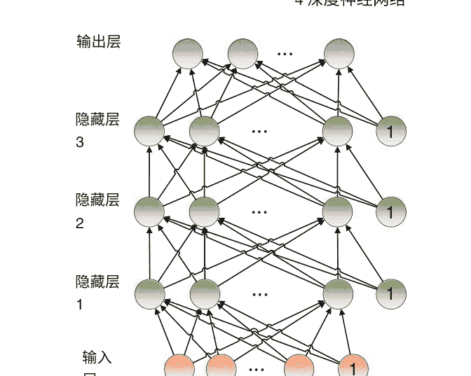

$$\sigma(z) = \frac{1}{1+e^{-z}}$$ (4.2)

或者双曲正切函数

$$\tanh(z) = \frac{e^{z} - e^{-z}}{e^{z} + e^{-z}}$$ (4.3)

被用作激活函数。由于tanh(z)函数是sigmoid函数的缩放版本，这两个激活函数具有相同的建模能力。然而，σ(z)的输出范围是(0, 1)，这鼓励稀疏但不对称的激活值。另一方面，tanh(z)的输出范围是(-1, +1)，因此激活值是对称的，这被认为有助于模型训练[14]。另一个流行的激活函数是修正线性单元（ReLU）函数。

$$\text{ReLU}(z) = \max(0, z)$$ (4.4)

它强制稀疏激活²[7] 并且具有非常简单的梯度，我们将在第4.2节中讨论。由于Sigmoid函数仍然是实践者们最常用的激活函数，在以下所有讨论中，我们假设使用Sigmoid激活函数，除非另有说明。

输出层需要根据手头的任务进行选择。对于回归任务，使用线性层

$$\mathbf{v}^L = \mathbf{z}^L = \mathbf{W}^L \mathbf{v}^{L-1} + \mathbf{b}^L$$ (4.5)

通常用于生成输出向量 $\mathbf{v}_L \in \mathbb{R}^{N_L}$，其中 $N_L$是输出维度。

对于多类分类任务，每个输出神经元表示一个类 $i \in \{1, \ldots, C\}$，其中 $C = N_L$是类别数。第 $i$个输出神经元 $v_i^L$的值表示观察向量$\mathbf{o}$属于类$i$的概率 $P_{\text{dnn}} (i|\mathbf{o})$。为了作为有效的多项式概率分布，输出向量$\mathbf{v}^L$应满足要求 $v_i^L \ge 0$ 并且 $\sum_{i=1}^C v_i^L = 1$。这可以通过使用Softmax函数对激活进行归一化来实现。

$$v_i^L = P_{\text{dnn}}(i|\mathbf{o}) = \text{softmax}_i\left(\mathbf{z}^L\right) = \frac{e^{z_i^L}}{\sum_{j=1}^C e^{z_j^L}}, \quad (4.6)$$

其中 $z_i^L$是激励向量 $\mathbf{z}^L$的第$i$个元素。

给定一个观测向量 $\mathbf{o}$，由模型参数 $\{\mathbf{W}, \mathbf{b}\} = \{\mathbf{W}^\ell, \mathbf{b}^\ell|0 < \ell \le L\}$ 可以通过从第1层到第 $L -1$层逐层计算激活向量（使用公式（4.1））以及用于回归任务的公式（4.5）和用于分类任务的公式（4.6）来计算DNN的输出。这个过程通常称为前向计算，并在算法4.1中进行了总结。

### 算法4.1 DNN前向计算

```
1: 过程 FORWARD COMPUTATION(O)
   ▶ O的每一列都是一个观测向量
2: V^0 ← O
3: 对于 ℓ ← 1; ℓ < L; ℓ ← ℓ + 1 执行
   ▶ L是总层数
4: Z^ℓ ← W^ℓ V^{ℓ-1} + B^ℓ
   ▶ B^ℓ的每一列都是 b^ℓ
5: V^ℓ ← f (Z^ℓ)
   ▶ f (.)可以是sigmoid、tanh、ReLU或其他函数
6: 结束循环
7: Z^L ← W^L V^{L-1} + B^L
8: 如果是回归任务则
   ▶回归任务
9: V^L ← Z^L
10: 否则
    ▶分类任务
11: V^L ← softmax (Z^L)
    ▶逐列应用softmax
12: 如果结束
13: 返回 V^L
14: 结束过程
```

### 4.2 用误差反向传播进行参数估计

自从1980年代以来，人们已经知道具有足够大的隐藏层的MLP是一个通用逼近器[12]。换句话说，这样的MLP可以逼近输入空间 $\mathbb{R}^D$到输出空间 $\mathbb{R}^C$的任何映射 $g : \mathbb{R}^D \rightarrow \mathbb{R}^C$。这是显然，一个具有两个以上隐藏层的DNN也可以作为一个通用逼近器。

然而，在DNN中，模型参数 {W, b}是未知的，需要从训练样本 S= {(o^m, y^m) | 0 ≤ m < M}中进行估计，其中M是训练样本的数量，o^m是第 m个观察向量，y^m是相应的期望输出向量。 这个过程通常被称为训练过程或参数估计过程，可以通过训练准则和学习算法来指定。

### 4.2.1 训练准则

训练准则应该易于评估，并与任务的最终目标高度相关，以便训练准则的改进将导致最终评估分数的改进。 理想情况下，模型参数应该被训练成最小化期望损失
$$J_{\text{EL}} = \mathbb{E} (J (W, \mathbf{b}; \mathbf{o}, \mathbf{y})) = \int_{\mathbf{o}} J (W, \mathbf{b}; \mathbf{o}, \mathbf{y}) \ p (\mathbf{o}) \ d (\mathbf{o}) , \qquad \qquad (4.7)$$
其中 J (W, \mathbf{b}; \mathbf{o}, \mathbf{y})是给定模型参数 {W, \mathbf{b}}， 观察值\mathbf{o}和相应输出向量\mathbf{y}的损失函数， \ p ( \mathbf{o})是观察值\mathbf{o}的概率密度函数。 不幸的是， \ p (\mathbf{o})通常是未知的，需要从训练集中估计，而 J (W, \mathbf{b}; \mathbf{o}, \mathbf{y})对于训练集中未见的样本来说是不明确的（期望的输出向量是未知的）。 因此，DNN模型参数通常被训练以优化经验准则。

在DNN模型学习中有两种流行的经验训练准则。 对于回归任务，均方误差（MSE）准则
$$J_{\text{MSE}} (W, \mathbf{b}; \mathbb{S}) = \frac{1}{M} \sum_{m=1}^{M} J_{\text{MSE}} \left (W, \mathbf{b}; \mathbf{o}^{m}, \mathbf{y}^{m} \right ) \qquad \qquad (4.8)$$
通常使用，其中
$$J_{\text{MSE}} \left (W, \mathbf{b}; \mathbf{o}, \mathbf{y} \right ) = \frac{1}{2} \left \| \mathbf{v}^{L} - \mathbf{y} \right \|^{2} = \frac{1}{2} \left (\mathbf{v}^{L} - \mathbf{y} \right )^{\text{T}} \left (\mathbf{v}^{L} - \mathbf{y} \right ) . \qquad \qquad (4.9)$$
对于分类任务， \mathbf{y}是一个概率分布，交叉熵（CE）准则
$$J_{\text{CE}} (W, \mathbf{b}; \mathbb{S}) = \frac{1}{M} \sum_{m=1}^{M} J_{\text{CE}} \left (W, \mathbf{b}; \mathbf{o}^{m}, \mathbf{y}^{m} \right ) \qquad \qquad (4.10)$$
经常被使用，其中
$$J_{\text{CE}}(\mathbf{W}, \mathbf{b}; \mathbf{o}, \mathbf{y}) = -\sum_{i=1}^{C} y_i \log v_i^L, \quad (4.11)$$
$y_i = P_{\text{emp}}(i|\mathbf{o})$ 是在训练集中观察到的属于类别$i$的经验概率， $v_i^L = P_{\text{dnn}}(i| \mathbf{o})$ 是从DNN估计的相同概率。最小化交叉熵准则等价于最小化经验概率分布和从DNN估计的概率分布之间的Kullback-Leibler散度（KLD）。在大多数情况下，使用硬类标签，或者 $y_i = \mathbb{I} (c = i)$ ，其中
$$\mathbb{I}(x) = \begin{cases} 1, & \text{如果 } x \text{为真} \\ 0, & \text{否则} \end{cases} \quad (4.12)$$
是指示函数，而$c$是训练集中观察的类标签$o$。在这些情况下，由方程（4.11）指定的CE准则被简化为负对数似然（NLL）
$$J_{\text{NLL}}(\mathbf{W}, \mathbf{b}; \mathbf{o}, \mathbf{y}) = -\log v_c^L. \quad (4.13)$$

### 4.2.2 训练算法

给定训练准则，模型参数$\{\mathbf{W}, \mathbf{b}\}$可以通过著名的误差反向传播（BP）算法[19]来学习，该算法可以从用于梯度计算的链式法则推导出来。$^3$

在其最简单的形式中，模型参数可以根据一阶梯度信息进行改进，如下所示
$$\mathbf{W}_{t+1}^{\ell} \leftarrow \mathbf{W}_t^{\ell} - \varepsilon \Delta \mathbf{W}_t^{\ell} \quad (4.14)$$
和
$$\mathbf{b}_{t+1}^{\ell} \leftarrow \mathbf{b}_t^{\ell} - \varepsilon \Delta \mathbf{b}_t^{\ell}, \quad (4.15)$$
其中 $\mathbf{W}_t^{\ell}$ 和 $\mathbf{b}_t^{\ell}$ 分别是第 $\ell$ 层之后的权重矩阵和偏置向量
$$\Delta \mathbf{W}_t^{\ell} = \frac{1}{M_b} \sum_{m=1}^{M_b} \nabla_{\mathbf{W}_t^{\ell}} J \left( \mathbf{W}, \mathbf{b}; \mathbf{o}^m, \mathbf{y}^m \right) \quad (4.16)$$
和
$$\Delta \mathbf{b}_{t}^{\ell} = \frac{1}{M_b} \sum_{m=1}^{M_b} \nabla_{\mathbf{b}_{t}^{\ell}} J\left(\mathbf{W}, \mathbf{b} ; \mathbf{o}^{m}, \mathbf{y}^{m}\right) \quad (4.17)$$
分别是迭代 $t$ 时从包含 $M_b$ 个样本的训练批次中估计得到的平均权重矩阵梯度和平均偏置向量梯度，$\varepsilon$ 是学习率，$\nabla_{\mathbf{x}} J$ 是 $J$ 相对于 $\mathbf{x}$ 的梯度。训练准则相对于顶层权重矩阵和偏置向量的梯度取决于所选择的准则。对于回归任务，使用MSE训练准则（公式4.9）和线性输出层（公式4.5），相对于输出层权重矩阵的梯度为
$$\nabla_{\mathbf{W}_{t}^{L}} J_{\mathrm{MSE}}\left(\mathbf{W}, \mathbf{b} ; \mathbf{o}, \mathbf{y}\right)=\nabla_{\mathbf{z}_{t}^{L}} J_{\mathrm{MSE}}\left(\mathbf{W}, \mathbf{b} ; \mathbf{o}, \mathbf{y}\right) \frac{\partial \mathbf{z}_{t}^{L}}{\partial \mathbf{W}_{t}^{L}} = \mathbf{e}_{t}^{L} \frac{\partial\left(\mathbf{W}_{t}^{L} \mathbf{v}_{t}^{L-1}+\mathbf{b}_{t}^{L}\right)}{\partial \mathbf{W}_{t}^{L}} = \mathbf{e}_{t}^{L}\left(\mathbf{v}_{t}^{L-1}\right)^{\mathrm{T}} = \left(\mathbf{v}_{t}^{L}-\mathbf{y}\right)\left(\mathbf{v}_{t}^{L-1}\right)^{\mathrm{T}}, \quad (4.18)$$
我们将输出层的误差信号定义为
$$\mathbf{e}_{t}^{L} \triangleq \nabla_{\mathbf{z}_{t}^{L}} J_{\mathrm{MSE}}\left(\mathbf{W}, \mathbf{b} ; \mathbf{o}, \mathbf{y}\right) = \frac{1}{2} \frac{\partial\left(\mathbf{z}_{t}^{L}-\mathbf{y}\right)^{\mathrm{T}}\left(\mathbf{z}_{t}^{L}-\mathbf{y}\right)}{\partial \mathbf{z}_{t}^{L}} = \left(\mathbf{v}_{t}^{L}-\mathbf{y}\right) . \quad (4.19)$$
同样地，
$$\nabla_{\mathbf{b}_{t}^{L}} J_{\mathrm{MSE}}\left(\mathbf{W}, \mathbf{b} ; \mathbf{o}, \mathbf{y}\right)=\left(\mathbf{v}_{t}^{L}-\mathbf{y}\right) . \quad (4.20)$$
对于分类任务，使用CE训练准则（方程4.11）和softmax输出层（方程4.6），可以推导出关于输出层权重矩阵的梯度
$$\nabla_{\mathbf{W}_{t}^{L}} J_{\mathrm{CE}}\left(\mathbf{W}, \mathbf{b} ; \mathbf{o}, \mathbf{y}\right)=\nabla_{\mathbf{z}_{t}^{L}} J_{\mathrm{CE}}\left(\mathbf{W}, \mathbf{b} ; \mathbf{o}, \mathbf{y}\right) \frac{\partial \mathbf{z}_{t}^{L}}{\partial \mathbf{W}_{t}^{L}} = \mathbf{e}_{t}^{L} \frac{\partial\left(\mathbf{W}_{t}^{L} \mathbf{v}_{t}^{L-1}+\mathbf{b}_{t}^{L}\right)}{\partial \mathbf{W}_{t}^{L}} = \mathbf{e}_t^L \left( \mathbf{v}_t^{L-1} \right)^{\mathrm{T}} = \left( \mathbf{v}_t^L - \mathbf{y} \right) \left( \mathbf{v}_t^{L-1} \right)^{\mathrm{T}}$$
我们同样定义了输出层的误差信号为
$$\begin{aligned} \mathbf{e}_t^L &\triangleq \nabla_{\mathbf{z}_t^L} J_{\mathrm{CE}} (\mathbf{W}, \mathbf{b}; \mathbf{o}, \mathbf{y}) \\ &= - \frac{\partial \sum_{i=1}^C y_i \log \mathrm{softmax}_i (\mathbf{z}_t^L)}{\partial \mathbf{z}_t^L} \\ &= \frac{\partial \sum_{i=1}^C y_i \log \sum_{j=1}^C e^{z_j^L}}{\partial \mathbf{z}_t^L} - \frac{\partial \sum_{i=1}^C y_i \log e^{z_i^L}}{\partial \mathbf{z}_t^L} \\ &= \frac{\partial \log \sum_{j=1}^C e^{z_j^L}}{\partial \mathbf{z}_t^L} - \frac{\partial \sum_{i=1}^C y_i z_i^L}{\partial \mathbf{z}_t^L} \\ &= \begin{bmatrix} \frac{e^{z_1^L}}{\sum_{j=1}^C e^{z_j^L}} \\ \vdots \\ \frac{e^{z_i^L}}{\sum_{j=1}^C e^{z_j^L}} \\ \vdots \\ \frac{e^{z_C^L}}{\sum_{j=1}^C e^{z_j^L}} \end{bmatrix} - \begin{bmatrix} y_1 \\ \vdots \\ y_i \\ \vdots \\ y_C \end{bmatrix} \\ &= \left( \mathbf{v}_t^L - \mathbf{y} \right). \end{aligned}$$
同样地，
$$\nabla_{\mathbf{b}_t^L} J_{\mathrm{CE}} (\mathbf{W}, \mathbf{b}; \mathbf{o}, \mathbf{y}) = \left( \mathbf{v}_t^L - \mathbf{y} \right).$$
注意 $\nabla_{\mathbf{W}_t^L} J_{\mathrm{CE}} (\mathbf{W}, \mathbf{b}; \mathbf{o}, \mathbf{y})$ （方程式4.21）似乎与$\nabla_{\mathbf{W}_{t}^{L}} J_{\mathrm{MSE}} (\mathbf{W}, \mathbf{b}; \mathbf{o}, \mathbf{y})$ （方程式4.18）具有相同的形式。然而，它们实际上是不同的，因为在回归情况下，$\mathbf{v}_t^L = \mathbf{z}_t^L$，在分类情况下，$\mathbf{v}_t^L = \mathrm{softmax} (\mathbf{z}_t^L)$。

还要注意，对于 $0 < \ell < L$，
$$\begin{aligned} \nabla_{\mathbf{W}_t^\ell} J (\mathbf{W}, \mathbf{b}; \mathbf{o}, \mathbf{y}) &= \nabla_{\mathbf{v}_t^\ell} J (\mathbf{W}, \mathbf{b}; \mathbf{o}, \mathbf{y}) \frac{\partial \mathbf{v}_t^\ell}{\partial \mathbf{W}_t^\ell} \\ &= \mathrm{diag} \left( f' \left( \mathbf{z}_t^\ell \right) \right) \mathbf{e}_t^\ell \frac{\partial \left( \mathbf{W}_t^\ell \mathbf{v}_t^{\ell-1} + \mathbf{b}_t^\ell \right)}{\partial \mathbf{W}_t^\ell} \\ &= \mathrm{diag}\left(f'\left(\mathbf{z}_{t}^{\ell}\right)\right) \mathbf{e}_{t}^{\ell}\left(\mathbf{v}_{t}^{\ell-1}\right)^{\mathrm{T}} \\ &= \left[f'\left(\mathbf{z}_{t}^{\ell}\right) \bullet \mathbf{e}_{t}^{\ell}\right]\left(\mathbf{v}_{t}^{\ell-1}\right)^{\mathrm{T}}, \quad(4.23) \end{aligned}$$
$$\begin{aligned} \nabla_{\mathbf{b}_{t}^{\ell}} J\left(\mathbf{W}, \mathbf{b} ; \mathbf{o}, \mathbf{y}\right) &= \nabla_{\mathbf{v}_{t}^{\ell}} J\left(\mathbf{W}, \mathbf{b} ; \mathbf{o}, \mathbf{y}\right) \frac{\partial \mathbf{v}_{t}^{\ell}}{\partial \mathbf{b}_{t}^{\ell}} \\ &= \mathrm{diag}\left(f'\left(\mathbf{z}_{t}^{\ell}\right)\right) \mathbf{e}_{t}^{\ell} \frac{\partial\left(\mathbf{W}_{t}^{\ell} \mathbf{v}_{t}^{\ell-1}+\mathbf{b}_{t}^{\ell}\right)}{\partial \mathbf{b}_{t}^{\ell}} \\ &= \mathrm{diag}\left(f'\left(\mathbf{z}_{t}^{\ell}\right)\right) \mathbf{e}_{t}^{\ell} \\ &= f'\left(\mathbf{z}_{t}^{\ell}\right) \bullet \mathbf{e}_{t}^{\ell}, \quad(4.24) \end{aligned}$$
其中 $\mathbf{e}_{t}^{\ell} \triangleq \nabla_{\mathbf{v}_{t}^{\ell}} J\left(\mathbf{W}, \mathbf{b} ; \mathbf{o}, \mathbf{y}\right)$ 是第 $\ell$ 层的误差信号，$\bullet$ 是逐元素乘积，$\mathrm{diag}(\mathbf{x})$ 是对角线等于 $\mathbf{x}$ 的方阵，而 $f'\left(\mathbf{z}_{t}^{\ell}\right)$ 是激活函数的逐元素导数。对于 sigmoid 激活函数，
$$\sigma'\left(\mathbf{z}_{t}^{\ell}\right)=\left(1-\sigma\left(\mathbf{z}_{t}^{\ell}\right)\right) \bullet \sigma\left(\mathbf{z}_{t}^{\ell}\right)=\left(1-\mathbf{v}_{t}^{\ell}\right) \bullet \mathbf{v}_{t}^{\ell}. \quad(4.25)$$
同样地，对于 tanh 激活函数
$$\tanh'\left(\mathbf{z}_{t}^{\ell}\right)=1-\left[\tanh\left(\mathbf{z}_{t}^{\ell}\right)\right]^{\bullet 2}=1-\mathbf{v}_{t}^{\ell} \bullet \mathbf{v}_{t}^{\ell}, \quad(4.26)$$
对于 ReLU 激活函数
$$\mathrm{ReLU}'\left(\mathbf{z}_{t, i}^{\ell}\right)=\left\{\begin{array}{ll} 1, & \text { if } \mathbf{z}_{t, i}^{\ell}>0 \\ 0, & \text { 否则 } \end{array}\right. \quad(4.28)$$
或
$$\mathrm{ReLU}'\left(\mathbf{z}_{t}^{\ell}\right)=\max \left(\mathbf{0}, \mathrm{sgn}\left(\mathbf{z}_{t}^{\ell}\right)\right), \quad(4.29)$$
其中 $\mathrm{sgn}\left(\mathbf{z}_{t}^{\ell}\right)$ 是 $\mathbf{z}_{t}^{\ell}$ 逐元素应用的符号。误差信号可以从顶部向底部进行反向传播，如下所示。

尽管反向传播的名称是在1986年提出的[19]，但该算法本身可以追溯到至少1969年[3]，作为一种多阶段动态系统优化方法。

对于$\ell < L$，

$$
\begin{aligned}
\mathbf{e}_t^{\ell-1} &= \nabla_{\mathbf{v}_t^{\ell-1}} J(\mathbf{W}, \mathbf{b}; \mathbf{o}, \mathbf{y}) \\
&= \frac{\partial \mathbf{v}_t^{\ell}}{\partial \mathbf{v}_t^{\ell-1}} \nabla_{\mathbf{v}_t^{\ell}} J(\mathbf{W}, \mathbf{b}; \mathbf{o}, \mathbf{y}) \\
&= \frac{\partial \left( \mathbf{W}_t^{\ell} \mathbf{v}_t^{\ell-1} + \mathbf{b}_t^{\ell} \right)}{\partial \mathbf{v}_t^{\ell-1}} \text{对角线} \left( f' \left( z_t^{\ell} \right) \right) \mathbf{e}_t^{\ell} \\
&= \left( \mathbf{W}_t^{\ell} \right)^{\mathrm{T}} \left[ f' \left( z_t^{\ell} \right) \bullet \mathbf{e}_t^{\ell} \right]. \quad (4.31)
\end{aligned}
$$

反向传播算法中的关键步骤总结在算法4.2中。

## 4.3 实际考虑因素

在第4.2节中描述的基本反向传播算法在理论上很简单。然而，高效有效地学习模型需要考虑许多实际问题[1, 14]。

### 4.3.1 数据预处理

数据预处理在许多机器学习算法中起着重要作用。两种最流行的预处理技术是逐样本特征归一化和全局特征标准化。

如果每个样本的均值与问题无关的变化，应该从特征中减去这个均值，以减少输入到DNN的最终特征的变异性。例如，减去图像的平均亮度可以减少亮度引入的变异性。在手写字符识别任务中，将图像中心归一化可以减少字符位置偏移引起的变异性。在语音识别中，倒谱均值归一化 (CMN) [15]技术，通过减去每个utterance的均值可以减少声学通道失真。以CMN为例，可以通过首先估计每个utterance的均值来进行每个样本的归一化。

$$
\bar{\mu}_i = \frac{1}{T} \sum_{t=1}^{T} o_i^t , \quad (4.32)
$$

对于每个维度 i，其中 T是话语中的总帧数，然后从话语中的所有帧中减去均值

$$
\bar{o}_i^t = o_i^t - \bar{\mu}_i. \quad (4.33)
$$

全局特征标准化的目标是通过全局转换来缩放数据，使得最终的数据向量处于相似的范围内。例如，在图像处理中，我们经常将像素值重新缩放到[0, 255]的范围内。对于实值特征，如语音识别任务中的MFCC和对数滤波器组特征，通常使用全局转换将特征的每个维度标准化为零均值和单位方差（例如，在[5]中）。这两种情况下的全局转换仅从训练数据中估计，然后应用于训练和测试集。给定训练集S={(o^m, y^m)|0 ≤ m < M}（可能已经按样本进行了归一化），我们可以计算平均值

$\mu_i = \frac{1}{M} \sum_{m=1}^{M} o_i^m$

和标准差

$\sigma_i = \sqrt{\frac{1}{M} \sum_{m=1}^{M} (o_i^m - \mu_i)^2}$

对于每个维度 $i$。训练集和测试集中的所有样本都可以标准化为

$\tilde{o}_i^m = \frac{o_i^m - \mu_i}{\sigma_i}$

上述全局特征标准化非常有用，因为后续的处理步骤在每个维度具有相似的数值范围时通常表现更好[14]。例如，在DNN训练中，通过标准化特征，我们可以在所有权重维度上使用相同的学习率，并且仍然得到一个好的模型。如果没有特征标准化，能量分量或第一个MFCC分量 $c_0$ 将会掩盖其他分量，并主导学习过程，除非使用能够自动调整每个单独维度学习率的学习算法（如AdaGrad [6]）。

### 4.3.2 模型初始化

在第4.2节中指定的学习算法从一个初始模型开始。由于DNN是一个高度非线性的模型，并且关于模型参数的训练准则是非凸的，初始模型可以极大地影响最终的模型。

在初始化DNN模型中有许多启发式技巧。这些技巧大多基于两个考虑因素。首先，权重应该被初始化，使得每个神经元在学习开始时都在sigmoid函数的线性范围内运行。如果权重都非常大，许多神经元会饱和（接近零或一），根据公式（4.25），梯度会非常小。相反，当神经元在线性范围内运行时，梯度足够大（接近0.25的最大值），学习可以有效进行。注意，激活值取决于输入值和权重。当输入特征按照第4.3.1节中描述的方式进行标准化时，确定初始权重会变得更容易。其次，随机初始化参数非常重要。

这是因为DNN中的神经元是对称且可互换的。如果所有模型参数具有相同的值，所有隐藏层神经元将具有相同的输出值，并在较低层次上检测相同的特征模式。随机初始化的目的是打破对称性。

LeCun和Bottou [14]建议从零均值的高斯分布中抽取值，标准差为σWℓ+1 = 1/√Nℓ 根据公式（4.1）定义，将层中的权重初始化为连接到节点的连接数Nℓ的值。对于用于语音识别任务的DNNs，每个隐藏层具有1,000-2,000个神经元，我们发现通过从高斯分布𝒩(w; 0, 0.05)或从范围内的均匀分布中抽取权重矩阵的方式进行初始化效果较好。[ -0.05, 0.05]表现非常好。偏置向量bℓ可以简单地初始化为零。

### 4.3.3 权重衰减

与许多机器学习算法一样，过拟合可能是一个问题，特别是由于DNN中的参数数量与许多其他学习机器相比非常庞大。过拟合发生是因为我们对最小化期望损失（4.7）感兴趣，但实际上我们实际上是在训练集上最小化经验损失。控制过拟合的最简单方法是通过正则化训练准则，使模型参数不会过度拟合训练数据。最常用的正则化项包括

$$R_1(\mathbf{W}) = \| \text{vec}(\mathbf{W})\|_1 = \sum_{\ell=1}^L \| \text{vec}(\mathbf{W}^\ell)\|_1 = \sum_{\ell=1}^L \sum_{i=1}^{N_\ell} \sum_{j=1}^{N_{\ell-1}} |W_{ij}^\ell| \tag{4.37}$$

基于L₁范数的正则化方法

$$R_2(\mathbf{W}) = \| \text{vec}(\mathbf{W})\|_2^2 = \sum_{\ell=1}^L \| \text{vec}(\mathbf{W}^\ell)\|_2^2 = \sum_{\ell=1}^L \sum_{i=1}^{N_\ell} \sum_{j=1}^{N_{\ell-1}} \left(W_{ij}^\ell \right)^2 \tag{4.38}$$

基于L₂范数的正则化方法，其中Wᵢⱼ是矩阵W的第(i, j)个值，vec(W^ℓ) ∈ ℝ^{[Nℓ×Nℓ₋₁]×1}是通过连接矩阵W^ℓ的所有列生成的向量。∥vec(W^ℓ)∥₂等于∥W^ℓ∥_F —矩阵W的Frobenious范数。这些正则化项在神经网络文献中通常被称为权重衰减。

当包含正则化项时，训练准则变为

$$\ddot{J}(\mathbf{W}, \mathbf{b}; \mathbb{S}) = J(\mathbf{W}, \mathbf{b}; \mathbb{S}) + \lambda R(\mathbf{W}) \tag{4.39}$$

其中J(W, b; S)可以是J_{MSE}(W, b; S)或J_{CE}(W, b; S)，它们优化了训练集S上的经验损失R(W)可以是R₁(W)或R₂(W)，如上所述，λ是插值权重，有时被称为正则化权重。

注意

$\nabla_{W_t^\ell} \ddot{J}(\mathbf{W}, \mathbf{b}; \mathbf{o}, \mathbf{y}) = \nabla_{W_t^\ell} J(\mathbf{W}, \mathbf{b}; \mathbf{o}, \mathbf{y}) + \lambda \nabla_{W_t^\ell} R(\mathbf{W})$ (4.40)

$\nabla_{\mathbf{b}_t^\ell} \ddot{J}(\mathbf{W}, \mathbf{b}; \mathbf{o}, \mathbf{y}) = \nabla_{\mathbf{b}_t^\ell} J(\mathbf{W}, \mathbf{b}; \mathbf{o}, \mathbf{y})$ (4.41)

其中

$\nabla_{W_t^\ell} R_1(\mathbf{W}) = \mathrm{sgn}\left(\mathbf{W}_t^\ell\right)$, (4.42)

和

$\nabla_{W_t^\ell} R_2(\mathbf{W}) = 2\mathbf{W}_t^\ell$. (4.43)

当训练集大小相对于语音识别任务中的权重矩阵中的参数数量较小时，权重衰减通常有助于减少过拟合。由于在典型的语音识别任务中，权重矩阵中通常有超过一百万个参数，插值权重 λ 应该很小（通常在 10^{-4} 的范围内）或者在训练集大小较大时甚至为0。

### 4.3.4 丢弃法

权重衰减是一种控制过拟合的方法之一。另一种流行的方法是丢弃法[10]。丢弃法的基本思想是在训练过程中，每次呈现样本时，随机省略每个隐藏层中的一定百分比（例如 α）的神经元。这意味着在训练过程中，每个剩余的 (1 - α) 隐藏神经元的随机组合都需要表现良好，即使没有被省略的神经元。这要求每个神经元对其他神经元的依赖性较小，以便检测模式。

或者，辍学可以被认为是一种向训练数据中添加随机噪声的技术。这是因为每个更高层的神经元都从较低层的神经元的随机集合中获得输入。即使相同的输入被馈入DNN，每个神经元接收到的激励也是不同的。使用辍学，DNN需要浪费一些权重来消除引入的随机噪声的影响。因此，辍学实质上降低了DNN的容量，从而可以提高生成的模型的泛化能力。

当一个隐藏神经元被辍学时，它的激活被设置为0，因此不会通过它传递任何错误信号。这意味着除了随机辍学操作之外，不需要对训练算法进行任何其他更改来实现这个特性。然而，在测试时，我们不使用每个隐藏层中的神经元的随机组合，而是使用所有可能组合的平均值。这可以通过将辍学训练中涉及的所有权重折扣为 (1 - α) 来轻松实现，然后将得到的模型用作正常的DNN（即没有辍学）。因此，在DNN框架中，dropout也可以被解释为一种有效的（几何）模型平均的方式，类似于bagging。

稍微不同的实现方式是在训练中将每个激活值除以（1−α）。在神经元被丢弃之前。通过这样做，权重会自动地被（1−α）折扣，因此在使用模型进行测试时不需要进行权重补偿。这种方法的另一个好处是我们可以在训练的不同时期应用不同的dropout率。我们的经验表明，dropout率为0.1-0.2通常有助于提高识别率。智能设计的训练计划可以在最初使用较大的dropout率（例如0.5），然后逐渐减小dropout率，进一步提高性能。这是因为使用较大的dropout率训练的模型可以被视为使用较小的dropout率训练的种子模型。由于与较大的dropout率相关的目标函数更加平滑，它不太可能陷入非常糟糕的局部最优解。

在辍学训练期间，我们需要在每一层重复采样随机的活跃子集。这将显著减慢训练速度。出于这个原因，随机数生成和采样代码的速度对于减少训练时间至关重要。或者，可以使用[23]中提出的快速辍学训练算法。该算法的关键思想是从高斯近似中采样或集成，而不是进行蒙特卡罗采样。这种近似，通过中心极限定理和经验证据进行了合理化，提供了显著的加速和更稳定性。这种技术可以扩展到集成其他类型的噪声和变换。

### 4.3.5 批量大小选择

参数更新公式Eqs. (4.14)和(4.15)需要计算从一批训练样本中估计的经验梯度。批量大小的选择将影响收敛速度和最终模型。

批处理的最简单和明显的选择是整个训练集。如果我们的唯一目标是最小化训练集上的经验损失，那么从整个训练集估计的梯度就是真正的梯度（即方差为零）。即使我们的目标是优化期望损失，从整个训练集估计的梯度仍然比从任何子集的训练数据估计的梯度具有较小的方差。这种方法通常被称为批处理训练，具有几个优点：首先，批处理训练的收敛性质是众所周知的。其次，许多加速技术，如共轭梯度[9]和L-BFGS[16]在批处理训练中效果最好。第三，批处理训练可以在多台计算机之间轻松并行化。

不幸的是，批处理训练在更新模型参数之前需要完整遍历整个数据集，因此在许多大规模问题中效率不高，尽管可以进行尴尬的并行化。

或者，我们可以使用随机梯度下降（SGD）[2]技术，这在机器学习文献中有时被称为在线学习。SGD根据从单个训练样本估计的梯度更新模型参数。

如果样本是独立同分布的（即从训练集中按照均匀分布抽取样本很容易保证），我们可以证明

$$
\mathbb{E}(\nabla J_t(\mathbf{W}, \mathbf{b}; \mathbf{o}, \mathbf{y})) = \frac{1}{M} \sum_{m=1}^M \nabla J(\mathbf{W}, \mathbf{b}; \mathbf{o}^m, \mathbf{y}^m)
$$

换句话说，从单个样本估计的梯度是整个训练集上梯度的无偏估计。然而，估计的方差是

$$
\begin{aligned}
\mathbb{V}(\nabla J_t(\mathbf{W}, \mathbf{b}; \mathbf{o}, \mathbf{y})) &= \mathbb{E}[(\mathbf{x} - \mathbb{E}(\mathbf{x}))(\mathbf{x} - \mathbb{E}(\mathbf{x}))^\top] \\
&= \mathbb{E}(\mathbf{x}\mathbf{x}^\top) - \mathbb{E}(\mathbf{x})\mathbb{E}(\mathbf{x})^\top \\
&= \frac{1}{M} \sum_{m=1}^M \mathbf{x}_m\mathbf{x}_m^\top - \mathbb{E}(\mathbf{x})\mathbb{E}(\mathbf{x})^\top
\end{aligned}
$$

这个值在所有样本都相同的情况下是非零的；即，$\nabla J_t(\mathbf{W}, \mathbf{b}; \mathbf{o}, \mathbf{y}) = \mathbb{E}(\nabla J_t(\mathbf{W}, \mathbf{b}; \mathbf{o}, \mathbf{y}))$，为了简化起见，我们定义了 $\mathbf{x} \triangleq \nabla J_t(\mathbf{W}, \mathbf{b}; \mathbf{o}, \mathbf{y})$。由于梯度的估计是有噪声的，模型参数可能在每次迭代中不能精确地沿着梯度移动。然而，这个看似不足实际上是SGD算法相对于批量学习算法的一个重要优势。这是因为DNNs是高度非线性和非凸的。目标函数包含许多局部最优解，其中许多是非常差的。批量学习将找到模型参数最初所在的盆地的最小值，并且结果模型高度依赖于初始模型。然而，由于梯度估计的噪声，SGD算法可以跳出较差的局部最优解并进入更好的盆地。这个特性类似于模拟退火[13]，它允许模型参数在局部上是劣质的方向上移动，但在全局上是优越的。

随机梯度下降法在大型数据集上通常比批量学习快得多。这是由于两个原因。首先，大型数据集中通常存在许多相似的、有时是冗余的样本。通过整个数据集来估计梯度是一种计算浪费。其次，更重要的是，在随机梯度下降训练中，可以在看到每个样本后快速更新。新的梯度是基于新模型而不是旧模型估计的，因此可以更快地朝着找到最佳模型的方向移动。

然而，随机梯度下降算法在同一台计算机上甚至很难并行化。此外，由于梯度的噪声估计，它无法完全收敛到局部最小值。相反，它会在最小值周围波动。波动的大小取决于学习率和梯度估计方差的振幅。尽管这种波动有时可以减少过拟合，但在许多情况下并不理想。

批量学习和SGD算法之间的折中是小批量训练，它基于随机选择的一小批训练样本估计梯度。很容易证明，从小批量估计的梯度也是无偏的，估计的方差比SGD算法中的方差要小。

小批量训练允许我们在小批量内部轻松并行化，因此可以比SGD更快地收敛。由于我们在训练的早期阶段更喜欢较大的梯度估计方差以快速跳出较差的局部最优解，并在后期阶段更喜欢较小的方差以稳定在最小值，因此我们可以最初选择较小的小批量大小，然后在后期选择较大的大小。在语音识别任务中，我们发现在早期阶段使用64-256个样本，在后期阶段使用1,024-8,096个样本可以学到更好的模型。当训练更深的网络时，甚至可以在最初阶段使用更小的批量大小。小批量大小可以根据梯度估计方差自动确定。

或者，批量大小可以通过在每个时期的一个小子集上进行搜索来确定[8, 20]。

## 4.3.6 样本随机化

样本随机化与批量训练无关，因为所有样本都用于估计梯度。然而，对于SGD和小批量训练来说，这非常重要。这是因为为了获得梯度的无偏估计，样本必须是独立同分布的。从启发式的角度来看，如果连续的样本不是随机从训练集中抽取的（例如，都属于同一个说话者），模型参数可能会在相似的方向上移动太长时间。

如果整个训练集可以加载到内存中，可以通过对索引数组进行置换来轻松进行样本随机化。然后，可以根据置换后的索引数组逐个抽取样本。由于索引数组通常比特征向量小得多，所以这比置换特征向量本身的成本要低，尤其是如果每个数据传递都需要不同的随机化顺序。这个技巧还保证每个样本在每个数据传递中都会被呈现给训练算法一次，因此不会影响数据分布。这个特性将保证所学习的模型是一致的。

如果训练集非常庞大，这在语音识别中通常是情况，我们无法将整个训练集加载到内存中。在这种情况下，我们可以每次加载一大块数据（通常是24-48小时的语音或8.6-17.2M个样本），并在窗口内进行随机化。如果训练数据来自不同的来源（例如不同的语言），在将其输入到DNN训练工具之前对话语列表文件进行随机化也会有所帮助。

## 4.3.7 动量

众所周知，如果模型更新基于所有先前的梯度（更全局的视角）而不仅仅是当前的梯度（局部视角），收敛速度会提高。Nesterov的加速梯度算法[18]是这个技巧的一个例子，它被证明在凸条件下是最优的。在DNN训练中，通常使用一种名为动量的简单技术来实现这一点。应用动量时，方程（4.16）和（4.17）将被替换为

$$
\triangle \mathbf{W}^\ell_t = \rho \triangle \mathbf{W}^\ell_{t-1} + (1-\rho) \frac{1}{M_b} \sum_{m=1}^{M_b} \nabla_{\mathbf{W}^\ell} J(\mathbf{W}, \mathbf{b}; \mathbf{o}^m, \mathbf{y}^m) \tag{4.46}
$$

和

$$
\triangle \mathbf{b}^\ell_t = \rho \triangle \mathbf{b}^\ell_{t-1} + (1-\rho) \frac{1}{M_b} \sum_{m=1}^{M_b} \nabla_{\mathbf{b}^\ell} J(\mathbf{W}, \mathbf{b}; \mathbf{o}^m, \mathbf{y}^m) \tag{4.47}
$$

其中ρ是动量因子，通常在使用SGD或小批量训练时取值为0.9-0.99。⁴动量平滑参数更新并减少梯度估计的方差。实际上，当误差曲面具有非常窄的最小值时，动量可以减少常见的振荡问题，从而加快训练速度。

当小批量大小相同时，上述动量的定义效果很好。然而，有时我们可能希望使用可变的小批量大小。例如，在第4.3.5节中讨论的情况下，我们可能希望最初使用较小的小批量，然后使用较大的小批量。在序列判别训练中，每个小批量的大小可能不同，因为每个话语的长度不同。在这些条件下，上述动量的定义不再有效。由于动量可以被视为有限冲激响应（FIR）滤波器，我们可以将样本级别的动量定义为ρ_s，并推导出不同小批量大小M_b的动量。

$$
\rho = \exp(M_b \rho_s) \tag{4.48}
$$

## 4.3.8 学习率和停止准则

在训练DNN时，选择合适的学习策略是最困难的任务之一。理论上已经证明，当学习率设置为

$$
\varepsilon = \frac{c}{t}, \tag{4.49}
$$

其中 $t$ 是呈现的样本数，$c$ 是一个常数，SGD渐近收敛[2]。然而，在实践中，这种退火方案收敛非常缓慢，因为学习率会迅速变得非常小。

请注意，学习率和批量大小的组合会影响学习行为。正如我们在第4.3.5节中讨论的那样，在前几次数据传递中应该使用较小的批量大小，在后面的数据传递中应该使用较大的批量大小。由于批量大小是可变的，我们可以定义每个样本的学习率

$$
\varepsilon_s = \frac{\varepsilon}{M_b}, \tag{4.50}
$$

并改变模型参数更新公式为

$$
W_{t+1}^{\ell} \leftarrow W_t^{\ell} - \varepsilon_s \Delta \widetilde{W}_t^{\ell} \tag{4.51}
$$

$$
b_{t+1}^{\ell} \leftarrow b_t^{\ell} - \varepsilon_s \Delta \widetilde{b}_t^{\ell} \tag{4.52}
$$

其中

$$
\Delta \widetilde{W}_t^{\ell} = \rho \Delta W_{t-1}^{\ell} + (1 - \rho) \sum_{m=1}^{M_b} \nabla_{W_t^{\ell}} J(\mathbf{W}, \mathbf{b}; \mathbf{o}^m, \mathbf{y}^m) \tag{4.53}
$$

和

$$
\Delta \widetilde{b}_t^{\ell} = \rho \Delta b_{t-1}^{\ell} + (1 - \rho) \sum_{m=1}^{M_b} \nabla_{b_t^{\ell}} J(\mathbf{W}, \mathbf{b}; \mathbf{o}^m, \mathbf{y}^m). \tag{4.54}
$$

这个改变还减少了一个矩阵除法，与使用原始定义的学习率相比。

通过这个新的更新公式，我们可以根据经验确定学习策略。我们首先确定一个批量大小和一个较大的学习率。然后我们运行数百个小批量的训练，这通常需要几分钟在多核CPU或GPU上。我们监控这些小批量的训练准则，并减小批量大小、学习率或两者，使 $\varepsilon_s M_b$ 的乘积减半，直到训练准则明显改善。然后我们将这个学习率除以二，并将其作为初始学习率。我们运行一个大的训练集子集，并将 $\varepsilon_s M_b$ 增加四到八倍。请注意，由于在这个阶段模型参数已经调整到一个相对好的位置，增加 $\varepsilon_s M_b$ 不会导致发散，而是提高训练速度。这个过程可以自动化，如[8]所述。

我们发现在确定其余学习方案时有两种有用的策略。第一种策略是将批量大小加倍，并将学习率降低四倍，每当训练准则在大型训练集子集或开发集上波动时，停止训练，当学习率小于阈值或达到预设的数据通过次数时停止训练。第二种策略是在训练准则波动时将学习率降低到一个非常小的数值，并在训练集或开发集上再次出现波动时停止训练。对于从头开始学习模型的语音识别任务，我们发现对于深层网络和浅层网络，第一阶段的ε值分别为0.8e-4和0.3e-3，第二阶段为1.25e-2，第三阶段为0.8e-6，在实践中效果非常好。超参数搜索也可以使用随机搜索技术[1]或贝叶斯优化技术[22]进行自动化。

## 4.3.9 网络架构

网络架构可以被视为另一个需要确定的超参数。由于每一层可以被视为前一层的特征提取器，所以每一层的神经元数量应该足够大以捕捉到关键模式。这在几个较低的层次尤其重要，因为第一层的特征更加多变，需要更多的神经元来建模这些模式。然而，如果层的大小过大，容易对训练数据过拟合。基本上，宽而浅的模型更容易过拟合，而深而窄的模型更容易欠拟合。实际上，如果其中一层很小（通常称为瓶颈层），性能会显著下降，特别是当瓶颈层靠近输入层时。如果每一层具有相同数量的神经元，增加更多的层次可能会将模型从过拟合转变为欠拟合。这是因为额外的层次对模型参数施加了额外的约束。根据这个观察，我们可以首先在一个单隐藏层网络上优化每一层的神经元数量。然后我们堆叠更多具有相同隐藏层大小的层次。在语音识别任务中，我们发现每层具有1,000-3,000个神经元的5-7层深度神经网络效果非常好。在宽而深的模型上，通常更容易找到一个良好的配置，而在窄而浅的模型上则更难。这是因为在宽而深的模型上有许多表现类似的良好局部最优解。

## 4.3.10 可重现性和重启能力

在DNN训练中，模型参数是随机初始化的，并且训练样本也是以随机顺序输入到训练器中的。这必然会引起对训练结果的可重复性的担忧。如果我们的目标是比较两种算法或模型，我们可以多次运行实验，每次使用一个新的随机种子，并报告平均结果和标准差。然而，在许多其他条件下，我们希望获得完全相同的模型和测试结果，当我们运行训练器两次时的结果。这可以通过在生成初始模型和对训练样本进行排列时始终使用相同的随机种子来实现。

当训练集很大时，通常希望在中途停止训练，并从上次检查点继续训练。一些机制需要内置到训练工具中，以确保从检查点重新启动将生成与训练从未中断时完全相同的结果。一个简单的技巧是将所有必要的信息，包括模型参数、当前随机数、参数梯度、动量等保存在检查点文件中。另一种工作方法是在每个检查点之后重置所有学习参数，从而需要保存较少的数据。

## 参考文献

- 1. Bengio, Y.: 深度架构基于梯度的训练的实用建议。在: 神经网络: 行业内的技巧, 第437-478页。 Springer (2012年)
- 2. Bottou, L.: 在线学习和随机逼近。在线学习神经网络。 17, 9 (1998年)
- 3. Bryson, E.A., Ho, Y.C.: 应用最优控制: 优化, 估计和控制。 Blaisdell Publishing Company, 美国 (1969年)
- 4. Dahl, G.E., Yu, D., Deng, L., Acero, A.: 基于上下文相关的DBN-HMM的大词汇连续语音识别。在: 国际会议论文集声学、语音和信号处理 (ICASSP) , 第4688-4691页 (2011年)
- 5. Dahl, G.E., Yu, D., Deng, L., Acero, A.: 大词汇语音识别的上下文相关预训练深度神经网络。IEEE Trans. Audio, Speech Lang. Process. 20 (1) , 30-42页 (2012年)
- 6. Duchi, J., Hazan, E., Singer, Y.: 自适应次梯度方法用于在线学习和随机优化。机器学习研究杂志 (JMLR) 2121-2159 (2011年)
- 7. Glorot, X., Bordes, A., Bengio, Y.: 深度稀疏整流网络, 第315-323页 (2011年)
- 8. Guenter, B., Yu, D., Eversole, A., Kuchaiev, O., Seltzer, M.L.: “计算网络工具包中的随机梯度下降算法”, OPT2013: NIPS 2013机器学习优化研讨会 (2013年)
- 9. Hestenes, M.R., Stiefel, E.: 共轭梯度法解线性系统的方法 (1952年)
- 10. Hinton, G.E., Srivastava, N., Krizhevsky, A., Sutskever, I., Salakhutdinov, R.R.: 通过防止特征检测器的共适应性来改进神经网络。 arXiv预印本arXiv:1207.0580 (2012年)
- 11. Hinton, G., Deng, L., Yu, D., Dahl, G.E., Mohamed, A.R., Jaitly, N., Senior, A., Vanhoucke, V., Nguyen, P., Sainath, T.N., 等: 深度神经网络在语音识别中的声学建模: 四个研究小组的共同观点。IEEE信号处理杂志 29(6), 82–97 (2012)
- 12. Hornik, K., Stinchcombe, M., White, H.: 多层前馈网络是通用逼近器。神经网络 2(5), 359–366 (1989)
- 13. Kirkpatrick, S., Gelatt Jr. D., Vecchi, M.P.: 模拟退火优化。 科学 220(4598), 671–680 (1983)
- 14. LeCun, Y., Bottou, L., Orr, G.B., Müller, K.R.: 高效反向传播。 神经网络: 技巧的交易, 第9–50页。 Springer, 柏林 (1998)
- 15. Liu, F.-H., Stern, R.M., Huang, X.D., Acero, A.: 用于鲁棒语音识别的高效倒谱归一化。在: ACL人类语言技术研讨会论文集 (ACL-HLT) , 第69-74页 (1993年)
- 16. Liu, D.C., Nocedal, J.: 用于大规模优化的有限内存BFGS方法。 数学程序 45（1-3），503-528（1989年）
- 17. Mohamed, A.-R., Dahl, G.E., Hinton, G.E.: 用于电话识别的深度信念网络。在：NIPS深度学习与语音识别及相关应用研讨会（2009年）
- 18. Nesterov, Y.: 用收敛速度O（1/k2）解凸规划问题的方法。苏联数学学报 27，372-376（1983年）
- 19. Rumelhart, D.E., Hinton, G.E., Williams, R.J.: 通过反向传播错误学习表示。 自然 323（6088），533-536（1986年）
- 20. Seide, F., Fu, H., Droppo, J., Li, G., Yu, D.: 关于语音深度神经网络的随机梯度下降的并行性的研究。在：国际声学、语音和信号处理会议(ICASSP)论文集 (2014)
- 21. Seide, F., Li, G., Yu, D.: 使用上下文相关的深度神经网络进行会话语音转录。在：国际语音通信协会年会论文集 (INTERSPEECH)，第437-440页 (2011)
- 22. Snoek, J., Larochelle, H., Adams, R.P.: 机器学习算法的实用贝叶斯优化。 arXiv预印本 arXiv:1206.2944 (2012)
- 23. Wang, S., Manning, C.: 快速丢弃训练。在：第30届国际机器学习大会(ICML-13)论文集，第118-126页 (2013)
- 24. Yu, D., Deng, L., Dahl, G.: 在现实世界的语音识别中，预训练和微调在上下文相关的DBN-HMM中的作用。在：神经信息处理系统（NIPS）深度学习和无监督特征学习研讨会（2010年）的论文集中

## 第5章 高级模型初始化技术

摘要 在本章中，我们介绍了几种高级深度神经网络（DNN）模型初始化或预训练技术。这些技术在深度学习研究的早期阶段起到了重要作用，并在许多条件下仍然有用。我们在预训练DNN的演示中重点介绍以下主题：受限玻尔兹曼机（RBM），它本身就是一个有趣的生成模型，深度置信网络（DBN），去噪自编码器和判别式预训练。

### 5.1 受限玻尔兹曼机

受限玻尔兹曼机（RBM）[20]是一种随机生成的神经网络。正如其名称所示，它是玻尔兹曼机的一种变体。它本质上是由一层随机可见神经元和一层随机隐藏神经元构成的无向图模型。可见神经元和隐藏神经元形成一个二分图，没有可见-可见或隐藏-隐藏的连接，如图5.1所示。隐藏神经元通常采用二进制值，并遵循伯努利分布。可见神经元可以采用二进制或实数值，取决于输入类型。

RBM为每个可见向量$\mathbf{v}$和隐藏向量$\mathbf{h}$分配能量。对于伯努利-伯努利RBM，其中$\mathbf{v} \in \{0,1\}^{N_v \times 1}$和$\mathbf{h} \in \{0,1\}^{N_h \times 1}$，能量为
$$
E(\mathbf{v}, \mathbf{h}) = -\mathbf{a}^\mathrm{T}\mathbf{v} - \mathbf{b}^\mathrm{T}\mathbf{h} - \mathbf{h}^\mathrm{T}\mathbf{W}\mathbf{v}, \tag{5.1}
$$
其中 $N_v$ 和 $N_h$ 分别是可见和隐藏神经元的数量，$\mathbf{W} \in \mathbb{R}^{N_h \times N_v}$ 是连接可见和隐藏神经元的权重矩阵，$\mathbf{a} \in \mathbb{R}^{N_v \times 1}$和$\mathbf{b} \in \mathbb{R}^{N_h \times 1}$分别是可见和隐藏层偏置向量。
如果可见神经元取实值，$\mathbf{v} \in \mathbb{R}^{N_v \times 1}$，通常称为高斯-伯努利受限玻尔兹曼机（RBM），则分配能量
$$
E(\mathbf{v}, \mathbf{h}) = \frac{1}{2}(\mathbf{v} - \mathbf{a})^\mathrm{T}(\mathbf{v} - \mathbf{a}) - \mathbf{b}^\mathrm{T}\mathbf{h} - \mathbf{h}^\mathrm{T}\mathbf{W}\mathbf{v} \tag{5.2}
$$
给每个配置 $(\mathbf{v}, \mathbf{h})$一个能量。

图5.1 受限玻尔兹曼机示例

每个配置还与一个概率相关联
$$
P(\mathbf{v}, \mathbf{h}) = \frac{e^{-E(\mathbf{v},\mathbf{h})}}{Z} \tag{5.3}
$$
该概率定义在能量上，其中 $Z = \sum_{\mathbf{v},\mathbf{h}} e^{-E(\mathbf{v},\mathbf{h})}$ 是归一化因子被称为分区函数。

在RBM中，后验概率 $P(\mathbf{v}|\mathbf{h})$ 和 $P(\mathbf{h}|\mathbf{v})$ 可以高效地计算，这要归功于可见层和隐藏层之间缺乏直接连接。例如，对于伯努利-伯努利RBM，
$$
P(\mathbf{h}|\mathbf{v}) = \frac{e^{-E(\mathbf{v},\mathbf{h})}}{\sum_{\mathbf{h}} e^{-E(\mathbf{v},\mathbf{h})}} = \frac{e^{\mathbf{a}^T\mathbf{v}+\mathbf{b}^T\mathbf{h}+\mathbf{h}^T\mathbf{W}\mathbf{v}}}{\sum_{\mathbf{h}} e^{\mathbf{a}^T\mathbf{v}+\mathbf{b}^T\mathbf{h}+\mathbf{h}^T\mathbf{W}\mathbf{v}}} = \frac{\prod_i e^{b_i h_i + h_i \mathbf{W}_{i,*}\mathbf{v}}}{\sum_{\tilde{h}_1} \dots \sum_{\tilde{h}_N} \prod_i e^{b_i \tilde{h}_i + \tilde{h}_i \mathbf{W}_{i,*}\mathbf{v}}} = \frac{\prod_i e^{b_i h_i + h_i \mathbf{W}_{i,*}\mathbf{v}}}{\prod_i \sum_{\tilde{h}_i} e^{b_i \tilde{h}_i + \tilde{h}_i \mathbf{W}_{i,*}\mathbf{v}}} = \prod_i \frac{e^{b_i h_i + h_i \mathbf{W}_{i,*}\mathbf{v}}}{\sum_{\tilde{h}_i} e^{b_i \tilde{h}_i + \tilde{h}_i \mathbf{W}_{i,*}\mathbf{v}}} = \prod_i P(h_i|\mathbf{v}), \tag{5.4}
$$
其中 $\mathbf{W}_{i,*}$ 表示 $\mathbf{W}$ 的第 $i$ 行。方程式 (5.4) 表明，给定可见向量，隐藏神经元是条件独立的。由于 $h_i \in \{0,1\}$ 取二进制值，
$$
P(h_i = 1|\mathbf{v}) = \frac{e^{b_i 1 + 1 \mathbf{W}_{i,*}\mathbf{v}}}{e^{b_i 1 + 1 \mathbf{W}_{i,*}\mathbf{v}} + e^{b_i 0 + 0 \mathbf{W}_{i,*}\mathbf{v}}} = \sigma(b_i + \mathbf{W}_{i,*}\mathbf{v}) \tag{5.5}
$$或
$$P(\mathbf{h} = \mathbf{1}|\mathbf{v}) = \sigma(\mathbf{W}\mathbf{v} + \mathbf{b}) \quad (5.6)$$
其中$\sigma(x) = (1 + e^{-x})^{-1}$是逐元素的逻辑sigmoid函数。对于二进制可见神经元的情况，完全对称的推导使我们得到

$$P(\mathbf{v} = \mathbf{1}|\mathbf{h}) = \sigma(\mathbf{W}^\top\mathbf{h} + \mathbf{a}) \quad (5.7)$$
对于高斯可见神经元，条件概率$P(\mathbf{h}=\mathbf{1}|\mathbf{v})$与公式(5.6)相同；然而，$P(\mathbf{v}|\mathbf{h})$被估计为

$$P(\mathbf{v}|\mathbf{h}) = \mathcal{N}(\mathbf{v}; \mathbf{W}^\top\mathbf{h} + \mathbf{a}, I) \quad (5.8)$$
其中$I$是适当的单位协方差矩阵。请注意，方程(5.6)与方程(4.1)具有相同的形式，无论是使用二进制还是实值输入。这使我们能够使用RBM的权重来初始化具有S型隐藏单元的前馈神经网络，因为我们可以将RBM隐藏单元的推理与深度神经网络中的前向计算等同起来。

## 5.1.1 RBM的属性

RBM可以用来学习其输入集上的概率分布。在为RBM分配给某个可见向量$\mathbf{v}$的概率写出表达式之前，定义一个称为自由能量的量是方便的：

$$F(\mathbf{v}) = -\log\left(\sum_{\mathbf{h}} e^{-E(\mathbf{v},\mathbf{h})}\right) \quad (5.9)$$
使用$F(\mathbf{v})$，我们可以将边际概率$P(\mathbf{v})$写成

$$P(\mathbf{v}) = \sum_{\mathbf{h}} P(\mathbf{v},\mathbf{h}) = \sum_{\mathbf{h}} \frac{e^{-E(\mathbf{v},\mathbf{h})}}{Z} = \frac{\sum_{\mathbf{h}} e^{-E(\mathbf{v},\mathbf{h})}}{Z} = \frac{e^{-F(\mathbf{v})}}{\sum_{\mathbf{v}} e^{-F(\mathbf{v})}} \quad (5.10)$$
如果可见神经元取实值，则边际概率密度函数为

$$p_{0}(\mathbf{v}) = \frac{e^{-\frac{1}{2}(\mathbf{v}-\mathbf{a})^{\mathrm{T}}(\mathbf{v}-\mathbf{a})}}{Z_{0}} \quad (5.11)$$
当RBM没有隐藏神经元时。这是一个单位方差的高斯分布以向量 $\mathbf{a}$ 为中心，如图5.2a所示。请注意

$$\begin{aligned}
p_{n}(\mathbf{v}) & = \frac{\sum_{\mathbf{h}} e^{-E_{n}(\mathbf{v}, \mathbf{h})}}{Z_{n}} \\
& = \frac{\prod_{i=1}^{1} \sum_{h_{i}=0}^{1} e^{b_{i} h_{i}+h_{i} \mathbf{W}_{i, *} \mathbf{v}}}{Z_{n}} \\
& = \frac{\prod_{i=1}^{n-1} \sum_{h_{i}=0}^{1} e^{b_{i} h_{i}+h_{i} \mathbf{W}_{i, *} \mathbf{v}} \left(1+e^{b_{n}+\mathbf{W}_{n, *} \mathbf{v}}\right)}{Z_{n}} \\
& = p_{n-1}(\mathbf{v}) \frac{Z_{n-1}}{Z_{n}} \left(1+e^{b_{n}+\mathbf{W}_{n, *} \mathbf{v}}\right) \\
& = p_{n-1}(\mathbf{v}) \frac{Z_{n-1}}{Z_{n}}+p_{n-1}(\mathbf{v}) \frac{Z_{n-1}}{Z_{n}} e^{b_{n}+\mathbf{W}_{n, *} \mathbf{v}}
\end{aligned} \quad (5.12)$$
其中 $n$ 是隐藏神经元的数量。这意味着当添加一个新的隐藏神经元时，其他模型参数固定，原始分布会被缩放，并且在由 $\mathbf{W}_{n, *}$ 确定的方向上放置一个相同分布的副本。

图5.2b–d显示了具有1-3个隐藏神经元的边际概率密度分布。很明显，受限玻尔兹曼机将可见输入表示为具有指数数量的单位方差高斯分量的高斯混合模型。与传统的高斯混合模型（GMMs）相比，受限玻尔兹曼机使用更多的混合分量。然而，传统的GMMs对不同的方差使用不同的高斯分量表示分布。由于高斯伯努利受限玻尔兹曼机可以表示类似于高斯混合模型的实值数据分布，因此在生成模型中可以使用受限玻尔兹曼机代替高斯混合模型。例如，最近一些文本转语音（TTS）系统中成功地使用了受限玻尔兹曼机[14]。

给定用可见神经元表示的训练样本，受限玻尔兹曼机可以学习特征不同维度之间的相关性。例如，如果可见神经元表示文档中出现的词语如图5.3所示，在训练后，隐藏神经元将表示主题。每个隐藏神经元将词语分组，这些词语在文档中一起出现，而每个词语与可能出现的主题相关联。因此，可见神经元之间的相互关系可以通过它们连接到的隐藏神经元来表示。在[11]中可以找到利用这一特性的先进主题模型。由于隐藏层可以被视为原始特征的不同表示，而原始特征也由可见层表示，因此受限玻尔兹曼机也可以用于学习特征表示[3]。

虽然在我们的描述中，神经元被分为可见和隐藏的神经元，但可见神经元可能不可观察，而隐藏神经元在某些应用中可能是可观察的。例如，如果可见层代表用户，隐藏层代表电影，可见神经元A和隐藏神经元i之间的连接可以表示“用户A喜欢电影i”。在许多应用中，例如在协同过滤[16]中，一些配对是可观察的，但其他配对则不可观察。从训练集中学习到的RBM可以用于预测不可观察的配对，并向用户推荐电影。

#### 5.1.2 RBM参数学习

为了训练RBM，我们使用随机梯度下降（SGD）[2]来最小化负对数似然（NLL）

$$J_{NLL} (\mathbf{W}, \mathbf{a}, \mathbf{b}; \mathbf{v}) = - \log P(\mathbf{v}) = F(\mathbf{v}) + \log \sum_{\mathbf{v}} e^{-F(\mathbf{v})} \quad (5.13)$$
并更新参数

$$\mathbf{W}_{t+1} \leftarrow \mathbf{W}_t - \varepsilon \Delta\mathbf{W}_t \quad (5.14)$$
$$\mathbf{a}_{t+1} \leftarrow \mathbf{a}_t - \varepsilon \Delta\mathbf{a}_t \quad (5.15)$$
$$\mathbf{b}_{t+1} \leftarrow \mathbf{b}_t - \varepsilon \Delta\mathbf{b}_t \quad (5.16)$$
其中 $\varepsilon$是学习率，而

$$\Delta\mathbf{W}_t = \rho\Delta\mathbf{W}_{t-1} + (1-\rho)\frac{1}{M_b}\sum_{m=1}^{M_b} \nabla_{\mathbf{W}_t} J_{\text{NLL}}(\mathbf{W}, \mathbf{a}, \mathbf{b}; \mathbf{v}^m) \quad (5.17)$$
$$\Delta\mathbf{a}_t = \rho\Delta\mathbf{a}_{t-1} + (1-\rho)\frac{1}{M_b}\sum_{m=1}^{M_b} \nabla_{\mathbf{a}_t} J_{\text{NLL}}(\mathbf{W}, \mathbf{a}, \mathbf{b}; \mathbf{v}^m) \quad (5.18)$$
$$\Delta\mathbf{b}_t = \rho\Delta\mathbf{b}_{t-1} + (1-\rho)\frac{1}{M_b}\sum_{m=1}^{M_b} \nabla_{\mathbf{b}_t} J_{\text{NLL}}(\mathbf{W}, \mathbf{a}, \mathbf{b}; \mathbf{v}^m) \quad (5.19)$$
其中 $\rho$是动量参数，$M_b$是小批量大小，而 $\nabla_{\mathbf{W}_t} J_{\text{NLL}}(\mathbf{W}, \mathbf{a}, \mathbf{b}; \mathbf{v}^m)$, $\nabla_{\mathbf{a}_t} J_{\text{NLL}}(\mathbf{W}, \mathbf{a}, \mathbf{b}; \mathbf{v}^m)$, 以及 $\nabla_{\mathbf{b}_t} J_{\text{NLL}}(\mathbf{W}, \mathbf{a}, \mathbf{b}; \mathbf{v}^m)$是模型参数 $\mathbf{W}$, $\mathbf{a}$, 和 $\mathbf{b}$的梯度，分别。

与DNN不同，在RBM中，数据的对数似然梯度不可能精确计算。NLL的导数的一般形式与模型参数有关

$$\nabla_{\theta} J_{\text{NLL}}(\mathbf{W}, \mathbf{a}, \mathbf{b}; \mathbf{v}) = -\left[ \left\langle \frac{\partial E(\mathbf{v}, \mathbf{h})}{\partial \theta} \right\rangle_{\text{数据}} - \left\langle \frac{\partial E(\mathbf{v}, \mathbf{h})}{\partial \theta} \right\rangle_{\text{模型}} \right] \quad (5.20)$$
其中 $\theta$是一些模型参数，而 $\langle x \rangle_{\text{数据}}$和 $\langle x \rangle_{\text{模型}}$分别是从数据和模型中估计得到的期望值。特别地，对于可见-隐藏权重的更新，我们有：

$$\nabla_{w_{ji}} J_{\text{NLL}}(\mathbf{W}, \mathbf{a}, \mathbf{b}; \mathbf{v}) = -\left[ \langle v_i h_j \rangle_{\text{数据}} - \langle v_i h_j \rangle_{\text{模型}} \right] \quad (5.21)$$
第一个期望值，$\langle v_i h_j \rangle_{\text{数据}}$，是可见神经元$v_i$和隐藏神经元$h_j$在训练集中一起激活的频率，而 $\langle v_i h_j \rangle_{\text{模型}}$是在模型定义的分布下的相同期望值。不幸的是，当隐藏值未知时，术语 $\langle \cdot \rangle_{\text{模型}}$的精确计算需要指数时间，因此我们被迫使用近似方法。

对于RBM训练，最广泛使用的高效近似学习算法是对比散度（CD），如[9]中所述。一步对比散度梯度关于可见-隐藏权重的近似为

$$\nabla_{w_{ji}} J_{\text{NLL}} (\mathbf{W}, \mathbf{a}, \mathbf{b}; \mathbf{v}) = -[\langle v_i h_j \rangle_{\text{数据}} - \langle v_i h_j \rangle_{\infty}] \approx -[\langle v_i h_j \rangle_{\text{数据}} - \langle v_i h_j \rangle_{1}] \quad (5.22)$$
$\langle \cdot \rangle_{\infty}$ 和 $\langle \cdot \rangle_{1}$ 分别表示通过运行Gibbs采样器生成的样本计算的期望，分别为无限步和一步。计算 $\langle v_i h_j \rangle_{\text{数据}}$ 和 $\langle v_i h_j \rangle_{1}$ 通常称为正相和负相。

图5.4展示了采样过程和对比散度算法。在第一步，吉布斯采样器从数据样本初始化。然后，根据后验概率 $P(\mathbf{h}|\mathbf{v})$由方程(5.6)定义，它从可见样本生成隐藏样本。这个隐藏样本进一步根据后验概率 $P(\mathbf{v}|\mathbf{h})$由方程(5.7)（对于伯努利-伯努利RBM）或方程(5.8)（对于高斯-伯努利RBM）生成可见样本。这个过程继续进行，可能运行多个步骤。如果吉布斯采样器运行无限步骤，可以从燃烧阶段后生成的样本估计真实期望 $\langle v_i h_j \rangle_{\text{模型}}$

$$\langle v_i h_j \rangle_{\text{模型}} \approx \frac{1}{N} \sum_{n=N_{\text{燃烧}}+1}^{N_{\text{燃烧}}+N} v_i^n h_j^n \quad (5.23)$$
其中，$N_{\text{燃烧}}$是燃烧阶段所需的步骤数，$N$是燃烧阶段后生成的样本数（巨大）。然而，运行吉布斯采样器的许多步骤并不高效。相反，我们可以用一个非常粗糙的估计$\langle v_i h_j \rangle_{1}$来替代它，只需运行一步吉布斯采样器并估计$\langle v_i h_j \rangle_{\text{模型}}$为

$$\langle v_i h_j \rangle_{\text{模型}} \approx \langle v_i h_j \rangle_1 = v_i^1 h_j^1 \quad (5.24)$$
然而，$\langle v_i h_j \rangle_{1}$具有很高的方差。为了减小方差，我们可以基于

$$\mathbf{h}^0 \sim P(\mathbf{h}|\mathbf{v}^0) \quad (5.25)$$
$$\mathbf{v}^1 = \mathbb{E}(\mathbf{v}|\mathbf{h}^0) = P(\mathbf{v}|\mathbf{h}^0) \quad (5.26)$$
$$\mathbf{h}^{1} = \mathbb{E}(\mathbf{h}|\mathbf{v}^{1}) = P(\mathbf{h}|\mathbf{v}^{1}) \quad (5.27)$$
其中 $\sim$ 表示从中抽样，$\mathbf{v}^{0}$ 是从训练集中抽样的样本，期望运算符逐元素应用。与其从 $P(\mathbf{v}|\mathbf{h}^{0})$ 和 $P(\mathbf{h}|\mathbf{v}^{1})$ 中抽样，如同朴素解法一样，我们使用均场近似来生成样本 $\mathbf{v}^{1}$ 和 $\mathbf{h}^{1}$。换句话说，这些样本现在取实值而不是二进制值。

同样的技巧可以应用于

$$\langle v_{i}h_{j}\rangle_{\text{数据}} \approx \langle v_{i}h_{j}\rangle_{0} = v_{i}^{0}\mathbb{E}_{j}(\mathbf{h}|\mathbf{v}^{0}) = v_{i}^{0}P_{j}(\mathbf{h}|\mathbf{v}^{0}) \quad (5.28)$$
如果使用对比散度的 $N$ 步（通常是一个小值），则在生成可见向量时使用期望值，并且在需要隐藏向量时可以使用采样技术，除了最后一步，其中使用期望向量。

对于伯努利-伯努利RBM模型参数 $\mathbf{a}$ 和 $\mathbf{b}$ 的更新规则可以通过将方程（5.20）中的 $\frac{\partial E(\mathbf{v}, \mathbf{h})}{\partial \theta}$ 替换为相应的梯度来推导得出。矩阵格式中的完整梯度估计为

$$\nabla_{\mathbf{W}} J_{\text{NLL}} (\mathbf{W}, \mathbf{a}, \mathbf{b}; \mathbf{v}) = -\left[ \langle\mathbf{h}\mathbf{v}^{\top}\rangle_{\text{数据}} - \langle\mathbf{h}\mathbf{v}^{\top}\rangle_{\text{模型}} \right] \quad (5.29)$$
$$\nabla_{\mathbf{a}} J_{\text{NLL}} (\mathbf{W}, \mathbf{a}, \mathbf{b}; \mathbf{v}) = -\left[ \langle\mathbf{v}\rangle_{\text{数据}} - \langle\mathbf{v}\rangle_{\text{模型}} \right] \quad (5.30)$$
$$\nabla_{\mathbf{b}} J_{\text{NLL}} (\mathbf{W}, \mathbf{a}, \mathbf{b}; \mathbf{v}) = -\left[ \langle\mathbf{h}\rangle_{\text{数据}} - \langle\mathbf{h}\rangle_{\text{模型}} \right] \quad (5.31)$$
CD算法也可以用于训练高斯-伯努利RBM。唯一的区别是，在高斯-伯努利RBM中，我们使用方程（5.8）来估计后验分布的期望值 $\mathbb{E}(\mathbf{v}|\mathbf{h})$。算法5.1总结了使用对比散度算法训练RBM的关键步骤。

与DNN训练类似，有效的RBM训练也需要考虑许多实际因素。第4.3节中的许多讨论也适用于RBM训练。在[7]中可以找到关于RBM训练的全面实用指南。

### 5.2 深度置信网络预训练

RBM可以被视为具有无限层数的生成模型，其中所有层共享相同的权重矩阵，如图5.5a、b所示。如果我们将底层从图5.5b中的深度生成模型分离出来，其余层形成另一个生成模型，该模型也具有无限层数和共享权重矩阵。这些其余层等于另一个RBM，其可见层和隐藏层互换，如图5.5c所示。这个模型是一个特殊的生成模型，称为深度置信网络（DBN），其中顶层是一个无向RBM，底层是一个有向生成模型。我们对图5.5c应用相同的推理，可以看出它等于图5.5d中所示的DBN。

## 算法5.1 对于训练RBM的对比散度算法。

```
1: 过程 TRAINRBMWITHCD( S = { o^m | 0 ≤ m < M }, N )   S是包含M个样本的训练集，N是CD步骤
2: 随机初始化 {W0, a0, b0}
3: 当未达到停止准则时执行   如果达到最大迭代次数或训练准则改进很小，则停止
4:   随机选择一个包含M个样本的小批量 O。
5:   V^0 ← O                                                                                                     正相位
6:   H^0 ← P(H|V^0)                                                                                             应用于列
7:   ∇_W J ← H^0 (V^0)^T
8:   ∇_a J ← sumrow(V^0)                                                                                     沿行求和
9:   ∇_b J ← sumrow(H^0)
10:  对于 n ← 0; n < N; n ← n + 1 执行                                                                负相位
11:    H^n ← I(H^n > rand(0, 1))                                                                        采样，I(•)是指示函数
12:    V^{n+1} ← P(V|H^n)
13:    H^{n+1} ← P(H|V^{n+1})
14:  结束循环
15:  ∇_W J ← ∇_W J - H^N (V^N)^T                                                                      减去负统计
16:  ∇_a J ← ∇_a J - sumrow(V^0)
17:  ∇_b J ← ∇_b J - sumrow(H^0)
18:  W_{t+1} ← W_t + (ε / M_b) ΔW_t                                                                更新 W
19:  a_{t+1} ← a_t + (ε / M_b) Δa_t                                                                  更新 a
20:  b_{t+1} ← b_t + (ε / M_b) Δb_t                                                                  更新 b
21: 结束循环
22: 返回 rbm = {W, a, b}
23: 结束过程
```

RBM与DBN之间的关系表明了一种逐层训练非常深的生成模型的过程[8]。一旦我们训练好一个RBM，我们可以使RBM重新表示数据。对于每个数据向量，我们计算一个预期的隐藏神经元激活向量（等于概率）h。我们使用这些隐藏层的期望作为新RBM的训练数据。因此，每组RBM权重可以从上一层的输出中提取特征。一旦我们停止训练RBM，我们就有了DBN隐藏层所有权重的初始值，隐藏层数量等于我们训练的RBM数量。可以使用诸如唤醒-睡眠算法[10]等算法进一步微调DBN。

在上述过程中，我们假设RBM中的维度是固定的。在这种设置中，如果RBM完全训练好，DBN将完全按照RBM的方式运行。然而，这个假设并非必要，我们可以堆叠具有不同维度的RBM。这样可以增加DBN架构的灵活性，并且堆叠额外的层可以潜在地提高似然的上界。

DBN的权重可以用作sigmoid DNN中的初始权重。这是因为如果使用sigmoid非线性激活函数，RBM中的条件概率P(h|v)与DNN中的形式相同。第4章中描述的DNN可以被视为一个统计图模型，其中每个隐藏层

## 图5.5 一个RBM (a) 等价于一个具有无限层的生成模型 (b)，其中所有层共享相同的权重矩阵。通过用RBM替换顶层，(b) 等于DBNs (c) 和 (d)

对于第0层 < l < L，模型后验概率条件独立的隐藏二进制神经元 h^l 给定输入向量 v^{l-1} 作为伯努利分布

```
P(h^l | v^{l-1}) = \sigma(z^l) = \sigma(W^l v^{l-1} + b^l) \quad (5.32)
```

输出层近似表示标签 y 在输入的条件下作为多项式概率分布

```
P(y | v^{L-1}) = \text{softmax}(z^L) = \text{softmax}(W^L v^{L-1} + b^L) \quad (5.33)
```

给定观察到的特征 o 和标签 y，精确建模 P(y|o) 需要对所有层中 h 的所有可能值进行积分，这是不可行的。一种有效的实用技巧是用均场近似替代边缘化 [17]。换句话说，我们定义

```
v^l = \mathbb{E}(h^l | v^{l-1}) = P(h^l | v^{l-1}) = \sigma(W^l v^{l-1} + b^l) \quad (5.34)
```

然后我们得到了在第4章中讨论的传统非随机描述的DNN。

基于这种对S型DNN的观点，我们可以看到DBN的权重可以用作DNN的初始权重。DBN和DNN之间唯一的区别是

### 5.2 深度置信网络预训练

在DNN中我们有标签。因此，在DNN中，当预训练完成后，我们添加一个随机初始化的softmax输出层，并使用反向传播来区分地微调网络中的所有权重。

使用生成预训练来初始化DNN权重可能会在测试集上提高DNN的性能。这是由于三个原因。首先，DNN是高度非线性和非凸的。初始化点可能会对最终模型产生很大影响，特别是在使用批处理模式训练算法时。其次，预训练阶段使用的生成准则与反向传播阶段使用的判别准则不同。从生成预训练模型开始BP训练，从而隐式地对模型进行正则化。第三，由于只有在监督微调阶段需要标记数据，因此我们可以在预训练期间利用大量未标记的数据。实验证明，生成预训练通常有助于DNN的训练，除了需要额外的时间。当训练集很小的时候，生成预训练特别有帮助。

当只使用一个隐藏层时，DBN预训练并不重要，通常在使用两个隐藏层时效果最好[18, 19]。隐藏层数量增加时，效果往往会降低。这是因为DBN预训练使用了两个近似。首先，在训练下一层时，使用均值场近似作为生成目标。其次，使用近似的对比散度算法来学习模型参数。这两个近似引入了每个额外层的建模误差。随着层数增加，集成误差增加，DBN预训练的效果减弱。显然，虽然我们仍然可以将DBN预训练模型作为具有修正线性单元的DNN的初始模型，但效果大打折扣，因为两者之间没有直接链接。

### 5.3 使用去噪自编码器进行预训练

在逐层生成的DBN预训练中，RBM被用作构建块。然而，RBM并不是唯一可以用于生成式预训练模型的技术。同样有效的方法是去噪自编码器，如图5.6所示。在自编码器中，目标是找到一个 \(N_h\)维隐藏表示。

表示 = f(v) \in \mathbb{R}^{N_h \times 1}，从中可以重构原始的 N_v维信号 v，最小均方误差(MSE)为 \tilde{v} = g(h)。

```
J_{MSE}(W, b; S) = \frac{1}{M} \sum_{m=1}^{M} \frac{1}{2} ||\tilde{v}^m - v^m||^2 \quad (5.35)
```

在一个未标记的训练集上 S= \{(v^m) |1 \le m \le M\}。理论上，确定性编码函数 f(v)和确定性解码函数 g(h)可以是任何函数。实际上，为了降低优化问题的复杂性，选择了某种形式的函数。

在其最简单的形式中，可以使用一个线性隐藏层来表示输入信号。在这种情况下，隐藏神经元学习将输入投影到数据的前 N_h个主成分的范围内。如果隐藏层是非线性的，这通常是我们的目的，自动编码器与主成分分析（PCA）的行为不同，并且有可能捕捉输入分布的多模态特性。

由于我们在这里的兴趣是使用自动编码器来初始化S型DNN中的权重，所以我们选择

```
h = f(v) = \sigma(W_e v + b), \quad (5.36)
```

其中 W_e \in \mathbb{R}^{N_h \times N_v}是编码矩阵， b \in \mathbb{R}^{N_h \times 1}是隐藏层偏置向量。如果输入特征 v \in \{0, 1\}^{N_v \times 1}取二进制值，我们可以选择

```
\tilde{v} = g(h) = \sigma(W_d h + a), \quad (5.37)
```

其中 a \in \mathbb{R}^{N_v \times 1}是重构层偏置向量。如果输入特征 v \in \mathbb{R}^{N_v \times 1}取实数值，我们可以选择

```
\tilde{v} = g(h) = W_d h + a. \quad (5.38)
```

请注意，与RBM不同，在自动编码器中，权重矩阵 W_e和 W_d可以是不同的，尽管它们通常被绑定为 W_e = W 和 W_d = W^T。无论输入特征是二进制还是实值，并且无论使用什么编码和解码函数，都可以使用第4章中描述的反向传播算法来学习自动编码器中的参数。

在自动编码器中，希望分布式隐藏表示 h能够捕捉数据中的主要变化因素。由于自动编码器是通过训练集上最小化重构误差来训练的，因此对于从与训练样本相同分布中抽取的测试样本，它给出了较低的重构误差，但对于其他样本则给出了相对较高的重构误差。

当隐藏表示的维度高于输入特征的维度时，自动编码器存在潜在问题。如果没有其他约束，与重建误差最小化相比，自动编码器可能只学习恒等函数，并不提取训练集中存在的任何统计规律。

这个问题可以通过许多不同的方法来解决。例如，我们可以通过强制隐藏表示中的大部分神经元为零来添加稀疏约束。或者，我们可以在表示学习过程中添加随机噪声。这在去噪自动编码器[1]中得到了利用，它强迫隐藏层发现更加鲁棒的特征[21]，并防止它仅仅学习恒等函数，通过从损坏版本的输入中重建它。

输入可以以多种方式损坏，最简单的机制是随机选择输入的条目（多达一半）并将它们设置为零。去噪自编码器有两个作用：保留输入中的信息，并撤销随机损坏过程的影响。后者只能通过捕捉输入之间的统计依赖关系来实现。请注意，在RBM的对比散度训练过程中，采样步骤实际上执行了输入的随机损坏。

与使用RBM类似，我们使去噪自编码器预训练一个DNN[1]。我们可以先训练一个去噪自编码器，并将编码权重矩阵用作第一隐藏层的权重。然后，我们可以使用隐藏表示作为第二个去噪自编码器的输入，当它被训练后，可以用作DNN中第二个隐藏层的权重矩阵。这个过程可以一直进行，直到达到所需的隐藏层数。

基于去噪自编码器的预训练与DBN（RBM）预训练过程具有类似的特性。它是一种生成性过程，不需要有标签的数据。因此，它有可能将DNN权重带到一个相对好的初始点，并通过生成性预训练准则隐式地规范化DNN训练过程。

### 5.4 判别式预训练

DBN和基于去噪自编码器的预训练都是生成性预训练技术。或者，可以使用判别式预训练（DPT）完全判别地初始化DNN参数。一种明显的方法是逐层反向传播（LBP），如图5.7所示。使用逐层反向传播，我们首先使用标签判别地训练一个单隐藏层DNN（图5.7a），然后在第一隐藏层和输出层之间插入另一个隐藏层（图5.7b中的虚线框），该隐藏层的权重随机初始化（图5.7b中的绿色箭头表示），再次判别地训练网络直到完全收敛，以此类推，直到所有隐藏层都训练完毕。这类似于贪婪逐层训练[1]，但不同之处在于贪婪逐层训练只更新新添加的隐藏层，而在逐层反向传播中，每次添加新的隐藏层时，所有层都会同时更新。因此，在大多数情况下，逐层反向传播相比贪婪逐层训练，它表现更好，因为在后者的情况下，下层权重是在不知道上层的情况下学习的。然而，逐层反向传播的缺点是，一些隐藏神经元在训练到收敛后可能处于饱和范围，因此在添加新的隐藏层时很难进一步更新。通过在添加新的隐藏层时不将模型训练到收敛，可以缓解这个限制。一个典型的启发式方法是，我们通过数据进行DPT，通过数据的总通过次数的$L$倍来收敛，其中$L$是最终模型中的总层数。在DPT中，目标是使权重接近一个良好的局部最优解。它没有生成式DBN预训练中的正则化效果。因此，DPT在有大量训练数据可用时效果最好。

### 5.5 混合预训练

生成式预训练和判别式预训练都有其缺点。生成式预训练不与任务特定的目标函数绑定。它有助于减少过拟合，但不能保证帮助判别式微调。判别式预训练直接最小化目标函数（例如，交叉熵）。然而，如果训练没有很好地安排，较低层学到的权重可能过度调整到最终目标，而不考虑后续添加的附加层。为了缓解这些问题，我们可以采用混合预训练的方法。

在这种方法中，生成式和判别式准则的加权和被优化[15]。一个典型的混合预训练准则是

```
J_{\text{HYB}} (\mathbf{W}, \mathbf{b}; \mathbb{S}) = J_{\text{DISC}} (\mathbf{W}, \mathbf{b}; \mathbb{S}) + \alpha J_{\text{GEN}} (\mathbf{W}, \mathbf{b}; \mathbb{S}) \quad (5.39)
```

其中 $\alpha$ 是判别准则 $J_{\text{DISC}}(\mathbf{W}, \mathbf{b}; \mathbb{S})$和生成准则 $J_{\text{GEN}} (\mathbf{W}, \mathbf{b}; \mathbb{S})$之间的插值权重。判别准则可以是分类任务的交叉熵，也可以是回归任务的均方误差。

生成准则可以是RBM的负对数似然，也可以是基于自编码器的重构误差。直观上，生成部分作为判别部分的数据相关正则化器 [13]。很明显，这种混合准则不仅可以在预训练阶段使用，还可以在微调阶段使用，此时被称为HDRBM [13]。

已经证明，生成预训练通常有助于训练深度架构 [4–6, 19]。然而，当模型变得更深时，判别预训练的性能与生成预训练相当甚至更好 [18]。混合预训练可以胜过生成预训练和判别预训练 [15]。已经观察到，当训练集大小足够大时，预训练变得不那么重要 [18, 22]。然而，即使在这种情况下，预训练仍然可以帮助训练过程对不同的随机种子具有鲁棒性。

### 5.6 丢弃预训练

在第4.3.4节中，我们介绍了丢弃法[12]作为一种改善深度神经网络(DNNs)泛化能力的技术。我们提到丢弃法可以被看作是通过随机丢弃神经元来减少DNN的容量的一种方式。另外，正如Hinton等人[12]指出的那样，丢弃法也可以被视为一种使用参数绑定的大量模型进行平均的装袋技术。换句话说，丢弃法可以生成比不使用丢弃法的DNNs更平滑的目标曲面。由于平滑的目标曲面比尖锐的曲面具有更少的病态局部最优解，因此它不太可能陷入非常糟糕的局部最优解中。这表明我们可以使用丢弃法预训练一个DNN，以快速找到一个相对较好的初始点，然后在不使用丢弃法的情况下对DNN进行微调。

这正是Zhang等人[23]建议的做法，他们表明我们可以通过使用丢弃率为0.3-0.5的丢弃法在训练数据上进行10-20次迭代的预训练，然后通过将丢弃率设置为0来继续训练DNN。以这种方式初始化的DNNs相对于使用RBM预训练的DNNs，相对误差减少了3%。我们的内部实验表明，我们可以在其他任务上实现类似的改进。需要注意的是，丢弃预训练也需要有标签的数据，并且与我们在第5.4节中讨论的判别式预训练相比，它具有类似的性能，但实现和控制要更加容易。

## 参考文献

1. Bengio, Y., Lamblin, P., Popovici, D., Larochelle, H.: 深度神经网络的贪婪逐层训练。在：神经信息处理系统(NIPS)的论文集，第153-160页(2006)
2. Bottou, L.: 在线学习和随机逼近。在线学习神经网络。 17，9 (1998年)
3. Coates, A., Ng, A.Y., Lee, H.: 单层网络在无监督特征学习中的分析。在：国际人工智能和统计学会议(AISTATS)论文集，第215-223页(2011)
4. Dahl, G.E., Yu, D., Deng, L., Acero, A.: 大词汇语音识别的上下文相关预训练深度神经网络。IEEE音频、语音和语言处理杂志20(1)，30-42页(2012)
5. Erhan, D., Bengio, Y., Courville, A., Manzagol, P.A., Vincent, P., Bengio, S.: 为什么无监督预训练有助于深度学习？机器学习研究杂志(JMLR)11，625-660页(2010)
6. Erhan, D., Manzagol, P.A., Bengio, Y., Bengio, S., Vincent, P.: 训练深度架构的困难和无监督预训练的影响。在：国际人工智能和统计学会议(AISTATS)论文集，第153-160页(2009)
7. Hinton, G.: 限制玻尔兹曼机训练实用指南。多伦多大学技术报告UTML TR 2010-003(2010)
8. Hinton, G., Osindero, S., Teh, Y.W.: 一种用于深度置信网络的快速学习算法。神经计算。18，1527–1554 (2006)
9. Hinton, G.E.: 通过最小化对比散度来训练专家产品。神经计算。14 (8), 1771–1800 (2002)
10. Hinton, G.E., Dayan, P., Frey, B.J., Neal, R.M.: 无监督神经网络的唤醒-睡眠算法。科学-纽约然后华盛顿。pp. 1158–1158 (1995)
11. Hinton, G.E., Salakhutdinov, R.: 复制的softmax：一种无向主题模型。在：神经信息处理系统(NIPS)论文集，pp. 1607–1614 (2009)
12. Hinton, G.E., Srivastava, N., Krizhevsky, A., Sutskever, I., Salakhutdinov, R.R.: 通过防止特征检测器的共适应来改进神经网络。arXiv预印本arXiv:1207.0580 (2012)
13. Larochelle, H., Bengio, Y.: 使用判别性受限玻尔兹曼机进行分类。在：国际机器学习会议(ICML)论文集，第536-543页(2008)
14. Ling, Z.H., Deng, L., Yu, D.: 使用受限玻尔兹曼机和深度置信网络建模频谱包络进行统计参数语音合成。IEEE Trans. Audio, Speech Lang. Process. 21(10), 2129-2139 (2013)
15. Sainath, T., Kingsbury, B., Ramabhadran, B.: 通过混合预训练和更大批次大小来提高深度置信网络的训练时间。在：神经信息处理系统(NIPS)关于对数线性模型的研讨会论文集(2012)
16. Salakhutdinov, R., Mnih, A., Hinton, G.: 用于协同过滤的受限玻尔兹曼机。在：国际机器学习会议(ICML)论文集，第791-798页(2007)
17. Saul, L.K., Jaakkola, T., Jordan, M.I.: Sigmoid信念网络的均值场理论。人工智能研究杂志(JAIR)4,61–76 (1996)
18. Seide, F., Li, G., Chen, X., Yu, D.: 上下文相关深度神经网络中的特征工程用于对话式语音转录。在: IEEE Workshop on Automatic Speech Recognition and Understanding (ASRU)会议论文集, pp. 24–29 (2011)
19. Seide, F., Li, G., Yu, D.: 上下文相关深度神经网络用于对话式语音转录。在: 国际语音通信协会年会论文集 (INTERSPEECH), pp. 437–440 (2011)
20. Smolensky, P.: 动态系统中的信息处理: 和谐理论的基础。科罗拉多大学波尔德分校计算机科学系 (1986年)

+   21. Vincent, P., Larochelle, H., Bengio, Y., Manzagol, P.A.: 用去噪自编码器提取和组合稳健特征。 在：机器学习国际会议（ICML）论文集，第1096-1103页（2008年）
+   22. Yu, D., Deng, L., Dahl, G.: 预训练和微调在上下文相关DBN-HMMs中的作用，用于实际语音识别。 在：神经信息处理系统（NIPS）深度学习和无监督特征学习研讨会论文集（2010年）
+   23. Zhang, S., Bao, Y., Zhou, P., Jiang, H., Li-Rong, D.: 使用dropout和缩小结构改进LVCSR的深度神经网络。 在：国际声学、语音和信号处理会议（ICASSP）论文集，第6899-6903页（2014年）

# 第三部分

# 深度神经网络-隐马尔可夫模型混合系统用于自动语音识别

# 第六章 深度神经网络-隐马尔可夫模型混合系统

摘要 在本章中，我们描述了在自动语音识别系统中利用深度神经网络（DNNs）的几种可能方式之一——深度神经网络-隐马尔可夫模型（DNN-HMM）混合系统。DNN-HMM混合系统利用了DNN强大的表示学习能力和HMM的序列建模能力，在许多大词汇连续语音识别任务上明显优于传统的高斯混合模型（GMM）-HMM系统。我们通过比较一系列系统设置，描述了DNN-HMM混合系统的架构和训练过程，并指出了这类系统的关键组成部分。

### 6.1 DNN-HMM混合系统

#### 6.1.1 架构

我们在第4章中描述的DNN不能直接用于建模语音信号，因为语音信号是时间序列信号，而DNN需要固定大小的输入。为了利用DNN在语音识别中的强大分类能力，我们需要找到一种处理语音信号中可变长度问题的方法。

人工神经网络（ANNs）和HMM的组合作为ASR的替代范式始于1980年代末和1990年代初。当时提出了各种不同的架构和训练算法（参见[28]中的综合调查）。在DNN的强大表示学习能力被广为人知之后，这一研究方向最近又被重新提起。

已被证明行之有效的方法之一是将DNN与HMM结合在一个称为DNN-HMM混合系统的框架中，如图6.1所示。在这个框架中，语音信号的动态由HMM建模，观测概率通过DNN估计。DNN的每个输出神经元被训练用于估计连续密度HMM状态给定声学观测的后验概率。除了它们固有的判别性质外，DNN-HMM还具有两个额外的优点：可以使用嵌入式维特比算法进行训练，并且解码通常非常高效。

## 6 深度神经网络-隐马尔可夫模型混合系统

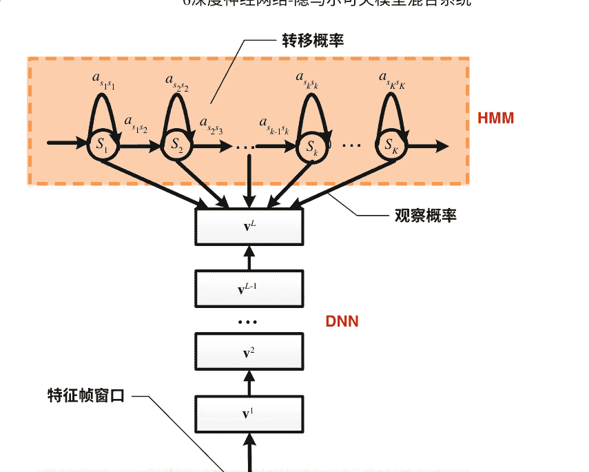

图6.1 DNN-HMM混合系统的架构。HMM模型了语音信号的时序特性，而DNN模型了所有音素（绑定的三音素状态）的缩放观察概率[13]。相同的DNN在不同的时间点复制。

这种混合模型被提出并被视为早期到中期1990年代LVCSR的一种有希望的技术，并在文献中被称为ANN-HMM混合模型[5, 17, 18]。大多数早期的混合方法研究使用上下文无关的音素状态作为ANN训练的标签，并考虑了小词汇量的任务。后来，ANN-HMM扩展到建模上下文相关的音素[4]，并应用于中等词汇量和一些大词汇量的ASR任务[24]，这些任务还采用了循环神经网络架构。

然而，在先前的关于上下文相关的ANN-HMM混合结构的工作中[4]，上下文相关音素的后验概率被建模为

$$p(s_i, c_j|\mathbf{x}_t) = p(s_i|\mathbf{x}_t)p(c_i|s_j, \mathbf{x}_t)$$ (6.1)

或

$$p(s_i, c_j|\mathbf{x}_t) = p(c_i|\mathbf{x}_t)p(s_i|c_j, \mathbf{x}_t),$$ (6.2)

其中 $\mathbf{x}_t$是时间 $t$ 的声学观测值，$c_j$是聚类上下文类别之一 $\{c_1, \dots, c_J\}$，而 $s_i$ 可以是上下文无关音素或状态之一上下文无关音素。 ANN被用来估计 $p(s_i|\mathbf{x}_i)$ 和 $p(c_i|s_j, \mathbf{x}_i)$（或者 $p(c_i|\mathbf{x}_i)$ 和 $p(s_i |c_j, \mathbf{x}_i)$）。 尽管这些类型的上下文相关的ANN-HMM模型在某些任务上优于 GMM-HMM模型，但改进仍然很小。

这些早期的混合模型存在一些重要的限制。 例如，由于计算能力的限制，几乎没有利用超过两个隐藏层的人工神经网络，而上述的上下文相关模型也没有利用为GMM-HMM开发的众多有效技术。 最近的进展[6, 7, 12, 15, 25, 29]表明，如果我们用更深（可选预训练）的神经网络替换传统的浅层神经网络，并且将senones（绑定的三音素状态）[13]作为神经网络的输出单元，可以实现显著的识别准确性提高。 这种改进的ANN-HMM混合模型被称为CD-DNN-HMM [7]。 直接对senones进行建模还有其他两个优点：首先，我们可以只对现有的CD-GMM-HMM系统进行最小的修改，就可以实现CD-DNN-HMM系统。 其次，CD-GMM-HMM系统中建模单元（例如，跨词三音素模型）的任何进展都可以被CD-DNN-HMM系统所使用，因为这种改进可以直接反映在DNN的输出单元中。在CD-DNN-HMM中，一个单一的DNN被训练来估计所有状态$s\in$的条件状态后验概率$p(q_t=s|\mathbf{x}_t)$。

这与GMMs不同，在其中一个不同的GMM用于对每个不同的状态进行建模。 此外，DNN的输入通常不是单个帧，而是一个窗口的 $2\varpi +1$（通常为9-13）帧输入特征 $\mathbf{x}_t = \left[ \mathbf{o}_{\max(0,t-\varpi)} \cdots \mathbf{o}_t \cdots \mathbf{o}_{\min(T,t+\varpi)} \right]$ 利用相邻帧中的信息。

#### 6.1.2 使用CD-DNN-HMM进行解码

由于HMM在解码过程中需要似然概率 $p (\mathbf{x}_t|q_t)$而不是后验概率，因此我们需要将后验概率转换为似然概率

$$p(\mathbf{x}_t|q_t = s) = p(q_t = s|\mathbf{x}_t)p(\mathbf{x}_t)/p(s), \quad (6.3)$$

其中 $p(s) = \frac{T_s}{T}$ 是从训练集估计得到的每个状态（senone）的先验概率， $T_s$ 是标记为状态 $s$ 的帧数， $T$ 是总帧数。$p(\mathbf{x}_t)$ 与单词序列无关，因此可以忽略，这导致了缩放后的似然概率 $\bar{p} (\mathbf{x}_t|q_t) = p(q_t = s|\mathbf{x}_t)/ p(s)[18]$。 尽管在某些情况下，通过先验概率$p(s)$进行除法可能不会提高识别准确性，但在缓解标签偏差问题方面可能很重要，特别是当训练语音包含长时间的静音段时。

总结一下，在CD-DNN-HMM中，解码得到的单词序列 $\hat{w}$ 被确定为

$$\hat{w} = \arg \max_w p(w|\mathbf{x}) = \arg \max_w p(\mathbf{x}|w)p(w)/p(\mathbf{x}) \n= \arg \max_w p(\mathbf{x}|w)p(w), \quad (6.4)$$

其中 \( p(w)\)是语言模型 (LM) 概率，以及

$$p(\mathbf{x}|w) = \sum_{q} p(\mathbf{x}|q, w)p(q|w) \quad (6.5) \n\approx \max\pi(q_0) \prod_{t=1}^{T} a_{q_{t-1}q_{t}} \prod_{t=0}^{T} p(q_t|\mathbf{x}_t)/p(q_t) \quad (6.6)$$

是声学模型 (AM) 概率，其中 \( p(q_t | \mathbf{x}_t)\)是从DNN计算得到的， \( p(q_t)\)是状态先验概率是由HMM确定的初始状态概率和状态转移概率。与GMM-HMM情况类似，通常使用语言模型权重 \( \lambda\)来平衡AM和LM分数之间的关系。因此，最终的解码路径由确定

$$\hat{w} = \arg \max_w \left[ \log p(\mathbf{x}|w) + \lambda \log p(w) \right]. \quad (6.7)$$

#### 6.1.3 CD-DNN-HMM的训练过程

可以使用嵌入式维特比算法来训练CD-DNN-HMMs，其主要步骤总结如算法6.1所示。

CD-DNN-HMM有三个组成部分，一个DNN \( dnn\)，一个HMM \( hmm\)，以及一个状态先验概率分布 \( prior\)。 由于CD-DNN-HMM与GMM-HMM系统共享音素绑定结构和HMM， CD-DNN-HMM训练的第一步是使用训练数据训练一个GMM-HMM系统。 由于DNN训练标签是从GMM-HMM系统生成的，并且标签质量会影响DNN系统的性能，因此训练一个良好的GMM-HMM系统作为种子模型非常重要。

一旦GMM-HMM模型 \( hmm0\)可用，我们可以解析模型并构建一个从状态名称到senoneID的映射。 构建这个映射\( stateToSenoneIDMap\)可能并不容易。 这是因为逻辑三音素HMM实际上是等效的，它们被聚类并由一个物理三音素表示。 换句话说，几个逻辑三音素被映射到同一个物理三音素。 每个物理三音素有几个（通常是3个）被绑定和表示的状态，即senones。

使用GMM-HMM模型 hmm0，我们可以在训练集上使用维特比算法生成强制对齐的状态级别。通过使用stateToSenoneIDMap，我们可以将对齐中的状态名称转换为 senoneID。然后，我们可以从对齐中生成featureSenoneIDPairs，并使用它们来训练DNN。相同的featureSenoneIDPairs也可以用于估计senone的先验概率 prior。

使用GMM-HMM模型 hmm0，我们还可以生成一个HMM hmm，其中包含与 hmm0中相同的状态转移概率，供DNN系统使用。一个简单的方法是将hmm0中的每个GMM（模拟一个senone）替换为（伪）一维高斯分布。高斯分布的方差（或精度）是无关紧要的，可以设置为任何正值（例如，始终设置为1）。每个senone的均值值设置为相应的 senoneID。使用这个技巧，评估每个senone等同于通过senoneID指示的索引在DNN生成的特征（对数似然）中进行表查找。

在这个过程中，假设存在并使用CD-GMM-HMM来生成senone对齐。用于聚类三音素状态的决策树也是使用GMM-HMM构建的。然而，这并非必需。如果我们完全将GMM-HMM从图像中移除，我们可以通过均匀分割话语（称为平坦启动）并将该信息用作训练标签来构建单音素DNN-HMM。然后，我们可以使用单音素DNN-HMM重新对齐话语。之后，我们可以为每个单音素状态构建一个单一的高斯模型，并像往常一样构建决策树。事实上，这种无GMM的CD-DNN-HMM训练过程最近在[26]中取得了成功。

### 算法6.1训练CD-DNN-HMM的主要步骤

```
1: 过程 TRAINCD- DNN- HMM(S) ▷ S是训练集
2: hmm0 ← TrainCD-GMM-HMM(S); ▷ hmm0在GMM系统中使用
3: 状态对齐 ← ForcedAlignmentWithGMMHMM(S, hmm0);
4: 状态到Senone ID映射 ← GenerateStateToSenoneIDMap(hmm0);
5: 特征Senone ID对 ← GenerateDNNTrainingSet(stateToSenoneIDMap, state Alignment);
6: ptdnn ← PretrainDNN(S); ▷ 可选
7: hmm ← ConvertGMMHMMToDNNHMM(hmm0, stateToSenoneIDMap); ▷ hmm在DNN系统中使用
8: 先验 ← EstimatePriorProbability(特征SenoneID对);
9: dnn ← Backpropagate(ptdnn, 特征SenoneID对);
10: 返回 dnnhmm = {dnn, hmm, 先验}
11:结束过程
```

对于每个具有 T帧的话语，嵌入式维特比训练算法最小化平均交叉熵，这等同于负对数似然

$$J_{NLL}(\mathbf{W}, \mathbf{b}; \mathbf{x}, \mathbf{q}) = -\sum_{t=1}^{T} \log p(q_t | \mathbf{x}_t; \mathbf{W}, \mathbf{b}) \quad (6.8)$$

如果新模型 $(\mathbf{W}', \mathbf{b}')$ 在旧模型 $(\mathbf{W}, \mathbf{b})$ 上改善训练准则, 我们有

$$-\sum_{t=1}^{T} \log p(q_t|\mathbf{x}_t; \mathbf{W}', \mathbf{b}') < -\sum_{t=1}^{T} \log p(q_t|\mathbf{x}_t; \mathbf{W}, \mathbf{b})$$

对齐话语的得分

$$\log p(\mathbf{x}|w; \mathbf{W}', \mathbf{b}') = \log \pi(q_0) + \sum_{t=1}^{T} \log (a_{q_{t-1}q_t}) + \sum_{t=1}^{T} [\log p(q_t|\mathbf{x}_t; \mathbf{W}', \mathbf{b}') - \log p(q_t)] > \log \pi(q_0) + \sum_{t=1}^{T} \log (a_{q_{t-1}q_t}) + \sum_{t=1}^{T} [\log p(q_t|\mathbf{x}_t; \mathbf{W}, \mathbf{b}) - \log p(q_t)] = \log p(\mathbf{x}|w; \mathbf{W}, \mathbf{b}). \quad (6.9)$$

换句话说，新模型不仅改善了帧级交叉熵，还改善了给定正确单词序列的话语的似然分数。这证明了嵌入式维特比训练算法的正确性。嵌入式维特比训练算法的不同证明可以在[10]中找到。需要注意的是，尽管所有竞争单词的得分总和减小，但每个竞争单词的得分并不保证减小。此外，上述论证在平均情况下是正确的，但对于每个单独的话语可能不成立。如果平均交叉熵改善非常小，那么识别准确性可能会实际下降，特别是如果小的改善来自对静音段的更好建模。训练CD-DNN-HMM系统的一种更有原则但更复杂的方法是使用序列判别训练准则，我们将在第8章中讨论。

#### 6.1.4 上下文窗口的影响

正如我们在第6.1.1节中提到的，使用一个窗口（通常为9-13帧）的输入特征在CD-DNN-HMM中是非常重要的，以获得很好的结果。很明显，通过包含一个长窗口的帧，DNN模型可以利用邻近帧的信息。然而，与常识相反，通过包含邻近帧，DNN模型还可以对特征帧之间的相关性进行建模，从而在一定程度上减轻了HMM中对观测独立性假设的违反。

请注意，每个单词序列的得分被评估为

$$\log p(\mathbf{x}|w) = \log \pi(q_0) + \sum_{t=1}^{T} \log (a_{q_{t-1}q_t}) + \sum_{n=1}^{N} \left[ \log p (\mathbf{o}_{t_n}, \ldots, \mathbf{o}_{t_{n+1}-1}|s_n) \right], \quad (6.10)$$

其中 T是特征帧的长度， N ≤ T是状态序列的长度， s_n是状态序列中的第_n个状态， q_t是时间t的状态， t_n是第_n个状态的起始时间。 在这里，我们假设状态持续时间可以用马尔可夫链建模。1请注意，观测得分log p

$$\log p (\mathbf{o}_{t_n}, \ldots, \mathbf{o}_{t_{n+1}-1}|s_n) \simeq \sum_{t=t_n}^{t_{n+1}-1} \left[ \log p (\mathbf{o}_t|s_n) \right], \quad (6.11)$$

这个假设在现实中被认为是不正确的，因为相邻的帧在给定相同状态的情况下是相关的。2为了建模帧之间的相关性应该评估分段得分

$$\log p (\mathbf{o}_{t_n}, \ldots, \mathbf{o}_{t_{n+1}-1}|s_n) = \sum_{t=t_n}^{t_{n+1}-1} \left[ \log p (\mathbf{o}_t|s_n, \mathbf{o}_{t_n}, \ldots, \mathbf{o}_{t-1}) \right], \quad (6.12)$$

正如我们所知，如果两个帧之间的距离太远（例如，超过 M帧），它们可以被视为不相关。因此，上述得分可以近似为

$$\begin{aligned} \log p (\mathbf{o}_{t_n}, \ldots, \mathbf{o}_{t_{n+1}-1}|s_n) &\simeq \sum_{t=t_n}^{t_{n+1}-1} \left[ \log p (\mathbf{o}_t|s_n, \mathbf{o}_{t-M}, \ldots, \mathbf{o}_{t-1}) \right] \\ &= \sum_{t=t_n}^{t_{n+1}-1} \left[ \log p (s_n|\mathbf{x}_t^M) - \log p (s_n|\mathbf{x}_{t-1}^{M-1}) \right] + c \\ &\simeq \sum_{t=t_n}^{t_{n+1}-1} \left[ \log p (s_n|\mathbf{x}_t^M) - \log p (s_n) \right] + c, \quad (6.13) \end{aligned}$$

1对于所需的分段模型，该持续时间模型非常粗糙。

2在HMM中做出的独立假设是需要语言模型加权的原因之一。 假设将特征提取间隔从10毫秒减少到5毫秒，特征数量将增加一倍，因此声学模型得分也将增加一倍，语言模型权重也需要增加一倍。

其中c是与sn无关的常数， $\mathbf{x}_t^M = \{\mathbf{o}_{t-M}, \ldots, \mathbf{o}_{t-1}, \mathbf{o}_t\}$ 是从M帧连接而成的特征向量，状态先验被假设为与观测独立。我们可以看到，通过在DNN模型中包含相邻帧（即，estimate $p(s_n|\mathbf{x}_t^M)$）我们可以更准确地估计分段得分，同时仍然享受在HMM中所做的独立假设带来的好处。

### 6.2 CD-DNN-HMM中的关键组件及其分析

在许多大词汇连续语音识别（LVCSR）任务中，CD-DNN-HMM优于GMM-HMM。了解哪些组件或过程对性能改进起到了贡献是很重要的。在本节中，我们将研究不同决策如何影响识别准确性。具体而言，我们通过实证比较使用单音素对齐和三音素对齐，使用单音素状态标签和三音素声学标签，使用浅层和深层网络，以及调整HMM转移概率和其他因素之间的性能差异。通过从一系列研究中总结的实验结果[6, 7, 25, 27, 29]，我们展示了对性能改进最有贡献的三个关键组件是：

- 使用具有足够深度的深度神经网络
- 使用长窗口的帧
- 直接建模声学单元

在所有实验中，CD-DNN-HMM系统用MLP（DNN）后验概率替换了高斯混合成分，同时其他方面保持不变。

### 6.2.1 数据集和基准用于比较和分析

#### 6.2.1.1 必应移动语音搜索数据集

必应移动语音搜索应用程序允许用户通过语音从他们的手机上进行全美范围的商业和网络搜索。实验中使用的商业搜索数据集是在2008年根据实际使用场景收集的，当时该应用程序仅限于位置和商业查找[30]。收集的所有音频文件采样率为8 kHz，并使用GSM编解码器进行编码。这是一个具有挑战性的任务，因为数据集包含各种变化：噪音、音乐、旁白、口音、不准确的发音、犹豫、重复、中断和不同的音频通道。

数据集被分为训练集、开发集和测试集。为了模拟真实的数据收集和训练过程，并避免训练、开发和测试集之间的重叠，数据集基于查询的时间戳进行了分割。训练集中的所有查询在开发集中的查询之前收集，而开发集中的查询又在测试集中的查询之前收集。使用了卡内基梅隆大学的公共词典。标准的全国范围

表6.1 必应移动语音搜索数据集
|      | 小时 | 语音数量 |
|------|------|----------|
| 训练集 | 24   | 32,057   |
| 开发集 | 6.5  | 8,777    |
| 测试集 | 9.5  | 12,758   |

表6.2 CD-GMM-HMM基线句子错误率（SER）在语音搜索数据集上（摘自Dahl等人[7]）
| 准则 | 开发SER（%） | 测试SER（%） |
|------|--------------|--------------|
| ML   | 37.1         | 39.6         |
| MMI  | 34.9         | 37.2         |
| MPE  | 34.5         | 36.2         |

评估中使用的语言模型（LM）包含65K个单词一元组，320万个单词二元组和150万个单词三元组，并使用数据提供和收集的查询日志进行训练；困惑度为117。表6.1总结了训练集、开发集和测试集中语音数量和音频文件的总时长（以小时为单位）。训练集中包含的全部24小时训练数据都是手动转录的。

在这个任务上的性能评估是使用句子错误率（SER）而不是词错误率（WER）。平均句子长度为2.1个标记，所以句子通常相当短。此外，用户最关心的是他们是否能够用最少的尝试找到他们寻找的企业或位置。如果其中一个单词被错误识别，他们通常会重复他们所说的话。此外，拼写方面存在显著的不一致性，使用句子准确性更加方便。例如，“麦当劳”有时被拼写为“麦当劳”，“沃尔玛”有时被拼写为“沃尔玛”，“7-11”有时被拼写为“7 eleven”或“seven-eleven”。使用65K词汇量的语言模型，开发集和测试集的句子词汇外（OOV）率均为6%。换句话说，使用这个设置，我们能够达到的最佳句子错误率是6%。

聚类的交叉词三音素GMM-HMM模型是通过最大似然（ML）、最大互信息（MMI）[3,14,20]和最小音素错误（MPE）[20,23]准则进行训练的。实验中使用的39维特征包括13维静态梅尔频率倒谱系数（MFCC）（C0用能量替代）及其一阶和二阶导数。特征经过倒谱均值归一化（CMN）算法进行预处理。

基准系统通过在开发集上调整绑定结构、音素数目和高斯分裂策略进行优化。所有系统都有53K个逻辑和2K个物理三音素，共761个共享状态（音素），每个状态都是具有24个混合分量的GMM。GMM-HMM基准结果总结如表6.2所示。

对于VS数据集引用的所有CD-DNN-HMM实验，MFCC的11帧（5-1-5）被用作DNN的输入特征。在DNN预训练期间，所有层的学习率为1.5e-4每个样本。对于微调，前6个时期的学习率为3e-3每个样本，而后续学习率为8e-5在过去的6个时期中，每个样本都被使用。在所有的实验中，使用了256个小批量大小和0.9的动量。超参数是通过手动选择的，基于初步的单隐藏层实验，因此使用更详尽的超参数搜索策略可能会获得更好的性能。

### 6.2.1.2 Switchboard数据集

Switchboard（SWB）数据集[8, 9]是一个电话会话语音的语料库。它有三个设置，其训练集大小分别为30小时（Switchboard-I的随机子集训练集），309小时（完整的Switchboard-I训练集）和2,000小时（+Fisher训练集）。对于所有配置，NIST的1,831段SWB部分2000 Hub5评估集和6.3小时的2003年春季NIST丰富转录集（RT03S）的FSH一半被用作评估集。该系统使用13维PLP特征，具有滚动窗口均值方差归一化和高达三阶的derivatives，通过异方差线性判别分析（HLDA）[16]将其降低到39维。在30小时、309小时和2,000小时的设置上，使用13维PLP特征，具有滚动窗口均值方差归一化和高达三阶的derivatives，通过异方差线性判别分析（HLDA）[16]将其降低到39维。在30小时、309小时和2,000小时的设置上，使用13维PLP特征，具有滚动窗口均值方差归一化和高达三阶的derivatives，通过异方差线性判别分析（HLDA）[16]将其降低到39维。

DNN系统使用随机梯度下降在小批量中进行训练。小批量大小为1,024帧，除了第一个小批量使用256个样本。DBN预训练的小批量大小为256。预训练时，学习率为$1.5e^{-4}$每个样本。在训练数据的前24小时内，学习率为$3e^{-3}$每个样本，之后降低为$8e^{-5}$每个样本，经过3个周期。使用了0.9的动量。这些学习率与VS数据集中使用的学习率相同。

#### 6.2.2 建模单音状态或音素

如本节开头所提到的，CD-DNN-HMMs有三个关键组成部分之一是直接建模上下文相关的电话状态（即音素）。直接建模音素可以利用细粒度标签中编码的信息，并减轻过拟合。它还减少了HMM中混淆的状态转换，从而减少了解码中的歧义，尽管增加DNN输出节点会降低帧分类准确性。建模音素相对于单音状态的好处在表6.3中得到了明显的证明，当使用具有每个隐藏层2 K个神经元的DNN（3×2 K设置）时，在VS开发集上相对SER减少了15%。表6.4显示了超过50%的相对SER减少。

表6.3 在语音搜索开发集上使用上下文无关单音状态标签和上下文相关三音素标签时的句子错误率（SER）模型
| 模型 | 单音状态 (%) | 三音素 (761) (%) |
|------|--------------|------------------|
| CD-GMM-HMM (MPE) | – | 34.5 |
| DNN-HMM (3 × 2 K) | 35.8 | 30.4 |
> （摘自Dahl等人[7]）

表6.4 在Hub5'00-SWB上使用309小时训练集和ML对齐标签的词错误率（WER）模型
| 模型 | 单音状态 (%) | 三音素 (9304) (%) |
|------|--------------|------------------|
| CD-GMM-HMM (BMMI) | – | 23.6 |
| DNN-HMM (7 × 2 K) | 34.9 | 17.1 |
使用DNN（每个隐藏层有2K个神经元，即7×2K设置）在309小时的SWB任务中，相对词错误率（WER）减少了。相对错误率减少的差异部分归因于在SWB中使用了更多的senones。使用senone标签是我们分析的所有设计决策中最大的改进来源。

### 6.2.3 深度更好

在CD-DNN-HMM中，使用DNN而不是浅层MLP是另一个关键组成部分。表6.5展示了随着添加更多层，句子错误率的降低情况。当只使用一个隐藏层时，SER为31.9%。当使用三个隐藏层时，错误率降低到30.4%。当使用四个隐藏层时，错误率进一步降低到29.8%，使用五个隐藏层时为29.7%。总体而言，当使用相同的对齐时，五个隐藏层模型相比单个隐藏层系统提供了2.2%的SER降低。

为了展示深层神经网络所享有的参数化效率，表6.5中还报告了使用具有16K隐藏神经元的单隐藏层神经网络的结果。由于输出层有761个神经元，这个浅层模型需要比使用2K隐藏神经元的五隐藏层模型更多的存储空间。使用这个宽而浅的模型得到的开发集SER为31.4%，略好于使用2K隐藏神经元的单隐藏层模型的31.9%，但远低于使用两个隐藏层模型的30.5%（更不用说使用五隐藏层模型的29.7%了）。

表6.6总结了使用309小时训练数据生成的音素对齐标签的SWB Hub5'00-SWB测试集上的WER结果。

表6.5 越深越好。使用具有不同隐藏层数量的DNN在语音搜索开发集上实现的SER
| LxN | DBN-PT (%) |
| :--- | :--- |
| 1×2 k | 31.9 |
| 2×2 k | 30.5 |
| 3×2 k | 30.4 |
| 4×2 k | 29.8 |
| 5×2 k | 29.7 |
| 1×16 K | 31.4 |
在所有实验中，都使用了ML对齐和DBN预训练。(摘自Dahl等人[7])

表6.6 越深越好。使用具有不同隐藏层数量的DNN在Hub5'00-SWB上实现的WER
| LxN | DBN-PT (%) |
| :--- | :--- |
| 1×2 k | 24.2 |
| 2×2 k | 20.4 |
| 3×2 k | 18.4 |
| 4×2 k | 17.8 |
| 5×2 k | 17.2 |
| 7×2 k | 17.1 |
| 1×3,772 | 22.5 |
| 1×4,634 | 22.6 |
| 1×16 K | 22.1 |
309小时SWB训练集，使用了ML对齐和DBN预训练的所有实验。(摘自Seide等人[25])

最大似然（ML）训练的GMM系统。从这个表中我们可以得出几个观察结果。首先，深层网络的性能确实比浅层网络更好。换句话说，深层模型比浅层模型具有更强的判别能力。如果每层包含2K个隐藏神经元，WER会随着隐藏层的增加而减少。有趣的是，如果你将5×2K的设置与1×3,772的设置或7×2K的设置与1×4,634的设置进行比较，这两种设置具有相同数量的模型参数，深层模型也明显优于浅层模型。即使将单隐藏层MLP的隐藏层大小进一步增加到16K，我们只能达到22.1%的WER，这比在相同条件下使用7×2K的DNN获得的17.1%的WER要差得多。请注意，随着隐藏层数量的进一步增加，性能改善会减少，并且在使用九个隐藏层后饱和。

在实践中，需要在增加隐藏层的成本和训练和解码的额外收益之间做出权衡。

#### 6.2.4 利用相邻帧

表6.7比较了在309小时SWB任务上使用和不使用相邻帧的WER。可以清楚地看到，无论使用浅层还是深层网络，使用相邻帧中的信息都显著提高了准确性。

表6.7 比较使用相邻帧的有效性
| 模型 | 1帧（%） | 11帧（%） |
| :--- | :--- | :--- |
| CD-DNN-HMM 1×4,634 | 26.0 | 22.4 |
| CD-DNN-HMM 7×2k | 23.2 | 17.1 |
使用309小时训练集和ML对齐标签的Hub5'00-SWB上的WER。具有BMMI训练的GMM-HMM基线为23.6%。（摘自Seide等人[25]）

然而，深度网络从使用相邻帧中获得更多收益，相对于使用浅层模型获得的14%相对词错误率（WER）降低，可以获得24%的相对WER降低，尽管这两个模型具有相同数量的参数。还可以观察到，如果只使用单个帧，DNN系统仅略优于BMMI [21]训练的GMM系统（23.2%对23.6%）。

然而需要注意的是，如果进行类似于BMMI的序列判别式训练[27]，DNN系统的性能可以进一步提高。要在GMM系统中使用相邻帧，需要使用复杂的技术，如fMPE [22]，HLDA [16]，区域相关变换[31]或串联结构[11, 32]。这是因为在GMM中使用对角协方差矩阵时，每个维度应该是不相关的。然而，DNN是一种判别模型，可以自由地使用任何特征，即使它们是相关的。

#### 6.2.5 预训练

在2011年之前，人们认为预训练对于训练深度神经网络是至关重要的。然而，后来研究人员发现，尽管预训练有时可以提供额外的收益，但它并不是至关重要的。这可以从表6.8中观察到。该表表明，在隐藏层数量小于五时，不依赖标签的DBN预训练确实比没有任何预训练的系统提供了显著的收益。然而，随着层数的增加，收益减少并最终消失。这与使用预训练的最初动机相悖。研究人员猜测，随着隐藏层数量的增加，我们应该看到使用DBN预训练获得更多收益，而不是更少，正如表中所示。这种行为在一定程度上可以解释为，用于训练DNN的随机梯度下降算法具有跳出局部最优解的能力。此外，当使用大量训练数据时，过拟合问题（部分通过预训练得到解决）不再是一个关注点。

表6.8 比较预训练程序的有效性
| LxN | NOPT (%) | DBN-PT (%) | DPT (%) |
| :--- | :--- | :--- | :--- |
| 1×2 k | 24.3 | 24.2 | 24.1 |
| 2×2 k | 22.2 | 20.4 | 20.4 |
| 3×2 k | 20.0 | 18.4 | 18.6 |
| 4×2 k | 18.7 | 17.8 | 17.8 |
| 5×2 k | 18.2 | 17.2 | 17.1 |
| 7×2 k | 17.4 | 17.1 | 16.8 |
使用309小时训练集和ML对齐标签，在Hub5'00-SWB上的WER。 NOPT：无预训练； DBN-PT：使用DBN预训练， DPT：使用判别式预训练。（摘自Seide等人[25]）

另一方面，生成式预训练的好处在层数增加时可能会减少。这是因为DBN预训练使用了两个近似。首先，在训练下一层时，使用均值场近似作为生成目标。其次，使用近似的对比散度算法来学习模型参数。这两个近似都会引入每个额外层的建模误差。随着层数的增加，集成误差增加，DBN预训练的有效性降低。判别式预训练（DPT）是一种替代的预训练技术。根据表6.8，当DNN包含超过五个隐藏层时，它的性能至少与DBN预训练程序一样好。然而，即使使用DPT，与纯反向传播（BP）系统相比，性能提升仍然相对较小，与建模senones和使用深度网络所获得的性能提升相比。尽管使用预训练技术的WER降低不如人们所希望的那样大，但这些技术可以确保更稳健的训练过程。通过应用这些技术，我们可以避免非常糟糕的初始化，并在训练过程中使用某种隐式正则化，以便即使在小训练集的情况下也可以获得良好的性能。

#### 6.2.6 更好的对齐有助于

在嵌入式维特比训练过程中，样本的训练标签是通过强制对齐确定的。直观地说，如果标签是由一个更准确的模型生成的，训练的深度神经网络应该表现更好。这在表6.9中经验证实。正如我们所看到的，当使用MPE训练的CD-GMM-HMM生成的对齐时，可以获得29.3%和31.2%的SER分别在开发和测试集上。这些结果比使用CD-GMM-HMM ML对齐训练的CD-DNN-HMM获得的结果好0.4%。由于CD-DNN-HMM的性能优于CD-GMM-HMM，我们可以通过使用最佳的CD-DNN-HMM生成对齐来进一步提高标签质量。表6.9显示了这一点。

表6.9 比较对齐质量和转移概率调整在语音搜索数据集上的有效性
| 对齐来源 | GMM转移概率 | | DNN调整转移概率 | |
| :--- | :--- | :--- | :--- | :--- |
| | 开发SER (%) | 测试SER (%) | 开发SER (%) | 测试SER (%) |
| 从CD-GMM-HMM ML | 29.7 | 31.6 | -- | -- |
| 从CD-GMM-HMM MPE | 29.3 | 31.2 | 29.0 | 31.0 |
| 从CD-DNN-HMM | 28.3 | 30.4 | 28.2 | 30.4 |
使用5×2 K模型。在开发和测试集上的SER。（摘自Dahl等人[7]）

在开发和测试集上的SER可以分别降低到28.3%和30.4%，使用CD-DNN-HMM对齐。
类似的观察结果也可以在SWB上得出。当使用从CD-GMM-HMM系统生成的标签训练7×2 k DNN时，在Hub5'00测试集上得到17.1%的WER。如果使用从CD-DNN-HMM生成的改进标签训练DNN，WER可以降低到16.4%。

#### 6.2.7 调整转移概率

表6.9还表明，在CD-DNN-HMMs中调整转移概率会稍微有所帮助。调整转移概率还有另一个好处。当转移概率直接从CD-GMM-HMMs中借用时，在AM权重设置为2时通常可以获得最佳解码性能。然而，在调整转移概率之后，在语音搜索任务中不再需要调整AM权重。

### 6.3 基于Kullback-Leibler散度的HMM

在混合DNN/HMM系统中，观测概率是满足适当约束条件的真实概率。然而，我们可以去除这个约束，并用其他分数替换状态对数似然。在基于Kullback-Leibler散度的HMM (KL-HMM) [1, 2]中，状态分数计算如下

$$S_{\mathrm{KL}}(s, \boldsymbol{z}_t) = \mathrm{KL}(\boldsymbol{y}_s \parallel \boldsymbol{z}_t) = \sum_{d=1}^{D} y_s^d \ln \frac{y_s^d}{z_t^d}$$

其中$s$是一个状态（例如，音素），$z_t^d = P(a_d|\mathbf{x}_t)$是给定观测值$\mathbf{x}_t$的某个类别$a_d$的后验概率，$D$是类别的数量，而$\boldsymbol{y}_s$是表示状态$s$的概率分布。从理论上讲，$a_d$可以是任何类别。实际上# 6 深度神经网络-隐马尔可夫模型混合系统

通常选择上下文无关的音素或状态作为 a<sub>d</sub>。例如，z<sub>t</sub> 可以是输出神经元表示单音素的DNN的输出。

与混合DNN/HMM系统不同，在KL-HMM中，y<sub>s</sub>是需要为每个状态估计的额外模型参数。在[1, 2]中，y<sub>s</sub>被优化以最小化在等式6.14中定义的平均帧分数，同时保持 z<sub>t</sub>（因此DNN或MLP）固定。

或者，反向KL（RKL）距离

```
$$ S_{\mathrm{RKL}}(s, z_t) = \mathrm{KL} \left( z_t \parallel y_s \right) = \sum_{d=1}^{D} z_t^d \ln \frac{z_t^d}{y_s^d} \qquad (6.15) $$
```

或者对称KL（SKL）距离

```
$$ S_{\mathrm{SKL}}(s, z_t) = \mathrm{KL} \left( y_s \parallel z_t \right) + \mathrm{KL} \left( z_t \parallel y_s \right) \qquad (6.16) $$
```

可以用作状态评分。

请注意，KL-HMM可以被视为特殊的DNN/HMM，其中 a<sub>d</sub>在DNN中的一个 D维瓶颈层中充当神经元，而softmax层被KL距离替代。因此，当比较混合DNN/HMM系统与KL-HMM系统时，应在DNN/HMM混合系统中添加一个额外的层以进行公平比较。³

与更简单的混合DNN/HMM系统相比，KL-HMM还有两个缺点：参数y<sub>s</sub>是与DNN模型分别估计的，而不是像混合系统中那样进行联合优化；KL-HMM中的序列判别式训练（我们将在第8章中讨论）不像混合系统中那样直接。出于这些原因，本书重点关注混合DNN/HMM系统，而不是KL-HMM，尽管KL-HMM也是一个有趣的模型。

## 参考文献

- 1. Aradilla, G., Bourlard, H., Magimai-Doss, M.: 在大词汇识别任务中使用基于KL的声学模型。在：国际语音通信协会年会论文集（INTERSPEECH），第928-931页（2008年）
- 2. Aradilla, G., Vepa, J., Bourlard, H.: 基于Kullback-Leibler散度的声学模型用于后验特征。在：声学、语音和信号处理国际会议论文集（ICASSP），第4卷，第IV-657页（2007年）
- 3. Bahl, L., Brown, P., De Souza, P., Mercer, R.: 用于语音识别的隐马尔可夫模型参数的最大互信息估计。在：国际声学、语音和信号处理会议(ICASSP)论文集，第11卷，第49-52页(1986)
- 4. Bourlard, H., Morgan, N., Wooters, C., Renals, S.: 用于连续语音识别的上下文相关神经网络(CDNN)。在：国际声学、语音和信号处理会议(ICASSP)论文集，第2卷，第349-352页(1992)

³在几篇论文中进行了不公平的比较，比较了混合DNN/HMM系统和KL-HMM系统。因此，这些论文的结论是可疑的。

- 5. Bourlard, H., Wellekens, C.J.: 马尔可夫模型和多层感知器之间的联系。IEEE模式分析与机器智能交易(PAMI) **12**(12), 1167-1178(1990)
- 6. Dahl, G.E., Yu, D., Deng, L., Acero, A.: 基于上下文相关DBN-HMMs的大词汇连续语音识别。在：国际声学、语音和信号处理会议(ICASSP)论文集，第4688-4691页(2011)
- 7. Dahl, G.E., Yu, D., Deng, L., Acero, A.: 基于上下文的预训练深度神经网络用于大词汇量语音识别。IEEE Trans. Audio, Speech Lang. Process. **20**(1), 30–42 (2012)
- 8. Godfrey, J.J., Holliman, E.: Switchboard-1 Release 2. 语言数据联盟，费城 (1997)
- 9. Godfrey, J.J., Holliman, E.C., McDaniel, J.: Switchboard: 用于研究和开发的电话语音语料库。在：国际会议论文集声学、语音和信号处理（ICASSP），卷1，页517–520（1992）
- 10. Hennebert, J., Ris, C., Bourlard, H., Renals, S., Morgan, N.: 估计全局后验概率和混合HMM/ANN系统的前向-后向训练（1997年）
- 11. Hermansky, H., Ellis, D.P., Sharma, S.: 串联连接主义特征提取用于传统HMM系统。在：国际声学、语音和信号处理会议（ICASSP）论文集，第3卷，第1635-1638页（2000年）
- 12. Hinton, G., Deng, L., Yu, D., Dahl, G.E., Mohamed, A.R., Jaitly, N., Senior, A., Vanhoucke, V., Nguyen, P., Sainath, T.N., et al.: 深度神经网络用于语音识别中的声学模型训练：四个研究小组的共同观点。IEEE信号处理杂志 **29**(6), 82-97页（2012年）
- 13. Hwang, M., Huang, X.: 共享分布隐藏马尔可夫模型用于语音识别。IEEE Trans. Speech Audio Process. **1**(4), 414–420 (1993)
- 14. Kapadia, S., Valtchev, V., Young, S.: 在TIMIT数据库上进行连续音素识别的MMI训练。In: 国际声学、语音和信号处理会议(ICASSP)论文集，卷2，第491–494页(1993)
- 15. Kingsbury, B., Sainath, T.N., Soltau, H.: 使用分布式无Hessian优化的可扩展最小贝叶斯风险训练深度神经网络声学模型。 In: 年度国际语音通信协会(INTERSPEECH)会议论文集(2012)
- 16. Kumar, N., Andreou, A.G.: 用于改进语音识别的异方差判别分析和降维秩隐藏马尔可夫模型。Speech Commun. **26**(4), 283–297 (1998)
- 17. Morgan, N., Bourlard, H.: 使用多层感知器和隐马尔可夫模型的连续语音识别。 在：国际声学、语音和信号处理会议(ICASSP)论文集，第413-416页(1990)
- 18. Morgan, N., Bourlard, H.A.: 用于统计连续语音识别的神经网络。会议论文集。IEEE **83**(5), 742-772页(1995)
- 19. Ostendorf, M., Digalakis, V.V., Kimball, O.A.: 从HMM到分段模型：语音识别的统一视角。IEEE Trans. Speech Audio Process. **4**(5), 360-378页(1996)
- 20. Povey, D.: 大词汇语音识别的判别式训练。剑桥大学工程系博士论文，剑桥(2003)
- 21. Povey, D., Kanevsky, D., Kingsbury, B., Ramabhadran, B., Saon, G., Visweswariah, K.: 模型和特征空间判别式训练的增强MMI。 在：国际声学、语音和信号处理会议(ICASSP)论文集，第4057-4060页(2008)
- 22. Povey, D., Kingsbury, B., Mangu, L., Saon, G., Soltau, H., Zweig, G.: FMPE：用于语音识别的判别式训练特征。 在：国际声学、语音和信号处理会议(ICASSP)论文集，第1卷，第961-964页(2005)
- 23. Povey, D., Woodland, P.C.: 最小音素错误和I平滑以改进判别式训练。 在：国际声学、语音和信号处理会议(ICASSP)论文集，第1卷，第I-105页(2002)
- 24. Robinson, A.J., Cook, G., Ellis, D.P., Fosser-Lussier, E., Renals, S., Williams, D.: 广播新闻的连接主义语音识别。语音通信。**37**(1), 27–45 (2002)
- 25. Seide, F., Li, G., Yu, D.: 使用上下文相关深度神经网络的会话语音转录。 在：国际语音通信协会年会论文集 (INTERSPEECH)，第437–440页 (2011)
- 26. Senior, A., Heigold, G., Bacchiani, M., Liao, H.: 无GMM的DNN训练。 在：国际声学、语音和信号处理会议论文集 (ICASSP) (2014)
- 27. Su, H., Li, G., Yu, D., Seide, F.: 用于会话语音转录的上下文相关深度网络的序列训练的误差反向传播。 在：国际声学、语音和信号处理会议论文集 (ICASSP) (2013)
- 28. Trentin, E., Gori, M.: 用于自动语音识别的混合ANN/HMM模型的调查。神经计算 37(1), 91–126 (2001)
- 29. 于, D., 邓, L., Dahl, G.: 预训练和微调在上下文相关DBN-HMMs中的作用，用于实际语音识别。 在：神经信息处理系统(NIPS)深度学习和无监督特征学习研讨会 (2010)
- 30. 于, D., Ju, Y.C., 王, Y.Y., Zweig, G., Acero, A.: 自动目录辅助系统-从理论到实践。 在：国际语音交流年会 (INTERSPEECH)年会论文集, pp. 2709–2712 (2007)
- 31. 张, B., Matsoukas, S., Schwartz, R.: 用于语音识别的区域相关特征变换的判别式训练。 在：国际声学、语音和信号处理会议 (ICASSP)论文集, vol. 1, pp. I–I (2006)
- 32. Zhu, Q., Chen, B., Morgan, N., Stolcke, A.: 用于对话语音识别的串联连接主义特征提取。 在：多模态交互的机器学习，第3361卷，第223-231页。Springer，柏林 (2005年)

## 第7章 训练和解码加速

摘要 深度神经网络（DNN）有许多隐藏层，每个隐藏层都有很多神经元。这大大增加了模型中的参数总数，使得训练和解码都变慢。在本章中，我们讨论了加速训练和解码的算法和工程技术。具体来说，我们描述了并行训练算法，如流水线反向传播算法、异步随机梯度下降算法和增广拉格朗日乘子算法。我们还介绍了基于低秩逼近的模型大小减小技术，可以加速训练和解码，以及量化、惰性评估和帧跳过等显著加速解码的技术。

### 7.1 训练加速

语音识别系统通常使用数千甚至数万小时的语音数据进行训练。由于我们每10毫秒提取一帧特征，所以每24小时的数据相当于

```
24小时 ×60分钟/小时 ×60秒/分钟 ×100帧/秒 = 8.64亿帧,
```

而1000小时的数据相当于3.6亿帧（或样本）。考虑到深度神经网络（DNNs）的规模，这是非常庞大的。能够加速训练的技术因此非常重要。通过使用高性能计算设备（如通用图形处理单元（GPGPUs））和/或使用能够减少模型参数、更快收敛或利用多个处理单元的更好算法，可以提高训练速度。根据我们的经验，我们发现GPGPUs比多核CPU的速度快得多，并且是训练DNNs的首选平台。

### 7.1.1 使用多个GPU的流水线反向传播

众所周知，基于小批量的随机梯度下降（SGD）训练算法可以轻松地在单个计算设备上扩展到大型数据集。然而，只使用几百个样本的小批量使得并行化变得困难。这是因为在每个小批量之后更新模型，并且如果使用了朴素的数据并行化，则需要禁止带宽。例如，一个典型的2kx7（每个隐藏层有2k个神经元）CD-DNN-HMM具有大约50-100百万个浮点参数或200-400百万字节。每个小批量将需要分发400 MB的梯度，并收集另外400 MB的模型参数，每个服务器。如果每个小批量计算时间约为500毫秒（在GPGPUs上很容易实现），我们接近PCIe-2的限制（约为6 GB/s）。然而，小批量大小通常由两个因素决定。较小的小批量大小意味着更频繁地更新模型，但也意味着GPU的计算能力利用率较低。较大的小批量可以更高效地计算，但整个训练过程需要对训练集进行更多次的遍历。通过平衡这两个因素可以获得最佳的小批量大小。

图7.1显示了在看到12小时的数据后，不同的小批量大小（x轴）的运行时间（右y轴）和早期帧准确率（左y轴）。在这些实验中，如果小批量大小大于256，则在前2.4小时的数据中将小批量大小设置为256，然后增加到实际大小。可以看出，最佳的小批量大小在256-1,024范围内。

如果使用图7.1中列出的最佳GPU NVidia S2090（托管在T620上），使用交叉熵准则和300小时的训练数据训练出性能良好的DNN大约需要15天。如果使用2,000小时的数据，则总时间增加到45天。请注意，总时间增加了大约3倍，而不是2,000/300≈6.7倍。这是因为尽管每次数据传递的成本增加了6.7倍，但所需时间却不同。

图7.1 不同小批量大小和GPU/CPU模型类型的相对运行时间，以及在看到12小时数据后测得的帧准确率。左y轴帧准确率；右y轴相对于使用小批量大小为2,048的C1060的运行时间 (来自Chen等人的图[5]，经ISCA许可使用)

如果使用新的GPU模型（如K20X），训练时间可以缩短到约20天。然而，即使有了这个新的GPU，使用20K小时的数据进行训练仍然需要超过两个月的时间。因此，并行训练算法对于支持大规模数据集的训练非常重要。

让我们用K表示GPU的数量（例如，4），T表示一个小批量的大小（如1,024），N表示所有隐藏层的维度，例如2,048，J表示输出维度（senones的数量），例如9,304。如果我们使用简单的经典的map-reduce[7]方法来实现通过分割训练数据来实现并行化，那么每个小批量都需要将整个模型的梯度/模型累积/重新分配到主服务器和其他K-1个GPU之间。在GPGPU之间的共享总线上，每个小批量的带宽为$\mathcal{O}( N \cdot ( T + 2(L \cdot N + J)( K - 1)))$。树状通信架构可以将其减少到$\mathcal{O}( N \cdot (T + 2(L \cdot N + J))\lceil \log_2 K \rceil)$，其中$\lceil x \rceil$是大于或等于x的最小整数。

或者，我们可以将每个层的模型参数划分为条纹，并在不同的计算节点上分发条纹。在这种节点并行化方法中，每个GPU持有每个层参数和梯度的K垂直条纹中的一个。模型更新仅在每个GPU内部进行。在前向计算中，每个层的输入$v^{\ell-1}$被分发到所有的GPU，每个GPU计算输出向量$v^{\ell}$的一个切片。然后，这些切片被分发到所有其他GPU上计算下一层。在反向传播中，错误向量被并行化为切片，但是每个切片的结果矩阵乘积是需要进一步求和的部分和。因此，在前向计算和反向传播中，每个向量被传输K-1次。带宽为$\mathcal{O}(N \cdot (K-1) \cdot T \cdot (2L + 1))$。

通过将层分布在GPU上形成一个流水线，流水线反向传播[5, 18]避免了数据向量的多次复制的分层方法，数据而不是模型从GPU流向GPU。所有GPU同时处理它们拥有的数据。例如，在图7.2中，双隐藏层DNN被分割并存储在三个GPU中。当第一批训练数据到达时，它在GPU1中进行处理。隐藏层1的激活（输出）然后传递给GPU2进行处理。同时，新的批次到达并在GPU1中进行处理。经过三个批次，所有GPU都被占用。这表明如果所有层都平衡，可以加速三倍。反向传播过程以类似的方式进行处理。经过六个批次，所有GPU都处理前向批次和反向批次。由于GPU使用单指令多数据（SIMD）架构，我们可以先更新模型然后在每个层进行前向传递。这确保了在进行前向计算时使用最新更新的权重，以减少我们将在下面提到的延迟更新问题。

图7.2 流水线并行化范例

在管道架构中，每个向量在GPU上进行两次，一次用于前向计算，一次用于反向传播。带宽为$\mathcal{O}(N \cdot T \cdot (2K - 1))$，比数据并行化和分条化更便宜。如果层数$L$大于GPU数量$K$，则可以将几个层分组在同一个GPU上。最后，异步数据传输和适当的执行顺序可以使大多数数据传输与计算并行进行，从而将有效通信时间减少到接近零。

请注意，效率是有代价的。这是因为前向计算使用的权重与反向传播使用的权重不匹配。例如，用于在GPU 1、2和3上进行批处理$n$的前向计算的权重在批处理$n-5$、$n-3$和$n-1$之后进行更新。然而，在计算梯度时，这些权重已经在GPU 2和1上进一步更新，尽管在GPU 3上它们是相同的。这意味着在较低的层中，由于管道过程的延迟，计算出的梯度不准确。基于这个分析，我们可以将延迟更新视为一种特殊的复杂动量技术，其中更新（平滑梯度）是先前模型和梯度的函数。因此，当管道过长时，如果使用相同的小批量大小，性能会下降[5]。为了减轻延迟更新的副作用，我们需要减小小批量大小。

实现快速加速的关键是平衡每个GPU上的计算。如果层数是GPU数量的倍数，并且所有层的维度相同，则平衡是简单的。然而，在CD-DNN-HMMs中，softmax层通常占据了大部分参数的数量。这是因为音素的数量通常在10K左右，隐藏层的大小通常在2K左右。为了平衡计算，我们需要对softmax层使用条带化技术，对其余部分使用流水线技术。

表7.1引用自Chen等人[5]，显示了在单个服务器（Dell PowerEdge T620）上使用多达4个GPU（Nvidia Tesla S2090）进行训练的运行时间，测量的输入特征维度为429，$L=7$个隐藏层，$N=2,048$个隐藏维度，以及$J=9,304$个音素。从这个表中，我们可以观察到在双GPU上可以实现1.7-1.9倍的加速（例如，将批量大小为512的运行时间从61分钟减少到33分钟），尽管存在延迟更新的近似，但没有准确性损失。为了实现这种加速，GPU1包含五个权重矩阵，而GPU2只有两个，这是由于不平衡的softmax层。这两个GPU上的计算时间比率表7.1 不同并行化配置下每24小时数据的训练运行时间 使用流水线反向传播方法

| 方法 | # GPU | 小批量大小256 | 小批量大小512 | 小批量大小1024 |
| --- | --- | --- | --- | --- |
| 基准（单个GPU） | 1 | 68 | 61 | 59 |
| 流水线（0.5; 6..7） | 2 | 36 | 33 | 31 |
| 流水线（0.2; 3.4; 5..6;7） | 4 | 32 | 29 | [27] |
| 流水线 + 分层顶层（0..3; 4..6; 7L; 7R） | 4 | 20 | 18 | [[18]] |

|[[·]] 表示发散，[·] 表示测试集上大于0.1%的词错误率（WER）损失（引用自Chen等人[5]）

是 (429 + 5 × 2,048) × 2,048: (2,048 + 9,304) × 2,048 = 0.94:1, 因此非常平衡。仅使用流水线将GPU数量增加到4几乎没有帮助。整体加速比仍然低于2.2（例如，~61 vs.~29分钟）。这是因为softmax层的大小是隐藏层的4.5倍（9,304 × 2,048个参数），因此成为了限制瓶颈。四个GPU上的计算时间比是 (429 + 2 × 2,048) × 2,048: (2 × 2,048) × 2,048: (2 × 2,048) × 2,048: 9,304 × 2,048 = 1.1:1:1:2.27。换句话说，GPU4的时间是其他GPU的两倍。然而，如果将流水线反向传播与分层方法相结合，该方法仅应用于softmax层，可以实现显著加速。在这种配置中，四个GPU被分配到层（0..3; 4..6; 7L; 7R），其中L和R分别表示左和右分层。换句话说，两个GPU共同形成流水线的顶层，而其他两个GPU上的下面7层被分层。在这种情况下，类似的计算表明四个GPU上的计算成本比是 (429 + 3 × 2,048) × 2,048: (3 × 2,048) × 2,048: 4,652 × 2,048: 4,652 × 2,048 = 1.07:1:0.76:0.76。在没有词错误率（WER）损失的情况下，最快的流水线系统（处理24小时数据的时间为18分钟，小批量大小为512）在四个GPU上比最快的单个GPU基准（处理24小时数据的时间为59分钟，小批量大小为1024）快3.3倍，加速比为3.3倍。

流水线反向传播的缺点是显而易见的。整体加速度严重依赖于您是否能够找到一种方法来平衡计算在GPU上。此外，由于延迟更新效应，将相同的加速度扩展到更多的GPU并不容易。

#### 7.1.2 异步SGD

可以使用另一种技术并行化模型训练，称为异步SGD（ASGD）[12, 17, 26]。首先建议在CPU上运行服务器，如图7.3所示。在这种架构中，DNN模型存储在几台（图中的3台）计算机上，称为参数服务器池。参数服务器池是主服务器。主服务器将模型参数发送给从服务器，每个其中包括几台计算机（图中的4台）。每个从机处理训练数据的一个子集。它计算并发送每个小批量的梯度到主机。主机更新参数并将新值发送回从机。

由于从机中的每台计算机都包含模型的一部分，激活需要在计算机之间进行复制。为了减少通信成本，模型需要在不同计算机上存储的组件之间具有稀疏连接。在主机上有多台计算机有助于减少主机和从机之间的通信成本，因为每对计算机只需要传输一部分参数。然而，ASGD成功的关键是使用异步无锁更新。换句话说，在更新过程中，服务器上的参数不会被锁定。当主机从多个从机获取梯度时，它在不同的线程中独立更新模型。当主机将新参数发送给从机时，部分参数可能会使用从多个从机发送的梯度进行更新。

乍一看，这可能会导致收敛问题。然而，在实践中，参数收敛良好，模型训练时间显著缩短，因为每个从属节点不需要等待其他从属节点完成[12, 17]。模型逐渐演化，因为它接触到来自训练数据集的随机记录。关于ASGD收敛性的证明见[17]。

在ASGD中需要考虑几个实际问题。首先，一些从属节点可能需要比其他节点更长的时间来完成一个时期。因此，在这些从属节点上计算的梯度可能基于一个非常旧的模型。处理这个问题的最简单方法是在所有通信中发送一个时间戳。如果从从属节点发送的时间戳与主节点上的时间戳之间的差异超过阈值，主节点将放弃过时的梯度并发送最新的模型给从属节点。如果一个从属节点始终较慢，那么分配给该从属节点的数据需要重新分配给其他从属节点。这可以通过从同一池中获取小批量数据来轻松完成。其次，很明显，在流水线BP中发生的延迟更新问题也会在ASGD中发生。因此，我们需要减少从属节点的数量或减小学习率来补偿这个问题。然而，这些解决方案中的任何一个都会减慢训练速度。第三，延迟更新问题在梯度较大时最为明显，这通常发生在模型训练的早期阶段。这个问题可以通过一种称为热启动的技术来缓解，该技术从使用一次SGD训练的模型开始ASGD训练。

尽管ASGD在CPU集群上工作[12]，但通信成本非常高并且可能成为瓶颈。例如，在1,000个分布式CPU核心上运行ASGD的速度大约与单台机器上的8个GPU相当。在CPU上使用ASGD的主要原因是利用现有的CPU集群和训练无法适应GPU内存的模型。

或者，ASGD算法可以应用于单个托管的GPU机器[26]。由于在语音识别中，DNN模型可以适应CPU和GPU内存，我们可以使用托管机器（CPU）作为主机，每个GPU作为从机。请注意，使用基于GPU的ASGD整体速度显著提高。这是因为每个小批量在GPU上花费的时间要少得多，而且GPU与托管机器之间的通信（通过PCIe总线）要比CPU机器之间的通信快得多。即使在GPU上，通信仍可能成为瓶颈，如果小批量太小的话。这个问题可以通过减少主机和从机之间的数据传输频率来解决。GPU从机不是在每个小批量之后更新模型，而是累积更新的梯度，并在每三到四个小批量之后将它们发送给主机。由于这实际上增加了小批量的大小，学习率可能需要降低以进行补偿。

表7.2是从[26]中提取的，比较了SGD和ASGD在一个中文任务上使用10小时数据的字符错误率（CER）和训练时间。42维特征由13维PLP和一个1维音高组成，附加了一阶和二阶导数。DNN在一个130小时的数据集上进行训练，并通过另外一小时的数据进行调优作为开发集。输入到DNN的是11帧的连接，每个隐藏层有5个隐藏层，每个隐藏层有2048个神经元。输出层有10,217个senones。系统在两个独立的测试集上进行评估，分别是clean7k和noise360，这两个测试集是通过移动麦克风在干净和噪声环境下收集的。训练时使用了NVidia GeForce GTX 690。这个表格表明，相比于在单个GPU上运行的SGD，ASGD在四个GPU上实现了3.2倍的加速。

表7.2 比较字符错误率（CER）和训练时间（每10小时数据）在一个中文语音识别任务中（从[26]总结）

| | 清洁7K（%） | 噪声360（%） | 时间（分钟） |
| :--- | :--- | :--- | :--- |
| GMM BMMI | 11.30 | 36.56 | - |
| DNN SGD | 9.27 | 26.99 | 195.1 |
| DNN ASGD (4 GPU) | 9.05 | 25.98 | 61.1 |

### 7.1.3 增广拉格朗日方法和交替方向乘子法

在单个主机上拥有超过四个GPU通常是不切实际的。即使有，由于延迟更新，ASGD和流水线BP在超过四个GPU上实现的加速效果不太理想。为了支持更多数据的训练，我们仍然需要利用多个GPU/CPU机器的优势。增广拉格朗日方法（ALMs）[2, 9, 19]旨在解决这个需求。

在DNN训练中，我们优化模型参数 $\theta$ 以最小化在训练集 $\mathbb{S}$ 上的经验风险 $J(\theta; \mathbb{S})$。注意

$$J(\theta; \mathbb{S}) = \sum_{k=1}^{K} J(\theta; \mathbb{S}_k), \qquad (7.1)$$

其中 $\mathbb{S}_k$ 是训练数据的第 $k$ 个子集，$\mathbb{S}_k \cap \mathbb{S}_i = \emptyset, \forall k = i$，且 $\bigcup_{k=1}^{K} \mathbb{S}_k = \mathbb{S}$。这表明，如果我们可以保证在不同的子集上训练的模型是相同的，我们可以使用不同的处理器（在同一台或不同的计算机上）独立地优化模型参数。因此，分布式训练问题可以转化为约束优化问题。

$$\min_{\theta, \theta_k} J(\theta, \theta_k; \mathbb{S}) = \sum_{k=1}^{K} \min_{\theta, \theta_k} J(\theta_k; \mathbb{S}_k), \quad s.t. \theta_k = \theta, \qquad (7.2)$$

其中 $\theta_k$ 是局部模型参数，$\theta$ 是全局共识模型参数。

这个约束问题可以转化为一个无约束优化问题

$$\min_{\theta, \theta_k, \lambda_k} J(\theta, \theta_k, \lambda_k; \mathbb{S}) = \sum_{k=1}^{K} \min_{\theta, \theta_k, \lambda_k} \left[ J(\theta_k; \mathbb{S}_k) + \lambda_k^T (\theta_k - \theta) \right] \qquad (7.3)$$

使用拉格朗日乘子法，其中 $\lambda_k$ 是拉格朗日乘子或对偶参数。如果训练准则是严格凸的且有限，那么这个约束问题可以使用对偶上升法来解决。然而，DNN中使用的训练准则如交叉熵和均方误差并不是凸的。因此，对偶上升公式的收敛性非常差。

为了增加对偶上升法的鲁棒性并改善收敛性，我们可以在无约束优化问题中添加一个惩罚项，使其变为

$$\min_{\theta,\theta_k,\lambda_k} J_{\text{ALM}}(\theta, \theta_k, \lambda_k; \mathbb{S}) = \sum_{k=1}^{K} \min_{\theta,\theta_k,\lambda_k} \left[ J(\theta_k; \mathbb{S}_k) + \lambda_k^T (\theta_k - \theta) + \frac{\rho}{2} \|\theta_k - \theta\|_2^2 \right] \quad (7.4)$$

其中 $\rho > 0$ 被称为惩罚参数。这个新的表述被称为增广拉格朗日乘子。注意，方程7.4可以被视为与问题相关的（非增广）拉格朗日函数。

$$\min_{\theta_k} J(\theta_k; \mathbb{S}) + \frac{\rho}{2} \|\theta_k - \theta\|_2^2, \quad s.t. \ \theta_k = \theta, \quad (7.5)$$

其解与原始问题方程7.2的解相同。这个问题可以使用交替方向乘子法（ADMM）[3]来解决。

$$\theta_k^{t+1} = \min_{\theta_k} \left[ J(\theta_k; \mathbb{S}_k) + \left( \lambda_k^t \right)^T (\theta_k - \theta^t) + \frac{\rho}{2} \|\theta_k - \theta^t\|_2^2 \right], \quad (7.6)$$

$$\theta^{t+1} = \frac{1}{K} \sum_{k=1}^{K} \left( \theta_k^{t+1} + \frac{1}{\rho} \lambda_k^t \right), \quad (7.7)$$

$$\lambda_k^{t+1} = \lambda_k^t + \rho \left( \theta_k^{t+1} - \theta^{t+1} \right). \quad (7.8)$$

方程7.6使用SGD算法分布式地解决原始优化问题。方程7.7从每个处理器收集更新的本地参数，并在参数服务器上估计新的全局模型参数。方程7.8从参数服务器检索全局模型参数并更新双参数。

该算法是一个批处理算法。然而，它可以应用于比SGD中通常使用的小批量更大的小批量，以加快训练过程而不引入太多的通信开销。然而，由于DNN训练是一个非凸问题，ALM/ADMM通常收敛到一个性能略低于使用正常SGD算法达到的点。为了弥合差距，我们需要用SGD（通常称为热启动）初始化模型，然后使用ALM/ADMM，最后用SGD、L-BFGS或Hessian-free算法完成训练。这个算法还可以与ASGD或流水线BP相结合，进一步加快速度。ALM/ADMM算法不仅可以用于训练DNNs，还可以用于其他模型。

#### 7.1.4 减小模型大小

提高训练速度不仅可以使用更好的训练算法，还可以使用更小的模型。减小模型大小的朴素方法是在每个层使用更少的隐藏层和神经元，但不幸的是，这通常会降低识别准确性[6,21]。一种有效的模型大小减小技术是基于低秩分解[20,24]。

有两个迹象表明DNNs中的权重近似为低秩。首先，在CD-DNN-HMMs中，DNN的输出层通常具有大量神经元（即5,000-10,000个），与最佳GMM/HMM系统的senones（绑定三音素状态）数量相等或更多，以实现良好的识别性能。因此，最后一层在系统中贡献了大约50%的参数和训练计算。然而，在解码过程中通常只有少数输出目标是活跃的。因此，合理地认为这些激活的输出是相关的（即属于同一组可混淆的上下文相关HMM状态）。

这表明输出层的权重矩阵具有低秩。其次，已经证明DNN的任何一层中只有最大的30-40%的权重是重要的。如果将其余的权重设置为零[25]，DNN的性能不会下降。这表明每个权重矩阵都可以用低秩分解来近似，而不会牺牲识别准确性。

通过低秩分解，每个权重矩阵可以分解为两个较小的矩阵，从而显著减少DNN中的参数数量。使用低秩分解不仅可以减小模型大小，还可以约束参数空间，帮助优化更加高效，并减少训练迭代次数。

让我们用 $W$ 表示一个 $m \times n$ 低秩矩阵。如果 $W$ 的秩为 $r$，则存在一个分解 $W = W_2 W_1$，其中 $W_2$ 是一个 $m \times r$ 大小的秩为 $r$ 的矩阵，$W_1$ 是一个 $r \times n$ 大小的秩为 $r$ 的矩阵。如果我们用矩阵 $W_2$ 和 $W_1$ 替换矩阵 $W$，我们可以减小模型大小并加快训练速度，如果 $m \times r + r \times n < m \times n$，或者 $r < \frac{m \times n}{m + n}$。如果我们想要将参数减少到一个分数 $p$，我们需要 $r \leq p \frac{m \times n}{m + n}$。当 $W$ 被 $W_1$ 和 $W_2$ 替换时，等效于引入一个线性层 $W_1$，然后是一个非线性层 $W_2$，如图7.4所示。这是因为

$$y = f(Wv) = f(W_2 W_1 v) = f(W_2 h) \quad (7.9)$$

其中 $h = W_1 v$ 是一个线性变换。根据[20]的研究表明，在不同任务中，如果只将softmax层分解为具有128到512个不同秩的矩阵，通常不会出现性能下降。

图7.4 低秩分解的示意图。用两个较小的权重矩阵 $W_2$ 和 $W_1$ 的乘积替换权重矩阵 $W$ 等价于用线性层 $W_1$ 替换非线性层 $W$，然后再接一个非线性层 $W_2$。

#### 7.1.5 其他方法

还提出了其他方法。例如，可以训练4个DNN，每个DNN使用1/4的数据，然后训练一个顶层网络来组合这4个独立DNN的预测结果。通过对senones进行聚类，可以进一步减少数据量，并训练一个分类器来对聚类进行分类，以及为每个聚类的senones训练一个DNN [27]。由于输出层的大小较小（仅包含属于该聚类的senones），并且用于单个DNN的训练集也较小（仅使用与输出senones相关的帧），因此训练速度可以显著提高。据报道，在四个GPU上可以实现5倍的加速，但相对词错误率仅减少1-2% [27]。然而，这种方法在解码时需要额外的计算能力，因为聚类的DNN是分开的，并且通常具有与单个DNN系统相同数量的隐藏层和隐藏层神经元。换句话说，这种方法以解码时间为代价来换取训练时间。另一种常用的方法是使用Hessian-free训练算法[10, 15, 16]，该算法需要更大的批量大小，并且可以在多台机器上轻松并行化。然而，该算法比单个GPU上的SGD要慢得多，并且需要很多实际技巧才能使其正常工作。

### 7.2 解码加速

在每一帧需要评估的大量参数也使得实时推断变得更具挑战性。然而，精心设计和巧妙的技术可以显著提高解码速度。在本节中，我们讨论了[23]中提出的量化和并行计算技术，[25]中提出的稀疏DNN，[24]中提出的低秩分解技术以及[22]中提出的多帧DNN。

这些技术都可以提高解码速度。最佳实践是将这些技术结合起来。

#### 7.2.1 并行计算

加速解码时间的明显解决方案是并行化DNN计算。在GPU上这很简单。然而，在许多任务中，使用普通的CPU硬件更经济高效。幸运的是，现代CPU通常支持支持单指令多数据（SIMD）低级并行化的指令集。这些指令在连续数据上并行执行相同的多个操作。在x86系列的Intel和AMD CPU上，它们通常一次操作16字节的数据（例如2个双精度浮点数，4个浮点数，8个短整数或16字节）。通过利用这些新的指令集，我们可以大大提高解码速度。

表7.3，从[23]中提取，总结了适用于CPU解码器的技术和实时因素（RTFs，定义为处理时间除以播放时间），使用配置为440:2000X5:7969的DNN可以实现。这是一个典型的DNN，输入为11帧特征。每帧由从Mel频率尺度上提取的40个对数能量组成。在所有5个隐藏层中使用Sigmoid非线性函数，每个隐藏层有2000个神经元。输出层有7,969个senones。结果是在一台安装有Ubuntu操作系统的Intel Xeon DP Quad Core E5640机器上获得的。禁用了CPU缩放，并且每次运行至少进行了5次平均。

从表中可以清楚地看出，单纯的实现仅计算从DNN中得到的后验概率需要3.89倍的实时计算。使用操作4个浮点数的浮点SSE2指令集，解码时间可以显著减少到1.36倍的实时计算。然而，这仍然非常昂贵且比实时慢。相反，我们可以选择线性量化隐藏激活的4字节浮点值（如果使用Sigmoid激活函数，则限制在(0, 1)之间)为无符号字符（1字节），并将权重值量化为有符号字符（1字节）。偏置可以编码为4字节整数，输入保持浮点数。这种量化技术可以将时间减少到1.52倍的实时计算。

表7.3 在语音识别中使用不同工程优化技术（从Vanhoucke等人[23]总结）的典型DNN（440:2000X5:7969）上的实时因子（RTF）技术

| 技术 | 实时因子 | 注意 |
| :--- | :--- | :--- |
| 浮点基准 | 3.89 | 基准 |
| 浮点SSE2 | 1.36 | 4路并行（16字节） |
| 8位量化 | 1.52 | 激活：无符号字符；权重：有符号字符 |
| 整数SSSE3 | 0.51 | 16路并行 |
| 整数SSE4 | 0.47 | 更快的16-32转换 |
| 批处理 | 0.36 | 批处理持续数十毫秒 |
| 惰性评估 | 0.26 | 假设30%的活跃senones |
| 批处理惰性评估 | 0.21 | 结合批处理和惰性评估 |

### 7.2 解码加速

即使不使用SIMD指令也能实现。量化还将模型大小减小到1/3-1/4。

当将整数SSSE3指令集应用于8位量化值时，可以进行16路并行计算，额外减少2/3的时间，总体计算时间减少到0.51倍实时。使用整数SSE4指令集，引入了一个小的优化，用于16-32位转换，可以观察到轻微的增益，时间减少到0.47倍实时。

在语音识别中，即使在在线识别模式下，通常也会在话语的开始阶段引入几百毫秒的前瞻，以帮助改善语音和噪声统计的运行时间估计。这意味着在几十毫秒的时间内以小批量处理帧不会对延迟产生太大影响。为了充分利用批处理，批次必须以块的形式传播到神经网络层，使得每个线性计算都变成一个矩阵-矩阵乘法，从而可以利用CPU对权重和激活的缓存。使用批处理可以进一步将计算时间减少到0.36倍的实时。

进一步提高解码速度的一个技巧是仅在需要时计算senone后验概率。众所周知，在解码过程中，每一帧只需要计算一小部分（25%至35%）的状态分数。在GMM-HMM系统中，这很容易利用，因为每个状态都有自己的一小高斯模型。然而，在DNN中，所有隐藏层都是共享的，即使只有一个状态处于活动状态，也需要计算所有隐藏层，除了最后一层，只需要计算与必要状态后验概率对应的神经元。这意味着我们可以懒惰地评估输出层。然而，以懒惰的方式评估输出层会增加矩阵计算的低效性，从而引入约22%的固定成本。总体而言，使用懒惰评估（无批处理）可以将时间减少到0.26倍的实时，因为输出层在计算中占主导地位（通常约占50%）。

然而，使用惰性求值时，我们不能再计算所有输出跨多个帧的输出批次分数，尽管我们仍然可以批处理所有隐藏层的计算。此外，由于如果解码器在帧t需要一个状态，则很可能在帧t+1时也需要该状态，因此在同一时间可以计算一批这些连续帧的后验概率，同时权重在缓存中。将惰性求值与批处理相结合，进一步将DNN计算时间减少到0.21倍的实时。

总体而言，工程优化技术相对于朴素实现实现了近20倍的加速（从3.89倍的实时减少到0.21倍的实时）。请注意，这个0.21倍的实时仅仅是DNN后验概率计算时间。解码器还需要搜索所有可能的状态序列，这通常会在搜索中增加另外0.2-0.3倍的实时，对于极端情况，可能会增加0.6-0.7倍的实时，具体取决于语言模型的困惑度和搜索中使用的波束。总的来说，完整的解码时间在实时范围内，而且不会损失准确性。

#### 7.2.2 稀疏网络

在某些设备上，如智能手机，可能没有SIMD指令。在这些条件下，我们仍然可以使用8位量化来提高解码速度。然而，我们不能使用我们在第7.2.1节中讨论的许多其他并行计算技术。

幸运的是，通过在训练后检查完全连接的DNN，我们可以注意到所有连接中有很大一部分连接的权重非常小。例如，在语音识别中使用的典型DNN中，70%的权重的大小都在0.1以下[25]。这意味着我们可以通过删除权重大小较小的连接来减小模型大小并提高解码速度。请注意，我们在偏置参数上没有观察到类似的模式。这是预期的，因为非零偏置项表示超平面从原点的偏移。然而，考虑到偏置参数的数量与权重参数相比非常小，保持偏置参数不变不会对最终模型大小和解码速度产生明显影响。

有很多方法可以生成稀疏模型。例如，强制稀疏性的任务可以被表述为一个多目标优化问题，因为我们希望同时最小化交叉熵和非零权重的数量。

这个双目标优化问题可以转化为一个带有L1正则化的单目标优化问题。不幸的是，这个表述在深度神经网络（DNN）训练中经常使用的随机梯度下降（SGD）训练算法中效果不好。这是因为子梯度更新不能得到精确的稀疏解。为了强制得到稀疏解，通常在每T步之后截断解，将幅度小于阈值θ的参数置为零。然而，这个截断步骤有些随意，而且很难正确选择T。一般来说，选择一个小的T（例如1）是不可取的，特别是当小批量大小很小时，因为在这种情况下，每个SGD更新步骤只会轻微修改权重。当一个参数接近零时，在几个SGD更新之后仍然保持接近零，如果T不够大，它将被舍入回零。因此，截断只能在（相当大的）T步之后进行，希望非零系数有足够的时间超过θ。另一方面，一个大的T意味着每次参数被截断时，训练准则将减小，并且需要相似数量的步骤来弥补损失。

另一项著名的工作[8,13]在训练收敛后基于二阶导数修剪权重。不幸的是，这些算法很难扩展到我们在语音识别中通常使用的大型训练集，并且如果在修剪后的权重上进行额外的训练迭代，它们的优势就会消失。

第三种方法是将问题表述为带有凸约束的优化问题，该方法表现良好并生成良好的模型。

$$
\|W\|_0 \leq q \quad (7.10)
$$

其中 q是允许的非零权重的最大数量的阈值。

这个约束优化问题很难解决。然而，通过两个观察，可以找到一个近似解：首先，在完整的训练集上多次扫描后，权重变得相对稳定，它们倾向于保持较大或较小的幅度。其次，在稳定的模型中，连接的重要性可以很好地由权重的大小近似。这导致了非常简单但高效和有效的算法。

我们首先通过多次遍历整个训练集来训练一个全连接的深度神经网络。然后我们只保留权重大小在top q的连接。继续训练深度神经网络并保持相同的稀疏连接不变。这可以通过屏蔽被修剪的连接或将权重大小低于min{0.02, θ/2}的权重四舍五入为零来实现，其中 θ是修剪后幸存的最小权重大小，0.02是通过检查全连接网络中权重模式确定的。屏蔽方法更加清晰，但需要存储一个巨大的屏蔽矩阵。四舍五入的替代方法更便宜，但更棘手，因为重要的是只将权重小于min{0.02, θ/2}而不是 θ四舍五入为零。这是因为如果不这样做，权重可能会缩小并突然被移除。此外，在修剪后继续训练以弥补由于小权重的突然移除而引起的准确性下降非常重要。

表7.4和7.5在[25]中提供了对声音搜索(VS)和Switchboard(SWB)数据集的实验结果的总结，这些数据集在第6.2.1节中描述。通过利用模型中的稀疏性属性，我们可以同时在VS和SWB数据集上减少0.2-0.3%的错误，并将连接减少到仅30%。或者，我们可以将权重数量减少到12%并分别在VS和SWB数据集上提高了19%和17%的识别准确率。在这种情况下，CD-DNN-HMM只比VS和SWB数据集上的CD-GMM-HMM大1.5倍和0.3倍，与完全连接的模型相比，模型大小仅为其18%和29%。如果没有SIMD指令，这意味着在VS和SWB数据集上，DNN计算量仅为完全连接模型所需计算量的14%和23%。

表7.4 模型大小、计算时间和句子错误率(SER)在VS数据集上的稀疏性约束与无稀疏性约束的情况下声学模型

| | #非零参数 | %非零参数 | Hub5'00 FSH (%) | RT03S SWB (%) |
| :--- | :--- | :--- | :--- | :--- |
| GMM MPE | 1.5M | - | 34.5 | 36.2 |
| DNN, CE | 19.2M | 全连接 | 28.0 | 30.4 |
| | 12.8M | 67% | 27.9 | 30.3 |
| | 8.8M | 46% | 27.7 | 30.1 |
| | 6.0M | 31% | 27.7 | 30.1 |
| | 4.0M | 21% | 27.8 | 30.2 |
| | 2.3M | 12% | 27.9 | 30.4 |
| | 1.0M | 5% | 29.7 | 31.7 |
| 完全连接的DNN包含5个隐藏层，每个隐藏层有2,048个神经元。无论是开发集还是测试集，OOV率约为6%（摘自Yu等人[25]） | | | | |

> ¹更准确地说，它可以近似为权重和输入值的乘积的幅度。然而，每个层内输入值的幅度相对均匀，因为在输入层上，特征被归一化为零均值和单位方差，而隐藏层的值是概率。

表7.5 模型大小、计算时间和单词错误率（WER）在SWB数据集上的稀疏约束与无稀疏约束声学模型

| | #非零参数 | %非零参数 | Hub5'00 FSH | RT03S SWB (%) |
| :--- | :--- | :--- | :--- | :--- |
| GMM, BMMI | 29.4M | - | 23.6% | 27.4 |
| DNN, CE | 45.1M | 全连接 | 16.4% | 18.6 |
| | 31.1M | 69% | 16.2% | 18.5 |
| | 23.6M | 52% | 16.1% | 18.5 |
| | 15.2M | 34% | 16.1% | 18.4 |
| | 11.0M | 24% | 16.2% | 18.5 |
| | 8.6M | 19% | 16.4% | 18.7 |
| | 6.6M | 5% | 16.5% | 18.7 |
| 完全连接的DNN包含7个隐藏层，每个隐藏层有2,048个神经元（摘自Yu et al. [25]） | | | | |

学习到的稀疏权重通常具有随机模式。这样做可以防止存储和计算效率低下，即使可以实现高度稀疏性，尤其是在使用SIMD并行化时。

#### 7.2.3 低秩近似

低秩矩阵分解技术不仅可以减少训练时间，还可以减少解码时间。在第7.1.4节中，我们提到可以在训练开始之前用两个较小的低秩矩阵替换softmax层。然而，这种方法有一些限制。首先，很难事先知道要保留的秩，因此需要构建具有不同秩的模型。其次，如果在较低层使用低秩技术，最终模型的性能可能会变得非常糟糕[20]。换句话说，我们无法减小较低层的大小和解码时间。然而，即使只有一个激活的senone，仍然需要计算较低层。因此，减小较低层的大小非常重要。

如果我们只关心解码时间，我们可以通过使用奇异值分解（SVD）[24]来确定排名 r。一旦我们训练了一个完全连接的模型，我们可以用SVD将每个 \(m \times n\) (\(m \geq n\)) 权重矩阵 \(\mathbf{W}\) 转换为

$$
\boldsymbol{W}_{m \times n} = \boldsymbol{U}_{m \times n} \boldsymbol{\Sigma}_{n \times n} \boldsymbol{V}^T_{n \times n} \quad (7.11)
$$

其中 \(\boldsymbol{\Sigma}\) 是由非负奇异值按降序组成的对角矩阵，\(\boldsymbol{U}\) 和 \(\boldsymbol{V}^T\) 是酉矩阵，其列形成一组正交的基向量。矩阵 \(\boldsymbol{W}\) 的 \(m\) 列和 \(\boldsymbol{V}\) 的 \(n\) 列分别被称为 \(\boldsymbol{U}\) 的左奇异向量和 \(\boldsymbol{V}\) 的右奇异向量，由于我们已经讨论过大部分权重接近于零，许多奇异值应该接近于零。实验证明，在DNN中，典型的权重矩阵中，前40%的奇异值占总奇异值的80%。如果我们只保留前\(k\)个奇异值，权重矩阵 \( \boldsymbol{W} \) 可以用两个较小的矩阵来近似

$$
\boldsymbol{W}_{m \times n} \approx \boldsymbol{U}_{m \times k} \boldsymbol{\Sigma}_{k \times k} \boldsymbol{V}^T_{k \times n} = \boldsymbol{W}_{2, m \times k} \boldsymbol{W}_{1, k \times n} \quad (7.12)
$$

请注意，在丢弃小的奇异值之后，近似误差会增加。因此，在低秩分解之后继续训练模型非常重要，类似于稀疏网络方法。实验证明，如果我们只保留模型大小的30%[24]，则几乎没有性能损失。这个结果也与稀疏网络[25]中的观察结果一致。然而，与两者相比，低秩分解方法更受欢迎，因为它可以轻松利用SIMD架构，并在不同的计算设备上实现更好的加速。

### 7.2.4 使用大型DNN教授小型DNN

低秩近似技术只能将模型大小和解码时间减少2/3。为了进一步减小模型大小，使其能够在小型设备上运行而不损失准确性，需要利用其他技术。

最有效的方法是使用大型DNN的输出来教授小型DNN，以便小型DNN能够生成与大型DNN相同的输出。这种技术最初由Bucilu'a等人提出[4]用于压缩模型。后来由Ba和Caruana [1]提出，用浅层MLP模拟DNN的输出。通过结合使用不同随机种子训练的DNN，他们可以得到一个比单个DNN表现更好的非常复杂的模型。然后，他们将整个训练集通过这个复杂的模型生成输出，并使用最小平方误差准则训练浅层模型以逼近大型模型的输出。通过这样做，单个浅层模型可以表现得和单个DNN一样好。

李等人[14]在两个方面进一步扩展了这种方法。首先，他们通过最小化小型模型和大型模型之间的KL散度来训练小型模型的输出分布。其次，他们不仅传递标记数据，还传递了其他数据。通过大模型生成训练数据来训练小模型的未标记数据。他们发现使用额外的未标记数据对减少大型和小型模型之间的性能差距非常有帮助。

#### 7.2.5 多帧DNN

在CD-DNN-HMM中，我们估计每个10毫秒的senone后验概率，覆盖了9-13帧的输入。然而，当以10毫秒的帧速率进行分析时，语音是一个相当静止的过程。自然而然地认为相邻帧之间的预测非常相似。利用特征帧之间的时间相关性的一种简单且计算效率高的方法是简单地复制前一帧的预测，从而减少计算量2倍。这种简单的方法，在[22]中讨论并称为帧异步DNN，在性能上表现出色。

在[22]中提出了一种改进的方法，称为多帧DNN（MFDNN）。MFDNN不同于帧异步DNN，它不是从前一帧复制状态预测结果，而是同时预测时间t和相邻帧的帧标签，这些帧使用相同的输入窗口在帧t处。这是通过将传统DNN中的单个softmax层替换为多个softmax层来实现的，每个softmax层对应不同的帧标签。由于所有softmax层共享相同的隐藏层，MFDNN可以减少隐藏层计算时间。

例如，在[22]中，MFDNN联合预测了从帧t到帧t-K的标签，其中K是回溯帧的数量。这是多任务学习的一个特例。请注意，这里的MFDNN联合预测了过去的帧（t-1, ..., t-K），而不是未来的帧（t+1, ..., t+K）。这是因为在[22]中，过去的上下文窗口（20帧）比未来的上下文窗口（5帧）更长。因此，DNN的输入为预测过去帧标签提供了更平衡的上下文，而不是未来帧标签。在大多数DNN的实现中[6, 21]，输入窗口具有过去和未来帧的平衡上下文。对于这些DNN，联合预测的帧标签可以来自过去和未来的帧。请注意，如果K很大，系统的总延迟将增加。由于延迟会影响用户体验，通常将K设置为小于4的值，以使MFDNN引入的额外延迟小于30毫秒。

训练这样的MFDNN可以通过从所有softmax层中联合反向传播错误来完成。这样做会增加梯度幅度因为错误信号乘以联合预测帧的数量。为了保持收敛性质，学习率可能需要降低。

MFDNN比异步帧DNN表现更好，并且与基准系统表现一样好。据报道[22]，一个一次预测2帧的系统在查询处理速率上取得了10%的提升而不会损失准确性或中位延迟，与等效的基准系统相比。一个一次预测4帧的系统在查询处理速率上进一步提高了10%但词错误率增加了0.4%。

## 参考文献

1.  Ba, L.J., Caruana, R.: 深度网络真的需要很深吗？ arXiv预印本 arXiv:1312.6184 (2013)
2.  Bertsekas, D.P.: 约束优化和拉格朗日乘子方法。 计算机科学和应用数学，卷1982，页1。 学术出版社，波士顿 (1982)
3.  Boyd, S., Parikh, N., Chu, E., Peleato, B., Eckstein, J.: 通过交替方向乘子法进行分布式优化和统计学习。 Found. Trends® Mach. Learn. 3 (1) ，1-122 (2011)
4.  Bucilu'a, C., Caruana, R., Niculescu-Mizil, A.: 模型压缩。 在：知识发现和数据挖掘国际会议（SIGKDD）论文集，页535-541。 ACM (2006)
5.  Chen, X., Eversole, A., Li, G., Yu, D., Seide, F.: 用于上下文相关深度神经网络的流水线反向传播。 在：国际语音通信协会年会论文集（INTERSPEECH）（2012）
6.  Dahl, G.E., Yu, D., Deng, L., Acero, A.: 基于上下文的预训练深度神经网络用于大词汇语音识别。 IEEE Trans. Audio, Speech Lang. Process. 20(1),30–42 (2012)
7.  Dean, J., Ghemawat, S.: Mapreduce：大规模集群上的简化数据处理。 Commun. ACM 51(1), 107–113 (2008)
8.  Hassibi, B., Stork, D.G., et al.: 网络修剪的二阶导数： 最优脑外科医生。 Proc. Neural Inf. Process. Syst. (NIPS) 5, 164–164 (1993)
9.  Hestenes, M.R.: 乘子和梯度方法。 J. Optim. Theory Appl. 4(5), 303–320 (1969)
10. Kingsbury, B. and Sainath, T.N., Soltau, H.: 使用分布式无Hessian优化的可扩展最小贝叶斯风险训练深度神经网络声学模型 (INTERSPEECH)(2012)
11. Langford, J., Li, L., Zhang, T.: 稀疏在线学习的截断梯度。 机器学习研究（JMLR）10, 777–801 (2009)
12. Le, Q.V., Ranzato, M., Monga, R., Devin, M., Chen, K., Corrado, G.S., Dean, J., Ng, A.Y.: 使用大规模无监督学习构建高级特征. arXiv预印本 arXiv:1112.6209 (2011)
13. LeCun, Y., Denker, J.S., Solla, S.A., Howard, R.E., Jackel, L.D.: 最优脑损伤. 神经信息处理系统 (NIPS) 2, 598–605 (1989)
14. Li, J., Zhao, R., Huang, J.T., Gong, Y.: 基于输出分布的小型DNN学习准则. 在国际语音通信年会 (INTERSPEECH) 论文集中的论文 (2014)
15. Martens, J.: 通过无Hessian优化的深度学习。 在：国际机器学习大会(ICML)论文集，第735-742页(2010)
16. Martens, J., Sutskever, I.: 通过无Hessian优化学习循环神经网络。 在：国际机器学习大会(ICML)论文集，第1033-1040页(2011)
17. Niu, F., Recht, B., Ré, C., Wright, S.J.: 野猪！ ：一种无锁并行化随机梯度下降方法。 arXiv预印本arXiv:1106.5730 (2011)
18. Petrowski, A., Dreyfus, G., Girault, C.: 流水线反向传播并行算法的性能分析。 IEEE Trans. Neural Netw. 4(6), 970–981 (1993)
19. Powell, M.J.: 非线性约束的最小化问题方法。 UKAEA (1967)

-   20. Sainath, T.N., Kingsbury, B., Sindhwani, V., Arisoy, E., Ramabhadran, B.: 用于高维输出目标的深度神经网络训练的低秩矩阵分解。 在：国际声学、语音和信号处理会议（ICASSP）论文集，第6655-6659页（2013）

-   21. Seide, F., Li, G., Yu, D.: 使用上下文相关的深度神经网络进行会话语音转录。 在：国际语音交流协会年会论文集，第437-440页（2011）

-   22. Vanhoucke, V., Devin, M., Heigold, G.: 用于声学建模的多帧深度神经网络。 在：声学、语音和信号处理（ICASSP），2013年IEEE国际会议论文集，第7582-7585页。IEEE（2013）

-   23. Vanhoucke, V., Senior, A., Mao, M.Z.: 改进CPU上神经网络的速度。 在：深度学习和无监督特征学习的NIPS研讨会论文集（2011）

-   24. Xue, J., Li, J., Gong, Y.: 用奇异值分解重构深度神经网络声学模型。 在：国际语音通信协会年会论文集（INTERSPEECH）（2013）

-   25. Yu, D., Seide, F., G. Li, Deng, L.: 利用深度神经网络中的稀疏性进行大词汇量语音识别。 在：国际声学、语音和信号处理会议（ICASSP）论文集，第4409-4412页（2012）

-   26. Zhang, S., Zhang, C., You, Z., Zheng, R., Xu, B.: 异步随机梯度下降用于DNN训练。 在：国际声学、语音和信号处理会议（ICASSP）论文集，第6660-6663页（2013）

-   27. 周, P., 刘, C., 刘, Q., 戴, L., 江, H.: 一种基于聚类的多个深度神经网络方法用于大词汇连续语音识别。 在：国际会议声学、语音和信号处理（ICASSP）论文集，第6650-6654页（2013年）

## 第8章 深度神经网络序列判别训练

摘要 前几章讨论的交叉熵准则独立地处理每个帧。然而，语音识别是一个序列分类问题。在本章中，我们介绍了更适合这个问题的序列判别训练技术。我们描述了流行的最大互信息（MMI）、增强的MMI（BMMI）、最小音素错误（MPE）和最小贝叶斯风险（MBR）训练准则，并讨论了实际技术，包括格生成、格补偿、帧丢弃、帧平滑和学习率调整，以使DNN序列判别训练有效。

### 8.1 序列判别式训练准则

在之前的章节中，语音识别的深度神经网络（DNN）是根据交叉熵（CE）准则对每个帧进行分类训练的，该准则最小化了预期的帧错误。然而，语音识别是一个序列分类问题。序列判别式训练[8, 9, 11, 15, 16]通过考虑隐藏马尔可夫模型（HMMs）、字典和语言模型（LM）中的序列（帧间）约束，寻求更好地匹配大词汇连续语音识别（LVCSR）的最大后验概率（MAP）决策规则。直观上，如果使用最大互信息（MMI）[1, 7]、增强型MMI（BMMI）[13]、最小音素错误（MPE）[14]或最小贝叶斯风险（MBR）[2]等序列判别式准则对CD-DNN-HMM语音识别器进行训练，可以获得更好的识别准确性，这些准则在GMM-HMM框架中已被证明能够获得最先进的结果。实验结果表明，根据实现和数据集，序列判别式训练可以相对于CE训练模型减少3%至17%的相对错误率。

#### 8.1.1 最大互信息

自动语音识别（ASR）系统中使用的MMI准则[1, 7]旨在最大化观察序列和单词序列之间的互信息，最小化预期句子错误。我们将 $m$ 表示为 $\mathbf{o}^m = o_{m1}, ..., o_{mt}, ..., o_{mT_m}$ 和 $\mathbf{w}^m = \mathbf{w}_1^m, ..., \mathbf{w}_t^m, ..., \mathbf{w}_{N_m}^m$ 观察序列和第 $m$ 个话语的正确单词转录分别为，其中 $T_m$ 是话语 $m$ 中的总帧数， $N_m$ 是相同话语的转录中的总单词数。训练集 $\mathbb{S}= \{(\mathbf{o}^m, \mathbf{w}^m) | 0 \leq m < M\}$ 上的MMI准则为：

$$
J_{MMI}(\theta; \mathbb{S}) = \sum_{m=1}^{M} J_{MMI}(\theta; \mathbf{o}^m, \mathbf{w}^m) = \sum_{m=1}^{M} \log P(\mathbf{w}^m | \mathbf{o}^m; \theta) = \sum_{m=1}^{M} \log \frac{p(\mathbf{o}^m | \mathbf{s}^m; \theta)^\kappa P(\mathbf{w}^m)}{\sum_{\mathbf{w}} p(\mathbf{o}^m | \mathbf{s}^\mathbf{w}; \theta)^\kappa P(\mathbf{w})}, \quad (8.1)
$$

其中 $\theta$ 是模型参数，包括DNN权重矩阵和偏置项， $\mathbf{s}^m = s_1^m, ..., s_t^m, ..., s_{T_m}^m$ 是与 $\mathbf{w}^m$ 对应的状态序列， $\kappa$ 是声学缩放因子。理论上，分母中的求和应该遍历所有可能的单词序列。然而，在实践中，求和受到解码的语音网络的限制，以减少计算成本。请注意，准则函数(8.1)关于模型参数 $\theta$ 的梯度可以计算为

$$
\nabla_{\theta} J_{MMI}(\theta; \mathbf{o}^m, \mathbf{w}^m) = \sum_{m} \sum_{t} \nabla_{\mathbf{z}_{mt}^L} J_{MMI}(\theta; \mathbf{o}^m, \mathbf{w}^m) \frac{\partial \mathbf{z}_{mt}^L}{\partial \theta} = \sum_{m} \sum_{t} \ddot{\mathbf{e}}_{mt}^L \frac{\partial \mathbf{z}_{mt}^L}{\partial \theta}, \quad (8.2)
$$

其中误差信号 $\ddot{\mathbf{e}}_{mt}^L$ 被定义为 $\nabla_{\mathbf{z}_{mt}^L} J_{MMI}(\theta; \mathbf{o}^m, \mathbf{w}^m)$ 和 $\mathbf{z}_{mt}^L$ 是 utterance $m$ 在 frame $t$ 上 softmax 之前的激活值（softmax应用之前的值）。由于 $\frac{\partial}{\partial \theta} \mathbf{z}_{mt}^L$ 与训练准则无关，与帧级交叉熵训练准则（4.11）相比，新的训练准则引入的唯一差异是误差信号的计算方式。在MMI训练中，误差信号变为

$$
\ddot{\mathbf{e}}_{mt}^L(i) = \nabla_{\mathbf{z}_{mt}^L(i)} J_{MMI}(\theta; \mathbf{o}^m, \mathbf{w}^m) = \sum_{r} \frac{\partial J_{MMI}(\theta; \mathbf{o}^m, \mathbf{w}^m)}{\partial \log p(\mathbf{o}_t^m | r)} \frac{\partial \log p(\mathbf{o}_t^m | r)}{\partial \mathbf{z}_{mt}^L(i)} = \sum_{r} \kappa \left( \delta(r = s_t^m) - \frac{\sum_{\mathbf{w}: s_t = r} p(\mathbf{o}^m | \mathbf{s})^\kappa P(\mathbf{w})}{\sum_{\mathbf{w}} p(\mathbf{o}^m | \mathbf{s}^\mathbf{w})^\kappa P(\mathbf{w})} \right)
$$

$$ \times \frac{\partial \log P(r | \mathbf{o}_{t}^{m}) - \log P(r) + \log p(\mathbf{o}_{t}^{m})}{\partial \mathbf{z}_{m t}^{L}(i)} = \sum_{r} \kappa\left(\delta\left(r=s_{t}^{m}\right)-\ddot{\gamma}_{m t}^{\text {DEN }}(r)\right) \frac{\partial \log \mathbf{v}_{m t}^{L}(r)}{\partial \mathbf{z}_{m t}^{L}(i)} = \kappa\left(\delta\left(i=s_{t}^{m}\right)-\ddot{\gamma}_{m t}^{\text {DEN }}(i)\right), \quad\quad\quad(8.3) $$

其中 $\ddot{\mathbf{e}}_{m t}^L(i)$ 是误差信号的第 $i$ 个元素，$\mathbf{v}_{m t}^L(r)=P\left(r \mid \mathbf{o}_{t}^{m}\right)=\operatorname{softmax}_{r}\left(\mathbf{z}_{m t}^{L}\right)$ 是 DNN 的第 $r$ 个输出。

$$ \ddot{\gamma}_{m t}^{\text {DEN }}(r)=\frac{\sum_{\mathbf{w}: s_{t}=r} p\left(\mathbf{o}^{m} \mid \mathbf{s}\right)^{\kappa} P(\mathbf{w})}{\sum_{\mathbf{w}} p\left(\mathbf{o}^{m} \mid \mathbf{s}^{w}\right)^{\kappa} P(\mathbf{w})} \quad\quad\quad(8.4) $$

是在时间 $t$ 计算的状态 $r$ 的后验概率，通过对语音信号的分母进行计算得到的。对于语音 $m$，$P(r)$ 是状态 $r$ 的先验概率，$p\left(\mathbf{o}_{t}^{m}\right)$ 是观察到的先验概率，$P(r)$ 和 $\delta(\bullet)$ 是 Kronecker delta。两者 $P(r)$ 和 $p\left(\mathbf{o}_{t}^{m}\right)$ 与 $\mathbf{z}_{m t}^L$ 无关。在这里，我们假设分子的参考状态标签是通过将声学特征与单词转录进行强制对齐得到的。如果考虑到所有导致参考转录 $\mathbf{w}^{m}$ 的可能状态序列，我们可以使用前向-后向算法在单词参考上计算出分子占有度 $\ddot{\gamma}_{m t}^{\text {NUM }}(i)$ 来替代 $\delta\left(i=s_{t}^{m}\right)$。

如果你的 DNN 训练算法被定义为最小化一个目标函数，你可以选择最小化互信息而不是最大化互信息，即最小化 $J_{N M M I}(\theta ; \mathbb{S})=-J_{M M I}(\theta ; \mathbb{S})$，这样误差信号就被取反了。请注意，类似 MMI 的准则在早期的 ANN/HMM 混合工作中已经被探索过[6]。

### 8.1.2 提升的 MMI

提升的 MMI（BMMI）[13] 准则

$$ J_{BMMI}(\theta ; \mathbb{S})=\sum_{m=1}^{M} J_{BMMI}\left(\theta ; \mathbf{o}^{m}, \mathbf{w}^{m}\right) = \sum_{m=1}^{M} \log \frac{P\left(\mathbf{w}^{m} \mid \mathbf{o}^{m}\right)}{\sum_{\mathbf{w}} P\left(\mathbf{w} \mid \mathbf{o}^{m}\right) e^{-b A\left(\mathbf{w}, \mathbf{w}^{m}\right)}} \quad\quad\quad(8.5) = \sum_{m=1}^{M} \log \frac{p\left(\mathbf{o}^{m} \mid \mathbf{s}^{m}\right)^{\kappa} P\left(\mathbf{w}^{m}\right)}{\sum_{\mathbf{w}} p\left(\mathbf{o}^{m} \mid \mathbf{s}^{w}\right)^{\kappa} P(\mathbf{w}) e^{-b A\left(\mathbf{w}, \mathbf{w}^{m}\right)}} $$

是 MMI 目标（8.1）的一个变体，用于增加包含更多错误的路径的可能性，其中 $b$，其典型值为 0.5，是增强因子，而 $A\left(\mathbf{w}, \mathbf{w}^{m}\right)$ 是单词序列 $w$ 和 $w^m$ 之间的原始准确度度量，可以在单词级别、音素级别或状态级别计算。例如，如果在音素级别测量，它等于正确音素数减去插入音素数。这个原始准确度必须被高效地近似。已经证明BMMI准则可以被解释为在MMI目标中加入一个边界项[13]。由于MMI和BMMI目标函数之间唯一的区别是分母处的增强项 $e^{-b A(w, w^m)}$，错误信号 $\ddot{\mathbf{e}}_{mt}^L(i)$ 可以类似地推导出。

$$ \ddot{\mathbf{e}}_{mt}^L(i) = \nabla_{\mathbf{z}_{mt}^L(i)} J_{BMMI}(\theta; \mathbf{o}^m, \mathbf{w}^m) = \kappa \left( \delta(i = s_t^m) - \gamma_{mt}^{\text{DEN}}(i) \right) \quad (8.6) $$

其中，与MMI准则不同的是，分母后验概率计算为

$$ \gamma_{mt}^{\text{DEN}}(i) = \frac{\sum_{\mathbf{w}: s_t = i} p(\mathbf{o}^m | \mathbf{s}^\mathbf{w})^\kappa P(\mathbf{w}) e^{-b A(\mathbf{w}, \mathbf{w}^m)}}{\sum_{\mathbf{w}} p(\mathbf{o}^m | \mathbf{s}^\mathbf{w})^\kappa P(\mathbf{w}) e^{-b A(\mathbf{w}, \mathbf{w}^m)}} \quad (8.7) $$

如果可以高效估计 $A(\mathbf{w}, \mathbf{w}^m)$，则BMMI相对于MMI所涉及的额外计算非常小。唯一的变化发生在分母格上的前向-后向算法中。对于分母格中的每个弧，我们从对应于该弧的声学对数似然中减去 $b A(s, s^m)$。这类似于修改每个弧上的语言模型贡献。

#### 8.1.3 MPE/sMBR

MBR [2, 8] 家族的目标函数旨在最小化对应不同标签粒度的预期错误。例如，MPE 准则旨在最小化预期的音素错误，而状态 MBR (sMBR) 则旨在在考虑 HMM 拓扑和语言模型时最小化预期的状态错误。一般来说，MBR 目标可以表示为

$$ J_{MBR}(\theta; \mathbb{S}) = \sum_{m=1}^M J_{MBR}(\theta; \mathbf{o}^m, \mathbf{w}^m) = \sum_{m=1}^M \sum_{\mathbf{w}} P(\mathbf{w}|\mathbf{o}^m) A(\mathbf{w}, \mathbf{w}^m) = \sum_{m=1}^M \frac{\sum_{\mathbf{w}} p(\mathbf{o}^m | \mathbf{s}^\mathbf{w})^\kappa P(\mathbf{w}) A(\mathbf{w}, \mathbf{w}^m)}{\sum_{\mathbf{w}'} p(\mathbf{o}^m | \mathbf{s}^{\mathbf{w}'})^\kappa P(\mathbf{w}')} \quad (8.8) $$

其中 $A (\mathbf{w}, \mathbf{w}^m)$ 是单词序列 $\mathbf{w}$ 和 $\mathbf{w}^m$ 之间的原始准确度。例如，对于 MPE，它是正确音素标签的数量，而对于 sMBR，它是正确状态标签的数量。与 MMI/BMMI 情况类似，错误信号为 $\ddot{\mathbf{e}}_{mt}^L(i)$：

$$ \ddot{\mathbf{e}}_{mt}^L(i) = \nabla_{\mathbf{z}^L_{mt}(i)} J_{MBR} (\theta; \mathbf{o}^m, \mathbf{w}^m) = \sum_{r} \frac{\partial J_{MBR} (\theta; \mathbf{o}^m, \mathbf{w}^m)}{\partial \log p (\mathbf{o}^m_t|r)} \frac{\partial \log p (\mathbf{o}^m_t|r)}{\partial \mathbf{z}^L_{mt}(i)} = \sum_{r} \kappa \ddot{\gamma}^{DEN}_{mt} (r) \left( \delta(r = s^m_t) - \bar{A}^m \right) \frac{\partial \log v^L_{mt}(r)}{\partial \mathbf{z}^L_{mt}(i)} = \kappa \ddot{\gamma}^{DEN}_{mt} (i) \left( \delta(i = s^m_t) - \bar{A}^m \right), \quad (8.9) $$

其中 $\bar{A}^m$ 是格子中所有路径的平均准确率，$\delta(r = s_t^m)$ 是 Kronecker delta，$r$ 在时间 $t$ 时的状态，以及 $\ddot{\gamma}^{DEN}_{mt} (r)$ 是MBR占用统计数据。对于sMBR

$$ \ddot{\gamma}^{DEN}_{mt} (r) = \sum_{\mathbf{s}} \delta (r = s_t) P (\mathbf{s}|\mathbf{o}^m) \quad (8.10) $$

$$ A (\mathbf{w}, \mathbf{w}^m) = A (\mathbf{s}^\mathbf{w}, \mathbf{s}^m) = \sum_{t} \delta (s_t^\mathbf{w} = s_t^m) \quad (8.11) $$

$$ \delta(r = s_t^m) \leftarrow \mathbb{E}\left\{A \left( (\mathbf{s}, \mathbf{s}^m) | s_t = r \right) \right\} = \frac{\sum_{\mathbf{s}} \delta (r = s_t) P (\mathbf{s}|\mathbf{o}^m) A (\mathbf{s}, \mathbf{s}^m)}{\sum_{\mathbf{s}} \delta (r = s_t) P (\mathbf{s}|\mathbf{o}^m)} \quad (8.12) $$

和

$$ \bar{A}^m = \mathbb{E}\left\{A \left( (\mathbf{s}, \mathbf{s}^m) \right) \right\} = \frac{\sum_{\mathbf{s}} P (\mathbf{s}|\mathbf{o}^m) A (\mathbf{s}, \mathbf{s}^m)}{\sum_{\mathbf{s}} P (\mathbf{s}|\mathbf{o}^m)} \quad (8.13) $$

#### 8.1.4 统一的表述

还可以使用其他的序列判别训练准则 $J_{SEQ} (\theta; \mathbf{o}, \mathbf{w})$。如果将这些准则表述为要最大化的目标函数（例如，MMI/BMMI），而不是要最小化的损失函数，我们总是可以通过将原始目标函数乘以 -1 来得到一个要最小化的损失函数。这样的损失函数总是可以被表述为从两个格子计算出的值的比值：分子格子代表参考转录，分母格子代表竞争假设。期望占用率 $\gamma^{NUM}_{mt} (i)$## 8.2 实际考虑因素

上述讨论似乎表明，序列判别式训练可能是微不足道的。序列判别式训练与帧级交叉熵训练的唯一区别在于更复杂的误差信号计算，现在涉及分子和分母格。然而，在实践中，许多实用技术会有所帮助，有时对于获得良好的识别准确性至关重要。

#### 8.2.1 格生成

与训练GMM-HMM系统类似，DNN序列判别式训练的第一步是生成分子和分母格。正如我们上面指出的，分子格通常被简化为转录的强制对齐。研究表明，使用GMM-HMM中的unigram LM对训练数据进行解码以生成格（特别是分母格）是重要的。这在CD-DNN-HMM中仍然适用。此外，人们发现使用最佳模型生成格并用作序列判别训练的种子模型[15]。由于CD-DNN-HMM通常优于CD-GMM-HMM，我们至少应该使用CD-DNN-HMM作为种子模型和生成每个训练语音的对齐和格子的模型。由于格子生成是一个耗时的过程，因此通常只生成一次格子并在训练周期中重复使用。如果在每个周期后生成新的对齐和格子，可以进一步改善性能。在这样做时，重要的是使用相同的模型重新生成所有的格子。

表8.1，基于从[15]中提取的结果，清楚地表明了格子质量和种子模型对最终识别准确性的影响。从表中，我们可以得出几个观察结果。首先，与使用CE准则和从GMM模型生成的对齐相比，仅使用序列判别训练训练的CE1模型在使用从GMM模型生成的格子时只能获得2%的相对误差减少。然而，如果使用从CE1模型生成的格子，即使在两种情况下都使用相同的CE1模型作为种子模型，也可以获得13%的相对误差减少。其次，如果使用从CE1模型生成的相同格子来生成序列判别训练中的统计数据，如果我们将CE1模型作为种子模型，可以获得额外的2%的相对误差减少。使用CE2模型作为种子模型和生成格子的模型，可以获得相对词错误率（WER）减少17%的最佳结果。

表8.1 种子模型和格子对SWB 300小时任务上序列判别训练性能的影响（在Hub5'00数据集上的WER）。用于生成格子的模型

| 种子模型 | **CE1** | **CE2** |
| :--- | :--- | :--- |
| GMM | 15.8 % (－2 %) | － |
| DNN CE1 (WER 16.2 %) | 14.1 % (－13 %) | 13.7 % (－15 %) |
| DNN CE2 (WER 15.6 %) | － | 13.5% (－17%) |

）相对于CE1模型的WER减少在括号中。CE1使用从GMM生成的对齐进行训练。 CE2使用从CE1生成的对齐对CE1模型进行改进。（摘自Su等人[15]）

### 8.2.2 格栅补偿

由于误差信号是从分母格栅和分子格栅计算得出的统计量之间的加权差异，因此格栅的质量非常重要。然而，即使在格栅生成过程中使用的波束宽度很大，仍然不可能覆盖所有可能的竞争假设。实际上，如果确实包括了所有竞争假设，使用格栅来约束分母格栅的计算将无法加速训练过程。当参考假设在分母格栅中缺失或与之对齐不正确时，就会经常出现这个问题，此时梯度可能会不公平地增加，因为 $\gamma_{ml}^{\mathrm{DEN}}(i)$ 为0。这种行为在静音帧中经常出现，因为它们很可能在分母格栅中缺失，但在分子格栅中经常出现。质量较差的格栅引入的一种行为是静音帧的失控。解码结果中的静音帧数量随着训练轮数的增加而增加。这导致解码结果中的删除错误增加。

有几种方法可以解决这个问题。第一种方法是在计算梯度时，从分母格子中删除参考假设不在的帧。例如，对于静音帧，可以通过将静音帧计为错误来实现，在sMBR中将这些帧的错误信号设置为零。另一种更通用的方法是直接删除这些帧，称为帧拒绝[16]。另一种被认为效果更好的方法是使用参考假设增强格子[15]。例如，我们可以向格子中添加人工静音弧，每个起始/结束节点对之间连接一个词弧，具有适当的进入概率，而不引入冗余的静音路径。

图8.1是使用和不使用帧拒绝技术在SWB 110小时数据集上的结果[16]。从图中我们可以观察到，在没有帧拒绝的情况下，MMI训练在第3个时期开始过拟合。然而，当使用帧拒绝时，训练稳定，即使在第8个时期之后，也可以获得更好的测试准确性。

图8.2基于[15]的结果，比较了在Hub5'00上使用300小时训练集时，使用和不使用静音格栅补偿的词错误率（WER）。在这个图中，使用了相对较大的学习率。如果不使用静音处理，甚至在第一个时期就会出现严重的过拟合现象。然而，当静音帧得到特殊处理时，我们可以看到在第一个时期有很大的WER降低，并且之后的结果相对稳定。


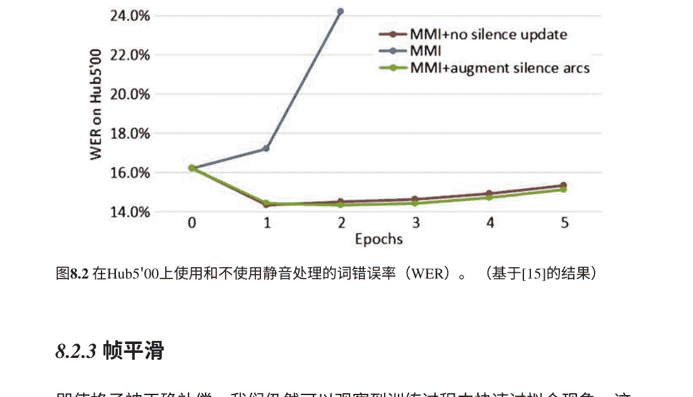

#### 8.2.3 帧平滑

即使格子被正确补偿，我们仍然可以观察到训练过程中快速过拟合现象，这可以通过序列训练准则的发散和仅从DNN得分计算的帧准确性来轻松识别：训练准则继续改善，而仅从DNN得分计算的帧准确性显著下降。虽然人们假设过拟合问题是由稀疏格子引起的（例如，即使是可以实际生成的最胖的格子也只参考了约3%的senones[15]），但我们认为这不是唯一的原因。过拟合问题也可能归因于序列在高维空间中而不是帧中。因此，从训练集中估计的后验分布很可能与测试集中的后验分布不同。通过使序列判别训练准则更接近帧判别训练准则，例如使用弱语言模型，可以缓解这个问题。通过使用一种称为帧平滑（F-smoothing）的技术，可以进一步缓解这个问题[15]，该技术不仅仅最小化序列判别训练准则，还最小化序列和帧准则的加权和。

$$J_{FS-SEQ}(\theta; \mathbb{S}) = (1-H)J_{CE}(\theta; \mathbb{S}) + HJ_{SEQ}(\theta; \mathbb{S}) \quad (8.17)$$

其中 $H$ 是一个经验性设置的平滑因子。已经证明，帧/序列比率为1:4（或 $H = 4/5$）到1:10（或 $H = 10/11$）通常是有效的。F平滑不仅减少了过拟合的可能性，还使训练过程对学习率的敏感性降低。F平滑受到I平滑[12]和类似的自适应正则化方法[17]的启发。请注意，常规的正则化技术如L1和L2正则化对此无效。

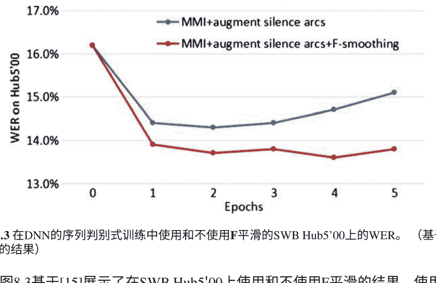

图8.3 在DNN的序列判别式训练中使用和不使用F平滑的SWB Hub5'00上的WER。（基于[15]的结果）

图8.3基于[15]展示了在SWB Hub5'00上使用和不使用F平滑的结果。使用F平滑后，过拟合训练集的可能性大大降低。总体而言，F平滑实现了0.6%的绝对或4%的相对词错误率降低。

#### 8.2.4 学习率调整

序列判别训练中使用的学习率应比帧交叉熵训练中使用的学习率小，原因有两个。首先，序列判别训练通常从已经训练良好的交叉熵训练模型开始，因此需要较小的更新。其次，序列判别训练更容易过拟合。使用较小的学习率可以更有效地控制收敛。实践中，人们发现使用与交叉熵训练最后阶段相似的学习率是有效的。例如，Vesely等人[16]报告称，每个utterance使用1e-4的学习率对(B)MMI和sMBR都效果良好，而Su等人[15]表明，在使用F平滑时，每帧使用1/128,000的学习率（或每256帧使用0.002的学习率）效果良好。如果使用Hessian-free [9]等算法，则可以消除选择良好学习率的要求。

#### 8.2.5 训练准则选择

关于训练准则有不同的观察结果。大多数结果似乎表明训练准则并不关键。例如，表8.2是从[16]中提取的，它表明在MMI、BMMI、MPE和sMBR方面，SWB Hub5'00和Hub5'01数据集上的WER非常接近，尽管sMBR稍微优于其他标准。由于MMI最容易理解和实现，如果您需要从头开始实现一个，建议使用MMI。

表8.2 MMI、BMMI、MPE和sMBR准则在Hub5'00和Hub5'01 SWB数据集上的词错误率（WER）比较。

| | Hub5'00 SWB (%) | Hub5'01 SWB (%) |
| :--- | :--- | :--- |
| GMM BMMI | 18.6 | 18.9 |
| DNN CE | 14.2 | 14.5 |
| DNN MMI | 12.9 | 13.3 |
| DNN BMMI | 12.9 | 13.2 |
| DNN MPE | 12.9 | 13.2 |
| DNN sMBR | 12.6 | 13.0 |

#### 8.2.6 其他考虑因素

序列鉴别性训练需要更多的计算资源。因此，速度较慢。例如，简单的CPU端实现可能使运行时间增加12倍，与帧CE训练相比。幸运的是，通过仔细的工程设计，可以通过在GPGPU上并行执行来实现显著的加速。为了加速声学得分计算，每个弧可以在单独的CUDA线程中处理。然而，格点级的前向-后向过程需要特殊处理，因为计算必须分解为顺序、无依赖的CUDA启动。在Su等人提供的一个示例中，对于一个7.5秒的格点，有106个无依赖的节点区域（=启动），211.846个弧和6974个节点，平均每个启动有1,999个弧（=线程）。此外，格点的前向/后向和误差信号累积需要对对数概率进行原子求和。这可以通过CUDA的原子比较和交换指令来模拟。为了减少目标操作数的冲突，发现将操作数随机排序是至关重要的。

通过使用并行预读线程预加载数据，并使用一组CPU计算机生成格子，可以进一步提高速度。在苏等人进行的运行时实验中[15]，结果显示与CE训练相比（不考虑格子生成），整体运行时间仅增加了约70%，即使在每帧近500个弧的大格子上也是如此。

### 8.3 噪声对比估计

在上述讨论中，我们假设传统的小批量随机梯度下降算法用于序列判别式训练。尽管仔细的工程处理可以加快训练速度（例如，如[15]中所述），但可能的速度提升受算法本质的限制。在本节中，我们介绍噪声对比估计(NCE)，这是一种先进的训练算法，可以进一步提高训练速度。NCE最初由Gutmann和Hyvarinen[3,4]提出，作为一种更可靠的估计非标准化统计模型的算法。后来，它成功应用于训练神经网络语言模型(LMs)[10]。

### 8.3.1 将概率密度估计问题转化为分类器设计问题

假设$p_d$是一个未知的概率密度函数（pdf），$\mathbf{X} = (\mathbf{x}_1, \ldots, \mathbf{x}_T)$一个随机向量$\mathbf{x} \in \mathbb{R}^N$从$p_b$中采样，其中$T$是样本大小。为了估计$p_b$，我们假设它属于一个参数化的函数族$p_m(\cdot; \theta)$，其中$\theta$是参数向量。换句话说，$p_d(\cdot) = p_m(\cdot; \theta^*)$对于某个参数$\theta^*$成立。因此，参数密度估计问题可以转化为从观测样本$\mathbf{X}$中找到$\theta^*$的问题。通常，我们要求对于任何$\theta$，

$$\int p_m(\mathbf{u}; \theta) d\mathbf{u} = 1$$

$$p_m(\mathbf{u}; \theta) \geq 0 \quad \forall \mathbf{u}$$

这样，$p_m(\cdot; \theta)$就是一个有效的概率密度函数。在这种情况下，我们说模型是归一化的，最大似然原则可以用来估计$\theta$。然而，在许多情况下，我们只需要对于某些$\theta$（例如，真实参数$\theta^*$），满足归一化约束即可。在这种情况下，我们说模型是非归一化的。由于我们假设$p_d$属于$p_m(\cdot; \theta)$，我们知道非归一化模型至少在参数$\theta^*$处积分为一。

根据[4]，我们用$p_m^0(\cdot; \alpha)$表示参数化为$\alpha$的非归一化模型。非归一化模型$p_m^0(\cdot; \alpha)$可以转换为归一化模型，即$p_m^0(\cdot; \alpha)/Z(\alpha)$，其中$Z(\alpha) =$

$$\int p_m^0(\mathbf{u}; \alpha) d\mathbf{u}$$

当$\mathbf{u}$的维度很高时，分区函数$Z$通常计算代价很高。由于对于每个$\alpha$都有一个对应的$Z(\alpha)$，我们可以定义一个归一化参数$c = -\ln Z(\alpha)$，并表示归一化模型的似然性为

$$\ln p_m(\cdot; \theta) = \ln p_m^0(\cdot; \alpha) + c$$

其中参数$\theta = (\alpha, c)$。请注意，在$\theta^*$处，我们有$\theta^* = (\alpha^*, 0)$。

NCE的基本思想是通过描述观察样本 $\mathbf{X}$ 相对于某个参考独立同分布样本 $\mathbf{Y} = (\mathbf{y}_1, ..., \mathbf{y}_T)$ 的属性，将密度估计问题转化为一个二分类问题。中采样得到的随机变量 $\mathbf{y} \in \mathbb{R}^N$ 的相对描述形式是使用逻辑回归，一种流行的二分类器，提供比率 $p_d/p_n$的形式。在[4]中，Gutmann和Hyvärinen提出使用逻辑回归来提供相对描述。

让我们构建一个统一的数据集 $\mathbf{U} = \mathbf{X} \cup \mathbf{Y}$ 并为每个数据点 $\mathbf{u}_t$ 分配一个二进制类别标签

$$C_t = \begin{cases} 1 & \text{如果 } \mathbf{u}_t \in \mathbf{X} \\ 0 & \text{如果 } \mathbf{u}_t \in \mathbf{Y} \end{cases} \quad (8.22)$$

请注意先验概率为

$$P(C = 1) = \frac{T_d}{T_d + T_n}, \quad (8.23)$$

$$P(C = 0) = \frac{T_n}{T_d + T_n} \quad (8.24)$$

类条件概率密度为

$$p(\mathbf{u}|C = 1) = p_m(\mathbf{u}; \vartheta), \quad (8.25)$$

$$p(\mathbf{u}|C = 0) = p_n(\mathbf{u}) \quad (8.26)$$

因此，类别的后验概率为

$$h (\mathbf{u}; \vartheta) \triangleq P(C = 1|\mathbf{u}; \vartheta) = \frac{p_m(\mathbf{u}; \vartheta)}{p_m(\mathbf{u}; \vartheta) + \nu p_n(\mathbf{u})}, \quad (8.27)$$

$$P(C = 0|\mathbf{u}; \vartheta) = 1 - h (\mathbf{u}; \vartheta) = \frac{\nu p_n(\mathbf{u})}{p_m(\mathbf{u}; \vartheta) + \nu p_n(\mathbf{u})}, \quad (8.28)$$

其中

$$\nu \triangleq \frac{P(C = 0)}{P(C = 1)} = T_n / T_d. \quad (8.29)$$

如果我们进一步定义 $G(\cdot;\vartheta)$ 为 $p_m(\cdot;\vartheta)$ 和 $p_n$ 之间的对数比，

$$G(\mathbf{u}; \vartheta) \triangleq \ln p_m(\mathbf{u}; \vartheta) - \ln p_n(\mathbf{u}), \quad (8.30)$$

$h(\mathbf{u};\vartheta)$ 可以写成

$$h(\mathbf{u}; \vartheta) = \frac{1}{1 + \nu \frac{p_n(\mathbf{u})}{p_m(\mathbf{u}; \vartheta)}} = \sigma_{\nu}(G(\mathbf{u}; \vartheta)), \quad (8.31)$$## 8.3噪声对比估计

$$\sigma_{\nu}(u)=\frac{1}{1+\nu \exp (-u)}$$ (8.32)

是由 $\nu$ 参数化的逻辑函数。如果我们假设类别标签 $C_t$ 是独立的，并且遵循伯努利分布，则条件对数似然（或负交叉熵）为

$$\begin{aligned}(\vartheta)&=\sum_{t=1}^{T_d+T_n} C_t \ln P(C_t=1|\mathbf{u}_t;\vartheta) + (1-C_t)P(C_t=0|\mathbf{u}_t;\vartheta) \\ &=\sum_{t=1}^{T_d} \ln [h(\mathbf{x}_t;\vartheta)] + \sum_{t=1}^{T_n} \ln [1-h(\mathbf{y}_t;\vartheta)]\end{aligned}$$ (8.33)

通过优化 $(\vartheta)$ 相对于 $\vartheta$，我们得到了 $p_d$ 的估计。换句话说，密度估计，这是一个无监督学习问题，现在被转化为一个两类有监督分类器设计问题，正如Hastie等人在[5]中首次指出的那样。

#### 8.3.2 扩展到非归一化模型

Gutmann和Hyvarinen在[4]中进一步将上述论证扩展到非归一化模型。他们定义了准则

$$\begin{aligned}J_T(\vartheta)&=\frac{1}{T_d}\left\{\sum_{t=1}^{T_d} \ln [h(\mathbf{x}_t;\vartheta)] + \sum_{t=1}^{T_n} \ln [1-h(\mathbf{y}_t;\vartheta)]\right\}\\ &=\frac{1}{T_d}\sum_{t=1}^{T_d} \ln [h(\mathbf{x}_t;\vartheta)] + \nu\frac{1}{T_n}\sum_{t=1}^{T_n} \ln [1-h(\mathbf{y}_t;\vartheta)]\end{aligned}$$ (8.34)

寻找最佳的 $\vartheta$ 来估计 $p_{d}$。很明显，改善 $J_T(\vartheta)$ 意味着两类分类器可以更准确地区分观测数据和参考数据。

当 $T_d$ 增加并且固定 $\nu$ 时，$T_n=\nu T_d$ 也增加，$J_T(\vartheta)$ 以概率收敛到

$$J(\vartheta)=\mathbb{E}\{\ln [h(\mathbf{x}_t;\vartheta)]\}+\nu\mathbb{E}\{\ln [1-h(\mathbf{y}_t;\vartheta)]\}.$$ (8.35)

通过定义 \(f_m(.) = \ln p_m(; \vartheta)\)并将准则重新写成\(f_m\)的函数，可以证明[4]，

- \(J (\vartheta)\)在 \(p_m(; \vartheta) = p_d\)时达到最大值。如果选择噪声密度 \(p_n\)使其在 \(p_d\)非零时也非零，则这是唯一的极值点。更重要的是，最大化是在没有任何归一化约束的情况下进行的\(p_m(; \vartheta)\)。
- \(\vartheta_T\)，使 \(J_T (\vartheta)\)（全局）最大化的\(\vartheta\)值收敛到 \(\vartheta^*\)，如果满足以下三个条件： a) \(p_n\)在 \(p_d\)非零时也非零； b) \(J_T\)以概率收敛到 \(J\)； c) 对于大样本量，目标函数 \(J_T\)在真实值 \(\vartheta^*\)周围足够尖锐。
- \(\sqrt{T_d} (\hat{\vartheta}_T - \vartheta^*)\)具有零均值和有界协方差矩阵的渐近正态分布。
- 对于 \(\nu \to \infty\)，与选择的 \(p_n\)无关。

基于这些特性，建议选择具有可用的\(\ln p_n\)的解析表达式的噪声，可以轻松采样，并且在某些方面与数据相似。还建议噪声样本大小尽可能大。示例噪声分布包括高斯分布和均匀分布。

### 8.3.3在DNN训练中应用NCE

在使用交叉熵准则进行声学模型训练时，我们估计给定观测值\(\mathbf{o}\)的音素\(s\)的分布 \(P (s | \mathbf{o}; \vartheta)\)。对于每个带有标签 \(s\)的观测值\(\mathbf{o}\)，我们生成 \(\nu\)个噪声标签 \(y_1, . . . , y_{\nu}\)并进行优化。

$$J_T (\mathbf{o}, \vartheta) = \ln [h(s|\mathbf{o}; \vartheta)] + \sum_{t=1}^{\nu} \ln [1 - h(y_t|\mathbf{o}; \vartheta)]. \tag{8.36}$$

由于

$$\begin{aligned} \frac{\partial}{\partial \vartheta} \ln [h(s|\mathbf{o}; \vartheta)] &= \frac{h(s|\mathbf{o}; \vartheta)[1 - h(s|\mathbf{o}; \vartheta)]}{h(s|\mathbf{o}; \vartheta)} \frac{\partial}{\partial \vartheta} \ln P_m (s|\mathbf{o}; \vartheta) \\ &= [1 - h(s|\mathbf{o}; \vartheta)] \frac{\partial}{\partial \vartheta} \ln P_m (s|\mathbf{o}; \vartheta) \\ &= \frac{\nu P_n (s|\mathbf{o})}{P_m (s|\mathbf{o}; \vartheta) + \nu P_n (s|\mathbf{o})} \frac{\partial}{\partial \vartheta} \ln P_m (s|\mathbf{o}; \vartheta) \tag{8.37} \end{aligned}$$

和

$$\frac{\partial}{\partial \vartheta} \ln [1 - h(y_t|\mathbf{o}; \vartheta)] = - \frac{h(y_t|\mathbf{o}; \vartheta)[1 - h(y_t|\mathbf{o}; \vartheta)]}{1 - h(y_t|\mathbf{o}; \vartheta)} \frac{\partial}{\partial \vartheta} \ln P_m (y_t|\mathbf{o}; \vartheta)$$

$$= -h(y_t|\mathbf{o};\vartheta)\frac{\partial}{\partial\vartheta} \ln P_m(y_t|\mathbf{o};\vartheta)$$
$$=-\frac{P_m(y_t|\mathbf{o};\vartheta)}{P_m(y_t|\mathbf{o};\vartheta)+\nu P_n(y_t|\mathbf{o})} \frac{\partial}{\partial\vartheta} \ln P_m(y_t|\mathbf{o};\vartheta)$$ (8.38)

我们得到

$$\frac{\partial}{\partial\vartheta}J_T(\mathbf{o},\vartheta)=\frac{\nu P_n(s|\mathbf{o})}{P_m(s|\mathbf{o};\vartheta)+\nu P_n(s|\mathbf{o})} \frac{\partial}{\partial\vartheta} \ln P_m(s|\mathbf{o};\vartheta)$$
$$-\sum_{t=1}^{\nu}\left[\frac{P_m(y_t|\mathbf{o};\vartheta)}{P_m(y_t|\mathbf{o};\vartheta)+\nu P_n(y_t|\mathbf{o})} \frac{\partial}{\partial\vartheta} \ln P_m(y_t|\mathbf{o};\vartheta)\right].$$ (8.39)

请注意权重 $\frac{P_m(y_t|\mathbf{o};\vartheta)}{P_m(y_t|\mathbf{o};\vartheta)+\nu P_n(y_t|\mathbf{o})}$ 始终在0和1之间，因此NCE学习非常稳定。此外，由于 $P_m(s|\mathbf{o};\vartheta)$ 是一个非标准化模型，可以高效地计算梯度 $\frac{\partial}{\partial\vartheta} \ln P_m(.|\mathbf{o};\vartheta)$。然而，在非标准化模型中，每个观测值 $\mathbf{o}$ 都有一个归一化因子 $c$ ，当AM训练集非常大时，这可能成为一个问题。幸运的是，实验证明，即使对所有观测值使用相同的 $c$ ，或者将 $c$ 始终设置为0 [4, 10]，性能几乎没有降低。由于通常不会增加太多计算量，并且通常有助于提高估计精度，建议使用共享的 $c$ 。

由于使用相同的DNN估计不同观测的条件概率分布，我们无法独立学习这些分布。相反，我们定义了一个全局的NCE目标

$$J_T^G(\vartheta)=\sum_{t=1}^{T_d}J_T(\mathbf{o}_t,\vartheta).$$ (8.40)

上述推导可以很容易地扩展到序列判别训练。唯一的区别是，在序列判别训练中，类别数量明显多于帧级训练，因为每个标签序列被视为不同的类别。更具体地说，对于第$m$个话语，我们需要估计的分布是

$$\log P\left(\mathbf{w}^m|\mathbf{o}^m;\theta\right)=\log p\left(\mathbf{o}^m|\mathbf{s}^m;\theta\right)^\kappa P\left(\mathbf{w}^m\right)+c^m.$$ (8.41)

回想一下，在这里，$\mathbf{o}^m=\mathbf{o}_1^m,\ldots,\mathbf{o}_t^m,\ldots,\mathbf{o}^{mT}$ 和 $\mathbf{w}^m=\mathbf{w}_1^m,\ldots,\mathbf{w}_t^m,\ldots,\mathbf{w}_{N_m}^m$ 是观测序列和正确的单词转录的第$m$个话语，分别是 $s m=\mathbf{s}_1^m,\ldots,\mathbf{s}_t^m,\ldots,\mathbf{s}_{T_m}^m$ 是对应的状态序列的序列 $\mathbf{w}^m$, $\kappa$ 是声学缩放因子，$T_m$ 是话语中的总帧数，而 $N m$ 是相同话语的转录中的总单词数。在序列判别式训练中，我们可以使用所有可能的状态序列或者格子中的序列作为噪声分布的均匀分布。

## 8 深度神经网络序列判别训练

## 参考文献

1.  Bahl, L., Brown, P., De Souza, P., Mercer, R.: 语音识别中隐马尔可夫模型参数的最大互信息估计。 在：国际会议论文集声学、语音和信号处理（ICASSP），第11卷，第49-52页（1986年）
2.  Goel, V., Byrne, W.J.: 最小贝叶斯风险自动语音识别。计算机语音语言 14（2），115-135页（2000年）
3.  Gutmann, M., Hyvärinen, A.: 噪声对比估计：一种新的非标准化统计模型估计原则。 在：人工智能和统计国际会议，第297-304页（2010年）
4.  Gutmann, M.U., Hyvärinen, A.: 噪声对比估计非标准化统计模型，及其在自然图像统计中的应用。机器学习研究杂志，第13卷，307-361页（2012年）
5.  Hastie, T., Tibshirani, R., Friedman, J., Hastie, T., Friedman, J., Tibshirani, R.: 统计学习的要素，第2卷。 Springer，海德堡（2009年）
6.  Hennebert, J., Ris, C., Bourlard, H., Renals, S., Morgan, N.: 全局后验概率的估计和混合HMM/ANN系统的前向-后向训练（1997年）
7.  Kapadia, S., Valtchev, V., Young, S.: MMI训练在TIMIT数据库上的连续音素识别中的应用。 在：国际声学、语音和信号处理会议(ICASSP)论文集，卷2，第491-494页(1993)
8.  Kingsbury, B.: 基于格的序列分类准则优化用于神经网络声学建模。 在：国际声学、语音和信号处理会议(ICASSP)论文集，第3761-3764页(2009)
9.  Kingsbury, B., Sainath, T.N., Soltau, H.: 使用分布式无Hessian优化的可扩展最小贝叶斯风险训练深度神经网络声学模型。 在：国际语音通信协会年会(INTERSPEECH)论文集(2012)
10. Mnih, A., Teh, Y.W.: 一种快速简单的训练神经概率语言模型的算法。 arXiv预印本 arXiv:1206.6426 (2012)
11. Mohamed, A.-R., Yu, D., Deng, L.: 对语音识别的深度置信网络进行全序列训练的研究。 在：国际语音交流协会年会论文集 (INTERSPEECH)，第2846-2849页 (2010)
12. Povey, D.: 大词汇语音识别的判别式训练。剑桥大学工程学院博士论文（2003）
13. Povey, D., Kanevsky, D., Kingsbury, B., Ramabhadran, B., Saon, G., Visweswariah, K.: 模型和特征空间判别式训练的提升MMI。 在：国际声学、语音和信号处理会议论文集 (ICASSP)，第4057-4060页 (2008)
14. Povey, D., Woodland, P.C.: 最小电话错误和I平滑以改进判别式训练。 在：国际声学、语音和信号处理会议 (ICASSP)，第1卷，第I-105页 (2002)
15. 苏，H.，李，G.，于，D.，塞德，F.： 用于对话式语音转录的上下文依赖深度网络的序列训练的错误反向传播。 在：国际声学、语音和信号处理会议(ICASSP)论文集(2013)
16. Veselý, K., Ghoshal, A., Burget, L., Povey, D.: 深度神经网络的序列判别训练。 在：国际语音通信年会(INTERSPEECH)论文集(2013)
17. 于，D.，姚，K.，苏，H.，李，G.，塞德，F.： KL散度正则化的深度神经网络适应，以改善大词汇语音识别。 在：国际声学、语音和信号处理会议(ICASSP)论文集，第7893-7897页(2013)

# 第四部分深度神经网络中的表示学习

# 第9章
## 深度神经网络中的特征表示学习

摘要 在本章中，我们展示了深度神经网络同时学习特征表示和分类器的能力。通过多层非线性处理，DNNs将原始输入特征转换为更不变和有区别性的表示，这样可以更好地通过对数线性模型进行分类。此外，DNNs学习了一系列特征的层次结构。较低层次的特征通常捕捉到局部模式。这些模式对原始特征的变化非常敏感。然而，较高层次的特征是建立在低层特征的基础上的，更加抽象和对原始特征的变化具有不变性。我们证明了学习到的高层特征对说话人和环境的变化具有鲁棒性。

### 9.1 特征表示和分类器的联合学习

为什么DNNs在语音识别中比传统的浅层模型（如高斯混合模型和支持向量机）表现得更好？我们认为这主要归功于DNNs能够同时学习复杂的特征表示和分类器。

在传统的浅层模型中，特征工程是系统成功的关键。从业者的主要工作是构建在特定学习算法和特定任务上表现良好的特征。系统性能的改进通常来自于具有丰富领域知识的人发现更好的特征。典型的例子包括广泛应用于图像分类的尺度不变特征变换（SIFT）[17]和用于语音识别任务的梅尔频率倒谱系数（MFCC）[2]。

然而，深度模型（如DNNs）不需要手工设计的高级特征，而是自动学习特征表示和分类器。图9.1描述了典型深度模型的一般框架，其中可学习的表示和可学习的分类器都是模型的一部分。


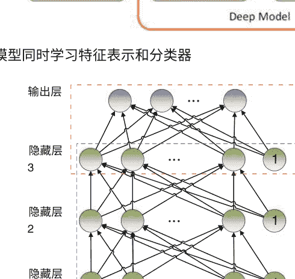

在DNN中，所有隐藏层的组合可以被视为一个特征学习模块，如图9.2所示。尽管每个隐藏层通常只使用简单的非线性变换，但这些简单的非线性变换的组合会导致非常复杂的非线性变换。最后一层，即softmax层，本质上是一个简单的对数线性分类器，有时也被称为最大熵（MaxEnt）[25]模型。因此，在DNN中，后验概率的估计 \(p(y = s|\mathbf{o})\)可以被视为一个两步非随机过程：第一步，观察向量 \(\mathbf{o}\)通过 \(L-1\)层非线性变换转换为特征向量 \(\mathbf{v}^{L-1}\)。在第二步中，给定转换后的特征 \(\mathbf{v}^{L-1}\)，估计后验概率 \(p(y = s|\mathbf{o})\)使用对数线性模型。如果我们将前 \(L-1\)层视为固定的，学习softmax层中的参数等效于在特征 \(\mathbf{v}^{L-1}\)上训练MaxEnt模型。在传统的MaxEnt模型中，特征是手动设计的，例如在大多数自然语言处理任务[25]和语音识别任务[6, 31]中。

对于人们可以轻易检查并知道要使用哪种特征的任务，手动特征构建效果良好，但对于原始特征高度可变的任务则不适用。然而，在深度神经网络中，特征由前 \(L-1\)层定义，并与数据一起通过最大熵模型进行联合学习。这不仅消除了手动特征构建的繁琐和错误过程，还具有提取不变性和可区分性特征的潜力，这些特征无法通过手动构建的方式在多层非线性变换中实现。

通过许多层非线性变换，可以提取出无法手动构建的不变性和可区分性特征。

### 9.2 特征层次结构

深度神经网络不仅学习适合分类器的特征表示，还学习特征的层次结构。由于每个隐藏层都是输入特征的非线性变换，因此可以将其视为原始输入特征的新表示。靠近输入层的隐藏层表示低层特征。靠近softmax层的隐藏层表示高层特征。低层特征通常捕捉局部模式。这些模式对输入特征的变化非常敏感。然而，高层特征是建立在低层特征之上的，更抽象且对输入特征变化具有不变性。图9.3，摘自[34]，展示了从ImageNet数据集[9]中学习到的特征层次结构。

正如我们所看到的，高层特征更加抽象和不变。这个特性也可以在图9.4中观察到，在每一层中饱和神经元的百分比被显示出来，饱和神经元被定义为激活值要么大于0.99，要么小于0.01。较低层通常具有较小的饱和神经元百分比，而接近softmax层的较高层具有较大的饱和神经元百分比。需要注意的是，大多数饱和神经元是非激活的（激活值小于0.01），这表明相关特征是稀疏的。这是因为训练标签对于正确类别为1，对于其他所有类别为0，是稀疏的。

在这个特征层次结构中，较高层的特征更具不变性和区分性。这是因为许多层的简单非线性处理可以生成复杂的非线性变换。为了证明这个非线性变换对输入特征的小变化是鲁棒的，让我们假设层 l 的输出，或者等价地说层 l +1的输入从 v^l 变为 v^l + δ^l，其中 δ^l 是一个小的变化。这个变化将导致第ℓ层的输出，或者等价地说，第ℓ层的输入发生变化

$$\delta^{\ell+1} = \sigma(\mathbf{z}^{\ell+1}(\mathbf{v}^\ell + \delta^\ell)) - \sigma(\mathbf{z}^{\ell+1}(\mathbf{v}^\ell)) \approx \text{diag}\left( \sigma'(\mathbf{z}^{\ell+1}(\mathbf{v}^\ell)) \right) (\mathbf{W}^{\ell+1})^T \delta^\ell$$

其中

$$\mathbf{z}^{\ell+1}(\mathbf{v}^\ell) = \mathbf{W}^{\ell+1}\mathbf{v}^\ell + \mathbf{b}^{\ell+1}$$

激活函数为σ(z)，是sigmoid激活函数。变化的范数\delta^{\ell+1}为

$$\|\delta^{\ell+1}\| \approx \|\text{diag}\left( \sigma'(\mathbf{z}^{\ell+1}(\mathbf{v}^\ell)) \right) (\mathbf{W}^{\ell+1})^T \delta^\ell\| \leq \|\text{diag}\left( \sigma'(\mathbf{z}^{\ell+1}(\mathbf{v}^\ell)) \right) (\mathbf{W}^{\ell+1})^T\| \|\delta^\ell\| = \|\text{diag}(\mathbf{v}^{\ell+1} \bullet (1 - \mathbf{v}^{\ell+1})) (\mathbf{W}^{\ell+1})^T\| \|\delta^\ell\|$$

其中\bullet表示逐元素乘积。

在DNN中，如果隐藏层的大小较大，大部分权重的大小通常非常小，如图9.5所示。例如，在使用30小时SWB数据训练的6×2kDNN中，除了输入层以外的所有层中，98%的权重的大小都小于0.5。

当每个元素在\mathbf{v}^{\ell+1} \bullet (1 - \mathbf{v}^{\ell+1})小于或等于0.25时，实际值通常要小得多。这是因为大部分隐藏神经元是不活跃的，如图9.4所示。因此，在6小时的SWB开发集中，方程9.3中的平均范数\|\text{diag}(\mathbf{v}^{\ell+1} \bullet (1 - \mathbf{v}^{\ell+1})) (\mathbf{W}^{\ell+1})^T\|_2要小于所有层中的一个，如图9.6所示。由于所有隐藏层的值都在(0,1)的相同范围内，这表明当输入发生微小扰动时，扰动会在每个更高的层中缩小。换句话说，由更高层生成的特征对变化更具不变性，而不是那些表示的特征由底层产生。请注意，相同开发集上的最大范数大于1，如图9.6所示。这是必要的，因为需要在类别边界周围扩大差异以具有区分能力。这些大范数情况也会导致目标函数上的不连续点，这表明几乎总是可以找到输入，从中微小偏差会改变DNN预测的标签[29]。

一般来说，特征在分层深度模型中按阶段进行处理，如图9.7所示。每个阶段可以由几个可选步骤组成：归一化、滤波器组处理、非线性处理和池化[10]。典型的归一化技术包括平均值去除、局部对比度归一化和方差归一化，其中一些已经在第4.3.1节中讨论过。滤波器组处理的目的是将特征投影到一个更高维度的空间中，从而更容易进行分类。这可以通过维度扩展或特征投影来实现。非线性处理步骤在深度模型中非常关键，因为线性变换的组合只是另一种线性变换。常用的非线性函数包括稀疏化、饱和、侧抑制、双曲正切、Sigmoid和赢者通吃。池化步骤的目的是提取不变特征并减少维度，涉及聚合和聚类。

### 9.3 使用任意输入特征的灵活性

请注意，GMM通常要求输入特征的每个维度在统计上是独立的，以便可以使用对角协方差矩阵来减少模型中的参数数量。然而，DNN是判别模型，没有类似的约束。

在语音识别应用中，MFCC和感知线性预测（PLP）特征是两种最常用的原始特征。然而，这两种特征都是从Mel-scaled log filter-bank特征（MS-LFB）派生而来的。尽管这些特征比Mel-scaled log filter-bank特征更具不变性，但在手动特征转换过程中可能会丢失一些对分类有用的信息。一个自然的想法是直接将MS-LFB特征作为DNN的输入[18]。表9.1摘自[16]，比较了在语音搜索任务中使用不同原始输入特征的判别训练的CD-GMM-HMM基线和CD-DNN-HMM。13维MFCC特征是从24维Mel-scale log filter-bank特征中提取的，使用截断离散余弦变换（DCT）。所有输入特征都进行了均值归一化，并具有动态特征。MFCC特征具有高达三阶导数，而log filter-bank特征具有高达二阶导数。HLDA [13]变换仅应用于CD-GMM-HMM系统的MFCC特征。从这个表中，我们可以观察到从MFCC特征切换到24维Mel-scale log filter-bank特征会导致相对词错误率下降4.7%。

**表格 9.1 不同原始输入特征与DNN的比较**

| 模型和特征的组合                 | WER (相对WERR)  |
| :------------------------------- | :-------------- |
| CD-GMM-HMM (MFCC, fMPE+BMMI)     | 34.66 % (基准)  |
| CD-DNN-HMM (MFCC)                | 31.63 % (-8.7 %) |
| CD-DNN-HMM (24 MS-LFB)           | 30.11 % (-13.1 %) |
| CD-DNN-HMM (29 MS-LFB)           | 30.11 % (-13.1 %) |
| CD-DNN-HMM (40 MS-LFB)           | 29.86 % (-13.8 %) |

所有输入特征均进行了均值归一化，并具有动态特征。相对词错误率 (WER) 在括号中表示减少。(摘自Li等人[16])

词错误率(WER)的减少。将滤波器组数从24增加到40只能提供不到1%的相对WER减少。总体而言，CD-DNN-HMM优于使用fMPE+BMMI训练的CD-GMM-HMM，相对WER减少了13.8%。请注意，这是通过比建立CD-GMM-HMM基准所使用的更简单的训练过程实现的。表中显示的所有DNN模型均使用帧级交叉熵准则进行训练。通过使用第8章讨论的序列判别训练，可以进一步改进。

如报告[26]中所述，甚至滤波器组也可以通过DNN自动学习，其中FFT频谱被用作DNN的输入。为了抑制滤波器组输出的动态范围，对数函数被用作滤波器组层的激活函数。此外，在将滤波器组层的激活值发送到下一层之前，应用了图9.7中描述的归一化步骤。据[26]报道，通过直接学习滤波器组参数，相对于使用手动设计的Mel-scale滤波器组的基准DNN，可以实现5%的相对识别错误率降低。

### 9.4 特征的鲁棒性

一个好的特征的关键特性是其对变化的鲁棒性。语音信号中存在两种主要的变化类型：说话人变化和环境变化。在传统的GMM-HMM系统中，需要明确处理这两种类型的变化。

### 9.4.1 鲁棒性对说话人变异的处理

为了处理说话人的变异性，在GMM-HMM系统中，声道长度归一化（VTLN）[1]和特征空间最大似然线性回归（fMLLR）[5]是至关重要的。

VTLN通过扭曲滤波器组分析的频率轴，以考虑到发音道谐振的位置与说话者的发音道长度大致单调变化的事实。这在训练和测试中都会进行，使用20个量化的扭曲因子从0.8到1.18。在训练过程中，可以使用期望最大化（EM）算法来找到最佳的扭曲因子，该算法会根据当前模型重复选择最佳因子，然后使用所选因子更新模型。在测试中，系统可以通过对所有因子运行识别，并使用最高的累积对数概率来选择最佳因子。

另一方面，fMLLR对特征向量应用仿射变换，以使变换后的特征更好地匹配模型。通常，它是通过首先使用原始特征生成识别结果，然后使用变换后的特征重新识别语音来应用于测试语音的。这个过程可以迭代多次。对于GMM-HMMs，fMLLR变换被估计为最大化给定模型的自适应数据的似然度。对于DNNs，它们被优化为最大化交叉熵（使用反向传播），这是一种判别准则。因此，这个过程被称为特征空间判别线性回归（fDLR）[27]。变换可以应用于DNN中的每个输入向量（通常是多个帧特征的串联）或者应用于单个帧之前的串联。

表9.2，从[27]中提取，比较了VTLN和fMLLR/fDLR在GMMs、浅层多层感知器(MLPs)和DNNs上的有效性。可以观察到，VTLN和fMLLR对于减少GMMs的说话人变异性都很重要。事实上，它们分别提供了9%和5%的相对错误率降低。这些技术对于浅层MLPs也很重要，相对词错误率分别降低了7%和4%。然而，这些技术对于DNN系统来说不太重要，仅相对于独立于说话人的基线DNN系统提供了2%的相对错误率降低。这一观察表明，与GMMs和浅层MLPs相比，DNNs对说话人变异性更具鲁棒性。

**表9.2 基于特征变换的说话人自适应技术与GMM-HMM、浅层和深度NN的比较**

| 自适应技术        | CD-GMM-HMM (40混合) | CD-MLP-HMM (1 × 2,048) | CD-DNN-HMM (7 × 2,048) |
| :---------------- | :------------------ | :--------------------- | :--------------------- |
| 说话人独立        | 23.6 %              | 24.2 %                 | 17.1 %                 |
| + VTLN            | 21.5 % (–9 %)       | 22.5 % (–7 %)          | 16.8 % (–2 %)          |
| + fMLLR/fDLR×4    | 20.4 % (–5 %)       | 21.5 % (–4 %)          | 16.4 % (–2 %)          |

Hub5’00-SWB的词错误率（WER）（相对变化在括号中）。（摘自Seide等人[27]）

### 9.4.2 对环境变化具有鲁棒性

同样，基于GMM的声学模型对环境不匹配非常敏感。为了解决这个问题，采用了几种技术，如向量泰勒级数(VTS)[12, 14, 15, 19]调整和最大似然线性回归(MLLR)[4]，用于归一化输入特征或调整模型参数的方法已经被开发出来。相比之下，前几节的分析表明DNN具有生成对训练数据中的环境变化具有鲁棒性的内部表示的能力。

在VTS适应等方法中，使用估计的噪声模型来根据定义了噪声如何破坏清晰语音的物理模型，来调整识别器的高斯参数。在对数频谱域中，清晰语音x，损坏的（或嘈杂的）语音y和噪声n之间的关系可以近似为

$$ y = x + \log(1 + \exp(n - x)) $$

在GMM中，这种非线性关系通常用一阶VTS来近似。然而，DNN具有多层非线性变换，可以直接建模任意非线性关系，包括方程9.4描述的关系。由于我们对从嘈杂的语音y和噪声n到清晰语音x的非线性映射感兴趣，我们可以将每个观测输入（嘈杂的语音）与信号中估计的噪声n_t_present进行增强。

$$ \mathbf{v}_t^0 = [y_{t-\tau}, \ldots, y_{t-1}, y_t, y_{t+1}, \ldots, y_{t+\tau}, \hat{n}_t] $$

其中，使用2τ+1帧噪声语音和1帧噪声估计作为网络的输入。这在训练和解码中都会进行，因此类似于无明确不匹配函数的噪声自适应训练（NAT）[11]。由于DNN会接收噪声估计，以便通过干净语音估计自动学习从噪声语音和噪声到音素标签的映射，因此这种技术被称为噪声感知训练（NaT）[28, 33]。

在Aurora 4语料库[20]上进行的实验清楚地显示了DNN对环境扭曲的鲁棒性，该语料库是基于华尔街日报（WSJO）语料库的一个5,000词汇任务。模型是使用来自83位发言人的7,137个utterances的16 kHz多条件训练集进行训练的。其中一半的话语是由高质量的近距离话筒录制的另一半是使用18种不同的次要话筒录制的。两个部分都包括干净的语音和被六种不同类型的噪声（街道交通、火车站、汽车、喧闹、餐厅、机场）干扰的语音在10-20 dB的信噪比范围内。评估是在由8位发言人组成的测试集上进行的，共有330个话语。这个测试集是由主要话筒和若干次要话筒录制的。然后这两个集合都被同样的六种干扰在信噪比为5到15 dB之间的训练集中使用噪声，共创建了14个测试集。这14个测试集可以根据失真类型分为4个子集：无失真（清晰语音）、仅添加噪声、仅信道失真和噪声+信道。请注意，噪声类型在训练集和测试集中是共同的，但数据的信噪比不同。

DNN使用24维对数梅尔滤波器组特征进行训练，并进行了utterance-level均值归一化。一阶和二阶导数特征被附加到静态特征向量中。输入层由一个11帧的上下文窗口形成，创建了一个792个输入神经元的输入层。DNN有7个隐藏层，每个隐藏层有2,048个神经元，softmax输出层有3,206个神经元，对应于基线HMM系统的senones。网络使用逐层生成预训练进行初始化，然后使用反向传播进行判别性训练。为了减少过拟合，使用了第4.3.4节中讨论的dropout [7]方法之一。

**表9.3 文献中几个GMM系统与 Aurora 4任务上的DNN系统的比较**

| 系统 | 失真 | | | | | 平均值 (%) |
| :--- | :---: | :---: | :---: | :---: | :---: | :---: |
| | 无 (干净) (%) | 噪音 (%) | 通道 (%) | 噪音+通道 (%) | |
| GMM基准 | 14.3 | 17.9 | 20.2 | 31.3 | 23.6 |
| MPE + NAT + VTS | 7.2 | 12.8 | 11.5 | 19.7 | 15.3 |
| NAT + 导数核 | 7.4 | 12.6 | 10.7 | 19.0 | 14.8 |
| NAT + 联合MLLR/VTS | 5.6 | 11.0 | 8.8 | 17.8 | 13.4 |
| DNN (7 × 2,048) | 5.6 | 8.8 | 8.9 | 20.0 | 13.4 |
| DNN + NaT + 丢弃 | 5.4 | 8.3 | 7.6 | 18.5 | 12.4 |

从[28, 33]总结

在表9.3中，总结自[28, 33]，DNN声学模型的性能与几个GMM系统进行了比较。第一个系统是基准的GMM-HMM系统，而其余系统代表了声学建模、噪声和说话人适应的最新技术。所有系统都使用了相同的训练集。

“MPE+NAT+VTS”系统结合了最小电话错误（MPE）的判别式训练[23]和使用VTS适应进行噪声自适应训练[3]。“NAT+Derivative Kernels”系统使用了多通道混合生成/判别分类器[24]。它首先使用自适应训练的HMM和VTS适应生成基于状态似然和其导数的特征。然后将这些特征输入到判别式对数线性模型中得到最终的假设。“NAT+Joint MLLR/VTS”系统使用了使用NAT训练的HMM，结合了VTS适应进行环境补偿和MLLR进行说话人适应[30]。表的最后两行显示了两个DNN-HMM系统的性能。“DNN (7 × 2 K)”系统只是直接应用了具有7个隐藏层的CD-DNN-HMM，使用2K个神经元。然而，它在除了“NAT+Joint MLLR/VTS”系统之外的所有系统中表现更好。最后，使用噪声感知训练和dropout的“DNN+NaT+dropout”系统具有最佳性能。此外，所有的DNN-HMM结果都是在第一次通过中获得的，而其他三个系统需要两次或更多次的识别来适应噪声、信道或说话人。这些结果清楚地表明了DNN对于噪声和信道不匹配的非期望变化具有固有的鲁棒性。

### 9.5 在所有条件下的鲁棒性

在第9.4节中报告的优越的鲁棒性结果似乎表明，与更清晰的语音相比，DNN对于嘈杂的语音提供了更高的错误率降低。然而，这是不正确的。事实上，这些结果只表明DNN系统对于说话人和环境扭曲比GMM系统更具鲁棒性。正如我们在第9.2节中讨论的，高层中的扰动缩小特性在所有条件下都适用。在本节中，我们使用[8]中的结果显示，DNN在不同噪声水平和说话速度上相对于GMM系统提供了类似的增益。

在[8]中，黄等人进行了一系列研究，比较了GMM和DNN在移动语音搜索（VS）和短信转写（SMD）数据集上的表现，这些数据集是通过数百万用户在不同声学环境中使用的真实应用程序收集的，这些用户具有不同的语音风格。选择这些数据集是因为它们几乎涵盖了所有关键的LVCSR声学模型挑战，并且每个数据集都有足够的数据量来确保统计学的显著性。在研究中，黄等人使用400小时的VS/SMD数据训练了一对GMM和DNN模型。GMM系统使用39维MFCC特征，包括高达三阶导数，是一个使用特征空间最小电话错误率（fMPE）[22]和增强MMI（bMMI）[21]准则训练的最先进模型。DNN系统使用29维对数滤波器组（LFB）特征（包括高达二阶导数），并且具有11帧的上下文窗口，使用交叉熵（CE）准则进行训练。

这两个模型共享相同的训练数据和决策树。在GMM中，使用相同的最大似然估计（MLE）GMM种子模型生成格子，并在DNN中使用相同的声学状态对齐。对于分析研究，从数据集中随机抽取了100小时的VS/SMD测试数据，并且大致上遵循相同的分布。

### 9.5.1 噪声水平下的鲁棒性

图9.8和9.9（来自[8]）分别比较了GMM-HMM和CD-DNN-HMM模型在不同信噪比（SNR）下对VS和SMD数据集的错误模式。从这些表中我们可以观察到，CD-DNN-HMM图9.8 在不同SNR水平下比较了GMM-HMM和CD-DNN-HMM在VS任务中的性能。实线是回归曲线。（图片来自Huang等人[8]，经ISCA许可使用。）

图9.9 在不同SNR水平下，GMM-HMM和CD-DNN-HMM在SMD任务中的性能比较。实线是回归曲线。（图片来自Huang等人[8]，经ISCA许可使用。）

在所有SNR水平上，包括清晰和非常嘈杂的语音，CD-DNN-HMM明显优于GMM-HMM。但更有趣的是，我们可以观察到，在VS和SMD数据集上，CD-DNN-HMM在不同SNR水平上几乎具有均匀的性能提升，超过了GMM-HMM。

我们可以通过计算每1 dB SNR下性能下降来衡量DNN的噪声鲁棒性。对于VS任务，每1 dB SNR下降导致0.40%的绝对（或2.2%的相对）WER增加，因为当SNR从40 dB降至0 dB时，WER从18%增加至34%。对于SMD任务，相同的1 dB SNR下降导致0.15%的绝对（或1.3%的相对）WER增加，因为在相同的SNR范围内，SMD的WER从12%增加至18%。这些之间对噪声水平的敏感性的定量差异可能是因为SMD的语言模型困惑度较低。 然而，相同的1 dB信噪比下，当使用GMM系统时，对于VS和SMD数据集，WER增加了0.6%（相对增加了2.6%）和0.20%（绝对增加了1.2%或相对增加了1.2%）。

这些结果表明，CD-DNN-HMM比GMM系统更具鲁棒性，平均每1 dB信噪比下的WER增加较小，并且在低信噪比范围内稍微更加鲁棒，这可以从与GMM系统相比更平坦的斜率得出结论。然而，这种差异非常小。 在正常范围内的噪声水平增加时，DNN的语音识别性能仍然会大幅下降，这是移动语音应用的一个重要研究领域。 这表明噪声鲁棒性仍然是一个重要的研究领域，需要探索诸如语音增强、噪声鲁棒的声学特征或其他多条件学习技术等技术，以弥合性能差距并进一步提高基于深度学习的声学模型的整体性能。

## 9.5.2 不同说话速率下的鲁棒性

说话速率变化是另一个众所周知的因素，会影响语音可懂性，从而影响语音识别准确性。 说话速率的变化可能是由于不同的说话者、说话模式和说话风格引起的。 说话速率变化可能导致语音识别准确性下降的几个原因。首先，它可能改变声学得分的动态范围，因为一个音素的AM得分是同一音素段中所有帧的总和。 其次，固定的帧速率、帧长度和上下文窗口大小可能无法捕捉快速或慢速语音中的动态特性，从而导致子优化建模。 第三，变化的说话速率可能导致轻微的共振峰偏移，这是由于人类声音仪器的限制。 最后，极快的语速可能导致共振峰目标丢失和音素删除。

图9.10和9.11最初出现在[8]中，分别说明了在VS和SMD数据集上以每秒音素数为单位测量的不同说话速率下的WER差异。 从这些图中，我们可以注意到CD-DNN-HMM系统在所有说话速率下都表现出色，几乎均匀地降低了WER。 与噪声鲁棒性情况不同，在VS和SMD数据集上观察到了U形曲线模式。 在VS数据集上，最佳WER在每秒10-12个音素时实现。 当说话速率偏离甜点，无论是加快还是减慢，相对WER增加30%。 在SMD数据集上，当说话速率偏离甜点30%时，相对WER增加15%。

为了弥补说话速度差异，需要开发额外的建模技术。

## 9.6 大幅度扭曲的泛化能力不足

在第9.2节中，我们已经证明输入中的小扰动会逐渐在更高层的内部表示中缩小。这种特性使得DNN系统对说话人和环境变化具有鲁棒性，如第9.4节所示。在第9.5节中，我们证明了这种特性适用于不同的信噪比水平和说话速度。在本节中，我们指出上述结果仅适用于围绕训练样本的小扰动。当测试样本与训练样本明显偏离时，DNN无法准确分类它们。换句话说，在训练过程中，DNN必须看到代表性变化的示例，以便推广到测试数据中的类似变化。这与其他机器学习模型没有什么不同。

这种行为可以通过混合带宽的ASR研究来证明。典型的语音识别器是在8 kHz录制的窄带语音信号或16 kHz录制的宽带语音信号上进行训练的。如果一个系统能够同时识别窄带和宽带语音，即混合带宽ASR，那将是有利的。最近在CD-DNN-HMM框架[16]上提出了这样一个系统，如图9.12所示。在这个混合带宽ASR系统中，DNN的输入是29个mel-scale对数滤波器组的输出，以及一个11帧上下文窗口内的动态特征。DNN有7个隐藏层，每个隐藏层有2,048个节点。输出层有1,803个神经元，对应于GMM系统确定的senones的数量。

29维滤波器组分为两部分：前22个滤波器跨越0-4 kHz，后7个滤波器跨越4-8 kHz，第一个滤波器的中心频率在更高的滤波器组中为4 kHz。当语音是宽带时，所有29个滤波器都有观测值。然而，当语音是窄带时，高频信息没有被捕捉到，所以最后7个滤波器被设置为0。

在一个移动语音搜索（VS）语料库上进行了实验。这个任务是在智能手机上通过语音进行的互联网搜索查询[32]。有两个训练集，VS-1和VS-2，分别包含72小时和197小时的宽带音频数据。这些数据集是在不同的年份收集的。测试集称为VS-T，包含9,562个话语中的26,757个单词。窄带训练和测试数据是通过对宽带数据进行降采样获得的。

表9.4，从[16]中提取，总结了在宽带和窄带测试集上使用DNN进行训练时的WER，包括使用和不使用窄带语音。从这个表中，我们可以观察到，如果所有的训练数据都是宽带的，DNN在宽带测试集上表现良好（27.5% WER），但在窄带测试集上表现非常差。窄带测试集（53.5% WER）。然而，如果我们将VS-2转换为窄带语音，并使用混合带宽数据（第二行）训练相同的DNN，DNN在宽带和窄带语音上表现非常好。为了理解这两种情况之间的差异，我们可以测量欧几里得距离

$$d_l(x_{wb}, x_{nb}) = \sqrt{\sum_{j=1}^{N^\ell} (v_j^\ell(x_{wb}) - v_j^\ell(x_{nb}))^2} \quad (9.6)$$

在每一层的激活向量之间，宽带和窄带输入特征对之间的差异，$v^\ell(x_{wb})$ 和 $v^\ell(x_{nb})$，其中隐藏单元作为宽带特征的函数，$x_{wb}$，或窄带特征，$x_{nb}$。对于顶层，其输出是senone后验概率，我们计算KL散度在nats中的差异，$p(s_j|x_{wb})$ 和 $p(s_j|x_{nb})$。

$$d_y(x_{wb}, x_{nb}) = \sum_{j=1}^{N^L} p(s_j|x_{wb}) \log \frac{p(s_j|x_{wb})}{p(s_j|x_{nb})} \quad (9.7)$$

其中 $N^L$ 是senones的数量，而 $s_j$ 是senone id。表9.5，提取自[16]，显示了在仅使用宽带语音训练的DNN和仅使用混合带宽语音训练的DNN的测试集中随机抽样的40,000帧中的统计数据。

从表9.5中，我们可以观察到数据混合DNN中的平均距离始终小于仅使用宽带语音训练的DNN中的距离。这表明通过使用混合带宽的训练数据，DNN学习将宽带和窄带输入特征的差异视为不相关的变化。这些变化在多层非线性变换后被抑制。

因此，最终的表示对这种变化更具不变性，但仍然能够区分不同的类别标签。这种行为在输出层更加明显，因为混合带宽DNN中配对输出之间的KL散度仅为0.22 nats，远小于宽带DNN中观察到的2.03 nats。

## 表9.4 宽带（16 k）和窄带（8 k）测试集上的词错误率（WER），包括使用和不使用窄带训练数据

| 训练数据 | 16 kHz VS-T (%) | 8 kHz VS-T (%) |
| :--- | :---: | :---: |
| 16 kHz VS-1 + 16 kHz VS-2 | 27.5 | 53.5 |
| 16 kHz VS-1 + 8 kHz VS-2 | 28.3 | 29.3 |

## 表9.5 在每个隐藏层（L1-L7）的激活向量和在softmax层的后验概率之间的KL散度（nats）以及窄带（8 kHz）和宽带（16 kHz）输入特征的欧氏距离，使用宽带DNN或混合带宽DNN测量

| 层 | 距离类型 | 宽带DNN | 混合带宽DNN |
| :---: | :--- | :---: | :---: |
| 1 | 欧氏距离 | 13.28 | 7.32 |
| 2 | | 10.38 | 5.39 |
| 3 | | 8.04 | 4.49 |
| 4 | | 8.53 | 4.74 |
| 5 | | 9.01 | 5.39 |
| 6 | | 8.46 | 4.75 |
| 7 | | 5.27 | 3.12 |
| 输出 | KL散度 | 2.03 | 0.22 |

表格提取自Li等人[16]和Yu等人[33]

## 参考文献

- 1. Andreou, A., Kamm, T., Cohen, J.: 声道归一化实验。在: CAIP Workshop: Frontiers in Speech Recognition II会议论文集 (1994)
- 2. Davis, S., Mermelstein, P.: 连续语音句子中单音节词识别参数表示的比较。IEEE Trans. Acoust., Speech Signal Process.28(4), 357–366 (1980)
- 3. Flego, F., Gales, M.J.: 基于VTS和JUD的判别自适应训练。在: IEEE Workshop on Automatic Speech Recognition and Understanding (ASRU)会议论文集, pp. 170–175 (2009)
- 4. Gales, M.J., Woodland, P.: 在mlr框架内的均值和方差自适应。计算机语言与语音 10(4), 249-264 (1996)
- 5. Gales, M.J.: 基于HMM的语音识别的最大似然线性变换。计算机语言与语音 12(2), 75-98 (1998)
- 6. Gunawardana, A., Mahajan, M., Acero, A., Platt, J.C.: 用于电话分类的隐藏条件随机场。在国际语音通信协会年会论文集中的论文, 第1117-1120页 (2005)
- 7. Hinton, G.E., Srivastava, N., Krizhevsky, A., Sutskever, I., Salakhutdinov, R.R.: 通过防止特征检测器的共适应来改进神经网络。arXiv预印本arXiv:1207.0580 (2012)
- 8. Huang, Y., Yu, D., Liu, C., Gong, Y.: 高斯混合和上下文相关深度神经网络隐马尔可夫模型的比较分析研究。在: 国际语音通信协会年会论文集 (INTERSPEECH) (2014)
- 9. Imagenet. http://www.image-net.org/
- 10. Jarrett, K., Kavukcuoglu, K., Ranzato, M., LeCun, Y.: 目标识别的最佳多阶段架构是什么? 在: IEEE国际计算机视觉会议论文集 (ICCV), 第2146-2153页 (2009)
- 11. Kalinli, O., Seltzer, M.L., Droppo, J., Acero, A.: 用于鲁棒自动语音识别的噪声自适应训练。IEEE Trans. Audio, Speech Lang. Process. 18 (8), 1889-1901 (2010)
- 12. Kim, D.Y., Kwan Un, C., Kim, N.S.: 在嘈杂环境中使用一阶矢量泰勒级数的语音识别。语音通信。24 (1), 39-49 (1998)
- 13. Kumar, N., Andreou, A.G.: 异方差判别分析和降阶HMMs以改善语音识别。语音通信。26(4), 283–297 (1998)
- 14. Li, J., Deng, L., Yu, D., Gong, Y., Acero, A.: 通过向量泰勒级数联合补偿加性和卷积失真的高性能HMM自适应。 在：IEEE自动语音识别和理解（ASRU）研讨会论文集，pp. 65–70（2007）
- 15. Li, J., Deng, L., Yu, D., Gong, Y., Acero, A.: 使用相位敏感声学失真模型进行环境鲁棒语音识别的HMM自适应。 在：国际声学、语音和信号处理会议（ICASSP）论文集，pp .4069–4072(2008)
- 16. Li, J., Yu, D., Huang, J.T., Gong, Y.: 使用混合带宽训练数据在CD-DNN-HMM中改进宽带语音识别。 在：IEEE口语语言技术研讨会（SLT）论文集，第131-136页（2012年）
- 17. Lowe, D.G.: 基于局部尺度不变特征的物体识别。 在：第七届IEEE国际计算机视觉会议论文集，第2卷，IEEE，第1150-1157页。（1999）
- 18. Mohamed, A.R., Hinton, G., Penn, G.: 理解深度信念网络在声学建模中的表现。 在：国际声学、语音和信号处理会议（ICASSP）论文集，第4273-4276页（2012年）
- 19. Moreno, P.J., Raj, B., Stern, R.M.: 一种用于环境无关语音识别的矢量泰勒级数方法。 在：国际声学、语音和信号处理会议（ICASSP）论文集，第2卷，第733-736页（1996年）
- 20. Parihar, N., Picone, J.: Aurora工作组：DSR前端LVCSR评估AU/384/02。 密西西比州立大学信号与信息处理研究所，技术报告（2002）
- 21. Povey, D., Kanevsky, D., Kingsbury, B., Ramabhadran, B., Saon, G., Visweswariah, K.: 增强MMI用于模型和特征空间的判别式训练。 在：国际会议论文集，声学、语音和信号处理（ICASSP），第4057-4060页（2008）
- 22. Povey, D., Kingsbury, B., Mangu, L., Saon, G., Soltau, H., Zweig, G.: fMPE: 用于语音识别的判别式训练特征。 在：国际会议论文集，声学、语音和信号处理（ICASSP），第1卷，第961-964页（2005）
- 23. Povey, D., Woodland, P.C.: 最小电话错误和平滑以改进判别式训练。 在：国际会议论文集，声学、语音和信号处理（ICASSP），第1卷，第1-105页（2002）
- 24. Ragni, A., Gales, M.: 噪声鲁棒ASR的导数核函数。 在：IEEE自动语音识别和理解研讨会论文集，第119-124页（2011年）
- 25. Ratnaparkhi, A.: 自然语言处理中最大熵模型的简单介绍。 IRCS技术报告系列，第81页（1997年）
- 26. Sainath, T.N., Kingsbury, B., Mohamed, A.R., Ramabhadran, B.: 在深度神经网络框架中学习滤波器组。 在：IEEE自动语音识别和理解研讨会论文集（2013年）
- 27. Seide, F., Li, G., Chen, X., Yu, D.: 上下文相关深度神经网络中的特征工程用于会话语音转录。 在：IEEE自动语音识别和理解研讨会论文集，第24-29页（2011年）
- 28. Seltzer, M., Yu, D., Wang, Y.: 噪声鲁棒语音识别的深度神经网络研究。 在：国际会议论文集，声学、语音和信号处理（ICASSP）（2013年）
- 29. Szegedy, C., Zaremba, W., Sutskever, I., Bruna, J., Erhan, D., Goodfellow, I., Fergus, R.: 神经网络的有趣特性。 arXiv预印本arXiv:1312.6199 (2013)
- 30. Wang, Y., Gales, M.J.: 用于鲁棒语音识别的说话人和噪声分解。IEEE Trans. Audio, Speech Lang. Process. 20(7), 2149–2158 (2012)
- 31. Yu, D., Deng, L., Acero, A.: 具有分布约束的隐藏条件随机场用于电话分类。 在：国际语音年会论文集（INTERSPEECH），pp. 676–679 (2009)
- 32. Yu, D., Ju, Y.C., Wang, Y.Y., Zweig, G., Acero, A.: 自动目录辅助系统-从理论到实践。 在：国际语音年会论文集（INTERSPEECH），pp. 2709–2712 (2007)
- 33. Yu, D., Seltzer, M.L., Li, J., Huang, J.T., Seide, F.: 深度神经网络中的特征学习——在语音识别任务中的研究。 在：ICLR会议论文集 (2013)
- 34. Zeiler, M.D., Fergus, R.: 可视化和理解卷积神经网络。 arXiv预印本 arXiv:1311.2901 (2013)

## 第10章 融合深度神经网络和高斯混合模型系统

摘要 在本章中，我们介绍了融合深度神经网络（DNNs）和高斯混合模型（GMMs）的技术。 我们首先描述了串联和瓶颈方法，其中DNNs被用作特征提取器。 隐藏层，比原始输入特征更好的表示，被用作GMM系统中的特征。 然后，我们介绍了将DNN-HMM混合系统的识别结果和帧级得分与GMM-HMM系统的结果融合的技术。

### 10.1 在GMM-HMM系统中使用DNN派生特征

在第9章中，我们已经证明在深度神经网络（DNN）-隐马尔可夫模型（HMM）混合系统中，DNN同时学习非线性特征转换和对数线性分类器。 更重要的是，DNN学习到的特征表示对说话人和环境变化比原始特征更具鲁棒性。一个自然的想法是将DNN中的隐藏层和输出层视为更好的特征，并在传统的GMM-HMM系统中使用它们。

#### 10.1.1 GMM-HMM与串联和瓶颈特征

将隐藏层和输出层视为更好的特征的想法最早是在浅层多层感知器（MLP）中提出的，被称为串联方法[1]。 串联方法通过从一个或多个神经网络的适当转换输出派生的特征来增强GMM-HMM系统的输入。 由于输出层的大小与训练目标的大小相同，串联特征通常被训练为产生对单音素目标的分布，以控制增强特征的维度。

或者，Grezl等人[2, 3]提出使用从一个瓶颈隐藏层派生的特征，该隐藏层的大小比其他层小，而不是直接使用神经网络的输出。 由于隐藏层的大小可以独立选择于输出层的大小，这在选择训练时提供了灵活性。

目标和增强特征的大小。瓶颈层在网络中创建了一个瓶颈，并将与分类相关的信息强制转换为低维表示。请注意，瓶颈层也用于自动编码器（在第5章中描述），其中神经网络被训练以预测输入特征本身。由于瓶颈层的激活是输入特征的低维非线性函数，自动编码器可以被视为一种非线性降维方法。然而，由于从自动编码器中学习到的瓶颈特征不知道识别任务，这些特征通常不如从神经网络中的瓶颈层提取的特征具有区分性，后者被训练以预测音素、音素状态或三音素状态。

许多最近的研究[4-6]利用神经网络特征在大词汇量的语音识别任务上使用这些方法的变种，要么通过基于神经网络输出或一些早期隐藏层的特征来增强GMM-HMM系统的输入。最近，DNNs取代了浅层MLPs来提取更强大的特征。这些DNNs通常被训练成分类senones而不是monophone标签。因此，隐藏层通常被用作GMM系统的特征，而不是输出层。

图10.1展示了从中提取特征的DNNs中的典型隐藏层。在图10.1a中，隐藏层的大小相同的DNN被训练。然后，最后一个隐藏层被用作特征，通常与原始特征（如MFCC和PLP）连接在一起。然而，在这种架构中生成的特征通常具有非常高的维度。为了使其更易处理，我们可以使用主成分分析（PCA）来降低连接特征的维度。或者，我们可以直接减小最后一个隐藏层的大小，将其作为瓶颈层，如图10.1b所示。由于所有隐藏层都可以被视为原始特征的某种非线性变换，我们可以使用任意的瓶颈层作为发送给GMMs的特征，如图10.1c所示。

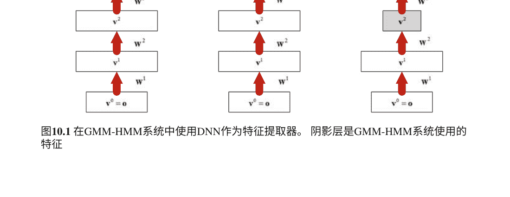

由于隐藏层特征将使用GMM进行建模，因此我们应该使用激活函数之前的激励（即在非线性激活函数应用之前），特别是如果使用sigmoid非线性激活函数，因为sigmoid将生成在[0，1]范围内且集中在0和1两个极值的特征。

此外，即使我们使用瓶颈层，瓶颈特征的维度可能仍然很大，并且在维度之间存在一定的相关性。因此，在将其用于GMM-HMM系统之前，通常仍然有必要应用PCA或HLDA，如图10.2所示。

请注意，由于Tandem（或瓶颈）特征是独立于GMM-HMM系统进行训练的，因此很难知道哪个层提供了最佳特征，以及是否添加更多层会有更好的性能。例如，Yu和Seltzer [7]在声音搜索数据集[8]上进行了实验（在第6.2.1节中描述），表明具有四个隐藏层的DNN的性能优于具有三个或七个隐藏层的DNN。表10.1还表明，在这种情况下，生成性预训练（在第5章中描述）对性能有所帮助。在实验中，他们使用了11帧39维MFCC特征作为DNN的输入，瓶颈层有39个神经元，非瓶颈隐藏层有2048个隐藏神经元。他们使用了一个学习率

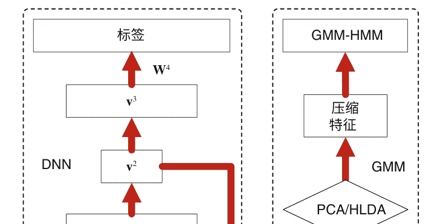

### 图10.2 在GMM-HMM中使用串联（或瓶颈）特征。DNN被训练用于提取串联或瓶颈特征，然后与原始特征结合。组合特征在被GMM-HMM建模之前通过PCA或HLDA进行压缩和去相关化处理

### 表10.1 使用瓶颈特征时开发集句子错误率（SER）在使用不同深度的DNN时的结果。（摘自Yu和Seltzer [7]）

| 隐藏层 | 3 (%) | 5 (%) | 7 (%) |
| :--- | :--- | :--- | :--- |
| 无DBN预训练 | 41.1 | 34.3 | 36.1 |
| 有DBN预训练 | 34.3 | 33.4 | 34.1 |

### 表10.2 使用不同监督标签训练的瓶颈特征的句子错误率（SER）比较

| 用于瓶颈特征训练的标签 | 开发SER（%） | 测试SER（%） |
| :--- | :--- | :--- |
| 无 | 39.4 | 42.1 |
| 单音状态 | 35.2 | 37.0 |
| 从senones转换的单音状态 | 34.0 | 35.7 |
| Senones | 33.4 | 34.8 |

在所有条件下都应用了DBN预训练。（摘自Yu和Seltzer[7]）

在预训练期间，所有层的每个样本的误差率为1.5e-5，并且在前6个时期使用每个样本的学习率为3e-4，在剩余的6个时期使用每个样本的学习率为8e-6进行微调。使用256个样本的随机小批量梯度下降进行DNN训练。然后，从DNN中提取的瓶颈特征被单独使用或与原始MFCC特征串联起来训练GMM-HMM。在瓶颈（BN）和“BN+MFCC”两种配置中，特征都经过PCA进行去相关化，并转换为39维。

Yu和Seltzer还表明，使用音素标签通常比使用单音标签或不使用标签的性能更好，如表10.2所示。没有使用标签学习的瓶颈特征与使用单音或音素标签学习的特征之间的性能差距明确表明，使用任务相关信息学习特征是重要的。

## 10.1.2 DNN-HMM混合系统与GMM-HMM系统使用DNN派生特征的对比

DNN-HMM混合系统与使用串联或瓶颈特征的GMM-HMM系统之间的主要区别在于所使用的分类器。在串联/瓶颈系统中，GMM代替了DNN-HMM系统中使用的对数线性模型（DNN中的softmax层）。当使用相同的特征时，GMM具有比对数线性模型更好的建模能力。事实上，Heigold等人[9]表明，当对数线性模型中同时使用一阶和二阶特征时，GMM等于对数线性模型。Heigold等人的结果还表明，GMM可以用具有非常宽的隐藏层和隐藏层与输出层之间稀疏连接的单隐藏层神经网络来建模。

另一方面，由于隐藏层与对数线性分类器一起训练，它们与对数线性模型更好地匹配（即，在DNN-HMM混合系统中），而不是Tandem/瓶颈系统。这两个因素的净效应相互抵消，当在不同任务上进行平均时，这两种类型的系统表现几乎相同。然而，集成的CD-DNN-HMM系统在概念上和实践中都更简单。

在GMM-HMM系统中使用DNN派生特征的主要好处是可以利用已有的工具来训练和调整GMM-HMM系统。它还允许使用DNN派生特征的DNN进行训练，而使用DNN派生特征的GMM-HMM系统则使用完整的训练集进行训练。

在[10]中，Yan等人进行了一系列实验，比较了CD-DNN-HMM系统与使用DNN派生特征的GMM-HMM系统。在他们的研究中，他们使用了图10.1a中所示的最后一个隐藏层的激励作为DNN派生特征。然后，DNN派生特征与原始频谱特征进行PCA压缩和连接。增强的特征再次使用HLDA [11]进行压缩，以适应GMM-HMM声学建模的维度。实验是在Switchboard（SWB）数据集上进行的，该数据集在第6.2.1节中有描述。在使用DNN派生特征的GMM-HMM系统（称为DNN-GMM-HMM）中，解码和基于词网格的序列训练中使用了0.5的声学缩放因子（只需将声学对数似然乘以0.5）。这被发现是获得最佳识别准确性的关键。实验中使用了相同的PLP特征、训练和测试设置，以便与其他工作（例如[12–14]）进行比较。

表10.3，总结自[10, 14]，比较了使用309小时训练集时CD-DNN-HMM系统与DNN-GMM-HMM系统在SWB Hub5'00评估集上的表现。可以观察到，即使对DNN-GMM-HMM系统应用了区域相关线性变换（RDLT）[15, 16]，该变换已被证明可以提高系统性能（从17.8%提高到16.1%），但MMI训练的DNN-GMM-HMM系统仍然表现不如使用相同MMI训练准则（在第8章中描述）训练的CD-DNN-HMM系统。

表10.4比较了使用2,000小时训练集时的CD-DNN-HMM和DNN-GMM-HMM系统。从这个表格中，我们可以观察到使用RDLT的MMI训练

### 表10.3 在使用309小时的训练集时SWB Hub5'00评估集上的词错误率（WER）

| CD-DNN-HMM | CE | MMI | ML | RDLT | +MMI |
| :--- | :--- | :--- | :--- | :--- | :--- |
| | 16.4% | 13.7% | 17.8% | 16.1% | 15.3% |

N有7个隐藏层，每个隐藏层有2K个神经元。输出层有9.3K个音素。（摘自[10]和[14]）

### 表10.4 在使用2,000小时的训练集时SWB Hub5'00评估集上的词错误率（WER）

| CD-DNN-HMM | CE | MMI | ML | RDLT | +MMI |
| :--- | :--- | :--- | :--- | :--- | :--- |
| | 14.6% | 13.3% | 15.6% | 14.5% | 13.0% |

N有7个隐藏层，每个隐藏层有2K个神经元。输出层有18K个音素。（摘自[10]和[14]）

### 表10.5 将AE-BN系统与基准GMM-HMM系统进行比较

| 训练方法 | 基准GMM-HMM（%） | 具有AE-BN的GMM-HMM（%） |
| :--- | :--- | :--- |
| FSA | 20.2 | 17.6 |
| +fBMMI | 17.7 | 16.6 |
| +BMMI | 16.5 | 15.8 |
| +MLLR | 16.0 | 15.5 |

在430小时训练数据的英语广播新闻数据集上的WER。（摘自[17]）

DNN-GMM-HMM在MMI训练的CD-DNN-HMM系统上略优于。
通过结合这两个表格的结果，我们可以看出，尽管DNN-GMM-HMM的复杂性增加，但与CD-DNN-HMM相比，并没有明显的优势。在先前的讨论中，DNN特征直接从隐藏层中派生。在[17]中，Sainath等人研究了一种不太直接的方法来为GMM生成DNN派生特征。在他们的设置中，训练了一个具有6个隐藏层的DNN，每个隐藏层有1024个神经元，用于分类384个HMM状态。与[10]中相同，DNN没有瓶颈层，因此它可以比具有瓶颈层的DNN更好地分类HMM状态。然而，与[10]不同，他们使用了输出层的激励（在应用softmax函数之前）而不是最后一个隐藏层来派生特征。这384个激励值通过一个384-128-40-384的自编码器压缩为40个值。产生DNN派生特征的这种方法被称为AE-BN，因为瓶颈在自编码器中，而不是在训练用于分类HMM状态的DNN中。

他们将使用AE-BN功能的GMM-HMM系统的结果（在表10.5中显示）与不使用AE-BN功能的结果进行了比较，在英语广播新闻任务中使用了430小时的训练数据。从表中我们可以观察到，在相同的训练方法下，包括特征空间说话人自适应（FSA），特征空间BMMI（fBMMI），BMMI [18]和最大似然线性回归（MLLR）[19]，具有AE-BN功能的系统始终表现优于没有该功能的系统。他们还将使用AE-BN功能的GMM-HMM系统与普通的CD-DNN-HMM系统进行了较小任务的比较。通过比较[17]和[20]中的结果，我们可以观察到如果使用相同的训练准则，CD-DNN-HMM系统略优于AE-BN系统。

### 10.2 融合识别结果

传统的GMM-HMM系统和DNN-HMM系统的错误是不同的。这提供了通过融合GMM-HMM和DNN-HMM系统的互补识别结果来提高整体性能的可能性。最常用的系统组合技术是识别器输出投票误差减少（ROVER）[21]，分段条件随机场（SCARF）[22]和基于最小贝叶斯风险的格网络组合（MBR）[23]。

#### 10.2.1 ROVER

ROVER [21]是一个由对齐和投票组成的两步过程，如图10.4所示。在对齐步骤中，例如图10.3所示，两个或多个ASR系统的识别结果被合并成一个单词转换网络（WTN）。为了对齐和合并三个或更多ASR结果，我们首先为每个ASR系统输出创建一个线性WTN。例如，在步骤1中，图10.3中为三个ASR结果创建了线性WTN。通过将WTN限制为线性拓扑结构，我们可以显著简化组合过程。

为了获得最佳结果，这些线性WTN按照WER递增的顺序进行排序。第一个WTN（图10.3中的WTN-1），即具有最低WER的WTN，被指定为开发复合WTN的基本WTN。然后，使用动态规划（DP）对齐协议将第二个WTN与基本WTN对齐。然后我们从第二个WTN中添加了单词转换弧到基础WTN中。

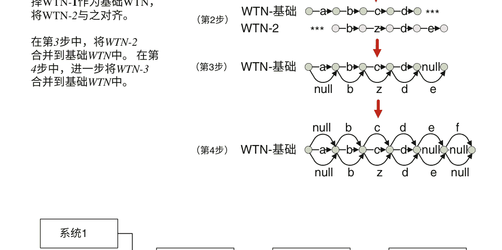

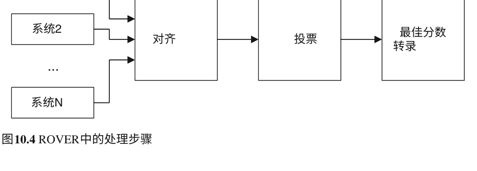

### 表10.6 使用ROVER的系统组合效果

| 方法 | 50小时 (%) | 430小时 (%) |
| :--- | :--- | :--- |
| 基准GMM-HMM | 18.8 | 16.0 |
| 具有AE-BN的GMM-HMM | 17.5 | 15.5 |
| ROVER超过两个 | 16.4 | 15.0 |

英语广播新闻任务的WER。（摘自[17]）

如第3步所示，选择适当的。使用这个新的基础WTN，第三个WTN被合并到基础WTN中，如第4步所示。该过程重复，直到所有线性WTN都合并到基础WTN中。

一旦生成了组合的WTN，投票模块使用投票方案评估每个分支点，选择得分最高的单词（获得最高票数）作为新的转录。可以有许多不同的投票方案，例如基于出现频率，出现频率和平均单词置信度，或出现频率和最大置信度。

一般的评分公式是

```
评分（权重，位置） = \frac{1}{N} \sum_{n=1}^{N} \left[ \alpha \delta \left( \text{权重，权重的位置} \right) + (1 - \alpha) \lambda \text{的位置的置信度（权重）} \right], \quad (10.1)
```

其中λ的位置是系统相关的权重，δ是Kro_{n}ecker-δ，i表示对齐中的位置，N是系统的数量，而co_{n}f(权重,位置)是单词权重在位置i的置信度得分。通过α进行多数投票和平均置信度得分的平滑插值，α是在开发集上训练的。

已经证明，在不同的系统上，ROVER几乎总是能提供额外的识别准确性改进。例如，Sainath等人[17]在英语广播新闻任务中报告说，他们可以在AE-BN系统上分别通过组合AE-BN系统和基准GMM-HMM系统来实现额外的0.9%和0.5%的词错误率（WER）降低，训练数据分别为50小时和430小时，如表10.6所示。

#### 10.2.2 SCARF

在SCARF [22]框架中，给定观测序列的条件概率s的状态序列o为

```
p(s|o) = \frac{\sum_{q: |q|=|s|} \exp \left( \sum_{e \in q, k} \lambda_k f_k \left( s_l^e, s_r^e, o(e) \right) \right)}{\sum_{s'} \sum_{q: |q|=|s'|} \exp \left( \sum_{e \in q, k} \lambda_k f_k \left( s_l'^e, s_r'^e, o(e) \right) \right)}, \quad (10.2)
```

而s_l^e和s_r^e是与边e相关联的左状态和右状态，在识别网络中，q是观测序列的分割

### 图10.5 SCARF的示例。
图中显示了与七个观测对齐的三个假设状态。s1等于s_l^e，e的左状态，s2等于s_r^e，e的右状态。o(e)={o3, o4}

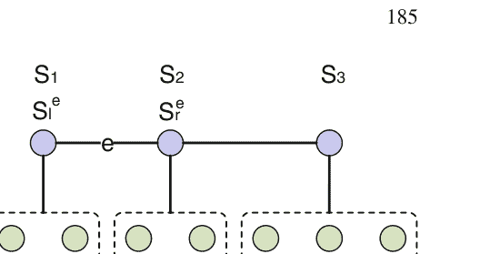

状态之间的边集合 e ∈ q，表示与右侧状态 s_r^e相关联的段落，跨越从某个起始时间到某个结束时间的一段观测数据，f_k（s_l^e, s_r^e, o(e)）是在边和相关段落上定义的特征，λ_k是与该特征相关联的权重。图10.5描述了一个SCARF的示例，在其中假设了三个状态，并与七个观测数据对齐。权重 λ_k被优化以最大化训练集上的序列条件对数似然。SCARF模型的成功关键在于从不同ASR系统生成的识别网络中提取的特征。常用的特征包括[22]:

- 期望特征：根据字典中每个单词的拼写以单位为基础进行定义。
- Levenshtein特征：通过将观察到的单元序列与基于字典条目的预期单元序列进行对齐来计算。
- 存在特征：指示检测流中的单元与假设的单词之间的简单关联。
- 语言模型特征：直接从语言模型中派生。
- 基线特征：从基线最佳序列中提取。对于一个片段，如果假设的片段恰好跨越一个基线单词，并且片段的标签与基线单词匹配，则基线特征为 +1。否则为-1。

在[24]中，Jaitly等人将SCARF技术应用于将GMM-HMM系统与CD-DNN-HMM系统相结合。他们在语音搜索和YouTube任务上将WER分别从12.2%降低到11.8%（减少0.4%）和从47.1%降低到46.2%（减少0.9%），相比于MI训练的CD-DNN-HMM系统。

#### 10.2.3 MBR格子组合

MBR组合[23]找到了在不同系统中组合的最小期望词错误率的词序列

```
w^* = \arg \min_{\mathbf{w}} \left\{ \sum_{n=1}^{N} \lambda_n \sum_{\mathbf{w}'} P_n(\mathbf{w}|\mathbf{o}) L\left( \mathbf{w}, \mathbf{w}' \right) \right\}, \quad (10.3)
```

其中 L (w, w') 是两个词序列 w 和 w' 之间的 Levenshtein 距离以及 P_n (w|o) 是由第 n 个模型计算得到的给定声学观测序列 o 的词序列 w 的后验概率。可以估计 P_n (w|o) 为

```
$$ P_n (w|o) = \frac{p_n (o|w)^\kappa P (w)}{\sum_w p_n (o|w)^\kappa P (w)} \quad (10.4) $$
```

其中 κ 是声学缩放因子。

在[25]中，Swietojanski等人报告说，通过将GMM-HMM和DNN-HMM系统与MBR格技术相结合，他们可以在不同设置下相对于DNN-HMM系统实现1-8%的词错误率降低。

然而，MBR格网络组合比ROVER不够稳健，因为它有时会增加错误率。

### 10.3 融合帧级声学分数

系统还可以在帧或状态声学得分级别上进行融合。最简单但有效的方法是使用多个系统的观测对数似然的线性插值进行帧同步组合。

```
$$ \log p (o|s) = \sum_{n=1}^N \alpha_n \log p_n (o|s) \quad (10.5) $$
```

其中 α_n 是系统 n 的插值权重，p (o|s) 是给定状态 s 的观测组合得分，而 p_n (o|s) 是第 n 个系统的得分。对于GMM-HMM系统，这只是观测概率。对于DNN-HMM混合系统，这是缩放后的似然。或者，我们可以建模状态后验概率

```
$$ \log p (s|o) = \sum_{n=1}^N \alpha_n \log p_n (s|o) \quad (10.6) $$
```

而是。请注意，这是一个具有帧后验分数作为特征的对数线性模型，因此可以很容易地使用没有隐藏层的神经网络实现。通过包含隐藏层可以实现额外的改进。这种表述的好处是可以很容易地应用于训练插值权重或融合网络的帧交叉熵（CE）和序列判别式训练技术，如第6章和第8章所述。

在[25]中，Swietojanski等人报告说，通过结合GMM-HMM和DNN-HMM系统的帧似然，他们可以在不同设置下实现1-8%的相对WER降低，类似于他们在MBR格网络组合中实现的增益。然而，请注意，由于GMM-HMM系统通常表现比CD-DNN-HMMs差得多，可能的改进非常有限。

显然，由于GMM-HMM系统通常表现比CD-DNN-HMMs差得多，可能的改进非常有限。

更好的方法是将使用DNN派生的特征与CD-DNN-HMM系统相结合，而不是使用DNN-GMM-HMM。这种组合有两个好处。首先，DNN-GMM-HMM系统的性能非常接近CD-DNN-HMM系统，但它们的结果仍然互补。其次，由于在DNN-GMM-HMM和CD-DNN-HMM系统中使用相同的DNN，因此在解码阶段引入的额外成本非常有限，特别是当使用图10.1a中的架构时。通过结合这两个系统，通常可以相对于CD-DNN-HMM系统获得5-10%的相对WER降低。

### 10.4 多流语音识别

众所周知，现代语音识别系统中使用的固定分辨率（时间和频率域）特征处理前端是一种权衡的结果，不能很好地模拟许多现象。例如，黄等人[26]表明，当说话速度非常快或非常慢时，CD-GMM-HMM和CD-DNN-HMM系统的性能都会显著下降。解决这个问题的一个潜在解决方案是多流系统[27, 28]，可以适应多个时间和/或频率分辨率。多流语音识别系统的关键设计问题是如何组合流。图10.6、10.7和10.8说明了多流语音识别中使用的三种常用架构：

- 早期集成：在早期集成架构中，特征直接组合（例如，串联）并由单个DNN-HMM处理以生成解码结果。
- 中间集成：在中间集成架构中，每个流中的特征首先独立处理（例如，使用单独的DNN），然后在中间阶段进行集成。然后，集成的中间表示进一步由单个DNN-HMM处理以生成最终的解码结果。
- 晚期集成：在晚期集成架构中，每个流中的特征使用单独的DNN-HMM进行独立处理。然后将每个流的解码结果组合（例如，通过ROVER）以生成最终结果。

有许多不同类型的流。例如，我们可以将每个窄频率子带作为一个流。这样的系统通常被称为多频带语音识别系统。或者，我们可以使用不同的特征提取流水线，例如PLP和MFCC作为流。这样的系统有时被称为多通道语音识别系统。构建流的另一种常见方法是使用具有不同采样率、窗口大小或滤波器组的特征进行提取。

Fletcher和他的同事的工作[29]表明，在人类语音感知中，窄频率子带是独立处理的，这有利于多频带系统，并且这些子带的决策在某个中间层级上进行了组合，这有利于中间集成框架。这结果以这样的方式组合，使得全局错误率等于子带中的错误率的乘积。这个错误率乘积规则非常强大，基本上意味着即使只有一个子带处理流程给出了正确的结果，结果系统将准确识别话语。在[30]中，Zhou等人比较了多通道语音识别的早集成、中间集成和迟集成架构。他们的结果表明，中间集成方法表现最佳，在TIMIT电话识别任务中相对于最佳单流系统减少了6%的错误率。

## 参考文献

1.  Hermansky, H., Ellis, D.P., Sharma, S.: 用于传统HMM系统的串联连接主义特征提取。在：国际声学、语音和信号处理会议论文集（ICASSP），第3卷，第1635-1638页（2000年）
2.  Grézl, F., Fousek, P.: 优化瓶颈特征用于LVCSR。在：国际会议论文集，声学、语音和信号处理(ICASSP)，第4729-4732页(2008)
3.  Grézl, F., Karafiát, M., Kontár, S., Černocký, J.: 会议LVCSR的概率和瓶颈特征。在：国际会议论文集，声学、语音和信号处理(ICASSP)，第757-760页(2007)
4.  Fousek, P., Lamel, L., Gauvain, J.L.: 使用MLP特征转录广播数据。在：国际语音通信协会年会论文集(INTERSPEECH)，第1433-1436页(2008)
5.  Valente, F., Doss, M.M., Plahl, C., Ravuri, S., Wang, W.: 一项关于普通话ASR的大规模比较研究MLP特征。在：国际语音通信协会年会论文集(INTERSPEECH)，第2630-2633页(2010)
6.  Vergyri, D., Mandal, A., Wang, W., Stolcke, A., Zheng, J., Graciarena, M., Rybach, D., Gollan, C., Schlüter, R., Kirchhoff, K., et al.: SRI/nightingale阿拉伯语ASR系统的开发。在：国际语音通信协会年会论文集 (INTERSPEECH)，第1437-1440页（2008年）
7.  Yu, D., Seltzer, M.L.：使用预训练的深度神经网络改进瓶颈特征。在：国际语音通信协会年会论文集(INTERSPEECH)，第237-240页（2011年）
8.  Yu, D., Ju, Y.C., Wang, Y.Y., Zweig, G., Acero, A.：自动目录辅助系统-从理论到实践。在：国际语音通信协会年会论文集（INTERSPEECH），第2709-2712页（2007年）
9.  Heigold, G., Ney, H., Lehnen, P., Gass, T., Schluter, R.：生成模型和对数线性模型的等价性。IEEE Trans. Audio, Speech Lang. Process. 19（5），1138-1148页（2011年）
10. Yan, Z., Huo, Q., Xu, J.：在基于GMM-HMM的声学建模中使用DNN派生特征的可扩展方法。在：国际语音通信协会年会论文集（INTERSPEECH）（2013年）
11. Kumar, N., Andreou, A.G.：异方差判别分析和降维隐马尔可夫模型，以提高语音识别。语音通信。26(4)，283-297 (1998)
12. Seide, F., Li, G., Chen, X., Yu, D.：在上下文相关的深度神经网络中进行特征工程，用于对话式语音转录。在：IEEE Workshop on Automatic Speech Recognition and Understanding (ASRU)会议论文集，第24-29页 (2011)
13. Seide, F., Li, G., Yu, D.：使用上下文相关的深度神经网络进行对话式语音转录。在：International Speech Communication Association (INTERSPEECH)年会论文集，第437-440页 (2011)
14. Su, H., Li, G., Yu, D., Seide, F.：序列训练上下文相关深度网络进行对话式语音转录的误差反向传播。在：国际声学、语音和信号处理会议(ICASSP)论文集 (2013)
15. Yan, Z.J., Huo, Q., Xu, J., Zhang, Y.：基于绑定状态的上下文扩展区域相关特征变换的判别训练，用于大词汇连续语音识别。在：国际声学、语音和信号处理会议(ICASSP)，第6940-6944页 (2013)
16. Zhang, B., Matsoukas, S., Schwartz, R.：用于语音识别的判别训练的区域相关特征变换。在：国际声学、语音和信号处理会议(ICASSP)，第1卷，第I-I页 (2006)
17. Sainath, T.N., Kingsbury, B., Ramabhadran, B.：使用深度置信网络的自动编码器瓶颈特征。在：国际声学、语音和信号处理会议(ICASSP)论文集，第4153-4156页(2012)
18. Povey, D., Kanevsky, D., Kingsbury, B., Ramabhadran, B., Saon, G., Visweswariah, K.：提升的MMI用于模型和特征空间的判别式训练。在：国际声学、语音和信号处理会议(ICASSP)论文集，第4057-4060页(2008)
19. Gales, M.J., Woodland, P.：在mlr框架内的均值和方差自适应。计算机语音与语言10(4)，249-264页(1996)
20. Sainath, T.N., Kingsbury, B., Ramabhadran, B., Fousek, P., Novak, P., Mohamed, A.r.：使深度置信网络在大词汇连续语音识别中有效。在：IEEE自动语音识别和理解研讨会(ASRU)论文集，第30-35页(2011)
21. Fiscus, J.G.：一个后处理系统以获得降低词错误率的结果：识别器输出投票错误减少（ROVER）。在：IEEE Workshop on Automatic Speech Recognition and Understanding (ASRU)会议论文集，第347-354页（1997年）
22. Zweig, G., Nguyen, P.：SCARF：一种用于语音识别的分段条件随机场工具包。在：International Speech Communication Association (INTERSPEECH)年会论文集，第2858-2861页（2010年）
23. Xu, H., Povey, D., Mangu, L., Zhu, J.：基于编辑距离递归的最小贝叶斯风险解码和系统组合。计算机语音语言25（4），802-828页（2011年）
24. Jaitly, N., Nguyen, P., Senior, A.W., Vanhoucke, V.：预训练深度神经网络在大词汇语音识别中的应用。在：International Speech Communication Association (INTERSPEECH)年会论文集（2012年）
25. Swietojanski, P., Ghoshal, A., Renals, S.: 重新审视混合和GMM-HMM系统组合技术。在： 国际声学、语音和信号处理会议(ICASSP)论文集 (2013)
26. Huang, Y., Yu, D., Liu, C., Gong, Y.: 高斯混合和上下文相关深度神经网络隐马尔可夫模型的比较分析研究。在： 国际语音通信协会年会(INTERSPEECH)论文集 (2014)
27. Bourlard, H., Dupont, S., Martigny Valais Suisse C.R.: 多流语音识别 (1996)
28. Bourlard, H., et al.: 非平稳多通道(多流)处理以实现鲁棒和自适应的语音识别。在： 恶劣条件下鲁棒语音识别方法研讨会论文集， 第1-10页 (1999)
29. Allen, J.B.: 人类如何处理和识别语音? IEEE Trans. Speech Audio Process. 2(4), 567–577 (1994)
30. 周, 彭, 戴, 刘, 蒋: 在语音识别中使用深度神经网络结合多流特征的信息在： IEEE国际信号处理会议(ICSP)第1卷, 第557–561页 (2012)

## 第11章 深度神经网络的适应

摘要 适应技术可以弥补训练和测试条件之间的差异，从而进一步提高语音识别准确性。与生成模型高斯混合模型(GMM)不同，深度神经网络(DNN)是判别模型。因此，为GMM开发的适应技术不能直接应用于DNN。在本章中，我们首先介绍适应的概念。然后，我们描述了为DNN开发的重要适应技术，这些技术被分类为线性变换、保守训练和子空间方法。我们进一步展示了DNN中的适应可以显著降低错误率，至少对于某些语音识别任务来说，因此与GMM系统中的适应一样重要。

### 11.1 深度神经网络的适应问题

与其他机器学习技术一样，在DNN系统中假设训练和测试数据遵循相同的概率分布。然而，在现实中，这个假设很难满足。这是因为在部署语音应用之前，没有匹配的训练数据。应用程序必须从不匹配的数据中启动。应用程序部署后，可以在真实使用场景下收集一些匹配的数据。然而，在部署的早期阶段，匹配的数据量往往很小，无法涵盖可能在后续使用中观察到的许多现象。即使在应用程序部署多年后有足够的匹配训练数据，不匹配问题仍然可能存在。这是因为DNN训练优化的是训练数据分布上的平均性能。因此，当针对特定的环境或说话人时，训练和测试条件仍然不匹配。

训练-测试不匹配问题可以通过适应技术来解决，这些技术要么将模型适应于更好地匹配测试条件，要么将测试输入适应于模型更好地拟合。例如，在传统的高斯混合模型（GMM）-隐马尔可夫模型（HMM）语音识别系统中，说话者自适应（SA）系统可以将错误率降低5-30%，而说话者独立（SI）系统。在GMM-HMM框架中，有一些广为人知的有效适应技术包括最大似然线性回归（MLLR）[11,20,34]，约束MLLR（cMLLR）[10]，也被称为特征域MLLR（fMLLR），最大后验线性回归（MAP-LR）[7,19]，以及向量泰勒级数（VTS）展开[18,22-24,26]。这些技术中的许多可以应用于处理环境和说话者不匹配的情况。

如果转录可用于适应数据，则称为有监督适应；否则，称为无监督适应，在这种情况下，需要从声学特征中推断出转录。在大多数情况下，可以通过使用与说话人无关的模型对话进行解码来获得推断的转录，通常称为伪转录。在下面的讨论中，假设采用这种方法。在某些严格条件下，可以利用数据中的结构来推断适应转录，例如基于具有和没有标签的特征向量之间的距离。无论使用哪种方法，伪转录都不避免地包含错误，这将降低适应的效果。此外，将伪转录作为标签进行适应会加强模型已经擅长的内容，但限制了它从SI模型不擅长的内容中学习的能力。所有这些因素将限制使用无监督适应进行潜在的识别准确性改进的可能性。

与生成模型（GMM）不同，深度神经网络（DNN）是判别模型。因此，DNN需要与GMM不同的适应技术。例如，对于GMM来说，基于模型空间的转换方法（如MLLR）可以很好地工作，但不能直接应用于DNN。这是因为在GMM中，如果高斯均值或方差属于相同的音素或HMM状态，它们会以相同的方向变化，而在DNN的模型参数中没有这样的结构。

请注意，DNN是多层感知器（MLP）的特例，因此一些为MLP开发的适应技术可以直接应用于DNN。然而，与早期的ANN/HMM混合系统[27]相比，通常在大词汇连续语音识别（LVCSR）系统中使用的上下文相关（CD）-DNN-HMM具有更多的参数，这是由于使用更宽和更深的隐藏层以及更大的输出层来直接建模音素（绑定三音素状态）。这种差异给适应CD-DNN-HMM带来了额外的挑战，特别是当适应集很小的时候。

多年来，已经开发了许多技术来适应DNNs。这些技术可以分为三类：线性变换、保守训练和子空间方法。我们将在下面的章节中详细讨论这些技术。

### 11.2 线性变换

适应DNN的最简单和最流行的方法是对输入特征、隐藏层的激活或者softmax层的输入应用线性变换。无论线性变换应用在哪里，通常都是从一个单位权重矩阵和零偏置进行训练，以优化交叉熵（CE）训练准则（第4章中的公式（4.1））或序列判别训练准则（第8章中的公式（8.1）和（8.8）），同时保持原始DNN的权重不变。

#### 11.2.1 线性输入网络

在线性输入网络（LIN）[2, 4, 21, 28, 33, 35]和非常相似的特征判别线性回归（fDLR）[30]自适应技术中，线性变换应用于输入特征，如图11.1所示。LIN背后的基本思想是，说话人相关（SD）特征可以线性变换以匹配由说话人无关（SI）DNN模型指定的平均说话人。换句话说，我们通过应用由权重矩阵 $\mathbf{W}_{\text{LIN}} \in \mathbb{R}^{N_0 \times N_0}$ 和偏置向量 $\mathbf{b}^{\text{LIN}} \in \mathbb{R}^{N_0 \times 1}$ 指定的线性变换，将SD特征 $\mathbf{v}^0 \in \mathbb{R}^{N_0 \times 1}$ 转换为 $\mathbf{v}^{\text{LIN}_0} \in \mathbb{R}^{N_0 \times 1}$

$v^0_{\text{LIN}} = \mathbf{W}^{\text{LIN}} v^0 + \mathbf{b}^{\text{LIN}}, (11.1)$

其中 $N_0$ 是输入层的大小。

图11.1展示了线性输入网络（LIN）和特征判别线性回归（fDLR）自适应技术的示意图。一个线性层被插入并应用于输入特征层之上。

在语音识别中，输入特征向量 $v^0 (t) = o_t = [x_{\max(0,t-\omega)} \cdots x_t \cdots x_{\min(T,t+\omega)}]$ 对于一个包含T个帧的话语，时间t通常覆盖$2\omega + 1$个帧。当自适应集合很小时，应用较小的每帧变换是可取的。 $[W_f^{LIN} \in \mathbb{R}^{D \times D}, b_f^{LIN} \in \mathbb{R}^{D \times 1}]$作为

$x^{LIN} = W_f^{LIN} x + b_f^{LIN}, (11.2)$

并且转换后的输入特征向量可以构建为 $v^0_{LIN} (t) = o_t^{LIN} = [x^{LIN}_{\max(0,t-\omega)} \cdots x^{LIN}_t \cdots x^{LIN}_{\min(T,t+\omega)}]$，其中 D是每个特征帧的维度， $N_0 = (2\omega + 1) D$。由于 $W_f^{LIN}$ 只有 $\frac{1}{(2\omega + 1)^2}$ 与W^{LIN}中的参数一样多 $W^{LIN}$，它的转换能力较弱，效果也较差。 然而，它可以从一个小的适应集中更可靠地估计，因此可能在整体上表现更好比$W^{LIN}$。

#### 11.2.2 线性输出网络

线性变换也可以应用于softmax层，此时适应的网络被称为线性输出网络（LON）[21]或输出特征判别线性回归（oDLR）[40,43]。这是因为DNN中的所有隐藏层都可以被视为复杂的非线性特征转换模块，而最后一个隐藏层可以被视为转换后的特征，正如我们在第9章中讨论的那样。因此，合理地对最后一个隐藏层应用线性变换，使得在线性变换之后，它更好地匹配平均说话人。 与LIN/fDLR不同的是，在LON/oDLR中有两种方式可以应用线性变换，如图11.2所示。在图11.2a中，线性变换应用于softmax层权重之后。换句话说，

$z^L_{LONa} = W_a^{LON} z^L + b_a^{LON} = W_a^{LON} (W^L v^{L-1} + b^L) + b_a^{LON} = (W_a^{LON} W^L) v^{L-1} + (W_a^{LON} b^L + b_a^{LON}), (11.3)$

其中假设DNN具有 L层， $N_{L-1}$和 $N^L$ 分别是第L-1层（最后一个隐藏层）和 L层（softmax层）的神经元数量， $v^{L-1} \in \mathbb{R}^{N_{L-1} \times 1}$是最后一个隐藏层的与说话人无关的特征， $z^L \in \mathbb{R}^{N^L \times 1}$是softmax层的激活（无适应）， $W^L$和 $b^L$ 分别是说话人无关DNN上的softmax层权重矩阵和偏置向量， $W_a^{LON} \in \mathbb{R}^{N^L \times N_L}$ 和 $b_a^{LON} \in \mathbb{R}^{N_L \times 1}$分别是变换矩阵和偏置## 11.2 线性变换

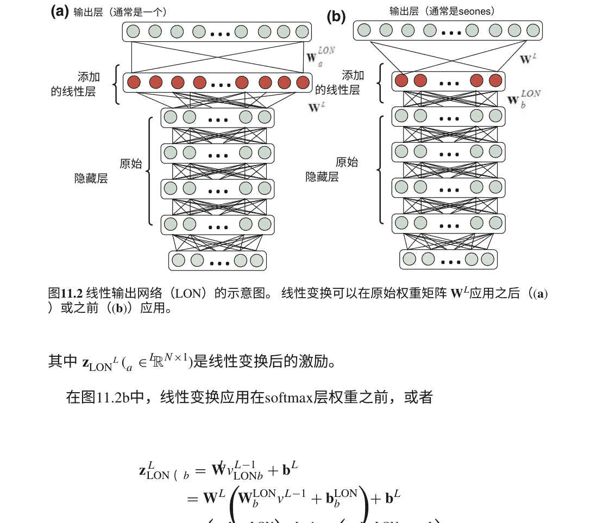

其中 $z_{\text{LON}}^L(a) \in \mathbb{R}^{N\times 1}$ 是线性变换后的激励。

在图11.2b中，线性变换应用在softmax层权重之前，或者

$$
\begin{aligned}
z_{\text{LON}}^L(b) &= Wv_{\text{LON}b}^{L-1} + b^L \\
&= W^L \left( W_b^{\text{LON}} v^{L-1} + b_b^{\text{LON}} \right) + b^L \\
&= \left( W^L W_b^{\text{LON}} \right) v^{L-1} + \left( W^L b_b^{\text{LON}} + b^L \right). \tag{11.4}
\end{aligned}
$$

其中 $v_{\text{LON}b}^{L-1} \in \mathbb{R}^{N_{L-1}\times 1}$ 是最后一个隐藏层的转换特征，而 $W_b^{\text{LON}} \in \mathbb{R}^{N_{L-1}\times N_{L-1}}$ 和 $b_b^{\text{LON}} \in \mathbb{R}^{N_{L-1}\times 1}$ 分别是转换矩阵和偏置向量，在LON(b)中。

很明显，这两种方法同样强大，因为线性变换的线性变换等于单一线性变换，如公式(11.3)和(11.4)所示。然而，这两种方法中的参数数量可能会有显著差异。如果输出神经元的数量小于最后一个隐藏层的数量，就像单音素系统一样，$W_a^{\text{LON}}$ 小于 $W_b^{\text{LON}}$。然而，在CD-DNN-HMM系统中，输出层的大小要显著大于最后一个隐藏层的大小。因此，$W_b^{\text{LON}}$ 要显著小于 $W_a^{\text{LON}}$ 并且可以从适应数据中更可靠地估计。

### 11.3 线性隐藏网络

在线性隐藏网络（LHN）[12]中，线性变换应用于隐藏层。这是因为，如第9章所讨论的，DNN可以在任何隐藏层分为两部分。包含输入层的部分可以被视为特征转换模块，将DNN分开的隐藏层可以被视为转换后的特征。包含输出层的部分可以被视为在隐藏层特征上操作的分类器。

与LON中的情况类似，在LHN中也有两种应用线性变换的方式，如图11.3所示。出于同样的原因，我们刚刚讨论了这两种具有相同适应能力的适应方法。与LON不同，在LHN中，$\mathbf{W}$的大小可以显著不同。$\mathbf{W}_a^{LHN}$和$\mathbf{W}_b^{LHN}$通常在许多系统中，隐藏层的大小是相同的，因此输入和输出的维度也是相同的。

LIN、LON和LHN的有效性取决于任务。尽管它们非常相似，但在参数数量和特征适应的可变性方面存在细微差异，正如我们刚才讨论的那样。这些因素以及适应集的大小共同决定了哪种技术最适合特定的任务。

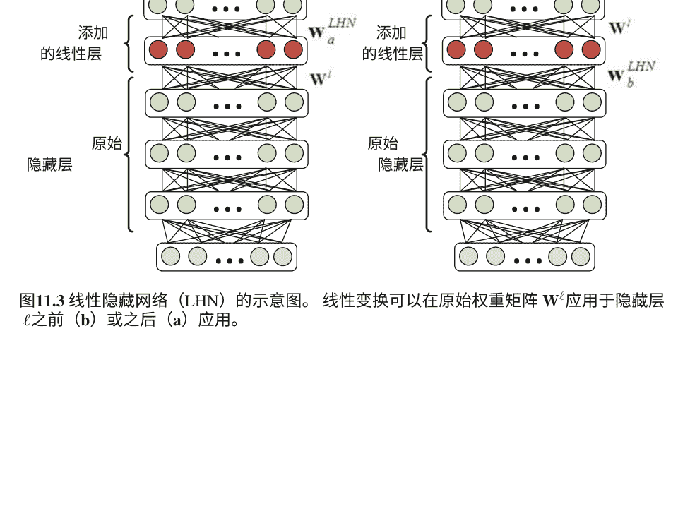

### 11.4 保守训练

尽管线性变换适应技术在某些条件下可能有用，但其有效性受到线性变换性质的严格限制。一种可能更有效的方法是通过优化适应准则 $J(\mathbf{W}, \mathbf{b}; \mathbb{S})$ 来调整DNN中的所有参数，其中$\mathbb{S}=\{ (\mathbf{o}^m, \mathbf{y}^m) \mid 0 \leq m < M \}$, $J(\mathbf{W}, \mathbf{b}; \mathbb{S})$ 可以是第4章中讨论的交叉熵（CE）训练准则（方程（4.11））或第8章中讨论的序列判别训练准则（方程（8.1）和（8.8））。

不幸的是，这种看似简单的方法可能会破坏先前学到的信息，因此在适应集大小通常远小于DNN参数数量的情况下不可靠。为了防止这种情况发生，需要一些保守训练（CT）[3, 25, 32, 43]策略。

保守训练（CT）可以通过向适应准则添加正则化来实现。一个简单的启发式方法是只适应选定的权重。例如，在[32]中，只有与在适应数据上计算的最大方差的隐藏节点连接的权重被适应。或者，我们可以只适应DNN中的大权重。也可以将学习率设置得非常小并提前停止来进行适应，这也可以被视为CT。

在本节中，我们描述了CT中使用的两种最流行的显式正则化技术：$L_2$正则化[25]和Kullback-Leibler散度（KLD）正则化[43]。我们还讨论了可以用来减小适应模型占用空间的技术。

### 11.4.1 $L_2$ 正则化

$L_2$正则化的基本思想是将模型参数差异的$L_2$范数添加到CT中

$$
\begin{aligned}
R_2(\mathbf{W}_{\text{SI}} - \mathbf{W}) &= \| \text{vec}(\mathbf{W}_{\text{SI}} - \mathbf{W}) \|_2^2 \\
&= \sum_{\ell=1}^{L} \left\| \text{vec}\left( \mathbf{W}_{\text{SI}}^{\ell} - \mathbf{W}^{\ell} \right) \right\|_2^2 \quad (11.5)
\end{aligned}
$$

在说话人无关模型 $\mathbf{W}_{\text{SI}}$ 和自适应模型 $\mathbf{W}$ 之间的适应准则 $J(\mathbf{W}, \mathbf{b}; \mathbb{S})$ 之间的差异。$(\mathbf{W}^{\ell}) \in \mathbb{R}^{[N_{\ell} \times N_{\ell-1}] \times 1}$ 是通过连接矩阵 $\mathbf{W}^{\ell}$ 中的所有列生成的向量。$\| \text{vec}(\mathbf{W}^{\ell}) \|_2$ 等于 $\|\mathbf{W}^{\ell}\|_F$—矩阵 $\mathbf{W}^{\ell}$ 的Frobenius范数。当包含这个$L_2$正则化项时，适应准则变为

$$
J_{L_2}(\mathbf{W}, \mathbf{b}; \mathbb{S}) = J(\mathbf{W}, \mathbf{b}; \mathbb{S}) + \lambda R_2(\mathbf{W}_{\text{SI}}, \mathbf{W}), \quad (11.6)
$$

#### 11.4.2 KL散度正则化

KLD正则化方法的直觉是，从适应模型估计的senone后验分布不应该偏离太远，与从未适应模型估计的senone后验分布相比。由于DNN的输出是概率分布，测量偏离的自然选择是Kullback-Leibler散度（KLD）。通过将这个散度作为正则化项添加到适应准则中，并去除与模型参数无关的项，我们得到了正则化的优化准则

$$
J_{\text{KLD}}(\mathbf{W}, \mathbf{b}; \mathbb{S}) = (1 - \lambda) J(\mathbf{W}, \mathbf{b}; \mathbb{S}) + \lambda R_{\text{KLD}}(\mathbf{W}_{\text{SI}}, \mathbf{b}_{\text{SI}}; W, \mathbf{b}; \mathbb{S}), \quad (11.7)
$$

其中 $\lambda$ 是正则化权重,

$$
R_{\text{KLD}}(\mathbf{W}_{\text{SI}}, \mathbf{b}_{\text{SI}}; \mathbf{W}, \mathbf{b}; \mathbb{S}) = \frac{1}{M} \sum_{m=1}^{M} \sum_{i=1}^{C} P_{\text{SI}}(i|\mathbf{o}_m; \mathbf{W}_{\text{SI}}, \mathbf{b}_{\text{SI}}) \log P(i|\mathbf{o}_m; \mathbf{W}, \mathbf{b}), \quad (11.8)
$$

$P_{\text{SI}}(i|\mathbf{o}_m; \mathbf{W}_{\text{SI}}, \mathbf{b}_{\text{SI}})$ 和 $P(i|\mathbf{o}_m; \mathbf{W}, \mathbf{b})$ 分别是从独立于说话人和调整后的DNNs估计得到的第$m$个观测属于类别$i$的概率，将在以下讨论中简化为 $P_{\text{SI}}(i|\mathbf{o}_m)$ 和 $P(i|\mathbf{o}_m)$。如果交叉熵（CE）准则

$$
J_{\text{CE}}(\mathbf{W}, \mathbf{b}; \mathbb{S}) = \frac{1}{M} \sum_{m=1}^{M} J_{\text{CE}}(\mathbf{W}, \mathbf{b}; \mathbf{o}^m, \mathbf{y}^m) \quad (11.9)
$$

使用了，其中

$$
J_{\text{CE}}(\mathbf{W}, \mathbf{b}; \mathbf{o}, \mathbf{y}) = -\sum_{i=1}^{C} P_{\text{emp}}(i|\mathbf{o}_m) \log P(i|\mathbf{o}_m), \quad (11.10)
$$

和 $P_{\text{emp}}(i|\mathbf{o})$ 是经验（在适应集中观察到的）概率，表示观测值 $\mathbf{o}$ 属于类别 $i$ ，正则化适应准则可以转换为

$$
\begin{aligned}
J_{\text{KLD-CE}}(\mathbf{W},\mathbf{b};\mathbb{S}) &= (1-\lambda)J_{\text{CE}}(\mathbf{W},\mathbf{b};\mathbb{S}) + \lambda R_{\text{KLD}}(\mathbf{W}_{\text{SI}},\mathbf{b}_{\text{SI}};\mathbf{W},\mathbf{b};\mathbb{S}) \\
&= -\frac{1}{M}\sum_{m=1}^{M}\sum_{i=1}^{C}\big((1-\lambda)P_{\text{emp}}(i|\mathbf{o}_m) + \lambda P_{\text{SI}}(i|\mathbf{o}_m)\big) \log P(i|\mathbf{o}_m) \\
&= -\frac{1}{M}\sum_{m=1}^{M}\sum_{i=1}^{C} \ddot{P}(i|\mathbf{o}_m) \log P(i|\mathbf{o}_m) \quad (11.11)
\end{aligned}
$$

我们定义的地方

$$
\ddot{P}(i|\mathbf{o}_m) = (1-\lambda)P_{\text{emp}}(i|\mathbf{o}_m) + \lambda P_{\text{SI}}(i|\mathbf{o}_m). \quad (11.12)
$$

请注意，方程 (11.11) 与CE准则具有相同的形式，只是目标分布现在是经验概率和SI模型估计概率之间的插值。$P_{\text{emp}}(i|\mathbf{o}_m)$和概率 $P_{\text{SI}}(i|\mathbf{o}_m)$是从SI模型估计得到的。这种插值防止了适应模型偏离SI模型太远，从而防止过度训练。这也表明正常的反向传播（BP）算法可以直接用于调整DNN。唯一需要改变的是输出层的误差信号，现在基于 $\ddot{P}(i|\mathbf{o}_m)$而不是 $P_{\text{emp}}(i|\mathbf{o}_m)$定义。

请注意，KLD正则化与 $L_2$正则化不同，KLD正则化约束的是输出概率而不是模型参数本身。由于我们关心的是输出概率而不是模型参数本身，KLD正则化更具吸引力，通常比 $L_2$正则化效果更好。

插值权重直接由正则化权重$\lambda$派生而来，可以根据自适应集的大小、使用的学习率以及自适应是有监督还是无监督来进行调整，通常使用开发集进行调整。当 $\lambda = 1$时，我们完全信任SI模型，忽略自适应数据中的所有新信息。当 $\lambda = 0$时，我们仅根据自适应集来调整模型，忽略SI模型中的信息，只将其作为起点。

直观上，对于小的自适应集应该使用较大的 $\lambda$，对于大的自适应集应该使用较小的 $\lambda$。

KLD正则化适应技术可以很容易地扩展到序列-判别训练。如第8.2.3节所讨论的，为了防止过拟合，序列-判别训练中经常使用帧平滑，这导致了插值训练准则

$$
J_{\text{FS-SEQ}}(\mathbf{W},\mathbf{b};\mathbb{S}) = (1-H)J_{\text{CE}}(\mathbf{W},\mathbf{b};\mathbb{S}) + H J_{\text{SEQ}}(\mathbf{W},\mathbf{b};\mathbb{S}), \quad (11.13)
$$

其中 $H$是帧平滑因子，通常经验设置。通过添加KLD正则化项，我们得到适应准则

$$
J_{\text{KLD-FS-SEQ}}(\mathbf{W},\mathbf{b};\mathbb{S}) = J_{\text{FS-SEQ}}(\mathbf{W},\mathbf{b};\mathbb{S}) + \lambda_s R_{\text{KLD}}(\mathbf{W}_{\text{SI}},\mathbf{b}_{\text{SI}};\mathbf{W},\mathbf{b};\mathbb{S}), \quad (11.14)
$$

其中 $\lambda_s$是序列判别训练的正则化权重。$J_{\text{KLD-FS-SEQ}}$ 可以转换为

$$
J_{\text{KLD-FS-SEQ}} (\mathbf{W}, \mathbf{b}; \mathbb{S}) = H J_{\text{SEQ}} (\mathbf{W}, \mathbf{b}; \mathbb{S}) + (1 - H + \lambda_s) J_{\text{KLD-CE}} (\mathbf{W}, \mathbf{b}; \mathbb{S}) \quad (11.15)
$$

通过类似的推导，定义 $\lambda = \frac{\lambda_s}{1-H+\lambda_s}$。

#### 11.4.3 减少每个说话者的足迹

保守训练可以缓解自适应过程中的过拟合问题。然而，它无法解决每个说话者都需要保存一个庞大的自适应模型的问题。由于DNN模型通常具有大量参数，自适应模型可能太大而无法存储在客户端（例如智能手表）或服务器端（特别是当用户数量很大时）。为了减小存储空间，最简单的方法是只自适应模型的一部分。

例如，我们可以仅适应输入层、输出层或特定的隐藏层。然而，进行的实验表明，适应DNN中的所有层通常比仅适应部分层获得更好的性能。

幸运的是，已经开发出了一些技术，可以在保持适应所有层的好处的同时减少每个说话者的占用空间。在这里，我们描述了[36]中提出的两种方法之一。

第一种方法是存储独立于说话者的模型和适应于说话者的模型之间的压缩参数差异。由于适应模型与SI模型非常接近，可以合理地认为delta矩阵可以用低秩矩阵来近似。换句话说，我们可以将奇异值分解（SVD）技术应用于delta矩阵 $\Delta \mathbf{W}_{m\times n} = \mathbf{W}_{m\times n}^{AD} - \mathbf{W}_{m\times n}^{SI}$

$$
\Delta \mathbf{W}_{m\times n} = \mathbf{U}_{m\times n} \Sigma_{n\times n} \mathbf{V}_{n\times n}^T \approx \widetilde{\mathbf{U}}_{m\times k} \widetilde{\Sigma}_{k\times k} \widetilde{\mathbf{V}}_{k\times n}^T = \widetilde{\mathbf{U}}_{m\times k} \widetilde{\mathbf{W}}_{k\times n}^T, \quad (11.16)
$$

其中 $\Delta \mathbf{W}_{m\times n} \in \mathbb{R}^{m\times n}$, $\Sigma_{n\times n}$是一个包含所有奇异值的对角矩阵，$k < n$是保留的奇异值的数量，$\mathbf{U}$和$\mathbf{V}^T$是酉矩阵，其列形成一组正交向量，可以看作是基向量，$\widetilde{\mathbf{W}}_{k\times n}^T = \widetilde{\Sigma}_{k\times k} \widetilde{\mathbf{V}}_{k\times n}^T$。在这里，我们只需要存储$\widetilde{\mathbf{U}}_{m\times k}$和$\widetilde{\mathbf{W}}_{k\times n}^T$它们包含$(m+n)k$个参数，而不是$m\times n$个参数。在[36]的实验中，即使只存储少于10%的增量参数，也没有观察到准确度的明显损失。

第二种方法是在我们在第7章中讨论过的低秩模型逼近技术的基础上应用的，如图11.4所示。在第7章中，我们已经展示了原始DNN中的全连接权重矩阵 $\mathbf{W}_{m\times n} \in \mathbb{R}^{m\times n}$ (图11.4a)可以用两个较小的矩阵 $W_{1,r \times n} \in \mathbb{R}^{r \times n}$ 和 $W_{2,m \times r} \in \mathbb{R}^{m \times r}$ 如图11.4b所示。为了适应这个模型，我们插入了另一层，由矩阵 $W_{3,r \times r} \in \mathbb{R}^{r \times r}$ 指定，如图11.4c所示。对于SI模型，该矩阵被设置为单位矩阵。对于适应后的模型，该矩阵被适应为特定的说话人，同时保持矩阵 $W_{1,r \times n}$ 和 $W_{2,m \times r}$ 在所有层中固定。在这种方法中，说话人特定的信息存储在只包含 $r \times r$ 而不是 $m \times n$ 参数的矩阵 $W_{3, r \times r}$ 中。由于 $r$ 远小于 $m$ 和 $n$，这种方法可以显著减少每个说话人的占用空间。出于同样的原因， $h^{SI}_{linear}$ 和 $h^{ADP}_{linear}$ 是模型中的瓶颈层，因此这种方法在[36]中被称为SVD瓶颈自适应技术。这种技术允许我们在保持每个说话人的适应矩阵较小的同时，适应DNN中的所有层。Xue等人的实验[36]表明，这种方法可以将每个说话人的成本降低到原始DNN的1%而不影响适应质量。由于在实际部署中通常使用基于低秩逼近的模型压缩技术，并且SVD瓶颈自适应技术对每个说话人的占用空间极低，因此它是DNN适应的理想技术之一。

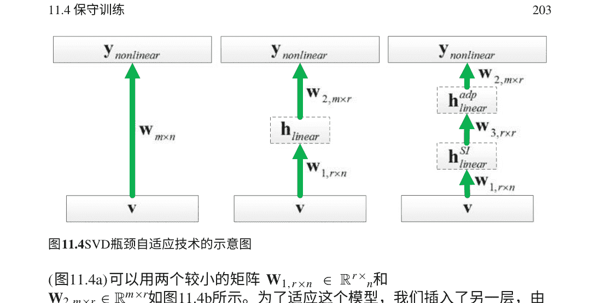

请注意，模型参数的奇异值分解还建议另一种模型适应技术[38]。请记住，在每一层中，模型权重W可以使用奇异值分解分解为三个组件

$$
W_{m \times n} = U_{m \times n} \Sigma_{n \times n} V^T_{n \times n}, \quad (11.17)
$$

其中 $\Sigma$ 是由降序排列的非负奇异值组成的对角矩阵，U和 $V^T$ 是酉矩阵，其列形成一组正交向量。在这里， $\Sigma$ 起着重要的作用，由于它是一个对角矩阵， $\Sigma$ 中的参数数量非常小，等于 $n$。我们可以只适应这个对角矩阵，而不是适应整个权重矩阵 W。如果适应集很小，我们甚至可以只适应奇异值中的前 $k\%$。

## 11.5 子空间方法

子空间方法旨在找到一个说话者子空间，然后构造适应的ANN权重或变换作为子空间中的一个点。在这个类别中有一些有前途的技术，包括基于主成分分析（PCA）的方法[9]，噪声感知[31]（我们在第9章中讨论过）和说话者感知训练[29]，以及基于张量的适应[41, 42]。这个类别中的技术可以快速将SI模型适应到特定的说话者。

## 11.5.1 主成分分析通过子空间构建

在[9]中，提出了一种快速适应技术。在这种技术中，子空间被用来估计一个仿射变换矩阵，将其视为一个随机变量。对一组适应矩阵进行主成分分析（PCA），以获取说话者空间中的主要方向（即特征向量）。然后，每个新的说话者适应模型都可以近似为保留特征向量的线性组合。

上述提到的技术可以扩展到更一般的条件。给定一组S个说话者，我们可以为每个说话者估计一个特定于说话者的矩阵 W^{ADP} ∈ ℝ^{m×n}。在这里，特定于说话者的矩阵可以是LIN、LHN或LON中的线性变换，或者是保守训练中的调整权重或增量权重。记作 a = vec(W^{ADP}) 矩阵的向量化，每个矩阵可以被视为维度为 m × n 的说话者空间中的一个随机变量的观察。PCA可以在说话者空间中的一组S向量上执行。从PCA中获得的特征向量定义了主要适应矩阵。

这种方法假设新的说话者可以被表示为在S说话者张成的空间中的一个点。换句话说，S足够大以覆盖说话者空间。由于每个新的说话者都由特征向量的线性组合表示，当S很大时，线性插值权重的总数也可能很大。幸运的是，可以通过丢弃与小方差对应的特征向量来降低说话者空间的维度。通过这种方式，每个特定于说话者的矩阵可以通过减少的参数数量高效地表示。

对于每个新的说话者，
$$a = \bar{a} + Ug_a \approx \bar{a} + \widetilde{U} \widetilde{g}_a \quad \quad (11.18)$$
其中 $U = (u_1, \ldots, u_S)$ 是特征向量矩阵，$\widetilde{U} = (u_1, \ldots, u_k)$ 是降维特征向量矩阵，$k$ 是保留的特征向量数量，$g_a$ 和 $\widetilde{g}_a$ 是适应参数向量在主方向上的完整和降维投影，$\bar{a}$ 是适应参数的平均值（跨说话者）。$\bar{a}$ 和 $\widetilde{U}$ 是从包含S个说话者的训练集中估计得到的。$\widetilde{g}_a$ 是从适应集中为每个新的说话者估计得到的。

图11.5展示了说话者感知训练的示意图。有两组时间同步输入：一组用于语音辨别的声学特征，另一组用于描述说话者的特征。

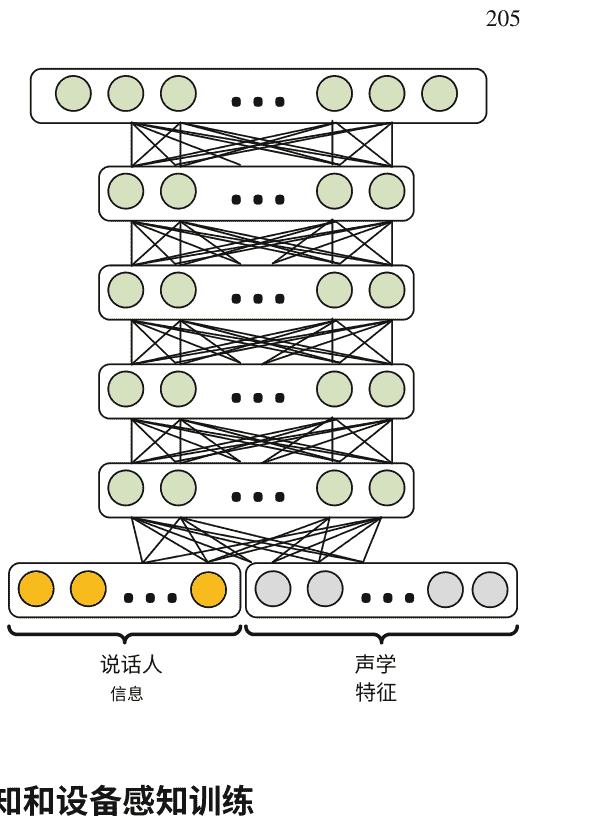

## 11.5.2 噪声感知、说话人感知和设备感知训练

另一组子空间方法明确地估计出话语中的噪声或说话人信息，并将此信息提供给网络，希望DNN训练算法能自动调整模型参数以利用噪声、说话人或设备信息。当使用噪声信息时，我们称之为噪声感知训练（NaT），当利用说话人信息时，我们称之为人感知训练（SaT），当使用设备信息时，我们称之为设备感知训练（DaT）。由于NaT、SaT和DaT非常相似，并且我们已经在第9章讨论了NaT，因此在本小节中我们将重点讨论SaT，同时指出NaT和DaT可以类似地进行。图11.5展示了SaT的架构，其中DNN的输入由两部分组成：声学特征和说话人信息（如果使用NaT，则为噪声信息）。

SaT帮助提升DNN性能的原因可以通过以下分析轻松理解。没有说话人信息时，第一个隐藏层的激活是

$$\mathbf{v}^1 = f(\mathbf{z}^1) = f(\mathbf{W}^1 \mathbf{v}^0 + \mathbf{b}^1), \quad (11.19)$$

其中，$\mathbf{v}^0$是声学特征向量，$\mathbf{W}^1$和$\mathbf{b}^1$分别是相应的权重矩阵和偏置向量。当使用说话人信息时，变为

$$\mathbf{v}_{\text{SaT}}^1 = f\left(\mathbf{z}_{\text{SaT}}^1\right) = f\left(\begin{bmatrix} \mathbf{W}_v^1 & \mathbf{W}_s^1 \end{bmatrix} \begin{bmatrix} \mathbf{v}^0 \\ \mathbf{s} \end{bmatrix} + \mathbf{b}_{\text{SaT}}^1\right)$$
$$= f\left(\mathbf{W}_v^1 \mathbf{v}^0 + \mathbf{W}_s^1 \mathbf{s} + \mathbf{b}_{\text{SaT}}^1\right)$$
$$= f\left(\mathbf{W}_v^1 \mathbf{v}^0 + \left(\mathbf{W}_s^1 \mathbf{s} + \mathbf{b}_{\text{SaT}}^1\right)\right), \quad (11.20)$$

其中，$\mathbf{s}$是表征说话人的向量，$\mathbf{W}_v^1$和$\mathbf{W}_s^1$分别是与声学特征和说话人信息相关的权重矩阵。与使用固定偏置向量$\mathbf{b}^1$的普通DNN相比，SaT使用了一个与说话者相关的偏置$\mathbf{b}_{\text{s}}^1 = \mathbf{W}_s^1 \mathbf{s} + \mathbf{b}_{\text{SaT}}^1$。SaT的一个好处是适应性是隐含的和高效的，并且不需要单独的适应步骤。如果说话者信息可以可靠地估计，SaT是DNN框架中进行说话者适应的一个很好的选择。

说话者信息可以通过多种不同的方式得到。例如，在[1, 37]中，使用说话者代码作为说话者信息。在训练过程中，这个代码与其他模型参数一起为每个说话者进行联合学习。在解码过程中，我们首先使用说话者说过的所有话语来学习一个新说话者的单一说话者代码。这可以通过将说话者代码视为模型参数的一部分，并使用反向传播算法估计它，同时保持其他参数不变来实现。然后，将说话者代码作为DNN的输入之一来计算状态概率。

说话者信息也可以完全独立于DNN训练来估计。例如，它可以从一个单独的DNN中学习，其中输出节点或最后一个隐藏层可以用来表示说话者。

在[29]中，使用i-vectors [8, 13]。I-vector是一种流行的说话者验证和识别技术。它将关于说话者身份的最重要信息封装在一个低维度的固定长度表示中，因此是ASR说话者自适应技术中的一种有吸引力的工具。I-vector不仅在DNN自适应中使用，还在GMM自适应中使用。例如，它已经在[16]中用于具有区域相关线性变换的判别式说话者自适应，在[5, 39]中用于聚类说话者或语音以实现更高效的自适应。由于从同一说话者发出的所有语音都估计出一个低维度的i-vector，因此相比其他方法，i-vector可以从更少的数据中可靠地估计出来。

由于i-vector是一种重要的技术，我们在这里总结了它的计算步骤。

### 11.5.2.1 I-Vector的计算

我们用$\mathbf{x}_t \in \mathbb{R}^{D \times 1}$表示从通用背景模型（UBM）生成的声学特征向量，该模型表示为具有K个对角协方差高斯的GMM。

$$\mathbf{x}_t \sim \sum_{k=1}^K c_k \mathcal{N}(\mathbf{x}; \boldsymbol{\mu}_k, \boldsymbol{\Sigma}_k), \quad (11.21)$$

其中 $c_k$、$\boldsymbol{\mu}_k$ 和 $\boldsymbol{\Sigma}_k$ 分别是第 $k$ 个高斯混合的混合权重、高斯均值和对角协方差。我们假设与说话人 $s$ 相关的声学特征 $\mathbf{x}_t(s)$ 来自于分布

$$\mathbf{x}_t(s) \sim \sum_{k=1}^{K} c_k \mathcal{N} (\mathbf{x}; \boldsymbol{\mu}_k(s), \boldsymbol{\Sigma}_k) , \tag{11.22}$$

其中 $\boldsymbol{\mu}_k(s)$ 是从UBM调整得到的说话人特定的GMM均值。我们进一步假设存在线性依赖关系

$$\boldsymbol{\mu}_k(s) = \boldsymbol{\mu}_k + \mathbf{T}_k \mathbf{w}(s) , \quad 1 \leq k \leq K , \tag{11.23}$$

在说话者自适应均值 $\boldsymbol{\mu}_k(s)$ 和说话者无关均值 $\boldsymbol{\mu}_k$ 之间，其中 $\mathbf{T}_k \in \mathbb{R}^{D \times M}$ 是因子加载子矩阵，其中包含 $M$ 个基向量，这些基向量跨越了组件均值向量空间中的重要变异性子空间，对应于组件 $k$，而 $\mathbf{w}(s)$ 是说话者身份向量（i-vector），对应于说话者。

请注意，i-vector $\mathbf{w}$ 是一个潜变量。如果我们假设其先验服从均值为0和单位协方差的高斯分布，每个帧都与一个固定的混合分量对齐，因子加载子矩阵 $\mathbf{T}_k$ 是已知的，我们可以估计后验分布[17]

$$p (\mathbf{w}| \{ \mathbf{x}_t(s) \}) = \mathcal{N} \left( \mathbf{w}; \mathbf{L}^{-1} (s) \sum_{\mathrm{k}=1}^{\mathrm{K}} \mathbf{T}_k^T \boldsymbol{\Sigma}_k^{-1} \boldsymbol{\theta}_k (s), \mathbf{L}^{-1} (s) \right) , \tag{11.24}$$

其中，精度矩阵 $\mathbf{L} (s) \in \mathbb{R}^{M \times M}$

$$\mathbf{L} (s) = \mathbf{I} + \sum_{k=1}^{K} \gamma_k (s) \mathbf{T}_k^T \boldsymbol{\Sigma}_k^{-1} \mathbf{T}_k , \tag{11.25}$$

以及零阶和一阶统计量

$$\gamma_k (s) = \sum_{t=1}^{T} \gamma_{tk} (s) , \tag{11.26}$$

$$\boldsymbol{\theta}_k (s) = \sum_{t=1}^{T} \gamma_{tk} (s) (\mathbf{x}_t (s) - \boldsymbol{\mu}_k (s)) . \tag{11.27}$$

其中 $\gamma_{tk} (s)$ 是给定 $\mathbf{x}_t (s)$ 的混合成分 $k$ 的后验概率。i-向量简单地是变量 $\mathbf{w}$ 的MAP点估计。

$$\mathbf{w}(s) = \mathbf{L}^{-1}(s) \sum_{k=1}^{K} \mathbf{T}_{k}^T \boldsymbol{\Sigma}_{k}^{-1} \boldsymbol{\theta}_{k}(s), \tag{11.28}$$

这只是后验分布(11.24)的平均值。

请注意，$\{\mathbf{T}_{k} | 1 \leq k \leq K\}$ 是未知的，需要使用期望最大化（EM）算法从特定于说话者的声学特征 $\{\mathbf{x}_{t}(s)\}$ 中估计，以最大化最大似然（ML）训练准则[6]。

$$Q(\mathbf{T}_{1}, \dots, \mathbf{T}_{K}) = -\frac{1}{2} \sum_{s,t,k} \gamma_{tk}(s) \left[ \log |\mathbf{L}(s)| + (\mathbf{x}_{t}(s) - \boldsymbol{\mu}_{k}(s))^{T} \boldsymbol{\Sigma}_{k}^{-1} (\mathbf{x}_{t}(s) - \boldsymbol{\mu}_{k}(s)) \right], \tag{11.29}$$

或等价地

$$\begin{aligned}
Q(\mathbf{T}_{1}, \dots, \mathbf{T}_{K}) &= -\frac{1}{2} \sum_{s,k} \left[ \gamma_{k}(s) \log |\mathbf{L}(s)| + \gamma_{k}(s) \text{Tr} \left\{ \boldsymbol{\Sigma}_{k}^{-1} \mathbf{T}_{k} \mathbf{w}(s) \mathbf{w}^{T}(s) \mathbf{T}_{k}^{T} \right\} \right. \\
&\quad \left. -2 \text{Tr} \left\{ \boldsymbol{\Sigma}_{k}^{-1} \mathbf{T}_{k} \mathbf{w}(s) \boldsymbol{\theta}_{k}^{T}(s) \right\} \right] + C,
\end{aligned} \tag{11.30}$$

对于 $\mathbf{T}_{k}$ 的导数，并将其设置为0，我们得到

M步

$$\mathbf{T}_{k} = \mathbf{C}_{k} \mathbf{A}_{k}^{-1}, \quad 1 \leq k \leq K \tag{11.31}$$

其中

$$\mathbf{C}_{k} = \sum_{s} \boldsymbol{\theta}_{k}(s) \mathbf{w}^{T}(s), \tag{11.32}$$

$$\mathbf{A}_{k} = \sum_{s} \gamma_{k}(s) \left[ \mathbf{L}^{-1}(s) + \mathbf{w}(s) \mathbf{w}^{T}(s) \right] \tag{11.33}$$

在E步骤中计算。

虽然我们分别讨论了SaT、NaT和DaT，但这些技术可以合并成一个单一的网络，其中输入有四个部分：一个用于语音特征，其余的用于说话者、噪声和设备代码。

说话者、噪声和设备代码可以共同训练，并且学习到的代码可以用于形成不同的条件组合。

## 11.5.3 张量

说话者和语音子空间也可以使用三路连接（或张量）进行估计和组合。在[41]中，提出了几种这样的架构。图11.6显示了一种这样的架构，称为不相交分解DNN。在这个架构中，从声学特征$\mathbf{x}_t$使用DNN估计说话者后验概率 $p(\mathbf{s}|\mathbf{x}_t)$。类后验概率 $p(y_t = i|\mathbf{x}_t)$的估计为

$$\begin{aligned}
p(y_t = i|\mathbf{x}_t) &= \sum_s p(y_t = i|\mathbf{s},\mathbf{x}_t) p(\mathbf{s}|\mathbf{x}_t) \\
&= \sum_s \frac{\exp\left(\mathbf{s}^T \mathbf{W}_i \mathbf{v}_t^{L-1}\right)}{\sum_j \exp\left(\mathbf{s}^T \mathbf{W}_j \mathbf{v}_t^{L-1}\right)} p(\mathbf{s}|\mathbf{x}_t). \quad\quad (11.34)
\end{aligned}$$

其中 $\mathbf{W} \in \mathbb{R}^{N_L \times S \times N_{L-1}}$是一个张量，$S$是说话人识别DNN中的神经元数量，$N_{L-1}$和 $N_L$分别是senone分类DNN中最后一个隐藏层和输出层的神经元数量，$\mathbf{W}_i \in \mathbb{R}^{S \times N_{L-1}}$是张量的一个切片。不幸的是，与我们讨论过的其他技术相比，张量网络中的参数总数通常非常大，因此在实际应用中不实用。

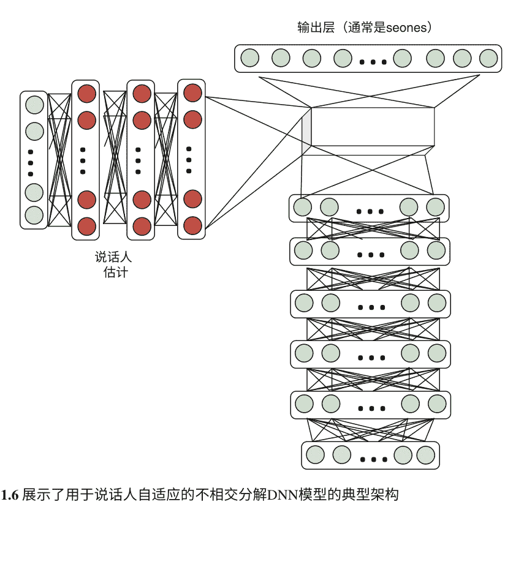

## 11.6 DNN说话人自适应的有效性

正如我们在第9章中讨论的那样，DNN可以提取出对声学特征的扰动不敏感的特征，而GMM和其他浅层模型则不然。事实上，研究表明，当网络从浅层变为深层时，使用fDLR的改进效果要小得多[30]。这就引发了一个问题，即在CD-DNN-HMM系统上进行说话人自适应可以获得多少额外的收益。 在本节中，我们使用[29, 36, 43]的实验结果表明，即使对于CD-DNN-HMM系统，说话人自适应技术也非常重要。

### 11.6.1 KL散度正则化方法

第一组实验结果来自[43]，是在一个短消息口述（SMD）任务上获得的。基线SI模型使用了300小时的语音搜索和SMD数据进行训练。评估是在来自9位说话人的数据上进行的，其中2位用作开发集以确定学习率，而7位用作测试集。测试集的总词数为20,668。 基线SI CD-DNN-HMM系统使用了24个对数滤波器组特征，具有高达二阶导数和11个上下文窗口大小，形成了一个792维的向量（72 x 11）输入。在输入层之上，有5个隐藏层，每个隐藏层有2,048个神经元。输出层的维度为5,976。DNN系统使用了来自GMM-HMM系统的音素对齐进行训练。基线SI CD-DNN-HMM系统在7个说话者的测试集上实现了23.4%的WER。为了评估适应集大小对结果的影响，适应语句的数量从5个（32秒）变化到200个（22分钟）。 图11.7a,b总结了使用有监督和无监督的KLD-Reg适应在SMD数据集上的WER。从这些图中，我们可以观察到使用开发集确定的最佳正则化权重，我们使用有监督适应获得了30.3%，25.2%，18.6%，12.6%，8.8%和5.6%的相对WER降低，使用无监督适应获得了14.6%，11.7%，8.6%，5.8%，4.1%和2.5%的相对WER降低，分别使用200，100，50，25，10和5个适应数据语句。这些图还显示，对于较小的适应集，应使用较大的正则化权重，对于较大的适应集，应使用较小的正则化权重，尽管在此任务中，只要正则化权重在[0.125 0.5]范围内，错误减少都是相当稳健的。与有监督适应相比，无监督设置可以从较大的正则化权重中获益。这是因为标签在无监督适应设置中，输出不太可靠，因此我们在适应过程中应更加信任SI模型的输出。

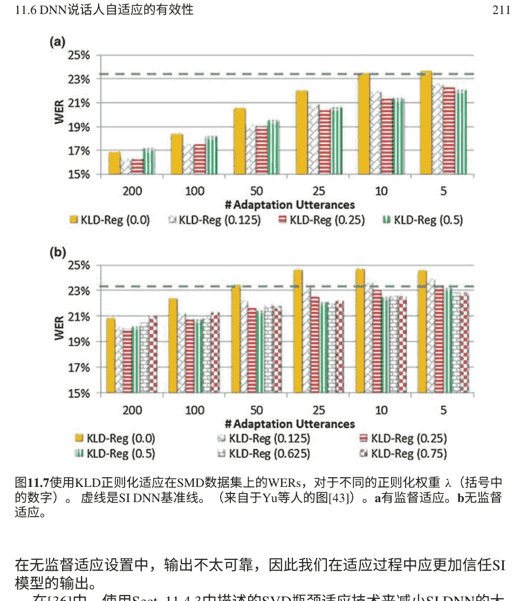

图11.7 使用KLD正则化适应在SMD数据集上的WERs，对于不同的正则化权重 λ（括号中的数字）。虚线是SI DNN基准线。（来自于Yu等人的图[43]）。a有监督适应。b无监督适应。

在[36]中，使用Sect. 11.4.3中描述的SVD瓶颈适应技术来减小SI DNN的大小和适应参数的占用空间。在相同的SMD任务上进行的实验中，首先将具有30M参数的全秩DNN模型转换为低秩模型，只保留总奇异值的40%。通过对这个低秩模型进行改进，最终模型的准确性与使用全秩模型相同。表11.1总结了在低秩SI模型上使用SI模型和KLD正则化适应所获得的结果。在这组实验中，正则化权重 λ设置为0.5。

表11.1 使用全秩和低秩（SVD）模型进行KLD正则化适应在SMD任务上的结果（WER%）。
| 模型类型 | 适应方法 | WER (%) |
| :--- | :--- | :--- |
| 全秩SI DNN | SI | 23.4 |
| 全秩SI DNN | 有监督KLD适应 (200句) | 16.3 |
| 低秩SI DNN | SI | 24.1 |
| 低秩SI DNN | 有监督KLD适应 (200句) | 19.8 |

从表中我们可以观察到，即使在完全低秩DNN适应中，适应足迹从7.4 M减少到SVD瓶颈适应中的266 K，我们仍然可以通过KLD正则化适应技术实现超过18%的相对误差减少。未发表的结果对于适应最佳SI DNN模型，我们可以确认这个结果。

表11.1 比较全秩适应和SVD瓶颈适应在SMD任务上的WER，所有都使用KLD正则化权重0.5进行监督

| 方法 | 5个话语适应 | 100个话语适应 | 完全模型适应 |
|------|-------------|---------------|--------------|
| SI低秩DNN | 25.12%（基线） | 24.30%（-3.2%） | 20.51%（-18.4%） |
| SVD瓶颈适应 | 25.12%（基线） | 24.23%（-3.5%） | 19.95%（-20.6%） |

以括号表示的相对WER减少。（表格基于Xue等人[36]总结的结果）

### 11.6.2 说话人感知训练

在[29]中，基于i向量的适应方法被应用于Switchboard（SWB）数据集[14, 15]，该数据集在第6章中描述，使用了300小时的数据来训练DNN模型。在他们的实验中，每个帧由一个13个感知线性预测（PLP）倒谱系数的特征向量表示，这些特征向量在每个对话方面进行了均值和方差归一化。每9个连续的倒谱帧被拼接在一起，并使用LDA将其投影到40维空间，然后通过全局半束缚协方差变换进行对角化。

他们首先使用最大似然准则训练了一个具有2,048个40维高斯分量和对角协方差的GMM UBM模型。然后，他们为每个说话者构建了一个与UBM大小相同的GMM，从UBM进行了适应。i-向量提取矩阵T1,...,T2048的初始值是从均匀分布[-1,1]中随机抽取的，并使用EM算法的10次迭代进行估计，该算法在公式（11.31）-（11.33）中描述。使用这些提取矩阵，他们为所有的训练和测试说话者提取了M维的i-向量。

DNN输入特征覆盖了11帧的时间上下文。换句话说，输入层有40×11+M（其中M={40, 100, 200}）个神经元。所有的DNN都有6个隐藏层，使用sigmoid激活函数：前5个隐藏层有2,048个单元，最后一个隐藏层有256个单元，用于参数减少和更快的训练。输出层有9,300个softmax单元，对应于上下文相关的HMM状态。解码语言模型使用的是一个4克鲁姆的LM，包含4M个n-gram。

表11.2比较了基于i-vector的SI DNN和DNN适应的SaT在HUB5'00和RT'03测试集上的词错误率（WER）。从表中我们可以观察到，无论是使用交叉熵还是序列判别训练准则，i-vector SaT适应都可以相对于SI DNN平均降低10%以上的相对错误率。

在[37]中，薛等人在Switchboard数据集上使用基于说话者编码的方法报告了结果。他们表明，通过使用10个适应语音来学习说话者编码，可以在帧级和序列判别训练基线上分别实现相对错误率降低6.2%（16.2%→15.2%）和4.3%（14.0%→13.4%）。

表11.2 比较了基于SI DNN和基于i-vector的说话者感知训练的DNN在HUB5'00和RT'03测试集上的WER

| 模型 | | Hub5'00 (SWB) | RT'03 (FSH) | RT'03 (SWB) |
|---|---|---|---|---|
| 交叉熵 | SI | 16.1% | 18.9% | 29.0% |
| | i-vector SaT | 13.9%（-13.7%） | 16.7%（-11.6%） | 25.8%（-11.0%） |
| 序列 | SI | 14.1% | 16.9% | 26.5% |
| | i-vector SaT | 12.4%（-12.1%） | 15.0%（-11.2%） | 24.0%（-9.4%） |

1. Abdel-Hamid, O., Jiang, H.: 基于判别性说话人代码学习的混合NN / HMM模型的快速说话人自适应。 在：国际声学、语音和信号处理会议 (ICASSP) 论文集，第7942-7946页 (2013)
2. Abrash, V., Franco, H., Sankar, A., Cohen, M.: 连接主义说话人归一化和自适应。 在：欧洲语音通信和技术会议 (EUROSPEECH) 论文集 (1995)
3. Albesano, D., Gemello, R., Laface, P., Mana, F., Scanzio, S.: 避免灾难性遗忘的人工神经网络自适应。 在：国际神经网络会议 (IJCNN) 论文集，第1554-1561页 (2006)
4. Albesano, D., Gemello, R., Mana, F.: 混合HMM-NN模型用于连续语音识别的静态-过渡单元。 Inf. Sci. 123(1), 3–11 (2000)
5. Bacchiani, M.: 移动语音应用的快速适应。 在：国际声学、语音和信号处理会议(ICASSP)论文集，pp. 7903–7907(2013)
6. Brümmer, N.: EM算法和最小差异。 Agnitio Labs技术报告。 http://niko.brümmer.googlepages (2009)
7. Chesta, C., Siohan, O., Lee, C.H.: 最大后验线性回归用于隐马尔可夫模型自适应。 在：E urospeech (1999)
8. Dehak, N., Kenny, P., Dehak, R., Dumouchel, P., Ouellet, P.: 前端因子分析用于说话人验证。 IEEE Trans. Audio, Speech Lang. Process. 19(4), 788–798 (2011)
9. Dupont, S., Cheboub, L.: 快速说话人自适应的人工神经网络用于自动语音识别。 在：国际声学、语音和信号处理会议(ICASSP)论文集，卷3, pp. 1795–1798 (2000)
10. Gales, M.J.: 基于HMM的语音识别的最大似然线性变换。 计算机语言与语音 12(2), 75-98 (1998)
11. Gales, M.J., Woodland, P.: 在mllr框架内的均值和方差自适应。 计算机语言与语音 10(4) , 249-264 (1996)
12. Gemello, R., Mana, F., Scanzio, S., Laface, P., De Mori, R.: 用于混合ANN/HMM模型自适应的线性隐藏变换。 语音通信 49(10), 827-835 (2007)
13. Glembeck, O., Burget, L., Matejka, P., Karafiát, M., Kenny, P.: i-vector提取的简化和优化。 在：国际声学、语音和信号处理会议(ICASSP)论文集，第4516-4519页 (2011)
14. Godfrey, J.J., Holliman, E.: Switchboard-1发布2版。 语言数据联盟 (1997)
15. Godfrey, J.J., Holliman, E.C., McDaniel, J.: Switchboard: 电话语音语料库用于研究和开发。 在：国际会议论文集，声学、语音和信号处理 (ICASSP) ，卷1，第517-520页 (1992年)
16. Karafiát, M., Burget, L., Matejka, P., Glembeck, O., Cernocky, J.: 基于iVector的自动语音识别的判别性适应。 在: IEEE Workshop on Automatic Speech Recognition and Understanding (ASRU)会议论文集, 第152-157页 (2011年)
17. Kenny, P.: 说话人和会话变异的联合因子分析：理论和算法。 CRIM, 蒙特利尔, (报告) CRIM-06/08-13 (2005年)
18. Kim, D.Y., Kwan Un, C., Kim, N.S.: 在嘈杂环境中使用一阶向量泰勒级数的语音识别。 语音通信。 24 (1) , 39-49 (1998年)
19. 李, C.H., 霍, Q.: 关于自适应决策规则和决策参数自适应的自动语音识别。 IEEE会议录 88(8), 1241-1269 (2000年)
20. Leggetter, C.J., Woodland, P.: 连续密度隐马尔可夫模型的说话人自适应的最大似然线性回归。 计算机语音语言 9(2), 171-185 (1995年)
21. 李, B., 沈, K.C.: 混合NN/HMM系统中的说话人自适应的判别性输入和输出变换的比较。 在: 国际语音通信协会 (INTERSPEECH) 年会论文集, 第526-529页 (2010年)
22. 李, J., 邓, L., 于, D., 龚, Y., Acero, A.: 通过向量泰勒级数联合补偿加性和卷积失真的高性能HMM自适应。 在: IEEE自动语音识别和理解研讨会 (ASRU) 论文集, 第65-70页 (2007年)
23. 李, J., 邓, L., 于, D., 龚, Y., 阿塞罗, A.: 使用相位敏感的声学失真模型进行环境鲁棒语音识别的HMM自适应。 在: 国际会议论文集, 声学、语音和信号处理 (ICASSP), 第4069-4072页 (2008年)
24. 李, J., 邓, L., 于, D., 龚, Y., 阿塞罗, A.: 具有加性和卷积失真的HMM自适应的统一框架。 计算机语音语言。 23 (3) , 389-405页 (2009年)
25. 李, X., 比尔梅斯, J.: 判别式分类器的正则化自适应。 在: 2006年IEEE国际会议论文集, 声学、语音和信号处理 (ICASSP), 卷I. IEEE, 第I-I页 (2006年)
26. Moreno, P.J., Raj, B., Stern, R.M.: 一种面向环境无关的语音识别的向量泰勒级数方法。 在: 国际声学、语音和信号处理会议(ICASSP)论文集, 卷2, 第733-736页(1996)
27. Morgan, N., Bourlard, H.: 使用多层感知器和隐马尔可夫模型的连续语音识别。 在: 国际声学、语音和信号处理会议(ICASSP)论文集, 第413-416页(1990)
28. Neto, J., Almeida, L., Hochberg, M., Martins, C., Nunes, L., Renals, S., Robinson, T.: 用于混合HMM-ANN连续语音识别系统的说话人自适应, 第2171-2174页(1995)
29. Saon, G., Soltau, H., Nahamoo, D., Picheny, M.: 使用i向量的神经网络声学模型的说话人自适应。 在: IEEE自动语音识别和理解(ASRU)研讨会论文集, 第55-59页(2013)
30. Seide, F., Li, G., Chen, X., Yu, D.: 在上下文相关的深度神经网络中的特征工程用于会话式语音转录。 在: IEEE Workshop on Automatic Speech Recognition and Understanding (ASRU)的论文集, 第24-29页 (2011)
31. Seltzer, M., Yu, D., Wang, Y.: 对于噪声鲁棒的语音识别的深度神经网络的研究。 在: 国际声学、语音和信号处理会议 (ICASSP) 的论文集 (2013)
32. Stadermann, J., Rigoll, G.: 混合绑定后验声学模型的两阶段说话人自适应。 在: 国际声学、语音和信号处理会议 (ICASSP) 的论文集 (2005)
33. Trmal, J., Zelinka, J., Müller, L.: 使用线性变换来适应前馈人工神经网络。 在: Text, Speech and Dialogue, 第423-430页。 Springer (2010)
34. Wang, Y., Gales, M.J.: 用于鲁棒语音识别的说话人和噪声分解。 IEEE Trans. Audio, Speech Lang. Process. 20(7), 2149-2158 (2012)
35. 肖, Y., 张, Z., 蔡, S., 潘, J., 严, Y.: 基于深度神经网络的大词汇连续语音识别的任务特定适应的初步尝试。 在: 国际语音通信协会年会论文集 (INTERSPEECH) (2012年)
36. 薛, J., 李, J., 于, D., Seltzer, M., 龚, Y.: 基于奇异值分解的低占用空间扬声器适应和个性化的深度神经网络。 在: 国际会议论文集上的声学、语音和信号处理 (ICASSP) (2014年)
37. 薛, S., Abdel-Hamid, O., 江, H., 戴, L.: 基于说话人代码的LVCSR中混合DNN/HMM模型的直接适应快速说话人适应。 在: 国际声学、语音和信号处理会议 (ICASSP) 论文集, 第6389-6393页 (2014年)
38. 薛, S., 江, H., 戴, L.: 基于奇异值分解的混合NN/HMM模型的语音识别的说话人适应。 在: 中国口语处理国际研讨会 (ISCSLP) (2014年)
39. 姚, K., 龚, Y., 刘, C.: 一种用于个性化的特征空间转换方法, 使用广义i-向量聚类。 在: 国际年会的论文集语音通信协会 (INTERSPEECH) (2012年)
40. 姚, K., 于, D., 塞德, F., 苏, H., 邓, L., 龚, Y.: 自适应上下文相关深度神经网络用于自动语音识别。 在: IEEE口语语言技术研讨会 (SLT) 论文集, 第366-369页 (2012年)
41. 于, D., 陈, X., 邓, L.: 因子化深度神经网络用于自适应语音识别。 在: 统计机器学习国际研讨会论文集 语音处理 (2012年)
42. 于, D., 邓, L., 塞德, F.: 深度张量神经网络及其在大词汇量语音识别中的应用。 IEEE音频, 语音语言处理。 21 (3) , 388-396页 (2013年)
43. 于, D., 姚, K., 苏, H., 李, G., 塞德, F.: KL散度正则化的深度神经网络适应-用于改进的大词汇量语音识别。 在: 国际会议论文集 声学, 语音和信号处理 (ICASSP) , 第7893-7897页 (2013年)

## 第五部分
## 高级深度模型

## 第12章 深度神经网络中的表示共享和转移

摘要 在前几章中，我们强调了在深度神经网络（DNNs）中，每个隐藏层都是对DNN的原始输入的新表示。较高层次的表示比较低层次的表示更抽象。在本章中，我们将展示这些特征表示可以通过多任务学习和迁移学习等技术在相关任务之间进行共享和转移。我们将使用多语言和跨语言语音识别作为主要示例，该示例使用共享隐藏层DNN架构来演示这些技术。

### 12.1 多任务和迁移学习

#### 12.1.1 多任务学习

多任务学习（MTL）[3]是一种机器学习技术，旨在通过同时学习多个相关任务来提高学习任务的泛化性能。成功应用MTL的关键是任务之间需要有关联性。

这里相关并不意味着任务相似。相反，它意味着在某个抽象层次上，这些任务共享部分表示。如果任务确实相似，一起学习它们可以帮助在任务之间传递知识，因为这有效地增加了每个任务的训练数据量。如果任务相关但不相似，一起学习它们可以帮助限制每个任务的可能功能空间，从而提高每个任务的泛化能力。当训练集大小相对于模型大小较小时，多任务学习非常有用。

由于深度神经网络（DNN）中的每个隐藏层都是DNN对原始输入的新表示，而高层的表示比低层的表示更抽象，因此DNN非常适合支持多任务学习（MTL）。图12.1展示了DNN中MTL的通用架构。在这个图中，显示了三个相关任务。

请注意，这些任务在较早的处理阶段（或层）独立地处理原始输入特征。然而，部分特征由虚线矩形框内的绿色层表示，这些特征来自并在三个任务之间共享。

共享特征再次分叉，以进行顶部的进一步任务相关处理。由于每个任务都有自己的训练准则，因此每个任务都有一个单独的输出层。

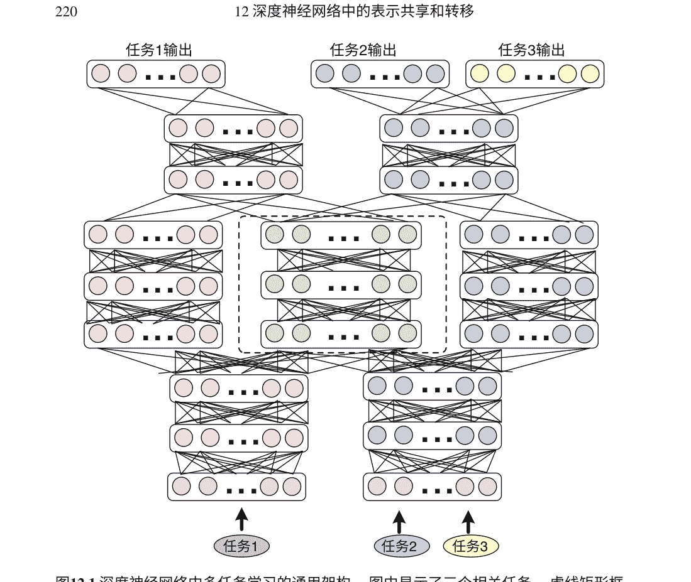

图12.1 深度神经网络中多任务学习的通用架构。图中显示了三个相关任务。虚线矩形框内的绿色层在所有任务中共享。

这是一个相当通用的架构。对于特定应用，需要做出的决策包括原始输入特征是否对涉及的任务相同（即，类似于图中的任务1和任务2对或任务2和任务3对），每个原始输入特征在特征合并和共享之前需要多少个任务相关层，是否共享所有或部分特征（例如，在图12.1中只共享部分特征），以及每个任务是否需要额外的任务相关隐藏层。这些决策是应用程序特定的，可以显著影响MTL的有效性。

#### 12.1.2 迁移学习

迁移学习[24]旨在通过保留和利用现有知识，高效有效地为新任务、领域或分布开发一个性能良好的系统，其知识来源于一个或多个类似任务、领域或分布中学到的知识。与多任务学习不同，多任务学习侧重于改善所有或一个主要任务的性能，而迁移学习侧重于通过在相似但不相同的任务、领域和分布之间转移知识来提高目标任务的性能。

由于隐藏层表示的更抽象和不变特征，深度神经网络非常适合迁移学习。在迁移学习中，主要的设计问题是什么和如何迁移。在深度神经网络框架中，这些问题被转化为如何表示要在深度神经网络中迁移的知识（例如，在哪个抽象级别）以及如何利用来自其他领域的知识。迁移学习具有很大的实际意义。在许多实际应用中，由于人工标注的高成本和/或环境/社会限制，往往很难获得足够匹配的训练数据。在这种情况下，任务领域之间的迁移学习将非常有价值。

迁移学习已成功应用于许多这样的机器学习任务（参见[24]进行最新调查）。在这些应用中，特征转移是在深度神经网络中非常适用的主要方法，用于在任务之间传递知识。

在接下来的章节中，我们将讨论如何应用多任务和迁移学习来攻击语音识别问题。我们关注三个关键应用：多语言和跨语言语音识别[11, 12, 16, 28, 33]，用于语音识别的多目标训练DNNs[4, 21, 30]，以及利用音频-视觉信息进行鲁棒语音识别[15]。

### 12.2 多语言和跨语言语音识别

在大多数传统的自动语音识别（ASR）系统中，语言（和方言）被独立考虑，并且为每种语言单独训练一个声学模型（AM）。这引入了几个问题。首先，从头开始为一种语言训练AM需要大量手动标记的训练数据，这不仅成本高昂，而且耗时。这也导致资源丰富和资源匮乏语言之间的质量差异相当大。这是因为对于资源匮乏的语言只能估计具有低复杂度的小型模型。拥有大量标记的训练数据的要求也是低流量和新推出的语言不可避免的瓶颈，因为很难找到大量代表性的数据。其次，为每种语言单独训练AM会增加累积的训练时间。

这对于基于深度神经网络（DNN）的ASR系统来说尤为真实，因为正如我们在第7章中提到的，训练DNN比训练高斯混合模型（GMM）要慢得多，这是由于DNN中的参数数量和使用的反向传播（BP）算法。第三，为每种语言构建单独的AM会导致识别不流畅，并增加混合语言语音识别的成本。为了高效有效地训练准确的声学模型，以适应大量语言，并降低训练AM所产生的成本，为了支持新的使用场景，其中混合语言的ASR至关重要（例如，在香港的中文短语中经常插入英语单词），建立多语言ASR系统并重复使用多语言资源引起了越来越多的兴趣。

尽管资源限制（包括标记数据和计算能力）是研究多语言ASR问题的一个非常实际的原因，但这并不是唯一的原因。通过研究和改进这些技术，我们还可以提高对所使用算法和不同语言之间关系的理解。在文献中已经有很多关于多语言和跨语言ASR的研究工作（例如，[20, 34]）。在本节中，我们仅关注使用神经网络的方法。

基于DNN的多语言ASR系统可以有许多不同的架构，我们将在接下来的几个小节中讨论。然而，这些架构共享相同的核心思想：DNN的隐藏层可以被视为一系列特征提取器，只有输出层提供与感兴趣的类别直接对应的信息，正如我们在第9章中强调的那样。这些特征提取器可以在许多不同的语言之间共享，与多种语言的数据一起进行联合训练，并转移到新的（通常是资源匮乏的）语言中。通过将共享的隐藏层转移到新的语言中，我们可以减轻从头开始训练大型DNN所需的大量数据的要求，因为只需要训练语言特定输出层的权重。

## 12.2.1 基于串联/瓶颈的跨语言语音识别

早期关于在多语言和跨语言声学建模中使用神经网络的研究主要集中在串联和瓶颈方法上[25, 27, 28, 32, 33]，因为只有在[7, 29]发表之后，DNN-HMM混合系统才成为大词汇连续语音识别(LVCSR)的重要替代声学模型。正如我们在第10章中所描述的，在串联/瓶颈方法中，神经网络被训练用于分类单音素状态或绑定三音素状态。然后，神经网络的输出或隐藏层激活被用作GMM-HMM声学模型的判别特征。

由于神经网络的隐藏层和输出层都包含了用于分类语音状态的信息，并且不同语言共享相似的语音现象，因此可以使用从为一种语言（称为源语言）训练的神经网络中提取的串联/瓶颈特征作为用于识别另一种语言（称为目标语言）的GMM-HMM系统的特征。实验证明，当目标语言的转录数据量较小时，这些转移特征可以改善竞争性的目标语言基准。

## 12.2.2 共享隐藏层多语言DNN

多语言和跨语言ASR可以更容易地在CD-DNN-HMM框架中实现。图12.2描述了所提出的用于多语言ASR的架构。

用于提取串联/瓶颈特征的神经网络可以通过使用不同的输出层（对应于每种语言的上下文无关音素）进行多语言训练[33]，类似于图12.2所示的方式。此外，可以训练多个神经网络，每个神经网络使用不同的特征，例如，一个使用谱（感知线性预测或PLP [13]）特征，另一个使用调制（频域线性预测或FDLP [2]）特征。从这些神经网络中提取的特征可以组合起来进一步提高识别准确性。

串联/瓶颈特征方法主要用于跨语言ASR以改善资源匮乏的语言。它们很少用于多语言ASR。这是因为即使使用相同的神经网络提取串联/瓶颈特征，通常仍然需要完全不同的GMM-HMM系统来处理每种语言。然而，如果多种语言共享相同的音素集合（或上下文相关音素状态）和决策树，这种限制可以被解除，就像[20]中所做的那样。共享的音素集合可以通过领域知识确定，例如使用国际音标（IPA）[1]，或通过数据驱动方法确定，例如通过测量不同语言的音素和三音素状态之间的距离[34]。

多语言ASR。该架构在[16]中被称为共享隐藏层多语言DNN（SHL-MDNN），因为输入和隐藏层在该架构中被所有SHL-MDNN可以识别的语言共享。然而，softmax层不共享。相反，每种语言都有自己的softmax层，用于估计特定于该语言的senones（绑定三音素状态）的后验概率。这个相同的架构也在[11,12]中独立提出。

请注意，该架构中的共享隐藏层可以被视为通用特征转换或特殊的通用前端。SHL-MDNN的输入覆盖了一个长的上下文窗口，其中包含声学特征（例如MFCC或Mel-scale log filter-bank）的帧，就像单语言CD-DNN-HMM系统中一样。然而，由于共享隐藏层将被多种语言使用，因此无法应用语言特定的转换，如HLDA。幸运的是，这个限制并不限制SHL-MDNN的性能，因为任何线性转换都可以被DNN所包含，如第9章所述。

图12.2中所示的SHL-MDNN是多任务学习[3]的一个特例，其中多个任务与共享表示同时学习。多任务学习对于学习DNNs有几个好处。首先，它提供了一个表示偏好，即所有任务支持的局部最优解被优先选择。其次，它可以缓解过拟合问题，因为共享的隐藏层（特征转换）现在可以更可靠地通过来自多种语言的数据进行估计。这对于资源稀缺的任务特别有帮助。第三，它有助于学习在并行任务中更容易学习的特征。第四，它有助于改善模型的泛化能力，因为模型现在是使用来自不同数据集的噪声进行训练的。

虽然SHL-MDNNs可以提供这些好处，但如果SHL-MDNN没有正确训练，我们将无法实现这些好处。成功训练SHL-MDNN的关键是同时为所有语言训练模型。当使用批量训练算法（如L-BFGS或无Hessian[22]算法）时，这是微不足道的，因为在模型的每次更新中都将使用所有数据。然而，如果使用基于小批量的随机梯度下降（SGD）训练算法，则希望在每个小批量中包含来自所有语言的训练数据。这可以通过在将其输入DNN训练工具之前对训练语句列表进行随机化来高效地实现。

在[11]中提出了一种替代的训练方法。在这个过程中，首先使用无监督的DBN预训练过程对所有隐藏层进行预训练，该过程在第5章中描述。然后选择一种语言，并添加一个随机初始化的与所选语言相对应的softmax层。这个softmax层和整个SHL-MDNN在所选择的语言上进行微调。在微调完成后，将softmax层替换为与下一种语言相对应的另一个随机初始化的softmax层，并在该语言上进行微调。这个过程对所有语言都重复进行。这种语言顺序训练的一个潜在问题是它会导致更加偏倚的估计，并且性能低于同时训练的过程。

SHL-MDNN可以使用第5章中描述的生成式或判别式预训练技术进行预训练。SHL-MDNN的微调可以使用传统的反向传播（BP）算法进行。然而，由于对于每种不同的语言，都使用不同的softmax层，算法需要稍作调整。当一个训练样本被呈现给SHL-MDNN训练器时，只有共享的隐藏层和语言特定的softmax层会被更新。其他softmax层保持不变。

训练完成后，SHL-MDNN可以用于识别训练过程中使用的任何语言的语音。由于多种语言可以同时使用其统一的DNN结构进行解码，SHL-MDNN使得多语言LVCSR变得简单和高效。在SHL-MDNN中支持新语言非常简单，如图12.3所示。只需在现有的SHL-MDNN中添加一个新的softmax层，并在新语言上训练新添加的softmax层即可。

通过共享SHL-MDNN中的隐藏层，并使用联合训练策略，我们可以提高SHL-MDNN对所有可解码语言的识别准确性，而不仅仅是使用来自各个语言的数据训练的单语DNN。已经在微软内部的语音识别任务上进行了SHL-MDNN的实验评估[16]。实验中使用的SHL-MDNN具有5个隐藏层，每个隐藏层有2048个神经元。DNN的输入是13维MFCC特征及其导数和加速度的11帧（5-1-5）。它是使用138小时的法语（FRA），195小时的德语（DEU），63小时的西班牙语（ESP）和63小时的意大利语（ITA）语音数据进行训练的。对于每种语言，输出层有1.8k个音素，这些音素是通过使用最大似然估计（MLE）在相同的训练集上训练的GMM-HMM系统确定的。SHL-MDNN使用无监督的DBN预训练过程进行初始化，然后使用从MLE模型对齐中得到的音素标签进行BP优化。训练好的DNN被插入到第6章中描述的CD-DNN-HMM框架中。

表12.1比较了使用单语DNN在特定语言的测试集上获得的词错误率（WER），该DNN仅使用该语言的数据进行训练，和SHL-MDNN，其隐藏层使用来自四种语言的数据进行训练。

表12.1 比较单语言DNN和共享隐藏层多语言DNN在WER上的表现

| | FRA | DEU | ESP | ITA |
|---|---|---|---|---|
| 测试集大小 (单词) | 40k | 37k | 18k | 31k |
| 单语言DNN WER | 28.1 % | 24.0 % | 30.6 % | 24.3 % |
| SHL-MDNN WER | 27.1 % (-3.6 %) | 22.7 % (-5.4 %) | 29.4 % (-3.9 %) | 23.5 % (-3.3 %) |

相对于单语言DNN的WER减少在括号中 (摘自Huang等人[16])

从表中我们可以观察到，SHL-MDNN在所有语言中相对WER降低了3-5%。我们相信SHL-MDNN获得的收益归功于跨语言知识。令人鼓舞的是，即使对于拥有超过100小时训练数据的FRA和DEU，SHL-MDNN仍然可以提供改进。

## 12.2.3 跨语言模型迁移

从多语言DNN中提取的共享隐藏层可以被视为与来自多个源语言的数据一起进行联合训练的智能特征提取模块。因此，它们携带了丰富的信息，可以用来区分多种语言中的音素类别，并且可以用来区分新语言中的音素。

跨语言模型转移的过程很简单。我们只需从SHL-MDNN中提取共享的隐藏层，并在其上方添加一个新的softmax层，如图12.4所示。softmax层的输出节点对应目标语言中的senones。然后我们固定隐藏层，只使用目标语言的训练数据来训练softmax层。如果有足够的训练数据，通过进一步调整整个网络可能会获得额外的收益。

为了评估跨语言模型转移的有效性，在[16]中进行了一系列实验，并在这里使用。在这些实验中，使用两种不同的语言作为目标语言：美式英语（ENU），它在音素上接近于用于训练Sect. 12.2.2中描述的SHL-MDNN的欧洲语言，以及中文（CHN），它与欧洲语言相距较远。ENU测试集包含2,286个话语（或18k个单词），CHN测试集包含10,510个话语（或40k个字符）。

### 12.2.3.1 隐藏层是可转移的

首先要问的问题是隐藏层是否确实可转移至其他语言。为了从经验上回答这个问题，假设有一个9小时的ENU训练数据（55,737个话语）可用于构建ENU ASR系统。表12.2总结了实验结果。基准DNN仅使用9小时ENU训练集。使用这种方法，在ENU测试集上实现了30.9%的WER。另一种方法是利用从其他语言学习的隐藏层（特征转换）。在这个实验中，使用138小时的法语训练数据训练了一个单语DNN。然后提取并重用这个DNN的隐藏层在ENU DNN中。如果隐藏层固定，并且只使用9小时的ENU训练数据训练ENU特定的softmax层，可以获得2.6%的WER降低（30.9%→27.3%）比基线DNN更好。如果使用9小时的ENU数据重新训练整个FRA DNN，将获得30.6%的WER，仅略优于30.9%的基线WER。这些结果表明，FRA DNN中隐藏层表示的特征转换可以有效地转移到识别ENU语音。

此外，如果从第12.2.2节中描述的SHL-MDNN中提取的共享隐藏层被提取并用于ENU DNN中，可以获得额外的绝对2.0%的WER降低（27.3%→25.3%）。这表明从SHL-MDNN中提取的隐藏层在构建ENU DNN时比从FRA DNN中提取的隐藏层更有效。总体而言，通过使用跨语言模型转移，相对于基准ENU DNN，实现了4.6%（或18.1%相对）的词错误率降低。

表12.2 比较使用隐藏层（HLs）从FRA DNN传递与不传递时在ENU测试集上的WER设置

|  | WER (%) |
| --- | --- |
| 基线DNN（仅使用9小时的美国英语数据进行训练） | 30.9 |
| 使用法语训练的隐藏层 + 重新调整所有层 | 30.6 |
| 使用法语训练的隐藏层 + 仅重新调整Softmax层 | 27.3 |
| 使用四种语言训练的共享隐藏层 + 仅重新调整Softmax层 | 25.3 |
| (摘自Huang等人[16]) |  

### 12.2.3.2 目标语言训练数据的大小很重要

第二个问题是目标语言训练数据的大小如何影响多语言DNN跨语言模型转移的性能。为了回答这个问题，Huang等人进行了实验，假设有3、9和36小时的英语（目标语言）训练数据可用。表12.3来自[16]总结了结果。从表中，我们可以观察到利用转移隐藏层的DNN始终优于不使用跨语言模型转移的基准DNN。我们还可以观察到当不同大小的目标语言可用时，最佳的学习策略是不同的。当目标语言训练数据少于10小时时，最佳策略是只训练一个新的softmax层。通过这样做，我们观察到相对于基准DNN，当有3小时和9小时的ENU语音数据可用时，WER相对减少了28.0%和18.1%。然而，当训练数据的数量足够大时，进一步调整整个DNN可以提供额外的错误减少。例如，当有36小时的ENU语音数据可用时，通过调整所有层，我们观察到额外的0.8%的WER减少（从22.4%到21.6%）。

表12.3 比较从SHL-MDNN中转移隐藏层时目标语言训练集大小对WER的影响美国英语训练数据

| | 3小时 (%) | 9小时 (%) | 36小时 (%) |
| :--- | :---: | :---: | :---: |
| 基准DNN（仅使用英语数据训练） | 38.9 | 30.9 | 23.0 |
| SHL-MDNN + 仅优化Softmax层 | 28.0 | 25.3 | 22.4 |
| SHL-MDNN + 优化所有层 | 33.4 | 28.9 | 21.6 |
| 最佳情况下相对词错误率降低 (%) | 28.0 | 18.1 | 6.1 |
| （摘自Huang等人[16]） | | | |

### 12.2.3.3 从欧洲语言到普通话的转换是有效的

第三个问题是跨语言模型转换方法的有效性是否对源语言和目标语言之间的语言相似性敏感。为了回答这个问题，黄等人[16]将普通话作为目标语言，该语言与用于训练SHL-MDNN的欧洲语言有明显差异。表12.4来自[16]列出了在中文训练数据大小变化时使用基准和多语言增强DNN的字符错误率（CERs）。为了实现表中报告的结果，当可用的中文数据少于9小时时，只训练了softmax层。当有超过10小时的中文数据可用时，所有层都会进一步优化。我们可以看到，在所有情况下，通过使用转移的隐藏层观察到CER的减少。即使有139小时的中文训练数据可用，我们仍然可以从SHL-MDNN中获得8.3%的相对CER减少。此外，仅使用36小时的中文数据，通过转移SHLs从SHL-MDNN中，我们可以在测试集上实现28.4%的CER，这比使用139小时的中文训练数据训练的基准DNN获得的29.0%的CER要好，节省了超过100小时的中文转录工作量。

表12.4 跨语言模型转移对中文的有效性的影响，以字符错误率 (CER) 减少为衡量标准

| 中文训练集 | 3小时 (%) | 9小时 (%) | 36小时 (%) | 139小时 (%) |
|------------|-----------|-----------|------------|-------------|
| 基准DNN (仅使用中文数据训练) | 45.1 | 40.3 | 31.7 | 29.0 |
| SHL-MDNN模型转移 | 35.6 (-21.1) | 33.9 (-15.9) | 28.4 (-10.4) | 26.6 (-8.3) |

> 相对CER减少在括号中（摘自Huang等人[16]）

### 12.2.3.4 使用标签信息很重要

第四个问题是要问的是，通过无监督学习提取的特征能否像通过监督训练那样有效地执行分类任务。如果答案是肯定的，那么这将提供显著优势，因为获取未转录的语音数据比获取转录的数据更容易用于模型训练。

在本小节中，我们展示了标签信息对于有效地从多语言数据中学习共享表示的重要性。表12.5基于[16]的结果，比较了在训练共享隐藏层时使用和不使用标签信息的系统。从表12.5可以看出，仅使用预训练的多语言DNN并使用ENU数据对整个网络进行调整（30.9 %→30.2 %）虽然有一些收益，但是与使用标签信息时（30.9 %→25.3 %）相比，收益要小得多。这些结果清楚地表明，标记数据比未标记数据更有价值，并且使用标签信息对于从多语言数据中学习有效特征至关重要。

表12.5 比较从多语言数据中学习的特征与使用和不使用 ENU 数据上的标签信息

| | SHL-MDNN 使用标签训练? | WER (%) |
|----------------------------------|------------------------|---------|
| 基准 DNN (仅使用 9 小时的美国英语数据进行训练) | - | 30.9 |
| SHL-MDNN + 仅优化 softmax 层 | 否 | 38.7 |
| SHL-MDNN + 优化所有层 | 是 | 30.2 |
| SHL-MDNN + 仅优化 softmax 层 | 是 | 25.3 |

> （摘自Huang等人[16]）

## 12.3 深度神经网络的多目标训练用于语音识别

由于多任务学习可以潜在地提高所有涉及任务的泛化能力，因此它也被用于更一般的语音识别的深度神经网络的多目标训练。在本节中，我们随机选择了三个这样的应用。请注意，在这三个任务中，训练集都很小。

### 12.3.1 多任务学习的鲁棒语音识别

在[21]中，卢等人提出使用多任务学习来改善嘈杂数字识别任务的鲁棒性。他们使用了一个单隐藏层循环神经网络，如图12.5所示，用于数字分类。与以前的工作不同，他们训练神经网络同时对数字进行分类、增强嘈杂的语音，并识别说话者的性别。在他们的实验中，选择了1,000个示例进行训练，并使用110个示例来控制训练的停止条件。在Aurora测试集A中对孤立数字样本进行了测试。他们观察到，通过同时包括增强和性别识别任务，相对于仅进行数字分类训练的系统，可以将错误率减少近50%。

### 12.3.2 多任务学习改进的电话识别

在[30]中，Seltzer和Droppo提出通过在DNN训练中添加一个次要任务来提高TIMIT电话识别任务[10]上DNN-HMM系统的识别准确性。他们采用了用于电话识别的标准DNN[14]，其中包含四个2,048神经元隐藏层，并使用183个单音状态作为DNN训练目标，并研究了三个不同的次要任务：电话标签任务：他们通过将状态符号映射到相应的电话标签来为每个训练示例创建电话标签，并将此电话标签用作辅助任务的目标。这样做的直觉是，通过这样做，DNN可以知道哪些状态属于同一个电话，因此不需要过于激进地分离这些状态。

状态上下文任务：他们不仅对中心帧的状态标签进行分类，还添加了一个辅助任务来分类前一帧和后一帧的声学状态标签。这个辅助目标函数衡量了模型预测当前声学模型状态以及前一帧和后一帧声学模型状态的能力。这个想法是通过向模型提供关于声学状态的时间演变信息，系统可以区分电话边界处的状态和中间状态。

电话上下文任务：由于主要任务是识别单音素状态所以三音素状态模型中的电话上下文信息是缺失的。为了弥补上下文信息的缺失，他们添加了一个次要任务来识别左右上下文电话标签。

他们在TIMIT语料库[10]上进行了一系列实验，该语料库包含来自630名英语母语者的连续语音，每个说话者有八个可用的录音发音。核心测试集包括24名说话者，不包括训练集中的462名说话者。使用一组61个音素标签进行识别，每个标签有三个状态，总共有183个可能的单音素状态。次要任务仅在训练过程中使用，并在测试过程中丢弃。解码后，将61个电话标签合并为一组39个电话类别进行评分，遵循[18]的方法。

他们的结果表明，将电话标签分类作为次要任务不会影响主要任务的结果。这是可以理解的，因为电话标签不提供任何额外的信息，而主要任务已经使用了状态标签。将电话上下文分类作为次要任务在核心测试集上实现了最高的音素错误率（PER）降低（21.63 →20.25%），超过了使用标准前馈网络架构的DNN在文献中的最佳性能。总之，如果选择合适的次要任务，网络可以利用不同任务中的共同结构来学习具有更好泛化能力的模型。

## 12.3.3 同时识别音素和字素

在[4]中，陈等人提出通过在低资源语言的MTL框架下，联合训练DNN和相同语言的三音素模型来提高三音素模型的泛化性能。三音素建模和三字母建模显然是同一语言的相关学习任务。可以合理地认为用于分类音素和字母的特征可以共享。

在[4]中，三音素声学建模被选为主要任务，三字母声学建模被选为次要任务。他们系统的架构与多语言语音识别中使用的架构非常相似，只是两个输出层分别训练来模拟给定输入声学帧的三音素绑定状态和三字母绑定状态的后验概率。所有隐藏层在两个任务之间共享。陈等人在三种低资源的南非语言（即南非荷兰语、塞索托语和斯瓦特语）上评估了这个MTL系统，每种语言的训练语音约为1小时。他们发现MTL-DNN相对于单任务学习（STL）DNN具有5-13%的相对误差减少。更有趣的是，MTL-DNN甚至比ROVER [9]集成的三音素和三字母STL DNN还要好，相对误差减少了0.5-4.2%。

## 12.4 利用音频-视觉信息进行鲁棒语音识别

在一些任务中，目标是通过利用其他信息源（例如视觉信息）来提高主要任务（例如语音识别）的准确性。如果为设计附加信息的任务也同时进行优化，则可以将此类问题视为多任务学习问题。然而，在大多数情况下，次要任务并没有进行优化，因为性能的提升主要来自于使用附加信息而不是多任务学习。在这类应用中，关键的设计问题是如何利用这些附加信息。

我们在第9章中讨论的混合带宽语音识别就是这类应用的一个例子。如图9.12所示，有两个信息源：来自较低滤波器组的输出和来自较高滤波器组的输出。如果只有来自较低滤波器组的信息可用，例如信号是窄带的情况下，会观察到较低的识别准确性。如果两个信息源都可用，例如宽带信号的情况下，可以实现额外的错误率降低。不仅如此，通过使用混合带宽数据训练DNN，由于DNN架构和训练数据的组合所施加的正则化，窄带和宽带语音的性能都可以得到提高。

在[15]中，黄和金斯伯里提出了一个类似的架构。然而，他们的目标是通过利用视听信息来提高鲁棒的语音识别准确性。他们系统的架构如图12.6所示，这是图12.1的一个特例。

他们的工作受到人类语音感知的双模态（听觉和视觉）的启发[31]。由于视觉信息与音频分离且对声学噪声不变，它在清洁和嘈杂的环境中都有可能改善仅音频的语音识别[5, 6, 8, 17, 19, 23, 26]。毫不奇怪，最成功的系统从面部感兴趣区域提取视觉特征。在[15]中，黄和金斯伯里研究了使用深度神经网络来改善视听语音识别，重点是使用视觉模态来补充音频。他们研究了两种技术来实现这个目标。第一种技术是将两个单模态DNN（一个用于音频，一个用于视觉特征）的决策融合起来。第二种技术是在中间隐藏层融合特征，如图12.6所示。在一个连续语音数字识别任务中，他们的实验表明，这些方法相对于基线的多流音频-视觉GMM/HMM系统可以将词错误率降低高达21%。

图12.6 通过利用视听信息来改善嘈杂语音识别的深度神经网络架构。虚线矩形框中的绿色隐藏层是两种模态共享的。

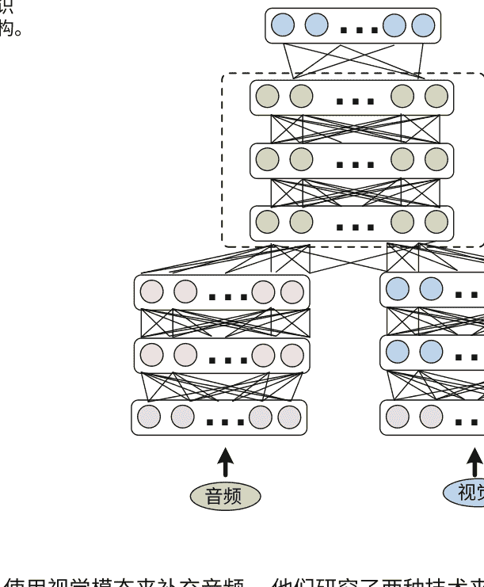

## 参考文献

1.  协会，I.P.等：关于1989年基尔大会的报告。国际语音学协会杂志 **19**(2), 67–80 (1989)
2.  Athineos, M., Ellis, D.P.：用于时域特征的频域线性预测。 在：IEEE自动语音识别和理解研讨会论文集(ASRU), 第261–266页 (2003年)
3.  Caruana, R.：多任务学习。 Mac. Learn. **28**(1), 41–75 (1997)
4.  Chen, D., Mak, B., Leung, C.C., Sivadas, S.：通过多任务学习深度神经网络联合声学建模三音素和三字母组合，用于低资源语音识别。 在：国际声学、语音和信号处理会议(ICASSP)论文集 (2014)
5.  Chen, T., Rao, R.R.：多模式通信中的视听整合。 IEEE会议论文 **86**(5), 837–852 (1998)
6.  Chibelushi, C.C., Deravi, F., Mason, J.S.: 基于语音的双模式识别综述。多媒体IEEE Trans. 4(1), 23–37 (2002)
7.  Dahl, G.E., Yu, D., Deng, L., Acero, A.: 上下文相关的预训练深度神经网络用于大词汇量语音识别。IEEE Trans. Audio Speech Lang. Process. 20(1), 30–42 (2012)
8.  Dupont, S., Luettin, J.: 面向连续语音识别的音频-视觉语音建模。多媒体IEEE Trans. 2(3), 141–151 (2000)
9.  Fiscus, J.G.: 一个后处理系统以获得降低的词错误率：识别器输出投票错误减少 (ROVER)。在：IEEE自动语音识别和理解研讨会 (ASRU) 论文集，第347–354页 (1997)
10. Garofolo, J.S.: Darpa Timit: 声学-语音连续语音语料库 CD-ROM。美国商务部，国家标准与技术研究所，盖瑟斯堡 (1993)
11. Ghoshal, A., Swietojanski, P., Renals, S.: 深度神经网络的多语言训练。在：国际会议论文集，声学、语音和信号处理 (ICASSP) (2013)
12. Heigold, G., Vanhoucke, V., Senior, A., Nguyen, P., Ranzato, M., Devin, M., Dean, J.: 使用分布式深度神经网络的多语言声学模型。In: 国际声学、语音和信号处理会议 (ICASSP) 论文集 (2013)
13. Hermansky, H.: 语音的感知线性预测 (PLP) 分析。J. Acoust. Soc. Am. 87, 1738 (1990)
14. Hinton, G., Deng, L., Yu, D., Dahl, G.E., Mohamed, A.r., Jaitly, N., Senior, A., Vanhoucke, V., Nguyen, P., Sainath, T.N., 等：深度神经网络在语音识别中的声学建模：四个研究小组的共同观点。IEEE Signal Process. Mag. 29(6), 82–97 (2012)
15. 黄，J.，金斯伯里，B.：用于噪声鲁棒语音识别的音频-视觉深度学习。在：国际声学、语音和信号处理会议 (ICASSP) 论文集，第7596-7599页 (2013)
16. 黄，J.T.，李，J.，于，D.，邓，L.，龚，Y.：使用多语言深度神经网络和共享隐藏层进行跨语言知识转移。在：国际声学、语音和信号处理会议 (ICASSP) 论文集 (2013)
17. 金，M.W.，柳，J.W.，金，E.J.：基于神经网络的音频、视觉和上下文特征集成的语音识别。自然计算进展，第155-164页。斯普林格，柏林 (2005)
18. 李，K.F.，洪，H.W.：使用隐马尔可夫模型的说话人无关电话识别。IEEE交易。语音音频处理。37(11), 1641-1648页 (1989)
19. Lewis, T.W., Powers, D.M.：使用红外排除和神经网络的视听语音识别。J. Res. Pract. Inf. Technol. 35(1), 41–64 (2003)
20. Lin, H., Deng, L., Yu, D., Gong, Y.f., Acero, A., Lee, C.H.：大词汇ASR的多语言声学建模研究。In: 国际会议论文集声学、语音和信号处理 (ICASSP), pp. 4333–4336 (2009)
21. Lu, Y., Lu, F., Sehgal, S., Gupta, S., Du, J., Tham, C.H., Green, P., Wan, V.：连接主义语音识别中的多任务学习。In: 澳大利亚国际会议语音科学与技术 (2004)
22. Martens, J.：通过Hessian-free优化进行深度学习。In: 机器学习国际会议 (ICML) 论文集，pp. 735–742 (2010)
23. Ngiam, J., Khosla, A., Kim, M., Nam, J., Lee, H., Ng, A.Y.：多模态深度学习。在：第28届国际机器学习大会 (ICML-11) 论文集，第689–696页 (2011)
24. Pan, S.J., Yang, Q.：迁移学习综述。IEEE Trans. Knowl. Data Eng. 22(10), 1345–1359页 (2010)
25. Plahl, C., Schluter, R., Ney, H.：中英文神经网络特征在法语和德语LVCSR中的跨语言可移植性。在：IEEE Workshop on Automatic Speech Recognition and Understanding (ASRU) 论文集，第371–376页 (2011)
26. Potamianos, G., Neti, C., Gravier, G., Garg, A., Senior, A.W.: 音频视觉语音自动识别的最新进展。IEEE 91(9), 1306–1326页(2003)
27. 钱，Y.，刘，J.：跨语言和集成MLPs策略用于低资源语音识别。在：国际语音通信年会论文集 (INTERSPEECH) (2012)
28. Schultz, T., Waibel, A.: 多语言和跨语言语音识别。在：DARPA广播新闻转录和理解研讨会论文集，第259-262页 (1998)
29. Seide, F., Li, G., Yu, D.: 使用上下文相关深度神经网络的对话语音转录。在：国际语音通信年会论文集 (INTERSPEECH)，第437-440页 (2011)
30. Seltzer, M.L., Droppo, J.: 深度神经网络中的多任务学习以改善音素识别。在：声学、语音和信号处理国际会议论文集 (ICASSP)，第6965-6969页 (2013)
31. Sumby, W.H., Pollack, I.: 在噪声中对语音可懂度的视觉贡献. J. Acoust. Soc. Am. (JASA) 26(2), 212–215 (1954)
32. Thomas, S., Ganapathy, S., Hermansky,H.: 用于低资源LVCSR系统的跨语言和多流后验特征 在: Proceedings of the Annual Conference of International Speech Communication Association (INTERSPEECH), pp. 877–880 (2010)
33. Thomas, S., Ganapathy, S., Hermansky, H.: 用于低资源LVCSR系统的多语言MLP特征 在: Proceedings of the International Conference on Acoustics, Speech and Signal Processing (ICASSP), pp. 4269–4272 (2012)
34. Yu, D., Deng, L., Liu, P., Wu, J., Gong, Y., Acero, A.: 在运行时资源约束下的跨语言语音识别 在: Proceedings of the International Conference on Acoustics, Speech and Signal Processing (ICASSP), pp. 4193–4196 (2009)

## 第13章 循环神经网络及相关模型

摘要 循环神经网络（RNN）是一类神经网络模型，其神经元之间存在许多连接形成一个有向循环。这导致了RNN中的内部状态或记忆结构的形成，赋予其动态时间行为，而这是之前章节中所讨论的DNN所没有的。在本章中，我们首先将基本RNN的状态空间形式化为一个非线性动态系统，其中控制系统动态的循环矩阵大部分是无结构的。对于这样的基本RNN，我们详细描述了两种学习其参数的算法：（1）最流行的时间反向传播算法（BPTT）；（2）一种更严格的原始-对偶优化技术，通过对RNN的循环矩阵施加约束来保证RNN学习过程中的稳定性。在超越基本RNN的基础上，我们进一步研究了一种高级版本的RNN，它利用了称为长短期记忆（LSTM）的结构，并分析了它在模型构建和实际应用方面相对于基本RNN的优势，包括一些最新的语音识别结果。最后，我们将RNN作为自底向上的判别式动态系统模型与自顶向下的生成式动态系统模型进行分析，这在第4章中进行了讨论。分析和讨论导致了潜在更有效和先进的类似RNN的架构和学习范式，其中将判别建模和生成建模的优势整合在一起，同时克服了它们各自的弱点。

### 13.1 引言

正如在之前的章节中讨论的那样，在深度学习技术崛起之前，自动语音识别（ASR）技术长期以来一直被“浅层”架构的隐马尔可夫模型（HMMs）所主导，每个状态由高斯混合模型（GMM）所描述，我们在第2章和第3章中详细介绍了这一点。虽然使用复杂且经过精心设计的GMM-HMMs变体和适用于它们的声学特征取得了显著的技术成功，但研究人员长期以来一直预计下一代ASR将需要解决许多新的技术挑战，并在多样化的部署环境下克服这些挑战。

克服这些挑战可能需要至少能够在功能上模拟人类语音识别系统的深度架构，该系统已知在语音产生和语音感知中具有动态和分层结构[18, 29, 35, 94]。在2009年的NIPS语音识别和相关应用的深度学习研讨会上，尝试将这种深层语音结构的原始级别纳入其中，这为ASR社区追求基于深度神经网络（DNN）架构的深度表示学习方法提供了动力，该方法在机器学习社区中仅仅几年前就被开创[51, 52]，但迅速发展成为业界广泛采用的最新技术，例如[12, 13, 23, 24, 26, 47, 50, 60, 75, 84–87, 91, 92, 100, 101, 108]。

然而，与此同时，许多人已经意识到DNN-HMM方法没有正确地建模语音动态。这与我们在第3章中分析的HMM主题中的相同类型的限制有关，在那里我们讨论了几种HMM的变体，旨在克服这些限制。过去几年来，深度学习和ASR研究人员开发了深度和时间递归神经网络（RNN），这是本章的重点，以克服动态建模的挑战；例如，[10, 21, 43–46, 66, 78, 88, 89, 96, 99]。在RNN中，动态语音特征的内部表示是通过将低级声学特征与过去历史的循环隐藏特征一起馈送到隐藏层中来判别形成的。相比之下，在DNN-HMM中没有语音动态的内部表示。RNN是一类神经网络模型，其中许多单元之间的连接形成一个有向循环，因此称为循环。这样的循环或重复与时间延迟操作相关联。在时间维度上使用时延重复产生了内部状态的记忆结构，在RNN中表达为内部状态，使其能够展示出DNN和DNN-HMM在前几章中没有展示出的动态时间行为类型。

即使不像[45, 46, 88, 89]中所做的那样将RNN堆叠在一起，也不像[10, 21]中所探索的那样将DNN特征馈入RNN，RNN本身也是一个深度模型，因为RNN的时间展开会在网络中创建与输入语音句子长度相同的层。最近在语音识别方面取得的进展中，RNNs取得了出色的语音识别准确性，包括RNN的长-短期记忆（LSTM）版本，该版本早在1997年由神经网络研究人员[39, 40, 44, 45, 53, 103]开始。本章的一个重点是介绍RNN的背景和数学公式（第13.2节），以及学习方法，包括最流行的时序反向传播（BPTT）技术（第13.3节）。

使用RNN或相关的神经预测模型进行语音识别可以追溯到20世纪80年代末和90年代初；例如，[22, 82, 102]，这些方法实现了相对较低的识别准确率。自从深度学习在最近几年变得流行以来，对RNN的研究更加深入，包括应用于语音[45, 46, 88, 89]和语言[11, 67–73]，以及其堆叠版本，也称为深度RNN[45, 46, 48, 77, 88]。大多数关于RNN的工作都使用了BPTT方法来训练其参数，并且需要利用经验技巧（例如，当梯度变得过大时截断梯度[69, 70]），以使训练有效。 直到最近才对学习RNN的困难进行了仔细分析，并且开发出了一些相对更有原则性但仍然相当启发式的解决方案。 例如，在[3, 6, 78]中提出了梯度范数剪切的策略来处理BPTT训练中的梯度爆炸问题。 还有其他解决方案可以改进RNN的学习方法；例如，[10, 56]。 在[10]中描述的方法基于比大多数其他方法更有原则性的优化技术，并将在第13.4节进行回顾。此外， 最近已经证明LSTM版本的RNN在小规模和大规模ASR中表现出色，并且其结构具有很好的动机 。我们将在第13.5节专门讨论这个主题。

值得注意的是，在深度学习用于语音建模和识别之前，已经进行了一些早期的尝试，我们在第3章的第3.7节中简要讨论了这些尝试，以开发比传统的GMM-HMM架构更“深”的计算架构。 这类模型中的一个突出类别是隐藏动态模型，其中动态语音特征的内部表示是从整体深度语音模型层次结构中以概率方式生成的[9, 15, 17, 30, 34, 62, 80, 97, 105, 107]。 尽管RNN和隐藏动态或轨迹模型是分开发的，但它们具有非常相似的动机，即表示人类语音中的动态结构。 然而，这两种类型的深度动态模型的构建方式存在一些不同的方式，使它们具有不同的优缺点。 仔细分析这两种模型类型之间的对比以及它们彼此之间的相似性，将有助于洞察开发具有优于现有RNN和隐藏动态模型的语音特征隐藏表示的新型深度动态模型的策略。我们将在本章的第13.6节中对（判别式） RNN和（生成式） 隐藏动态模型进行对比分析。 在这个多方面的分析中，我们将主要关注这两种动态模型之间在自上而下与自下而上信息流和在局部与分布式表示方面的对立对比，并关注这两种模型中潜在向量采用的对立的局部与分布式表示。

## 13.2 基本递归神经网络的状态空间形式

RNN在本质上与前馈DNN有所不同，因为RNN不仅基于输入操作，还基于内部状态操作。 内部状态编码了RNN已经处理过的时间序列中的过去信息 。从这个意义上说，RNN是一个动态系统，比DNN更加通用，后者只执行静态的输入-输出转换。 在RNN中使用状态空间使其能够表示和学习长时间跨度上的顺序扩展依赖关系，至少在原则上是如此。

现在，让我们以信号处理中常用的（无噪声）非线性状态空间模型的术语来表述简单的单隐藏层RNN。这种表述使我们能够将RNN与用于语音声学生成模型的相同状态空间表述的非线性动态系统进行比较。通过对比判别性RNN和生成模型中使用相同数学模型的方法，我们可以了解为什么一种方法比另一种方法更好，并且如何理想地结合这两种方法。

在每个时间点t，让x_t成为输入的K×1向量，h_t成为隐藏状态值的N×1向量，y_t成为输出的L×1向量，简单的单隐藏层RNN可以描述为

```
h_t = f(W_{xh} x_t + W_{hh} h_{t-1})  (13.1)
y_t = g(W_{hy} h_t)  (13.2)
```

其中 W_{hy}是连接N个隐藏单元和L个输出之间的权重的L×N矩阵，W_{xh}是连接K个输入和N个隐藏单元之间的权重的N×K矩阵，W_{hh}是连接时间t-1到时间t的N个隐藏单元之间的权重的N×N矩阵，u_t = W_{xh} x_t + W_{hh} h_{t-1}是隐藏层潜力的N×1向量，v_t = W_{hy} h_t是输出层潜力的L×1向量，f(u_t)是隐藏层的激活函数，g(v_t)是输出层的激活函数。典型的隐藏层激活函数有sigmoid、tanh和修正线性单元，而典型的输出层激活函数有线性和softmax函数。方程13.1和13.2通常被称为观测方程和状态方程。

请注意，先前时间帧的输出也可以用于更新状态向量，此时状态方程变为

```
h_t = f(W_{xh} x_t + W_{hh} h_{t-1} + W_{yh} y_{t-1})  (13.3)
```

其中 W_{yh}表示从输出层连接到隐藏层的权重矩阵。为了简单起见，本章只考虑没有输出反馈的情况。

### 13.3 通过时间反向传播学习算法

标准的BPTT方法，在教程材料[7,56]和原始论文[83]中有很好的解释，用于学习RNN的权重矩阵，将网络在时间上展开，并通过时间向后传播错误信号。这是经典前馈网络反向传播算法的扩展，其中相同训练帧的堆叠隐藏层t被替换为相同的单个隐藏层跨越时间t=1,2,...,T。

参考方程式13.1和13.2， 我们将第j个隐藏单元表示为hj， 并且j=1, 2， . . . .， N， why(i, j)表示连接第j个隐藏单元和第i个输出单元的权重， 其中i= 1, 2， . . . . ，L， j= 1, 2， . . . . N。

#### 13.3.1 最小化目标函数

对于经典的反向传播，我们首先定义成本函数（或训练准则）。在本节中，我们使用平方和误差

```
$$E = c \sum_{t=1}^{T} ||\mathbf{l}_t - \mathbf{y}_t||^2 = c \sum_{t=1}^{T} \sum_{j=1}^{L} (l_t(j) - y_t(j))^2$$ (13.4)
```

将实际输出， yt和目标向量， lt， 在所有时间帧上作为代价函数， 其中 lt(j)和 yt(j)分别是目标向量和输出向量中的第j个单元， 方便地选择 c = 0.5作为缩放因子。

我们希望使用梯度下降算法来最小化这个代价函数关于权重的值。对于RNN中的特定权重, w, 梯度下降的更新规则为

```
$$w^{new} = w - \gamma \frac{\partial E}{\partial w},$$ (13.5)
```

其中 γ是学习率。为了计算梯度，我们定义了误差项

```
$$\delta_t^y(j) = -\frac{\partial E}{\partial v_t(j)}, \quad \delta_t^h(j) = -\frac{\partial E}{\partial u_t(j)}$$ (13.6)
```

作为成本相对于单元输入潜力的梯度。我们将在接下来的部分中递归计算误差项和梯度，如下所述。

#### 13.3.2 递归计算误差项

在BPTT算法的误差传播部分，所有RNN权重在任意数量的时间步长上都会被空间复制。也就是说，它们在时间上是相连的。因此，前馈神经网络的标准反向传播算法需要修改以包含这种约束。

在最后一个时间帧 t = T，我们可以计算输出处的误差项。

```
$$\delta_T^y(j) = -\frac{\partial E}{\partial y_T(j)} \frac{\partial y_T(j)}{\partial v_T(j)} = (l_T(j) - y_T(j))g'(v_T(j)) \quad \text{for} \quad j = 1, 2, \ldots, L$$
或 $$\boldsymbol{\delta}_T^y = (\mathbf{l}_T - \mathbf{y}_T) \bullet g'(\mathbf{v}_T),$$ (13.7)
```

```
$$ \delta_T^h(j) = -\left( \sum_{i=1}^L \frac{\partial E}{\partial v_T(i)} \frac{\partial v_T(i)}{\partial h_T(j)} \frac{\partial h_T(j)}{\partial u_T(j)} \right) = \sum_{i=1}^L \delta_T^y(i) w_{hy}(i,j) f'(u_T(j)) $$ 对于 $j = 1, 2, \ldots, N$ 或者 $$ \delta_T^h = \mathbf{W}_{hy}^T \delta_T^y \cdot f'(\mathbf{u}_T) $$ (13.8)
```

其中 $\cdot$ 是逐元素乘法运算符。

对于其他时间帧，$t = T-1, T-2, \ldots, 1$, 我们可以计算错误项

```
$$ \delta_t^y(j) = (l_t(j) - y_t(j)) g'(v_t(j)) \quad 对于 j = 1, 2, \ldots, L $$ 或 $$ \delta_t^y = (\mathbf{l}_t - \mathbf{y}_t) \cdot g'(\mathbf{v}_t) $$ (13.9)
```

对于输出单元

```
$$ \delta_t^h(j) = - \left[ \sum_{i=1}^N \frac{\partial E}{\partial u_{t+1}(i)} \frac{\partial u_{t+1}(i)}{\partial h_t(j)} + \sum_{i=1}^L \frac{\partial E}{\partial v_t(i)} \frac{\partial v_t(i)}{\partial h_t(j)} \right] \frac{\partial h_t(j)}{\partial u_t(j)} $$ $$ = \left[ \sum_{i=1}^N \delta_{t+1}^h(i) w_{hh}(i,j) + \sum_{i=1}^L \delta_t^y(i) w_{hy}(i,j) \right] f'(u_t(j)) $$ 对于 $j = 1, 2, \ldots, N$ 或者 $$ \delta_t^h = \left[ \mathbf{W}_{hh}^T \delta_{t+1}^h + \mathbf{W}_{hy}^T \delta_t^y \right] \cdot f'(\mathbf{u}_t) $$ (13.10)
```

对于隐藏单元，递归地计算，其中误差项 $\delta_t^y$ 从时间帧 $t$ 的输出层传播回来，$\delta_{t+1}^h$ 从时间帧 $t+1$ 的隐藏层传播回来。

#### 13.3.3 RNN权重的更新

给定以上计算得到的所有误差项和梯度，我们可以轻松地更新权重。对于输出权重矩阵，我们有

```
$$ w_{hy}^{new}(i,j) = w_{hy}(i,j) - γ \sum_{t=1}^T \frac{\partial E}{\partial v_t(i)} \frac{\partial v_t(i)}{\partial w_{hy}(i,j)} = w_{hy}(i,j) - γ \sum_{t=1}^T \delta_t^y(i) h_t(j) $$ 或 $$ \mathbf{W}_{hy}^{新} = \mathbf{W}_{hy} + γ \sum_{t=1}^T \delta_t^y \mathbf{h}_t^T $$ (13.11)
```

对于输入的权重矩阵，我们得到

```
\[
w_{xh}^{new}(i,j) = w_{xh}(i,j) - \gamma \sum_{t=1}^{T} \frac{\partial E}{\partial u_t(i)} \frac{\partial u_t(i)}{\partial w_{xh}(i,j)} = w_{xh}(i,j) - \gamma \sum_{t=1}^{T} \delta_t^h(i) x_t(j)
\]
或
\[
\mathbf{W}_{xh}^{\text{新}} = \mathbf{W}_{xh} + \gamma \sum_{t=1}^{T} \delta_t^h \mathbf{x}_t^T.
\]
(13.12)
```

对于循环权重矩阵，我们有

```
\[
w_{hh}^{new}(i,j) = w_{hh}(i,j) - \gamma \sum_{t=1}^{T} \frac{\partial E}{\partial u_t(i)} \frac{\partial u_t(i)}{\partial w_{hh}(i,j)}
\]
\[
= w_{hh}(i,j) - \gamma \sum_{t=1}^{T} \delta_t^h(i) h_{t-1}(j)
\]
或者
\[
\mathbf{W}_{hh}^{\text{新}} = \mathbf{W}_{hh} + \gamma \sum_{t=1}^{T} \delta_t^h \mathbf{h}_{t-1}^T.
\]
(13.13)
```

请注意，与DNN系统中使用的BP算法不同，这里的梯度是在所有时间帧上求和的，因为相同的权重矩阵在时间上都是一样的。算法13.1总结了上述单隐藏层RNN的BPTT算法。

### 算法 13.1 通过时间的反向传播算法用于具有平方误差代价函数的单隐藏层循环神经网络

```
1: 过程 BPTT({x_t, l_t} 1 ≤ t ≤ T)
   ▷ x_t是输入特征序列
   ▷ l_t是标签序列
   ▷前向计算
2: 对于 t ← 1; t ≤ T; t ← t + 1 执行
3:    u_t ← W_{xh} x_t + W_{hh} h_{t-1}
4:    h_t ← f(u_t)
5:    v_t ← W_{hy} h_t
6:    y_t ← g(v_t)
7: 结束循环
   ▷通过时间的反向传播
   ▷•: 逐元素相乘
8: δ_y^T ← (l_T - y_T) • g'(v_T)
9: δ_u^T ← W_{hy}^T δ_y^T • f'(u_T)
10: 对于 t ← T - 1; t ≥ 1; t ← t - 1 do
11:    δ_y^t ← (l_t - y_t) • g'(v_t)
12:    δ_u^t ← [W_{hh}^T δ_u^{t+1} + W_{hy}^T δ_y^t] • f'(u_t)
    ▷从 δ_y^t 和 δ_u^{t+1} 传播
13: 结束循环
    ▷模型更新
14: W_{hy} ← W_{hy} + γ Σ_{t=1}^T δ_y^t h_t^T
15: W_{hh} ← W_{hh} + γ Σ_{t=1}^T δ_u^t h_{t-1}^T
16: 结束过程
```

上述BPTT的计算复杂度可以表示为每个时间步的$O(M^2)$，其中 $M = LN + NK + N^2$是需要学习的总权重参数数量。与经典的前馈反向传播相比，由于帧之间的依赖关系，BPTT收敛较慢，并且由于梯度爆炸和梯度消失的问题，更容易收敛到较差的局部最优解[78, 96]，以及句子级别（而不是帧级别）的随机化。在没有太多实验和调整的情况下，要取得良好的结果并不容易。如果我们将过去的历史截断到最后的$p$个时间步，可以提高训练速度。

### 13.4 用于学习递归神经网络的原始-对偶技术

#### 13.4.1 学习RNN的困难之处

众所周知，学习RNN的困难部分是由于梯度爆炸和梯度消失问题，如[78]所分析的。梯度消失问题发生的充分条件是

```
$\|\mathbf{W}_{hh}\| < d$
```

其中 $d = 4$表示使用sigmoid隐藏单元， $d = 1$表示使用线性单元。$\|\mathbf{W}_{hh}\|$ 是RNN的递归权重矩阵 $\mathbf{W}_{hh}$的$L_2$范数（最大奇异值）。另一方面，梯度爆炸发生的必要条件是

```
$\|\mathbf{W}_{hh}\| > d.$
```

因此，递归矩阵 $\mathbf{W}_{hh}$的属性对于学习RNN至关重要。在[6, 78]中，解决梯度爆炸问题的提出方法是通过经验性地剪裁梯度，使梯度的范数不超过一定阈值。避免梯度消失的方法也是经验性的：要么添加一个正则化项来推动梯度上升，要么利用目标函数曲率的信息[66]。在这里，我们回顾了[10]中描述的研究，该研究通过直接利用需要对 $\mathbf{W}_{hh}$施加的约束条件来更严格和有效地学习RNN。

#### 13.4.2 回声状态属性及其充分条件

我们现在展示方程式13.14和13.15中描述的条件与RNN是否满足回声状态属性密切相关，该属性在[56]中被定义为“如果网络已经运行了很长时间，当前网络状态由输入的历史和（教师强制的）输出唯一确定。”[55]还表明，这种回声状态属性等价于状态收缩属性。 对于没有来自输出的反馈的网络，如果对于所有的右无限输入序列 $\{x_t\}$，其中 $t = 0, 1, 2, \dots$存在一个零序列 $(\varepsilon_t)_{t \geq 0}$，使得对于所有的起始状态 $h_0$ 和 $h'_0$ 以及所有的

$t > 0$，当 $\|h_t - h'_t\| < \varepsilon_t$ 时成立，其中 $h_t$ 和 $h'_t$ 是两个隐藏状态向量，在时间 $t$ 时由网络驱动的时候获得，在之前的时间 $t$ 中已经在 $x_0$ 和 $x'_0$ 中被定义。 进一步显示，当在RNN的隐藏层中使用tanh非线性单元时，回归矩阵 $W_{hh}$ 的谱半径大于一是存在回声状态属性的充分条件，或者是不存在回声状态属性的必要条件。

在回声状态机中，储备池或回归权重矩阵 $W_{hh}$ 是根据上述规则随机生成和归一化的，并且在训练过程中保持不变。输入权重矩阵 $W_{xh}$ 也是固定的。为了改善学习效果，我们在这里同时学习 $W_{hh}$ 和 $W_{xh}$，并且要求RNN满足回声状态属性的约束条件。为了达到这个目的，最近在[10]中提出了以下回声状态属性的充分条件，这个条件在训练过程中比原始定义更容易处理：令 $d = 1/\max_x \vert f'(x)\vert$。如果满足上述条件，则RNN满足回声状态属性。

```
||W_{hh}||_\infty < d
```

其中 $\|W_{hh}\|_\infty$ 表示矩阵 $W_{hh}$ 的 $\infty$范数（即，最大绝对行和）， $d = 1$ 表示双曲正切单元， $d = 4$ 表示Sigmoid单元。

条件13.16的一个重要结果是它自然地避免了梯度爆炸问题。如果条件13.16可以在训练过程中强制执行，就没有必要以启发式方式剪辑梯度。

#### 13.4.3 将RNNs作为约束优化问题的学习

给定回声状态性质的充分条件，我们现在可以将保持回声状态性质的RNN的学习问题表述为以下约束优化问题：

```
\min_{\Theta} \quad E(\Theta) = E(W_{hh}, W_{xh}, W_{hy}) \qquad\qquad\qquad (13.17)
```

```
\text{受制于} \quad \|W_{hh}\|_\infty \leq d \qquad\qquad\qquad (13.18)
```

也就是说，我们需要找到一组最佳预测目标值的RNN参数，同时保持回声状态特性的平均值。回想一下 $\|\mathbf{W}_{hh}\|_{\infty}$ 被定义为最大绝对行和。因此，上述RNN学习问题等价于以下约束优化问题：

$$ \min_{\Theta} E(\Theta) = E(\mathbf{W}_{hh}, \mathbf{W}_{xh}, \mathbf{W}_{hy}) \qquad\qquad (13.19) $$

$$ \text{受制于} \quad \sum_{j=1}^{N} |W_{ij}| \leq d, \quad i = 1, \ldots, N \qquad (13.20) $$

其中 $W_{ij}$ 表示矩阵 $\mathbf{W}_{hh}$ 的 $(i, j)$th元素。接下来，我们将推导出能够实现这一目标的学习算法。

#### 13.4.4 用于学习RNN的原始-对偶方法

##### 13.4.4.1 原始-对偶方法简介

现在，让我们通过原始-对偶方法来解决上述约束优化问题，这是现代优化文献中的一种流行技术；例如，[8]。首先，问题的拉格朗日函数可以写成

$$ L(\Theta, \lambda) = E(\mathbf{W}_{hh}, \mathbf{W}_{xh}, \mathbf{W}_{hy}) + \sum_{i=1}^{N} \lambda_i \left( \sum_{j=1}^{N} |W_{ij}| - d \right) \qquad (13.21) $$

其中 $\lambda_i$ 表示拉格朗日向量 $\lambda$（即对偶变量）的第 $i$ 个元素，并且需要非负。令对偶函数 $q(\lambda)$ 定义为以下无约束优化问题

$$ q(\lambda) = \min_{\Theta} L(\Theta, \lambda) \qquad\qquad\qquad (13.22) $$

上述无约束优化问题中的对偶函数 $q(\lambda)$ 始终是凹的，即使原始代价 $E(\Theta)$ 是非凸的[8]。此外，对偶函数始终是原始约束优化问题的下界。

即，

$$ q(\lambda) \leq E(\Theta^*) \qquad\qquad\qquad (13.23) $$

由于我们在最大化一个凹目标函数的同时受到线性不等式约束的限制，这是一个凸优化问题。在求解方程13.24和13.21中的 $\lambda^*$ 后，我们可以将相应的 $\lambda^*$ 代入拉格朗日函数13.21中，然后求解相应的参数集 $\Theta^o = \{ \mathbf{W}_{hh}^0, \mathbf{W}_{xh}^0, \mathbf{W}_{hy}^0 \}$，使得 $L(\Theta, \lambda)$ 最小，对于给定的 $\lambda^*$：

$$ \Theta^o = \arg \min_{\Theta} L(\Theta, \lambda^*) \tag{13.26} $$

然后，得到的 $\Theta^o = \{ \mathbf{W}_{hh}^0, \mathbf{W}_{xh}^0, \mathbf{W}_{hy}^0 \}$ 将是原始约束优化问题的一个近似解。对于凸优化问题，在一些温和的条件下，这个近似解将是相同的全局最优解[8]。这个性质被称为强对偶性。然而，在一般的非凸问题中，它将不是精确解。但由于找到原始问题13.24和13.21的全局最优解是不现实的，如果它能提供一个好的近似解，那就是令人满意的。

现在让我们回到13.24和13.21的问题。我们确实在解决以下问题

$$ \max_{\lambda \geq 0} \min_{\Theta} L(\Theta, \lambda) \tag{13.27} $$

其中符号 $\lambda \geq 0$ 表示向量 $\lambda$ 的每个元素大于或等于零。前面的分析表明，为了解决这个问题，我们需要首先最小化拉格朗日函数 $L(\Theta, \lambda)$ 关于 $\Theta$ 的值，同时最大化对偶变量 $\lambda$，受到 $\lambda \geq 0$ 的约束。因此，接下来我们将进行更新RNN参数的两个步骤：

- 原始更新—最小化 $L(\Theta, \lambda^*)$ 关于 $\Theta$ 的值，以及
- 对偶更新—最大化 $L(\Theta^*, \lambda)$ 关于 $\lambda$ 的值。

### 13.4.4.2 原始-对偶方法应用于RNN学习：原始更新

我们可以直接应用梯度下降算法到原始更新规则上，以最小化拉格朗日函数 $L(\Theta, \lambda^*)$ 对 $\Theta$ 的导数。然而，更好的方法是利用目标函数中的结构，该函数由两部分组成：衡量预测质量的 $E(\Theta)$ 和惩罚违反约束的部分，该约束在13.25中表示。后一部分是矩阵 $\mathbf{W}_{hh}$ 的行上许多 L1 正则化项的和：

$$ \sum_{j=1}^{N} |W_{ij}| = \|\mathbf{w}_i\|_1 \tag{13.28} $$

其中 $\mathbf{w}_i$ 表示矩阵 $\mathbf{W}_{hh}$ 的第 $i$ 行向量。基于这个观察，13.21中的拉格朗日函数可以用等价形式表示为

$$L(\Theta, \lambda) = E(\mathbf{W}_{hh}, \mathbf{W}_{xh}, \mathbf{W}_{hy}) + \sum_{i=1}^{N} \lambda_i (\|\mathbf{w}_i\|_1 - d). \quad (13.29)$$

为了最小化具有上述结构的 $L(\Theta, \lambda)$ 对于 $\Theta = \{\mathbf{W}_{hh}, \mathbf{W}_{xh}, \mathbf{W}_{hy}\}$ 的目标函数，我们可以使用类似于[2]中提出的技术来推导出以下迭代软阈值算法，用于 $\mathbf{W}_{hh}$ 的原始更新：

$$\mathbf{W}_{hh}^{\{k\}} = S_{\lambda \mu_k} \left\{ \mathbf{W}_{hh}^{\{k-1\}} - \mu_k \frac{\partial E(\mathbf{W}_{hh}^{\{k-1\}}, \mathbf{W}_{xh}^{\{k-1\}}, \mathbf{W}_{hy}^{\{k-1\}})}{\partial \mathbf{W}_{hh}} \right\}, \quad (13.30)$$

其中 $S_{\lambda \mu_k}(\mathbf{X})$ 表示矩阵 $\mathbf{X}$ 的逐元素收缩（软阈值）运算符，定义为

$$[S_{\lambda \mu_k}(\mathbf{X})]_{ij} = \begin{cases} X_{ij} - \lambda_i \mu_k & X_{ij} \geq \lambda_i \mu_k \\ X_{ij} + \lambda_i \mu_k & X_{ij} \leq -\lambda_i \mu_k \\ 0 & \text{否则} \end{cases} \quad (13.31)$$

上述对于 $\mathbf{W}_{hh}$ 的原始更新13.30是通过标准的随机梯度下降算法实现的，然后再进行收缩操作。另一方面，对于 $\mathbf{W}_{xh}$ 和 $\mathbf{W}_{hy}$ 的原始更新将遵循标准的随机梯度下降规则，因为它们没有约束条件。为了加快算法的收敛速度，可以例如添加动量或使用Nesterov方法来替代梯度下降步骤，就像在[10, 21]中报告的实验中所做的那样。

### 13.4.4.3 原始-对偶方法应用于RNN学习：对偶更新

对偶更新步骤的目标是在约束条件 $\lambda \geq 0$ 下最大化 $L(\Theta, \lambda)$。为此，我们使用以下梯度上升规则进行投影，该规则增加 $L(\Theta, \lambda)$ 的函数值同时强制执行约束条件：

$$\lambda_{i,k} = [\lambda_{i,k-1} + \mu_k (\|\mathbf{w}_{i,k-1}\|_1 - d)]_+ \quad (13.32)$$

注意 $\lambda_i$ 是 $L(\Theta, \lambda)$ 中对 $\mathbf{W}_{hh}$ 的第 $i$ 行的约束违规的正则化因子。双重更新可以被解释为一种自适应调整正则化因子的规则。当 $\mathbf{W}_{hh}$ 的第 $i$ 行的绝对值之和超过了 $d$，即违反了约束条件时，递归13.32将增加第13.21式中第i行的正则化因子$\lambda_{i,k}$。

另一方面，如果某个i的约束条件没有被违反，则双重更新13.21将减小相应λ i的值。投影运算符 [x]_+ 确保一旦正则化因子 λ i降低到零以下，它将被设置为零，并且第13.25式中的第i行约束不会在13.21中受到惩罚。

### 13.5 循环神经网络结合LSTM单元

#### 13.5.1 动机和应用

迄今为止描述的基本RNN在建模复杂的时间动态方面缺乏足够的结构，因此在实践中已经被证明无法在许多类型的输入序列中远程回溯。这些问题首先在早期的工作[53]中进行了仔细分析，随后在[39, 40, 44]中进行了进一步的分析，其中一种解决方案是将记忆结构引入RNN中，从而在RNN中引入了所谓的长短期记忆单元，这是在上述早期出版物中首次提出的。这种LSTM版本的RNN被证明能够克服传统RNN的一些根本问题，并能够有效地学习解决以前无法学习的涉及识别噪声输入序列中的时间扩展模式和广泛分离事件的时间顺序的任务。与本章迄今为止描述的基本RNN一样，LSTM版本可以被证明是一种通用计算机，只要有足够的网络单元，它可以计算任何传统计算机可以计算的内容，并且具有适当的权重矩阵。但与基本的RNN不同，LSTM版本更适合从输入序列数据中学习分类、处理和预测时间序列，尤其是在重要事件之间存在非常长的未知长度的时间滞后的情况下。

自从LSTM-RNN的早期建立以来，多年来已经显示出在许多有用的任务中表现非常好，例如手写识别、电话识别、关键词检测、机器人定位和控制（在部分可观察环境中）、蛋白质结构预测的在线学习、音乐创作的学习和语法的学习等。这些进展的概述已在[90]中提供。最近，在大词汇语音识别方面，使用LSTM-RNN取得了优秀的结果，[88, 89]中有报道。最近还发现LSTM-RNN的一个简化版本在语言识别[42]、语音合成[36, 37]以及环境鲁棒语音识别[38, 103]方面也非常有效。在后一项研究中，证明了LSTM架构可以有效地利用时间上下文来学习噪声扭曲和混响语音特征的对应关系，并有效地处理2013年计算听觉在多源环境中（CHiME）挑战（第2轨道）中涉及的高度非平稳、卷积噪声的任务。

#### 13.5.2 LSTM单元的架构

在RNN中，LSTM单元背后的基本思想是使用各种类型的门控结构（即逐元素乘法）来控制网络中的信息流动。 LSTM-RNN是RNN的高级版本，它包含了LSTM单元，而不是或者除了常规的网络单元。 LSTM单元可以被看作是一个复杂而智能的网络单元，能够长时间记住信息。 这是通过门控结构实现的，该结构确定输入是否足够重要以记住信息，何时应该继续记住或忘记信息，以及何时应该输出信息。

从数学上讲，一组LSTM单元可以通过以下前向操作迭代地在时间t=1，2，...，T上进行描述，参考文献[39, 40, 44, 53, 88]。

$$\begin{aligned}
\mathbf{i}_t &= \sigma\left(\mathbf{W}^{(\xi)} \boldsymbol{\xi}_t + \mathbf{W}^{(\eta)} \boldsymbol{\eta}_{t-1} + \mathbf{W}^{(\zeta)} \boldsymbol{\zeta}_{t-1} + \mathbf{W}^{(c)} \boldsymbol{\zeta}^{t-1} + \mathbf{b}\right) & (13.33)\\
\mathbf{f}_t &= \sigma\left(\mathbf{W}^{(\xi)} \boldsymbol{\xi}_t + \mathbf{W}^{(\eta)} \boldsymbol{\eta}_{t-1} + \mathbf{W}^{(\zeta)} \boldsymbol{\zeta}_{t-1} + \mathbf{W}^{(\zeta)} \boldsymbol{\zeta}^{t-1} + \mathbf{b}\right) & (13.34)\\
\mathbf{c}_t &= \boldsymbol{\xi}_t \bullet \boldsymbol{\xi}_{t-1} + \boldsymbol{\xi}_t \bullet \tanh\left(\mathbf{W}^{(\xi)} \boldsymbol{\xi}_t + \mathbf{W}^{(\eta)} \boldsymbol{\eta}_{t-1} + \mathbf{b}\right) & (13.35)\\
\mathbf{o}_t &= \sigma\left(\mathbf{W}^{(\xi)} \boldsymbol{\xi}_t + \mathbf{W}^{(\eta)} \boldsymbol{\eta}_{t-1} + \mathbf{W}^{(\zeta)} \boldsymbol{\zeta}_t + \mathbf{W}^{(\zeta)} \boldsymbol{\zeta}^{t} + \mathbf{b}\right) & (13.36)\\
\mathbf{h}_t &= \mathbf{o}_t \bullet \tanh\left(\mathbf{c}_t\right), & (13.37)
\end{aligned}$$

其中 $\mathbf{i}_t$, $\mathbf{f}_t$, $\mathbf{c}_t$, $\mathbf{o}_t$和$\mathbf{h}_t$是向量，具有相同的维度，它们分别表示输入门、遗忘门、细胞激活、输出门和隐藏层的五种不同类型的信息。$\sigma(\cdot)$是逻辑sigmoid函数，$\mathbf{W}$是连接不同门的权重矩阵，$\mathbf{b}$是相应的偏置向量。所有的权重矩阵都是满的，除了权重矩阵$\mathbf{W}^{(c)}$是对角线的。从功能上讲，上述LSTM集合与基本RNN的输入向量$\mathbf{i}_t$和隐藏向量$\mathbf{h}_t$类似，如方程式13.1所描述的那样。在LSTM-RNN的隐藏层之上还需要提供一个额外的输出层（不包括在上述方程序组中）。在[46]中，利用了从LSTM-RNN的隐藏层到输出层的直接线性映射。

> 在[88]中，创建了两个中间的线性投影层，以减少LSTM-RNN隐藏层向量的大维度$\mathbf{h}_t$。然后它们被线性组合成最终的输出层。

#### 13.5.3 训练LSTM-RNN

所有LSTM-RNN参数可以通过类似于学习基本RNN参数的方式来学习，使用BPTT来描述第13.3节中所述的方法。也就是说，为了最小化LSTM在一组训练序列上的总损失，可以使用随机梯度下降方法来更新每个权重参数，其中与错误导数相关的权重参数可以通过BPTT计算。回想一下，基本RNN的BPTT存在一个主要困难，即错误梯度随着重要事件之间的时间滞后大小而指数级快速消失，或者梯度同样快速爆炸，这两种情况都使得学习无效，除非应用启发式规则或者利用第13.4节中描述的原则性约束优化。通过使用LSTM单元替换基本RNN的输入到隐藏层映射和隐藏到隐藏层转换，这个困难在很大程度上得到了克服。原因是当错误信号从输出反向传播时，它们被困在LSTM单元的记忆部分中。因此，有意义的错误信号会持续反馈到每个门中，直到RNN参数训练良好。这使得BPTT对于训练LSTM单元非常有效，当输入数据中存在这种模式并且需要执行所需的序列处理任务时，LSTM单元可以长时间记住输入序列中的信息。

当然，由于LSTM单元的结构复杂性大于基本RNN中的对应部分，其中两个非线性映射（即输入到隐藏和隐藏到隐藏）通常没有设计结构，所以在BPTT中所需的梯度计算比基本RNN更复杂。我们建议读者参考本书第14章关于计算网络的附加讨论。

## 13.6 分析循环神经网络-对比方法

我们在本节中致力于分析RNN的能力和限制这一重要主题，它在数学上被形式化为一个状态空间动态系统模型，该模型在第13.2节中描述。我们采用对比方法来分析，通过检查与密切相关的隐藏动态模型（HDM）的状态空间形式化的相似之处和不同之处，该模型在第3.7节中的第3章关于HMM变体进行了描述。进行这种比较分析的主要目标是了解这两种类型的语音模型的各自优势和劣势，这两种模型源于完全不同的动机，但在数学模型的形式化方面具有显著的共性。基于这种理解，可以构建潜在更有效的类似RNN的动态架构以及新的学习范式，以进一步推动ASR声学建模的最新技术。

#### 13.6.1 信息流的方向：自上而下与自下而上

在我们对基本RNN模型和HDM之间的对比分析中，首先考察的是信息在这两个模型中流动的相反方向的类型。 在HDM中，语音对象通过生成过程进行建模从顶层语言符号或标签序列到底层连续值声学观察序列，通过中间连续值的动态过程介导。 也就是说，这个自上而下的生成过程开始在顶层规定潜在的语言序列。 然后标签序列生成潜在的动态向量序列，进而生成模型层次结构底层的可见声学序列。相反地，在RNN采用的自下而上建模范式中，信息流开始在声学观察的底层，通过循环矩阵激活RNN的隐藏层建模时间动态。 然后RNN的输出层计算语言标签或目标序列作为模型层次结构的顶层的数值-向量序列。由于顶层决定语音类别的区分，RNN采用的这种自下而上处理方法可以适当地称为（直接）判别学习。 有关判别学习与生成学习的更详细讨论，请参见[27]。 现在让我们进一步阐述自上而下与自下而上的比较，以及与生成学习和判别学习的联系。

#### 13.6.1.1 隐藏动态模型作为自上而下的生成过程

为了便于与RNN进行比较，让我们将HDM状态方程3.51和观测方程3.52都重写为第3.7.2节和第13.2节中基本RNN的状态空间形式，如下所示：

$$
\mathbf{h}_t = q(\mathbf{h}_{t-1}; \mathbf{W}_{l_t}, \Lambda_{l_t}) + StateNoiseTerm \quad (13.38)\\
\mathbf{x}_t = r(\mathbf{h}_t, \Omega_{l_t}) + ObsNoiseTerm \quad (13.39)
$$

其中 $\mathbf{W}_{l_t}$ 是塑造（类似发音器的）状态动态的系统矩阵，可以很容易地结构化以遵循语音产生中的物理约束；例如，[15, 16]。参数集 $\Lambda_{l_t}$ 包括与音素目标相关的参数，作为音韵单元的组成部分（例如，符号化的发音特征），也可以解释为从语音产生的运动控制到发音状态动态的输入驱动力。这两组参数，$\mathbf{W}_{l_t}$ 和 $\Lambda_{l_t}$，在标签 $l_t$ 的时间 $t$ 上具有分段特性；因此该模型也被称为（分段）切换动态系统。系统矩阵 $\mathbf{W}_{l_t}$ 类似于 $\mathbf{W}_{hh}$ 在RNN中的作用。参数集 $\Omega_{l_t}$，另一方面，控制着从语音产生中的隐藏（类似发音器官的）状态到连续值声学特征 $\mathbf{x}_t$ 的非线性映射，这是HDM的输出，基于逐帧的基础。在一些早期的实现中，$\Omega_{l_t}$ 采用了浅层神经网络权重的形式[9, 28, 80, 97, 98]。在另一种实现中，$\Omega_{l_t}$ 采用了一组矩阵的形式，这是一种线性专家混合[63, 65]。

在以前的几个HDM语音实现中，状态方程没有采用非线性形式。相反，使用了以下线性形式（例如，[28, 63, 65]）：

$$\mathbf{h}_t = \mathbf{W}_{hh}(l_t)\mathbf{h}_{t-1} + [\mathbf{I} - \mathbf{W}_{hh}(l_t)]\mathbf{t}_{l_t} + \text{StateNoiseTerm} \quad (13.40)$$

它展示了类似发音的动态的目标导向特性。在这里，参数 $\mathbf{W}_{hh}$ 是一个特定时间帧的（语音）标签 $l_t$ 的函数，而 $\mathbf{t}_{l_t}$，是从语言单位的符号数量 $l_t$ of 到具有分段特性的连续值目标向量的映射。为了方便与RNN进行比较，让我们保持非线性形式并去除状态和观测噪声，得到状态空间生成模型

$$\begin{aligned}
\mathbf{h}_t &= q(\mathbf{h}_{t-1}; \mathbf{W}_{l_t}, \mathbf{t}_{l_t}) \quad &(13.41)\\
\mathbf{x}_t &= r(\mathbf{h}_t, \Omega_{l_t}) \quad &(13.42)
\end{aligned}$$

#### 13.6.1.2 循环神经网络作为自下而上的判别式分类器

同样，为了方便与HDM进行比较，让我们将RNN的状态和观测方程式13.1和13.2改写为更一般的形式：

$$\begin{aligned}
\mathbf{h}_t &= f(\mathbf{h}_{t-1}; \mathbf{W}_{hh}, \mathbf{W}_{xh}, \mathbf{x}_t) \quad &(13.43)\\
\mathbf{y}_t &= g(\mathbf{h}_t; \mathbf{W}_{hy}) \quad &(13.44)
\end{aligned}$$

信息流从观测数据 $\mathbf{x}_t$ 开始，经过隐藏向量 $\mathbf{h}_t$，然后到达预测的目标标签向量 $\mathbf{y}_t$，通常以一位有效编码的方式进行，以自下而上的方向传递。

这与HDM的相应状态和观测方程式13.41和13.42形成对比，描述了自顶向下的信息流，从顶层标签索引的音素目标向量 $\mathbf{t}_{l_t}$ 到隐藏向量 $\mathbf{h}_t$，然后到观测数据 $\mathbf{x}_t$，我们清楚地看到自上而下的信息流，与RNN的自下而上的信息流相反。

为了进一步研究HDM和RNN之间除了上下差异之外的其他差异，我们可以保持RNN的数学描述不变，但交换方程13.43和13.44中输入变量$\mathbf{x}$和输出变量$\mathbf{y}$的变量。这样得到的结果是

$$\begin{aligned}
\mathbf{h}_t &= f(\mathbf{h}_{t-1}; \mathbf{W}_{hh}, \mathbf{W}_{yh}, \mathbf{y}_t) \quad &(13.45)\\
\mathbf{x}_t &= g(\mathbf{h}_t; \mathbf{W}_{hx}). \quad &(13.46)
\end{aligned}$$

通过输入输出交换将RNN规范化为方程13.45和13.46的生成形式，与HDM具有相同的信息流方向，我们将在下面分析RNN和HDM之间的其他对比。

## 13.6.2 表示的性质：局部主义还是分布式

局部主义和分布式表示是认知科学中的重要概念，作为信息表示的两种不同风格。在局部主义表示中，每个神经元都代表一个独立的概念。也就是说，局部主义单元具有自己的含义和解释，而分布式表示中的单元则没有。后者涉及到概念的内部表示，这样它们被建模为由许多隐藏因素的相互作用来解释。从其他因素的配置中学到的特定因素通常可以很好地推广到新的配置，但在局部主义表示中则不然。

分布式表示基于由许多非零元素或单元组成的向量，在“连接主义”神经网络中自然发生，其中一个概念由许多单元之间的活动模式表示，同时一个单元通常对许多概念有贡献。这种多对多的对应关系的一个关键优势在于它们以优雅的退化和抗损坏的方式表示数据的内部结构。

这种鲁棒性是通过冗余存储信息来实现的。另一个优势是它们促进了概念和关系的自动泛化，从而实现了推理能力。此外，分布式表示允许将相似的向量与相似的概念关联起来，从而实现了对表示资源的高效利用。然而，这些分布式表示的吸引人之处也带来了一系列弱点——在解释表示时不明显，表示层次结构的表示困难，以及表示可变长度序列的不便。分布式表示也不直接适用于网络的输入和输出，需要使用局部表示进行一些转换。

另一方面，局部表示具有明确性和易用性的优势；即任务的组成部分的明确表示是简单的，为结构化对象设计表示方案也很容易。但是，它们的弱点也很多，包括对大量对象的低效率使用、连接的高度冗余使用以及表示复杂结构的网络单元的不良增长。

上述HDM采用了“局部主义”表示法来表示符号语言单位，而RNN则利用分布式表示。这可以直接从HDM的方程式13.41和RNN的方程式13.45中看出。在前者中，符号语言单位 $l_t$ 随时间 $t$ 的变化以隐式方式编码。符号语言单位与连续值向量的连接通过一对一映射完成，用 $\mathbf{t}_l$ 表示。在方程式13.41中，它与隐藏动态的渐近“目标”通过向量 $\mathbf{t}$ 连接。这种映射方式在语音学导向的音韵学文献中很常见，并且在语音产生的功能计算模型中被称为“音韵学和音韵学之间的接口”[15]。此外，HDM使用以局部主义方式表示的语言标签来索引不同的时变参数集合 \(W_l\) 和 \(\Omega_l\)，导致“切换”动态大大复杂了解码计算。

这种参数规范将不同语言标签之间的参数交互隔离开来，具有模型的明确解释优势，但在语言标签之间的直接区分上失去了优势。

相比之下，在RNN模型的状态方程中（见方程13.45），符号语言单元直接表示为时间\(t\)的向量 \(\mathbf{y}_t\)（独热编码或其他方式）。不需要将连续值的“音素”向量映射到单独的向量中。即使 \(\mathbf{y}_t\) 向量的独热编码是局部的，隐藏状态向量 \(\mathbf{h}\) 提供了分布式表示，因此允许模型以高效的方式存储过去的大量信息。重要的是，不再存在 \(W_l\) 的标签特定参数集的概念。

同在HDM中一样，RNN中的权重参数在所有语言标签类别中是共享的。这使得RNN能够进行直接的判别性学习。此外，RNN隐藏层使用的分布式表示方法能够高效且冗余地存储信息，并且具备自动解开数据中嵌入的变化因素的能力。然而，正如前面讨论的分布式表示所固有的，RNN也带来了解释参数和隐藏状态的困难，以及对模型结构建模和利用口腔动力学的显式知识的困难，我们将在下面讨论这些问题。

## 13.6.3 解释性：推断潜在层与端到端学习

HDM采用的局部表示法对于建模深度语音结构具有明显的优势，模型参数和潜在状态变量是可解释的且易于诊断。事实上，许多这类模型的主要动机是，语音产生中的分层结构，即口腔和声道共振动力学，可以直接（但近似地，具有明确的近似程度）纳入模型设计中[9, 15, 25, 30, 76, 80, 105]。使用可解释的局部表示隐藏状态向量的实际好处包括合理地初始化要学习的参数的方式，例如使用提取的共振峰来初始化由声道共振组成的隐藏变量。另一个明显的好处是，在模型实现过程中，通过检查推断的潜在变量，可以轻松诊断和分析错误。与分布式对应物不同，局部表示不会叠加用于表示不同语言标签存在的模式，因此隐藏状态变量不仅具有解释性，而且是明确的。此外，模型的可解释性使得复杂的因果关系可以被建模和分析，并且可以在其中构建结构化关系，不受分布式表示所带来的困难的限制。事实上，已经构建了几个版本的HDM，这些版本在分层潜在空间中具有许多层，所有这些层都在人类语音产生中具有明确的物理体现；例如，在[18]的第2章中。 然而，复杂的结构使得进行判别性参数学习非常困难。 因此，几乎所有版本的HDM都采用了最大似然学习或数据拟合方法。 例如，用于学习生成状态空间模型中参数的线性或非线性卡尔曼滤波（EM算法的E步骤）仅应用于最大似然估计[93, 97]。

相比之下，BPTT的学习算法通常用于使用分布式表示进行RNN的端到端训练，通过直接最小化语言标签预测错误来进行判别性训练。在学习目标的制定中，这样做是直接的，因为隐藏状态向量中的每个元素都对所有语言标签有贡献，这是分布式表示的本质所决定的。在基于局部表示的隐藏状态的生成HDM中，这样做是非常不自然和困难的，每个状态和相关的模型参数通常只对应于一个特定的语言单元，这在大多数生成模型中，包括HDM和HMM中，用于索引模型参数集合。

## 13.6.4 参数化：简洁条件概率与大规模权重矩阵的比较

HDM和RNN之间比较的下一个方面涉及到非常不同的参数化方式——使用简洁的参数集来表示条件概率，或者使用大规模非结构化的权重矩阵来表示复杂的映射。由于HDM中的可解释潜在状态以及与之相关联的参数，语音知识可以用于模型的设计，从而使得自由参数的数量相对较小。例如，当使用声道共振矢量来表示隐藏动力学时，维度为8似乎足以捕捉生成观察到的声学特征序列的显著动态特性。而在语音产生中使用与发音器配置相关联的隐藏动力学矢量时，需要稍高的维度，约为13。在HDM中，使用这样的简洁参数集来表示条件概率分布，这是动态贝叶斯网络的一种特殊形式，有时被称为“小即是好”，也得益于隐藏状态组件的局部表示以及与之相关的连接或索引到特定语言单位的参数。这与RNN采用的分布式表示形式形成对比，在RNN中，隐藏状态向量元素和连接权重在所有语言单位之间共享，因此需要更多的模型参数。

利用语音领域知识构建具有简洁参数集的生成模型的能力既是一种福音，也是一种诅咒。一方面，这种知识已被有用地利用来约束每个音素段内的目标导向和平滑（即非振荡）隐藏动力学[63, 64]，表示潜在声道共振矢量（共振频率和带宽）与倒谱系数之间的分析关系[1, 20, 34]，以及模拟由隐藏动力学引起的潜在空间中的预测性和回归性协同发音类型[15, 33]。通过正确预测隐藏空间中的时变轨迹，然后因果地在观测到的声学空间中，可以在模型的制定中施加强大的约束，以减少模型空间中的过度生成和避免不必要的大模型容量。

另一方面，使用语音知识限制了模型大小随着更多数据在训练中的可用性而增长。例如，当声道共振矢量的维度超过八时，可解释隐藏矢量的许多优势不再存在。由于语音知识必然是不完整的，对模型空间施加的约束可能会被训练数据的不断增加所抵消，并且会因为知识的不完整而失去机会。

相比之下，由于解释模糊的隐藏状态以分布方式表示的困难，RNN通常不使用任何语音知识来约束模型空间。因此，原则上，RNN可以根据训练数据的增加而自由地使用越来越大的参数。缺乏约束可能导致模型过度泛化。这个问题，再加上RNN的各种学习算法的已知困难，限制了RNN在语音识别中的进展，直到最近。将RNN应用于语音识别的最新进展涉及在模型构建或学习算法实现中引入各种约束的方法。例如，在[45, 46, 88, 89]中报道的研究中，RNN的隐藏层基于非常巧妙的LSTM结构设计了记忆单元。虽然强烈约束隐藏层活动的可能变化，但LSTM-RNN仍然允许通过增加记忆单元的总数以及LSTM单元中的复杂性来使用大量的权重参数。此外，RNN还可以在学习阶段受到约束，通过限制由BPTT计算的梯度大小以避免爆炸，如[5, 70]中所报道的，或者通过将可允许的RNN参数范围约束在“回声状态特性”允许的范围内，如本章中第13.4节中所探讨的。

HDM和RNN参数化的不同方式也导致了这两个模型在训练和运行时的不同计算风格。特别是RNN的计算结构非常规则，涉及大规模矩阵乘法。这与GPU的能力非常匹配，GPU是为了通用高性能超级计算而设计的，具有硬件优化能力。RNN和其他基于神经网络的深度学习方法在计算上具有优势，但HDM和大多数其他深度生成模型却不具备这种优势。

## 13.6.5 模型学习方法：变分推断与梯度下降

HDM和RNN之间对比分析的最后一个方面是学习模型参数的非常不同的方法。[^1]

HDM是一个深度和有向生成模型，也被称为深度动态贝叶斯网络或信念网络，具有复杂的循环结构和离散值和连续值潜变量，因此在推断和学习中非常复杂。在模型结构和学习方法上已经探索了许多经验上的近似解决方案；详细综述见[18, 31]和[29]的第10章和第12章。更加原则性的近似方法，称为变分推断和学习[41, 57, 79]，也已经在学习HDM中进行了探索。在[19, 61]中，发现变分推断在推断或估计中间的连续值潜变量（如声道共振或共振峰）方面表现出色。但在推断或解码顶层的离散值潜变量（如音素标签序列）方面，无论是解码准确性还是计算成本，它的表现都不太好。变分推断中的最新发展，特别是利用DNN实现从变分后验中进行高效精确采样的方法[4, 54, 58, 59, 74]，有望克服HDM推断和学习的一些早期弱点。

另一方面，与深度生成模型可用的广泛推理和学习算法不同，RNN通常利用单一、无可挑战的反向传播推理和学习算法，最多只有一些不太激进的变体。为了弥合上述完全不同的学习风格，并从两者中获得优势，RNN和HDM需要重新参数化，使模型参数化变得相似。前面关于参数化的小节从一般的计算和建模观点触及了这个主题。机器学习中的最新研究还讨论了贝叶斯网络和神经网络之间的转换方式[58, 59]。主要思想是，虽然变分学习的E步骤中通常很难很好地近似所需的后验概率（如HDM等难以处理的贝叶斯网络），但可以利用具有高容量的强大DNN大大改善近似程度。

#### 13.6.6 识别准确性比较

在本节中，通过对生成式使用局部表示和判别式使用循环神经网络进行的分析和比较，可以得出以下结论：通过分布式表示，这两种模型的各自优势和劣势是显而易见的。在这里，让我们根据语音识别准确性编译和比较HDM和RNN的实证性能。

出于校准原因，我们使用标准的TIMIT电话识别任务进行比较，因为没有其他常见任务被用于一致评估这两种类型的模型。值得一提的是，与用于语音识别的其他模型（如GMM-HMM和DNN-HMM）相比，这两种类型的动态模型更难实现。虽然HDM已经在涉及Switchboard数据库的大词汇任务上进行了评估，RNN主要在TIMIT任务上进行了评估，并最近在一个非标准的大任务上进行了评估。

在仔细设计后，使用一种特定版本的HDM，称为隐藏轨迹模型，进行了开发和评估，以克服与局部表示相关的各种困难，如前面在本节中讨论的[32, 34]。 主要的近似方法是使用有限冲激响应滤波器来替换具有循环结构的无限冲激响应滤波器，就像模型的状态空间公式的原始状态方程一样。 这个版本的报告中显示，其电话识别准确率为75.2%，略高于基本RNN的73.9%（经过非常细致的工程处理）[81]，并且略低于不进行堆叠的LSTM记忆单元的改进版本的RNN的76.1%[46]。这个比较表明，基于局部表示的自上而下生成HDM与基于分布式表示的自下而上判别RNN的隐藏状态表现相似。由于在本节中分析了这些不同类型模型的优缺点，这是可以理解的。

### 13.7 讨论

人类语音中具有多层隐藏空间的深层分层结构与其动态特性密切相关，这在语音的所有层次的产生和感知中都有体现。 对这种深层语音结构的（肤浅）理解的渴望和尝试帮助引发了对语音识别和相关应用中深度学习方法的兴趣的最近激增[23, 24, 49, 106]，对语音动力学的深层结构及其表示的更全面的理解有望进一步推动语音建模和ASR研究进展。在第3章（第3.7节关于HMM变体）中，我们调查了一系列深层和浅层生成模型，包括特别是HDM，在各个层次上融入了语音动力学。在本章中，我们研究了HDM的判别式对应物RNN在状态空间形式上都有数学表达。通过对这两种模型进行详细的研究和比较，我们关注自上而下与自下而上的信息流动以及局部主义与分布式表示作为它们各自的特点和定义特征。

在RNN采用的分布式表示中，我们无法单独解释单个单元或神经元上的活动的含义。相反，任何特定单元上的活动的含义取决于其他单元的活动。使用分布式表示，多个概念（即音韵/语言符号）可以同时在同一组神经元单元上表示，通过将它们的模式叠加在一起。RNN使用的分布式表示的优势包括鲁棒性、表示和映射效率以及将符号嵌入连续值向量空间，从而实现强大的基于梯度的学习方法。生成式HDM采用的局部主义表示具有非常不同的特性。它提供了非常不同的优势-易于解释、理解、诊断和操作。

生成式HDM的可解释性允许在控制类似发音的动态行为的动态系统矩阵中设计适当的结构，其中约束是在类似电话的单元范围内不发生振荡动力学。[^2]在判别式RNN中，更难开发和施加结构约束，因为隐藏层本身不适合物理解释。第13.5节中描述的LSTM结构是一个罕见且有趣的例外，其动机与HDM中的结构化考虑完全不同。

HDM和RNN都以在隐藏空间中使用动态递归而不是直接观察到的特点。这些动态序列模型的时间展开使得相关的架构变得深层，深度取决于要建模的语音特征序列的长度。在HDM中，隐藏状态采用具有明确物理解释的局部表示，并且模型参数以简洁的方式与每个单独的语言/音素类别相关联。在RNN中，隐藏状态采用分布式表示，隐藏层中的每个单元通过共享正则和大规模权重矩阵对所有语言类别做出贡献。

在第13.6节中进行了RNN和HDM之间的全面比较，并总结了上述内容，旨在揭示如何在克服各自弱点的同时利用两种模型的优势。将这两种不同类型的生成模型和判别模型集成在一起可以像使用生成DBN预训练判别DNN那样盲目地进行。然而，鉴于我们对这两种模型类型的性质有足够的了解，未来的研究方向可以追求更好的策略。例如，一个弱点与判别性RNN相关的问题是分布式表示不适合直接输入到网络中。在[21]的初步工作中，通过首先使用DNN提取输入特征来解决这个问题，这样可以获得嵌入在DNN的隐藏层中的分布式表示的优势。然后，将具有数据分布式表示的DNN提取特征输入到后续的RNN中，将电话识别准确率从71.8%提高到81.2%。预计采用其他方法来克服生成模型中局部表示和判别模型中分布式表示的困难，也将改善ASR性能。

作为进一步的例子，鉴于模型隐藏空间中局部表示的强度以及在整合领域知识方面的解释，我们可以利用生成模型并创建从潜在变量或甚至生成的可见变量中提取的新特征，这些特征可以有效地与基于分布表示的其他特征相结合。我们预计未来会有更先进的深度学习架构，用于更有效的自动语音识别，这些架构将在几个方面优于本章讨论的当前最佳循环神经网络——基于人类语音产生和感知的语音动力学的真实特性将在集成的生成和判别深度架构中得到有益的利用；这种集成架构的学习将不仅仅是简单的BPTT传递，而是多次迭代的自上而下、自下而上、从左到右、从右到左的步骤；并且将开发各种有效的深度生成-判别学习算法，这些算法可以推广、扩展或集成到当前的BPTT中，沿着[14, 59, 74, 95, 104]的方向，以功能有效和计算有效的方式模拟人类语音的深度和动态过程。

## 参考文献

+   1. Bazzi, I., Acero, A., Deng, L.: 一种无参数非线性预测器的期望最大化方法用于音色追踪。在：国际会议论文集声学、语音和信号处理（ICASSP）（2003年）
+   2. Beck, A., Teboulle, M.: 一种用于线性逆问题的快速迭代收缩阈值算法。SIAM J. Imagin g Sci. 2(1), 183–202 (2009)
+   3. Bengio, Y.: 基于梯度的深度架构训练的实用建议。在：神经网络。技巧的交易，第437-478页。Springer（2012年）
+   4. Bengio, Y.: 通过随机神经元估计或传播梯度。CoRR（2013年）
+   5. Bengio, Y., Boulanger, N., Pascanu, R.: 优化循环网络的进展。在：国际会议论文集声学、语音和信号处理（ICASSP）。加拿大温哥华（2013年）
+   6. Bengio, Y., Boulanger-Lewandowski, N., Pascanu, R.: 递归网络优化的进展。在：国际声学、语音和信号处理会议(ICASSP)论文集。加拿大温哥华(2013)
+   7. Boden, M.: 递归神经网络和反向传播指南。技术报告 T2002:03, SICS (2002)
+   8. Boyd, S.P., Vandenberghe, L.: 凸优化。剑桥大学出版社(2004)
+   9. Bridle, J., Deng, L., Picone, J., Richards, H., Ma, J., Kamm, T., Schuster, M., Pike, S., Rea-gan, R.: 对语音协同的分段隐藏动态模型进行自动语音识别的研究。 1998年语言工程研讨会最终报告，CLSP，约翰霍普金斯大学(1998)
+   10. 陈, J., 邓, L.: 一种用于训练受回声状态约束的循环神经网络的原始-对偶方法。 在：ICLR会议论文集 (2014年)
+   11. Cho, K., van Merrienboer, B., Gulcehre, C., Bougares, F., Schwenk, H., Bengio, Y.: 使用RNN编码器-解码器学习短语表示进行统计机器翻译。 在：自然语言处理中的经验方法会议 (EMNLP) (2014年)
+   12. Dahl, G.E., Yu, D., Deng, L., Acero, A.: 具有上下文相关DBN-HMM的大词汇连续语音识别。 在：国际声学、语音和信号处理会议 (ICASSP) 论文集，第4688-4691页 (2011年)
+   13. Dahl, G.E., Yu, D., Deng, L., Acero, A.: 用于大词汇语音识别的上下文相关预训练深度神经网络。IEEE音频、语音和语言处理杂志20 (1) ，30-42页 (2012年)
+   14. Danilo Jimenez Rezende Shakir Mohamed, D.W.: 深度生成模型中的随机反向传播和近似推断。 在：国际机器学习大会(ICML)论文集(2014)
+   15. Deng, L.: 一种基于动态特征的语音建模和识别接口方法。语音通信。 24(4), 299–323 (1998)
+   16. Deng, L.: 语音生成的计算模型。 在：语音模式处理的计算模型，第199-213页。斯普林格，纽约(1999)
+   17. Deng, L.: 语音发音和声学的切换动态系统模型。 在：语音和语言处理的数学基础，第115-134页。斯普林格，纽约(2003)
+   18. Deng, L.: 动态语音模型-理论、算法和应用。摩根和克莱普尔(2006)
+   19. 邓, L., 阿蒂亚斯, H., 李, L., 阿塞罗, A.: 自适应卡尔曼平滑用于跟踪声道共振使用连续值隐藏动态模型。IEEE Trans.音频，语音语言处理。 15，13-23 (2007年)
+   20. 邓, L., 巴齐, I., 阿塞罗, A.: 使用分析非线性预测器和目标引导的时间约束跟踪声道共振。 在：国际语音通信协会年会 (INTERSPEECH) 会议论文集 (2003年)
+   21. 邓, L., 陈, J.: 使用从深度中提取的高级特征的序列分类神经网络。 在：国际会议论文集声学，语音和信号处理 (ICASSP) (2014年)
+   22. 邓, L., 哈桑, K., 埃尔马斯里, M.: 用于神经预测的相关结构分析模型及其在语音识别中的应用。神经网络。 7，331-339 (1994年)
+   23. 邓, L., 辛顿, G., 金斯伯里, B.: 用于语音识别和相关应用的新型深度神经网络学习：概述。 在：国际会议论文集声学，语音和信号处理 (ICASSP)。加拿大温哥华 (2013年)
+   24. 邓, L., 辛顿, G., 于, D.: 深度学习用于语音识别和相关应用。在：NIPS研讨会。加拿大惠斯勒 (2009年)
+   25. 邓, 李, 阿蒂亚斯, 阿塞罗: 使用连续值隐藏动态模型进行自适应卡尔曼滤波和平滑以跟踪声道共振。IEEE Trans. Audio, Speech Lang. Process. 15 (1) ，13-23 (2007年)
+   26. 邓, 李, 黄, 姚, 于, 塞德, 塞尔策, 齐格, 何, 威廉姆斯, 龚, 阿塞罗: 微软语音研究中的深度学习最新进展。 在：国际声学、语音和信号处理会议 (ICASSP) 论文集。加拿大温哥华 (2013年)
+   27. 邓, 李: 语音识别中的机器学习范式：概述。IEEE Trans. Audio, Speech Lang. Process. 21 (5) ，1060-1089 (2013年)

[^1]: 这里讨论的大部分对比可以推广到学习一般深度生成模型（即具有潜在变量的模型）和学习具有神经网络架构的深度判别模型之间的差异。
[^2]: 例如，在[15]中，使用具有临界阻尼的二阶动力学来纳入这些约束条件。

28. 邓, L., 马, J.: 使用统计共同发音模型进行自发语音识别，用于隐藏的声道共振动力学。J.声学学会. 108, 3036-3048 (2000)
29. 邓, L., 奥肖内西, D.: 语音处理-一种动态和优化导向的方法。马塞尔·德克尔公司, 纽约 (2003)
30. 邓, L., 拉姆齐, G., 孙, D.: 生产模型作为自动语音识别的结构基础。语音通信. 33 (2-3) , 93-111 (1997)
31. 邓, L., 托格内里, R.: 用于学习语音特征的隐藏表示的深度动态模型。在: 语音和音频处理用于编码, 增强和识别。斯普林格 (2014)
32. 邓, L., 于, D.: 在隐藏轨迹建模中使用差分倒谱作为声学特征，用于语音识别。在: 国际会议论文集, 声学, 语音和信号处理 (ICASSP) , 第445-448页 (2007)
33. 邓, L., 于, D., 阿塞罗, A.: 语音协同的双向目标滤波模型：语音识别的两阶段实现。IEEE Trans. Speech Audio Process. 14, 256–265 (2006)
34. 邓, L., 于, D., 阿塞罗, A.: 结构化语音建模。IEEE Trans. Speech Audio Process. 14, 1492–1504 (2006)
35. Divenyi, P., Greenberg, S., Meyer, G.: 语音产生和感知的动力学。IOS Press (2006)
36. 范, Y., 钱, Y., 谢, F., 宋, F.K.: 基于双向LSTM的循环神经网络的TTS合成。在: 国际语音交流协会年会论文集 (INTERSPEECH) (2014)
37. 费尔南德斯, R., 伦德尔, A., 拉马巴德兰, B., 胡里, R.: 长期短期记忆、双向、深度递归神经网络的韵律轮廓预测。在: 国际语音交流协会年会论文集 (INTERSPEECH) (2014)
38. Geiger, J., Zhang, Z., Weninger, F., Schuller, B., Rigoll, G.: 使用长短期记忆循环神经网络进行混合声学建模的鲁棒语音识别。在: 国际语音通信协会年会论文集 (INTERSPEECH) (2014)
39. Gers, F., Schmidhuber, J., Cummins, F.: 学习遗忘：使用LSTM进行持续预测。神经计算 12, 2451-2471 (2000)
40. Gers, F., Schraudolph, N., Schmidhuber, J.: 使用LSTM循环网络学习精确的时序。机器学习研究杂志 3, 115-143 (2002)
41. Ghahramani, Z., Hinton, G.E.: 切换状态空间模型的变分学习。神经计算 12, 831-864 (2000)
42. 冈萨雷斯, J., 洛佩斯-莫雷诺, L., 萨克, H., 冈萨雷斯-罗德里格斯, J., 莫雷诺, P.: 使用长短期记忆循环神经网络的自动语言识别。在: 国际语音通信协会年会论文集 (INTERSPEECH) (2014)
43. 格雷夫斯, A.: 使用循环神经网络的序列转导。在: ICML表示学习研讨会 (2012)
44. 格雷夫斯, A.: 使用循环神经网络生成序列。arXiv预印本. arXiv:1308.0850 (2013)
45. 格雷夫斯, A., 贾特利, N., 马哈迈德, A.: 深度双向LSTM的混合语音识别。在: 国际声学、语音和信号处理会议论文集 (ICASSP). 加拿大温哥华 (2013)
46. 格雷夫斯, A., 马哈迈德, A., 辛顿, G.: 使用深度循环神经网络的语音识别。在: 国际声学、语音和信号处理会议论文集 (ICASSP). 加拿大温哥华 (2013)
47. Heigold, G., Vanhoucke, V., Senior, A., Nguyen, P., Ranzato, M., Devin, M., Dean, J.: 使用分布式深度神经网络的多语言声学模型。在: 国际声学、语音和信号处理会议论文集 (ICASSP) (2013)
48. Hermans, M., Schrauwen, B.: 训练和分析深度递归神经网络。在：神经信息处理系统论文集 (NIPS) (2013)
49. Hinton, G., Deng, L., Yu, D., Dahl, G., Mohamed, A., Jaitly, N., Senior, A., Vanhoucke, V., Nguyen, P., Sainath, T., Kingsbury, B.: 用于语音识别中的深度神经网络声学建模。IEEE信号处理杂志 29(6), 82-97 (2012)
50. Hinton, G., Deng, L., Yu, D., Dahl, G.E., Mohamed, A.r., Jaitly, N., Senior, A., Vanhoucke, V., Nguyen, P., Sainath, T.N., 等：深度神经网络在语音识别中的声学建模：四个研究小组的共同观点。IEEE信号处理杂志 29(6), 82–97 (2012)
51. Hinton, G., Osindero, S., Teh, Y.: 一种用于深度信念网络的快速学习算法。神经计算 18, 1527–1554 (2006)
52. Hinton, G., Salakhutdinov, R.: 用神经网络降低数据的维度。科学 313(5786), 504–507 (2006)
53. Hochreiter, S., Schmidhuber, J.: 长短期记忆。神经计算 9(8), 1735–1780 (1997)
54. Hoffman, M.D., Blaise, D.M., Wang, C., Paisley, J.: 随机变分推理
55. Jaeger, H.: 回声状态网络中的短期记忆。 GMD报告152, GMD—德国计算机科学国家研究所 (2001)
56. Jaeger, H.: 关于训练递归神经网络的教程，包括BPPT，RTRL，EKF和“回声状态网络”方法。 GMD报告155, GMD—德国国家计算机科学研究所 (2002)
57. Jordan, M., Sudderth, E., Wainwright, M., Willsky, A.: 图形模型的重大进展和新兴发展-特刊。IEEE信号处理杂志. 27(6), 17,138 (2010)
58. Kingma, D., Welling, M.: 自动编码变分贝叶斯。 在：arXiv:1312.6114v10 (2014)
59. Kingma, D., Welling, M.: 通过贝叶斯网络和神经网络之间的转换实现高效基于梯度的推理。 在：机器学习国际会议(ICML)论文集 (2014)
60. Kingsbury, B., Sainath, T.N., Soltau, H.: 使用分布式无Hessian优化的可扩展最小贝叶斯风险训练深度神经网络声学模型。 在：国际语音通信协会年会(INTERSPEECH)论文集 (2012)
61. Lee, L., Attias, H., Deng, L.: 隐藏语音动力学的分段切换状态空间模型的变分推理和学习。 在：声学、语音和信号处理国际会议(ICASSP)论文集，卷1，第I-872-I-875页 (2003)
62. Ma, J., Deng, L.: 用于优化统计隐藏动态语音模型中的动态制度的路径堆栈算法。计算机语音语言 14, 101–104页 (2000)
63. Ma, J., Deng, L.: 使用约束非线性状态空间模型的会话语音识别的高效解码策略。IEEE Trans. Audio, Speech, Lang. Process. 11(6), 590-602 (2003)
64. Ma, J., Deng, L.: 使用约束非线性状态空间模型的会话语音识别的高效解码策略。IEEE Trans. Audio, Speech Lang. Process. 11(6), 590-602 (2004)
65. Ma, J., Deng, L.: 针对自发语音识别的目标导向混合动态模型。IEEE Trans. Audio, Speech Process. 12(1), 47–58 (2004)
66. Maas, A.L., Le, Q., O'Neil, T.M., Vinyals, O., Nguyen, P., Ng, A.Y.: 用于强健ASR中噪声降低的循环神经网络。在：国际语音通信协会年会论文集 (INTERSPEECH). 俄勒冈州波特兰 (2012)
67. Mesnil, G., He, X., Deng, L., Bengio, Y.: 对于口语理解的循环神经网络架构和学习方法的研究。 在：国际语音通信协会年会论文集 (INTERSPEECH). 法国里昂 (2013)
68. Mikolov, T.: Rnntoolkit http://www.fit.vutbr.cz/imikolov/rnnlm/ (2012). http://www.fit.vutbr.cz/~imikolov/rnnlm/

## 参考文献

69. Mikolov, T.: 基于神经网络的统计语言模型. 博士论文, 布尔诺捷克理工大学 (2012)
70. Mikolov, T., Deoras, A., Povey, D., Burget, L., Cernocky, J.: 大规模神经网络语言模型的训练策略. In: IEEE自动语音识别和理解研讨会论文集 (ASRU), pp. 196–201. IEEE, 夏威夷檀香山 (2011)
71. Mikolov, T., Karafiát, M., Burget, L., Cernock`y, J., Khudanpur, S.: 循环神经网络语言模型. In: 国际语音交流协会年会论文集 (INTERSPEECH), pp. 1045–1048. 日本幕张 (2010)
72. Mikolov, T., Kombrink, S., Burget, L., Cernocky, J., Khudanpur, S.: 循环神经网络语言模型的扩展. In: 国际声学、语音和信号处理会议论文集 (ICASSP), pp. 5528–5531. 捷克布拉格 (2011)
73. Mikolov, T., Zweig, G.: 上下文相关的循环神经网络语言模型. In: IEEE口语技术研讨会论文集 (SLT), pp. 234–239 (2012)
74. Mnih, A., Gregor, K.: 神经变分推理和信念网络中的学习. In: 机器学习国际会议论文集 (ICML) (2014)
75. Mohamed, A.r, Dahl, G.E., Hinton, G.: 用于电话识别的深度置信网络. In: NIPS深度学习与语音识别及相关应用研讨会论文集 (2009)
76. Ozkan, E., Ozbek, I., Demirer, M.: 动态语音谱表示和跟踪可变数量的声道共振频率与时变狄利克雷过程混合模型. IEEE音频、语音和语言处理杂志 17(8), 1518–1532 (2009)
77. Pascanu, R., Gulcehre, C., Cho, K., Bengio, Y.: 如何构建深度循环神经网络. In: 第二届国际学习表示会议论文集 (ICLR) (2014)
78. Pascanu, R., Mikolov, T., Bengio, Y.: 训练循环神经网络的困难之处。 在：国际机器学习会议(ICML)论文集。亚特兰大，乔治亚州 (2013)
79. Pavlovic, V., Frey, B., Huang, T.: 混合状态动态图模型的变分学习。 在：UAI，第522-530页。斯德哥尔摩 (1999)
80. Picone, J., Pike, S., Regan, R., Kamm, T., Bridle, J., Deng, L., Ma, Z., Richards, H., Schuster, M.: 对话音上隐藏动态模型的初始评估。 在：国际声学、语音和信号处理会议(ICASSP)论文集 (1999)
81. Robinson, A.J.: 循环神经网络在电话概率估计中的应用。 IEEE Trans. Neural Netw. 5(2), 298–305 (1994)
82. Robinson, A.J., Cook, G., Ellis, D.P., Fosler-Lussier, E., Renals, S., Williams, D.: 连接主义广播新闻语音识别。 Speech Commun. 37(1), 27–45 (2002)
83. Rumelhart, D.E., Hinton, G.E., Williams, R.J.: 通过反向传播学习表示。 Nature 323(6088), 533–536 (1986)
84. Sainath, T., Kingsbury, B., Soltau, H., Ramabhadran, B.: 优化技术以提高深度神经网络在大型语音任务中的训练速度。 IEEE Trans. Audio, Speech, Lang. Process. 21(11), 2267–2276 (2013)
85. Sainath, T.N., Kingsbury, B., Mohamed, A.r, Dahl, G.E., Saon, G., Soltau, H., Beran, T., Aravkin, A.Y., Ramabhadran, B.: 改进深度卷积神经网络用于大词汇连续语音识别。 In: Proceedings of the IEEE Workshop on Automatic Speech Recognition and Understanding (ASRU), pp. 315–320 (2013)
86. Sainath, T.N., Kingsbury, B., Mohamed, A.r, Ramabhadran, B.: 在深度神经网络框架内学习滤波器组。 In: Proceedings of the IEEE Workshop on Automatic Speech Recognition and Understanding (ASRU) (2013)
87. Sainath, T.N., Kingsbury, B., Sindhwani, V., Arisoy, E., Ramabhadran, B.: 低秩矩阵分解用于具有高维输出目标的深度神经网络训练。 在：国际声学、语音和信号处理会议(ICASSP)论文集，第6655-6659页 (2013)
88. Sak, H., Senior, A., Beaufays, F.: 用于大规模声学建模的长短期记忆循环神经网络架构。 在：国际语音通信协会年会(INTERSPEECH)论文集 (2014)
89. Sak, H., Vinyals, O., Heigold, G., Senior, A., McDermott, E., Monga, R., Mao, M.: 序列判别式分布式训练长短期记忆循环神经网络。在：国际语音通信协会年会(INTERSPEECH)论文集 (2014)
90. Schmidhuber, J.: 神经网络中的深度学习概述。 CoRR abs/1404.7828 (2014)
91. Seide, F., Fu, H., Droppo, J., Li, G., Yu, D.: 关于语音DNN的随机梯度下降的并行性。 在：国际声学、语音和信号处理会议(ICASSP)论文集 (2014)
92. Seide, F., Li, G., Yu, D.: 使用上下文相关的深度神经网络进行会话语音转录。 在：国际语音交流协会(INTERSPEECH)年会论文集，第437-440页 (2011)
93. Shen, X., Deng, L.: 动态系统统计估计中的最大似然：分解算法和模拟结果。信号处理. 57, 65-79 (1997)
94. Stevens, K.: 声学音韵学。麻省理工学院出版社 (2000)
95. Stoyanov, V., Ropson, A., Eisner, J.: 给定近似推理、解码和模型结构的图模型参数的经验风险最小化。 在：人工智能和统计学国际会议论文集 (AISTATS) (2011)
96. Sutskever, I.: 循环神经网络的训练。多伦多大学博士学位论文 (2013)
97. Togneri, R., Deng, L.: 面向目标导向非线性动态系统模型的联合状态和参数估计。IEEE Transactions on Audio, Speech, and Language Processing. 51 (12), 3061-3070 (2003)
98. Togneri, R., Deng, L.: 具有神经网络预测的状态空间模型，用于从梅尔倒谱系数中恢复流利语音的声道共振。语音通信. 48 (8), 971-988 (2006)
99. Trieunenbach, F., Jalalvand, A., Demuynck, K., Martens, J.P.: 具有分层储备的声学建模。IEEE Trans. Audio, Speech, Lang. Process. 21(11), 2439–2450 (2013)
100. Vanhoucke, V., Devin, M., Heigold, G.: 用于声学建模的多帧深度神经网络
101. Vanhoucke, V., Senior, A., Mao, M.Z.: 提高CPU上神经网络速度。 在：NIPS Workshop on Deep Learning and Unsupervised Feature Learning的论文集中 (2011)
102. Waibel, A., Hanazawa, T., Hinton, G., Shikano, K., Lang, K.J.: 使用时延神经网络进行音素识别。IEEE Trans. Speech Audio Process. 37(3), 328–339 (1989)
103. Weninger, F., Geiger, J., Wollmer, M., Schuller, B., Rigoll, G.: 在混响多源环境中通过深度LSTM网络进行特征增强的ASR。计算机语音和语言. 888–902 (2014)
104. Xing, E., Jordan, M., Russell, S.: 广义均值场算法在指数族变分推断中的应用 In: 不确定性人工智能会议论文集 (2003)
105. Yu, D., Deng, L.: 隐藏轨迹模型中共振目标的说话者自适应学习
106. Yu, D., Deng, L.: 用于语音识别的深度结构化隐藏条件随机场 In: 国际声学、语音和信号处理会议论文集 (ICASSP) (2010)
107. Yu, D., Deng, L., Acero, A.: 用于语音的长上下文隐藏轨迹模型的格搜索技术
108. Yu, D., Deng, L., Dahl, G.: 在真实语音识别中预训练和微调在上下文相关DBN-HMMs中的作用 In: 神经信息处理系统 (NIPS) 深度学习和无监督特征学习研讨会论文集 (2010)

## 第14章 计算网络

摘要 在之前的章节中，我们讨论了用于自动语音识别（ASR）的各种深度学习模型。在本章中，我们介绍了计算网络（CN），这是一个描述任意学习机器的统一框架，例如深度神经网络（DNNs），计算神经网络（CNNs），循环神经网络（RNNs），长短期记忆（LSTM），逻辑回归和矩阵熵模型，可以被表示为一系列计算步骤。

CN是一个有向图，其中每个叶节点表示一个输入值或参数，每个非叶节点表示对其子节点进行矩阵操作。我们描述了在CN中进行前向计算和梯度计算的算法，并介绍了在典型CN中使用的最流行的计算节点类型。

### 14.1 计算网络

在关键的机器学习模型中存在一个共同的特性，例如深度神经网络（DNNs）[7, 13, 16, 23, 24, 31]，卷积神经网络（CNNs）[1, 2, 5, 6, 8, 17–19, 21, 22]和循环神经网络（RNNs）[14, 20, 25–27]。所有这些模型都可以被描述为一系列计算步骤。例如，一个具有一个隐藏层的sigmoid神经网络可以被描述为算法14.1中列出的计算步骤。如果我们知道如何计算每个步骤以及步骤的计算顺序，我们就有了神经网络的实现。

这个观察表明，我们可以将所有这些模型统一到计算网络（CN）的框架下，其中部分已经在工具包中实现，例如Theano [3]，CNTK [12]和RASR/NN [29]。

计算网络是一个有向图 {V, E}，其中 V是顶点的集合，E是有向边的集合。每个顶点，称为计算节点，表示一个计算。指向计算节点的边的顶点是相关计算的操作数，有时被称为计算节点的子节点。

在某些操作中，操作数的顺序很重要，例如矩阵乘法。叶节点没有子节点，用于表示输入值或模型参数。一个CN可以很容易地表示为一组计算节点 n 及其子节点 {n : c1, . . . , cK_n}，其中 K_n 是节点 n 的子节点数量。对于叶节点 K_n = 0。每个计算节点都知道如何根据输入操作数（子节点）计算自己的值。

图14.1是算法14.1的一层隐藏层Sigmoid神经网络，表示为一个CN，其中每个节点 n 由一个 {nodename:operatortype} 对标识，并将其有序子节点作为操作符的输入。从图中我们可以观察到，在CN中没有层的概念。相反，计算节点是操作的基本元素。这使得描述简单模型（如DNN）更加繁琐，但可以通过将计算节点 together 与宏一起分组来缓解这个问题。作为回报，CN为我们提供了更大的灵活性来描述任意网络，并允许我们在同一统一框架内构建几乎所有我们感兴趣的模型。例如，我们可以很容易地修改图14.1中的网络，以使用修正线性单元而不是Sigmoid非线性。

我们还可以构建一个具有两个输入节点的网络，如图14.2所示，或者一个具有共享模型参数的网络，如图14.3所示。

图14.1表示了算法14.1中具有一个隐藏层sigmoid神经网络的计算网络

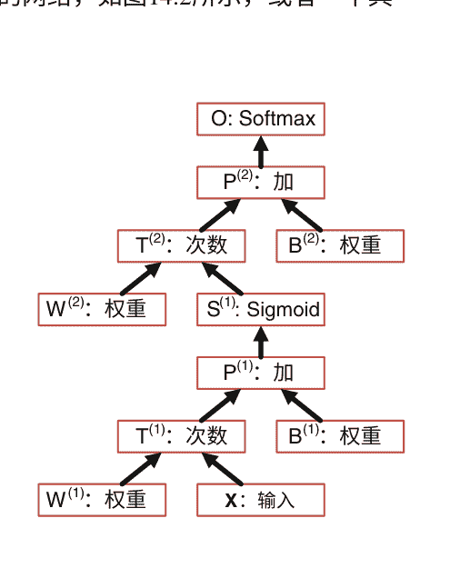

图14.2具有两个输入节点的计算网络（高亮）

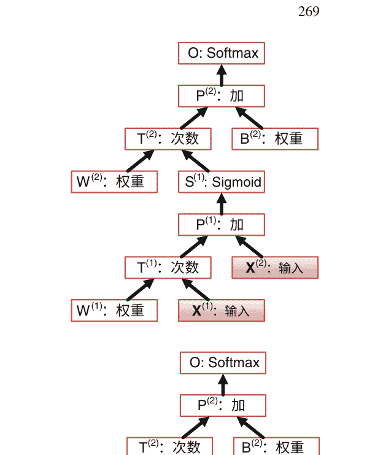

图14.3具有共享模型参数的计算网络（高亮）

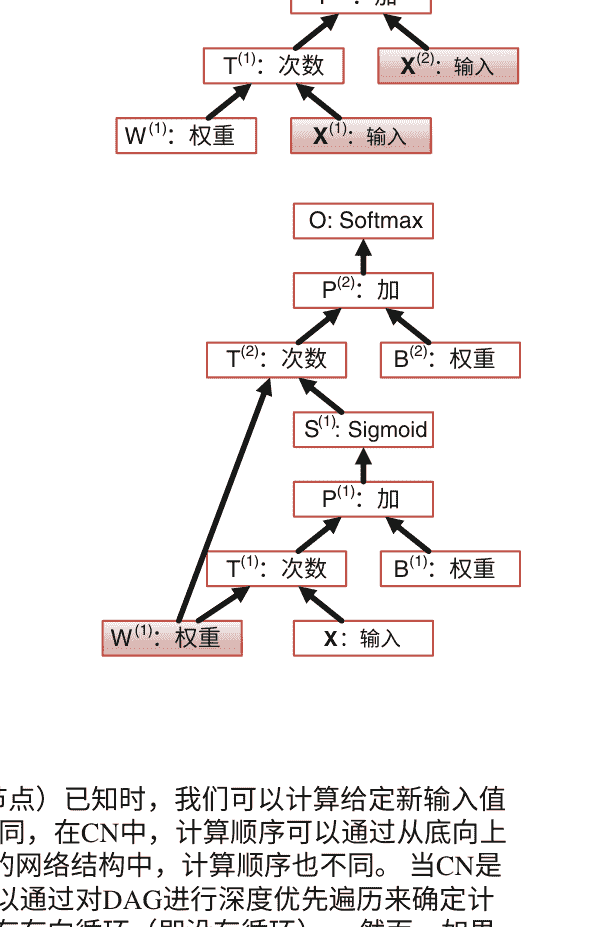

在这里，我们假设输入 X，隐藏层 S（1）和输出层 O具有相同的维度。

### 14.2 前向计算

当模型参数（即图14.1中的权重节点）已知时，我们可以计算给定新输入值的任何节点的值。与DNN情况不同，在CN中，计算顺序可以通过从底向上逐层计算来轻松确定，而在不同的网络结构中，计算顺序也不同。当CN是一个有向无环图（DAG）时，可以通过对DAG进行深度优先遍历来确定计算顺序。请注意，在DAG中，没有有向循环（即没有循环）。然而，如果我们不考虑边的方向，可能会出现循环，图14.3就是一个例子。这是因为相同的计算节点可能是其他几个节点的子节点。算法14.2确定DAG的计算顺序，并处理此条件。一旦确定了顺序，无论计算环境如何，它都将保持不变。换句话说，这个算法只需要针对每个输出节点执行一次，然后缓存计算顺序。按照算法14.2确定的顺序，CN的前向计算是同步进行的。下一个节点的计算仅在上一个节点的计算完成后开始。它适用于仅使用单个计算设备（例如一个GPGPU或一个CPU主机）的环境，或者CN本身是固有的顺序，例如当CN表示DNN时。

前向计算也可以异步进行，计算顺序是动态确定的。当计算网络具有许多并行分支并且有多个计算设备可以并行计算这些分支时，这将非常有帮助。算法14.3展示了一种异步执行计算网络的前向计算的算法。在该算法中，所有子节点尚未计算的节点都在等待集合中，而那些子节点已计算的节点则在就绪集合中。开始时，root的所有非叶子后代都在等待集合中，而所有叶子后代都在就绪集合中。调度程序根据某种策略从就绪集合中选择一个节点，将其从就绪集合中移除，并将其分派给计算。流行的策略包括先到先服务、最短任务优先和最小数据移动。当节点的计算完成时，系统调用SIGNALCOMPLETE方法向其所有父节点发出信号。如果一个节点的所有子节点都已计算，则将该节点从等待集合移动到就绪集合。当所有节点都计算完成时，算法停止。尽管算法14.3中没有明确指示，但SIGNALCOMPLETE过程在并发线程下被调用，应该进行线程安全保护。该算法可以用于执行任何DAG上的计算，而不仅仅是计算网络。在许多情况下，我们可能需要根据不断变化的输入值计算节点的值。为了避免重复计算共享分支，我们可以为每个节点添加一个时间戳，只有当至少一个子节点具有更新的值时，才重新计算节点的值。这可以通过在提供或计算新值时更新时间戳，并排除子节点较旧的节点来轻松实现实际计算。

在算法14.2和14.3中，每个计算节点在已知操作数时需要知道如何计算其值。计算可以是简单的矩阵求和或逐元素应用sigmoid函数，也可以是复杂的任何计算。我们将在第14.4节中描述流行计算节点类型的评估函数。

### 14.3 模型训练

要训练一个CN，我们需要定义一个训练准则J。流行的准则包括用于分类的交叉熵（CE）和用于回归的均方误差（MSE），如第4章所讨论的。由于训练准则也是一种计算结果，它可以被表示为一个计算节点并插入到CN中。图14.4展示了一个表示带有CE训练准则节点的一层隐藏层sigmoid神经网络的CN。如果训练准则包含正则化项，正则化项也可以被实现为计算节点，最终的训练准则节点是主要准则和正则化项的加权和。

在CN中，模型参数可以通过基于小批量反向传播（BP）算法进行优化，类似于算法4.2中描述的那样。更具体地说，我们改进了模型参数 W 在每一步 t+1 上的更新为

$$W_{t+1} \leftarrow W_t - \varepsilon \Delta W_t,$$

其中

$$\Delta W_t = \frac{1}{M_b} \sum_{m=1}^{M_b} \nabla_{W_t} J (W; \mathbf{x}^m, \mathbf{y}^m),$$

而 M_b 是小批量的大小。关键在于计算 $\nabla_W J (W; x^m, y^m)$ 我们将其简化为 $\nabla^J_W$。由于CN可以具有任意结构，我们不能使用完全相同的BP算法来计算 $\nabla^J_W$。

计算 $\nabla^J_W$ 的一个朴素解决方案如图14.5所示，其中 $W^{(1)}$ 和 $W^{(2)}$ 是模型参数。在这个解决方案中，每条边都与一个偏导数相关联，并且

$$\nabla_{W^{(1)}}^J = \frac{\partial J}{\partial V^{(1)}} \frac{\partial V^{(1)}}{\partial V^{(2)}} \frac{\partial V^{(2)}}{\partial W^{(1)}} + \frac{\partial J}{\partial V^{(3)}} \frac{\partial V^{(3)}}{\partial V^{(4)}} \frac{\partial V^{(4)}}{\partial W^{(1)}}$$
$$\nabla_{W^{(2)}}^J = \frac{\partial J}{\partial V^{(1)}} \frac{\partial V^{(1)}}{\partial V^{(2)}} \frac{\partial V^{(2)}}{\partial W^{(2)}}.$$

这个解决方案有两个主要缺点。首先，每个导数可能具有非常高的维度。这意味着需要大量的内存来保存导数。其次，存在许多重复的计算。例如， $\partial J/\partial V^{(1)}$ $\partial V^{(1)}/\partial V^{(2)}$ 在这个例子中，计算两次，一次是为了 $\nabla^J_(W^(1))$，一次是为了 $\nabla^J_(W^(2))$。

幸运的是，有一种更简单和更高效的方法来计算梯度，如图14.6所示。在这种方法中，每个节点 n 保存两个值：评估（前向计算）结果 $V_n$ 和梯度 $\nabla_n J$。注意，训练准则 $J$ 始终是一个标量，如果 $\mathbf{V}_n \in \mathbb{R}^{N_1 \times N_2}$，那么 $\nabla_n J \in \mathbb{R}^{N_1 \times N_2}$。这比在图14.5中所示的朴素解决方案所需的内存要少得多。这种方法还允许将公共前缀项分解出来，并使计算与图中节点的数量成线性关系。例如， $\frac{\partial J}{\partial V^{(2)}}$ 在计算 $\frac{\partial J}{\partial W^{(1)}}$ 和 $\frac{\partial J}{\partial W^{(2)}}$ 时只计算一次并使用两次。这类似于传统表达式图中的常见子表达式消除，只是这里的常见子表达式是节点的父节点，而不是子节点。

自动微分是一个活跃的研究领域，已经提出了许多技术[10]。一个简单的递归算法用于决定梯度计算顺序，以便可以高效地进行梯度计算，如算法14.4所示，其中提供了一个类似的标量函数的递归算法[4, 11]。该算法假设每个节点都有一个ComputePartialGradient(child)函数，该函数计算训练准则相对于节点的子节点child的梯度，并按照算法决定的顺序调用。在计算算法之前，每个节点的梯度 $\nabla_n J$ 都设置为0，队列order设置为空，并且父节点Left的数量设置为每个节点的父节点数。然后，在评估为标量的准则节点上调用此函数。类似于前向计算，可以推导出一种异步算法。一旦梯度已知，就可以使用基于小批量的随机梯度下降算法。可以使用在第4章讨论的(SGD)算法和其他仅依赖于梯度的训练算法来训练模型。

或者，可以通过按照正向计算的相反顺序计算梯度，并调用每个节点的父节点的`ComputePartialGradient(child)`函数，并将自身作为 `child`参数传递来计算梯度。 然而，这种方法需要额外的记录，例如保持指向节点父节点的指针，在操作网络架构时可能引入额外的开销。

在许多情况下，并不需要计算所有的梯度。 例如，不需要计算关于输入值的梯度。 在调整模型时，一些模型参数不需要更新，因此不需要计算关于这些参数的梯度。 我们可以通过为每个节点保留一个`needGradient`标志来减少梯度计算。 一旦叶节点的标志（输入值或模型参数）已知，可以使用算法14.5确定非叶节点的标志，该算法本质上是对DAG进行深度优先遍历。 由于算法14.2和14.5都是对DAG进行深度优先遍历，并且只需要执行一次，因此它们可以在一个函数中合并。

由于每个CN的实例化都是任务相关且不同的，因此检查和验证自动计算的梯度是至关重要的。 一种简单的数值估计梯度的技术是：

> $$\frac{\partial J}{\partial w_{ij}} \approx \frac{J\left(w_{ij} + \varepsilon\right) - J\left(w_{ij} - \varepsilon\right)}{2\varepsilon}$$

其中 $w_{ij}$是模型参数 $\mathbf{W}$的第 $(i, j)$个元素，$\varepsilon$是一个小常数，通常设置为$10^{-4}$，而 $J\left(w_{ij} + \varepsilon\right)$ 和 $J\left(w_{ij} - \varepsilon\right)$ 是在所有其他参数固定且 $w_{ij}$改变为 $w_{ij} + \varepsilon$时评估的目标函数值，分别为 $w_{ij} - \epsilon$。在大多数情况下，使用双精度计算，数值估计的梯度和自动梯度计算得到的梯度至少有四个有效数字相符。请注意，除了极小值（如 $10^{-20}$）会导致数值舍入误差外，这种技术适用于大范围的 $\epsilon$ 值。

### 14.4 典型计算节点

为了使上述的前向计算和梯度计算算法正常工作，我们假设每种计算节点都实现了一个Evaluate函数，用于根据其子节点的值计算节点的值，以及一个ComputePartialGradient函数，用于根据节点的值 $V_{n}$、节点的梯度 $\nabla_{n}J$ 和所有子节点的值计算训练准则相对于子节点child的梯度。为了简化讨论，我们将在以下讨论中省略下标。

在本节中，我们介绍了最常用的计算节点类型和相应的Evaluate和ComputePartialGradient(child)函数。在下面的讨论中，我们使用表14.1中列出的符号来描述计算。我们将每个输入值的小批量视为一个矩阵，其中每列是一个样本。在所有梯度的推导中，我们使用了恒等式

$$\frac{\partial J}{\partial x_{i j}} = \sum_{m, n} \frac{\partial J}{\partial v_{m n}} \frac{\partial v_{m n}}{\partial x_{i j}}$$    (14.6)

### 算法 14.1 一个隐藏层 Sigmoid 神经网络中的计算步骤

```
1: **过程** ONEHIDDENLAYERNNCOMPUTATION(X)
2:    T^{(1)} ← W^{(1)}X                     ▷ X 的每一列都是一个观测向量
3:    P^{(1)} ← T^{(1)} + B^{(1)}             ▷ B^{(1)} 的每一列都是偏置 b^{(1)}
4:    S^{(1)} ← σ(P^{(1)})                    ▷ σ(.)是逐元素应用的 Sigmoid 函数
5:    T^{(2)} ← W^{(2)}S^{(1)}
6:    P^{(2)} ← T^{(2)} + B^{(2)}             ▷ B^{(2)} 的每一列都是偏置 b^{(2)}
7:    O ← softmax(P^{(2)})                   ▷ 对输出 O 进行列应用 softmax
8: **结束过程**
```

### 算法14.2 CN的同步前向计算。计算顺序由DAG上的深度优先遍历确定。

```
1: 过程 DECIDEFORWARDCOMPUTATIONORDER(root, visited, order)
        ▷按深度优先顺序枚举DAG中的节点。
        ▷visited被初始化为空集合。order被初始化为空队列
2: 如果 root ∉ visited则
        ▷同一个节点可能是多个节点的子节点。
3:     visited ← visited ∪ root
4:     对于 root的每个子节点 c执行
        ▷对子节点递归应用
5:         调用DECIDEFORWARDCOMPUTATIONORDER(c, visited, order)
6:     order ← order + root
        ▷将root添加到order的末尾
7: 结束循环
8: 结束如果
9: 结束过程
```

### 算法14.3 异步前向计算一个CN。当所有子节点都计算完成时，节点将移动到就绪集合中。调度程序监视就绪集合，并决定在集合中计算每个节点的位置。

```
1: 过程 SIGNALCOMPLETE(node, waiting, ready) 
   ▶当节点的计算完成时调用。需要线程安全。 
   ▶waiting被初始化为包括根节点的所有非叶子后代。 
   ▶准备已初始化为包含根节点的所有叶子后代。 
2: 对于每个节点p,如果父节点p ∧ p在等待中则 
3: p.已完成子节点数 ++ 
4: 如果p.已完成子节点数 == p.子节点数则 
   ▶所有子节点已计算完毕 
5: 等待 ← 等待 − 节点 
6: 准备 ← 准备 ∪ 节点 
7: 如果结束 
8: 结束 for 
9:结束过程 
10:过程计划计算(就绪) 
   ▶当新节点就绪或计算资源可用时，由作业调度程序调用。 
11: 根据某种策略从就绪中选择节点 
12: 就绪 ← 就绪 − 节点 
13: 为计算分派节点。 
14:结束过程
```

### 算法14.4 反向自动梯度计算算法。 在顶层节点必须是一个评估为标量的训练准则节点。

```
1: 过程     `DECIDEGRADIENTCOMPUTATIONORDER(node, parents Left, order)`
     `▷决定计算节点的所有后代的梯度的顺序。`
     `▷parents Left初始化为每个节点的父节点数。`
     `▷ order初始化为空队列。`
2: 如果不是叶节点(节点)则
3:   父节点左侧[节点] --
4:   如果父节点左侧[节点]== 0且节点 ∉顺序则      `▷所有父节点已计算完毕。`
5:      顺序 ← 顺序 + 节点                      `▷将节点添加到顺序的末尾`
6:      对于每个 `c ∈ 节点.子节点`执行
7:         调用DECIDEGRADIENTCOMPUTATIONORDER(c, 父节点左侧, 顺序)
8:      结束循环
9:   如果结束
10: 结束如果
11:结束过程
```

### 算法14.5 递归更新needGradient标志。

```
1: 过程      UPDATE NEED GRADIENT FLAG(root, visited )
            ▷按深度优先顺序枚举DAG中的节点。
            ▷visited被初始化为空集。
2:  如果 root ∉ visited则    ▷同一个节点可能是多个节点的子节点并被重新访问。
3:      visited ← visited ∪ root
4:      对于每个 c∈root.children，执行
5:        :        调用UPDATE NEED GRADIENT FLAG函数，参数为c, visited, order，执行
6:                如果节点node不是叶子节点，则执行
7:          如果节点node.如果任何子节点需要梯度，则执行
8:              将节点node的needGradient标志设置为true
9:          否则
10:             将节点node的needGradient标志设置为false
11:         如果结束
12:     如果结束
13:     结束循环
14: 结束if
语句，执行15:结束过程
```

### 表14.1 描述计算节点中使用的符号

| 符号 | 描述 |
|------|------|
| $\lambda$ | 标量 |
| $\mathbf{d}$ | 表示方阵对角线的列向量 |
| $\mathbf{X}$ | 第一个操作数的矩阵 |
| $\mathbf{Y}$ | 第二个操作数的矩阵 |
| $\mathbf{V}$ | 当前节点的值 |
| $\nabla_n^J$ (或 $\nabla_{\mathbf{V}}^J$) | 当前节点的梯度 |
| $\nabla_{\mathbf{X}}^J$ | 子节点（操作数） $\mathbf{X}$ 的梯度 |
| $\nabla_{\mathbf{Y}}^J$ | 子节点（操作数）的梯度 $\mathbf{Y}$ |
| $\bullet$ | 逐元素乘积 |
| | 逐元素除法 |
| $\circ$ | 向量的内积应用于矩阵的列 |
| $\odot$ | 对每一行应用的内积 |
| $\delta(.)$ | Kronecker $\delta$ |
| $\mathbf{1}_{m,n}$ | 一个 $m \times n$ 全为1的矩阵 |
| $X^{\alpha}$ | 逐元素幂 |
| $\mathrm{vec}(\mathbf{X})$ | 由 $\mathbf{X}$ 的列连接形成的向量 |

其中 $v_{mn}$ 是矩阵 $\mathbf{V}$ 的第 $(m, n)$ 个元素， $x_{ij}$ 是矩阵 $\mathbf{X}$ 的第 $(i, j)$ 个元素。

#### 14.4.1 没有操作数的计算节点类型

没有操作数的计算节点的值是给定的，而不是计算得到的。因此，这些计算节点类型的 $Evaluate$ 和 $Compute\ PartialGradient(child)$ 函数都为空。

-   - Parameter: 用于表示需要作为模型的一部分保存的模型参数。
-   InputValue: 用于表示在运行时由用户提供的特征、标签或控制参数。

#### 14.4.2 一个操作数的计算节点类型

在这些计算节点类型中，评估 = $V(\mathbf{X})$ 和计算部分梯度 $\nabla_{\mathbf{X}}^J$。

-   ●取反：将操作数 **X**中的每个元素的符号反转。

    $$ V (\mathbf{X}) \leftarrow -\mathbf{X} $$
    $$ (14.7) $$

    $$ \nabla_{\mathbf{X}}^{J} \leftarrow \nabla_{\mathbf{X}}^{J} - \nabla_{\mathbf{n}}^{J}. $$
    $$ (14.8) $$

    通过观察可以推导出梯度

    $$ \frac{\partial v_{mn}}{\partial x_{i j}}=\left\{\begin{array}{ll}-1 & m=i \wedge n=j \\ 0 & \text { 否则 }\end{array}\right. $$
    $$ (14.9) $$

    和

    $$ \frac{\partial J}{\partial x_{i j}}=\sum_{m, n} \frac{\partial J}{\partial v_{m n}} \frac{\partial v_{m n}}{\partial x_{i j}}=-\frac{\partial J}{\partial v_{i j}}. $$
    $$ (14.10) $$

-   ● Sigmoid函数：对操作数 **X**逐元素应用 Sigmoid函数。

    $$ V (\mathbf{X}) \leftarrow \frac{1}{1+e^{-\mathbf{X}}} $$
    $$ (14.11) $$

    $$ \nabla_{\mathbf{X}}^{J} \leftarrow \nabla_{\mathbf{X}}^{J}+\nabla_{\mathbf{n}}^{J} \bullet[V \bullet(1-V)] . $$
    $$ (14.12) $$

    通过观察可以推导出梯度

    $$ \frac{\partial v_{mn}}{\partial x_{i j}}=\left\{\begin{array}{ll}v_{i j}\left(1-v_{i j}\right) & m=i \wedge n=j \\ 0 & \text { 否则 }\end{array}\right. $$
    $$ (14.13) $$

    和

    $$ \frac{\partial J}{\partial x_{i j}}=\sum_{m, n} \frac{\partial J}{\partial v_{m n}} \frac{\partial v_{m n}}{\partial x_{i j}}=\frac{\partial J}{\partial v_{i j}} v_{i j}\left(1-v_{i j}\right) . $$
    $$ (14.14) $$

-   ● Tanh：对操作数 **X**逐元素应用tanh函数。

    $$ V (\mathbf{X}) \leftarrow \frac{e^{\mathbf{X}}-e^{-\mathbf{X}}}{e^{\mathbf{X}}+e^{-\mathbf{X}}} $$
    $$ (14.15) $$

    $$ \nabla_{\mathbf{X}}^{J} \leftarrow \nabla_{\mathbf{X}}^{J}+\nabla_{\mathbf{n}}^{J} \bullet(1-V \bullet V) . $$
    $$ (14.16) $$

    可以通过观察来推导梯度

    $$\frac{\partial v_{mn}}{\partial x_{ij}} = \begin{cases} 1 - v_{ij}^2 & m = i \land n = j \\ 0 & \text{否则} \end{cases} \quad (14.17)$$

    和

    $$\frac{\partial J}{\partial x_{ij}} = \sum_{m,n} \frac{\partial J}{\partial v_{mn}} \frac{\partial v_{mn}}{\partial x_{ij}} = \frac{\partial J}{\partial v_{ij}} \left(1 - v_{ij}^2\right) \quad (14.18)$$

-   - **ReLU**: 对操作数 X 逐元素应用修正线性操作。

    $$V \left( \mathbf{X} \right) \leftarrow \max \left(0, \mathbf{X}\right) \quad (14.19)$$
    $$\nabla_{\mathbf{X}}^J \leftarrow \nabla_{\mathbf{X}}^J + \nabla_{\mathbf{n}}^J \bullet \delta \left( \mathbf{X} > 0 \right) \quad (14.20)$$

    梯度可以通过观察来推导

    $$\frac{\partial v_{mn}}{\partial x_{ij}} = \begin{cases} \delta \left( x_{ij} > 0 \right) & m = i \land n = j \\ 0 & \text{否则} \end{cases} \quad (14.21)$$

    我们有

    $$\frac{\partial J}{\partial x_{ij}} = \sum_{m,n} \frac{\partial J}{\partial v_{mn}} \frac{\partial v_{mn}}{\partial x_{ij}} = \frac{\partial J}{\partial v_{ij}} \delta \left( x_{ij} > 0 \right). \quad (14.22)$$

-   - **Log**: 对操作数 X 逐元素应用对数函数。

    $$V \left( \mathbf{X} \right) \leftarrow \log \left( \mathbf{X} \right) \quad (14.23)$$
    $$\nabla_{\mathbf{X}}^J \leftarrow \nabla_{\mathbf{X}}^J + \nabla_{\mathbf{n}}^J \bullet \frac{1}{\mathbf{X}} \quad (14.24)$$

    可以通过观察来推导梯度

    $$\frac{\partial v_{mn}}{\partial x_{ij}} = \begin{cases} \frac{1}{x_{ij}} & m = i \land n = j \\ 0 & \text{否则} \end{cases} \quad (14.25)$$

    和

    $$\frac{\partial J}{\partial x_{ij}} = \sum_{m,n} \frac{\partial J}{\partial v_{mn}} \frac{\partial v_{mn}}{\partial x_{ij}} = \frac{\partial J}{\partial v_{ij}} \frac{1}{x_{ij}}. \quad (14.26)$$

-   - **Exp**: 对操作数 X 逐元素应用指数函数。

    $$V(\mathbf{X}) \leftarrow \exp(\mathbf{X})$$
    $$\nabla_{\mathbf{X}}^{J} \leftarrow \nabla_{\mathbf{X}}^{J} + \nabla_{\mathbf{n}}^{J} \bullet V.$$

    可以通过观察来推导梯度

    $$\frac{\partial v_{mn}}{\partial x_{ij}} = \begin{cases} v_{ij} & m = i \land n = j \\ 0 & \text{否则} \end{cases}$$

    我们有

    $$\frac{\partial J}{\partial x_{ij}} = \sum_{m, n} \frac{\partial J}{\partial v_{mn}} \frac{\partial v_{mn}}{\partial x_{ij}} = \frac{\partial J}{\partial v_{ij}} v_{ij}.$$

-   - Softmax: 对操作数 X 逐列应用softmax函数。每列被视为一个单独的样本。

    $$m_j(\mathbf{X}) \leftarrow \max_i x_{ij}$$
    $$e_{ij}(\mathbf{X}) \leftarrow \mathrm{e}^{x_{ij} - m_j(\mathbf{X})}$$
    $$s_j(\mathbf{X}) \leftarrow \sum_i e_{ij}(\mathbf{X})$$
    $$v_{ij}(\mathbf{X}) \leftarrow \frac{e_{ij}(\mathbf{X})}{s_j(\mathbf{X})}$$
    $$\nabla_{\mathbf{X}}^{J} \leftarrow \nabla_{\mathbf{X}}^{J} + \left[ \nabla_{\mathbf{n}}^{J} - \nabla_{\mathbf{n}}^{J} \circ V \right] \bullet V.$$

    可以通过观察来推导梯度

    $$\frac{\partial v_{mn}}{\partial x_{ij}} = \begin{cases} v_{ij}(1 - v_{ij}) & m = i \land n = j \\ -v_{mj} v_{ij} & n = j \\ 0 & \text{否则} \end{cases}$$

    我们有

    $$\frac{\partial J}{\partial x_{ij}} = \sum_{m, n} \frac{\partial J}{\partial v_{mn}} \frac{\partial v_{mn}}{\partial x_{ij}} = \left( \frac{\partial J}{\partial v_{ij}} - \sum_m \frac{\partial J}{\partial v_{mj}} v_{mj} \right) v_{ij}.$$

-   - 求和元素：对操作数 X 中的所有元素求和。

    $$v(\mathbf{X}) \leftarrow \sum_{i, j} x_{ij}$$
    $$\nabla_{\mathbf{X}}^{J} \leftarrow \nabla_{\mathbf{X}}^{J} + \nabla_{\mathbf{n}}^{J}.$$

    可以通过注意到梯度可以推导出来 \(v\) 和 \(\nabla_n^J\) 是标量，

    $$ \frac{\partial v}{\partial x_{ij}} = 1 \tag{14.40} $$

    和

    $$ \frac{\partial J}{\partial x_{ij}} = \frac{\partial J}{\partial v} \frac{\partial v}{\partial x_{ij}} = \frac{\partial J}{\partial v}. \tag{14.41} $$

-   ● \(L_1\)范数：取操作数\(X\)的矩阵\(L_1\)范数。

    $$ v(\mathbf{X}) \leftarrow \sum_{i,j} |X_{ij}| \tag{14.42} $$

    $$ \nabla_{\mathbf{X}}^J \leftarrow \nabla_{\mathbf{X}}^J + \nabla_{\mathbf{n}}^J \mathrm{sgn}(\mathbf{X}). \tag{14.43} $$

    梯度可以通过注意到来推导 \(v\) 和 \(\nabla_n^J\) 是标量，

    $$ \frac{\partial v}{\partial x_{ij}} = \mathrm{sgn}(x_{ij}) \tag{14.44} $$

    和

    $$ \frac{\partial J}{\partial x_{ij}} = \frac{\partial J}{\partial v} \frac{\partial v}{\partial x_{ij}} = \frac{\partial J}{\partial v} \mathrm{sgn}(x_{ij}). \tag{14.45} $$

-   ● \(L_2\)范数：取操作数 \(X\)的矩阵\(L_2\)范数（Frobenius范数）。

    $$ v(\mathbf{X}) \leftarrow \sqrt{\sum_{i,j} (x_{ij})^2} \tag{14.46} $$

    $$ \nabla_{\mathbf{X}}^J \leftarrow \nabla_{\mathbf{X}}^J + \frac{1}{v} \nabla_{\mathbf{n}}^J \mathbf{X}. \tag{14.47} $$

    梯度可以通过注意到来推导 \(v\) 和 \(\nabla_n^J\) 是标量，

    $$ \frac{\partial v}{\partial x_{ij}} = \frac{x_{ij}}{v} \tag{14.48} $$

    和

    $$ \frac{\partial J}{\partial x_{ij}} = \frac{\partial J}{\partial v} \frac{\partial v}{\partial x_{ij}} = \frac{1}{v} \frac{\partial J}{\partial v} x_{ij}. \tag{14.49} $$

## 14.4.3 具有两个操作数的计算节点类型

在这些计算节点类型中，$\textit{Evaluate} = V(a, \mathbf{Y})$，其中$a$可以是$\mathbf{X}$、$\lambda$或$\mathbf{d}$，并且$\textit{Compute PartialGradient} (\mathbf{b}) = \nabla_{\mathbf{b}}^{J}$，其中$\mathbf{b}$可以是$\mathbf{X}$、$\mathbf{Y}$或$\mathbf{d}$。

-   • 缩放：通过$\lambda$缩放$\mathbf{Y}$的每个元素。
    $$V(\lambda, \mathbf{Y}) \leftarrow \lambda \mathbf{Y} \quad\quad (14.50)$$
    $$\nabla_{\lambda}^{J} \leftarrow \nabla_{\lambda}^{J} + \text{vec}\left(\nabla_{\mathbf{n}}^{J}\right) \circ \text{vec}(\mathbf{Y}) \quad\quad (14.51)$$
    $$\nabla_{\mathbf{Y}}^{J} \leftarrow \nabla_{\mathbf{Y}}^{J} + \lambda \nabla_{\mathbf{n}}^{J}. \quad\quad (14.52)$$
    梯度 $\nabla_{\lambda}^{J}$ 可以通过观察推导得到
    $$\frac{\partial v_{mn}}{\partial \lambda} = y_{mn} \quad\quad (14.53)$$
    和
    $$\frac{\partial J}{\partial \lambda} = \sum_{m,n} \frac{\partial J}{\partial v_{mn}} \frac{\partial v_{mn}}{\partial \lambda} = \sum_{m,n} \frac{\partial J}{\partial v_{mn}} y_{mn}. \quad\quad (14.54)$$
    类似地，推导梯度 $\nabla_{\mathbf{Y}}^{J}$ 时，我们注意到
    $$\frac{\partial v_{mn}}{\partial y_{ij}} = \begin{cases} \lambda & m = i \wedge n = j \\ 0 & \text{否则} \end{cases} \quad\quad (14.55)$$
    并得到
    $$\frac{\partial J}{\partial y_{ij}} = \sum_{m,n} \frac{\partial J}{\partial v_{mn}} \frac{\partial v_{mn}}{\partial y_{ij}} = \lambda \frac{\partial J}{\partial v_{ij}} \quad\quad (14.56)$$

-   • 乘积：操作数$\mathbf{X}$和$\mathbf{Y}$的矩阵乘积。必须满足$\mathbf{X}$的列数 = $\mathbf{Y}$的行数。
    $$V(\mathbf{X}, \mathbf{Y}) \leftarrow \mathbf{X} \mathbf{Y} \quad\quad (14.57)$$
    $$\nabla_{\mathbf{X}}^{J} \leftarrow \nabla_{\mathbf{X}}^{J} + \nabla_{\mathbf{n}}^{J} \mathbf{Y}^{T} \quad\quad (14.58)$$
    $$\nabla_{\mathbf{Y}}^{J} \leftarrow \nabla_{\mathbf{Y}}^{J} + \mathbf{X}^{T} \nabla_{\mathbf{n}}^{J}. \quad\quad (14.59)$$
    梯度 $\nabla_{\mathbf{X}}^{J}$ 可以通过观察来推导
    $$\frac{\partial v_{mn}}{\partial x_{ij}} = \begin{cases} y_{jn} & m = i \\ 0 & \text{否则} \end{cases} \quad\quad (14.60)$$
    和$$\frac{\partial J}{\partial x_{ij}} = \sum_{m,n} \frac{\partial J}{\partial v_{mn}} \frac{\partial v_{mn}}{\partial x_{ij}} = \sum_{n} \frac{\partial J}{\partial v_{in}} y_{jn} \qquad (14.61)$$

类似地，为了推导梯度 $\nabla_Y^J$，我们注意到

$$\frac{\partial v_{mn}}{\partial y_{ij}} = \begin{cases} x_{mi} & n = j \\ 0 & \text{否则} \end{cases} \qquad (14.62)$$

并得到

$$\frac{\partial J}{\partial y_{ij}} = \sum_{m,n} \frac{\partial J}{\partial v_{mn}} \frac{\partial v_{mn}}{\partial y_{ij}} = \sum_{m} \frac{\partial J}{\partial v_{mj}} x_{mi} \qquad (14.63)$$

- **ElementTimes**: 两个矩阵的逐元素乘积。必须满足 $X.rows = Y.rows$ 和 $X.cols = Y.cols$。

$$v_{ij}(\mathbf{X}, \mathbf{Y}) \leftarrow x_{ij} y_{ij} \qquad (14.64)$$

$$\nabla_{\mathbf{X}}^J \leftarrow \nabla_{\mathbf{X}}^J + \nabla_{\mathbf{v}}^J \bullet \mathbf{Y} \qquad (14.65)$$

$$\nabla_{\mathbf{Y}}^J \leftarrow \nabla_{\mathbf{Y}}^J + \nabla_{\mathbf{v}}^J \bullet \mathbf{X}. \qquad (14.66)$$

梯度 $\nabla_{\mathbf{X}}^J$ 可以通过观察来推导

$$\frac{\partial v_{mn}}{\partial x_{ij}} = \begin{cases} y_{ij} & m = i \wedge n = j \\ 0 & \text{否则} \end{cases} \qquad (14.67)$$

和

$$\frac{\partial J}{\partial x_{ij}} = \sum_{m,n} \frac{\partial J}{\partial v_{mn}} \frac{\partial v_{mn}}{\partial y_{ij}} = \frac{\partial J}{\partial v_{ij}} y_{ij}. \qquad (14.68)$$

由于对称性，梯度 $\nabla_Y^J$ 可以通过完全相同的方式推导出来。

- **加**: 矩阵 $\mathbf{X}$ 和 $\mathbf{Y}$ 的和。必须满足 $\mathbf{X}$ 的行数 = $\mathbf{Y}$ 的行数。如果 $\mathbf{X}$ 的列数 = $\mathbf{Y}$ 的列数，但其中一个矩阵是另一个矩阵的倍数，则较小的矩阵需要通过重复自身来扩展。

$$V(\mathbf{X}, \mathbf{Y}) \leftarrow \mathbf{X} + \mathbf{Y} \qquad (14.69)$$

$$\nabla_{\mathbf{X}}^J \leftarrow \begin{cases} \nabla_{\mathbf{X}}^J + \nabla_{\mathbf{V}}^J & \mathbf{X}\text{的行数} = \mathbf{V}\text{的行数} \wedge \mathbf{X}\text{的列数} = \mathbf{V}\text{的列数} \\ \nabla_{\mathbf{X}}^J + \mathbf{1}_{1,\mathbf{V}\text{的行数}} \nabla_{\mathbf{V}}^J & \mathbf{X}\text{的行数} = 1 \wedge \mathbf{X}\text{的列数} = \mathbf{V}\text{的列数} \\ \nabla_{\mathbf{X}}^J + \nabla_{\mathbf{V}}^J \mathbf{1}_{\mathbf{V}.cols, 1} & \mathbf{X}.\text{rows} = \mathbf{V}.\text{rows} \wedge \mathbf{X}.\text{cols} = 1 \\ \nabla_{\mathbf{X}}^J + \mathbf{1}_{1, \mathbf{V}.\text{rows}} \nabla_{\mathbf{V}}^J \mathbf{1}_{\mathbf{V}.\text{cols}, 1} & \mathbf{X}.\text{rows} = 1 \wedge \mathbf{X}.\text{cols} = 1 \end{cases} \qquad (14.70)$$

$$ \nabla_Y^J \leftarrow \begin{cases} \nabla_Y^J + \nabla_n^J & \mathbf{Y}.\text{rows} = \mathbf{V}.\text{rows} \wedge \mathbf{Y}.\text{cols} = \mathbf{V}.\text{cols} \\ \nabla_Y^J + \mathbf{1}_{\mathbf{V}.\text{rows}} \nabla_n^J & \mathbf{Y}.\text{rows} = 1 \wedge \mathbf{Y}.\text{cols} = \mathbf{V}.\text{cols} \\ \nabla_Y^J + \nabla_n^J \mathbf{1}_{\mathbf{V}.\text{cols}, 1} & \mathbf{Y}.\text{rows} = \mathbf{V}.\text{rows} \wedge \mathbf{Y}.\text{cols} = 1 \\ \nabla_Y^J + \mathbf{1}_{\mathbf{V}.\text{行}} \nabla_n^J \mathbf{1}_{\mathbf{V}.\text{列}, 1} & \mathbf{Y}.\text{行} = 1 \wedge \mathbf{Y}.\text{列} = 1 \end{cases} $$ (14.71)

梯度 $\nabla_X^J$ 可以通过观察得到，当 $\mathbf{X}$ 与 $\mathbf{V}$ 具有相同的维度时，我们有

$$ \frac{\partial v_{mn}}{\partial x_{ij}} = \begin{cases} 1 & m = i \wedge n = j \\ 0 & \text{否则} \end{cases} $$ (14.72)

和

$$ \frac{\partial J}{\partial x_{ij}} = \sum_{m,n} \frac{\partial J}{\partial v_{mn}} \frac{\partial v_{mn}}{\partial x_{ij}} = \frac{\partial J}{\partial v_{ij}} $$ (14.73)

如果 $\mathbf{X}.\text{行} = 1 \wedge \mathbf{X}.\text{列} = \mathbf{V}.\text{列}$，我们有

$$ \frac{\partial v_{mn}}{\partial x_{ij}} = \begin{cases} 1 & n = j \\ 0 & \text{否则} \end{cases} $$ (14.74)

和

$$ \frac{\partial J}{\partial x_{ij}} = \sum_{m,n} \frac{\partial J}{\partial v_{mn}} \frac{\partial v_{mn}}{\partial x_{ij}} = \sum_{m} \frac{\partial J}{\partial v_{mj}} $$ (14.75)

我们可以类似地推导出 $\nabla_X^J$ 和 $\nabla_Y^J$ 在其他条件下。

- **减**: 两个矩阵 $\mathbf{X}$ 和 $\mathbf{Y}$ 的差。必须满足 $\mathbf{X}.\text{行} = \mathbf{Y}.\text{行}$。如果列但其中一个是另一个的倍数，则较小的矩阵需要通过重复自身来扩展。

$$ V(\mathbf{X}, \mathbf{Y}) \leftarrow \mathbf{X} - \mathbf{Y} $$ (14.76)

$$ \nabla_X^J \leftarrow \begin{cases} \nabla_X^J + \nabla_n^J & \mathbf{X}.\text{行数} = \mathbf{V}.\text{行数} \wedge \mathbf{X}.\text{列数} = \mathbf{V}.\text{列数} \\ \nabla_X^J + \mathbf{1}_{\mathbf{V}.\text{rows}} \nabla_n^J & \mathbf{X}.\text{行数} = 1 \wedge \mathbf{X}.\text{列数} = \mathbf{V}.\text{列数} \\ \nabla_X^J + \nabla_n^J \mathbf{1}_{\mathbf{V}.\text{cols}, 1} & \mathbf{X}.\text{rows} = \mathbf{V}.\text{rows} \wedge \mathbf{X}.\text{cols} = 1 \\ \nabla_X^J + \mathbf{1}_{\mathbf{V}.\text{rows}} \nabla_n^J \mathbf{1}_{\mathbf{V}.\text{cols}, 1} & \mathbf{X}.\text{rows} = 1 \wedge \mathbf{X}.\text{cols} = 1 \end{cases} $$ (14.77)

$$ \nabla_Y^J \leftarrow \begin{cases} \nabla_Y^J - \nabla_n^J & \mathbf{Y}.\text{rows} = \mathbf{V}.\text{rows} \wedge \mathbf{Y}.\text{cols} = \mathbf{V}.\text{cols} \\ \nabla_Y^J - \mathbf{1}_{\mathbf{V}.\text{rows}} \nabla_n^J & \mathbf{Y}.\text{rows} = 1 \wedge \mathbf{Y}.\text{cols} = \mathbf{V}.\text{cols} \\ \nabla_Y^J - \nabla_n^J \mathbf{1}_{\mathbf{V}.\text{cols}, 1} & \mathbf{Y}.\text{rows} = \mathbf{V}.\text{rows} \wedge \mathbf{Y}.\text{cols} = 1 \\ \nabla_Y^J - \mathbf{1}_{\mathbf{V}.\text{rows}} \nabla_n^J \mathbf{1}_{\mathbf{V}.\text{cols}, 1} & \mathbf{Y}.\text{rows} = 1 \wedge \mathbf{Y}.\text{cols} = 1 \end{cases} $$ (14.78)

梯度的推导与 Plusnode类似。

- **DiagTimes**: 对角矩阵（其对角线等于 d）与任意矩阵 Y的乘积。必须满足 d.rows = Y.rows。

$$v_{ij} (d, Y) \leftarrow d_i y_{ij} \qquad (14.79)$$

$$\nabla_d^J \leftarrow \nabla_d^J + \nabla_n^J \bullet Y \qquad (14.80)$$

$$\nabla_Y^J \leftarrow \nabla_Y^J + DiagTimes (d, \nabla_n^J) \qquad (14.81)$$

梯度 $\nabla_d^J$ 可以通过观察推导得出

$$\frac{\partial v_{mn}}{\partial d_i} = \begin{cases} y_{in} & m = i \\ 0 & \text{否则} \end{cases} \qquad (14.82)$$

和

$$\frac{\partial J}{\partial d_i} = \sum_{m,n} \frac{\partial J}{\partial v_{mn}} \frac{\partial v_{mn}}{\partial d_i} = \sum_{n} \frac{\partial J}{\partial v_{in}} y_{in} \qquad (14.83)$$

类似地，推导梯度 $\nabla_Y^J$我们注意到

$$\frac{\partial v_{mn}}{\partial y_{ij}} = \begin{cases} d_i & m = i \wedge n = j \\ 0 & \text{否则} \end{cases} \qquad (14.84)$$

并得到

$$\frac{\partial J}{\partial y_{ij}} = \sum_{m,n} \frac{\partial J}{\partial v_{mn}} \frac{\partial v_{mn}}{\partial y_{ij}} = \frac{\partial J}{\partial v_{ij}} d_i \qquad (14.85)$$

- **Dropout**: 随机将 λ百分比的 Y值设为零，并缩放其余值，以保持总和的期望不变：

$$m_{ij} (\lambda) \leftarrow \begin{cases} 0 & \text{rand} (0, 1) \le \lambda \\ 1/(1-\lambda) & \text{else} \end{cases} \qquad (14.86)$$

$$v_{ij} (\lambda, Y) \leftarrow m_{ij} y_{ij} \qquad (14.87)$$

$$\nabla_Y^J \leftarrow \nabla_Y^J + \begin{cases} \nabla_n^J & \lambda = 0 \\ \nabla_n^J \bullet M & \text{else} \end{cases} \qquad (14.88)$$

请注意 λ是一个给定的值，而不是模型的一部分。我们只需要获取关于 Y 的梯度。 如果 λ =0，则 V = X，这是一个微不足道的情况。 否则，它等同于具有随机设置的掩码 M的ElementTimesnode。

- **KhatriRaoProduct**: 两个矩阵 X和 Y的列交叉乘积。必须满足 X.cols = Y.cols。 用于构建张量网络。

$$v_{.j}(\mathbf{X}, \mathbf{Y}) \leftarrow \mathbf{x}_{.j} \otimes \mathbf{y}_{.j}$$

$$\left[\nabla_{\mathbf{X}}^J\right]_{.j} \leftarrow \left[\nabla_{\mathbf{X}}^J\right]_{.j} + \left[\left[\nabla_{\mathbf{n}}^J\right]_{.j}\right]_{\mathbf{X}.rows, \mathbf{Y}.rows} \mathbf{Y}$$

$$\left[\nabla_{\mathbf{Y}}^J\right]_{.j} \leftarrow \left[\nabla_{\mathbf{Y}}^J\right]_{.j} + \left[\left[\nabla_{\mathbf{n}}^J\right]_{.j}\right]_{\mathbf{X}.rows, \mathbf{Y}.rows}^T \mathbf{X},$$

其中 $[\mathbf{X}]_{m, n}$ 重新调整 $\mathbf{X}$ 以成为一个 $m \times n$ 矩阵。梯度 $\nabla_{\mathbf{X}}^J$ 可以通过观察推导出来。

$$\frac{\partial v_{mn}}{\partial x_{ij}} = \begin{cases} \text{行} \wedge \text{列} = \text{模}(\text{矩}, \mathbf{Y}.\text{行}) & \\ 0 & \text{否则} \end{cases}$$

和

$$\frac{\partial J}{\partial x_{ij}} = \sum_{m,n} \frac{\partial J}{\partial v_{mn}} \frac{\partial v_{mn}}{\partial x_{ij}} = \sum_{i, \text{列}} \frac{\partial J}{\partial v_{i \times y.\text{行} + \text{列}, j}}$$

梯度 $\nabla_{\mathbf{Y}}^J$ 可以类似地推导出来。

- **余弦**: 两个矩阵 $\mathbf{X}$ 和 $\mathbf{Y}$ 的逐列余弦距离。必须满足 $\mathbf{X}$ 的列数等于 $\mathbf{Y}$ 的列数。结果是一个行向量。在自然语言处理任务中经常使用。

$$v_{.j}(\mathbf{X}, \mathbf{Y}) \leftarrow \frac{\mathbf{x}_{.j} \text{的第} j \text{列和} \mathbf{y} \text{的第} j \text{列}}{\|\mathbf{x}_{.j}\| \|\mathbf{y}_{.j}\|}$$

$$\left[\nabla_{\mathbf{X}}^J\right]_{.j} \leftarrow \left[\nabla_{\mathbf{X}}^J\right]_{.j} + \left[\nabla_{\mathbf{n}}^J\right]_{\text{第} j \text{列}} \left[ \frac{\mathbf{y}_{.j}}{\|\mathbf{x}_{.j}\| \|\mathbf{y}_{.j}\|} - \frac{\mathbf{x}_{.j} \left( \mathbf{x}_{.j} \text{的第} j \text{列和} \mathbf{y} \text{的第} j \text{列} \right)}{\|\mathbf{x}_{.j}\|^3 \|\mathbf{y}_{.j}\|} \right]$$

$$\left[\nabla_{\mathbf{Y}}^J\right]_{.j} \leftarrow \left[\nabla_{\mathbf{Y}}^J\right]_{.j} + \left[\nabla_{\mathbf{n}}^J\right]_{\text{第} j \text{列}} \left[ \frac{\mathbf{x}_{.j}}{\|\mathbf{x}_{.j}\| \|\mathbf{y}_{.j}\|} - \frac{\mathbf{y}_{.j} \left( \mathbf{x}_{.j} \text{的第} j \text{列和} \mathbf{y} \text{的第} j \text{列} \right)}{\|\mathbf{x}_{.j}\| \|\mathbf{y}_{.j}\|^3} \right].$$

梯度 $\nabla$ 通过观察可以得到

$$\frac{\partial \text{的第} n \text{个元素}}{\partial x_{ij}} = \begin{cases} \frac{\mathbf{y}_{ij}}{\|\mathbf{x}_{.j}\| \|\mathbf{y}_{.j}\|} - \frac{\mathbf{x}_{ij} \left( \mathbf{x}_{.j} \text{的第} j \text{列和} \mathbf{y} \text{的第} j \text{列} \right)}{\|\mathbf{x}_{.j}\|^3 \|\mathbf{y}_{.j}\|} & n = j \\ 0 & \text{否则} \end{cases}$$

和$$\frac{\partial J}{\partial x_{ij}} = \sum_{n} \frac{\partial J}{\partial \nu_{n}} \frac{\partial \nu_{n}}{\partial x_{ij}} = \frac{\partial J}{\partial \nu_{j}} \left[ \frac{y_{ij}}{\|x_{[:,j]}\| \|y_{[:,j]}\|} - \frac{x_{ij} \left( x_{[:,j]} \cdot y_{[:,j]} \right)}{\|x_{[:,j]}\|^{3} \|y_{[:,j]}\|} \right] . \quad \text{(14.98)}$$
$$= \frac{\partial J}{\partial \nu_{j}} \left[ \frac{y_{ij}}{\|x_{[:,j]}\| \|y_{[:,j]}\|} - x_{[:,j]}^{T} y_{[:,j]} \frac{x_{ij}}{\|x_{[:,j]}\|^{2}} \right] . \quad \text{(14.99)}$$

梯度 $\nabla_{\mathbf{Y}}^{J}$ 可以类似地推导出来。

-   $\bullet$ 分类错误：计算最大值的索引不一致的总列数。每一列被视为一个样本，$\delta$ 是克罗内克$\delta$。必须满足 $\mathbf{X}.cols = \mathbf{Y}.cols$。
$a_{j}(\mathbf{X}) \leftarrow \arg \max \limits_{i} x_{ij}$ (14.100)
$b_{j}(\mathbf{Y}) \leftarrow \arg \max \limits_{i} y_{ij}$ (14.101)
$v(\mathbf{X}, \mathbf{Y}) \leftarrow \sum_{j} \delta (a_{j}(\mathbf{X}) = b_{j}(\mathbf{Y}))$ (14.102)

此节点类型仅用于在解码时计算分类错误，不参与模型训练。因此，在调用$Compute\ PartialGradient(\mathbf{b})$时应该引发错误。

-   $\bullet$ SquareError：计算差异$\mathbf{X}-\mathbf{Y}$的Frobenius范数的平方。必须满足$\mathbf{X}$的行数=$\mathbf{Y}$的行数和$\mathbf{X}$的列数=$\mathbf{Y}$的列数。
$v(\mathbf{X}, \mathbf{Y}) \leftarrow \frac{1}{2} \text{Tr} \left( (\mathbf{X} - \mathbf{Y}) (\mathbf{X} - \mathbf{Y})^{T} \right)$ (14.103)
$\nabla_{\mathbf{X}}^{J} \leftarrow \nabla_{\mathbf{X}}^{J} + \nabla_{\mathbf{n}}^{J} (\mathbf{X} - \mathbf{Y})$ (14.104)
$\nabla_{\mathbf{Y}}^{J} \leftarrow \nabla_{\mathbf{Y}}^{J} - \nabla_{\mathbf{n}}^{J} (\mathbf{X} - \mathbf{Y})$。 (14.105)

请注意，$v$是一个标量。给定梯度的推导是微不足道的
$$\frac{\partial v}{\partial \mathbf{X}} = \mathbf{X} - \mathbf{Y} \quad \text{(14.106)}$$
$$\frac{\partial v}{\partial \mathbf{Y}} = -(\mathbf{X} - \mathbf{Y})。 \quad \text{(14.107)}$$

-   $\bullet$ CrossEntropy：计算逐列（样本上）计算的交叉熵之和，其中$\mathbf{X}$和$\mathbf{Y}$的每一列都是概率分布。必须满足$\mathbf{X}.\text{行} = \mathbf{Y}.\text{行}$且$\mathbf{X}.\text{列} = \mathbf{Y}.\text{列}$。
$\mathbf{R}(\mathbf{Y}) \leftarrow \log (\mathbf{Y})$ (14.108)
$v(\mathbf{X}, \mathbf{Y}) \leftarrow -\text{vec}(\mathbf{X}) \circ \text{vec}(\mathbf{R}(\mathbf{Y}))$ (14.109)
$\nabla_{\mathbf{X}}^{J} \leftarrow \nabla_{\mathbf{X}}^{J} - \nabla_{\mathbf{n}}^{J} \mathbf{R}(\mathbf{Y})$ (14.110)
$\nabla_{\mathbf{Y}}^{J} \leftarrow \nabla_{\mathbf{Y}}^{J} - \nabla_{\mathbf{n}}^{J} (\mathbf{X} - \mathbf{Y})$。 (14.111)

请注意，$v$ 是一个标量。梯度 $\nabla_{\mathbf{X}}^{J}$ 可以通过观察推导得出
$$\frac{\partial v}{\partial x_{ij}} = -\log (y_{ij}) = -r_{ij} (\mathbf{Y}) \quad (14.112)$$
和
$$\frac{\partial J}{\partial x_{ij}} = \frac{\partial J}{\partial v} \frac{\partial v}{\partial x_{ij}} = -\frac{\partial J}{\partial v} r_{ij} (\mathbf{Y}) \quad (14.113)$$

类似地，推导梯度 $\nabla_{\mathbf{Y}}^{J}$ 我们注意到
$$\frac{\partial v}{\partial y_{ij}} = -\frac{x_{ij}}{y_{ij}} \quad (14.114)$$
并得到
$$\frac{\partial J}{\partial y_{ij}} = \frac{\partial J}{\partial v} \frac{\partial v}{\partial y_{ij}} = -\frac{\partial J}{\partial v} \frac{x_{ij}}{y_{ij}} \quad (14.115)$$

-   - CrossEntropyWithSoftmax: 与 CrossEntropy 相同，只是 Y 包含了 softmax操作之前的值（即未归一化）。
$$\begin{aligned} \mathbf{P} (\mathbf{Y}) &\leftarrow \text{Softmax} (\mathbf{Y}) \quad (14.116) \\ \mathbf{R} (\mathbf{Y}) &\leftarrow \log (\mathbf{P} (\mathbf{Y})) \quad (14.117) \\ v (\mathbf{X}, \mathbf{Y}) &\leftarrow \text{vec} (\mathbf{X}) \circ \text{vec} (\mathbf{R} (\mathbf{Y})) \quad (14.118) \\ \nabla_{\mathbf{X}}^{J} &\leftarrow \nabla_{\mathbf{X}}^{J} - \nabla_{\mathbf{n}}^{J} \mathbf{R} (\mathbf{Y}) \quad (14.119) \\ \nabla_{\mathbf{Y}}^{J} &\leftarrow \nabla_{\mathbf{Y}}^{J} + \nabla_{\mathbf{n}}^{J} (\mathbf{P} (\mathbf{Y}) - \mathbf{X}) \quad (14.120) \end{aligned}$$

梯度 $\nabla_{\mathbf{X}}^{J}$ 与 CrossEntropy 节点中的相同。为了推导梯度 $\nabla_{\mathbf{Y}}^{J}$ 我们注意到
$$\frac{\partial v}{\partial y_{ij}} = \mathbf{p}_{ij} (\mathbf{Y}) - x_{ij} \quad (14.121)$$
并得到
$$\frac{\partial J}{\partial y_{ij}} = \frac{\partial J}{\partial v} \frac{\partial v}{\partial y_{ij}} = \frac{\partial J}{\partial v} (\mathbf{p}_{ij} (\mathbf{Y}) - x_{ij}) \quad (14.122)$$

## 14.4.4 用于计算统计量的计算节点类型

有时，我们只想获取输入值（输入特征或标签）的一些统计信息。例如，为了对输入特征进行归一化，我们需要计算输入特征的均值和标准差。在语音识别中，我们需要计算状态标签的频率（均值）以转换状态后验概率，将概率转化为缩放后的似然，如第6章所述。与我们刚刚描述的其他计算节点类型不同，用于计算统计量的计算节点类型不需要梯度计算函数（即，这些类型的节点不应调用此函数），因为它们不是可学习的，通常需要在模型训练开始之前进行预计算。在这里，我们列出了这个类别中最受欢迎的计算节点类型。

-   • 均值：计算操作数X在整个训练集上的平均值。计算完成后，需要标记以避免重新计算。当输入的小批量X被输入时
$$k \leftarrow k + \mathbf{X}.cols$$ (14.123)
$$v (\mathbf{X}) \leftarrow \frac{1}{k} \mathbf{X1}_{\mathbf{X}.cols, 1} + \frac{k - \mathbf{X}.cols}{k} v (\mathbf{X})$$ (14.124)
注意这里X.cols是小批量中的样本数。

-   • 倒数标准差：计算操作数X在整个训练集上的逐元素倒数标准差。计算完成后，需要标记以避免重新计算。在累积步骤中
$$k \leftarrow k + \mathbf{X}.cols$$ (14.125)
$$v (\mathbf{X}) \leftarrow \frac{1}{k} \mathbf{X1}_{\mathbf{X}.cols, 1} + \frac{k - \mathbf{X}.cols}{k} v (\mathbf{X})$$ (14.126)
$$\omega (\mathbf{X}) \leftarrow \frac{1}{k} (\mathbf{X} \bullet \mathbf{X}) \mathbf{1} + \frac{k - \mathbf{X}.cols}{k} \omega (\mathbf{X})$$ (14.127)
当训练集结束时，
$$v \leftarrow (\omega - (v \bullet v))^{1/2}$$ (14.128)
$$v \leftarrow 1 \quad v.$$ (14.129)

-   • PerDimMeanVarNorm：使用均值m和标准差的倒数s计算归一化操作数X的值。在这里，X是一个矩阵，其列数等于小批量样本数，m和s是需要在应用元素乘积之前扩展的向量。
$$V (\mathbf{X}) \leftarrow (\mathbf{X} - \mathbf{m}) \bullet \mathbf{s}。$$ (14.130)

### 14.5 卷积神经网络

卷积神经网络（CNN）[1, 2, 5, 6, 8, 17–19, 21, 22]在时间和空间上提供了平移不变性，并且对于图像识别来说至关重要，可以实现最先进的性能。已经证明它也可以提高语音识别的准确性。在某些任务上，相对于纯DNN，它已经显示出更好的性能[1, 2, 8, 21, 22]。为了支持CNN，我们需要实现几个新的计算节点。

-   * 卷积：对图像的核心逐元素乘积进行卷积。卷积操作的示例显示在图14.7中，卷积节点的输入具有三个通道（由三个3 × 3矩阵表示），输出具有两个通道（顶部的两个2 × 2矩阵表示）。通道是同一图像的视图。例如，RGB图像可以用三个通道表示：R、G、B。每个通道的大小相同。

每个输出和输入通道对应一个核心。核心的总数等于输入通道数 \( C_x \) 和输出通道数 \( C_v \) 的乘积。在图14.7中，\( C_x = 3 \)，\( C_v = 2 \)，核心的总数为6。每个输入通道 \( k \) 和输出通道的核心 \( \mathbf{K}_k \) 都是一个矩阵。核心沿着输入移动（因此在输入之间共享），具有垂直（行）和水平（列）方向上的步幅（或子采样率） \( S_r \) 和 \( S_c \)。对于每个输出通道和输入切片 \( (i, j) \)（在垂直方向上的第 \( i \) 步和水平方向上的第 \( j \) 步）
\[ v_{ij}(\mathbf{K}, \mathbf{Y}) = \sum_{k} \text{vec}(\mathbf{K}_k) \circ \text{vec}(\mathbf{Y}_{kij}), \quad (14.131) \]
其中 \( \mathbf{Y}_{kij} \) 与 \( \mathbf{K}_k \) 具有相同的大小。这个评估函数涉及许多小的矩阵运算，可能会很慢。Chellapilla等人[5]提出了一种将所有这些小矩阵运算转换为一个大矩阵乘积的技术，如图14.7底部所示。通过这个技巧，所有的卷积核参数都被合并成一个大的卷积核矩阵 \( \mathbf{W} \)，如图14.7左下角所示。需要注意的是，为了允许卷积节点的输出被另一个卷积节点使用，在图14.7中，我们对Chellapilla等人[5]提出的转换进行了略微不同的组织，包括转置卷积核矩阵、输入特征矩阵以及乘积中矩阵的顺序。
\[ O_r = \begin{cases} \dfrac{I_r - K_r}{S_r} + 1 & \text{无填充} \\ \dfrac{(I_r - \text{mod}(K_r, 2))}{S_r} + 1 \text{个零填充} \end{cases} \quad (14.132) \]
\[ O_c = \begin{cases} \dfrac{I_c - K_c}{S_c} + 1 & \text{无填充} \\ \dfrac{(I_c - \text{mod}(K_c, 2))}{S_c} + 1 \text{个零填充} \end{cases} \quad (14.133) \]
是输出图像的行数，其中 \( I_r \) 和 \( I_c \) 分别是输入图像的行数和列数， \( K_r \) 和 \( K_c \) 分别是每个卷积核的行数和列数。组合的卷积核矩阵大小为 $C_v \times (O_r \times O_c \times C_x)$ 的矩阵，打包输入特征矩阵的大小为 $(O_r \times O_c \times C_x) \times (K_r \times K_c)$。通过这种转换，卷积节点的相关计算与操作数 $\mathbf{W}, \mathbf{Y}$ 变为
$$\mathbf{X}(\mathbf{Y}) \leftarrow \text{Pack}(\mathbf{Y})$$  (14.134)
$$V(\mathbf{W}, \mathbf{Y}) \leftarrow \mathbf{WX}$$  (14.135)
$$\nabla_{\mathbf{W}}^J \leftarrow \nabla_W^J + \nabla_n^J \mathbf{X}^T$$  (14.136)
$$\nabla_{\mathbf{X}}^J \leftarrow \mathbf{W}^T \nabla_n^J$$  (14.137)
$$\nabla_{\mathbf{Y}}^J \leftarrow \nabla_Y^J + \text{解包} \left( \nabla_X^J \right)$$  (14.138)

请注意，这种技术可以更好地并行处理大型矩阵运算但会增加打包和解包矩阵的额外成本。在大多数情况下，收益超过成本。通过将卷积节点与加法节点和逐元素非线性函数组合，我们可以为卷积操作添加偏置和非线性。

-   - 最大池化：对输入 $\mathbf{X}$ 在大小为 $K_r \times K_c$ 的窗口内进行最大池化操作，对每个通道进行操作。操作窗口沿着输入移动以垂直（行）和水平方向的步长（或子采样率）$S_r$ 和 $S_c$ 移动（列）方向分别。池化操作不改变通道数，因此 $C_v = C_x$。对于每个输出通道和 $(i, j)$ th输入切片 $\mathbf{X}_{ij}$大小为 $K_r \times K_c$我们有
$$v_{ij}(\mathbf{X}) \leftarrow \max (\mathbf{X}_{ij}) \quad (14.139)$$
$$\left[\nabla_{\mathbf{X}}^{J}\right]_{,i_m,j_n} \leftarrow \begin{cases} \left[\nabla_{\mathbf{X}}^{J}\right]_{,i_m,j_n} + \left[\nabla_{\mathbf{n}}^{J}\right]_{,i_m,j_n} & (m,n) = arg \max_{m,n} x_{i_m,j_n} \\ \left[\nabla_{\mathbf{X}}^{J}\right]_{,i_m,j_n} & \text{否则} \end{cases} \quad (14.140)$$
其中 $i_m = i \times S_r + m$，而 $j_n = j \times S_c + n$。

-   - AveragePooling: 与 MaxPooling相同，只是在每个通道的窗口内对输入 $\mathbf{X}$ 应用平均值而不是最大值，窗口大小为 $K_r \times K_c$。该操作窗口沿着输入以垂直（行）和水平（列）方向分别以步长（或子采样率）$S_r$和$S_c$移动。对于每个输出通道和尺寸为 $K_r \times K_c$的输入切片 $\mathbf{X}_{ij}$，我们有
$$v_{ij}(\mathbf{X}) \leftarrow \frac{1}{K_r \times K_c} \sum_{m,n} x_{i_m,j_n} \quad (14.141)$$
$$\left[\nabla_{\mathbf{X}}^{J}\right]_{ij} \leftarrow \left[\nabla_{\mathbf{X}}^{J}\right]_{ij} + \frac{1}{K_r \times K_c} \left[\nabla_{\mathbf{n}}^{J}\right]_{ij} \quad (14.142)$$
其中 $i_m = i \times S_r + m$，而 $j_n = j \times S_c + n$。

### 14.6 循环连接

在上面的部分中，我们假设CN是一个有向无环图。然而，当CN中存在循环连接时，这个假设就不再成立了。可以使用延迟节点来实现循环连接，该节点检索过去 $\lambda$ 个样本的值，其中 $\mathbf{Y}$ 的每一列都是按时间升序存储的单独样本。
$$v_{.j}(\lambda, \mathbf{Y}) \leftarrow \mathbf{Y}_{.(j-\lambda)} \quad (14.143)$$
$$\left[\nabla_{\mathbf{Y}}^{J}\right]_{.j} \leftarrow \left[\nabla_{\mathbf{Y}}^{J}\right]_{.j} + \left[\nabla_{\mathbf{n}}^{J}\right]_{.j+\lambda} \quad (14.144)$$
当 $j - \lambda < 0$时，需要为 $\mathbf{Y}_{.(j-\lambda)}$设置一些默认值。可以通过观察来推导出梯度
$$\frac{\partial v_{mn}}{\partial y_{ij}} = \begin{cases} 1 & m = i \wedge n = j + \lambda \\ 0 & \text{否则} \end{cases} \quad (14.145)$$
和图14.8显示了一个包含延迟节点的示例CN。与没有有向循环的CN不同，具有循环的CN不能批量计算一系列样本，因为下一个样本的值取决于前面的样本。在递归网络中进行前向计算和反向传播的一种简单方法是将序列中的所有样本展开到时间上。展开后，图形扩展为DAG，并且我们刚刚讨论的前向计算和梯度计算算法可以直接使用。然而，这意味着CN中的所有计算节点都需要逐个样本计算，这显著降低了并行化的潜力。

#### 14.6.1 仅在循环内逐个样本处理

第一种方法识别CN中的循环，并且仅对循环内的节点应用逐个计算。对于计算节点的其余部分，序列中的所有样本可以作为单个矩阵操作并行计算。例如，在图14.8中，所有包含在循环中的节点 T^{(3)} → P^{(3)} → S^{(1)} → D → T^{(3)}都需要逐个样本计算。其余的部分节点可以批量计算。一种常用的技术是在图中识别强连接组件（SCC），其中每对顶点之间都存在路径，并且添加任何边或顶点都会违反此属性，使用Tarjan的强连接组件算法[28]等算法。一旦识别出循环，它们可以被视为CN中的一个复合节点，并且CN被简化为DAG。每个循环（或复合节点）内的所有节点都可以随时间展开，并且也可以简化为DAG。对于所有这些DAG，我们在前面的章节中讨论的前向计算和反向传播算法都可以应用。在具有任意递归连接的CN中确定前向计算顺序的详细过程在算法14.6中描述。由于延迟节点的输入是在过去计算的，如果我们只考虑一个时间片，它们可以被视为叶子节点。这使得循环内部的顺序决策变得更加容易。

¹ Tarjan算法比其他算法（如Kosaraju算法[15]）更受青睐，因为它只需要进行一次深度优先遍历，复杂度为 O (|V| + |E|)，并且不需要反转图中的弧。

## 14.6.2 同时处理多个话语

在循环CN中加快处理速度的第二种方法是同时处理多个序列。为了实现这一点，我们需要以图14.9所示的方式组织序列，将来自不同序列的具有相同帧ID的帧分组在一起。通过以这种方式组织序列，我们可以在循环内部一次性计算批处理中不同序列的帧，并在循环外部一次性计算所有话语中的所有样本。例如，在图14.9中，我们可以每个时间步骤一次性计算四个帧。如果序列长度不同，我们可以将它们截断为相同的长度，并保存尚未完成的序列的最终状态。剩余的帧可以与其他序列一起进行进一步处理。

#### 14.6.3 构建任意递归神经网络

通过包含延迟节点，我们可以轻松构建复杂的递归网络和动态系统。例如，长短期记忆（LSTM）[9, 14]神经网络被广泛用于识别和生成手写字符，它涉及以下操作：

**算法 14.6 任意CN的前向计算**

| 行号 | 过程/语句 |
| :--- | :--- |
| 1 | 过程 DecideForwardComputationOrderWithRecurrentLoop(G = (V, E)) |
| 2 | &nbsp;&nbsp;&nbsp;&nbsp; StronglyConnectedComponentsDetection(G, G') ▷ G'是强连通分量 (SCC) 的有向无环图 (DAG) |
| 3 | &nbsp;&nbsp;&nbsp;&nbsp; 在 G' 上调用DecideForwardComputationOrder→得到顺序for DAG |
| 4 | &nbsp;&nbsp;&nbsp;&nbsp; 对于 v ∈ G, v ∈ V 执行以下操作 |
| 5 | &nbsp;&nbsp;&nbsp;&nbsp;&nbsp;&nbsp;&nbsp;&nbsp; 将 v 的顺序设置为SCC V的最大顺序 ▷这保证了SCC的前向顺序是正确的 |
| 6 | &nbsp;&nbsp;&nbsp;&nbsp; 结束循环 |
| 7 | &nbsp;&nbsp;&nbsp;&nbsp; 对于每个SCC G中的每个V，执行 |
| 8 | &nbsp;&nbsp;&nbsp;&nbsp;&nbsp;&nbsp;&nbsp;&nbsp; 调用GetLoopForwardOrder(V的根节点) →为每个SCC获取顺序 |
| 9 | &nbsp;&nbsp;&nbsp;&nbsp; 结束循环 |
| 10 | &nbsp;&nbsp;&nbsp;&nbsp; 对于DAG和每个SCC (循环)，返回顺序 |
| 11 | 结束过程 |
| 12 | 过程 GetLoopForwardOrder(根节点) |
| 13 | &nbsp;&nbsp;&nbsp;&nbsp; 将所有延迟节点视为叶节点，并调用DecideForwardComponetionOrder |
| 14 | 结束过程 |
| 15 | 过程 StronglyConnectedComponentsDetection(G = (V, E), DAG) |
| 16 | &nbsp;&nbsp;&nbsp;&nbsp; 索引 = 0, S = 空 |
| 17 | &nbsp;&nbsp;&nbsp;&nbsp; 对于每个v∈V，执行 |
| 18 | &nbsp;&nbsp;&nbsp;&nbsp;&nbsp;&nbsp;&nbsp;&nbsp; 如果 v.索引未定义，则执行StrongConnectComponents(v, DAG) |
| 19 | &nbsp;&nbsp;&nbsp;&nbsp; 如果结束 |
| 20 | &nbsp;&nbsp;&nbsp;&nbsp; 结束循环 |
| 21 | 结束过程 |
| 22 | 过程 StrongConnectComponent(v, DAG) |
| 23 | &nbsp;&nbsp;&nbsp;&nbsp; lowlink = 索引, 索引 = 索引 + 1 |
| 24 | &nbsp;&nbsp;&nbsp;&nbsp; S.push(v) |
| 25 | &nbsp;&nbsp;&nbsp;&nbsp; 对于 (v, w) ∈ E 执行 |
| 26 | &nbsp;&nbsp;&nbsp;&nbsp;&nbsp;&nbsp;&nbsp;&nbsp; 如果 w.索引未定义则 |
| 27 | &nbsp;&nbsp;&nbsp;&nbsp;&nbsp;&nbsp;&nbsp;&nbsp;&nbsp;&nbsp;&nbsp;&nbsp; StrongConnectComponent(w) |
| 28 | &nbsp;&nbsp;&nbsp;&nbsp;&nbsp;&nbsp;&nbsp;&nbsp;&nbsp;&nbsp;&nbsp;&nbsp; v.lowlink = min(v.lowlink, w.lowlink) |
| 29 | &nbsp;&nbsp;&nbsp;&nbsp;&nbsp;&nbsp;&nbsp;&nbsp; 否则如果 w ∈ S则 |
| 30 | &nbsp;&nbsp;&nbsp;&nbsp;&nbsp;&nbsp;&nbsp;&nbsp;&nbsp;&nbsp;&nbsp;&nbsp; v.lowlink = min(v.lowlink, w.index) |
| 31 | &nbsp;&nbsp;&nbsp;&nbsp;&nbsp;&nbsp;&nbsp;&nbsp; 如果结束 |
| 32 | &nbsp;&nbsp;&nbsp;&nbsp; 结束循环 |
| 33 | &nbsp;&nbsp;&nbsp;&nbsp; 如果 v.lowlink = v.index则 ▷如果 v 是根节点，则弹出堆栈并生成一个强连通分量 |
| 34 | &nbsp;&nbsp;&nbsp;&nbsp;&nbsp;&nbsp;&nbsp;&nbsp; 开始一个新的强连通分量 |
| 35 | &nbsp;&nbsp;&nbsp;&nbsp;&nbsp;&nbsp;&nbsp;&nbsp; 重复 |
| 36 | &nbsp;&nbsp;&nbsp;&nbsp;&nbsp;&nbsp;&nbsp;&nbsp;&nbsp;&nbsp;&nbsp;&nbsp; w = S.pop() |
| 37 | &nbsp;&nbsp;&nbsp;&nbsp;&nbsp;&nbsp;&nbsp;&nbsp;&nbsp;&nbsp;&nbsp;&nbsp; 将 w 添加到当前的强连通分量 |
| 38 | &nbsp;&nbsp;&nbsp;&nbsp;&nbsp;&nbsp;&nbsp;&nbsp; 直到 w == v |
| 39 | &nbsp;&nbsp;&nbsp;&nbsp;&nbsp;&nbsp;&nbsp;&nbsp; 将当前的强连通分量保存到 DAG |
| 40 | &nbsp;&nbsp;&nbsp;&nbsp; 结束如果 |
| 41 | 结束过程 |

图14.9 批处理多个序列。图中显示了一个包含四个序列的示例。每个颜色代表一个序列。来自不同序列的具有相同帧ID的帧被分组在一起并进行批处理计算。右侧矩阵是左侧矩阵的重塑。

$$\mathbf{i}_t = \sigma \left( \mathbf{W}^{(xi)} \mathbf{x}_t + \mathbf{W}^{(hi)} \mathbf{h}_{t-1} + \mathbf{W}^{(ci)} \mathbf{c}_{t-1} + \mathbf{b}^{(i)} \right)$$ (14.147)

$$\mathbf{f}_t = \sigma \left( \mathbf{W}^{(xf)} \mathbf{x}_t + \mathbf{W}^{(hf)} \mathbf{h}_{t-1} + \mathbf{W}^{(cf)} \mathbf{c}_{t-1} + \mathbf{b}^{(f)} \right)$$ (14.148)

$$\mathbf{c}_t = \mathbf{f}_t \bullet \mathbf{c}_{t-1} + \mathbf{i}_t \bullet \tanh\left( \mathbf{W}^{(xc)} \mathbf{x}_t + \mathbf{W}^{(hc)} \mathbf{h}_{t-1} + \mathbf{b}^{(c)} \right)$$ (14.149)

$$\mathbf{o}_t = \sigma \left( \mathbf{W}^{(xo)} \mathbf{x}_t + \mathbf{W}^{(ho)} \mathbf{h}_{t-1} + \mathbf{W}^{(co)} \mathbf{c}_t + \mathbf{b}^{(o)} \right)$$ (14.150)

$$\mathbf{h}_t = \mathbf{o}_t \bullet \tanh \left( \mathbf{c}_t \right) ,$$ (14.151)

其中σ(·)是逻辑sigmoid函数，i_t, f_t, o_t, c_t和h_t是具有相同大小的向量（因为每个单元格中只有一个）来表示输入门、遗忘门、输出门、单元格、单元格输入激活和隐藏层的值，W是连接不同门的权重矩阵，b是相应的偏置向量。除了从单元格到门向量的权重矩阵W^{(ci)}是对角线外，所有权重矩阵都是完整的。很明显，整个LSTM可以描述为具有以下节点类型的CN：Times, Plus, Sigmoid, Tanh, DiagTimes, ElementTimes和Delay。更具体地说，使用这些计算节点，LSTM可以描述为：

$\mathbf{H}^{(d)} = 延迟 (\mathbf{H})$  (14.152)

$\mathbf{C}^{(d)} = 延迟 (\mathbf{C})$  (14.153)

$\mathbf{T}^{(1)} = 宏2W1b(\mathbf{W}^{(xi)}, \mathbf{X}, \mathbf{W}^{(hi)}, \mathbf{H}^{(d)}, \mathbf{b}^{(i)})$  (14.154)

$\mathbf{I} = Sigmoid (加 (\mathbf{T}^{(1)}, DiagTimes (\mathbf{W}^{(ci)}, \mathbf{C}^{(d)})))$  (14.155)

$\mathbf{T}^{(2)} = 宏3W1b(\mathbf{W}^{(xf)}, \mathbf{X}, \mathbf{W}^{(hf)}, \mathbf{H}^{(d)}, \mathbf{W}^{(cf)}\mathbf{C}^{(d)}, \mathbf{b}^{(f)})$  (14.156)

$\mathbf{F} = Sigmoid (\mathbf{T}^{(2)})$  (14.157)

$\mathbf{T}^{(3)} = 宏2W1b(\mathbf{W}^{(xc)}, \mathbf{X}, \mathbf{W}^{(hc)}, \mathbf{H}^{(d)}, \mathbf{b}^{(c)})$  (14.158)

$\mathbf{T}^{(4)} = 时间元素 (\mathbf{F}, \mathbf{C}^{(d)})$  (14.159)

$\mathbf{T}^{(5)} = 时间元素 (\mathbf{I}, Tanh (\mathbf{T}^{(3)}))$  (14.160)

$\mathbf{C} = 加 (\mathbf{T}^{(4)}, \mathbf{T}^{(5)})$  (14.161)

$\mathbf{T}^{(6)} = 宏3W1b(\mathbf{W}^{(xo)}, \mathbf{X}, \mathbf{W}^{(ho)}, \mathbf{H}^{(d)}, \mathbf{W}^{(co)}\mathbf{C}, \mathbf{b}^{(o)})$  (14.162)

$\mathbf{O} = Sigmoid (\mathbf{T}^{(6)})$  (14.163)

$\mathbf{H} = 时间元素 (\mathbf{O}, Tanh (\mathbf{C}))$,  (14.164)

其中我们定义了宏 宏2W1b ($\mathbf{W}^{(1)}, \mathbf{I}^{(1)}, \mathbf{W}^{(2)}, \mathbf{I}^{(2)}, \mathbf{b}$) 作为

$\mathbf{S}^{(1)} = 加 (\乘 (\mathbf{W}^{(1)}, \mathbf{I}^{(1)}), \乘 (\mathbf{W}^{(2)}, \mathbf{I}^{(2)}))$  (14.165)

宏2W1b = 加($\mathbf{S}^{(1)}, \mathbf{b}$)  (14.166)

和 宏3W1b ($\mathbf{W}^{(1)}, \mathbf{I}^{(1)}, \mathbf{W}^{(2)}, \mathbf{I}^{(2)}, \mathbf{W}^{(3)}, \mathbf{I}^{(3)}, \mathbf{b}$) 作为

$\mathbf{S}^{(1)} =$ 宏2W1b ($\mathbf{W}^{(1)}, \mathbf{I}^{(1)}, \mathbf{W}^{(2)}, \mathbf{I}^{(2)}, \mathbf{b}$)  (14.167)

宏3W1b = 加($\mathbf{S}^{(1)}, \乘 (\mathbf{W}^{(3)}, \mathbf{I}^{(3)}))$  (14.168)

使用CN，我们可以轻松构建任意网络架构来解决不同的问题。例如，在传统的DNN中，添加一个掩蔽层以减少输入特征中的噪声将变得很容易。CN提供了探索新的语音识别架构所需的工具，我们相信该领域的进一步发展至少部分归功于CN。

## 参考文献

- 1. Abdel-Hamid, O., Deng, L., Yu, D.: 探索卷积神经网络结构和优化技术用于语音识别 pp. 3366–3370 (2013)
- 2. Abdel-Hamid, O., Mohamed, A.r., Jiang, H., Penn, G.: 将卷积神经网络概念应用于混合nn-hmm模型的语音识别。 在：国际会议论文集声学、语音和信号处理（ICASSP），pp. 4277–4280. IEEE(2012)
- 3. Bergstra, J., Breuleux, O., Bastien, F., Lamblin, P., Pascanu, R., Desjardins, G., Turian, J., Warde-Farley, D., Bengio, Y.: Theano：一个CPU和GPU数学表达式编译器。 在：Python科学计算会议论文集（SciPy），第4卷（2010）
- 4. Bischof, C., Roh, L., Mauer-Oats, A.: ADIC：一种可扩展的ANSI-C自动微分工具。 Urbana 51, 61,802 (1997)
- 5. Chellapilla, K., Puri, S., Simard, P.: 高性能卷积神经网络用于文档处理。 在：第十届国际手写识别研讨会（2006年）
- 6. Ciresan, D.C., Meier, U., Schmidhuber, J.: 用深度神经网络进行拉丁字符和中文字符的迁移学习。 在：国际神经网络会议论文集（IJCNN），第1-6页（2012年）
- 7. Dahl, G.E., Yu, D., Deng, L., Acero, A.: 基于上下文的预训练深度神经网络用于大词汇量语音识别。 IEEE Trans. Audio, Speech Lang. Process. 20(1), 30–42 (2012)
- 8. Deng, L., Abdel-Hamid, O., Yu, D.: 使用异构池化的深度卷积神经网络进行声学不变性和语音混淆的交易。 在：声学、语音和信号处理国际会议论文集（ICASSP），第6669-6673页（2013年）
- 9. Graves, A.: 使用递归神经网络生成序列。 arXiv预印本 arXiv:1308.0850 (2013年)
- 10. Griewank, A., Walther, A.: 评估导数：算法微分的原理和技术。 Siam (2008)
- 11. Guenter, B.: 用于图形应用的高效符号微分。 在：ACM Transactions on Graphics (TOG), vol. 26, p. 108 (2007)
- 12. Guenter, B., Yu, D., Eversole, A., Kuchaiev, O., Seltzer, M.L., “计算网络工具包中的随机梯度下降算法”， OPT2013：NIPS 2013机器学习优化研讨会（2013）
- 13. Hinton, G., Deng, L., Yu, D., Dahl, G.E., Mohamed, Ar, Jaitly, N., Senior, A., Vanhoucke, V., Nguyen, P., Sainath, T.N., et al.: 语音识别中的深度神经网络声学建模：四个研究小组的共同观点。 IEEE Signal Process. Mag. 29(6), 82–97 (2012)
- 14. Hochreiter, S., Schmidhuber, J.: 长短期记忆. 神经计算 9(8), 1735–1780 (1997)
- 15. Hopcroft, J.E.: 数据结构与算法. 皮尔逊教育. 波士顿（1983）
- 16. Jaitly, N., Nguyen, P., Senior, A.W., Vanhoucke, V.: 预训练深度神经网络在大词汇量语音识别中的应用。 在: 国际语音通信协会年会论文集 (INTERSPEECH) (2012)
- 17. Kavukcuoglu, K., Sermanet, P., Boureau, Y.L., Gregor, K., Mathieu, M., LeCun, Y.: 学习卷积特征层次用于视觉识别. 在: NIPS, vol. 1, p. 5 (2010)
- 18. Krizhevsky, A., Sutskever, I., Hinton, G.E.: 使用深度卷积神经网络的Imagenet分类. 在: NIPS, vol. 1, p. 4 (2012)
- 19. LeCun, Y., Bengio, Y.: 图像、语音和时间序列的卷积网络. 大脑理论和神经网络手册3 361 (1995)
- 20. Mikolov, T., Zweig, G.: 上下文相关的递归神经网络语言模型. 在: IEEE口语技术研讨会 (SLT) 论文集, 第234-239页 (2012)
- 21. Sainath, T.N., Kingsbury, B., Mohamed, A., Dahl, G.E., Saon, G., Soltau, H., Beran, T., Aravkin, A.Y., Ramabhadran, B.: 改进深度卷积神经网络用于大词汇连续语音识别. 在: IEEE自动语音识别和理解研讨会 (ASRU) 论文集, 第315-320页 (2013)
- 22. Sainath, T.N., Mohamed, A., Kingsbury, B., Ramabhadran, B.: 用于大词汇连续语音识别的深度卷积神经网络. 在: 国际声学、语音和信号处理会议 (ICASSP) 论文集, 第8614-8618页 (2013)
- 23. Seide, F., Li, G., Chen, X., Yu, D.: 在上下文相关的深度神经网络中的特征工程用于对话式语音转录. 在: IEEE Workshop on Automatic Speech Recognition and Understanding (ASRU)的论文集, 第24-29页 (2011年)
- 24. Seide, F., Li, G., Yu, D.: 使用上下文相关的深度神经网络进行对话式语音转录. 在: 国际语音通信协会 (INTERSPEECH) 年会的论文集, 第437-440页 (2011年)
- 25. Shi, Y., Wiggers, P., Jonker, C.M.: 具有语言和上下文特征的循环神经网络语言模型的研究. 在: 国际语音通信协会 (INTERSPEECH) 年会的论文集 (2012年)
- 26. Socher, R., Lin, C.C., Ng, A., Manning, C.: 使用递归神经网络解析自然场景和自然语言. 在: 机器学习国际会议 (ICML) 的论文集, 第129-136页 (2011年)
- 27. Sutskever, I., Martens, J., Hinton, G.E.: 用循环神经网络生成文本. 在: 国际机器学习大会(ICML)论文集, 第1017-1024页(2011)
- 28. Tarjan, R.: 深度优先搜索和线性图算法. SIAM J. Comput. 1(2), 146-160 (1972)
- 29. Wiesler, S., Richard, A., Golik, P., Schluter, R., Ney, H.: RASR/NN: RWTH神经网络语音识别工具包. 在: 国际声学、语音和信号处理大会(ICASSP)论文集, 第3305-3309页(2014)
- 30. Yu, D., Eversole, A., Seltzer, M., Yao, K., Huang, Z., Guenter, B., Kuchaiev, O., Zhang, Y., Seide, F., Wang, H., Droppo, J., Zweig, G., Rossbach, C., Currey, J., Gao, J., May, A., Stolcke, A., Slaney, M.: 计算网络和计算网络工具包简介. Microsoft技术报告MSR-TR-2014-11 2 (2014)
- 31. Yu, D., Seltzer, M.L.: 使用预训练的深度神经网络改进瓶颈特征. 在: 国际语音通信协会年会论文集 (INTERSPEECH), 第237-240页 (2011年)

## 第15章 总结与未来方向

摘要在本章中，我们通过首先列举和分析我们认为是近期发展深度学习语音识别技术和系统的重要里程碑研究来总结本书。我们描述了这些研究的动机，它们带来的创新，它们提供的改进以及它们产生的影响。在这个路线图中，我们首先介绍了DNN技术在2009年左右进入语音识别领域的历史背景，这是学术界和工业界合作的结果。然后，我们选择了七个主题，在DNN早期推出后，ASR行业和学术研究中创新蓬勃发展。最后，我们对语音识别系统的最新技术水平提出了自己的看法，并讨论了未来研究方向的思考和分析。

### 15.1 路线图

在过去的5年里，自动语音识别（ASR）领域有许多令人兴奋的进展。然而，在本书中，我们只能涵盖其中的一个代表性子集。受限于我们有限的知识，我们选择了我们认为对读者理解这些进展有用的主题，这些进展在本书的许多前面章节中以更多的技术细节进行了描述。我们认为合理总结这些进展的一种方式是提供历史上重要里程碑研究的概述。

#### 15.1.1 DNN在ASR中的首次亮相

神经网络在ASR上的应用可以追溯到20世纪80年代末。值得注意的工作包括Waibel等人的时延神经网络（TDNN）[49, 93]和Morgan和Bourlard的人工神经网络（ANN）/隐马尔可夫模型（HMM）混合系统[63, 64]。

对基于神经网络的ASR的兴趣的复苏始于2009年的NIPS深度学习与语音识别及相关应用研讨会[18]，多伦多大学的Mohamed等人提出了一个原始版本的深度神经网络（DNN）¹—HMM混合系统用于电话识别[60]。在微软研究院（MSR）和多伦多大学的研究人员共同进行了详细的错误分析和DNN与其他语音识别器的比较在研讨会之前和之后，确定了相对的优势和劣势。有关这一早期研究部分的讨论和反思，请参见[17]，这些研究是在“很多直观的猜测但没有太多证据支持个别决策”的情况下进行的。在[60]中，采用了与90年代初开发的ANN/HMM混合架构相同的ANN/HMM混合架构，但它使用DNN来替代早期ANN/HMM系统中经常使用的浅层多层感知器（MLP）。更具体地说，DNN被构建为对单音状态进行建模，并使用传统的MFCC特征上的帧级交叉熵准则进行训练。他们表明，仅仅通过使用更深的模型，他们就成功地在TIMIT核心测试集上实现了23.0%的电话错误率（PER）。这个结果明显优于使用单音和三音素高斯混合模型（GMM）-HMM分别训练的27.7%和25.6%的PER [73]，这些模型使用了最大似然估计（MLE）准则，并且也优于24.8%的PER，这是由MSR开发的深度单音版本的语音生成模型[26, 30]在识别错误模式上有明显不同（未发表）。尽管他们的模型表现不如使用序列判别训练（SDT）准则训练的三音素GMM-HMM系统在相同任务上实现的21.7%PER²，并且仅在电话识别任务上进行了评估，但我们在MSR注意到它的潜力，因为在过去，ANN/HMM混合系统很难击败使用MLE准则训练的上下文相关（CD）-GMM-HMM系统，并且DNN和深度生成模型观察到产生了非常不同类型的识别错误，这些错误可以根据人类语音产生和感知机制的方面进行解释。与此同时，MSR和多伦多大学研究人员之间的合作始于2009年，他们仔细研究了使用原始语音特征的方法，这是深度学习的基本前提之一，主张不使用人工设计的特征，如MFCC。在2009年至2010年期间，深度自动编码器首次在语音上进行了探索，用于二进制特征编码和瓶颈特征提取，在这里发现深层架构优于浅层架构，而谱图特征优于MFCC [21]。在语音特征提取、电话识别和错误分析等方面的所有上述有见地和令人兴奋的结果在语音研究历史上从未见过，并且指出了深度学习的高潜力和实际价值。这一早期的进展激发了MSR研究人员投入更多资源来追求使用深度学习方法进行ASR研究，特别是DNN方法。在这方面，可以找到一系列研究[19, 25]。

¹请注意，尽管该模型当时被称为深度置信网络（DBN），但实际上它是使用DBN预训练算法初始化的深度神经网络（DNN）。有关DNN和DBN之间精确差异的讨论，请参阅第4章和第5章以及[25]。
²最好的GMM-HMM系统在TIMIT核心测试集上可以达到20.0%的错误率（PER）[73]。

我们在微软研究院的兴趣是改进大词汇量语音识别（LVSR）以用于实际应用。2010年初，我们开始与[60]的两位学生作者合作，研究基于DNN的ASR技术。我们使用了第6.2.1节中描述的语音搜索（VS）数据集来评估我们的新模型。

我们首先应用了Mohamed等人[60]使用的相同架构，我们将其称为上下文无关（CI）-DNN-HMM，用于LVSR。与TIMIT音素识别任务的结果类似，这个CI-DNN-HMM在使用24小时数据训练后，在VS测试集上达到了37.3%的句子错误率（SER）。这个结果介于使用MLE和SDT标准训练的CD-GMM-HMM之间的39.6%和36.2%SER之间。性能突破发生在我们采用了第6章中描述的CD-DNN-HMM架构之后，其中DNN直接对绑定的三音素状态（也称为senones）进行建模。基于senones的CD-DNN-HMM实现了30.1%的SER。实验证明，与使用SDT标准训练的CD-GMM-HMM相比，它将错误率减少了17%，与使用CI-DNN-HMM相比，它将错误率减少了20%。这些结果在Yu等人[98]和Dahl等人[13]的几篇论文中发表。这是DNN-HMM系统首次成功应用于LVSR任务。回顾过去，其他研究人员可能也考虑过类似的想法，甚至尝试过其变体。然而，由于早期计算能力和训练数据的限制，没有人能够使用我们今天使用的大规模模型进行训练。

回顾起来，尽管CD-DNN-HMM的早期工作取得了成功，但在2010年和2011年的研究发表时，并没有引起语音研究人员和从业者的太多关注。这是可以理解的，因为在20世纪90年代中期，ANN/HMM混合系统并没有取代GMM-HMM系统，并且被认为不是正确的方向。为了改变这种观念，研究人员正在寻找比那些早期实验中微软内部语音搜索数据集上的证据更有说服力的证据，该数据集包含多达48小时的训练数据。

在2011年9月，MSR的Seide等人发表了他们的研究结果[79]，应用了与Yu等人[98]和Dahl等人[13]报告的相同的CD-DNN-HMM模型到Switchboard基准数据集[34]（第6.2.1节描述）。这项工作将CD-DNN-HMM扩展到了309小时的训练数据和数千个senones。令许多人感到惊讶的是，这项工作表明，使用帧交叉熵准则训练的CD-DNN-HMM在HUB5'00评估集上的词错误率（WER）可以低至16.1%，相比使用SDT准则训练的CD-GMM-HMM的23.6%WER减少了1/3。这项工作还确认和澄清了[13, 14, 98]中的发现：使CD-DNN-HMM表现良好的三个关键因素是：（1）使用深度模型，（2）对senones进行建模，以及（3）使用上下文窗口的特征作为输入。它进一步证明了在训练DNN-DMM时进行重新对齐有助于提高识别准确性，并且DNN的预训练有时有帮助但并不关键。从那时起，许多ASR研究团队将研究重点转向CD-DNN-HMM，并取得了重大进展。

- （1）使用深度模型
- （2）对senones进行建模
- （3）使用上下文窗口的特征作为输入

#### 15.1.2 DNN训练和解码的加速

在[79]的工作发表后不久，许多公司开始在他们的商业系统中采用它。他们需要克服的第一个障碍是解码速度。使用简单的实现，在单个CPU核心上计算DNN分数需要3.89倍的实时时间。在[79]发表几个月后，谷歌的Vanhoucke等人在DNN速度优化方面发表了他们的工作[90]。³他们展示了通过使用量化、SIMD指令、批处理和惰性评估，DNN评估时间可以在单个CPU核心上减少到0.21倍的实时时间，相比于简单实现提速了20倍。他们的工作是一个重要的进步，因为它证明了CD-DNN-HMM可以在实时商业系统中使用，而不会对解码速度或吞吐量造成影响。

他们需要克服的第二个障碍是训练速度。尽管已经证明，使用309小时的数据训练的CD-DNN-HMM系统优于使用2000小时数据训练的CD-GMM-HMM系统[79]，但如果使用与训练CD-GMM-HMMs相同数量的数据来训练DNN系统，可以获得额外的准确性提升。为了实现这个目标，需要开发某种形式的并行训练算法。在微软，于2012年提出并评估了一种流水线式GPU训练策略。Chen等人在[10]的工作中证明了使用这种方法在4个GPU上可以实现3.3倍的加速。另一方面，谷歌在CPU集群上采用了异步随机梯度下降（ASGD）算法[50, 65]。

一种不同但值得注意的加速DNN训练和评估的方法是在第7.2.3节中描述的低秩近似。2013年，来自IBM的Sainath等人和来自微软的Xue等人独立提出了通过近似大型权重矩阵的乘积来减小模型大小、训练和解码时间的方法[71, 97]。这种技术可以减少2/3的解码时间。由于其简单性和有效性，它已被广泛应用于商业ASR系统。

³原文脚注标记，此处保留。

#### 15.1.3 序列判别式训练

在[79]中报告的令人兴奋的结果是通过帧级交叉熵训练准则实现的。许多研究团队注意到，进一步提高ASR准确性的一种明显且低风险的方法是使用广泛的序列判别训练准则来训练最先进的GMM系统。

事实上，在DNN系统首次亮相之前的2009年，IBM研究的Brian Kingsbury已经提出了一种统一的框架，用于使用SDT训练ANN/HMM混合系统[46]。尽管他在他的工作中测试的ANN/HMM系统表现比CD-GMM-HMM系统差，但他确实表明，使用SDT准则训练的ANN/HMM系统（WER为27.7%）比使用帧级交叉熵准则训练的系统（在相同任务上WER为34.0%）表现显著更好。因此，即使使用SDT，ANN/HMM系统仍然无法击败GMM系统，因此这项工作当时并没有引起很大的关注。

2010年，在LVSR工作的同时，我们在微软研究院清楚地意识到基于GMM-HMM经验的序列训练的重要性[37, 99, 103]，并开始了CI-DNN-HMM的序列判别式训练的电话识别工作[66]。不幸的是，那时我们没有找到正确的方法来控制过拟合问题，因此仅通过使用SDT（22.2% PER）相对于帧交叉熵训练（22.8% PER）观察到非常小的改进。突破发生在2012年，当时IBM研究院的Kingsbury等人成功地将Kingsbury 2009年的工作[46]中描述的技术应用于CD-DNN-HMM[45]。由于SDT的训练时间比帧级交叉熵训练时间长，他们利用CPU集群上的无Hessian训练算法[55]加速训练。使用SDT，在SWB 309小时的训练集上训练的CD-DNN-HMM在Hub5'00评估集上获得了13.3%的WER。相对于使用帧级交叉熵准则已经达到的16.1%的WER，它将错误率降低了17%。他们的工作证明了SDT可以有效地应用于CD-DNN-HMM，并取得了很大的准确性改进。更重要的是，使用单次通话的无关讲话人CD-DNN-HMM实现的13.3%的WER也比使用最佳多次通话的自适应GMM系统实现的14.5%的WER要好得多。因此，鉴于这个结果，显然没有理由不用DNN系统替换商业系统中的GMM系统。

然而，SDT很棘手，不容易正确实现。2013年，Su等人在MSR的工作[86]以及Brno大学、爱丁堡大学和约翰霍普金斯大学的Vesel`y等人的联合工作[91]提出了一系列实用技术，使SDT变得有效和稳健。这些技术，包括格栅补偿、帧丢弃和F平滑，现在被广泛使用。

#### 15.1.4 特征处理

传统GMM系统中的特征处理流程涉及许多步骤，因为GMM本身无法转换特征。2011年，Seide等人在MSR对CD-DNN-HMM系统中特征工程技术的影响进行了研究[78, 101]。他们发现在DNN系统中，许多特征处理步骤，如HLDA [48]和fMLLR [32]，在GMM系统和浅层ANN/HMM混合系统中的重要性较低。

他们通过考虑DNN中的所有隐藏层作为一个强大的非线性特征转换和softmax层作为一个对数线性分类器来解释他们的结果。特征转换和分类器是联合优化的。由于DNN可以接受相关输入，许多在GMM系统中不能直接使用的特征现在可以在DNN系统中使用。因为DNN可以通过多层非线性操作近似复杂的特征转换，所以在GMM系统中使用的许多特征处理步骤可以被移除而不损失准确性。

2012年，多伦多大学的Mohamed等人通过使用对数Mel尺度滤波器组特征而不是MFCC，在TIMIT电话识别任务中使用两层网络将PER从23.7%降低到22.6%[61]。同时，微软的Li等人证明了使用对数Mel尺度滤波器组特征可以提高LVSR的准确性[52]。他们还表明，通过使用对数Mel尺度滤波器组特征，可以在CD-DNN-HMM系统中轻松实现混合带宽语音识别等任务。对数Mel尺度滤波器组特征现在是大多数CD-DNN-HMM系统的标准。Deng等人对使用类似于频谱图的语音特征的深度学习前提进行了一系列研究[19]。

减少特征处理流程的努力从未停止。例如，IBM研究团队在2013年的工作中[70]表明，CD-DNN-HMM系统可以直接将FFT频谱作为输入，并自动学习梅尔尺度滤波器。最近，DNNs在训练之前使用原始时间波形信号（即零特征提取）的使用被报道[89]。该研究证明了DNN学习真正非平稳的语音信号模式的优势，这些模式在时间上局部化跨帧边界，与之前基于波形和基于HMM的生成模型[31, 82]完全不同，但仍然存在着不同的挑战需要克服。

#### 15.1.5 自适应

当CD-DNN-HMM系统在2011年在Switchboard任务上展示其有效性时，当时的一个关注点是缺乏有效的自适应技术，尤其是因为DNN系统的参数比传统的ANN/HMM混合系统要多得多。为了解决这个问题，在2011年，微软研究团队的Seide等人提出并在Switchboard数据集上评估了特征判别线性回归（f DLR）自适应技术，准确率略有提高[78]。

2013年，于等人在微软进行了一项研究[102]，结果显示通过使用Kullback-Leibler散度（KLD）正则化，他们可以在短信息口述任务中有效地适应CD-DNN-HMM，并在使用不同数量的适应语音时相对误差减少3-20%。他们的工作表明，在CD-DNN-HMM系统上进行适应是重要且有效的。

同年和2014年，基于类似架构的一系列适应技术被开发出来。在噪声感知训练（NaT）[81]中开发的由Seltzer等人在微软开发的，估计并使用噪声代码作为输入的一部分。在这项工作中，他们展示了使用NaT可以将Aurora4数据集上的WER从13.4%降低到12.4%，甚至超过了相同任务上最复杂的GMM系统。在IBM由Saon等人开发的说话人感知训练（SaT）中，估计说话人代码作为说话人的i-vector，并将其作为输入的一部分。他们在Switchboard数据集上报告了结果，并在Hub 5'00评估集上将WER从14.1%降低到12.4%，减少了12%的错误。在由Abdel-Hamid等人在约克大学开发的说话人代码方法[2, 96]中，说话人代码与DNN一起训练，并作为输入的一部分使用。

#### 15.1.6 多任务和迁移学习

正如[9, 16, 78, 101]所指出并在第12章中讨论的那样，DNN中的每个隐藏层都可以被视为输入特征的新表示。这种解释激发了许多关于在不同语言和模态之间共享相同表示的研究。在2012-2013年期间，包括微软、IBM、约翰霍普金斯大学、爱丁堡大学和谷歌在内的许多团队报告了使用共享隐藏层架构进行多语言和跨语言ASR [33, 38, 42, 88]、多模态ASR [41]和语音识别DNN的多目标训练 [11, 54, 80]的结果。这些研究表明，通过使用来自多种语言和模态或多个目标的数据来训练共享隐藏层，我们可以构建比专门为某种语言或模态训练的DNN更适用于每种语言或模态的DNN。这种方法通常对于训练数据非常有限的语言的ASR任务最有帮助。

#### 15.1.7 卷积神经网络

使用对数Mel尺度滤波器组特征作为输入还可以打开应用卷积神经网络（CNNs）等技术来利用特征中的结构的大门。2012年，Abdel-Hamid等人首次展示了通过沿频率轴使用CNN可以归一化说话人差异并将TIMIT电话识别任务中的PER从20.7%降低到20.0%[4]。

这些结果在2013年扩展到LVSR，通过改进的CNN架构，预训练技术和池化策略在Abdel-Hamid等人的研究[1, 3]和Deng等人的研究[15]（微软研究）以及Sainath等人的研究[69, 72]（IBM研究）中。进一步的研究表明，CNN主要有助于训练集大小或数据变异性相对较小的任务。

> ⁴一些早期的工作，如[77]，利用了类似的思想，但没有在DNN上进行。

对于大多数其他任务，相对WER的降低通常在2-3%的小范围内。我们相信随着训练集的规模不断增大，具有CNN和没有CNN的系统之间的差距将会减小。

#### 15.1.8 循环神经网络和LSTM

自2009年以来，DNN进入ASR领域以来，最显著的新型深度架构可能是循环神经网络（RNN），尤其是其长短期记忆（LSTM）版本。虽然RNN以及相关的非线性神经预测模型在小型ASR任务中取得了早期的成功[28, 68]，但由于训练的复杂性，很难复制，更不用说将其扩展到更大的ASR任务。自那些早期的日子以来，RNN的学习算法有了显著的改进，最近利用RNN取得了更强大和实用的结果，特别是当利用双向LSTM架构[35, 36]或将高级DNN特征用作RNN的输入时[9, 16]。

LSTM在多伦多大学的Grave等人的TIMIT phone识别基准任务中于2013年报告的PER最低[35, 36]。2014年，Google研究人员使用LSTM在大规模任务上发布了结果，包括Google Now、语音搜索和移动口述，结果非常准确[74, 75]。为了减小模型大小，LSTM单元的输出向量通常非常大，需要线性投影到较小维度的向量。

在CPU集群的数百台机器上执行异步随机梯度下降（ASGD）算法和截断的BPTT。通过优化帧级交叉熵目标函数，然后进行序列判别训练，可以获得最佳准确率。在一个由300万个语音片段训练的大型语音搜索任务上，通过将一个LSTM堆叠在另一个LSTM之上，这个深度和循环的LSTM模型产生了9.7%的WER。这个结果比仅使用帧级交叉熵训练准则获得的10.7%的WER更好。这也明显优于使用修正线性单元的最佳DNN-HMM系统获得的10.4%的WER。此外，尽管总参数数量从DNN系统的8500万减少到LSTM系统的1300万，但仍然实现了更好的准确性。一些最近的出版物还表明，在混响多源声学环境中，深度LSTM在ASR中非常有效，这在最近的CHiME Challenge任务中通过LSTM取得的强大结果得到了证明[95]。

#### 15.1.9 其他深度模型

已经开发了许多其他深度学习架构用于ASR。这些包括深度张量神经网络[100, 104]，深度堆叠网络及其## 15.2 现状和未来发展方向

的深度和范围上尚未得到深入探索，也不是主流方法。

通过结合CNN、DNN和基于i-vector的自适应技术，IBM研究人员在2014年展示了他们可以将Switchboard Hub5'00评估集上的WER降低到10.4%。与使用GMM系统在相同评估集上实现的最佳WER 14.5%相比，DNN系统将错误率降低了30%。这种改进仅通过声学模型（AM）改进实现。基于神经网络的语言模型（LM）和大规模n-gram LM的最新进展可以进一步将错误率降低10-15%。综合考虑，Switchboard任务的WER可以降低到10%以下。此外，Google研究人员开发的LSTM-RNN模型在2014年在语音搜索任务中也展示了与其他方法（包括基于前馈DNN的方法）相比的显著错误率降低。

事实上，在许多商业系统中，诸如移动短信听写和语音搜索等任务的词（或字符）错误率远低于10%。一些公司甚至致力于将句子错误率降低到10%以下。从实际使用的角度来看，我们可以合理地认为深度学习在近距离单人说话者的语音识别问题上已经基本解决了。然而，当我们放松对我们正在处理的任务所施加的约束时，我们很快就会意识到即使在最近的技术进步下，ASR系统在以下条件下仍然表现不佳：

- 远场麦克风的ASR；例如，当麦克风在客厅、会议室或现场视频录制中处于背景位置时；
- 在非常嘈杂的环境下的ASR；例如，当麦克风捕捉到正在播放的大声音乐时；
- 带有口音的语音的ASR；
- 多人说话或旁白的ASR；例如，在会议或多方聊天中；
- 自动语音识别中的自发语音，语音不流利，速度不固定或带有情感；

对于这些任务，当前最佳系统的识别错误率通常在20%的范围内。需要新的技术进步或巧妙的工程来解决错误。为了使ASR在这些困难但实际和现实的条件下变得有用，我们需要进一步降低误差。

#### 15.2.2 未来发展方向

我们相信，在上述条件下，即使没有实质性的新技术用于声学建模，ASR的准确性也可能得到提高。例如，通过使用更先进的麦克风阵列技术，我们可以显著降低噪音和杂音，从而提高在这些条件下的识别准确性。当使用类似的麦克风时，我们还可以生成或收集更多远场麦克风的训练数据，从而提高性能。

然而，为了最终解决ASR问题，使ASR系统在所有条件下的性能能够与甚至超过人类，需要在声学建模中引入新的技术和范例。我们认为下一代ASR系统可以被描述为一个动态系统，涉及许多连接的组件和循环反馈，并且可以不断进行预测、修正和适应。例如，未来的ASR系统将能够自动识别混合语音中的多个说话者或解决嘈杂语音中的语音和噪声。然后，该系统将能够通过忽略其他说话者和噪声来专注于和追踪特定的说话者。这是一种注意力的认知功能，人类轻松具备，但在当今的ASR系统中明显缺乏。未来的ASR系统还需要能够从训练集中学习关键的语音特征，并且在面对未知的说话者、口音和嘈杂环境时具有良好的泛化能力。

为了朝着构建这样的新ASR系统迈进，首先构建强大的工具是非常有必要的，如我们在第14章中描述的计算网络（CN）和计算网络工具包（CNTK）。这样的工具将允许在许多更先进的深度架构和算法上进行大规模和系统化的实验，其中一些在前面的部分中概述，而不仅仅是基本的DNN和RNN。此外，正如我们在RNN章节中讨论的那样，将需要开发新的学习算法，可以将判别动态模型（例如RNN）的优势与自下而上的信息流和生成动态模型的自上而下的信息流相结合，同时克服它们各自的弱点。最近在随机和神经变分推断方面取得的进展已经显示出对于学习深度生成模型 [7, 39, 59, 67]，我们已经向期望的自下而上和自上而下的多通道学习算法迈进了一步。

### 15.2 现状和未来发展方向

在一些受限条件下，ASR系统已经能够比人类表现更好。例如，2008年，ASR系统在干净数字识别上的错误率已经达到了0.2%，超过了人类的表现[103]。2006年，IBM的研究员Kristjansson等报道了他们在单通道多说话人语音识别上的结果[47]。他们在2010年改进的系统[12]在非常受限的语言模型和封闭的说话人集上可以实现21.6%的词错误率。这个结果比人类的22.3%的词错误率要好。2014年，微软研究院的Weng等人开发的基于DNN的系统在同样的任务上实现了18.8%的词错误率[94]，并且产生的错误远远少于人类。

我们推测下一代ASR系统可能也会无缝集成语义理解，例如，限制搜索空间和纠正语义不一致的假设，从而从语义理解的研究成果中受益。在这个方向上，我们需要为单词序列开发更好的语义表示，这是ASR系统的输出。最近在单词和短语的连续向量空间分布表示方面的进展 [40, 58, 83–85]，也被称为词嵌入或短语嵌入，使我们离这个目标更近了一步。

最近引入了词嵌入的概念（即具有分布式单词表示），作为ASR中传统的基于音素状态的发音模型的替代方案，提高了ASR的准确性 [6]。这个例子说明了一种基于连续向量空间中的分布式表示的有趣新方法，将语言符号建模为ASR的输出。它似乎比以前的几种基于符号向量空间的单词序列分布式表示方法更强大 - 基于发音或音素属性的语音模型 [8, 27, 29, 51, 53, 87]。进一步的研究可以沿着这个方向利用多种模态 - 语音声学和相关的图像、手势和文本 - 都嵌入到相同的“语义”空间中，以支持弱监督甚至无监督学习的ASR。从长远来看，我们相信ASR研究可以从人脑研究项目和表示编码和学习、具有长程依赖性和条件状态切换的循环网络、多任务和无监督学习以及基于预测的时间/序列信息处理方法中受益。例如，人类听觉系统皮层区域中的注意力和音素特征编码的有效计算模型 [56, 57] 有望帮助弥合人类和计算机语音识别之间的性能差距。建模感知控制和说话者与听者之间的相互作用也被提出来帮助改善ASR和口语处理性能及其实际应用 [62]。这些能力目前还无法通过当前的深度学习技术实现，并需要“向外看”，涉足其他领域，如认知科学、计算语言学、知识表示与管理、人工智能、神经科学和生物启发式机器学习。

## 参考文献

- 1. Abdel-Hamid, O., Deng, L., Yu, D.: 在：探索卷积神经网络结构和优化技术用于语音识别，第3366-3370页（2013年）
- 2. Abdel-Hamid, O., Jiang, H.: 基于判别性学习说话人代码的混合NN/HMM模型的快速说话人自适应。在：国际会议论文集-声学、语音和信号处理（ICASSP），第7942-7946页（2013年）
- 3. Abdel-Hamid, O., Mohamed, A. r., Jiang, H., Deng, L., Penn, G., Yu, D.: 用于语音识别的卷积神经网络。IEEE音频、语音和语言处理杂志（2014年）
- 4. Abdel-Hamid, O., Mohamed, A.r, Jiang, H., Penn, G.: 将卷积神经网络概念应用于混合NN-HMM模型的语音识别。在：国际会议论文集-声学、语音和信号处理（ICASSP），IEEE，第4277-4280页（2012年）
- 5. Andrew, G., Bilmes, J.: 在顺序深度置信网络中的反向传播。在：神经信息处理系统（NIPS）（2013）
- 6. Bengio, S., Heigold, G.: 用于语音识别的词嵌入。在：INTERSPEECH（2014）
- 7. Bengio, Y.: 通过随机神经元估计或传播梯度。在：CoRR（2013）
- 8. Bromberg, I., Qian, Q., Hou, J., Li, J., Ma, C., Matthews, B., Moreno-Daniel, A., Morris, J., Siniscalchi, S.M., Tsao, Y., Wang, Y.: 在自动语音属性转录项目中的基于检测的ASR。在：Interspeech会议论文集，第1829-1832页（2007）
- 9. Chen, J., Deng, L.: 用于训练受回声状态约束的递归神经网络的原始-对偶方法。在：ICLR会议论文集（2014）
- 10. 陈, X., 埃弗索尔, A., 李, G., 于, D., 赛德, F.: 用于上下文相关深度神经网络的流水线反向传播。在：国际年度会议论文集语音交流协会（INTERSPEECH）（2012年）
- 11. 陈, D., 麦克, B., 梁, C.C., 西瓦达斯, S.: 低资源语音识别的多任务学习深度神经网络联合声学建模三音素和三字母。在：国际声学、语音和信号处理会议(ICASSP)论文集（2014）
- 12. 库克, M., 赫尔希, J.R., 雷尼, S.J.: 单声道语音分离和识别挑战。计算机语音语言24（1），1-15（2010年）
- 13. 达尔, G.E., 于, D., 邓, L., 阿塞罗, A.: 具有上下文相关DBN-HMM的大词汇连续语音识别。在：国际会议论文集声学、语音和信号处理（ICASSP），pp. 4688-4691（2011年）
- 14. 达尔, G.E., 于, D., 邓, L., 阿塞罗, A.: 用于大词汇语音识别的上下文相关预训练深度神经网络。IEEE Trans.音频、语音语言处理。20（1），30-42（2012年）
- 15. 邓, L., Abdel-Hamid, O., 于, D.: 使用异构池化的深度卷积神经网络进行声学不变性和语音混淆的交易。在：国际会议论文集，声学、语音和信号处理（ICASSP），第6669-6673页（2013年）
- 16. 邓, L., 陈, J.: 使用从深度神经网络中提取的高级特征进行序列分类。在：国际会议论文集，声学、语音和信号处理（ICASSP）（2014年）
- 17. 邓, L., Hinton, G., Kingsbury, B.: 语音识别和相关应用的新型深度神经网络学习：概述。在：国际会议论文集，声学、语音和信号处理（ICASSP）。加拿大温哥华（2013年）
- 18. 邓, L., Hinton, G., 于, D.: 深度学习用于语音识别和相关应用。在：NIPS研讨会。加拿大惠斯勒（2009年）
- 19. 邓, 李, 黄, 姚, 于, 塞德, 塞尔泽, 魏格, 何, 威廉姆斯, 龚, 阿塞罗: 微软语音研究中的深度学习的最新进展。在：国际声学、语音和信号处理会议(ICASSP)论文集。加拿大温哥华(2013)
- 20. 邓, 普拉特: 语音识别的集成深度学习。在：国际语音通信协会年会论文集(INTERSPEECH)(2014)
- 21. 邓, 塞尔泽, 于, 阿塞罗, 穆罕默德, 辛顿: 使用深度自动编码器对语音频谱进行二进制编码。在：国际语音通信协会年会论文集(INTERSPEECH)(2010)
- 22. 邓, L., 图尔, G., 何, X., 哈卡尼-图尔, D.: 使用核深度凸网络和端到端学习进行口语理解。在：IEEE口语语言技术研讨会（SLT）论文集，第210-215页（2012年）
- 23. 邓，L.，于，D.，普拉特，J.：可扩展的堆叠和学习用于构建深度架构。在：国际声学、语音和信号处理会议（ICASSP）论文集（2012年）
- 24. 邓，L.，于，D.：深度凸网络：一种可扩展的语音模式分类架构。在：国际语音通信协会年会（INTERSPEECH）论文集（2011年）
- 25. 邓，L.，于，D.：深度学习：方法与应用。NOW Publishers（2014年）
- 26. 邓，L.，于，D.：在隐藏轨迹建模中使用微分倒谱作为声学特征进行语音识别。在：国际声学、语音和信号处理会议（ICASSP）论文集，第445-448页（2007年）
- 27. 邓，L.：统计语音识别中的发音特征和相关产生模型。在：语音模式处理的计算模型，第214-224页。Springer，纽约（1999年）
- 28. 邓，L.，Hassanein, K., Elmasry, M.: 神经预测模型的相关结构分析及其在语音识别中的应用。神经网络7（2），331-339（1994年）
- 29. 邓，L.，Sun, D.：使用由重叠发音特征构建的原子语音单元的自动语音识别的统计方法。J. Acoust. Soc. Am. 85，27 02-2719（1994年）
- 30. 邓，L.，Yu, D.，Acero, A.：结构化语音建模。IEEE Trans. Speech Audio Process. 14，1492-1504（2006年）
- 31. Ephraim, Y.，Roberts, W.J.J.：重新审视语音信号的自回归隐马尔可夫建模。IEEE Signal Process. Lett. 12，166-169（2005年）
- 32. Gales, M.J.：基于HMM的语音识别的最大似然线性变换。计算机语言与语音12(2)，75-98（1998）
- 33. Ghoshal. A.，Swietojanski, P.，Renals, S.：深度神经网络的多语言训练。在：国际声学、语音和信号处理会议(ICASSP)(2013)的论文集中
- 34. Godfrey, J.J.，Holliman, E.C.，McDaniel, J.：Switchboard：用于研究和开发的电话语音语料库。在：国际声学、语音和信号处理会议(ICASSP)的论文集中，卷1，第517-520页(1992)
- 35. Graves, A.，Jaitly, N.，Mahamed, A.：具有深度双向LSTM的混合语音识别。在：国际声学、语音和信号处理会议论文集(ICASSP)。加拿大温哥华(2013)
- 36. Graves, A.，Mahamed, A.，Hinton, G.：具有深度递归神经网络的语音识别。在：国际声学、语音和信号处理会议论文集(ICASSP)。加拿大温哥华(2013)
- 37. He, X.，Deng, L.，Chou, W.：顺序模式识别中的判别学习-面向优化的语音识别的综合回顾。IEEE信号处理杂志25(5)，14-36 (2008)
- 38. Heigold, G.，Vanhoucke, V.，Senior, A.，Nguyen, P.，Ranzato, M.，Devin, M.，Dean, J.：使用分布式深度神经网络的多语言声学模型。在：国际声学、语音和信号处理会议(ICASSP)论文集(2013)
- 39. Hoffman, M.D.，Blei, D.M.，Wang, C.，Paisley, J.：随机变分推断。JMLR14(1)，1303–1347 (2013)
- 40. Huang, P.S.，He, X.，Gao, J.，Deng, L.，Acero, A.，Heck, L.：使用点击数据学习深度结构化语义模型进行网络搜索。在：ACM国际信息与知识管理会议(2013)
- 41. Huang, J.，Kingsbury, B.：面向噪声鲁棒语音识别的音频-视觉深度学习。在：国际声学、语音和信号处理会议(ICASSP)论文集，第7596-7599页(2013)
- 42. 黄, J.T.，李, J.，于, D.，邓, L.，宫, Y.：使用多语言深度神经网络进行跨语言知识转移。在：国际声学、语音和信号处理会议(ICASSP)(2013)的论文集中
- 43. Hutchinson, B., 邓, L., 于, D.: 具有双线性建模的深度架构：在语音识别中的应用。在：国际声学、语音和信号处理会议(ICASSP) (2012)
- 44. Hutchinson, B., 邓, L., 于, D.: 张量深度堆叠网络. IEEE模式分析与机器智能(PAMI) (2013)
- 45. Kingsbury, B., Sainath, T.N., Soltau, H.: 使用分布式无Hessian优化的可扩展最小贝叶斯风险训练深度神经网络声学模型。在：国际语音通信协会年会(INTERSPEECH) (2012)的论文集中
- 46. Kingsbury, B.: 基于格的序列分类准则优化方法用于神经网络声学建模。在：国际声学、语音和信号处理会议(ICASSP)论文集, 第3761-3764页(2009)
- 47. Kristjansson, T.T., Hershey, J.R., Olsen, P.A., Rennie, S.J., Gopinath, R.A.: 超人类多说话者语音识别：IBM 2006语音分离挑战系统。在：国际语音通信协会年会(INTERSPEECH)论文集(2006)
- 48. Kumar, N., Andreou, A.G.: 异方差判别分析和降维隐马尔可夫模型用于改进语音识别。语音通信。 26(4), 283-297页(1998)
- 49. Lang, K.J., Waibel, A.H., Hinton, G.E.: 用于孤立词识别的时延神经网络结构。神经网络。 3(1), 23-43页(1990)
- 50. Le, Q.V., Ranzato, M., Monga, R., Devin, M., Chen, K., Corrado, G.S., Dean, J., Ng, A.Y.: 使用大规模无监督学习构建高级特征。 arXiv预印本 [arXiv:1112.6209 (2011)]
- 51. 李, C.H.: 从无知到知识丰富的建模：下一代自动语音识别的新研究范式。在：国际口语处理会议(ICSLP)论文集, 第109-111页(2004)
- 52. 李, J., 于, D., 黄, J.T., 宫, Y.: 使用混合带宽训练数据在CD-DNN-HMM中改进宽带语音识别。在：IEEE口语技术研讨会(SLT)论文集, 第131-136页(2012)
- 53. 林, H., 邓, L., 于, D., 龚, Y.f., 阿塞罗, A., 李, C.H.: 关于多语种大词汇ASR的多语种声学建模研究。在：国际会议论文集声学、语音和信号处理 (ICASSP) , 第4333-4336页 (2009)
- 54. 卢, Y., 卢, F., Sehgal, S., 古普塔, S., 杜, J., 谭, C.H., 格林, P., 万, V.: 连接主义语音识别中的多任务学习。在：澳大利亚国际语音科学与技术会议论文集 (2004)
- 55. 马滕斯, J.: 基于Hessian-free优化的深度学习。在：国际机器学习会议论文集 (ICML) , 第735-742页 (2010)
- 56. Mesgarani, N., Chang, E.F.: 多人语音知觉中关注的说话者的选择性皮层表示。自然 485, 233-236页 (2012)
- 57. Mesgarani, N., Cheung, C., Johnson, K., Chang, E.: 人类优势颞叶中的语音特征编码。科学 343, 1006-1010 (2014年)
- 58. Mikolov, T.: 基于神经网络的统计语言模型。博士论文, 布尔诺科技大学 (2012年)
- 59. Mnih, A., Gregor, K.: 信念网络中的神经变分推理和学习。在：国际机器学习大会 (ICML) 论文集 (2014年)
- 60. Mohamed, A.r., Dahl, G.E., Hinton, G.: 用于电话识别的深度信念网络。在：NIPS深度学习语音识别及相关应用研讨会 (2009年)
- 61. Mohamed, A.r., Hinton, G., Penn, G.: 理解深度信念网络的声学建模性能。在：国际声学、语音和信号处理会议 (ICASSP) 论文集, 第4273-4276页 (2012年)
- 62. Moore, R.: 口语处理：是时候向外看了吗？在：第二届国际统计语言和语音处理会议 (2014年)
- 63. Morgan, N., Bourlard, H.: 使用多层感知器进行连续语音识别隐藏马尔可夫模型。在：国际声学、语音和信号处理会议 (ICASSP) 论文集, 第413-416页 (1990年)

## 参考文献

64. Morgan, N., Bourlard, H.A.: 用于统计连续语音识别的神经网络。会议论文集。IEEE 83(5), 742-772页(1995)

65. Niu, F., Recht, B., Ré, C., Wright, S.J.: Hogwild! ：一种无锁并行随机梯度下降方法。 arXiv预印本arXiv:1106.5730 (2011年)

66. rahman Mohamed, A., Yu, D., Deng, L.: 探索用于语音识别的深度信念网络的全序列训练。 在：国际语音交流协会年会论文集 (INTERSPEECH)，第2846-2849页 (2010年)

67. Rezende, D.J., Mohamed, S., Wierstra, D.: 深度生成模型中的随机反向传播和近似推理。 在：机器学习国际会议 (ICML) 论文集 (2014年)

68. Robinson, A.J.: 一种将循环网络应用于电话概率估计的方法。 IEEE Trans. Neural Netw. 5(2), 298–305 (1994年)

69. Sainath, T.N., Kingsbury, B., Mohamed, A., Dahl, G.E., Saon, G., Soltau, H., Beran, T., Aravkin, A.Y., Ramabhadran, B.: 改进深度卷积神经网络用于大词汇连续语音识别。 在：IEEE Workshop on Automatic Speech Recognition and Understanding (ASRU)会议论文集，第315–320页 (2013年)

70. Sainath, T.N., Kingsbury, B., Mohamed, A., Ramabhadran, B.: 在深度神经网络框架内学习滤波器组。 在：IEEE Workshop on Automatic Speech Recognition and Understanding (ASRU)会议论文集 (2013年)

71. Sainath, T.N., Kingsbury, B., Sindhwani, V., Arisoy, E., Ramabhadran, B.: 低秩矩阵分解用于具有高维输出目标的深度神经网络训练。 在：国际声学、语音和信号处理会议(ICASSP)论文集，第6655-6659页(2013)

72. Sainath, T.N., Mohamed, A., Kingsbury, B., Ramabhadran, B.: 用于LVCSR的深度卷积神经网络。 在：国际声学、语音和信号处理会议(ICASSP)论文集，第8614-8618页(2013)

73. Sainath, T.N., Ramabhadran, B., Picheny, M.: 大词汇小词汇语音识别工具的探索。 在：IEEE自动语音识别和理解研讨会(ASRU)论文集，第359-364页(2009)

74. Sak, H., Senior, A., Beaufays, F.: 用于大规模声学建模的长短期记忆循环神经网络架构。 在：国际语音通信协会年会论文集 (INTERSPEECH) (2014)

75. Sak, H., Vinyals, O., Heigold, G., Senior, A., McDermott, E., Monga, R., Mao, M.: 序列鉴别式分布式训练长短期记忆循环神经网络。 在：国际语音通信协会年会论文集 (INTERSPEECH) (2014)

76. Saon, G., Soltau, H., Nahamoo, D., Picheny, M.: 使用i向量进行神经网络声学模型的说话人自适应。 在：IEEE自动语音识别和理解研讨会论文集 (ASRU)，第55-59页 (2013)

77. Schultz, T., Waibel, A.: 多语言和跨语言语音识别。 在：DARPA广播新闻转录和理解研讨会论文集，第259-262页 (1998年)

78. Seide, F., Li, G., Chen, X., Yu, D.: 会话语音转录中的上下文相关深度神经网络中的特征工程。 在：IEEE自动语音识别和理解研讨会论文集，第24-29页 (2011年)

79. Seide, F., Li, G., Yu, D.: 使用上下文相关深度神经网络的会话语音转录。 在：国际语音交流协会年会论文集，第437-440页 (2011年)

80. Seltzer, M.L., Droppo, J.: 深度神经网络中的多任务学习以改善音素识别。 在：国际声学、语音和信号处理会议论文集，第6965-6969页 (2013年)

81. Seltzer, M., Yu, D., Wang, Y.: 对噪声鲁棒性语音识别的深度神经网络研究。 在：国际声学、语音和信号处理会议(ICASSP)论文集 (2013)

82. Sheikhhzadeh, H., Deng, L.: 使用基于波形的隐藏滤波器模型的语音识别：参数选择和对功率归一化的敏感性。IEEE Trans. Speech Audio Process. 2, 80–91 (1994)

83. Shen, Y., Gao, J., He, X., Deng, L., Mesnil, G.: 具有卷积-池化结构的潜在语义模型用于信息检索。在：ACM国际信息与知识管理会议 (2014)

84. Socher, R., Huval, B., Manning, C., Ng, A.: 通过递归矩阵-向量空间实现语义组合性。在：联合会议上的经验方法和计算自然语言学习 (2012)
85. Socher, R., Lin, C.C., Ng, A., Manning, C.: 使用递归神经网络解析自然场景和自然语言。在：国际机器学习会议(ICML)论文集，第129-136页 (2011)

86. 苏,H., 李,G., 于,D., 塞德,F.: 用于对话式语音转录的上下文依赖深度网络的序列训练的错误反向传播。在：国际声学、语音和信号处理会议(ICASSP) (2013)
87. 孙,J., 邓,L.: 基于重叠特征的语音模型，融入语言约束：应用于语音识别。J.声学学会。 111, 1086-1101 (2002)
88. Thomas, S., Ganapathy, S., Hermansky,H.: 用于低资源LVCSR系统的多语言MLP特征。在：国际声学、语音和信号处理会议(ICASSP), 第4269-4272页(2012)

89. Tuske, Z., Golik, P., Schluter, R., Ney, H.: 使用原始时间信号进行LVCSR的深度神经网络声学建模。在：国际语音交流协会年会(INTERSPEECH) (2014)

90. Vanhoucke, V., Senior, A., Mao, M.Z.: 提高CPU上神经网络速度的方法。在：NIPS深度学习和无监督特征学习研讨会论文集(2011)

91. Vesel`y, K., Ghoshal, A., Burget, L., Povey, D.: 深度神经网络的序列判别训练。在：国际语音通信年会(INTERSPEECH)论文集(2013)

92. Vinyals, O., Jia, Y., Deng, L., Darrell, T.: 递归感知表示的学习。 在：神经信息处理系统(NIPS)论文集，第15卷(2012)
93. Waibel, A., Hanazawa, T., Hinton, G., Shikano, K., Lang, K.I.: 使用时延神经网络的音素识别。IEEE Trans. Speech Audio Process. 37(3), 328–339 (1989)
94. Weng, C., Yu, D., Seltzer, M., Droppo, J.: 使用深度神经网络的单声道混合语音识别。在：国际声学、语音和信号处理会议(ICASSP)论文集，第5669-5673页(2014)

95. Weninger, F., Geiger, J., Wollmer, M., Schuller, B., Rigoll, G.: 通过深度LSTM网络增强多源混响环境中的ASR特征。在：计算机语音和语言，第888-902页（2014年）

96. Xue, S., Abdel-Hamid, O., Jiang, H., Dai, L.: 基于说话人代码的LVCSR中混合DNN/HMM模型的直接自适应快速说话人自适应。在：国际会议论文集，声学、语音和信号处理 (ICASSP) ，第6389-6393页（2014年）

97. Xue, J., Li, J., Gong, Y.: 通过奇异值分解重构深度神经网络声学模型。在：国际语音通信协会年会论文集 (INTERSPEECH) （2013年）

98. Yu, D., Deng, L., Dahl, G.: 在现实世界的语音识别中，预训练和微调在上下文相关的DBN-HMM中的作用。在：神经信息处理系统（NIPS）深度学习和无监督特征学习研讨会（2010）
99. Yu, D., Deng, L., He, X., Acero, A.: 用于大规模语音识别任务的大边界最小分类错误训练。在：国际会议论文集，声学、语音和信号处理（ICASSP），第4卷，第IV-1137页（2007）
100. Yu, D., Deng, L., Seide, F.: 使用深度张量神经网络进行大词汇语音识别。在：国际语音通信年会（INTERSPEECH）年会论文集（2012）

101. Yu, D., Seltzer, M.L., Li, J., Huang, J.T., Seide, F.: 深度神经网络中的特征学习-在语音识别任务上的研究 (2013)

102. 于,D., 姚,K., 苏,H., 李,G., Seide, F.: KL散度正则化的深度神经网络自适应-提高大词汇量语音识别。在：国际会议论文集声学、语音和信号处理（ICASSP），第7893-7897页 (2013)

103. 于,D., 邓,L., 何,X., Acero, A.: 大边界最小分类错误训练：理论风险最小化视角。计算机语音语言 22(4),415-429页 (2008)

104. 于,D., 邓,L., Seide, F.: 深度张量神经网络及其在大词汇量语音识别中的应用。IEEE音频语音语言处理 21(3), 388-396页 (2013)

## 索引

### A
- 加速梯度算法, 73
- 声学模型 (AM) , 102
- 声学建模, 251
- 声学缩放因子, 138
- 首字母缩写词, 列表, xi
- 激活, 57
- 激活函数, 57
- 自适应, 304
- AE-BN, 182
- 交替方向乘子法(ADMM), 125
- ANN-HMM混合模型, 100
- ANN/HMM混合系统, 299
- 类似发音器的动力学, 253
- 人工神经网络(ANN), 99
- 人工神经网络/隐马尔可夫模型混合系统, 299
- 异步无锁更新, 122
- 异步随机梯度下降(ASGD), 121, 302
- 原子求和, 147
- 视听语音识别, 232, 233
- 增广拉格朗日方法(ALM), 124
- 增广拉格朗日乘子, 125
- Aurora 4数据集, 165
- 自动编码器瓶颈网络, 182
- 平均池化, 计算节点, 291

### B
- 反向传播算法, 65
- 通过时间的反向传播(BPTT), 238, 251, 256
- 后向概率, 30, 32
- 批量训练, 70
- Baum-Welch算法, 33, 35
- 贝叶斯网络, 258
- 贝叶斯规则, 32, 46
- 信念网络, 258
- 贝尔曼最优原理, 39
- 伯努利-伯努利RBM, 79
- 增强MMI (BMMI) , 139
- 瓶颈, 177
- 自下而上, 253
- BP, 61
- 广播新闻数据集, 182, 184
- 燃烧, 吉布斯采样, 85

### C
- CD-DNN-HMM, 101, 301
- 细胞激活, 250
- CI-DNN-HMM, 301
- 分类错误, 计算节点, 286
- 共同发音, 47
- 计算网络 (CN) , 267, 308
- 计算节点, 267
- 条件分布, 256
- 条件独立性, 32
- 连接主义, 254
- 保守训练 (CT) , 199
- 约束优化问题, 246
- 对比散度 (CD) , 84
- 凸优化, 247
- 卷积神经网络 (CNN) , 288, 305
- 卷积, 计算节点, 289
- 协方差矩阵, 15
- 交叉熵 (CE) , 60
- 交叉熵, 计算节点, 286
- 带softmax的交叉熵, 计算节点, 287
- 跨语言声学建模, 222
- 跨语言自动语音识别，223
- 跨语言模型迁移，226

### D
- 数据预处理，65
- 致谢，vi
- 深度置信网络（DBN），86
- 深度生成模型，309
- 深度神经网络（DNN），57，238，261，300
- 深度循环神经网络（Deep RNN），238
- 延迟，计算节点，291
- 去噪自编码器，89，91
- 分母格，141
- 深度优先遍历，269
- 设备感知训练（DaT），205
- 对角协方差矩阵，16
- DiagTimes，计算节点，284
- 数字识别，308
- 有向无环图（DAG），269
- 判别式学习，47，252
- 判别式预训练（DPT），91
- 分布式表示，254，260，309
- DNN特征，306
- DNN-GMM-HMM，181
- DNN-HMM, 238，259
- DNN-HMM混合系统，99
- DNN加速，302
- Dropout，69，93
- Dropout，计算节点，284
- Dropout预训练，93
- 对偶参数，125
- 对偶问题，246
- 动态规划，23，39
- 动态系统，239

### E
- 回声状态特性，245
- 元素乘法，计算节点，282
- EM算法，13，17，23，24，33，34
- 嵌入式维特比训练算法，103
- 经验训练准则，60
- 环境变化，163
- 误差反向传播，61
- 误差信号，62-64，138，140，141
- 误差信号累积，147
- E步骤，17，36，258
- 激励，57
- Exp，计算节点，278
- 期望，15
- 期望最大化（EM），17，33
- 期望损失，60
- 梯度爆炸和消失，244
- 扩展Baum-Welch算法（EBW），142

### F
- 特征判别线性回归（fDLR），164，195，304
- 特征工程，157，303
- 特征空间判别线性回归-回归，164
- 特征空间最大似然线性回归（fMLLR），163，164
- 滤波器组处理，162
- 一阶梯度信息，61
- 强制对齐，103，142
- 遗忘门，250
- 共振峰，255
- 前向算法，31
- 前向计算，59，270
- 前向概率，30，32
- 前向-后向算法，30
- 帧异步DNN，134
- 帧拒绝，144
- 帧平滑，145
- 自由能，81
- Frobenious范数，68
- F平滑，145

### G
- 高斯，14，16，47
- 高斯-伯努利RBM，79
- 高斯HMM，28，35-37，39
- 高斯混合模型（GMM），13，23，24，82
- 高斯随机变量，15
- 通用图形处理单元（GPGPU），117
- 生成学习，252
- 生成模型，240
- 生成预训练，89
- 吉布斯采样器，85
- 全局一致模型参数，124
- 全局特征标准化，65，66
- GMM-HMM，29，43，259
- 梯度检查器，274
- 梯度计算顺序，273

### H
- 无Hessian训练算法，127
- 隐藏动态模型（HDM），45，47，239，251，255，257，258，260
- 隐马尔可夫模型（HMM），19, 23, 27, 33, 42, 47
- 隐马尔可夫序列，26, 29
- 隐藏状态，255
- 隐藏轨迹模型，44, 259
- 分层深度模型，161
- HMM变体，251
- 混合预训练，92
- 双曲正切函数，58

### I
- 独立同分布 (i.i.d.)，71
- 指示函数，61
- 推断转录，194
- 输入门，250
- 不变和可区分特征，159
- InvStdDev，计算节点，288
- i-向量，206, 305

### K
- 核，卷积神经网络，289
- Kullback-Leibler散度（KLD），61
- 基于Kullback-Leibler散度的HMM (KL-HMM)，113
- 基于Kullback-Leibler散度的正则化 (KLD正则化)，200, 304

### L
- L1范数，68
- L1范数，计算节点，280
- L2范数，68
- L2正则化保守训练，199
- 对数滤波器组特征，162
- 逻辑三音素，102
- 对数梅尔刻度滤波器组特征，304, 305
- 对数线性分类器，158
- 长短期记忆神经网络，293
- 长短期记忆（LSTM），238, 260, 306
- 前瞻，129
- 损失函数，60
- 低秩近似，302
- 低秩分解，126
- 低秩矩阵分解，132
- LSTM单元，250
- LSTM，循环神经网络（LSTM-RNN），249, 250, 293

### M
- M步，17, 38
- 马尔可夫链，23, 25, 26, 31, 37, 38, 105
- 马尔可夫链，齐次的，25
- 马尔可夫决策过程，39
- 最大熵模型，158
- 最大后验概率（MAP），137
- 最大似然，18, 44
- 最大似然估计，256
- 最大似然原则，148
- 最大互信息准则，137
- 最大池化，计算节点，290
- MBR组合，186
- 均值，计算节点，288
- 均值场近似，86
- 均方误差（MSE），60, 90
- 小批量训练，72
- 最小贝叶斯风险（MBR），140
- 最小贝叶斯风险组合，186
- 最小电话错误（MPE），140
- 减号，计算节点，283
- 混合带宽ASR，171
- 混合带宽语音识别，232, 304
- 高斯混合模型，15, 16
- MMI准则，137
- 动量，73
- 多频带语音识别系统，188
- 多通道语音识别系统，189
- 多帧DNN，134
- 多层感知器（MLP），57
- 多语种声学建模，222
- 多语种和跨语种ASR，305
- 多语种ASR，222，223
- 多模态ASR，305
- 多项式概率分布，59
- 多目标优化问题，130
- 多目标训练，230，305
- 多流系统，187
- 多任务学习（MTL），219，224
- 多变量高斯随机变量，15

### N
- 否定，计算节点，277
- 负对数似然（NLL），61，83
- 相邻帧，111
- Nesterov方法，248
- 噪声自适应训练（NAT），165
- 噪声感知训练（NaT），165，205，304
- 噪声对比估计（NCE），148
- 噪声跟踪，19
- 非平稳状态HMM，44
- 归一化技术，162
- 分子格，141，142

### O
- 独热编码，255
- 在线学习，70
- 输出门，250
- 输出特征判别线性回归（ODLR），196
- 过拟合，68

### P
- 参数估计，17
- 参数服务器池，121
- 参数，计算节点，276
- 分区函数，80，148
- 惩罚参数，125
- 每个样本特征归一化，65
- 每个样本学习率，74
- 每个样本归一化，66
- PerDimMeanVarNorm，计算节点，288
- 电话识别，259
- 物理三音素，102
- 流水线反向传播，119，302
- 加法，计算节点，282
- 池化，162
- 原始对偶方法，246
- 主成分分析（PCA），90，178，204
- 概率密度函数（PDF），14
- 误差乘积规则，189
- 伪转录，194

### Q
- 量化，128

### R
- 随机初始化，67
- 随机变量，13，23
- 原始准确度测量，140
- 实时因素（RTF），128
- 识别器输出投票误差减小（ROVER），183
- 修正线性单元（ReLU），58
- 循环连接，291
- 循环矩阵，252
- 循环神经网络（RNN），238，252，257，306
- 正则化，68
- 正则化权重，69，200
- ReLU函数，梯度，64
- ReLU，计算节点，278
- 可重复性，75
- 受限玻尔兹曼机（RBM），79
- 反向KL距离，114
- RKL距离，114
- 逃逸静音帧，144

### S
- 样本随机化，72
- 比例，计算节点，281
- 缩放的似然，101
- 分段条件随机场（SCARF），185
- 序列分类问题，137
- 序列判别式训练，137，302
- 共享隐藏层架构，305
- 共享隐藏层多语言DNN（SHL-MDNN），224
- 短信口述，307
- 短信口述数据集（SMD数据集），167，210
- Sigmoid函数，57，81
- Sigmoid函数，梯度，64
- Sigmoid，计算节点，277
- 模拟退火，71
- 单指令多数据（SIMD），120，128
- 单目标优化问题，130
- 单通道多说话人语音识别，308索引

- 奇异值分解 (SVD) ，132, 202
- SKL距离, 114
- 平滑因子, 145
- Softmax函数, 59
- Softmax, 计算节点, 279
- 稀疏模型, 130
- 说话人感知训练 (SaT) , 205, 305
- 说话人代码, 206, 305
- 说话人识别, 19
- 说话人变异, 163
- 说话速率变异, 169
- 语音动力学, 261
- 语音特征去噪, 19
- 语音知觉, 238
- 语音产生, 43, 238, 255
- 语音识别, 48
- 语音波形, 47
- SquareError, 计算节点, 286
- SSE2指令集, 128
- SSE4指令集, 129
- SSSE3指令集, 129
- 状态方程, 45
- 状态MBR (sMBR) , 140
- 状态空间模型, 240
- 稳定性, 25
- 随机梯度下降 (SGD) , 70, 83
- 随机分段模型, 44
- 强连通分量, 293
- 子空间方法, 204
- 平方误差和, 241
- SumElements, 计算节点, 279
- 监督适应, 194
- 奇异值分解瓶颈适应, 203
- Switchboard数据集 (SWB数据集) , 108, 144, 181, 212, 301, 303, 305, 307
- 切换线性动态系统, 46
- 切换非线性动态系统模型, 45
- Switchobard, 131
- 对称KL距离, 114
- 对称性破缺, 67
- 系统组合, 182

### T

- 串联, 177
- 双曲正切函数, 梯度为, 64
- 双曲正切, 计算节点, 277
- 时间动态, 252
- 张量, 209
- 三路连接, 209
- 时延神经网络 (TDNN) , 299
- 时间, 计算节点, 281
- 时间戳, 270
- TIMIT, 259, 304–306
- TIMIT数据集, 300
- 自顶向下, 253
- 训练准则, 60
- 训练-测试不匹配问题, 193
- 轨迹HMM, 44
- 迁移学习, 220
- 转移概率, 25, 30

### U

- 非约束优化问题, 246
- 通用逼近器, 59
- 通用背景模型 (UBM) , 206
- 非归一化模型, 148
- 无监督适应, 194

### V

- 变分推断, 47, 258, 308
- 向量泰勒级数 (VTS) , 165
- 维特比算法, 23, 40, 41
- 声道长度归一化 (VTLN) , 163, 164
- 声道共振, 257
- 语音搜索, 131, 307
- 语音搜索数据集 (VS数据集) , 106, 167, 171, 301
- 投票方案, 184
- VTS适应, 165

### W

- 华尔街日报数据集, 165
- 权重衰减, 68
- 词嵌入, 309
- 词转换网络 (WTN) , 184