# 自然语言处理中的深度学习


Li Deng · Yang Liu 编辑


# 自然语言处理中的深度学习

邓力 · 杨柳 编辑

# 自然语言处理中的深度学习


## 编辑

Li Deng
芝加哥市Citadel的AI研究
伊利诺伊州
美国

杨柳
清华大学
北京
中国

和

Citadel的AI研究
华盛顿州西雅图
美国

ISBN 978-981-10-5208-8    ISBN 978-981-10-5209-5 (电子书)

https://doi.org/10.1007/978-981-10-5209-5

国会图书馆控制号: 2018934459

© Springer Nature Singapore Pte Ltd. 2018
本作品受版权保护。出版商保留所有权利，无论是全部还是部分材料，特别是翻译、重印、插图的再使用、朗读、广播、微缩胶片复制或以任何其他实体方式复制，以及传输或信息存储和检索、电子适应、计算机软件，或通过类似或不同的已知或今后开发的方法。

在本出版物中使用一般描述性名称、注册名称、商标、服务标志等，并不意味着即使在没有具体声明的情况下，这些名称也不受相关保护法律和法规的约束，因此可以自由使用。

出版商、作者和编辑可以安全地假设本书中的建议和信息在出版日期时被认为是真实和准确的。出版商、作者或编辑对本文中包含的材料不提供任何明示或暗示的保证，也不对可能存在的任何错误或遗漏负责。出版商在发表的地图和机构 affiliations 方面保持中立。

采用无酸纸印刷

这本 Springer 印记由注册公司 Springer Nature Singapore Pte Ltd. 出版，属于 Springer Nature

注册公司地址为：152 Beach Road, #21-01/04 Gateway East, Singapore 189721, 新加坡

## 前言

> > 本书由一群最活跃的研究人员撰写，由邓博士领导，他是自然语言处理和深度学习领域的国际知名专家。本书全面介绍了深度学习在解决自然语言处理中基本问题方面的最新进展。此外，本书非常及时，因为随着深度学习在自然语言处理中的巨大进展，对高质量和最新教材和研究参考的需求急剧增加。本书为各个领域的从业人员提供了独特的参考指南，特别是互联网和人工智能初创公司，在这些领域，自然语言处理技术已成为重要的推动因素和核心差异化。
> 
> 张宏江（创始人，源码资本；原金山软件CEO）

> > 本书全面介绍了深度学习在自然语言处理中的最新进展。由经验丰富的深度学习和自然语言处理研究人员撰写，涵盖了广泛的主要自然语言处理应用，包括口语理解、对话系统、词法分析、解析、知识图谱、机器翻译、问答系统、情感分析和社交计算。
> 
> 这本书结构清晰，从主要的研究趋势到最新的深度学习方法，再到它们的局限性和有前途的未来工作。鉴于其自包含的内容、复杂的算法和详细的用例，这本书为所有正在从事或学习深度学习和自然语言处理的读者提供了宝贵的指南。
> 
> 王海峰（百度研究院副院长、ACL前主席）

> > 在2011年，深度学习在工业界刚兴起时，我估计在大多数语音识别应用中，计算机的错误率仍然比人类主体高出5到10倍，并强调了知识工程在未来发展中的重要性。 仅仅几年的时间，深度学习几乎缩小了人类和计算机在对话式语音识别准确性上的差距。 由邓力博士编辑和撰写—最近语音识别领域的先驱者
> 
> 通过深度学习实现的语音识别革命—以及他的同事们，这本书优雅地描述了语音识别作为自然语言处理（NLP）重要领域的一部分的迷人历史。 此外，该书将这种历史观从语音识别扩展到更一般的NLP领域，为未来NLP的发展提供了真正有价值的指南。重要的是，该书提出了一个论点，即当前的深度学习趋势是从以前的数据驱动（浅层）机器学习时代的一次革命，尽管
> 表面上深度学习似乎只是利用了更多的数据、更强大的计算能力和更复杂的模型。 事实上，正如该书正确指出的那样，为NLP应用开发的深度学习技术的当前最新进展，尽管在解决个别NLP任务方面非常成功，但并没有充分利用丰富的世界知识或人类认知能力。
> 
> 因此，我完全赞同该书编辑和作者所表达的观点，即更先进的深度学习无缝地整合知识工程将为NLP的下一次革命铺平道路。
> 
> 我强烈推荐语音和NLP研究人员、工程师和学生阅读这本杰出而及时的书籍，不仅可以了解NLP和深度学习的最新技术，还可以获得对NLP领域未来发展的重要见解。
> 
> Sadaoki Furui（芝加哥丰田技术研究所所长）

## 前言

自然语言处理（NLP）旨在使计算机能够智能地处理人类语言，是一个重要的跨学科领域，涉及人工智能、计算机科学、认知科学、信息处理和语言学。NLP关注计算机与人类语言之间的交互，其应用包括语音识别、对话系统、信息检索、问答和机器翻译，已经开始重塑人们识别、获取和利用信息的方式。

NLP的发展可以用三个主要阶段来描述：理性主义、经验和深度学习。在第一波浪中，理性主义方法主张设计手工规则，将知识纳入基于人类思维中的语言系统，基于这样的假设，人类思维中的语言知识是通过遗传方式提前固定的。在第二波浪中，经验主义方法认为需要丰富的感官输入和表面形式的可观察语言数据，以使思维能够学习自然语言的详细结构。因此，概率模型被开发出来，从大型语料库中发现语言的规律性。在第三波浪中，深度学习利用非线性处理的分层模型，受到生物神经系统的启发，从语言数据中学习内在表示，以模拟人类的认知能力。

深度学习和自然语言处理的交叉应用在实际任务中取得了显著的成功。语音识别是深度学习强烈影响的第一个工业级自然语言处理应用。随着大规模训练数据的可用性，深度神经网络在识别错误方面取得了比传统经验方法更低的成绩。深度学习在自然语言处理中的另一个显著成功应用是机器翻译。端到端神经机器翻译通过使用神经网络对人类语言之间的映射进行建模，已被证明能够大幅提高翻译质量。

因此，神经机器翻译迅速成为由谷歌、微软、Facebook、百度等大型技术公司提供的主要商业在线翻译服务的新事实标准技术。自然语言处理的许多其他领域，包括语言理解和对话、词法分析和解析、知识图谱、信息检索、从文本中回答问题、社交计算、语言生成和文本情感分析，也在深度学习的推动下取得了显著进展。

如今，深度学习是应用于几乎所有自然语言处理任务的主导方法，乘着第三波自然语言处理的浪潮。

本书的主要目标是提供关于深度学习在自然语言处理中的最新进展的综合调查。本书介绍了以NLP为中心的深度学习研究的最新成果，并重点关注深度学习在主要NLP应用中的作用，包括口语理解、对话系统、词法分析、解析、知识图谱、机器翻译、问答系统、情感分析、社交计算和自然语言生成（从图像中）。本书适合具有计算机技术背景的读者，包括研究生、博士后研究员、教育工作者、工业研究员以及对深度学习与NLP最新技术感兴趣的任何人。本书分为十一章，内容如下：

- 第1章：自然语言处理和深度学习的联合介绍（Li Deng和Yang Liu）
- 第2章：对话语言理解中的深度学习（Gokhan Tur、Asli Celikyilmaz、Xiaodong He、Dilek Hakkani-Tür和Li Deng）
- 第3章：深度学习在口语和基于文本的对话系统中（Asli Celikyilmaz，Li Deng和Dilek Hakkani-Tür）
- 第4章：深度学习在词法分析和解析中（Wanxiang Che和Yue Zhang）
- 第5章：深度学习在知识图谱中（Zhiyuan Liu和Xianpei Han）
- 第6章：深度学习在机器翻译中（Yang Liu和Jiajun Zhang）
- 第7章：深度学习在问答中（Kang Liu和Yansong Feng）
- 第8章：深度学习在情感分析中（Duyu Tang和Meishan Zhang）
- 第9章：深度学习在社交计算中（Xin Zhao和Chenliang Li）
- 第10章：深度学习在从图像生成自然语言中（Xiaodong He和Li Deng）
- 第11章：结语（Li Deng和Yang Liu）

第1章首先回顾了自然语言处理的基础知识以及本书后续章节中涵盖的主要范围，然后深入探讨了NLP的历史发展，总结为三个阶段和未来发展方向。

随后，在第2–10章中，对深度学习在自然语言处理中的最新进展进行了深入调研，分为九个独立的章节，每个章节涵盖了自然语言处理的一个主要应用领域。每个章节的主体部分由领先的研究人员和专家撰写，他们在各自的领域中积极工作。

本书的起源是在2016年10月在中国山东烟台举行的第15届中国全国计算语言学会议（CCL 2016）上举办的一系列全面的教程，我们两位是本书的编辑。

都是活跃的参与者并担任领导角色。 我们感谢我们的Springer’s高级编辑Celine Lanlan Chang博士，她亲切地邀请我们创建这本书，并为完成这本书提供了及时的帮助。 我们还要感谢Springer’s助理编辑Jane Li，在手稿准备的各个阶段提供了宝贵的帮助。

我们感谢所有第2章–第10章的作者，他们花费了宝贵的时间仔细准备他们章节的内容：Gokhan Tur, Asli Celikyilmaz, Dilek Hakkani-Tur, Wanxiang Che, Yue Zhang, Xianpei Han, Zhiyuan Liu, Jiajun Zhang, Kang Liu, Yansong Feng, Duyu Tang, Meishan Zhang, Xin Zhao, Chenliang Li和Xiaodong He。第4章–第9章的作者是CCL 2016教程演讲者。 他们花费了大量时间更新他们的教程材料，以反映自2016年10月以来该领域的最新进展。

此外，我们还要感谢众多的审稿人和读者，包括Sadaoki Furui, Andrew Ng, Fred Juang, Ken Church, Haifeng Wang和Hongjiang Zhang，他们不仅给予了我们必要的鼓励，还提供了许多有建设性的评论，大大改进了本书的早期草稿。

最后，我们对我们的组织，微软研究和Citadel（对于Li Deng）以及清华大学（对于Yang Liu）表示感谢，他们提供了优秀的环境，支持和鼓励，这对我们完成这本书起到了重要作用。 杨柳还得到了中国国家自然科学基金（No. 61522204, No. 61432013和No. 61331013）的支持。

美国西雅图
中国北京
2017年10月

李登
杨柳

## 目录

- 1. 自然语言处理和深度学习的联合介绍
   深度学习
   李登和杨柳
   1
- 2. 对话语言理解中的深度学习
   Gokhan Tur, Asli Celikyilmaz, Xiaodong He, Dilek Hakkani-Tür
   和Li Deng
   23
- 3. 口语和基于文本的对话系统中的深度学习
   Asli Celikyilmaz，Li Deng和Dilek Hakkani-Tür
   49
- 4. 词法分析和解析中的深度学习
   万相车和张岳
   79
- 5. 知识图谱中的深度学习
   刘知远和韩先培
   117
- 6. 机器翻译中的深度学习
   刘洋和张佳俊
   147
- 7. 问答中的深度学习
   刘康和冯艳松
   185
- 8. 情感分析中的深度学习
   唐都宇和张梅山
   219
- 9. 社交计算中的深度学习
   赵鑫和李晨亮
   255
- 10. 从图像生成自然语言的深度学习
    何晓东和邓力
    289
- 11. 尾声：深度学习时代的自然语言处理前沿
    李登和杨柳
    309
- 术语表
    327

## 贡献者

- Asli Celikyilmaz 微软研究院，雷德蒙德，华盛顿州，美国
- 万相车 哈尔滨工业大学，哈尔滨，中国
- 邓力 Citadel，西雅图和芝加哥，美国
- 冯艳松 北京大学，北京，中国
- Dilek Hakkani-Tür 谷歌，山景城，加利福尼亚州，美国
- 韩先培 中国科学院软件研究所，中国北京
- 贺晓东 微软研究院，美国华盛顿州雷德蒙德
- 李晨亮 武汉大学，中国武汉
- 刘康 中国科学院自动化研究所，中国北京
- 刘洋 清华大学，中国北京
- 刘知远 清华大学，中国北京
- 唐杜宇 微软亚洲研究院，中国北京
- Gokhan Tur 谷歌，美国加利福尼亚州山景城
- 张佳俊 中国科学院自动化研究所，中国北京
- 张梅山 黑龙江大学，中国哈尔滨
- 张岳 新加坡科技与设计大学，新加坡
- 赵鑫 中国人民大学，中国北京

## 首字母缩写

| 缩写 | 解释 |
| --- | --- |
| 人工智能 | 人工智能 |
| AP | 平均感知器 |
| ASR | 自动语音识别 |
| ATN | 增强转换网络 |
| BiLSTM | 双向长短期记忆 |
| BiRNN | 双向递归神经网络 |
| BLEU | 双语评估助手 |
| BOW | 词袋模型 |
| CBOW | 连续词袋模型 |
| CCA | 规范相关分析 |
| CCG | 组合范畴语法 |
| CDL | 协同深度学习 |
| CFG | 上下文无关文法 |
| CYK | Cocke–Younger–Kasami |
| CLU | 对话语言理解 |
| CNN | 卷积神经网络 |
| CNNSM | 基于卷积神经网络的语义模型 |
| cQA | 社区问答 |
| CRF | 条件随机场 |
| CTR | 协同主题回归 |
| CVT | 复合值类型 |
| DA | 去噪自编码器 |
| DBN | 深度置信网络 |
| DCN | 深度凸网络 |
| DNN | 深度神经网络 |
| DSSM | 深度结构化语义模型 |
| DST | 对话状态跟踪 |
| EL | 实体链接 |
| EM | 期望最大化 |
| FSM | 有限状态机 |
| GAN | 生成对抗网络 |
| GRU | 门控循环单元 |
| HMM | 隐马尔可夫模型 |
| IE | 信息抽取 |
| IRQA | 基于信息检索的问答系统 |
| IVR | 交互式语音应答 |
| KBQA | 基于知识图谱的问答系统 |
| KG | 知识图谱 |
| L-BFGS | 有限内存Broyden –Fletcher–Goldfarb–Shanno |
| LSI | 潜在语义索引 |
| LSTM | 长短期记忆网络 |
| MC | 机器理解 |
| MCCNN | 多列卷积神经网络 |
| MDP | 马尔可夫决策过程 |
| MERT | 最小错误率训练 |
| METEOR | 用于显式排序的翻译评估指标 |
| MIRA | 边界注入松弛算法 |
| ML | 机器学习 |
| MLE | 最大似然估计 |
| MLP | 多层感知器 |
| MMI | 最大互信息 |
| M-NMF | 模块化非负矩阵分解 |
| MRT | 最小风险训练 |
| MST | 最大生成树 |
| MT | 机器翻译 |
| MV-RNN | 矩阵-向量递归神经网络 |
| NER | 命名实体识别 |
| NFM | 神经分解机 |
| NLG | 自然语言生成 |
| NMT | 神经机器翻译 |
| NRE | 神经关系抽取 |
| OOV | 词汇外 |
| PA | 被动侵略 |
| PCA | 主成分分析 |
| PMI | 逐点互信息 |
| POS | 词性 |
| PV | 段落向量 |
| QA | 问答 |
| RAE | 递归自编码器 |
| RBM | 受限玻尔兹曼机 |
| RDF | 资源描述框架 |
| RE | 关系抽取 |
| RecNN | 递归神经网络 |
| RL | 强化学习 |
| RNN | 循环神经网络 |
| ROUGE | 召回导向的摘要评估 |
| RUBER | 引用度量和未引用度量混合评估例程 |
| SDS | 口语对话系统 |
| SLU | 口语理解 |
| SMT | 统计机器翻译 |
| SP | 语义解析 |
| SRL | 语义角色标注 |
| SRNN | 分段递归神经网络 |
| STAGG | 分阶段查询图生成 |
| SVM | 支持向量机 |
| UAS | 无标签附加分数 |
| UGC | 用户生成内容 |
| VIME | 变分信息最大化探索 |
| VPA | 虚拟个人助理 |

## 第1章 自然语言处理和深度学习的联合介绍

李登和杨柳

摘要 在本章中，我们为本书建立了基本框架。我们首先介绍了自然语言处理（NLP）的基础知识，作为人工智能的一个重要组成部分。然后，我们回顾了NLP的历史发展，涵盖了五十年的时间，分为三个阶段。前两个阶段分别是理性主义和经验主义，为当前的深度学习浪潮铺平了道路。支撑深度学习在NLP中的革命的关键支柱包括：（1）通过嵌入实现的语言实体的分布式表示，（2）由于嵌入而产生的语义泛化，（3）对自然语言进行长跨度的深度序列建模，（4）从低到高有效表示语言层次的分层网络，以及（5）端到端的深度学习方法来共同解决许多NLP任务。在调查之后，分析了当前深度学习技术在NLP中的几个关键限制。这个分析引导了NLP未来进展的五个研究方向。

### 1.1 自然语言处理：基础知识

自然语言处理（NLP）研究计算机处理或理解人类（即自然）语言以执行有用任务的方法。

NLP是一个跨学科领域，结合了计算语言学、计算科学、认知科学和人工智能。从科学的角度来看，NLP旨在建模理解和产生人类语言的认知机制。从工程的角度来看，NLP关注的是如何开发新颖的实际应用程序，以促进计算机与人类语言之间的交互。NLP中的典型应用包括语音识别、口语理解、对话系统、词法分析、解析、机器翻译、知识图谱、信息检索、问答系统、情感分析，社交计算，自然语言生成和自然语言摘要。这些NLP应用领域构成了本书的核心内容。

自然语言是一个专门用于传达意义或语义的系统，其本质上是一个符号或离散系统。自然语言的表面或可观察的“物理”信号称为文本，始终以符号形式存在。文本“信号”有其对应的语音信号；后者可以被视为符号文本的连续对应，两者都包含自然语言的潜在语言层次结构。从NLP和信号处理的角度来看，语音可以被视作文本的“噪声”版本，在执行理解共同底层语义的任务时，需要进行“去噪”处理，增加了额外的困难。本书的第2章和第3章以及当前的第1章详细介绍了NLP的语音方面，而其余章节则直接从文本开始，讨论了各种以文本为导向的任务，这些任务是机器学习技术，尤其是深度学习所实现的广泛NLP应用的示例。

自然语言的符号性质与人脑中语言的连续性神经基质形成鲜明对比。在讨论深度学习在自然语言处理中的未来挑战时，我们将推迟这个讨论到本章的第1.6节。一个相关的对比是自然语言的符号如何以几个连续值的形式进行编码，例如手势（如手语）、手写（作为图像）和当然还有语音。一方面，作为一个符号，单词被用作“指示符”来指代现实世界中的一个概念或物体，必然是一个范畴实体。另一方面，编码单词符号的连续模态构成了人类感知系统感知到的外部信号，并传输到大脑中，而大脑则以连续的方式运作。虽然具有很大的理论意义，但对比语言的符号性质与其连续的呈现和编码的主题超出了本书的范围。

在接下来的几个部分中，我们从历史的角度概述和讨论了用于研究自然语言处理作为一个丰富的跨学科领域的一般方法论的发展。就像几个密切相关的子领域和超领域，如对话系统、语音识别和人工智能一样，自然语言处理的发展可以用三个主要阶段（Deng2017; Pereira2017）来描述，每个阶段在下一节中详细阐述。

### 1.2 第一波：理性主义

自然语言处理研究在其第一波中持续了很长时间，可以追溯到1950年代。1950年，艾伦·图灵提出了图灵测试，用于评估计算机展示与人类难以区分的智能行为的能力（Turing1950）。这个测试基于人类和计算机之间的自然语言对话，旨在生成类似人类的回应。1954年，乔治敦-IBM实验进行了演示第一个能够将60多个俄语句子翻译成英语的机器翻译系统。

这些方法基于一种信念，即人类大脑中的语言知识是通过遗传继承提前固定的，在1960年到1980年代末期之间，这些方法主导了大部分自然语言处理研究。这些方法被称为理性主义方法（Church 2007）。理性主义方法在自然语言处理中的主导地位主要是由于对诺姆·乔姆斯基关于先天语言结构的论证以及对N-grams的批评的广泛接受（Chomsky 1957）。理性主义方法假设语言的关键部分在出生时就被硬编码到大脑中，作为人类遗传遗产的一部分，因此努力设计手工制作的规则，将知识和推理机制融入智能自然语言处理系统中。

直到1980年代，最成功的自然语言处理系统，如用于模拟罗杰斯式心理治疗师的ELIZA和用于将现实世界信息结构化为概念本体论的MARGIE，都是基于复杂的手写规则集。

这个时期大约与人工智能的早期发展相吻合，其特点是专家知识工程，领域专家根据他们所拥有的（非常狭窄的）应用领域知识设计计算机程序（Nilsson1982; Winston1993）。专家们使用基于仔细表示和工程化的符号逻辑规则来设计这些程序。这些基于知识的人工智能系统通过检查“头部”或最重要的参数，并在每个具体情况下得出关于适当行动的解决方案，往往能够有效地解决狭窄领域的问题。这些“头部”参数是由人类专家事先确定的，而“尾部”参数和情况则保持不变。由于它们缺乏学习能力，它们在将解决方案推广到新的情况和领域方面存在困难。在这个时期，典型的方法是专家系统，它是一种模拟人类专家决策能力的计算机系统。这些系统通过对知识进行推理来解决复杂问题（Nilsson 1982）。第一个专家系统诞生于1970年代，然后在1980年代迅速发展。主要使用的“算法”是“if-then-else”形式的推理规则（Jackson 1998）。这些第一代人工智能系统的主要优势在于其透明性和可解释性，以及其在逻辑推理方面的（有限）能力。与早期的NLP系统（如ELIZA和MARGIE）一样，早期的通用专家系统使用手工制作的专家知识，这在狭义问题上通常是有效的，尽管推理无法处理实际应用中普遍存在的不确定性。

在本书的第2章和第3章中将更详细地描述对话系统和口语理解等特定NLP应用领域中，这种理性主义方法通过广泛使用符号规则和模板（Seneff等，1991年）来表示。这些设计以语法和本体逻辑结构为中心，虽然可解释性强、易于调试和更新，但在实际部署中遇到了严重困难。当这些系统工作时，它们通常表现出色；但不幸的是，这种情况并不经常发生，而且领域受限。

同样，语音识别研究和系统设计，作为另一个长期存在的NLP和人工智能挑战，在这个理性主义时代也严重依赖于专家知识工程的范式，正如（Church和Mercer，1993年）所分析的那样。在1970年代和1980年代初，专家系统方法在语音识别中非常流行（Reddy，1976年；Zue，1985年）。然而，研究人员意识到缺乏从数据中学习和处理推理不确定性的能力，导致了语音识别、NLP和人工智能的第二波浪潮的出现，接下来将进行描述。

### 1.3 第二波：经验主义

NLP的第二波以利用数据语料库和（浅层）机器学习为特征，统计或其他方式利用这些数据（Manning和Schze 1999）。由于大部分关于自然语言的结构和理论被抛弃，取而代之的是数据驱动的方法，因此在这个时代发展起来的主要方法被称为经验主义或实用主义方法（Church和Mercer1993；Church2014）。随着机器可读数据的日益丰富和计算能力的稳步增加，经验主义方法自1990年左右开始主导NLP。甚至有一个重要的NLP会议被命名为“自然语言处理中的经验方法（EMNLP）”，以最直接地反映出NLP研究人员在那个时代对经验主义方法的强烈积极情绪。

与理性主义方法相比，经验主义方法假设人类思维仅从关联、模式识别和泛化的一般操作开始。需要丰富的感官输入才能使思维学习自然语言的详细结构。经验主义在20世纪20年代至60年代的语言学中盛行，自1990年以来经验主义一直在复兴。早期的NLP经验主义方法专注于开发生成模型，如隐马尔可夫模型（HMM）（Baum和Petrie 1966）、IBM翻译模型（Brown等人1993）和头驱动解析模型（Collins 1997），以从大型语料库中发现语言的规律性。自20世纪90年代末以来，判别模型已成为各种NLP任务的事实标准方法。NLP中代表性的判别模型和方法包括最大熵模型（Ratnaparkhi 1997）、支持向量机（Vapnik1998）、条件随机场（Lafferty等人2001）、最大互信息和最小分类错误（He等人2008）以及感知器（Collins2002）。

再次，这个实证主义时代的自然语言处理与人工智能、语音识别和计算机视觉的相应方法相伴而行。这是在明确证据表明学习和感知能力对于复杂的人工智能系统至关重要，而在以前的专家系统中却缺乏这些能力之后出现的。例如，当DARPA开启其第一个自主驾驶大挑战时，大多数车辆仍然依赖基于知识的人工智能范式。与语音识别和自然语言处理类似，自主驾驶和计算机视觉研究人员立即意识到基于知识的范式的局限性，因为需要具备处理不确定性和泛化能力的机器学习。

这个实证主义时代的自然语言处理和语音识别基于数据密集型的机器学习，我们现在称之为“浅层”，因为缺乏通过多层或“深层”数据表示构建的抽象。下一节将介绍第三个时代中的这种抽象。

在机器学习中，研究人员无需像第一波的基于知识的自然语言处理和语音系统那样关注构建精确和准确的规则。在机器学习中，研究人员无需关注构建精确和准确的规则，这是第一波的基于知识的自然语言处理和语音系统所要求的。

相反，它们专注于统计模型（Bishop2006; Murphy2012）或简单的神经网络（Bishop 1995）作为底层引擎。然后它们会自动学习或“调整”引擎的参数，使用充足的训练数据来处理不确定性，并尝试从一个条件到另一个条件、从一个领域到另一个领域进行泛化。机器学习的关键算法和方法包括EM（期望最大化）、贝叶斯网络、支持向量机、决策树，以及神经网络的反向传播算法。

一般来说，基于机器学习的NLP、语音和其他人工智能系统的性能要比早期的基于知识的对应系统好得多。成功的例子包括几乎所有机器感知的人工智能任务——语音识别（Jelinek 1998）、人脸识别（Viola和Jones2004）、视觉对象识别（Fei-Fei和Perona2005）、手写识别（Plamondon和Srihari 2000）以及机器翻译（Och2003）。

更具体地说，在机器翻译的核心自然语言处理应用领域中，正如本书第6章和(Church和Mercer1993)中详细描述的那样，该领域在1990年左右突然从在第1.2节中概述的理性方法转向了经验主义、主要是统计方法。双语训练数据中句子级别的对齐的可用性使得可以通过数据直接获取表层级别的翻译知识，而不是通过规则，但代价是丢弃或折扣自然语言中的结构化信息。在这一浪潮中最具代表性的工作是由各种版本的IBM翻译模型赋予能力的(Brown等人1993)。在这个经验主义时代的机器翻译的后续发展进一步显著提高了翻译系统的质量(Och和Ney 2002; Och 2003; Chiang 2007; He和Deng 2012)，但还没有达到在现实世界中大规模部署的水平(这将在下一个深度学习浪潮之后出现)。

在自然语言处理的对话和口语理解领域，这个经验主义时代也明显地以数据驱动的机器学习方法为特色。这些方法非常适合满足定量评估和具体交付的要求。它们专注于对文本和领域的广泛但浅层次的覆盖，而不是对高度限制的文本和领域进行详细分析。训练数据不是用来设计对话系统中的语言理解和响应行为规则，而是从数据中自动学习（浅层）统计或神经模型的参数。这种学习有助于减少手工制作复杂对话管理器的成本，并提高整体口语理解和对话系统对语音识别错误的鲁棒性。

有关综述，请参阅He和Deng（2013）。更具体地说，对于对话系统的对话策略组件，在这个时代引入了基于马尔可夫决策过程的强化学习方法；有关综述，请参阅Young等人（2013）。对于口语理解，主导方法从第一波的基于规则或模板的方法转向了生成模型，如隐马尔可夫模型（HMMs）（Wang等人，2011），再到条件随机场（Tur和Deng，2011）等判别模型。

类似地，在语音识别中，从1980年代初到2010年左右的近30年时间里，该领域主要由（浅层）机器学习范式主导，该范式基于HMM与高斯混合模型相结合的统计生成模型，以及其各种推广版本（Baker等人，2009a，b；Deng和O’Shaughnessy，2003；Rabiner和Juang，1993）。在许多版本的广义HMM中，统计和基于神经网络的隐藏动态模型（Deng，1998；Bridle等人，1998；Deng和Yu，2007）被采用。前者采用EM和切换扩展卡尔曼滤波算法来学习模型参数（Ma和Deng，2004；Lee等人，2004），而后者则使用反向传播（Picone等人，1999）。它们都广泛利用了多个潜在层次的表示来生成语音波形，遵循人类语音感知中长期存在的分析合成框架。更重要的是，将这种“深度”生成过程反转为端到端的判别过程，催生了深度学习的第一个工业成功（Deng等人，2010年，2013年；Hinton等人，2012年），这形成了第三波语音识别和NLP的推动力，接下来将详细阐述。

### 1.4 第三波：深度学习

尽管第二波期间开发的NLP系统，包括语音识别、语言理解和机器翻译，比第一波的系统表现更好且更具鲁棒性，但它们离人类水平的表现还有很大差距，仍有很多需要改进的地方。除了少数例外，用于NLP的（浅层）机器学习模型通常没有足够大的容量来吸收大量的训练数据。此外，学习算法、方法和基础设施的能力也不够强大。几年前，这一切都发生了改变，第三波NLP的兴起，推动了深度结构化机器学习或深度学习的新范式（Bengio 2009; Deng and Yu 2014; LeCun et al.2015; Goodfellow et al.2016）。

在传统机器学习中，特征是由人类设计的，特征工程是一个瓶颈，需要大量的人类专业知识。与此同时，相关的浅层模型缺乏表征能力，因此无法形成可自动解开观察到的语言数据中复杂因素的可分解抽象层次。深度学习通过使用深度、分层的模型结构（通常是神经网络）和相关的端到端学习算法，摆脱了上述困难。

深度学习是当前自然语言处理和更一般的人工智能的主要推动力之一，也是神经网络复兴的原因之一，具有广泛的实际应用，包括商业应用（Parloff 2016）。

具体来说，在第二波发展的许多重要自然语言处理任务中，尽管（浅层）判别模型取得了成功，但它们在通过领域专业知识手动设计特征来覆盖语言中的所有规律方面遇到了困难。除了不完整性问题，这些浅层模型还面临着稀疏性问题，因为特征在训练数据中通常只出现一次，尤其是对于高度稀疏的高阶特征。因此，在深度学习出现之前，特征设计成为统计自然语言处理中的主要障碍之一。深度学习为解决人类特征工程问题带来了希望，采用了一种被称为“从零开始的自然语言处理”（Collobert et al.2011）的观点，这在深度学习的早期被认为是非常不寻常的。这些深度学习方法利用了包含多个隐藏层的强大神经网络来解决通用机器学习任务，无需进行特征工程。与浅层神经网络和相关的机器学习模型不同，深度神经网络能够使用多层非线性处理单元级联从数据中学习表示特征。随着较高级别的特征从较低级别的特征中派生出来，这些级别形成了一个概念的层次结构。

深度学习起源于人工神经网络，可以看作是受生物神经系统启发的细胞类型级联模型。随着反向传播算法的出现（Rumelhart等人，1986年），从头开始训练深度神经网络在1990年代引起了广泛关注。在这些早期，由于缺乏大量的训练数据和适当的设计和学习方法，在神经网络训练过程中，学习信号随着层数（或更严格地说是信用分配的深度）的增加呈指数级衰减，使得调整深度神经网络的连接权重变得困难，特别是循环版本。Hinton等人（2006年）最初通过使用无监督预训练来首先学习普遍有用的特征检测器来克服这个问题。

然后，网络通过监督学习进一步训练以对标记数据进行分类。因此，可以使用低级表示来学习高级表示的分布。这个开创性的工作标志着神经网络的复兴。自那以后，已经提出和发展了各种网络架构，包括深度置信网络（Hinton等人，2006年），堆叠自编码器（Vincent等人，2010年），深度玻尔兹曼机（Hinton和Salakhutdinov，2012年），深度卷积神经网络（Krizhevsky等人，2012年），深度堆叠网络（Deng等人，2012年）和深度Q网络（Mnih等人，2015年）。深度学习能够发现高维数据中的复杂结构，自2010年以来已成功应用于人工智能领域的实际任务，包括语音识别（Yu等人，2010年；Hinton等人，2012年），图像分类（Krizhevsky等人，2012年；He等人，2016年）和自然语言处理（本书的所有章节）。深度学习的详细分析和综述已在一系列教程调查文章中提供（Deng，2014年；LeCun等人，2015年；Juang，2016年）。

由于其在NLP中是核心任务之一，因此我们在这里简要讨论语音识别的重要性，并受到深度学习在现实世界中的强烈影响。深度学习在大规模语音识别的工业应用开始于2010年。这项努力是由学术界和工业界的合作发起的，最初的工作是在2009年NIPS关于语音识别和相关应用的深度学习研讨会上提出的。这个研讨会的动机是深度生成模型在语音领域的局限性，以及大计算量、大数据时代对深度神经网络的严肃探索的可能性。当时人们相信，使用基于对比散度学习算法的深度置信网络的生成模型对DNN进行预训练将克服神经网络在1990年代遇到的主要困难（Dahl等人，2011年；Mohamed等人，2009年）。然而，在微软的这项研究早期，人们发现，没有对比散度预训练，但使用大量的训练数据以及设计有相应大的上下文相关输出层和精心设计的深度神经网络，可以获得比当时最先进的（浅层）机器学习系统（Yu等人，2010年，2011年；Dahl等人，2012年）更低的识别错误率。这一发现很快得到了北美其他几个重要语音识别研究团队（Hinton等人，2012年；Deng等人，2013年）以及海外研究团队的验证。此外，两种类型系统产生的识别错误的性质有所不同，为如何将深度学习整合到现有高效的运行时语音解码系统中提供了技术见解，这些系统由语音识别行业的主要参与者部署（Yu和Deng，2015年；Abdel-Hamid等人，2014年；Xiong等人，2016年；Saon等人，2017年）。如今，反向传播算法应用于各种形式的深度神经网络，在所有当前最先进的语音识别系统中都得到了统一使用（Yu和Deng，2015年；Amodei等人，2016年；Saon等人，2017年），所有主要的商业语音识别系统——Microsoft Cortana、Xbox、Skype Translator、Amazon Alexa、Google Assistant、Apple Siri、百度和讯飞语音搜索等，都基于深度学习方法。

2010年至2011年间语音识别取得了显著的成功，宣告了自然语言处理和人工智能的第三波浪潮的到来。紧随语音识别中深度学习的成功之后，计算机视觉（Krizhevsky等人，2012年）和机器翻译（Bahdanau等人，2015年）也被类似的深度学习范式所取代。尤其是，虽然神经嵌入词的强大技术早在2011年就已经开发出来（Bengio等人，2001年），但直到10多年后，由于大数据和更快的计算能力的可用性，它才被证明在大规模和实际应用中是实用的（Mikolov等人，2013年）。

此外，许多其他真实世界的自然语言处理应用，如图像字幕（Karpathy和Fei-Fei，2015年；Fang等人，2015年；Gan等人，2017年）、视觉问答（Fei-Fei和Perona，2016年）、语音理解（Mesnil等人，2013年）、网络搜索（Huang等人，2013b年）和推荐系统，都因为深度学习而取得了成功，除了许多非自然语言处理的任务，包括药物发现和毒理学、客户关系管理、推荐系统、手势识别、医学信息学、广告、医学图像分析、机器人技术、自动驾驶车辆、棋盘和电子竞技游戏（例如Atari、围棋、扑克和最新的DOTA2）等等。更多细节请参见https://en.wikipedia.org/wiki/deep_learning。

在更具体的基于文本的自然语言处理应用领域中，机器翻译可能受到深度学习的最大影响。从第二波自然语言处理中发展出的浅层统计机器翻译，到目前在实际应用中表现最好的机器翻译系统都基于深度神经网络。例如，谷歌在2016年9月宣布了其转向神经机器翻译的第一阶段，微软在两个月后做出了类似的宣布。

Facebook已经致力于转向神经机器翻译约一年时间，到2017年8月已经全面部署。这些最先进的大规模机器翻译系统中的深度学习技术细节将在第6章中进行审查。

在口语理解和对话系统领域，深度学习也产生了巨大的影响。目前流行的技术在几个方面保持和扩展了第二波时代发展起来的统计方法。与经验性的（浅层）机器学习方法类似，深度学习也基于数据密集型方法，以降低手工制作复杂理解和对话管理的成本，以在噪声环境下对抗语音识别错误和语言理解错误，并利用马尔可夫决策过程和强化学习来设计对话策略，例如（Gasic等，2017年; Dhingra等，2017年）。与早期方法相比，深度神经网络模型和表示更加强大，它们使得端到端学习成为可能。然而，深度学习尚未解决与早期经验技术相关的可解释性和领域可扩展性问题。本章将回顾当前口语理解和对话系统中流行的深度学习技术及其挑战的细节。

在将深度学习应用于NLP问题方面，最近两个重要的技术突破是序列到序列学习（Sutskevar等人，2014年）和注意力模型（Bahdanau等人，2015年）。序列到序列学习引入了一种强大的思想，即使用循环神经网络来进行编码和解码，实现端到端的处理。尽管注意力模型最初是为了克服对长序列进行编码的困难而开发的，但随后的发展显著扩展了其能力，可以提供高度灵活的两个任意序列的对齐，这些对齐可以与神经网络参数一起学习。序列到序列学习和注意机制的关键概念提升了基于分布式词嵌入的神经机器翻译的性能，超过了基于统计学习和局部词和短语表示的最佳系统。在取得这一成功后，这些概念也成功应用于许多其他与NLP相关的任务，如图像字幕生成（Karpathy和Fei-Fei，2015年; Devlin等人，2015年）、语音识别（Chorowski等人，2015年）、程序执行的元学习、一次性学习、句法分析、唇语阅读、文本理解、摘要生成和问题回答等。

撇开它们巨大的实证成功不谈，基于神经网络的深度学习模型通常比早期波段中开发的傳統机器学习模型更简单、更容易设计。在许多应用中，深度学习同时对模型的所有部分进行，从特征提取一直到预测，以端到端的方式进行。神经网络模型简单的另一个因素是相同的模型构建块（即不同类型的层）通常在许多不同的应用中使用。对于许多不同的任务使用相同的构建块使得将用于一个任务或数据的模型适应到另一个任务或数据相对容易。此外，已经开发了软件工具包，以实现这些模型的更快、更高效的实现。出于这些原因，深度神经网络现在是大量机器学习和人工智能任务的首选方法，包括突出的自然语言处理任务在内。

尽管深度学习已经被证明在重塑语音、图像和视频处理方面具有革命性的效果，但在与基于文本的自然语言处理相交的深度学习中，其效果并不那么明确，尽管在许多实际的自然语言处理任务中取得了实证成功。在语音、图像和视频处理中，深度学习通过直接从原始感知数据中学习高级概念，有效地解决了语义鸿沟问题。然而，在自然语言处理中，更强大的关于形态、句法和语义的理论和结构化模型已经被提出，以提炼自然语言理解和生成的基本机制，这些理论和模型与神经网络的兼容性并不那么容易。与语音、图像和视频信号相比，从文本数据中学习到的神经表示似乎不那么直接地提供对自然语言的洞察。

因此，将神经网络，特别是具有复杂层次结构的神经网络应用于自然语言处理，已经引起了越来越多的关注，并成为自然语言处理和深度学习社区中最活跃的领域，在近年来取得了显著的进展（Deng2016; Manning and Socher2017）。调查深度学习在自然语言处理中的进展并分析未来的方向是我们撰写本章节和创建本书的主要动机，希望能够加速当前快速进展的自然语言处理研究。

### 1.5 从现在到未来的过渡

在分析更先进的深度学习在自然语言处理中的未来趋势之前，我们首先总结一下从过去的自然语言处理浪潮到现在的过渡的重要性。然后，我们讨论目前深度学习技术在自然语言处理中的一些明显限制和挑战，为进一步的发展铺平道路，以克服这些限制，迎接下一波创新。

#### 1.5.1 从经验主义到深度学习：一场革命

表面上看，本章第1.4节讨论的深度学习浪潮似乎只是将第二波经验主义的自然语言处理推向了一个极端，使用了更大的数据、更大的模型和更强大的计算能力。毕竟，在这两波浪潮中开发的基本方法都是数据驱动的，基于机器学习和计算，并且已经摒弃了在实际自然语言处理应用中常常脆弱且昂贵的人为“理性”规则。然而，如果我们以整体和更深层次的角度分析这些方法，我们可以发现从经验主义机器学习到深度学习的概念革命的方面，并随后分析该领域的未来方向。在我们看来，这场革命与之前的理性主义浪潮到经验主义浪潮的革命一样重要（Church和Mercer 1993年）以及经验主义时代结束时的革命（Charniak 2011年）。

在第二次NLP浪潮中，经验主义机器学习和语言数据分析始于20世纪90年代初，由密码分析师和计算机科学家在词汇和应用领域非常有限的自然语言来源上工作。正如我们在第1.3节中讨论的那样，表层文本观察，即单词和它们的序列，是使用离散概率模型进行计数的，而不依赖于自然语言中的深层结构。基本表示是“one-hot”或局部主义的，其中单词之间没有语义相似性。在领域和相关文本内容受限的情况下，这种无结构表示和经验模型通常足以涵盖大部分需求。

也就是说，浅层的基于计数的统计模型在有限和特定的NLP任务中自然表现良好。但是，当领域和内容限制被解除，用于更现实的NLP应用时，基于计数的模型必然变得无效，无论有多少平滑技巧被发明来缓解组合计数的稀疏问题。这就是深度学习在NLP中真正发光的地方——通过嵌入的分布式单词表示，由于嵌入而产生的语义泛化，更长跨度的深层序列建模以及端到端学习方法，所有这些都有助于在广泛的NLP任务中击败经验主义的基于计数的方法，正如第1.4节中所讨论的那样。

#### 1.5.2 当前深度学习技术的局限性

尽管深度学习在自然语言处理任务中取得了惊人的成功，尤其是在语音识别/理解、语言建模和机器翻译方面，但仍然存在巨大的挑战。当前基于神经网络的深度学习方法通常作为黑盒缺乏可解释性，甚至更加远离可解释性，与第一波建立的“理性主义”范式形成鲜明对比。

在第一波NLP浪潮中，专家设计的规则自然是可以解释的。然而，在实践中，从一个看似“黑盒”模型中解释预测结果是非常有价值的，不仅可以改进模型，还可以为预测系统的用户提供行动建议的解释（Koh和Liang 2017）。

在许多应用中，深度学习方法已经证明可以达到或超过人类的识别准确率，但它们需要更多的训练数据、能源消耗和计算资源。此外，准确性结果在个体基础上通常是不可靠的，尽管在统计上令人印象深刻。此外，大多数当前的深度学习模型没有推理和解释能力，使它们容易受到灾难性的失败或攻击，而无法预见和防止它们。此外，当前的NLP模型没有考虑到通过最终的NLP系统开发和执行目标和计划进行决策的需求。当前基于深度学习的NLP方法的一个具体限制是它们对理解和推理句际关系的能力较差，尽管在句内词语和短语方面取得了巨大进展。

正如之前讨论的，深度学习在自然语言处理中的成功主要来自一个简单的策略——给定一个自然语言处理任务，应用基于（双向）LSTM的标准序列模型，如果任务所需的信息需要从另一个来源流动，则添加注意机制，然后以端到端的方式训练完整的模型。然而，虽然序列建模自然适用于语音，但人类对自然语言（以文本形式）的理解需要比序列更复杂的结构。也就是说，目前基于序列的深度学习系统在自然语言处理中可以通过利用模块化、结构化记忆和递归、树状表示来进一步发展（Manning 2016）。

为了克服上述挑战并实现自然语言处理作为核心人工智能领域的最终成功，需要进行基础和应用研究。下一波自然语言处理和人工智能的新浪潮将不会出现，直到研究人员创造出新的范式、算法和计算（包括硬件）突破。在这里，我们概述了几个潜在突破的高级方向。

### 1.6 自然语言处理的未来方向

#### 1.6.1 神经符号集成

一个潜在的突破在于开发比当前方法更有效的高级深度学习模型和方法，用于构建、访问和利用记忆和知识，特别是常识知识。

目前尚不清楚如何最好地将当前的深度学习方法与关于自然语言和世界的显式、易于解释的局部表示知识以及相关的推理机制相结合。

实现这一目标的一种途径是无缝地结合神经网络和符号语言系统。这些自然语言处理和人工智能系统将自行发现塑造其预测和决策过程的潜在原因或逻辑规则，并以符号自然语言形式向人类用户解释。最近，在这个方向上的非常初步的工作使用了一种称为张量积神经记忆单元的集成神经符号表示，能够解码回符号形式。这种结构化的神经表示在神经张量领域的广泛学习后，经过证明是无损的（Palangi等人，2017年；Smolensky等人，2016年；Lee等人，2016年）。当应用于机器阅读和问答等自然语言处理任务时，这种张量积表示的扩展旨在学习处理和理解大规模自然语言文档。在学习之后，系统不仅能够合理地回答问题，还能真正理解所阅读的内容，以至于能够向人类用户提供达到答案的步骤的线索。这些步骤可以是以自然语言表达的逻辑推理形式，因此被这种类型的机器阅读和理解系统的人类用户自然理解。在我们看来，自然语言理解不仅仅是根据相关段落或数据图作为上下文知识，在看到许多匹配的问题-段落-答案示例后以监督方式准确预测答案。相反，具备真正理解能力的期望自然语言处理系统应该类似于人类的认知能力。作为这种能力的一个例子（Nguyen等人，2017年）——在一个理解系统经过良好训练后，比如在一个问答任务中（使用监督学习或其他方式），它应该掌握解决问答任务所提供的观察文本材料的所有关键方面。这种掌握意味着学习系统随后可以在其他自然语言处理任务上表现良好，例如翻译、摘要、推荐等，而无需看到其他配对数据，例如原始文本数据及其摘要，或者英文和中文平行文本等。

检验这种强大的神经符号系统性质的一种方法是将其视为融合了“理性主义”方法的优点和第一波NLP中流行的专家推理和结构丰富性的特点的系统。有趣的是，在深度学习（第三波）NLP兴起之前，（Church 2007）认为从理性主义到经验主义方法的钟摆已经在第二波NLP的巅峰时刻摆得太远，并预测新的理性主义浪潮即将到来。然而，与其回到NLP的新理性主义时代，深度学习时代在Church（2007）写作之后的短时间内以全力到来。深度学习并没有增加理性主义的味道，而是通过大数据和大计算力以及概念上的革命性的方式来推动NLP的经验主义，通过大规模并行和分布式的方式来表示广泛的语言实体，从而极大地增强了新一代NLP模型的泛化能力。只有在当前深度学习方法在NLP中取得了巨大成功之后（第1.4节）以及对一系列局限性的后续分析，研究人员并没有回归到理性主义，而是发展了更先进的深度学习范式，将理性主义的缺失要素有机地融入到旨在模拟人类认知功能的结构化神经方法中。

#### 1.6.2 结构、记忆和知识

正如本章前面讨论的以及当前自然语言处理文献中所述（Manning和Socher 2017），目前的自然语言处理研究人员对于利用结构和构建、访问记忆或知识仍然使用非常原始的深度学习方法。虽然LSTM（带有注意力机制）已经广泛应用于NLP任务，超过了许多NLP基准，但LSTM远非一个良好的人类认知记忆模型。特别是，LSTM缺乏适当的结构来模拟情节记忆，而人类认知能力的一个关键组成部分是检索和重新体验过去的新颖事件或思想的方面。这种能力产生了一次性学习技能，并且在阅读自然语言文本的理解、语音理解以及对自然语言描述的事件进行推理时至关重要。许多最近的研究致力于更好的记忆模型，包括具有监督学习的外部记忆架构（Vinyals等人，2016；Kaiser等人，2017）和具有强化学习的增强记忆架构（Graves等人，2016；Oh等人，2016）。然而，它们并没有显示出普遍的有效性，而且受到了许多限制的影响，特别是可扩展性（由于使用了需要访问内存中的每个存储元素的注意力机制）。在文本理解和推理方面，更好地建模记忆和利用知识的方向还有很多工作要做。

#### 1.6.3 无监督和生成式深度学习

深度学习在NLP中的另一个潜在突破是针对无监督深度学习的新算法，它利用理想情况下没有直接的教学信号与输入（逐个标记）来指导学习。在第1.4节中讨论的词嵌入可以看作是一种弱形式的无监督学习，利用相邻单词作为“免费”的替代教学信号，但对于真实世界的NLP预测任务（如翻译、理解、摘要等），这种以“无监督方式”获得的嵌入必须被馈送到另一个需要昂贵教学信号的监督架构中。在真正无监督学习中，不需要昂贵的教学信号，需要新类型的目标函数和优化算法，例如，无监督学习的目标函数不应要求与输入数据对齐的显式目标标签数据，如交叉熵在监督学习中最流行。无监督学习的发展需要新的目标函数和优化算法。监督深度学习算法在监督和强化学习中的发展明显落后于反向传播和Q学习算法的成熟程度。

无监督学习中最近的初步发展采用了利用顺序输出结构和先进的优化方法来减轻训练预测系统时使用标签的需求（Russell和Stefano 2017；Liu等人 2017）。未来无监督学习的进一步发展将通过利用输入数据的结构和输入到输出以及输出到输入的映射关系等新的学习信号来源来实现。利用从输出到输入的关系与构建条件生成模型密切相关。为此，深度学习中的最新热门话题——生成对抗网络（Goodfellow等人 2014）——是一个非常有前景的方向，在解决自然语言处理任务时，模式识别和机器学习中长期存在的分析合成概念有望在不久的将来重新引起关注。

生成对抗网络已被制定为神经网络，节点之间具有密集的连接，并且没有概率设置。另一方面，概率和贝叶斯推理通常利用“节点”之间的稀疏连接作为随机变量进行计算优化，已成为机器学习的主要理论支柱之一，并在NLP的经验主义浪潮中负责许多开发的NLP方法。在深度学习和概率建模之间的正确接口是什么？概率思维能帮助更好地理解深度学习技术并激发新的NLP任务的深度学习方法吗？反过来呢？这些问题在未来的研究中是广泛开放的。

#### 1.6.4 多模态和多任务深度学习

多模态和多任务深度学习是相关的学习范式，都涉及从不同模态（例如音频、语音、视频、图像、文本、源代码等）或多个跨领域任务（例如点和结构预测、排名、推荐、时间序列预测、聚类等）中汇集的深度网络中利用潜在表示。在深度学习浪潮之前，多模态和多任务学习很难有效实现，因为缺乏跨模态或任务共享的中间表示。

在经验主义浪潮（Lin等人，2008年）和深度学习浪潮（Huang等人，2013a年）期间，多任务学习——多语言语音识别的对比中，可以看到一个最引人注目的例子。

多模态信息可以作为低成本的监督进行利用。例如，标准的语音识别、图像识别和文本分类方法分别在语音、图像和文本模态中使用监督标签。然而，这与儿童学习识别语音、图像和分类文本的方式相去甚远。例如，儿童经常获得远程的“监督”信号来成年人通过指向与语音相对应的图像场景、文本或手写来教授语音音素。同样，对于学习图像类别的儿童，他们可以利用语音音素或文本作为监督信号。儿童中发生的这种学习可以激发一种利用多模态数据改进多模态深度学习工程系统的学习方案。需要在相同的语义空间中定义相似度度量，将语音、图像和文本都映射到其中，通过深度神经网络进行训练，可以使用不同模态之间的最大互信息进行训练。这种方案的巨大潜力在自然语言处理文献中尚未被探索和发现。

与多模态深度学习类似，多任务深度学习也可以从跨任务或领域的多个潜在表示层中获益。最近关于联合多任务学习的研究解决了一系列自然语言处理任务，包括形态学、句法和语义层面，在一个大型深度神经网络模型中进行（Hashimoto等人，2017年）。该模型在逐层深入的过程中预测不同层次的语言输出，完成标注、分块、句法解析以及语义相关性和蕴含的预测任务。使用这种单一的端到端学习模型获得的强大结果指向了在现实世界中解决更具挑战性的自然语言处理任务以及超越自然语言处理的任务的方向。

#### 1.6.5 元学习

对于富有成果的自然语言处理和人工智能研究，进一步的未来方向是学习如何学习或元学习的范式。元学习的目标是通过重用以前的经验来更快地学习新任务，而不是将每个新任务视为孤立的，并从头开始学习解决每个任务。也就是说，通过元学习的成功，我们可以在各种学习任务上训练一个模型，以便它可以仅使用少量的训练样本来解决新的学习任务。在我们的NLP背景下，成功的元学习将使得设计智能NLP系统成为可能，这些系统可以改进或自动发现新的学习算法（例如，用于无监督学习的复杂优化算法），以使用少量的训练数据来解决NLP任务。

作为机器学习的一个子领域，元学习的研究始于三十多年前（Schmidhuber 1987; Hochreiter et al. 2001），但直到最近几年，随着深度学习方法的合理成熟，元学习的巨大影响潜力才变得明显起来。元学习的最初进展可以在成功应用于深度学习的各种技术中看到，包括超参数优化（Maclaurin et al. 2015）、神经网络架构优化（Wichrowska et al. 2017）和快速强化学习（Finn et al. 2017）。元学习在现实世界中的最终成功将允许将解决大多数NLP和计算机科学问题的算法重新定义为深度学习问题，并通过为当今的深度学习设计的统一基础设施来解决。元学习是一种强大的新兴的人工智能和深度学习范式，是一个富有研究前景的领域，预计将对现实世界的自然语言处理应用产生影响。

### 1.7 总结

在本章中，为了建立本书的基本框架，我们首先介绍了自然语言处理（NLP）的基础知识，它比计算语言学更加面向应用，两者都属于人工智能和计算机科学领域。我们回顾了自然语言处理领域的历史发展，涵盖了几十年的时间，从唯理主义和经验主义开始，到当前的深度学习浪潮。调查的目标是从历史发展中提炼出对未来方向有指导意义的见解。

我们的三波分析得出的结论是，当前的深度学习技术对于自然语言处理来说是从前两波发展的技术中的概念和范式革命。支撑这一革命的关键支柱包括通过嵌入实现的语言实体（子词、词、短语、句子、段落、文档等）的分布式表示，由于嵌入而产生的语义泛化，对语言进行长跨度的深度序列建模，从低到高有效表示语言层次的分层网络，以及端到端的深度学习方法来共同解决许多自然语言处理任务。在深度学习浪潮之前，这些都是不可能的，不仅因为前两波中缺乏大数据和强大的计算能力，同样重要的是，直到最近几年深度学习范式出现之前，缺乏正确的框架。

在我们调查了深度学习在选择的自然语言处理应用领域中的显著成功之后（本书的其余章节将更全面地涵盖自然语言处理的成功领域），我们指出并分析了当前深度学习技术的一些关键限制，以及针对自然语言处理的限制。这项调查使我们得出了未来自然语言处理的五个研究方向——神经符号集成框架、更好的记忆模型的探索、更好地利用知识，以及更好的深度学习范式，包括无监督和生成学习、多模态和多任务学习以及元学习。

总之，深度学习为我们的自然语言处理领域带来了比过去任何时候都更加光明的未来。深度学习不仅为计算机系统中表示自然语言的人类认知能力提供了强大的建模框架，而且在自然语言处理的许多关键应用领域已经取得了卓越的实际结果。在本书的其余章节中，将提供使用深度学习框架开发的自然语言处理技术的详细描述，并在可能的情况下，与在深度学习浪潮席卷自然语言处理领域之前开发的传统技术进行对比。我们希望这套全面的材料能够成为NLP研究人员在发展更好、更先进的深度学习方法方面的一个里程碑，可能受到我们在这里分析的研究方向的启发，以克服当前讨论的一些或所有的限制。

## 参考文献

Abdel-Hamid, O., Mohamed, A., Jiang, H., Deng, L., Penn, G., & Yu, D. (2014).用于语音识别的卷积神经网络. IEEE/ACM音频、语音和语言处理期刊.

Amodei, D., Ng, A., 等(2016). Deep speech 2: 英语和普通话的端到端语音识别。在ICML会议论文集中.

Bahdanau, D., Cho, K., & Bengio, Y. (2015). 通过联合学习对齐和翻译的神经机器翻译。在ICLR会议论文集中.

Baker, J., 等人 (2009a). 语音识别和理解的研究发展和方向。IEEE信号处理杂志, 26(4).

Baker, J., 等人 (2009b). 关于语音识别和理解的更新MINDS报告。IEEE信号处理杂志, 26(4).

Baum, L., & Petrie, T. (1966). 有限状态马尔可夫链的概率函数的统计推断。数理统计学年鉴.

Bengio, Y. (2009).学习深度架构用于人工智能. Delft: NOW Publishers.

Bengio, Y., Ducharme, R., Vincent, P., & d Jauvin, C. (2001). 神经概率语言模型. NIPS会议论文集.

Bishop, C. (1995).用于模式识别的神经网络. 牛津: 牛津大学出版社.

Bishop, C. (2006).模式识别和机器学习. 柏林: Springer.

Bridle, J., 等人 (1998). 关于自动语音识别的音节隐藏动态模型的研究。1998年语言工程研讨会最终报告,约翰霍普金斯大学CLSP.

Brown, P. F., Della Pietra, S. A., Della Pietra, V. J., & Mercer, R. L. (1993). 统计机器翻译的数学: 参数估计。计算语言学, 19.

Charniak, E. (2011). 大脑作为统计推理引擎—你也可以。计算语言学, 37.

Chiang, D. (2007). 分层短语翻译。计算语言学.

Chomsky, N. (1957).句法结构. 海牙: Mouton.

Chorowski, J., Bahdanau, D., Serdyuk, D., Cho, K., & Bengio, Y. (2015). 基于注意力的语音识别模型。NIPS会议论文集.

Church, K. (2007). 摆动过度的钟摆。语言技术中的语言问题, 2(4).

Church, K. (2014). 实证主义的案例（有统计和无统计）. 在Frame Semantics in NLP的论文中.

Church, K., & Mercer, R. (1993). 引言：使用大型语料库的计算语言学专题.计算语言学, 9(1).

Collins, M. (1997).面向自然语言解析的基于头驱动的统计模型. 博士论文, 宾夕法尼亚大学, 费城.

## 第2章 对话式语言理解中的深度学习

Gokhan Tur, Asli Celikyilmaz, Xiaodong He, Dilek Hakkani-Tür 和 Li Deng

摘要 人工智能的最新进展使得对话助手的可用性增加，这些助手可以帮助完成一些任务，例如寻找安排事件的时间并在那个时间创建日历条目，找到餐厅并在某个时间预订餐桌。然而，创建具有人类水平智能的自动化代理仍然是人工智能中最具挑战性的问题之一。这类系统的一个关键组成部分是对话式语言理解，这是一个研究领域的圣杯，几十年来一直如此，因为它不是一个明确定义的任务，而是严重依赖于其所用于的人工智能应用。尽管如此，本章试图汇编最近关于这一目标导向的对话式语言理解研究的基于深度学习的文献，从历史的角度出发，包括深度学习之前的工作，以及这个领域最新的进展。

### 2.1 引言

在过去的十年中，各种实用的目标导向对话语言理解（CLU）系统已经建立起来，特别是作为虚拟个人助手的一部分，如Google助手，亚马逊Alexa，微软Cortana或苹果Siri。

+   G. Tur (✉) · D. Hakkani-Tür
Google, Mountain View, CA, USA
e-mail: gokhan.tur@ieee.org

D. Hakkani-Tür
e-mail: dilek@ieee.org

A. Celikyilmaz · X. He
Microsoft Research, Redmond, WA, USA
e-mail: asli@ieee.org

X. He
电子邮件：xiaohe@microsoft.com

L. Deng
Citadel，芝加哥和西雅图，美国
e-mail: l.deng@ieee.org

与语音识别相比，其目标是自动转录口语词序列（Deng和O’Shaughnessy2003；Huang和Deng2010），CLU不是一个明确定义的任务。在最高层次上，CLU的目标是从对话、口语或文本中提取自然语言的“含义”。在实践中，这可能意味着允许用户使用自然（可选口语）语言执行某些任务的任何实际应用。在文献中，CLU经常用来表示对话中口语形式的自然语言理解任务或其他情况下。因此，本章和本书中讨论的CLU与文献中的口语语言理解（SLU）密切相关并有时是同义词（Tur和Mori2011；Wang等2011）。

在这里，我们进一步阐述了语音识别、CLU/SLU和文本形式的自然语言理解之间的联系。语音识别不涉及理解，只负责将口语形式的语言转换为文本形式（Deng和Li2013）。语音识别中的错误可以视为下游语言处理系统中的“噪音”（He和Deng2011）。处理这种类型的有噪声的NLP问题可以与有噪声的语音识别问题相联系，其中“噪音”来自声学环境（而不是识别错误）（Li等人2014）。

对于使用口语输入的SLU和CLU，语音识别中不可避免的错误会使理解变得比文本输入更困难，因为文本输入不受语音识别错误的影响（He和Deng2013）。在SLU/CLU研究的漫长历史中，语音识别错误引起的困难迫使SLU/CLU的领域比文本形式的语言理解要窄得多（Tur和Deng2011）。然而，由于深度学习在语音识别方面的巨大成功（Hinton等人2012），识别错误已经大大减少，导致当前CLU系统的应用领域越来越广泛。

一类对话理解任务源于早期的人工智能（AI）工作，例如在1960年代建立的MIT Eliza系统（Weizenbaum 1966），主要用于闲聊系统，模仿理解。例如，如果用户说“我很沮丧”，Eliza会说“你经常感到沮丧吗？”。另一种极端是构建通用的理解能力，使用更深层次的语义，并且已经证明在非常有限的领域中取得了成功。这些系统通常基于大量知识，并依赖于将句子映射到其逻辑形式的形式语义解释。在其最简单的形式中，逻辑形式是对句子的上下文无关表示，涵盖其谓词和参数。例如，如果句子是约翰爱玛丽，逻辑形式将是love(john,mary)。在这些思想的指导下，一些研究人员致力于构建通用的语义语法（或中间语言），假设所有语言都具有一组共享的语义特征（Chomsky 1965）。这种基于中间语言的方法也严重影响了机器翻译研究，直到90年代末统计方法开始主导之前。可以参考(Allen1995)了解更多关于基于人工智能技术的语言理解技术的信息。

为CLU拥有既广泛覆盖又简单的语义表示是具有挑战性的，而且适用于多个不同的任务和领域。

Dahl, G., Yu, D., Deng, L., & Acero, A. (2012). 基于上下文的预训练深度神经网络用于大词汇量语音识别。IEEE音频、语音和语言处理交易，20.

Deng, L. (1998). 一种基于动态特征的语音建模和识别的音韵和音素接口方法。语音通信，24 (4).

Deng, L. (2014). 深度学习的体系结构、算法和应用的教程调查。APSIPA信号与信息处理交易，3.

Deng, L. (2016). 深度学习：从语音识别到语言和多模态处理。APSIPA信号与信息处理交易，5.

Deng, L. (2017). 人工智能在深度学习的崛起浪潮中的历史路径和未来展望。在IEEE信号处理杂志中，35.

Deng, L., & O’Shaughnessy, D. (2003). 语音处理：一种动态和优化导向的方法。纽约：Marcel Dekker。

Deng, L., & Yu, D. (2007). 在音素识别中使用微分倒谱作为声学特征的隐藏轨迹建模。在ICASSP会议上。

Deng, L., & Yu, D. (2014). 深度学习：方法与应用。Delft: NOW Publishers。

Deng, L., Hinton, G., & Kingsbury, B. (2013). 用于语音识别和相关应用的新型深度神经网络学习概述。在ICASSP会议上。

Deng, L., Seltzer, M., Yu, D., Acero, A., Mohamed, A., & Hinton, G. (2010). 使用深度自动编码器对语音谱图进行二进制编码。在Interspeech会议上。

Deng, L., Yu, D., & Platt, J. (2012). 用于构建深度架构的可扩展堆叠和学习。在ICASSP会议记录中。

Devlin, J., 等人 (2015). 用于图像字幕的语言模型: 怪癖和有效方法. 在CVPR会议记录中.

Dhingra, B., Li, L., Li, X., Gao, J., Chen, Y., Ahmed, F., & Deng, L. (2017). 朝着端到端的对话代理强化学习以实现信息访问.在ACL会议记录中.

Fang, H., 等人 (2015). 从字幕到视觉概念再到字幕. 在CVPR会议记录中.

Fei-Fei, L., & Perona, P. (2005). 用于学习自然场景类别的贝叶斯分层模型. 在CVPR会议记录中.

Fei-Fei, L., & Perona, P. (2016). 用于图像问答的堆叠注意力网络. 在CVPR会议记录中.

Finn, C., Abbeel, P., & Levine, S. (2017). 模型无关元学习用于深度网络的快速适应. 在ICML会议论文集中.

Gan, Z., 等人. (2017). 用于视觉字幕的语义组合网络.在CVPR会议论文集中.

Gasic, M., Mrk, N., Rojas-Barahona, L., Su, P., Ultes, S., Vandyke, D., Wen, T., & Young, S. (2017). 使用高斯过程强化学习的对话管理器领域适应.计算机语音和语言，45.

Goodfellow, I., Bengio, Y., & Courville, A. (2016). 深度学习. 剑桥: MIT出版社.

Goodfellow, I., 等. (2014). 生成对抗网络. 在NIPS会议论文集中.

Graves, A., 等. (2016). 使用具有动态外部存储器的神经网络的混合计算. 自然，538.

Hashimoto, K., Xiong, C., Tsuruoka, Y., & Socher, R. (2017). 对于口语理解的循环神经网络架构和学习方法的研究。在EMNLP会议上的论文。

Hinton, G., & Salakhutdinov, R. (2012). 一种更好的预训练深度玻尔兹曼机的方法。在NIPS会议上.

Hinton, G., Deng, L., Yu, D., Dahl, G., Mohamed, A.-r., Jaitly, N., Senior, A., Vanhoucke, V., Nguyen, P., Kingsbury, B., & Sainath, T. (2012). 用于语音识别中的声学建模的深度神经网络IEEE信号处理杂志, 29.

Hinton, G., Osindero, S., & Teh, Y.-W. (2006). 一种用于深度信念网络的快速学习算法。神经计算, 18.

Hochreiter, S., et al. (2001). 使用梯度下降学习学习的方法。在国际人工神经网络会议上.

Huang, P., 等. (2013b). 使用点击数据学习深度结构化语义模型进行网络搜索。CIKM会议论文集.

Huang, J.-T., Li, J., Yu, D., Deng, L., & Gong, Y. (2013a). 使用共享隐藏层的多语言深度神经网络进行跨语言知识转移。在ICASSP会议论文集.

Jackson, P. (1998). 专家系统导论.波士顿: Addison-Wesley.

Jelinek, F. (1998). 语音识别的统计模型. 剑桥: MIT出版社。

Juang, F. (2016). 深度神经网络的发展视角。APSIPA信号与信息处理交易, 5.

Kaiser, L., Nachum, O., Roy, A., & Bengio, S. (2017). 学习记住罕见事件。在ICLR会议论文集.

Karpathy, A., & Fei-Fei, L. (2015). 用于生成图像描述的深度视觉-语义对齐。在CVPR会议记录中.

Koh, P., & Liang, P. (2017). 通过影响函数理解黑盒预测。在ICML会议记录中.

Krizhevsky, A., Sutskever, I., & Hinton, G. (2012). 使用深度卷积神经网络的Imagenet分类。在NIPS会议记录中.

Lafferty, J., McCallum, A., & Pereira, F. (2001). 条件随机场：用于分割和标记序列数据的概率模型。在ICML会议记录中.

LeCun, Y., Bengio, Y., & Hinton, G. (2015). 深度学习。自然, 521.

Lee, L., Attias, H., Deng, L., & Fieguth, P. (2004). 一种多模态变分学习方法和推断在切换状态空间模型中。在ICASSP会议中.

Lee, M., 等。 (2016). 在向量空间中的推理: 问答的探索性研究。在ICLR会议中.

Lin, H., Deng, L., Droppo, J., Yu, D., & Acero, A. (2008). 多语言语音识别中的学习方法。在NIPS Workshop中.

Liu, Y., Chen, J., & Deng, L. (2017). 一种利用顺序输出统计的无监督学习方法。在arXiv:1702.07817中.

Ma, J., & Deng, L. (2004). 针对自发语音识别的目标导向混合动态模型。IEEE语音和音频处理交易, 12(4).

Maclaurin, D., Duvenaud, D., & Adams, R. (2015). 基于梯度的超参数优化通过可逆学习。在ICML会议的论文集中。

Manning, C. (2016). 计算语言学和深度学习。在计算语言学中。

Manning, C., & Schtze, H. (1999). 统计自然语言处理的基础。剑桥: 麻省理工学院出版社。

Manning, C., & Socher, R. (2017). 第17和18讲： NLP的问题和可能的架构；解决NLP的深度学习限制。CS224N课程：深度学习的NLP.

Mesnil, G., He, X., Deng, L., & Bengio, Y. (2013). 对于口语理解的循环神经网络架构和学习方法的研究。在Interspeech会议中。

Mikolov, T., Sutskever, I., Chen, K., Corrado, G., & Dean, J. (2013). 单词和短语的分布式表示及其组合性。在NIPS会议的论文集中。

Mnih, V., Kavukcuoglu, K., Silver, D., Rusu, A. A., Veness, J., Bellemare, M. G., Graves, A., Riedmiller, M., Fidjeland, A. K., Ostrovski, G., Petersen, S., Beattie, C., Sadik, A., Antonoglou, I., King, H., Kumaran, D., Wierstra, D., Legg, S., & Hassabis, D. (2015). 通过深度强化学习实现人类级别的控制。自然, 518.

Mohamed, A., Dahl, G., & Hinton, G. (2009). 使用深度信念网络进行声学建模。 在 NIPS语音识别研讨会上。

Murphy, K. (2012). 机器学习：概率观点. 剑桥: 麻省理工学院出版社。

Nguyen, T., et al. (2017). MS MARCO：一个人类生成的机器阅读理解数据集。 arXiv:1611,09268

Nilsson, N. (1982). 人工智能原理. 柏林：斯普林格。

Och, F. (2003). 统计机器翻译中的最大错误率训练。在ACL会议的论文中。

Och, F., & Ney, H. (2002). 统计机器翻译中的判别式训练和最大熵模型。在ACL会议的论文中。

Oh, J., Chockalingam, V., Singh, S., & Lee, H. (2016). 控制记忆、主动感知和行动在Minecraft中。在ICML会议的论文中。

Palangi, H., Smolensky, P., He, X., & Deng, L. (2017). 通过问答深度学习可解释的语法表示。 arXiv:1705.08432

Parloff, R. (2016). 为什么深度学习突然改变了你的生活。在财富杂志中。

Pereira, F. (2017). 一个（计算）语言闹剧的三幕。在 http://www.earningmyturns.org中。

Picone, J., 等 (1999). 对话语音中隐藏动态模型的初步评估. 在ICASSP会议上.

Plamondon, R., & Srihari, S. (2000). 在线和离线手写识别:一份全面的调查报告.IEEE模式分析与机器智能交易, 22.

Rabiner, L., & Juang, B.-H. (1993). 语音识别基础.美国: Prenice-Hall.

Ratnaparkhi, A. (1997). 自然语言处理中最大熵模型的简单介绍 .宾夕法尼亚大学技术报告.

Reddy, R. (1976). 机器语音识别:一篇综述.IEEE会议论文, 64(4).

Rumelhart, D., Hinton, G., & Williams, R. (1986). 通过反向传播学习表示错误. 自然 , 323.

Russell, S., & Stefano, E. (2017). 无标签监督神经网络与物理学和领域知识.在AAAI会议论文集中.

Saon, G., et al. (2017). 人类和机器的英语会话电话语音识别.在ICASSP会议论文集中.

Schmidhuber, J. (1987). 自我参照学习中的进化原则.学位论文, 计算机科学研究所, 慕尼黑工业大学.

Seneff, S., et al. (1991). MIT ATIS系统的开发和初步评估.在HLT会议论文集中.

Smolensky, P., et al. (2016). 使用张量乘积表示进行推理.arXiv:1601,02745

Sutskever, I., Vinyals, O., & Le, Q. (2014). 序列到序列的神经网络学习.在NIPS会议中.

Tur, G., & Deng, L. (2011). 意图确定和口语话语分类; 第4章在书中: 口语理解. Hoboken: Wiley.

Turing, A. (1950). 计算机和智能. Mind, 14.

Vapnik, V. (1998). 统计学习理论. Hoboken: Wiley.

Vincent, P., Larochelle, H., Lajoie, I., Bengio, Y., & Manzagol, P.-A. (2010). 堆叠去噪自编码器:在具有局部去噪准则的深度网络中学习有用的表示. 机器学习研究杂志, 11.

Vinyals, O., et al. (2016). 匹配网络用于一次性学习.在NIPS会议中.

Viola, P., & Jones, M. (2004). 强大的实时人脸检测.国际计算机视觉杂志, 57.

Wang, Y.-Y., Deng, L., & Acero, A. (2011). 基于语义框架的口语理解-第三章在书中: 口语理解. 霍博肯: Wiley.

Wichrowska, O., et al. (2017). 学习优化器的扩展和泛化.在ICML会议的论文中.

Winston, P. (1993). 人工智能. 波士顿: Addison-Wesley.

熊, W., et al. (2016). 在对话式语音识别中实现人类水平的准确性. 在Interspeech会议的论文中.

Young, S., Gasic, M., Thomson, B., & Williams, J. (2013). 基于Pomdp的统计口语对话系统: 一篇综述.IEEE会议, 101.

Yu, D., & Deng, L. (2015). 自动语音识别:一种深度学习方法.柏林: Springer.

Yu, D., Deng, L., & Dahl, G. (2010). 预训练和微调在上下文相关的 dbn-hmms在实际语音识别中的作用。在NIPS研讨会中。

Yu, D., Deng, L., Seide, F., & Li, G. (2011). 深度神经网络的判别式预训练。 在美国专利号9,235,799中，于2016年授予，2011年申请。

Zue, V. (1985). 在自动语音识别中使用语音知识。IEEE会议, 73的论文。

因此，大多数CLU任务和方法都依赖于它们被设计用于的应用程序和环境（例如移动设备与电视）。在这种“有针对性的理解”设置中，有三个关键任务：领域分类（用户谈论的是什么，例如“旅行”）、意图确定（用户想要做什么，例如“预订酒店房间”）和槽位填充（此任务的参数是什么，例如“迪斯尼乐园附近的两个卧室套房”）（Tur和Mori, 2011），旨在形成捕捉用户话语/查询语义的语义框架。图2.1显示了一个与航班相关的查询的示例语义框架：找到明天去波士顿的航班。

在本章中，我们将详细介绍最先进的基于深度学习的CLU方法，主要关注这三个任务。在下一节中，我们将更正式地提供任务定义，然后介绍深度学习之前的文献。然后在第2.4节中，我们将介绍针对这个任务的最新研究。

### 2.2 历史视角

在美国，基于框架的CLU研究始于1970年代的DARPA语音理解研究（SUR），然后是资源管理（RM）任务。在这个早期阶段，自然语言理解（NLU）技术，如有限状态机（FSMs）和增强转换网络（ATNs），被应用于SLU（Woods, 1983）。

在1990年代，针对基于框架的SLU的研究激增，包括DARPA航空旅行信息系统（ATIS）项目评估（Price, 1990; Hemphill et al., 1990; Dahl et al., 1994）。来自学术界和工业界的多个研究实验室，包括AT&T、BBN Technologies（最初是Bolt、Beranek和Newman）、卡内基梅隆大学、麻省理工学院和SRI，开发了试图理解用户口语查询航空旅行信息（包括航班信息、地面交通信息、机场服务信息等）并从标准数据库中获取答案的系统。ATIS是基于框架的SLU的重要里程碑，这在很大程度上要归功于其严格的组件级和端到端的评估，由多个机构参与，使用相同的测试集。后来，通过DARPA Communicator计划，ATIS被扩展到涵盖多轮对话（Walker et al., 2001）。与此同时，人工智能社区在构建对话规划代理方面也有独立的努力，例如TRAINS系统（Allen et al., 1996），并且在大西洋的另一边也进行了平行的努力。法国的EVALDA/MEDIA项目旨在设计和测试比较和诊断上下文相关和上下文无关SLU的评估方法。口语对话能力（Bonneau-Maynard等人, 2005年）。参与者包括学术机构（IRIT, LIA, LIMSI, LORIA, VALORIA和CLIPS）和工业机构（FRANCE TELECOM R&D, TELIP）。与ATIS一样，本研究的领域仅限于旅游和酒店信息的数据库查询。最近的LUNA项目由欧盟赞助，重点研究在先进电信服务环境中实时理解自发语音的问题（Hahn等人, 2011年）。

在深度学习之前，研究人员使用已知的序列分类方法来填充应用领域的帧槽，并使用提供的训练数据集进行比较实验。这些方法使用生成模型，如隐马尔可夫模型（HMMs）（Pieraccini等人, 1992年），判别分类方法（Kuhn和Mori, 1995年），基于知识的方法和概率上下文无关文法（CFGs）（Seneff, 1992年; Ward和Issar, 1994年），最后是条件随机场（CRFs）（Raymond和Riccardi, 2007年; Tur等人, 2010年）。

几乎与槽填充方法同时出现的是一个相关的CLU任务，主要用于呼叫中心IVR（交互式语音应答）系统中的机器导向对话。在IVR系统中，交互完全由机器控制。机器主动系统会问用户特定的问题，并期望用户的输入是预定的关键词或短语之一。例如，邮件交付系统可能提示用户说“安排取件”、“跟踪包裹”、“获取费率”或“订购供应”，而披萨交付系统可能要求用户提供可能的配料。这些IVR系统通常扩展为呼叫中心的机器主动导向对话，并且现在广泛使用已建立和标准化的平台，如VoiceXML（VXML）。

这些IVR系统的成功引发了更复杂版本的相同想法，即将用户的话语分类为预定义的类别（称为呼叫类型或意图），几乎所有主要参与者都采用了这种方法，例如AT&T（Gorin等, 1997年, 2002年; Gupta等, 2006年），贝尔实验室（Chu-Carroll和Carpenter, 1999年），BBN（Natarajan等, 2002年）和法国电信（Damnati等, 2007年）。虽然这是CLU任务的完全不同的视角，但实际上是与填充框架相辅相成的。例如，在ATIS语料库中有关于地面交通或特定航班上飞机容量的话语，因此用户可能有其他意图，而不仅仅是查找航班信息。

关于领域检测、意图确定和槽填充的深度学习之前的方法的详细调查可以在（Tur和Mori, 2011）中找到。

### 2.3 主要的语言理解任务

在本节中，我们主要介绍人机对话系统中使用的目标对话语言理解的关键任务。这些任务包括领域检测或意图确定的话语分类任务和槽填充。

#### 2.3.1 领域检测和意图确定

领域检测和意图确定的语义话语分类任务旨在将给定的语音话语 $X_r$ 分类为 $M$ 个语义类别 $\hat{C}_r \in \mathcal{C} = \{C_1, \ldots, C_M\}$（其中 $r$ 是话语索引）。在观察到 $X_r$ 后，选择 $\hat{C}_r$ 使得给定 $X_r$ 的类后验概率 $P(C_r | X_r)$ 最大化。形式上，

$$
\hat{C}_r = \arg \max_{C_r} P(C_r | X_r)
$$

语义分类器需要在话语变化中具有显著的自由度。一个用户可能会说“我想从波士顿飞往纽约下周”，而另一个用户可能会用“我正在寻找从JFK到波士顿的航班”来表达相同的信息。尽管有这种表达的自由度，在这类应用中的话语具有明确的结构，将特定的信息片段联系在一起。不仅用户可以说任何事情，而且系统应该能够从可处理的少量训练数据中很好地进行泛化。例如，“显示所有航班”和“给我航班”应该被解释为单一语义类别“航班”的变体。另一方面，“显示票价”这个命令应该被解释为另一个语义类别“票价”的实例。传统的文本分类技术设计了学习方法，以最大化给定文本 $W_r$ 的类后验概率 $P(C_r | W_r)$。其他语义驱动的特征，如领域词典（实体列表）、命名实体（如组织名称或时间/日期表达式）和上下文特征（如前一个对话轮次），可以用来丰富特征集。

#### 2.3.2 插槽填充

应用领域的语义结构是通过语义框架来定义的。每个语义框架包含几个被称为“插槽”的类型化组件。例如，在图2.1中，航班领域可能包含像出发城市，到达城市，出发日期，航空公司名称等插槽。插槽填充的任务是在语义框架中实例化插槽。一些SLU系统采用了分层表示，因为它更具表达能力，并允许共享子结构。这主要受到句法组成树的启发。在统计基于框架的对话语言理解中，该任务通常被形式化为模式识别问题。给定单词序列 $W$，插槽填充的目标是找到具有最大后验概率 $P(S | W)$ 的语义标签序列S：

$$
\hat{\mathbf{S}} = \arg \max_{\mathbf{S}} P(\mathbf{S} | \mathbf{W})
$$

### 2.4 提升技术水平：从统计建模到深度学习

在本节中，我们回顾了最近基于深度学习的对话语言理解的努力，既逐个任务，也包括联合、多任务方法。

#### 2.4.1 领域检测和意图确定

深度学习在话语分类方面的第一个应用始于深度置信网络（DBNs）（Hinton等，2006）在信息处理应用的各个领域中变得流行。DBNs是一堆受限玻尔兹曼机（RBMs）的堆叠，然后进行微调。RBM是一个两层网络，可以以无监督的方式相对高效地进行训练。在引入这种RBM学习和逐层构建深度架构之后，DBNs已成功应用于语音和语言处理中的众多任务，最终用于呼叫路由设置中的意图确定（Sarikaya等，2011）。这项工作在（Sarikaya等，2014）中得到了扩展，利用了额外的未标记数据进行更好的预训练。

在DBN的成功之后，邓和余提出了使用深度凸网络（DCN），直接解决了DBN等深度学习技术的可扩展性问题（邓和余，2011年）。DCN在准确性、训练可扩展性和效率方面都优于DBN。DCN是一个常规的前馈神经网络，但在每个隐藏层中也考虑了输入向量。

图2.2显示了DCN的概念结构，其中W表示输入，U表示权重。在这项研究中，均方误差被用作损失函数，给定目标向量T。然而，该网络是使用DBN进行预训练的，如上所述。

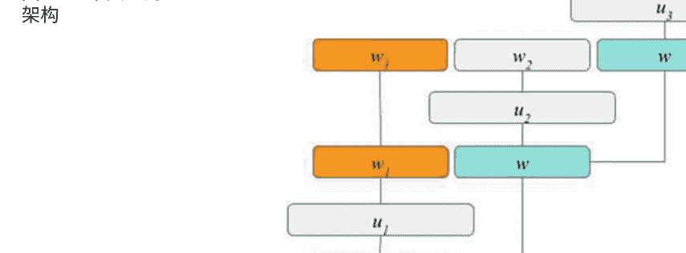

在这项早期工作中，由于词汇量对于输入向量来说太大，所以没有使用特征转换，而是采用了基于提升（Freund和Schapire，1997年）的特征选择方法来找到分类任务中的显著短语，并将结果与这个提升基线进行了比较。

在这项早期工作之后，DBNs很少被用于预训练，而现在技术水平是使用卷积神经网络（CNNs）及其变种（Collobert和Weston 2008; Kim 2014; Kalchbrenner等人2014）。

图2.3显示了一个典型的用于句子或话语分类的CNN架构。卷积操作涉及一个滤波器 $\mathbf{U}$，该滤波器应用于输入句子中的一个窗口，以生成一个新的特征 $c_i$。例如，

$$c_i = \tanh(\mathbf{U}.\mathbf{W}_{i:i+h-1} + b),$$

其中 $b$ 是偏置项，$\mathbf{W}$ 是词向量输入，$c_i$ 是新的特征。然后，对 $\mathbf{c}= [c_1, c_2, \ldots, c_{n-h+1}]$ 进行最大值池化操作，得到最大值特征 $\hat{c} = \max \mathbf{c}$。这些特征传递给一个全连接的softmax层，其输出是标签的概率分布：

$$P(y = j|\mathbf{x}) = \frac{e^{\mathbf{x}^T \mathbf{w}_j}}{\sum_{k=1}^{K} e^{\mathbf{x}^T \mathbf{w}_k}}.$$

目前很少有研究尝试使用受循环神经网络（RNN）启发的方法进行领域检测，并结合卷积神经网络（CNN），试图充分发挥两者的优势。Lee和Rajpurkar（2016）尝试构建了一个RNN编码器，然后将其馈入前馈网络，并将其与常规CNN进行了比较。图2.4显示了所采用的基于RNN的编码器的概念模型。

Ravuri和Stolcke（2015）的一项值得注意的工作并未使用前馈或卷积神经网络进行话语分类。他们简单地使用RNN编码器对话进行建模，其中句子结束标记解码为类别，如图2.5所示。尽管他们没有将结果与CNN或简单的DNN进行比较，但这项工作非常重要，因为人们可以简单地将这种架构扩展为双向RNN，并且还可以加载句子开头的标记作为类别，正如（Hakkani-Tür等人，2016）中所提到的，不仅支持对话意图，还支持向联合语义解析模型填充槽，这将在下一节中介绍。

除了这些代表性的建模研究之外，值得一提的方法是Dauphin等人（2014）提出的无监督话语分类工作。这种方法依赖于与点击的URL相关联的搜索查询。假设如果查询导致点击类似的URL，则它们具有相似的含义或意图。图2.6显示了一个示例的查询-点击图。这些数据用于训练一个简单的深度网络，其中包含多个隐藏层，最后一层被认为捕捉到给定查询的潜在意图。请注意，这与其他词嵌入训练方法不同，并且可以直接为给定的查询提供嵌入。

零样本分类器然后简单地找到嵌入与查询在语义上最接近的类别，假设类别名称（例如，餐馆或体育）以有意义的方式给出。然后，属于某个类别的概率是基于查询和类别名称的嵌入之间的欧氏距离的所有类别的简单softmax。

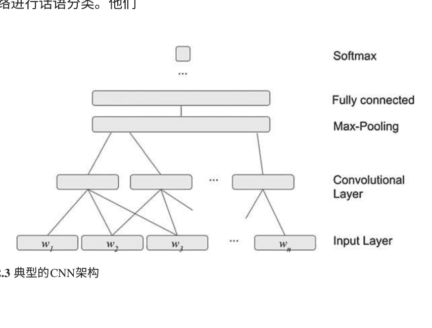

## 图2.4 基于RNN-CNN的编码器用于句子分类

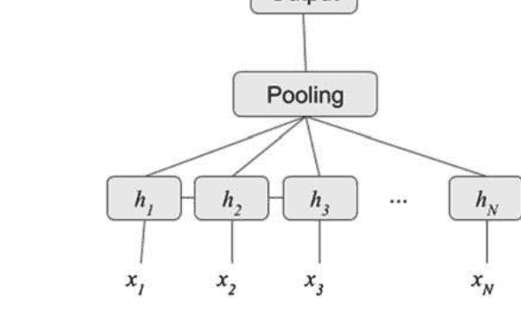

## 图2.5 仅基于RNN的编码器用于句子分类

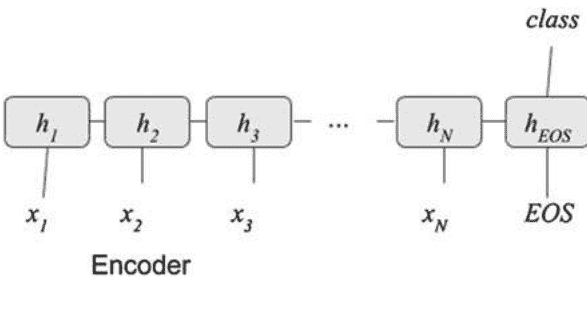

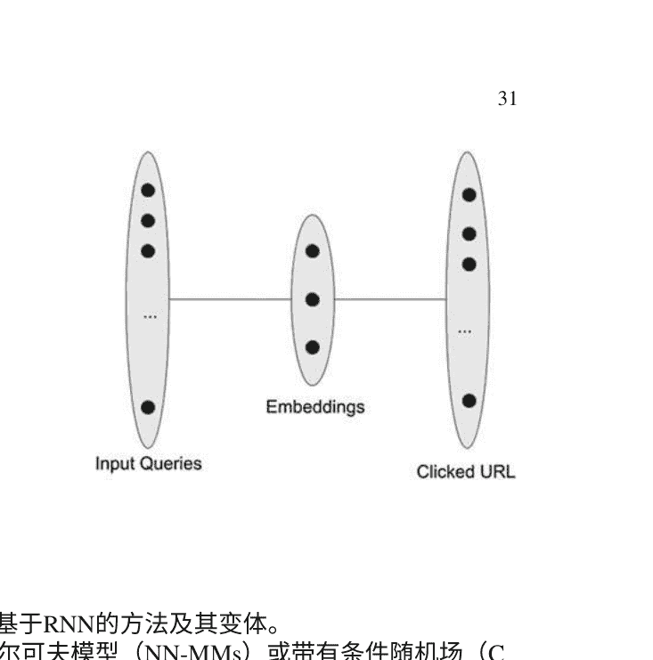

## 图2.6 一个从查询到点击URL的二分图

#### 2.4.2 槽填充

槽填充中的最新技术依赖于基于RNN的方法及其变体。预RNN方法包括神经网络马尔可夫模型（NN-MMs）或带有条件随机场（CRFs）的DNN。在RNN之前的一个作品中，Deoras和Sarikaya（2013）在多种方法中研究了用于槽填充的深度置信网络。他们提出了一种判别性嵌入技术，将稀疏且大的输入层投影到一个小的、密集的、实值特征向量上，然后用于网络的预训练和基于局部分类的判别性分类。他们将其应用于广为研究的ATIS口语理解任务，并获得了新的最先进性能，超过了最佳的基于CRF的系统。

CNN被用于特征提取，并且已经被证明在学习句子语义方面表现良好（Kim 2014）。CNN也被用于学习槽标记的隐藏特征。Xu和Sarikaya（2013）研究了使用CNN作为底层，提取与相邻单词相关的每个单词的特征，捕捉话语的局部语义。CRF层位于CNN层之上，为CRF生成隐藏特征。整个网络使用反向传播进行端到端训练，并应用于个人助理领域。

他们的结果显示，在领域专家进行特征工程时，与标准CRF模型相比，显著改善了性能。随着基于循环神经网络（RNN）的模型的进展，它们首先被Yao等人（2013）和Mesnil等人（2013）同时用于槽填充。例如，Mesnil等人实现并比较了RNN的几种重要架构，包括Elman类型（Elman 1990）和Jordan类型（Jordan 1997）的循环网络及其变体。实验结果表明，Elman类型和Jordan类型的网络在性能上相似，但明显优于广泛使用的CRF基线。此外，结果还表明，考虑到过去和未来槽之间的依赖关系的双向RNN表现最佳。这两篇论文还研究了用于初始化槽填充的RNN的词嵌入的有效性。该工作正在进行中。

这在(Mesnil等人 2015年)中得到了进一步的扩展，作者对标准的RNN架构以及混合、双向和CRF扩展进行了全面评估，并在这一领域取得了新的最优结果。

更正式地说，为了估计标签序列 $Y = y_1, \ldots, y_n$ 以IOB标签的形式表示，如(Raymond和Riccardi 2007)所示（其中三个输出对应于“B”、“I”和“O”），如图2.1所示，对应于一个输入序列 of tokens $X = x_1, \ldots, x_n$， Elman RNN架构(Elman 1990)由一个输入层、若干隐藏层和一个输出层组成。输入、隐藏和输出层由一组神经元组成，分别表示每个时间步的输入、隐藏和输出 at each time step $t$, $x_t$, $h_t$ 和 $y_{t}$。输入通常由one-hot向量或词级嵌入表示。给定时间步 $t$ 的输入层 $x_t$ 和上一个时间步的隐藏状态 $h_{t-1}$，当前时间步的隐藏层和输出层计算如下：

$$h_t = \phi(W_{xh} \begin{bmatrix} h_{t-1} \\ x_t \end{bmatrix})$$

$$p_t = softmax(W_{hy} h_t)$$

$$\hat{y}_t = \text{argmax} p_t,$$

其中 $W_{xh}$ 和 $W_{hy}$ 是表示输入和隐藏层之间以及隐藏层和输出层之间权重的矩阵。 $\phi$ 表示激活函数，即tanh或sigmoid。

相比之下，Jordan RNN从上一个时间步的输出层加上当前时间步的输入层计算当前时间步的循环隐藏层，即

$$h_t = \phi(W_{xp} \begin{bmatrix} p_{t-1} \\ x_t \end{bmatrix}).$$

前馈NN、Elman RNN和Jordan RNN的架构如图2.7所示。

另一种方法是通过显式的序列级优化来增强这些模型。这一点很重要，因为例如，模型不能将I标签跟在O标签后面。Liu和Lane（2015）提出了这样的架构，其中隐藏状态还使用了先前的预测，如图2.8所示：

$$h_t = f(U x_t + W h_{t-1} + Q y\_out_{t-1}),$$

其中 $y\_out_{t-1}$ 表示时间 $t-1$ 的输出标签向量， $Q$ 是连接输出标签向量和隐藏层的权重矩阵。

Dupont等人在2017年的一篇最新论文中提出了一种新的变体RNN架构，其中输出标签也被连接到下一个输入中。

特别是随着LSTM单元（Hochreiter和Schmidhuber 1997）在RNN中的重新发现，这种架构开始出现（Yao等人 2014）。LSTM单元具有更快的收敛速度和通过自我正则化解决序列中梯度消失或梯度爆炸的问题。结果表明，LSTM在捕捉长距离依赖方面比RNN更具鲁棒性。

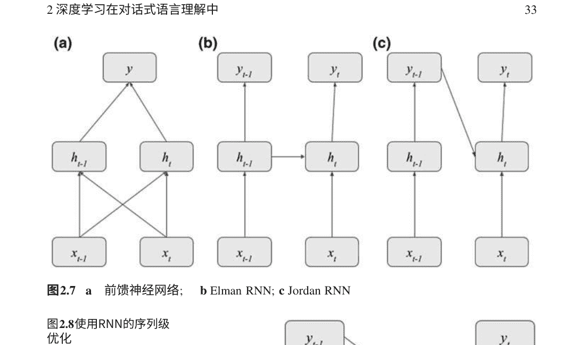

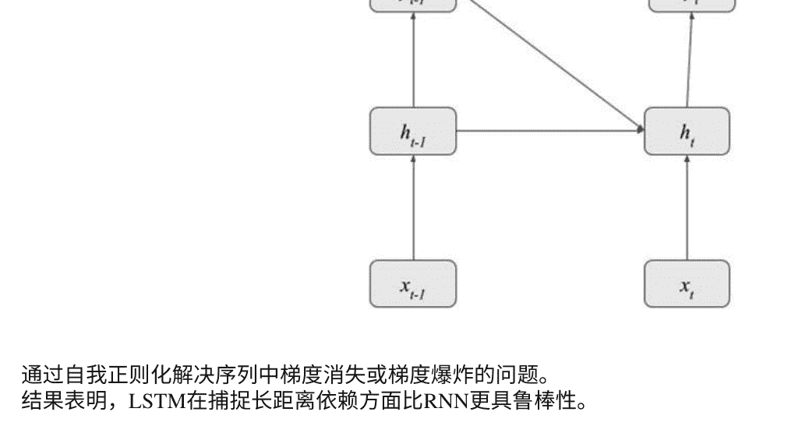

我们在（Mesnil等人，2015年）中编写了一份关于基于RNN的槽填充方法的综述。尽管在LSTM/GRU RNN之前的研究主要关注前瞻和回顾特征（例如，Mesnil等人，2013年；Vu等人，2016年），但现今最先进的槽填充方法通常依赖于双向LSTM/GRU模型（Hakkani-Tür等人，2016年；Mesnil等人，2015年；Kurata等人，2016a年；Vu等人，2016年；Vukotic等人，2016年）等等。

扩展包括编码器-解码器模型（Liu和Lane，2016年；Zhu和Yu，2016a等）或记忆（Chen等人，2016年），我们将在下面进行描述。在这方面，常见的句子编码器包括基于序列的循环神经网络，使用LSTM或GRU单元，这些单元可以积累信息。句子按顺序处理；卷积神经网络通过对短的局部词语或字符序列应用过滤器来累积信息；而树结构递归神经网络（RecNNs）通过在二叉解析树上传播信息来处理（Socher等人，2011年；Bowman等人，2016年）。

与树结构递归神经网络（RecNNs）相关的有两篇论文值得一提。第一篇是由Guo等人（2014年）撰写的，其中对输入句子的句法解析结构进行标记，而不是对单词进行标记。概念图如图2.9所示。每个单词都与一个词向量相关联，并将这些向量作为网络底部的输入。然后，网络通过在每个节点上重复应用神经网络来向上传播信息，直到根节点输出一个单一的向量。然后，将该向量用作语义分类器的输入，并通过反向传播来训练网络以最大化该分类器的性能。非终结符对应于要填充的槽位，在顶部整个句子可以被分类为意图或领域。

尽管这种架构非常优雅且昂贵，但由于各种原因，它并没有导致卓越的性能：(i)底层的解析树可能存在噪声，模型无法同时训练句法和语义解析器；(ii)短语不一定一对一对应于槽；(iii)高级标签序列未被考虑，因此需要一个最终的维特比层。因此，理想的架构将是混合RNN/RecNN模型。

Andreas等人（2016）提出了一种更有前景的方法来回答问题。如图2.10所示，在任务中，通过使用与六个关键逻辑函数相对应的神经模块的组合，自下而上构建了语义解析。这些函数包括查找、查找、关联、和、存在和描述。与RecNN相比，它的优势在于模型在训练过程中使用这些基元共同学习解析的结构或布局，从现有的句法解析器开始。

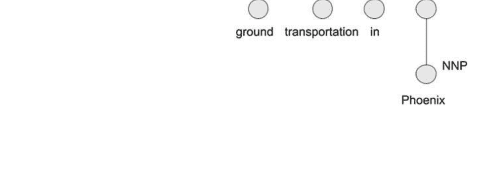

Vu等人（2016）提出使用排名损失函数，而不是传统的交叉熵损失。其中一个好处是它不会强制模型学习人工类别O的模式（可能不存在）。它学习最大化真实标签y和最佳竞争标签c之间的距离，给定数据点x。目标函数是

$$
L = \log(1 + \exp(\gamma (m_{\text{cor}} s_{\theta}(x) y))) + \log(1 + \exp(\gamma (m_{\text{inc}} + s_{\theta}(x) c))),
$$

其中$s_{\theta}(x)_c$是类别y和c的分数。参数γ控制预测错误的惩罚，而$m_{\text{cor}}$和$m_{\text{inc}}$是正确和错误类别的边界。γ、$m_{\text{cor}}$和$m_{\text{inc}}$是可以在开发集上调整的超参数。对于类别O，只计算方程式的第二个求和项。通过这样做，模型不会学习类别O的模式，但仍然增加了与最佳竞争标签的差异。在测试过程中，如果所有其他类别的分数都低于0，则模型将预测类别O。

除了标记器LSTM模型外，在类似研究取得进展之后，关于编码器/解码器RNN架构的研究很少（Sutskever等人，2014年; Vinyals和Le (2015)）。Kurata等人（2016b）提出了一种类似于图2.11中的架构。在这种架构中，输入句子通过编码器LSTM编码为一个固定长度的向量。然后，标签序列由标签器LSTM预测，其隐藏状态由编码器LSTM编码的向量初始化。通过这种编码器-标签器LSTM，可以明确地使用整个句子嵌入来预测标签序列。

请注意，在这个模型中，由于输出是通常的标签序列，单词也被馈送到标记器中（与其他编码器/解码器研究通常相反）除了之前的预测。

这种方法的另一个好处是注意机制（Simonnet等人，2015年），其中解码器可以关注更长距离的依赖性同时进行标记。注意力是另一个向量，c，它是编码器一侧所有隐藏状态嵌入的加权和。确定这些权重的方法有多种方式:

$$
c_t = \sum_{i=1}^{T} \alpha_{t_i} h_i
$$

考虑以下例句“从伦敦出发的航班不晚于下周六下午”，单词“afternoon”的标签是“departure_time”，只有通过距离它八个单词的动词才能明确确定。在这种情况下，注意机制可能会有用。

Zhu和Yu (2016b) 进一步扩展了这种编码器/解码器架构，使用了“焦点”（或直接注意力）机制，强调对齐的编码器隐藏状态。换句话说，注意力不再是学习得到的，而是简单地分配给相应的隐藏状态：

$$
c_t = h_t
$$

Zhai等人 (2017) 后来使用指针网络 (Vinyals等人, 2015) 对输入句子的分块输出进行了扩展。主要动机是RNN模型仍然需要使用IOB方案独立处理每个标记，而不是作为一个完整的单元。如果我们能够消除这个缺点，尤其是对于多词块，可能会得到更准确的标记。序列分块是克服这个问题的自然解决方案。在序列分块中，原始的序列标记任务被分为两个子任务：
- （1）分割，明确识别块的范围；
- （2）标记，根据分割结果为每个块标记一个单元。

因此，作者提出了一个联合模型，在编码阶段对输入句子进行分块，解码器只需标记这些块，如图2.12所示。

关于无监督训练槽填充模型，有一篇值得一提的论文是Bapna等人 (2017) 提出的一种方法，可以仅利用上下文中的槽描述，而无需任何标记或未标记的域内示例，快速引导新域。这项工作的主要思想是利用多任务深度学习槽填充模型中的槽名称和描述的编码，隐式地对跨域槽进行对齐，假设已经训练好了一个背景模型。

如果已经涵盖的领域中包含类似的槽，可以利用共享的预训练嵌入中获得的槽的连续表示在一个领域不可知的模型中进行利用。一个明显的例子是在多任务模型已经可以解析美国航空公司和土耳其航空公司的查询时，添加美国联合航空公司。虽然槽名称可能不同，但出发城市或到达城市的概念应该保持并可以转移到使用其自然语言描述的新任务中。这种方法对于解决领域扩展问题和消除任何手动注释数据或显式模式对齐的需求是有希望的。

#### 2.4.3 联合多任务多领域建模

从历史上看，意图确定被视为一个示例分类问题，而槽填充被视为一个序列分类问题，在深度学习之前，这两个任务的解决方案通常不相同，它们被分别建模。例如，SVM用于意图确定，CRF用于槽填充。随着深度学习的进步，现在可以使用单个模型以多任务方式获取整个语义解析。这使得槽决策可以帮助意图确定，反之亦然。

此外，域分类通常首先完成，作为后续处理的顶级分流。然后，对每个领域运行意图确定和槽填充，以填充特定于领域的语义模板。这种模块化设计方法（即将语义解析建模为三个独立任务）具有灵活性的优势；对领域的特定修改（例如插入、删除）可以在不需要更改其他领域的情况下实施。另一个优势是，在这种方法中，可以使用任务/领域特定的特征，这通常显著提高了这些任务/领域特定模型的准确性。此外，这种方法通常在每个领域中产生更专注的理解，因为意图确定只需要考虑相对较小的意图和槽类别集合，而模型参数可以针对特定的意图和槽集合进行优化。

然而，这种方法也有缺点：
- 首先，需要为每个领域训练这些模型。这是一个容易出错的过程，需要仔细的工程设计来确保在不同领域的处理一致。
- 此外，在运行时，这种任务的流水线处理会导致错误从一个任务传递到下一个任务。
- 各个领域模型之间没有数据或特征共享，导致数据碎片化，而一些语义意图（如查找或购买特定领域的实体）和槽（如日期、时间和位置）实际上可能是许多领域共有的（Kim等，2015年; Chen等，2015a年）。
- 最后，用户可能不知道系统涵盖了哪些领域以及程度，因此这个问题导致用户不知道可以期望什么，从而导致用户不满意（Chen等，2013年，2015b年）。

为此，Hakkani-Tur等人（2016年）提出了一种单一的RNN架构，将域检测、意图检测和槽填充三个任务整合到一个单一的RNN模型中。该模型使用所有可用的对话（utterances）与其语义框架进行训练。这个RNN的输入是单词序列（例如用户查询），输出是完整的语义框架，包括域、意图和槽，如图2.13所示。这类似于Tafforeau等人（2016年）的多任务解析和实体抽取工作。

为了联合建模域、意图和槽，需要在每个输入对话k的开头和结尾插入一个额外的标记<BOS>和<EOS>，并通过将这些标记与域和意图标签$d_k$和$i_k$连接起来，将这些标记与句子的初始和最终标记关联起来。因此，新的输入和输出序列为

$$
X = <BOS>, x_1, \ldots, x_n, <EOS>
$$

$$
Y = d_k\_i_k, s_1, \ldots, s_n, d_k\_i_k,
$$

其中 X 是输入， Y 是输出（图2.13）。这个想法的主要原理与序列到序列建模方法类似，如机器翻译（Sutskever等人，2014年）或闲聊（Vinyals和Le，2015年）系统方法：查询的最后一个隐藏层（在每个方向上）应该包含整个输入话语的潜在语义表示，以便用于领域和意图预测（$d_k$， $i_k$）。张和王（2016年）扩展了这个架构，以添加一个最大池化层，用于捕捉句子的全局特征，以进行意图分类（图2.14）。在训练过程中使用了一个统一的损失函数，该函数是交叉熵在槽填充和意图确定方面的加权和。刘和Lane（2016年）提出了一种基于编码器/解码器架构的联合槽填充和意图确定模型，如图2.15所示。它基本上是一个多头模型，共享句子编码器和任务特定的注意力。注意，这种联合建模方法对于从多个领域训练的较大背景模型开始进行新领域的扩展非常有用，类似于语言模型适应（Bellegarda 2004）。Jaech等人（2016年）提出了这样一项研究，利用多任务方法通过迁移学习来进行可扩展的CLU模型训练。可扩展性的关键在于减少学习新任务所需的训练数据量。所提出的多任务模型通过利用从其他任务中学到的模式，在使用更少的数据时提供更好的性能。该方法支持开放词汇表，使模型能够推广到未见过的单词，这在使用非常少的训练数据时尤为重要。

#### 2.4.4 在上下文中理解

自然语言理解涉及理解语言使用的上下文。但是理解上下文涉及多个挑战。首先，在许多语言中，某些词可以有多个意义。这使得消除所有这些词的歧义变得重要，以便能够准确检测它们在特定文档中的使用。词义消歧是自然语言处理中的一个持续研究领域，特别是在构建自然语言理解系统时非常重要。其次，理解任务涉及来自不同领域的文档，例如旅行预订、理解法律文件、新闻文章、arxiv文章等。每个领域都具有特定的属性，因此自然语言理解模型应该学会捕捉领域特定的上下文。第三，在口语和书面文本中，许多词被用作其他概念的代理。例如，最常见的是，“Xerox”用于“复制”或“fed ex”用于“隔夜快递”，等等。最后，文档中包含了不在文本中明确包含的知识的词语或短语。只有通过智能方法，我们才能学会使用“先验”知识来理解存在于文本中的这种信息。

最近，深度学习架构已经被应用于各种自然语言处理任务，并展示了在上下文中捕捉相关语义和句法方面的优势。由于词分布组成了短语或多词表达式的含义，目标是将分布式短语级表示扩展到单句和多句（篇章）级别，并生成整个文本的分层结构。

为了学习自然语言文本中的上下文，Hori等人（2014）提出了一种高效的上下文敏感的口语理解方法，使用基于角色的LSTM层。具体来说，在对话中准确理解说话者的意图时，重要的是考虑上下文中的句子以及周围对话转换的序列。在他们的工作中，使用LSTM循环神经网络来训练一个上下文敏感模型，以预测从口语序列中的对话概念的序列。因此，为了捕捉整个对话的长期特征，他们使用连续的单词序列来实现代意图的LSTM。为了训练这样的模型，他们从一个人对人的对话语料库中构建了带有概念标签的LSTM，这些标签代表了客户和代理人对于酒店预订的意图。这些表达式由代理人和客户的每个角色来描述。

如图2.16所示，有两个LSTM层，这些层根据说话者的角色具有不同的参数。因此，输入向量在左侧层中用于客户的话语，在右侧层中用于代理的话语，代表了这些不同的角色，因此被不同地处理。因此，递归LSTM输入接收来自前一帧中活动的与角色相关的层的输出，从而实现角色之间的转换。这种方法可以通过表征在每个不同的角色之间变化的话语表达来从智能语言理解系统中学习模型上下文。

在(Chen et al. 2016)中，提出了一种最早的端到端神经网络对话理解模型，该模型使用记忆网络提取先前信息作为理解自然语言对话中编码器的上下文知识。如图2.17所示，他们的方法结合基于RNN的编码器，该模型学习从可能很大的外部存储器中编码先前信息，然后从对话中解析出话语。假设存在输入话语及其对应的语义标签，他们的模型可以直接从输入-输出对进行端到端训练。采用端到端神经网络模型来建模多轮口语理解的长期知识传递。

citeankur:arxiv17通过使用分层对话编码器扩展了这种方法，这是分层递归编码器-解码器（HRED）的扩展，由Sordoni等人（2015）提出，其中查询级别的编码与当前话语的表示相结合，然后输入到会话级别的编码器中。

在所提出的架构中，不再使用简单的基于余弦相似度的记忆网络，而是采用前馈网络，其输入是上下文中的当前和前一个话语，然后将其输入到RNN中，如图2.18所示。更正式地说，当前话语编码c与每个记忆向量$m_k$相结合，对于$k=1,...,K$，通过连接并通过前馈（FF）层传递它们，产生上下文编码，表示为$g_1, g_2, … g_{t-1}$

$$
g_k = \text{sigmoid} (FF(m_k, c))
$$

对于 $k = 0, . . . , t−1$。这些上下文编码被作为令牌级别的输入馈送到双向GRU RNN会话编码器中。会话编码器的最终状态表示对话上下文编码$h_t$。

正如本章前面提到的，CNN主要用于自然语言理解任务，以学习无法学习的潜在特征。

Celikyilmaz等人（2016）引入了一种预训练方法，用于深度神经网络模型，特别是使用CNN来联合学习上下文作为网络结构从大规模无标签数据中学习，同时学习预测任务特定的上下文信息-从标记序列中。在（Xu和Sarikaya 2013）的监督CNN与CRF架构的基础上，他们使用CNN作为底层，通过半监督学习的方式从标记和无标记序列中学习特征表示。在顶层，他们使用两个CRF结构来解码输出序列作为语义槽标签以及每个词的潜在类别标签。

这使得网络能够同时学习转移和发射权重，以便在单个模型中对话中的词进行槽标记和类别标记。

### 2.5 总结

基于深度学习的方法在两个维度上引领了CLU领域的发展。第一个维度是端到端学习。对语言理解是完整对话系统中的许多子系统之一。例如，它通常将语音识别结果作为输入，并将其输出馈送到对话管理器进行状态跟踪和响应生成。因此，整个对话系统的端到端最优设计通常会带来更好的用户体验。他和邓（2013）讨论了一种以优化为导向的方法统计框架用于整体系统设计，利用每个子系统输出的不确定性和子系统之间的相互作用。在这个框架中，所有子系统的参数被视为彼此相关，并且进行端到端的训练，以优化整个对话系统的最终性能指标。此外，最近，基于强化学习的方法结合用户模拟器也开始进入CLU任务，提供无缝的端到端自然语言对话（见下一章）。

深度学习在CLU中的第二个维度是没有RNN展开实现的高效编码器。循环神经网络是强大的模型，独特地能够处理序列数据，如自然语言、语音、视频等。通过循环神经网络，我们现在可以理解序列数据并做出决策。传统神经网络是无状态的。它们以固定大小的向量作为输入，并产生一个向量作为输出。作为有状态的循环神经网络具有这种独特的属性，它已成为当今语言理解系统中最常用的工具。

没有隐藏层的网络在输入-输出映射方面非常有限。添加一层手工编码的特征（如感知机）使它们更加强大，但困难的是设计这些特征。我们希望能够找到好的特征，而不需要对任务有深入的了解或反复尝试不同的特征。我们需要自动化试错特征设计循环。通过扰动权重，强化学习可以学习这样的结构。强化学习在深度学习中的作用实际上并不复杂。他们随机扰动一个权重，并观察是否改善了性能——如果是，就保存这个改变。这可能是低效的，因此机器学习社区，特别是在深度强化学习方面，近年来一直在关注这个问题。

由于自然语言句子中的含义被认为是根据树结构递归构建的，更高效的编码器研究了树结构的神经网络编码器，具体来说是TreeLSTMs（Socher等人，2011年；Bowman等人，2016年）。这个想法是能够在保持效率的同时更快更高效地进行编码。另一方面，能够与模块参数一起学习网络结构预测器的模型已经显示出改善自然语言理解的能力，同时减少了与更长文本序列相关的问题，从而减少了RNN中的反向传播。Andreas等人（2016年）提出了这样一个模型，它使用自然语言字符串从可组合模块的集合中自动组装神经网络。通过强化学习，通过（世界，问题，答案）三元组作为监督，学习这些模块的参数与网络组装参数一起。

总之，我们相信深度学习的进步已经为人机对话系统，特别是CLU，开辟了令人兴奋的新研究领域。这里提到的研究在未来十年中只是触及到表面，使用手动注释的数据解决了一些玩具任务。未来的研究包括迁移学习、无监督学习和强化学习，这些对于任何高质量可扩展的CLU解决方案来说比以往任何时候都更加重要。

## 参考文献

Allen, J. (1995). 自然语言理解，第8章。 Benjamin/Cummings.

Allen, J. F., Miller, B. W., Ringger, E. K., & Sikorski, T. (1996). 一个强大的自然语言对话系统。 在计算语言学协会年会论文集中，第62-70页。

Andreas, J., Rohrbach, M., Darrell, T., & Klein, D. (2016). 学习组合神经网络进行问答。 在NAACL会议论文集中。

Bapna, A., Tur, G., Hakkani-Tur, D., & Heck, L. (2017). 面向零样本框架语义解析用于领域扩展。 在Interspeech会议的论文。

Bellegarda, J. R. (2004). 统计语言模型适应：回顾与展望。语音通信专题关于语音识别适应方法，42，93–108.

Bonneau-Maynard, H., Rosset, S., Ayache, C., Kuhn, A., & Mostefa, D. (2005). 法国MEDIA对话语料库的语义标注。 在Interspeech会议的论文，葡萄牙里斯本。

Bowman, S. R., Gauthier, J., Rastogi, A., Gupta, R., & Manning, C. D. (2016). 一种快速统一的模型用于解析和句子理解。在ACL会议的论文。

Celikyilmaz, A., Sarikaya, R., Hakkani-Tur, D., Liu, X., Ramesh, N., & Tur, G. (2016). 一种新的预训练方法，用于训练具有口语理解应用的深度学习模型。 在第17届国际语音通信年会（INTERSPEECH 2016）的论文集中。

Chen, Y.-N., Hakkani-Tur, D., & He, X. (2015a). 零样本学习意图嵌入的扩展，通过卷积深度结构语义模型。 在IEEE ICASSP的论文集中。

Chen, Y.-N., Hakkani-Tur, D., Tur, G., Gao, J., & Deng, L. (2016). 具有知识传递的端到端记忆网络，用于多轮口语理解。 在Interspeech, San Francisco, CA的论文集中。

Chen, Y.-N., Wang, W. Y., Gershman, A., & Rudnicky, A. I. (2015b). 基于知识图谱传播的矩阵分解用于无监督的口语理解。 在ACL/ICJNLP的会议中。

Chen, Y.-N., Wang, W. Y., & Rudnicky, A. I. (2013). 无监督的语义槽感知和填充用于口语对话系统，使用框架语义解析。 在IEEE ASRU的会议中。

Chomsky, N. (1965). 句法理论的几个方面。 剑桥，马萨诸塞州：麻省理工学院出版社。

Chu-Carroll, J., & Carpenter, B. (1999). 基于向量的自然语言呼叫路由。计算语言学，25(3)，361–388。

Collobert, R., & Weston, J. (2008). 自然语言处理的统一架构：深度神经网络与多任务学习。 在ICML的会议中，芬兰赫尔辛基。

Dahl, D. A., Bates, M., Brown, M., Fisher, W., Hunicke-Smith, K., Pallett, D., et al. (1994). 扩展ATIS任务的范围：ATIS-3语料库。 在人类语言技术研讨会的会议中。Morgan Kaufmann.

Dammati, G., Bechet, F., & de Mori, R. (2007). 在法国电信3000语音代理语料库上的口语理解策略。 在ICASSP会议上，夏威夷檀香山。

Dauphin, Y., Tur, G., Hakkani-Tur, D., & Heck, L. (2014). 用于语义话语分类的零样本学习和聚类。 在ICLR会议上。

Deng, L., & Li, X. (2013). 语音识别的机器学习范式：概述。IEEE音频、语音和语言处理，21(5), 1060–1089。

Deng, L., & O’Shaughnessy, D. (2003). 语音处理：一种动态和优化导向的方法. Marcel Dekker, 纽约：出版商.

Deng, L., & Yu, D. (2011). 深度凸网络：一种可扩展的语音模式分类架构。 在Interspeech会议论文集中，意大利佛罗伦萨。

Deoras, A., & Sarikaya, R. (2013). 基于深度置信网络的口语理解语义标记器。 在IEEE Interspeech会议论文集中，法国里昂。

Dupont, Y., Dinarelli, M., & Tellier, I. (2017). 标签依赖感知的递归神经网络。 arXiv预印本arXiv:1706.01740。

Elman, J. L. (1990年)。在时间中寻找结构。认知科学，14（2），179-211。

Freund, Y., & Schapire, R. E. (1997年)。在线学习的决策理论推广及其应用于提升。计算机与系统科学杂志，55（1），119-139。

Gorin, A. L., Abella, A., Alonso, T., Riccardi, G., & Wright, J. H. (2002). 自动化的自然语言对话。IEEE计算机杂志，35(4), 51–56.

Gorin, A. L., Riccardi, G., & Wright, J. H. (1997). 我能帮你什么忙吗？语音通信，23, 113–127.

Guo, D., Tur, G., Yih, W.-t., & Zweig, G. (2014). 使用递归神经网络进行联合语义话语分类和槽填充。在IEEE SLT研讨会论文集中。Gupta, N., Tur, G., Hakkani-Tur, D., Bangalore, S., Riccardi, G., & Rahim, M. (2006). AT&T口语理解系统。IEEE音频、语音和语言处理期刊，14(1), 213–222.

Hahn, S., Dinarelli, M., Raymond, C., Lefevre, F., Lehn, P., Mori, R. D., 等 (2011). 比较多种语言中的随机方法在口语理解中的应用IEEE音频、语音和语言处理, 19(6), 1569–1583.

Hakkani-Tur D., Tur, G., Celikyilmaz, A., Chen, Y.-N., Gao, J., Deng, L., & Wang, Y.-Y. (2016). 使用双向RNN-LSTM进行多领域联合语义框架解析。在Interspeech会议论文集，旧金山，加利福尼亚州。

He, X., & Deng, L. (2011). 语音识别、机器翻译和语音翻译的统一判别学习范式。在IEEE信号处理杂志，28(5), 126–133.

He, X. & Deng, L. (2013). 以语音为中心的信息处理：一种面向优化的方法。在IEEE会议录中，101(5), 1116–1135。

Hemphill, C. T., Godfrey, J. J., & Doddington, G. R. (1990). ATIS口语系统试点语料库。在语音和自然语言研讨会论文集，HLT'90, 第96–101页，美国新泽西州莫里斯敦。计算语言学协会。

Hinton, G., Deng, L., Yu, D., Dahl, G., Rahman Mohamed, A., Jaitly, N., et al. (2012). 用于语音识别中的深度神经网络的声学建模。IEEE信号处理杂志，29(6), 82–97。

Hinton, G. E., Osindero, S., & Teh, Y. W. (2006). 一种用于深度信念网络的快速学习算法。神经计算的进展，18(7), 1527–1554.

Hochreiter, S., & Schmidhuber, J. (1997). 长短期记忆神经计算，9(8), 1735–1780.

Hori, C., Hori, T., Watanabe, S., & Hershey, J. R. (2014). 使用角色相关的LSTM层进行上下文敏感的口语理解。在NIPS 2015 Workshop中的机器学习与SLU交互会议记录中。

Huang, X., & Deng, L. (2010). 现代语音识别概述。在《自然语言处理手册》第二版第15章中。

Jaech, A., Heck, L., & Ostendorf, M. (2016). 用于自然语言理解的循环神经网络的领域适应。在Interspeech会议记录中，旧金山，加利福尼亚。Jordan, M. (1997). 串行顺序：一种并行分布式处理方法。加利福尼亚大学圣地亚哥分校计算机科学研究所技术报告8604。

Kalchbrenner, N., Grefenstette, E., & Blunsom, P. (2014). 用于建模句子的卷积神经网络。在ACL会议上，巴尔的摩，马里兰州。

Kim, Y. (2014). 用于句子分类的卷积神经网络。在EMNLP会议上，多哈，卡塔尔。

Kim, Y.-B., Stratos, K., Sarikaya, R., & Jeong, M. (2015). 用于不同标签集的新的迁移学习技术。在ACL-IJCNLP会议上。

Kuhn, R., & Mori, R. D. (1995). 将语义分类树应用于自然语言理解。IEEE模式分析与机器智能交易，17, 449-460.

Kurata, G., Xiang, B., Zhou, B., & Yu, M. (2016a). 利用编码器LSTM的句子级信息进行语义槽填充。在EMNLP会议上，奥斯汀，德克萨斯州。Kurata, G., Xiang, B., Zhou, B., & Yu, M. (2016b). 利用编码器LSTM的句子级信息进行语义槽填充。arXiv预印本 arXiv:1601.01530。

Lee, J. Y., & Dernoncourt, F. (2016). 使用循环和卷积神经网络的顺序短文本分类。 在NAACL的会议论文中。

Li, J., Deng, L., Gong, Y., & Haeb-Umbach, R. (2014). 噪声鲁棒自动语音识别概述。 IEEE/ACM音频、语音和语言处理交易,22(4),745–777.

Liu, B., & Lane, I. (2015).用于口语理解的循环神经网络结构化输出预测。 在NIPS机器学习与口语理解和交互研讨会上的论文中。

Liu, B., & Lane, I. (2016). 基于注意力的循环神经网络模型用于联合意图检测和槽填充。 在Interspeech的会议论文中，位于加利福尼亚州旧金山。

Mesnil, G., Dauphin, Y., Yao, K., Bengio, Y., Deng, L., Hakkani-Tur, D., 等 (2015). 使用循环神经网络进行口语理解中的槽填充。 IEEE交易音频、语音和语言处理, 23(3), 530–539.

Mesnil, G., He, X., Deng, L., & Bengio, Y. (2013). 对于口语理解，研究循环神经网络架构和学习方法。 在Inter-speech会议论文集中,法国里昂.

Natarajan, P., Prasad, R., Suhm, B., & McCarthy, D. (2002). 语音启用的自然语言呼叫路由: BBN呼叫导演。 在ICSLP会议论文集中,科罗拉多州丹佛市.

Pieraccini, R., Tzoukermann, E., Gorelov, Z., Gauvain, J.-L., Levin, E., Lee, C.-H., 等 (1992). 基于语义统计表示的语音理解系统。 在ICASSP会议论文集中, 加利福尼亚州旧金山市.

Price, P. J. (1990). 评估口语语言系统: ATIS领域。 在语音和自然语言的DARPA研讨会上，, Hidden Valley, PA。 Ravuri, S., & Stolcke, A. (2015). 用于词汇话语分类的循环神经网络和lstm模型。 在Interspeech会议上。

Raymond, C., & Riccardi, G. (2007). 生成和判别算法用于口语理解。 在Interspeech会议上，比利时安特卫普。

Sarikaya, R., Hinton, G. E., & Deoras, A. (2014). 应用深度信念网络进行自然语言理解。 IEEE音频、语音和语言处理交易,22(4),Sarikaya, R., Hinton, G. E., & Ramabhadran, B. (2011). 用于自然语言呼叫路由的深度信念网络。 在ICASSP会议上，捷克共和国布拉格。

Seneff, S. (1992). TINA: 用于口语应用的自然语言系统。 计算语言学，18(1), 61–86.

Simonnet, E., Camelin, N., Deleglise, P., & Esteve, Y. (2015). 探索基于注意力的递归神经网络在口语理解中的应用。 在NIPS机器学习与口语理解和交互研讨会上的论文集中。 Socher , R., Lin, C. C., Ng, A. Y., & Manning, C. D. (2011). 使用递归神经网络解析自然场景和自然语言。 在ICML的论文集中。

Sordoni, A., Bengio, Y., Vahabi, H., Lioma, C., Simonsen, J. G., & Nie, J.-Y. (2015). 用于生成上下文感知查询建议的分层递归编码器-解码器。 在ACM CIKM的论文集中。

Sutskever, I., Vinyals, O., & Le, Q. V. (2014).神经信息处理系统的进展27, 章节: 神经网络的序列到序列学习。

Tafforeau, J., Bechet, F., Artierel, T., & Favre, B. (2016). 联合句法和语义分析用于口语理解的多任务深度学习框架。 在Interspeech会议中, 圣弗朗西斯科, 加利福尼亚州。

Tur, G., & Deng, L. (2011).意图确定和口语话语分类, 第4章在书籍: 口语理解中。纽约, 纽约州: Wiley出版社。

Tur, G., Hakkani-Tur, D., & Heck, L. (2010). 在ATIS中还有什么需要理解的吗？ 在IEEE SLT Workshop会议中, 伯克利, 加利福尼亚州。

Tur, G., & Mori, R. D. (Eds.). (2011).口语理解: 从语音中提取语义信息的系统。 纽约, 纽约 : Wiley。

Vinyals, O., Fortunato, M., & Jaitly, N. (2015). 指针网络。 在NIPS会议中。

Vinyals, O., & Le, Q. V. (2015). 一个神经对话模型。在ICML会议中。Vu, N. T., Gupta, P., Adel, H., & Schütze, H. (2016). 具有排序损失的双向递归神经网络用于口语理解。在IEEE EICASSP会议中，上海，中国。

Vukotic, V., Raymond, C., & Gravier, G. (2016). 一个超越局部观察的对话感知双向GRU网络用于口语理解。在Interspeech会议中，旧金山，加利福尼亚州。

Walker, M., Aberdeen, J., Boland, J., Bratt, E., Garofolo, J., Hirschman, L., 等 (2001). DARPA通信对话旅行规划系统：2000年6月数据收集。在Eurospeech会议的论文中。

Wang, Y., Deng, L., & Acero, A. (2011).基于语义框架的口语理解，第3章。纽约，纽约州： Wiley出版社。

Ward, W., & Issar, S. (1994). CMU口语理解系统的最新改进。在ARPA HLT研讨会的论文中，第213-216页。

Weizenbaum, J. (1966). Eliza——一个用于研究人机自然语言交流的计算机程序。ACM通信，9(1), 36-45。

Woods, W. A. (1983).语言处理用于语音理解. Prentice-Hall International, Englewood Cliffs, NJ: 在计算机语音处理中。

Xu, P., & Sarikaya, R. (2013). 基于卷积神经网络的三角形条件随机场用于联合意图检测和槽位填充. 在IEEE ASRU会议上。

Yao, K., Peng, B., Zhang, Y., Yu, D., Zweig, G., & Shi, Y. (2014). 使用长短期记忆神经网络的口语理解. 在IEEE SLT Workshop会议上, SouthLake Tahoe, CA. IEEE.

Yao, K., Zweig, G., Hwang, M.-Y., Shi, Y., & Yu, D. (2013). 用于语言理解的循环神经网络. 在Interspeech会议上, Lyon, France.

Zhai, F., Potdar, S., Xiang, B., & Zhou, B. (2017). 神经模型用于序列分块。在AAAI会议的论文中。

Zhang, X., & Wang, H. (2016). 一个联合模型的意图确定和槽填充用于口语语言理解。在IJCAI会议的论文中。

Zhu, S., & Yu, K. (2016a). 基于编码器-解码器和注意力机制的序列标注的口语语言理解。在提交。

Zhu, S., & Yu, K. (2016b). 基于编码器-解码器和注意力机制的序列标注的口语语言理解。arXiv预印本 arXiv:1608.02097.

## 第3章
### 口语和基于文本的深度学习对话系统中的深度学习

Asli Celikyilmaz, Li Deng和Dilek Hakkani-Tur

摘要 在过去几十年中，语音和语言理解研究的几个领域取得了重大突破，特别是用于构建人机对话系统。对话系统，也被称为交互式对话代理、虚拟代理或有时是聊天机器人，在从技术支持服务到语言学习工具和娱乐等各种应用中都非常有用。深度神经网络的最近成功推动了数据驱动对话模型的研究。在本章中，我们介绍了最先进的神经网络架构，并详细介绍了使用深度学习构建成功对话系统的每个组件的细节。本章将重点介绍面向任务的对话系统，然后提供了用于构建开放式非任务导向对话系统的不同网络。此外，为了促进这一领域的研究，我们还对适用于数据驱动对话系统学习的公开可用数据集和软件工具进行了调查。最后，讨论了适当选择的评估指标以实现学习目标。

### 3.1 引言

在过去的十年中，虚拟个人助理（VPAs）或对话式聊天机器人一直是最令人兴奋的技术发展。口语对话系统（SDS）被认为是这些VPAs的大脑。例如，微软的Cortana，¹

¹https://www.microsoft.com/en-us/mobile/experiences/cortana/.

A. Celikyilmaz (✉)
微软研究院，雷德蒙德，华盛顿州，美国
电子邮件：asli@ieee.org

L. Deng
Citadel，芝加哥和西雅图，美国
电子邮件：l.deng@ieee.org

D. Hakkani-Tur
Google，加利福尼亚州山景城，美国
电子邮件：dilek@ieee.org

### 表3.1 对话系统当前使用的任务类型
| 任务类型 | 例子 |
| :--- | :--- |
| 信息消费 | “会议日程安排是什么” <br> “演讲在哪个房间？” |
| 任务完成 | “明天下午3点叫醒我” “在西雅图市中心找一个适合儿童的素食餐厅” <br> “午饭后与桑迪安排一次会议。” |
| 决策支持 | “为什么南区的销售远远落后？” |
| 社交互动 (闲聊) | “你今天过得怎么样” <br> “我和人类一样聪明？” <br> “我也爱你。” |

苹果的Siri，^{2}亚马逊的Alexa，^{3}谷歌的Home，^{4}和Facebook的M，^{5}在各种设备中都已经集成了SDS模块，使用户能够自然地说话以更高效地完成任务。传统的对话系统具有相当复杂和/或模块化的流程。深度学习技术的进步最近使神经模型在对话建模中得到了应用。

口语对话系统已有近30年的历史，可以分为三个时代：基于符号规则或模板的（90年代末之前），基于统计学习的，以及基于深度学习的（自2014年以来）。本章简要回顾了会话系统的历史，并分析了为什么以及如何在不同时代之间转变了底层技术。本章将讨论这三种基本不同类型的机器人技术的优势和劣势，并探讨未来的发展方向。

当前的对话系统正在尝试帮助用户完成多项任务，包括日常活动、互动游戏，甚至成为伴侣（见表3.1中的示例）。因此，会话对话系统已经为许多目的的而构建，然而，可以在目标导向对话（例如个人助理系统或其他任务完成对话，如购买或技术支持服务）和非目标导向对话系统（如闲聊、电脑游戏角色（头像）等）之间进行有意义的区分。由于它们用于不同的目的，它们的对话系统设计和操作的组件在结构上是不同的。在本章中，我们将详细介绍面向任务（目标）导向对话任务的对话系统组件。还将提供非目标导向对话系统（闲聊）的详细信息。

如图3.1所示，经典的口语对话系统包括多个组件，包括自动语音识别（ASR），语言理解模块，状态跟踪器和对话策略，共同形成对话管理器，

^2 http://www.apple.com/ios/siri/. ^3 https://developer.amazon.com/alexa. ^4 https://madeby.google.com/home. ^5 https://developers.facebook.com/blog/post/2016/04/12/bots-for-messenger/ .

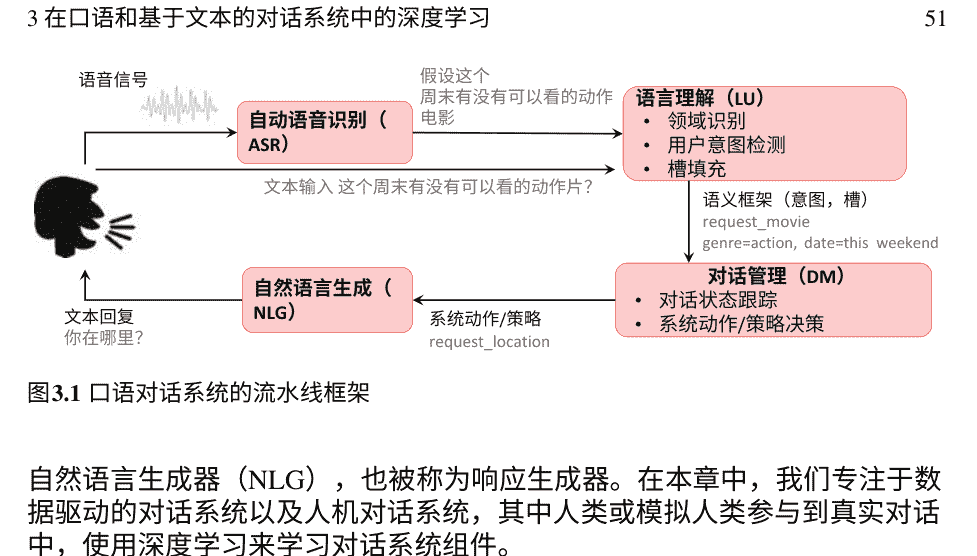

自然语言生成器（NLG），也被称为响应生成器。在本章中，我们专注于数据驱动的对话系统以及人机对话系统，其中人类或模拟人类参与到真实对话中，使用深度学习来学习对话系统组件。

口语语言或语音识别对整个口语对话系统的成功有着巨大的影响。这个前端组件涉及到几个因素，使得机器难以识别语音。连续语音的分析是一项困难的任务，因为语音信号具有巨大的变异性，单词之间没有明确的边界。关于构建口语语言系统的技术细节以及其他许多困难，我们建议读者参考Huang和Deng（2010），Deng和Li（2013），Li等人（2014），Deng和Yu（2015），Hinton等人（2012），He和Deng（2011）。

口语对话系统的语音识别组件通常是与说话人无关的，并且在整个对话过程中不考虑是同一用户。在端到端的口语对话系统中，语音识别中不可避免的错误会使语言理解组件比处理文本输入更困难（He和Deng2013）。在口语理解研究的漫长历史中，语音识别错误引起的困难使口语理解的领域比文本形式的语言理解要窄得多（Tur和Deng2011）。然而，由于深度学习在语音识别方面近年来取得的巨大成功（Yu和Deng2015; Deng 2016），识别错误已经大大减少，导致当前会话理解系统的应用领域越来越广泛。⁶

大多数早期的目标驱动型对话系统主要基于手工制定的规则（Aust等，1995; Simpson和Eraser 1993），紧随其后的是对话系统所有组件的机器学习技术（Tur和De Mori 2011; Gorin等，1997）。这些工作中的大部分将对话形式化为基于马尔可夫决策过程的顺序决策问题。随着深度神经网络的出现，特别是在语音识别方面的研究，口语理解（例如，前馈神经网络）（Hastie等，2009年），RNNs（Goller和Kohler，1996年），包括LSTMs（Graves和Schmidhuber，2005年），以及对话建模（例如，深度强化学习方法）在对话系统的鲁棒性和连贯性方面取得了令人难以置信的成功（Wen等，2016b；Dhingra等，2016a；Lipton等，2016）。另一方面，大多数早期的非目标导向系统使用简单的规则、主题模型，并将对话建模为使用高阶马尔可夫链的离散符号（单词）的随机序列。直到最近，基于大规模语料库训练的深度神经网络架构才开始受到研究，并取得了有希望的结果（Ritter等，2011；Vinyals和Le，2015；Lowe等，2015a；Sordoni等，2015a；Serban等，2016b，2017）。使用深度神经网络的非目标导向系统面临的最大挑战之一是它们需要大规模的语料库才能取得良好的结果。

本章的结构如下。在接下来的第3.2节中，提供了当前对话系统构建子组件所使用的深度学习工具的高级概述。第3.3节描述了目标导向的神经对话系统的各个系统组件，并提供了最近提出的研究工作的示例。在第3.4节中，讨论了使用深度学习技术的用户模拟器的类型。随后，在第3.5节中介绍了深度学习方法在自然语言生成中的应用。接下来的部分在第3.6节中深入探讨了用于构建端到端对话系统的深度学习方法。在第3.7节中，介绍了开放领域非目标导向对话系统，然后介绍了用于构建深度对话模型的当前数据集，并提供了每个语料库的链接，同时强调对话是如何生成和收集的。第3.9节简要介绍了开源神经对话系统建模软件。在第3.10节中介绍了评估对话系统和用于评估它们的度量标准。最后，在第3.11节中，对本章对话建模的未来展望进行了调查。

### 3.2 对话系统组件的学习方法

在本节中，我们总结了一些在构建对话代理时使用的深度学习技术。深度学习技术已被用于建模对话系统的几乎所有组件。我们在下面的三个不同类别下研究这些方法：判别式、生成式和基于决策的，具体来说是强化学习。

#### 3.2.1 判别式方法

深度学习方法直接建模后验概率 p(y|x)，并利用大量的监督数据进行对话建模研究中最常研究的方法之一。最先进和突出的方法已经被研究用于口语对话系统中的口语理解（SLU）任务，如目标估计和意图识别，是关键的组件，它们被建模为多输出分类任务。在这个领域的大部分研究工作都使用深度神经网络进行分类，具体来说是多层前馈神经网络或多层感知器（Hastie等，2009）。这些模型被称为前馈模型，因为信息从输入 $x$ 通过用于定义函数 $f$ 的中间计算，最终到输出 $y$。

深度结构化语义模型（DSSM），或者更一般地说，深度语义相似性模型，是深度学习研究中的一种方法之一，常用于多/单类文本分类，它在发现潜在特征的同时学习两个文本之间的相似性。在对话系统建模中，DSSM方法主要用于SLU的分类任务（Huang等人，2013）。DSSM是一种用于表示文本字符串（句子、查询、谓词、实体提及等）的连续语义空间和建模两个文本字符串之间语义相似性的深度神经网络（DNN）建模技术（例如，Sent2Vec）。还常用的是卷积神经网络（CNN），它利用具有卷积滤波器的层应用于局部特征（LeCun等人，1998）。最初用于计算机视觉，CNN模型随后被证明对于SLU模型非常有效，主要用于学习无法通过标准（非）线性机器学习方法提取的潜在特征。

语义槽填充是SLU中最具挑战性的问题之一，被认为是一个序列学习问题。同样，信念跟踪或对话状态跟踪也被视为顺序学习问题，因为它们主要通过对话中的每次交流来维护对话的状态。

虽然CNN是汇集局部信息的好方法，但它们并没有真正捕捉到数据的顺序性，也不是顺序建模的首选。因此，为了解决对话系统中建模用户话语的顺序信息，大多数研究都集中在使用递归神经网络（RNN），这有助于处理顺序信息。

记忆网络（Weston等人，2015；Sukhbaatar等人，2015；Bordes等人，2017）是一类最近应用于各种自然语言处理任务的模型，包括问答（Weston等人，2015），语言建模（Sukhbaatar等人，2015）等。记忆网络通常通过首先写入，然后通过使用跳跃从存储历史对话和短期上下文的记忆组件中迭代地读取来推理所需的响应。

它们已经被证明在这些任务上表现良好，并且在基于循环神经网络的端到端架构上胜过了其他一些架构。此外，基于注意力的RNN网络，如长短期记忆网络（LSTM），采用了不同的方法来保持记忆组件并学习关注对话上下文（Liu和Lane 2016a）。

为每个新应用程序获取大型语料库可能不可行，以构建深度监督学习模型。因此，使用其他相关数据集可以有效地引导学习过程。特别是在深度学习中，使用相关数据集对模型进行预训练是一种有效的扩展方法适用于复杂环境（Kumar等，2015）。这在开放域对话系统以及多任务对话系统（例如，包含来自不同领域的多个任务，如酒店、航班、餐厅等的旅行领域）中至关重要。对话建模研究人员已经提出了各种深度学习方法，以应用迁移学习来构建数据驱动的对话系统，例如学习对话系统的子组件（如意图和对话行为分类）或使用迁移学习学习端到端对话系统。

#### 3.2.2 生成方法

由于深度生成模型能够对输入数据分布进行建模并从中生成逼真的示例，因此最近在对话系统建模研究领域中变得流行起来。这种方法主要用于对数据中的对象和实例进行聚类，从非结构化文本中提取潜在特征，或进行降维处理。使用深度生成模型的对话建模系统的大部分类别主要研究开放域对话系统，特别关注神经生成模型用于生成回应。这些工作通常采用基于编码器-解码器的神经对话模型（见图3.5）（Vinyals和Le, 2015；Lowe等人, 2015b；Serban等人, 2017；Shang等人, 2015），其中编码器网络使用整个历史记录来编码对话语义，解码器生成自然语言话语（例如，代表系统对用户请求的响应的单词序列）。还使用了将抽象对话行为映射为适当表面文本的基于RNN的系统（Wen等人, 2015a）。

生成对抗网络（GANs）（Goodfellow等，2014）是生成建模中的一个主题，在对话领域中最近出现的神经对话建模任务中，用于对话响应生成。Li等人（2017）使用深度生成对抗网络进行响应生成，Kannan和Vinyals（2016）研究了对话模型的对抗性评估方法的使用。

#### 3.2.3 决策

对话系统的关键是其决策模块，也称为对话管理器或对话策略。对话策略在对话的每个步骤中选择系统动作，以引导对话成功完成任务。系统动作包括与用户交互以获取完成任务所需的具体要求，以及协商和提供替代方案。使用强化学习优化统计对话管理器（RL）方法是一个活跃且有前景的研究领域（Fatemi等人, 2016a, b; Su等人, 2016; Lipton等人, 2016; Shah等人, 2016; Williams和Zweig, 2016a; Dhingra等人, 2016a）。RL设置非常适合对话设置，因为RL是为了在反馈可能延迟的情况下使用。当一个对话代理与用户进行对话时，只有在对话结束后，它才会知道对话是否成功以及任务是否完成。

除了上述类别之外，还引入了深度对话系统，其中包括应用迁移学习和领域适应的新颖解决方案，专注于口语理解中的领域迁移（Kim等人, 2016a, b, 2017a, b）和对话建模（Gai等人, 2015, 2016; Lipton等人, 2016）。

### 3.3 目标导向的神经对话系统

对话系统最有用的应用可以被认为是目标导向和交易性的，系统需要理解用户的请求，并在有限的对话轮次内完成相关任务的明确目标。我们将详细介绍目标导向对话系统的每个组件的描述和最新相关工作。

#### 3.3.1 神经语言理解

借助深度学习的强大能力，越来越多的研究工作集中在将深度学习应用于语言理解上。在目标导向对话系统的背景下，语言理解的任务是根据语义意义表示来解释用户的话语，以便与后端操作或知识提供者进行交互。在这种有针对性的理解应用中，有三个关键任务：领域分类、意图确定和槽填充（Tur和De Mori 2011），旨在形成一个语义框架来捕捉用户话语/查询的语义。在口语理解（SLU）系统中，领域分类通常是首先完成的，作为后续处理的顶级分流。然后，对每个领域执行意图确定和槽填充，以填充特定于领域的语义模板。图3.2显示了与电影相关的话语的示例语义框架，“找到成龙主演的最新动作片”。随着深度学习的进步，深度置信网络（DBNs）与深度神经网络（DNNs）已被应用于领域和意图分类任务（Sarikaya等，2011；Tur等，2012；Sarikaya等，2014）。最近，Ravuri和Stolcke（2015）提出了一种用于意图确定的RNN架构，其中编码器网络首先预测输入话语的表示，然后单步解码器使用单步解码器网络预测输入话语的领域/意图类别。

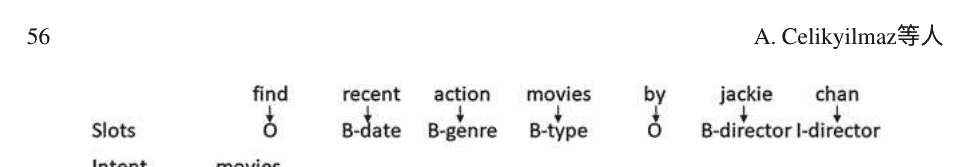

对于槽填充任务，深度学习主要被用作特征生成器。例如（Xu和Sarikaya，2013）使用卷积神经网络提取特征，然后将其馈入CRF模型。Yao等人（2013）和Mesnil等人（2015）随后使用RNN进行序列标注，以执行槽填充。最近的研究集中在序列到序列模型（Kurata等人，2016），带有注意力的序列到序列模型（Simonnet等人，2015），多领域训练（Jaech等人，2016），多任务训练（Tafforeau等人，2016），多领域联合语义框架解析（Hakkani-Tür等人，2016；Liu和Lane，2016b），以及使用端到端记忆网络进行上下文建模（Chen等人，2016；Bapna等人，2017）。这些将在语言理解章节中更详细地描述。

#### 3.3.2 对话状态跟踪器

口语对话系统流程中的下一步是对话状态跟踪（DST），其目标是通过对话过程中跟踪系统对用户目标的信念。对话状态用于查询后端知识或信息源，并由对话管理器确定下一个状态动作。在对话中的每个轮次，DST从上一个用户轮次的估计对话状态$s_{(t-1)}$以及最近的系统和用户话语作为输入，并估计当前轮次的对话状态$s_{(t)}$。

近年来，对话状态跟踪的研究加速，这要归功于对话状态跟踪挑战（Williams等人，2013；Henderson等人，2014）进行的数据集和评估。最先进的对话管理器专注于通过神经对话状态跟踪模型监控对话进展。最初的模型之一是基于RNN的对话状态跟踪方法（Henderson等人，2013），已经证明优于贝叶斯网络（Thomson和Young，2010）。最近关于神经对话管理器的工作提供了话语、槽值对以及知识图表示之间的联合表示（Wen等人，2016b；Mrkšić等人，2016），证明使用神经对话模型可以克服在更大的对话领域部署对话系统的当前障碍。

#### 3.3.3 深度对话管理器

对话管理器是对话系统的一个组件，以自然的方式与用户交互，帮助用户完成系统设计的任务。它负责对话的状态和流程，从而决定了什么应该使用策略。对话管理器的输入是人类的话语，通过自然语言理解组件将其转换为某种系统特定的语义表示。例如，在一个飞行计划对话系统中，输入可能看起来像“ORDER(from = SFO, to = SEA, date = 2017-02-01)”。对话管理器通常维护状态变量，如对话历史记录、最新未回答的问题、最近的用户意图和实体等，这取决于对话的领域。对话管理器的输出是对话系统其他部分的指令列表，通常以语义表示的形式，例如“Inform (flight-num = 555, flight-time = 18:20)”。这种语义表示通过自然语言生成组件转换为自然语言。

通常，专家会手动设计对话管理策略，并结合几个对话设计选择。手动对话策略设计是棘手的，并且在对话策略的性能方面存在不可扩展性，这取决于几个因素，包括领域特定特征、自动语音识别（ASR）系统的鲁棒性、任务难度等。与让人类专家编写一套复杂的决策规则相比，使用强化学习更为常见。对话被表示为马尔可夫决策过程（MDP）-在每个状态下，对话管理器必须根据状态和每个动作的可能奖励选择一个动作。在这种情况下，对话作者只需定义奖励函数，例如：在餐厅预订对话中，奖励是用户成功预订餐桌；在信息查询对话中，奖励是人类获得信息，但每个对话步骤也有负面奖励。

然后使用强化学习技术来学习策略，例如，在每个状态下系统应该使用什么类型的确认（Lemon和Rieser, 2009）。学习对话策略的另一种方法是尝试模仿人类，使用奥兹巫师实验，其中一个人坐在一个隐藏的房间里告诉计算机该说什么（Passonneau等人, 2011）。

对于复杂的对话系统，通常无法事先指定一个好的策略，并且环境的动态可能会随时间变化。因此，通过强化学习在线和交互地学习策略已成为一种流行的方法（Singh等人, 2016；Gasic等人, 2010；Fatemi等人, 2016b）。例如，通过计算准确的奖励函数，可以优化通过强化学习的对话策略。在实际应用中，使用显式用户反馈作为奖励信号通常不可靠且成本高昂。Su等人（2016）提出了一种在线学习框架，其中对话策略与奖励模型通过高斯过程模型进行主动学习联合训练。他们提出了三个主要的系统组件，包括对话策略、对话嵌入创建和基于用户反馈的奖励建模（见图3.3）。他们使用从对话中提取的分集转换级特征，并构建了一个双向长短期记忆网络（BLSTM）用于对话嵌入创建。

近年来，利用深度学习技术进行高效对话策略学习已成为对话研究者的关注焦点。例如，Lipton等人（2016）研究了对话策略模型的深度神经网络结构的理解边界，通过汤普森抽样从贝叶斯中绘制蒙特卡洛样本，以高效地探索不同的轨迹。他们使用深度Q网络来优化策略。他们探索了一种将来自变分信息最大化探索（VIME）（Blundell等人，2015）的内在奖励纳入其方法的版本。他们的贝叶斯方法解决了给定当前策略的Q值的不确定性，而VIME则解决了环境中未探索部分的动力学的不确定性。因此，将这些方法结合起来具有协同效应。在领域扩展任务中，结合探索方法表现出了特别有前景的表现，超过了其他所有方法。

还有其他几个方面会影响对话管理器的策略优化。其中一些包括在多领域系统下学习策略（Gasic等人，2015；Ge和Xu，2016），基于委员会的多领域系统学习（Gasic等人，2015），学习领域无关策略（Wang等人，2015），适应基于实际意义的词汇（Yu等人，2016），适应新用户行为（Shah等人，2016），等等。在这些系统中，Peng等人（2017）研究了针对具有复合子任务的任务导向系统的分层策略学习。这个领域特别具有挑战性，作者们解决了奖励稀疏性的问题，满足了子任务之间的槽约束。这个要求使得大多数现有的学习多领域对话代理方法（Cuayahuitl等人，2016；Gasic等人，2015）不适用：这些方法训练了一系列策略，每个领域一个，并且没有跨领域的约束要求成功完成对话。

如图3.4所示，他们的复合任务完成对话代理由四个组件组成：(1)基于LSTM的语言理解模块，用于识别用户意图和提取相关槽位；(2)对话状态跟踪器；(3)对话策略根据当前状态选择下一步动作；(4)基于模型的自然语言生成器，将代理动作转换为自然语言回复。在遵循MDP（Sutton和Singh, 1999）选项形式化的基础上，他们构建了一个代理来学习复合任务，例如旅行规划，子任务如预订机票和预订酒店可以建模为选项。

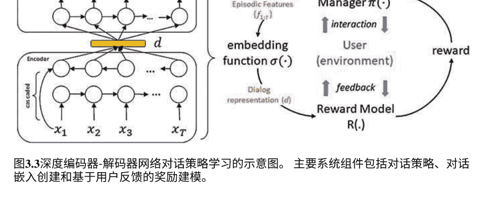

图3.3 深度编码器-解码器网络对话策略学习的示意图。主要系统组件包括对话策略、对话嵌入创建和基于用户反馈的奖励建模。

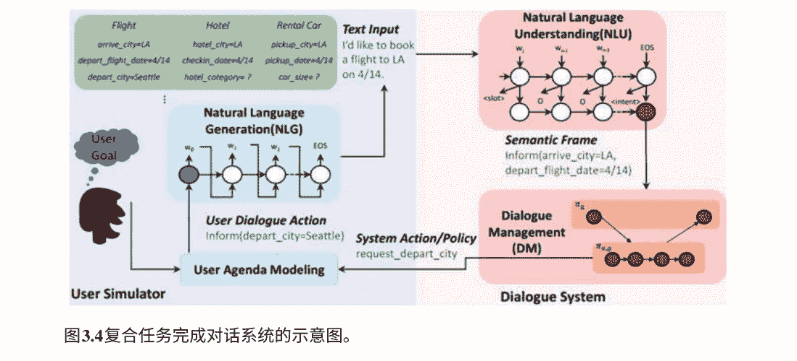

### 3.4 基于模型的用户模拟器

口语对话系统的用户模拟器旨在生成人工交互，以代表人类用户与给定对话系统之间的实际对话。用于构建对话模型的基于模型的模拟用户并不像对话系统的其他组件那样常见；一些这些方法的详细评估见Schatzmann等人（2006）、Georgila等人（2005, 2006）。

在本节中，我们仅研究基于数据和深度学习方法的用户模拟，即纯粹基于数据和深度学习方法的模型。早期口语对话系统的优化需要大量数据，因为强化学习算法的低效性，这就解释了使用模拟的原因。近年来，样本高效的强化学习方法被应用于口语对话系统的优化。通过这种方法，模型可以直接从大量数据中学习最优对话策略，甚至可以来自具有实际用户的次优系统（Li等人，2009；Pietquin等人，2011b），也可以来自在线交互（Pietquin等人，2011a）。这使得使用模拟用户进行训练的对话系统更具吸引力，因为可以在过程中获得用户反馈并进行修正。

有几个原因使得用户仿真模型的学习参数优化困难，因为大部分系统特征是隐藏的（例如用户目标、心理状态、对话历史等）。针对这个问题，Asri等人（2016）在非目标导向领域（例如闲聊）上提出了一个基于序列到序列的用户仿真器，考虑了整个对话历史。他们的用户仿真器不依赖于任何外部数据结构来确保一致的用户行为，也不需要映射到一个总结的动作空间，这使得它能够以更细粒度地建模用户行为。

Crook和Marin（2017）探索了一种用于目标导向对话系统的NL-到-NL模拟用户模型的序列到序列学习方法。他们提出了几个扩展来以不同的方式将上下文纳入他们的架构，并研究了每种方法与语言建模基准模拟器在个人助理系统领域的有效性。他们的研究表明结果表明，基于上下文的序列到序列方法可以生成类似人类的话语，优于所有其他基准模型。

### 3.5 自然语言生成

自然语言生成（NLG）是从意义表示生成文本的过程。它可以被看作是自然语言理解的反向过程。NLG系统在文本摘要、机器翻译和对话系统中起着关键作用。虽然已经开发了几个通用的基于规则的生成系统（Elhadad和Robin 1996），但由于其普遍性，它们往往很难适应小型、面向任务的应用。为了克服这一问题，一些人提出了不同的解决方案。Bateman和Henschel（1999）描述了一种更低成本、更高效的生成系统，用于特定应用，使用了自动定制的子语法。Buseman和Horacek（1998）描述了一种混合模板和基于规则的生成系统。这种方法根据具体的句子或话语需要利用模板和基于规则的生成。Stent（1999）也提出了类似的方法，用于口语对话系统。尽管这些方法在概念上简单且针对特定领域，但它们缺乏普遍性（例如，反复编码语言规则，如主谓一致），风格变化很小，难以扩展和维护（例如，通常每个新话语都是手动添加的）。这些方法要求编写语法规则和获取适当的词汇表，这需要专业人员的参与。

基于机器学习的（可训练的）自然语言生成系统在今天的对话系统中更为常见。这些自然语言生成系统使用多个来源作为输入，例如：内容计划，表示与用户通信的意义表示（例如描述特定餐厅）；知识库，返回特定领域实体的结构化数据库（例如餐厅数据库）；用户模型，对输出话语施加约束的模型（例如用户希望简短话语）；对话历史，来自先前对话的信息，以避免重复、指代表达等。目标是使用这些表示意义的表示来输出描述输入的自然语言字符串（例如，zucca的食物很美味）。

可训练的自然语言生成系统可以生成各种候选话语（例如，基于随机或规则），并使用统计模型对它们进行排序（Dale和Reiter, 2000）。统计模型为每个话语分配分数，并根据文本数据进行学习。大多数这些系统使用二元和三元语言模型生成话语。HALOGEN（Langkilde和Knight, 1998）和SPaRKy系统（Stent等人, 2004）等可训练生成器方法是最值得注意的可训练方法之一。这些系统在其框架中包括各种可训练模块，以使模型能够适应不同的领域（Walker等人, 2007），或者复制特定的风格（Mairesse和Walker, 2011）。然而，这些方法仍然需要手动生成器来定义决策空间。因此，生成的话语受到预定义的语法和任何领域特定的口语回应的限制，必须手动添加。除了这些方法之外，基于语料库的方法（Oh和Rudnicky, 2000; Mairesse和Young, 2014; Wen等人, 2015a）已经显示出具有灵活的学习结构，目标是通过采用过度生成和重新排序的范式（Oh和Rudnicky, 2000）直接从数据中学习生成，从而获得最终的回应通过重新排序从随机生成器生成的一组候选选项获得。

随着深度神经网络系统的进步，可以开发出更复杂的自然语言生成系统，可以从非对齐数据中进行训练或生成更长的话语。最近的研究表明，特别是使用RNN方法（例如LSTMs，GRUs等），可以生成更连贯，更真实和更合理的答案。在这些研究中，Vinyals和Le（2015）关于神经对话模型的工作开启了使用编码器-解码器模型进行生成的新篇章。他们的模型基于两个LSTM层。一个用于将输入句子编码为“思考向量”，另一个用于将该向量解码为回应。这个模型被称为序列到序列或seq2seq。该模型只对问题给出简单和简短的答案。

Sordoni等人（2015b）提出了三种神经模型来生成基于上下文和消息对的响应（r）。上下文被定义为单个消息。他们提出了几种模型，其中第一种是基本的递归语言模型，它接收整个（c, m, r）三元组作为输入。第二种模型将上下文和消息编码为词袋表示，通过前馈神经网络编码器进行处理，然后使用递归神经网络解码器生成响应。最后一种模型类似，但将上下文和消息的表示分开，而不是将它们编码为单个词袋向量。作者使用来自Twitter的2900万个三元组数据集对模型进行训练，并使用BLEU、METEOR和人工评估者评分进行评估。由于（c, m）的长度通常很长，作者预计他们的第一个模型表现不佳。他们的模型在生成超过八个标记后性能下降。

Li等人（2016b）提出了一种方法，该方法为由序列到序列模型生成的响应增加了连贯性，例如神经对话模型（Vinyals和Le, 2015）。他们将个性定义为代理在对话交互过程中扮演的角色。他们的模型结合了身份、语言、行为和交互方式。他们的模型可以在对话过程中进行调整。他们提出的模型在困惑度和BLEU分数上都比基线的序列到序列模型表现出更好的性能。与基于个性的神经对话模型相比，基线的神经对话模型无法在整个对话过程中保持一致的个性，导致响应不连贯。Li等人（2016a）中的类似方法使用最大互信息（MMI）目标函数生成对话响应。他们仍然使用最大似然训练他们的模型，但在解码过程中使用MMI生成响应。MMI的思想是促进更多的多样性，并惩罚琐碎的响应。作者使用BLEU分数、人工评估者和定性分析来评估他们的方法，并发现所提出的度量确实导致了更多样化的响应。

Serban等人（2017）提出了一种用于生成对话的分层潜变量编码器-解码器模型。他们的目标是生成自然语言对话回复。他们的模型假设每个输出序列可以在两级层次结构中建模：子序列的序列和标记的子序列。例如，对话可以被建模为一系列话语（子序列），每个话语被建模为一系列单词。基于此，他们的模型由三个RNN模块组成：编码器RNN，上下文RNN和解码器RNN。编码器RNN将标记的每个子序列确定性地编码为实值向量。这作为输入提供给上下文RNN，后者更新其内部隐藏状态以反映到目前为止的所有信息。上下文RNN确定性地输出一个实值向量，解码器RNN依赖于该向量来生成下一个子序列的标记（见图3.5）。

自然语言生成的最新研究集中在使用强化学习策略来探索不同的学习信号（He等人, 2016; Williams和Zweig, 2016b; Wen等人, 2016a; Cuayáhuitl, 2016）。对于重新关注强化学习的动机来自于使用教师强迫学习的问题。使用逐字交叉熵损失以黄金序列作为监督进行训练的文本生成系统产生了局部连贯的生成结果，但通常无法捕捉到它们所建模领域的上下文动态。例如，以其成分和菜谱标题为条件的菜谱生成系统无法成功地将起始成分组合成最终的菜肴。同样，对话生成系统经常无法将其回应与先前的对话内容相关联。强化学习允许模型通过超出预测正确单词的奖励进行训练。最近流行起混合奖励方案，使用教师强迫学习和其他更“全局”的度量来生成更具领域相关性的结果。

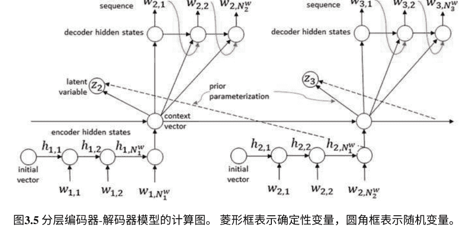

### 3.6 端到端深度学习方法构建对话系统

端到端对话系统被认为是一种认知系统，它必须在同一网络中进行自然语言理解、推理、决策和自然语言生成，以复制或模拟训练语料库中的代理行为。在深度学习技术开始用于对话系统构建之前，这个问题还没有得到充分的研究。借助今天的深度学习技术，使用反向传播可以联合训练所有参数，因此构建这样的系统变得更加容易。接下来，我们将简要介绍最近用于目标导向和非目标导向系统的端到端对话模型。

在构建端到端目标导向型对话系统中的一个主要障碍是，系统通过数据库调用来检索用户请求的信息是不可微分的。具体而言，系统生成的查询并发送到知识库是以手动方式完成的，这意味着系统的一部分没有经过训练，也没有学到任何函数。这使得深度学习模型无法整合知识库的响应和接收到的信息。此外，神经响应生成部分是作为与对话策略网络分开训练和运行的。将所有这些放在一起，直到最近，整个循环的端到端训练还没有得到充分的研究。

最近，有越来越多的文献专注于构建端到端对话系统，这些系统使用深度神经网络结合特征提取和策略优化。Wen等人（2015b）引入了一个模块化的神经对话代理，它使用了硬知识库查找，从而破坏了整个系统的可微性。因此，对话系统的各个组件的训练是分开进行的。意图网络和信念跟踪器使用专门为它们收集的监督标签进行训练；而策略网络和生成网络则分别在系统话语上进行训练。

Dhingra等人（2016b）引入了一种模块化方法，包括：用于识别用户意图、提取相关槽位和跟踪对话状态的信念跟踪器模块；与数据库进行接口交互以查询相关结果（软知识库查找）；摘要模块将状态总结为向量；对话策略根据当前状态选择下一个系统动作，并使用易于配置的基于模板的自然语言生成器（NLG）将对话行为转换为自然语言（见图3.6）。他们的工作的主要贡献在于保持了端到端网络的模块化性质，通过将信念跟踪器分开，但用可微分的方式替换了硬查找。他们提出了一种可微分的概率框架，用于根据代理人对其字段（或槽位）的信念查询数据库，从而表明通过提供更多信息，下游的强化学习器可以发现更好的对话策略。

非目标导向的端到端对话系统研究基于大型对话语料库构建开放领域的对话系统。Serban等人（2015）将生成模型纳入系统响应的生成，

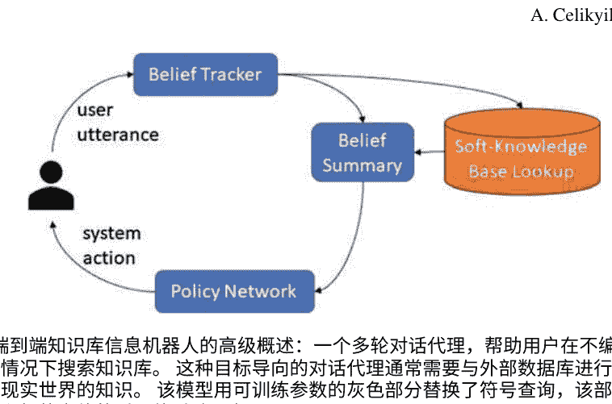

图3.6 端到端知识库信息机器人的高级概述：一个多轮对话代理，帮助用户在不编写复杂查询的情况下搜索知识库。这种目标导向的对话代理通常需要与外部数据库进行交互，以访问现实世界的知识。该模型用可训练参数的灰色部分替换了符号查询，该部分表示用户感兴趣的实体的诱导软后验分布。

自动生成的逐字逐字，为实现逼真、灵活的互动打开了可能性。他们证明了分层递归神经网络生成模型在建模话语和言语行为任务上可以胜过基于n-gram的模型和基准神经网络模型。

### 3.7 开放式对话系统的深度学习

开放领域的对话系统，也被称为非任务导向系统，没有明确的目标要达到。这些类型的对话系统主要用于社交环境中的互动（例如社交机器人）以及许多其他有用的场景（例如陪伴老年人）（Higashinaka等, 2014），或者娱乐用户（Yu等, 2015），等等。开放领域的口语对话系统支持在广泛覆盖的知识图谱（KG）中对任何主题进行自然对话。知识图谱不仅可以包含关于实体的本体信息，还可以包含可以应用于这些实体的操作（例如查找航班信息，预订酒店房间，购买电子书等）。

非任务导向系统没有目标，也没有一组状态或插槽要遵循，但它们确实有意图。因此，已经有一些关于非目标导向对话系统的工作，主要关注响应生成，这些工作使用对话历史（人-代理对话）作为输入，为用户提供响应建议。这些工作包括机器翻译（Ritter等, 2011），基于检索的响应选择（Banchs和Li, 2012）以及具有不同结构的序列到序列模型，例如基本循环神经网络（Vinyals和Le, 2015），分层神经模型（Serban等, 2015, 2016a; Sordoni等, 2015b; Shang等, 2015）和记忆神经网络（Dodge等, 2015）。开发非目标驱动系统有几个动机。它们可以直接部署

不自然地展示直接可测量目标的任务（例如，语言学习）或仅仅为了娱乐。如果它们是在与目标驱动型对话系统相关的语料库上训练的（例如，涵盖类似主题的对话语料库），那么这些模型可以用来训练用户模拟器，然后再训练策略策略。

直到最近，还没有研究将目标导向型和非目标导向型对话系统结合起来。在最近的一项工作中，提出了一个旨在以自然而流畅的方式结合这两种类型对话的框架，以提高对话任务成功和用户参与度的初步尝试（Yu等人, 2017）。这样的框架对于处理没有明确意图的用户特别有用。

### 3.8 对话建模的数据集

在过去几年中，已经发布了几个公开可用的对话对话数据集。对话语料库可以根据对话系统的几个特征进行分类。对话语料库可以根据书面、口语或多模态属性，或人对人或人对机器对话，或自然或非自然对话（例如，在一个奥兹巫师系统中，人类认为他在与机器对话，但实际上是人类操作员在控制对话系统）进行分类。在本节中，我们简要介绍了社区使用的这些公开可用的数据集，用于口语理解、状态跟踪、对话策略学习等，特别是用于任务完成任务。我们在本节中不涉及开放式的非任务完成数据集。

#### 3.8.1 卡内基梅隆通信者语料库

该语料库包含了人机交互与旅行预订系统的对话。这是一个中等规模的数据集，包含了与提供最新航班信息、酒店信息和租车服务的系统的交互。对话与系统的交互被记录下来，并在交互结束时记录用户的评论。

#### 3.8.2 ATIS—航空旅行信息系统试点语料库

航空旅行信息系统（ATIS）试点语料库（Hemphill et al., 1990）是最早的人机对话语料库之一。它包含了人类参与者与一个秘密由人类操作的旅行预订系统之间的交互，每个交互持续约40分钟。与卡内基梅隆通信者语料库不同，它只包含了1041个话语。

#### 3.8.3 对话状态跟踪挑战数据集

对话状态跟踪挑战（DSTC）是一个持续进行的研究社区挑战任务系列。每个任务都发布了带有对话状态信息标签的对话数据，例如用户在当前对话轮次之前的所有对话历史中的期望餐厅搜索查询。挑战是创建一个可以预测新对话的对话状态的“跟踪器”。在每个挑战中，跟踪器使用保留的对话数据进行评估。Williams等人（2016）提供了挑战和数据集的概述，我们在下面进行总结：

DSTC1：该数据集包含公交时间表领域的人机对话。结果在SIGDIAL 2013的一个特别会议上进行了展示。

DSTC2和DSTC3：DSTC2包含餐厅信息领域的人机对话。DSTC2包含大量与餐厅搜索相关的训练对话。它具有不断变化的用户目标，跟踪“请求的插槽”。结果在SIGDIAL 2014和IEEE SLT 2014的特别会议上进行了展示。DSTC3位于旅游信息领域，解决了适应新领域的问题。DSTC2和3由Matthew Henderson，Blaise Thomson和Jason D. Williams组织。

DSTC4：该挑战的重点是在人机对话中进行对话状态跟踪任务。除了这个主要任务，还引入了一系列试验性轨道，用于基于相同数据集开发端到端对话系统的核心组件。结果在IWSDS 2015上展示。DSTC4由Seokhwan Kim、Luis F. DHaro、Rafael E Banchs、Matthew Henderson和Jason D. Williams组织。

DSTC5：DSTC5由人与人之间在旅游信息领域进行对话组成，其中训练对话以一种语言提供，测试对话以另一种语言提供。结果将在IEEE SLT 2016的特别会议上展示。DSTC5由Seokhwan Kim、Luis F. DHaro、Rafael E Banchs、Matthew Henderson、Jason D. Williams和Koichiro Yoshino组织。

#### 3.8.4 Maluuba框架数据集

Frames是为了研究在复杂环境中支持决策的对话代理而提供的。例如，预订包括航班和酒店的度假。通过这个数据集，目标是教会对话代理帮助用户探索数据库，比较物品并做出决策。人与人之间的对话框架数据是使用Wizard-of-Oz收集的，该数据集设计用于复合任务完成对话设置。我们考虑了一种重要的复杂任务类型，称为复合任务，它由一组需要共同完成的子任务组成。例如，为了制定旅行计划，用户首先需要集体地预订机票、预订酒店、租车等，以满足一组跨子任务的约束条件，这些约束条件被称为槽约束。旅行计划的槽约束示例包括：酒店入住时间应晚于出发航班时间，酒店退房时间可能早于返回航班出发时间，机票数量等于酒店入住人数等等。

#### 3.8.5 Facebook的对话数据集

在过去的一年里，Facebook AI和研究（FAIR）发布了面向任务的对话数据集，供对话研究社区使用（Bordes等人, 2017）。他们的项目目标是探索用于问答和目标导向对话系统的神经网络架构。他们设计了一组在餐厅预订的目标导向上下文中的五个任务（请参见图3.7中的示例）。这些任务以餐厅及其属性（位置、菜系等）的基础知识库为基础，涵盖了多个对话阶段，并测试模型是否能够学习执行对话管理、查询知识库、解释此类查询的输出以继续对话或处理训练集中未出现的新实体等各种能力。

#### 3.8.6 Ubuntu对话语料库

Ubuntu对话语料库（Lowe等人, 2015b）包含了从Ubuntu聊天记录中提取的近一百万个双人对话，内容涉及各种Ubuntu相关问题的技术支持。该数据集针对特定的技术支持领域。因此，与聊天机器人系统相比，它可以作为针对性应用中AI代理开发的案例研究。所有对话都以文本形式进行（而非音频）。该数据集的规模比DSTC等结构化语料库大几个数量级。数据集中的每个对话都包含多个轮次和长对话。

### 3.9 开源对话软件

对话式对话系统一直是许多领先公司和研究人员关注的焦点，研究人员一直在构建系统来改进几个组件。

12 https://github.com/facebookresearch/ParlAI.
13 https://github.com/rkadlec/ubuntu-ranking-dataset-creator.

| Task | 对话内容 |
| :--- | :--- |
| **1. Issuing API call** | Hi!<br>Hello, how may I help you?<br>We are looking for comedies to watch after 7pm today.<br>Ok, I am searching now!<br>Which theater do you want to watch the movie?<br>```api_call(comedies, 7pm, today)```<br>Downtown San Francisco<br>Ok! |
| **2. Updating API call** | Actually I would prefer movies playing after 8pm<br>Ok, searching for comedies in San Francisco starting after 8pm.<br>```api_call(comedies, 8pm, today, San Francisco)```<br>• movie_1 start_time 8:30 pm<br>• movie_1 duration 2hours 1 min<br>• movie_1 director dir_1<br>• movie_1 actor_1 actor_1<br>• movie_1 actor_2 actor_2<br>• movie_1 theather_address location_1<br>• movie_2 start_time 9:30 pm<br>• movie_2 duration 2hours 20min<br>• movie_2 director dir_2<br>• movie_2 actor_1 actor_3<br>• movie_2 actor_2 actor_2<br>• movie_2 theather_address location_2 |
| **3. Displaying Options** | I found movie_1 that is playing after 8pm tonight.<br>Anything else, I don't like that movie.<br>Sure, let me find another movie for you.<br>movie_2 is also playing after 8pm<br>Great, can you give me the address of the theater?<br>Here is the address for movie_2<br>Is there anything else I can help you with?<br>That was all, thank you!<br>You are welcome, good bye! |
| **4. Providing extra-information** | （此行在表格中作为说明）图3.7 虚拟代理和客户之间的一个示例对话，在餐厅领域 |

对话式对话系统。有些工作只关注提供可训练的数据集和标注平台，或者可以通过交互学习的机器学习算法，其他人提供环境（模拟器）来训练交互式对话系统。下面，我们简要总结了对话研究人员可以轻松访问的开源软件/平台。

-   **OpenDial¹⁴**：这个工具包最初由奥斯陆大学（挪威）的语言技术小组开发，主要开发者是Pierre Lison。它是一个基于Java的领域无关工具包，用于开发口语对话系统。OpenDial提供了一个工具，用于构建完整的端到端对话系统，集成了语音识别、语言理解、生成和语音合成。OpenDial的目的是将逻辑和统计方法在对话建模中的优点结合到一个框架中。该工具包依赖于概率规则，以紧凑且易读的格式表示领域模型。可以应用监督学习或强化学习技术来自动估计相对较少的数据量中的未知规则参数（Lison, 2013）。该工具还可以在一个稳健的概率框架中整合专家知识和领域特定约束。

-   **ParlAI**：除了数据集外，Facebook AI和Research（FAIR）还发布了一个名为ParlAI的平台，旨在为研究人员提供一个统一的框架，用于训练和测试对话模型，同时在多个数据集上进行多任务训练，以及与Amazon Mechanical Turk的数据收集和人工评估的无缝集成。

-   **Alex对话系统框架¹⁶**：这是一个对话系统框架，促进了口语对话系统的研究和开发。它由布拉格查尔斯大学数学和物理学院的形式和应用语言学研究所（UFAL）的一个团队提供。该工具提供了构建口语对话系统所需的基线组件，并提供了用于处理对话系统交互日志的附加工具，例如音频转录、语义注释或口语对话系统评估。

-   **SimpleDS**：这是一个简单的深度强化学习对话系统，尽可能少地依赖人工干预来训练对话代理。它包括具有经验回放的深度Q学习（Mnih等人, 2013），并支持多线程和客户端-服务器处理，以及通过受限搜索空间进行快速学习。

-   **康奈尔电影对话语料库**：该语料库包含从原始电影剧本中提取的大量元数据丰富的虚构对话集合（MizilandLee, 2011）。它包含了电影角色之间的几次对话交流。

-   **其他**：还有许多软件应用程序（一些是开源的），也提供非任务导向的对话系统，例如闲聊对话系统。这些系统提供了机器学习工具和对话引擎，用于创建聊天机器人。示例包括 Chatterbot，¹⁹一个对话引擎。

### 3.10 对话系统评估

在本章中，我们已经调查了几种对话模型，即，面向任务的对话模型，被认为是领域相关的，以及开放领域的对话软件，它们是半领域相关的，可以是开放式的，也可以在任务导向和开放领域的对话之间来回切换。

面向任务的对话系统通常是基于组件的，根据每个单独组件的性能进行评估。例如，CLU是根据意图检测模型、槽序列标记模型（Hakkani-Tur等，2016; Celikyilmaz等，2016; Tur和De Mori，2011; Chen等，2016）等的性能进行评估，而对话状态跟踪器是根据对话转换过程中发现的状态变化的准确性进行评估。面向任务的对话系统的对话策略通常是根据用户或真实人类判断的任务完成成功率进行评估。通常，评估是使用人工生成的监督信号进行的，例如任务完成测试或用户满意度评分。对话的长度也在塑造对话策略中起到了作用（Schatzmann等，2006）。

在评估对话模型性能时，真正的问题出现在对话系统是开放域的情况下。大多数方法都集中在评估对话响应生成系统上，这些系统在给定对话上下文的情况下被训练出产生合理话语的能力。这是一个非常具有挑战性的任务，因为自动评估语言生成模型的正确答案可能有非常多。然而，如今有几种性能度量被用来自动评估所提出的响应对话的适当性（Liu等人，2016）。其中大多数指标使用基于词语相似度和词嵌入相似度的方法来比较生成的响应与对话的真实响应。下面，我们将总结一些在对话系统中最常用的度量标准：

> BLEU (Papineni等人, 2002) 是一种通过研究真实序列（文本）和生成的响应中n-gram的共现来评估文本质量的算法。BLEU使用一种修改后的精确度来比较候选翻译与多个参考翻译：

$$P_n(r, \hat{r}) = \frac{\sum_k \min(h(k, r), h(k, \hat{r}_i))}{\sum_k h(k, r_i)}$$

其中，$k$表示所有可能的n-gram，而$h(k, r)$表示$r$中n-gram$k$的数量。这个度量修改了简单精确度，因为已知文本生成系统可能会生成比参考文本中更多的单词。这样的评分会偏向较短的序列。为了解决这个问题，在Papineni等人的论文中使用了一个简洁度评分，该评分产生了BLEU-N分数，其中$N$是n-gram的最大长度，定义如下：

$$\text{BLEU-N} = b(r, \hat{r}) \exp\left(\sum_{n=1}^{N} \beta_n \log P_n(r, \hat{r})\right),$$

其中$\beta_n$是权重因子，$b(\cdot)$是简洁惩罚。

**METEOR**（Banerjee and Lavie 2005）是另一种基于BLEU的方法，用于解决BLEU的几个弱点。与BLEU一样，评估的基本单位是句子，算法首先创建参考和候选生成句子之间的对齐。对齐是一组映射，将候选翻译中的每个单词映射到参考中的零个或一个单词，然后进行WordNet同义词匹配、词干标记和文本的释义。METEOR分数是在给定对齐集的情况下，提议的句子和真实句子之间的精确度和召回率的调和平均值。

**ROUGE**（Lin 2004）是另一种主要用于评估自动摘要系统的评估指标。ROUGE有五种不同的扩展可用：ROUGE-N，基于N-gram的共现统计；ROUGE-L，基于最长公共子序列（LCS）的统计（最长公共子序列问题自然地考虑了句子级结构相似性，并自动识别最长的共现序列n-gram）；ROUGE-W，加权LCS的统计，偏爱连续的LCS；ROUGE-S，基于跳字二元组的共现统计（跳字二元组是按照句子顺序的任意一对词）；以及ROUGE-SU，基于跳字二元组和一元组的共现统计。在文本生成中，ROUGE-L是文本生成任务中最常用的度量标准，因为LCS可以很容易地衡量两个句子之间的相似性，按照相同的顺序。

基于嵌入的方法考虑了每个单词的含义，这些含义由单词嵌入定义，单词嵌入为每个单词分配一个向量，而不是考虑n-gram匹配情况。诸如Mikolov等人（2013）的单词嵌入学习方法使用分布语义来计算这些嵌入，即通过考虑单词在语料库中与其他单词共现的频率来近似表示单词的含义。这些基于嵌入的度量通常使用一些启发式方法来近似计算句子级别的嵌入，将句子中各个单词的向量组合起来。然后使用诸如余弦距离之类的度量来比较生成的回答和参考回答之间的句子级别嵌入。

**RUBER**（Tao等人, 2017）是一个用于开放域对话系统的参考度量和非参考度量混合评估程序。**RUBER**具有以下特点-

## 3 在口语和基于文本的对话系统中的深度学习

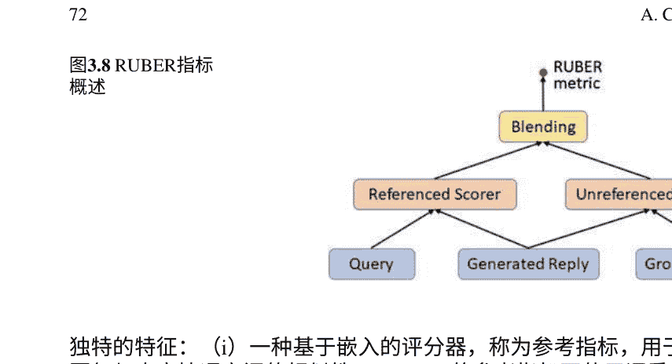

- 独特的特征：
- (i) 一种基于嵌入的评分器，称为参考指标，用于衡量生成的回复与真实情况之间的相似性。RUBER的参考指标不使用词重叠信息（如BLEU和ROUGE），而是通过词嵌入的汇总来衡量相似性（Forgues等人，2014年），这更适用于对话系统，因为回复的多样性。
- (ii) 一种基于神经网络的评分器，称为非参考指标，用于衡量生成的回复与其查询之间的相关性。这个评分器是非参考的，因为它不参考真实情况，也不需要手动注释标签。
- (iii) 参考和非参考指标与平均等策略相结合，进一步提高性能（见图3.8）。

### 3.11 总结

本章在介绍口语对话系统的各个组成部分（包括语音识别、语言理解（口语或文本）、对话管理器和语言生成（口语或文本））之后，对使用深度学习技术的数据驱动对话建模的当前方法进行了广泛调研。本章还介绍了可用于研究、开发和评估的深度对话建模软件和数据集。

深度学习技术在对话系统方面取得了最近的改进以及新的研究活动。目前大部分的对话系统和相关研究都在向大规模数据驱动和端到端可训练的模型发展。除了当前的新方法和数据集，本章还重点介绍了在构建对话式对话系统方面的潜在未来方向，包括分层结构、多智能体系统以及领域适应。

对话系统，特别是口语版本，是NLP中多阶段信息处理的典型实例。这些多阶段包括语音识别、语言理解（第2章）、决策（通过对话管理器）以及语言/语音生成。这种多阶段处理方案非常适合基于端到端学习的深度学习方法，该方法基于多层（或深层）系统。本章在回顾中对将深度学习应用于对话系统的当前进展进行了限制，主要是使用深度学习对整体系统中的每个个体处理阶段进行建模和优化。未来的进展预计以扩大这样的范围，并成功实现完全端到端的系统。

## 参考文献

- 1. Asri, L. E., He, J., & Suleman, K. (2016). 用于口语对话系统中用户模拟的序列到序列模型。 *Interspeech*.
- 2. Aust, H., Oerder, M., Seide, F., & Steinbiss, V. (1995). 飞利浦自动列车时刻表信息系统。语音通信, 17, 249–262.
- 3. Banchs, R. E., & Li, H. (2012). Iris: 基于向量空间模型的面向对话的对话系统。 *ACL*.
- 4. Banerjee, S., & Lavie, A. (2005). Meteor: 一种用于机器翻译评估的自动度量标准，与人类判断的相关性得到改进。在ACL机器翻译和/或摘要的内在和外在评估措施研讨会上.
- 5. Bapna, A., Tur, G., Hakkani-Tur, D., & Heck, L. (2017). 通过分层对话编码器改进框架语义解析。
- 6. Bateman, J., & Henschel, R. (1999). 从完全生成到近似模板而不失去普遍性。在KI’99研讨会上，“我可以自由发言吗？”。
- 7. Blundell, C., Cornebise, J., Kavukcuoglu, K., & Wierstra, D. (2015). 神经网络中的权重不确定性。 *ICML*.
- 8. Bordes, A., Boureau, Y.-L., & Weston, J. (2017). 学习端到端的目标导向对话。在 *ICLR 2017*.
- 9. Busemann, S., & Horacek, H. (1998). 一种灵活的浅层文本生成方法。在国际自然语言生成研讨会上，加拿大尼亚加拉瀑布城.
- 10. Celikyilmaz, A., Sarikaya, R., Hakkani-Tur, D., Liu, X., Ramesh, N., & Tur, G. (2016). 一种新的预训练方法，用于训练具有口语理解应用的深度学习模型。在Interspeech会议论文集中(pp. 3255–3259)。
- 11. Chen, Y.-N., Hakkani-Tur, D., Tur, G., Gao, J., & Deng, L. (2016). 具有知识传递的端到端记忆网络，用于多轮口语理解。在The 17th Annual Meeting of the International Speech Communication Association (INTERSPEECH)会议论文集中, 旧金山, 加利福尼亚州。ISCA。
- 12. Crook, P., & Marin, A. (2017). 用于对话系统中用户模拟的序列到序列建模。 *Interspeech*.
- 13. Cuayahuitl, H. (2016). Simpleds: 一种简单的深度强化学习对话系统。在国际口语对话系统研讨会 (IWSDS)中。
- 14. Cuayahuitl, H., Yu, S., Williamson, A., & Carse, J. (2016). 多领域对话系统的深度强化学习。 arXiv:1611.08675.
- 15. Dale, R., & Reiter, E. (2000). 构建自然语言生成系统. 剑桥, 英国: 剑桥大学出版社.
- 16. Deng, L. (2016). 从语音识别到语言和多模态处理的深度学习。在信号和信息处理的APSIPA交易中. 剑桥大学出版社.
- 17. Deng, L., & Yu, D. (2015). 深度学习: 方法和应用. NOW Publishers.
- 18. Deng, L., & Li, X. (2013). 语音识别的机器学习范式: 概述. IEEE音频、语音和语言处理的交易, 2(5), 1060–1089.
- 19. Dhingra, B., Li, L., Li, X., Gao, J., Chen, Y.-N., Ahmed, F., & Deng, L. (2016a). 端到端对话代理的强化学习用于信息访问. arXiv:1609.00777.
- 20. Dhingra, B., Li, L., Li, X., Gao, J., Chen, Y.-N., Ahmed, F., & Deng, L. (2016b). 朝着端到端的对话代理的强化学习用于信息访问. *ACL*.
- 21. Dodge, J., Gane, A., Zhang, X., Bordes, A., Chopra, S., Miller, A., Szlam, A., & Weston, J. (2015). 评估学习端到端对话系统的先决条件质量。arXiv:1511.06931。
- 22. Elhadad, M., & Robin, J. (1996). Surge概述：一种可重用的综合句法实现组件。技术报告96-03，数学与计算机科学系，以色列贝尔谢巴大学。
- 23. Fatemi, M., Asri, L. E., Schulz, H., He, J., & Suleman, K. (2016a). 具有两阶段训练的策略网络用于对话系统。arXiv:1606.03152。
- 24. Fatemi, M., Asri, L. E., Schulz, H., He, J., & Suleman, K. (2016b). 具有两阶段训练的策略网络用于对话系统。arXiv:1606.03152。
- 25. Forgues, G., Pineau, J., Larcheveque, J.-M., & Tremblay, R. (2014). 使用词嵌入进行对话系统引导 NIPS ML-NLP研讨会。
- 26. Gai, M., Mrki, N., Su, P.-H., Vandyke, D., Wen, T.-H., & Young, S. (2015). 适应多领域口语对话系统的政策委员会 ASRU。
- 27. Gai, M., Mrki, N., Rojas-Barahona, L. M., Su, P.-H., Ultes, S., Vandyke, D., et al. (2016). 使用高斯过程强化学习进行对话管理器领域适应计算机语音和语言,45, 552–569。
- 28. Gasic, M., Jurcicek, F., Keizer, S., Mairesse, F., Thomson, B., Yu, K., & Young, S. (2010). 用于基于POMDP的对话管理器快速策略优化的高斯过程 In SIGDIAL。
- 29. Gasic, M., Mrksic, N., Su, P.-H., Vandyke, D., & Wen, T.-H. (2015). 多领域口语对话系统中的多智能体学习NIP S口语理解和互动研讨会。
- 30. Ge, W., & Xu, B. (2016). 基于多领域语料库的对话管理。 在特殊兴趣小组讨论和对话中。
- 31. Georgila, K., Henderson, J., & Lemon, O. (2005). 学习用户模拟以更新信息状态对话系统。 在第9届欧洲语音通信和技术会议 (INTERSPEECH—EUROSPEECH) 中。
- 32. Georgila, K., Henderson, J., & Lemon, O. (2006). 用于口语对话系统的用户模拟：学习和评估。 在INTERSPEECH—EUROSPEECH中。
- 33. Goller, C., & Kchler, A. (1996). 通过结构反向传播学习任务相关的分布式表示。 IEEE。
- 34. Goodfellow, I., Pouget-Abadie, J., Mirza, M., Xu, B., Warde-Farley, D., Ozair, S., Courville, A., & Bengio, Y. (2014). 生成对抗网络。 在 NIPS中。
- 35. Gorin, A. L., Riccardi, G., & Wright, J. H. (1997). 我能帮你什么忙吗？ 语音通信,23, 113–127。
- 36. Graves, A., & Schmidhuber, J. (2005). 使用双向lstm和其他神经网络架构的逐帧音素分类神经网络, 18, 602–610。
- 37. Hakkani-Tur, D., Tur, G., Celikyilmaz, A., Chen, Y.-N., Gao, J., Deng, L., & Wang, Y.-Y. (2016). 使用双向rnn-lstm进行多领域联合语义框架解析。 在Interspeech会议论文集中(pp. 715–719)。
- 38. Hastie, T., Tibshirani, R., & Friedman, J. (2009).统计学习的要素：数据挖掘、推理和预测。 柏林：Springer出版社。
- 39. He, X., & Deng, L. (2011). 语音识别、机器翻译和语音翻译的统一判别学习范式。 在IEEE信号处理杂志中。
- 40. He, X., & Deng, L. (2013). 以语音为中心的信息处理：一种面向优化的方法。 在IEEE中。
- 41. He, J., Chen, J., He, X., Gao, J., Li, L., Deng, L., & Ostendorf, M. (2016). 具有自然语言动作空间的深度强化学习。 ACL。
- 42. Hemphill, C. T., Godfrey, J. J., & Doddington, G. R. (1990). ATIS口语系统试点语料库。 在DARPA语音和自然语言研讨会中。
- 43. Henderson, M., Thomson, B., & Williams, J. D. (2014). 第三次对话状态跟踪挑战。 在2014 IEEE，口语技术研讨会（SLT） (pp. 324–329)。 IEEE。
- 44. Henderson, M., Thomson, B., & Young, S. (2013). 对话状态跟踪挑战的深度神经网络方法。 在SIGDIAL 2013会议论文集中 (pp. 467–471)。
- 45. Higashinaka, R., Imamura, K., Meguro, T., Miyazaki, C., Kobayashi, N., Sugiyama, H., 等 (2014). 朝向完全基于自然语言处理的开放领域对话系统。COLING.
- 46. Hinton, G., Deng, L., Yu, D., Dahl, G., Rahman Mohamed, A., Jaitly, N., et al. (2012). 用于语音识别中的深度神经网络的声学建模。IEEE信号处理杂志，29(6), 82-97.
- 47. Huang, X., & Deng, L. (2010). 现代语音识别概述。在自然语言处理手册(第二版，第15章)中。
- 48. Huang, P.-S., He, X., Gao, J., Deng, L., Acero, A., & Heck, L. (2013). 使用点击数据学习深度结构化语义模型进行网络搜索。在ACM国际信息与知识管理会议(CIKM)中。
- 49. Jaech, A., Heck, L., & Ostendorf, M. (2016). 领域适应的递归神经网络用于自然语言理解。
- 50. Kannan, A., & Vinyals, O. (2016). 对话模型的对抗性评估。在Adversarial Training研讨会上，NIPS 2016, 巴塞罗那，西班牙。
- 51. Kim, Y.-B., Stratos, K., & Kim, D. (2017a). 对合成或陈旧数据的对抗性适应.ACL.Kim, Y.-B., Stratos, K., & Kim, D. (2017b). 使用专家集合的领域注意力.ACL.Kim, Y.-B., Stratos, K., & Sarikaya, R. (2016a). 通过在模式格上进行约束解码的无领域适应。COLING.
- 52. Kim, Y.-B., Stratos, K., & Sarikaya, R. (2016b). 令人沮丧地简单的神经领域适应。COLING.
- 53. Kumar, A., Irsoy, O., Su, J., Bradbury, J., English, R., Pierce, B., et al. (2015). 问我任何问题：用于自然语言处理的动态记忆网络.在神经信息处理系统（NIPS）。
- 54. Kurata, G., Xiang, B., Zhou, B., & Yu, M. (2016). 利用编码器的句子级信息进行自然语言理解.arXiv:1601.01530.
- 55. Langkilde, I., & Knight, K. (1998). 利用基于语料库的统计知识的生成ACL.LeCun, Y., Bottou, L., Bengio, Y., & Haffner, P. (1998). 基于梯度的学习应用于文档识别。IEEE, 86, 2278-2324.
- 56. Lemon, O., & Rieser, V. (2009). 自适应对话系统的强化学习—教程。EACL.
- 57. Li, L., Balakrishnan, S., & Williams, J. (2009). 使用最小二乘策略迭代和快速特征选择的对话管理的强化学习。InterSpeech.
- 58. Li, J., Galley, M., Brockett, C., Gao, J., & Dolan, B. (2016a). 用于神经对话模型的多样性促进目标函数。NAACL.
- 59. Li, J., Galley, M., Brockett, C., Spithourakis, G. P., Gao, J., & Dolan, B. (2016b). 基于人物的神经对话模型。ACL.
- 60. Li, J., Monroe, W., Shu, T., Jean, S., Ritter, A., & Jurafsky, D. (2017). 用于神经对话生成的对抗学习.arXiv:1701.06547.
- 61. Li, J., Deng, L., Gong, Y., & Haeb-Umbach, R. (2014). 噪声鲁棒自动语音识别概述。IEEE/ACM音频、语音和语言处理交易,22(4), 745-777.
- 62. Lin, C.-Y. (2004). Rouge：自动摘要评估包。在文本摘要中分支出：ACL-04研讨会。
- 63. Lipton, Z. C., Li, X., Gao, J., Li, L., Ahmed, F., & Deng, L. (2016). Efficient对话策略学习使用bbq-networks.arXiv.org.
- 64. Lison, P. (2013).结构化概率建模对话管理.信息学系数学与自然科学学院奥斯陆大学.
- 65. Liu, B., & Lane, I. (2016a). 基于注意力的递归神经网络模型用于联合意图检测和槽填充。Interspeech.
- 66. Liu, B., & Lane, I. (2016b). 基于注意力的递归神经网络模型用于联合意图检测和槽填充。在SigDial。

Liu, C.-W., Lowe, R., Serban, I. V., Noseworthy, M., Charlin, L., & Pineau, J. (2016). How NOT to evaluate your dialogue system: An empirical study of unsupervised evaluation metrics for dialogue response generation. EMNLP.

Lowe, R., Pow, N., Serban, I. V., and Pineau, J. (2015b). The Ubuntu Dialogue Corpus: A large dataset for research in unstructured multi-turn dialogue systems. SIGDIAL 2015.

Lowe, R., Pow, N., Serban, I. V., Charlin, L., and Pineau, J. (2015a). Incorporating unstructured textual knowledge sources into neural dialogue systems. In NIPS Workshop on Machine Learning for Speech Understanding.

Mairesse, F., & Young, S. (2014). Stochastic language generation in dialogue using factored language models. Computational Linguistics.

Mairesse, F. and Walker, M. A. (2011). Controlling user perceptions of linguistic style: Trainable generation of personality traits. Computational Linguistics.

Mesnil, G., Dauphin, Y., Yao, K., Bengio, Y., Deng, L., Hakkani-Tur, D et al (2015). Using recurrent neural networks for slot filling in spoken language understanding. IEEE/ACM Transactions on Audio, Speech, and Language Processing, 23(3), 530–539.

Mikolov, T., Sutskever, I., Chen, K., Corrado, G. S., & Dean, J. (2013). Distributed representations of words and phrases and their compositionality. In Advances in neural information processing systems (pp. 3111–3119).

Mizil, C. D. N. and Lee, L. (2011). The chameleon in dialogue: A new approach to understanding linguistic style accommodation in dialogue. In Proceedings of the ACL 2011 Workshop on Cognitive Modeling and Computational Linguistics.

Mnih, V., Kavukcuoglu, K., Silver, D., Graves, A., Antonoglou, I., Wierstra, D., & Riedmiller, M. (2013). Playing atari with deep reinforcement learning. NIPS Deep Learning Workshop.

Mrkšić, N., Sardinha, D., Wen, T.-H., Thomson, B., & Young, S. (2016). Neural belief tracker: Data-driven dialogue state tracking. arXiv:1606.03777.

Oh, A. H., & Rudnicky, A. I. (2000). Stochastic language generation for spoken dialogue systems. In ANLP/NAACL Workshop on Conversational Systems.

Papineni, K., Roukos, S., Ward, T., & Zhu, W. (2002). Bleu: A method for automatic evaluation of machine translation. In Proceedings of the 40th Annual Meeting of the Association for Computational Linguistics.

Passonneau, R. J., Epstein, S. L., Ligorio, T., & Gordon, J. (2011). Embedding wizardry. In Proceedings of SIGDIAL 2011.

Peng, B., Li, X., Li, L., Gao, J., Celikyilmaz, A., Li, S., & Huang, K.-F. (2017). Composite task-completion dialogue system via hierarchical deep reinforcement learning. arXiv:1704.03084v2.

Pierquin, O., Geist, M., & Chandramohan, S. (2011a). Sample-efficient online learning of optimal dialogue policies with Kalman temporal differences. In IJCAI 2011, Barcelona, Spain.

Pierquin, O., Geist, M., Chandramohan, S., & Frezza-Buet, H. (2011b). Sample-efficient batch reinforcement learning for dialogue management optimization. ACM Transactions on Speech and Language Processing.

Ravuri, S., & Stolcke, A. (2015). Recurrent neural network and LSTM models for lexical utterance classification. In Proceedings of the 16th Annual Conference of the International Speech Communication Association.

Ritter, A., Cherry, C., & Dolan, W. B. (2011). Data-driven response generation in social media. In Proceedings of the 2011 Conference on Empirical Methods in Natural Language Processing.

Sarikaya, R., Hinton, G. E., & Ramabhadran, B. (2011). Deep belief networks for natural language call routing. In 2011 IEEE International Conference on Acoustics, Speech and Signal Processing (ICASSP) (pp. 5680–5683). IEEE.

Sarikaya, R., Hinton, G. E., & Deoras, A. (2014). Application of deep belief networks for natural language understanding. IEEE/ACM Transactions on Audio, Speech, and Language Processing, 22(4), 778–784.

Schatzmann, J., Weilhammer, K., & Stuttle, M. Young, S. (2006). A survey of statistical user simulation techniques for reinforcement-learning of dialogue management strategies. The Knowledge Engineering Review.

Serban, I., Klinger, T., Tesauro, G., Talamadupula, K., Zhou, B., Bengio, Y., & Courville, A. (2016a). Multi-resolution recurrent neural networks: An application to dialogue response generation. arXiv:1606.00776v2.

Serban, I., Sordoni, A., & Bengio, Y. (2017). Hierarchical latent variable encoder-decoder models for generating dialogues. AAAI.

Serban, I. V., Sordoni, A., Bengio, Y., Courville, A., & Pineau, J. (2015). Building end-to-end dialogue systems using generative hierarchical neural network models. AAAI.

Serban, I. V., Sordoni, A., Bengio, Y., Courville, A., & Pineau, J. (2016b). Building end-to-end dialogue systems using generative hierarchical neural networks. AAAI.

Shah, P., Hakkani-Tur, D., & Heck, L. (2016). Interactive reinforcement learning for task-oriented dialogue management. SIGDIAL.

Shang, L., Lu, Z., & Li, H. (2015). Neural responding machine for short-text conversation. ACL-IJCNLP.

Simonnet, E., Camelin, N., Delglise, P., & Estève, Y. (2015). Exploring the use of attention-based recurrent neural networks for spoken language understanding. In NIPS 2015 Workshop on Machine Learning for Spoken Language Understanding and Interaction (SLUNIPS 2015).

Simpson, A. and Fraser, N. M. (1993). Black-box and white-box evaluation of the sundial system. In Proceedings of the Third European Conference on Speech Communication and Technology.

Singh, S. P., Kearns, M. J., Litman, D. J., & Walker, M. A. (2016). Reinforcement learning for spoken dialogue systems. NIPS.

Sordoni, A., Galley, M., Auli, M., Brockett, C., Ji, Y., Mitchell, M., et al. (2015a). A neural network approach to context-sensitive generation of conversation responses. In Proceedings of the 2015 Conference of the North American Chapter of the Association for Computational Linguistics: Human Language Technologies (NAACL-HLT 2015).

Sordoni, A., Galley, M., Auli, M., Brockett, C., Ji, Y., Mitchell, M., Nie, J.-Y., et al. (2015b). A neural network approach to context-sensitive generation of conversation responses. In Proceedings of the 2015 Conference of the North American Chapter of the Association for Computational Linguistics: Human Language Technologies (NAACL-HLT 2015).

Stent, A. (1999). Content planning and generation in continuous-speech dialogue systems. In KI'99 Workshop "Am I allowed to speak?".

Stent, A., Prasad, R., & Walker, M. (2004). Trainable sentence planning for complex information presentation in spoken dialogue systems. ACL.

Su, P.-H., Gasic, M., Mrksic, N., Rojas-Barahona, L., Ultes, S., Vandyke, D., et al. (2016). On-line activity reward learning for policy optimisation in spoken dialogue systems. arXiv:1605.07669.

Sukhbaatar, S., Weston, J., Fergus, R., et al. (2015). End-to-end memory networks. In Advances in neural information processing systems (pp. 2440–2448).

Sutton, R. S., & Singh, S. P. (1999). Between MDPs and semi-MDPs: A framework for temporal abstraction in reinforcement learning. Artificial Intelligence, 112, 181–211.

Tafforeau, J., Bechet, F., Arti-res, T., & Favre, B. (2016). A multi-task deep learning framework for joint syntactic and semantic parsing of spoken utterances. In Interspeech (pp. 3260–3264).

Tao, C., Mou, L., Zhao, D., & Yan, R. (2017). Ruber: An unsupervised automatic evaluation method for open-domain dialogue systems. ArXiv2017.

Thomson, B., & Young, S. (2010). Bayesian update of dialogue state: A POMDP framework for spoken dialogue systems. Computer Speech & Language, 24(4), 562–588.

Tur, G., Deng, L., Hakkani-Tur, D., & He, X. (2012). Towards deeper understanding: Deep convex networks for semantic utterance classification. In 2012 IEEE International Conference on Acoustics, Speech and Signal Processing (ICASSP) (pp. 5045–5048). IEEE.

Tur, G., & Deng, L. (2011). Intent determination and spoken utterance classification, Chapter 4 in the book "Spoken Language Understanding". New York, NY: Wiley.

Tur, G., & De Mori, R. (2011). Spoken Language Understanding: Systems for Extracting Semantic Information from Speech. New York: Wiley.

Vinyals, O., & Le, Q. (2015). A neural conversational model. arXiv:1506.05869.

Walker, M., Stent, A., Mairesse, F., & Prasad, R. (2007). Individual and domain adaptation in sentence planning for dialogue. Journal of Artificial Intelligence Research.

Wang, Z., Stylianou, Y., Wen, T.-H., Su, P.-H., & Young, S. (2015). Learning domain-independent dialogue policies via ontology parameterisation. In SIGDIAL.

Wen, T.-H., Gasic, M., Mrksic, N., Rojas-Barahona, L. M., Su, P.-H., Ultes, S., et al. (2016a). A network-based end-to-end trainable task-oriented dialogue system. arXiv.

Wen, T.-H., Gasic, M., Mrksic, N., Rojas-Barahona, L. M., Su, P.-H., Ultes, S., et al. (2016b). A network-based end-to-end trainable task-oriented dialogue system. arXiv:1604.04562.

Wen, T.-H., Gasic, M., Mrksic, N., Rojas-Barahona, L. M., Su, P.-H., Vandyke, D., et al. (2015a). Semantically conditioned LSTM-based natural language generation for spoken dialogue systems. EMNLP.

Wen, T.-H., Gasic, M., Mrksic, N., Su, P.-H., Vandyke, D., & Young, S. (2015b). Semantically conditioned LSTM-based natural language generation for spoken dialogue systems. arXiv:1508.01745.

Weston, J., Chopra, S., & Bordes, A. (2015). Memory networks. In International Conference on Learning Representations (ICLR).

Williams, J. D., & Zweig, G. (2016a). End-to-end LSTM-based dialog control optimized with supervised and reinforcement learning. arXiv:1606.01269.

Williams, J. D., & Zweig, G. (2016b). End-to-end LSTM-based dialog control optimized with supervised and reinforcement learning. arXiv.

Williams, J. D., Raux, A., Ramachandran, D., & Black, A. W. (2013). The dialog state tracking challenge. In Proceedings of SIGDIAL (pp. 404–413).

Williams, J., Raux, A., & Henderson, M. (2016). The dialog state tracking challenge series: A review. Dialogue & Discourse, 7(3), 4–33.

Xu, P., & Sarikaya, R. (2013). Convolutional neural network based triangular CRF for joint intent detection and slot filling. In 2013 IEEE Workshop on Automatic Speech Recognition and Understanding (ASRU) (pp. 78–83). IEEE.

Yao, K., Zweig, G., Hwang, M.-Y., Shi, Y., & Yu, D. (2013). Recurrent neural networks for language understanding. In INTERSPEECH (pp. 2524–2528).

Yu, Z., Black, A., & Rudnicky, A. I. (2017). Learning to alternate between task and non-task content for dialogue systems. arXiv:1703.00099v1.

Yu, Y., Eshghi, A., & Lemon, O. (2016). Training an adaptive dialogue policy for interactive learning of visually grounded word meanings. SIGDIAL.

Yu, Z., Papangelis, A., & Rudnicky, A. (2015). Ticktock: A non-goal-oriented multimodal dialogue system with engagement awareness. In AAAI Spring Symposium.

Yu, D., & Deng, L. (2015). Automatic Speech Recognition: A Deep Learning Approach. Berlin: Springer.

# 第四章 深度学习在词法分析和解析中

车万翔 and 张跃

摘要 词法分析和解析任务模拟了单词的深层属性及其彼此之间的关系。常用的技术包括分词、词性标注和解析。这类任务的典型特点是输出结果是有结构的。通常有两种方法用于解决这些结构化预测任务：基于图的方法和基于转移的方法。基于图的方法直接根据其特征区分输出结构，而基于转移的方法将输出构造过程转化为状态转移过程，区分转移动作的序列。神经网络模型已成功应用于基于图和基于转移的结构化预测。本章将回顾深度学习在词法分析和解析中的应用，并与传统统计方法进行比较。

### 4.1 背景

一个单词的属性包括其句法词类（也称为词性）、形态等（Manning和Schütze 1999）。获取这些信息也被称为词法分析。对于中文、日文和韩文等不使用空格分隔单词的语言，词法分析还包括词分割的任务，即将字符序列分割成单词。即使在英文中，虽然空格是单词边界的一个强烈线索，但它既不是必要的也不是充分的。例如，在某些情况下，我们可能希望将“New York”视为一个单词。这被视为命名实体识别（NER）问题（Shaalan 2014）。另一方面，标点符号总是与单词相邻。我们还需要判断是否要对它们进行分割。

对于英语等语言，这通常被称为分词，这更多是一种约定而不是一个严重的研究问题。

一旦我们了解了一些单词的属性，我们可能会对它们之间的关系感兴趣。解析任务是找到并标记与彼此组合或递归相关的单词（或单词序列）（Jurafsky和Martin 2009）。有两种常用的解析方法：短语结构（或组成）解析和依存解析。

所有这些任务都可以被视为结构化预测问题，这是一种监督式机器学习的术语，即输出是结构化的并且彼此相互影响。传统上，大量人工设计的手工特征被输入到线性分类器中，用于预测每个决策单元的得分，然后将所有这些得分与满足一些结构化约束相结合。借助深度学习的帮助，我们可以采用端到端学习范式，无需昂贵的特征工程。这项技术甚至可以发现更难以由人类设计的隐含特征。如今，深度学习已经主导了这些自然语言处理任务。

然而，由于普遍存在的歧义问题，这些任务都不容易预测。有些歧义甚至可能被人类忽视。

本章的组织结构如下。我们首先选择一些典型任务作为示例，看看这些歧义来自哪里（第4.2节）。然后，我们将回顾两种典型的结构化预测方法（第4.3节）：基于图的方法（第4.3.1节）和基于转换的方法（第4.3.2节）。第4.4节和第4.5节分别介绍了基于图的方法和基于转换的方法的神经网络。本章以结论结束（第4.6节）。

### 4.2 典型的词法分析和解析任务

自然语言处理（词法分析和解析）流水线通常包括三个阶段：词分割、词性标注和句法解析。

#### 4.2.1 词分割

如上所述，一些语言（例如中文）是由连续的字符组成的（Wong等，2009年）。尽管有字典列出了所有的词，但我们不能简单地将字符序列中的词进行匹配，因为存在歧义。例如，一个中文句子“严守一把手机关了”可以被分割为：

- 严守一（人名）/把（介词）/手机（名词）/关（动词）/了（助词）

这是一个正确的词分割结果。然而，其他可能的分割结果包括：

- 严守（严格遵守）/一把（数量词）/机关（办公室）/了（助词）
- 严守（严格遵守）/一把（少量）/手机（名词）/关（关闭）/了（助词）
- 严守一（人名）/把手（把手）/机关（办公室）/了（助词）

这些也是有效的匹配结果，但是句子在分词后变得无意义。显然，词语匹配方法无法区分哪个分词结果比其他结果更好。我们需要一些评分函数来评估结果。

#### 4.2.2 词性标注

词性标注是自然语言处理中最基本的任务之一，在许多自然语言应用中都很有用。例如，单词“loves”可以是名词（love的复数形式）或动词（love的第三人称单数形式）。我们可以确定“loves”是动词而不是名词，在下面的句子中：“The boy loves a girl”。

决定可以独立进行，而不需要知道其他单词的标签。然而，更好的词性标注器会考虑单词标签，因为附近单词的标签可以帮助消除其词性标签的歧义。在上面的例子中，冠词“a”可以帮助指示“loves”是一个动词。

因此，上述句子的完整POS标记输出是一个标记序列，例如：“D N V D N”（在这里我们使用 D表示冠词， N表示名词， V表示动词）。标记序列与输入句子的长度相同，因此为句子中的每个单词指定一个标记（在这个例子中， D表示 the， N表示 boy， V表示 loves等等）。通常，POS标记的输出可以写入一个带有其相应POS标记的标记句子，即“The /D boy/N loves/V a/D girl/N”。

与词分割一样，如果给句子分配不同的POS标记序列，可能会有不同的含义。例如，对于句子“Teacher strikes idle kids”，根据单词在句子中的POS分配，有两种解释。

#### 4.2.3 句法分析

短语结构往往受限于与上下文无关文法（CFGs）的推导相对应（Carnie 2012）。在这样的推导中，每个短语## 4.2.4 结构化预测

这些不同的自然语言处理任务可以分为三种类型的结构化预测问题（Smith 2011）：
- 序列分割
- 序列标注
- 解析。

### 4.2.4.1 序列分割

序列分割是将一个序列分成连续的部分，称为片段的问题。更正式地说，如果输入是 $\mathbf{x} = x_1, \dots, x_n$，则分割可以写成 $\langle x_1, \dots, x_{y_1} \rangle, \langle x_{y_1+1}, \dots, x_{y_2} \rangle, \dots, \langle x_{y_{m-1}+1}, \dots, x_n \rangle$，输出为 $\mathbf{y} = y_1, \dots, y_m$对应于分段点，其中$\forall i \in \{1, \dots, m\}$，$1 \leq y_i \leq n$。

除了词分割之外，还存在其他序列分割问题，例如句子分割（将一段字符串分割成句子，这是语音转录的重要后处理阶段）和块分割（也称为浅层解析，从句子中找到重要短语，如名词短语）。

### 4.2.4.2 序列标注

序列标注（也称为标记）是为输入序列的每个项目分配相应标签或标记的问题。更正式地说，如果输入序列为$\mathbf{x} = \mathbf{x}_1, \dots,$，则输出标签序列为$\mathbf{y} = \mathbf{y}_1, \dots$，其中每个输入$\mathbf{x}_i$有一个单独的输出标签$\mathbf{y}_i$。

词性标注可能是这种类型问题中最经典、最著名的例子，其中$xi$是句子中的一个词，而$yi$是其对应的词性标签。除了词性标注，许多自然语言处理任务可以映射到序列标注问题，例如命名实体识别（将文本中的命名实体定位和分类为预定义的类别，如人名、地名和组织名）。对于这个问题，输入仍然是一个句子。输出是带有实体边界标记的句子。我们假设有三种可能的实体类型：PER、LOC和ORG。然后对于输入句子

> •*Uber*的美国和加拿大地区总经理*Rachel Holt*在向*CNNTech*提供的声明中表示。

命名实体识别的输出可以是

> •Uber的区域总经理Rachel Holt在向CNNTech提供的声明中表示。

在句子中，每个单词都被标记为特定实体类型的开始，B-XXX（例如，标记B-PER对应于人名的第一个单词），作为特定实体类型的内部，I-XXX（例如，标记I-PER对应于作为人名的一部分的单词，但不是第一个单词），或其他情况（标记O，即不是实体）。

一旦在训练样本上执行了这种映射，我们就可以在这些训练样本上训练一个标记模型。给定一个新的测试句子，我们可以通过模型预测一系列标记，然后很容易从标记序列中识别出实体。

通过设计适当的标记集，上述序列分割问题甚至可以转化为序列标记问题。以中文分词为例，句子中的每个字符可以用标记B（词的开头）或I（词的内部）进行注释（Xue 2003）。

将序列分割问题转化为序列标记问题的目的是后者更容易建模和解码。例如，在第4.3.1.1节中，我们将介绍一种传统流行的序列标记模型，条件随机场（CRF）。

### 4.2.4.3 解析算法

一般来说，我们使用解析来表示将句子转换为句法结构的各种算法。如第4.2.3节所述，有两种流行的句法解析表示方法，短语结构（或称为组成）解析和依存解析。

对于成分解析，一般来说，使用语法来推导句法结构。简而言之，语法由一组规则组成，每个规则对应于在特定条件下可能进行的推导步骤。上下文无关语法（CFGs）在组成解析中最常用（Booth 1969）。解析被视为从语法中选择最高得分的推导。

基于图的和基于转移的方法是目前两种主要的依存解析算法（Kbler et al. 2009）。基于图的依存解析可以被形式化为从具有顶点（单词）和边（两个单词之间的依存弧）的有向图中找到最大生成树（MST）。基于转移的依存解析算法可以被形式化为一个由一组状态和一组转移动作组成的转移系统。转移系统从起始状态开始，迭代地进行转移，直到达到终止状态。基于图的和基于转移的依存解析的共同关键问题是如何计算依存弧或转移动作的得分。我们将在第4.3.1.2节和第4.3.2.1节中详细介绍这两种方法。

### 4.3 结构化预测方法

在本节中，我们将介绍两种最先进的结构化预测方法：基于图的方法和基于转移的方法。大多数用于结构化预测问题的深度学习算法也是从这些方法中派生出来的。

#### 4.3.1 基于图的方法

基于图的结构化预测方法根据其特征直接区分输出结构。条件随机场（CRFs）是典型的基于图的方法，其目标是最大化正确输出结构的概率。基于图的方法也可以应用于依存句法分析，其中目标是最大化正确输出结构的得分。接下来，我们将详细介绍这两种方法。

##### 4.3.1.1 条件随机场

严格来说，条件随机场是一种无向图模型（也称为马尔可夫随机场或马尔可夫网络）的变体，在这种模型中，一些随机变量是观察到的，而其他变量是以概率建模的。CRFs是由Lafferty等人（2001年）引入的用于序列标注的方法。它们也被称为线性链CRFs。在深度学习出现之前，它一直是序列标注问题的事实标准方法。

CRFs定义了标签序列的分布 y = y1, ..., yn, 给定一个观察序列 x = x1, ..., xn, 通过log-linear模型的一个特例来定义：

$$
p(\mathbf{y}|\mathbf{x}) = \frac{\exp \sum_{i=1}^{n} \mathbf{w} \cdot \mathbf{f}(\mathbf{x}, y_{i-1}, y_i, i)}{\sum_{\mathbf{y}' \in \mathcal{Y}(\mathbf{x})} \exp \sum_{i=1}^{n} \mathbf{w} \cdot \mathbf{f}(\mathbf{x}, y'_{i-1}, y'_i, i)}, \quad (4.1)
$$

其中 Y(x)是所有可能的标签序列的集合； f(x, yi−1, yi, i)是从位置 iof序列 x 提取特征向量的特征函数，可以包括当前位置的标签 yi和前一个位置的标签 yi−1。

CRFs的吸引力在于它允许包含任何（局部）特征。例如，在词性标注中，特征可以是词-标签对，相邻标签对，拼写特征，例如单词是否以大写字母开头或包含数字，以及前缀或后缀特征。这些特征可能是相关的，但CRFs允许重叠的特征，并学习平衡它们对预测的影响与其他特征之间的关系。我们将这些特征称为局部特征的原因是，我们假设标签 yi 只取决于 yi−1，而不是更长的历史。这也被称为（一阶）马尔可夫假设。

通用的维特比算法，一种动态规划算法，可以用于CRFs的解码。然后可以使用一阶梯度下降（如梯度下降）或二阶（如L-BFGS）优化方法来学习适当的参数，以最大化等式（4.1）中的条件概率。除了序列标注问题，CRFs在许多方面进行了泛化，用于其他结构化预测问题。例如，Sarawagi和Cohen（2004）提出了用于序列分割问题的半-CRF模型。在半-CRF中，明确建模了输入序列上的半-Markov链的条件概率，其中每个状态对应于输入单元的子序列。然而，为了实现良好的分割性能，传统的半-CRF模型需要精心设计的特征来表示段落。一般来说，这些特征函数分为两种类型：

1. CRF风格的特征，表示输入单元级别的信息，例如特定位置的具体单词；
2. 半-CRF风格的特征，表示段落级别的信息，例如段落的长度。

Hall等人（2014年）提出了一种基于CRF的组成句法分析模型，其中特征因子基于一个小型骨干语法的锚定规则，例如基本跨度特征（第一个词、最后一个词和跨度的长度）、跨度上下文特征（跨度前后的词）、分割点特征（跨度内的分割点处的词）和跨度形状特征（对于跨度中的每个词，指示该词是否以大写字母、小写字母、数字或标点符号开头）。CKY算法可以用来找到给定学习参数的具有最大概率的树。

##### 4.3.1.2 基于图的依存句法分析

考虑一个有顶点V和边E的有向图。设 s（u， v）表示从顶点 u到顶点 v的边的得分。有向生成树是边的子集E' ⊂ E，使得所有顶点在 E中都有且仅有一个入弧，除了根顶点（它没有入弧），并且 E'中不包含循环。设 𝒥（E）表示 E的所有可能有向生成树的集合。生成树E'的总得分是 E'中边的得分之和。最大生成树（MST）的定义为

$$
\max_{E' \in \mathcal{J}(E)} \sum_{s(u,v) \in E'} s(u,v)
$$

如果我们将句子中的单词视为顶点，依赖弧视为边，其中 u通常被称为头部（或父节点）， v被称为修饰语（或子节点），则（无标签的）依赖解析解码问题可以简化为最大生成树问题。

如果从 u到 v有多条边，每条边都与一个标签相关联，那么将这种方法扩展到带标签的依赖解析是直接的。相同的算法适用。最广泛使用的MST问题解码算法是Eisner算法（Eisner1996）用于投影解析和Chu-Liu-Edmonds算法（Chu和Liu 1965; Edmonds 1967）用于非投影解析。

在这里，我们介绍了基于图的基本方法，称为一阶模型。一阶基于图的模型做出了一个强独立假设：树中的弧是相互独立的。换句话说，一个弧的得分不受其他弧的影响。这种方法也被称为弧分解方法。

因此，关键问题是，给定一个输入句子，如何确定每个候选弧的得分。传统上使用判别模型，用特征函数 f(u, v)提取的特征向量表示一个弧。然后，弧的得分是特征权重向量 w和 f的点积，即

$$
s(u, v) = \mathbf{w} \cdot \mathbf{f}(u, v)
$$

那么如何定义 f(u, v) 和如何学习优化参数 w？

## 特征定义

特征的选择对依存句法分析模型的性能至关重要。对于每个可能的弧，可以轻松考虑以下特征：
- 对于每个涉及的单词，包括其表面形式、词元、词性以及任何形状、拼写或形态特征；
- 涉及的单词包括头部、修饰语、头部和修饰语两侧的上下文单词以及头部和修饰语之间的单词；
- 弧的长度（头部和修饰语之间的单词数）、方向以及（如果要标记解析）句法关系类型。

除了这些原子特征，还可以提取各种组合特征和回退特征。

## 参数学习

在线结构化学习算法，如平均感知机（AP）（Freund和Schapire 1999; Collins 2002），在线被动侵略算法(PA)(Crammer等人2006年)，或者边缘注入松弛算法(MIRA)(Crammer和Singer2003; McDonald2006)常用于学习基于图的依存句法的参数 w。

#### 4.3.2 基于转换的方法

与基于图的方法不同，基于转换的方法可以被形式化为一个转换系统，包括一组状态 S(可能是无限的)，包括一个起始状态 s0 ∈ S 和一组终止状态 St ∈ S ，以及一组转换动作 T(Nivre 2008). 转换系统从 s0 开始，并且迭代地进行转换，直到达到终止状态。

图4.3显示了一个简单的有限状态转换器，其中起始状态为 s0，终止状态包括 s6, s7, s8, s14, s15, s16, s17和 s18.基于转换的结构化预测模型的目标是区分转换动作的序列导致终止状态的路径，使得与正确输出状态对应的路径得分更高。

##### 4.3.2.1 基于转换的依存句法分析

弧标准转换系统（Nivre2008）广泛用于投影依存句法分析。在该系统中，每个状态对应于一个包含部分构建的子树的栈 σ，一个尚未处理的词缓冲区 β，以及一组依存弧 A。转换动作在图4.4中表示为演绎规则。句子的转换序列

> • 经济₁新闻₂对₃金融₄市场₅几乎没有₆影响₇。₈

在图4.1中由弧标准算法生成的贪梦解析器的决策在状态 s ∈ S 中由分类器进行。通过考虑训练部分中的黄金标准树来训练分类器，从中我们可以推导出转换状态和动作对的规范黄金标准序列（oracle序列）。

可以从状态中获取的信息 s= ⟨σ, β, A⟩ 包括：
- 所有单词及其对应的词性标签；
- 一个单词的头部及其来自部分解析的依赖弧的标签 $A$；
- 一个单词在栈 $\sigma$ 和缓冲区 $\beta$ 上的位置。

例如，Zhang和Nivre (2011) 提出了72个特征模板，其中包括26个基线和46个新的特征模板。基线特征主要描述了栈顶和缓冲区的单词和POS标签以及它们的组合。新特征包括：头部和修饰语之间的方向和距离；给定头部的修饰语数量；更高阶的部分解析依赖弧；栈和缓冲区中顶部单词的修饰语的唯一依赖标签集合。

图4.4 推导系统中的转移动作(Nivre 2008)

起始状态　　　　\(([根\quad], [0,...,n], \emptyset)\)

LEFT ARC$_{l}$ (LA$_{l}$)　　　　\(\frac{([\sigma \mid s_1, s_0], \beta, A)}{([\sigma \mid s_0], \beta, A \cup \{s_1 \xleftarrow{l} s_0\})}\)

RIGHT ARC$_{l}$ (RA$_{l}$)　　　　\(\frac{([\sigma \mid s_1, s_0], \beta, A)}{([\sigma \mid s_1], \beta, A \cup \{s_1 \xrightarrow{l} s_0\})}\)

SHIFT (SH)　　　　\(\frac{(\sigma, [b \mid \beta], A)}{([\sigma \mid b], \beta, A)}\)

终止状态　　　　\(([根\quad], [], A)\)

表4.1 通过弧标准算法的转换

| 状态 | 动作 | $\sigma$ | $\beta$ | $A$ |
| :--- | :--- | :--- | :--- | :--- |
| 0 | 初始化 | [0] | [1, ..., 9] | $\emptyset$ |
| 1 | SH | [0, 1] | [2, ..., 9] | |
| 2 | SH | [0, 1, 2] | [3, ..., 9] | |
| 3 | LA$_{nmod}$ | [0, 2] | [3, ..., 9] | $A \cup \{1 \xleftarrow{nmod} 2\}$ |
| 4 | SH | [0, 2, 3] | [4, ..., 9] | |
| 5 | LA$_{subj}$ | [0, 3] | [4, ..., 9] | $A \cup \{2 \xleftarrow{subj} 3\}$ |
| 6 | SH | [0, 3, 4] | [5, ..., 9] | |
| 7 | SH | [0, 3, 4, 5] | [6, ..., 9] | |
| 8 | LA$_{nmod}$ | [0, 3, 5] | [6, ..., 9] | $A \cup \{4 \xleftarrow{nmod} 5\}$ |
| 9 | SH | [0, 3, 5, 6] | [7, ..., 9] | |
| 10 | SH | [0, 3, 5, 6, 7] | [8, 9] | |
| 11 | SH | [0, 3, 5, 6, 7, 8] | [9] | |
| 12 | LA$_{nmod}$ | [0, 3, 5, 6, 8] | [9] | $A \cup \{7 \xleftarrow{nmod} 8\}$ |
| 13 | RA$_{pc}$ | [0, 3, 5, 6] | [9] | $A \cup \{6 \xrightarrow{pc} 8\}$ |
| 14 | RA$_{nmod}$ | [0, 3, 5] | [9] | $A \cup \{5 \xrightarrow{nmod} 6\}$ |
| 15 | RA$_{obj}$ | [0, 3] | [9] | $A \cup \{3 \xrightarrow{obj} 5\}$ |
| 16 | SH | [0, 3, 9] | [] | |
| 17 | RA$_{p}$ | [0, 3] | [] | $A \cup \{3 \xrightarrow{p} 9\}$ |
| 18 | RA$_{root}$ | [0] | [] | $A \cup \{0 \xrightarrow{root} 3\}$ |最后，这些新特征提高了约1.5%的无标签附加分数（UAS）。
Finally, these new features boost about 1.5% UAS (unlabeled attachment score).
我们通常使用术语“特征工程”来描述设计各种语言结构预测任务的特征所需的语言专业知识的数量。

自然语言处理研究人员倾向于采用将尽可能多的特征纳入学习中，并允许参数估计方法确定哪些特征是有帮助的，哪些应该被忽略的策略。也许是因为语言现象的重尾性质和研究人员可用的计算能力的持续增长，目前的共识似乎是在NLP模型中始终欢迎更多的特征，特别是在可以将它们纳入的对数线性模型等框架中。

为了减少贪婪的基于转换的算法中的错误传播，通常采用具有全局归一化的波束搜索解码，并且使用早期更新的大边界训练（Collins和Roark 2004）来学习来自不精确搜索的知识。

##### 4.3.2.2 基于转换的序列标注和分割

除了依存句法分析之外，基于转换的框架可以应用于NLP中的大多数结构化预测任务，其中可以找到结构化输出和状态转换序列之间的映射。以序列标注为例。

输出可以通过逐步为每个输入从左到右分配标签来构建。在这种设置下，状态是一对(σ, β)，其中 σ表示部分标记的序列， β表示未标记单词的队列。以([],输入)为起始状态，以 (输出,[])为终止状态，每个动作通过在β的前面分配特定的标签来推进状态。

序列分割，例如词分割是第二个例子，对于这个例子，一个转换系统可以逐步处理从左到右的输入字符。一个状态的形式是(σ, β)，其中 σ是一个部分分割的词序列和 β是一个下一个输入字符的队列。在起始状态中， σ为空， β由完整的输入句子组成。在任何终止状态中， σ包含一个完整的分割序列， β为空。每个转换动作通过处理下一个输入字符来推进当前状态，可以将其分隔(SEP)成为一个新词的开头，或将其附加(APP)到部分分割的最后一个词的末尾序列中。表4.2显示了句子“我喜欢读书”的黄金标准状态转换序列。

##### 4.3.2.3 过渡方法的优点

基于转换的方法不能减少结构歧义-当解决方案从基于图的模型变为基于转换的模型时，给定结构预测任务的搜索空间大小不会缩小。唯一的区别是结构歧义被转化为不同转换之间的歧义。

表4.2 用于词分割的黄金状态转换序列

| 状态 | σ | β | 下一步动作 |
| :--- | :--- | :--- | :--- |
| 0 | [] | [我，喜，欢，读，书] | 分隔符 |
| 1 | [我(I)] | [喜，欢，读，书] | 分隔符 |
| 2 | [我(I)，喜] | [欢，读，书] | 附加 |
| 3 | [我(I)，喜欢(like)] | [读，书] | 分隔符 |
| 4 | [我(I)，喜欢(like)，读书(reading)] | [] | 附加 |

每个状态的动作。一个自然而然的问题是为什么基于转换的方法吸引了大量的研究关注。

主要答案在于基于转换模型可以利用的特征，或者说可用于消除歧义的信息。传统的基于图的方法通常受到精确推理效率的限制，这限制了可以使用的特征范围。例如，要训练CRF模型（Lafferty等人，2001年），需要有效地估计小团的边际概率，其大小由特征范围决定。为了实现高效的训练，CRF模型假设其特征具有低阶马尔可夫性质。作为第二个例子，CKY解析（Collins，1997年）要求特征受限于局部语法规则，以便可以使用可容忍的多项式动态规划在指数级的搜索候选选项中找到最高得分的解析树。

相比之下，早期关于基于转换的方法的工作采用贪婪的局部模型（Yamada和Matsumoto2003；Sagae和Lavie2005；Nivre2003），通常被认为是图形系统的一个非常快速的替代方案，其运行时间与输入大小成线性关系。由于使用了任意的非局部特征，它们的准确性与最先进的模型相差无几。由于全局训练已被用于训练动作序列（Zhang和Clark2011b），因此产生了快速而准确的基于转换的模型，这为诸如CCG解析（Zhang和Clark2011a；Xu等人2014）、自然语言合成（Liu等人2015；Liu和Zhang2015；Pudupully等人2016）、依存解析（Zhang和Clark2008b；Zhang和Nivre2011；Choi和Palmer2011）和成分解析（Zhang和Clark2009；Zhu等人2013）等任务提供了最先进的准确性。以成分为例，ZPar（Zhu等人2013）的准确性与伯克利解析器（Petrov等人2006）相当，但运行速度快15倍。

过渡式系统的效率优势进一步允许利用具有高度复杂搜索空间的联合结构问题。例如，联合词分割和词性标注（Zhang和Clark2010），联合分割、词性标注和分块（Lyu等2016），联合词性标注和解析（Bohnet和Nivre2012；Wang和Xue2014），联合词分割、词性标注和解析（Hatori等2012；Zhang等2013，2014），联合分割和微博规范化（Qian等2015），联合形态生成和文本线性化（Song等2014），以及联合实体和关系提取（Li和Ji2014；Li等2016）。

### 4.4 神经图方法

#### 4.4.1 神经条件随机场

Collobert和Weston（2008年）是第一个利用深度学习解决序列标注问题的工作。这几乎是最早成功应用深度学习解决自然语言处理任务的工作。他们不仅将单词嵌入到一个d维向量中，还嵌入了一些额外的特征。然后，窗口中的单词和相应的特征被输入到多层感知机（MLP）中进行标签预测。训练准则使用了句子中每个单词独立考虑的单词级对数似然。如上所述，在句子中，一个单词的标签与其相邻标签之间通常存在相关性。因此，在他们的更新工作中（Collobert等人，2011年），他们在句子级对数似然模型中添加了标签转移分数。实际上，该模型与CRF模型相同，只是传统的CRF模型使用线性模型而不是非线性神经网络。

然而，受到马尔可夫假设的限制，CRF模型只能利用局部特征。这导致标签之间的长期依赖关系无法建模，而在许多自然语言处理任务中有时是很重要的。从理论上讲，递归神经网络（RNN）可以将任意大小的序列建模为固定大小的向量，而不需要依赖马尔可夫假设。然后输出向量用于进一步的预测。例如，它可以用于预测给定整个前一个单词序列的条件概率的词性标签。

更详细地说，RNN是通过一个函数递归地定义的，该函数接受前一个状态向量和输入向量作为输入，并返回一个新的状态向量。因此，直观地说，RNN可以被视为具有不同层之间共享参数的非常深的前馈网络。然后梯度包括重复乘法的权重矩阵，使得值很容易消失或爆炸。

梯度爆炸问题有一个简单但非常有效的解决方案：如果梯度的范数超过给定的阈值，则对梯度进行剪裁。而梯度消失问题则更加复杂。门控机制，如长短期记忆（LSTM）（Hochreiter和Schmidhuber 1997）和门控循环单元（GRU）（Cho等人2014），可以或多或少地解决这个问题。

RNN的一个自然扩展是双向RNN（Graves2008）（BiRNN，如BiLSTM和BiGRU）。在序列标注问题中，预测一个标签不仅依赖于前面的单词，还依赖于后续的单词，这在标准RNN中是看不到的。因此，BiRNN使用两个RNN（前向和后向RNN）来表示当前单词之前和之后的单词序列。然后，当前单词的前向和后向状态被连接在一起作为输入，用于预测标签的概率。

此外，RNN可以堆叠在层中，其中一个RNN的输入是下面RNN的输出。这种分层结构通常被称为深度RNN。深度RNN在许多问题中展现出强大的能力，例如语义角色标注（SRL）使用序列标注方法（Zhou和Xu2015，https://www.aclweb.org/anthology/P/P17/P17-1044.bib）。

尽管RNN已成功应用于许多序列标注问题，但它们并没有明确地建模输出标签之间的依赖关系，如CRFs所做的那样。因此，任意标签之间的转移得分矩阵也可以添加到模型中，形成一个通常称为RNN-CRF模型的句子级对数似然模型，其中RNN也可以是LSTM、BiLSTM、GRU、BiGRU等。

与传统的CRFs一样，神经CRFs也可以扩展到处理序列分割问题。例如，Liu等人（2016）提出了一种神经半CRF，它使用分段循环神经网络（SRNN）来表示一个段落，通过将输入单元与RNN组合起来。同时，还将段落级别的表示使用段落嵌入作为输入，明确地编码整个段落最后，他们实现了最先进的中文分词性能。

Durrett和Klein（2015）将他们的CRF短语结构解析（Hall等人，2014）扩展到了神经网络。在他们的神经CRF解析中，他们使用了通过前馈神经网络计算的非线性势函数，而不是基于稀疏特征的线性势函数。其他组件，如解码，与传统的CRF解析相同。最后，他们实现了最先进的短语结构解析性能。

#### 4.4.2 神经图依存解析

传统的基于图的模型严重依赖于大量手工制作的特征，这带来了严重的问题。首先，大量特征可能使模型面临过拟合的风险，特别是在捕捉头部和修饰语之间相互作用的组合特征方面，特征空间很容易爆炸。此外，特征设计需要领域专业知识，这意味着由于缺乏领域知识，有用的特征很可能被忽视。

为了简化特征工程的问题，一些最近的研究提出了一些通用且有效的神经网络模型，用于基于图的依存句法分析。

##### 4.4.2.1 多层感知器

Pei等人（2015年）使用多层感知器（MLP）模型对边进行评分。与传统模型使用数百万个特征不同，他们只使用词语单元和词性标记单元等原子特征，这些特征不太可能稀疏。然后，这些原子特征被转换为它们对应的分布式表示（特征嵌入或特征向量），并推入MLP中。特征组合是通过隐藏层中的新型tanh–cub激活函数自动学习的，从而减轻了传统基于图的模型中特征工程的负担。

分布式表示可以发现在传统解析器中从未使用过的有用新特征。例如，依存边（h， m）之间的上下文信息，如h和m之间的单词，被广泛认为在基于图的模型中很有用。然而，在传统方法中，由于数据稀疏性问题，无法直接将完整的上下文用作特征。

因此，它们通常被降级为低阶表示，如二元组和三元组。

裴等人（2015年）提出使用上下文的分布式表示。他们简单地对上下文中的所有词嵌入进行平均以表示它。该方法不仅可以有效地使用上下文中的每个词，还可以捕捉上下文背后的语义信息，因为相似的词具有相似的嵌入。

最后，使用最大间隔准则来训练模型。训练目标是最高得分的树是正确的，并且其得分将比其他可能的树大一个边界。结构化边缘损失被定义为预测树中具有不正确的头和边标签的单词数。

##### 4.4.2.2 卷积神经网络

裴等人（2015年）简单地对上下文中的嵌入进行平均以表示它们，忽略了单词位置信息，并且不能为不同的单词或短语分配不同的权重。张等人（2016b年）引入了卷积神经网络（CNN）来计算句子的表示。然后使用表示来帮助评分一个边。虽然池化机制使CNN对移位不变，即CNN忽略了单词的位置，而这对于依存解析非常重要。为了克服这个问题，张等人（2016b年）将单词与头部或修饰语之间的相对位置输入CNN。与裴等人（2015年）的另一个区别是，他们利用概率处理进行训练：根据概率准则计算梯度。概率准则可以看作是最大间隔准则的软版本，在计算概率方式的梯度时考虑了所有可能的因素，而只有错误预测的因素对最大间隔训练具有非零子梯度。

##### 4.4.2.3 循环神经网络

从理论上讲，循环神经网络（RNN）可以对长度任意的序列进行建模，这对于序列中单词的相对位置是敏感的。作为传统RNN的改进，LSTM可以更好地表示序列。双向LSTM（BiLSTM）在表示序列中的单词及其上下文方面表现出色，捕捉到单词及其“无限”窗口周围的信息。因此，Kiperwasser和Goldberg（2016）通过BiLSTM的隐藏层输出来表示每个单词，并使用头部和修饰词的表示的串联作为特征，然后将其传递给非线性评分函数（MLP）。

为了加快解析速度，Kiperwasser和Goldberg（2016）提出了一个两阶段的策略。

首先，他们使用上述方法预测无标签结构，然后预测每个结果边的标签。边的标签使用与上述相同的特征表示，并输入到不同的MLP预测器中进行处理。最后，使用最大间隔准则来训练模型，即将正确的树与不正确的树进行打分，使得正确的树得分高于不正确的树一定的间隔。

Wang和Chang（2016）也使用BiLSTM来表示头部和修饰词单词。此外，他们引入了一些额外的特征，例如两个单词之间的距离和上下文，如Pei等人（2015）所述。与Pei等人（2015）不同，他们利用LSTM-Minus来表示上下文，通过使用LSTM隐藏向量之间的减法来学习上下文的分布式表示。Cross和Huang（2016）也使用了类似的思想来进行基于转换的成分解析。

以上所有的工作都将LSTM输出的头部和修饰词的分布式表示作为MLP的输入，用于计算潜在依赖边的得分。借鉴了Luong等人（2015）的思想，Dozat和Manning（2016）使用头部和修饰词的表示之间的双线性变换来计算得分。然而，他们还注意到直接使用表示的两个缺点。第一个是它们包含比计算得分所需的信息更多的信息，因为它们是循环的，它们还包含在序列中计算得分所需的信息。在整个向量上进行训练意味着在过度拟合的情况下进行训练，因为它包含了多余的信息。第二个缺点是表示$r_i$由左侧循环状态$\leftarrow r_i$和右侧循环状态$
ightarrow r_i$的连接组成，这意味着在双线性变换中单独使用会保持两个LSTM学习到的特征不同；理想情况下，我们希望模型学习到由两者组成的特征。Dozat和Manning（2016）通过首先将较小隐藏大小的（不同的）MLP函数应用于两个循环状态$r_i$和$r_j$，然后进行双线性操作来同时解决这两个问题。这使得模型能够将两个循环状态组合在一起，同时降低维度。对双线性评分机制的另一个改变是将头部单词的线性变换表示添加到评分函数中，这捕捉了一个单词接受任何从属的先验概率。他们将这种新方法命名为$b\mathrm{iaffine}$变换。他们的模型是一个两阶段的模型，还包括额外的依赖关系分类阶段。

再次使用双仿射变换评分函数来预测每个依赖边的标签。最后，他们在英语Penn Treebank测试集上实现了最先进的性能。

### 4.5 神经过渡方法

#### 4.5.1 贪婪的移位-规约依赖解析

依赖解析的输出是句法树，这是一种典型的序列结构。基于图的依赖解析器对依赖图中的元素进行评分，例如标签和兄弟标签。相比之下，基于转移的依赖解析器利用移位-规约操作逐步构建输出。开创性的工作使用统计模型，如SVM，对要采取的贪婪局部决策进行建模，如MaltParser（Nivre 2003）所示。这种贪婪解析过程可以在表4.1中说明。在每个步骤中，上下文或解析器配置可以在图4.5中抽象化，其中堆栈 σ包含部分处理的单词。

s0, s1, 从顶部开始，缓冲区 β包含输入的单词 q0, q1, 来自句子。贪婪局部解析器的任务是在当前配置下找到下一个解析动作，其中示例动作集显示在第4.3.2节中。MaltParser通过从 σ的顶部节点和 β的前置词提取特征来工作。例如，s0, s1, q0和 q1的形式和POS都被用作二进制离散特征。此外，s0, s1和 σ上的其他节点的依赖词的形式、POS和依赖弧标签可以用作附加特征。在这里，一个词的依赖弧标签是指该词与其修饰词之间的弧的标签。给定一个解析器配置，所有这些特征都被提取出来并馈送给一个SVM分类器，其输出是一组有效动作上的移位-规约动作。

Chen和Manning（2014）构建了MaltParser的神经网络替代方案，其结构如图4.6a所示。与MaltParser类似，给定一个解析器配置，从 σ的顶部和 β的前部提取特征，然后用于预测下一个移位-规约操作。Chen和Manning（2014）在定义单词、词性和标签特征的范围时，遵循了Zhang和Nivre（2011）的方法。另一方面，与使用离散指示特征不同，嵌入用于表示单词、词性和弧标签。如图4.6a所示，使用由三层组成的神经网络来预测给定输入特征的下一个动作。在输入层，来自上下文的单词、词性和弧标签嵌入被连接在一起。隐藏层接收生成的输入向量，并在立方激活函数之前应用线性变换：

```
h = (W x + b)^3
```

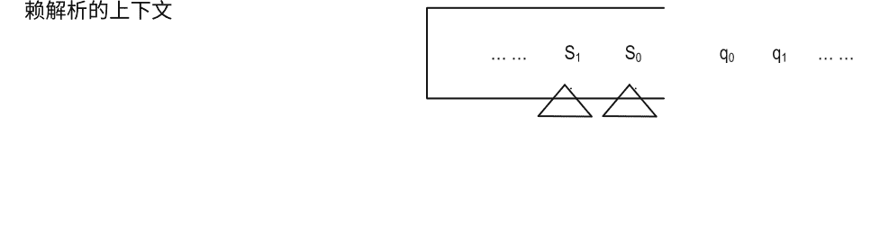

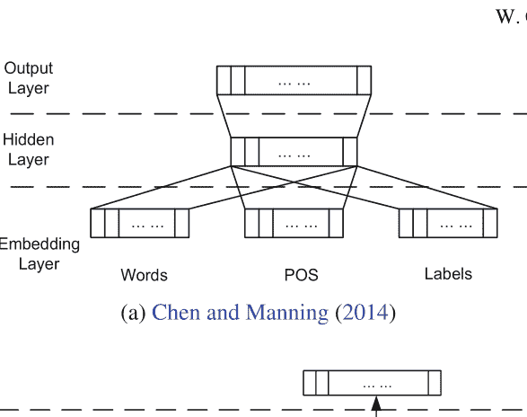

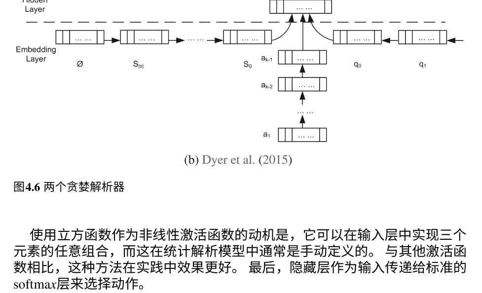

图4.6 两个贪婪解析器

使用立方函数作为非线性激活函数的动机是，它可以在输入层中实现三个元素的任意组合，而这在统计解析模型中通常是手动定义的。与其他激活函数相比，这种方法在实践中效果更好。最后，隐藏层作为输入传递给标准的softmax层来选择动作。

Chen和Manning（2014）的解析器在几个基准测试中明显优于MaltParser。主要原因有两个。首先，使用词嵌入允许从大量原始数据中无监督地学习单词的句法和语义信息，从而增加了模型的鲁棒性。其次，隐藏层实现了复杂特征组合的效果，这在统计模型中是手动完成的。例如，一个组合特征可以是 s₀wq₀p，同时捕捉了s₀的形式和q₀的POS。这可以是采取某些动作的强有力指标。然而，这样的组合可能会有指数级的数量，这需要在特征工程中投入大量的人工努力。此外，如果将两个以上的特征组合成一个特征，它们可能会非常稀疏。

这种稀疏性可能会导致准确性和速度方面的问题，因为它们可能会导致一个具有数千万个二进制指示特征的统计模型。相比之下，Chen和Manning（2014）的神经模型是紧凑且不稀疏的，使其在呈现上下文时更强大，同时不容易过拟合。

Chen和Manning（2014）的密集输入特征表示与传统统计解析器的手动特征模板非常不同，前者是实值且低维的，而后者是二进制的0/1值且高维的。直观上，它们应该捕捉到相同输入句子的不同方面。受到这一观察的启发，Zhang和Zhang（2015）构建了Chen和Manning（2014）解析器的扩展，通过将大型稀疏特征向量与Chen和Manning（2014）的隐藏向量连接起来，然后将其馈送到softmax分类层。这种组合可以被视为将几十年的人类劳动力与使用神经网络模型进行自动特征组合的强大但相对不易解释的能力相结合。与基准的Chen和Manning（2014）解析器相比，结果要高得多，这表明在这种情况下，指示特征和神经特征确实是互补的。

与Xu等人（2015年）对Lewis和Steedman（2014年）的超级标签器的观察类似，Kiperwasser和Goldberg（2016年）发现Chen和Manning（2014年）的局部上下文使用是他们模型的一个潜在限制。为了解决这个问题，他们通过使用LSTMs提取输入单词和每个单词的POS特征的非局部特征，从而得到一系列隐藏向量表示用于输入单词。与Chen和Manning（2014年）的特征向量相比，这些隐藏特征向量包含非局部的句子信息。Kiperwasser和Goldberg（2016年）在输入单词序列上使用双向LSTMs，并堆叠了两个LSTM层来得到隐藏向量。在用于动作分类之前，从相应的隐藏层向量中提取堆栈和缓冲区特征。这种方法在收集全局信息方面比Chen和Manning（2014年）取得了很大的准确性改进，展示了LSTM的强大能力。

如图4.6b所示，Dyer等人（2015）采用了一种不同的方法来解决Chen和Manning（2014）模型中缺乏非局部特征的问题，使用LSTMs来表示堆栈 σ，缓冲区 β和已经执行的动作序列。特别地，堆栈上的单词从左到右进行递归建模，而缓冲区上的单词从右到左进行建模。动作历史按时间顺序进行递归建模。由于堆栈是动态的，可能会从堆栈顶部弹出单词。在这种情况下，Dyer等人（2015）使用“堆栈LSTM”结构来建模动态性，通过指针记录当前堆栈顶部。

当一个单词被推到 s₀ 的顶部时，使用该单词和堆栈LSTM的隐藏状态来推进递归状态，从而得到新的隐藏向量用于新单词，新单词成为 s₀，并且在推送步骤后， s₀变为 s₁。在反向方向上，如果从堆栈中弹出 s₀，则更新顶部指针，从 s₀的隐藏状态移动到堆栈LSTM的 s₁的隐藏状态， s₁在执行动作后变为 s₀。通过使用 σ 的顶部隐藏状态， β的前部和最后一个动作来表示解析器配置，Dyer等人（2015）在Chen和Manning（2014）模型上取得了显著的改进。

Dyer等人（2015年）用重新训练的嵌入、随机初始化但微调的嵌入以及它们的POS嵌入来表示输入单词。

Ballesteros等人（2015年）扩展了Dyer等人（2015年）的模型，进一步使用LSTM来建模每个单词中的字符序列。他们在多语言数据上进行了实验，并观察到了一致的强大结果。在这个方向上，Ballesteros等人（2016年）通过在训练过程中模拟测试场景来解决训练和测试过程中行动历史的不一致问题，在这些场景中，行动的历史由模型而不是黄金标准的行动序列来预测。这个想法类似于Bengio等人（2015年）的计划采样的想法。

#### 4.5.2 贪婪序列标注

给定一个输入句子，贪婪的本地序列标注器通过逐步进行局部决策，为每个输入单词分配一个标签，并将标签的分配视为分类任务。严格来说，这种形式的序列标注器可以被视为基于图的或基于转换的，因为每个标签分配可以被视为消除图结构歧义或转换动作歧义。在这里，我们将贪婪的本地序列标注归类为基于转换的，原因如下。基于图的序列标注模型通常通过对输出标签进行马尔可夫假设，将整个标签序列视为单个图来消除歧义，从而可以使用维特比算法进行精确推理。

这些约束意味着特征只能在局部标签序列上提取，例如二阶和三阶传输特征。相比之下，基于转移的序列标注模型不对输出施加马尔可夫性质，因此通常提取高度非局部的特征。因此，它们通常使用贪婪搜索或波束搜索算法进行推理。下面的所有示例都是贪婪算法，其中一些使用高度非局部的特征。

已经使用神经模型对CCG超标记进行了一系列工作，与POS标记相比，这是一项更具挑战性的任务。CCG是一种轻度词汇化的语法，在CCG解析中，大部分句法信息都通过词汇类别，即超标记来传达。与POS等浅层句法标签相比，超标记包含丰富的句法信息，并且表示谓词-论元结构。树库中经常出现超过1000个超标记，这使得超标记成为一项具有挑战性的任务。

传统的CCG超标记统计模型采用CRF（Clark和Curran2007），其中每个标签的特征是在一个词窗口上提取的，并且POS信息被用作关键特征。这使得POS标记成为超标记之前必要的预处理步骤，因此POS标记错误可能会对超标记质量产生负面影响。

Lewis和Steedman（2014）研究了一个简单的CCG超标记的神经模型，其结构如图4.7a所示。特别是，给定一个输入句子，一个三层神经网络用于为每个单词分配超标记。第一（底部）层是一个嵌入层，将每个单词映射到其嵌入形式。此外，还将一些二值离散特征连接到嵌入向量，包括单词的两个字母后缀和一个二进制指示符，指示单词是否大写。第二层是用于特征集成的隐藏层。对于给定的单词 $w_i$，用于特征提取的上下文窗口是单词 $w_{i-k}$, $w_i$, $w_{i+k}$。来自上下文窗口中每个单词的增强输入嵌入被连接起来，并输入到隐藏层中，该隐藏层使用 $tanh$激活函数实现非线性特征组合。最终（顶层）是一个 $softmax$分类函数，为所有可能的输出标签分配概率。

## 图4.7 用于CCG超标记的神经模型

这个简单的模型出奇地表现良好，相比CRF基线标注器，在领域内数据和跨领域数据的解析准确性方面都有所提高。作为一种贪婪模型，它的运行速度也显著快于神经CRF替代方案，同时提供可比较的准确性。这个成功可以归功于神经网络模型在自动推导特征方面的强大能力，这使得词性标注变得不再必要。此外，词嵌入可以在大量原始数据上重新训练，从而缓解基线离散模型中特征稀疏性的问题，实现更好的跨领域标注。

Lewis和Steedman（2014）的上下文窗口遵循Collobert和Weston（2008）的工作，这是一种局部且可比较于CRF的上下文窗口（Clark和Curran2007）。另一方面，循环神经网络已被用于从整个序列中提取非局部特征，在一系列NLP任务中实现更好的准确性。受到这一观察的启发，Xu等人（2015）扩展了Lewis和Steedman（2014）的方法，通过用循环神经网络层（Elman 1990）替换基于窗口的隐藏层。该模型的结构如图4.7b所示。

特别是，Xu等人（2015）的输入层与Lewis和Steedman（2014）的输入层完全相同，其中一个词嵌入与两个字符后缀和大写特征连接。隐藏层由Elman循环神经网络定义，该网络通过先前的隐藏状态 h_{i-1} 和当前的词嵌入层 w_i 来循环计算隐藏状态 h_i。使用Sigmoid激活函数实现非线性。最后，相同形式的输出层用于本地标记每个单词。

与Lewis和Steedman（2014）的方法相比，RNN方法在使用标准解析器模型进行超级标记和后续CCG解析时提供了更高的准确性。此外，与Clark和Curran（2007）的CRF方法相比，RNN超级标记还提供了更好的1-best超级标记准确性，而Lewis和Steedman的NN方法则没有实现。主要原因是使用循环神经网络结构，该结构对于单词的标记建模了无限历史上下文。

Lewis和Steedman（2014）通过使用LSTMs替换隐藏层中的Elman RNN结构，对Xu等人（2015）的模型进行了进一步改进。特别地，双向LSTM用于推导隐藏特征 h_1, h_2, h_n 在嵌入层中给出的。输入表示也稍作调整，其中离散组件被丢弃，每个单词的1到4个字母前缀和后缀用嵌入向量表示，并与单词的嵌入连接作为输入特征。由于这些改变，最终模型在超级标记和后续CCG解析方面的准确性大大提高。此外，通过使用三训练技术，结果进一步提高，最高达到94.7%的1-best标记F1值。

Xu等人（2015）和Lewis和Steedman（2014）的模型考虑了输入中单词之间的非局部依赖关系，但没有捕捉到输出标签之间的非局部依赖关系。在这方面，与Clark和Curran（2007）的CRF模型相比，它们的表达能力较弱，后者考虑了三个连续标签之间的依赖关系。为了解决这个问题，Vaswani等人（2016）利用LSTM通过考虑标签历史 $s_1$, $s_2$, $s_{i-1}$, 也可以对输出标签序列进行建模，当单词 $w_i$ 被标记时。该模型的结构如图4.7c所示。该模型的输入层使用了与 Lewis 和 Steedman (2014) 相同的表示，隐藏层与 Lewis 和 Steedman (2014) 类似。在输出层，每个标签 $s_i$ 的分类基于相应的隐藏层向量 $h_i$ 和前一个标签序列，由标签 LSTM 的隐藏状态 $h^s_{i-1}$ 表示。标签 LSTM 是单向的，每个状态 $h^s_i$ 都是由其前一个状态 $h^s_{i-1}$ 和前一个标签 $s_{i-1}$ 推导而来。为了进一步提高准确性，使用了计划采样 (Bengio 等人, 2015) 来寻找更接近测试案例的训练数据。在训练过程中，通过选择每个位置的预测超级标签，以采样概率 $p$ 来对标签 $s_i$ 的历史序列 $s_1$, $s_2$, $s_{i-1}$ 进行采样。这样，即使在测试时历史中出现错误，模型也可以更好地学习如何分配正确的标签。

Vaswani 等人 (2016) 表明，通过添加输出标签 LSTM，如果应用了计划采样，准确性可能会稍微提高，但与没有计划采样的 Lewis 和 Steedman (2014) 的贪婪局部输出模型相比会降低。这表明计划采样的有用性，它避免了对黄金标签序列的过度拟合和对测试数据鲁棒性的丢弃。

#### 4.5.3 全局优化模型

通过利用词嵌入来减轻稀疏性，并使用深度神经网络学习非局部特征，贪婪局部神经模型已经证明了它们相对于统计对应物的优势。句子的句法和语义信息已被用于结构化预测，并且还对标签的非局部依赖性进行了建模。另一方面，这些模型的训练是局部的，因此可能导致标签偏差，因为最佳的动作序列并不总是包含局部主题动作。全局优化模型一直是统计自然语言处理的主要方法，也被应用于神经模型。

这种模型通常应用束搜索 (在算法1中)，其中使用议程来保持每个步骤中得分最高的动作序列。弧-急切依赖解析的束搜索过程如图4.8所示。这里的蓝色圆圈表示黄金标准的动作序列。如图4.8所示，在某些步骤中，黄金标准状态可能不是议程中得分最高的。在局部搜索的情况下，这种情况会导致搜索错误。然而，对于束搜索来说，在后续阶段中解码器有可能恢复黄金标准状态，使其成为议程中得分最高的项目。

转换为基于结构化预测的束搜索算法在算法1中正式展示。最初，议程中只包含状态转换系统中的起始状态。在每个步骤中，议程中的所有项目都通过应用所有可能的转换动作进行扩展，从而得到一组新的状态。从这些状态中，选择得分最高的 $B$，并将其用作下一步的议程项目。这样的过程重复直直到达到终止状态，并将议程中得分最高的状态作为输出。与贪婪搜索类似，波束搜索算法对于动作序列长度具有线性时间复杂度。

议程中的项目根据它们的全局分数进行排名，这些分数是序列中所有转换动作的总分数。与贪婪的局部模型不同，全局优化模型的训练目标是基于它们的全局分数对完整的动作序列进行区分。有两种常见的训练方法，一种是最大化黄金标准动作序列的似然概率，另一种是最大化黄金标准动作序列与非黄金标准动作序列之间的得分差距。

## 算法1 通用的波束搜索算法

```
1: 函数 波束搜索 (问题 , 议程 , 候选人 , B)
2: 候选人 ← {开始项 (问题 )}
3: 议程 ← 清空 (议程 )
4: 循环
5: 对于每个候选人 ∈候选人执行
6: 议程 ← 插入 (扩展 (候选人 ,问题 ), 议程 )
7: 结束循环
8: 最佳 ← 顶部(议程)
9: 如果目标测试(问题,最佳)则
10: 返回最佳
11: 结束如果
12: 候选人 ← 顶部 - B (议程, B)
13: 议程 ← 清空 (议程 )
14: 结束循环
15: 结束函数
```

## 图4.8 给定具有波束搜索的状态转换系统的解析过程

动作和非黄金标准动作序列之间的得分差距。其他训练目标偶尔也会被使用，稍后将会展示。

根据Zhang和Clark（2011b）的研究，大多数全局优化模型将训练视为波束搜索优化，其中负训练样本是由波束搜索过程本身采样得到的，并与黄金标准正样本一起用于更新模型。这里我们以Zhang和Clark（2011b）为例来说明训练方法。使用在线学习，其中应用初始模型来解码训练样本。在每个样本的解码过程中，黄金标准动作序列是可用的。与测试用例一样，使用相同的波束搜索算法。在任何步骤中，如果黄金标准动作序列不在议程中，就会发生搜索错误。在这种情况下，搜索停止，并且使用直到该步骤的黄金标准动作序列作为正样本，使用波束中当前得分最高的动作序列作为负样本来更新模型。Zhang和Clark（2011b）使用了统计模型，其中使用Collins（2002）的感知器算法来更新模型参数。波束搜索的提前停止被称为提前更新（Collins和Roark2004）。在黄金标准动作序列在解码结束之前仍然在议程中的情况下，训练算法会检查它是否是最后一步中得分最高的。如果是，当前训练样本将不进行参数更新；否则，将波束中当前得分最高的动作序列作为负样本来更新参数。相同的过程可以在多次迭代的训练样本上重复进行，最终模型用于测试。

我们在下面讨论了一系列使用全局训练进行神经过渡式结构化预测的工作，根据它们的训练目标进行分类。

##### 4.5.3.1 大边界方法

大边界目标最大化了黄金标准输出结构和错误输出结构之间的得分差异；它已经被离散结构化预测方法（如结构化感知器（Collins 2002）和MIRA（Crammer和Singer2003））所使用。理想的大边界训练目标应该确保黄金标准结构的得分高于所有错误结构的一定边界。然而，对于结构化预测任务，错误结构的数量可能呈指数级增长，因此在大多数情况下，精确的目标是难以处理的。感知器通过对最违反边界的模型进行调整来近似这个目标，并在训练中具有收敛的理论保证。特别地，给定黄金标准结构作为正例，给定最大违反错误结构作为负例，感知器算法通过将正例的特征向量添加到模型中，并从模型参数向量中减去负例的特征向量来调整模型参数。通过对所有训练样本重复这个过程，模型收敛到将黄金标准结构的得分高于错误结构的状态。

通常意味着搜索最高得分的错误输出，或者考虑其当前模型得分及其与黄金标准的偏差，排名最高的输出。在后一种情况下，结构膨胀是错误输出的成本，与黄金标准具有类似结构的输出成本较低。通过不仅考虑模型得分而且考虑成本，该训练目标不仅允许模型得分区分黄金标准和错误结构，而且还允许根据其与正确结构的相似性区分不同的错误结构。

使用神经网络，训练目标是最大化给定正例和相应负例之间的得分差异。通常通过对得分差异相对于所有模型参数进行导数，使用梯度下降等基于梯度的方法更新模型参数来实现此目标（AdaGrad，Duchi等，2011年）

Zhang等人（2016a）对基于转换的词分割使用了如此大的边际目标。如第1.1节所示，该任务的状态可以编码为一对 s = (σ, β)，其中 σ 包含一个识别出的单词列表，β 包含下一个输入字符的列表。Zhang等人（2016a）使用一个单词LSTM来表示 σ，以及一个双向字符LSTM来表示 β。此外，他们还使用了一个LSTM来表示已经采取的动作序列，这是根据Dyer等人（2015）的方法。给定一个状态 s，三个LSTM上下文表示被整合并用于评分 SEP 和 APP 动作。形式上，给定一个状态 s，动作 a的得分可以表示为 f(s, a)，其中 f 是网络模型。作为一个全局模型，Zhang等人（2016a）计算了一系列动作的得分，用于对导致的状态进行排序，其中

$$得分(SK) = \sum_{i=1}^{K} f(SI_i, AI_i)$$

根据Zhang和Clark（2011b）的研究，使用早期更新的在线学习方法。每个训练样本都使用波束搜索进行解码，直到金标准的转换动作序列在解码结束后不再位于波束中，或者在得分边界上不再排名最高。在这里，金标准结构与错误结构之间的边界由错误动作的数量 Δ 加权得到。因此，给定经过K个动作后的状态，用于训练网络的相应损失函数定义如下：

$$L(SK) = \max(得分(SK) - 得分(SK^g) + \eta\Delta(SK, SK^g), 0)$$

其中SK^g是经过K个转换后的相应金标准结构。在训练过程中，张等人（2016a）使用当前模型得分 score(s_k) 加上 ________ 根据与 s_k 和 s_k^g 之间的较小值进行更新。由于 score(s_k) 是所有动作得分的总和，损失均匀分布到每个动作上。在实践中，使用反向传播来训练网络，其中使用损失函数的导数通过网络来建模参数 \( f(s_{i-1}, a_i) \) 对于 \( i \in [1..k] \)。由于每个动作 \( a_i \) 与之前描述的相同的表示层共享，它们的损失会累积用于模型参数更新。AdaGrad 用于改变模型。

蔡和赵（2016年）采用了一个非常类似的神经模型进行词分割。张等人（2016a）和蔡和赵（2016年）的模型都可以看作是张和克拉克（2007年）方法的扩展，使用神经网络。另一方面，蔡和赵（2016年）的评分函数与张等人（2016a）的评分函数不同，蔡和赵（2016年）还使用波束搜索，逐步分割句子。但是他们的逐步步骤是基于单词而不是字符的。他们使用多个波束来存储包含相同字符数的部分分割输出，这与张和克拉克（2008a）类似。因此，必须使用词大小的约束条件来确保线性时间复杂度。

对于训练，采用完全相同的大边界目标。

Watanabe和Sumita（2015年）在成分解析中使用了稍微不同的大边界目标。他们采用了Sagae等人（2005年）和Zhang和Clark（2009年）的转换系统，其中状态可以被定义为一对（σ, β），类似于第1.1节中的依存句法分析情况。这里σ包含部分构建的成分树，β包含下一个输入的单词。一组转换动作包括Shift, Reduce和Unary用于消耗输入单词并构建输出结构。有兴趣的读者可以参考（Sagae和Lavie2005）和（Zhang和Clark2009）了解有关状态转换系统的更多细节。

Watanabe和Sumita（2015）使用堆叠LSTM结构来表示σ，这种结构是动态变化的，类似于Dyer等人（2015）的结构。β使用标准LSTM表示。在给定这个上下文表示的情况下，下一个动作a的得分可以表示为 \( f(s, a) \)，其中s表示当前状态，f是网络结构。与Zhang等人（2016a）的情况类似，状态 \( s_k \) 的得分是导致该状态的所有动作的总和，如图4.9所示：

$$得分(SK) = \sum_{i=1}^{K} f(s_{i-1}, a_i)$$

与Zhang等人（2016a）类似，使用波束搜索来找到所有结构中得分最高的状态。然而，在训练过程中，使用最大违规更新而不是早期更新（Huang等人，2012），其中负例是通过运行波束搜索直到达到终止状态，然后找到在金标准和错误结构之间得分差距最大的中间状态。更新在最大违规步骤中执行。此外，与其将最大违规状态作为负例，不如将波束中的所有错误状态都作为负例，以扩大样本空间，并且训练目标是最小化损失：

$$L = \max \left( \mathbb{E}_{s_k \in A} \text{score}(s_k) - \text{score}(s_k^g) + 1 \right)$$

##### 4.5.3.2 最大似然方法

这里 A 代表议程，期望 $E_{s_{k} \in A} score(s_{k})$ 是基于模型得分计算的每个议程中每个 $s_{k}$ 的概率：

$p(s_{k}) = \frac{\exp(score(s_{k}))}{\sum_{s_{k} \in A} \exp(score(s_{k}))}$。

神经结构化预测的最大似然目标受到对数线性模型的启发。特别是，给定输出 $y$ $score(y)$ 的得分，对数线性模型计算其概率为

$p(y) = \frac{\exp(score(y))}{\sum_{y \in Y} \exp(score(y))}$，

其中 $Y$ 表示所有输出的集合。当 $y$ 是一个结构时，这个对数线性模型在一定约束下变成了CRF。

通过假设图4.9中的结构化得分计算来研究类似目标的一行工作，其中状态 $s_{k}$ 的得分计算如下

$得分(SK) = \sum_{i=1}^{K} f(SI_{i-1}, AI)$。

定义 $f$ 和 $a$ 与前一节中的相同。在进行得分计算的基础上，状态 $s_{k}$ 的概率为

$p(s_{k}) = \frac{\exp(score(s_{k}))}{\sum_{s_{k} \in S} \exp(score(s_{k}))}$，

其中 $f(s_{0}, a_{1}) + f(s_{1}, a_{2}) + \cdots + f(s_{k-1}, a_{k}) = score(s_{k})$。

## 图4.9 结构化得分计算其中 $S$ 表示在执行 $k$ 个转换动作后的所有可能状态。显然，$S$ 中的状态数量随 $k$ 呈指数增长，因为它们包含的结构数量增加。因此，在最大似然训练中估计分母是困难的，就像CRF的情况一样。对于CRF，可以通过对特征局部性施加约束来解决这个问题，从而可以使用特征的边际概率来估计分区函数。然而，对于基于转换的模型，这种特征局部性是不存在的。

周等人（2015年）首次通过在集束搜索期间使用议程中的所有状态来近似SD来解决这个问题。他们执行集束搜索和在线学习，与张等人（2016a年）采用相同的早期更新方式。另一方面，在每次更新期间，周等人（2015年）不是计算正负样本之间的得分差距，而是最大化金标准阶段的近似似然概率 $s_g$。

$$p(s_g) = \frac{\exp(\text{score}(s_g))}{\sum_{s_k \in A} \exp(\text{score}(s_k))},$$

其中 $A$ 表示议程，与上一节中的相同。
这种方法使用议程中的状态的概率质量来近似分区函数，因此被周等人称为集束对比学习（2015年）。周等人（2015年）将训练目标应用于基于转换的依赖解析任务，与张和尼夫（2011年）相比取得了更好的结果。

Andor等人（2016年）将这种方法应用于更多的结构化预测任务，包括部分词性标注。他们还通过使用更好的基准方法和进行更彻底的超参数搜索，获得了比Zhou等人（2015年）更好的结果。此外，Andor等人（2016年）给出了一个理论上的解释，即全局归一化模型优于局部训练的基准模型。

##### 4.5.3.3 最大期望F1

另一个尝试过的训练目标是最大F1，Xu等人（2016年）在基于转换的CCG解析中使用了这个目标（Zhang和Clark 2011a）。特别是，Xu等人（2016年）使用集束搜索找到最高得分的状态，其中每个状态的得分由图4.9的计算方法给出。给定状态 $s_k$，得分计算为

$$\text{得分(SK)} = \sum_{i=1}^{K} g(s_{i-1}, a_i)。$$

这里的函数 $g$ 表示一个网络模型，$a$ 表示一个转换动作。Xu et al. (2016) 的网络函数 $g$ 与之前提到的所有方法的网络函数的区别在于 $g$ 使用 softmax 层来对输出的动作进行归一化，而 $f$ 不使用非线性激活函数来计算给定状态下不同动作的分数。

Xu等人（2016年）的训练目标是

$$E_{s_k \in A} F1(s_k) = \sum_{s_k \in A} p(s_k) F1(s_k)$$

其中 $A$ 表示解析完成后的集束， $F1(s_k)$ 表示根据标准度量评估的 $s_k$ 的F1得分。 Xu等人（2016年）使用以下公式计算 $p(s_k)$

$$p(s_k) = \frac{\exp(score(s_k))}{\sum_{s_j \in A} \exp(score(s_j))}$$

这与所有前述方法一致。

### 4.6 总结

在本章中，我们提供了深度学习在词法分析和解析中的应用概述，这是自然语言处理中的两个标准任务，并将深度学习方法与传统的统计方法进行了比较。

首先，我们介绍了词法分析和解析的定义。它们对单词的结构特性及其相互关系进行建模。这些任务中常用的技术包括词语分割、词性标注和解析。词法分析和解析最重要的特点是输出结果是有结构的。

然后，我们介绍了通常用于解决这些结构化预测任务的两种传统方法：基于图的方法和基于转换的方法。基于图的方法直接利用输出结构的特点，而基于转换的方法将输出构建过程转化为状态转换过程，并随后处理一系列转换动作的序列。

最后，在本章中我们介绍了使用神经网络和深度学习模型的方法，这些方法可以用于基于图和基于转换的结构化预测。

尽管最近的进展表明，神经网络模型可以有效地用于传统的基于图和基于转换的词法分析和解析模型的增强或替代，但它们已经开始展示出神经网络的强大表示能力，超越了仅仅建模的功能。例如，在传统的统计建模方法中，人们普遍认为局部训练会导致标签偏差（Lafferty等人，2001年）。然而，（Dozat和Manning2016）中描述的模型和方法通过将单个依赖弧因训练目标因素分离出来，而不是全局训练依赖树的概率，实现了最先进的准确性结果。这表明，使用LSTMs对单词序列进行强大的表示可以获得输出标签之间的结构相关性。自然语言处理中词法分析和解析的未来方向可能是将结构化学习的成熟研究与深度学习的新兴力量相结合。

## 参考文献

- Andor, D., Alberti, C., Weiss, D., Severyn, A., Presta, A., Ganchev, K., 等 (2016). 全局归一化的基于转移的神经网络。在第54届年会上计算语言学协会(第1卷：长论文，第2442-2452页)。德国柏林：计算语言学协会。
- Ballesteros, M., Dyer, C., & Smith, N. A. (2015). 通过使用LSTMs对字符而不是单词进行建模来改进基于转移的解析。在2015年经验方法在自然语言处理中的会议(第349-359页)。葡萄牙里斯本：计算语言学协会。
- Ballesteros, M., Goldberg, Y., Dyer, C., & Smith, N. A. (2016). 通过探索训练改进了贪婪堆栈LSTM解析器。在2016年经验方法在自然语言处理中的会议(第2005-2010页)。德克萨斯州奥斯汀：计算语言学协会。
- Bengio, S., Vinyals, O., Jaitly, N., & Shazeer, N. (2015). 用于序列预测的定期抽样与递归神经网络。在第28届国际神经信息处理系统会议论文集, NIPS'15(第1171-1179页)。剑桥, 麻省, 美国: MIT出版社.
- Bohnet, B. & Nivre, J. (2012). 一种基于转换的联合词性标注和标记非投影依存分析系统。在2012年联合会议论文集上自然语言处理和计算自然语言学(第1455-1465页).韩国济州岛: 计算语言学协会.
- Booth, T. L. (1969). 形式语言的概率表示。2013年IEEE第54届年会计算机科学基础研讨会, 00, 74–81.
- Cai, D., & Zhao, H. (2016). 神经词分割学习用于中文。在计算语言学协会第54届年会(第1卷：长论文，第409-420页)。德国柏林：计算语言学协会.
- Carnie, A. (2012).句法：生成式介绍(第3版)。纽约：Wiley-Blackwell.
- Chen, D., & Manning, C. (2014). 使用神经网络的快速准确的依赖解析器。在EMNLP-2014会议论文集中。
- Cho, K., van Merrienboer, B., Gulcehre, C., Bahdanau, D., Bougares, F., Schwenk, H., & Bengio, Y. (2014). 使用RNN编码器-解码器学习短语表示用于统计机器翻译。在2014年经验方法在自然语言处理中的会议论文集(EMNLP)(pp. 1724-1734)。卡塔尔多哈：计算语言学协会。
- Choi, J. D., & Palmer, M. (2011). 获取基于转换的依存句法分析的最佳结果。在第49届计算语言学协会年会论文集：人类语言技术(第687-692页)。美国俄勒冈州波特兰市：计算语言学协会。
- Chu, Y., & Liu, T. (1965). 关于有向图的最短生成树。中国科学, 14, 1396-1400.
- Clark, S., & Curran, J. R. (2007). 基于ccg和对数线性模型的广覆盖高效统计句法分析。计算语言学, 33(4), 493-552.
- Collins, M. (1997). 三个生成的、词汇化的统计句法模型。在第35届计算语言学协会年会论文集(第16-23页)。西班牙马德里：计算语言学协会。
- Collins, M. (2002). 用于隐马尔可夫模型的判别式训练方法：理论和感知器算法的实验。在2002年计算语言学方法会议论文集中（第1-8页）。计算语言学协会.
- Collins, M., & Roark, B. (2004). 使用感知器算法的增量解析。在第42届计算语言学协会会议（ACL'04）的论文集中（原文未提供）
- Collobert, R., & Weston, J. (2008). 一种统一的自然语言处理架构:深度神经网络与多任务学习.在第25届国际机器学习大会(ICML '08)上(第160-167页). 美国纽约: ACM.
- Collobert, R., Weston, J., Bottou, L., Karlen, M., Kavukcuoglu, K., & Kuksa, P. (2011). 自然语言处理(几乎)从零开始.机器学习研究杂志, 12, 2493–2537.
- Crammer, K., Dekel, O., Keshet, J., Shalev-Shwartz, S., & Singer, Y. (2006). 在线被动-侵略性算法. 机器学习研究杂志, 7, 551–585.
- Crammer, K., & Singer, Y. (2003). 超保守的在线多类问题算法. 机器学习研究杂志, 3, 951–991.
- Cross, J., & Huang, L. (2016). 基于跨度的组成句法分析与结构标签系统和可证明最优动态预测. 在2016年经验方法自然语言处理会议(pp. 1–11)中. 德克萨斯州奥斯汀: 计算语言学协会.
- Dozat, T., & Manning, C. D. (2016). 用于神经依赖解析的深度双线性注意力. CoRR, abs/1611.01734.
- Duchi, J., Hazan, E., & Singer, Y. (2011). 自适应次梯度方法用于在线学习和随机优化. 机器学习研究杂志, 12, 2121–2159.
- Durrett, G., & Klein, D. (2015). 神经CRF解析. 在计算语言学协会第53届年会和第7届国际联合会议上的自然语言处理(第1卷: 长篇论文, 第302-312页). 中国北京: 计算语言学协会.
- Dyer, C., Ballesteros, M., Ling, W., Matthews, A., & Smith, N. A. (2015). 基于转移的依存-句法分析与堆栈长短期记忆. 在计算语言学协会第53届年会和第7届国际联合会议上的自然语言处理(第1卷: 长篇论文, 第334-343页). 中国北京: 计算语言学协会.
- Edmonds, J. (1967). 最佳分支. 国家标准研究所研究杂志, 71B, 233–240.
- Eisner, J. (1996). 组合范畴语法的高效正规形式解析. 在计算语言学协会第34届年会上(pp. 79–86). 美国加利福尼亚州圣克鲁兹: 计算语言学协会.
- Elman, J. L. (1990). 在时间中找到结构. 认知科学, 14(2), 179–211.
- Freund, Y., & Schapire, R. E. (1999). 使用感知器算法进行大边界分类. 机器学习, 37(3), 277–296.
- Graves, A. (2008). 使用循环神经网络进行监督序列标注. 博士论文, 慕尼黑工业大学.
- Hall, D., Durrett, G., & Klein, D. (2014). 更多特征, 少一些语法. 在计算语言学协会第52届年会论文集中(第1卷: 长文, 第228-237页). 马里兰州巴尔的摩市: 计算语言学协会.
- Hatori, J., Matsuzaki, T., Miyao, Y., & Tsujii, J. (2012). 在计算语言学协会第50届年会论文集中(第1卷: 长文, 第1045-1053页), 韩国济州岛: 计算语言学协会.
- Hochreiter, S., & Schmidhuber, J. (1997). 长短期记忆. 神经计算, 9(8), 1735-1780.
- Huang, L., Fayong, S., & Guo, Y. (2012). 具有不精确搜索的结构化感知机. 在2012年北美计算语言学协会会议论文集中: 人类语言技术(pp. 142–151). 加拿大蒙特利尔: 计算语言学协会.
- Jurafsky, D., & Martin, J. H. (2009). 语音和语言处理(第2版). 新泽西州上河岸, 美国: Prentice-Hall Inc.
- Kübler, S., McDonald, R., & Nivre, J. (2009). 依赖解析。人类语言技术综合讲座, 2(1), 1–127。
- Kiperwasser, E., & Goldberg, Y. (2016). 使用双向LSTM特征表示的简单准确的依赖解析。计算语言学协会交易, 4, 313–327。
- Lafferty, J. D., McCallum, A., & Pereira, F. C. N. (2001). 条件随机场：用于分割和标记序列数据的概率模型。在第十八届国际机器学习大会上的论文集, ICML '01(第282-289页), 美国加利福尼亚州旧金山: Morgan Kaufmann Publishers Inc.
- Lewis, M., & Steedman, M. (2014). 带有超级标签因子模型的A* CCG解析。在2014年自然语言处理实证方法会议论文集中(第990-1000页)。卡塔尔多哈: 计算语言学协会。
- Li, F., Zhang, Y., Zhang, M., & Ji, D. (2016). 从生物医学文本中提取不良药物事件的联合模型。在第二十五届国际人工智能联合大会上的论文集, IJCAI 2016(第2838-2844页)。美国纽约, 2016年7月9日至15日。
- Li, Q., & Ji, H. (2014). 增量式联合提取实体提及和关系。在计算语言学协会第52届年会上的论文集(第1卷: 长篇论文, 第402-412页)。马里兰州巴尔的摩市: 计算语言学协会。
- Liu, J., & Zhang, Y. (2015). n-gram和句法语言模型在词序排序中的实证比较。在2015年经验方法在自然语言处理中的会议论文集(第369-378页)。葡萄牙里斯本: 计算语言学协会。
- Liu, Y., Che, W., Guo, J., Qin, B., & Liu, T. (2016). 探索用于神经分割模型的分段表示。在第25届国际人工智能联合会议(IJCAI 2016)上的论文集(第2880-2886页)。美国纽约市, 2016年7月9日至15日。
- Liu, Y., Zhang, Y., Che, W., & Qin, B. (2015). 基于转换的句法线性化。在2015年北美计算语言学协会会议论文集中: 人类语言技术(第113-122页)。科罗拉多州丹佛市: 计算语言学协会。
- Luong, T., Pham, H., & Manning, C. D. (2015). 基于注意力的神经机器翻译的有效方法。在2015年经验方法在自然语言处理中的会议论文集中(第1412-1421页)。葡萄牙里斯本: 计算语言学协会。
- Lyu, C., Zhang, Y., & Ji, D. (2016). 联合词分割、词性标注和句法分块。在第30届AAAI人工智能大会论文集中, AAAI'16(第3007-3014页)。AAAI出版社。
- Manning, C. D., & Schütze, H. (1999).统计自然语言处理基础.美国马萨诸塞州剑桥市: MIT出版社.
- McDonald, R. (2006).用于依存句法分析的判别学习生成树算法.博士学位论文, 宾夕法尼亚大学.
- Nivre, J. (2003). 一种高效的投影依存句法分析算法.在第8届国际句法技术研讨会(IWPT)(pp . 149–160)的论文集中.
- Nivre, J. (2008). 确定性增量依存句法分析算法.计算语言学, 34(4), 513–554.
- Pei, W., Ge, T., & Chang, B. (2015). 一种有效的基于图的依存句法分析神经网络模型.在第53届计算语言学年会和第7届国际自然语言处理联合会议(第1卷:长论文, pp. 313–322), 中国北京: 计算语言学协会.
- Petrov, S., Barrett, L., Thibaux, R., & Klein, D. (2006). 学习准确、紧凑和可解释的树注释.在第21届国际计算语言学大会和第44届计算语言学协会年会(pp. 433–440), 澳大利亚悉尼: 计算语言学协会.
- Pudupully, R., Zhang, Y., & Shrivastava, M. (2016). 基于转换的句法线性化与前瞻特征。 在2016年北美计算语言学协会会议论文集: 人类语言技术(第488-493页)。 圣地亚哥，加利福尼亚州: 计算语言学协会。
- Qian, T., Zhang, Y., Zhang, M., Ren, Y., & Ji, D. (2015). 一种基于转换的联合分词、词性标注和规范化模型。 在2015年自然语言处理实证方法会议论文集(第1837-1846页)，葡萄牙里斯本: 计算语言学协会。
- Sagae, K., & Lavie, A. (2005). 具有线性运行时间复杂度的基于分类器的解析器。 在第九届国际解析技术研讨会论文集, 解析'05(第125-132页)。美国宾夕法尼亚州斯特劳斯堡: 计算语言学协会.
- Sagae, K., Lavie, A., & MacWhinney, B. (2005). 自动测量儿童语言中的句法发展. 在计算语言学协会第43届年会论文集中(pp. 197–204). 美国密歇根州安娜堡: 计算语言学协会.
- Sarawagi, S., & Cohen, W. W. (2004). 用于信息提取的半马尔可夫条件随机场. 在L. K. Saul, Y. Weiss, & L. Bottou (Eds.),神经信息处理进展系统17(pp. 1185–1192). 剑桥: MIT出版社.
- Shaalan, K. (2014). 阿拉伯命名实体识别和分类的调查.计算语言学, 40(2), 469–510.
- Smith, N. A. (2011).语言结构预测. Morgan and Claypool: 人类语言技术综合讲座.
- Song, L., Zhang, Y., Song, K., & Liu, Q. (2014). 联合形态生成和句法线性化.在第二十八届AAAI人工智能大会论文集中AAAI'14(第1522-1528页). AAAI出版社.
- Vaswani, A., Bisk, Y., Sagae, K., & Musa, R. (2016). 使用LSTMs进行超级标记. 在2016年北美计算语言学协会会议论文集中人类语言技术(第232-237页). 圣地亚哥，加利福尼亚州: 计算语言学协会.
- Wang, W., & Chang, B. (2016). 基于图的双向LSTM依赖解析. 在第54届计算语言学协会年会论文集中(第1卷: 长篇论文, 第2306-2315页). 德国柏林: 计算语言学协会.
- Wang, Z., & Xue, N. (2014). 具有非局部特征的中文词性标注和基于转移的成分解析.在第52届计算语言学协会年会论文集中(第1卷: 长篇论文, 第733-742页). 马里兰州巴尔的摩: 计算语言学协会.
- Watanabe, T., & Sumita, E. (2015). 基于转换的神经成分解析。 在第53届计算语言学年会和第7届国际自然语言处理联合会议上(第1卷: 长文, 第1169-1179页). 中国北京: 计算语言学协会.
- Wong, K.-F., Li, W., Xu, R., & Zhang, Z.-s., (2009). 中文自然语言处理简介。 人类语言技术综合讲座, 2(1), 1-148。
- Xu, W., Auli, M., & Clark, S. (2015). 使用循环神经网络的CCG超标记。 在第53届计算语言学年会和第7届国际自然语言处理联合会议论文集(第2卷: 短文, 第250-255页). 中国北京: 计算语言学协会。
- Xu, W., Auli, M., & Clark, S. (2016). 使用递归神经网络进行移位-规约解析的期望F-度量训练。 在北美计算语言学协会2016年会议论文集中: 人类语言技术(pp. 210–220). 加利福尼亚州圣地亚哥: 计算语言学协会。
- Xu, W., Clark, S., & Zhang, Y. (2014). 使用依赖模型进行移位-规约CCG解析。 在计算语言学协会第52届年会论文集中(第1卷: 长篇论文)。

## 4 词法分析和解析中的深度学习

薛宁 (2003). 中文分词作为字符标注。国际计算语言学与中文语言处理学术期刊, 8, 29–48.

山田浩之，松本裕治 (2003). 支持向量机进行统计依赖分析。在IWPT会议论文集(第195-206页)中。

Zhang, M., & Zhang, Y. (2015). 结合离散和连续特征进行确定性基于转移的依存句法分析。在2015年自然语言处理实证方法会议(第1316-1321页)中。葡萄牙里斯本: 计算语言学协会。

Zhang, M., Zhang, Y., Che, W., & Liu, T. (2013). 利用字符进行中文分析。在第51届计算语言学协会年会(第1卷: 长篇论文, 第125-134页)中。保加利亚索非亚: 计算语言学协会。

Zhang, M., Zhang, Y., Che, W., & Liu, T. (2014). 基于字符级别的中文依存句法分析。在第52届计算语言学协会年会(第1卷: 长篇论文, 第1326-1336页)中。马里兰州巴尔的摩: 计算语言学协会。

Zhang, M., Zhang, Y., & Fu, G. (2016a). 基于转移的神经词分割。在第54届计算语言学协会年会(第1卷: 长篇论文, 第421-431页)中，德国柏林: 计算语言学协会。

Zhang, Y., & Clark, S. (2007). 基于词感知器算法的中文分词。在第45届计算语言学协会年会(第840-847页)中，捷克共和国布拉格: 计算语言学协会。

Zhang, Y., & Clark, S. (2008a). 使用单个感知器进行联合词分割和词性标注。在ACL-08: HLT会议论文集(第888-896页)中。俄亥俄州哥伦布: 计算语言学协会。

Zhang, Y., & Clark, S. (2008b). 两个解析器的故事: 研究和结合基于图的和基于转移的依存解析。在2008年自然语言处理经验方法会议论文集(第562-571页)，夏威夷檀香山: 计算语言学协会。

Zhang, Y., & Clark, S. (2009). 使用全局判别模型的基于转移的中文树库解析。在第11届国际解析技术会议论文集，IWPT '09(第162-171页)中。宾夕法尼亚州斯特劳斯堡，美国: 计算语言学协会。

Zhang, Y., & Clark, S. (2010). 使用单一判别模型的联合词分割和词性标注的快速解码器。在2010年自然语言处理经验方法会议论文集(第843-852页)中。马萨诸塞州剑桥: 计算语言学协会。

Zhang, Y., & Clark, S. (2011a). 移位-规约CCG解析。在第49届年度计算语言学协会会议: 人类语言技术 (pp.683–692)。美国俄勒冈州波特兰市: 计算语言学协会。

Zhang, Y., & Clark, S. (2011b). 使用广义感知器和波束搜索的句法处理。计算语言学, 37(1).

Zhang, Y., & Nivre, J. (2011). 基于转移的依存句法分析与丰富的非局部特征。在第49届年度计算语言学协会会议: 人类语言技术(pp. 188–193)。美国俄勒冈州波特兰市: 计算语言学协会。

Zhang, Z., Zhao, H., & Qin, L. (2016b). 基于概率图的依存句法分析与卷积神经网络。在第54届年度计算语言学协会会议(卷1: 长论文, pp. 1382–1392), 德国柏林: 计算语言学协会。

Zhou, H., Zhang, Y., Huang, S., & Chen, J. (2015). 一种神经概率结构化预测模型，用于基于转移的依存句法分析。在计算语言学协会第53届年会和第7届国际联合会议自然语言处理(Vol. 1: 长文, pp. 1213–1222)的论文集中，北京，中国: 计算语言学协会。

Zhou, J., & Xu, W. (2015). 使用循环神经网络进行语义角色标注的端到端学习。在计算语言学协会第53届年会和第7届国际联合会议自然语言处理(Vol. 1: 长文, pp. 1127–1137)的论文集中，北京，中国: 计算语言学协会。

Zhu, M., Zhang, Y., Chen, W., Zhang, M., & Zhu, J. (2013). 快速准确的移位-规约成分解析。在计算语言学协会第51届年会(Vol. 1: 长文, pp. 434–443)的论文集中，索菲亚，保加利亚: 计算语言学协会。

## 第5章 知识图谱中的深度学习

### 刘智远和韩先培

摘要 知识图谱（KG）是人类类似常识推理和自然语言理解的基本资源，它包含了丰富的关于世界实体、实体属性和不同实体之间语义关系的知识。近年来，深度学习技术在知识图谱中取得了显著的成功。在本章中，我们介绍了三个基于深度学习的知识图谱技术的广泛类别：（1）知识表示学习技术，将知识图谱中的实体和关系嵌入到稠密、低维和实值语义空间中；（2）神经关系抽取技术，从文本中提取事实/关系，然后用于构建/完善知识图谱；（3）基于深度学习的实体链接技术，将知识图谱与文本数据连接起来，可以促进许多不同的任务。

### 5.1 引言

随着21世纪互联网的蓬勃发展，网络信息的数量呈爆炸式增长，人们发现从庞大的嘈杂纯文本中提取有价值的信息，或者更准确地说，知识，变得越来越困难和低效。于是，人们开始意识到世界是由实体而不是字符串构成的，正如辛格博士所说的，“事物而不是字符串”。因此，知识图谱的概念进入了公众视野。

知识图谱（KG），也被称为知识库，是一个重要的数据集，以结构化形式组织人类对世界的知识，其中知识以具体实体和它们之间的多关系抽象概念表示。在构建知识图谱时，主要有两种方法。一种是使用现有的语义网络数据集资源描述框架（RDF）的帮助下进行手动注释。另一种方法是使用机器学习或深度学习方法从互联网上的大量纯文本中自动提取知识。

由于这种良好结构化的统一知识表示，知识图谱可以提供关于复杂现实世界的有效结构化信息。因此，它开始在人工智能的许多应用中发挥重要作用，特别是在自然语言处理和信息检索领域，如网络搜索、问答系统、语音识别等，近年来引起了学术界和工业界的广泛关注。

在本章中，我们首先介绍基本概念和典型的知识图谱（第5.1节），然后介绍知识表示学习的最新进展（第5.2节），关系抽取（第5.3节）和实体链接（第5.4节）。最后，在第5.5节中给出一个简要的结论。

#### 5.1.1 基本概念

一个典型的知识图谱通常由两个元素组成，实体（即现实世界中的具体实体和抽象概念）和实体之间的关系。因此，它将各种知识按照(e1, relation, e2)的形式排列成大量的三元事实，其中 e1表示头实体， e2表示尾实体。例如，我们知道唐纳德·特朗普是美国的总统。这个知识可以表示为(唐纳德·特朗普, 担任, 美国)。此外，值得注意的是，在现实世界中，相同的头实体和关系可能有几个不同的尾实体。例如，卡卡曾经是皇家马德里和AC米兰足球俱乐部的足球运动员。我们可以从这个常见知识中得到这两个三元组：(卡卡, 球队的球员, 皇家马德里足球俱乐部), (卡卡, 球队的球员, AC米兰)。反过来，当尾实体和关系被固定时，也可能发生这种情况。当头实体和尾实体都是多个时，也是可能的（例如，关系author_of_paper）。从这个角度来看，我们可以看到知识图谱具有很大的灵活性，以及表示知识的能力。通过所有这些三元组，知识被表示为一个巨大的有向图，其中实体被视为节点，关系被视为边。

#### 5.1.2 典型的知识图谱

从容量和知识领域的角度来看，当前的知识图谱可以分为两类。第一类图谱包含大量的三元组和众所周知的常见关系，例如Freebase。第二类图谱相对较小，但专注于特定的知识领域，并且通常是细粒度的。

有几个广泛应用且具有很大影响力的知识图谱。在接下来的章节中，我们将介绍一些著名的知识图谱。

##### 5.1.2.1 Freebase

Freebase是世界上最受欢迎的知识图谱之一。它是一个由社区成员主要组成的大型协作数据库。它是一个在线的结构化数据集合，从许多来源收集而来，包括维基百科、时尚模特目录、NNDB、MusicBrainz和其他个人用户提交的维基贡献。它还宣布为其用户提供商业和非商业用途的开放API、RDF端点和数据集转储。Freebase由美国软件公司Metaweb开发，并自2007年3月起公开运行。2010年7月，Metaweb被Google收购，Google知识图谱部分由Freebase提供支持。2014年12月，Freebase团队正式宣布将于2015年6月关闭Freebase网站及其API。截至2016年3月24日，Freebase拥有58,726,427个主题和3,197,653,841个事实。

例如，图5.1是前美国总统约翰·F·肯尼迪在Freebase上的示例页面。很容易注意到，诸如出生日期、性别和职业等信息以结构化形式列出，就像一份简历一样。

##### 5.1.2.2 DBpedia

DBpedia（“DB”代表“数据集”）是一个众包社区努力，旨在从维基百科中提取结构化信息，并将此信息提供在网络上。DBpedia允许用户对维基百科进行复杂的查询，并将网络上的不同数据集链接到维基百科资源，这将使维基百科中的大量信息更容易以一些新的有趣方式使用。该项目由柏林自由大学和莱比锡大学的人员与OpenLink Software合作启动，并于2007年发布了第一个公开可用的数据集。整个DBpedia数据集描述了458万个实体，其中422万个在一致的本体论中进行了分类，包括145万个人物，73.5万地点，12.3万音乐专辑，8.7万部电影，1.9万个视频游戏，24.1万个组织，25.1万个物种和6,000种疾病。该数据集还提供了这些实体的标签和摘要，涵盖了多达125种不同的语言。

而且，由于DBpedia与维基百科的信息框相连，它可以在信息变化时进行动态更新。

##### 5.1.2.3 维基数据

维基数据是由维基媒体基金会运营的协作编辑知识库。它旨在提供一个可以被维基百科和其他人使用的共同数据源。

维基媒体项目，如维基百科，以及其他人都可以使用。该项目的创建是由艾伦人工智能研究所、戈登和贝蒂·摩尔基金会以及谷歌公司的捐款共计130万欧元资助的。至于内部详细结构，维基数据是一个以文档为导向的数据库，专注于项目。每个项目代表一个主题（或用于维护维基百科的管理页面），并通过唯一编号进行标识。通过创建语句向项目添加信息。语句采用键值对的形式，每个语句由属性（键）和与属性相关联的值组成。截至2017年5月，知识库包含25,887,362个数据项，任何人都可以编辑。

例如，图5.2是维基数据中约翰・F・肯尼迪的示例页面。可以注意到，每个关系还附有任何人都可以添加或编辑的参考资料。

| 属性 | 值 | 操作 |
| :--- | :--- | :--- |
| instance of | human <br> 2 references | edit |
| image | John F Kennedy.jpg <br> 0 references | edit <br> add reference |
| sex or gender | male <br> 3 references | edit |
| country of citizenship | United States of America <br> 0 references | edit <br> add reference |

图5.2 约翰・F・肯尼迪的维基数据页面

##### 5.1.2.4 YAGO

YAGO代表Yet Another Great Ontology，是由马克斯·普朗克信息学研究所和巴黎电信大学开发的一个庞大的高质量知识库。其中的知识来自维基百科、WordNet和GeoNames。目前，它拥有超过1000万个实体（如人物、组织、城市等），并包含超过1.2亿个关于这些实体的事实。YAGO的亮点可以总结如下：首先，YAGO的准确性经过人工评估，证明了95%的确认准确性，并且每个关系都附有其置信度值。其次，YAGO将WordNet的清晰分类法与维基百科的丰富分类系统相结合，将实体分配到超过35万个类别中。第三，YAGO是一个同时具有时间和空间维度的本体，这意味着它为许多事实和实体附加了时间和空间维度。

##### 5.1.2.5 HowNet

HowNet (Dong and Dong 2003) 是一个在线的常识知识库，揭示了中文词典和它们的英文对应词之间的概念关系和属性关系。HowNet背后的主要理念是对客观世界的理解和解释。HowNet认为，所有事物（物质和非物质）在给定的时间和空间中都在不断运动和变化。事物通过其属性的相应变化来从一个状态演变到另一个状态。以“人类”为例，它的生存状态可以描述为：出生、衰老、生病和死亡。

随着一个人的成长，他的年龄（属性值）也在增加。与此同时，他的头发颜色（一个属性）变白（属性值）。可以得出结论，每个对象都具有一组属性，对象之间的相似性和差异性取决于它们各自所具备的属性。除了属性之外，部分也是HowNet中一个重要的哲学概念。可以理解为所有对象可能是其他某个对象的一部分，同时，所有对象也是其他某个对象的整体。例如，门和窗户是建筑物的一部分，而建筑物也是社区的一部分。总的来说，HowNet包含271个信息结构模式，58个语义结构模式，11000个词实例和60000个中文词汇（图5.3）。

此外，HowNet在构建过程中也强调义元，义元被定义为词义的最小语义单位，并且存在一个有限的闭合义元集合来组成开放概念的语义含义。HowNet为每个词注释了精确的义项，对于每个义项，HowNet注释了由义元表示的部分和属性的重要性。

图5.3 约翰·F·肯尼迪的YAGO页面

另一个是一种计算机品牌。因此，在第一个意义上，它具有语义单元水果而在第二个意义上，它具有语义单元计算机.带来, 和 SpeBrand.

### 5.2 知识表示学习

在过去的几年中，根据传统表示（即网络表示）设计了各种特定的算法来存储和利用KG中的信息，这通常非常耗时且受到数据稀疏性的影响。最近，表示学习作为深度学习的一个子领域，在包括自然语言处理和人工智能在内的不同领域引起了广泛关注。表示学习旨在将对象嵌入到一个稠密、低维且实值的语义空间中。而知识表示学习是表示学习的一个子领域，其重点是将实体和关系嵌入到KG中。

最近的研究表明，基于翻译的表示学习方法在低维度表示的实体和关系方面对知识图谱中的关系事实进行编码是高效且有效的，可以缓解数据稀疏性问题，并进一步用于知识获取、融合和推理。TransE（Bordes等，2013年）是一种典型的基于翻译的知识表示学习方法，它学习实体和关系的低维向量，非常简单且有效。TransE将关系三元组中的关系视为头实体和尾实体嵌入之间的平移，即当三元组 (h, r, t) 成立时，有 h + r ≈ t。它在知识图谱完成任务中取得了惊人的性能。

尽管TransE取得了巨大的成功，但在建模1对N、N对1和N对N关系时仍存在问题。由于这些复杂关系，TransE学到的实体嵌入缺乏区分度。因此，如何处理复杂关系是知识表示学习中的一个关键挑战之一。

最近，有很多扩展的TransE专注于这个挑战。TransH（Wang等人，2014b）和TransR（Lin等人，2015b）被提出来表示一个实体在不同关系中具有不同的表示。TransH将关系建模为一个超平面上的平移向量，并使用法向量将实体嵌入投影到超平面上。TransR在实体语义空间中表示实体，并使用关系特定的变换矩阵将其投影到不同关系空间中。此外，研究人员提出了两个TransR的扩展，包括TransD（Ji等人，2015），它考虑了投影矩阵中实体的信息，以及TranSparse（Ji等人，2016），它通过稀疏矩阵考虑了关系的异质性和不平衡性。

此外，还有许多其他扩展的TransE专注于不同关系的特征，包括TransG（Xiao等人，2015）和KG2E（He等人，2015）采用高斯嵌入来建模实体和关系；ManifoldE（Xiao等人，2016）在知识表示学习中采用基于流形的嵌入原理；等等。

此外，TransE仍然存在一个问题，即仅考虑实体之间的直接关系。 为了解决这个问题，Lin等人（2015a）提出了基于路径的TransE，通过选择合理的关系路径并用低维向量表示它们来扩展TransE以建模关系路径。 几乎在同一时间，还有其他研究人员成功地使用神经网络考虑了知识图谱中的关系路径（Garcia-Durán等人，2015年）。 此外，关系路径学习还被应用于基于知识图谱的问答系统（Gu等人，2015年）。

上述大多数现有的知识表示学习方法仅关注知识图谱中的结构信息，而忽视了丰富的多源信息，如文本信息、类型信息和视觉信息。 这些跨模态信息可以为实体提供补充知识，特别是对于那些关系事实较少的实体而言，当学习知识表示时非常重要。 对于文本信息，Wang等人（2014a）和Zhong等人（2015年）提出了将实体和单词同时嵌入到统一的语义空间中的方法，通过将它们与实体名称、描述和维基百科锚点对齐。

此外，Xie等人（2016b）提出使用CBOW或CNN编码器基于实体的描述来学习实体表示。 对于类型信息，Krompaß等人（2015年）将类型信息作为每个关系的头实体集和尾实体集的约束，以区分属于相同类型的实体。 Xie等人（2016c）不仅仅将类型信息视为类型约束，还利用分层类型结构通过指导投影矩阵的构建来增强TransR。

对于视觉信息，Xie等人（2016a）提出了基于图像的知识表示学习，通过学习实体表示来考虑视觉信息。 在现实世界中，我们自然而然地通过各种多源信息来学习事物。 在建模复杂世界和构建跨模态表示时，多源信息如纯文本、分层类型甚至图像和视频非常重要。

此外，其他类型的信息也可以编码到知识表示学习中，以提高性能。

### 5.3 神经关系抽取

为了丰富现有的知识图谱，研究人员投入了自动发现未知关系事实的工作，即关系抽取（RE）。 关系抽取旨在从纯文本中提取关系数据。 近年来，随着深度学习（Bengio 2009）技术的发展，神经关系抽取采用端到端的神经网络来建模关系抽取任务。 神经关系抽取的框架包括一个句子编码器，用于捕捉输入句子的语义含义并将其表示为句向量，以及一个关系提取器，根据句向量生成抽取关系的概率分布。 我们将深入审查最近关于神经关系抽取的研究工作。

#### 5.3.1 句子级NRE

神经关系抽取（NRE）有两个主要任务，包括句子级别的NRE和文档级别的NRE。在本节中，我们将分别详细介绍这两个任务。

句子级NRE的目标是预测句子中实体（或名词）对之间的语义关系。形式上，给定输入句子 $x$，它由 $m$个单词 $x = (w_1, w_2, \dots, w_m)$以及对应的实体对 $e_1$和 $e_2$作为输入，句子级NRE希望通过神经网络获得关系$r(r \in \mathbb{R})$的条件概率 $p(r|x, e_1, e_2)$，可以形式化为

$$p(r|x, e_1, e_2) = p(r|x, e_1, e_2, \theta), \tag{5.1}$$

其中 $\theta$是神经网络的参数，$r$是关系集合 $\mathbf{R}$中的一个关系。
句子级NRE的基本形式包括三个组件：(a) 输入编码器，为输入单词提供表示；(b) 句子编码器，计算表示原始句子的单个向量或序列向量；(c) 关系分类器，计算所有关系的条件概率分布。

##### 5.3.1.1 输入编码器

首先，句子级NRE系统将离散的源句子单词投影到连续的向量空间中，并获得源句子的输入表示 $\mathbf{w}=\{\mathbf{w}_1; \mathbf{w}_2; \cdots; \mathbf{w}_m\}$。

词嵌入学习单词的低维实值表示，可以反映单词之间的句法和语义关系。形式上，每个单词 $w_i$由嵌入矩阵 $\mathbf{V} \in \mathbb{R}^{d^w \times |V|}$中相应的列向量编码，其中V表示固定大小的词汇表。

位置嵌入旨在指定单词相对于句子中两个对应实体的位置信息。形式上，每个单词 $w_i$都由两个位置向量编码，分别表示与单词到两个目标实体的相对距离。例如，在句子纽约是一个城市美国中，从单词城市到纽约的相对距离为3，到美国的相对距离为-2。

是嵌入向量的维度， $V^p$ 表示固定大小的词性标注词汇表。

**WordNet上位词嵌入**旨在利用上位词的先验知识对关系抽取做出贡献。当给定每个单词在WordNet中的上位词信息时，更容易建立不同但概念上相似的单词之间的链接，例如名词.食物，动词.运动等。形式上，每个单词 $w_i$ 由嵌入矩阵 $\mathbf{V}^h$ 中相应的列向量编码，其中 $d_h$ 是嵌入向量的维度， $V^h$ 表示固定大小的上位词词汇表。

##### 5.3.1.2 句子编码器

接下来，句子编码器将输入表示编码为单个向量或者一系列向量 $\mathbf{x}$。我们将在接下来介绍不同的句子编码器。

卷积神经网络编码器（Zeng et al. 2014）是通过卷积神经网络（CNN）来嵌入输入句子的，该网络通过卷积层提取局部特征，并通过最大池化操作将所有局部特征组合成一个固定大小的向量作为输入句子的表示。形式上，如图5.4所示，卷积操作被定义为一个滑动窗口下的向量序列与卷积矩阵 $\mathbf{W}$ 和偏置向量 $\mathbf{b}$ 之间的矩阵乘法。让我们将向量 $\mathbf{q}_i$ 定义为第 $i$ 个窗口中输入表示的串联，我们有

$$ [\mathbf{x}]_j = \max_i [f(\mathbf{W} \mathbf{q}_i + \mathbf{b})]_j $$

图5.4 CNN编码器的架构

其中 *f* 表示非线性函数，如sigmoid或tangent函数。

此外，为了更好地捕捉两个实体之间的结构信息，提出了分段最大池化操作（Zeng等人，2015年），而不是传统的最大池化操作。分段最大池化操作返回输入句子的三个段落中的最大值，这些段落被划分为两个目标实体。

提出了循环神经网络编码器（Zhang和Wang，2015年），用循环神经网络（RNN）嵌入输入句子，具有学习时间特征的能力。如图5.5所示，每个单词表示向量逐步放入循环层。对于每个步骤 *i*，网络将单词表示向量 **w**_i 和上一步骤 *i-1* 的输出 **h**_{i-1} 作为输入，然后我们有

$$ h_i = f(w_i, h_{i-1}), \tag{5.3} $$

其中 *f* 表示RNN单元内的变换函数，可以是LSTM单元（Hochreiter和Schmidhuber 1997）（LSTM-RNNs）或GRU单元（Cho等人2014）（GRU-RNNs）。此外，在预测句子中间的语义含义时，还使用了双向RNN网络来充分利用未来单词的信息。

图5.5循环编码器的架构

接下来，RNN将来自前向和后向网络的信息组合为一个局部特征，并使用最大池化操作提取全局特征，从而形成整个输入句子的表示。最大池化层可以表示为

$$ [x]_j = \max_i [h_i]_j. \tag{5.4} $$

除了最大池化，词注意力还可以将所有局部特征向量组合在一起。它使用注意机制（Bahdanau等人2014）来学习每个步骤的注意权重。假设 H=[h1, h2, …, hm]是由循环层产生的所有输出向量组成的矩阵，整个句子的特征向量 x由每个步骤的输出的加权和形成：

$$ \alpha = \text{softmax}(s^T \tanh(H)) \tag{5.5} $$

$$ x = H\alpha^T, \tag{5.6} $$

其中 s是一个可训练的查询向量，s^T表示其转置。

此外，Miwa和Bansal（2016）提出了一种模型，通过在双向顺序LSTM-RNN上堆叠双向基于路径的LSTM-RNN（即自底向上和自顶向下），捕捉了单词序列和依赖树子结构信息。如图5.6所示，它专注于依赖树中目标实体之间的最短路径，因为（Xu等人，2015）的实验结果表明这些路径对于关系分类是有效的。

递归神经网络编码器旨在从句子的句法分析树结构的信息中提取特征，因为句法信息对于从句子中提取关系是重要的。通常，这些编码器将句法分析树中的树结构视为递归神经网络组合每个单词的嵌入向量的策略和方向。

Socher等人（2012年）提出了一种递归矩阵-向量模型（MV-RNN），通过为每个成分分配一个矩阵-向量表示来捕捉成分析树结构信息。向量捕捉成分本身的含义，矩阵表示它如何修改与之组合的单词的含义。假设我们有两个子组件 l, r和它们的父组件 p，组合可以表示如下：

图5.7 矩阵-向量递归编码器的架构

$$ p = f_1(l, r) = g \left( \mathbf{W}_1 \begin{bmatrix} \mathbf{Ba} \\ \mathbf{Ab} \end{bmatrix} \right) \quad (5.7) $$

$$ P = f_2(l, r) = \mathbf{W}_2 \begin{bmatrix} \mathbf{A} \\ \mathbf{B} \end{bmatrix} \quad (5.8) $$

其中 a, b, p是每个组件的嵌入向量， A, B, P是矩阵， W1是将转换后的单词映射到另一个语义空间的矩阵，逐元素函数 g是激活函数， W2是将两个矩阵映射到具有相同维度的一个组合矩阵 P的矩阵。 整个过程在图5.7中说明。然后，MV-RNN选择两个目标实体之间路径上的最高节点来表示输入句子。

事实上，这里的RNN单元可以被LSTM单元或GRU单元替代。Tai等人（2015）提出了两种类型的树状LSTM，包括Child-Sum Tree-LSTM和N-ary Tree-LSTM，用于捕捉成分或依赖解析树结构信息。 对于Child-Sum Tree-LSTM，给定一棵树，让C(t)表示节点 t的子节点集合。 其转换方程定义如下：

$$ \hat{\mathbf{h}}_t = \sum_{k \in C(t)} \mathbf{h}_k, \quad (5.9) $$

$$ \mathbf{i}_t = \sigma(\mathbf{W}^{(i)}\mathbf{w}_t + \mathbf{U}^{i}\hat{\mathbf{h}}_t + \mathbf{b}^{(i)}), \quad (5.10) $$

$$ \mathbf{f}_{tk} = \sigma(\mathbf{W}^{(f)}\mathbf{w}_t + \mathbf{U}^{f}\mathbf{h}_k + \mathbf{b}^{(f)}) \ (k \in C(t)), \quad (5.11) $$

$$ \mathbf{o}_t = \sigma(\mathbf{W}^{(o)}\mathbf{w}_t + \mathbf{U}^{o}\hat{\mathbf{h}}_t + \mathbf{b}^{(o)}), \quad (5.12) $$

$$ \mathbf{u}_t = \tanh(\mathbf{W}^{(u)}\mathbf{w}_t + \mathbf{U}^{u}\hat{\mathbf{h}}_t + \mathbf{b}^{(u)}), \quad (5.13) $$

$$ \mathbf{c}_t = \mathbf{i}_t \odot \mathbf{u}_t + \sum_{k \in C(t)} \mathbf{f}_{tk} \odot \mathbf{c}_{t-1}, \quad (5.14) $$

$$ \mathbf{h}_t = \mathbf{o}_t \odot \tanh(\mathbf{c}_t). \quad (5.15) $$

N元树LSTM与Child-Sum树LSTM具有类似的转换方程。唯一的区别在于它限制了树结构最多有N个分支。

##### 5.3.1.3 关系分类器

最后，当获取输入句子的表示 x时，关系分类器通过softmax层计算条件概率 $p(r|x, e_1, e_2)$如下：

$$ p(r|x, e_1, e_2) = \text{softmax}(\mathbf{Mx} + \mathbf{b}), \quad (5.16) $$

其中 $\mathbf{M}$表示关系矩阵，$\mathbf{b}$是偏置向量。

#### 5.3.2 文档级NRE

尽管现有的神经模型在提取新的关系事实方面取得了巨大成功，但始终面临着训练数据不足的问题。为了解决这个问题，研究人员提出了远程监督假设，通过对齐知识图谱和纯文本自动生成训练数据。远程监督假设的直觉是，所有包含两个实体的句子都会在知识图谱中表达它们的关系。例如，（纽约，城市，美国）是知识图谱中的一个关系事实。远程监督假设将所有包含这两个实体的句子视为关系城市的有效实例。它提供了一种自然的方式来利用多个句子（文档级别）而不仅仅是单个句子（句子级别）来判断两个实体之间是否存在关系。

因此，文档级NRE旨在使用所有涉及的句子来预测实体对之间的语义关系。给定输入的句子集合 $S$，其中包含 $n$ 个句子 $S = (x_1, x_2, \ldots, x_n)$ 以及对应的实体对 $e_1$ 和 $e_2$ 作为输入，文档级NRE希望通过神经网络获得关系 $r (r \in \mathbb{R})$ 的条件概率 $p(r|S, e_1, e_2)$，这可以形式化为

$$ p(r|S, e_1, e_2) = p(r|S, e_1, e_2, \theta) \quad (5.17) $$

文档级NRE的基本形式包括四个组件：(a) 与句子级NRE类似的输入编码器，(b) 与句子级NRE类似的句子编码器，(c) 计算表示所有相关句子的向量的文档编码器，以及 (d) 与句子级NRE类似的关系分类器，它以文档向量作为输入而不是句子向量。在接下来的内容中，我们将详细介绍文档编码器。

##### 5.3.2.1 文档编码器

该文档将所有句子向量编码为单个向量 S。我们将在下面介绍不同的文档编码器。

随机编码器。它简单地假设每个句子都可以表达两个目标实体之间的关系，并随机选择一个句子来表示文档。形式上，文档表示被定义为

$$ S = x_i (i = 1, 2, \ldots, n), \quad (5.18) $$

其中 x_i 表示 x_i 的句子表示，i是一个随机索引。最大编码器。事实上，正如上面介绍的，不是所有包含两个目标实体的句子都能表达它们之间的关系。例如，句子“纽约市是合法移民进入美国的主要门户”并不表达关系 city_of。因此，在（Zeng et al. 2015）中，他们遵循至少一个假设，即至少有一个包含这两个目标实体的句子能够表达它们之间的关系，并选择概率最高的句子来表示文档的关系。形式上，文档表示被定义为

$$ S = x_i (i = \text{argmax}_i p(r|x_i, e_1, e_2)). \quad (5.19) $$

平均编码器。随机编码器或最大编码器仅使用一个句子来表示文档，忽略了不同句子的丰富信息。为了利用所有句子的信息，Lin等人（2016）认为文档的表示 S取决于所有句子的表示 x_1, x_2, \ldots, x_n。每个句子的表示 x_i 可以提供关于输入句子 x_i 的两个实体的关系信息。平均编码器假设所有句子对文档的表示贡献相等。这意味着文档的嵌入 S是所有句子向量的平均值：

$$ S = \sum_i \frac{1}{n} x_i. \quad (5.20) $$

注意力编码器。由于远程监督假设带来的错误标签问题，平均编码器的性能可能会受到不包含相关信息的句子的影响。为了解决这个问题，Lin等人 (2016) 进一步提出使用选择性注意力来减弱那些嘈杂的句子。形式上，文档表示被定义为句子向量的加权和：

$$\mathbf{S} = \sum_{i} \alpha_i \mathbf{x}_i, \qquad\qquad\qquad\qquad\qquad\qquad (5.21)$$

其中 $\alpha_i$ 被定义为

$$\alpha_i = \frac{\exp(\mathbf{x}_i \mathbf{A} \mathbf{r})}{\sum_j \exp(\mathbf{x}_j \mathbf{A} \mathbf{r})}, \qquad\qquad\qquad\qquad\qquad\qquad (5.22)$$

其中 $\mathbf{A}$ 是一个对角矩阵，$\mathbf{r}$ 是关系 $r$ 的表示向量。

##### 5.3.2.2 关系分类器

与句子级NRE类似，当获取文档表示 $\mathbf{S}$ 时，关系分类器通过softmax层计算条件概率 $p(r|S, e_1, e_2)$如下：

$$p(r|S, e_1, e_2) = \text{softmax}(\mathbf{M}'\mathbf{S} + \mathbf{b}'), \qquad\qquad\qquad\qquad\qquad\qquad (5.23)$$

其中 $\mathbf{M}'$ 表示关系矩阵，$\mathbf{b}'$ 是偏置向量。

### 5.4 架接知识与文本：实体链接

知识图谱包含丰富的关于世界实体、它们的属性和不同实体之间的语义关系的知识。将知识图谱与文本数据结合可以促进许多不同的任务，如信息提取、文本分类和问答。例如，如果我们知道“史蒂夫·乔布斯是苹果公司的首席执行官”，那么对于理解“乔布斯离开苹果”是有帮助的。目前，将知识图谱与文本数据结合的主要研究问题是实体链接（EL）（Ji等人，2010年）。给定一个文档 $d$ 中的一组名称提及 $M = \{m_1, m_2, \dots, m_k\}$，以及一个包含一组实体 $E = \{e_1, e_2, \dots, e_n\}$的知识图谱KB，实体链接系统是一个函数 $\delta: M \to E$，它将名称提及映射到它们在KB中的参考实体。图5.8显示了一个例子，在这个例子中，一个EL系统将分别识别出三个实体提及WWDC、苹果和狮子的参考实体，分别是苹果全球开发者大会、苹果公司和Mac OS X Lion。基于实体链接结果，可以利用KB中关于这些实体的所有知识来理解文本，例如，我们可以将给定的文档分类为IT类别，而不是动物类别，基于“狮子是一个操作系统”的知识。

实体链接的主要挑战是名称歧义问题和名称变体问题。名称歧义问题与一个名称在不同上下文中可能指代不同实体有关。例如，名称 Apple 在维基百科中可以指代 20 多个实体，如水果苹果、IT 公司苹果公司和苹果银行。名称变体问题意味着一个实体可以以不同的方式提及，如全名、别名、首字母缩写和拼写错误。例如，IBM 公司可以用超过 10 个名称提及，如 IBM、国际商业机器和其昵称大蓝。为了解决名称歧义问题和名称变体问题，已经提出了许多实体链接方法（Milne 和 Witten 2008；Kulkarni 等 2009；Ratinov 等 2011；Han 和 Sun 2011；Han 等 2011；Han 和 Sun 2012）。接下来，我们首先描述了实体链接的一般框架，然后介绍了如何使用深度学习技术来提高实体链接性能。

#### 5.4.1 实体链接框架

给定一个文档 $d$ 和一个知识图 $KB$，实体链接系统将文档中的名称提及链接如下。

名称提及识别。在这一步中，将为实体链接识别文档中的所有名称提及。例如，EL 系统应该从图 5.8 的文档中识别出三个提及 {WWDC， Apple， Lion}。目前，大多数 EL 系统使用两种技术来完成这个任务。一种是经典的命名实体识别（NER）技术（Nadeau 和 Sekine 2007），它可以识别文档中的 Person， Location 和 Organization 的名称，然后这些实体名称将用作实体链接的名称提及。NER 技术的主要缺点是它只能识别有限类型的实体，而忽略了许多其他类型的实体，如音乐、电影和书籍。

另一种名字提及检测的技术是基于字典匹配的，首先构建一个知识图谱中所有实体的名字字典（例如，从维基百科的锚文本中收集的 Mihalcea 和 Csomai 2007），然后在文档中匹配的所有名字将被用作名字提及。基于字典匹配的主要缺点是可能匹配到许多噪声名字提及，例如，甚至停用词 is 和 an 在维基百科中被用作实体名字。为了解决这个问题，许多技术（Mihalcea 和 Csomai 2007; Milne 和 Witten 2008）已经提出了过滤噪声名字提及的方法。

候选实体选择。在这一步中，一个实体链接系统为在第一步检测到的每个名称提及选择候选实体。例如，一个系统可能将{苹果(水果)，苹果公司，苹果银行}识别为名称苹果的可能指代。由于名称变体问题，大多数实体链接系统依赖于参考表进行候选实体选择。具体而言，参考表记录了使用(名称，实体)对的一个名称的所有可能指代，参考表可以从维基百科锚文本(Milne 和 Witten 2008)、网络(Bollegala 等 2008)或查询日志(Silvestri 等 2009)中收集。

本地兼容性计算。给定文档 $d$ 中的名称提及 $m$ 及其候选指代实体 $E=\{e_1, e_2, ..., e_n\}$，实体链接系统的一个关键步骤是计算名称提及 $m$ 和实体 $e$ 之间的本地兼容性得分 $sim(m, e)$，即估计名称提及 $m$ 与实体 $e$ 之间的链接可能性。基于本地兼容性得分，名称提及 $m$ 将与具有最高兼容性得分的实体链接：

$$e^* = \arg\max_e sim(m, e). \tag{5.24}$$

例如，要确定以下句子中名字 apple 的指代实体：

“苹果树是蔷薇科的落叶乔木”

我们需要计算它与实体苹果（水果）和苹果公司的兼容性，并根据上下文词语“树”、“蔷薇科”等将 apple 与苹果（水果）关联起来。

目前，已经提出了许多用于本地兼容性计算的方法（Milne 和 Witten 2008；Mihalcea 和 Csomai 2007；Han 和 Sun 2011）。其基本思想是从提及的上下文和特定实体的描述（例如实体的维基百科页面）中提取有区分性的特征（例如重要词语、频繁共现实体、属性值），然后通过它们的共同特征来确定兼容性。

全局推理。长期以来已经证明，全局推理可以显著提高实体链接的性能。全局推理的基本假设是主题连贯性假设，即文档中的所有实体应与文档的主题密切相关。基于这个假设，一个指代实体不仅应与其局部上下文相容，还应与同一文档中的其他指代实体相连贯。例如，如果我们知道图 5.8 中名字提及的指代实体是 Mac OSX (Lion)，我们可以轻松确定 Apple 的指代实体是 Apple Inc.，使用语义关系 Product-of (Apple Inc., Mac OSX (Lion))。这些例子强烈表明，通过共同解决同一文档中的实体链接问题，而不是独立解决，可以提高实体链接性能。

形式上，给定文档 $d$ 中的所有提及 $M = \{m_1, m_2, ..., m_k\}$，全局推理算法旨在找到最优的指代实体，以最大化全局连贯性得分：

$$[e_1, ..., e_k] = \arg\max \left( \sum_i sim(m_i, e_i) + \text{一致性}(e_1, e_2, ..., e_k) \right) \tag{5.25}$$

近年来，许多全局推理算法已被提出用于实体链接，包括基于图的算法 (Han 等人, 2011; Chen 和 Ji, 2011)，基于主题模型的方法 (Ganea 等人, 2016; Han 和 Sun, 2012) 以及基于优化的算法 (Ratinov 等人, 2011; Kulkarni 等人, 2009)。这些方法在如何建模文档连贯性以及如何推断全局最优的实体链接决策方面存在差异。例如，Han 等人 (2011) 将连贯性建模为所有指代实体之间的语义相关性之和：

$$\text{一致性}(e_1, e_2, ..., e_k) = \sum_{(i,j)} \text{语义相关性}(\text{实体}_i, \text{实体}_j) \tag{5.26}$$

*(注：原文公式下方有注释“（我,你）”，此处保留其位置)*

然后通过图随机游走算法获得全局最优决策。相比之下，韩和孙 (2012) 提出了一种实体-主题模型，其中连贯性被建模为从文档的主题生成所有指代实体的概率，并通过 Gibbs 采样算法获得全局最优决策。

#### 5.4.2 实体链接的深度学习

在本节中，我们介绍如何利用深度学习技术进行实体链接。如上所述，EL 的一个主要问题是名称的歧义问题；因此，关键挑战是如何通过有效地使用上下文证据计算名称提及和实体之间的兼容性。

已经观察到实体链接的性能严重依赖于局部兼容性模型。现有研究通常使用手工特征来表示不同类型的上下文证据（例如提及、上下文和实体描述），并使用启发式相似度度量来衡量局部兼容性（Milne 和 Witten 2008; Mihalcea 和 Csomai 2007; 韩和孙 2011）。然而，这些基于特征工程的方法具有以下缺点：

- 特征工程是一项费时费力的工作，手动设计具有区分性的特征很困难。例如，设计能够捕捉单词“猫”和“狗”之间语义相似性的特征是具有挑战性的。
- 实体链接的上下文证据通常是异构的，可能存在不同的粒度。使用手工设计的特征对异构证据进行建模和利用并不直观。到目前为止，已经使用了许多不同类型的上下文证据进行实体链接，包括实体名称、实体类别、实体描述、实体流行度、实体之间的语义关系、提及名称、提及上下文、提及文档等。设计能够将所有这些证据投影到相同的特征空间中，或者将所有这些证据总结到一个统一的实体链接决策框架中是困难的。
- 最后，传统的实体链接方法通常根据提及和实体之间的启发式定义兼容性，这在发现和捕捉实体链接决策的所有有用因素方面是薄弱的。

为了解决基于特征工程方法的上述缺点，在最近几年中，许多深度学习技术已被用于实体链接（He 等人，2013；Sun 等人，2015；Francis-Landau 等人，2016；Tsai 和 Roth，2016）。接下来，我们首先描述如何通过神经网络表示异构证据，然后介绍如何建模不同类型的上下文证据之间的语义交互，最后，我们描述如何使用深度学习技术优化实体链接的本地兼容性度量。

##### 5.4.2.1 通过神经网络表示异构证据

神经网络的一个主要优势是它可以自动地从不同类型的原始输入（如文本、图像和视频）中学习良好的表示（Bengio，2009）。在实体链接中，神经网络已被用于表示异构的上下文证据，如提及名称、提及上下文和实体描述。通过将所有上下文证据编码为连续的向量空间，神经网络适用于实体链接，避免了设计手工特征的需要。接下来，我们详细介绍如何表示不同类型的上下文证据。

**名称提及表示。** 一个提及 $m = [m_1, m_2, ...]$ 通常由一到三个单词组成，例如“苹果公司”、“奥巴马总统”。以前的方法大多将提及表示为包含的单词的嵌入的平均值

$$v_m = \text{平均} \quad (e_{m_1}, e_{m_2}, ...) \tag{5.27}$$

其中 $e_{m_i}$ 是单词 $m_i$ 的嵌入，可以使用 CBOW 或 Skip-Gram 模型（Mikolov 等人，2013）进行学习。上述嵌入平均表示未考虑单词的重要性和位置。为了解决这个问题，一些方法采用卷积神经网络（CNN）（Francis-Landau 等人，2016）用于表示提及，提供了更灵活的能力来表示名称提及。

**本地上下文表示。** 提及周围的本地上下文为实体链接决策提供了关键信息。例如，在“苹果树是玫瑰家族中的落叶树”中，上下文词{树，落叶，玫瑰家族}为链接名字提及苹果提供了关键信息。Sun 等人（2015）提出使用 CNN 表示本地上下文，其中上下文的表示由其包含的词组成，同时考虑了词语的语义和相对位置。

图 5.9 展示了如何使用 CNN 表示局部上下文。形式上，给定上下文中的单词 $c=[w_1,w_2,...,w_{|c|}]$，我们将每个单词 $w$ 表示为 $x=[e_w, e_p]$，其中 $e_w$ 是单词 $w$ 的嵌入，$e_p$ 是单词 $w$ 的位置嵌入，其中 $d_w$ 和 $d_p$ 是单词向量和位置向量的维度。一个单词 $w_i$ 的位置是它与局部上下文中提及的距离。

为了表示上下文 $c$，我们首先将其单词的所有向量连接起来

$$X = [x_1, x_2, \ldots, x_{|c|}]$$

然后对 $X$ 应用卷积操作，卷积层的输出为

$$Z = [M_g X_{[1,K+1]}, M_g X_{[2,K+2]}, \ldots, M_g X_{[|c|-K,|c|]}]$$

其中 $M_g \in \mathbb{R}^{n_1 \times n_2}$ 是线性变换矩阵，$K$ 是卷积层的上下文大小。

由于局部上下文的长度是可变的，并且为了确定特征向量的每个维度中最有用的特征，我们对卷积层的输出进行最大池化操作（或其他池化操作）

$$m_i = \max \mathbf{Z}(i,.) \quad 0 \leq i \leq |c|. \tag{5.30}$$

最后，我们使用向量 $\mathbf{m}_c = [m_1, m_2, \dots]$ 来表示提及 $m$ 的局部上下文 $c$。

**文档表示。** 正如之前的研究所述 (He et al. 2013; Francis-Landau et al. 2016; Sun et al. 2015)，文档和提及的局部上下文为实体链接提供了不同粒度的信息。例如，文档通常捕捉到比局部上下文更大的主题信息。基于这个观察，大多数实体链接系统将文档和局部上下文视为两种不同的证据，并单独学习它们的表示。

目前，在实体链接中已经利用了两种类型的神经网络进行文档表示。第一种是卷积神经网络 (Francis-Landau et al. 2016; Sun et al. 2015)，它与我们在局部上下文表示中介绍的相同。第二种是去噪自编码器 (DA) (Vincent et al. 2008)，它旨在学习一个紧凑的文档表示，可以保留原始文档 $d$ 中的最大信息。具体而言，一个文档首先被表示为一个二进制词袋向量 $\mathbf{x}_d$ (He et al. 2013)，其中 $\mathbf{x}$ 的每个维度表示词 $w_i$ 是否出现。给定文档表示 $\mathbf{x}$，去噪自编码器通过以下过程来学习一个能够在给定随机损坏 $\mathbf{x}'$ of $\mathbf{x}$ 的情况下重构 $\mathbf{x}$ 的模型：(1) 随机通过掩码噪声(随机掩盖 1 或 0)损坏 $\mathbf{x}$；(2) 通过编码过程将 $\mathbf{x}$ 编码为紧凑表示 $h(\mathbf{x})$；(3) 通过解码过程 $g(h(\mathbf{x}))$ 将 $\mathbf{x}$ 重构出来。DA 的学习目标是最小化重构误差 $L(\mathbf{x}, g(h(\mathbf{x})))$。图 5.10 展示了 DA 的编码和解码过程。

DA 在文档表示方面具有几个优点 (He 等人, 2013)。首先，自动编码器试图学习文档的紧凑表示，因此可以将相似的单词分组成簇。其次，通过随机破坏原始输入，DA 可以捕捉到一般主题并忽略无意义的词语，如功能词。例如，自动编码器可以重复堆叠在先前学习的表示之上，因此 DA 可以学习多层次的文档表示。

**实体知识表示。** 目前，大多数实体链接系统使用维基百科（或维基百科衍生的知识库，如 Yago、DBPedia 等）作为目标知识库。维基百科包含了关于实体的丰富知识，如标题、描述、包含重要属性的信息框、语义类别，有时还包括与其他实体的关系。例如，图 5.11 展示了维基百科中包含的 Apple Inc. 的知识。接下来，我们将描述如何使用神经网络表示来自实体知识的证据。

- **实体标题表示。** 与名称提及相同，实体标题通常由一到三个单词组成；因此，大多数实体链接系统使用与名称提及表示相同的神经网络来表示实体标题，即单词嵌入的平均值或 CNN。
- **实体描述。** 目前，大多数实体链接系统将实体描述建模为一个普通文档，并通过 CNN 或 DA 学习其表示。

从上述介绍可以看出，深度学习技术提出了一系列用于表示上下文证据的神经网络，从单词嵌入、去噪自编码器到卷积神经网络。这些神经网络可以有效地学习上下文证据的表示，无需手工特征。

近年来，许多其他类型的证据也被用于实体链接。例如，实体的流行度可以告诉实体在文档中出现的可能性，语义关系可以捕捉不同实体之间的语义关联/关系（例如，CEO-of (Steve Jobs, Apple Inc.) 和 Employee-of (Michael I. Jordan, UC Berkeley)），类别可以为实体提供关键的泛化信息（例如，apple ISA fruit，Steve Jobs 是商人，Michael Jeffery Jordan ISA NBA 球员）。使用神经网络表示这些上下文证据仍然不直观。对于未来的工作，设计其他能够有效表示这些上下文证据的神经网络可能会有所帮助。

##### 5.4.2.2 建模上下文证据之间的语义交互

如上所示，实体链接中存在许多类型的上下文证据。为了做出准确的实体链接决策，实体链接系统需要考虑所有不同类型的上下文证据。此外，近年来，跨语言实体链接任务使得比较不同语言的上下文证据变得至关重要。例如，一个实体链接系统需要将中文名称提及“苹果发布新 iPhone”与维基百科中的英文描述“Apple Inc.”进行比较，以进行中英文实体链接。

为了考虑所有上下文证据，最近的研究采用了神经网络来建模不同上下文证据之间的语义交互。通常，有两种策略用于建模不同上下文证据之间的语义交互：

- 第一种方法是通过神经网络将不同类型的上下文证据映射到相同的连续特征空间中，然后可以使用它们的表示之间的相似性（主要是余弦相似性）来捕捉上下文证据之间的语义交互。
- 第二种方法是学习一种新的表示方法，可以总结来自不同上下文证据的信息，然后基于这种新的表示方法做出实体链接决策。

接下来，我们将介绍这两种策略在实体链接系统中的应用。

在 Francis-Landau 等人（2016）的研究中，他们使用卷积神经网络将姓名提及、提及的局部上下文、源文档、实体标题和实体描述投影到相同的连续特征空间中；然后，不同证据之间的语义交互被建模为它们表示之间的相似性。具体来说，给定由 CNN 学习到的连续向量表示，Francis-Landau 等人（2016）将提及和实体之间的语义交互捕捉为

$$f(c, e)= [\cos(s_d, e_n), \cos(s_c, e_n), \cos(s_m, e_n), \cos(s_d, e_d), \cos(s_c, e_d), \cos(s_m, e_d)], \tag{5.31}$$

其中 $s_d$, $s_m$ 和 $s_c$ 分别是提及的文档、上下文和名称的学习向量，而 $e_n$ 和 $e_d$ 分别是实体名称和描述的学习向量。最后，将上述语义相似性与链接计数等其他信号结合起来，预测局部兼容性。

在 Sun 等人（2015）中，它为每个提及学习了一个新的表示，该表示基于提及的名称和局部上下文的证据。具体来说，新的表示使用神经张量网络来组合提及向量($v_m$)和上下文向量($v_c$):

$$v_{mc} = [v_m, v_c]^T [M_i^{appr}]^{[1,L]} [v_m, v_c]. \tag{5.32}$$

通过这种方式，不同上下文证据之间的语义交互被总结为新的特征向量 $v_{mc}$。Sun 等人(2015)还通过组合实体名称表示和实体类别表示来学习每个实体的新表示。最后，提及和实体之间的局部兼容性通过它们的新表示之间的余弦相似度来计算。

在 Tsai 和 Roth(2016)中，它提出了一种用于跨语言实体链接的多语言嵌入方法。跨语言实体链接旨在将非英语文档中的提及与英语维基百科条目关联起来。Tsai 和 Roth(2016)将外语和英语中的单词和实体名称投影到一个新的连续向量空间中，然后可以有效地计算外语提及和英语维基百科条目之间的相似度以进行实体链接。

具体来说，给定对齐的英语和外语标题的嵌入 $A_{en} \in \mathbb{R}^{a \times k_1}$ 和 $A_{f} \in \mathbb{R}^{a \times k_2}$，其中 $a$ 是对齐标题的数量，$k_1$ 和 $k_2$ 分别是英语和外语的嵌入维度，Tsai 和 Roth(2016)对这两个矩阵应用了典型相关分析（CCA）：

$$[P_{en}, P_{f}] = CCA(A_{en}, A_{f}). \tag{5.33}$$

然后，将英语嵌入和外语嵌入投影到一个新的特征空间中

$$E'_{en} = E_{en} P_{en}, \tag{5.34}$$
$$E'_{f} = E_{f} P_{f}, \tag{5.35}$$

其中 $E_{en}$ 和 $E_{f}$ 是英语和外语中所有单词的原始嵌入，$E'_{en}$ 和 $E'_{f}$ 是英语和外语中所有单词的新嵌入。

##### 5.4.2.3 学习本地兼容性度量

上下文证据表示学习和语义交互建模都依赖于大量参数以获得良好的性能。深度学习技术提供了一个端到端的框架，可以通过反向传播算法和基于梯度的优化算法有效地优化所有参数。在图 5.12 中，我们展示了一种常用的本地兼容性学习架构。我们可以看到，提及的证据和实体的证据将首先使用上下文证据表示神经网络编码为连续特征空间，然后使用语义交互建模神经网络计算提及和实体之间的兼容性信号。

最后，所有这些信号将被总结为本地兼容性得分。

为了学习上述用于本地兼容性的神经网络，我们需要从不同资源（例如维基百科超链接）收集实体链接注释 (d, e, m)。然后，训练目标是最小化排名损失：

$$L = \sum_{(我,他)} L(我,他),$$

其中 $L(我,他) = \max\{0, 1 - sim(我,他) + sim(我,他')\}$ 是每个训练实例（我，他）的成对排名准则，如果排名第一的实体他不是真正的指代实体他，则会受到惩罚。

我们可以看到，在上述学习过程中，深度学习技术可以通过微调提及表示和实体表示，以及学习不同兼容性信号的权重来优化相似度度量。通过这种方式，通常可以比启发式设计的相似度度量获得更好的性能。

### 5.5 总结

知识图谱是自然语言理解和常识推理的基本知识库，包含丰富的关于世界实体、它们的属性和实体之间语义关系的知识。

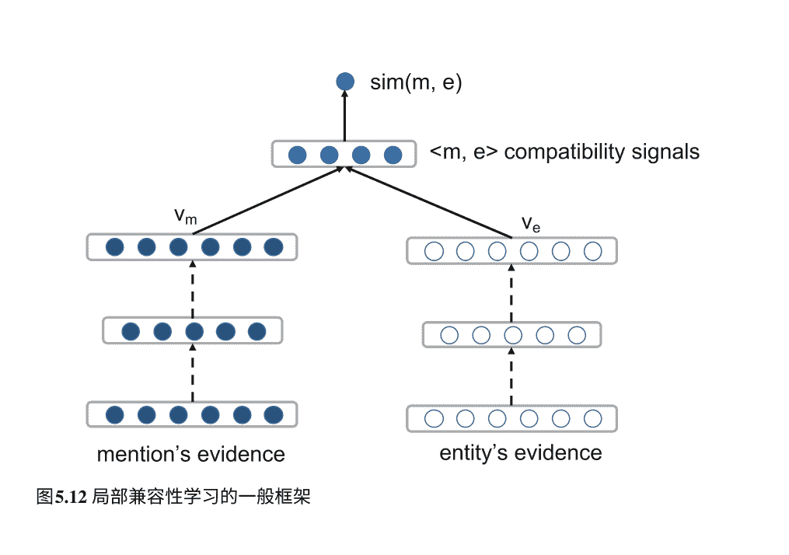

## 5 深度学习在知识图谱中

在本章中，我们介绍了几个重要的知识图谱，包括DBPedia、Freebase、Wikidata、Yago和HowNet。之后，我们介绍了知识图谱的三个重要任务，并描述了深度学习技术如何应用于这些问题：第一是表示学习，可以用于将实体、关系嵌入到连续的特征空间中；第二是神经关系抽取，展示了如何通过从网页和文本中提取知识来构建知识图谱；第三是实体链接，可以用于将知识与文本进行连接。深度学习技术用于嵌入实体和关系以进行知识图谱表示，用于表示关系抽取中的关系实例以进行知识图谱构建，以及用于表示实体链接中的异构证据。上述技术将为理解、表示、构建和利用不同任务中的知识图谱（例如问答、文本理解和常识推理）提供坚实的基础。

除了有益于知识图谱的构建外，知识表示学习为知识图谱的应用提供了一种令人兴奋的方法。在未来，探索如何更好地将知识图谱纳入深度学习模型以进行自然语言理解和生成，并开发知识丰富的神经模型用于自然语言处理将变得重要。

## 参考文献

- Bahdanau, D., Cho, K., & Bengio, Y. (2014). 通过联合学习对齐和翻译的神经机器翻译。arXiv:1409.0473。
- Bengio, Y. (2009). 学习用于人工智能的深度架构。Foundations and trends®.机器学习, 2(1), 1–127。
- Bollegala, D., Honma, T., Matsuo, Y., & Ishizuka, M. (2008). 在网络挖掘个人姓名别名。在*Proceedings of the 17th International Conference on World Wide Web*(pp. 1107–1108). New York: ACM。
- Bordes, A., Usunier, N., Garcia-Duran, A., Weston, J., & Yakhnenko, O. (2013). 翻译嵌入以建模多关系数据。在*NIPS*会议论文集(pp. 2787–2795)中。
- Chen, Z., & Ji, H. (2011). 协同排名：一个实体链接案例研究。在自然语言处理的经验方法会议论文集*(pp. 771–781)中。计算语言学协会。
- Cho, K., Van Merriënboer, B., Gulcehre, C., Bahdanau, D., Bougares, F., Schwenk, H., & Bengio, Y. (2014). 使用RNN编码器-解码器学习短语表示的统计机器翻译。arXiv:1406.1078。
- Dong, Z. & Dong, Q. (2003). Hownet-一种混合语言和知识资源。在2003年国际自然语言处理和知识工程会议上，2003年。会议论文集(pp. 820–824)。IEEE。
- Francis-Landau, M., Durrett, G., & Klein, D. (2016). 使用卷积神经网络捕捉实体链接的语义相似性。在*NAACL-HLT*会议论文集中(pp. 1256–1261)。
- Ganea, O.-E., Ganea, M., Lucchi, A., Eickhoff, C., & Hofmann, T. (2016). 用于实体链接的概率超链接模型。在第25届国际万维网会议论文集中(pp. 927–938)。国际万维网会议组织委员会。Garcia-Durán, A., Bordes, A., & Usunier, N. (2015). 通过翻译组合关系。*EMNLP*会议论文集。
- Gu, K., Miller, J., & Liang, P. (2015). 在向量空间中遍历知识图谱。EMNLP会议论文集。
- 韩，X., & 孙, L. (2011年)。用于将实体与知识库链接的生成式实体提及模型在计算语言学协会第49届年会的论文集中：人类语言技术（第1卷，第945-954页）。计算语言学协会。韩，X., & 孙, L. (2012年). 一种用于实体链接的实体-主题模型在2012年经验方法与计算自然语言学联合会议的论文集中（第105-115页）。计算语言学协会。韩，X., 孙, L., & 赵, J. (2011年). 基于图的方法进行网络文本的集体实体链接在第34届国际ACM SIGIR会议的研究与发展中的信息检索中（第765-774页）。纽约：ACM。何，S., 刘, K., 季, G., & 赵, J. (2015年). 用高斯嵌入学习表示知识图在第24届ACM国际信息和知识管理会议上（第623-632页）。纽约：ACM。
- He, Z., Liu, S., Li, M., Zhou, M., Zhang, L., & Wang, H. (2013). 学习实体表示以进行实体消歧。ACL, 2, 30–34。
- Hochreiter, S., & Schmidhuber, J. (1997). 长短期记忆。神经计算，9(8), 1735-1780。
- Ji, H., Grishman, R., Dang, H. T., Grifftt, K., & Ellis, J. (2010). TAC 2010知识库填充赛概述。在第三届文本分析会议（TAC 2010）中（第3页）。
- Ji, G., He, S., Xu, L., Liu, K., & Zhao, J. (2015). 通过动态映射矩阵进行知识图嵌入。在ACL会议论文集中（第687-696页）。
- Ji, G., Liu, K., He, S., & Zhao, J. (2016). 使用自适应稀疏传输矩阵进行知识图补全。
- Krompaß, D., Baier, S., & Tresp, V. (2015). 在知识图中的类型约束表示学习在第13届国际语义网会议(ISWC)的论文集中。
- Kulkarni, S., Singh, A., Ramakrishnan, G., & Chakrabarti, S. (2009). 在网络文本中对维基百科实体的集体注释在第15届ACM SIGKDD国际会议上的知识发现和数据挖掘论文集中(pp. 457–466). 纽约: ACM。
- Lin, Y., Liu, Z., & Sun, M. (2015a). 建模关系路径以进行知识库表示学习EMNLP会议论文集。
- Lin, Y., Liu, Z., Sun, M., Liu, Y., & Zhu, X. (2015b). 学习实体和关系嵌入以完成知识图在AAAI会议论文集中(pp. 2181–2187)。
- Lin, Y., Shen, S., Liu, Z., Luan, H., & Sun, M. (2016). 神经关系抽取与选择性注意力在实例上的应用ACL会议论文集, 1, 2124–2133。
- Mihalcea, R., & Csomai, A. (2007). Wikify!: 将文档链接到百科知识.在第十六届ACM会议论文集: 信息与知识管理会议(pp. 233–242). 纽约: ACM。
- Mikolov, T., Chen, K., Corrado, G., & Dean, J. (2013). 在向量空间中高效估计词表示.arXiv:1301.3781。
- Milne, D., & Witten, I. H. (2008). 学习与维基百科链接.在第17届ACM会议论文集: 信息与知识管理(pp. 509–518). 纽约: ACM。
- Miwa, M., & Bansal, M. (2016). 基于LSTMs的端到端关系抽取在序列和树结构上的应用. arXiv:1601.00770。
- Nadeau, D., & Sekine, S. (2007). 命名实体识别和分类的调查。Lingvisticae Investigationes, 30(1), 3–26。
- Ratinov, L., Roth, D., Downey, D., & Anderson, M. (2011). 用于消歧义到维基百科的本地和全局算法。在计算语言学协会第49届年会: 人类语言技术(Vol. 1, pp. 1375–1384). 计算语言学协会。
- Silvestri, F., et al. (2009). 挖掘查询日志: 将搜索使用数据转化为知识。信息检索的基础和趋势, 4(1–2), 1–174。
- Socher, R., Huval, B., Manning, C. D., & Ng, A. Y. (2012). 通过递归矩阵-向量空间实现语义组合性。在EMNLP会议论文集(pp. 1201–1211)。
- Sun, Y., Lin, L., Tang, D., Yang, N., Ji, Z., & Wang, X. (2015). 使用神经网络对实体消歧的提及、上下文和实体建模。在IJCAI(pp. 1333–1339)中。
- Tai, K. S., Socher, R., & Manning, C. D. (2015). 从树状长短期记忆网络中改进的语义表示。在ACL会议论文集(pp. 1556–1566)中。
- Tsai, C.-T., & Roth, D. (2016). 使用多语言嵌入进行跨语言维基化。在NAACL-HLT会议论文集(pp. 589–598)中。
- Vincent, P., Larochelle, H., Bengio, Y., & Manzagol, P.-A. (2008). 使用去噪自编码器提取和组合稳健特征。在第25届国际机器学习大会论文集(pp. 1096–1103)中。纽约：ACM。
- Wang, Z., Zhang, J., Feng, J., & Chen, Z. (2014a). 知识图谱和文本的联合嵌入. 在EMNLP会议论文集中（第1591–1601页）。
- Wang, Z., Zhang, J., Feng, J., & Chen, Z. (2014b). 通过在超平面上进行翻译的知识图谱嵌入. 在AAAI会议论文集中（第1112–1119页）。
- Xiao, H., Huang, M., & Zhu, X. (2016). 从一个点到流形: 知识图谱嵌入的轨道模型. 在IJCAI会议论文集中（第1315–1321页）。
- Xiao, H., Huang, M., Hao, Y., & Zhu, X. (2015). Transg: 用于知识图谱嵌入的生成混合模型. arXiv:1509.05488。
- Xie, R., Liu, Z., & Sun, M. (2016c). 具有层次结构的知识图谱表示学习. 在IJCAI会议论文集中。
- Xie, R., Liu, Z., Chua, T.-s., Luan, H., & Sun, M. (2016a). 基于图像的知识表示学习. arXiv:1609.07028。
- Xie, R., Liu, Z., Jia, J., Luan, H., & Sun, M. (2016b). 通过实体描述学习知识图的表示. AAAI会议论文集。
- Xu, K., Feng, Y., Huang, S., & Zhao, D. (2015). 通过简单的负采样使用卷积神经网络进行语义关系分类. arXiv:1506.07650。
- Zeng, D., Liu, K., Chen, Y., & Zhao, J. (2015). 通过分段卷积神经网络进行关系抽取的远程监督. EMNLP会议论文集。
- Zeng, D., Liu, K., Lai, S., Zhou, G., & Zhao, J. (2014). 通过卷积深度神经网络进行关系分类. COLING会议论文集(pp. 2335–2344)。
- Zhang, D., & Wang, D. (2015). 通过循环神经网络进行关系分类。arXiv:1508.01006。
- Zhong, H., Zhang, J., Wang, Z., Wan, H., & Chen, Z. (2015). 通过实体描述对齐知识和文本嵌入。在EMNLP会议论文集中(pp. 267–272)。

## 第6章 机器翻译中的深度学习

刘洋和张佳俊

摘要 机器翻译（MT）是一项重要的自然语言处理任务，研究计算机自动翻译人类语言的使用。基于深度学习的方法在近年来取得了显著进展，并迅速成为学术界和工业界机器翻译的新事实范式。

本章介绍了两种基于深度学习的机器翻译方法的广泛类别：（1）利用深度学习改进统计机器翻译（SMT）的主要组件（如翻译模型、重新排序模型和语言模型）的分量级深度学习；以及（2）基于端到端深度学习的机器翻译，它使用神经网络直接在源语言和目标语言之间进行映射，基于编码器-解码器框架。本章对基于深度学习的机器翻译的挑战和未来方向进行了讨论。

### 6.1 引言

机器翻译是自然语言处理中的重要任务，旨在使用机器自动翻译自然语言。由于平行语料库的日益丰富，数据驱动的机器翻译自20世纪90年代以来已成为机器翻译领域的主流方法。在给定的句子对齐的双语训练数据中，数据驱动的机器翻译的目标是从数据中自动获取翻译知识，然后用于翻译未见过的源语言句子。

统计机器翻译（SMT）是一种代表性的数据驱动方法，倡导使用概率模型来描述翻译过程。早期的统计机器翻译主要关注将单词作为基本单位的生成模型（Brown等人，1993年），而自从Och和Ney（2002年）提出了基于短语和解析树的判别模型后，这种判别模型（Koehn等人，2003年；Chiang，2007年）已被广泛使用。

> > Y. 刘
> 清华大学，中国北京
> e-mail: liuyang2011@tsinghua.edu.cn
> 
> J. Zhang (✉)
> 中国科学院自动化研究所，中国北京
> e-mail: jjzhang@nlpr.ia.ac.cn

2002. 然而，判别式SMT模型面临着严重的挑战：数据稀疏性。使用离散的符号表示，SMT容易在低频事件上学习到较差的模型参数估计。此外，由于自然语言的多样性和复杂性，手动设计特征以捕捉所有翻译规律是困难的。

近年来，深度学习在机器翻译中取得了显著的成功。在国际领先的机器翻译评估活动中超越了SMT，基于深度学习的机器翻译迅速成为商业在线机器翻译服务的新的事实标准。本章介绍了两种基于深度学习的机器翻译方法：(1) 基于组件的深度学习机器翻译(Devlin et al.2014)，它利用深度学习来提高SMT的主要组件 (如翻译模型、重排序模型和语言模型) 的能力；(2) 基于端到端的深度学习机器翻译(Sutskever et al.2014; Bahdanau et al.2015)，它使用神经网络来直接映射源语言和目标语言，基于编码器-解码器框架。

本章的组织如下。我们首先介绍SMT的基本概念 (第6.2.1节)，并讨论基于字符串匹配的SMT的现有问题 (第6.2.2节)。然后，我们将详细回顾深度学习在SMT中的应用 (第6.3.1-6.3.5节)。第6.4节专门介绍端到端神经机器翻译，包括标准的编码器-解码器框架 (第6.4.1节)，注意力机制 (第6.4.2节) 和最新进展 (第6.4.3-6.4.6节)。本章以总结 (第6.5节) 结束。

### 6.2 统计机器翻译及其挑战

#### 6.2.1 基础知识

设 x 为源语言句子，y 为目标语言句子，θ 为一组模型参数，P(y|x; θ)为给定 x 时 y 的翻译概率。机器翻译的目标是找到具有最高概率的翻译 ŷ：

$$ \hat{\mathbf{y}} = \underset{\mathbf{y}}{\operatorname{argmax}} \left\{ P(\mathbf{y}|\mathbf{x}; \boldsymbol{\theta}) \right\}. \tag{6.1} $$

Brown et al. (1993)使用贝叶斯定理将决策规则重写为等式 (6.1)等价于

$$ \hat{\mathbf{y}} = \underset{\mathbf{y}}{\operatorname{argmax}} \left\{ \frac{P(\mathbf{y}; \boldsymbol{\theta}_{lm}) P(\mathbf{x}|\mathbf{y}; \boldsymbol{\theta}_{tm})}{P(\mathbf{x})} \right\}, \tag{6.2} $$
$$ = \underset{\mathbf{y}}{\operatorname{argmax}} \left\{ P(\mathbf{y}; \boldsymbol{\theta}_{lm}) P(\mathbf{x}|\mathbf{y}; \boldsymbol{\theta}_{tm}) \right\}. \tag{6.3} $$

其中 \( P(\mathbf{x}|\mathbf{y}; \boldsymbol{\theta}_{tm}) \)被称为翻译模型， \( P(\mathbf{y}; \boldsymbol{\theta}_{lm}) \)被称为语言模型。 \(\boldsymbol{\theta}_{tm}\)和 \(\boldsymbol{\theta}_{lm}\)分别是翻译和语言模型的参数。

翻译模型 \( P(\mathbf{x}|\mathbf{y}; \boldsymbol{\theta}_{tm}) \)通常被定义为一个生成模型，进一步通过潜在结构进行分解 (Brown et al.1993) ：

\[ P(\mathbf{x}|\mathbf{y}; \boldsymbol{\theta}_{tm}) = \sum_{\mathbf{z}} P(\mathbf{x}, \mathbf{z}|\mathbf{y}; \boldsymbol{\theta}_{tm}), \tag{6.4} \]

其中 \(\mathbf{z}\)表示诸如单词对齐之类的潜在结构，指示源语言和目标语言中单词之间的对应关系。

然而，潜变量生成式翻译模型的一个关键限制是由于子模型之间的复杂依赖关系，很难进行扩展。因此，Och和Ney (2002) 提倡在统计机器翻译中使用对数线性模型来整合任意的知识源：

\[ P(\mathbf{y}|\mathbf{x}; \boldsymbol{\theta}) = \frac{\sum_{\mathbf{z}} \exp(\boldsymbol{\theta} \cdot \boldsymbol{\phi}(\mathbf{x}, \mathbf{y}, \mathbf{z}))}{\sum_{\mathbf{y}'} \sum_{\mathbf{z}'} \exp(\boldsymbol{\theta} \cdot \boldsymbol{\phi}(\mathbf{x}', \mathbf{y}', \mathbf{z}'))}, \tag{6.5} \]

其中 \(\boldsymbol{\phi}(\mathbf{x}, \mathbf{y}, \mathbf{z})\)是描述翻译过程的一组特征， \(\boldsymbol{\theta}\)是相应的特征权重。请注意，方程 (6.4) 中的潜变量生成模型是对数线性模型的一个特例，因为翻译模型和语言模型都可以被视为特征。

基于短语的翻译模型 (Koehn等, 2003年) 是学术界和工业界最广泛使用的SMT方法，因其简单和有效而闻名。基于短语的翻译的基本思想是使用短语来记忆对局部上下文敏感的词选择和重新排序，从而在处理词插入和省略、短语习语和自由翻译方面非常有效。

如图6.1所示，基于短语的SMT的翻译过程可以分为三个步骤： (1) 将源句子分割成一系列短语， (2) 将每个源短语转换为目标短语， (3) 按目标语言的顺序重新排列目标短语。目标短语的连接形成

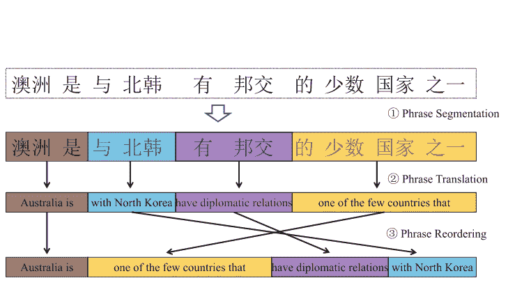

图6.1基于短语的SMT的翻译过程。它包括短语分割、短语翻译和短语重新排序三个步骤。

一个目标句子。因此，基于短语的翻译模型通常由三个子模型组成：短语分割、短语重新排序和短语翻译。这些子模型在对数线性模型框架中起着主要特征的作用。

在判别性基于短语的翻译模型中，核心特征是翻译规则表或双语短语表。图6.2说明了基于短语的统计机器翻译的翻译规则提取过程。给定一对平行句子，首先进行词对齐，找出源语言和目标语言句子中的对应关系。然后，从词对齐的句子对中提取满足启发式约束的双语短语（即翻译规则）。接下来，可以从训练数据中估计双语短语的概率和词汇权重。需要注意的是，短语重排序模型也可以在词对齐的平行语料库上进行训练。

在潜变量对数线性翻译模型中，潜变量结构z通常被称为推导，它描述了翻译是如何生成的。在解码过程中，需要考虑所有可能的推导，以找到概率最高的翻译。

图6.2是基于短语的统计机器翻译的翻译规则提取过程。给定一对句子对齐的平行语料库，首先计算词对齐，指示源语言和目标语言句子中的词对应关系。然后，从词对齐的平行语料库中提取捕捉语义等效的源语言和目标语言词序列的双语短语。

$$\hat{y} = \arg\max_{\mathbf{y}} \left\{ \sum_{\mathbf{z}} \exp\left( \boldsymbol{\theta} \cdot \phi(\mathbf{x}, \mathbf{y}, \mathbf{z}) \right) \right\}.$$

不幸的是，由于存在指数级的潜在派生，计算总和是棘手的。因此，标准的SMT系统通常使用具有最高概率的派生来近似计算公式（6.6）：

$$\hat{y} \approx \arg\max_{\mathbf{y}} \left\{ \max_{\mathbf{z}} \left\{ \boldsymbol{\theta} \cdot \phi(\mathbf{x}, \mathbf{y}, \mathbf{z}) \right\} \right\}.$$

然后，可以设计多项式时间的动态规划算法来高效生成翻译。

#### 6.2.2 统计机器翻译中的挑战

从SMT训练过程中，我们可以很容易地看出，词对齐是翻译规则质量和重新排序模型质量的核心基础，直接影响翻译结果的质量。SMT解码显示，翻译规则的概率估计、重新排序模型和语言模型是三个关键因素，它们在对数线性框架中结合起来产生最终的翻译结果。

对于词对齐，在SMT中常用的解决方案是使用无监督生成模型（Brown等人，1993年）。生成方法使用符号表示单词，计算单词共现的统计数据，并学习最大化训练数据似然的单词对单词的映射概率。然后，根据单词对齐的句子对中的共现统计，计算翻译规则的概率估计（Koehn等人，2003年）。短语重新排序实例从单词对齐的双语文本中提取出来，然后使用离散的单词作为特征将重新排序模型形式化为分类问题（Galley和Manning，2008年）。语言模型通常使用n-gram模型，根据单词序列的相对频率估计当前单词在给定n-1个历史单词的条件下的条件概率（Chen和Goodman，1999年）。

根据上述分析，有两个关键挑战阻碍了传统SMT的改进。第一个挑战是数据稀疏性。使用离散符号表示，传统SMT容易学习到对低频事件的模型参数估计不准确。这是不理想的，因为复杂特征通常在训练数据中很少出现，而复杂特征能够捕捉更多的上下文信息。因此，传统SMT只能使用简单特征。例如，最大短语长度通常设置为7，语言模型只使用4-gram（Koehn等人，2003年）。

第二个挑战是特征工程。尽管对数线性模型能够整合大量特征（Chiang等人，2009年），但要找到足够表达所有翻译现象的特征仍然很困难。标准SMT特征设计的常见做法通常是手动设计特征模板，捕捉局部词汇和句法信息。然后，通过将模板应用于训练数据，可以生成数百万个特征。其中大多数特征非常稀疏，使得估计特征权重非常具有挑战性。

近年来，深度学习技术已被应用于解决机器翻译中的上述两个挑战。深度学习不仅能够通过引入分布式表示而不是离散符号表示来缓解数据稀疏性问题，还能够通过从数据中学习表示来避免特征工程问题。接下来，我们将介绍深度学习如何用于改进机器翻译的各个关键组成部分：词对齐（第6.3.1节），翻译规则概率估计（第6.3.2节），短语重排序模型（第6.3.3节），语言模型（第6.3.4节）和模型特征组合（第6.3.5节）。

### 6.3 逐组件深度学习用于机器翻译

#### 6.3.1 词对齐的深度学习

##### 6.3.1.1 词对齐

词对齐旨在确定平行句子中单词之间的对应关系（Brown等，1993年；Vogel等，1996年）。给定源句子 \(\mathbf{x} = x_1, \dots, x_j, \dots, x_J\) 及其目标翻译 \(\mathbf{y} = y_1, \dots, y_i, \dots, y_I\)，\(\mathbf{x}\) 和 \(\mathbf{y}\) 之间的词对齐被定义为 \(\mathbf{z} = z_1, \dots, z_j, \dots, z_J\)，其中 \(z_j \in [0, I]\) 且 \(z_j = i\) 表示 \(x_j\) 和 \(y_i\) 对齐。图6.2显示了一个对齐矩阵。

在SMT中，词对齐通常作为生成式翻译模型中的潜变量[参见公式(6.4)]。因此，词对齐模型通常表示为 \(P(\mathbf{x}, \mathbf{z}|\mathbf{y}; \boldsymbol{\theta})\)。HMM模型（Vogel et al.1996）是最广泛使用的对齐模型之一，其定义为

$$ P(\mathbf{x}, \mathbf{z}|\mathbf{y}; \boldsymbol{\theta}) = \prod_{j=1}^{J} p(z_j|z_{j-1}, I) \times p(x_j|y_{z_j}), \quad (6.8) $$

其中，对齐概率 \(p(z_j|z_{j-1}, I)\) 和翻译概率 \(p(x_j|y_{z_j})\) 是模型参数。

设 \(\{(\mathbf{x}^{(s)}, \mathbf{y}^{(s)})\}_{s=1}^{S}\) 为一组句对。标准训练目标是最大化训练数据的对数似然：

$$ \hat{\boldsymbol{\theta}} = \arg\max_{\boldsymbol{\theta}} \left\{ \sum_{s=1}^{S} \log P(\mathbf{x}^{(s)}|\mathbf{y}^{(s)}; \boldsymbol{\theta}) \right\}. \quad (6.9) $$

给定学习的模型参数 $\hat{\theta}$，一个句子对 $\langle \mathbf{x}, \mathbf{y} \rangle$ 的最佳对齐可以通过以下方式获得

$$ \hat{\mathbf{z}} = \underset{\mathbf{z}}{\text{argmax}} \left\{ P(\mathbf{x}, \mathbf{z}|\mathbf{y}; \theta) \right\} $$

##### 6.3.1.2 前馈神经网络用于词对齐

尽管简单且易于处理，使用离散符号表示的经典对齐模型存在一个主要限制 ：由于数据稀疏性，它们无法捕捉更多的上下文信息。例如，对齐概率$p(z_j| z_{j-1}, I)$和翻译概率 $p(x_j|y_{z_j})$未能包含 $\mathbf{x}$和$\mathbf{y}$的周围上下文以更好地捕捉对齐规律。

为了解决这个问题，杨等人（2013）提出了一种上下文相关的深度神经网络用于词对齐。基本思想是通过利用连续表示来使对齐模型能够捕捉更多的上下文信息。这可以通过使用前馈神经网络来实现。

给定一个源句子 $\mathbf{x} = x_1, \ldots, x_j, \ldots, x_J$，我们使用 $\boldsymbol{x}_j$来表示第 $j$个源词 $x_j$的向量表示。 类似地， $\boldsymbol{y}_i$表示第 $i$个目标词 $y_i$的向量表示。杨等人（2013）提出了模拟$p(x_j|y_i, C(\mathbf{x}, j, w), C(\mathbf{y}, i, w))$而不是 $p(x_j|y_i)$以包含更多的上下文信息，其中 $w$是一个窗口大小，源和目标上下文的定义如下

$$ C(\mathbf{x}, j, w) = x_{j-w}, \ldots, x_{j-1}, x_{j+1}, \ldots, x_{j+w} $$
$$ C(\mathbf{y}, i, w) = y_{i-w}, \ldots, y_{i-1}, y_{i+1}, \ldots, y_{i+w} $$

因此，前馈神经网络将源子字符串和目标子字符串的词嵌入连接起来作为输入：

$$ \mathbf{h}^{(0)} = [\boldsymbol{x}_{j-w}; \ldots; \boldsymbol{x}_{j+w}; \boldsymbol{y}_{i-w}; \ldots; \boldsymbol{y}_{i+w}] $$

然后，第一个隐藏层的计算如下：

$$ \mathbf{h}^{(1)} = f(\mathbf{W}^{(1)}\mathbf{h}^{(0)} + \mathbf{b}^{(1)}) $$

其中 $f(\cdot)$是非线性激活函数，$^{1}$ $\mathbf{W}^{(1)}$是第一层的权重矩阵，而 $\mathbf{b}^{(1)}$是第一层的偏置项。

一般来说，第 $l$个隐藏层可以通过递归计算得到

$$ \mathbf{h}^{(l)} = f(\mathbf{W}^{(l)}\mathbf{h}^{(l-1)} + \mathbf{b}^{(l)}) $$

$_{1}$杨等人（2013）在他们的工作中使用 $f(\cdot) = h\tanh(\cdot)$作为激活函数。

杨等人（2013）将最后一层定义为没有激活函数的线性变换：

$$ t_{lex}(x_j, y_i, C(\mathbf{x}, j, w), C(\mathbf{y}, i, w), \boldsymbol{\theta}) = \mathbf{W}^{(L)}\mathbf{h}^{(L-1)} + \mathbf{b}^{(L)} \quad (6.16) $$

请注意 $t_{lex}(x_j, y_i, C(\mathbf{x}, j, w), C(\mathbf{y}, i, w), \boldsymbol{\theta}) \in \mathbb{R}$ 是一个实数分数，表示 $x_j$ 是 $y_i$ 的翻译的可能性。因此，可以通过归一化得到上下文相关的翻译概率：

$$ p(x_j|y_i, C(\mathbf{x}, j, w), C(\mathbf{y}, i, w)) = \frac{\exp\left(t_{lex}(x_j, y_i, C(\mathbf{x}, j, w), C(\mathbf{y}, i, w), \boldsymbol{\theta})\right)}{\sum_{x \in V_x} \exp\left(t_{lex}(x, y_i, C(\mathbf{x}, j, w), C(\mathbf{y}, i, w), \boldsymbol{\theta})\right)} \quad (6.17) $$

其中 $V_x$ 是源语言词汇表。在实践中，由于枚举所有源词汇以计算翻译概率的计算成本较高，Yang等人（2013）只使用翻译得分 $t_{lex}(x_j, y_i, C(\mathbf{x}, j, w), C(\mathbf{y}, i, w), \boldsymbol{\theta})$。图6.3a展示了用于计算翻译得分的网络结构。

至于对齐概率 $p(z_j|z_{j-1}, I)$，Yang等人（2013）采用了非归一化的对齐得分 $t_{align}(z_j|z_{j-1}, \mathbf{x}, \mathbf{y})$并简化计算如下：

$$ t_{align}(z_j|z_{j-1}, \mathbf{x}, \mathbf{y}) = t_{align}(z_j - z_{j-1}) \quad (6.18) $$

其中 $t_{align}(z_j - z_{j-1})$由17个参数建模，每个参数与特定的对齐距离 $d = z_j - z_{j-1}$ (从 $d = -7$ 到 $d = 7$ 且 $d \leq -8$, $d \geq 8$) 相关。

# 图6.3 基于深度学习的词对齐模型：a用于词汇翻译得分预测的前馈神经网络；b用于失真得分计算的循环神经网络

##### 6.3.1.3 用于词对齐的循环神经网络

前馈神经网络仅考虑前一个对齐 $z_{j-1}$在计算对齐得分 $t_{align}(z_j|z_{j-1}, \mathbf{x}, \mathbf{y}))$时，并忽略了 $z_{j-1}$之前的历史信息。田村等人(2014)没有使用生成模型(见公式6.8)来搜索最佳词对齐，而是采用循环神经网络(RNN)直接计算 $\mathbf{z} = z_1^J$的对齐得分：

$$ s_{RNN}(z_1^J|\mathbf{x}, \mathbf{y}) = \prod_{j=1}^{J} t_{align}(z_j|z_1^{j-1}, x_j, y_{z_j}). \quad (6.19) $$

很容易看出，RNN通过将所有历史对齐 $z_1^{j-1}$的信息作为条件来预测对齐分数。图6.3b给出了RNN结构的示意图，用于计算 $z_j$的分数 ($t_{align}(z_j|z_1^{j-1}, x_j, y_{z_j}))$。首先，源词 $x_j$和目标词 $y_{z_j}$被投影到向量表示中，然后连接起来形成输入 $\mathbf{v}_j$。上一个RNN隐藏状态 $\mathbf{h}_{j-1}$是另一个输入，新的隐藏状态 $\mathbf{h}_j$的计算如下：

$$ h_j = f(\mathbf{W}^d \mathbf{v}_j + \mathbf{U}^d \mathbf{h}_{j-1} + \mathbf{b}^d) \quad (6.20) $$

其中 $f(\cdot) = htanh(\cdot)$, $\mathbf{W}^d$和 $\mathbf{U}^d$是权重矩阵，而 $\mathbf{b}^d$是偏置项。注意与经典的循环神经网络不同，不同时间步使用相同的权重矩阵， $\mathbf{W}^d$, $\mathbf{U}^d$和 $\mathbf{b}^d$根据对齐距离 $d = z_j - z_{j-1}$动态确定。根据Yang等人 (2013) 的研究，Tamura等人 (2014) 也选择了17个不同的 $d$值，并且有17个不同的矩阵用于 $\mathbf{W}^d$ ($\mathbf{W}^{\leq -8}, \mathbf{W}^{-7}, \cdots, \mathbf{W}^7, \mathbf{W}^{\geq 8}$)。 $\mathbf{U}^d$ 和 $\mathbf{b}^d$ 相似。

然后， $z_j$的对齐分数通过对当前的RNN隐藏状态进行线性变换得到：

$$ t_{align}(z_j|z_1^{j-1}, x_j, y_{z_j}) = \mathbf{W} \mathbf{h}_j + \mathbf{b}. \quad (6.21) $$

通过大量实验，田村等人 (2014年) 报告称，循环神经网络在相同的测试集上在词对齐质量方面优于前馈神经网络，并建议循环神经网络能够通过尝试记住所有历史信息来捕捉长依赖性。

#### 6.3.2 用于翻译规则概率估计的深度学习

给定单词对齐的训练句对，可以提取满足单词对齐的所有翻译规则。在基于短语的统计机器翻译中，我们可能会为一个源短语提取大量的短语翻译规则。选择这些规则成为一个关键问题，在解码过程中选择最合适的翻译规则。传统上，翻译规则的选择通常根据双语训练数据中的共现统计量计算的翻译概率来进行（Koehn等，2003）。例如，短语翻译规则\(\langle x_j^{j+k}, y_i^{i+l} \rangle\)的条件概率\(p(y_i^{i+l}|x_j^{j+k})\)是通过最大似然估计（MLE）计算的：

$$ p(y_i^{i+l}|x_j^{j+k}) = \frac{count(x_j^{j+k}, y_i^{i+l})}{count(x_j^{j+k})} \quad (6.22) $$

MLE方法容易遇到数据稀疏问题，对于罕见的短语翻译规则，估计的概率将是不正确的。此外，MLE方法无法捕捉短语规则的深层语义，并探索超出感兴趣短语的更大背景。近年来，基于深度学习的方法提出了使用分布式语义表示和更多上下文信息来更好地估计翻译规则的质量。

对于一个短语翻译规则 \(\langle x_{j_j}^{+k}, y_{i_i}^{+l}\rangle\)，高等(2014)试图在低维向量空间中计算翻译得分 \(score(x_{j_j}^{+k}, y_{i_i}^{+l})\)。该方法的主要思想如图6.4所示。

图6.4词袋分布式短语表示用于短语翻译规则，目标是学习对评估指标（BLEU）敏感的短语嵌入。源短语和目标短语之间的点积相似度被用作SMT中的翻译得分。

$$ \mathbf{h}_x^{(1)} = f(\mathbf{W}_x^{(1)} \mathbf{h}_x^{(0)} + \mathbf{b}_x^{(1)}) $$
$$ \mathbf{h}_x^{(2)} = f(\mathbf{W}_x^{(2)} \mathbf{h}_x^{(1)} + \mathbf{b}_x^{(2)}) $$

激活函数设置为 $f(\cdot) = \tanh(\cdot)$。对于目标短语 $y_{i}^{+l}$，可以以相同的方式学习 $\mathbf{h}^{(y}_{2})$。然后，源短语和目标短语之间的点积被用作翻译分数，即 $score(x_{j}^{k}, y_{i}^{+l}) = \mathbf{h}_x^{(2)^T} \mathbf{h}_y^{(2)}$。网络参数，如词嵌入和权重矩阵，被优化以最大化短语对的分数，从而提高验证集上的翻译质量（例如，BLEU指标）。短语的分布式表示大大缓解了数据稀疏性问题，学到的短语表示对评估指标非常敏感。然而，值得注意的是，由于词袋模型，这种方法无法捕捉短语的词序信息，而词序信息对于确定短语的含义非常重要。例如，猫吃鱼和鱼吃猫完全不同，尽管它们共享相同的词袋。

因此，张等人（2014a,b）提出了使用双语约束递归自动编码器（BRAE）来建模短语的词序并捕捉短语的语义。其基本思想是源短语和其正确的目标翻译共享相同的含义，并且应该共享相同的语义向量表示。该方法的框架如图6.5所示。两个递归自动编码器被用于学习源短语和目标短语的初始嵌入（$\mathbf{x}_1^3$，$\mathbf{y}_1^4$）用于规则 $\langle x_1^3, y_1^4 \rangle$。递归自动编码器对二叉树中的每个节点应用相同的自动编码器。自动编码器将两个向量表示（例如，$\mathbf{x}_1$ 和 $\mathbf{x}_2$）作为输入，并生成短语表示（$\mathbf{x}_1^2$）如下：

图6.5使用递归自编码器的双语约束短语嵌入，考虑了单词顺序。目标是学习短语的语义表示从 $\mathbf{x}_1^2$ 开始，自编码器尝试重构输入：

$$[\mathbf{x}'_1, \mathbf{x}'_2] = f(\mathbf{W}'_x\mathbf{x}_1^2 + \mathbf{b}'_x). (6.26)$$

网络参数被优化以最小化以下重构误差：

$$E_{rec}[\mathbf{x}_1, \mathbf{x}_2] = \frac{1}{2} \|[\mathbf{x}_1, \mathbf{x}_2] - [\mathbf{x}'_1, \mathbf{x}'_2]\|^2. (6.27)$$

在递归自编码器中，网络参数被训练以最小化每个节点的重构误差之和。为了捕捉短语的语义，除了重构误差之外，目标还设计为同时最小化翻译等价物之间的语义距离，并最大化非翻译对之间的语义距离。在优化网络参数和词嵌入之后，该方法可以学习任何源语言和目标语言短语的语义向量表示。在语义向量空间中，两个短语的相似度（例如，余弦相似度）被用作相应短语翻译规则的翻译置信度。借助语义相似性，翻译规则选择更加准确。Su等人（2015）和Zhang等人（2017a）提出了增强BRAE模型并进一步提高翻译质量的方法。

上述两种方法都专注于短语翻译规则本身，并没有考虑更多的上下文。Devlin等人（2014）提出了一种联合神经网络模型，旨在建模源语言和目标语言的上下文，以预测翻译概率。这个想法非常简单：对于要预测的目标词 $y_i$，我们可以根据翻译规则追踪其对应的源语言词（中心源语言词 $x_j$）。然后，可以获得以 $x_j$ 为中心的窗口内的源语言上下文，$x_{j-w},\cdots,x_j,\cdots,x_{j+w}$（例如，$w=5$）。源语言上下文和目标语言历史翻译 $y_{i-3}y_{i-2}y_{i-1}$ 的向量表示被连接起来作为前馈神经网络的输入，如图6.6所示。在两个隐藏层之后，通过softmax函数输出单词 $y_i$ 的概率。由于捕捉到更多的上下文信息，预测的翻译概率变得更加可靠。

然而，源端上下文依赖于固定大小的窗口，无法捕捉全局信息。为了解决这个问题，张等人（2015年）和孟等人（2015年）尝试学习源端句子的语义表示，并将全局句子嵌入作为附加输入来增强上述联合网络模型。当目标词汇翻译需要句子级别的知识来消除歧义时，这种方法可以表现得更好。

#### 6.3.3 深度学习用于短语重新排序

对于源语言句子 $\mathbf{x} = x_1^l$，短语翻译规则匹配句子，将词序列 $x_1^l$ 分割成短语序列，并使用前面部分讨论的神经规则选择模型将每个源短语映射到目标语言短语。然后，下一个任务是重新排列目标短语以生成一个良好的翻译。这个短语重新排序任务通常被视为对任意两个相邻目标短语的二元分类问题：保持两个短语的顺序（单调）或交换两个短语。对于两个相邻的源短语 $x^0 = \text{y u bei han}$，$x^1 = \text{you bang jiao}$，以及它们的翻译候选 $y^0 = \text{与北韩}$ 和 $y^1 = \text{哈维外交关系}$，重新排序模型仅利用四个短语的边界离散词作为特征，并采用最大熵模型来预测重新排序概率（Xiong et al. 2006）：

$$ p(o|x^0, x^1, y^0, y^1) = \frac{\sum_i \{\lambda_i f_i(x^0, x^1, y^0, y^1, o)\}}{\sum_{o'} \sum_i \{\lambda_i f_i(x^0, x^1, y^0, y^1, o')\}}, \quad (6.28) $$

其中 $f_i(x^0, x^1, y^0, y^1, o)$ 和 $\lambda_i$ 表示离散词特征及其对应的特征权重。$o$ 表示重新排序类型，$o = \text{mono}$ 或者 $o = \text{swap}$。使用离散符号作为特征的重新排序模型面临着数据稀疏的严重问题。此外，它无法充分利用整个短语信息，也无法捕捉相似的重新排序模式。

学习短语在实值向量空间中的特征表示可以缓解数据稀疏性问题，并充分利用整个短语信息进行重新排序。Li等人（2013年，2014年）提出了一个神经短语重新排序模型，如图6.7所示。神经短语重新排序模型首先应用递归自编码器学习四个短语的分布式表示，$\mathbf{x_0}, \mathbf{y_0}, \mathbf{x_1}, \mathbf{y_1}$。然后，使用前馈神经网络将这四个向量转换为包含两个元素 $s_{mono}$ 和 $s_{swap}$ 的分数向量，使用以下方程：

$$[s_{mono}, s_{swap}] = \tanh(\mathbf{W}[\mathbf{x_0}, \mathbf{y_0}, \mathbf{x_1}, \mathbf{y_1}] + \mathbf{b}).$$ (6.29)

最后，使用softmax函数将两个分数 $s_{mono}$ 和 $s_{swap}$ 归一化为两个概率 $p(mono)$ 和 $p(swap)$。神经重排序模型中的网络参数和词嵌入被优化以最小化以下半监督目标函数：

$$Err = \alpha E_{rec}(x^0, x^1, y^0, y^1) + (1 - \alpha)E_{reorder}((x^0, y^0), (x^1, y^1)).$$ (6.30)

其中，$E_{rec}(x^0, x^1, y^0, y^1)$ 是四个短语的递归自编码器的重构误差之和，$E_{reorder}((x^0, y^0), (x^1, y^1))$ 是使用交叉熵误差函数计算的短语重排序损失。$\alpha$ 被用来平衡这两种错误。这个半监督递归自编码器演示了它可以自动将共享相似重排序模式的短语分组，并且导致更好的翻译质量。

#### 6.3.4 语言建模的深度学习

在短语重新排序过程中，任意两个相邻的部分翻译（目标短语）会组合成一个更大的部分翻译。语言模型的任务是衡量（部分）翻译假设是否比其他更流畅。传统的统计机器翻译使用最流行的基于计数的n-gram语言模型，其条件概率计算如下：

$$p(y_i|y_{i-n+1}^{i-1}) = \frac{y_{i-n+1}^{i}}{y_{i-n+1}^{i-1}}.$$ (6.31)

与规则概率估计和重新排序模型类似，基于字符串匹配的n-gram语言模型面临严重的数据稀疏问题，无法充分利用语义上相似但表面上不同的上下文。为了缓解这个问题，引入了基于深度学习的语言模型，用于在连续向量空间中估计一个单词在历史上下文条件下的概率。

Bengio等人（2003年）设计了一个前馈神经网络，如图6.8a所示，用于在连续向量空间中学习n-gram模型。Vaswani等人（2013年）将这个神经n-gram语言模型整合到SMT中。在SMT解码（基于短语的SMT中的短语重新排序和组合）过程中，很容易找到当前单词 $y_i$ 之前的部分历史上下文（例如，四个单词 $y_{i-4}, y_{i-3}, y_{i-2}, y_{i-1}$）。因此，神经n-gram模型可以被纳入SMT解码阶段。正如图6.8a所示，固定大小的历史单词首先被映射为实值向量，然后组合起来馈送给后面的两个隐藏层。最后，softmax层输出当前单词在给定历史情况下的概率 $p(y_i|y_{i-4}^1)$。大规模实验表明，神经n-gram语言模型可以显著提高翻译质量。

n-gram语言模型假设当前单词的生成仅依赖于前n-1个单词，但实际情况并非如此。为了放松这个假设，循环神经网络（包括LSTM和GRU）试图在预测当前单词时建模所有历史信息。如图6.8b所示，一个句子的起始符号 $y_0 = \text{<s>}$ 和初始历史上下文 $\mathbf{h}_0$ 被输入到一个循环神经网络单元中。它得到一个新的历史上下文 $\mathbf{h}_1$，用于预测 $y_1$ 的概率，使用以下方程：

$$ \mathbf{h}_1 = \text{RNN}(\mathbf{h}_0, y_0). (6.32) $$

除了简单的函数（例如，$\tanh(\mathbf{W}_h\mathbf{h}_0 + \mathbf{W}_y y_0 + \mathbf{b})$），$\text{RNN}(\cdot)$ 还可以使用LSTM或GRU。$\mathbf{h}_1$ 和 $y_1$ 然后被用来获取新的历史 $\mathbf{h}_2$，这被认为是记住 $y_0$ 到 $y_1$ 的。$\mathbf{h}_2$ 被用来预测 $p(y_2|y_0^1)$。这个过程迭代进行。在预测 $y_i$ 的概率时，可以使用所有历史上下文 $y_0^{i-1}$。由于递归神经语言模型需要整个历史记录来预测一个单词，而在SMT解码过程中很难记录所有历史记录，因此通常将该语言模型用于重新评分最终的n-best翻译假设。Auli和Gao（2014）尝试将递归神经语言模型与SMT解码阶段集成起来，并与仅重新评分相比，可以取得一些改进。

#### 6.3.5 特征组合的深度学习

假设我们有两个短语翻译规则 $(x_1, y_1)$ 和 $(x_2, y_2)$，它们恰好匹配测试句子中的两个相邻源短语 $x_i^k$ 和 $x_{k+1}^j$。然后，可以使用短语重排序模型将这两个规则组合起来，得到较长源短语 $x_i^j$ 的翻译候选。在这种情况下，我们需要确定单调组合 $y_1 y_2$ 是否比交换组合 $y_2 y_1$ 更好。基于前几节的介绍，这两个翻译候选可以使用至少三个子模型进行评估：规则概率估计模型、短语重排序模型和语言模型。对于每个翻译候选，我们将有三个得分：$s_l(y_1 y_2)$、$s_r(y_1 y_2)$、$s_l(y_2 y_1)$ 和 $s_r(y_2 y_1)$。最终任务是设计一个特征组合机制，将这三个模型得分映射为一个总体得分，以便比较翻译候选。

在过去的十年中，对数线性模型主导了SMT社区。它以线性方式结合了所有子模型的得分，如图6.9a所示。对数线性模型假设所有子模型特征之间线性交互，并因此限制了SMT模型的表达能力。为了捕捉不同子模型特征之间的复杂交互，黄等人（2015）提出了一个神经网络模型，以非线性方式组合特征得分，如图6.9b所示。与对数线性模型相比，神经组合模型使用以下方程将所有子模型得分映射为一个总体得分：

$$s_{\text{神经}}(e) = f_o(\mathbf{W}_o \cdot f_h(\mathbf{W}_h \cdot h_1^m(\mathbf{x}, \mathbf{y}))).$$ (6.33)

在其中，我们简化了隐藏层和输出层中的偏置项。$h_1^m(\mathbf{x}, \mathbf{y})$ 表示 $m$ 个子模型的特征得分，例如翻译概率、重新排序模型概率和语言模型概率。$\mathbf{W}_h$ 和 $\mathbf{W}_o$ 分别是隐藏层和输出层的权重矩阵。$f_h(\cdot)$ 和 $f_o(\cdot)$ 分别是隐藏层和输出层的激活函数。研究发现，将 $f_h(\cdot)$ 设置为 $\text{sigmoid}(\cdot)$，并将 $f_o(\cdot)$ 设置为线性函数效果最好。

神经组合模型的参数优化比对数线性模型更加困难。在对数线性模型中，可以使用MERT（最小错误率训练）方法（Och 2003）有效地调整子模型的权重，该方法通过枚举所有翻译候选的模型得分并利用线性函数之间的相互作用来生成一个良好的搜索空间。然而，对于神经组合模型所使用的非线性函数的相互作用是无法获取的。为了解决这个问题，黄等人（2015）采用基于排名的训练准则，目标函数设计如下：

$$\text{argmin}_{\theta} \frac{1}{N} \sum_{x \in D} \sum_{(y_1, y_2) \in T(x)} \delta(x, y_1, y_2; \theta) + \lambda \cdot ||\theta||_1 \quad (6.34)$$
$$\delta(x, y_1, y_2; \theta) = max\{s_{neural}(x, y_2; \theta) - s_{neural}(x, y_1; \theta) + 1, 0\}. \quad (6.35)$$

在上述方程中，$D$ 是句子对齐的训练数据。$(y_1, y_2)$ 是这个训练算法的核心，表示训练的假设对，其中 $y_1$ 是根据句子级别的BLEU+1评估比 $y_2$ 更好的翻译假设。该模型旨在优化网络参数，以确保更好的翻译假设获得更高的网络分数。$T$（每个训练句子 $x$）是每个训练句子的假设对集合，$N$ 是训练数据 $D$ 中假设对的总数。

对于一个训练句子 $x$，如何高效地采样假设对 $(y_1，y_2)$ 仍然不清楚。理想情况下，$y_1$ 应该是正确的翻译（或参考翻译），而 $y_2$ 是任何其他的翻译候选。然而，在大多数情况下，正确的翻译在SMT的搜索空间中并不存在，原因有很多，比如束搜索大小限制、重新排序距离约束和未知词汇。因此，黄等人（2015年）尝试使用三种方法从 $T_{\text{nbest}}$ 中采样 $(y_1，y_2)$：（1）最佳对其他：$y_1$ 被选择为 $T_{\text{nbest}}$ 中的最佳候选，$y_2$ 可以是其他候选中的任意一个；（2）最佳对最差：$y_1$ 和 $y_2$ 分别被选择为 $T_{\text{nbest}}$ 中的最佳和最差候选；（3）成对采样：从 $T_{\text{nbest}}$ 中采样两个假设，$y_1$ 被设定为更好的候选，$y_2$ 是较差的候选。

对中英翻译进行了大量实验，结果表明神经网络非线性模型特征组合在翻译质量上明显优于对数线性框架。

### 6.4 端到端深度学习机器翻译

#### 6.4.1 编码器-解码器框架

2013年至2015年，对于SMT的组件级深度学习研究非常活跃。对数线性模型有助于整合基于深度学习的翻译特征。设计了各种类型的神经网络结构来改进不同的子模块，并且整体SMT性能得到了显著提升。例如，Devlin等人（2014）提出的联合神经模型在阿拉伯语到英语翻译上取得了超过六个BLEU分数的惊人改进。然而，尽管深度学习被用于改进关键组件，SMT仍然使用线性建模，无法处理文本数据中的非线性。此外，新引入的神经特征需要全局依赖性，这使得为SMT设计高效的动态规划训练和解码算法变得不可能。因此，有必要寻找新的方法来利用深度学习改进机器翻译。

端到端神经机器翻译（NMT）（Sutskever等人，2014年; Bahdanau等人，2015年）旨在使用神经网络直接映射自然语言。与传统的统计机器翻译（SMT）（Brown等人，1993年; Och和Ney，2002年; Koehn等人，2003年; Chiang，2007年）相比，NMT能够从数据中学习表示，无需手动设计特征来捕捉翻译规律。

给定源语言句子 $\mathbf{x} = x_1, \ldots, x_i, \ldots, x_I$ 和目标语言句子 $\mathbf{y} = y_1, \ldots, y_j, \ldots, y_J$, 标准NMT将句子级别的翻译概率分解为上下文相关的单词级别翻译概率的乘积：

$$ P(\mathbf{y}|\mathbf{x}; \boldsymbol{\theta}) = \prod_{j=1}^{J} P(y_j | \mathbf{x}, \mathbf{y}_{<j}; \boldsymbol{\theta}), \quad (6.36) $$

其中 $\mathbf{y}_{<j} = y_1, \ldots, y_{j-1}$ 是一个部分翻译。词级别的翻译概率可以定义为

$$ P(y_j | \mathbf{x}, \mathbf{y}_{<j}; \boldsymbol{\theta}) = \frac{\exp \left( g(\mathbf{x}, y_j, \mathbf{y}_{<j}, \boldsymbol{\theta}) \right)}{\sum_{y} \exp \left( g(\mathbf{x}, y, \mathbf{y}_{<j}, \boldsymbol{\theta}) \right)}, \quad (6.37) $$

其中 $g(\mathbf{x}, y_j, \mathbf{y}_{<j}, \boldsymbol{\theta})$ 是一个实数分数，表示第 $j$ 个目标词 $y_j$ 在给定源上下文 $\mathbf{x}$ 和目标上下文 $\mathbf{y}_{<j}$ 的情况下的好坏程度。一个主要的挑战是源上下文和目标上下文非常稀疏，特别是对于长句子。

为了解决这个问题，Sutskever等人(2014)提出使用一个循环神经网络(RNN)，被称为编码器，将源上下文 $\mathbf{x}$ 编码成一个向量表示。图6.10展示了编码器的基本思想。给定一个由两个单词组成的源句子 $\mathbf{x} = x_1, x_2$, 为了控制其翻译的长度，会添加一个句子结束标记 (EOS)。在获取源词的向量表示之后，循环神经网络开始生成隐藏状态：

$$ \mathbf{h}_i = f(x_i, \mathbf{h}_{i-1}, \boldsymbol{\theta}), \quad (6.38) $$

其中，$\mathbf{h}_i$ 是第 $i$ 个隐藏状态，$f(\cdot)$ 是一个非线性激活函数，$x_i$ 是第 $i$ 个源词 $x_i$ 的向量表示。

对于非线性激活函数 $f(\cdot)$，长短期记忆（LSTM）(Hochreiter and Schmidhuber 1997)和门控循环单元（GRUs）(Cho et al. 2014)被广泛用于解决梯度消失或梯度爆炸的问题。这使得NMT在预测全局单词重新排序方面具有明显优势，这要归功于LSTM或GRUs处理长距离依赖关系的能力。

由于在源句子末尾添加了一个句子结束符“EOS”，所以源句子的长度为 $I +1$，最后一个隐藏状态 $\mathbf{h}_{I+1}$ 被认为是对整个源句子的编码。

在目标端，Sutskever等人（2014）使用另一个称为解码器的循环神经网络，以逐词方式生成翻译。如图6.10所示，表示目标上下文的每个目标端隐藏状态 $\mathbf{s}_j$ 的计算如下：

$$ \mathbf{s}_j = \begin{cases} \mathbf{h}_{I+1} & \text{如果 } j = 1, \\ f(y_{j-1}, \mathbf{s}_{j-1}, \boldsymbol{\theta}) & \text{否则} \end{cases} \quad (6.39) $$

#### 6.4.2 机器翻译中的神经注意力

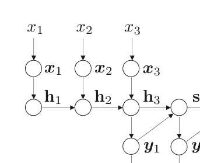

第一个目标隐藏状态 $\mathbf{s}_1$ 和词向量 $\mathbf{y}_1$ 被用来生成第二个隐藏状态 $\mathbf{s}_2$。这个过程迭代直到生成一个句子结束的标记（即 $y_4$）。

请注意，源句子表示 $\mathbf{h}_{l+1}$ 仅用于初始化第一个目标端隐藏状态 $\mathbf{s}_1$。

通过目标端隐藏状态 $\mathbf{s}_j$，评分函数 $g(\mathbf{x}, y_j, \mathbf{y}_{<j}, \boldsymbol{\theta})$ 可以简化为 $g(y_j, \mathbf{s}_j, \boldsymbol{\theta})$，该函数由另一个神经网络计算。更多细节请参考（Sutskever et al.2014）。

给定一组平行句子 $\{(\mathbf{x}^{(s)}, \mathbf{y}^{(s)})\}_{s=1}^S$，标准训练目标是最大化训练数据的对数似然：

$$\hat{\boldsymbol{\theta}} = \underset{\boldsymbol{\theta}}{\text{argmax}} \left\{ L(\boldsymbol{\theta}) \right\}, \qquad (6.40)$$

对数似然被定义为

$$L(\boldsymbol{\theta}) = \sum_{s=1}^{S} \log P(\mathbf{y}^{(s)}|\mathbf{x}^{(s)}; \boldsymbol{\theta}). \qquad (6.41)$$

标准的小批量随机梯度下降算法可以用来优化模型参数。

给定学习到的模型参数 $\hat{\boldsymbol{\theta}}$，对于翻译一个未见过的源句子 $\mathbf{x}$ 的决策规则如下

$$\hat{\mathbf{y}} = \underset{\mathbf{y}}{\text{argmax}} \left\{ P(\mathbf{y}|\mathbf{x}; \hat{\boldsymbol{\theta}}) \right\}. \qquad (6.42)$$

在原始的编码器-解码器框架中（Sutskever et al.2014），编码器需要将整个源句子表示为一个固定长度的向量，无论句子长度如何，该向量用于初始化第一个目标端隐藏状态。Bahdanau等人（2015）指出，这可能使神经网络难以处理长距离依赖关系。实证结果表明，原始的编码器-解码器框架的翻译质量随着句子长度的增加而显著降低（Bahdanau等人，2015）。

为了解决这个问题，Bahdanau等人（2015年）引入了一种注意力机制，用于动态选择相关的源上下文来生成目标词。如图6.11所示，基于注意力的编码器利用双向RNN来捕捉全局上下文：

$$\vec{\mathbf{h}}_{i}=f(\boldsymbol{x}_{i}, \vec{\mathbf{h}}_{i-1}, \boldsymbol{\theta}) \qquad (6.43)$$
$$\overleftarrow{\mathbf{h}}_{i}=f(\boldsymbol{x}_{i}, \overleftarrow{\mathbf{h}}_{i+1}, \boldsymbol{\theta}), \qquad (6.44)$$

其中，$\vec{\mathbf{h}}_{i}$ 表示第 $i$ 个源词 $\boldsymbol{x}_{i}$ 的前向隐藏状态，捕捉左侧的上下文，$\overleftarrow{\mathbf{h}}_{i}$ 表示 $\boldsymbol{x}_{i}$ 的后向隐藏状态，捕捉右侧的上下文。因此，前向和后向隐藏状态的连接 $\mathbf{h}_{i}=[\vec{\mathbf{h}}_{i}^{\top}; \overleftarrow{\mathbf{h}}_{i}^{\top}]^{\top}$ 能够捕捉句子级的上下文。

注意力的基本思想是找到与目标词生成相关的源上下文。这是通过首先计算注意力权重来实现的：

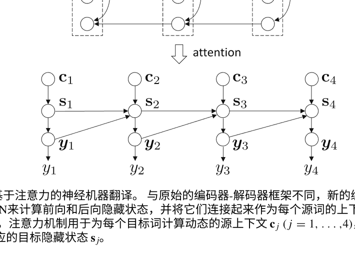

$$ \alpha_{j,i} = \frac{\exp\left(a(\mathbf{s}_{j-1}, \mathbf{h}_i, \theta)\right)}{\sum_{i'=1}^{I+1} \exp\left(a(\mathbf{s}_{j-1}, \mathbf{h}_{i'}, \theta)\right)} \quad (6.45) $$

对齐函数 $a(\mathbf{s}_{j-1}, \mathbf{h}_i, \theta)$ 评估了位置 $i$ 周围的输入和位置 $i$ 处的输出之间的关系有多好。

$$ \mathbf{c}_j = \sum_{i=1}^{I+1} \alpha_{j,i} \mathbf{h}_{i} \quad (6.46) $$

因此，目标隐藏状态可以计算为

$$ \mathbf{s}_j = f(\mathbf{y}_{j-1}, \mathbf{s}_{j-1}, \mathbf{c}_j, \theta) \quad (6.47) $$

基于注意力的神经机器翻译（Bahdanau等人，2015）与原始的编码器-解码器框架（Sutskever等人，2014）的主要区别在于计算源上下文的方式。原始框架只使用最后一个隐藏状态来初始化第一个目标隐藏状态。目前尚不清楚源上下文如何控制目标词的生成，特别是对于长句子末尾的词。相比之下，注意力机制使得每个源词根据注意力权重对目标词的生成做出贡献，而不考虑目标词的位置。这种策略在提高翻译质量方面非常有效，特别是对于长句子。因此，基于注意力的方法已成为神经机器翻译中的事实上的方法。

#### 6.4.3 解决大词汇量的技术挑战

尽管端到端NMT（Sutskever等人，2014年；Bahdanau等人，2015年）在各种语言对之间取得了最先进的翻译性能，但NMT面临的一个主要挑战是如何解决目标语言词汇导致的效率问题。

由于单词级别的翻译概率需要对所有目标词进行归一化（见公式（6.37）），训练数据的对数似然 $\langle \mathbf{x}^{(s)}, \mathbf{y}^{(s)} \rangle$ 由以下给出

$$ L(\theta) = \sum_{s=1}^{S} \log P(\mathbf{y}^{(s)} | \mathbf{s}^{(s)}; \theta) \quad (6.48) $$
$$ = \sum_{s=1}^{S} \sum_{j=1}^{J^{(s)}} \log P(y_j^{(s)} | \mathbf{x}^{(s)}, \mathbf{y}_{<j}^{(s)}; \theta) \quad (6.49) $$
$$ = \sum_{s=1}^{S} \sum_{j=1}^{J^{(s)}} \left( g(\mathbf{x}^{(s)}, y_j^{(s)}, \mathbf{y}_{<j}^{(s)}, \theta) - \log \sum_{y \in V_y} \exp\left( g(\mathbf{x}^{(s)}, y, \mathbf{y}_{<j}^{(s)}, \theta) \right) \right) \quad (6.50) $$

其中，$J^{(s)}$ 表示第s个目标句子的长度，$V_y$ 表示目标词汇表。

训练NMT模型需要计算对数似然的梯度：

$$ \nabla L(\theta) = \sum_{s=1}^{S} \sum_{j=1}^{J^{(s)}} \left( \nabla g(\mathbf{x}^{(s)}, y_j^{(s)}, \mathbf{y}_{<j}^{(s)}, \theta) - \sum_{y \in V_y} P(y|\mathbf{x}^{(s)}, \mathbf{y}_{<j}^{(s)}; \theta) \nabla g(\mathbf{x}^{(s)}, y, \mathbf{y}_{<j}^{(s)}, \theta) \right). \quad (6.51) $$

很明显，计算梯度需要枚举所有目标词在$V_y$中，这使得训练NMT模型变得非常缓慢。此外，在解码过程中预测位置j的目标词还需要枚举所有目标词：

$$ \hat{y}_j = \underset{y \in V_y}{\mathrm{argmax}} \left\{ P(y|\mathbf{x}, \mathbf{y}_{<j}; \theta) \right\}. \quad (6.52) $$

因此，Sutskever等人（2014）和Bahdanau等人（2015）不得不使用一个子集 the full vocabulary, which is restricted to contain 30,000 to 80,000 frequent target words due to the limit of GPU memory. This significantly deteriorates the translation quality of source sentences that contain rare words falling out of the subset or out-of-vocabulary (OOV) words. Hence, it is important to address the large vocabulary problem to improve the efficiency of NMT.

为了解决这个问题，Luong等人（2015）提出了在源语句和目标语句中识别OOV词汇的对应关系，并在后处理步骤中翻译OOV词汇的方法。表6.1展示了一个例子。给定一个源语句“美国代表团包括来自使团副的专家”，其中的两个词“代表团”和“使团副”被识别为OOV（第一行）。因此，这两个词被替换为“OOV”（第二行）。带有OOV词汇的源语句被翻译为带有OOV词汇的目标语句“美国OOV_1由OOV_3专家组成”（第三行），其中下标表示对应源语句中OOV词汇的相对位置。在这个例子中，第三个目标词“OOV_1”对应于第二个源词“OOV”（即3－1＝2），第八个目标词“OOV_3”对应于第五个源词“OOV”（即8－3＝5）。最后，“OOV_1”被替换为“代表团”，这是“代表团”的翻译。可以通过使用外部翻译知识源（如双语词典）来实现这一点。

另一种方法是利用采样来解决大目标词汇问题(Jean et al. 2015)。由于计算梯度的主要挑战是如何高效计算能量函数的期望梯度（即方程（6.51）中的第二项），Jean等人（2015）提出使用少量样本通过重要性采样来近似期望。给定预定义的提议分布Q(y)和从Q(y)中采样的一组V'样本，他们的近似值为

表6.1 解决神经机器翻译中的词汇外问题（OOV）被识别为OOV的罕见源词，如“*daibiaotuan*”和“*shidanfu*”，在后处理步骤中使用双语词典等外部知识源进行翻译。目标OOV的下标表示源OOV和目标OOV之间的对应关系

| 没有OOV的源代码 | 美国代表团包括来自斯坦福的专家 |
| :--- | :--- |
| 带有OOV的源代码 | 美国 OOV 包括来自 OOV 的专家 |
| 带有OOV的目标 | 美国 OOV ₁ 由 OOV ₃ 的专家组成 |
| 没有OOV的目标 | 美国 代表团 由斯坦福的专家组成 |

$$\sum_{y \in V_y} P(y|\mathbf{x}^{(s)}, \mathbf{y}_{<j}^{(s)}; \theta) \nabla g(\mathbf{x}^{(s)}, y, \mathbf{y}_{<j}^{(s)}, \theta) \ \approx \sum_{y \in V'} \frac{\exp\left(g(\mathbf{x}^{(s)}, y, \mathbf{y}_{<j}^{(s)}, \theta) - \log Q(y)\right)}{\sum_{y' \in V'} \exp\left(g(\mathbf{x}^{(s)}, y', \mathbf{y}_{<j}^{(s)}, \theta) - \log Q(y')\right)} \nabla g(\mathbf{x}^{(s)}, y, \mathbf{y}_{<j}^{(s)}, \theta). \tag{6.53}$$

因此，在训练过程中计算归一化常数只需要对目标词汇的一个小子集求和，这显著降低了每个参数更新的计算复杂度。

另一个重要的方向是在字符级别（Chung等人, 2016；Luong和Manning, 2016；Costa-juss和Fonollosa, 2016）或者子词级别（Sennrich等人, 2016b）对神经机器翻译进行建模。直觉上，使用字符或子词作为翻译的基本单位可以显著减小词汇量，因为字符和子词的数量总是比单词少得多。

#### 6.4.4 端到端训练以优化评估指标

神经机器翻译的标准训练目标是最大似然估计（MLE），其目标是找到一组能够最大化训练数据对数似然的模型参数集合（参见公式（6.40）和（6.41））。Ranzato等人（2016）指出MLE存在两个缺点。首先，在训练过程中，翻译模型只接触到金标准数据。换句话说，在训练时生成一个单词时，所有上下文单词都来自于真实目标句子。然而，在解码过程中，上下文单词是由模型预测的，这些预测不可避免地会有错误。这种训练和解码之间的差异对翻译质量有负面影响。其次，MLE只使用在单词级别定义的损失函数，而机器翻译的评估指标（如BLEU（Papineni等人, 2002）和TER（Snover等人, 2006））通常在语料库和句子级别定义。这种训练和评估之间的差异也阻碍了神经机器翻译的发展。

为了解决这个问题，Shen等人（2016）引入了最小风险训练（MRT）（Och2003; SmithandEisner2006; HeandDeng2012）到神经机器翻译中。基本思想是使用评估指标作为损失函数，衡量模型预测与真实翻译之间的差异，并找到一组模型参数来最小化训练数据上的期望损失（即风险）。

形式上，新的训练目标为

$$\hat{\theta} = \underset{\theta}{\mathrm{argmin}} \left\{ R(\theta) \right\}. \quad\quad (6.54)$$

训练数据上的风险定义为

$$\begin{aligned} R(\boldsymbol{\theta}) &= \sum_{s=1}^{S} \sum_{\mathbf{y} \in \mathcal{Y}(\mathbf{x}^{(s)})} P(\mathbf{y}|\mathbf{x}^{(s)}; \boldsymbol{\theta}) \Delta(\mathbf{y}, \mathbf{y}^{(s)}) \quad\quad (6.55) \\ &= \sum_{s=1}^{S} \mathbb{E}_{\mathbf{y}|\mathbf{x}^{(s)};\boldsymbol{\theta}} \left[ \Delta(\mathbf{y}, \mathbf{y}^{(s)}) \right]. \quad\quad (6.56) \end{aligned}$$

其中 $\mathcal{Y}(\mathbf{x}^{(s)})$ 是所有可能的翻译的集合，$\mathbf{y}$ 是模型的预测，$\mathbf{y}^{(s)}$ 是一个真实的翻译，$\Delta(\mathbf{y}, \mathbf{y}^{(s)})$ 是使用句子-级别评估指标（如BLEU）计算的损失函数。

Shen等人（2016）认为MRT相对于MLE具有以下优势。首先，MRT能够直接优化模型参数，以便与评估指标相匹配。这已被证明通过最小化训练和评估之间的差异有效地提高翻译质量（Och2003）。其次，MRT接受任意的句子级别损失函数，不一定是可微分的。第三，MRT对模型架构透明，可以应用于任意的神经网络和人工智能任务。

然而，MRT面临的一个主要挑战是计算梯度需要枚举所有可能的目标句子：

$$\nabla R(\boldsymbol{\theta}) = \sum_{s=1}^{S} \sum_{\mathbf{y} \in \mathcal{Y}(\mathbf{x}^{(s)})} \nabla P(\mathbf{y}|\mathbf{x}^{(s)}; \boldsymbol{\theta}) \Delta(\mathbf{y}, \mathbf{y}^{(s)}). \quad\quad (6.57)$$

为了缓解这个问题，Shen等人(2016)提出仅使用完整搜索空间的子集来近似后验分布 $P(\mathbf{y}|\mathbf{x}^{(s)}; \boldsymbol{\theta})$ as

$$Q(\mathbf{y}|\mathbf{x}^{(s)}; \boldsymbol{\theta}, \beta) = \frac{P(\mathbf{y}|\mathbf{x}^{(s)}; \boldsymbol{\theta})^{\beta}}{\sum_{\mathbf{y}' \in \mathcal{S}(\mathbf{x}^{(s)})} P(\mathbf{y}'|\mathbf{x}^{(s)}; \boldsymbol{\theta})^{\beta}}, \quad\quad (6.58)$$

其中 $\mathcal{S}(\mathbf{x}^{(s)}) \subset \mathcal{Y}(\mathbf{x}^{(s)})$ 是可以通过抽样构建的完整搜索空间的子集，$\beta$ 是控制分布的锐度的超参数。然后，新的训练目标被定义为

$$\tilde{R}(\boldsymbol{\theta}) = \sum_{s=1}^{S} \sum_{\mathbf{y} \in \mathcal{S}(\mathbf{x}^{(s)})} Q(\mathbf{y}|\mathbf{x}^{(s)}; \boldsymbol{\theta}, \beta) \Delta(\mathbf{y}, \mathbf{y}^{(s)}). \tag{6.59}$$

Ranzato等人 (2016) 还提出了一种与MRT非常相似的方法。他们将序列生成问题视为强化学习框架中的一个代理模型 (Sutton和Barto1988)。生成模型可以被视为一个代理，它在每个时间步骤中采取行动来预测序列中的下一个单词。当代理模型到达序列的末尾时，它会获得奖励。Wiseman和Rush (2016) 引入了一种束搜索训练方案，以避免与局部训练和测试时使用相关的偏差，并统一了训练损失和测试时的使用。

总结一下，由于这些以评估指标为导向的训练准则能够最小化训练和评估之间的差异，它们在实际的NMT系统中被证明非常有效 (Wu等人，2016年)。

#### 6.4.5 结合先验知识

神经机器翻译中的另一个重要主题是如何将先验知识整合到神经网络中。作为一种数据驱动的方法，NMT从平行语料库中获取所有的翻译知识。由于表示的差异，将先验知识整合到神经网络中是困难的。神经网络使用连续的实值向量来表示翻译过程中涉及的所有语言结构。虽然这些向量表示被证明能够隐含地捕捉到翻译的规律性 (Sutskever等人，2014年)，但从语言学的角度解释神经网络中的每个隐藏状态是困难的。相比之下，机器翻译中的先验知识通常以离散的符号形式表示，如词典和规则 (Nirenburg，1989年)，这些符号形式明确地编码了翻译的规律性。将以离散形式表示的先验知识转化为神经网络所需的连续表示是具有挑战性的。

-   因此，许多作者努力将先前的知识整合到NMT中。以下先前的知识来源被利用来改进NMT：
-   双语词典：一组源词和目标词对，它们是翻译等价的 (Arthur等人，2016年)；
-   短语表：一组源短语和目标短语对，它们是翻译等价的 (Tang等人，2016年)；
-   覆盖约束：每个源短语应该被翻译成一个目标短语 (Tu等人，2016年；Mi等人，2016年)；
-   一致约束：源到目标和目标到源的翻译模型在哪些注意力权重上达成一致是可靠的 (Chen等人，2016年；Cohn等人，2016年)；
-   结构偏差：位置偏差、马尔可夫条件和繁殖力，捕捉源语言和目标语言之间的结构差异 (Cohn等人，2016年)；图6.12 神经机器翻译的位置偏差。
翻译等效物在源语言和目标语言句子中往往具有相似的相对位置。这种先验知识源可以用来指导注意力机制的NMT模型的学习。

## 6. 语言句法：利用句法树来指导神经机器翻译的学习过程（Eriguchi等人，2016年；Li等人，2017年；Wu等人，2017年；Chen等人，2017a年）。

在神经网络中，有两种广泛的先验知识整合方法。
- 第一种方法是修改模型架构。例如，如图6.12所示，位置偏差是基于这样的观察结果：源语言中的一个词在给定的相对位置上往往与目标语言中的一个相似的相对位置上的词对齐（即，i/I ≈ j/J），尤其是对于英语和法语等密切相关的语言对。换句话说，对齐的源语言和目标语言词往往出现在对齐矩阵的对角线附近。

为了将这种偏见纳入NMT中，Cohn等人（2016）在对齐函数中添加了一个偏见项：

```
a(\mathbf{h}_i, \mathbf{s}_{j-1}, \boldsymbol{\theta}) = \mathbf{v}^\top f \left( \mathbf{W}_1 \mathbf{h}_i + \mathbf{W}_2 \mathbf{s}_{j-1} + \mathbf{W}_3 \psi(j, i, I) \right)
```

其中 \(\mathbf{v}, \mathbf{W}_1, \mathbf{W}_2\) 和 \(\mathbf{W}_3\) 是模型参数。位置偏见项是源语言和目标语言句子中位置的函数定义，以及源语言长度：

```
\psi(j, i, I) = \left[ \log(1 + j), \log(1 + i), \log(1 + I) \right]^\top
```

请注意，在解码过程中，目标语言长度 \(J\) 被排除在外，因为它在解码时是未知的。尽管修改模型架构以将先验知识注入神经网络已经显示出提高NMT效果的有效性，但是将多个重叠的、任意的先验知识源结合起来仍然很困难。这是因为神经网络通常在隐藏状态之间施加强独立性假设。因此，扩展神经模型需要明确地对信息源的相互依赖性进行建模。

通过向训练目标添加额外的加性项（Cheng等人，2016a；Cohn等人，2016），可以在一定程度上缓解这个问题，这样可以保持NMT模型不变。例如，Cheng等人（2016a）引入了一个新的训练目标鼓励源到目标和目标到源的翻译模型在注意力权重矩阵上达成一致：

```
J(\overrightarrow{\theta}, \overleftarrow{\theta}) = \sum_{s=1}^{S} \log P(\mathbf{y}^{(s)} | \mathbf{x}^{(s)}; \overrightarrow{\theta}) + \sum_{s=1}^{S} \log P(\mathbf{x}^{(s)} | \mathbf{y}^{(s)}; \overleftarrow{\theta}) - \lambda \sum_{s=1}^{S} \Delta(\mathbf{x}^{(s)}, \mathbf{y}^{(s)}, \overrightarrow{\alpha}^{(s)}(\overrightarrow{\theta}), \overleftarrow{\alpha}^{(s)}(\overleftarrow{\theta})) \quad \text{(6.62)}
```

其中 \(\overrightarrow{\theta}\) 是源到目标翻译模型参数的集合， \(\overleftarrow{\theta}\) 是目标到源翻译模型参数的集合， \(\overrightarrow{\alpha}^{(s)}(\overrightarrow{\theta})\) 是第 s 个句对的源到目标注意力权重矩阵， \(\overleftarrow{\alpha}^{(s)}(\overleftarrow{\theta})\) 是第 s 个句对的目标到源注意力权重矩阵，而 \(\Delta(\cdot)\) 衡量了两个注意力权重矩阵之间的不一致性。

然而，附加到训练目标的术语已被限制为有限数量的简单约束条件，因为手动调整每个术语的权重很困难。

最近，张等人 (2017b) 提出了一个基于后验正则化 (Ganchev等人2010) 的任意知识源的通用框架。核心思想是将先验知识源编码为概率分布，通过最小化两个分布之间的KL散度来指导翻译模型的学习过程：

```
J(\theta, \gamma) = \lambda_1 \sum_{s=1}^{S} \log P(\mathbf{y}^{(s)} | \mathbf{x}^{(s)}; \theta) - \lambda_2 \sum_{s=1}^{S} \text{KL} \left( Q(\mathbf{y} | \mathbf{x}^{(s)}; \gamma) \| P(\mathbf{y}^{(s)} | \mathbf{x}^{(s)}; \theta) \right) \quad \text{(6.63)}
```

其中先前的知识来源被编码在一个对数线性模型中：

```
Q(\mathbf{y} | \mathbf{x}^{(s)}; \gamma) = \frac{\exp \left( \gamma \cdot \phi(\mathbf{x}^{(s)}, \mathbf{y}) \right)}{\sum_{\mathbf{y'}} \exp \left( \gamma \cdot \phi(\mathbf{x}^{(s)}, \mathbf{y'}) \right)} \quad \text{(6.64)}
```

请注意，先前的知识来源以传统的离散符号形式表示为特征 \(\phi(\cdot)\)。

#### 6.4.6 低资源语言翻译

平行语料库是平行文本的集合，在训练NMT模型中起着关键作用，因为它们是翻译知识获取的主要来源。广泛认为，平行语料库的数量、质量和覆盖范围直接影响NMT系统的翻译质量。尽管NMT在资源丰富的语言对中取得了最先进的性能，但大规模、高质量和广覆盖的平行语料库的不可用仍然是NMT的主要挑战，特别是对于低资源语言翻译。对于大多数语言对来说，平行语料库是不存在的。即使对于少数资源丰富的语言，可用的平行语料库通常也不平衡，因为主要来源限于政府文件或新闻文章。由于参数空间较大，神经模型通常很难从低频事件中学习，使得NMT在低资源语言对中表现不佳。Zoph等人 (2016) 表明，NMT在资源匮乏的语言上获得的翻译质量要比传统的统计机器翻译差得多。

为了解决这个问题，一个直接的解决方案是利用丰富的单语数据。Gulczere等人 (2015) 提出了两种方法，被称为浅层融合和深层融合，将语言模型集成到NMT中。基本思想是使用在大规模单语数据上训练的语言模型来评分神经翻译模型在每个时间步提出的候选词，或者将语言模型和解码器的隐藏状态进行连接。尽管他们的方法带来了显著的改进，但一个可能的缺点是网络架构必须进行修改以集成语言模型。

另外，Sennrich等人 (2016a) 提出了两种对网络架构透明的利用单语语料库的方法。第一种方法是将单语句子与虚拟输入配对。然后，在这些伪平行句对上训练期间，编码器和注意力模型的参数被固定。第二种方法首先在平行语料库上训练神经翻译模型，然后使用学习到的模型来翻译单语语料库。单语语料库及其翻译构成了一个额外的伪平行语料库。 (Zhang和Zong2016) 研究了类似的方法来利用源语言单语数据。

Cheng等人 (2016b) 引入了一种半监督学习方法，利用单语数据进行NMT。如图6.13所示，给定一个单语语料库中的源句子，Cheng等人 (2016b) 使用源到目标和目标到源的翻译模型通过潜在的目标句子来构建一个自编码器，以恢复输入的源句子。更正式地，重构概率由以下公式给出

```
P(\mathbf{x}' | \mathbf{x}; \overrightarrow{\theta}, \overleftarrow{\theta}) = \sum_{\mathbf{y}} P(\mathbf{y} | \mathbf{x}; \overrightarrow{\theta}) P(\mathbf{x}' | \mathbf{y}; \overleftarrow{\theta}).
```

因此，平行语料库和单语语料库都可以用于半监督学习。设 $\{(\mathbf{x}^{(s)}, \mathbf{y}^{(s)})\}_{s=1}^S$ 为平行语料库， $\{\mathbf{x}^{(m)}\}_{m=1}^M$ 为源语言的单语语料库， $\{\mathbf{y}^{(n)}\}_{n=1}^N$ 为目标语言的单语语料库。新的训练目标为

```
J(\overrightarrow{\theta}, \overleftarrow{\theta}) = \sum_{s=1}^S \log P(\mathbf{y}^{(s)} | \mathbf{x}^{(s)}; \overrightarrow{\theta}) + \sum_{s=1}^S \log P(\mathbf{x}^{(s)} | \mathbf{y}^{(s)}; \overleftarrow{\theta}) + \sum_{m=1}^M \log P(\mathbf{x}' | \mathbf{x}^{(m)}; \overrightarrow{\theta}, \overleftarrow{\theta}) + \sum_{n=1}^N \log P(\mathbf{y}' | \mathbf{y}^{(n)}; \overrightarrow{\theta}, \overleftarrow{\theta}).
```

另一个有趣的方向是利用多语言数据进行NMT（Firat等人，2016年; Johnson等人，2016年）。Firat等人（2016年）提出了一种多路多语言模型，通过共享注意力实现零资源翻译。他们使用伪双语句子对零资源语言对的注意力部分进行微调。

Johnson等人（2016年）在多语言场景中开发了一种通用NMT模型。他们使用多种语言的平行语料库训练一个单一模型，然后能够在没有平行语料库的情况下翻译语言对。

在神经机器翻译中，使用桥接语言来连接源语言和目标语言也已经得到了研究（Nakayama和Nishida2016; Cheng等人，2017年）。在解码过程中，首先使用源到桥接模型将源语句翻译成桥接语句，然后使用桥接到目标模型将桥接语句翻译成目标语句。Nakayama和Nishida (2016) 通过利用图像作为中介和训练多模态编码器共享共同的语义表示，实现了零资源机器翻译。Cheng等人 (2017) 提出了基于中介的神经机器翻译，通过同时改善源到中介和中介到目标的翻译质量，以提高源到目标的翻译质量。由于间接建模导致的错误传播问题，最近提出了直接建模方法，如师生框架（Chen等人，2017b）和最大期望似然估计（Zheng等人，2017）。

#### 6.4.7 神经机器翻译中的网络结构

在神经机器翻译中，循环模型（如LSTM和GRU）主导了编码器和解码器的网络结构设计。最近，卷积网络（Gehring等人，2017）和自注意力网络（Vaswani等人，2017）得到了充分的研究，并取得了有希望的改进。

Gehring等人（2017）认为，在使用循环网络进行序列建模时，并行计算是低效的，因为它需要维护整个历史的隐藏状态。相比之下，卷积网络学习固定长度的上下文表示，并且不依赖于所有历史信息的计算。因此，序列中的每个元素都可以在编码和解码（训练期间）时并行计算。此外，卷积层可以深度堆叠以捕捉长距离的依赖关系。图6.14a展示了卷积序列到序列模型的翻译过程。卷积的内核大小设置为 k=3。对于编码器，采用多个卷积和非线性层（为简单起见，图6.14a只显示了一个）来创建每个输入位置的隐藏状态。当解码器尝试生成第四个目标词 y4 时，使用多个卷积和非线性层来获得前 k 个词的隐藏表示。然后，应用标准的注意力机制来预测 y4。

循环网络需要 O(n) 操作来建模第一个词和第 n 个词之间的依赖关系，而卷积模型需要 O(log_k (n)) 堆叠的卷积操作。Vaswani等人（2017）在不使用任何循环和卷积的情况下，提出了使用自注意力机制直接建模任意词对之间的关系，如图6.14b所示。为了学习编码器中每个输入位置（例如第二个词）的隐藏状态，自注意力模型和前馈网络计算第二个词与其他词之间的相关性，并获得隐藏状态。

我们可以堆叠多个自注意力和前馈层，以得到第二个位置的高度抽象表示。为了解码 $y_4$，另一个自注意力模型被用来捕捉当前目标位置与之前位置之间的依赖关系。然后，我们使用传统的注意力机制来建模源语言和目标语言之间的关系，并预测下一个目标词 $y_{4}$。由于高度可并行的网络结构和任意两个位置之间的直接连接，这种翻译模型显著加快了训练过程并显著提高了翻译性能。然而，在翻译未见过的句子时，解码效率不高，因为目标端无法使用并行处理。

目前，关于神经机器翻译中最佳的网络结构还没有达成共识。网络结构设计仍将是未来的研究热点。

#### 6.4.8 组合SMT和NMT

尽管NMT在翻译质量上（尤其是翻译流畅性方面）优于SMT，但在翻译的准确性和生成的翻译与源句子有不同含义方面，NMT有时缺乏可靠性，特别是在输入中出现罕见单词时。相比之下，SMT通常可以产生准确但不流畅的翻译。因此，将NMT和SMT的优点结合起来是一个有前途的方向。

近两年来，人们在利用NMT和SMT的优势方面做出了巨大努力（He et al. 2016; Niehues et al.2016; Wang et al.2017; Zhou et al.2017）。He et al. (2016)和Wang et al. (2017)尝试利用SMT特征或SMT翻译建议来增强NMT系统。例如，Wang et al. (2017)利用SMT生成一个推荐词汇表 $V_{\mathrm{smt}}$，该词汇表使用NMT的部分翻译作为前缀。然后，使用以下公式来预测下一个目标词：

```
P(y_t|\mathbf{y}_{<t}, \mathbf{x}) = (1 - \alpha_t) P_{\mathrm{nmt}}(y_t|\mathbf{y}_{<t}, \mathbf{x}) + \alpha_t P_{\mathrm{smt}}(y_t|\mathbf{y}_{<t}, \mathbf{x}). \quad (6.67)
```

其中 $P_{\mathrm{smt}}(y_t|\mathbf{y}_{<t}, \mathbf{x}) = 0$, 如果 $y_t \notin V_{\mathrm{smt}}$。

Niehues等人 (2016) 采用SMT系统将输入预先翻译成目标语句。然后，开发了一个神经机器翻译系统，以预翻译或预翻译和源句子的组合作为输入。

Zhou等人 (2017) 认为这种方法只能利用一个SMT系统。因此，他们提出了一种神经系统组合方法，可以利用多个SMT和NMT系统的优势。如图6.15所示，SMT和NMT系统的输出作为神经系统组合框架的输入。然后，设计了分层注意机制，用于确定在预测下一个目标词时应该更加关注哪个系统的哪个部分。

由于高效的组合，这种方法在翻译质量上取得了有希望的收益。然而，在这个框架中不能使用翻译的n-best列表，我们相信在系统组合的方向上还有很大的探索空间。

### 6.5 总结

在本章中，我们介绍了如何使用深度学习来改进机器翻译。由于传统的统计机器翻译面临数据稀缺和特征工程问题，早期的努力集中在使用深度学习来改进线性翻译模型的关键组成部分，如规则翻译概率（Gao等人, 2014年），重新排序模型（Li等人, 2013年）和语言模型（Vaswani等人, 2013年）。自2014年以来，端到端的神经机器翻译（Sutskever等人, 2014年；Bahdanau等人, 2015年）已经越来越受欢迎，旨在使用神经网络直接映射自然语言之间的关系，在机器翻译社区中取得了显著的进展。在过去的2年中，神经机器翻译取得了显著的进展，并迅速取代了统计机器翻译成为商业翻译系统的新的事实标准技术。

尽管深度学习已经被证明可以彻底改变机器翻译，但目前的神经机器翻译方法仍存在一些关键限制。首先，很难解释神经网络的内部工作原理，并设计基于语言学动机的神经翻译模型。虽然最近的研究使用逐层相关传播来量化网络中两个任意神经元之间的连接（Ding等人, 2017年），但仍然很难将神经网络中的隐藏状态与可解释的语言结构关联起来。因此，使用符号表示的先验知识并将其融入到使用连续表示的神经网络中也是具有挑战性的。

另一个主要挑战是数据稀缺。神经机器翻译是一种数据需求量大的方法，而世界上大多数语言对之间只有有限甚至没有平行数据可用。如何更好地利用有限的标记数据和丰富的未标记数据仍然是未来的热门话题。Johnson等人提出的通用神经机器翻译模型（2016年）是解决数据稀缺问题的一个有趣方向。尽管他们的实验结果对于多对一方向（即多个语言翻译成一种语言）很有希望，但其在一对多方向（即一种语言翻译成多种语言）上的效果仍需进一步验证。

在一个源语言和一个目标语言的情况下，对于一对多和多对多的方向，没有一致且显著的改进。目前还不清楚如何从语言学角度来表示和利用所有自然语言的共同知识。

最后，大多数现有的NMT系统仍然局限于处理文本数据。幸运的是，使用连续表示可以将文本、语音和视觉信息结合起来，开发多模态NMT模型。（2016年）提出了开发无需转录的语音翻译系统的方法。这可以通过使NMT模型接受源语言语音的连续表示作为输入来实现。然而，他们在翻译质量方面没有报告显著的改进。Calixto等人（2017年）引入了一个双重注意解码器来结合文本和图像以改进NMT。然而，他们系统的训练数据只包含30K张图像和每张图像的五个描述。因此，构建大规模的多模态平行语料库并设计新的多模态神经翻译模型也是一个有趣的未来方向。

## 参考文献
- Arthur, P., Neubig, G., & Nakamura, S. (2016). 将离散翻译词典融入神经机器翻译。在EMNLP会议论文中。arXiv:1606.02006v2.
- Auli, M., & Gao, J. (2014). Decoder integration and expected BLEU training for recurrent neural network language models. 在ACL会议论文中 (pp. 136–142).
- Bahdanau, D., Cho, K., & Bengio, Y. (2015). 通过联合学习对齐和翻译的神经机器翻译。在ICLR会议论文集中。
- Bengio, Y., Ducharme, R., Vincent, P., & Jauvin, C. (2003). 一种神经概率语言模型。机器学习研究, 3, 1137–1155.
- Brown, P. F., Della Pietra, S. A., Della Pietra, V. J., & Mercer, R. L. (1993). 统计机器翻译的数学模型：参数估计。计算语言学。
- Calixto, I., Liu, Q., & Campbell, N. (2017). 用于多模态神经机器翻译的双重注意力解码器。在ACL会议论文中。
- Chen, H., Huang, S., Chiang, D., & Chen, J. (2017a). 使用语法感知的编码器和解码器改进神经机器翻译。在ACL 2017年会议论文集中。
- Chen, S., & Goodman, J. (1999). 平滑技术在语言建模中的实证研究。计算机语音和语言。
- Chen, Y., Liu, Y., Cheng, Y., & Li, V. O. (2017b). 一种用于零资源神经机器翻译的师生框架。在第55届计算语言学协会年会论文集中（第1卷：长文，第1925-1935页）。加拿大温哥华：计算语言学协会。
- Cheng, Y., Shen, S., He, Z., He, W., Wu, H., Sun, M., & Liu, Y. (2016a). 基于协议的学习从非平行语料库中学习平行词典和短语。在IJCAI会议论文集中。
- Cheng, Y., Xu, W., He, Z., He, W., Wu, H., Sun, M., & Liu, Y. (2016b). 半监督学习用于神经机器翻译。在第54届计算语言学协会年会论文集中（第1卷：长文，第1965-1974页）。德国柏林：计算语言学协会。
- Cheng, Y., Yang, Q., Liu, Y., Sun, M., & Xu, W. (2017). 基于中间语言的神经机器翻译的联合训练。在IJCAI会议上。
- Chiang, D. (2007). 基于层次短语的翻译。计算语言学。
- Chiang, D., Knight, K., & Wang, W. (2009). 11,001个用于统计机器翻译的新特征。在NAACL会议上。
- Cho, K., van Merrienboer, B., Gulcehre, C., Bahdanau, D., Bougares, F., Schwenk, H., & Bengio, Y. (2014). 使用RNN编码器-解码器学习短语表示用于统计机器翻译。在EMNLP会议上。
- Chung, J., Cho, K., & Bengio, Y. (2016). 一种无需明确分割的字符级解码器用于神经机器翻译。在第54届计算语言学协会年会(第1卷：长论文，第1693-1703页)上。德国柏林：计算语言学协会。
- Cohn, T., Hoang, C. D. V., Vymolova, E., Yao, K., Dyer, C., & Haffari, G. (2016). 将结构对齐偏差纳入注意力神经翻译模型中。在NAACL会议论文集中。
- Costa-jussà, M. R., & Fonollosa, J. A. R. (2016). 基于字符的神经机器翻译。在计算语言学协会第54届年会论文集(第2卷：短论文，第357-361页)。德国柏林：计算语言学协会。
- Devlin, J., Zbib, R., Huang, Z., Lamar, T., Schwartz, R. M., & Makhoul, J. (2014). 快速且稳健的神经网络联合模型用于统计机器翻译。在ACL会议论文集中(第1370-1380页)。
- Ding, Y., Liu, Y., Luan, H., & Sun, M. (2017). 可视化和理解神经机器翻译。在ACL会议的论文集中。
- Duong, L., Anastasopoulos, A., Chiang, D., Bird, S., & Cohn, T. (2016). 一种无需转录的语音翻译注意力模型。在NAACL会议的论文集中。
- Eriguchi, A., Hashimoto, K., & Tsuruoka, Y. (2016). 树到序列的注意力神经机器翻译。在计算语言学协会第54届年会的论文集中（第1卷：长文，第823-833页）。德国柏林：计算语言学协会。
- Firat, O., Cho, K., & Bengio, Y. (2016). 多路多语言神经机器翻译与共享注意力机制。在HLT-NAACL会议中。
- Galley, M., & Manning, C. (2008). 一个简单而有效的分层短语重新排序模型。在EMNLP会议上。
- Ganchev, K., Graça, J., Gillenwater, J., & Taskar, B. (2010). 用于结构化潜变量模型的后验正则化机器学习研究杂志。
- Gao, J., He, X., Yih, W.-t., & Deng, L. (2014). 学习连续短语表示用于翻译建模。 在ACL会议上（第699-709页）。
- Gehring, J., Auli, M., Grangier, D., Yarats, D., & Dauphin, Y. N. (2017). 卷积序列到序列学习在ICML 2017会议上。
- Gulcehre, C., Firat, O., Xu, K., Cho, K., Barrault, L., Lin, H. C. et al. (2015). 在神经机器翻译中使用单语语料库计算机科学。
- Li, P., Liu, Y., & Sun, M. (2013). 基于ITG的翻译的递归自编码器。 在*EMNLP*会议论文集中。
- Li, P., Liu, Y., Sun, M., Izuha, T., & Zhang, D. (2014). 用于基于短语的翻译的神经重排序模型。 在*COLING*会议论文集中(pp. 1897–1907)。
- Luong, M.-T., & Manning, C. D. (2016). 使用混合词-字符模型实现开放词汇的神经机器翻译。 在*ACL*会议论文集中。
- Luong, T., Sutskever, I., Le, Q. V., Vinyals, O., & Zaremba, W. (2015). 解决神经机器翻译中的生僻词问题。 在*ACL*会议论文集中。
- Meng, F., Lu, Z., Wang, M., Li, H., Jiang, W., & Liu, Q. (2015). 使用卷积神经网络对源语言进行编码以进行机器翻译。 在*ACL*会议的论文中。
- Mi, H., Sankaran, B., Wang, Z., & Ittycheriah, A. (2016). 用于神经机器翻译的覆盖嵌入模型。 在*EMNLP*会议的论文中。
- Nakayama, H., & Nishida, N. (2016). 通过多模态编码器-解码器网络和多媒体中间语进行零资源机器翻译。 机器翻译2017年。 *CoRR*, abs/1611.04503.
- Niehues, J., Cho, E., Ha, T.-L., & Waibel, A. (2016). 神经机器翻译的预翻译。 在*COLING 2016*会议的论文中。
- Nirenburg, S. (1989). 基于知识的机器翻译。机器翻译。
- Och, F. J. (2003). 统计机器翻译中的最小错误率训练。 在计算语言学协会第41届年会的论文中（第1卷，第160-167页）。
- Och, F. J., & Ney, H. (2002). 用于统计机器翻译的判别式训练和最大熵模型。 在*ACL*的论文集中。
- Papineni, K., Roukos, S., Ward, T., & Zhu, W.-J. (2002). BLEU：一种用于自动评估机器翻译的方法。 在 *ACL*中。
- Ranzato, M., Chopra, S., Auli, M., & Zaremba, W. (2016). 使用递归神经网络进行序列级别训练。 在 *CoRR*中。
- Sennrich, R., Haddow, B., & Birch, A. (2016a). 利用单语数据改进神经机器翻译模型。 在计算语言学协会第54届年会的论文集中(Vol. 1: 长论文, pp. 86–96). 德国柏林: 计算语言学协会。
- Sennrich, R., Haddow, B., & Birch, A. (2016b). 使用子-词单元进行稀有词的神经机器翻译。 在计算语言学协会第54届年会论文集中(第1卷：长文，第1715-1725页). 德国柏林：计算语言学协会。
- Shen, S., Cheng, Y., He, Z., He, W., Wu, H., Sun, M., & Liu, Y. (2016). 神经机器翻译的最小风险训练。 在*ACL*会议论文集中。
- Smith, D. A., & Eisner, J. (2006). 用于训练对数线性模型的最小风险退火。 在*ACL*会议论文集中。
- Snover, M., Dorr, B., Schwartz, R., Micciulla, L., & Makhoul, J. (2006). 通过有针对性的人工注释研究翻译编辑率。 在*AMTA*会议论文集中。
- 苏，剑，熊，定国，张，博，刘，群，姚，俊杰，和张，民。 (2015). 双语对应递归自动编码器用于统计机器翻译。 在*EMNLP*会议论文集（第1248-1258页）。
- Sutskever, I., Vinyals, O., 和 Le, Q. V. (2014). 序列到序列学习与神经网络。 在*NIPS*会议中。
- Sutton, R. S., 和 Barto, A. G. (1988). 强化学习：一种介绍。 剑桥，MA：麻省理工学院出版社。
- Vaswani, A., Zhao, Y., Fossum, V., & Chiang, D. (2013). 使用大规模神经语言模型进行解码可以改善翻译。在EMNLP会议论文集中(pp. 1387–1392)。
- Vogel, S., Ney, H., & Tillmann, C. (1996). 基于HMM的统计翻译中的词对齐。在COLING会议论文集中。
- Wang, X., Lu, Z., Tu, Z., Li, H., Xiong, D., & Zhang, M. (2017). 统计机器翻译指导下的神经机器翻译。在AAAI 2017会议论文集中(pp. 3330–3336)。
- Wiseman, S., & Rush, A. M. (2016). 序列到序列学习作为波束搜索优化。在2016年经验方法在自然语言处理中的会议论文集中(第1296-1306页). 奥斯汀，德克萨斯州：计算语言学协会。
- Wu, S., Zhang, D., Yang, N., Li, M., & Zhou, M. (2017). 序列到依赖关系神经机器翻译。在ACL 2017(Vol. 1, 第698-707页)会议论文集中。
- Wu, Y., Schuster, M., Chen, Z., Le, Q. V., Norouzi, M., Macherey, W. et al. (2016). 谷歌的神经机器翻译系统：弥合人类和机器翻译之间的差距。arXiv:1609.08144v2.
- Xiong, D., Liu, Q., & Lin, S. (2006). 基于最大熵的短语重新排序模型用于统计机器翻译。在ACL-COLING(第505-512页)会议论文集中。
- Yang, N., Liu, S., Li, M., Zhou, M., & Yu, N. (2013). 使用上下文相关的深度神经网络进行词对齐建模。在ACL会议论文集中。
- Zhang, B., Xiong, D., & Su, J. (2017a). BattRAE: 基于双向注意力的递归自编码器用于学习双语短语嵌入。在AAAI会议论文集中。
- Zhang, J., Liu, S., Li, M., Zhou, M., & Zong, C. (2014a). 用于机器翻译的双语约束短语嵌入。在ACL会议论文集中(pp. 111–121)。
- Zhang, J., Liu, S., Li, M., Zhou, M., & Zong, C. (2014b). 注意间隙：通过在嵌入空间中最小化语义间隙进行机器翻译。在AAAI会议论文集中(pp. 1657–1664)。
- Zhang, J., Liu, Y., Luan, H., Xu, J., & Sun, M. (2017b). 通过后验则化进行神经机器翻译的先验知识整合。在计算语言学协会第55届年会(Vol. 1: 长论文, pp. 1514–1523)的论文集中。 加拿大温哥华:计算语言学协会。
- Zhang, J., Zhang, D., & Hao, J. (2015). 利用全局句子表示进行本地翻译预测。在IJCAI会议的论文集中。
- Zhang, J., & Zong, C. (2016). 在神经机器翻译中利用源语言单语数据。在EMNLP 2016会议(pp. 1535–1545)的论文集中。
- Zheng, H., Cheng, Y., & Liu, Y. (2017). 最大期望似然估计用于零资源神经机器翻译。 在IJCAI会议的论文集中。
- Zhou, L., Hu, W., Zhang, J., & Zong, C. (2017). 神经系统组合用于机器翻译。在ACL 2017会议论文集中。
- Zoph, B., Yuret, D., May, J., & Knight, K. (2016). 迁移学习用于低资源神经机器翻译。在EMNLP中。

## 第7章 深度学习在问答中的应用
刘康和冯艳松

摘要 问答（QA）是自然语言处理中的一项具有挑战性的任务。最近，随着深度学习在许多自然语言处理任务中的显著成功，包括语义和句法分析、机器翻译、关系抽取等，越来越多的工作也致力于问答任务。本章简要介绍了深度学习方法在两个典型和流行的问答任务上的最新进展。(1)基于知识库的问答中的深度学习（KBQA）主要利用深度神经网络理解问题的含义，并尝试将其转化为结构化查询，或直接将其与知识库中的候选答案进行分布式语义表示的比较。

(2) 深度学习在机器理解（MC）中的应用，它通过新颖的神经网络构建了一种端到端的范式，直接计算问题、答案和给定段落之间的深层语义匹配。

### 7.1 引言
网络搜索正处于一个重大变革的边缘，从简单的文档检索转向自然语言问答（QA）（Etzioni 2011）。它需要准确理解用户自然语言问题的含义，从网络上的各种信息中提取有用的事实，并选择合适的答案。与其他自然语言处理（NLP）任务（如词性标注、解析和机器翻译）类似，大多数传统的QA方法都是基于符号表示的。在这种范式中，问题和答案中的所有元素，包括单词、短语、从句、句子、文档等，通常通过NLP基本模块进行处理，然后转换为某种结构化或非结构化的格式。

例如词袋模型、解析树、逻辑形式等。然后，在给定的文档或网页中，计算问题和候选答案之间的语义相似度或相关性，并选择得分最高的候选答案作为最终答案。
不幸的是，这种范式的关键弱点是所谓的“语义鸿沟”，即具有相似含义的文本可能具有不同的符号表示。
在神经网络中，文本通常被表示为分布式向量。然后，文本片段之间的精确匹配可以通过分布式向量之间的操作来替代。这样一来，传统方法中的语义鸿沟问题在一定程度上得到了缓解。

本章简要介绍了那些基于深度学习的问答努力。此外，问答系统中有几个分支，包括基于检索的问答系统（IRQA）、社区问答系统（cQA）、基于知识库的问答系统（KBQA）和机器阅读理解（MC）。在这里，我们主要关注KBQA和MC，因为这两个问答任务需要更多的语义分析和文本理解，从问题到文档。在本章的其余部分，我们将首先从两个角度讨论KBQA的最新进展，然后进一步回顾深度学习在MC方面的努力，以及涉及的资源。

### 7.2 知识库问答中的深度学习
已经有许多成功的尝试扩展新颖的神经网络模型，以提高知识库问答系统（KBQA）的性能。在这个任务中，已经研究了各种新颖的神经网络组件或架构及其变体，例如CNN、RNN（LSTM、BLSTM）、注意机制和记忆网络。这些努力可以分为两种主要范式，即信息提取风格（IE）和语义解析风格（SP）。前者通常使用各种关系提取技术从知识库中检索一组候选答案，然后将其与问题在一个简化的特征空间中进行比较。而语义解析风格的方法则通过新颖的组件或网络结构从句子中提取形式化/符号化表示或结构化查询（图7.1）。从另一个角度来看，在深度学习启发的范式背景下，将深度学习方法应用于知识库问答（KBQA）的最新工作也可以分为两种类型，即使用新颖的神经网络模型改进传统KBQA框架中的特定组件，以及在统一的神经网络架构中形式化任务。前一种观点主要关注利用先进的神经网络模型
改进现有组件，例如特征提取、关系识别、语义匹配或相似度计算等，而后一种观点则侧重于使用新颖的深度学习框架将自然语言问题和候选答案投影到相同的低维语义空间中。因此，这个KBQA任务可以## 7.2 信息提取风格

使用深度学习方法的主流作品通常侧重于在同一个简化的语义空间中找到更好的方法来嵌入自然语言问题和候选答案。这些作品通常在统一的神经网络架构中通过检索-嵌入-比较的流程来形式化解决方案。

#### 7.2.1 简单向量表示

信息提取风格方法中的先驱工作是由Bordes等人（2014a, 2014b）贡献的。Bordes等人（2014b）提出了一种更直接的方法，而不是将类别、实体提及和关系模式分别映射到知识库中的相应类型、实体和谓词。他们设计了一个联合嵌入框架，学习了单词、实体、关系和其他语义项在结构化知识库中的向量表示，并成功将自然语言问题与知识库中的子图进行映射（图7.2）。

当自然语言问题和候选子图通过低维嵌入表示时，可以轻松计算问题和子图之间的相似度。该模型需要标注的问题-答案对作为训练数据，但它们还设计了通过简单模式和多任务范式自动收集更多训练实例的方法。通过同时优化其他资源或相关的附加任务，例如释义任务，该模型旨在确保具有更高相似度的类似话语，从而减轻对人力的要求。

该框架遵循简单明了的流水线结构，即检索-嵌入-比较，不依赖于人工设计的特征、额外的句法分析或经验规则，与传统的抽取模型相比，在基准数据集上取得了竞争性的性能。

然而，为了实现简便，自然语言问题首先被表示为词袋，然后经过压缩处理，忽略了问题中的句法结构。类似的方法也适用于候选答案，其中子图仅由其涉及的实体和关系的多热表示表示。这种简化阻止了模型利用更多的线索来源，无论是自然语言话语还是知识库本身，例如问题中的关系短语或答案类型指示符，或者知识库中的实体-谓词一致性。

此外，目前神经网络模型的处理能力无法正确处理语义组合性和超越词袋或实体关系表示的各种约束条件，例如，“汤姆的父亲的母亲的儿子”与“汤姆的母亲的父亲的儿子”。在一定程度上，可以通过更深入的句法分析问题或频繁结构挖掘知识库来处理这个问题。

#### 7.2.2 使用CNN进行嵌入特征

与将所有内容视为一个包（Bordes等人，2014a）不同，Yih等人（2014）提出使用卷积神经网络（CNN）来处理单关系问题。他们使用基于CNN的语义模型（CNNSM）构建了两个不同的映射模型，一个用于识别问题中的实体，另一个用于将关系映射到知识库中的关系。请注意，目标问题假设只包含一个实体和一个关系，这在各种知识库问答基准数据集中占据了很大比例。对于这种问题，结构化查询相对简单，只涉及一个〈主语，谓词，宾语〉三元组，因此不需要进行结构预测过程来恢复多个实体和关系之间的内在查询结构。

关键思想是，类似于（Bordes等人，2014a）的，自然语言问题中表达的关系模式和结构化知识库中的关系/谓词可以通过CNN投影到相同的低维语义空间中。同样，知识库中实体的表面形式被视为问题中的实体提及，并且可以被CNN捕捉到。因此，CNNSM可以提供自然语言问题和知识库中候选三元组之间的相似性，并选择得分最高的作为最终答案。

这个解决方案受益于卷积神经网络模型，它优于简单的词袋格式，并且使用字母三元组向量作为输入来处理词汇表外（OOV）问题，在一定程度上解决了这个问题。但是，这提醒我们知识库问答任务中的两个重要问题，实体链接和关系识别。它们两个都很具有挑战性，需要足够的训练数据，即提及-实体对和自然语言模式-知识库关系对，来训练模型。尤其是在当前大规模知识库（如Freebase）中存在大量实体和关系，使得处理涉及多个实体和关系的问题更具挑战性。

另一方面，Dong等人（2015）提出使用CNN来编码问题和候选答案之间的不同特征。他们提出了一种多列卷积神经网络（MCCNNs）模型，用于捕捉问题的不同方面，并通过三个通道对问题和答案对进行评分，即答案路径、答案上下文和答案类型。

与简单的向量表示（Bordes等人，2014a）相比，MCCNNs使用CNN来提取不同的特征，可以明确捕捉问题中主题实体与知识库上的候选答案之间的路径，以及预期的答案类型。这两个因素在评估候选答案时更为重要。该框架还可以通过向网络添加所需的列来轻松扩展更多种类的特征。

再者，对于这些基于特征的模型，实体链接仍然是一个未解决的问题。答案路径的编码有助于MCCNN能够在路径上进行浅层推理，在某种程度上。然而，由于典型的检索-嵌入-比较框架的特性，MCCNN仍然无法找到更好的解决方案来处理候选答案之间的比较，例如“最高的山峰”，或者“他的第一个儿子”。

#### 7.2.3 使用注意力进行嵌入特征

此外，Hao等人（2017）采用双向RNN模型来捕捉给定问题的语义。他们认为问题应该根据不同答案方面的不同关注点来表示（答案方面可以是答案实体本身、答案类型、答案上下文等）。以问题“法国总统是谁？”和其中一个候选答案“弗朗索瓦·奥朗德”为例。在处理答案实体“弗朗索瓦·奥朗德”时，问题中的“总统”和“法国”更受关注，问题的表示应该偏向这两个词。而对于答案类型“/business/board_member”，“谁”应该是最突出的词。同时，有些问题可能更看重答案类型而不是其他答案方面。而在其他一些问题中，答案关系可能是我们应该考虑的最重要信息，这是根据不同问题和答案的动态和灵活性而变化的。显然，这需要一个注意力机制，它揭示了问题表示和相应答案方面之间的相互影响。

在处理不同的答案方面，包括答案路径、答案上下文和答案类型时，Dong等人（2015）使用三个具有不同参数的CNN来表示问题，而Hao等人（2017）提出了一种基于交叉注意力的神经网络来执行KBQA。

交叉注意力模型代表了问题和答案方面之间的相互关注，包含两个部分: 答案对问题的注意力部分和问题对答案的注意力部分。前者可以帮助学习灵活和充分的问题表示，而后者则有助于调整问题-答案的权重。最后，计算问题与每个相应候选答案在不同方面的相似度得分，并根据相应的问题-答案权重将所有相似度得分组合为每个候选答案的最终得分。然后，选择得分最高的候选答案作为最终答案。

#### 7.2.4 带有记忆的问答

记忆网络是一种新颖的学习框架，它围绕着一种内存机制设计，可以在特定任务中进行读取和修改/追加（Weston等人，2015b）。已经有一些尝试来研究知识基于问答任务。

基于记忆网络范式的问答任务，主要遵循信息提取风格的检索-比较例程。第一次尝试（Bordes等人，2015）专注于简单问题，这些问题可以用一个<主题，关系，对象>三元组来回答。在输入组件中，结构化知识库以符号包的形式被读取和存储在内存中，问题被处理成n-gram包的形式。输出组件将会将n-gram包问题与内存中的条目进行比较，以找到候选三元组，然后使用输入问题对其进行评估。得分最高的三元组的对象将由响应组件提供作为答案。

这应该被视为在知识库问答任务中对记忆网络的直接应用，但实际上展示了记忆网络在管理大规模知识库条目中的潜力，甚至来自多个资源（图7.3）。米勒等人（2016）通过研究记忆中各种形式的键-值知识进一步扩展了这个想法。改进的模型还允许从内存中进行多次寻址和读取以收集证据/上下文来动态更新问题以获得最终答案。键-值设计的一个优点是使内存机制更加灵活，可以存储各种知识，从知识库三元组（主题+关系作为键，对象作为值）到文档（句子或一段词作为键或值），这可能支持使用异构资源回答更复杂的问题。

## 7.2.2 语义解析风格

检索-嵌入-比较框架通过各种神经网络组件来捕捉问题-答案的相似性，在简单问题中效果更好，其中实体和关系在知识库的简单子图中。但是，在解决复杂的语义组合时，它们不擅长，因为在理解问题时，信息提取风格的方法没有明确的机制来捕捉这种组合。相比之下，知识库问答领域的其他主流工作，语义解析风格的模型试图形式化地表示问题的含义，然后使用知识库实例化，构建一个结构化查询来查询知识库，从而能够明确捕捉复杂的查询。

这种模型的核心组件是从自然语言问题中恢复形式化的含义表示，例如逻辑形式或结构化查询表示，并通过将表示与知识库组件进行映射和查询来进一步找到答案。深度学习方法的努力主要是设计用于改进框架的某些组件。

CNNSM模型（Yih等人，2014）在第7.2.1.2节中讨论过，可以被视为一种语义解析风格的方法，它只能生成一个<主语, 谓词, 宾语>三元组作为查询，其中CNN用于执行实体链接和关系识别。但是对于稍微复杂的问题，例如涉及多个实体和关系，甚至约束条件，它无法工作。主要原因是神经网络组件只负责与知识库组件（实体或关系）进行映射，但没有明确的机制负责识别多个实体或关系之间的内在结构。事实上，传统的基于语义解析的模型已经对这种结构进行了深入研究，可以通过PCCG、PCFG、依存结构或其他句法/语义解析范式来实现（Cai和Yates, 2013; Kwiatkowski等人, 2013; Berant和Liang, 2014; Reddy等人, 2014; Kun等人, 2014）。

### 7.2.2.1 STAGG: 在搜索和修剪时进行语义解析

除了单关系问题外, Yih等人（2015）提出使用查询图来表示问题的含义，其中包含四种类型的节点: 基于实体的节点, 存在变量, lambda变量和约束/函数。在这里, lambda变量是未基于实体的实体, 并且预期是最终答案。存在变量可以指代中间节点, 例如话语中的“父亲Tom的父亲的母亲”, 或者抽象节点, 例如Freebase中的复合值类型（CVT）节点¹。约束或函数旨在根据某些数值属性过滤一组实体, 例如arg min。在查询图中, 节点通过有向边连接, 表示两个节点之间的关系, 预期与知识库谓词相对应（图7.4）。

¹CVT节点通常不是真实存在的实体，而是指事件，例如婚姻事件或总统事件，它可以表示具有多个字段的数据条目。

然后，任务变成了如何将自然语言问题转换为这样的查询图。Yih等人（2015）提出了一个分阶段的查询图生成模型（STAGG），从一开始就利用知识库来逐步剪枝搜索空间，并构建结构化查询。

STAGG的关键组成部分包括链接主题实体，识别核心推理链，最后通过约束和函数进行增强，这基本上是一个逐步搜索的解析和排序过程。在这里，核心推理链捕捉了主题实体与lambda变量之间的关系，并为查询提供了支撑。Yih等人（2015）使用深度卷积神经网络模型来语义匹配问题和一系列谓词（中间带有CVT节点，长度最多为2）。

尽管在基准数据集上取得了成功，但我们可以从STAGG的设计中学到几个教训。

主题实体：找到主题实体并链接到知识库是第一步，但也是非常关键的一步。STAGG使用S-MART（Yang和Chang 2015）作为短文本中的实体链接的统计模型，在接下来的步骤和整体性能中起着重要作用。当切换到Freebase API进行主题实体链接时，STAGG的整体F1得分将绝对下降4.1%。

识别核心推理链：基本上，这是一个关系抽取步骤，用于捕捉如何从知识库图中的主题实体到达lambda变量，这通过CNNs进行捕捉，类似于CNSM（Yih等人，2014）。鉴于所有候选关系的巨大空间，STAGG只考虑与主题实体相关的关系，并捕捉问题如何与主题实体周围的一系列知识库关系在语义上匹配。因此，识别核心推理链的过程成为一个匹配和排序的步骤，避免了大规模多类别分类的风格。

增强约束和聚合：STAGG将问题中的其他实体或时间表达式作为约束节点添加到核心推理链中，并引入某些函数进一步过滤答案，例如将“第一个”、“最小的”转换为arg min。通过一组规则，KBQA系统正式引入聚合函数作为形式表示的一部分，这是一个有希望的进展。

理解最高级表达：正如（Berant和Liang 2014；Zhang等人 2015）中所讨论的，最高级表达在问题中很常见。大多数KBQA工作采用模板或规则来分析最高级表达，只需从arg min或arg max中选择（Berant和Liang 2014；Yih等人 2015）。然而，将最高级表达形式地分析为与KB的结构化比较构造将有助于KBQA系统更好地处理不仅是最高级表达，还包括具有有序数约束的表达。Zhang等人（2015）设计了一个神经网络模型来学习最高级表达和KB关系之间的潜在对应关系，这些关系在比较构造中作为比较维度。例如，从“最长的河流”到一个元组<河流长度，降序，1>，我们期望所有河流根据KB谓词“河流长度”进行比较，按降序排序，排名最高的是目标。

### 7.2.2.2 改进关系识别

正如在许多以语义解析为风格的先前工作中所讨论的那样（Kwiatkowski等人，2013；Berant等人，2013；Berant和Liang，2014），从问题中识别KB关系/谓词是成功的关键，传统的基于特征的模型很难捕捉句子和KB关系之间的不匹配以及自然语言表达之间的差异。已经有许多尝试应用CNN或RNN模型使用深度学习方法来进行关系提取，以探索词汇或句法特征（Zeng等人，2014；Liu等人，2015；Xu等人，2015）。

KBQA中的关系提取组件旨在处理短上下文中的基于KB的关系，其中可能有数千个候选选项。一种可能的解决方案是通过CNN在自然语言表达和KB关系之间进行语义匹配（Yih等人，2014，2015），避免对数百个关系进行直接分类（图7.5）。Xu等人（2016）提出了一种多通道卷积神经网络（MCC-NNs）模型，用于从词汇和句法两方面学习紧凑且稳健的关系表示。这些方法更适用于开放领域的知识库问答场景，有很好的原因。在开放域知识库中通常存在数千个关系，而传统基于特征的模型不可避免地面临数据稀疏问题，并且对未知词汇的泛化能力较差。

### 7.2.2.3 神经符号机器

还有另一种有趣的语义解析风格的工作，试图结合神经网络和符号推理的优势来改进问题回答。Liang等人（2017）引入了一种神经符号机器（NSM），它配备了一个负责将自然语言表示映射到可执行代码的神经网络组件，以及一个执行代码来修剪搜索空间或找到答案的符号组件。

具体来说，神经网络组件，称为程序员，基本上是一个序列到序列模型，它维护一个关键变量内存来处理生成程序序列时的中间结果。然而，神经网络组件和符号解释器的混合设计会使整个框架难以训练，因此被视为强化学习问题并得到解决。

## 7.2.3 信息提取风格与语义解析风格

根据上面的讨论，很容易发现我们不需要在信息提取风格和语义解析风格之间划清明确的界限。这两种方法确实各有优势。信息提取风格的工作更多地利用了新颖的神经网络模型和架构，以更紧凑的语义空间更好地表示问题和候选答案，并且更容易在模型结构中融入各种特征表示。另一方面，深度学习模型为语义解析模型提供了更准确的关系或约束识别/映射，并实现或支持更准确/复杂的意义表示和推导。

事实上，许多先前的工作可以被认为是两者兼顾，特别是那些针对简单问题或从两种风格中受益的工作。例如，STAGG遵循传统的语义解析风格，从问题中构建结构化查询，但其分阶段的排除法有助于剪枝搜索空间，从而实现更好的查询构建和整体性能。我们相信，几种从信息提取和语义解析风格中获益的新颖范式，如记忆网络模型和神经符号框架，足够灵活，可以适应更复杂的问题。

## 7.2.4 数据集

已经有几个数据集可用于评估基于知识的问答系统。

**WebQuestions:** WebQuestions数据集是由Berant等人（2013）原始构建的，包含5,810个问题-答案对，这些问题通过Google Suggest服务进行爬取，并通过Amazon Mechanical Turk进行Freebase答案的注释。还有一个公开可用的训练/测试分割以及用于比较的评估脚本。

Yih等人（2016）进一步使用语义解析标签对WebQuestions数据集进行了扩充，即WebQuestionsSP，其中除了原始答案外，每个可回答的问题都使用SPARQL查询进行注释，并带有Freebase实体标识符，总共有4,737个问题。

**Free917:** Free917数据集由Cai和Yates（2013）构建，包含917个问题，每个问题都有一个逻辑形式的注释，其中实体和关系都与Freebase相关联。Kun等人（2014）进一步使用非接地语义解析对每个问题进行了注释，其中明确标记了实体短语、关系短语、类别和变量以及它们之间的依赖结构。

**SimpleQuestions:** SimpleQuestions是由Bordes等人（2015）构建的，包含108,442个问题，每个问题都手动注释了一个来自Freebase的<主题，关系，对象>三元组。SimpleQuestions中的问题相对简单，可以通过从知识库中检索和利用一个三元组来回答这样的问题，例如“牙买加人说什么语言？”与一个KB查询（牙买加，说的语言，？）配对。

**WikiMovies:** WikiMovies由Miller等人（2016）贡献，包含约100,000个电影领域的问题。该数据集旨在通过维基百科文档（包含电影的维基百科页面）、人工筛选的结构化知识库（从Open Movie Database和MovieLens中精心创建）或使用OpenIE工具自动获取的知识库三元组来回答。每个问题都可以通过维基百科文档或经过筛选的知识库得到相等的答案。

**QALD：** 自2011年以来，问题回答与链接数据（QALD）挑战是一系列关于问题回答与链接数据的开放评估。QALD评估的主题是将用户的自然语言问题正确地表示为标准的可执行查询，例如SPARQL查询，这些查询可以在大规模的知识库（例如DBpedia）上执行。

已经有几个经典的KBQA任务，其中包含几百个问题-答案对，包括多语言问答任务，其中包含自然语言问题（使用多种语言，例如英语、法语、德语等）和DBpedia答案或相应的SPARQL查询。

**表7.1 当前流行的KBQA数据集中的示例问题**

| 数据集 | 示例问题 |
| :--- | :--- |
| WebQuestions | 欧洲哪个国家的土地面积最大？<br>谁最早为谁效力？<br>福克纳大部分生活在哪个县的最大城市是什么？ |
| Free917 | 谁在2011年被提名为最佳导演奥斯卡奖？<br>有多少个国家使用欧元？<br>1992年大西洋飓风季中最强的风暴是什么？ |
| SimpleQuestions | 美国漫画家安迪·利平科特的创作者是谁？<br>fires creek在哪个森林？<br>儿童耳痛缓解剂的活性成分是什么？ |
| WikiMovies | 哈里森·福特主演了哪些电影？<br>你能用几个词描述电影银翼杀手吗？<br>哪些电影可以被描述为反乌托邦？ |
| QALD | 伊丽莎白二世女王统治哪些国家？<br>圣卢西亚最好的沙滩度假村是哪个？<br>瑞士使用什么货币？ |

可以在DBpedia上执行。另一个相关的任务是混合问答任务，其中每个自然语言问题都应该用结构化知识库DBpedia和自由文本（例如DBpedia摘要）来回答（表7.1）。

## 7.2.5 挑战

随着知识问答系统的发展，涉及到一些问题，特别是在采用深度学习模型的背景下，这些问题引起了关注和讨论。

### 7.2.5.1 组合性

传统的基于语义解析的知识问答系统通常依赖于组合范畴语法（CCG）（Steedman 2000）或概率CCG从问题中推导出其意义表示（Cai and Yates 2013；Kwiatkowski et al. 2013），这在一个统一的模型中相对难以明确捕捉，例如信息提取式的方法。因此，许多现有的工作依赖于手动定义的规则或模板来处理组合性（Yih et al. 2015）。然而，神经符号框架可能为增强神经网络模型的浅层符号推理能力提供了新的方向（Liang et al. 2017）。

### 7.2.5.2 自然语言和知识库之间的差距

我们已经讨论过，实体链接和关系抽取是我们在尝试检索候选答案或将自然语言话语与知识库项匹配时遇到的两个主要障碍。主要原因是自然语言和知识库之间的不匹配，包括语言方面的上下文有限或遗漏，子词组合性，甚至是知识库设计上的缺陷。已经提出了各种神经网络模型来改进关系匹配或抽取，但对于实体链接任务，关注较少，而实体链接是KBQA系统中的基本步骤。

### 7.2.5.3 训练数据

训练数据一直是各种基于机器学习的方法中的一个长期问题，特别是对于需要比传统方法更多训练数据的神经网络模型。在问答场景中，收集问题-答案对非常昂贵，更不用说任何精细的注释，例如逻辑形式、结构化查询，甚至实体和关系注释。可能的解决方案包括使用问题-答案对作为间接监督来收集伪标签（Yih等人，2015；Xu等人，2016），或者使用带有噪声标签或模板的自动收集训练数据（Miller等人，2016；Bordes等人，2014a）。

在知识库上的问答是一项具有挑战性的任务，需要许多自然语言处理或信息检索技术，如词法分析、句法分析、信息提取、实体链接、推理等。深度学习的最新进展为基于知识的问答提供了有用的工具或新颖的框架，在早期阶段已经得到了认可。我们相信神经网络建模和问答的深度融合将在这个领域带来更多机会。

### 7.3 深度学习在机器理解中的应用

#### 7.3.1 任务描述

机器理解（MC）是最近提出的一个应用，在自然语言处理和人工智能社区中获得了显著的流行。MC测试机器阅读的能力并理解其含义。MC遵循传统的问答设置，但仍存在一些差异，如下所示：

- 在传统的问答中，对于给定的问题，答案可能来自各种资源，如知识库（KBQA）、网络搜索结果，甚至一些问答平台（也称为社区问答）。然而，在MC中，上下文知识仅限于单个给定的文档。
- 与传统的问答系统相比，尤其是针对IRQA和KBQA，MC主要关注那些无法直接回答的问题，需要根据给定文档中的多个实体或事件进行推理。在这种情况下，MC对推理能力的要求更高。
- 与传统的问答系统相比，MC中的答案类型更加多样化，从单个词到多个句子不等。此外，MC的问题形式也多样化，例如多项选择题（答案候选项事先提供）和填空题（不提供候选项，答案需要从系统中生成）。

##### 7.3.1.1 数据集

MCTest：机器阅读理解任务始于自然语言处理社区。2013年，微软研究人员提出了MCTest（Richardson等人，2013年）数据集，用于评估机器的理解能力。在MCTest中，每个文档（故事）与四个问题相关联。对于每个问题，提供四个候选答案，系统需要选择正确的答案。MCTest的示例如图7.6所示。

显然，MCTest是一个标准的阅读理解数据集，其中故事是虚构的，一些问题可以从多个句子中回答（标记为多个）。作者将数据集分为两个子集，包括MC160和MC500，分别包含160个和500个故事。然而，这个数据集的规模太小，有时只能作为一个测试设置。许多最近的研究者通常借助外部语言工具提取特征，然后基于这些特征进行推理。从MCTest开始，已经发布了几个MC数据集。在这里，我们主要介绍四个标准资源如下。

bAbi：bAbi（Weston et al. 2015a）是一个MC数据集，根据作者的描述，它是AI完备的。总共，bAbi包含20个子任务，每个子任务需要不同的答案技能。一些子任务示例如图7.7所示。由于该数据集已经被划分为不同的类别，对不同子任务的表现可以展示出一个模型在不同问题类型上的优势或劣势。此外，整个数据集是自动合成和自动生成的，使用了几个人工设计的规则。尽管规则被认为是无限的，但实际上，生成规则仅基于不超过100个单词。因此，该数据集中的一些问题或文档是重复的。此外，由于bAbi是通过规则自动生成的，所以利用的算法或系统更有可能近似使用的生成规则。

Alyssa got to the beach after a long trip. She's from Charlotte. She traveled from Atlanta. She’s now in Miami. She went to Miami to visit some friends...

The girls went to a restaurant for dinner. The restaurant had a special on catfish. Alyssa enjoyed the restaurant's special. Ellen ordered a salad. Kristin had soup. Rachel had a steak.

1: one: Why did Alyssa go to Miami?
A) swim
B) travel
*C) visit friends
D) laying out

2: multiple: What did Alyssa eat at the restaurant?
A) steak
B) soup
C) salad
*D) catfish

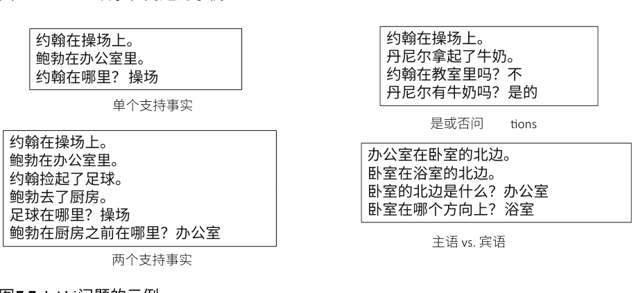

SQuAD：SQuAD（Rajpurkar等, 2016年）代表斯坦福问答数据集，这是一个最近发布的人工创建的大型机器理解数据集。该数据集包含近10万个文档-问题对。这些文档来源于维基百科页面，然后众包注释者被要求根据这些文档提出一些问题，并在文档中标记相应的答案。请注意，在SQuAD中，不提供候选答案。系统可以通过预测答案在文档中的起始和结束位置来‘生成’答案。问题的示例如图7.8所示。

> 在气象学中，降水是指大气水蒸气凝结后由重力下落的任何产物。降水的主要形式包括毛毛雨、雨、雨夹雪、雪、霰和冰雹...降水形成是通过与云中的其他雨滴或冰晶碰撞而使较小的水滴聚合。在分散的地点，短暂而强烈的降雨被称为“阵雨”。

水滴在哪里与冰晶碰撞形成降水？

# 图7.8 SQuAD问题的一个例子

此外，最近还发布了几个与SQuAD具有相似规模和相似形式的MC数据集，例如NewsQA<sup>7</sup>和Marco.<sup>8</sup>

Cloze-Style机器理解数据集：除了MC中前面提到的QA形式外，Cloze-style查询（Taylor 1953）是基本形式之一。这种类型与阅读理解的大部分特征相似，但答案是文档中的一个单词。最近提出了许多数据集用于这种类型的研究，例如CNN/Daily Mail（Hermann等人，2015年）和CBT（Hill等人，2015年）。在CNN/Daily Mail中，作者提出了一种半自动方法来从两个新闻语料库中生成填空题。每个新闻故事都附有一个标题或摘要。作者在标题中删除了一个特定的名词，系统需要根据给定的文档来填充这个占位符。为了避免语言建模或超出文本理解的现实知识对结果的影响，作者对文档和查询中的所有实体进行了匿名处理。在CBT中，每个文档包含20个连续的书籍故事句子。第二十一句中的一个词被删除。为了避免基于语言建模的阅读理解方法的使用，答案被限制为专有名词。CNN/Daily Mail的一个示例如图7.9所示。

上下文：
（@entity4）如果你今天感受到了一股力量的涟漪，那可能是官方的@entity6正在引入它的第一个同性恋角色。根据科幻网站@Entity9的说法，即将推出的小说《@entity11》将会有一个能干但有缺陷的@Entity13官员，她“碰巧也是一个女同性恋者。”“根据@entity6特许经营的漫画和书籍 - 根据@entity24, @entity28印记@entity26的@entity6书籍编辑 - 批准。”

问题：
“@placeholder”电影中的角色逐渐变得更加多样化
答案：
@entity6

# 图7.9 CNN问题的一个例子

##### 7.3.1.2 实现机器理解所需的知识要求

机器理解是一项综合推理任务，需要对自然语言有深入的理解。在心理学中，理解来自于单词之间的相互作用以及它们如何触发给定段落/文档中的知识。而且，这是一个创造性、多方面的过程，依赖于四种语言技能：音韵学、句法学、语义学和语用学。对于机器理解问题，即使要实现真正的理解，也需要理解多个从句之间的关系。例如，理解事件之间的时间关系的技能隐含地需要识别诸如连词（when、as、since等）、时间指示词（morning、evening等）、时态和体态（went、is going、will go等）的表达。此外，还需要其他推理技能。例如，回答与算术问题相关的问题需要进行数学运算，比如‘汤姆有四支铅笔，他给了他的同桌2支，他手上还剩下多少支铅笔？’回答这类问题的系统应该推理出方程‘4 - 2 = 2’。Sugawara等人（2017）提出了10个大致需要的MC技能，列在图7.10中。总的来说，机器理解涉及处理许多语言模式，如词汇、句法或高级话语、释义。为了对这些特征进行建模，根据方法论的角度，当前的方法可以分为两部分：基于特征工程的方法和基于深度学习的方法。我们简要介绍如下。

| 技能 | 描述或示例 |
| --- | --- |
| 列表/枚举 | 追踪、保留和列举实体或状态 |
| 数学运算 | 四则运算和几何理解 |
| 共指消解 | 共指的检测和消解 |
| 逻辑推理 | 归纳、演绎、条件语句和量化fier |
| 类比 | 修辞手法中的形象，例如隐喻 |
| 时空关系 | 事件的空间和/或时间关系 |
| 因果关系 | 通过为什么、因为、原因等表达的事件关系 |
| 常识推理 | 分类知识、定性知识、行动和事件变化 |
| 图解/修辞从句关系 | 句子中的从属或并列关系 |
| 特殊的句子结构 | 修辞手法、句子中的结构和标点符号的方案 |

图7.10 机器理解能力

#### 7.3.2 特征工程方法在机器理解中的应用

现有的基于特征工程的方法通常将文本理解任务建模为计算给定问题和文档之间的语义相似度的任务。这些方法试图通过几个浅层语言特征来建模句子和文档的语义，包括基于POS标签的特征、依存解析特征、共指、参照等。根据不同的特征，捕捉到不同类型的语义，如词汇级语义、篇章级语义等。

##### 7.3.2.1 词汇匹配

词汇匹配方法是一种简单而有效的机器理解任务方法。这种方法通常采用基于滑动窗口的算法，为每个问题文本和答案形成一个词袋向量，然后根据它们与故事文本的重叠程度对每个候选答案进行评分。然后根据候选答案与故事文本的重叠程度对每个候选答案进行评分，得分最高的候选答案将被确定。更具体地说，该算法在整个故事文本上通过一个滑动窗口，窗口的大小等于问题-答案对中的单词数。故事文本窗口与问题-答案对之间的最高重叠分数被视为答案的相应分数。算法细节在算法2中说明。

```
算法2 滑动窗口

要求：段落 \( P \)，段落词集合 \( PW \)，段落中的词 \( P_i \)，问题中的词集合 \( Q \)，假设答案中的词集合 \( A_{1..4} \)，以及停用词集合 \( U \)。

定义：\( C(W) = \sum_j \mathbb{I}(P_i = w) \)

定义：\( IC(W) = \log(1 + \frac{1}{c(w)}) \)

1: 对于 \( i \) 从1到4执行
2: \( S = A_i \cup Q \)
3: \( sw_i = \max_{j=1..|S|} \sum_{w=1..|S|} \begin{cases} IC(P_{j+w}) & \text{if } P_{j+w} \in S \\ 0 & \text{其他 wise} \end{cases} \)
4: end for
返回：\( sw_{1..4} \)
```

然而，上述算法中使用的文本窗口是固定的。Smith等人（2015）通过多次遍历并将得分相加来评分每个答案。具体来说，他们从窗口大小为2开始，逐渐增加到30个标记。然后，他们将这些得分与问题-答案对在整个故事中的匹配数量相结合。正如他们所宣称的那样，这种解决方案可以使系统捕捉到故事中的远距离关系。在MCTest上，原始的滑动窗口词汇匹配方法和增强的滑动窗口词汇匹配方法的比较结果如表7.2所示。

**表7.2 词汇匹配方法在MCTest上的性能**

| | 滑动窗口（%） | 增强的滑动窗口（%） |
| :--- | :--- | :--- |
| MC160 | 69.43 | 72.65 |
| MC500 | 63.01 | 63.57 |

##### 7.3.2.2 话语关系

此外，回答问题所需的相关信息可能分布在多个句子中。理解这些句子之间的语义关系对于找到正确答案很重要。以图7.11中的例子为例。要回答关于‘为什么Sally穿上鞋子’的问题，我们需要推断‘她穿上鞋子’和‘她出去散步’之间存在因果关系。

一些先前的研究已经证明了话语关系在相关应用中的价值，例如问答系统（Jansen等人，2014年）。Narasimhan和Barzilay（2015年）提出了三种模型来将话语关系纳入MC系统中。

将文档中的句子表示为 z，问题表示为 q，答案表示为 a。

**模型1:**

$$P(a, z|q_j) = P(z|q_j)P(a|z, q_j) \quad (7.1)$$

方程7.1将联合概率定义为两个分布的乘积。第一个是给定问题中段落中句子的条件分布。这有助于识别那些需要回答问题的句子。第二个组件模拟了在给定问题 q 和句子 z 的情况下选择答案的条件概率。我们可以使用指数族来表示这些组件概率，即：$P(z|q) \propto \exp^{\theta_1\phi_1(q,z)}$和 $P(z|a,q) \propto \exp^{\theta_2\phi_2(q,a,z)}$，其中 φ 是特征向量，θ 表示相关权重。对文档中的所有句子 $z_n$ 求和，我们可以得到特定答案 $a_j$ 的概率：

莎莉喜欢出去。她穿上了鞋子。她出去散步。[...]猫咪米西对莎莉喵喵叫。莎莉向猫咪米西挥手。[...]莎莉听到了她的名字。“莎莉，莎莉，回家”，莎莉的妈妈喊道。莎莉跑回家找妈妈。莎莉喜欢出去。

为什么莎莉穿上了鞋子？

A) 为了向猫咪米西挥手
B) 为了听到她的名字
C) 因为她想出去
D) 为了回家

$$P(a_j|q_j) = \sum_{n} P(a_j, z_n|q_j)。\tag{7.2}$$

通过这种方式，可以编写一个似然目标函数

$$L_1(\theta) = log \sum_{j} \sum_{n} P(a_j, z_n|q_j)。\tag{7.3}$$

**模型2：** 上述模型只能考虑一次支持句子（即，$z$）。自然地，我们可以将其扩展到多句情况，即利用多个相关句子来回答给定的问题。在这种情况下，定义一个联合模型如下。

$$P(a, z_1, z_2|q) = P(z_1, |q) P(z_2|z_1, q) P(a|z_1, z_2, q). \tag{7.4}$$

给定一个问题 $q$，我们首先预测与 $q$相关的第一个支持句子 $z_1$的概率 $P(z_1, |q)$，然后在给定 $q$和 $z_1$的情况下，推断出第二个支持句子 $z_2$。最后，预测出答案 $a$。

**模型3：** 该模型试图直接指定问题之间的话语关系，然后利用这种关系来推断文档中的其他相关句子。具体而言，模型3添加了一个隐藏变量 $r \in \mathscr{R}$来表示关系类型。它结合了将问题类型与关系类型联系起来的特征。它还利用关系类型来计算句子之间的词汇和句法相似性。关系集合 $\mathscr{R}$包括以下关系：(1)因果关系：事件的原因或事实的原因。(2)时间关系：事件的时间顺序(3)解释关系：主要处理how类型的问题。(4)其他关系：除了上述三种关系之外的其他关系（包括非关系）。

现在，通过添加关系类型 $r$，修改了方程7.4的联合概率：

$$P(a, r, z_1, z_2|q) = P(z_1|q) P(r|q) P(z_2|z_1, r, q) P(a|z_1, z_2, r, q). \tag{7.5}$$

额外的组成部分 $P(r|q)$是关于问题的关系类型 $r$的条件概率。因此，该模型可以学习到，例如，为什么-问题对应因果关系。

三个模型的结果如表7.3所示。

**表7.3 三个模型在MC测试上的准确率。单一指的是只需要一个支持句子来回答的问题，而多个指的是需要多个句子来回答的问题。**

| | MC160 | | | MC500 | | |
| :--- | :--- | :--- | :--- | :--- | :--- | :--- |
| | 单一(%) | 多项(%) | 全部(%) | 单一(%) | 多项(%) | 全部(%) |
| 模型 1 | 78.45 | 60.57 | 68.47 | 70.58 | 57.77 | 63.58 |
| 模型 2 | 74.68 | 60.07 | 66.52 | 66.17 | 59.9 | 62.75 |
| 模型 3 | 72.79 | 60.07 | 65.69 | 68.38 | 59.9 | 63.75 |## 7.3.2.3 答案涉及结构

一些自然语言处理的先前工作从学习两个文本片段之间的潜在结构中受益。例如，在文本蕴涵识别（RTE）中，可以通过它们之间的一些潜在对齐来推断出假设。在MC中，我们还可以考虑将这种涉及结构信息纳入考虑。例如，在图7.6的示例中，回答第二个问题c做了什么？，我们可以使用一些句法规则将问题和候选答案转化为陈述。例如，其中一个候选答案是鲶鱼，我们将其与查询组合成一个陈述：Alyssa在餐厅吃鲶鱼。将此陈述视为假设，将文档视为前提，我们可以推断出这种蕴涵的概率。该结构在图7.12中说明。

在这里考虑的答案相关结构可以将文本中的多个句子与假设对齐。考虑对齐的文本句子不限于在文本中连续出现。为了允许这种不连续的对齐，Sachan等人（2015）利用了文档结构。特别地，他们借助修辞结构理论来捕捉句子间的事件或实体共指链接。他们专门使用潜在结构支持向量机（LSSVM）以最大边际的方式进行训练，其中答案相关结构是潜在的。这个答案相关模型在MC500上的实验结果如表7.4所示。

## 7.3.2.4 基于特征工程的方法面临的挑战

基于特征工程的方法是处理机器理解问题的高效和明确的方式，它们通常利用几个语言特征来建模给定文档和问题之间的语义关系。然后，它基于这些特征进行推理。这个过程清晰易懂。


|       | 单选   | 多选   | 全部   |
| ----- | ------ | ------ | ------ |
| 准确率 (%) | 67.65 | 67.99 | 67.83 |

方法中存在的问题。然而，这些语言特征有时需要通过经验或启发式经验来提取。而且它们可能不涵盖更深层次的语义信息。此外，它们严重依赖于独立的语言工具，如词性标注、解析器等，这可能会给系统引入噪音。因此，特征工程方法通常专注于具有MC数据的数据集，例如MCTest。对于一些大规模的MC数据集，如SQuAD和bAbi，现有的基于特征工程的方法很难从文本中设计和提取有效的特征。最近，随着深度学习在计算机视觉和语音识别方面取得了巨大成功，越来越多的研究人员开始关注基于深度学习的MC任务技术。

#### 7.3.3 机器理解中的深度学习方法

在本节中，针对MC任务，我们将介绍几种在不同数据集上广泛使用的基于深度学习的方法。形式上，给定一个文档 $d$ 和一个问题 $q$，选择答案 $a$ 的概率可以建模如下：

$$ P(a|d, q) \propto \exp(W(a)g(d, q)) $$

其中 $W(a)$ 表示答案候选 $a$ 的嵌入，$g(d, q)$ 表示给定问题 $q$ 下文档 $d$ 的嵌入。关键部分是计算 $g(d, q)$ 的函数，可以应用多种深度神经网络，如RNN、LSTM和记忆网络（Weston et al.2015b）。

##### 7.3.3.1 基于LSTM的编码器

长短期记忆网络（LSTM）已被证明对于将序列数据建模为向量是有效的。因此，为了对函数 $g(d, q)$ 进行建模，Hermann等人（2015）将文档逐个单词地输入到基于LSTM的编码器中。然后，在一个分隔符之后，问题 $q$ 也被输入到这个编码器中。这样，给定的文档 $d$ 和问题 $q$ 的配对可以作为一个长的单一序列，如图7.13所示。这里省略了细节，可以参考（Hermann等人，2015）。

##### 7.3.3.2 双向注意力编码器

单向LSTM很难在长距离上传播依赖关系。因此，信息在从一个组件传输到另一个组件的过程中会衰减，文档的语义无法被准确地编码。因此，越来越多的研究者采用双向LSTM模型来编码序列数据。此外，文档 $d$ 中的并不是所有句子或上下文都与给定的问题 $q$ 相关。例如，$d$ 是“迈克尔·乔丹突然从芝加哥公牛队退役

“1993-94 NBA赛季开始时，迈克尔·乔丹退役从事棒球事业。”当 q是“迈克尔·乔丹何时退役NBA？”时， d中的关注重点应该是“在1993-94 NBA赛季开始之前。”当 q是“迈克尔·乔丹从NBA退役后参与哪些运动？”时， d中的关注重点应该是“从事棒球事业。”也就是说，在处理不同问题时，我们应该对 d的不同部分给予不同的关注。因此，将注意机制引入深度神经网络是很自然的。陈等人（2016）提出了一种带有注意机制的双向编码模型（BiDEA），在CNN/Daily Mail数据集上取得了很好的性能。

这个模型的结构非常直观。它预测答案的过程主要包括以下三个步骤：

-   1. 编码：将所有单词映射为 $d$ 维向量后，可以将文本 $p$ 和查询 $q$ 表示为 $p_1, p_2, \ldots, p_m$ 和 $q_1, q_2, \ldots, q_l$ 分别。因此，$p$ 的上下文信息可以计算为

$$
\overrightarrow{h_i} = LSTM(\overrightarrow{h_{i-1}}, p_i), i = 1, \ldots, m
$$
$$
\overleftarrow{h_i} = LSTM(\overleftarrow{h_{i+1}}, p_i), i = m, \ldots, 1
$$
$$
\tilde{p_i} = concat(\overrightarrow{h_i}, \overleftarrow{h_i})。
$$

同时，问题可以通过另一个LSTM层将其嵌入为 $q$（一个单一向量）以相同的方式。

-   2. 注意：所有的文本信息都可以通过以下方式合并为输出向量 $o$ in :

$$
\alpha_i = softmax_i q^T W_s \tilde{p_i}
$$
$$
o = \sum_i \alpha_i \tilde{p_i}
$$

**表7.5 CNN/Daily mail上BiDEA和其他模型的结果**

| 模型 | CNN 验证 | CNN 测试 | Daily mail 验证 | Daily mail 测试 |
| --- | --- | --- | --- | --- |
| Attentive reader (Hermann et al. 2015) | 61.6 | 63.0 | 70.5 | 69.0 |
| MemNN (Sukhbaatar et al. 2015) | 63.4 | 6.8 | - | - |
| AS reader (Hermann et al. 2015) | 68.6 | 69.5 | 75.0 | 73.9 |
| Stanford AR (Chen et al. 2016) | 68.6 | 69.5 | 75.0 | 73.9 |
| DER网络 (Kobayashi et al.2016) | 71.3 | 72.9 | - | - |
| 迭代注意力 (Sordoni et al.2016) | 72.6 | 73.3 | - | - |
| EpiReader (Trischler et al. 2016) | 73.4 | 74.0 | - | - |
| GAReader (Dhingra等人, 2016) | 73.0 | 73.8 | 76.7 | 75.7 |
| AoA reader (Cui等人, 2017) | 73.1 | 74.4 | - | - |
| ReasoNet (Shen等人, 2017) | 72.9 | 74.7 | 77.6 | 76.6 |
| BiDAF (Seo等人, 2016) | 76.3 | 76.9 | 80.3 | 79.6 |
| BiDEA (Chen等人, 2016) | 72.4 | 72.4 | 76.9 | 75.8 |

在上述方程中， $W_s \in \mathbb{R}^{h \times h}$ 用于衡量问题 $q$ 和段落中的一个词之间的相似度 $p_{i}$。

-   3. 预测：预测的答案 $a$ 计算如下：

$a = \arg\max_{a \in p \cap E} W_a^T o,$

其中 $E$ 是嵌入矩阵， $W_a$ 是输出 $o$ 和候选词 $a$ 之间的测量矩阵。

尽管上述模型的计算非常直观，在CNN/Daily Mail上取得了非常有希望的性能（实验结果列在表7.5中）。根据Chen等人（2016）的分析，所提出的模型的有效性是由以下原因引起的： (i) CNN/Daily Mail中的推理和推断水平仍然足够简单，可以由一个简单的模型处理； (ii) 各种模型在CNN/Daily Mail上已经达到了性能上限，这个语料库甚至可以被信息检索系统很好地处理。

此外，为了以不同的粒度表示上下文并在没有早期摘要的情况下实现查询感知的上下文表示，Seo等人（2016年）采用了多阶层分层过程，并提出了双向注意力流网络（BiDAF）用于MC任务。

如图7.14所示，所提出的模型主要由以下6层组成：

-   1. 字符嵌入层：一个字符级的CNN，可以将单词中的字符映射为连续向量。
-   2. 词嵌入层：一个预训练的词嵌入矩阵。
-   3. 短语嵌入层：一个双向LSTM层，可以捕捉单词的上下文信息。
-   4. 注意力流动层：一个相似性矩阵，$S$，用于衡量上下文和查询之间的相似性，即上下文到查询和查询到上下文。
-   5. 建模层：一个包含所有单词上下文信息的双层双向LSTM。
-   6. 输出层：两个逻辑回归模型，分别捕捉起始索引和结束索引。

实验结果如表7.6所示，对SQuAD的实验结果表明BiDAF的思想带来了性能的提升，这可能是由于BiDAF在层次化水平上找到了支持证据的起始和结束。

##### 7.3.3.3 记忆网络

记忆网络（MemNNs）（Weston等人，2015b）被提出来解决顺序神经网络中信息衰减的问题。它可以通过推理组件与长期记忆组件（实际上是一个矩阵或张量，其名称由此而来）进行推理。总的来说，它包含四个重要的主要组件：

- I (输入特征映射) 将输入向量转换为内部特征表示。
- G (泛化) 根据新的输入更新现有的记忆。
- O (输出特征映射) 根据新的输入和当前记忆状态计算新的输出。
- R (响应) 将输出转换为所需的响应格式。

MemNNs的图示如图7.15所示。MemNNs的一个重要形式是End2End Memory Networks， 我们将其缩写为MemN2Ns。MemN2Ns的一个优点是它可以以端到端的方式进行训练，这意味著它需要较少的监督信息，并且在现实环境中更加通用。 以下方程分别计算I、G、O和R：

```
I p_i = Softmax(u^T m_i)
其中m_i = A x_i (x_i是输入句子的嵌入向量)， u = Bq (q 是输入查询)
```

在MemN2Ns中，记忆尚未更新。
O o = \sum_i p_i c_i其中 c_i = C x_{io}
R \hat{a} = Softmax(W(o + u)).
此外，可以通过以下方式将层插入到MemN2Ns中：

-   * u of (k + 1)th 层的计算可以表示为 u^{k+1} = u^k + o^k.
-   * 每个层都有自己的 A^k 和 C^k.
-   * 预测可以通过计算 \hat{a} =Softmax(W u^{K+1})来得到

MemN2N最初应用于bAbI任务的20个任务。 而且，正如在表7.7的实验中所示，最好的MemN2N性能接近于监督模型，位置编码 (PE) 表示相对于词袋 (BoW) 有所改进，线性启动 (LS) 训练似乎有助于避免局部最小值，并且联合训练对所有任务都有帮助。

除了MemNNs或MemN2Ns本身之外，值得注意的是，G中的计算实际上是一种注意机制。 记忆网络是第一个将外部知识保留在特定矩阵中的模型，这对于自然语言处理中各种深度模型的记忆机制的发展具有重要影响。

### 7.4 总结

本章简要介绍了基于深度学习的方法在问题回答任务中的应用，特别是在知识库问答和机器理解方面。 深度学习的优势在于它可以将所有文本片段，包括文档、问题和潜在答案，转化为向量嵌入。 因此，所有文本可以在一个统一的语义空间中处理。 因此，基于符号表示的传统问答方法中存在的语义鸿沟问题可以在一定程度上得到缓解。 此外，这种范式使得问答系统可以以端到端的方式构建。 因此，传统复杂的基于流水线的问答过程可以被更直接或更简单的方式取代。 预计结果将得到改善。

然而，基于深度学习的问答模型面临许多挑战。 例如，现有的神经网络，如RNN和CNN，仍然无法准确捕捉给定问题的语义含义。 特别是对于文档，文档中的主题或逻辑结构很难被神经网络建模。 此外，目前还没有有效的方法来嵌入知识库中的项目。 而且，问答中的推理过程很难仅通过向量之间的简单数值运算来建模。 这些问题是问答任务的关键挑战，未来应该更加重视。

**表7.6 BiDAF和其他模型在SQuAD测试集上的结果**

| 模型 | 单一模型 EM | 单一模型 F1 | 集成 EM | 集成 F1 |
|------|-------------|-------------|---------|---------|
| 逻辑回归基线 (Rajpurkar等人, 2016年) | 40.4 | 51.0 | - | - |
| 动态块读取器 (Yu等人, 2016年) | 62.5 | 71.0 | - | - |
| 细粒度门控 (Yang等人, 2016年) | 62.5 | 73.3 | - | - |
| 匹配LSTM (Wang和Jiang, 2016年) | 64.7 | 73.7 | 67.9 | 77.0 |
| 多角度匹配 (Wang等人, 2016年) | 65.5 | 75.1 | 68.2 | 77.2 |
| 动态共同注意力网络 (Xiong等人, 2016年) | 66.2 | 75.9 | 71.6 | 80.4 |
| R-Net (Wang等人, 2017年) | 68.4 | 77.5 | 72.1 | 79.7 |
| BiDAF (Seo等人, 2016) | 68.0 | 77.3 | 73.3 | 81.1 |

**表7.7 使用1k训练样本的模型在20个QA任务上的测试错误率（10k训练样本的平均测试错误率显示在底部）**

| 任务 | 强监督 Mem NN | LSTM | MemNN WSH | BoW | PE | PE LS | PE LS RN | 1跳PE LS联合 | 2跳PE LS联合 | 3跳PE LS联合 | PE LS RN联合 | PE LS LW联合 |
|------|---------------|------|-----------|-----|----|-------|----------|--------------|--------------|--------------|--------------|--------------|
| 1个支持事实 | 0.0 | 50.0 | 0.1 | 0.6 | 0.1 | 0.2 | 0.0 | 0.8 | 0.0 | 0.1 | 0.0 | 0.1 |
| 2个支持事实 | 0.0 | 80.0 | 42.8 | 17.6 | 21.6 | 12.8 | 8.3 | 62.0 | 15.6 | 14.0 | 11.4 | 18.8 |
| 3个支持事实 | 0.0 | 80.0 | 76.4 | 71.0 | 64.2 | 58.8 | 40.3 | 76.9 | 31.6 | 33.1 | 21.9 | 31.7 |
| 2个参数关系 | 0.0 | 39.0 | 40.3 | 32.0 | 3.8 | 11.6 | 2.8 | 22.8 | 2.2 | 5.7 | 13.4 | 17.5 |
| 3个参数关系 | 2.0 | 30.0 | 16.3 | 18.3 | 14.1 | 15.7 | 13.1 | 11.0 | 13.4 | 14.8 | 14.4 | 12.9 |
| 是/否问题 | 0.0 | 52.0 | 51.0 | 8.7 | 7.9 | 8.7 | 7.6 | 7.2 | 2.3 | 3.3 | 2.8 | 2.0 |
| 计数 | 15.0 | 51.0 | 36.1 | 23.5 | 21.6 | 20.3 | 17.3 | 15.9 | 25.3 | 17.9 | 18.3 | 10.1 |
| 列表集合 | 9.0 | 55.0 | 37.8 | 11.4 | 12.6 | 12.7 | 10.0 | 13.2 | 11.7 | 10.1 | 9.3 | 6.1 |
| 简单否定 | 0.0 | 36.0 | 35.9 | 21.1 | 23.3 | 17.0 | 13.2 | 5.1 | 2.0 | 3.1 | 1.9 | 1.5 |
| 不确定知识 | 2.0 | 56.0 | 68.7 | 22.9 | 17.4 | 18.6 | 15.1 | 10.6 | 5.0 | 6.6 | 6.5 | 2.6 |
| 基本指代 | 0.0 | 38.0 | 30.0 | 4.1 | 4.3 | 0.0 | 0.9 | 8.4 | 1.2 | 0.9 | 0.3 | 3.3 |
| 连词 | 0.0 | 26.0 | 10.1 | 0.3 | 0.3 | 0.1 | 0.2 | 0.4 | 0.0 | 0.3 | 0.1 | 0.0 |
| 复合指代 | 0.0 | 6.0 | 19.7 | 10.5 | 9.9 | 0.3 | 0.4 | 6.3 | 0.2 | 1.4 | 0.2 | 0.5 |
| 时间推理 | 1.0 | 73.0 | 18.3 | 1.3 | 1.8 | 2.0 | 1.7 | 36.9 | 8.1 | 8.2 | 6.9 | 2.0 |
| 基本推理 | 0.0 | 79.0 | 64.8 | 24.3 | 0.0 | 0.0 | 0.0 | 46.4 | 0.5 | 0.0 | 0.0 | 1.8 |
| 基本归纳 | 0.0 | 77.0 | 50.5 | 52.0 | 52.1 | 1.6 | 1.3 | 47.4 | 51.3 | 3.5 | 2.7 | 51.0 |
| 位置推理 | 35.0 | 49.0 | 50.9 | 45.4 | 50.1 | 49.0 | 51.0 | 44.4 | 41.2 | 44.5 | 40.4 | 42.6 |

表 7.7 (续) 任务

| 任务 | 强监督 MemNN | LSTM | MemNN WSH | MemNN2N BoW | PE | PELS | PELS RN | PE跳1-LS联合 | PE跳2-LS联合 | PE跳3-LS联合 | PELS RN 联合 | PELS LW 联合 |
|------|-------------|------|-----------|-------------|----|------|---------|--------------|--------------|--------------|-------------|-------------|
| 大小推理 | 5.0 | 48.0 | 51.3 | 48.1 | 13.6 | 10.1 | 11.1 | 9.6 | 10.3 | 9.2 | 9.4 | 9.2 |
| 路径寻找 | 64.0 | 92.0 | 100.0 | 89.7 | 87.4 | 85.6 | 82.8 | 90.7 | 89.9 | 90.2 | 88.0 | 90.6 |
| 代理的动机 | 0.0 | 9.0 | 3.6 | 0.1 | 0.0 | 0.0 | 0.0 | 0.0 | 0.1 | 0.0 | 0.0 | 0.2 |
| 平均误差 (%) | 6.7 | 51.3 | 40.2 | 25.1 | 20.3 | 16.3 | 13.9 | 25.8 | 15.6 | 13.3 | 12.4 | 15.2 |
| 已完成任务 (错误率 >5%) | 4 | 20 | 8 | 15 | 13 | 12 | 11 | 17 | 11 | 11 | 11 | 10 |
| 在 10k 训练数据上 | | | | | | | | | | | | |
| 平均误差 (%) | 3.2 | 36.4 | 39.2 | 15.4 | 9.4 | 7.2 | 6.6 | 24.5 | 10.9 | 7.9 | 7.5 | 11.0 |
| 已完成任务 (错误率 >5%) | 2 | 16 | 7 | 9 | 6 | 4 | 4 | 16 | 7 | 6 | 6 | 6 |

> 关键词：背包模型表示法；线性开始训练；随机注入时间索引并噪声，噪声 RNN 风格；逐层权重绑定（如果未说明，则使用相邻双重绑定）；联合所有任务（与每个任务单独训练相对）。

## 参考文献

Berant, J., Chou, A., Frostig, R., & Liang, P. (2013). 基于问题-答案对的Freebase语义解析。在 *EMNLP* 中。

Berant, J., & Liang, P. (2014). 通过释义进行语义解析。在 *ACL* 中。

Bordes, A., Chopra, S., & Weston, J. (2014a). 使用子图嵌入的问答。在 *EMNLP* 中。

Bordes, A., Usunier, N., Chopra, S., & Weston, J. (2015). 基于记忆网络的大规模简单问答。在 *arXiv* 中。

Bordes, A., Weston, J., & Usunier, N. (2014b). 使用弱监督嵌入模型的开放式问题回答。在 *ECML* 中。

Cai, Q., & Yates, A. (2013). 通过模式匹配和词典扩展进行大规模语义解析。在 *ACL* 中。

Chen, D., Bolton, J., & Manning, C. D. (2016). 对CNN/Daily Mail阅读理解任务进行全面研究。在计算语言学协会（ACL）中。

Cui, Y., Chen, Z., Wei, S., Wang, S., Liu, T., & Hu, G. (2017). 用于阅读理解的注意力过注意力神经网络。在 *ACL* 中。

Dhingra, B., Liu, H., Yang, Z., Cohen, W. W., & Salakhutdinov, R. (2016). 用于文本理解的门控注意力读者。 arXiv预印本arXiv:1606.01549。

Dong, L., Wei, F., Zhou, M., & Xu, K. (2015). 使用多列卷积神经网络在Freebase中进行问答。在 *ACL-IJCNLP* 中。

Etzioni, O. (2011). 搜索需要改变。 *Nature*, 476(7358), 25–26.

Hao, Y., Zhang, Y., Liu, K., He, S., Liu, Z., Wu, H., & Zhao, J. (2017). 一种端到端的模型，结合全局知识和交叉注意力，在知识库上进行问答。 在计算语言学协会（ACL）中。

Hermann, K. M., Kocisky, T., Grefenstette, E., Espeholt, L., Kay, W., Suleyman, M., & Blunsom, P. (2015). 教机器阅读和理解。 在神经信息处理进展系统(pp. 1693–1701)中。

Hill, F., Bordes, A., Chopra, S., & Weston, J. (2015). 金发姑娘原则：阅读儿童的书籍时具有明确的记忆表征。 arXiv预印本arXiv:1511.02301。

Jansen, P., Surdeanu, M., & Clark, P. (2014). 话语补充非事实答案重新排序的词汇语义。 在计算语言学协会第52届年会论文集中(第1卷：长篇论文，第977-986页)。 计算语言学协会。

Kobayashi, S., Tian, R., Okazaki, N., & Inui, K. (2016). 动态实体表示与最大池化改进机器阅读。 在2016年NAACL会议论文集中。

Kun, X., Sheng, Z., Yansong, F., & Dongyan, Z. (2014). 通过短语语义解析回答自然语言问题。 在2014年自然语言处理和中文计算会议论文集中。

Kwiatkowski, T., Choi, E., Artzi, Y., & Zettlemoyer, L. S. (2013). 通过即时本体匹配来扩展语义解析器。在 *EMNLP* 中。

Liang, C., Berant, J., Le, Q., Forbus, K. D., & Lao, N. (2017). 神经符号机器：在Freebase上通过弱监督学习语义解析器。在计算语言学协会会议论文集（ACL 2017）中。 加拿大：计算语言学协会。

Liu, Y., Wei, F., Li, S., Ji, H., Zhou, M., & Wang, H. (2015). 一种基于依赖关系的神经网络用于关系分类。 在 *ACL* 中。

Miller, A., Fisch, A., Dodge, J., Karimi, A.-H., Bordes, A., & Weston, J. (2016). 用于直接阅读文档的键值记忆网络。 在2016年自然语言处理实证方法会议论文集中（第1400-1409页）。 奥斯汀，德克萨斯州：计算语言学协会。

Narasimhan, K., & Barzilay, R. (2015). 使用话语关系的机器理解。 在第53届年会上的计算语言学协会和第7届国际自然语言处理联合会议（第1卷：长文，第1253-1262页）。计算语言学协会。

Rajpurkar, P., Zhang, J., Lopyrev, K., & Liang, P. (2016). Squad: 10万+篇文章的机器文本理解。 CoRR， abs/1606.05250。

Reddy, S., Lapata, M., & Steedman, M. (2014). 大规模语义解析无需问题-答案对。计算语言学协会交易(pp. 377–392)。

Richardson, M., Burges, J. C., & Renshaw, E. (2013). Mctest: 一个用于开放域文本机器理解的挑战数据集。 在2013年经验方法会议上的论文自然语言处理(pp. 193–203). 计算语言学协会。

Sachan, M., Dubey, K., Xing, E., & Richardson, M. (2015). 学习回答相关结构用于机器理解。 在第53届年会上的论文计算语言学协会和第7届国际联合会议自然语言处理(卷1: 长论文, pp. 239–249). 计算语言学协会。

Seo, M. J., Kembhavi, A., Farhadi, A., & Hajishirzi, H. (2016). 双向注意力流用于机器理解。 CoRR, abs/1611.01603.

Shen, Y., Huang, P.-S., Gao, J., & Chen, W. (2017). Reasonet: 学习在机器阅读中停止阅读. 在第23届ACM SIGKDD国际知识发现与数据挖掘会议, KDD '17 (pp. 1047–1055). 美国纽约: ACM.

Smith, E., Greco, N., Bosnjak, M., & Vlachos, A. (2015). 一种强大的词汇匹配方法用于机器阅读测试. 在2015年经验方法在自然语言处理中的会议(pp. 1693–1698). 计算语言学协会.

Sordoni, A., Bachman, P., Trischler, A., & Bengio, Y. (2016). 迭代交替神经注意力用于机器阅读. arXiv预印本arXiv:1606.02245.

Steedman, M. (2000). 句法处理. 剑桥，马萨诸塞州：麻省理工学院出版社。

Sugawara, S., Yokono, H., & Aizawa, A. (2017). 阅读理解的先决技能: 对mctest数据集和系统的多角度分析。

Sukhbaatar, S., Weston, J., Fergus, R., 等 (2015). 端到端记忆网络。 在神经信息处理系统进展(pp. 2440–2448)中。

Taylor, W. L. (1953). 完形填空程序: 一种衡量可读性的新工具。 新闻学通报, 30(4), 415–433。

Trischler, A., Ye, Z., Yuan, X., & Suleman, K. (2016). 使用 epireader的自然语言理解。 arXiv预印本arXiv:1606.02270。

Wang, S., & Jiang, J. (2016). 使用Match-LSTM和答案指针的机器理解。 CoRR, abs/1608.07905。

Wang, W., Yang, N., Wei, F., Chang, B., & Zhou, M. (2017). 门控自匹配网络用于阅读理解和问题回答。 在计算语言学协会第55届年会论文集中(第1卷: 长文, 第189-198页)。 计算语言学协会。

Wang, Z., Mi, H., Hamza, W., & Florian, R. (2016). 多角度上下文匹配用于机器理解。 CoRR, abs/1612.04211。

Weston, J., Bordes, A., Chopra, S., Rush, A. M., van Merrienboer, B., Joulin, A., & Mikolov, T. (2015a). 朝着AI完全问答: 一组先决条件玩具任务。 arXiv预印本 arXiv:1502.05698。

Weston, J., Chopra, S., & Bordes, A. (2015b). 记忆网络. 在 ICLR。

Xiong, C., Zhong, V., & Socher, R. (2016). 动态共同关注网络用于问题回答. CoRR, abs/1611.01604。

Xu, K., Feng, Y., Huang, S., & Zhao, D. (2015). 通过卷积神经网络进行语义关系分类，采用简单的负采样. 在 EMNLP。

Xu, K., Reddy, S., Feng, Y., Huang, S., & Zhao, D. (2016). 通过关系抽取和文本证据在Freebase上进行问答. 在Proceedings of the Association for Computational Linguistics (ACL 2016). 柏林, 德国: 计算语言学协会。

Yang, Y., & Chang, M.-W. (2015). S-mart: 应用于推特实体链接的新型基于树的结构化学习算法. 在Proceedings of the 53rd Annual Meeting of the Association for Computational Linguistics and the 7th International Joint Conference on Natural Language Processing (Volume 1: Long Papers, pp. 504-513). 北京，中国：计算语言学协会。

Yang, Z., Dhingra, B., Yuan, Y., Hu, J., Cohen, W. W., & Salakhutdinov, R. (2016). 词还是字符？细粒度门控阅读理解。CoRR, abs/1611.01724。

Yih, W.-t., Chang, M.-W., He, X., & Gao, J. (2015). 通过分阶段查询图生成进行语义解析：基于知识库的问答。在ACL-IJCNLP中。

Yih, W.-t., He, X., & Meek, C. (2014). 单关系问题回答的语义解析。在第52届年会的计算语言学协会会议（第2卷：短篇论文，第643-648页）。巴尔的摩，MD：计算语言学协会。

Yih, W.-t., Richardson, M., Meek, C., Chang, M.-W., & Suh, J. (2016). 语义解析标签对于知识库问答的价值。在第54届年会的计算语言学协会会议（第2卷：短篇论文，第201-206页）。柏林，德国：计算语言学协会。

Yu, Y., Zhang, W., Hasan, K. S., Yu, M., Xiang, B., & Zhou, B. (2016). 端到端阅读理解与动态答案块排序。CoRR, abs/1610.09996.

Zeng, D., Liu, K., Lai, S., Zhou, G., & Zhao, J. (2014). 通过卷积深度神经网络进行关系分类。 在 COLING 2014的论文集中，第25届国际计算语言学会议的技术论文(pp. 2335–2344). 爱尔兰都柏林: 都柏林城市大学和计算语言学协会。

Zhang, S., Feng, Y., Huang, S., Xu, K., Han, Z., & Zhao, D. (2015). 通过结构化知识库对最高级表达的语义解释。 在第53届年会的计算语言学协会和第7届国际联合会议自然语言处理(第2卷: 短论文, pp. 225–230). 中国北京: 计算语言学协会。

## 第8章 深度学习在情感分析中的应用


唐度宇和张美山

摘要 情感分析（也称为意见挖掘）是自然语言处理中的一个活跃研究领域。该任务旨在从社交网络、博客或产品评论中识别、提取和组织用户生成的文本中的情感。 在过去的二十年中，文献中的许多研究利用机器学习方法从不同的角度解决情感分析任务。

由于机器学习者的性能严重依赖于数据表示的选择，许多研究致力于构建具有领域专业知识和精心设计的强大特征提取器。 最近，深度学习方法成为了一种强大的计算模型，可以自动从数据中发现复杂的语义表示，而无需进行特征工程。 这些方法在许多情感分析任务中改进了最新技术，包括情感分类、意见提取、细粒度情感分析等。在本文中，我们概述了成功的深度学习方法在不同层次的情感分析任务中的应用。

### 8.1 引言

情感分析（也称为意见挖掘）是一门自动分析用户生成文本中人们观点、情感和情绪的领域 (Pang等人, 2008年; Liu, 2012年)。情感分析是自然语言处理中一个非常活跃的研究领域 (Manning等人, 1999年; Jurafsky, 2000年), 也广泛研究于数据挖掘、网络挖掘和社交媒体分析中，因为情感是影响人类行为的因素之一。

D. Tang
微软亚洲研究院，中国北京
e-mail: dutang@microsoft.com

M. Zhang (✉)
黑龙江大学，中国哈尔滨
e-mail: mszhang@hlju.edu.cn

表8.1 一个说明情感定义的例子

| 目标 | 情感 | 持有者 | 时间 |
|------|------|--------|------|
| iPhone | 积极的 | 爱丽丝 | 2015年6月4日 |
| 触摸屏 | 积极的 | 爱丽丝 | 2015年6月4日 |
| 价格 | 消极的 | 爱丽丝 | 2015年6月4日 |

随着Twitter、¹ Facebook²等社交媒体以及IMDB、³ Amazon、⁴ Yelp等评论网站的快速增长，情感分析引起了研究和行业的广泛关注（表8.1）。根据（Liu 2012）的定义，情感（或意见）被表示为五元组 (e, a, s, h, t)，其中 e 是实体的名称，a 是 e 的方面，s 是对实体 e 的方面 a 的情感，h 是意见持有者，t 是意见被 h 表达的时间。在这个定义中，情感 s 可以是积极的、消极的或中性的情感，或者是在Yelp和Amazon等评论网站中表示情感强度/强度的数值评分（例如1-5星）。实体可以是产品、服务、主题组织或事件 (Hu和Liu 2004; Deng和Wiebe 2015)。

让我们用一个例子来解释“情感”的定义。假设一个名叫爱丽丝的用户发表了一篇评论：“我几天前买了一部iPhone。它是一部很好的手机。触摸屏真的很酷。然而，价格有点高。”于2015年6月4日。这个例子涉及到三个情感五元组，如表8.1所示。

根据“情感”的定义，情感分析旨在发现文档中的所有情感五元组。情感分析任务源于情感五元组的五个组成部分。例如，文档/句子级情感分类（Pang et al. 2002; Turney 2002）针对第三个组成部分（情感，如积极、消极和中性），而忽略了其他方面。细粒度观点抽取关注五元组的前四个组成部分。目标相关的情感分类关注第二个和第三个方面。

在过去的二十年中，机器学习驱动的方法在大多数情感分析任务中占据主导地位。由于特征表示极大地影响机器学习者的性能（LeCun等人，2015年；Goodfellow等人，2016年），文献中的许多研究都专注于具有领域专业知识和谨慎工程的有效特征。但是，通过表示学习算法可以避免这种情况，该算法可以自动从数据中发现具有区分性和解释性的文本表示。

深度学习是一种表示学习方法，它使用非线性神经网络学习多层次的表示，每个层次将表示从一个层次转换为更高级和更抽象的表示。

在一个层次上的表示转换为更高级和更抽象的表示。学习到的表示可以自然地用作特征，并应用于检测或分类任务。在本章中，我们介绍了成功的深度学习算法用于情感分析。本章中的“深度学习”符号表示使用神经网络方法从数据中自动学习连续和实值文本表示/特征。

我们按照以下方式组织本章节。由于单词是自然语言的基本计算单元，我们首先描述了学习连续单词表示的方法，也称为单词嵌入。这些单词嵌入可以作为后续情感分析任务的输入。我们描述了计算更长表达式（例如句子或文档）的语义组合方法，用于句子/文档级情感分类任务（Socher等人，2013年；Li等人，2015年；Kalchbrenner等人，2014年），接着是用于细粒度意见提取的神经序列模型。最后，我们总结本文并提供一些未来的方向。

### 8.2 情感特定的单词嵌入

单词表示旨在表示单词含义的方面。例如，“手机”的表示可以捕捉到手机是电子产品、包含电池和屏幕、可以用来与他人聊天等事实。一种直接的方法是将单词编码为独热向量。

它的长度与词汇表的大小相同，只有一个维度为1，其他维度都为0。然而，独热词表示只编码了词汇表中单词的索引，而未能捕捉词汇的丰富关系结构。

发现单词之间的相似性的一种常见方法是学习单词聚类（Brown et al.1992 ; Baker and McCallum1998）。每个单词与一个离散类别相关联，同一类别中的单词在某种程度上相似。这导致了对较小词汇表大小的独热表示。许多研究人员不再使用基于聚类结果的离散变量来描述相似性，这些结果对应于单词集的软或硬分区，而是致力于学习每个单词的连续和实值向量，也称为词嵌入。现有的嵌入学习算法通常基于分布假设（Harris 1954），该假设认为在相似的上下文中出现的单词具有相似的含义。

为了实现这个目标，许多矩阵分解方法可以被视为对词表示进行建模。例如，潜在语义索引（LSI）（Deerwester等，1990年）可以被视为学习具有重构目标的线性嵌入，它使用一个“词-文档”共现统计的矩阵，例如，每一行代表一个词或术语，每一列对应于语料库中的一个单独文档。语言的超空间类比（Lund和Burgess1996）利用了一个词-词共现统计的矩阵，其中行和列都对应于单词，条目表示给定单词在上下文中出现的次数。在另一个词的上下文中。Hellinger PCA (Lebret等, 2013年) 也研究了通过“词-词”共现统计来学习词嵌入。由于标准矩阵分解方法不包含任务特定信息，不清楚它们是否足够有用。监督语义索引 (Bai等, 2010年) 解决了这个问题，并考虑了特定任务 (例如信息检索) 的监督信息。他们通过点击数据和边际排序损失函数来学习嵌入模型。DSSM (Huang等, 2013年; Shen等, 2014年) 也可以被视为在信息检索中使用弱监督学习任务特定的文本嵌入。

一项开创性的工作是由Bengio等人 (2003年) 提出的, 该工作引入了一种神经概率语言模型, 该模型同时学习了单词的连续表示和基于这些单词表示的单词序列的概率函数。给定一个单词及其前面的上下文单词, 算法首先将所有这些单词映射到连续向量中, 使用共享的查找表。然后, 将单词向量输入到一个前馈神经网络中, 使用softmax作为输出层, 以预测下一个单词的条件概率。神经网络和查找表的参数是通过反向传播共同估计的。在Bengio等人 (2003年) 的工作之后, 提出了几种方法来加速训练过程或捕捉更丰富的语义信息。

Bengio等人 (2003年) 通过将上下文单词和当前单词的向量连接起来, 并使用重要性采样来有效地优化模型, 使用观察到的“正样本”和采样的“负样本”。Morin和Bengio (2005) 开发了分层softmax来分解条件概率, 使用了一个分层二叉树。Mnih和Hinton (2007) 引入了一个对数-双线性语言模型。Collobert和Weston (2008) 使用一个排名型hinge损失函数来训练词嵌入, 通过在窗口中替换中间词为随机选择的词。Mikolov等人 (2013a,b) 引入了连续词袋 (CBOW) 和连续跳字模型, 并发布了流行的word2vec⁶工具包。CBOW模型基于上下文词的嵌入来预测当前词, 而skip-gram模型基于当前词的嵌入来预测周围的词。Mnih和Kavukcuoglu (2013) 使用噪声对比估计 (Gutmann和Hyvärinen 2012) 加速了词嵌入学习过程。还有许多算法用于捕捉更丰富的语义信息, 包括全局文档信息 (Huang等人2012)、词形态 (Qiu等人2014)、基于依赖的上下文 (Levy和Goldberg 2014)、词-词共现 (Levy和Goldberg 2014)、歧义词义 (Li和Jurafsky 2015)、WordNet中的语义词汇信息 (Faruqui等人2014)、词之间的层次关系 (Yogatama等人2015)。前述的神经网络算法通常只使用词的上下文来学习词嵌入。因此, 具有相似上下文但情感极性相反的词, 如“好”和“坏”, 在嵌入空间中被映射为接近的向量。对于一些任务, 如词性标注, 这是有意义的, 因为这两个词具有相似的用法和语法角色, 但这是有问题的。

> 6https://code.google.com/p/word2vec/.

对于情感分析来说，“好”和“坏”具有相反的情感极性。为了学习适用于情感分析任务的词嵌入，一些研究将文本的情感编码为连续的词表示。Maas等人（2011）通过推断句子中每个词的嵌入来引入了一个概率主题模型来推断句子的极性。Labutov和Lipson（2013）通过将句子的情感监督视为正则化项，用逻辑回归重新嵌入现有的词嵌入。Tang等人（2014）扩展了C&W模型，并开发了三个神经网络来学习情感特定的词嵌入。Tang等人（2014）使用包含正面和负面表情符号的推文作为训练数据。正面和负面表情符号被视为弱情感监督信号。

我们描述了两种将句子的情感纳入学习词嵌入的情感特定方法。Tang等人（2016c）的模型扩展了Collobert和Weston（2008）的基于上下文的模型，以及Tang等人(2016a)扩展了Mikolov等人(2013b)的基于上下文的模型。我们描述了这些模型之间的关系。

基于上下文的模型的基本思想(Collobert和Weston2008)是通过边界将一个真实的词-上下文对( \(w_i, h_i\) )的得分高于一个人工噪声( \(w^n, h_i\) )。该模型通过最小化以下铰链损失函数进行学习，其中T是训练语料库：

$$\text{损失} = \sum_{(w_i, h_i) \in T} max \left(0, 1 - f_{\theta}(w_i, h_i) + f_{\theta}(w^n, h_i)\right). \qquad (8.1)$$

评分函数 \(f_{\theta}(w, h)\) 通过前馈神经网络实现。它的输入是当前词 \(w_i\) 和上下文词 \(h_i\) 的连接，输出是一个只有一个节点的线性层，代表 \(w\) 和 \(h\) 之间的兼容性。在训练过程中，从词汇表中随机选择一个人工噪声 \(w^n\)。

Tang等人（2014）的情感特定方法的基本思想是，如果一个词序列的黄金情感极性是积极的，那么预测的积极分数应该高于负分数。同样，如果一个词序列的黄金情感极性是消极的，那么它的积极分数应该小于负分数。例如，如果一个词序列与两个分数 \([f_{pos}^{rank}, f_{neg}^{rank}]\) 相关联，则\([0.7, 0.1]\)的值可以解释为一个积极的情况，因为积极分数0.7大于负分数0.1。类似地，\([-0.2, 0.6]\)的结果表示一个消极的极性。图8.1b给出了基于神经网络的排名模型，它与（Collobert和Weston2008）有一些相似之处。如图所示，排名模型是一个前馈神经网络，由四层组成（ \(lookup \rightarrow linear \rightarrow hT \ tanh \rightarrow linear\) ）。让我们将排名模型的输出向量表示为 \(f^{rank}\)，其中 \(C = 2\) 用于二元积极和消极分类。

模型训练的边际排名损失函数如下所述。

$$\text{损失} = \sum_{t}^{T} max \left(0, 1 - \delta_s(t) f_0^{rank}(t) + \delta_s(t) f_1^{rank}(t)\right) \qquad (8.2)$$

其中 T 是训练语料库，f_0^rank 是预测的正面得分，f_1^rank 是预测的负面得分，δ_s(t)是一个指示函数，反映了句子的黄金情感极性（正面或负面）。

$$\delta_{s}(t) = \begin{cases} 1 & \text{如果} \ f^g(t)=[1,0] \ -1 & \text{如果} \ f^g(t)=[0,1] \end{cases} \qquad\qquad\qquad\qquad(8.3)$$

基于类似的思想，skip-gram的扩展（Mikolov等人，2013b）被开发用于学习情感特定的词向量。给定一个词 w_i，skip-gram将其映射为其连续表示 e_i，并利用 e_i 来预测 w_i 的上下文词，即 w_{i-2}, w_{i-1}, w_{i+1}, w_{i+2} 等。skip-gram的目标是最大化平均对数概率：

$$f_{SG} = \frac{1}{T} \sum_{i=1}^{T} \sum_{-c \le j \le c, j \neq 0} \log \ p(w_{i+j}|e_i), \qquad\qquad\qquad\qquad(8.4)$$

其中 T 是语料库中每个短语的出现次数, c 是窗口大小，e_i 是当前短语 w_i 的嵌入, w_{i+j} 是 w_i 的上下文词, p(w_{i+j}|e_i) 是通过分层softmax计算的。基本的 softmax 单元计算公式为 softmax_i = exp(z_i) / Σ_k exp(z_k)。

情感特定模型如图8.2b所示。给定一个三元组 ⟨w_i, s_j, pol_j⟩ 作为输入，其中 w_i 是句子 s_j 中的短语，其情感极性为 pol_j，训练目标不仅是利用 w_i 的嵌入来预测其上下文词，还要利用句子表示 se_j 来预测句子 s_j 的情感极性 pol_j。句子向量通过对句子中包含的单词的嵌入进行平均计算得到。目标是最大化下面给出的加权平均损失函数。

$$f = \alpha \cdot \frac{1}{T} \sum_{i=1}^{T} \sum_{-c \leq j \leq c, j \neq 0} \log p(w_{i+j}|e_i) + (1 - \alpha) \cdot \frac{1}{S} \sum_{j=1}^{S} \log p(pol_j|se_j)$$

其中 S 是语料库中每个句子的出现次数，α 权衡上下文和情感部分， ∑_{k} pol_{jk} = 1. 对于正负二分类，[0, 1]的分布表示正面，[0, 1]的分布表示负面。

有不同的方法来利用文本的情感信息来指导嵌入学习过程。例如，Tang等人(2014)的模型扩展了Collobert和Weston(2008)的排序模型，并使用文本跨度的隐藏向量来预测情感标签。Ren等人(2016b)扩展了SSWE，并根据输入的n-gram进一步预测文本的主题分布。这两种方法如图8.3所示。

### 8.3 句子级情感分类

句子级情感分析专注于对给定句子的情感极性进行分类。通常，对于一个句子 w_1 w_2 . . . w_n，我们将其情感极性分为两个 (±) 或三个 (±/0) 类别，其中+表示积极，-表示消极，0表示中性。这个任务是一个代表性的句子分类问题。

在神经网络设置下，句子级情感分析可以被建模为一个两阶段的框架，一个是通过使用复杂的神经结构来进行句子表示的模块，另一个是通过softmax操作来解决的简单分类模块。图8.4展示了整体框架。

基本上，对于每个句子中的词嵌入，可以使用池化策略来获得一个简单的句子表示，池化操作能够从具有可变长度的顺序输入中总结出显著特征。形式上，我们可以使用方程 $\mathbf{h} = \sum_{i=1}^{n} a_i \mathbf{x}_i$ 来定义流行的池化函数。例如，广泛采用的平均（avg）、最大值和最小值池化操作可以形式化如下：

$$a_i^{avg} = \frac{1}{n}, \quad a_{ij}^{min} = \begin{cases} 1, & \text{if } i = \text{argmin}_k \mathbf{x}_{kj} \ 0, & \text{otherwise}, \end{cases}, \quad a_{ij}^{max} = \begin{cases} 1, & \text{if } i = \text{argmax}_k \mathbf{x}_{kj} \ 0, & \text{otherwise}. \end{cases}$$

(8.6) Tang等人 (2014) 利用三种池化方法验证了他们提出的情感编码词嵌入，该方法只是一个简单的例子来表示句子。事实上，最近关于句子分类的句子表示的进展远远超出了它。文献中提出了许多复杂的神经网络结构。总体而言，我们将相关工作总结为四个类别：（1）卷积神经网络，（2）循环神经网络，（3）递归神经网络，（4）通过辅助资源增强句子表示。我们将在下面的小节中介绍这些工作。

#### 8.3.1 卷积神经网络

在池化神经网络中，我们只能使用词级特征。当句子中的单词顺序改变时，句子的表示结果保持不变。在传统的统计模型中，采用n-gram词特征以缓解这个问题，显示出改进的性能。对于神经网络模型，可以利用卷积层实现类似的效果。

形式上，卷积层通过遍历具有固定大小的局部滤波器的顺序输入来执行非线性变换。给定一个输入序列 $\mathbf{x}_1\mathbf{x}_2\dots\mathbf{x}_n$，假设局部滤波器的大小为 $K$，则我们可以获得一个顺序输出 $\mathbf{h}_1\mathbf{h}_2\dots\mathbf{h}_{n-K+1}$：

$$ \mathbf{h}_i = f\left(\sum_{k=1}^K W_k \mathbf{x}_{i+K-k}\right), $$

其中 $f$ 是一个激活函数，例如$\tanh(\cdot)$和$\text{sigmoid}(\cdot)$。当 $K=3$ 并且 $\mathbf{x}_i$是输入的词嵌入时，得到的 $\mathbf{h}_i$是$\mathbf{x}_i,\mathbf{x}_{i+1}$和$\mathbf{x}_{i+2}$的非线性组合，类似于混合的一元、二元和三元特征，这些特征以一种固定的方式连接相应单词的表面形式。通常，卷积神经网络（CNN）是一种将卷积层和池化层结合在一起的网络，如图8.5所示，已经被广泛研究用于句子级情感分类。Collobert等人（2011）首次尝试直接应用标准CNN。该研究通过在输入词嵌入序列上使用卷积层，并在结果隐藏向量上使用进一步的最大池化，获得最终的句子表示。

Kalchbrenner等人（2014年）通过两个方面扩展了基本的CNN模型，以获得更好的句子表示。一方面，他们使用动态k-max池化，在池化过程中保留top-k值，而不仅仅是简单最大池化中的一个值。值k根据句子长度动态定义。另一方面，他们通过使用多层CNN结构来增加CNN的层数，这是基于更深的神经网络可以编码更复杂的特征的直觉。图8.6显示了多层CNN的框架。

已经研究了几种CNN的变体，以更好地表示句子。其中最具代表性的工是Lei等人（2015年）提出的非线性、非连续卷积算子，如图8.7所示。该算子旨在通过张量代数提取所有n个词的组合，无论这些词是否连续。该过程是递归进行的，首先是一个词，然后是两个词，然后是更多词，分别是三个词的组合。他们通过以下公式提取所有的一元、二元和三元特征：

$$f_i^1 = P x_i$$
$$f_i^2 = s_{i-1}^1 \odot Q x_i \quad \text{其中} \quad s_i^1 = \lambda s_{i-1}^1 + f_i^1$$
$$f_i^3 = s_{i-1}^2 \odot R x_i \quad \text{其中} \quad s_i^2 = \lambda s_{i-1}^2 + f_i^2$$

其中 P, Q 和 R 是模型参数，λ 是超参数，$\odot$ 表示逐元素乘积。最后，他们将这三种特征进行组合，形成一个句子的表示。

许多研究关注于对异构输入词嵌入的探索。例如，Kim (2014) 研究了三种不同的使用词嵌入的方法。作者关注两种不同的嵌入，一种是随机初始化的嵌入，另一种是预训练的嵌入，考虑了对这些嵌入进行动态微调的效果。最后，它结合了两种嵌入的特点，并提出了基于异构词嵌入的多通道卷积神经网络，如图8.8所示。该工作由Yin和Schütze（2015）进行了扩展，他们使用了多通道多层卷积神经网络的几种不同的词嵌入。此外，他们还利用了广泛的预训练技术来初始化模型权重。然而，Zhang等人（2016d）提出了一个更简化的版本，同时表现更好。

词嵌入的另一个扩展是通过字符级特征来增强词的表示。基于输入字符序列构建词表示的神经网络在精神上与基于输入词序列构建句子表示的神经网络类似。因此，我们也可以在字符嵌入序列上应用标准的CNN结构来得到词表示。dos Santos和Gatti（2014）研究了这种扩展的效果。得到的字符级词表示与原始词嵌入进行连接，如图8.9所示，从而可以增强用于句子编码的最终词表示。

#### 8.3.2 循环神经网络

CNN结构使用固定大小的词窗口来捕捉给定位置周围的局部组合特征，取得了有希望的结果。然而，它忽略了反映句法和语义信息的远距离依赖特征，这在理解自然语言句子中尤为重要。这些图8.10 使用RNN进行句子表示

依赖性特征在神经网络设置下通过循环神经网络（RNN）进行处理，在这个神经设置下取得了巨大的成功。形式上，标准的RNN通过 $h_i = f(Wx_i + Uh_{i-1} + b)$ 按顺序计算输出隐藏向量，其中 $x_i$ 表示输入向量。根据这个方程，我们可以看到当前输出 $h_i$ 不仅依赖于当前输入 $x_i$，还依赖于先前的隐藏输出 $h_{i-1}$。通过这种方式，当前隐藏输出可以与先前的输入和输出向量建立无限连接。

王等人（2015）提出了使用长短期记忆（LSTM）神经网络进行推文情感分析的第一项工作。图8.10展示了使用RNN进行句子表示的方法，以及标准和LSTM-RNN的内部结构。首先，他们在一个输入嵌入序列上应用标准RNN，$x_1 x_2 ... x_n$，并将最后一个隐藏输出 $h_n$ 作为一个句子的最终表示。然后，作者建议使用LSTM-RNN结构进行替代，因为标准RNN可能会遇到梯度爆炸和消失的问题，而LSTM通过使用三个门和一个记忆单元来连接输入和输出向量要好得多。形式上，LSTM可以通过计算得到

```
$$ i_i = \sigma(W_1x_i + U_1h_{i-1} + b_1) \\ f_i = \sigma(W_2x_i + U_2h_{i-1} + b_2) \\ \tilde{c}_i = \tanh(W_3x_i + U_3h_{i-1} + b_3) \\ c_i = f_i \odot c_{i-1} + i_i \odot \tilde{c}_i \\ o_i = \sigma(W_4x_i + U_4h_{i-1} + b_4) \\ h_i = o_i \odot \tanh(c_i), $$
```

其中 $W$, $U$, $b$ 是模型参数，$\sigma$ 表示sigmoid函数。

此外，Teng等人（2016）通过两个观点扩展了他们的工作。图8.11展示了他们的框架。首先，他们使用双向LSTM而不是单向的从左到右的LSTM。双向LSTM可以更全面地表示一个句子，每个点的隐藏输出可以与前面和后面的单词都有连接。其次，他们将句子级情感分类建模为一个结构学习问题，预测句子中所有情感词的极性，并将它们累积在一起作为确定句子极性的证据。通过第二个扩展，他们的模型可以有效地整合情感词典，这在传统的统计模型中被广泛使用。

CNN和RNN以完全不同的方式对自然语言句子建模。例如，CNN可以更好地捕捉基于局部窗口的组合，而RNN在学习隐含的长距离依赖关系方面更有效。因此，一个自然的想法是将它们结合起来，充分利用两种神经结构的优势。张等人（2016c）提出了一种依赖敏感的CNN模型，它结合了LSTM和CNN，使得CNN网络结构能够捕捉长距离的词依赖关系。具体而言，首先他们在输入的词嵌入上构建了一个从左到右的LSTM，然后在LSTM的隐藏输出上构建了一个CNN。因此，最终的模型可以充分利用基于局部窗口的特征和全局依赖敏感特征。图8.12显示了他们组合模型的框架。

#### 8.3.3 递归神经网络

递归神经网络最近被提出来对树形结构的输入进行建模，这些输入是由显式的句法解析器生成的。Socher等人（2012）提出了一种递归矩阵-向量神经网络来组合两个叶节点，从而得到父节点的表示。通过这种方式，句子的表示从底向上递归地构建起来。他们首先对输入的组成树进行预处理，将其转换为二叉树，其中每个父节点有两个叶节点。然后他们通过使用矩阵-向量操作在二叉树上应用递归神经网络。形式上，他们用一个隐藏向量h和一个矩阵A来表示每个节点。如图8.13a所示，给定两个子节点的表示，(h_l, A_l)和(h_r, A_r)，父节点的表示计算如下：(1) h_p = f(A_l h_l, A_l h_r)和(2) A_p = g(A_l, A_r)，其中f(·)和g(·)是具有模型参数的转换函数。

此外，Socher等人（2013）采用低秩张量运算来替代矩阵-向量递归，通过使用h_p = f(h_l T h_r)来计算父节点的表示，如图8.13b所示，其中T表示张量。由于张量组合的原因，该模型实现了更好的性能，这种组合方式直观简单，比矩阵-向量运算具有更少的模型参数。此外，他们还定义了句法树非根节点上的情感极性，从而更好地捕捉了从短语到句子的情感转变。

这一工作的发展方向有三个不同的方向。首先，一些研究尝试寻找更强的树组合操作。例如，许多研究仅仅使用h_p = f(W_1 h_l, W_2 h_r)来组合叶节点，如图8.13c所示。这种方法更简单，但容易出现梯度爆炸或消失的问题，使得参数学习非常困难。

受到LSTM-RNN的工作的启发，一些研究提出了LSTM的适应递归神经网络。代表性的工作包括（Tai等人，2015年）和（Zhu等人，2015年），两者都显示了LSTM在树结构上的有效性。

其次，基于句子表示的递归神经网络可以通过使用多通道组合来加强。Dong等人（2014b年）研究了这种增强的有效性。他们应用了C同质组合，得到C输出隐藏向量，进一步使用注意力集成来表示父节点。图8.14显示了他们神经网络的框架。他们将该方法应用于简单的递归神经网络，在几个基准数据集上取得了一致的更好性能。

第三个方向是通过使用更深的神经网络结构来研究递归神经网络，类似于多层CNN的工作。简而言之，作为第一层，递归神经网络应用于输入词嵌入。当所有输出隐藏向量准备好时，相同的递归神经网络可以再次应用。该方法经过Irsoy和Cardie（2014a）的实证研究。图8.15显示了他们使用三层递归神经网络的框架。实验结果表明，深层递归神经网络比单层递归神经网络具有更好的性能。

上述研究都是在良好形成的二叉句法树上构建递归神经网络，这种情况很少发生。因此，它们需要对原始句法结构进行某种预处理，将其转换为二进制形式，这可能存在问题，没有专家监督。最近，几项研究提出直接对具有无限叶节点的树进行建模。例如，Mou等人（2015）和Ma等人（2015）都提出了基于子节点的汇聚操作，以组合可变长度的输入。Teng和Zhang（2016）在汇聚过程中考虑左右子节点。此外，他们提出了双向LSTM递归神经网络，考虑了自上而下的递归操作，这与双向LSTM-RNN类似。

值得注意的是，一些研究考虑使用递归神经网络而不使用句法树结构来表示句子。这些研究基于原始句子输入提出了伪树结构。例如，赵等人（2015）构建了一个伪有向无环图，以应用递归神经网络，如图8.16所示。此外，陈等人（2015）使用了一种更简单的方法，如图8.17所示，自动构建句子的树结构。这两项工作在句子级情感分析方面取得了竞争性的表现。

#### 8.3.4 外部资源的整合

上述小节涉及了句子表示的各种神经结构，仅使用源输入句子的信息，包括单词、解析树。最近，另一条重要的工作线是通过与外部资源的整合来增强句子表示。主要资源可以分为三类，包括大规模原始语料库用于预训练监督模型参数，外部人工标注或自动提取的情感词典，以及在某个特定设置下的背景知识，例如Twitter情感分类。

大规模语料库的探索已经被许多研究所调查，以增强句子表示。在这些研究中，Hill等人提出的序列自编码器模型最具代表性。图8.18展示了该模型的一个示例，它首先通过LSTM-RNN编码器表示句子，然后逐步生成原始句子的单词，从而通过这种监督学习来学习模型参数，这些参数进一步用作句子表示的外部信息。特别是，Gan等人建议使用CNN编码器，以解决LSTM-RNN中的低效率问题。在统计模型中，外部情感词典已经得到了广泛研究，而在神经网络设置下，对此方面的研究相对较少，尽管已经有很多关于自动构建情感词典的工作。有两个例外。Teng等人在LSTM-RNN神经网络中引入了上下文敏感的词典特征，将句子级情感得分视为否定词和情感词的先前情感得分的加权和。Qian等人（2017）进一步研究了情感、否定和强度词的情感转移效应，并提出了一种语言学规范化的LSTM模型，用于句子级情感分析。

在特定情况下，有几项研究探讨了句子级情感分析的其他信息。在Twitter情感分类中，我们可以使用几个上下文信息，包括推文作者的历史推文，围绕推文的对话推文和与主题相关的推文。这些信息都可以作为背景信息，直观地帮助确定推文的情感。Ren等人(2016a)通过额外的上下文部分在神经网络模型中利用这些相关信息，如图8.19所示，以增强Twitter中的情感分析。对于源输入句子，他们应用CNN进行表示，而对于上下文部分，他们应用简单的池化神经网络来处理一组显著的上下文词汇。最近，Mishra等人(2017)提出了一种整合来自凝视数据的认知特征以增强句子级情感分析的方法，这是通过使用额外的CNN结构来建模凝视特征实现的。

### 8.4 文档级情感分类

文档级情感分类旨在识别文档的情感标签（Pang等, 2002年; Turney, 2002年）。情感标签可以是两个类别，如赞成和反对（Pang等, 2002年），也可以是多个类别，如评论网站上的1-5星级（Pang和Lee, 2005年）。⁷
在文献中，现有的情感分类方法可以分为两个方向：基于词典的方法和基于语料库的方法。基于词典的方法（Turney, 2002年; Taboada等, 2011年）主要使用一个词典，其中包含一个情感词及其相关情感极性，并结合否定和强化来计算每个文档的情感极性。一个典型的基于词典的方法由（Turney 2002）给出，包括三个步骤。首先提取短语，如果它们的词性标签符合预定义的模式。然后，通过点互信息（PMI）估计每个提取短语的情感极性，该方法衡量两个术语之间的统计依赖程度。在Turney的工作中，通过向搜索引擎提供查询并收集命中次数来计算PMI分数。最后，他将评论中所有短语的极性取平均作为其情感极性。Ding等人（2008）应用否定词如“不”，“从不”，“不能”和转折词如“但”来增强基于词典的方法的性能。Taboada等人（2011）将强化词和否定词与带有极性和情感强度注释的情感词典整合在一起。

基于语料库的方法将情感分类视为文本分类问题的一种特殊情况（Pang等人，2002年）。它们主要通过带有情感极性标注的文档构建情感分类器。情感监督可以手动标注，也可以通过推文中的表情符号或评论中的人工评级等情感信号自动收集（Pang等人，2002年）。他们首次将评论的情感分类视为文本分类问题的一种特殊情况，并首次研究了机器学习方法。他们使用朴素贝叶斯、最大熵和支持向量机（SVM）以及多种特征进行实验。在他们的实验中，支持向量机（SVM）在词袋特征上取得了最佳性能。在Pang等人的工作之后，许多研究关注设计或学习有效特征以获得更好的分类性能。在电影和产品评论中，Wang和Manning（2012年）提出了NBSVM，它在朴素贝叶斯和NB特征增强的支持向量机之间进行权衡。Paltoglou和Thelwall（2010年）通过研究信息检索中的变体加权函数（如tf.idf及其BM25变体）来学习特征权重。Nakagawa等人（2010年）利用依赖树、极性转移规则和带有隐藏变量的条件随机场来计算文档特征。

开发神经网络方法的直觉是特征工程通常是劳动密集型的。相反，神经网络方法具有从数据中发现解释因素并使学习算法不再依赖于广泛的特征工程的能力。Bespalov等人（2011）将每个单词表示为一个向量（嵌入），然后使用时间卷积网络获取短语的向量。文档嵌入是通过对短语向量进行平均计算得到的。Le和Mikolov（2014）将标准的skip-gram和CBOW模型（Mikolov等人，2013b）扩展到学习句子和文档的嵌入。他们用一个密集向量来表示每个文档，该向量经过训练可以预测文档中的单词。具体而言，PV-DM模型通过对文档向量与上下文向量进行平均/连接来预测中间单词，从而扩展了skip-gram模型。Denil等人（2014）；Tang等人（2015a）；Bhatia等人（2015）；Yang等人（2016）；Zhang等人（2016c）的模型具有相同的直觉。他们从单词中建模句子的嵌入，然后使用句子向量来组合文档向量。具体而言，Denil等人（2014）使用相同的卷积神经网络作为句子建模组件和文档建模组件。Tang等人（2015a）使用卷积神经网络计算句子向量，然后使用双向门控循环神经网络计算文档嵌入。模型如图8.20所示。Bhatia等人（2015）根据从RST解析得到的结构计算文档向量。Zhang等人（2016c）使用循环神经网络计算句子向量，然后使用卷积网络计算文档向量。Yang等人（2016）使用两个注意力层分别获取句子向量和文档向量。为了计算句子中不同单词的权重和文档中不同句子的权重，他们使用了两个“上下文”向量，这两个向量在训练过程中共同学习。Joulin等人（2016）提出了一种简单高效的方法，将单词表示平均为文本表示，然后将结果输入线性分类器。Johnson和Zhang（2014, 2015, 2016）开发了卷积神经网络，以独热词向量作为输入，用不同区域的含义表示文档。上述研究将单词视为基本的计算单元，并基于单词表示组合文档向量。Zhang等人（2015b）和Conneau等人（2016）将字符视为基本的计算单元，并探索卷积架构来计算文档向量。字符词汇量远小于标准词汇量。在Zhang等人（2015b）中，字母表包括70个字符，包括26个英文字母，10个数字，33个其他字符和换行符。Zhang等人（2015b）的模型有6个卷积层，Conneau等人（2016）的模型由29个层组成。

还有一些研究探索了用户个人偏好或产品整体质量等附加信息，以改进文档级情感分类。例如，唐等人（2015b）将用户情感一致性和用户文本一致性纳入现有的卷积神经网络中。在用户文本一致性中，每个用户被表示为一个矩阵，以修改单词的含义。在用户情感一致性中，每个用户被编码为一个向量，直接与文档向量连接，并作为情感分类的一部分特征。模型如图8.21所示。陈等人（2016）进行了扩展，并开发了注意力模型，以考虑单词的重要性。

图8.21 神经网络方法将用户和产品信息纳入文档级情感分类中（唐等人，2015b）。

## 8.5细粒度情感分析

在本节中，我们介绍了使用深度学习进行细粒度情感分析的最新进展。与句子/文档级情感分类不同，细粒度情感分析涉及许多任务，其中大部分具有自己的特点。因此，这些任务的建模方式不同，需要仔细考虑它们的特殊应用设置。在这里，我们介绍了细粒度情感分析的五个不同主题，包括意见挖掘、目标情感分析、方面级情感分析、立场检测和讽刺检测。

## 8.5.1意见挖掘

意见挖掘一直是自然语言处理领域的热门话题，旨在从用户生成的评论中提取结构化意见。图8.22显示了几个意见挖掘的例子。通常，这个任务涉及两个子任务。首先，识别意见实体，如持有者、目标和表达方式，其次，我们建立这些实体之间的关系，例如IS-ABOUT关系，指定某个意见表达的目标，以及IS-FROM关系，将意见与来源相关联。此外，情感极性的分类也是一个重要的任务。

意见挖掘是一个典型的结构学习问题，已经通过使用传统的统计模型和人工设计的离散特征进行了广泛研究。最近，受到深度学习模型在其他自然语言处理任务上的巨大成功的启发，基于神经网络的模型也受到了对该任务的关注。在下面，我们使用神经网络描述了几个代表性的研究。

神经网络模型的早期工作集中在意见实体的检测上，将该任务视为序列标注问题，以识别意见实体的边界。Irsoy和Cardie (2014b) 研究了该任务的RNN结构。他们应用了Elman类型的RNN，研究了双向RNN的有效性，并观察了RNN深度的影响，如图8.23所示。他们的结果表明，双向RNN可以获得更好的性能，而三层双向RNN可以达到最佳性能。

刘等人（2015年）提出了类似的工作。他们对RNN的各种变体进行了全面的研究，包括Elman型RNN，Jordan型RNN和LSTM。他们还研究了双向性。此外，他们比较了三种不同的输入词嵌入方法。他们将这些神经网络模型与离散模型进行了比较，并结合了两种不同类型的特征。他们的实验结果表明，将LSTM神经网络与离散特征相结合可以达到最佳性能。

上述两项研究没有涉及对观点实体之间关系的识别。最近，Katiyar和Cardie（2016年）提出了第一个利用LSTM同时进行实体识别和观点关系分类的神经网络。他们通过多任务学习范式处理这两个子任务，引入了考虑实体边界及其关系的句子级训练，基于共享的多层双向LSTM。特别地，他们定义了两个序列来表示某些关系左右实体的距离。在基准MPQA数据集上的实验结果表明，他们的神经模型取得了最佳的性能结果。

#### 8.5.2 目标情感分析

目标情感分析研究了一句话中对某个实体的情感极性。图8.24展示了该任务的几个示例，其中{+, -, 0}分别表示积极、消极和中性情感。

| 句子示例 |
| :--- |
| I like [**this washing machine**]$_+$ ! Really convenient and easy to use ! |
| Disgust food of [**the school canteen**]$_-$ ! I admire myself for eating in the canteen for four years ! |
| Love [**La La Land**]$_+$ most ! Much better than Beauty and the Beast . |
| I have no interest in playing [**basketball**]$_-$ and also never watch any live of it . |
| I do not know [**Ryan Gosling**]$_0$, so I cannot answer any questions in your survey . |

Dong等人（2014a）提出了第一个用于目标依赖情感分析的神经网络模型。该模型改编自他们之前的工作（Dong等人，2014b），我们在句级情感分析中已经介绍过。类似地，他们从二叉化的依赖树结构中构建递归神经网络，使用来自子节点的多次组合。然而，这项工作的不同之处在于他们根据输入目标转换依赖树，使目标的核心词成为结果树中的根节点，而不是输入句子的原始核心词。图8.25展示了组合方法和结果依赖树结构，其中“phone”是目标。

上述工作高度依赖于输入的依赖解析树，这些树是由自动句法解析器生成的。这些树可能存在错误，因此受到错误传播问题的影响。为了避免这个问题，最近的研究建议

7 在实践中，通过人工注释获得文档级情感标签是非常耗时的。研究人员通常利用来自IMDB、亚马逊和Yelp的评论文档，并将相关的评级星级视为情感标签。

仅使用原始句子输入进行目标情感分析。Vo和Zhang（2015）利用各种汇聚策略提取一些神经特征用于该任务。他们首先通过给定的目标将输入句子分成三个部分，然后对这三个部分以及整个句子应用不同的汇聚函数，如图8.26所示。得到的神经特征被连接起来，用于进一步的情感极性预测。

最近，一些研究探讨了RNN在该任务中的有效性，这在其他情感分析任务中取得了有希望的表现。Zhang等人（2016b）提出使用门控循环神经网络来增强句子中单词的表示。通过使用循环神经网络，得到的表示可以捕捉到上下文相关的信息，如图8.27所示。此外，唐等人（2016a）利用LSTM-RNN作为一种基本的神经层来编码输入的序列单词。图8.28展示了他们工作的框架。这两项工作在目标情感分析方面取得了最先进的性能。

## 图8.27 张等人(2016b)的框架

## 图8.28 唐等人(2016a)的框架

除了使用循环神经网络，张等人(2016b)还提出了一种门控神经网络，通过目标监督来组合左右上下文的特征，如图8.27所示。其主要动机是上下文神经特征不应该被简单地汇总处理。任务在选择有效特征时应该仔细考虑目标。刘和张(2017)进一步改进了门控机制，应用了注意力策略。通过注意力，他们的模型在两个基准数据集上取得了最佳性能。

先前的研究表明，输入目标的边界对于推断其情感极性是重要的。他们假设已经给出了明确的目标，但这并不总是真实的情况。例如，如果我们想要确定开放目标的情感极性，就需要事先识别这些目标。张等人（2015a）通过使用神经网络研究了开放领域的目标情感分析。他们在不同的设置下研究了这个问题，包括流水线、联合和折叠框架。图8.29展示了这三种框架。

此外，他们将神经网络和传统的离散特征结合在一个模型中，发现在这三种设置下可以始终获得更好的性能。

#### 8.5.3 方面级情感分析

方面级情感分析旨在对句子中的一个方面进行情感极性分类。方面是目标的一个属性，人们可以在其上表达自己的观点。图8.30展示了该任务的几个示例。通常，该任务旨在分析用户对某个产品（如酒店、电子产品或电影）的评论。产品可能有多个方面。例如，酒店的方面包括环境、价格和服务，用户通常会发布评论来表达对某些方面的观点。与目标情感分析不同，当给出产品时可以列举出方面，并且在某些情况下，一个评论中可能不会经常提及方面。

最初，这个任务被建模为一个句子分类问题，因此我们可以利用与句子级情感分类相同的方法，只是类别不同。通常，假设一个产品有 N个方面由专家预定义，方面级情感分类实际上是一个3N-分类问题，因为每个方面可以有三种情感极性：积极、消极和中性。Lakkaraju等人（2014）提出了一种基于递归神经网络模型的矩阵-向量组合方法来解决这个任务，这与Socher等人的方法类似。（2012）进行句子级情感分类。

在后续的工作中，这个任务被简化为假设输入句子中已经给出了方面，因此它等同于前面提到的目标情感分析。Nguyen和Shirai（2015）提出了一种基于短语的递归神经网络模型，用于方面级情感分析，其中输入的短语结构树是从依赖结构转换而来的，同时包括输入的方面。Tang等人(2016b)在相同的设置下应用了深度记忆神经网络，而没有使用句法树。他们的模型在性能上达到了最先进的水平，同时与利用LSTM结构的神经模型相比，在速度上也非常高效。图8.31展示了他们的三层深度记忆神经网络。通过注意力和方面监督提取出用于分类的最终特征。

在实际场景中，某个产品的某个方面可能有多种不同的表达方式。以笔记本电脑为例，我们可以用显示器、分辨率和外观来表达屏幕这个方面，这些与屏幕密切相关。如果我们将相似的方面短语归为一类，那么方面级情感分析的结果对进一步的应用将更有帮助。Xiong等人（2016）提出了第一个用于方面短语分组的神经网络模型。他们通过简单的多层前馈神经网络学习方面短语的表示，利用注意力组合提取神经特征。模型参数通过远程监督和自动训练样本进行训练。图8.32展示了他们的框架。He等人（2017）利用无监督的自编码器框架进行方面提取，通过注意力机制可以自动学习方面词的重要性。

| Sentence | Aspect | Polarity |
| --- | --- | --- |
| The screen of the laptop is nice. I like it very much . | screen | positive |
| It is a choice as a whole, although the owner is not as friendly. | service | negative |
| The phone is not bad, especially for its strong battery. | battery | positive |
| I like the movie very much, in particular the story touches me greatly. | screenwriter | positive |
| I need to change my laptop now, since the key U does work. | keyboard | negative |

图8.30方面级情感分析

#### 8.5.4 立场检测

立场检测的目标是识别一句话对某个话题的态度。通常，任务中指定了话题作为一个输入，需要分类的句子作为另一个输入。输入的句子可能与给定的话题没有明确的关系。这使得任务与其他任务有很大的不同，因此立场检测非常困难。图8.33展示了任务的几个例子。

早期的工作为每个话题训练独立的分类器。因此，这个任务被视为一个简单的3分类问题。例如，Vijayaraghavan等人（2016）利用了一个多层CNN模型来完成这个任务。他们将词和字符嵌入作为输入整合起来，以解决未知词汇。在SemEval 2016的立场检测任务中，Zarrella和Marsh（2016）的模型取得了最好的性能，该模型基于LSTM-RNN构建了一个神经网络，具有学习句法和语义特征的强大能力。此外，受到迁移学习的精神启发，他们通过来自Twitter的标签的先验知识来学习模型参数，因为SemEval任务的原始输入句子是从Twitter上获取的。

上述工作独立地对不同主题进行立场分类，这有两个主要缺点。一方面，为了对未来的主题对一个句子的态度进行分类，为每个主题注释训练样本并不实际。另一方面，几个主题可能存在密切关系，例如“希拉里·克林顿”和“唐纳德·特朗普”，而独立训练分类器无法利用这些信息。Augenstein等人（2016）提出了第一个模型，无论输入的主题如何，都训练一个单一模型，使用LSTM神经网络。他们通过使用主题的结果表示作为句子上LSTM的输入，共同对输入句子和主题进行建模。图8.34展示了他们方法的框架。他们的模型在性能上显著优于以前工作的个别分类器。

## 图8.33 立场检测示例

| Sentence | Stance |
| --- | --- |
| **Topic: Climate Change is a Real Concern** | |
| Academy of Science talk Tech solutions for climate change with Barry Brook. | Favor |
| This just in, an ocean wave just broke an inch further on the beach than normal! | Against |
| I love this Pope. I don’t care what religion you are, this guy is awesome. | NULL |
| **Topic: Feminist Movement** | |
| Because women are seen as “soft,” and “emotional” in the eyes of male politicians. | Favor |
| If the confederate flag offends you, good. Stop making things politically correct. | Against |
| People say I’m young to be into politics. Honestly, I just stand for what I believe in. | NULL |

## 图8.34条件LSTM用于立场检测

#### 8.5.5 讽刺识别

在本节中，我们讨论了一种与情感分析密切相关的特殊语言现象，即讽刺或反讽。 这种现象通常改变了句子的字面意义，并且极大地影响了句子所表达的情感。 图8.35展示了几个例子。

通常，讽刺检测被建模为一个二分类问题，与句子级情感分析类似，是必不可少的。这两个任务之间的主要区别在于它们的目标。Ghosh和Veale（2016）详细研究了各种神经网络模型，包括CNN、LSTM和深度前馈神经网络。他们提出了几种不同的神经模型，并通过实证研究了它们的有效性。实验结果表明，这些神经网络的组合可以带来最佳的性能。最终模型由一个两层CNN、一个两层LSTM和另一个前馈层组成，如图8.36所示。

对于在社交媒体（如Twitter）中检测讽刺，基于作者的信息是一种有用的特征之一。Zhang等人（2016a）提出了一种用于Twitter讽刺识别的情境化神经网络模型。具体而言，他们从推特作者的历史帖子中提取一组显著词语，使用这些词语来代表推特作者。他们提出的神经网络模型包括两个部分，如图8.37所示，一个是用于表示句子的门控循环神经网络，另一个是用于表示推特作者的简单池化神经网络。

+   - Sometimes idiots just brighten my day , incredible !!
- I love waking up in the dark and coming home in the dark.
- Now I know where you get your manners from.
- The only bad thing about weed is getting caught with it #makessense
- My life is so exciting.......， I just can not believe what have happened.
- Glad my dryer has ruined two of my camis now

### 8.6 总结

在本章中，我们概述了神经网络方法在情感分析中的最新成功。我们首先描述了如何将文本的情感信息整合到学习情感特定词嵌入中。然后，我们描述了句子和文档的情感分类，这两者都需要对文本进行语义组合。然后，我们介绍了如何开发神经网络模型来处理细粒度任务。

尽管深度学习方法在最近几年的情感分析任务中取得了有希望的表现，但在进一步改进这一领域方面还存在一些潜在的方向。第一个方向是可解释的情感分析。目前的深度学习模型准确但不可解释。利用来自认知科学、常识知识或从文本语料库中提取的知识可能是改进这一领域的一个潜在方向。第二个方向是学习一个适用于新领域的强大模型。深度学习模型的性能取决于训练数据的数量和质量。因此，如何在几乎没有标注语料库的领域中学习一个强大的情感分析器对于实际应用来说是非常具有挑战性但又非常重要的。第三个方向是如何理解情感。现有研究的大部分关注于观点表达、目标和持有者。最近，已经提出了一些新的属性来更好地理解情感，例如观点原因和立场。推动这一领域需要强大的模型和大规模的语料库。第四个方向是细粒度情感分析，最近引起了越来越多的关注。改进这一领域需要更大的训练语料库。

## 参考文献

+   - Augenstein, I., Rocktäschel, T., Vlachos, A., & Bontcheva, K. (2016). 双向条件编码的立场检测。在 EMNLP2016(pp. 876–885)中。
- Bai, B., Weston, J., Grangier, D., Collobert, R., Sadamasa, K., Qi, Y., et al. (2010). 学习使用（很多）词特征进行排序。信息检索，13(3), 291–314。
- Baker, L. D. & McCallum, A. K. (1998). 用于文本分类的词分布聚类。在Proceedings of the 21st Annual International ACM SIGIR Conference on Research and Development in Information Retrieval(pp. 96–103)中。ACM。
- Bengio, Y., Ducharme, R., Vincent, P., & Jauvin, C. (2003). 一种神经概率语言模型。机器学习研究杂志, 3(Feb), 1137–1155。
- Bespalov, D., Bai, X., Qi, Y., & Shokoufandeh, A. (2011). 基于监督潜在n-gram分析的情感分类。在第20届ACM国际信息与知识管理会议上（第375-382页）。ACM。
- Bhatia, P., Ji, Y., & Eisenstein, J. (2015). 通过首先进行篇章解析来改进文档级情感分析。arXiv:1509.01599。
- Brown, P. F., Desouza, P. V., Mercer, R. L., Pietra, V. J. D., & Lai, J. C. (1992). 基于类别的n-gram自然语言模型。计算语言学, 18(4), 467-479。
- Chen, X., Qiu, X., Zhu, C., Wu, S., & Huang, X. (2015). 使用门控递归神经网络进行句子建模。在2015年经验方法在自然语言处理中的会议（第793-798页）。葡萄牙里斯本：计算语言学协会。
- Chen, H., Sun, M., Tu, C., Lin, Y., & Liu, Z. (2016). 具有用户和产品注意力的神经情感分类。在EMNLP会议上。
- Collobert, R. & Weston, J. (2008). 一个统一的自然语言处理架构：深度神经网络与多任务学习。在第25届国际机器学习大会上(pp. 160–167). ACM。
- Collobert, R., Weston, J., Bottou, L., Karlen, M., Kavukcuoglu, K., & Kuksa, P. (2011). 从零开始的自然语言处理。机器学习研究杂志, 12(Aug), 2493–2537。
- Conneau, A., Schwenk, H., Barrault, L., & Lecun, Y. (2016). 非常深的卷积网络用于自然语言处理。arXiv:1606.01781。
- Deerwester, S., Dumais, S. T., Furnas, G. W., Landauer, T. K., & Harshman, R. (1990). 通过潜在语义分析进行索引。美国信息科学学会杂志, 41(6), 391。
- Deng, L. & Wiebe, J. (2015). MPQA 3.0: 一个实体/事件级情感语料库。在HLT-NAACL (pp. 1323–1328)。
- Denil, M., Demiraj, A., Kalchbrenner, N., Blunsom, P., & de Freitas, N. (2014). 用单个卷积神经网络对文档进行建模、可视化和总结。arXiv:1406.3830。
- Ding, X., Liu, B., & Yu, P. S. (2008). 一种基于整体词典的观点挖掘方法。在Proceedings of the 2008 International Conference on Web Search and Data Mining(pp. 231–240)。ACM。
- Dong, L., Wei, F., Tan, C., Tang, D., Zhou, M., & Xu, K. (2014a). 自适应递归神经网络用于目标相关的Twitter情感分类。在ACL(pp. 49–54)。
- Dong, L., Wei, F., Zhou, M., & Xu, K. (2014b). 自适应多组合性用于递归神经模型的情感分析。在AAAI(pp. 1537–1543)中。
- dos Santos, C. & Gatti, M. (2014). 用于短文本情感分析的深度卷积神经网络。在COLING 2014会议论文集中, 第25届国际计算语言学会议: 技术论文(pp. 69–78)。都柏林, 爱尔兰: 都柏林城市大学和计算语言学协会。
- Faruqui, M., Dodge, J., Jauhar, S. K., Dyer, C., Hovy, E., & Smith, N. A. (2014). 将词向量改进为语义词典。arXiv:1411.4166。
- Gan, Z., Pu, Y., Henao, R., Li, C., He, X., & Carin, L. (2016). 使用卷积神经网络进行无监督学习的句子表示。arXiv:1611.07897。
- Ghosh, A., & Veale, D. T. (2016). 使用神经网络进行讽刺分析。在第7届计算主观性、情感和社交媒体分析研讨会上(第161-169页)。
- Goodfellow, I., Bengio, Y., & Courville, A. (2016).深度学习. 剑桥：麻省理工学院出版社。
- Gutmann, M. U., & Hyvärinen, A. (2012). 噪声对比估计非标准化统计模型, 以及自然图像统计的应用。机器学习杂志, 13(二月), 307–361。

Harris, Z. S. (1954). 分布式结构. 词, 10(2-3), 146-162.

He, R., Lee, W. S., Ng, H. T., & Dahlmeier, D. (2017). 一种无监督的神经注意模型用于方面提取. 在第55届ACL会议上 (第388–397页). 加拿大温哥华: 计算语言学协会.

Hill, F., Cho, K., & Korhonen, A. (2016). 从未标记的数据中学习句子的分布式表示. 在NAACL (pp. 1367-1377).

Hu, M. & Liu, B. (2004). 挖掘和总结客户评论. 在Proceedings of the Tenth ACM SIGKDD International Conference on Knowledge Discovery and Data Mining (pp. 168-177). ACM.

Huang, P.-S., He, X., Gao, J., Deng, L., Acero, A., & Heck, L. (2013). 使用点击数据学习深度结构化的语义模型进行网络搜索. 在Proceedings of the 22nd ACM International Conference on Information and Knowledge Management (pp. 2333-2338). ACM.

Huang, E. H., Socher, R., Manning, C. D., & Ng, A. Y. (2012). 通过全局上下文和多个词原型来改进词表示. 在Proceedings of the 50th Annual Meeting of the Association for Computational Linguistics: Long Papers - Volume 1 (pp. 873-882). Association for Computational Linguistics.

Irsoy, O. & Cardie, C. (2014a). 深度递归神经网络用于语言的组合性. 在神经信息处理系统的进展 (pp. 2096-2104) 中.

Irsoy, O. & Cardie, C. (2014b). 使用深度递归神经网络进行意见挖掘. 在2014 EMNLP会议论文集 (pp. 720-728) 中.

Johnson, R. & Zhang, T. (2014). 使用卷积神经网络对文本分类中的词序进行有效利用. arXiv:1412.1058.

Johnson, R. & Zhang, T. (2015). 使用半监督卷积神经网络通过区域嵌入进行文本分类. 在神经信息处理系统的进展 (pp. 919-927) 中.

Johnson, R. & Zhang, T. (2016). 使用LSTM进行监督和半监督文本分类, 通过区域嵌入. arXiv:1602.02373.

Joulin, A., Grave, E., Bojanowski, P., & Mikolov, T. (2016). 高效文本分类的技巧. arXiv:1607.01759.

Jurafsky, D. (2000). 语音和语言处理. 新德里: Pearson Education India.

Kalchbrenner, N., Grefenstette, E., & Blunsom, P. (2014). 用于建模句子的卷积神经网络. 在计算语言学协会第52届年会论文集 (第1卷: 长文) 中 (pp. 655-665), 马里兰州巴尔的摩: 计算语言学协会.

Katiyar, A. & Cardie, C. (2016). 探究LSTMs在联合提取观点实体和关系中的应用. 在第54届ACL论文集中 (pp. 919-929).

Kim, Y. (2014). 卷积神经网络用于句子分类. 在2014年经验方法在自然语言处理中的会议论文集中 (pp. 1746-1751). 卡塔尔多哈: 计算语言学协会.

Labutov, I., & Lipson, H. (2013). 重新嵌入单词. 在ACL (第2卷, pp. 489-493).

Lakkaraju, H., Socher, R., & Manning, C. (2014). 使用分层深度学习进行方面特定情感分析. 在NIPS深度学习和表示学习研讨会上.

Le, Q. V. & Mikolov, T. (2014). 句子和文档的分布式表示. 在ICML (第14卷, pp. 1188-1196).

Lebret, R., Legrand, J., & Collobert, R. (2013). 对于词嵌入, 深度学习真的有必要吗? Idiap: 技术报告.

LeCun, Y., Bengio, Y., & Hinton, G. (2015). 深度学习. 自然, 521(7553), 436-444.

Lei, T., Barzilay, R., & Jaakkola, T. (2015). 用于文本的卷积神经网络: 非线性、非连续卷积. 在2015年经验方法在自然语言处理中的会议上 (pp. 1565-1575). 葡萄牙里斯本: 计算语言学协会.

Levy, O. & Goldberg, Y. (2014). 基于依赖的词嵌入. 在ACL, (Vol. 2, pp. 302-308). Citeseer.

Li, J. & Jurafsky, D. (2015). 多义词嵌入是否改善自然语言理解? arXiv:1506.01070.

Li, J., Luong, M.-T., Jurafsky, D., & Hovy, E. (2015). 深度学习表示何时需要树结构? arXiv:1503.00185.

刘, J. & 张, Y. (2017). 针对情感的注意力建模. 在EACL会议论文集中 (第572-577页).

刘, P., Joty, S., & 孟, H. (2015). 基于循环神经网络和词嵌入的细粒度意见挖掘. 在2015 EMNLP会议论文集中 (第1433-1443页).

刘, B. (2012). 情感分析和意见挖掘. 人类语言技术综合讲座, 5(1), 1-167.

Lund, K., & Burgess, C. (1996). 从词汇共现中生成高维语义空间. 行为研究方法、仪器和计算机, 28(2), 203-208.

马, M., 黄, L., 周, B., & 向, B. (2015). 基于依存的卷积神经网络用于句子嵌入. 在ACL和IJCNLP 2015会议论文集中 (第2卷: 短论文) (第174-179页), 中国北京: ACL.

Maas, A. L., Daly, R. E., Pham, P. T., Huang, D., Ng, A. Y., & Potts, C. (2011). 学习词向量用于情感分析. 在第49届年会的会议记录中计算语言学协会: 人类语言技术-卷1 (第142-150页). 计算语言学协会.

Manning, C. D., Schütze, H., et al. (1999). 统计自然语言处理的基础 (第999卷). 剑桥: 麻省理工学院出版社.

Mikolov, T., Chen, K., Corrado, G., & Dean, J. (2013a). 在向量空间中高效估计词表示. arXiv:1301.3781.

Mikolov, T., Sutskever, I., Chen, K., Corrado, G. S., & Dean, J. (2013b). 单词和短语的分布式表示及其组合性. 在神经信息处理的进展中 (pp. 3111–3119).

Mishra, A., Dey, K., & Bhattacharyya, P. (2017). 从凝视数据中学习认知特征，用卷积神经网络进行情感和讽刺分类. 在第55届ACL会议上 (第377-387页). 加拿大温哥华: 计算语言学协会.

Mnih, A. & Hinton, G. (2007). 三个新的图形模型用于统计语言建模. 在第24届国际机器学习大会上 (第641-648页). ACM.

Mnih, A. & Kavukcuoglu, K. (2013). 用噪声对比估计高效学习词嵌入. 在神经信息处理系统的进展中 (第2265-2273页).

Morin, F. & Bengio, Y. (2005). 分层概率神经网络语言模型. 在Aistats会议上 (第5卷，第246-252页). Citeeseer.

Mou, L., Peng, H., Li, G., Xu, Y., Zhang, L., & Jin, Z. (2015). 基于树状卷积的判别性神经句子建模. 在2015年经验方法国际会议论文集中自然语言处理 (pp. 2315–2325). 葡萄牙里斯本: 计算语言学协会.

Nakagawa, T., Inui, K., & Kurohashi, S. (2010). 基于依存树的情感分类使用带有隐藏变量的CRF. 在人类语言技术中: 2010年北美协会年会 (pp. 786-794). 计算语言学协会.

Nguyen, T. H. & Shirai, K. (2015). PhraseRNN: 基于短语的递归神经网络用于基于方面的情感分析. 在EMNLP中 (pp. 2509-2514).

Paltoglou, G. & Thelwall, M. (2010). 一项关于情感分析的信息检索加权方案研究. 在计算语言学协会第48届年会上的论文集中 (pp. 1386–1395). 计算语言学协会.

Pang, B., Lee, L., & Vaithyanathan, S. (2002). 拇指向上?: 利用机器学习技术进行情感分类. 在ACL-02自然语言处理经验方法会议论文集中 (pp. 79–86). 计算语言学协会.

Pang, B., Lee, L., et al. (2008). 观点挖掘和情感分析. 基础和趋势®信息检索, 2(1-2), 1-135.

钱, Q., 黄, M., 雷, J., & 朱, X. (2017). 语言学规范化的LSTM用于情感分类. 在第55届ACL会议上 (pp. 1679–1689). 加拿大温哥华: 计算语言学协会.

邱, S., 崔, Q., 边, J., 高, B., & 刘, T.-Y. (2014). 词表示和形态表示的共同学习. 在COLING会议上 (pp. 141–150).

任, Y., 张, Y., 张, M., & 季, D. (2016a). 使用神经网络的上下文敏感的推特情感分类. 在AAAI会议上 (pp. 215–221).

任, Y., 张, Y., 张, M., & 季, D. (2016b). 使用主题丰富的多原型词嵌入改进推特情感分类. 在AAAI会议上 (pp. 3038–3044).

Shen, Y., He, X., Gao, J., Deng, L., & Mesnil, G. (2014). 使用卷积神经网络学习语义表示进行网络搜索. 在第23届国际万维网会议上 (pp. 373–374). ACM.

Socher, R., Huval, B., Manning, C. D., & Ng, A. Y. (2012). 通过递归矩阵-向量空间实现语义组合性. 在2012年联合会议的经验方法中自然语言处理和计算自然语言学 (pp. 1201–1211). 韩国济州岛: 计算语言学协会.

Socher, R., Perelygin, A., Wu, J., Chuang, J., Manning, C. D., Ng, A., & Potts, C. (2013). 递归深度模型用于情感树库的语义组合性. 在2013年经验方法会议上自然语言处理 (pp. 1631–1642). 美国华盛顿州西雅图: 计算语言学协会.

Taboada, M., Brooke, J., Tofiloski, M., Voll, K., & Stede, M. (2011). 基于词典的情感分析方法. 计算语言学, 37(2), 267–307.

Tai, K. S., Socher, R., & Manning, C. D. (2015). 从树状长短期记忆网络中改进的语义表示. 在第53届年会上计算语言学协会和第7届国际自然语言处理联合会议论文集 (第1卷: 长论文) (pp. 1556–1566). 中国北京: 计算语言学协会.

Tang, D., Qin, B., & Liu, T. (2015a). 用门控循环神经网络进行文档建模情感分类. 在EMNLP (pp. 1422–1432).

唐, D., 秦, B., & 刘, T. (2015b). 学习用户和产品的语义表示，用于文档级情感分类. 在ACL (卷1, 页1014-1023).

唐, D., 秦, B., & 刘, T. (2016a). 深度记忆网络的方面级情感分类. 在2016 EMNLP会议论文集中 (页214-224).

唐, D., 秦, B., 冯, X., & 刘, T. (2016b). 用于目标相关情感分类的有效LSTMs. 在COLING, 2016会议论文集中 (页3298-3307).

唐, D., 魏, F., 杨, N., 周, M., 刘, T., & 秦, B. (2014). 学习针对情感的特定词嵌入, 用于Twitter情感分类. 在计算语言学协会第52届年会论文集 (卷1: 长文) (页1555-1565). 马里兰州巴尔的摩: 计算语言学协会.

Tang, D., Wei, F., Qin, B., Yang, N., Liu, T., & Zhou, M. (2016c). 情感嵌入及其在情感分析中的应用. IEEE Transactions on Knowledge and Data Engineering, 28(2), 496–509.

Teng, Z., & Zhang, Y. (2016). 具有头部词汇化的双向树结构LSTM. arXiv:1611.06788.

Teng, Z., Vo, D. T., & Zhang, Y. (2016). 用于神经情感分析的上下文敏感词典特征. 在自然语言处理中的2016年会议论文集 (pp. 1629–1638). 奥斯汀，德克萨斯州: 计算语言学协会.

Turney, P. D. (2002). 赞成还是反对?: 应用于无监督评论分类的语义倾向性. 在计算语言学协会第40届年会上的论文集 (pp. 417–424). 计算语言学协会.

Vijayaraghavan, P., Sysoev, I., Vosoughi, S., & Roy, D. (2016). Deepstance在Semeval-2016任务6中的表现: 使用字符和词级CNN检测推文中的立场. 在SemEval-2016 (pp. 413–419).

Vo, D.-T. & Zhang, Y. (2015). 基于目标的Twitter情感分类与丰富的自动特征. 在IJCAI会议论文集中 (pp. 1347–1353).

Wang, S. & Manning, C. D. (2012). 基线和二元组: 简单而有效的情感和主题分类. 在计算语言学协会第50届年会短论文集.第2卷中 (pp. 90–94). 计算语言学协会.

Wang, X., Liu, Y., Sun, C., Wang, B., & Wang, X. (2015). 通过将词嵌入与长短期记忆相结合来预测推文的极性. 在计算语言学协会第53届年会和第7届国际自然语言处理联合会议论文集 (第1卷: 长论文) 中 (pp. 1343–1353), 中国北京: 计算语言学协会.

熊, S., 张, Y., 吉, D., & 楼, Y. (2016). 用于方面短语分组的距离度量学习. 在COLING的论文集中, 2016 (第2492-2502页).

杨, Z., 杨, D., 戴尔, C., 赫, X., 斯莫拉, A., & 霍维, E. (2016). 用于文档分类的分层注意力网络. 在NAACL-HLT的论文集中 (第1480-1489页).

尹, W. & 舒兹, H. (2015). 用于句子分类的多通道可变大小卷积. 在第十九届计算自然语言学习会议的论文集中 (第204-214页). 中国北京: 计算语言学协会.

Yogatama, D., Faruqui, M., Dyer, C., & Smith, N. A. (2015). 用层次稀疏编码学习词表示. 在ICML中 (第87-96页).

Zarrella, G. & Marsh, A. (2016). Mitre在semeval-2016任务6中的立场检测中使用了迁移学习. 在SemEval-2016 (pp. 458–463) 中.

Zhang, R., Lee, H., & Radev, D. R. (2016c). 依赖敏感的卷积神经网络用于建模句子和文档. 在2016 NAACL会议论文集 (pp. 1512–1521) 中. 加利福尼亚州圣地亚哥: 计算语言学协会.

Zhang, Y., Roller, S., & Wallace, B. C. (2016d). MGNC-CNN: 一种利用多个词嵌入进行句子分类的简单方法. 在2016 NAACL会议论文集 (pp. 1522–1527) 中. 加利福尼亚州圣地亚哥: 计算语言学协会.

Zhang, M., Zhang, Y., & Fu, G. (2016a). 使用深度神经网络进行推文讽刺检测. 在COLING 2016年会议论文集，第26届国际计算语言学会议: 技术论文 (第2449-2460页). 日本大阪: COLING 2016组委会.

Zhang, M., Zhang, Y., & Vo, D.-T. (2015a). 神经网络用于开放领域的情感分析. 在2015年EMNLP会议论文集中.

Zhang, M., Zhang, Y., & Vo, D.-T. (2016b). 用于目标情感分析的门控神经网络. 在AAAI会议上 (第3087-3093页).

Zhang, X., Zhao, J., & LeCun, Y. (2015b). 基于字符级卷积网络的文本分类. 在神经信息处理系统的进展中 (第649-657页).

Zhao, H., Lu, Z., & Poupart, P. (2015). 自适应层次句子模型. arXiv:1504.05070.

Zhu, X.-D., Sobhani, P., & Guo, H. (2015). 长短期记忆递归结构. 在ICML会议上 (第1604-1612页).

## 第9章
深度学习在社交计算中的应用

赵鑫和李晨亮

摘要 社交计算的目标是设计计算系统来学习解释和理解每个个体、集体团队、社区和组织的行为机制和原则。社交媒体中前所未有的在线数据为此提供了丰富的资源。然而，传统技术在处理社交媒体的复杂和异质性方面遇到了困难。幸运的是，深度学习的复兴和成功为解决这些挑战带来了新的机会和解决方案。本章介绍了深度学习在社交计算中的最新进展，包括用户生成内容、社交关系和推荐三个方面，涵盖了社交计算中的大部分核心要素和应用。我们的重点在于讨论如何将深度学习技术应用于主流社交计算任务。

### 9.1 社交计算简介

人类行为的本质是深刻的社交性，这在人们的社交生活中体现出来。例如，人们与家人交流，从商家购买产品，与朋友一起观看电影。通过这些社交活动，每个人都受到并影响着我们周围和更远的其他人的影响（Homans 1974）。社交行为不是我们现代社会发展或技术进步的产物，而是人类社会的重要基石。回到石器时代，个体聚集在一起形成部落，可以被视为一种社区。在部落中，人们分享他们对世界的经验，并与部落内外的其他人进行交流（Sahlins 2017）。通过连续的几代人，社会关于个人、组织和社会的规定和惯例随后发展出来以指导他们的行为。

近年来，互联网技术的快速发展导致了众多在线社交媒体服务的繁荣，这些服务不仅包括流行的社交网络，如Facebook、Twitter或新浪微博，还涉及任何由一些带有社交特征的互联网技术提供支持的在线服务。在线社交媒体极大地改变或影响了人们的生活方式。现在是时候思考如何对用户的社交行为进行建模并改进在线社交服务了。这是社交计算在社交媒体时代的主题。社交计算被定义为支持信息收集、表示、处理、使用和传播的系统，这些信息分布在诸如团队、社区、组织和市场之类的社会集体中（Wang等，2007年；Parameswaran和Whinston，2007年）。此外，这些信息并不是“匿名”的，而是因为与人们相关联而具有重要意义的，这些人又与其他人相关联（Schuler，1994年）。换句话说，社交计算是在社会背景下理解个体活动的学科。

不同的在线社交媒体服务的出现带来了人类历史上前所未有的信息爆炸。与传统网站相比，限制用户仅成为信息消费者，在线社交媒体使用户能够通过与信息项的多样互动产生信息，例如维基百科和开放目录计划（ODP）用于协作知识构建；Delicious、BibSonomy和CiteULike用于协作标记文档；Digg用于评估网络内容，Facebook和Twitter；微博用于朋友之间的信息分享和评论；Netflix和IMDB用于评估电影；YouTube用于分享视频；Yahoo! Answers；Quora用于知识分享等。在线社交媒体的一个重要特点是用户通过各种链接机制高度连接在一起（Kaplan和Haenlein 2010）。由于在线社交网络的精心设计，用户之间存在多种类型的社交连接。以Twitter为例。在Twitter上，两个用户之间有三种主要类型的社交链接：

-   （1）关注，一个用户将另一个用户添加到她的好友列表中；
-   （2）转发，一个用户转发了另一个用户的推文；
-   （3）提及，一个用户在自己的推文中提到了另一个用户。

丰富的用户连接显著增强了在线社交媒体的协作互动环境。

这些连接还可能在一定程度上传达主题语义或兴趣相似性（Weng等人，2010）。例如，两个用户可能会编辑同一篇维基百科文章，因为他们都对某个共同的主题感兴趣。

除了内容和连接，另一个重要问题是如何满足用户在信息资源上复杂、多样和变化的信息需求。根据推荐系统的惯例（Adomavicius和Tuzhilin，2005），我们将信息资源称为社交媒体上的项目，可以是推文、电影、歌曲、产品等。大多数社交媒体平台都提供自己的推荐系统，以方便用户访问信息。推荐场景可以理解为用户和项目之间的社交互动过程。用户可以对项目提供明确或隐含的反馈，在交互过程中。这些反馈信息编码了推断用户对项目的兴趣或需求的重要证据。

鉴于爆炸性的内容、丰富的社交关系和复杂的信息需求，社交计算与用户行为和用户兴趣密切相关。社交计算的最终目标是设计计算系统，以学习解释和理解每个个体以及集体团队、社区和组织的行为机制和原则（也称为知识/智能）（Wang等，2007年）。为了实现这一目标，强调了社交计算成功的三个基本方面：

-   对用户生成的文本内容进行深入的语义理解。人们参与在线社交媒体，写或分享实时帖子，为产品和服务评分并留下意见，为网页打标签等等。社交计算的一个关键步骤是以自动方式从用户生成的文本内容中提取和理解语义信息。此外，鉴于在线社交媒体服务的灵活机制，社交文本可以以多种形式呈现，并具有新的特征。因此，需要开发一种有效的建模方法，能够帮助我们在大量的信息中高效准确地识别出关键信息。

-   社交关系的有效表示学习。丰富的社交连接使我们能够在大型社交环境中研究和分析用户关系。在线社交网络的性质很复杂。网络或链接分析的一个关键技术是开发一种有效的网络表示学习方法。网络表示的解决方案应该具有一般性，能够描述多种类型的用户链接，并支持一系列计算任务，如社区检测、影响力最大化、专家查找和其他任务。此外，通过挖掘各种显式和隐式关系，将来自不同角度的知识结合起来是很重要的。

-   利用信息资源进行准确的推荐。推荐系统在在线社交媒体中起着重要作用。向用户提供推荐或建议可以增加他们对网站的参与度。这将有助于减少用户寻找感兴趣物品的努力。社交媒体对传统推荐系统带来了新的挑战，融入了更多的社交背景信息。用户和物品之间的互动变得更加复杂，可以考虑多种反馈信息。为了开发一个准确的推荐系统，应该考虑这些来自社交媒体平台的新特征。

传统的自然语言处理（NLP）、信息检索（IR）（Manning等人，2008年）和机器学习（ML）（Alpaydin，2014年）技术在社交计算中可以在一定程度上被利用。然而，这些技术在解决社交媒体带来的挑战时存在困难。首先，传统的数据表示通常基于二值稀疏表示。二值稀疏表示的高维度使得从稀疏数据中发现潜在的知识/关系并高效处理大规模数据变得困难。此外，传统的数据表示无法捕捉社交媒体的深层语义媒体数据，例如常用的“词袋”（BOW）方案不能很好地捕捉人类语言或活动中自然存在的多义词和同义词。其次，传统的数据模型可能无法描述社交媒体数据的复杂性质。例如，矩阵分解本质上是一个线性分解模型，无法捕捉非线性数据特征。

尽管非线性模型在数据建模方面具有更高的容量，但它们通常要么是浅层模型，要么是难以学习的，无法有效解决社交媒体上的复杂任务。第三，传统技术无法灵活地扩展到在线社交媒体，因为在在线社交媒体带来了社交计算的新数据特征或挑战。例如，用户生成的内容是了解用户趋势和观点的丰富资源和快速渠道，许多社交媒体平台已经添加了新闻传播机制，例如在Twitter上的转发。传统技术可能不容易适应社交媒体中的这些新特性。

幸运的是，深度学习的最近复兴和成功为我们提供了解决社交计算中传统技术面临的困难的新机会和解决方案。深度学习的研究通过使用分布式表示来提供更好的数据表示，并能够从大规模无标签数据中学习这些表示。深度学习试图使用灵活的深度非线性结构构建更强大的数据模型，这在某种程度上基于对神经系统中信息处理和通信模式的解释。与浅层学习算法相比，深度学习算法通过更多层次的转换输入，并且神经网络的容量已经在通用逼近定理中得到讨论和证明。深度学习的另一个重要特点是它通常以端到端的方式设计和训练，这大大减少了来自多个独立模型组件的累积差异。除了强大的数据建模能力，深度学习是一个快速发展的领域，每隔几周就会出现新的架构、变体或算法，这为我们提供了一种灵活的建模新数据类型或特征的方式（例如序列数据模型和树结构数据模型）。

基于以上讨论，在本章中，深度学习是社交计算的主要方法。如前所述，主要考虑了三个方面，即用户生成内容分析、社交关系和推荐。重点关注这三个方面，将回顾深度学习在社交计算中取得的主要进展。这三个部分分别在第9.2节、第9.3节和第9.4节中介绍。最后，在第9.5节中得出本章的结论。

### 9.2 用深度学习建模用户生成内容

社交计算的主要资源是不同社交媒体服务中的用户生成内容（Cortizo等，2012年）。因为每个个体都可以在社交媒体上分享故事、社交事件和观点，对公众没有太多限制以实时方式，社交媒体中的用户充当社交传感器，记录周围发生的及时信息。从这个意义上说，用户生成的内容包含了丰富的及时信息和更多内容。UGC已被广泛认可为意见提取、专家寻找、用户画像、用户意图理解等方面的途径。例如，社会保障部门的政府官员很可能在谣言爆发时得到通知。

在这些语义任务中，一个命中注定且复杂的任务是为社交媒体用户生成的信息推导出一个语义表示。在不同的UGC中，文本是一种主导的资源形式。因此，在本节中将进行许多关于如何对用户生成的文本内容建模的讨论。¹ 最近神经网络技术的发展使得有效学习词语语义成为可能和实用，这些技术在许多NLP任务中取得了改进。具体来说，神经网络语言模型（Mikolov等人，2013）通过学习词嵌入（或密集词表示）来完全保留每个词的上下文信息，包括语义和句法关系。此外，大多数面向任务的神经网络被设计用于学习词语、文档、用户和许多元数据信息的嵌入表示。在本节中，我们首先简要回顾传统的语义表示模型，然后介绍浅层嵌入技术，如CBOW和skip-gram模型，以及深度神经网络模型，如卷积神经网络（CNN）和循环神经网络（RNN），这些模型是面向任务的。最后，介绍了基于文本的神经网络技术的注意机制。作为整个部分的重点，将提供关于如何将深度学习技术应用于特定社交任务的讨论。

#### 9.2.1 传统语义表示方法

传统的文档和单词表示方法包括独热向量表示和词袋模型（Manning et al. 2008）。在独热向量表示中，一个单词 $w$ 被表示为一个稀疏的 $|V|$维向量 $\mathbf{x}_w$，其中 $\mathbf{x}_w$ 的每个元素都是零，只有对应于单词 $w$ 的元素为1， $|V|$ 是词汇表 $V$ 的大小。例如，假设词汇表 $V = \{“我”, “喜欢”, “苹果”\}$ 包含三个不同的单词。通过按字母顺序排序单词，独热向量表示 $\mathbf{x}_{\text{苹果}}$ 则表示为 $[1, 0, 0]$。使用独热表示，一个文档可以表示为包含在文档中的所有单词的 $\mathbf{x}_w$ 的加权和，如下所示：

\[ \mathbf{x}_d = \sum_{w \in d} f(w, d)\mathbf{x}_w, \tag{9.1} \]

¹ 其他数据类型，如图像和视频，不在本章的讨论范围之内。

其中，$f(w, d)$是用于计算词语 $w$ 在文档 $d$ 上下文中的权重函数。广泛使用的词语加权函数是TF-IDF方案，它考虑了词频和逆文档频率。尽管这种基于词袋模型的表示方法在常规文档检索中表现出色，但在许多与社交媒体相关的信息检索/自然语言处理任务中，由于用户生成内容的短小和容易出错的特性，其性能要差得多。例如，“汽车”和“汽车”这两个词具有相同的语义含义和句法功能。然而，使用上述的二值稀疏表示方法，它们之间的余弦相似度得分为0。我们希望得到一种密集向量表示，能够很好地捕捉一对词语之间的句法和语义关系。

#### 9.2.2 浅嵌入的语义表示

分布式表示已成功应用于许多自然语言处理和信息检索任务。学习词嵌入的两个流行模型是连续词袋模型（CBOW）和连续跳字模型（Mikolov等人，2013年）。为了学习不同长度的文本单元（例如句子、段落和文档）的表示，Le等人提出了两个段落向量模型，可以为句子、段落和文档推导出密集的表示（Le和Mikolov，2014年）。这些模型可以被称为浅嵌入方法，因为它们只涉及一个隐藏层。由于它们可以将不同长度的文本单元和元数据信息投影到相同的隐藏表示空间中，因此在许多语义应用（例如微博推荐）中灵活应用这些技术和变体是可行的。接下来，将介绍几种代表性的浅嵌入技术，并讨论如何适应它们来表征除文本语义之外的其他社交特征。

CBOW的主要思想是用周围的上下文词预测目标词。为了方便起见，周围的词是对称的（与skip-gram一样），即，预定义了一个大小为 $m$ 的窗口，任务是用一个词序列（$w_{c-m}, ..., w_{c-1}, w_{c+1}, ..., w_{c+m}$）来预测目标词$w_c$，其中 $w_i$ 表示位置 $c$ 处的词。在输入层，每个词都用一个独热稀疏向量表示，即，每个词都表示为一个 $\mathbb{R}^{|V|*1}$ 的向量，其中 $|V|$ 是词汇表的大小。

然后，定义一个输入词矩阵 $\mathbf{V} \in \mathbb{R}^{n\times|V|}$，使得 $\mathbf{V}$ 的第 $i$ 列是词 $w_i$ 的$n$维嵌入向量。从输入层到隐藏层，每个词 $w_i$ 的隐藏嵌入向量 $\mathbf{v}_i$ 通过将矩阵 $\mathbf{V}$ 与向量 $\mathbf{x}_i$ 相乘计算得到，即 $\mathbf{v}_i = \mathbf{V} \mathbf{x}_i$。回想一下，词向量 $\mathbf{x}_i$ 是一个独热向量，因此这个乘法实际上执行了一个查找操作（即，在 $\mathbf{V}$ 中选择相应的列作为输出）。然后，窗口中输入词的嵌入向量取平均值形成向量$\hat{\mathbf{v}}$，即 $\hat{\mathbf{v}} = (\mathbf{v}_{c-m} + \mathbf{v}_{c-m+1} + ... + \mathbf{v}_{c+m})/2m$。为了进行预测，另一个输出词矩阵 $\mathbf{U} \in \mathbb{R}^{|V|\times n}$被定义为 $\mathbf{U}$ 的第 $j$ 行是词 $w_j$ 的$n$维嵌入向量。然后，通过将矩阵 $\mathbf{U}$ 与向量 $\hat{\mathbf{v}}$ 相乘计算得到似然分数向量 $\mathbf{z}$，即 $\mathbf{z} = \mathbf{U} \hat{\mathbf{v}}$。然后，softmax函数以 $\mathbf{z}$ 作为输入，得到输出 $\hat{\mathbf{y}}$（注意 $\hat{\mathbf{y}}$ 是一个概率分布向量）。

skip-gram模型的主要思想与CBOW模型相反，即通过目标词来预测周围的上下文词。 skip-gram模型和CBOW模型之间有两个主要区别。 首先，在输入层只取一个词向量，而不是CBOW模型中的上下文词。 其次，在输出层分别预测2·m个上下文词。在CBOW模型之后，可以采用类似的优化方法。作为后续工作，Le等人提出了两个段落向量（PV）模型，用于学习不同长度文本单元（例如句子、段落和文档）的分布式表示（Le and Mikolov 2014）。主要思想是将段落视为额外的词。与段落相关联的嵌入向量被视为段落向量。PV框架中有两个不同的模型。一个是段落向量的分布式记忆模型（PV-DM），另一个是段落向量的分布式词袋模型（PV-DBOW）。在PV-DM中，主要思想与CBOW模型类似，在段落（或句子、文档）中，段落向量和上下文词向量被平均或连接起来预测下一个词（而不是中心词）。在PV-DBOW中，输入中忽略上下文词，仅使用段落向量来预测从段落中随机抽样的词（它们在同一个窗口中）。虽然这两个模型都可以学习段落的向量表示，但正如作者所指出的，PV-DM在文档分类任务上始终优于PV-DBOW。此外，通过连接从两个模型中学到的向量，进一步提高了性能。

微博服务作为一个实时信息共享平台，吸引了不同领域的大量用户。具体来说，许多研究人员还在微博网站上发布或分享学术进展，并附带他们的评论和情感。识别这些用户的专业知识和研究兴趣可以帮助我们向他们推荐相关的微博。有效的学术微博推荐准确性可以使研究人员轻松关注感兴趣领域的最新进展。为了设计一种个性化的学术微博推荐方法，于等人提出了两个User2Vec模型，以联合学习用户嵌入和文本/词嵌入（于等人，2016年）。然后，通过计算用户向量和学术微博文本向量之间的相似度来完成推荐。这两个User2Vec模型是基于PV-DM模型构建的。在User2Vec#1模型（如图9.1a所示）中，上层架构与PV-DM相同。然而，在User2Vec#1模型中，段落向量还通过使用相关用户的嵌入向量的平均值来估计。在这里，微博的作者和转发微博的用户被视为相关用户。

在User2Vec#1中，每个用户都被映射到一个向量，由矩阵U中的一列表示，除了微博文本矩阵D和单词矩阵W。给定一个微博文本$d_i, w_1, w_2, ..., w_T$，我们的目标是预测$w_{T+1}$和微博令牌$d_i$。我们将与$d_i$相关的所有用户定义为$u_{i1}, u_{i2}, ..., u_{ih}$。应该最大化的目标函数如下所示：

> $$J = \frac{1}{T} \sum_{t} [\log p(w_t|d_i, w_{t-k},...,w_{t+k}) + \log p(d_i|u_{i1},...,u_{ih})]$$. (9.2)

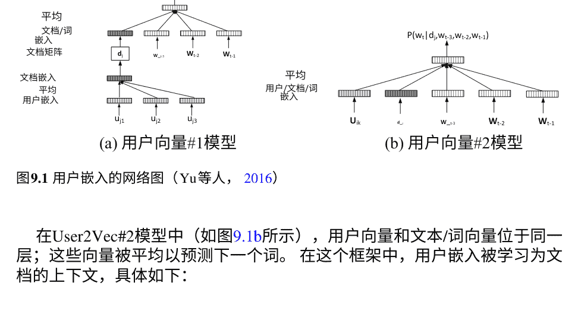

在User2Vec#2模型中（如图9.1b所示），用户向量和文本/词向量位于同一层；这些向量被平均以预测下一个词。在这个框架中，用户嵌入被学习为文档的上下文，具体如下：

$$J = \frac{1}{T} \left( \sum_{t} \log p(w_t|d_i, w_{t-k}, \ldots, w_{t+k}, u_{i1}, \ldots, u_{ih}) \right). \quad (9.3)$$

已经证明，User2Vec#2模型取得了更好的性能，因为它直接从词嵌入中学习用户嵌入。

#### 9.2.3 使用深度神经网络进行语义表示

##### 9.2.3.1 通过循环神经网络学习表示

许多类型的社交内容呈现为顺序语义结构。例如，社交评论本质上是一个词序列。同样，社交媒体上用户之间的对话是一个句子序列。利用这个一阶顺序结构将使我们更好地理解社交背景。标准的循环神经网络（RNN）通过反复应用转换函数于当前输入向量和上一个隐藏状态向量来处理任意序列数据。转换函数的输出是当前的隐藏状态向量。给定一个词序列 $d = \{w_1, w_2, \ldots, w_T\}$，RNN通过以下方式计算位置 $t$ 处的隐藏状态向量 $\mathbf{h}_t$:

$$\mathbf{h}_t = \sigma (\mathbf{W} \mathbf{q}_t + \mathbf{C} \mathbf{h}_{t-1}), \quad (9.4)$$

其中 $\mathbf{q}_t$ 是单词 $w_t$ 在位置 $t$ 的嵌入，$\mathbf{W}$ 是从输入嵌入到隐藏状态的转换矩阵，$\mathbf{C}$ 是状态到状态的循环权重矩阵，$\sigma$ 通常由sigmoid、tanh或ReLU函数实现。隐藏状态向量 h_t 预计能够捕捉序列 {w_1, w_2, ..., w_l} 的隐藏语义特征。

尽管RNN结构可以处理顺序输入，但当输入长度较大时，梯度会变得越来越小，直到完全消失。这就是梯度消失问题。一个简单的解决方案是放大权重矩阵的值。然而，这种策略可能导致梯度爆炸问题。这两个问题都会阻止RNN适当地学习更长序列中的远程依赖关系。为了解决这个问题，提出了长短时记忆（LSTM）和门控循环单元（GRU），并采用门控机制来控制信息流动。近年来，循环神经网络在许多领域取得了巨大的成功。有许多使用上述结构的作品，如语言建模、图像描述、语音识别、机器翻译、计算机生成音乐、点击预测等。由于RNN及其变体可以用于对变长文本单元进行建模，因此它们已被广泛研究，以获得任务特定的表示。

在现代信息时代，谣言可能引起公众恐慌和社会动荡。例如，关于“盐可以防辐射”的谣言引发了盐荒的涌动。在早期阶段，检测谣言是通过手动验证进行的；然而，效果非常有限，并且有很长的揭露延迟。许多现有的工作使用机器学习方法，依赖于手工制作的特征，而且非常耗时。已经提出了几种基于RNN的模型来检测谣言（Ma等人，2016年）。给定一个事件和一组相关的推文 {(m_i, t_i)} 其中 m_i 是一个具体的推文，t_i 是相应的发布时间。首先，将推文的流转换为连续的可变长度时间序列，然后使用基于RNN的模型来分类谣言。（Ma等人，2016年）提出了三种模型来解决这个任务。相应的架构如图9.2所示。

- ●滑动窗口循环神经网络。这是一个基本的循环神经网络结构，其输入是时间间隔内词汇项的TF-IDF值。隐藏单元的计算方式为

$$ h_t = \tanh(U x_t + W h_{t-1} + b) \quad (9.5) $$
$$ o_t = V h_t + c \quad (9.6) $$

然后使用softmax运算符对谣言和非谣言进行分类。目标是最小化预测概率分布与真实值之间的平方误差。

- ●单层LSTM/GRU。在该模型中添加了一个嵌入层，将TF-IDF权重转换为嵌入，并用LSTM/GRU单元替换了基本的循环神经网络单元，以捕捉长距离依赖关系，这在谣言检测中很重要。

- ●多层GRU。作者通过叠加另一个GRU层进一步扩展了第二个基于GRU的模型。更高级别的GRU层预计能够捕捉更抽象的特征以进行预测。

相应的架构如图9.2所示。所有模型都使用反向传播进行训练，计算损失的导数，然后更新参数。实验结果表明，与现有的最先进方法相比，基于RNN的模型具有显著更好的性能。

构建智能对话系统是自然语言处理和人工智能中的重要任务。现有的大部分工作都集中在开发面向任务的对话系统上。尽管这些工作在某些有限领域的某些特定任务上取得了有希望的性能，但是构建一个能够与人类进行通用对话的开放域对话系统仍然具有挑战性。RNN模型的循环处理方式为开放域对话的进一步发展提供了启示，因为它能够建模可变长度的文本。Vinyals和Le提出了一种神经对话模型，通过LSTM模型对单词序列进行建模（Vinyals和Le，2015年）。

通过预测下一个句子而不是令牌，对先前的句子进行一些修改。例如，任务是给定“ABC”预测“WXYZ”，输入的句子向量是处理符号“<eos>”后的隐藏状态，该符号表示句子的结束符号。该模型根据最后的隐藏状态逐个预测下一个句子的令牌。这种神经网络架构几乎不需要特征工程或特定领域知识，同时保持了最先进的性能。

##### 9.2.3.2 通过卷积神经网络学习表示

除了在计算机视觉领域的普及之外，卷积神经网络（CNN）也被应用于社交计算中。例如，#TagSpace模型已被提出来解决标签预测任务（Weston等人，2014年）。通过将单词、文本帖子和标签投影到相同的向量空间中，#TagSpace能够使用它们的嵌入之间的内积计算标签和帖子之间的相关性得分。

图9.4展示了#TagSpace的框架。与计算机视觉中的图像像素不同，大多数自然语言处理任务的输入是单词或句子。因此，作者首先通过使用单词查找表将输入文档的每个单词转换为一个d维嵌入向量，从而得到一个大小为l*d的矩阵，其中l是文档长度。该操作包括一个大小为N*d的参数矩阵，称为查找表层，其中N是词汇表的大小。然后，对l*d矩阵应用卷积操作。具体而言，作者构建了大小为K*d的H个滤波器矩阵，并将每个滤波器矩阵从位置1滑动到l，其中K是滑动窗口的大小。为了考虑到文档两端的单词，两端都填充了特殊向量，这样我们就可以

图9.4 TagSpace模型的架构（Weston等人，2014年）

可以应用于输入矩阵的边界元素的滤波器。在卷积步骤之后，我们对$ld \times H$矩阵中的每个元素使用非线性激活函数，例如双曲正切函数。然后，我们对$ld \times H$矩阵应用最大池化操作，以提取一个固定大小（$H$维）的全局向量，其中包含输入文档的特征。值得注意的是，从CNN获得的$d$维全局向量与文档的长度无关。最后，使用双曲正切非线性激活函数和一个大小为$H \times d$的全连接线性层。因此，一个单独的文档被转换为一个$H$维的向量，表示原始嵌入空间中的整个内容。

同样地，候选标签可以通过查找表表示为一个$d$维嵌入向量，其中$d$是维度。这样，文本帖子和标签分别在相同的嵌入空间中被表示为$d$维向量。内积被用来计算文档$w$和候选标签$t$之间的语义相关性：

$$f(w, t) = \mathbf{e}_{conv}(w)^\top \cdot \mathbf{e}_{lt}(t) \quad (9.7)$$

其中$\mathbf{e}_{conv}(w)$是通过CNN计算得到的文档的嵌入，$\mathbf{e}_{lt}(t)$是通过查找表得到的候选标签$t$的嵌入。我们可以根据得分$f(w,t)$对所有候选标签进行排名。得分越大，标签和帖子的相关性越高。

为了训练#TagSpace模型，使用成对的hinge损失作为目标函数：

$$\mathcal{L} = \max\{0, m - f(w, t^+) + f(w, t^-)\} \quad (9.8)$$

其中$t^+$是一个正标签，$t^-$是从训练集中采样的负例，而$m$是预定义的边界。查找表层使用预训练的嵌入进行初始化，以加快收敛速度。

#### 9.2.4 使用注意力机制增强语义表示

在本小节中，我们将讨论如何将注意力机制应用于建模社交文本。注意力机制起源于计算机视觉领域（Mnih et al.2014; Xu et al.2015），它使模型能够根据输入和已经生成的内容选择重要的信息进行关注。在自然语言处理领域，注意力机制通常用于增强文本建模，具体包括

- 处理长输入序列（例如句子或文档），并确保输出尽可能地获取有用信息（Luong et al.2015）。
- 通过在某些任务（例如机器翻译和文本摘要）中产生输入和输出之间的软对齐，缓解了顺序变异和差异问题（Bahdanau等人，2014年）。

分布式表示模型，如skip-gram和CBOW，已被证明在捕捉词语语义关系方面是有效的。然而，它们无法捕捉词语之间的句法关系，因为它们不考虑词语顺序。为了解决这个问题，已经提出了一种简单的扩展，将注意机制添加到CBOW中（Ling等人，2015年）。这个模型的直觉是，一个词的预测主要取决于上下文中的某些词及其位置。例如，在句子“We won the game!”中。对于单词“game”的预测主要基于来自单词“the”的句法关系，因为它总是跟在名词后面，以及来自单词“won”的语义关系。单词“We”对于“game”的预测几乎没有贡献。在这种情况下，为了单词预测，对于固定长度的上下文中的不同位置的词分配不同的权重是必要的。

在这个模型中，每个单词 $w \in V$ 在位置 $i$ 被赋予一个注意力分数 $a_i(w)$:

$$ a_i(w) = \frac{\exp(k_{w,i} + s_i)}{\sum_{j \in [-b,b] - \{0\}} \exp(k_{w,j} + s_j)} $$

其中 $k_{w,i}$ 表示单词 $w$ 在位置 $i$ 的重要性，$s_i$ 是位置 $i$ 在上下文窗口内的偏移量，$b$ 是窗口大小。在注意力计算之后，上下文向量 $\mathbf{c}$ 计算如下:

$$ \mathbf{c} = \sum_{i \in [-b,b] - \{0\}} a_i(w_i) \mathbf{v}_i $$

其中 $\mathbf{v}_i$ 表示单词 $i$ 的嵌入。在CBOW中，与其仅仅取上下文中单词的平均值，而是在公式9.10中取单词嵌入的加权和。最后，模型通过最大化以下概率来预测目标单词:

$$ p(v_0 | w_{[-b,b] - \{0\}}) = \frac{\exp(\mathbf{u}_0^T \mathbf{c})}{\sum_{w \in V} \exp(\mathbf{u}_w^T \mathbf{c})} $$

图9.5a，b显示了CBOW和基于注意力的CBOW的不同预测机制。在CBOW中，所有上下文词对目标词“南方”的预测都有相同的贡献，包括功能词。而在基于注意力的CBOW中，较暗的单元格表示预测目标词“南方”的权重较高（参考公式9.9）。（Ling等人，2015年）的实验结果表明，基于注意力的CBOW学习到的词嵌入保留了单词之间更好的句法关系。

注意机制已经广泛应用于不同的任务。例如，一些研究已经采用了注意机制来进行标签推荐，并获得了最先进的推荐性能（Gong和Zhang 2016；Zhang等人2017年）。

### 9.3 用深度学习建模社交关系

#### 9.3.1 社交媒体上的社交关系

正如在第9.1节中已经讨论的那样，在线社交媒体平台的一个主要特点是它们提供丰富的社交关系。社交网络网站通常利用显式或隐式的链接机制来增强用户之间的互动或连接。用户链接可以是单向的或双向的。例如，在Twitter上，用户可以单方面关注另一个用户。作为对比，在Facebook上，用户链接是双向构建的。通常，这些用户链接表示友谊或兴趣相似性（Weng等人2010年）。在某些情况下，链接也可以明确与信任信息相关（例如，Epinion）。除了显式链接外，隐含关系在社交媒体上也很普遍。例如，用户可以转发（即转推）他人的推文而无需关注该用户。这种隐含链接在传达有用的语义信息时也很重要（Welch等人2011年；Zhao等人2013年，2015年；Wang等人2014年）。

#### 9.3.2 一种网络表示学习方法来建模社交连接

在本节中，我们讨论如何从一般的角度来建模用户链接。随着深度学习在近年来的复兴，网络表示学习已成为一个热门的研究课题（Perozzi等，2014年；Tang等，2015年），其目标是将顶点嵌入到一个低维空间中，而派生的表示通常被称为节点嵌入。

形式上，让 $\mathscr{G}=(\mathscr{V},\mathscr{E},\mathbf{W})$ 表示一个一般的社交网络表示，其中 $\mathscr{V}$ 是顶点集合， $\mathscr{E}$ 是边集合， $\mathbf{W}$ 是边的权重矩阵。如果存在从顶点 $u$ 到顶点 $v$ 的边，则 $(u, v) \in \mathscr{E}$。让 $w_{u,v}$ 表示从 $u$ 到 $v$ 的边的权重。无论是单向还是双向，加权或非加权网络都可以在这个定义中建模。$^3$网络表示学习旨在为每个顶点 $v \in \mathscr{V}$ 生成一个 $d$ 维潜在表示 $\mathbf{e}_v \in \mathbb{R}^d$。通常，维度（即，$d$）的变化范围从50到几百个。

在表9.1中，我们介绍了网络表示学习的两个类别的方法：（1）基于浅层嵌入的方法；和（2）基于深度神经网络的方法。第一个类别是指使用浅层神经结构派生分布式表示的模型$^4$。相比之下，第二个类别使用标准神经网络模型来学习网络表示。

现有研究中学习到的表示主要用于网络重构或节点分类，但该方法可以轻松扩展以解决一些特定任务 (Chen和Sun 2016)。在这里，我们的重点是一般的网络表示学习，而其他类型的信息在这里被忽略，例如文本数据 (Yang等2015)。特别地，知识图可以被视为一种特定类型的异构网络，许多与网络表示学习相关的研究来自自然语言处理 (Xie等2016；Guo等2016)。在本节中，我们只关注社交网络分析的现有研究。

$^3$在我们的案例中，一个顶点对应一个用户，而图对应用户网络。除非特别指定，我们将使用“网络”来代替“用户网络”，因为我们的方法是通用的，可以应用于其他类型的网络。

$^4$严格来说，基于嵌入的模型不是标准的神经网络，比如word2vec(Mikolov等人，2013)。

表9.1 网络嵌入模型的分类
| 类别 | 子类别 | 模型 |
| :--- | :--- | :--- |
| 浅层 | 邻域 | DEEPWALK (Perozzi等，2014年)，NODE2VEC (Grover和Leskovec，2016年) |
|  | 接近度 | LINE (Tang等，2015年)，GraRep (Cao等，2015年) |
|  | 异构 | HINE (Huang和Mamoulis，2017年)，ESim (Shang等，2016年) |
| 深度 | 邻域 | GRUWALK (李等人 2016年) |
|  | 接近度 | SDNE (王等人 2016a)，GRA REP (曹等人 2015年) |
|  | 异构 | HNE (张等人 2015年) |

#### 9.3.3 浅层嵌入模型

##### 9.3.3.1 传统图嵌入模型

在机器学习和模式识别的早期文献中，一个重要的任务是降维和数据表示。这些方法将二元数据特征矩阵作为输入，数据特征矩阵中的每一行对应一个高维观测点。这些早期方法的本质在于通过降维将高维观测转化为低维表示。一些著名的方法包括IsoMap (Bal-asubramanian和Schwartz, 2002), LLE (Roweis和Saul, 2000)和LaplacianEigenmaps (Belkin和Niyogi, 2001)。通常，早期研究在很大程度上借鉴了主成分分析 (PCA)、多维缩放、图拉普拉斯和流形学习的思想。通常，这些算法具有较高的计算复杂性，不易部署在大规模数据集上。近年来，矩阵分解技术也被应用于网络嵌入 (Wang等人, 2011)，它将网络矩阵（例如邻接矩阵）分解为两个矩阵的乘积。

##### 9.3.3.2 基于邻域的嵌入

邻域方法的关键思想是通过使用一些策略，对由随机游走构建的目标顶点和其邻域之间的关系进行建模。

DEEPWALK (Perozzi等, 2014年)是第一个借鉴了词嵌入思想的网络嵌入模型。在词嵌入（例如，word2vec）中，基本元素是句子（或词序列）和单词，目的是通过表征目标词与其局部窗口中的上下文信息之间的关系来学习单词的潜在表示。设 $w$ 表示一个词，$\text{C}_w$ 表示词 $w$ 的上下文（即上下文词）。词嵌入模型本质上建模了 $P (w|\text{C}_w)$ 或 $P (\text{C}_w|w)$ 的条件概率。DeepWalk将 vertices视为单词，将 vertex sequences视为句子。虽然图上有明确的顶点和链接，但没有顶点序列。为了解决这个问题，DeepWalk首先基于图结构生成短的随机游走。这些步行可以被视为短句子，并且它估计了在随机步行中观察到周围顶点的特定顶点的可能性。更正式地说，DeepWalk模型了给定图$\mathcal{G}$中生成的随机步行中顶点$_v$的邻居$\mathbf{N}_v$的条件概率$P(\mathbf{N}_v|_v)$。该模型使用word2vec的Skip-gram架构实现，并通过分层softmax算法进行优化。DeepWalk的优雅之处在于单词句子和顶点随机步行之间的联系。

基于DeepWalk，提出了一个扩展模型node2vec (Grover和Leskovec 2016)。它定义了节点网络邻域的灵活概念，作为一族参数化和有偏随机步行生成的顶点集合来灵活控制生成的算法。生成的算法通过两个可调参数：返回参数p和内外参数q来灵活控制随机步行。参数p控制步行中立即重新访问节点的可能性，而参数q允许搜索区分内部和外部节点。参数p和q允许搜索过程在广度优先搜索和深度优先搜索之间（近似）插值。总体而言，node2vec通过对邻域搜索进行参数化控制来推广DeepWalk。

##### 9.3.3.3 基于接近度的嵌入

嵌入模型的第二类旨在使用潜在节点表示来表征成对顶点的相似性。在图中，可以有多种方法来衡量成对顶点的相似性。特别地，我们将介绍基于原始图的 $k$ 阶（$k \geq 1$）相似性导出的嵌入模型。

LINE(Tang et al.2015)定义了一个同时保留一阶和二阶接近度的目标函数，旨在对任意类型的信息网络进行建模，并能够扩展到数百万个节点。特别地，一阶接近度表征了网络中观察到的链接所反映的局部结构。作为补充，二阶接近度表征了两个顶点通过共享的一阶邻域结构之间的间接相似性。这两种接近度都由概率值建模，并随后采用Kullback-Leibler散度来导出目标函数。

LINE在效率方面提出了几个重要的实际考虑因素，包括负采样和别名表，这使得它能够高效地扩展到非常大的数据集。

GraRep (Cao等人, 2015年) 是一种嵌入模型，可以在 $k \geq 2$ 时捕捉 $k$ 阶接近度。关键思想是使用从高阶转移矩阵导出的转移概率来估计接近度。这项工作基于一个重要的性质，即带有负采样的skip-gram模型在数学上等价于（偏移的）点互信息（PMI）共现矩阵上的矩阵分解。特别地，GraRep模型了解所有 $k = 1, \ldots$ 的 $k$ 阶转移。对于每个 $k$ 阶转移矩阵，我们可以得到相应的节点表示。最终的表示是通过连接与每个 $k$ 阶表示对应的所有表示来构建的。GraRep通过建模高阶相似性并为不同的阶数设置不同的表示来扩展了Line。

##### 9.3.3.4 社区增强嵌入

上述方法主要关注局部顶点链接，而未对群组或社区结构进行建模。在这部分中，我们讨论了带有群组或社区结构信息的嵌入。社区结构表征了社区GENE (Chen et al. 2016) 是一个可以将社区结构纳入网络表示的嵌入模型。关键思想是将社区建模为一个顶点。通过这种方式，社区顶点被视为生成特定顶点的上下文。一个社区顶点被建模为对应社区中所有顶点的共享上下文。Gene通过以下类比进行解释：一个社区被视为一个文档，而一个顶点被视为属于某个文档的单词。Gene在其两种架构中借鉴了DOC2VEC (Le and Mikolov 2014) 的思想，即分布式内存(DM) 和分布式词袋(DBOW)。Gene结合了邻近用户和群组信息的两种架构，并共同建模。

类似于早期关于社区检测的研究 (Wang等人, 2011年)，提出了一种模块化的非负矩阵分解 (M-NMF) (Wang等人, 2017年)，用于学习顶点表示并保持社区结构。在M-NMF中，首先应用经典的基于模块性的社区检测方法。然后，构建涉及三个因素的目标函数，分别对应于相似性矩阵的分解、社区成员矩阵的分解和保持社区的损失。连接前两个因素的关键在于共享的顶点表示，社区保持损失基于社区成员矩阵定义。通过这种方式，一个统一的非负矩阵分解方法同时优化了上述三个因素。

##### 9.3.3.5 异构网络嵌入

以前，基于同质网络评估顶点相似性。实际上，许多信息网络是异构的。例如，在科学集合中，不同类型的实体形成了一个异构网络，其中可能包含作者、论文和会议地点等顶点。这些异构网络描述了不同类型对象 (即网络顶点) 之间的关系。为了处理它们，常用的方法是基于元路径的算法 (Sun等人, 2011年)。元路径是一系列对象类型，其中包含了表示特定关系的边类型。接下来，我们讨论如何将基于元路径的算法应用于增强异构网络的网络嵌入模型。

一种直接的方法是将基于元路径的信息转化为相似度 (Huang和Mamoulis 2017)。通过这种方式，我们可以构建一个基于元路径的图，其中边的权重是从基于元路径的相似度中得出的。一旦相似度矩阵 (即图中的邻接矩阵) 被构建出来，问题就变成了一个标准的网络嵌入任务，我们可以应用任何现有的网络嵌入模型。为了计算基于元路径的相似度，考虑到了截断的k长度路径，并且应用了动态规划算法来高效地计算相似度。在相似度计算之后，采用了Line模型的一阶损失函数来学习顶点表示。

需要注意的是，Line可以通过使用基于采样的方法来表征边的权重。

ESim（Shang等人，2016）不仅仅评估基于元路径的相似度，还通过整合路径特定的嵌入来建模基于元路径的相似度。

给定两个顶点，它们的路径特定相似性可以组合成四个部分：路径特定常数，顶点嵌入之间的内积，以及顶点嵌入和路径嵌入之间的两个内积。形式上，从顶点 v1 到顶点 v2 通过路径类型 t 的路径特定条件概率可以表示为

```
Pr(v_2|v_1, t) = \frac{\exp(f(v_1, v_2, t))}{\sum_{v' \in V} \exp(f(v_1, v', t))}
```

其中 f(v1, v2, t) 是一个衡量路径 v1 →_t v2 重要性的评分函数，定义为 f(v1, v2, t) = μ_t + e_{v1}^T · e_t + e_{v2}^T · e_t + e_{v1}^T · e_{v2}。为了学习顶点和路径嵌入，ESim进一步提出了两种优化方法，即顺序学习方法和成对学习方法。

#### 9.3.4 基于深度神经网络的模型

在上面，我们广泛讨论了各种基于嵌入的模型，用于学习潜在的顶点表示。所有这些工作的共同点是，它们主要依赖于浅层嵌入模型来推导相似性。在某些情况下，网络中的链接信息可能非常复杂，这对于浅层模型来解释和生成可能是困难的。在这部分中，我们转向深度神经网络，以获得更强大的建模能力。

##### 9.3.4.1 基于深度随机游走的模型

DeepWALK的本质可以总结为两点：首先，将图结构转化为节点序列；其次，基于序列嵌入模型学习节点表示。然而，严格来说，Word2Vec模型不是一个真正的序列模型：上下文词是无序的。事实上，我们可以应用任何类型的序列神经网络模型来学习基于节点序列的节点和序列表示，例如广泛使用的循环神经网络。为了表征长序列，门控循环单元（GRU）和长短期记忆（LSTM）是两种改进基本RNN的知名变体。Li等人（2016）应用了双向GRU来编码节点序列，它应用了一个从左到右读取序列的前向GRU，以及一个从右到左的后向GRU。我们将这样的模型称为GruWALK。同样，其他序列神经网络也可以应用于学习节点表示。

##### 9.3.4.2 深度基于接近模型

我们考虑了两个研究，分别对低阶和高阶接近性进行建模。

SDNE (Wang et al. 2016a) 是第一个使用深度神经网络来表征低阶相似性的研究。它强调了网络重构中的三个重要属性，即高非线性、保持结构和稀疏抵抗。在方法论方面，SDNE可以被宽泛地理解为LINE的神经化生成。为了捕捉非线性链接特性，采用了深度自编码器模型，该模型将顶点的邻域信息（使用one-hot表示）作为输入和输出。自编码器的目标是通过首先将其投影到低维嵌入（使用几个非线性层）中，然后从嵌入中恢复输出（使用几个非线性层）来重构输入。自编码器模型中最中间层的嵌入可以被视为顶点的潜在表示，通常称为code。通过基于图的正则化损失，使用这些顶点代码来表征一阶接近性，该损失强制连接顶点的代码相似。自编码器模型隐式地表征了二阶接近性，因为模型参数被所有顶点共享。通过这种方式，具有相似邻域的顶点将具有相似的代码，因为它们的邻域信息将被输入到相同的自编码器模型中。

为了捕捉高阶接近性，DNGR模型 (Cao et al. 2016) 通过使用深度神经网络模型扩展了GRAREP模型 (Cao et al. 2015)。DNGR首先进行随机冲浪，然后使用重启的随机游走估计转移概率。在原始的DEEPWALK中，随机游走是在不考虑起始顶点的影响下生成的。作为对比，DNGR通过重启向量增强了起始顶点的影响，并且倾向于给离起始顶点更近的顶点分配更大的概率。上述随机冲浪模型被采用来估计网络顶点的PMI共现矩阵。

与使用负采样的跳字模型不同，DNGR尝试使用堆叠去噪自编码器重构PMI矩阵。通过结合上述两个步骤，DNGR应该能够生成更高质量的随机游走，并增强表征复杂关系的能力，从而在网络嵌入上表现更好。

##### 9.3.4.3 深度异构信息网络融合

异构信息网络通常包含不同类型的节点和链接，为异构信息推导出有效的表示更具挑战性。Chang等人 (2015) 提出了HNE模型，用于融合不同数据类型的异构信息。融合方法很直观。对于每种数据类型，我们首先使用深度神经网络将数据点投影到潜在空间中，以保留每个局部域的数据特征。该模型进一步假设，在一系列非线性变换之后，局部域的特征可以被保留。

来自不同领域的数据特征可以映射到一个共享空间中。通过保留领域内和跨领域的相似性，最终损失函数通过深度架构共同优化数据嵌入。

#### 9.3.5 网络嵌入的应用

在社交计算中，分析用户连接是一个基本且重要的步骤。基于网络嵌入的方法可以从社交连接结构中生成有效的表示，这些表示可以在各种下游任务中使用。上述网络嵌入模型为与社交网络分析相关的各种应用提供了一种通用的网络表示方法，包括网络重构、链接预测、节点分类、节点聚类和可视化 (Perozzi等人, 2014年; Tang等人, 2015年)。在这些任务中，网络嵌入作为一种自动且无监督的特征工程过程。最近，一些研究还尝试开发面向任务的网络嵌入模型。例如，网络嵌入方法已经通过整合任务特定的标记信息进行了扩展 (Huang等人, 2017年; Chen和Sun, 2016年)。

## 使用深度学习进行推荐

### 在社交媒体上的推荐

在社交媒体上，推荐是一项普遍的任务，旨在将用户的兴趣或需求与合适的信息资源（即项目）匹配（Adomavicius和Tuzhilin 2005; King等人2009）。例如，新闻门户网站可以向具有潜在兴趣的用户推荐新闻或推文。资源项目以一种通用的方式定义，可以是新闻、推文、朋友等。在推荐任务中，一组用户 U和一组项目 I是核心要素。

- 评分预测：旨在根据一些上下文信息 C推断用户 u对项目 i的偏好程度。特别地，让 u和 i表示用户对项目 i的评分。评分预测旨在推断 u和 i的缺失值。
- Top-N推荐：它旨在根据一些上下文信息 C为目标用户 u ∈ U生成一个推荐排名列表，其中排名前 N个项目来自 I。

这两个任务高度相关。在接下来的内容中，我们主要关注模型本身，但不会区分这两个任务，除非另有说明。引入的模型可以通过两种方法进行总结，即基于浅层嵌入和基于深度神经网络。

表9.2 深度学习推荐模型的分类。“整合”表示利用了侧面信息。

| 类别 | 模型 |
| --- | --- |
| 浅层 | 词嵌入: PRODUCT2VEC (赵等人，2016b)， MC-TEM (周等人，2016)， HRM (王等人，2015b) |
|  | 网络嵌入: NERM (赵等人，2016a) |
|  | 嵌入正则化: CoFACTOR (梁等人，2016) |
| 深度 | 传统的: RBM (Salakhutdinov等人，2007年) |
|  | 交互 (MLP): NEuMF (He等人，2017年)， NMF (He和Chua，2017年) |
|  | 交互 (自动编码器): CDAE (Wu等人，2017a年) |
|  | 交互 (序列): NADE (Zheng等人，2016年)， NASA (Yang等人，2017年) |
|  | 整合 (配置文件): DUP (Covington等人，2016年)， Wide and Deep (Cheng等人，2016年)， RRN (Wu等人，2017b年)， DeepCoNN (Zheng等人，2017年) |
|  | 整合 (内容): SDAE (Wang等人，2015a年)， DCMR (van den Oord等人，2013年) |
|  | 整合 (知识): CKE (Zhang等人，2016年) |
|  | 整合 (跨领域): MV-DSSM (Elkahky等人，2015年) |

#### 9.4.2 传统推荐算法

过去为推荐系统提出了各种推荐方法，包括协同过滤方法（Su和Khoshgoftaar 2009），基于内容的方法（Lops等2011），以及混合方法（De Campos等2010）。协同过滤方法从用户过去的行为以及其他相似用户的决策中构建模型。基于内容的方法从项目中提取一组重要特征，以推荐具有相似特征的其他项目。在协同过滤方法中，矩阵分解（MF）被广泛应用于各种推荐任务（Koren等2009）。与UserKNN和ItemKNN等传统方法不同，MF可以为用户或项目生成潜在因子，并通过计算这些潜在向量之间的相似性来解决推荐任务。MF的一个重要优点是它可以灵活地修改以适应各种上下文信息，以适应新的任务设置。MF方法在实践中表现非常好，并在许多任务中作为竞争基准。

#### 9.4.3 基于浅层嵌入的模型

基于浅层嵌入的模型在很大程度上借鉴了分布式表示学习的思想，特别是词嵌入的研究（例如，word2vec）。基本思想是将用户、物品和相关的上下文信息映射到低维空间中。此外，推荐任务可以在潜在嵌入空间中转化为相似度测量问题。

##### 9.4.3.1 推荐作为“词”嵌入

词嵌入的核心思想是给定词的语义取决于其上下文词。类似的思想可以用于建模物品采用序列，其中物品显示出顺序相关性。

赵等人（2016b）在推荐系统中提出了词嵌入模型的直接应用。在这项工作中，首先将产品购买记录按用户分组，然后对于每个用户，根据时间戳按顺序对购买的产品进行排序。我们进行以下类比：将产品视为一个词，将用户的整个购买序列视为一个文档。通过这种方式，可以应用doc2vec模型来建模产品购买序列，称为product2vec。这里假设用户连续购买的产品在产品语义上高度相关。因此，我们可以通过购买序列中的上下文推断出产品的语义。在（Zhou等人，2016）中，doc2vec模型仅用于学习用户和物品的高质量特征表示。随后，这些特征进一步在基于特征的推荐算法中使用，即LibFM（Rendle 2012）。

PRODUCT2vec模型主要捕捉用户和物品之间的交互。在一些应用场景中，可以利用多种类型的上下文信息来进行推荐算法。在(Zhou等人，2016)中，DOC2vec的DBOW架构被扩展以包含更多的上下文信息，称为MC-TEM模型。这个扩展相对简单。它首先将上下文信息离散化为离散值，并且每个值将与相同潜在空间中的唯一嵌入相关联。为了利用各种类型的上下文，平均池化被用来将多种嵌入组合成一个单一的上下文嵌入。虽然这种方法很简单，但是可以非常高效地实现。

特别地，所有的上下文信息都被建模在相同的潜在空间中，使用简单的嵌入相似度测量（例如余弦相似度）方便分析不同上下文信息之间的关系。一个潜在问题是上下文信息本身可能在它们的潜在表示方面不是可加的，使用平均池化可能会丢失信息并在某些情况下损害性能。

上述方法将用户的购买记录视为一个完整的序列。Wang等人（2015b）提出了HRM模型，将购买记录分割成交易，称为篮子。

它基本上是建立在doc2vec的DBOW架构之上的，将购买记录分割成交易，称为篮子。主要区别在于生成下一个篮子的商品的方式，采用了分层建模。为了生成一个商品，上一次交易中的用户和购买的商品构成了上下文信息。与（Zhou等人，2016）相比，HRM对于顺序上下文有一个更清晰和直观的定义：只有上一次交易中购买的产品被视为当前交易的上下文。为了聚合来自上一次交易的项目，已经提出了不同的汇集操作，例如最大汇集和平均汇集。

在推荐系统中，MF模型将观察到的评分或交互矩阵分解为用户和项目的潜在因素。这种方法主要表征了用户和项目之间的双向交互。然而，对于诸如word2vec之类的嵌入模型，它们的优势在于捕捉项目序列中的局部或顺序相关性。基于这些考虑，提出了CoFactor模型（Liang等人，2016）将这两种方法的优点结合到一个统一的模型中。特别地，具有负采样的skip-gram模型可以在数学上等同于（移位后的）PMI共现矩阵的因式分解（Levy和Goldberg，2014）。基于这个想法，最终模型通过结合用户-项目矩阵的因式分解和项目-项目PMI矩阵的正则化来构建。通过这种方式，全局用户-项目偏好关系和局部项目-项目相关性被共同考虑。

##### 9.4.3.2 推荐作为“网络”嵌入

推荐问题可以从不同的角度解决。作为一种观点，推荐任务可以被视为图上的相似性评估，并采用基于图的算法进行推荐，例如SIMRANK (Jeh and Widom 2002)。在第9.3节中，我们广泛讨论了网络嵌入的研究。如果推荐问题可以在图设置中被规定，那么可以重用现有的网络嵌入方法进行推荐。

特别地，NERM模型（Zhao et al. 2016a）提出将推荐任务转化为嵌入K部分采纳网络的任务。一个K部分网络由推荐系统中的K种实体组成。大多数推荐设置可以通过K部分采纳网络来描述。然后，通过将所有类型的实体等同对待，在K部分图上进行网络嵌入。通过计算用户、物品和相关上下文的对应嵌入之间的内积来解决最终的推荐任务。

#### 9.4.4 基于深度神经网络的模型

##### 9.4.4.1 用于推荐的受限玻尔兹曼机

第一项将深度学习应用于推荐系统的研究可以追溯到(Salakhutdinov等人, 2007年)的工作，该工作描述了一类将受限玻尔兹曼机（RBM）推广到建模评分数据的两层无向图模型。RBM模型由两个主要部分组成，即二进制隐藏特征和可见评分数据（表示为独热向量）。一个权重矩阵连接了这两个部分。总体而言，权重矩阵中的参数数量很大，学习过程相对困难且缓慢。为了减少参数数量，常用的技术是将权重矩阵分解为两个小型矩阵。这种方法可以有效地减少参数数量，同时性能几乎没有下降。然而，作为第一次尝试，RBM模型并没有取得非常令人满意的结果：只能略微提高标准矩阵分解的性能。

##### 9.4.4.2 用于交互特征化的深度学习模型

基本上说，推荐任务主要关注的是我们如何对用户和物品之间的交互进行建模。接下来，我们将讨论基于非顺序和顺序交互的推荐模型。

大多数现有的传统推荐方法捕捉到用户和物品表示之间的线性关系，这可能无法有效地描述复杂的用户-物品交互。He等人（2017）提出了NeuMF模型，利用深度神经网络从数据中学习任意交互函数，这提供了一个基于神经网络的协同过滤的通用框架。在NeuMF中，它首先使用查找表层将用户和物品的独热表示映射为嵌入向量。然后，它使用一些池化操作（如连接和逐元素乘积）聚合用户和物品的嵌入向量。

这样，每个用户-物品交互对都将被建模为一个嵌入向量。派生的嵌入向量将随后被馈送到一个多层感知机（MLP）模型中，该模型由一系列非线性变换层组成。MLP组件的输出将直接与损失函数相关联。NeuMF实质上利用了深度神经网络在捕捉复杂数据关系或特征方面的能力。作为NeuMF的后续，神经分解机（NFM）在（He和Chua 2017）中提出，它是线性分解机（Rendle 2012）的神经化实例。NFM引入了一个双交互层，用于对应于两个特征的两个嵌入进行双交互汇聚。派生的双交互汇聚向量将通过MLP组件转换为预测的评分值。

CDAE模型（Wu等人, 2017a）不是单独预测每个项目的结果，而是将用户 u 对所有项目的反馈视为一个向量 y，并旨在构建一个映射函数，该函数接受损坏的输入。它的目的是构建一个映射函数，该函数接受损坏的输入。

ŷ并重构真实的反馈向量 y。CDAE使用去噪自编码器（DAE）模型实现了损坏的自映射函数，仅使用一个隐藏层。在一个隐藏层中，需要学习的模型参数包括连接输入和隐藏层的权重参数 W，以及连接隐藏层和输出层的权重参数 W'。形式上，我们可以有以下公式：

$$
\begin{aligned}
\mathbf{z} &= g(\mathbf{W}^{\top} \cdot \tilde{\mathbf{y}} + \mathbf{b}), \\
\mathbf{y} &= h(\mathbf{W}^{\prime \top} \cdot \mathbf{z} + \mathbf{b}^{\prime}),
\end{aligned}
$$
(9.13)

其中 g(·) 和 h(·) 是由多个非线性层组成的映射函数。潜在向量 z 通常被称为编码。请注意，DAE模型的参数对于所有用户都是共享的。因此，仅仅将反馈作为输入可能无法有效地表征个性化。CDAE通过将用户特定的嵌入 e_u 纳入输入层进行了扩展。形式上，隐藏层使用以下公式推导出来：

$$\mathbf{z} = g(\mathbf{W}^{\top} \cdot \tilde{\mathbf{y}} + \mathbf{e}_{u} + \mathbf{b}).$$
(9.14)

通过这种方式，派生代码（即， z ）考虑了用户的偏好，以实现更好的个性化。
用户和项目之间的交互本质上是一个顺序过程，而上述模型无法表征顺序用户行为。因此，自然的考虑是应用顺序神经网络来建模用户行为以进行推荐。在文献中，循环神经网络（RNN）是一类重要的顺序神经网络（Mikolov等，2010），其中它们维护网络的内部状态，使其能够展现动态的时间行为。基于RNN的模型已成功应用于各个领域，包括自然语言处理和语音处理。在处理长序列时，应用RNN的一个主要障碍是梯度消失问题。

为了解决这个问题，提出了两个著名的单元模型，即长短期记忆单元（LSTM）（Hochreiter和Schmidhuber，1997）和门控循环单元（GRU）（Chung等，2014）。通过改进的RNN模型，将它们应用于推荐系统相对简单，可以构建整体或用户特定的RNN模型来表征用户的行为序列。在（Yang等，2017）中，使用了扩展的RNN模型（称为NASA模型）进行POI推荐，其中考虑了长期和短期的顺序上下文。同时，用户的偏好也被纳入到推荐模型中。作为另一种顺序推荐模型，提出了一种神经自回归模型（Zheng等，2016）用于评分预测。它基于受限玻尔兹曼机（RBM）和神经自回归分布估计器（NADE）构建。其主要思想是将用户的评分记录视为一个序列，并在当前项目的评分基于用户先前的评分进行预测。参数包括项目嵌入和权重参数。 与经典的RBM模型一样，特定用户的偏好没有通过嵌入向量明确建模，而是通过它的评分记录反映出来。 他们还提出了两种主要的改进技术，通过在评分之间共享参数和分解大规模权重矩阵。

传统的用户配置方法通常是静态的，不能反映用户兴趣的动态性质。吴等人（2017b）提出了递归推荐网络（RRN）模型，通过创建动态用户和项目配置文件来预测未来的行为轨迹。 关键思想是使用递归神经网络对用户和项目状态进行建模，并描述状态转换。 最终预测来自于一个综合模型，结合了动态和静态配置模型的结果。

##### 9.4.4.3 用于辅助信息集成和利用的深度学习模型

在上述中，深度神经网络主要用于增强用户-物品交互的建模。 这些模型中没有考虑到侧面信息（也称为上下文信息）。 接下来，我们将讨论如何利用深度学习来建模辅助信息。

在许多推荐场景中，可以利用物品侧面的内容信息来提高推荐性能。 事实上，这是经典基于内容的方法（Lops等人，2011年）的关键思想，它根据物品的描述进行推荐，并建立用户兴趣的概要。 为了保持一致，我们将物品的描述称为内容信息。 实现这一目的的一个主要困难是，内容信息本身可能不是直接适用于推荐任务的形式，甚至在某些情况下可能是嘈杂或稀疏的。 有必要将内容信息转换或映射为适合推荐系统有效利用的形式。

幸运的是，深度学习具有对复杂数据特征进行表征或学习的出色能力。 一种解决方案是使用深度学习模型将内容信息整合到推荐系统中。 作为代表性的工作，Wang等人（2015a）提出了CDL模型，该模型利用内容信息来改进推荐系统。 它通过使用堆叠去噪自编码器模型（SDAE）来表征内容信息。 最终的物品表示是通过将偏置向量与从SDAE模型中学习到的中间层代码进行连接得到的。 CDL模型是先前的协同主题回归模型（CTR）（Wang和Blei 2011）的深度学习实现。 （Wang等人，2015a）中报告的结果表明，在给定的任务中，CDL的性能优于CTR。 CDL模型的一个直接扩展是改进文本建模部分。 CDL模型通过使用SDAE对文本进行建模，采用了词袋假设。 下一项工作（Wang等人，2016b）进一步提出了协同循环自编码器（CRAE），它是在协同过滤（CF）设置中对内容序列生成进行建模的去噪循环自编码器（DRAE）。 主要的改进在于序列文本信息的深度建模。

当交互数据不足时，基于内容的方法更具吸引力，尤其是在冷启动情况下。在(van den Oord et al. 2013)的工作中，提出了一种使用深度基于内容的推荐算法解决冷启动音乐推荐问题的解决方案。为了便于理解，我们将稍微简化(van den Oord et al. 2013)中的原始模型。特别地，推荐系统的标准矩阵分解方法可以表示为：

```
$$\min_{\mathbf{x}_u, \mathbf{y}_i} \sum_{u,i} (r_{u,i} - \mathbf{x}_u^\top \cdot \mathbf{y}_i) + \lambda ( \sum_{u} \| \mathbf{x}_u \|^2 + \sum_{i} \| \mathbf{y}_i \|^2 ), \tag{9.15}$$
```

其中，用户-物品矩阵（包含评分 \(r_{u,i}\)）被分解为用户潜在向量（即 \(\mathbf{x}_u\)）和物品潜在向量（即 \(\mathbf{y}_i\)）的乘积。这些潜在向量实际上是矩阵分解模型的参数。然而，在冷启动情况下，目标是向用户推荐新物品，而训练MF模型的交互信息很少。(van den Oord et al. 2013)中的基本思想是首先使用现有的“旧”物品的交互数据训练潜在向量，然后建立潜在向量与内容信息之间的映射关系。形式上，让 \(\mathbf{f}_i\) 表示物品 \(i\) 的提取的内容信息，可以通过深度学习模型将其转化为潜在向量 \(\mathbf{y}_i\)

```
$$\hat{\mathbf{y}}_i = g(\mathbf{f}_i), \tag{9.16}$$
```

其中映射函数 \(g(\cdot)\) 可以通过最小化 \(\hat{\mathbf{y}}_i\) 和 \(\mathbf{y}_i\) 之间的差异来学习。一旦这样的映射模型被有效地学习，对新项目进行预测变得简单，因为可以使用内容信息推断其潜在向量。我们将该模型称为深度冷启动音乐推荐模型(DCMR)。在上述两个模型中，深度学习被用于将辅助信息转化为推荐系统中的表示形式。

除了内容信息，结构化知识图也是改善推荐系统性能的另一种重要信息。推荐系统中的项目也可以被视为知识图中的实体。知识图通过类型化的边缘或关系为实体提供了一种有效的组织和索引方式。

为了对这两种不同视图中的项目建模，CKE模型(Zhang et al. 2016)首先使用结构化知识图嵌入实体，然后利用派生的结构化项目嵌入来改善推荐。对于在知识图中嵌入实体，采用了贝叶斯结构化嵌入模型。对于在推荐系统中嵌入实体，通过整合多个信号（包括视觉、文本和结构化嵌入）提出了类似于前述CDL模型的方法。CKE模型做出了一个重要的假设，即从知识图、图像和文本中提取的嵌入向量可以直接以加法方式融合。在CKE中，视觉和文本特征都是使用堆叠自编码器提取的。

对于推荐系统来说，用户画像是一个关键任务，旨在构建一个准确的用户模型以进行准确的推荐（Zhao等人，2014年，2016c年）。用户画像已成为各种社交媒体平台的基本任务，不仅限于推荐系统，因为它是了解用户的第一步。Covington等人（2016年）提出了一种用于构建有效用户画像模型的深度神经网络架构，称为DUP模型。其思想是使用深度学习结合各种上下文信息，包括搜索历史、观看历史、人口统计和地理信息。经过一系列非线性变换（即ReLU激活函数），最终的预测由一组项目上的softmax函数建模。需要注意的是，（Covington等人，2016年）采用了两阶段推荐方法，即候选生成和项目排名。这两个阶段都使用类似的DUP模型架构实现。作为增强型模型的代表，Wide and Deep模型（Cheng等人，2016年）为推荐构建了类似的深度神经网络架构。作为另一个有趣的工作，Zheng等人（2017年）提出了Deep Cooperative Neural Networks（DeepCoNN）模型，旨在使用评论文本构建用户和项目画像。它由两个并行的神经网络组成，其中一个神经网络使用用户撰写的评论学习用户画像，另一个神经网络使用为项目撰写的评论学习项目画像。一个共享层进一步将这两个画像（即两个嵌入）组合为因子分解机的输入。

在现实世界中，用户通常参与多个推荐服务。例如，一个用户可能同时拥有新闻应用和视频应用，用于阅读新闻和观看电影。直观地说，来自不同领域的用户信息将相互补充。如果我们能够共同利用多个领域的信息，就有可能构建一个更全面和准确的用户概况。因此，多视图推荐系统更适合提高推荐性能。

MV-DSSM模型（Elkahky等人，2015年）被提出来解决多视图推荐任务。特别地，它利用了单视图深度结构语义模型（DSSM）（Huang等人，2013年）作为组件，该模型最初是在信息检索领域提出的。DSSM的基本结构由两个独立的DNN组件组成：第一个组件用于建模查询，而第二个组件用于建模文档。经过一系列非线性变换，DSSM模型将两部分的最终嵌入在共享空间中联系起来。损失函数采用了典型的成对排名方式。如果我们想要直接将单视图DSSM应用于多个领域的推荐，一种直接的方法是在不同领域中设置多个独立的DSSM模型。每个DSSM模型将分别使用来自各自领域的信息进行学习。然而，这种方法忽视了在多个领域中共享和补充用户信息的作用。MV-DSSM的思想很直观，它只为用户保留一个DNN组件，但为每个领域的项目设置了多个DNN组件。单用户的DNN组件将与多个领域特定的DNN项目组件集成，用于构建一个全局推荐模型。 通过这种方式，用户信息在多个领域中共享，从而提高了跨领域推荐性能。

### 9.5 总结

社交计算是一个多学科研究领域，在这个领域中，社会科学和计算方法可以结合起来回答关于用户行为的重要和具有挑战性的问题，通过在线社交媒体平台。 它涉及各种有趣的任务，旨在产生智能和交互式的社交媒体应用。关于社交计算的完整回顾，我们建议读者参考调查（King et al.2009; Wang et al.2007）和经典教材（Easley and Kleinberg 2010）。

本章重点介绍社交计算的三个重要方面，即社交内容分析、社交关系建模和推荐。 这三个方面涵盖了社交计算中的大部分核心要素和应用。 特别地，我们将深度学习作为社交计算的主要方法，并主要回顾了在社交计算中取得的最新进展。 到目前为止，已经回顾的深度学习技术包括基于浅层嵌入的方法和基于深度神经网络的方法。 我们的讨论重点强调如何将现有的深度学习技术应用于社交计算任务。

如今，将深度学习技术应用于社交计算仍处于早期阶段。 在这个方向上仍然存在许多挑战和困难。 与传统的自然语言处理任务相比，社交计算任务的输入和输出更加灵活和多样化，甚至在某些情况下很难进行形式化定义。研究如何有效地建模不同社交计算任务的不同设置是重要且有意义的，其中多模态数据融合、噪声数据降低和复杂输出预测可能是需要解决的问题。 我们相信这个方向将越来越受到研究和工业界的关注。 因此，随着机器智能的进步，改进的社交媒体平台将为用户提供更好的服务。

## 参考文献

- Adomavicius, G., & Tuzhilin, A. (2005). 走向下一代推荐系统：现状和可能的扩展综述。*IEEE Transactions on Knowledge and Data Engineering*, 17(6), 734–749.
- Alpaydin, E. (2014). 机器学习导论. 剑桥: 麻省理工学院出版社。
- Bahdanau, D., Cho, K., & Bengio, Y. (2014). 神经机器翻译通过联合学习对齐和翻译。 *CoRR*. arXiv:1409.0473.
- Balasubramanian, M., & Schwartz, E. L. (2002). Isomap算法和拓扑稳定性。*科学*, 295(5552), 7–7。
- Belkin, M. & Niyogi, P. (2001). Laplacian eigenmaps和谐技术用于嵌入和聚类。在 NIPS (pp. 585–591).
- Cao, S., Lu, W., & Xu, Q. (2015). GraRep：学习具有全局结构信息的图表示(pp. 891–900).
- Cao, S., Lu, W., & Xu, Q. (2016). 深度神经网络用于学习图表示(pp. 1145–1152).
- Chang, S., Han, W., Tang, J., Qi, G., Aggarwal, C. C., & Huang, T. S. (2015). 通过深度架构进行异构网络嵌入（第119-128页）。
- Chen, T. & Sun, Y. (2016). 任务引导和路径增强的异构网络嵌入用于作者识别。arXiv:1612.02814。
- Chen, J., Zhang, Q., & Huang, X. (2016). 结合群组信息以增强网络嵌入（第1901-1904页）。
- Cheng, H.-T., Koc, L., Harmsen, J., Shaked, T., Chandra, T., Aradhye, H., et al. (2016). 用于推荐系统的宽而深的学习。在第1届深度学习推荐系统研讨会论文集，DLRS 2016（第7-10页）。
- Chung, J., Gulcehre, C., Cho, K., & Bengio, Y. (2014). 基于序列建模的门控循环神经网络的实证评估。arXiv:1412.3555。
- Cortizo, J. C., Carrero, F. M., Cantador, I., Troyano, J. A., & Rosso, P. (2012). 搜索和挖掘用户生成内容的专题介绍。ACM TIST, 3(4), 65:1–65:3.
- Covington, P., Adams, J., & Sargin, E. (2016). 用于YouTube推荐的深度神经网络。在第10届ACM推荐系统会议上的论文集，美国马萨诸塞州波士顿，2016年9月15日至19日(pp. 191–198).
- De Campos, L. M., Fernández-Luna, J. M., Huete, J. F., & Rueda-Morales, M. A. (2010). 基于贝叶斯网络的内容和协同推荐的混合方法。国际近似推理杂志, 51(7), 785–799.
- Easley, D., & Kleinberg, J. (2010).网络、群体和市场：对高度连接世界的推理。剑桥：剑桥大学出版社。
- Elkahky, A. M., Song, Y., & He, X. (2015). 一种用于跨领域用户建模的多视角深度学习方法。在第24届国际会议世界广范网，WWW 2015，意大利佛罗伦萨，2015年5月18日至22日（第278-288页）。
- Gong, Y. & Zhang, Q. (2016). 使用基于注意力的卷积神经网络进行标签推荐网络。在第二十五届国际人工智能联合会议上，IJCAI 2016，美国纽约，2016年7月9日至15日（第2782-2788页）。
- Grover, A. & Leskovec, J. (2016). node2vec：用于网络的可扩展特征学习（pp. 855–864）。
- Guo, S., Wang, Q., Wang, L., Wang, B., & Guo, L. (2016). 共同嵌入知识图和逻辑规则。在2016年自然语言处理会议论文集中（pp. 1488–1498）。
- He, X. & Chua, T.-S. (2017). 用于稀疏预测分析的神经因子分解机。在第40届国际ACM SIGIR会议研究与开发信息检索的论文集。
- He, X., Liao, L., Zhang, H., Nie, L., Hu, X., & Chua, T.-S. (2017). 神经协同过滤。在第26届国际万维网会议论文集中。
- Hochreiter, S., & Schmidhuber, J. (1997). 长短期记忆。神经计算， 9(8)， 1735-1780。
- Homans, G. C. (1974).社会行为：其基本形式.
- Hornik, K. (1991). 多层前馈网络的逼近能力神经网络, 4(2), 251–257.
- Huang, Z. & Mamoulis, N. (2017). 基于元路径的异构信息网络嵌入 CoRR. arXiv:1701.05291.
- Huang, P.-S., He, X., Gao, J., Deng, L., Acero, A., & Heck, L. (2013). 使用点击数据学习深度结构化语义模型进行网络搜索 在第22届ACM国际信息与知识管理会议论文集中(pp. 2333–2338). ACM.
- Huang, X., Li, J., & Hu, X. (2017). 标签信息的属性网络嵌入(pp. 731–739).
- Jeh, G. & Widom, J. (2002). SimRank: 结构上下文相似度的度量. 在第八届ACM SIGKDD国际知识发现与数据挖掘会议上的论文集 (pp. 538–543). ACM.
- Kaplan, A. M., & Haenlein, M. (2010). 全球用户，团结起来！社交媒体的挑战和机遇商业视野, 53(1), 59–68.
- King, I., Li, J., & Chan, K. T. (2009). 社交计算中的计算方法简要调查- 2009年国际联合神经网络大会, IJCNN 2009(pp. 1625–1632). IEEE.
- Koren, Y., Bell, R., & Volinsky, C. (2009). 推荐系统的矩阵分解技术. 计算机 , 42(8), 4179.
- Kwak, H., Lee, C., Park, H., & Moon, S. (2010). Twitter是社交网络还是新闻媒体？ 在《第19届国际万维网会议论文集》（WWW‘10）中（第591-600页）。 美国纽约，纽约州：ACM。
- Le, Q. V. & Mikolov, T. (2014). 句子和文档的分布式表示。 在《第31届国际机器学习大会论文集》（ICML 2014）中（第1188-1196页），中国北京，2014年6月21-26日。
- Levy, O. & Goldberg, Y. (2014). 神经词嵌入作为隐式矩阵分解。 在《神经信息处理系统进展》中（第2177-2185页）。
- Li, C., Ma, J., Guo, X., & Mei, Q. (2016). DeepCas: 一个端到端的信息级联预测器。 arXiv:1611.05373.
- Liang, D., Altosaar, J., Charlin, L., & Blei, D. M. (2016). 因子分解与项目嵌入相遇:用项目共现正则化矩阵分解。 在第10届ACM推荐系统会议论文集, 美国波士顿, 2016年9月15日至19日(第59-66页)。
- Ling, W., Tsvetkov, Y., Amir, S., Fermandez, R., Dyer, C., Black, A. W., et al. (2015). 并非所有上下文都是相等的: 变量注意力下更好的词表示。 在2015年自然语言处理实证方法会议论文集(第1367-1372页)。
- Lops, P., De Gemmis, M., & Semeraro, G. (2011). 基于内容的推荐系统:现状和趋势。 推荐系统手册(第73-105页)。 波士顿: Springer.
- Luong, T., Pham, H., & Manning, C. D. (2015). 基于注意力的神经机器翻译的有效方法。 在2015年自然语言处理实证方法会议论文集, EMNLP 2015, 葡萄牙里斯本, 2015年9月17日至21日(第1412-1421页)。
- Ma, J., Gao, W., Mitra, P., Kwon, S., Jansen, B. J., Wong, K., 等 (2016). 使用循环神经网络从微博中检测谣言。 在第二十五届国际人工智能联合会议(IJCAI 2016)的论文集中， 纽约, 美国, 2016年7月9日至15日(第3818–3824页)。
- Manning, C. D., Raghavan, P., & Schütze, H. (2008).信息检索导论。 剑桥： 剑桥大学出版社 。
- Mikolov, T., Karafiát, M., Burget, L., Černocký, J., & Khudanpur, S. (2010). 基于循环神经网络的语言模型。 在Interspeech(第2卷，第3页)。
- Mikolov, T., Sutskever, I., Chen, K., Corrado, G. S., & Dean, J. (2013). 单词和短语的分布式表示及其组合性。 在神经信息处理的进展中(pp. 3111–3119)。
- Mnih, V., Heess, N., Graves, A., & Kavukcuoglu, K. (2014). 视觉注意力的循环模型。 在神经信息处理系统27: 年度神经信息处理系统会议2014年12月8日至13日, 加拿大蒙特利尔, 魁北克(pp. 2204–2212).
- Parameswaran, M., & Whinston, A. B. (2007). 社交计算: 概述。 信息系统协会通讯, 19(1), 37.
- Perozzi, B., Al-Rfou, R., & Skiena, S. (2014). Deepwalk: 在线学习社交表示 (pp. 701–710).
- Rendle, S. (2012). 具有libFM的分解机。 ACM智能系统和技术交易, 3(3), 57.
- Roweis, S. T., & Saul, L. K. (2000). 非线性降维方法： 局部线性嵌入 科学 , 290(5500), 2323–2326.

Sahlins, M. (2017). 石器时代的经济学. Routledge: Taylor & Francis.

Salakhutdinov, R., Mnih, A., & Hinton, G. (2007). 用于协同过滤的受限玻尔兹曼机. 在国际机器学习会议上 (pp. 791–798).

Schuler, D. (1994). 社交计算. ACM通讯, 37(1), 28–108.

Shang, J., Qu, M., Liu, J., Kaplan, L. M., Han, J., & Peng, J. (2016). 基于元路径导引的嵌入方法用于大规模异构信息网络中的相似性搜索. CoRR. arXiv:1610.09769.

Su, X., & Khoshgoftaar, T. M. (2009). 协同过滤技术综述. 人工智能进展, 2009, 4.

Sun, Y., Han, J., Yan, X., Yu, P. S., & Wu, T. (2011). PathSim: 基于元路径的前k个相似度在异构信息网络中的搜索. VLDB Endowment会议论文集, 4(11), 992–1003.

Tang, J., Qu, M., Wang, M., Zhang, M., Yan, J., & Mei, Q. (2015). LINE: 大规模信息网络嵌入 (pp. 1067–1077).

van den Oord, A., Dieleman, S., & Schrauwen, B. (2013). 基于内容的深度音乐推荐系统. 在神经信息处理系统26: 第27届神经信息处理系统年会2013年会议论文集，于2013年12月5日至8日举行，内华达州塔霍湖，美国 (pp. 2643–2651).

Vinyals, O., & Le, Q. V. (2015). 一个神经对话模型. CoRR. arXiv:1506.05869.

Wang, C., & Blei, D. M. (2011). 协同主题建模用于推荐科学文章. 在第17届ACM SIGKDD国际会议上的知识发现和数据挖掘 (pp. 448–456). ACM.

Wang, D., Cui, P., & Zhu, W. (2016a). 结构化深度网络嵌入 (pp. 1225–1234).

Wang, X., Cui, P., Wang, J., Pei, J., Zhu, W., & Yang, S. (2017). 社区保持网络嵌入 (pp. 203–209).

Wang, P., Guo, J., Lan, Y., Xu, J., Wan, S., & Cheng, X. (2015b). 学习层次化表示模型用于下一个篮子推荐. 在国际ACM SIGIR研究和信息检索开发会议 (pp. 403–412).

Wang, H., Shi, X., & Yeung, D. (2016b). 协同循环自编码器：在学习中推荐并填充空白. 在 Advances in Neural Information Processing Systems 29: Annual Conference on Neural Information Processing Systems 2016, December 5–10, 2016, Barcelona, Spain (pp. 415–423).

Wang, H., Wang, N., & Yeung, D. (2015a). 协同深度学习用于推荐系统. 在 Proceedings of the 21st ACM SIGKDD International Conference on Knowledge Discovery and Data Mining, Sydney, NSW, Australia, August 10–13, 2015 (pp. 1235–1244).

Wang, J., Zhao, W. X., He, Y., & Li, X. (2014). 通过链接结构正则化推断用户兴趣. ACM TIST, 5(2), 23:1–23:22.

Wang, F.-Y., Carley, K. M., Zeng, D., & Mao, W. (2007). 社交计算：从社交信息学到社交智能. IEEE智能系统, 22(2), 79–83.

Wang, F., Li, T., Wang, X., Zhu, S., & Ding, C. (2011). 使用非负矩阵分解进行社区发现. 数据挖掘与知识发现, 22(3), 493–521.

Welch, M. J., Schonfeld, U., He, D., & Cho, J. (2011). Twitter链接的主题语义. 在第四届ACM国际网络搜索和数据挖掘会议论文集中 (pp. 327–336). ACM.

Weng, J., Lim, E., Jiang, J., & He, Q. (2010). Twitterrank: 发现主题敏感的有影响力的Twitter用户. 在第三届国际网络搜索和Web数据挖掘会议论文集, WSDM 2010, 纽约，美国，2010年2月4日至6日 (pp. 261–270).

Wu, C., Ahmed, A., Beutel, A., Smola, A. J., & Jing, H. (2017b). 循环推荐网络. 在 Proceedings of the Tenth ACM International Conference on Web Search and Data Mining, WSDM 2017, Cambridge, United Kingdom, February 6–10, 2017 (pp. 495–503).

Xie, R., Liu, Z., Jia, J., Luan, H., & Sun, M. (2016). 使用实体描述进行知识图表示学习. 在 AAAI (pp. 2659–2665).

Xu, K., Ba, J., Kiros, R., Cho, K., Courville, A. C., Salakhutdinov, R., et al. (2015). 展示、关注和描述: 带有视觉注意力的神经图像字幕生成. 在 Proceedings of the 32nd International Conference on Machine Learning, ICML 2015, Lille, France, 6–11 July 2015 (pp. 2048–2057).

Yang, C., Liu, Z., Zhao, D., Sun, M., & Chang, E. Y. (2015). 使用丰富的文本信息进行网络表示学习. 在 IJCAI (pp. 2111–2117).

Yang, C., Sun, M., Zhao, W. X., Liu, Z., & Chang, E. Y. (2017). 一种神经网络方法来共同建模社交网络和移动轨迹. ACM信息系统交易, 35(4), 36:1–36:28.

Yu, Y., Wan, X., & Zhou, X. (2016). 用户嵌入用于学术微博推荐. 在 计算语言学协会第54届年会论文集，ACL 2016年8月7日至12日，德国柏林，第2卷：短论文.

Zhang, Q., Wang, J., Huang, H., Huang, X., & Gong, Y. (2017). 使用共同关注网络的多模态微博标签推荐. 在第二十六届国际人工智能联合会议论文集，IJCAI 2017年，澳大利亚墨尔本，2017年8月19日至25日 (pp. 3420–3426).

Zhang, F., Yuan, N. J., Lian, D., Xie, X., & Ma, W. (2016). 协同知识库嵌入用于推荐系统. 在第22届ACM SIGKDD国际会议知识发现与数据挖掘，美国加利福尼亚州旧金山，2016年8月13日至17日，页面 353-362.

Zhao, W. X., Guo, Y., He, Y., Jiang, H., Wu, Y., & Li, X. (2014). 我们知道你想买什么：基于人口统计的微博产品推荐系统. 在第20届ACM SIGKDD国际会议上，知识发现与数据挖掘，KDD'14，美国纽约，2014年8月24日至27日 (pp. 1935-1944).

Zhao, W. X., Wang, J., He, Y., Nie, J., & Li, X. (2013). 发起者还是传播者？：将社会角色理论纳入Twitter内容分析的主题模型. 在第22届ACM国际会议信息与知识管理，CIKM'13，美国加利福尼亚州旧金山，2013年10月27日至11月1日 (pp. 1649-1654).

Zhao, W. X., Huang, J., & Wen, J.-R. (2016a). 使用网络嵌入方法学习推荐系统的分布式表示. 信息检索技术 (pp. 224–236). Cham: Springer.

Zhao, W. X., Li, S., He, Y., Chang, E. Y., Wen, J.-R., & Li, X. (2016b). 利用微博信息将社交媒体与电子商务相连接的冷启动产品推荐. IEEE Transactions on Knowledge and Data Engineering, 28(5), 1147–1159.

Zhao, W. X., Li, S., He, Y., Wang, L., Wen, J., & Li, X. (2016c). 探索社交媒体中的人口统计信息用于产品推荐. Knowledge and Information Systems, 49(1), 61–89.

Zhao, W. X., Wang, J., He, Y., Nie, J., Wen, J., & Li, X. (2015). 将社会角色理论融入主题模型进行社交媒体内容分析. IEEE Transactions on Knowledge and Data Engineering, 27(4), 1032–1044.

Zheng, L., Noroozi, V., & Yu, P. S. (2017). 联合深度建模用户和物品使用评论进行推荐. 在 第十届ACM国际网络搜索和数据挖掘会议 (pp. 425–434). ACM.

Zheng, Y., Tang, B., Ding, W., & Zhou, H. (2016). 一种神经自回归协同过滤方法. 在第33届国际机器学习大会，ICML 2016, 纽约市，纽约，美国，6月19日至24日，2016 (pp. 764–773).

Zhou, N., Zhao, W. X., Zhang, X., Wen, J.-R., & Wang, S. (2016). 一种用于挖掘人类轨迹数据的通用多上下文嵌入模型. IEEE知识和数据工程交易, 28(8), 1945–1958.

## 第10章 深度学习在自然语言生成中的应用：从图像生成自然语言

何晓东和邓力

摘要 自然语言生成从图像中，也称为图像或视觉字幕，是一种新兴的深度学习应用，位于计算机视觉和自然语言处理的交叉点。图像字幕也为许多实际应用提供了技术基础。深度学习技术的进步近年来在这个领域取得了显著进展。在本章中，我们回顾了图像字幕的关键发展及其对研究和工业部署的影响。为图像字幕开发的两种主要方案，都基于深度学习，将详细介绍。提供了两个最先进的字幕系统生成的自然语言图像描述的几个示例，以说明系统输出的高质量。最后，回顾了从图像中生成风格化自然语言的最新研究。

### 10.1 引言

在本书的最后一个技术章节中，我们将讨论自然语言处理（NLP）中一个非常重要但常常被轻视的主题——自然语言生成（NLG），直到最近深度学习的兴起，NLG的进展一直相对缓慢。如第3章中简要讨论的对话系统的背景下，NLG是从意义表示生成文本的过程，可以看作是自然语言理解的反向过程。

除了作为对话系统的一个重要组成部分外，自然语言生成（NLG）还在文本摘要、机器翻译、图像和视频字幕以及其他自然语言处理应用中起着关键作用。早期的通用规则和基于机器学习的自然语言生成系统在第3章进行了回顾，主要是针对特定的对话场景系统应用。

在前几章中，还简要概述了基于循环神经网络和编码器-解码器深度神经架构的自然语言生成的最新发展。这些深度学习模型可以从不对齐的自然语言数据中进行训练，并且可以生成比以前的方法更长、更流畅的话语。在本章中，我们不是提供对一般自然语言生成技术的全面回顾，而是将范围限制在一个特殊应用领域——从图像中生成自然语言句子，即图像字幕。在过去的两年左右，深度学习方法在编码图像和生成自然语言方面取得了成熟，这个非常困难的任务直到深度学习方法出现之前都是不可能的。深度学习在图像字幕中的成功为深度学习在自然语言处理中的影响提供了另一个有力的证据，除了前几章中详细描述的其他几个自然语言处理应用。

从图像中生成自然语言描述或图像字幕是一个新兴的跨学科问题，涉及计算机视觉和自然语言处理的交叉领域，并且它构成了许多重要应用的技术基础，例如语义视觉搜索、聊天机器人中的视觉智能、社交媒体中的照片和视频共享，以及帮助视觉障碍人士感知周围视觉内容。由于深度学习的最新进展，这个专门的自然语言生成任务在近年来取得了巨大的进展。在本章的剩余部分，我们将首先总结这个令人兴奋的新兴自然语言生成领域，然后分析关键发展和主要进展。我们还将讨论这一进展对研究和行业部署的影响，以及潜在的未来突破。

### 10.2 背景

长期以来，人们一直设想机器有一天能够以人类级别的智能理解视觉世界。由于深度学习的进展 (Hinton等人, 2012; Dahl等人, 2011; Deng和Yu, 2014)，现在研究人员可以构建非常深的卷积神经网络 (CNN)，并在大规模图像分类 (Krizhevsky等人, 2012; He等人, 2015) 等任务中实现令人印象深刻的低错误率。在这些任务中，为了训练一个模型来预测给定图像的类别，可以首先使用预定义的类别标签为训练集中的每个图像进行注释。通过这种完全监督的训练，计算机学习如何对图像进行分类。

然而，在图像分类等任务中，图像的内容通常很简单，只包含一个主要的要分类的对象。当我们希望计算机理解复杂场景时，情况可能会更具挑战性。图像字幕生成就是这样的任务之一。挑战来自两个方面。首先，为了生成一个语义上有意义且句法流畅的字幕，系统需要检测图像中显著的语义概念，理解它们之间的关系，并组成一个关于整体内容的连贯描述。图像，涉及语言和常识知识建模，超越了对象识别。此外，由于图像中场景的复杂性，用简单的类别属性难以表示它们之间的所有细粒度、微妙的差异。训练图像字幕模型的监督是对图像内容的自然语言完整描述，有时在图像的子区域和描述中的单词之间缺乏细粒度的对齐。

此外，与图像分类任务不同，通过将其与真实情况进行比较，可以轻松判断分类输出是否正确，描述图像内容的方式有多种有效的方式。很难判断生成的字幕是否正确以及程度如何。在实践中，通常使用人类研究来评判给定图像的字幕质量。然而，由于人工评估成本高昂且耗时，提出了许多自动度量标准，主要用于加快系统开发周期。

早期的图像字幕方法大致可以分为两个家族。第一个家族基于模板匹配（Farhadi等，2010；Kulkarni等，2015）。这些方法从图像中检测对象、动作、场景和属性，然后将它们填充到手动设计的刚性句子模板中。这些方法生成的字幕并不总是流畅和富有表现力。第二个家族基于检索方法，首先从大型数据库中选择一组视觉上相似的图像，然后将检索到的图像的字幕转换为适应查询图像的字幕（Hodosh等，2013；Ordonez等，2011）。基于查询图像的内容修改单词的灵活性很小，因为它们直接依赖于训练图像的字幕，无法生成新的字幕。

深度神经网络可以通过生成流畅且表达丰富的字幕来解决这两个问题，这些字幕还可以推广到训练集之外。特别是，最近在图像分类（Krizhevsky等人，2012；He等人，2015）和目标检测（Girshick，2015）中使用神经网络取得的成功，激发了在视觉字幕生成中使用神经网络的浓厚兴趣。

### 10.3 从图像生成自然语言的深度学习框架

#### 10.3.1 端到端框架

受到最近序列到序列学习在机器翻译中的成功的启发（Sutskever等人，2014；Bahdanau等人，2015），研究人员研究了一种用于图像字幕生成的端到端编码器-解码器框架（Vinyals等人，2015；Karpathy和Fei-Fei，2015；Fang等人，2015；Devlin等人，2015；Chen和Zitnick，2015）。图10.1展示了一个典型的基于编码器-解码器的字幕生成系统（Vinyals et al. 2015）。

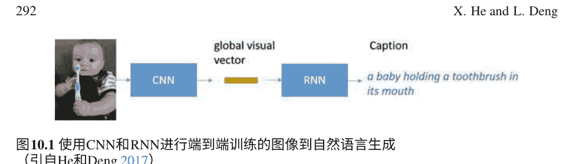

图10.1 使用CNN和RNN进行端到端训练的图像到自然语言生成（引自He和Deng 2017）

在这个框架中，首先通过全局视觉特征向量对原始图像进行编码，该向量表示图像的整体语义信息，通过深度CNN。如图10.2所示，CNN由几个卷积、最大池化、响应归一化和全连接层组成。在这里，CNN在大规模ImageNet数据集（Deng et al. 2009）上进行了1000类图像分类任务的训练。这个AlexNet的最后一层包含1000个节点，每个节点对应一个类别。同时，倒数第二个全连接层被提取为全局视觉特征向量，表示整体图像的语义内容。给定一个原始图像，通常会提取倒数第二个全连接层的激活值作为全局视觉特征向量。这种架构在大规模图像分类中非常成功，并且学到的特征已经被证明可以转移到各种视觉任务中。

一旦提取出全局视觉向量，它就会被输入到另一个基于递归神经网络（RNN）的解码器中，用于生成标题，如图10.3所示。在初始步骤中，全局视觉向量被输入到RNN中，计算第一步的隐藏层。同时，句子起始符号<s>被用作第一步的隐藏层输入。然后，第一个单词从隐藏层生成。

继续这个过程，前一步生成的单词成为下一步的隐藏层输入，生成下一个单词。这个生成过程会一直进行，直到生成句子结束符号。在实践中，通常使用长短时记忆网络（LSTM）（Hochreiter和Schmidhuber 1997）或门控递归单元（GRU）（Chung等人 2015）的变体，这两种变体在训练和捕捉长距离语言依赖性方面都显示出更高的效率和效果（Bahdanau等人 2015; Chung等人 2015），并且在动作识别任务（Varior等人 2016）中取得了成功的应用。使用上述端到端框架的代表性研究包括图像字幕生成的（Chen和Zitnick 2015; Devlin等人 2015; Donahue等人 2015; Gan等人 2017a,b; Karpathy和Fei-Fei 2015; Mao等人 2015; Vinyals等人 2015）以及视频字幕生成的（Venugopalan等人 2015a,b; Ballas等人 2016; Pan等人 2016; Yu等人 2016）。各种方法的差异主要在于CNN架构和基于RNN的语言模型的类型。例如，香农和费菲（2015），毛等人（2015）使用了基本的RNN，而Vinyals等人（2015）使用了LSTM。在Vinyals等人（2015）中，视觉特征向量仅在第一时间步骤中输入RNN一次，而在香农和费菲（2015）中，它在每个时间步骤都被使用。值得指出的是深度CNN对于描述图像到文本应用的成功至关重要，它考虑了图像输入的特殊平移不变性质。

最近，Xu等人（2015）利用基于注意力的机制学习在生成字幕期间在图像中集中注意力的位置。注意力架构在图10.4中有示意图。与简单的编码器-解码器方法不同，基于注意力的方法首先使用CNN不仅生成全局视觉向量，还为图像中的子区域生成一组视觉向量。这些子区域向量可以从CNN的较低卷积层中提取。然后在语言生成中，生成新单词的每一步，循环神经网络将参考这些子区域向量，并确定每个子区域与当前状态生成单词的相关性的可能性。最终，注意机制将形成一个上下文向量，该向量是子区域视觉向量按相关性可能性加权求和，用于循环神经网络解码下一个新单词。

杨等人（2016）在此基础上提出了一个评论模块来改进注意机制，刘等人（2016）进一步提出了一种改进视觉注意力正确性的方法。最近，基于目标检测，安德森等人（2017）提出了一种自底向上的注意模型，该模型在图像字幕生成方面展示了最先进的性能。在这个框架中，包括卷积神经网络、循环神经网络和注意模型在内的所有参数都可以从整个模型的开始到结束部分进行联合训练，因此被称为“端到端”。

#### 10.3.2 组合框架

与刚才描述的端到端编码器-解码器框架不同，一种单独的图像到文本方法使用显式的语义概念检测过程进行标题生成。检测模型和其他模块通常是分开训练的。图10.5展示了方等人（2015）提出的基于语义概念检测的组合方法。这种方法类似于并受到语音识别中长期存在的架构的启发，该架构由声学模型、发音模型和语言模型的多个组合模块组成。

在这个框架中，标题生成流水线的第一步是检测一组语义概念，也就是标签或属性，这些标签很可能是图像描述的一部分。这些标签可以属于任何词类，包括名词、动词和形容词。与图像分类不同，标准的监督学习技术不能直接应用于学习检测器，因为监督只包含整个图像和人工注释的完整句子标题，而对应于单词的图像边界框是未知的。为了解决这个问题，Fang等人（2015）提出了使用弱监督的多实例学习（MIL）方法来学习检测器（Zhang等人，2005）。而在Tran等人（2016）中，这个问题被视为一个多标签分类任务。

在Fang等人（2015）中，检测到的标签然后被输入到基于n-gram的最大熵语言模型中，以生成一系列字幕假设。每个假设都是一个完整的句子，涵盖了一些标签，并且由语言模型规范化，该语言模型定义了单词序列的概率分布。

然后，通过在整个句子和整个图像上计算的特征的线性组合对所有这些假设进行重新排序，包括句子长度、语言模型分数以及整体图像和整个字幕假设之间的语义相似性。其中，图像-字幕语义相似性是通过深度多模态相似性模型计算的，这是早期为信息检索开发的深度结构化语义模型的多模态扩展（Huang等人，2013）。这个“语义”模型由一对神经网络组成，一个用于将每个输入模态（图像和语言）映射为共同语义空间中的向量。图像-标题语义相似性定义为它们向量之间的余弦相似度。

与端到端框架相比，组合方法在系统开发和部署方面提供了更好的灵活性，并且有助于利用各种数据源更有效地优化不同模块的性能，而不是在有限的图像-标题配对数据上学习所有模型。另一方面，端到端模型通常具有更简单的架构，并且可以联合优化整个系统的不同组件以获得更好的性能。

最近，一类模型被提出来在编码器-解码器框架中集成显式语义概念检测。例如，Ballas等人（2016）在生成标题时将检索到的句子作为附加的语义信息来指导LSTM，而Fang等人（2015）、You等人（2016）、Tran等人（2016）在生成句子之前应用了语义概念检测过程。在Gan等人（2017b）中，基于检测到的语义概念的概率构建了一个语义组合网络来组成标题。这一系列方法也代表了图像字幕的当前最先进技术。

从架构和任务定义的角度来看，这种用于图像字幕和语音识别的组合性框架具有一些共同的主题。这两个任务都有自然语言句子的输出，前者的输入是图像像素，后者的输入是语音波形。图像字幕中的属性检测模块与语音识别中的语音识别模块起着类似的作用（Deng和Yu 2007）。在图像字幕中，使用语言模型将图像中检测到的属性转换为一系列字幕假设的列表，在语音识别的后期阶段，将声学特征和语音单元转换为一系列词汇正确的单词假设（通过发音模型），然后转换为语言上合理的单词序列（通过语言模型）（Bridle等人 1998; Deng 1998）。图像字幕中的最终重新排序模块是独特的，因为属性检测的早期模块不具备完整图像的全局信息，而生成一个有意义的自然语言句子需要这样的信息。相比之下，在语音识别中不需要匹配输入和输出的全局属性。

#### 10.3.3 其他框架

除了图像字幕的两个主要框架之外，其他相关框架还学习了视觉特征和相关字幕的联合嵌入。例如，Wei等人（2015）研究了如何为图像中的各个区域生成密集的图像字幕，Pu等人（2016）开发了一种变分自动编码器用于图像字幕。此外，受到强化学习的最近成功的启发，图像字幕研究人员还提出了一套基于强化学习的算法，直接优化特定奖励的字幕模型。例如，Rennie等人（2017）提出了一种自我关键序列训练算法。它使用REINFORCE算法来优化像CIDEr这样的评估指标，这通常是不可微分的，因此不容易通过传统的基于梯度的方法进行优化。在Ren等人（2017）中，通过演员-评论家框架，学习了一个策略网络和一个价值网络，通过优化视觉语义奖励来生成字幕，该奖励衡量图像和生成的字幕之间的相似性。与图像字幕生成相关的是，最近提出了基于生成对抗网络（GAN）的模型用于文本生成。其中，SeqGAN (Yu et al. 2017) 将生成器建模为一个随机策略，用于离散输出（如文本），而RankGAN (Lin et al. 2017) 提出了一种基于排名的损失函数，用于鉴别器，从而更好地评估生成文本的质量，从而导致更好的生成器。

### 10.4 评估指标和基准

自动生成的字幕的质量在文献中通过自动指标和人类研究进行评估和报告。常用的自动评估指标包括双语评估助手 BLEU (Papineni et al. 2002)、METEOR (Denkowski and Lavie 2014)、CIDEr (Vedantam et al. 2015) 和 SPICE (Anderson et al. 2016)。BLEU (Papineni et al. 2002) 在机器翻译中被广泛使用，它衡量了假设和参考（或一组参考）之间共有的 N-gram（最多 4-gram）的比例。METEOR (Denkowski and Lavie 2014) 则衡量了一元精确度和召回率，但扩展了精确匹配的单词，包括基于 WordNet 同义词和词干的相似单词。CIDEr (Vedantam et al. 2015) 还衡量了字幕假设与参考之间的 n-gram 匹配，而 n-gram 的权重是根据 TF-IDF 加权的。SPICE (Anderson et al. 2016) 则衡量了图像字幕中包含的语义命题内容的 F1 分数，因此它提供了与人类判断最相关的。这些自动度量可以高效计算，因此极大地加速了图像字幕算法的开发。然而，所有这些自动度量只能与人类判断大致相关 (Elliott and Keller 2014)。

研究人员创建了许多数据集来促进图像字幕的研究。 Flickr数据集 (Young et al. 2014) 和PASCAL句子数据集 (Rashtchian et al. 2010) 是为促进图像字幕研究而创建的。最近，微软赞助了COCO (Common Objects in Context) 数据集的创建 (Lin et al. 2015)，这是目前公开可用的最大规模的图像字幕数据集。大规模数据集的可用性显著推动了图像字幕研究在过去几年的发展。2015年，约有15个团队参加了COCO字幕挑战赛 (Cui et al. 2015)。挑战赛的参赛作品由人类判断进行评估。在比赛中，所有参赛作品都基于M1的结果进行评估—被评为优于或等于人类字幕的字幕的百分比，以及M2——通过图灵测试的字幕的百分比。另外还使用了三个指标作为结果的诊断和解释：M3——字幕的平均正确性，以1-5的尺度表示 (不正确-正确)，M4——字幕的平均细节程度，以1-5的尺度表示 (缺乏细节-非常详细)，以及M5——与人类描述相似的字幕的百分比。具体而言，在评估中，每个任务向人类评委展示一张图像和两个字幕：一个是自动生成的，另一个人类字幕。对于M1，要求法官选择哪个标题更好地描述了图像，或者在它们的质量相等时选择相同的选项。对于M2，要求法官告诉哪个标题是由人类生成的。如果法官选择了自动生成的标题，或者选择了“无法判断”的选项，那么就认为通过了图灵测试。

通过M1至M5指标对2015年COCO字幕挑战赛中排名前15的图像字幕系统以及其他最新的排名前列的系统进行了量化，并在 (He和Deng 2017) 中进行了总结和分析。这些系统的成功反映了深度学习方法在从感知到认知的这一具有挑战性的任务中取得的巨大进展。

### 10.5 图像字幕的工业应用

在研究界取得快速进展的推动下，行业开始部署图像字幕服务。2016年3月，微软发布了图像字幕服务作为云API向公众开放。为了展示该功能的使用，微软还部署了一个名为CaptionBot的Web应用程序 (http://CaptionBot.ai)，用户可以上传任意图片进行字幕生成。最近，微软还在广泛使用的产品Office中部署了字幕服务，具体来说是Word和PowerPoint，用于自动生成可访问性的替代文本。Facebook还发布了一款自动图像字幕工具，可以提供照片中识别出的对象和场景的列表。与此同时，谷歌开源了他们的图像字幕系统为了社区 (https://github.com/tensorflow/models/tree/master/im2txt)，作为公共部署字幕服务的一步。

随着所有这些工业规模的部署和开源项目，实际场景中收集了大量的图像和用户反馈，这些数据不断作为训练数据来稳定提高系统的性能。这将进一步促进深度学习方法在视觉理解和自然语言生成方面的新研究。

### 10.6 示例：图像的自然语言描述

在本节中，我们使用前面描述的各种深度学习技术，提供生成描述数字图像内容的自然语言字幕的典型示例。

给定一张数字图像，例如图10.6上部显示的照片，图像内容的机器生成文本描述“一个在厨房里准备食物的女人”以及人工注释的描述“在厨房水槽附近的柜台上工作的女人正在准备一顿饭”显示在图的下部。在这种情况下，一个独立的人类（Mechanical Turk工人）稍微更喜欢机器生成的文本。在Microsoft COCO数据库的许多图像中，约30%的图像属于这种类型，即系统生成的字幕被优先选择，或者与人类生成的字幕一样好。

从图10.7、10.8、10.9和10.10中，我们提供了几个其他示例，其中Mechanical Turk工人更喜欢机器生成的图像文本描述，而不是人工注释的描述，或者认为它们同样好。

上述示例中提供的图像字幕系统是通过调用Microsoft Cognitive Services在CaptionBot中实现的，该系统允许手机用户上传手机上的任何照片以获取其相应的自然语言字幕。从图10.11、10.12和10.13中提供了几个示例。在最后一个示例中，我们将名人检测组件添加到字幕系统中的结果也包括在内。

### 10.7 最近关于从图像生成风格化自然语言的研究

深度学习系统从图像中生成的自然语言字幕，在前面的章节中提供了许多技术和示例，通常只给出图像内容的事实描述 (Vinyals等，2015年；Mao等，2015年；Karpathy和Fei-Fei，2015年；Chen和Lawrence Zitnick，2015年；Fang等，2015年；Donahue等，2015年；Xu等，2015年；Yang等，2016年；You 等，2016年；Bengio等，2015年；Tran等，2016年)。自然语言风格经常被忽视。具体而言，现有的图像字幕生成系统一直在使用一种将风格与其他语言生成模式混合的语言生成模型，因此缺乏明确控制风格的机制。最近的研究旨在克服这一不足（Gan等，2017a），并在此进行了回顾。

对图像进行浪漫或幽默的自然语言描述可以极大地丰富字幕的表达能力，并使其更具吸引力。有吸引力的图像字幕将为图像增添更多视觉趣味，并且甚至可以成为字幕系统的独特特征。这对于某些应用特别有价值；例如，在聊天机器人中增加用户参与度或在社交媒体中为用户提供照片字幕的启示。

Gan等人（2017a）提出了StyleNet，它能够使用单语言风格化语料库（即没有配对图像）和标准事实图像/视频-字幕对来生成有吸引力的视觉字幕。StyleNet是基于最近发展起来的将卷积神经网络（CNN）与循环神经网络（RNN）相结合的方法来进行图像字幕生成的。这项工作还受到了Luong等人（2015）多任务序列到序列训练的精神的启发。特别地，它引入了一种新颖的分解LSTM模型，通过多任务训练可以从句子中解开事实和风格因素。然后在运行时，可以明确地将风格因素纳入生成不同风格化字幕的过程中。

StyleNet已经在新收集的Flickr风格化图像字幕数据集上进行了评估，结果表明所提出的StyleNet在图像字幕生成方面明显优于先前的最先进方法，衡量标准为一组自动度量和人工评估。图10.14显示了一些典型的风格化标题生成示例，观察到标准事实风格的标题只用平淡的语言描述图像的事实，而浪漫和幽默风格的标题不仅描述图像的内容，还通过生成带有浪漫（例如，恋爱中，真爱，享受，约会，赢得比赛等）或幽默（例如，找到黄金，准备飞行，捕捉宝可梦，骨头等）意义的短语来表达内容。此外，发现StyleNet生成的短语与图像的视觉内容相一致，使标题在视觉上相关且有吸引力。

## 图10.6 图像字幕生成的示例与人工注释相比


| 类别 | 字幕 |
|------|------|
| Machine-generated (but turker preferred) | a woman in a kitchen preparing food |
| Human-annotated (but turker not preferred) | woman working on counter near kitchen sink preparing a meal |

## 图10.7 图像字幕生成的另一个示例与人工注释相比


| 类别 | 字幕 |
|------|------|
| Machine-generated (but turker preferred) | a bicycle is parked next to a river |
| Human-annotated (but turker not preferred) | a bike sits parked next to a body of water |

## 图10.8 图像字幕生成的另一个示例与人工注释相比


| 类型 | 描述 |
|------|------|
| Machine-generated (but turker prefered) | a man holding a tennis racquet on a tennis court |
| Human-annotated (but turker not prefered) | the man is on the tennis court playing a game |

## 图10.9 另一个例子图像字幕与人类注释的对比


| 类型 | 描述 |
| :--- | :--- |
| Machine-generated (but turker preferred) | a kitchen with wooden cabinets and a sink |
| Human-annotated (but turker not preferred) | an ornate kitchen is designed with rustic wooden parts |

## 图10.10 最后一个例子图像字幕与人类注释的对比


| 类型 | 描述 |
| :--- | :--- |
| Machine-generated (but turker preferred) | a clock tower in the middle of the street |
| Human-annotated (but turker not preferred) | a statue with a clock on it near a parking lot |

## 图10.11 使用Microsoft认知服务自动生成自然句子“I think it's a group of people standing in front of a mountain.”的图像


## 图10.12 使用Microsoft认知服务自动生成自然句子“I think it's a view of a plane flying over a snow covered mountain.”的图像


## 图10.13 使用Microsoft认知服务自动生成自然句子，并添加了名人检测组件


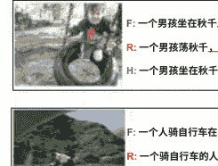

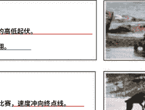

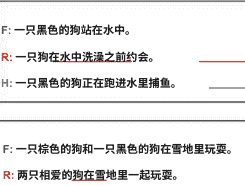


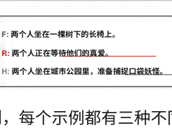

## 图10.14 六个由StyleNet从图像中生成的自然语言标题的示例，每个示例都有三种不同的风格

### 10.8 总结

从图像生成自然语言，或者图像字幕，是一种新兴的深度学习应用，它交叉了计算机视觉和自然语言处理。
它还为许多实际应用提供了技术基础。多亏了深度学习技术，我们近年来在这个领域取得了显著的进展。
在本章中，我们回顾了社区在图像字幕方面所取得的关键发展，以及它们对研究和行业部署的影响。
本章详细介绍了基于深度学习的两个图像字幕框架。为了说明这些系统输出的高质量，提供了两个最先进字幕系统生成的自然语言图像描述的示例。

展望未来，虽然图像字幕是自然语言生成在自然语言处理中的一个特定应用，但它也是图像-自然语言多模态智能领域的一个子领域。
最近，这个领域提出了许多新问题，包括视觉问答 (Fei-Fei和Perona 2016; Young等2014; Agrawal等2015)，视觉叙事 (Huang等2016)，基于视觉的对话 (Das等2017) 和从文本描述中合成图像 (Zhang等2017)。多模态智能涉及自然语言的进展对于未来构建通用人工智能能力至关重要。本章提供的综述希望能够鼓励新的学生和研究人员为这个激动人心的领域做出贡献。

## 参考文献

- Agrawal, A., Lu, J., Antol, S., Mitchell, M., Zitnick, L., Batra, D., & Parikh, D. (2015). Vqa: 视觉问题回答. 在 ICCV.
- Anderson, P., Fernando, B., Johnson, M., & Gould, S. (2016). Spice: 语义命题图像描述评估. 在 ECCV.
- Anderson, P., He, X., Buehler, C., Teney, D., Johnson, M., Gould, S., & Zhang, L. (2017). 自下而上和自上而下的注意力在图像字幕和VQA中的应用. arXiv:1707.07998.
- Bahdanau, D., Cho, K., & Bengio, Y. (2015). 通过联合学习对齐和翻译的神经机器翻译. 在 ICLR会议论文集中.
- Baker, J., et al. (2009). 语音识别和理解的研究发展和方向. IEEE信号处理杂志, 26(4).
- Ballas, N., Yao, L., Pal, C., & Courville, A. (2016). 深入研究卷积网络以学习视频表示. 在 ICLR.
- Bengio, S., Vinyals, O., Jaitly, N., & Shazeer, N. (2015). 用于序列预测的定期抽样与递归神经网络. 在 NIPS(pp. 1171–1179)中.
- Bridle, J., et al. (1998). 关于自动语音识别的分段隐藏动态模型的研究共同发音-调. 1998年语言工程研讨会最终报告, 约翰霍普金斯大学CLSP.
- Chen, X., & Lawrence Zitnick, C. (2015). 心灵之眼: 用于图像caption生成的循环视觉表示. 在 CVPR(pp. 2422–2431)中.
- Chen, X., & Zitnick, C. L. (2015). 心灵之眼: 用于图像caption生成的循环视觉表示. 在 CVPR中.
- Chung, J., Gulcehre, C., Cho, K., & Bengio, Y. (2015). 门控反馈递归神经网络. 在 ICML.
- Cui, Y., Ronchi, M. R., Lin, T. -Y., Dollar, P., & Zitnick, L. (2015). Coco字幕挑战. 在 http://mscoco.org/dataset/captions-challenge2015 .
- Dahl, G., Yu, D., & Deng, L. (2011). 具有上下文依赖DBN-HMMs的大词汇连续语音识别. 在 ICASSP.
- Das, A., et al. (2017). 视觉对话. 在 CVPR.
- Deng, L. (1998). 一种基于动态特征的语音建模和识别的音系和音韵接口方法. 语音通信, 24(4).
- Deng, L., & O’Shaughnessy, D. (2003). 语音处理：一种动态和优化导向的方法。纽约: Marcel Dekker。
- Deng, L., & Yu, D. (2007). 在音素识别中使用微分倒谱作为声学特征的隐藏轨迹建模。 在ICASSP会议上。
- Deng, L., & Yu, D. (2014). 深度学习：方法与应用。Breda: NOW Publishers。
- Deng, J., Dong, W., Socher, R., Li, L. -J., Li, K., & Fei-Fei, L. (2009). Imagenet：一个大规模的分层图像数据库。 在 CVPR(pp. 248–255)。
- Deng, L., Hinton, G., & Kingsbury, B. (2013). 新型深度神经网络学习在语音识别和相关应用中的应用：概述。 在ICASSP会议记录中。
- Denkowski, M., & Lavie, A. (2014). Meteor universal：为任何目标语言提供的语言特定的翻译评估。 在 ACL中。
- Devlin, J., 等人 (2015). 用于图像字幕的语言模型：怪癖和有效方法。 在CVPR会议记录中。
- Donahue, J., Anne Hendricks, L., Guadarrama, S., Rohrbach, M., Venugopalan, S., Saenko, K., & Darrell, T. (2015). 长期循环卷积网络用于视觉识别和描述。 在 CVPR (pp. 2625–2634)。
- Elliott, D., & Keller, F. (2014). 比较图像描述的自动评估指标。 在 ACL中。
- Fang, H., Gupta, S., Iandola, F., Srivastava, R. K., Deng, L., Dollár, P., Gao, J., He, X., Mitchell, M., Platt, J. C., et al. (2015). 从字幕到视觉概念再到字幕。 在 CVPR中(pp. 1473–1482)。
- Farhadi, A., Hejrati, M., Sadeghi, M. A., Young, P., Rashtchian, C., Hockenmaier, J., & Forsyth, D. (2010). 每张图片都讲述一个故事：从图像生成句子。 在 ECCV。
- Fei-Fei, L., & Perona, P. (2016). 堆叠注意力网络用于图像问答。 在CVPR的论文集中。
- Gan, C., et al. (2017a). Stylenet：以风格生成有吸引力的视觉描述。 在 CVPR中。
- Gan, Z., et al. (2017b). 用于视觉描述的语义组合网络。 在 CVPR中。
- Girshick, R. (2015). Fast r-cnn。 在 ICCV中。
- He, X., & Deng, L. (2017). 深度学习用于图像到文本的生成。 在IEEE信号处理杂志中。
- He, K., Zhang, X., Ren, S., & Sun, J. (2015). 深度残差学习用于图像识别。 在CVPR。
- Hinton, G., Deng, L., Yu, D., Dahl, G., Mohamed, A. -r., Jaitly, N., Senior, A., Vanhoucke, V., Nguyen, P., Kingsbury, B., & Sainath, T. (2012). 深度神经网络用于语音识别中的声学建模。 IEEE信号处理杂志, 29。
- Hochreiter, S., & Schmidhuber, J. (1997). 长短期记忆。 神经计算， 9(8)， 1735-1780。
- Hodosh, M., Young, P., & Hockenmaier, J. (2013). 将图像描述作为排序任务：数据、模型和评估指标。 人工智能研究杂志, 47.
- Huang, P., et al. (2013). 使用点击数据学习深度结构化语义模型进行网络搜索。 CIKM会议论文集。
- Krizhevsky, A., Sutskever, I., & Hinton, G. (2012). 使用深度卷积神经网络的Imagenet分类。 在NIPS会议记录中。
- Kulkarni, G., Premraj, V., Ordonez, V., Dhar, S., Li, S., Choi, Y., Berg, A. C., & Berg, T. L. (2015). Babytalk: 理解和生成简单的图像描述。 在 CVPR。
- Lin, K., Li, D., He, X., Zhang, Z., & Sun, M. -T. (2017). 对抗性排序用于语言生成. 在 NIPS.
- Lin, T. -Y., Maire, M., Belongie, S., Bourdev, L., Girshick, R., Hays, J., Perona, P., Ramanan, D., Zitnick, C. L., & Dollár, P. (2015). Microsoft coco: 上下文中的常见对象. 在 ECCV.
- Liu, C., Mao, J., Sha, M., & Yuille, A. (2016). 神经图像字幕的注意力正确性. 预印本 arXiv:1605.09553。
- Luong, M. -T., Le, Q. V., Sutskever, I., Vinyals, O., & Kaiser, L. (2015). 多任务序列到序列学习. 在 ICLR.
- Mao, J., Xu, W., Yang, Y., Wang, J., Huang, Z., & Yuille, A. (2015). 深度字幕与多模态递归神经网络(m-RNN). 在 ICLR.
- Ordonez, V., Kulkarni, G., Ordonez, V., Kulkarni, G., & Berg, T. L. (2011). Im2text: 使用100万个带字幕的照片描述图像. 在 NIPS.
- Pan, Y., Mei, T., Yao, T., Li, H., & Rui, Y. (2016). 联合建模嵌入和翻译以连接视频和语言. 在 CVPR.
- Papineni, K., Roukos, S., Ward, T., & Zhu, W. -J. (2002). BLEU: 一种用于自动评估机器翻译的方法. 在 ACL(pp. 311–318)。
- Pu, Y., Gan, Z., Henao, R., Yuan, X., Li, C., Stevens, A., & Carin, L. (2016). 变分自编码器用于图像、标签和标题的深度学习. 在 NIPS中。
- Rashtchian, C., Young, P., Hodosh, M., & Hockenmaier, J. (2010). 使用亚马逊机械土耳其收集图像注释。 在NAACL HLT Workshop Creating Speech and Language Data with Amazons Mechanical Turk中。
- Ren, Z., Wang, X., Zhang, N., Lv, X., & Li, L. -J. (2017). 基于深度强化学习的图像标题生成。 在 CVPR中。
- Rennie, S. J., Marcheret, E., Mroueh, Y., Ross, J., & Goel, V. (2017). 自我批判的序列训练用于图像字幕生成. 在 CVPR中。
- Sutskever, I., Vinyals, O., 和Le, Q. V. (2014年)。 序列到序列学习与神经网络。 在 NIPS(pp. 3104–3112)中。
- Tran, K., He, X., Zhang, L., Sun, J., Carapcea, C., Thrasher, C., Buehler, C., & Sienkiewicz, C. (2016). 野外丰富图像描述。 arXiv预印本 arXiv:1603.09016。
- Varior, R. R., Shuai, B., Lu, J., Xu, D., & Wang, G. (2016). 用于人体再识别的孪生长期短期记忆架构. 在 ECCV中。
- Vedantam, R., Lawrence Zitnick, C., & Parikh, D. (2015). Cider: 基于共识的图像描述评估. 在 CVPR中(pp. 4566–4575)。
- Venugopalan, S., Rohrbach, M., Donahue, J., Mooney, R., Darrell, T., & Saenko, K. (2015a). 序列到序列-视频到文本. 在 ICCV.
- Venugopalan, S., Xu, H., Donahue, J., Rohrbach, M., Mooney, R., & Saenko, K. (2015b). 使用深度递归神经网络将视频翻译成自然语言. 在 NAACL.
- Vinyals, O., Toshev, A., Bengio, S., & Erhan, D. (2015). 展示和描述：一种神经图像标题生成器。 在 CVPR(pp. 3156–3164)。
- Wei, L., Huang, Q., Ceylan, D., Vouga, E., & Li, H. (2015). Densecap: 用于密集字幕的全卷积局部化网络。 计算机科学。
- Xu, K., Ba, J., Kiros, R., Cho, K., Courville, A., Salakhudinov, R., Zemel, R., & Bengio, Y. (2015). 展示、关注和描述：具有视觉注意力的神经图像字幕生成。 在 ICML(pp. 2048–2057)。
- Yang, Z., Yuan, Y., Wu, Y., Salakhutdinov, R., & Cohen, W. W. (2016). 编码、审查和解码：用于字幕生成的评论者模块。 在 NIPS中。
- You, Q., Jin, H., Wang, Z., Fang, C., & Luo, J. (2016). 具有语义注意力的图像字幕生成。 在 CVPR中。
- Young, P., Lai, A., Hodosh, M., & Hockenmaier, J. (2014). 从图像描述到视觉去噪：用于事件描述的语义推理的新相似度度量。 在Transactions of ACL中。
- Yu, H., Wang, J., Huang, Z., Yang, Y., & Xu, W. (2016). 使用分层递归神经网络的视频段落字幕生成。 在CVPR中。
- Yu, L., Zhang, W., Wang, J., & Yu, Y. (2017). Seqgan: 序列生成对抗网络与策略梯度。 在AAAI中。
- Zhang, H., 等。 (2017). Stackgan: 使用堆叠生成对抗网络进行文本到照片逼真图像合成。 在ICCV中。
- Zhang, C., Platt, J. C., & Viola, P. A. (2005). 多实例增强用于目标检测。 在NIPS中。

## 第11章 结语：深度学习时代的自然语言处理前沿

李登和杨柳

摘要 在这篇结语的第一部分，我们从两个角度全面总结了本书。第一个，以任务为中心的视角将本书中讨论的各种NLP技术按照通用机器学习范式进行分类和整理。通过这种方式，本书的大部分章节可以自然地分为四类：分类、基于序列的预测、高阶结构化预测和序列决策。第二个，以表示为中心的视角从认知科学的角度和基于符号和分布式表示的两种基本类型的自然语言表示进行全面分析。在结语的第二部分，我们更新了深度学习在NLP中的最新进展（主要是在2017年后期，未在之前的章节中进行调查）。基于我们对这些快速进展的综述，我们通过讨论自然语言的组合性、无监督和强化学习在NLP中的未来方向以及它们与深度学习的复杂联系、NLP的元学习以及基于深度学习的NLP系统的弱感和强感可解释性来丰富我们在第1章中关于NLP研究前沿的早期写作。

### 11.1 引言

自然语言处理（NLP）是我们信息时代中最重要的技术之一，它构成了人工智能的一个关键分支，通过理解口语和文本形式中的复杂自然语言。NLP的历史非常有趣，与人工智能的发展密切相关，可以分为三个主要阶段。当前NLP的兴起受到了深度学习的推动，在过去几年中，深度学习取得了巨大的进展。截至2017年11月写作本篇总结时，我们看到本书中介绍的许多深度学习和神经网络方法在多个方向上得到了扩展，并且没有放缓的迹象。

自从我们大约一年前开始这本书项目以来，自然语言处理领域在方法和应用方面取得了显著进展，其中许多进展都得益于深度学习。例如，无监督学习方法最近在文献中出现了，例如 (Lample等人, 2017年; Artetxe等人, 2017年; Liu等人, 2017年; Radford等人, 2017年)。此外，最近还出版了一些优秀的教程和综述材料，为自然语言处理提供了新的见解，并提供了众多深度学习方法的最新研究成果，例如 (Goldberg, 2017年; Young等人, 2017年; Couto, 2017年; Shoham等人, 2017年)。这些新的发展和文献促使我们在本书的最后一章中进行一次探索，更新和增强我们在第一章中关于自然语言处理的最新技术和未来方向的写作。让我们首先从总结整本书的技术内容的主要目标开始，从新颖和整体的角度来看。

### 11.2 两个新视角

本书从自然语言处理和深度学习的基础开始，概述了自然语言处理的历史发展，分为三个阶段进行研究：理性主义、经验主义（Brown等人，1993年；Church和Mercer，1993年；Och，2003年等）以及当前的深度学习浪潮（Hinton等人，2012年；Bahdanau等人，2015年；Deng和Yu，2014年等）。我们强调，深度学习技术对于自然语言处理来说是从前两个阶段发展而来的范式转变。历史调查为我们提供了一个背景，概述了深度学习在自然语言处理任务中的一些显著成功（语音识别和理解、语言建模、机器翻译等），并详细介绍了深度学习在自然语言处理的十个核心领域的应用。

第2章至第10章（以及第1章的一部分）分别专注于以下由深度学习主导或显著影响的自然语言处理应用：

- 语音识别（第一章的一部分）
- 口语理解（第二章）
- 口语对话（第三章）
- 词法分析和解析（第四章）
- 知识图谱（第五章）
- 机器翻译（第六章）
- 问答系统（第七章）
- 情感分析（第八章）
- 社交计算（第九章）
- 语言生成（第十章）

为了提供一个总结，从利用深层语义表示的共同线索，我们从两个新颖的角度来回顾这些章节，这些角度贯穿了这些独立的章节。

## 11.2 两种视角

#### 11.2.1 任务中心的视角

在这里，我们采用基于机器学习范式（例如，Deng和Li, 2013）的视角，将整本书中涵盖的NLP方法和应用按照“任务和范式”划分为四个主要类别进行分析和聚类。

第一个类别是分类，这是监督机器学习中最流行的任务。文本分类在自然语言处理中有着悠久的历史，包括电子邮件垃圾邮件检测和情感分析在内的应用非常成功。情感分析（第8章）在本书中有详细介绍，深度学习方法天生具备对大块文本（例如句子、段落和文档）进行语义组合的能力，已经证明能够产生出色的结果。口语理解中的三个主要问题之一是领域检测、意图确定（以及槽填充），这两个问题都属于文本分类的范畴。此外，当前的深度学习方法用于问答和机器理解（第7章）也可以被视为分类问题。这是一种更复杂的分类问题，因为当前方法需要提供上下文信息来限制答案类别的复杂性。正如第7章所指出的，未来的研究需要放松这些约束条件，以便从文本中实现理解和推理，然后以更有原则的方式解决问答问题。

NLP任务的第二类是（基于序列的）结构化预测。这也被称为顺序模式识别/分类（He等人，2008年），与第一类分类相对应，在这种情况下，输出是一个没有顺序结构的单个实体。机器学习中结构化预测的著名例子主要来自NLP应用。我们在本书中涵盖了许多这些应用，包括对话语言理解中的槽填充（第2章），语音识别（第1章），词分割和词性标注（第4章），机器翻译（第6章），从图像生成自然语言（第10章）以及问题回答的高级版本（第7章）。请注意，一种流行的NLP应用，文档或文本摘要，也非常适合在此类别中进行序列到序列的学习和预测，但我们在本书中没有涵盖这个应用。

从机器学习的角度来看，自然语言处理的第三类任务是高阶结构预测（例如基于树和图的预测）。正如在第一章中讨论的那样，高阶结构是自然语言的一个独特特征。我们的书专门为文本解析问题作为高阶结构预测（第四章）提供了一个完整的章节来介绍深度学习模型。它表明深度学习模型可以有效地用于增强或替代传统的基于图和基于转换的统计模型。此外，它们还展示了神经网络的强大表示能力，超越了仅仅建模的功能。我们还专门为基于图的结构预测和学习（第五章）提供了一个章节，其中使用深度学习技术来嵌入实体和关系以进行知识图表示。深度学习也被用于表示知识图中的关系实例，以及表示实体链接中的异构证据。

利用深度学习来处理知识图在问题回答、文本理解和常识推理方面具有很大的潜力。深度学习对知识图的利用具有很大的前景，因为这种高阶图结构有望为问题回答、文本理解和常识推理提供坚实的基础。

所有这些都是具有挑战性的自然语言处理应用，需要深层语义处理，而大多数当前的自然语言处理系统中都缺少这一功能。社交计算的三个主要元素之一（第9章），建模用户社交连接结构和推荐，也涉及基于图的学习和通过深度学习实现的网络嵌入进行预测。这种网络嵌入在许多社交网络分析任务中实现了自动和无监督的特征工程过程，包括网络重构、链接预测、节点分类和节点聚类/可视化。

虽然以上三类由机器学习方法驱动的自然语言处理任务可以广泛归为监督深度学习或模式识别，但第四类——顺序决策——超出了监督学习的范畴。

本书第3章调查的现代对话系统利用了顺序决策过程，作为对话系统的关键组成部分——对话管理器中的深度强化学习的一部分。对话管理器组件的输出是自然语言，用于与对话系统进行多轮对话时由用户接收。这种类型的自然语言处理任务——顺序决策——与上述其他三类监督学习非常不同。不同之处在于，在对话的每个回合中，没有教学信号告知自然语言输出是否作为“行动”参与“管理”对话的决策过程。相反，对话的整体目标是根据对用户是否满意地完成对话以及对用户而言轮次数量是否合适来衡量的。这种类型的“教师”信号比监督学习中的信号更加遥远，从技术角度来看更具挑战性。

#### 11.2.2 表示为中心的观点

另一种观点，即表示为中心的观点，可以用来总结、分析和从本书中描述的各种NLP方法和应用中提炼见解。

在本书中，使用了两种基本类型的自然语言表示。第一种类型是符号化、局部化或独热表示，在NLP历史的理性主义和经验主义浪潮中广泛采用，在第1章中进行了讨论。符号化表示的最常见示例是文本的词袋和N-gram，其中单词和文本被视为任意符号，并提取和利用它们的（术语）频率。为了改进词袋和N-gram，可以添加基于逆文档频率的权重，形成一个向量空间模型。对文本的符号化表示的进一步改进包括主题模型，其中每个主题被建模为词的分布。

每个文档都被建模为主题的分布。在本书的大多数章节中，上述各种类型的符号表示被用作基准系统，与利用子符号语义表示的深度学习系统进行比较。例如，在情感分析中（第8章），一种基于符号表示的流行基准系统利用情感词典。该词典由两个词列表组成：积极词集和消极词集。通过在文档中符号计数积极词与消极词，可以确定与所有词相关联的情感值。

符号表示通常是手动构建的，例如，通过手动指定单词之间的关系，将符号词的含义编码到计算机中。知识图谱（第5章）是编制此类符号关系的常见方式。这种类型的典型知识图谱已在第5章中详细描述和使用，作为基于知识的表示学习使用神经网络方法的基本数据源。

相比于基于实体的知识图谱（例如WordNet、Freebase等），基于语义的网络（如FrameNet、ConceptNet和YAGO）有了改进。在口语理解中的槽填充任务（第2章的一部分）及其在对话系统中的应用（第3章的一部分）都是基于FrameNet的经验主义语言理解方法开发的。自然语言文本的第二种语义表示类型是子符号或分布式表示，其中每个单词、短语、句子、段落或完整文档都表示为一个密集的嵌入向量，每个元素不仅对应于一个语言实体，而且影响到许多语言实体。在本书的每个章节中介绍的所有自然语言处理应用中，都描述了使用这种分布式表示来实现最先进的系统，通常将其与使用高维稀疏向量构建的符号表示的对应基准系统进行对比。请注意，虽然所有深度学习系统都基于分布式表示，但浅层机器学习方法可以依赖于符号表示或分布式表示。

第9.2节在第9章中对用户生成的文本内容的符号和分布式表示进行了信息性的回顾，以供社交计算使用。第9章中将这两种表示形式与各种自然语言处理方法（包括传统的符号方法、浅层学习和深度学习方法）进行了关联。

本书所有章节中最重要的共同主题是广泛使用各种大小（例如单词、短语、句子、段落和文档）的分布式文本表示作为基本特征和自动学习的中间特征来解决自然语言处理问题。特别是，自然语言的组合性质从低级单元（例如单词）到高级单元（例如文档）被利用来构建深度学习架构，以自然合理的方式进行表示学习。使用深度模型构建的不同语言粒度级别的嵌入向量通常通过无监督方法进行学习，即不提供人工标签信息。相反，“标签”信息是隐含的从文本的上下文中捕捉到的信息，导致了分布式表示的分布特性。在自然语言处理中，这种无监督的深度学习方法的一个开创性成功是使用循环神经网络进行语言建模，如本书中的第6章和其他地方所述。这种类型的无监督学习通常被称为（上下文）预测学习，并且最近已经从自然语言处理中的单词序列预测扩展到视频序列预测（Villegas等，2017年；Lotter等，2017年）。

通过无监督的上下文预测学习得到的完全分布式表示的嵌入向量可以在明确指定最终的自然语言处理任务并且有足够数量的标签数据可用于训练时进行“微调”和学习。本书中介绍的对话系统中的口语理解（第2章和第3章），机器翻译（第6章），问答（第7章），情感分析（第8章），社交计算中的推荐（第9章）和图像字幕生成（第10章）都包含了这种类型的端到端学习的成功示例，这些学习是从无监督表示学习中引导出来的。

### 11.3 深度学习在自然语言处理中的主要最新进展和研究前沿

在本书的第一章中，我们几个月前写了一些深度学习的众所周知的挑战，这些挑战既适用于机器学习，也适用于自然语言处理。从那个分析中，我们讨论了未来自然语言处理的研究方向，包括神经符号集成的框架，对更好的记忆模型和更好的知识使用的探索，以及对无监督和生成学习、多模态和多任务学习以及元学习的更好深度学习范式的探索。由于深度学习和自然语言处理之间的紧密联系以及快速进展，我们在这里对我们之前的分析进行了更新和详细说明。

#### 11.3.1 组合性用于泛化

当前深度学习在受监督设置下的一个常见缺点是需要大量带有标签的训练数据。在自然语言处理的背景下，这个缺点是由于深度学习方法在处理长尾现象方面的困难，因为自然语言数据通常遵循幂律分布。也就是说，任何大规模的自然语言训练数据都会留下训练数据无法覆盖的情况。这是任何学习系统中局部主义或符号表示的固有问题。然而，这个困难为深度学习方法提供了一个优秀的研究方向，因为它们基于分布式表示，至少在原则上不受数据覆盖问题的影响。研究前沿在于如何设计能够有效利用分布式表示的组合性质、解开自然语言数据中潜在变化因素的新深度学习架构和算法的研究非常重要。最近关于这种方法在视频和图像数据上的可行性的研究（Denton和Birodkar 2017; Gan等人2017）为解决自然语言数据的泛化问题提供了希望，而无需大量数据。作为第一步，Larsson和Nilsson（2017）最近的研究开发了一种能够有效操纵自然语言情感并保持语义的解缠表示。所提出的算法比本书第8章中调查的所有情感分析技术都具有更好的泛化能力。

#### 11.3.2 自然语言处理中的无监督学习

几个月前，我们在第1章中提到了关于无监督学习的初步有希望的工作，利用了新的方法来利用顺序输出结构、输入和输出之间的关系以及先进的优化方法，以消除在训练预测系统时昂贵的平行语料库的需求（将数据与每个训练令牌的标签配对）。此后，类似类型的无监督学习已经被扩展到大规模机器翻译任务中（Artetxe等人2017; Lample等人2017; Hutson 2017）。（第6章没有包括这个新的机器翻译进展，该进展是在撰写该章节之后的2017年11月发表的。）Artetxe等人（2017）和Lample等人（2017）发表的两种无监督学习方法都在各自的训练系统中使用了反向翻译和去噪。训练是在没有配对输入和输出的情况下进行的，与Chen等人（2016）和Liu等人（2017）在非自然语言处理任务中的早期工作设置相同，这些工作利用了输出结构和输入（图像）与输出（文本）之间的关系。Lample等人（2017）和Artetxe等人（2017）中提出的反向翻译步骤是利用输入（源文本）和输出（目标文本）之间的相似性来更优雅地利用两者之间的关系（即，两者都是自然语言文本）。具体来说，在反向翻译中，将输入源语言的句子大致翻译成输出目标语言，然后再将其翻译回源语言。如果反向翻译的句子与源语言不完全相同，深度神经网络将学习调整其权重，以使它们在下一次更接近。这两项研究中的去噪步骤具有类似的功能，但仅限于一种语言，通过向句子添加噪声，然后使用去噪自编码器恢复原始的干净版本。主要思想是在源语言和目标语言之间建立一个共同的潜在空间，并通过在源域和目标域中进行重构来学习翻译。有效利用源（输入）和目标（输出）域之间的关系可以大大节省创建配对的源句子和目标句子来训练机器翻译系统的成本。

另一个与NLP中的无监督学习相关的有趣研究，特别是情感分析，来自Radford等人（2017年）。该研究的最初目标是探索基于字节级LSTM语言模型从给定文本（亚马逊评论）中预测下一个字符的属性。意外而令人惊讶的是，在无监督方式下训练的乘法LSTM中的一个神经元被发现能够准确地将评论分类为积极或消极。当同一模型在另一个情感数据集Stanford情感树库上进行测试时，该模型也表现出色。

#### 11.3.3 自然语言处理中的强化学习

无监督学习在机器翻译中的初步成功，如Artetxe等人（2017年）和Lample等人（2017年）最近报道的，正如上文所总结的，与AlphaGo Zero在没有人类数据的情况下的自我对弈策略的成功类似，如Silver等人（2017年）最近报道的。通过自我对弈，AlphaGo成为自己的老师，深度神经网络被训练来预测AlphaGo Zero自己的移动选择以及AlphaGo游戏的获胜者。这种预测是可能的，因为在自我对弈中有一个远程的老师告知谁赢谁输，从而指导强化学习算法。对于无监督机器翻译，反向翻译在AlphaGo Zero中扮演着与自我对弈相同的角色，只是没有类似的获胜-失败信息的老师。然而，如果将强化学习中使用的获胜-失败信号替换为反向翻译句子对原始源句子的好坏程度的度量，这样的度量可以用作深度神经网络中权重参数的无监督学习的目标函数的指导。

上述比较指向了强化学习的潜力，它已经发展出一套强大的算法，用于现有和新的自然语言处理应用。如果自然语言处理问题能够优雅地被定义，使得可以利用“自我对弈”或输入-输出关系来定义远程教学信号，那么强化学习尤其有前景。在这个研究前沿的成功将为克服自然语言处理和深度学习的一个关键瓶颈增加强化学习的强大方法：它们主要基于模式识别和监督学习范式，因此需要大量标记数据并且缺乏推理能力。

自然语言处理中典型的强化学习场景是对话系统。正如本书第3章所调查的，对话管理是自然语言处理中强化学习的首个重大成功之一，其中使用了马尔可夫决策过程的标准工具及其处理不确定性的部分观察版本。在最近的过去，由强化学习控制和训练的深度神经网络已经应用于所有三种类型的对话系统或聊天机器人（智能助手）（Deng 2016; Dhingra et al.2017）。虽然强化学习的“奖励”已经以启发式任务完成（或其他方式）、对话轮数、对话之间的参与程度的组合方式相对清晰地定义，但是对话系统的成功与否仍然是一个挑战。

聊天机器人和用户等对大量对话数据的需求仍然是一个具有挑战性的问题。鉴于很难开发出良好的“世界”模型或模拟器来进行人-聊天机器人对话，直到建立包含“自我对弈”概念的适当形式主义，强化学习中对大量训练数据的要求将不容易克服。随着聊天机器人对话在实际应用中变得更加逼真，这一研究前沿的进展变得更加紧迫。

将强化学习应用于自然语言处理问题的其他较新发展包括SeqGAN方法，通过策略梯度有效地训练序列生成对抗网络（Yu等，2017年）。关于使用强化学习中的另一种流行方法，演员-评论家算法的相关最新研究报告在Bahdanau等人（2017年）中提到。该方法的分析和实验结果显示，在许多自然语言生成任务中，包括机器翻译、标题生成和对话建模，都显示出了潜力。此外，强化学习还在解决基于文本的游戏和预测文本论坛中的热门趋势（例如Reddit讨论串）的自然语言处理问题方面发挥了作用。具体来说，最近文献中报道的实验（He等，2016年；He，2017年）表明，分别对状态空间和动作空间进行建模，两者都采用自然语言形式，能够从文本中提取语义信息，而不仅仅是记忆文本字符串。最近发表的将强化学习应用于自然语言处理的另一个应用是文本摘要（这是一个重要的自然语言处理任务，但由于深度学习在处理文本摘要方面只是最近才开始，我们在本书中没有涵盖）。在（Paulus等，2017年）中，他们展示了在神经编码器-解码器模型中，将使用监督学习的标准词预测与使用强化学习进行全局序列预测训练相结合，生成的摘要文本更易读。

最近，我们对将强化学习应用于从自然语言生成结构化查询的成功非常感兴趣（Zhong等，2017年）。这个自然语言处理任务在本书的第2章中被称为“槽填充”，是在受限领域内的语言理解的核心。过去，这个任务是通过结构化的监督学习来处理的，如第2章所述。如果强化学习能够在许多实际有用的领域中展示出持续的优势，那么口语理解和对话系统的研究前沿将会得到推进，正如第2章和第3章所描述的那样。

#### 11.3.4 自然语言处理的元学习

对于不同的研究者来说，元学习的范围和定义是非常不同的（可以在2017年12月举行的NIPS元学习研讨会上看到）。在这里，我们采用Vilalta和Drissi（2002年）的一般观点。也就是说，元学习旨在构建自适应和持续学习者，通过积累关于学习的知识，动态地改进他们的偏见。元学习是智能生物的标志，可以被正当地描述为具有通过经验和知识获取不断提高自己学习能力的能力。

在本书的第一章中，我们在几个月前写了一些关于元学习在几个非自然语言处理应用中的初步进展，例如超参数优化、神经网络架构优化和快速强化学习。我们还指出，元学习是一种强大的新兴人工智能和深度学习范式，是一个富有研究价值的领域，预计将影响现实世界的自然语言处理应用。

在最近的过去，元学习应用取得了巨大的进展，尤其是在导航和运动控制（Finn等人，2017a），机器人技能（Finn等人，2017b），改进的主动学习（匿名作者，2018b）和一次性图像识别（Munkhdalai和Yu，2017）方面。元学习在自然语言处理任务中的应用开始出现，我们在这里简要回顾一下。

在Anonymous-Authors (2018a)中，元学习被应用于不断适应词嵌入，随后用于解决下游NLP任务。通过利用一个有效的算法和元学习器，给定从许多先前领域和新领域的小语料库中学到的知识，所提出的方法可以有效地在新领域中以增量方式生成词嵌入。元学习器在领域级别提供了词上下文相似性信息。实验结果表明，所提出的元学习方法在从小语料库和旧领域的知识中形成新领域的嵌入方面对三个NLP任务（产品类型的文本分类，二元语义分类和方面提取）的有效性。

在另一项最近的研究中（Bollegala等人，2017），提出了一种不同的元学习方法，以改善新领域下游任务性能的目标相同。在这项研究中，开发了一种无监督的局部线性方法，用于从先前领域的给定预训练源嵌入中学习新领域的嵌入，称为元嵌入。在四个NLP任务（语义相似性，词类比，关系分类和短文本分类）上的实验结果表明，新的元嵌入在几个基准数据集上明显优于先前的方法。

关于将元学习应用于自然语言处理（从图像中提问回答）的另一项有趣的最新研究是由Anton和van den Hengel（2017）报告的。深度学习模型最初在一小小组问题和答案上进行训练，并在测试时提供了一个额外的支持集示例。在这种设置下，模型必须学会学习，也就是说，利用额外的数据进行即时或增量式学习，而无需重新训练模型。本研究提出的深度学习模型显示出对元学习场景的优势利用。它在改进罕见答案的召回率方面表现出强大的性能。它还提供了更好的样本效率和学习生成新答案的独特能力。研究挑战是将本研究中报告的支持问题/答案集的当前使用扩展到从大型知识库和网络搜索中获得的更全面的数据集的未来使用。

最后，我们注意到最近关于深度学习系统在快速非稳态和对抗环境下的连续适应问题的研究，该问题在（基于梯度的）元学习设置中进行了建模（Al-Shedivat等人，2017年）。这种新颖的方法将非稳态任务视为一系列稳态任务，从而将问题转化为多任务学习问题。然后，训练多个深度学习系统（即多个代理）以充分利用连续任务之间的依赖关系，以便在测试时能够有效处理快速的非稳态性。采用了通用的元学习范式，学习了用于生成良好策略的高级过程。每次环境发生变化时都会这样做。也就是说，代理元学习以预测环境的变化并相应地更新策略。

多代理环境的一个重要特征是，从任何个体代理的角度来看，它们都是非稳态的，因为所有参与者都在同时学习和变化（Lowe等人，2017年；Foerster等人，2017年）。结果表明，当一个代理采用了一种假设其他对抗性代理将其视为竞争对手的策略时，这种策略优于那些不做此假设的策略。这种优势的主要原因是，在这种竞争性的多代理环境中，代理有一个真实环境的模型，使它们能够利用连续准稳态任务之间的依赖关系（建模为马尔可夫链），从而能够处理类似的非稳态性。更具体地说，元学习提供了代理策略在任务对之间的转换方面的最优更新，实现了在执行时适应性的少次执行，否则会随着环境与训练时的差异而降低。

虽然Al-Shedivat等人（2017年）报道了针对机器人和游戏的快速非稳态和竞争环境中的元学习方法，但对于潜在未来的自然语言处理和相关应用的影响是深远的。这对于一些特定的自然语言处理应用领域（例如金融）尤其如此，这些应用环境非常竞争。这种快速竞争必然导致高度非稳态的环境，使得从最近的过去中提取出来的用于预期的自然语言处理应用的信号迅速失效。作为自然语言处理的一个令人兴奋的研究前沿，使用元学习框架对这样的环境进行建模，有望扩展从自然语言处理分析和其他手段中提取的信号的有效性。

#### 11.3.5 解释性：弱意义和强意义

深度学习模型的成功，尤其是在自然语言处理应用中的成功，往往以可解释性为代价，这是由于神经网络的连续表示和分层非线性性质所导致的。大多数深度神经网络的“黑盒”特性使得它们难以控制和调试。这种困难不仅导致了开发自然语言处理神经模型的高成本，也导致了在实践中拒绝部署这种不可解释的模型。一个明显的例子是对话系统，正如第3章所讨论的那样。迄今为止，尽管技术上更优越，但在工业界部署的大多数对话系统仍然不基于深度学习。相反，基于规则的系统在实践中仍然很常见，主要是因为其能够解释、调试和控制的能力。

对于其他自然语言处理应用，如问答和阅读理解，类似的挑战普遍存在。例如，几乎所有现有的问答和阅读理解研究所设计的数据集都具有一些不可取的特征，特别是要求问题的答案必须限制在现有阅读文本中的实体或范围内。这将本应需要复杂推理的困难文本理解问题转化为一个无需推理和解释阅读文本的黑盒模式识别问题。要在这个研究前沿取得真正的进展，必须开发更先进的数据集和深度学习方法，以评估和促进实现真实、类似人类的可解释阅读理解，正如Nguyen等人（2017）所提出的。

从2010年开始，深度学习在模式分类和识别任务中取得了很多成功。在过去的两年左右，将这些成功扩展到许多当前基于深度学习的问答和阅读理解方法中，更复杂的推理过程依赖于具有注意机制和干净监督信息的多个阶段的记忆网络。这些人工记忆元素与人类记忆机制相去甚远，它们的力量主要来自于引导网络权重学习的标记数据（单个或多个答案作为标签），这是一种主要的监督学习范式。这与人类进行推理的方式完全不同。如果我们让当前训练在问答对上的神经推理模型执行其他任务，如推荐、对话或语言翻译，这些任务与预定的分类任务（即回答以预定词汇表表达的问题）有所不同，它们将完全失败。

虽然要在努力中取得成功需要长期的研究工作，但在2017年期间，我们已经看到了鼓舞人心的初步进展，首先是使训练模型可解释（在训练过程中没有注入可解释性的目标）。这里所说的弱解释性是指能够从已经训练好的神经模型中得出洞察力，从而间接解释模型如何执行所需的自然语言处理任务（如机器翻译）。在Ding等人（2017）的研究中，为了通过可视化来解释神经机器翻译，使用了提出的逐层相关传播方法来计算相关分数，以量化一个隐藏层中的特定神经元对另一个隐藏层中的神经元的贡献程度。相关分数是衡量一个神经元对下游神经元影响程度的直接指标，间接展示了训练好的神经模型的内部工作原理。作为另一个例子，虽然我们对端到端神经翻译模型在训练过程中学习了源语言和目标语言的内容知之甚少，但Belinkov等人（2017）最近的研究仔细分析了神经翻译所学到的表示。

在各个粒度上的模型。通过词性和形态标记任务评估学习形态的表示质量。

这种数据驱动的定量评估揭示了神经翻译系统在捕捉词结构方面的能力中的重要方面。在最近的另一项研究中（Trost和Klakow2017），为了克服由于连续和高维特性而导致的解释词嵌入向量的困难，对词嵌入进行聚类以创建一种分层的树状结构。该层次结构显示了原始词之间几何上有意义的表示，从而提供了一种更易于人类理解的方式来探索原本不可解释的嵌入向量中的邻域结构。

上述弱解释性相对容易实现。具有强解释性的深度学习模型，即那些在构建和训练过程中将解释性作为训练目标的模型，更难构建但更有用。在第1章的第6节中更详细地讨论了神经符号整合，涉及实现强解释性的一般原则。这个原则受到认知科学的启发（Smolen-sky等人2016; Palangi等人2018; Huang等人2018），力求在强大的连续神经表示和直观的符号表示之间实现自然的“和谐”，以便更好地适应人类理解和使用自然语言进行逻辑推理。

深度NLP系统中的强解释性将能够实现强大的实际应用，例如完成多个NLP任务，如问答、推荐、对话和翻译等。前面提到的这些应用要求要么没有标记的数据，要么只有少量任务的标记。这将成为可能，因为这些系统将具有真正的理解和推理能力，不像当前的NLP系统主要依赖于监督模式识别。

具有强解释性的深度NLP系统的一个具体好处是，人类用户会信任这些系统的回答，因为它们可以提供回答背后的逻辑推理（以符号或自然语言形式）。例如，一个用于阅读理解的NLP系统在阅读一本惊悚小说后，可以正确回答谁谋杀了受害者的问题。但是，如果回答中还提供了逻辑推理步骤（就像侦探大脑内部的思维过程），那么答案将更加可信。一个相关且更简单的例子是学习解决代数问题，并展示解决问题的步骤。最近的研究（Ling et al. 2017）在这方面取得了成功的尝试。该工作解决了为数学问题生成理由的特定问题，任务不仅是获得问题的正确答案，还要生成解决问题所使用的方法的描述。实验证明，所提出的（强解释性）方法在生成的理由的流畅性和解决问题的能力方面优于早期的神经模型。Lei（2017）中报道的另一项非常新的研究也旨在实现深度NLP系统的强解释性。该方法开发了学习从输入文本中提取短小连贯的证明的方法，这些证明足以进行相同的预测。实验证明，多方面情感分析的NLP任务展示了使神经预测可证明和可解释给人类用户的期望目标。尽管在过去一两年中，关于深度学习在具有强解释性的NLP方面的初步工作仅仅开始，但本节讨论的方向线代表了当前深度学习时代NLP研究的一个令人兴奋的前沿。

### 11.4 总结

NLP和深度学习都在快速发展。在过去的三年中，特别是在本书前几部分完成之后的几个月里，深度学习在解决各种NLP问题中越来越成为一种核心范式和方法论。因此，这个尾声章节在2017年底完成，不仅扮演了总结整本书的标准角色，还扮演了更新深度学习在NLP方面最新进展和更新我们对深度学习时代NLP研究前沿的看法的不太寻常的角色。

本章的第一部分从两个角度综述了这本书：任务中心和表示中心。这些角度分别受到机器学习范式和认知科学的启发。本章的第二部分更新了深度学习在自然语言处理中的最新进展，主要是2017年后期的进展，之前的章节中没有涉及。在这些快速的最新进展的支持下，我们在第一章中扩展了我们之前对自然语言处理研究前沿的论述，涉及了五个方面的未来方向：

- 自然语言的组合性和泛化能力；
- 无监督学习在自然语言处理中的应用；
- 强化学习在自然语言处理中的应用；
- 元学习在自然语言处理中的应用；
- 基于深度学习的自然语言处理系统的神经符号集成和可解释性。

深度学习为利用大量计算和数据进行端到端学习和信息提取提供了强大的工具。凭借越来越复杂的分布式表示（例如McCann等人，2017年），越来越精细的功能块模块化设计（例如分层注意力）以及高效的基于梯度的学习方法，深度学习已成为越来越多自然语言处理问题的主导范式和最新方法。除了我们在第1-10章中调查过的许多问题以及在本章前面部分讨论过的由深度学习完全或部分解决的新的自然语言处理问题之外，我们还看到了单个深度学习通过构建神经网络（Hashimoto等人，2017年）来共同解决许多自然语言处理任务的能力。此外，极其嘈杂条件下的非常困难的自然语言处理任务——Twitter文本的情感分析——最近在很大程度上被深度学习征服了（Cliche，2017年）。

在第1章的第5节中，我们讨论和分析了当前深度学习技术中的一些限制，特别是与NLP方法和应用相关的限制。正如在之前的所有章节和本章的早期部分中所明显的，深度学习方法的能力不断提高，同时已经逐个克服了已经确定的限制，无论是部分还是完全地。随着深度学习从监督范式转向无监督、强化和元学习，并且随着深度模型变得越来越复杂，我们需要对为什么以及如何深度学习在许多任务中表现出色以及在其他任务中可能不那么出色的新的基本见解。这是深度学习研究中的一个重大挑战和研究前沿，特别是对于NLP。

鉴于深度学习方法的丰富和充满活力的研究活动几乎涵盖了NLP的所有领域，我们对当前看到的趋势有信心会持续下去。我们预计会出现更多更好的深度学习模型架构，并且我们还预计深度强化学习、无监督学习和元学习将使新的NLP应用超越我们在本章早期总结的内容。

作为本章和整本书的最后说明，我们在这里概述了一些关于（纯粹）深度学习（本书的主题）扩展到更一般的范围，即可微分编程（differentiable programming）的最近热门讨论，特别是与自然语言处理相关的讨论。泛化的本质是将深度神经网络（作为参数化功能块的计算图）从固定状态变为动态状态。也就是说，在泛化之后，由许多可微分模块组成的网络架构现在可以根据数据动态创建。在这种可微分编程范式中，深度神经网络架构，包括内存、注意力、堆栈、队列和指针模块，正如我们在本书的许多章节中所看到的，是通过逻辑表达式、条件语句、赋值和循环进行过程化组合的。这种灵活性是当前许多深度学习框架（例如PyTorch、Tensorflow、Chainer、MXNet、CNTK等，对于后者请参见Yu和Deng2015的第14章）提供的目标。一旦完全开发并构建了高效的编译器，我们将拥有一种全新的软件类型，不再以传统编程中的控制结构（如循环和条件语句）为特征，而是通过组装参数化功能块的图形来建立。每个功能块本身都是一个神经网络。重要的是，组装图中的所有参数（例如神经网络权重和定义网络非线性和内存模块的参数）都可以使用高效的基于梯度的优化方法从数据中自动训练。这是因为无论组装图有多复杂，可微性都确保它们可以通过反向传播端到端地进行学习。

可微编程引入了一个令人兴奋的技术领域，构建在我们现有的软件堆栈之上，现在参数化、可微分和可学习的效率很高。它不仅代表了一种桥接通用算法和实现深度学习的方式的范式，还是通向人工通用智能的路径，其中符号处理和神经中心的深度学习被和谐地整合在一起。这种新的深度学习思维方式对自然语言处理具有特殊的相关性。首先，在相对较后期开发时，在人类认知中，符号处理在逻辑推理方面具有高效性并且易于解释，这在许多自然语言处理应用中都是可取的。通过类似于张量乘积的编码方案，旨在统一神经和语言结构化表示，可通过可微分编程提供复杂、灵活和动态构建的神经网络中的高效学习，从而充分发挥符号和神经世界的优势。其次，NLP模型的动态性在NLP方法中变得越来越普遍，正如我们在本书的每一章中所展示的。这是由于NLP研究对象——语言和文本的本质，具有固有的可变维度，例如文档、句子或单词中的（输入）长度和结构。其受欢迎程度还归功于现有深度学习框架在支持动态变化的神经网络架构方面的能力，以适应可变维度的文本输入。最后，最近已经显示出自然语言是一个非常有用的潜在空间，可以在其中进行优化，以解决各种困难的机器学习问题（Andreas等人，2017年）。语言的离散性不允许端到端学习利用可微性作为可微编程的要求。然而，一种基于近似的放松技术通过一个提议模型克服了这个困难，为利用自然语言数据改善机器学习和自然语言处理任务提供了更广泛的机会。

总之，配备了广义深度学习或可微编程框架，更强大、灵活和先进的深度学习架构有望在不久的将来解决我们在本章和之前章节中提出的剩余困难的自然语言处理任务。超出本书所介绍的新的成功将使我们更接近人工智能的普适智能，其中自然语言处理是一个重要组成部分。

## 参考文献

- Al-Shedivat, M., Bansal, T., Burda, Y., Sutskever, I., Mordatch, I., & Abbeel, P. (2017). 在非稳态和竞争环境中通过元学习进行连续适应。在arXiv:1710.03641v1中。
- Andreas, J., Klein, D. & Levine, S. (2017). 学习与潜在语言 arXiv:1711.00482.
- 匿名作者 (2018a). 通过元学习实现终身词嵌入。提交给ICLR.
- 匿名作者 (2018b). 通过深度强化学习实现可迁移的主动学习策略。提交给ICLR.
- Anton, D. T. & van den Hengel (2017). 视觉问答作为元学习任务。在arXiv:1711.08105v1.
- Artetxe, M., Labaka, G., Agirre, E., & Cho, K. (2017). 无监督神经机器翻译在arXiv:1710.11041v1.
- Bahdanau, D., Cho, K., & Bengio, Y. (2015). 通过联合学习对齐和翻译的神经机器翻译。在ICLR会议论文集中.
- Bahdanau, D., et al. (2017).用于序列预测的演员-评论家算法.ICLR: Proc.
- Belinkov, Y., Durrani, N., Dalvi, F., Sajjad, H., & Glass, J. (2017).神经机器翻译模型对形态学的学习. ACL: Proc.
- Bollegala, D., Hayashi, K., & ichi Kawarabayashi, K. (2017). Think globally, embed locally locally linear meta-embedding of words. arXiv:1709.06671v1.
- Brown, P. F., Della Pietra, S. A., Della Pietra, V. J., & Mercer, R. L. (1993). 统计机器翻译的数学参数估计。计算语言学。
- Chen, J., Huang, P., He, X., Gao, J., & Deng, L. (2016). 从非配对的输入输出样本中无监督学习预测器。在arXiv:1606.04646中。
- Church, K. & Mercer, R. (1993). 引言：使用大型语料库的计算语言学专题。计算语言学，9 (1),
- Cliche, M. (2017). Bb twtr at semeval-2017 task 4: 使用cnns和lstms进行Twitter情感分析。Proc. 第11届国际语义评估研讨会.
- Couto, J. (2017). 2017年自然语言处理中的深度学习进展和趋势 博客文章链接：https://tryolabs.com/blog/2017/12/12/deep-learning-for-nlp-advancements-and-trends-in-2017/.
- Deng, L. (2016). 深度强化学习如何帮助聊天机器人。Venturebeat.
- Deng, L., & Li, X. (2013). 语音识别的机器学习范式：概述。IEEE音频、语音和语言处理交易，21(5), 1060–1089.
- Deng, L. & Yu, D. (2014).深度学习：方法与应用. NOW Publishers.
- Denton, E. & Birodkar, V. (2017). 从视频中无监督学习分离表示。在 NIPS中。
- Dhingra, B., Li, L., Li, X., Gao, J., Chen, Y.-N., Ahmed, F., 等 (2017).朝着端到端的强化学习对话代理的信息访问. ACL: Proc.
- Ding, Y., Liu, Y., Luan, H., & Sun, M. (2017).可视化和理解神经机器翻译. ACL: Proc.
- Finn, C., Abbeel, P., & Levine, S. (2017a). 模型无关的元学习，用于深度网络的快速适应。
- Finn, C., Yu, T., Zhang, T., Abbeel, P., & Levine, S. (2017b). 一次性视觉模仿学习通过元学习.arXiv:1709.04905v1.
- Foerster, J. N., Chen, R., Al-Shedivat, M., Whiteson, S., Abbeel, P., & Mordatch, I. (2017). 学习对手学习意识。
- Gan, Z.等(2017). 语义组合网络用于视觉字幕生成。在 CVPR.神经网络方法用于自然语言处理. Morgan & Claypool出版社.
- Hashimoto, K., Xiong, C., Tsuruoka, Y., & Socher, R. (2017). 一个联合多任务模型：为多个NLP任务构建神经网络. 在EMNLP会议论文集中.
- He, J. (2017). 深度强化学习在自然语言场景中的应用，博士论文，华盛顿大学，西雅图.
- He, J., Chen, J., He, X., Gao, J., Li, L., Deng, L., & Ostendorf, M. (2016). 深度强化学习与自然语言行动空间. 在ACL会议论文集中.
- He, X., Deng, L., & Chou, W. (2008). 顺序模式识别中的判别学习。25(5).
- Hinton, G., Deng, L., Yu, D., Dahl, G., Mohamed, A.-r., Jaitly, N., Senior, A., Vanhoucke, V.,Ngyen, P., Kingsbury, B., & Sainath, T. (2012). 深度神经网络用于语音识别中的声学建模.IEEE信号处理杂志.
- Huang, Q., Smolensky, P., He, X., Deng, L., & Wu, D. (2018).张量积生成网络用于深度自然语言处理建模. NAACL: Proc.
- Hutson, M. (2017). 人工智能变得双语——无需字典。在科学中。
- Lample, G., Denoyer, L., & Ranzato, M. A. (2017). 仅使用单语料库的无监督机器翻译。在arXiv:1711.00043v1中。
- Larsson, M. & Nilsson, A. (2017). 用于文本情感操作的可分解表示。NIPS学习可分解表示的研讨会：从感知到控制。
- 雷, T. (2017). 可解释的神经模型用于自然语言处理。博士论文, 麻省理工学院.
- Ling, W., Yogatama, D., Dyer, C., & Blunsom, P. (2017).通过理性生成进行程序归纳：学习解决和解释代数问题. EMNLP: Proc.
- Liu, Y., Chen, J., & Deng, L. (2017). 使用顺序输出统计的无监督序列分类. In NIPS.
- Lotter, W., Kreiman, G., & Cox, D. (2017).用于视频预测和无监督学习的深度预测编码网络. ICLR: Proc.
- Lowe, R., Wu, Y., Tamar, A., Harb, J., Abbeel, P., & Mordatch, I. (2017). 用于混合合作竞争环境的多智能体演员-评论家算法.
- McCann, B., Bradbury, J., Xiong, C., & Socher, R. (2017).在翻译中学到的：上下文化的词向量. NIPS: Proc.
- Munkhdalai, T., & Yu, H. (2017). 元网络 . ICML: Proc.
- Nguyen, T.等 (2017). MS MARCO: 一个由人类生成的机器阅读理解数据集.arXiv:1611,0926 8.
- Och, F. (2003). 最大错误率训练在统计机器翻译中。ACL会议论文集.
- Palangi, H., Smolensky, P., He, X., & Deng, L. (2018).通过问答深度学习可解释的语法表示. AAAI: Proc.
- Paulus, R., Xiong, C., & Socher, R. (2017). 一种用于抽象摘要的深度强化模型. arXiv:1705.04304.
- Radford, A., J zefowicz, R., & Sutskever, I. (2017). 学习生成评论并发现情感.arXiv:1704.0144 4.
- Russell, S. & Stefano, E. (2017). 无标签监督神经网络与物理和领域知识. 在AAAI会议论文集中.
- Shoham, Y., Perrault, R., Brynjolfsson, E., & Clark, J. (2017). Artificial Intelligence Index — 2017 年度报告. 斯坦福大学.
- Silver, D. et al. (2017). 无需人类知识掌握围棋游戏. 在 Nature中.
- Smolensky, P. et al. (2016). 使用张量积表示进行推理. arXiv:1601,02745.
- Trost, T., & Klakow, D. (2017).无参数的基于图的层次聚类用于分析连续词嵌入. ACL: Proc.
- Vilalta, R. & Drissi, Y. (2002). 元学习的透视视角和调查.Artificial Intelligence Review, 25(2), 77–95.
- Villegas, R., Yang, J., Hong, S., Lin, X., & Lee, H. (2017).分解运动和内容以进行自然视频序列预测. ICLR: Proc.
- Young, T., Hazarika, D., Poria, S., & Cambria, E. (2017). 基于深度学习的自然语言处理的最新趋势. arXiv:1708.02709.
- Yu, D. & Deng, L. (2015).自动语音识别：一种深度学习方法. Springer.
- Yu, L., Zhang, W., Wang, J., & Yu, Y. (2017). SeqGAN: 序列生成对抗网络与策略梯度. In AAAI.
- Zhong, V., Xiong, C., & Socher, R. (2017). Seq2SQL: 使用强化学习从自然语言生成结构化查询. In arXiv:1709.00103.

## 术语表

注意力机制受人类视觉注意力的启发而提出，能够帮助神经网络在进行预测时学习到应该“关注”什么。

平均感知器平均感知器（AP）是标准感知器算法的扩展。它使用每个训练实例计算的平均权重和偏置。

反向传播反向传播算法通过从网络输出开始，应用链式法则来高效地计算神经网络中的梯度，并将梯度向后传播。

信念跟踪器一种统计模型，用于估计对话中每一步用户的目标。

双向循环神经网络双向循环神经网络（BiRNN）使用有限序列来预测或标记序列中的每个元素，基于元素的过去和未来上下文。这是通过将两个RNN的输出连接起来实现的，一个RNN从左到右处理序列，另一个RNN从右到左处理序列。

复合值类型复合值类型（CVT）是在Freebase中用于表示复杂结构化数据的特殊数据类型。

组合范畴语法组合范畴语法（CCG）是一种语法形式，它为短语分配词汇范畴，并通过应用、组合和类型提升推导出新的范畴。

Cocke-Younger-Kasami算法Cocke–Younger–Kasami算法（也称为CKY算法）是一种用于上下文无关文法的解析算法，以其发明者John Cocke、Daniel Younger和Tadao Kasami命名。它采用自底向上的解析和动态规划。

对话管理器对话管理器是对话系统的一个组件，负责对话的状态和流程。

对话状态跟踪器口语对话系统的一个组件，创建一个“跟踪器”来预测新对话的对话状态，以理解用户的请求并在有限的对话轮次内完成相关任务。

DropoutDropout是一种正则化技术，用于神经网络，在每次训练迭代中随机将一部分神经元设置为0，以防止过拟合。

端到端对话系统对话系统的训练方法不需要特征工程（只需要架构工程），可以转移到不同的领域，并且不需要每个模块的监督数据。

目标导向型对话系统目标导向型对话系统需要理解用户的请求，并在有限的对话轮次内完成相关任务的明确目标。

信息抽取信息抽取（IE）是一种从非结构化和/或半结构化机器可读文档中自动提取结构化信息的任务。

潜在语义索引潜在语义索引（LSI）是一种降维技术，将查询和文档投影到具有潜在语义维度的空间中。

有限内存BFGS有限内存BFGS是一种近似**Broyden-Fletcher-Goldfarb-Shanno (BFGS)** 算法的有限内存拟牛顿优化算法。

长短期记忆长短期记忆网络旨在通过使用记忆门机制来防止递归神经网络中的梯度消失问题。

机器理解机器理解（MC）是对传统问答的扩展，它仅通过给定的文档来回答用户的问题。

边际注入松弛算法边际注入松弛算法（MIRA）是一种用于多类别分类问题的在线算法，其中当前的训练样本被正确分类，并且与错误分类相比具有至少与其损失一样大的边际。

最大似然估计最大似然估计（MLE）是一种用于统计模型参数估计的方法，它找到可以最大化观测数据的似然性的参数。

最大生成树最大生成树（MST）是一个具有最大权重的加权图的生成树。可以通过对每条边的权重取反并应用Kruskal算法来计算。

最小错误率训练最小错误率训练（MERT）是一种训练算法，它搜索SMT子模型特征的最优权重，以最小化给定的错误度量，或者最大化给定的翻译度量，如BLEU和TER。

最小风险训练最小风险训练（MRT）是一种训练算法，它找到模型的参数以最小化训练数据的经验风险。

多层感知机多层感知机（MLP）是一类前馈人工神经网络，可以区分线性不可分的数据。一个MLP通常由至少两个非线性层组成。

命名实体识别命名实体识别（NER）是一项任务，将自然语言文档中的命名实体定位和分类为预定义的类别，如人名、组织机构、地点等。

自然语言生成自然语言生成（NLG）是从机器表示系统（如知识库或逻辑形式）生成自然语言的自然语言处理任务。

神经机器翻译神经机器翻译（NMT）是一种以端到端方式使用神经网络建模翻译过程的机器翻译范式。

词汇外词汇外（OOV）指的是在现有预定义词表中不存在的单词集合。

词性词性（POS）是一类单词，它们通常显示出类似的行为。从句法角度来看，它们在句子的语法结构中扮演着类似的角色。从形态角度来看，它们对于类似的属性会发生变化。

逐点互信息逐点互信息（PMI）是信息论和统计学中使用的一种关联度量。

主成分分析主成分分析（PCA）是一种数学过程，将（可能）相关的变量转换为称为主成分的（较少的）不相关变量。

语义解析语义解析（SP）是将自然语言转化为形式化意义表示的任务。

SoftmaxSoftmax函数用于将原始分数向量转换为神经网络输出层的类别概率。

口语对话系统口语对话系统（SDS）是一种能够与人类进行语音对话的计算机系统。它有两个在书面文本对话系统中不存在的关键组件：语音识别器和文本到语音模块（书面文本对话系统通常使用操作系统提供的其他输入系统）。

口语理解口语理解（SLU）是人工智能中自然语言处理的一个子主题，主要用于针对机器的人类语音的有针对性理解。

统计机器翻译统计机器翻译（SMT）是一种使用统计模型从平行语料库中学习参数并生成翻译的机器翻译范式。

语义角色标注语义角色标注（SRL）（也称为浅层语义解析）是一个任务，包括检测与句子的谓词相关的语义论元，并将它们分类为特定的语义角色。

用户生成内容用户生成内容（UGC）是由系统或服务的用户创建并向公众提供的任何类型的内容。

用户目标识别和解释用户的信息寻求行为的任务。

用户模拟器作为对话系统中的用户的统计模型是训练和评估（口语）对话系统性能的一种高效有效的方式。