# 视觉内容挖掘中的深度学习

# 前言

深度学习是人工智能领域的新趋势，将机器学习算法的性能推向了当今人类面临的各种实际问题的可行性。

计算机视觉和多媒体索引研究已经从以往的所有方法转向基于深度学习的方法。

这种方法建立在监督式机器学习特别是人工神经网络的原则上。应用于视觉信息挖掘，它还结合了我们在图像处理和分析方面的基础知识。今天，我们将所有的视觉信息挖掘技术转化为这种语言。

软件框架的广泛应用使得设计和实现深度架构变得容易，可以选择和适当参数化不同的优化算法来训练深度神经网络的参数。

图形处理单元（GPU）和分布式计算的可用性使得学习的计算时间相当合理。对于年轻研究人员和那些转向这种方法的人来说，我们认为迅速理解底层数学模型和形式主义非常重要，但也要在理解图像和视频的先前方法与这些优秀工具之间建立桥梁。

今天很难写一本关于深度学习的书，因为互联网上有很多不同的教程可以轻松获取。我们的书与它们相比有什么特别之处？我们试图在使用数学形式主义、图形插图和真实世界示例之间保持足够的平衡。这本书应该对具有工程和计算机科学背景的年轻研究人员和专业人士易于理解。无痛深度学习，这是我们的目标。

致谢我们感谢我们的博士生Abraham Montoya Obeso和Karim Aderghal，在准备本书的插图材料方面给予的帮助。

- 法国波尔多
- 法国塔朗斯
- 2019年8月

- 阿卡·泽玛里
- 珍妮·贝努瓦-皮诺


## 缩略语

- 人工神经网络： Artificial Neural Network
- 卷积神经网络： Convolutional Neural Network
- HMM： Hidden Markov Model
- LSTM： Long Short-Term Memory
- MLP： Multilayer Perceptron
- 循环神经网络： Recurrent Neural Network

## 图表列表

- 图2.1 给定两个特征的分类和回归示例。在(a)中，红点表示类别0，绿点表示类别1，黑线表示模型将新数据分类为两个类别。在(b)中，红点表示数据，黑线表示回归示例。该模型用于预测连续值。
- 图2.2 一个2 × 2的混淆矩阵。
- 图2.3 在建筑分类任务中的一个67 × 67的混淆矩阵示例，请参见第8章。数值为在范围[0, 1]内进行归一化。
- 图2.4 AUC-ROC曲线图。
- 图3.1 一个形式神经元的两种表示：详细表示 (a) 和简洁表示 (b)。请注意，当它是神经网络的一部分时，神经元只是简单地表示通过一个顶点。
- 图3.2 两个特定的激活函数：(a) sigmoid函数和 (b) 修正线性单元 (Relu) 函数。
- 图3.3 两个神经网络：都有三个输入 x1, x2和 x3，以及两个输出 y1和 y2。网络 (a) 是一个单层神经网络，而 (b) 是一个具有两个隐藏层的多层网络隐藏层。
- 图3.4 两层之间的权重矩阵 l 和 l + 1层的偏置向量 l。
- 图3.5 单热编码的示例。
- 图4.1 两个函数：(a) 具有单个最小值的凸函数和 (b) 具有两个局部最小值的非凸函数。
- 图4.2 具有多个局部最小值的非凸函数和高原。
- 图4.3 学习率的三个例子: (a) 较大的学习率可能导致发散行为, (b) 过小的学习率可能导致收敛缓慢, (c) 自适应学习率可以确保快速收敛。
- 图4.4 一个非常简单的神经网络: 每层一个单元的两层 这两个神经元具有相同的激活函数 $\sigma$。
- 图5.1 图像的低通滤波: (a) 原始图像和 (b) 高斯滤波后的图像, 使用3 ×3的卷积核。
- 图5.2 (a) 原始图像和 (b) 沿着 x轴的Sobel滤波。
- 图5.3 AlexNet架构 [KSH12]。
- 图5.4 两个样本的高斯差分滤波 顶部和底部行显示了两个样本, $\sigma = 1.0$和 $\sigma = 1.5$, 分别。
- 图5.5 通过应用高斯差分 (DoG) 滤波器和第一层卷积 (Conv) 的输出, 得到两个样本的特征图 AlexNet架构[KSH12]的卷积层的特征图。
- 图5.6 采样图像频谱: (a)原始图像频谱, (b)采样图像频谱和(c)重建图像频谱。
- 图5.7 傅里叶域中的滤波: (a)使用方框滤波器, (b)使用高斯滤波器。
- 图5.8 显示子采样过程: (a) 通过高斯金字塔, (b) 通过卷积和池化层在AlexNet架构中进行子采样, (c) 输出结果为6 ×6像素 两个流程的结合。
- 图6.1 在CNN中, 每一层的维度都会逐渐减小。
- 图6.2 图像编码: (a) 一个手写数字和 (b) 它的编码。
- 图6.3 映射到矩阵 (6 ×6) 的卷积和 图6.2中的图像和一个 (3 ×3) 的滤波器进行卷积, 得到的矩阵。
- 图6.4 CNN的前两层用于前面的例子: 两个单元 (红色和蓝色) 连接到输入层的一个子集, 而不是全部单元, 并且这两个单元共享相同的权重 用于一些先前单元的相同权重。
- 图6.5 展示了最大池化操作的示意图: 图像的大小被减小了。
- 图6.6 展示了dropout正则化的示意图: (a) 神经网络和 (b) dropout应用。 在训练阶段的任何迭代开始时, 每个单元都有概率$p$被移除, 连同其连接一起使网络变得更薄。 在测试阶段, 如果丢弃概率为 $p$, 每个权重乘以$1-p$。
- 图6.7 GoogLeNet架构: 一个inception块的结构。
- 图6.8 ResNet网络的架构。它包含34层，每两个卷积之间都有快捷方式。
- 图7.1 隐马尔可夫模型中的一个节点：可能的转换是从一个隐藏状态 $X_t = s_i$ 到另一个隐藏状态，并且一个节点可以发出一个观察值 $o_t = o_{j_0}$。条件概率对应于转换和发射概率。
- 图7.2 一个非常简单的递归神经网络表示。
- 图7.3 一个递归网络及其展开。
- 图7.4 一个短期长期记忆网络的单元：$\sigma$ 和 tanh 分别是在第3章中介绍的sigmoid和tanh函数。运算符 $\times$ 和 $+$ 分别表示乘法和加法运算。
- 图8.1 注视点和主观显著性图生成：(a) 图像上的注视点和(b)显著性图源图像。红色：更多关注，蓝色：较少关注。
- 图8.2 参考图像和目标图像的参考和投影显著性图通过匹配点。红线表示关键点匹配，目标图像上的绿色多边形显示由估计的单应性变换给出。在这里，参数是Lowe的比率和 $\alpha = 20^\circ$ 作为单应性验证步骤的角度阈值。红色：更多关注，蓝色：较少关注。
- 图8.3 挤压激励块，重新绘制自[FSM$^+$17]。
- 图8.4 $A^2$：双重注意力块，重新绘制自[CKL$^+$18]。
- 图8.5 展示了不同值的随机特征池化 $k$-参数；原始图像作为特征图给出各自的显著性图。
- 图8.6 在池化层中引入的显著性图。特征图是未经调整大小以获得更好的可视化效果。
- 图8.7 自适应空间显著性降低。为了验证激活被丢弃的位置，显示了视觉注意力图。我们在训练了几个模型之后发现，当 $k=4$ 时，结果更好。对于这个样本，$\mu_{sm} = 0.22$，并且 $\lambda^*$ 是通过计算得到方程式 (8.13) 对于每个值 $k$。
- 图9.1 显示了AD大脑上的sMRI和DTI模态的示例。(a) sMRI模态，(b) MD-DTI模态。
- 图9.2 显示了AD、MCI和健康大脑在SMRI和DTI上的示例模态。从左到右AD，MCI，NC。
- 图9.3 sMRI数据集的预处理图。
- 图9.4 单个网络用于ROI分类的一个投影一个模态。
- 图9.5 基于所有模态和所有投影构建的李生网络。

# 第1章
引言

视觉内容挖掘在计算机视觉领域有着悠久的历史，是一个核心问题。它包括在图像或视频序列中找到并正确标记对象，识别静态和动态场景。在许多研究和应用领域中都是必需的：多媒体索引和检索，计算机视觉，机器人技术，使用医学图像进行计算机辅助诊断等等。人类天生擅长进行视觉场景识别，毫不费力。然而，自动对象和场景识别仍然是一项具有挑战性的任务。

如果我们回顾一下在视觉内容挖掘中使用的数学模型的历史，我们可以列举出很多方法，来自于非常广泛的模式识别领域[Tou74]：

- 统计模式识别，其中视觉场景、其元素甚至像素在细粒度视觉分析任务中被视为N维数据空间中的一个点，并被视为多维随机过程的实现[Tou74]；
- 相关分析或模板匹配[Pra91]，其中问题在于识别给定视觉场景中的原型对象，并通过最大化原型和目标图像或视频序列中选定区域之间的相关函数来解决，无论是在傅里叶域还是像素域中；
- 结构或句法模式识别[Pav77, Fu82]，其中视觉场景被表示为图形[Pav77]或来自形式语言[Fu82]的句子，识别过程包括计算图同构或根据定义的形式语法解析句子。...

自视觉内容挖掘的早期以来，从统计模式识别的角度来看，一直存在着使用经典数据分析和机器学习来理解视觉内容的趋势。因此，监督学习方法，如线性判别分析(LDA)[Tou74]或神经网络(NN)分类器[Min87]，已被使用。

在视觉内容挖掘任务中，这些方法的真正突破是引入了支持向量机（SVMs）分类器（由V.N. Vapnik [BV92]提出）。这些分类器优于LDA和NNs，因为此时问题的高维度限制了它们的性能，需要训练大量的突触权重来解决像素级图像表示的问题。

在视觉内容分类任务中，SVM的输入是从图像中提取的描述性向量。可能最简单的形式是通过直方图均衡化和灰度归一化得到的一维像素视网膜向量[HHP01]。然后，提出了非常多样化的描述符向量，例如SIFT [Low04]和SURF[BETVG08]，这些向量是围绕图像中的某些特征点计算得到的。为了获得图像的全局表示，并利用向量量化的成果，引入了视觉词袋（BoVW）[CDF+04]。

图像或其中的某个区域已被表示为量化描述符的直方图，多年来，社区一直在使用基于不同量化描述符的BoVW结合以及SVM分类器。这些方法的综合调查可以在[BPPC12]中找到。主要的研究趋势是如何定义描述符计算的支持以及如何构建融合不同特征上的BoVW编码的分类器级联[IBPQ14]。对于静态图像，最流行的描述符是SIFT和SURF，它们表达了特征点附近的轮廓方向。因此，识别过程基于全局直方图中抽象出的非常局部的图像描述。通过将视觉注意模型纳入BoVW直方图中的特征选择和加权，一些改进已经取得了成果[GDBBP16, BPC17]，但是这些方法在性能上已经达到了饱和，并且无法实现用于现实场景和物体识别的良好分数。

在2013年，通过所谓的“基于区域的卷积神经网络”(R-CNNs)[GDDM13]，在目标识别方面取得了惊人的进展。在这里，卷积神经网络是传统多层感知器[Ros61]在图像理解任务[LBBH98]上的扩展，应用于各种真实世界的视觉场景。该方法将选择性搜索[UvdSGS13]和卷积神经网络分类器结合成一个算法，用于解决目标识别任务。该算法的改进版本于2015年出现[Gir15, RHGS15]。从那时起，我们可以说在视觉内容挖掘方面，现在存在一种获胜的方法：深度学习。“深度”意味着与感知器中有限数量的层相比，这些网络包含大量的层，可以更好地从像素到类别进行抽象，在视觉分类任务中实现更好的分类。

如果我们现在从人工智能（AI）的角度回顾一下，我们可以看到从AI作为学术学科的早期起，研究人员就思考过机器从数据中学习的可能性。像感知器这样的模型可以看作是神经网络的简单原型，早就已经被熟知，还有概率模型。

80年代初期主要以专家系统为主，属于逻辑方法，统计和神经网络研究在当时不受青睐。神经网络理论的突破伴随着80年代中期反向传播算法的重新发现，以及其成功应用于神经网络[RHW86]。从那时起，机器学习，尤其是神经网络，变得越来越受欢迎和高效。近年来，机器学习出现了一个新的趋势：研究人员开始开发越来越深的神经网络，在许多计算机科学问题上取得了杰出的成果。特别是在计算机视觉领域取得了许多进展。

机器学习（ML），涵盖深度学习方法的一部分，是人工智能（AI）的一个分支，提出了利用统计和算法方法来利用大量数据的观点。人工智能和图像分析与模式识别的结合在视觉挖掘任务中非常成功和罕见，今天的研究几乎没有不使用这些模型的。

本书旨在介绍深度学习在视觉内容挖掘中的应用。在这个领域进行非常密集的研究时，要想涵盖所有方面和方向是非常雄心勃勃的。从图像分析和模式识别的角度来看，我们现在所做的是将以前所知的内容转化为“深度学习”的语言，以便在视觉内容挖掘任务中取得进展。本书的组织方式使读者能够了解深度学习的理论方面，并了解这些原理如何应用于实际的视觉内容挖掘任务。因此，本书的一些章节是理论性的，可以作为神经网络和深度学习基础的一般介绍。其他章节则专注于深度学习在视觉挖掘任务中的应用。

# # 第二章 监督学习问题的形式化

在机器学习中，我们区分两种极端的方法：无监督学习和监督学习。无监督学习的任务是在描述空间中对相似的数据点进行分组，从而在其上引入结构。然后，数据模型可以用空间划分的术语来表示。在视觉内容挖掘中，这种分组算法中最受欢迎的可能是K-均值方法，早在1967年MacQueen就引入了这种方法[Mac67]，至少这是在第1章中提到的非常流行的视觉词袋模型中使用的方法。深度学习方法是监督学习方法家族的一部分，旨在用于分类和回归。在这个非常简短的章节中，我们将重点关注监督学习方法的形式化定义，以及分类算法评估的基本原理，因为这些评估指标将在本书中进一步使用。

### 2.1 监督学习

监督学习与学习将一组训练样本映射到已知标签的函数相关。如果我们考虑训练数据集由一对 {(x1, y1), …, (xn, …, (xN, yN)}组成，其中xn ∈ ℝk = X是特征向量，yn ∈ Y是类别的标签，我们可以考虑函数g(x, α)将输入映射到输出，例如 X → Y。然后，我们可以使用 g(xn, α)=ŷn在未见过的数据上预测标签。“学习的问题是从给定的函数集合 g(x, α), α ∈ Λ中选择最佳逼近监督者响应的函数”[Vap95]，即对应于已知yn的响应。

现在让我们考虑一个损失函数 ℒ(yn, ŷn)来衡量预测ŷn的误差。从理论上讲，我们需要在所有数据上最小化损失函数空间，但只有训练数据集可用，因此我们谈论的是经验风险最小化：

$$R_{emp}(g) = \frac{1}{N} \sum_{n=1}^{N} \mathcal{L}(y_n, g(\mathbf{x}_n, \alpha)). \tag{2.1}$$

通过已知函数类别 $g(.)$ 的学习过程，我们将得到一组最优参数 $\alpha^*$。
在覆盖经验风险最小化原则的基础上，引入惩罚项 $C(g)$ 来最小化结构风险也非常重要，以在拟合训练对中平衡模型的复杂性与成功之间的关系[Vap92]。

$$J(g) = R_{emp}(g) + \lambda C(g), \quad \lambda \geq 0. \tag{2.2}$$

对于给定形式的 $g$，例如SVMs [CV95]，K-NNs [CH$^{+}$67]或MLPs[Ros61]，问题在于找到最优参数 $\alpha^*$。其中 $\alpha^*$ 可能是用于训练不同模型的多维参数数组，$\lambda > 0$ 是“正则化”参数。我们将其设定得越大，就越关注模型的复杂性。神经网络的结构风险的一个例子可能是

$$E(w, \lambda) = \frac{1}{N} \sum_{n=1}^{N} \mathcal{L}(y_n, g(\mathbf{x}_n, \mathbf{w})) + \lambda \|\mathbf{w}\|^2. \tag{2.3}$$

使用 $\mathbf{w}$ ——突触权重。

### 2.2 分类和回归

分类和回归都属于监督学习方法的阴影之下。它们都基于相同的原理，使用带标签的数据集来拟合一个函数并将输入映射到输出。然后，当我们拟合一个函数 $g(\mathbf{x}, \alpha^*)$ 以获得 $\hat{y}$ 时，我们寻求更好的逼近以便在新数据上进行预测。这就是分类和回归之间的主要问题，输出应该是连续的还是离散的？这是确定我们的问题是分类任务还是回归任务的关键；分类输出是离散的，而回归输出是连续的。在图2.1中，我们根据提供的训练数据展示了分类和回归之间的主要区别。

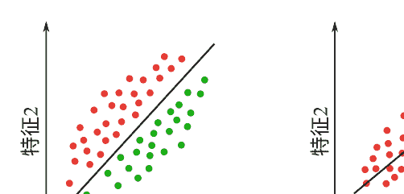

图2.1 给出两个特征的分类和回归示例。 在(a)中，红点表示类别0，绿点表示类别1，黑线表示将新数据分类为两个类别的模型。 在(b)中，红点表示数据，黑线表示预测连续值的模型。

### 2.3 评估指标

为了评估任何分类算法，我们首先讨论分类错误，然后考虑训练和泛化步骤的时间限制。 我们将进一步回顾分类方法的基本原理。

#### 2.3.1 混淆矩阵

让我们将 P定义为具有已知标签的基准数据集中的正样本数量，将 N定义为数据集中的负样本数量。 混淆矩阵中的元素表示对正样本和负样本进行分类时的错误，并允许评估分类算法的性能。 如图2.2所示，在该矩阵中，每列表示经过训练的分类器预测的类别实例，每行表示实际类别的实例。 因此，在二分类问题中，我们有一个2 ×2的混淆矩阵，其中我们有以下符号

- 真正例：正确的预测（TP）。
- 真负例：正确的拒绝（TN）。
- 假正例：虚警（FP）。
- 假负例：误分类（FN）。

图2.2 一个2×2的混淆矩阵

| 实际标签 \ 预测标签 | P' | N' |
|---|---|---|
| P | 真正例 (TP) | 假负例 (FN) |
| N | 假正例 (FP) | 真负例 (TN) |

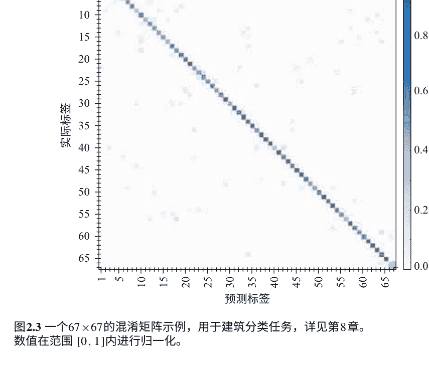

图2.3 一个67×67的混淆矩阵示例，用于建筑分类任务，详见第8章。数值在范围[0,1]内进行归一化。

对于多类分类的情况，可以通过该矩阵轻松识别类别之间的假负例。在主对角线上，每个类别的准确率集中显示，在每一行中，根据误分类样本显示混淆程度。图2.3展示了在67个类别的建筑分类任务中的一个混淆矩阵示例。

#### 2.3.2 指标

在训练模型之后，会应用不同的评估方法来衡量结果的好坏。根据计算机视觉任务的性质，我们必须选择一个适合的评估指标来描述训练模型的性能，并与其他方法进行比较。例如，在图像分类、目标定位、分割或图像检索等任务中使用不同的度量标准。接下来，我们将介绍一些与分类任务相关的度量标准。

在机器学习中，我们通常使用分类准确率来描述准确性。这表示正确预测的数量占输入样本总数的比例。当数据集平衡时，即每个类别的样本数量相同，通常会使用准确率（ACC）。准确率（ACC）的计算公式为：

$$ ACC = \frac{TP + TN}{TP + FP + TN + FN} $$

如果测试数据集不平衡，更好的选择是使用平衡准确率（BACC）来更好地解释分类结果。它被定义为每个类别的召回率的平均值，即$\frac{TP}{P}$表示正例，$\frac{TN}{N}$表示负例。特别是在评估医学图像分析中的分类算法性能时，常使用BACC指标[BABPA+17]，因为具有病理的类别，例如阿尔茨海默病（见第9章），比正常对照组的受试者人数少。

$$ BACC = \frac{\frac{TP}{P} + \frac{TN}{N}}{2} $$

在多类别分类的情况下，例如在[ KSH12 ]中用于ImageNet数据集的1000个类别，使用top-k的准确率来衡量当真实标签在前k个预测中时，样本被正确分类的比例（具有最高概率的k个预测）。

真正的正例率（TPR），也称为敏感性或召回率，衡量了正确识别为正例的实际正例样本的比例,

$$ TPR = \frac{TP}{TP + FN} $$

而真负例率（TNR），也称为特异性，衡量了正确识别为负例的实际负例样本的比例,

$$ TNR = \frac{TN}{TN + FP} $$

我们还提醒一下精确度:

$$ P = \frac{\text{TP}}{(\text{TP} + \text{FP})}. $$ \tag{2.8}

我们注意到召回率（R）和精确度（P）是在视觉信息检索中广泛使用的指标[BPPC12]。在图像类别不平衡的情况下，还使用了F-score指标。

$$ F = \frac{2}{\frac{1}{R} + \frac{1}{P}}. $$ \tag{2.9}

假正例率（FPR）或误报率，是将负例错误分类为正例（FP）与实际负例样本总数之间的比率，衡量了误报比例，

$$ \text{FPR} = \frac{\text{FP}}{(\text{TN} + \text{FP})}. $$ \tag{2.10}

最后，假阴性率（FNR）或误判率，衡量了在测试中被错误分类的样本的比例。

$$ \text{FNR} = \frac{\text{FN}}{(\text{FN} + \text{TP})} = 1 - T P R. $$ \tag{2.11}

#### 2.3.3 AUC-ROC曲线

如果我们考虑一个二元分类问题，该问题依赖于一个或多个阈值或参数进行区分，接收者操作特性（AUC-ROC曲线）下的曲线面积是用来说明和衡量分类器在参数变化时的性能的。ROC曲线是一个概率曲线，而AUC表示模型在区分不同类别方面的能力[Faw06]。

ROC曲线是用TPR（公式（2.6））对FPR（公式（2.11））进行绘制的，在 y-轴和 x轴上。在这个图中，TPR定义了在测试期间所有可用的正样本中有多少个正确的正预测发生。另一方面，FPR定义了在测试期间所有可用的负样本中有多少个错误的正结果发生。

由于FPR和TPR在范围 [0, 1]内，因此在不同的阈值下计算两者，以绘制图2.4中的图形。显然，当AUC较高（接近范围 [0, 1]内的1）时，模型更好地区分类别。

图2.4 AUC-ROC曲线绘制

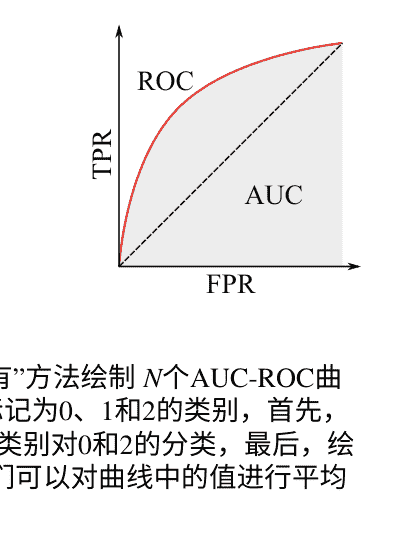

在多类分类模型中，我们可以使用“一对所有”方法绘制 N个AUC-ROC曲线，表示 C个类别。 例如，如果我们有三个标记为0、1和2的类别，首先，我们绘制0类别对1和2的分类，然后我们绘制1类别对0和2的分类，最后，绘制2类别对0和1的分类。 从总体角度来看，我们可以对曲线中的值进行平均。

### 2.4 结论

因此，在本章中，我们介绍了监督学习的一般原则。深度学习是其中的一部分。我们进一步回顾了评估这些算法性能的度量标准的定义。在本书的后续部分，我们将重点关注深度学习，从神经网络分类器的基本模型开始。

# # 第三章 从零开始的神经网络

人工神经网络由分布式信息处理单元组成。在本章中，我们定义了这种网络的组成部分。我们首先介绍了基本单元：由McCulloch和Pitts在[McC43]中提出的形式神经元。然后，我们将解释如何将这些单元组装起来设计简单的神经网络。接下来，我们将讨论如何训练神经网络进行分类。

### 3.1 形式神经元

神经元是神经网络的基本单元。它接收输入信号\((x_1, x_2, \cdots, x_p)\)，对信号的线性组合\(z\)应用激活函数\(f\)。这个组合由权重向量\((w_1, w_2, \cdots, w_p)\)和偏置\(b\)确定。更正式地说，输出神经元值\(y\)定义如下：

$$y = f(z) = f\left(\sum_{i=1}^{p} w_i x_i + b\right)$$

图3.1a总结了形式神经元的定义。图3.1b给出了相同的简洁表示。

神经网络中常见的是不同的激活函数：

阶跃函数\(\xi_c\):

$$\xi_c(x) = \begin{cases} 1 & \text{如果 } x > c \\ 0 & \text{否则为0。} \end{cases} \qquad (3.1)$$

这个简单的函数是第一个考虑的激活函数。它的主要问题是它可以将不同的标签激活为1，这是分类问题尚未解决。因此，首选使用平滑函数，因为它提供了模拟激活而不是二进制激活，从而大大降低了平滑激活函数的多个标签得分为1的风险。

# sigmoid函数

$\sigma(x) = \frac{1}{1 + e^{-x}}$

它是最流行的激活函数之一。它将 $\mathbb{R}$ 映射到区间 $[0, 1]$。这个函数是阶跃函数的平滑逼近，参见图3.2a。它具有许多有趣的性质。

函数的连续性使得能够正确训练非二进制分类任务的网络。它的可微性在理论上是一个很好的属性，因为神经网络是通过“学习”来实现的。此外，它在0附近具有陡峭的梯度，这意味着该函数倾向于将y值带到曲线的两端：这对于分类是一个很好的行为，因为它能够清晰地区分预测结果。这个激活函数的另一个好处是它是有界的：这可以防止激活的发散。

Sigmoid函数的最大问题是当参数远离0时，其梯度非常小。这就导致了梯度消失的现象：学习速度大大减慢，甚至停止。

# 双曲正切函数：

$\tanh(x) = \frac{2}{1 + e^{-2x}} - 1 = 2\sigma(2x) - 1$

正如上述方程所示，这个函数实际上是一个经过缩放和垂直平移的Sigmoid函数，将 $\mathbb{R}$ 映射到区间 $[-1, 1]$，因此它具有相同的优点和缺点。 tanh和sigmoid之间的主要区别在于梯度的强度: tanh倾向于具有更强的梯度值。 就像sigmoid一样，tanh也是一种非常流行的激活函数。

# ReLU函数:

ReLU(x) = max(0, x)

线性整流单元 (ReLU) (图3.2b) 在最近几年变得非常流行。 它确实具有非常有趣的特性:

- 该函数是激活的简单阈值处理。 这个操作比sigmoid和tanh激活函数中昂贵的指数计算要简单。
- ReLU倾向于加速训练。这可能来自于它的线性和非有界的组成部分。
- 与类似于Sigmoid的激活函数不同，在ReLU中，每个神经元以模拟方式激活，这是一种昂贵的操作，而ReLU的0水平分量导致激活的稀疏性，这在计算上是高效的。

它也有自己的缺点:

- 它的线性分量是无界的，这可能导致激活爆炸。
- 激活的稀疏性可能对网络的训练产生不利影响: 当一个神经元在ReLU的0水平分量中激活时，梯度消失，该神经元的训练停止。神经元“死亡”。 ReLU可以使网络的很大一部分变 passivity。
- 它在0点处不可微分: 在计算接近0的梯度时存在问题。

还有许多其他的激活函数。它们都具有非线性的特性，这是必不可少的：如果它们是线性的，整个神经网络将是线性的（线性组合被馈送到线性激活函数，然后被馈送到线性组合等），但在这种情况下，无论我们有多少层，这些线性层都将等效于唯一的线性层，然后我们将失去神经网络的多层架构特性：最后一层将简单地成为应用于第一层输入的线性变换。

一个特定的激活函数也非常有趣：Softmax函数。我们稍后会讨论它。

### 3.2 人工神经网络和深度神经网络

人工神经网络（ANN）以一种简化的方式将生物几何和行为融入其架构中：神经网络由一组线性排列的层组成，每个层都是一组（人工）神经元。模型简化为信号只能从第一层流向最后一层。

神经网络的第 i 层中的每个神经元都与第 (i-1) 层中的所有神经元相连，并且给定层中的神经元彼此独立。图3.3给出了两个简单人工神经网络的示例。它是“前馈网络”，因为信息只在一个方向上从输入 x 流向输出 y。同一层的所有神经元都具有相同的激活函数。

一个将所有输入直接连接到输出的网络是一个单层网络。图3.3a展示了这样一个网络的一个例子。在[Mcc43]中，McCulloch和Pitts证明了一个只有一个单元的网络可以表示基本的布尔函数AND和OR。然而，很容易证明一个只有一个层的网络不能用来表示XOR函数。

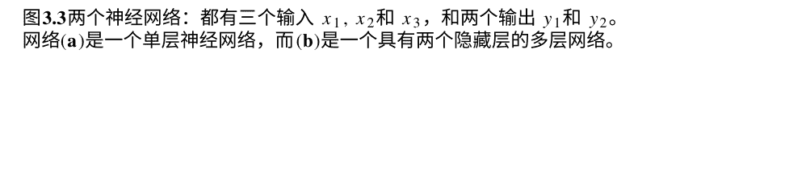

图3.3 两个神经网络：都有三个输入 x1, x2 和 x3，和两个输出 y1 和 y2。网络(a)是一个单层神经网络，而(b)是一个具有两个隐藏层的多层网络。

同一层的所有神经元 ℓ 具有相同的激活函数 f^{(ℓ)}。也就是说，给定一个具有 L > 0层的神经网络，如果我们用 y^{(ℓ)}表示层 ℓ 的输出向量，则对于任意的 1 < ℓ < L，可以写成：

```
y^{(l+1)} = f^{(l+1)} \left( w^{(l)T} y^{(l)} + b^{(l+1)} \right)
```

表达式 (3.5) 解释了输入到网络中的值如何被转发以计算输出值 \hat{y} = y^{(l+1)} (图3.4)。

任何神经网络都必须包含至少两层：输入层和输出层。正如讨论的那样，一些函数无法使用没有任何隐藏层的神经网络来实现（例如XOR门）。然而，Cybenko在[Cyb89]中证明了任何连续函数都可以用具有sigmoid激活函数的一个隐藏层的网络来以任意所需的精度逼近，以均匀范数衡量。深度神经网络是具有至少一个隐藏层的人工神经网络。

### 3.3 学习神经网络

神经网络是一种有监督的机器学习模型（见第2章）。它从训练集中学习一个预测函数[Vap92]。这个集合中的每个样本可以由描述观察和相应响应的向量建模。学习模型旨在构建一个函数，该函数可以用于预测新观察的响应，同时尽可能地减小预测误差。

训练数据集是一对（x，y），其中：

- x = (x_{i,j})_{1≤i≤N,1≤j≤p} 一个矩阵，其中 N 表示数据集中可用示例的数量，p表示特征的数量，以及
- y = (y_i)_{1≤i≤N}一个向量，其条目是真实类别。

#### 3.3.1 损失函数

有许多用于衡量预测误差的函数。它们被称为损失函数。损失函数以某种方式量化模型输出与正确响应之间的偏差。我们在这里讨论的是“经验损失”函数[Vap92]，即在所有可用的真实训练数据上计算的错误。

神经网络是一种监督式机器学习模型。也可以将其视为一个函数 f，对于任何输入 x计算出一个预测值 ŷ：

```
ŷ = f(x).
```

#### 3.3.2 One-Hot 编码

回到训练集，每个观察的已知响应被编码为一个 one-hot labels向量。更正式地说，设 C= {c1, c2, …, ck}是所有可能的类的集合。也就是说，给定一个观察 (x, y) = (x1, x2, …, xp, y)，我们有 y ∈ C。我们引入一个二进制向量 v = (v1, v2, …, vk)，其中 vj =1，如果 y = cj，并且对于所有 i ≠ j, vi =0。这是确保类别标签“硬”编码的函数。在接下来的内容中，v将表示类的one-hot编码。图3.5给出了一个one hot编码的示例。


#### 3.3.3 软最大值或如何将输出转化为概率

给定一个向量 y = (y_1, y_2, \cdots, y_k)，其中y的坐标是正实数，softmax函数旨在将y的值转化为一个实值范围在 (0,1) 内且总和为1的向量 s = (p_1, p_2, \cdots, p_k)。更准确地说，对于每个 i \in \{1, 2, \cdots, k\}，定义如下：

$$p_i = \frac{e^{y_i}}{\sum_{j=1}^{k} e^{y_j}}.$$

在多层神经网络的最后一层中使用softmax函数，这些网络是在交叉熵（我们将在下一段定义此函数）的训练下进行的。当用于图像识别时，softmax函数计算每个输入数据属于给定分类法中的图像类别的概率估计。

#### 3.3.4 交叉熵

交叉熵损失函数是通过softmax的结果和one-hot编码来表示的。回想一下，我们的神经网络以训练数据集中的一个示例x作为输入，然后计算概率：

$$\hat{y} = (\hat{y}_1, \hat{y}_2, \cdots, \hat{y}_k),$$

其中\hat{y}_i是示例x属于类别c_i的概率。还要记住，v是示例x的真实标签y的one-hot编码。交叉熵的定义如下：

$$D(\hat{y}, y) = -\sum_{i=1}^{k} v_i \ln(\hat{y}_i). \tag{3.6}$$

one-hot编码的定义和公式(3.6)意味着成本中只包括与正确类别标签对应的分类器输出。

训练阶段的目标是构建一个模型（神经网络和与最大似然相关，我们将在下一段解释）可以计算训练数据集中每个示例属于给定类别的概率。因此，如果 M 是训练好的模型，如果给它一个属于类别 c_i的示例，M给这个示例分配的概率将是 \hat{y}_i。因此，如果数据集中包含来自类别 c_i的n_i个示例，那么模型 M正确分类所有这些示例的概率是 \hat{y}_i^{n_i}。现在，如果我们用C= \{c_1, c_2, \cdots, c_k\}表示所有示例的类别集合，那么模型 M给每个示例赋予正确类别的概率为：

$$\mathbb{P}r (C \mid M) = \prod_{i=1}^k \hat{y}_i^{n_i} \quad (3.7)$$

等式（3.7）可以重写为：

$$\ln (\mathbb{P}r (C \mid M)) = \sum_{i=1}^k n_i \ln (\hat{y}_i) \quad (3.8)$$

现在，如果我们将（3.8）除以训练数据集的大小 $N$，我们得到：

$$\frac{1}{N} \ln (\mathbb{P}r (C \mid M)) = \frac{1}{N} \sum_{i=1}^k n_i \ln (\hat{y}_i) \quad (3.9)$$

由于我们使用的是独热编码，可以看出$i$只是地面真实值。训练阶段的目标是找到一个模型 $M$，使得表达式（3.7）中的概率最大化。如果我们取表达式（3.9）中的负数，我们得到平均交叉熵的定义：

$$\mathcal{L}(y, \hat{y}) = \frac{1}{N} \sum_{i=1}^N D(\hat{y}^{(i)}, y^{(i)}) \quad (3.10)$$

其中 $y^{(i)}$（分别是 $\hat{y}^{(i)}$）是第 $i$ 个示例的地面真实值（分别是网络计算得到的概率）。

### 3.4 结论

在本章中，我们介绍了神经网络的元素。我们定义了这些网络中的基本单元：形式神经元。然后我们讨论了深度网络：具有许多隐藏层的网络。这是深度学习的最简单的架构。在接下来的章节中，我们将讨论更强大的架构，专门用于图像识别和动态视觉内容。

我们还定义了损失函数，用于衡量实际类别与预测类别之间的误差。在下一章中，我们将介绍用于找到网络参数的优化方法。

## 第四章 优化方法

机器学习模型旨在构建一个最小化损失函数的预测函数。有许多算法旨在最小化损失函数。它们大多是迭代算法，并通过沿着下降方向减小损失函数来操作。这些方法解决了损失函数被假定为凸函数的问题。主要思想可以简单地表达如下：从参数空间中的初始任意（或随机）选择的点开始，它们允许根据选择的一组方向“下降”到损失函数的最小值。在这个领域中，我们讨论了一些最为知名和常用的优化算法。

本章介绍了优化方法的基础。我们使用不同的符号表示法，但我们将展示这些方法如何应用于神经网络的学习。

### 4.1 梯度下降

梯度下降算法的使用已被证明在优化神经网络的众多参数方面非常有效，因此它是网络学习中最常见的方法之一。因此，许多最先进的深度学习库都包含了对不同形式的梯度算法的广泛实现。我们简要回顾了梯度下降算法的相关事实。

让我们用 θ 表示包含神经网络所有参数的向量，用 J (θ, g(x), y) 表示代价函数，它表示训练数据x的真实标签 g(x) 与神经网络在参数 θ 下预测的数据y之间的误差。如果将代价函数的表示想象成一个山谷，梯度算法的思想就是沿着山坡下降，直到到达表面的底部。实际上，斜率给出的方向是局部下降最多的方向，实际上与梯度相反。关于梯度下降的详细数学讨论可参见[WF12]。

梯度下降的迭代步骤为：

```
$$\boldsymbol{\theta}_{t+1} \leftarrow \boldsymbol{\theta}_t - \eta \nabla_{\boldsymbol{\theta}} J\left(\boldsymbol{\theta}, g(\mathbf{x}), y\right), \quad (4.1)$$
```

其中 $\eta$ 是一个非负常数，称为学习率。该方法适用于任意维度的空间（甚至是无限维度），可用于线性和非线性函数。为了使梯度下降良定义，函数需要满足 L-Lipschitz条件，即

```
$$\forall \boldsymbol{u}, \boldsymbol{v} \in \mathbb{R}^{N}, \|\nabla J(\boldsymbol{u})-\nabla J(\boldsymbol{v})\|_{2} \leq L\|\boldsymbol{u}-\boldsymbol{v}\|_{2}, \quad (4.2)$$
```

其中 $L$ 是Lipschitz常数。此外，在函数 $J$ 严格凸的情况下，该算法只能保证收敛到全局最优解。如果不是这种情况，该算法甚至不能保证找到局部最小值。

在神经网络学习中，特别是在深度学习中，人们希望优化大量的参数，即成本函数的参数将处于非常高维的空间中，这导致了鞍点的大量存在，参见图4.1，已知在寻找最小值时可能会产生很大的问题，因为它们往往被高误差平台所包围[DPG+14]，参见图4.2。此外，正确选择学习率对于方法的高效性至关重要：它必须足够小以实现算法的收敛，但也不能太小，否则会严重减慢进程。

仔细而迭代地选择这个步长可能有助于改善结果。用于此目的的经典算法是线搜索算法[Hau07]。

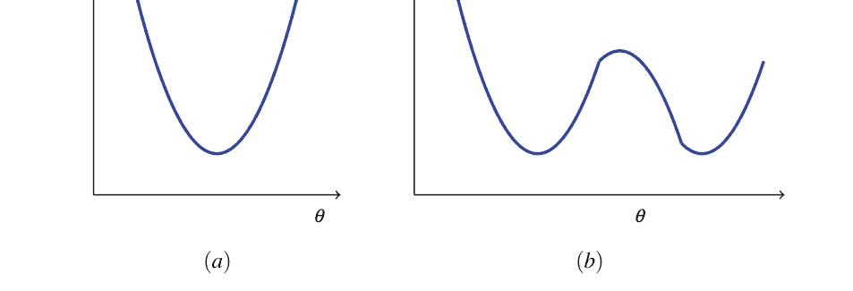

(a) (b)
图4.1 两个函数：(a) 是一个具有单个最小值的凸函数，(b) 是一个非凸函数，有两个局部最小值

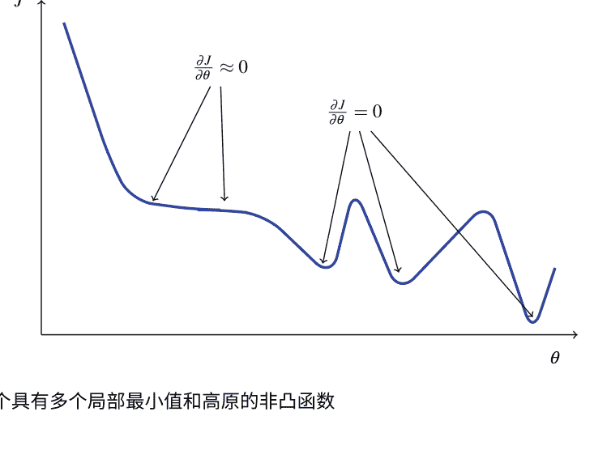

图4.2 一个具有多个局部最小值和高原的非凸函数

### 4.2 随机梯度下降

在深度学习的背景下，梯度下降算法遇到的问题是一般情况下不满足问题良好定义所需的数学性质。实际上，在这种非常高维的情况下，损失函数可能是非凸和非光滑的，因此收敛性质不满足，并且收敛到局部最小值可能非常缓慢。

解决这些问题的一个很好的方法是使用随机梯度下降算法。该算法是梯度下降算法的随机逼近。它旨在最小化一个可以写成可微函数之和的目标函数（通常在图像处理的上下文中，每个图像对应一个函数）。这样的过程是在随机选择的数据批次（即整个数据集的子集）上迭代完成的。通过这种方式最小化的每个目标函数都近似于“全局”目标函数。下面的公式总结了这种办法:

```
$$\theta_{t+1} \leftarrow \theta_t - \eta \frac{1}{B_s} \sum_{i=1}^{B_s} \nabla_{\theta} J_t^i(\theta_t, \mathbf{x}_t^i, y_t^i), \quad (4.3)$$
```

其中 \(B_s\) 是批量，是与步骤 \(t\) 相关的数据批次 \(B_t\)，其中 \(\mathbf{x}_t^i\) 和 \(y_t^i\) 分别是该批次中的真实数据和估计数据，\(J_t = \frac{1}{B_s} \sum_{i=1}^{B_s} J_t^i\) 是步骤 \(t\) 的全局成本函数的随机逼近，通过批次 \(B_t\) 分解为一系列可微分函数 \(J_t^i\) 与每对 \((\mathbf{x}_t^i, y_t^i)\) 相关。

随机梯度下降（SGD）解决了在深度学习环境中使用梯度下降时遇到的大部分问题:

- 该方法的随机性有助于处理弱数学设置：尽管问题是不适定的，具有高维目标函数，非凸且可能非光滑，但随机性倾向于改善收敛性，因为它帮助目标函数通过局部最小值和鞍点，而这些点在高维空间中被认为被非常平坦的平台所包围。
- 收敛速度更快，因为对小批量数据执行多次更新步骤比对整个数据集执行单次更新步骤要廉价得多（在深度学习的背景下，特别是在视觉数据挖掘中，数据集可以包含数千个图像或视频帧）。

这也带来了一些缺点：首先，梯度下降的随机逼近意味着无法保证收敛到全局最小值。此外，使用SGD的批次越小，结果中的方差越大。因此，许多架构被设计为充分利用两方面，通过选择批次大小的平均值。

### 4.3 基于动量的随机梯度下降

动量法的主要目的是加速梯度下降过程。这是通过在经典模型中引入一个速度向量来实现的，该向量会在迭代之后逐渐增加。从物理角度来看，这种梯度加速类似于球体在山谷中滚动时动能的增加。

从优化行为的角度来看，（随机）梯度下降在下降到目标函数曲面在某个方向上比另一个方向更陡峭的区域时会遇到困难。

动量变体的梯度下降的迭代步骤如下：

```
v_{t+1} ← μv_t - η∇J(θ_t),
θ_{t+1} ← v_{t+1} + θ_t.
(4.4)
```

在每次迭代中，首先计算向量 v_{t+1} （初始化为零），它表示“球体在山谷中滚动”的速度更新。速度在每次迭代中累积，因此需要超参数 μ来阻尼速度在达到平坦表面时的运动，否则球体会在局部极值点附近移动得太多。一个好的策略是根据学习阶段改变 μ的值。

在速度更新中，有两个竞争的项：累积速度 μv_t和当前点的负梯度。关键思想是，在前几段描述的情况下（当表面在一个方向上的曲线比另一个方向上的曲线更陡峭时），速度的两个项将不相同方向。这将防止梯度项过多振荡，从而加快收敛速度。动量和初始化在深度学习中的重要性在Ilya Sutskever等人的最近一篇论文（2013年）[SMDH13 a]中进行了讨论。

### 4.4 Nesterov加速梯度下降

1983年，Nesterov在[Nes83]中提出了对“经典动量”的轻微修改，并证明了他的算法在凸函数优化中具有改进的理论收敛性。这种方法已经变得非常流行，因为它在实践中通常比经典动量表现更好，并且即使在今天仍然适用于梯度优化。

Nesterov算法和经典动量算法之间的关键区别在于，后者首先计算当前位置θ_t处的梯度，然后沿着累积速度的方向执行一步操作，而Nesterov动量首先执行一步操作，得到更新参数的近似值θ̃_{t+1}，并通过计算新位置处的梯度来纠正这一步骤。

为了理解这种差异背后的推理，可以将更新速度v的梯度项-η∇J(θ_t)视为累积速度μv_t的修正项。在错误发生后（即通过累积速度执行的步骤），纠正错误（即计算位置θ̃_{t+1}处的梯度）更有意义。Nesterov动量的迭代步骤为：

```
\widetilde{\theta}_{t+1} \leftarrow \theta_t + \mu v_t, \\
v_{t+1} \leftarrow \mu v_t - \eta \nabla J(\widetilde{\theta}_{t+1}), \\
\theta_{t+1} \leftarrow v_{t+1} + \theta_t.
```

### 4.5 自适应学习率

我们发现在随机梯度下降算法中，学习率被定义为非负常数。这可能是一个错误的来源：当梯度很小但一致时（例如接近局部极值点），较大的学习率会导致在谷底中产生振荡，从而阻止方法的正确收敛。

我们希望在具有强烈但不一致梯度的方向上缓慢移动，相反，在具有小但一致梯度的方向上快速移动（见图4.3）。

可以通过自适应地调整学习率来结合这两个特性。用于此目的的一些常见退火计划如下所述：

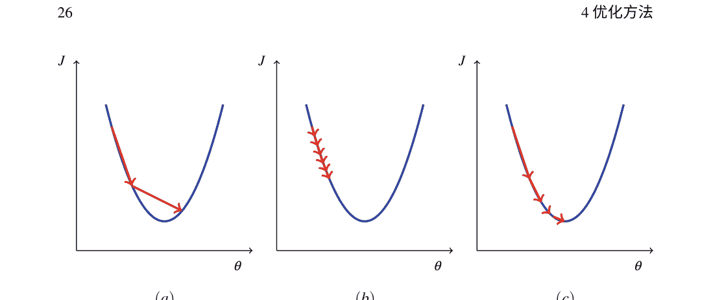

- 步长衰减：每 $k$ 个epoch后，将学习率乘以一个常数 $C < 1$。
- 多项式衰减：将学习率设置为
  $$\forall t \geq 0, \eta_t = \frac{a_0}{1 + b_0 t^n}, \quad a_0, b_0 \in \mathbb{R}_+.$$
- 指数衰减：将学习率设置为
  $$\forall t \geq 0, \eta_t = a_0 e^{-b_0 t}, \quad a_0, b_0 \in \mathbb{R}_+.$$

这些策略的缺点是任意的，并且可能不适用于特定的学习问题。关于SGD方法的适当学习率调整的详细讨论由LeCun在[SZL13]中进行。另一种可能性是通过计算代价函数的Hessian矩阵的逆来提出自适应学习率（牛顿和拟牛顿方法）。相应的迭代步骤为

$$\theta_{t+1} \leftarrow \theta_t - [H J(\theta_t)]^{-1} \nabla J(\theta_t).$$

后一种方法是二阶优化过程的一个例子。关于牛顿优化方法的更多信息可以在[Chu14]中找到。

在实践中，计算二阶导数和进行矩阵求逆可能是昂贵的。此外，在Hessian矩阵求逆时可能会遇到稳定性问题。因此，在深度学习的背景下，这不是一个合适的方法。

### 4.6 梯度下降的扩展

在这里，我们简要回顾了一些现有的梯度下降扩展方法：平均梯度下降这个特定版本的梯度下降，在Polyak [PBJ92]的论文中研究，通过计算参数值 $\theta_t$ 的时间平均值来替代梯度下降的计算。

$$\overline{\theta}_T \leftarrow \frac{1}{T} \sum_{t=0}^{T} \theta_t. \tag{4.9}$$

Adagrad这种方法首次在2011年的一篇论文[DHS11]中引入，其目标是根据参数的稀疏性自动调整学习率。在这个背景下，参数的稀疏性意味着在迭代训练过程中该参数没有被充分训练。稀疏参数将学习得更快，而非稀疏参数将学习得更慢。这强调了对稀疏特征的训练，这些特征在传统的梯度下降算法中可能没有得到适当的训练。对于每个参数 $(\theta)_i$ 在参数向量 $\theta$ 中，相应的更新步骤是不同的。它由以下公式给出：

$$\forall i, (\theta_{t+1})_i \leftarrow (\theta_t)_i - \alpha \frac{(\nabla J(\theta_t))_i}{\sqrt{\sum_{u=1}^{t} (\nabla J(\theta_u))_i^2}}, \quad \alpha > 0. \tag{4.10}$$

RMSProp 就像Adagrad算法一样，RMSProp算法建议自动调整每个参数的学习率。它通过运行该参数的最近梯度的幅度的平均值来实现。该算法在课程[HSS12]中介绍。相应的更新步骤由以下公式给出：

$$\begin{aligned}
& \forall i, (\nabla_{t+1})_i \leftarrow \delta(\nabla_t)_i + (1-\delta)(\nabla J(\theta_t))_i^2, \\
& \forall i, (\theta_{t+1})_i \leftarrow (\theta_t)_i - \alpha \frac{(\nabla J(\theta_t))_i}{\sqrt{(\nabla_{t+1})_i}}, \quad \alpha > 0.
\end{aligned} \tag{4.11}$$

参数 $\delta$ 设置对过去梯度幅度的运行平均值或最后计算的梯度幅度的置信度。

Adam Adam算法是最近和高效的一阶梯度下降优化算法之一。它首次在[KB14]中提出。与Adagrad和RMSProp类似，它自动调整每个参数的学习率。这种方法的特殊之处在于它计算所谓的“自适应矩估计” $(m_t, v_t)$。这种方法可以看作是Adagrad算法的一种推广。其相应的更新过程如下所示：

在上一个方程中，$\epsilon$被用作精度参数。参数$\beta_1$和$\beta_2$用于对所谓的矩 $m_t$ 和 $v_t$ 进行运行平均。

### 4.7 神经网络中的梯度估计

前几节介绍了一般的优化方法。在本节中，我们考虑这些方法在神经网络优化中的应用。即成本函数 $J$ 是损失函数 $\mathcal{L}$，参数 $\theta$ 对应于神经网络中的参数：

$$\theta = \left(w^{(l)}, b^{(l+1)}\right), \text{其中 } l \in \{0, 1, \cdots, L-1\}.$$

神经网络复兴的主要原因之一是开发出了一种高效计算成本函数梯度的算法，即计算关于神经网络中权重和偏差的所有偏导数。

这个算法的关键思想在于，在前馈神经网络的情况下，对一层 $l$ 中的权重和偏差进行轻微修改会对下一层产生（轻微的）影响，这种影响会级联到输出层。因此，为了计算关于权重和偏差的偏导数，我们将重点放在错误的分析上（输出的轻微修改），并且以反向方式进行（因此称为反向传播），因为我们的神经网络的损失函数直接依赖于输出层的激活。换句话说，我们试图理解输出层中的错误如何迭代地传播到前一层。

在接下来的章节中，我们将解释反向传播算法。我们主要解释如何计算损失函数对权重和偏置的导数。很明显，参数的更新是使用我们之前解释过的表达式之一，但读者一旦计算出导数，就可以简单地应用公式（4.1）。

#### 4.7.1 一个简单的例子

首先考虑一个非常简单的神经网络：一个只有两个神经元的隐藏层网络（见图4.4）。我们还假设这两个神经元的激活函数是sigmoid函数（$\sigma(z) = \frac{1}{1+e^{-z}}$）并且我们使用简单的损失函数定义：

$$\mathcal{L} = \frac{1}{2}(\hat{y} - y)^2$$

为了简单起见，我们还使用以下符号表示：$w^{(i)}=(w_i)$和$b^{(i+1)}=(b_{i+1})$对于$i \in \{0,1\}$。因此，$\hat{y}$的表达式简单地为：

$$\hat{y} = \sigma(z_2) \tag{4.13}$$

其中

$$z_2 = w_1 y_1 + b_2, \ y_1 = \sigma(z_1) \quad \text{和} \quad z_1 = w_0 x + b_1$$

回想一下，如果我们将学习率取为$\eta =1$，则在这种情况下，梯度下降步骤对于所有$t>1$ 和$i \in \{0,1\}$为：

$$w_i^{(t+1)} = w_i^{(t)} - \frac{\partial \mathcal{L}}{\partial w_i}\left(w_0^{(t)}, w_1^{(t)}\right)$$

$$b_{i+1}^{(t+1)} = b_{i+1}^{(t)} - \frac{\partial \mathcal{L}}{\partial b_{i+1}}\left(b_1^{(t)}, b_2^{(t)}\right)$$

关键点是如何计算这四个偏导数。为此，我们使用链式法则。因此对于$u \in \{w_1,b_2\}$，可以写成：

$$\frac{\partial \mathcal{L}}{\partial u} = \frac{\partial \mathcal{L}}{\partial \hat{y}} \times \frac{\partial \hat{y}}{\partial z_2} \times \frac{\partial z_2}{\partial u}$$

计算每个导数，我们得到：

$$\frac{\partial \mathcal{L}}{\partial \hat{y}} = \hat{y} - y, \quad \frac{\partial \hat{y}}{\partial z_2} = \hat{y}(1 - \hat{y}), \quad \frac{\partial z_2}{\partial w_1} = y_1 \quad \text{和} \quad \frac{\partial z_2}{\partial b_2} = 1$$

得到：

$$\frac{\partial \mathcal{L}}{\partial w_1} = (\hat{y} - y)\hat{y}(1 - \hat{y})y_1 \quad \text{和} \quad \frac{\partial \mathcal{L}}{\partial b_2} = (\hat{y} - y)\hat{y}(1 - \hat{y})$$

为了计算对 $w_0$ 和 $b_1$ 的偏导数，我们再次使用链式法则，但形式略有不同：

$$\frac{\partial \mathcal{L}}{\partial u} = \frac{\partial \mathcal{L}}{\partial y_1} \times \frac{\partial y_1}{\partial z_1} \times \frac{\partial z_1}{\partial u},$$

其中 $z_1 = w_0 x + b_1$。

另一方面：

$$\frac{\partial y_1}{\partial z_1} = y_1(1 - y_1), \quad \frac{\partial z_1}{\partial w_0} = x, \quad \text{并且} \quad \frac{\partial z_1}{\partial b_1} = 1,$$

并且，再次使用链式法则：

$$\frac{\partial \mathcal{L}}{\partial y_1} = \frac{\partial \mathcal{L}}{\partial z_2} \times \frac{\partial z_2}{\partial y_1}$$

并且根据以下事实：

$$\frac{\partial \mathcal{L}}{\partial z_2} = \frac{\partial \mathcal{L}}{\partial \hat{y}} \times \frac{\partial \hat{y}}{\partial z_2} = (\hat{y} - y) \hat{y}(1 - \hat{y}),$$

我们得到：

$$\frac{\partial \mathcal{L}}{\partial w_0} = (\hat{y} - y) \hat{y} (1 - \hat{y}) y_1 (1 - y_1) w_1 x \quad \text{并且} \quad \frac{\partial \mathcal{L}}{\partial b_1} = (\hat{y} - y) \hat{y}(1 - \hat{y}) y_1 (1 - y_1) w_1.$$

#### 4.7.2 一般情况：反向传播算法

反向传播算法使用梯度下降法来寻找最小化损失函数的参数。它是一种基于链式法则的递归方法。在接下来的内容中，我们考虑具有隐藏层和sigmoid作为激活函数的神经网络（包括输出层）。我们还考虑损失函数是交叉熵函数。

我们使用与图3.3中相同的符号。因此，网络的输出是一个向量 $\hat{y} = (\hat{y}_1, \hat{y}_2, \cdots, \hat{y}_n)$ 其元素由以下给出：

$$\hat{y}_i = y_i^{(L)} = \sigma \left( z_i^{(L)} \right)$$

$$= \sigma \left( \sum_{k=1}^{n_{L-1}} w_{k,i}^{(L-1)} y_k^{(L-1)} + b_i^{(L)} \right). \quad (4.14)$$

单个示例的交叉熵由以下求和给出：

$$\mathcal{L} = -\sum_{i=1}^{n_L} (y_i \ln(\hat{y}_i) + (1 - y_i) \ln(1 - \hat{y}_i))$$

为了使用梯度下降迭代（参见公式（4.1）），我们需要相应地计算损失函数对参数的导数。我们首先考虑输出层（层 $L$）中的参数。令 $w = w_{k,i}^{(L-1)}$ 是层 $L-1$ 中的一个单元与输出层中的一个单元 $i$ 之间的权重。我们需要计算 $\frac{\partial \mathcal{L}}{\partial w}$ 的值。为此，我们使用链式法则：

$$\frac{\partial \mathcal{L}}{\partial w} = \frac{\partial \mathcal{L}}{\partial \hat{y}_i} \times \frac{\partial \hat{y}_i}{\partial z_i^{(L)}} \times \frac{\partial z_i^{(L)}}{\partial w}$$

我们还有：

$$\frac{\partial \mathcal{L}}{\partial \hat{y}_i} = -\frac{y_i}{\hat{y}_i} + \frac{1 - y_i}{1 - \hat{y}_i} = \frac{\hat{y}_i - y_i}{\hat{y}_i(1 - \hat{y}_i)} \quad (4.15)$$

由于

$$\frac{\partial \hat{y}_i}{\partial z_i^{(L)}} = \hat{y}_i(1 - \hat{y}_i), \quad (4.16)$$

以及 $\frac{\partial z_i^{(L)}}{\partial w} = y_k^{(L-1)}$，我们最终得到：

$$\frac{\partial \mathcal{L}}{\partial w} = (\hat{y}_i - y_i) \hat{y}_k^{(L-1)}. \quad (4.17)$$

类似的计算得到：

$$\frac{\partial \mathcal{L}}{\partial b_i^{(L)}} = (\hat{y}_i - y_i). \quad (4.18)$$

上述结果给出了网络最后一层参数的梯度。计算隐藏层参数的梯度需要再次应用链式法则。

设 $w = w_{k,i}^{(l)}$ 是隐藏层 $l$ 中单元 $k$ 与层 $l+1$ 中单元 $i$ 之间的权重，其中 $l \in \{1, 2, \cdots, L-2\}$。那么：

$$\frac{\partial \mathcal{L}}{\partial w} = \frac{\partial \mathcal{L}}{\partial y_i^{(l+1)}} \times \frac{\partial y_i^{(l+1)}}{\partial z_i^{(l+1)}} \times \frac{\partial z_i^{(l+1)}}{\partial w} \quad (4.19)$$

设 $\{u_1, u_2, \cdots, u_m\}$ 为层 $l +2$ 中与单元 $i$ 相连的单元集合。我们将 $\mathcal{L}$ 视为函数 $\mathcal{L} \left(y_1^{(l+2)}, y_2^{(l+2)}, \cdots, y_m^{(l+2)}\right)$ 第 $l+2$ 层单元的输出的总和 $u_i$ 的输出。然后：

$$\frac{\partial \mathcal{L}}{\partial y_i^{(l+1)}} = \sum_{j=1}^{m} \frac{\partial \mathcal{L}}{\partial y_j^{(l+2)}} \times \frac{\partial y_j^{(l+2)}}{\partial y_i^{(l+1)}} \\ = \sum_{j=1}^{m} \frac{\partial \mathcal{L}}{\partial y_j^{(l+2)}} \times \frac{\partial y_j^{(l+2)}}{\partial z_j^{(l+2)}} \times \frac{\partial z_j^{(l+2)}}{\partial y_i^{(l+1)}} \\ = \sum_{j=1}^{m} \frac{\partial \mathcal{L}}{\partial y_j^{(l+2)}} \times y_j^{(l+2)} (1 - y_j^{(l+2)}) \times w_{i,j}^{(l+1)}. \quad (4.20)$$

由于 $\frac{\partial y_i^{(l+1)}}{\partial z_i^{(l+1)}} = y_i^{(l+1)}(1 - y_i^{(l+1)})$ 和 $\frac{\partial z_i^{(l+1)}}{\partial w} = y_k^{(l)}$，我们可以推导出所需的导数：

$$\frac{\partial \mathcal{L}}{\partial w} = y_i^{(l+1)} (1 - y_i^{(l+1)}) y_k^{(l)} \times \sum_{j=1}^{m} \frac{\partial \mathcal{L}}{\partial y_j^{(l+2)}} \times y_j^{(l+2)} (1 - y_j^{(l+2)}) \times w_{i,j}^{(l+1)}. \quad (4.21)$$

方程(4.21)意味着在隐藏层中，对权重的导数可以通过已知下一层输出的导数来计算。这定义了一个递归算法。

可以进行类似的计算，以获得对偏差的导数 $b = b_i^{(l+1)}$：

$$\frac{\partial \mathcal{L}}{\partial b} = y_i^{(l+1)} (1 - y_i^{(l+1)}) y_k^{(l)} \times \sum_{j=1}^{m} \frac{\partial \mathcal{L}}{\partial y_j^{(l+2)}} \times y_j^{(l+2)} (1 - y_j^{(l+2)}). \quad (4.22)$$

### 4.8 结论

在本章中，我们介绍了用于训练神经网络的优化方法。在实践中，学习过程可能需要很长时间，特别是对于与成本函数通常是非二次、非凸、高维且具有许多局部最小值和山谷（鞍点）相关的深度神经网络而言。特别是，反向传播算法既不能保证网络收敛到一个好的解，也不能保证收敛速度快，也不能保证是否会收敛。在[Sm96]中，作者证明了训练一个三层具有对输出激活的额外约束（如零阈值）的节点Sigmoid网络是NP难问题。

两年后，LeCun在[LBOM98]中研究了一些技巧，这些技巧可以提高获得令人满意的解决方案的机会，同时可能将收敛速度加快数个数量级。

# 第5章 深入野外

在本章中，我们对如何通过深度卷积神经网络从高分辨率图像和视频中提取降维后的特征进行分类决策感兴趣。我们对卷积和池化这两种操作感兴趣，并将其与经典图像处理框架中的类比进行追踪。

### 5.1 引言

随着图像采集设备的普及和存储容量的增加，无论是通用计算机上的存储还是手持设备上的本地存储，如手机、触控板、集成在眼镜中的微型SD卡，都能够存储我们生活中的第一视角图像和视频，这些视觉信息的空间和时间分辨率越来越高。一些例子向我们展示了今天一部简单手机所能拍摄的像素数量之巨大：它是3200×2187像素（800万像素），而且这个分辨率还没有达到极限。如果考虑视频，从90年代第一批具有64×64像素分辨率屏幕的手机开始，我们已经发展到每秒120帧的高清（HD）视频，分辨率为1920×1080像素。超高清电视格式（UHDTV1）今天提供每帧3840×2160像素，其后续版本UHDTV2提供每帧7680×4320像素。所有这些格式都可以快速在所有采集和可视化支持上使用，无论是高分辨率的电视屏幕还是移动设备。

在数字电影中也观察到了相同的进展，从每幅图像的2K空间分辨率（2048×1080像素）转向了4K格式，即4096×2160像素，而8K格式正在出现，分辨率为8192×4320（来源：维基百科）。

这些空间分辨率还增加了颜色深度。如今，在图像和视频中使用丰富的色彩信息进行场景分类和识别、目标检测和识别、视频中的动作识别是不可想象的。因此，当将像素表示为三维色彩系统中的向量时，信息的数量必须增加三倍。

视觉内容挖掘方法不论源图像和目标识别任务如何，都必须面对大量的信息： (i) 对数字电影和专业（电视）视频档案进行组织、搜索和浏览，或者(ii) 对来自移动设备并广泛存在于社交网络上的用户生成内容（UGC）进行挖掘。尽管传统的神经网络分类器如MLP [Ros58]在90年代成功用于人脸识别[ByFL99]，但这些检测器使用的是非常小的输入图像，即从图像中提取的大小为20×20像素的小视网膜，并在MLP的隐藏层中使用30个神经元。即使我们在这些图像中选择区域，它们的分辨率也与我们今天拥有的像素数量无关。当对包含数十亿像素的视觉场景进行分类时，解决“野生”大规模问题的方法是非常熟知的图像处理方法：卷积和子采样。现在的深度神经网络包括卷积和子采样（或所谓的池化）层，可以对输入的高分辨率图像或视频帧进行大幅度的尺寸缩减。在本章的后续部分，我们将回顾在图像处理和分析中习惯使用的卷积和（子）采样操作，并尝试将其与卷积神经网络中的使用方式进行类比。

### 5.2 卷积

卷积操作自早期的图像处理中就已经被知晓，它是滤波算法的一部分。让我们用 I(x, y) 表示一个定义在无限支持 $\mathcal{R}^2$ 上的二元连续函数，即 $I : R^2 \rightarrow R$。我们再考虑一个类似定义的函数 K(x, y)，我们将其称为“核”。那么卷积操作可以用以下方程表示：

$$\hat{I} (x, y) = (I * K)(x, y) = \iint I (u, v)K(x - u, y - v) du dv \quad (5.1)$$

这里 $\hat{I}$ 是卷积的结果。在离散情况下，图像和卷积核是在像素的离散网格上定义的。更重要的是，像素网格是图像的有限支持，其大小为 $W \times H$，其中 $W$ 是图像的宽度，$H$ 是图像的高度。内核支持通常比图像支持更小 $N \times N$，图像支持 $N << W$ 和 $N << H$。这确保了结果 $\hat{I}(x, y)$ 只与相邻像素有关。因此，在离散形式中，卷积操作可以通过以下方程表示：

$$\hat{I}(i, j) = (I * K)(i, j) = \sum_{\nu=-N/2}^{\nu=N/2} \sum_{\mu=-N/2}^{\mu=N/2} I(\mu, \nu) K(i - \mu, j - \nu) \tag{5.2}$$

为了简单起见，我们用相同的符号 $I$, $K$, $\hat{I}$ 来表示连续函数图像和内核以及它们的离散版本。

卷积是一种线性操作，从方程（5.1）中可以很容易看出。确实

$$((\alpha I + b) * K)(x, y) = \iint (\alpha I(u, v) + b) K(x - u, y - v)\, du\, dv \tag{5.3}$$
$$= \alpha \iint I(u, v) K(x - u, y - v)\, du\, dv+ \tag{5.4}$$
$$b \iint K(x - u, y - v)\, du\, dv \tag{5.5}$$

对于归一化的卷积核，我们简单地有 $\alpha(I * K) + b$。

在用于线性图像滤波的卷积核中，我们区分：低通、高通和带通滤波器。在不涉及这些滤波器的频谱理论的情况下（我们将感兴趣的读者参考基本图像处理教材，如[Pra91]），我们只是说

- 低通核允许图像平滑；
- 高通核允许突出对比度，并用于轮廓检测；
- 带通核滤除高频噪声，并突出图像中有意义的对比度，如轮廓。

我们在下面的图像中说明了这些不同核对图像的影响。首先，最受欢迎的线性滤波器是高斯滤波器。在连续情况下，它的核表达式如下

$$K(u, v) = A \exp - \frac{u^2 + v^2}{2\sigma^2} \tag{5.6}$$

这里 $A$ 是一个归一化常数，确保

$$\iint K(u, v)\, du\, dv = 1 \tag{5.7}$$

或者，在离散情况下，核函数（5.2）的所有系数之和为1，从而确保图像中局部均值的保持。$\sigma$ 是尺度参数，确保更强或更弱的平滑。在离散情况下，我们谈论的是“核掩模”，即核函数的系数矩阵。核掩模的大小 $N$ 取决于尺度参数，并且通常选择为三倍 $\sigma$。因此，在核 $K(\mu, \nu)$ 的边界上，核值（也称为滤波器的系数）接近零。这个关系可以被反过来使用：对于给定的卷积核大小，我们可以选择比例参数。卷积核的大小越大，图像中的细节就会被过滤得越多。因此，卷积核支持的大小总是根据我们的问题选择的函数：如果图像的分辨率较低或者我们希望保留细节，那么选择超过3×3的滤波器大小是没有意义的。对于卷积神经网络的卷积滤波器大小的选择也是如此。在第9章中，我们将讨论用于脑部扫描分类的浅层-深层网络，并且只选择3×3的卷积核大小以适应人脑MRI图像的低分辨率。图5.1中展示了在自然图像上应用3×3大小的高斯滤波器的示例。在图像（b）中，纹理被平滑处理，脉冲噪声被滤除（低通滤波）。

图5.2给出了使用高通滤波器进行卷积的示例。这是著名的Sobel[Pra13]水平核，它可以突出图像中的水平结构：(a)原始图像，(b)与“水平”Sobel掩模进行卷积的结果，其表达式如下

$$k(u, v) = \frac{1}{4} \begin{bmatrix} -1 & -2 & -1 \ 0 & 0 & 0 \ 1 & 2 & 1 \end{bmatrix}.$$
(5.8)

最后，我们以高通滤波器的差分高斯(DOG)滤波器为例。这在视觉信息处理中是众所周知的，因为它是Lowe[Low04]提出的尺度不变特征变换(SIFT)关键点计算的第一步。

$$K(u, v) = \frac{1}{2\pi\sigma^2} \exp -\frac{u^2 + v^2}{2\sigma^2} - \frac{1}{2\pi \times k^2\sigma^2} \exp -\frac{u^2 + v^2}{2k^2\sigma^2}$$
(5.9)

对于卷积的线性性质，请参见公式 (5.3)这种滤波意味着用两个不同的高斯滤波器对原始图像进行卷积的两个结果相减：一个是尺度参数 $\sigma$，另一个是 $k \times \sigma$。参数 $k$被选择为$k>1$。这个滤波器可以去除轮廓上的高频噪声，同时保持良好的定位。图5.4展示了经过 DOG 滤波后的图像示例。

卷积操作对图像的平移是不变的。也就是说，如果我们考虑平移映射 $\tau_{p,q}$ $I(x,y) = I(x-p, y-q)$，那么

$$ (\tau_{p,q} I) * K = \tau_{p,q}(I * K) \quad (5.10) $$

这个属性在图5.4中有很好的说明。事实上，尽管底部图像中的石柱发生了位移，但滤波器的响应是相同的（请参见圈出的区域）。显然，我们并不要求精确保留像素值：自然图像中包含光照变化和噪声。

现在，我们来看看我们今天使用的任何CNN架构中会发生什么。所谓的“卷积层”对输入特征图执行卷积操作。第一个特征图是原始图像。图5.3中展示了最著名的AlexNet架构之一[KSH12]。叠加在图像上的卷积掩模和进一步的特征图被表示为黑色方块。传统卷积滤波器与CNN中的卷积掩模之间的主要区别在于，传统滤波器是基于信号处理理论合成的高通、低通和带通滤波器，具有预先定义的系数，而在CNN中，卷积掩模的系数在最小化目标目标（即损失函数）时进行训练（见第3章）。因此，对于每个数据集和分类任务，这些滤波器系数应该有所变化。通常，在设计深度架构时，选择每个卷积层的滤波器数量和大小等超参数是经验性的，但目标是突出显示与目标分类或回归任务相关的图像细节。在图5.5中，展示了AlexNet第一层应用卷积滤波器的结果。

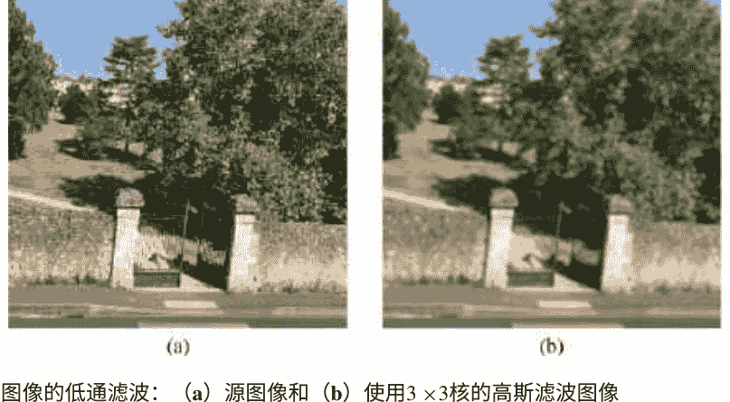

图5.1 图像的低通滤波： (a) 源图像和 (b) 使用3×3核的高斯滤波图像

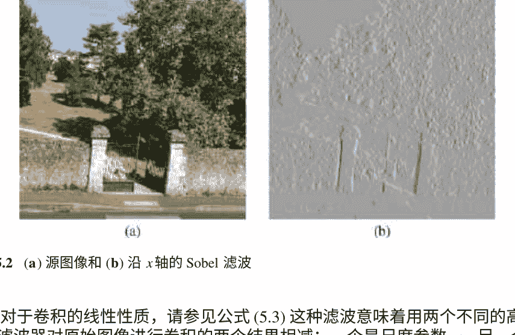

图5.2 (a) 源图像和 (b) 沿 x 轴的 Sobel 滤波

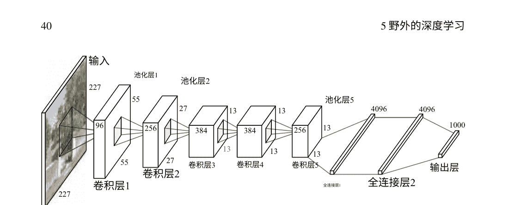

图5.4 两个样本上的高斯差分滤波。顶部和底部行显示了样本，分别具有σ=1.0和σ=1.5。

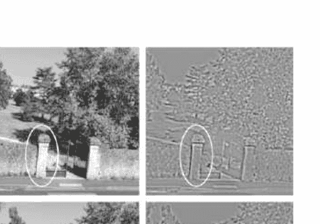

在ImageNet数据库[KSH12]上进行图像分类任务训练的AlexNet架构和我们之前使用的DOG滤波器（参见图5.4）的结果呈现。与AlexNet一样，卷积掩模在x和y方向上以四个像素的步长滑动，我们的图像的DOG滤波也是以相同的移位进行的。这解释了结果图像尺寸的减小。通过分析我们可以得出结论，训练后的滤波器与DOG的作用类似，它突出了轮廓并平滑了图像中的均匀区域（图5.5）。

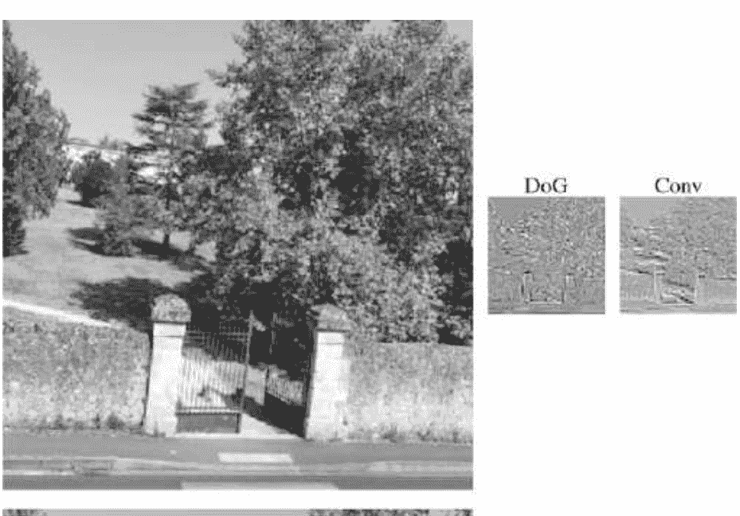

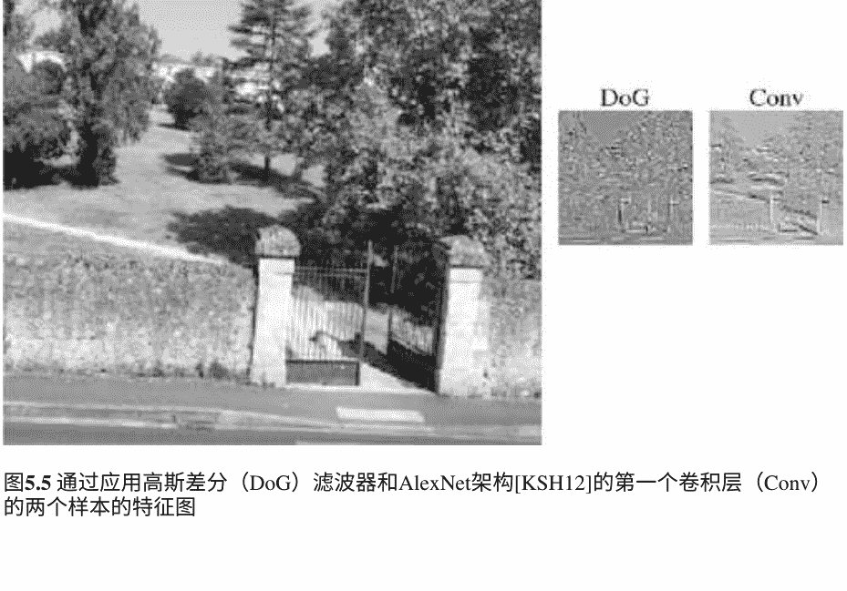

图5.5 通过应用高斯差分（DoG）滤波器和AlexNet架构[KSH12]的第一个卷积层（Conv）的两个样本的特征图

### 5.3 子采样

通过深度卷积神经网络传播原始高分辨率图像的过程包括三个主要步骤：（i）卷积，（ii）池化，（iii）非线性变换模拟神经元的激活函数。池化等同于图像处理中众所周知的“子采样”操作。后者降低了网络中原始图像或上一层特征图卷积后得到的输入特征图的分辨率。为了理解这一层发生了什么，我们将简要介绍图像子采样，并首先回顾一下采样原理。

#### 5.3.1 图像采样

如果我们考虑连续的、无限范围的图像I(x, y)（参见公式（5.1）），并希望将其转换为数字离散图像I(i, j)，则我们必须将其乘以一个空间采样函数[Pra91]S(x, y)定义为

$S(x, y) = \sum_{l=-\infty}^{l=\infty} \sum_{k=-\infty}^{k=\infty} \delta(x - l\Delta x, y - k\Delta y).$

在这里 δ(.)是狄拉克δ函数，因此S(x, y)是一个无限数量的它们在以步长Δx和Δy排列成的网格中的总和。我们采样的图像——我们将其表示为IP(x, y)选择P代表“像素”，因此是乘积

$I_P(x, y) = I(x, y)S(x, y) = \sum_{l=-\infty}^{l=\infty} \sum_{k=-\infty}^{k=\infty} I(l\Delta x, k\Delta y)\delta(x - l\Delta x, y - k\Delta y)$

正如Pratt所写[Pra91]，为了分析目的，在连续傅里叶变换域中考虑空间频率域表示是方便的。

$F_P(\omega_x, \omega_y) = \iint I_P(x, y) \exp\{-i(\omega_x, \omega_y)\} dx dy$

根据傅里叶变换卷积定理，采样图像 IP(x, y) 的傅里叶变换，它是连续图像I(x, y)和采样函数S(x, y)的乘积，参见公式(5.12)，可以表示为连续图像I(x, y)和采样函数S(x, y)的傅里叶变换的卷积：

$F_P(\omega_x, \omega_y) = \frac{1}{4\pi^2} F_I(\omega_x, \omega_y) * F_S(\omega_x, \omega_y)$

采样函数S(x, y)的傅里叶变换

$$ F_S(\omega_x, \omega_y) = \frac{4\pi^2}{\Delta x \Delta y} \sum_{l=-\infty}^{l=\infty} \sum_{k=-\infty}^{k=\infty} \delta(\omega_x - l\omega_{xs}, \omega_y - k\omega_{ys}) \quad (5.15) $$

这里 $\omega_{xS} = \frac{2\pi}{\Delta x}$ 和 $\omega_{yS} = \frac{2\pi}{\Delta y}$ 是傅里叶域采样频率。发展方程(5.14)的卷积，我们得到

$$ F_P(\omega_x, \omega_y) = \frac{1}{\Delta x \Delta y} \iint F_I(\omega_x - \alpha, \omega_y - \beta) \times \sum_{l=-\infty}^{l=\infty} \sum_{k=-\infty}^{k=\infty} \delta(\omega_x - l\omega_{xs}, \omega_y - k\omega_{ys}) \, d\alpha \, d\beta \quad (5.16) $$

通过改变求和和积分的顺序，并利用Dirac delta函数的平移性质，采样图像的频谱变为

$$ F_P(\omega_x, \omega_y) = \frac{1}{\Delta x \Delta y} \sum_{l=-\infty}^{l=\infty} \sum_{k=-\infty}^{k=\infty} F_I(\omega_x - l\omega_{xs}, \omega_y - k\omega_{ys}) \quad (5.17) $$

傅里叶域中的一个例子如图5.6所示。图5.6a描述了理想图像的频谱，$F_I(\omega_x, \omega_y)$，图5.6b说明了采样图像的频谱。根据方程(5.17)，它由理想图像的频谱在频率平面上无限重复，并以步长 $2\pi/\Delta x$, $2\pi/\Delta y$ 的网格排列。

如果理想图像的频谱具有有限的支持，即$F_I(\omega_x, \omega_y)$ 在域 $-\omega_{xc} < \omega_x < \omega_{xc}$, $-\omega_{yc} < \omega_y < \omega_{yc}$ 上被定义，如图所示，并且网格的步长足够大，则从采样图像中重建理想连续图像可以看作是首先使用简单的盒式滤波器选择/过滤采样图像的空间频谱（见图5.6c中的示例），然后进行逆傅里叶变换的计算。

盒式滤波器的传递函数，即其脉冲响应的傅里叶变换，可以表示为

$$ B(\omega_x, \omega_y) = \begin{cases} A & \text{对于 } |\omega_x| \le \omega_{xL} \text{ 和 } |\omega_y| \le \omega_{yL} \quad (5.18) \\ 0 & \text{否则} \quad (5.19) \end{cases} $$

这里 $\omega_{xL}$ 和 $\omega_{yL}$ 是滤波器支持的频率范围。然后，理想图像的重建可以通过以下方式完成

$$ I_R(x, y) = F^{-1}(F_P(\omega_x, \omega_y) B(\omega_x, \omega_y)) \quad (5.20) $$

这里，$F^{-1}$表示傅里叶逆变换。尽管等式(5.20)是通用的，不仅适用于盒子滤波器，但只有在采样频率 $\frac{2\pi}{\Delta x}$, $\frac{2\pi}{\Delta y}$相对于截止频率 $\omega_{xc}$和$\omega_{yc}$足够高，并满足奈奎斯特条件：

$\omega_{xs} \geq 2\omega_{xc}, \omega_{ys} \geq 2\omega_{yc}$ (5.21)

或者等价地，采样步长必须满足

$\Delta x \leq \frac{\pi}{\omega_{xc}}, \Delta y \leq \frac{\pi}{\omega_{yc}}$ (5.22)

这是图5.6c中所示的情况。盒子滤波器有两个缺点。根据傅里叶变换的卷积定理，频谱与滤波器传递函数的乘积在频谱域中等于原始图像与冲激响应的卷积

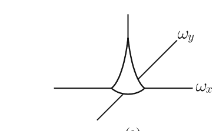

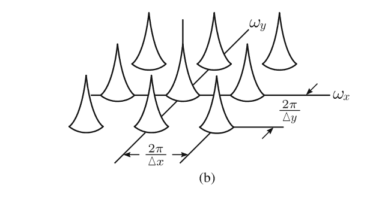

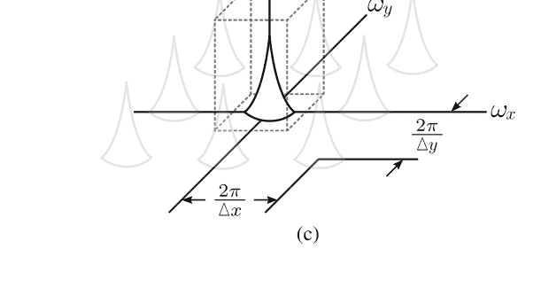

图5.6 采样图像频谱：(a) 原始图像频谱, (b) 采样图像频谱和(c) 重建图像频谱

滤波器在像素域中的响应。Box滤波器的冲激响应包含了sinc函数sin(ωxLx)。它们具有无限支持并且收敛缓慢（我们将读者引导到例如[Pra91]以获取更多细节）。因此，为了过滤掉采样图像频谱中的频谱复制，以进行理想重建，必须在傅里叶域中执行滤波，这需要直接和逆傅里叶变换计算。第二个缺点是，如果不满足奈奎斯特条件，那么频谱复制将干扰理想图像的频谱，参见图5.7a。Box滤波器将捕捉到它们，并且在重建图像中会出现混叠效应。因此，解决方案是使用更柔和的低通滤波器，例如高斯滤波器，它将减弱寄生复制品，使重建图像更加平滑。高斯的优点是，频谱域中的滤波器传递函数和滤波器冲激响应都是高斯函数。后者由方程（5.6）表示。此外，像素域中的尺度参数σ和傅里叶域中的尺度参数σF之间的关系是σ×σF=1，参见例如[Lin94]。通过高斯滤波器进行滤波的示意图如图5.7b所示。

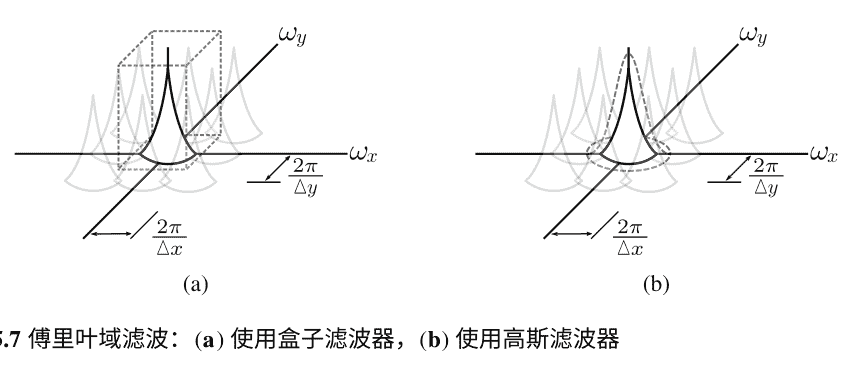

#### 5.3.2 图像和特征的子采样

为了减少高分辨率输入图像中的大量像素并去除细节，对图像进行了子采样。然后，可以在较低分辨率的图像上应用视觉内容理解算法，仅分析其中的重要且足够大的细节。在视觉内容挖掘中，使用较低分辨率表示的示例是由Oliva和Torralba [OT01]提出的GIST描述符。

在我们提出的粗糙索引范式中，使用了视频帧的强烈子采样版本（比原始版本小八倍），通过直接解码视频压缩流来检测对象。回到我们在第5.3.1节中简要介绍的采样理论，采样的数字图像理想上是重建图像 IR(x, y)，公式（5.20）中的频谱与原始图像I(x, y)的频谱重合，参见图5.7a。现在，如果我们需要进行子采样为了减小图像的大小，我们需要进一步降低其频谱的带宽，通过子采样因子进行降采样，以便满足理想重建的条件。

$$\omega'_{xc} = \omega_{xc}/s, \quad \omega'_{yc} = \omega_{yc}/s \tag{5.23}$$

这里的s是子采样因子。

通过对图像进行低通滤波来实现带宽的降低，最常用的滤波方法是应用高斯滤波器，因为其具有良好的特性，我们在第5.3.1节中解释了这些特性。一个简单的例子是二进制子采样，这种情况下，对原始图像应用3 ×3的高斯滤波器，然后移除每个偶数行和列。“高斯金字塔”的一个例子如图5.8a所示。可以看到，随着我们爬升到金字塔的顶点，视觉场景中的细节越来越少，但仍然令人愉悦地观察，即没有混叠效应，也能够理解。

在卷积神经网络中，卷积操作是通过可训练的滤波器来实现的，其中一些滤波器起到低通滤波器的作用，而另一些滤波器起到高通滤波器的作用。在图5.8b中，我们可以看到卷积后出现了一种“高通”滤波器的效果（参见底部的第二幅图像）。这就是为什么没有必要遵守奈奎斯特条件，子采样可以相当任意地进行。这被称为“池化”操作（有关更多细节，请参见第6章），它是通过最大池化运算符来实现的。后者在预定义的支持上取最大特征值，从而保留最显著的特征。因此，在AlexNet架构中，如图5.8b所示的特征层，在第一次卷积后，特征图被4倍下采样。然后在后续的层中，卷积和池化操作并不规则。我们在图5.8中展示了一些特征图，它们沿着“特征金字塔”的顶点前进。高斯金字塔和AlexNet架构的卷积和子采样链的最终结果如图5.8 c所示。显然，结果是不同的：在左侧图像中，尽管分辨率非常低，我们仍然可以区分原始图像的结构，而右侧图像中显示的特征则作为ImageNet竞赛[ KSH12]的1000个类别的最终分类步骤的输入，并传递了完全不同的信息。

### 5.4 结论

因此，在本章中，我们试图追踪图像处理中非常著名的操作（如卷积和子采样）与通过深度卷积神经网络传播高分辨率图像之间的类比。

尽管在这两种情况下都使用了相同的卷积操作，但在图像处理中，我们使用预定义的滤波器，而在深度卷积神经网络中，它们是可训练的，与目标分类任务相关。图像处理中的子采样操作如果在每个子采样级别上满足奈奎斯特条件，则设计良好。在深度卷积神经网络中，子采样用于保留不同层次的特征图中最显著的特征。第一种情况下的目标是生成质量良好的低分辨率图像，而第二种情况下，从图像中过滤掉所有不重要的信息，使其分类为目标类别之一。尽管如此，我们认为这种比较是有道理的，并有助于更好地理解我们在下一章中详细解释的卷积神经网络。

左上角层级结构示意，从下到上为：级别 1（1/2）[对应图像]，级别 2（1/4）[对应图像]，级别 3（1/8）[对应图像]，级别 4（1/16）[对应图像]，级别 5（1/32）[对应图像]

右上角卷积与池化层示意，从上到下为：池化 5（1/32），卷积 5（1/16），卷积 4（1/16），卷积 3（1/16），池化 2（1/16），卷积 2（1/8），池化 2（1/8），卷积 1（1/4）

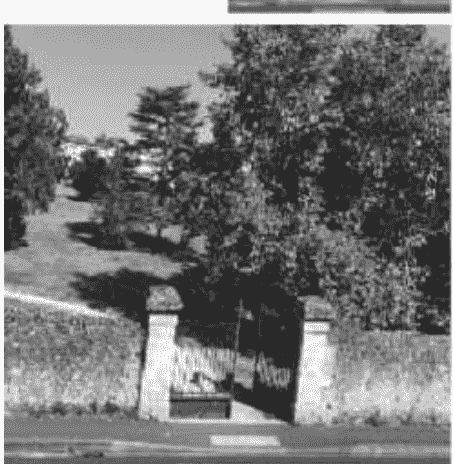

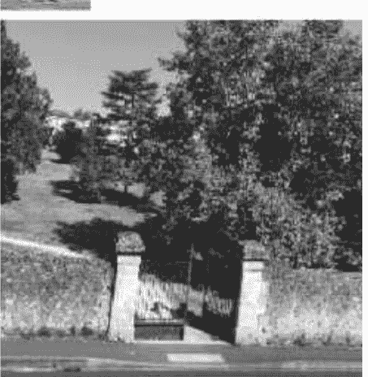

图下方标签：(a) (b)

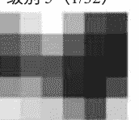

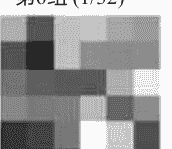

图下方标签：(c)

图5.8 子采样过程的示意图：(a) 通过高斯金字塔，(b) 通过卷积和池化层在AlexNet架构中进行子采样，(c) 两个流程的输出（6 × 6像素）

## 第六章
## 卷积神经网络作为图像分析工具


在前一章对卷积和子采样的基本操作进行研究之后，我们在这里介绍卷积神经网络，并考虑那些专为特定数据（图像）设计的网络。首先，我们将介绍一些通用原则，然后逐层详细讨论，最后简要概述最流行的卷积神经网络架构。

### 6.1 基本原理

常规神经网络在视觉信息挖掘方面无法很好地扩展。对于某一层中的某个神经元，它的架构将前一层的所有激活连接到该神经元。在计算机视觉的背景下，数据以图像（或视频）的形式存在，至少是三维对象。让我们想象一下，我们想要将第一层的一个神经元与一个尺寸相对较小的彩色图像的每个像素连接起来，尺寸为200 × 200 × 3。这将产生不少于120,000个权重，仅仅是第一层的一个神经元。即使是浅层神经网络在权重的数量上也会变得难以管理（请记住，每个权重都应在训练过程中学习）。

另一方面，在图像处理中，考虑图像中的空间局部相关性是至关重要的。例如，如果我们希望训练一个边缘检测器，同时考虑整个图像对于每个神经元来说是没有意义的，我们应该将图像分解为不同的窗口，并在每个窗口上应用滤波器，以使其对具有强边缘的窗口做出反应。

卷积神经网络（缩写为CNN）专门设计用于计算机视觉任务，其架构与常规神经网络有所不同。最明显的区别是CNN的层的神经元按三个维度（高度、宽度和深度）排列，以匹配数据的几何形状（图像可以看作是像素的长方体）。

在图6.1中，可以注意到空间尺寸在层与层之间逐渐减小，而深度尺寸增加。在大多数情况下，CNN的第一层（有时称为底层）是局部连接的，即它们的空间支持（也称为感受野）是有限的，这有助于获取空间局部相关信息。此外，这些第一层通过池化操作减小了空间尺寸。一旦空间尺寸足够小（达到顶层时），通常会使用全连接层，就像在常规神经网络中一样，最后一层是一个计算类别得分的全连接层。

在CNN的底层中使用的层次显然是这种特殊类型神经网络的特点，由于它们具有局部连接的属性。卷积神经网络确实受到生物启发：Hubel和Wiesel在[HW68]中通过观察动物的视觉皮层发现，后者由复杂的细胞排列组成，而这些细胞只对全局视野的有限部分敏感。

我们对卷积神经网络中使用的两个最重要的局部连接层进行简要描述：

### 6.2 卷积层

卷积层是卷积神经网络架构的核心：它们对输入图像中的空间局部相关性做出反应。这些层由一组有限空间大小的滤波器组成，这些滤波器的权重是可训练的。卷积层的名称来自于该层类型的行为方式：它使其滤波器在整个图像上滑动，就像我们计算图像与滤波器的卷积一样（参见第5章）。与图像处理操作相反，滤波器在沿输入映射滑动时的移动可以大于1。这种移动被称为“步幅”参数，是深度卷积神经网络的一部分通用设置或“超参数”。在滤波器占据的每个位置，都会在滤波器和图像中对应区域之间进行点积运算。一旦所有滤波器都在整个图像上滑动完成，就会得到一个激活图。

这些过滤器中的一些。这些激活图在深度上存储，这解释了为什么深度维度在CNN的每一层中都倾向于增加。在实践中，CNN学习的每个过滤器在遇到特定的视觉特征时会被激活。随着层数的增加，过滤器越来越抽象。底层的过滤器倾向于对简单的对象（如边缘、特定形状或颜色）做出反应，而上层的过滤器可以对更复杂的对象（如建筑物、动物等）做出反应，具体取决于它们所训练的数据集。

接下来，我们将解释CNN如何减少网络的参数（权重）的直观理解。为了简单起见，假设每个图像都使用一个元素为0或1的矩阵进行编码，如图6.2所示。

给定一个矩阵（对应于一幅图像），卷积层学习一组滤波器（见第5章）。图6.3给出了将此操作应用于图6.2的矩阵时的结果示例，使用3 \times 3大小的滤波器和步长为1。

图6.3解释了如何计算图像（6 \times 6）与滤波器（3 \times 3）和步长为1的卷积。我们可以观察到生成的图像尺寸较小（4 \times 4）。滤波器对应于要学习的权重，并引导输入层条目与卷积层单元之间的连接。这在图6.4中有所说明。关键点如下：

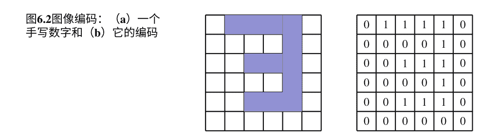

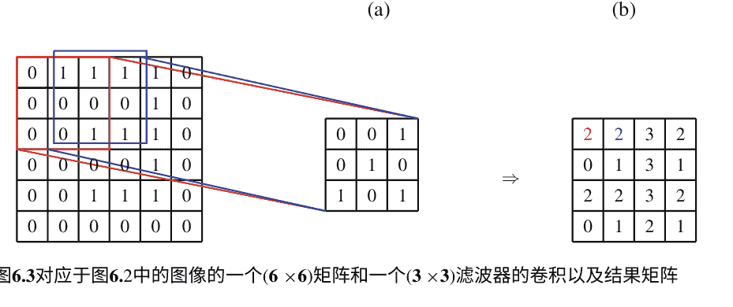

### 6.2 卷积层
图6.4前一个示例中CNN的前两层：两个单元(红色和蓝色)与输入层的一部分单元连接，而不是全部单元，并且这两个单元对于一些先前的单元共享相同的权重

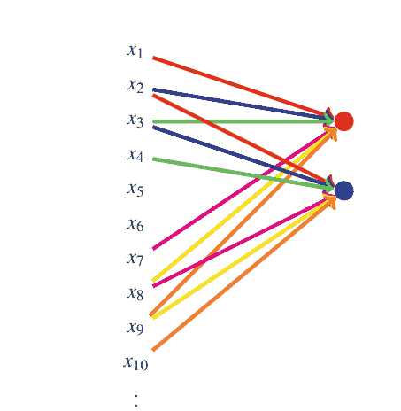

-   卷积层的单元与前一层的所有单元都没有连接：当滤波器应用于矩阵的左上角时，它导致第一个单元(红色)与相应的条目连接：x₁, x₂, x₃, 然后x₇, x₈, x₉, 最后x₁₄, x₁₅, x₁₆.

-   单元共享相同的权重：如果步幅超参数设置为1，则滤波器移动一次。由于我们仍在使用相同的滤波器，连接第二个单元（蓝色单元）和相应的输入（从x₂开始）的权重是相同的。图6.4通过使用颜色来解释这一点（例如，我们在x₁和红色单元之间以及x₂和蓝色单元之间有红色连接）。

这在图6.4中有所说明。显然，与完全连接的网络相比，连接数和因此要学习的参数（权重）数量减少了。

### 6.3 最大池化层

池化减少了上层的计算复杂性，并总结了来自相同内核映射的相邻神经元组的输出。它通过获取下一层神经元的每个感受野的值来减小每个输入特征映射的大小。再次，这减少了要学习的参数数量。池化是一种通用操作，有许多变体存在。然而，在这里我们考虑最大池化操作，意味着对于每个矩形，保留最大值，其他值被丢弃，如图6.5所示。这一层可以看作是一种非线性子采样。它有两个优点：

-   它减少了空间维度，从而减少了上层的计算成本。

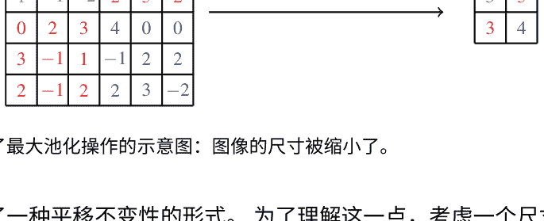

图6.5显示了最大池化操作的示意图：图像的尺寸被缩小了。

-   它提供了一种平移不变性的形式。为了理解这一点，考虑一个尺寸为$2 \times 2$的区域进行最大池化，然后再进行卷积层的情况。区域可以在八个方向上平移一个像素。在这八种配置中，有三种会在卷积层产生完全相同的输出。

应该注意过度使用池化的问题：事实上，减少空间维度会导致信息的丢失，从而影响训练。请注意，池化层有不同类型，例如平均池化和 $L^{2}$-范数池化，但最大池化版本在大多数情况下被证明是最有效的。

### 6.4 Dropout

监督学习方法的一个瓶颈是所谓的“过拟合现象”。这意味着经过训练的分类器在训练数据上的分类误差很小，但在未见过的数据上无法很好地泛化。

可以通过模型组合来避免过拟合。这涉及到对许多单独训练的神经网络的输出进行平均，这在深度神经网络中非常昂贵。

此外，这种平均的有效性要求平均模型非常不同：它们应该具有不同的架构或者在不同的数据上进行训练。前者很难实现，因为调整架构是复杂的，而调整多个架构则更加困难。后者对于大型模型来说很难实现：深度神经网络确实需要更多的数据来进行适当的训练，这意味着不同的神经网络可能会超过可用的训练数据量。

通过对原始神经网络进行多次稀疏抽样，dropout方法解决了这些问题。这些版本是通过随机丢弃神经网络中的单元和它们之间的连接来获得的。更多细节可以在[SHh+14]中找到。dropout正则化在图6.6中有所说明。我们注意到，在CNN中，dropout是在全连接层上执行的，并且确实提高了网络性能。

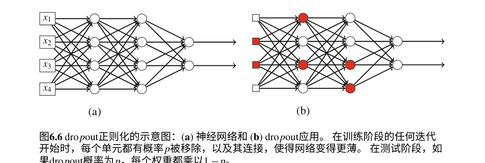

图6.6 dropout正则化的示意图：(a) 神经网络和 (b) dropout应用。在训练阶段的任何迭代开始时，每个单元都有概率p被移除，以及其连接，使得网络变得更薄。在测试阶段，如果dropout概率为p，每个权重都乘以1-p。

### 6.5 一些知名的CNN架构

在概述流行架构方面，做到全面是非常困难的。我们将限制在那些作为相当大一部分应用基础的架构上。

#### 6.5.1 LeNet架构和MNIST数据集

LeNet是一种非常流行的架构，最早由LeCun等人在1998年引入[LBBH98]。这种CNN架构被设计用来解决数字识别问题，具有非常强大的鲁棒性。这是一种直观且相对简单的架构（仅有5个隐藏层），非常适合理解深度学习的基础知识。

LeNet系列架构的核心原则是在较低层中重复模式卷积层 +激活函数 +最大池化层。由此产生的空间降维使得可以在上层使用级联的全连接层，并且通过softmax分类器给出模型的得分。

在MNIST数据集上训练LeNet架构非常常见。后者是一个包含总共70,000个数字图像的手写数字数据库。该数据集将数据分为60,000个用于训练的图像和10,000个用于验证的图像。该数据集中的每个数字图像都经过尺寸归一化和居中处理，形成一个28 × 28的固定大小图像。

LeNet的简单架构与MNIST数据集的紧凑性结合在一起，非常适合在真实世界数据上尝试新的学习技术和模式识别方法，同时在预处理和格式化方面投入最少的努力。

在非常有限的时间内，即使没有GPU加速，也可以实现超过98%的准确率的出色训练结果。

LeNet架构对不同类型的变换具有鲁棒性，因此它能够实现非常强大的字符识别。它提供了（对于合理的变换）许多有趣的属性，如LeCun专门为LeNet设计的网站上所示。最值得注意的是，LeNet的鲁棒性来自以下属性:

-   平移不变性：这对于垂直平移非常有用，因为字符串中字符的位置永远不完美。

-   尺度不变性：这对于字符的大小变化非常有用，因为字符的大小可能会有所不同。

-   尺度不变性：LeNet可以在广泛的尺度范围内实现这种不变性。

-   旋转不变性：作者估计LeNet可以识别旋转角度为40度的数字。

-   压缩不变性：LeNet对宽高比的变化表现出鲁棒性。

-   笔画宽度不变性：这种鲁棒性对于限制对线条细化等不可靠的预处理方法是有用的。

-   噪声鲁棒性：LeNet对添加在数字上方的各种类型的噪声具有弹性。

#### 6.5.2 AlexNet架构

在最受欢迎的架构中，AlexNet是由Krizhevsky等人于2012年在题为“ImageNet Classification with Deep Convolutional Networks”的论文中提出的，被广泛认为是深度学习领域最有影响力的出版物之一。该架构旨在解决ImageNet数据集上的一个困难分类问题。ImageNet数据集是根据WordNet层次结构组织的图像数据库，WordNet是一个英语单词的词汇数据库。目前，ImageNet只考虑WordNet中的名词。层次结构的每个节点由数百甚至数千个图像表示，平均每个节点有超过五百个图像。这个数据集因其极其丰富而闻名。创建了一个围绕ImageNet的年度竞赛，即ILSVRC（ImageNet Large-Scale Visual Recognition Challenge），人们可以通过在ImageNet数据库上训练他们的CNN来解决大规模的目标检测和图像分类问题，以评估和比较他们的架构。在过去几年中，ILSVRC竞赛已经看到许多CNN候选成为计算机视觉领域的重要组成部分。

作者将AlexNet架构介绍给2012年的ILSVRC（ImageNet大规模视觉识别挑战赛），并以15.4%的前5测试错误率远远领先于第二名的26.2%的错误率。这个结果被视为出色的表现，令深度学习和计算机视觉界感到惊讶。

AlexNet架构由6000万个参数组成，用于500,000个神经元，5个卷积层，其中一些后面跟着一个最大池化层和两个全连接层。

#### 6.5.3 GoogLeNet

2015年，谷歌发表了一种新的架构[SLJ+14]。GoogLeNet是一个22层的CNN，是ILSVRC 2014的冠军，其前5错误率为6.7%。除了其深度之外，GoogLeNet与2014年的大多数架构不同之处在于它不仅仅依赖于卷积和池化层的交替使用，这是自LeNet架构引入以来的常见用法。作者们没有采用顺序排列的层，而是考虑在架构中引入并行性，引入了9个所谓的“inception blocks”，它们本身由不同的层组成，总共超过100层。图6.7展示了一个inception block的架构。

GoogLeNet引领了深度学习中的一种新的设计理念：作者证明了创造性的架构可以提高性能和计算效率。它为非常创造性的CNN架构设计打开了道路。

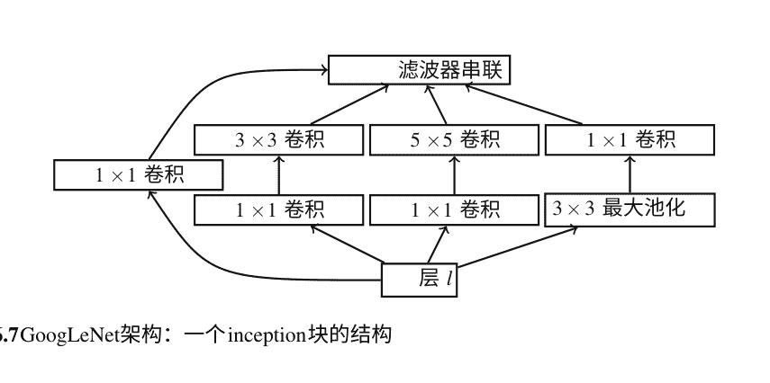

图6.7 GoogLeNet架构：一个inception块的结构

#### 6.5.4 其他重要的架构

许多CNN架构已经证明是深度学习中的重要组成部分。其中，我们可以提到：

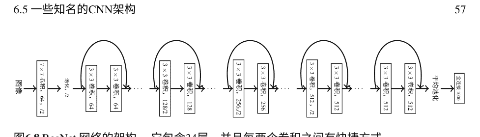

图6.8 ResNet 网络的架构。它包含34层，并且每两个卷积之间有快捷方式。

-   ZF Net 和 DeConv Net (2013年) : Matthew Zeiler 和 Rob Fergus 在2013年的ILSVRC挑战中使用了一个名为ZF Net的CNN，它是AlexNet的一个经过微调的版本，其中包含了提高整体性能的想法。在他们的相关出版物[Z F 13]中，他们还提供了一些关于CNN背后直觉的丰富见解，并且他们还提出了一种特殊的算法，名为DeConv Net，它可以在将图像输入到CNN时可视化训练过的滤波器的响应。这有助于检查哪种结构激发了给定特征图，并有助于更深入地了解特定架构的行为方式。

-   微软ResNet (2015年) , 参见图6.8: 2015年，微软亚洲研究院提出了一种打破了许多记录的新架构[H ZRS15]。ResNet是最早被提出的最深的卷积神经网络，它在2015年的ILSVRC挑战中获胜，错误率仅为3.6%，通常低于普通人的错误率。它引入了一种基于“残差块”的架构，基本上是在conv-relu-conv模式之后考虑输入，通过将输入添加到输出中。根据作者的说法，“优化残差映射比优化原始的未引用映射更容易”。此外，它有助于解决梯度消失的问题。在许多视觉内容识别任务中，使用具有不同层数的ResNet作为最高效的网络。它在第8章的研究示例中使用。

-   R-CNN (2013年) : 2013年，加州大学伯克利分校的Ross Girshick及其团队提出了一种新的CNN架构，旨在解决目标识别问题，并称之为R-CNN[GDDM13]。该问题分为两个部分：区域提议步骤和分类步骤。对于第一步，使用选择性搜索算法[UvdSGS13]。该算法使用边界框选择一定数量的最有可能包含对象的区域。然后，这些区域被输入到CNN中，每个区域输出一个特征向量。然后，这些向量被输入到一组线性SVM算法中，用于解决分类问题。请注意，这种架构在2015年进行了修订并加速，推出了Fast R-CNN[Gir15]，该架构优化了流程，并在稍后推出了Faster R-CNN[RHGS15]，通过引入区域提议网络简化了R-CNN和Fast R-CNN的复杂流程。

### 6.6 结论

在本章中，我们介绍了卷积神经网络，这是图像识别中最重要的架构之一。这些网络在过去的十年中被广泛使用，并证明了它们的效率。

然而，当我们需要处理时间和/或内存时，卷积神经网络不适用于动态内容挖掘。在下一章中，我们将介绍能够克服这些问题并可用于视频、语音识别等领域的神经网络架构。

## 第七章 动态内容挖掘

神经网络和卷积神经网络可以被视为将向量作为输入并计算可能类别集合上的分布的函数。这样的网络在时间和内存中没有顺序的概念。也就是说，它们不适用于像语音识别、视频处理等动态内容挖掘。

如今，我们正在将我们对视觉内容挖掘的所有知识“翻译”成神经网络形式。对于这个任务，隐马尔可夫模型被广泛使用[KOG03, KBD⁺14]。因此，在本章中，我们首先讨论这种形式化，然后解释动态神经网络，如RNN和LSTM。我们因此提出了三种处理序列和动态内容的方法：隐马尔可夫模型、递归神经网络和长短期记忆网络。

### 7.1 隐马尔可夫模型

隐马尔可夫模型（HMM）基于马尔可夫链。马尔可夫链是一种离散时间随机过程 $(X_t)_{t\geq 0}$，使得每个随机变量 $X_t$ 取值于一个离散集合 $S$，称为状态空间，并且对于任意的 $s, s'$ 和 $s_0, s_1, ..., s_{t-1} \in S$，

$$ \Pr(X_{t+1}=s|X_t=s', X_{t-1}=s_{t-1}, ..., X_0=s_0 ) = \Pr(X_{t+1}=s|X_t=s' ) \quad (7.1) $$

如果集合 $S$ 是有限的，则该链被称为有限状态的。方程（7.1）被称为无记忆性质，它简单地意味着随着时间的推移，过程丧失了过去的记忆。该链的特征是空间状态 $S$，并且由其转移矩阵 $P = (p_{i,j})_{(s_i,s_j) \in S \times S}$，其中，

$$ p_{i,j} = \Pr(X_{t+1} = s_j \mid X_t = s_i) \quad , \quad \forall t \ge 0, \text{并且} \forall (s_i, s_j) \in S \times S \quad (7.2) $$

请注意，转移矩阵 $P$ 满足两个属性：（1）其元素都是正数，（2）每行之和为1。

可以通过一个转移图 $G = (S, \tau)$ 来表示一个有限状态马尔可夫链，其中 $S$ 是状态空间，$\tau$ 对应着转移矩阵：对于任意一对状态 $s_i$ 和 $s_j$ 在 $S$ 中，$(s_i, s_j) \in \tau$ 当且仅当 $p_{i,j} > 0$。因此，图 $G$ 是一个有向加权图。给定 $t \ge 0$，马尔可夫链在时间 $t$ 的分布由以下公式给出：

$$ \pi_s^{(t)} = \Pr(X_t = s) , \forall s \in S. $$

为了完全描述该链，除了状态空间 $S$ 和转移矩阵 $P$ 之外，还需要指定初始分布：

$$ \pi_s^{(0)} = \Pr(X_0 = s) , \forall s \in S. $$

因此，知道 $\pi^0 = \left( \pi_s^{(0)} \right)_{s \in S}$ 并且 $P$，可以计算 $\pi^t = \left( \pi_s^{(t)} \right)_{s \in S}$。确实：

$$ \pi^{(t)} = \pi^{(t-1)} P = \pi^{(0)} P^t, \quad \forall t \ge 1 $$

当我们需要计算一系列可观察事件的概率时，马尔可夫链非常有用。然而，在许多情况下，我们感兴趣的事件是隐藏的，不能直接观察到。

隐马尔可夫模型允许我们同时讨论观察到的事件和隐藏事件。因此，为了描述一个隐马尔可夫模型，除了状态空间 $S$、转移矩阵 $P$ 和初始分布 $\pi^0$ 之外，我们还需要定义两个额外的组件：

- 一组观察输出 $\{o_1, o_2, \cdots, o_T\}$，来自输出字母表 $V = \{v_1, v_2, \ldots, v_K\}$，即 $o_t \in V$，对于任何 $t \in \{1, 2, \cdots, T\}$。
- 一系列发射概率 $B$：$b_i(o_j)$ 对应于从状态 $s_i$ 生成观察 $o_j$ 的概率。

图7.1展示了一个对应于隐马尔可夫模型的图中的节点。

除了马尔可夫链的无记忆特性外，我们还假设输出独立性：一个输出观察 $o_j$ 的概率仅取决于产生观察的状态 $s_i$，而不取决于任何其他状态或观察。

对于一个HMM，我们可以提出三个基本问题，[Rab89]：

- 似然度：给定一个HMM $\mathbb{H} = (P, B)$ 和一个观察序列 $O$，计算概率 $\Pr(O \mid \mathbb{H})$。
- 解码：给定一个观察序列 $O$ 和一个HMM $\mathbb{H} = (P, B)$，计算最佳隐藏状态序列 $s$。
- 学习：给定一个观测序列 $O$ 和隐马尔可夫模型中的状态集合，学习马尔可夫模型的参数 $P$ 和 $B$。

#### 7.1.1 似然计算

给定一个隐马尔可夫模型 $\mathbb{H}$ 和一个观测序列 $O$，第一个问题是计算 $O$ 的似然概率，即 $\Pr(O \mid \mathbb{H})$。
在朴素方法中，我们通过对所有可能的隐藏状态序列求和来计算观测序列 $O$ 的总概率：

$$\Pr(O) = \sum_{S} \Pr(O \mid S) \times \Pr(S).$$

对于具有 $n$ 个隐藏状态和观测序列长度为 $T$ 的HMM，存在 $n^T$ 个可能的隐藏序列。当 $n$ 和 $T$ 都很大时，$n^T$ 非常大，我们无法通过计算每个隐藏状态序列的单独观察概率然后求和来计算总观察概率。我们不使用这样的指数算法，而是使用一种高效的 $O(n^2T)$ 的算法，称为前向算法。前向算法是一种动态规划算法，因此它使用表格来存储中间值，以便在构建观察序列的概率时使用。前向算法通过对能够生成观察序列的所有可能隐藏状态路径的概率求和来计算观察概率，但通过将每个路径隐式折叠到单个前向传递中来高效地实现。

从形式上讲，如果 $O = o_1, o_2, \cdots, o_T$，则我们递归地引入前向变量如下：

$$\alpha_1(i) = \pi_i * b_i(o_1), \tag{7.3}$$

和

$$\alpha_{t+1}(j) = \sum_{i=1}^{n} \alpha_t(i) p_{i,j} b_j(o_{t+1}). \tag{7.4}$$

方程（7.3）中的初始化意味着状态 $i$ 的第一个前向变量的值仅通过将其初始概率乘以状态 $i$ 给定时间1的观察 $O$ 的（发射）概率来获得。

递归方程（7.4）中的递归将状态 $j$ 的前向变量定义为前一个状态 $i$ 的前向变量乘以前一个状态 $i$ 到状态 $j$ 的转移概率 $p_{i,j}$，再乘以从状态 $j$ 到观察 $O$ 的发射概率。

最终，给定HMM模型和观测序列 $O$，所需的观测序列 $O$ 的概率 $\Pr(O|\mathbb{H})$ 可以通过在时间 $T$ 终止时对所有前向变量进行求和来获得。

$$\Pr(O|\mathbb{H}) = \sum_{i=1}^{n} \alpha_T(i). \tag{7.5}$$

#### 7.1.2 解码：维特比算法

给定HMM模型 $\mathbb{H}$ 和观测序列 $O$，解码问题在于找到最可能的隐藏状态序列 $s$。

维特比算法[Vit67, Neu75]是一种动态规划算法。它类似于用于似然问题的前向算法。它包括四个步骤：初始化、递归和终止，与前向算法相同，再加上一个名为回溯的额外步骤。这些方程也非常相似，只有细微的差异。

初始化步骤与方程(7.3)完全相同，只是变量的名称不同：

$$v_1(i) = \pi_i * b_i(o_1). \tag{7.6}$$

我们还需要存储回溯指针，因为解码的目标是返回最可能的状态序列。这通过引入数组变量 $bp$ 来实现：

$$bp_1(i) = 0. \tag{7.7}$$

在递归步骤中，方程（7.4）变为：

$$v_{t+1}(j) = \max_{i=1}^{n} v_t(i) p_{i,j} b_j(o_{t+1}), \tag{7.8}$$

可以观察到，我们取乘法结果中的最大值，而不是求和。我们还递归地更新回溯指针：

$$bp_{t+1}(j) = \arg\max_{i=1}^n v_t(i) p_{i,j} b_j(o_{t+1}). \tag{7.9}$$

终止步骤由以下方程给出：

$$p_* = \max_{i=1}^n v_T(i). \tag{7.10}$$

值 $p_*$ 表示在给定HMM和观测的情况下产生整个状态序列的概率。

我们还计算了回溯的起始位置：

$$s^*_T = \arg\max_{i=1}^n v_T(i). \tag{7.11}$$

最后一步是回溯。它使用回指针数组根据以下方程找到隐藏的状态序列：

$$s^*_t = bp_{t+1}(s^*_{t+1}). \quad \text{对于} t = T-1, ..., 1. \tag{7.12}$$

#### 7.1.3 学习HMM

对于一个HMM来说，最后一个问题是：给定一组观察值，使数据最有可能的是初始分布 $\pi$，状态转移概率 $P$ 和输出发射概率 $B$ 的值是什么？我们将状态数设为 $n$，可能的观察值数设为 $K$。回答这个问题的标准算法是Baum-Welch算法[BPSW70]，它是期望最大化算法的一个特例[DLR77]。它是一个迭代算法，工作原理如下。我们从初始概率估计开始。这可以利用一些关于参数的先验知识来完成。然后，我们计算每个转移/发射被使用的频率的期望，并根据这些期望重新估计概率。该过程重复进行直到收敛。更正式地说：

我们首先定义以下变量：

$$\alpha_i(t) = \Pr \left( o_1, o_2, \cdots, o_t, s_t = i \mid \mathbb{H} \right), \tag{7.13}$$

和

$$\beta_i(t) = \Pr \left( o_{t+1}, o_{t+2}, \cdots, o_T \mid s_t = i, \mathbb{H} \right). \tag{7.14}$$

然后，可以定义在时间 $t$ 处于状态 $i$ 且在时间 $t+1$ 处于状态 $j$ 的概率（我们跳过详细计算），给定观察序列 $O$ 和模型 $\mathbb{H}$:

$$\zeta_{i,j}(t) = \Pr (s_t = i, s_{t+1} = j \mid O, \mathbb{H}) = \frac{\alpha_i(t)p_{i,j}b_j(o_{t+1})\beta_j(t+1)} {\sum_{i=1}^n \sum_{j=1}^n \alpha_i(t)p_{i,j}b_j(o_{t+1})\beta_j(t+1)}. \quad (7.15)$$

因此，我们推导出在时间 $t$ 时处于状态 $i$ 的概率，条件是观测 $O$ 和模型 $\mathbb{H}$:

$$\gamma_i(t) = \Pr (s_t = i \mid O, \mathbb{H}) = \sum_{j=1}^n \zeta_{i,j}(t), \tag{7.16}$$

并且，对观测 $O$ 求和，我们得到:

- 从状态 $i$ 出发的预期转移次数:

$$\sum_{t=1}^{T-1} \gamma_i(t),$$

- 从状态 $i$ 到状态 $j$ 的预期转移次数:

$$\sum_{t=1}^{T-1} \zeta_{i,j}(t).$$

然后，我们计算所需参数的当前估计值：（其中 $1_{x=y}$ 是指示函数，即当 $x = y$ 时其值为1）

$$\hat{p}_{i,j} = \frac{\sum_{t=1}^{T-1} \zeta_{i,j}(t)} {\sum_{t=1}^{T-1} \gamma_i(t)},$$

$$\hat{b}_i(o_j) = \frac{\sum_{t=1}^{T} 1_{o_t = o_j} \gamma_i(t)} {\sum_{t=1}^{T} \gamma_i(t)},$$

$$\hat{\pi}_i = \gamma_i(1). \quad (7.17)$$

然后重复该过程，直到达到所需的收敛。

### 7.2 循环神经网络

作为HMMs，循环神经网络（RNN）允许在接收到观测序列的情况下构建预测序列。循环神经网络（RNN）将当前示例和先前接收到的内容作为输入。RNN在时间 $t$ 的决策受到时间 $t - 1$ 的决策的影响。

#### 7.2.1 定义

循环神经网络有两个输入来源：现在和过去。更正式地说，如果我们将时间 $t$ 时网络的响应表示为 $y^{(t)}$，则：

$$y^{(t)} = f\left(y^{(t-1)}, x^{(t)}\right)$$

图7.2直观地解释了循环神经网络和“经典”神经网络之间的区别。除了层内节点之间的连接和其后续层之间的连接外，层内的单元之间还存在循环连接。

从上面的讨论中，我们可以解释循环神经网络背后的思想：我们的目标是利用顺序信息。在之前的架构中，我们假设输入和输出是独立的，即时间 $t$ 的输出对时间 $t + 1$ 的输出没有影响。但是对于许多机器学习任务，特别是视频挖掘，这是不正确的。如果想要对视频帧进行注释，就必须考虑之前看过哪些帧。

循环神经网络被引入来解决这个问题：它们可以对序列执行任务，因此时间 $t$ 的输出会在时间 $t + 1$ 的输入中被考虑。我们说它们具有可以用来存储已计算信息的记忆。

图7.2 一个很简单的递归神经网络的表示

图7.3a给出了一个神经网络的简单表示：输入 $x$ 与矩阵 $U$ (假设偏差作为该矩阵的一部分) 结合，用于计算隐藏层的值 $h$，然后将该值存储在该层的内存中，再使用另一个矩阵 $V$ 传递到输出层。图7.3b给出了与（a）中相同概念的另一种表示。它展示了一个递归神经网络转化为一个完整网络。这被称为展开。展开意味着我们将网络写成完整序列的形式。例如，如果我们关心的序列是一个由24帧组成的视频，那么网络将展开成一个24层的神经网络，每一层对应一帧。使用以下符号：

- 在时间 $t$ 的输入是 $x_t$。这可以是一个帧的独热向量编码。
- 在时间步骤 $t$ 的隐藏状态是 $h_t$。它对应于网络的记忆。它是使用先前的隐藏值和时间步骤 $t$ 的输入计算得出的：

$$h_t = f (U x_t + W h_{t-1}).$$

函数 $f$ 可以是任何激活函数。通常是非线性函数，如 tanh 或 Relu。第一个隐藏值 $h_0$ 初始化为零。
- 在时间步骤 $t$ 的输出是 $y_t$。对于先前的网络，它以 softmax 的形式表示：

$$y_t = \text{softmax}(V h_t).$$

#### 7.2.2 训练RNN

对于任何神经网络训练任务，需要定义一个损失函数通过比较预测的类别与实际类别来评估网络的性能。对于RNN，可以使用任何经典的损失函数（如交叉熵等）。然后，需要初始化网络的参数值（权重和偏置）。这一步取决于所考虑的分类问题和输入数据。也可以使用迁移学习来设置初始值。然而，在实践中，已经证明[SMDH13b, PMB13]，标准差为0.001或0.01的高斯随机初始化是一个很好的选择。

一旦参数初始化完成，就需要使用一种方法来训练网络。可以使用基于梯度下降的方法。然而，RNN结构中的时间因素使得经典方法（我们在神经网络和卷积神经网络中看到的方法，参见第4章）不高效。因此，需要扩展它们以捕捉RNN结构的时间因素。

有许多方法可以用来训练RNN。可以引用时序反向传播[JH08]、基于卡尔曼滤波的学习方法[MJ98]等等。在本节中，我们将讨论时序反向传播（BPTT）方法的原理，因为它是梯度下降方法的一种改进。

BPTT是前馈网络反向传播的一种推广。递归神经网络标准BPTT方法的主要思想是将网络在时间上展开（参见图7.3），并通过时间向后传播误差信号。如图7.3所示，参数集合 $\theta$ 由 $W$、$U$、$V$ 以及偏置集合（在我们的情况下，编码在矩阵中）定义。计算损失函数相对于 $V$ 的导数与前馈网络基本相同。主要是为了计算 $U$ 和 $W$ 的导数。实际上，需要将每个时间步的贡献求和以得到梯度。换句话说，因为 $W$ 在每一步都被使用到我们关心的输出，所以我们需要通过网络进行梯度反向传播。

循环神经网络在学习长期依赖性方面存在困难。这是由于梯度消失的原因。当激活函数（sigmoid或tanh）的导数接近0时，就会发生这种情况。相应的神经元会饱和，并将前面层的梯度驱动向0。矩阵中的小值和多次矩阵乘法导致梯度消失非常快。直观地说，这意味着远离的步骤对梯度的贡献变为0。这个问题不仅限于循环神经网络，在（非常）深的前馈网络中也存在。

有解决办法可以避免梯度消失问题。最常见的解决办法是使用ReLU作为激活函数，而不是sigmoid或tanh函数。更合适的解决办法是使用长短期记忆（LSTM）网络。

图7.4 短期长期记忆网络的一个单元：$\sigma$ 和 $\text{tanh}$ 分别是在第3章中介绍的sigmoid和tanh函数。运算符 $\times$ 和 $+$ 分别表示乘法和加法运算。

### 7.3 长短期记忆网络

#### 7.3.1 模型

循环网络在输入中捕捉到了顺序依赖关系，因此非常有用。然而，正如前一节所解释的那样，训练这样的网络会受到梯度爆炸或梯度消失的问题的困扰。因此，当用于学习长期顺序依赖关系的数据时，循环网络的效率不够高。1997年，Hochreiter和Schmidhuber [HS97]引入了长短期记忆网络（LSTM）。这种架构及其变种在过去几年中被广泛应用，并在许多领域（包括语音识别、文本处理等）证明了其效率。

LSTM是一种循环神经网络，其中的单元比简单RNN更复杂。图7.4展示了一个典型的LSTM单元。

信息从当前数据 $x_t$ 和上一个隐藏层的值 $h_{t-1}$ 传递到该单元。该单元计算出了遗忘门的值：

$$f_t = \sigma \left( W_f.[h_{t-1}, x_t] + b_f \right).$$

这对应于将要从细胞状态 $C_t$ 中丢弃的信息。

相同的计算也适用于输入门：

$$ i_t = \sigma (W_i.[h_{t-1}, x_t] + b_i) $$

还有另一个值：

$$ c_t = \tanh (W_C.[h_{t-1}, x_t] + b_C) $$

然后使用这些值来计算细胞状态的新值 $C_t$：

$$ C_t = f_t C_{t-1} + i_t c_t $$

最后需要决定的是细胞的输出 $h_t$。这可以通过两个步骤完成。首先，我们计算（中间）输出的值：

$$ o_t = \sigma (W_o.[h_{t-1}, x_t] + b_o) $$

然后：

$$ h_t = o_t \tanh(C_t) $$

还有许多其他变种的LSTM网络。门控循环单元（Gated Recurrent Unit，简称GRU），由Cho等人引入，旨在简化计算，并将遗忘门和输入门合并为一个单一的门：更新门。它还合并了细胞状态和隐藏状态。

### 7.4 结论

在本章中，我们介绍了用于动态视觉内容挖掘的技术。我们首先介绍了隐马尔可夫模型，讨论了这些模型可以解决的主要问题。然后，我们讨论了循环神经网络和长短期记忆架构，这些是用于序列和动态内容的非常强大的工具。我们解释了如何通过展开它们的底层网络来训练这些模型。

## 第8章 数字文化内容挖掘案例研究

在本章中，我们考虑了深度学习在建筑识别任务中的应用。主要目标是识别建筑风格和具体的建筑结构。我们对深度卷积神经网络中的注意机制感兴趣，并解释了基于人眼注视点构建真实视觉注意力图如何帮助深度神经网络的训练。

### 8.1 引言

深度神经网络的不断提升性能使其能够应用于现实生活中的视觉内容挖掘任务，其中对数字文化遗产的组织和解释可能是最迷人的之一。

这就是为什么我们的案例研究致力于识别丰富的文化内容资产。我们描述了我们在墨西哥文化遗产中不同风格建筑物分类的研究。但这并不是我们关注的唯一重点。在解释感兴趣的内容时，人们被自然对比度和颜色以及目标场景的特定细节所吸引。我们的视觉注意力是有选择性的：为了识别视觉场景，我们会注视感兴趣的区域。因此，在处理这样有趣的视觉内容时，自然而然地尝试将视觉注意机制纳入强大的分类器：深度神经网络。具体而言，在编写本书的过程中，社区的兴趣转向了所谓的深度神经网络中的“注意机制”[JL LT18]，用于文本挖掘、翻译或图像分类。因此，我们对这些机制在这里的神经网络也感兴趣，但更多地将它们与人类对感兴趣场景的视觉解释联系起来。在接下来的内容中，我们将首先回顾与我们的建筑物识别任务相关的一些方法，然后尝试看看哪些注意机制最有效：由神经网络自身引发的机制还是由人类视觉经验明确引发的机制。

通过匹配、模式识别和机器学习等不同技术，已经对建筑物或建筑风格的识别进行了研究。Ali等人[ASIJ+07]提出了一种最早的建筑结构识别方法，引入了一个分类器系统，用于检测和定位窗户作为后处理步骤的基础。目标是将这一发展应用于多个系统，如移动计算，并为更复杂的后处理提供感兴趣的领域。识别基于 Viola 和 Jones [VJ01] 的方法，受到人脸检测问题的启发，但可训练以检测各种实时应用中的对象。

这种方法是一种简单而高效的技术，用于进行内容描述，以提出可以通过建筑物窗户的空间分布来定义结构的区域。

从不同的角度来看，Berg等人[BGM07]解析包含建筑结构的图像。输出是一个像素标记的图像，用于通过颜色和纹理描述符训练的概率模型来识别屋顶、植被、窗户、建筑物和门的边界。数据库由200个手动像素标注的图像确认，其中大部分与建筑元素有关。

后来，Zhang等人[ZSGZ10]发现，将图像分割成区域，并在多分辨率方法中处理每个区域，比使用整个图像更好地识别中国文化的建筑元素。

每个区域都用多个分辨率（多尺度）的梯度直方图（HOG）特征进行描述，并使用主成分分析（PCA）降维来训练五个分类器：(i) 支持向量机（SVM），(ii) K-最近邻（K-NN），(iii) 最近均值分类器（NMC），(iv) Fisher线性判别器（FLD）和(v) 多层感知器（MLP）。交叉验证测试表明，与MLP的30%准确率和K-NN的50%准确率相比，SVM的性能超过60%。

Mathias等人[MMW+11]提出了一种使用尺度不变特征变换（SIFT）描述符来处理立面并确定建筑风格（Haussmann，新古典主义和文艺复兴）的流程。该方法包含几个阶段：(i) 从场景分类开始（无建筑物，建筑部分，街道和立面），(ii) 立面的方向被矫正（与相机正交），(iii) 建筑物被分割成单个建筑物（一个街区中可能有不同的风格），(iv) 提取特征，最后，(v) 训练一个朴素贝叶斯分类器。对于识别立面、建筑物部分和街道，分类率超过85%。对于提出的数据集，拒绝类别准确率或“无建筑物”为100%。

Shalunts等人[SHS11]认为，要识别建筑结构，有必要单独识别几个元素。窗户的识别对应于三个类别：罗马式、哥特式和巴洛克式。他们使用图像直方图作为分类器的视觉词袋（BoW）方法。数据库仅包含作者拍摄并从Flickr平台[Fli04]检索的400张图像。根据所呈现的三类识别的混淆矩阵，该模型的准确率约为95.33%。

接下来，Shalunts等人[SHS12]还提出了识别哥特式和巴洛克式建筑元素的方法。所提出的方法寻求识别每个建筑结构中的独特元素，如[SHS11]中的窗户和立面上的装饰物。数据库由两个类别（哥特式和巴洛克式）的520张图像组成。他们提出使用SIFT描述符和BoW作为模型。

Xu等人[XTZ+14]报告了一种基于SVM的多项式潜在逻辑回归算法（MLR），并应用于一个由25个建筑结构组成的特定目的的数据库。该方法基于在不同尺度上使用HOG特征，定义为金字塔。该模型包括具有回归目标的潜在变量，以获得给定图像的类别。

Shalunts [Sha15]展示了三种风格的塔楼的识别，其中包括罗马式、哥特式和巴洛克式特征。作者使用SIFT和K-NN作为描述符进行分类阶段。该方法的有效识别率为80.54%。作者和Flickr图像创建了一个特定目的的数据库。

实质上，在过去的几年中，已经提出了几种方法，其中使用分类器和基于特征的方法来识别结构元素。与基于特征的方法相比，深度学习方法表现出了更高的性能。因此，它们在识别任务中具有很大的应用潜力。此外，我们希望在深度卷积神经网络中采用最近的趋势，例如注意力机制，通过网络来增强一些特征的映射，同时将像素和特征的显著性纳入网络中。因此，我们首先将关注视觉显著性，并解释我们在任务中对其的理解。

### 8.2 视觉显著性

视觉显著性是人类对视觉场景中特定细节的吸引度的度量。基本上有两种视觉注意力和由此得到的显著性：自下而上和自上而下。自下而上，或者说是刺激驱动的，表达了人类视觉系统对对比度、颜色、方向变化和视频中的残余运动的吸引力。第二种——自上而下，是任务驱动的，取决于目标视觉任务。关于在视觉索引任务中使用自下而上显著性的更详细的解释和示例可以在之前的书籍[BPC17]中找到。在这项工作中，我们将重点关注自上而下的显著性，因为视觉任务是特定的。

#### 8.2.1 基于凝视固定点的自上而下显著性图

自顶向下的显著性地图的生成受到心理视觉实验的支持。这个心理视觉实验的目标是记录对显示建筑风格识别的视觉任务中的注视点。

被试者在视觉任务中识别展示建筑物的建筑风格时，注视点的信息被记录下来。它根据任务驱动目标导向视觉实验的方法进行设计[Duc07]。我们选择了一组教育水平相似的被试者（硕士和博士研究生），年龄为23.7 ± 2.8岁。注视点提供了关于特定物体识别任务的视觉注意力的基准参考信息。

在这种情况下，基准参考是从Mexculture建筑数据集[ORR+16]的图像子集中通过眼动测量建立的主观显著性地图。

使用眼动追踪系统，我们记录参与者在建筑风格识别的特定任务中的注视点。眼动数据以固定速率（我们的情况下为250 Hz）在眼动追踪系统的坐标系中记录，其中原点是实验屏幕的中心。然后，测量结果被转换到以左上角为原点的帧坐标系中，最终计算主观显著性地图。单个参与者的注视点不能代表性地描述视觉注意力。然后，使用多个参与者的注视点构建主观显著性地图。生成的地图应该提供关于注视密度的信息。

David S. Wooding [Woo02]提出了一种生成显著性图的方法，分为三个步骤：(i) 对于每个参与者，在每个测量位置应用一个高斯函数（表示视网膜区域在屏幕上的位置），构建部分主观显著性图 \(S_{subj}(I)\)，(ii) 将所有部分主观显著性图相加得到 \(S_{subj}'(I)\)，(iii) 对最终的显著性图进行归一化处理，并存储为 \(S_{subj}(I)\)。

更正式地说，为了计算凝视点上的单个高斯函数，从固定角度 \(\alpha = 2^\circ\)计算高斯函数的扩展\(\sigma\)，以估计基于眼睛和屏幕之间的距离 \(D = 3H\)的 \(\sigma_{mm}\)，其中 \(H\)是屏幕的高度。

\[ \sigma_{mm} = D \times tan(\alpha) \tag{8.1} \]

以 \(mm\)为单位的测量值根据屏幕分辨率转换为像素，其中 \(R\)是每 \(mm\)的像素数。

\[ \sigma = R \times \sigma_{mm}. \tag{8.2} \]

首先，对于图像 \(I\)的每个注视测量 \(m\)，计算出部分显著性图

\[ S_{subj}(I, m) = A e^{-\left( \frac{(x - x_{0m})^2}{2\sigma_x^2} + \frac{(y - y_{0m})^2}{2\sigma_y^2} \right)}, \tag{8.3} \]

其中 \(\sigma_x = \sigma_y = \sigma\)且 \(A = 1\)。

在第二步中，所有部分显著性图被求和得到 \(S_{subj}'(I)\)，

\[ S_{subj}'(I) = \sum_{m=0}^{N_m} S_{subj}(I, m) \tag{8.4} \]

其中 \( N_m \) 是记录在所有参与者身上的注视点数量，用于输入图像 \( I \)。最后，显著性图通过 \( \argmax \text{ of } S_{subj}'(I) \) 进行归一化，并存储在 \( S_{subj}(I) \) 中,

$$ S_{subj}(I) = \frac{S_{subj}'(I)}{\argmax(S_{subj}'(I))} \tag{8.5} $$

图8.1展示了注视点和生成的主观显著性图的示例。

图8.1 注视测量和主观显著性图的生成: (a) 图像上的注视测量和(b)源图像上的显著性图。红色：更多关注，蓝色：较少关注

#### 8.2.2 共同显著性传播

在大型数据库中使用特定的显著性图并不总是可能的，因为这需要进行大规模的心理视觉实验，参与者必须在一天中观察图像。这就是为什么在[MOB G⁺18]中提出了一种共同显著性传播方法。该方法适用于存在多个相同对象实例的数据库。这适用于建筑数据库或众包图像集合的情况，不同的参与者输入了相同对象的图像，但是在不同的条件和不同的视角下拍摄。

该方法需要记录注视点的注视点，而不是整个数据库，而只是在“引导”子集上。给定一组参考图像及其主观显著性图，共同显著性传播基于以下假设：如果一个主体正在观察图像的特定细节以进行特定对象识别，则他/她很可能在其他不同图像的相同对象的其他表示中寻找相同的细节，即使该对象已经被看到从不同的角度来看。因此，这里的想法是估计两个图像之间的单应性变换H，即参考图像J和目标图像I，而在心理视觉实验中，目标图像I没有显示给被试者。然后，借助估计的单应性变换H，将参考图像J中的凝视点坐标转换到图像I的平面上。然后，根据第8.2.1节中给出的方程计算“共同显著性”图。为了计算单应性变换，我们执行SIFT关键点匹配，然后使用RANSAC算法计算单应性变换H的匹配关键点[FB81]。

共同显著性传播方法如图8.2所示。为了将主观显著性图传播到相似图像中，我们在参考图像和目标图像中找到匹配的关键点。使用SIFT关键点，我们估计从参考图像到目标图像的单应性变换，并将凝视数据转换为目标视角，从而计算目标图像的共同显著性图。在实际数据上匹配关键点时，由于不同的上下文变化、物体缩放和对比度变化，会出现一些问题。由于这个原因，单应性变换并不总是正确的，我们拥有的匹配点越多，单应性变换的估计就越准确。然后，为了排除错误的视角预测，我们对参考图像在目标图像平面上的投影进行几何测试。通过使用估计的单应性变换将参考图像的角落进行变换，我们应该始终得到一个凸四边形，这意味着根据定义，每个内角都小于180°。显然，由于单应性平面变换，转换后的参考坐标会有一些小的变化。我们设置了一个内角滞后（α = 20°），只允许有限的视角变化，排除非常错误的投影。

图8.2通过匹配点的参考和投影显著性图的参考和目标图像。红线表示关键点匹配，目标图像上的绿色多边形显示由估计的单应性给出的变换。在这里，参数是Lowe的比率和α = 20°作为单应性验证步骤的角度阈值。红色：更多关注，蓝色：较少关注

### 8.3 深度CNN中的显著性

#### 8.3.1 深度神经网络中的注意机制

在本节中，我们介绍了来自文献的具有注意力的深度神经网络，如Squeeze-and-Excitation Networks [FSM+17]、Double Attention Networks以及我们提出的具有前向-后向外部视觉注意力传播的网络。

我们在实验中集成的所有注意力模块都可以根据输入 $\mathbf{X} \in \mathbb{R}^{H \times W \times C}$ 构建，唯一的例外是基于视觉显著性的注意力块还需要当前图像样本的显著性图 $S \in \mathbb{R}^{H \times W \times 1}$ 。在这里， $\mathbf{X}$ 表示一组特征，是前一层（通常是卷积层）的产物。这些不同的机制在下面的小节中进行了介绍。

#### 8.3.2 挤压和激励网络

这种网络最初是为了改善通道间的相互依赖关系而引入的，类似于通道注意力块，同时保持非常低的计算成本[FSM+17]。核心思想是在卷积块之后为每个通道添加参数，从而在优化过程中权衡每个特征图的相关性。这种方法的最基本形式可以通过为输入特征图中的每个通道分配一个可训练参数来实现，这个参数表示通道的相关性。这种方法可以通过两个步骤来说明，第一步是通过全局池化将每个通道的特征图压缩成一个单一的值，结果是一个 $n$ 维的向量，其中 $n$ 是输入特征图中的通道数。如图8.3所示，每个通道都由 $\mathbf{F}_{\text{squeeze}}(\cdot)$ 进行总结。

然后，第二步是将输入一个两层全连接神经网络，该网络会产生一个相同大小的向量，用 $\mathbf{F}_{\text{excitation}}(\cdot, \mathbf{W})$ 在图8.3中表示。最后，这些N值被用来加权原始特征集中的每个通道。

挤压-激励块是一个两层深度全连接神经网络，它需要设置两个参数：输入的通道数 $C$ 和比例 $r$ 。这些参数用于定义第一层必须包含的权重数量，其中第一层的输出形状为 $1 \times 1 \times \frac{C}{r}$ ，第二层的输出形状为 $1 \times 1 \times C$ ，其中 $C$ 是通道数。

#### 8.3.3 双注意力网络 ($A^2$-Nets)

双重注意机制旨在通过收集和分配特征来捕捉长距离特征之间的相互依赖关系[CKL+18]。这个想法的动机是通过挤压和激励网络，首先从整个空间收集特征，然后根据给定位置的局部特征向量将它们分配到每个位置。网络生成“注意力地图”和“注意力向量”。后者是通过对当前输入特征图进行卷积得到的，参见图8.4中的$\mathbf{W}_{\delta}$和$\mathbf{W}_{\rho}$滤波器。然后，softmax运算符强制执行强特征，并将所有特征归一化到0和1之间。这个操作产生了一种“重要性”或“注意力”地图，它与Gathering块中的输入特征进行卷积，并与Distribution块中的聚合特征相乘。因此，第一个注意机制能够从源中收集特征，第二个注意机制负责根据局部注意向量自适应地分配信息。两个机制的输出将信息聚合到输入特征图的每个位置。

一方面，如图8.4所示，通过计算给定特征图外积的二阶特征的池化和求和来执行特征收集任务。这被称为双线性池化，在[LRM15]中用于捕捉数据的二阶统计信息并生成更好的全局表示。

特征收集的执行方式如下：

$$\mathbf{G}_{\text{双线性}} = \mathbf{A} \mathbf{B}^\top = \sum_{\forall i} \mathbf{a}_i \mathbf{b}_i^\top \qquad (8.6)$$

其中，$\mathbf{a}_i$和$\mathbf{b}_i$是来自卷积层$\phi(\mathbf{X}, \mathbf{W}_{\phi})$和$\delta(\mathbf{X}, \mathbf{W}_{\delta})$的$hwc$形状向量（特征）。

作者声称这一步骤是捕捉关键全局特征（如纹理和光照）的有效方式。

另一方面，第二个注意力步骤是将特征分布回输入的不同位置，给定位置 $\mathbf{v}_i$ 为：

$$\mathbf{F}_{\text{distr}} = \mathbf{G}_{\text{gather}}(\mathbf{X})\mathbf{v}_i \quad (8.7)$$

其中 $\mathbf{v}_i$ 由 $\mathbf{V} = \text{softmax}(\rho(\mathbf{X}, \mathbf{W}_\rho))$ 给出。通过使用软注意力从第一步选择一部分特征向量来确保第二个机制的公式化。

最后，双重注意力块将上述两种注意力机制结合成一个单一的注意力机制，以增加原始输入的信息。

$$\tilde{\mathbf{X}} = \mathbf{X} + \mathbf{F}_{\text{distr}}(\mathbf{G}_{\text{gather}}(\mathbf{X}), \mathbf{V}) \quad (8.8)$$

与挤压和激励块不同，这个双重注意力块专注于空间上识别特征图中可能存在的相互依赖关系，并且不仅测量每个通道的相关性，还添加与场景相关的空间信息。

#### 8.3.4 视觉显著性传播

因此，在分析深度神经网络中的所谓“注意力模型”之后，我们将展示如何将人类对视觉内容的观察引入整个卷积神经网络架构，无论它用于场景解释任务。可用的凝视固定图将

-   在汇聚层中引导特征选择，
-   控制网络的正则化过程中的丢弃，
-   影响参数优化中的反向传播。

因此，我们在处理特征和参数的网络架构的所有模块中引入了视觉显著性。我们正在谈论通过深度卷积神经网络进行端到端的视觉显著性传播。

##### 8.3.4.1 汇聚层中的显著性

汇聚函数根据特定条件对其输入进行总结。输出中的每个元素来自于感兴趣值周围的邻域。形式上，汇聚层以特征图 $\mathbf{F}$ 作为输入，并产生分辨率降低的特征图 $\mathbf{F}_m$，这取决于步幅参数（见第6章）。汇聚层中的感受野，与其他视觉层一样，由卷积核大小给出。

## 最大池化

最大池化输出每个邻域的最大值，以代表输入图像中的每个值，

$$ F_m(x, y) = \max \{ F (\bar{x}, \bar{y}) \}, $$

其中 $(\bar{x}, \bar{y})$ 表示 $(x, y)$ 周围的邻域。点 $(x, y)$ 在输入特征图中以参数化的步长值进行规则采样。

最大池化是CNN中最常用的子采样方法，它产生输入特征的紧凑表示，使得对小图像平移具有鲁棒性，并且降低了维度，这表示在更深的层次中需要训练的参数更少。但是基于显著性的池化呢？ 我们在[MOBPGVRA18]中引入了它。

基于显著性的特征池化作为池化层中相关区域选择的一种方法，我们使用了对高显著性区域进行视觉数据修剪的过程进行池化。我们的方法源自Gonzalez-Daz等人的工作[GDBP16]和Vig等人的工作[VDC12]。我们基于随机采样过程和与输入图像相关的显著性图进行区域池化，这个过程遵循威布尔分布的累积分布函数（CDF）。

正如[VDC12]中所述，我们认为像素的显著性值遵循累积威布尔分布，

$$ P (r; k, \lambda) = 1 - e^{(r/\lambda)^k}, $$

并且与显著性相关的随机变量 $S$，概率$P(S \le r)$由方程(8.10)给出，其中 $r \in [0,1]$是均匀分布的随机变量，$k > 0$ 控制分布的形状，$\lambda > 0$ 是威布尔分布的比例因子。

以特征图 $\mathbf{F}$和显著性图 $\mathbf{S}_m$作为输入，并根据$P(S \le r)$的规则修剪区域，随机池化策略被定义为，

$$ F_m(x, y) = \begin{cases} \max \{ F (\bar{x}, \bar{y}) \} & \text{if } S_m(x, y) \ge P (S \le r) \\ \min \{ F (\bar{x}, \bar{y}) \} & \text{otherwise,} \end{cases} $$

而在方程（8.9）中， $(\bar{x}, \bar{y})$ 表示 $(x, y)$ 周围经常采样的像素值的邻域。因此，在输入特征图的高显著区域应用基线最大池化，在其他区域则采用最小池化来抑制特征。

如图8.5所示，$k$控制着区域池化的随机采样的影响。对于较小的$k$值，CDF的形状会使得低显著性值在修剪过程中有更大的生存概率。对于较大的 $k$值，CDF的形状在区域池化中实现了低值和高值显著性的平衡。此外，$\lambda$限制了要处理的最小区域，通过将CDF在[0,1]范围内进行平移。再次分析图8.5，我们可以得出对于较低的 $k$值，

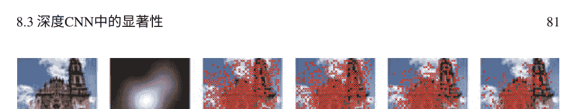

图8.5 不同 k 参数的随机特征池化；原始图像作为特征图与其相应的显著性图

图8.6 池化层中引入的显著性图 为了更好地可视化，特征图不会被调整大小

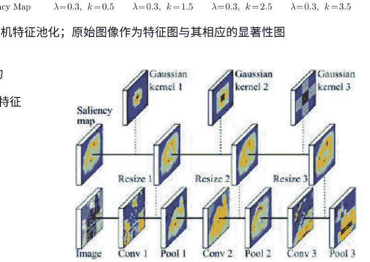

池化的集中度将是稀疏的，从视觉注意力图中选择出最高值的区域。因此，为了更好地选择要池化的特征，我们固定了 λ = 0.3 和 k = 3.5。

因此，显著性图必须在网络的所有池化层中引入，如图8.6所示。对于每一层，它们必须与层的维度相对应。因此，对于网络的输入层，我们通过传统的高斯低通滤波和子采样来调整预测的显著性图。

每一层中高斯滤波器的尺度参数 σ 的计算方式是根据当前层的“步幅”超参数 ρ 的滤波器大小 l = ρ - 1 来确定。

如图8.6所示，我们使用图像进行训练，显著性地图在汇聚层中充当支持。

根据在[MOBPGVRA18]中进行的实验，引入基于显著性的特征选择在汇聚层中，可以提高网络的稳定性并略微提高准确性。因此，对于AlexNet [KSH12]在Mexculture Architecture数据集[ORR+16]上，当使用批量大小为230张图像时，最佳模型在第16,680次迭代中获得，而基准模型在第20,433次迭代中获得。通过在验证数据集上训练得到的最佳模型，准确率相对于基准模型提高了94.48%，而基准模型的准确率为94.45%。我们注意到，在这项工作中，使用了HarreI的自动视觉显著性预测模型之一[HKP07]。所使用的优化方法是随机梯度下降法与Nesterov的动量法。如果我们将基于视觉显著性的汇聚在CNNs中的性能与“注意机制”（如在第8.3.2节和第8.3.3节中介绍的挤压和激励网络以及双重注意网络）进行比较，

然后我们分别对于挤压网络和双重注意力网络的准确率进行了96.35%对92.36%和89.57%的说明。所有这些模型都是使用ResNet-26 [HZRS15]实现的，作为基线，准确率为92.19%。因此，我们可以声称，神经网络并不是学到了所有的东西，通过池化层传播有效的视觉注意力模型比已知的注意力机制产生更好的结果。

## 8.3.4.2 丢弃层中的显著性

CNN中的丢弃层用于正则化，如第6章所述。常规的丢弃是在全连接（FC）层上执行的（参见第6章）。问题是我们如何选择性地断开突触连接，而不是完全随机地断开，而是优先选择与输入神经元的感受野中的显著特征相连接的那些连接？因此，如果我们希望使用通过网络传播的显著性图，那么我们不能使用FC层。实际上，FC层中的每个输入神经元都收到来自上一层的所有神经元响应。在从最后一个卷积层到第一个FC层的神经元中，很难“杀死”非显著性神经元，因为显著性的概念丢失了，因此我们提出了所谓的空间丢弃，即从最后一个卷积层和第一个FC层的神经元中删除突触连接。实际上，这里保留了空间排列或特征，并且可以使用相应的显著性图。

受我们之前的工作[MOBPGVRA18]的启发，我们不再使用均匀或flat高斯分布来丢弃突触连接，而是使用通过网络传播的视觉注意力图，并考虑韦伯分布函数。

自适应空间显著性丢弃从累积韦伯分布函数（CWDF）开始，由方程（8.10）定义。

目标是在每个处理的特征图上提供类似的空间显著性丢弃行为。根据方程（8.10），首先，我们根据实验结果固定k。然后，我们找到λ*以确保CWDF的最大值将在x=μsm时达到。其中μsm是给定输入图像的显著性图的平均值。值λ*必须满足以下条件，

$$ e^{-(μ_{sm}/λ^*)^k} = 0.0001, \quad (8.12) $$

然后，

$$ λ^* = \frac{μ_{sm}}{\log(0.0001)^{\frac{1}{k}}}, \quad (8.13) $$

因此，当r=μ_{sm}时，P(r;k,λ^*)将非常接近于1。我们在公式(8.12)中设置0.0001来近似公式(8.10)的指数部分为零。一旦我们计算出λ*，我们就有了CWDF的形状，以随机化空间丢弃，只有在视觉注意力图的值低于μ_{sm}时才会发生，给予内部激活优先权以在注意区域内存活。

根据公式(8.10)中的CWDF，先前通过公式(8.13)和 k进行调整，我们定义一个新的随机变量 s，它遵循均匀分布。我们通过反转调整后的CWDF，将映射到 s的激活进行丢弃，并将响应与显著性图 S_m的值进行比较。然后，响应定义如下，

$$ R(s) = \lambda^{*} \sqrt[k]{-log(1-s)} \quad (8.14) $$

激活图 A_m 在空间上被丢弃，然后如下，

$$ A_m(x, y) = \begin{cases} A_m(x, y), & \text{if } R(s) < S_m(x, y), \\ 0, & \text{否则}, \end{cases} \quad (8.15) $$

其中 R(s)是丢弃 A_m(x, y)的逆CWDF的响应。随机变量 s对于每个 A_m(x, y)都不同。在等式(8.10)中 k的影响，使得在值小于 \mu_{sm}的显著图区域中调整激活丢弃的行为成为可能。如果 k的值很高，当它们接近 \mu_{sm}时，较少的激活会被丢弃。这种行为在图8.7中展示了相应的 k选择，其中我们将显著图作为特征图来更好地可视化激活在接近\mu_{sm}的区域中的丢弃情况， \lambda参数是从显著图中自动计算的。因此，引入的视觉显著性在CNN中以“硬方式”使用：神经元输出使用显著图作为分布函数进行丢弃。在[MOBPGVRA19a]中，我们在Mexculture数据集上使用AlexNet架构体验了这种新的显著性引导的丢弃方案。通过将基于均匀分布的常规丢弃与最后一个卷积层和第一个全连接层之间的基于显著性的空间丢弃进行比较，我们在测试集上的准确率从73.74%提高到79.13%。因此，基于显著性的空间丢弃比简单的丢弃更好地正则化了模型。这个结果是可以预期的，因为我们在阻塞非显著信息时传播显著信息。当在AlexNet的全连接层中将基于显著性的空间丢弃与常规丢弃相结合时，我们获得了更好的结果。测试集上的准确率为84.86%。

## 8.3.4.3 在反向传播中使用显著性

在深度神经网络的前向传播过程中，设计了丢弃和池化机制，仅处理特征。然后，一旦计算出给定图像批次的输出损失，优化过程就会像在任何其他人工神经网络中一样开始。但是，我们还没有充分利用有关相关像素/特征的信息。我们还可以在反向传播中使用它来训练突触权重。在前向传播过程中，我们根据显著性图 S_m 的分布随机选择相关特征进行采样。如果我们考虑方程 (8.14) 的响应和显著性图的值

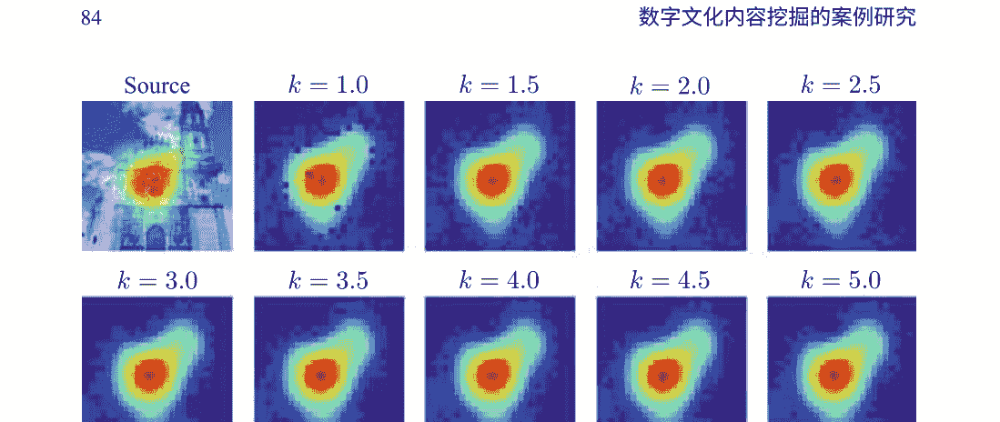

## 图8.7 自适应空间显著性丢弃。为了验证激活被丢弃的位置，显示了视觉注意力图。我们在训练了几个模型之后发现，k =4可以获得更好的结果。对于这个样本，μ_sm =0.22，并且根据方程（8.13）计算出每个k值的λ*。

生成一个二进制地图，在其中R(s) < S_m(x, y)的位置上为1，然后我们可以在梯度下降的反向传播中使用它。在反向传播中，目标是限制非相关局部梯度的传播。在优化过程中，我们使用带有Nesterov动量的加速梯度下降[Nes83]，参见第4章。通过将每个网络层的梯度与二进制地图进行逐元素乘法，将显著性引入到反向传播中：

$$ V_{i+1}^l = \mu V_i^l - \eta R_s^l \nabla \mathcal{L}(W_i^l + \mu V_i^l) \quad (8.16) $$
$$ W_{i+1}^l = W_i^l + V_{i+1}^l $$

其中，W_i^l表示第i次迭代的滤波器系数，η表示学习率，μ表示动量，V_i^l表示速度，R_s^l是每层选择过程生成的二进制地图。为了测试这个概念，我们再次使用了轻量级的AlexNet架构[MOBPGVRA19b]。在反向传播的权重优化中引入显著性地图稍微提高了准确性。事实上，在Mexculture数据集的验证集上，对于识别67个建筑类别，完全的前向（基于显著性的池化）和反向传播的准确率为79.17%，而仅使用前向传播和基于显著性的池化的准确率为78.37%。在测试集上观察到类似的行为：前向-后向为76.54%，仅前向为75.51%。

### 8.4 结论

在本章中，我们专注于深度卷积神经网络在文化内容识别方面的应用。但是简单的应用对于我们的读者来说可能不够吸引人。我们报道了我们在深度神经网络的非常流行和令人兴奋的方面，如注意机制方面的经验。我们将视觉注意模型引入到整个抽象和分类过程中，这些高效分类器能够保证。事实上，当视觉注意模型通过CNN传播时，其性能优于Squeeze and Excitation网络和Double attention blocks等新的注意机制。这些最新的工具利用网络本身突出的特征来加强特征图的训练和分类过程。我们提出的视觉注意力将外部信息引入，可以通过自上而下的视觉任务进行引导，这比对视觉内容的自由观察更具语义性。这样的“重要性”地图可以根据应用的不同考虑而得出。

# 第9章 介绍领域知识

在本章中，我们将考虑深度学习的另一个应用案例：用于检测阿尔茨海默病的脑部图像的分类。在医学成像领域的这个特定应用中，深度神经网络已成为必备工具。
在本章中，我们将重点介绍在设计深度神经网络分类器时如何考虑领域知识的常规步骤。但不仅如此：忠于我们展示深度学习新方面的原则，我们将展示如何通过连体卷积神经网络与信息融合来提高这些分类器的性能。

### 9.1 引言

图像分析和挖掘方法的引入，例如分类，已经在计算机辅助诊断（CAD）的广阔领域中得到了很早的应用。著名的Nagao滤波器[NM79]已经在80年代用于非线性增强CT图像。深度神经网络对于不同成像模式下的阿尔茨海默病脑部扫描的检测的兴趣也在于成功的卷积层突出了脑结构，最终得到相当不错的分类得分。
然而，应用卷积神经网络（CNN）进行阿尔茨海默病检测的道路相当漫长。为了理解它，我们首先将重点放在解决分类问题上。
阿尔茨海默病（AD）是发达国家中最常见的痴呆形式之一，由于人口普遍老龄化而逐渐加剧。AD是一种进行性神经退行性疾病，伴随着人类认知功能的严重恶化和特定的短期记忆丧失。为了开发非侵入性诊断方法，对不同模态的脑部扫描进行分类已成为一个 intensively 研究的课题[LKB⁺17]。
如果我们对一组受试者进行瞬时拍摄，那么可以区分出三个AD的临床阶段：

临床前期AD 在这个阶段，大约一半的人在AD诊断确立之前并没有报告认知困难，因为与AD相关的细胞退化开始于数年甚至几十年前，而受试者在临床症状出现之前就会显示出细胞的退化。因此，在临床阶段准确诊断该疾病尚不可能。

轻度认知障碍（MCI）大多数患者在进入AD之前都会经历称为轻度认知障碍的过渡阶段。在这个疾病阶段，一个受试者在被诊断为阿尔茨海默病之前可能会出现记忆问题。这个阶段的疾病还不严重到足以干扰一个人的生活。MCI是一个具有挑战性和混乱的群体，因为在这个阶段，受试者还不被认为患有AD。尽管其异质性很大，但MCI仍然是早期AD研究中的一个感兴趣的群体。

临床诊断的AD 阿尔茨海默病的晚期也可以称为“严重”。在这个阶段，受试者显示出智力能力下降，完全丧失认知功能，最终导致死亡。

当前的医学研究主要集中在预测MCI病例是否转化为AD [LIK⁺18]，但是利用上述三个疾病阶段的成像模态进行分类问题远未解决。使用深度卷积神经网络（Deep CNNs）在这个任务中大大提高了分类得分，但是如何设计分类方案，专注于大脑的特定区域[LLL17]或整个大脑[LCW⁺18]仍然是研究的课题。在本章中，我们将讨论如何利用领域知识（医学知识）来设计深度神经网络分类器，选择适合它们的数据，并充分利用不同成像模态的同一主题的不同信息来源。

### 9.2 领域知识

为了设计基于CNN原理的用于AD诊断的脑部图像分类的高效算法，我们首先需要引入领域知识，其中包括

- 图像采集模式的选择
- 优先选择受AD影响的脑部区域
- 选择将脑部体素输入到CNN架构中

#### 9.2.1 成像模态

在为医学成像开发的不同成像模式中，结构性磁共振成像（sMRI）[BCH⁺14]是最常用的用于脑部成像以检测AD的成像模式之一

因为结构性磁共振成像提供了描述脑部灰质和白质结构的形状、大小和完整性的信息[SILH+16]，所以它是用于AD检测的最常用成像模式。长期以来，结构性磁共振成像是检查脑部解剖和病理的最常用技术，它是研究和临床实践中广泛使用的成像技术。

在AD诊断中，使用高分辨率T1加权序列来区分解剖边界并观察脑部结构变化[FFJJ+10]。

扩散张量成像（DTI）是AD研究中使用的另一种成像模式，它是一种能够跟踪和量化水分子在纤维束上的扩散，并检测和描述周围组织微结构各向异性的最新成像技术[BML94]。通过计算水分子在三维空间中的运动得到三个特征值（λ₁，λ₂ 和 λ₃）和特征向量，用于表示主要的扩散方向[BML94]。扩散张量成像得到的最常见的两个测量值（标量图）是分数各向异性（FA）和平均弥散度（MD）。

在与AD相关的脑退化情况下，脑脊液填充到腔隙中，这些效应在FA和MD图中都被感知到，因为水分子的运动变得混乱。

- 平均弥散率：平均弥散率表示张量水扩散的平均大小，等于三个特征值的平均值 (λ₁ + λ₂ +λ₃)/3。平均弥散率是某个体素中分子运动的平均值，但它不提供关于扩散方向的信息。

$$ MD = \widetilde{\lambda} = \frac{\lambda_1 + \lambda_2 + \lambda_3}{3} \quad (9.1) $$

- 分数各向异性：分数各向异性（FA）是扩散各向异性程度的度量，根据标准公式计算：

$$ FA = \sqrt{\frac{3}{2}} \frac{\sqrt{(\lambda_1 - \widetilde{\lambda})^2 + (\lambda_2 - \widetilde{\lambda})^2 + (\lambda_3 - \widetilde{\lambda})^2}}{\sqrt{\lambda_1^2 + \lambda_2^2 + \lambda_3^2}} \quad (9.2) $$

其中 \widetilde{\lambda}是平均弥散度（MD），即在所有方向上的平均扩散速率。轴向扩散率被定义为主要（最大）特征值（AxD = λ₁），并捕捉纵向扩散率，即与轴突纤维平行的扩散率（当然，假设主特征向量确实遵循主导纤维方向，在存在大量纤维交叉的区域可能不明确）。径向扩散率（RD）捕捉与轴突纤维垂直的平均扩散率，计算方法是两个较小特征值的平均值：

$$ RD = \frac{\lambda_2 + \lambda_3}{2} \quad (9.3) $$

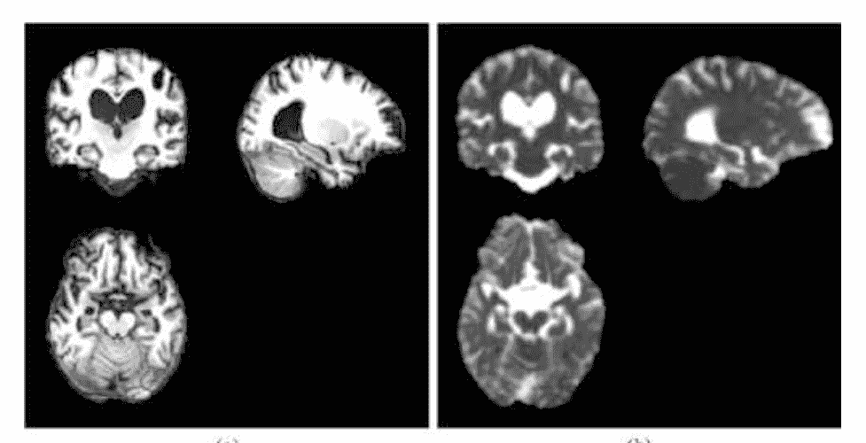

图9.1 AD脑部的sMRI和DTI模态示例。 (a) sMRI模态, (b) MD-DTI模态

图9.1展示了来自ADNI数据库的AD患者的同一大脑的sMRI和MD-DTI模态的示例[JJBFT+08]。我们可以看到两种模态反映了相同的大脑结构，但是MD-DTI与sMRI相反，sMRI的对比度更高。

#### 9.2.2 脑ROI的选择

当一个人患有AD时，大脑中的一些感兴趣区域（ROIs）已知受到AD的影响，如海马体。后者首先受到影响[DLP+95, DGS+01]。颞叶、扣带回和枕叶是其他受影响的结构之一[BB91, JPX+99]。海马体退化，即萎缩，是大脑结构首先可见的退化迹象。因此，有理由将大脑扫描的分类重点放在这个ROI上。为了说明在AD检测的分类任务中使用不同模态的优势，我们在图9.2中展示了来自ADNI数据库的三个受试者的扫描示例。上排从左到右包含AD、MCI和健康大脑的矢状投影的sMRI切片，下排包含相同投影的MD-DTI。

可以看出，海马体的退化通过在sMRI中与脑脊液（CSF）相对应的黑色像素的普遍存在以及在MD-DTI中与CSF中水分子的混乱运动相对应的白色像素在同一区域中表现出来。为了选择受试者的脑部扫描中的ROI，使用了脑图谱AAL[TMLP+02]。在这个图谱中，属于同一脑结构（例如海马体）的所有体素具有相同的标签。但在选择海马体体素之前，我们需要将受试者的脑部扫描与所谓的MNI模板[FTS+05]对齐，该模板是构建AAL的基础。

选择之前，我们需要将受试者的脑部扫描与所谓的MNI模板[FTS⁺05]对齐，该模板是构建AAL的基础。

#### 9.2.3 不同成像模态的对齐

为了在主题分类中使用sMRI和MD-DTI两种模态，我们需要将它们注册到相同的空间中。因此，将分析大脑的相同物理部分。因此，我们将主题的sMRI扫描与MNI模板对齐，然后将DTI模态与对应的对齐MRI共注册，如图9.4所示。

对于MNI的对齐：由于我们希望保留ROI的模式并避免特征变形，两种图像模态都使用3D仿射变换[ANC⁺97]进行注册。预处理的这一步骤包括平移、旋转、缩放和剪切操作[AF97]。这里的主要目标是使用12参数仿射变换（$q_1$ 到 $q_{12}$）将给定的图像（$f$）拟合到模板图像（$g$）。

从图像 $f$ 中的位置 $x = (x_1, x_2, x_3)^{\mathrm{T}}$ 到图像 $g$ 中的位置 $y = (y_1, y_2, y_3)^{\mathrm{T}}$，我们可以定义仿射变换映射如下：

$$
\begin{pmatrix}
y_1 \\
y_2 \\
y_3 \\
1
\end{pmatrix}
=
\begin{pmatrix}
m_1 & m_4 & m_7 & m_{10} \\
m_2 & m_5 & m_8 & m_{11} \\
m_3 & m_6 & m_9 & m_{12} \\
0 & 0 & 0 & 1
\end{pmatrix}
\begin{pmatrix}
x_1 \\
x_2 \\
x_3 \\
1
\end{pmatrix}
\tag{9.4}
$$

我们将这个映射方程称为 $y = M \times x$，其中 $M$ 是映射矩阵，而 $m_i$ 元素是参数 $q_1$ 到 $q_{12}$ 的函数，参见下面的公式（9.6） - （9.8）。矩阵 $M$ 可以分解为四个矩阵的乘积：平移，旋转，缩放和剪切。

$$ M = M_{\text{平移}} \times M_{\text{旋转}} \times M_{\text{缩放}} \times M_{\text{剪切}} \qquad (9.5) $$

参数 $q_1$，$q_2$，和 $q_3$ 对应于三个平移参数，$q_4$，$q_5$，和 $q_6$ 对应于三个旋转参数。$q_7$，$q_8$，和 $q_9$ 对应于三个缩放参数，最后 $q_{10}$，$q_{11}$，和 $q_{12}$ 是三个剪切参数。

$$ M_{\text{平移}} = \begin{pmatrix} 1 & 0 & 0 & q_1 \\ 0 & 1 & 0 & q_2 \\ 0 & 0 & 1 & q_3 \\ 0 & 0 & 0 & 1 \end{pmatrix} \qquad (9.6) $$

$$ M_{\text{旋转}} = \begin{pmatrix} 1 & 0 & 0 & 0 \\ 0 & \cos(q_4) & \sin(q_4) & 0 \\ 0 & -\sin(q_4) & \cos(q_4) & 0 \\ 0 & 0 & 0 & 1 \end{pmatrix} \times \begin{pmatrix} \cos(q_5) & 0 & \sin(q_5) & 0 \\ 0 & 0 & 0 & 0 \\ -\sin(q_5) & 0 & \cos(q_5) & 0 \\ 0 & 0 & 0 & 1 \end{pmatrix} \times \begin{pmatrix} \cos(q_6) & \sin(q_6) & 0 & 0 \\ -\sin(q_6) & \cos(q_6) & 0 & 0 \\ 0 & 0 & 1 & 0 \\ 0 & 0 & 0 & 1 \end{pmatrix} $$

$$ M_{\text{缩放}} = \begin{pmatrix} q_7 & 0 & 0 & 0 \\ 0 & q_8 & 0 & 0 \\ 0 & 0 & q_9 & 0 \\ 0 & 0 & 0 & 1 \end{pmatrix} \qquad (9.7) $$

$$ M_{\text{剪切}} = \begin{pmatrix} 1 & q_{10} & q_{11} & 0 \\ 0 & 1 & q_{12} & 0 \\ 0 & 0 & 1 & 0 \\ 0 & 0 & 0 & 1 \end{pmatrix} \qquad (9.8) $$

参数估计通过最小化目标函数的平方差和（SSD）来实现，目标函数是对象（$f$）和模板图像 （$g$）之间的差异，使用高斯牛顿算法[FAF+95]。图像可能以不同的比例缩放，因此需要一个额外的参数 （$w$）来适应这种差异。要最小化的函数如下：

$$ SSD(f, g) = \sum_{i=1}^{I} (f(\underbrace{M * x_i}_{y_i}) - w g(x_i))^2 \qquad (9.9) $$

### 图9.3 sMRI数据集的预处理图

每个T1加权解剖（sMRI）扫描对齐的模板是蒙特利尔神经科学研究所（MNI）制作的所谓MNI模板[FTS+05]。它是通过对152个正常受试者的扫描进行平均得到的。在MNI模板上的对齐如图9.3所示[ABBP+17]。数据准备的下一步是数据归一化。在整个数据集中，体素强度被归一化，以便具有相似结构的相似强度。该过程使用SPM8软件进行注册[Fri96]。

下一步是将MD-DTI模态与sMRI进行配准。在这里，估计的变换矩阵M被应用于MD-DTI扫描，以将其与MNI对齐。一个初步的步骤是去除明亮的颅骨体素，以便去除颅骨。

### 9.3 Siamese深度神经网络用于模态融合

在两种模态中，我们分类问题的特征非常明显：海马ROI的变形。因此，让这些模态在同一个深度学习框架中合作，以增强分类器的性能非常有趣。事实上，今天清楚地认识到信息融合是提高分类器性能的可靠途径[IBPQ14]。但在介绍我们的一种模态的分类方法之前。我们称之为“2D+ε”方法，因为我们不使用完整的3D信息，而只使用脑部扫描的有限数量的切片。

#### 9.3.1 “2D+ε”方法用于脑部扫描的AD检测分类

2D+ε方法是在[ABBP+17]中提出的，用于脑部ROI分类。这意味着在CNN架构中使用2D卷积，将其馈送给从脑部的三个成像投影中提取的ROI体积的三个相邻切片：矢状、轴状和冠状，无论是sMRI还是MD-DTI模态。选择海马ROI的中间切片及其两个相邻切片来馈送网络，参见图9.4。

我们设计的网络架构相对较浅。实际上，这是由我们ROI - 海马区域的低分辨率所决定，其大小为28 × 28 × 28体素。因此，在2D+ε设置中，提取的脑部体积为28 × 28 × 3。我们将其视为大小为28 × 28的三通道2D体积。

所提出的架构的灵感来自于图9.4中的LeNet在第6章中介绍。它由两个卷积层和每个卷积层后面的最大池化层以及一个全连接层组成。分类任务是二元的。事实上，在专门研究脑部扫描的文献中，AD/NC、AD/MCI、MCI/NC这三种二分类形式被报道为更高效的[YTQ12]。

在单模态（sMRI）上工作时，我们发现矢状投影是最具有区分性的。事实上，在[ABPAC17]中进行的实验中，使用领域特定的数据增强将3D ROI在脑部体积中进行平移，得到了以下准确率。对于矢状投影的AD/NC，我们得到了82.80%的准确率，而冠状投影为80.15%，轴向投影为79.69%。对于其他二分类任务，观察到了相同的趋势，最难分离的是MCI/NC类别，准确率为66.12%。

矢状面上的准确率为57.56%，冠状面上的准确率为61.25%。通过对分类得分进行多数投票操作，实现了单个投影结果的融合，AD/NC的准确率为91.41%，AD/MCI的准确率为69.53%，MCI/NC的准确率为65.62%。

#### 9.3.2 Siamese架构

随着siamese NNs [BBB⁺93, BGL⁺94]的引入，在CNNs的形式化框架下，我们在挖掘复杂视觉信息 [PKL⁺12]方面所进行的所谓“中间融合”变得可能。因此，Kosh等人[KZS15]提出了用于一次性图像识别的siamese CNNs。 他们使用siamese网络来学习两个图像之间的相似性。 每个图像都被提交给一个siamese双胞胎，即卷积网络的一个分支。 这些向量之间的差异 $\mathbf{h}_{1,L-1}^{(j)}$ 和 $\mathbf{h}_{2,L-1}^{(j)}$ 从两个分支的全连接层中使用来计算预测 $\mathbf{P}$ 的值：

$$ \mathbf{P} = \sigma \left( \sum_{j} \alpha_{j} \left| \mathbf{h}_{1,L-1}^{(j)} - \mathbf{h}_{2,L-1}^{(j)} \right| \right) \qquad (9.10) $$

这里 $\sigma$ 是sigmoid激活函数， $\alpha_{j}$ 是算法在训练过程中学习到的补充参数。

在我们的情况下， Siamese架构被设计用于信息融合。 在这里，FC层中的特征串联是通过连接六个网络的方式实现的，每个模态中的所有投影都被连接起来。 因此，我们构建了一个完整的Siamese架构，如图9.5所示。从左到右， 我们有每个模态的每个投影的三个切片的输入。 然后，单一分支网络被设计并参数化，就像第9.3.1节中介绍的那样，并且如图9.4所示。最后，融合层由六个全连接层的特征串联组成。 在这里，我们再次面临一组二分类问题AD/NC、AD/MCI、MCI/NC，并且每个主体都有两种模态可用。

这种模态融合的结果是在ADNI-2、ADNI-GO、ADNI-3数据库中获得的，总共有736张图像。 在许多筛选过的队列中， 三个类别之间的受试者数据分布非常不均衡。 因此， 有390个NC受试者的数据可用， MCI的数量较少-273个扫描， 而仅有64个sMRI和DTI扫描可用于患有阿尔茨海默病的患者。 所有这些数据被分成了528个训练样本， 148个验证样本和60个测试样本。 然后，在领域相关的数据增强之后，通过随机平移脑容积内的边界立方体和高斯模糊，每个数据集的总数据量为： 训练数据集为89，700个，验证数据集为24，000个，测试数据集为600个。 网络是通过随机梯度下降和Nesterov动量从头开始训练的（参见第4章）。 实验证实了多模态融合优于单模态的假设。 事实上，在最具有区分性的sMRI模态上

仅使用最具有区分性的矢状投影在提供的数据库上获得以下结果：AD/NC 82.92%， AD/MCI 66.73%， MCI/NC 65.51%。

使用完整的连体网络，我们获得了更高的准确性：AD/NC 86.45%， AD/MCI 72.83%， MCI/NC 70.59%。

### 9.4 结论

因此，在本章中，我们展示了一个深度卷积神经网络在医学图像分类中的设计案例研究，用于辅助诊断阿尔茨海默病。作为目前在深度学习框架中提出的方法集非常丰富，我们利用这一点介绍了另一个方面：深度卷积神经网络中的信息融合。在医学图像的情况下，领域知识必须被引入。

分类器设计的整个过程。 首先，融合框架中使用的数据必须经过适当的准备和对齐。 我们已经在sMRI和MD-DTI模态上展示了这一点。 然后，必须探索医学知识，以选择图像中有意义的区域（ROI）提交给分类器，并避免对整个图像进行大量计算。 此外，sMRI、DTI和其他模态的医学图像相对较低的分辨率阻碍了设计非常深的卷积网络。 如果使用标准的卷积和池化操作对层与层之间的特征进行抽象，我们显然需要限制它们的深度。 最后，图像数据库的有限基数使我们开发了依赖于领域的数据增强技术。 最后但并非最不重要的，在本章中，我们介绍了孪生网络，并展示了当使用描述相同现象的不同模态的数据时，这种架构如何提高分类性能。

## 结论

因此，在本书中，我们专注于获胜模型的理论方面深度学习。在第2章中，我们从一般的监督学习问题形式化开始，并介绍了评估指标。在第3章中，分析了神经网络的基本模型这是深度学习的基础。在第4章中，我们介绍了用于训练深度神经网络参数的流行优化方法。在第5章中，我们来到了我们的主要任务——视觉信息挖掘，我们试图追踪卷积神经网络在图像处理和分析方法中的两个操作之间的类比：卷积和采样。第6章详细解释了卷积神经网络（CNNs）的用途在独立的逐帧基础上处理静态图像和视频。在第7章中，我们对视觉内容的时间分析感兴趣，我们首先回顾了一个非常流行的模型，如HMMs，它已经被用于视频中的时间事件识别，然后我们将它们与RNNs和LSTMs联系起来——这是一种更现代的方法。在这些模型中进行了视觉信息挖掘的研究后，我们渴望在第8章和第9章中分享它在数字文化内容挖掘和计算机辅助诊断中的应用示例。在这里，我们进一步实际介绍了注意力机制和孪生网络。总结这本书，我们希望它能成为年轻研究人员和专业人士的便携手册。

## 术语表

本术语表介绍了本书中使用的符号定义。 在某些章节中，符号可能会发生变化。 在这种情况下，新的符号将会被清楚地解释。

| 符号 | 定义 |
| :--- | :--- |
| $a$ | 一个标量。 |
| $\mathbf{a}$ | 一个向量。 |
| $\eta$ | 学习率。 |
| $f(x; \theta)$ | 一个由 $\theta$ 参数化的函数， 应用于变量 $x$。 |
| $\mathcal{L}(.)$ | 损失函数。 |
| $\nabla f(.)$ | 函数 $f$ 的梯度向量。 |
| $M^T$ | 矩阵 $M$ 的转置。 |
| $N$ | 数据集的大小。 |
| $\frac{\partial F}{\partial x}$ | 函数 $F$ 对变量 $x$ 的偏导数。 |
| $(x, y)$ | 数据集中的一个示例： $x$ 是一个特征向量， $y$ 是相应的标签。 |

## 参考文献

+ ABBP+17. Karim Aderghal, Manuel Boissenin, Jenny Benois-Pineau, Gwena lle Cathe-line, and Karim Afdel. 使用卷积神经网络对AD诊断的sMRI进行分类：ADNI的2D+ε研究。在多媒体建模国际会议上，页码690-701。 Springer， Cham， 2017年。
ABPAC17. Karim Aderghal， Jenny Benois-Pineau， Karim Afdel和Gwena lle Cathe-lin e. FuseMe：通过2D+ε投影中的深度CNN融合对sMRI图像进行分类。在第15届国际内容索引工作坊的论文中，第34页。ACM， 2017年。
AF97. John Ashburner和K Friston. 多模态图像配准和分区--一个统一的框架。神经影像，6（3）：209-217， 1997年。
AKK+18. Karim Aderghal， Alexander Khvostikov， Andrei Krylov， Jenny Benois-Pineau， Karim Afdel和Gwenaelle Catheline. 使用跨模态迁移学习的深度CNN对阿尔茨海默病进行分类在成像模态上。在2018年IEEE第31届基于计算机的医学系统国际研讨会（CBMS）， 第345-350页. IEEE， 2018年.
ANC+97. John Ashburner， P Neelin， DL Collins， A Evans， 和 K Friston. 将先验知识纳入图像配准中。神经影像， 6(4):344-352， 1997年.
ASJ+07. Haider Ali， Christin Seifert， Nitin Jindal， Lucas Paletta， 和 Gerhard Paar. 窗户检测在立面中。在图像分析与处理， 2007年. ICIAP 2007年第14届国际会议， 第837-842页. IEEE， 2007年.
BABPA+17. Olfa Ben Ahmed， Jenny Benois-Pineau， Michelle Allard， Gw na lle Cathe-lin e， Chokri Ben Amar， Alzheimer's Disease Neuroimaging Initiative， 等。通过多模态图像衍生的生物标志物和多核学习识别阿尔茨海默病和轻度认知障碍。神经-计算， 220:98-110， 2017年.
BB91. Heiko Braak和Eva Braak. 阿尔茨海默病相关变化的神经病理分期。Acta neuropathologica， 82(4):239–259， 1991.
BBB+93. Jane Bromley， James W. Bentz， L on Bottou， Isabelle Guyon， Yann LeCun， Cliff Moore， Eduard S ckingersRoopak Shah. 使用“连体”时延神经网络进行签名验证。IJPRAl， 7(4):669–688， 1993.
BCH+14. Robert W. Brown， Y.-C. Norman Cheng， Mark E. Haacke， Michael R.Thomson和Ramesh Vnekatesan. 磁共振成像：物理原理和序列设计第二版。John Wiley & Sons， Inc. N.Y.， 2014.
BETVG08. Herbert Bay， Andreas Ess， Tinne Tuytelaars， 和 Luc Van Gool. 加速鲁棒特征 （SURF）。计算机视觉和图像理解， 110(3):346–359， 2008.
BGL⁺⁹⁴. Jane Bromley， Isabelle Guyon， Yann LeCun， Eduard S ckinge， 和 Roopak Shah. 使用“连体”时延神经网络进行签名验证. 在神经信息处理系统进展， 页码 737–744， 1994.
BGM07. Alexander C Berg， Floraine Grabler， 和 Jitendra Malik. 解析建筑场景图像. 在计算机视觉， 2007. ICCV 2007. IEEE 第11届国际会议， 页码 1–8. IEEE， 2007.
BML94. Peter J Basser， James Mattiello， 和 Denis LeBihan. MR扩散张量光谱学和成像。生物物理学杂志， 66(1):259–267， 1994.
BPC17. Jenny Benois-Pineau和Patrick Le Callet， 编辑. 使用心理视觉模型进行视觉内容索引和检索。. Springer， Heidelberg， New York， Dordrecht， London， 2017年.
BPPC12. Jenny Benois-Pineau， Frdric Precioso和Matthieu Cord. 视觉索引和检索. Springer Pubishing Company， Incorporated， 2012年.
BPSW70. Leonard E. Baum， Ted Petrie， George Soules和Norman Weiss. 在概率马尔可夫链的统计分析中出现的最大化技术. Ann. Math. Statist.， 41(1)： 164–171， 1970年2月.
BV92. Gyon Isabelle M. Boser， Bernhard E.和Vladimir N. Vapnik. 用于最优边界分类器的训练算法. 在COLT '92计算学习理论第五届研讨会论文集， 页码144-152. ACM， 1992年.
ByFL99. S. Ben-Yacoub， B. Fasel， and J. L ttin. 使用MLP和FFT进行快速人脸检测. 在第二届音频和视频生物特征人员认证国际会议（AVBPA'99）中， 页码31-36， 1999年. CDF⁺⁰⁴. Gabriella Csurka， Christopher R. Dance ， Lixin Fan， Jutta Willamowski和C dric Bray. 使用关键点包的视觉分类. 在计算机视觉统计学习研讨会（ECCV）中， 页码1-22， 2004年.
CH⁺⁶⁷. Thomas M Cover， Peter Hart等. 最近邻模式分类. IEEE信息论交易， 13（1）： 21-27， 1967年.
Chu14. Wei-Ta Chu. 优化简介. 2014年.
CKL⁺¹⁸. Yunpeng Chen， Yannis Kalantidis， Jianshu Li， Shuicheng Yan和Jiashi Feng. A^2-nets：双重注意网络. 在S. Bengio， H. Wallach， H. Larochelle， K. Grauman， N. Cesa-Bianchi和R. Garnett编辑的《神经信息处理系统31》中， 页码352-361. Curran Associates， Inc.， 2018年.
CV95. Corinna Cortes和Vladimir Vapnik. 支持向量网络. 机器学习， 20(3)： 273-297， 1995年.
CVMBB14. Kyunghyun Cho， Bart Van Merri nboer， Dzmitry Bahdanau和Yoshua Bengio. 关于神经机器翻译的性质：编码器-解码器方法. arXiv预印本arXiv:1409.1259， 2014年.
Cyb89. George Cybenko. 用S型函数的叠加进行逼近. MCSS， 2(4)： 303-314， 1989年.
DBL13. 第30届国际机器学习大会论文集， ICML 2013， 美国乔治亚州亚特兰大， 2013年6月16-21日， JMLR Workshop and Conference Proceedings的第28卷. JMLR.org， 2013年.
DGS⁺⁰¹. Bradford C Dickerson， I Goncharova， MP Sullivan， C Forchetti， RS Wilson， DA Bennett， Laurel A Beckett， and L deToledo Morrell. MRI-derived entorhinal and hippocampal atrophy in incipient and very mild Alzheimer's disease. Neurobiology of aging， 22(5):747–754， 2001.
DHS11. John Duchi， Elad Hazan， and Yoram Singer. Adaptive subgradient methods for online learning and stochastic optimization. 12:2121–2159， July 2011. http://jmlr.org/papers/volume12/duchi11a/duchi11a.pdf.

- DLP+95. Bernard Deweer, Stephane Lehericy, Bernard Pillon, Michel Baulac, J Chiras, C Marsault, Y Agid, and B Dubois. Memory disorders in probable Alzheimer’s disease: the role of hippocampal atrophy as shown with MRI. Journal of Neurology, Neurosurgery & Psychiatry, 58(5):590–597, 1995.

- DLR+77. A. P. Dempster, N. M. Laird, and D. B. Rubin. Maximum likelihood from incomplete data via the EM algorithm. Journal of the Royal Statistical Society: Series B, 39(1):1–38, 1977.

- DPG+14. Yann Dauphin, Razvan Pascanu, Kyunghyun Cho, Surya Ganguli, and Yoshua Bengio. Identifying and attacking the saddle point problem in high-dimensional non-convex optimization. CoRR, abs/1406.2572, 2014. http://arxiv.org/abs/1406.2572.

- Duc07. Andrew T Duchowski. Eye tracking methodology: Theory and practice, 328, 2007.

- FAF+95. Karl J Friston, John Ashburner, Christopher D Frith, J-B Poline, John D Heather, and Richard S J Frackowiak. Spatial registration and normalization of images. Human Brain Mapping, 3(3):165–189, 1995.

- Faw06. Tom Fawcett. An introduction to ROC analysis. Pattern Recognition Letters, 27(8):861–874, 2006.

- FB81. Martin A Fischler and Robert C Bolles. Random sample consensus: A paradigm for model fitting with applications to image analysis and automated cartography. Communications of the ACM, 24(6):381–395, 1981.

- FFJJ+10. Giovanni B Frisoni, Nick C Fox, Clifford R Jack Jr, Philip Scheltens and Paul M Thompson. Structural imaging in Alzheimer's disease: clinical applications. Nature Reviews Neurology, 6(2):67, 2010.

- Fli04. Flickr. Flickr: Find your inspiration, 2004.

- Fri96. Karl J Friston. Statistical parametric maps and other functional imaging data analysis. Brain Mapping: The Methods, 1996.

- FSM+17. Forrest N Iandola, Song Han, Matthew W Moskewicz, Khalid Ashraf, William J Dally, and Kurt Keutzer. SqueezeNet: AlexNet-level accuracy with 50x fewer parameters and <0.5MB model size. In Proceedings of the IEEE Conference on Computer Vision and Pattern Recognition Workshops, pages 207-212, 2017.

- FTS+05. G B Frisoni, C Testa, F Sabattoli, A Beltramello, H Soininen, and M P Laakso. Structural correlates of early and late Alzheimer's disease: a voxel-based morphometry study. Journal of Neurology, Neurosurgery & Psychiatry, 76(1):112–114, 2005.

- Fu82. K.S. Fu. Syntactic Pattern Recognition and Applications. Prentice Hall, 1982.

- GBCB16. Ian Goodfellow, Yoshua Bengio, Aaron Courville, and Yoshua Bengio. Deep Learning, volume 1. MIT Press Cambridge, 2016.

- GDBBP16. Iván González-Díaz, Vincent Buso, and Jenny Benois-Pineau. Perceptual modeling for active object recognition in visual scenes. Pattern Recognition, 56:129–141, 2016.

- GDDM13. Ross B. Girshick, Jeff Donahue, Trevor Darrell, and Jitendra Malik. Rich feature hierarchies for accurate object detection and semantic segmentation. CoRR, abs/1311.2524, 2013. http://arxiv.org/abs/1311.2524.

- Gir15. Ross B. Girshick. Fast R-CNN. CoRR, abs/1504.08083, 2015. http://arxiv.org/abs/1504.08083.

- Hau07. Raphael Hauser. Line search methods for unconstrained optimization. Lecture 8, Numerical Linear Algebra and Optimization, University of Oxford Computer Laboratory, 2007. https://people.maths.ox.ac.uk/hauser/hauser_lecture2.pdf.

- HHP01. Bernd Heisele, Purdy Ho, and Tomaso A. Poggio. Face recognition with support vector machines: Global versus component-based approach. In ICCV, pages 688–694. IEEE Computer Society, 2001.

- HKP07. Jonathan Harel, Christof Koch, and Pietro Perona. Graph-based visual saliency. In Advances in Neural Information Processing Systems, pages 545–552, 2007.

- HS97. Sepp Hochreiter and Jürgen Schmidhuber. Long short-term memory. Neural Computation, 9(8):1735–1780, 1997.

- HSS12. Geoffrey Hinton, Nitish Srivastava, and Kevin Swersky. Neural networks for machine learning - Lecture 6a - Overview of mini-batch gradient descent. 2012. http://www.cs.utoronto.edu/~tijmen/csc321/slides/lecture_slides_lec6.pdf.

- HW68. D. H. HUBEL and T. N. WIESEL. Receptive fields and functional architecture in monkey striate cortex. The Journal of Physiology, 195:215–243, 1968. http://hubel.med.harvard.edu/papers/HubelWiesel1968Jphysiol.pdf.

- HZRS15. Kaiming He, Xiangyu Zhang, Shaoqing Ren, and Jian Sun. Deep residual learning for image recognition. CoRR, abs/1512.03385, 2015. http://arxiv.org/abs/1512.03385.

- IBPQ14. Bogdan Ionescu, Jenny Benois-Pineau, Tomas Piatrik, and Georges Quénot, editors. Fusion in Computer Vision: Understanding Complex Visual Content. Advances in Computer Vision and Pattern Recognition. Springer, 2014.

- JH08. Orlando De Jesus and Martin T. Hagan. Backpropagation through time for general dynamic networks. In Hamid R. Arabnia and Youngsong Mun, editors, Proceedings of the 2008 International Conference on Artificial Intelligence, ICAI 2008, July 14-17, 2008, Las Vegas, Nevada, USA, 2 Volumes (includes the 2008 International Conference on Machine Learning; Models, Technologies, and Applications), pages 45-51. CSREA Press, 2008.

- JJBF+08. Clifford R Jack Jr, Matt A Bernstein, Nick C Fox, Paul Thompson, Gene Alexander, Danielle Harvey, Bret Borowski, Paula J Britson, Jennifer L. Whitwell, Chadwick Ward, et al. The Alzheimer's Disease Neuroimaging Initiative (ADNI): MRI methods. Journal of Magnetic Resonance Imaging: Official Journal of the International Society for Magnetic Resonance in Medicine, 27(4):685-691, 2008.

- JLLT18. Saumya Jetley, Nicholas A. Lord, Namhoon Lee, and Philip H. S. Torr. Learn to pay attention. CoRR, abs/1804.02391, 2018.

- JPX+99. Clifford R Jack, Ronald C Petersen, Yue Cheng Xu, Peter C O'Brien, Glenn E Smith, Robert J Ivnik, Bradley F Boeve, Stephen C Waring, Eric G Tangalos, and Emre Kokmen. Prediction of AD with MRI-based hippocampal volume in mild cognitive impairment. Neurology, 52(7):1397–1397, 1999.

- KABP+18. Alexander Khvostikov, Karim Aderghal, Jenny Benois-Pineau, Andrey Krylov, and Gwenaelle Catheline. 3D CNN-based classification of sMRI and MD-DTI images for Alzheimer's disease research. arXiv preprint arXiv:1801.05968, 2018.

- KB14. Diederik P. Kingma and Jimmy Ba. Adam: A method for stochastic optimization. CoRR, abs/1412.6980, 2014. https://arxiv.org/pdf/1412.6980.pdf.

- KBD+14. Svebor Karaman, Jenny Benois-Pineau, Vladislavs Dovgalecs, Rémi Mégret, Julien Pinquier, Régine André-Obrecht, Yann Gaëstel, and Jean-François Dartigues. Hierarchical hidden Markov models for daily activity detection in wearable videos for the study of dementia. Multimedia Tools and Applications, 69(3):743–771, 2014.

- KOG03. Ewa Kijak, Lionel Oisel, and Patrick Gros. Temporal structure analysis of broadcast tennis videos using hidden Markov models. In Minerva M. Yeung, Rainer Lienhart, and Chung-Sheng Li, editors, Storage and Retrieval for Media Databases 2003, Santa Clara, CA, USA, January 22, 2003, volume 5021 of SPIE Proceedings, pages 289–299. SPIE, 2003.

- KSH12. Alex Krizhevsky, Ilya Sutskever, and Geoffrey E Hinton. Imagenet classification with deep convolutional neural networks. In Advances in Neural Information Processing Systems, pages 1097-1105, 2012.

- KZS15. Gregory Koch, Richard Zemel, and Ruslan Salakhutdinov. Siamese neural networks for one-shot image recognition. In ICML Deep Learning Workshop, 2015, volume 2.

- LBBH98. Yann Lecun, Léon Bottou, Yoshua Bengio, and Patrick Haffner. Gradient-based learning applied to document recognition. Proceedings of the IEEE, 86(11):2278-2324, 1998.

- LBOM98. Yann LeCun, Léon Bottou, Genevieve B. Orr, and Klaus-Robert Müller. Efficient backprop. In Neural Networks: Tricks of the Trade, pages 9-50. Springer, 1998. http://yann.lecun.com/exdb/publis/pdf/lecun-98b.pdf.

- LCW+18. Han Liu, Danni Cheng, Kунdong Wang, Yaping Wang, Alzheimer's Disease Neuroimaging Initiative, et al. Multi-modal cascade convolutional neural networks for Alzheimer's disease diagnosis. Neuroinformatics, 2018:1-14.

- LeC. Yann LeCun's MNIST demo. Yann LeCun's website. http://yann.lecun.com/exdb/lenet/index.html.

- LIK+18. Collin C. Luk, Abdullah Ishaque, Muhammad Khan, Daniel Ta, Sneha Chenji, Yee-Hong Yang, Dean Eurich, and Sanjay Kalra. Alzheimer's disease: 3D MRI textures for prediction of conversion from mild cognitive impairment. Alzheimer's & Dementia: Diagnosis, Assessment & Disease Monitoring, 10:10-763, 2018.

- Lin94. Tony Lindeberg. Scale-space theory in computer vision, volume 256 of The Springer International Series in Engineering and Computer Science. Springer, 1994.

- LKB+17. Geert Litjens, Thijs Kooi, Babak Ehteshami Bejnordi, Arnaud Arindra Adiyoso Setio, Francesco Ciompi, Mohsen Ghafoorian, Jeroen A.W.M. van der Laak, Bram van Ginneken, and Clara I Sánchez. A survey on deep learning in medical image analysis. Medical Image Analysis, 42:60–88, 2017.

- LLL17. Suhuai Luo, Xuechen Li, and Jiaming Li. Deep learning for automatic identification of Alzheimer's disease from MRI data. Journal of Applied Mathematics and Physics, 5(09):1892, 2017.

- Low04. David G Lowe. Distinctive image features from scale-invariant keypoints. International Journal of Computer Vision, 60(2):91–110, 2004.

- LRM15. Tsung-Yu Lin, Aruni RoyChowdhury, and Subhransu Maji. Bilinear CNN models for fine-grained visual recognition. In Proceedings of the IEEE International Conference on Computer Vision, pages 1449–1457, 2015.

- Mac67. James MacQueen. Some methods for classification and analysis of multivariate observations. In Proceedings of the Fifth Berkeley Symposium on Mathematical Statistics and Probability, Volume 1: Statistics, pages 281–297. University of California Press, Berkeley, Calif., 1967.

- MBL04. Francesca Manerba, Jenny Benois-Pineau, and Riccardo Leonardi. Foreground object extraction from MPEG2 video streams in a coarse indexing framework. In Multimedia Storage and Retrieval Methods and Applications, volume 5307 of SPIE Proceedings, pages 50–60. SPIE, 2004.

- McC43. Warren S. McCulloch and Walter Pitts. A logical calculus of the ideas immanent in nervous activity. Bulletin of Mathematical Biophysics, 5:115–133, 1943.

- Min87. Marvin Minsky and Seymour Papert. Perceptrons: An introduction to computational geometry, expanded edition. MIT Press, 1987.

- MJ98. Sheng Ma and Chuanyi Ji. A unified fast training method for feedforward and recurrent networks based on the EM algorithm. IEEE Transactions on Signal Processing, 46(8):2270–2274, 1998.

- MMW+11. Markus Mathias, Andelo Martinovic, Julien Weissenberg, Simon Haegler, and Luc Van Gool. Automatic architectural style recognition. ISPRS-International Archives of the Photogrammetry, Remote Sensing and Spatial Information Sciences, 3816:171–176, 2011.

- MOBG+18. Abraham Montoya Obeso, Jenny Benois-Pineau, Kamel Guissous, Valérie Gouet-Brunet, Mireya Sara García Vázquez, and Alejandro Alvaro Ramírez-Acosta. A comparative study of visual saliency maps in deep CNNs for the architectural image classification problem. In 2018 8th International Conference on Image Processing Theory, Tools and Applications (IPTA), pages 1-6. IEEE, 2018.

- MOBPGVRA18. Abraham Montoya Obeso, Jenny Benois-Pineau, Mireya Sara García Vázquez, and Alejandro Alvaro Ramírez Acosta. Incorporation of explicit visual saliency in deep CNN training: application to architectural style classification. In 16th International Conference on Content-Based Multimedia Indexing, page 16. IEEE, 2018.

- MOBPGVRA19a. Abraham Montoya Obeso, Jenny Benois-Pineau, Mireya Sara García Vázquez, and Alejandro Alvaro Ramírez Acosta. Dropout of activations in convolutional neural networks using visual attention maps. In 17th International Conference on Content-Based Multimedia Indexing, page 4, 2019.

- MOBPGVRA19b. Abraham Montoya Obeso, Jenny Benois-Pineau, Mireya Sara García Vázquez, and Alejandro Alvaro Ramírez Acosta. Forward-backward visual saliency propagation in deep neural networks with internal attention mechanism. In 2019 9th International Conference on Image Processing Theory, Tools and Applications (IPTA), pages 1-6. IEEE, 2019.

- Nes83. Yurii Nesterov. A method for solving the convex programming problem with convergence rate O(1/k²). Soviet Mathematics Doklady (Vol. 27), 1983.

- Neu75. David L. Neuhoff. The Viterbi algorithm as an aid to text recognition (Communications). IEEE Transactions on Information Theory, 21(2):222-226, 1975.

- NM79. M. Nagao and T. Matsuyama. Edge preserving smoothing. Computer Graphics and Image Processing, 9:394-407, 1979.

- ORR+16. Abraham Montoya Obeso, Laura Mariel Amaya Reyes, Mario Lopez Rodriguez, Mario Humberto Mijes Cruz, Mireya Sara García Vázquez, Jenny Benois-Pineau, Luis Miguel Zamudio Fuentes, Elizabeth Cano Martinez, Jesús Abimelek Flores Secundino, Jose Luis Rivera Martinez, et al. Image annotation of a Mexican architectural database. In SPIE Optical Engineering+ Applications, page 99700Y. International Society for Optics and Photonics, 2016.

- OT01. Aude Oliva and Antonio Torralba. Modeling the shape of the scene: A holistic representation of the spatial envelope. International Journal of Computer Vision, 42(3):145-175, 2001.

- Pav77. T. Pavlidis. Structural Pattern Recognition. Springer-Verlag, 1977.

- PBJ92. Boris T. Polyak and Anatoli B. Juditsky. Acceleration of stochastic approximation by averaging. SIAM Journal on Control and Optimization, 30(4):838-855, 1992. https://www.researchgate.net/publication/236736831_Acceleration_of_Stochastic_Approximation_by_Averaging.

- PKL+12. Julien Pinquier, Svebor Karaman, Laetitia Letoupin, Patrice Guyot, Rémi Mégret, Jenny Benois-Pineau, Yann Gaëstel, and Jean-François Dartigues. Strategies for multi-feature fusion with hierarchical HMM: Application to activity recognition with wearable audio-video sensors. In ICPR, pages 3192-3195. IEEE Computer Society, 2012.

- PMB13. Razvan Pascanu, Tomas Mikolov, and Yoshua Bengio. On the difficulty of training recurrent neural networks. In Proceedings of the 30th International Conference on Machine Learning (ICML 2013), Atlanta, USA, June 16-21, 2013 [DBL13], pages 1310-1318.

- Pra91. William K. Pratt. Digital Image Processing, 2nd Ed. Wiley-Interscience publication. Wiley, 1991.

- Pra13. William K Pratt. Introduction to digital image processing. CRC press, 2013.

- Rab89. L. R. Rabiner. 隐马尔可夫模型及其在语音识别中的应用教程。在IEEE会议论文集，卷77，第257-286页,1989年。

- RHGS15. Shaoqing Ren, Kaiming He, Ross B. Girshick, 和 Jian Sun. Faster R-CNN: 基于区域建议网络的实时目标检测。CoRR, abs/1506.01497, 2015年. http://arxiv.org/abs/1506.01497.

- RHW86. David E. Rumelhart, Geoffrey E. Hinton, and Ronald J. Williams. 神经计算: 研究的基础. 页码 696-699, 1986. http://www.nature.com/nature/journal/v323/n6088/pdf/323533a0.pdf.

- Ros58. Frank Rosenblatt. 感知器: 大脑中信息存储和组织的概率模型.心理学评论, 65(6):386-408, 1958.

- Ros61. Frank Rosenblatt. 神经动力学原理. 感知器和大脑机制的理论. 技术报告, 康奈尔航空实验室,纽约布法罗,1961.

- Sha15. Gayane Shalunts. 建筑立面塔楼的建筑风格分类. 在国际视觉计算研讨会，页码 285-294. Springer, 2015.

- SHh+14. Nitish Srivastava, Geoffrey Hinton, Alex Hevsky, Ilya Sutskever, 和 Ruslan Salakhutdinov. Dropout: 一种防止神经网络过拟合的简单方法.机器学习研究杂志, 15:1929-1958, 2014.

- SHS11. Gayane Shalunts, Yll Haxhimusa和Robert Sablatnig. 建筑立面窗户的建筑风格分类. 在国际视觉计算研讨会上，第280-289页. Springer，2011年。

- SHS12. Gayane Shalunts, Yll Haxhimusa和Robert Sablatnig. 哥特式和巴洛克式建筑元素的分类. 在系统、信号和图像处理 (IWSSIP) 上，2012年第19届国际会议，第316-319页。IEEE, 2012年。

- SILH+16. Lauge Sørensen, Christian Igel, Naja Liv Hansen, Merete Osler, Martin Lauritzen, Egill Rostrup, Mads Nielsen, 阿尔茨海默病神经影像计划, 澳大利亚成像生物标志物和生活方式旗舰研究的衰老. 使用MRI海马纹理早期检测阿尔茨海默病. 人脑映射, 37 (3) : 1148-1161, 2016年。

- Sim96. 吉里·西马. 反向传播不高效. 神经网络, 9(6): 1017-1023, 1996年。

- SLJ+14. Christian Szegedy, Wei Liu, Yangqing Jia, Pierre Sermanet, Scott E. Reed, Dragomir Anguelov, Dumitru Erhan, Vincent Vanhoucke和Andrew Rabinovich. 通过卷积进行更深入的研究. CoRR, abs/1409.4842, 2014年. http://arxiv.org/abs/1409.4842。

- SMDH13a. Ilya Sutskever, James Martens, George Dahl和Geoffrey Hinton. 关于深度学习中初始化和动量的重要性. 第III-1139-III-1147页, 2013年. http://dl.acm.org/citation.cfm?id=3042817.3043064。

- SMDH13b. Ilya Sutskever, James Martens, George E. Dahl和Geoffrey E. Hinton. 关于深度学习中初始化和动量的重要性. 第30届国际机器学习大会论文集, ICML 2013, 亚特兰大, 美国, 2013年6月16日至21日[DBL13], 第1139-1147页。

- SZL13. Tom Schaul, Sixin Zhang和Yann LeCun. 不再烦人的学习率. 28(3): 343-351, 2013年. https://arxiv.org/pdf/1206.1106.pdf。

- MLP+02. Nathalie Tzourio-Mazoyer, Brigitte Landeau, Dimitri Papathanassiou, Fabrice Crivello, Olivier Etard, Nicolas Delcroix, Bernard Mazoyer和Marc Joliot. 使用MNI MRI单个主体大脑的宏观解剖分区对SPM中的激活进行自动解剖标记. 神经影像, 15(1): 273-289, 2002年。

- Tou74. Gonzalez R.C. Tou, J.T. 模式识别原理. Addison-Wesley, 1974.

- UvdSGS13. J. R. R. Uijlings, K. E. A. van de Sande, T. Gevers, and A. W. M. Smeulders. 选择性搜索用于目标识别. 国际计算机视觉杂志, 104(2):154–171, 2013. https://ivi.fnwi.uva.nl/isis/publications/2013/UijlingsIJCV2013/UijlingsIJCV2013.pdf.

- Vap92. Vladimir Vapnik. 学习理论的风险最小化原则. 在 神经信息处理系统进展, 页831–838, 1992.

- Vap95. Vladimir N. Vapnik. 统计学习理论的本质. Springer-Verlag, 柏林, 海德堡, 1995.

- VDC12. Eleonora Vig, Michael Dorr, 和 David Cox. 基于显著性和眼动的动作识别的空间变量描述符采样. 在计算机视觉 - ECCV 2012, 第84-97页，柏林，海德堡, 2012年. Springer柏林海德堡.

- Vit67. Andrew J. Viterbi. 卷积码的误差界和渐近最优解码算法. *IEEE Trans. 信息论*, 13(2):260–269, 1967年.

- VJ01. Paul Viola 和 Michael Jones. 使用增强级联的简单特征进行快速目标检测. 在计算机视觉和模式识别中, 2001年. *CVPR 2001. Proceedings of the 2001 IEEE Computer Society Conference on*, volume 1, 第I-I页. IEEE, 2001年.

- WF12. Gezheng Wen 和 Li Fan. 大规模优化 - 讲座 4. 2012年. http://users.ece.utexas.edu/~cmcaram/EE381V_2012F/Lecture_4_Scribe_Notes.final.pdf.

- Woo02. David S Wooding. 大规模人群的眼动: II. 利用注视图推导感兴趣区域、覆盖率和相似度. 行为研究方法、仪器和计算机, 34(4):518–528, 2002年.

- XTZ+14. Zhe Xu, Dacheng Tao, Ya Zhang, Junjie Wu, 和 Ah Chung Tsoi. 利用多项式潜在逻辑回归进行建筑风格分类. 在欧洲计算机视觉会议, 页码600–615。 Springer, 2014年.

- YTQ12. Xianfeng Yang, Ming Zhen Tan, 和 Anqi Qiu. CSF和脑结构成像标记阿尔茨海默病的病理级联. *PLoS One*, 7(12):e47406, 2012年.

- ZF13. Matthew D. Zeiler 和 Rob Fergus. 可视化和理解卷积网络. *CoRR*, abs/1311.2901, 2013年. http://arxiv.org/abs/1311.2901.

- ZSGZ10. Bailing Zhang, Yonghua Song, Sheng-uei Guan, 和 Yanchun Zhang. 基于SVM和金字塔梯度直方图特征的历史中国建筑图像检索. 国际软计算杂志, 5(2):19–28, 2010年。