# 计算力学与深度学习


工程与科学中的数值方法讲义

Genki Yagawa
Atsuya Oishi

介绍

系列编辑

Eugenio Oñate 🟢 Jordi Girona, 1, Edifici C1 - UPC, 巴塞罗那理工大学, 西班牙巴塞罗那

编辑委员会

Charbel Farhat, 斯坦福大学机械工程系, 斯坦福, 加利福尼亚州, 美国

C. A. Felppa, 科罗拉多大学航空航天工程科学系, 科罗拉多大学工程与应用科学学院, 博尔德, 科罗拉多州, 美国

Antonio Huerta, 巴塞罗那理工大学, 西班牙巴塞罗那

Thomas J. R. Hughes, 计算工程研究所, 德克萨斯大学奥斯汀分校, 奥斯汀, 德克萨斯州, 美国

Sergio Idelsohn, CIMNE - UPC, 巴塞罗那, 西班牙

Pierre Ladevèze, 法国卡尚高等师范学校, 卡尚塞德斯

Wing Kam Liu, 美国伊万斯顿

Xavier Oliver, 巴塞罗那国际数值方法中心, 巴塞罗那, 西班牙

Manolis Papadrakakis, 希腊雅典国立技术大学, 雅典, 希腊

Jacques Périaux, 巴塞罗那国际数值方法中心, 巴塞罗那, 西班牙

Bernhard Schrefler, 意大利帕多瓦机械科学国际中心

Bernhard Schrefler, 意大利帕多瓦机械科学国际中心, 帕多瓦, 意大利

Genki Yagawa, 东京大学工程学院, 东京, 日本

Mingwu Yuan, 中国北京

Francisco Chinesta, 法国南特高等中央学校, 南特塞德斯3

该系列出版关于计算工程科学领域一般兴趣主题的教材。

这些书籍将专注于数值方法在工程和应用科学中解决问题时起到基础作用的主题。 有限元、有限体积、有限差分、离散和粒子方法的进展以及它们在经典单学科领域和新的多学科领域中的应用是该系列涵盖的主题的例子。

主要的目标受众是第一年的研究生。 一些书籍将领域的当前状态定义为高度专业化的读者群体；其他书籍则适用于大四的本科生，但重点在于易读性和清晰度。
这些书籍对于对数值方法的理论和应用感兴趣的实践工程师和科学家也很有用。

Genki Yagawa · Atsuya Oishi

深度学习的计算力学

介绍

Genki Yagawa
名誉教授
东京大学和东洋大学
日本东京

Atsuya Oishi
技术研究生院
工业与社会科学
德岛大学
日本德岛

ISSN 1877-7341 ISSN 1877-735X（电子版）
工程与科学中的数值方法讲义
ISBN 978-3-031-11846-3 ISBN 978-3-031-11847-0（电子书）
https://doi.org/10.1007/978-3-031-11847-0

© 编辑（如适用）和作者，独家许可给 Springer Nature Switzerland AG 2023
本作品受版权保护。所有权利仅由出版商独家许可，无论是整体还是部分材料，特别是翻译、重印、插图复用、朗诵、广播、微缩胶片复制或以任何其他实体方式复制、传输或信息存储和检索、电子适应、计算机软件，或通过现有或今后开发的类似或不同的方法。

本出版物中使用的一般描述性名称、注册名称、商标、服务标志等，并不意味着即使在没有明确声明的情况下，这些名称不受相关保护法律法规的约束，因此可以自由使用。

出版商、作者和编辑可以安全地假设本书中的建议和信息在出版日期时被认为是真实和准确的。出版商、作者或编辑对本文所含材料或可能存在的任何错误或遗漏不作任何明示或暗示的保证。出版商在已发表的地图和机构隶属方面保持中立。

这个Springer印记是由注册公司Springer Nature Switzerland AG出版的注册公司地址是：Gewerbestrasse 11, 6330 Cham, Switzerland

前言

计算力学

众所周知，自然界中的各种物理、化学和机械现象以及人工创建的结构和设备的行为都可以用偏微分方程来描述。尽管除了在理想化和特殊条件下的情况之外，偏微分方程很少通过分析方法来求解，但是有限元法（FEM）、有限差分法（FDM）和边界元法（BEM）等数值方法可以通过网格或将对象在空间上细分为元素来近似求解大多数偏微分方程。因此，这些数值方法的发展一直是计算力学中的一个核心问题。在这些方法中，网格或元素的细度与解的精度直接相关。因此，许多研究资源都致力于更快地解决更大的同时方程，并且随着计算机的显著进步，现在已经可以解决几十年前被认为是非常无法解决的非常大的问题。如今，已经可以分析各种复杂现象，扩大了计算力学的应用范围。

深度学习

另一方面，计算机的进步带来了机器学习的重大发展，其目标是通过算法而不是人类印象和直觉，在大量数据中找到固有规律和趋势，进行分类和决策。

前馈神经网络是最流行的机器学习算法之一。它们具有逼近任意连续函数的能力，并自1986年误差反向传播学习算法的发展以来，已应用于各个领域。自21世纪初以来，它们已经能够使用许多隐藏层，称为深度学习。由于使用更多的隐藏层，它们的应用领域进一步扩展了，性能也得到了改善。

深度学习的计算力学

尽管计算力学的发展，包括有限元法，使得分析各种复杂现象成为可能，但仍然存在许多难以处理的问题。具体而言，数值解法如有限元法是基于数学方程（偏微分方程）的固体解法方法，因此在给定边界和初始条件的情况下寻找偏微分方程的解时非常有用。然而，在从解决方案中估计边界和初始条件时情况并非如此。事实上，在制品设计阶段经常会遇到后一种情况。

此外，由于深度学习和神经网络可以在没有明确数学公式的情况下发现数据之间的映射关系，因此可以通过交换输入和输出来找到逆映射。因此，深度学习和神经网络已经在计算力学领域被接受为处理传统数值方法（如有限元法）的弱点的重要方法。

它们主要应用于非线性材料的本构定律估计和无损评估等有限的领域，但随着深度学习的最新发展，它们的适用范围已经大大扩展。换句话说，深度学习和计算力学已经开始在计算力学的传统框架之外进行融合。

读者群

作者之前的一本名为《具有神经网络的计算力学》的书于2021年由Springer出版，涵盖了神经网络和深度学习在计算力学中的大部分应用，从早期到现在，以及其他机器学习方法的应用。它对各个应用的简洁描述使其适合研究人员和工程师了解这个领域的概况。

另一方面，本书《计算力学与深度学习：简介》旨在精选一些最近的深度学习应用，并以易于理解的方式详细讨论每个应用。示例程序包含供读者实践尝试。因此，本书不仅对研究人员和工程师有用，也对对这个领域感兴趣的广大读者有用。

本书结构

本书从整合计算力学和深度学习的角度编写，分为三个部分：第一部分（第1-3章）介绍基础知识，第二部分（第4-8章）介绍深度学习在计算力学中的几个应用，并详细描述了深度学习应用于计算力学领域，第三部分（第9-10章）介绍编程，详细讨论了计算力学和深度学习的程序代码。作者试图使程序不成为一个黑盒子，而是一个读者完全理解和处理处理的有用工具。每章的内容总结如下：

第一部分基础:

在第章中，首先介绍了深度学习在计算力学中的重要性，然后回顾了深度学习的发展过程。此外，以易于理解的方式介绍了深度学习中使用的各种新方法。

第章专门讨论了深度学习的数学方面。它使用数学公式和示例讨论了典型网络结构在深度学习中的前向和反向传播，例如全连接前馈神经网络和卷积神经网络，还介绍了学习加速和正则化方法。

第章基于发表在几个期刊上的文章，讨论了该领域的当前研究趋势。其中许多文章都编入了参考文献列表，对进一步研究可能有用。

第二部分案例研究:

第章介绍了深度学习在有限元方法的元素积分过程中的应用。通过深度学习，可以优化通用数值积分方法以获得更好的结果。

本章介绍了一种通过深度学习提高有限元解的准确性的方法，展示了深度学习如何打破细网格是获得准确解的常识。

本章专门讨论了深度学习在接触分析中的接触点搜索过程的应用。它涉及到由NURBS和B样条基函数定义的光滑接触表面之间的接触，展示了深度学习如何加速和稳定接触分析。

本章介绍了深度学习在流体动力学中的应用。使用卷积神经网络来预测流场，展示了其与传统计算流体力学（CFD）相比的无与伦比的快速计算能力。

本章讨论了深度学习在固体和流体分析中的进一步应用。

第三部分计算程序:

本章描述了一些用于应用问题的程序：第9.1节中的计算力学领域的程序，如元素刚度矩阵计算程序，以及第9.2节中的深度学习领域的内容，例如前馈神经网络，这两者都附带了背景数学公式。

第10章介绍了将深度学习应用于第4章中讨论的元素积分的程序。通过这些程序和第9章中介绍的程序，本书的读者可以轻松地自己尝试“基于深度学习的计算力学”。

日本东京
日本德岛
2022年5月

Genki Yagawa
Atsuya Oishi

致谢

我们要感谢Y.田村、M.增田和Y.中林提供第7章的数据。 我们还要衷心感谢与我们在神经网络/深度学习计算力学领域合作了数十年的所有同事和学生：S.吉村、M.大岛、H.奥田、T.古川、N.曾根田、H.河合、R.塩谷、T.堀江、Y.关东、Y.和田、T.宫村、G.W.叶、T.山田、A.吉岡、M.白崎、H.松原、T.藤泽、H.菱田、Y.望月、T.科瓦尔奇克、A.松田、C.R. Pyo、J.S.李和K.山田。

我们特别感谢E. Oñate教授（CIMNE/加泰罗尼亚技术大学，西班牙）在本书出版过程中给予的友善和重要建议和鼓励。

日本东京
日本德岛
Genki Yagawa
Atsuya Oishi

目录

第一部分 基础知识

1 概述

1.1 深度学习：解决难题的新方法通过传统方法

1.2 深度学习的进展：从McCulloch-Pitts模型开始深度学习

1.3 深度学习的新技术

1.3.1 数值精度

1.3.2 对抗性示例

1.3.3 数据集增强

1.3.4 丢弃

1.3.5 批归一化

1.3.6 生成对抗网络

1.3.7 变分自编码器

1.3.8 自动微分

参考文献

2 深度学习的数学背景

2.1 前馈神经网络

2.2 卷积神经网络

2.3 训练加速

2.3.1 动量法

2.3.2 AdaGrad和RMSProp

2.3.3 Adam

2.4 正则化

2.4.1 什么是正则化？

2.4.2 权重衰减

2.4.3 物理信息网络

参考文献

3 通过深度学习进行计算力学

3.1 概述

3.2 关于计算力学与深度学习的最新论文学习

参考文献

第二部分 案例研究

4 通过深度学习进行数值积分

4.1 数值积分总结

4.1.1 勒让德多项式

4.1.2 拉格朗日多项式

4.1.3 高斯-勒让德积分的公式

4.1.4 改进的高斯-勒让德积分

4.2 有限元法刚度矩阵总结

4.3 刚度矩阵的精度依赖于数值积分

4.4 寻找最优数值积分参数

4.5 寻找最优数值积分点数

4.6 深度学习用于元素最优数值积分刚度矩阵

4.6.1 估计最优数值积分参数通过深度学习

4.6.2 估计最优数值积分点数通过深度学习

4.7 数值示例A

4.7.1 数据准备阶段

4.7.2 训练阶段

4.7.3 应用阶段

4.8 数值示例B

4.8.1 数据准备阶段

4.8.2 训练阶段

4.8.3 应用阶段

参考文献

5 用深度学习改进有限元解

5.1 精度与单元尺寸

5.2 计算时间与单元尺寸

5.3 有限元解的误差估计

5.3.1 基于应力平滑的误差估计

5.3.2 使用获得的解进行误差估计通过各种网格

5.4 通过误差改进有限元解信息和深度学习

5.5 数值示例

5.5.1 数据准备阶段

5.5.2 训练阶段

5.5.3 应用阶段

参考文献

6 用深度学习进行接触力学

6.1 接触力学基础

6.2 NURBS基函数

6.3 基于NURBS基函数的NURBS对象

6.4 表面对表面接触的局部搜索

6.5 使用深度学习进行本地接触搜索

6.6 数值示例

6.6.1 数据准备阶段

6.6.2 训练阶段

6.6.3 应用阶段

参考文献

7 使用深度学习进行流体模拟

7.1 流体模拟方程

7.2 有限差分逼近

7.3 用有限差分法进行不可压缩流体模拟的差分方法

7.3.1 无量纲纳维尔-斯托克斯方程

7.3.2 解决方法

7.3.3 例子：二维不可压缩流体流动模拟围绕圆柱体的流体

7.4 使用深度学习进行流体模拟

7.5 用于时变数据的神经网络

7.5.1 循环神经网络

7.5.2 长短期记忆

7.6 数值示例

7.6.1 数据准备阶段

7.6.2 训练阶段

7.6.3 应用阶段

参考文献

8 深度学习的进一步应用

8.1 深度学习有限元

8.1.1 二维二次四边形元元素

8.1.2 使用[B]矩阵提高精度深度学习

8.2 FEA-Net

8.2.1 基于卷积的有限元分析 (FEA)

8.2.2 基于FEA-卷积的FEA-Net

8.2.3 数值示例

8.3 离散化网络## 8.3.1 基于条件的离散化网络

## 变分自编码器

#### 8.3.2 数值示例

### 8.4 有限元分析的缩放方法

### 8.4.1 使用神经网络的有限元分析缩放方法

#### 8.4.2 数值示例

## 8.5 物理约束神经网络

### 8.5.1 物理约束神经网络的应用

对固体力学

#### 8.5.2 数值示例

### 参考文献

## 第三部分 计算过程

## 9 计算机编程基础

### 9.1 数据准备阶段的计算机编程

#### 9.1.1 单元刚度矩阵

#### 9.1.2 网格质量

#### 9.1.3 B样条和NURBS

### 9.2 训练阶段的计算机编程

#### 9.2.1 前馈神经网络的示例代码

使用C语言

#### 9.2.2 前馈神经网络的示例代码

在C中使用OpenBLAS

#### 9.2.3 前馈神经网络的示例代码

使用Python语言

#### 9.2.4 卷积神经网络示例代码

使用Python语言

### 参考文献

## 10 代表性问题的计算机编程

### 10.1 问题定义

### 10.2 数据准备阶段

#### 10.2.1 元素生成

#### 10.2.2 形状参数计算

#### 10.2.3 最佳数值积分点的计算

积分点

### 10.3 训练阶段

### 10.4 应用阶段

### 参考文献

# 索引

# 第一部分

## 基础知识

## 第一章 概述

摘要 在本章中，我们提供了深度学习的概述。首先，在第1.1节中，解释了深度学习与传统方法之间的差异以及深度学习的特殊作用。其次，第1.2节展示了深度学习发展的历史视角。最后，第1.3节介绍了深度学习中使用的各种新技术。

### 1.1 深度学习：解决传统方法无法解决的问题的新途径

可以说深度学习是前馈神经网络的一种修订。由于这些技术具有弥补传统计算力学方法的弱点的潜力，因此它们都已经在计算力学的各个领域中得到了应用。

让我们考虑一个简单的问题，以了解深度学习在计算力学中的作用：

> 问题1 假设一个正方形板，其底部两端固定，顶部部分加载（图1.1a）。让我们找到位移 (u1, v1), ..., (u4, v4)在顶部的四个点上（图 1.1b）。

第一种解决方法，也是最简单的方法，是实际施加载荷到板上并测量位移，如果能够设置实验条件并测量感兴趣的物理量，这可能会给出最可靠的结果。这种方法可以称为基于实验的解决方法。

第二种方法是通过有限元分析[32]计算位移。这个问题可以通过基于以下三种方程的二维有限元应力分析来解决。

分析区域内力平衡方程：

负载边界的平衡方程：

$$\begin{cases} \dfrac{\partial \sigma_x}{\partial x} + \dfrac{\partial \tau_{xy}}{\partial y} = 0 \\ \dfrac{\partial \tau_{xy}}{\partial x} + \dfrac{\partial \sigma_y}{\partial y} = 0 \end{cases} \text{ 在 } \Omega \quad (1.1.1)$$

位移边界的方程：

$$\begin{cases} \sigma_x n_x + \tau_{xy} n_y = T_x \\ \tau_{xy} n_x + \sigma_y n_y = T_y \end{cases} \text{ 在 } \Gamma_\sigma \quad (1.1.2)$$

$$\begin{cases} u = \bar{u} \\ v = \bar{v} \end{cases} \text{ 在 } \Gamma_u \quad (1.1.3)$$

方程（1.1.1）在条件（1.1.2）和（1.1.3）下求解。描述负载边界平衡的方程（1.1.2）称为诺伊曼边界条件，描述固定位移的方程（1.1.3）称为狄利克雷边界条件。

基于有限元方法，方程（1.1.1），（1.1.2）和（1.1.3）可以表示为以下一组线性方程[72]：

$$[K]\{U\} = \{F\} \quad (1.1.4)$$

其中[K]在左侧被称为系数矩阵或全局刚度矩阵，\{U\}是节点位移向量，\{F\}是右侧向量，由节点等效载荷计算得出。要解决的域中的所有节点的节点位移是通过解决同时线性方程组Eq.(1.1.4)获得的。对于问题中指定的四个点中的每一个点，如果该点是一个节点，则可以直接获得该点的位移作为节点位移，如果该点不是一个节点，则通过插值周围节点的位移来获得。

如果该点是一个节点，则可以直接获得该点的位移作为节点位移，如果该点不是一个节点，则通过插值周围节点的位移来获得。这种基于偏微分方程的数值解的解法被称为基于微分方程的计算方法，或简称为基于方程的数值解法。

然后，我们考虑以下问题。

> 问题2 假设相同的正方形板，其底部在两端固定，并且在顶部的一侧加载，如问题1（图1.1a）所示。但是，如图1.2所示，板内有一个孔。找到位移（u1，v1），...，（u4，v4）在顶部的四个点（图1.1b）。

对于这个问题的实验可能比前一个情况更困难。特别是，如果域不是一个板而是一个嵌入了空洞的立方体，为实验做准备将非常耗时。

另一方面，基于方程的数值解法可以通过根据给定形状划分的网格来解决问题2，而不会遇到任何困难。方程式数值解法（如有限元法）的这种多功能性是实验解法的巨大优势。

在这个优势的支持下，数值方法已经成为处理几乎所有应用力学问题的可能。如今，这些方法被视为解决各种问题的首选。

然而，很明显，即使是基于方程的数值解法也不是解决所有问题的万能药。

> 问题3 假设一个正方形板，其底部两端固定，顶部的一侧受力（图1.1a），并且顶部的四个点的位移被称为 $(\bar{u}_1,\bar{v}_1)$ ，…，$ (\bar{u}_4,\bar{v}_4) $ 。找出板上一个未知孔的形状和位置 (图1.3) 。

显然，基于实验或基于方程的数值解法都无法解决这个问题。那么，问题1和2与问题3有什么区别?

对于问题1和2的基于方程的数值解法，通过给定的加载条件 (称为诺伊曼条件) 和固定条件 (称为狄利克雷条件) 来求解位移的控制方程，并获得域中所有节点的位移作为解决方案。此外，还需要额外的边界条件，如孔的形状和位置。

这相当于实现以下映射关系的方法：

$$
g : \left\{\begin{array}{l}
\text{狄利克雷边界条件}\\
\text{诺伊曼边界条件}\\
\text{孔参数}
\end{array}\right. \longrightarrow \left\{\begin{array}{l}
u_1\\
v_1\\
\vdots\\
u_4\\
v_4
\end{array}\right. \quad \quad (1.1.5)
$$

用基于方程的数值方法解决直接问题等同于找到这种映射关系。

另一方面，解决问题3的映射关系可以表示为：

$$
h : \left\{ \begin{array}{c}
\bar{u}_1 \\
\bar{v}_1 \\
\vdots \\
\bar{u}_4 \\
\bar{v}_4
\end{array} \right\} \rightarrow \text{孔参数} \quad (1.1.6)
$$

解决逆问题等于找到上述类型的映射。在这种情况下，它是从通常通过求解控制方程得到的位移到孔参数（孔的形状和位置）的映射，这些条件通常被视为求解控制方程的输入[41]。

很明显，逆问题比直接问题更难处理，在直接问题中，解可以通过常规操作直接获得求解方程。需要注意的是，像Problem3这样的逆问题是我们在设计工件时经常遇到的问题类型，询问“我们如何满足这个条件？”这意味着高效地解决逆问题是应用力学中最重要的问题之一。

现在，省略方程（1.1.5）中使用的参数，我们有：

$$
g : \text{HoleParams} \rightarrow \left\{ \begin{array}{c} u_1 \\ v_1 \\ \vdots \\ u_4 \\ v_4 \end{array} \right\} \text{或} \left\{ \begin{array}{c} u_1 \\ v_1 \\ \vdots \\ u_4 \\ v_4 \end{array} \right\} = g(\text{HoleParams}) \quad (1.1.7)
$$

同样地，方程（1.1.6）可以简洁地写成如下形式：

$$
h : \left\{ \begin{array}{c} \bar{u}_1 \\ \bar{v}_1 \\ \vdots \\ \bar{u}_4 \\ \bar{v}_4 \end{array} \right\} \rightarrow \text{HoleParams} \text{或} \text{HoleParams} = h \left( \left\{ \begin{array}{c} \bar{u}_1 \\ \bar{v}_1 \\ \vdots \\ \bar{u}_4 \\ \bar{v}_4 \end{array} \right\} \right) \quad (1.1.8)
$$

反复使用基于方程的方法来找到位移$(u_1, v_1), \ldots, (u_4, v_4)$对于不同的孔参数，在板顶上的四个点上，我们可以得到很多孔参数、HoleParams(i) = $(p_1(i), p_2(i), \ldots, p_n(i))$，以及使用这些参数计算得到的位移，$(u_1(i), v_1(i)), \ldots, (u_4(i), v_4(i))$，如下所示：

$$
\begin{align*}
&\{\text{HoleParams}(1), ((u_1(1), v_1(1)), \ldots, (u_4(1), v_4(1)))\} \\
&\{\text{HoleParams}(2), ((u_1(2), v_1(2)), \ldots, (u_4(2), v_4(2)))\} \\
&\vdots \\
&\{\text{HoleParams}(N), ((u_1(N), v_1(N)), \ldots, (u_4(N), v_4(N)))\}
\end{align*}
$$

现在，让 H() 是一个任意的函数（映射）具有 $(u_1(i), v_1(i)), ..., (u_4(i), v_4(i))$ 作为输入，以及 HoleParams(i) 的近似值作为输出，写作：

$$
(p_1^H(i), p_2^H(i), \ldots, p_n^H(i)) = H(u_1(i), v_1(i), \ldots, u_4(i), v_4(i))
$$

然后，让我们在所有可行的候选中找到 H()，使其最小化：

$$
L = \sum_{i=1}^{N} \sum_{j=1}^{n} (p_j(i) - p_j^H(i))^2
$$

由于 H()最小化了 L，对应于方程(1.1.8)中的映射 h，因此可以预期给定位移 $(u_1,v_1), ..., (u_4,v_4)$ 作为输入，估计出与输入数据对应的一组孔参数值：

$$
(p_1^H, p_2^H, \ldots, p_n^H) = H(\bar{u}_1, \bar{v}_1, \ldots, \bar{u}_4, \bar{v}_4)
$$

这种方法被认为是一种解决方法，它试图通过利用大量数据来推导出一个解，如公式(1.1.9)所示，并且可以被称为基于数据的计算方法，或者简单地说，是逆问题的最强大的解决方法之一。

在这里，我们讨论如何找到最小化 L 的映射 H()。众所周知，前馈神经网络[27]和深度学习[22]，即前馈神经网络的扩展，能够从数据对中构建映射 H()。具体而言，对应于公式(1.1.8)中的映射 h 的 H()可以通过使用公式(1.1.9)中的数据作为训练数据，进行误差反向传播学习来构建，其中 $u_1(i), v_1(i), ..., u_4(i), v_4(i)$ 作为输入数据，而 $p_1(i), p_2(i), ..., p_n(i)$ 作为教师信号（见第2.1节）。

如上所述，前馈神经网络及其高级形式深度学习是基于数据的解决方法的强大技术，可以处理传统计算力学方法难以解决的反问题。

最后，让我们考虑以下问题。

> **问题4** 假设一个底部固定在两端的正方形板，在顶部的一侧加载（图1.1a），并测量顶部四个点的位移为 $(u_1, v_1), ..., (u_4, v_4)$。然后，找出形状和位置在域中使 $(v_1 - v_4)^2 + (v_2 - v_3)^2$最小化的孔（图1.4）。

上述问题，即最小化或最大化某个值，是我们在设计工件中经常遇到的问题，我们必须寻找一个优化点。

解决问题4的一种可能方法是反复使用基于方程的方法计算 $(u_1(i), v_1(i)), . . . , (u_4(i), v_4(i))$然后 $(v_1(i) - v_4(i))^2 + (v_2(i) - v_3(i))^2$要在所有可能的HoleParams(i)上最小化，这就是所谓的“蛮力”方法。然而，使用基于方程的解法，即使用有限元方法进行分析过程中计算位移的过程，由于计算量巨大，被认为是不实际的。

另一方面，进化计算算法，如遗传算法[46]，通常被用于减少有限元分析的计算周期数量，从而在解决优化问题时具有高效率。具体而言，遗传算法被认为在寻找最优HoleParams(i)时是高效的，因为搜索区域可以缩小。

此外，基于数据的解决方法，如前馈神经网络，也可以用于大幅减少巨大的计算负载。基于方程(1.1.9)中的数据，假设G()是一个任意的函数（映射），以HoleParams(i)为输入，以$(u_1 (i), v_1(i)), ..., (u_4(i), v_4(i))$为输出。因此，我们有：

$$
(u_1^G(i), v_1^G(i)), \ldots, (u_4^G(i), v_4^G(i)) = G(\text{HoleParams}(i))
$$

然后，在广泛的可接受范围内G()中，我们找到使方程最小化的G()如下：

$$
\sum_{i=1}^{N} \sum_{j=1}^{4} \left[ (u_j(i) - u_j^G(i))^2 + (v_j(i) - v_j^G(i))^2 \right] \rightarrow 最小
$$

这里，G() 输出位移 $(u_1, v_1), ..., (u_4, v_4)$ 给定的HoleParams，这几乎等同于有限元分析。换句话说，高计算负荷的基于方程的有限元分析可以用低计算负荷的基于数据的神经网络替代，该神经网络由基于数据的解决方法构建。这种类型的神经网络通常被称为原始有限元分析的代理模型，是将基于数据的解决方法应用于直接问题的一个例子。

众所周知，基于方程的数值解法，如有限元分析，一直是传统计算力学的主要工具，扩大了其应用领域。结果是，大多数机械现象现在可以通过基于方程的数值解法来解决，取代了基于实验的解法。然而，它们仍然无法满足求解反问题和优化问题的需求，这两个问题在许多领域中都很重要。相比之下，基于数据的解法，如神经网络和深度学习，可以相对容易地解决上述问题。换句话说，基于数据的解法将弥补基于方程的数值解法的不足，成为解决反问题和优化问题的强大方法。

### 1.2 深度学习的进展：从麦卡洛克-皮茨模型到深度学习

在本节中，研究了深度学习及其前身前馈神经网络的发展。

首先，让我们回顾一下前馈神经网络，即深度学习的前身，它是一个由相邻层单元之间连接的层组成的网络。一个单元执行多输入、单输出的非线性变换，类似于生物神经元（图1.5）。在一个具有n层的前馈神经网络中，第一层被称为输入层，第二到（n-1）层被称为中间或隐藏层，第n层被称为输出层。图1.6显示了一个前馈神经网络的结构。输入层的信号输入依次通过隐藏层，并成为输出层的输出信号。在每一层中，输入信号都经历了非线性变换。如果一个前馈神经网络具有五个或更多的非线性变换层，它被认为是“深度”的[43]。

前馈神经网络和深度学习的简要年表如下所示：

- 1943年McCulloch–Pitts模型[45]
- 1958年感知器[56]
- 1967年随机梯度下降[1]
- 1969年感知器[47]
- 1980年Neocognitron[18]
- 1986年反向传播算法[58]
- 1989年通用逼近器[19, 29]
- 1989年卷积神经网络[42]
- 2006年受限玻尔兹曼机预训练[28]
- 2006年自编码器预训练[4]
- 2012年AlexNet[40]
- 2016年AlphaGo[61]
- 2017年AlphaGo Zero[62]

McCulloch–Pitts模型被提出作为生物神经元的数学模型[45]，其中输入 $I_1, \ldots, I_n$ 是不同神经元的输出，每个输入乘以权重 $w_1, \ldots, w_n$ 并求和，然后偏置 $\theta$ 被添加到激活函数的输入 $u$ 中，如图1.7所示。神经元输出一个单一值 $f(u)$ 作为输出值 $O$，如下所示：

$$ O = f(u) = f\left(\sum_{i=1}^{n} w_i I_i + \theta \right) \quad (1.2.1) $$

在这个模型中，神经元的输出是二进制的（0或1），并且使用海维赛德函数作为激活函数：

$$ O = f(u) = \begin{cases} 1 & (u \geq 0) \\ 0 & (u < 0) \end{cases} \quad (1.2.2) $$

后来，感知机在1958年被引入，展示了有监督学习在模式识别中的能力[56]。在这里，我们讨论一个二分类问题（$C_1, C_2$）分类问题，使用d维数据 $ \mathbf{x}_i = (x_{i1}, \ldots, x_{id})^T$使用这个模型（图1.8）。如果我们将数据的维度扩展一个，并设置$ \bar{\mathbf{x}}_i = (1, x_{i1}, \ldots, x_{id})^T$，并设置 $ \bar{\mathbf{w}} = (w_0, w_1, \ldots, w_d)^T $ 作为权重，那么u在等式(1.2.1)中可以描述为：

$$ u = \bar{\mathbf{w}}^T \bar{\mathbf{x}}_i = w_0 + w_1 x_{i1} + w_2 x_{i2} + \cdots + w_d x_{id} \quad (1.2.3) $$其中 $w_0$ 对应于方程 (1.2.1) 中的 $\theta$。然后，使用感知器的分类规则可以写成

$$\begin{cases} \boldsymbol{x}_i \in C_1 \quad \left( f \left( \boldsymbol{w}^T \boldsymbol{x}_i \right) \ge 0 \right) \\ \boldsymbol{x}_i \in C_2 \quad \left( f \left( \boldsymbol{w}^T \boldsymbol{x}_i \right) < 0 \right) \end{cases}$$

(1.2.4)

由于感知器模型中的学习可以被视为学习使正确分类成为可能的权重 $\boldsymbol{w}$ 的过程，通过重复迭代更新值的过程可以自动找到正确的权重。当在迭代更新的第$k$步中给出权重 $\boldsymbol{w}^{(k)}$ 时，如果使用 $\boldsymbol{w}^{(k)}$ 进行分类对于某个输入数据 $\boldsymbol{x}_i$ 是正确的，则感知器模型的学习规则将保持 $\boldsymbol{w}^{(k)}$ 不变；如果不是这种情况，则通过 $\boldsymbol{x}_i$ 更新 $\boldsymbol{w}^{(k)}$，如下所示：

$$\begin{cases} \boldsymbol{w}^{(k+1)} = \boldsymbol{w}^{(k)} & \text{(对于正确分类的情况)} \\ \boldsymbol{w}^{(k+1)} = \boldsymbol{w}^{(k)} - \alpha \boldsymbol{x}_i & \left( f \left( {\boldsymbol{w}^{(k)}}^T \boldsymbol{x}_i \right) \ge 0 \text{ 对于 } \boldsymbol{x}_i \in C_1 \right) \\ \boldsymbol{w}^{(k+1)} = \boldsymbol{w}^{(k)} + \alpha \boldsymbol{x}_i & \left( f \left( {\boldsymbol{w}^{(k)}}^T \boldsymbol{x}_i \right) < 0 \text{ 对于 } \boldsymbol{x}_i \in C_2 \right) \end{cases}$$

(1.2.5)

其中 $\alpha$ 是一个正常数。对于 $\boldsymbol{x}_i \in C_1$，我们有

$$\begin{cases} \boldsymbol{w}^{(k+1)} = \boldsymbol{w}^{(k)} & \left( f \left( {\boldsymbol{w}^{(k)}}^T \boldsymbol{x}_i \right) \ge 0 \right) \\ \boldsymbol{w}^{(k+1)} = \boldsymbol{w}^{(k)} + \alpha \boldsymbol{x}_i & \left( f \left( {\boldsymbol{w}^{(k)}}^T \boldsymbol{x}_i \right) < 0 \right) \end{cases}$$

(1.2.6)

如果 $f \left( {\boldsymbol{w}^{(k)}}^T \boldsymbol{x}_i \right) < 0$ 成立，我们有

$$f \left( {\boldsymbol{w}^{(k+1)}}^T \boldsymbol{x}_i \right) = f \left( \left( \boldsymbol{w}^{(k)} + \alpha \boldsymbol{x}_i \right)^T \boldsymbol{x}_i \right) = f \left( {\boldsymbol{w}^{(k)}}^T \boldsymbol{x}_i + \alpha |\boldsymbol{x}_i|^2 \right)$$

(1.2.7)

方程 (1.2.7) 表明权重被更新，以使值 $f \left( {\boldsymbol{w}^{(k+1)}}^T \boldsymbol{x}_i \right)$ 趋近于正数。

迭代地将这个学习规则应用于所有的输入数据，确定能够正确分类所有输入数据的权重 $\boldsymbol{w}$。这个学习规则被证明在有限的学习迭代次数内收敛，被称为感知器收敛定理[57]。感知器引起了极大的关注，第一次神经网络的繁荣就是与它相关的。

然而，在1969年，感知器的局限性在理论上被证明[47]，简单的单层感知器只能应用于线性可分问题（图1.9），这对其在实际分类问题中的适用性产生了怀疑。对感知器的希望大大降低，第一次神经网络的繁荣平息下来。

感知器的弱点是只对线性可分问题有效，通过使其多层化来解决，但也引发了对合适的学习算法的新需求。

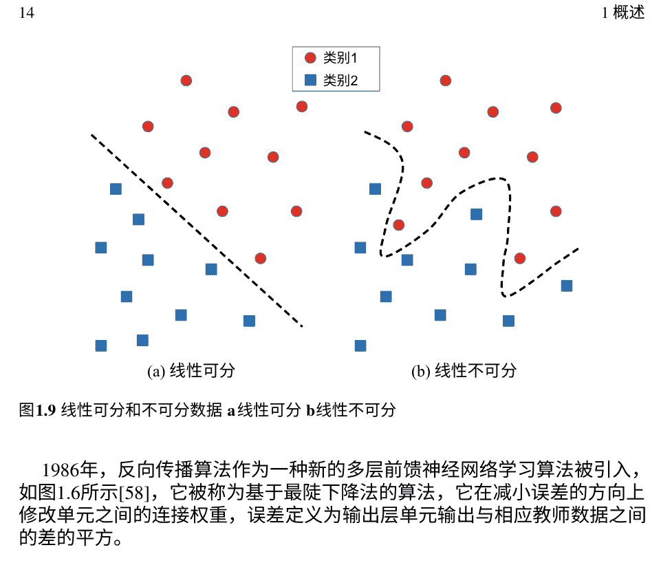

图1.9 线性可分和不可分数据 a线性可分 b线性不可分

1986年，反向传播算法作为一种新的多层前馈神经网络学习算法被引入，如图1.6所示[58]，它被称为基于最陡下降法的算法，它在减小误差的方向上修改单元之间的连接权重，误差定义为输出层单元输出与相应教师数据之间的差的平方。

$$E = \frac{1}{2} \sum_{p=1}^{n_P} \sum_{j=1}^{n_L} (^p O_j^L - ^p T_j)^2 \quad (1.2.8)$$

其中

- $^p O_j^L$ 是第 j层（输出层）中第 L个单元的输出，对于第 p个训练模式。
- $^p T_j$ 是对于第 p个训练模式，与第 j层（输出层）中第j个单元的输出相对应的教师信号。
- $n_P$ 是训练模式的总数。
- $n_L$ 是输出单元的总数。

设 $w_{ji}^{(k)}$ 为图1.6中第 k层的第 i个单元与第 (k + 1)层的第j个单元之间的连接权重，则反向传播算法按照以下方式逐步修改 $w_{ji}^{(k)}$：

$$w_{ji}^{(k)} \leftarrow w_{ji}^{(k)} - \alpha \frac{\partial E}{\partial w_{ji}^{(k)}} \quad (1.2.9)$$

## 图1.10 Sigmoid函数

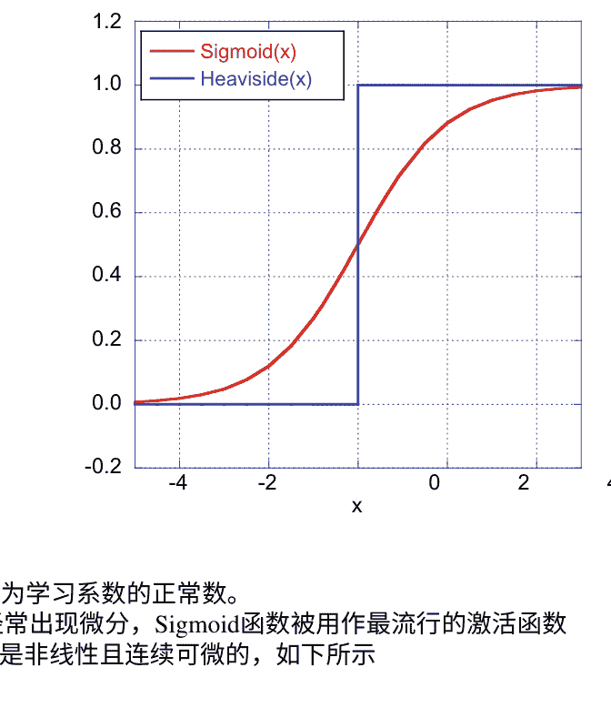

在这里，$\alpha$ 是一个称为学习系数的正常数。由于在反向传播中经常出现微分，Sigmoid函数被用作最流行的激活函数之一，它在任何地方都是非线性且连续可微的，如下所示

$$f(x) = \frac{1}{1 + e^{-x}}$$ (1.2.10)

图1.10显示了Heaviside函数和Sigmoid函数。可以看出，后者是前者的平滑版本。（有关反向传播算法的详细信息，请参见第2.1节。）

在1989年，已经证明前馈神经网络可以逼近任意连续函数[19,29]。然而，这个理论证明是一种存在定理，对于重要的实际问题，如应该使用多大的神经网络（每层的层数，每层的单元数等），应该使用什么训练参数，以及需要多少个训练周期才能收敛，提供了很少的答案。因此，这些元参数的确定通常是通过试错法进行的。

随着1986年反向传播算法的出现，多层前馈神经网络开始得到实际应用，神经网络的应用范围大大扩展，从而引发了第二次神经网络热潮。值得注意的是，在反向传播算法出现之前，该算法的原型已经在二十年前被提出[1]，但当时并没有被广泛认可其重要性。

随着反向传播算法的出现，第二次神经网络热潮逐渐平息。这是因为

## 图1.11 超级计算机的发展

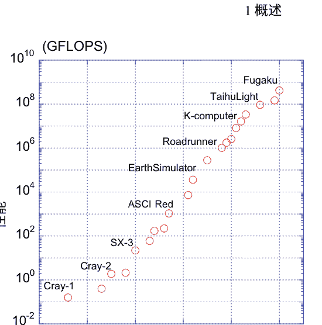

当增加前馈神经网络的规模以改善其功能和性能时，学习过程变得过慢或经常无法进行。这主要有两个原因：计算机的速度和梯度消失问题。

让我们首先考虑计算机的速度。图1.11显示了最快超级计算机的历史，其中纵轴是计算速度，以每秒浮点运算次数（FLOPS：每秒浮点运算次数）定义。这里使用的单位是十亿FLOPS（$10^9$ FLOPS）。从图中可以看出，在1986年，当反向传播算法开始时，超级计算机的速度约为2 GFLOPS，1996年为220 GFLOPS，2006年为280 TFLOPS（万亿FLOPS），2021年为415 PFLOPS（百万亿FLOPS）。

简单的计算表明，一个前馈神经网络在当前计算机（415 PFLOPS）上只需要一分钟的训练时间，在2006年的计算机（280 TFLOPS）上需要1482分钟（约一天），在1996年的计算机（220 GFLOPS）上需要1,886,364分钟（约三年半），在1986年的计算机（2 GFLOPS）上需要207,500,000分钟（约400年）。实际上，这个计算并不一定准确，因为并行处理和其他因素的影响，但它仍然显示了计算速度的进展，换句话说，旧时计算机的缓慢，这表明必须等待计算机的进步才能将反向传播算法应用于相对较大的神经网络。

如上所述，计算机的计算速度一直是反向传播算法的一个大问题。除此之外，将大规模多层前馈神经网络应用于实际问题的另一个障碍是梯度消失问题。这个问题存在于多层神经网络中。

学习不是在远离输出层的层中进行的，因此增加隐藏层的数量不能提高性能。梯度消失的原因是通过反向传播算法进行的校正量在深层（靠近输入层的层）中变得很小，这是因为最常用的激活函数是sigmoid函数的导数很小。

$$\Delta w_{ji}^{(k)} = -\alpha \frac{\partial E}{\partial w_{ji}^{(k)}}$$ (1.2.11)

由于sigmoid函数的导数很小，深层（靠近输入层的层）中的 $\Delta w^{(k)}$ 变得很小。（详见第2.1节。）

由于这些问题，前馈神经网络虽然具有反向传播学习算法和能够模拟任意非线性连续函数的多功能性，但“仅应用于相对较小的网络可以处理的问题。”

如上所述的严峻情况在2006年发生了变化，通过逐层预训练[4, 28]来避免梯度消失问题的方法以及解决多层前馈神经网络训练问题的方法也被提出。

在这里，我们讨论了自编码器如何用于预训练多层前馈神经网络。自编码器的结构如图1.12所示，它是一个具有一个隐藏层的前馈神经网络，输入层的单元数与输出层的单元数相同。通过使用输入数据作为教师数据，通过误差反向传播学习，自编码器被训练为输出与输入数据相同的数据。训练完成后，自编码器简单地输出输入数据，这似乎是一个无意义的操作，但实际上它对应着将输入数据转换为隐藏层中的不同表示格式。例如，如果隐藏层单元数少于输入层单元数，则可以获得输入数据的压缩表示。


在使用自编码器进行预训练时，多层前馈神经网络的连接权重由自编码器初始化。对于图1.13所示的五层网络，准备了三个自编码器；自编码器A以原始网络的第一层作为输入层，第二层作为隐藏层；自编码器B以第二层作为输入层，第三层作为隐藏层；自编码器C以第三层作为输入层，第四层作为隐藏层。请注意，对于每个自编码器，输出层的单元数与相应的输入层相同。使用上述自编码器进行预训练的步骤如下：

- 首先，使用原始五层神经网络的输入数据训练自编码器A。训练完成后，将自编码器A的输入层和隐藏层之间的连接权重设置为原始五层神经网络的第一层和第二层之间的初始值。
- 然后，训练自编码器B，其中自编码器A的隐藏层输出用作训练的输入数据。训练完成后，将自编码器B的输入层和隐藏层之间的连接权重设置为原始五层神经网络第二层和第三层之间连接权重的初始值。

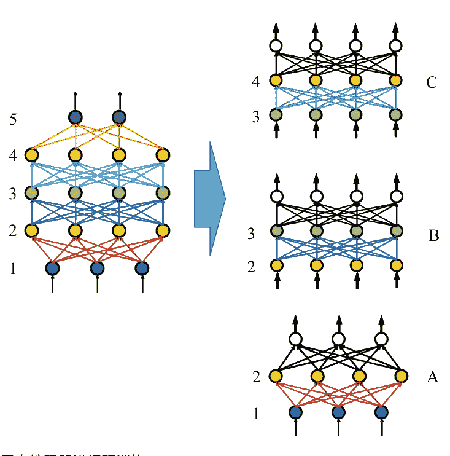

## 图1.13 使用自编码器进行预训练

接着，训练自编码器C，其中自编码器B的隐藏层输出用作训练的输入数据。训练完成后，将自编码器C的输入层和隐藏层之间的连接权重设置为原始五层神经网络第三层和第四层之间连接权重的初始值。

最后，在使用自编码器A、B和C获得的值初始化每一层之间的连接权重后，使用原始输入和教师数据执行五层前馈神经网络的误差反向传播学习。

因此，可以通过将连接层之间的初始权重值设置为最接近输入层的值来解决梯度消失问题，使用自动编码器。

另一个因素是计算机性能的显著改善，使得前馈神经网络可以深度多层次地进行，这表明学习现在可以在实际计算时间内完成。因此，对前馈神经网络构建的限制已经放宽，神经网络的规模可以根据实际问题的复杂性进行增加。此外，在2007年引入了使用图形处理单元（GPU）进行数值计算的CUDA [39]语言，它已经广泛用作前馈神经网络的训练和推理加速器，进一步提高了计算机性能。

随着预训练方法的发展和计算机性能的显著提高，第三次神经网络热潮随着多层大规模神经网络的出现，即所谓的深度学习，已经开始。由于激活函数、训练方法和计算机性能的改进，预训练的必要性正在减少。

深度学习的成功归功于卷积神经网络的发展，其中每一层的单元都排列在二维网格中。

换句话说，在传统的前馈神经网络中，相邻层中的所有单元都相互连接，而在卷积神经网络中，一层中的单元只连接到前一层中的某些单元。图1.14展示了卷积神经网络的结构和功能。第p层的第(k,l)个单元的输入，$U_{kl}^p$，是使用第(p-1)层单元的输出 $O$ 如下所示：

$$U_{k,l}^{p} = \sum_{s=0}^{S-1} \sum_{t=0}^{T-1} h_{s,t}^{p-1} \cdot O_{k+s,l+t}^{p-1} + \theta_{k,l}^{p}$$ (1.2.12)

其中 $\theta_{k,l}^p$ 是第(k,l)个单元在第p层的偏置，$h_{s,t}^{p-1}$ 是第(s,t)个单元在第(p-1)层的权重，与全连接前馈神经网络中的权重不同，同一层中的单元之间的权重是相同的，S和T是对输入的贡献范围，图1.14显示了S=T=3的情况。

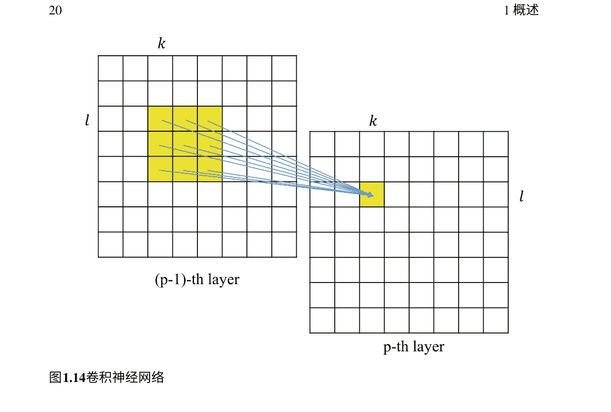

权重 $h_{s,t}$ 可以用矩阵形式表示，如图1.15所示，对于 $S = T = 3$ 的情况，Eq. (1.2.12)中的操作与图像处理中的滤波操作[21]相同。图1.16显示了图像处理中使用的滤波器示例，图1.16a是用于图像锐化的拉普拉斯掩模，图1.16b和c用于边缘检测，它们之间检测的边缘方向不同。请注意，由Eq. (1.2.12)表示的卷积操作类似于图像处理中的特征提取，当输入数据是图像时，可以将其解释为提取输入图像的特征的操作。有关卷积层中的计算细节，请参见第2.2节。从历史的角度来看，将类似于卷积层的局部性引入前馈神经网络的做法已经在Neocognitron [18]中实现，该方法受到了视觉信息处理的分层结构的启发[31]。图1.17显示了Neocognitron的结构。卷积层的原型是在1989年提出的[42]，在输入为图像时非常有用。除了图像，卷积神经网络已广泛应用于各种多维数据，如语音或语言。

图1.15卷积神经网络中的权重矩阵

| $h_{0,0}$ | $h_{1,0}$ | $h_{2,0}$ |
| :--- | :--- | :--- |
| $h_{0,1}$ | $h_{1,1}$ | $h_{2,1}$ |
| $h_{0,2}$ | $h_{1,2}$ | $h_{2,2}$ |

ImageNet大规模视觉识别挑战(ILSVRC) [59]是一个使用ImageNet的大型图像数据集的图像识别竞赛，该数据集包含超过1000万张图像。2012年，深度学习在ILSVRC [40]中表现出卓越的性能。
从那时起，深度学习一直是最佳表现者，自2012年以来的比赛获胜系统如下所示：2012年AlexNet [40]2013年ZFNet [69]2014年GoogLeNet [66]2015年ResNet [26]2016年CUImage [70]2017年SENet [30]

由于添加更多的层可以提高性能，所以2012年的AlexNet使用了五个卷积层，2014年的GoogLeNet使用了超过20个层，2015年的ResNet使用了超过100个层。 在VGG [63]中验证了添加更多卷积层的效果，VGG具有可扩展的结构，被认为是标准的深度卷积神经网络。 研究表明，在VGG中增加卷积层数可以提高分类性能。

除了图像识别，深度学习还被应用于游戏编程。 使用深度学习的围棋程序AlphaGO击败了世界冠军[61]。 自那时以来，AlphaGO一直在不断发展。 虽然最初的AlphaGO使用人类玩家的实际游戏记录作为训练数据，但改进版的AlphaGO Zero [62]采用了强化学习，通过与其他性能优于前任AlphaGO的AlphaGO Zero对战来学习。

除了上述领域外，深度学习已经应用于广泛的领域，包括交通标志识别[10]、机器翻译[65]和语言模型GPT-3[8]和BERT[16]的自然语言处理，以及语音识别[11, 54]。

随着深度学习应用于各个领域，计算能力已经得到增强，以处理深度学习特定的处理。 基于CPU和GPU的大规模高性能计算机用于深度学习的训练过程，这使得构建大规模深度神经网络成为可能。 因此，使用训练好的神经网络进行推理过程所需的计算量迅速增加。 通常，推理过程是在用户控制下使用比训练时弱得多的计算机进行的。 它们被称为嵌入在移动设备（如智能手机、家用电器和工业机器）中的计算机下的边缘计算。

由于这个推理过程需要实时性能，因此通常使用嵌入式GPU，如Nvidia的Jetson，并且还在开发专门加速深度学习推理计算的加速器[6, 15]。

深度学习在各个领域取得了显著的成果，不断发展。

### 1.3 深度学习的新技术

在本节中，将讨论深度学习中一些新的和越来越重要的技术。

#### 1.3.1 数值精度

首先，让我们研究深度学习所需的数值精度。

| 0 | -1 | 0 |
|---|---|---|
| -1 | 5 | -1 |
| 0 | -1 | 0 |

| -1 | 0 | 1 |
|---|---|---|
| -2 | 0 | 2 |
| -1 | 0 | 1 |

| -1 | -2 | -1 |
|---|---|---|
| 0 | 0 | 0 |
| 1 | 2 | 1 |

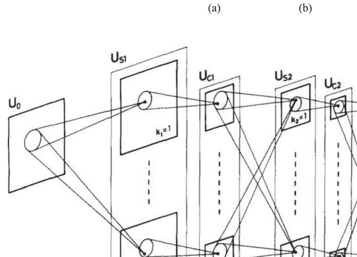众所周知，计算机中使用的基本数字是二进制的，浮点实数有几种格式，我们根据所需的精度级别选择其中一种[67]。浮点实数由一系列二进制数字表示，其中包括一个符号部分表示正负，一个指数部分表示阶数，一个尾数部分表示有效数字，总长度（位数）根据数字的精度而变化。IEEE754标准规定了三种类型的实数，双精度实数（FP64）约有16个十进制有效数字，单精度实数（FP32）约有7个十进制数字，半精度实数（FP16）约有3个十进制数字，它们分别占用64、32和16位内存。在计算力学领域，通常使用FP64，有些问题甚至需要四倍精度实数。

与上述相反，已经证明深度学习在使用相对低精度的实数时也能达到足够的准确性[12-14, 25]。尽管深度学习中的训练通常需要比使用训练好的神经网络进行推断时更高的数值精度，因为需要计算导数，但已经证明FP32和FP16足够用于训练。

因此，新的低精度浮点实数格式也被用于深度学习，包括BFloat16（BF16）和Tensor Float 32（TF32）。前者由Google提出，具有比FP16更多的指数位，与FP32具有相同的指数位。由于尾数部分的位数减少，有效数字的位数也减少，但可以表示的数字范围几乎与FP32相同。后者由Nvidia提出，指数部分的位数与FP32相同，尾数部分的位数与FP16相同。TF32格式总共有19位，意味着一种特殊的格式，其长度不是2的幂。主要的浮点数格式总结如图1.18所示。

图1.18 浮点实数格式

| 格式 | 符号 (1位) | 指数位 | 小数部分 (尾数位) |
| :--- | :---: | :---: | :---: |
| FP64 | 1位 | 11位 | 52位 |
| FP32 | 1位 | 8位 | 23位 |
| FP16 | 1位 | 5位 | 10位 |
| BF16 | 1位 | 8位 | 7位 |
| TF32 | 1位 | 8位 | 10位 |

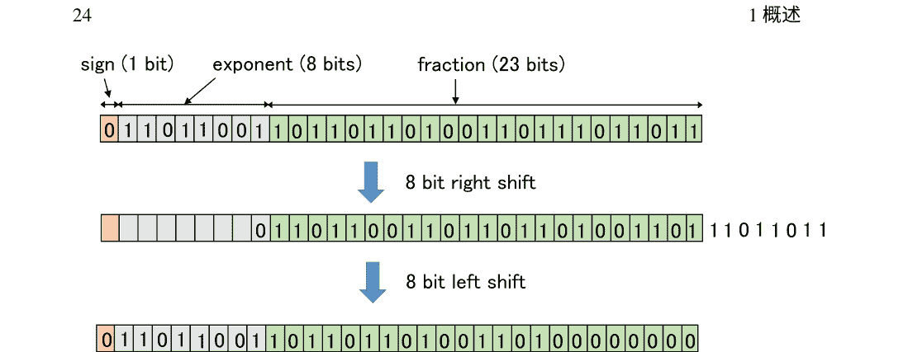

由于深度学习需要较低的数值精度，因此可以通过使用整数[20]或定点实数格式[25]，或在可编程门阵列（FPGA）上实现专用算术硬件来进一步提高深度学习的性能。

实际上，很难知道每个问题所需的数值精度。然而，可以使用伪低精度（PLP）方法[50]进行粗略估计。例如，单精度实数（FP32）的尾数部分占32位中的23位，但如果我们将整个32位向右移动$n$位，然后向左移动$n$位，尾数部分的最后$n$位将填充为零，并且尾数部分的位数将减少到（23-$n$）位。图1.19显示了一个带有8位移位的PLP示例，列表1.3.1是用于验证PLP操作的示例代码，其中假设int类型为32位。列表1.3.2显示了在CentOS 7.9上使用gcc 4.8.5执行的示例，注意上述所有算术运算都以单精度实数（FP32）进行，并且结果以单精度实数（23位尾数）存储，因此在每次算术运算后立即通过PLP再次降低精度是必要的。

### 列表 1.3.1 PLP 测试代码

```
#include <stdio.h>
typedef union{
  float f;
  int i;
}u_fi32;
int main(void) {
  int nsh;
  float f1,f2;
  u_fi32 d1,d2,d3;
  f1 = 2.718281828;
  f2 = 3.141592653;
  for(nsh=1;nsh<23;nsh++) {
    d1.f = f1 ;
    d1.i = d1.i >> nsh ;
    d1.i = d1.i << nsh ;
    d2.f = f2 ;
    d2.i = d2.i >> nsh ;
    d2.i = d2.i << nsh ;
    d3.f = d1.f*d2.f ;
    d3.i = d3.i >> nsh ;
    d3.i = d3.i << nsh ;
    printf("%2d%f%f%f",nsh,d1.f,d2.f,d3.f);
  }
  return 0;
}
```

### 列表 1.3.2 PLP测试代码的结果（CentOS 7.9，gcc 4.8.5）

- 1. 2.718282 3.141593 8.539734
- 2. 2.718282 3.141592 8.539730
- 3. 2.718281 3.141592 8.539726
- 4. 2.718281 3.141590 8.539719
- 5. 2.718277 3.141586 8.539673
- 6. 2.718277 3.141586 8.539673
- 7. 2.718262 3.141571 8.539551
- 8. 2.718262 3.141541 8.539307
- 9. 2.718262 3.141479 8.539062
- 10. 2.718262 3.141357 8.538086
- 11. 2.718262 3.141113 8.537109
- 12. 2.717773 3.140625 8.535156
- 13. 2.716797 3.140625 8.531250
- 14. 2.714844 3.140625 8.515625
- 15. 2.710938 3.140625 8.500000
- 16. 2.703125 3.140625 8.437500
- 17. 2.687500 3.125000 8.375000
- 18. 2.687500 3.125000 8.250000
- 19. 2.625000 3.125000 8.000000
- 20. 2.500000 3.000000 7.500000
- 21. 2.500000 3.000000 7.000000
- 22. 2.000000 3.000000 6.000000

#### 1.3.2 对抗性示例

深度学习在图像识别方面表现出非常好的性能，并且据说在某些领域超过了人类的辨别能力。然而，有报道称深度学习可能会误识别一些人类可以轻松识别的图像。

Goodfellow等人[23]使用一张应该被判断为熊猫的图像上叠加了一点噪音，结果显示这张叠加图像在人眼中几乎与原始图像完全相同，或者可以轻松被识别为熊猫，而卷积神经网络GoogLeNet [66]却将其判断为长臂猿。这种类型的输入数据被称为对抗样本。

神经网络中对抗性示例发生的机制可以解释如下。

设神经网络的输入为 $x = (x_1, \ldots, x_n)^T$，权重为 $w_j = (w_{j1}, \ldots, w_{jn})^T$，则下一层的第j个单元的输入可以表示为

$$ u_j = \sum_i w_{ji} I_i = w_j^T x \quad (1.3.1) $$

当输入中添加一个小的噪声 $\Delta x$时，输入的变化 $u_j$, $\Delta u_j$，可以表示为

$$ \Delta u_j = w_j^T \Delta x \quad (1.3.2) $$

方程 (1.3.2) 表明 $\Delta u_j$ 是 $w_j$ 和 $\Delta x$ 的内积，因此当 $\Delta x = k w_j$ 时，变化 $\Delta u_j$ 取得最大值，这表明在相似大小的各种噪声中，单元的输入和输出的变化对于具有特定方向的噪声向量 $\Delta x$（即与 $w_j$ 平行）最大。

对于经过良好训练的多层前馈神经网络，我们还可以通过输入的微小波动使输出大幅波动，如下所示。当神经网络的误差函数表示为 $E = E(x)$时，输入噪声向量为 $\Delta x = (\Delta x_1, \ldots, \Delta x_n)^T$，小正常数 $\varepsilon$，然后添加由噪声向量 $\Delta x$ 生成的

$$ \Delta x_i = \varepsilon \cdot \text{sgn}\left( \frac{\partial E}{\partial x_i} \right) \quad (1.3.3) $$

到输入向量中，我们可以增加神经网络输出与教师数据之间的显著差异。这里，$\text{sgn}(x)$定义如下：

$$ \text{sgn}(x) = \begin{cases} 1 & (x \geq 0) \\ -1 & (x < 0) \end{cases} \quad (1.3.4) $$

如上所述，我们在这里讨论如何制作一个能够尽可能正确识别对抗性示例的前馈神经网络？一种方法是将对抗性示例用作正则化项[27]。

尽管通常的反向传播算法最小化 $E(x)$，但该方法添加了 $E(x + \Delta x^{\text{adv}})$ 作为正则化项，以最小化以下方程：

$$ \alpha \cdot E(x) + (1 - \alpha) \cdot E(x + \Delta x^{\text{adv}}) \quad (1.3.5) $$

其中 $\alpha$ 是一个正常数，$\Delta x^{\text{adv}}$ 是由公式 (1.3.3) 生成的噪声向量。

#### 1.3.3 数据集增强

在神经网络和深度学习中，训练模式的数量是最重要的问题之一。如果数量很少，很可能会发生过度训练[27]。为了避免这种情况，需要尽可能多地收集训练模式。然而，在许多情况下，很难收集到足够数量的训练模式，就像医学影像（X射线，MRI等）的情况一样。

因此，原始训练模式（图像）经过处理，生成新的训练模式，称为数据集增强。以深度学习库Keras为例，其ImageDataGenerator函数提供了经过各种处理方式（如旋转、平移、反转和剪切变形）的图像，以增加训练模式的数量。表1.1显示了ImageDataGenerator的主要参数及其效果。

即使输入数据是音频数据，上述数据增强也会被执行并被证明是有效的[34, 53]。对于图像的数据增强在完全连接的前馈神经网络中被认为是困难的。然后，研究了另一种数据增强方法，即噪声叠加[60]，其基于

$$ x_i^{\text{输入}} = (1 + r_i) x_i^{\text{原始}}, \quad r_i \in [-\varepsilon, \varepsilon] \qquad (1.3.6) $$

其中 ε是一个小的正常数。在训练过程中，通过每次使用生成的随机数作为组件 $x_i$ 输入，对原始输入数据 $x^{\text{原始}}$ 的每个分量 $x_i^{\text{原始}}$ 添加了一小部分噪声。输入数据的 $x^{\text{输入}}$。请注意，在各种应用中，对输入数据进行叠加噪声被报告为有效的防止过度训练的方法[17, 51, 52]。

| ImageDataGenerator的参数 | 功能 |
| :--- | :--- |
| 旋转范围 | 旋转 |
| 宽度平移范围 | 水平平移 |
| 高度平移范围 | 垂直平移 |
| 剪切范围 | 剪切变换 |
| 缩放范围 | 缩放 |
| 水平翻转 | 水平翻转 |
| 垂直翻转 | 垂直翻转 |
| 填充模式 | 生成的图像之外的点根据给定的模式进行填充 |

#### 1.3.4 丢弃

研究是一种通过构建多个神经网络并对其进行平均或多数投票来提高分类准确性的方法，称为集成学习或模型平均。

假设一个高度理想化的情况，我们有$2N + 1$个神经网络，每个神经网络都与其他神经网络不同，并且它们都具有相同的分类准确性$p$。在这种情况下，如果每个神经网络的分类结果是独立的，则通过$2N+1$个神经网络的多数投票得到的分类准确性满足以下方程：

> $$ P_{2N+1} < P_{2(N+1)+1}, \quad \lim_{N \to \infty} P_{2N+1} = 1 \tag{1.3.7} $$

这被称为康多塞定理。实际上，假设每个分类器（例如神经网络）的分类结果是独立的是不合理的，通常情况下，对于给定的输入数据，许多分类器会做出相同的错误分类。

为了放松这个限制，例如在随机森林[7,49]中，集成学习引入了决策树，并通过大量决策树的多数投票进行分类，改变了各个决策树的训练模式的结构，也改变了判别参数。

然而，这仍然不能构建一个完全独立的分类器集合。尽管如此，在许多情况下，准备多个分类器的方法被报道为提高分类准确性的有效方法。

Dropout [64]等效于使用单个神经网络的多个平均值。图1.20显示了dropout的示意图。图1.20a显示了原始的四层前馈神经网络。在训练过程中，为每个单元的每个时期生成一个在[0, 1]范围内的均匀随机数$rnd$，如果$rnd > r$（其中$r$是预定的dropout率，$0 < r < 1$），则将单元的输出固定为0。这相当于每个时期使用具有不同结构的前馈神经网络（图1.20b）。训练完成后，使用所有单元的原始结构的神经网络用于推断，但单元的输出乘以dropout率$r$（图1.20c）。dropout几乎等同于使用具有不同结构的许多神经网络的平均值，被认为可以抑制过度训练并提高估计的准确性。

DropConnect [68]也被提出，它会丢弃单个单元之间的连接，而Dropout则是丢弃单个单元。

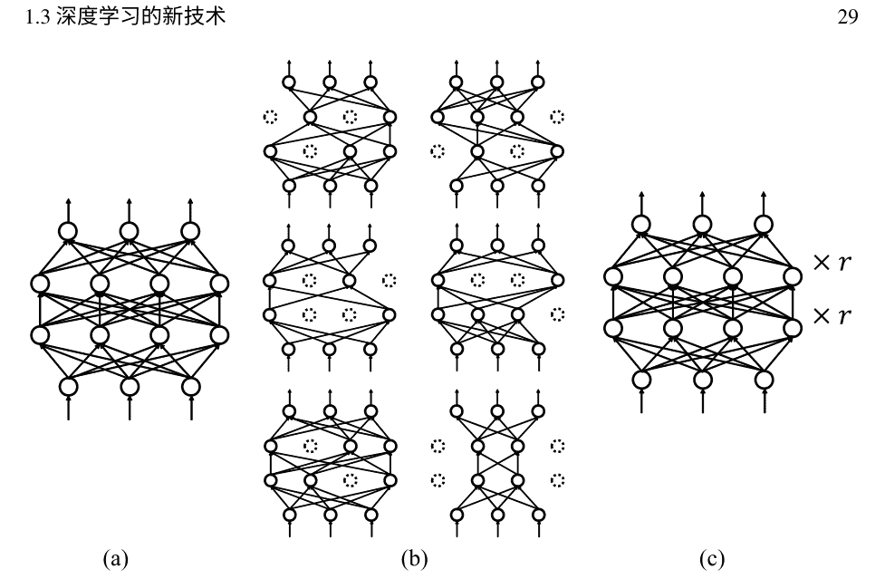

#### 1.3.5 批归一化

对于作为神经网络输入和教师数据用于学习映射的数据对，通常将数据转换为一定范围的值，或者处理数据以对齐均值和方差。批量归一化是在隐藏层中动态执行上述转换的方法。

如上所述，神经网络的输入数据通常进行转换操作。假设输入数据的数量为n，第p个输入数据$x_p= (x_1^p, x_2^p, ..., x_d^p)$分别计算每个分量的最大值、最小值、均值和标准差如下:

$$ x_i^{\max} = \max_p \{ x_i^p \} \quad (1.3.8) $$
$$ x_i^{\min} = \min_p \{ x_i^p \} \quad (1.3.9) $$
$$ \mu_i = \frac{1}{n} \sum_{p=1}^n x_i^p \quad (1.3.10) $$
$$ \sigma_i = \sqrt{ \frac{1}{n} \sum_{p=1}^n (x_i^p - \mu_i)^2 } \quad (1.3.11) $$

最常用的转换操作是0-1转换和标准化。假设神经网络输入数据在转换后为 $\tilde{x}^p = \left(\tilde{x}_1^p, \tilde{x}_2^p, \ldots, \tilde{x}_d^p\right)$，输入数据的0-1转换为

$$\tilde{x}_i^p = \frac{x_i^p - x_i^{\min}}{x_i^{\max} - x_i^{\min}} \quad (1.3.12)$$

同样，输入数据的标准化为

$$\tilde{x}_i^p = \frac{x_i^p - \mu_i}{\sigma_i} \quad (1.3.13)$$

上述转换可以减轻各个参数之间数值范围差异的负面影响。

批量归一化[33]对每一层的输入执行与输入数据相同的操作。当第 $p$ 个学习模式中第 $l$ 层的第 $i$ 个单元的输入值为 $x_{l,i}^p$，输出值为 $y_{l,i}^p$ 时，输入-输出关系表示为

$$y_{l,i}^p = f\left(x_{l,i}^p\right) = f\left(\sum_j w_{i,j}^l y_{l-1,j}^p + \theta_{l,i}\right) \quad (1.3.14)$$

其中 $\theta_{l,i}$ 是第 $l$ 层中第 $i$ 个单元的偏置， $w_{i,j}^l$ 是第 $(l-1)$ 层中第 $j$ 个单元与第 $l$ 层中第 $i$ 个单元之间的连接权重。

批量归一化用于标准化每个小批量大小为 $m$ 的单元的输入值。也就是说，如果每个小批量中的训练模式的单元的输入值为 $\left\{x_{l,i}^{k+1}, x_{l,i}^{k+2}, \ldots, x_{l,i}^{k+m-1}, x_{l,i}^{k+m}\right\}$，那么我们采用以下转换作为输入值 $\left\{\tilde{x}_{l,i}^{k+1}, \tilde{x}_{l,i}^{k+2}, \ldots, \tilde{x}_{l,i}^{k+m-1}, \tilde{x}_{l,i}^{k+m}\right\}$ 给定为

$$\tilde{x}_{l,i}^p = \gamma \frac{x_{l,i}^p - \mu_{l,i}}{\sigma_{l,i}} + \beta, \quad (k+1 \leq p \leq k+m) \quad (1.3.15)$$

在这里，$\gamma$ 和 $\beta$ 都是通过学习更新的参数，$\mu_{l,i}$ 和 $\sigma_{l,i}$ 分别由以下公式计算

$$\mu_{l,i} = \frac{1}{m} \sum_{p=k+1}^{k+m} x_{l,i}^p \quad (1.3.16)$$

$$\sigma_{l,i} = \sqrt{\frac{1}{m} \sum_{p=k+1}^{k+m} \left(x_{l,i}^p - \mu_{l,i}\right)^2 + \varepsilon} \quad (1.3.17)$$

#### 1.3.6 生成对抗网络

生成对抗网络（GAN）[24]是深度学习中最具创新性的技术之一，由生成器和判别器两个神经网络组成。

生成器是一个神经网络，用于生成满足特定条件的数据，而判别器则用于判断输入数据是否为真实数据。生成器将任意数据（例如，由随机数生成的任意数据）作为输入，并经过训练以输出满足特定条件的数据。判别器经过训练以正确区分生成器输出的数据（称为假数据）和事先准备好的真实满足特定条件的数据（称为真数据）。在学习的早期阶段，判别器可以轻易地将生成器输出的假数据检测出来，但随着生成器的训练进展，它可能输出连判别器也无法检测出来的假数据。

GAN的目标是构建一个生成器，输出满足特定条件的真实数据，或者是无法被鉴别为“假数据”的数据。GAN的训练过程可以总结如下：

- 1. 如图1.21所示，准备两个神经网络，生成器和鉴别器。生成器的输出单元数应与鉴别器的输入单元数相同，鉴别器的输出单元数为1，因为鉴别器仅确定输入数据是真实还是假的。

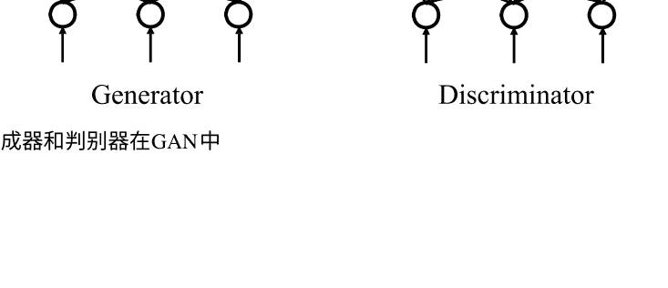(2) 准备大量满足特定条件的真实数据，称为真实数据。
(3) 生成器将由随机数生成的大量任意数据作为输入，收集生成器产生的大量输出数据，称为伪造数据（图1.22）。
(4) 使用（2）中准备的真实数据和（3）中收集的伪造数据作为输入数据进行鉴别器的训练。如图1.23所示，对于真实数据，教师数据应为真实的（例如，1），对于伪造数据，教师数据应为伪造的（例如，0）。通过这种方式，鉴别器被训练得能够正确区分真实数据和伪造数据。
(5) 在鉴别器的训练之后，通过将生成器和鉴别器串联起来进行生成器的训练，如图1.24所示。输入连接网络的数据是生成器的数据，而教师数据是“真实”的。使用反向传播算法来训练连接网络，其中鉴别器部分的所有参数（例如连接权重）都被固定，只有生成器部分的参数被更新。通过这种方式，生成器被训练成输出被鉴别器判断为真实的数据。
(6) 在生成器训练完成后返回(3)。通过交替训练鉴别器和生成器，经过训练的生成器最终能够输出与鉴别器无法区分的真实数据。GAN可以使用卷积神经网络作为生成器和鉴别器。
GAN的训练过程可以表示为以下的极小极大问题[24]:
$$ \min_{G} \max_{D} V(D, G) = E_{x \sim p_d(x)} [\log D(x)] + E_{z \sim p_z(z)} [\log(1 - D(G(z)))] \tag{1.3.18} $$
其中 V(D, G)是目标函数，D和G分别是鉴别器和生成器，D(x)是输入数据x的鉴别器输出，G(z)是输入数据z的生成器输出，p_d(x)是x的概率分布，p_z(z)是z的概率分布。上述的训练过程(4)可以理解为对等式(1.3.18)左侧的最大化操作，即通过更新鉴别器来最大化右侧的项，而上述的训练过程(5)是对等式(1.3.18)左侧的最小化操作，即通过更新生成器来最小化右侧的第二项。

基于卷积神经网络的生成对抗网络（GANs）被用于各种问题，包括图像生成。例如，它可以从带有随机数输入的嘈杂图像中生成一张狗的图像。然而，众所周知，很难控制生成器创建的狗的图像种类。
条件生成对抗网络（CGAN）[48]是GAN的修改版本，可以控制生成器生成的图像，生成器和判别器都接受与GAN相同的输入数据以及称为标签数据的数据的属性信息。CGAN的训练过程总结如下：
(1) 如图1.25所示，准备了两个神经网络，生成器和判别器。生成器和判别器都使用数据属性（标签数据）的信息作为输入数据，除了标准的GAN输入数据。因此，判别器的输入单元数是生成器的输出单元数和标签数据的数量之和。判别器的输出单元数为1，因为判别器仅确定输入数据是真实的还是伪造的。
(2) 准备大量满足特定条件的真实数据，称为真实数据，这些数据伴随着表示其属性的标签数据。
(3) 生成器以大量由随机数生成的任意数据及其属性信息（标签数据）作为输入，收集大量输出数据（虚假数据）（图1.26）。
(4) 使用第（2）步准备的真实数据和第（3）步收集的虚假数据作为输入数据来训练判别器。相应的标签数据也作为输入。如图1.27所示，教师数据分别设置为真实数据（例如，1）和虚假数据（例如，0）。通过这种方式，判别器被训练成能够正确区分真实数据和虚假数据。
(5) 在判别器训练完成后，通过将生成器和判别器串联起来进行生成器的训练，如图1.28所示。连接网络的输入数据是生成器的输入数据和带有“真实”标签数据的教师数据。使用反向传播算法来训练连接网络，其中判别器部分的所有参数（例如连接权重）都被固定，只有生成器部分的参数被更新。通过这种方式，生成器被训练输出被判别器判断为真实的数据。
(6) 在生成器训练完成后返回 (3)。

CGAN的学习过程也被制定为一个最小-最大问题，如下所示[48]:
$$ \min_{G} \max_{D} V(D, G) = E_{x \sim p_{d}(x)} \log D(x|y) + E_{z \sim p_{z}(z)} \log(1 - D(G(z|y))) \tag{1.3.19} $$
其中 y是属性信息（标签数据）。方程（1.3.19）可以被视为相对于 y的条件下的方程（1.3.18）的修改版本。GANs引起了广泛关注，特别是在图像生成和语音合成方面的有效性，并提出了各种改进的GANs。
对它们的研究仍然活跃：例如，使用卷积神经网络的DCGAN [55]，使用改进的损失函数的InfoGAN [9]，基于最小二乘误差的损失函数的LSGAN [44]，具有双倍生成器和判别器的CycleGAN [71]，基于Wasserstein距离的损失函数的WGAN [2]，具有分层高分辨率的ProgressiveGAN [35]，以及具有改进生成器的StyleGAN [36]。

### 1.3 深度学习的新技术

#### 1.3.7 变分自编码器

众所周知，变分自动编码器执行与生成对抗网络（GAN）在第1.3.6节中描述的类似功能。
图1.29显示了自动编码器的基本示意图。假设训练数据的数量为 N，第 k 个训练数据（输入） x^k = (x_1^k, x_2^k, ..., x_n^k)^T，编码器输出 y^k = (y_1^k, y_2^k ..., y_m^k)^T (m < n)，解码器输出 x̃^k = (x̃_1^k, x̃_2^k, ..., x̃_n^k)^T。那么，在自动编码器的训练过程中需要最小化的目标函数 E 为
$$ E = \frac{1}{2} \sum_{k=1}^{N} \left| \tilde{x}^k - x^k \right|^2 \tag{1.3.20} $$
在这里，假设输入数据也被用作教师数据。这导致编码器的输出 y^k被认为是输入数据 x^k的压缩表示。
与传统的自编码器不同，变分自编码器[37,38]学习概率分布。图1.30显示了变分自编码器的操作示意图。假设编码器表示方程(1.3.21)的概率分布。在这里， z = (z_1, z_2, ..., z_m)^T被称为潜变量，通常比输入 x = (x_1, x_2, ..., x_n)^T低得多 (m << n)。注意 N (z|μ, σ^2) 是一个具有均值 μ = (μ_1, μ_2, ... , μ_m)^T和方差 σ^2(标准差 σ = (σ_1, σ_2, ... , σ_m)^T)的多维正态分布。
$$ q_{\phi}(z|x) = \mathcal{N} (z|\mu, \sigma^2) \tag{1.3.21} $$
编码器输出输入 $x$ 的均值 $\mu$ 和标准差 $\sigma$（方差的平方根）作为概率分布的参数。虽然 $z$ 是从 $\mathcal{N}(z|\mu, \sigma^2)$ 中采样的，但在变分自编码器中，为了实现误差反向传播学习，它实际上是确定的。
$$ z = \mu + \epsilon\sigma \tag{1.3.22} $$
其中 $\epsilon$ 是从 $\mathcal{N}(\epsilon|0, 1)$ 中采样得到的数字。方程式 (1.3.22) 被称为重新参数化技巧。
另一方面，解码器被假设为以下方式表示概率分布：
$$ p_{\theta}(x|z) = \mathcal{N}(x|0, I) \tag{1.3.23} $$
变分自动编码器训练过程中要最小化的目标函数 $E$ 由[37]给出，
$$ E = E_{\text{KL}} + E_{\text{Recon}} \tag{1.3.24} $$
其中 $E_{\text{KL}}$ 是从 Kullback Leibler (KL) 散度[5]计算得到的，它是两个概率分布 $q_{\phi}(z|x)$ 和 $p_{\theta}(z)$ 之间的差异度量，表示距离，计算公式如下：
$$ E_{\mathrm{KL}} = -\frac{1}{2} \sum_{j=1}^{m} \left( 1 + \log \sigma_{j}^{2} - \mu_{j}^{2} - \sigma_{j}^{2} \right) \tag{1.3.25} $$
另一方面，$E_{\mathrm{Recon}}$被称为重建误差，表示为
$$ E_{\mathrm{Recon}} = -\frac{1}{L} \sum_{k=1}^{L} \log p_{\theta} \left( \boldsymbol{x} \mid \boldsymbol{z}^{k} \right) \tag{1.3.26} $$
其中，$L$是$\varepsilon$的数量（即$\boldsymbol{z}$的数量）对于单个输入$\boldsymbol{x}$来说。由于输出会随着的值而改变，因此通常进行平均处理。例如，当输入和输出是图像数据时（每个像素由实数（0, 1）表示），我们经常使用以下方程：
$$ E_{\mathrm{Recon}} = -\frac{1}{L} \sum_{k=1}^{L} \sum_{i=1}^{n} \left\{ x_{i} \log y_{i}^{k} + (1 - x_{i}) \log \left(1 - y_{i}^{k} \right) \right\} \tag{1.3.27} $$
其中，$y_{i}^{k}$是从$\boldsymbol{z}^{k}$生成的图像的像素。

#### 1.3.8 自动微分

如第1.2节所述，微分在误差反向传播学习中经常使用。（详见第2.1节）深度学习库（如tensorflow）通常配备了用于计算导数的自动微分函数，这对于一般用途也很有用。
众所周知，函数 $f(x)$ 的导数定义为，
$$ \frac{\mathrm{d}f}{\mathrm{d}x} = \lim_{h \rightarrow 0} \frac{f(x + h) - f(x)}{h} \tag{1.3.28} $$
同样，函数 $f(x, y)$ 的偏导数如下所示:
$$ \frac{\partial f}{\partial x} = \lim_{h \rightarrow 0} \frac{f(x + h, y) - f(x, y)}{h} \tag{1.3.29} $$
$$ \frac{\partial f}{\partial y} = \lim_{h \rightarrow 0} \frac{f(x, y + h) - f(x, y)}{h} \tag{1.3.30} $$
另一方面，计算机上有几种求导的方法，包括数值求导、符号求导和自动求导。让我们澄清它们之间的区别。
首先，数值求导基本上是一种根据求导定义来寻找导数的方法。由于在计算机上执行极限运算很困难，所以函数 $f(x)$ 的导数是用一个小的 $h$ 值计算的，如下所示：
$$ \frac{\mathrm{d}f}{\mathrm{d}x} \approx \frac{f(x+h) - f(x)}{h} \tag{1.3.31} $$
通过查看导数的定义（方程（1.3.28）），可以预期通过使 $h$ 足够小来获得良好的近似。然而，在实际情况下，当 $h$ 非常小时，导数变为零
$$ \exists \delta > 0, |h| < \delta, \quad \frac{f(x+h) - f(x)}{h} = 0 \tag{1.3.32} $$
这是因为在计算机中对于极小的 $h$ 值，$f(x+h)$ 和 $f(x)$ 被解释为相同的值，因为计算机中的数值表示精度受限于有限的数字。因此，$h$ 不能足够小，使得使用数值微分获得准确的导数值变得困难。
另一方面，在符号微分中，导数以方程的形式获得，这导致导数值的准确评估。已经有一些可以执行符号微分的软件系统：REDUCE 和 Maxima，这些软件系统自20世纪60年代以来就得到了发展。除了它们之外，还有商业软件，如 Mathematica、Maple 和 Derive，它们配备了包括符号微分在内的公式操作系统。在深度学习方面，经常遇到神经网络输出的偏导数与连接权重之间的关系，但其数学表达可能很复杂（见第2.1节），而明确获得数学表达的好处很少。误差反向传播学习不需要显式的导数表达式，只需要知道导数的值即可。因此，对于深度学习来说，将导数作为数学表达式获得被认为是过于繁琐的过程。
最后一种方法，自动微分，提供了准确的导数值，不像数值微分那样。尽管自动微分不能像符号微分那样提供严格的数学表达式，但该方法对于深度学习非常有用，因为它基于链式法则计算精确的导数值，其中所有算术运算都由计算图表示，并且自动微分使用计算图。
作为一个简单的例子，图1.31显示了一个计算图，用于计算 $z = x + y$。计算图中的节点表示数值，连接节点的线表示对数值进行的操作（如算术运算）。
图1.32显示了一个三层前馈神经网络的结构，其中输出层单元的输出表示为 O₁，隐藏层单元的输出表示为 H₁，H₂ 和 H₃，输入层单元（即输入）的输出表示为 I₁ 和 I₂，输出层单元与隐藏层单元之间的连接权重表示为 c₁₁，c₁₂，c₁₃，隐藏层单元与输入层单元之间的连接权重表示为 b₁₁，...，b₃₂。设 f() 为输出层和隐藏层单元的激活函数。
为了简化起见，我们假设所有单元的偏置值为零。然后，我们有
$$ H_1 = f\left(\sum_{i=1}^{2} b_{1i} I_i\right) = f(b_{11}I_1 + b_{12}I_2) \tag{1.3.33} $$
$$ H_2 = f\left(\sum_{i=1}^{2} b_{2i} I_i\right) = f(b_{21}I_1 + b_{22}I_2) \tag{1.3.34} $$
$$ H_3 = f\left(\sum_{i=1}^{2} b_{3i} I_i\right) = f(b_{31}I_1 + b_{32}I_2) \tag{1.3.35} $$
$$ O_1 = f\left(\sum_{j=1}^{3} c_{1j} H_j\right) = f(c_{11}H_1 + c_{12}H_2 + c_{13}H_3) \tag{1.3.36} $$
这个前馈神经网络的计算图如图1.33所示，其中
$$ v_{-1} = I_1, \quad v_0 = I_2 \tag{1.3.37} $$
$$ v_1 = b_{11}v_{-1} + b_{12}v_0, \quad v_2 = b_{21}v_{-1} + b_{22}v_0, \quad v_3 = b_{31}v_{-1} + b_{32}v_0 \tag{1.3.38} $$
$$ v_4 = f(v_1), \quad v_5 = f(v_2), \quad v_6 = f(v_3) \tag{1.3.39} $$
$$ v_7 = c_{11}v_4 + c_{12}v_5 + c_{13}v_6 \tag{1.3.40} $$
$$ v_8 = f(v_7) = O_1 \tag{1.3.41} $$
让我们使用这个计算图上的自动微分方法计算输出相对于输入的导数，如下所示
$$ \frac{\partial O_1}{\partial I_1} \tag{1.3.42} $$
自动微分有两种方法可用：前向模式和反向模式。首先，让我们尝试前向模式，其中计算 \(v_i\) 相对于 \(I_1\) 的导数是按顺序计算的
$$ \dot{v}_i = \frac{\partial v_i}{\partial I_1} = \frac{\partial v_i}{\partial v_{-1}} \tag{1.3.43} $$
最后，计算输出对 \(I_1\) 的导数
$$ \dot{v}_8 = \frac{\partial v_8}{\partial v_{-1}} = \frac{\partial v_8}{\partial I_1} = \frac{\partial O_1}{\partial I_1} \tag{1.3.44} $$
正向模式的计算过程如下所示：
$$ \dot{v}_{-1} = \frac{\partial v_{-1}}{\partial v_{-1}} = 1 \tag{1.3.45} $$
$$ \dot{v}_0 = \frac{\partial v_0}{\partial v_{-1}} = 0 \tag{1.3.46} $$
$$ \dot{v}_1 = \frac{\partial v_1}{\partial v_{-1}} = \frac{\partial (b_{11}v_{-1} + b_{12}v_0)}{\partial v_{-1}} = b_{11}\dot{v}_{-1} + b_{12}\dot{v}_0 = b_{11} \tag{1.3.47} $$
$$ \dot{v}_2 = \frac{\partial v_2}{\partial v_{-1}} = \frac{\partial (b_{21}v_{-1} + b_{22}v_0)}{\partial v_{-1}} = b_{21}\dot{v}_{-1} + b_{22}\dot{v}_0 = b_{21} \tag{1.3.48} $$
$$ \dot{v}_3 = \frac{\partial v_3}{\partial v_{-1}} = \frac{\partial (b_{31}v_{-1} + b_{32}v_0)}{\partial v_{-1}} = b_{31}\dot{v}_{-1} + b_{32}\dot{v}_0 = b_{31} \tag{1.3.49} $$
$$ \dot{v}_4 = \frac{\partial v_4}{\partial v_{-1}} = \frac{\partial f(v_1)}{\partial v_{-1}} = \frac{\partial f(v_1)}{\partial v_1} \frac{\partial v_1}{\partial v_{-1}} = f'(v_1)\dot{v}_1 \tag{1.3.50} $$
$$ \dot{v}_5 = \frac{\partial v_5}{\partial v_{-1}} = \frac{\partial f(v_2)}{\partial v_{-1}} = \frac{\partial f(v_2)}{\partial v_2} \frac{\partial v_2}{\partial v_{-1}} = f'(v_2)\dot{v}_2 \tag{1.3.51} $$
$$ \dot{v}_6 = \frac{\partial v_6}{\partial v_{-1}} = \frac{\partial f(v_3)}{\partial v_{-1}} = \frac{\partial f(v_3)}{\partial v_3} \frac{\partial v_3}{\partial v_{-1}} = f'(v_3)\dot{v}_3 \tag{1.3.52} $$
$$ \dot{v}_7 = \frac{\partial v_7}{\partial v_{-1}} = \frac{\partial (c_{11}v_4 + c_{12}v_5 + c_{13}v_6)}{\partial v_{-1}} = c_{11}\dot{v}_4 + c_{12}\dot{v}_5 + c_{13}\dot{v}_6 \tag{1.3.53} $$

请注意，正向模式中的计算是从输入端顺序执行的，每个计算所需的所有值都已在前面的步骤中计算出来，或者在当前步骤中很容易计算出来。

现在，让我们尝试反向模式，其中计算相对于 $v_i$ 的导数 $\overline{v}_i$ 按顺序计算如图1.33所示。

$$\overline{v}_i = \frac{\partial O_1}{\partial v_i} \qquad (1.3.55)$$

最后，计算输出相对于 $I_1$ 的导数如下：

$$\overline{v}_{-1} = \frac{\partial O_1}{\partial v_{-1}} = \frac{\partial O_1}{\partial I_1} \qquad (1.3.56)$$

反向模式中的计算过程按顺序显示如下：

$$\overline{v}_8 = \frac{\partial O_1}{\partial v_8} = \frac{\partial O_1}{\partial O_1} = 1 \qquad (1.3.57)$$

$$\overline{v}_7 = \frac{\partial O_1}{\partial v_7} = \frac{\partial v_8}{\partial v_7} = \frac{\partial f(v_7)}{\partial v_7} = f'(v_7) \qquad (1.3.58)$$

$$\overline{v}_6 = \frac{\partial O_1}{\partial v_6} = \frac{\partial v_8}{\partial v_6} = \frac{\partial v_8}{\partial v_7} \frac{\partial v_7}{\partial v_6} = \overline{v}_7 \frac{\partial(c_{11}v_4 + c_{12}v_5 + c_{13}v_6)}{\partial v_6} = \overline{v}_7 c_{13} \qquad (1.3.59)$$

$$\overline{v}_5 = \frac{\partial O_1}{\partial v_5} = \frac{\partial v_8}{\partial v_5} = \frac{\partial v_8}{\partial v_7} \frac{\partial v_7}{\partial v_5} = \overline{v}_7 \frac{\partial(c_{11}v_4 + c_{12}v_5 + c_{13}v_6)}{\partial v_5} = \overline{v}_7 c_{12} \qquad (1.3.60)$$

$$\overline{v}_4 = \frac{\partial O_1}{\partial v_4} = \frac{\partial v_8}{\partial v_4} = \frac{\partial v_8}{\partial v_7} \frac{\partial v_7}{\partial v_4} = \overline{v}_7 \frac{\partial(c_{11}v_4 + c_{12}v_5 + c_{13}v_6)}{\partial v_4} = \overline{v}_7 c_{11} \qquad (1.3.61)$$

$$\overline{v}_3 = \frac{\partial O_1}{\partial v_3} = \frac{\partial O_1}{\partial v_6} \frac{\partial v_6}{\partial v_3} = \overline{v}_6 \frac{\partial f(v_3)}{\partial v_3} = \overline{v}_6 f'(v_3) \qquad (1.3.62)$$

$$\overline{v}_2 = \frac{\partial O_1}{\partial v_2} = \frac{\partial O_1}{\partial v_5} \frac{\partial v_5}{\partial v_2} = \overline{v}_5 \frac{\partial f(v_2)}{\partial v_2} = \overline{v}_5 f'(v_2) \qquad (1.3.63)$$

$$\overline{v}_1 = \frac{\partial O_1}{\partial v_1} = \frac{\partial O_1}{\partial v_4} \frac{\partial v_4}{\partial v_1} = \overline{v}_4 \frac{\partial f(v_1)}{\partial v_1} = \overline{v}_4 f'(v_1) \qquad (1.3.64)$$

$$\overline{v}_0 = \frac{\partial O_1}{\partial v_0} = \frac{\partial O_1}{\partial v_1} \frac{\partial v_1}{\partial v_0} + \frac{\partial O_1}{\partial v_2} \frac{\partial v_2}{\partial v_0} + \frac{\partial O_1}{\partial v_3} \frac{\partial v_3}{\partial v_0} = \overline{v}_1 \frac{\partial v_1}{\partial v_0} + \overline{v}_2 \frac{\partial v_2}{\partial v_0} + \overline{v}_3 \frac{\partial v_3}{\partial v_0} = \overline{v}_1 \frac{\partial(b_{11}v_{-1} + b_{12}v_0)}{\partial v_0} + \overline{v}_2\frac{\partial(b_{21}v_{-1}+b_{22}v_0)}{\partial v_0}+\overline{v}_3\frac{\partial(b_{31}v_{-1}+b_{32}v_0)}{\partial v_0}=\overline{v}_1b_{12}+ \overline{v}_2b_{22}+\overline{v}_3b_{32} \qquad (1.3.65)$$

$$\overline{v}_{-1}=\frac{\partial O_1}{\partial v_{-1}}=\frac{\partial O_1}{\partial v_1}\frac{\partial v_1}{\partial v_{-1}}+\frac{\partial O_1}{\partial v_2}\frac{\partial v_2}{\partial v_{-1}}+\frac{\partial O_1}{\partial v_3}\frac{\partial v_3}{\partial v_{-1}}=\overline{v}_1\frac{\partial v_1}{\partial v_{-1}}+\overline{v}_2\frac{\partial v_2}{\partial v_{-1}}+\overline{v}_3\frac{\partial v_3}{\partial v_{-1}}=\overline{v}_1\frac{\partial(b_{11}v_{-1}+b_{12}v_0)}{\partial v_{-1}}+\overline{v}_2\frac{\partial(b_{21}v_{-1}+b_{22}v_0)}{\partial v_{-1}}+\overline{v}_3\frac{\partial(b_{31}v_{-1}+b_{32}v_0)}{\partial v_{-1}}=\overline{v}_1b_{11}+\overline{v}_2b_{21}+\overline{v}_3b_{31} \qquad (1.3.66)$$

请注意，反向模式中的计算是从输出端顺序执行的，并且在每次计算时需要的所有值都是已知的。

由于误差反向传播算法是神经网络和深度学习的标准训练方法，通常使用对参数的偏导数，因此许多深度学习库都具有自动微分功能。特别是，反向模式中的自动微分方法与误差反向传播算法密切相关[3]。值得注意的是，自动微分在物理信息神经网络中起着重要作用（第2.4.3节）。

### 参考文献

- 1. Amari, S.: 自适应模式分类器的理论. IEEE Trans. Electron. Comput. EC-16, 299–307 (1967)
- 2. Arjovsky, M., Chintala, S., Bottou, L.: Wasserstein GAN, arXiv: 1701.07875, (2017)
- 3. Baydin, A.G., Pearlmutter, B.A., Radul, A.A., Siskind, J.M.: 机器学习中的自动微分: 一项调查. 机器学习研究杂志, 18, 5595–5637 (2018)
- 4. Bengio, Y., Lamblin, P., Popovici, D., Larochelle, H.: 深度网络的贪婪逐层训练. NIPS会议论文集, (2006)
- 5. Bishop, C.M.: 模式识别与机器学习. Springer出版社 (2006)
- 6. Biswas, A., Chandrakasan, A.P.: Conv-RAM: 一种嵌入卷积计算的低功耗CNN应用的能效高的SRAM, 2018 IEEE国际固态电路会议 - (ISSCC), 2018, pp. 488–490, https://doi.org/10.1109/ISSCC.2018.8310397
- 7. Breiman, L.: 随机森林, 机器学习. 45(1), 5–32 (2001)
- 8. Brown, T. B., Mann, B., Ryder, N., Subbiah, M., Kaplan, J., Dhariwal, P., Neelakantan, A., Shyam, P., Sastry, G., Askell, A., Agarwal, S., Herbert-Voss, A., Krueger, G., Henighan, T., Child, R., Ramesh, A., Ziegler, D.M., Wu, J., Winter, C., Hesse, C., Chen, M., Sigler, E., Litwin, M., Gray, S., Chess, B., Clark, J., Berner, C., McCandlish, S., Radford, A., Sutskever, I., Amodei, D.: 语言模型是少样本学习器。 arXiv: 2005.14165, (2020)
- 9. Chen, X., Duan, Y., Houthooft, R., Schulman, J., Sutskever, I., Abbeel, P.: InfoGAN: 可解释的表示学习通过信息最大化生成对抗网络。 arXiv:1606.03657, (2016)
- 10. Ciresan, D., Meier, U., Masci, J., Schmidhuber, J.: 多列深度神经网络用于交通标志分类。 神经网络。 32, 333–338 (2012)
- 11. Conneau, A., Baevski, A., Collobert, R., Mohamed, A., Auli, M.: 无监督的跨语言表示学习用于语音识别。 arXiv: 2006.13979, (2020)
- 12. Courbariaux, M., Bengio, Y., David, J.P.: 二进制连接：在传播过程中训练深度神经网络的二进制权重。 Adv. Neural Inf. Process. Syst. 28, 3105–3113 (2015)
- 13. Courbariaux, M., David, J.P., Bengio, Y.: 用于深度学习的低精度存储， arXiv:1412.7024, (2014)
- 14. Courbariaux, M., Hubara, I., Soudry, D., El-Yaniv, R., Bengio, Y.: 二值化神经网络：使用权重和激活限制为 +1 或 -1 的深度神经网络的训练， arXiv: 1602.02830, (2016)
- 15. Deng, C., Liao, S., Xie, Y., Parhi, K.K., Qian, X., Yuan, B.: PermDNN: 具有排列对角矩阵的高效压缩DNN架构, 第51届IEEE/ACM国际微体系结构研讨会(MICRO-51), 2018年, pp. 189–202, https://doi.org/10.1109/MICRO.2018.00024
- 16. Devlin, J., Chang, M.W., Lee, K., Toutanova, K.: Bert: 深度双向transformers的预训练用于语言理解, arXiv: 1810.04805, (2018)
- 17. Elman, J.L., Zipser, D.: 学习语音的隐藏结构。 美国声学学会杂志83, 1615–1626 (1988)
- 18. Fukushima, K.: Neocognitron: 一种不受位置偏移影响的自组织神经网络模型。 生物控制论。 36(4), 193–202 (1980)
- 19. Funahashi, K.: 关于神经网络对连续映射的近似实现。 神经网络。 2, 183–192 (1989)
- 20. Gong, J., Shen, H., Zhang, G., Liu, X., Li, S., Jin, G., Maheshwari, N., Fomenko, E., Segal, E.: 用Intel-Caffe高效8位低精度推理卷积神经网络， 第一届可重复质量高效系统锦标赛论文集。 计算机协会，纽约，美国，第2篇文章，1. https://doi.org/10.1145/3229762.3229763
- 21. Gonzalez, R.C., Woods, R.E.: 数字图像处理（第二版）。 Prentice-Hall (2002)
- 22. Goodfellow, I., Bengio, Y., Courville, A.: 深度学习. MIT出版社 (2016)
- 23. Goodfellow, I.J., Shlens, J., Szegedy, C.: 解释和利用对抗性示例. arXiv: 1412.6572, (2014)
- 24. Goodfellow, I. J., Pouget-Abadie, J., Mirza, M., Xu, B., Warde-Farley, D., Ozair, S., Bengio, Y.: 生成对抗网络. arXiv: 1406.2661, (2014)
- 25. Gupta, S., Agrawal, A., Gopalakrishnan, K., Narayanan, P.: 有限数值精度下的深度学习. 第32届国际机器学习大会论文集，里尔，法国，2015.
- 26. He, K., Zhang, X., Ren, S., Sun, J.: 深度残差学习用于图像识别. 2016 IEEE计算机视觉与模式识别会议 (CVPR), 拉斯维加斯, NV, 2016, pp. 770–778, https://doi.org/10.1109/CVPR.2016.90.
- 27. Haykin, S.: 神经网络：一个全面的基础. Prentice Hall (1999)
- 28. Hinton, G.E., Osindero, S., Teh, Y.: 一种用于深度信念网络的快速学习算法. 神经计算. 18, 1527–1544 (2006)
- 29. Hornik, K., Stinchcombe, M., White, H.: 多层前馈网络是通用逼近器. 神经网络. 2, 359–366 (1989)
- 30. Hu, J., Shen, L., Sun, G.: 挤压激励网络. 2018 IEEE/CVF计算机视觉与模式识别会议, 盐湖城, 犹他州, 美国, 2018, pp. 7132–7141, https://doi.org/10.1109/CVPR.2018.00745.
- 31. Hubel, D.H., Wiesel, T.N.: 猫视皮层的感受野、双眼互动和功能结构. 生理学杂志. 160, 106–154 (1962)
- 32. Hughes, T.J.R.: 有限元方法：线性静态和动态有限元分析。 多佛出版社 (2000年)
- 33. Ioffe, S., Szegedy, C.: 批量归一化：通过减少内部协变量偏移加速深度网络训练。 在国际机器学习会议上（第448-456页）。 PMLR，2015年。
- 34. Jaitly, N., Hinton, G.: 声道长度扰动 (VTLP) 改善语音识别。在2013年ICML深度学习音频、语音和语言处理研讨会上。
- 35. Karras, T., Aila, T., Laine, S., Lehtinen, J.: 渐进增长的GANs用于提高质量、稳定性和变化性。arXiv: 1710.10196, (2017年)
- 36. Karras, T., Laine, S., Aila, T.: 基于风格的生成器架构用于生成对抗网络。arXiv: 1812.04948, (2018年)
- 37. Kingma, D.P., Welling, M.: 自动编码变分贝叶斯。arXiv: 1312.6114, (2013)
- 38. Kingma, D.P., Welling, M.: 变分自编码器简介. Found. Trends Mach. Learn. 12(4), 307–392 (2019). https://doi.org/10.1561/2200000056
- 39. Kirk, D.B., Hwu, W.W.: 大规模并行处理器编程：实践方法. Morgan Kaufmann (2010)
- 40. Krizhevsky, A., Sutskever, I., Hinton, G.E.: 使用深度卷积神经网络进行ImageNet分类. 在NIPS’ 2012中, (2012)
- 41. Kubo, S.: 与固体和结构力学相关的反问题. JSME Int. J. 31(2), 157–166 (1988)
- 42. LeCun, Y.: 泛化和网络设计策略。技术报告CRG-TR-89-4, 多伦多大学计算机科学系 (1989年)
- 43. LeCun, Y., Bengio, Y., Hinton, G.E.: 深度学习。Nature 521, 436–444 (2015年)
- 44. Mao, X., Li, Q., Xie, H., Lau, R.Y.K., Wang, Z., Smolley, S.P.: 最小二乘生成对抗网络。arXiv: 1611.04076, (2016年)
- 45. McCulloch, W.S., Pitts, W.: 神经活动中国有思想的逻辑演算。Bull. Math. Biophys. 5, 115–133 (1943年)
- 46. Michalewicz, Z.: 遗传算法 +数据结构 =进化程序。Springer-Verlag (1992年)
- 47. Minsky, M.L., Papert, S.A.: 感知机. MIT出版社 (1969)
- 48. Mirza, M., Osindero, S.: 条件生成对抗网络。arXiv: 1411.1784, (2014)
- 49. Murphy, K.P.: 机器学习：概率观点. MIT出版社 (2012)
- 50. Oishi, A., Yagawa, G., 通过深度学习增强的计算力学. 计算方法应用力学工程. 327, 327–351 (2017)
- 51. Oishi, A., Yamada, K., Yoshimura, S., Yagawa, G.: 使用神经网络和计算力学的定量无损评估超声波方法. 计算力学. 15, 521–533 (1995)
- 52. Oishi, A., Yamada, K., Yoshimura, S., Yagawa, G., Nagai, S., Matsuda, Y.: 基于神经网络的逆分析用于激光超声缺陷识别. 非破坏性评估研究. 13(2), 79–95 (2001)
- 53. Park, D.S., Chan, W., Zhang, Y., Chiu, C., Zoph, B., Cubuk, E.D., Le, Q.V.: SpecAugment: 一种用于自动语音识别的简单数据增强方法。Interspeech 2019会议论文集, 第2613-2617页, https://doi.org/10.21437/Interspeech.2019-2680
- 54. Ping, W., Peng, K., Gibiansky, A., Arik, S.O., Kannan, A., Narang, S., Raiman, J., Miller, J.: Deep voice 3: 使用卷积序列学习扩展文本到语音的方法。arXiv: 1710.07654, (2018)
- 55. Radford, A., Metz, L., Chintala, S.: 使用深度卷积生成对抗网络进行无监督表示学习。arXiv: 1511.06434, (2015)
- 56. Rosenblatt, F.: 感知器：大脑中信息存储和组织的概率模型。心理学评论, 65, 386-408 (1958年)
- 57. Rosenblatt, F.: 关于简单感知器中强化程序的收敛性。康奈尔航空实验室报告, VG-119 6-G-4, (1960年)
- 58. Rumelhart, D.E., Hinton, G.E., Williams, R.J.: 通过反向传播学习表示。自然, 323, 533-536 (1986年)
- 59. Russakovsky, O., Deng, J., Su, H., Krause, J., Satheesh, S., Ma, S., Huang, Z., Karpathy, A., Khosla, A., Bernstein, M., Berg, A.C., Fei-Fei, L.: ImageNet大规模视觉识别挑战。Int. J. Comput. Vision 115, 211–252 (2015). https://doi.org/10.1007/s11263-015-0816-y

60. Sietsma, J., Dow, R.: 创建能够泛化的人工神经网络. 神经网络. 4, 67–79 (1991)

61. Silver, D., Huang, A., Maddison, C.J., Guez, A., Sifre, L., van den Driessche, G., Schrittwieser, J., Antonoglou, I., Panneershelvam, V., Lanctot, M., Dieleman, S., Grewe, D., Nham, J., Kalchbrenner, N., Sutskever, I., Lillicrap, T., Leach, M., Kavukcuoglu, K., Graepel, T., Hassabis, D.: 用深度神经网络和树搜索掌握围棋. 自然 529, 484–489 (2016)

62. Silver, D., Schrittwieser, J., Simonyan, K., Antonoglou, I., Huang, A., Guez, A., Hubert, T., Baker, L., Lai, M., Bolton, A., Chen, Y., Lillicrap, T., Hui, F., Sifre, L., van den Driessche, G., Graepel, T., Hassabis, D.: 在没有人类知识的情况下掌握围棋. 自然 550, 354–359 (2017)

63. Simonyan, K., Zisserman, A.: 面向大规模图像识别的深度卷积网络. ICLR 2015, arXiv:1409.1556, (2015)

64. Srivastava, N., Hinton, G., Krizhevsky, A., Sutskever, I., Salakhutdinov, R.: Dropout: 一种简单的防止神经网络过拟合的方法. J. Mach. Learn. Res. 15(1), 1929–1958 (2014)

65. Sutskever, I., Vinyals, O., Le, Q.V.: 序列到序列的神经网络学习. Adv. Neural Inf. Process. Sys. 27, 3104–3112 (2014).

66. Szegedy, C., Liu, W., Jia, Y., Sermanet, P., Reed, S., Anguelov, D., Erhan, D., Vanhoucke, V., Rabinovich, A.: 用卷积更深入. IEEE计算机视觉和模式识别会议（CVPR），2015年，第1-9页，https://doi.org/10.1109/CVPR.2015.7298594

67. Ueberhuber, C.W.: 数值计算1：方法、软件和分析. Springer(1997)

68. Wan, L., Zeiler, M., Zhang, S., Le Cun, Y., Fergus, R.: 使用DropConnect对神经网络进行正则化. 第30届国际机器学习大会论文集，PMLR 28(3)，2013年，第1058-1066页

69. Zeiler, M.D., Fergus, R.: 可视化和理解卷积网络. 在： Fleet D., Pajdla T., Schiele B., Tuytelaars T. (eds) 计算机视觉 - ECCV 2014. ECCV 2014. 计算机科学讲义，第8689卷. Springer, Cham. https://doi.org/10.1007/978-3-319-10590-1_53

70. Zeng, X., Ouyang, W., Yan, J., Li, H., Xiao, T., Wang, K., Liu, Y., Zhou, Y., Yang, B., Wang, Z., Zhou, H., Wang, X.: 为目标检测打造GBD-Net. IEEE Trans. Pattern Anal. Mach. Intell. 40(09), 2109-2123 (2018)

71. Zhu, J.-Y., Park, T., Isola, P., Efros, A.A.: 使用循环一致性对抗网络进行无配对图像转换. arXiv:1703.10593, (2017)

72. Zienkiewicz, O.C., Morgan, K.: 有限元和逼近. 多佛出版社 (2006)

## 第2章 深度学习的数学背景

摘要 本章详细介绍了神经网络和深度学习的运作，使用数学公式进行说明。第2.1节介绍了前馈神经网络，包括误差反向传播算法；第2.2节介绍了卷积神经网络，这是近年来深度学习的主流方法；第2.3节比较了加速训练过程的各种方法；最后，第2.4节介绍了用于抑制过度训练以提高训练神经网络性能的正则化方法。

### 2.1 前馈神经网络

关于全连接的前馈神经网络，这是最基本的神经网络，本文使用数学表达式讨论了前向传播和误差反向传播过程。

一般来说，前馈神经网络具有具有非线性变换单元的分层结构[4]，第 l 层的第 j 个单元的输入-输出关系表示为

$$ O_j^l = f(U_j^l) \tag{2.1.1} $$

其中
$O_j^l$ ：第 l 层第 j 个单元的激活函数输出值，
$U_j^l$ ：第 l 层第 j 个单元的激活函数输入值，
$f()$：激活函数.

请注意，$U_j^l$ 可以用前一层单元的输入表示如下：

$$ U_j^l = \sum_{i=1}^{n_{l-1}} w_{ji}^{l-1} \cdot O_i^{l-1} + \theta_j^l \tag{2.1.2} $$

其中
- $n_{l-1}$: 第 $(l-1)$ 层中的单元数,
- $w_{ji}^{l-1}$: 第 $(l-1)$ 层中的第 $i$ 个单元与第 $j$ 个单元之间的连接权重,
- $O_{i}^{l-1}$: 第 $(l-1)$ 层中的第 $i$ 个单元的输出,
- $\theta_{j}^{l}$: 第 $l$ 层中的第 $j$ 个单元的偏置.

至于激活函数 $f()$，通常使用以下函数。

$$ f(x) = \frac{1}{1+\mathrm{e}^{-x}} \quad \text{Sigmoid函数} \tag{2.1.3} $$

$$ f(x) = \tanh x = \frac{\mathrm{e}^{x} - \mathrm{e}^{-x}}{\mathrm{e}^{x} + \mathrm{e}^{-x}} \quad \text{双曲正切函数} \tag{2.1.4} $$

$$ f(x) = \begin{cases} x & (x \ge 0) \\ 0 & (x < 0) \end{cases} \quad \text{修正线性单元 (ReLU) 函数} \tag{2.1.5} $$

上述函数的图形如图2.1所示。

这些函数被认为具有一个共同特征，即用于误差反向传播算法的函数的一阶导数可以很容易地获得。例如，sigmoid函数的一阶导数计算如下：

$$ \frac{\mathrm{d} f}{\mathrm{d} x} = \left( \frac{1}{1+\mathrm{e}^{-x}} \right)' = \frac{\mathrm{e}^{-x}}{(1+\mathrm{e}^{-x})^2} = \frac{(1+\mathrm{e}^{-x}) - 1}{(1+\mathrm{e}^{-x})^2} = f(x)(1-f(x)) \tag{2.1.6} $$

关于双曲正切函数和ReLU函数，我们分别有

$$ \frac{\mathrm{d} f}{\mathrm{d} x} = 1 - f(x)^2 \quad (2.1.7) $$
$$ \frac{\mathrm{d} f}{\mathrm{d} x} = \begin{cases} 1 & (x \ge 0) \\ 0 & (x < 0) \end{cases} \quad (2.1.8) $$

图2.1 激活函数

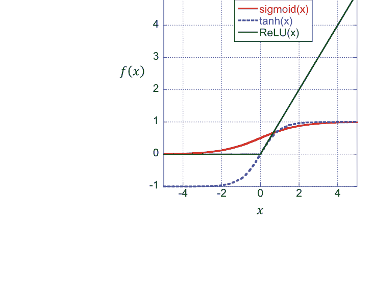

图2.2 激活函数的一阶导数

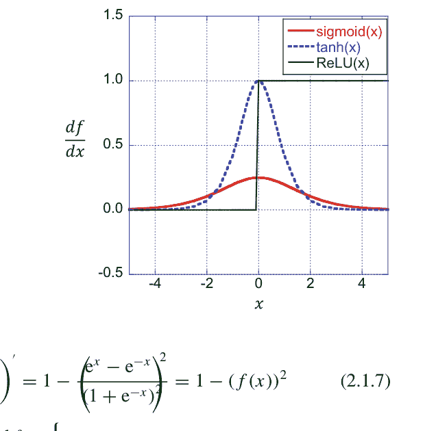

这三个函数的一阶导数如图2.2所示，其中Sigmoid函数的导数最大为0.25，小于其他函数的导数。

请注意，以下函数通常用作输入单元的激活函数，

$$ f(x) = x \tag{2.1.9} $$

而线性函数通常用作输出单元的激活函数，

$$ f(x) = ax + b \tag{2.1.10} $$

前馈神经网络的输入数据在每个层的单元中经过非线性变换，输出层的单元输出成为神经网络的输出。然后，将输出与相应的教师信号进行比较并评估误差。前馈神经网络常用的误差函数是以下的平方误差：

$$ E = \frac{1}{2} \sum_{p=1}^{n_P} \sum_{j=1}^{n_L} (^pO_j^L - ^pT_j)^2 \tag{2.1.11} $$

其中
$^pO_j^L$: 第$L$层（输出层）中第$j$个单元对于第$p$个训练模式的输出，
$^pT_j$: 对于输出层中的第$j$个单元，对应于输出模式为$p$的训练模式的教师信号，
$n_L$: $L$层（输出层）中的单元数，
$n_P$: 训练模式的总数.

在随机梯度下降方法中，通常使用每个模式的误差，而不是等式（2.1.11）作为

$$ E = \frac{1}{2} \sum_{j=1}^{n_L} \left( ^pO^L_j - ^pT_j \right)^2 \tag{2.1.12} $$

根据等式（2.1.11）和（2.1.12），这个误差被视为连接权重和偏差的函数。然后，它被写成

$$ E = E(\mathbf{w}, \boldsymbol{\theta}) \tag{2.1.13} $$

其中$\mathbf{w}$是所有连接权重的向量，$\boldsymbol{\theta}$是所有偏差的向量。
寻找最小化误差的$\mathbf{w}$和$\boldsymbol{\theta}$被称为前馈神经网络的训练或学习。基于最速下降法的误差反向传播算法被广泛用于训练，其中连接权重和偏差根据误差的梯度进行迭代更新，如下：

$$ \Delta w_{ji}^{l-1} = -\frac{\partial E(\mathbf{w}, \boldsymbol{\theta})}{\partial w_{ji}^{l-1}} \tag{2.1.14} $$
$$ w_{ji}^{l-1} = w_{ji}^{l-1} + \alpha \cdot \Delta w_{ji}^{l-1} \tag{2.1.15} $$
$$ \Delta\theta_j^l = -\frac{\partial E(\mathbf{w}, \boldsymbol{\theta})}{\partial\theta_j^l} \tag{2.1.16} $$
$$ \theta_j^l = \theta_j^l + \beta \cdot \Delta\theta_j^l \tag{2.1.17} $$

其中
$\Delta w_{ji}^{l-1}$: 连接权重更新的量，连接了第$l-1$层中的第$i$个单元与第$l$层中的第$j$个单元，
$\Delta\theta_j^l$: 偏置更新的量，位于第$l$层的第$j$个单元，
$\alpha$: 连接权重更新的学习系数，
$\beta$: 偏置更新的学习系数.

以一个4层（$L = 4$）前馈神经网络（图2.3）中的误差反向传播算法为例，讨论如下，其中要最小化的误差为

$$ E = \frac{1}{2} \sum_{j=1}^{n_4} (O_j^4 - T_j)^2 \tag{2.1.18} $$

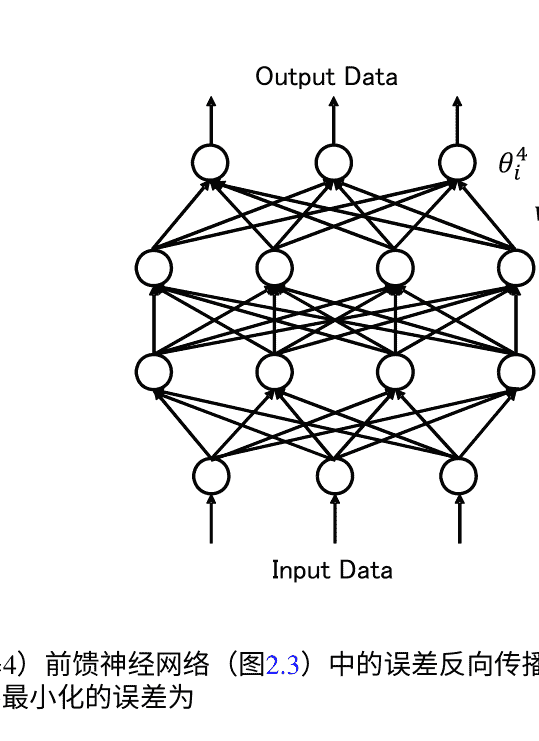

让我们从计算连接权重的更新量开始。

首先，$\frac{\partial E}{\partial w_{ab}^3}$ 计算如下：

$$ \begin{aligned} \frac{\partial E}{\partial w_{ab}^3} &= \frac{1}{2} \sum_{j=1}^{n_4} \frac{\partial}{\partial w_{ab}^3} (O_j^4 - T_j)^2 \\ &= \sum_{j=1}^{n_4} (O_j^4 - T_j) \frac{\partial O_j^4}{\partial w_{ab}^3} \\ &= (O_a^4 - T_a) \frac{\partial O_a^4}{\partial w_{ab}^3} \end{aligned} \tag{2.1.19} $$

将方程 (2.1.20) 代入方程 (2.1.19) ，我们得到

$$ \frac{\partial O_a^4}{\partial w_{ab}^3} = \frac{\partial f\left(U_a^4\right)}{\partial w_{ab}^3} = \frac{\partial f\left(U_a^4\right)}{\partial U_a^4} \frac{\partial U_a^4}{\partial w_{ab}^3} = \frac{\partial f\left(U_a^4\right)}{\partial U_a^4} \sum_{i=1}^{n_3} \frac{\partial w_{ai}^3}{\partial w_{ab}^3} O_i^3 = \frac{\partial f\left(U_a^4\right)}{\partial U_a^4} O_b^3 \quad (2.1.20) $$

$$ \frac{\partial E}{\partial w_{ab}^3} = \left(O_a^4 - T_a\right) \frac{\partial f\left(U_a^4\right)}{\partial U_a^4} O_b^3 \quad (2.1.21) $$

同样地，$\frac{\partial E}{\partial w_{cd}^2}$ 计算如下：

$$ \frac{\partial E}{\partial w_{cd}^2} = \frac{1}{2} \sum_{j=1}^{n_4} \frac{\partial}{\partial w_{cd}^2} \left(O_j^4 - T_j\right)^2 = \sum_{j=1}^{n_4} \left(O_j^4 - T_j\right) \frac{\partial O_j^4}{\partial w_{cd}^2} \quad (2.1.22) $$

$$ \frac{\partial O_j^4}{\partial w_{cd}^2} = \frac{\partial f\left(U_j^4\right)}{\partial w_{cd}^2} = \frac{\partial f\left(U_j^4\right)}{\partial U_j^4} \frac{\partial U_j^4}{\partial w_{cd}^2} = \frac{\partial f\left(U_j^4\right)}{\partial U_j^4} \frac{\partial \left(\sum_{i=1}^{n_3} w_{ji}^3 \cdot O_i^3 + \theta_j^4\right)}{\partial w_{cd}^2} = \frac{\partial f\left(U_j^4\right)}{\partial U_j^4} \sum_{i=1}^{n_3} w_{ji}^3 \frac{\partial O_i^3}{\partial w_{cd}^2} \quad (2.1.23) $$

$$ \frac{\partial O_i^3}{\partial w_{cd}^2} = \frac{\partial f\left(U_i^3\right)}{\partial w_{cd}^2} = \frac{\partial f\left(U_i^3\right)}{\partial U_i^3} \frac{\partial U_i^3}{\partial w_{cd}^2} = \frac{\partial f\left(U_i^3\right)}{\partial U_i^3} \frac{\partial \left(\sum_{k=1}^{n_2} w_{ik}^2 \cdot O_k^2 + \theta_i^3\right)}{\partial w_{cd}^2} = \frac{\partial f\left(U_i^3\right)}{\partial U_i^3} \sum_{k=1}^{n_2} \frac{\partial w_{ik}^2}{\partial w_{cd}^2} O_k^2 \quad (2.1.24) $$

$$ \frac{\partial w_{ik}^2}{\partial w_{cd}^2} = \delta_{ic}\delta_{kd} \quad \Rightarrow \quad \frac{\partial O_i^3}{\partial w_{cd}^2} = \frac{\partial f}{\partial U_i^3} \delta_{ic} O_d^2 = \frac{\partial f}{\partial U_c^3} O_d^2 \quad (2.1.24) $$

将方程（2.1.23）和（2.1.24）代入方程（2.1.22），我们得到

$$ \frac{\partial E}{\partial w_{cd}^2} = \sum_{j=1}^{n_4} \left( O_j^4 - T_j \right) \frac{\partial f}{\partial U_j^4} \sum_{i=1}^{n_3} w_{ji}^3 \left( \frac{\partial f}{\partial U_i^3} \frac{\partial w_{ik}^2}{\partial w_{cd}^2} O_k^2 \right) = \sum_{j=1}^{n_4} \left( O_j^4 - T_j \right) \frac{\partial f}{\partial U_j^4} w_{jc}^3 \frac{\partial f}{\partial U_c^3} O_d^2 \quad (2.1.25) $$

进一步，$\frac{\partial E}{\partial w_{eg}^1}$ 被计算为

$$ \frac{\partial E}{\partial w_{eg}^1} = \frac{1}{2} \sum_{j=1}^{n_4} \frac{\partial}{\partial w_{eg}^1} \left( O_j^4 - T_j \right)^2 = \sum_{j=1}^{n_4} \left( O_j^4 - T_j \right) \frac{\partial O_j^4}{\partial w_{eg}^1} \quad (2.1.26) $$

$$ \begin{aligned} \frac{\partial O_j^4}{\partial w_{eg}^1} &= \frac{\partial f}{\partial w_{eg}^1} \left( U_j^4 \right) \\ &= \frac{\partial f}{\partial U_j^4} \frac{\partial U_j^4}{\partial w_{eg}^1} \\ &= \frac{\partial f}{\partial U_j^4} \frac{\partial \left( \sum_{i=1}^{n_3} w_{ji}^3 \cdot O_i^3 + \theta_j^4 \right)}{\partial w_{eg}^1} \\ &= \frac{\partial f}{\partial U_j^4} \sum_{i=1}^{n_3} w_{ji}^3 \frac{\partial O_i^3}{\partial w_{eg}^1} \end{aligned} \quad (2.1.27) $$

$$ \begin{aligned} \frac{\partial O_i^3}{\partial w_{eg}^1} &= \frac{\partial f}{\partial w_{eg}^1} \left( U_i^3 \right) \\ &= \frac{\partial f}{\partial U_i^3} \frac{\partial U_i^3}{\partial w_{eg}^1} \\ &= \frac{\partial f}{\partial U_i^3} \frac{\partial}{\partial w_{eg}^1} \left( \sum_{k=1}^{n_2} w_{ik}^2 \cdot O_k^2 + \theta_i^3 \right) \\ &= \frac{\partial f}{\partial U_i^3} \sum_{k=1}^{n_2} \frac{\partial w_{ik}^2}{\partial w_{eg}^1} O_k^2 \\ &= \frac{\partial f}{\partial U_i^3} \sum_{k=1}^{n_2} \left( \sum_{m=1}^{n_1} \frac{\partial w_{ik}^2}{\partial w_{mh}^1} \frac{\partial w_{mh}^1}{\partial w_{eg}^1} \right) O_k^2 \end{aligned} \quad (2.1.28) $$

等等。通过这种方式，可以计算所有连接权重的梯度，并用于更新它们。对于偏置的更新，计算方式类似。

### 2.1 前馈神经网络

$$
\frac{\partial E}{\partial U_i^3} \left( \sum_{k=1}^{n_3} w_{ik}^2 \frac{\partial O_k^2}{\partial w_{eg}^1} \right) \tag{2.1.28}
$$

$$
\frac{\partial O_k^2}{\partial w_{eg}^1} = \frac{\partial f}{\partial w_{eg}^1} \left( U_k^2 \right) \\
= \frac{\partial f}{\partial U_k^2} \frac{\partial U_k^2}{\partial w_{eg}^1} \\
= \frac{\partial f}{\partial U_k^2} \frac{\partial}{\partial w_{eg}^1} \left( \sum_{l=1}^{n_1} w_{kl}^1 \cdot O_l^1 + \theta_i^2 \right) \\
= \frac{\partial f}{\partial U_k^2} \sum_{l=1}^{n_1} \frac{\partial w_{kl}^1}{\partial w_{eg}^1} O_l^1 \\
= \frac{\partial f}{\partial U_k^2} \frac{\partial w_{kg}^1}{\partial w_{eg}^1} O_g^1 \tag{2.1.29}
$$

将方程（2.1.27）、（2.1.28）和（2.1.29）代入方程（2.1.26），我们得到

$$
\frac{\partial E}{\partial w_{eg}^1} = \sum_{j=1}^{n_4} \left( O_j^4 - T_j \right) \frac{\partial f}{\partial U_j^4} \sum_{i=1}^{n_3} w_{ji}^3 \frac{\partial f}{\partial U_i^3} \sum_{k=1}^{n_2} w_{ik}^2 \frac{\partial f}{\partial U_k^2} \frac{\partial w_{kg}^1}{\partial w_{eg}^1} O_g^1 \\
= \sum_{j=1}^{n_4} \left( O_j^4 - T_j \right) \frac{\partial f}{\partial U_j^4} \sum_{i=1}^{n_3} w_{ji}^3 \frac{\partial f}{\partial U_i^3} w_{eg}^2 \frac{\partial f}{\partial U_e^2} O_g^1 \tag{2.1.30}
$$

根据以上计算，连接权重的更新量可以表示为：

$$
\Delta w_{ji}^3 = -\frac{\partial E}{\partial w_{ji}^3} = -\left( O_j^4 - T_j \right) \frac{\partial f}{\partial U_j^4} O_i^3 \tag{2.1.31}
$$

$$
\Delta w_{ji}^2 = -\frac{\partial E}{\partial w_{ji}^2} = -\sum_{k=1}^{n_4} \left( O_k^4 - T_k \right) \frac{\partial f}{\partial U_k^4} w_{kj}^3 \frac{\partial f}{\partial U_j^3} O_i^2 \tag{2.1.32}
$$

$$
\Delta w_{ji}^1 = -\frac{\partial E}{\partial w_{ji}^1} \\
= -\sum_{k=1}^{n_4} \left( O_k^4 - T_k \right) \frac{\partial f}{\partial U_k^4} \sum_{l=1}^{n_3} w_{kl}^3 \frac{\partial f}{\partial U_l^3} w_{lj}^2 \frac{\partial f}{\partial U_j^2} O_i^1 \tag{2.1.33}
$$

接下来，让我们计算偏置的更新量。首先，$\frac{\partial E}{\partial \theta_a^4}$ 计算如下：

$$
\begin{aligned}
\frac{\partial E}{\partial \theta_a^4} &= \frac{1}{2} \sum_{j=1}^{n_4} \frac{\partial}{\partial \theta_a^4} \left( O_j^4 - T_j \right)^2 \\
&= \sum_{j=1}^{n_4} \left( O_j^4 - T_j \right) \frac{\partial O_j^4}{\partial \theta_a^4} \\
&= \left( O_a^4 - T_a \right) \frac{\partial O_a^4}{\partial \theta_a^4}
\end{aligned}
$$

$$
\begin{aligned}
\frac{\partial O_a^4}{\partial \theta_a^4} &= \frac{\partial f\left( U_a^4 \right)}{\partial \theta_a^4} \\
&= \frac{\partial f\left( U_a^4 \right)}{\partial U_a^4} \frac{\partial U_a^4}{\partial \theta_a^4} \\
&= \frac{\partial f\left( U_a^4 \right)}{\partial U_a^4} \frac{\partial \left( \sum_{i=1}^{n_3} w_{ai}^3 \cdot O_i^3 + \theta_a^4 \right)}{\partial \theta_a^4} \\
&= \frac{\partial f\left( U_a^4 \right)}{\partial U_a^4}
\end{aligned}
$$

将方程 (2.1.35) 代入方程 (2.1.34) ，我们得到

$$
\frac{\partial E}{\partial \theta_a^4} = \left( O_a^4 - T_a \right) \frac{\partial f\left( U_a^4 \right)}{\partial U_a^4}
$$

同样地，$\frac{\partial E}{\partial \theta_b^3}$ 被计算为

$$
\begin{aligned}
\frac{\partial E}{\partial \theta_b^3} &= \frac{1}{2} \sum_{j=1}^{n_4} \frac{\partial}{\partial \theta_b^3} \left( O_j^4 - T_j \right)^2 \\
&= \sum_{j=1}^{n_4} \left( O_j^4 - T_j \right) \frac{\partial O_j^4}{\partial \theta_b^3} \\
\frac{\partial O_j^4}{\partial \theta_b^3} &= \frac{\partial f\left( U_j^4 \right)}{\partial \theta_b^3} \\
&= \frac{\partial f\left( U_j^4 \right)}{\partial U_j^4} \frac{\partial U_j^4}{\partial \theta_b^3}
\end{aligned}
$$

$$
= \frac{\partial f\left(U_{j}^{4}\right)}{\partial U_{j}^{4}} \frac{\partial\left(\sum_{i=1}^{n_{3}} w_{j i}^{3} \cdot O_{i}^{3}+\theta_{b}^{3}\right)}{\partial \theta_{b}^{3}} \\
= \frac{\partial f\left(U_{j}^{4}\right)}{\partial U_{j}^{4}} \sum_{i=1}^{n_{3}} w_{j i}^{3} \frac{\partial O_{i}^{3}}{\partial \theta_{b}^{3}} \\
= \frac{\partial f\left(U_{j}^{4}\right)}{\partial U_{j}^{4}} w_{j b}^{3} \frac{\partial O_{b}^{3}}{\partial \theta_{b}^{3}}
\tag{2.1.38}
$$

$$
\begin{aligned}
\frac{\partial O_{b}^{3}}{\partial \theta_{b}^{3}} &= \frac{\partial f\left(U_{b}^{3}\right)}{\partial \theta_{b}^{3}} \\
&= \frac{\partial f\left(U_{b}^{3}\right)}{\partial U_{b}^{3}} \frac{\partial U_{b}^{3}}{\partial \theta_{b}^{3}} \\
&= \frac{\partial f\left(U_{b}^{3}\right)}{\partial U_{b}^{3}} \frac{\partial\left(\sum_{k=1}^{n_{2}} w_{b k}^{2} \cdot O_{k}^{2}+\theta_{b}^{2}\right)}{\partial \theta_{b}^{3}} \\
&= \frac{\partial f\left(U_{b}^{3}\right)}{\partial U_{b}^{3}}
\end{aligned}
\tag{2.1.39}
$$

将方程 (2.1.38) 和 (2.1.39) 代入方程 (2.1.37)，我们得到

$$
\frac{\partial E}{\partial \theta_{b}^{3}} = \sum_{j=1}^{n_{4}} \left(O_{j}^{4} - T_{j}\right) \frac{\partial f\left(U_{j}^{4}\right)}{\partial U_{j}^{4}} w_{j b}^{3} \frac{\partial f\left(U_{b}^{3}\right)}{\partial U_{b}^{3}}
\tag{2.1.40}
$$

进一步，$\frac{\partial E}{\partial \theta_{c}^{2}}$ 计算如下：

$$
\begin{aligned}
\frac{\partial E}{\partial \theta_{c}^{2}} &= \frac{1}{2} \sum_{j=1}^{n_{4}} \frac{\partial}{\partial \theta_{c}^{2}} \left(O_{j}^{4} - T_{j}\right)^{2} \\
&= \sum_{j=1}^{n_{4}} \left(O_{j}^{4} - T_{j}\right) \frac{\partial O_{j}^{4}}{\partial \theta_{c}^{2}}
\end{aligned}
\tag{2.1.41}
$$

$$
\begin{aligned}
\frac{\partial O_{j}^{4}}{\partial \theta_{c}^{2}} &= \frac{\partial f\left(U_{j}^{4}\right)}{\partial \theta_{c}^{2}} \\
&= \frac{\partial f\left(U_{j}^{4}\right)}{\partial U_{j}^{4}} \frac{\partial U_{j}^{4}}{\partial \theta_{c}^{2}} \\
&= \frac{\partial f\left(U_{j}^{4}\right)}{\partial U_{j}^{4}} \frac{\partial\left(\sum_{i=1}^{n_{3}} w_{j i}^{3} \cdot O_{i}^{3}+\theta_{b}^{3}\right)}{\partial \theta_{c}^{2}} \\
&= \frac{\partial f\left(U_{j}^{4}\right)}{\partial U_{j}^{4}}
\end{aligned}
$$

$$
= \frac{\partial f\left(U_j^4\right)}{\partial U_j^4} \sum_{i=1}^{n_3} w_{ji}^3 \frac{\partial O_i^3}{\partial \theta_c^2} \quad (2.1.42)
$$

$$
\begin{aligned}
\frac{\partial O_i^3}{\partial \theta_c^2} &= \frac{\partial f\left(U_i^3\right)}{\partial \theta_c^2} \\
&= \frac{\partial f\left(U_i^3\right)}{\partial U_i^3} \frac{\partial U_i^3}{\partial \theta_c^2} \\
&= \frac{\partial f\left(U_i^3\right)}{\partial U_i^3} \frac{\partial \left( \sum_{k=1}^{n_2} w_{ik}^2 \cdot O_k^2 + \theta_i^3 \right)}{\partial \theta_c^2} \\
&= \frac{\partial f\left(U_i^3\right)}{\partial U_i^3} \sum_{k=1}^{n_2} w_{ik}^2 \frac{\partial O_k^2}{\partial \theta_c^2} \quad (2.1.43)
\end{aligned}
$$

$$
\begin{aligned}
\frac{\partial O_k^2}{\partial \theta_c^2} &= \frac{\partial f\left(U_k^2\right)}{\partial \theta_c^2} \\
&= \frac{\partial f\left(U_k^2\right)}{\partial U_k^2} \frac{\partial U_k^2}{\partial \theta_c^2} \\
&= \frac{\partial f\left(U_k^2\right)}{\partial U_k^2} \frac{\partial \left( \sum_{l=1}^{n_1} w_{kl}^1 \cdot O_l^1 + \theta_k^2 \right)}{\partial \theta_c^2} \\
&= \frac{\partial f\left(U_k^2\right)}{\partial U_k^2} \frac{\partial \theta_k^2}{\partial \theta_c^2} \quad (2.1.44)
\end{aligned}
$$

将方程（2.1.42），（2.1.43）和（2.1.44）代入方程（2.1.41），我们得到

$$
\begin{aligned}
\frac{\partial E}{\partial \theta_c^2} &= \sum_{j=1}^{n_4} \left(O_j^4 - T_j\right) \frac{\partial f\left(U_j^4\right)}{\partial U_j^4} \sum_{i=1}^{n_3} w_{ji}^3 \frac{\partial f\left(U_i^3\right)}{\partial U_i^3} \sum_{k=1}^{n_2} w_{ik}^2 \frac{\partial f\left(U_k^2\right)}{\partial U_k^2} \frac{\partial \theta_k^2}{\partial \theta_c^2} \\
&= \sum_{j=1}^{n_4} \left(O_j^4 - T_j\right) \frac{\partial f\left(U_j^4\right)}{\partial U_j^4} \sum_{i=1}^{n_3} w_{ji}^3 \frac{\partial f\left(U_i^3\right)}{\partial U_i^3} w_{ic}^2 \frac{\partial f\left(U_c^2\right)}{\partial U_c^2} \quad (2.1.45)
\end{aligned}
$$

在上述计算之后，偏置的更新量如下所示：

$$
\Delta \theta_i^4 = -\frac{\partial E}{\partial \theta_i^4} = -\left(O_i^4 - T_i\right) \frac{\partial f\left(U_i^4\right)}{\partial U_i^4} \quad (2.1.46)
$$

$$
\Delta \theta_i^3 = -\frac{\partial E}{\partial \theta_i^3} = -\sum_{j=1}^{n_4} \left(O_j^4 - T_j\right) \frac{\partial f\left(U_j^4\right)}{\partial U_j^4} w_{ji}^3 \frac{\partial f\left(U_i^3\right)}{\partial U_i^3} \quad (2.1.47)
$$$$ \Delta\theta_i^2 = -\frac{\partial E}{\partial\theta_i^2} = -\sum_{j=1}^{n_4}\left(O_j^4 - T_j\right) \frac{\partial f\left(U_j^4\right)}{\partial U_j^4} \sum_{k=1}^{n_3} w_{jk}^3 \frac{\partial f\left(U_k^3\right)}{\partial U_k^3} w_{ki}^2 \frac{\partial f\left(U_i^2\right)}{\partial U_i^2} \qquad (2.1.48) $$

### 2.2 卷积神经网络

在本节中，将详细研究卷积神经网络中卷积层的前向传播和误差反向传播，使用数学表达式进行说明。

现在，卷积层[2, 8]实际上由三种类型的层组成：卷积层、激活函数层和池化层。

卷积层通常用于图像数据，这些数据被视为二维数组，意味着卷积神经网络中的卷积层单元是二维排列的。图2.4显示了其示意图，它以大小为 $M \times N$ 的二维数据作为输入，并输出大小为 $M \times N$的二维数据，使用大小为 $S \times T$的滤波器。卷积层中的连接定义为

$$ U_{mn}^p = \sum_{s=0}^{S-1} \sum_{t=0}^{T-1} h_{st}^{p-1} \cdot O_{m+s, n+t}^{p-1} + \theta_{mn}^p \qquad (2.2.1) $$

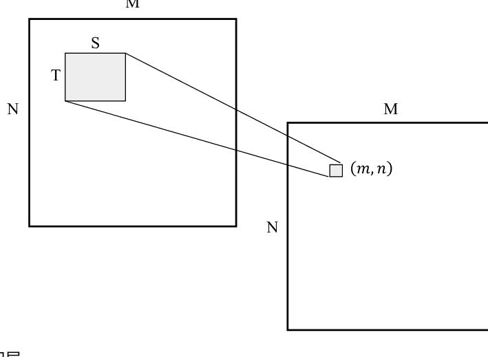

其中 $O_{m+s,n+t}^{p-1}$是第$(m+s,n+t)$个单元在第$(p-1)$层的输出，其中单元以二维方式排列，$h_{st}^{p-1}$是第$(s,t)$个滤波器的$S\times T$大小的分量，$\theta_{mn}^p$是第$(m,n)$个单元在第$p$层的偏置，$U_{mn}^p$是第$(m,n)$个单元的激活函数的输入值，在第$p$层中，单元也以二维方式排列。

例如，当 S = T = 3时，方程（2.2.1）右侧的求和部分是矩阵的所有分量的总和

$$
\begin{pmatrix}
h_{0,0}^{p-1} O_{m+0,n+0}^{p-1} & h_{1,0}^{p-1} O_{m+1,n+0}^{p-1} & h_{2,0}^{p-1} O_{m+2,n+0}^{p-1} \\
h_{0,1}^{p-1} O_{m+0,n+1}^{p-1} & h_{1,1}^{p-1} O_{m+1,n+1}^{p-1} & h_{2,1}^{p-1} O_{m+2,n+1}^{p-1} \\
h_{0,2}^{p-1} O_{m+0,n+2}^{p-1} & h_{1,2}^{p-1} O_{m+1,n+2}^{p-1} & h_{2,2}^{p-1} O_{m+2,n+2}^{p-1}
\end{pmatrix}
=
\begin{pmatrix}
O_{m+0,n+0}^{p-1} & O_{m+1,n+0}^{p-1} & O_{m+2,n+0}^{p-1} \\
O_{m+0,n+1}^{p-1} & O_{m+1,n+1}^{p-1} & O_{m+2,n+1}^{p-1} \\
O_{m+0,n+2}^{p-1} & O_{m+1,n+2}^{p-1} & O_{m+2,n+2}^{p-1}
\end{pmatrix}
\odot
\begin{pmatrix}
h_{0,0}^{p-1} & h_{1,0}^{p-1} & h_{2,0}^{p-1} \\
h_{0,1}^{p-1} & h_{1,1}^{p-1} & h_{2,1}^{p-1} \\
h_{0,2}^{p-1} & h_{1,2}^{p-1} & h_{2,2}^{p-1}
\end{pmatrix}
\quad (2.2.2)
$$

其中 ⊙表示两个矩阵对应分量的乘积，称为Hadamard乘积。

在方程(2.2.1)中，$h_{st}^{p-1}$ 而 $\theta_{mn}^p$是需要通过误差反向传播算法进行更新的参数。每个参数的更新规则如下所示：

$$
h_{st}^{p-1} \leftarrow h_{st}^{p-1} + \alpha_1 \Delta h_{st}^{p-1} = h_{st}^{p-1} - \alpha_1 \frac{\partial E}{\partial h_{st}^{p-1}} \quad (2.2.3)
$$

$$
\theta_{mn}^{p} \leftarrow \theta_{mn}^{p} + \alpha_2 \Delta \theta_{mn}^{p} = \theta_{mn}^{p} - \alpha_2 \frac{\partial E}{\partial \theta_{mn}^{p}} \quad (2.2.4)
$$

其中 $\alpha_1$ 和 $\alpha_2$ 是学习系数。方程（2.2.3）中的导数如下计算：

$$
\begin{aligned}
\frac{\partial E}{\partial h_{st}^{p-1}} &= \sum_{m=0}^{M-1} \sum_{n=0}^{N-1} \frac{\partial E}{\partial U_{mn}^{p}} \cdot \frac{\partial U_{mn}^{p}}{\partial h_{st}^{p-1}} \\
&= \sum_{m=0}^{M-1} \sum_{n=0}^{N-1} \frac{\partial E}{\partial U_{mn}^{p}} \cdot \frac{\partial \left( \sum_{s=0}^{S-1} \sum_{t=0}^{T-1} h_{st}^{p-1} \cdot O_{m+s,n+t}^{p-1} + \theta_{mn}^{p} \right)}{\partial h_{st}^{p-1}} \\
&= \sum_{m=0}^{M-1} \sum_{n=0}^{N-1} \frac{\partial E}{\partial U_{mn}^{p}} \cdot O_{m+\bar{s},n+\bar{t}}^{p-1} \quad (2.2.5)
\end{aligned}
$$

同样地，方程（2.2.4）中的导数为

$$
\begin{aligned}
\frac{\partial E}{\partial \theta_{mn}^{p}} &= \sum_{m=0}^{M-1} \sum_{n=0}^{N-1} \frac{\partial E}{\partial U_{mn}^{p}} \cdot \frac{\partial U_{mn}^{p}}{\partial \theta_{mn}^{p}} \\
&= \sum_{m=0}^{M-1} \sum_{n=0}^{N-1} \frac{\partial E}{\partial U_{mn}^{p}} \cdot \frac{\partial \left( \sum_{s=0}^{S-1} \sum_{t=0}^{T-1} h_{st}^{p-1} \cdot O_{m+s,n+t}^{p-1} + \theta_{mn}^{p} \right)}{\partial \theta_{mn}^{p}} \\
&= \sum_{m=0}^{M-1} \sum_{n=0}^{N-1} \frac{\partial E}{\partial U_{mn}^{p}} \cdot \delta_{mm} \delta_{nn} \\
&= \frac{\partial E}{\partial U_{mn}^{p}} \qquad (2.2.6)
\end{aligned}
$$

其中 $\delta_{ij}$ 是克罗内克 (Kronecker) 的 $\delta$，如下所示：

$$
\delta_{ij} = \begin{cases} 1 & (i=j) \\ 0 & (i \neq j) \end{cases} \qquad (2.2.7)
$$

如果在同一层中使用相同的偏置值，即 $\theta_{mn}^p = \theta^{p}$，这在实践中经常发生，那么方程 (2.2.6) 变为

$$
\frac{\partial E}{\partial \theta^{p}} = \sum_{m=0}^{M-1} \sum_{n=0}^{N-1} \frac{\partial E}{\partial U_{mn}^{p}} \qquad (2.2.8)
$$

与全连接前馈神经网络的情况一样 (第2.1节)， $\frac{\partial E}{\partial U_{mn}^{p}}$ 出现在参数更新方程中的

$\frac{\partial E}{\partial O_{mn}^{p-1}}$ 每层的

$$
\begin{aligned}
\frac{\partial E}{\partial O_{mn}^{p-1}} &= \sum_{m=0}^{M-1} \sum_{n=0}^{N-1} \frac{\partial E}{\partial U_{mn}^{p}} \cdot \frac{\partial U_{mn}^{p}}{\partial O_{mn}^{p-1}} \\
&= \sum_{m=0}^{M-1} \sum_{n=0}^{N-1} \frac{\partial E}{\partial U_{mn}^{p}} \cdot \frac{\partial \left( \sum_{s=0}^{S-1} \sum_{t=0}^{T-1} h_{st}^{p-1} \cdot O_{m+s,n+t}^{p-1} + \theta_{mn}^{p} \right)}{\partial O_{mn}^{p-1}} \\
&= \sum_{m=0}^{M-1} \sum_{n=0}^{N-1} \frac{\partial E}{\partial U_{mn}^{p}} \cdot \left( \sum_{s=0}^{S-1} \sum_{t=0}^{T-1} h_{st}^{p-1} \cdot \frac{\partial O_{m+s,n+t}^{p-1}}{\partial O_{mn}^{p-1}} \right) \\
&= \sum_{m=0}^{M-1} \sum_{n=0}^{N-1} \frac{\partial E}{\partial U_{mn}^{p}} \cdot \left( \sum_{s=0}^{S-1} \sum_{t=0}^{T-1} h_{st}^{p-1} \cdot \delta_{m,m+s} \delta_{n,n+t} \right) \qquad (2.2.9)
\end{aligned}
$$

由于 $M \gg S$ 和 $N \gg T$ 通常情况下，上述方程中的 $\delta_{m,m+s} \delta_{n,n+t}$ 很少等于1。例如，当 $(m,n)=(7,8)$ 且 $S=T=3$ 时，上述方程的右侧是以下矩阵的九个分量的和：

$$
\left(
\begin{array}{ccc}
\frac{\partial E}{\partial U_{5,6}^p} \cdot h_{2,2}^{p-1} & \frac{\partial E}{\partial U_{6,6}^p} \cdot h_{1,2}^{p-1} & \frac{\partial E}{\partial U_{7,6}^p} \cdot h_{0,2}^{p-1} \\
\frac{\partial E}{\partial U_{5,7}^p} \cdot h_{2,1}^{p-1} & \frac{\partial E}{\partial U_{6,7}^p} \cdot h_{1,1}^{p-1} & \frac{\partial E}{\partial U_{7,7}^p} \cdot h_{0,1}^{p-1} \\
\frac{\partial E}{\partial U_{5,8}^p} \cdot h_{2,0}^{p-1} & \frac{\partial E}{\partial U_{6,8}^p} \cdot h_{1,0}^{p-1} & \frac{\partial E}{\partial U_{7,8}^p} \cdot h_{0,0}^{p-1}
\end{array}
\right)
= \left(
\begin{array}{ccc}
\frac{\partial E}{\partial U_{5,6}^p} & \frac{\partial E}{\partial U_{6,6}^p} & \frac{\partial E}{\partial U_{7,6}^p} \\
\frac{\partial E}{\partial U_{5,7}^p} & \frac{\partial E}{\partial U_{6,7}^p} & \frac{\partial E}{\partial U_{7,7}^p} \\
\frac{\partial E}{\partial U_{5,8}^p} & \frac{\partial E}{\partial U_{6,8}^p} & \frac{\partial E}{\partial U_{7,8}^p}
\end{array}
\right) \odot \left(
\begin{array}{ccc}
h_{2,2}^{p-1} & h_{1,2}^{p-1} & h_{0,2}^{p-1} \\
h_{2,1}^{p-1} & h_{1,1}^{p-1} & h_{0,1}^{p-1} \\
h_{2,0}^{p-1} & h_{1,0}^{p-1} & h_{0,0}^{p-1}
\end{array}
\right)
\quad\quad (2.2.10)
$$

方程 (2.2.10) 表明反向传播计算可以通过与反转的滤波器矩阵进行卷积来完成。

在激活函数层中，通过将卷积层的输出作为输入来激活激活函数。对于ReLU函数，在卷积层中最常用的函数，激活层的输出计算如下：

$$ U^p_{mn} = \text{ReLU}(O^{p-1}_{mn}) \quad\quad (2.2.11) $$

在激活函数层中没有需要训练的参数。误差反向传播的导数计算如下：

$$
\begin{aligned}
\frac{\partial E}{\partial O^{p-1}_{mn}} &= \sum_{m=0}^{M-1} \sum_{n=0}^{N-1} \frac{\partial E}{\partial U_{mn}^p} \cdot \frac{\partial U_{mn}^p}{\partial O^{p-1}_{mn}} \\
&= \sum_{m=0}^{M-1} \sum_{n=0}^{N-1} \frac{\partial E}{\partial U_{mn}^p} \cdot \frac{\partial \text{ReLU}(O_{mn}^{p-1})}{\partial O^{p-1}_{mn}} \\
&= \frac{\partial E}{\partial U_{mn}^p} \cdot \frac{\partial \text{ReLU}(O_{mn}^{p-1})}{\partial O^{p-1}_{mn}} \\
&= \begin{cases}
\frac{\partial E}{\partial U_{mn}^p} & (O_{mn}^{p-1} > 0) \\
0 & (O_{mn}^{p-1} \leq 0)
\end{cases}
\quad\quad (2.2.12)
\end{aligned}
$$

在卷积层之后使用池化层，池化层中的连接定义如下：

$$ U_{mn}^p = \left( \frac{1}{S \times T} \sum_{(i,j) \in D_{mn}} (O_{ij}^{p-1})^g \right)^{\frac{1}{g}} \quad\quad (2.2.13) $$

其中 $O_{ij}^{p-1}$ 是第$(i, j)$个单元在二维方式下排列在第$(p-1)$层的输出，$D_{mn}$ 是第$(m,n)$个单元在第 $p$层的池化窗口，而$(i,j)$是池化窗口 $D_{mn}$中单元的索引，S xT是其大小。在卷积层中，$S$和$T$的值通常设置为与滤波器大小相同。

将方程(2.2.13)中的 $g$设置为$1.0$会得到以下平均池化：

$$ U_{mn}^p = \frac{1}{S \times T} \sum_{(i,j) \in D_{mn}} O_{ij}^{p-1} \quad (2.2.14) $$

另一方面，将方程(2.2.13)中的 $g$设置为 $\infty$ 会得到以下最大池化：

$$ U_{mn}^p = \max_{(i,j) \in D_{mn}} \left\{ O_{ij}^{p-1} \right\} \quad (2.2.15) $$

在池化层中没有需要调整的参数。在平均池化的情况下，误差反向传播的导数计算如下

$$
\begin{aligned}
\frac{\partial E}{\partial O_{mn}^{p-1}} &= \sum_{m=0}^{M-1} \sum_{n=0}^{N-1} \frac{\partial E}{\partial U_{mn}^{p}} \cdot \frac{\partial U_{mn}^{p}}{\partial O_{mn}^{p-1}} \\
&= \sum_{m=0}^{M-1} \sum_{n=0}^{N-1} \frac{\partial E}{\partial U_{mn}^{p}} \cdot \left( \frac{1}{S \times T} \sum_{(i,j) \in D_{mn}} \frac{\partial O_{ij}^{p-1}}{\partial O_{mn}^{p-1}} \right) \\
&= \sum_{m=0}^{M-1} \sum_{n=0}^{N-1} \frac{\partial E}{\partial U_{mn}^{p}} \cdot \left( \frac{1}{S \times T} \sum_{(i,j) \in D_{mn}} \delta_{\bar{m} i} \delta_{\bar{n} j} \right) \quad (2.2.16)
\end{aligned}
$$

同样，在最大池化的情况下，误差反向传播的导数计算如下

$$
\begin{aligned}
\frac{\partial E}{\partial O_{mn}^{p-1}} &= \sum_{m=0}^{M-1} \sum_{n=0}^{N-1} \frac{\partial E}{\partial U_{mn}^{p}} \cdot \frac{\partial U_{mn}^{p}}{\partial O_{mn}^{p-1}} \\
&= \sum_{m=0}^{M-1} \sum_{n=0}^{N-1} \frac{\partial E}{\partial U_{mn}^{p}} \cdot \frac{\partial}{\partial O_{mn}^{p-1}} \left( \max_{(i,j) \in D_{mn}} \left\{ O_{ij}^{p-1} \right\} \right) \quad (2.2.17)
\end{aligned}
$$

归一化层通常与卷积层一起使用。一个典型的归一化层定义如下：

$$ U_{mn}^{p} = \frac{O_{mn}^{p-1} - \overline{O}_{mn}^{p-1}}{c + \sigma_{mn}^{2}} \quad (2.2.18) $$

## 2 深度学习的数学背景

其中
$$\overline{O}_{mn}^{p-1} = \frac{1}{S \times T} \sum_{(i,j) \in D_{mn}} O_{i,j}^{p-1} \tag{2.2.19}$$

$$\sigma_{mn}^{2} = \frac{1}{S \times T} \sum_{(i,j) \in D_{mn}} \left( O_{i,j}^{p-1} - \overline{O}_{mn}^{p-1} \right)^2 \tag{2.2.20}$$

在这里，$O_{mn}^{p-1}$是第$(m,n)$个单元在第$(p-1)$层的输出，其中单元以二维方式排列，$D_{mn}$是第$(m,n)$个单元的归一化窗口，$(i,j)$是归一化窗口中单元的索引，$D_{mn}$的大小为$S \times T$，$\epsilon$是一个小的常数，用于避免除以零。

### 2.3 训练加速

在第2.3节中，我们讨论了加速误差反向传播学习的几种方法。

#### 2.3.1 动量法

基于随机梯度下降法的误差反向传播算法（SGD）通常非常耗时，因此人们尝试了各种方法来加速其速度。

动量法[10]是一种标准的加速方法，因为它相对容易实现，并且在许多情况下都很有效。

设第 $t$ 次更新中的连接权重为 $w_{ji}^{(t)}$，那么在标准反向传播算法中，连接权重的更新量 $\Delta w_{ji}^{(t)}$ 可以写成如下形式：

$$\Delta w_{ji}^{(t)} = -\frac{\partial E(\boldsymbol{w}, \boldsymbol{\theta})}{\partial w_{ji}^{(t)}} \tag{2.3.1}$$

$$w_{ji}^{(t+1)} = w_{ji}^{(t)} + \alpha \cdot \Delta w_{ji}^{(t)} \tag{2.3.2}$$

其中 $\alpha$ 是学习系数。

在动量法中，更新的数量通过前一次更新的数量进行修正。具体来说，当动量法中的更新量表示为 $\Delta^M w_{ji}^{(t)}$ 时，方程(2.3.1)和(2.3.2)被修改如下：

$$\Delta^M w_{ji}^{(t)} = -\frac{\partial E(\boldsymbol{w}, \boldsymbol{\theta})}{\partial w_{ji}^{(t)}} + \gamma \Delta^M w_{ji}^{(t-1)} = \Delta w_{ji}^{(t)} + \gamma \Delta^M w_{ji}^{(t-1)} \tag{2.3.3}$$

$$w_{ji}^{(t+1)} = w_{ji}^{(t)} + \alpha \cdot \Delta^M w_{ji}^{(t)} \tag{2.3.4}$$

在这里，$\gamma$是一个正常数。在这种方法中，当前步骤的更新通过乘以 $\gamma$ 的幂来纠正过去的更新，如下所示：

$$\begin{aligned}
w_{ji}^{(t+1)} &= w_{ji}^{(t)} + \alpha \cdot \Delta^M w_{ji}^{(t)} \\
&= w_{ji}^{(t)} + \alpha \cdot \left( \Delta w_{ji}^{(t)} + \gamma \Delta^M w_{ji}^{(t-1)} \right) \\
&= w_{ji}^{(t)} + \alpha \cdot \left( \Delta w_{ji}^{(t)} + \gamma \left( \Delta w_{ji}^{(t-1)} + \gamma \Delta^M w_{ji}^{(t-2)} \right) \right) \\
&= w_{ji}^{(t)} + \alpha \cdot \left( \Delta w_{ji}^{(t)} + \gamma \left( \Delta w_{ji}^{(t-1)} + \gamma \left( \Delta w_{ji}^{(t-2)} + \gamma \Delta^M w_{ji}^{(t-3)} \right) \right) \right) \\
&= w_{ji}^{(t)} + \alpha \cdot \left( \Delta w_{ji}^{(t)} + \gamma \Delta w_{ji}^{(t-1)} + \gamma^2 \Delta w_{ji}^{(t-2)} + \gamma^3 \Delta w_{ji}^{(t-3)} + \cdots \right)
\end{aligned} \tag{2.3.5}$$

动量法通过在当前更新与上一次更新方向相同时增加更新量，以加速更新的效果，并通过在更新方向相反时减少更新量来抑制振动。

#### 2.3.2 AdaGrad和RMSProp

AdaGrad方法被认为是动量法（第2.3.1节）的改进版本，RMSProp方法是AdaGrad方法的进一步改进版本。

动量法（第2.3.1节）在参数之间使用相同的学习系数，而AdaGrad方法[1]为每个参数单独使用学习系数，每个参数根据先前更新的历史自动更新。如果第 $t$ 次更新中的连接权重为 $w_{ji}^{(t)}$，并且其更新量为 $\Delta w_{ji}^{(t)}$，则该方法中连接权重的更新如下所示：

$$\Delta w_{ji}^{(t)} = -\frac{\partial E(\boldsymbol{w}, \boldsymbol{\theta})}{\partial w_{ji}^{(t)}} \tag{2.3.6}$$

$$w_{ji}^{(t+1)} = w_{ji}^{(t)} + \alpha_{ji}(t) \cdot \Delta w_{ji}^{(t)} \tag{2.3.7}$$

其中$\alpha_{ji}(t)$是给定的学习系数

$$ \alpha_{ji}(t) = \frac{\gamma}{\epsilon + \sqrt{S_{ji}(t)}} \tag{2.3.8} $$

$$ S_{ji}(t) = \sum_{\tau=1}^{t} \left( \Delta w_{ji}^{(\tau)} \right)^2 \tag{2.3.9} $$

在这里，$\gamma$是一个常数，$\epsilon$是一个小常数，用于避免除以零和提高数值稳定性。

在这种方法中，学习系数对于已经大幅更新或更频繁更新的参数会变得较小，而对于其他参数则保持相对较大。

另一方面，RMSProp方法[11]可以看作是AdaGrad方法的改进版本。在RMSProp方法中，AdaGrad方法中的 $S_{ji}(t)$ 在方程(2.3.9)中被修改，使得渐近方程变为

$$ \left\{ \begin{aligned} S_{ji}(1) &= \rho \left( \Delta w_{ji}^{(1)} \right)^2 \quad (t=1) \\ S_{ji}(t) &= \rho \left( \Delta w_{ji}^{(t)} \right)^2 + (1-\rho) S_{ji}(t-1) \quad (t \ge 2) \end{aligned} \right. \tag{2.3.10} $$

被采用。在这里，$\rho$是一个小于1的正常数。

让方程(2.3.9)中的 $S_{ji}(t)$ 和方程(2.3.10)中的 $S_{ji}(t)$ 分别表示为 $S_{ji}^{A}(t)$ 和 $S_{ji}^{R}(t)$ ，然后它们可以表示如下：

$$ S_{ji}^{A}(t) = \left( \Delta w_{ji}^{(t)} \right)^2 + \left( \Delta w_{ji}^{(t-1)} \right)^2 + \left( \Delta w_{ji}^{(t-2)} \right)^2 + \left( \Delta w_{ji}^{(t-3)} \right)^2 + \cdots $$

$$ S_{ji}^{R}(t) = \rho \left( \left( \Delta w_{ji}^{(t)} \right)^2 + (1-\rho) \left( \Delta w_{ji}^{(t-1)} \right)^2 + (1-\rho)^2 \left( \Delta w_{ji}^{(t-2)} \right)^2 + \cdots \right) \tag{2.3.11} $$

从方程(2.3.11)可以看出，AdaGrad方法对所有步骤的更新都是平等对待的，而RMSProp方法则更加强调最近的更新。对于许多问题来说，RMSProp方法比AdaGrad方法更有效。

#### 2.3.3 Adam

最后，讨论了Adam方法[6]，这可能是当今最常用的加速方法。再次进行与其他方法的比较，以便更容易理解其特点。

这种方法被认为是另一种学习加速方法，可以独立地改变每个参数的学习系数。该方法中连接权重的更新规则如下所示：

$$\Delta w_{ji}^{(t)} = -\frac{\partial E(\boldsymbol{w}, \boldsymbol{\theta})}{\partial w_{ji}^{(t)}} \qquad (2.3.12)$$

$$w_{ji}^{(t+1)} = w_{ji}^{(t)} + \alpha_{ji}(t) \cdot \Delta^{\text{Adam}} w_{ji}^{(t)} \qquad (2.3.13)$$

其中更新量 $\Delta^{\text{Adam}} w_{ji}^{(t)}$ 给出为

$$m^{(0)} = 0 \qquad (2.3.14)$$

$$m^{(t)} = \beta_1 \cdot m^{(t-1)} + (1 - \beta_1) \Delta w_{ji}^{(t)} \qquad (2.3.15)$$

$$\Delta^{\text{Adam}} w_{ji}^{(t)} = \frac{m^{(t)}}{1 - \beta_1^t} \qquad (2.3.16)$$

其中 $\beta_1$ 是一个常数。根据方程 (2.3.15) 和 (2.3.16)，$\Delta^{\text{Adam}} w_{ji}^{(t)}$ 可以写成

$$\Delta^{\text{Adam}} w_{ji}^{(t)} = \frac{1 - \beta_1}{1 - \beta_1^t} \left( \Delta w_{ji}^{(t)} + \beta_1 \Delta w_{ji}^{(t-1)} + \beta_1^2 \Delta w_{ji}^{(t-2)} + \beta_1^3 \Delta w_{ji}^{(t-3)} + \cdots \right) \qquad (2.3.17)$$

这个方程与动量法（第2.3.1节）的方程（2.3.5）类似，表明Adam方法也是动量法的改进版本。

另一方面，学习系数 $\alpha_{ji}(t)$ 在方程（2.3.13）中给出

$$v^{(0)} = 0 \qquad (2.3.18)$$

$$v^{(t)} = \beta_2 \cdot v^{(t-1)} + (1 - \beta_2) \left( \Delta w_{ji}^{(t)} \right)^2 \qquad (2.3.19)$$

$$\hat{v}^{(t)} = \frac{v^{(t)}}{1 - \beta_2^t} \qquad (2.3.20)$$

$$\alpha_{ji}(t) = \frac{\gamma}{\epsilon + \sqrt{\hat{v}^{(t)}}} \qquad (2.3.21)$$

其中 $\gamma$、$\beta_1$ 和 $\beta_2$ 是参数，$\epsilon$ 是用于避免数值不稳定的参数。注意，原始论文建议 $\gamma = 0.001$，$\beta_1 = 0.9$，$\beta_2 = 0.999$，$\epsilon = 1.0 \times 10^{-8}$。

方程式 (2.3.19) 与方程式 (2.3.10) 类似。因此，Adam 方法采用了与 RMSProp 方法相似的更新规则（第2.3.2节），可以认为它是在后者方法中结合了动量方法的一种方法。Adam 方法被认为在各种问题中都很有效，并且已经广泛使用。

### 2.4 正则化

我们在这里研究一些稳定学习和防止过拟合的方法，通常称为正则化方法。第2.4.1节解释了在逆问题的背景下正则化的含义，第2.4.2节和第2.4.3节描述了误差反向传播算法的代表性正则化方法。

#### 2.4.1 什么是正则化？

输入是原因，输出是结果的问题称为直接问题，而从结果中推断原因的问题称为逆问题[7]。让我们考虑两辆车之间的碰撞。直接问题是根据车辆的相对位置、行驶方向、碰撞时的速度等输入来估计变形和损伤，而逆问题是根据车辆碰撞后的变形和损伤来估计碰撞时的位置关系和速度。无损检测，如缺陷识别，也是一个典型的逆问题。众所周知，逆问题比直接问题更难解决。

一个典型的反问题被定义为从观测数据 $(x_1, y_1), (x_2, y_2), \cdots, (x_n, y_n)$ 估计出底层函数 $f(x_i)$ 的问题。为了解决这个问题，通常需要找到使平方误差之和最小化的函数 $f_{opt}$。

$$E_S(f) = \frac{1}{2} \sum_{i=1}^n (f(x_i) - y_i)^2$$

然而，众所周知，寻找函数 $f_{opt}$ often失败。图 2.5 显示了这样一个情况，在图 2.5a中， $f_A$ 很好地重现了样本点，而图2.5b中的 $f_B$ 在每个样本点上都有误差。至于在等式(2.4.1)中定义的平方误差之和，很明显 $f_B$ 的误差比 $f_A$ 大或者

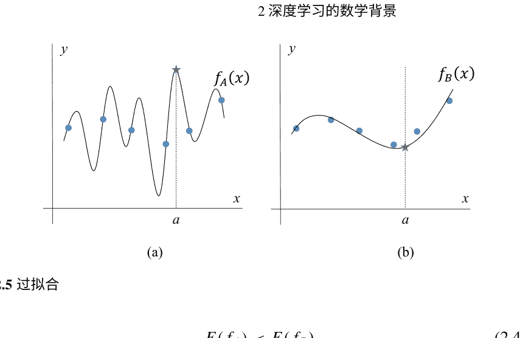

图2.5 过拟合

$$ E(f_A) < E(f_B) $$

这表明我们应该选择 $f_A$ 作为 $f_{\text{opt}}$。然而，如果我们比较例如在图中的值 $f_A(a)$ 和 $f_B(a)$ 在 $x = a$，点 $(a, f_A(a))$ 远离其他样本点，而点 $(a, f_B(a))$ 接近其他样本点，大多数人可能会认为 $(a, f_B(a))$ 更加合理。因此，可以得出结论，$f_A$ 只在样本点上过拟合。

为了解决上述问题，Tikhonov和Arseninin研究了在 Eq. (2.4.1)中添加一个新项来抑制对样本点的过拟合，他称之为正则化 [12]。换句话说，在Tikhonov的正则化中，不是最小化 $E_S(f)$ in Eq. (2.4.1)，而是最小化 $E_T(f)$给定为

$$ E_T(f) = E_S(f) + \lambda E_R(f) $$

要最小化的是 $E_R(f)$，其中 $E_R(f)$ 是正则化项，$\lambda$ 是正则化参数 $(\lambda \ge 0)$。$\lambda = 0$时，结果为方程(2.4.1)，没有正则化项；如果$\lambda$太大，最小化 $E_S(f)$ 就不够了。作为正则化项的一个示例，$E_R(f)$给出为

$$ E_R(f) = \frac{1}{2} ||\mathbf{D} f||^2 $$

经常使用，其中 $\mathbf{D}$ 是微分算子，$||\cdot||^2$ 是平方范数。例如，我们假设

$$ E_R(f) = \frac{1}{2} \left\| \frac{d f}{dx} \right\|^2 $$

在方程(2.4.3)中添加这个项，关系如下

$$ E_T(f_A) > E_T(f_B) \tag{2.4.6} $$

对于适当的 $\lambda$值可能成立，并且可以选择 $f_B$ 作为 $f_{opt}$。在神经网络中的误差反向传播学习中可能发生相同的情况，以最小化定义为误差的

$$ E = \frac{1}{2} \sum_{j=1}^{n_L} (^p O_j^L - ^p T_j)^2 \tag{2.4.7} $$

当尝试用少量的训练模式最小化方程 (2.4.7) 时，可能会过度拟合训练模式，导致训练模式的平方误差减小，但验证模式的误差增加。这被称为过度训练。

通过将正则化项 $E_R$ 添加到方程 (2.4.7) 中

$$ E = \frac{1}{2} \sum_{j=1}^{n_L} (^p O_j^L - ^p T_j)^2 + \lambda E_R \tag{2.4.8} $$

表明过度训练被抑制，未用于训练的模式的估计精度得到改善；换句话说，泛化能力得到改善。

#### 2.4.2 权重衰减

正则化方法将所有连接权重的平方和作为正则化项，是神经网络中最著名的方法之一，要最小化的误差函数如下所示：

$$ E_T = E_S + \lambda E_R = \frac{1}{2} \sum_{j=1}^{n_L} (^p O_j^L - ^p T_j)^2 + \lambda \frac{1}{2} \sum_l \sum_j \sum_i (w_{ji}^l)^2 \tag{2.4.9} $$

其中 $w_{ji}^l$ 是第 $j$ 个单元在第 $(l + 1)$ 层和第 $i$ 个单元在第 $l$ 层之间的连接权重。误差反向传播学习中 $w_{ab}^c$ 的更新量可表示为

$$ \Delta_T w_{ab}^c = - \frac{\partial E_T}{\partial w_{ab}^c} = - \frac{\partial E_S}{\partial w_{ab}^c} - \lambda \frac{\partial E_R}{\partial w_{ab}^c} = \Delta_S w_{ab}^c - \lambda w_{ab}^c \tag{2.4.10} $$

在这里，$\Delta_T w_{ab}^c$ 表示包括正则化项的 $w_{ab}^c$ 的更新量，$\Delta_S w_{ab}^c$ 表示没有正则化项时的更新量。如果学习系数设置为 $\alpha$，则连接权重 $w_{ab}^c$ 的更新规则为

$$ \begin{aligned} w_{ab}^{c} & \leftarrow w_{ab}^{c} + \alpha \Delta_T w_{ab}^{c} = w_{ab}^{c} + \alpha \left( \Delta_S w_{ab}^{c} - \lambda w_{ab}^{c} \right) \\ & = (1 - \alpha \lambda) w_{ab}^{c} + \alpha \Delta_S w_{ab}^{c} \end{aligned} \tag{2.4.11} $$

当没有正则化项时，方程(2.4.11)右侧的第二项与修正项相同。方程(2.4.11)右侧的第一项是由于正则化而产生的项。由于大多数情况下 $0 < 1-\alpha\lambda < 1$，它通常会在每个训练周期中减小连接权重的绝对值。因此，方程(2.4.9)的正则化被称为权重衰减。

#### 2.4.3 物理信息网络

一种利用物理信息（控制方程、边界条件等）作为正则化项的正则化方法在计算力学中受到了广泛关注，称为物理信息神经网络[5, 9]。

让我们找到一个非线性微分方程的解

$$ \frac{\partial u(\mathbf{x}, t)}{\partial t} + N[u] = 0, \quad \mathbf{x} \in \Omega, \quad t \in [0, T] \tag{2.4.12} $$

其中 $u(\mathbf{x}, t)$ 是未知数，$N[\cdot]$ 是非线性微分算子，$\Omega$ 是 $\mathbb{R}^D$ 的子集。

假设通过神经网络得到的数据驱动解 $u(\mathbf{x}, t)$，我们通常需要最小化误差函数 $E_D$如下：

$$ E_D = \frac{1}{n_u} \sum_{i=1}^{n_u} \left| u\left( \mathbf{x}_u^i, t_u^i \right) - u^i \right|^2 \tag{2.4.13} $$

其中 $(\mathbf{x}_u^i, t_u^i, u^i)$ 是 $u(\mathbf{x}, t)$ 的训练数据，包括初始和边界训练数据，$n_u$ 是训练数据的数量。通过神经网络进行误差函数 $E_D$ 的最小化是一种广泛使用的方法，用于获得近似解。

在物理信息神经网络中，添加了一个新的损失项 $E_P$ 到 $E_D$ 中，其中 $E_P$ 是基于物理定律（偏微分方程或控制方程）构建的，应该满足 $u(\mathbf{x}, t)$。在等式（2.4.12）的情况下，新的损失函数如下所示：$$
E = E_D + \lambda E_P = E_D + \frac{\lambda}{n_f} \sum_{j=1}^{n_f} \left| \frac{\partial u\left(\boldsymbol{x}_f^j, t_f^j\right)}{\partial t} + N\left[u\left(\boldsymbol{x}_f^j, t_f^j\right)\right] \right|^2 \quad (2.4.14)
$$

其中 $\left(\boldsymbol{x}_f^j, t_f^j\right)$ 是配准点， $n_f$是配准点的数量， $\lambda$是平衡两个损失项的权重。

为了计算 $E_P$，我们需要输出 $u$的导数值 $\left(\boldsymbol{x}_u^i, t_u^i\right)$ 相对于其输入数据的前馈神经网络的。这些导数可以通过自动微分（见第13.8节）获得。SciANN [3]是一个基于深度学习库和自动微分的物理信息神经网络包。

### 参考文献

1. Duchi, J., Hazan, E., Singer, Y. 自适应次梯度方法用于在线学习和随机优化。机器学习研究杂志 12， 2121–2159 (2011).
2. Goodfellow, I., Bengio, Y., Courville, A. 深度学习。MIT出版社 (2016).
3. Haghighat, E., Juanes, R. SciANN：一个用于科学计算和基于物理的深度学习的Keras/TensorFlow封装器。计算方法与应用力学工程 373， 113552 (2021). https://doi.org/10.1016/j.cma.2020.113552.
4. Heykin, S. 神经网络：一个全面的基础。Prentice Hall (1999).
5. Kaniadakis, G.E., Kevrekidis, I.G., Lu, L., Perdikaris, P., Wang, S., Yang, L. 基于物理的机器学习。自然物理评论 3， 422–440 (2021). https://doi.org/10.1038/s42254-021-00314-5.
6. Kingma, D.P., Ba, J. Adam：一种用于随机优化的方法。在第三届国际学习表示会议（ICLR）上，圣地亚哥，2015年，arXiv:1412.6980.
7. Kubo, S. 与固体和结构的力学和断裂相关的逆问题。JSME Int. J. 31(2)， 157–166 (1988).
8. LeCun, Y. 泛化和网络设计策略。技术报告CRG-TR-89-4，多伦多大学计算机科学系（1989年）.
9. Raissi, M., Perdikaris, P., Karniadakis, G.E. 物理信息神经网络：用于解决涉及非线性偏微分方程的正向和逆向问题的深度学习框架。J. Comput. Phys. 378， 686–707 (2019).
10. Rumelhart, D.E., Hinton, G.E., Williams, R.J. 通过反向传播学习表示。Nature 323， 533–536 (1986).
11. Tieleman, T., Hinton, G. 讲座6.5-rmsprop：将梯度除以其最近幅度的运行平均值。COURSERA：机器学习的神经网络4(2)， 26–31 (2012).
12. Tikhonov, A.N., Arsenin, V.Y. 解决不适当问题。John Wiley & Sons (1977).

# 第3章
## 深度学习的计算力学

摘要 本章概述了与计算力学相关的深度学习的最新研究趋势。在第3.1节中，我们根据近年来发表的关于这个主题的论文数量的趋势，讨论了深度学习在计算力学的各个领域中的应用，展示了对深度学习日益增长的兴趣。在第3.2节中，我们回顾了自2018年以来发表的关于深度学习在计算力学中的论文列表的研究趋势。

### 3.1 概述

在计算力学领域，关于前馈神经网络和深度学习的各种论文已经报道了材料本构方程[2, 3, 7]、有限元法的单元积分[9]、有限元法的加速和精度改进[6, 11]、接触分析[5, 10]、无损检测[12–14]和结构识别[1, 18]等。这些计算力学领域的研究在[11, 15, 16]中进行了概述。

2021年出版的书籍[17]将上述研究进行了分类：

- 本构模型
- 数值积分
- 分析参数的识别
- 求解器和解法方法
- 结构识别
- 结构优化。

在这里，本构模型的类别包括非线性和历史依赖材料的建模，数值积分的类别包括单元积分的优化，分析参数识别的类别包括动态分析中时间增量的优化。求解器和解法方法的类别包括神经网络在无反射边界和域分解以及接触搜索中的应用，而结构识别的类别包括缺陷识别和结构识别。

从上面可以看出，神经网络和深度学习已经应用于计算力学中几乎所有的领域和过程。如上所述，神经网络和深度学习已经应用于计算力学中几乎所有的领域和过程。图3.1显示了标题中包含“神经网络”或“深度学习”一词的论文数量的趋势，其中总数是自1993年至2020年在以下期刊发表的相关论文数量：

- 国际工程数值方法期刊（IJNME）
- 应用力学和工程中的计算机方法（CMAME）
- 分析与设计中的有限元（FEAD）
- 计算力学（CM）
- 计算机与结构（C&S）

请注意，自2017年以来，“神经网络”或“深度学习”标题的论文总数迅速增加，特别是“深度学习”的数量值得注意。

如上所述，深度学习和神经网络已被应用于计算力学的各个领域，所有这些领域都试图在神经网络上重现输入-输出关系或因果关系。

让我们考虑无损检测（缺陷识别）。通过使用有限元方法对具有某些缺陷的固体进行数值模拟，可以计算出观测点处的响应，其中输入和输出设置如下：

输入（x）：缺陷的位置和大小
输出（y）：观测点处的响应。

在普通的数值模拟中，输入（x）是原因，输出（y）是结果，找到原因（x）对应的结果（y）的问题被称为直接问题。另一方面，找到结果（y）对应的原因（x）的问题被称为反问题。这些关系分别写为：

$$
\text{直接问题} \quad f : x \rightarrow y \quad\quad\quad (3.1.1)
$$

$$
\text{反问题} \quad f^{-1} : y \rightarrow x \quad\quad\quad (3.1.2)
$$

虽然常规的偏微分方程数值解法是解决直接问题的工具，但深度学习和神经网络可以应用于直接问题和反问题。

在无损检测的情况下，深度学习和神经网络通常用于解决反问题，其中构建一个神经网络，以观测点的响应作为输入，并输出缺陷的位置和形状。

另一方面，深度学习和神经网络被用作解决直接问题的工具，将观测点的响应作为输出，这被称为代理模型，在普通数值模拟中用作增加分析速度的替代品。在无损检测中，基于神经网络的代理模型经常与遗传算法等全局优化工具结合使用，以加快在优化循环中需要执行多次的直接问题的分析。

深度学习和神经网络在直接和反演分析中的过程包括以下三个阶段（图3.2）：

(1) 数据准备阶段：建立在计算力学等领域中寻找和构建规则所需的输入-输出关系。设$n$维输入数据为$(x^p_1, x^p_2, \ldots, x^p_{n-1}, x^p_n)$，$P = 1, 2, 3, \cdots$，以及相应的$m$维输出数据$(y^p_1, y^p_2, \ldots, y^p_{m-1}, y^p_m)$，$P = 1, 2, 3, \cdots$，其中P是输入/输出数据对的数量，其中数据的每个分量都是实数（包括整数）。大量的输入-输出数据对以上被收集用于在下一阶段构建映射。

图3.2 计算力学中神经网络应用的三个阶段

(2) 训练阶段：使用上述收集的输入/输出数据进行深度学习的神经网络训练，以获取映射关系。当训练好的神经网络用作解决直接问题的工具时，建议将其输入和输出数据设置如下：

深度学习的输入数据: $x^p = (x_1^p, x_2^p, \ldots, x_{n-1}^p, x_n^p)$
深度学习的输出数据: $y^p = (y_1^p, y_2^p, \ldots, y_{m-1}^p, y_m^p)$

在这种情况下，深度学习构建了一个多维映射 $y^p = f(x^p)$。

### 直接问题 $f : R^n \rightarrow R^m$, i.e., $y^p = f(x^p)$ (3.1.3)

另一方面，当训练好的神经网络被用作解决逆问题的工具时，建议将其输入/输出数据设置如下：

深度学习的输入数据: $y^p = (y_1^p, y_2^p, \ldots, y_{m-1}^p, y_m^p)$
深度学习的输出数据: $x^p = (x_1^p, x_2^p, \ldots, x_{n-1}^p, x_n^p)$

在这种情况下，深度学习构建了一个多维映射 $x^p = f^{-1}(y^p)$ as follows:

### 逆问题 $f^{-1} : R^m \rightarrow R^n$, i.e., $x^p = f^{-1}(y^p)$ (3.1.4)

(3) 应用阶段：通过将新数据输入训练过的神经网络，根据在上述训练阶段构建的映射关系输出估计数据。即使输入数据是新的或独立于数据准备阶段使用的数据，训练过的神经网络也能根据其泛化能力输出适当的数据。

在数据准备阶段，通过计算力学模拟收集大量的输入和输出数据是高效的。虽然在这种情况下实验数据可能有效，但由于深度学习需要大量数据，它并不总是适用。通常，不足的训练模式会导致映射关系的退化，从而导致学习到的映射关系的不准确甚至无法学习。

尽管数据准备阶段和训练阶段都需要大量计算，但在应用阶段之前它们是独立进行的。例如，使用适用于深度学习的GPU和其他加速器可以显著缩短训练阶段的计算时间。

需要注意的是，随着隐藏单元和层数的增加以提高估计精度，推理所需的计算机时间也会增加，并且可以使用专门的算术单元来解决这个问题。

当将已经针对某个目标问题训练过的神经网络应用于其他问题时，通常重新训练网络以使用新的输入和输出数据是有效的。这是因为针对目标问题进行一次训练的神经网络通常可以更快地针对其他类似问题进行重新训练，这被称为领域适应或迁移学习[4]。

### 3.2 关于深度学习在计算力学中的最新论文

在本节中，我们调查了与计算力学领域中深度学习相关的最新论文，以探索这一领域的研究趋势。

本章末尾编制了一份几乎包含140篇论文的列表[19–157]，这些论文与神经网络和深度学习有关，发表在五个期刊（IJNME、C&S、CMAME、FEAD和CM：参见第3.1节）自2018年以来。

表3.1总结了140篇论文中的七篇生成网络的论文，例如生成对抗网络和变分自编码器。

表格的第一列显示了发表年份，第二列显示了期刊标题，第三列主要使用的神经网络结构（C：卷积神经网络，F：全连接前馈神经网络，R：循环神经网络），第四列是论文标题。表3.2总结了关于卷积神经网络的论文。有趣的是，表3.1和表3.2显示，在所列的140篇论文中，大约有20%使用了卷积神经网络。

表3.3总结了与物理信息网络相关的15篇论文，这些论文近年来在计算力学中得到了越来越广泛的应用，主要使用全连接前馈神经网络。

总之，近年来在深度学习领域涌现出了各种新技术，这些技术迅速被应用到计算力学领域，深度学习在计算力学中的应用范围进一步扩大。

表3.1 计算力学研究的生成网络示例

| 年份 | 期刊 | NN | 标题 |
|------|------|----|------|
| 2020 | CMAME | C | 使用深度卷积生成对抗网络[32]对非线性时空流体流动进行数据驱动建模 |
| 2020 | CMAME | C | 用于参数化非线性流体流动建模的先进混合深度对抗自编码器[33] |
| 2020 | CMAME | C | 基于深度学习的单个二维图像的多孔介质三维重建框架[43] |
| 2020 | CMAME | C | 利用生成对抗网络将基于物理的数值模拟和地震数据库相结合[50] |
| 2020 | CMAME | C | 基于机械学习和设计的深度生成建模方法用于超材料系统[129] |
| 2019 | CM | F | 用于随机、高维和多保真系统的条件深度代理模型[145] |
| 2019 | CM | C | 从深度生成网络的角度解决贝叶斯反问题 |

注意：CMAME：应用力学和工程中的计算方法；CM：计算力学。

表3.2 计算力学研究的卷积网络示例

| 年份 | 期刊 | NN | 标题 |
|------|------|----|------|
| 2021 | CMAME | C | 一种基于深度学习的从颗粒图像到颗粒材料力学性质的建模策略，使用CNN和BiLSTM [150] |
| 2021 | CMAME | C | DiscretizationNet：一种基于机器学习的有限体积离散化求解器，用于Navier-Stokes方程 [102] |
| 2021 | CMAME | C | 基于深度学习的替代流建模和地质参数化，用于3D地下流动的数据同化 [115] |
| 2021 | CMAME | C | 具有代表性体积单元的非局部多连通性连接可分离和不可分离尺度 [35] |
| 2020 | CMAME | C | 计算力学的几何深度学习 第一部分：各向异性超弹性 [121] |
| 2020 | CMAME | C | 基于时间卷积神经网络的数据驱动降阶模型 [139] |
| 2020 | CMAME | C | 通过基于深度学习的数据驱动方法设计具有预期带隙的声子晶体 [78] |
| 2020 | CMAME | C | 一种用于弹塑性连续介质的智能非线性元素：使用新的时间分布残差U-Net架构的深度学习 [72] |
| 2020 | CMAME | C | 基于注意力的卷积自编码器用于三维变分数据同化 [87] |
| 2020 | CMAME | C | 使用卷积神经网络对低渗透岩石进行代理渗透率建模 [119] |
| 2020 | CMAME | C | 多级卷积自编码器网络用于时空动力学参数预测 [141] |
| 2020 | CMAME | C | FEA-Net: 一种物理引导的数据驱动模型，用于高效机械响应预测 [146] |
| 2020 | CMAME | C | 基于计算流体动力学和卷积神经网络的滴液历史重建算法开发 [148] |
| 2020 | CMAME | C | 机器学习材料物理学: 多分辨率神经网络学习演化微结构的自由能和非线性弹性响应 [154] |
| 2020 | C&S | C | 使用深度学习进行非线性二维结构拓扑优化 [20] |
| 2020 | CM | C | 固体材料中微观非弹性指纹和数据丰富的塑性和损伤预测 [95] |
| 2019 | CM | C | 使用卷积神经网络预测空气动力学流场 [28] |
| 2019 | IJNME | C | 深度卷积神经网络用于力学中的特征值问题 [46] |
| 2019 | CMAME | C | 基于深度学习的混合方法解决电外科多物理问题 [56] |
| 2019 | CMAME | C | 通过基于图像的建模和深度学习预测异质材料的有效力学性质 [77] |
| 2019 | CMAME | C | 通过深度学习绕过力学中的逆问题求解: 应用于弹性成像 [97] |

注意：CMAME：应用力学和工程中的计算方法；CM：计算力学；IJNME：国际数值工程方法期刊；C&S：计算机与结构。

表3.3 具有物理信息网络的计算力学研究示例

| 年份 | 期刊 | NN | 标题 |
|------|------|----|------|
| 2021 | CMAME | F | 通过具有有意义的内部层的物理引导神经网络预测和识别物理系统 [24] |
| 2021 | CMAME | F | 一种用于固体力学中反演和代理建模的物理信息深度学习框架 [53] |
| 2021 | CMAME | F | 一种用于提取数据驱动连续模型的物理信息操作符回归框架 [98] |
| 2021 | CMAME | F | 具有替代方法的动态地下流量的高效不确定性量化 [132] |
| 2021 | CMAME | F | 利用物理信息的神经网络对血栓材料性质进行非侵入式推断 [147] |
| 2021 | CMAME | F | 金属增材制造的机器学习：利用物理信息的神经网络预测温度和熔池流体动力学 [157] |
| 2021 | C&S | R | 利用物理信息的神经网络估计常微分方程中的模型不足 [120] |
| 2020 | CMAME | F | 离散域上的保守物理信息神经网络用于守恒定律：正向和反向问题的应用 [62] |
| 2020 | CMAME | F | 用于高速流动的物理信息神经网络 [88] |
| 2020 | CMAME | F | PPINN：用于时变偏微分方程的并行物理信息神经网络 [90] |
| 2020 | CMAME | F | 用于非线性结构元模型化的物理信息多LSTM网络 [152] |
| 2020 | CMAME | F | 神经粒子方法——用于计算流体动力学的更新的拉格朗日物理信息神经网络 [135] |
| 2020 | CMAME | F | 心血管流动建模中的机器学习：使用物理信息的神经网络从非侵入性4D流动MRI数据预测动脉血压 [70] |
| 2020 | CMAME | F | 基于物理约束的深度学习的流体流动代理建模，无需模拟数据 [112] |
| 2019 | CM | F | 非线性微分方程的通解：使用深度强化学习的基于规则的自学习方法 [134] |

注意：CMAME：应用力学和工程中的计算方法；CM：计算力学；C&S：计算机与结构。

### 参考文献

1. Facchini, L., Betti, M., Biagini, P. 通过仅输出测量对结构系统进行神经网络模态识别。计算结构。138, 183-194 (2014).
2. Furukawa, T., Yagawa, G. 使用神经网络的粘塑性隐式本构建模。国际数值方法工程学。43, 195-219 (1998).
3. Ghaboussi, J., Pecknold, D.A., Zhang, M., Haj-Ali, R. 神经网络本构模型的自动递进训练。国际数值方法工程学。42, 105-126 (1998).
4. Goodfellow, I., Bengio, Y., Courville, A. 深度学习。麻省理工学院出版社 (2016).
5. Hattori, G., Serpa, A.L. 使用简化模型和人工神经网络在ANSYS中估计接触刚度。有限元分析与设计。97, 43-53 (2015).
6. Kim, J.H., Kim, Y.H. 用于结构非线性分析的预测校正方法。计算方法与应用力学工程。191, 959-974 (2001).
7. Lefik, M., Schrefler, B.A. 人工神经网络作为有限元代码的增量非线性本构模型。计算方法与应用力学工程。192, 3265-3283 (2003).

### 参考文献

8. Michalewicz, Z.: 遗传算法 +数据结构 =进化程序。Springer-Verlag (1992)

9. Oishi, A., Yagawa, G.: 深度学习增强的计算力学。计算方法与应用力学工程, 327, 327-351 (2017)

10. 大石靖, 矢川健: 一种通过深度学习增强的面对面接触搜索方法。Comput. Mech. 65, 1125–1147 (2020)

11. 大石靖, 矢川健: 使用神经网络和后验误差的有限元方法。Arch. Comput. Methods Eng. 28, 3433-3456 (2021). https://doi.org/10.1007/s11831-020-09507-0

12. 大石靖, 山田健, 吉村俊介, 矢川健: 使用神经网络和计算力学进行定量无损评估的超声方法。Comput. Mech. 15, 521–533 (1995)

13. 大石靖, 山田健, 吉村俊介, 矢川健, 永井俊介, 松田洋: 基于神经网络的激光超声缺陷识别的逆分析。Res. Nondestruct. Eval. 13(2), 79–95 (2001)

14. Stavroulakis, G.E., Antes, H.: 通过BEM和神经网络进行非破坏性弹性静态识别单向裂纹的计算力学。计算力学, 20, 439-451 (1997)

15. Waszczyszyn, Z., Ziemianski, L.: 结构和材料力学中的神经网络-新结果和应用前景。计算结构, 79, 2261-2276 (2001)

16. Yagawa, G., Okuda, H.: 计算力学中的神经网络。计算方法工程, 3(4), 435-512 (1996)

17. Yagawa, G., Oishi, A.: 带有神经网络的计算力学。Springer (2021)

18. Yoshimura, S., Matsuda, A., Yagawa, G.: 基于转换的神经网络逆分析的新正则化及其在结构识别中的应用。国际数值方法工程学杂志, 39, 3953-396 (1996)

19. Abbas, T., Kavrakov, I., Morgenthal, G., Lahmer, T.: 使用人工神经网络预测桥梁气动弹性响应。计算结构, 231, 106198 (2020). https://doi.org/10.1016/j.compstruc.2020.106198

20. Abueidda, D.W., Koric, S., Sobh, N.A.: 使用深度学习对具有非线性的2D结构进行拓扑优化。计算结构, 237, 106283 (2020). https://doi.org/10.1016/j.compstruc.2020.106283

21. Angeli, A., Desmet, W., Naets, F.: 深度学习用于多体系统的模型降阶到最小坐标。计算方法与应用力学, 373, 113517 (2021). https://doi.org/10.1016/j.cma.2020.113517

22. Asaadi, E., Heyns, P.S., Haftka, R.T., Tootkaboni, M.: 关于测试数据在减少材料模型不确定性方面的价值：计算框架和球形压痕应用。计算方法与应用力学工程, 346, 513-529 (2019). https://doi.org/10.1016/j.cma.2018.11.021

23. Avery, P., Huang, D.Z., He, W., Ehlers, J., Derkevorkian, A., Farhat, C.: 一个计算上可行的非线性动态多尺度膜编织织物建模框架。Int. J. Numer. Methods Eng. 122, 2598–2625 (2021). https://doi.org/10.1002/nme.6634

24. Ayensa-Jiménez, J., Doweidar, M.H., Sanz-Herrera, J.A., Doblaré, M.: 通过具有有意义的内部层的物理引导神经网络预测和识别物理系统。https://doi.org/10.1016/j.cma.2021.113816

25. Bacigalupo, A., Gnecco, G., Lepidi, M., Gambarotta, L.: 通过自适应代理优化计算机械元滤波器的计算设计。计算方法与应用力学工程, 375, 113623 (2021). https://doi.org/10.1016/j.cma.2020.113623

26. Baiges, J., Codina, R., Castanar, I., Castillo, E.: 基于自适应网格细化和人工神经网络的有限元降阶模型。国际数值方法工程学杂志, 121, 588–601 (2020). https://doi.org/10.1002/nme.6235

27. Balokas, G., Czichon, S., Rolfes, R.: 用于量化编织复合材料非线性响应不确定性的可变保真度混合代理方法。计算方法在工程力学中的应用与机械工程, 381, 113851 (2021). https://doi.org/10.1016/j.cma.2021.113851

28. Bhatnagar, S., Afshar, Y., Pan, S., Duraisamy, K., Kaushik, S.: 使用卷积神经网络预测空气动力学流场。计算力学, 64, 525–545 (2019). https://doi.org/10.1007/s00466-019-01740-0

29. Bhattacharjee, S., Matouš, K.: 用于计算均质化的非线性数据驱动降阶模型与物理/模式引导采样。计算方法在工程力学中的应用与机械工程, 359, 112657 (2020). https://doi.org/10.1016/j.cma.2019.112657

30. 陈G.: 循环神经网络 (RNNs) 学习粘弹性的本构定律。Comput. Mech. 67, 1009–1019 (2021). https://doi.org/10.1007/s00466-021-01981-y

31. 陈G., 李T., 陈Q., 任S., 王C., 李S.: 基于壳结构永久塑性变形的深度学习神经网络识别碰撞载荷条件的应用。Comput. Mech. 64, 435–449 (2019). https://doi.org/10.1007/s00466-019-01706-2

32. 程M., 方F., Pain, C.C., Navon, I.M.: 使用深度卷积生成对抗网络对非线性时空流体流动进行数据驱动建模。Comput. Methods Appl. Mech. Eng. 365, 113000 (2020). https://doi.org/10.1016/j.cma.2020.113000

33. 程M., 方F., Pain, C.C., Navon, I.M.: 用于参数化非线性流体流动建模的先进混合深度对抗自动编码器。Comput. Methods Appl. Mech. Eng. 372, 113375 (2020). https://doi.org/10.1016/j.cma.2020.113375

34. Chi, H., Zhang, Y., Tang, T.L.E., Mirabella, L., Dalloro, L., Song, L., Paulino, G.H.: 通用拓扑优化的机器学习。计算方法与应用力学, 375, 112739 (2021). https://doi.org/10.1016/j.cma.2019.112739

35. Chung, E.T., Efendiev, Y., Leung, W.T., Vasilyeva, M.: 具有代表性体积元的非局部多连续介质。连接可分离和不可分离尺度。计算方法与应用力学, 377, 113687 (2021). https://doi.org/10.1016/j.cma.2021.113687

36. Chung, I., Im, S., Cho, M.: 基于分子动力学模拟的神经网络本构模型的超弹性。国际数值方法工程学报, 122, 5–24 (2021). https://doi.org/10.1002/nme.6459

37. Dehghani, H., Zilian, A.: 利用人工神经网络进行多孔弹性模型参数识别：异质孔隙度和固体矩阵泊松比的影响。计算力学, 66, 625-649 (2020). https://doi.org/10.1007/s00466-020-01868-4

38. Dehghani, H., Zilian, A.: 基于人工神经网络辅助的增量多尺度重塑有限应变多孔弹性。计算力学, 68, 131-154 (2021). https://doi.org/10.1007/s00466-021-02023-3

39. Deng, H., To, A.C.: 基于深度表示学习 (DRL) 的拓扑优化方法，用于符合和应力约束设计。计算力学, 66, 449-469 (2020). https://doi.org/10.1007/s00466-020-01859-5

40. 邓H., To, A.C.: 通过基于梯度的移动粒子优化方法进行反向形状补偿。计算方法和应用力学工程, 377, 113658 (2021). https://doi.org/10.1016/j.cma.2020.113658

41. 董H., 聂Y., 崔J., 寇W., 邹M., 韩J., 关X., 杨Z.: 基于小波的学习方法辅助多尺度分析，用于估计颗粒复合材料的有效热导率。计算方法和应用力学工程, 374, 113591 (2021). https://doi.org/10.1016/j.cma.2020.113591

42. 段W., 马X., 黄L., 刘Y., 段S.: 基于机器学习的长波浪相位预测模型。计算方法和应用力学工程, 372, 113350 (2020). https://doi.org/10.1016/j.cma.2020.113350

43. 冯J., 滕Q., 李B., 何X., 陈H., 李Y.: 基于深度学习的单个二维图像的多孔介质三维重建框架。计算方法与应用力学工程, 368, 113043 (2020). https://doi.org/10.1016/j.cma.2020.113043

44. 冯S.Z., 韩X., 马Z.J., Królcyk, G., 李Z.X.: 基于数据驱动的具有随机参数的结构实时疲劳寿命预测算法。计算方法与应用力学工程, 372, 113373 (2020). https://doi.org/10.1016/j.cma.2020.113373

45. 费尔南德斯, M., 贾姆什迪安, M., 伯尔克, T., 克斯廷, K., 韦格尔, O.: 组合材料理论和数据驱动的有限变形各向异性超弹性本构模型。

46. Finol, D., Lu, Y., Mahadevan, V., Srivastava, A.: 深度卷积神经网络用于力学特征值问题。国际数值方法工程学杂志, 118, 258–275 (2019). https://doi.org/10.1002/nme.6012

47. Freno, B.A., Carlberg, K.T.: 用于参数化非线性方程组近似解的机器学习误差模型。计算方法和应用力学工程, 348, 250-296 (2019). https://doi.org/10.1016/j.cma.2019.01.024

48. Fu, J., Cui, S., Cen, S., Li, C.: 使用深度神经网络对异质微结构进行统计特征化和重建。计算方法和应用力学工程, 373, 113516 (2021). https://doi.org/10.1016/j.cma.2020.113516

49. Fuchs, A., Heider, Y., Wang, K., Sun, W., Kaliske, M.: DNN2:一种用于基于神经网络的弹塑性本构描述自设计的超参数强化学习游戏。Comput. Struct. 249, 106505 (2021). https://doi.org/10.1016/j.compstruc.2021.106505

50. Gatti, F., Clouteau, D.: 利用生成对抗网络将基于物理的数值模拟和地震数据库融合。Comput. Methods Appl. Mech. Eng. 372, 113421 (2020). https://doi.org/10.1016/j.cma.2020.113421

51. Ghavamian, F., Simone, A.: 利用循环神经网络加速多尺度有历史依赖材料的有限元模拟。Comput. Methods Appl. Mech. Eng. 357, 112594 (2019). https://doi.org/10.1016/j.cma.2019.112594

52. Haghighat, E., Juanes, R.: SciANN:一个用于科学计算和物理信息深度学习的Keras/TensorFlow包装器。计算方法和应用力学工程学, 373, 113552 (2021). https://doi.org/10.1016/j.cma.2020.113552

53. Haghighat, E., Raissi, M., Moure, A., Gomez, H., Juanes, R.: 一个用于固体力学中反演和代理建模的物理信息深度学习框架。计算方法和应用力学工程学, 379, 113741 (2021). https://doi.org/10.1016/j.cma.2021.113741

54. Hamdia, K.M., Ghasemi, H., Bazi, Y., AlHichri, H., Alajlan, N., Rabczuk, T.: 一种基于深度学习的新型计算材料设计方法，用于弯曲电纳米结构的拓扑优化。有限元分析设计, 165, 21–30 (2019). https://doi.org/10.1016/j.finel.2019.07.001

55. 韩S., 崔H.-S., 崔J., 崔J.H., 金J.-G.: 基于深度学习的数据驱动建模，利用粗样本数据进行实时柔性多体动力学模拟。计算方法应用力学工程, 373, 113480 (2021). https://doi.org/10.1016/j.cma.2020.113480

56. 韩Z., De, R.S.: 一种基于深度学习的混合方法，用于电外科多物理问题的求解。计算方法应用力学工程, 357, 112603 (2019). https://doi.org/10.1016/j.cma.2019.112603

57. 海德尔, Y., 王, K., 孙, W.: 各向异性弹塑性材料的基于信息图的深度神经网络的SO(3)不变性。计算方法应用力学工程, 363, 112875 (2020). https://doi.org/10.1016/j.cma.2020.112875

58. Hernandez, Q., Badías, A., González, D., Chinesta, F., Cueto, E.: 从数据中深度学习热力学感知的降阶模型。计算方法与应用力学, 379, 113763 (2021). https://doi.org/10.1016/j.cma.2021.113763

59. Hou, T.Y., Lam, K.C., Zhang, P., Zhang, S.: 从深度生成网络的角度解决贝叶斯反问题。计算力学, 64, 395–408 (2019). https://doi.org/10.1007/s00466-019-01739-7

60. Huang, D., Fuhg, J.N., Weifenfels, C., Wriggers, P.: 使用适当的奇异值分解的机器学习基础塑性模型。计算方法与应用力学, 365, 113008 (2020). https://doi.org/10.1016/j.cma.2020.113008

61. Im, S., Kim, H., Kim, W., Cho, M.: 神经网络晶体结构本构模型。Comput. Mech. 67, 185-206 (2021). https://doi.org/10.1007/s00466-020-01927-w

62. Jagtap, A.D., Kharazmi, E., Karniadakis, G.E.: 在离散域上的保守物理信息神经网络，用于守恒定律的正向和反向问题。Comput. Methods Appl. Mech. Eng. 365, 113028 (2020). https://doi.org/10.1016/j.cma.2020.113028

63. Jokar, M., Semperlotti, F.: 有限元网络分析：基于机器学习的物理系统仿真计算框架。Comput. Struct. 247, 106484 (2021). https://doi.org/10.1016/j.compstruc.2021.106484

64. Jung, J., Yoon, K., Lee, P.-S.: 深度学习有限元。计算方法和应用力学工程, 372, 113401 (2020). https://doi.org/10.1016/j.cma.2020.113401

65. Kalogeris, I., Papadopoulos, V.: 扩散地图辅助神经网络解决参数化偏微分方程。计算方法和应用力学, 376, 113568 (2021). https://doi.org/10.1016/j.cma.2020.113568

66. Kharazmi, E., Zhang, Z., Karniadakis, G.E.: hp-VPINNs: 变分物理信息神经网络与域分解。计算方法和应用力学, 374, 113547 (2021). https://doi.org/10.1016/j.cma.2020.113547

67. Kiani, J., Camp, C., Pezeshk, S.: 应用机器学习技术推导地震脆弱性曲线。计算结构, 218, 108–122 (2019). https://doi.org/10.1016/j.compstruc.2019.03.004

68. Kiani, J., Camp, C., Pezeshk, S., Khoshnevis, N.: 应用基于池的主动学习减少所需的响应历史分析数量。计算结构, 241, 106355 (2020). https://doi.org/10.1016/j.compstruc.2020.106355

69. Kim, D.H., Zohdi, T.I., Singh, R.P.: 用于快速多相流食品过程控制的建模、仿真和机器学习。计算方法与应用力学工程, 371, 113286 (2020). https://doi.org/10.1016/j.cma.2020.113286

70. Kissas, G., Yang, Y., Hwuang, E., Witschey, W.R., Detre, J.D., Perdikaris, P.: 机器学习在心血管流体建模中的应用：使用物理信息的神经网络从非侵入性4D流体MRI数据预测动脉血压。计算方法与应用力学工程, 358, 112623 (2020). https://doi.org/10.1016/j.cma.2019.112623

71. Kneifl, J., Grunert, D., Fehr, J.: 基于机器学习的非侵入性非线性模型简化方法用于结构动力问题。国际数值方法工程学杂志, 122, 4774-4786 (2021). https://doi.org/10.1002/nme.6712

72. Koeppe, A., Bamer, F., Markert, B.: 一种用于弹塑性连续介质的智能非线性元素：使用新的时间分布残差U-Net架构的深度学习。计算方法与应用力学工程, 366, 113088 (2020). https://doi.org/10.1016/j.cma.2020.113088

73. Le, V., Caracoglia, L.: 用于非平稳龙卷风风荷载下垂直结构性能评估的神经网络代理模型。计算结构, 231, 106208 (2020). https://doi.org/10.1016/j.compstruc.2020.106208

74. Lejeune, E., Linder, C.: 解释细胞死亡的随机基于代理的模型。计算方法和应用力学工程学, 360, 112700 (2020). https://doi.org/10.1016/j.cma.2019.112700

75. Li, H., Kafka, O.L., Gao, J., Yu, C., Nie, Y., Zhang, L., Tajdari, M., Tang, S., Guo, X., Li, G., Tang, S., Cheng, G., Liu, W.K.: 用于机器学习和设计优化中材料性能数据库生成的聚类离散化方法。计算力学, 64, 281–305 (2019). https://doi.org/10.1007/s00466-019-01716-0

76. Li, T., Pan, Y., Tong, K., Ventura, C.E., de Silva, C.W.: 用于传感器位置选择和非线性结构地震响应预测的多尺度注意力神经网络。计算结构, 248, 106507 (2021). https://doi.org/10.1016/j.compstruc.2021.106507

77. Li, X., Liu, Z., Cui, S., Luo, C., Li, C., Zhuang, Z.: 通过基于图像的建模和深度学习预测异质材料的有效力学性能。计算方法和应用力学工程学, 347, 735–753 (2019). https://doi.org/10.1016/j.cma.2019.01.005

78. Li, X., Ning, S., Liu, Z., Yan, Z., Luo, C., Zhuang, Z.: 通过基于数据驱动的深度学习方法设计声子晶体的预期带隙。计算方法和应用力学工程学, 361, 112737 (2020). https://doi.org/10.1016/j.cma.2019.112737

79. Liu, M., Liang, L., Sun, W.: 使用机器学习方法估计主动脉壁的体内本构参数。计算方法和应用力学工程学, 347, 201–217 (2019). https://doi.org/10.1016/j.cma.2018.12.030

80. Liu, M., Liang, L., Sun, W.: 基于物理信息的神经网络软生物组织本构模型。计算方法应用力学工程, 372, 113402 (2020). https://doi.org/10.1016/j.cma.2020.113402

- 81. 刘, Z.: 具有粘结层的深度材料网络：多阶段训练和界面失效分析。计算方法应用力学工程363, 112913 (2020). https://doi.org/10.1016/j.cma.2020.112913
- 82. 刘, Z., 吴, C.T., 小石, M.: 用于多尺度拓扑学习和加速非线性建模的深度材料网络。计算方法应用力学工程345, 1138-1168 (2019). https://doi.org/10.1016/j.cma.2018.09.020
- 83. 刘, Z., 吴, C.T., 小石, M.: 深度材料网络的迁移学习，实现无缝的结构-性能预测。计算力学64, 451-465 (2019). https://doi.org/10.1007/s00466-019-01704-4
- 84. Logarzo, H.J., Capuano, G., Rimoli, J.J.: 智能本构定律：通过机器学习进行非弹性均质化。计算方法与应用力学工程373, 113482 (2021). https://doi.org/10.1016/j.cma.2020.113482
- 85. Lu, X., Giovanis, D.G., Yvonnet, J., Papadopoulos, V., Detrez, F., Bai, J.: 基于神经网络的数据驱动计算均质化方法，用于石墨烯/聚合物纳米复合材料的非线性各向异性电响应。计算力学64, 307-321 (2019). https://doi.org/10.1007/s00466-018-1643-0
- 86. Lye, K.O., Mishra, S., Ray, D., Chandrashekar, P.: 迭代代理模型优化（ISMO）：一种用于深度神经网络的偏微分方程约束优化的主动学习算法。计算方法与应用力学工程374, 113575 (2021). https://doi.org/10.1016/j.cma.2020.113575
- 87. Mack, J., Arcucci, R., Molina-Solana, M., Guo, Y.-K.: 基于注意力的卷积自编码器用于3D变分数据同化。计算方法和应用力学工程学372, 113291 (2020). https://doi.org/10.1016/j.cma.2020.113291
- 88. Mao, Z., Jagtap, A.D., Karniadakis, G.E.: 面向物理的神经网络用于高速流动。计算方法和应用力学工程学360, 112789 (2020). https://doi.org/10.1016/j.cma.2019.112789
- 89. Meister, F., Passerini, T., Mihalef, V., Tuysuzoglu, A., Maier, A., Mansi, T.: 深度学习加速软组织力学的全拉格朗日显式动力学。计算方法和应用力学工程学358, 112628 (2020). https://doi.org/10.1016/j.cma.2019.112628
- 90. Meng, X., Li, Z., Zhang, D., Karniadakis, G.E.: PPINN: 用于时变PDE的并行物理信息神经网络。计算方法和应用力学工程学370, 113250 (2020). https://doi.org/10.1016/j.cma.2020.113250
- 91. Nguyen, T.N., Lee, S., Nguyen-Xuan, H., Lee, J.: 使用数据处理方法的群组进行几何非线性问题的新型分析预测方法。计算方法应用力学工程354, 506–526 (2019). https://doi.org/10.1016/j.cma.2019.05.052
- 92. Nguyen-Thanh, V.M., Nguyen, L.T.K., Rabczuk, T., Zhuang, X.: 使用基于高维模型表示的神经网络进行有限应变下弹性静力学计算均质化的代理模型。国际数值方法工程学报121, 4811–4842 (2020). https://doi.org/10.1002/nme.6493
- 93. Oh, S., Jiang, CH., Jiang, C., Marcus, P.S.: 使用形态设计找到高速列车前后车辆的最佳形状。计算力学62, 23–45 (2018). https://doi.org/10.1007/s00466-017-1482-4
- 94. 潘, L., 诺瓦克, L., 莱基, D., 诺瓦克, D., 曹, M.: 基于神经网络集成的结构工程敏感性分析：选定方法的比较和统计相关性的影响。计算结构242, 106376 (2021). https://doi.org/10.1016/j.compstruc.2020.106376
- 95. 帕帕尼科劳, S.: 固体材料中的微观非弹性指纹和数据丰富的塑性和损伤预测。计算力学66, 141-154 (2020). https://doi.org/10.1007/s00466-020-01845-x
- 96. 帕里什, E.J., 卡尔伯格, K.T.: 用于参数化动力系统近似解的时间序列机器学习误差模型。计算方法和应用力学工程365, 112990 (2020). https://doi.org/10.1016/j.cma.2020.112990
- 97. Patel, D., Tibrewala, R., Vega, A., Dong, L., Hugenberg, N., Oberai, A.A.: 通过深度学习绕过力学中的逆问题求解：弹性应用成像。计算方法与应用力学工程353, 448–466 (2019). https://doi.org/10.1016/j.cma.2019.04.045
- 98. Patel, R.G., Trask, N.A., Wood, M.A., Cyr, E.C.: 用于提取数据驱动连续模型的物理信息操作回归框架。计算方法和应用力学工程373, 113500 (2021). https://doi.org/10.1016/j.cma.2020.113500
- 99. Petrolo, M., Carrera, E.: 使用神经网络选择逐元壳层运动学。计算结构244, 106425 (2021). https://doi.org/10.1016/j.compstruc.2020.106425
- 100. Phillips, T.R.F., Heaney, C.E., Smith, P.N., Pain, C.C.: 基于自编码器的特征值问题简化模型，应用于中子扩散。国际数值方法工程学报122, 3780–3811 (2021). https://doi.org/10.1002/nme.6681
- 101. Pled, F., Descliers, C., Zhang, T.: 使用人工神经网络在多尺度计算力学中鲁棒解决统计反问题。计算方法与应用力学工程373, 113540 (2021). https://doi.org/10.1016/j.cma.2020.113540
- 102. Ranade, R., Hill, C., Pathak, J.: 使用有限体积离散化的基于机器学习的Navier-Stokes方程求解器。计算方法与应用力学工程378, 113722 (2021). https://doi.org/10.1016/j.cma.2021.113722
- 103. Regazzoni, F., Dedè, L., Quarteroni, A.: 用于高效模拟心脏电机械的多尺度主动力生成模型的机器学习。计算方法与应用力学工程370, 113268 (2020). https://doi.org/10.1016/j.cma.2020.113268
- 104. Ren, K., Chew, Y., Zhang, Y.F., Fuh, J.Y.H., Bi, G.J.: 基于物理学的机器学习在激光辅助增材制造中的激光扫描路径热场预测。计算方法与应用力学工程362, 112734 (2020). https://doi.org/10.1016/j.cma.2019.112734
- 105. Rizzo, F., Caracoglia, L.: 人工神经网络模型用于预测悬索桥的颤振速度。计算结构233, 106236 (2020). https://doi.org/10.1016/j.compstruc.2020.106236
- 106. Saha, S., Gan, Z., Cheng, L., Gao, J., Kafka, O.L., Xie, X., Li, H., Tajdari, M., Kim, H.A., Liu, W.K.: 分层深度学习神经网络 (HiDeNN) : 用于计算科学和工程的人工智能 (AI) 框架。计算方法与应用力学工程373, 113452 (2021). https://doi.org/10.1016/j.cma.2020.113452
- 107. Samaniego, E., Anitescu, C., Goswami, S., Nguyen-Thanh, V.M., Guo, H., Hamdia, K., Zhuang, X., Rabczuk, T.: 通过机器学习在计算力学中解决偏微分方程的能量方法: 概念、实现和应用。计算方法与应用力学工程362, 112790 (2020). https://doi.org/10.1016/j.cma.2019.112790
- 108. Shahriari, M., Pardo, D., Rivera, J.A., Torres-Verdin, C., Picon, A., Ser, J.D., Ossandon, S., Calo, V.M.: 深度学习反演钻孔电阻率测量的误差控制和损失函数。国际数值方法工程学报 https://doi.org/10.1002/nme.6593
- 109. Sheikholeslami, M., Gerdroodbary, M.B., Moradi, R., Shafee, A., Li, Z.: 应用神经网络估计Al2O3-H2O纳米流体在通道中的传热处理。计算方法与应用力学工程344, 1–12 (2019). https://doi.org/10.1016/j.cma.2018.09.025
- 110. Shishegaran, A., Varaee, H., Rabczuk, T., Shishegaran, G.: 高相关变量创建机器: 预测混凝土的抗压强度。计算结构 https://doi.org/10.1016/j.compstruc.2021.106479
- 111. Stoffel, M., Gulakala, R., Bamer, F., Markert, B.: 结构动力学中的人工神经网络: 一种新的模块化径向基函数方法与卷积和前馈拓扑的比较。计算方法与应用力学工程364, 112989 (2020). https://doi.org/10.1016/j.cma.2020.112989
- 112. Sun, L., Gao, H., Pan, S., Wang, J.-H.: 基于物理约束的深度学习在流体流动中的代理建模。计算方法与应用力学工程361, 112732 (2020). https://doi.org/10.1016/j.cma.2019.112732
- 113. Tajdari, M., Pawar, A., Li, H., Tajdari, F., Maqsood, A., Cleary, E., Saha, S., Zhang, Y.J., Sarwark, J.F., Liu, W.K.: 基于图像的机械学习分析和预测青少年特发性脊柱侧弯。计算方法与应用力学工程374, 113590 (2021). https://doi.org/10.1016/j.cma.2020.113590
- 114. Tamaddon-Jahromi, H.R., Chakshu, N.K., Sazonov, I., Evans, L.M., Thomas, H., Nithiarasu, P.: 数据驱动的逆向建模通过神经网络（深度学习）和计算传热。计算方法与应用力学工程369, 113217 (2020). https://doi.org/10.1016/j.cma.2020.113217
- 115. 唐, M., 刘, Y., 杜洛夫斯基, L.J.: 基于深度学习的替代流建模和地质参数化用于三维地下流数据同化。计算方法与应用力学工程376, 113636 (2021). https://doi.org/10.1016/j.cma.2020.113636
- 116. Teichert, G.H., Garikipati, K.: 机器学习材料物理学：替代优化和多重性算法预测相场动力学的替代相沉淀形态。计算方法与应用力学工程344, 666-693 (2019). https://doi.org/10.1016/j.cma.2018.10.025
- 117. Teichert, G.H., Natarajan, A.R., Van der Ven, A., Garikipati, K.: 机器学习材料物理学：可积深度神经网络通过学习自由能函数实现尺度桥接。计算方法与应用力学工程353, 201-216 (2019). https://doi.org/10.1016/j.cma.2019.05.019
- 118. Teichert, G.H., Natarajan, A.R., Van der Ven, A., Garikipati, K.: 尺度桥接材料物理学：用于合金自由能函数表示的主动学习工作流程和可积深度神经网络。计算方法与应用力学工程371, 113281 (2020). https://doi.org/10.1016/j.cma.2020.113281
- 119. Tian, J., Qi, C., Sun, Y., Yaseen, Z.M.: 使用卷积神经网络对低渗透岩石进行代理渗透率建模。计算方法与应用力学工程366, 113103 (2020). https://doi.org/10.1016/j.cma.2020.113103
- 120. Viana, F.A.C., Nascimento, R.G., Dourado, A., Yucesan, Y.A.: 使用物理信息神经网络估计常微分方程中的模型不适当性。计算结构245, 106458 (2021). https://doi.org/10.1016/j.compstruc.2020.106458
- 121. Vlassis, N.N., Ma, R., Sun, W.: 计算力学中的几何深度学习 第一部分：非各向异性超弹性。计算方法与应用力学工程371, 113299 (2020). https://doi.org/10.1016/j.cma.2020.113299
- 122. Vlassis, N.N., Sun, W.: 基于Sobolev训练的热力学信息神经网络，用于可解释的弹塑性模型与水平集硬化。计算方法与应用力学工程377, 113695 (2021). https://doi.org/10.1016/j.cma.2021.113695
- 123. Wang, C., Xu, L.-Y., Fan, J.-S.: 基于UA-Seq2Seq模型的历史依赖响应预测的通用深度学习框架。计算方法与应用力学工程372, 113357 (2020). https://doi.org/10.1016/j.cma.2020.113357
- 124. Wang, K., Sun, W.: 通过递归均匀化和深度学习链接的多尺度多渗透性渗透塑性模型。计算方法应用力学工程334, 337-380 (2018). https://doi.org/10.1016/j.cma.2018.01.036
- 125. Wang, K., Sun, W.: 通过深度强化学习推导出基于微观结构的理论一致的拉伸-分离定律的元模型游戏。计算方法应用力学工程346, 216-241 (2019). https://doi.org/10.1016/j.cma.2018.11.026
- 126. Wang, K., Sun, W.: 用于嵌入不连续性的双渗透性裂隙多孔介质的更新拉格朗日LBM-DEM-FEM耦合模型。计算方法应用力学工程344, 276-305 (2019). https://doi.org/10.1016/j.cma.2018.09.034
- 127. Wang, K., Sun, W., Du, Q.: 用于自动学习弹塑性知识图谱和模型的合作游戏。计算力学64, 467-499 (2019). https://doi.org/10.1007/s00466-019-01723-1
- 128. 王, K., 孙, W., 杜, Q.: 一种非合作的元模型博弈，用于自动化第三方校准、验证和伪造具有并行对抗攻击的本构定律。计算方法与应用力学工程373, 113514 (2021). https://doi.org/10.1016/j.cma.2020.113514

129. 王，L.，陈，Y.-C.，艾哈迈德，F.，刘，Z.，朱，P.，陈，W.：基于机械学习和设计的深度生成建模方法用于超材料系统。Comput. Methods Appl. Mech. Eng. 372, 113377 (2020). https://doi.org/10.1016/j.cma.2020.113377

130. 王，L.，陈，Z.，杨，G.，孙，Q.，葛，J.：一种使用反向传播神经网络微分的区间不确定优化方法。Comput. Methods Appl. Mech. Eng. 366, 113065 (2020). https://doi.org/10.1016/j.cma.2020.113065

131. Wang, L., Liu, Y., Gu, K., Wu, T.: 基于径向基函数人工神经网络（RBF ANN）的不确定分布力重构方法，考虑信号噪声和材料色散。计算方法与应用力学工程。364, 112954（2020）。https://doi.org/10.1016/j.cma.2020.112954

132. Wang, N., Chang, H., Zhang, D.: 基于理论引导的神经网络的动态地下水流不确定性量化的高效方法。计算方法与应用力学工程。373, 113492（2021）。 https://doi.org/10.1016/j.cma.2020.113492

133. Wang, Q., Zhang, G., Sun, C., Wu, N.: 基于深度学习生成的高效负载路径分析的U*指数。计算方法与应用力学工程。344, 499-511（2019）。 https://doi.org/10.1016/j.cma.2018.10.012

134. 魏，斯，金，兴，李，辉：非线性微分方程的通解：基于深度强化学习的基于规则的自学习方法。计算力学。64, 1361-1374（2019年）。 https://doi.org/10.1007/s00466-019-01715-1

135. Wessels, H., Weißfels, C., Wriggers, P.: 神经粒子方法-一种用于计算流体力学的更新的拉格朗日物理信息神经网络。计算方法和应用力学。368, 113127（2020年）。 https://doi.org/10.1016/j.cma.2020.113127

136. White, D.A., Arrighi, W.J., Kudo, J., Watts, S.E.: 使用神经网络代理模型的多尺度拓扑优化。计算方法和应用力学。346, 1118-1135（2019年）。 https://doi.org/10.1016/j.cma.2018.09.007

137. 吴，L.，阮，V.D.，基林加尔，N.G.，诺尔斯，L.：一种递归神经网络加速的多尺度模型，用于随机循环和非比例加载路径下的弹塑性异质材料。计算方法与应用力学工程369, 113234（2020）。 https://doi.org/10.1016/j.cma.2020.113234

138. 吴，L.，祖鲁埃塔，K.，马约尔，Z.，阿里亚加，A.，诺尔斯，L.：深度神经网络加速的非线性多尺度模型参数的贝叶斯推断。计算方法与应用力学工程360, 112693（2020）。 https://doi.org/10.1016/j.cma.2019.112693

139. 吴，P.，孙，J.，常，X.，张，W.，阿尔库奇，R.，郭，Y.，佩恩，C.C.：基于数据驱动的时态卷积神经网络的降阶模型。计算方法与应用力学工程360, 112766（2020）。 https://doi.org/10.1016/j.cma.2019.112766

140. 肖，S.，迪尔林，P.，阿塔里安，S.，埃尔图哈米，A.：具有微结构不确定性的空间定制材料的多尺度建模中的机器学习。计算结构。249, 106511（2021年）。 https://doi.org/10.1016/j.compstruc.2021.106511

141. 徐，J.，杜雷萨米，K.：用于参数预测时空动力学的多级卷积自编码器网络。计算方法与应用力学。372, 113379（2020年）。 https://doi.org/10.1016/j.cma.2020.113379

142. 徐，W.，焦，Y.，费希，J.：用于高压诱导硅玻璃致密化的原子尺度信息的乘法超弹塑性损伤模型。计算力学。66, 155-187（2020年）。 https://doi.org/10.1007/s00466-020-01846-w

143. 山口，T.，奥田，H.：使用神经网络的有限元分析缩放方法。计算结构。247, 106480（2021年）。 https://doi.org/10.1016/j.compstruc.2021.106480

144. 杨，H.，郭，X.，唐，S.，刘，W.K.：通过数据驱动的主成分展开推导异质材料力学定律。计算力学。64, 365-379（2019年）。 https://doi.org/10.1007/s00466-019-01728-w

145. 杨，Y.，Perdikaris, P.：用于随机、高维和多保真度系统的条件深度代理模型。计算力学。64, 417-434（2019年）。 https://doi.org/10.1007/s00466-019-01718-y

146. 姚，H.，高，Y.，刘，Y.：FEA-Net：一种用于高效机械响应预测的物理引导数据驱动模型。计算方法应用力学工程。363, 112892（2020年）。 https://doi.org/10.1016/j.cma.2020.112892

147. Yin, M., Zheng, X., Humphrey, J.D., Karniadakis, G.E.: 使用物理信息的神经网络对血栓材料性质进行非侵入式推断。计算方法与应用力学工程，375，113603（2021年）。 https://doi.org/10.1016/j.cma.2020.113603

148. Zargaran, A., Janoske, U.: 基于计算流体动力学和卷积神经网络的液滴历史重建算法的开发。计算方法与应用力学工程，372，113442（2020年）。 https://doi.org/10.1016/j.cma.2020.113442

149. Zhang, L., Cheng, L., Li, H., Gao, J., Yu, C., Domel, R., Yang, Y., Tang, S., Liu, W.K.: 分层深度学习神经网络：有限元及更多。计算力学，67，207–230（2021年）。 https://doi.org/10.1007/s00466-020-01928-9

150. 张鹏，尹志远：基于深度学习的颗粒材料力学性质建模策略，使用CNN和BiLSTM从颗粒图像到力学性质。计算方法应用力学工程382，113858（2021年）。 https://doi.org/10.1016/j.cma.2021.113858

151. 张瑞，陈志，陈松，郑军，Büyüköztürk, O.，孙浩：用于非线性结构地震响应预测的深度长短期记忆网络。计算结构220，55-68（2019年）。 https://doi.org/10.1016/j.compstruc.2019.05.006

152. 张瑞，刘洋，孙浩：物理信息多LSTM网络用于非线性结构元模型。计算方法应用力学工程369，113226（2020年）。 https://doi.org/10.1016/j.cma.2020.113226

153. 张, T., 李, Y., 李, Y., 孙, S., 高, X.: 一种自适应深度学习算法加速多组分闪蒸计算。计算方法应用力学工程369，113207(2020)。 https://doi.org/10.1016/j.cma.2020.113207

154. 张, X., Garikipati, K.: 机器学习材料物理学：多分辨率神经网络学习自由能和非线性弹性响应的演化微结构。计算方法应用力学工程372，113362（2020）。 https://doi.org/10.1016/j.cma.2020.113362

155. 张, X., 谢, F., 季, T., 朱, Z., 郑, Y.: 用于气动外形优化的多保真度深度神经网络代理模型。计算方法应用力学工程373，113485(2021)。 https://doi.org/10.1016/j.cma.2020.113485

156. 张, Y., 温, Z., 裴, H., 王, J., 李, Z., 岳, Z.: 使用人工神经网络评估穿孔镍基单晶板的力学性能的等效方法。Comput. Methods Appl. Mech. Eng. 360, 112725 (2020). https://doi.org/10.1016/j.cma.2019.112725

157. 朱, Q., 刘, Z., 严, J.: 金属增材制造的机器学习：使用物理信息的神经网络预测温度和熔池流体动力学。 https://doi.org/10.1007/s00466-020-01952-9

## 第二部分

## 案例研究

## 第四章 使用深度学习的数值积分

摘要 众所周知，使用数值积分计算的扭曲元素的单元刚度矩阵存在较大误差。在本章中，通过采用深度学习来改善元素积分的效率而不降低精度的方法进行研究。

### 4.1 数值积分总结

数值积分常用于有限元法中的单元积分[1, 2]，其中积分值通过在几个点（坐标）上的被积函数值与相应权重的乘积之和来近似计算。在高斯-勒让德数值积分中，它是有限元法中最常用的数值积分之一，函数 \( f(x) \) 在范围 \([-1, 1]\) 内的积分可以近似计算如下：

$$
\int_{-1}^{1} f(x) \, dx \approx \sum_{i=1}^{n} f(x_i) H_i \quad (4.1.1)
$$

其中 \( x_i \) 是积分点的坐标， \( H_i \) 是积分点 \( x_i \) 处的权重， \( n \) 是积分点的数量。

#### 4.1.1 勒让德多项式

高斯-勒让德数值积分中的积分点坐标 \( x_i \) 和权重 \( H_i \) 是通过使用勒让德和拉格朗日多项式来获得的。

首先，第n阶勒让德多项式 \( P_n \) 的表达式已知为

$$
P_n(x) = \frac{1}{2^n n!} \frac{d^n}{dx^n} (x^2 - 1)^n \quad (4.1.2)
$$

例如，第一个例子，这个第一阶，这个第二阶，和这个第三阶 勒让德多项式分别表示为

$$
P_1(x) = x \quad (4.1.3)
$$

$$
P_2(x) = \frac{1}{2} (3x^2 - 1) \quad (4.1.4)
$$

$$
P_3(x) = \frac{1}{2} (5x^3 - 3x) \quad (4.1.5)
$$

勒让德多项式Pn具有一个特殊的特性，即在范围[-1.0, 1.0]内，勒让德多项式Pn和任意(n-1)阶多项式Qn-1(x)的乘积的积分为零，即

$$
\int_{-1}^{1} Q_{n-1}(x) P_n(x) dx = 0 \quad (4.1.6)
$$

例如，三次勒让德多项式 P3(x) 和任意二次多项式 ax^2 + bx + c 的积分都为零，如下所示

$$
\begin{aligned} \int_{-1}^{1} (ax^2 + bx + c) P_3(x) dx &= \int_{-1}^{1} (ax^2 + bx + c) \frac{1}{2} (5x^3 - 3x) dx \\ &= \int_{0}^{1} (5bx^4 - 3bx^2) dx = [bx^5 - bx^3]_{0}^{1} = 0 \end{aligned} \quad (4.1.7)
$$

请注意，已知方程

$$
P_n(x) = 0 \quad (4.1.8)
$$

有不同的实数解 {x1, x2, ..., xn-1, xn} (xi < xi+1) 在范围 (-1.0,1.0)内。 例如，方程(4.1.8)在 n = 2和 n = 3的情况下的解分别为

$$
x_1 = -\sqrt{\frac{1}{3}}, \quad x_2 = \sqrt{\frac{1}{3}} \quad (n=2) \quad (4.1.9)
$$

$$
x_1 = -\sqrt{\frac{3}{5}}, \quad x_2 = 0, \quad x_3 = \sqrt{\frac{3}{5}} \quad (n=3) \quad (4.1.10)
$$

#### 4.1.2 拉格朗日多项式

众所周知，对于任意不同的值 $\{x_1, x_2, \cdots, x_{n-1}, x_n\} (x_i < x_{i+1})$，我们可以将拉格朗日多项式写成(n-1)阶的形式 $L_i^{n-1}(x)$，如下所示：

$$
L_i^{n-1}(x) = \frac{(x - x_1) \cdots (x - x_{i-1})(x - x_{i+1}) \cdots (x - x_n)}{(x_i - x_1) \cdots (x_i - x_{i-1})(x_i - x_{i+1}) \cdots (x_i - x_n)} \quad (4.1.11)
$$

(n-1)阶的拉格朗日多项式， $L_i^{n-1}(x)$，具有以下属性。

$$
L_i^{n-1}(x_j) = \begin{cases} 1 & (i = j) \\ 0 & (i \neq j) \end{cases} = \delta_{ij} \quad (\text{Kronecker delta}) \quad (4.1.12)
$$

基于上述属性，我们可以轻松地描述一个多项式函数( $y = f(x)$)如下：

$$
y = f(x) = \sum_{i=1}^{n} y_i \cdot L_i^{n-1}(x) \quad (4.1.13)
$$

它插值了 $n$ 个不同的点 $\{(x_1, y_1), (x_2, y_2), \cdots,(x_{n-1}, y_{n-1}), (x_n, y_n)\}$ $(x_i < x_{i+1})$ 使用相应的拉格朗日多项式定义为 $\{x_1, x_2, \cdots, x_{n-1}, x_n\}$。 这里， $L_i^{n-1}(x)$ 是由(n-1)阶构造的拉格朗日多项式 $\{x_1, x_2, \cdots, x_{n-1}, x_n\}$ (见方程(4.1.11))。 很容易发现多项式函数方程(4.1.13)按照以下方式插值 $n$ 个点 $\{(x_1, y_1), (x_2, y_2), \cdots,(x_{n-1}, y_{n-1}), (x_n, y_n)\}$:

$$
y = f(x_j) = \sum_{i=1}^{n} y_i \cdot L_i^{n-1}(x_j) = \sum_{i=1}^{n} y_i \cdot \delta_{ij} = y_j \quad (4.1.14)
$$

#### 4.1.3 高斯-勒让德积分的公式

在这里，我们研究使用Legendre和Lagrange多项式的Gauss-Legendre积分的表达式，如上所述。
如上所述，对于第 $n$ 阶Legendre多项式 $P_n(x)$，有 $n$ 个不同的实数值 $\{x_1, x_2, \cdots, x_{n-1}, x_n\} (x_i < x_{i+1})$ 是方程 $P_n(x)=0$ (方程(4.1.8))的解。
使用这些 $n$ 个值，我们可以根据公式 (4.1.11) 构造 $n-1$ 阶的拉格朗日多项式。
对于任意的被积函数 $f(x)$，我们将 $f(x_i) (i=1,\cdots, n)$ 的值定义为上述解的函数值。
多项式 $Q_{2n-1}(x)$ 如下：

$$
Q_{2n-1}(x) = R_{(n-1)}(x) \cdot P_n(x) + \sum_{i=1}^{n} y_i \cdot L_i^{n-1}(x) \qquad (4.1.15)
$$

其中 $R_{(n-1)}(x)$ 是一个任意的 $(n-1)$ 阶多项式， $P_n(x)$ 是 $n$ 阶勒让德多项式， $L_i^{n-1}(x)$ 是 $(n-1)$ 阶拉格朗日多项式，定义有 $n$ 个解 $\{x_1, x_2, \cdots, x_{n-1}, x_n\}$ of $P_n(x)=0$。
然后，我们可以看到 $Q_{2n-1}(x)$ 等于 $f(x)$ 在解中 $\{x_1, x_2, \cdots, x_{n-1}, x_n\}$ 第 $n$ 阶勒让德多项式 $P_n$ 的定义如下：

$$
\begin{aligned} Q_{2n-1}(x_j) &= R_{n-1}(x_j) \cdot P_n(x_j) + \sum_{i=1}^{n} y_i \cdot L_i^{n-1}(x_j) \\ &= R_{n-1}(x_j) \cdot 0 + \sum_{i=1}^{n} y_i \cdot \delta_{ij} = y_j = f(x_j) \qquad (4.1.16) \end{aligned}
$$

这意味着 $(2n-1)$ 阶多项式 $Q_{2n-1}(x)$ 可以被视为 $f(x)$ 的近似多项式，因此 $f(x)$ 的积分可以通过 $Q_{2n-1}(x)$ 的积分来近似

$$
\begin{aligned} \int_{-1}^{1} f(x) \mathrm{d}x &\approx \int_{-1}^{1} Q_{2n-1}(x) \mathrm{d}x \\ &= \int_{-1}^{1} R_{n-1}(x) P_n(x) \mathrm{d}x + \sum_{i=1}^{n} y_i \int_{-1}^{1} L_i^{n-1}(x) \mathrm{d}x \qquad (4.1.17) \end{aligned}
$$

在这里，由于方程 (4.1.6) 的性质，方程右侧的第一项为零，我们得到

$$
\int_{-1}^{1} f(x)dx \approx \sum_{i=1}^{n} y_i \int_{-1}^{1} L_i^{n-1}(x)dx \quad (4.1.18)
$$

上述方程表明，左侧的定积分值由右侧的求和近似。如果 $H_i$ 方程 (4.1.19) 定义为

$$
H_i = \int_{-1}^{1} L_i^{n-1}(x)dx \quad (4.1.19)
$$

我们最终得到

$$
\int_{-1}^{1} f(x)dx \approx \sum_{i=1}^{n} y_i H_i = \sum_{i=1}^{n} f(x_i) H_i \quad (4.1.20)
$$

这等同于方程 (4.1.1) 。对于 $n =2$ 和 $n =3$, $H_i$ 的值分别计算为

$$
H_1 = 1.0, \quad H_2 = 1.0 \quad (n=2) \quad (4.1.21)
$$

$$
H_1 = \frac{5}{9}, \quad H_2 = \frac{8}{9}, \quad H_3 = \frac{5}{9} \quad (n=3) \quad (4.1.22)
$$

方程 (4.1.20) 被称为高斯-勒让德积分，其中解 $\{x_1, x_2, \ldots, x_{n-1}, x_n\}$ 方程 (4.1.8) 的解被用作积分点，根据方程 (4.1.19) 在积分点处，积分被积函数的值 $y_i$ 和权重的乘积之和给出了函数积分的近似值 $f(x)$。

例如，让我们考虑指数函数的以下积分.

$$
\int_{-1}^{1} e^x dx = \left[e^x\right]_0^1 = e - \frac{1}{e} = 2.3504023872876028 \ldots \quad (4.1.23)
$$

通过使用高斯-勒让德积分，方程 (4.1.20) ，这个积分可以近似为

$$
\int_{-1}^{1} e^x dx \cong \sum_{i=1}^{n} e^{x_i} \cdot H_i = e^{x_1} \cdot H_1 + e^{x_2} \cdot H_2 + \cdots + e^{x_n} \cdot H_n \quad (4.1.24)
$$其中，$n$是积分点的数量。

高斯-勒让德求积得到的近似值的误差如图4.1所示。横轴表示积分点的数量，纵轴表示高斯-勒让德求积得到的真实值与近似值之间的绝对差值。计算使用双精度实数进行。当使用超过八个积分点时，精度非常高。从这个例子可以看出，通过增加积分点的数量可以提高精度。

表4.1显示了高达10个积分点的坐标和权重。

高斯-勒让德二维和三维积分是一维积分的自然扩展。

$$ \int_{-1}^{1} \int_{-1}^{1} f(x, y) \mathrm{d}x\mathrm{d}y \approx \sum_{i=1}^{n} \sum_{j=1}^{m} f\left(x_{i}, y_{j}\right) \cdot H_{ij} \qquad (4.1.25) $$

三维高斯-勒让德积分：

$$ \int_{-1}^{1} \int_{-1}^{1} \int_{-1}^{1} f(x, y, z) \mathrm{d}x\mathrm{d}y\mathrm{d}z \approx \sum_{i=1}^{n} \sum_{j=1}^{m} \sum_{k=1}^{l} f\left(x_{i}, y_{j}, z_{k}\right) \cdot H_{ijk} \qquad (4.1.26) $$

这里，$n, m$和$l$分别是每个轴上的积分点数。

| 总积分点数 | 积分点 | 权重 |
| --- | --- | --- |
| 2 | ±0.5773502691896257 | 1.0000000000000000 |
| 3 | 0.0000000000000000<br>±0.7745966692414834 | 0.8888888888888888<br>0.5555555555555554 |
| 4 | ±0.3399810435848563<br>±0.8611363115940526 | 0.6521451548625462<br>0.3478548451374537 |
| 5 | 0.0000000000000000<br>±0.5384693101056831<br>±0.9061798459386640 | 0.5688888888888889<br>0.4786286704993665<br>0.2369268850561890 |
| 6 | ±0.2386191860831969<br>±0.6612093864662646<br>±0.9324695142031521 | 0.4679139345726911<br>0.3607615730481386<br>0.1713244923791706 |
| 7 | 0.0000000000000000<br>±0.4058451513773972<br>±0.7415311855993945<br>±0.9491079123427585 | 0.4179591836734694<br>0.3818300505051190<br>0.2797053914892767<br>0.1294849661688696 |
| 8 | ±0.1834346424956498<br>±0.5255324099163290<br>±0.7966664774136267<br>±0.9602898564975363 | 0.3626837833783620<br>0.3137066458778874<br>0.2223810344533745<br>0.1012285362903763 |
| 9 | 0.0000000000000000<br>±0.3242534234038089<br>±0.6133714327005905<br>±0.8360311073266359<br>±0.9681602395076261 | 0.3302393550012598<br>0.3123470770400026<br>0.2606106964029354<br>0.1806481606948574<br>0.0812743883615745 |
| 10 | ±0.1488743389816312<br>±0.4333953941292472<br>±0.6794095682990244<br>±0.865063366689845<br>±0.9739065285171716 | 0.2955242247147529<br>0.2692667193099963<br>0.2190863625159821<br>0.1494513491505805<br>0.0666713443086882 |

## **4.1.4 改进的高斯-勒让德积分**

如前所述，具有 n个积分点的高斯-勒让德积分等价于用一个(2n-1)次多项式逼近被积函数，并将多项式的积分值作为函数的积分值。它比牛顿-科特斯积分[1]更准确，后者使用n个积分点通过一个( n-1)次多项式逼近被积函数，并被认为是一种优秀的通用数值积分方法。

然而，我们发现在某些情况下还有改进的空间。让我们考虑以下积分。

$$\int_{-1}^{1} x^6 dx = \left[ \frac{x^7}{7} \right]_{-1}^{1} = \frac{1}{7} - \frac{-1}{7} = \frac{2}{7} = 0.2857142857 \ldots \quad (4.1.27)$$

如果我们使用高斯-勒让德积分法计算这个积分，使用两个积分点，误差会很大，如下所示

$$\int_{-1}^{1} x^6 dx \approx 1.0 \times \left( -\sqrt{\frac{1}{3}} \right)^6 + 1.0 \times \left( \sqrt{\frac{1}{3}} \right)^6 = \frac{2}{27} = 0.074074074 \ldots \quad (4.1.28)$$

如果我们使用高斯-勒让德积分法计算这个积分，使用三个积分点，仍然会有一些误差

$$\int_{-1}^{1} x^6 dx \approx \frac{5}{9} \times \left( -\sqrt{\frac{3}{5}} \right)^6 + \frac{8}{9} \times 0^6 + \frac{5}{9} \times \left( \sqrt{\frac{3}{5}} \right)^6 = \frac{6}{25} = 0.24 \quad (4.1.29)$$

请注意，如果将权重从1.0更改为 27 在方程(4.1.28)中，将权重从 5/9 在方程(4.1.29)中。相反，改变积分点的坐标可以减小误差。例如，通过将坐标从 ± √(1/3) 到 ± √(1/7) 在两个积分点的情况下，我们得到正确的值为 7

$$\int_{-1}^{1} x^6 dx = 1.0 \times \left( -\sqrt{\frac{1}{7}} \right)^6 + 1.0 \times \left( \sqrt{\frac{1}{7}} \right)^6 = \frac{2}{7} = 0.2857142857 \ldots \quad (4.1.30)$$

高斯-勒让德积分的标准坐标和权重仅由积分点的数量确定，并且对于任何被积函数都使用相同的坐标和权重。另一方面，用于提高积分精度的最佳坐标和权重自然因被积函数而异。

## 有限元法刚度矩阵的总结

等参数元素在有限元界中很受欢迎，在该元素中，任意点的位移 {u} 和坐标 {x} 的近似值是使用节点的位移和坐标以及形状函数 N_i(ξ, η, ζ) [1,2] 来计算的。对于三维情况，元素中的位移 {u} 和 {x} 分别表示为

$$ \{u\} = \begin{pmatrix} u \\ v \\ w \end{pmatrix} = \begin{pmatrix} u(\xi, \eta, \zeta) \\ v(\xi, \eta, \zeta) \\ w(\xi, \eta, \zeta) \end{pmatrix} = \sum_{i=1}^{n} N_i(\xi, \eta, \zeta) \cdot \begin{pmatrix} U_i \\ V_i \\ W_i \end{pmatrix} \quad (4.2.1) $$

$$ \{x\} = \begin{pmatrix} x \\ y \\ z \end{pmatrix} = \begin{pmatrix} x(\xi, \eta, \zeta) \\ y(\xi, \eta, \zeta) \\ z(\xi, \eta, \zeta) \end{pmatrix} = \sum_{i=1}^{n} N_i(\xi, \eta, \zeta) \cdot \begin{pmatrix} X_i \\ Y_i \\ Z_i \end{pmatrix} \quad (4.2.2) $$

其中 n 是元素的节点总数，而 (U_i, V_i, W_i)^T 和 (X_i, Y_i, Z_i)^T 分别是元素的第 i 个节点的位移和坐标。

接下来，我们定义一个包含元素中所有节点位移的向量 {U} 和一个形状函数的矩阵[N]，如下所示：

$$ \{U\} = \begin{pmatrix} U_1 \\ V_1 \\ W_1 \\ \vdots \\ U_n \\ V_n \\ W_n \end{pmatrix} \quad (4.2.3) $$

$$ [N] = \begin{bmatrix} N_1 & 0 & 0 & \cdots & N_n & 0 & 0 \\ 0 & N_1 & 0 & \cdots & 0 & N_n & 0 \\ 0 & 0 & N_1 & \cdots & 0 & 0 & N_n \end{bmatrix} \quad (4.2.4) $$

然后，元素中给定点的位移 {u} 由节点位移向量 {U} 表示如下：

$$
\{u\} = \begin{pmatrix} \sum N_i U_i \\ \sum N_i V_i \\ \sum N_i W_i \end{pmatrix} = \begin{bmatrix} N_1 & 0 & 0 & \cdots & N_n & 0 & 0 \\ 0 & N_1 & 0 & \cdots & 0 & N_n & 0 \\ 0 & 0 & N_1 & \cdots & 0 & 0 & N_n \end{bmatrix} \begin{pmatrix} U_1 \\ V_1 \\ W_1 \\ \vdots \\ U_n \\ V_n \\ W_n \end{pmatrix} = [N]\{U\} \quad (4.2.5)
$$

元素中给定点的应变 $\{\varepsilon\}$ 和应力 $\{\sigma\}$ 也可以使用节点位移向量 $\{U\}$ 来表示

$$
\{\varepsilon\} = \begin{pmatrix} \varepsilon_x \\ \varepsilon_y \\ \varepsilon_z \\ \gamma_{xy} \\ \gamma_{yz} \\ \gamma_{zx} \end{pmatrix} = \begin{pmatrix} \frac{\partial u}{\partial x} \\ \frac{\partial v}{\partial y} \\ \frac{\partial w}{\partial z} \\ \frac{\partial u}{\partial y} + \frac{\partial v}{\partial x} \\ \frac{\partial v}{\partial z} + \frac{\partial w}{\partial y} \\ \frac{\partial u}{\partial z} + \frac{\partial w}{\partial x} \end{pmatrix} = \begin{bmatrix} \frac{\partial}{\partial x} & 0 & 0 \\ 0 & \frac{\partial}{\partial y} & 0 \\ 0 & 0 & \frac{\partial}{\partial z} \\ \frac{\partial}{\partial y} & \frac{\partial}{\partial x} & 0 \\ 0 & \frac{\partial}{\partial z} & \frac{\partial}{\partial y} \\ \frac{\partial}{\partial z} & 0 & \frac{\partial}{\partial x} \end{bmatrix} \begin{pmatrix} u \\ v \\ w \end{pmatrix} = [L]\{u\} = [L][N]\{U\} \quad (4.2.6)
$$

$$
\{\sigma\} = \begin{pmatrix} \sigma_x \\ \sigma_y \\ \sigma_z \\ \tau_{xy} \\ \tau_{yz} \\ \tau_{zx} \end{pmatrix} = [D] \begin{pmatrix} \varepsilon_x \\ \varepsilon_y \\ \varepsilon_z \\ \gamma_{xy} \\ \gamma_{yz} \\ \gamma_{zx} \end{pmatrix} = [D]\{\varepsilon\} = [D][L][N]\{U\} \quad (4.2.7)
$$

其中 $[D]$ 是应力-应变矩阵。乘积 $[L][N]$ 通常表示为 $[B]$，称为应变-位移矩阵。对于三维各向同性弹性体，$[D]$ 给出为

$$
[D] = \frac{E(1-\nu)}{(1+\nu)(1-2\nu)} \begin{bmatrix} 1 & \frac{\nu}{1-\nu} & \frac{\nu}{1-\nu} & 0 & 0 & 0 \\ \frac{\nu}{1-\nu} & 1 & \frac{\nu}{1-\nu} & 0 & 0 & 0 \\ \frac{\nu}{1-\nu} & \frac{\nu}{1-\nu} & 1 & 0 & 0 & 0 \\ 0 & 0 & 0 & \frac{1-2\nu}{2(1-\nu)} & 0 & 0 \\ 0 & 0 & 0 & 0 & \frac{1-2\nu}{2(1-\nu)} & 0 \\ 0 & 0 & 0 & 0 & 0 & \frac{1-2\nu}{2(1-\nu)} \end{bmatrix} \quad (4.2.8)
$$

其中 $E$ 和 $\nu$ 分别是杨氏模量和泊松比。

对于静态问题的结构的平衡方程的空间离散化，得到矩阵方程如下：

其中 $\left\{U^{G}\right\}$ 是结构中所有节点的位移向量，$[K]$是全局刚度矩阵，$\{F\}$是载荷向量。全局刚度矩阵由整个结构的所有单元刚度矩阵组装而成，如下所示：

$$[K] = \sum_{e=1}^{n_e} [k^e] \qquad (4.2.10)$$

由于全局刚度矩阵$[K]$的大小与单元刚度矩阵$[k^e]$不同，因此在方程(4.2.10)中的求和是这样进行的：将单元刚度矩阵的每个分量加到全局刚度矩阵的相应位置，而不是简单求和。

应力-应变矩阵$[D]$和应变-位移矩阵$[B]$给出了单元刚度矩阵的表达式

$$[k^e] = \int_{v^e} [B]^T [D] [B] \mathrm{d}v \qquad (4.2.11)$$

这里，$v^e$表示整个单元作为积分域。

通过将坐标从实际空间($xyz$ space)转换到参数空间($\xi\eta\zeta$ space)，然后使用高斯-勒让德积分，进行单元积分。图4.2展示了二维情况下的坐标变换，而三维空间中的坐标变换则导致在$\xi\eta\zeta$ space中对$[-1, 1] \times [-1, 1] \times [-1, 1]$区域进行积分。

$$[k^e] = \iiiint_{v^e} [B]^T[D][B] \mathrm{d}x\mathrm{d}y\mathrm{d}z = \int_{-1}^{1} \int_{-1}^{1} \int_{-1}^{1} [B]^T[D][B] \cdot |J| \cdot \mathrm{d}\xi\mathrm{d}\eta\mathrm{d}\zeta \qquad (4.2.12)$$

其中坐标变换中的雅可比矩阵$[J]$通过计算基函数的导数和节点坐标的乘积之和来计算，如方程(4.2.2)所示

$$[J] = \begin{bmatrix} \frac{\partial x}{\partial \xi} & \frac{\partial y}{\partial \xi} & \frac{\partial z}{\partial \xi} \\ \frac{\partial x}{\partial \eta} & \frac{\partial y}{\partial \eta} & \frac{\partial z}{\partial \eta} \\ \frac{\partial x}{\partial \zeta} & \frac{\partial y}{\partial \zeta} & \frac{\partial z}{\partial \zeta} \end{bmatrix} = \begin{bmatrix} \sum_{i=1}^{n} \frac{\partial N_i}{\partial \xi} X_i & \sum_{i=1}^{n} \frac{\partial N_i}{\partial \xi} Y_i & \sum_{i=1}^{n} \frac{\partial N_i}{\partial \xi} Z_i \\ \sum_{i=1}^{n} \frac{\partial N_i}{\partial \eta} X_i & \sum_{i=1}^{n} \frac{\partial N_i}{\partial \eta} Y_i & \sum_{i=1}^{n} \frac{\partial N_i}{\partial \eta} Z_i \\ \sum_{i=1}^{n} \frac{\partial N_i}{\partial \zeta} X_i & \sum_{i=1}^{n} \frac{\partial N_i}{\partial \zeta} Y_i & \sum_{i=1}^{n} \frac{\partial N_i}{\partial \zeta} Z_i \end{bmatrix} \qquad (4.2.13)$$

## 4 使用深度学习进行数值积分

图4.2 二维空间中的数值积分坐标变换

反转上述雅可比矩阵，计算应变-位移矩阵[B]的每个分量，即基函数对于x、y和z的导数，如下所示：

$$\begin{pmatrix} \frac{\partial N_i}{\partial x} \\ \frac{\partial N_i}{\partial y} \\ \frac{\partial N_i}{\partial z} \end{pmatrix} = [J]^{-1} \begin{pmatrix} \frac{\partial N_i}{\partial \xi} \\ \frac{\partial N_i}{\partial \eta} \\ \frac{\partial N_i}{\partial \zeta} \end{pmatrix} \quad (4.2.14)$$

因此，使用高斯-勒让德积分计算的单元刚度矩阵表示为

$$[k^e] \approx \sum_{i=1}^{n} \sum_{j=1}^{m} \sum_{k=1}^{l} \left( [B]^T [D] [B] \cdot |J| \right) \bigg|_{\substack{\xi=\xi_i \\ \eta=\eta_j \\ \zeta=\zeta_k}} \cdot H_{i,j,k} \quad (4.2.15)$$

其中n、m和l分别是沿每个轴的积分点数，$H_{i,j,k}$是积分点处的权重$(\xi_i, \eta_j, \zeta_k)$，表示为

$$H_{i,j,k} = H_i \cdot H_j \cdot H_k \quad (4.2.16)$$

如果我们采用八节点六面体线性等参元，节点排列如图4.3所示。然后，元素的刚度矩阵有24行24列，元素的基函数如下所示

$$N_1(\xi, \eta, \zeta) = \frac{1}{8}(1-\xi)(1-\eta)(1-\zeta) \quad (4.2.17)$$

$$N_2(\xi, \eta, \zeta) = \frac{1}{8}(1+\xi)(1-\eta)(1-\zeta) \quad (4.2.18)$$

### 4.3 数值积分对刚度矩阵的精度依赖性

图4.3 8节点线性固体单元

$$N_3(\xi, \eta, \zeta) = \frac{1}{8}(1 + \xi)(1 + \eta)(1 - \zeta) \quad (4.2.19)$$

$$N_4(\xi, \eta, \zeta) = \frac{1}{8}(1 - \xi)(1 + \eta)(1 - \zeta) \quad (4.2.20)$$

$$N_5(\xi, \eta, \zeta) = \frac{1}{8}(1 - \xi)(1 - \eta)(1 + \zeta) \quad (4.2.21)$$

$$N_6(\xi, \eta, \zeta) = \frac{1}{8}(1 + \xi)(1 - \eta)(1 + \zeta) \quad (4.2.22)$$

$$N_7(\xi, \eta, \zeta) = \frac{1}{8}(1 + \xi)(1 + \eta)(1 + \zeta) \quad (4.2.23)$$

$$N_8(\xi, \eta, \zeta) = \frac{1}{8}(1 - \xi)(1 + \eta)(1 + \zeta) \quad (4.2.24)$$

### 4.3 数值积分对刚度矩阵的精度依赖性

当使用数值积分方法（第4.1节）计算有限元方法的元素刚度矩阵（第4.2节）时，其精度通常取决于元素的形状。在本节中，我们将讨论如何定量评估误差以及改善精度的一些线索。

在有限元方法中，使用高斯-勒让德积分，元素刚度矩阵[k]表示为积分函数数值与每个积分点权重的乘积之和

函数和每个积分点的权重为

$$[k] = \int_{v^e} [B]^T[D][B] dv \approx \sum_{g=1}^{N_G} \left[ F\left(\xi_g, \eta_g, \zeta_g\right) \right] w_g \quad (4.3.1)$$

其中[B]是应变-位移矩阵，[D]是应力-应变矩阵，$v^e$是元素域，$N_G$是积分点的总数，$\left(\xi_g, \eta_g, \zeta_g\right)$是第$g$个积分点的坐标值，$\left[ F\left(\xi_g, \eta_g, \zeta_g\right) \right]$是仅考虑第$g$个积分点贡献的元素刚度矩阵，$w_g$是第$g$个积分点的权重。请注意，在标准高斯-勒让德积分中，积分点的坐标值和权重与被积函数无关，而是使用标准的共同值，这些值仅取决于积分点的数量，对于任何被积函数都通用。

由于高斯-勒让德积分使用多项式作为被积函数的近似，积分中难免会出现误差。正如从公式（4.3.1）中可以明显看出的那样，计算复杂度与积分点的数量成正比，因此需要使用适度数量的积分点。还有一个已知的事实是，元素的形状对元素积分的准确性有很大影响；在二维空间中，正方形元素和在三维空间中的立方体元素可以使用很少的积分点实现非常高的准确性，而随着元素的畸变程度增加，准确性迅速下降。

考虑一个八节点的立方体形状的六面体元素，对角线为(0,0,0) - (1,1,1)，如图4.4所示，基函数如公式（4.2.17） - （4.2.24）所示。让我们研究当元素形状发生畸变时，通过改变图中节点P0以外的节点位置引入的元素积分的准确性。在图4.5中，元素A具有立方体形状，元素B具有一定程度的畸变，元素C具有更大程度的畸变。元素B和C的每个节点坐标如表4.2所示。结果如图4.6所示，其中横轴是每个轴上的积分点数量，纵轴是数值积分的误差指标（Error），该指标定义为元素刚度矩阵的数值积分的误差。

$$误差 = \frac{\sum_{ij} \left| [k^g]_{ij} - \left[^{\text{精确的} k}\right]_{ij} \right|}{\max_{ij} \left| \left[^{\text{精确的} k}\right]_{ij} \right|} \quad (4.3.2)$$

在$g$积分点计算的元刚度矩阵$[k^g]_{ij}$，$\left[^{\text{精确的} k}\right]_{ij}$是精确的元素刚度矩阵，$[]_{ij}$ 表示位于矩阵的第$i$行和第$j$列。由于很难获得精确的元素刚度矩阵，所以我们考虑使用每个轴上30个积分点，即每个元素使用27,000个积分点计算的刚度矩阵作为精确的刚度矩阵。

## 图4.4 线性六面体元素

## 图4.5 用于元素积分收敛性测试的元素

从图中可以看出，具有完美立方形状的元素A的几乎收敛的元素刚度矩阵仅使用每个轴上的两个积分点获得，而随着形状畸变的增加，收敛速度减慢，并且需要更多的积分点才能达到预定的精度。

表4.2 测试元素

|   |   | x | y | z |
|---|---|---|---|---|
| B | $P_0$ | 0.00000 | 0.00000 | 0.00000 |
|   | $P_1$ | 1.00453 | $-0.15174$ | $-0.11027$ |
|   | $P_2$ | 1.19228 | 0.83914 | $-0.03755$ |
|   | $P_3$ | 0.14488 | 1.02768 | 0.18917 |
|   | $P_4$ | $-0.06256$ | 0.18433 | 1.11555 |
|   | $P_5$ | 1.16262 | $-0.03545$ | 1.10962 |
|   | $P_6$ | 0.94371 | 0.93326 | 0.95980 |
|   | $P_7$ | $-0.16756$ | 0.92073 | 0.96290 |
| C | $P_0$ | 0.00000 | 0.00000 | 0.00000 |
|   | $P_1$ | 1.03243 | $-0.04702$ | $-0.10338$ |
|   | $P_2$ | 0.83863 | 0.86761 | 0.19397 |
|   | $P_3$ | 0.14383 | 1.15863 | $-0.17659$ |
|   | $P_4$ | $-0.09155$ | $-0.01175$ | 0.98928 |
|   | $P_5$ | 0.84633 | $-0.00810$ | 0.98282 |
|   | $P_6$ | 1.00336 | 1.19198 | 1.18690 |
|   | $P_7$ | $-0.03052$ | 0.83998 | 1.14285 |

### 4.3 数值积分对刚度矩阵的精度依赖性

由于元素形状的扭曲，数值积分的精度降低已经被长期认识到，并且通过符号计算进行精度改进已经得到研究[3,4]。

元素积分不仅在有限元方法中是一个重要的过程，而且在等几何分析等领域也是如此[5–16]。

与改进元素积分的传统方法不同，让我们研究一种通过逐个选择积分参数来改进高斯-勒让德积分精度的方法。

元素积分中的最优积分参数可以通过最小化L来获得，如下所示：

$$ L = \left\| \sum_{g=1}^{N_G} \left[ F\left( \xi_g, \eta_g, \zeta_g \right) \right] w_g - \left[ k^{\text{exact}} \right] \right\| \qquad (4.3.3) $$

其中 $N_G$ 是每个单元的总积分点数，$\left[ k^{\text{exact}} \right]$ 是真实的元刚度矩阵，通常用大量积分点计算得到（例如，每个轴30个点，或每个单元27,000个点），并且 $\left\| \cdot \right\|$ 表示对每个矩阵分量的平方求和。方程 (4.3.2) 被定义为差异与矩阵最大分量之比，以便在具有不同形状的不同元素的矩阵之间进行比较，而方程 (4.3.3) 是一个简单的范数，用于比较具有不同积分参数的相同元素的矩阵。

假设高斯-勒让德积分的第 $g$ 个积分点的坐标和权重的标准值分别表示为 $\left( \xi_g^0, \eta_g^0, \zeta_g^0 \right)$ 和 $w_g^0$，$\left( \xi_g, \eta_g, \zeta_g \right)$ 和 $w_g$ 可以表示为

$$ \xi_g = \xi_g^0 + \Delta \xi_g \quad (g = 1, \cdots, N_G) \qquad (4.3.4) $$
$$ \eta_g = \eta_g^0 + \Delta \eta_g \quad (g = 1, \cdots, N_G) \qquad (4.3.5) $$
$$ \zeta_g = \zeta_g^0 + \Delta \zeta_g \quad (g = 1, \cdots, N_G) \qquad (4.3.6) $$
$$ w_g = w_g^0 (1 + \Delta w_g) \quad (g = 1, \cdots, N_G) \qquad (4.3.7) $$

利用上述符号，方程 (4.3.3) 中的平方误差和为
$$ L = L(\Delta \boldsymbol{\xi}, \Delta \boldsymbol{\eta}, \Delta \boldsymbol{\zeta}, \Delta \boldsymbol{w}) \qquad (4.3.8) $$
例如，其中 $\Delta \boldsymbol{\xi} = \left( \Delta \xi_1, \Delta \xi_2, \cdots, \Delta \xi_{N_G} \right)$。

将逆比率定义为与标准积分参数 (= \(L(0, 0, 0, 0)\)) 的 L 值相反的适应度

\[ \text{适应度} (\Delta\xi, \Delta\eta, \Delta\zeta, \Delta w) = \frac{L(0,0,0,0)}{L(\Delta\xi, \Delta\eta, \Delta\zeta, \Delta w)} \quad (4.3.9) \]

我们得到了使适应度最大化的最佳积分参数 (\(\Delta\xi, \Delta\eta, \Delta\zeta, \Delta w\))。

在这里，研究了 (\(\Delta\xi, \Delta\eta, \Delta\zeta, \Delta w\)) 对适应度的影响，其中八节点六面体单元的单元刚度矩阵使用八个积分点的数值积分计算（每个轴上两个点）。

使用立方体形状的单元作为参考（见图4.4），通过改变节点 \(P_6\) 的位置生成扭曲的单元。

图4.7显示了当每个积分点的坐标 \(\xi\) 发生变化时适应度的变化，其中 \(P_6\) 的坐标为 (1,1,2)。这里，垂直轴是适应度，当适应度超过 1.0 时，意味着使用修改后的积分参数计算的单元刚度矩阵比使用标准积分参数计算的更接近真实矩阵。水平轴是积分点坐标值的变化量。对于每个积分点，展示了当积分点的坐标 \(\xi\) 发生变化时适应度的变化。例如，图中的 001 表示标准坐标为的积分点

\[ \left(-1/\sqrt{3},\ -1/\sqrt{3},\ 1/\sqrt{3}\right) \text{ 和 010 其标准坐标是 } \left(-1/\sqrt{3},\ 1/\sqrt{3},\ -1/\sqrt{3}\right). \]

积分点的结果，其中标准 \(\zeta\)-坐标为 \(1/\sqrt{3}\) 用标记显示。请注意，由于对称性，一些线条重叠。图4.8和4.9显示了当每个积分点的 \(\eta\) 和 \(\zeta\) 坐标分别移动时，适应度的变化。后一个图表显示，通过将具有 \(\zeta\) 坐标 \(1/\sqrt{3}\) 的积分点向正(+)方向移动和将具有 \(\zeta\) 坐标 \(-1/\sqrt{3}\) 的积分点向负(-)方向移动，适应度得到改善。

还可以看到每个积分点的适应度改善程度不同。图4.10显示了在相同元素上改变每个积分点权重时适应度的变化，描绘了通过增加任何积分点的权重来改善适应度。

图4.11显示了当每个积分点的坐标 \(\xi\) 移动到位置 \(P_6\) 为 (2,1,1) 时，适应度的变化情况，而图4.12和4.13分别显示了当每个积分点的坐标 \(\eta\) 和 \(\zeta\) 移动时的情况。图4.14也显示了当积分点的权重发生变化时适应度的变化情况。

这些结果表明，通过改变任何一个积分参数，可以获得大于 1.0 的适应度，从而实现更精确的元素数值积分。

### 4.3 数值积分对刚度矩阵的精度依赖性

图4.7中的适应度与 Δξ的关系在元素中 P₆(1,1,2)

图4.8中的适应度与 Δη的关系在元素中 P₆(1,1,2)

通过优化每个元素的积分参数可以得到刚度矩阵，最优解附近的适应度值变化是渐进的，改变积分点的坐标比改变权重能得到更好的适应度。

图4.9 适应度与 Δζ 在元素中的 P_6(1,1,2)

图4.10 适应度与 Δw 在元素中的 P_6(1,1,2)

### 4.4 寻找最优数值积分参数

在前一节中，已经证明了通过改变积分参数可以提高数值积分的精度，并且通过方程(4.3.9)中定义的适应度来定量评估改进的程度。在本节中，

### 4.4 寻找最优数值积分参数

将最优积分参数定义为 (Δξ, Δη, Δζ, Δw)，以最大化给定积分点数量的适应度，讨论了一种获取每个单元最优积分参数的方法。

积分参数分为两类：积分点的坐标 Δξ, Δη 和 Δζ，以及积分点的权重 Δw。

图4.13 适应度与 Δξ的关系
P6(2, 1, 1)

图4.14 适应度与Δw的关系
P6(2, 1, 1)

关于使用最优积分参数计算单元刚度矩阵时的计算负载增加问题，只需对积分点权重 Δw进行少量修改。

元素刚度矩阵的程序对计算负载的增加很小，而积分点坐标的变化 Δξ、Δη 和 Δζ需要对基函数相关的程序进行额外的修改，这通常会显著增加计算负载。此外，需要调整的坐标值 Δξ、Δη和 Δζ的数量是权重 Δw的三倍。

另一方面，正如我们在第4.3节中所看到的，优化积分点的坐标可能比仅优化权重更大程度地提高单元积分的准确性。

无论如何，需要一种高效的方法来搜索最优参数。在[17]中，通过随机搜索来优化权重 Δw以找到最优参数。另一方面，通过使用各种进化计算算法，可以高效地获得最优参数集（Δξ、Δη、Δζ、Δw），这些算法最大化了在公式(4.3.9)中定义的适应度，或者等效地最小化了在公式(4.3.8)中定义的误差。这些算法还具有另一个优点，即在使用公式(4.3.9)作为目标函数进行最大化时，可以轻松添加各种约束条件到要调整的各个参数中。

在这里，我们研究了一种用于寻找最优积分参数的高效搜索方法，该方法使用了进化算法，这些算法受到生物进化和行为的启发，例如遗传算法（GA）[18,19]，模拟生物进化的人工蜂群算法（ABC）[20]，模拟鸟类和鱼类集群行为的粒子群优化算法（PSO）[21]，以及模拟萤火虫行为的萤火虫算法

(FA) [22]模仿了萤火虫的求偶行为，蝙蝠算法（BA）[23]模仿了蝙蝠的回声定位行为。它们通常被称为群体智能[24]。进化计算算法已经应用于各种工程问题[25–27]。

在本节中，PSO被用于搜索最佳的积分参数。

当要优化的参数数量为Np时，PSO中第i个个体xi^(n)（或其等效物）及其在第n代（或第n次迭代）的速度vin分别用一维数组表示，如下所示：

$$ x_i^n = (xi^{(n)}_1, xi^{(n)}_2, xi^{(n)}_3, \ldots, xi^{(n)}_{N_p-2}, x_{i,N_p-1}^n, x_{i,N_p}^n) \quad (4.4.1) $$

$$ v_i^n = (v_{i,1}^n, v_{i,2}^n, v_{i,3}^n, \ldots, v_{i,N_p-2}^n, v_{i,N_p-1}^n, v_{i,N_p}^n) \quad (4.4.2) $$

其中xi^(n)j是表示第n代第i个体在Np维空间中位置的坐标的第j个分量，而v_{n,j}是其速度。每个个体的坐标对应于积分参数集合(Δξ, Δη, Δζ, Δw)，这允许从方程(4.3.9)计算每个个体的适应度值。

更新方程为 v_i^n和 x_i^n分别写为如下形式：## 4.4 寻找最优数值积分参数

$v_i^n = \alpha v_i^{n-1} + \beta \left( g^n - x_i^n \right) \times rnd + \gamma \left( p_i^n - x_i^n \right) \times rnd$

$x_i^{n+1} = x_i^n + v_i^n$

其中 $g^n$是第 $n$代种群中的最佳个体； $p_i^n$是第 $n$代中第 $i$个体的最佳值； $\alpha, \beta,$ 和 $\gamma$是常数； $rnd$是在范围[0.0, 1.0]内的随机数。

PSO的流程图如图4.15所示。在生成初始种群之后，确定每一代的最佳个体和当前代之前的每个个体的最佳个体，并沿着这些最佳个体的方向重复更新每个个体。PSO是一种使用梯度到最佳个体的算法，一旦找到一个好的个体，它在当前情况下的实值搜索中有望具有良好的收敛性。

在这里，PSO用于搜索八节点六面体元的最优积分参数。积分点的数量设置为八个（每个轴两个）。使用图4.4所示的立方体形状的单元，通过将所有节点坐标在参考位置的范围内随机偏移[-0.2, 0.2]来生成100个六面体单元。对于生成的这些单元，通过PSO搜索最大化方程（4.3.9）的最优积分参数，其中个体数量设置为1,000，代数（步数）设置为10,000，积分点坐标的最大变化范围为 ±0.1，积分点权重的变化范围为 ±标准权重的10%。搜索的积分参数包括24个坐标值和8个权重。八个积分点；然后表示一个个体的数组长度设置为32。

每个个体的积分参数数组的结构如下所示

$$ x_i^n = \left( (\Delta \xi_1)_i^n, (\Delta \eta_1)_i^n, (\Delta \zeta_1)_i^n, \cdots, (\Delta \xi_8)_i^n, (\Delta \eta_8)_i^n, (\Delta \zeta_8)_i^n, (\Delta w_1)_i^n, \cdots, (\Delta w_8)_i^n \right) $$ (4.4.5)

通过PSO对具有不同形状的各元素进行了10次最优积分参数搜索的随机数更改，其中使用了均匀随机数，所有测试都使用了Ryzen7 3700X CPU，并且PSO的10000代进化所需的时间约为74秒。计算每个个体的适应度是计算密集型的，因为它是使用由个体表示的积分参数进行元素积分得到的元素刚度矩阵上的Eqs. (4.3.3)和(4.3.9)计算的。

在1000次试验中（100个元素，每个元素进行10次试验），有26次试验未能找到比标准参数更好的积分参数。对于每个元素，通过不同的随机数进行10次试验，得到的适应度的最大值、平均值和最小值被视为PSO对每个元素进行最优积分参数搜索的结果；然后确定100个元素的适应度的平均值。

通过PSO进行最优值搜索的数值积分参数被分类为积分点的坐标和权重。我们进行了三种情况的实验：当所有参数都受到优化的影响时（表示为C&W），当只有积分点的坐标受到优化，权重固定为标准值（表示为C），以及当只有积分点的权重受到优化，积分点的坐标固定为标准值（表示为W）。图4.16显示了通过优化积分点的坐标来改善适应度的结果远远大于通过优化权重来改善适应度的结果。

另一方面，图4.17显示了通过优化所有参数（C&W）和仅优化积分点的坐标（C）获得的适应度之间的相关性，其中每个点对应一个元素。从图中可以看出，几乎所有点都在对角线下方，表明通过同时优化坐标和权重来改善适应度，并且两个结果（C&W和C）之间存在明显的相关性，换句话说，在C&W中具有较高适应度值的元素在C中也具有相同的趋势。图4.18显示了仅通过优化坐标（C）和仅通过优化权重（W）获得的适应度之间的相关性。从图中可以看出，所有点都在对角线下方，表示两种方法之间的适应度相等，这意味着优化坐标（C）总是比仅优化权重（W）获得更高的适应度。

## 图4.16 通过优化参数获得的适应度

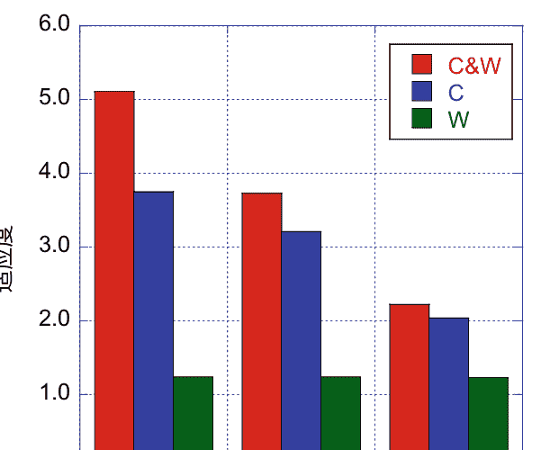

## 图4.17 待优化参数的影响

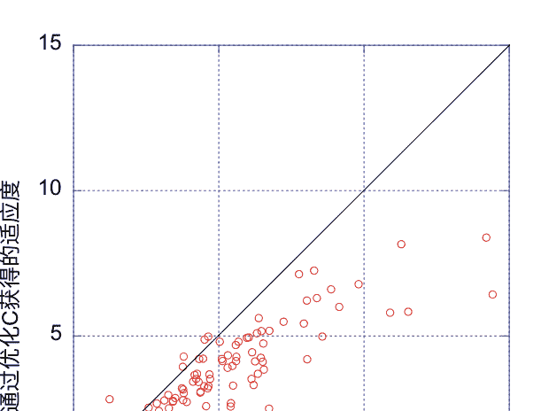

从上述两个图中可以推断出，通过三种优化方法之一获得高适应度值的元素（即，适应度值可以大幅提高的元素）也将在其他任何方法中具有高适应度值，表明元素形状对适应度有很强的依赖性。

当所有参数被优化时获得的最佳适应度的分布，即图4.16中的最佳适应度，显示在图4.19中，表明适应度变化逐元素显著地。具有最大适应度的元素的形状显示在图4.20a中，具有最小适应度的元素的形状显示在图4.20b中。可以得出结论，PSO在找到每个元素的最佳积分参数方面是有效的，使用这些参数可以获得比标准高斯-勒让德积分参数更准确的元素刚度矩阵。

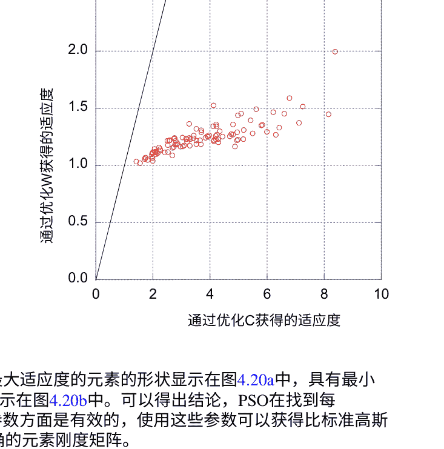

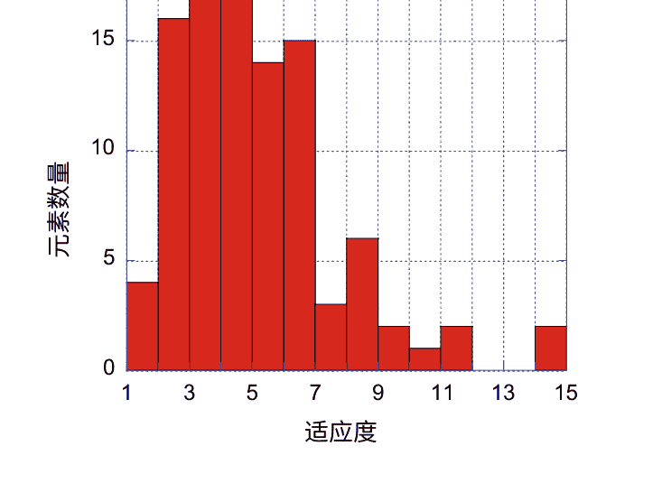

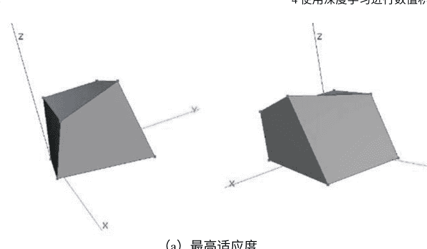

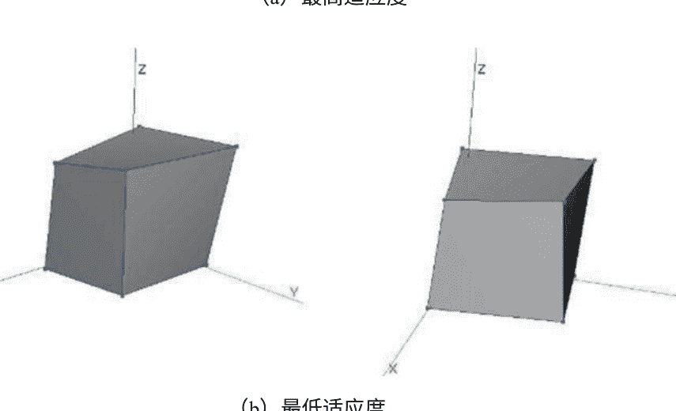

图4.20 测试的元素

### 4.5 寻找最优数值积分点数

在第4.4节中，我们讨论了如何通过优化积分点的积分参数来提高元素积分的准确性，同时保持积分点数量不变。另一方面，通过增加积分点的数量也可以提高元素积分的准确性。在本节中，我们研究了实现预定准确性所需的最佳积分点数量以及元素形状对最佳数量的影响。

如图4.6所示，元素积分的收敛速度取决于元素的形状。对于一个立方体形状的八节点六面体元素，即使只有两个积分点（或总积分点数为八），也可以得到准确的元素刚度矩阵。而对于一个不规则形状的元素，需要大量的积分点才能得到准确的元素刚度矩阵。需要注意的是，良好的精度意味着考虑的元素刚度矩阵与使用非常多的积分点或方程（4.3.2）得到的刚度矩阵之间的差异很小。

在这里，元素的最佳积分点数被定义为使得方程（4.3.2）中定义的误差小于预定义值（阈值）的最小积分点数。在图4.6的情况下，阈值设置为$10^{-7}$，元素A的最佳积分点数为2，元素B的最佳积分点数为5，元素C的最佳积分点数为8，假设所有轴上的积分点数相同。

在大规模有限元分析中，所使用的元素数量巨大，它们的形状各不相同。假设在域中的每个元素上采用相同数量的积分点。因此，如上所述，计算得到的元素刚度矩阵的精度可能因元素而异。因此，对于每个元素，使用最佳数量的积分点对元素刚度矩阵进行数值积分似乎是合理的。

让八节点六面体元素（图4.4）成为一个参考。我们通过将范围内的所有节点沿每个轴的 $\pm_{0.2}$ 进行平移，从上述元素生成各种形状的元素，但节点 $P_0$ 和 $P_1$ 固定在 (0,0,0) 和 (1,0,0) 处，节点 $P_3$的z坐标被固定为0[17]。使用这种方法，总共生成了100,000个元素，并计算了三个不同阈值下每个元素的最佳积分点数量，然后将按最佳积分点数量分类的元素数量制表（表4.3）。例如，当阈值设置为$10^{-7}$时，100,000个元素中有58,467个元素的最佳积分点为每个轴的5个。

### 表4.3 100,000个元素的最佳积分点数

| 最佳积分点数 | 阈值 = $10^{-6}$ | 阈值 = $10^{-7}$ | 阈值 = $10^{-8}$ |
| :--- | :--- | :--- | :--- |
| 4 | 11,464 | 542 | 11 |
| 5 | 78,855 | 58,467 | 20,496 |
| 6 | 9,288 | 37,852 | 63,982 |
| 7 | 367 | 2,917 | 14,120 |
| 8 | 22 | 196 | 1,236 |
| 9 | 4 | 22 | 130 |
| 10 | 0 | 2 | 20 |
| 11 | 0 | 2 | 2 |
| 12 | 0 | 0 | 3 |

### 4.6 深度学习用于元素刚度矩阵的最佳积分

基于上述讨论，本节介绍了两种使用深度学习优化元素积分的方法：第4.6.1节描述了最佳积分参数的估计，第4.6.2节描述了最佳积分点数的估计。

#### 4.6.1 使用深度学习估计最佳积分参数

正如我们在第4.3节中所看到的，通过使用每个被积函数的最佳积分参数，即积分点的坐标和权重，可以优化高斯-勒让德积分的精度或改进积分值的准确性。然而，为大量和多样化的被积函数准备最佳积分参数是不切实际的。因此，我们在这里只考虑优化特定组的被积函数。

由于有限元方法中元素积分的被积函数通常由基函数的导数组成，因此它由有限数量的参数来确定，例如元素中节点的坐标值。然而，事先准备每个被积函数的最优积分参数表是困难的。

因此，我们不是事先准备每个元素的最优积分参数，而是将从元素参数到最优积分参数的对应关系视为一种映射。换句话说，我们只需要准备从元素参数导出最优积分参数的规则，以实现优化的数值积分。在这里，我们使用深度学习来构建这种映射并提取规则。

将描述元素形状（节点坐标等）和元素积分中使用的积分点数分别表示为 {e - parameters} 和 n、 m 和 l 在每个轴上，通过深度学习获取元素积分的最优积分参数的方法总结如下

-   (1) 数据准备阶段：计算最佳的积分参数 {Δξopt, Δηopt, Δζopt, Δwopt} 对于具有各种形状的大量元素 (见第4.4节)。这导致了大量的数据对，如下所示 ({e - parameters}, {Δξopt, Δηopt, Δζopt, Δwopt})。
-   (2) 训练阶段：使用上述数据对进行深度学习，分别设置输入数据和教师数据如下：
    -   输入数据： {e - parameters}
    -   教师数据： {Δξopt, Δηopt, Δζopt, Δwopt}

上述训练过的神经网络作为

-   输入数据: {e - parameters}
-   输出数据: {Δξ^DL, Δη^DL, Δζ^DL, Δw^DL}

-   (3) 应用阶段：将上述训练的神经网络纳入分析代码的元素积分过程中。具体来说，当给定新元素的 {e - parameters} 作为输入，估计得到最佳积分参数 {Δξ^DL, Δη^DL, Δζ^DL, Δw^DL} 及时输出用于计算元素刚度矩阵的数值积分，这些数值积分用于计算元素的刚度矩阵。

在数据准备阶段计算最佳数值积分参数是一个计算量很大的过程，因为我们需要为不同形状的多个元素的每个积分点获得高精度的刚度矩阵，并使用进化计算算法搜索最佳数值积分参数。此外，训练阶段也是一个计算量很大的过程。然而，这两个阶段可以通过使用专用高速计算机独立进行。另一方面，应用阶段的推理通常希望在很短的时间内完成，因为它的计算负载很小。

#### 4.6.2 通过深度学习估计最佳数值积分点的数量

在本节中，我们研究如何从元素形状参数中推导出最佳积分点的规则，其中采用深度学习构建规则的背后联系。

通过深度学习获得元素积分中的最优积分点数的方法总结为以下三个阶段，其中用于描述元素形状（节点坐标等）的参数表示为{e - parameters}，在每个轴上元素积分中使用的积分点数分别为n、m和l。在这里，假设n=m=l。

-   (1) 数据准备阶段：设置一个阈值，计算具有各种形状的大量元素的最优积分点数nopt。（见第4.5节）这产生了大量的数据对（{e - parameters}, nopt）。
-   (2) 训练阶段：对上述获得的数据对进行深度学习，其中输入数据和教师数据分别设置如下：
    -   输入数据: {e - parameters}
    -   教师数据: n^opt

一旦训练完成，训练好的神经网络的输入和输出分别如下：

-   输入数据： {e – 参数}
-   输出数据： DL

(3) 应用阶段：在上述训练阶段中训练好的神经网络被纳入分析代码的元素积分过程中。具体来说，当给定一个新元素的 {e – 参数}作为输入，训练好的神经网络会迅速输出最优积分点数的估计值DL，并用于元素的数值积分计算。

在数据准备阶段确定最优积分点数是一个计算量较大的过程，因为我们需要使用大量的积分点来获得高精度的元素刚度矩阵，并且需要从较小的积分点数开始，逐步增加积分点数，直到方程（4.3.2）中的误差低于预设阈值。这个过程需要重复对许多不同形状的元素进行。此外，数据准备阶段收集的数据对被用作训练模式的训练阶段也是一个计算量较大的过程。

然而，这两个阶段可以独立于应用阶段进行，例如，通过使用一些专用的高速计算机。另一方面，在应用阶段中，用户执行最佳积分点数的计算，其计算负载预计不会太重。

### 4.7 数值示例A

在本节中，我们讨论了将深度学习应用于元素积分中的最佳积分点数估计的示例，该示例在第4.6.2节中介绍了元素积分的八节点六面体元素。具体而言，将构成元素的节点的坐标用作元素的形状参数，并构建一个前馈神经网络，当输入节点的坐标时，输出元素的最佳积分点数 nopt。

#### 4.7.1 数据准备阶段

首先，通过从第4.5节中创建的数据中进行随机采样来生成训练模式。在一个元素中的八个节点中，节点 P0被固定为(0,0,0)，节点 P1被固定为(1,0,0)，节点 P3的z坐标被固定为0。因此，剩余节点的17个坐标值被用作 {e – parameters}来定义元素的形状。元素积分中的误差阈值[公式(4.3.2)]被设置为 $10^{-7}$。 从表4.3可以看出，对于100,000个元素，最佳积分点的数量分布在4到11之间。值得注意的是，具有最佳积分点大于8的元素数量少于50个，这似乎非常少。

-   类别1: $n^{\text{opt}} = 4$ (这个类别有542个元素。)
-   类别2: $n^{\text{opt}} = 5$ (这个类别有58,467个元素。)
-   类别3: $n^{\text{opt}} = 6$ (这个类别有37,852个元素。)
-   类别4: $n^{\text{opt}} = 7$ (这个类别有2,917个元素。)
-   类别5: $n^{\text{opt}} \geq 8$ (这个类别有222个元素。)

#### 4.7.2 训练阶段

在本节中，我们构建了一个前馈神经网络，用于从元素形状估计最佳积分点的数量 $n^{\text{opt}}$。神经网络的输入和输出数据（教师数据）设置如下：

-   输入数据: 一个元素中8个节点的17个节点坐标
-   教师数据: $n^{\text{opt}}$，元素的最优积分点数。

关于这里使用的前馈神经网络的结构，输入层和输出层的单元数分别由输入数据和教师数据的数量自动确定。在当前情况下，输入层的单元数为17。输出层的单元数设置为5，因为使用了one-hot编码作为教师数据。换句话说，我们的输出与类别数量相同（在本例中为5），只有与正确类别对应的单元输出1，而其他单元输出0。

另一方面，隐藏层的数量和每个隐藏层中的单元数量通常通过试错法从各种组合中确定。在这里，我们决定从候选组合中选择以下结构作为前馈神经网络的结构：

-   隐藏层的数量: 1, 2, 3, 4, 5 和 6
-   每个隐藏层的单元数量: 20, 40, 60 和 80

注意，在有两个或更多隐藏层的情况下，每个隐藏层的单元数量被假设为相同。

从数据准备阶段收集的100,000个模式中随机选择了50,000个训练模式；然后，从中选择了五个不同数量的训练模式（5000、10,000、20,000、30,000和50,000）来检查训练模式数量的影响。此外，还从剩下的50,000个模式中随机选择了10,000个模式，用作训练后神经网络的泛化能力验证模式。

如上所述，我们从120个条件中选择最佳的训练条件，包括6个不同数量的隐藏层、4个隐藏层的单元数量和5个训练模式。 所有其他条件，如学习系数，都是相同的，并且训练时期的数量设置为10,000。

为了比较使用不同条件训练的神经网络，采用了验证泛化能力的模式的平均估计误差，其定义为

> $$误差_{NN} = \frac{1}{N_V} \sum_{p=1}^{N_V} \sum_{j=1}^{5} |^{p}O_j - ^{p}T_j| \qquad (4.7.1)$$

其中 \(^{p}O_j\) 是输出层第 \(j\) 个单元的输出，对应的教师数据为 \(^{p}T_j\)， \(N_V\) 是用于验证泛化能力的模式数量（在本例中为10,000个）。

已知在神经网络训练中，训练结果受到连接权重的初始值的影响。 因此，为了减少连接权重初始值的影响，使用相同的训练条件进行五次训练，每次使用不同的初始值，然后选择其中最佳结果来代表训练条件。

图4.21、4.22、4.23和4.24显示了训练结果，其中水平轴是隐藏层的数量，垂直轴是平均估计误差 \(Error_{NN}\) 在公式(4.7.1)中定义。图4.21显示了每个隐藏层有20个单元的结果，其中标签TP05U20表示有5000个训练模式的结果，TP50U20表示有50000个训练模式的结果。类似地，图4.22、4.23和4.24显示了每个隐藏层单元数分别为40、60和80时的结果。

所有结果表明，随着训练数据的增加，准确性得到了提高。 在大多数情况下，增加隐藏层数和每个隐藏层单元数也可以提高准确性。

#### 4.7.3 应用阶段

基于第4.7.2节的结果，我们考虑使用训练有50000个模式的神经网络来估计最优积分点的数量，其中，从训练有50000个模式的神经网络中选择了具有5个隐藏层和40个隐藏层单元的神经网络。 一些神经网络，包括具有6个隐藏层和80个隐藏层单元的神经网络，显示出比所选神经网络更小的平均估计误差，但差异很小。 因此，在估计过程中，选择考虑减少计算量。

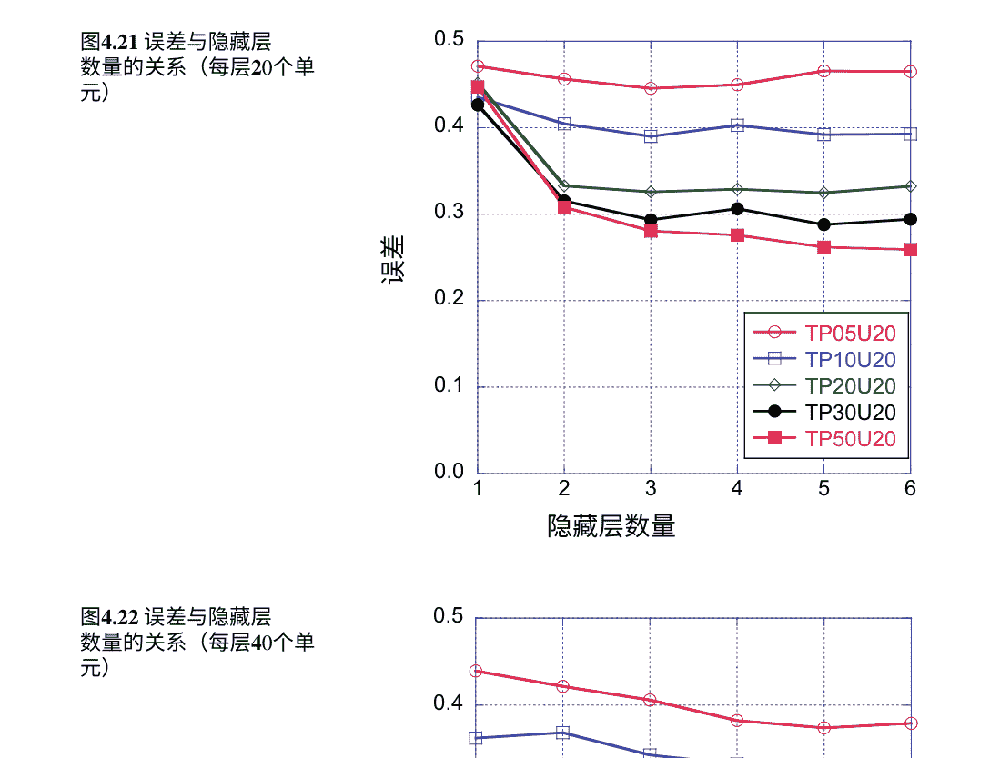

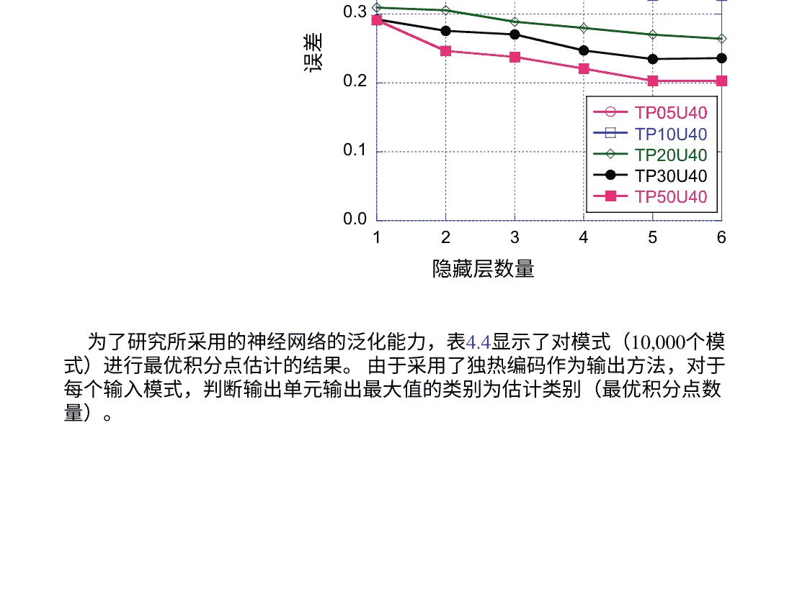

为了研究所采用的神经网络的泛化能力，表4.4显示了对模式（10,000个模式）进行最优积分点估计的结果。由于采用了独热编码作为输出方法，对于每个输入模式，判断输出单元输出最大值的类别为估计类别（最优积分点数量）。

数据表显示，正确分类的百分比超过91%，这表明大多数错误分类是邻近类别之间的。因此，最佳积分点数可以从元素几何形状估计出来，用于减少元素积分过程的计算负荷。

表4.4 通过深度学习估计的最佳积分点数

| $n^{\text{opt}}$ | $n^{\text{DL}}_4$ | $n^{\text{DL}}_5$ | $n^{\text{DL}}_6$ | $n^{\text{DL}}_7$ | $n^{\text{DL}}_8$ | 总计 |
|-------|--------|--------|--------|--------|--------|------|
| 4     | 9      | 38     | 0      | 0      | 0      | 47   |
| 5     | 3      | 5478   | 355    | 0      | 0      | 5836 |
| 6     | 0      | 332    | 3414   | 49     | 0      | 3795 |
| 7     | 0      | 0      | 97     | 199    | 2      | 298  |
| 8     | 0      | 0      | 0      | 10     | 14     | 24   |

### 4.8 数值示例B

在本节中，我们展示了将深度学习应用于估计8节点六面体元素的最佳积分点数的另一个示例。在这里，构建了一个前馈神经网络，使用元素形状的一些特征来估计元素的最佳积分点数 $n^{\text{opt}}$。

#### 4.8.1 数据准备阶段

在数据准备阶段中，使用与第4.7节中相同的元素数据和教师数据。作为神经网络的输入数据，这里使用了七个形状特征：代数形状度量、最大边长、最小边长、最大边角、最小边角、最大面角和最小面角。计算这些特征的计算机代码在第9.1.2节中进行了描述，并且每个特征都有详细说明：

- 代数形状度量：基于六面体元素的条件数定义的数量[28]，取值范围为[0.0,1.0]，对于完美的立方形状，取值为1.0。
- 最大边长和最小边长：六面体元素的最大和最小边长，分别。需要注意的是，显然，最大边长 ≥ 1.0和最小边长 ≤ 1.0适用于这里要考虑的元素。
- MaxEdgeAngle和MinEdgeAngle：六面体元素每个顶点出发的三条边之间的最大和最小角度，分别。
- MaxFaceAngle和MinFaceAngle：六面体元素共享一条边的两个面之间的最大和最小角度，分别。
- 最佳积分点数 $n^{\text{opt}}$ 被定义为使得方程（4.3.2）中的误差小于阈值的最小积分点数；即，$n^{\text{opt}}$ 被定义为满足以下方程的积分点数。

## 4 使用深度学习进行数值积分

误差$(n^{\text{opt}} - 1) > \text{threshold} \geq \text{Error}\left(n^{\text{opt}}\right)\qquad(4.8.1)$

其中 $\text{Error}(k)$ 是使用 $k$ 个积分点积分一个元素时的误差。

使用 $n^{\text{opt}}$ 个积分点积分时，误差与阈值之间的差异取决于元素。 为了评估形状特征与元素积分的收敛性之间的关系，我们引入 $n_r^{\text{opt}}$ 作为元素积分收敛的更详细指标，它被定义为积分点的数量（非整数，假设的实数值），其中方程（4.3.2）中的误差恰好等于阈值，如下所示。

误差$(n_r^{\text{opt}})$ =阈值\qquad(4.8.2)

误差$(n^{\text{opt}}-1) \geq$误差$(n_r^{\text{opt}}) =$ 阈值 $\geq$ 误差$(n^{\text{opt}})$\qquad(4.8.3)

$n^{\text{opt}}-1 \leq n_r^{\text{opt}} \leq n^{\text{opt}}$\qquad(4.8.4)

由于误差值在对数图中几乎呈线性关系，如图4.6所示，通过插值确定 $n_r^{\text{opt}}$ 的值，如下所示。

$n_r^{\text{opt}} = \left(n^{\text{opt}}-1\right) + \frac{\log(\text{阈值}) - \log \text{误差}\left(n^{\text{opt}}-1\right)}{\log \text{误差}(n^{\text{opt}}) - \log \text{误差}\left(n^{\text{opt}}-1\right)}$\qquad(4.8.5)

每个形状特征与最佳积分点数（实数值）$n_r^{\text{opt}}$ 之间的关系显示在图4.25、4.26、4.27、4.28、4.29、4.30和4.31中。图4.25显示了形状特征代数形状度量与最佳积分点数（实数值）$n_r^{\text{opt}}$ 之间的关系，其中横轴是代数形状度量值，纵轴是 $n_r^{\text{opt}}$ 的值，对5000个随机选择的元素进行了显示。 从图中可以清楚地看出，代数形状度量值越小，$n_r^{\text{opt}}$ 的值越大。图4.26和4.27分别显示了最小边长与 $n_r^{\text{opt}}$ 之间的关系，以及最大边长与 $n_r^{\text{opt}}$ 之间的关系。 从图中可以看出，相关性程度相对较小。

图4.28和4.29展示了MinEdgeAngle与 $n_r^{\text{opt}}$ 之间的关系，以及MaxEdgeAngle与 $n_r^{\text{opt}}$ 之间的关系，而图4.30和4.31则展示了MinFaceAngle与 $n_r^{\text{opt}}$ 之间的关系，以及MaxFaceAngle与 $n_r^{\text{opt}}$ 之间的关系。 从图中可以看出，相关性很强。

如上所述，所有的形状特征都与单元积分的收敛性相关；因此，使用这些形状特征作为输入，构建一个神经网络来估计最优积分点数 $n^{\text{opt}}$ 似乎是合理的。

### 4.8 数值示例B

图4.25 代数形状度量与最优积分点数之间的关系

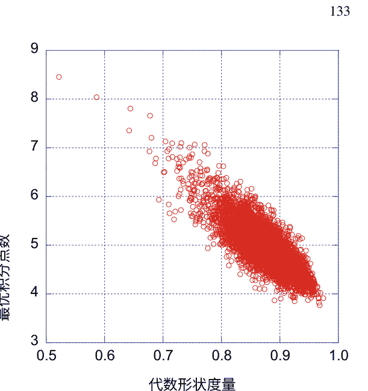

图4.26 MinEdgeLength与最优积分点数之间的关系

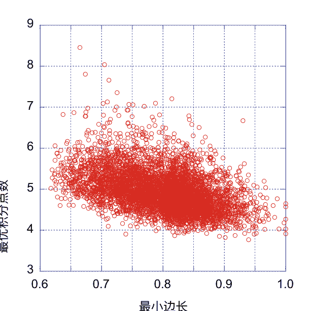

#### 4.8.2 训练阶段

在这里，构建了一个前馈神经网络，根据元素形状参数估计最优积分点数 $n^{\text{opt}}$。神经网络的输入数据和输出数据（教师数据）分别设置如下：

## 4 使用深度学习进行数值积分

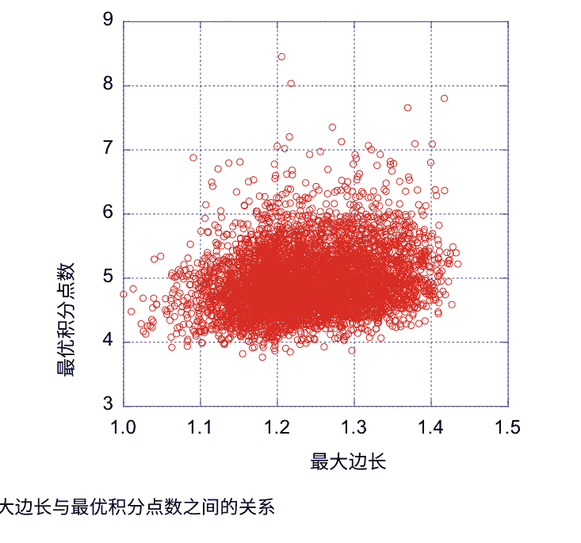

图4.27 最大边长与最优积分点数之间的关系

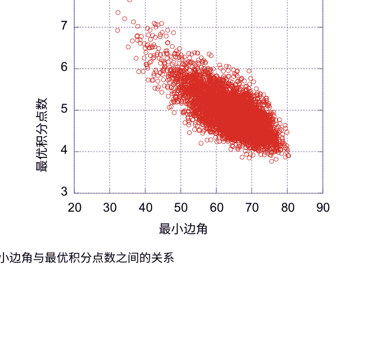

图4.28 最小边角与最优积分点数之间的关系

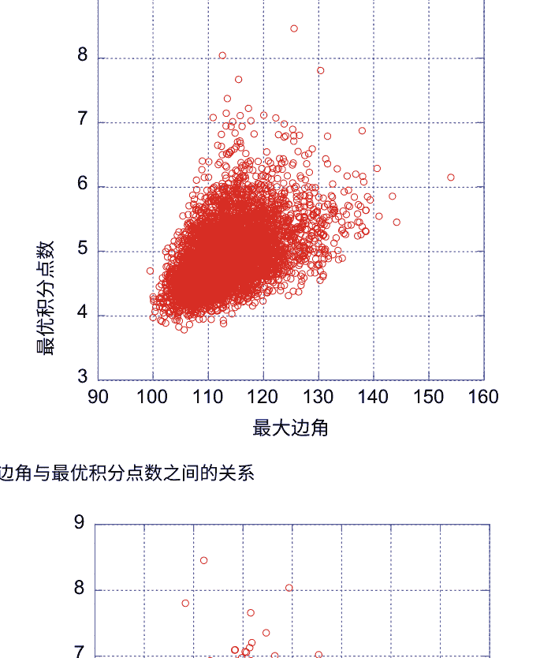

图4.29 最大边角与最优积分点数之间的关系

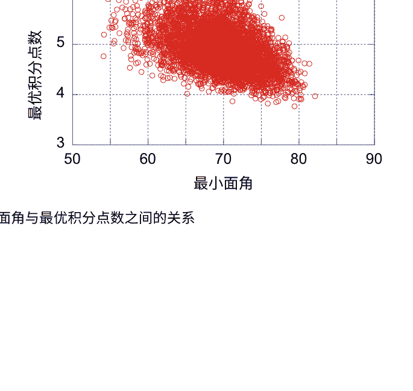

图4.30 最小面角与最优积分点数之间的关系

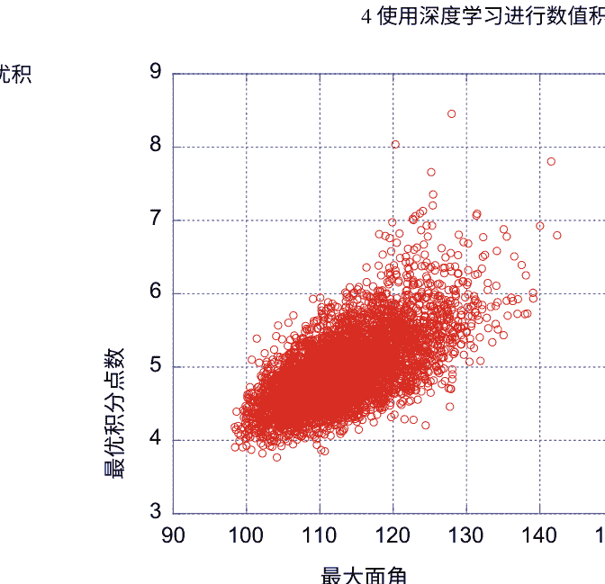

输入数据：元素的七个形状特征。教师数据：元素的最优数值积分点数：$n^{\text{opt}}$。

输出层的单元数设置为五，并且再次使用独热编码作为教师数据。在这里，使用与类别数量相同的输出（在本例中为五个），只有与正确类别对应的单元输出1，而其他单元输出0。

隐藏层的数量和每个隐藏层的单元数由参考第4.7节最终采用的结构决定，具体如下：隐藏层的数量：5 每个隐藏层的单元数：40

训练的其他条件与第4.7节中设置的条件相同。

#### 4.8.3 应用阶段

我们在表4.5中展示了对于泛化能力验证模式（10,000个模式）的最优积分点数估计结果。由于输出方法使用了独热编码，对于每个输入模式，确定输出单元中输出最大值的类别作为预测类别（最优积分点数）。可以看出

表4.5 通过深度学习估计的最佳积分点数

| $n^{\text{opt}}$ | 4 | 5 | 6 | 7 | 8 | 总计 |
|-----------------|---|---|---|---|---|------|
| 4               | 3 | 44| 0 | 0 | 0 | 47   |
| 5               | 17| 4819|999|1 |0 | 5836 |
| 6               | 0 | 1199|2498|97|1 | 3795 |
| 7               | 0 | 2 | 165|119|12| 298  |
| 8               | 0 | 0 | 3 | 9 | 12| 24   |

从表4.5可以看出，正确分类的水平超过74%，这表明大多数错误分类是邻近类别之间的。如上所示，也可以通过元素的形状特征估计最佳积分点数，但准确性不如使用节点坐标值的估计。然而，通过更好地选择一组形状特征并结合形状特征与节点坐标值的使用，可能可以实现更高的准确性。

### 参考文献

1.  Bathe, K. J.: 有限元程序。 Prentice-Hall (1996)
2.  Hughes, T. J. R.: 有限元方法：线性静态和动态有限元分析。 Dover (2000)
3.  Kikuchi, M.: 将符号数学系统应用于有限元程序。 Comput. Mech. 5, 41–47 (1989)
4.  Yagawa, G., Ye, G. -W., Yoshimura, S.: 基于符号操作的有限元数值积分方案。 Int. J. Numer. Methods Eng. 29, 1539–1549 (1990)
5.  Ait-Haddou, R., Barton, M., Calo, V. M.: C1三次样条函数的显式高斯积分规则，对称拉伸节点序列。 J. Comput. Appl. Math. 290, 543–552 (2015)
6.  Barton, M., Calo, V. M.: 奇次样条空间的最优积分规则及其在基于张量积的等几何分析中的应用。 Comput. Methods Appli. Mech.Eng. 305, 217–240 (2016)
7.  Bittencourt, M. L., Vazquez, T. G.: 基于张量的Gauss-Jacobi数值积分，用于高阶质量和刚度矩阵。 Int. J. Numer. Methods Eng. 79, 599–638 (2009)
8.  Hansbo, P.: 一种将准时glass控制作为特例的有限元积分新方法。 Comput. Methods Appl. Mech. Eng. 158, 301–309 (1998)
9.  Hughes, T. J. R., Cottrell, J. A., Bazilevs, Y.: 等几何分析：CAD，有限元，NURBS，精确几何和网格细化。 Comput. Methods Appl. Mech. Eng. 194, 4135–4195 (2005)
10. Johannessen, K. A.: 一维和张量积样条的最优积分。 计算方法与应用力学工程316, 84-99 (2017年)
11. Liu, W. K., Guo, Y., Tang, S., Belytschko, T.: 用于大变形弹塑性分析的多重积分八节点六面体有限元。 计算方法与应用力学工程154, 69-132 (1998年)
12. Mousavi, S. E., Xiao, H., Sukumar, N.: 任意多边形上的广义高斯积分规则。 国际数值方法工程学杂志82, 99-113 (2010年)
13. Nagy, A. P., Benson, D. J.: 关于修剪等几何元素的数值积分。计算方法与应用力学工程284, 165-185 (2015年)
14. Rajendran, S.: 一种开发网格畸变免疫有限元的技术。计算方法应用力学工程学报199, 1044-1063 (2010年)
15. Schillinger, D., Hossain, S. J., Hughes, T. J. R.: 用于等几何分析中二次和三次样条的降阶Bezier元素积分规则。计算方法应用力学工程学报277, 1-45 (2014年)
16. Sevilla, R., Fernandez-Mendez, S.: 在2D NURBS形状域上的数值积分及其在NURBS增强有限元中的应用。有限元分析设计47, 1209-1220 (2011年)
17. Oishi, A., Yagawa, G.: 深度学习增强的计算力学。计算方法应用力学工程学报327, 327-351 (2017年)
18. Goldberg, D. E.: 遗传算法在搜索、优化和机器学习中的应用。Addison-Wesley (1989)
19. Michalewicz, Z.: 遗传算法 +数据结构 =进化程序。Springer-Verlag (1992)
20. Karaboga, D., Basturk, B.: 一种强大而高效的数值函数优化算法：人工蜜蜂群算法(ABC)。J. Global Optim. 39(3), 459–471 (2007)
21. Kennedy, J., Eberhart, R.: 粒子群优化。In: Proceedings of IEEE International Conference on Neural Networks, IV, pp. 1942–1948 (1995)
22. Yang, X. S.: 自然启发的元启发式算法, Luniver Press, Frome, UK (2008)
23. Yang, X. S.: 一种新的蝙蝠启发式算法。 计算智能研究284, 65–74, Springer (2010)
24. Bonabeau, E., Dorigo, M., Theraulaz, G.: 群体智能：从自然到人工系统. 牛津大学出版社 (1999)
25. Botello, S., Marroquin, J. L., Oñate, E., Van Horebeek, J.: 用遗传算法和模拟退火解决结构优化问题. 数值方法工程学国际期刊45(5), 1069–1084 (1999)
26. Parpinelli, R. S., Teodoro, F. R., Lopes, H. S.: 结构工程优化的群体智能算法比较. 数值方法工程学国际期刊 91, 666–684 (2012)
27. Vieira, I. N., Pires de Lima, B. S. L., Jacob, B. P.: 仿生算法用于海上油田生产系统的优化. 数值方法工程学国际期刊 91, 1023–1044 (2012)
28. Knupp, P. M.: 一种六面体网格形状优化方法. 数值方法工程学国际期刊 58, 319–332 (2003)

# 第5章 利用深度学习改进有限元解

摘要 将分析域划分为更小的单元时，有限元法解的准确性会提高，但计算时间会大幅增加。在本章中，我们讨论了一种利用误差信息和深度学习来改善有限元解准确性的方法，即使用少量单元。

### 5.1 精度与单元尺寸

在有限元法（FEM）中，结构的静态问题被简化为以下同时线性方程。

$$[K]{U^G} = {F} \tag{5.1.1}$$

其中 $\{U^G\}$ 是域中所有节点的位移向量，$[K]$ 是全局刚度矩阵，$\{F\}$ 是载荷向量。 $\{U^G\}$ 是节点总数和每个节点的自由度的乘积。 全局刚度矩阵 $[K]$ 由分析域中所有单元刚度矩阵组装而成，如下所示。

$$[K] = \sum_{e=1}^{n_e} [k^e] \tag{5.1.2}$$

其中 $[k^e]$ 是第 $e$ 个单元的单元刚度矩阵， $n_e$ 是域中的总单元数。

通过求解方程（5.1.1），可以得到每个节点的位移，从而计算分析域中任意位置的位移、应变和应力。 如果元素的形状函数固定不变，计算得到的物理量（如位移、应变和应力）的精度取决于


图5.1 二维应力分析

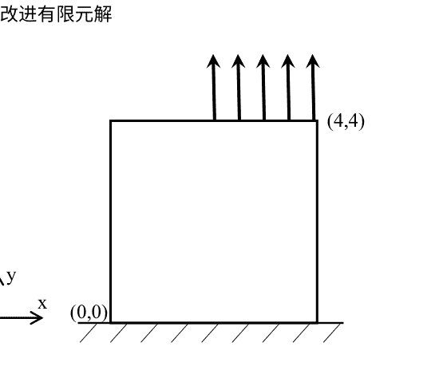

这意味着为了获得高精度，需要使用大量小元素。

图5.1展示了二维应力分析的一个简单示例，其中底部表面固定，负载施加在顶部表面的一半上，元素为四节点线性元素，应力分析使用七种不同的元素划分进行，每种划分具有不同数量的元素：16（4×4）、64（8×8）、256（16×16）、1024（32×32）、4096（64×64）、16,384（128×128）和65,536（256×256）。图5.2展示了一个典型的逐步元素划分示例，每个步骤中所有元素均等分为四个，并假设材料为各向同性弹性材料。图5.3展示了应力值的评估位置。图5.4和图5.5分别描述了图5.3中点A和点B处的应力值，其中横轴是网格中的元素总数，纵轴是计算得到的应力值。从图中可以看出，随着元素数量的增加或元素尺寸的减小，存在收敛到一定值的趋势。

换句话说，通过将分析域划分为尽可能多的元素，可以提高分析结果的准确性。

关于有限元方法的准确性已经进行了一些理论研究[4]。例如，对于跨越区间[a, b]的一维问题，有限元解的准确性可以如下评估[17]:

$$
\|u - u_h\|_m = \left| \sum_{i=0}^{m} \int_a^b \left( \frac{d^i u}{dx^i} - \frac{d^i u_h}{dx^i} \right)^2 dx \right| \leq c h^{k+1-m}
\quad\quad\quad\quad\quad\quad\quad\quad\quad\quad\quad\quad (5.1.3)
$$

其中，$u$ 是精确解，$h$ 是单元尺寸，$u_h$ 是有限元解，$c$ 是常数，$k$ 是基函数（多项式）的次数，$2m$ 是要解的微分方程的阶数。请注意，在普通线性应力分析的情况下，$m = 1$。从上述方程可以看出，元素尺寸越小，基函数阶数越高，有限元解越接近精确解。

### 5.2 计算时间与单元尺寸

如前一节所讨论的，通过减小单元尺寸可以提高有限元解的精度。在本节中，研究了减小单元尺寸会增加计算量的情况。

随着单元尺寸的减小，总单元数以及计算时间都会增加。从计算负荷的角度来看，有限元方法的主要过程包括：

- 全局刚度矩阵 $[K]$ 的构建过程。
- 以 $[K]$ 为系数矩阵解联立线性方程组的过程（方程 (5.1.1)）。

对于前者，所需的计算负荷与域中的总单元数成正比。考虑一个二维矩形区域，如图 5.2 所示，被四边形单元均匀划分。如果单元的一边长度减半，构建全局刚度矩阵所需的总单元数和计算负荷都会增加四倍。如果在三维情况下将一个六面体均匀划分为更小的六面体单元，将单元一边的长度减半会使总单元数增加八倍，计算负荷也会增加八倍。

另一方面，解决一组联立线性方程（方程 (5.1.1)）所需的计算时间也随着单元数量的增加而增加，其中 $[K]$ 是系数矩阵。在解决联立线性方程的两种方法中，直接方法和迭代方法，前者通过逐步减少未知数的数量来获得解，而后者通过逐步更新任意初始解向量来接近正确解向量 [9]。

让我们考虑解决联立线性方程所需的计算量如下：

$$[A]{x} = {b} \quad (5.2.1)$$

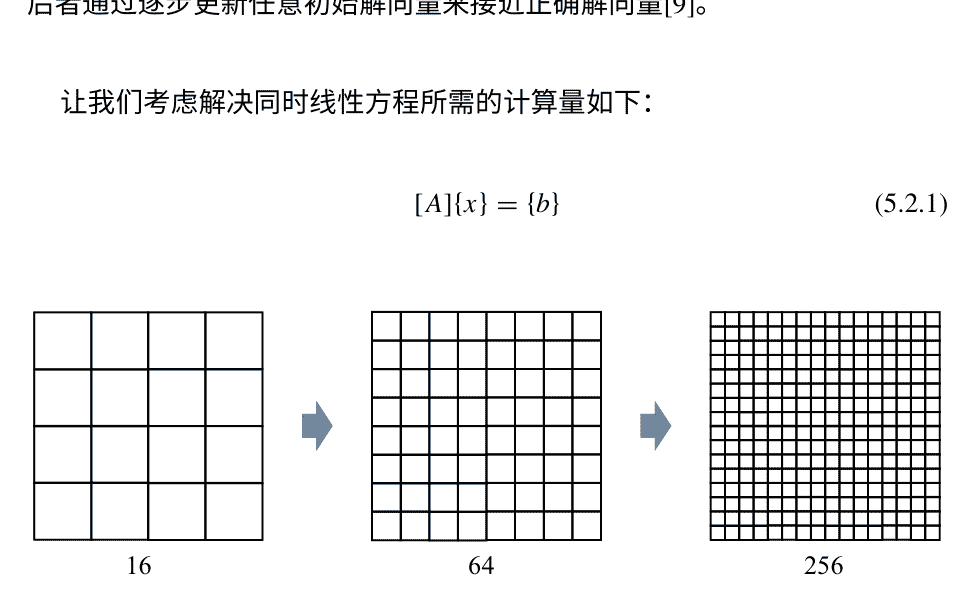

图5.3用于应力评估的点A和点B

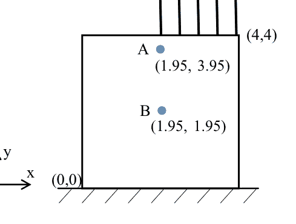

图5.4应力与单元数量的关系（点A）

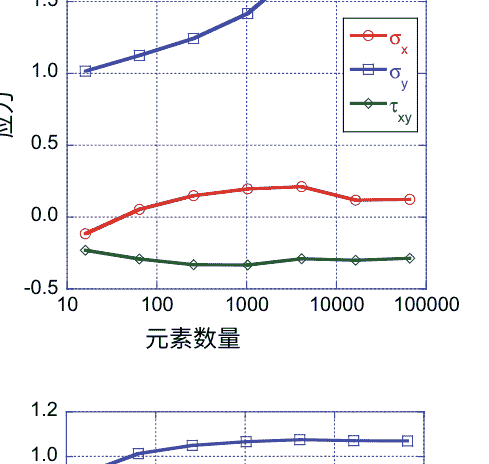

图5.5应力与单元数量的关系（点B）

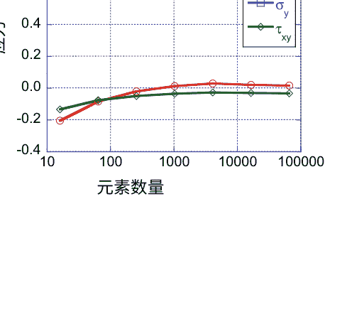

高斯消元法被认为是解决上述一组联立线性方程的最基本的直接方法，其伪代码如列表5.2.1所示。

### 列表5.2.1 高斯消元的伪代码

```
1 for (i=1;i<=n-1;i++) {
2   for (j=i+1;j<=n;j++) {
3     aa = A[j][i]/A[i][i];
4     b[j] = b[j] - aa*b[i];
5     for (k=i+1;k<=n;k++) {
6       A[j][k] = A[j][k] - aa*A[i][k];
7     }
8   }
9 }
10 b[n] = b[n]/A[n][n];
11 for (i=n-1;i>=1;i--) {
12   for (j=i+1;j<=n;j++) {
13     b[i] = b[i] - A[i][j]*b[j];
14   }
15   b[i] = b[i]/A[i][i];
16 }
```

在代码中，n是未知数的数量，A[][]是表示系数矩阵的二维数组，b[]是表示右侧向量的一维数组，解存储在一维数组b[]中。

第一到第九行被称为前向消元过程，第十到第十六行被称为后向代入过程。根据上述伪代码，可以估计解决联立线性方程所需的计算量。前向消元过程中最频繁的操作是在第六行，即三重嵌套循环的最内层。由于第六行执行了两次算术运算，并且循环是三重嵌套的，因此通过该行引起的算术运算总量可以估计如下：

$$\sum_{i=1}^{n-1} \sum_{j=i+1}^{n} \sum_{k=i+1}^{n} 2 = \sum_{i=1}^{n-1} \sum_{j=i+1}^{n} 2(n-i) = \sum_{i=1}^{n-1} 2(n-i)^2 = \frac{1}{3}(n-1)n(2n-1) \quad (5.2.2)$$

同样，在反向替代过程中，第13行的算术运算次数最多，估计为

$$\sum_{i=1}^{n-1} \sum_{j=i+1}^{n} 2 = \sum_{i=1}^{n-1} 2(n-i) = (n-1)n \quad (5.2.3)$$

如上所示，在高斯消元法中，正向消元过程的计算负荷与未知数的立方成正比，而反向替代过程的计算负荷与未知数的平方成正比，这意味着整个求解过程所需的总计算时间与未知数的立方成正比。

需要注意的是，如果计算过程由多个子过程组成，并且每个子过程的计算负荷与未知数的不同次幂成正比，那么随着未知数的增加，具有最高次幂的子过程的计算负荷将占主导地位。

数值方法在工程和应用科学中的应用越来越广泛，特别是在计算力学中，深度学习的使用已经成为一种强大的工具。

接下来，讨论了高斯-塞德尔方法的计算负载，这是一种基本的迭代解法之一，其中系数矩阵 [A] 被分解为两个矩阵，如下方程所示。

$$[A] = \begin{bmatrix} a_{11} & a_{12} & \cdots & a_{1n} \\ a_{21} & a_{22} & \cdots & a_{2n} \\ \vdots & \vdots & \ddots & \vdots \\ a_{n1} & a_{n2} & \cdots & a_{nn} \end{bmatrix} = \begin{bmatrix} a_{11} & 0 & \cdots & 0 \\ a_{21} & a_{22} & \cdots & 0 \\ \vdots & \vdots & \ddots & \vdots \\ a_{n1} & a_{n2} & \cdots & a_{nn} \end{bmatrix} - \begin{bmatrix} 0 & -a_{12} & \cdots & -a_{1n} \\ 0 & 0 & \cdots & -a_{2n} \\ \vdots & \vdots & \ddots & \vdots \\ 0 & 0 & \cdots & 0 \end{bmatrix} = [N] - [P] \quad (5.2.4)$$

将方程 (5.2.4) 代入方程 (5.2.1)，我们得到

$$[N]\{x\} = [P]\{x\} + \{b\} \quad (5.2.5)$$

从这个方程中，得到如下的递推公式：

$$[N]\{x\}^{(r+1)} = [P]\{x\}^{(r)} + \{b\} \quad (5.2.6)$$

在高斯-塞德尔方法中，我们从一个适当的初始向量 $\{x\}^{(0)}$开始，然后通过上述方程逐步改进它，以收敛到正确的解向量。

让我们考虑每次迭代的计算负载。需要注意的是，在方程右侧的矩阵-向量乘积的计算负载与未知数的数量的平方成正比。由于用[N]作为系数矩阵的联立线性方程组的解对应于高斯消元法中的回代过程，计算负载也与未知数的数量的平方成正比。

因此，高斯-塞德尔方法每次迭代的计算负荷与未知数的平方成正比增加，如果迭代次数与未知数的数量相同，则该方法的整体计算负荷与未知数的立方成正比增加。

因此，有限元方法的每个过程的计算负荷为：

- 全局刚度矩阵 [K] 的构建过程： $O(n)$
- 以 [K] 为系数矩阵解联立线性方程组的求解过程（方程 (5.1.1)）： $O(n^3)$

假设节点数量与单元数量成正比增加。 请注意，在上述中对于任何函数 $f(n)$ of $n$，例如 $f(n)=n$和 $f(n)=n^3$，使用符号 $O(f(n))$ 表示计算负荷，其数量上界为 $f(n)$ 乘以任意正常数 [13]。

正如之前讨论的，如果一个计算过程包含两个子过程，一个是 $O(n)$，另一个是 $O(n^3)$，那么 $O(n^3)$ 的子过程在 $n$的值较大时变得主导，这表明该过程的总计算负荷被视为 $O(n^3)$。

考虑一个二维矩形区域，被分割成四边形单元。 如果一个单元的一边长度减半，总单元数增加四倍，总节点数也以相同的倍数增加，因此导致结果的联立线性方程组求解过程的计算复杂度增加了64倍 $(= 4^3)$。

在三维分析中，如果一个单元的一边长度减半，总节点数增加约8倍，计算复杂度则急剧增加约512倍 $(= 8^3)$。

因此，解决联立线性方程组所需的计算复杂度几乎与单元数的立方成正比。 换句话说，随着分析规模（单元数）的增加，解决联立线性方程组所需的计算复杂度比全局刚度矩阵构建过程更为严重。

请注意，上述估计是基于系数矩阵是稠密的假设，其中大部分分量都不为零。 实际上，在有限元方法中，全局刚度矩阵，即联立线性方程组的系数矩阵，通常是稀疏的，其中大部分分量为零，这意味着求解所需的计算量可能要少得多。

考虑使用九个线性四边形单元和16个节点的网格进行二维应力分析，如图5.6a所示，那么全局刚度矩阵如图5.6b所示。如果第$i$个节点的位移表示为($U_i$, $V_i$)，则全局刚度矩阵为32行32列。

在公式(5.1.1)中，可以写成如下形式：

$$\{U^G\} = \begin{pmatrix} U_1 \\ V_1 \\ U_2 \\ V_2 \\ \vdots \\ U_{16} \\ V_{16} \end{pmatrix} \quad (5.2.7)$$

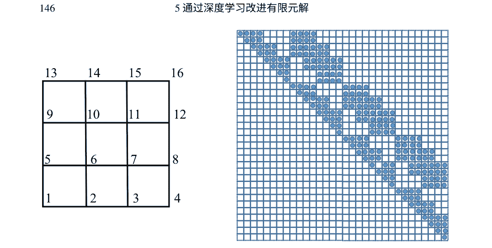

图5.6在有限元方法中得到的稀疏全局刚度矩阵

全局刚度矩阵通常是对称的，非零分量仅在矩阵的对角线上方的上三角部分用蓝色圆圈表示，如图5.6b所示。

如图5.7所示，全局刚度矩阵通常是稀疏的，其中非零分量位于靠近对角线的带状区域。图中的宽度 B 被称为最大半带宽。

对于像上面所示的带状结构的稀疏矩阵，高斯消元法（列表5.2.1）中的for循环范围可以更窄，这种情况下的计算负载可以减少到约 $O(n B^2)$。

尽管最大半带宽 B 随未知数的数量 n 增加而增加，但对于大多数情况，计算负载可以大大减少，因为 B ≪ n。

已知有限元法的节点编号是任意的，全局刚度矩阵的最大半带宽 B 取决于节点编号[5, 11]。例如，图5.8a显示了与图5.6a相同的网格，但节点编号不同，图5.8b显示了图5.8a中给定网格的全局刚度矩阵。注意到图5.8b中矩阵的最大半带宽略大于图5.6b中的半带宽。由于最大半带宽取决于节点编号，影响解决相应线性方程组所需的计算负载，因此已经研究了最优节点编号方法，包括Cuthill-McKee（CM）方法[7]，reverse Cuthill-McKee（RCM）方法[6, 14]和其他方法[8, 12, 18]。

如上所述，通过使用全局刚度矩阵只在靠近对角线的带状区域中具有非零分量的结构，可以减少计算负载。

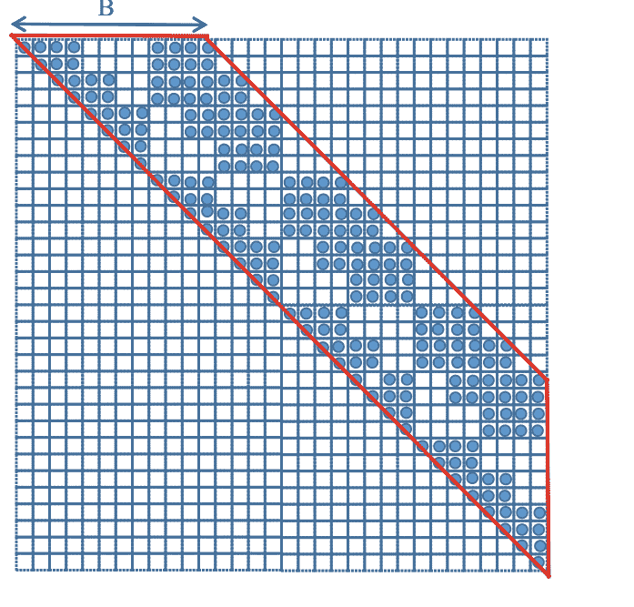

图5.7 带状矩阵

节点编号为：第一行7,11,14,16；第二行4,8,12,15；第三行2,5,9,13；第四行1,3,6,10。

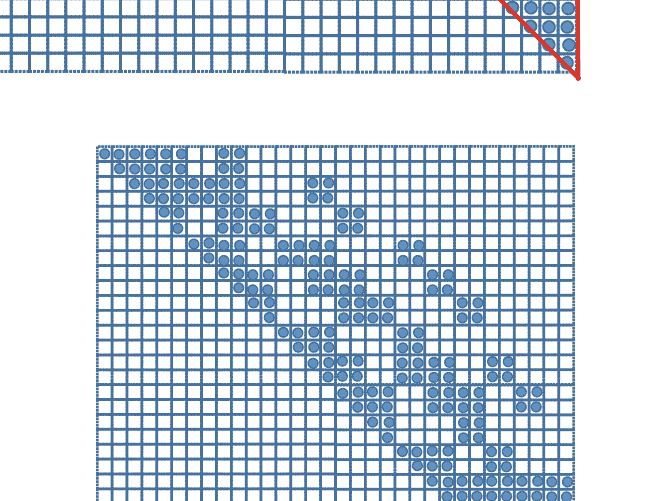

(a)

(b)

图5.8 另一个具有不同节点编号的带状矩阵

此外，通过仅存储带状区域中的分量，还可以减少内存使用量。如图5.7所示，带状区域中不仅存在非零分量，还存在零分量。由于零分量不影响结果，可以通过进一步减少内存和计算时间来实现仅存储非零分量在内存中。在这种情况下，随着问题的规模或域中节点的数量增加，减少率增加，这意味着这种存储方法在大规模分析中特别有效。

稀疏矩阵有多种紧凑的存储方法，包括CRS (压缩行存储)，CCS (压缩列存储)和JDS (锯齿对角线存储)[19]。它们将非零分量存储在一维实数数组中，并将每个非零分量的位置信息（行，列）存储在几个整数数组中。

尽管这种存储方法可以显著减少大规模分析的内存占用和计算负载，但需要注意的是，在计算过程中可能会出现非连续内存访问导致效率下降的情况。

### 5.3 有限元解的误差估计

在本节中，将研究两种通过有限元法估计解的误差的方法。

#### 5.3.1 基于应力平滑的误差估计

已经使用了各种方法来估计有限元法结果与正确或精确解之间的误差，这些方法被称为后验误差估计方法[1, 10, 20, 21]。

在固体力学的有限元法中，通常使用位移法，其中位移是待求解的未知变量。在这种方法中，位移在单元之间的边界处是连续的，但是应变和应力，即位移的一阶导数，是不连续的。从物理角度来看，这是不可接受的，这种不便被认为是基函数连续性不足引起的。

在这方面，让我们回顾一下函数的连续性。在这里，我们介绍了可微性类 $C^n$，它是函数连续性（平滑性）的度量，意味着属于 $C^n$的函数在 n阶导数上是连续的。

让我们分别考虑函数的连续性：

$$f_1(x) = \begin{cases} -x & (x < 0) \\ x & (x \geq 0) \end{cases} \quad (5.3.1)$$

$$f_2(x) = \begin{cases} -\frac{1}{2}x^2 & (x < 0) \\ \frac{1}{2}x^2 & (x \geq 0) \end{cases} \quad (5.3.2)$$

$$f_3(x) = \begin{cases} -\frac{1}{6}x^3 & (x < 0) \\ \frac{1}{6}x^3 & (x \ge 0) \end{cases} \quad (5.3.3)$$

图5.9描述了函数 $f_1(x)$ 及其一阶导数，图5.10描述了函数 $f_2(x)$ 及其一阶和二阶导数，图5.11描述了函数$f_3(x)$ 及其一阶、二阶和三阶导数。从这些图表中可以清楚地看出，$f_1(x)$ 属于 $C^0$，$f_2(x)$ 属于 $C^1$，$f_3(x)$ 属于 $C^2$，分别在 $x=0$ 时。注意，在 $x=0$ 时，这三个函数都属于 $C^\infty$。

由于基函数是基于单元的定义的，通常只在单元边界处具有 $C^0$ 连续性，而应力是基函数的一阶导数，在单元边界处是不连续的。图5.12显示了一维示意图。

图5.9中的$f_1(x)$属于$C^0$，其中$x=0$。

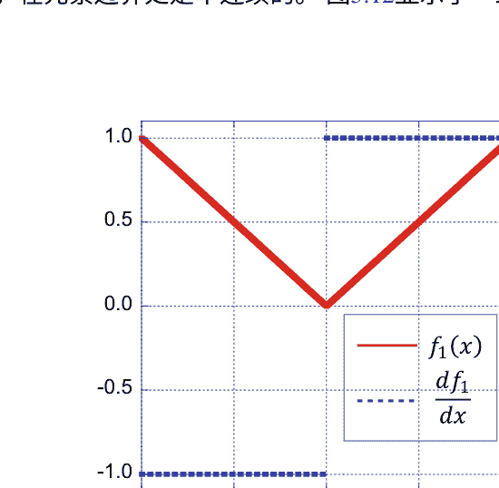

图5.10中的$f_2(x)$属于$C^1$，其中$x=0$。

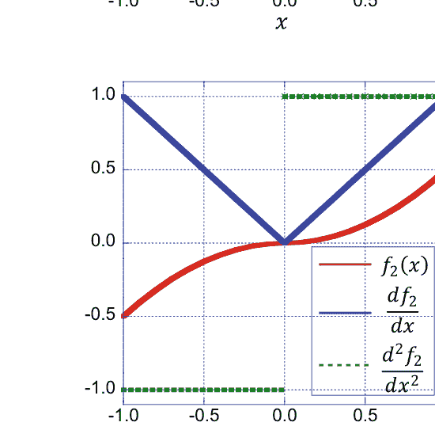

图5.11中的$f_3(x)$属于$C^2$，其中$x=0$。

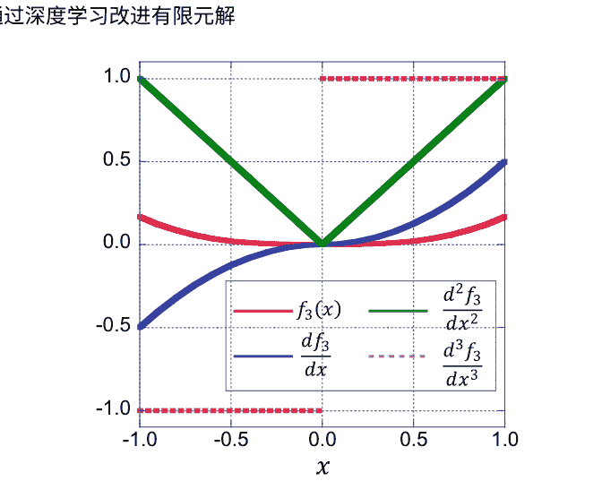

### 图5.12应力分布的示意图

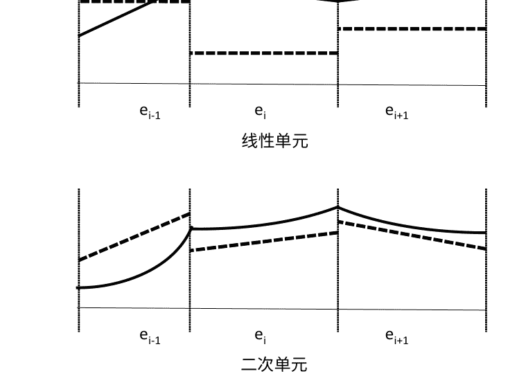

让我们将上述不连续的应力平滑处理，使其在单元之间的边界上连续，作为位移。为此，我们考虑四节点四边形单元中任意位置 $P(\xi,\eta)$的应力，如图5.13所示，其表示为：

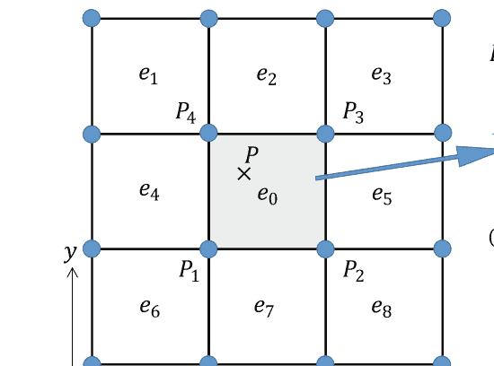

图5.13应力平滑处理

$$\{\sigma(\xi, \eta)\} = \begin{pmatrix} \sigma_x(\xi, \eta) \\ \sigma_y(\xi, \eta) \\ \tau_{xy}(\xi, \eta) \end{pmatrix} = [D][L][N(\xi, \eta)]\{U\} \quad (5.3.4)$$

其中

$$\{U\} = \begin{pmatrix} U_1 \\ V_1 \\ \vdots \\ U_4 \\ V_4 \end{pmatrix}, \quad (5.3.5)$$

$$[N(\xi, \eta)] = \begin{bmatrix} N_1(\xi, \eta) & 0 & \cdots & N_4(\xi, \eta) & 0 \\ 0 & N_1(\xi, \eta) & \cdots & 0 & N_4(\xi, \eta) \end{bmatrix}, \quad (5.3.6)$$

$$[L] = \begin{bmatrix} \frac{\partial}{\partial x} & 0 \\ 0 & \frac{\partial}{\partial y} \\ \frac{\partial}{\partial y} & \frac{\partial}{\partial x} \end{bmatrix}, \quad (5.3.7)$$

在这里，(U_i, V_i)是第i个节点的位移，N_i(ξ,η)是第i个基函数。[D]是应力-应变矩阵，如下所示[17]：

$$[D] = \frac{E}{1 - \nu^2} \begin{bmatrix} 1 & \nu & 0 \\ \nu & 1 & 0 \\ 0 & 0 & \frac{1 - \nu}{2} \end{bmatrix} \text{(平面应力)} \quad (5.3.8)$$

$$[D] = \frac{E(1 - \nu)}{(1 + \nu)(1 - 2\nu)} \begin{bmatrix} 1 & \frac{\nu}{1-\nu} & 0 \\ \frac{\nu}{1-\nu} & 1 & 0 \\ 0 & 0 & \frac{1-2\nu}{2(1-\nu)} \end{bmatrix} \text{ (平面应变) } \quad (5.3.9)$$

其中E是杨氏模量，v是泊松比。

应力 $\{\sigma_{P_1}^{e_0}\}$ 在单元e0的节点之一P1处，使用公式(5.3.4)得到如下结果：

$$\left\{ \sigma_{P_1}^{e_0} \right\} = \left\{ \sigma^{e_0}(-1, -1) \right\} = \left\{ \sigma(-1, -1) \right\} = \begin{pmatrix} \sigma_x(-1, -1) \\ \sigma_y(-1, -1) \\ \tau_{x y}(-1, -1) \end{pmatrix} \quad (5.3.10)$$

节点 P1被单元 e4、e6和 e7共享，并且应力 $\{\sigma_{P_1}^{e_4}\}, \{\sigma_{P_1}^{e_6}\}$ 和 $\{\sigma_{P_1}^{e_7}\}$ 在节点 P1处，分别计算每个单元的应力：

$$\left\{ \sigma_{P_1}^{e_4} \right\} = \left\{ \sigma^{e_4}(1, -1) \right\}, \left\{ \sigma_{P_1}^{e_6} \right\} = \left\{ \sigma^{e_6}(1, 1) \right\}, \left\{ \sigma_{P_1}^{e_7} \right\} = \left\{ \sigma^{e_7}(-1, 1) \right\} \quad (5.3.11)$$

通过对这些应力取平均值，可以确定节点 P1处的平滑应力 $\{\sigma_{P_1}^{S}\}$, 可以如下确定：

$$\left\{ \sigma_{P_1}^{S} \right\} = \frac{ \left\{ \sigma_{P_1}^{e_0} \right\} + \left\{ \sigma_{P_1}^{e_4} \right\} + \left\{ \sigma_{P_1}^{e_6} \right\} + \left\{ \sigma_{P_1}^{e_7} \right\} }{4} \quad (5.3.12)$$

以相同的方式 $\{\sigma_{P_2}^{S}\}, \{\sigma_{P_3}^{S}\},$ 和 $\{\sigma_{P_4}^{S}\}$ 分别得到了节点 P2、P3和P4的平滑应力，并且，任意位置 $P(\xi,\eta)$ of the element e0的平滑应力定义为：

$$\left\{ \sigma^{S}(\xi, \eta) \right\} = \sum_{i=1}^{4} N_i(\xi, \eta) \left\{ \sigma_{P_i}^{S} \right\} \quad (5.3.13)$$

平滑应力被认为比原始的不连续应力更接近真实应力，并且基于此的一种后验误差估计方法（称为ZZ方法）已经被提出[24]。有限元解的误差通常被定义为真实应力与有限元分析得到的应力之间的差异。

应力之间的差异 $\{\sigma^{FEM}(\xi, \eta)\}$，而几乎不可能获得真实应力 $\{\sigma^{TRUE}(\xi, \eta)\}$。另一方面，由于 $\{\sigma^{S}(\xi, \eta)\}$ 比 $\{\sigma^{FEM}(\xi, \eta)\}$ 更接近真实应力，这些应力之间的差异可以表示误差。ZZ方法是一种基于此的后验误差估计方法，因为它简单且对分析代码的修改要求较少，所以被广泛用作有限元法的误差估计方法。

#### 5.3.2 使用不同网格获得的解进行误差估计

如第5.1节所述，有限元解的精度通常通过减小单元尺寸来改善。这是因为基函数对解的逼近精度得到了改善，而通过增加基函数的阶数也可以获得相同的效果。我们在这里讨论减小单元尺寸时有限元解中误差的行为。

在有限差分法中（参见第7.2节），研究了一种基于网格间距与解的精度之间关系的解改进方法[23]。如果使用格点间距 $\Delta x$ 的有限差分方法的逼近精度为 $O(\Delta x^2)$，并且具有两个不同格点间距 $\Delta x_1$ 和 $\Delta x_2$（$\Delta x_1 > \Delta x_2$) 的解为 $\phi_l^{\Delta x_1}$ 和 $\phi_l^{\Delta x_2}$，我们可以写成 $\phi_l^{\text{为真}}$ 作为真解的以下关系式。

> $\phi_l^{\text{为真}} - \phi_l^{\Delta x_1} \propto (\Delta x_1)^2$ (5.3.14)

> $\phi_l^{\text{为真}} - \phi_l^{\Delta x_2} \propto (\Delta x_2)^2$ (5.3.15)

众所周知，虽然不严格正确，$\phi_l^{\text{为真}}$ 比 $\phi_l^{\Delta x_2}$ 更准确的假设是以下等式。

> $\frac{\phi_l^{\text{为真}} - \phi_l^{\Delta x_1}}{\phi_l^{\text{为真}} - \phi_l^{\Delta x_2}} = \frac{(\Delta x_1)^2}{(\Delta x_2)^2}$ (5.3.16)

这种方法被称为理查逊外推法。还开发了一种方法，可以准确预测裂纹尖端的应力强度因子，该方法基于节点密度和误差之间的关系[22]，其中真实应力值通过使用有限元法得到的节点密度和应力之间的关系来预测。

> $\sigma^{\text{FEM}} = \sigma^{\text{TRUE}} + a N^{-\delta}$ (5.3.17)

其中 $\sigma^{\text{FEM}}$ 是通过有限元法获得的应力值，$\sigma^{\text{TRUE}}$ 是真实应力值，$a$ 和 $\delta$ 是系数，$N$ 是节点密度。通过估计不同节点密度下的几个分析，可以估计 $\sigma^{\text{TRUE}}$。该方法成功应用于二维和三维裂纹分析。

前一节中描述的ZZ方法是通过将原始解与平滑得到的更好解之间的差异来估计有限元解的误差的方法。通过减小单元尺寸也可以获得更好的解，因此可以通过分析与给定尺寸的解之间的差异来估计有限元解的误差。

### 5.4 使用误差信息和深度学习改进有限元解

网格和细网格分析。使用具有多个细度级别的网格将提供更详细的错误信息，可用于改进解决方案[22]。

在本节中，我们研究了基于误差估计（第5.3节）[16]的深度学习改进有限元解的方法的细节。

为了通过后验误差估计获得具有少量单元和节点的准确解，已经研究了一种称为自适应有限元方法的方法[2,3,15]，它包括三个步骤：首先进行初始网格的分析，然后进行后验误差估计，最后重新网格化具有相对较大误差的分析域以提高准确性。这个过程重复进行，直到满足误差准则。

自适应有限元方法分为三种类型：局部细化网格的h自适应方法，局部增加基函数阶数的p自适应方法，以及局部重新定位节点的r自适应方法。每种方法可以单独使用或组合使用。

在这三种类型中，最常用的方法是自适应方法，其中(1)在网格上进行分析和后验误差估计，(2)在误差超过标准的区域对元素进行细分，直到误差在整个域中变得足够小为止，然后重复(1)和(2)。由于细分是局部进行的，直接影响分析时间的节点总数的增加可能会被抑制。然而，即使只是部分地重复网格的细分，也会增加节点的总数，并且需要重复有限元分析。因此，总的计算负荷不一定小。

在自适应有限元方法中，首先根据误差信息对网格进行细化，然后使用细化的网格进行分析，通过误差间接地改善解决方案的准确性。

相比之下，在这里，提出了一种直接使用误差信息来改进解决方案的方法，其中‘直接’意味着‘无需重新网格化’。具体而言，使用前馈神经网络的深度学习来估计与使用粗网格直接从应力中获得的与其等效的应力以及其误差信息。为此，前馈神经网络被训练为在分析域中的任意点输出几乎精确的应力。所使用的输入数据是在感兴趣点及其周围点处使用粗网格获得的应力以及其误差信息。

该方法可以总结为以下三个阶段。

- 数据准备阶段：在各种分析条件下进行粗网格有限元分析，包括分析域、载荷条件、固定条件等，并通过后验误差估计方法获得误差信息。此外，对于每个分析条件，进行非常细网格的有限元分析以获得接近真实解的解决方案。最后，收集大量的数据对：每个数据对包括粗网格解决方案、其误差信息以及相应的细网格解决方案。

- 训练阶段：通过深度学习使用上述数据准备阶段收集的数据对前馈神经网络进行构建，将其作为训练模式，其中神经网络的输入和教师数据设置如下：
    - 输入数据：粗网格解及其误差信息。
    - 教师数据：细网格解。

- 应用阶段：将待求解问题的粗网格有限元解及其误差信息输入到训练阶段构建的神经网络中，然后从神经网络中输出相应的精确解，该解将通过细网格获得。

需要注意的是，在这种方法中，前馈神经网络的输入数据仅包括在估计准确应力的位置附近的应力状态和误差信息，不包括分析几何形状或边界条件，这使得训练后的神经网络可以轻松适用于各种分析条件。

此外，由于输入数据仅包括使用粗网格获得的数值，而且经过训练的神经网络的推理速度很快，因此该方法可以比传统的细网格有限元分析更快地估计特定点的应力准确值。

尽管值是准确的，但目前的方法可能存在一个缺点，即我们只能估计整个区域的应力而不是目标点的应力。然而，在大多数情况下，只需在分析域中的特定重要点或区域获取应力值即可满足要求。因此，目前的方法被认为是在需要进行重复分析的优化设计等情况下的强大工具。

根据获取误差信息的技术，目前的方法分为方法A和方法B。

图5.14a、b分别显示了标准有限元分析的流程图和方法A的流程图。后者是一种通过粗网格得到一些误差信息，然后通过深度学习从分析结果和粗网格上获取的误差信息估计准确应力的方法。

另一方面，图5.15a，b分别显示了标准自适应有限元分析和Method-B的流程图。后者是一种从两组应力的差异中获取一些误差信息的方法：从标准自适应有限元分析中使用初始网格得到的应力和在自适应重网格的第一步生成的细化网格得到的应力。

### 5.5 数值示例

在本节中，我们使用平滑应力（Method-A）的数值示例来研究该方法，该方法是使用一些误差信息和深度学习改进有限元分析解的方法，详见第5.4节。

#### 5.5.1 数据准备阶段

在这里，我们测试了方法A（见第5.4节）在使用四节点四边形元素[16]进行二维应力分析时的基本性能，其中使用了一个前馈神经网络，该网络使用细网格有限元法得到的目标点处的应力作为教师数据，并使用粗网格处的应力和一些误差信息作为输入数据。当使用粗网格得到的应力和该点周围的误差信息作为输入时，神经网络被训练以输出目标点处准确的应力。

如上所述，不仅在目标点处需要预测高精度应力，还需要使用其邻域中的应力和一些误差信息作为辅助输入数据。为此，如图5.16所示，在目标点周围以网格形式布置应力评估点，其中生成了诸如误差信息之类的辅助信息。

在图5.16中显示的目标点周围的点的排列的众多选项中，我们选择了在图5.16a中显示的具有四个邻近点的选项，其中包括应力 $\sigma_x^S$, $\sigma_y^S$ 和 $\tau_{xy}^S$ 以及使用粗网格使用有限元法得到的平滑应力 $\sigma_x^C$, $\sigma_y^C$ 和 $\tau_{xy}^C$，以及使用细网格得到的应力 $\sigma_x^F$, $\sigma_y^F$ 和 $\tau_{xy}^F$。根据使用粗网格计算得到的目标点($P_T$)和周围四个点($P_{N1}, P_{N2}, P_{N3}, P_{N4}$)的应力，生成神经网络的输入数据(a)和(b)如下：

输入数据(a)：基于在感兴趣点和周围四个点处使用粗网格得到的应力与平滑应力之间的差异，生成了总共15个值(3个应力分量 × 5个点)，如表5.1所示，这些值被认为代表了目标点附近误差的分布。

输入数据 (b)：基于目标点和周围四个点的应力差异，总共12个（3个应力分量 × 4个点）。

表5.1 输入数据：计算值和平滑值之间的应力差异

| | σ_x | σ_y | τ_xy |
|---|---|---|---|
| P_T | P_T σ_x^S - P_T σ_x^C | P_T σ_y^S - P_T σ_y^C | P_T τ_xy^S - P_T τ_xy^C |
| P_N1 | P_N1 σ_x^S - P_N1 σ_x^C | P_N1 σ_y^S - P_N1 σ_y^C | P_N1 τ_xy^S - P_N1 τ_xy^C |
| P_N2 | P_N2 σ_x^S - P_N2 σ_x^C | P_N2 σ_y^S - P_N2 σ_y^C | P_N2 τ_xy^S - P_N2 τ_xy^C |
| P_N3 | P_N3 σ_x^S - P_N3 σ_x^C | P_N3 σ_y^S - P_N3 σ_y^C | P_N3 τ_xy^S - P_N3 τ_xy^C |
| P_N4 | P_N4 σ_x^S - P_N4 σ_x^C | P_N4 σ_y^S - P_N4 σ_y^C | P_N4 τ_xy^S - P_N4 τ_xy^C |

表5.2 输入数据：目标点和其邻近点之间的应力差异

| | σ_x | σ_y | τ_xy |
|---|---|---|---|
| P_N1 | P_N1 σ_x^C - P_T σ_x^C | P_N1 σ_y^C - P_T σ_y^C | P_N1 τ_xy^C - P_T τ_xy^C |
| P_N2 | P_N2 σ_x^C - P_T σ_x^C | P_N2 σ_y^C - P_T σ_y^C | P_N2 τ_xy^C - P_T τ_xy^C |
| P_N3 | P_N3 σ_x^C - P_T σ_x^C | P_N3 σ_y^C - P_T σ_y^C | P_N3 τ_xy^C - P_T τ_xy^C |
| P_N4 | P_N4 σ_x^C - P_T σ_x^C | P_N4 σ_y^C - P_T σ_y^C | P_N4 τ_xy^C - P_T τ_xy^C |

表5.2中生成了代表目标点附近应力局部变化的点值，这些点值被认为是代表目标点附近应力的局部变化。注意：表中的P_T σ_x^S表示点P_T处的σ_x^S等，所有输入数据都是根据使用粗网格的有限元分析结果计算得出的。使用粗网格和细网格得到的目标点（P_T）处应力之间的差异，共生成了三个值（三个应力分量×1个点），作为神经网络的教师数据。这表明训练过的神经网络不具备对细网格预测应力的外推能力，但具备基于粗网格应力与细网格应力之间映射的插值能力。

一旦确定了神经网络的输入数据和教师数据的配置，就需要生成和收集大量的训练模式，每个模式代表目标点周围不同的应力状态。

在这里，我们以具有各种边界条件的正方形区域的二维应力分析为平台，生成大量代表目标点周围不同应力状态的训练模式。考虑分析域的正方形形状（边长4 [m]），材料假定为钢。整个域被均匀地划分为四节点四边形单元，并使用两种不同细度的网格：16个单元（4×4）的粗网格和65,536个单元（256×256）的细网格。

至于边界条件，底部表面固定，均匀分布的1 [N/m]负载施加在粗网格的十个边缘上（在图5.7中编号为1到10，每个边缘都是一个元素的边缘）。负载的方向θ设置为以下十二个值之一（图5.18）：

图5.19显示了一些边界条件的示例。

有45个选择。$\binom{10}{2}$ 有两个边的选择，其中分布载荷被应用。负载方向有144个选择(=12 ×12)，因此负载边界条件的总选择数为6480(=45 ×144)。请注意，符号 $\binom{n}{r}$ 意味着从 $n$个物体中选择 $r$个物体的方式的数量，忽略了选择它们的顺序。

对于这6480个边界条件，使用粗网格（16个单元）进行二维线性应力分析，并计算域内均匀分布在网格（网格间距为0.1）中的1600个（40 ×40）应力评估点的应力值（$\sigma_x^C, \sigma_y^C, \tau_{xy}^C$）。此外，还计算了应力评估点的平滑应力值（$\sigma_x^S, \sigma_y^S, \tau_{xy}^S$）。

平滑应力的计算过程如下。首先，通过简单地对每个单元节点上获得的应力进行平均，计算出每个节点上的平滑应力。然后，利用单元的形状函数从节点上的平滑应力计算出单元中应力评估点的平滑应力。（参见第5.3.1节）。

类似地，使用细网格（65,536个单元）在每个边界条件下进行二维线性应力分析，并计算出应力评估点的（$\sigma_x^F, \sigma_y^F, \tau_{xy}^F$）。

因此，对于每个边界条件，在1600个应力评估点上获得了粗网格的应力（$\sigma_x^S, \sigma_y^S, \tau_{xy}^S$）及其平滑应力（$\sigma_x^C, \sigma_y^C, \tau_{xy}^C$），以及细网格的应力（$\sigma_x^F, \sigma_y^F, \tau_{xy}^F$）。

注意到在图5.16a中，除了最外层的1600个应力评估点之外，还有1444个点可以作为目标点。由于每个6480个边界条件使用了1444个目标点，总共收集了9,357,120个(6480 ×1444)训练模式。

#### 5.5.2 训练阶段

用于训练前馈神经网络的训练和验证模式是从之前部分收集的9.36百万个模式中随机选择的。

在这里，测试了四组训练模式，分别包含300,000、200,000、100,000和50,000个模式，而验证中选择了100,000个模式。

测试的前馈神经网络在输入层有27个单元，在输出层有3个单元，隐藏层的数量从1到6不等，每个隐藏层中的单元数量选择为20、50或80。训练时的迭代次数设置为10,000次。

所有训练条件的结果显示在图5.20中，其中水平轴是隐藏层的数量，U20、U50和U80表示隐藏层每层的单元数分别为20、50和80，TP050、TP100、TP200和TP300表示训练模式的数量分别为50,000、100,000、200,000和300,000。垂直轴是100,000个验证模式的平均误差，定义为

> 错误 = \frac{1}{N_{TP}} \sum_{i=1}^{N_{TP}} \sum_{j=1}^{N_{OU}} |O_j^i - T_j^i| \quad (5.5.1)

其中 N_{TP}是验证模式的数量，N_{OU}是神经网络输出层的单元数量，O_j^i是第 j 个输出单元对于第 i 个验证模式的输出值，T_j^i是相应教师信号的值。这个图表表明。

- (a) 当隐藏层中的单元数较小时，增加中间层数可能不会减小误差。
- (b) 当隐藏层中的单元数较大时，增加隐藏层数可以减小误差。
- (c) 对于任何训练条件（隐藏层数量，每个隐藏层的单元数），增加训练模式的数量可以减小误差。

该图还显示，使用5个隐藏层，每个隐藏层80个单元和300,000个训练模式可以得到最佳结果。

当上述神经网络的训练周期延长到30,000次时，验证模式的误差从10,000次训练周期的0.04586减少到30,000次周期的0.04294。

#### 5.5.3 应用阶段

在第5.5.2节构建的训练过的神经网络可以应用于各种二维应力分析问题。在训练阶段使用的100,000个验证模式中，对其性能进行了详细评估。

首先，让我们讨论具有五个隐藏层和每个隐藏层八十个单元的前馈神经网络的准确性，该网络经过30,000个时期的训练并达到最小误差。

图5.21显示了用于验证的100,000个模式的σ_x的估计误差分布，其中垂直轴是模式数量，水平轴是估计应力的误差。该误差定义为经过训练的神经网络估计的应力σ_x^{NN}与细网格得到的应力σ_x^{F}之间的差异。请注意，例如，如果差异在[0.01, 0.03]范围内，则取0.02作为代表值，误差值为−0.98或更小的模式具有代表值−0.98，误差值为0.99或更大的模式具有代表值1.00。

为了比较，将细网格得到的应力分布 $\sigma_x^F - \sigma_x^C$ 与粗网格得到的应力分布进行对比，用虚线表示。

图5.21显示，由训练好的神经网络估计得到的应力 $\sigma_x^{NN}$ 与用细网格进行有限元分析得到的应力 $\sigma_x^F$ 更接近，而与用粗网格得到的应力 $\sigma_x^C$ 相比较远。图5.22和图5.23分别展示了 $\sigma_y$ 和 $\tau_{x,y}$ 的类似结果。这些图表显示，训练好的神经网络估计得到的应力与用细网格得到的准确应力非常接近。

接下来，我们将研究一些使用训练好的神经网络估计应力分布的例子。图5.24、图5.25和图5.26展示了在分析域顶部附近的水平线（y = 3.85）上的应力分布，这些应力分布是在某些加载条件下得到的。

图5.24显示了通过训练的神经网络估计的相应线上38个应力评估点的结果 $\sigma_x^{NN}$ (在图中表示为 $\sigma_x$(DL))。为了比较，使用细网格计算的应力 $\sigma_x^F$ ($\sigma_x$(细))、使用粗网格计算的应力 $\sigma_x^C$ ($\sigma_x$(粗))以及它们的平滑应力 $\sigma_x^S$ ($\sigma_x$(平滑)) 也在图中显示，其中前者代表教师数据，后两者代表神经网络的输入数据。可以得出结论，深度学习估计的结果很好地复现了使用细网格计算的高精度应力 $\sigma_x$，即使估计仅基于使用粗网格的应力。类似地，图5.25和图5.26分别显示了通过训练的神经网络对 $\sigma_y$ 和 $\tau_{x,y}$ 的估计结果。在这两种情况下，与 $\sigma_x$ 的情况一样，本方法能够很好地复现高精度应力。

有关更多细节，请参考文献[16]，该文献还提供了一个Method-B的示例（图5.14）。

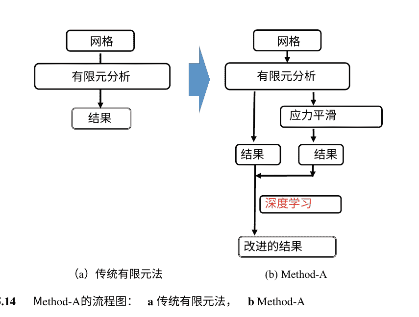## 图5.15 Method-B的流程图：a 自适应有限元法，b Method-B
- 🟠 目标点
- 🔵 相邻点

## 图5.16目标点及其相邻点

## 图5.17粗网格（16个单元）

## 图5.18施加力的方向

## 图5.19 边界条件的示例

### 5.5 数值示例

图5.20 误差与隐藏层数量的关系对于不同的训练模式和隐藏单元

图5.21 误差分布：$\sigma_x$

## 图5.22 误差分布: $\sigma_y$

## 图5.23 误差分布: $\tau_{xy}$

## 图5.24 在$y=3.85$处估计的$\sigma_x$值。从[16]中重新印刷，获得Springer的许可

图5.25 在$y=3.85$处估计的$\sigma_y$值。从[16]中重新印刷，获得Springer的许可

图5.26在$y=3.85$处估计的$\tau_{xy}$值。从[16]中重新印刷，获得Springer的许可

### 参考文献
1. Ainsworth, M., Oden, J.T.: 有限元分析中的后验误差估计。计算方法与应用力学工程142, 1-88 (1997)
2. Babuska, I., Rheinboldt, W.C.: 自适应有限元计算的误差估计。SIAM数值分析杂志15, 736-754 (1978)
3. Babuska, I., Vogelius, M.: 一维边界值问题的反馈和自适应有限元解法。数值数学44, 75-102 (1984)
4. Brenner, S.C., Scott, L.R.: 有限元方法的数学理论，Springer (1994)
5. Carey, G.F.: 计算网格：生成、适应和解决策略。泰勒和弗朗西斯出版社 (1994年)
6. Cuthill, E.: 减少矩阵带宽的几种策略。在: 罗斯D.J., 威洛比R.A. (编) 稀疏矩阵及其应用。IBM研究会议系列，斯普林格出版社，波士顿，马萨诸塞州。https://doi.org/10.1007/978-1-4615-8675-3_14
7. Cuthill, E., McKee, J.: 减少稀疏对称矩阵的带宽。 ACM '69: 1969年第24届全国会议论文集, 1969年8月, 第157-172页。
8. Gibbs, N.E., Poole, W.G. Jr., Stockmeyer, P.K.: 一种减少稀疏矩阵带宽和轮廓的算法。 SIAM J. Numer. Anal. 13, 236-250 (1976)
9. Golub, G.H., Van Loan, C.F.: 矩阵计算（第三版）。 约翰霍普金斯大学出版社 (1996年)
10. Grätsch, T., Bathe, K.J.: 实际有限元分析中的后验误差估计技术。 计算结构学报 83, 235-265 (2005)
11. Jennings, A., McKeown, J.J.: 矩阵计算（第二版）。 约翰威利和儿子出版社 (1992年)
12. King, I.P.: 从网络系统中导出的同时方程的自动重新排序方案。 国际数值方法工程学报 2, 523-533 (1970)
13. Knuth, D.E.: 大O和大Ω和大Θ。 SIGACT新闻8(2), 18–24 (1976). [https://doi.org/10.1145/1008328.1008329](https://doi.org/10.1145/1008328.1008329)
14. Liu, W.-H., Sherman, A.H.: 稀疏矩阵的Cuthill-McKee和Reverse Cuthill-McKee排序算法的比较分析。 SIAM数值分析学报 13, 198-213 (1976)
15. Murotani, K., Yagawa, G., Choi, J.B.: 使用分层网格的自适应有限元及其在裂纹扩展分析中的应用。 计算方法与应用力学工程学报 253, 1-14 (2013)
16. Oishi, A., Yagawa, G.: 使用神经网络和后验误差的有限元方法。 Arch. Comput. Methods Eng. 28, 3433-3456 (2021). [https://doi.org/10.1007/s11831-020-09507-0](https://doi.org/10.1007/s11831-020-09507-0)
17. Reddy, J.N.: 有限元方法导论（第二版）。 麦格劳希尔 (1993)
18. Sloan, S.W.: 稀疏矩阵的剖面和波前减少算法。 Int. J. Numer. Methods Eng. 23, 239-251 (1986)
19. Ueberhuber, C.W.: 数值计算2. Springer (1997)
20. Verfürth, R.: 后验误差估计和自适应网格细化技术综述。 Wiley-Teubner (1996)
21. Verfürth, R.: 有限元方法的后验误差估计技术。 牛津大学出版社, 牛津 (2013)
22. 矢川，G., 市宫, M., 安藤, Y.: 基于有限元方法中离散化误差的应力强度因子分析方法。 日本机械工程学会44(379), 743-755 (1978)。 (日文)
23. Zienkiewicz, O.C., Morgan, K.: 有限元与逼近。 多佛出版社(2006)
24. Zienkiewicz, O.C., Zhu, J.Z.: 一种用于实际工程分析的简单误差估计器和自适应过程。 国际数值方法工程学杂志24, 337-357 (1987)

## 第6章 基于深度学习的接触力学

摘要 随着计算力学的进展，各种机械现象的模拟已经得到实际应用。物体之间的接触和碰撞模拟就是其中之一。在本章中，我们研究了深度学习在接触搜索过程中的应用，这在接触和碰撞分析中是不可或缺的。特别是，我们重点关注两个光滑接触表面之间的接触。在第6.1节中，讨论了接触分析和接触搜索的基础知识。在第6.2节、第6.3节和第6.4节中，分别介绍了用于表示光滑接触表面的NURBS基函数、NURBS定义形状的分割操作以及传统的面对面对面接触搜索方法。

通过这些准备工作，第6.5节使用深度学习制定了一种接触搜索方法，最后，第6.6节展示了一个数值例子。

### 6.1 接触力学基础

众所周知，碰撞和接触分析处理多个物体之间或单个物体的多个位置之间的接触现象[7-9, 21, 22]。在本节中，研究了有限元方法中接触分析和接触搜索的基本内容。

考虑到动态效应，有限元法的矩阵方程可以写成如下形式：

$$
[M]\{\ddot{U}\} + [K]\{U\} = \{F\} \tag{6.1.1}
$$

其中不考虑阻尼，[M]是质量矩阵，[K]是全局刚度矩阵，{F}是载荷向量，$\{\ddot{U}\}$和$\{U\}$分别是加速度和位移向量。将方程(6.1.1)在时间上离散化，我们有

$$
\frac{1}{(\Delta t)^2}[M]\{U\}_{n+1} = \{F\}_n - \left([K] - \frac{2}{(\Delta t)^2}[M]\right)\{U\}_n - \frac{1}{(\Delta t)^2}[M]\{U\}_{n-1} \tag{6.1.2}
$$

其中 $\Delta t$ 是时间增量，$\{\}_n$ 表示时间 $t_n$ 的变量。当假设 $[M]$ 是一个集中质量矩阵时，即一个对角矩阵，我们可以在不求解同时线性方程的情况下得到上述方程的解。在这种情况下，只有当 $\Delta t$ 满足 Courant-Friedrichs-Lewy (CFL) 条件时，才能获得稳定的解，如下所示 [1]：

$$\Delta t \leq \frac{l}{c} \qquad (6.1.3)$$

其中 $l$ 是元素长度，$c$ 是应力波的速度。请注意，如果为了获得准确的结果而采用小的元素尺寸，则必须采用非常小的 $\Delta t$ 值以满足CFL条件，这可能会增加计算负荷。

在动态显式接触分析中，允许小的穿透到其他物体中，计算与穿透深度成比例的斥力，这被定义为接触力，并且准确地识别碰撞或接触点的位置和接触状态是至关重要的，其中接触状态包括穿透深度到其他物体中。

基于显式动力学的接触分析过程总结如下：

1. 开始计算第一步 ($n=1$) 。
2. 通过接触搜索确定接触点的位置和接触状态。
3. 在接触点处计算适当的接触力 $\{F_C\}_n$。
4. 根据公式 (6.1.2) 计算 $\{U\}_{n+1}$ ，右侧加上 $\{F_C\}_n$。
5. $n \rightarrow n+1$
6. 返回到1.

接触搜索通常分为两个阶段：全局搜索和随后的局部搜索。在前者中，从整个区域中搜索具有高可能性的接触子区域，而在后者中，确定在全局搜索中选择的区域中的接触点的位置和接触状态。在前者的搜索中，使用分层边界框来提高搜索效率[3,11]。然而，在分布式内存并行处理环境中，改进全局搜索的效率仍然很困难，因为全局接触搜索必须覆盖通常分布在处理器之间的多个对象[12]。至于后者的搜索，由于迭代解决过程的计算负载和稳定性可能是问题。

例如，在有限元法中，节点-段类型接触搜索算法是一种典型的动态接触分析方法，它包括全局搜索和局部搜索过程。在前一过程中，对于位于相对接触表面上的节点，会搜索到与该节点距离最近的另一接触表面上的段（元素的面），然后在后一过程中，确定了前一过程中选择的节点和段的接触点的确切位置[2, 5]。

### 6.1 接触力学基础

让我们考虑当接触表面由矩形段组成时，在节点-段算法中进行局部接触搜索的情况，如图6.1所示。这是为了找到从位于相对接触表面上的节点$P_S(x_S, y_S, z_S)$到在全局搜索中选择的相反接触表面上的段的垂直直线的足$H(x_H, y_H, z_H)$的局部坐标$\xi_c$和$\eta_{c}$。由于足$H(x_H, y_H, z_H)$位于段上，我们可以使用局部坐标表示

$$
H(\xi, \eta) = \begin{pmatrix} x_H \\ y_H \\ z_H \end{pmatrix} = \sum_{i=1}^{4} N_i(\xi, \eta) P_i = \sum_{i=1}^{4} N_i(\xi, \eta) \begin{pmatrix} X_i \\ Y_i \\ Z_i \end{pmatrix} \qquad (6.1.4)
$$

其中$N_i(\xi, \eta)$是有限元方法中四节点四边形单元的一阶基函数，并表示为

$$
N_1(\xi, \eta) = \frac{1}{4}(1-\xi)(1-\eta) \qquad (6.1.5)
$$

$$
N_2(\xi, \eta) = \frac{1}{4}(1+\xi)(1-\eta) \qquad (6.1.6)
$$

$$
N_3(\xi, \eta) = \frac{1}{4}(1+\xi)(1+\eta) \qquad (6.1.7)
$$

$$
N_4(\xi, \eta) = \frac{1}{4}(1-\xi)(1+\eta) \qquad (6.1.8)
$$

由于$H(x_H, y_H, z_H)$是线段上离$P_S(x_S, y_S, z_S)$最近的点，我们有

$$
(H(\xi, \eta) - P_S)^2 \rightarrow \min \qquad (6.1.9)
$$

基于方程（6.1.9），推导出以下方程。

## 6 使用深度学习的接触力学

$$
\frac{\partial H(\xi, \eta)}{\partial \xi} (H(\xi, \eta) - P_S) = 0 \qquad (6.1.10)
$$

$$
\frac{\partial H(\xi, \eta)}{\partial \eta} (H(\xi, \eta) - P_S) = 0 \qquad (6.1.11)
$$

使用牛顿法解这两个方程，计算出接触点 $\xi_c$ 和 $\eta_c$ 的局部坐标，通过这些坐标计算出有符号距离 $g$。

计算出 $P_S(x_S, y_S, z_S)$ 和 $H(\xi_c, \eta_c)$ 之间的距离 $g$ 的公式为

$$
g = \overrightarrow{H P_S} \cdot \vec{n} \qquad (6.1.12)
$$

其中，$\vec{n}$ 是 $H(\xi_c, \eta_c)$ 处的外法向单位向量。如果 $g$ 小于或等于0，则判断发生了接触，且穿透深度为 $|g|$，将与 $H(\xi_c, \eta_c)$ 和 $P_S(x_S, y_S, z_S)$ 相关的接触力增加 $|g|$ 作为反作用力。

需要注意的是，使用有限元法进行碰撞和接触分析时，由于接触表面几何形状的不准确确定义，存在一些问题（图6.2）。换句话说，有限元的大部分基函数仅在元素边界处具有 $C^0$ 连续性（参见第5.3.1节），这导致当检测到接触时添加的斥力接触力在元素边界处发生不连续的方向变化，从而降低了分析的稳定性和收敛性[10, 16, 20]。

通过使用平滑的基函数，可以消除由基函数引起的表面不规则性。例如，如果将NURBS [15, 17] 用作分析的基函数来表示物体的平滑表面，则可以使用平滑的接触表面进行接触分析（如图6.3所示）。出于这个原因和其他好处，使用NURBS作为分析的基函数的等几何分析[4, 6]和NURBS增强有限元法（NEFEM）[18, 19]已经被广泛应用。

图6.2 使用传统有限元基函数定义的接触面

在接触分析过程中，它具有CAD中定义的平滑形状的优势。

### 6.2 NURBS基函数

如前一节所研究的，B样条和NURBS基函数可用于表示平滑曲面。我们在这里详细讨论这些平滑基函数。

计算机辅助设计（CAD）系统中用于表示对象形状的NURBS基函数是从一维B样条基函数推导出来的。这些 $N_{i, p}(\xi)$ 函数的定义如下[15, 17]

$$
N_{i,0}(\xi) = \begin{cases} 1 & (\xi_i \le \xi < \xi_{i+1}) \\ 0 & (\text{否则}) \end{cases} \quad (6.2.1)
$$

$$
N_{i,p}(\xi) = \frac{\xi - \xi_i}{\xi_{i+p} - \xi_i} N_{i,p-1}(\xi) + \frac{\xi_{i+p+1} - \xi}{\xi_{i+p+1} - \xi_{i+1}} N_{i+1,p-1}(\xi) \quad (6.2.2)
$$

其中一个节点向量 $\Xi = \{\xi_1, \xi_2, \xi_3, ..., \xi_{n+p}, \xi_{n+p+1}\}$ 是一个单调非递减的实数序列，并且规则 $0/0 = 0$ 应用于等式（6.2.2）的小数部分。

作为一个例子，让我们来看看从节点向量 {0, 0, 0, 1, 2, 3, 3, 3} 构造五个二阶B样条基函数的过程。首先，根据公式(6.2.1)，0阶B样条函数从 $N_{1,0}$ 到 $N_{7,0}$ 分别为：

$$
N_{1,0}(\xi) = \begin{cases} 1 & (0 \leq \xi < 0) \\ 0 & (\text{否则}) \end{cases} = 0 \quad (6.2.3a)
$$

$$
N_{2,0}(\xi) = \begin{cases} 1 & (0 \leq \xi < 0) \\ 0 & (\text{否则}) \end{cases} = 0 \quad (6.2.3b)
$$

$$
N_{3,0}(\xi) = \begin{cases} 1 & (0 \leq \xi < 1) \\ 0 & (\text{否则}) \end{cases} \quad (6.2.3c)
$$

$$
N_{4,0}(\xi) = \begin{cases} 1 & (1 \leq \xi < 2) \\ 0 & (\text{否则}) \end{cases} \quad (6.2.3d)
$$

$$
N_{5,0}(\xi) = \begin{cases} 1 & (2 \leq \xi < 3) \\ 0 & (\text{否则}) \end{cases} \quad (6.2.3e)
$$

$$
N_{6,0}(\xi) = \begin{cases} 1 & (3 \leq \xi < 3) \\ 0 & (\text{否则}) \end{cases} = 0 \quad (6.2.3f)
$$

$$
N_{7,0}(\xi) = \begin{cases} 1 & (3 \leq \xi < 3) \\ 0 & (\text{否则}) \end{cases} = 0 \quad (6.2.3g)
$$

接下来，通过公式（6.2.2），从零阶B样条函数构造出一阶B样条函数，分别为

$$
N_{1,1}(\xi) = \frac{\xi - \xi_1}{\xi_2 - \xi_1} N_{1,0}(\xi) + \frac{\xi_3 - \xi}{\xi_3 - \xi_2} N_{2,0}(\xi) = \frac{\xi - 0}{0 - 0} 0 + \frac{0 - \xi}{0 - 0} 0 = 0 \quad (6.2.4a)
$$

$$
N_{2,1}(\xi) = \frac{\xi - \xi_2}{\xi_3 - \xi_2} N_{2,0}(\xi) + \frac{\xi_4 - \xi}{\xi_4 - \xi_3} N_{3,0}(\xi)
= \frac{\xi - 0}{0 - 0} 0 + \frac{1 - \xi}{1 - 0} \begin{cases} 1 & (0 \leq \xi < 1) \\ 0 & (\text{否则}) \end{cases}
= \begin{cases} 1 - \xi & (0 \leq \xi < 1) \\ 0 & (\text{否则}) \end{cases} \quad (6.2.4b)
$$

$$
N_{3,1}(\xi) = \frac{\xi - \xi_3}{\xi_4 - \xi_3} N_{3,0}(\xi) + \frac{\xi_5 - \xi}{\xi_5 - \xi_4} N_{4,0}(\xi)
= \frac{\xi - 0}{1 - 0} \begin{cases} 1 & (0 \leq \xi < 1) \\ 0 & (\text{否则}) \end{cases} + \frac{2 - \xi}{2 - 1} \begin{cases} 1 & (1 \leq \xi < 2) \\ 0 & (\text{否则}) \end{cases}
= \begin{cases} \xi & (0 \leq \xi < 1) \\ 2 - \xi & (1 \leq \xi < 2) \\ 0 & (\text{否则}) \end{cases} \quad (6.2.4c)
$$

$$
N_{4,1}(\xi) = \frac{\xi - \xi_4}{\xi_5 - \xi_4} N_{4,0}(\xi) + \frac{\xi_6 - \xi}{\xi_6 - \xi_5} N_{5,0}(\xi)
$$$$= \begin{cases} \xi - 1 & (1 \leq \xi < 2) \\ 3 - \xi & (2 \leq \xi < 3) \\ 0 & \text{(否则)} \end{cases} \quad (6.2.4d)$$

$$N_{5,1}(\xi) = \frac{\xi - \xi_5}{\xi_6 - \xi_5} N_{5,0}(\xi) + \frac{\xi_7 - \xi}{\xi_7 - \xi_6} N_{6,0}(\xi) = \begin{cases} \xi - 2 & (2 \leq \xi < 3) \\ 0 & \text{(否则)} \end{cases} \quad (6.2.4e)$$

$$N_{6,1}(\xi) = \frac{\xi - \xi_6}{\xi_7 - \xi_6} N_{6,0}(\xi) + \frac{\xi_8 - \xi}{\xi_8 - \xi_7} N_{7,0}(\xi) = \frac{\xi - 3}{3 - 3} 0 + \frac{3 - \xi}{3 - 3} 0 = 0 \quad (6.2.4f)$$

最后，二阶B样条函数由一阶B样条函数通过方程（6.2.2）给出，如下所示：

$$N_{1,2}(\xi) = \frac{\xi - \xi_1}{\xi_3 - \xi_1} N_{1,1}(\xi) + \frac{\xi_4 - \xi}{\xi_4 - \xi_2} N_{2,1}(\xi) = \begin{cases} (1 - \xi)^2 & (0 \leq \xi < 1) \\ 0 & \text{(否则)} \end{cases} \quad (6.2.5a)$$

$$N_{2,2}(\xi) = \frac{\xi - \xi_2}{\xi_4 - \xi_2} N_{2,1}(\xi) + \frac{\xi_5 - \xi}{\xi_5 - \xi_3} N_{3,1}(\xi) = \begin{cases} \xi(1 - \xi) + \frac{1}{2}(2 - \xi)\xi & (0 \leq \xi < 1) \\ \frac{1}{2}(2 - \xi)^2 & (1 \leq \xi < 2) \\ 0 & \text{(否则)} \end{cases} \quad (6.2.5b)$$

$$N_{3,2}(\xi) = \frac{\xi - \xi_3}{\xi_5 - \xi_3} N_{3,1}(\xi) + \frac{\xi_6 - \xi}{\xi_6 - \xi_4} N_{4,1}(\xi) = \frac{\xi}{2} \begin{cases} \xi & (0 \leq \xi < 1) \\ 2 - \xi & (1 \leq \xi < 2) \\ 0 & \text{(否则)} \end{cases} + \frac{3 - \xi}{2} \begin{cases} \xi - 1 & (1 \leq \xi < 2) \\ 3 - \xi & (2 \leq \xi < 3) \\ 0 & \text{(否则)} \end{cases}$$

$$= \begin{cases} \dfrac{1}{2}\xi^2 & (0 \leq \xi < 1) \\ \dfrac{1}{2}\xi(2-\xi)+\dfrac{1}{2}(3-\xi)(\xi-1) & (1 \leq \xi < 2) \\ \dfrac{1}{2}(3-\xi)^2 & (2 \leq \xi < 3) \end{cases} \qquad (6.2.5c)$$

$$N_{4,2}(\xi)=\dfrac{\xi-\xi_4}{\xi_6-\xi_4}N_{4,1}(\xi)+\dfrac{\xi_7-\xi}{\xi_7-\xi_5}N_{5,1}(\xi)$$
$$=\dfrac{\xi-1}{2}\begin{cases} \xi-1 & (1\leq\xi<2) \\ 3-\xi & (2\leq\xi<3) \end{cases} +\dfrac{3-\xi}{1}\begin{cases} \xi-2 & (2\leq\xi<3) \\ 0 & (\text{否则}) \end{cases}$$
$$=\begin{cases} \dfrac{1}{2}(\xi-1)^2 & (1\leq\xi<2) \\ \dfrac{1}{2}(\xi-1)(3-\xi)+(3-\xi)(\xi-2) & (2\leq\xi<3) \\ 0 & (\text{否则}) \end{cases} \qquad (6.2.5d)$$

$$N_{5,2}(\xi)=\dfrac{\xi-\xi_5}{\xi_7-\xi_5}N_{5,1}(\xi)+\dfrac{\xi_8-\xi}{\xi_8-\xi_6}N_{6,1}(\xi)$$
$$=\dfrac{\xi-2}{1}\begin{cases} \xi-2 & (2\leq\xi<3) \\ 0 & (\text{否则}) \end{cases} +\dfrac{3-\xi}{0}0$$
$$=\begin{cases} (\xi-2)^2 & (2\leq\xi<3) \\ 0 & (\text{否则}) \end{cases} \qquad (6.2.5e)$$

让我们以 $N_{3,2}(\xi)$ 为例。如图所示，函数在每个区间上都有不同的表达式。如果每个区间的方程分别表示为 $f_1(\xi)$, $f_2(\xi)$ 和 $f_3(\xi)$，那么我们有

$$N_{3,2}(\xi)= \begin{cases} f_1(\xi) & (0\leq\xi<1) \\ f_2(\xi) & (1\leq\xi<2) \\ f_3(\xi) & (2\leq\xi<3) \end{cases} = \begin{cases} \dfrac{1}{2}\xi^2 & (0\leq\xi<1) \\ \dfrac{1}{2}\xi(2-\xi)+\dfrac{1}{2}(3-\xi)(\xi-1) & (1\leq\xi<2) \\ \dfrac{1}{2}(3-\xi)^2 & (2\leq\xi<3) \end{cases} \qquad (6.2.6)$$

然后，我们有以下方程：

$$f_1(1)=f_2(1)=\dfrac{1}{2}, f_2(2)=f_3(2)=\dfrac{1}{2} \qquad (6.2.7)$$

$$\dfrac{d f_1}{d\xi}\bigg|_{\xi=1}=\dfrac{d f_2}{d\xi}\bigg|_{\xi=1}=1, \dfrac{d f_2}{d\xi}\bigg|_{\xi=2}=\dfrac{d f_3}{d\xi}\bigg|_{\xi=2}=-1 \qquad (6.2.8)$$

$$\dfrac{d^2 f_1}{d\xi^2}\bigg|_{\xi=1}=\dfrac{d^2 f_2}{d\xi^2}\bigg|_{\xi=1}, \dfrac{d^2 f_2}{d\xi^2}\bigg|_{\xi=2}=\dfrac{d^2 f_3}{d\xi^2}\bigg|_{\xi=2} \qquad (6.2.9)$$

这些表明 $N_{3,2}(\xi)$ 是一个光滑的函数，表明在节点之间的边界处 $C^1$ 连续性（见第5.3.1节）。

### 6.2 NURBS基函数

图6.4a、b分别显示了从结节向量 {0, 0, 1, 2, 3, 4, 5, 5}构造的六个一阶B样条基函数，以及从 {0, 0, 0, 1, 2, 3, 4, 5, 5, 5}构造的七个二阶B样条基函数。

众所周知，结节向量允许重复相同的结节值，在CAD中的标准结节向量是一个“开放结节向量”，其中第一个和最后一个结节值重复了 $p + 1$ 次（即基函数的阶数 + 1次），而 $p$ 阶B样条基函数在 $k$ 次重复结节值处是 $C^{p - k}$ 连续的。

让我们讨论一些如下的图表：

图6.5a：由八个三次B样条基函数构成 {0, 0, 0, 0, 1, 2, 3, 4, 5, 5, 5, 5},

图6.5 a由结点向量构造的三次 B样条基函数：{0, 0, 0, 0, 1, 2, 3, 4, 5, 5, 5, 5}

b由结点向量构造的三次B样条基函数：{0, 0, 0, 0, 1, 2, 3, 4, 5, 5, 5, 5}

c由结点向量构造的三次B样条基函数：{0, 0, 0, 0, 1, 2, 3, 4, 5, 5, 5, 5}

d由结点向量构造的三次B样条基函数：{0, 0, 0, 0, 1, 2, 3, 3, 3, 3, 4, 5, 5, 5, 5}

图6.5b：由九个三次B样条基函数构成 {0, 0, 0, 0, 1, 2, 3, 3, 4, 5, 5, 5, 5},

图6.5c：由十个三次B样条基函数构成 {0, 0, 0, 0, 1, 2, 3, 3, 3, 4, 5, 5, 5, 5},

图6.5d：由 {0, 0, 0, 0, 1, 2, 3, 3, 3, 3, 4, 5, 5, 5, 5} 构成的十一个三次B样条基函数

图6.5a、b所示的图形在节点值3处是 $C^2$ 连续且平滑的，而图6.5c在节点值处是 $C^0$ 连续但不平滑的，图6.5d在节点值处是 $C^{-1}$ 连续的，意味着图形在该点发生了分离。

请注意，B样条基函数是非负的，并且具有和为1的性质，即以下形式的单位分割：

$$对于任意的 \xi, N_{i,p}(\xi) \geq 0 \quad (6.2.10)$$

$$\sum_{i=1}^{n} N_{i,p}(\xi) = 1 \quad \text{对于任意的} \xi \quad (6.2.11)$$

二维B样条基函数 $N_{i,j}^{p,q}(\xi, \eta)$ 和三维B样条基函数 $N_{i,j,k}^{p,q,r}(\xi, \eta, \zeta)$ 分别定义为每个轴上一维B样条基函数的乘积，如下所示：

$$N_{i,j}^{p,q}(\xi, \eta) = N_{i,p}(\xi) \cdot M_{j,q}(\eta) \quad (6.2.12)$$

$$N_{i,j,k}^{p,q,r}(\xi, \eta, \zeta) = N_{i,p}(\xi) \cdot M_{j,q}(\eta) \cdot L_{k,r}(\zeta) \quad (6.2.13)$$

其中 $p$, $q$ 和 $r$ 分别是 $\xi$, $\eta$, 和 $\zeta$ 轴上的阶数。
一维 NURBS 基函数的 $p$ 阶，$R_{i,p}(\xi)$，通过在一维 B 样条基函数的 $p$ 阶 $N_{i,p}(\xi)$ 上添加一个新参数来定义

$$R_{i,p}(\xi) = \frac{N_{i,p}(\xi) \cdot w_i}{\sum_{i=1}^{n} N_{\hat{i},p}(\xi) \cdot w_{\hat{i}}} \quad \text{(6.2.14)}$$

其中新参数 $\boldsymbol{w} = \{ w_1, w_2, \dots, w_n \} (w_i > 0)$ 被称为权重。从方程 (6.2.14) 可以清楚地看出，当所有权重相等时，NURBS 基函数与 B 样条基函数重合。换句话说，B 样条基函数包含在 NURBS 基函数中，并且 NURBS 基函数具有与 B 样条基函数相同的性质，如下所示：

$$R_{i,p}(\xi) \ge 0 \quad \text{(对于任意 $\xi$)} \quad \text{(6.2.15)}$$

$$\sum_{i=1}^{n} R_{i,p}(\xi) = 1 \quad \text{(对于任意 $\xi$)} \quad \text{(6.2.16)}$$

图 6.6a–e 显示了由结节向量 $\{ 0, 0, 0, 1, 2, 3, 4, 5, 5, 5 \}$ 构造的六个二次 NURBS 基函数，其中图 6.6a 显示了具有 $\boldsymbol{w} = \{ 1, 1, 1, 1, 1/5, 1, 1 \}$ 的基函数，图 6.6b 显示了具有 $\boldsymbol{w} = \{ 1, 1, 1, 1, 1/2, 1, 1 \}$，图 6.6c 中的 $\boldsymbol{w} = \{ 1, 1, 1, 1, 1, 1, 1 \}$，图 6.6d 中的 $\boldsymbol{w} = \{ 1, 1, 1, 1, 2, 1, 1 \}$，以及图 6.6e 中的 $\boldsymbol{w} = \{ 1, 1, 1, 1, 5, 1, 1 \}$，分别为。从这些图中可以看出，通过改变 $w_5$ 的值为 5，不仅 $N_{5,2}(\xi)$，而且 $N_{3,2}(\xi)$， $N_{4,2}(\xi)$ 和 $N_{6,2}(\xi)$ 都受到了影响，这是由于单位分割的性质（方程 (6.2.16)）所致，而 $N_{1,2}(\xi)$ 和 $N_{2,2}(\xi)$ 则完全不受影响。二维 NURBS 基函数 $R_{i,j}^{p,q}(\xi, \eta)$ 和三维 NURBS 基函数 $R_{i,j,k}^{p,q,r}(\xi, \eta, \zeta)$ 也分别使用每个轴上的一维 B 样条基函数 $N_{i}^{p}(\xi)$, $M_{j}^{q}(\eta)$, $L_{k}^{r}(\zeta)$ 和权重来定义。

$$R_{i,j}^{p,q}(\xi, \eta) = \frac{N_{i,p}(\xi) \cdot M_{j,q}(\eta) \cdot w_{i,j}}{\sum_{i=1}^{n} \sum_{j=1}^{m} N_{\hat{i},p}(\xi) \cdot M_{\hat{j},q}(\eta) \cdot w_{\hat{i},\hat{j}}} \quad \text{(6.2.17)}$$

$$R_{i,j,k}^{p,q,r}(\xi, \eta, \zeta) = \frac{N_{i,p}(\xi) \cdot M_{j,q}(\eta) \cdot L_{k,r}(\zeta) \cdot w_{i,j,k}}{\sum_{i=1}^{n} \sum_{j=1}^{m} \sum_{k=1}^{l} N_{\hat{i},p}(\xi) \cdot M_{\hat{j},q}(\eta) \cdot L_{\hat{k},r}(\zeta) \cdot w_{\hat{i},\hat{j},\hat{k}}} \quad \text{(6.2.18)}$$

图6.6 a由结点向量构造的二阶NURBS基函数：{0, 0, 0, 1, 2, 3, 4, 5, 5, 5} 具有 $w = \{1, 1, 1, 1, \frac{1}{5}, 1, 1\}$。

b 由结点向量构造的二阶NURBS基函数：{0, 0, 0, 1, 2, 3, 4, 5, 5, 5} 具有 $w = \{1, 1, 1, 1, \frac{1}{2}, 1, 1\}$。

c 由结点向量构造的二阶NURBS基函数：{0, 0, 0, 1, 2, 3, 4, 5, 5, 5} 其中 $w= \{1, 1, 1, 1, 1, 1, 1\}$。

d 由结点向量构造的二阶NURBS基函数：{0, 0, 0, 1, 2, 3, 4, 5, 5, 5} 其中 $w= \{1, 1, 1, 1, 2, 1, 1\}$。

e 由结点向量构造的二阶NURBS基函数：{0, 0, 0, 1, 2, 3, 4, 5, 5, 5} 其中 $w= \{1, 1, 1, 1, 5, 1, 1\}$。

图6.6（续）

### 6.3 基于NURBS基函数的NURBS对象

使用在第6.2节中描述的NURBS基函数，本节介绍了表示具有光滑曲面的三维物体形状的方法，展示了如何在保持形状的同时编辑基函数以及如何分割形状。

使用NURBS基函数和控制点 $B_i$ (或 $B_{i, j}$, $B_{i, j, k}$)，分别在三维空间中定义了曲线 $C(\xi)$，曲面 $S(\xi, \eta)$ 和实体 $V(\xi, \eta, \zeta)$。

$$C(\xi) = \begin{pmatrix} x(\xi) \\ y(\xi) \\ z(\xi) \end{pmatrix} = \sum_{i=1}^{n} R_i^p(\xi) \cdot \begin{pmatrix} X_i \\ Y_i \\ Z_i \end{pmatrix} = \sum_{i=1}^{n} R_i^p(\xi) \cdot B_i \quad (6.3.1)$$

### 6.3 基于NURBS基函数的NURBS对象

$$S(\xi, \eta) = \begin{pmatrix} x(\xi, \eta) \\ y(\xi, \eta) \\ z(\xi, \eta) \end{pmatrix} = \sum_{i,j}^{N,M} R_{i,j}^{p,q}(\xi, \eta) \cdot \begin{pmatrix} X_{i,j} \\ Y_{i,j} \\ Z_{i,j} \end{pmatrix} = \sum_{i,j}^{N,M} R_{i,j}^{p,q}(\xi, \eta) \cdot B_{i,j} \quad (6.3.2)$$

$$V(\xi, \eta, \zeta) = \begin{pmatrix} x(\xi, \eta, \zeta) \\ y(\xi, \eta, \zeta) \\ z(\xi, \eta, \zeta) \end{pmatrix} = \sum_{i,j,k}^{n,M,L} R_{i,j,k}^{p,q,r}(\xi, \eta, \zeta) \cdot \begin{pmatrix} X_{i,j,k} \\ Y_{i,j,k} \\ Z_{i,j,k} \end{pmatrix} = \sum_{i,j,k}^{n,M,L} R_{i,j,k}^{p,q,r}(\xi, \eta, \zeta) \cdot B_{i,j,k} \quad (6.3.3)$$

让 $C_1(\xi)$ 是由六个B样条基函数构成的线段，这些基函数是一阶的（所有权重都设置为相同的唯一值），构造自节点向量{0, 0, 1, 2, 3, 4, 5, 5}和六个控制点 $P_1(0, 0, 0)$, ..., 并且在x轴上均匀分布的控制点 $P_6(5, 0, 0)$。

同样地，让 $C_2(\xi)$ 是由七个从节点向量 {0, 0, 0, 1, 2, 3, 4, 5, 5, 5}构造的二阶B样条基函数定义的线段，七个控制点均匀分布在(0, 0, 0)和(5, 0, 0)之间， $C_3(\xi)$ 是由八个从节点向量 {0, 0, 0, 0, 1, 2, 3, 4, 5, 5, 5, 5}构造的三阶B样条基函数定义的线段，八个控制点均匀分布在(0, 0, 0)和(5, 0, 0)之间。然后，如图6.7所示，这三个线段的形状是相同的，但它们的内部表示是不同的。图6.8显示了参数 $\xi$ 和线段上对应参数的坐标 $C(\xi)$ 之间的关系，其中水平轴是参数 $\xi$，以及垂直轴 $C(\xi)$。$C_1(\xi)$， $C_2(\xi)$ 和 $C_3(\xi)$ 在 $\xi=0$ 和 $\xi=5$ 处重合，表明它们是以(0, 0, 0)和(5, 0, 0)为端点的线段。另一方面， $C_1(\xi)$ 相对于参数 $\xi$ 线性变化，而 $C_2(\xi)$ 和 $C_3(\xi)$ 非线性变化。

，以及 $P_{8,8}(7, 7, 0)$ 在xy平面上均匀分布的64个控制点，表6.1给出了它们的位置， $N_{i,3}(\xi)$ 和 $M_{j,3}(\eta)$ 是由节点向量构造的三阶B样条基函数。

然后一个平面 $S_1(\xi, \eta)$ 在三维空间中可以用这些控制点和基函数定义如下：

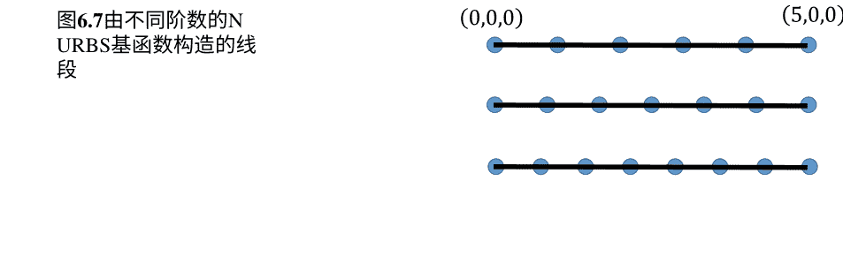

## 图6.8 C(ξ)相对于ξ的线段形状

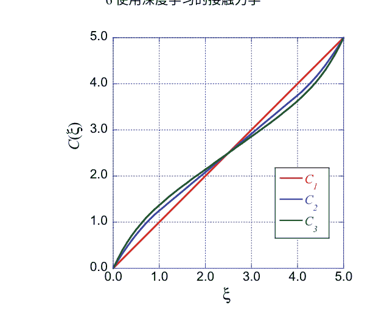

$$S_1(\xi, \eta) = \begin{pmatrix} x(\xi, \eta) \\ y(\xi, \eta) \\ z(\xi, \eta) \end{pmatrix} = \sum_{i=1}^{8} \sum_{j=1}^{8} N_{i,3}(\xi) \cdot M_{j,3}(\eta) \cdot P_{i,j} \tag{6.3.4}$$

图6.9a、b分别显示了控制点和生成的曲面（物体）的位置。当使用NURBS（B样条）基函数生成线段、曲面和实体等物体时，控制点可以位于物体外部。根据公式（6.3.2），控制点 $B_{\alpha,\beta}$ 只有在某个 $\xi_0, \eta_0$ 处的 $R_{\alpha,\beta}^{p,q}(\xi_0, \eta_0)$ 等于1时才是物体的一部分。这是因为在上述情况下，根据公式（6.2.15）和（6.2.16），所有其他基函数都为0，从而导致 $S(\xi_0, \eta_0) = B_{\alpha,\beta}$（根据公式（6.3.2））。

然而，从图6.5a可以看出，大多数基函数的最大值小于1，因此认为控制点与对象分离。需要注意的是，在开放节点向量的两端，其中一个基函数变为1，表示图6.9c中四个角上的四个端点分别对应一个控制点。

表6.1 64 (=8×8) 个控制点

| | | | | | | | |
| :--- | :--- | :--- | :--- | :--- | :--- | :--- | :--- |
| P_{1,1} (0, 0, 0) | (0, 1, 0) | (0, 2, 0) | (0, 3, 0) | (0, 4, 0) | (0, 5, 0) | (0, 6, 0) | P_{1,8} (0, 7, 0) |
| (1, 0, 0) | (1, 1, 0) | (1, 2, 0) | (1, 3, 0) | (1, 4, 0) | (1, 5, 0) | (1, 6, 0) | (1, 7, 0) |
| (2, 0, 0) | (2, 1, 0) | (2, 2, 0) | (2, 3, 0) | (2, 4, 0) | (2, 5, 0) | (2, 6, 0) | (2, 7, 0) |
| (3, 0, 0) | (3, 1, 0) | (3, 2, 0) | (3, 3, 2) | (3, 4, 2) | (3, 5, 0) | (3, 6, 0) | (3, 7, 0) |
| (4, 0, 0) | (4, 1, 0) | (4, 2, 0) | (4, 3, 2) | (4, 4, 2) | (4, 5, 0) | (4, 6, 0) | (4, 7, 0) |
| (5, 0, 0) | (5, 1, 0) | (5, 2, 0) | (5, 3, 0) | (5, 4, 0) | (5, 5, 0) | (5, 6, 0) | (5, 7, 0) |
| (6, 0, 0) | (6, 1, 0) | (6, 2, 0) | (6, 3, 0) | (6, 4, 0) | (6, 5, 0) | (6, 6, 0) | (6, 7, 0) |
| P_{8,1} (7, 0, 0) | (7, 1, 0) | (7, 2, 0) | (7, 3, 0) | (7, 4, 0) | (7, 5, 0) | (7, 6, 0) | P_{8,8} (7, 7, 0) |

## 图6.9a 控制点。b 曲面对象。c 对象和控制点 节点线

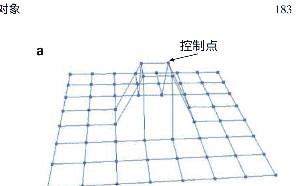

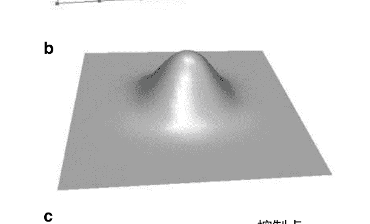

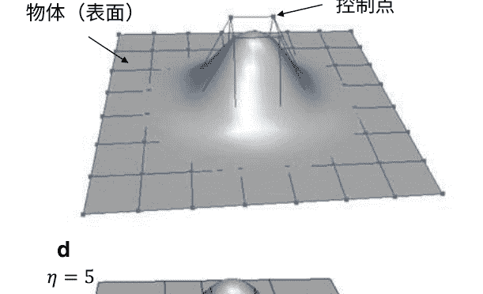

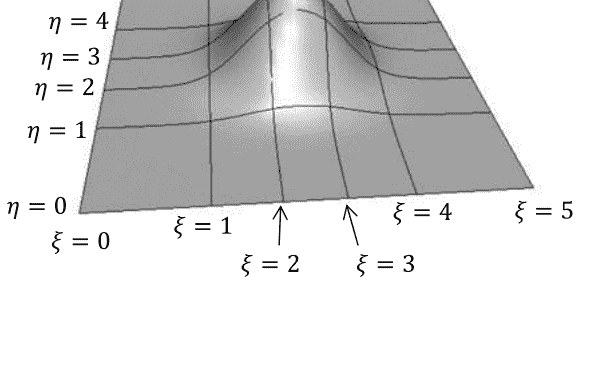

图6.9d显示了一组点（称为节点线），节点值相等。从图中可以看出，由于图6.8中显示的非线性，节点向量两端的节点值之间的空间更宽，即使控制点几乎等间距。如下所讨论的，通过添加控制点，可以沿着节点线将由NURBS（B样条）基函数定义的对象分割而不重叠。

让我们研究如何分割由NURBS（B样条）基函数定义的对象。首先，可以在不改变由NURBS（B样条）基函数定义的对象的形状的情况下，向其添加控制点。这可以通过在每个轴上的节点向量中插入新的节点值来实现。

假设一个节点向量 = {ξ₁, ξ₂, ξ₃, ..., ξₙ₊ₚ₋₁, ξₙ₊ₚ, ξₙ₊ₚ₊₁} 用于在ξ轴上生成第p阶基函数和控制点序列的 {B₁, B₂, ..., Bₙ₋₁, Bₙ} 在ξ轴方向上，让m个新节点值添加到节点向量中，得到 = {ξ̄₁, ξ̄₂, ξ̄₃, ..., ξ̄ₙ₊ₘ₊ₚ₋₁, ξ̄ₙ₊ₘ₊ₚ, ξ̄ₙ₊ₘ₊ₚ₊₁}。然后，一个新的序列的 n + m 控制点 {B̄₁, B̄₂, ..., B̄ₙ₊ₘ₋₁, B̄ₙ₊ₘ} 使用计算得到

$$
\begin{Bmatrix}
\bar{B}_1 \\ \vdots \\ \bar{B}_{n+m}
\end{Bmatrix}
= T
\begin{Bmatrix}
B_1 \\ \vdots \\ B_n
\end{Bmatrix}
=
\begin{bmatrix}
T^p_{1,1} & \cdots & T^p_{1,n} \\ \vdots & \ddots & \vdots \\ T^p_{n+m,1} & \cdots & T^p_{n+m,n}
\end{bmatrix}
\begin{Bmatrix}
B_1 \\ \vdots \\ B_n
\end{Bmatrix}
\quad (6.3.5)
$$

其中变换矩阵 T 的每个分量分别得到

$$
T^0_{i,j} = \begin{cases}
1 & (\bar{\xi}_i \in [\xi_j, \xi_{j+1})) \\
0 & (\text{否则})
\end{cases}
\quad (6.3.6)
$$

$$
T^k_{i,j} = \frac{\bar{\xi}_{i+k} - \xi_j}{\xi_{j+k} - \xi_j} T^{k-1}_{i,j} + \frac{\xi_{j+k+1} - \bar{\xi}_{i+k}}{\xi_{j+k+1} - \xi_{j+1}} T^{k-1}_{i,j+1}
\quad (6.3.7)
$$

在等式（6.3.5）的转换矩阵的每一行中，最多只有 p+1个连续的非零分量，当存在许多控制点时，矩阵变得稀疏。这表明只有在添加的节点值的有效范围内的控制点才会发生变化。

在二维和三维情况下，当向节点向量中添加新的节点值时，节点值和控制点按轴顺序逐个添加和更新：首先，对每个沿轴的控制点序列，通过等式（6.3.5）进行一轴上的变换，然后以相同的方式进行另一轴上的变换。

通过使用等式（6.3.5）-（6.3.7）进行节点插入和控制点更新时，对象的形状保持不变，并且添加或更新的控制点位于与插入的节点值相关联的邻域区域中，这些点比原始点更接近对象。

在这里，让我们定义一些与节点跨度和段相关的术语。区间 [ξ_i, ξ_j] 由两个分量 ξ_i 和 ξ_j (i < j) 定义的节点向量称为节点跨度。如果 ξ_i = ξ_j，则称为非零节点跨度，如果 j = i+1，则为单个节点跨度。在方程(6.3.1)和(6.3.2)中定义的曲线和曲面中，对应于单个节点跨度的曲线元素和对应于两个单个节点跨度的直接乘积的曲面元素分别称为曲线段和曲面段。

至于曲线段，与单个节点跨度对应的 $p$ 阶曲线段 $\{ \xi_i, \xi_{i+1} \}$ 由节点向量定义 $\{, \xi_{i-1}, \xi_i, \xi_{i+1}, \xi_{i+2}, \ldots, \ldots, \xi_{i+p}, \xi_{i+p+1} \}$ 具有 $2(p+1)$ 个组成部分和 $p+1$ 个控制点 $\{B_{i-p}, B_{i-p+1}, \ldots, B_{i-1}, B_i\}$。当节点向量的一个段具有结构 $\left\{ \underbrace{a, \ldots, a}_{p+1}, \underbrace{b, \ldots, b}_{p+1} \right\}$ 或 $\left\{ c, \underbrace{a, \ldots, a}_{p}, \underbrace{b, \ldots, b}_{p}, d \right\}$，该线段被称为贝塞尔线段。

考虑将图6.9d中的曲面分割成25个曲面段，沿着节点线分割。首先，为了在 $\xi$ 方向上将曲面分割成段，需要将节点值添加到原始节点向量 $\{0, 0, 0, 0, 1, 2, 3, 4, 5, 5, 5, 5\}$ 中，以构建新的节点向量 $\{0, 0, 0, 0, 1, 1, 1, 2, 2, 2, 3, 3, 3, 4, 4, 4, 5, 5, 5, 5\}$。从这个新的节点向量构建的基函数如图6.10所示。由于重复的节点值，除了两端之外，基函数在重复的节点值处是 $C^0$ 连续的，且重复节点值两侧的节点跨度只共享一个控制点。这意味着节点跨度和定义在其上的曲线段在节点值处是可分离的，没有重叠。例如，对于与 $\eta = 0$ 相对应的控制点序列，根据公式(6.3.5)生成一个新的控制点序列，如下所示：

$$\left\{\begin{array}{c}\bar{P}_{1,1}\\\vdots\\\bar{P}_{16,1}\end{array}\right\}=\left[\begin{array}{ccc}T^{3}_{1,1}&\cdots&T^{3}_{1,8}\\\vdots&\ddots&\vdots\\T^{3}_{16,1}&\cdots&T^{3}_{16,8}\end{array}\right]\left\{\begin{array}{c}P_{1,1}\\\vdots\\P_{8,1}\end{array}\right\}$$

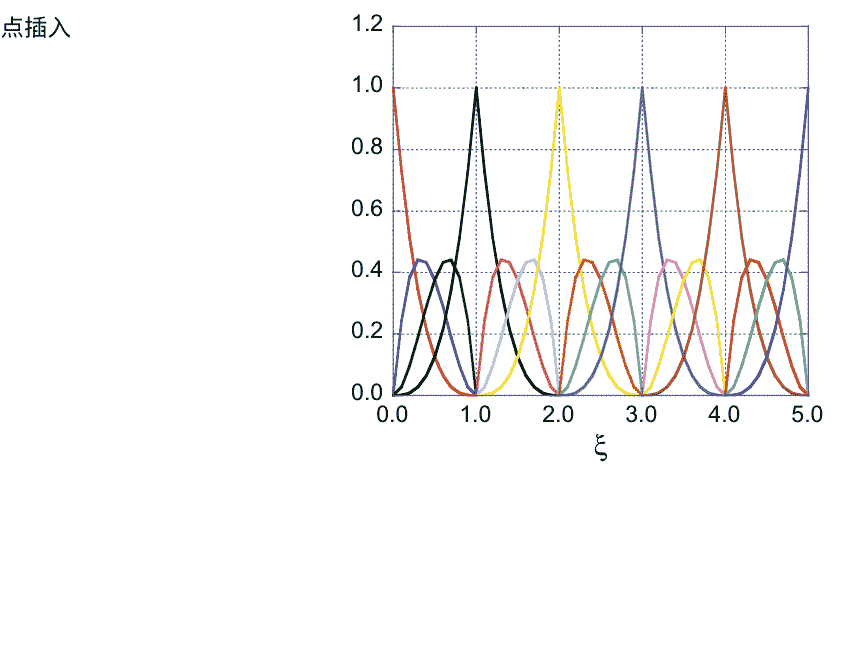

在将新的控制点沿着节点线分成五个段的情况下，每个段所属的控制点和节点向量如表6.2所示。在将曲面分成25个曲面段的情况下，如图6.11所示，表6.3中显示了图中两个曲面段A和B的示例。可以看出，表6.2和表6.3中显示的所有段都是Bezier段。

对于Bezier段，可以提高或降低基函数的阶数。 提高一维Bezier（曲线）段阶数的过程如下所述。 当由$p+1$个控制点组成的$p$阶段点 $\{B_1, B_2, \ldots, B_p, B_{p+1}\}$ 被提升到更高的次数， $p+2$个控制点 $\{\overline{B}_1, \overline{B}_2, \ldots, \overline{B}_{p+1}, \overline{B}_{p+2}\}$ 构成提升后的 $(p+1)$阶段的点可通过以下方程获得，

$$\overline{B}_i = \frac{i-1}{p+1}B_{i-1} + \frac{p+2-i}{p+1}B_i \quad (i=1, \ldots, p+2) \qquad (6.3.9)$$

另一方面，一维贝塞尔曲线段的阶降低过程如下所示。当由 $p+1$个控制点组成的$p$阶段需要降低其次数时 $\{B_1, B_2, \ldots, B_p, B_{p+1}\}$ 新的 $p$个控制点 $\{\overline{B}_1, \overline{B}_2, \ldots, \overline{B}_{p-1}, \overline{B}_p\}$ 根据奇偶性生成第$p-1$阶段的数据段如下:

当 $p$为偶数时:

$$\overline{B}_i = \begin{cases} B_i & (i=1) \\ \frac{B_i - \alpha_i \overline{B}_{i-1}}{1 - \alpha_i} & (i=2, \ldots, r) \\ \frac{B_{i+1} - (1-\alpha_{i+1}) \overline{B}_{i+1}}{\alpha_{i+1}} & (i=r+1, \ldots, p-1) \\ B_{p+1} & (i=p) \end{cases} \qquad (6.3.10)$$

其中

$$r = \frac{p-2}{2}, \quad \alpha_i = \frac{i-1}{p} \qquad (6.3.11)$$

当$p$为奇数时:

$$\overline{B}_i = \begin{cases} B_i & (i=1) \\ \frac{B_i - \alpha_i \overline{B}_{i-1}}{1 - \alpha_i} & (i=2, \ldots, r-1) \\ \frac{B_r^L + B_r^R}{2} & (i=r) \\ \frac{B_{i+1} - (1-\alpha_{i+1}) \overline{B}_{i+1}}{\alpha_{i+1}} & (i=r+1, \ldots, p-1) \\ B_{p+1} & (i=p) \end{cases} \qquad (6.3.12)$$

其中

$$r = \frac{p-1}{2}, \quad \alpha_i = \frac{i-1}{p} \qquad (6.3.13)$$

$$B_r^L = \frac{B_i - \alpha_i \overline{B}_{i-1}}{1-\alpha_i}, \quad B_r^R = \frac{B_{i+1} - (1-\alpha_{i+1})\overline{B}_{i+1}}{\alpha_{i+1}} \qquad (6.3.14)$$

虽然可以降低一维贝塞尔（曲线）段的基函数阶数，但应注意这会导致基函数表示的形状的准确性降低。

表6.2 划分为五个段

| 线段 | 控制点 | 节点向量 |
| :--- | :--- | :--- |
| 1 | $\overline{P}_{1,1}, \overline{P}_{2,1}, \overline{P}_{3,1}, \overline{P}_{4,1}$ | {0, 0, 0, 1, 1, 1, 2} |
| 2 | $\overline{P}_{4,1}, \overline{P}_{5,1}, \overline{P}_{6,1}, \overline{P}_{7,1}$ | {0, 1, 1, 1, 2, 2, 2, 3} |
| 3 | $\overline{P}_{7,1}, \overline{P}_{8,1}, \overline{P}_{9,1}, \overline{P}_{10,1}$ | {1, 2, 2, 2, 3, 3, 3, 4} |
| 4 | $\overline{P}_{10,1}, \overline{P}_{11,1}, \overline{P}_{12,1}, \overline{P}_{13,1}$ | {2, 3, 3, 3, 4, 4, 4, 5} |
| 5 | $\overline{P}_{13,1}, \overline{P}_{14,1}, \overline{P}_{15,1}, \overline{P}_{16,1}$ | {3, 4, 4, 4, 5, 5, 5, 5} |

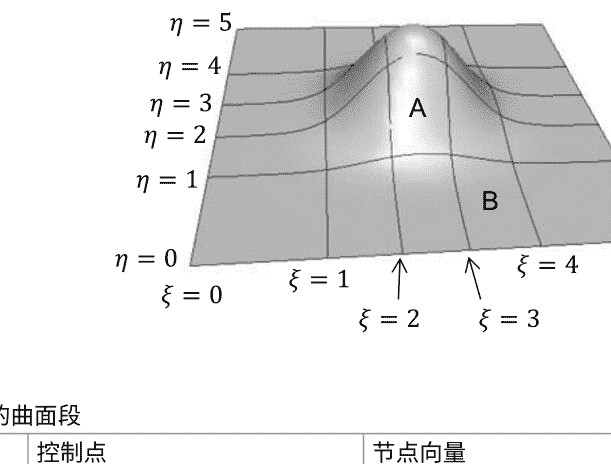

表6.3 图6.11中显示的曲面段

| 曲面段 | 控制点 | 节点向量 |
| :--- | :--- | :--- |
| A | $\overline{P}_{7,4}, \overline{P}_{8,4}, \overline{P}_{9,4}, \overline{P}_{10,4}$<br>$\overline{P}_{7,5}, \overline{P}_{8,5}, \overline{P}_{9,5}, \overline{P}_{10,5}$<br>$\overline{P}_{7,6}, \overline{P}_{8,6}, \overline{P}_{9,6}, \overline{P}_{10,6}$<br>$\overline{P}_{7,7}, \overline{P}_{8,7}, \overline{P}_{9,7}, \overline{P}_{10,7}$ | $\xi$的{1, 2, 2, 2, 3, 3, 3, 4}值<br>$\eta$的{0, 1, 1, 1, 2, 2, 2, 3}值 |
| B | $\overline{P}_{10,1}, \overline{P}_{11,1}, \overline{P}_{12,1}, \overline{P}_{13,1}$<br>$\overline{P}_{10,1}, \overline{P}_{11,1}, \overline{P}_{12,1}, \overline{P}_{13,1}$<br>$\overline{P}_{10,1}, \overline{P}_{11,1}, \overline{P}_{12,1}, \overline{P}_{13,1}$<br>$\overline{P}_{10,1}, \overline{P}_{11,1}, \overline{P}_{12,1}, \overline{P}_{13,1}$ | $\xi$的{2, 3, 3, 3, 4, 4, 4, 5}值<br>$\eta$的{0, 0, 0, 0, 1, 1, 1, 2}值 |

## 6.3 基于NURBS基函数的NURBS对象对于曲面，阶数提升或降低操作以类似的方式进行。请注意，阶数提升会保留原始形状，但阶数降低不一定会保留原始形状。

这里展示了一些贝塞尔曲面段的示例：图6.12a展示了使用一阶B样条基函数定义的段，图6.12b展示了使用二阶基函数定义的段，图6.12c展示了使用三阶基函数定义的段。用于生成这些几何图形的控制点和节点向量的坐标总结在表6.4中。

### 6.4 表面对表面接触的局部搜索

在本节中，基于传统的接触搜索方法，研究了光滑接触表面之间的接触搜索方法。

众所周知，使用NURBS作为基函数的等几何分析可以应用于动态接触分析。

首先，考虑基于等几何分析的动态分析。在有限元方法的动态显式方法中，通常使用一阶基函数，因为高阶基函数通常需要较小的时间步长 Δt，增加了计算负荷。

另一方面，在使用NURBS（B样条）基函数的等几何分析中，即使使用高阶基函数，对时间步长 Δt 的约束也不严格。图6.13显示了在节点（控制点）间距恒定条件下，可以稳定执行的一维波传播分析的最大时间步长。水平轴是基函数的阶数，垂直轴是稳定分析的最大时间步长，以有限元分析中一阶基函数为比例显示。从图中可以看出，在有限元分析中，随着基函数阶数的增加，Δt 变小，而在使用B样条基函数的情况下，随着阶数的增加，对 Δt 的约束反而放松了。

如图6.14所示，当结节值多次重复时（参见第6.2节和第6.3节），这种趋势更加明显。水平轴是结节重复度，垂直轴是稳定分析的最大时间步长 Δt，再次是与具有一阶基函数的有限元分析情况相比的比值。从图中可以看出，使用NURBS基函数放宽了显式动力分析中的时间步长约束。

接下来，考虑接触分析，特别是与等几何分析的接触搜索。接触搜索在普通有限元方法和使用NURBS作为基函数的等几何分析之间有很大的区别。如第6.1节所示，在前者中，接触面之间的局部接触搜索基于在一个接触面上的节点与另一个接触面上的线段之间的距离计算。接触搜索之所以可以归因于点与曲面之间的接触搜索（点对曲面类型），是因为节点始终在接触表面上，并且当使用线性基函数时，段的形状也很简单（见图6.12a）。

另一方面，当接触表面是NURBS曲面时，接触表面之间的局部接触搜索是在贝塞尔曲面之间进行的。

表6.4 贝塞尔曲面段的规格
| 贝塞尔段 | 控制点 | 节点向量 |
| :--- | :--- | :--- |
| 一阶<br>(图6.12a) | P<sub>1,1</sub>(0, 0, 0), P<sub>1,2</sub>(0, 3, 0.5)<br>P<sub>2,1</sub>(3, 0, -0.5), P<sub>2,2</sub>(3, 3, 0) | {0, 0, 1, 1} 用于 ξ, η |
| 第二阶<br>(图6.12b) | P<sub>1,1</sub>(0, 0, 0), (0, 1.5, -0.5), P<sub>1,3</sub>(0, 3, 0)<br>P<sub>2,1</sub>(1.5, 0, -0.5), (0, 1.5, 0.5), P<sub>2,3</sub>(1.5, 3, -0.5)<br>P<sub>3,1</sub>(3, 0, 0), (3, 1.5, -0.5), P<sub>3,3</sub>(3, 3, 0) | {0, 0, 0, 1, 1, 1} 对于 ξ, η |
| 第三阶<br>(图6.12c) | P<sub>1,1</sub>(0, 0, 0), (0, 1, 0.5), (0, 2, -0.5), P<sub>1,4</sub>(0, 3, 0)<br>P<sub>2,1</sub>(1, 0, 0.5), (1, 1, -0.5), (1, 2, 0.5), P<sub>2,4</sub>(1, 3, -0.5)<br>P<sub>3,1</sub>(2, 0, -0.5), (2, 1, 0.5), (2, 2, -0.5), P<sub>3,4</sub>(2, 3, 0.5)<br>P<sub>4,1</sub>(3, 0, 0), (3, 1, -0.5), (3, 2, 0.5), P<sub>4,4</sub>(3, 3, 0) | {0, 0, 0, 0, 1, 1, 1, 1} 用于 ξ, η |

通过划分接触表面生成的线段。与有限元方法中的点对面类型接触搜索不同，贝塞尔曲面段不具有明显的控制点来表示形状。这是因为构成贝塞尔曲面段的控制点不一定位于曲面段上。因此，在接触检测中使用某些控制点会产生困难。

例如，图6.15显示了两个相对的Bezier曲面段及其控制点。在图中，下段的控制点以红色显示，上段的控制点以蓝色显示。这两个曲面段之间没有接触，但它们的控制点相交，这表明在这种情况下使用一些控制点进行接触检测的困难。

注意，在两个Bezier曲面段之间的接触搜索中，可以使用点对曲面类型的接触搜索来判断它们之间的接触状态。具体来说，如图6.16所示，在一个接触段上设置了许多点，并根据公式（6.1.10）和（6.1.11）对每组点和另一个段进行点对曲面类型的接触搜索，然后可以根据公式（6.1.12）中的有符号距离确定每个点的接触状态。

图6.16 贝塞尔曲线段之间的局部接触搜索

但是，为了准确计算曲线段之间的接触状态，需要在曲线段上设置许多点，这增加了计算量。此外，在解决方程（6.1.10）和（6.1.11）的牛顿-拉夫逊迭代的每个步骤中，需要进行基函数和贝塞尔曲面段的控制点坐标的乘加运算，以计算三维空间中接触点的坐标，这比常规有限元分析中点对曲面搜索中使用的基函数的阶数更高，因此更耗时。

图6.17显示了牛顿-拉夫逊方法每次迭代的计算量。水平轴是基函数的阶数，垂直轴是每次迭代的计算量，定义为与基函数为一阶的有限元分析的比率。随着基函数的阶数增加，计算复杂性也增加。例如，在有限元分析中，三阶基函数的计算复杂性几乎是一阶基函数的10倍。

请注意，所需的迭代次数随着基函数的阶数增加只略微增加。

到目前为止，表面对表面接触搜索比有限元分析中的点对表面接触搜索要求更多的计算资源。

### 6.5 使用深度学习进行局部接触搜索

在本节中，为了解决表面对表面局部搜索的计算负载问题，提出了一种使用前馈神经网络和深度学习的快速稳定的局部接触搜索方法。

现在，让我们再次看一下段之间的接触。图6.18a显示了两个贝塞尔曲面段的接触，图6.18b显示了图6.18a中段对的旋转版本。图6.18a、b中的接触条件（接触点的局部坐标、穿透深度等）是相同的。因此，接触状态是不变于平移和旋转，表明贝塞尔曲面片之间的接触状态仅由两个曲面片的形状和相对排列确定。

因此，局部接触搜索被视为从两个曲面片的形状和相对排列到它们之间接触状态的映射过程。通过在前馈神经网络上构建这种映射，可以在不进行迭代计算的情况下执行曲面对曲面的局部接触搜索[11, 13, 14]。

因此，基于深度学习的前馈神经网络的曲面对曲面局部接触搜索包括以下三个阶段[11]。

- (1) 数据准备阶段：设置多对具有不同形状和相对排列的贝塞尔曲面片，并使用第6.4节中描述的方法计算每对曲面片之间的接触状态。通过这种方式，收集到大量的数据对，称为训练模式，包括曲面片的形状和相对排列以及相应的接触状态。

- (2) 训练阶段：在数据准备阶段收集的模式通过深度学习用于训练前馈神经网络，具有以下条件：
  - 输入数据：片段的形状和相对排列，
  - 教师数据：片段之间的接触状态。

- (3) 应用阶段：在训练阶段训练的前馈神经网络被整合到接触分析代码中。经过训练的神经网络立即输出给定两个贝塞尔片段之间的接触状态，基于它们的形状和相对排列。因此，快速的表面对表面局部接触搜索被执行。

在这里，讨论输入数据的约束。贝塞尔曲面片段的形状由基函数和控制点的乘积之和定义，如第6.3节所示。贝塞尔曲面片段的基函数在相同阶数的片段中是相同的，因此曲面片段的形状仅由控制点的排列有效确定。

现在，考虑两个贝塞尔曲面片的相对排列。一个 p 阶贝塞尔曲面片由以下 (p + 1)^2 个控制点组成。

```
P_{1,1}   P_{1,2}   \cdots   P_{1,p+1}\\\n  \vdots       \vdots     \ddots      \vdots\\\nP_{p+1,1} P_{p+1,2} \cdots P_{p+1,p+1}\\\n\qquad (6.5.1)
```

一对片段可以通过平移和旋转而不改变形状和相对排列来移动，以便将其中一个片段的控制点放置在规定的位置上；控制点 P_{1,1} 在原点， P_{p+1,1} 在x轴上， P_{1,p+1} 在xy平面上[11]。详细的步骤在下面解释，并在图6.19中显示。

- 1. 将一个片段进行平移，并将控制点 P_{1,1} 放置在原点上。（平移）
- 2. 将片段绕 z 轴旋转，并将控制点 P_{p+1,1} 放置在 xz 平面上。（旋转）
- (3) 将片段绕 y 轴旋转，并将控制点 $P_{p+1,1}$ 放置在 x 轴上。（旋转）
- (4) 将片段绕 x 轴旋转，并将控制点 $P_{1,p+1}$ 放置在 xy 平面上。（旋转）

尽管上述操作仅基于一对片段之一设计，但它们同时在一对片段中执行，使得一个片段的控制点的多个自由度受到限制，而一对片段的相对排列保持不变。因此，两个片段的形状参数的总数减少，并且具有相同相对排列的模式被合并为一个，这使得在训练阶段能够进行高效的学习。

请注意，表面对表面的局部接触搜索可以应用于各种阶数的贝塞尔曲面片段。它可以用于各种组合，例如基于二次基函数的贝塞尔曲面片段与基于三次基函数的贝塞尔曲面片段之间的接触搜索，以及四阶片段与五阶片段之间的接触搜索。此外，它还可以用于在每个轴上贝塞尔曲面片段的阶数不同的情况。

贝塞尔曲面片段的形状参数数量取决于基函数的阶数。因此，在使用前馈神经网络进行局部接触搜索时，必须为具有不同阶数的两个贝塞尔曲面片段构建一个神经网络。然而，这并不一定高效。

我们可以通过利用贝塞尔片段的特性来减轻这种低效性。如第6.3节所示，可以对贝塞尔曲面片段进行阶数提升或降低。如果将任意阶数的贝塞尔曲面片段近似为预定阶数的片段，则只需为预定阶数的近似片段对构建一个前馈神经网络。因此，只需一个前馈神经网络就可以执行任意阶数的片段之间的局部接触搜索。在这里，将任意阶数的贝塞尔曲面片段近似为二阶片段。

然而，如第6.3节所示，高阶段具有更高的复杂形状表示能力（参见图6.12 a-c），因此当例如用二阶阶段来近似第五阶贝塞尔曲面段时，近似精度可能成为一个问题。在这个问题中，可以采用分段的方法：通过添加新的结节值和重新划分原始段生成的较小段的形状复杂性显著降低[11]。

上述过程使得通过执行细分直到可以用足够精度的二阶贝塞尔曲面段来近似进行表面对表面接触搜索成为可能。

### 6.6 数值示例

我们在这里展示了使用深度学习描述的局部接触搜索方法的数值示例，该方法在第6.5节中描述。

#### 6.6.1 数据准备阶段

让我们讨论一下使用深度学习进行表面对表面局部接触搜索的应用，其中基函数在两个轴上都是二阶NURBS。在这里，通过从大量具有不同配置的段对（均为贝塞尔曲面段）生成的模式来训练前馈神经网络，以估计段之间的接触状态。

首先，生成了许多段对。在网格参考位置（表6.5）上放置构成第二阶贝塞尔曲面段对之一的九个控制点后，通过添加均匀随机数来修改所有坐标，其中包括 \(P_{1,1}\), \(P_{3,1}\) 和 \(P_{1,3}\) 的 \(z\)-坐标。修改范围为 \([-0.3, 0.3]\)，使用均匀随机数在 \([0.5, 2.0]\) 范围内设置每个控制点的权重。因此，生成了许多形状各异的二阶贝塞尔曲面段。

段对的另一段称为从段，也通过上述相同的过程生成，然后在从段上执行随机旋转和平移。具体来说，对于从段，我们在 \(z\) 轴的范围内进行旋转 \((-\pi, \pi)\)，在 \(x\) 轴的范围内进行旋转 \((-\pi/4, \pi/4)\)，然后在 \(y\) 轴的范围内进行旋转 \((-\pi/4, \pi/4)\)，然后在 \(x\) 方向上进行范围为 \([-2.0, 2.0]\) 的平移，在 \(z\) 方向上进行范围为 \([0.0, 1.0]\) 的平移。因此，创建了大量的段对，即具有各种形状和相对位置的大量主段和相应的从段对。

在构成二阶贝塞尔曲面的两个贝塞尔曲面段的总共18个控制点的坐标和权重的72个参数中，有66个参数代表了每个段对的形状和相对排列，其中6个固定坐标的参数被排除在外。

表6.5 二阶主段的控制点
| 列1 | 列2 | 列3 |
| :--- | :--- | :--- |
| \(P_{1,1}\) (-1.0, -1.0, 0.0) | \(P_{1,2}\) (0.0, -1.0, 0.0) | \(P_{1,3}\) (1.0, -1.0, 0) |
| \(P_{2,1}\) (-1.0, 0.0, 0.0) | \(P_{2,2}\) (0.0, 0.0, 0.0) | \(P_{2,3}\) (1.0, 0.0, 0.0) |
| \(P_{3,1}\) (-1.0, 1.0, 0.0) | \(P_{3,2}\) (0.0, 1.0, 0.0) | \(P_{3,3}\) (1.0, 1.0, 0.0) |

其次，对于上述生成的大量段对中的每一个，使用第6.4节中描述的方法计算接触状态。从奴隶段的角度来看，采样点的数量设置为121个(11×11)，这些点均匀分布在(ξ,η)的每个方向上。要估计的接触状态数据可以任意选择。以下是选定的接触状态数据的示例。

- (a) 接触或非接触：如果接触则为1，如果非接触则为0。
- 如果段落之间有接触，则需要估计以下数据。
- (b) 接触点的坐标 $(\xi_S^C, \eta_S^C)$ 和 $(\xi_M^C, \eta_M^C)$ ：局部坐标 $(\xi_S^C, \eta_S^C)$ 从深度上穿透主段的从段上的点的局部坐标，以及局部坐标 $(\xi_M^C, \eta_M^C)$ 从段上的从点投影到主段上的投影点。
- (c) 接触区域的平均穿透深度 $D_{\text{contact}}$：穿透采样点的平均穿透深度的平均值。
- (d) 接触区域的面积比 $S_{\text{contact}}$：在从段上放置的121个采样点中，穿透主段的样本点的百分比。

通过这种方式，我们可以获得大量的数据对（模式），这些数据对包括两个段的形状和相对排列以及它们之间的接触状态。在这里，生成了50,000个表示接触段对和50,000个表示非接触段对的模式。

#### 6.6.2 训练阶段

从50,000个代表相互接触的段的模式中，随机选择25,000个模式进行训练，剩下的25,000个模式用于验证泛化能力。

构建了三个前馈神经网络来识别每个接触状态；神经网络被训练以估计接触点的坐标 $(\xi_S^C, \eta_S^C)$ 和 $(\xi_M^C, \eta_M^C)$ 分别是平均穿透深度 $D_{\text{接触}}$ 和面积比 $S_{\text{接触}}$。上述神经网络的输入层单元数为66，输出层单元数分别为4、1和1。

根据不同规模的神经网络训练结果，用于预测接触点坐标的神经网络被设置为具有5个隐藏层和每个隐藏层40个单元。同样地，用于估计$D_{\text{接触}}$的神经网络有3个隐藏层和每个隐藏层40个单元，用于估计 $S_{\text{接触}}$的神经网络有2个隐藏层和每个隐藏层40个单元。

#### 6.6.3 应用阶段

训练的神经网络对于估计接触点坐标的估计精度如图6.20所示，其中图6.20a显示了主侧估计误差的分布$(\xi^{C}_{M}, \eta^{C}_{M})$而图6.20b显示了从侧的估计误差$(\xi^{C}_{S}, \eta^{C}_{S})$略大于主侧的估计误差$(\xi^{C}_{S}, \eta^{C}_{S})$。从侧的估计误差，但两者都具有良好的估计精度。神经网络对于平均穿透深度和面积比的估计精度分别显示在图6.21和6.22中。两个图都显示了在标准化数据范围内的误差分布，其中最大值为1，最小值为0。尽管这些值的估计精度

图6.21 通过深度学习估计D接触的误差分布

> 转载自[11]，经Springer出版社许可

图6.22 通过深度学习估计S接触的误差分布

> 转载自[11]，经Springer出版社许可

由于接触点坐标的误差较小，可以说训练好的神经网络可以很好地估计它们。

如上所述，通过使用深度学习，可以详细预测表面接触搜索中的各种接触状态。

### 参考文献

- 1. Bathe, K.-J.: 有限元程序, Prentice-Hall (1996)
- 2. Benson, D.J., Hallquist, J.O.: 用于壳体结构后屈曲分析的单面接触算法. 计算方法与应用力学工程 78, 141–163 (1990)
- 3. Ericson, C.: 实时碰撞检测. Morgan Kaufmann (2005)
- 4. Cottrell, J.A., Hughes, T.J.R., Bazilevs, Y.: 等几何分析。 Wiley (2009)

6. Hughes, T.J.R., Cottrell, J.A., Bazilevs, Y.: 等几何分析: CAD, 有限元, NURBS, 精确几何和网格细化。计算方法与应用力学。194,4135–4195 (2005)

7. Konyukhov, A., Izi, R.: 计算接触力学导论: 几何方法。Wiley (2015)

8. Konyukhov, A., Schweizerhof, K.: 计算接触力学: 任意形状物体的几何精确理论。Springer (2012)

9. Laursen, T.A.: 计算接触和冲击力学: 非线性有限元分析中建模界面现象的基础。Springer (2002)

10. Liu, W.N., Meschke, G., Mang, H.A.: 关于二维接触分析的算法稳定化的注释。 接触力学中的计算方法IV (由Gaul, L.和Brebbia, C.A.编辑)， Wessex Institute, 1999年, 第231-240页。

11. Oishi, A., Yagawa, G.: 通过深度学习增强的面对面接触搜索方法。 Comput. Mech. 65, 1125–1147 (2020)

12. Oishi, A., Yamada, K., Yoshimura, S., Yagawa, G.: 基于域分解的并行接触算法及其在显式有限元分析中的实现。JSME Int. J. 45A (2), 123-130 (2002)

13. Oishi, A., Yoshimura, S.: 一种使用多层神经网络的新型局部接触搜索方法。 计算模型工程科学21(2), 93–103 (2007)

14. Oishi, A., Yoshimura, S.: 遗传方法在无迭代局部接触搜索中的应用。 计算模型工程科学28(2), 127–146 (2008)

15. Piegl, L., Tiller, W.: NURBS书籍第二版。Springer (2000)

16. Puso, M.A., Laursen, T.A.: 使用Gregory曲面的3D接触平滑方法。 国际数值方法工程学杂志54, 1161–1194 (2002)

17. Rogers, D.F.: NURBS简介及历史背景。Academic Press (2001)

18. Sevilla, R., Fernandez-Mendez, S., Huerta, A.: NURBS增强有限元方法(NEFEM)。 国际数值方法工程学杂志76, 56–83 (2008)

19. Sevilla, R., Fernandez-Mendez, S., Huerta, A.: 3D NURBS增强有限元方法 (NEFEM)。 Int. J. Numer. Methods Eng. 88, 103–125 (2011)

20. Wang, F., Cheng, J., Yao, Z.: 动态有限元分析中的FFS接触搜索算法。 Int. J. Numer. Methods Eng. 52, 655–672 (2001)

21. Wriggers, P.: 计算接触力学。John Wiley & Sons (2002)

22. Zhong, Z.H.: 用于接触-冲击问题的有限元程序。Oxford U.P. (1993)

## 第7章 使用深度学习进行流体模拟

摘要 在前几章中，我们学习了与深度学习在固体力学中的应用相关的各种主题。在本章中，我们将讨论深度学习在流体动力学问题中的应用。第7.1节描述了流体动力学的基本方程，第7.2节介绍了有限差分法的基础，这是解决流体动力学问题的最流行方法之一，第7.3节是一个二维流体动力学模拟的实际例子，第7.4节是深度学习在流体动力学问题中的应用形式，第7.5节是适用于本章涵盖的时变问题的循环神经网络，最后，第7.6节是深度学习在流体动力学模拟中的一个真实应用。

### 7.1 流体模拟方程

首先，让我们推导出流体力学（动力学）的基本方程，它由三个守恒定律组成：质量守恒定律，动量守恒定律和能量守恒定律，以及描述特定流体性质的本构方程。

假设流体的速度 v (m/s) 和质量密度 ρ (kg/m³) 是位置和时间的函数，如下所示：

$$ v = \begin{pmatrix} u(x, y, z, t) \\ v(x, y, z, t) \\ w(x, y, z, t) \end{pmatrix}, \quad \rho = \rho(x, y, z, t) \quad (7.1.1) $$

让我们考虑一个在流场中的小矩形平行六面体，如图7.1所示。假设矩形平行六面体内部没有流入或流出，可以从时间变化的事实推导出以下方程，其中物体内部的质量等于进入和离开物体的质量之和（质量守恒定律）。

$$ \frac{\partial}{\partial t} (\rho dx dy dz) = \left\{ \rho u dy dz - \left( \rho u + \frac{\partial (\rho u)}{\partial x} dx \right) dy dz \right\} + \left\{ \rho v dz dx - \left( \rho v + \frac{\partial (\rho v)}{\partial y} dy \right) dz dx \right\} + \left\{ \rho w dx dy - \left( \rho w + \frac{\partial (\rho w)}{\partial z} dz \right) dx dy \right\} \quad (7.1.2) $$

重新排列这个方程，我们得到连续性方程如下：

$$ \frac{\partial \rho}{\partial t} + \frac{\partial (\rho u)}{\partial x} + \frac{\partial (\rho v)}{\partial y} + \frac{\partial (\rho w)}{\partial z} = 0 \quad (7.1.3) $$

接下来，考虑流场中一个小矩形平行六面体的运动方程。图7.2展示了作用在平行六面体每个表面上的应力（N/m²），其中 F_x， F_y和 F_z是单位质量的体力（N/kg）。图7.3仅显示了x轴方向的分量。从这个图中，可以推导出x轴方向的牛顿运动方程：

$$ \rho dx dy dz \frac{Du}{Dt} = \left\{ \left( \sigma_{xx} + \frac{\partial \sigma_{xx}}{\partial x} dx \right) dy dz - \sigma_{xx} dy dz \right\} + \left\{ \left( \sigma_{yx} + \frac{\partial \sigma_{yx}}{\partial y} dy \right) dz dx - \sigma_{yx} dz dx \right\} + \left\{ \left( \sigma_{zx} + \frac{\partial \sigma_{zx}}{\partial z} dz \right) dx dy - \sigma_{zx} dx dy \right\} + F_x \rho dx dy dz \quad (7.1.4) $$

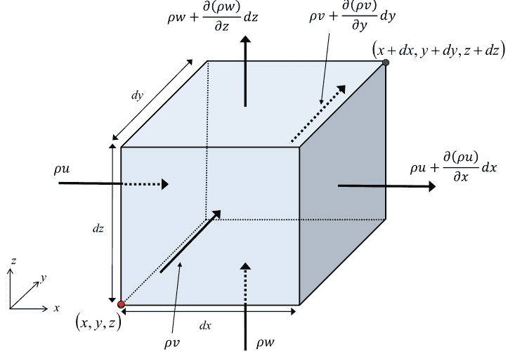

重新排列这个方程，我们得到了x轴方向的运动方程

$$ \rho \frac{Du}{Dt} = \frac{\partial \sigma_{xx}}{\partial x} + \frac{\partial \sigma_{yx}}{\partial y} + \frac{\partial \sigma_{zx}}{\partial z} + F_x \rho \quad (7.1.5) $$

类似地，可以得到y轴和z轴方向的运动方程

$$ \rho \frac{Dv}{Dt} = \frac{\partial \sigma_{xy}}{\partial x} + \frac{\partial \sigma_{yy}}{\partial y} + \frac{\partial \sigma_{zy}}{\partial z} + F_y \rho \quad (7.1.6) $$

$$ \rho \frac{Dw}{Dt} = \frac{\partial \sigma_{xz}}{\partial x} + \frac{\partial \sigma_{yz}}{\partial y} + \frac{\partial \sigma_{zz}}{\partial z} + F_z \rho \quad (7.1.7) $$

其中 $\frac{Du}{Dt}$, $\frac{Dv}{Dt}$, 和 $\frac{Dw}{Dt}$被称为物质导数，它考虑了物质的运动，并由以下定义

$$ \frac{Du}{Dt} = \frac{\partial u}{\partial t} + u \frac{\partial u}{\partial x} + v \frac{\partial u}{\partial y} + w \frac{\partial u}{\partial z} $$
$$ \frac{Dv}{Dt} = \frac{\partial v}{\partial t} + u \frac{\partial v}{\partial x} + v \frac{\partial v}{\partial y} + w \frac{\partial v}{\partial z} $$
$$ \frac{Dw}{Dt} = \frac{\partial w}{\partial t} + u \frac{\partial w}{\partial x} + v \frac{\partial w}{\partial y} + w \frac{\partial w}{\partial z} \quad (7.1.8) $$

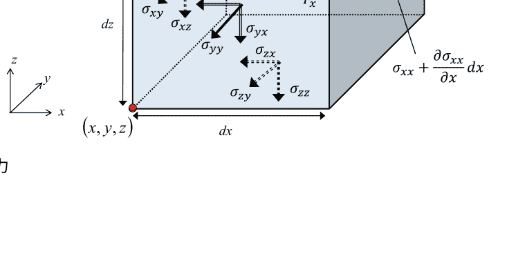

请注意，方程 (7.1.5) - (7.1.7) 也被称为欧拉运动方程。

牛顿流体的本构方程可以写成

$$ \begin{align*}
\sigma_{xx} &= -p + \lambda \left( \frac{\partial u}{\partial x} + \frac{\partial v}{\partial y} + \frac{\partial w}{\partial z} \right) + 2\mu \frac{\partial u}{\partial x} \\
\sigma_{yy} &= -p + \lambda \left( \frac{\partial u}{\partial x} + \frac{\partial v}{\partial y} + \frac{\partial w}{\partial z} \right) + 2\mu \frac{\partial v}{\partial y} \\
\sigma_{zz} &= -p + \lambda \left( \frac{\partial u}{\partial x} + \frac{\partial v}{\partial y} + \frac{\partial w}{\partial z} \right) + 2\mu \frac{\partial w}{\partial z} \\
\sigma_{xy} = \sigma_{yx} &= \mu \left( \frac{\partial u}{\partial y} + \frac{\partial v}{\partial x} \right) \\
\sigma_{yz} = \sigma_{zy} &= \mu \left( \frac{\partial v}{\partial z} + \frac{\partial w}{\partial y} \right) \\
\sigma_{zx} = \sigma_{xz} &= \mu \left( \frac{\partial w}{\partial x} + \frac{\partial u}{\partial z} \right)
\end{align*} \quad (7.1.9) $$

其中，p是压力 (N/m²)，μ是粘度系数 (N/m²)，λ是第二粘度系数 (N/m²)。请注意，将方程 (7.1.9) 作为本构方程的流体称为牛顿流体。

将方程 (7.1.9) 代入方程 (7.1.5) 到 (7.1.7) 中，得到Navier-Stokes方程如下：

$$ \rho \frac{Du}{Dt} = -\frac{\partial p}{\partial x} + \frac{\partial}{\partial x} \left\{ \lambda \left( \frac{\partial u}{\partial x} + \frac{\partial v}{\partial y} + \frac{\partial w}{\partial z} \right) \right\} + \frac{\partial}{\partial x} \left( \mu \frac{\partial u}{\partial x} \right) + \frac{\partial}{\partial y} \left( \mu \frac{\partial u}{\partial y} \right) + \frac{\partial}{\partial z} \left( \mu \frac{\partial u}{\partial z} \right) + \frac{\partial}{\partial x}\left(\mu\frac{\partial u}{\partial x}\right) + \frac{\partial}{\partial y}\left(\mu\frac{\partial u}{\partial y}\right) + \frac{\partial}{\partial z}\left(\mu\frac{\partial u}{\partial z}\right) + \rho F_x \quad (7.1.10) $$

$$ \rho \frac{Dv}{Dt} = -\frac{\partial p}{\partial y} + \frac{\partial}{\partial y}\left\{\lambda\left(\frac{\partial u}{\partial x} + \frac{\partial v}{\partial y} + \frac{\partial w}{\partial z}\right)\right\} + \frac{\partial}{\partial x}\left(\mu\frac{\partial u}{\partial y}\right) + \frac{\partial}{\partial y}\left(\mu\frac{\partial v}{\partial y}\right) + \frac{\partial}{\partial z}\left(\mu\frac{\partial w}{\partial y}\right) + \frac{\partial}{\partial x}\left(\mu\frac{\partial v}{\partial x}\right) + \frac{\partial}{\partial y}\left(\mu\frac{\partial v}{\partial y}\right) + \frac{\partial}{\partial z}\left(\mu\frac{\partial v}{\partial z}\right) + \rho F_y \quad (7.1.11) $$

$$ \rho \frac{Dw}{Dt} = -\frac{\partial p}{\partial z} + \frac{\partial}{\partial z}\left\{\lambda\left(\frac{\partial u}{\partial x} + \frac{\partial v}{\partial y} + \frac{\partial w}{\partial z}\right)\right\} + \frac{\partial}{\partial x}\left(\mu\frac{\partial u}{\partial z}\right) + \frac{\partial}{\partial y}\left(\mu\frac{\partial v}{\partial z}\right) + \frac{\partial}{\partial z}\left(\mu\frac{\partial w}{\partial z}\right) + \frac{\partial}{\partial x}\left(\mu\frac{\partial w}{\partial x}\right) + \frac{\partial}{\partial y}\left(\mu\frac{\partial w}{\partial y}\right) + \frac{\partial}{\partial z}\left(\mu\frac{\partial w}{\partial z}\right) + \rho F_z \quad (7.1.12) $$

如果流体是不可压缩的，质量密度 ρ是常数，因此方程 (7.1.3) 可以写成

$$ \frac{\partial u}{\partial x} + \frac{\partial v}{\partial y} + \frac{\partial w}{\partial z} = 0 \quad (7.1.13) $$

因此，对于不可压缩流体的Navier-Stokes方程可以写成如下形式:

$$ \begin{align*}
\rho \frac{Du}{Dt} &= -\frac{\partial p}{\partial x} + \mu\left(\frac{\partial^2 u}{\partial x^2} + \frac{\partial^2 u}{\partial y^2} + \frac{\partial^2 u}{\partial z^2}\right) + \rho F_x \\
\rho \frac{Dv}{Dt} &= -\frac{\partial p}{\partial y} + \mu\left(\frac{\partial^2 v}{\partial x^2} + \frac{\partial^2 v}{\partial y^2} + \frac{\partial^2 v}{\partial z^2}\right) + \rho F_y \\
\rho \frac{Dw}{Dt} &= -\frac{\partial p}{\partial z} + \mu\left(\frac{\partial^2 w}{\partial x^2} + \frac{\partial^2 w}{\partial y^2} + \frac{\partial^2 w}{\partial z^2}\right) + \rho F_z \quad (7.1.14)
\end{align*} $$

最后，让我们讨论能量守恒定律。流体的单位质量能量 E可以表示为动能、内能E和势能 Ω的总和，如下所示：

$$ E = \frac{1}{2}(u^2 + v^2 + w^2) + e + \Omega \quad (7.1.15) $$

图7.1所示的小平行六面体的能量为 $E \times \rho dxdydz$，其随时间的变化率为
$$\frac{\partial(\rho E)}{\partial t}dxdydz = \dot{Q}dxdydz + \dot{W} - \dot{E} - \dot{q} \qquad\qquad\qquad (7.1.16)$$
其中 $Q$ 是在流体内部产生或直接流入的热量，$q$ 是流向小平行六面体周围流体的热量，$E$ 是由于对流而流向周围的能量，$W$ 是由于压力或粘性力而由周围所做的功，而 $\dot{(\ )}$ 表示单位时间内的变化。

现在，让我们详细看一下方程（7.1.16）的每个术语。首先，确定了特定的热源后，应单独处理 $\dot{Q}$，现在我们假设为
$$\dot{Q} = \frac{\partial Q}{\partial t} \qquad\qquad\qquad (7.1.17)$$
接下来，$\dot{W}$ 是通过对无限小平行六面体上的每个表面施加的应力进行计算的。让我们计算应力在$x$-方向上所做的工作（参见图7.4）。在AEHD表面，$x$-方向上的应力为 $\sigma_{xx}$，而在这个方向上的流体速度为 $u$，这意味着对平行六面体所做的工作是 $-u\sigma_{xx}dydz$。负号是因为应力的方向和流动（位移）的方向相反。由于相反的BCGF表面上的工作是
$$\left(u\sigma_{xx} + \frac{\partial(u\sigma_{xx})}{\partial x}dx\right)dydz$$
，这两个表面上的作用之和计算如下：
$$-u\sigma_{xx}dydz + \left(u\sigma_{xx} + \frac{\partial(u\sigma_{xx})}{\partial x}dx\right)dydz = \frac{\partial(u\sigma_{xx})}{\partial x}dxdydz \qquad\qquad (7.1.18)$$
在表面ABFE和CDHG上的作用，以及表面ADCB和EFGH上的作用也以相同的方式计算；因此，所有在 $x$ 方向上的作用都可以得到。

由于在 $y$ 和 $z$ 方向上的作用的计算方式相同，我们有
$$\dot{W} = \left\{\frac{\partial(u\sigma_{xx})}{\partial x} + \frac{\partial(u\sigma_{xy})}{\partial y} + \frac{\partial(u\sigma_{xz})}{\partial z}\right\}dxdydz + \left\{\frac{\partial(v\sigma_{yx})}{\partial x} + \frac{\partial(v\sigma_{yy})}{\partial y} + \frac{\partial(v\sigma_{yz})}{\partial z}\right\}dxdydz + \left\{\frac{\partial(w\sigma_{zx})}{\partial x} + \frac{\partial(w\sigma_{zy})}{\partial y} + \frac{\partial(w\sigma_{zz})}{\partial z}\right\}dxdydz \qquad\qquad (7.1.19)$$
第三，关于 $\dot{E}$，使用图7.5计算每个表面的能量流入平衡，显示每个表面的单位面积能量流入和流出。由于 $E$ 是单位质量的能量，表面AEGD的能量流入是 $E \times \rho u dy dz$，等等。因此，无限小平行六面体的总能量流平衡如下所示：
$$\dot{E} = \left\{ \frac{\partial (\rho u E)}{\partial x} + \frac{\partial (\rho v E)}{\partial y} + \frac{\partial (\rho w E)}{\partial z} \right\} dxdydz \tag{7.1.20}$$

最后，对于热传导引起的项 $\dot{q}$，根据傅里叶定律，通过温度 $T$ 和热传导系数 $\kappa$ 计算每个表面单位面积的热流量，如图7.6所示。然后，计算整个无限小平行六面体的平衡。
$$\dot{q} = -\left\{ \frac{\partial}{\partial x} \left( \kappa \frac{\partial T}{\partial x} \right) + \frac{\partial}{\partial y} \left( \kappa \frac{\partial T}{\partial y} \right) + \frac{\partial}{\partial z} \left( \kappa \frac{\partial T}{\partial z} \right) \right\} dxdydz \qquad (7.1.21)$$
将方程(7.1.17)、(7.1.19)、(7.1.20)和(7.1.21)代入方程(7.1.16)，并使用欧拉运动方程(7.1.5)-(7.1.7)，本构方程(7.1.9)，连续性方程(7.1.3)和(7.1.15)重新排列，得到能量方程如下：
$$\rho \frac{De}{Dt} = \frac{\partial Q}{\partial t} + \left\{ \frac{\partial}{\partial x} \left( \kappa \frac{\partial T}{\partial x} \right) + \frac{\partial}{\partial y} \left( \kappa \frac{\partial T}{\partial y} \right) + \frac{\partial}{\partial z} \left( \kappa \frac{\partial T}{\partial z} \right) \right\} - p \left( \frac{\partial u}{\partial x} + \frac{\partial v}{\partial y} + \frac{\partial w}{\partial z} \right) + \Phi \qquad (7.1.22)$$
其中 $\Phi$ 被称为耗散能量，定义为
$$\Phi = 2\mu \left[ \left( \frac{\partial u}{\partial x} \right)^2 + \left( \frac{\partial v}{\partial y} \right)^2 + \left( \frac{\partial w}{\partial z} \right)^2 + \frac{1}{2} \left\{ \left( \frac{\partial u}{\partial y} + \frac{\partial v}{\partial x} \right)^2 + \left( \frac{\partial v}{\partial z} + \frac{\partial w}{\partial y} \right)^2 + \left( \frac{\partial w}{\partial x} + \frac{\partial u}{\partial z} \right)^2 \right\} \right] + \lambda\left(\frac{\partial u}{\partial x} + \frac{\partial v}{\partial y} + \frac{\partial w}{\partial z}\right)^2 \qquad (7.1.23)$$

从上面可以总结出流体动力学的基本方程。

由质量守恒定律推导出的连续性方程：
$$\frac{\partial\rho}{\partial t}+\frac{\partial(\rho u)}{\partial x}+\frac{\partial(\rho v)}{\partial y}+\frac{\partial(\rho w)}{\partial z}=0 \qquad (7.1.24)$$

由动量守恒定律推导出的运动方程（纳维-斯托克斯方程）：
$$\rho\frac{Du}{Dt}=-\frac{\partial p}{\partial x}+\frac{\partial}{\partial x}\left\{\lambda\left(\frac{\partial u}{\partial x}+\frac{\partial v}{\partial y}+\frac{\partial w}{\partial z}\right)\right\}+\frac{\partial}{\partial x}\left(\mu\frac{\partial u}{\partial x}\right)+\frac{\partial}{\partial y}\left(\mu\frac{\partial u}{\partial x}\right)+\frac{\partial}{\partial z}\left(\mu\frac{\partial w}{\partial x}\right)+\frac{\partial}{\partial x}\left(\mu\frac{\partial u}{\partial x}\right)+\frac{\partial}{\partial y}\left(\mu\frac{\partial u}{\partial y}\right)+\frac{\partial}{\partial z}\left(\mu\frac{\partial u}{\partial z}\right)+\rho F_x \qquad (7.1.25)$$
$$\rho\frac{Dv}{Dt}=-\frac{\partial p}{\partial y}+\frac{\partial}{\partial y}\left\{\lambda\left(\frac{\partial u}{\partial x}+\frac{\partial v}{\partial y}+\frac{\partial w}{\partial z}\right)\right\}+\frac{\partial}{\partial x}\left(\mu\frac{\partial u}{\partial y}\right)+\frac{\partial}{\partial y}\left(\mu\frac{\partial v}{\partial y}\right)+\frac{\partial}{\partial z}\left(\mu\frac{\partial w}{\partial y}\right)+\frac{\partial}{\partial x}\left(\mu\frac{\partial v}{\partial x}\right)+\frac{\partial}{\partial y}\left(\mu\frac{\partial v}{\partial y}\right)+\frac{\partial}{\partial z}\left(\mu\frac{\partial v}{\partial z}\right)+\rho F_y \qquad (7.1.26)$$
$$\rho\frac{Dw}{Dt}=-\frac{\partial p}{\partial z}+\frac{\partial}{\partial z}\left\{\lambda\left(\frac{\partial u}{\partial x}+\frac{\partial v}{\partial y}+\frac{\partial w}{\partial z}\right)\right\}+\frac{\partial}{\partial x}\left(\mu\frac{\partial u}{\partial z}\right)+\frac{\partial}{\partial y}\left(\mu\frac{\partial v}{\partial z}\right)+\frac{\partial}{\partial z}\left(\mu\frac{\partial w}{\partial z}\right)+\frac{\partial}{\partial x}\left(\mu\frac{\partial w}{\partial x}\right)+\frac{\partial}{\partial y}\left(\mu\frac{\partial w}{\partial y}\right)+\frac{\partial}{\partial z}\left(\mu\frac{\partial w}{\partial z}\right)+\rho F_z \qquad (7.1.27)$$

能量守恒定律：
$$\rho\frac{De}{Dt}=\frac{\partial Q}{\partial t}+\left\{\frac{\partial}{\partial x}\left(\kappa\frac{\partial T}{\partial x}\right)+\frac{\partial}{\partial y}\left(\kappa\frac{\partial T}{\partial y}\right)+\frac{\partial}{\partial z}\left(\kappa\frac{\partial T}{\partial z}\right)\right\}-p\left(\frac{\partial u}{\partial x}+\frac{\partial v}{\partial y}+\frac{\partial w}{\partial z}\right)+\Phi \qquad (7.1.28)$$

对于不可压缩流体的情况，内能 $e$ 可以写作 $e = c_v T$，其中定容比热容为 $c_v$，方程（7.1.28）可以重写为
$$\rho c_v \frac{DT}{Dt} = \frac{\partial Q}{\partial t} + \left\{ \frac{\partial}{\partial x} \left( \kappa \frac{\partial T}{\partial x} \right) + \frac{\partial}{\partial y} \left( \kappa \frac{\partial T}{\partial y} \right) + \frac{\partial}{\partial z} \left( \kappa \frac{\partial T}{\partial z} \right) \right\} + \Phi \qquad (7.1.29)$$
方程（7.1.29）也被称为热传导方程。使用通过求解连续性方程（方程（7.1.24））和纳维-斯托克斯方程（方程（7.1.25）-（7.1.27））获得的速度场计算得出的 $\Phi$，可以从方程（7.1.29）中获得温度场。

### 7.2 有限差分逼近

在本节中，将解释导数的差分逼近作为有限差分法的基础，有限差分法经常被用作流体动力学中的数值解法。

众所周知，函数 $\phi(x)$ 的导数被定义为
$$\left. \frac{\mathrm{d} \phi}{\mathrm{d} x} \right|_{x=a} = \lim_{\Delta x \to 0} \frac{\phi(a + \Delta x) - \phi(a)}{\Delta x} \qquad (7.2.1)$$
然而，在数值分析中，由于计算机的有限数值精度，上述极限计算是困难的。因此，差分逼近经常被用作替代方法。例如，函数的一阶导数可以用其差分逼近来代替，如下所示：
$$\left. \frac{\mathrm{d} \phi}{\mathrm{d} x} \right|_{x=a} \approx \frac{\phi(a + \Delta x) - \phi(a)}{\Delta x} \qquad (7.2.2)$$
方程（7.2.2）的缺点是它不提供任何关于逼近精度的信息，而著名的泰勒展开可以用作导数的可估计误差差分逼近[2, 15]，如下所示：
$$\begin{aligned}
\phi(a+\Delta x) &= \phi(a) + \left.\Delta x \frac{\mathrm{d} \phi}{\mathrm{d} x}\right|_{x=a} + \frac{1}{2}(\Delta x)^2 \left.\frac{\mathrm{d}^2 \phi}{\mathrm{d} x^2}\right|_{x=a} + \frac{1}{6}(\Delta x)^3 \left.\frac{\mathrm{d}^3 \phi}{\mathrm{d} x^3}\right|_{x=a} + \cdots \\
&= \sum_{n=0}^{\infty} \frac{1}{n!} (\Delta x)^n \left.\frac{\mathrm{d}^n \phi}{\mathrm{d} x^n}\right|_{x=a} \qquad (7.2.3)
\end{aligned}$$
其中
$$0 != 1, \quad \left.\frac{\mathrm{d}^0 \phi}{\mathrm{d} x^0} = \phi(x)\right. \qquad (7.2.4)$$

### 7.2 有限差分逼近

以下等式成立，

$$\phi(a + \Delta x) = \sum_{n=0}^{M-1} \frac{1}{n!} (\Delta x)^n \left.\frac{d^n \phi}{dx^n}\right|_{x=a} + \frac{1}{M!} (\Delta x)^M \left.\frac{d^M \phi}{dx^M}\right|_{x=a+\theta \Delta x} \quad (0 \le \theta \le 1) \qquad (7.2.5)$$

假设如图7.7所示的一维网格，我们定义符号如下：

$$\phi_l \equiv \phi(x_l), \quad \phi_l^{(n)} \equiv \left.\frac{d^n\phi}{dx^n}\right|_{x=x_l}, \quad \phi_{l+\theta}^{(n)} \equiv \left.\frac{d^n\phi}{dx^n}\right|_{x=x_l+\theta\Delta x}, \quad h \equiv \Delta x \qquad (7.2.6)$$

利用这些符号，泰勒展开式（方程（7.2.3）和（7.2.5））可以分别简洁地写成

$$\begin{aligned}
\phi(x_l + \Delta x) &= \phi_{l+1} \\
&= \phi_l + \phi_l^{(1)}h + \frac{1}{2}\phi_l^{(2)}h^2 + \frac{1}{6}\phi_l^{(3)}h^3 + \frac{1}{24}\phi_l^{(4)}h^4 + \frac{1}{120}\phi_l^{(5)}h^5 + \cdots \qquad (7.2.7)
\end{aligned}$$

$$\phi_{l+1} = \sum_{n=0}^{M-1} \frac{1}{n!} \phi_l^{(n)} h^n + \frac{1}{M!} \phi_{l+\theta}^{(M)} h^M \quad (0 \le \theta \le 1) \qquad (7.2.8)$$

通过对 $\phi_l^{(1)}$ 重新排列方程(7.2.7)，得到了对一阶导数的差分近似

$$\begin{aligned}
\phi_l^{(1)} &= \frac{\phi_{l+1} - \phi_l}{h} - \frac{1}{2}\phi_l^{(2)}h - \frac{1}{6}\phi_l^{(3)}h^2 - \frac{1}{24}\phi_l^{(4)}h^3 - \frac{1}{120}\phi_l^{(5)}h^4 - \dots \\
&= \frac{\phi_{l+1} - \phi_l}{h} + O(h) \qquad (7.2.9)
\end{aligned}$$

其中 $O(h)$ 是近似误差的项，这意味着随着网格间距的减小，近似误差与网格间距成比例地减小。

另一方面，$\phi_{l-1} = \phi(x_l - \Delta x)$可以用泰勒展开式表示为

$$\phi_{l-1} = \phi_l + \phi_l^{(1)}(-h) + \frac{1}{2}\phi_l^{(2)}(-h)^2 + \frac{1}{6}\phi_l^{(3)}(-h)^3 + \frac{1}{24}\phi_l^{(4)}(-h)^4 + \cdots$$
$$= \phi_l - \phi_l^{(1)}h + \frac{1}{2}\phi_l^{(2)}h^2 - \frac{1}{6}\phi_l^{(3)}h^3 + \frac{1}{24}\phi_l^{(4)}h^4 - \frac{1}{120}\phi_l^{(5)}h^5 - \cdots \quad (7.2.10)$$

通过重新排列方程 (7.2.10) 关于 $\phi^{(1)}_l$，另一个差分逼近的一阶导数如下所示：

$$\phi_l^{(1)} = \frac{\phi_l - \phi_{l-1}}{h} + \frac{1}{2}\phi_l^{(2)}h - \frac{1}{6}\phi_l^{(3)}h^2 + \frac{1}{24}\phi_l^{(4)}h^3 - \frac{1}{120}\phi_l^{(5)}h^4 + \cdots$$
$$= \frac{\phi_l - \phi_{l-1}}{h} + O(h) \quad (7.2.11)$$

此外，另一个差分逼近的一阶导数是从方程 (7.2.7) 和 (7.2.10) 导出的，再次以对齐的形式显示如下：

$$\begin{cases} \phi_{l+1} = \phi_l + \phi_l^{(1)}h + \frac{1}{2}\phi_l^{(2)}h^2 + \frac{1}{6}\phi_l^{(3)}h^3 + \frac{1}{24}\phi_l^{(4)}h^4 + \frac{1}{120}\phi_l^{(5)}h^5 + \cdots \\ \phi_{l-1} = \phi_l - \phi_l^{(1)}h + \frac{1}{2}\phi_l^{(2)}h^2 - \frac{1}{6}\phi_l^{(3)}h^3 + \frac{1}{24}\phi_l^{(4)}h^4 - \frac{1}{120}\phi_l^{(5)}h^5 - \cdots \end{cases} \quad (7.2.12)$$

将上述两个方程的差分，我们得到

$$\phi_{l+1} - \phi_{l-1} = 2\phi_l^{(1)}h + \frac{2}{6}\phi_l^{(3)}h^3 + \frac{2}{120}\phi_l^{(5)}h^5 + \cdots \quad (7.2.13)$$

重新排列方程 (7.2.13) 关于 $\phi^{(1)}_l$，另一个差分逼近的一阶导数得到

$$\phi_l^{(1)} = \frac{\phi_{l+1} - \phi_{l-1}}{2h} - \frac{1}{6}\phi_l^{(3)}h^2 + \frac{1}{120}\phi_l^{(5)}h^4 + \cdots$$
$$= \frac{\phi_{l+1} - \phi_{l-1}}{2h} + O(h^2) \quad (7.2.14)$$

方程 (7.2.14) 中的逼近误差为 $O(h^2)$，这意味着方程 (7.2.14) 是比方程 (7.2.9) 和 (7.2.11) 更准确的逼近。方程 (7.2.9) 称为前向差分逼近，方程 (7.2.11) 称为后向差分逼近，方程 (7.2.14) 称为中心差分逼近。图7.8显示了这些差分逼近的示意图。

通过将方程 (7.2.12) 中的两个方程相加，可以得到二阶导数的差分逼近如下：

$$\phi_{l+1} + \phi_{l-1} = 2\phi_l + \phi_l^{(2)}h^2 + \frac{2}{24}\phi_l^{(4)}h^4 + \cdots \quad (7.2.15)$$

## 图7.8 一阶导数的近似

通过重新排列方程(7.2.15)关于 $\phi_l^{(2)}$，得到二阶导数的差分近似为

$$\phi_l^{(2)} = \frac{\phi_{l+1} - 2\phi_l + \phi_{l-1}}{h^2} - \frac{2}{24}\phi_l^{(4)} h^2 + \cdots$$
$$= \frac{\phi_{l+1} - 2\phi_l + \phi_{l-1}}{h^2} + O(h^2) \quad (7.2.16)$$

其中其近似误差为 $O(h^2)$。通过使用额外的函数值，可以给出更准确的差分近似。

例如，在 $x_{l-2}$ 和 $x_{l+2}$ 处使用函数值，除了在 $x_{l-1}$ 和 $x_{l+1}$ 处，可以得到高精度的有限差分近似如下。

首先，通过将 $\Delta x$ 替换为 $2\Delta x$ 在泰勒展开式(Eq. (7.2.3))中，我们有

$$\phi_{l+2} = \phi_l + \phi_l^{(1)}(2h) + \frac{1}{2}\phi_l^{(2)}(2h)^2 + \frac{1}{6}\phi_l^{(3)}(2h)^3 + \frac{1}{24}\phi_l^{(4)}(2h)^4 + \cdots$$
$$= \phi_l + 2 \cdot \phi_l^{(1)}h + 4 \cdot \frac{1}{2}\phi_l^{(2)}h^2 + 8 \cdot \frac{1}{6}\phi_l^{(3)}h^3 + 16 \cdot \frac{1}{24}\phi_l^{(4)}h^4 + \cdots \quad (7.2.17)$$

同样地，通过在Taylor展开式Eq. (7.2.3)中用 $-2 \Delta x$ 替换 $\Delta x$，我们有

$$\phi_{l-2} = \phi_l + \phi_l^{(1)}(-2h) + \frac{1}{2}\phi_l^{(2)}(-2h)^2 + \frac{1}{6}\phi_l^{(3)}(-2h)^3 + \frac{1}{24}\phi_l^{(4)}(-2h)^4 + \cdots$$
$$= \phi_l - 2 \cdot \phi_l^{(1)}h + 4 \cdot \frac{1}{2}\phi_l^{(2)}h^2 - 8 \cdot \frac{1}{6}\phi_l^{(3)}h^3 + 16 \cdot \frac{1}{24}\phi_l^{(4)}h^4 - \cdots \quad (7.2.18)$$

将方程(7.2.17)，(7.2.7)，(7.2.10)和(7.2.18)分别乘以 \(a, b, c\) 和 \(d\)，然后将它们相加，我们得到

$$a\phi_{l+2} + b\phi_{l+1} + c\phi_{l-1} + d\phi_{l-2} \ = (a+b+c+d)\phi_l + (2a+b-c-2d)\phi_l^{(1)}h \ + (4a+b+c+4d)\frac{1}{2}\phi_l^{(2)}h^2 \ + (8a+b-c-8d)\frac{1}{6}\phi_l^{(3)}h^3 \ + (16a+b+c+16d)\frac{1}{24}\phi_l^{(4)}h^4 \ + (32a+b-c-32d)\frac{1}{120}\phi_l^{(5)}h^5 \ + \cdots \quad (7.2.19)$$

通过在方程 (7.2.19) 中将 \(\phi_l^{(1)}\) 的系数设置为1，将 \(\phi_l^{(2)}\)，\(\phi_l^{(3)}\) 和 \(\phi_l^{(4)}\) 的系数设置为0，可以通过求解以下同时线性方程组来获得 \(\phi_l^{(1)}\) 的有限差分近似。

$$\begin{cases} 2a + b - c - 2d = 1 \\ 4a + b + c + 4d = 0 \\ 8a + b - c - 8d = 0 \\ 16a + b + c + 16d = 0 \end{cases} \quad (7.2.20)$$

解方程 (7.2.20)，我们得到

$$a = \frac{1}{12}, \quad b = \frac{2}{3}, \quad c = \frac{2}{3}, \quad d = \frac{1}{12}, \quad (7.2.21)$$

将这些值代入方程 (7.2.19) 中，得到另一个一阶导数的有限差分逼近

$$\phi_l^{(1)} = \frac{-\phi_{l+2} + 8\phi_{l+1} - 8\phi_{l-1} + \phi_{l-2}}{12h} + 4 \cdot \frac{1}{120} \phi_l^{(5)} h^4 + \cdots \ = \frac{-\phi_{l+2} + 8\phi_{l+1} - 8\phi_{l-1} + \phi_{l-2}}{12h} + O(h^4) \quad (7.2.22)$$

这个逼近公式具有四阶精度，比二阶精度的中心差分方法 (7.2.14) 更准确。同样的方法，可以通过将方程 (7.2.19) 中 \(\phi_l^{(2)}\) 的系数设为2，将 \(\phi_l^{(1)}\)、\(\phi_l^{(3)}\) 和 \(\phi_l^{(4)}\) 的系数设为0，得到 \(\phi_l^{(2)}\) 的另一个差分逼近。因此，需要解下面的一组线性方程。

$$\left\{\begin{array}{l}2 a+b-c-2 d=0 \\4 a+b+c+4 d=2 \\8 a+b-c-8 d=0 \\16 a+b+c+16 d=0\end{array}\right. \quad(7.2.23)$$

通过求解方程 (7.2.23) ，我们得到

$$a=\frac{1}{12}, \quad b=\frac{4}{3}, \quad c=\frac{4}{3}, \quad d=\frac{1}{12}, \quad\quad(7.2.24)$$

将这些值代入方程 (7.2.19) 中，可以得到另一种有限差分逼近二阶导数的方法如下：

$$\begin{aligned}& \phi_{l}^{(2)}=\frac{-\phi_{l+2}+16 \phi_{l+1}-30 \phi_{l}+16 \phi_{l-1}-\phi_{l-2}}{12 h^{2}}+8 \cdot \frac{1}{720} \phi_{l}^{(6)} h^{4}+\cdots \ & \quad=\frac{-\phi_{l+2}+16 \phi_{l+1}-30 \phi_{l}+16 \phi_{l-1}-\phi_{l-2}}{12 h^{2}}+O\left(h^{4}\right)\end{aligned} \quad(7.2.25)$$

这个逼近公式具有四阶精度，比二阶精度的二阶导数逼近公式 (方程7.2.16) 更准确。因此，通过扩大有限差分逼近中采样函数值的范围，可以得到不同精度的各阶导数公式。

此外，还可以将函数值的范围设置为与导数评估点不对称采样。例如，让我们在方程 (7.2.19) 中将a设为0，这将导致在评估点附近使用不对称的四个点，即$\phi_{l+1}$、$\phi_{l}$、$\phi_{l-1}$和$\phi_{l-2}$。因此，需要解下列同时线性方程组，以使方程 (7.2.19) 中的$\phi_{l}^{(1)}$的系数为1，$\phi_{l}^{(2)}$、$\phi_{l}^{(3)}$和$\phi_{l}^{(4)}$的系数为0。

$$\left\{\begin{array}{l}b-c-2 d=1 \\b+c+4 d=0 \\b-c-8 d=0\end{array}\right. \quad(7.2.26)$$

解方程 (7.2.26)，我们得到

$$a=0, \quad b=\frac{1}{3}, \quad c=-1, \quad d=\frac{1}{6}, \quad\quad(7.2.27)$$

将这些值代入方程 (7.2.19)，我们得到另一个一阶导数的有限差分逼近，如下所示：

$$\begin{aligned}& \phi_{l}^{(1)}=\frac{2 \phi_{l+1}+3 \phi_{l}-6 \phi_{l-1}+\phi_{l-2}}{6 h}-2 \cdot \frac{1}{24} \phi_{l}^{(4)} h^{3}+\cdots \ & \quad=\frac{2 \phi_{l+1}+3 \phi_{l}-6 \phi_{l-1}+\phi_{l-2}}{6 h}+O\left(h^{3}\right)\end{aligned} \quad(7.2.28)$$

这是一个具有非对称采样点的一阶导数的三阶有限差分逼近。

上述得到的导数的有限差分逼近总结如下：

一阶导数的前向差分逼近, 精度为O(h)：

$$ \phi_l^{(1)} = \frac{\phi_{l+1} - \phi_l}{h} + O(h) \qquad (7.2.29) $$

用于一阶导数的向后差分逼近, 精度为 O(h)：

$$ \phi_l^{(1)} = \frac{\phi_l - \phi_{l-1}}{h} + O(h) \qquad (7.2.30) $$

用于一阶导数的中心差分逼近, 精度为O(h²)：

$$ \phi_l^{(1)} = \frac{\phi_{l+1} - \phi_{l-1}}{2h} + O(h^2) \qquad (7.2.31) $$

用于一阶导数的差分逼近, 精度为 O(h³)：

$$ \phi_l^{(1)} = \frac{2\phi_{l+1} + 3\phi_l - 6\phi_{l-1} + \phi_{l-2}}{6h} + O(h^3) \qquad (7.2.32) $$

用于一阶导数的差分逼近, 精度为 O(h⁴)：

$$ \phi_l^{(1)} = \frac{-\phi_{l+2} + 8\phi_{l+1} - 8\phi_{l-1} + \phi_{l-2}}{12h} + O(h^4) \qquad (7.2.33) $$

用于二阶导数的差分逼近, 精度为 O(h²)：

$$ \phi_l^{(2)} = \frac{\phi_{l+1} - 2\phi_l + \phi_{l-1}}{h^2} + O(h^2) \qquad (7.2.34) $$

用于二阶导数的差分逼近, 精度为 O(h⁴)：

$$ \phi_l^{(2)} = \frac{-\phi_{l+2} + 16\phi_{l+1} - 30\phi_l + 16\phi_{l-1} - \phi_{l-2}}{12h^2} + O(h^4) \qquad (7.2.35) $$

然后，在二维或三维空间中考虑偏导数的有限差分逼近。

图7.9显示了一个二维网格。在每个轴向上的偏导数可以以与一维情况相同的方式计算。例如，通过中心差分法得到一阶偏导数的差分逼近如下：

\[\left. \frac{\partial \phi}{\partial x} \right|_{i, j} = \frac{\phi_{i+1, j} - \phi_{i-1, j}}{2 \Delta x} + O(\Delta x^2) \tag{7.2.36}\]
\[\left. \frac{\partial \phi}{\partial y} \right|_{i, j} = \frac{\phi_{i, j+1} - \phi_{i, j-1}}{2 \Delta y} + O(\Delta y^2) \tag{7.2.37}\]

类似地，图7.10显示了一个三维网格。在每个轴向上的偏导数可以以与一维情况相同的方式计算。例如，通过中心差分法得到一阶偏导数的差分逼近如下：

\[\left. \frac{\partial \phi}{\partial x} \right|_{i, j, k} = \frac{\phi_{i+1, j, k} - \phi_{i-1, j, k}}{2 \Delta x} + O(\Delta x^2) \tag{7.2.38}\]
\[\left. \frac{\partial \phi}{\partial y} \right|_{i, j, k} = \frac{\phi_{i, j+1, k} - \phi_{i, j-1, k}}{2 \Delta y} + O(\Delta y^2) \tag{7.2.39}\]

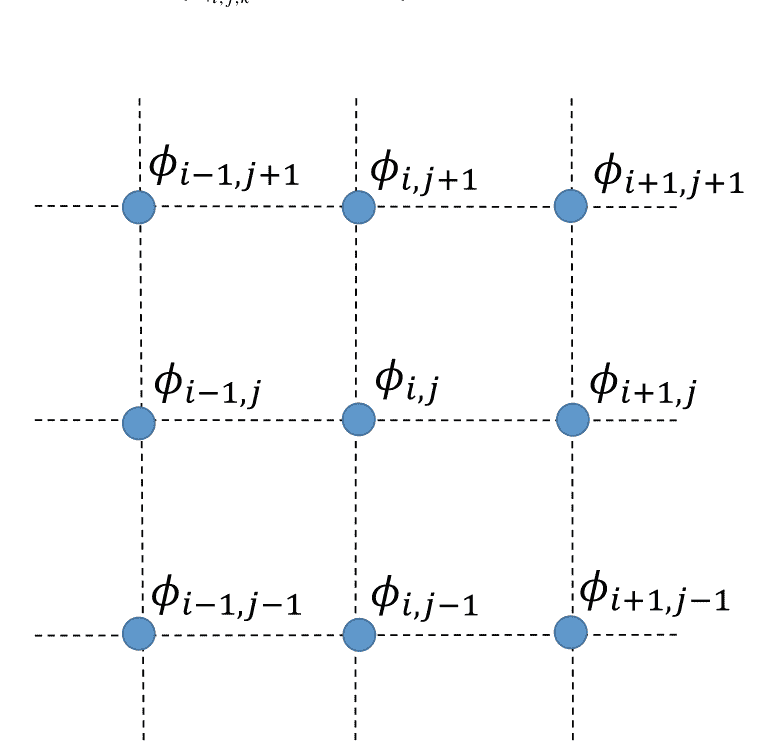

图7.10 有限差分法的三维网格

$$\frac{\partial \phi}{\partial x}\Big|_{i,j,k} = \frac{\phi_{i,j,k+1} - \phi_{i,j,k-1}}{2\Delta z} + O(\Delta z^2) \tag{7.2.40}$$

值得注意的是，空间中的一维差分近似可以通过将 x 和 h（或 Δx）替换为 t 和 Δt 来轻松转换为时间中的差分近似。

### 7.3 用有限差分法模拟不可压缩流体的流动

在本节中，将使用第7.1节中推导出的流体力学基本方程，利用第7.2节中研究的有限差分逼近方法进行离散化，并提出了一种获得带有测试结果的解的方法。

#### 7.3.1 无量纲纳维尔-斯托克斯方程

连续性方程和三维空间中不可压缩流体的Navier-Stokes方程表示如下（见第7.1节）：

\[
\frac{\partial u}{\partial x} + \frac{\partial v}{\partial y} + \frac{\partial w}{\partial z} = 0
\]
(7.3.1)

\[
\begin{aligned}
\rho \frac{D u}{D t} &= -\frac{\partial p}{\partial x} + \mu\left(\frac{\partial^2 u}{\partial x^2} + \frac{\partial^2 u}{\partial y^2} + \frac{\partial^2 u}{\partial z^2}\right) + \rho F_x \\
\rho \frac{D v}{D t} &= -\frac{\partial p}{\partial y} + \mu\left(\frac{\partial^2 v}{\partial x^2} + \frac{\partial^2 v}{\partial y^2} + \frac{\partial^2 v}{\partial z^2}\right) + \rho F_y \\
\rho \frac{D w}{D t} &= -\frac{\partial p}{\partial z} + \mu\left(\frac{\partial^2 w}{\partial x^2} + \frac{\partial^2 w}{\partial y^2} + \frac{\partial^2 w}{\partial z^2}\right) + \rho F_z
\end{aligned}
\]
(7.3.2)

使用代表性长度 $L$（米）和代表性速度 $U$（米/秒），我们定义无量纲量如下：

\[
\tilde{x} = \frac{x}{L}, \quad \tilde{y} = \frac{y}{L}, \quad \tilde{z} = \frac{z}{L}
\]
(7.3.3)

\[
\tilde{u} = \frac{u}{U}, \quad \tilde{v} = \frac{v}{U}, \quad \tilde{w} = \frac{w}{U}
\]
(7.3.4)

\[
\tilde{t} = \frac{U}{L} t
\]
(7.3.5)

使用这些无量纲值，方程 (7.3.1) 和 (7.3.2) 转化为无量纲方程

\[
\frac{\partial \tilde{u}}{\partial \tilde{x}} + \frac{\partial \tilde{v}}{\partial \tilde{y}} + \frac{\partial \tilde{w}}{\partial \tilde{z}} = 0
\]
(7.3.6)

\[
\begin{aligned}
\frac{D \tilde{u}}{D \tilde{t}} &= -\frac{\partial \tilde{p}}{\partial \tilde{x}} + \frac{1}{\mathrm{Re}}\left(\frac{\partial^2 \tilde{u}}{\partial \tilde{x}^2} + \frac{\partial^2 \tilde{u}}{\partial \tilde{y}^2} + \frac{\partial^2 \tilde{u}}{\partial \tilde{z}^2}\right) + \tilde{F}_x \\
\frac{D \tilde{v}}{D \tilde{t}} &= -\frac{\partial \tilde{p}}{\partial \tilde{y}} + \frac{1}{\mathrm{Re}}\left(\frac{\partial^2 \tilde{v}}{\partial \tilde{x}^2} + \frac{\partial^2 \tilde{v}}{\partial \tilde{y}^2} + \frac{\partial^2 \tilde{v}}{\partial \tilde{z}^2}\right) + \tilde{F}_y \\
\frac{D \tilde{w}}{D \tilde{t}} &= -\frac{\partial \tilde{p}}{\partial \tilde{z}} + \frac{1}{\mathrm{Re}}\left(\frac{\partial^2 \tilde{w}}{\partial \tilde{x}^2} + \frac{\partial^2 \tilde{w}}{\partial \tilde{y}^2} + \frac{\partial^2 \tilde{w}}{\partial \tilde{z}^2}\right) + \tilde{F}_z
\end{aligned}
\]
(7.3.7)

其中 $\tilde{p}$, $\tilde{F_i}$, 和 $\mathrm{Re}$ 也是分别定义的无量纲值

\[
\tilde{p} = \frac{p}{\rho U^2}
\]
(7.3.8)

\[
\tilde{F_i} = \frac{L}{U^2} F_i \ (i = x, y, z)
\]
(7.3.9)

\[
\mathrm{Re} = \frac{\rho U L}{\mu}
\]
(7.3.10)

请注意，雷诺数被称为雷诺数，是流体性质的重要指标。

#### 7.3.2 解决方法

通过求解方程（7.3.6）和（7.3.7），可以得到不可压缩流体的流场。为简单起见，在下面的讨论中假设外力项不存在。

让$\tilde{\bm{v}}^n$和$\tilde{p}^n$分别表示第$n$个时间步长处的速度和压力。然后，通过对时间进行离散化，得到表示$\tilde{\bm{v}}^{n+1}$的显式方程。

$$\tilde{\bm{v}}^{n+1} = L_1\left(\tilde{\bm{v}}^n, \tilde{p}^{n+1}\right) \quad (7.3.11)$$

对方程（7.3.11）进行散度运算，并应用方程（7.3.6），可以得到压力的泊松方程如下：

$$\nabla \cdot \nabla \tilde{p}^{n+1} = L_2\left(\tilde{\bm{v}}^n\right) \quad (7.3.12)$$

其中$L_1$和$L_2$是微分算子。

方程（7.3.12）的右侧仅由时间步骤（已知量）处的速度确定，而方程（7.3.11）的右侧包括（$n+1$）时间步骤（未知量）处的压力。因此，方程（7.3.11）和（7.3.12）的解决过程如下所示：

- 步骤1：解方程（7.3.12）以获得$\tilde{p}^{n+1}$。
- 步骤2：使用步骤1中获得的$\tilde{p}^{n+1}$，使用方程（7.3.11）计算$\tilde{\bm{v}}^{n+1}$。
- 步骤3：$n \rightarrow n+1$并返回步骤1。

假设不可压缩性导致了关于压力的泊松方程方程（7.3.12），而众所周知，不可压缩性使系统变得僵硬。

为了缓解这个问题，有一种方法是在连续性方程中引入虚拟可压缩性如下所示：

$$\frac{1}{\beta}\frac{\partial \tilde{p}}{\partial \tau} + \frac{\partial \tilde{u}}{\partial \tilde{x}} + \frac{\partial \tilde{v}}{\partial \tilde{y}} + \frac{\partial \tilde{w}}{\partial \tilde{z}} = 0 \quad (7.3.13)$$

其中$\beta$是伪压缩因子，$\tau$是伪时间。这种方法被称为伪可压缩性方法或人工可压缩性方法[8]。

#### 7.3.3 例子：二维不可压缩流体的流动模拟围绕圆柱体

基于前几节的讨论，本节介绍了使用有限差分法对二维流场进行分析的示例，这将作为深度学习的训练数据在第7.6节中使用[10]。

二维空间中的基本方程如下：

> \[ \frac{\partial \tilde{u}}{\partial x} + \frac{\partial \tilde{v}}{\partial y} = 0 \] (7.3.14)

> \[ \begin{aligned} \frac{D\tilde{u}}{Dt} &= -\frac{\partial \tilde{p}}{\partial x} + \frac{1}{Re} \left( \frac{\partial^2 \tilde{u}}{\partial x^2} + \frac{\partial^2 \tilde{u}}{\partial y^2} \right) \\ \frac{D\tilde{v}}{Dt} &= -\frac{\partial \tilde{p}}{\partial y} + \frac{1}{Re} \left( \frac{\partial^2 \tilde{v}}{\partial x^2} + \frac{\partial^2 \tilde{v}}{\partial y^2} \right) \end{aligned} \] (7.3.15)

分析域如图7.11所示，并且分析的具体规格总结在表7.1中。

至于边界条件，入口边界具有均匀流动在x方向，出口边界的压力和速度从附近的值外推。对于侧边界，施加恒定压力条件，并且速度从附近的值外推。这些边界条件是

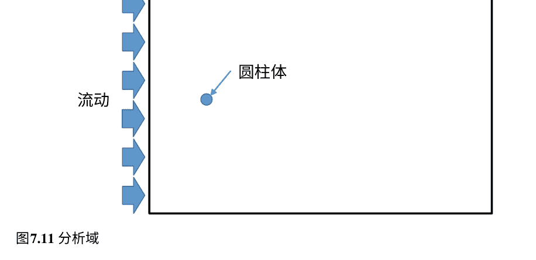

表7.1 分析参数的规格
| 网格尺寸 | 1250 × 800 |
| :--- | :--- |
| 圆柱体直径 | 40个网格 |
| 雷诺数 | 10,000 |
| 总时间步数 | 30,000 |
| 时间步长 | 1/160 |

虽然它们不一定准确，但已被证明对于深度学习的数据足够准确。

有限差分法与伪可压缩性方法一起用作数值解法。对于空间离散化，使用了单调上游差分格式（MUSCL）逼近[8]，这是一种上风差分方法，可实现三阶精度。请注意，每个时间步骤的模拟大约需要1.5秒。（CPU：Intel Core-i7 2.5 GHz）。

接下来，我们将展示一个计算结果中速度的可视化示例。在三维空间中，速度场的涡度$\omega$定义如下：

$$\omega = \nabla \times \mathbf{v} = \begin{pmatrix} \frac{\partial v}{\partial z} - \frac{\partial w}{\partial y} \\ \frac{\partial w}{\partial x} - \frac{\partial u}{\partial z} \\ \frac{\partial u}{\partial y} - \frac{\partial v}{\partial x} \end{pmatrix}$$ (7.3.16)

在二维速度场中，涡度以标量形式表示，如下所示：

$$\omega = \begin{pmatrix} 0 \\ 0 \\ \frac{\partial u}{\partial y} - \frac{\partial v}{\partial x} \end{pmatrix}$$ (7.3.17)

图7.12显示了圆柱体周围和后方涡度随时间变化的情况，图中的四幅图像分别为时间步长为500、1000、1500和2000时的涡度图像，从上到下依次排列。请注意，这些图像仅显示了圆柱体附近和后方的情况，并未显示整个分析域的情况。

根据整个分析域中涡度的可视化，可以确认流动产生了卡尔曼涡旋列，并且涡脱落在规律的时间间隔内重复发生。还可以确认，在第500个时间步长时形成了双涡旋，双涡旋在第1000个时间步长附近失去了对称性，在第1500个时间步长附近发生了涡脱落，并在第3000个时间步长时释放涡旋列。

### 7.4 使用深度学习进行流体模拟

在之前的章节中，回顾了流体动力学中的基本方程和数值解，以二维非定常流动的分析为例。由于非定常流动的分析是一个时间相关的问题之一，因此需要大量的时间步骤来进行计算。近年来，计算规模变得更大，复杂现象如耦合问题和多物理问题也经常进行，加快了计算时间的增加。

图7.12 圆柱体周围的涡量在顶部到底部分别为 t = 500、1000、1500 和 2000 时的情况

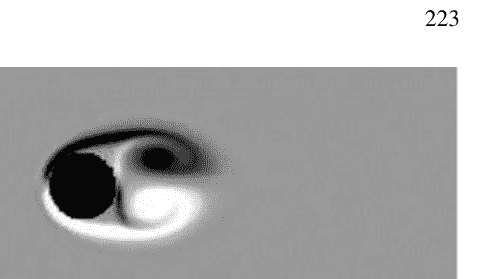

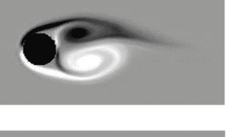

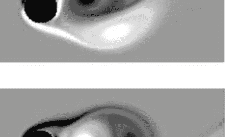


问题和多物理问题的频繁发生加速了计算时间的增加。

在数值流体动力学分析中，下一个计算步骤的解是使用过去时间步骤的结果（解）计算得出的。 如果可以在不使用数值分析的情况下计算或预测下一个时间步骤或之后的解，将会显著减少计算负荷。

在这里，讨论了一种利用深度学习来减少流体分析中的计算负荷的方法[10]，其中预测方法包括以下三个阶段，

### 数据准备阶段

进行大量的流体分析或少量的长时间流体分析，以找到某个时间步骤（现在）的分析结果，结果<sup>CFD</sup>（现在），以及几个过去时间步骤（$K$ 时间步骤）的结果<sup>CFD</sup>（过去<sub>K</sub>），....，结果<sup>CFD</sup>（过去<sub>1</sub>），以及某个时间步骤（未来）的结果<sup>CFD</sup>（未来）。因此，由大量数据对组成的数据对 { (结果<sup>CFD</sup>（过去<sub>K</sub>），....，结果<sup>CFD</sup>（过去<sub>1</sub>），结果<sup>CFD</sup>（现在）)， 结果<sup>CFD</sup>（未来）} 被收集。

### 训练阶段

上述数据准备阶段收集的数据对被用来训练一个使用深度学习的分析结果预测器（神经网络）。输入数据和教师数据分别设置如下：

- 输入数据：结果<sup>CFD</sup>（过去<sub>K</sub>），....，结果<sup>CFD</sup>（过去<sub>1</sub>），结果<sup>CFD</sup>（现在）
- 教师数据：结果<sup>CFD</sup>（未来）

训练好的预测器（神经网络）将在输入结果<sup>CFD</sup>（过去<sub>K</sub>），....，结果<sup>CFD</sup>（过去<sub>1</sub>），结果<sup>CFD</sup>（现在）时输出预测数据结果<sup>DL</sup>（未来）。

### 应用阶段

当新的输入数据结果<sup>CFD</sup>（过去<sub>K</sub>），....，结果<sup>CFD</sup>（过去<sub>1</sub>），结果<sup>CFD</sup>（现在），这些数据不包括在训练阶段的训练数据中，被输入到上述训练好的预测器中，预测数据结果<sup>DL</sup>（未来）将被输出。

需要注意的是，在数据准备阶段收集的分析结果结果<sup>CFD</sup>可以是可视化分析结果的图像，通过模拟获得的速度和压力等物理量，或者它们的混合物。还需要注意的是，作为输入数据的过去分析结果结果<sup>CFD</sup>的数量。（过去<sub>K</sub>），....，结果<sup>CFD</sup>（过去<sub>1</sub>），应根据要预测的流场适当选择，它们不需要是连续时间步长上的值，因为在数值流体力学分析中，时间间隔通常保持足够小以进行稳定分析，并且连续时间步长的分析结果通常被认为具有非常高的相似度。

在应用阶段使用训练好的预测器时，输入到预测器的当前和过去时间步的结果不一定是由计算流体分析得出的，而是可以使用预测器预测的结果，这意味着可以使用各种数据集作为输入，如下所示：

```
结果<sup>CFD</sup>（过去<sub>K</sub>），....，结果<sup>CFD</sup>（<sub>t过去2</sub>），结果<sup>CFD</sup>（过去<sub>1</sub>），结果<sup>DL</sup>（<sub>t现在</sub>），
结果<sup>CFD</sup>（过去<sub>K</sub>），....，结果<sup>DL</sup>（<sub>t过去2</sub>），结果<sup>DL</sup>（过去<sub>1</sub>），结果<sup>DL</sup>（<sub>t现在</sub>），
```

和

```
结果<sup>DL</sup>（过去<sub>K</sub>），....，结果<sup>DL</sup>（<sub>t过去2</sub>），结果<sup>DL</sup>（过去<sub>1</sub>），结果<sup>DL</sup>（<sub>t现在</sub>）。
```

在隐式分析的情况下，预测结果可以作为迭代解法的初始值。

### 7.5 用于时变数据的神经网络

可以通过时间序列数据获得诸如非稳态流体分析等动态问题的解决方案。视频和音频数据也是时间序列数据。

在前几章中使用的神经网络中，我们假设训练模式彼此独立，没有相互关联或顺序。然而，在预测下一个时间步骤中某一特定时间点的非稳态流体分析解时，忽略该时间点之前的历史可能是不合适的。因此，用于序列数据预测的神经网络应该具有考虑历史的机制，以利用序列数据的特性。

本节总结了适用于序列数据的递归神经网络[7]，以及被视为先进类型的长短期记忆（LSTM）神经网络[5, 9]。

#### 7.5.1 循环神经网络

前馈神经网络中标准单元的行为如下

$$
^p O_j^l = f(^p U_j^l) = f\left( \sum_{i=1}^{n_{l-1}} w_{ji}^{l-1} \cdot ^p O_i^{l-1} + \theta_j^l \right) \tag{7.5.1}
$$

其中

^p O_j^l 第 j 个单元在第 l 层的激活函数输出值对于第 p 个模式。

^p U_j^l 第 j 个单元在第 l 层的激活函数输入值对于第 p 个模式。

另一方面，循环神经网络中的单元行为如下[7]

$$
^p_R O_j^l = f(^p_R U_j^l) = f\left( \sum_{i=1}^{n_{l-1}} w_{ji}^{l-1} \cdot ^p O_i^{l-1} + \sum_{j'=1}^{n_l} W_{j'j}^l \cdot ^{p-1}_R O_{j'}^l + \theta_j^l \right) \tag{7.5.2}
$$

其中 W_{j'j}^l 是第 j 个单元和第 j' 个单元之间的新连接权重在第 l 层，R 在 ^p_R O_j^l 和 ^p_R U_j^l 的左下角表示它们是与循环类型单元相关的量。

让我们考虑在方程 (7.5.2) 的右侧新增的第二项的函数。请注意，左肩上的上标 ^{p-1} O_{j'}^l 表示 ^{p-1}_R O_{j'}^l 是上一次训练模式中第 l 层第 j' 个单元的输出。换句话说，右侧的第二项表示在计算当前训练模式时，考虑了上一次训练模式中 l 层中所有单元的输出。尽管该项仅对第 (p-1) 个训练模式的值有影响，但应注意 ${}_R^{p-1}U_j^l$ 和 ${}_R^{p-1}O_j^l$ 受到所有先前训练模式的影响，因为 ${}_R^{p-1}O_j^l$ 受到 ${}_R^{p-2}O_j^l$ 的影响，并且 ${}_R^{p-2}O_j^l$ 受到 ${}_R^{p-3}O_j^l$ 等等的递归方式影响，如方程（7.5.2）所述。

那么，在递归神经网络中，连接权重的更新规则将是什么？让我们比较正常单元的输出 ${}_pO_j^l$ 和递归单元 ${}_R^{p}O_j^l$ 的输出的导数值。${}_pO_j^l$ 对于 $w_{\alpha\beta}^{l-1}$ 的导数给出

$$
\frac{\partial {}_pO_j^l}{\partial w_{\alpha\beta}^{l-1}} = \frac{\partial f\left({}_pU_j^l\right)}{\partial {}_pU_j^l} \frac{\partial {}_pU_j^l}{\partial w_{\alpha\beta}^{l-1}} = f'\left({}_pU_j^l\right) \left( \sum_{i=1}^{n_{l-1}} \frac{\partial w_{ji}^{l-1}}{\partial w_{\alpha\beta}^{l-1}} \cdot {}_pO_i^{l-1} \right) \quad (7.5.3)
$$

另一方面，关于重复单元输出 ${}_R^{p}O_j^l$ 相对于 $w_{\alpha\beta}^{l-1}$ 的导数可以从方程（7.5.2）中得到

$$
\frac{\partial {}_R^pO_j^l}{\partial w_{\alpha\beta}^{l-1}} = \frac{\partial f\left({}_R^pU_j^l\right)}{\partial {}_R^pU_j^l} \frac{\partial {}_R^pU_j^l}{\partial w_{\alpha\beta}^{l-1}} = f'\left({}_R^pU_j^l\right) \left( \sum_{i=1}^{n_{l-1}} \frac{\partial w_{ji}^{l-1}}{\partial w_{\alpha\beta}^{l-1}} {}_pO_i^{l-1} + \sum_{j'=1}^{n_l} W_{j'j} \frac{\partial {}_R^{p-1}O_{j'}^l}{\partial w_{\alpha\beta}^{l-1}} \right) \quad (7.5.4)
$$

方程（7.5.4）中的最后一项是上一个模式中重复单元输出的导数。因此，递归神经网络不能使用标准的前馈神经网络的误差反向传播算法。

作为递归神经网络的学习方法，时间反向传播（BPTT）[13]和实时递归学习（RTRL）[14]已经被开发出来。前者被认为更简单且计算速度更快。

考虑一个如图7.13（左）所示的三层神经网络。只有中间层是一个递归层。网络的简化图如图7.13（右）所示，并且对于 N 个训练模式的计算如图7.14所示。在实践中，训练不能同时进行，计算是按照从第一个学习模式到第 N 个学习模式的顺序进行的。

这是因为先前训练模式的隐藏层输出被用于计算当前训练模式。考虑到这一点，图7.14可以重写为图7.15，可以将其视为一个大型网络，并且BPTT方法是设计用于这个组合网络的。

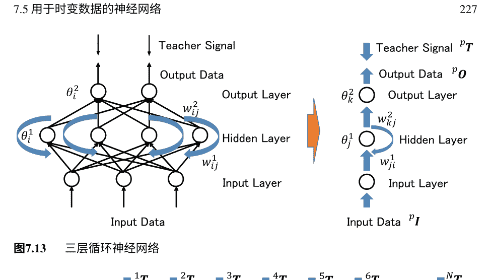

图7.13 三层循环神经网络

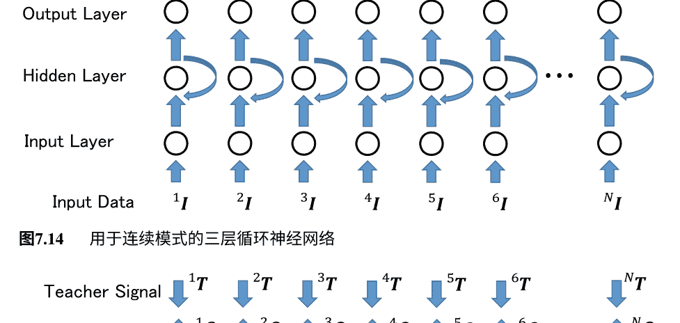

图7.14 用于连续模式的三层循环神经网络

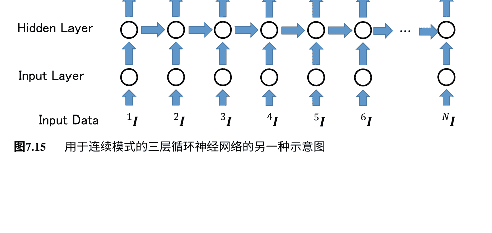

图7.15 用于连续模式的三层循环神经网络的另一种示意图

假设平方误差为

$$ E = \frac{1}{2} \sum_{p=1}^{N} \sum_{k=1}^{n^{\prime}} \left(^{p}O^{3}_{k} - ^{p}T_{k}\right)^{2} \qquad (7.5.5) $$

首先，让我们计算隐藏层和输出层之间连接权重的更新，给定为

$$ \begin{aligned}
\frac{\partial E}{\partial w^{2}_{ab}} &= \frac{1}{2} \sum_{p=1}^{N} \sum_{k=1}^{n^{\prime}} \frac{\partial}{\partial w^{2}_{ab}} \left(^{p}O^{3}_{k} - ^{p}T_{k}\right)^{2} \\
&= \sum_{p=1}^{N} \sum_{k=1}^{n^{\prime}} \left(^{p}O^{3}_{k} - ^{p}T_{k}\right) \frac{\partial ^{p}O^{3}_{k}}{\partial w^{2}_{ab}} \\
&= \sum_{p=1}^{N} \left(^{p}O^{3}_{a} - ^{p}T_{a}\right) \frac{\partial ^{p}O^{3}_{a}}{\partial w^{2}_{ab}}
\end{aligned} \qquad (7.5.6) $$

其中

$$ \begin{aligned}
\frac{\partial ^{p} O^{3}_{a}}{\partial w^{2}_{ab}} &= \frac{\partial f\left(^{p} U^{3}_{a}\right)}{\partial w^{2}_{ab}} = \frac{\partial f\left(^{p} U^{3}_{a}\right)}{\partial ^{p} U^{3}_{a}} \frac{\partial ^{p} U^{3}_{a}}{\partial w^{2}_{ab}} \\
&= \frac{\partial f\left(^{p} U^{3}_{a}\right)}{\partial ^{p} U^{3}_{a}} \frac{\partial}{\partial w^{2}_{ab}} \left(\sum_{j=1}^{n_{2}} w^{2}_{a j} \cdot ^{p}O^{2}_{j} + \theta^{3}_{a}\right) \\
&= \frac{\partial f\left(^{p} U^{3}_{a}\right)}{\partial ^{p} U^{3}_{a}} \cdot ^{p}O^{2}_{b}
\end{aligned} \qquad (7.5.7) $$

将方程（7.5.7）代入方程（7.5.6），我们得到

$$ \frac{\partial E}{\partial w^{2}_{ab}} = \sum_{p=1}^{N} \left(^{p}O^{3}_{a} - ^{p}T_{a}\right) \cdot \frac{\partial f\left(^{p} U^{3}_{a}\right)}{\partial ^{p} U^{3}_{a}} \cdot ^{p}O^{2}_{b} \qquad (7.5.8) $$

从方程（7.5.8）可以看出，隐藏层和输出层之间的连接权重的更新，$\frac{\partial E}{\partial w^{2}_{ab}}$，通过计算每个训练模式右侧的每个项的值来计算。

接下来，让我们计算输入层和隐藏层之间连接权重的更新，

$$ \begin{aligned}
\frac{\partial E}{\partial w^{1}_{cd}} &= \frac{1}{2} \sum_{p=1}^{N} \sum_{k=1}^{n_{3}} \frac{\partial}{\partial w^{1}_{cd}} \left(^{p}O^{3}_{k} - ^{p}T_{k}\right)^{2} \\
&= \sum_{p=1}^{N} \sum_{k=1}^{n_{3}} (^pO_k^3 - ^pT_k) \frac{\partial ^pO_k^3}{\partial w_{cd}^1}
\end{aligned} \qquad (7.5.9) $$

其中

$$ \begin{aligned}
\frac{\partial ^pO_k^3}{\partial w_{cd}^1} &= \frac{\partial f(^pU_k^3)}{\partial w_{cd}^1} = \frac{\partial f(^pU_k^3)}{\partial ^pU_k^3} \frac{\partial ^pU_k^3}{\partial w_{cd}^1} \\
&= \frac{\partial f(^pU_k^3)}{\partial ^pU_k^3} \frac{\partial}{\partial w_{cd}^1} \left( \sum_{j=1}^{n_2} w_{kj}^2 \cdot {}^p_R O_j^2 + \theta_k^3 \right) \\
&= \frac{\partial f(^pU_k^3)}{\partial ^pU_k^3} \cdot \left( \sum_{j=1}^{n_2} w_{kj}^2 \cdot \frac{\partial {}^p_R O_j^2}{\partial w_{cd}^1} \right)
\end{aligned} \qquad (7.5.10) $$

和

$$ \begin{aligned}
\frac{\partial ^p_R O_j^2}{\partial w_{cd}^1} &= \frac{\partial f(^p_R U_j^2)}{\partial w_{cd}^1} = \frac{\partial f(^pU_j^2)}{\partial ^pU_j^2} \frac{\partial ^pU_j^2}{\partial w_{cd}^1} \\
&= \frac{\partial f(^pU_j^2)}{\partial ^pU_j^2} \frac{\partial}{\partial w_{cd}^1} \left( \sum_{i=1}^{n_1} w_{ji}^1 \cdot ^pO_i^1 + \sum_{j'=1}^{n_2} W_{jj'}^2 \cdot {}^{p-1}_R O_{j'}^2 + \theta_j^2 \right) \\
&= \frac{\partial f(^pU_j^2)}{\partial ^pU_j^2} \cdot \left( \frac{\partial w_{jd}^1}{\partial w_{cd}^1} \cdot ^pO_d^1 + \sum_{j'=1}^{n_2} W_{jj'}^2 \cdot \frac{\partial {}^{p-1}_R O_{j'}^2}{\partial w_{cd}^1} \right)
\end{aligned} \qquad (7.5.11) $$

方程（7.5.11）确定了第 $j$ 个隐藏层单元的输出的导数，用于第 $p$ 个学习模式，使用第 $(p-1)$ 个学习模式的导数。利用上述值，依次使用方程（7.5.10）和（7.5.9）来确定 $\frac{\partial E}{\partial w^1_{cd}}$。

最后，让我们计算连接权重的更新 $\frac{\partial E}{\partial W^2_{ab}}$ 对于在隐藏层中的反馈

$$ \begin{aligned}
\frac{\partial E}{\partial W_{ab}^2} &= \frac{1}{2} \sum_{p=1}^{N} \sum_{k=1}^{n_3} \frac{\partial}{\partial W_{ab}^2} (^pO_k^3 - ^pT_k)^2 \\
&= \sum_{p=1}^{N} \sum_{k=1}^{n_3} (^pO_k^3 - ^pT_k) \frac{\partial ^pO_k^3}{\partial W_{ab}^2}
\end{aligned} \qquad (7.5.12) $$

其中

$$ \frac{\partial ^pO_k^3}{\partial W_{ab}^2} = \frac{\partial f(^pU_k^3)}{\partial W_{ab}^2} = \frac{\partial f(^pU_k^3)}{\partial ^pU_k^3} \frac{\partial ^pU_k^3}{\partial W_{ab}^2} $$

$$ = \frac{\partial f\left(^{p} U_{k}^{3}\right)}{\partial ^{p} U_{k}^{3}} \frac{\partial}{\partial W_{a b}^{2}} \left(\sum_{j=1}^{n_{2}} w_{k j}^{2} \cdot ^{p}_{R} O_{j}^{2} + \theta_{k}^{3}\right) = \frac{\partial f\left(^{p} U_{k}^{3}\right)}{\partial ^{p} U_{k}^{3}} \cdot \left(\sum_{j=1}^{n_{2}} w_{k j}^{2} \cdot \frac{\partial ^{p}_{R} O_{j}^{2}}{\partial W_{a b}^{2}}\right) \quad (7.5.13) $$

和

$$ \begin{aligned}
\frac{\partial ^{p}_{R} O_{j}^{2}}{\partial W_{a b}^{2}} &= \frac{\partial f\left(^{p}_{R} U_{j}^{2}\right)}{\partial W_{a b}^{2}} = \frac{\partial f\left(^{p} U_{j}^{2}\right)}{\partial ^{p} U_{j}^{2}} \frac{\partial ^{p} U_{j}^{2}}{\partial W_{a b}^{2}} \\
&= \frac{\partial f\left(^{p} U_{j}^{2}\right)}{\partial ^{p} U_{j}^{2}} \frac{\partial}{\partial W_{a b}^{2}} \left(\sum_{i=1}^{n_{1}} w_{j i}^{1} \cdot ^{p} O_{i}^{1} + \sum_{j'=1}^{n_{2}} W_{j j'}^{2} \cdot ^{p-1}_{R} O_{j'}^{2} + \theta_{j}^{2}\right) \\
&= \frac{\partial f\left(^{p} U_{j}^{2}\right)}{\partial ^{p} U_{j}^{2}} \cdot \left(\frac{\partial W_{j b}^{2}}{\partial W_{a b}^{2}} ^{p-1}_{R} O_{b}^{2} + \sum_{j'=1}^{n_{2}} W_{j j'}^{2} \cdot \frac{\partial ^{p-1}_{R} O_{j'}^{2}}{\partial W_{a b}^{2}}\right)
\end{aligned} \qquad (7.5.14) $$

根据公式 (7.5.14) ，可以使用隐藏层单元的输出值和它们对于 $(p-1)$-th训练模式的导数值来计算隐藏层单元中的单元输出对于 $W^{2}_{ab}$ 的导数值，用于第p-th学习模式。使用上述获得的值，按顺序计算Eqs.(7.5.13)和(7.5.12)的左侧值，最终得到 $\frac{\partial E}{\partial W_{a b}^{2}}$。

以相同的方式计算偏置值 $\theta^{3}_{k}$ 和 $\theta^{2}_{j}$ 的更新值（导数值）。

如上所述，在BPTT中，可以通过按照训练模式的顺序依次计算值来计算每个参数的更新量。

#### 7.5.2 长短期记忆

在本节中，讨论了长短期记忆（LSTM）的基本要素[9]，这是递归神经网络[1, 7]的高级版本。

在递归神经网络的误差反向传播计算中，有一个按照训练模式的顺序逐步计算梯度的过程，据已知，类似于前馈神经网络中多层计算的梯度消失问题可能会出现。

因此，与彼此相距较远的训练模式相关的数量不能影响连接权重的更新，导致网络仅仅参考相对较近的信息进行预测，这被认为是基于长期记忆的操作中的一个问题。

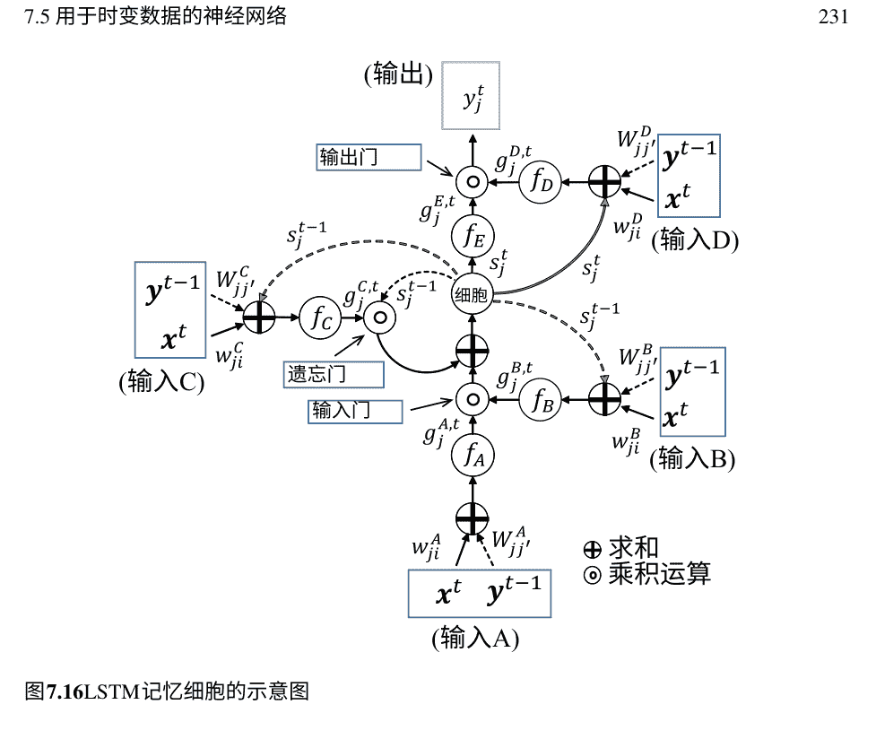

## 图7.16 LSTM记忆细胞的示意图

长短期记忆（LSTM）网络是为了解决上述递归神经网络的弱点而开发的。LSTM中单元的行为如图7.16所示[6]。图7.16中的LSTM单元是原始单元的扩展，具有遗忘门[4]和窥视连接[3]。

图7.16中的LSTM单元设计用于对输入进行四个不同的循环处理，将当前时间步骤（训练模式）的输入数据 $x^t$ 和上一个时间步骤（训练模式）的LSTM单元输出数据 $y^{t-1}$ 作为输入，并输出当前时间步骤的输出 $y^t$。对于相同的输入数据（输入 A，输入 B，输入 C和输入 D），执行与通常的循环单元相同的操作，并根据这些操作的结果计算输出。$f_A()$，$f_B()$，$f_C()$，$f_D()$ 和 $f_E()$ 是激活函数，其中 $f_B()$，$f_C()$ 和 $f_D()$ 使用sigmoid函数，而 $f_A()$ 和 $f_E()$ 使用tanh函数。LSTM单元的另一个特点是它具有状态变量 $s$，它具有控制长期记忆的功能。图7.16中显示的LSTM单元有三个门，其中输入门控制新输入信息的传输强度，输出门控制记忆单元的输出强度，遗忘门控制过去信息的传输强度。

现在让我们来看看LSTM单元中的操作[6]。首先，按照循环单元中的方式对输入A进行以下操作，

$$u_j^{A,t} = \sum_{i=1}^{n_1} w_{ji}^A x_i^t + \sum_{j'=1}^{n_2} W_{jj'}^A y_{j'}^{t-1} + \theta_j^A \quad\quad (7.5.15)$$

$$g_j^{A,t} = f_A\left( u_j^{A,t} \right) \quad\quad (7.5.16)$$

接下来，按照循环单元中的方式对输入B进行以下操作，

$$u_j^{B,t} = \sum_{i=1}^{n_1} w_{ji}^B x_i^t + \sum_{j'=1}^{n_2} W_{jj'}^B y_{j'}^{t-1} + \theta_j^B + p_B \cdot s_j^{t-1} \quad\quad (7.5.17)$$

$$g_j^{B,t} = f_B\left( u_j^{B,t} \right) \quad\quad (7.5.18)$$

请注意，在公式(7.5.17)中添加了状态变量 $s_j^{t-1}$。

接下来，按照循环单元中的方式对输入C进行以下操作。

请再次注意，在公式中添加了状态变量 $s_j^{t-1}$。

$$u_j^{C,t} = \sum_{i=1}^{n_1} w_{ji}^C x_i^t + \sum_{j'=1}^{n_2} W_{jj'}^C y_{j'}^{t-1} + \theta_j^C + p_C \cdot s_j^{t-1} \quad\quad (7.5.19)$$

$$g_j^{C,t} = f_C\left( u_j^{C,t} \right) \quad\quad (7.5.20)$$

在输入门处，通过公式 (7.5.16) 计算得到的 $g_j^{A,t}$ 与公式 (7.5.18) 计算得到的 $g_j^{B,t}$ 的乘积被计算。在遗忘门处，通过公式 (7.5.20) 计算得到的 $g_j^{C,t}$ 与状态变量 $s_j^{t-1}$ 的乘积被计算。状态变量通过以下方式更新，将输入门和遗忘门操作的结果相加：

$$s_j^t = g_j^{C,t} \cdot s_j^{t-1} + g_j^{B,t} \cdot g_j^{A,t} \quad\quad (7.5.21)$$

使用更新后的状态变量，计算 $g_j^{E,t}$ 如下所示：

$$g_j^{E,t} = f_E(s_j^t) \quad\quad (7.5.22)$$

接下来，对输入 $D$ 进行如循环单元中所示的操作。

$$u_j^{D,t} = \sum_{i=0}^{n_1} w_{ji}^D x_i^t + \sum_{j'=1}^{n_2} W_{jj'}^D y_{j'}^{t-1} + \theta_j^D + p_D \cdot s_j^t \quad\quad (7.5.23)$$

$$g_j^{D,t} = f_D\left( u_j^{D,t} \right) \quad\quad (7.5.24)$$

在这里，更新的状态变量 $s_j^t$ 被添加。

最后，在输出门处，通过公式（7.5.22）计算得到的 $g_j^{E, t}$ 和公式（7.5.24）中的 $g_j^{D, t}$ 的乘积被得到为

$$y_j^t = g_j^{E, t} \cdot g_j^{D, t} \quad\quad (7.5.25)$$

这个值成为LSTM单元的输出值。

在公式（7.5.17）、（7.5.19）和（7.5.23）中，$p_B, p_C$ 和 $p_D$ 是被称为peephole权重的参数。

BPTT算法可以用于LSTM网络和循环网络的误差反向传播训练。更多细节请参见文献[6,9]。

### 7.6 数值示例

本节详细介绍了深度学习在二维圆柱体流场分析中的应用[10]，其中使用了卷积LSTM网络(Sect.7.5)。它使用从流体分析结果中获得的先前可视化图像作为输入，预测未来时间步长的涡度可视化图像。

#### 7.6.1 数据准备阶段

根据第7.3.3节的分析结果，在第100个和第7400个时间步之间，每100个时间步创建一次涡度和压力的可视化图像，共获得74个涡度图像和74个压力图像。图像被裁剪以便聚焦在圆柱体附近和圆柱体后方的流动区域。每个图像的宽度为200像素，高度为100像素，具有8位灰度(256灰度级)。

当用作输入数据时，每个像素值被归一化为0-1范围内的实数。在这里，第n步的涡度可视化图像被表示为 $VI^{CFD}(n)$，压力图像被表示为 $PI^{CFD}(n)$，两个图像被表示为 $VPI^{CFD}(n)$。让我们从最后四个时间点的图像预测下一个时间点的涡度图像。

在从过去时间点的涡度图像预测下一个涡度图像的情况下，可以从74个图像中获得以下70个训练模式。（每个模式中的前四个图像是输入数据，最后一个图像是教师数据。）

-   1. $\{ (VI^{CFD}(100), VI^{CFD}(200), VI^{CFD}(300), VI^{CFD}(400)), VI^{CFD}(500) \}$
-   2. $\{ (VI^{CFD}(200), VI^{CFD}(300), VI^{CFD}(400), VI^{CFD}(500)), VI^{CFD}(600) \}$
-   ...
-   70. $\{ (VI^{CFD}(7000), VI^{CFD}(7100), VI^{CFD}(7200), VI^{CFD}(7300)), VI^{CFD}(7400) \}$

同样，在预测过去时间点的涡度和压力图像的下一个涡度和压力图像的情况下，74个不同时间点的图像提供了70个训练模式，如下所示

-   1. $\left\{\left( \text{VPI}^{\text{CFD}}(100), \text{VPI}^{\text{CFD}}(200), \text{VPI}^{\text{CFD}}(300), \text{VPI}^{\text{CFD}}(400)\right), \text{VPI}^{\text{CFD}}(500)\right\}$
-   2. $\left\{\left( \text{VPI}^{\text{CFD}}(200), \text{VPI}^{\text{CFD}}(300), \text{VPI}^{\text{CFD}}(400), \text{VPI}^{\text{CFD}}(500)\right), \text{VPI}^{\text{CFD}}(600)\right\}$
-   ...
-   70. $\left\{\left( \text{VPI}^{\text{CFD}}(7000), \text{VPI}^{\text{CFD}}(7100), \text{VPI}^{\text{CFD}}(7200), \text{VPI}^{\text{CFD}}(7300)\right), \text{VPI}^{\text{CFD}}(7400)\right\}$

#### 7.6.2 训练阶段

在第7.6.1节中使用的70个训练模式进行深度学习。

为了构建涡度图像的预测器，输入数据和教师数据设置如下：

输入数据: $\text{VI}^{\text{CFD}}(n-300), \text{VI}^{\text{CFD}}(n-200), \text{VI}^{\text{CFD}}(n-100), \text{VI}^{\text{CFD}}(n)$
教师数据: $\text{VI}^{\text{CFD}}(n+100)$

经过训练的神经网络输出了上述输入数据的涡度的预测图像，$\text{VI}^{\text{DL}}(n+100)$。迭代次数设置为100,000次，小批量大小设置为10。在配备有Intel Core i7-7700 K CPU和NVIDIA TITAN V GPU的计算机上进行了数十个小时的训练。同样，为了构建涡度和压力图像的预测器，输入和教师数据设置如下：

输入数据: $\text{VPI}^{\text{CFD}}(n-300), \text{VPI}^{\text{CFD}}(n-200), \text{VPI}^{\text{CFD}}(n-100), \text{VPI}^{\text{CFD}}(n)$
教师数据: $\text{VPI}^{\text{CFD}}(n+100)$

经过训练的神经网络输出了上述输入数据的涡度的预测图像，$\text{VI}^{\text{DL}}(n+100)$，以及压力的预测图像，$\text{VI}^{\text{DL}}(n+100)$。
迭代次数设置为100,000，小批量大小设置为10。

关于用于深度学习的神经网络，以构建涡度图像预测器为例的卷积LSTM网络的结构如下：

| | | |
| :--- | :--- | :--- |
| 1 : 输入层 | 输入 : $4 \times 200 \times 100$ | 输出 : $20 \times 200 \times 100$ |
| 2 : 卷积LSTM层 | 输入 : $20 \times 200 \times 100$ | 输出 : $20 \times 200 \times 100$ |
| 3 : 卷积LSTM层 | 输入 : $20 \times 200 \times 100$ | 输出 : $20 \times 200 \times 100$ |
| 4 : 卷积LSTM层 | 输入 : $20 \times 200 \times 100$ | 输出 : $20 \times 200 \times 100$ |
| 5 : 卷积LSTM层 | 输入 : $20 \times 200 \times 100$ | 输出 : $3 \times 200 \times 100$ |
| 6 : 卷积3D层 | 输入 : $3 \times 200 \times 100$ | 输出 : $1 \times 200 \times 100$ |

第一层，即输入层，是一个卷积层。该层的输入数据是四个时间步的四个200 ×100像素的涡度图像。图像的每个像素是一个介于0和1之间的单精度实数。输入层将输入数据转换为20 × 200 通过卷积运算使用20个滤波器对×100个数据进行处理（滤波器尺寸为3 ×3），并将数据发送到下一层。在第二至第四个卷积LSTM层中，20 × 200 通过二维卷积运算使用20个滤波器（滤波器尺寸为3×3），将×100个输入数据转换为20 × 20 0 ×100个新数据，并发送到下一层。在第五层，也是卷积LSTM层，20 × 200 × 100 输入数据通过二维卷积运算使用3个滤波器（滤波器尺寸为3×3）转换为×200 通过二维卷积运算使用三个滤波器（滤波器尺寸为3×3），将20 ×200×100个输入数据转换为×100个新数据，并发送到下一层。在第六层，即三维卷积层，3 × 200 ×100个输入数据转换为1 × 200 通过三维卷积运算使用一个滤波器（滤波器大小为3× 3 ×100个新数据，输出为3个。由于输出图像基于实数，它们被转换为介于0和255之间的整数值，从而得到一个正常的8位（256个阴影）图像。请注意，这里使用的卷积LSTM层是具有LSTM的卷积神经网络[11]。

#### 7.6.3 应用阶段

在这里，第7.6.2节构建的神经网络用于预测二维圆柱体周围的流场。

图7.17显示了训练模式中包含的数据的预测结果，描述了第3200到第3500个时间步之间的涡度图像。在图中，CFD表示基于计算流体动力学模拟得到的分析结果的图像，这被认为是正确的图像。其他的分别是当基于分析结果的图像作为输入时，通过深度学习得到的结果（DL with $\mathrm{VI}^{\mathrm{CFD}}$）以及当预测图像作为输入时得到的结果（DL with $\mathrm{VI}^{\mathrm{DL}}$）。图中的图像是通过以下数据（图像）作为输入数据训练的神经网络得到的，DL with $V I^{C F D}$:

$t = 3200(\mathrm{VI}^{\mathrm{CFD}}(2800), \mathrm{VI}^{\mathrm{CFD}}(2900), \mathrm{VI}^{\mathrm{CFD}}(3000), \mathrm{VI}^{\mathrm{CFD}}(3100))$
$t = 3300(\mathrm{VI}^{\mathrm{CFD}}(2900), \mathrm{VI}^{\mathrm{CFD}}(3000), \mathrm{VI}^{\mathrm{CFD}}(3100), \mathrm{VI}^{\mathrm{CFD}}(3200))$
$t = 3400(\mathrm{VI}^{\mathrm{CFD}}(3000), \mathrm{VI}^{\mathrm{CFD}}(3100), \mathrm{VI}^{\mathrm{CFD}}(3200), \mathrm{VI}^{\mathrm{CFD}}(3300))$
$t = 3500(\mathrm{VI}^{\mathrm{CFD}}(3100), \mathrm{VI}^{\mathrm{CFD}}(3200), \mathrm{VI}^{\mathrm{CFD}}(3300), \mathrm{VI}^{\mathrm{CFD}}(3400))$

深度学习与V I深度学习

$t = 3200(\mathrm{VI}^{\mathrm{CFD}}(2800), \mathrm{VI}^{\mathrm{CFD}}(2900), \mathrm{VI}^{\mathrm{CFD}}(3000), \mathrm{VI}^{\mathrm{CFD}}(3100))$

| | t=3200 | t=3300 | t=3400 | t=3500 |
| :--- | :--- | :--- | :--- | :--- |
| CFD (正确) |  |  |  |  |
| DL with $VI^{CFD}$ |  |  |  |  |
| DL with $VI^{DL}$ |  |  |  |  |

图7.17 训练模式中包含的时间步长的涡度预测图像

$t = 3300(VI^{CFD}(2900), VI^{CFD}(3000), VI^{CFD}(3100), VI^{深度学习}(3200))$
$t = 3400(VI^{CFD}(3000), VI^{CFD}(3100), VI^{CFD}(3200), VI^{深度学习}(3300))$
$t = 3500(VI^{CFD}(3100), VI^{CFD}(3200), VI^{CFD}(3300), VI^{DL}(3400))$

图7.17的结果显示，深度学习通常能够对这种情况进行良好的预测。在这里，结构相似性指数测量（SSIM）[12]，它是图像的相似性指数，约为70%。（在完全匹配的情况下，SSIM为100%。）当深度学习的预测结果也作为输入（DL with $VI^{DL}$）时，准确性低于仅使用CFD结果作为输入（DL with $VI^{CFD}$），但通过数据增强可以改善以抑制过度训练。

图7.18显示了未包含在训练模式中的数据的涡度图像的预测结果，其中给出了第20200个时间步到第20300、20400和20500个时间步的涡度图像。由于这些时间步的涡度图像未包含在训练模式中，因此可以验证对未知输入数据的泛化能力。请注意，用于训练神经网络的输入图像的选择方式与图7.17中使用的方式相同，如下所示：

深度学习与 $VI^{CFD}$:

$t = 20200 (VI^{CFD}(19800), VI^{CFD}(19900), VI^{CFD}(20000), VI^{CFD}(20100))$
$t = 20300 (VI^{CFD}(19900), VI^{CFD}(20000), VI^{CFD}(20100), VI^{CFD}(20200))$
$t = 20400 (VI^{CFD}(20000), VI^{CFD}(20100), VI^{CFD}(20200), VI^{CFD}(20300))$
$t = 20500 (VI^{CFD}(20100), VI^{CFD}(20200), VI^{CFD}(20300), VI^{CFD}(20400))$

深度学习与$V I^{深度学习}$

$t = 20200 (VI^{CFD}(19800), VI^{CFD}(19900), VI^{CFD}(20000), VI^{CFD}(20100))$
$t = 20300 (VI^{CFD}(19900), VI^{CFD}(20000), VI^{CFD}(20100), VI^{DL}(20200))$|   | t=20200 | t=20300 | t=20400 | t=20500 |
| :--- | :--- | :--- | :--- | :--- |
| CFD (正确) | [图像占位] | [图像占位] | [图像占位] | [图像占位] |
| 深度学习 (DL with $VI^{CFD}$) | [图像占位] | [图像占位] | [图像占位] | [图像占位] |
| 深度学习 (DL with $VI^{DL}$) | [图像占位] | [图像占位] | [图像占位] | [图像占位] |

### 图7.18 预测的涡旋图像，不包括在训练模式中的时间步长

$t = 20400 \ (VI^{CFD}(20000), VI^{CFD}(20100), VI^{DL}(20200), VI^{DL}(20300))$

$t = 20500 \ (VI^{CFD}(20100), VI^{DL}(20200), VI^{DL}(20300), VI^{DL}(20400))$

图7.18的结果显示，深度学习通常能够对这种情况进行良好的预测。与图7.17相比，对于训练模式中未包含的输入数据，预测准确性较低。在训练过程中，通过扩展训练模式来抑制过度训练被认为是有效的。

接下来，图7.19展示了同时预测涡度图像和压力图像的预测结果，其中预测图像的时间步长从第3200步到第3400步，深度学习的输入数据是通过计算流体力学分析计算得到的图像。为了比较，也展示了仅从涡度图像预测的图像 (DL with $VI^{CFD}$)。值得注意的是，使用涡度图像和压力图像作为输入的结果 (DL with $VPI^{CFD}$) 与仅使用涡度图像作为输入的结果 (DL with $VI^{CFD}$) 相当。

最后，图7.20显示了当同时预测涡度图像和压力图像时的压力图像的预测结果，其中预测图像的时间步长从第3200步到第3400步，深度学习的输入数据是通过计算流体力学分析计算得到的图像。

根据深度学习 (DL with $VPI^{CFD}$) 对压力图像的预测结果，低压区域 (图中的黑色) 的位置几乎与CFD的结果一致，但噪声比涡度图像更多。

如上所述，可以看出使用卷积LSTM网络的深度学习可以很好地预测计算流体力学分析的结果。通过深度学习进行预测所需的时间少于一秒，以获得比解决方案提前100步的结果，而在CFD的情况下，需要通过耗时的计算流体力学模拟分析整个时间步骤。通过优化卷积LSTM网络结构和增加训练模式的数量，可以进一步提高深度学习的预测准确性，以防止过度训练并提高泛化能力。

|   | t=3200 | t=3300 | t=3400 |
|---|--------|--------|--------|
| CFD (正确) | [vorticity image] | [vorticity image] | [vorticity image] |
| 深度学习 (DL with $VI^{CFD}$) | [vorticity image] | [vorticity image] | [vorticity image] |
| 深度学习 (DL with $VPI^{CFD}$) | [vorticity image] | [vorticity image] | [vorticity image] |

### 图7.19 使用涡度和压力图像预测的涡度图像

|   | t=3200 | t=3300 | t=3400 |
|---|--------|--------|--------|
| CFD (正确) | [pressure image] | [pressure image] | [pressure image] |
| 深度学习 (DL with $VPI^{CFD}$) | [pressure image] | [pressure image] | [pressure image] |

### 图7.20 使用涡度和压力图像预测的压力图像

### 致谢

我们要对Masato Masuda博士、Yasushi Nakabayashi教授和Yoshiaki Tamura教授提供本章节的数据表示感谢。第7.3节和第7.6节的图表基于提供的数据。我们还要感谢Yoshiaki Tamura教授对第7.3节描述的亲切建议，以及Masato Masuda博士对第7.5节和第7.6节描述的帮助。

### 参考文献

- 1. Elman, J.L.: 在时间中寻找结构。认知科学。14, 179–211 (1990)
- 2. Ferziger, J.H., Peric, M.: 流体动力学的计算方法（第二版）。Springer (1999)
- 3. Gers, F.A., Schmidhuber, J.A.: 时间和计数的循环网络。IEEE-INNS-ENNS国际联合神经网络会议论文集。IJCNN 2000。神经计算：新千年的新挑战和展望，第3卷，2000年，第189-194页，DOI: https://doi.org/10.1109/IJCNN.2000.861302。
- 4. Gers, F.A., Schmidhuber, J.A., Cummins, F.A.: 学会遗忘：LSTM的持续预测。神经计算。12（10），2451-2471（2000）。DOI: https://doi.org/10.1162/089976600300015015
- 5. Goodfellow, I., Bengio, Y., Courville, A.: 深度学习，MIT出版社（2016年）
- 6. Greff, K., Srivastava, R.K., Koutník, J., Steunebrink, B.R., Schmidhuber, J.: LSTM：一次搜索空间奥德赛。IEEE Trans. Neural Netw. Learn. Sys. 28（10），2222-2232（2017）。DOI: https://doi.org/10.1109/TNNLS.2016.2582924
- 7. Haykin, S.: 神经网络：全面的基础。Prentice Hall（1999年）
- 8. Hirsch, C.: 内部和外部流体计算：计算流体力学基础（第二版）。Butterworth-Heinemann（2007年）
- 9. Hochreiter, S., Schmidhuber, J.: 长短期记忆。神经计算。9（8），1735-1780（1997年）
- 10. Masuda, M., Nakabayashi, Y., Tamura, Y.: 使用卷积LSTM预测计算流体动力学结果。JSC ES交易。2020年，20201006（2020年）。（日文）
- 11. Shi, X., Chen, Z., Wang, H., Yeung, D.-Y., Wong, W.-K., Woo, W.-C.: 卷积LSTM网络：一种用于降水预测的机器学习方法。在第28届神经信息处理系统国际会议（NIPS'15）论文集中，第1卷，2015年，pp. 802-810。
- 12. Wang, Z., Bovik, A.C., Sheikh, H.R., Simoncelli, E.P.: 图像质量评估：从误差可见性到结构相似性。IEEE图像处理期刊13(4)，600-612（2004）。DOI: https://doi.org/10.1109/TIP.2003.819861
- 13. Williams, R.J., Peng, J.: 一种用于在线训练循环网络轨迹的高效基于梯度的算法。神经计算2，490-501（1990）
- 14. Williams, R.J., Zipser, D.: 一种用于持续运行完全循环神经网络的学习算法。神经计算1，270-280（1989）
- 15. Zienkiewicz, O.C., Morgan, K.: 有限元和逼近，多佛出版社（2006）

## 第8章 深度学习的进一步应用

### 摘要

本章讨论了计算力学领域中深度学习的一些额外应用：提高单元刚度矩阵精度的方法（第8.1节），使用卷积运算进行有限元分析（第8.2节），使用变分自编码器进行流体分析（第8.3节），使用前馈神经网络进行缩放方法（第8.4节），以及将物理信息纳入神经网络应用于固体力学（第8.5节）。

### 8.1 深度学习有限元

在有限元方法中，改善解的准确性的方法可以分为以下两个主要类别：

- A; 减小具有大量元素的元素尺寸的方法
- B; 增加基函数的阶数而不减小元素尺寸的方法

方法A通过减小低阶基函数的元素尺寸来提高解的准确性，从而减小元素中物理量（如位移）的变化。另一方面，方法B通过利用高阶基函数的高逼近能力来提高解的准确性。

元素中基函数逼近的准确性提高自然导致元素刚度矩阵的改善，最终得到更好的有限元解。换句话说，元素刚度矩阵和全局刚度矩阵的质量直接影响有限元解的准确性。

然后，我们讨论了一种通过使用深度学习优化数值积分参数来改善元素刚度矩阵质量的方法，在第4章中。在这里，我们回顾了另一种方法，即通过深度学习改善元素积分中涉及的应变-位移矩阵[9]。

#### 8.1.1 二维二次四边形单元

首先，让我们回顾一下在本节中感兴趣的二次四边形等参元素。如图8.1所示，它总共有八个节点，并且在元素中的任意位置的位移和坐标分别近似如下：

方程 (8.1.1)：
$$ \{u\} = \begin{pmatrix} u \\ v \end{pmatrix} = \begin{pmatrix} u(\xi, \eta) \\ v(\xi, \eta) \end{pmatrix} = \sum_{i=1}^{8} N_i(\xi, \eta) \cdot \begin{pmatrix} U_i \\ V_i \end{pmatrix} $$

方程 (8.1.2)：
$$ \{x\} = \begin{pmatrix} x \\ y \end{pmatrix} = \begin{pmatrix} x(\xi, \eta) \\ y(\xi, \eta) \end{pmatrix} = \sum_{i=1}^{8} N_i(\xi, \eta) \cdot \begin{pmatrix} X_i \\ Y_i \end{pmatrix} $$

其中$(U_i, V_i)^T$和$(X_i, Y_i)^T$分别是第$i$个节点的位移和坐标。

方程(8.1.1)和(8.1.2)中的基函数由以下方程给出。

方程 (8.1.3)：
$$ N_1(\xi, \eta) = \frac{1}{4}(1-\xi)(1-\eta)(-\xi-\eta-1) $$

方程 (8.1.4)：
$$ N_2(\xi, \eta) = \frac{1}{4}(1+\xi)(1-\eta)(\xi-\eta-1) $$

$N_3(\xi, \eta) = \frac{1}{4}(1 + \xi)(1 + \eta)(\xi + \eta - 1)$ (8.1.5)

$N_4(\xi, \eta) = \frac{1}{4}(1 - \xi)(1 + \eta)(-\xi + \eta - 1)$ (8.1.6)

$N_5(\xi, \eta) = \frac{1}{2}(1 - \xi^2)(1 - \eta)$ (8.1.7)

$N_6(\xi, \eta) = \frac{1}{2}(1 + \xi)(1 - \eta^2)$ (8.1.8)

$N_7(\xi, \eta) = \frac{1}{2}(1 - \xi^2)(1 + \eta)$ (8.1.9)

$N_8(\xi, \eta) = \frac{1}{2}(1 - \xi)(1 - \eta^2)$ (8.1.10)

这些基函数显然满足有限元近似中的基本方程，如下所示。

$\sum_{i=1}^{8} N_i(\xi, \eta) = 1 \quad (对于任意的 \xi, \eta)$ (8.1.11)

$N_i(X_j, Y_j) = \begin{cases} 0 \quad (i \neq j) \\ 1 \quad (i = j) \end{cases}$ (8.1.12)

在一个单元中，节点位移向量 $\{U\}$被定义为

$\{U\} = \begin{pmatrix} U_1 \\ \vdots \\ U_8 \\ V_1 \\ \vdots \\ V_8 \end{pmatrix}$ (8.1.13)

此外，单元中的形状（基）函数矩阵 $[N]$被定义为

$[N] = \begin{bmatrix} N_1 & \cdots & N_8 & 0 & \cdots & 0 \\ 0 & \cdots & 0 & N_1 & \cdots & N_8 \end{bmatrix}$ (8.1.14)

然后，单元中任意点的位移向量 $\{u\}$可以表示为

$$\{u\} = \begin{pmatrix} \sum_{i=1}^{8} N_{i} U_{i} \\ \sum_{i=1}^{8} N_{i} V_{i} \end{pmatrix} = \begin{bmatrix} N_1 & \cdots & N_8 & 0 & \cdots & 0 \\ 0 & \cdots & 0 & N_1 & \cdots & N_8 \end{bmatrix} \begin{pmatrix} U_1 \\ \vdots \\ U_8 \\ V_1 \\ \vdots \\ V_8 \end{pmatrix} = [N]\{U\} \qquad (8.1.15)$$

元素中任意点的应变 $\{\varepsilon\}$ 可以用节点位移向量 $\{U\}$ 表示如下：

$$\{\varepsilon\} = \begin{pmatrix} \varepsilon_{x} \\ \varepsilon_{y} \\ \gamma_{x y} \end{pmatrix} = \begin{pmatrix} \frac{\partial u}{\partial x} \\ \frac{\partial v}{\partial y} \\ \frac{\partial u}{\partial y} + \frac{\partial v}{\partial x} \end{pmatrix} = \begin{bmatrix} \frac{\partial}{\partial x} & 0 \\ 0 & \frac{\partial}{\partial y} \\ \frac{\partial}{\partial y} & \frac{\partial}{\partial x} \end{bmatrix} \begin{pmatrix} u \\ v \end{pmatrix} = [L]\{u\} = [L][N]\{U\} = [B]\{U\} \qquad (8.1.16)$$

其中 $[B]$ 是应变-位移矩阵，其分量如下所示：

$$[B]=[L][N]=\begin{bmatrix} \frac{\partial}{\partial x} & 0 \\ 0 & \frac{\partial}{\partial y} \\ \frac{\partial}{\partial y} & \frac{\partial}{\partial x} \end{bmatrix} \begin{bmatrix} N_1 & \cdots & N_8 & 0 & \cdots & 0 \\ 0 & \cdots & 0 & N_1 & \cdots & N_8 \end{bmatrix} = \begin{bmatrix} \frac{\partial N_1}{\partial x} & \cdots & \frac{\partial N_8}{\partial x} & 0 & \cdots & 0 \\ 0 & \cdots & 0 & \frac{\partial N_1}{\partial y} & \cdots & \frac{\partial N_8}{\partial y} \\ \frac{\partial N_1}{\partial y} & \cdots & \frac{\partial N_8}{\partial y} & \frac{\partial N_1}{\partial x} & \cdots & \frac{\partial N_8}{\partial x} \end{bmatrix} \qquad (8.1.17)$$

元素中任意点的应力 $\{\sigma\}$ 也可以用节点位移向量 $\{U\}$ 表示如下：

$$\{\sigma\} = \begin{pmatrix} \sigma_{x} \\ \sigma_{y} \\ \tau_{x y} \end{pmatrix} = [D] \begin{pmatrix} \varepsilon_{x} \\ \varepsilon_{y} \\ \gamma_{x y} \end{pmatrix} = [D]\{\varepsilon\} = [D][L][N]\{U\} = [D][B]\{U\} \qquad (8.1.18)$$

其中$[D]$是应力-应变矩阵，由杨氏模量 $E$ 和泊松比 $\nu$ 定义为二维各向同性弹性体。请注意，平面应力和平面应变近似之间的$[D]$是不同的。

在平面应力近似情况下：

$$[D] = \frac{E}{(1-\nu^2)} \begin{bmatrix} 1 & \nu & 0 \\ \nu & 1 & 0 \\ 0 & 0 & \frac{1-\nu}{2} \end{bmatrix} \qquad (8.1.19)$$

在平面应变近似情况下：

$$[D] = \frac{E}{(1 + \nu)(1 - 2\nu)} \begin{bmatrix} 1 - \nu & \nu & 0 \\ \nu & 1 - \nu & 0 \\ 0 & 0 & \frac{1-2\nu}{2} \end{bmatrix} \quad (8.1.20)$$

使用上述描述的矩阵，可以得到元素刚度矩阵

$$[k^e] = \int_{v^e} [B]^T [D] [B] dv \quad (8.1.21)$$

其中 $v^e$ 表示积分在元素的整个域上进行。

与第4章中线性元素讨论的类似，由于元素形状的畸变，二次四边形元素的元素刚度矩阵的精度也会降低。让我们考虑图8.2a中的二次四边形元素中由节点位移引起的应变。

$\{ \overline{U} \} = (\overline{U}_1, \ldots, \overline{U}_8, \overline{V}_1, \ldots, \overline{V}_8)^T$。在元素中的任意位置，应变可以用公式(8.1.16)表示，但如果元素的几何形状失真，得到的结果可能会包含一些误差。

然后，我们讨论如何获得准确的应变。一种方法是将元素分割成许多较小的元素，如图8.2b所示。例如，如果原始的二次四边形元素被分割成50 × 50个线性四边形元素，则每个元素中的应变可以得到高精度的计算。在这种情况下，元素的尺寸被认为足够小，线性元素就足够使用了，图8.2b的网格被称为图8.2a元素的参考模型。

参考模型周边的每个节点点都通过从原始二次四边形单元的节点点处插值得到的位移来加载，使用二次基函数和任意位置的应变值可以准确计算元素内部的应变值。请注意，参考模型计算的结果取决于泊松比，而不取决于杨氏模量。

迄今为止已经审查了元素形状的扭曲如何影响二次四边形元素的元素刚度矩阵的准确性，并且参考模型可以用于计算正确的应变场。使用参考模型，将讨论通过深度学习获得高精度应变-位移矩阵[B]的方法。为了准备工作，现在详细研究应变-位移矩阵[B]的特性。

如公式（8.1.17）所示，二次四边形单元的应变-位移矩阵[B]为3行16列，可以写成

$$[B] = \begin{bmatrix} b_{1,1} & b_{1,2} & \cdots & b_{1,15} & b_{1,16} \\ b_{2,1} & b_{2,2} & \cdots & b_{2,15} & b_{2,16} \\ b_{3,1} & b_{3,2} & \cdots & b_{3,15} & b_{3,16} \end{bmatrix} \quad (8.1.22)$$

在这里，让元素中的位移是由平移引起的刚体位移，即 (U₁, V₁)ᵀ = ··· = (U₈, V₈)ᵀ = (Ū, Ṽ)ᵀ。在这种情况下，元素中的应变值必须为零。因此，我们有以下方程。

$$\{\varepsilon\} = \begin{pmatrix} 0 \\ 0 \\ 0 \end{pmatrix} = [B]\{U\} = \begin{bmatrix} b_{1,1} & b_{1,2} & \cdots & b_{1,15} & b_{1,16} \\ b_{2,1} & b_{2,2} & \cdots & b_{2,15} & b_{2,16} \\ b_{3,1} & b_{3,2} & \cdots & b_{3,15} & b_{3,16} \end{bmatrix} \begin{pmatrix} \overline{U} \\ \vdots \\ \overline{U} \\ \overline{V} \\ \vdots \\ \overline{V} \end{pmatrix}$$

$$= \begin{pmatrix} b_{1,1} + b_{1,2} + b_{1,3} + b_{1,4} + b_{1,5} + b_{1,6} + b_{1,7} + b_{1,8} \\ b_{2,1} + b_{2,2} + b_{2,3} + b_{2,4} + b_{2,5} + b_{2,6} + b_{2,7} + b_{2,8} \\ b_{3,1} + b_{3,2} + b_{3,3} + b_{3,4} + b_{3,5} + b_{3,6} + b_{3,7} + b_{3,8} \end{pmatrix} \overline{U}$$

$$+ \begin{pmatrix} b_{1,9} + b_{1,10} + b_{1,11} + b_{1,12} + b_{1,13} + b_{1,14} + b_{1,15} + b_{1,16} \\ b_{2,9} + b_{2,10} + b_{2,11} + b_{2,12} + b_{2,13} + b_{2,14} + b_{2,15} + b_{2,16} \\ b_{3,9} + b_{3,10} + b_{3,11} + b_{3,12} + b_{3,13} + b_{3,14} + b_{3,15} + b_{3,16} \end{pmatrix} \overline{V} \quad (8.1.23)$$

由于Ū和 Ṽ彼此独立，且方程(8.1.23)对任意(Ū, Ṽ)ᵀ成立，我们有

$$\begin{aligned} b_{1,1} + b_{1,2} + b_{1,3} + b_{1,4} + b_{1,5} + b_{1,6} + b_{1,7} + b_{1,8} &= 0 \\ b_{2,1} + b_{2,2} + b_{2,3} + b_{2,4} + b_{2,5} + b_{2,6} + b_{2,7} + b_{2,8} &= 0 \\ b_{3,1} + b_{3,2} + b_{3,3} + b_{3,4} + b_{3,5} + b_{3,6} + b_{3,7} + b_{3,8} &= 0 \\ b_{1,9} + b_{1,10} + b_{1,11} + b_{1,12} + b_{1,13} + b_{1,14} + b_{1,15} + b_{1,16} &= 0 \\ b_{2,9} + b_{2,10} + b_{2,11} + b_{2,12} + b_{2,13} + b_{2,14} + b_{2,15} + b_{2,16} &= 0 \\ b_{3,9} + b_{3,10} + b_{3,11} + b_{3,12} + b_{3,13} + b_{3,14} + b_{3,15} + b_{3,16} &= 0 \end{aligned} \quad (8.1.24)$$

这表明应变-位移矩阵[B]的分量之间不是相互独立的；例如，b₁,₈可以从其他分量中获得，即b₁,₈ = -b₁,₁ - b₁,₂ - b₁,₃ - b₁,₄ - b₁,₅ - b₁,₆ - b₁,₇，这导致应变-位移矩阵[B]的独立分量数量减少到3 × 14。

#### 8.1.2 使用深度学习提高 [B]矩阵的精度

##### 8.1.2.1 数据准备阶段

首先，准备一些具有不同形状的二次四边形元素，其中元素的四个角节点如图8.3所示排列，节点1和2分别固定在(0,0)和(1,0)，而节点3和4可以在不同位置移动。还假设边的最大长度为1，并且中间节点设置在边的中点。这被称为标准排列。

请注意，任何二次四边形元素都可以通过平移、旋转和缩放转换为标准排列。在这里，为每个元素设置了各种泊松比和节点位移的值。设Shape(i)为形状参数，Poisson(i)为泊松比，Disp(i)为第 i个设置的节点位移，则每个元素总共由21个参数表示，如下所示：

形状(i) = {X₃ⁱ, Y₃ⁱ, X₄ⁱ, Y₄ⁱ} (8.1.25)

泊松比(i) = {νⁱ} (8.1.26)

图8.3 归一化元素几何

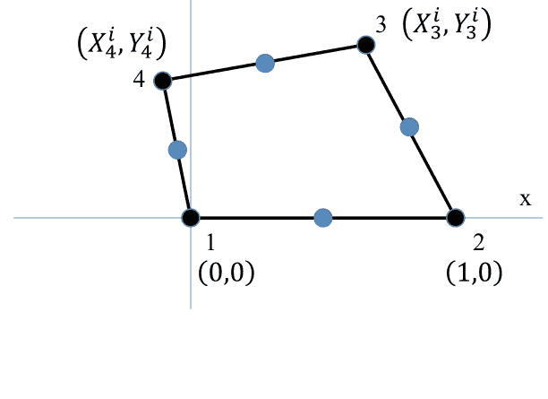

位移(i) = {Ū₁ⁱ, ⋯, Ū₈ⁱ, Ṽ₁ⁱ, ⋯, Ṽ₈ⁱ} (8.1.27)

接下来，通过使用为每个元素创建的参考模型进行有限元分析计算原始元素的积分点处的应变的准确值集合，该参考模型被假设为将原始元素分割成50 ×50个一阶四边形元素的有限元模型。每个轴上的积分点数设置为三个，或每个元素设置为九个。

应变(i)，每个积分点由三个值组成，定义为

应变(i) = {¹ ε̂ₓⁱ, ¹ ε̂ᵧⁱ, ¹ γ̂ₓᵧⁱ, ² ε̂ₓⁱ, ² ε̂ᵧⁱ, ² γ̂ₓᵧⁱ, ⋯, ⁹ ε̂ₓⁱ, ⁹ ε̂ᵧⁱ, ⁹ γ̂ₓᵧⁱ} (8.1.28)

其中，左上角的上标表示积分点的数量，右上角的上标表示元素设置的数量。

因此，对于每个元素，得到一组数据{形状(i), 泊松比(i), 位移(i), 应变(i)}。我们生成30万组数据作为训练模式，并额外生成3万组数据用于验证训练后的网络。

##### 8.1.2.2 训练阶段

在这里，上面收集的数据集被用来构建一个前馈神经网络。作为前馈神经网络的输入数据，使用了元素形状参数和泊松比，即

- 输入数据 : 形状 (i), 泊松比 (i)
- 教师数据 : [^s B] (s = 1, ⋯, 9)

由于每个 [^s B] 有 3 ×14个独立分量，一个教师数据中的参数数量为378。因此，要构建的前馈神经网络应该在输入层有5个单元，在输出层有378个单元。

假设要最小化的误差函数如下:

E = \frac{1}{9 \cdot N} \sum_{i=1}^{N} \sum_{g=1}^{9} w_g \cdot \left( \left| \frac{{}^g \varepsilon_x^i - {}^g \hat{\varepsilon}_x^i}{{}^g \hat{\varepsilon}_x^i} \right| + \left| \frac{{}^g \varepsilon_y^i - {}^g \hat{\varepsilon}_y^i}{{}^g \hat{\varepsilon}_y^i} \right| + \left| \frac{{}^g \gamma_{xy}^i - {}^g \hat{\gamma}_{xy}^i}{{}^g \hat{\gamma}_{xy}^i} \right| \right) \quad (8.1.29)

其中 N是训练模式的数量，在这种情况下为300,000， w_g是数值积分在 g-th 积分点的权重，它是一个常数，由每个轴方向上的权重的乘积给出，而 ^g \hat{\varepsilon}_x^i, ^g \hat{\varepsilon}_y^i 和 ^g \hat{\gamma}_{xy}^i 是由给定的应变参考模型计算得出的准确应变值(i)。 ^g \varepsilon_x^i, ^g \varepsilon_y^i 和 ^g\gamma_{x y} 是由神经网络计算得出的应变值 [^g B] 的输出，而 Disp(i) = {Ū₁ⁱ, ⋯, Ū₈ⁱ, Ṽ₁ⁱ, ⋯, Ṽ₈ⁱ} ，通过

$$\begin{pmatrix} ^g\varepsilon_x^i \\ ^g\varepsilon_y^i \\ ^g\gamma_{xy}^i \end{pmatrix} = [^g B] \begin{pmatrix} \overline{U}_1^i \\ \vdots \\ \overline{U}_8^i \\ \overline{V}_1^i \\ \vdots \\ \overline{V}_8^i \end{pmatrix} \quad (8.1.30)$$

现在，通过误差反向传播算法训练一个前馈神经网络来输出 [^g B]，以便在九个积分点上获得正确的应变值。然后，进行数值积分，使用上述训练过的神经网络输出 [^g B] 来获得准确的单元刚度矩阵。

这里使用的前馈神经网络有五个隐藏层和每个隐藏层378个单元。在每个隐藏层中，使用批归一化（见第1.3.5节），激活函数使用ELU（指数线性单元），其定义为

$$f(x) = \begin{cases} x & (x \ge 0) \\ a(e^x - 1) & (x < 0) \end{cases} \quad (8.1.31)$$

其中 a 是一个正常数。使用了300,000个训练模式和50,000个小批量大小，Adam优化方法（见第2.3.3节）被用作优化方法，将训练轮数设置为30,000。

##### 8.1.2.3 应用阶段

上述训练过的神经网络用于计算具有高精度的新元素的刚度矩阵。该过程总结如下：

1.  标准排列：将新元素转换为标准排列（见第8.1.2.1节）。
2.  计算 [^g_{OUT} B]：使用训练过的神经网络估计 [^g B]，表示为 [^g_{OUT} B]。
3.  计算：由于 [^g_{OUT} B] 是转换为标准配置，将其转换为原始元素的矩阵 [^g_{DL} B]。
4.  计算 [^g_{DL} \overline{B}]：改进 [^g_{DL} B] 通过B-bar方法[7, 19]获得 [^g_{DL} \overline{B}]。
5.  计算 [DL K]: 使用元素刚度矩阵 [DL K]计算 [^g_{DL} B]。

让我们按顺序看每个步骤。

#### 标准排列:

目标元素转换为如图8.4所示的标准排列。首先，将元素的四个角节点按逆时针方向从1到4编号。 请注意，最长边两端的节点分别编号为1和2。 然后，将元素平移，使第一个节点位于原点。

然后，α为元素最长边与x轴正方向逆时针方向之间的角度，将元素绕原点顺时针旋转α。 因此，最长边沿x轴放置。 最后，按比例增加或减小元素尺寸，使最长边的长度调整为1或第二个节点位于(1,0)。

当原始坐标为第i个节点的坐标 X_i = (X_i, Y_i)^T时，通过变换得到的坐标输入 X_i' 为

$$输入 X_i' = \frac{1}{l_{max}} [R(\alpha)]^T (X_i - X_1) \quad (8.1.32)$$

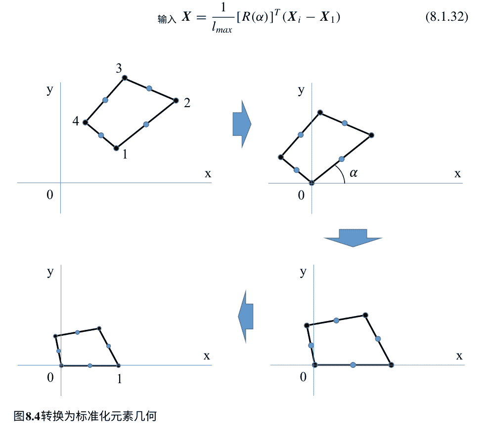

其中 $l_{\text{max}}$ 是最长边的长度，$[R(\alpha)]$ 是表示绕原点逆时针旋转 $\alpha$ 的矩阵，给定为

$$[R(\alpha)] = \left[ \begin{array}{cc} \cos\alpha & -\sin\alpha \\ \sin\alpha & \cos\alpha \end{array} \right] \quad\quad\quad\quad (8.1.33)$$

#### 计算 $[^{g}_{\text{OUT}}B]$：

将输入 $X_3'$，输入 $X_4'$ 和泊松比输入到训练好的神经网络中，$[^{g}_{\text{OUT}}B]$ 在9个积分点处得到。

#### 计算 $[^{g}_{\text{DL}}B]$：

因为 $[^{g}_{\text{OUT}}B]$ 是标准排列中的元素矩阵，应该转换为原始元素的矩阵 $[^{g}_{\text{DL}}B]$ 使用

$$[^{g}_{\text{DL}}B] = \frac{1}{l_{\text{max}}}[T][^{g}_{\text{OUT}}B][Q]^{T} \quad\quad\quad\quad (8.1.34)$$

其中 $[T]$ 是应变的转换矩阵，$[Q]$ 是位移的旋转矩阵（16行16列），分别由以下给出

$$[T] = \left[ \begin{array}{ccc} \cos^2\alpha & \sin^2\alpha & -\sin\alpha\cos\alpha \\ \sin^2\alpha & \cos^2\alpha & \sin\alpha\cos\alpha \\ 2\sin\alpha\cos\alpha & -2\sin\alpha\cos\alpha & \cos^2\alpha - \sin^2\alpha \end{array} \right] \quad\quad\quad\quad (8.1.35)$$

和

$$[Q] = \left[ \begin{array}{cc} \cos\alpha[I] & -\sin\alpha[I] \\ \sin\alpha[I] & \cos\alpha[I] \end{array} \right] \quad\quad\quad\quad (8.1.36)$$

其中 $[I]$ 是8行8列的单位矩阵。

#### 计算 $[^{g}_{\text{DL}}\overline{B}]$：

$[^{g}_{\text{DL}}\overline{B}]$ 使用以下方程式 [19] 计算。

$$[^{g}_{\text{DL}}\overline{B}] = [^{g}_{\text{DL}}B] + [_{\text{DL}}B'] \quad\quad\quad\quad (8.1.37)$$

具有

$$[_{\text{DL}}B'] = \frac{1}{V}\sum_{g=1}^{9} w_g([^{g}_{Q8}B] - [^{g}_{\text{DL}}B]) |[^{g}J]| \quad\quad\quad\quad (8.1.38)$$

其中 $V$ 是元素的体积（在这种情况下是面积），$[^{g}_{Q8}B]$ 是二次四边形元素的标准应变-位移矩阵，而 $[^{g}J]$ 是雅可比矩阵。

#### 计算 $[DL K]$：

最后，元素刚度矩阵可以得到

$$[DL K] = \sum_{g=1}^{9} w_g [\overline{^{g}_{DL}B}]^T [D] [\overline{^{g}_{DL}B}] |^{g}J| \quad (8.1.39)$$

让我们讨论一下这种方法的应用[9]。问题如图8.5所示。测试了元素的划分，包括等分的正方形元素（如图8.6a所示）和包含畸变元素的划分（如图8.6b所示）。结果如图8.7所示，其中横轴是元素尺寸的对数，纵轴是误差的对数。从二次元素的结果可以看出，通过这种方法得到的解（图中的DL8）比在ANSYS中使用的普通元素（Q8）和改进元素（P183）更准确。

图8.5 块问题。从[9]转载，经Elsevier出版社许可

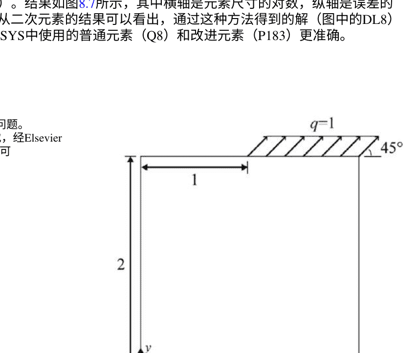

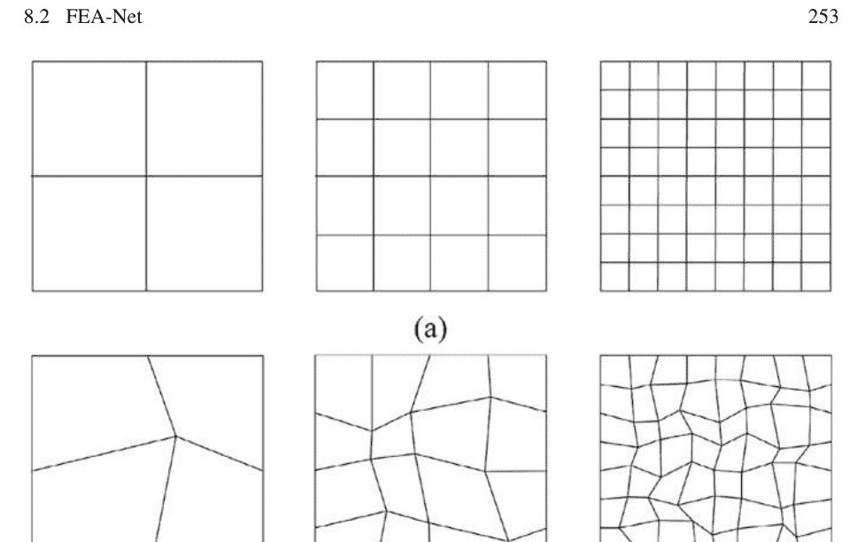

图8.6 用于块问题的网格：a规则网格和 b扭曲网格。从[9]转载，经Elsevier出版社许可

### 8.2 FEA-Net

卷积神经网络是深度学习中最重要的关键技术之一。在本节中，研究了FEA-net [18]，其中有限元方法中的主要操作通过卷积操作表示，并且分析是通过多个卷积层进行的。

#### 8.2.1 使用卷积的有限元分析 (FEA)

首先，我们展示了有限元方法中全局刚度矩阵和位移向量的矩阵-向量乘积如何通过卷积操作表示。

考虑一个二维物体的应力分析，该物体被均匀地分成四边形元素，如图8.8所示。该问题的有限元方法如下：

$$[K]\{U\} = \{f\} \quad (8.2.1)$$其中 \([K]\) 是全局刚度矩阵，\(\{U\}\) 是所有节点的位移向量。

假设第一个阶段的四边形元素的节点向量表示为

$$
\left\{U^{e}\right\}=\left(\begin{array}{c}
U_{1}^{e} \\ V_{1}^{e} \\ \vdots \\ U_{4}^{e} \\ V_{4}^{e}
\end{array}\right),
\tag{8.2.2}
$$

图8.7块问题的收敛曲线：a规则网格和b扭曲网格。转载自[9]，经Elsevier出版社许可

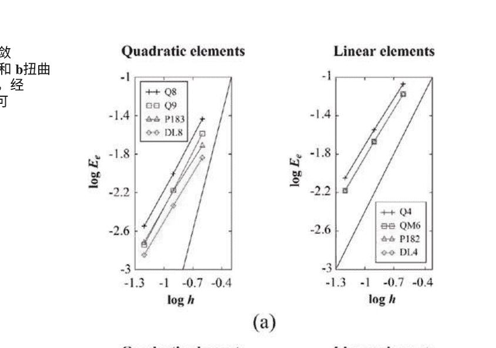

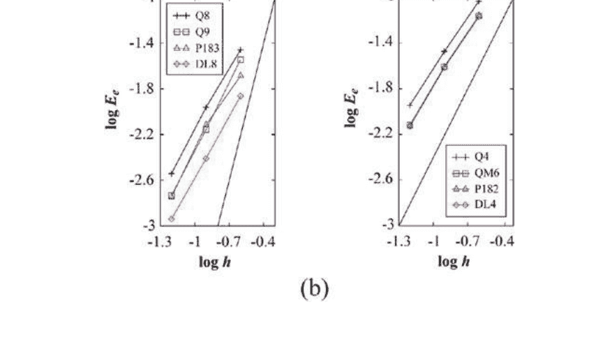

以及元素的刚度矩阵

$$
[k^e] = 
\begin{bmatrix}
k_{11}^e & k_{12}^e & k_{13}^e & k_{14}^e & k_{15}^e & k_{16}^e & k_{17}^e & k_{18}^e \\
k_{21}^e & k_{22}^e & k_{23}^e & k_{24}^e & k_{25}^e & k_{26}^e & k_{27}^e & k_{28}^e \\
k_{31}^e & k_{32}^e & k_{33}^e & k_{34}^e & k_{35}^e & k_{36}^e & k_{37}^e & k_{38}^e \\
k_{41}^e & k_{42}^e & k_{43}^e & k_{44}^e & k_{45}^e & k_{46}^e & k_{47}^e & k_{48}^e \\
k_{51}^e & k_{52}^e & k_{53}^e & k_{54}^e & k_{55}^e & k_{56}^e & k_{57}^e & k_{58}^e \\
k_{61}^e & k_{62}^e & k_{63}^e & k_{64}^e & k_{65}^e & k_{66}^e & k_{67}^e & k_{68}^e \\
k_{71}^e & k_{72}^e & k_{73}^e & k_{74}^e & k_{75}^e & k_{76}^e & k_{77}^e & k_{78}^e \\
k_{81}^e & k_{82}^e & k_{83}^e & k_{84}^e & k_{85}^e & k_{86}^e & k_{87}^e & k_{88}^e
\end{bmatrix}
(8.2.3)
$$

图8.9显示了图8.8的一部分，其中描绘了共享一个节点的四个元素及其元素节点编号。类似地，图8.10显示了二维节点的位置索引。

从这两个图中，给出了二维配置中x方向上的位移\(U_{i,j}\)和每个元素中的位移\(U_{i}^{e}\)之间的关系

图8.9 四个元素共享一个节点

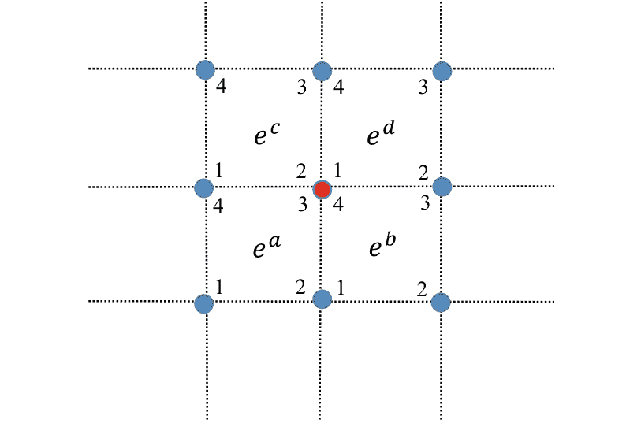

图8.10 二维节点的位置索引

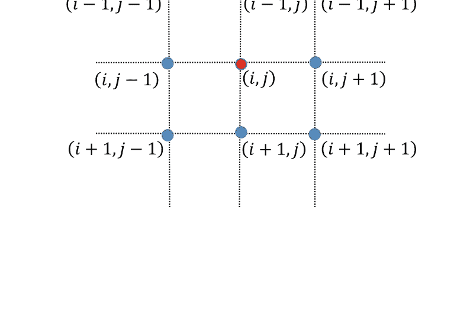

$$
\begin{aligned}
U_{i-1,j-1} &= U_4^e \\
U_{i,j-1} &= U_4^a, U_1^e \\
U_{i+1,j-1} &= U_1^a \\
U_{i-1,j} &= U_3^c, U_4^d \\
U_{i,j} &= U_3^a, U_4^b, U_2^c, U_1^d \\
U_{i+1,j} &= U_2^a, U_1^b \\
U_{i-1,j+1} &= U_3^d \\
U_{i,j+1} &= U_3^b, U_2^d \\
U_{i+1,j+1} &= U_2^b
\end{aligned}
\quad (8.2.4)
$$

类似的关系也适用于y方向的位移\(V_{i,j}\)和每个元素中的位移\(V_i^e\)。

由于全局刚度矩阵由所有元素刚度矩阵\([k^e]\)的和表示，矩阵-向量乘积\([K]\{U\}\)在方程(8.2.1)中可以通过逐个计算\([k^e]\{U^e\}\)的元素并将每个元素的贡献相加来计算。在这里，我们将矩阵-向量乘积\([K]\{U\}\)写为

$$
[K] \begin{pmatrix} \vdots \\ U_{i,j} \\ V_{i,j} \\ \vdots \end{pmatrix} = \begin{pmatrix} \vdots \\ g_{i,j}^U \\ g_{i,j}^V \\ \vdots \end{pmatrix} \quad (8.2.5)
$$

逐元素的矩阵-向量乘积\([k^e]\{U^e\}\)也可以表示为

$$
[k^e]\{U^e\} = \begin{pmatrix} ^1g_u^e \\ ^1g_v^e \\ \vdots \\ ^4g_u^e \\ ^4g_v^e \end{pmatrix} \quad (8.2.6)
$$

然后，根据方程(8.2.2)和(8.2.3)，我们有

$$
\begin{aligned}
g_{i,j}^U &= ^3g_u^a + ^4g_u^b + ^2g_u^c + ^1g_u^d \\
g_{i,j}^V &= ^3g_v^a + ^4g_v^b + ^2g_v^c + ^1g_v^d 
\end{aligned}
\quad (8.2.7)
$$

使用方程（8.2.6）计算右侧每一项的\(g_{i,j}^U\)，并根据节点关系重新排列，得到如下方程。

$$
\begin{aligned}
^{3}g_{u}^{a} &= k_{51}^{a} U_1^a + k_{52}^{a} V_1^a + k_{53}^{a} U_2^a + k_{54}^{a} V_2^a + k_{55}^{a} U_3^a + k_{56}^{a} V_3^a + k_{57}^{a} U_4^a + k_{58}^{a} V_4^a \\
&= k_{51}^{a} U_{i+1,j-1} + k_{52}^{a} V_{i+1,j-1} + k_{53}^{a} U_{i+1,j} + k_{54}^{a} V_{i+1,j} \\
&\quad + k_{55}^{a} U_{i,j} + k_{56}^{a} V_{i,j} + k_{57}^{a} U_{i,j-1} + k_{58}^{a} V_{i,j-1} 
\end{aligned}
\quad (8.2.8)
$$

$$
\begin{aligned}
^{4}g_{u}^{b} &= k_{71}^{b} U_{1}^{b} + k_{72}^{b} V_{1}^{b} + k_{73}^{b} U_{2}^{b} + k_{74}^{b} V_{2}^{b} + k_{75}^{b} U_{3}^{b} + k_{76}^{b} V_{3}^{b} + k_{77}^{b} U_{4}^{b} + k_{78}^{b} V_{4}^{b} \\
&= k_{71}^{b} U_{i+1,j} + k_{72}^{b} V_{i+1,j} + k_{73}^{b} U_{i+1,j+1} + k_{74}^{b} V_{i+1,j+1} + k_{75}^{b} U_{i,j+1} \\
&\quad + k_{76}^{b} V_{i,j+1} + k_{77}^{b} U_{i,j} + k_{78}^{b} V_{i,j}
\end{aligned}
\tag{8.2.9}
$$

$$
\begin{aligned}
^{2}g_{u}^{c} &= k_{31}^{c} U_{1}^{c} + k_{32}^{c} V_{1}^{c} + k_{33}^{c} U_{2}^{c} + k_{34}^{c} V_{2}^{c} + k_{35}^{c} U_{3}^{c} + k_{36}^{c} V_{3}^{c} + k_{37}^{c} U_{4}^{c} + k_{38}^{c} V_{4}^{c} \\
&= k_{31}^{c} U_{i,j-1} + k_{32}^{c} V_{i,j-1} + k_{33}^{c} U_{i,j} + k_{34}^{c} V_{i,j} + k_{35}^{c} U_{i-1,j} + k_{36}^{c} V_{i-1,j} \\
&\quad + k_{37}^{c} U_{i-1,j-1} + k_{38}^{c} V_{i-1,j-1}
\end{aligned}
\tag{8.2.10}
$$

$$
\begin{aligned}
^{1}g_{u}^{d} &= k_{11}^{d} U_{1}^{d} + k_{12}^{d} V_{1}^{d} + k_{13}^{d} U_{2}^{d} + k_{14}^{d} V_{2}^{d} + k_{15}^{d} U_{3}^{d} + k_{16}^{d} V_{3}^{d} + k_{17}^{d} U_{4}^{d} + k_{18}^{d} V_{4}^{d} \\
&= k_{11}^{d} U_{i,j} + k_{12}^{d} V_{i,j} + k_{13}^{d} U_{i,j+1} + k_{14}^{d} V_{i,j+1} + k_{15}^{d} U_{i-1,j+1} \\
&\quad + k_{16}^{d} V_{i-1,j+1} + k_{17}^{d} U_{i-1,j} + k_{18}^{d} V_{i-1,j}
\end{aligned}
\tag{8.2.11}
$$

将方程(8.2.8)到(8.2.11)相加并通过 \(U_{i,j}\) 和 \(V_{i,j}\) 重新排列，\(g_{i,j}^{U}\) 可以表示为

$$
\begin{aligned}
g_{i,j}^{U} &= k_{37}^{c} U_{i-1,j-1} + (k_{35}^{c} + k_{17}^{d}) U_{i-1,j} + k_{15}^{d} U_{i-1,j+1} + (k_{57}^{a} + k_{31}^{c}) U_{i,j-1} \\
&\quad + (k_{55}^{a} + k_{77}^{b} + k_{33}^{c} + k_{11}^{d}) U_{i,j} + (k_{75}^{b} + k_{13}^{d}) U_{i,j+1} \\
&\quad + k_{51}^{a} U_{i+1,j-1} + (k_{53}^{a} + k_{71}^{b}) U_{i+1,j} + k_{73}^{b} U_{i+1,j+1} \\
&\quad + k_{38}^{c} V_{i-1,j-1} + (k_{36}^{c} + k_{18}^{d}) V_{i-1,j} + k_{16}^{d} V_{i-1,j+1} + (k_{58}^{a} + k_{32}^{c}) V_{i,j-1} \\
&\quad + (k_{56}^{a} + k_{78}^{b} + k_{34}^{c} + k_{12}^{d}) V_{i,j} + (k_{76}^{b} + k_{14}^{d}) V_{i,j+1} \\
&\quad + k_{52}^{a} V_{i+1,j-1} + (k_{54}^{a} + k_{72}^{b}) V_{i+1,j} + k_{74}^{b} V_{i+1,j+1}
\end{aligned}
\tag{8.2.12}
$$

方程式(8.2.12)进一步重排为

$$
g_{i,j}^{U} = [W_{U}^{U}] \circledast \begin{bmatrix} U_{i-1,j-1} & U_{i-1,j} & U_{i-1,j+1} \\ U_{i,j-1} & U_{i,j} & U_{i,j+1} \\ U_{i+1,j-1} & U_{i+1,j} & U_{i+1,j+1} \end{bmatrix} + [W_{V}^{U}] \circledast \begin{bmatrix} V_{i-1,j-1} & V_{i-1,j} & V_{i-1,j+1} \\ V_{i,j-1} & V_{i,j} & V_{i,j+1} \\ V_{i+1,j-1} & V_{i+1,j} & V_{i+1,j+1} \end{bmatrix}
\tag{8.2.13}
$$

其中 \([W_{U}^{U}]\) 和 \([W_{V}^{U}]\) 分别给出如下：

$$
[W_{U}^{U}] = \begin{bmatrix} k_{37} & k_{35} + k_{17} & k_{15} \\ k_{57} + k_{31} & k_{55} + k_{77} + k_{33} + k_{11} & k_{75} + k_{13} \\ k_{51} & k_{53} + k_{71} & k_{73} \end{bmatrix}
\tag{8.2.14}
$$

$$
[W_{V}^{U}] = \begin{bmatrix} k_{38} & k_{36} + k_{18} & k_{16} \\ k_{58} + k_{32} & k_{56} + k_{78} + k_{34} + k_{12} & k_{76} + k_{14} \\ k_{52} & k_{54} + k_{72} & k_{74} \end{bmatrix}
\tag{8.2.15}
$$

并且 \(\circledast\) 表示卷积运算，其定义如下

$$
\begin{bmatrix} a_{11} & a_{12} & a_{13} \\ a_{21} & a_{22} & a_{23} \\ a_{31} & a_{32} & a_{33} \end{bmatrix} \circledast \begin{bmatrix} b_{11} & b_{12} & b_{13} \\ b_{21} & b_{22} & b_{23} \\ b_{31} & b_{32} & b_{33} \end{bmatrix} = \sum_{i=1}^{3} \sum_{j=1}^{3} a_{ij}b_{ij}
\tag{8.2.16}
$$

请注意，在等分网格中，每个单元的元素刚度矩阵相同，因此在方程（8.2.14）和（8.2.15）中省略了单元编号的上标。

同样，\(g_{i, j}^{V}\) 可以用以下方程表示。

$$
g_{i, j}^{V} = [W_{U}^{V}] \circledast \begin{bmatrix} U_{i-1, j-1} & U_{i-1, j} & U_{i-1, j+1} \\ U_{i, j-1} & U_{i, j} & U_{i, j+1} \\ U_{i+1, j-1} & U_{i+1, j} & U_{i+1, j+1} \end{bmatrix} + [W_{V}^{V}] \circledast \begin{bmatrix} V_{i-1, j-1} & V_{i-1, j} & V_{i-1, j+1} \\ V_{i, j-1} & V_{i, j} & V_{i, j+1} \\ V_{i+1, j-1} & V_{i+1, j} & V_{i+1, j+1} \end{bmatrix}
\tag{8.2.17}
$$

其中 \([W_{U}^{V}]\) 和 \([W_{V}^{V}]\) 分别给出如下

$$
[W_{U}^{V}] = \begin{bmatrix} k_{47} & k_{45} + k_{27} & k_{25} \\ k_{67} + k_{41} & k_{65} + k_{87} + k_{43} + k_{21} & k_{85} + k_{23} \\ k_{61} & k_{63} + k_{81} & k_{83} \end{bmatrix}
\tag{8.2.18}
$$

$$
[W_{V}^{V}] = \begin{bmatrix} k_{48} & k_{46} + k_{28} & k_{26} \\ k_{68} + k_{42} & k_{66} + k_{88} + k_{44} + k_{22} & k_{86} + k_{24} \\ k_{62} & k_{64} + k_{82} & k_{84} \end{bmatrix}
\tag{8.2.19}
$$

如上所述，在有限元分析中，全局刚度矩阵和节点位移向量\([K]\{U\}\)的矩阵-向量乘积可以通过使用一些 \(3 \times 3\) 矩阵进行卷积运算来计算，例如 \([W_{U}^{U}]\) 作为一个滤波器。在原始文章[18]中，这个卷积运算被称为FEA-卷积。

#### 8.2.2 基于FEA-卷积的FEA-Net

如图8.11所示，有限元法进行的应力分析等效于求解下列同时线性方程。

$$
[K]\{U\} = \{f\}
\tag{8.2.20}
$$

如 \(\{U^{(0)}\}, \{U^{(1)}\}, \{U^{(2)}\}, ...\) 残差 \(\{r^{(n)}\}\) 对于 \(\{U^{(n)}\}\) 定义如下:

$$
\{r^{(n)}\} = \{f\} - [K]\{U^{(n)}\} \tag{8.2.21}
$$

在迭代方法中，雅可比方法被认为是最基本的方法之一[8]，其中系数矩阵\([K]\)被分解为仅对角线的矩阵\([K^{D}]\)和仅非对角线的矩阵\([K^{ND}]\)，如

$$
[K] = [K^{D}] + [K^{ND}] \tag{8.2.22}
$$

将方程 (8.2.22) 代入方程 (8.2.20) ，我们得到

$$
([K^{D}] + [K^{ND}])\{U\} = \{f\} \tag{8.2.23}
$$

根据方程 (8.2.23) ，得到如下的递归公式:

$$
\{U^{(n+1)}\} = [K^{D}]^{-1}(\{f\} - [K^{ND}]\{U^{(n)}\}) \tag{8.2.24}
$$

根据方程 (8.2.21) ，重新排列 (8.2.24) 得到

$$
\{U^{(n+1)}\} = \{U^{(n)}\} + [K^{D}]^{-1}\{r^{(n)}\} \tag{8.2.25}
$$

当方程 (8.2.21) 和 (8.2.25) 迭代时，\(\{U^{(n)}\}\) 将收敛到正确的解。需要注意的是，由于 \([K^{D}]\) 是一个对角矩阵，乘以 \([K^{D}]^{-1}\) 在方程 (8.2.25) 中的是一个简单的除法过程。

在迭代解法中（例如Jacobi方法），方程 (8.2.21) 中的矩阵-向量乘积\([K]\{U^{(n)}\}\) 是计算上最复杂的过程。这可以使用有限元卷积 (FEA-Conv) 来完成，该方法已在第8.2.1节中进行了研究。换句话说，上述迭代解法是一种类似于具有多个卷积层的卷积神经网络 (CNNs) 的卷积运算的重复操作。因此，这个操作在原文[18]中被称为FEA-Net。

FEA-Net的结构如图8.11所示。它可以被看作是一个多层卷积神经网络，右侧向量 \(\{f\}\) 作为输入数据，节点位移向量作为输出数据。

实际的输入和输出数据都是二维图像，具体来说，输出数据是 \(\{U^{(N)}\}\)。实际的输入和输出（并且 \(\{U^{(n)}\}\) 在迭代过程中）由两个图像组成：一个是二维图像，表示x方向的位移，另一个是表示y方向的位移。

由于FEA-Net基本上执行与迭代解法相同的过程，所以它需要与迭代解法中的迭代次数相同的层数。因此，层数比普通的卷积神经网络要大得多。

#### 8.2.3 数值示例

下面展示了在二维应力分析中使用FEA-Net的数值例子。

数据准备阶段：图8.12显示了训练和测试数据。图8.12a给出了训练数据，其中顶部行是作为输入数据的负载图像，中间和底部行是作为教师数据（输出数据）的位移图像。负载图像中的白色区域施加了x方向的负载。训练数据的总数为4。

除了四个训练数据外，还准备了两个与训练数据具有相同分辨率的数据（图8.12b），以及两个分辨率更高的数据（图8.12c）用于验证。

训练阶段：
FEA-Net中的学习不是在整个网络上进行，而是定义为卷积层中的滤波器的优化，这些滤波器是FEA-Net的构建模块。因此，使用输入数据作为位移图像和教师数据作为负载图像训练一个只有一个卷积层的网络，称为FEA-Conv网络。在训练FEA-Conv网络之后，使用获得的滤波器构建FEA-Net。本示例中使用的FEA-Net的层数为5000。

为了比较，还训练了一个由七个卷积层组成的普通CNN，其中使用负载图像作为输入数据，两个位移图像作为教师数据。

应用阶段：图8.13显示了使用训练过的FEA-Net和用于比较的训练过的CNN对验证数据的估计结果。普通有限元分析的结果也作为参考响应显示出来。可以看出，FEA-Net比普通CNN更准确地估计了位移场。

### 8.3 离散化网络

在第7章中，研究了使用深度学习预测非稳定流场的方法。在本节中，将深度学习应用于流场的另一个例子是DiscretizationNet [13]，这是一种新的深度学习模型（第1.3.7节）应用于流体分析的方法。

#### 8.3.1 基于条件变分自编码器的离散化网络

连续方程和Navier-Stokes方程（无量纲）稳态流场分别可以写成如下形式：

| loading | FCN prediction | FEA-Net prediction | Reference response |
| :---: | :---: | :---: | :---: |
|  |   |   |   |
|  |   |   |   |
|  |   |   |   |
|  |   |   |   |

$$\nabla \cdot \boldsymbol{v} = 0 \qquad\qquad\qquad\qquad (8.3.1)$$

$$\left(\boldsymbol{v} \cdot \nabla\right) \boldsymbol{v} + \nabla p - \frac{1}{Re} \nabla^2 \boldsymbol{v} = 0 \qquad\qquad (8.3.2)$$

其中 $\boldsymbol{v}$ 和 $p$ 分别是无量纲速度向量和压力，Re是雷诺数。

本节中使用的深度学习模型名为DiscretizationNet [13]，其概念图如图8.14所示。这是条件变分自编码器[10,15]的应用之一，也是生成模型之一。

离散化网络中的训练过程总结如下：

- (T1) 分析域形状的信息用 $h$ 表示，通过水平集方法表示，并且取内部为0，外部为1。图8.15中的几何自编码器在输入 $h$ 时输出 $\hat{h}$，并且通过训练以 $\hat{h} = h$ 来获得压缩信息 $\eta_{h}$ 的重现 $h$。
- (T2) 边界条件的信息用 $b$ 表示，图8.16中的边界自编码器在输入 $b$ 时输出 $\hat{b}$，并且通过训练以重现 $\hat{b} = b$ 来获得压缩信息 $\eta_{b}$。
$\hat{b} = \bar{b}$。边界自编码器对于边界条件在时间和空间上不变的情况下是不必要的。

如果在四边形区域的每一边设置边界条件，如图8.17所示，并且边界条件在空间和时间上不变，则然后 $\eta_b$ 可以简单地定义为 $\eta_b = \{1, 1, 2, 1, 0.3, 1.2, 0.0, 3.0, 40\}$ 例如，其中最后一个值40是雷诺数。

- (T3) 速度向量和压力 $u, v, w$ 和 $p$ 用随机数初始化。
- (T4) $\bar{u}, \bar{v}, \bar{w}$ 和 $p$ 被输入到CNN编码器中，得到压缩信息 $\eta_o$
- (T5) $\eta_h, \eta_b$ 和 $\eta$ 是输入到CNN解码器的，$\hat{u}, \hat{v}, \hat{w}$ 和 $\hat{p}$ 是输出的。
- (T6) 使用 $\hat{u}, \hat{v}, \hat{w}, \hat{p}, \bar{h}$ 和 $\bar{b}$, 计算残差 $L_{\text{train}}$ 在方程(8.3.1)和(8.3.2)中。如果 $\hat{u}, \hat{v}, \hat{w}$ 和 $\hat{p}$ 是正确的，残差将为零。残差 $L_{\text{train}}$ 由以下方程表示。
   $L_{\text{train}} = \| R_C \| + \| R_u \| + \| R_v \| + \| R_w \| \quad (8.3.3)$
   其中 $R_C$ 是连续性方程(Eq. (8.3.1))的残差，$R_u, R_v$ 和 $R_w$ 分别是Navier-Stokes方程(Eq. 8.3.2)的残差。
- (T7) 如果 $L_{\text{train}}$ 足够小，跳到退出。否则，跳到(T8)。
- (T8) 编码器和解码器的参数通过误差反向传播算法进行更新，以最小化 $L_{\text{train}}$。
- (T9) 使用 $\hat{u} \rightarrow u, \hat{v} \rightarrow v, \hat{w} \rightarrow w$ 和 $\hat{p} \rightarrow p$，跳到(T4)。

在上述过程中，$\hat{u} = \bar{u}, \hat{v} = \bar{v}, \hat{w} = \bar{w}$，且 $\hat{p} = \bar{p}$ 在收敛时保持不变，这是自编码器的行为，其中输入和输出相同。训练完成后，我们将训练好的离散化网络应用于新的边界条件和分析域的几何形状，如下所示（图8.18）：

- (A1) 新分析域的几何形状 $h_{w}^{\mathrm{NEW}}$ 被输入到几何编码器中以获取压缩信息 $\eta_{h}^{\mathrm{NEW}}$。同样，新的边界条件 $\bar{b}_{b}^{\mathrm{NEW}}$ 被输入到边界编码器中以获取压缩信息 $\eta_{b}^{\mathrm{NEW}}$。
- (A2) 新分析中解的压缩信息 $\eta^{\mathrm{NEW}}$ 被随机数初始化。
- (A3) $\eta_{h}^{\mathrm{NEW}}$, $\eta_{b}^{\mathrm{NEW}}$ 和 $\eta^{\mathrm{NEW}}$ 被输入到经过训练的离散化网络的CNN解码器中，得到 $\hat{u}^{\mathrm{NEW}}, \hat{v}^{\mathrm{NEW}}, \hat{w}^{\mathrm{NEW}}$ 和 $\hat{p}^{\mathrm{NEW}}$ 作为输出。
- (A4) $\hat{u}^{\mathrm{NEW}}, \hat{v}^{\mathrm{NEW}}, \hat{w}^{\mathrm{NEW}}$ 和 $\hat{p}^{\mathrm{NEW}}$ 被输入到经过训练的离散化网络的CNN编码器中，得到 $\hat{\eta}^{\mathrm{NEW}}$ 作为输出。
- (A5) 使用 $\hat{\eta}^{\mathrm{NEW}}$ 和 $\eta^{\mathrm{NEW}}$ 计算残差 $L_{\mathrm{Appli}}$，其定义为 $L_{\mathrm{Appli}} = \left\| \hat{\eta}^{\mathrm{NEW}} - \eta^{\mathrm{NEW}} \right\|$ (8.3.4)
- (A6) 如果 $L_{\mathrm{Appli}}$ 足够小，则使用训练好的CNN解码器的输出 $\hat{u}^{\mathrm{NEW}}$, $\hat{v}^{\mathrm{NEW}}$, $\hat{w}^{\mathrm{NEW}}$ 和 $\hat{p}^{\mathrm{NEW}}$ 作为 $\eta_{h}^{\mathrm{NEW}}$, $\eta_{b}^{\mathrm{NEW}}$ 的输出。否则，转到 (A7)
- (A7) 返回 (A3)，其中 $\hat{\eta}^{\mathrm{NEW}} \rightarrow \eta^{\mathrm{NEW}}$

注意 $\eta_{h}^{\mathrm{NEW}}$, $\eta_{b}^{\mathrm{NEW}}$ 并且在从 (A3) 到 (A7) 的过程中，DiscretizationNet的CNN编码器和解码器的参数是固定的。还要注意，从 (A3) 到 (A7) 的迭代对于经过良好训练的DiscretizationNet将在10次迭代内收敛[13]。

#### 8.3.2 数值示例

这里对DiscretizationNet进行了数值测试。图8.19显示了分析目标，从左到右分析了流场，并且圆柱体作为障碍物。边界条件是入口处的流速和出口处的压力。尽管在第7章中已经处理了类似的流场，那里的分析侧重于由于高雷诺数而产生的非稳态湍流现象，而本分析侧重于由于低雷诺数而产生的层流流动现象的稳态分析。图中的元素数量是用于比较的有限体积法[2,6]的数量。

数据准备阶段：
对于五个不同的入口速度（0.2、0.4、0.6、0.8和1.0）和三个不同的雷诺数（10、20和40），进行比较分析。

训练阶段：
通过上述的训练（T1）至（T9），构建了一个单一的离散化网络，用于15个入口速度（0.2、0.4、0.6、0.8和1.0）和雷诺数（10、20和40）的组合。

这里构建的离散化网络包括三个卷积层，用于CNN编码器和CNN解码器，每个卷积层使用64个滤波器。训练时设置了30,000个训练周期，并使用GPU（NVIDIA Tesla V100 SXM2）进行训练。

经过训练的离散化网络在所有15个条件下被认为能够给出与比较分析（使用ANSYS Fluent R19.3）相当的好结果。

应用阶段：
训练好的离散化网络应用于训练数据中未包含的新边界条件，其中速度入口设置为0.5，雷诺数从10、20和40中选择。对于这些新的边界条件，从（A1）到（A7）的推理过程用于获得流场。

结果如图8.20所示，左列是通过离散化网络估计的速度场结果，中列是使用ANSYS Fluent计算得到的结果，右列是离散化网络估计误差（与ANSYS结果的差异）。可以得出结论，离散化网络的估计非常准确。

### 8.4 有限元分析的缩放方法

众所周知，对于复合材料如CFRP（碳纤维增强塑料复合材料），考虑到材料中的纤维和树脂进行损伤分析会导致非常大规模的计算。

为了解决这个问题，发展了缩放方法[5, 11]，其中整个分析域使用粗网格进行分析，而感兴趣的部分使用细网格进行分析，利用粗分析的结果作为边界条件。通过使用上述方法，预计可以减少总的计算负荷。本节讨论了一种通过深度学习改进缩放方法精度的新方法。

#### 8.4.1 使用神经网络进行有限元分析的缩放方法

缩放方法的示意图如图8.21所示，原始分析几何形状在应力集中的角部有圆角，一个能够准确重现圆角部分的网格称为全局细模型。由于全局细模型的计算负荷非常高，原始分析几何形状被分为两部分以减少计算负荷：全局粗模型和局部细模型。

在全局粗模型中，分析域被大尺寸元素划分，不考虑圆角区域，并使用简化的材料模型。另一方面，在局部细模型中，只有圆角及其附近被细小元素划分，并使用详细的材料模型。首先，对全局粗模型进行分析，然后使用其结果（位移）作为边界条件，对局部细模型进行分析以获得解决方案。

在使用全局粗模型分析的结果（位移）作为局部精细模型分析的边界条件时，仍然存在一个需要考虑的问题，如下所讨论。图8.22显示了局部精细模型周围的区域。全局粗模型的每个节点的位移是通过对全局粗模型进行分析得到的。在缩放方法中，位移被用作局部精细模型边界节点上的边界条件（位移）。

如果局部精细模型的节点位于全局粗模型的边缘或内部，则可以使用全局粗模型的基函数进行插值来获得局部精细模型的节点位移。然而，如图8.22所示，局部精细模型的一些节点存在于全局粗模型之外，在这些节点处无法通过使用全局粗模型的基函数进行插值来获得位移。

对于全局粗模型之外的本地细模型的每个节点，将搜索其最近的全局粗模型元素，并通过使用元素节点的位移进行外推来获得节点的位移元素的基函数。但是，已知这种方法会降低本地细模型中使用的外推位移的准确性。

为了解决这个问题，提出了一种使用前馈神经网络估计全局粗模型之外的本地细模型节点的节点位移的方法[17]。

上述使用前馈神经网络的缩放方法包括以下三个阶段。

数据准备阶段：对于给定的分析条件，使用全局粗模型进行有限元分析。从全局粗模型的第i个节点的每个分析结果中，该节点位于本地细模型区域内，得到一对节点坐标 $ (X_i^G, Y_i^G, Z_i^G) $ 和节点位移 $ (U_i^G, V_i^G, W_i^G) $，即 $ \{(X_i^G, Y_i^G, Z_i^G), (U_i^G, V_i^G, W_i^G)\} $，被获得。通过这种方式，收集了大量的数据对。

训练阶段：在数据准备阶段收集的数据对用于训练前馈神经网络，其中神经网络的输入和教师数据设置如下：输入数据：$ (X_i^G, Y_i^G, Z_i^G) $ 教师数据：$ (U_i^G, V_i^G, W_i^G) $

应用阶段：本地细模型中节点的坐标 $ (X_i^L, Y_i^L, Z_i^L) $ 被输入到训练好的前馈神经网络中，得到节点的位移 $ (U_i^L, V_i^L, W_i^L) $ 在节点上获得输出，然后使用这些作为边界条件分析局部细模型。

#### 8.4.2 数值示例

这里展示了一个数值例子来验证上述方法的有效性。图8.23显示了分析域，其中测试了十种不同尺寸的圆角（R=0.1,0.2,…,1.0）。材料模型是各向同性弹性体，使用一阶六面体单元。全局粗模型中元素的尺寸为0.5毫米，局部细模型的尺寸为0.2毫米。

数据准备阶段：通过使用全局粗模型进行分析，在包含局部细模型的区域内计算了1729个节点的节点位移，并获得了1,729个数据。

成对 $\{(X_i^G, Y_i^G, Z_i^G), (U_i^G, V_i^G, W_i^G)\}$ 被获得。其中，70%用作训练数据，其余用作验证泛化能力的数据。

## 训练阶段：

在数据准备阶段收集的训练数据用于训练前馈神经网络。所采用的前馈神经网络结构如下：

- 输入层：3个单元用于 $(X_i^G, Y_i^G, Z_i^G)$。
- 隐藏层：测试了几种结构：1、2、3、4或5层，每个隐藏层有10、50和100个单元。
- 输出层：3个单元用于 $(U_i^G, V_i^G, W_i^G)$。

图8.24显示了训练结果。水平轴表示隐藏层中的层数，垂直轴表示验证数据的误差。从图中可以看出，使用三个带有ReLU函数的隐藏层时误差最低。

## 应用阶段：

训练有三个隐藏层和ReLU作为激活函数的前馈神经网络被用来确定局部细模型的边界条件（位移）。通过对局部细模型的分析得到的von Mises应力值来评估该方法的性能。 von Mises应力是强度分析中经常使用的指标，其计算公式如下[1, 14]:

$$
\sigma_{\text{Mises}} = \sqrt{\frac{1}{2} \{ (\sigma_{xx} - \sigma_{yy})^2 + (\sigma_{yy} - \sigma_{zz})^2 + (\sigma_{zz} - \sigma_{xx})^2 + 6(\tau_{xy}^2 + \tau_{yz}^2 + \tau_{zx}^2) \}}
$$

首先，通过缩放方法使用前馈神经网络计算von Mises应力值，具体步骤如下：

(A1) 输入坐标 $(X_i^L, Y_i^L, Z_i^L)$ 将局部细模型的外围节点的输出传递给训练好的神经网络，并将其作为局部细模型的边界条件（固定位移） $(U_i^L, V_i^L, W_i^L)$ 神经网络的输出作为局部细模型的边界条件（固定位移）。

对局部细模型进行分析，并计算每个节点的von Mises应力。

计算得到的von Mises应力中的最大值（将其设置为 $σ_{\text{Mises}}^A$）。

为了比较，还可以通过以下另一种方法计算von Mises应力的最大值：

$(X_i^L, Y_i^L, Z_i^L)$ 将局部细模型的外围节点的坐标与全局粗模型中的最近元素进行匹配，并利用全局粗模型的形状（基函数）对元素节点的位移进行外推 $(U_i^L, V_i^L, W_i^L)$ 将外推得到的位移作为局部细模型的边界条件（固定位移）。

(B2) 对局部细模型进行分析，并计算局部细模型每个节点的von Mises应力。

(B3) 在计算的von Mises应力中找到最大值，并将其设置为（作为 $σ_{\text{Mises}}^B$）。

此外，通过以下另一个过程计算von Mises应力的最大值：

- (C1) 创建一个全局细模型，将包括圆角在内的整个区域划分为与局部细模型相同的细度元素。
- (C2) 对上述全局细模型进行分析，并计算与局部细模型相同区域的每个节点的von Mises应力。
- (C3) 在计算的Mises应力中找到最大值，并将其设置为σ^C_Mises。这个值被认为接近正确值。

从三个von Mises应力值σ^A_Mises, σ^B_Mises和σ^C_Mises的比较中评估了本方法的性能。

图8.25显示了不同曲率半径的圆角的结果。水平轴是圆角的曲率半径，垂直轴是最大的von Mises应力值。结果清楚地显示σ^C_Mises ≈ σ^A_Mises < σ^B_Mises，这表明使用前馈神经网络的缩放方法比基于形状（基函数）的方法更准确。

使用这种方法，成功地进行了超过5000万自由度的大规模CFRP强度分析[17]。此外，还尝试使用前馈神经网络直接估计圆角处的应力[16]。

## 8.5 物理约束神经网络

在本节中，将讨论物理信息神经网络[12]（见第2.4.3节）在固体力学中的逆分析和代理模型的应用。

#### 8.5.1 物理信息神经网络在固体力学中的应用

考虑一个固体的二维应力分析。给出了二维应力分析的基本方程，包括位移 u (x, y) 、 v (x, y) 、应变 εx (x, y) 、 εy (x, y) 、 γxy (x, y) 、应力 σx (x, y) 、 σy (x, y) 、 τxy (x, y) 、体积力 fx (x, y) 、 fy (x, y) 、外部载荷 Tx (x, y) 和 Ty (x, y) ，如下所示：

在区域Ω中的力平衡方程：

$$
\begin{cases} 
\frac{\partial \sigma_x}{\partial x} + \frac{\partial \tau_{xy}}{\partial y} + \bar{f}_x = 0 \\ 
\frac{\partial \tau_{xy}}{\partial x} + \frac{\partial \sigma_y}{\partial y} + \bar{f}_y = 0 
\end{cases} \quad (8.5.1)
$$

在负载边界上的力平衡方程 Γσ：

$$
\begin{cases} 
\sigma_x n_x + \tau_{xy} n_y = \overline{T}_x \\ 
\tau_{xy} n_x + \sigma_y n_y = \overline{T}_y 
\end{cases} \quad \text{在} \ \Gamma_\sigma \quad (8.5.2)
$$

在固定边界上的位移方程 Γu：

$$
\begin{cases} 
u = \overline{u} \\ 
v = \overline{v} 
\end{cases} \quad \text{在} \ \Gamma_u \quad (8.5.3)
$$

应变-位移方程：

$$
\begin{pmatrix} 
\varepsilon_x \\ 
\varepsilon_y \\ 
\gamma_{xy} 
\end{pmatrix} = 
\begin{bmatrix} 
\frac{\partial}{\partial x} & 0 \\ 
0 & \frac{\partial}{\partial y} \\ 
\frac{\partial}{\partial y} & \frac{\partial}{\partial x} 
\end{bmatrix} 
\begin{pmatrix} 
u \\ 
v 
\end{pmatrix} \quad (8.5.4)
$$

应力-应变方程（弹性体的本构方程）：

$$
\begin{pmatrix} 
\sigma_x \\ 
\sigma_y \\ 
\tau_{xy} 
\end{pmatrix} = 
\begin{bmatrix} 
\lambda + 2\mu & \lambda & 0 \\ 
\lambda & \lambda + 2\mu & 0 \\ 
0 & 0 & \mu 
\end{bmatrix} 
\begin{pmatrix} 
\varepsilon_x \\ 
\varepsilon_y \\ 
\gamma_{xy} 
\end{pmatrix} \quad (8.5.5)
$$

其中 λ 和 μ 是拉梅常数，它们与杨氏模量 E 和泊松比 ν 之间有以下关系。

$$
E = \frac{\mu(3\lambda + 2\mu)}{\lambda + \mu}, \quad \nu = \frac{\lambda}{2(\lambda + \mu)}
$$

现在，考虑如图8.26所示的分析域和边界条件[4]。外部载荷如下所示：

$$
\overline{T}_x(x, y) = 0 \quad (\text{在 } \Gamma_\sigma \text{上})
$$

$$
\overline{T}_y(x, y) = \begin{cases} 
(\lambda + 2\mu) Q \sin(\pi x) & \text{在 } y = 1 \text{时} \\ 
0 & \text{(其他地方)} 
\end{cases}
$$

而且体力是

$$
\overline{f}_x(x, y) = \lambda \left\{4\pi^2 \cos(2\pi x) \sin(\pi y) - \pi \cos(\pi x) Q y^3\right\} + \mu \left\{9\pi^2 \cos(2\pi x) \sin(\pi y) - \pi \cos(\pi x) Q y^3\right\}
$$

$$
\overline{f}_y(x, y) = \lambda \left\{-3 \sin(\pi x) Q y^2 + 2\pi^2 \sin(2\pi x) \cos(\pi y)\right\} + \mu \left\{-6 \sin(\pi x) Q y^2 + 2\pi^2 \sin(2\pi x) \cos(\pi y) + \frac{1}{4} \pi^2 \sin(\pi x) Q y^4\right\}
$$

上述问题的解析解被称为

$u(x, y) = \cos(2\pi x) \sin(\pi y)$ (8.5.11)

$v(x, y) = \frac{1}{4} \sin(\pi x) Q y^4$ (8.5.12)

图8.27展示了 $\lambda = 1.0$ , $\mu = 0.5$和 $Q = 4.0$的解.在分析域中准备大量采样点，并计算坐标 $x^*$和 $y^*$, 位移 $u^*$和 $v^*$, 以及应力 $\sigma_x^*$, $\sigma_y^*$和 $\tau_{xy}^*$,在每个采样点上。 以这种方式获得的数据，构建一个物理信息感知的神经网络如下[4]:

- 输入数据: 采样点内的坐标， $x^*$和 $y^*$。
- 教师数据: 位移 $u^*$和 $v^*$以及应力 $\sigma_x^*$, $\sigma_y^*$和 $\tau_{xy}^*$在采样点处。

图8.27 参数值为 $\lambda = 1.0$, $\mu = 0.5$, $Q = 4.0$的解。转载自[4]，经Elsevier出版社许可

对于普通神经网络的误差 $\mathcal{L}_1$，对于物理信息神经网络的特定误差 $\mathcal{L}_2$，与平衡方程相关，以及与设置和配置方程相关的误差 $\mathcal{L}_3$，误差函数 $\mathcal{L}$ 被定义为

$$
\mathcal{L} = \mathcal{L}_1 + \mathcal{L}_2 + \mathcal{L}_3 \tag{8.5.13}
$$

其中

$$
\mathcal{L}_1 = \left| u^{NN} - u^* \right| + \left| v^{NN} - v^* \right| + \left| \sigma_x^{NN} - \sigma_x^* \right| + \left| \sigma_y^{NN} - \sigma_y^* \right| + \left| \tau_{xy}^{NN} - \tau_{xy}^* \right| \tag{8.5.14}
$$

$$
\mathcal{L}_2 = \left| \frac{\partial \sigma_x^{NN}}{\partial x} + \frac{\partial \tau_{xy}^{NN}}{\partial y} + f_x^* \right| + \left| \frac{\partial \tau_{xy}^{NN}}{\partial x} + \frac{\partial \sigma_y^{NN}}{\partial y} + f_y^* \right| \tag{8.5.15}
$$

$$
\mathcal{L}_3 = \left| (\lambda + 2\mu)\varepsilon_x^{NN} + \lambda\varepsilon_y^{NN} - \sigma_x^{NN} \right| + \left| (\lambda + 2\mu)\varepsilon_y^{NN} + \lambda\varepsilon_x^{NN} - \sigma_y^{NN} \right| + \left| \mu\gamma_{xy}^{NN} - \tau_{xy}^{NN} \right| \tag{8.5.16}
$$

注意 $()^{NN}$ 表示神经网络的输出，而 $\varepsilon_x^{NN}$，$\varepsilon_y^{NN}$ 和 $\gamma_{xy}^{NN}$ 不是神经网络的输出，而是基于方程（8.5.4）计算出的位移 $u^{NN}$ 和 $v^{NN}$ 的数量

$$
\varepsilon_x^{NN} = \frac{\partial u^{NN}}{\partial x}, \quad \varepsilon_y^{NN} = \frac{\partial v^{NN}}{\partial y}, \quad \gamma_{xy}^{NN} = \frac{\partial u^{NN}}{\partial y} + \frac{\partial v^{NN}}{\partial x} \tag{8.5.17}
$$

方程（8.5.15）和（8.5.17）中出现的导数值是神经网络输出相对于输入值的导数值，这些值是通过深度学习库中实现的自动微分获得的（见第1.3.8节）。如果在采样点上没有高精度的方程（8.5.15）中的 $f_x^*$ 和 $f_y^*$ 的值，则可以根据方程（8.5.1）进行替代计算如下：

$$
f_x^* = -\frac{\partial \sigma_x^*}{\partial x} - \frac{\partial \tau_{xy}^*}{\partial y}
$$

$$
f_y^* = -\frac{\partial \tau_{xy}^*}{\partial x} - \frac{\partial \sigma_y^*}{\partial y} \tag{8.5.18}
$$

可以使用中心差分逼近法（见第7.2节）计算方程（8.5.18）右侧的导数，其中 $\sigma_x^*$, $\sigma_y^*$ 和 $\tau_{xy}^*$.

#### 8.5.2 数值示例

使用基于物理的神经网络对样例问题进行了材料常数 λ 和 μ 的识别（见第8.5.1节[4]）. 这里回顾了他们的一些结果.

数据准备阶段：

在分析域中以网格模式放置100×100个采样点，并计算坐标 x*和 y*，位移 u*和 v*，以及应力 σ_x*, σ_y* 和 τ_xy*，在每个采样点上，其中 λ = 1.0, μ = 0.5 和 Q = 4.0.

训练阶段：

构建了一个如图8.28所示的神经网络。材料常数 λ 和 μ 被视为参数，并通过误差反向传播学习来更新它们的值。

在这里，测试了两种类型的神经网络，如下所示：

- 单一网络：同时输出位移 u^NN 和 v^NN 以及应力 σ_x^NN、σ_y^NN 和 τ_xy^NN 的单一神经网络。
- 独立网络：由五个神经网络组成，每个神经网络输出五个参数之一：两个位移 u^NN 和 v^NN 以及三个应力 σ_x^NN、σ_y^NN 和 τ_xy^NN。

由于后者的网络效果更好，因此采用了它们，并在图8.28中显示了它们的图表。

此外，还测试了多种隐藏层数量和每个隐藏层单元数量的组合，结果显示，5个隐藏层和每个隐藏层50个单元的组合效果相对较好。请注意，此处使用tanh()作为激活函数。

应用阶段：

至于材料常数 λ 和 μ的确定，使用很少的迭代次数得到了正确的值，即λ = 1.0和 μ = 0.5。

还进行了使用有限元解而不是解析解的比较。将分析域划分为40 × 40个单元，测试了使用一阶到四阶的拉格朗日单元的解，对于二阶及更高阶的拉格朗日单元获得了良好的结果。

迁移学习也已经得到评估，并且已经确认，当使用完成训练的神经网络进行λ=1.0和μ=0.5的训练时，它会比从头开始学习更快地收敛（能够估计出正确的μ值），当进行具有不同μ值的模式的训练时。

基于以上结果，另一个基于物理的神经网络已经构建出来。该网络以坐标x*和y*以及材料参数μ作为输入，并输出位移uNN和vNN，以及应力σxNN、σyNN和τxyNN。误差函数与式（8.1.13）中的相同。λ=1.0被视为常数。用于训练的模式分别为四种不同条件，μ=1/4、2/3、3/2和4。

评估训练后神经网络的估计精度，包括未经训练的输入 μ值。结果如图8.29所示。自然地，对于 μ = 1/4, 2/3, 3/2和4，估计的准确度很高，这些值虽然训练模式中没有包含其他 μ 值，但可以看出可接受的估计也可能适用于未在训练中使用的值，这表明物理信息的神经网络可以用作一种代理模型。

### 参考文献

1. Akin, J.E.: 有限元分析与设计. 学术出版社 (1994).
2. Ferziger, J.H., Peric, M.: 流体力学的计算方法 (第二版). Springer (1999).
3. Golub, G.H., Van Loan, C.F.: 矩阵计算 (第三版). 约翰霍普金斯大学出版社 (1996).
4. Haghighat, E., Raissi, M., Moure, A., Gomez, H., Juanes, R.: 一个物理信息的深度学习框架，用于固体力学中的反演和代理建模。计算方法和应用力学工程。 379, 113741 (2021). https://doi.org/10.1016/j.cma.2021.113741.5. Hirai, I., Wang, B.P., Pilkey, W.D.: 一种用于有限元分析的高效缩放方法。 Int. J. Numer. Methods Eng. 20, 1671–1683 (1984).https://doi.org/10.1002/nme.1620200910.
6. Hirsh, C.: 内部和外部流动的数值计算：计算流体力学基础 (第二版)。 Butterworth-Heinemann (2007).
7. Hughes, T.J.R.: 有限元方法：线性静态和动态有限元分析。 Dover (2000).
8. Jennings, A., McKeown, J.J.: 矩阵计算 (第二版)。约翰·威利和儿子 (1992年) 。
9. Jung, J., Yoon, K., Lee, P.-S.: 深度学习有限元。计算方法和应用。机械工程372, 113401 (2020年) 。 https://doi.org/10.1016/j.cma.2020.113401.
10. Kingma, D.P., Rezende, D.J., Mohamed, S., Welling, M.: 带有深度的半监督学习生成模型。高级神经信息处理系统27, 3581-3589 (2014年) 。
11. Mao, K.M., Sun, C.T.: 一种精细的全局局部有限元分析方法。国际数值方法工程学32, 29-43 (1991年) 。 https://doi.org/10.1002/nme.1620320103.12. Raissi, M., Perdikaris, P., Karniadakis, G.E.: 物理信息神经网络：用于求解非线性偏微分方程的正向和反向问题的深度学习框架。计算物理学378, 686-707 (2019年) 。
13. Ranade, R., Hill, C., Pathak, J.: DiscretizationNet: 使用有限体积离散化的基于机器学习的Navier-Stokes方程求解器。计算方法与应用力学。 378, 113722 (2021). https://doi.org/10.1016/j.cma.2021.113722.14. Simo, J.C., Hughes, T.J.R.: 计算非弹性。 Springer (1998).
15. Sohn, K., Lee, H., Yan, X.: 使用深度条件生成模型学习结构化输出表示。高级神经信息处理系统。 28, 3483–3491 (2015).
16. Yamaguchi, T., Okuda, H.: 使用神经网络预测圆角处的应力集中，以实现高效的有限元分析。机械工程通讯. 6, 20–00318 (2020). https://doi.org/10.1299/mej.20-00318.
17. 山口, T., 奥田, H.: 使用神经网络的有限元分析缩放方法。计算结构。 247, 106480 (2021年) 。 https://doi.org/10.1016/j.compstruc.2021.106480.
18. 姚, H., 高, Y., 刘, Y.: FEA-Net: 一种物理引导的数据驱动模型，用于高效机械响应预测。计算方法和应用力学。 363, 112892 (2020年) 。 https://doi.org/10.1016/j.cma.2020.112892.
19. Zienkiewicz, O.C., Taylor, R.L.: 有限元方法 (第5版) 第1卷：基础。Butterworth-Heinemann (2000年) 。

# 第三部分 计算程序

## 第9章
### 计算机编程基础

摘要 在计算机上运行各种程序以实现“深度学习的计算力学”是至关重要的。本章从编程的角度概述了“深度学习的计算力学”。 第9.1节描述了在数据准备阶段使用的计算力学领域中的一些程序，包括在有限元分析中使用数值积分计算元素刚度矩阵（第9.1.1节），表示元素形状的参数（第9.1.2节）和NURBS基函数（第9.1.3节）。第9.2节讨论了在训练阶段使用的深度学习（神经网络）的C和Python程序，其中详细描述了数学公式，以便可以轻松与实际程序进行比较。

### 9.1 数据准备阶段的计算机编程

要进行“深度学习的计算力学”，需要对计算力学以及相关的计算机代码有深入的理解。 在本节中，讨论了以下程序：用于元素积分的程序（第9.1.1节），用于计算表示元素形状的参数的程序（第9.1.2节），这两个程序在第4章中已经讨论过，以及用于计算NURBS基函数的程序（第9.1.3节），该程序在第6章中使用。这里使用的编程语言是C [7, 13]，它是在1970年代开发的，并且在数值计算中仍然被广泛使用[14]。

#### 9.1.1 单元刚度矩阵

有限元方法是一种主要的数值分析方法，由以下三个过程组成：

预处理过程将分析目标划分为元素，
求解器过程用于执行有限元分析，
后处理过程用于可视化分析结果。

求解器由以下两个过程组成：一个元素积分过程 to 构建全局刚度矩阵和用于解决线性方程组的过程。后者在各种数值方法中常用，但前者是有限元方法独有的。在第4章中，研究了元素积分的收敛性质，而元素积分的程序实现在本节中详细介绍。

在本节中，展示了一个计算8节点等参六面体单元的一阶元素刚度矩阵的程序。
如第4章所研究的，元素刚度矩阵 $[k^e]$ 通过对元素 $v^e$ 的积分得到，如下所示：

$$[k^e] = \int_{v^e} [B]^T[D][B] \mathrm{d}v$$ (9.1.1)

其中 $[D]$ 是应力-应变矩阵，$[B]$ 是应变-位移矩阵。这里假设了一个均匀各向同性的弹性材料。
这个积分通常通过高斯-勒让德求积法计算，如下所示 (详见第4章) ：

$$[k^e] \approx \sum_{i=1}^{n} \sum_{j=1}^{m} \sum_{k=1}^{l} \left( [B]^T[D][B] \cdot |J| \right)\Bigg|_{\begin{matrix} \xi=\xi_i \ \eta=\eta_j \ \zeta=\zeta_k \end{matrix}} \cdot H_{i,j,k}$$ (9.1.2)

其中 ($n$, $m$ 和 $l$ 分别是每个轴向积分点的数量，
$\xi_i$, $\eta_j$, $\zeta_k$ 而 $H_{i, j, k}$ 和分别是积分点的坐标和权重。在本节的程序中，为了简化起见，假设 $n = m = l$。

下面是计算8节点等参六面体单元的单元刚度矩阵的函数 `esm3D08()` 的完整源代码，而表9.1总结了主要的变量和数组使用情况。

```
/* esm3D08.c */
void esm3D08(
    int *elem,
    double **node,
    double *mate,
    double **esm,
    int ngauss,
    double *gc,
    double *gw,
    int nfpn)
{
    int i,j,k,ii,jj,kk,counter,necm=6,nnpe=8,kdim=24;
    double e,v,ee,det,coord[8][3],J[3][3],invJ[3][3], [6],
    D[6][6], s, t, u, ra, rs, sa, ss, ua, us, N[8][7], B[6][24], DB[6][24];
    double dtmp, ra2, rs2, ssus, ssua, saus, saua;
```

上述是函数的头部部分。该函数以元素数据elem[]、节点数据node[][]和材料数据mate[]作为输入数据，使用ngauss个积分点在每个轴上进行高斯-勒让德积分，通过计算方程(9.1.2)来输出元素刚度矩阵esm[][]。

节点数据node[][]表示存储整个分析域中所有节点坐标的二维数组。例如，node[20][0]包含全局节点编号为20的节点的X坐标，node[35][2]包含全局节点编号为35的节点的Z坐标。单元数据elem[]包含定义一个单元的八个节点的全局编号。请注意，在有限元方法中通常使用两种节点编号：全局节点编号，它是附加到整个分析域中所有节点的顺序编号，以及单元节点编号，它仅在一个单元中定义。

让我们看一下图9.1，图的左侧是实际空间中的一个单元，每个节点的编号都是全局编号。在高斯-勒让德积分中，将该单元映射到右侧图中的局部坐标空间，进行积分过程。在局部坐标空间中，每个节点从0到7都有一个编号，这是单元编号系统，本程序基于此编号系统。

请注意，元素数据elem[]在esm3D08()中必须满足以下规则：元素中的节点按照节点编号的顺序排列。例如，我们分别展示了图9.1中元素的可接受和不可接受情况如下：

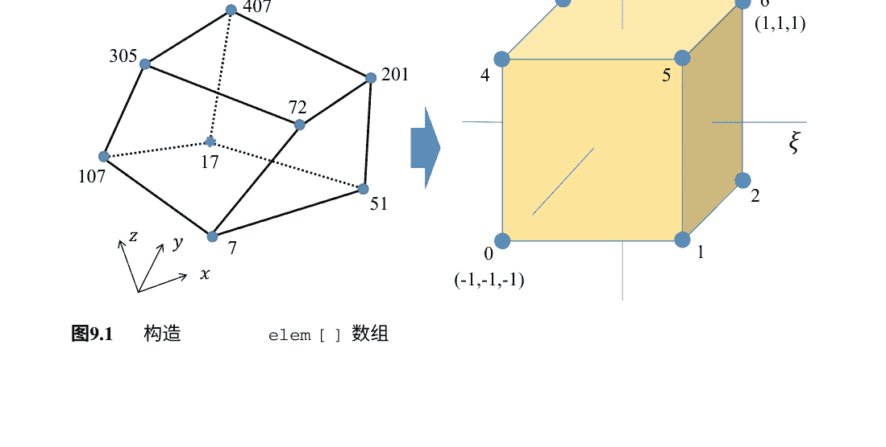

可接受的：

- {7, 17, 51, 72, 107, 201, 305, 407}
- {7, 51, 17, 107, 72, 201, 407, 305}
- {72, 305, 407, 201, 7, 107, 17, 51}
- {72, 201, 51, 7, 305, 407, 17, 107}

不可接受的：

- {7, 17, 51, 72, 107, 201, 305, 407}
- {7, 17, 51, 107, 72, 407, 201, 305}
- {7, 107, 17, 51, 72, 305, 407, 201}

```
c
for(ii=0;ii<kdim;ii++){
    for(jj=0;jj<kdim;jj++) esm[ii][jj] = 0.0;
}

for(i=0;i<nnpe;i++){
    ii = elem[i];
    for(j=0;j<nfpn;j++) coord[i][j] = node[ii][j];
}

for(i=0;i<necm;i++)
    for(j=0;j<kdim;j++) B[i][j] = 0.0;
```

在上面的代码中，使用 node[][] 和 elem[]，仅将属于该元素的 8 个节点的坐标存储在 coord[][] 中，而 esm[][] 和 B[][] 被清零。

```
c
e = mate[0];
v = mate[1];

for(i=0;i<necm;i++)
    for(j=0;j<necm;j++) D[i][j] = 0.0;

ee = e*(1.0 - v)/(1.0 + v)/(1.0 - 2.0*v);
```

```
c
D[0][0] = ee;
D[1][1] = ee;
D[2][2] = ee;
D[3][3] = ee*(1.0 - 2.0*v)/2.0/(1.0 - v);
D[4][4] = D[3][3];
D[5][5] = D[3][3];

D[0][1] = ee*v/(1.0 - v);
D[0][2] = D[0][1];
D[1][2] = D[0][1];

D[1][0] = D[0][1];
D[2][0] = D[0][2];
D[2][1] = D[1][2];
```

此外，三维各向同性弹性材料的应力-应变矩阵[D](D[][])给出了杨氏模量 E和泊松比 v

$$
[D] = \frac{E(1-\nu)}{(1+\nu)(1-2\nu)}
\begin{bmatrix}
1 & \frac{\nu}{1-\nu} & \frac{\nu}{1-\nu} & 0 & 0 & 0\\
\frac{\nu}{1-\nu} & 1 & \frac{\nu}{1-\nu} & 0 & 0 & 0\\
\frac{\nu}{1-\nu} & \frac{\nu}{1-\nu} & 1 & 0 & 0 & 0\\
0 & 0 & 0 & \frac{1-2\nu}{2(1-\nu)} & 0 & 0\\
0 & 0 & 0 & 0 & \frac{1-2\nu}{2(1-\nu)} & 0\\
0 & 0 & 0 & 0 & 0 & \frac{1-2\nu}{2(1-\nu)}
\end{bmatrix}
\quad (9.1.3)
$$

```
c
for(i=0; i<ngauss; i++){
  s = gc[i];
  for(j=0; j<ngauss; j++){
    t = gc[j];
    for(k=0; k<ngauss; k++){
      u = gc[k];
```

这是计算每个积分点在高斯-勒让德积分中依次贡献的三重嵌套循环的起始部分。变量 s,t和 u对应于局部坐标 ξ, η和 ζ。至于 gc[]和 gw[]，例如，当 ngauss为2时，gc[0]和 gc[1]为 -1/√3 和 1/√3分别为 3，并且 gw[0]和 gw[1]都是 1.0。（详见第四章。）

```
c
ra = (1.0 + s) *0.5;
rs = (1.0 - s) *0.5;
sa = (1.0 + t) *0.5;
ss = (1.0 - t) *0.5;
```

```
ua = (1.0 + u)*0.5;
us = (1.0 - u)*0.5;

ssus = ss*us;
saus = sa*us;
ssua = ss*ua;
saua = sa*ua;

N[0][6] = rs*ssus;
N[1][6] = ra*ssus;
N[2][6] = ra*saus;
N[3][6] = rs*saus;
N[4][6] = rs*ssua;
N[5][6] = ra*ssua;
N[6][6] = ra*saua;
N[7][6] = rs*saua;

N[0][0] = -0.5*ssus;
N[1][0] = 0.5*ssus;
N[2][0] = 0.5*saus;
N[3][0] = -0.5*saus;
N[4][0] = -0.5*ssua;
N[5][0] = 0.5*ssua;
N[6][0] = 0.5*saua;
N[7][0] = -0.5*saua;

rs2 = 0.5*rs;
ra2 = 0.5*ra;

N[0][1] = -rs2*us;
N[1][1] = -ra2*us;
N[2][1] = ra2*us;
N[3][1] = rs2*us;
N[4][1] = -rs2*ua;
N[5][1] = -ra2*ua;
N[6][1] = ra2*ua;
N[7][1] = rs2*ua;

N[0][2] = -rs2*ss;
N[1][2] = -ra2*ss;
N[2][2] = -ra2*sa;
N[3][2] = -rs2*sa;
N[4][2] = rs2*ss;
N[5][2] = ra2*ss;
N[6][2] = ra2*sa;
N[7][2] = rs2*sa;
```

在上面的代码中，计算了积分点处基函数的值，其中 N[i][6] 表示基函数 N_i(ξ,η,ζ)的值，其定义如下：

$$ N[0][6] = N_0(\xi, \eta, \zeta) = \frac{1}{8}(1 - \xi)(1 - \eta)(1 - \zeta) \quad (9.1.4) $$

$$ N[1][6] = N_1(\xi, \eta, \zeta) = \frac{1}{8}(1 + \xi)(1 - \eta)(1 - \zeta) \quad (9.1.5) $$

$$ N[2][6] = N_2(\xi, \eta, \zeta) = \frac{1}{8}(1 + \xi)(1 + \eta)(1 - \zeta) \quad (9.1.6) $$

$$ N[3][6] = N_3(\xi, \eta, \zeta) = \frac{1}{8}(1 - \xi)(1 + \eta)(1 - \zeta) \quad (9.1.7) $$

$$ N[4][6] = N_4(\xi, \eta, \zeta) = \frac{1}{8}(1 - \xi)(1 - \eta)(1 + \zeta) \quad (9.1.8) $$

$$ N[5][6] = N_5(\xi, \eta, \zeta) = \frac{1}{8}(1 + \xi)(1 - \eta)(1 + \zeta) \quad (9.1.9) $$

$$ N[6][6] = N_6(\xi, \eta, \zeta) = \frac{1}{8}(1 + \xi)(1 + \eta)(1 + \zeta) \quad (9.1.10) $$

$$ N[7][6] = N_7(\xi, \eta, \zeta) = \frac{1}{8}(1 - \xi)(1 + \eta)(1 + \zeta) \quad (9.1.11) $$

代码中的N[i][0]表示基函数的偏导数值 $N_i(\xi,\eta,\zeta)$相对于 $\xi$的偏导数，定义为

$$ N[0][0] = \frac{\partial N_0(\xi, \eta, \zeta)}{\partial \xi} = -\frac{1}{8}(1 - \eta)(1 - \zeta) \quad (9.1.12) $$

$$ N[1][0] = \frac{\partial N_1(\xi, \eta, \zeta)}{\partial \xi} = \frac{1}{8}(1 - \eta)(1 - \zeta) \quad (9.1.13) $$

$$ N[2][0] = \frac{\partial N_2(\xi, \eta, \zeta)}{\partial \xi} = \frac{1}{8}(1 + \eta)(1 - \zeta) \quad (9.1.14) $$

$$ N[3][0] = \frac{\partial N_3(\xi, \eta, \zeta)}{\partial \xi} = -\frac{1}{8}(1 + \eta)(1 - \zeta) \quad (9.1.15) $$

$$ N[4][0] = \frac{\partial N_4(\xi, \eta, \zeta)}{\partial \xi} = -\frac{1}{8}(1 - \eta)(1 + \zeta) \quad (9.1.16) $$

$$ N[5][0] = \frac{\partial N_5(\xi, \eta, \zeta)}{\partial \xi} = \frac{1}{8}(1 - \eta)(1 + \zeta) \quad (9.1.17) $$

$$ N[6][0] = \frac{\partial N_6(\xi, \eta, \zeta)}{\partial \xi} = \frac{1}{8}(1 + \eta)(1 + \zeta) \quad (9.1.18) $$

$$ N[7][0] = \frac{\partial N_7(\xi, \eta, \zeta)}{\partial \xi} = -\frac{1}{8}(1 + \eta)(1 + \zeta) \quad (9.1.19) $$

代码中的N[i][1]表示基函数的偏导数值 Ni(ξ, η, ζ). 相对于 η的偏导数，定义为

$$ N[0][1] = \frac{\partial N_0(\xi, \eta, \zeta)}{\partial \eta} = -\frac{1}{8}(1 - \xi)(1 - \zeta) \quad (9.1.20) $$

$$ N[1][1] = \frac{\partial N_1(\xi, \eta, \zeta)}{\partial \eta} = -\frac{1}{8}(1 + \xi)(1 - \zeta) \quad (9.1.21) $$

$$ N[2][1] = \frac{\partial N_2(\xi, \eta, \zeta)}{\partial \eta} = \frac{1}{8}(1 + \xi)(1 - \zeta) \quad (9.1.22) $$

$$ N[3][1] = \frac{\partial N_3(\xi, \eta, \zeta)}{\partial \eta} = \frac{1}{8}(1 - \xi)(1 - \zeta) \quad (9.1.23) $$

$$ N[4][1] = \frac{\partial N_4(\xi, \eta, \zeta)}{\partial \eta} = -\frac{1}{8}(1 - \xi)(1 + \zeta) \quad (9.1.24) $$

$$ N[5][1] = \frac{\partial N_5(\xi, \eta, \zeta)}{\partial \eta} = -\frac{1}{8}(1 + \xi)(1 + \zeta) \quad (9.1.25) $$

$$ N[6][1] = \frac{\partial N_6(\xi, \eta, \zeta)}{\partial \eta} = \frac{1}{8}(1 + \xi)(1 + \zeta) \quad (9.1.26) $$

$$ N[7][1] = \frac{\partial N_7(\xi, \eta, \zeta)}{\partial \eta} = \frac{1}{8}(1 - \xi)(1 + \zeta) \quad (9.1.27) $$

而N[i][2]在代码中表示基函数的偏导数值 Ni(ξ,η,ζ)相对于 ξ的偏导数，定义为

$$ N[0][2] = \frac{\partial N_0(\xi, \eta, \zeta)}{\partial \zeta} = -\frac{1}{8}(1 - \xi)(1 - \eta) \quad (9.1.28) $$

$$ N[1][2] = \frac{\partial N_1(\xi, \eta, \zeta)}{\partial \zeta} = -\frac{1}{8}(1 + \xi)(1 - \eta) \quad (9.1.29) $$

$$ N[2][2] = \frac{\partial N_2(\xi, \eta, \zeta)}{\partial \zeta} = -\frac{1}{8}(1 + \xi)(1 + \eta) \quad (9.1.30) $$

$$ N[3][2] = \frac{\partial N_3(\xi, \eta, \zeta)}{\partial \zeta} = -\frac{1}{8}(1 - \xi)(1 + \eta) \quad (9.1.31) $$

$$ N[4][2] = \frac{\partial N_4(\xi, \eta, \zeta)}{\partial \zeta} = \frac{1}{8}(1 - \xi)(1 - \eta) \quad (9.1.32) $$

$$ N[5][2] = \frac{\partial N_5(\xi, \eta, \zeta)}{\partial \zeta} = \frac{1}{8}(1 + \xi)(1 - \eta) \quad (9.1.33) $$

### 表9.1 在esm3D08()中使用的变量和数组

| 变量/数组 | 类型 | 描述 |
| :--- | :--- | :--- |
| elem[i] | int, 1D数组 | 元素的第i个节点的全局节点编号 |
| node[i][j] | double, 2D数组 | 元素的第i个节点的第j个坐标值。该数组包含了分析域中的所有节点 |
| mate[i] | double, 1D数组 | 元素的材料属性。mate[0]: 杨氏模量, mate[1]: 线性各向同性弹性的泊松比 |
| esm[i][j] | double, 2D数组 | 元素刚度矩阵（输出） |
| ngauss | int | 每个轴上的积分点数 |
| gc[i] | double, 1D数组 | 第i个积分点的坐标值 |
| gw[i] | double, 1D数组 | 第i个积分点的权重 |
| nfpn | int | 每个节点的自由度数 |
| e | double | 杨氏模量 |
| v | double | 泊松比 |
| coord[8][3] | double, 2D数组 | 属于元素的所有节点的坐标值 |
| J[3][3] | double, 2D数组 | 雅可比矩阵 |
| invJ[3][3] | double, 2D数组 | 雅可比矩阵的逆 |
| D[6][6] | double, 2D数组 | 三维线性各向同性弹性的应力-应变矩阵 |
| B[6][24] | double, 2D数组 | B矩阵 |
| N[8][7] | double, 2D数组 | 基函数<br>N[i][6]: 第i个基函数<br>N[i][0]: 第i个基函数对ξ的一阶导数<br>N[i][1]: 第i个基函数对η的一阶导数<br>N[i][2]: 第i个基函数对ζ的一阶导数<br>N[i][3]: 第i个基函数对x的一阶导数<br>N[i][4]: 第i个基函数对y的一阶导数<br>N[i][5]: 第i个基函数对z的一阶导数 |
| s | double | 局部坐标值 ξ |
| t | double | 局部坐标值 η |
| u | double | 局部坐标值 ζ |$$N[6][2] = \frac{\partial N_6(\xi, \eta, \zeta)}{\partial \zeta} = \frac{1}{8}(1 + \xi)(1 + \eta) \quad (9.1.34)$$
$$N[7][2] = \frac{\partial N_7(\xi, \eta, \zeta)}{\partial \zeta} = \frac{1}{8}(1 - \xi)(1 + \eta) \quad (9.1.35)$$

```
c
for (ii=0; ii<nfpn; ii++) {
    for (jj=0; jj<nfpn; jj++) {
        J[ii][jj] = 0.0;
        for (kk=0; kk<nnpe; kk++) {
            J[ii][jj] += N[kk][ii] * coord[kk][jj];
        }
    }
}
```

在上面的代码中，基于等参元素的基本方程为

$$\begin{pmatrix} x \\ y \\ z \end{pmatrix} = \begin{pmatrix} x(\xi, \eta, \zeta) \\ y(\xi, \eta, \zeta) \\ z(\xi, \eta, \zeta) \end{pmatrix} = \sum_{i=1}^{n} N_i(\xi, \eta, \zeta) \cdot \begin{pmatrix} X_i \\ Y_i \\ Z_i \end{pmatrix} \quad (9.1.36)$$

坐标变换的雅可比矩阵[J]通过求基函数导数和节点坐标的乘积之和计算

$$[J] = \begin{bmatrix} \frac{\partial x}{\partial \xi} & \frac{\partial y}{\partial \xi} & \frac{\partial z}{\partial \xi} \\ \frac{\partial x}{\partial \eta} & \frac{\partial y}{\partial \eta} & \frac{\partial z}{\partial \eta} \\ \frac{\partial x}{\partial \zeta} & \frac{\partial y}{\partial \zeta} & \frac{\partial z}{\partial \zeta} \end{bmatrix} = \begin{bmatrix} \sum_{i=1}^{n} \frac{\partial N_i}{\partial \xi} X_i & \sum_{i=1}^{n} \frac{\partial N_i}{\partial \xi} Y_i & \sum_{i=1}^{n} \frac{\partial N_i}{\partial \xi} Z_i \\ \sum_{i=1}^{n} \frac{\partial N_i}{\partial \eta} X_i & \sum_{i=1}^{n} \frac{\partial N_i}{\partial \eta} Y_i & \sum_{i=1}^{n} \frac{\partial N_i}{\partial \eta} Z_i \\ \sum_{i=1}^{n} \frac{\partial N_i}{\partial \zeta} X_i & \sum_{i=1}^{n} \frac{\partial N_i}{\partial \zeta} Y_i & \sum_{i=1}^{n} \frac{\partial N_i}{\partial \zeta} Z_i \end{bmatrix} \quad (9.1.37)$$

```
c
det = J[0][0] * J[1][1] * J[2][2]
    + J[0][1] * J[1][2] * J[2][0]
    + J[0][2] * J[1][0] * J[2][1]
    - J[0][0] * J[1][2] * J[2][1]
    - J[0][1] * J[1][0] * J[2][2]
    - J[0][2] * J[1][1] * J[2][0];

invJ[0][0] = (J[1][1] * J[2][2] - J[1][2] * J[2][1]) / det;
invJ[0][1] = (J[0][2] * J[2][1] - J[0][1] * J[2][2]) / det;
invJ[0][2] = (J[0][1] * J[1][2] - J[1][1] * J[0][2]) / det;
invJ[1][0] = (J[1][2] * J[2][0] - J[1][0] * J[2][2]) / det;
invJ[1][1] = (J[0][0]*J[2][2] - J[0][2]*J[2][0])/det;
invJ[1][2] = (J[1][0]*J[0][2] - J[0][0]*J[1][2])/det;
invJ[2][0] = (J[1][0]*J[2][1] - J[1][1]*J[2][0])/det;
invJ[2][1] = (J[0][1]*J[2][0] - J[0][0]*J[2][1])/det;
invJ[2][2] = (J[0][0]*J[1][1] - J[0][1]*J[1][0])/det;
```

在上面的代码中计算了雅可比矩阵 [J] 的行列式和逆矩阵。对于二阶矩阵直接计算行列式和逆矩阵，对于三阶及更高阶矩阵使用递推公式计算行列式和逆矩阵。计算三阶矩阵行列式的公式如下所示：

$$
\begin{vmatrix} a_{00} & a_{01} & a_{02} \\ a_{10} & a_{11} & a_{12} \\ a_{20} & a_{21} & a_{22} \end{vmatrix} = a_{00}\begin{vmatrix} a_{11} & a_{12} \\ a_{21} & a_{22} \end{vmatrix} - a_{01}\begin{vmatrix} a_{10} & a_{12} \\ a_{20} & a_{22} \end{vmatrix} + a_{02}\begin{vmatrix} a_{10} & a_{11} \\ a_{20} & a_{21} \end{vmatrix}
$$
$$
= a_{00}(a_{11}a_{22} - a_{12}a_{21}) - a_{01}(a_{10}a_{22} - a_{12}a_{20}) + a_{02}(a_{10}a_{21} - a_{11}a_{20}) \qquad (9.1.38)
$$

可以使用线性代数的公式得到逆矩阵。设 $n$阶矩阵 [A] 给定为

$$
[A] = \begin{bmatrix} a_{00} & \cdots & a_{0,n-1} \\ \vdots & \ddots & \vdots \\ a_{n-1,0} & \cdots & a_{n-1,n-1} \end{bmatrix} \qquad (9.1.39)
$$

然后，上述矩阵的逆矩阵为

$$
[A]^{-1} = \frac{1}{|[A]|}[\tilde{A}] \qquad (9.1.40)
$$

其中，|[A]|是矩阵[A]的行列式。$[\tilde{A}]$ 它的伴随矩阵为

$$
[\tilde{A}] = \begin{bmatrix} \tilde{a}_{00} & \cdots & \tilde{a}_{n-1,0} \\ \vdots & \ddots & \vdots \\ \tilde{a}_{0,n-1} & \cdots & \tilde{a}_{n-1,n-1} \end{bmatrix} \qquad (9.1.41)
$$

其中，$\tilde{a}_{ij}$的定义为

$$
\tilde{a}_{ij} = (-1)^{i+j} \cdot \left| \begin{bmatrix} A \end{bmatrix}_{ij} \right| \qquad (9.1.42)
$$

具有

$$\begin{bmatrix}
a_{00} & \cdots & a_{0,j-1} & a_{0,j+1} & \cdots & a_{0,n-1} \\
\vdots & \ddots & \vdots & \vdots & \ddots & \vdots \\
a_{i-1,0} & \cdots & a_{i-1,j-1} & a_{i-1,j+1} & \cdots & a_{i-1,n-1} \\
a_{i+1,0} & \cdots & a_{i+1,j-1} & a_{i+1,j+1} & \cdots & a_{i+1,n-1} \\
\vdots & \ddots & \vdots & \vdots & \ddots & \vdots \\
a_{n-1,0} & \cdots & a_{n-1,j-1} & a_{n-1,j+1} & \cdots & a_{n-1,n-1}
\end{bmatrix} \qquad (9.1.43)$$

因此，对于一个矩阵[A]，如下所示

$$\begin{bmatrix}
a_{00} & a_{01} & a_{02} \\
a_{10} & a_{11} & a_{12} \\
a_{20} & a_{21} & a_{22}
\end{bmatrix} \qquad (9.1.44)$$

它的伴随矩阵 [Ã] 由以下给出

$$\begin{bmatrix}
\left| \begin{array}{cc}
a_{11} & a_{12} \\
a_{21} & a_{22}
\end{array} \right| & -\left| \begin{array}{cc}
a_{01} & a_{02} \\
a_{21} & a_{22}
\end{array} \right| & \left| \begin{array}{cc}
a_{01} & a_{02} \\
a_{11} & a_{12}
\end{array} \right| \\
-\left| \begin{array}{cc}
a_{10} & a_{12} \\
a_{20} & a_{22}
\end{array} \right| & \left| \begin{array}{cc}
a_{00} & a_{02} \\
a_{20} & a_{22}
\end{array} \right| & -\left| \begin{array}{cc}
a_{00} & a_{02} \\
a_{10} & a_{12}
\end{array} \right| \\
\left| \begin{array}{cc}
a_{10} & a_{11} \\
a_{20} & a_{21}
\end{array} \right| & -\left| \begin{array}{cc}
a_{00} & a_{01} \\
a_{20} & a_{21}
\end{array} \right| & \left| \begin{array}{cc}
a_{00} & a_{01} \\
a_{10} & a_{11}
\end{array} \right|
\end{bmatrix} \qquad (9.1.45)$$

```
for (ii=0;ii<nnpe;ii++){
    N[ii][3] = 0.0;
    N[ii][4] = 0.0;
    N[ii][5] = 0.0;
    for (jj=0;jj<3;jj++){
        N[ii][3] += invJ[0][jj]*N[ii][jj];
        N[ii][4] += invJ[1][jj]*N[ii][jj];
        N[ii][5] += invJ[2][jj]*N[ii][jj];
    }
}
```

在上面的代码中，基函数对于x、y和z的一阶导数被计算出来。根据链式法则，基函数对于x、y和z的一阶导数与对ξ、η和ζ的一阶导数之间的关系如下所示：

### 9.1 数据准备阶段的计算机编程

$$\left( \begin{array}{c} \frac{\partial N_i}{\partial \xi} \\ \frac{\partial N_i}{\partial \eta} \\ \frac{\partial N_i}{\partial \zeta} \end{array} \right) = \left( \begin{array}{c} \frac{\partial N_i}{\partial x} \frac{\partial x}{\partial \xi} + \frac{\partial N_i}{\partial y} \frac{\partial y}{\partial \xi} + \frac{\partial N_i}{\partial z} \frac{\partial z}{\partial \xi} \\ \frac{\partial N_i}{\partial x} \frac{\partial x}{\partial \eta} + \frac{\partial N_i}{\partial y} \frac{\partial y}{\partial \eta} + \frac{\partial N_i}{\partial z} \frac{\partial z}{\partial \eta} \\ \frac{\partial N_i}{\partial x} \frac{\partial x}{\partial \zeta} + \frac{\partial N_i}{\partial y} \frac{\partial y}{\partial \zeta} + \frac{\partial N_i}{\partial z} \frac{\partial z}{\partial \zeta} \end{array} \right) = \left[ \begin{array}{ccc} \frac{\partial x}{\partial \xi} & \frac{\partial y}{\partial \xi} & \frac{\partial z}{\partial \xi} \\ \frac{\partial x}{\partial \eta} & \frac{\partial y}{\partial \eta} & \frac{\partial z}{\partial \eta} \\ \frac{\partial x}{\partial \zeta} & \frac{\partial y}{\partial \zeta} & \frac{\partial z}{\partial \zeta} \end{array} \right] \left( \begin{array}{c} \frac{\partial N_i}{\partial x} \\ \frac{\partial N_i}{\partial y} \\ \frac{\partial N_i}{\partial z} \end{array} \right) \quad (9.1.46)$$

因此，通过使用雅可比矩阵的逆，可以计算出基函数对于\(x\)、\(y\)和\(z\)的一阶导数。

$$\left( \begin{array}{c} \frac{\partial N_i}{\partial x} \\ \frac{\partial N_i}{\partial y} \\ \frac{\partial N_i}{\partial z} \end{array} \right) = [J]^{-1} \left( \begin{array}{c} \frac{\partial N_i}{\partial \xi} \\ \frac{\partial N_i}{\partial \eta} \\ \frac{\partial N_i}{\partial \zeta} \end{array} \right) \quad (9.1.47)$$

这个关系在上面的代码中实现。

```
for (ii=0;ii<nnpe;ii++) {
    jj = ii*nfpn;
    B[0][jj] = N[ii][3];
    B[1][1+jj] = N[ii][4];
    B[2][2+jj] = N[ii][5];

    B[3][jj] = N[ii][4];
    B[3][1+jj] = N[ii][3];
    B[4][1+jj] = N[ii][5];
    B[4][2+jj] = N[ii][4];
    B[5][jj] = N[ii][5];
    B[5][2+jj] = N[ii][3];
}
```

在这个代码中，应变-位移矩阵\([B]\)被计算出来，它被定义为基函数矩阵\([N]\)和偏微分算子矩阵\([L]\)的乘积（见第4章）。

$$[N] = \left[ \begin{array}{ccccccc} N_0 & 0 & 0 & \cdots & N_7 & 0 & 0 \\ 0 & N_0 & 0 & \cdots & 0 & N_7 & 0 \\ 0 & 0 & N_0 & \cdots & 0 & 0 & N_7 \end{array} \right] \quad (9.1.48)$$

和

$$[L] = \left[ \begin{array}{ccc} \frac{\partial}{\partial x} & 0 & 0 \\ 0 & \frac{\partial}{\partial y} & 0 \\ 0 & 0 & \frac{\partial}{\partial z} \\ \frac{\partial}{\partial y} & \frac{\partial}{\partial x} & 0 \\ 0 & \frac{\partial}{\partial z} & \frac{\partial}{\partial y} \\ \frac{\partial}{\partial z} & 0 & \frac{\partial}{\partial x} \end{array} \right] \quad (9.1.49)$$然后，应变-位移矩阵 [B] 可以写成如下形式：

$$ [B] = [L][N] = \begin{bmatrix} \frac{\partial N_0}{\partial x} & 0 & 0 & \frac{\partial N_7}{\partial x} & 0 & 0 \\ 0 & \frac{\partial N_0}{\partial y} & 0 & \cdots & 0 & \frac{\partial N_7}{\partial y} & 0 \\ 0 & 0 & \frac{\partial N_0}{\partial z} & 0 & 0 & \frac{\partial N_7}{\partial z} \\ \frac{\partial N_0}{\partial y} & \frac{\partial N_0}{\partial x} & 0 & \frac{\partial N_7}{\partial y} & \frac{\partial N_7}{\partial x} & 0 \\ 0 & \frac{\partial N_0}{\partial z} & \frac{\partial N_0}{\partial y} & \cdots & 0 & \frac{\partial N_7}{\partial z} & \frac{\partial N_7}{\partial y} \\ \frac{\partial N_0}{\partial z} & 0 & \frac{\partial N_0}{\partial x} & \frac{\partial N_7}{\partial z} & 0 & \frac{\partial N_7}{\partial x} \end{bmatrix} \quad (9.1.50) $$

如式 (9.1.50) 所示，应变-位移矩阵[B]是一个由基函数对x、y和z的一阶导数组成的矩阵。

```
c
for(ii=0;ii<necm;ii++){
 for(jj=0;jj<kdim;jj++){
 DB[ii][jj] = 0.0;
 for(kk=0;kk<necm;kk++){
 DB[ii][jj] += D[ii][kk]*B[kk][jj];
 }
 }
}
dtmp = gw[i]*gw[j]*gw[k]*det;

for(ii=0;ii<kdim;ii++){
 for(jj=0;jj<kdim;jj++){
 for(kk=0;kk<necm;kk++){
 esm[ii][jj]
 += B[kk][ii]*DB[kk][jj]*dtmp;
 }
 }
}
}
}
}
}
}
}
/* esm3D08.c 的结尾 */

```

在上面的代码中，根据以下方程式，使用[D], [B]和|[J]|计算元素刚度矩阵。

$$ \left[ k^e \right] \approx \sum_{i=0}^{ng-1} \sum_{j=0}^{ng-1} \sum_{k=0}^{ng-1} \left( [B]^T [D] [B] \cdot |[J]| \right)_{\substack{\xi = \xi_i \\ \eta = \eta_j \\ \zeta = \zeta_k}} \cdot H_{i,j,k} \quad (9.1.51) $$

其中“ng”是每个轴上的积分点数（ngauss），而 $H_{i,j,k}$ 是积分点上的权重 $\left(\xi_i, \eta_j, \zeta_k\right)$ 由每个轴方向上的权重的乘积给出

$$H_{i,j,k} = H_i \cdot H_j \cdot H_k \quad (9.1.52)$$

请注意，代码中的变量 dtmp 是 $H_{i,j,k}$ 和 $|[J]|$ 的乘积。在积分点的三重嵌套循环的最内部部分，计算每个积分点的元素刚度矩阵的贡献，最后将所有贡献相加以获得元素刚度矩阵。

每个元素的刚度矩阵通过esm3D08()计算，所有元素的刚度矩阵相加构成全局刚度矩阵。 假设位移向量如下排列的元素刚度矩阵：

$$\left( U_0\ V_0\ W_0\ U_1\ V_1\ W_1\ \cdots\cdots\cdots U_7\ V_7\ W_7 \right)^T \quad (9.1.53)$$

其中 $\left(U_i\ V_i\ W_i\right)^T$ 是元素节点编号 i 的位移向量。另一方面，全局刚度矩阵根据整个域中所有节点的位移向量排列。假设总节点数为 $N$，全局位移向量表示如下：

$$\left( U_0\ V_0\ W_0\ U_1\ V_1\ W_1\ \cdots\cdots\cdots U_{N-1}\ V_{N-1}\ W_{N-1} \right)^T \quad (9.1.54)$$

其中 $\left(U_j\ V_j\ W_j\right)^T$ 是全局节点编号 j 的位移向量。因此，根据全局节点编号和元素节点编号之间的对应关系，将每个元素刚度矩阵添加到全局刚度矩阵的相应位置上，从而构建全局刚度矩阵。

构建全局刚度矩阵的程序代码如下所示：

```
c
for(i=0;i<N*nfpn;i++)
    for(j=0;j<N*nfpn;j++) gsm[i][j] = 0.0 ;

for(iel=0;iel<nelem;iel++){
    esm3D08(elem[iel],node,mate[iel],esm,ngauss,gc,gw,nfpn);

    for(i=0;i<nnpe;i++){
        idof = elem[iel][i]*nfpn;
        for(j=0;j<nnpe;j++){
            jdof = elem[iel][j]*nfpn;

for (ia=0;ia<nfpn;ia++) {
for (ja=0;ja<nfpn;ja++) {
gsm[idof+ia][jdof+ja]
+= esm[i*nfpn+ia][j*nfpn+ja] ;
}
}
}
}
}
```

在上面的代码中，假设第 iel个元素的元素数据存储在elem [ iel ][ ] 中，其材料数据存储在mate [ iel ][ ]中。用于存储全局刚度矩阵的二维数组gsm [ ] [ ] 首先被清零，每次计算元素刚度矩阵时，其分量会被加到全局刚度矩阵的适当位置。

#### 9.1.2 网格质量

正如我们在第4章中所看到的，元素的形状会影响元素积分的精度，元素刚度矩阵中的误差直接影响分析结果的准确性。因此，在网格生成过程中，使用各种参数作为判断元素形状质量的标准，以改善初始网格[3]。在本小节中，将讨论一些计算表示元素几何的参数的程序。

首先，代数形状度量（AlgebraicShapeMetric）被提出作为元素形状的度量[9, 10]。计算一阶六面体元素的代数形状度量的过程如图9.2所示。假设六面体元素的每个节点按照图中所示的元素节点编号。每个节点的坐标在表9.2中给出。然后，对于元素的第l个节点，矩阵A_l定义为

$$A\_l = \begin{bmatrix} x\_i - x\_l & x\_j - x\_l & x\_k - x\_l \\ y\_i - y\_l & y\_j - y\_l & y\_k - y\_l \\ z\_i - z\_l & z\_j - z\_l & z\_k - z\_l \end{bmatrix} \quad (9.1.55)$$

其中，i、j和k是根据表9.3给出的第l个节点的值，(x_i, y_i, z_i)是第i个节点的坐标值。

上面的每一列 A_l 都是从第 l 个节点指向相邻节点的向量。同样地，对于立方体形状的元素（参见表9.4中的节点坐标），矩阵 W_l被定义为

### 图9.2 元素中的节点编号

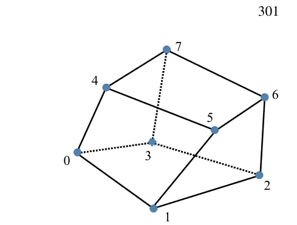

### 表9.2 节点的坐标值

| $l$ | $(x_l, y_l, z_l)$ |
| :--- | :--- |
| 0 | $(x_0, y_0, z_0)$ |
| 1 | $(x_1, y_1, z_1)$ |
| 2 | $(x_2, y_2, z_2)$ |
| 3 | $(x_3, y_3, z_3)$ |
| 4 | $(x_4, y_4, z_4)$ |
| 5 | $(x_5, y_5, z_5)$ |
| 6 | $(x_6, y_6, z_6)$ |
| 7 | $(x_7, y_7, z_7)$ |

### 表9.3 六面体元素的节点排序

| $l$ | $i$ | $j$ | $k$ |
| :--- | :--- | :--- | :--- |
| 0 | 1 | 3 | 4 |
| 1 | 2 | 0 | 5 |
| 2 | 3 | 1 | 6 |
| 3 | 0 | 2 | 7 |
| 4 | 7 | 5 | 0 |
| 5 | 4 | 6 | 1 |
| 6 | 5 | 7 | 2 |
| 7 | 6 | 4 | 3 |

$$W_l = \begin{bmatrix} x_i^c - x_l^c & x_j^c - x_l^c & x_k^c - x_l^c \\ y_i^c - y_l^c & y_j^c - y_l^c & y_k^c - y_l^c \\ z_i^c - z_l^c & z_j^c - z_l^c & z_k^c - z_l^c \end{bmatrix} \quad (9.1.56)$$

其中 $i$、$j$和 $k$也由表9.3给出，而 $\left(x_i^c, y_i^c, z_i^c\right)$ 是立方体单元的第 $i$个节点的坐标值。矩阵 $T_l$定义为矩阵 $A_l$和矩阵 $W_l$的逆矩阵的乘积。

### 表9.4 立方体单元节点的坐标值

| l | $(x_i^c, y_i^c, z_i^c)$ |
| :---: | :---: |
| 0 | (0, 0, 0) |
| 1 | (1, 0, 0) |
| 2 | (1, 1, 0) |
| 3 | (0, 1, 0) |
| 4 | (0, 0, 1) |
| 5 | (1, 0, 1) |
| 6 | (1, 1, 1) |
| 7 | (0, 1, 1) |

$T_l = A_l W_l^{-1} \quad (9.1.57)$

使用矩阵 $T_l$ 及其逆矩阵，称为条件数的 $\kappa_l$ 定义为

$\kappa_l = \|T_l\| \|T_l^{-1}\| \quad (9.1.58)$

其中 $\|A\|$ 是矩阵 $A$ 的Frobenius范数，定义为矩阵 $A$ 的所有分量的平方和的平方根，即

$\|A\| = \sum_{i,j} a_{ij}^2 \quad (9.1.59)$

最后，代数形状度量 $f$ 在每个节点上通过条件数 $\kappa_l$ 来定义六面体元素

$f = \frac{8}{\sum_{l=1}^{8} (\frac{\kappa_l}{3})^2} \quad (9.1.60)$

请注意，元素的代数形状度量 $f$ 的取值范围为 $0.0 < f \leq 1.0$，对于立方体形状的情况， $f = 1.0$。

让我们来看一下ElementShapeMetric.c，用于计算元素的代数形状度量的程序代码。代码中使用的主要变量和数组列在表9.5中。

```
/* ElementShapeMetric.c */
/* --------------------------------------------------- */
void inv_mat3(
    double invA[][3],
    double A[][3])
{
```

### 表9.5 ElementShapeMetric.c中使用的变量和数组

| 变量 | 类型 | 描述 |
|---|---|---|
| A[3][3] | double, 2D数组 | 由公式（9.1.55）定义的矩阵 |
| invA[3][3] | double, 2D数组 | 矩阵的逆 *A* |
| W[3][3] | double, 2D数组 | 由立方体形状元素的方程（9.1.56）定义的矩阵 |
| invW[3][3] | double, 2D数组 | 矩阵W的逆 |
| T[3][3] | double, 2D数组 | 由方程（9.1.57）定义的矩阵 |
| invT[3][3] | double, 2D数组 | 矩阵T的逆 |
| kp[i] | double, 1D数组 | 与第*i*个节点相关的条件数 |
| idx[i][j] | 整数，2D数组 | 由Table9.3定义的节点排序 |
| cube[8][3] | double, 2D数组 | 立方体元素的坐标值 |

```
    double det;

    det = A[0][0]*A[1][1]*A[2][2] + A[0][1]*A[1][2]*A[2][0]
    + A[0][2]*A[1][0]*A[2][1] - A[0][0]*A[1][2]*A[2][1]
    - A[0][1]*A[1][0]*A[2][2] - A[0][2]*A[1][1]*A[2][0] ;

    invA[0][0] = (A[1][1]*A[2][2] - A[1][2]*A[2][1])/det;
    invA[0][1] = (A[0][2]*A[2][1] - A[0][1]*A[2][2])/det;
    invA[0][2] = (A[0][1]*A[1][2] - A[1][1]*A[0][2])/det;
    invA[1][0] = (A[1][2]*A[2][0] - A[1][0]*A[2][2])/det;
    invA[1][1] = (A[0][0]*A[2][2] - A[0][2]*A[2][0])/det;
    invA[1][2] = (A[1][0]*A[0][2] - A[0][0]*A[1][2])/det;
    invA[2][0] = (A[1][0]*A[2][1] - A[1][1]*A[2][0])/det;
    invA[2][1] = (A[0][1]*A[2][0] - A[0][0]*A[2][1])/det;
    invA[2][2] = (A[0][0]*A[1][1] - A[0][1]*A[1][0])/det;
}
/*------------------------------------------------------------*/
void matMulti3(
    double C[][3],
    double A[][3],
    double B[][3])
{
    int i,j,k;

    for(i=0;i<3;i++) {
        for(j=0;j<3;j++) {
            C[i][j] = 0.0 ;
            for(k=0;k<3;k++) C[i][j] += A[i][k]*B[k][j] ;
        }
    }
}
/*------------------------------------------------------------*/
double f_norm3(
    double A[][3])
{
    int i,j;
    double dsum;

dsum = 0.0 ;
for(i=0;i<3;i++)
for(j=0;j<3;j++)
dsum += A[i][j]*A[i][j] ;
return dsum ;
}
/*------------------------------------------------------------*/
double shape_metric(
 int *elem,
 double **node,
 int nnpe,
 int nfpn)
{
 int i,j,k,ia,ib,ic,id,inode;
 int idx[8][3]
 = {{1,3,4},{2,0,5},{3,1,6},{0,2,7},
    {7,5,0},{4,6,1},{5,7,2},{6,4,3}};
 double kp[8],W[3][3],A[3][3],T[3][3],invW[3][3],
        invT[3][3],cond;
 double cube[8][3]
 = {{0.0, 0.0, 0.0},{1.0, 0.0, 0.0},
    {1.0, 1.0, 0.0},{0.0, 1.0, 0.0},
    {0.0, 0.0, 1.0},{1.0, 0.0, 1.0},
    {1.0, 1.0, 1.0},{0.0, 1.0, 1.0}} ;
 for(inode=0;inode<nnpe;inode++) {
  ia = elem[inode] ;
  ic = inode ;
  for(j=0;j<nfpn;j++) {
   ib = elem[idx[inode][j]] ;
   id = idx[inode][j] ;
   for(i=0;i<nfpn;i++)
    A[i][j] = node[ib][i] - node[ia][i] ;
   for(i=0;i<nfpn;i++)
    W[i][j] = cube[id][i] - cube[ic][i] ;
  }
  inv_mat3(invW,W) ;
  matMulti3(T,A,invW) ;
  inv_mat3(invT,T) ;
  kp[inode] = f_norm3(T)*f_norm3(invT) ;
 }
 for(inode=0,cond=0.0;inode<nnpe;inode++)
  cond += kp[inode]/9 ;
 return 8.0/cond ;
}
/*------------------------------------------------------------*/

```

在上面的代码中，inv_mat3()是一个计算给定3x3矩阵A的逆矩阵invA的函数。详见第9.1.1节。

matMulti3()是一个计算乘积 C = AB的函数。设矩阵 A、B和 C的分量分别表示为 a_{ij}、b_{ij}和 c_{ij}，则 c_{ij}由以下方式获得

> $$c_{ij} = \sum_{k=0}^{2} a_{ik} \cdot b_{kj} \qquad(9.1.61)$$

f_norm3()是一个计算给定3x3矩阵的Frobenius范数的函数。

shape_metric()是一个计算代数形状度量的函数。数组 idx[8][3]包含与表9.3中相同的数据。数组 cube[8][3]包含立方体形状元素的节点坐标，如表9.4所示。

程序的结构总结如下：

### 节点循环

- 定义一个矩阵 A[方程 (9.1.55)]。
- 定义一个矩阵 W[方程 (9.1.56)]。
- inv_mat3()计算 W的逆矩阵。
- matMulti3()定义一个矩阵 T[方程 (9.1.57)]
- inv_mat3()计算 T的逆矩阵。
- 计算每个节点的条件数 kp[方程 (9.1.58) 和 (9.1.59)]
- 计算所有节点的 kp的平方和。
- 返回元素的代数形状度量 f[方程 (9.1.60)]。

让我们计算一个元素的代数形状度量。假设元素的形状是立方体，只有一个节点的 z坐标移动，如表9.6所示。

根据方程 (9.1.55)，所有节点的矩阵 A_l定义如下：

| l | $(x_l, y_l, z_l)$ |
| :--- | :--- |
| 0 | (0, 0, 0) |
| 1 | (1, 0, 0) |
| 2 | (1, 1, 0) |
| 3 | (0, 1, 0) |
| 4 | (0, 0, z) |
| 5 | (1, 0, 1) |
| 6 | (1, 1, 1) |
| 7 | (0, 1, 1) |

表9.6 扭曲的立方体单元的节点坐标值$$A_0 = \begin{bmatrix} x_1 - x_0 & x_3 - x_0 & x_4 - x_0 \\ y_1 - y_0 & y_3 - y_0 & y_4 - y_0 \\ z_1 - z_0 & z_3 - z_0 & z_4 - z_0 \end{bmatrix} = \begin{bmatrix} 1 - 0 & 0 - 0 & 0 - 0 \\ 0 - 0 & 1 - 0 & 0 - 0 \\ 0 - 0 & 0 - 0 & z - 0 \end{bmatrix} = \begin{bmatrix} 1 & 0 & 0 \\ 0 & 1 & 0 \\ 0 & 0 & z \end{bmatrix}$$
(9.1.62)

$$A_1 = \begin{bmatrix} x_2 - x_1 & x_0 - x_1 & x_5 - x_1 \\ y_2 - y_1 & y_0 - y_1 & y_5 - y_1 \\ z_2 - z_1 & z_0 - z_1 & z_5 - z_1 \end{bmatrix} = \begin{bmatrix} 1 - 1 & 0 - 1 & 1 - 1 \\ 1 - 0 & 0 - 0 & 0 - 0 \\ 0 - 0 & 0 - 0 & 1 - 0 \end{bmatrix} = \begin{bmatrix} 0 & -1 & 0 \\ 1 & 0 & 0 \\ 0 & 0 & 1 \end{bmatrix}$$
(9.1.63)

$$A_2 = \begin{bmatrix} x_3 - x_2 & x_1 - x_2 & x_6 - x_2 \\ y_3 - y_2 & y_1 - y_2 & y_6 - y_2 \\ z_3 - z_2 & z_1 - z_2 & z_6 - z_2 \end{bmatrix} = \begin{bmatrix} 0 - 1 & 1 - 1 & 1 - 1 \\ 1 - 1 & 0 - 1 & 1 - 1 \\ 0 - 0 & 0 - 0 & 1 - 0 \end{bmatrix} = \begin{bmatrix} -1 & 0 & 0 \\ 0 & -1 & 0 \\ 0 & 0 & 1 \end{bmatrix}$$
(9.1.64)

$$A_3 = \begin{bmatrix} x_0 - x_3 & x_2 - x_3 & x_7 - x_3 \\ y_0 - y_3 & y_2 - y_3 & y_7 - y_3 \\ z_0 - z_3 & z_2 - z_3 & z_7 - z_3 \end{bmatrix} = \begin{bmatrix} 0 - 0 & 1 - 0 & 0 - 0 \\ 0 - 1 & 1 - 1 & 1 - 1 \\ 0 - 0 & 0 - 0 & 1 - 0 \end{bmatrix} = \begin{bmatrix} 0 & 1 & 0 \\ -1 & 0 & 0 \\ 0 & 0 & 1 \end{bmatrix}$$
(9.1.65)

$$A_4 = \begin{bmatrix} x_7 - x_4 & x_5 - x_4 & x_0 - x_4 \\ y_7 - y_4 & y_5 - y_4 & y_0 - y_4 \\ z_7 - z_4 & z_5 - z_4 & z_0 - z_4 \end{bmatrix} = \begin{bmatrix} 0 - 0 & 1 - 0 & 0 - 0 \\ 1 - 0 & 0 - 0 & 0 - 0 \\ 1 - z & 1 - z & 0 - z \end{bmatrix} = \begin{bmatrix} 0 & 1 & 0 \\ 1 & 0 & 0 \\ 1-z & 1-z & -z \end{bmatrix}$$
(9.1.66)

$$A_5 = \begin{bmatrix} x_4 - x_5 & x_6 - x_5 & x_1 - x_5 \\ y_4 - y_5 & y_6 - y_5 & y_1 - y_5 \\ z_4 - z_5 & z_6 - z_5 & z_1 - z_5 \end{bmatrix} = \begin{bmatrix} 0 - 1 & 1 - 1 & 1 - 1 \\ 0 - 0 & 1 - 0 & 0 - 0 \\ z - 1 & 1 - 1 & 0 - 1 \end{bmatrix} = \begin{bmatrix} -1 & 0 & 0 \\ 0 & 1 & 0 \\ z-1 & 0 & -1 \end{bmatrix}$$
(9.1.67)

$$A_6 = \begin{bmatrix} x_5 - x_6 & x_7 - x_6 & x_2 - x_6 \\ y_5 - y_6 & y_7 - y_6 & y_2 - y_6 \\ z_5 - z_6 & z_7 - z_6 & z_2 - z_6 \end{bmatrix} = \begin{bmatrix} 1 - 1 & 0 - 1 & 1 - 1 \\ 0 - 1 & 1 - 1 & 1 - 1 \\ 1 - 1 & 1 - 1 & 0 - 1 \end{bmatrix} = \begin{bmatrix} 0 & -1 & 0 \\ -1 & 0 & 0 \\ 0 & 0 & -1 \end{bmatrix}$$
(9.1.68)

$$A_7 = \begin{bmatrix} x_6 - x_7 & x_4 - x_7 & x_3 - x_7 \\ y_6 - y_7 & y_4 - y_7 & y_3 - y_7 \\ z_6 - z_7 & z_4 - z_7 & z_3 - z_7 \end{bmatrix} = \begin{bmatrix} 1 - 0 & 0 - 0 & 0 - 0 \\ 1 - 1 & 0 - 1 & 1 - 1 \\ 1 - 1 & z - 1 & 0 - 1 \end{bmatrix} = \begin{bmatrix} 1 & 0 & 0 \\ 0 & -1 & 0 \\ 0 & z-1 & -1 \end{bmatrix}$$
(9.1.69)

同样地，根据方程（9.1.56），所有节点的矩阵 $W_i$定义如下：

### 9.1 数据准备阶段的计算机编程

$$W_0 = \begin{bmatrix} x_1^c - x_0^c & x_3^c - x_0^c & x_4^c - x_0^c \\ y_1^c - y_0^c & y_3^c - y_0^c & y_4^c - y_0^c \\ z_1^c - z_0^c & z_3^c - z_0^c & z_4^c - z_0^c \end{bmatrix} = \begin{bmatrix} 1 & -0 & 0 & -0 & 0 & -\overline{0} \\ 0 & -0 & 1 & -0 & 0 & -0 \\ 0 & -0 & 0 & -0 & 1 & -\overline{0} \end{bmatrix} = \begin{bmatrix} 1 & 0 & 0 \\ 0 & 1 & 0 \\ 0 & 0 & 1 \end{bmatrix} \quad (9.1.70)$$

$$W_1 = \begin{bmatrix} x_2^c - x_1^c & x_0^c - x_1^c & x_5^c - x_1^c \\ y_2^c - y_1^c & y_0^c - y_1^c & y_5^c - y_1^c \\ z_2^c - z_1^c & z_0^c - z_1^c & z_5^c - z_1^c \end{bmatrix} = \begin{bmatrix} 1 & -1 & 0 & -1 & 1 & -\overline{1} \\ 1 & -0 & 0 & -0 & 0 & -0 \\ 0 & -0 & 0 & -0 & 1 & -\overline{0} \end{bmatrix} = \begin{bmatrix} 0 & -1 & 0 \\ 1 & 0 & 0 \\ 0 & 0 & 1 \end{bmatrix} \quad (9.1.71)$$

$$W_2 = \begin{bmatrix} x_3^c - x_2^c & x_1^c - x_2^c & x_6^c - x_2^c \\ y_3^c - y_2^c & y_1^c - y_2^c & y_6^c - y_2^c \\ z_3^c - z_2^c & z_1^c - z_2^c & z_6^c - z_2^c \end{bmatrix} = \begin{bmatrix} 0 & -1 & 1 & -1 & 1 & -\overline{1} \\ 1 & -1 & 0 & -1 & 1 & -1 \\ 0 & -0 & 0 & -0 & 1 & -\overline{0} \end{bmatrix} = \begin{bmatrix} -1 & 0 & \overline{0} \\ 0 & -1 & 0 \\ 0 & 0 & 1 \end{bmatrix} \quad (9.1.72)$$

$$W_3 = \begin{bmatrix} x_0^c - x_3^c & x_2^c - x_3^c & x_7^c - x_3^c \\ y_0^c - y_3^c & y_2^c - y_3^c & y_7^c - y_3^c \\ z_0^c - z_3^c & z_2^c - z_3^c & z_7^c - z_3^c \end{bmatrix} = \begin{bmatrix} 0 & -0 & 1 & -0 & 0 & -\overline{0} \\ 0 & -1 & 1 & -1 & 1 & -1 \\ 0 & -0 & 0 & -0 & 1 & -\overline{0} \end{bmatrix} = \begin{bmatrix} 0 & 1 & 0 \\ -1 & 0 & 0 \\ 0 & 0 & 1 \end{bmatrix} \quad (9.1.73)$$

$$W_4 = \begin{bmatrix} x_7^c - x_4^c & x_5^c - x_4^c & x_0^c - x_4^c \\ y_7^c - y_4^c & y_5^c - y_4^c & y_0^c - y_4^c \\ z_7^c - z_4^c & z_5^c - z_4^c & z_0^c - z_4^c \end{bmatrix} = \begin{bmatrix} 0 & -0 & 1 & -0 & 0 & -\overline{0} \\ 1 & -0 & 0 & -0 & 0 & -0 \\ 1 & -1 & 1 & -1 & 0 & -1 \end{bmatrix} = \begin{bmatrix} 0 & 1 & 0 \\ 1 & 0 & 0 \\ 0 & 0 & -1 \end{bmatrix} \quad (9.1.74)$$

$$W_5 = \begin{bmatrix} x_4^c - x_5^c & x_6^c - x_5^c & x_1^c - x_5^c \\ y_4^c - y_5^c & y_6^c - y_5^c & y_1^c - y_5^c \\ z_4^c - z_5^c & z_6^c - z_5^c & z_1^c - z_5^c \end{bmatrix} = \begin{bmatrix} 0 & -1 & 1 & -1 & 1 & -\overline{1} \\ 0 & -0 & 1 & -0 & 0 & -0 \\ 1 & -1 & 1 & -1 & 0 & -1 \end{bmatrix} = \begin{bmatrix} -1 & 0 & 0 \\ 0 & 1 & 0 \\ 0 & 0 & -1 \end{bmatrix} \quad (9.1.75)$$

$$W_6 = \begin{bmatrix} x_5^c - x_6^c & x_7^c - x_6^c & x_2^c - x_6^c \\ y_5^c - y_6^c & y_7^c - y_6^c & y_2^c - y_6^c \\ z_5^c - z_6^c & z_7^c - z_6^c & z_2^c - z_6^c \end{bmatrix} = \begin{bmatrix} 1 & -1 & 0 & -1 & 1 & -\overline{1} \\ 0 & -1 & 1 & -1 & 1 & -1 \\ 1 & -1 & 1 & -1 & 0 & -1 \end{bmatrix} = \begin{bmatrix} 0 & -1 & 0 \\ -1 & 0 & 0 \\ 0 & 0 & -1 \end{bmatrix} \quad (9.1.76)$$

$$W_7 = \begin{bmatrix} x_6^c - x_7^c & x_4^c - x_7^c & x_3^c - x_7^c \\ y_6^c - y_7^c & y_4^c - y_7^c & y_3^c - y_7^c \\ z_6^c - z_7^c & z_4^c - z_7^c & z_3^c - z_7^c \end{bmatrix} = \begin{bmatrix} 1 & -0 & 0 & -0 & 0 & -\overline{0} \\ 1 & -1 & 0 & -1 & 1 & -1 \\ 1 & -1 & 1 & -1 & 0 & -1 \end{bmatrix} = \begin{bmatrix} 1 & 0 & 0 \\ 0 & -1 & 0 \\ 0 & 0 & -1 \end{bmatrix} \quad (9.1.77)$$

然后，分别计算矩阵 \(W_l\) 的逆矩阵，如下所示：

$$W_0 = \begin{bmatrix} 1 & 0 & 0 \\ 0 & 1 & 0 \\ 0 & 0 & 1 \end{bmatrix}, \quad W_0^{-1} = \begin{bmatrix} 1 & 0 & 0 \\ 0 & 1 & 0 \\ 0 & 0 & 1 \end{bmatrix}$$
(9.1.78)

$$W_1 = \begin{bmatrix} 0 & -1 & 0 \\ 1 & 0 & 0 \\ 0 & 0 & 1 \end{bmatrix}, \quad W_1^{-1} = \begin{bmatrix} 0 & 1 & 0 \\ -1 & 0 & 0 \\ 0 & 0 & 1 \end{bmatrix}$$
(9.1.79)

$$W_2 = \begin{bmatrix} -1 & 0 & 0 \\ 0 & -1 & 0 \\ 0 & 0 & 1 \end{bmatrix}, \quad W_2^{-1} = \begin{bmatrix} -1 & 0 & 0 \\ 0 & -1 & 0 \\ 0 & 0 & 1 \end{bmatrix}$$
(9.1.80)

$$W_3 = \begin{bmatrix} 0 & 1 & 0 \\ -1 & 0 & 0 \\ 0 & 0 & 1 \end{bmatrix}, \quad W_3^{-1} = \begin{bmatrix} 0 & -1 & 0 \\ 1 & 0 & 0 \\ 0 & 0 & 1 \end{bmatrix}$$
(9.1.81)

$$W_4 = \begin{bmatrix} 0 & 1 & 0 \\ 1 & 0 & 0 \\ 0 & 0 & -1 \end{bmatrix}, \quad W_4^{-1} = \begin{bmatrix} 0 & 1 & 0 \\ 1 & 0 & 0 \\ 0 & 0 & -1 \end{bmatrix}$$
(9.1.82)

$$W_5 = \begin{bmatrix} -1 & 0 & 0 \\ 0 & 1 & 0 \\ 0 & 0 & -1 \end{bmatrix}, \quad W_5^{-1} = \begin{bmatrix} -1 & 0 & 0 \\ 0 & 1 & 0 \\ 0 & 0 & -1 \end{bmatrix}$$
(9.1.83)

$$W_6 = \begin{bmatrix} 0 & -1 & 0 \\ -1 & 0 & 0 \\ 0 & 0 & -1 \end{bmatrix}, \quad W_6^{-1} = \begin{bmatrix} 0 & -1 & 0 \\ -1 & 0 & 0 \\ 0 & 0 & -1 \end{bmatrix}$$
(9.1.84)

$$W_7 = \begin{bmatrix} 1 & 0 & 0 \\ 0 & -1 & 0 \\ 0 & 0 & -1 \end{bmatrix}, \quad W_7^{-1} = \begin{bmatrix} 1 & 0 & 0 \\ 0 & -1 & 0 \\ 0 & 0 & -1 \end{bmatrix}$$
(9.1.85)

根据公式 (9.1.57) ，分别计算矩阵 T_i如下所示：

$$T_0 = A_0 W_0^{-1} = \begin{bmatrix} 1 & 0 & 0 \\ 0 & 1 & 0 \\ 0 & 0 & z \end{bmatrix} \begin{bmatrix} 1 & 0 & 0 \\ 0 & 1 & 0 \\ 0 & 0 & 1 \end{bmatrix} = \begin{bmatrix} 1 & 0 & 0 \\ 0 & 1 & 0 \\ 0 & 0 & z \end{bmatrix}$$
(9.1.86)

$$T_1 = A_1 W_1^{-1} = \begin{bmatrix} 0 & -1 & 0 \\ 1 & 0 & 0 \\ 0 & 0 & 1 \end{bmatrix} \begin{bmatrix} 0 & 1 & 0 \\ -1 & 0 & 0 \\ 0 & 0 & 1 \end{bmatrix} = \begin{bmatrix} 1 & 0 & 0 \\ 0 & 1 & 0 \\ 0 & 0 & 1 \end{bmatrix}$$
(9.1.87)

$$T_3 = A_3W_3^{-1} = \begin{bmatrix} 0 & 1 & 0 \\ -1 & 0 & 0 \\ 0 & 0 & 1 \end{bmatrix} \begin{bmatrix} 0 & -1 & 0 \\ 1 & 0 & 0 \\ 0 & 0 & 1 \end{bmatrix} = \begin{bmatrix} 1 & 0 & 0 \\ 0 & 1 & 0 \\ 0 & 0 & 1 \end{bmatrix} \quad\quad (9.1.89)$$

$$T_4 = A_4W_4^{-1} = \begin{bmatrix} 0 & 1 & 0 \\ 1 & 0 & 0 \\ 1-z & 1-z & -z \end{bmatrix} \begin{bmatrix} 0 & 1 & 0 \\ 1 & 0 & 0 \\ 0 & 0 & -1 \end{bmatrix} = \begin{bmatrix} 1 & 0 & 0 \\ 0 & 1 & 0 \\ 1-z & 1-z & z \end{bmatrix} \quad\quad (9.1.90)$$

$$T_5 = A_5W_5^{-1} = \begin{bmatrix} -1 & 0 & 0 \\ 0 & 1 & 0 \\ z-1 & 0 & -1 \end{bmatrix} \begin{bmatrix} -1 & 0 & 0 \\ 0 & 1 & 0 \\ 0 & 0 & -1 \end{bmatrix} = \begin{bmatrix} 1 & 0 & 0 \\ 0 & 1 & 0 \\ 1-z & 0 & 1 \end{bmatrix} \quad\quad (9.1.91)$$

$$T_6 = A_6W_6^{-1} = \begin{bmatrix} 0 & -1 & 0 \\ -1 & 0 & 0 \\ 0 & 0 & -1 \end{bmatrix} \begin{bmatrix} 0 & -1 & 0 \\ -1 & 0 & 0 \\ 0 & 0 & -1 \end{bmatrix} = \begin{bmatrix} 1 & 0 & 0 \\ 0 & 1 & 0 \\ 0 & 0 & 1 \end{bmatrix} \quad\quad (9.1.92)$$

$$T_7 = A_7W_7^{-1} = \begin{bmatrix} 1 & 0 & 0 \\ 0 & -1 & 0 \\ 0 & z-1 & -1 \end{bmatrix} \begin{bmatrix} 1 & 0 & 0 \\ 0 & -1 & 0 \\ 0 & 0 & -1 \end{bmatrix} = \begin{bmatrix} 1 & 0 & 0 \\ 0 & 1 & 0 \\ 0 & 1-z & 1 \end{bmatrix} \quad\quad (9.1.93)$$

然后，分别计算矩阵 T_l 的逆矩阵，如下所示：

$$T_0 = \begin{bmatrix} 1 & 0 & 0 \\ 0 & 1 & 0 \\ 0 & 0 & z \end{bmatrix}, \quad T_0^{-1} = \begin{bmatrix} 1 & 0 & 0 \\ 0 & 1 & 0 \\ 0 & 0 & \frac{1}{z} \end{bmatrix} \quad\quad (9.1.94)$$

$$T_1 = \begin{bmatrix} 1 & 0 & 0 \\ 0 & 1 & 0 \\ 0 & 0 & 1 \end{bmatrix}, \quad T_1^{-1} = \begin{bmatrix} 1 & 0 & 0 \\ 0 & 1 & 0 \\ 0 & 0 & 1 \end{bmatrix} \quad\quad (9.1.95)$$

$$T_2 = \begin{bmatrix} 1 & 0 & 0 \\ 0 & 1 & 0 \\ 0 & 0 & 1 \end{bmatrix}, \quad T_2^{-1} = \begin{bmatrix} 1 & 0 & 0 \\ 0 & 1 & 0 \\ 0 & 0 & 1 \end{bmatrix} \quad\quad (9.1.96)$$

$$T_3 = \begin{bmatrix} 1 & 0 & 0 \\ 0 & 1 & 0 \\ 0 & 0 & 1 \end{bmatrix}, \quad T_3^{-1} = \begin{bmatrix} 1 & 0 & 0 \\ 0 & 1 & 0 \\ 0 & 0 & 1 \end{bmatrix} \quad\quad (9.1.97)$$

根据方程（9.1.58），计算所有节点的条件数κi，分别如下：

```
κ0 = \|T0\| \cdot \|T0^{-1}\| = \sqrt{2+z^2} \cdot \sqrt{2+\frac{1}{z^2}} \quad (9.1.102)

κ1 = \|T1\| \cdot \|T1^{-1}\| = \sqrt{3} \cdot \sqrt{3} \quad (9.1.103)

κ2 = \|T2\| \cdot \|T2^{-1}\| = \sqrt{3} \cdot \sqrt{3} \quad (9.1.104)

κ3 = \|T3\| \cdot \|T3^{-1}\| = \sqrt{3} \cdot \sqrt{3} \quad (9.1.105)

κ4 = \|T4\| \cdot \|T4^{-1}\| = \sqrt{2+2(1-z)^2+z^2} \cdot \sqrt{2+2\left(\frac{z-1}{z}\right)^2+\frac{1}{z^2}} \quad (9.1.106)

κ5 = \|T5\| \cdot \|T5^{-1}\| = \sqrt{3+(1-z)^2} \cdot \sqrt{3+(z-1)^2} \quad (9.1.107)

κ6 = \|T6\| \cdot \|T6^{-1}\| = \sqrt{3} \cdot \sqrt{3} \quad (9.1.108)

κ7 = \|T7\| \cdot \|T7^{-1}\| = \sqrt{3+(1-z)^2} \cdot \sqrt{3+(z-1)^2} \quad (9.1.109)
```

从方程（9.1.102）-（9.1.109）可以看出，在这种情况下，条件数κ1、κ2、κ3和κ6不会改变，因为第四个节点的z坐标不会成为这些值的目标节点或其相邻节点。请注意，从方程（9.1.102）、（9.1.106）、（9.1.107）和（9.1.109）可以很容易地证明，条件数κ0、κ4、κ5和κ7的最小值为3。

图9.3显示了条件数κ0、κ4、κ5和κ7以及元素的代数形状度量f的值。水平轴是第四个节点的z坐标，左垂直刻度是κi的值，右垂直刻度是代数形状度量f的值。在完美的立方形状的情况下，每个条件数κi的最小值为3.0，代数形状度量f的值为1.0的最大值。

接下来，让我们来看看ElementShape.c，一个计算六面体元素形状的边长的最大值和最小值、边角的最大值和最小值以及面角的最大值和最小值的程序代码。主要变量和数组列在表9.7中。

```
/* ElementShape.c */
/*-----------------------------------------------------------*/
void check_shape(
double *s_data,
int *elem,
double **node,
int nfpn)
{
int i, j, k, i0, i1, i2, n, ne, nnpe=8;
double dl[12], da[48], de[24], e[12][3], d1, d2,
dx0[3], dx1[3], dx2[3],
nv[8][3][3], v1[3], v2[3], v3[3], v4[3], ndata[8][3],
dl_min, dl_max, da_min, da_max, de_max, de_min;
int idx[8][3] =
{{0, 3, 8}, {1, 0, 9}, {2, 1, 10}, {3, 2, 11},
{7, 4, 8}, {4, 5, 9}, {5, 6, 10}, {6, 7, 11}};
int sg[8][3] = {{ 1, -1, 1}, { 1, -1, 1}, { 1, -1, 1}, { 1, -1, 1},
{-1, 1, -1}, {-1, 1, -1}, {-1, 1, -1}, {-1, 1, -1} };
int id[12][6]
= { {0,2,1, 1,0,1}, {1,2,1, 2,0,1},
{2,2,1, 3,0,1}, {3,2,1, 0,0,1},
{4,1,0, 5,1,2}, {5,1,0, 6,1,2},
{6,1,0, 7,1,2}, {7,1,0, 4,1,2},
{0,0,2, 4,2,0}, {1,0,2, 5,2,0},
{2,0,2, 6,2,0}, {3,0,2, 7,2,0}};

for(i=0;i<nnpe;i++){
    k = elem[i] ;
    for(j=0;j<nfpn;j++) ndata[i][j] = node[k][j] ;
}

/*-------------------长度-------------------*/
for(i=0;i<=3;i++){
    for(j=0;j<nfpn;j++)
        e[i][j] = ndata[(i+1)%4][j] - ndata[i][j] ;
    for(j=0,d1=0.0;j<nfpn;j++) d1 += e[i][j]*e[i][j] ;
    dl[i] = sqrt(d1) ;
    for(j=0;j<nfpn;j++) e[i][j] /= dl[i] ;
}
for(i=4;i<=7;i++){
    for(j=0;j<nfpn;j++)
        e[i][j] = ndata[(i+1)%4+4][j] - ndata[i][j] ;
    for(j=0,d1=0.0;j<nfpn;j++) d1 += e[i][j]*e[i][j] ;
    dl[i] = sqrt(d1) ;
    for(j=0;j<nfpn;j++) e[i][j] /= dl[i] ;
}
for(i=0;i<=3;i++){
    for(j=0;j<nfpn;j++)
        e[i+8][j] = ndata[i+4][j] - ndata[i][j] ;
    for(j=0,d1=0.0;j<nfpn;j++) d1 += e[i+8][j]*e[i+8][j] ;
    dl[i+8] = sqrt(d1) ;
    for(j=0;j<nfpn;j++) e[i+8][j] /= dl[i+8] ;
}
/*-----------------角度1-----------------*/
for(n=0;n<nnpe;n++){
    for(i=0;i<nfpn;i++) dx0[i] = sg[n][0]*e[idx[n][0]][i] ;
    for(i=0;i<nfpn;i++) dx1[i] = sg[n][1]*e[idx[n][1]][i] ;
    for(i=0;i<nfpn;i++) dx2[i] = sg[n][2]*e[idx[n][2]][i] ;

    de[n*3+0] = dx0[0]*dx1[0]+dx0[1]*dx1[1]+dx0[2]*dx1[2] ;
    de[n*3+1] = dx1[0]*dx2[0]+dx1[1]*dx2[1]+dx1[2]*dx2[2] ;
    de[n*3+2] = dx2[0]*dx0[0]+dx2[1]*dx0[1]+dx2[2]*dx0[2] ;

    nv[n][0][0] = dx2[1]*dx1[2] - dx2[2]*dx1[1] ;
    nv[n][0][1] = dx2[2]*dx1[0] - dx2[0]*dx1[2] ;
    nv[n][0][2] = dx2[0]*dx1[1] - dx2[1]*dx1[0] ;

    nv[n][1][0] = dx1[1]*dx0[2] - dx1[2]*dx0[1] ;
    nv[n][1][1] = dx1[2]*dx0[0] - dx1[0]*dx0[2] ;
    nv[n][1][2] = dx1[0]*dx0[1] - dx1[1]*dx0[0] ;

    nv[n][2][0] = dx0[1]*dx2[2] - dx0[2]*dx2[1] ;
    nv[n][2][1] = dx0[2]*dx2[0] - dx0[0]*dx2[2] ;
    nv[n][2][2] = dx0[0]*dx2[1] - dx0[1]*dx2[0] ;

    for(j=0;j<3;j++){
        for(i=0,d1=0.0;i<nfpn;i++) d1 += nv[n][j][i]*nv[n][j][i] ;
        d2 = 1.0/sqrt(d1) ;
        for(i=0;i<nfpn;i++) nv[n][j][i] *= d2 ;
    }
}
/*-----------------角度2-----------------*/
for(ne=0;ne<12;ne++){
    for(i=0;i<nfpn;i++) v1[i] = nv[id[ne][0]][id[ne][1]][i] ;
    for(i=0;i<nfpn;i++) v2[i] = nv[id[ne][0]][id[ne][2]][i] ;
    for(i=0;i<nfpn;i++) v3[i] = nv[id[ne][3]][id[ne][4]][i] ;
    for(i=0;i<nfpn;i++) v4[i] = nv[id[ne][3]][id[ne][5]][i] ;

    da[ne*4+0] = v1[0]*v2[0]+v1[1]*v2[1]+v1[2]*v2[2] ;
    da[ne*4+1] = v3[0]*v4[0]+v3[1]*v4[1]+v3[2]*v4[2] ;
    da[ne*4+2] = v1[0]*v4[0]+v1[1]*v4[1]+v1[2]*v4[2] ;
    da[ne*4+3] = v2[0]*v3[0]+v2[1]*v3[1]+v2[2]*v3[2] ;
}
/*-----------------最小最大-----------------*/
dl_max = -1.0 ;
dl_min = 1.0e30 ;
for(i=0;i<12;i++){
    if(dl[i] > dl_max) dl_max = dl[i] ;
    if(dl[i] < dl_min) dl_min = dl[i] ;
}
de_max = -1.0e30 ;
de_min = 1.0e30 ;
for(i=0;i<24;i++){
    if(de[i] > de_max) de_max = de[i] ;
    if(de[i] < de_min) de_min = de[i] ;
}
da_max = -1.0e30 ;
da_min = 1.0e30 ;
for(i=0;i<48;i++){
    if(da[i] > da_max) da_max = da[i] ;
    if(da[i] < da_min) da_min = da[i] ;
}
s_data[0] = dl_min ;
s_data[1] = dl_max ;
s_data[2] = acos(da_min)*180/3.1415926 ;
s_data[3] = acos(da_max)*180/3.1415926 ;
s_data[4] = acos(de_min)*180/3.1415926 ;
s_data[5] = acos(de_max)*180/3.1415926 ;
}
/*-------------------------------------------------*/
```

### 表9.7 ElementShape.c中使用的变量和数组

| 变量/数组 | 类型 | 描述 |
|---|---|---|
| dl[i] | double, 1D数组 | 第i个边的长度 |
| e[i][3] | double, 2D数组 | 沿着第i个边的单位向量 |
| dx0[3] | double, 1D数组 | 使用idx[][]中给定的边顺序沿着节点的第一条边的单位向量 |
| dx1[3] | double, 1D数组 | 沿节点的第二条边的单位向量，使用给定的边顺序在idx[][]中 |
| dx2[3] | double, 1D数组 | 沿节点的第三条边的单位向量，使用给定的边顺序在idx[][]中 |
| nv[i][j][3] | double, 3D数组 | 围绕第i个节点的第j个面的外单位法向量 |
| v1[3] | double, 1D数组 | 对于边的每个终端节点，定义了两个外单位法向量，分别用于共享边的两个面。v1和v3是一个面的法向量，v2和v4是另一个面的法向量 |
| v2[3] | double, 1D数组 | |
| v3[3] | double, 1D数组 | |
| v4[3] | double, 1D数组 | |
| ndata[8][3] | double, 2D数组 | 元素中八个节点的坐标值 |
| idx[i][j] | int, 2D数组 | 第i个节点的第j个边的编号 |
| sg[i][j] | int, 2D数组 | 第i个节点的第j个向量的方向 |
| id[i][j] | int, 2D数组 | 对于共享i-th边的两个面，该数组指示应检查哪些法向量 |

上面的程序代码结构如下：

- 计算边长（长度部分）
- 计算边之间的角度（角度1部分）
- 计算面之间的角度（角度2部分）
- 计算最大和最小值（最大最小部分）

首先，在长度部分，计算每条边的长度和沿每条边的单位向量e[i]。单位向量的方向如图9.4所示。例如，e[4]是从第四个节点到第五个节点的单位向量。

接下来，在angle1部分，计算边之间的角度。如图9.5所示，在节点处定义了单位向量dx0[i], dx1[i]和dx2[i]，每个向量都从节点开始并沿着边指向。数组idx[i][j]包含每个节点处单位向量与每条边上单位向量之间的对应关系，以及数组sg[i][j]表示单位向量的方向。例如，在节点4处，idx[4]={7,4,8}和sg[4]={-1,1,-1}定义了节点处的单位向量为dx0[4]=-e[7], dx1[4]=e[4], 和dx2[4]=-e[8]。一旦定义了每个节点处的单位向量，就可以根据两个向量之间的余弦计算节点处三个单位向量之间的角度。因此，计算了总共24条边之间的角度。

此外，利用每个节点处的三个单位向量，可以通过这些向量的外积得到共享节点的三个面的外向单位法向量v[i][j](Fig.9.6)。

接下来，在angle2部分，计算了六面体的面之间的角度。六面体元素的每个面不一定是平的，即不能保证一个面的四个节点在同一个平面上。因此，用一个单一的值来表示面之间的角度是困难的；因此，计算了两个元素面之间的四个角度值。

图9.7展示了如何用由每个面上的节点组成的三角形形成的四个角来表示共享边的两个面之间的角度（红色）。（显然，一个三角形的三个点在同一个平面上）。由于每个三角形有两条边作为元素边，它的法向量是在angle1部分计算的nv[i][j]。数组id[i][j]包含了每个边对应的图9.7中所示三角形的法向量。

例如，对于第四条边，id[4]={4,1,0,5,1,2}表示第四个节点的法向量nv[4][1], nv[4][0]和第五个节点的法向量nv[5][1], nv[5][2]用于计算两者之间的角度。共有48个角度用于计算所有12条边上共享边的面。

最后，在minmax部分，计算每个参数的最大值和最小值。然后，将与某个角度相关的每个值从余弦值转换为角度值，以便更直观地理解。

## *9.1.3 B样条和NURBS*

讨论了将深度学习应用于由NURBS定义的表面之间的接触搜索的方法。NURBS在CAD中用于定义形状，并且也用作等几何分析中的基函数[1,6]。在本小节中，给出了计算NURBS基函数的程序代码。

NURBS基函数是由B样条基函数创建的。让我们来看一下bspline.c，这是一个计算B样条基函数的程序。主要变量和数组列在表9.8中。

```
/* bspline.c */
#define NMAX_KV 100
#define KV_EPS 1.0e-5
#define NURBS_EPS 1.0e-20
```

### 表9.8 在bspline.c中使用的变量和数组

| 变量名 | 类型 | 描述 |
|--------|------|------|
| N[i] | double, 1D数组 | 第i个B样条基函数 \(N_i(\xi)\) |
| M[j] | double, 1D数组 | 第j个B样条基函数 \(M_j(\eta)\) |
| L[k] | double, 1D数组 | 第k个B样条基函数 \(L_k(\zeta)\) |
| dN[i] | double, 1D数组 | 第i个B样条基函数 \(N_i(\xi)\)的一阶导数 |
| dM[j] | double, 1D数组 | 第j个B样条基函数 \(M_j(\eta)\)的一阶导数 |
| dL[k] | double, 1D数组 | 第k个B样条基函数 \(L_k(\zeta)\)的一阶导数 |
| n | int | 基函数 \(N_i(\xi)\)的数量 |
| m | int | 基函数 \(M_j(\eta)\)的数量 |
| l | int | 基函数 \(L_k(\zeta)\)的数量 |
| KV[] | double, 1D数组 | 节点向量 |
| nkv | int | 节点向量的维度 |
| p | int | B样条基函数的多项式阶数 |
| ni | int | KV[ni] < ξ < KV[ni + 1] |
| xi | double | ξ |
| et | double | η |
| ze | double | ζ |
| B[i][j][k] | double, 3D数组 | 三维B样条函数 \(B_{i,j,k}(\xi, \eta, \zeta)\) |
| dB_xi[i][j][k] | double, 3D数组 | \(\frac{\partial B_{i,j,k}(\xi, \eta, \zeta)}{\partial \xi}\) |
| dB_et[i][j][k] | double, 3D数组 | \(\frac{\partial B_{i,j,k}(\xi, \eta, \zeta)}{\partial \eta}\) |
| dB_ze[i][j][k] | double, 3D数组 | \(\frac{\partial B_{i,j,k}(\xi, \eta, \zeta)}{\partial \zeta}\) |

```
/*------------------------------------------------------------*/
void Bspline00(
double *N,
double *dN,
double xi,
int ni,
int p,
int nkv,
double *KV)
{
int i,j,k;
double d,e,d_d,d_e,temp[NMAX_KV],dtemp[NMAX_KV],dw;

for(i=ni-p;i<=ni+p;i++){
    temp[i] = 0.0 ;
    dtemp[i] = 0.0 ;
}
for(i=ni-p;i<=ni;i++){
    if((xi>=KV[i]) && (xi<KV[i+1])){
        temp[i] = 1.0;
```

### 9.1 数据准备阶段的计算机编程

```c
} else {
    temp[i] = 0.0;
}
dtemp[i] = 0.0;
}
for (k=1; k<=p; k++) {
    for (i=ni-k; i<=ni; i++) {
        if (fabs(temp[i]) > NURBS_EPS) {
            dw = KV[i+k] - KV[i];
            if (fabs(dw) > KV_EPS) {
                d = ((xi - KV[i]) * temp[i]) / dw;
                d_d = k * temp[i] / dw;
            } else {
                d = 0.0;
                d_d = 0.0;
            }
        } else {
            d = 0.0;
            d_d = 0.0;
        }
        if (fabs(temp[i+1]) > NURBS_EPS) {
            dw = KV[i+k+1] - KV[i+1];
            if (fabs(dw) > KV_EPS) {
                e = ((KV[i+k+1] - xi) * temp[i+1]) / dw;
                d_e = k * temp[i+1] / dw;
            } else {
                e = 0.0;
                d_e = 0.0;
            }
        } else {
            e = 0.0;
            d_e = 0.0;
        }
        temp[i] = d + e;
        dtemp[i] = d_d - d_e;
    }
}
for (i=0; i<=p; i++) {
    N[i] = temp[ni-p+i];
    dN[i] = dtemp[ni-p+i];
}
}
/*--------------------------------------------------------------*/
void Bspline1D(
    double *N,
    double *dN,
    int n,
    double xi,
    int p,
    int nkv,
    double *KV)
{
    int i,j,k,nb;
    double d1,d2,d3;

    for(i=0;i<n;i++){
        N[i] = 0.0 ;
        dN[i] = 0.0 ;
    }
    for(i=0;i<nkv;i++)
        if((xi >= KV[i]) && (xi < KV[i+1])) break ;
    Bspline00(N+(i-p), dN+(i-p), xi, i, p, nkv, KV) ;
}
/*--------------------------------------------------------------*/
void Bspline3D(
    double ***B,
    double ***dB_xi,
    double ***dB_et,
    double ***dB_ze,
    double *N,
    double *dN,
    int n,
    double *M,
    double *dM,
    int m,
    double *L,
    double *dL,
    int l)
{
    int i,j,k;
    double d1,d2,d3,dd1,dd2,dd3;

    for(i=0;i<n;i++){
        d1 = N[i] ;
        dd1 = dN[i] ;
        for(j=0;j<m;j++){
            d2 = M[j] ;
            dd2 = dM[j] ;
            for(k=0;k<l;k++){
                d3 = L[k] ;
                dd3 = dL[k] ;
                B[i][j][k] = d1*d2*d3;
                dB_xi[i][j][k] = dd1*d2*d3;
                dB_et[i][j][k] = d1*dd2*d3;
                dB_ze[i][j][k] = d1*d2*dd3;
            }
        }
    }
}
/*--------------------------------------------------------------*/
```

对于一个结点向量 $= \{\xi_1, \xi_2, \xi_3, ..., \xi_{n+p}, \xi_{n+p+1}\}$，一个单调非递减的实数序列，一维的 $p$ 阶 B 样条基函数 $N_{i,p}(\xi)$ 被定义为[12, 15]

$$
N_{i,0}(\xi) = \begin{cases} 1 & (\xi_i \leq \xi < \xi_{i+1}) \\ 0 & (\text{否则}) \end{cases}
$$

$$
N_{i,p}(\xi) = \frac{\xi - \xi_i}{\xi_{i+p} - \xi_i} N_{i,p-1}(\xi) + \frac{\xi_{i+p+1} - \xi}{\xi_{i+p+1} - \xi_{i+1}} N_{i+1,p-1}(\xi)
$$

在这里，规则 0/0 = 0 被应用于公式 (9.1.111) 的小数部分。(参见第 6 章中使用公式 (9.1.110) 和 (9.1.111) 进行计算的示例。)

注意，开放的结点向量具有 $\xi_1 = \xi_2 = \cdots = \xi_p = \xi_{p+1}$ 和 $\xi_{n+1} = \xi_{n+2} = \cdots = \xi_{n+p} = \xi_{n+p+1}$，通常用于 CAD 和等几何分析。

对公式 (9.1.111) 进行求导，我们得到公式 (9.1.112)，表明 B 样条基函数的导数可以从 $(p-1)$ 阶基函数及其导数中获得。换句话说，除了 B 样条基函数的 $p$ 阶，它的导数也可以通过公式递归计算。

$$
\frac{\mathrm{d}N_{i,p}(\xi)}{\mathrm{d}\xi} = \frac{1}{\xi_{i+p} - \xi_i} N_{i,p-1}(\xi) + \frac{\xi - \xi_i}{\xi_{i+p} - \xi_i} \frac{\mathrm{d}N_{i,p-1}(\xi)}{\mathrm{d}\xi} + \frac{-1}{\xi_{i+p+1} - \xi_{i+1}} N_{i+1,p-1}(\xi) + \frac{\xi_{i+p+1} - \xi}{\xi_{i+p+1} - \xi_{i+1}} \frac{\mathrm{d}N_{i+1,p-1}(\xi)}{\mathrm{d}\xi}
$$

对于一阶和高阶导数，我们分别有以下公式[12]。

$$
\frac{\mathrm{d}N_{i,p}(\xi)}{\mathrm{d}\xi} = \frac{p}{\xi_{i+p} - \xi_i} N_{i,p-1}(\xi) - \frac{p}{\xi_{i+p+1} - \xi_{i+1}} N_{i+1,p-1}(\xi)
$$

$$
\frac{\mathrm{d}^k N_{i,p}(\xi)}{\mathrm{d}\xi^k} = \frac{p}{\xi_{i+p} - \xi_i} \frac{\mathrm{d}^{k-1} N_{i,p-1}(\xi)}{\mathrm{d}\xi^{k-1}} - \frac{p}{\xi_{i+p+1} - \xi_{i+1}} \frac{\mathrm{d}^{k-1} N_{i+1,p-1}(\xi)}{\mathrm{d}\xi^{k-1}}
$$

类似地，通过将高阶导数表示为基函数的线性组合，我们可以推导出

$$
\frac{\mathrm{d}^k N_{i,p}(\xi)}{\mathrm{d}\xi^k} = \frac{p!}{(p-k)!} \sum_{j=0}^k a_{k,j} N_{i+j,p-k}(\xi)
$$

其中

$$
\begin{aligned}
a_{0,0} &= 1 \\
a_{k,0} &= \frac{a_{k-1,0}}{\xi_{i+p-k+1}-\xi_i} \\
a_{k,j} &= \frac{a_{k-1,j}-a_{k-1,j-1}}{\xi_{i+p+j-k+1}-\xi_{i+j}} \quad (0<j<k) \\
a_{k,k} &= \frac{-a_{k-1,k-1}}{\xi_{i+p+1}-\xi_{i+k}}
\end{aligned}
\qquad (9.1.116)
$$

在上面的代码 `bspline.c` 中，函数 `Bspline1D` 计算了 $N_{1, p}(\xi_0), N_{2,p}(\xi_0), \dots, N_{n,p}(\xi_0)$ 及其一阶导数 $\frac{\mathrm{d}N_{1, p}(\xi_0)}{\mathrm{d}\xi}, \frac{\mathrm{d}N_{2,p}(\xi_0)}{\mathrm{d}\xi}, \dots, \frac{\mathrm{d}N_{n,p}(\xi_0)}{\mathrm{d}\xi}$ 对于给定的某个 $\xi_0$。函数 `Bspline00` 负责递归公式的主体部分。二维和三维 B 样条基函数定义为一维 B 样条基函数的乘积，在三维情况下写为

$$
N^{p, q, r}_{i,j,k}(\xi, \eta, \zeta) = N_{i,p}(\xi) \cdot M_{j,q}(\eta) \cdot L_{k,r}(\zeta) \qquad (9.1.117)
$$

其偏导数如下所示：

$$
\begin{aligned}
\frac{\partial N_{i,j,k}^{p, q, r}(\xi, \eta, \zeta)}{\partial \xi} &= \frac{\partial N_{i,p}(\xi)}{\partial \xi} \cdot M_{j,q}(\eta) \cdot L_{k,r}(\zeta) \qquad (9.1.118) \\
\frac{\partial N_{i,j,k}^{p, q, r}(\xi, \eta, \zeta)}{\partial \eta} &= N_{i,p}(\xi) \cdot \frac{\partial M_{j,q}(\eta)}{\partial \eta} \cdot L_{k,r}(\zeta) \qquad (9.1.119) \\
\frac{\partial N_{i,j,k}^{p, q, r}(\xi, \eta, \zeta)}{\partial \zeta} &= N_{i,p}(\xi) \cdot M_{j,q}(\eta) \cdot \frac{\partial L_{k,r}(\zeta)}{\partial \zeta} \qquad (9.1.120)
\end{aligned}
$$

通过调用 `Bspline1D` 三次计算三维 B 样条基函数及其偏导数，其中通过调用 `Bspline1D` 计算三个一维 B 样条基函数 $N_{i,p}(\xi), M_{j,q}(\eta)$ 和 $L_{k,r}(\zeta)$。

接下来，让我们来看一下下面的 `nurbs.c`，它计算 NURBS 基函数。主要变量和数组总结在表 9.9 中。其中许多与 `bspline.c` 中的变量相同 (见表 9.8)。

```c
/* nurbs.c */
/*--------------------------------------------------------------*/
void Nurbs1D(
    double *R,
    double *dR,
    int n,
    double *N,
    double *dN,
    double xi,
    int p,
    int nkv,
    double *KV,
    double *w)
{
    int i;
    double dsum, dsum2, ddsum;
    
    Bspline1D( N, dN, n, xi, p, nkv, KV ) ;
    for(i=0, dsum=0.0; i<n; i++) dsum += N[i]*w[i] ;
    dsum2 = 1.0/dsum/dsum ;
    for(i=0; i<n; i++) R[i] = N[i]*w[i]/dsum ;
    for(i=0, ddsum=0.0; i<n; i++) ddsum += dN[i]*w[i] ;
    for(i=0; i<n; i++)
        dR[i] = (dN[i]*w[i]*dsum - N[i]*w[i]*ddsum)*dsum2 ;
}
/*--------------------------------------------------------------*/
void Nurbs3D(
    double ***R3,
    double ***dR3_xi,
    double ***dR3_et,
    double ***dR3_ze,
    double *N,
    double *dN,
    int n,
    double *M,
    double *dM,
    int m,
    double *L,
    double *dL,
    int l,
    double *w1,
    double *w2,
    double *w3)
{
    int i, j, k;
    double d1, d2, d3, dd1, dd2, dd3, dsum, dsum2, ddsum1, ddsum2,
    ddsum3;

    for(i=0, dsum=0.0, ddsum1=0.0, ddsum2=0.0, ddsum3=0.0;
        i<n; i++) {
        d1 = N[i]*w1[i];
        dd1 = dN[i]*w1[i];
        for(j=0; j<m; j++) {
            d2 = M[j]*w2[j];
            dd2 = dM[j]*w2[j];
            for(k=0; k<l; k++) {
                d3 = L[k]*w3[k];
                dd3 = dL[k]*w3[k];

                dsum += d1*d2*d3;
                ddsum1 += dd1*d2*d3;
                ddsum2 += d1*dd2*d3;
                ddsum3 += d1*d2*dd3;
            }
        }
    }
    dsum2 = 1.0/dsum/dsum;
    for(i=0; i<n; i++) {
        d1 = N[i]*w1[i];
        dd1 = dN[i]*w1[i];
        for(j=0; j<m; j++) {
            d2 = M[j]*w2[j];
            dd2 = dM[j]*w2[j];
            for(k=0; k<l; k++) {
                d3 = L[k]*w3[k];
                dd3 = dL[k]*w3[k];

                R3[i][j][k] = d1*d2*d3/dsum;
                dR3_xi[i][j][k] = (dd1*dsum - d1*ddsum1)*dsum2;
                dR3_et[i][j][k] = (dd2*dsum - d2*ddsum2)*dsum2;
                dR3_ze[i][j][k] = (dd3*dsum - d3*ddsum3)*dsum2;
            }
        }
    }
}
/*--------------------------------------------*/
```

### 表 9.9 在 nurbs.c 中使用的变量和数组

| 变量 | 类型 | 公式/描述 |
| :--- | :--- | :--- |
| R[i] | double, 1D 数组 | $R_{i}(\xi) = \frac{N_{i}(\xi)\cdot w_{i}}{\sum_{i=1}^{n} N_{i}(\xi)\cdot w_{i}}$ |
| dR[i] | double, 1D 数组 | $\frac{d R_{i}(\xi)}{d\xi}$ |
| w[] | double, 1D 数组 | 权重向量 |
| R3[i][j][k] | double, 3D 数组 | $R_{i,j,k}(\xi, \eta, \zeta) = \frac{N_{i}(\xi)\cdot M_{j}(\eta)\cdot L_{k}(\zeta)\cdot w_{i,j,k}}{\sum_{i=1}^{n}\sum_{j=1}^{m}\sum_{k=1}^{l} N_{i}(\xi)\cdot M_{j}(\eta)\cdot L_{k}(\zeta)\cdot w_{i,j,k}}$ |
| dR3_xi[i][j][k] | double, 3D 数组 | $\frac{\partial R_{i,j,k}(\xi,\eta,\zeta)}{\partial \xi}$ |
| dR3_et[i][j][k] | double, 3D 数组 | $\frac{\partial R_{i,j,k}(\xi,\eta,\zeta)}{\partial \eta}$ |
| dR3_ze[i][j][k] | double, 3D 数组 | $\frac{\partial R_{i,j,k}(\xi,\eta,\zeta)}{\partial \zeta}$ |

使用一维 B 样条基函数和权重向量，通过以下方式定义一维 NURBS 基函数（参见第 6.2 节）

$$
R_{i,p}(\xi) = \frac{N_{i,p}(\xi) \cdot w_i}{\sum_{\hat{i}=1}^{n} N_{\hat{i},p}(\xi) \cdot w_{\hat{i}}} \qquad (9.1.121)
$$

它的一阶导数可以写成

$$
\frac{\mathrm{d}R_{i,p}(\xi)}{\mathrm{d}\xi} = \frac{\frac{\mathrm{d}N_{i,p}(\xi)}{\mathrm{d}\xi} \cdot w_i \cdot \left( \sum_{\hat{i}=1}^n N_{\hat{i},p}(\xi) \cdot w_{\hat{i}} \right) - N_{i,p}(\xi) \cdot w_i \cdot \left( \sum_{\hat{i}=1}^n \frac{\mathrm{d}N_{\hat{i},p}(\xi)}{\mathrm{d}\xi} \cdot w_{\hat{i}} \right)}{\left( \sum_{\hat{i}=1}^n N_{\hat{i},p}(\xi) \cdot w_{\hat{i}} \right)^2} \qquad (9.1.122)
$$

在上面的代码 `nurbs.c` 中，函数 `Nurbs1D` 接受一个结点向量和一个权重向量作为输入。首先，通过调用 `Bspline1D` 函数，从结点向量计算 B 样条基函数及其一阶导数，然后使用公式 (9.1.121) 和 (9.1.122) 计算 NURBS 基函数及其一阶导数。

二维和三维 NURBS 基函数是通过简单扩展公式 (9.1.121) 获得的。后者给出为

$$
R^{p,q,r}_{i,j,k}(\xi, \eta, \zeta) = \frac{N_{i,p}(\xi) \cdot M_{j,q}(\eta) \cdot L_{k,r}(\zeta) \cdot w_{i,j,k}}{\sum_{\hat{i}=1}^n \sum_{\hat{j}=1}^m \sum_{\hat{k}=1}^l N_{\hat{i},p}(\xi) \cdot M_{\hat{j},q}(\eta) \cdot L_{\hat{k},r}(\zeta) \cdot w_{\hat{i},\hat{j},\hat{k}}} \qquad (9.1.123)
$$

其中 $w_{i,j,k} = w_i \cdot w_j \cdot w_k$，即每个轴方向上的权重乘积，而三维 NURBS 基函数对 $\xi$，$\eta$ 和 $\zeta$ 的一阶导数（偏导数）分别写为：

$$
\frac{\partial R^{p,q,r}_{i,j,k}(\xi, \eta, \zeta)}{\partial \xi} = \frac{1}{\left( \sum \right)^2} \times \left\{ \frac{\partial N_{i,p}(\xi)}{\partial \xi} \cdot M_{j,q}(\eta) \cdot L_{k,r}(\zeta) \cdot w_{i,j,k} \left( \sum \right) - N_{i,p}(\xi) \cdot M_{j,q}(\eta) \cdot L_{k,r}(\zeta) \cdot w_{i,j,k} \left( \sum \frac{\partial N_{\hat{i},p}(\xi)}{\partial \xi} \cdot M_{\hat{j},q}(\eta) \cdot L_{\hat{k},r}(\zeta) \cdot w_{\hat{i},\hat{j},\hat{k}} \right) \right\} \qquad (9.1.124)
$$

$$
\frac{\partial R^{p,q,r}_{i,j,k}(\xi, \eta, \zeta)}{\partial \eta} = \frac{1}{\left( \sum \right)^2} \times \left\{ N_{i,p}(\xi) \cdot \frac{\partial M_{j,q}(\eta)}{\partial \eta} \cdot L_{k,r}(\zeta) \cdot w_{i,j,k} \left( \sum \right) - N_{i,p}(\xi) \cdot M_{j,q}(\eta) \cdot L_{k,r}(\zeta) \cdot w_{i,j,k} \left( \sum N_{\hat{i},p}(\xi) \cdot \frac{\partial M_{\hat{j},q}(\eta)}{\partial \eta} \cdot L_{\hat{k},r}(\zeta) \cdot w_{\hat{i},\hat{j},\hat{k}} \right) \right\} \qquad (9.1.125)
$$## 9.2 训练阶段的计算机编程

要理解深度学习，了解相关的数学公式是很重要的。但是，实际运行程序并研究结果也是必不可少的。在这里，我们展示一个简单的程序示例，以帮助读者入门深度学习。第9.2.1节描述了在C中实现前馈神经网络的最简单示例，而第9.2.2节展示了使用通用BLAS库扩展程序的示例。

函数 Nurbs3D是用于计算三维NURBS基函数的函数。它以权重向量和每个轴上预计算的B样条基函数作为输入，并使用公式(9.1.123)-(9.1.126)计算三维NURBS基函数及其一阶偏导数。

$$\frac{\partial R_{i,j,k}^{p,q,r}(\xi, \eta, \zeta)}{\partial \eta} = \frac{1}{\left( \sum_{i=1}^{n} \sum_{j=1}^{m} \sum_{k=1}^{l} N_{i,p}(\xi) \cdot M_{j,q}(\eta) \cdot L_{k,r}(\zeta) \cdot w_{i,j,k} \right)^{2}} \times \left\{ N_{i,p}(\xi) \cdot \frac{\partial M_{j,q}(\eta)}{\partial \eta} \cdot L_{k,r}(\zeta) \cdot w_{i,j,k} \left( \sum_{i=1}^{n} \sum_{j=1}^{m} \sum_{k=1}^{l} N_{\hat{i},p}(\xi) \cdot M_{\hat{j},q}(\eta) \cdot L_{\hat{k},r}(\zeta) \cdot w_{\hat{i},\hat{j},\hat{k}} \right) - N_{i,p}(\xi) \cdot M_{j,q}(\eta) \cdot L_{k,r}(\zeta) \cdot w_{i,j,k} \left( \sum_{i=1}^{n} \sum_{j=1}^{m} \sum_{k=1}^{l} N_{\hat{i},p}(\xi) \cdot \frac{\partial M_{\hat{j},q}(\eta)}{\partial \eta} \cdot L_{\hat{k},r}(\zeta) \cdot w_{\hat{i},\hat{j},\hat{k}} \right) \right\} (9.1.125)$$

$$\frac{\partial R_{i,j,k}^{p,q,r}(\xi, \eta, \zeta)}{\partial \zeta} = \frac{1}{\left( \sum_{i=1}^{n} \sum_{j=1}^{m} \sum_{k=1}^{l} N_{i,p}(\xi) \cdot M_{j,q}(\eta) \cdot L_{\hat{k},r}(\zeta) \cdot w_{\hat{i},\hat{j},\hat{k}} \right)^{2}} \times \left\{ N_{i,p}(\xi) \cdot M_{j,q}(\eta) \cdot \frac{\partial L_{k,r}(\zeta)}{\partial \zeta} \cdot w_{i,j,k} \left( \sum_{i=1}^{n} \sum_{j=1}^{m} \sum_{k=1}^{l} N_{\hat{i},p}(\xi) \cdot M_{\hat{j},q}(\eta) \cdot L_{\hat{k},r}(\zeta) \cdot w_{\hat{i},\hat{j},\hat{k}} \right) - N_{i,p}(\xi) \cdot M_{j,q}(\eta) \cdot L_{k,r}(\zeta) \cdot w_{i,j,k} \left( \sum_{i=1}^{n} \sum_{j=1}^{m} \sum_{k=1}^{l} N_{\hat{i},p}(\xi) \cdot M_{\hat{j},q}(\eta) \cdot \frac{\partial L_{\hat{k},r}(\zeta)}{\partial \zeta} \cdot w_{\hat{i},\hat{j},\hat{k}} \right) \right\} (9.1.126)$$

这些公式是三维NURBS基函数偏导数的计算表达式。

#### 9.2.1 C语言中前馈神经网络的示例代码

在第2章中，通过使用数学公式详细解释了神经网络的行为，这对读者理解这里给出的程序将有所帮助。

现在，DLneuro.c是一个简单的用于完全连接的前馈神经网络的C语言程序。该程序采用了SGD（随机梯度下降）方法，对每个训练模式进行误差反向传播，并使用动量方法（见第2.3.1节）加速训练。它还在训练过程中通过向输入数据添加噪声来进行数据增强。在DLneuro.c中使用的主要变量和数组列在表9.10中。请注意，为了简洁起见，DLneuro.c中省略了各种额外的处理过程，如错误处理例程。假设输入数据文件（文本文件）如下：

```
1 0.11 0.31 0.12 0.70 0.25 0.52 0.20 0.91
2 0.10 0.20 0.84 0.69 0.40 0.43 0.85 0.10
3 0.32 0.55 0.21 0.03 0.51 0.18 0.15 0.34
. . . .
1000 0.27 0.80 0.90 0.22 0.37 0.35 0.15 0.73
```

上述输入数据是5个输入数据（参数）和3个输出（教师）数据的情况。包括训练模式和验证模式在内的模式总数为1000。每一行对应一个模式：第一列是顺序号，第2-6列是输入数据，第7-9列是教师数据。

输入和教师数据都假设为单精度实数值。

首先，让我们来看一下下面的 DLcommon.c，其中包含常用的函数，如文件输入和激活函数。

```
/* DLcommon.c */
/*--------------------------------------------------*/
void s_shuffle(
int *a,
int n)
{
int i,ic,tsize,itemp;
for(i=0,tsize=n;i<n-1;i++,tsize--){
ic = floor(drand48()*(tsize-1) + 0.1) ;
itemp = a[tsize-1] ;
a[tsize-1] = a[ic] ;
a[ic] = itemp ;
}
}
/* --------------------------------------------------------------- */
void a0f(
float *fv,
float *fvd,
float x)
{
float dd;
dd = (1.0f+(float)tanh(x/2.0f))/2.0f;
*fv = dd;
*fvd = dd*(1.0 - dd) ;
}
/* --------------------------------------------------------------- */
void a1f(
float *fv,
float *fvd,
float x)
{
float dd;
dd = (1.0f+(float)tanh(x/2.0f))/2.0f;
*fv = dd;
*fvd = dd*(1.0 - dd) ;
}
/* --------------------------------------------------------------- */
void read_file(
char *name,
float **o,
float **t,
int nIU,
int nOU,
int npattern)
{
int i,j,k;
FILE *fp;
fp = fopen( name, "r" ) ;
for(i=0;i<npattern;i++){
fscanf(fp,"%d",&k);
for(j=0;j<nIU;j++) fscanf(fp,"%e",o[i]+j);
for(j=0;j<nOU;j++) fscanf(fp,"%e",t[i]+j);
}
fclose( fp );
}
```

**表9.10 DLneuro.c中的变量和常数**

| 变量 | 类型 | 描述 |
|------|------|------|
| nIU | int | 输入层中的单元数 |
| nOU | int | 输出层中的单元数 |
| nHL | int | 隐藏层的数量 |
| nHU[i] | int, 1D数组 | 第 i 个隐藏层中的单元数 |
| MaxPattern | int | 模式的数量（训练 + 测试） |
| lp_no | int | 训练模式的数量 |
| tp_no | int | 测试模式的数量 |
| MaxEpochs | int | 迭代次数 |
| Wmin | float | 所有权重的初始范围为 |
| Wmax | float | 所有权重的初始范围为 |
| Alpha | float | 权重的训练系数 |
| Beta | float | 偏置的训练系数 |
| Mom1 | float | 动量法中用于权重更新的系数 |
| Mom2 | float | 动量法中用于偏置更新的系数 |
| noise_level | float | 用于数据增强的噪声量 |
| uOU[i] | float, 1D数组 | 输出层中第i个单元的输入 |
| zOU[i] | float, 1D数组 | 输出层中第 i 个单元的输出 |
| zdOU[i] | float, 1D数组 | zOU[i]相对于uOU[i]的一阶导数 |
| uHU[i][j] | float, 2D数组 | 第 i 个隐藏层中第 j个单元的输入 |
| zHU[i][j] | float, 2D数组 | 第 i 个隐藏层中第 j个单元的输出 |
| zdHU[i][j] | float, 2D数组 | zHU[i][j]相对于uHU[i][j]的一阶导数 |
| zIU[i] | float, 1D数组 | 对于训练模式中的第i个单元在输入层的输出 |
| zIUor[i][j] | float, 2D数组 | 对于第i个训练模式中的第j个单元在输入层的输出 (输入数据) |
| t[i][j] | float, 2D数组 | 第 i个输入模式的教师信号对于第 j个输出单元 |
| w[i][j][k] | float, 3D数组 | 第 i +1层中的第 j个单元与第i层中的第 k个单元之间的权重 |
| w_min[i][j][k] | float, 3D数组 | 第 i +1层中的第 j个单元与第i层中的第 k个单元之间的权重，用于最小测试误差 |
| dw[i][j][k] | float, 3D数组 | 权重更新为w [ i ] [ j ] [ k ] |
| bias[i][j] | float, 2D数组 | 第 i层中第 j个单元的偏置 |
| bias_min[i][j] | float, 2D数组 | 第 i层中第 j个单元的偏置，用于最小测试误差 |
| dbias[i][j] | float, 2D数组 | 偏置更新为bias [ i ][ j ] |
| dtemp[i][j] | float, 2D数组 | 在back_propagation中使用的临时数据 |

```
/*---...---*/
void initialize(
 float ***w,
 float **bias,
 int nIU,
 int *nHU,
 int nOU,
 int nHL)
{
 int i,j,k;
 for(i=0;i<=nHL;i++)
 for(j=0;j<nHU[i+1];j++)
 for(k=0;k<nHU[i];k++) w[i][j][k] = rnd() ;
 for(j=1;j<=nHL+1;j++)
 for(i=0;i<nHU[j];i++) bias[j][i] = rnd();
}
/*---...---*/
void store_weight(
 float ***w,
 float **bias,
 float ***w_min,
 float **bias_min,
 int nIU,
 int *nHU,
 int nOU,
 int nHL)
{
 int i,j,k;
 for(i=0;i<=nHL;i++)
 for(j=0;j<nHU[i+1];j++)
 for(k=0;k<nHU[i];k++) w_min[i][j][k] = w[i][j][k] ;
 for(j=1;j<=nHL+1;j++)
 for(i=0;i<nHU[j];i++) bias_min[j][i] = bias[j][i] ;
}
/*---...---*/
void show_results(
 float ***w,
 float **bias,
 float ***w_m,
 float **bias_m,
 int nIU,
 int *nHU,
 int nOU,
 int nHL)
{
 int i,j,k,iL;
 for(iL=0;iL<=nHL;iL++) {
 for(i=0;i<nHU[iL];i++) {
 printf("%5d",i);
 for(j=0;j<nHU[iL+1];j++)
 printf(" %e",w_m[iL][j][i]);
 printf("\n");
 }
 }
 for (iL=1; iL<=nHL+1; iL++) {
 for (j=0; j<nHU[iL]; j++) printf("%e ", bias_m[iL][j]);
 printf("\n");
 }
 for (iL=0; iL<=nHL; iL++) {
 for (i=0; i<nHU[iL]; i++) {
 printf("%5d", i);
 for (j=0; j<nHU[iL+1]; j++) printf(" %e", w[iL][j][i]);
 printf("\n");
 }
 }
 for (iL=1; iL<=nHL+1; iL++) {
 for (j=0; j<nHU[iL]; j++) printf("%e ", bias[iL][j]);
 printf("\n");
 }
}
/* -------------------------------------------------- */
void clear_dweight(
float ***dw,
float **dbias,
int nIU,
int *nHU,
int nOU,
int nHL)
{
int i, j, k;
for (i=0; i<=nHL; i++)
for (j=0; j<nHU[i+1]; j++)
for (k=0; k<nHU[i]; k++) dw[i][j][k] = 0.0;
for (j=1; j<=nHL+1; j++)
for (i=0; i<nHU[j]; i++) dbias[j][i] = 0.0;
}
/* -------------------------------------------------- */
```

在上面的代码中，函数 `s_shuffle` 以输入数组 `a[]` 为参数，该数组包含从0到 `n-1` 的整数。当执行此函数时，原始数组 `a[]` 会被随机重新排序。换句话说，它是一个生成排列的函数，用于在神经网络训练过程中每个时期对训练模式进行洗牌。

函数 `a0f` 是隐藏层中使用的激活函数，函数 `a1f` 是输出层中使用的激活函数。它们都输出给定输入 `x` 的函数值和激活函数的一阶导数。在这里，两个函数都假设为 sigmoid 函数。

函数 `read_file` 用于读取输入数据，例如上面的示例。给定模式的总数 (模式数)，输入数据的数量（参数）（输入数），教师数据的数量（输出数）和输入数据文件名（名称[]），此函数从文件中读取数据并将其存储在数组中。

函数 `initialize` 是一个用随机数初始化所有连接权重和偏置的函数。在这种情况下，它们被初始化为均匀分布的随机数。

函数 `store_weight` 将连接权重和偏差复制到另一个数组中。它用于存储最小化验证模式误差的连接权重和偏差。

函数 `show_results` 在神经网络训练完成后输出连接权重和偏置。

函数 `clear_dweight` 将连接权重和偏置的更新次数清零。

接下来，让我们看一下 DLebp.c，其中包含了前向和后向传播的函数，即 DLneuro.c的核心部分。

```
/* DLebp.c */
/*--------------------------------------------------*/
void propagation(
    int p,
    float **zIU,
    float **zHU,
    float **zdHU,
    float *zOU,
    float *zdOU,
    float ***w,
    float **bias,
    int nIU,
    int *nHU,
    int nOU,
    int nHL)
{
    int i,j,iL;
    float net;

    for(i=0;i<nHU[1];i++){
        for(net=0,j=0;j<nIU;j++)
            net += w[0][i][j] * zIU[p][j];
        net += bias[1][i];
        a0f(zHU[1]+i, zdHU[1]+i, net) ;
    }
    for(iL=2;iL<=nHL;iL++){
        for(i=0;i<nHU[iL];i++){
            for(net=0,j=0;j<nHU[iL-1];j++)
                net += w[iL-1][i][j] * zHU[iL-1][j];
            net += bias[iL][i];
            a0f(zHU[iL]+i, zdHU[iL]+i, net) ;
        }
    }
    for(i=0;i<nOU;i++){
        for(net=0,j=0;j<nHU[nHL];j++)
            net += w[nHL][i][j] * zHU[nHL][j];
        net += bias[nHL+1][i];
        a1f(zOU+i, zdOU+i, net) ;
    }
}
/*--------------------------------------------------------------*/
void back_propagation(
int p,
float **t,
float **zIU,
float **zHU,
float **zdHU,
float *zOU,
float *zdOU,
float ***w,
float **bias,
float ***dw,
float **dbias,
float **d,
int nIU,
int *nHU,
int nOU,
int nHL,
float Alpha,
float Beta)
{
int i,j,iL;
float sum;

for(i=0;i<nOU;i++)
d[nHL+1][i] = (t[p][i] - zOU[i]) * zdOU[i] ;
for(i=0;i<nHU[nHL];i++){
for(sum=0.0f,j=0;j<nOU;j++)
sum += d[nHL+1][j] * w[nHL][j][i];
d[nHL][i] = zdHU[nHL][i] * sum;
}
for(iL=nHL-1;iL>=1;iL--){
for(j=0;j<nHU[iL];j++){
for(sum=0.0f,i=0;i<nHU[iL+1];i++)
sum += d[iL+1][i] * w[iL][i][j];
d[iL][j] = zdHU[iL][j] * sum;
}
}
for(iL=nHL+1;iL>=1;iL--){
for(i=0;i<nHU[iL];i++){
dbias[iL][i] = Beta*d[iL][i] + Mom2*dbias[iL][i];
bias[iL][i] += dbias[iL][i];
}
}
for(iL=nHL;iL>=1;iL--){
for(i=0;i<nHU[iL+1];i++){
for(j=0;j<nHU[iL];j++){
dw[iL][i][j] = Alpha*d[iL+1][i]*zHU[iL][j] + Mom1*dw[iL][i][j];
w[iL][i][j] += dw[iL][i][j];
}
}
}
}
``````
for (j=0; j<nHU[iL+1]; j++) {
for (i=0; i<nHU[iL]; i++) {
dw[iL][j][i] = Mom2*dw[iL][j][i];
dw[iL][j][i] += Alpha*d[iL+1][j]*zHU[iL][i] ;
w[iL][j][i] += dw[iL][j][i];
}
}
}
for (j=0; j<nHU[1]; j++) {
for (i=0; i<nIU; i++) {
dw[0][j][i] = Alpha*d[1][j]*zIU[p][i] + Mom2*dw[0][j][i];
w[0][j][i] += dw[0][j][i];
}
}
}
/*----------------------------------------------*/
```

函数传播计算从输入到输出的前向传播。每个单元中的计算由

$$O_j^l = f\left(U_j^l\right)$$ (9.2.1)

$$U_j^l = \sum_{i=1}^{n_{l-1}} w_{ji}^{l-1} \cdot O_i^{l-1} + \theta_j^l$$ (9.2.2)

其中 $f()$是激活函数，$U_j^l$是第 $l$层的第 $j$个单元的输入，$O_j^l$是其输出，$w_{ji}^{l-1}$是第 $l$层的第 $j$个单元与第 $(l-1)$层的第 $i$个单元之间的连接权重，$\theta_j^l$是第 $l$层的第 $j$个单元的偏置。函数传播通过使用公式 (9.2.1) 和 (9.2.2) 从输入层顺序计算到输出层。

函数反向传播用于误差反向传播学习。在这里，平方误差被用作误差函数。也就是说，要最小化的误差被定义为神经网络输出与教师数据之间差的平方和，如下所示：

$$E = \frac{1}{2} \sum_{j=1}^{n_L} \left( ^pO_j^L - ^pT_j \right)^2$$ (9.2.3)

其中 $^pO^L$ 是第 $p$个训练模式的输出层第 $j$个单元的输出，$^pT_j$是对应的教师数据，$n_L$是输出层的单元数。在误差反向传播学习中，连接权重根据以下方程进行更新。

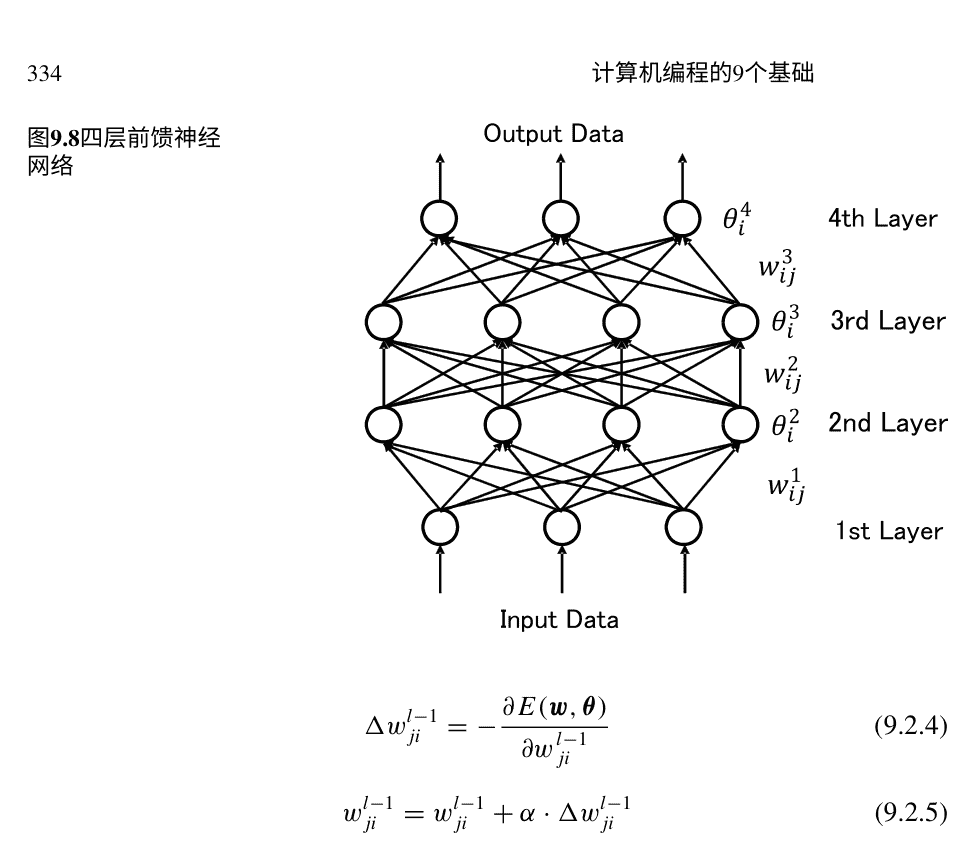

$$\Delta w_{ji}^{l-1} = -\frac{\partial E(\boldsymbol{w}, \boldsymbol{\theta})}{\partial w_{ji}^{l-1}}$$ (9.2.4)

$$w_{ji}^{l-1} = w_{ji}^{l-1} + \alpha \cdot \Delta w_{ji}^{l-1}$$ (9.2.5)

作为示例，让我们来检查在图9.8所示的具有四层（两个隐藏层）的前馈神经网络中函数back_propagation的行为。隐藏层数 nHL被假设为2。

首先，输出层和第二个隐藏层之间的连接权重的更新量为

$$\alpha \Delta w_{ji}^{3} = -\alpha \frac{\partial E}{\partial w_{ji}^{3}} = \alpha \left( T_j - O_j^{4} \right) \frac{\partial f \left( U_j^{4} \right)}{\partial U_j^{4}} O_i^{3}$$ (9.2.6)

在函数back_propagation中，$\Delta w_{ji}^{3}$被写为dw[2][j][i]并在函数中计算如下：

```
d[3][i] = (t[p][i] - zOU[i]) * zdOU[i];
dw[2][j][i] = Alpha*d[3][j]*zHU[2][i] + Mom2*dw[2][j][i];
```

除了动量法的项之外，代码与等式一致。(9.2.6).

接下来，第二个隐藏层与第一个隐藏层之间的连接权重的更新量为

$$\alpha \Delta w_{ji}^{2} = -\alpha \frac{\partial E}{\partial w_{ji}^{2}} = \alpha \sum_{k=1}^{n_4} \left( T_k - O_k^{4} \right) \frac{\partial f \left( U_k^{4} \right)}{\partial U_k^{4}} w_{kj}^{3} \frac{\partial f \left( U_j^{3} \right)}{\partial U_j^{3}} O_i^{2}$$ (9.2.7)

在函数back_propagation中，$\Delta w_{ji}^{2}$被写为dw[1][j][i]，并且计算如下。首先，通过以下方程计算d[3][i]

```
d[3][i] = (t[p][i] - zOU[i]) * zdOU[i];
```

其次，通过以下循环计算d[2][i]

```
for (i=0;i<nHU[2];i++) {
  for (sum=0.0f,j=0;j<nOU;j++) sum += d[3][j]*w[2][j][i];
  d[2][i] = zdHU[2][i]*sum;
}
```

最后，dw[1][j][i]的计算如下:

```
dw[1][j][i] = Alpha*d[2][j]*zHU[1][i] + Mom2*dw[1][j][i];
```

除了动量法的项之外，代码与等式一致。(9.2.7).

此外，第一隐藏层和输入层之间的连接权重更新量为

$$\alpha\Delta w_{ji}^{1} = -\alpha \frac{\partial E}{\partial w_{ji}^{1}} = \alpha \sum_{k=1}^{n_4} \left( I_k - O_k^{4} \right) \frac{\partial f\left(U_k^{4}\right)}{\partial U_k^{4}} \sum_{l=1}^{n_3} w_{kl}^{3} \frac{\partial f\left(U_l^{3}\right)}{\partial U_l^{3}} w_{lj}^{2} \frac{\partial f\left(U_j^{2}\right)}{\partial U_j^{2}} O_i^{1}$$ (9.2.8)

在函数back_propagation中，$\Delta w_{ji}^{1}$被写为dw[0][j][i]，并计算如下。首先，通过以下方式计算 d[3][i]:

```
d[3][i] = (t[p][i] - zOU[i]) * zdOU[i];
```

其次，通过双重循环计算d[2][i]

```
for (i=0;i<nHU[2];i++) {
  for (sum=0.0f,j=0;j<nOU;j++) sum += d[3][j]*w[2][j][i];
  d[2][i] = zdHU[2][i]*sum;
}
```

第三，通过三重循环计算d[1][i]

```
for (iL=1;iL>=1;iL--) { //这里表示iL=1。
for (j=0;j<nHU[1];j++) {
for (sum=0.0f,i=0;i<nHU[2];i++)
sum += d[2][i] * w[1][i][j];
d[1][j] = zdHU[1][j] * sum;
}
}
```

最后，计算dw[0][j][i]

```
dw[0][j][i] = Alpha*d[1][j]*zIU[p][i] + Mom2*dw[0][j][i];
```

除了动量法的项之外，代码与等式一致。(9.2.8).

$$\beta\Delta\theta_i^4 = -\beta \frac{\partial E}{\partial\theta_i^4} = -\beta \left(O_i^4 - T_i\right)\frac{\partial f\left(U_i^4\right)}{\partial U_i^4}$$ (9.2.9)

$$\beta\Delta\theta_i^3 = -\beta \frac{\partial E}{\partial\theta_i^3} = -\beta \sum_{j=1}^{n_4} \left(O_j^4 - T_j\right)\frac{\partial f\left(U_j^4\right)}{\partial U_j^4} w_{ji}^3 \frac{\partial f\left(U_i^3\right)}{\partial U_i^3}$$ (9.2.10)

$$\beta\Delta\theta_i^2 = -\beta \frac{\partial E}{\partial\theta_i^2} = -\beta \sum_{j=1}^{n_4} \left(O_j^4 - T_j\right)\frac{\partial f\left(U_j^4\right)}{\partial U_j^4} \sum_{k=1}^{n_3} w_{jk}^3 \frac{\partial f\left(U_k^3\right)}{\partial U_k^3} w_{ki}^2 \frac{\partial f\left(U_i^2\right)}{\partial U_i^2}$$ (9.2.11)

在函数back_propagation中，$\Delta\theta_i^4$, $\Delta\theta_i^3$ 和 $\Delta\theta_i^2$分别表示为dbias[3][i], dbias[2][i]和dbias[1][i]。与连接权重更新的情况一样，代码与方程式(9.2.9)- (9.2.11)一致。

最后，我们来看一下 DLneuro.c的主体部分。

```
/* DLneuro.c */
#include "nrutil.c"
#include <math.h>

#define rnd() (drand48() * (Wmax - Wmin) + Wmin)
#define noise() ((drand48()-0.5f)*2.0f*NoiseLevel)
#define FNAMELENGTH 100
#define NHU_V 1
#define NHU_C 0

float Mom1=0.05f;
float Mom2=0.05f;

float Wmin = -0.10f ;
float Wmax = 0.10f ;

#include "DLcommon.c"
#include "DLebp.c"
/*--------------------------------------------------*/
int main(void)
{
 int i,j,k,iteration_min,i1,j1,rseed,o_freq,MaxPattern,
 MaxEpochs,lp_no,tp_no,nIU,nOU,*nHU,nHL,nHU0,nhflag,
 *idx1;
 float *zOU,**zOU_min,**zIU,**zIUor,**zHU,***w,**bias,
***dw,***dbias,***w_min,**bias_min,**dtemp,**zdHU,*zdOU,
ef1,ef2,ef2_min=1e6,NoiseLevel, Alpha,Beta,**t ;
char fname1[FNAMELENGTH];
FILE *fp;
/*-------------------------------------------------------------*/
scanf("%d %d %d %d %d %d %d %d %d %s %d %e %e %e",
&MaxPattern,&lp_no,&nIU,&nHU0,&nOU,&nHL,&nhflag,
&MaxEpochs,&o_freq,fname1,&rseed,&Alpha,&Beta,
&NoiseLevel);

tp_no = MaxPattern - lp_no ;
/*-------------------------------------------------------------*/
nHU = ivector(0,nHL+1);
if(nhflag == NHU_V) {
for(i=1;i<=nHL;i++) scanf("%d",nHU+i);
}else{
for(i=1;i<=nHL;i++) nHU[i] = nHU0 ;
}
nHU[0] = nIU ;
nHU[nHL+1] = nOU ;
/*-------------------------------------------------------------*/
t = matrix(0,MaxPattern-1,0,nOU-1) ;
zIU = matrix(0,MaxPattern-1,0,nIU-1) ;
zIUor = matrix(0,MaxPattern-1,0,nIU-1) ;

zHU = (float **)malloc((nHL+2)*sizeof(float *));
for(i=0;i<nHL+2;i++) zHU[i] = vector(0,nHU[i]-1);
zdHU = (float **)malloc((nHL+2)*sizeof(float *));
for(i=0;i<nHL+2;i++) zdHU[i] = vector(0,nHU[i]-1);

zOU = vector(0,nOU-1) ;
zdOU = vector(0,nOU-1) ;
zOU_min = matrix(0,MaxPattern-1,0,nOU-1) ;

w = (float ***)malloc((nHL+1)*sizeof(float **));
for(i=0;i<=nHL;i++)
w[i] = matrix(0,nHU[i+1]-1,0,nHU[i]-1) ;
w_min = (float ***)malloc((nHL+1)*sizeof(float **));
for(i=0;i<=nHL;i++)
w_min[i] = matrix(0,nHU[i+1]-1,0,nHU[i]-1) ;
dw = (float ***)malloc((nHL+1)*sizeof(float **));
for(i=0;i<=nHL;i++)
dw[i] = matrix(0,nHU[i+1]-1,0,nHU[i]-1) ;

bias = (float **)malloc((nHL+2)*sizeof(float *));
for(i=0;i<=nHL+1;i++) bias[i] = vector(0,nHU[i]-1) ;
bias_min = (float **)malloc((nHL+2)*sizeof(float *));
for(i=0;i<=nHL+1;i++) bias_min[i] = vector(0,nHU[i]-1) ;
dbias = (float **)malloc((nHL+2)*sizeof(float *));
for(i=0;i<=nHL+1;i++) dbias[i] = vector(0,nHU[i]-1) ;

dtemp = (float **)malloc((nHL+2)*sizeof(float *));
for(i=0;i<nHL+2;i++) dtemp[i] = vector(0,nHU[i]-1) ;

idx1 = (int *)malloc(lp_no*sizeof(int));
for(i=0;i<lp_no;i++) idx1[i] = i ;
/*-------------------------------------------------------------*/
read_file(fname1,zIUor,t,nIU,nOU,MaxPattern);
srand48(rseed);
initialize(w,bias,nIU,nHU,nOU,nHL);
clear_dweight(dw,dbias,nIU,nHU,nOU,nHL);
/*-------------------------------------------------------------*/
for(i=0;i<=MaxEpochs;i++){
for(i1=0;i1<lp_no;i1++)
for(j=0;j<nIU;j++)
zIU[i1][j] = (1.0f + noise())*zIUor[i1][j] ;
s_shuffle(idx1,lp_no) ;

for(j=0;j<lp_no;j++){
传播(idx1[j],zIU,zHU,zdHU,zOU,zdOU,
w,bias,nIU,nHU,nOU,nHL);
反向传播(idx1[j],t,zIU,zHU,zdHU,zOU,zdOU,
w,bias,dw,dbias,dtemp,nIU,nHU,nOU,nHL,Alpha,Beta);
}

if(i%o_freq==0){
for(ef1=0.0f,j=0;j<lp_no;j++){
传播(j,zIUor,zHU,zdHU,zOU,zdOU,
w,bias,nIU,nHU,nOU,nHL);
for(k=0;k<nOU;k++) ef1 += fabs(t[j][k] - zOU[k]);
}
for(ef2=0.0f,j=lp_no;j<lp_no+tp_no;j++){
传播(j,zIUor,zHU,zdHU,zOU,zdOU,
w,bias,nIU,nHU,nOU,nHL);
for(k=0;k<nOU;k++) ef2 += fabs(t[j][k] - zOU[k]);
}
printf("%dth Error :%.5f %.5f",i,ef1/lp_no,ef2/tp_no);
if(ef2<=ef2_min){
ef2_min = ef2;
iteration_min = i;
store_weight(w,bias,w_min,bias_min,nIU,nHU,nOU,nHL);
}
}
}
/*-------------------------------------------------------------*/
show_results(w, bias, w_min, bias_min, nIU, nHU, nOU, nHL) ;
return 0 ;
}
```

nrutil.c在DLneuro.c的开头被包含，定义了一组在参考文献[14]中提供的函数。nrutil.c在公共领域中，并且可以从网站(http://numerical.recipes)下载。在DLneuro.c中，nrutil.c用于数组分配。

rnd()是一个生成范围在[Wmin, Wmax]的均匀随机数的宏，而noise()生成范围在$[-\text{NoiseLevel}, +\text{NoiseLevel}]$的随机噪声。

### 9.2 训练阶段的计算机编程

噪声水平。虽然在 DLneuro.c中使用drand48()生成随机数，但可以用更好的例程替换它。

主函数的结构总结如下：

- (1) 加载元参数，如训练模式数量、隐藏层数量等。
- (2) 根据元参数分配数组。
- (3) 通过 read_file函数从文件中加载训练模式。
- (4) 通过 initialize函数初始化连接权重和偏置。
- (5) 开始训练（训练持续达到 MaxEpochs 为止。）
- (6) 结束训练（达到MaxEpochs为止。）
- (7) 通过show_results函数输出训练结果，例如所有连接权重和偏置。

训练循环中每个时期的操作总结如下：

- (E1) 向输入数据添加噪声。
- (E2) 通过shuffle函数改变训练模式的顺序。

每个训练模式执行以下操作。

- (E3-1) 传播 (传播)
- (E3-2) 反向传播 (反向传播)

每隔 o_freq个时期执行以下操作。

- 计算训练模式的误差总和。
- 计算验证模式的误差总和。
- 输出平均误差。
- 如果验证模式的误差达到最小值，则将所有连接权重和偏置复制到另一个数组中。

DLneuro.c已在Linux上成功测试。编译示例如下所示：

```
$ cc -O3 -o DLneuro.exe DLneuro.c -lm
```

编译完成后，按照以下方式运行程序：

```
$ echo "1000 800 5 20 3 2 0 5000 100 indata.dat 12345 0.1 0.1 0.001" | ./DLneuro.exe > result.txt
```

在这种情况下，结果将存储在 result.txt文件中。在上面的示例中，假设每个隐藏层中的单元数为20，训练周期数为5000。

#### 9.2.2 C语言中前馈神经网络的示例代码

使用OpenBLAS

在前面的小节中，详细介绍了C语言中前馈神经网络的程序。这里提供了一个使用开源通用BLAS库进行扩展的程序。

众所周知，全连接前馈神经网络中的计算包括矩阵和向量运算，称为线性代数运算，经常在计算力学和其他领域中使用。

出于这个原因，已经开发了一个通用的线性代数基本操作库，称为BLAS（基本线性代数子程序）。本小节提供的程序使用了OpenBLAS [https://www.openblas.net]，这是一个针对多种类型的CPU进行优化的开源BLAS库，其中矩阵被表示为一维数组。考虑一个由单精度实数组成的矩阵，如下所示：

$A = \begin{bmatrix} a_{00} & a_{01} & a_{02} \\ a_{10} & a_{11} & a_{12} \end{bmatrix}$ (9.2.12)

上述矩阵 A 通过以下一维数组表示：

```
float A[6] = {a00, a01, a02, a10, a11, a12};
```

这些元素按照顺序存储在内存的连续区域中，即首先是第一行的元素，然后是第二行的元素。

这种存储顺序被称为RowMajor，是C语言中矩阵的标准存储顺序。在上述情况下，通过显式指定列数3，可以按照RowMajor顺序从相应的一维数组中访问二维矩阵 A 中第 i 行第 j 列的元素，即 A[i*3 + j]。

请注意，在FORTRAN语言中，方程（9.2.12）中的矩阵按照所示的顺序存储在内存中

```
{a00, a10, a01, a11, a02, a12}
```

这被称为列主序，其中第一列、第二列和第三列的分量分别按照这个顺序存储。

BLAS子程序分为三个级别：

- 级别1：对向量进行操作的子程序（C中的函数）。
- 级别2：对向量和矩阵进行操作的子程序（C中的函数），包括矩阵-向量乘积。
- 级别3：对矩阵进行操作的子程序（C中的函数），包括矩阵-矩阵乘积。

BLAS的计算强度在不同级别之间有所不同，计算强度定义为操作次数除以用于操作的数据量（字节）。考虑在一级BLAS中向量之间的操作。在两个向量相加的情况下，

$$\begin{pmatrix} a_1 \\ a_2 \\ \vdots \\ a_n \end{pmatrix} + \begin{pmatrix} b_1 \\ b_2 \\ \vdots \\ b_n \end{pmatrix}$$ (9.2.13)

计算强度为0.5，因为使用2个数据进行相加操作。

在向量的标量积的情况下，

$$\begin{pmatrix} a_1 & a_2 & \cdots & a_n \end{pmatrix} \begin{pmatrix} b_1 \\ b_2 \\ \vdots \\ b_n \end{pmatrix}$$ (9.2.14)

计算强度为1.0，因为使用2个数据进行相加和相乘操作。

考虑在二级BLAS中的操作。在矩阵和向量相乘的情况下，

$$\begin{bmatrix} a_{11} & a_{12} & \cdots & a_{1n} \\ a_{21} & a_{22} & \cdots & a_{2n} \\ \vdots & \vdots & \ddots & \vdots \\ a_{n1} & a_{n2} & \cdots & a_{nn} \end{bmatrix} \begin{pmatrix} b_1 \\ b_2 \\ \vdots \\ b_n \end{pmatrix}$$ (9.2.15)

计算强度约为2.0，因为使用2个数据进行2个操作。$n^2 + n$使用的数据块数。

对于矩阵和矩阵相乘的情况，这是三级BLAS中的一种操作，如下所示：

$$
\begin{bmatrix}
a_{11} & a_{12} & \cdots & a_{1n} \\
a_{21} & a_{22} & \cdots & a_{2n} \\
\vdots & \vdots & \ddots & \vdots \\
a_{n1} & a_{n2} & \cdots & a_{nn}
\end{bmatrix}
\begin{bmatrix}
b_{11} & b_{12} & \cdots & b_{1n} \\
b_{21} & b_{22} & \cdots & b_{2n} \\
\vdots & \vdots & \ddots & \vdots \\
b_{n1} & b_{n2} & \cdots & b_{nn}
\end{bmatrix}
\quad (9.2.16)
$$

计算强度是 $n$ 因为执行了 $2n^3$ 次操作，使用了 $2n^2$ 个数据片段。

请注意，计算强度越高，计算在大多数计算机上执行得越高效。

现在，让我们来看一些在OpenBLAS中每个级别的典型函数的示例。

```c
void cblas_saxpy(int n, float a, float *x, int incx, float *y, int incy)
```

该函数的操作是不使用BLAS编写的

```c
for(i=0;i<n;i++){
    y[incy*i] += a*x[incx*i] ;
}
```

请注意，向量 x 的维度必须至少为 $1 + (n-1)*incx$ ，向量 y 的维度必须至少为 $1 + (n-1)*incy$。还有 cblas_daxpy() 可以执行与上述相同的操作，但用于双精度实数。

接下来，介绍一下二级函数 cblas_sgemv()。该函数执行将 m 乘以 A 和向量 x 的乘积，并乘以 alpha，然后将其加到乘以 beta 的向量 y 中的操作。矩阵 A，向量 x 和 y 以及常数 alpha 和 beta 的分量都是单精度实数。该函数的参数如下所示：

```c
void cblas_sgemv(int order, int transA, int m, int n,
                 float alpha, float *A, int ldA, float *x, int incx,
                 float beta, float *y, int incy)
```

与存储顺序相关的参数 order在cblas.h中定义如下：

```c
enum CBLAS_ORDER {CblasRowMajor=101, CblasColMajor=102};
```

因此，在行优先的情况下应指定CblasRowMajor，在列优先的情况下应指定CblasColMajor。与是否转置矩阵A的参数transA在cblas.h中定义如下：

```c
enum CBLAS_TRANSPOSE {CblasNoTrans=111, CblasTrans=112, CblasConjTrans=113};
```

如果要转置矩阵，则指定 CblasTrans；否则，指定CblasNoTrans。ldA表示矩阵 A的主维度。现在，考虑以下函数的行为：

```c
cblas_sgemv(CblasRowMajor, CblasNoTrans, m, n,
            alpha, A, n,
            x, incx,
            beta, y, incy)
```

这个函数的操作可以不使用BLAS来写成

```c
for(i=0;i<m;i++){
    for(j=0,d=0.0f;j<n;j++) d += A[i*n+j]*x[incx*j] ;
    y[incy*i] = alpha*d + beta*y[incy*i] ;
}
```

注意向量x的维度至少为 1 + (n-1)*incx，向量 y的维度至少为 1 + (n-1)*incy。还有cblas_dgemv()可以执行相同的操作，但适用于双精度实数。

接下来，我们讨论一下级别为3的函数cblas_sgemm()的描述，它执行将一个 m乘以k的矩阵 A和一个 k乘以n的矩阵 B (结果为一个 m乘以n的矩阵 ) 乘以 alpha，并将其加到一个 m乘以n的矩阵 C乘以 beta的操作。矩阵 A 、 B和 C的组成部分以及常数 alpha和 beta都是单精度实数。该函数的参数如下所示：

```c
void cblas_sgemm(int order, int transA, int transB, int m,
                 int n, int k, float alpha, float *A, int ldA, float *B, int ldB,
                 float beta, float *C, int ldC)
```

一个参数 order 再次指定了如何存储矩阵 A。对于行优先顺序，请指定 CblasRowMajor；对于列优先顺序，请指定 CblasColMajor。transA 是一个参数，用于指定是否对矩阵 A 进行转置。请指定 CblasTrans 进行转置，或指定 CblasNoTrans 不进行转置。
transB 是矩阵 B 的转置参数，规范方法与 transA 相同。ldA、ldB 和 ldC 分别指的是矩阵 A、B 和 C的主维度。

```c
cblas_sgemm(CblasRowMajor, CblasNoTrans, CblasNoTrans, m, n, k, alpha, A, k, B, n, beta, C, n)
```

现在，考虑一个被指定为函数的行为。在上述情况下，该函数的操作可以不使用BLAS来编写

```c
for(i=0; i<m; i++) {
    for(j=0; j<n; j++) {
        for(ii=0, d=0.0f; ii<k; ii++) d += A[i*k+ii] *B[ii*n+j] ;
        C[i*n+j] = alpha*d + beta*C[i*n+j] ;
    }
}
```

上述的 OpenBLAS 函数以及 OpenBLAS 中的其他一级函数：

- cblas_scopy ()
- cblas_sscal ()
- cblas_sasum ()

在我们的程序中被使用。每个函数的操作可以如下所述，而不使用BLAS：

```c
/* void cblas_scopy(int n, float *x, int incx, float *y, int incy) */
for(i=0; i<n; i++) {
    y[i*incy] = x[i*incx] ;
}
/* void cblas_sscal(int n, float alpha, float *x, int incx) */
for(i=0; i<n; i++) {
    x[i*incx] *= alpha ;
}
/* float cblas_sasum(int n, float *x, int incx) */
float sum;
for(i=0,sum=0.0f;i<n;i++){
    sum += fabs(x[i*incx]);
}
return sum;
```

当 DLneuro.c，在前一小节中描述的，通过反向传播学习更新连接权重，对每个训练模式进行更新时，这里解释的程序在多个模式（称为小批量）的前向传播之后更新它们。

尽管这会稍微降低误差反向传播学习逼近非线性函数的能力，但总体上往往是有利的，因为操作可以写成矩阵乘积的形式，计算效率大大提高。特别是对于具有大量训练模式的大规模问题，通常使用小批量来保持训练时间在合理范围内。

让小批量中的训练模式数为 mb，并且在小批量中表示为从1到 mb的数字的本地训练模式编号。在小批量中的第 p个学习模式的前向传播计算可以写成如下形式：

$$^pU^l_j = \sum_{i=1}^{n_{l-1}} w_{ji}^{l-1} \cdot ^pO_i^{l-1} + \theta_j^l \quad (9.2.17)$$

其中 $^pU^l_j$ 是第 j 个单元在第 l 层的输入，而 $^pO_i^{l-1}$ 是第 i 个单元在第(l-1)层的输出。在这里，左肩上标 p 表示这些输入和输出是一个小批量中第 p 个学习模式中的那些。$w_{ji}^{l-1}$ 是第 l 层的第 j 个单元与第 i 个单元之间的连接权重。

$(l-1)$层中的第j个单元的偏置值为 $\theta_j^l$。使用向量的标量积，方程(9.2.17)可表示为对第一个单元在第l层的表达式为

$$^pU_1^l = \left( w_{11}^{l-1} \cdots w_{1,n_{l-1}}^{l-1} \right) \begin{pmatrix} ^pO_1^{l-1} \\ \vdots \\ ^pO_{n_{l-1}}^{l-1} \end{pmatrix} + \theta_1^l \quad (9.2.18)$$

同样，对于第 l 层中的第二个单元，方程（9.2.17）可以写成

$$^{p}U^{l}_{2} = \left( w^{l-1}_{21} \cdots w^{l-1}_{2,n_{l-1}} \right) \begin{pmatrix} ^{p}O^{l-1}_{1} \\ \vdots \\ ^{p}O^{l-1}_{n_{l-1}} \end{pmatrix} + \theta^{l}_{2} \qquad (9.2.19)$$

因此，对于第 $l$ 层中的所有单元，我们有

$$ \begin{pmatrix} ^{p}U^{l}_{1} \\ ^{p}U^{l}_{2} \\ \vdots \\ ^{p}U^{l}_{n_{l}} \end{pmatrix} = \begin{bmatrix} w^{l-1}_{11} & w^{l-1}_{12} & \cdots & w^{l-1}_{1,n_{l-1}} \\ w^{l-1}_{21} & w^{l-1}_{22} & \cdots & w^{l-1}_{2,n_{l-1}} \\ \vdots & \vdots & \ddots & \vdots \\ w^{l-1}_{n_{l},1} & w^{l-1}_{n_{l},2} & \cdots & w^{l-1}_{n_{l},n_{l-1}} \end{bmatrix} \begin{pmatrix} ^{p}O^{l-1}_{1} \\ ^{p}O^{l-1}_{2} \\ \vdots \\ ^{p}O^{l-1}_{n_{l-1}} \end{pmatrix} + \begin{pmatrix} \theta^{l}_{1} \\ \theta^{l}_{2} \\ \vdots \\ \theta^{l}_{n_{l}} \end{pmatrix} = \left[ w^{l-1} \right] \begin{pmatrix} ^{p}O^{l-1}_{1} \\ ^{p}O^{l-1}_{2} \\ \vdots \\ ^{p}O^{l-1}_{n_{l-1}} \end{pmatrix} + \begin{pmatrix} \theta^{l}_{1} \\ \theta^{l}_{2} \\ \vdots \\ \theta^{l}_{n_{l}} \end{pmatrix} \qquad (9.2.20) $$

其中 $\left[ w^{l-1} \right]$ 是连接第 $(l-1)$ 层和第$l$层的连接权重的 $n_l$-by- $n_{l-1}$ 矩阵。$(l-1)$层和第$l$层之间的连接权重作为组成部分。

对于迷你批次中的第一个训练模式，方程 (9.2.20) 可以写成

$$ \begin{pmatrix} ^{1}U^{l}_{1} \\ ^{1}U^{l}_{2} \\ \vdots \\ ^{1}U^{l}_{n_{l}} \end{pmatrix} = \left[ w^{l-1} \right] \begin{pmatrix} ^{1}O^{l-1}_{1} \\ ^{1}O^{l-1}_{2} \\ \vdots \\ ^{1}O^{l-1}_{n_{l-1}} \end{pmatrix} + \begin{pmatrix} \theta^{l}_{1} \\ \theta^{l}_{2} \\ \vdots \\ \theta^{l}_{n_{l}} \end{pmatrix} \qquad (9.2.21) $$

同样地，对于迷你批次中的第二个训练模式，方程 (9.2.20) 可以写成如下形式：

$$ \begin{pmatrix} ^{2}U^{l}_{1} \\ ^{2}U^{l}_{2} \\ \vdots \\ ^{2}U^{l}_{n_{l}} \end{pmatrix} = \left[ w^{l-1} \right] \begin{pmatrix} ^{2}O^{l-1}_{1} \\ ^{2}O^{l-1}_{2} \\ \vdots \\ ^{2}O^{l-1}_{n_{l-1}} \end{pmatrix} + \begin{pmatrix} \theta^{l}_{1} \\ \theta^{l}_{2} \\ \vdots \\ \theta^{l}_{n_{l}} \end{pmatrix} \qquad (9.2.22) $$

最后，对于所有迷你批次中的训练模式，我们有

$$ \begin{bmatrix} ^{1}U^{l}_{1} & ^{2}U^{l}_{1} & \cdots & ^{mb}U^{l}_{1} \\ ^{1}U^{l}_{2} & ^{2}U^{l}_{2} & \cdots & ^{mb}U^{l}_{2} \\ \vdots & \vdots & \ddots & \vdots \\ ^{1}U^{l}_{n_{l}} & ^{2}U^{l}_{n_{l}} & \cdots & ^{mb}U^{l}_{n_{l}} \end{bmatrix} = \left[ w^{l-1} \right] \begin{bmatrix} ^{1}O^{l-1}_{1} & ^{2}O^{l-1}_{1} & \cdots & ^{mb}O^{l-1}_{1} \\ ^{1}O^{l-1}_{2} & ^{2}O^{l-1}_{2} & \cdots & ^{mb}O^{l-1}_{2} \\ \vdots & \vdots & \ddots & \vdots \\ ^{1}O^{l-1}_{n_{l-1}} & ^{2}O^{l-1}_{n_{l-1}} & \cdots & ^{mb}O^{l-1}_{n_{l-1}} \end{bmatrix} $$

+ $$\left[\begin{array}{cccc} \theta_1^l & \theta_1^l & \cdots & \theta_1^l \\ \theta_2^l & \theta_2^l & \cdots & \theta_2^l \\ \vdots & \vdots & \ddots & \vdots \\ \theta_{n_l}^l & \theta_{n_l}^l & \cdots & \theta_{n_l}^l \end{array}\right] \quad (9.2.23)$$

方程（9.2.23）可以用矩阵表示为

$$\left[ U^l \right] = \left[ w^{l-1} \right] \left[ O^{l-1} \right] + \left[ \theta^l \right] \quad (9.2.24)$$

其中 $U^l$ 和 $\theta^l$ 是具有 $n_l$ 行和 $mb$ 列的矩阵，而 $O^{l-1}$ 是具有 $n_{l-1}$ 行和 $mb$ 列的矩阵。

接下来，将研究使用小批量进行的反向传播计算，针对的是四层前馈神经网络的情况。在小批量中，对于第 p 个训练模式的连接权重的更新规则如下（参见第2.1节中的公式（2.1.31）、(2.1.32) 和（2.1.33））：

$$^{p}\Delta w_{ji}^3 = - \frac{\partial^{p}E}{\partial w_{ji}^3} = - \left( ^{p}O_j^4 - ^{p}T_j \right) \frac{\partial f\left( ^{p}U_j^4 \right)}{\partial ^{p}U_j^4} ^{p}O_i^3 = ^{p}\delta_j^4 \cdot ^{p}O_i^3 \quad (9.2.25)$$

$$^{p}\Delta w_{ji}^2 = - \frac{\partial^{p}E}{\partial w_{ji}^2} = - \sum_{k=1}^{n_4} \left( ^{p}O_k^4 - ^{p}T_k \right) \frac{\partial f\left( ^{p}U_k^4 \right)}{\partial ^{p}U_k^4} w_{kj}^3 \frac{\partial f\left( ^{p}U_j^3 \right)}{\partial ^{p}U_j^3} ^{p}O_i^2 \\ = \sum_{k=1}^{n_4} ^{p}\delta_k^4 \cdot w_{kj}^3 \frac{\partial f\left( ^{p}U_j^3 \right)}{\partial ^{p}U_j^3} ^{p}O_i^2 = ^{p}\delta_j^3 \cdot ^{p}O_i^2 \quad (9.2.26)$$

$$^{p}\Delta w_{ji}^1 = - \frac{\partial^{p}E}{\partial w_{ji}^1} \\ = - \sum_{k=1}^{n_4} \left( ^{p}O_k^4 - ^{p}T_k \right) \frac{\partial f\left( ^{p}U_k^4 \right)}{\partial ^{p}U_k^4} \sum_{l=1}^{n_3} w_{kl}^3 \frac{\partial f\left( ^{p}U_l^3 \right)}{\partial ^{p}U_l^3} w_{lj}^2 \frac{\partial f\left( ^{p}U_j^2 \right)}{\partial ^{p}U_j^2} ^{p}O_i^1 \\ = \sum_{k=1}^{n_4} ^{p}\delta_k^4 \sum_{l=1}^{n_3} w_{kl}^3 \frac{\partial f\left( ^{p}U_l^3 \right)}{\partial ^{p}U_l^3} w_{lj}^2 \frac{\partial f\left( ^{p}U_j^2 \right)}{\partial ^{p}U_j^2} ^{p}O_i^1 \\ = \sum_{l=1}^{n_3} ^{p}\delta_l^3 w_{lj}^2 \frac{\partial f\left( ^{p}U_j^2 \right)}{\partial ^{p}U_j^2} ^{p}O_i^1 = ^{p}\delta_j^2 \cdot ^{p}O_i^1 \quad (9.2.27)$$

从方程（9.2.25）中，收集每个j的 $^{p}\delta_j^4$ 为

$$\begin{pmatrix} _{p}\delta_1^4 \\ _{p}\delta_2^4 \\ \vdots \\ _{p}\delta_{n_4}^4 \end{pmatrix} \quad (9.2.28)$$

${}_{p}\delta_j^4$ 对于一个小批次中的所有训练模式，可以用一个矩阵表示 $[\delta^4]$ 的 $n_4$ 行和 $mb$ 列

$$\begin{bmatrix} ^{1}\delta_1^4 & ^{2}\delta_1^4 & \dots & ^{mb}\delta_1^4 \\ ^{1}\delta_2^4 & ^{2}\delta_2^4 & \dots & ^{mb}\delta_2^4 \\ \vdots & \vdots & \ddots & \vdots \\ ^{1}\delta_{n_4}^4 & ^{2}\delta_{n_4}^4 & \dots & ^{mb}\delta_{n_4}^4 \end{bmatrix} = [\delta^4] \quad (9.2.29)$$

根据公式 (9.2.26) ，${}_{p}\delta_j^3$ 可以表示为

$$\begin{aligned} _{p}\delta_j^3 &= \sum_{k=1}^{n_4} _{p}\delta_k^4 \cdot w_{kj}^3 \frac{\partial f\left(_{p}U_j^3\right)}{\partial _{p}U_j^3} \\ &= \left( w_{1j}^3 \ w_{2j}^3 \ \dots \ w_{n_4j}^3 \right) \begin{pmatrix} _{p}\delta_1^4 \\ _{p}\delta_2^4 \\ \vdots \\ _{p}\delta_{n_4}^4 \end{pmatrix} \times \frac{\partial f\left(_{p}U_j^3\right)}{\partial _{p}U_j^3} \end{aligned} \quad (9.2.30)$$

然后，根据公式 (9.2.30) ，${}_{p}\delta_j^3$ 对于每个 $j$ 被收集为

$$\begin{pmatrix} _{p}\delta_1^3 \\ _{p}\delta_2^3 \\ \vdots \\ _{p}\delta_{n_3}^3 \end{pmatrix} = \left( \begin{bmatrix} w_{11}^3 & w_{21}^3 & \dots & w_{n_4 1}^3 \\ w_{12}^3 & w_{22}^3 & \dots & w_{n_4 2}^3 \\ \vdots & \vdots & \ddots & \vdots \\ w_{1n_3}^3 & w_{2n_3}^3 & \dots & w_{n_4 n_3}^3 \end{bmatrix} \begin{pmatrix} _{p}\delta_1^4 \\ _{p}\delta_2^4 \\ \vdots \\ _{p}\delta_{n_4}^4 \end{pmatrix} \right) \odot \begin{pmatrix} \frac{\partial f\left(_{p}U_1^3\right)}{\partial _{p}U_1^3} \\ \frac{\partial f\left(_{p}U_2^3\right)}{\partial _{p}U_2^3} \\ \vdots \\ \frac{\partial f\left(_{p}U_{n_3}^3\right)}{\partial _{p}U_{n_3}^3} \end{pmatrix} \quad (9.2.31)$$

其中 $\odot$ 表示两个向量的Hadamard乘积，这是一种二元运算，它接受两个维度相同的向量，并产生另一个维度相同的向量，其第 $i$ 个分量是原始两个向量的第 $i$ 个分量的乘积。因此，对于迷你批次中的所有训练模式，可以写成 ${}_{p}\delta_j^3$

$$\begin{bmatrix} ^{1}\delta_1^3 & ^{2}\delta_1^3 & \dots & ^{mb}\delta_1^3 \\ ^{1}\delta_2^3 & ^{2}\delta_2^3 & \dots & ^{mb}\delta_2^3 \\ \vdots & \vdots & \ddots & \vdots \\ ^{1}\delta_{n_3}^3 & ^{2}\delta_{n_3}^3 & \dots & ^{mb}\delta_{n_3}^3 \end{bmatrix} = \left[ \begin{bmatrix} w_{11}^3 & w_{21}^3 & \dots & w_{n_41}^3 \\ w_{12}^3 & w_{22}^3 & \dots & w_{n_42}^3 \\ \vdots & \vdots & \ddots & \vdots \\ w_{1n_3}^3 & w_{2n_3}^3 & \dots & w_{n_4n_3}^3 \end{bmatrix} \begin{bmatrix} ^{1}\delta_1^4 & ^{2}\delta_1^4 & \dots & ^{mb}\delta_1^4 \\ ^{1}\delta_2^4 & ^{2}\delta_2^4 & \dots & ^{mb}\delta_2^4 \\ \vdots & \vdots & \ddots & \vdots \\ ^{1}\delta_{n_4}^4 & ^{2}\delta_{n_4}^4 & \dots & ^{mb}\delta_{n_4}^4 \end{bmatrix} \right] \odot \begin{bmatrix} \frac{\partial f(^{1}U_1^3)}{\partial ^{1}U_1^3} & \frac{\partial f(^{2}U_1^3)}{\partial ^{2}U_1^3} & \dots & \frac{\partial f(^{mb}U_1^3)}{\partial ^{mb}U_1^3} \\ \frac{\partial f(^{1}U_2^3)}{\partial ^{1}U_2^3} & \frac{\partial f(^{2}U_2^3)}{\partial ^{2}U_2^3} & \dots & \frac{\partial f(^{mb}U_2^3)}{\partial ^{mb}U_2^3} \\ \vdots & \vdots & \ddots & \vdots \\ \frac{\partial f(^{1}U_{n_3}^3)}{\partial ^{1}U_{n_3}^3} & \frac{\partial f(^{2}U_{n_3}^3)}{\partial ^{2}U_{n_3}^3} & \dots & \frac{\partial f(^{mb}U_{n_3}^3)}{\partial ^{mb}U_{n_3}^3} \end{bmatrix} \quad (9.2.32)$$

方程（9.2.32）被重写为

$$[\delta^3] = \left[ [w^3]^T [\delta^4] \right] \odot \begin{bmatrix} \frac{\partial f(^{1}U_1^3)}{\partial ^{1}U_1^3} & \frac{\partial f(^{2}U_1^3)}{\partial ^{2}U_1^3} & \dots & \frac{\partial f(^{mb}U_1^3)}{\partial ^{mb}U_1^3} \\ \frac{\partial f(^{1}U_2^3)}{\partial ^{1}U_2^3} & \frac{\partial f(^{2}U_2^3)}{\partial ^{2}U_2^3} & \dots & \frac{\partial f(^{mb}U_2^3)}{\partial ^{mb}U_2^3} \\ \vdots & \vdots & \ddots & \vdots \\ \frac{\partial f(^{1}U_{n_3}^3)}{\partial ^{1}U_{n_3}^3} & \frac{\partial f(^{2}U_{n_3}^3)}{\partial ^{2}U_{n_3}^3} & \dots & \frac{\partial f(^{mb}U_{n_3}^3)}{\partial ^{mb}U_{n_3}^3} \end{bmatrix} \quad (9.2.33)$$

其中 $[\delta^3]$ 是一个有 $n_3$ 行和 $mb$ 列的矩阵，并且 $[w^3]$ 是一个有 $n_4$ 行和 $n_3$ 列的矩阵（$w^T$ 是 $n_3$ 行和 $n_4$ 列）。注意这里 $\odot$ 表示两个矩阵的Hadamard乘积，这是一个二元运算，它接受两个具有相同维度的矩阵，并产生另一个具有相同维度的矩阵，其 i,j-th 分量是原始两个矩阵的 i,j-th 分量的乘积。

以相同的方式，从方程（9.2.27）中，我们得到

$$\begin{bmatrix} ^{1}\delta_1^2 & ^{2}\delta_1^2 & \dots & ^{mb}\delta_1^2 \\ ^{1}\delta_2^2 & ^{2}\delta_2^2 & \dots & ^{mb}\delta_2^2 \\ \vdots & \vdots & \ddots & \vdots \\ ^{1}\delta_{n_2}^2 & ^{2}\delta_{n_2}^2 & \dots & ^{mb}\delta_{n_2}^2 \end{bmatrix} = \left[ \begin{bmatrix} w_{11}^2 & w_{21}^2 & \dots & w_{n_31}^2 \\ w_{12}^2 & w_{22}^2 & \dots & w_{n_32}^2 \\ \vdots & \vdots & \ddots & \vdots \\ w_{1n_2}^2 & w_{2n_2}^2 & \dots & w_{n_3n_2}^2 \end{bmatrix} \begin{bmatrix} ^{1}\delta_1^3 & ^{2}\delta_1^3 & \dots & ^{mb}\delta_1^3 \\ ^{1}\delta_2^3 & ^{2}\delta_2^3 & \dots & ^{mb}\delta_2^3 \\ \vdots & \vdots & \ddots & \vdots \\ ^{1}\delta_{n_3}^3 & ^{2}\delta_{n_3}^3 & \dots & ^{mb}\delta_{n_3}^3 \end{bmatrix} \right]$$

$$\left[ \begin{array}{cccc} \frac{\partial f(^{1}U_1^2)}{\partial ^{1}U_1^2} & \frac{\partial f(^{2}U_1^2)}{\partial ^{2}U_1^2} & \cdots & \frac{\partial f(^{mb}U_1^2)}{\partial ^{mb}U_1^2} \\ \frac{\partial f(^{1}U_2^2)}{\partial ^{1}U_2^2} & \frac{\partial f(^{2}U_2^2)}{\partial ^{2}U_2^2} & \cdots & \frac{\partial f(^{mb}U_2^2)}{\partial ^{mb}U_2^2} \\ \vdots & \vdots & \ddots & \vdots \\ \frac{\partial f(^{1}U_{n_2}^2)}{\partial ^{1}U_{n_2}^2} & \frac{\partial f(^{2}U_{n_2}^2)}{\partial ^{2}U_{n_2}^2} & \cdots & \frac{\partial f(^{mb}U_{n_2}^2)}{\partial ^{mb}U_{n_2}^2} \end{array} \right] \quad (9.2.34)$$

这个方程可以重写为

$$\left[ \delta^2 \right] = \left[ \left[ w^2 \right]^T \left[ \delta^3 \right] \right] \odot \left[ \begin{array}{cccc} \frac{\partial f(^{1}U_1^2)}{\partial ^{1}U_1^2} & \frac{\partial f(^{2}U_1^2)}{\partial ^{2}U_1^2} & \cdots & \frac{\partial f(^{mb}U_1^2)}{\partial ^{mb}U_1^2} \\ \frac{\partial f(^{1}U_2^2)}{\partial ^{1}U_2^2} & \frac{\partial f(^{2}U_2^2)}{\partial ^{2}U_2^2} & \cdots & \frac{\partial f(^{mb}U_2^2)}{\partial ^{mb}U_2^2} \\ \vdots & \vdots & \ddots & \vdots \\ \frac{\partial f(^{1}U_{n_2}^2)}{\partial ^{1}U_{n_2}^2} & \frac{\partial f(^{2}U_{n_2}^2)}{\partial ^{2}U_{n_2}^2} & \cdots & \frac{\partial f(^{mb}U_{n_2}^2)}{\partial ^{mb}U_{n_2}^2} \end{array} \right] \quad (9.2.35)$$

其中 $\left[ \delta^2 \right]$ 是一个具有 $n_2$ 行和 $mb$ 列的矩阵，以及 $\left[ w^2 \right]$ 具有 $n_3$ 行和 $n_2$ 列的矩阵。连接权重的更新量由方程 (9.2.25)、(9.2.26) 和 (9.2.27) 得到，总结如下：

$$\Delta w_{ji}^3 = \sum_{p=1}^{mb} {}^{p} \delta_j^4 \cdot {}^{p} O_i^3 \quad (9.2.36)$$

$$\Delta w_{ji}^2 = \sum_{p=1}^{mb} {}^{p} \delta_j^3 \cdot {}^{p} O_i^2 \quad (9.2.37)$$

$$\Delta w_{ji}^1 = \sum_{p=1}^{mb} {}^{p} \delta_j^2 \cdot {}^{p} O_i^1 \quad (9.2.38)$$

从方程 (9.2.36) 中，我们得到输出层和第二个隐藏层之间的所有连接权重的方程为

$$\left[ \begin{array}{cccc} \Delta w_{11}^3 & \Delta w_{12}^3 & \cdots & \Delta w_{1n_3}^3 \\ \Delta w_{21}^3 & \Delta w_{22}^3 & \cdots & \Delta w_{2n_3}^3 \\ \vdots & \vdots & \ddots & \vdots \\ \Delta w_{n_4 1}^3 & \Delta w_{n_4 2}^3 & \cdots & \Delta w_{n_4 n_3}^3 \end{array} \right]$$

\begin{bmatrix} ^{1}\delta_{1}^{4} & ^{2}\delta_{1}^{4} & \dots & ^{mb}\delta_{1}^{4} \\ ^{1}\delta_{2}^{4} & ^{2}\delta_{2}^{4} & \dots & ^{mb}\delta_{2}^{4} \\ \vdots & \vdots & \dots & \vdots \\ ^{1}\delta_{n_{4}}^{4} & ^{2}\delta_{n_{4}}^{4} & \dots & ^{mb}\delta_{n_{4}}^{4} \end{bmatrix} \begin{bmatrix} ^{1}O_{1}^{3} & ^{1}O_{2}^{3} & \dots & ^{1}O_{n_{3}}^{3} \\ ^{2}O_{1}^{3} & ^{2}O_{2}^{3} & \dots & ^{2}O_{n_{3}}^{3} \\ \vdots & \vdots & \dots & \vdots \\ ^{mb}O_{1}^{3} & ^{mb}O_{2}^{3} & \dots & ^{mb}O_{n_{3}}^{3} \end{bmatrix}
= \begin{bmatrix} ^{1}\delta_{1}^{4} & ^{2}\delta_{1}^{4} & \dots & ^{mb}\delta_{1}^{4} \\ ^{1}\delta_{2}^{4} & ^{2}\delta_{2}^{4} & \dots & ^{mb}\delta_{2}^{4} \\ \vdots & \vdots & \dots & \vdots \\ ^{1}\delta_{n_{4}}^{4} & ^{2}\delta_{n_{4}}^{4} & \dots & ^{mb}\delta_{n_{4}}^{4} \end{bmatrix} \begin{bmatrix} ^{1}O_{1}^{3} & ^{2}O_{1}^{3} & \dots & ^{mb}O_{1}^{3} \\ ^{1}O_{2}^{3} & ^{2}O_{2}^{3} & \dots & ^{mb}O_{2}^{3} \\ \vdots & \vdots & \dots & \vdots \\ ^{1}O_{n_{3}}^{3} & ^{2}O_{n_{3}}^{3} & \dots & ^{mb}O_{n_{3}}^{3} \end{bmatrix}^{T} \quad\quad (9.2.39)

这个方程可以写成

\[\Delta w^{3}\] = \[\delta^{4}\]\[O^{3}\]^{T} \quad\quad (9.2.40)

其中 \[\Delta w^{3}\] 是一个 \(n_{4}\) 行 \(n_{3}\) 列的矩阵（与 \[w^{3}\]），和 \[O^{3}\] 那个 \(n_{3}\) 行和 \(mb\) 列。

同样地，从方程 (9.2.37) 和 (9.2.38) 得到方程 (9.2.41) 和 (9.2.42)，分别如下：

\[\Delta w^{2}\] = \[\delta^{3}\]\[O^{2}\]^{T} \quad\quad (9.2.41) 
\[\Delta w^{1}\] = \[\delta^{2}\]\[O^{1}\]^{T} \quad\quad (9.2.42)

其中 \[\Delta w^{2}\] 是一个 \(n_{3}\) 行 \(n_{2}\) 列的矩阵（与 \[w^{2}\]），\[\Delta w^{1}\] 那个 \(n_{2}\) 是一个 \(n_{1}\) 行 \(mb\) 列的矩阵（与 \[w^{1}\]），\[O^{2}\] 那个 是一个 \(n_{2}\) 行 \(mb\) 列的矩阵，而 \[O^{1}\] 是一个 \(n_{1}\) 行 \(mb\) 列的矩阵。

在这里，我们注意到在一个小批量中第 \(p\) 个训练模式的偏置更新规则可以写成如下形式（参见第2.1节中的方程 (2.1.46)，(2.1.47) 和 (2.1.48)）：

{}^{p}\Delta\theta_{i}^{4} = -\frac{\partial{}^{p}E}{\partial\theta_{i}^{4}} = -\left( {}^{p}O_{i}^{4} - {}^{p}T_{i} \right)\frac{\partial f\left( {}^{p}U_{i}^{4} \right)}{\partial{}^{p}U_{i}^{4}} = {}^{p}\delta_{i}^{4} \quad\quad (9.2.43)
{}^{p}\Delta\theta_{i}^{3} = -\frac{\partial{}^{p}E}{\partial\theta_{i}^{3}} = -\sum_{j=1}^{n_{4}}\left( {}^{p}O_{j}^{4} - {}^{p}T_{j} \right)\frac{\partial f\left( {}^{p}U_{j}^{4} \right)}{\partial{}^{p}U_{j}^{4}}w_{ji}^{3}\frac{\partial f\left( {}^{p}U_{i}^{3} \right)}{\partial{}^{p}U_{i}^{3}}\ = \sum_{j=1}^{n_{4}}{}^{p}\delta_{j}^{4} \cdot w_{ji}^{3}\frac{\partial f\left( {}^{p}U_{i}^{3} \right)}{\partial{}^{p}U_{i}^{3}} = {}^{p}\delta_{i}^{3} \quad\quad (9.2.44)
{}^{p}\Delta\theta_{i}^{2} = -\frac{\partial{}^{p}E}{\partial\theta_{i}^{2}}

因此，一个小批量中所有训练模式中输出层偏差的更新量可以表示如下：

\left(\begin{array}{c}
\Delta \theta_1^4 \\ \Delta \theta_2^4 \\ \vdots \\ \Delta \theta_{n_4}^4
\end{array}\right)
= \left(\begin{array}{c}
{ }^1 \Delta \theta_1^4 + { }^2 \Delta \theta_1^4 + \cdots + { }^{mb} \Delta \theta_1^4 \\ { }^1 \Delta \theta_2^4 + { }^2 \Delta \theta_2^4 + \cdots + { }^{mb} \Delta \theta_2^4 \\ \vdots \\ { }^1 \Delta \theta_{n_4}^4 + { }^2 \Delta \theta_{n_4}^4 + \cdots + { }^{mb} \Delta \theta_{n_4}^4
\end{array}\right) 
= \left(\begin{array}{c}
{ }^1 \delta_1^4 + { }^2 \delta_1^4 + \cdots + { }^{mb} \delta_1^4 \\ { }^1 \delta_2^4 + { }^2 \delta_2^4 + \cdots + { }^{mb} \delta_2^4 \\ \vdots \\ { }^1 \delta_{n_4}^4 + { }^2 \delta_{n_4}^4 + \cdots + { }^{mb} \delta_{n_4}^4
\end{array}\right) 
= \left[\begin{array}{cccc}
{ }^1 \delta_1^4 & { }^2 \delta_1^4 & \cdots & { }^{mb} \delta_1^4 \\ { }^1 \delta_2^4 & { }^2 \delta_2^4 & \cdots & { }^{mb} \delta_2^4 \\ \vdots & \vdots & \ddots & \vdots \\ { }^1 \delta_{n_4}^4 & { }^2 \delta_{n_4}^4 & \cdots & { }^{mb} \delta_{n_4}^4
\end{array}\right]
\left(\begin{array}{c}
1 \\ 1 \\ \vdots \\ 1
\end{array}\right)
= \left[\delta^4\right]
\left(\begin{array}{c}
1 \\ 1 \\ \vdots \\ 1
\end{array}\right)
(9.2.46)

同样地，从方程（9.2.44）和（9.2.45）中，我们分别有：

\left(\begin{array}{c}
\Delta \theta_1^3 \\ \Delta \theta_2^3 \\ \vdots \\ \Delta \theta_{n_3}^3
\end{array}\right)
= \left[\delta^3\right]
\left(\begin{array}{c}
1 \\ 1 \\ \vdots \\ 1
\end{array}\right)
(9.2.47)

\left(\begin{array}{c}
\Delta \theta_1^2 \\ \Delta \theta_2^2 \\ \vdots \\ \Delta \theta_{n_2}^2
\end{array}\right)
= \left[\delta^2\right]
\left(\begin{array}{c}
1 \\ 1 \\ \vdots \\ 1
\end{array}\right)
(9.2.48)

程序DLebpBLAS.c用于前向和后向传播的计算如下所示（表9.11列出了主要变量和数组）：

## 表9.11 DLebpBLAS.c中的变量和常数

| 变量名 | 类型 | 描述 |
| --- | --- | --- |
| uHU | 浮点数, 2D数组 | 第i个隐藏层中第j个单元的输入 |
| zHU | 浮点数, 2D数组 | 第i个隐藏层中第j个单元的输出 |
| zdHU | 浮点数, 2D数组 | 对uHU的zHU的一阶导数 |
| t | 浮点数, 2D数组 | 教师信号 |
| w | 浮点数, 2D数组 | 连接权重 |
| dw | 浮点数, 2D数组 | 对w的权重更新 |
| 偏差 | 浮点数, 2D数组 | 偏差 |
| dbias | 浮点数, 2D数组 | 对偏差的偏差更新 |
| dtemp | 浮点数, 2D数组 | 在back_propagation中使用的临时数据 |
| ones | 浮点数, 1D数组 | 所有分量均设置为1.0的一维向量 |
| nHL | int | 隐藏层的数量 |
| nHU | int, 1D数组 | 每个隐藏层中的单元数，nHU[0] = nIU，nHU[nHL + 1] = nOU |
| bsz | int | 批量大小 |
| pbatch | int | 指向大数组中特定小批量位置的指针 |
| Alpha | 浮点数 | 权重的训练系数 |
| Beta | 浮点数 | 偏置的训练系数 |

```
/* DLebpBLAS.c */
/*--------------------------------------------------------------*/
void propagationBLAS(
    float **uHU,
    float **zHU,
    float **zdHU,
    float **w,
    float **bias,
    int *nHU,
    int nHL,
    int bsz)
{
    int i, j, k, ia;
    for(i=0;i<nHL;i++) {
        bias_onesBLAS(uHU[i], bias[i], nHU[i+1], bsz);
        cblas_sgemm(CblasRowMajor, CblasNoTrans, CblasNoTrans,
            nHU[i+1], bsz, nHU[i], 1, w[i], nHU[i], zHU[i],
            bsz, 1, uHU[i], bsz);
        for(j=0;j<nHU[i+1];j++){
            for(k=0;k<bsz;k++){
                ia = IDX(j, k, bsz) ;
                a0f(zHU[i+1]+ia, zdHU[i+1]+ia, uHU[i][ia]);
            }
        }
    }
}
```

```
c
i = nHL;
bias_onesBLAS(uHU[i], bias[i], nHU[i+1], bsz);
cblas_sgemm(CblasRowMajor, CblasNoTrans, CblasNoTrans,
nHU[i+1], bsz, nHU[i], 1, w[i], nHU[i], zHU[i], bsz,
1, uHU[i], bsz);
for(j=0;j<nHU[i+1];j++) {
for(k=0;k<bsz;k++) {
ia = IDX(j, k, bsz) ;
alf(zHU[i+1]+ia, zdHU[i+1]+ia, uHU[i][ia]) ;
}
}
}
/*----------------------------------------------*/
void back_propagationBLAS(
float **uHU,
float **zHU,
float **zdHU,
float *t,
float **w,
float **bias,
float **dw,
float **dbias,
float *ones,
float **dtemp,
int *nHU,
int nHL,
float Alpha,
float Beta,
int bsz,
int pbatch)
{
int i, j, k, ia;
for(i=0;i<nHU[nHL+1];i++){
for(j=0;j<bsz;j++){
ia = IDX(i, j, bsz) ;
dtemp[nHL][ia] = t[IDX(j+pbatch, i, nHU[nHL+1])]
- zHU[nHL+1][ia];
dtemp[nHL][ia] *= zdHU[nHL+1][ia];
}
}
for(i=nHL-1;i>=0;i--){
cblas_sgemm(CblasRowMajor, CblasTrans, CblasNoTrans,
nHU[i+1], bsz, nHU[i+2], 1, w[i+1], nHU[i+1],
dtemp[i+1], bsz, 0, dtemp[i], bsz);
for(j=0;j<nHU[i+1];j++){
for(k=0;k<bsz;k++){
ia = IDX(j, k, bsz);
dtemp[i][ia] *= zdHU[i+1][ia];
}
}
}
```

### 9.2 训练阶段的计算机编程

```
}

for(i=0;i<nHL+1;i++){
cblas_sgemm(CblasRowMajor, CblasNoTrans, CblasTrans,
nHU[i+1],nHU[i], bsz, Alpha, dtemp[i], bsz,
zHU[i], bsz, Moment1, dw[i], nHU[i]);
cblas_sgemv(CblasRowMajor, CblasNoTrans, nHU[i+1],
bsz, Beta, dtemp[i], bsz, ones, 1, Moment1,
dbias[i], 1);
cblas_saxpy(nHU[i+1] * nHU[i], 1.0f, dw[i], 1, w[i], 1);
cblas_saxpy(nHU[i+1], 1.0f, dbias[i], 1, bias[i], 1);
}
}
/*---------------------------------------------*/
```

在上面的代码中，propagationBLAS()是一个函数，它按顺序计算从输入层到输出层的前向传播。每个层中的操作由三个函数编写，如

-   bias_ones()：计算等式右侧的第二项(9.2.24).
-   cblas_sgemm()：计算等式(9.2.24)右侧
-   a0f()， a1f()：计算每个单元的输出及其导数（等式(9.2.24)）。

请注意 IDX(a,b,c)是一个宏，表示 a*c + b。

back_propagationBLAS()是一个从输出层到输入层计算反向传播的函数。它由三个 for循环组成，其中前两个计算[δ](dtemp[][]在程序中)如等式(9.2.29)，(9.2.33)和(9.2.35)所示。

在最后一个for循环中，对每个层和层之间的连接权重和偏差进行计算。

-   cblas_sgemm()：使用方程(9.2.40)-(9.2.42)计算[Δw]。
-   cblas_sgemm()：使用方程(9.2.46)-(9.2.48)计算{Δθ}。
-   cblas_saxpy()：更新[w]。
-   cblas_saxpy()：更新{θ}。

接下来，DLneuroBLAS.c文件中的main函数如下所示（表9.12列出了使用的主要变量和数组）：

```

/* DLneuroBLAS.c */
#include <cblas.h>
#include <float.h>
#include <math.h>
#include <stdio.h>
#include <stdlib.h>
```

## 表9.12 DLneuroBLAS.c中的变量和常量

| 变量 | 类型 | 描述 |
|------|------|------|
| nIU | int | 输入层中的单元数 |
| nOU | int | 输入层中的单元数 |
| MaxPattern | int | 模式的数量（训练+测试） |
| lp_no | int | 训练模式的数量 |
| tp_no | int | 测试模式的数量 |
| MaxEpochs | int | 迭代次数 |
| Wmin | 浮点数 | 所有权重的初始范围为 |
| Wmax | 浮点数 | 所有权重的初始范围为 |
| Alpha | 浮点数 | 权重的训练系数 |
| Beta | 浮点数 | 偏置的训练系数 |
| Moment1 | 浮点数 | 动量法中的权重更新系数 |
| nlev | 浮点数 | 用于数据增强的噪声量 |
| oIUor | 浮点数，2D数组 | 输入数据（无噪声） |
| w_min | 浮点数，2D数组 | 对应于最小测试误差的权重 |
| bias_min | 浮点数，2D数组 | 对应于最小测试误差的偏差 |

```
c
#include <string.h>
#include <sys/time.h>

#define MaxH_UnitNo 1000
#define MaxO_UnitNo 1000
#define FNAMELENGTH 100
#define NHU_V 1
#define NHU_C 0
#define Moment1 0.05f
#define Wmin -0.30f
#define Wmax 0.30f
#define rnd() (drand48() * (Wmax - Wmin) + Wmin)
#define noise() ((drand48() - 0.5f) * 2.0f * nlev)
#define IDX(i, j, ld) ((ld) * (i) + (j))

#include "DLneuroBLAS_mem.c"
#include "DLcommonBLAS.c"
#include "DLebpBLAS.c"
/*----------------------------------------------*/
int main(void) {
    int i, j, k, m, ia, ib, ic, iteration_min=0, rseed, o_freq,
    bsz, MaxPattern,MaxEpochs, lp_no, tp_no, nIU, nOU, *nHU,
    nHL, nHU0, nhflag, thread, pbatch;
    char fname1[FNAMELENGTH];
    float ef1, ef2, ef2_min = 1e6, nlev, Alpha, Beta, *t, *d, *oIU,
    *oIUor, *ones, **uHU, **zHU, **zdHU, **w, **bias,
    **dw, **dbias, **w_min, **bias_min, **dtemp;
    //----(第一部分)--------------------
```## 第1部分：程序结构总结

上述程序代码的结构总结如下：

- 1. 第1部分：加载各种元参数并初始化随机数生成器。
- 2. 第2部分：设置隐藏层中的单元数。
- 3. 第3部分：为大多数数组分配内存。
- 4. 第4部分：加载训练模式并初始化连接权重。
- 5. 第5部分：使用小批量进行误差反向传播学习。它包括处理训练模式数量不能被小批量大小整除的情况。每隔 `o_freq` 个时期监控训练进展。
- 6. 第6部分：训练后输出连接权重和偏置。

## 第2部分：主程序代码

```c
scanf("%d", &thread);
openblas_set_num_threads(thread);
scanf("%d %d %d %d %d %d %d %s %d %e %e %e",
&MaxPattern,
&lp_no, &tp_no, &bsz, &nIU, &nHU0, &nOU, &nHL, &nhflag,
&MaxEpochs, &o_freq, fname1, &rseed, &Alpha, &Beta, &nlev);
srand48(rseed);

//--- (第2部分) -----------------------------
nHU = (int *)array1D(sizeof(int), nHL+2);
if(nhflag==NHU_V){
for(i=1;i<=nHL;i++) scanf("%d", nHU+i);
}else{
for(i=1;i<=nHL;i++) nHU[i] = nHU0;
}
nHU[0] = nIU;
nHU[nHL+1] = nOU;

//--- (第3部分) -----------------------------
t = (float *)array1D(sizeof(float), MaxPattern * nOU);
d = (float *)array1D(sizeof(float), nOU * bsz);
oIUor = (float *)array1D(sizeof(float), MaxPattern * nIU);
oIU = (float *)array1D(sizeof(float), lp_no * nIU);
uHU = array2D_u(nHL, nHU, bsz);
zHU = array2D_z(nHL, nHU, bsz);
zdHU = array2D_z(nHL, nHU, bsz);
w = array2D_w(nHL, nHU);
w_min = array2D_w(nHL, nHU);
dw = array2D_w(nHL, nHU);
bias = array2D_bias(nHL, nHU);
bias_min = array2D_bias(nHL, nHU);
dbias = array2D_bias(nHL, nHU);
dtemp = array2D_u(nHL, nHU, bsz);
ones = (float *)array1D(sizeof(float), bsz);
for(i=0;i<bsz;i++) ones[i] = 1.0;

//--- (第4部分) -----------------------------
read_fileBLAS(fname1, oIUor, t, nIU, nOU, lp_no, tp_no);
initializeBLAS(w, dw, bias, dbias, nHU, nHL);

//--- (第5部分) -----------------------------
for(i=0;i<MaxEpochs;i++){
for(j=0;j<lp_no/bsz;j++){
pbatch = j * bsz;
batchcopy_noiseBLAS(nlev, &oIUor[0], &zHU[0][0],
pbatch, nIU, bsz);
propagationBLAS(uHU, zHU, zdHU, w, bias, nHU, nHL, bsz);
back_propagationBLAS(uHU, zHU, zdHU, t, w, bias,
dw, dbias, ones,
dtemp, nHU, nHL, Alpha, Beta, bsz, pbatch);
}
if((j=lp_no%bsz)>=1){
pbatch = lp_no - bsz;
batchcopy_noiseBLAS(nlev, &oIUor[0], &zHU[0][0],
pbatch, nIU, bsz);
propagationBLAS(uHU, zHU, zdHU, w, bias, nHU, nHL, bsz);
back_propagationBLAS(uHU, zHU, zdHU, t, w, bias,
dw, dbias, ones,
dtemp, nHU, nHL, Alpha, Beta, bsz, pbatch);
}
if(i%o_freq==0 || i==MaxEpochs){
ef1 = 0.0f;
ef2 = 0.0f;
for(j=0;j<lp_no/bsz;j++){
pbatch = j * bsz;
batchcopyBLAS(&oIUor[0], &zHU[0][0], pbatch,
nIU, bsz);
propagationBLAS(uHU, zHU, zdHU, w, bias,
nHU, nHL, bsz);
for(k=0;k<bsz;k++){
for(m=0;m<nOU;m++){
ia = IDX(k, m, nOU);
ib = IDX(k+pbatch, m, nOU);
ic = IDX(m, k, bsz);
d[ia] = t[ib] - zHU[nHL+1][ic];
}
}
ef1 += cblas_sasum(nOU*bsz, &d[0], 1);
}
if((j=lp_no%bsz)>=1){
pbatch = lp_no - bsz;
batchcopyBLAS(&oIUor[0], &zHU[0][0],
pbatch, nIU, bsz);
propagationBLAS(uHU, zHU, zdHU, w, bias,
nHU, nHL, bsz);
for(k=0;k<bsz;k++){
for(m=0;m<nOU;m++){
ia = IDX(k, m, nOU);
ib = IDX(k+pbatch, m, nOU);
ic = IDX(m, k, bsz);
d[ia] = t[ib] - zHU[nHL+1][ic];
}
}
ef1 += cblas_sasum(nOU * j, &d[0], 1);
}
}
for(j=0;j<tp_no/bsz;j++){
pbatch = j * bsz + lp_no;
batchcopyBLAS(&oIUor[0], &zHU[0][0],
pbatch, nIU, bsz);
propagationBLAS(uHU, zHU, zdHU, w, bias,
nHU, nHL, bsz);
for(k=0;k<bsz;k++){
for(m=0;m<nOU;m++){
ia = IDX(k, m, nOU);
ib = IDX(k+pbatch, m, nOU);
ic = IDX(m, k, bsz);
d[ia] = t[ib] - zHU[nHL+1][ic];
}
}
ef2 += cblas_sasum(nOU * bsz, &d[0], 1);
}
if ((j = tp_no % bsz) >= 1) {
pbatch = lp_no + tp_no - bsz;
batchcopyBLAS(&oIUor[0], &zHU[0][0], pbatch, nIU, bsz);
propagationBLAS(uHU, zHU, zdHU, w, bias, nHU, nHL, bsz);
for(k=0;k<bsz;k++) {
for(m=0;m<nOU;m++) {
ia = IDX(k, m, nOU);
ib = IDX(k+pbatch, m, nOU);
ic = IDX(m, k, bsz);
d[ia] = t[ib] - zHU[nHL+1][ic];
}
}
ef2 += cblas_sasum(nOU * j, &d[0], 1);
}
printf("%dth错误: %.5e %.5e", i, ef1/lp_no, ef2/tp_no);
if((ef2/tp_no)<=ef2_min) {
ef2_min = ef2/tp_no;
iteration_min = i;
store_weightBLAS(w, bias, w_min, bias_min, nHU, nHL);
}
}
}

//--- (第6部分)-------------------------------
show_resultsBLAS(w, bias, w_min, bias_min, nHU, nHL);

return 0;
}
```

## 第3部分：内存分配函数定义

在第3部分中用于为数组分配内存空间的函数在 `DLneuroBLAS_mem.c` 中定义如下：

```c
/* DLneuroBLAS_mem.c */
/*------------------------------------------------------------*/
void *array1D(size_t size, int row)
{
 char *v;
 v = (char *)calloc(row, size);
 return v;
}
/*------------------------------------------------------------*/
float **array2D(int row, int col)
{
 float **a;
 int i;
 a = (float **)calloc(row, sizeof(float *));
 a[0] = (float *)calloc(row * col, sizeof(float));
 for(i=1;i<row;i++) a[i] = a[i-1] + col;
 return a;
}
/*------------------------------------------------------------*/
float ***array3D(int x, int y, int z)
{
 float ***a;
 int i, j;
 a = (float ***)calloc(x, sizeof(float **));
 a[0] = (float **)calloc(x * y, sizeof(float *));
 a[0][0] = (float *)calloc(x * y * z, sizeof(float));
 for(i=0;i<x;i++){
 a[i] = a[0] + i * y;
 for(j=0;j<y;j++) a[i][j] = a[0][0] + i*y*z + j*z;
 }
 return a;
}
/*------------------------------------------------------------*/
float **array2D_bias(int nHL, const int *nHU)
{
 float **a;
 int i, y;
 a = (float **)calloc(nHL + 1, sizeof(float *));
 for(i=0,y=0;i<nHL+1;i++) y += nHU[i+1];
 a[0] = (float *)calloc(y, sizeof(float));
 for(i=0,y=0;i<nHL+1;i++){
 a[i] = a[0] + y;
 y += nHU[i+1];
 }
 return a;
}
/*------------------------------------------------------------*/
float **array2D_w(int nHL, const int *nHU)
{
float **a;
int i, m;
a = (float **)calloc(nHL+1, sizeof(float *));
for(i=0,m=0; i< nHL+1;i++) m += nHU[i] * nHU[i+1];
a[0] = (float *)calloc(m, sizeof(float));
for(i=0,m=0;i<nHL+1;i++){
a[i] = a[0] + m;
m += nHU[i+1] * nHU[i];
}
return a;
}
/*----------------------------------------------*/
float **array2D_u(int nHL, const int *nHU, int bsz)
{
float **a;
int i, y;
a = (float **)calloc(nHL+1, sizeof(float *));
for(i=1,y=0;i<=nHL+1;i++) y += nHU[i] * bsz;
a[0] = (float *)calloc(y, sizeof(float));
for(i=0,y=0;i<nHL+1;i++){
a[i] = a[0] + y;
y += nHU[i+1]*bsz;
}
return a;
}
/*----------------------------------------------*/
float **array2D_z(int nHL, const int *nHU, int bsz)
{
float **a;
int i, y;
a = (float **)calloc(nHL + 2, sizeof(float *));
for(i=0,y=0;i<nHL+2;i++) y += nHU[i];
a[0] = (float *)calloc(y * bsz, sizeof(float));
for(i=0,y=0;i<nHL+2;i++){
a[i] = a[0] + y;
y += nHU[i]*bsz;
}
return a;
}
/*----------------------------------------------*/
void free2D(float **a)
{
free(a[0]);
free(a);
}
/*----------------------------------------------*/
void free3D(float ***a)
{
free(a[0][0]);
free(a[0]);
free(a);
}
```

## 第4部分：其他函数定义

其他函数在 `DLcommonBLAS.c` 中定义：

```c
/* DLcommonBLAS.c */
/*--------------------------------------------------*/
void a0f(
 float *a,
 float *da,
 float x)
{
 float d;
 d = (1.0f + tanhf(x))*0.5f ;
 *a = d;
 *da = d*(1.0f - d) ;
}
/*--------------------------------------------------*/
void a1f(
 float *a,
 float *da,
 float x)
{
 float d;
 d = (1.0f + tanhf(x))*0.5f ;
 *a = d;
 *da = d*(1.0f - d) ;
}
/*--------------------------------------------------*/
void clear_deltaBLAS(
 float **dtemp,
 int nHL,
 int *nHU,
 int bsz)
{
 int i, y;
 for(i=1,y=0;i<=nHL+1;i++) y += nHU[i];
 y *= bsz;
 cblas_sscal(y, 0, dtemp[0], 1);
}
/*--------------------------------------------------*/
void bias_onesBLAS(
 float *uHU,
 float *bias,
 int row,
 int bsz)
{
int i, j;
for(i=0;i<row;i++)
for(j=0;j<bsz;j++) uHU[IDX(i, j, bsz)] = bias[i];
}
/*------------------------------------------------------*/
void batchcopy_noiseBLAS(
 float nlev,
 float *oIUor,
 float *zHU,
 int pbatch,
 int nIU,
 int bsz)
{
int i, j, ia, ib;
 for(i=0;i<nIU;i++){
 for(j=0;j<bsz;j++){
 ia = IDX(i, j, bsz);
 ib = IDX(j+pbatch, i, nIU);
 zHU[ia] = (1.0f + noise()) * oIUor[ib];
 }
 }
}
/*------------------------------------------------------*/
void batchcopyBLAS(
 float *oIUor,
 float *zHU,
 int pbatch,
 int nIU,
 int bsz)
{
 int i, j;
 for(i=0;i<nIU;i++)
 for(j=0;j<bsz;j++)
 zHU[IDX(i, j, bsz)] = oIUor[IDX(j+pbatch, i, nIU)];
}
/*------------------------------------------------------*/
void read_fileBLAS(
 char *name,
 float *ol,
 float *t,
 int nIU,
 int nOU,
 int lp_no,
 int tp_no)
{
 int i, j, k;
 FILE *fp;
 fp = fopen(name, "r") ;
 for(i=0;i<lp_no+tp_no;i++){
 fscanf(fp, "%d", &k);
```## 9.2.3 Python语言中前馈神经网络的示例代码

在第9.2.1节和9.2.2节中，给出了用C语言编写的前馈神经网络程序，其中包含了许多数学公式。另一方面，这里给出的一个前馈神经网络的Python程序表明，通过利用库，它可以被编写得非常简洁。

Python是一种相对较新的编程语言，由Guido van Rossum于1991年引入。由于许多深度学习库都是用Python设计的，Python已成为深度学习中不可或缺的语言。

有许多基于Python的深度学习库，包括：
- TensorFlow (https://www.tensorflow.org)
- Keras (https://keras.io)
- PyTorch (https://pytorch.org)
- Chainer (https://chainer.org)

我们在这里使用Keras作为TensorFlow的前端。

虽然上述库专门用于深度学习，但还有许多其他库也是为Python开发的，并且广泛可用于不仅包括机器学习（包括深度学习），还包括通用数值计算。在这里讨论的前馈神经网络程序中，我们使用两个库如下：
- NumPy (https://numpy.org)
- pandas (https://pandas.pydata.org)

前者[4]是一个进行矩阵和向量运算的库，在科学和工程计算中至关重要，是Python中大多数数值程序中常用的库，而后者[11]是一个用于常用操作的库，支持各种数据格式，这个程序使用该库来加载输入数据文件。

现在，让我们讨论一下DLneuroPython.py，这是一个用于完全连接的前馈神经网络的Python程序。这个程序与第9.2.1节中的DLneuro.c有以下共同特点：
- 网络结构：完全连接的前馈类型。
- 隐藏层的数量：任意。
- 隐藏层中的单元数量：任意。
- 隐藏层的激活函数：Sigmoid函数。
- 输出层的激活函数：Sigmoid函数。
- 误差函数：平方误差。
- 最小化方法：随机梯度下降法。

请注意，激活函数和误差函数可以更改为其他函数。特别是对于此处使用的Python程序，由于库的支持，它们很容易更改为其他函数。

Table 9.13显示了DLneuroPython.py中的主要变量和常量列表。其中许多变量和常量也在第9.2.1节和第9.2.2节的程序中使用。输入数据文件假定与第9.2.1节中的文件相同。

```
1 0.11 0.31 0.12 0.70 0.25 0.52 0.20 0.91
2 0.10 0.20 0.84 0.69 0.40 0.43 0.85 0.10
3 0.32 0.55 0.21 0.03 0.51 0.18 0.15 0.34
. . . . .
1000 0.27 0.80 0.90 0.22 0.37 0.35 0.15 0.73
```

上述输入数据样本是5个输入数据（参数）和3个输出（教师）数据的情况。包括训练模式和验证模式在内的总模式数为1000。每一行对应一个模式：第一列是顺序号，第2-6列是输入数据，第7-9列是教师数据。假设输入数据和教师数据都是单精度实数值。

现在，让我们详细研究程序的细节。为了方便起见，程序被分为九个部分。

### 第1部分：导入要使用的库。

如上所述，NumPy用于通用数组描述，pandas用于加载数据文件，Keras用于深度学习。请注意，Keras被用作TensorFlow的前端。

### 第2部分：这部分是定义读取输入数据文件的函数。

pd.read_csv()是一个pandas函数，它在readfile0()函数中使用，其中sep=' '被指定为输入数据文件使用空格字符作为字段分隔符。使用pd.read_csv()将输入文件中的所有行和列读入数组arr中，然后将输入数据存储在数组中。

使用NumPy库的np.array()将数据d和教师数据存储在数组t中。在读取输入文件时，如果输入数据的每行开头的rflag列中存在任何不必要的连续数字，则删除该列。

将输入数据数组d和教师数据数组t通过readfile0()函数分割为用于训练的d_train和t_train，分别将它们存储在数组中。

### 第3部分：这部分是main()函数定义部分的开始。

在这个程序中，各种参数在启动时作为命令行参数给出。（见表9.13）。

### 第4部分：在这里，隐藏层中的单元数被设置。当nhflag为0时，所有隐藏层中的单元数相同，为nHU0。另一方面，当nhflag设置为1时，这些数字必须在启动时通过命令行参数给出。

假设隐藏层的数量为3，所有隐藏层中的单元数为10，我们指定如下：

```
$ python DLneuroPython.py 800 200 5 1 0 3 3 0 100 sample.dat 13721 0.1 0.1 1 wm res
```

如果我们想将隐藏层中的单元数分别设置为20、15和5，我们指定如下：

```
$ python DLneuroPython.py 800 200 5 1 0 3 3 1 100 sample.dat 13721 0.1 0.1 1 wm res 20 15 5
```

在后一种情况下，nHU[]设置如下：

```
nHU[0]=5, nHU[1]=20, nHU[2]=15, nHU[3]=5, nHU[4]=3
```

### 第5部分：使用在第2部分中定义的readfile()函数，将输入数据分割并存储在输入数据数组d_train和教师数据数组t_train中进行训练，并将输入数据数组d_test和教师数据数组t_test用于验证。之后，随机数生成器的种子被设置为初始化权重。

### 第6部分：基于输入参数的数量（输入层单元的数量）nIU，确定前馈神经网络的配置。输出层的单元数为nOU，隐藏层的单元数为nHL，每个隐藏层的单元数为nHU[]。激活函数被指定为sigmoid函数，activation="sigmoid"。

激活函数的其他选项包括以下函数：
- sigmoid函数（见第2.1节中的方程（2.1.3））。
- tanh函数（见第2.1节中的方程（2.1.4））。
- ReLU函数（见第2.1节中的方程（2.1.5））。
- 线性函数（见第2.1节中的方程（2.1.10））。

虽然选择了平方误差的和作为损失函数 = 均方误差作为误差函数，还有其他选择的误差函数如下：
- 均方误差（Mean Squared Error）。
- 平均绝对误差（Mean Absolute Error）。
- 分类交叉熵（Categorical Crossentropy）（用于分类问题）。

关于优化方法，随机梯度下降（SGD）由optimizer='sgd'指定，但还有各种高性能优化方法：
- SGD随机梯度下降（第2.3.1节）。
- RMSprop RMSProp [19]（第2.3.2节）。
- Adagrad AdaGrad [2]（第2.3.2节）。
- Adam Adam [8]（第2.3.3节）。

在第6部分的末尾，通过ffnn.summary()输出构建的神经网络的形状。

### 第7部分：神经网络的训练只需一行代码history = ffnn.fit()，它设置了Checkpoint并存储了最小化验证误差的连接权重。

### 第8部分：训练好的神经网络已存储。

### 第9部分：该部分指定了主函数开始运行的条件。

完整的DLneuroPython.py代码如下所示。

```python
# DLneuroPython.py
#-------------(第1部分)------------
import sys
import numpy as np
import pandas as pd
from tensorflow import keras
from tensorflow.keras import layers
from tensorflow.keras import optimizers
from tensorflow.keras import models
from tensorflow.keras import callbacks
#-------------(第2部分)------------
def readfile0(num, nIU, nOU, rflag, fname):
    arr = pd.read_csv(fname, header=None, sep=' ', nrows=num)
    d = np.array(arr.iloc[0 : num, rflag : rflag+nIU]).astype('float')
    t = np.array(arr.iloc[0 : num, rflag+nIU : rflag+nIU+nOU]).astype('float')
    return d, t

#------------------
def readfile(ntrain, ntest, nIU, nOU, rflag, fname, sep=' '):
    d, t = readfile0(ntrain+ntest, nIU, nOU, rflag, fname)
    d_train = d[0:ntrain]
    d_test = d[-ntest:]
    t_train = t[0:ntrain]
    t_test = t[-ntest:]
    return d_train, t_train, d_test, t_test

#---------(第3部分)---------
def main():
    argv = sys.argv
    argc = len(argv)
    argn = 0
    lp_no = int(argv[1])
    tp_no = int(argv[2])
    nIU = int(argv[3])
    nHU0 = int(argv[4])
    nOU = int(argv[5])
    nHL = int(argv[6])
    nhflag = int(argv[7])
    MaxEpochs = int(argv[8])
    i_fname = argv[9]
    rseed = int(argv[10])
    Alpha = float(argv[11])
    Moment = float(argv[12])
    rflag = int(argv[13])
    wmin_dir = argv[14]
    o_fname = argv[15]
    argn = 16

#-------- (第4部分) ---------
    nHU = np.array([nIU])
    if nhflag == 0:
        for i in range(nHL):
            nHU = np.append(nHU, nHU0)
    else:
        for i in range(nHL):
            nHU = np.append(nHU, int(argv[argn]))
            argn += 1
    nHU = np.append(nHU, nOU)

#-----------（第5部分）-----------
    d_train, t_train, d_test, t_test = readfile(lp_no, tp_no, nIU, nOU, rflag, i_fname, sep=' ')
    np.random.seed(rseed)

#-------（第6部分）----------
    ffnn = models.Sequential()
    ffnn.add(layers.Dense(units=nHU[1], activation="sigmoid", input_shape=(nIU,)))
    if nHL > 1:
        for j in range(2, nHL+2):
            ffnn.add(layers.Dense(units=nHU[j], activation="sigmoid"))
    ffnn.add(layers.Dense(units=nOU, activation="sigmoid"))

    sgd = optimizers.SGD(learning_rate=Alpha, momentum=Moment)
    ffnn.compile(loss='mean_squared_error', optimizer=sgd)

    ffnn.summary()

#----------（第7部分）----------
    checkpoint_path = wmin_dir
    cp = callbacks.ModelCheckpoint(checkpoint_path, monitor='val_loss', save_best_only=True, save_weights_only=True, verbose=1)
    history = ffnn.fit(d_train, t_train, epochs=MaxEpochs, callbacks=[cp], validation_data=(d_test, t_test))

#-----------（第8部分）----------
    ffnn.save(o_fname)

#-----------（第9部分）----------
if __name__ == '__main__':
    main()
```

### 9.2.4 Python语言中卷积神经网络的示例代码

#### 9.2.4.1 使用Tensorflow和Keras的卷积神经网络示例代码

导致深度学习兴起的主要因素之一是卷积神经网络（CNNs）的成功，它们非常适合处理图像和音频等数据。

使用Python（尤其是Tensorflow + Keras），我们采用了一个卷积神经网络的基本程序。我们在这里讨论MNIST（Modified National Institute of Standards and Technology database）手写数字识别问题。

#### 9.2.4.2 代码示例

```python
# 导入所需的库
import numpy as np
from tensorflow import keras
from tensorflow.keras import layers

# 加载MNIST数据集
(x_train, y_train), (x_test, y_test) = keras.datasets.mnist.load_data()

# 数据预处理：归一化和调整形状以适应CNN输入
x_train = x_train.astype("float32") / 255.0
x_test = x_test.astype("float32") / 255.0
x_train = np.expand_dims(x_train, -1)
x_test = np.expand_dims(x_test, -1)
y_train = keras.utils.to_categorical(y_train, 10)
y_test = keras.utils.to_categorical(y_test, 10)

# 构建CNN模型
model = keras.Sequential(
    [
        layers.Input(shape=(28, 28, 1)),
        layers.Conv2D(32, kernel_size=(3, 3), activation="relu"),
        layers.MaxPooling2D(pool_size=(2, 2)),
        layers.Conv2D(64, kernel_size=(3, 3), activation="relu"),
        layers.MaxPooling2D(pool_size=(2, 2)),
        layers.Flatten(),
        layers.Dropout(0.5),
        layers.Dense(10, activation="softmax"),
    ]
)

# 编译模型
model.compile(loss="categorical_crossentropy", optimizer="adam", metrics=["accuracy"])

# 训练模型
batch_size = 128
epochs = 15
model.fit(x_train, y_train, batch_size=batch_size, epochs=epochs, validation_split=1/6)

# 评估模型
score = model.evaluate(x_test, y_test, verbose=0)
print(f"Test loss: {score[0]:.4f}")
print(f"Test accuracy: {score[1]:.4f}")
```

上述代码展示了如何使用Keras构建一个简单的卷积神经网络来处理MNIST数据集。模型包含两个卷积层和两个池化层，最后通过全连接层输出分类结果。

问题是要识别手写数字图像中的数字，范围从0到9，其中元参数设置如下：

图像：尺寸为28 × 28，8位灰度（256个灰度级）
训练模式数量：60,000
验证模式数量：10,000
教师数据（标签）：{0, 1, 2, 3, 4, 5, 6, 7, 8, 9}

现在，下面展示了一个简单的MNIST识别问题程序，代码分为四个部分。请注意，这个程序是Keras示例程序的修改版本（https://keras.io/examples/vision/mnist_convnet/）。

```python
#-----(第一部分)-----
import numpy as np
from tensorflow import keras
from tensorflow.keras import layers
from tensorflow.keras import models
```

在第一部分中，导入要使用的库。

```python
#-----(第二部分)-----
nClass = 10
iShape = (28, 28, 1)

(x_train, y_train), (x_test, y_test) = keras.datasets.mnist.load_data()

x_train = x_train.astype("float32") / 255.0
x_test = x_test.astype("float32") / 255.0

x_train = np.expand_dims(x_train, -1)
x_test = np.expand_dims(x_test, -1)

y_train = keras.utils.to_categorical(y_train, nClass)
y_test = keras.utils.to_categorical(y_test, nClass)
```

在第二部分中，准备了用于训练和验证的数据。nClass是分类类别的数量，设置为nClass = 10，因为问题是识别从0到9的手写数字。iShape表示图像的格式。由于图像大小为28 × 28，通道数为1（灰度），所以iShape被设置为(28, 28, 1)。对于相同大小的RGB彩色图像，它将是(28, 28, 3)。

Keras有一个专门的函数来加载MNIST图像数据。因此，通过简单调用函数keras.datasets.mnist.load_data()，可以轻松完成数据加载过程。仅仅通过这个，x_train和y_train将分别存储60,000个图像数据和标签（教师数据），x_test和y_test将分别存储10,000个图像数据和标签（教师数据）。由于通过keras.datasets.mnist.load_data()加载的输入图像数据，x_train和x_test的每个像素都有0到255的整数值，因此它们被转换为0.0到1.0的实数值，并且它们的维度被扩展。加载的标签（教师数据），y_train和y_test，通过使用keras.utils.to_categorical()进行one-hot编码转换，因为原始数据是0到9之间的整数值。因此，如果在转换之前y_train[i]是3，那么在转换之后将变为[0,0,0,1,0,0,0,0,0,0]。

```python
#------(第三部分)------
cnn_mnist = models.Sequential()
cnn_mnist.add(layers.Conv2D(32, kernel_size=(3, 3), activation="relu", input_shape=iShape))
cnn_mnist.add(layers.MaxPooling2D(pool_size=(2, 2)))
cnn_mnist.add(layers.Conv2D(64, kernel_size=(3, 3), activation="relu"))
cnn_mnist.add(layers.MaxPooling2D(pool_size=(2, 2)))
cnn_mnist.add(layers.Flatten())
cnn_mnist.add(layers.Dropout(0.5))
cnn_mnist.add(layers.Dense(units=nClass, activation="softmax"))
cnn_mnist.summary()
cnn_mnist.compile(loss="categorical_crossentropy", optimizer="adam", metrics=["accuracy"])
```

在第三部分中，配置了一个卷积神经网络。该网络由两个卷积层组成，后面跟着一个Dropout层[18]以提高泛化能力，以及一个全连接层。对于误差函数，使用了categorical_crossentropy，适用于分类问题，并计算正确答案的比率，即准确率。

```python
#------(第4部分)------
minibatch_size = 100
epochs = 20
cnn_mnist.fit(x_train, y_train, batch_size=minibatch_size, epochs=epochs, validation_data=(x_test, y_test))
```

在第4部分中，进行训练。minibatch_size = 100 设置小批量的大小为100，而epochs = 20设置训练的轮数为20。通过指定validation_data = (x_test, y_test)，在训练过程中显示验证模式的错误和正确答案的百分比。

在上面的例子中，使用cnn_mnist.summary()来显示网络结构，将显示以下结果。

## 模型："sequential"

| 层 (类型) | 输出形状 | 参数数量 |
| :--- | :--- | :--- |
| conv2d (Conv2D) | (None, 26, 26, 32) | 320 |
| max_pooling2d (最大池化2D) | (None, 13, 13, 32) | 0 |
| conv2d_1 (卷积2D) | (None, 11, 11, 64) | 18496 |
| max_pooling2d_1 (最大池化2D) | (None, 5, 5, 64) | 0 |
| flatten (展平) | (None, 1600) | 0 |
| dropout (丢弃) | (None, 1600) | 0 |
| dense (稠密) | (None, 10) | 16010 |

总参数：34,826
可训练参数：34,826
不可训练参数：0

每层的参数数目计算如下：

> 参数数目 = a × (b × (c × d) + e) 对于卷积层 (9.2.49)
参数数目 = a × (b + e) 对于稠密层 (9.2.50)

其中 a 是输出通道数，b 是输入通道数，c 和 d 是滤波器大小，e 对应于偏置，通常为1。

在上面的例子中，第一个 conv2d层，第二个 conv2d层和最后一个 dense层的参数数量分别计算如下：

> 320 = 32 × ((3 × 3) + 1) (9.2.51)
18496 = 64 × (32 × (3 × 3) + 1) (9.2.52)
16010 = 10 × (1600 + 1) (9.2.53)

因此，在上述程序中，需要学习约35,000个可调参数的CNN。

请注意，一些在ILSVRC（ImageNet大规模视觉识别挑战赛）[16]中取得顶级结果的著名CNN在Keras中是可用且易于测试的。在这里，我们展示了VGG16 [17]和ResNet [5]的示例。这些训练好的模型可以通过专用的加载函数加载，如下所示：

```python
model = tf.keras.applications.vgg16.VGG16(weights='imagenet')
model = tf.keras.applications.ResNet50(weights='imagenet')
```

如果指定 `weights = 'imagenet'`，则使用已经训练好的权重，而如果指定 `weights = None`，则权重将被随机初始化，并且必须从头开始训练。

每个模型的`model.summary()`结果如下：

## 模型："vgg16"

| 层 (类型) | 输出形状 | 参数数量 |
| :--- | :--- | :--- |
| input_1 (输入层) | [(None, 224, 224, 3)] | 0 |
| block1_conv1 (卷积层) | (None, 224, 224, 64) | 1792 |
| block1_conv2 (卷积层) | (None, 224, 224, 64) | 36928 |
| block1_pool (最大池化层) | (None, 112, 112, 128) | 0 |
| block2_conv1 (卷积层) | (None, 112, 112, 128) | 73856 |
| block2_conv2 (卷积层) | (None, 112, 112, 128) | 147584 |
| block2_pool (最大池化层) | (None, 56, 56, 256) | 0 |
| block3_conv1 (卷积层) | (None, 56, 56, 256) | 295168 |
| block3_conv2 (卷积层) | (None, 56, 56, 256) | 590080 |
| block3_conv3 (卷积层) | (None, 56, 56, 256) | 590080 |
| block3_pool (最大池化层) | (None, 28, 28, 512) | 0 |
| block4_conv1 (卷积层) | (None, 28, 28, 512) | 1180160 |
| block4_conv2 (卷积层) | (None, 28, 28, 512) | 2359808 |
| block4_conv3 (卷积层) | (None, 28, 28, 512) | 2359808 |
| block4_pool (最大池化2D) | (None, 14, 14, 512) | 0 |
| block5_conv1 (卷积2D) | (None, 14, 14, 512) | 2359808 |
| block5_conv2 (卷积2D) | (None, 14, 14, 512) | 2359808 |
| block5_conv3 (卷积2D) | (None, 14, 14, 512) | 2359808 |
| block5_pool (最大池化2D) | (None, 7, 7, 512) | 0 |
| flatten (展平) | (None, 25088) | 0 |
| fc1 (全连接) | (None, 4096) | 102764544 |
| fc2 (全连接) | (None, 4096) | 16781312 |
| predictions (全连接) | (None, 1000) | 4097000 |
| **总参数** | **138,357,544** | |
| **可训练参数** | **138,357,544** | |
| **不可训练参数** | **0** | |

## 模型："resnet50"

| 层 (类型) | 输出形状 | 参数数量 | 连接到 |
| :--- | :--- | :--- | :--- |
| input_2 (输入层) | [(None, 224, 224, 3)] | 0 | |
| conv1_pad (零填充2D) | (None, 230, 230, 3) | 0 | input_2[0][0] |
| conv1_conv (卷积2D) | (None, 112, 112, 64) | 9472 | conv1_pad[0][0] |
| conv1_bn (批量归一化) | (None, 112, 112, 64) | 256 | conv1_conv[0][0] |
| conv1_relu (激活函数) | (None, 112, 112, 64) | 0 | conv1_bn[0][0] |
| pool1_pad (零填充2D) | (None, 114, 114, 64) | 0 | conv1_relu[0][0] |
| pool1_pool (最大池化2D) | (None, 56, 56, 64) | 0 | pool1_pad[0][0] |
| conv2_block1_1_conv (卷积2D) | (None, 56, 56, 64) | 4160 | pool1_pool[0][0] |
| ..(省略了许多行)....... conv5_block3_3_conv (卷积2D) | (None, 7, 7, 2048) | 1050624 | conv5_block3_2_relu[0][0] |
| conv5_block3_3_bn (批量归一化) | (None, 7, 7, 2048) | 8192 | conv5_block3_3_conv[0][0] |
| conv5_block3_add (加法) | (None, 7, 7, 2048) | 0 | conv5_block2_out[0][0], conv5_block3_3_bn[0][0] |
| conv5_block3_out (激活) | (None, 7, 7, 2048) | 0 | conv5_block3_add[0][0] |
| 平均池化 (全局平均池化2D) | (None, 2048) | 0 | conv5_block3_out[0][0] |
| predictions (全连接) | (None, 1000) | 2049000 | 平均池化[0][0] |

- 总参数: 25,636,712
- 可训练参数: 25,583,592
- 不可训练参数: 53,120

上述两个模型需要训练数千万个参数，因此需要大量的计算资源（例如GPU）来从头开始训练它们。因此，通常采用迁移学习，只重新训练最后的全连接层，使用预训练的卷积层参数。

如上所述，使用深度学习库实现卷积神经网络并不难。一旦准备好某个目标问题的训练数据，将深度学习应用于该问题就相对容易。

然而，即使获得了初始结果，调整各种训练条件如网络结构对于提高正确答案的准确率至关重要，这通常非常耗时。

#### 9.2.4.2 用于加载卷积神经网络训练数据的示例代码

下面是一个使用用户准备的图像数据作为训练数据的典型程序。让我们按照以下步骤加载训练数据的过程：

- (0) 准备一个名为 data.txt的文件，其中包含图像数据和标签（教师数据）的列表。
- (1) 从 data.txt中读取图像文件名和标签（教师数据）。
- (2) 使用（1）中读取的文件名读取图像数据。

下面是 data.txt的一个示例。

```
1 img0001.jpg 5
2 img0002.jpg 2
3 img0003.jpg 7
...
1000 img1000.jpg 3
```

使用Keras时，可以使用keras.preprocessing.image库轻松加载各种格式的图像数据。

例如，如果data.txt和文件中列出的所有图像文件都在执行目录中，下面的程序可以读取它们。在这里，图像大小假设为64×64。加载图像数据后，应执行将教师数据转换为独热编码以及将数据分为训练和验证数据等操作，这些操作在前面的子小节中有解释。

```python
import numpy as np
from tensorflow import keras
from tensorflow.keras.preprocessing.image import load_img, img_to_array

#------------------
num = 1000
ffname ='data.txt'
xsize = 64
ysize = 64
#------------------
ts = []
fname = []

with open(ffname, 'r') as f:
  for line in f:
    elements = line.split('')
    fname.append(elements[1])
    ts.append(elements[2].rstrip(''))

tsi = [int(s) for s in ts]
Y = np.array(tsi)
X=[]
for i in range(num):
  img = img_to_array(load_img(fname[i], target_size=(xsize, ysize)))
  X.append(img)
```

### 参考文献

- 1. Cottrell, J.A., Hughes, T.J.R., Bazilevs, Y.: 等几何分析. Wiley (2009)
- 2. Duchi, J., Hazan, E., Singer, Y.: 自适应次梯度方法用于在线学习和随机优化. J. Mach. Learn. Res. 12, 2121–2159 (2011)
- 3. Field, D.A.: 初始网格的定性度量. Int. J. Numer. Methods Eng. 47, 887–906 (2000)
- 4. Harris, C.R., Millman, K.J., van der Walt, S.J., Gommers, R., Virtanen, P., Cournapeau, D., Wieser, E., Taylor, J., Berg, S., Smith, N.J., Kern, R., Picus, M., Hoyer, S., van Kerkwijk, M.H., Brett, M., Haldane, A., del Río, J.F., Wiebe, M., Peterson, P., Gérard-Marchant, P., Sheppard, K., Reddy, T., Weckesser, W., Abbasi, H., Gohlke, C., Oliphant, T.E.: 使用NumPy进行数组编程. Nature 585, 357–362 (2020). https://doi.org/10.1038/s41586-020-2649-2
- 5. He, K., Zhang, X., Ren, S., Sun, J.: 深度残差学习用于图像识别. 2016 IEEE计算机视觉与模式识别会议(CVPR), 拉斯维加斯, NV, 2016, pp. 770–778, https://doi.org/10.1109/CVPR.2016.90.
- 6. Hughes, T.J.R., Cottrell, J.A., Bazilevs, Y.: 等几何分析: CAD、有限元、NURBS、精确几何和网格细化。计算方法和应用力学工程194，4135-4195 (2005年)
- 7. Kernighan, B.W., Ritchie, D.M.: C编程语言（第二版）。Prentice Hall（1988年）
- 8. Kingma, D.P., Ba, J.: Adam: 一种用于随机优化的方法。在第三届国际学习表示会议（ICLR）上，圣地亚哥，2015年，arXiv:1412.6980
- 9. Knupp, P.M.: 一种六面体网格形状优化方法。国际数值方法工程学杂志58，319-332（2003年）

# 第10章 代表性问题的计算机编程

摘要：在本章中，我们讨论了第4章中讨论的元素的分类，并使用一个真实的程序实现，重现了将深度学习应用于计算力学的整个过程。

### 10.1 问题定义

这里要解决的问题与第4.8节中的问题相同，即

> 问题：根据元素的形状特征，估计元素的积分点的最佳数量。

问题的假设如下：

- 元素类型：一阶8节点六面体元素
- 数值积分方法：高斯-勒让德积分
- 积分点数量：每个轴上假设相同数量
- 材料：各向同性弹性。

作为解决这个问题的神经网络，采用了全连接前馈神经网络。神经网络的输入和输出数据设置如下：

- 输入数据：元素的形状特征
- 输出数据：每个轴上的最佳积分点数量。

在案例研究（第二部分）中使用的通常的三步骤程序中，解决过程的整体流程可以总结如下（图10.1）：

数据准备阶段：

- 元素的生成 (elemgen.c)
- 元素形状特征的计算 (elemshape.c)
- 最优积分点数量的计算 (elemconv.c, elemngp.c).

训练阶段：

- 输入数据的预处理 (shapeNN.c)
- 教师数据的预处理 (ngpNN.c)
- 训练模式的完成 (patternNN.c).
- 深度学习.

应用阶段：

- 输入数据的预处理
- 推断最佳积分点数 (DAneuro.c)
- 后处理。

### 10.2 数据准备阶段

所使用的编程语言是C，执行环境假定为Linux。

首先，通过以下步骤生成大量用于深度学习的训练模式：

1. 生成大量元素
2. 计算每个元素的一些形状特征
3. 计算每个元素的最佳积分点数。

通过这种方式，创建了大量的数据对（形状特征，最佳积分点数）。

#### 10.2.1 元素生成

在这里，我们使用标准配置中显示的各种形状生成元素，然后通过在元素中的相应节点上添加随机数（除了固定节点坐标）来确定总共17个节点坐标，如图10.2所示。请注意，我们在这里采用均匀随机数 [c_min, c_max]，如果此范围很大，则生成不适合作为元素的形状的可能性会增加。

下面是elemgen.c的一个示例。

```c
/* elemgen.c */
#include <stdio.h>
#include <stdlib.h>
#define rnode drand48()*(cmax-cmin)+cmin
int main(void)
{
 int i,j,k,nel;
 double node0[8][3],node[8][3],cmin,cmax,rseed;
 /*---第一部分---------*/
 scanf("%le %le %d %d",&cmin,&cmax,&nel,&rseed);
 srand48(rseed);
 node[0][0] = 0.0; node[0][1] = 0.0; node[0][2] = 0.0;
 node[1][0] = 1.0; node[1][1] = 0.0; node[1][2] = 0.0;
 node0[2][0] = 1.0; node0[2][1] = 1.0; node0[2][2] = 0.0;
 node0[3][0] = 0.0; node0[3][1] = 1.0; node0[3][2] = 0.0;
 node0[4][0] = 0.0; node0[4][1] = 0.0; node0[4][2] = 1.0;
 node0[5][0] = 1.0; node0[5][1] = 0.0; node0[5][2] = 1.0;
 node0[6][0] = 1.0; node0[6][1] = 1.0; node0[6][2] = 1.0;
 node0[7][0] = 0.0; node0[7][1] = 1.0; node0[7][2] = 1.0;
 /*---第2部分---------*/
 printf("%d",nel);
 for(i=0;i<nel;i++){
   for(j=2;j<8;j++){
     for(k=0;k<3;k++) node[j][k] = node0[j][k] + rnode ;
   }
   node[3][2] = 0.0;
   for(j=0;j<8;j++){
     printf("%d %d",i,j);
     for(k=0;k<3;k++) printf(" %e",node[j][k]);
     printf("");
   }
 }
 return 0;
}
```

在elemgen.c的第1部分中，基本立方体元素的节点坐标被设置，在第2部分中，它们使用随机数进行修改，并输出结果。

该程序由

```
$ cc -o elemgen.exe elemgen.c
```

执行

```
$ echo "-0.1 0.1 1000 12345" | ./elemgen.exe > elem_node.dat
```

在这种情况下，每个元素的节点坐标存储在elem_node.dat中。

#### 10.2.2 形状参数计算

在这里，为每个生成的元素计算了几个形状特征。选择的特征是

- A: 边长的最大值和最小值
- B: 边之间角度的最大值和最小值
- C: 面之间角度的最大值和最小值
- D: 代数形状度量。

上述每个参数的详细信息在第9.1.2节中给出。使用程序ElementShape.c计算特征A、B和C（第9.1.2节），特征D使用ElementShapeMetric计算。示例程序elemshape.c如下所示

```c
/* elemshape.c */
#include <stdio.h>
#include <stdlib.h>
#include <math.h>
#include "ElementShapeMetric.c" //第9.1.2节
#include "ElementShape.c" //第9.1.2节

int main(void)
{
  int i,j,k,ia,ib,nel,nfpn=3,nnpe=8,elem[8]={0,1,2,3,4,5,6,7};
  double eshape[7],**node;
  scanf("%d",&nel);
  printf("%d",nel);

  node = (double **)malloc(nnpe*sizeof(double *));
  for(i=0;i<nnpe;i++) node[i] = (double *)malloc(nfpn*sizeof(double));
  for(i=0;i<nel;i++){
    for(j=0;j<nnpe;j++){
      scanf("%d %d",&ia,&ib);
      for(k=0;k<nfpn;k++) scanf("%le",node[j]+k);
    }
    check_shape(eshape,elem,node,nfpn);
    eshape[6] = shape_metric(elem,node,nnpe,nfpn);
    printf("%d",i);
    for(j=0;j<7;j++) printf(" %e",eshape[j]);
    printf("");
  }
  return 0;
}
```

该程序根据元素的数量执行一系列操作；对于每个元素，它读取元素的节点坐标，计算形状特征，并输出它们。该程序的编译如下：

```
$ cc -o elemshape.exe elemshape.c -lm
```

并且它是通过elem_node.dat（在第10.2.1节中生成）作为输入执行的，如下：
```
$ ./elemshape.exe < elem_node.dat > elem_shape.dat
```
在这种情况下，结果存储在elem_shape.dat中。

#### 10.2.3 计算最佳积分点数

然后，对于每个生成的元素评估元素积分的收敛性，从而实现最佳积分点数。该过程如下所示：

1. 读取单元的节点坐标
2. 计算元素刚度矩阵 esm0，每个轴的积分点数 q_max 为30
3. 设置 q = 2
4. 使用每个轴上的 q 个积分点计算元素刚度矩阵 esm
5. 根据 Error（定义为第4.3.2节中的方程（4.3.2）），计算并记录 esm0 和 esm 之间的差异
6. 设置 q = q+1

要在（2）和（4）中计算元素刚度矩阵，使用函数 esm3D08()（第9.1.1节）。这个过程的示例程序为elemconv.c，如下所示

```c
/* elemconv.c */
#include <stdio.h>
#include <stdlib.h>
#include <math.h>

#include "esm3D08.c" //第9.1.1节
/*------------------------------------------------------------*/
void gausslg(
    double *weight,
    double *pos,
    int ngauss)
{
    int i,j,k,ia,ib,ic;
    double w,a,ww,v,p,q,r,d0,d1,d2,p1,p2,u,df;

    ia = ngauss ;
    ib = ngauss/2 ;
    w = 1.0 * ngauss ;
    a = 3.1415926535897932/(w+w) ;

    ww = w*(w + 1.0)*0.5 ;

    for(k=1;k<=ib;k++) {
        v = cos(a*(2*k-1)) ;
        Loop1: ;
        p = 1.0 ;
        q = v ;
        for(j=2;j<=ngauss;j++) {
            r = ((2*j-1)*v*q - (j-1)*p)/j ;
            p = q ;
            q = r ;
        }
        u = (1.0 - v)*(1.0 + v) ;
        d0 = (p - v*q)*w/u ;
        d1 = (v*d0 - ww*q)/u ;
        d2 = (q*d1/(d0*d0)+1.0)*q/d0 ;
        v -= d2 ;
        if(fabs(d2) >=1.0e-16) goto Loop1 ;
        df = d2*v/u ;
        weight[k-1] = 2.0/(w*d0*(1.0 - df*w)*p*(1.0 - df*2.0)) ;
        pos[k-1] = v ;
    }
    if(ib*2 < ngauss) {
        d0 = 1.0 ;
        for(j=1;j<=ib;j++) d0 = (1.0 +0.5/j)*d0 ;
        weight[ib] = 2.0/(d0*d0) ;
        pos[ib] = 0.0 ;
    }
    for(i=0;i<ib;i++) {
        weight[ngauss-1-i] = weight[i] ;
        pos[ngauss-1-i] = pos[i] ;
        pos[i] *= -1.0 ;
    }
}
/*-------------------------------------------------------------*/
double set_refdata(
    double **esm,
    int edim)
{
    int i,j ;
    double d1 ;

    d1 = esm[0][0] ;
    for(i=0;i<edim;i++) {
        for(j=0;j<edim;j++) {
            if(esm[i][j] > d1) d1 = esm[i][j] ;
        }
    }
    return d1 ;
}
/*-------------------------------------------------------------*/
double check_esm(
    double **esm,
    double **esm0,
    double ref_value,
    int edim)
{
    int i,j,k ;
    double sum ;

    for(i=0,sum=0.0;i<edim;i++){
        for(j=0;j<edim;j++) sum += fabs(esm[i][j] - esm0[i][j]) ;
    }
    return sum/ref_value ;
}
/*-------------------------------------------------------------*/
int main()
{
    int i,j,k,ia,ib,ig,nel,nfpn=3,elem[8]={0,1,2,3,4,5,6,7};
    double **esm,**esm0,*gc,*gw,**node,mate[2]={2.0e11,0.3};
    int max_ngp=30,nnpe=8,edim=24;
    double ref_value,chk_data;

    node = (double **)malloc(nnpe*sizeof(double *));
    for(i=0;i<nnpe;i++) node[i] = (double *)malloc(nfpn*sizeof(double));

    esm = (double **)malloc(edim*sizeof(double *));
    for(i=0;i<edim;i++) esm[i] = (double *)malloc(edim*sizeof(double));

    esm0 = (double **)malloc(edim*sizeof(double *));
    for(i=0;i<edim;i++) esm0[i] = (double *)malloc(edim*sizeof(double));

    gc = (double *)malloc(max_ngp*sizeof(double)) ;
    gw = (double *)malloc(max_ngp*sizeof(double)) ;

    scanf("%d",&nel);
    printf("%d",nel);
    for(i=0;i<nel;i++){
        for(j=0;j<8;j++){
            scanf("%d %d",&ia,&ib);
            for(k=0;k<nfpn;k++) scanf("%le",node[j]+k);
        }

        ig = max_ngp ;
        gausslg(gw,gc,ig) ;
        esm3D08(elem,node,mate,esm0,ig,gc,gw,nfpn);
        ref_value = set_refdata(esm0,edim) ;
        for(ig=2;ig<max_ngp;ig++) {
            gausslg(gw,gc,ig) ;
            esm3D08(elem,node,mate,esm,ig,gc,gw,nfpn);
            chk_data = check_esm(esm,esm0,ref_value,edim) ;
            printf("%d%d%e",i,ig,chk_data) ;
        }
    }
}
```

在elemconv.c中，gausslg()是一个计算高斯-勒让德积分点坐标和权重的函数[2]。当积分点的数量输入到gausslg()中时，积分点的坐标和权重将被计算并存储在数组中。（有关高斯-勒让德积分参数的推导，请参见参考文献[1,2]。）函数set_refdata()计算第4.3节中方程（4.3.2）的分母，函数check_esm()计算方程（4.3.2）中定义的误差。该程序的编译如下所示：

```
$ cc -O3 -o elemconv.exe elemconv.c -lm
```

由于计算强度较高，因此指定了运行时优化（加速）标志-O3。

使用elem_node.dat（在第10.2.1节生成的数据）作为输入，上述代码被执行

```
$ ./elemconv.exe < elem_node.dat > elem_conv.dat
```

在这种情况下，结果存储在elem_conv.dat中。然后，从记录在elem_conv.dat文件中的元素矩阵计算收敛数据中，计算出最佳积分点数或导致小于预定误差（在本例中为1.0 × 10^{-7}）的最小积分点数。这个过程的示例程序elemngp.c，如下所示

```c
/* elemngp.c */
#include <stdio.h>
#include <stdlib.h>

int main(void)
{
    int i,j,ia,ib,nel;
    double er[30],th=1.0e-7;
    scanf("%d",&nel);
    printf("%d",nel);
    for(i=0;i<nel;i++){
        for(j=2;j<30;j++) scanf("%d%d%le",&ia,&ib,er+j);
        for(j=2;j<30;j++) if(er[j]<th) break;
        printf("%d %d",i,j);
    }
}
```

10. Knupp, P.M.: 用于非结构化初始网格的代数网格质量度量。有限元分析与设计39, 217-241 (2003年)
11. McKinney, W.: Python数据分析：使用Pandas，NumPy和IPython进行数据整理（第2版）。O'Reilly (2017年)
12. Piegl, L., Tiller, W.: NURBS书第2版。Springer (2000年)
13. Plauger, P.J.: 标准C库。Prentice Hall (1992年)
14. Press, W.H., Teukolsky, S.A., Vetterling, W.T., Flannery, B.P.: C中的数值计算算法（第二版）。剑桥大学出版社 (1992年)。(http://numerical.recipes)
15. Rogers, D.F.: 带有历史背景的NURBS简介。学术出版社 (2001年)
16. Russakovsky, O., Deng, J., Su, H., Krause, J., Satheesh, S., Ma, S., Huang, Z., Karpathy, A., Khosla, A., Bernstein, M., Berg, A.C., Fei-Fei, L.: ImageNet大规模视觉识别挑战。国际计算机视觉杂志。115, 211-252 (2015). https://doi.org/10.1007/s11263-015-0816-y
17. Simonyan, K., Zisserman, A.: 面向大规模图像识别的深度卷积网络。ICLR 2015, arXiv: 1409.1556, 2015.
18. Srivastava, N., Hinton, G.E., Krizhevsky, A., Sutskever, I., Salakhutdinov, R.: Dropout: 一种防止神经网络过拟合的简单方法。J. Mach. Learn. Res. 15, 1929–1958 (2014)
19. Tieleman, T., Hinton, G.: Lecture 6.5-rmsprop: 将梯度除以其最近幅度的运行平均值。COURSERA: 机器学习的神经网络 4(2), 26–31 (2012)

```
return 0;
}
```

该程序的编译如下：

```
$ cc -o elemngp.exe elemngp.c
```

并且通过输入elem_conv.dat来执行

```
$ ./elemngp.exe < elem_conv.dat > elem_ngp.dat
```

在这种情况下，结果，即每个元素的最佳积分点数，存储在elem_ngp.dat中。

通过上述过程，我们收集了每个元素的数据，其中包括 nel elements。

元素的形状特征: elem_shape.dat

元素的最佳积分点数: elem_ngp.dat

### 10.3 训练阶段

现在，使用在第10.2节中收集的元素的形状特征dataelem_shape.dat作为输入数据，使用元素的最佳积分点数dataelem_ngp.dat作为教师数据。为此问题构建前馈神经网络使用的是第9.2.1节中描述的DLneuro.c。

作为神经网络训练模式的预处理，执行以下数据转换。由于形状特征的大小和范围取决于参数，我们首先将所有参数转换为落在[0.0, 1.0]范围内。

接下来，对于教师数据（输出数据），输出层的单元数设置为与要使用的类别相等，使用独热编码，其中只有一个单元输出1，其他单元输出0。因此，创建前馈神经网络的训练模式的过程如下所示：

- 1. 将输入数据转换为[0.0, 1.0]。
- 2. 将教师数据转换为独热编码。
- 3. 集成到训练模式中（有关DLneuro.c的训练模式格式，请参见第9.2.1节）。

这里，给出了一个用于0-1转换的示例程序，shapeNN.c，如下所示：

```
/* shapeNN.c */
#include <stdio.h>
#include <stdlib.h>

int main(void)
{
    int i,j,k,ia,ib,nel;
    double **shape,smin[7],smax[7],swidth[7];
    FILE *fp;
    /*---第一部分----------*/
    fp = fopen("elem_shape.dat","r");
    fscanf(fp, "%d",&nel);

    shape = (double **)malloc(nel*sizeof(double *));
    for(i=0;i<nel;i++) shape[i] = (double *)malloc(7*sizeof(double));

    for(i=0;i<nel;i++){
        fscanf(fp,"%d",&ia);
        for(j=0;j<7;j++) fscanf(fp,"%le",shape[i]+j);
    }
    fclose(fp);
    /*---第二部分----------*/
    for(i=0;i<7;i++) smax[i] = -1.0e30;
    for(i=0;i<7;i++) smin[i] = 1.0e30;
    for(i=0;i<nel;i++){
        for(j=0;j<7;j++){
            if(shape[i][j] > smax[j]) smax[j] = shape[i][j];
            if(shape[i][j] < smin[j]) smin[j] = shape[i][j];
        }
    }
    for(j=0;j<7;j++) swidth[j] = smax[j] - smin[j];
    /*---第三部分----------*/
    for(i=0;i<nel;i++){
        for(j=0;j<7;j++) shape[i][j] = (shape[i][j] - smin[j])/swidth[j];
    }
    /*---第四部分----------*/
    printf("%d",nel);
    for(i=0;i<nel;i++){
        printf("%d",i);
        for(j=0;j<7;j++) printf(" %e",shape[i][j]);
        printf("");
    }
    for(j=0;j<7;j++) printf("%d %e %e",j,smin[j],smax[j]);
    return 0;
}
```

在上面的代码中，第1部分是数据读取部分，第2部分计算每个参数的最大值和最小值，第3部分将每个参数转换为0-1，第4部分将转换后的数据和每个参数的最大值和最小值写入。 请注意，这里获取的每个参数的最大值和最小值在应用阶段后需要使用。

该程序的编译如下：

```
$ cc -o shapeNN.exe shapeNN.c
```

然后执行如下：

```
$ ./shapeNN.exe > elem_shapeNN.dat
```

在这种情况下，转换后的数据存储在elem_shapeNN.dat. 接下来，给出一个用于独热编码的示例程序，ngpNN.c，如下所示：

```
/* ngpNN.c */
#include <stdio.h>
#include <stdlib.h>

int main(void)
{
    int i,j,k,ia,ib,nel,*ngp,**t,gmin,gmax,gcat;
    FILE *fp;
    /*---第一部分----------*/
    fp = fopen("elem_ngp.dat","r");
    fscanf(fp,"%d",&nel);

    ngp = (int *)malloc(nel*sizeof(int));

    for(i=0;i<nel;i++) fscanf(fp,"%d %d",&ia,ngp+i);
    fclose(fp);
    /*---第二部分----------*/
    gmin = 1000;    gmax = -1000;
    for(i=0;i<nel;i++){
        if(ngp[i] > gmax) gmax = ngp[i];
        if(ngp[i] < gmin) gmin = ngp[i];
    }
    gcat = gmax - gmin + 1;
    /*---第三部分----------*/
    t = (int **)malloc(nel*sizeof(int *));
    for(i=0;i<nel;i++) t[i] = (int *)malloc(gcat*sizeof(int));
    for(i=0;i<nel;i++){
        for(j=0;j<gcat;j++) t[i][j] = 0;
    }
    for(i=0;i<nel;i++) t[i][ngp[i]-gmin] = 1;
    /*---第四部分----------*/
    printf("%d",nel);
    for(i=0;i<nel;i++){
        printf("%d",i);
        for(j=0;j<gcat;j++) printf(" %d",t[i][j]);
        printf("");
    }
    printf("%d %d",gmin,gmax);
    return 0;
}
```

在上面的代码中，第1部分是数据加载部分，第2部分计算最大和最小的最优积分点数，并确定类别的数量（输出单元的数量） gcat，第3部分通过独热编码将数据转换为教师数据，第4部分将转换后的教师数据写入。

该程序的编译如下：

```
$ cc -o ngpNN.exe ngpNN.c
```

然后执行如下：

```
$ ./ngpNN.exe > elem_ngpNN.dat
```

在这种情况下，转换后的数据存储在elem_ngpNN.dat.现在，输入数据和教师数据的预处理已经完成。通过整合这两个文件，elem_shapeNN.dat和elem_ngpNN.dat，可以完成训练模式，以下是整合这两个文件的示例程序：

```
/* patternNN.c */
#include <stdio.h>
#include <stdlib.h>

int main(void)
{
    int i,j,k,ia,ib,nel,n_in,n_out;
    float f1,f2,f3;
    FILE *fp1,*fp2;

    scanf("%d%d",&n_in,&n_out);
    /*---第一部分-------------*/
    fp1 = fopen("elem_shapeNN.dat","r");
    fscanf(fp1,"%d",&nel);
    fp2 = fopen("elem_ngpNN.dat","r");
    fscanf(fp2,"%d",&nel);
    /*---第二部分-------------*/
    for(i=0;i<nel;i++){
        printf("%d",i);
        fscanf(fp1,"%d",&ia);
        for(j=0;j<n_in;j++){
            fscanf(fp1,"%e",&f1);
            printf(" %e",f1);
        }
        fscanf(fp2,"%d",&ia);
        for(j=0;j<n_out;j++){
            fscanf(fp2,"%d",&ib);
            printf(" %d",ib);
        }
        printf("");
    }
    /*---第三部分-------------*/
    fclose(fp1);
    fclose(fp2);
    return 0;
}
```

其中第一部分打开输入和教师数据文件进行读取，第二部分逐个读取和写入训练模式，第三部分关闭文件。

该程序的编译如下：

```
$ cc -o patternNN.exe patternNN.c
```

如果输入参数的数量为7，最佳积分点的类别数量为5，则执行如下：

```
$ echo "7 5" | ./patternNN.exe > patternNN.dat
```

在这种情况下，完整的训练数据存储在patternNN.dat.到目前为止，前馈神经网络的训练模式已经准备好。 现在，让我们开始使用在第9.2.1节中讨论的DLneuro.c进行深度学习。DLneuro.c的编译如下：

```
$ cc -O3 -o DLneuro.exe DLneuro.c -lm
```

DLneuro.exe被执行，并将其结果存储在result.dat中，如下所示：

```
$ echo "1000 800 5 20 3 2 0 5000 100 patternNN.dat 12345 0.1 0.1 0.001" | ./DLneuro.exe > result.dat
```

在上面的例子中，假设有两个隐藏层，每个隐藏层中的单元数为20，训练时期数为5000。在1000个训练模式中，有800个模式用于训练，200个模式用于验证（训练监控）。（有关DLneuro.c的详细信息，请参见第9.2.1节。）请注意，需要进行许多试验才能找到给出最佳结果的条件，例如隐藏层的数量，每个隐藏层中的单元数以及学习系数等元参数的各种设置。

已知连接权重和偏差的初始设置也会影响结果；因此，需要尝试多个随机序列来初始化连接权重和偏差。

通过从许多计算结果中找到网络结构和训练条件的最佳组合，可以得出解决问题的最佳前馈神经网络。

### 10.4 应用阶段

一个简单的神经网络程序，DAneuro.c，为应用阶段准备，该阶段没有训练功能，而是使用连接权重和在训练阶段训练的偏置。程序 DAneuro.c如下所示：

```
/* DAneuro.c */
#include "nrutil.c"
#include <math.h>

#define FNAMELENGTH 100
#define NHU_V 1
#define NHU_C 0
#define Mom1 0.1
#define Mom2 0.1

#include "DAcommon.c"
#include "DLebp.c" //第9.2.1节
/*------------------------------------------------------------*/
int main(void)
{
    int i, j, k, i1, j1, rseed, MaxPattern, nIU, nOU, *nHU, nHL, nHU0, nhflag;
    float *zOU, **zIU, **zHU, ***w, **bias, **zdHU, *zdOU;
    char fname1[FNAMELENGTH], fname2[FNAMELENGTH];
    FILE *fp;
    /*------------------------------------------------------------*/
    scanf("%d %d %d %d %d %d %s %s",
          &MaxPattern, &nIU, &nHU0, &nOU, &nHL, &nhflag, fname1, fname2);
    /*------------------------------------------------------------*/
    nHU = ivector(0, nHL+1);
    if (nhflag == NHU_V) {
        for(i=1; i<=nHL; i++) scanf("%d", nHU+i);
    }else{
        for(i=1; i<=nHL; i++) nHU[i] = nHU0;
    }
    nHU[0] = nIU;
    nHU[nHL+1] = nOU;
    /*------------------------------------------------------------*/
    zIU = matrix(0, MaxPattern-1, 0, nIU-1);
    zHU = (float **)malloc((nHL+2)*sizeof(float *));
    for(i=0; i<nHL+2; i++) zHU[i] = vector(0, nHU[i]-1);
    zdHU = (float **)malloc((nHL+2)*sizeof(float *));
    for(i=0; i<nHL+2; i++) zdHU[i] = vector(0, nHU[i]-1);
    zOU = vector(0, nOU-1);
    zdOU = vector(0, nOU-1);

    w = (float ***)malloc((nHL+1)*sizeof(float **));
    for(i=0; i<=nHL; i++) w[i] = matrix(0, nHU[i+1]-1, 0, nHU[i]-1);
    bias = (float **)malloc((nHL+2)*sizeof(float *));
    for(i=0; i<=nHL+1; i++) bias[i] = vector(0, nHU[i]-1);
    /*------------------------------------------------------------*/
    read_fileA(fname1, zIU, nIU, MaxPattern);
    load_weight(fname2, w, bias, nIU, nHU, nOU, nHL);
    /*------------------------------------------------------------*/
    for(i=0;i<MaxPattern;i++){
        propagation(i,zIU,zHU,zdHU,zOU,zdOU,w,bias,nIU,nHU,
        nOU,nHL);
        printf("%d",i);
        for(j=0;j<nOU;j++) printf(" %e",zOU[j]);
        printf("");
    }
    return 0;
}
```

在上面的代码中，read_fileA()是一个函数，用于读取新元素的形状参数，而load_weight()则用于加载在训练阶段创建的经过训练的神经网络的连接权重和偏差。这两个函数在DAcommon.c中定义如下：

```
/* DAcommon.c */
/*------------------------------*/
void a0f(
    float *fv,
    float *fvd,
    float x)
{
    float dd;
    dd = (1.0f+(float)tanh(x/2.0f))/2.0f;
    *fv = dd;
    *fvd = dd*(1.0 - dd);
}
/*------------------------------*/
void a1f(
    float *fv,
    float *fvd,
    float x)
{
    float dd;
    dd = (1.0f+(float)tanh(x/2.0f))/2.0f;
    *fv = dd;
    *fvd = dd*(1.0 - dd);
}
/*------------------------------*/
void read_fileA(
    char *name,
    float **o,
    int nIU,
    int npattern)
{
    int i,j,k;
    FILE *fp;
    fp = fopen( name, "r" );
    for(i=0;i<npattern;i++) {
        fscanf(fp, "%d", &k);
        for(j=0;j<nIU;j++) fscanf(fp, "%e", o[i]+j);
    }
    fclose( fp );
}
/*---------------------------------------------*/
void load_weight(
  char *fname,
  float ***w,
  float **bias,
  int nIU,
  int *nHU,
  int nOU,
  int nHL)
{
  int i,j,k,iL;
  FILE *fp;
  fp = fopen(fname, "r");
  for(iL=0; iL<=nHL; iL++) {
    for(i=0; i<nHU[iL]; i++) {
      fscanf(fp, "%d", &k);
      for(j=0; j<nHU[iL+1]; j++) fscanf(fp, "%e", w[iL][j]+i);
    }
  }
  for(iL=1; iL<=nHL+1; iL++) {
    for(j=0; j<nHU[iL]; j++) fscanf(fp, "%e", bias[iL]+j);
  }
  fclose(fp);
}
/*---------------------------------------------*/
```

DAneuro.c编译如下：

```
$ cc -O3 -o DAneuro.exe DAneuro.c -lm
```

DAneuro.exe执行exe并将其结果存储在rngp.dat中，如下所示：

```
$ echo "10 7 80 5 3 0 NewElem.dat Weights.dat" | ./DAneuro.exe > rngp.dat
```

本示例假设在训练阶段中训练的神经网络具有三个隐藏层和每个隐藏层80个单元，连接权重和偏差存储在Weights.dat中，有十个新元素需要估计最佳的积分点数，并且元素的形状参数存储在NewElem.dat中。

注意Weights.dat是一个只包含权重和偏差的文件，来自于DLneuro.exe在训练阶段的结果。
```在应用阶段估计新元素的最佳积分点数的过程总结如下：

(1) 计算需要估计最佳积分点数的新元素的形状特征。
(2) 如果在(1)中计算出的形状特征在shapeNN.exe(Sect. 10.3)输出的最大值和最小值范围内，则判断可以进行估计，并继续下一步。
(3) 对于在(2)中判断为可估计的元素，使用shapeNN.exe(Sect. 10.3)输出的最大值和最小值将形状特征转换到[0, 1]范围内。
(4) 在(3)中计算出的转换后的形状特征被输入到DAneuro.exe中，以估计最优积分点的数量。

DAneuro.exe在(4)中已在本节中详细介绍。至于(1)，可以使用elemshape.c(Sect. 10.2.2)来计算形状特征。

(2) 如果一个元素的计算特征在shapeNN.exe(Sect. 10.3)输出的最大值和最小值范围内，则可以通过DAneuro.exe进行估计；否则，该元素不应被估计。

在后处理中，基于DAneuro的输出，估计最优积分点的数量。使用诸如“具有最大输出值的类别等同于最优积分点”的标准执行exe。

### 参考文献

1. Press, W.H., Teukolsky, S.A., Vetterling, W.T., Flannery, B.P.: C语言数值计算艺术（第二版）。剑桥大学出版社（1992年）。(http://numerical.recipes)
2. Watanabe, T., Ohuchi, A.: 高阶高斯-勒让德积分公式。等离子体与聚变研究（Kakuyuugo ukenkyuu）64(5), 397–407 (1990年)。https://doi.org/10.1585/jspf1958.64.397（日文）

# 索引

## A
- 激活函数, 49, 330
- AdaGrad, 66
- Adam, 67
- 自适应有限元方法, 154
- 伴随矩阵, 295
- 对抗性示例, 25
- AlexNet, 21
- 代数形状度量, 131, 300, 385
- AlphaGO, 22
- AlphaGO Zero, 22
- 后验误差估计, 152, 154, 155
- 人工可压缩性, 220
- 自编码器, 17, 264
- 自动微分, 39, 73
- 平均池化, 64

## B
- 反向传播, 14, 333
- 通过时间的反向传播 (BPTT), 226
- 向后差分逼近, 212
- 向后替代, 143
- 带状结构, 146
- 基函数, 105, 106, 148, 169, 171, 180, 241, 242, 270, 291, 316
- 批归一化, 30
- B-bar方法, 249
- 贝塞尔曲线段, 185
- 贝塞尔曲面段, 188, 190, 194
- BFloat16 (BF16), 23
- 偏差, 50

## C
- C, 285
- CAD, 171
- 碳纤维增强塑料复合材料 (CFRP), 268
- Cblas_sasum(), 344
- Cblas_saxpy(), 342
- Cblas_scopy(), 344
- Cblas_sgemm(), 343
- Cblas_sgemv(), 342
- Cblas_sscal(), 344
- 中心差分逼近, 212, 278
- C0连续性, 170
- C1连续性, 174
- 链式求导法则, 296
- 分类问题, 12
- 粗网格, 154
- 系数矩阵, 143
- 列主序, 340
- 压缩列存储 (CCS), 148
- 计算复杂度, 145
- 计算图, 40
- 计算强度, 34
- 计算时间, 141
- 条件生成对抗网络 (CGAN), 34
- 条件变分自编码器, 263
- 条件数, 131, 302
- 康多塞定理, 28
- 连接权重, 50
- 能量守恒, 201
- 质量守恒, 201
- 动量守恒, 201
- 本构方程, 75, 201
- 接触分析, 75, 167
- 接触搜索, 167
- 控制点, 180
- 卷积神经网络, 19, 60, 371
- Courant-Friedrichs-Lewy (CFL) 条件, 168
- 压缩行存储 (CRS), 148
- CUDA, 19
- 曲线段, 185
- Cuthill-McKee (CM) 方法, 146
- CycleGAN, 36

## D
- 基于数据的解法, 8
- 数据集增强, 27
- DCGAN, 36
- 决策树, 28
- 解码器, 37
- 缺陷识别, 76
- 稠密矩阵, 145
- 推导, 40
- 矩阵的行列式, 295
- 对角矩阵, 260
- 可微性类, 148
- 直接法, 141
- 直接问题, 6, 69, 76
- Dirichlet边界条件, 4
- 离散化网络, 263
- 鉴别器, 31
- 耗散能量, 208
- 领域自适应, 79
- 双精度实数, 23
- DropConnect, 28
- Dropout, 28, 373

## E
- 边缘计算, 22
- 单元节点编号, 288
- 单元刚度矩阵, 105,139,245,286
- 编码器, 37
- 集成学习, 28
- 基于方程的解法, 5
- 连续性方程, 202
- 运动方程, 203
- 欧拉运动方程, 204
- 进化计算算法, 117
- 基于实验的解法, 3
- 显式动力学, 168
- 指数线性单元, 249
- 指数部分, 23

## F
- 有限元卷积, 259, 260
- 有限元网络, 253, 260
- 前馈神经网络, 49, 326
- 现场可编程门阵列 (FPGA), 24
- 细网格, 154
- 有限差分法, 153, 210
- 有限元法 (FEM), 4, 75, 103, 107, 139, 141, 167, 188, 241, 253, 285, 288
- 每秒浮点运算次数 (FLOPS), 16
- 定点实数格式, 24
- 浮点实数, 23
- 遗忘门, 231
- FORTRAN, 340
- 前向差分逼近, 212
- 前向消元, 143
- 前向模式, 43
- 前向传播, 333
- 傅里叶定律, 208
- FP16, 23
- FP32, 23
- FP64, 23
- Frobenius范数, 302

## G
- 高斯消元法, 143
- 高斯-勒让德积分, 95, 98, 286, 389
- 高斯-塞德尔方法, 144
- 生成对抗网络 (GAN), 31
- 生成器, 31
- 遗传算法 (GA), 77, 117
- 全局节点编号, 288
- 全局搜索, 168
- 全局刚度矩阵, 105, 139
- GoogLeNet, 21
- GPU, 19, 79

## H
- 哈达玛积, 61, 348
- H自适应方法, 154
- 半带宽, 146
- 半精度实数, 23

## I
- IEEE754, 23
- ImageDataGenerator, 27
- ImageNet, 21
- ImageNet大规模视觉识别挑战 (ILSVRC), 21
- 不可压缩性, 220
- 不可压缩流体, 205
- 推理, 22
- InfoGAN, 36
- 输入门, 231
- 积分点, 95
- 内能, 205
- 逆矩阵, 295
- 逆问题, 7, 69, 76
- 等几何分析, 111, 170, 188
- 等参数元素, 103, 106, 242, 294
- 迭代方法, 141, 259

## J
- 雅可比矩阵, 105, 294
- 锯齿对角存储 (JDS), 148

## K
- 卡尔曼涡旋, 222
- Keras, 27, 366
- 动能, 205
- 结节插入, 184
- 结节线, 184
- 结节跨度, 184
- 结节向量, 171, 319
- Kronecker的δ, 62
- Kullback Leibler (KL) 散度, 39

## L
- 拉格朗日元, 280
- 拉格朗日多项式, 97
- 拉梅常数, 275
- 拉普拉斯掩模, 20
- 勒让德多项式, 95
- 线性可分问题, 13
- 局部搜索, 168
- 长短期记忆 (LSTM), 225, 230
- LSGAN, 36
- LSTM单元, 231

## M
- 多数投票, 28
- 尾数部分, 23
- 枫, 40
- 质量矩阵, 167
- 主要部分, 196
- 材料导数, 203
- 数学软件, 40
- 最大值, 40
- 最大池化, 64
- McCulloch-Pitts模型, 11
- 小批量, 30, 345
- 极值问题, 32, 36
- 模型平均, 28
- 修改的国家标准与技术研究所 (MNIST), 371
- 动量法, 65, 326
- 单调上游中心格式 (MUSCL), 222

## N
- Navier-Stokes方程, 204, 218, 263, 265
- Neocognitron, 20
- 诺伊曼边界条件, 4
- Newton-Cotes求积, 101
- 牛顿流体, 204
- Newton-Raphson迭代, 192
- 节点-段算法, 169
- 无损检测, 75–77
- 正态分布, 37
- 归一化层, 64
- 数值微分, 40
- 数值积分, 95
- NumPy, 366
- NURBS, 171, 316
- NURBS-增强有限元法, 170

## O
- 独热编码, 127, 136, 372, 377, 390, 392
- OpenBLAS, 340
- 开放节点向量, 175, 320
- 最优积分参数, 115
- 优化问题, 9
- 输出门, 231
- 过拟合, 70
- 过度训练, 27, 71, 237

## P
- P自适应方法, 154
- Pandas, 366
- 粒子群优化 (PSO), 117
- 单位分割, 177
- 穿透深度, 168, 170, 197
- 感知器, 12
- 感知器收敛定理, 13
- 物理信息神经网络, 45, 72, 274
- 点对面, 189
- 泊松方程, 220
- 池化层, 63
- 池化窗口, 64
- 势能, 205
- 预训练, 17
- 概率分布, 33, 37
- ProgressiveGAN, 36
- 伪可压缩性, 220
- 伪压缩因子, 220
- 伪低精度方法 (PLP), 24
- 伪时间, 220
- Python, 365
- 从属段, 196
- 稀疏矩阵, 145, 146
- 标准化, 30
- 状态变量, 231
- 稳态流动, 263
- 最速下降法, 14
- 随机梯度下降, 65
- 随机梯度下降, 326
- 应变-位移矩阵, 104, 244, 286
- 应力-应变矩阵, 104, 151, 244, 286
- 结构识别, 75
- 结构相似性指数测量 (SSIM), 236
- StyleGAN, 36
- 超级计算机, 16
- 噪声叠加, 27
- 监督学习, 12
- 表面段, 185
- 面对面, 192
- 代理模型, 10, 77, 280
- 群体智能, 117
- 符号微分, 40

## R
- R自适应方法, 154
- 随机森林, 28
- 实时递归学习, 226
- 循环神经网络, 225
- 减少, 40
- 正则化, 26, 70
- ReLU函数, 50
- 重新网格化, 154
- 重新参数化技巧, 38
- 代表长度, 219
- 代表速度, 219
- ResNet, 21, 374
- 逆Cuthill-McKee (RCM), 146
- 逆模式, 43
- 雷诺数, 219, 263, 267
- 理查逊外推, 153
- RMSProp, 67
- 行主要, 340
- RTRL, 226

## S
- 段, 184
- 形状函数, 103
- Sigmoid函数, 15, 50, 330
- 有效数字, 23
- 符号部分, 23
- 同时线性方程, 141, 143
- 单精度实数, 23

## T
- 泰勒展开, 210
- Tensor Float 32 (TF32), 23
- TensorFlow, 365
- 迁移学习, 79
- 0-1变换, 30

## U
- 均匀随机数, 119, 338
- 单位, 10, 49
- 上风差分法, 222

## V
- 梯度消失问题, 16
- 变分自编码器, 37
- VGG, 22, 374
- 冯·米塞斯应力, 272
- 涡度, 222

## W
- 权重衰减, 72
- WGAN, 36

## Z
- 缩放方法, 269
- ZZ方法, 152