Hemanth Venkateswara
Sethuraman Panchanathan 编辑

## 计算机视觉中的领域适应深度学习

Hemanth Venkateswara • Sethuraman Panchanathan
编辑

# 计算机视觉中的领域适应与深度学习

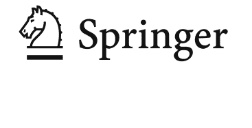

## 编辑

Hemanth Venkateswara
认知普适计算中心
(CUBIC)
计算机信息与决策系统工程学院
亚利桑那州立大学 Tempe, AZ, 美国

Sethuraman Panchanathan
认知普适计算中心
(CUBIC)
计算机信息与决策系统工程学院
亚利桑那州立大学 Tempe, AZ, 美国

ISBN 978-3-030-45528-6 	 ISBN 978-3-030-45529-3 (电子书)

https://doi.org/10.1007/978-3-030-45529-3

© Springer Nature Switzerland AG 2020

本作品受版权保护。出版商保留所有权利，包括全部或部分材料的翻译权、再版权、插图的重复使用、朗诵、广播、微缩胶片的复制、以任何其他实体方式的复制，以及信息的传输或存储和检索、电子适应、计算机软件，或者通过类似或不同的方法现在已知或今后开发的方法。

在本出版物中使用一般描述性名称、注册名称、商标、服务标志等，并不意味着即使在没有具体声明的情况下，这些名称也不受相关保护法律和法规的约束，因此可以自由使用。

出版商、作者和编辑可以安全地假设本书中的建议和信息在出版日期时被认为是真实和准确的。出版商、作者或编辑对本文中包含的材料不提供明示或暗示的保证，也不对可能存在的错误或遗漏负责。出版商在已发表的地图和机构隶属方面保持中立。

这本 Springer 印记由注册公司 Springer Nature Switzerland AG 出版
注册公司地址为：瑞士 Cham 市 Gewerbestrasse 11 号，邮编 6330

## 前言

本书关注的是计算机视觉中的深度学习领域适应，旨在成为基于深度学习的计算机视觉领域适应研究的一站式资源。 本书还旨在成为在这一领域中导航大量研究的简明指南。 本书分为四个部分，概述了领域适应研究的内容。第一部分介绍了领域适应和非深度学习研究的概况。 在第二部分和第三部分中，本书讨论了用于领域适应的特征对齐和图像对齐技术。 本书的第四部分概述了领域适应研究的未来创新方法。

邀请了一组多样化的专家，为本书提供全面和互补的观点。 编辑们感谢贡献作者分享他们的观点。 编辑们还感谢亚利桑那州立大学和国家科学基金会（资助号1828010）的资金支持，使得这本书的项目成为可能。

美国亚利桑那州坦佩
2020年1月

Hemanth Venkateswara
Sethuraman Panchanathan

## 目录

## 第一部分 引言

- 1. **介绍领域适应**
Hemanth Venkateswara和Sethuraman Panchanathan
3

- 2. **浅层领域适应**
Sanatan Sukhija和Narayanan Chatapuram Krishnan
23

## 第二部分 特征空间中的领域对齐

- 3. **d-SNE: 使用随机邻域进行领域适应**
嵌入. Xiong Zhou, Xiang Xu, Ragav Venkatesan, Gurumurthy Swaminathan和Orchid Majumder
43

- 4. **用于无监督领域适应的深度哈希网络**
Raghavendran Ramakrishnan, Bhadrinath Nagabandi, Jose Eusebio, Shayok Chakraborty, Hemanth Venkateswara, 和Sethuraman Panchanathan
57

- 5. **重新加权的对抗适应网络用于无监督领域适应**
Qingchao Chen, Yang Liu, Zhaowen Wang, Ian Wassell, 和Kevin Chetty
75

## 第三部分 图像空间中的领域对齐

- 6. **双工生成的无监督领域适应对抗网络**
Lanqing Hu, Meina Kan, Shiguang Shan, 和Xilin Chen
97

- 7. **通过图像到图像的转换进行领域适应**
Zak Murez, Soheil Kolouri, David Kriegman, Ravi Ramamoorthi, 和Kyungnam Kim
117

- 8. **通过图像风格转换进行领域适应**
Amir Atapour-Abarghouei和Toby P. Breckon

## 第四部分 领域适应的未来方向

- 9. **通过嘈杂标签实现可扩展的图像分类器学习 通过领域适应**
Kuang-Huei Lee, Xiaodong He, Linjun Yang, 和Lei Zhang

- 10. **用于开放集领域适应的对抗学习方法**
Kuniaki Saito, Shohei Yamamoto, Yoshitaka Ushiku, 和Tatsuya Harada

- 11. **通用领域适应**
Kaichao You, Mingsheng Long, Zhangjie Cao, Jianmin Wang, 和Michael I. Jordan

- 12. **通过深度CockTail网络进行多源领域适应**
Ziliang Chen和Liang Lin

- 13. **零样本任务转移**
Arghya Pal和Vineeth N. Balasubramanian

## 贡献者

- Amir Atapour-Abarghouei 计算机科学系，杜伦大学，英国
- Vineeth N. Balasubramanian 印度理工学院，海得拉巴，印度
- Toby P. Breckon 工程和计算机科学系，杜伦大学，英国
- Zhangjie Cao 清华大学软件学院，中国北京
- Shayok Chakraborty 佛罗里达州立大学，塔拉哈西，美国
- Qingchao Chen 牛津大学，英国牛津
- Ziliang Chen 中山大学，中国广州
- Xilin Chen 中国科学院智能信息处理重点实验室中国科学院计算技术研究所，中国科学院，北京，中国
- Kevin Chetty 伦敦大学学院，英国伦敦
- Jose Eusebio Axosoft，美国亚利桑那州斯科茨代尔
- Tatsuya Harada 东京大学和理化学研究所，日本东京
- Xiaodong He 京东人工智能研究院，中国北京
- Lanqing Hu 中国科学院智能信息处理重点实验室中国科学院计算技术研究所，中国科学院，北京，中国
- Michael I. Jordan 加利福尼亚大学伯克利分校，美国加利福尼亚州
- Meina Kan 中国科学院智能信息处理重点实验室中国科学院计算技术研究所，中国科学院，北京，中国
- Kyungnam Kim HRL实验室，美国加利福尼亚州马里布
- Soheil Kolouri HRL实验室，美国加利福尼亚州马里布
- David Kriegman 加利福尼亚大学圣地亚哥分校（UCSD）计算机科学与工程系，加利福尼亚州洛杉矶市，美国
- Narayanan Chatapuram Krishnan 印度旁遮普邦罗帕尔印度理工学院，印度旁遮普邦鲁普那加尔
- Kuang-Huei Lee 微软人工智能与研究，华盛顿州雷德蒙德，美国 谷歌大脑，加利福尼亚州旧金山，美国
- Liang Lin 中山大学，中国广州
- Yang Liu 牛津大学，英国牛津
- Mingsheng Long 清华大学软件学院，中国北京
- Orchid Majumder 亚马逊人工智能，美国西雅图，华盛顿州
- Zak Murez HRL实验室，美国马里布，加利福尼亚州
- Bhadrinath Nagabandi 亚利桑那州立大学，美国亚利桑那州坦佩
- Arghya Pal 印度理工学院，印度海得拉巴
- Sethuraman Panchanathan 认知普适计算中心（CUbC），计算机信息与决策系统工程学院，亚利桑那州立大学，美国亚利桑那州坦佩
- Raghavendran Ramakrishnan 亚利桑那州立大学，美国亚利桑那州坦佩
- Ravi Ramamoorthi 加利福尼亚大学圣地亚哥分校（UCSD）计算机科学与工程系，加利福尼亚州洛杉矶拉霍亚
- Kuniaki Saito 东京大学，日本东京
- Shiguang Shan 中国科学院计算技术研究所，中国科学院智能信息处理重点实验室，中国北京
- Sanatan Sukhija 印度罗帕尔印度理工学院，旁遮普邦，印度
- Gurumurthy Swaminathan AWS AI，美国西雅图华盛顿州
- Yoshitaka Ushiku 东京大学，日本东京
- Ragav Venkatesan AWS AI，美国西雅图华盛顿州
- Hemanth Venkateswara 认知普适计算中心（CUbC），计算机信息与决策系统工程学院，亚利桑那州立大学，Tempe, AZ，美国
- Zhaowen Wang Adobe研究，圣何塞，加利福尼亚州，美国
- Jianmin Wang 清华大学软件学院，中国北京
- Ian Wassell 剑桥大学，英国剑桥
- Xiang Xu AWS AI，西雅图，华盛顿州，美国
- Shohei Yamamoto 东京大学，日本东京
- Linjun Yang Facebook，西雅图，华盛顿州，美国
- Kaichao You 清华大学软件学院，中国北京
- Lei Zhang 微软研究，雷德蒙德，华盛顿州，美国
- Xiong Zhou AWS AI，西雅图，华盛顿州，美国

## 第一部分

### 引言

## 第一章
介绍领域适应

Hemanth Venkateswara和Sethuraman Panchanathan

#### 1.1 引言

在2016年的《哈佛商业评论》文章中，领先的计算机科学研究员安德鲁·吴（Andrew Ng）将人工智能与电力进行了比较，他说：“一百年前，电力改变了无数行业；二十年前，互联网也是如此。人工智能即将做到同样的事情，”[57]。人工智能研究在最近加速发展。从社会科学到神经科学，科学研究的各个领域都在应用人工智能的工具，以寻找新的见解并推动他们的研究。在深度学习的成功推动下，人工智能能够在解决具有挑战性的专业问题方面与人类表现相媲美，例如下围棋和国际象棋。然而，复制并最终超越一般人类智能是人工智能研究者的乌托邦目标。

人类智能是现代人工智能系统的竞争基准。人类智能的一个标志是其能够无缝地适应新环境，并在学习新任务时建立在现有概念的基础上进行扩展。例如，一旦一个人学会骑自行车，他们可以轻松过渡到骑摩托车，而无需从头学习骑摩托车。另一方面，机器学习系统必须明确地从头开始训练以解决新任务。为了模拟人类智能，我们需要构建能够通过建立在现有知识概念上并将该知识转移以适应新环境的人工智能系统。虽然在机器中模拟人类智能可能不是一个紧迫的需求，但高效构建机器学习系统绝对是一个目标。

H. Venkateswara (✉) · S. Panchanathan
认知普适计算中心（CUBiC），计算机信息与决策系统工程学院，亚利桑那州立大学，坦佩，亚利桑那州，美国
电子邮件：hemanthv@asu.edu; panch@asu.edu


#### 1.2 学习范式

我们将从定义不同的学习范式开始。 传统的机器学习范式包括无监督学习、监督学习和半监督学习。 近年来出现了一种新的机器学习范式——自监督学习。

无监督学习在无监督学习范式中，数据被呈现为一组n个示例，$\mathcal{X} = \{\boldsymbol{x}_1, \ldots, \boldsymbol{x}_n\}$，其中$\boldsymbol{x}_i \in \mathcal{X}$对于所有$i \in [1, \ldots, n]$。$\mathcal{X}$表示数据的特征空间。 例如，$\mathcal{X}$可以是$d$维欧几里得空间$\mathbb{R}^d$的子集，或者是$M \times N \times C$维归一化颜色图像的空间，$[0, 1]^{M \times N \times C}$等。数据集$\mathcal{X}$是从未知的概率分布$P(\mathcal{X})$中抽取的。 在这里，$\mathcal{X}$是一个随机变量，$P(\mathcal{X} = \boldsymbol{x})$是数据实例$\boldsymbol{x}$的概率。 传统上，无监督学习涉及对数据中的结构和模式进行估计，如聚类、分位数估计、降维和异常检测[11]。 在某些情况下，无监督学习的目标是估计生成样本$\mathcal{X}$的概率分布$P(\mathcal{X})$。 概率分布$P(.)$用于生成新样本，这类无监督学习算法被称为生成模型。 生成建模的流行方法包括自回归模型[86]、生成对抗网络[27]和变分自编码器[41]。

监督学习在监督学习范式中，数据被呈现为一组$\mathcal{X}_l = \{\boldsymbol{x}_i, y_i\}_{i=1}^n$的元组，其中$\boldsymbol{x}_i \in \mathcal{X}$和$y_i \in \mathcal{Y}$被称为标签对于所有的$i \in [1, \ldots, n]$。 标签空间$\mathcal{Y}$可以是离散的，对于分类问题，$y_i \in \{1, 2, \ldots, C\}$。 在回归问题中，标签空间$\mathcal{Y}$可以是实数$y_i \in \mathbb{R}$。 在图像分割的情况下，它也可以属于相同的空间$\mathcal{X}$。 这些问题被称为结构化预测[58]。 在监督学习中，数据是从联合分布$P(X, Y)$中采样的。 在这里，$X$和$Y$是随机变量，$P(X = \boldsymbol{x}, Y = y)$是样本$(\boldsymbol{x}, y)$的联合概率。监督学习的目标是使用训练数据$\mathcal{X}_l$来估计映射函数$f : \mathcal{X} \to \mathcal{Y}$。 估计映射函数有两种标准方法。生成方法在有边缘分布$P(X)$、条件分布$P(X|Y)$和先验分布$P(Y)$的情况下，学习预测后验概率$P(Y | X)$，使用贝叶斯公式。

#### 1.3 领域适应简介

$P(Y|X) = \frac{P(X|Y)P(Y)}{P(X)}$。生成方法的例子包括高斯混合模型、隐马尔可夫模型和朴素贝叶斯。第二种方法是判别方法。判别方法直接建模后验分布，无需估计条件和先验分布。判别方法的例子包括支持向量机、逻辑回归、神经网络和随机森林。

半监督学习在半监督学习范式中，数据被呈现为两个数据集，$\mathcal{X}_l = \{x_i, y_i\}_{i=1}^n$和$\mathcal{X}_u = \{x_i\}_{i=1}^u$，其中$\mathcal{X}_l$是标记数据集，$\mathcal{X}_u$是未标记数据集。标记数据$\mathcal{X}_l$是从联合分布$P(X, Y)$中抽取的，而未标记数据是从边际分布$P(X)$中抽取的。半监督学习的目标是估计$\mathcal{X}_u$的标签。解决半监督学习问题有两种方法：转导法和归纳法。转导模型仅估计未标记样本$\mathcal{X}_u$的标签。转导法的一个例子是转导支持向量机[40]。另一方面，归纳模型学习映射函数

基于$\mathcal{X}_l$中的标记示例对和未标记示例的$\mathcal{X}$上的$f : \mathcal{X} \rightarrow \mathcal{Y}$ $\mathcal{X}_u$。这种方法的挑战在于$l$非常小且不足以训练一个强大的分类模型。然而，未标记样本的数量很大，有$u \gg$和它们可以用来估计$f(.)$。基于现代深度学习的方法对半监督学习提出了两个假设——平滑性和聚类。平滑性假设确保标签空间或决策边界平滑变化。换句话说，邻域中的数据点倾向于具有相同的标签。平滑性假设通过一致性正则化[81]来实现。聚类假设确保决策边界通过低数据密度的区域。聚类假设通过熵正则化[30]来实现。在接下来的章节中，我们将讨论如何将领域适应减少到半监督学习。

自监督学习近年来，在自然语言处理和计算机视觉领域中，已经发展出了自监督学习技术。自监督学习是无监督学习的扩展，其中我们有未标记的数据。$\mathcal{X} = \{x_1, \ldots, x_n\}$，其中$x_i \in \mathcal{X}$对于所有$i \in [1, \ldots, n]$，数据没有标签。$\mathcal{X}$代表数据的特征空间。但与无监督学习不同的是，未标记的数据被修改以生成伪标记数据，以模拟监督学习设置。为了符合自监督学习方法的要求，伪标签应该是从未标记的数据中自动生成的，而不需要人工注释。然后使用这些伪标签以监督方式训练一个预训练任务。例如，在语言的BERT模型中，一个预训练任务可以是预测句子中的下一个单词（或前一个单词）[16]。在视觉问题中，预训练任务可以是确定预旋转图像的旋转角度[25]，或确定从图像网格中裁剪的两个方形补丁之间的相对位置[17]。其他预训练任务可以是给灰度图像上色[100]，或在帧重排视频中预测帧的顺序[54]。自监督学习技术的调查在[39]中讨论。在深度神经网络上训练

这些预训练的深度神经网络可以被视为非常好的特征提取器，它们捕捉到了图像语义的本质。然后，这些预训练的深度神经网络被微调以学习原始任务，只需要少量标记样本。这些技术也被应用于领域适应[38]。

### 1.3 知识转移的类型

前面讨论的机器学习范式可以被视为静态模型。这些模型是使用训练时存在的数据集开发的，并且它们对训练数据集的概率建模。这些模型不会适应数据分布的变化。换句话说，如果测试数据来自不同的分布，这些模型不能保证最优性能。例如，考虑一个仅在由女性组成的图像上训练的面部表情识别算法。在评估过程中，如果呈现的图像是男性主题的图像，算法可能表现不佳，因为数据来自不同的分布——男性可能具有更加粗糙的特征，甚至有胡须。迁移学习是机器学习的一个分支，它将在一个分布上训练的模型适应到其他分布的数据上。迁移学习可能受到人类学习方式的启发，人类通过适应来学习。人类通过建立概念并很少孤立地学习概念[93]。

在本节中，我们将讨论机器学习中不同类型的知识转移。我们根据Pan等人的定义和符号来奠定基础。我们定义一个领域$\mathcal{D}$，由两个组成部分组成，一个是特征空间$\mathcal{X}$和一个边际概率分布$P(\mathcal{X})$，用于该特征空间，其中$\mathcal{X} = \{x_1, ..., x_n\} \subset \mathcal{X}$是使用$P(\mathcal{X})$从特征空间采样得到的样本集合。如果我们考虑音频转录的例子，来自多个主题的音频样本可以被视为不同的领域。一个特定主题的声音、用词和词汇可以被视为特征空间$\mathcal{X}$和样本$\mathcal{X} = \{x_1, ..., x_n\}$可以被视为由主题使用概率分布$P(X)$采样得到的音频样本集合（话语）。在其他定义中，一个领域$\mathcal{D}$也可以表示为特征空间、标签和联合概率分布的空间，$\{ (\mathcal{X} \times \mathcal{Y}), P(\mathcal{X}, \mathcal{Y}) \}$。域之间的差异，也称为域不一致性，发生在概率分布不同（例如，非正式对话与阅读）或特征空间不同（例如，不同的主题）或两者都不同的情况下。如果$\mathcal{D} = \{\mathcal{X}, P(\mathcal{X})\}$表示一个域，任务$\mathcal{T}$被定义为$\mathcal{T} = \{\mathcal{Y}, f(\cdot)\}$。在这里，$\mathcal{Y}$是标签空间，$f: \mathcal{X} \rightarrow \mathcal{Y}$是将数据点映射到标签的函数。在监督学习范式中，函数$f(\cdot)$是使用带标签的数据点$(x, y)$确定的，其中$x \in \mathcal{X}$且$y \in \mathcal{Y}$。函数$f(x)$也可以看作是后验概率$P(y|x)$。在传统的迁移学习中，通常考虑一对域，即源域和目标域，以建模知识的迁移。稍微滥用符号，我们将源数据集表示为数据点的集合$\mathcal{D}_s = \{(\boldsymbol{x}_1^s, y_1^s), \ldots, (\boldsymbol{x}_{n_s}^s, y_{n_s}^s)\}$，其中 $\boldsymbol{x}_i^s \in \mathcal{X}_s$ 且 $y_i^s \in \mathcal{Y}_s$。同样地，我们将一个目标数据集表示为 $\mathcal{D}_t = \{(\boldsymbol{x}_1^t, y_1^t), \ldots, (\boldsymbol{x}_{n_t}^t, y_{n_t}^t)\}$，其中 $\boldsymbol{x}_i^t \in \mathcal{X}_t$ 且 $y_i^t \in \mathcal{Y}_t$。我们从以下定义开始讨论迁移学习。

定义（迁移学习 [61]）给定一个源域 $\mathcal{D}_S$ 和一个源学习任务 $\mathcal{T}_S$，一个目标域 $\mathcal{D}_T$ 和一个目标学习任务 $\mathcal{T}_T$，迁移学习旨在使用 $\mathcal{D}_S$ 和 $\mathcal{T}_S$ 来改进目标预测函数 $f_{\mathcal{T}}(\cdot)$。其中 $\mathcal{D}_S \neq \mathcal{D}_T$，或 $\mathcal{T}_S \neq \mathcal{T}_T$。□

如果特征空间不同（如来自两个不同主题的音频）或概率分布不相同（如随意对话与阅读报告），则认为两个域是不同的（$\mathcal{D}_S \neq \mathcal{D}_T$）。同样，如果标签空间不同（如音频转录与情感分析）或后验分布不相同，则认为两个任务是不同的（$\mathcal{T}_S \neq \mathcal{T}_T$）。

当标签空间不同（如音频转录与情感分析）或后验分布不相同时（$P_S(Y|X) \neq P_T(Y|X)$，源领域和目标领域具有不同的标签空间的情况）。这些领域和任务上的差异引发了通过迁移学习来解决的学习场景。迁移学习模型从一个或多个任务、领域或数据分布中提取知识，并将该知识应用于开发不同领域、任务或分布的有效假设 [6]。本章部分基于 [90] 的早期工作。接下来，我们概述和区分了机器学习中包含知识迁移元素的流行问题，即多任务学习、自学习、样本选择偏差、终身机器学习、零样本学习和领域适应。

### 1.3.1 多任务学习（MTL）

在这种设置下，我们考虑 $K$ 个任务 $\mathcal{T} = \{\mathcal{T}_1, \mathcal{T}_2, \ldots, \mathcal{T}_K\}$，每个任务的数据分别来自 $K$ 个不同的领域 $\mathcal{D} = \{\mathcal{D}_1, \mathcal{D}_2, \ldots, \mathcal{D}_K\}$。每个单独的任务都有标记数据进行监督。然而，我们还面临一个约束，即仅使用来自第 $k$ 个领域 $\mathcal{D}_k = \{\boldsymbol{x}_k^i, y_k^i\}_{i=1}^{n_k}, \boldsymbol{x}_k^i \in \mathcal{X}_k$ 和 $y_k^i \in \mathcal{Y}_k$ 可能无法估计出可靠的经验概率分布 $\hat{P}_k(X, Y)$。在多任务学习环境中，任务是不同的，而领域可能相同或相关。多任务学习算法尝试通过使用来自所有领域 $\mathcal{D} = \{\mathcal{D}_1, \mathcal{D}_2, \ldots, \mathcal{D}_K\}$ 的数据同时估计所有 $K$ 个任务的经验分布 $\hat{P}(X, Y)$。多任务学习的思想是通过在单个模型中同时学习所有任务，使模型能够更好地泛化到每个任务。多任务学习算法通过利用所有任务的领域特定信息来提高泛化能力 [10]。

基于深度神经网络的多任务学习通常采用硬参数共享 [3] 实现，其中所有任务共享基础网络的相同参数，并在最后一层进行差异化，或者采用软参数共享 [96]，其中多个网络的参数被约束为相似，使用 $\ell_2$ norm。

使用 $\ell_2$ norm将多个网络的参数约束为相似。在参数共享的其他变体中，我们使用交叉线将耦合网络与网络相连，允许模型从任一网络中选择任务特定的参数 [53]。滑动网络是参数共享的最广义形式，可以在多个层次和子空间之间进行共享 [70]。对于多任务学习的调查，分别在深度学习时代之前和现代深度学习方法中提供了 [83] 和 [69]。

### 1.3.2 自学习

这种学习范式受到人类以无监督方式从无标签数据中学习的启发 [67]。在这种学习范式中，知识传递发生在不相关的领域之间，使用学习到的表示。在提供了无标签数据 $\{x_u^1, \dots, x_u^k\}$ 其中 $x_u^i \in \mathbb{R}^d$ 的情况下，自学习框架学习一组 $K$ 基向量，然后将其用作表示目标数据特征的基础。

具体来说，

$$\min \sum_i \|x_u^i - \sum_j^K a_i^j b_j\|^2 + \beta \|a_i\|_1$$
$$\text{s.t.} \quad \|b_j\| \leq 1, \, \forall j \in 1, \dots K \tag{1.1}$$

其中， $\{b_1, \dots, b_K\}$ 是使用无标签数据学习得到的一组基向量，其中 $b_i \in \mathbb{R}^d$。输入数据 $x_u^i$ 的相应稀疏表示为 $a_i = \{a_i^1, \dots, a_i^K\}$ 其中 $a_i^j$ 对应于基向量 $b_j$。当相同的一组基向量 $\{b_1, \dots, b_K\}$ 用于表示标记的目标数据时，我们认为知识的转移已经发生。一些实现自学习的流行计算机视觉和机器学习技术包括 [4, 43, 50, 97]。

在深度学习时代，使用一组基向量进行自学习，如上所述，不太相关。然而，使用在无关数据集上训练的神经网络进行知识转移的原则非常相关，并且通常被称为迁移学习。在这种形式的朴素迁移学习中，将在通用数据集上训练的神经网络微调以解决新任务。例如，大多数现代领域适应技术使用预训练的模型，如AlexNet和ResNet，并将它们微调为特定的分类任务 [47, 98]。这与自学习有关，其中来自随机数据的特征向量形成目标数据的基向量。

### 1.3.3 样本选择偏差

1979年，约翰·赫克曼在他的诺贝尔奖获奖作品中引入了样本选择偏差的概念 [32]。当数据样本的分布不反映其所要反映的总体分布时，就会出现样本选择偏差。考虑一个例子，一个金融银行想要创建一个关于违约贷款人的模型概况，以便拒绝他们未来的贷款。使用其记录中的违约者概况构建模型。然而，该银行只有少数违约者的记录，而这些记录并不反映一般公众中贷款违约者的分布。因此，该银行的模型由于样本的不足而产生偏差。这种偏差被称为样本选择偏差。

在这种迁移学习模式中存在一个带标签的样本数据集 $\mathcal{D}$，目标是确定联合分布 $\hat{P}(X, Y)$，它是对总体联合分布 $P(X, Y)$ 的一个真实近似，使用 $\mathcal{D}$。因为 $\mathcal{D}$ 只是整个总体的一个小子集，近似 $\hat{P}(X, Y)$ 与 $P(X, Y)$ [6] 不同。这可能是因为小子集 $\mathcal{D}$ 可能导致真实边际分布 $P(X)$ 的错误估计，其中 $\hat{P}(X) = P(X)$。这也可能是由于类先验的错误估计，其中 $\hat{P}(Y) = P(Y)$，从而导致类条件的错误估计 $\hat{P}(Y|X) = P(Y|X)$。当边际分布 $\hat{P}(X) = P(X)$ 以及条件分布 $\hat{P}(Y|X) = P(Y|X)$ 存在偏差时，这被称为样本选择偏差，以下工作讨论了在这些设置下的知识转移 [18, 37, 99]。如果先验概率存在分布差异 $\hat{P}(X) = P(X)$，并且条件分布可以被认为是相等的 $\hat{P}(Y|X) \approx P(Y|X)$，则这种情况被称为协变量转移，以下论文讨论了在协变量转移下的知识转移 [5, 31, 66, 74]。

### 1.3.4 终身机器学习 (LML)

终身学习的范式是由Thrun在开创性的工作中引入的 [82]。终身学习中的迁移如下所示。一个用于任务 $\{\mathcal{T}_1, \mathcal{T}_2, \ldots, \mathcal{T}_K\}$ 训练的机器学习模型通过数据更新以学习任务 $\mathcal{T}_{K+1}$。LML的论点是学习 $K+1^{\text{th}}$ 任务更容易，因为模型已经学习了任务 $\{\mathcal{T}_1, \mathcal{T}_2, \ldots, \mathcal{T}_K\}$。终身学习背后的关键思想是：

1.  持续学习过程
2.  知识的积累
3.  将先前的知识转移以帮助未来的学习 [20]

终身机器学习与多任务学习不同，它保留了先前任务的知识并将该知识转移以学习新任务，而多任务学习则同时学习所有任务。它也不同于领域适应，领域适应通常是为了学习单个目标任务而进行知识转移。终身学习与增量学习或持续学习密切相关，其中模型在学习新任务的同时不会忘记先前的任务。先前学习的任务 [15]。当学习一个新任务时，一些增量学习模型依赖于来自先前任务的数据，以避免灾难性遗忘问题 [52]。在其他增量学习方法中，使用简洁的数据表示，也称为示例，来建模先前任务的数据。当使用新任务更新分类器时，这些示例会被调用 [68]。当不使用先前任务的数据，仅使用新任务的数据来更新模型时，这被视为一种不妥协的增量学习形式 [45, 87]。连续学习方法的调查可以在 [15, 65] 中找到。

### 1.3.5 零样本和少样本学习

这种学习范式可以看作是知识转移的极端情况 [28]。这些方法试图从最少的数据中学习数据类别。关键思想是能够将先前学习的类别的知识转移到学习新类别。在少样本（或一样本）学习中，模型仅使用少量（或没有）标记的示例来训练识别新类别 [21]。换句话说，模型仅使用少量样本来估计类别之间的决策边界。在一样本学习的情况下，使用一个新类别的单个标记示例来确定其他未见过的相同样本将聚集在其周围的聚类的均值。

零样本学习模型可以在训练过程中没有见过新类别的任何示例的情况下识别新类别。在零数据学习 [42] 和零样本学习 [60, 75] 中，知识传递发生在与新类别不完全相关的训练数据之间。例如，一个已经训练过识别斑马、老虎、狮子等野生动物（已见类别）的模型，提供了一个新类别（未见类别）的描述，例如‘马’。该模型能够将马与已见类别相关联并识别出来。零样本学习模型通过文本描述之间的关联来学习类别之间的相关性。这些模型利用语言和视觉的模态来解决零样本学习的挑战。基于现代深度学习的生成式零样本学习模型根据文本描述产生未见类别的图像特征 [103]。这些幻象被用来训练分类器模型以区分未见类别 [19]。

### 1.3.6 领域适应

在这个迁移学习的例子中，知识传递发生在两个领域之间，即源领域和目标领域。尽管存在多源领域适应的例子，如 [12, 51, 79]，但是在两个领域之间的知识传递是最常见的设置。

流行的设置。源领域 $\mathcal{D}_S$ 与目标领域 $\mathcal{D}_T$ 不同，领域适应的目标是解决一个共同的任务 $\mathcal{T}=\{\mathcal{Y}, f(\cdot)\}$。例如，在一个数字识别任务中，源领域可能包含带有黑色背景的标记图像，而目标领域可能包含带有彩色、噪声和杂乱背景的未标记图像。

这两个领域具有相同的数字类别集。源领域和目标领域之间的差异被建模为它们的联合概率分布的差异 $\hat{P}_S(X, Y) = P_T(X, Y)$。在标准的领域适应问题中，我们有大量的源数据点，并且目标数据集中没有标记数据（或者只有很少的样本）。由于目标数据没有标记样本或者只有很少的标记样本，估计联合分布是困难的。

$\hat{P}_T(X, Y)$。域适应的目标是近似计算 $\hat{P}_T(X, Y)$，这是可能的，因为两个域是“相关的”。通常，这种相关性是在协变量转移假设下建模的，其中 $P_S(X) = P_T(X)$ 并且 $P_S(Y|X) \approx P_T(Y|X)$。域适应问题的目标是以最小的期望错误预测目标标签。对于一个假设 $h(x)$，目标标签预测的期望错误由以下公式给出 [1]，

$$\epsilon_T(h) = \mathbb{E}_{p_T(X=x)}\mathbb{E}_{p_{(Y=y|X=x)}}(h(x) \neq y)$$
$$= \sum_x p_T(x)\mathbb{E}_{p_{(y|x)}}(h(x) \neq y)$$

通过 $p_S(x)$ 进行乘法和除法
$$= \sum_x \frac{p_S(x)}{p_S(x)} p_T(x)\mathbb{E}_{p_{(y|x)}}(h(x) \neq y)$$

目标误差等于加权源误差
其中权重由 $w$ 给出,
$$\epsilon_T(h) = \epsilon_S(h, \mathbf{w}) = \mathbb{E}_{p_S(x)} \frac{p_T(x)}{p_S(x)} \mathbb{E}_{p_{(y|x)}}(h(x) \neq y) \quad (1.2)$$

我们应用了协变量偏移假设，即 $P_S(Y|X) \approx P_T(Y|X)$ 和 $P_S(X) = P_T(X)$ 包括共享支持的假设，即 ($P_S(X) =0$ 当且仅当 $P_T(X) =0$)。目标预测误差以标记的源样本表示，其中每个源数据点都有权重 $\frac{p_T(x)}{p_S(x)}$。这种技术也被用于学习目标分类器，并被称为实例采样。从源数据中抽样重要示例来训练一个也能对目标样本进行分类的分类器。这些算法使用核均值匹配 [31] 或Kullback-Leibler散度 [76] 来估计权重。在这些情况下，域适应被视为协变量偏移或样本选择偏差 [66]。

[1] http://adaptationtutorial.blitzer.com/。

这些方法被称为固定表示方法。特征匹配是另一种技术，通过估计共享特征表示来对齐源数据和目标数据的特征 [48, 62, 63]。

某些其他过程将数据点投影到源数据集和目标数据集共同的特征子空间中。然后，在共同的特征空间中使用源数据训练一个分类器，并期望它能准确地对目标数据点进行分类，因为域已经对齐 [22, 26, 33, 49]。到目前为止讨论的技术可以称为固定表示方法。在这些方法中，源图像和目标图像的特征表示是预先确定的，并应用对齐技术来减小源数据和目标数据之间的域分布差异。它们也可以称为浅层域适应，与基于深度神经网络的深度域适应相对应。在深度域适应中，特征不是预先确定的，而是使用深度神经网络提取的。提取过程用于对齐源数据和目标数据的分布，从而实现良好对齐的特征。基于深度学习的方法在计算机视觉中解决域适应问题方面优于固定表示（浅层域适应）方法 [23, 47, 84]，并且是最流行的方法。下一章将对浅层域适应方法进行分类。其余章节将讨论基于深度学习的域适应的新方法。

此外，还有其他形式的机器学习与迁移学习相关。在时间设置中，当数据分布随时间变化时，这被称为概念漂移。在这种情况下，通过从过去重新训练模型并将其适应当前数据来进行知识转移 [104]。

知识转移也可以跨模态进行，就像多模态学习一样。人脑是这种转移的最佳例子，其中视觉、声音和触觉之间不断进行概念转移。很明显，人脑中存在着知识和概念的潜在表示，通过多个模态的输入进行印记和更新。

这就是为什么我们可以描述我们所看到或触摸的东西，或者我们可以想象（作为图像）我们听到和感受到的东西等。深度学习中已经应用了多模态处理，以跨不同模态传递知识以提高性能 [85]。

## 1.4 领域适应的形式

本小节概述了领域适应的不同形式。这些变体引入了对领域适应标准问题的约束，以使问题与现实世界的应用相一致。

### 1.4.1 监督或半监督领域适应

在这种设置中，源领域由一个带标签的数据集 $\mathcal{D}_s=\{x_i^s, y_i^s\}_{i=1}^{n_s}$ 组成，目标领域由一个带标签的数据集 $\mathcal{D}_t=\{x_i^t, y_i^t\}_{i=1}^{n_t} \cup \{x_i^t\}_{i=n_t+1}^{n_t+n_u}$ 组成。目标领域有 $n_t$ 个带标签的数据点和 $n_u$ 个未标记的目标数据点。当只有少量带标签的数据点 ($n_t$) 时，无法估计联合分布 $P_T(X, Y)$ 而不会过拟合。另一方面，源数据集有大量带标签的数据点 ($n_s$)。可以使用源数据集 $\mathcal{D}_s$ 与 $\mathcal{D}_t$ 一起训练目标数据的分类器，如 [14, 34, 71] 和 [88] 中所示。这本质上涉及将源数据点和目标数据点的分布对齐。当 $n_s$ 和 $n_t$ 的大小相似时，该问题也可以视为多任务学习设置。

### 1.4.2 无监督领域适应

在这种情况下，源域由一个标记的数据集 $\mathcal{D}_s = \{x_{s_i}, y_{s_i}\}_{i=1}^{n_s}$ 和目标域由一个无标记的数据集 $\mathcal{D}_t = \{x_{t_i}\}_{i=1}^{n_t}$ 组成。任务是使用标记的源数据集 $\mathcal{D}_s$ 和无标记的目标数据集 $\mathcal{D}_t$ 来估计目标数据集的标签。对于源样本和目标样本的数量没有限制，通常 $n_s \approx n_t$。可以使用源数据来估计联合分布 $P_S(X, Y)$。源域与目标域对齐，以近似 $P_T(X, Y)$，如 [26, 29, 49] 和 [89] 中所述。这是领域适应文献中最常见的领域适应形式。

### 1.4.3 无约束标签空间的领域适应

在领域适应的标准形式中，源领域和目标领域具有相同的标签空间，即源数据点和目标数据点从 $\mathcal{Y}$ 中采样相同的标签。在无约束设置中，源标签空间和目标标签空间可以不同。由于目标数据未标记，无约束的标签空间要求使得这种设置比无监督领域适应更通用和实用。这种形式的领域适应在近年来变得流行起来，比起标准的无监督领域适应更具挑战性。基于源标签空间 $\mathcal{Y}_s$ 和目标标签空间 $\mathcal{Y}_t$ 的重叠差异，这种方法有不同的变体。

1.  **部分领域适应**：在这种形式的领域适应中，源标签空间是目标标签空间的超集，即源数据集包含目标数据集中的所有类别，包括额外的类别 $\mathcal{Y}_t \subset \mathcal{Y}_s$。这个版本的领域适应是由Cao等人引入的 [8]，随后在近年来出现了一些显著的工作 [7, 9, 10]。
2.  **开放集领域适应**：在这种形式的领域适应中，源和目标的标签空间存在交集，即 $\mathcal{Y}_t \not\subset \mathcal{Y}_s$， $\mathcal{Y}_s \not\subset \mathcal{Y}_t$ 和 $\mathcal{Y}_s \cap \mathcal{Y}_t = \emptyset$。这个版本的领域适应受到开放集识别 [24] 的启发。在这个领域中，最显著的工作包括 [2, 46, 64, 80]。开放集领域适应的一个变体假设源标签空间是目标标签空间的子集，即 $\mathcal{Y}_s \subset \mathcal{Y}_t$ [72]。通用领域适应是开放集领域适应的另一种扩展，其中模型对目标的标签空间是不可知的 [98]。这是最通用的情况，包括了Close Set、Partial和Open Set领域适应范例。

除了这些领域适应的标准范例之外，还有多源领域适应，正如其名称所示，有多个源领域和一个目标领域，如 [12, 73, 102]，多个源领域被适应到目标领域以估计目标的分类器。此外，领域适应已与零样本学习 [92]、一次学习和 [35] 少样本学习 [55] 相结合。

## 1.5 书籍组织

本书共有13章，分为4个部分组织。这种组织旨在提供一个指南，以理解和映射领域适应的大量文献。

*   **第一部分**：介绍领域适应问题，并对非深度学习的领域适应技术进行简要调查。它由2章组成。
    *   第1章介绍了领域适应。它给出了迁移学习的定义，并概述了机器学习算法中的不同知识迁移范式，包括领域适应。本章讨论了不同类型的领域适应。本章部分基于 [90] 的早期工作。
    *   第2章对浅层领域适应进行了调查。它被称为浅层因为它是对不使用深度学习程序的领域适应算法的调查。该章还总结了异构领域适应，其中源域和目标域的特征空间不仅存在领域差异。本章部分基于 [77, 78] 的早期工作。
*   **第二部分**：深度神经网络提取高度区分特征，本部分讨论了不同的技术来对齐源域和目标域的特征空间以进行领域适应。本部分包括3章。
    *   第3章讨论了一种随机邻域嵌入算法，该算法将源域和目标域的特征投影到一个领域不可知的潜在空间，并应用## 1. 领域适应简介

修改后的Hausdorff距离度量来在目标域中使用少量标记样本进行领域适应。本章部分基于早期工作[95]。

第4章提出了一种哈希过程来进行领域适应。深度神经网络估计输入图像的哈希码，并计算基于哈希的相似性来估计图像类别。深度神经网络使用最大均值差异来对齐特征空间，并引入了对目标样本的无监督损失。本章部分基于之前的工作[91]。

第5章讨论了一种对抗性特征对齐技术，其中领域鉴别器通过最小化基于最优传输的地球移动距离来对齐源域和目标域的特征。源标签也被重新加权以匹配目标标签分布。本章部分基于之前的工作[13]。

### 第三部分
本部分讨论通过转换输入图像来减少领域差异的像素空间适应。本部分包括3个章节。

第6章描述了一个编码器-解码器网络，用于对源域和目标域的图像进行编码和解码。编码器将图像投影到源域和目标域共同的潜在空间中。为了在这个潜在空间中对齐源域和目标域，解码器被训练成将编码后的图像重构为两个域中的图像。自编码器框架由每个域的一对判别器引导。尽管这不是严格的图像空间对齐过程，但图像翻译指导编码器对齐特征。本章部分基于之前的工作[36]。

第7章讨论了一种图像转换过程，首先将两个领域的图像投影到潜在空间中，并使用对抗网络来对齐特征表示。然后将对齐的特征表示转换为每个领域的图像，并使用循环损失来指导翻译的一致性。该技术通过在合成数据集上训练图像分割模型，并将其适应到真实数据集上进行演示。本章部分基于之前的工作[56]。

第8章概述了一种基于图像风格转换的领域适应过程。本章讨论了从单个RGB图像估计深度图像的方法。源数据集包含从合成RGB图像生成的深度图像。目标数据集包含未知深度图像的真实世界RGB图像。通过使用源数据集，训练对抗性转换网络将合成RGB图像转换为深度图像。通过训练图像风格转换网络将真实世界RGB图像转换为合成RGB图像。使用转换和风格转换网络来估计真实世界RGB图像的深度版本。本章部分基于之前的工作[1]。

### 第四部分
本部分讨论了领域适应研究中的新趋势和未来方向。它由5个章节组成，涵盖了包括噪声标签、多源领域、开放集约束和零样本学习在内的主题。

第9章讨论了一种处理带有噪声标签设置的领域适应过程。他们的方法减少了对人工监督的需求，用于清理标签噪声。他们将领域适应问题独特地表述为目标领域的噪声标签问题，并应用基于‘注意力’的模型来解决带有标签噪声的大规模问题。本章部分基于[44]的早期工作。

第10章提出了一种基于开放集识别的领域适应新范式。在这个范式中，源领域的标签空间是目标领域标签空间的子集，导致目标领域具有已知（源）和未知类别。为了防止负迁移，只有来自已知类别的数据点在两个领域中进行对齐。该章节提出了一种新颖的对抗模型，其中生成器网络被训练为将目标数据点分配给已知类别或将其声明为未知类别。本章部分基于[72]的早期工作。

第11章介绍了通用领域适应模型，它是开放集领域适应范例的一种泛化。在标准的无监督领域适应中，目标数据的标签是未知的，但目标领域的标签空间与源领域的标签空间相同。在通用领域适应设置中，目标的标签空间是未知的。它可以是源标签空间的子集、超集或与之相同。该章提出了一种通过领域相似性和预测不确定性来确定每个样本可转移性的准则。使用这个准则，模型能够将目标样本分类为已知类别（与源类别相同）或未知类别。本章部分基于之前的工作[98]。

第12章通过深度CockTail网络提出了一种多源领域适应过程。给定一个目标样本，该过程使用多个源类别分类器来确定类别分配。多源领域鉴别器产生困惑度分数，用于对源中的多个领域进行加权。类似于制作鸡尾酒，目标类别使用多个源预测的混合加权预测，权重由其困惑度确定。领域鉴别器网络和特征提取器-分类器网络交替训练，以估计目标标签。本章部分基于之前的工作[94]。

第13章超越领域适应，并讨论任务之间的转移。在本章中，作者介绍了一种新颖的零样本任务转移模型，其中利用相关任务的知识来回归新任务的模型参数。该模型基于众包输入确定已知任务与零样本任务之间的成对关系，并使用Dawid-Skene投票聚合算法进行集成。这种元学习算法能够在没有标记数据的情况下回归出视觉任务的高性能模型参数。本章部分基于[59]的早期工作。

### 参考文献

- 1. Atapour-Abarghouei, A., Breckon, T.P.: 使用合成数据通过图像风格转移进行实时单目深度估计的领域适应。 在：IEEE计算机视觉与模式识别会议论文集，第2800-2810页 (2018年)
- 2. Baktashmotlagh, M., Faraki, M., Drummond, T., Salzmann, M.: 学习分解表示进行开放域适应。 在：国际学习表示会议 (ICLR) (2018年)
- 3. Baxter, J.: 通过多任务抽样的贝叶斯/信息论学习模型。 机器学习。 28(1), 7–39 (1997)
- 4. Bengio, Y.: 为人工智能学习深度架构。 Found. Trends® Mach. Learn. 2(1), 1–127 (2009)
- 5. Bickel, S., Brückner, M., Scheffer, T.: 在协变量转移下的判别学习。 机器学习研究。 10, 2137–2155 (2009)
- 6. Bruzzone, L., Marconcini, M.: 领域适应问题：一种DASVM分类技术和循环验证策略。 IEEE模式分析与机器智能交易。 32(5),770–787 (2010)
- 7. Cao, Z., Long, M., Wang, J., Jordan, M.I.: 具有选择性对抗网络的部分迁移学习。 在：计算机视觉和模式识别的IEEE会议论文集。 2724–2732 (2018)
- 8. 曹, Z., 马, L., 龙, M., 王, J.: 部分对抗领域适应。 在：欧洲计算机视觉会议(ECCV)论文集，第135-150页(2018)
- 9. 曹, Z., 尤, K., 龙, M., 王, J., 杨, Q.: 学习转移示例以进行部分领域适应。 在：IEEE计算机视觉和模式识别(CVPR)会议论文集，第2985-2994页(2019)
- 10. Caruana, R.: 多任务学习。 机器学习。 28(1), 41-75页(1997)
- 11. Chapelle, O., Scholkopf, B., Zien, A. (eds.): 半监督学习。 麻省理工学院出版社，剑桥(2006)
- 12. Chattopadhyay, R., Sun, Q., Fan, W., Davidson, I., Panchanathan, S., Ye, J.: 多源领域适应及其在疲劳早期检测中的应用。 ACM知识发现数据 6(4), 18页(2012)
- 13. 陈, Q., 刘, Y., 王, Z., 沃塞尔, I., 切蒂, K.: 重新加权的对抗适应网络用于无监督领域适应。 在：IEEE计算机视觉和模式识别会议论文集，第7976-7985页 (2018年)
- 14. Daum III, H., Kumar, A., Saha, A.: 令人沮丧地简单的半监督领域适应。 在：自然语言处理领域适应研讨会 (2010年)。 http://hal3.name/docs/#daume10easyss
- 15. De Lange, M., Aljundi, R., Masana, M., Parisot, S., Jia, X., Leonardis, A., Slabaugh, G., Tuytelaars, T.: 连续学习：关于如何在分类任务中抵御遗忘的比较研究 (2019年)。 预印本。 arXiv:1909.08383
- 16. Devlin, J., Chang, M.W., Lee, K., Toutanova, K.: Bert: 深度双向预训练变压器用于语言理解 (2018)。 预印本。 arXiv:1810.04805
- 17. Doersch, C., Gupta, A., Efros, A.A.: 通过上下文预测进行无监督视觉表示学习. 在：IEEE国际计算机视觉会议(ICCV)论文集，第1422-1430页 (2015)
- 18. Dudík, M., Phillips, S.J., Schapire, R.E.: 在最大熵密度估计中纠正样本选择偏差. 在: 神经信息处理系统(NIPS)进展, 第323-330页 (2005)
- 19. Elhoseiny, M., Elfeki, M.: 创造力启发的零样本学习. 在: IEEE国际计算机视觉会议论文集, 第5784-5793页 (2019)
- 20. 费, G., 王, S., 刘, B.: 累积学习以增加知识。 在：ACM SIGKDD国际会议的知识发现和数据挖掘论文集, 第1565-1574页。ACM, 纽约 (2016年)
- 21. Fei-Fei, L., Fergus, R., Perona, P.: 一次性学习物体类别。IEEE Trans. Pattern Anal. Mach. Intel. 28(4), 594-611（2006年）
- 22. Fernando, B., Habrard, A., Sebban, M., Tuytelaars, T.: 使用子空间对齐的无监督视觉领域适应。在: IEEE计算机视觉和模式识别（CVPR）会议论文集, 第2960-2967页（2013年）
- 23. Ganin, Y., Ustinova, E., Ajakan, H., Germain, P., Larochelle, H., Laviolette, F., Marchand, M., Lempitsky, V.: 神经网络的领域对抗训练。机器学习研究杂志。 17(59), 1-35（2016年）
- 24. Geng, C., Huang, S.j., Chen, S.: 开放集识别的最新进展: 一项调查 (2018). 预印本, arXiv:1811.08581
- 25. Gidaris, S., Singh, P., Komodakis, N.: 通过预测图像旋转进行无监督表示学习. 在: 国际学习表示会议 (ICLR) (2018)
- 26. Gong, B., Shi, Y., Sha, F., Grauman, K.: 用于无监督领域适应的测地线流核. 在: IEEE计算机视觉和模式识别会议 (CVPR) 论文集 (2012)
- 27. Goodfellow, I., Pouget-Abadie, J., Mirza, M., Xu, B., Warde-Farley, D., Ozair, S., Courville, A., Bengio, Y.: 生成对抗网络. 在: 神经信息处理进展 (NIPS), pp. 2672–2680 (2014)
- 28. Goodfellow, I., Bengio, Y., Courville, A.: 深度学习. MIT出版社, 剑桥 (2016). http://www.deeplearningbook.org
- 29. Gopalan, R., Li, R., Chellappa, R.: 对象识别的领域适应: 一种无监督方法. 在: IEEE国际计算机视觉会议(ICCV)论文集, pp. 999–1006. IEEE, Piscataway (2011)
- 30. Grandvalet, Y., Bengio, Y.: 熵最小化的半监督学习. 在: 神经信息处理系统进展, pp. 529–536 (2005)
- 31. Gretton, A., Smola, A., Huang, J., Schmittfull, M., Borgwardt, K., Schölkopf, B.: 核均值匹配的协变量偏移. 数据集偏移机器学习. 3(4), 5 (2009)
- 32. Heckman, JJ.: 样本选择偏差作为一种规范错误. 经济计量学 47(1), 153–161 (1979)
- 33. Hoffman, J., Kulis, B., Darrell, T., Saenko, K.: 发现多源域适应的潜在领域。在: 欧洲计算机视觉会议 (ECCV), 第702-715页 (2012年)
- 34. Hoffman, J., Rodner, E., Donahue, J., Saenko, K., Darrell, T.: 高效学习域-不变图像表示。在: 国际学习表示会议 (ICLR) (2013年)
- 35. Hoffman, J., Tzeng, E., Donahue, J., Jia, Y., Saenko, K., Darrell, T.: 一次性适应监督深度卷积模型 (2013年). 预印本. arXiv:1312.6204
- 36. 胡, L., 阙, M., 单, S., 陈, X.: 用于无监督域适应的双工生成对抗网络。在: IEEE计算机视觉和模式识别会议, 第1498-1507页 (2018年)
- 37. Huang, J., Gretton, A., Borgwardt, K.M., Schölkopf, B., Smola, A.J.: 通过无标签数据纠正样本选择偏差。在: 神经信息处理系统进展(NIPS), 第601-608页(2006)
- 38. Iqbal, J., Ali, M.: MLSL: 多级自监督学习用于具有空间独立和语义一致标签的领域适应(2019). 预印本. arXiv:1909.13776
- 39. Jing, L., Tian, Y.: 自监督视觉特征学习与深度神经网络: 综述(2019). 预印本. arXiv:1902.06162
- 40. Joachims, T.: 使用支持向量机进行文本分类的传导推理。在: ACM国际机器学习会议 (ICML)论文集, 第99卷, 第200-209页(1999)
- 41. Kingma, D.P., Welling, M.: 自动编码变分贝叶斯 (2013). 预印本. arXiv:1312.6114
- 42. Larochelle, H., Erhan, D., Bengio, Y.: 零数据学习新任务. 在: 人工智能AAAI会议论文集, 卷1, 第3页 (2008)
- 43. Lee, H., Grosse, R., Ranganath, R., Ng, A.Y.: 卷积深度置信网络用于可扩展的无监督学习层次表示. 在: ACM国际机器学习会议(ICML)论文集, 第609-616页 (2009)
- 44. Lee, K. H., He, X., Zhang, L., Yang, L.: Cleannet: 用于可扩展图像分类器训练的迁移学习与标签噪声. 在: IEEE计算机视觉与模式识别会议论文集, 第5447-5456页 (2018)
- 45. Li, Z., Hoiem, D.: 学习而不遗忘。 在: 欧洲计算机视觉大会(ECCV)论文集, 第614-629页。Springer (2016)
- 46. Liu, H., Cao, Z., Long, M., Wang, J., Yang, Q.: 分离以适应: 开放集领域适应通过渐进分离。 在: IEEE计算机视觉与模式识别(CVPR)会议论文集, 第2927-2936页(2019)
- 47. Long, M., Cao, Y., Wang, J., Jordan, M.: 用深度适应网络学习可迁移特征。 在: ACM国际机器学习大会(ICML)论文集, 第97-105页(2015)
- 48. Long, M., Wang, J., Ding, G., Sun, J., Yu, P.S.: 联合分布适应的转移特征学习。 在: ACM国际机器学习大会(ICML)论文集, 第2200-2207页(2013)
- 49. Long, M., Wang, J., Ding, G., Sun, J., Yu, P.S.: 无监督域适应的转移联合匹配。 在: IEEE计算机视觉和模式识别（CVPR）会议论文集（2014）
- 50. Mairal, J., Bach, F., Ponce, J., Sapiro, G.: 矩阵分解和稀疏编码的在线学习。 J. Mach. Learn. Res. 11, 19–60 (2010)
- 51. Mansour, Y., Mohri, M., Rostamizadeh, A.: 多源域适应。 在: 神经信息处理系统（NIPS）进展, 第1041–1048页（2009）
- 52. Mensink, T., Verbeek, J., Perronnin, F., Csurka, G.: 基于距离的图像分类: 在几乎零成本下泛化到新类别。 IEEE Trans. Pattern Anal. Mach. Intell. 35(11),2624–2637 (2013)
- 53. Misra, I., Shrivastava, A., Gupta, A., Hebert, M.: 交叉网络用于多任务学习。 在: IEEE计算机视觉和模式识别会议论文集, pp. 3994-4003（2016年）
- 54. Misra, I., Zitnick, C.L., Hebert, M.: 洗牌和学习: 使用时间顺序验证的无监督学习。 在: 欧洲计算机视觉会议论文集（ECCV）, pp. 527-544. Springer, 柏林（2016年）
- 55. Motiian, S., Jones, Q., Iranmanesh, S., Doretto, G.: 少样本对抗领域适应。 在: 神经信息处理系统进展, pp. 6670-6680（2017年）
- 56. Murez, Z., Kolouri, S., Kriegman, D., Ramamoorthi, R., Kim, K.: 图像到图像的转换用于领域适应。 在: IEEE计算机视觉和模式识别会议论文集, pp. 4500-4509（2018年）
- 57. Ng, A.: 雇佣你的首席人工智能官员。 哈佛商业评论（2016年）。 https://hbr.org/2016/11/雇佣你的首席人工智能官员
- 58. Nowozin, S., Lampert, C.H.: 计算机视觉中的结构化学习和预测。 Found.Trends Comput. Graph. Vis. 6(3–4), 185–365 (2011). https://doi.org/10.1561/0600000033
- 59. Pal, A., Balasubramanian, V.N.: 零样本任务转移。 在: IEEE计算机视觉和模式识别会议论文集, 第2189–2198页（2019年）
- 60. Palatucci, M., Pomerleau, D., Hinton, G.E., Mitchell, T.M.: 具有语义输出编码的零样本学习。 在: 神经信息处理系统进展（NIPS）, 第1410–1418页（2009年）
- 61. Pan, S.J., Yang, Q.: 迁移学习综述. IEEE Trans. Knowl. Data Eng. 22(10), 1345–1359 (2010)
- 62. Pan, S.J., Kwok, J.T., Yang, Q.: 通过降维进行迁移学习. 在: AAAI人工智能会议论文集, vol. 8, p p. 677–682 (2008)
- 63. Pan, S.J., Tsang, I.W., Kwok, J.T., Yang, Q.: 通过转移组件分析进行领域适应. IEEE Trans. Neural Netw. 22(2), 199–210 (2011)

#### 2.2 领域适应

监督模型的性能通过从与训练样本相同分布中抽取的测试样本进行验证。然而，当学习的模型在来自不同领域的示例上进行评估时，由于领域数据之间的分布差异，性能会受到影响[66]。Shai等人[7]指出，分类器在新领域（目标领域）中的性能取决于两个因素：（1）在自己领域（源领域）中的性能和（2）领域之间的差异。给定相同的标签 $Y_s = Y_t$和相同的特征空间 $\mathcal{X}_s = \mathcal{X}_t$，领域适应（DA）处理减小领域之间的差异。领域差异可以是边缘分布的差异 $P_s(\mathbf{x}_s) = P_t(\mathbf{x}_t)$或条件分布的差异$P(y_s|\mathbf{x}_s) = P(y_t|\mathbf{x}_t)$。

在目标领域中给出很少的标记示例（或者根本没有标记示例），很难估计 $P_t(y_t|\mathbf{x}_t)$。大多数DA方法假设域在某种程度上与$P(y_s|\mathbf{x}_s) \approx P(y_t|\mathbf{x}_t)$相关，并且只关注于最小化边际分布的差异。这种情况在适应文献中有很多名称，即域偏移、数据集偏移和协变量偏移。然而，当条件分布的差异也很显著时，$P(y_s|\mathbf{x}_s) = P(y_t|\mathbf{x}_t)$，这种情况更常被称为样本选择偏差。我们在下一节中总结浅层DA方法。

---

64. Panareda Busto, P., Gall, J.: 开放集领域适应. 在: IEEE国际计算机视觉会议论文集 (ICCV), pp. 754–763 (2017)
65. Parisi, G.I., Kemker, R., Part, J.L., Kanan, C., Wermter, S.: 神经网络的持续终身学习: 一篇综述. Neural Netw. 113, 54–71 (2019)
66. Quionero-Candela, J., Sugiyama, M., Schwaighofer, A., Lawrence, N.D.: 机器学习中的数据集转移。 麻省理工学院出版社，剑桥（2009年）
67. Raina, R., Battle, A., Lee, H., Packer, B., Ng, A.Y.: 自学习：从无标签数据中进行迁移学习。 在：ACM国际机器学习会议（ICML）论文集，第759-766页（2007年）
68. Rebuffi, S.A., Kolesnikov, A., Lampert, C.H.: iCaRL: 增量分类器和表示学习。 在：IEEE计算机视觉和模式识别（CVPR）会议论文集（2017年）
69. Ruder, S.: 深度神经网络中多任务学习概述（2017年）。 预印本。 arXiv:1706.05098
70. Ruder, S., Bingel, J., Augenstein, I., Søgaard, A.: Sluice网络：学习在松散相关任务之间共享。 计算机科学数学 1050, 23（2017年）
71. Saenko, K., Kulis, B., Fritz, M., Darrell, T.: 将视觉类别模型调整到新领域。 在：欧洲计算机视觉会议（ECCV）论文集（2010年）
72. Saito, K., Yamamoto, S., Ushiku, Y., Harada, T.: 通过反向传播进行开放域适应。 在：欧洲计算机视觉会议（ECCV）论文集，第153-168页（2018年）
73. Schoenauer-Sebag, A., Heinrich, L., Schoenauer, M., Sebag, M., Wu, L.F., Altschuler, S.J.: 多领域对抗学习（2019年）。 预印本。 arXiv:1903.09239
74. Shimodaira, H.: 通过加权对数似然函数改进协变量转移下的预测推断。 J. Stat. Plann. Inference 90(2), 227–244 (2000)
75. Socher, R., Ganjoo, M., Manning, C.D., Ng, A.: 通过跨模态转移实现零样本学习。 In: Advances in Neural Information Processing Systems (NIPS), pp. 935–943 (2013)
76. Sugiyama, M., Nakajima, S., Kashima, H., Buenau, P.V., Kawanabe, M.: 通过模型选择进行直接重要性估计及其在协变量转移适应中的应用。 In: Advances in Neural Information Processing Systems (NIPS), pp. 1433–1440 (2008)
77. Sukhija, S., Krishnan, N.C.: 通过随机森林进行监督异构特征转移。 Artif. Intell. 268, 30–53 (2019)
78. Sukhija, S., Krishnan, N.C., Kumar, D.: 使用随机森林的监督异构迁移学习。 在：ACM India联合国际数据科学和数据管理会议论文集，第157-166页（2018年）
79. Sun, Q., Chattopadhyay, R., Panchanathan, S., Ye, J.: 一种用于多源领域适应的两阶段加权框架。 在：神经信息处理系统进展（NIPS），第505-513页（2011年）
80. Tan, S., Jiao, J., Zheng, W.S.: 通过双域协作进行弱监督开放域适应。 在：IEEE计算机视觉和模式识别会议论文集，第5394-5403页（2019年）
81. Tarvainen, A., Valpola, H.: 平均教师是更好的角色模型：加权平均一致性目标改善半监督深度学习结果。 在：神经信息处理系统进展，第1195-1204页（2017年）
82. Thrun, S.: 学习第n个事物是否比学习第一个更容易？ 在：神经信息处理系统的进展，第640-646页。 Morgan Kaufmann Publishers, Burlington (1996)
83. Thrun, S., Pratt, L.: 学习学习。 Springer Science & Business Media, Berlin (2012)
84. Tzeng, E., Hoffman, J., Zhang, N., Saenko, K., Darrell, T.: 深度领域混淆：最大化领域不变性（2014年）。 预印本。 arXiv:1412.3474
85. Vaezi Joze, H.R., Shaban, A., Iuzzolino, M.L., Koishida, K.: MMTM: 用于CNN融合的多模态传输模块。 在：IEEE计算机视觉和模式识别会议论文集（2020年）
86. van den Oord, A., Kalchbrenner, N., Kavukcuoglu, K.: 像素递归神经网络(2016年)。预印本。arXiv:1601.06759
87. Venkatesan, R., Venkateswara, H., Panchanathan, S., Li, B.: 一个无妥协的增量学习者策略(2017)。预印本。arXiv:1705.00744
88. Venkateswara, H., Lade, P., Ye, J., Panchanathan, S.: 耦合支持向量机用于监督领域适应。在: ACM国际多媒体会议论文集 (ACM-MM), pp. 1295–1298 (2015)
89. Venkateswara, H., Chakraborty, S., Panchanathan, S.: 用于无监督领域适应的非线性嵌入变换。在: Workshops, 欧洲计算机视觉会议论文集 (ECCV TASK-CV), pp. 451–457. Springer, Berlin (2016)
90. Venkateswara, H., Chakraborty, S., Panchanathan, S.: 计算机视觉中的领域适应深度学习系统: 学习可迁移的特征表示。IEEE信号处理杂志 34(6), 117–129 (2017)
91. Venkateswara, H., Eusebio, J., Chakraborty, S., Panchanathan, S.: 无监督领域适应的深度哈希网络。在: IEEE计算机视觉和模式识别会议 (CVPR) 论文集 (2017年)
92. Wang, J., Jiang, J.: 零样本领域适应的条件耦合生成对抗网络。在: IEEE国际计算机视觉会议 (ICCV) 论文集, 第3375-3384页 (2019年)
93. Woodworth, R.S., Thorndike, E.: 一种心理功能改善对其他功能效率的影响 (i)。心理分析评论 8 (3) , 247 (1901年)
94. Xu, R., Chen, Z., Zuo, W., Yan, J., Lin, L.: 深度混合网络: 具有类别偏移的多源无监督领域适应。在: IEEE计算机视觉和模式识别会议论文集, 第3964-3973页 (2018年)
95. Xu, Venkatesan, R., Swaminathan, G., Majumder, O.: d-SNE: 使用随机邻域嵌入的域适应。在: IEEE计算机视觉和模式识别会议论文集, 第2497-2506页 (2019年)
96. Yang, Hospedales, T.M.: 迹范数正则化的深度多任务学习 (2016年)。预印本。arXiv:1606.04038
97. Yang, J., Yu, K., Gong, Y., Huang, T.: 使用稀疏编码的线性空间金字塔匹配进行图像分类。在: IEEE计算机视觉和模式识别会议论文集 (CVPR), 第1794-1801页 (2009年)
98. You, K., Long, M., Cao, Z., Wang, J., Jordan, M.I.: 通用域适应。在: IEEE计算机视觉和模式识别会议论文集 (CVPR), 第2720-2729页 (2019年)
99. Zadrozny, B.: 在样本选择偏差下学习和评估分类器。在: 机器学习国际会议 (ICML) 论文集, 第114页 (2004年)
100. Zhang, R., Isola, P., Efros, A.A.: 色彩图像上色。在: 欧洲计算机视觉会议 (ECCV) 论文集, 第649-666页。Springer, Berlin (2016)
101. Zhang, J., Ding, Z., Li, W., Ogunbona, P.: 针对部分领域适应的重要性加权对抗网络。在: 计算机视觉和模式识别 (CVPR) IEEE会议论文集, 第8156-8164页 (2018年)
102. Zhao, S., Wang, G., Zhang, S., Gu, Y., Li, Y., Song, Z., Xu, P., Hu, R., Chai, H., Keutzer, K.: 多源蒸馏领域适应。在: 人工智能 (AAAI) 会议论文集 (2020年)
103. Zhu, Y., Elhoseiny, M., Liu, B., Peng, X., Elgammal, A.: 一种基于生成对抗的方法用于从嘈杂的文本中进行零样本学习。在: IEEE计算机视觉和模式识别会议论文集, 第1004-1013页 (2018年)
104. Iliobaitė, I., Pechenizkiy, M., Gama, J.: 概念漂移应用概述。在: 大数据分析: 新社会的新算法, 第91-114页。Springer, 柏林 (2016年)

## 第2章 浅层领域适应

Sanatan Sukhija和Narayanan Chatapuram Krishnan

#### 2.1 引言

传统的监督算法从可用的标记示例中学习预测器，目标是对未见示例进行良好的泛化。学习一个强健的预测器需要大量的标记示例。通常，在几个真实的世界场景中，可用的标记示例的数量很少。此外，即使存在未标记的示例，手动标记它们需要领域专业知识，并且是一项费力的任务。利用来自标记或未标记的知识现有辅助领域（通常称为源领域）可以减轻这些缺点，以在目标领域中高效地学习所需的任务。两个领域之间的知识转移主要受到底层数据分布、特征空间和输出空间的差异的挑战。

图2.1展示了基于源域和目标域特征的特点对知识转移设置进行了通用分类。当源数据和目标数据属于相同的特征空间并具有相同的基础分布时，转移场景等同于传统的监督学习设置。相反，当目标分布不同时，必须匹配分布，以便源模型在目标示例上表现良好。转移设置更常被称为域适应（DA）。主要，域适应方法的目标是最小化域之间的边际分布差异。在目标域中给定少量有标签的示例，还可以匹配条件分布。具有异构特征的域的知识转移任务更常被称为异构转移学习或异构域适应（HDA）。

本章总结了深度学习之前的最新通用浅层（非深度学习）DA和HDA方法。

考虑一个真实世界的情感分类任务，目标是识别用西班牙语书写的电子产品评论的情感。评论可以表达对产品体验的积极情感或消极情感。学习一个强大的预测函数需要大量的西班牙语评论，特别是针对电子产品的评论。另一个不可或缺的要求是对收集到的评论进行初步处理，例如标记评论的情感，从数据集中删除模糊的评论，定义输入词汇（特征）等，这可能需要一个精通西班牙语的专家。此外，如果没有足够的标记评论可用于训练，学习到的函数无法可靠地预测情感。该任务可以从相关辅助来源中利用标记或未标记的评论获益。其他产品（如书籍、音乐等）的标记或未标记的西班牙语评论，或者易于获取的其他语言（如英语）的电子产品评论可以帮助完成任务。

在这里，利用其他产品（如书籍、音乐等）的标记西班牙评论，对应于DA的第一个转移场景，而利用标记的英文评论对应于HDA设置的第二个场景。

##### 2.1.1 章节组织

在第2.1节和2.1.2节中，通过一个激励应用程序的非正式介绍来介绍知识转移，并描述了适应文献中使用的术语的符号。接下来的第2.1.3节给出了不同适应场景的正式定义。第2.1.4节报告了一些实际应用，这些应用程序在浅层适应文献中是众所周知的，用于评估适应算法的性能。第2.2节和第2.3节分别介绍了有前途的DA和HDA方法的简要回顾。最后一节（第2.4节）突出了适应研究中尚未开发的领域。本章部分基于[60, 62]的早期工作。

##### 2.1.2 符号

一个领域代表了一组样本 {(x1, y1), ..., (xN, yN)}，这些样本是从边际概率分布 P(x) 中抽样得到的。在这里，每个示例 xi 属于特征空间 X ∈ R^D，其标签为 yi ∈ Y。任务 T 被描述为从可用的标记示例中学习一个预测器 f(.)，该预测器将特征 X 映射到标签 Y。给定一个未见过的示例 x，学习到的函数 f(.) 预测其标签 f(x) ∈ Y。从贝叶斯的角度来看，预测器 f(.) 可以被视为一个输出条件概率 P(y|x) 的函数。

为了简单起见，我们描述了当存在一个单一源领域时的学习设置的符号。源领域 S 包含 Ns 个示例 {(x^s_i, y^s_i)}，这些示例是从边际分布 P(x) 和条件分布 P(y_s|x_s) 中抽样得到的。源特征空间 X_s 中的每个带标签的示例 x^s_i 用一个 D_s 维向量表示，其对应的标签为 y^s_i ∈ Y_s。在目标领域 T 中，我们有 N_t 个示例 {(x^t_j, y^t_j)}，这些示例具有边际分布 P(x) 和条件分布 P(y_t|x_t)。目标示例 x^t_j ∈ X^t 用一个 D_t 维向量表示，其对应的标签为 y^t_j ∈ Y_t。

T 和 T 分别表示源任务和目标任务。

##### 2.1.3 正式定义

一般来说，源领域包含大量标记的示例。然而，根据目标领域是否有标记的示例，迁移学习框架可以分为以下三种配置：

- * 无监督：目标领域没有标记的示例。
- * 有监督：此类方法仅利用目标领域中的标记示例。
- * 半监督：利用目标领域中的标记和未标记示例进行适应。

根据Pan等人对迁移学习框架的描述[46]，存在两种可能的迁移场景，即领域或任务不同。第一个场景中，当 S = T 时，意味着 X_s = X_t 或 P_s(x_s) = P_t(\mathbf{x}_t)和第二种情况下 $T_s = T_t$ 表示要么 $Y_s = Y_t$ 要么 $P(y_s|\mathbf{x}_s) = P(y_t|\mathbf{x}_t)$。即使我们说任务或领域不同，大多数传统的迁移学习方法也假设它们在一定程度上相关，以避免负迁移[45]。

定义2.1（领域适应） 这里的目标是通过利用来自 $S$的标记示例或来自 $T_s$的知识来学习一个可靠的预测器 $f_t(.)$。在这种设置下，源域和目标域共享相同的特征空间 $\chi_s = \chi_t$，同时也共享相同的任务 $T_s = T_t$。然而，这些领域在边际分布上是不同的 $P(\mathbf{x}_s) = P(\mathbf{x}_t)$。

定义2.2（异构领域适应） 与DA具有相同的目标，唯一的区别在于领域在特征空间上的差异 $S = T$ $\chi_s = \chi_t$。

##### 2.1.4 应用

在本节中，我们描述了一些在深度学习之前的文献中突出的真实适应任务。

- 视觉领域适应：目标识别任务涉及在给定图像中识别对象。不同的视觉领域之间的差异，如光照条件、颜色、分辨率、背景、相机方向等，导致分布不匹配，需要进行适应。在浅层视觉适应文献中，知识传递已在不同的图像描述符（如Speeded Up Robust Features、Classemes和Scale-Invariant Feature Transform等）之间和之内进行。跨不同图像数据集的知识传递用于目标识别任务，被广泛称为跨领域目标识别。
- 跨领域文本/情感分类：如前面提到的激励应用程序中，可以利用来自其他领域的相关标记文档来学习目标任务。使用来自同质辅助领域的标记文档会导致由于词分布差异而引起的领域诱导偏差，而使用其他语言的标记文档则需要首先处理词汇差异。随着知识传递跨越不同语言，后一种设置更常被称为跨语言文本/情感分类。
- 跨模态分类任务：在两个领域中给定相同的任务，跨模态分类任务是指在具有不同模态（例如图像 ↔ 文本）的领域之间进行知识传递。这个任务与多视图学习[39]的设置密切相关，其中来自其他模态（视图）的互补信息以并行数据的形式同时可用于学习所需任务的更全面的表示。
- 跨域活动识别：从记录的传感器观测中识别智能家居居民的行为被称为智能家居活动识别。训练一个强大的模型需要手动标记传感器记录，这是耗时且费力的。可以利用现有智能家居中的标记观测来训练目标智能家居的迁移学习方法来避免注释工作。不同智能家居布局中使用不同类型的传感器导致异构的特征空间。跨智能家居之间的知识转移任务通常被称为跨域活动识别。
- 跨域室内WiFi定位：利用WiFi信号强度准确跟踪和定位移动对象近来引起了很多关注[83]。目标是通过来自不同接入节点的信号强度确定移动设备的位置。与以前的应用相比，室内WiFi定位任务是一个回归问题。这个任务需要及时校准，因为接收到的信号强度会随着流量和时间变化。为了避免在大型环境中进行昂贵的校准任务，采用了领域适应方法。

##### 2.2.1 DA文献的简要回顾

基于支持向量机（SVM）[70]的框架是半监督DA方法，它修改了SVM优化框架，同时使用来自两个域的标记示例来适应目标域数据。杨等人[81]提出了自适应SVM，其中SVM源模型被调整为适应目标示例。域自适应支持向量机[12]和投影模型转移SVM[3]是非常相似的适应方法，其中源SVM决策边界被迭代地调整以更好地对目标示例进行分类。吴等人[79]提出了另一个基于SVM的框架，用于确定源域中与目标任务相关的支持向量。

Hoffman等人引入了最大边缘领域转移[31]，其中学习了将目标特征映射到源特征的线性变换，以解决分布不匹配的问题。

基于子空间的适应方法是无监督的DA方法，用于对齐源特征和目标特征。子空间对齐方法[20]具有通过PCA获得的特征空间的闭合解，类似地，基于流形的DA方法[25, 27]在低维流形中最小化分布差异。与前述选择前置子空间维度进行对齐的子空间方法不同，相关对齐[64]方法直接最小化原始特征空间的协方差。Si等人提出的另一种方法[57]最小化了公共子空间中分布之间的Bregman散度。与上述方法相比，Daume等人提出了Easy Adapt（EA），一种半监督DA方法，它使用特征增强策略来定义包含三个组成部分的公共子空间：与域无关、源特定和目标特定特征。EA的扩展，EA++[16]利用目标域中的无标签示例来学习更好的目标域假设。这是通过强制源和目标假设在无标签目标示例上的预测达成一致来实现的。

基于实例转移的样本选择策略是无监督迭代学习框架，它学习样本对目标任务的重要性（权重）。在协变量转移设置中，样本的权重 w(x)应该设置为目标域和源域的边际概率之比，即 P_t(x) / P_s(x)[68]。早期的实例重新加权策略通过训练域分类器[86]或使用Kullback-Leibler散度[36, 58]和最小二乘损失[37]作为损失函数来估计这个比率。另一种流行的加权方案[29, 33]是使用最大均值差异（MMD）[10]原理计算的域之间的边际分布差异。受到增强学习[23]的启发，Transfer Adaptive Boosting（TrAdaBoost）[14]方法在迭代训练目标分类器时增加了错误分类的目标样本的权重，同时减少了正确分类的源样本的权重。Al-Stouhi和Reddy [2]在TrAdaBoost中引入了动态权重更新来对抗源权重的过早收敛。最近的策略被制定为优化框架，以识别与目标领域分布相似的相关源示例（也称为地标）Gong等人[26]提出了一种基于无监督MMD的优化框架，用于学习这些地标。Baktashmotlagh等人[5]不使用MMD，而是使用Hellinger距离学习这些地标，以最小化加权源和目标分布在Riemann流形（子空间）上的差异。与上述无监督框架相比，多尺度地标选择（MLS）[1]不利用源标签，并且地标是从源样本和目标样本计算得出的。MLS首先在核空间中识别地标，然后使用这些地标在PCA子空间中进行对齐。

特征转换方法通过学习通用转换或领域特定转换在潜在空间中最小化分布差异。转移分量分析（TCA）[48]是一种无监督的特征转换方法，使用MMD原理最小化领域之间的分布差异。域不变投影[4]也使用MMD原理来弥合分布差异。然而，该算法学习一个正交变换，首先将数据从两个域投影到一个共同的潜在空间，然后使用MMD对齐分布。转移联合匹配[42]将TCA与一个正则化项相结合，促进自适应实例重新加权。TCA的半监督版本[43]在TCA框架中引入了一个标签依赖项，利用源标签和目标标签来诱导类别对齐。基于自适应正则化的转移学习框架[41]是一个半监督的优化框架，结合了（1）结构风险最小化，用于从标记的源示例学习目标分类器，（2）MMD原理，用于最小化边际和（类别上的）条件分布差异，同时保持（3）个体域的流形一致性[6]。

钟等人[89]提出了一种半监督FT框架，该框架在核空间中最小化域之间的边际分布差异，并利用基于聚类的策略来识别与目标任务相关的源示例，从而帮助最小化条件分布差异。联合分布适应[40]学习一种转换，以最小化主成分分析子空间中源标记数据和目标未标记数据之间的边际分布差异。此外，该算法利用从在源样本上训练的分类器获得的目标样本的伪标签（预测标签）来减少该主成分分析子空间中的条件分布差异。

上述大多数DA方法考虑单个源域。或者，当给定多个源域时，可以联合使用每个源-目标对适应的DA模型来提高目标域的泛化能力。相比之下，同时学习多源DA模型更好，因为它可以同时利用多个域的特定信息。

此外，并不需要所有的源领域对目标任务都同等相关。一种简单的方法是使用A距离度量[7]来评估源领域与目标领域的相关性，然后相应地加权预测。除了EA和EA++[15, 16]可以自然地扩展通过扩展特征空间来适应多个源领域，其他方法如自适应支持向量机[82]通过训练一组加权源分类器来适应目标任务。多模型知识传输框架[65]以加权的方式联合训练多个线性支持向量机，权重是通过使用留一法确定的。领域适应机器[19]引入了一个新的领域相关的正则化项，确保目标分类器（使用标记的目标示例训练的分类器）与目标领域中未标记示例上的预训练相关基础分类器具有相似的预测。在这里，基础分类器是通过源领域数据训练的，或者通过结合源领域和目标标记数据训练的。

先前描述的一些DA方法已经扩展到多源设置。例如，Gopalan等人[28]扩展了基于流形的DA方法[27]，Yao等人[85]扩展了多源设置的TrAdaboost[14]。

#### 2.3 异构领域适应

实际上，找到与目标领域具有相同特征集和共享标签空间的现有数据是具有挑战性的。HDA处理具有异构特征的领域之间的知识转移。

##### 2.3.1 最近HDA文献的简要回顾

在这种转移设置中，源域和目标域的特征空间是异构的，每个HDA算法的初步任务是决定一个适应的特征空间。根据进行适应的特征空间，HDA方法可以总结为两个广泛的类别：

- 1. 特征空间重映射 (FSR)
- 2. 潜在空间转换 (LST)

FSR方法在源特征空间或目标特征空间中执行适应。这需要学习两个域之间异构特征的单一映射，即 P_s : X_s → X_t or P_t : X_t → X_s。然后使用学习到的映射将数据从一个域投影到另一个域。

图2.2描述了基于FSR的迁移学习方法的框架。相比之下，LST方法将源域和目标域的数据投影到共享子空间进行适应，这需要学习两个映射，一个用于每个域。图2.3描述了基于LST的迁移学习方法的框架。

在所需的特征空间中适应目标任务需要一些共享的关键信息，以弥合域中数据产生的差异共同对齐。最近的HDA方法利用了少量标记的目标示例[34, 59, 61, 62, 76, 78, 80, 90]来匹配条件分布。Blitzer等人 [8]利用了重叠特征（跨领域的共同特征）来连接剩余的异构特征。一些HDA方法明确地定义了一个跨领域的元特征空间[18]，可以视为共同空间。其他任务特定的HDA方法[30, 32, 91]将异构特征空间共同划分为领域无关特征和领域特定特征。一些HDA方法利用社交媒体/网络[77, 78, 84, 92]和预定义的词典/字典[24, 51]来利用领域特定的知识，以桥接领域差异。通常，HDA的映射学习被形式化为一个最小化目标。

方程2.1描述了一个通用的HDA优化框架。

```
\min_{P_s, P_t, B_s, B_t, M} L(S, T, B_s, B_t, P_s, P_t, M) + J(S, T, B_s, B_t, P_s, P_t) + R(P_s, P_t, B_s, B_t, M) \text{ w.r.t } C(B_s, B_t, P_s, P_t) \quad (2.1)
```

最小化框架由四个组件组成。第一个组件 L(.)表示失真函数，计算在使用映射 P和 P分别将源数据 S ∈ R^{N_s × D_s}和目标数据 T ∈ R^{N_t × D_t}投影时产生的损失。在这里，B_s和B_t表示投影的源域和目标域数据。对于LST优化方法，我们需要学习两个变换 P_s ∈ R^{D_s × D}和 P_t ∈ R^{D_t × D}，其中 D表示共享子空间中的维数；而对于FSR方法，P_s ∈ R^{D_s × D}并且 P_t = P_s^o。第二个组件 J(.)负责通过利用一些共享信息来最大化联合对齐数据的相似性。根据可用的共享信息，可以补偿分布差异或拓扑差异。第三个组件 R(.)是正则化器，调节变量对最终解决方案的影响，控制模型复杂度 M，决定学习变换的稀疏性，并避免对有限标记数据的过拟合。第四个组件 C(.)表示满足问题特定需求的约束，例如投影数据或变换的正交性，学习变换的尺度不变性或对称性等。

```
\min_{P_s} \frac{1}{N} \| T - S P_s \|_2^2 + \lambda \| P_s \|_2^2 \quad (2.2)
```

这里，λ表示正则化项。然而，对于真实世界的转移任务，获取跨域对应关系相对困难。浅层FSR方法可以进一步分为两种情况，即（1）当域之间存在一对一的特征对应关系或（2）源域的特征表示为目标域特征的线性组合（或反之亦然）。对于异构转移任务，特别是涉及跨不同模态（例如文本→图像）的转移，源域和目标域之间的特征对应关系并不明确。此外，即使对于源域和目标域具有相同模态的异构转移任务，例如跨语言情感/文本分类[49]（模态：文本）或跨域活动识别[61]（模态：传感器），确定一对一的特征对应关系也是一项具有挑战性的任务。Feuz等人[22]提出了两种计算密集型的策略，即（1）基于某种适应度度量贪婪地映射特征，并（2）利用遗传算法学习特征对应关系。鉴于异构领域共享明确的特征子集，一些任务特定的方法[8, 30, 45, 51]利用共同特征确定领域间剩余特征的映射。这些算法的适用性有限，因为对于大多数转移任务，在异构领域中很难找到共同特征。

最近的最先进的FSR方法[34, 60-62, 90]使用一些标记的目标示例来学习映射。跨领域地标选择[34]可以概括为一种用于异构转移任务的基于实例的样本选择FSR方法。该方法在匹配领域的边际和条件分布的同时学习源领域示例的重要性。

其他监督式FSR方法[60-62, 90]通过利用共同的标签生成跨域对应关系。稀疏异构特征重映射（SHFR）[90]方法为两个领域训练SVM模型。相应的源和目标SVM权重向量（属于同一类）被视为跨域对应对。学习一个稳健的映射需要大量的对应关系。SHFR使用纠错输出码（ECOC）对标签进行编码，以生成更多的对应关系。与使用单个标签不同，Sukhija等人[60-62]使用标签分布生成对应关系。

该方法的关键思想是考虑在领域之间生成跨域对应关系的类似标记的分区。该方法为源域和目标域训练随机森林[11]模型，以确定这些标记的分区。树路径包含一系列用于递归分割数据的特征，其中叶节点保存类标签的分布。源特征对源数据分区的贡献被视为该分区的权重向量。类似地，对于目标数据分区，仅使用用于生成该分区的目标特征的贡献来计算权重向量。在领域之间的类似标记的分区中，相应的权重向量被视为跨域对应对。与SHFR类似，该算法从生成的对应关系中估计出线性和稀疏的映射。前面提到的监督式FSR方法利用共同的标签来估计跨域对应关系，因此这些方法不适用于具有异构标签的领域之间的知识转移。Sukhija等人最近的一项工作[59]通过语义相关的标签空间桥接异构领域，其中标签关系是通过一种称为标准化谷歌距离的基于网络的相似度度量来估计的。基于对比损失，监督式FSR方法将源数据转换到目标特征空间。在目标特征空间中，保持语义相似的示例更接近，而不相似的示例则保持一定的距离，同时确保源数据的原始结构得到保留。该方法还结合了一种样本选择策略，以识别与目标示例非常相似的转换后的源示例的子集。使用目标域的标记示例将获得的源子集与一起用于训练目标任务的模型。

LST方法通过在共享子空间中消除域之间的特征差异来同时保留原始域数据的某些特征。共享子空间可以手动定义，也可以通过优化框架进行学习。一些任务特定的LST方法[21, 52–54, 67]明确定义了一组对两个域都通用的域无关元特征。通常情况下，定义共享元特征需要领域专业知识。主要地，这些元特征是从原始特征之间的结构、空间、功能或时间关系中派生出来的。手动构建共享子空间并不是最优的，因为会忽略领域相关的特征。此外，在大多数转移场景中，很难从异构特征空间中确定共享元特征。Wang等人[72–75]提出了几种LST方法，这些方法在学习共享子空间时使用了流形假设。这些方法模仿了降维框架，其中原始几何结构被保留。基于流形的LST方法的半监督版本利用少量标记的目标示例来匹配共享流形中的条件分布。其中一些方法[72, 73]利用少量跨域成对对应关系来改善转换后的源域和目标域数据的对齐。然而，在涉及高维数据的异构转移任务中，流形假设并不成立[80]。通过非负联合矩阵分解（PJNMF）[91]的枢轴是一种无监督的LST方法，它将域的异构特征空间集体分解为潜在的域相关特征和域共享特征（枢轴）。在分解过程中，潜在特征彼此正交，以便学习独立特征。

对于跨语言转移任务，领域共享特征也被称为主题。PJNMF是一种任务特定的方法，因为它仅适用于那些领域隐含共享一些关键潜在概念的转移任务，例如跨语言文本分类。基于谱嵌入，异构谱映射（HeMap）[56]被设计为一种无监督的LST优化框架，它最小化了潜在空间中转换后的领域之间的边际分布差异。由于约束目标和源投影相似，需要足够的跨领域对应关系来学习稳健的转换。HeMap采用矩阵分解解决方案，因此无法推广到样本外数据。异构转移学习用于图像分类[92]是另一种LST优化方法，它利用图像上的注释标签作为定义图像和文本模态之间对应关系的枢轴。假设图像和文本数据之间存在一定的语义关系，联合矩阵分解框架学习了图像分类任务的丰富表示。半监督子空间共投影（SCP）[80]是一种半监督的LST优化方法，它在共享子空间中学习目标任务和映射。在共享子空间中，使用标记的示例来学习任务并匹配条件分布，而使用未标记的领域示例来匹配边际分布。对于高维数据集，SCP方法需要进行大规模的矩阵求逆以获得闭式解。与基于FSR的方法[59]相比，共正则化异构传递学习[78]是一种LST方法，它通过语义相关的标签空间来连接异构域。半监督方法利用标签的word2vec[44]嵌入来确定标记域示例之间的相似性。此外，域示例的时空相似性用于定义共享子空间中的接近程度。与[59]不同，该方法不考虑将不相似的实例推开。异构特征增强（HFA）[18, 38]是一种基于半监督SVM的优化框架，它使用增强特征空间作为适应的共享子空间。增强特征空间是从原始源和目标特征派生的。由于HFA没有明确输出源域和目标域的映射，因此无法推广未见目标数据。

与直接将数据从一个域转换到另一个域的FSR方法相比，LST方法依赖于域之间的隐式特征关系来确定数据分布对齐的共享子空间。确定共享子空间的最佳维度大小需要进行网格搜索，这是一项昂贵的任务。其次，大多数LST优化框架的解决方案涉及特征值分解问题[47, 56, 72]或矩阵分解[91, 92]问题。因此，这些方法存在样本外扩展问题。此外，一些LST方法需要少量对应关系[72, 76]来强制转换后的数据在共享子空间中相似。然而，与FSR方法相比，LST方法估计的参数较少。

#### 2.4 总结和未来研究

本章介绍了最近的最先进的通用适应方法，包括DA和HDA。我们还简要描述了一些需要适应的激励应用。[13, 35,46, 50, 63, 69, 71, 87]和[17, 88]是其他调查，分别更详细地介绍了浅层DA和HDA方法。目前适应性研究的重点已经转向深度神经网络，因为学习非线性变换更容易。大部分最近的深度适应性研究可以看作是之前浅层DA工作的衍生。尽管如此，在大多数现实世界的在线场景中，浅层DA方法仍然优于其深度对应物，因为计算资源有限。

DA领域仍在不断发展，未来的研究前景广阔。在迁移学习方法中，一个常见的假设是源领域中有丰富的标记数据。当只有来自辅助领域的无标记数据可用时，研究非常有限。在现实世界的任务中，一个主要问题是目标领域固有地具有偏斜的数据。在无监督的领域适应设置中，处理类别不平衡问题是一个重大挑战。先前的方法利用目标领域示例的伪标签来促进共同的对齐。然而，这种浅层的DA/HDA方法忽视了这些伪标签的正确性。DA方法中的一个常见假设是，域在某种程度上相关，以避免负迁移[55]。与DA不同，在多源HDA设置中，很难确定域的相关性，因为它们具有共同的特征空间，未来的工作可以专注于以任务无关的方式找到域相似度的度量。其次，大部分适应性工作都集中在源域和目标域标签相同的转移设置上，即 $Y_s = Y_t$ 或者域共享一部分域标签。 $Y_s \cap Y_t = \phi$，另一个需要探索的知识转移领域是标签空间不重叠的情况。

### 参考文献

- 1. Aljundi, R., Emonet, R., Muselet, D., Sebban, M.: 基于地标的核化子空间对齐用于无监督域适应。在：IEEE计算机视觉和模式识别会议论文集，第56-63页（2015年）
- 2. Al-Stouhi, S., Reddy, C.K.: 使用动态更新的自适应增强进行迁移学习。在：机器学习和数据库知识发现的欧洲联合会议上，pp. 60–75. Springer，柏林（2011年）
- 3. Aytar, Y., Zisserman, A.: Tabula rasa: 用于对象类别检测的模型迁移。在：IEEE国际计算机视觉会议（ICCV）论文集，pp. 2252–2259（2011年）
- 4. Baktashmotlagh, M., Harandi, M.T., Lovell, B.C., Salzmann, M.: 通过域不变投影进行无监督域适应。在：IEEE国际计算机视觉会议论文集，pp. 769–776（2013年）
- 5. Baktashmotlagh, M., Harandi, M.T., Lovell, B.C., Salzmann, M.: 在统计流形上的域适应。在：IEEE计算机视觉和模式识别会议论文集，pp. 2481–2488（2014年）
- 6. Belkin, M., Niyogi, P., Sindhwani, V.: 流形正则化：从标记和无标记的示例中学习的几何框架。J. Mach. Learn. Res. 7, 2399–2434 (2006)
- 7. Ben-David, S., Blitzer, J., Crammer, K., Pereira, F.: 领域适应的表示分析。在：神经信息处理系统进展，第137–144页（2007）
- 8. Blitzer, J., McDonald, R., Pereira, F.: 结构对应学习的领域适应。在：2006年自然语言处理会议论文集，第120–128页（2006）
- 9. Borchani, H., Varando, G., Bielza, C., Larra aga, P.: 多输出回归综述。Wiley Interdiscip. Rev. Data Min. Knowl. Disc. 5(5), 216–233 (2015)
- 10. Borgwardt, K.M., Gretton, A., Rasch, M.J., Kriegel, H.P., Sch lkopf, B., Smola, A.J.: 通过核最大均值差异集成结构化生物数据。生物信息学 22(14), e49–e57 (2006)
- 11. Breiman, L.: 随机森林。机器学习。 45, 5–32 (2001)
- 12. Bruzzone, L., Marconcini, M.: 领域适应问题：一种DASVM分类技术和一种循环验证策略。IEEE Trans. Pattern Anal. Mach. Intell. 32(5), 770–787(2010)
- 13. Csurka, G.: 针对视觉应用的领域适应的综合调查。在：计算机视觉应用中的领域适应，第1-35页。 Springer, Berlin (2017)
- 14. Dai, W., Yang, Q., Xue, G.R., Yu, Y.: 提升转移学习。在：第24届国际机器学习大会论文集，第193-200页（2007）

## 2 浅层领域适应

- Daumé III, H.: 令人沮丧地简单领域适应。在：计算语言学协会第45届年会论文集，第256-263页 (2007)
- Daumé III, H., Kumar, A., Saha, A.: 令人沮丧地简单的半监督领域适应。在：2010年自然语言处理领域适应研讨会论文集，第53-59页。计算语言学协会，斯特劳兹堡 (2010)
- Day, O., Khoshgoftaar, T.M.: 异构迁移学习综述。J. Big Data 4(1), 29 (2017)
- Duan, L., Xu, D., Tsang, I.: 学习增强特征进行异构领域适应 (2012)。预印本. arXiv:1206.4660
- Duan, L., Xu, D., Tsang, I.W.H.: 多源领域适应：一种领域相关的正则化方法。IEEE Trans. Neural Netw. Learn. Syst. 23(3), 504-518 (2012)
- Fernando, B., Habrard, A., Sebban, M., Tuytelaars, T.: 使用子空间对齐的无监督视觉领域适应。在：IEEE国际计算机会议论文集，第2960-2967页 (2013)
- Feuz, K.D.: 为野外生活做准备的智能环境：特征空间和多视角异构学习。博士学位论文，华盛顿州立大学 (2014)
- Feuz, K.D., Cook, D.J.: 使用启发式搜索技术的异构迁移学习进行活动识别。普适计算与通信国际期刊 10, 393-418页 (2014)
- Freund, Y., Schapire, R.E.: 在线学习的决策理论推广及其应用于提升。计算机系统科学杂志 55(1), 119-139页 (1997)
- Glorot, X., Bordes, A., Bengio, Y.: 大规模情感分类的领域适应：一种深度学习方法。在：第28届国际机器学习大会 (ICML-11)，第513-520页 (2011)
- Gong, B., Shi, Y., Sha, F., Grauman, K.: 无监督领域适应的测地流核方法。在：IEEE计算机视觉与模式识别大会(CVPR) (2012)
- Gong, B., Grauman, K., Sha, F.: 通过地标连接点：无监督领域适应中的判别学习不变特征。在：ACM国际机器学习大会 (ICML)，第222-230页 (2013)
- Gopalan, R., Li, R., Chellappa, R.: 目标识别的领域适应：一种无监督方法。在：IEEE国际计算机视觉大会 (ICCV)，第999-1006页。IEEE，皮斯卡维 (2011)
- Gopalan, R., Li, R., Chellappa, R.: 通过生成中间数据表示实现跨领域无监督适应。IEEE Trans. Pattern Anal. Mach. Intel. 36(11), 2288-2302 (2014)
- Gretton, A., Smola, A., Huang, J., Schmittfull, M., Borgwardt, K., Schölkopf, B.: 通过核均值匹配实现协变量转移。Dataset Shift Mach. Learn. 3(4), 5 (2009)
- He, J., Liu, Y., Yang, Q.: 通过枢轴将异构输入空间连接起来进行多任务学习。在：SIAM国际数据挖掘会议论文集, pp. 181-189 (2014)
- Hoffman, J., Rodner, E., Donahue, J., Darrell, T., Saenko, K.: 高效学习领域不变图像表示。在：国际学习表示会议 (2013)
- 胡, D.H., 杨, Q.: 通过传感器映射进行活动识别的迁移学习。在：第22届国际人工智能联合会议论文集，第1962-1967页 (2011年)
- 黄, J., 格雷顿, A., 博格瓦特, K., 舍尔科普夫, B., 斯莫拉, A.J.: 通过无标签数据纠正样本选择偏差。在：神经信息处理系统进展，第601-608页 (2007年)
- Hubert Tsai, Y.H., Yeh, Y.R., Frank Wang, Y.C.: 学习异构领域适应的跨领域地标。在：IEEE计算机视觉和模式识别会议论文集，第5081-5090页 (2016年)
- 江, J.: 统计分类器领域适应的文献调查。计算机科学 3, 1-12页 (2008年)。http://sifaka.cs.uiuc.edu/jiang4/domainadaptation/survey
- Kanamori, T., Hido, S., Sugiyama, M.: 非平稳自适应和异常检测的高效直接密度比估计。在：神经信息处理进展，第809-816页 (2009年)
- Kanamori, T., Hido, S., Sugiyama, M.: 直接重要性估计的最小二乘方法。机器学习研究杂志, 10, 1391-1445 (2009年)
- Li, W., Duan, L., Xu, D., Tsang, I.W.: 增强特征学习用于监督和半监督异构领域适应。IEEE模式分析与机器智能交易, 36, 1134-1148 (2014年)
- Li, Y., Yang, M., Zhang, Z.M.: 多视图表示学习综述。IEEE知识数据工程交易, 31, 1863-1883 (2018年)
- Long, M., Wang, J., Ding, G., Sun, J., Yu, P.S.: 使用联合分布适应进行转移特征学习。在：机器学习国际会议(ICML)论文集，第2200-2207页 (2013)
- Long, M., Wang, J., Ding, G., Pan, S.J., Philip, S.Y.: 适应正则化：一种通用的转移学习框架。IEEE Trans. Knowl. Data Eng. 26(5), 1076–1089 (2014)
- Long, M., Wang, J., Ding, G., Sun, J., Yu, P.S.: 用于无监督领域适应的转移联合匹配。在：计算机视觉和模式识别的IEEE会议论文集(CVPR) (2014)
- Matasci, G., Volpi, M., Kanevski, M., Bruzzone, L., Tuia, D.: 用于遥感图像分类中的领域适应的半监督转移分量分析。IEEE Trans. Geosci. Remote Sens. 53(7), 3550–3564 (2015)
- Mikolov, T., Sutskever, I., Chen, K., Corrado, G.S., Dean, J.: 单词和短语的分布式表示及其组合性。在：神经信息处理进展，第3111-3119页 (2013年)
- 潘杰: 基于特征的迁移学习及其实际应用。香港科技大学博士学位论文 (2010年)
- 潘松杰，杨强: 迁移学习综述。IEEE Trans. Knowl. Data Eng. 22, 1345–1359 (2010年)
- 潘松杰，郭家贻，杨强: 通过降维进行迁移学习。在：第23届全国人工智能大会论文集，第677-682页。AAAI，门洛帕克 (2008年)
- 潘松杰，曾一文，郭家贻，杨强: 通过转移成分分析进行领域适应。在：第21届国际人工智能联合会议论文集，第1187-1192页 (2009年)
- 潘, S.J., 倪, X., 孙, J.T., 杨, Q., 陈, Z.: 通过光谱特征对齐进行跨领域情感分类。在：第19届国际万维网会议论文集，第751-760页。ACM，纽约 (2010年)
- 帕特尔, V.M., 戈帕兰, R., 李, R., 切拉帕, R.: 视觉领域适应：近期进展综述。IEEE信号处理杂志. 32(3), 53-69 (2015年)
- 普雷滕霍夫, P., 斯坦, B.: 使用结构对应学习的跨语言文本分类。在：第48届计算语言学年会论文集，ACL '10，第1118-1127页 (2010年)
- 齐, G.J., 阿加尔瓦尔, C., 黄, T.: 通过跨领域度量采样在异构空间中进行距离度量的迁移学习。在：2012年SIAM国际数据挖掘会议论文集，第528-539页。SIAM，费城 (2012年)
- Raina, R., Battle, A., Lee, H., Packer, B., Ng, A.Y.: 自学习：从无标签数据中进行迁移学习。在：第24届国际机器学习大会论文集，第759-766页 (2007年)
- Rashidi, P., Cook, D.J.: 多家庭迁移学习用于居民活动发现和识别。在：传感器数据知识发现国际研讨会论文集，第56-63页 (2010年)
- Rosenstein, M.T., Marx, Z., Kaelbling, L.P., Dietterich, T.G.: 迁移还是不迁移。在：2005年NIPS迁移学习研讨会，第898卷 (2005年)
- Shi, X., Yu, P.: 异构特征空间的降维。在：第12届IEEE国际数据挖掘大会论文集，第635-644页 (2012年)
- Si, S., Tao, D., Geng, B.: 基于Bregman散度的迁移子空间学习的正则化。IEEE Trans. Knowl. Data Eng. 22(7), 929-942 (2010年)
- Sugiyama, M., Nakajima, S., Kashima, H., Buenau, P.V., Kawanabe, M.: 直接重要性估计与模型选择及其在协变量转移适应中的应用。在：神经信息处理系统(NIPS)的进展，第1433-1440页 (2008年)
- Sukhija, S., Krishnan, N.C.: 基于样本选择的网络诱导异构迁移学习。在：机器学习和知识发现的联合欧洲会议数据库，第777-793页。Springer，柏林 (2018年)
- Sukhija, S., Krishnan, N.C.: 通过随机森林进行监督异构特征转移。Artif. Intell. 268, 30–53 (2019)
- Sukhija, S., Krishnan, N.C., Singh, G.: 通过随机森林进行监督异构领域适应。在：第25届国际人工智能联合会议论文集，第193-200页 (2016年)
- Sukhija, S., Krishnan, N.C., Kumar, D.: 使用随机森林进行监督异构迁移学习。在：2018年ACM印度联合国际数据科学和数据管理会议论文集，第157-166页。
- Sun, S., Shi, H., Wu, Y.: 多源领域适应综述。信息融合 24, 84-92 (2015)
- Sun, B., Feng, J., Saenko, K.: 令人沮丧的简单领域适应的回归。在：第三十届人工智能协会会议 (2016)
- Tommasi, T., Orabona, F., Caputo, B.: 数量上的安全性：从少量示例中学习类别的多模型知识转移。在：2010年IEEE计算机学会计算机视觉和模式识别会议论文集，第3081-3088页。IEEE，皮斯卡塔韦 (2010)
- Torralba, A., Efros, A.A.: 对数据集偏见的公正观察。在：2011年IEEE计算机视觉和模式识别会议论文集，第1521-1528页。
- van Kasteren, T.L.M., Englebienn e, G., Kr se, B.J.A.: 在传感器网络中跨领域迁移活动识别知识。在：第8届国际普适计算会议论文集，第283-300页。
- Vapnik, V., Vapnik, V.: 统计学习理论。第156-160页。Wiley，纽约 (1998)
- Venkateswara, H., Chakraborty, S., Panchanathan, S.: 用于计算机视觉领域适应的深度学习系统：学习可迁移的特征表示。IEEE信号处理杂志 34(6), 117-129 (2017)
- Wang, L.: 支持向量机：理论与应用，第177卷。Springer Science & Business Media，柏林 (2005)
- Wang, M., Deng, W.: 深度视觉领域适应：一项调查。神经计算 312, 135-153 (2018)
- Wang, C., Mahadevan, S.: 使用Procrustes分析进行流形对齐。在：机器学习国际会议论文集，第1120-1127页 (2008)
- Wang, C., Mahadevan, S.: 流形对齐的通用框架。在：AAAI秋季研讨会：流形学习及其应用 (2009)
- 王, C., 马哈迪万, S.: 无对应的流形对齐。在：第21届国际人工智能联合会议论文集，第1273-1278页 (2009年)
- 王, C., 马哈迪万, S.: 利用流形对齐进行异构领域适应。在：IJCAI国际人工智能联合会议论文集 (2011年)
- 王, C., 马哈迪万, S.: 保持全局几何的流形对齐。在：第23届国际人工智能联合会议论文集 (2013年)
- 魏, Y., 郑, Y., 杨, Q.: 城市之间的知识转移。在：第22届ACM SIGKDD国际知识发现与数据挖掘会议，第1905-1914页 (2016年)
- 魏, Y., 朱, Y., 梁, C.W.k., 宋, Y., 杨, Q.: 将社交注入到物理环境中：协同正则化的异构迁移学习。在：AAAI国家人工智能会议论文集，第1338-1344页 (2016年)
- 吴, P., 迪特里希, T.G.: 通过在辅助数据源上训练来提高SVM准确性。在：第二十一届国际机器学习大会论文集，ICML '04。ACM，纽约 (2004年)。http://doi.acm.org/10.1145/1015330.1015436
- 肖, M., 郭, Y.: 机器学习和知识发现在数据库中：欧洲会议，ECML PKDD 2015，波尔图，9月7日至11日。在：论文集，第二部分，第半监督子空间共投影用于多类异构领域适应，第525-540页。斯普林格国际出版社，巴塞尔 (2015年)
- 杨, J., 严, R., 霍普特曼, A.G.: 将SVM分类器适应具有偏移分布的数据。在：第七届IEEE国际数据挖掘研讨会。ICDM Workshops 2007，第69-76页 (2007年)
- 杨, J., 严, R., 霍普特曼, A.G.: 使用自适应SVM进行跨领域视频概念检测。在：ACM国际多媒体会议(ACM-MM)论文集，第188-197页 (2007年)
- 杨, Q., 潘, S.J., 郑, V.W.: 使用Wi-Fi估计位置。IEEE智能系统. 23(1), 第8-13页 (2008年)
- 杨, Q., 陈, Y., 薛, G.R., 戴, W., 于, Y.: 通过社交网络进行异构迁移学习以进行图像聚类。在：ACL第47届年会和AFNLP第4届国际联合自然语言处理联合会议论文集，第1-9页。计算语言学协会，斯特劳兹堡 (2009年)
- 姚, Y., 多雷托, G.: 多源传递学习的增强。在：2010年IEEE计算机学会计算机视觉和模式识别会议上，第1855-1862页。IEEE，皮斯卡塔韦 (2010年)
- ZadroZny, B.: 在样本选择偏差下学习和评估分类器。在：ACM国际机器学习会议(ICML)论文集，第114页 (2004年)
- Zhang, L.: 转移适应学习：十年调查 (2019年)。预印本。arXiv:1903.04687
- Zhang, J., Li, W., Ogunbona, P.: 用于跨数据集识别的迁移学习：一项调查 (2017年)。预印本。arXiv:1705.04396
- Zhong, E., Fan, W., Peng, J., Zhang, K., Ren, J., Turaga, D., Verscheure, O.: 通过核映射进行跨领域分布适应。在：第15届ACM SIGKDD国际知识发现与数据挖掘会议论文集，第1027-1036页。ACM，纽约 (2009年)
- 周, J.T., 曾, I.W., 潘, S.J., 谭, M.: 多类别的异构领域适应。在：第17届人工智能和统计学国际会议论文集，第1095-1103页 (2014年)
- 周, G., 何, T., 吴, W., 胡, X.T.: 通过枢轴将异构输入特征链接起来进行领域适应。在：第24届人工智能国际会议论文集，IJCAI'15，第1419-1425页。AAAI出版社，帕洛阿尔托 (2015年)
- 朱, Y., 陈, Y., 卢, Z., 潘, S.J., 薛, G.R., 于, Y., 杨, Q.: 用于图像分类的异构迁移学习。在：AAAI国家人工智能会议论文集，第1304-1310页 (2011年)

## 特征空间中的领域对齐

### 第三章 d-SNE: 使用随机邻域嵌入的领域适应

Xiong Zhou, Xiang Xu, Ragav Venkatesan, Gurumurthy Swaminathan, 和Orchid Majumder

#### 3.1 引言

感谢像ImageNet [2]这样的大规模数据集，微调预训练模型使我们能够在相对小规模的数据集上取得一些前所未有的结果。然而，由于领域转移问题，当标记数据极其有限时，很难重新利用预训练模型在新领域中工作。另一方面，领域适应依赖于类别关系，从一个领域转移知识到另一个领域。

现有的领域适应技术可以大致分为两类：领域转换和特征转换。在领域转换方法中，将源领域的数据转换为目标领域或反之亦然，以便使用源领域的标记数据来训练统一的分类器。这种转换通常通过使用生成对抗网络（GAN）[7]来完成。Liu和Tuzel [14]提出使用一对GAN来合成图像在源领域和目标领域。通过强制执行权重共享约束来学习两个领域的联合分布。与其从两个领域生成图像，Bousmalis等人[1]引入了一种方法将源领域的图像转换为目标领域，并使用GAN鉴别器使它们相似。类似地，Hoffman等人[11]使用CycleGAN [34]来转移源图像的风格，同时保留内容使用语义一致性损失。与之前的方法尝试将数据从一个领域转换为另一个领域不同，Russo等人[21]考虑了一个双向图像转换，将源领域和目标领域统一起来。

基于特征转换的方法旨在提取跨领域不变的特征。Ganin等人[5]引入了领域对抗训练进行领域适应，在反向传播之前故意翻转了领域分类器的梯度。当领域分类器无法确定特征的来源时，将其视为领域不变的特征。Tzeng等人在[29]中将这样的框架进行了泛化。另一条研究线路是将领域对齐和分类视为多任务学习问题[3, 8, 20, 25, 28]，在这里他们试图提取既具有判别性又具有领域不变性的特征。

在本章中，我们介绍了一种新颖的领域适应算法，它只需要来自目标领域的少量标记样本。所提出的方法使用随机邻域嵌入创建一个潜在空间，基于修改的Hausdorff距离度量对两个领域的类进行对齐。所提出的想法可以作为一种损失函数，以端到端的方式训练神经网络。大量实验证明我们的算法在多个基准数据集上表现出鲁棒性，并且优于现有技术水平。我们还展示了所提出的方法在领域泛化方面具有良好的能力，这在传统的领域适应方法中通常不是这样。本章部分内容基于之前的工作[32]。

#### 3.2 提出的方法

将源领域表示为 $D^s = \{(x_i^s, y_i^s)\}_{i=1}^{N_s}$ 和目标领域表示为 $D^t = \{(x_j^t, y_j^t)\}_{j=1}^{N_t}$。在领域适应问题中，目标领域通常比源领域具有更少的标记样本，$N_t \ll N_s$。我们还考虑标签空间对于两个领域是相同的，即 $\{y_s, y_t\} \in [0, 1, ..., c-1]$。在转换空间中，源样本和目标样本之间的距离可以定义为：

$$d(x_i^s, x_j^t) = ||\Phi_{D^s}(x_i^s) - \Phi_{D^t}(x_j^t)||^2, \tag{3.1}$$

其中 $\Phi_{D^s}(\cdot) \rightarrow \mathbb{R}^d$ 和 $\Phi_{D^t}(\cdot) \rightarrow \mathbb{R}^d$ 是神经网络，由 $w_s$ 和 $w_t$ 参数化，将来自两个领域的样本转换为共同的潜在空间。受随机邻域嵌入（SNE）[10]的启发，我们定义目标样本 $x_j^t \in D^t$ 选择源样本 $x_i^s \in D^s$ 作为其邻居的概率如下：

$$p_{ij} = \frac{\exp(-d(x_i^s, x_j^t))}{\sum_{x \in D^s} \exp(-d(x, x_j^t))}. \tag{3.2}$$

在知道 $x_i^s$ 和 $x_j^t$ 的标签的情况下，我们希望最大化 $p_{ij}$，如果 $y_i^s = y_j^t$，否则最小化它。值得注意的是，源域中的训练样本是根据一个概率分布选择的，这个概率分布偏向于选择附近的点而不是远离的点。换句话说，该框架以局部方式运作，其中 $x_i^s$ 和 $x_j^t$ 之间的距离越大，选择 $x_i^s$ 作为 $x_j^t$ 的邻居的概率越小。这种局部性在处理多模态数据时已被证明是有用的[30]。根据这种随机选择规则，找到 $x_j^t$ 的正确邻居的概率为

$$ p_j = \frac{\sum_{x \in D_{ks}} \exp(-d(x, x_j^t))}{\sum_{x \in D_{s}} \exp(-d(x, x_j^t))}} = \sum_{i=0}^{N_k^s} p_{ij} \tag{3.3} $$

其中 $D_{ks} = \{ \text{对于每个} x_l, y_l = k \text{的源样本集合} \}$ 是与 $y_{jt}$ 具有相同标签的源样本集合，而 $N_{ks} = |D_{ks}|$。给定目标样本 $x_{jt}$ 及其标签 $y_{jt} = k$，源域可以分为同类集合 $D_{ks}$ 和不同类集合 $\bar{D}_{ks}$。方程 (3.3) 中的分母现在可以分解为 $\sum_{x \in D_{ks}} \exp(-d(x, x_{jt})) + \sum_{x \in \bar{D}_{ks}} \exp(-d(x, x_{jt}))$。

最大化概率 $p_j$ 等价于最小化 $\frac{1}{p_j}$。实际上，这对齐了目标域和源域的类别。因此，域适应问题的损失可以推导为：

$$ \sum_{x_j \in D_t} \frac{1}{p_j} = \frac{\sum_{x \in D_{ks}} \exp(-d(x, x_j))}{\sum_{x \in D_{s}} \exp(-d(x, x_j))}, \text{对于} k = y_j. \tag{3.4} $$

最小化对数 $\frac{1}{p_j}$ 可以看作是在潜在空间中最小化类内距离与类间距离的比率。

$$ \mathcal{L} = \log \left( \frac{\sum_{x \in D_{ks}} \exp(-d(x, x_j))}{\sum_{x \in D_{s}} \exp(-d(x, x_j))} \right), \text{对于} k = y_j. \tag{3.5} $$

在实践中，我们有神经网络 $\phi_{D_s}$ 和 $\phi_{D_t}$ 作为特征提取器，方程 (3.5) 中指数的和可能由于缩放问题导致训练不稳定。为了解决这个问题，我们使用修改后的Hausdorff距离来放宽似然度。我们只最小化同一类别样本之间的最大距离，并最大化不同类别样本之间的最小距离，而不是优化整个集合中的距离。域适应的最终损失可以表示为：

$$ \tilde{\mathcal{L}} = \sup_{x \in D_k^s} \{ a | a \in d(x, x_j) \} - \inf_{x \in \bar{D}_k^s} \{ b | b \in d(x, x_j) \}, \text{for} k = y_j. \tag{3.6} $$

图3.1学习设置。底部的部分是浅色和虚线的半监督扩展。

图3.1说明了我们的端到端训练设置。特征提取器是两个独立的神经网络 $\Phi_{D^s}$ 和 $\Phi_{D^t}$。如果源域和目标域的输入数据具有相同的维度，则可以通过一个网络共享两个域。通过选择目标样本的正确邻居，使用域适应损失 $\mathcal{L}_{da}$。d-SNE将监督从源域转移到目标域。请注意，我们在两个域中都有标签，标准的交叉熵损失 $\mathcal{L}_{ce}^s$ 和 $\mathcal{L}_{ce}^t$ 也用于训练网络。

使用这些分类损失进行训练不仅可以产生更具辨别力的特征，而且还被证明对于领域对齐是有帮助的[33]。因此，我们的学习公式被定义为：

$$ \underset{w_s, w_d}{\operatorname{argmin}} \ \mathcal{L}_{da} + \alpha \mathcal{L}_{ce}^s + \beta \mathcal{L}_{ce}^t. \qquad (3.7) $$

权重因子 $\alpha$ 和 $\beta$ 可以根据数据集的不同损失进行平衡调节。在这项工作中，我们对源域和目标域应用相等的权重。上述损失都是针对有标签数据的，而访问未标记数据也可以提升模型性能。我们引入了一种简单的方法来将框架扩展到半监督设置，以适应未标记数据。考虑到目标域的未标记数据为 $D_u^t$。按照Tarvainen等人提出的Mean-Teacher模型[27]，我们使用指数移动平均值制作目标网络的副本。对于每个未标记的目标样本，通过应用随机数据增强来创建一对输入，如翻转、裁剪、颜色抖动等。然后使用这两个兄弟样本来训练目标网络 $\Phi_{D}$ 和它的副本 $\hat{\Phi}_{D_{0}}$。请记住，对于这些输入对，我们没有标签，因此无法使用正常的交叉熵损失来训练网络。然而，由于输入对包含同一样本的两个变体，并且属于同一类别，我们可以通过使用一致性损失来强制网络预测相同的标签。这是通过对输入对的嵌入进行 $L_{2}$ 损失来实现的。半监督扩展如图3.1底部所示。

#### 3.3 实验和结果

在本节中，我们评估了提出的 d-SNE算法在三个数据集上的表现： (1) 数字数据集。它包含四个领域，分别是MNIST [13]，MNIST-M [5]，SVHN [18]和USPS [12]。 MNIST有70,000个大小为28 ×28的灰度图像，而MNIST-M是MNIST的变体，其中背景被来自彩色图像的随机补丁替换。 SVHN包含99,289个在Google Street View中捕获的RGB图像，USPS有9298个由美国邮政服务扫描的信封图像。 (2) Office-31数据集[22]。它包含了三个不同条件下收集的办公用品图像领域。领域 A 有2817个图像，这些图像是从亚马逊网站收集的，领域 D 有498个图像，这些图像是由数码单反相机拍摄的，领域 W 有795个图像，这些图像是由网络摄像头拍摄的。 (3) VisDA-C数据集[19]。它包括一个合成领域，有152,397个图像，和一个真实领域，有4000个图像。这些数据集的示例如图3.2所示。我们的算法代码和实验设置可以在https://github.com/aws-samples/d-sne-domain-adaptation找到。

##### 3.3.1 数字数据集

在第一组实验中，我们将提出的d-SNE与最先进的有监督领域适应方法CCSA [16]和FADA [15]进行比较。按照[16]中的协议，从MNIST中随机抽取了2000张图像作为源域。USPS被用作目标域。除了来自源域的标记数据外，还从目标域中随机选择了每类1到7个样本进行训练。为了进行公平比较，我们使用了与CCSA和FADA相同的网络架构。表3.1显示了从MNIST到USPS的整体分类准确率。可以看到我们的方法在所有测试案例中始终优于CCSA和FADA。当目标训练样本非常有限时，例如|D_{kt}|=1，d-SNE取得了相对较大的改进。对于非适应情况（|D_{kt}|=0），该模型仅使用源数据进行训练，并直接应用于目标域。可以注意到，尽管我们使用了相同的架构，但我们的实现比CCSA和FADA获得了更高的准确性。我们将这归因于更好的超参数调整。对于CCSA和FADA的其他四种情况，我们无法通过调整参数来超越它们的实现，因此我们认为报告的数字是CCSA和FADA的最佳结果。

在第二组实验中，我们使用了所有四位数的数据集来创建五个领域适应场景：MNIST →MNIST-M，MNIST ↔USPS和MNIST↔SVHN。我们使用了几种领域适应算法，包括有监督和无监督的算法进行比较。无监督方法使用目标域中的所有无标签样本，而有监督方法仅使用目标域中每个类别的10个有标签样本进行训练。由于这些基准方法使用了多种不同的架构，我们很难与每种方法进行公平比较。在这组实验中，我们的基础网络是在[31]中介绍的改进版LeNet。总体分类准确率如表3.2所示。我们的 d-SNE在所有情况下都比有监督的基准方法表现更好。在像MNIST →MNIST-M和SVHN →MNIST这样的领域对中，无监督方法通常比有监督方法获得更高的准确率。尽管我们使用的训练数据要少得多，但是在一些情况下，像MNIST↔USPS这样的领域对中，我们提出的 d-SNE甚至优于无监督方法。

我们怀疑这可能是由于MNIST和USPS中相对较低的类内方差，与MNIST-M和SVHN等数据集相比。只有很少的目标域样本，监督方法难以捕捉到这种方差。而无监督方法能够借助目标域的额外无标签数据来处理相对较高的类内方差。通过在网络中添加半监督分支，我们的方法的性能进一步提高。尽管我们的方法与无监督方法的比较是不公平的，但我们相信总体上，半监督扩展可以增强d-SNE并允许我们使用无标签数据。图3.3显示了所有适应情况的t-SNE可视化。可以看出，在域适应后，聚类结构变得更好。

由于我们使用来自两个域的数据进行网络训练，并使用对齐损失，我们期望该模型在目标域和源域上都能很好地工作。我们将d-SNE的这种额外好处称为域泛化。为了验证这个假设，我们在领域适应后没有重新训练或微调模型的情况下，测量了模型在源数据上的准确性。源领域适应前后的准确性如表3.3所示。我们可以注意到，通过进行领域适应，模型在源领域中的性能实际上得到了改善。

##### 3.3.2 办公室数据集

办公室数据集[22]是一个包含3个图像领域的小规模数据集。在我们的实验中，我们遵循了[15, 16, 28]中使用的协议。具体而言，我们从领域A中随机选择了每个类别20个样本，从领域D和领域W中每个类别选择了8个样本作为源数据。对于目标数据，选择了来自所有3个领域的样本。目标领域的其余样本用于评估。

对于基础网络，我们通过添加两个额外的密集层来修改ResNet-101 [9]，以提取512维的特征表示。使用ImageNet的预训练权重进行初始化。表3.4报告了办公数据集的分类结果。在不使用目标领域的任何无标签数据的情况下，d-SNE在性能上明显优于包括无监督方法在内的所有基线方法。在像A↔W和A↔D这样的情况下，领域转移相对较大，d-SNE显示出比其他方法更大的边界。我们将这一改进归因于d-SNE的逐类对齐属性。由于有监督方法CCSA [16]和FADA [15]都使用VGG-16 [26]作为基础网络，我们还报告了d-SNE在VGG-16基础网络上的准确性，以保持公平比较。在大多数情况下，所提出的方法仍然比CCSA和FADA都实现了更高的准确性。值得注意的是，我们的非适应性基线（|D_k'|=0）与VGG-16实际上比CCSA和FADA更差。也就是说，d-SNE在更差的基础模型上实现了更好的性能，这凸显了所提出的领域适应损失的优势。

图3.2 实验中使用的数据集样本

表3.1 MNIST → USPS数据集

| $|D_k^{t}|, \forall k$ | 0 | 1 | 3 | 5 | 7 |
| :--- | :---: | :---: | :---: | :---: | :---: |
| CCSA [16] | 65.40 | 85.00 | 90.10 | 92.40 | 92.90 |
| FADA [15] | 65.40 | 89.10 | 91.90 | 93.40 | 94.40 |
| d-SNE | 73.01 | **92.90** | **93.55** | **95.13** | **96.13** |

$|D_k^{t}|$, $\forall k$本质上是目标域中每个类别的样本数。正如可以看到的那样，$d$-SNE在所有场景中明显能够超越现有技术。随着每个类别样本的基数增加，算法的性能趋于一致。

表3.2 领域适应方法在数字数据集上的分类准确率

| 方法 | 设置 | $|D_k^t|, \forall k$ | MNIST → MNIST-M | MNIST → USPS | USPS → MNIST | MNIST → SVHN | SVHN → MNIST |
| :--- | :---: | :---: | :---: | :---: | :---: | :---: | :---: |
| PixelDA [1] | U | | 98.20 | 95.90 | - | - | - |
| ADA [8] | U | | 87.47 | - | - | - | - |
| I2I[17] | | | - | - | 92.2 | - | - |
| DIRT-T [25] | | | 98.90 | - | - | 54.50 | 99.40 |
| SE [4] | | | - | - | - | 13.96 ± 4.41 | 99.18 ± 0.12 |
| SBADA-GAN [21] | | | 99.40 | - | - | 61.08 | 76.14 |
| G2A [23] | | | - | - | - | - | 92.40 ± 0.90 |
| FADA [15] | | | - | - | - | 47.00 | 87.20 |
| CCSA [16] | S | 7 | 78.29 ± 2.00 | 97.27 ± 0.19 | 95.71 ± 0.42 | 37.63 ± 3.62 | 94.57 ± 0.40 |
| d-SNE | S | 10 | 50.98 ± 1.64 | 93.16 ± 0.71 | 83.37 ± 0.93 | 26.22 ± 2.02 | 66.02 ± 0.72 |
| d-SNE | S | 0 | 84.62 ± 0.04 | 97.53 ± 0.10 | 97.52 ± 0.08 | 53.19 ± 0.28 | 95.68 ± 0.03 |
| d-SNE | S | 7 | 87.80 ± 0.16 | 99.00 ± 0.08 | 98.49 ± 0.35 | 61.73 ± 0.47 | 96.45 ± 0.20 |
| d-SNE | SS | 10 | 94.12 | - | - | 77.63 ± 0.26 | 97.60 |

无监督设置 ($\mathcal{U}$) 使用目标域中的所有图像。监督设置 ($\mathcal{S}$) 使用目标域中每类10个标记样本。我们使用与我们的方法相同的网络和设置重新实现了CCSA和FADA。最佳结果以粗体标记。如果最佳结果不在仅监督设置中，则我们以斜体标记仅监督方法中的最佳结果。结果是在三次运行中平均得出的，并且我们报告三次运行的平均值和标准差。

表3.3 域泛化结果

| | MNIST → MNIST-M | MNIST → SVHN | SVHN → MNIST |
| :--- | :---: | :---: | :---: |
| 之前 | 99.45% | 99.51% | 88.96% |
| 之后 | 99.51% | 99.59% | 94.94% |

表3.4 Office31实验结果

| 方法 | 设置 | $|D_k^l|, \forall k$ | A→D | A→W | D→A | D→W | W→A | W→D | 平均 |
| :--- | :---: | :---: | :---: | :---: | :---: | :---: | :---: | :---: | :---: |
| DANN [5] | U | | 67.10±0.30 | 73.00 | 56.00±0.50 | 96.40±0.30 | 54.09±0.50 | 99.20 | 73.60 |
| DRCN [6] | | 3 | 84.10 | 68.70±0.30 | 58.30 | 96.40 | 63.80 | 99.00±0.2 | 80.48 |
| kNN-Ad [24] | | | 71.10 | 81.10 | 50.10 | 96.40 | 52.10 | 99.60 | 74.12 |
| I2I [17] | | | 87.70±0.50 | 75.30 | 72.80±0.30 | 97.90±0.30 | 71.40±0.40 | 99.8±0.4 | 86.50 |
| G2A [23] | | 3 | 86.10±1.20 | 89.50±0.50 | 66.20±0.30 | 95.70±0.50 | 65.00±0.5 | 97.60±0.20 | 82.22 |
| SDA [28] | | 3 | 88.20±1.00 | 82.70±0.80 | 68.10±0.60 | 96.40±0.80 | 71.10±0.90 | 97.50±0.90 | 84.90 |
| FADA [15] | | 0 | 61.20±0.90 | 88.10±1.20 | 58.5±0.80 | 80.1±0.60 | 51.6±0.90 | 95.6±0.70 | 68.20 |
| CCSA [16] | | 3 | 89.00±1.20 | 62.3±0.80 | 71.80±0.50 | 96.40±0.80 | 72.10±1.00 | 97.60±0.40 | 85.80 |
| d-SNE (VGG-16) | S | 0 | 62.40±0.40 | 88.20±1.00 | 48.92±1.03 | 82.24±1.42 | 47.52±0.94 | 90.42±1.00 | 65.49 |
| d-SNE (ResNet-101) | S | 3 | 91.44±0.23 | 61.49±0.75 | 71.06±0.18 | 97.10±0.07 | 71.74±0.42 | 97.46±0.24 | 86.49 |

基于ResNet-101基础网络的d-SNE在目标域中仅使用3个样本就取得了最佳结果，而基于VGG-16基础网络的d-SNE在大多数情况下优于基准线。

| 方法 | 设置 | |D_k^t|=0, ∀k | 适应 |
|------|------|-------------|------|
| G2A [23] | U | 44.50 | 77.10 |
| SE [4] | SS | 52.80 | 85.40 |
| CCSA [16] | S | 52.80 | 76.89 |
| d-SNE | S | 52.80 | 80.66 |
| d-SNE | SS | 52.80 | 86.15 |

源域是合成图像，目标域是用于训练的真实图像，每类别使用10个图像。G2A和SE的度量指标来自原始来源。CCSA的结果来自我们自己的实现。

##### 3.3.3 VisDA-C数据集

VisDA-C [19] 数据集包含一个合成域和一个真实域。关于这个新数据集的报道很少，包括 G2A [23]、SE [4] 和 CCSA [16]。在实验中，我们遵循了 G2A [23] 的评估协议。分类结果如表3.5所示。在有监督的设置下，即每个类别从目标域中使用10个样本进行训练，d-SNE 的准确性高于 CCSA 和 G2A，后者是一种使用目标域中的所有无标签数据的无监督方法。在相同的半监督设置下，d-SNE 超过了 SE [4]。图3.4中的特征可视化表明，d-SNE 不仅可以对齐不同领域的特征，还可以使它们具有区分性。

#### 3.4 结论

随着大量数据的出现，域适应最近取得了很大的成功，特别是基于深度学习的方法。在本章中，我们介绍了一种基于随机邻域嵌入的新型有监督域适应方法。由于能够在源域和目标域之间对齐类别，所提出的方法对于大的域偏移具有鲁棒性，即使训练数据非常有限。半监督扩展使我们能够通过将无标签数据纳入训练来进一步提高模型性能。

广泛的实验表明，我们的方法在大多数基准数据集中取得了最先进的结果。

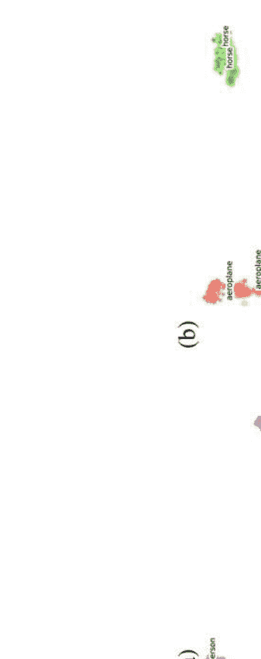

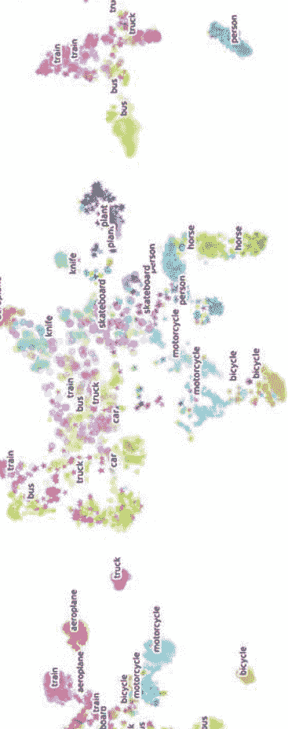

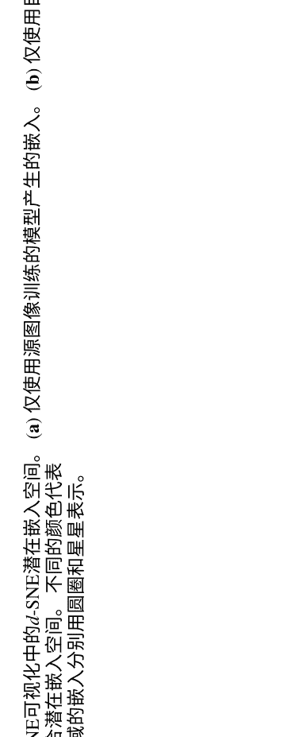

图3.4 VisDA-C数据集的t-SNE可视化中的t-SNE潜在在嵌入空间。(a) 仅使用源图像训练的模型产生的嵌入，以及(c) t-SNE的联合潜在在嵌入空间。不同的颜色代表不同的类别。源域和目标域的嵌入分别用圆圈和星号表示。

### 参考文献

1.  Bousmalis, K., Silberman, N., Dohan, D., Erhan, D., Krishnan, D.: 无监督像素级领域适应与生成对抗网络。在: IEEE计算机视觉和模式识别会议论文集，第3722-3731页（2017年）
2.  Deng, J., Dong, W., Socher, R., Li, L.J., Li, K., Fei-Fei, L.: ImageNet: 一个大规模的分层图像数据库。在: 计算机视觉和模式识别会议论文集（2009年）
3.  Ding, Z., Li, S., Shao, M., Fu, Y.: 无监督领域适应的图自适应知识传递。在: 欧洲计算机视觉会议论文集，第37-52页（2018年）
4.  French, G., Mackiewicz, M., Fisher, M.: 自我集成用于视觉领域适应。在: 国际学习表示会议论文集，温哥华，第1-15页（2018年）。 https://openreview.net/pdf?id=rkpoTaxA-
5.  Ganin, Y., Ustinova, E., Ajakan, H., Germain, P., Larochelle, H., Laviolette, F., Marchand, M., Lempitsky, V.: 神经网络的领域对抗训练。机器学习研究杂志17(1), 2096-2030（2016年）
6.  Ghifary, M., Kleijn, W.B., Zhang, M., Balduzzi, D., Li, W.: 用于无监督领域适应的深度重建-分类网络。在: 欧洲计算机视觉会议，第597-613页。Springer，柏林（2016年）
7.  Goodfellow, I., Pouget-Abadie, J., Mirza, M., Xu, B., Warde-Farley, D., Ozair, S., Courville, A., Bengio, Y.: 生成对抗网络。在: 神经信息处理进展系统，第2672-2680页（2014年）
8.  Haeusser, P., Frerix, T., Mordvintsev, A., Cremers, D.: 关联领域适应。在: IEEE国际计算机视觉会议论文集，第2765-2773页（2017年）
9.  He, K., Zhang, X., Ren, S., Sun, J.: 深度残差网络中的身份映射。在: 欧洲计算机视觉会议，第630-645页。Springer，柏林（2016年）
10. Hinton, G.E., Roweis, S.T.: 随机邻居嵌入。在: 神经信息处理系统，第857-864页（2003年）
11. 霍夫曼，J., Tzeng, E., Park, T., Zhu, J.Y., Isola, P., Saenko, K., Efros, A., Darrell, T.: Cycada: 循环一致的对抗领域适应。在: 第35届国际机器学习大会论文集（2018年）
12. Hull, J.J.: 手写文本识别研究数据库。IEEE Trans. Pattern Anal. Mach. Intell. 16(5), 550-554（1994年）
13. LeCun, Y., Bottou, L., Bengio, Y., Haffner, P., 等：基于梯度的学习应用于文档识别。Proc. IEEE 86(11), 2278-2234（1998年）
14. 刘, M.Y., Tuzel, O.: 耦合生成对抗网络。在: 神经信息处理系统的进展，第469-477页（2016年）。 arXiv:1606.07536. http://arxiv.org/abs/1606.07536
15. Motiian, S., Jones, Q., Iranmanesh, S., Doretto, G.: 少样本对抗领域适应。在: 神经信息处理系统进展，第6670-6680页（2017年）
16. Motiian, S., Piccirilli, M., Adjeroh, D.A., Doretto, G.: 统一的深度监督领域适应和泛化。在: IEEE国际计算机视觉会议论文集，第5715-5725页（2017年）
17. Murez, Z., Kolouri, S., Kriegman, D., Ramamoorthi, R., Kim, K.: 图像到图像的转换用于领域适应。在: IEEE计算机视觉和模式识别会议论文集，第4500-4509页（2018年）
18. Netzer, Y., Wang, T.: 用无监督特征学习读取自然图像中的数字。在: 神经信息处理系统进展，格拉纳达，第1-9页（2011年）
19. Peng, X., Usman, B., Kaushik, N., Wang, D., Hoffman, J., Saenko, K.: Visda: 用于视觉领域适应的合成-到真实的基准。在: IEEE计算机视觉和模式识别会议论文集，第2021-2026页（2018年）
20. Rozantsev, A., Salzmann, M., Fua, P.: 超越共享权重的深度领域适应。
21. Russo, P., Carlucci, F.M., Tommasi, T., Caputo, B.: 从源到目标再到源：对称的双向自适应GAN。在：IEEE计算机视觉和模式识别会议论文集，pp. 8099–8108 (2018)
22. Saenko, K., Kulis, B., Fritz, M., Darrell, T.: 将视觉类别模型调整到新领域。在：欧洲计算机视觉会议论文集，格雷特，pp. 213–226 (2010)
23. Sankaranarayanan, S., Balaji, Y., Castillo, C.D., Chellappa, R.: 生成以适应：使用生成对抗网络对齐领域。在：IEEE计算机视觉和模式识别会议论文集，pp. 8503–8512 (2018)
24. Sener, O., Song, H.O., Saxena, A., Savarese, S.: 学习可迁移的表示以进行无监督领域适应。在：神经信息处理系统进展，第2110-2118页（2016年）
25. Shu, R., Bui, H.H., Narui, H., Ermon, S.: 一种用于无监督领域适应的DIRT-T方法。在：国际学习表示会议论文集，第1-19页（2018年）
26. Simonyan, K., Zisserman, A.: 用于大规模图像识别的非常深的卷积网络（2014年）。预印本。arXiv:1409.1556
27. Tarvainen, A., Valpola, H.: 平均教师是更好的榜样：加权平均一致性目标改善半监督深度学习结果。在：神经信息处理系统进展，长滩（2017年）。http://arxiv.org/abs/1703.01780
28. Tzeng, E., Hoffman, J., Darrell, T., Saenko, K., Lowell, U.: 跨领域和任务的同时深度迁移。在：国际计算机视觉会议论文集，拉斯康德斯（2015年）。https://doi.org/10.1109/ICCV.2015.463. https://www.robots.ox.ac.uk/~vgg/rg/papers/Tzeng_ICCV2015.pdf
29. Tzeng, E., Hoffman, J., Saenko, K., Darrell, T.: 对抗性判别领域适应。在：IEEE计算机视觉与模式识别会议论文集，檀香山，pp. 2962–2971 (2017)。https://doi.org/10.1109/CVPR.2017.316
30. Weinberger, K.Q., Saul, L.K.: 用于大边界最近邻分类的距离度量学习。机器学习研究杂志。10(Feb), 207–244 (2009)
31. Wen, Y., Zhang, K., Li, Z., Qiao, Y.: 一种用于深度人脸识别的判别特征学习方法。在：欧洲计算机视觉会议，pp. 499–515。Springer，柏林(2016)
32. Xu, X., Zhou, X., Venkatesan, R., Swaminathan, G., Majumder, O.: d-SNE：使用随机邻域嵌入的领域适应。在：IEEE计算机视觉与模式识别会议论文集，pp. 2497–2506 (2019)
33. Zhou, X., Prasad, S.: 针对不同高光谱图像的鲁棒分类的领域适应。IEEE Trans. Comput. Imaging 3(4), 822–836 (2017)
34. Zhu, J.Y., Park, T., Isola, P., Efros, A.A.: 使用循环一致性对抗网络进行无配对图像转换。在: IEEE国际计算机视觉会议论文集, pp. 2223–2232 (2017)

## 第4章 用于无监督领域适应的深度哈希网络

Raghavendran Ramakrishnan, Bhadrinath Nagabandi, Jose Eusebio, Shayok Chakraborty, Hemanth Venkateswara, and Sethuraman Panchanathan

#### 4.1 引言

深度学习的最新进展使我们能够开发出不需要显式编程的各种计算机视觉应用解决方案。然而，这些令人印象深刻的性能仅在具有大量标记数据的任务上实现。此外，为每个任务收集和注释足够的数据在许多情况下是昂贵且几乎不可能的。例如，考虑医学领域的应用，其中标记数据需要领域专业知识。雇佣领域专家对大量数据进行标记变得昂贵且耗时。然而，在许多情况下，来自不同但相关的领域的标记数据是可用的。利用来自相关领域的这种标记数据对减少目标领域中标记样本的需求至关重要。

预训练的深度神经网络在应用于与模型最初训练的源域具有不同统计特性的目标域时会出现性能下降[43]。性能下降是源域和目标域之间存在的领域转移的结果。领域转移通常是由照明、姿势、分辨率、背景等多种因素引起的。领域适应算法通过利用源域的标记数据来开发出能够准确区分目标域样本的鲁棒模型来克服这种领域转移。此外，无监督领域适应是一种更具挑战性的范式，其中源域是完全标记的，而目标域是未标记的。

在领域适应中，传统的非深度学习方法（浅层领域适应）遵循一个两步骤的过程。第一步是从数据中提取有意义的特征，第二步是训练一个模型来对齐源域和目标域的特征。这些是静态过程，特征首先被提取，然后被对齐。随着深度学习的出现，领域适应算法已经利用了深度网络学习可转移特征表示的能力。由于这些深度神经网络学习到的特征是数据和任务特定的，它们在经验性能上比传统的浅层方法有显著的改进。

随着互联网上可用数据的指数增长，对高效数据存储和检索算法的需求也在增加。其中一种被广泛研究用于这些目的的技术是哈希。哈希提供了最灵活的数据检索方法，因为它具有快速的查询速度和低内存开销。哈希技术将高维数据转换为低维紧凑的二进制编码。此外，这些技术为相似的项生成相似的二进制编码。在本章中，我们使用深度神经网络学习基于哈希的图像特征表示。这些表示允许在数据点之间进行高效且稳健的相似性度量。

本章讨论了一种领域自适应哈希框架（DAH），它为输入空间中的每个数据点生成二进制哈希码，而不是概率分布。我们看到估计哈希码而不是标准概率分布有多个优势。

1.  在没有标签的情况下，这些哈希码用于为目标数据开发独特的损失函数。
2.  使用哈希码进行标签预测比概率向量更具鲁棒性。

在这个框架中，通过利用源域的标记数据和目标域的未标记数据，训练一个端到端的深度神经网络。在推理过程中，由于模型输出的是哈希码而不是概率向量，我们将给定测试样本的哈希码与训练样本的哈希码进行比较，得出一个稳健的类别预测。DAH框架提出了一个独特的损失函数，包括多个组成部分：(1) 使用源域的标记数据的有监督哈希损失，(2) 用于目标域的未标记数据的无监督熵损失，以及(3) 用于对齐源域和目标域分布的多核最大均值差异(MK-MMD)损失。本章部分基于[42]的早期工作。

我们还介绍了 Office-Homedataset，这在最近几年中已经变得非常流行，用于评估域适应算法的性能。

#### 4.2 相关工作

域适应中的一个关键挑战是源域和目标域之间存在的域偏移问题。过去，已经探索了几种方法来解决这个问题。它们可以广泛地分为浅层和深层方法。在浅层方法（非深度学习）中，使用的特征是预先确定的，并且在源数据上训练的分类器被适应到目标数据上[1, 4]。其他方法使用转换矩阵来线性地转换源数据，使其与目标数据对齐[27, 38]。其他一些工作，如[9, 10, 21]，对源样本进行加权，并给与与目标样本相似的数据点更高的值，从而实现域之间更好的对齐。

在领域适应中，一种常见的方法是将源域和目标域的数据投影到一个公共子空间，并对齐它们的主轴以减小领域差异[16, 39]。最大均值差异（MMD）等差异估计度量提供了两个领域之间的分布差异。通过将数据集投影到再生核希尔伯特空间[13]来测量这种转变。使用核主成分分析方法[30, 31, 36]实现了非线性领域对齐与MMD。计算机视觉中的另一种常见方法是通过将领域子空间视为流形上的一个点来学习源域和目标域之间的转换[20, 23]。关于其他方法的详细调查可在[35, 37]中找到。

与预先确定特征的浅层技术不同，深度卷积神经网络（CNN）在学习数据特定的判别特征方面非常成功[8]。捕捉和解开变化因素的能力使CNN成为多任务迁移学习的优秀工具[2, 12, 18, 34]。CNN的较低层捕捉通用特征，而较高层负责任务特定特征[43]。一些方法已经应用了这种理解，将全连接深层神经网络的特征对齐以实现领域适应[32, 40]。随着生成对抗网络（GANs）的出现，Ganin等人提出了具有梯度反转层的领域对抗网络，用于学习领域不变特征[17]。近年来，对抗特征对齐已被证明是最流行的领域适应方法。

提出了无监督哈希技术，用于生成高效存储和检索数据的唯一哈希码[22, 25]。先前使用神经网络生成哈希码的方法已经产生了最先进的结果[7, 11, 14]。在交叉模态哈希中，使用哈希和适应性的相关工作，深度哈希技术嵌入多模态数据并学习两个相关领域（如文本和图像）的哈希码[5, 6, 28]。深度自适应哈希（DAH）网络是第一批使用深度哈希网络进行无监督领域适应的方法之一。

#### 4.3 领域自适应哈希网络

在标准的无监督领域适应中，我们假设数据来自两个领域：源领域和目标领域。设 $\mathcal{D} = \{\boldsymbol{x}^s_i, y^s_i\}^{n}_{i=s}$ 为源领域，其中 $n$ 为标记示例，$\mathcal{D}_t = \{\boldsymbol{x}^t_i, y^t_i\}^{n}_{i=t}$ 为目标领域，其中 $n$ 为标记示例。在本章中，我们处理无监督领域适应，其中目标领域的标签 $y^t_i$ 是未知的。数据点 $\boldsymbol{x}^*_i$ 属于 $X$，其中 $X$ 是某个输入空间。对于给定的 $\boldsymbol{x}^*_i$，相应的标签由 $y^* \in Y$ 表示为 $= \{1, \ldots, C\}$。无监督领域适应的目标是克服源领域和目标领域之间的领域偏移，并学习一个能够准确分类目标领域中未标记数据的分类器。在这项工作中，我们使用分布距离度量来最小化领域偏移，并使用标记的源数据学习一个稳健的映射 $\psi(.)$，以正确分类目标领域的图像。

我们使用一个预训练的神经网络（VGG-F[8]），其中包含5个卷积层（卷积1-卷积5）和3个全连接层（全连接6-全连接8），然后是一个损失层。由于我们的模型需要预测哈希码而不是softmax概率，我们将预训练网络中的标准全连接8层替换为一个新引入的哈希-全连接8层。哈希-全连接8层的输出表示为 $\psi(\boldsymbol{x})$，其中 $\psi(\boldsymbol{x}) \in \mathbb{R}^d$，我们进一步将其转换为哈希码 $\boldsymbol{h} = \text{sgn}(\psi(\boldsymbol{x}))$，其中$\text{sgn}(.)$是符号函数。因此，网络的输出是一个二进制哈希码 $\boldsymbol{h}_i$，对于每个数据点 $\boldsymbol{x}_i$，其中 $\boldsymbol{h}_i \in \{-1, +1\}^d$。我们在图4.1中总结了整体架构。我们使用多个损失函数的组合来训练模型，包括（1）用于域对齐的 $MK\text{-}MMD$损失，（2）用于标记源数据的监督哈希损失，以及（3）用于无标签目标数据的无监督熵损失。

##### 4.3.1 减少领域差异

神经网络中的深层生成任务特定的表示，而初始层输出通用的可转移的表示[43]。我们将这个理解应用于对齐源和目标在完全连接的层 $\mathcal{F} = \{fc6, fc7, fc8\}$ 的输出表示。我们实现了多核最大均值差异（MK-MMD）度量来减少分布差异[32, 33]。MK-MMD损失函数为：

$$\mathcal{M}(\boldsymbol{u}_s, \boldsymbol{u}_t) = \sum_{l \in \mathcal{F}} d_k^2(\boldsymbol{u}_s^l, \boldsymbol{u}_t^l),$$
(4.1)# 用于无监督域适应的深度哈希网络

图4.1 域自适应哈希（DAH）网络，用于输出源和目标的哈希码。我们用一批源数据和目标数据训练网络。卷积层conv1-conv5和全连接层fc6和fc7是从VGG-F网络微调得到的。MK-MMD损失训练DAH学习将源和目标的特征表示对齐。hash-fc8层被训练为输出d维向量。监督哈希损失驱使DAH为每个对象类别估计唯一的哈希值。无监督熵损失将目标哈希值与其对应的源类别对齐。最好以彩色查看（图片来源：[42]）

MK-MMD度量 $d_k^2(.)$[24]在第$l$层计算源数据和目标数据的输出表示，其中$u_s^l = \{u^{s,li}\}_{i=1}^{n_s}$和$u_t^l = \{u^{t,li}\}_{i=1}^{n_t}$，其中$u_i^{*l}$是第$l$层的输出表示$x_i^*$。最终层的输出表示为$u_s$和$u_t$。对于非线性映射$\phi(.)$到再生核希尔伯特空间$\mathcal{H}_k$和核$k(.)$，其中$k(\boldsymbol{x}, \boldsymbol{y}) = \langle \phi(\boldsymbol{x}), \phi(\boldsymbol{y}) \rangle$，MMD定义为

$$d_k^2(u_s^l, u_t^l) = \left\| \mathbb{E}[\phi(\boldsymbol{u}^{s,l})] - \mathbb{E}[\phi(\boldsymbol{u}^{t,l})] \right\|_{\mathcal{H}_k}^2. \tag{4.2}$$

核函数 $k(.)$ 是 $\kappa$ 个半正定核的凸组合，$\{k_m\}_{m=1}^{\kappa}$, $\mathcal{K} := \left\{ k: k = \sum_{m=1}^{\kappa} \beta_m k_m, \sum_{m=1}^{\kappa} \beta_m = 1, \beta_m \geq 0, \forall m \right\}$ 根据[33]，我们设置$\beta_m = 1/\kappa$。

##### 4.3.2 源的监督哈希

由于源数据是有标签的，我们为源数据设计了一个监督哈希损失函数。让我们考虑两个源数据点 $\boldsymbol{x}_i$ 和 $\boldsymbol{x}_j$，它们对应的哈希值分别为 $\boldsymbol{h}_i$ 和 $\boldsymbol{h}_j$。哈希值取两个离散值之一 $\boldsymbol{h}_i \in \{-1, +1\}^d$。为了确定任意给定的两个源数据点是否属于同一类别，我们计算它们对应哈希码的差异。汉明距离可以用作计算差异的距离度量。汉明距离计算两个向量之间不相似的维度数量。它被定义为 $\text{dist}_{H}(\boldsymbol{h}_i, \boldsymbol{h}_j) = \frac{1}{2}(d - \boldsymbol{h}_i^{\top} \boldsymbol{h}_j)$，其中 $d$ 是维度的数量。

点积 $\boldsymbol{h}_i^{\top} \boldsymbol{h}_j$ 用于衡量两个向量之间的相似性，以维度 $d$ 为单位。考虑两个属于同一类别的输入源样本。它们的哈希码应该相似，从而使它们的点积值较高。可以推断出 $\text{dist}_{H}(\cdot)$ 随着点积值的增加而减小。相反，当两个哈希码之间的距离很小时，对应的样本属于同一类别的概率很高。

我们定义一个包含所有源样本的相似性矩阵 $S = \{s_{ij}\}$。元素 $s_{ij}$ 在 $S$ 中是源数据点 $i$ 和 $j$ 之间的相似度，其中 $s_{ij} \in \{0, 1\}$。如果两个样本属于同一类别，则 $s_{ij}$ 的值为1，否则为0。样本 $\boldsymbol{x}_i$ 和 $\boldsymbol{x}_j$ 之间的相似度概率与它们对应的哈希码 $\boldsymbol{h}_i$ 和 $\boldsymbol{h}_j$ 定义为：

$$p(s_{ij}|\boldsymbol{h}_i, \boldsymbol{h}_j) = \begin{cases} \sigma(\boldsymbol{h}_i^{\top} \boldsymbol{h}_j), & s_{ij} = 1 \\ 1 - \sigma(\boldsymbol{h}_i^{\top} \boldsymbol{h}_j), & s_{ij} = 0, \end{cases} \qquad \qquad \qquad \qquad \qquad \qquad \qquad \qquad (4.3)$$

其中 $\sigma(x) = \frac{1}{1+e^{-x}}$ 是sigmoid激活函数。设 $\mathbf{H}=\{\boldsymbol{h}_i\}_{i=1}^{n_s}$ 为网络输出的源数据点的哈希码集合。在假设样本独立且同分布的情况下，我们可以最小化对 $\mathbf{H}$ 的负对数似然，以使输出的哈希码与数据点之间的相似度一致；

$$\begin{aligned} \min_{\mathbf{H}} \mathcal{L}(\mathbf{H}) &= -\log p(S|\mathbf{H}) \\ &= -\sum_{s_{ij} \in S} \left( s_{ij} \boldsymbol{h}_i^{\top} \boldsymbol{h}_j - \log(1 + \exp(\boldsymbol{h}_i^{\top} \boldsymbol{h}_j)) \right). \end{aligned} \qquad \qquad \qquad \qquad \qquad \qquad \qquad \qquad (4.4)$$

然而，方程 (4.4) 是一个难以解决的离散优化问题，因为哈希码 $\boldsymbol{h}_i \in \{-1, 1\}^d$ 只能取离散值。我们放宽了哈希码的离散约束，而是求解 $\boldsymbol{u}_i \in \mathbb{R}^d$，其中 $\mathcal{U}=\{\boldsymbol{u}_i\}_{i=1}^{n_s}$ 是网络输出的结果，其中 $\boldsymbol{u}_i = \psi(\boldsymbol{x}_i)$。为了简化表示，我们省略了上标符号。

由于这种放宽，我们面临以下挑战。(1) 用 $\langle \boldsymbol{u}_i, \boldsymbol{u}_j \rangle$ 替换 $\langle \boldsymbol{h}_i, \boldsymbol{h}_j \rangle$ 会引入近似误差。(2) 当实值输出 $\boldsymbol{u}_i$ 被二值化时，我们引入了量化误差[44]。为了考虑近似误差，我们使用 $\tanh(\cdot)$ 作为最后一层的激活函数。这将使 $\boldsymbol{u}_i$ 的分量限制在 $-1$ 和 $+1$ 之间。我们通过最小化来解决量化误差 $\| \boldsymbol{u}_i - \text{sgn}(\boldsymbol{u}_i) \|_2^2$, [22]。更正式地说，有监督的哈希目标可以写成.

$$\min_{\mathcal{U}_s} \mathcal{L}(\mathcal{U}_s) = - \sum_{s_{ij} \in S} \left( s_{ij} \boldsymbol{u}_i^{\top} \boldsymbol{u}_j - \log(1 + \exp(\boldsymbol{u}_i^{\top} \boldsymbol{u}_j)) \right) + \sum_{i=1}^{n_s} \| \mathbf{u}_i - \text{sgn}(\mathbf{u}_i) \|_2^2, \quad (4.5) $$

##### 4.3.3 目标的无监督哈希

我们无法将有监督的哈希损失应用于目标数据，因为在训练过程中没有可用的标签。因此，我们仅依靠相似度测量 $(u_i, u_j)$ 来指导网络对目标数据进行分类。不失一般性，我们假设一个数据批次由每个类别的 K 个示例的源数据点组成，共有 C 个类别。我们将属于类别 j 的源输出数据点表示为 $(\{u_k^{s_j}\}_{k=1}^K)$。当目标数据点输出 $u_i^t$ 与大多数源输出数据点相似时，它被认为属于 j 类别 $(\{u_k^{s_j}\}_{k=1}^K)$。它还必须与其他所有源输出数据点不相似 $u_k$ 属于不同类别的 k ($j = l$)。因此，我们定义目标数据点属于类别 j 的概率为,

$$ p_{ij} = \frac{ \sum_{k=1}^{K} \exp( {\mathbf{u}_i^t}^\top \mathbf{u}_k^{s_j} ) }{ \sum_{l=1}^{C} \sum_{k=1}^{K} \exp( {\mathbf{u}_i^t}^\top \mathbf{u}_k^{s_l} ) }, \quad (4.6) $$

(4.6) 中的分子测量了目标样本与 K 个类别 j 的源样本的相似性。分母计算了目标数据点与每个 C 类别的 K 个源样本的相似性，并且是一个归一化因子以确保 $\sum_{j=1}^{C} p_{ij} = 1$。

对于每个目标输出数据点 $u_i^t$，我们可以定义一个概率向量 $p_i = [ p_{i1}, ..., p_{iC} ]^T$，其中 $p_{ij}$ 是 $u_i^t$ 属于类别 j 的概率。在理想情况下，概率向量类似于一个独热向量，样本的真实类别被赋予值1，其他类别被赋予值0。

一个独热向量可以被视为对 $p_i$ 的低熵表示，其中我们对目标数据点的类别非常有信心。我们引入了一个损失项来最小化这些概率向量的熵，从而确保网络对目标类别的分配非常自信。网络输出的熵损失为,

$$ \mathcal{H}( \mathcal{U}_s, \mathcal{U}_t ) = - \frac{1}{n_t} \sum_{i=1}^{n_t} \sum_{j=1}^{C} p_{ij} \log( p_{ij} ), \quad (4.7) $$

通过最小化公式 (4.7)，概率向量 $p_i$ 趋向于独热表示。在源领域中，通过每个类别的 K 个样本来强制执行这一点，确保目标样本 $u_i^t$ 与特定类别的多个 (K) 源样本相似。

##### 4.3.4 领域自适应哈希

领域自适应哈希（DAH）网络应用了源和目标之间的无监督领域适应哈希（DAH）。该模型是一个深度卷积神经网络，结合了源的监督哈希和目标的无监督哈希。DAH网络的目标可以表示为，

$$ \min_{\mathcal{U}} \mathcal{J} = \mathcal{L}(u_{_s}) + \gamma\mathcal{M}(u_{_s}, u_{_t}) + \eta\mathcal{H}(u_{_s}, u_{_t}) \quad \quad (4.8) $$

其中$\mathcal{U} = \{u_{_s}\cup u_{_t}\}$，$(\gamma, \eta)$是MK-MMD损失和熵损失的超参数。它们控制领域对齐和目标熵损失的重要性。我们从网络的输出中获得哈希值，即$H = \text{sgn}(\mathcal{U})$。MK-MMD损失(4.1)在每个全连接层{fc6, fc7, fc8}的$\{u_{_s}^{l}, u_{_t}^{l}\}$之间计算。该模型使用标准的反向传播算法进行训练。网络架构和其他细节将在下面讨论。

网络架构深度神经网络除了对数据需求量大之外，对于每个任务来说，收集和注释数百万张图像是不可能的。因此，我们采用迁移学习，选择预训练的VGG-F网络[8]，该网络最初在ImageNet 2012上进行了训练，这是一个拥有1000个类别和超过一百万张图像的大型标记数据集。当前的领域适应模型基于更高效的ResNet架构[26]，与VGG-F模型相比，它是一个更好的特征提取器。我们相信如果使用ResNet作为基础网络来实现DAH，将会得到更好的结果。预训练的VGG-F模型有5个卷积层（conv1–conv5），后面跟着3个全连接层（fc6, fc7, fc8）。我们的目标是为给定的数据样本预测二进制哈希码，这与实际的VGG-F模型不同。因此，我们通过引入一个新的层hash-fc8来修改架构，替换原来的fc8层。我们需要的二进制哈希码是{-1, +1}，因此我们使用tanh()激活函数将预测限制在相同的范围内。尽管tanh()是一个平滑且以零为中心的激活函数，其输出范围在-1和+1，它在深度神经网络中有一个明显的梯度消失的缺点。当激活变得饱和时，梯度往往会消失（值为0），网络无法学习。为了解决这个问题，我们在tanh层之前引入了批归一化层，以防止其饱和。因此，最终的hash-fc8层被定义为 $hash-fc8 := \{fc8 \rightarrow batch-norm \rightarrow tanh()\}$。将hash-fc8作为最后一层可以防止激活饱和，并为模型的训练提供更大的稳定性。

#### 4.4 实验和结果

我们进行了大量实验来评估DAH模型在领域适应和哈希方面的性能。我们评估了我们的模型在（1）无监督领域适应，（2）判别特征和（3）无监督领域自适应哈希方面的性能。实现细节可在https://github.com/hemanthdv/dahash找到。

##### 4.4.1 数据集

办公室[38] 这是用于评估计算机视觉领域适应的标准基准数据集之一。该数据集包含来自常规办公环境的对象图像。它有3个领域:亚马逊(A),数码相机(D)和网络摄像头(W)。该数据集约有4100张图像，其中大多数图像(2816张)来自亚马逊领域。在我们的实验中，我们采用了评估该数据集的每对转移任务的标准协议[32, 33]。考虑到3个领域，我们有6个转移任务的组合。A→D, D→A, A→W, W→A, D→W和W→D。A→D表示A是源领域，D是目标领域。

Office-Home在本章基于的原始工作[42]中，我们引入了这个新的数据集用于领域适应。Office-Home数据集有4个领域，每个领域都有来自65个类别的图像。这些类别来自于大约15,500张日常物品的图像。这些领域包括：艺术：以绘画、素描、装饰等形式呈现的物体艺术品；剪贴画：剪贴画图像；产品：没有背景的高分辨率物体图像，类似于Office数据集中的亚马逊类别；真实世界：使用普通相机拍摄的物体图像。我们考虑了4个领域（艺术(Ar)、剪贴画(Cl)、产品(Pr)和真实世界(Rw))的所有源和目标的12个迁移任务。该数据集可用于研究目的，网址为https://hemanthdv.github.io/officehome-dataset/。

##### 4.4.2 实现细节

该模型使用MatConvnet框架进行实现[41]。我们使用预训练的VGG-F，并微调conv1-conv5，fc6和fc7的权重。学习率设置为1。与hash-fc8使用的学习率相比，学习率为其的10倍，并在之。我们使用动量为0.9和权重衰减为5×10^-4的梯度下降法进行300个epoch的训练。我们从每个类别中随机选择K=5个样本。由于办公室数据集包含31个类别，源输入批次大小为155个样本（5个样本×31个类别）。我们随机选择155张图像作为目标。因此，一个批次中的样本总数为310。类似地，对于Office-Home数据集，批次大小为650（5个样本×65个类别）。随着类别数量的增加，批次大小的增加引起了关注。

我们尝试了哈希码长度为64。其他哈希码长度的结果与64相似。由于S中喜欢和不喜欢的对数不平衡，我们增加了喜欢对的相似性值，使得$S(i,j)\in\{0,10\}$。网络的性能随着喜欢对的相似性权重的增加而提高。熵损失使用参数$\eta=1$。参数$\gamma$通过使用二进制域分类器进行交叉验证获得。我们选择在验证集上产生最大误差的$\gamma$。对于MK-MMD损失，我们遵循[24]中概述的启发式方法。我们使用高斯核函数，带宽$\sigma$计算为训练数据中成对距离的中位数。对于多核，带宽变化为$\sigma_m\in[2^{-8}\sigma, 2^8\sigma]$乘以2的因子。目标数据点使用$f(x_j^t)=p(y|h^t)$进行分类。基于源数据和目标数据的哈希码，分类器将目标数据点分配给具有最大概率的类别。

##### 4.4.3 无监督领域适应

在本节中，我们研究了我们的深度哈希网络的性能。此外，我们还将我们的模型与现有的最先进方法进行了比较。我们在无监督的领域适应设置中评估了我们的模型和其他竞争基线，其中标记数据仅在源域中可用，目标域完全无标签。

作为评估的一部分，我们将我们的模型的性能与以下经典的浅层领域适应方法进行了比较，

- 1. 测地线流核（GFK）[20]
- 2. 转移分量分析（TCA）[36]
- 3. 相关对齐（CORAL）[39]
- 4. 联合分布适应（JDA）[30]

以及深度学习方法，

- 1. 深度适应网络（DAN）[32]
- 2. 领域对抗神经网络（DANN）[17]

对于浅层学习方法，我们使用从VGG-F网络的fc7层中提取的深度特征，该网络在ImageNet 2012数据集上进行了预训练。我们还研究了熵损失在我们方法中的影响，即通过将目标哈希值与具有相似表示的源值对齐来改变模型的性能。为了与我们的分析保持一致，我们将DAH-e表示为没有熵损失训练的模型，DAH表示完整模型。

###### 表4.1 在 Office dataset上进行领域适应实验的识别准确率（%）

| 实验   | A→D   | A→W   | D→A   | D→W   | W→A   | W→D   | 平均   |
| ------ | ----- | ----- | ----- | ----- | ----- | ----- | ------ |
| GFK    | 48.59 | 52.08 | 41.83 | 89.18 | 49.04 | 93.17 | 62.32  |
| TCA    | 51.00 | 49.43 | 48.12 | 93.08 | 48.83 | 96.79 | 64.54  |
| CORAL  | 54.42 | 51.70 | 48.26 | 95.97 | 47.27 | 98.59 | 66.04  |
| JDA    | 59.24 | 58.62 | 51.35 | 96.86 | 52.34 | 97.79 | 69.37  |
| DAN    | 67.04 | 67.80 | 50.36 | 95.85 | 52.33 | 99.40 | 72.13  |
| DANN   | 72.89 | 72.70 | 56.25 | 96.48 | 53.20 | 99.40 | 75.15  |
| DAH-e  | 66.27 | 66.16 | 55.97 | 94.59 | 53.91 | 96.99 | 72.31  |
| DAH    | 66.47 | 68.30 | 55.54 | 96.10 | 53.02 | 98.80 | 73.04  |

A亚马逊，D数码单反相机，W网络摄像头。A→W表示A是源领域，W是目标领域（表格来源：[42]）

结果和讨论在表4.1和4.2中，我们报告了所有模型的分类准确率（%），包括我们在Office和Office-Home数据集上的准确率。表中的数值表示目标领域中正确分类的样本数量的百分比。我们将我们的深度哈希网络与哈希长度 d =64位进行比较。可以观察到DAH模型在从Office数据集进行的多个转移任务中始终产生更好的结果，优于其他基线模型。然而，对于Office数据集，DANN超过了DAH。我们认为当数据集中的类别数量较少时，域对抗训练比DAH更有效。由于域对齐是与类别无关的，所以在存在大量类别的情况下，对齐的域可能不适合分类。这些结果使我们得出结论，当数据集中的类别数量较大时，DAH的性能更好。

当模型的$\eta$设置为零时，即没有熵时，DAH-e行显示的准确性。我们注意到，使用(4.7)在目标数据上最小化熵有助于将目标样本与具有相似表示的源样本对齐，因此DAH提供了比DAH-e更好的性能。因此，源样本和目标样本的改进对齐是提高准确性的原因。

##### 4.4.4 特征分析

在图4.2中，我们展示了使用VGG-F、DAN和DAH特征计算的源域和目标域之间的 A距离。A距离提供了两个域之间差异的估计，大约等于$2(1-2\epsilon)$，其中 $\epsilon$ 是一个二元分类器训练用于对源域和目标域进行分类的泛化误差[3]。我们使用LIBLINEAR SVM [15]作为分类器，并使用五折交叉验证来估计 $\epsilon$ 的值。图4.2中的柱状图表示的值指示了# 表4.2 在Office-Home数据集上进行领域适应实验的识别准确率(%)

| 实验 | Ar→Cl | Ar→Pr | Ar→Rw | Cl→Ar | Cl→Pr | Cl→Rw | Pr→Ar | Pr→Cl | Pr→Rw | Rw→Ar | Rw→Cl | Rw→Pr | 平均 |
|---|---|---|---|---|---|---|---|---|---|---|---|---|---|
| GFK | 21.60 | 31.72 | 38.83 | 21.63 | 34.94 | 34.20 | 24.52 | 25.73 | 42.92 | 32.88 | 28.96 | 50.89 | 32.40 |
| TCA | 19.93 | 32.08 | 35.71 | 19.00 | 31.36 | 31.74 | 21.92 | 23.64 | 42.12 | 30.74 | 27.15 | 48.68 | 30.34 |
| CORAL | 27.10 | 36.16 | 44.32 | 26.08 | 40.03 | 40.33 | 27.77 | 30.54 | 50.61 | 38.48 | 36.36 | 57.11 | 37.91 |
| JDA | 25.34 | 35.98 | 42.94 | 24.52 | 40.19 | 40.90 | 25.96 | 32.72 | 49.25 | 35.10 | 35.35 | 55.35 | 36.97 |
| DAN | 30.66 | 42.17 | 54.13 | 32.83 | 47.59 | 49.78 | 29.07 | 34.05 | 56.70 | 43.58 | 38.25 | 62.73 | 43.46 |
| DANN | 33.33 | 42.96 | 54.42 | 32.26 | 49.13 | 49.76 | 30.49 | 38.14 | 56.76 | 44.71 | 42.66 | 64.65 | 44.94 |
| DAH-e | 29.23 | 35.71 | 48.29 | 33.79 | 48.23 | 47.49 | 29.87 | 38.76 | 55.63 | 41.16 | 44.99 | 59.07 | 42.69 |
| DAH | 31.64 | 40.75 | 51.73 | 34.69 | 51.93 | 52.79 | 29.91 | 39.63 | 60.71 | 44.99 | 45.13 | 62.54 | 45.54 |

Ar:艺术，Cl:剪贴画，Pr:产品，Rw:真实世界
Ar→Cl表示Ar是源领域，Cl是目标领域

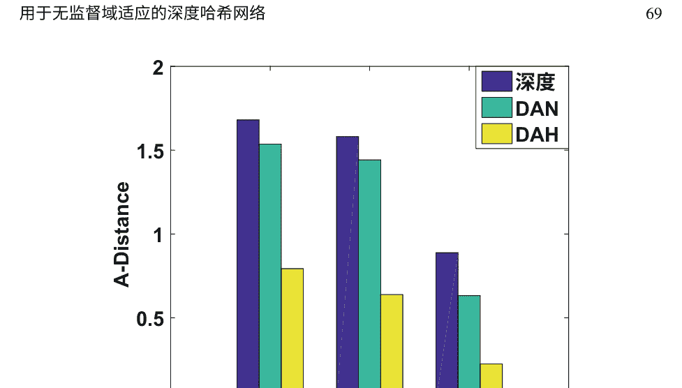

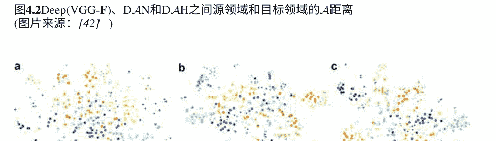

领域之间的差异。我们可以观察到，在所有三个转移任务中，DAH生成了更好的领域对齐特征，领域之间的距离最小。

图4.3展示了从不同模型的倒数第二层提取的特征的t-SNE嵌入。我们观察到，与其他基线相比，DAH在将特征聚类到不同类别方面表现更好。我们还可以观察到，随着我们转向DAN和DAH，源域和目标域也有很好的重叠。

##### 4.4.5 无监督领域自适应哈希

在本节中，我们评估了DAH从数据中生成紧凑高效哈希码的能力，以在没有标签的情况下对未见过的测试实例进行分类。文献中有一些有希望的无监督哈希技术，[7, 11, 19]。在实际环境中，标签可能通过不同但相关的（源）领域获得。在这种情况下，像DAH这样利用源域的标记数据来学习目标域的哈希码的过程具有巨大的实际重要性。为了解决这个现实挑战，我们考虑以下情景：

1.  没有可用的标签，哈希码需要以无监督的方式学习。我们与基准无监督哈希方法（ITQ）[22]和（KMeans）[25]以及无监督哈希的最新方法（BA）[7]和（BDNN）[11]进行比较。
2.  来自相关但不同源领域的标记数据可用。使用标记的源数据来学习目标数据的哈希码。没有领域适应，我们将此方法称为NoDA。我们使用源数据训练的深度配对监督哈希（DPSH）算法[29]，并将网络应用于确定目标的哈希值。
3.  我们使用来自相关但不同领域的标记数据。我们使用DAH来减少域之间的差异，并学习目标的哈希码。
4.  在目标领域中有标记数据可用，我们以监督方式学习哈希值。我们将此过程称为SuH。这是一种监督技术，我们仅用它来比较其他方法的相对性能。我们使用深度配对监督哈希（DPSH）算法[29]来训练目标数据的深度网络，并评估验证集的哈希值。

结果与讨论 图4.4和4.5显示了来自Office-Home dataset的每个领域的精确度-召回曲线。对于Office-Home dataset中的每个领域，我们在所有四个设置中训练模型，并在同一图中可视化它们以进行公平比较。我们还计算平均精确度（mAP）来评估哈希方法的性能，并根据先前的评估准则[7, 11, 19]报告数值。表4.3中报告的数值是使用哈希码长度d=64位估计的。当我们使用哈希码长度为d=16位和d=128位时，我们观察到与d=64位的实验结果相同的趋势。我们实验观察到的结果对于上述设置中的所有模型来说都非常直观。

由于源域和目标域之间的领域转移，NoDA设置下训练的模型表现最平庸。这清楚地表明需要学习一个能克服领域转移并学习有区分性特征的模型。在无监督设置下训练的方法ITQ、KMeans、BA和BDNN的性能略好于NoDA。这也突出了角色在没有领域对齐的情况下，在NoDA案例中负迁移的存在。所提出的DAH算法将类别判别性特征的哈希码学习和领域适应的领域不变特征集成到一个框架中。

因此，学习到的特征在领域之间更加对齐，并在目标领域中导致性能改进，如图4.4和4.5和表4.3所示。由于SuH模型的目标标签可用，因此它表现最佳。此外，我们注意到DAH和SuH的曲线相对相似，这证实了DAH模型生成目标领域中有意义的哈希码和标签的能力。

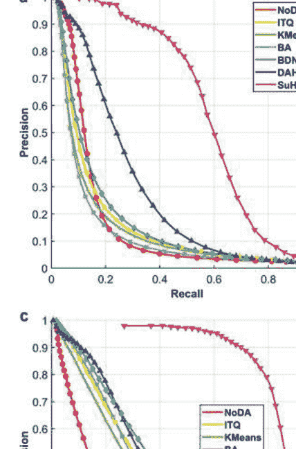

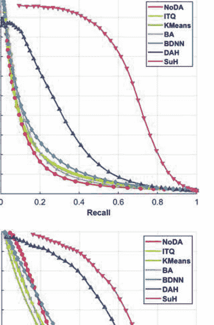

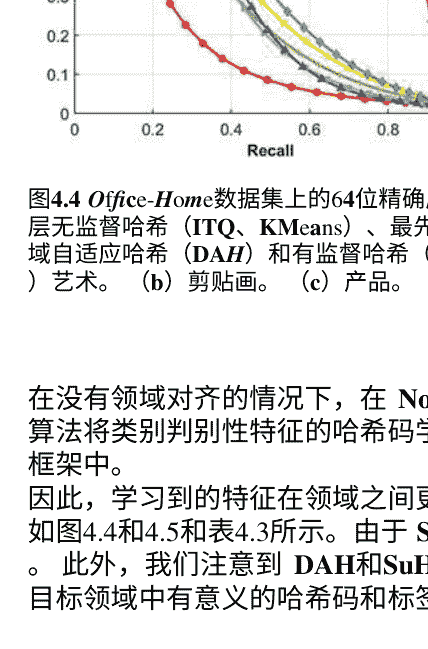

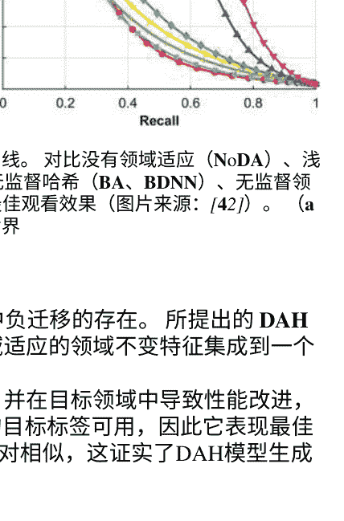

图4.4 Office-Home数据集上的64位精确度-召回率曲线。对比没有领域适应（NoDA）、浅层无监督哈希（ITQ、KMeans）、最先进的深度无监督哈希（BA、BDNN）、无监督领域自适应哈希（DAH）和有监督哈希（SuH）。最佳观看效果（图片来源：[42]）。（a）艺术。（b）剪贴画。（c）产品。（d）真实世界

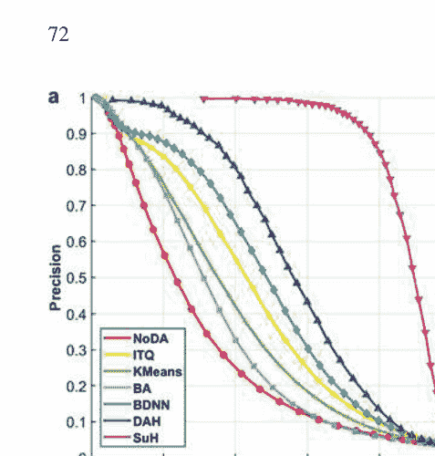

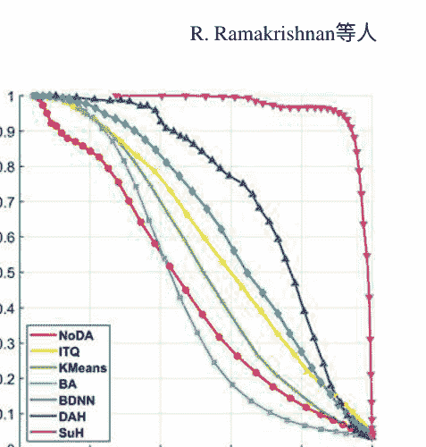

图4.5 在Office数据集上的64位精确度-召回曲线。对比没有领域适应的哈希化（NoDA），浅层无监督哈希化（ITQ，KMeans），最先进的深度无监督哈希化（BA，BDNN），无监督领域自适应哈希化（DAH）和有监督哈希化（SuH）。最佳观看方式为彩色（图片来源：[42]）。（a）亚马逊。（b）网络摄像头

###### 表4.3 平均精度@64位

| 实验 | 无领域适应 | ITQ | K均值 | BA | BDNN | DAH | SuH |
|---|---|---|---|---|---|---|---|
| 亚马逊 | 0.324 | 0.465 | 0.403 | 0.367 | 0.491 | 0.582 | 0.830 |
| 网络摄像头 | 0.511 | 0.652 | 0.558 | 0.480 | 0.656 | 0.717 | 0.939 |
| 艺术 | 0.155 | 0.191 | 0.170 | 0.156 | 0.193 | 0.302 | 0.492 |
| 剪贴画 | 0.160 | 0.195 | 0.178 | 0.179 | 0.206 | 0.333 | 0.622 |
| 产品 | 0.239 | 0.393 | 0.341 | 0.349 | 0.407 | 0.414 | 0.774 |
| 真实世界 | 0.281 | 0.323 | 0.279 | 0.273 | 0.336 | 0.533 | 0.586 |
| 平均 | 0.278 | 0.370 | 0.322 | 0.301 | 0.382 | 0.480 | 0.707 |

对于无领域适应和DAH结果，艺术是剪贴画、产品和真实世界的源领域，剪贴画是艺术的源领域。同样，亚马逊和网络摄像头是源目标对（表格来源：[42]）

#### 4.5 结论

在本文中，我们提出了一个深度哈希网络，这是一个无监督领域适应模型，利用深度神经网络的能力产生领域不变特征，并学习高效的类别判别哈希码。我们的模型解决了现实世界中两个常见问题：少量标记数据的类别分配（通过领域适应）和无监督设置下哈希码的估计（目标数据的哈希码）。这项工作还引入了一个新的数据集Office-Home，其中包含更多的领域和类别，以更好地评估领域适应算法。这项工作是将哈希码学习与无监督领域适应相结合的首次尝试之一。

### 参考文献

> 1. Aytar, Y., Zisserman, A.: Tabula rasa: 模型迁移用于目标类别检测. 在: IEEE ICCV (2011)

> 2. Bengio, Y., Courville, A., Vincent, P.: 表示学习：一项综述和新的观点. IEEE Trans. Pattern Anal. Mach. Intell. 35(8), 1798–1828 (2013)

> 3. Ben-David, S., Blitzer, J., Crammer, K., Kulesza, A., Pereira, F., Vaughan, J.W.: 不同领域学习的理论. 机器学习. 79(1–2), 151–175 (2010)

> 4. Bruzzone, L., Marconcini, M.: 领域适应问题：一种DASVM分类技术和循环验证策略. IEEE Trans. Pattern Anal. Mach. Intell. 32(5), 770–787(2010)

> 5. Cao, Y., Long, M., Wang, J., Yang, Q., Yu, P.S.: 深度视觉语义哈希用于跨模态检索。在: ACM-SIGKDD (2016年)

> 6. Cao, Z., Long, M., Yang, Q.: 用于异构多媒体检索的传递哈希网络。在: AAAI (2016年)

> 7. Carreira-Perpinán, M.A., Raziperchikolaei, R.: 使用二进制自编码器进行哈希。在: IEEE计算机视觉和模式识别会议论文集, pp. 557–566 (2015年)

> 8. Chatfield, K., Simonyan, K., Vedaldi, A., Zisserman, A.: 魔鬼细节的回归：深入研究卷积神经网络。在: BMVC (2014年)

> 9. Chattopadhyay, R., Sun, Q., Fan, W., Davidson, I., Panchanathan, S., Ye, J.: 多源域适应及其在疲劳早期检测中的应用。ACM Trans. Knowl. Discov.Data 6(4), 18 (2012)

> 10. Chu, W.S., De la Torre, F., Cohn, J.F.: 个性化面部动作选择性转移机器单元检测。在: IEEE计算机视觉和模式识别会议论文集, 第3515-3522页 (2013年)

> 11. Do, T.T., Doan, A.D., Cheung, N.M.: 用二进制深度神经网络学习哈希。在: 欧洲计算机视觉会议, 第219-234页. Springer, Berlin (2016)

> 12. Donahue, J., Jia, Y., Vinyals, O., Hoffman, J., Zhang, N., Tzeng, E., Darrell, T.: Decaf: 用于通用视觉识别的深度卷积激活特征。在: ICML, 第647-655页 (2014年)

> 13. Duan, L., Tsang, I.W., Xu, D.: 领域转移多核学习。IEEE模式分析与机器智能 34(3), 465-479页 (2012年)

> 14. Erin Liong, V., Lu, J., Wang, G., Moulin, P., Zhou, J.: 深度哈希用于紧凑二进制编码学习。在: IEEE计算机视觉和模式识别会议论文集, 第2475-2483页 (2015年)

> 15. Fan, R.E., Chang, K.W., Hsieh, C.J., Wang, X.R., Lin, C.J.: Liblinear: 用于大规模线性分类的库。机器学习研究杂志9（8月），1871-1874页 (2008年)

> 16. Fernando, B., Habrard, A., Sebban, M., Tuytelaars, T.: 无监督的视觉领域适应，使用子空间对齐。在: CVPR, 第2960-2967页 (2013年)

> 17. Ganin, Y., Ustinova, E., Ajakan, H., Germain, P., Larochelle, H., Laviolette, F., Marchand, M., Lempitsky, V.: 领域对抗训练神经网络。机器学习研究杂志17（59），1-35页 (2016年)

> 18. Glorot, X., Bordes, A., Bengio, Y.: 大规模情感分类的领域适应：一种深度学习方法。在: 第28届国际机器学习大会 (ICML-11), 第513-520页(2011)

> 19. Gong, Y., Lazebnik, S.: 迭代量化：一种学习二进制码的方法。在: 2011年IEEE计算机视觉与模式识别大会(CVPR), 第817-824页。IEEE, 皮斯卡维 (2011)

> 20. Gong, B., Shi, Y., Sha, F., Grauman, K.: 用于无监督领域适应的测地线流核。在: IEEE CVPR (2012)

> 21. Gong, B., Grauman, K., Sha, F.: 用地标连接点：有区别地学习无监督领域适应的特征。在: ICML (1), 第222-230页 (2013)

> 22. Gong, Y., Lazebnik, S., Gordo, A., Perronnin, F.: 迭代量化：一种用于大规模图像检索的Procrustean方法。IEEE Trans. Pattern Anal. Mach. Intell.35(12), 2916–2929 (2013)

> 23. Gopalan, R., Li, R., Chellappa, R.: 对象识别的领域适应：一种无监督方法。In: 2011国际计算机视觉会议, pp. 999–1006. IEEE,Piscataway (2011)

> 24. Gretton, A., Sejdinovic, D., Strathmann, H., Balakrishnan, S., Pontil, M., Fukumizu, K., Sriperumbudur, B.K.: 大规模两样本检验的最佳核选择。In: NIPS, pp. 1205–1213 (2012)

> 25. He, K., Wen, F., Sun, J.: K-means哈希：一种保持亲和性的量化方法，用于学习二进制紧凑码。在：IEEE计算机视觉和模式识别会议论文集，第2938-2945页（2013年）

> 26. He, K., Zhang, X., Ren, S., Sun, J.: 深度残差学习用于图像识别。在：IEEE计算机视觉和模式识别会议论文集，第770-778页（2016年）

> 27. Hoffman, J., Rodner, E., Donahue, J., Saenko, K., Darrell, T.: 高效学习领域不变图像表示。在：ICLR（2013年）

> 28. Jiang, Q.Y., Li, W.J.: 深度跨模态哈希（2016年）。预印本。arXiv:1602.02255

> 29. Li, W.J., Wang, S., Kang, W.C.: 基于特征学习的深度监督哈希与成对标签。在：IJCAI（2016年）

> 30. Long, M., Wang, J., Ding, G., Sun, J., Yu, P.S.: 使用联合分布适应进行转移特征学习。在：IEEE国际计算机视觉会议论文集，第2200-2207页（2013年）

> 31. Long, M., Wang, J., Ding, G., Sun, J., Yu, P.: 无监督领域适应的转移联合匹配。在：CVPR，第1410-1417页（2014年）

> 32. Long, M., Cao, Y., Wang, J., Jordan, M.: 使用深度适应网络学习可迁移特征。在：ICML，第97-105页（2015年）

> 33. Long, M., Zhu, H., Wang, J., Jordan, M.I.: 使用残差转移网络进行无监督领域适应。在：NIPS（2016年）

> 34. Oquab, M., Bottou, L., Laptev, I., Sivic, J.: 使用卷积神经网络学习和转移中层图像表示。在：IEEE计算机视觉和模式识别会议论文集，第1717-1724页（2014年）

> 35. Pan, S.J., Yang, Q.: 转移学习综述。IEEE Trans. Knowl. Data Eng. 22(10), 1345–1359 (2010)

> 36. Pan, S.J., Tsang, I.W., Kwok, J.T., Yang, Q.: 通过转移组件分析进行领域适应。IEEE Trans. Neural Netw. 22(2), 199–210 (2011)

> 37. Patel, V.M., Gopalan, R., Li, R., Chellappa, R.: 视觉领域适应: 近期进展综述. IEEE Signal Process. Mag. 32(3), 53–69 (2015)

> 38. Saenko, K., Kulis, B., Fritz, M., Darrell, T.: 将视觉类别模型适应到新领域.在: ECCV (2010)

> 39. Sun, B., Feng, J., Saenko, K.: 令人沮丧的简单领域适应的回归. 在: ICCV, TASK-CV (2015)

> 40. Tzeng, E., Hoffman, J., Darrell, T., Saenko, K.: 同时进行跨领域和任务的深度迁移。在：IEEE国际计算机视觉会议论文集，第4068-4076页（2015年）

> 41. Vedaldi, A., Lenc, K.: Matconvnet - 用于Matlab的卷积神经网络。在：ACM国际多媒体会议论文集（2015年）

> 42. Venkateswara, H., Eusebio, J., Chakraborty, S., Panchanathan, S.: 用于无监督领域适应的深度哈希网络。在：IEEE计算机视觉和模式识别会议论文集，第5018-5027页（2017年）

> 43. Yosinski, J., Clune, J., Bengio, Y., Lipson, H.: 深度神经网络中的特征可转移性如何? 在：神经信息处理系统进展，第3320-3328页（2014年）

> 44. Zhu, H., Long, M., Wang, J., Cao, Y.: 用于高效相似性检索的深度哈希网络。在：第三十届AAAI人工智能会议（2016年）

### 第五章 用于无监督领域适应的重新加权对抗适应网络


Qingchao Chen, Yang Liu, Zhaowen Wang, Ian Wassell和Kevin Chetty

#### 5.1 引言

深度网络在计算机视觉的监督学习应用中取得了最先进的结果[13, 23, 41]，但是它们需要大量的经过良好注释的训练数据，这在手动执行上并不总是可行。即使在有注释的帮助下，训练模型在处理不同变化因素引起的新数据集时仍然难以很好地泛化。在这种情况下，提出了领域适应（DA）问题[36]，其中目标域（只有少量标签可用）和源域（经过良好注释的标签）之间的数据分布不同，因此源域中的判别特征和分类器无法转移到目标域[36, 48]。无监督领域适应（UDA）方法旨在解决现实世界应用中的数据集偏差问题，其中目标域（没有标签信息）和源域（经过良好注释的标签）之间的数据分布需要匹配，以便从源域训练的分类器可以转移到目标域。成功的方法首先匹配特征分布，然后从源域适应分类器。

由于深度特征在数据集之间的转移性更强，与浅层特征相比，已经有一系列研究探索了测量深度特征边缘分布差异的方法，例如无偏估计的边缘分布差异，最大均值差异（MMD）[19, 30–32, 49]；目前表现最佳的对抗训练方法[6, 16, 26, 45]和更广义的f-分布差异[35]。可以说，基于MMD和f-分布差异的方法都基于一个假设，即源域和目标域的特征分布至少应该共享一个公共支持集。这是一个不现实的条件，因为在真实世界的适应任务中很少能满足，原因是未知和复杂因素导致了域之间的差异[10]，例如光照条件、采集设备，甚至来自不同图像格式的差异，例如RGB和HHA。从这个角度来看，一旦它们的分布没有显著重叠，MMD和目前的f-分布差异方法就无法在域之间进行适应。为了减轻对公共支持集的需求并开发更广义的适应方法，基于最优传输（OT）的方法已经提出，通过最小化全局传输工作来匹配源域和目标域的特征分布[10, 11]。然而，这些方法尚未形式化并嵌入到端到端的流程中，这限制了它在大规模无监督域适应问题中的适用性。

除了选择一个好的边缘特征分布的差异度量之外，另一条研究线路专注于将类别标签预测与边缘特征集成起来，实现分类器适应。Long等人[29, 32]和Courty等人[10]都提出通过学习联合跨域度量或先进的特征融合方法来匹配特征和标签的联合分布。

在本文中，我们提出了一种用于UDA问题的重新加权对抗适应网络（RAAN），包括以下两个主要贡献：

- 1. 为了匹配不同域之间的边缘特征分布，我们以对抗的方式训练一个域鉴别器网络和深度特征提取器，以最小化基于OT的地球移动（EM）距离。与采用几何无关度量的其他方法相比，RAAN能够更好地减小特征分布的差异。
- 2. 为了进行分类器适应并将判别性标签分布整合到差异度估计中，我们提出估计一个类似于未知目标标签分布的重新加权源域标签分布。此外，RAAN在端到端的对抗训练过程中通过最小化EM距离来估计标签分布。令人惊讶的是，估计标签分布作为一个辅助任务有助于适应分类器并匹配边缘特征分布。

最后，我们通过一系列实验评估了RAAN，考虑了不同的领域分布差异。本章部分基于之前的工作[8]。

#### 5.2 相关工作

在本节中，我们回顾了减小UDA问题中领域分布差异的最新方法。

##### 5.2.1 使用对抗训练匹配特征分布

作为一种无偏的差异度量，MMD [19] 已经在各种基于深度卷积神经网络（DCNN）的适应网络中被用于匹配联合标签和特征分布[30-32, 42, 44, 49]。最近，Deep Adaptive Hashing (DAH) 使用多核最大均值差异（MK-MMD）进行UDA，其中特征被投影到汉明空间进行分布匹配[46]。基于Jenson Shannon (JS) 散度的对抗训练方法目前是表现最好的技术[6, 26, 27, 37, 45]。Ganin等人[16]首次考虑使用梯度反转层进行领域不变的对抗训练，后来由[17, 45, 52]通过添加额外的损失函数来规范化目标领域特征进行了扩展。

最近的方法研究了OT公式，以匹配特征或联合标签和特征分布[4, 8, 10, 11, 38]。类似地，Haeusser等人[22]提出了关联方法来学习跨域转换映射。French等人[14]提出了自我集成技术，受半监督方法的启发。

然而，这些方法受到所需的大批量大小、从平衡类别中采样和复杂的图像增强技术的限制。

受到生成对抗网络（GAN）[18]良好性能的启发，提出了许多方法直接在域之间转换图像风格[6, 39, 43]。最近的基于GAN的方法还提出了从源域到目标域再返回的风格转换[27, 37]，然而，这些像素级图像转换方法在适应具有较大差异的域时需要更多的研究，例如从SVHN到MNIST数据集。

##### 5.2.2 使用OT匹配特征分布

与RAAN最相关的方法是[10, 11]，它们都直接解决了减少跨域分布差异的OT问题。然而，这些实现尚未嵌入到端到端学习框架中，并且使用了独立的De-Caffe特征[13]。相反，RAAN利用域鉴别器网络，目标是最小化EM距离的双重公式。从这个角度来看，Wasserstein GAN [2, 20]是最小化EM距离的双重公式的特殊情况，旨在生成图像。另一个数据集。据作者所知，RAAN可能是第一个利用基于OT的EM距离在深度网络中学习领域不变特征并在端到端流程中使用的方法。请注意，同时进行的工作[38]也采用了EM距离作为UDA中的差异度量，然而，我们使用重新加权方案和标签分布匹配来处理不平衡数据集的更广义场景。

##### 5.2.3 实例重新加权方案

实例重新加权方案或标签分布匹配方法在理论上的UDA [9, 49, 50]和因果推断领域[51]中都不是新的。对于使用深度适应方法的UDA任务，只有Yan等人[49]最近提出通过分类期望最大化（CEM）算法使用MMD作为差异度量来学习源域实例的偏差。

相比之下，RAAN与[49]不同，因为RAAN提出通过将其优化嵌入到通过反向传播的对抗性训练中来估计标签分布的跨域密度比向量。最后，在本章中，我们还论证并解释了为什么匹配标签分布有助于适应分类器。

#### 5.3 方法

假设我们有两个包含源域和目标域的$n$个类的域集合，其中源域$D^s = \{(x^s_i, y^s)\}_{i=1}^{n_s}$表示图像$x^s_i$的源域标签，目标域$D^t = \{(x^t_j)\}_{j=1}^{n_t}$表示未标记的目标域图像。

RAAN的网络架构如图5.1所示，包括四个网络，具体来说是两个传统的$L$层深度网络编码器$T_s$和$T_t$，分类器$C$和一个域鉴别器网络$D$。一般情况下，表示图像和标签的随机变量分别表示为$X$和$Y$。RAAN的第一个目标是将分类器适应到目标域，但在没有目标域标签的情况下这是困难的。然而，由于标签是一个低维离散变量，匹配它们的分布比高维特征的分布更容易。我们还认为这个过程可以帮助分类器的适应（见第3.2节中的原因）。基于这个假设和直觉，通过软最大函数将变量$\alpha \in \mathbb{R}^{n_{cls}}$映射为重新加权的源域标签分布$P^{Re}(Y^s)$，并且估计是基于将重新加权的源标签分布$P^{Re}(Y^s)$与未知目标域$P^t(Y^t)$进行匹配。因此，密度比向量可以表示为$\beta \in \mathbb{R}^{n_{cls}}$，其中它的$(y^s)^{th}$ element $\beta(y^s)$通过$\beta(y^s) = \frac{P^{Re}(Y^s=y^s)}{P^s(Y^s=y^s)}$计算。

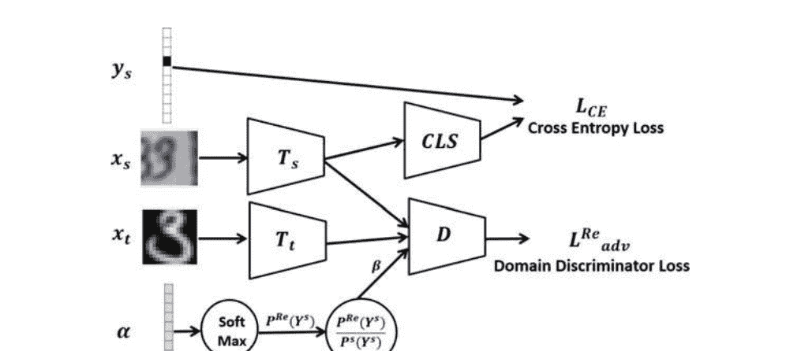

**图5.1 RAAN的架构**：首先，在源领域中，DCNN $T_s$和分类器 $CLS$通过最小化交叉熵损失 $\mathcal{L}_{CE}$来训练从图像中提取有区别的特征 $x_s$ labeled by $y_s$。其次，通过使用软最大函数将变量 $\alpha$转换，计算出重新加权的源领域标签分布 $P^{Re}(Y^s)$，以适应领域之间的标签分布匹配。然后，可以直接得到比率向量如下所示：$\beta = \frac{P^{Re}(Y^s)}{P^s(Y^s)}$

为了提取目标领域图像的可转移特征 $x^t$，目标领域DCNN $T_t$，领域鉴别器 $\mathcal{D}$和估计的密度比向量 $\beta$进行以下对抗性游戏：$\beta$ 和 $\mathcal{D}$试图区分特征是来自目标还是源领域，而 $T_t$试图混淆 $\mathcal{D}$ 和 $\beta$。可以直接根据$\alpha$计算，在下一章中，我们将$\beta$视为估计下的变量。

RAAN的第二个目标是通过减少它们的分布差异来学习域不变和判别性边缘特征$P(t|^{l=L}(X^t))$和$P(s|^{l=L}(X^s))$。为了简洁起见，并且由于本章仅考虑匹配最后一个卷积层的特征，我们用$\mathcal{T}$和$\mathcal{T}^{l=L}_s$分别在下一章中。给定源域图像和标签$\{x^s, y^s\} \in D^s$，编码器$\mathcal{T}$用于提取用于分类任务的判别特征$\mathcal{T}(x^s)$，我们通过最小化交叉熵损失$\mathcal{L}_{CE}$来联合训练分类器$CLS$和$\mathcal{T}$，如下所示：

$$ \min_{\mathcal{T}_s, CLS} \mathcal{L}_{CE}. \qquad (5.1) $$

为了获得无标签的可转移特征 $T_t(x^t)$ ， $T_t$与域鉴别器网络 $\mathcal{D}$和比例向量 $\beta$进行对抗游戏，以减小源域中重新加权特征分布$\beta(y^s) P^s(T_s(x^s))$ 和目标域 $P^t(T_t(x^t))$ 之间的差异。此外，为了减小潜在的跨域差异，基于OT的EM距离以对抗的方式进行重新制定，更多细节请参见第3.1节。

具体而言，RAAN是以以下对抗方式进行训练的，其中 $\mathcal{T}_t$希望混淆鉴别器网络 $\mathcal{D}$，无论 $\mathcal{D}$和 $\beta$如何努力区分来自两个域的特征。基于鉴别器损失 $\mathcal{L}_{ad}^{Re}$，可以得到以下目标函数：

$$\min_{\mathcal{T}_t} \max_{\mathcal{D}, \beta} \mathcal{L}_{adv}^{Re}. \qquad (5.2)$$

事实上，除了帮助分类器的适应性外，匹配标签分布还可以减轻匹配边际特征分布的困难。可能的原因是：如果我们假设特征生成过程在领域之间是相同的，即 $P(s(\mathcal{T}(s(X(s)))|Y(s)))=P(t(\mathcal{T}(t(X(t)))|Y(t)))$，那么 $P(Re(Y(s)))=P(t(Y(t)))$有助于匹配边际特征分布 $P(s(\mathcal{T}(s(X(s)))))=P(t(\mathcal{T}(t(X(t)))))$。

第3.1节介绍了基于OT的EM距离及其在对抗方式下实现的方法，用于匹配边际跨领域特征分布。然后，第3.2节重点介绍了提出的标签分布匹配模块以及将其嵌入对抗训练中的方法。我们还提供了为什么这个标签分布匹配模块有助于适应分类器并同时匹配边际特征分布的见解。最后，在第3.3节中，我们总结了RAAN的最终目标函数。

##### 5.3.1 对抗训练中的最优输运

形式上，源域和目标域边际特征的经验分布 $\boldsymbol{\mu}^s$和$\boldsymbol{\mu}^t$可以分别表示为：

$$\boldsymbol{\mu}^s = \sum_{i}^{n_s} p_i^s \delta_{\mathcal{T}_s(x_i^s)}, \boldsymbol{\mu}^t = \sum_{j}^{n_t} p_j^t \delta_{\mathcal{T}_t(x_j^t)} \qquad (5.3)$$

其中 $\delta_{\mathcal{T}_s(x_i^s)}$ 和 $\delta_{\mathcal{T}_t(x_j^t)}$分别是位置 $\mathcal{T}_s(\boldsymbol{x}_i^s)$和 $\mathcal{T}_t(\boldsymbol{x}_j^t)$处的狄拉克函数，$p_i^s$和 $p_j^t$是它们的概率质量。

理想情况下，跨领域分布匹配问题可以通过源域和目标域之间的联合概率耦合或运输计划来建模，OT被提出来计算这样一个最优的运输计划。如果我们将估计下的耦合表示为$\gamma$，并且将边际$\boldsymbol{\mu}^s$和$\boldsymbol{\mu}^t$表示为概率耦合$B$的集合可以定义如下[11]:

$$B = \left\{ \gamma \in (\mathbb{R}^+)^{n_s \times n_t} \mid \gamma \mathbf{1}_{n_t} = \boldsymbol{\mu}^s, \gamma^T \mathbf{1}_{n_s} = \boldsymbol{\mu}^t \right\}. \qquad (5.4)$$

一般来说，为了减少特征分布的差异，基于OT的适应方法首先测量两个分布之间的最优运输计划，然后学习特征以最小化这个计划的成本。因此，我们首先定义度量$J(\mu_s, \mu_t)$在方程(5.5)中来衡量从目标域到源域传输概率质量的总成本。

$$J(\mu^s, \mu^t) = <\gamma, C>_F, \text{ with } \gamma \in B, \qquad (5.5)$$

其中，C是距离矩阵，其(i, j)元素由特征之间的距离成本函数c(T_s(x_s_i), T_t(x_t_j))定义。第(i, j)元素γ(i, j)表示从T_t(x_t_j)移动到T_s(x_s_i)的质量，而F是Frobenius点积。为了简洁起见，我们省略索引i, j来表示x^s_i, x^t_j为x^s, x^t。

然后，通过最小化Eq. (5.6)中的成本J(μ^s, μ^t)，可以估计出OTγ_0，其中最优运输成本或著名的EM距离由Eq. (5.7) [24]定义。最后，假设理想的源域特征T^s(x^s)可用，为了学习目标域中可转移的特征，直观上训练DCNN变换T的目标是最小化EM距离W(μ^s, μ^t)，如Eq. (5.8) [11]所示。

$$\gamma_0 = \arg\min_{\gamma \in B} J(\mu^s, \mu^t) \qquad (5.6)$$

$$W(\mu^s, \mu^t) = \min_{\gamma \in B} J(\mu^s, \mu^t) \qquad (5.7)$$

$$\min_{T_t} W(\mu^s, \mu^t) \qquad (5.8)$$

传统方法计算γ在方程（5.4）中的约束要求使用线性规划或迭代算法，这在某种程度上限制了端到端学习。因此，我们利用了W(μ^s, μ^t)在方程（5.9）和（5.10）中的对偶形式（参考[47]中的方程（5.3）），考虑到批处理反向传播的能力。更具体地说，我们使用域鉴别器网络D和其变体D^作为以下两个对偶函数：

$$W(\mu^s, \mu^t) = \max_{D, D^} \mathcal{L}_{adv}, \text{ 其中} \qquad (5.9)$$
$$\mathcal{L}_{adv} = \mathbb{E}_{x^s \sim P^s(X^s)} D(T_s(x^s)) + \mathbb{E}_{x^t \sim P^t(X^t)} D^(T_t(x^t)) \qquad (5.10)$$
$$\text{s.t. } D(T_s(x^s)) + D(T_t(x^t)) \leq c(T_s(x^s), T_t(x^t)).$$

在本文中，我们选择以下距离成本函数c(T_s(x^s), T_t(x^t)) = ||T_s(x^s) - T_t(x^t)||出于计算效率和允许梯度测量的原因，但这并不意味着它是唯一可能选择的函数。根据约束条件（10），D必须是最佳函数即-D，因为c(T_s(x^s), T_t(x^t))被定义为非负。这样，约束条件在（5.10）中等价于确保D是一个1-Lipschitz函数，或者说其梯度范数小于1。因此，如果我们在（5.8）中使用（5.9）和（5.10）来用(5.11)中的最小最大目标函数训练替换EM距离、DCNN转换 T_t 和域鉴别器网络 D。

$$\min_{\mathcal{T}_t} W\left(\boldsymbol{\mu}^s, \boldsymbol{\mu}^t\right) = \min_{\mathcal{T}_t} \max_{\mathcal{D}} \mathcal{L}_{adv} \quad \text{, 其中} \qquad (5.11)$$
$$\mathcal{L}_{adv} = \mathbb{E}_{\left(\boldsymbol{x}^s, y^s\right) \sim P^s(X, Y^s)} \mathcal{D}\left(\mathcal{T}_s\left(\boldsymbol{x}^s\right)\right) P^s\left(\mathcal{T}_s\left(\boldsymbol{x}^s\right) \mid y^s\right) P^s\left(y^s\right) - \mathbb{E}_{\boldsymbol{x}^t \sim P^t\left(X^t\right)} \mathcal{D}\left(\mathcal{T}_t\left(\boldsymbol{x}^t\right)\right)$$
$$\text{s.t. } \| \nabla_{\mathcal{T}_t\left(\boldsymbol{x}^t\right)} \mathcal{D}\left(\mathcal{T}_t\left(\boldsymbol{x}^t\right)\right) \|_2 \leq 1,$$
$$\| \nabla_{\mathcal{T}_s\left(\boldsymbol{x}^s\right)} \mathcal{D}\left(\mathcal{T}_s\left(\boldsymbol{x}^s\right)\right) \|_2 \leq 1.$$

##### 5.3.2 通过标签分布匹配来调整分类器

尽管使用基于OT的EM距离来匹配边缘特征分布 \(P(s(\mathcal{T}(s(X))))\) 和 \(P(t(\mathcal{T}(t(X))))\)，但它无法帮助分类器的适应，因为 \(P(s(\mathcal{T}(s(X)))) = P(t(\mathcal{T}(t(X))))\) 不能推断出 \(P(s(Y|\mathcal{T}(s(X)))) = P(t(Y|\mathcal{T}(t(X))))\)。然而，根据贝叶斯规则(5.12)，我们可以学习在匹配的目标下学习 \(\mathcal{T}(t)\) 而不是直接匹配 \(P(Y|\mathcal{T}(t(X)))\) 和 \(P(s(Y|\mathcal{T}(s(X))))\)。\(P(s(\mathcal{T}(s(X))|Y(s)))P(s(Y(s)))\) 和 \(P(t(\mathcal{T}(t(X))|Y(t)))P(t(Y(t)))\)，

$$P(\mathcal{T}(X)|Y) P(Y) \propto P(Y|\mathcal{T}(X)). \qquad (5.12)$$

在没有任何关于目标标签分布 \(P^t(Y^t)\) 的先验知识的情况下，直接匹配 \(P^t(\mathcal{T}_t(X^t)|Y^t)P^t(Y^t)\) 和 \(P^s(\mathcal{T}_s(X^s)|Y^s)P^s(Y^s)\) 是非平凡的。然而，受到标签是低维离散变量且具有明确定义分布的事实的启发，与其条件变量相比，跨域标签分布的匹配更为直接。这进一步激发我们研究是否匹配标签分布，作为 \(P^t(\mathcal{T}_t(X^t)|Y^t)P^t(Y^t)\) 和 \(P^s(\mathcal{T}_s(X^s)|Y^s)P^s(Y^s)\) 的一部分，有助于分类器的适应。更具体地说，我们提出估计重新加权的源域标签分布 \(P^{Re}(Y^s)\)，以便它可以与目标域中的未知 \(P^t(Y^t)\) 匹配。

由于EM距离已被采用来匹配 \(P^t(\mathcal{T}_t(X^t))\) 和 \(P^s(\mathcal{T}_s(X^s))\)，我们将重新加权的标签分布 \(P^{Re}(Y^s)\) 整合到对抗训练的匹配过程中。为了保证学习到的重新加权标签分布 \(P^{Re}(Y^s)\) 的有效性，我们利用 soft max 函数约束以下条件来实现：其中 $y_i$ 表示第 $i$ 个类别的标签。最后，我们直接选择用 $P^s(\boldsymbol{Y}^s)$ 替换 mini-max 目标函数 $\mathcal{L}_{adv}$ 中的 $P^{Re}(\boldsymbol{Y}^s)$，并根据新的对抗训练目标 $\mathcal{L}_{adv}^{Re}$ 优化网络，其中网络 $\mathcal{D}$、$\mathcal{T}_t$ 和比例向量 $\boldsymbol{\beta}$ 的训练方式如下：$\mathcal{D}$ 和 $\boldsymbol{\beta}$ 以合作的方式进行训练以估计 EM 距离，而 $\mathcal{T}_t$ 则被训练为最小化 EM 距离。从另一个角度来理解 $\mathcal{L}_{adv}^{Re}$ 的原理，$\boldsymbol{\beta}$ 被用来为不同类别的图像 $\boldsymbol{x}^s$ 分配重要性权重，以便两个域中的小批量样本来自相似的分布。这个过程在一定程度上减轻了网络 $\mathcal{D}$ 和 $\mathcal{T}_t$ 的优化复杂性，因为它们可以专注于匹配 $P^s(\mathcal{T}_s(\boldsymbol{x}_s))$ 和 $P^t(\mathcal{T}_t(\boldsymbol{x}^t))$，而不会被不平衡的域分布所困扰。

$$\min_{\mathcal{T}_t} \max_{\mathcal{D}, \boldsymbol{\beta}} \mathcal{L}_{adv}^{Re}, \text{其中}$$
$$\mathcal{L}_{adv}^{Re} = \sum_{(\boldsymbol{x}^s, y^s) \sim P^s(\boldsymbol{X}^s, Y^s)} \mathcal{D}(\mathcal{T}_s(\boldsymbol{x}^s)) P^s(\mathcal{T}_s(\boldsymbol{x}^s) | y^s) P^{Re}(y^s) - \mathbb{E}_{\boldsymbol{x}^t \sim P^t(\boldsymbol{X}^t)} \mathcal{D}(\mathcal{T}_t(\boldsymbol{x}^t))$$
$$= \sum_{(\boldsymbol{x}^s, y^s) \sim P^s(\boldsymbol{X}^s, Y^s)} \mathcal{D}(\mathcal{T}_s(\boldsymbol{x}^s)) P^s(\mathcal{T}_s(\boldsymbol{x}^s) | y^s) \boldsymbol{\beta}(y^s) P^s(y^s) - \mathbb{E}_{\boldsymbol{x}^t \sim P^t(\boldsymbol{X}^t)} \mathcal{D}(\mathcal{T}_t(\boldsymbol{x}^t))$$
$$= \mathbb{E}_{(\boldsymbol{x}^s, y^s) \sim P^s(\boldsymbol{X}^s, Y^s)} \boldsymbol{\beta}(y^s) \mathcal{D}(\mathcal{T}_s(\boldsymbol{x}^s)) - \mathbb{E}_{\boldsymbol{x}^t \sim P^t(\boldsymbol{X}^t)} \mathcal{D}(\mathcal{T}_t(\boldsymbol{x}^t))$$
$$s.t. \| \nabla_{\mathcal{T}_t(\boldsymbol{x}^t)} \mathcal{D}(\mathcal{T}_t(\boldsymbol{x}^t)) \|_2 \leq 1, \quad \| \nabla_{\mathcal{T}_s(\boldsymbol{x}^s)} \mathcal{D}(\mathcal{T}_s(\boldsymbol{x}^s)) \|_2 \leq 1. \quad (5.14)$$

##### 5.3.3 RAAN中的优化

如图5.1所示，RAAN旨在共同最小化源域样本的交叉熵损失，并减少提取特征分布的跨域差异。以下方程说明了重新加权对抗损失 $\mathcal{L}_{adv}^{Re}$ 的经验估计：

$$\mathcal{L}_{adv}^{Re} = \frac{1}{n_s} \sum_{i=1}^{n_s} \mathcal{D}(\beta(y_i^s)\mathcal{T}_s(x_i^s)) - \frac{1}{n_t} \sum_{j=1}^{n_t} \mathcal{D}(\mathcal{T}_t(x_j^t)). \quad (5.15)$$

继续控制领域鉴别器网络的1-Lipschitz函数的思想[20]，我们明确约束梯度范数惩罚项如下：

$$\mathcal{L}_{gp} = \| \nabla_{\hat{\mathcal{T}}(\hat{x})} \mathcal{L}_{adv}^{Re} - 1 \|_2. \quad (5.16)$$

其中 $\hat{\mathcal{T}}(\hat{x})$ 是 $\mathcal{T}_t(x^t)$ 和 $\mathcal{T}_s(x^s)$ 的加权插值样本。总之，在RAAN中，总目标函数以以下对抗方式进行构建：

$$\min_{\mathcal{T}_t, \mathcal{D}, \beta} -\mathcal{L}_{adv}^{Re} + \lambda_{gp} \mathcal{L}_{gp} + \lambda_{reg} \|\beta\|_2. \quad (5.17)$$

$$\min_{\mathcal{T}_t} -\frac{1}{n_t} \sum_{j=1}^{n_t} \mathcal{D}(\mathcal{T}_t(x_j^t)). \quad (5.18)$$

$$\min_{\mathcal{T}_s, CLS} \frac{1}{n_s} \sum_{i=1}^{n_s} \mathcal{L}_{CE}(CLS(\mathcal{T}_s(x_i^s)), y_i^s). \quad (5.19)$$

其中 $\mathcal{L}_{CE}(CLS(\mathcal{T}_s(x_i^s)), y_i^s)$ 表示交叉熵函数，其中包括分类器 $CLS$，特征向量 $\mathcal{T}_s(x_i^s)$ 及其标签 $y_i^s$。请注意，为了稳定地训练网络，源域 DCNN $\mathcal{T}_s$ 首先进行训练，而 $\mathcal{T}_t$ 和 $\mathcal{D}$ 则通过对抗方式进行特征分布匹配。

此外，为了稳定地学习比率向量，我们在 (5.17) 中添加了 $\beta$ 的L2范数作为正则化项。$\lambda_{gp}$ 和 $\lambda_{reg}$ 分别表示梯度惩罚项和比率向量的L2范数的正则化权重。

#### 5.4 实验和结果

本节评估了使用两个UDA任务的RAAN，具体来说，一个是手写数字数据集之间的任务，另一个是跨模态数据集之间的任务。对于所有实验，当领域之间的分布差异较大时，RAAN与最先进的方法相比取得了竞争性的结果，并且在很大程度上优于它们。

##### 5.4.1 适应任务和数据集

第一个UDA任务在四个手写数字数据集之间进行适应，包括MNIST [25], USPS [12], SVHN [34]和MNIST-M [15]。如图5.2所示，这四个数据集之间的适应难度各不相同。MNIST和USPS是在相当受控环境中收集的灰度图像数据集，而MNIST-M中的图像是使用BSDS500数据集[1]中的补丁作为背景和MNIST图像作为前景合成的。为了评估RAAN在减小领域差异较大的情况下的效果，我们在适应任务中使用了SVHN，它由更复杂的真实场景中的RGB图像组成，例如图像的不对齐和不同的光照条件。此外，需要注意的是SVHN和其他数据集之间的子类实例严重不平衡。

为了继续评估RAAN在减少大的领域转变方面的效果，第二个适应任务使用NYU-D数据集[40]设计，从室内物体的RGB格式适应到由HHA格式编码的深度变体。19类数据集是根据[45]中的方案提取的。如图5.2所示，RGB和HHA格式图像之间的领域转变相当大，主要是由于低图像分辨率和粗糙裁剪框可能导致的对齐不准。此外，如表5.4中的实例数所示，该数据集具有不平衡的子类实例。此外，由于目标域中的图像是通过另一个传感器以完全不同的格式收集的，因此这是具有挑战性的。

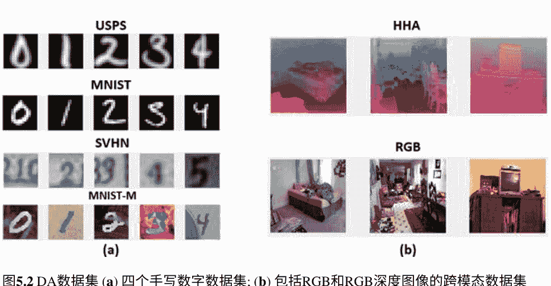

##### 5.4.2 手写数字数据集中的适应

对于在手写数字数据集之间进行适应的任务，选择了以下四个适应方向进行评估：MNIST → USPS，USPS → MNIST，SVHN → MNIST 和 MNIST → MNIST-M。对于前三个任务，基础编码器网络是一个变种的LeNet，表示为 $\mathcal{T}_s$，$\mathcal{T}_t$，而域鉴别器网络 $\mathcal{D}$ 由三个全连接层组成，激活函数为修正线性单元（ReLU），输出激活数分别为512、512、1。对于从MNIST到MNIST-M的适应，我们采用了pixelDA [6]的基本模型架构，但将目标函数改为基于重加权的OT目标函数。我们遵循[28, 45]中的实验协议进行适应任务。MNIST → MNIST-M的协议与[6]中的协议相同，以进行公平比较。

为了清楚评估RAAN的性能，我们将RAAN(+)和RAAN(-)分别表示具有和不具有重新加权方案的RAAN。如表5.1所示，在MNIST和USPS之间进行适应时，与ADDA和Co-GAN相比，提出的RAAN(-)和RAAN(+)取得了竞争性的结果，其中RAAN(+)稍微优于RAAN(-)。然而，在SVHN任务中→MNIST，RAAN(−)和RAAN(+)分别达到了80.7%和89.1%的准确率，分别比最先进的ADDA高出4.7%和13.1%，而Co-GAN在这个实验中无法收敛。这可能表明面对两个不同的领域，Co-GAN中使用的权重共享方法无法通过简单地转移域数据集（如MNIST和SVHN）的样式来弥合跨域差异。由于RAAN(-)使用了与ADDA相同的DCNN架构，RAAN(-)的优越性能主要是由于OT基于目标函数。我们假设基于OT的EM距离能够更好地减少两个不同领域（例如SVHN和MNIST）的特征分布差异。此外，基于RAAN(+)优于ADDA和RAAN(-)的事实，我们假设匹配标签分布有助于适应分类器，这也有助于最小化边际特征分布的EM距离。

**表5.1 适应手写数字数据集的识别率；RAAN(+)和RAAN(-)表示使用和不使用重新加权方案**

| 方法 | MNIST到USPS | USPS到MNIST | SVHN到MNIST |
| :--- | :---: | :---: | :---: |
| 仅源 | 0.725 | 0.612 | 0.593 |
| 梯度反转[16] | 0.771 | 0.730 | 0.739 |
| 领域混淆[44] | 0.791 | 0.665 | 0.681 |
| Co-GAN[26] | 0.912 | 0.891 | 不收敛 |
| ADDA [45] | 0.894 | 0.901 | 0.760 |
| RAAN(-)(我们的) | 0.883 | 0.915 | 0.807 |
| RAAN(+)(我们的) | 0.89 | 0.921 | 0.892 |

**表5.2 从MNIST到MNIST-M的识别率；RAAN(+)和RAAN(-)表示使用和不使用重新加权方案**

| 数据集 | 仅源[6] | CORAL[42] | MMD[6] | DANN[16] | DSN[5] | PixelDA[6] | RAAN(+)/(-) (我们的) |
| :--- | :---: | :---: | :---: | :---: | :---: | :---: | :---: |
| MNIST到MNIST-M | 0.636 | 0.577 | 0.769 | 0.774 | 0.832 | 0.982 | **0.985** |

对于MNIST → MNIST-M任务，如表5.2所示，RAAN的性能略优于pixelDA。此外，如预期的RAAN(-)和RAAN(+)取得了类似的结果，因为这两个数据集没有严重的不平衡标签分布。人们认为并广泛认可，传统的基于深度网络的方法在MNIST和MNIST-M之间存在较大的领域转移[16]。然而，在本节中，我们认为减少MNIST-M中背景图像引起的领域转移比减少MNIST和SVHN之间的领域转移更容易。

**表5.3 A-对抗训练方法的距离**

| 度量 | 仅源 | ADDA | RAAN(-) | RAAN(+) |
| :--- | :---: | :---: | :---: | :---: |
| A-距离 | 1.673 | 1.548 | 1.526 | 1.506 |

##### 5.4.3 跨模态数据集中的适应

在本节中，我们评估了RAAN在从RGB图像到RGB-depth图像的适应中所面临的大领域转移。为了进行公平比较，我们遵循ADDA的实验设置[45]，并使用VGG-16架构[41]来进行DCNNs $\mathcal{T}_s$ 和 $\mathcal{T}_t$。域鉴别器网络 $\mathcal{D}$ 由三个全连接层组成，由Relu激活，分别输出1024、2048、1个输出（表5.3）。

如表5.4所示，使用RAAN(-)和RAAN(+)报告了子类别分类准确率，以及RAAN(+)产生的重新加权标签分布 $P^{Re}(Y^s)$ 和目标标签分布 $P^{t}(Y^{t})$。从整体识别率来看，RAAN(+)的平均准确率为34.3%，优于ADDA 6.7%和RAAN(-) 3.5%。此外，RAAN(-)的表现优于ADDA 3.2%。对于样本较少的类别，RAAN(+)和RAAN(-)的性能更好，而ADDA仅在类别'chair'中表现更好，因为该类别具有最多的样本。从整体识别准确率和分类器能够识别的类别数量（即识别率大于0%的类别）来看，可以观察到RAAN(+)不仅优于RAAN(-)。还可以观察到重新加权方案增加了具有较少实例的子类别实例的重要性权重。通过比较表5.4中估计的比例向量 $\beta$ 与子类实例的数量，可以验证这一点。

**表 5.4 跨模态数据集中的适应结果（%）；RAAN（+）和 RAAN（-）表示带有重新加权方案和不带重新加权方案**

| 类别 | 实例数 | 仅源 | ADDA | RAAN(-) | RAAN(+) | 估计β |
| :--- | :---: | :---: | :---: | :---: | :---: | :---: |
| 浴缸 | 19 | 0.0 | 0.0 | 0.000 | 10.4 | 2.040 |
| 床 | 96 | 76.0 | 46.9 | 0.500 | 10.4 | 1.395 |
| 书架 | 87 | 0.0 | 0.0 | 0.299 | 0.0 | 1.568 |
| 盒子 | 210 | 10.5 | 0.5 | 0.0 | 0.0 | 0.872 |
| 椅子 | 611 | 13.1 | 76.2 | 62.9 | 70.3 | 0.492 |
| 柜台 | 103 | 2.9 | 19.4 | 1.9 | 48.5 | 1.440 |
| 书桌 | 122 | 9.0 | 1.6 | 0.0 | 0.0 | 1.297 |
| 门 | 129 | 45.7 | 51.9 | 27.1 | 61.2 | 1.206 |
| 梳妆台 | 25 | 0.0 | 4.0 | 0.0 | 0.0 | 1.640 |
| 垃圾桶 | 55 | 3.6 | 1.8 | 0.0 | 0.0 | 1.629 |
| 灯 | 144 | 12.5 | 0.7 | 0.0 | 0.7 | 1.057 |
| 显示器 | 37 | 0.0 | 0.0 | 0.0 | 0.0 | 1.858 |
| 床头柜 | 51 | 0.0 | 0.0 | 0.0 | 0.0 | 1.652 |
| 枕头 | 276 | 54.9 | 8.3 | 69.2 | 63.8 | 0.805 |
| 水槽 | 47 | 0.0 | 0.0 | 0.0 | 10.6 | 1.527 |
| 沙发 | 129 | 2.3 | 6.2 | 0.0 | 0.0 | 1.102 |
| 桌子 | 210 | 14.8 | 13.8 | 4.3 | 20.5 | 0.682 |
| 电视 | 33 | 3.0 | 0.0 | 0.0 | 0.0 | 1.814 |
| 厕所 | 17 | 0.0 | 0.0 | 0.0 | 0.0 | 1.858 |
| 总体 | 2401 | 18.9 | 27.6 | 30.8 | 34.3 | — |

##### 5.4.4 参数选择和实现

实验在GPU集群上进行。对于所有实验，我们使用Adam优化器，并使用参数范围内的学习率进行参数扫描（2e-5，1e-2）。对于正则化权重，$\lambda_{gp}$ 和 $\lambda_{reg}$ 是基于参数扫描结果在范围内选择的(1, 100)和(0.01, 100)分别。

我们使用指数衰减，衰减因子为0.99，每1000次迭代一次。所有实验运行10次，每次迭代100,000次，并报告平均结果。对于从MNIST到MNIST-M的适应，批量大小为32，而对于其他情况，批量大小为128。

#### 5.5 分析

在本节中，我们以定量和定性的方式分析了重新加权方案以匹配标签分布和基于OT的分布匹配机器。评估是在涉及从SVHN到MNIST的最具挑战性的情景下进行的。

##### 5.5.1 评估重新加权方案

图5.3展示了地面实况标签分布比例向量（红色）和学习到的比例向量（蓝色）之间的比较。可以看出，一些比例是准确的，而其他比例则不准确。然而，学习到的比例向量 $\beta$ 的相对比例趋势与地面实况相一致。

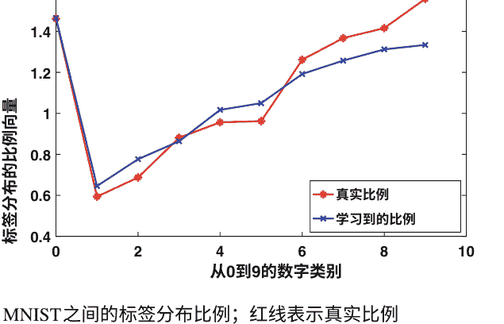类别不平衡问题广泛存在于现实世界的应用数据集中，SVHN和MNIST之间的标签分布不匹配会使域鉴别器和编码器学习中的特征分布以有偏差的方式匹配。通过第3.2节的讨论，标签分布的不匹配直接导致分类器的不匹配。

然而，如图5.3所示，RAAN(+)能够通过简单地估计嵌入在对抗训练中的比例向量来成功匹配标签分布。因此，这可以被视为RAAN(+)相对于RAAN(-)在表5.1中显示的9%改进的主要原因。总结起来，匹配标签分布可以使分类器适应。

我们可以通过以下方式理解重新加权的分布匹配：
- 该模块用于为源域实例分配不同的重要性权重。
- 但约束条件是来自同一类的实例具有相同的权重。
- 例如，如图5.3所示，数字“0”的学习比例约为1.5，这意味着在对抗训练中，SVHN数据集中来自数字“0”的每个样本可以被视为1.5个样本。

##### 5.5.2 评估特征嵌入的分布差异

为了以定量方式分析分布差异，我们计算了UDA社区[3]建议的距离，该距离采用了比较适应模型提取的输入特征。我们利用SVM分类器计算源域和目标域特征的泛化误差θ作为二分类任务。然后，距离A如下所示：d = 2(1-2θ)。如表5.3所示，没有适应、通过ADDA适应、基于OT的RAAN(-)和RAAN(+)适应的特征嵌入的A距离逐渐减小。

由于RAAN使用与ADDA相同的深度网络架构，与ADDA相比，RAAN(-)实现了更低的A距离，这表明使用RAAN(-)可以更好地匹配域之间的特征分布。这进一步证明了基于OT的EM距离比几何无关的JS距离更好地估计和减少大的分布差异的事实。

此外，与RAAN(-)相比，RAAN(+)实现的更小的A距离进一步表明匹配标签分布是匹配边际特征分布的合作任务。

最后，为了定性地衡量特征分布的差异，我们使用T-SNE软件包[33]可视化提取特征的二维嵌入。在图5.4中，RAAN适应的同一类别的示例特征点在图5.4c中聚集得比ADDA的图5.4b更近，也比没有适应方法的图5.4a更近。

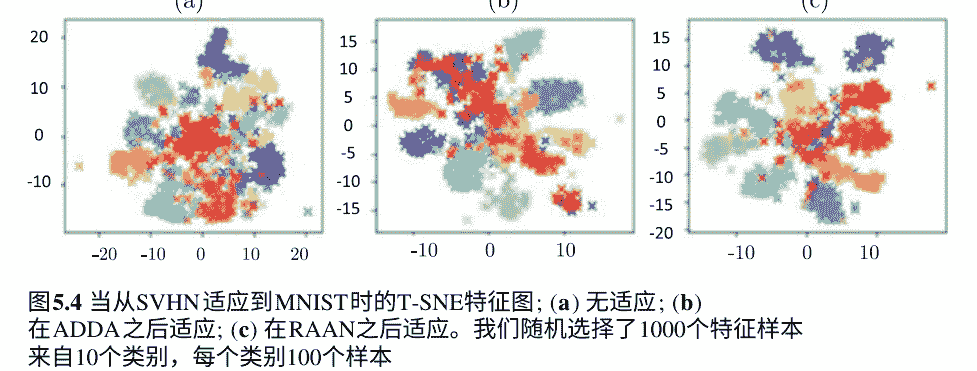

图5.4 当从SVHN适应到MNIST时的T-SNE特征图；(a) 无适应；(b) 在ADDA之后适应；(c) 在RAAN之后适应。我们随机选择了1000个特征样本来自10个类别，每个类别100个样本。

#### 5.6 结论

在本章中，我们提出了一种重新加权的对抗适应网络(RAAN)，以减少不同领域的特征分布并适应分类器。通过大量实验，RAAN在交叉领域分布差异较大且不同的情况下表现出色。RAAN通过适应不平衡类别的域来实现卓越的性能还揭示了在对抗训练中整合标签比例向量估计和标签分布匹配不仅可以适应分类器，还可以帮助匹配边际特征分布。未来的工作将考虑比较OT的原始公式并在端到端的训练中重新制定。

### 参考文献

1. Arbelaez, P., Maire, M., Fowlkes, C., Malik, J.: 轮廓检测和分层图像分割. IEEE Trans. Pattern Anal. Mach. Intell. **33**(5), 898–916 (2011)
2. Arjovsky, M., Chintala, S., Bottou, L.: Wasserstein生成对抗网络. 在:国际机器学习会议上, pp. 214–223 (2017)
3. Ben-David, S., Blitzer, J., Crammer, K., Kulesza, A., Pereira, F., Vaughan, J.W.: 不同领域学习的理论. Mach. Learn. **79**(1), 151–175 (2010)
4. Bhushan Damodaran, B., Kellenberger, B., Flamary, R., Tuia, D., Courty, N.: Deepjdot: 无监督领域适应的深度联合分布最优传输. 在: 欧洲计算机视觉会议 (ECCV) (2018)
5. Bousmalis, K., Trigeorgis, G., Silberman, N., Krishnan, D., Erhan, D.: 领域分离网络。 在: 神经信息处理系统的进展, 第343-351页 (2016)
6. Bousmalis, K., Silberman, N., Dohan, D., Erhan, D., Krishnan, D.: 生成对抗网络的无监督像素级领域适应。 在: IEEE计算机视觉和模式识别会议论文集, 第3722-3731页 (2017)
7. Celeux, G., Govaert, G.: 用于聚类和两个随机版本的分类EM算法. 计算统计数据分析 **14** (3), 315-332页 (1992)
8. Chen, Q., Liu, Y., Wang, Z., Wassell, I., Chetty, K.: 用于无监督领域适应的重新加权对抗适应网络。 在：IEEE计算机视觉和模式识别会议论文集，第7976-7985页 (2018)
9. Cortes, C., Mansour, Y., Mohri, M.: 通过重要性加权学习边界。 在：神经信息处理系统的进展，第442-450页 (2010年)
10. Courty, N., Flamary, R., Habrard, A., Rakotomamonjy, A.: 用于领域适应的联合分布最优传输。 在：神经信息处理系统的进展，第3730-3739页 (2017年)
11. Courty, N., Flamary, R., Tuia, D., Rakotomamonjy, A.: 用于领域适应的最优传输。IEEE模式分析与机器智能。39 (9) , 1853-1865页 (2017年)
12. Denker, J.S., Gardner, W., Graf, H.P., Henderson, D., Howard, R., Hubbard, W., Jackel, L.D., Baird, H.S., Guyon, I.: 用于手写邮政编码数字的神经网络识别器。 在：神经信息处理系统的进展，第323-331页 (1989年)
13. Donahue, J., Jia, Y., Vinyals, O., Hoffman, J., Zhang, N., Tzeng, E., Darrell, T.: DeCaF: 用于通用视觉识别的深度卷积激活特征。 在：国际机器学习会议，第647-655页 (2014年)
14. French, G., Mackiewicz, M., Fisher, M.: 自我集成用于视觉领域适应 (2018年)。https://iclr.cc
15. Ganin, Y., Lempitsky, V.: 通过反向传播进行无监督领域适应。 在：国际机器学习会议，第1180-1189页 (2015年)
16. Ganin, Y., Ustinova, E., Ajakan, H., Germain, P., Larochelle, H., Laviolette, F., Marchand, M., Lempitsky, V.: 神经网络的领域对抗训练。机器学习研究杂志17(59), 1-35页 (2016年)
17. Ghifary, M., Kleijn, W.B., Zhang, M., Balduzzi, D., Li, W.: 无监督领域适应的深度重建-分类网络。 在：欧洲计算机视觉会议, pp. 597-613。Springer, 纽约 (2016年)
18. Goodfellow, I., Pouget-Abadie, J., Mirza, M., Xu, B., Warde-Farley, D., Ozair, S., Courville, A., Bengio, Y.: 生成对抗网络。 在：神经信息处理的进展, pp. 2672-2680 (2014年)
19. Gretton, A., Borgwardt, K.M., Rasch, M.J., Schölkopf, B., Smola, A.: 一个核心双样本测试。机器学习研究杂志13, 723-773 (2012年)
20. Gulrajani, I., Ahmed, F., Arjovsky, M., Dumoulin, V., Courville, A.C.: Wasserstein GANs的改进训练。 在：神经信息处理系统进展，第5767-5777页 (2017年)
21. Gupta, S., Girshick, R., Arbeláez, P., Malik, J.: 从RGB-D图像中学习丰富的特征进行物体检测和分割。 在：欧洲计算机视觉会议，第345-360页。Springer, 纽约 (2014年)
22. Haeusser, P., Frerix, T., Mordvintsev, A., Cremers, D.: 关联领域适应。 在：国际计算机视觉会议 (ICCV) , 第2卷, 第6页 (2017年)
23. He, K., Zhang, X., Ren, S., Sun, J.: 深度残差学习用于图像识别。 在：IEEE计算机视觉和模式识别会议论文集，第770-778页 (2016年)
24. Kantorovitch, L.: 关于质量转移的研究. 管理科学5(1), 1–4 (1958)
25. LeCun, Y., Bottou, L., Bengio, Y., Haffner, P.: 基于梯度的学习应用于文档识别. IEEE会议86(11), 2278–2324 (1998)
26. Liu, M.Y., Tuzel, O.: 耦合生成对抗网络. 在：神经信息处理系统进展, pp. 469–477 (2016)
27. Liu, M.Y., Breuel, T., Kautz, J.: 无监督的图像到图像转换网络. 在：Guyon, I., Luxburg, U.V., Bengio, S., Wallach, H., Fergus, R., Vishwanathan, S., Garnett, R. (eds.) 神经信息处理系统进展, vol. 30, pp. 700–708. Curran Associates, Inc., 红钩, 纽约 (2017) http://papers.nips.cc/paper/6672-unsupervised-image-to-image-translation-networks.pdf
28. Long, M., Wang, J., Ding, G., Sun, J., Yu, P.S.: 使用联合分布适应进行特征迁移学习。 在：IEEE国际计算机视觉会议论文集，pp. 2200-2207（2013年）
29. Long, M., Wang, J., Ding, G., Sun, J., Yu, P.S.: 无监督领域适应的转移联合匹配。 在：IEEE计算机视觉和模式识别会议论文集，pp. 1410-1417（2014年）
30. Long, M., Cao, Y., Wang, J., Jordan, M.: 使用深度适应网络学习可迁移特征。 在：机器学习国际会议，pp. 97-105（2015年）
31. Long, M., Zhu, H., Wang, J., Jordan, M.I.: 使用残差转移网络进行无监督领域适应。 在：神经信息处理系统进展，pp. 136-144（2016年）
32. Long, M., Zhu, H., Wang, J., Jordan, M.I.: 具有联合适应网络的深度迁移学习。 在：第34届国际机器学习大会论文集，第70卷，第2208-2217页（2017年）。JMLR.org
33. Maaten, L.v.d., Hinton, G.: 使用t-SNE可视化数据。机器学习研究杂志9, 2579-2605（2008年）
34. Netzer, Y., Wang, T., Coates, A., Bissacco, A., Wu, B., Ng, A.Y.: 使用无监督特征学习在自然图像中读取数字。 在：NIPS深度学习和无监督特征学习研讨会，2011年，第5页
35. Nowozin, S., Cseke, B., Tomioka, R.: f-GAN: 使用变分散度最小化训练生成神经采样器。 在：神经信息处理系统进展，第271-279页（2016年）
36. Pan, S.J., Yang, Q.: 转移学习综述. IEEE Trans. Knowl. Data Eng. 22(10), 1345–1359 (2010)
37. Russo, P., Carlucci, F.M., Tommasi, T., Caputo, B.: 从源到目标再到源：对称双向自适应生成对抗网络. In: Proceedings of the IEEE Conference on Computer Vision and Pattern Recognition, pp. 8099–8108 (2018)
38. Shen, J., Qu, Y., Zhang, W., Yu, Y.: 针对领域适应的对抗表示学习. In: AAAI Conference (2018)
39. Shrivastava, A., Pfister, T., Tuzel, O., Susskind, J., Wang, W., Webb, R.: 通过对抗训练从模拟和无监督图像中学习. In: The IEEE Conference on Computer Vision and Pattern Recognition (CVPR), vol. 3, p. 6 (2017)
40. Silberman, N., Hoiem, D., Kohli, P., Fergus, R.: 室内分割和RGBD图像支持推理. 在：ECCV (2012)
41. Simonyan, K., Zisserman, A.: 非常深的卷积网络用于大规模图像识别. 在：ICLR (2015)
42. Sun, B., Saenko, K.: 深度珊瑚：深度领域适应的相关性对齐. 在：欧洲计算机视觉会议，pp. 443–450. Springer, 纽约（2016）
43. Taigman, Y., Polyak, A., Wolf, L.: 无监督的跨领域图像生成. 在：第五届国际学习表示会议，ICLR 2017，图伦，2017年4月24日至26日，会议论文集（2017）
44. Tzeng, E., Hoffman, J., Zhang, N., Saenko, K., Darrell, T.: 深度领域混淆：最大化领域不变性（2014）。预印本。arXiv:1412.3474
45. Tzeng, E., Hoffman, J., Saenko, K., Darrell, T.: 对抗性判别领域适应. 在: IEEE计算机视觉和模式识别会议论文集, pp. 7167–7176 (2017)
46. Venkateswara, H., Eusebio, J., Chakraborty, S., Panchanathan, S.: 用于无监督领域适应的深度哈希网络. 在: IEEE计算机视觉和模式识别会议论文集, pp. 5018–5027 (2017)
47. Villani, C.: 最优输运: 新与旧, vol. 338. Springer Science & Business Media, 柏林/海德堡 (2008)
48. Witten, I.H., Frank, E., Hall, M.A., Pal, C.J.: 数据挖掘: 实用机器学习工具和技术. Morgan Kaufmann, Burlington, MA (2016)
49. Yan, H., Ding, Y., Li, P., Wang, Q., Xu, Y., Zuo, W.: 注意类别权重偏差：加权最大均值差异用于无监督领域适应。 在：IEEE计算机视觉和模式识别会议论文集，第2272-2281页（2017）
50. Yu, Y., Szespevri, C.: 协变量偏移下核均值匹配的分析（2012）。 预印本。arXiv:1206.4650
51. Zhang, K., Schölkopf, B., Muandet, K., Wang, Z.: 目标和条件偏移下的领域适应。 在：国际机器学习会议，第819-827页（2013）
52. Zhang, W., Ouyang, W., Li, W., Xu, D.: 用于无监督领域适应的协作和对抗网络。 在：IEEE计算机视觉和模式识别会议论文集，第3801-3809页（2018）

## 第三部分

### 第六章
无监督领域适应与
双工生成对抗网络

Lanqing Hu, Meina Kan, Shiguang Shan, 和 Xilin Chen

#### 6.1 引言

迁移学习是一种有效的技术，可以通过从不同但复杂的领域借用知识，减少收集和标记大量相关数据以训练新模型的工作量和成本。其困难在于如何处理相关复杂领域（即源领域）和测试领域（即目标领域）之间的领域转移。这项工作专注于一般迁移学习的一个子问题，即无监督领域适应，其中标记的源领域和未标记的目标领域共享相同的任务，但分布不同。处理无监督领域适应的方法可以分为两种类型：领域不变特征学习和领域转换。

##### 6.1.1 领域不变特征学习

在早期，传统的子空间方法如[8-10, 22, 27, 28]试图发现源域和目标域的共同特征空间，以尽可能减小域间差距。例如，[9]中提出了一种代表性方法，称为测地线流核（GFK），用于集成无限数量的子空间来建模源域和目标域之间的域漂移，从而桥接两个域。在[27]和[28]中，源域和目标域都被限制在一个低秩公共子空间中投影，以消除特定于领域的信息，以实现更好的适应性。最近，深度学习的发展提高了模型的拟合能力，并在许多任务上取得了令人印象深刻的进展。受深度学习和度量学习[6]的启发，[17, 18]中的方法提出通过最小化最大均值差异（MMD）来提取深度领域不变特征，以减小领域差距。除了直接结合深度网络和度量学习之外，还有其他方法利用图像重建来约束提取的特征，以保留更多源域和目标域的信息。在深度重建分类网络（DRCN）[7]中，通过优化可以同时在标记的源域上执行分类任务和在未标记的目标域上进行自重建的潜在表示，以提取两个域的任务有利信息。在[2]中，设计了一个具有自重建和分类损失的域分离网络（DSN），用于分离特定于领域的表示和共享表示，从而获得更准确的领域不变特征。最新提出的对抗学习在建模分布差异和更好地减小领域差距方面显示出强大的能力[4, 5, 30]。在这些方法中，一种典型的方法称为领域对抗神经网络（DANN）[5]，它提出了一个梯度反转层，该层添加在特征输出层上，以减轻源域和目标域之间的差异。

上述方法主要集中在减少领域差距，但没有考虑辨别性。近年来，一些方法开始集中于共同的辨别特征学习[25, 26]。它们主要使用伪标签来处理源域和目标域之间的领域差异，将无监督的领域适应转化为半监督的领域适应，从而在具有挑战性的场景中取得了良好的性能改进。

##### 6.1.2 领域转换

还有一些方法试图通过领域转换来减轻领域偏移，例如，将目标域的图像转换为源域或反之亦然。[29]中的方法是一种单向转换方法，将源域和目标域都转换为源域，从而将目标域与源域对齐。然而，仅仅单向转换会导致一个普遍偏向源域的特征。因此，双向转换在获取领域不变特征方面表现更好。[12]中提出了一种双移自动编码器（BAE），它利用稀疏重构来确保双向转换过程中的一致性。此外，[15, 16, 19, 23]中的方法利用强大的生成对抗网络（GAN）通过领域特定生成器[15, 16]或基于领域特定表示的权重共享生成器[19, 23]来实现双向转换。特别地，CycleGAN[31]提出了一种有利的循环领域转换。也就是说，一个样本是首先转换到另一个领域，然后将转换后的样本进一步转换回原始领域。这种循环约束有效地强制生成的图像具有特定的域风格。

在这些现有方法中，域不变特征学习和域转换方法通常不考虑判别性，即样本的类别可能在域适应过程中发生变化。最近有几项利用伪标签改善提取特征的判别性的研究[25, 26]在域适应方面取得了进一步的改进，然而，它们对域不变约束的考虑较少。在这项工作中，我们还考虑了无监督域适应的域不变和判别特征学习。具体而言，我们提出了一种名为 DupGAN 的新型双向生成对抗网络，用于双向域转换，以确保潜在特征表示的域不变。此外，每个双向鉴别器都设计用于真实/虚假鉴别以及类别分类，以强制潜在特征表示的判别性。图 6.1 显示了一个概览。

简而言之，这项工作的贡献有三个方面：

- 提出了一种名为DupGAN的新型生成对抗网络，通过双向域转换提取域不变表示；
- 具有现实/虚假判别和图像类别分类功能的双重判别器确保潜在表示具有判别性；
- DupGAN在无监督域适应的数字分类和物体识别方面优于现有方法。

本章部分内容基于之前的工作[11]。

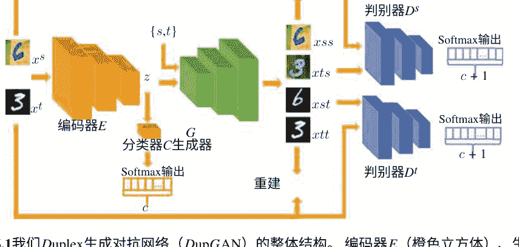

图6.1 我们的双向生成对抗网络（DupGAN）的整体结构。编码器E（橙色立方体）、生成器G（绿色立方体）以域代码{s,t}为条件，与双向判别器D^s和D^t（蓝色立方体）相互协作，获得域不变且具有判别性的特征z。

#### 6.2 方法

在无监督域适应的分类任务中，源域被标记而目标域没有标记，数据表示为 $X^S=\{(x_i^S, y_i^S)\}_{i=1}^n$ 和 $X^T=\{x_j^T\}_{j=1}^m$。如上所述，源域和目标域共享 $c$ 个相同的类别，但遵循不同的数据分布。目标是学习一个模型，用于在目标域上进行分类，同时使用源域的标记训练数据 $\{x_i^S, y_i^S\}$ 和目标域的无标记训练数据 $\{x_j^T\}$。换句话说，源域的知识被转移到目标域，以便在目标域的测试集上进行更好的分类。

为了在无监督域适应中在目标域上获得令人满意的性能，关键是从源域中发现共同的知识，以使目标域受益。为了实现这一目标，我们的方法提出了一种名为DupGAN的新型GAN，其中包含两个判别器，用于在目标域上实现域不变和判别性特征。如图6.1所示，我们提出的DupGAN主要由三个连续模块组成。具体而言，编码器，表示为 $E$，将来自任一域的输入图像 $X$ 投影到共享的表示空间 $Z = E(X)$，这是测试的最终部分，目标是实现域不变和判别性。为了实现这一目标，精心设计了一个生成器和两个判别器。生成器，表示为 $G$，根据域指示器 $a$ 将潜在表示 $z \in Z$ 解码为源/目标域图像。对于生成器，双判别器 $D^S$（用于源域）和 $D^T$（用于目标域）不仅区分输入图像的真实/虚假性，还对真实图像进行分类。然后，那些可以欺骗判别器的生成图像将看起来既真实又保留类别信息。这进一步强化了输入到生成器的潜在表示的域不变性和判别性。

简而言之，这种方法的合理性在于，当双向判别器的梯度方向在彼此冲突时，它们会妥协，导致一个共同的子空间，特别是当共性占主导地位时，这也是域适应的基础，正如[1]所证明的。

##### 6.2.1 编码器和分类器

编码器将来自源域或目标域的图像投影到一个共享的潜在表示中，表示如下：

```
$$
 z^S = E(x^S), x^S \in X^S, \\
 z^T = E(x^T), x^T \in X^T, \\
 z = \{z^S, z^T\} \in Z,
 $$
```

其中，$E$是具有参数$W_E$的编码器，$z^S$是源域的编码特征，$z^T$是目标域的编码特征。期望潜在表示$z$是域不变且具有判别性的，这是由生成器和双向判别器之间的双向域转换和对抗学习来保证的。生成器和双向判别器的设计将在第6.2.2节和第6.2.3节中详细介绍。

对于分类任务，构建了一个基于潜在表示$z$的分类器$C$，其形式为：

```
$$c^{s} = C(E(x^{s})), \quad x^{s} \in X^{s}, \quad c$$
$$c^{t} = C(E(x^{t})), \quad x^{t} \in X^{t} \qquad (6.2)$$
```

其中$C$代表具有参数$W_C$的分类器。而这个分类器的目标函数是普通的softmax函数：

```
$$L_c = H(c^{s}, y^{s}) + H(c^{t}, y^{t}) \qquad (6.3)$$
```

其中$H(.,.)$是交叉熵损失。$y^{s}$和$y^{t}$分别是源域样本的真实类别标签和目标域样本的估计类别标签，定义如下：

```
$$y^{s} = [0, 0, \cdots, 0, \underbrace{1}_{i-1}, 0, \cdots, 0], \quad \text{cat}(x^{s}) = i,$$
$$y^{t} = [0, 0, \cdots, 0, \underbrace{1}_{j-1}, 0, \cdots, 0], \quad \text{cat}(x^{t}) = j, \qquad (6.4)$$
```

其中$\text{cat}(\cdot)$表示输入样本的类别。分类器使用具有域不变特征的输入进行最终的测试分类。此外，在训练阶段还可以提高潜在表示$z_d$的判别性。

值得详细说明的是，源域图像的类别标签$y^{s}$是可用的，并且可以直接使用，而目标域的标签$y^{t}$则不可用。因此，$y^{t}$是通过分类器$C$的伪标签预测获得的。

具体来说，在开始时，整个目标域的类别信息是不可用的，因此分类器首先只用源域进行预训练。然后根据[1]中的共性优势，选择一些更接近源域的目标域样本，并使用伪标签进一步训练分类器和判别器。随着迭代的进行，越来越多的目标样本被添加进来以训练更准确的DupGAN。

##### 6.2.2 生成器

生成器被设计用于解码潜在表示z，并根据条件域指示器将其解码为源域和目标域。这样做的目的是，如果源域或目标域的潜在表示可以被很好地解码为源域和目标域，那么它应该是两个域之间的共同表示，否则它只能被很好地解码为一个域。

具体来说，生成器G接受表示z和域指示器a的串联作为输入，然后将其解码为源域和目标域。在这里，当a=s指定源域时，生成器试图生成具有源域风格的图像。当a=t时，生成器尝试输出具有目标域风格的图像。生成器的域转换公式如下：

```
$$\begin{aligned} x^{ss} = G(z^{s}, s) = G(E(x^{s}), s), & \quad (6.5) \\ x^{tt} = G(z^{t}, t) = G(E(x^{t}), t), & \quad (6.6) \\ x^{st} = G(z^{s}, t) = G(E(x^{s}), t), & \quad (6.7) \\ x^{ts} = G(z^{t}, s) = G(E(x^{t}), s). & \quad (6.8) \end{aligned}$$
```

式(6.5)和(6.6)是自重建生成，即将源域样本转换为源域，或将目标域样本转换为目标域。一般规则是，当图像转换回其原始域时，输出应该与其自身相同。因此，生成器的重构损失被利用来在自域转换后保持图像不变，其公式为：

```
$$L_r = \| x^{ss} - x^{s} \|_2^2 + \| x^{tt} - x^{t} \|_2^2. \quad (6.9)$$
```

式(6.7)和(6.8)表示跨域转换，即从源域到目标域或反之亦然。在这种情况下，生成的图像$x^{st}$应该看起来像一个真实的目标域图像，并且其类别应该与$x^{s}$的类别一致。同样，生成的图像$x^{ts}$应该看起来像一个真实的源域图像，并且其类别应该与$x^{t}$的类别一致。这些是由生成器和以下双向判别器之间的对抗学习来确保的，即源域和目标域判别器。

具体来说，给定经过优化的双向判别器，$x^{st}$(式(6.7))和$x^{ts}$(式(6.8))被优化为被判别器分类为真实样本和正确类别。更多细节请参见第6.2.3节中的式(6.15)。在重构约束和域对抗目标的指导下，可以生成用于双向域转换的生成器。

##### 6.2.3 双向判别器

与传统的GAN一样，双向判别器被设计为生成器的对手。具体而言，源域判别器$D^s$用于区分真实的源域样本$x^s$和生成的源风格样本$x^{ts}$。目标域判别器$D^t$用于区分真实的目标域样本$x^t$和生成的目标风格样本$x^{st}$。除了区分真假样本外，判别器还对真实样本的类别进行分类，以便能够很好地保留图像内容，特别是类别信息。

为了进行类别分类，判别器被扩展为具有$c+1$个输出节点，其中前$c$个节点用于对真实图像进行分类，每个类别一个节点，最后一个节点表示假图像。

双向判别器和生成器以及编码器之间的对抗训练是交替进行的。在训练双向判别器时，生成器和编码器被固定，目标是区分生成的图像和两个域的真实图像，并正确分类真实图像。具体如下所示：

$$L_d =H\left(D^s(x^s), \tilde{y}^s\right)+H\left(D^s\left(x^{ts}\right), \tilde{y}^{ts}\right)+H\left(D^t(x^t), \tilde{y}^t\right)+H\left(D^t\left(x^{st}\right), \tilde{y}^{st}\right), \tag{6.10}$$

其中 $D^s$和 $D^t$是具有参数 $W^D$的源域和目标域判别器。前两项是源域判别器的，后两项是目标域判别器的。在输入到判别器 $D^s$的图像中，真实的源域图像 $x^s$应该被分类到其真实类别中，而生成的源风格图像 $x^{ts}$应该被分类为假，而不是任何真实的类别。因此，在式(6.10)中，$x^s$ 和 $x^{ts}$的相应标签如下：

```
$$\tilde{y}^{s}=[y^{s}, 0]=\left[\underbrace{0,0, \cdots, 0}_{i-1}, \underbrace{1, 0, \cdots, 0}_{c-i}, 0\right], \quad \text{cat}(x^s)=i,$$ (6.11)
```

```
$$\tilde{y}^{ts}=[0,0, \cdots, 0,1], \quad \forall x^{ts},$$ (6.12)
```

其中 $\tilde{y}^s$ 是 $y^s$在式(6.4)中的连接和标量0的结果。而 $y^s$表示 $x^s$的伪类别标签， $\tilde{y}^s$中的最后一个节点，即0，表示假。这个 $\tilde{y}^{ts}$是一个由一个 $c$维向量 $\mathbf{0}$和一个标量1连接而成的串联，意味着 $x^{ts}$被分类为假类。

同样，在输入判别器$D^t$的图像中，真实目标域图像应该被分类到从分类器$C$估计的类别中（式(6.4)），而生成的目标风格图像应该被分类为假而不是任何真实类别。因此，在式(6.10)中，对于$x^t$和$x^{st}$的相应标签如下：

```
$$\tilde{y}^t = [y^t, 0] = [\underbrace{0, 0, \cdots, 0}_{j-1}, \underbrace{1, 0, \cdots, 0}_{c-j}, 0], \quad \text{cat}(x^t) = j, \qquad (6.13)$$

$$\tilde{y}^{st} = [0, 0, \cdots, 0, \underbrace{1}_{c}], \quad \forall x^{st}. \qquad (6.14)$$
```

其中$\tilde{y}^t$是$y^t$在式(6.4)中的连接和一个标量0。$y^t$表示$x^t$的伪类别标签，而$\tilde{y}^t$中的最后一个节点，即0，表示虚假。$\tilde{y}^{st}$是一个由$c$维向量0和标量1连接而成的，意味着$x^{st}$被分类为假类别。

在优化了双向判别器之后，它们被固定下来，进一步通过与判别器的冲突目标来指导生成器和编码器。具体而言，一个好的生成器应该合成出能够欺骗判别器被分类为真实图像的图像，目标如下所示：

```
$$L_g = H\left(D^t(x^{st}), \tilde{y}^{st}\right) + H\left(D^s(x^{ts}), \tilde{y}^{ts}\right), \qquad (6.15)$$
```

其中第一项表示生成器生成的转换图像$x^{st}$应该通过$D^t$被分类为真实目标类之一，以使其看起来逼真并保留类别信息。因此，对于$x^{st}$，相应的标签$\tilde{y}^{st}$被设置为：

```
$$\tilde{y}^{st} = [y^s, 0] = [\underbrace{0, 0, \cdots, 0}_{i-1}, \underbrace{1, 0, \cdots, 0}_{c-i}, 0], \quad \text{cat}(x^s) = i. \qquad (6.16)$$
```

类似地，式(6.15)中的第二项表示生成器生成的转换图像$x^{ts}$应该通过$D^s$被分类为真实源类之一，相应的标签$\tilde{y}^{ts}$被设置为：

```
$$\tilde{y}^{ts} = [y^t, 0] = [\underbrace{0, 0, \cdots, 0}_{j-1}, \underbrace{1, 0, \cdots, 0}_{c-j}, 0], \quad \text{cat}(x^t) = j. \qquad (6.17)$$
```

由于目标域样本没有标签，这里使用的伪类标签$y^t$是从分类器$C$在式(6.4)中估计得到的伪标签。

综上所述，式(6.10)和(6.15)构成了生成器和双向判别器之间的对抗训练，它们交替进行优化。在双向翻译和双向判别器的约束下，生成的样本 $x^{ss}$ 和 $x^{tt}$ 将看起来像真实的源域样本，并保留类别，而 $x^{tt}$ 和 $x^{st}$ 将看起来像真实的目标样本，并在翻译后保持类别。为了满足在翻译过程中实现真实性和类别保持的目标，强制使潜在表示 $z$ 具有域不变性和判别性，否则它只能很好地转换成一个域，或者会导致类别失真。整个训练过程在第6.2.4节中详细介绍。

##### 6.2.4 总体目标

整体训练过程是一种交替的过程。一个训练阶段是训练双向判别器，另一个是训练编码器、生成器和分类器。具体而言，在编码器、生成器和分类器固定的情况下，双向判别器 $D^s$ 和 $D^t$ 的训练目标函数如下：

```
\min_{W^D} L_D = \sum_{x^s \in X^s, x^t \in X^t} L_d. \tag{6.18}
```

在双向判别器固定的情况下，编码器 $E$、分类器 $C$ 和生成器 $G$ 的训练目标函数为：

```
\min_{W^E, W^C, W^G} L_{ECG} = \sum_{x^s \in X^s, x^t \in X^t} (L_g + \alpha L_r + \beta L_c), \tag{6.19}
```

其中 $\alpha$ 和 $\beta$ 是平衡参数。上述两个目标可以通过随机梯度下降轻松优化，就像大多数现有的工作一样。详细的优化过程显示在算法1中。

#### 6.3 实验设置

所有实验都在两个标准的无监督域适应基准上进行，包括数字和物体分类。数据集和实验设置详见第6.3.1节。为了研究我们提出的方法的有效性，将其与几种最先进的方法进行比较，包括DANN [4, 5]和ADDA [30]，分类和重建组合方法DSN [2]和DRCN [7]，基于GAN的方法CoGAN [15]和UNIT [16]，聚类和伪标记方法kNN-Ad [26]和ATDA [25]。

### 算法1 DupGAN的优化过程

```
输入：源域样本 $X^S$ 和类别标签 $Y^S$ ，目标域样本 $X^T$ 。
输出：整个网络的参数， $W = \{W^E, W^C, W^G, W^D\}$ 。
1：使用 $X^S$ 中的图像对 $E$ 和 $C$ 进行预训练。
2：使用高置信度从C中伪标记那些目标域样本。
3：当不收敛时
4：　　通过梯度下降最小化式(6.18)中的$L_D$来更新$W^D$。
　　　$W^D \leftarrow W^D - \eta \partial L_D / \partial W^D$
5：　　通过梯度下降最小化式(6.19)中的$L_{ECG}$来更新$W^G$， $W^C$和$W^E$。
　　　$W^G \leftarrow W^G - \eta \partial L_g / \partial W^G + \alpha \partial L_r / \partial W^G$
　　　$W^C \leftarrow W^C - \eta \beta \partial L_c / \partial W^C$
　　　$W^E \leftarrow W^E - \eta ( \beta \frac{\partial L_c}{\partial W^C} \times \frac{\partial W^C}{\partial W^E} + \frac{\partial L_g}{\partial W^G} \times \frac{\partial W^G}{\partial W^E} + \alpha \frac{\partial L_r}{\partial W^G} \times \frac{\partial W^G}{\partial W^E} )$
6：　　使用高置信度的目标域样本更新伪标签 $C$ 。
7：结束循环
```

##### 6.3.1 数据集和设置

对于数字分类，使用MNIST [14]、MNIST-M [4, 5]、USPS [3]、SYN DIGITS [4, 5]和SVHN [20]数据集来评估所有方法。所有五个数据集都包含数字0~9的图像，但风格不同。MNIST是一个包含60,000个训练图像和10,000个测试图像的手写数字数据集。

USPS是一个美国邮政手写数字数据集，包含7291个训练图像和2007个测试图像。Street View House Number数据集SVHN包含73,257个训练图像、26,032个测试图像和531,131个额外的训练图像。MNIST-M和SYN DIGITS都是合成的数字图像。MNIST-M是通过将BSDS500数据集[21]的背景剪辑与MNIST合并而成的，包含60,000个训练图像和10,000个测试图像，与MNIST相同。SYN DIGITS由Windows字体生成，通过改变文本、位置、方向、背景和颜色生成了500,000个图像。示例图像和实验设置总结如图6.2和表6.1所示。按照现有的工作，基于这些数据集进行了五个无监督域适应的数字分类评估。

$MNIST \leftrightarrow USPS$ ：在 $MNIST \rightarrow USPS$ 中，使用了来自MNIST的60,000个有标签训练图像和来自USPS的7,291个无标签训练图像作为无监督域适应的训练集。然后，在USPS中进行评估。在 $USPS \rightarrow MNIST$ 中，使用了来自USPS的7,291个有标签训练图像和来自MNIST的60,000个无标签训练图像作为无监督域适应的训练集。然后，在MNIST中进行评估，使用了10,000个测试图像。从图6.2中可以看出，MNIST和USPS之间的视觉差异并不大，因此MNIST和USPS之间的适应较容易。

$SVHN \leftrightarrow MNIST$ ：在 $SVHN \rightarrow MNIST$ 中，使用了来自SVHN的73,257个有标签训练图像和来自MNIST的60,000个无标签训练图像作为训练集。

| Dataset | Exemplars | Training/Testing Split |
|---------|-----------|------------------------|
| MNIST | 示例图像 | 60,000/10,000 |
| USPS | 示例图像 | 7,291/2,007 |
| SVHN | 示例图像 | 73,257/26,032 |
| MNIST-M | 示例图像 | 60,000/10,000 |
| SYN DIGITS | 示例图像 | 479,400/ - |

图6.2 数字数据集的示例图像和图像编号，包括MNIST、USPS、SVHN、MNIST-M和SYN DIGITS。所有这些数据集都包含相同的10个数字类别，即 {0, 1, ..., 9} 但具有不同的域风格，例如外观和背景

### 表6.1 数字分类和物体识别的详细实验设置

| 实验 | #源训练 | #目标训练 | #测试 |
|------|---------|-----------|-------|
| 数字分类: MNIST → USPS | 60,000 | 7,291 | 2,007 |
| 数字分类: USPS → MNIST | 7,291 | 60,000 | 10,000 |
| 数字分类: SVHN → MNIST | 73,257 | 60,000 | 10,000 |
| 数字分类: SVHN额外 → MNIST | 531,131 | 60,000 | 10,000 |
| 数字分类: MNIST → SVHN | 60,000 | 73,257 | 26,032 |
| 数字分类: MNIST → MNIST-M | 60,000 | 60,000 | 10,000 |
| 数字分类: SYN DIGITS → SVHN | 479,400 | 73,257 | 26,032 |
| 物体识别: 亚马逊 (A) → 网络摄像头 (W) | 2,817 | 795 | 795 |
| 物体识别: 网络摄像头 (W) → 亚马逊 (A) | 795 | 2,817 | 2,817 |
| 物体识别: 亚马逊 (A) → 数码单反相机 (D) | 2,817 | 498 | 498 |
| 物体识别: 数码单反相机 (D) → 亚马逊 (A) | 498 | 2,817 | 2,817 |

无监督领域适应的集合。MNIST的10,000个测试图像被用作测试集。而在MNIST → SVHN中，来自MNIST的60,000个标记训练图像和来自SVHN的73,257个未标记训练图像被用作训练集。来自SVHN的26,032个测试图像被用作测试数据。请注意，还有一个被称为SVHN额外 → MNIST的第三个实验，其中来自SVHN的所有标记额外训练集（SVHN额外）包含531,131个图像被用作源域训练集。从图6.2可以看出，SVHN比MNIST具有更多的变化，因此更具信息量。因此，SVHN → MNIST比MNIST → SVHN更容易。值得一提的是，MNIST → SVHN是无监督领域适应中最具挑战性的数字分类实验。

MNIST → MNIST-M MNIST-M是从MNIST数字生成的合成数据集，比MNIST具有更多的变化。这也是一个具有挑战性的任务。在这个实验中，来自MNIST的60,000个带标签的训练图像和60,000个无标签的图像来自MNIST-M的训练图像被用作无监督领域适应的训练集。并且由MNIST-M组成的测试集包含10,000个图像被用于测试。

SYN DIGITS → SVHN 479,400个来自合成数字数据集SYN DIGITS的带标签数字图像被用作源域训练数据，73,257个来自SVHN的无标签图像被用作目标域训练集。然后，包含26,032个图像的SVHN的测试集被用于测试。请注意，在这个评估中，灰度图像的表现与RGB图像类似，因此使用灰度图像进行更快的训练。

对于物体识别，常用的基准Office-31 [24]被利用。该数据集包含来自三个不同领域的31个类别的4110张图像：亚马逊（A）包含来自亚马逊在线购物网站的2817张图像，网络摄像头（W）包含由网络摄像头监视器捕获的795张图片，以及数码单反相机（D）由数码单反相机拍摄的498张图像，详见图6.3和表6.1。在这个数据集上，我们主要评估A↔W和A↔D的具有挑战性的子实验。按照[7]中的标准无监督领域适应训练协议，对于每次评估，所有标记的源数据和未标记的目标数据都用于训练。同时，所有未标记的目标数据也用于测试。

| Dataset | Exemplars | Training/Testing Split |
| :--- | :---: | :---: |
| Amazon |  | 2,817/2,817 |
| Webcam |  | 795/795 |
| DSLR |  | 498/498 |

图6.3 对象分类数据集的示例图像和图像编号，即Office-31，包括Amazon，Webcam和DSLR，由相同的31个类别的办公室图像组成，但是从不同的媒体收集

##### 6.3.2 实现细节

对于所有实验，我们方法在数字实验中的详细网络架构如表6.2和6.3所示，与最先进的方法[16, 25]相同。我们方法在Office-31实验中的编码器架构是AlexNet [13]，与[7]等比较作品相同，以保证公平比较。此外，为了方便训练，所有图像像素值都线性重新缩放为[0, 255]到[-1.0, 1.0]。相应地，生成器的输出激活函数选择为TanH函数，可以重新缩放所有输入。

表6.2 我们在MNIST → MNIST-M和MNIST ↔ USPS中使用的DupGAN架构

| 组件 | 层 | MNIST → MNIST-M的架构 | MNIST ↔ USPS的架构 |
|------|----|------------------------|---------------------|
| 编码器 | 1 | CONV-(C32,K5,S1), ReLU, MP-(K2,S2) | CONV-(C32,K5,S1), PReLU, MP-(K2,S2) |
| 编码器 | 2 | CONV-(C48,K5,S1), BN, ReLU, MP-(K2,S2) | CONV-(C64,K5,S1), PReLU, MP-(K2,S2) |
| 编码器 | 3 | CONV-(C100,K8,S1), BN, ReLU | CONV-(C128,K7,S1), PReLU |
| 编码器 | 4 | – | CONV-(C256,K1,S1), PReLU |
| 分类器 | 1 | CONV-(C100,K1,S1), BN, ReLU | FC-(C10) |
| 分类器 | 2 | FC-(C10) | |
| 生成器 | 1 | DECONV-(C256,K4,S4), BN, LReLU | DECONV-(C128,K4,S4), BN, PReLU |
| 生成器 | 2 | DECONV-(C128,K4,S2), BN, LReLU | DECONV-(C64,K3,S2), BN, PReLU |
| 生成器 | 3 | DECONV-(C64,K4,S2), BN, LReLU | DECONV-(C32,K3,S2), BN, PReLU |
| 生成器 | 4 | DECONV-(C3,K4,S2), TanH | DECONV-(C1,K6,S1), TanH |
| 判别器 | 1 | CONV-(C32,K5,S1), ReLU, MP-(K2,S2) | CONV-(C32,K5,S1), PReLU, MP-(K2,S2) |
| 判别器 | 2 | CONV-(C48,K5,S1), BN, ReLU, MP-(K2,S2) | CONV-(C64,K5,S1), PReLU, MP-(K2,S2) |
| 判别器 | 3 | CONV-(C100,K8,S1), BN, ReLU | CONV-(C512,K4,S1), PReLU |
| 判别器 | 4 | CONV-(C100,K1,S1), BN, ReLU | FC-(C11) |
| 判别器 | 5 | FC-(C11) | |

在每一层中, (C, K, S) 表示输出通道数、卷积核大小和步长, 分别。 MNIST → MNIST-M 的编码器和判别器的前3层分别共享权重。

关于目标函数中的平衡参数α和β（见公式6.19），在MNIST ↔ USPS、SYN DIGITS → SVHN以及SVHN → MNIST的实验中，它们被经验性地设置为10.0和1.0。 而在MNIST → SVHN、MNIST → MNIST-M和Office-31的实验中，它们被设置为1.0和1.0。

#### 6.4 实验

##### 6.4.1 无监督领域适应的数字分类

对于数字分类，无监督领域适应实验在MNIST ↔ USPS、SVHN ↔ MNIST、MNIST → MNIST-M和SYN DIGITS → SVHN上进行。

表6.3 我们在SYN DIGITS → SVHN和SVHN ↔ MNIST中使用的DupGAN架构

| 组件 | 层 | SYN DIGITS → SVHN和SVHN → MNIST的架构 | MNIST → SVHN的架构 |
|------|----|--------------------------------------|---------------------|
| 编码器 | 1 | CONV-(C64,K5,S2), BN, LReLU | CONV-(C64,K5,S1), ReLU, MP-(K3,S2) |
| 编码器 | 2 | CONV-(C128,K5,S2), BN, LReLU | CONV-(C64,K5,S1), ReLU, MP-(K3,S2) |
| 编码器 | 3 | CONV-(C256,K5,S2), BN, LReLU | CONV-(C128,K5,S1), ReLU |
| 编码器 | 4 | CONV-(C512,K4,S1), BN, LReLU | CONV-(C512,K4,S1), ReLU |
| 分类器 | 1 | FC-(C10) | CONV-(C3072,K4,S1), BN, ReLU |
| 分类器 | 2 | | CONV-(C2048,K1,S1), ReLU |
| 分类器 | 3 | | FC-(C10) |
| 生成器 | 1 | DECONV-(C256,K4,S4), BN, LReLU | DECONV-(C256,K4,S4), BN, PReLU |
| 生成器 | 2 | DECONV-(C128,K4,S2), BN, LReLU | DECONV-(C128,K4,S2), BN, PReLU |
| 生成器 | 3 | DECONV-(C64,K4,S2), BN, LReLU | DECONV-(C64,K4,S2), BN, PReLU |
| 生成器 | 4 | DECONV-(C3,K4,S2), TanH | DECONV-(C3,K4,S2), TanH |
| 判别器 | 1 | CONV-(C64,K5,S1), BN, LReLU | CONV-(C64,K5,S1), ReLU, MP-(K3,S2) |
| 判别器 | 2 | CONV-(C128,K5,S1), BN, LReLU | CONV-(C64,K5,S1), ReLU, MP-(K3,S2) |
| 判别器 | 3 | CONV-(C256,K5,S1), BN, LReLU | CONV-(C128,K5,S1), ReLU |
| 判别器 | 4 | CONV-(C512,K4,S1), BN, LReLU | CONV-(C3072,K4,S1), BN, ReLU |
| 判别器 | 5 | FC-(C11) | CONV-(C2048,K1,S1), ReLU |
| 判别器 | 6 | | FC-(C11) |

在每个层中，(C, K, S)表示输出通道数、卷积核大小和步长。MNIST → SVHN的编码器和判别器的前4层分别共享权重。

为了公平比较，我们遵循与其他方法[4, 7, 16, 25]相同的训练和测试协议。所有方法的性能如表6.4所示。可以看出，与传统的对抗学习方法DANN [4, 5]和ADDA [30]相比，CoGAN [15]和UNIT [16]通过进一步利用图像生成和对抗学习来提高性能。

在具有挑战性的实验SVHN ↔ MNIST中，kNN-Ad [26]和ATDA [25]方法在这些比较方法中表现最好，主要是因为它们挖掘了更具有区分性的信息。我们提出的DupGAN在所有方法中表现最好，特别是在具有挑战性的MNIST → SVHN上获得了高达10%的改进，证明我们的方法获得了更具域不变性和区分性的特征表示。这可以安全地归因于我们通过生成和判别之间的双向域转换的有效设计，通过对对抗优化实现。

值得一提的是，在MNIST到USPS和SYN DIGITS到SVHN的情况下，DupGAN甚至优于“仅目标”模型，该模型大致上作为基准模型。这可能是因为源域包含比目标域更多的变化或信息，这对于目标域是有益的，这正是适应领域适用的情况。

表6.4 无监督领域适应数字分类的结果

| 方法 | 仅源域 MNIST → USPS | USPS → MNIST | SVHN → MNIST | MNIST → SVHN | 额外 SVHN → MNIST | MNIST → MNIST-M | SYN DIGITS → SVHN | 平均 |
|---|---|---|---|---|---|---|---|---|
| 仅源域 | 86.75 | 75.52 | 62.19 | 33.70 | 73.67 | 57.10 | 85.50 | 67.78 |
| DANN [4, 5] | 85.10 | 73.00 | 73.85 | 40.05 | 81.50 | 81.50 | 90.30 | - |
| DRCN [7] | 91.80 | 73.67 | 81.97 | 86.37 | 81.50 | 83.20 | 91.20 | - |
| ADDA [30] | 92.87* | 93.75* | 76.00 | 86.37 | 81.50 | 83.20 | 91.20 | - |
| DSN [2] | 91.30* | 73.20* | 82.70 | 90.53 | 81.50 | 83.20 | 91.20 | - |
| CoGAN [15] | 95.65 | 93.15 | 82.70 | 90.53 | 81.50 | 83.20 | 91.20 | - |
| UNIT [16] | 95.97 | 93.58 | 78.80 | 91.45* | 86.70 | 94.00 | 92.90 | 84.89 |
| kNN-Ad [26] | 93.17* | 84.14* | 85.80 | 91.45* | 94.00 | 94.00 | 93.08 | 90.49 |
| ATDA [25] | 96.01 | 98.75 | 92.46 | 96.42 | 95.57 | 95.57 | 90.97 | 95.17 |
| DupGAN (我们的方法) | 95.02 | 98.96 | 98.97 | 98.97 | 95.57 | 95.57 | 90.97 | 95.17 |
| 仅目标域 | - | - | - | - | - | - | - | - |

所有比较方法的测试协议，包括我们的方法，都是相同的，因此其他方法的结果直接从原始论文中复制，除了我们重新生成的结果标有星号，这在原始评估中缺失。

为了验证我们的方法对缓解分布差异的效果，我们在SVHN到MNIST和SYN DIGITS到SVHN的适应之前和之后可视化了特征空间，如图6.4所示。可以看到，差异显著减小，并且与原始特征相比，我们提出的DupGAN在共同表示空间中获得了非常有区分性的特征，很好地保留了类别结构的能力。特别是在SYN DIGITS到SVHN的情况下，即使两个域最初彼此接近，我们的DupGAN仍然可以进一步减小分布差异并提高潜在特征空间的区分能力。

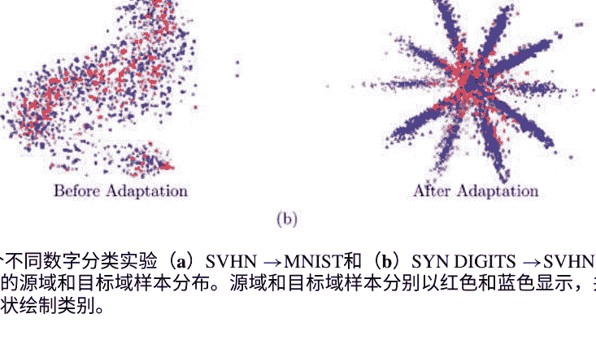

图6.4 两个不同数字分类实验（a）SVHN → MNIST和（b）SYN DIGITS → SVHN上适应之前和之后的源域和目标域样本分布。源域和目标域样本分别以红色和蓝色显示，并且使用不同的形状绘制类别。

此外，我们可视化DupGAN的转换图像以验证双重转换的有效性。图6.5显示了SVHN → MNIST和SYN DIGITS → SVHN的转换图像。可以看出，源域图像被成功转换为具有逼真目标风格的目标域图像。此外，只有少数图像存在类别失真，这表明DupGAN能够很好地保留双向转换之间的类别信息。

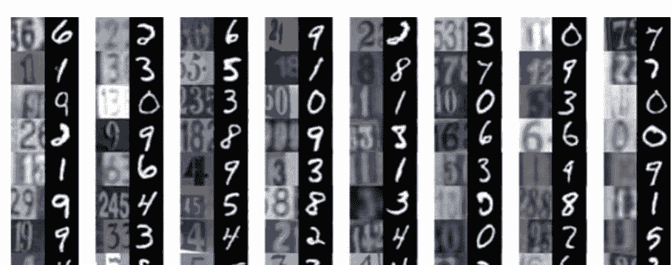

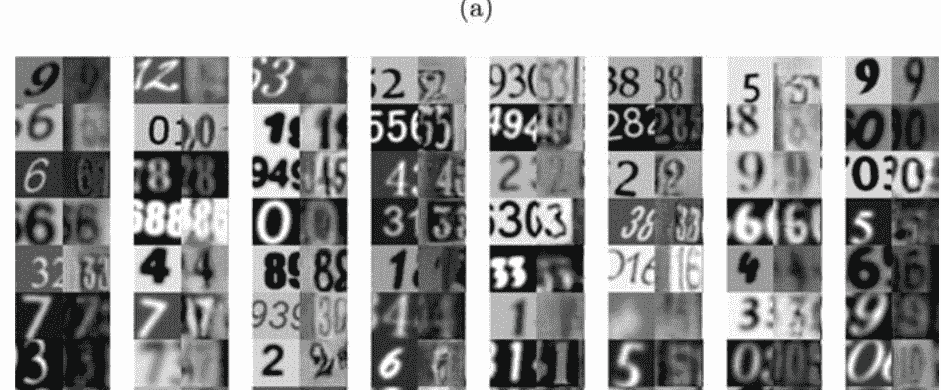

图6.5 两个实验中的域转换示例 (a) 从SVHN到MNIST和 (b) 从SYN DIGITS到SVHN。在每两列中，左边和右边的图像分别是来自真实源域的图像和其对应的具有目标域风格的转换图像。可以看出，转换后的图像看起来像真实的目标域样本，并且类别得到很好地保留。请注意，SVHN和SYN DIGITS图像中心的数字代表主要内容

##### 6.4.2 目标识别的无监督领域适应

为了进行更深入的研究，我们还在Office-31上进行了无监督领域适应实验，用于目标分类任务。 由于我们已经对数字数据集进行了全面比较，我们只是在Office-31上补充了那些典型方法的比较，包括经典的对抗学习方法DANN [5]和分类重建方法DRCN [7]。 如表6.5所示，DupGAN在所有比较方法中仍然表现最好，平均改进约5.3%。 这进一步验证了我们提出的DupGAN在不同任务上的有效性和鲁棒性。

表6.5 在Office-31上进行无监督领域适应的结果，用于目标分类

| 方法 | A→W | W→A | A→D | D→A | 平均 |
| --- | --- | --- | --- | --- | --- |
| 仅源 | 61.6 | 49.8 | 63.8 | 51.1 | 56.6 |
| DAN [17] | 68.5 | 53.1 | 67.0 | 54.0 | 60.7 |
| DANN [4, 5] | 72.6 | 52.7 | 67.1 | 54.5 | 61.7 |
| DRCN [7] | 68.7 | 54.9 | 66.8 | 56.0 | 61.6 |
| DupGAN (我们的方法) | 73.2 | 59.1 | 74.1 | 61.5 | 67.0 |

所有比较方法的测试协议都是相同的，因此其他方法的结果直接从原始论文中复制

##### 6.4.3 消融研究

为了研究所提出的DupGAN的每个可分离部分的效果，进行了在MNIST → USPS和SVHN → MNIST上的消融研究。 具体结果如表6.6所示。具体来说，为了探索具有类别保持的判别器、双重判别器和生成器的有效性，我们评估了移除判别器的真实/虚假节点的模型，称为“DupGAN-woA”；完全擦除判别器的模型，即只有分类器和具有自重构的生成器，称为“DupGAN-woAD”；以及没有生成器和判别器的模型，即只有分类器 C和伪标签过程，称为“DupGAN-woADG”。

可以看出，在两个实验中，如果没有任何可分离部分，我们的DupGAN的性能会下降，这说明所有部分对整个框架的必要性。更重要的是，在具有挑战性的SVHN → MNIST的适应实验中，“DupGAN-woAD”优于“DupGAN-woADG”。

表6.6 对MNIST → USPS和SVHN → MNIST的数字分类进行消融研究

| | DupGAN-woADG | DupGAN-woAD | DupGAN-woA | DupGAN |
| --- | --- | --- | --- | --- |
| MNIST → USPS | 93.32 | 93.82 | 94.57 | **96.01** |
| SVHN → MNIST | 60.18 | 67.43 | 68.30 | **92.46** |具有7%改进的“woADG”表明生成器的重构约束的有效性。然后，“DupGAN -woAD”的性能被“DupGAN-woA”超越，这证明了双重鉴别器的类别保持的重要性。完整的DupGAN表现最好，相对于“DupGAN-woA”有很大的改进（24%），这表明对抗学习在整个框架中起着重要作用。总的来说，在我们的方法中，对抗学习和领域转换过程中的类别信息保持对无监督领域适应问题都起到了很大的贡献。

#### 6.5 结论

在这项工作中，我们提出了一种新颖的GAN，名为DupGAN，用于无监督领域适应。我们的DupGAN由三个基本部分组成，即提取领域不变特征表示的编码器，将表示解码为源域和目标域的生成器，以及确保真实性和保留类别信息的双工鉴别器。整个框架作为一个和谐且自包含的系统工作，确保潜在表示具有领域不变性和可区分性。在几个无监督领域适应基准测试中，我们提出的DupGAN展现了最先进的性能。

### 参考文献

- 1. Ben-David, S., Blitzer, J., Crammer, K., et al.: 从不同领域学习的理论。机器学习 79(1-2), 151-175 (2010年)
- 2. Bousmalis, K., Trigeorgis, G., Silberman, N., Krishnan, D., Erhan, D.: 领域分离网络。在：神经信息处理系统进展 (NIPS)，第343-351页 (2016年)
- 3. Denker, J.S., Gardner, W.R., Graf, H.P., Henderson, D., Howard, R.E., Hubbard, W.E., Jackel, L.D., Baird, H.S., Guyon, I.: 手写邮政编码数字的神经网络识别器。在：神经信息处理系统进展 (NIPS)，第323-331页 (1988年)
- 4. Ganin, Y., Lempitsky, V.: 通过反向传播进行无监督领域适应。在：国际机器学习会议 (ICML) (2015年)
- 5. Ganin, Y., Ustinova, E., Ajakan, H., Germain, P., et al.: 领域对抗训练神经网络. IEEE J. Mach. Learn. Res. 17(1), 2096-2030 (2016)
- 6. Geng, B., Tao, D., Xu, C.: DAML: 领域适应度量学习. IEEE Trans. Image Process. 20(10), 2980-2989 (2011)
- 7. Ghifary, M., Kleijn, W.B., Zhang, M., Balduzzi, D., Li, W.: 深度重建分类网络用于无监督领域适应. In: 欧洲计算机视觉大会(ECCV), pp. 597-613 (2016)
- 8. Gong, B., Grauman, K., Sha, F.: 通过地标连接点：无监督领域适应中的判别学习领域不变特征. In: 国际机器学习大会 (ICML), pp. 222-230 (2013)
- 9. 龚, B., 史, Y., 沙, F., 格劳曼, K.: 无监督领域适应的测地线流核。在：IEEE计算机视觉和模式识别会议 (CVPR)，第2066-2073页 (2012年)
- 10. Gopalan, R., Li, R., Chellappa, R.: 用于目标识别的领域适应：一种无监督方法。在：IEEE国际计算机视觉会议（ICCV），第999-1006页（2011年）
- 11. 胡, L., 阚, M., 单, S., 陈, X.: 用于无监督领域适应的双工生成对抗网络。在：IEEE计算机视觉和模式识别会议论文集，第1498-1507页（2018年）
- 12. 阚, M., 单, S., 陈, X.: 用于无监督领域适应的双移自编码器。在：IEEE国际计算机视觉会议（ICCV），第3846-3854页（2015年）
- 13. Krizhevsky, A., Sutskever, I., Hinton, G.E.: 使用深度卷积神经网络的Imagenet分类。在：神经信息处理系统进展（NIPS），第1097-1105页（2012年）
- 14. LeCun, Y., Bottou, L., Bengio, Y., Haffner, P.: 基于梯度的学习应用于文档识别。IEEE 86, 2278–2324 (1998)
- 15. Liu, M., Tuzel, O.: 耦合生成对抗网络。 在：神经信息处理系统进展(NIPS)，pp. 469–477 (2016)
- 16. Liu, M.Y., Breuel, T., Kautz, J.: 无监督的图像到图像转换网络。 在：神经信息处理系统进展(NIPS)，pp. 700–708 (2017)
- 17. Long, M., Cao, Y., Wang, J., Jordan, M.I.: 用深度适应网络学习可迁移特征。 在：国际机器学习会议(ICML)，pp. 97–105 (2015)
- 18. Long, M., Zhu, H., Wang, J., Jordan, M.I.: 用残差传输网络进行无监督领域适应。 在：神经信息处理系统进展(NIPS)，pp. 136–144 (2016)
- 19. Luan, T., Yin, X., Liu, X.: 面向姿态不变的人脸分离表示学习GAN的识别. 在：IEEE计算机视觉和模式识别会议（CVPR），第1415-1424页（2017年）
- 20. Netzer, Y., Wang, T., Coates, A., Bissacco, A., Wu, B., Ng, A.Y.: 通过无监督特征学习在自然图像中读取数字. 在：神经信息处理的进展系统研讨会（NIPSW）（2011年）
- 21. Pablo, A., Michael, M., Charless, F., Jitendra, M.: 轮廓检测和分层图像分割。IEEE Trans. Pattern Anal. Mach. Intell. 33(5), 898–916 (2011)
- 22. Pan, S.J., Tsang, I.W., Kwok, J.T., Yang, Q.: 通过转移组件分析进行领域适应。IEEE Trans. Neur. Netw. 22(2), 199–210 (2011)
- 23. Perarnau, G., Van De Weijer, J., Raducanu, B., lvarez, J.M.: 可逆条件GAN用于图像编辑（2016年）。预印本。arXiv:1611.06355
- 24. Saenko, K., Kulis, B., Fritz, M., Darrell, T.: 将视觉类别模型调整到新领域。 在：欧洲计算机视觉会议（ECCV），第213-226页（2010年）
- 25. Saito, K., Ushiku, Y., Harada, T.: 非对称三训练用于无监督领域适应。 在：国际机器学习会议（ICML），第2988-2997页（2017年）
- 26. Sener, O., Song, H.O., Saxena, A., Savarese, S.: 学习可转移的表示用于无监督领域适应。 在：神经信息处理系统进展（NIPS），第2110-2118页（2016年）
- 27. Shao, M., Castillo, C., Gu, Z., Fu, Y.: 低秩转移子空间学习。 在：IEEE国际数据挖掘会议(ICDM)，第1104-1109页(2012)
- 28. Shao, M., Kit, D., Fu, Y.: 通过低秩约束的广义转移子空间学习。 Int. J. Comput. Vis. 109(1–2) (2014). https://doi.org/10.1007/s11263-014-0696-6
- 29. Taigman, Y., Polyak, A., Wolf, L.: 无监督的跨领域图像生成。 在：国际学习表示会议(ICLR)，第3846-3854页(2017)
- 30. Tzeng, E., Hoffman, J., Saenko, K., Darrell, T.: 对抗性判别领域适应。 在：IEEE计算机视觉和模式识别会议(CVPR)，第7167-7176页 (2017)
- 31. Zhu, J.Y., Park, T., Isola, P., Efros, A.A.: 使用循环一致性对抗网络进行无配对图像转换。 在：IEEE计算机视觉和模式识别会议（CVPR），第2223-2232页（2017年）

## 第7章 通过图像到图像的转换进行领域适应

Zak Murez, Soheil Kolouri, David Kriegman, Ravi Ramamoorthi, 和Kyungnam Kim

#### 7.1 引言

在大量标记图像（数以万计到数百万）上训练的深度卷积神经网络（CNNs）[15, 18, 25]提供了最先进的图像表示，可用于各种任务，包括识别、检测和分割。然而，在各种应用中，获取具有高质量注释的丰富数据仍然是一项繁琐且昂贵的过程。最近，学习少量标签的兴趣激增。换句话说，这些方法将深度学习方法的前所未有的性能扩展到标记数据稀缺或不可用的环境中。

少样本学习[47]，零样本学习[6, 48]，元学习[38]以及各种无监督学习技术，包括自监督学习[37]，都属于少标签学习的主题。在本章中，我们对学习中的领域适应感兴趣，这里的学习是指具有较少（在我们的情况下是零）标签的学习，其中从具有丰富标签的源领域中学到的知识将数据适应到目标域，其中数据是无标签或稀疏标签的。我们特别感兴趣的是目标域完全无标签的设置。这种设置被称为无监督领域适应（UDA），其思想如图7.1所示。

图7.1 一般的无监督领域适应（UDA）设置。在训练过程中，我们可以访问源图像和目标图像以及源标签。然而，我们没有目标数据集的任何标签。然后，UDA算法需要学习一个在源域和目标域上都表现良好的网络。

知识转移的主要挑战是所谓的领域偏移[13]现象，它指的是目标域中数据与源域中数据的不同分布。在UDA设置中，当目标域没有标签可用时，这个问题特别具有挑战性，源模型需要在无标签的目标数据上进行良好的泛化。领域适应中的高级思想有两个方面：（1）学习从目标域到源域的映射，即适应映射，并将学习到的源域模型与适应映射组合起来，得到一个目标域的模型；（2）学习一个共享且通常是低维的潜在空间，用于源域和目标域，在该空间中可以使用简单模型进行源域的回归，并且潜在空间中的源域和目标表示是无法区分的。后一种思想有时被称为领域不可知的潜在空间。一般来说，这样的映射是不唯一的，存在许多将源域和目标分布对齐的映射（无论是直接还是在潜在空间中）。因此，需要各种约束来缩小可行映射的空间。最近的领域适应技术通过深度神经网络来参数化和学习这些映射[31, 33, 44, 46, 54, 55]。在本文中，我们提出了一个统一、通用且系统化的无监督领域适应框架，广泛适用于许多图像理解和感知任务，在目标域中没有可用的训练标签。我们进一步证明，许多现有的领域适应方法都是我们框架的特例。

作为领域适应和特定UDA的实际应用，考虑自动驾驶的新兴应用，其中语义分割需要训练分割网络来检测与交通相关的对象，例如道路、汽车、行人等。训练这样的分割网络需要每个场景的语义、实例级、密集像素注释，这是非常昂贵和耗时的。此外，众包注释往往缺乏高质量的注释，因此近年来出现了大量的数据注释服务公司，以策划此类注释并提供更高质量的注释，这增加了训练可靠深度网络的额外成本。为了避免人工注释，大量的工作集中在设计逼真的模拟场景，其中地面真实注释是readily available的。Synthia [40]、Virtual KITTI [8]和GTA5 [39]数据集是这种模拟的示例，它们包括大量合成生成的驾驶场景以及地面真实像素级语义注释。基于这种合成数据训练CNN，并将其应用于实际世界图像（例如来自仪表盘安装的摄像头的图像），如Cityscapes数据集[3]，由于图像特征的巨大差异，性能非常差，这导致了领域转移问题。

图7.2展示了这种情况，网络在GTA5数据集[39]上进行了训练，该数据集是一个合成数据集，用于语义分割，并在Cityscapes数据集[3]上进行了测试。可以看到，如果没有适应性，网络在分割方面存在困难（图7.2c），而我们提出的框架改善了域偏移问题，并提供了更准确的语义分割。

尽管最近开发的域适应方法之间存在显著差异，但这些方法之间存在一个共同的统一主题。我们确定了实现成功的无监督域适应所需的三个主要属性：（1）域不可知特征提取，（2）域特定重建，以及（3）循环一致性，以实现从不成对的源域和目标域中学习。第一个要求从两个域中提取的特征分布相同或尽可能接近。源域和目标域的相似性通常通过对抗网络[16]或概率差异度量（如Wasserstein距离[5]或切片Wasserstein距离[7, 24, 28]）来衡量。许多先前的工作中都利用了域不可知潜空间的概念。

图7.3 我们的I2I（图像到图像）适应框架的详细系统架构。通向损失模块的路径表示用于训练的这些模块的输入。最佳以彩色视图查看

方法[9, 10, 16]，但单独并不能为领域适应知识转移提供足够强的约束，因为存在许多可以匹配共享空间中源域和目标域分布的映射。第二个要求是特征能够解码回源域和目标域。这个想法在Ghifary等人的工作[11]中用于无监督领域适应，并强制将高度非线性的映射到潜在空间（即深度编码器）变为伪可逆，这样可以防止网络将输入空间（源域或目标域）的区域坍缩为潜在空间中的单个点。最后，循环一致性对于非配对的源域和目标域是必需的，以确保正确学习映射，并且它们在行为上是良好的，即它们不会将分布坍缩为单个模式[59]。图7.3提供了我们框架的高级概述。

“领域不可知特征提取”、“领域特定重建与循环一致性”和“从不可知特征进行标签预测”的相互作用使得我们的框架能够同时从源领域中学习并适应目标领域。通过将所有这些不同的组件结合到一个统一的框架中，我们构建了一个系统化的领域知识转移框架，提供了一个优雅的理论解释和改进的实验结果。我们展示了我们提出的框架在从合成图像到真实世界图像的分割适应（见图7.2）以及在三个数字数据集上的分类器适应方面的卓越性能。此外，我们还展示了许多最先进的方法可以看作是我们提出的框架的特殊情况。本章部分基于之前的工作[35]。

#### 7.2 相关工作

最近在视觉领域适应方面有大量的研究，解决了领域转移问题[13]。毫不奇怪，大多数最近的工作都利用深度卷积架构来克服源领域和目标领域分布之间的“领域差异”。一种常见的方法是将源领域和目标领域映射到一个共享空间（即核空间），在这个空间中对齐领域[16, 26, 44, 53–55]。这些方法在非线性映射到核/潜在空间的类型以及用于训练它们的损失函数的选择上有很大的差异。大多数这些工作的主题是将源数据和目标数据嵌入到一个共享的潜在空间中，从而最小化源领域和目标领域之间的差异。各种工作使用了不同的度量方法来最小化这种差异。例如，一些方法使用了最大均值差异（MMD）来衡量共享空间中源领域和目标领域的分布之间的差异[31]。Wasserstein距离及其变体[4, 5, 7, 28, 41]也被用于测量源领域和目标领域之间的差异，而其他方法则使用相关性最大化来对齐领域的二阶统计量。

另外，为了匹配源域和目标域的分布，可以通过最大化对抗网络的混淆率来实现，这需要在共享空间中区分源域和目标域[9-11, 16, 54]。这导致了对抗学习领域的出现，这是由Goodfellow等人在开创性的工作中引入的[12]，并在近年来变得非常流行。我们注意到，对抗学习可能具有挑战性，因为无法保证在源编码器、目标编码器和鉴别器（即对手）之间实现纳什均衡。此外，朴素的对抗学习方法可能会遇到已知问题，如模式崩溃问题[49]。已经有大量的工作致力于改进对抗学习，以提供更可靠的训练[1, 14]并解决模式崩溃问题[49]。其他方法包括Sener等人的工作[45]，其中将域转移在转导设置中进行了表述，并且使用了残差转移学习（RTL）方法[32]，其中作者假设源分类器和目标分类器仅通过残差函数不同，并学习这些残差函数。

无监督领域适应的另一个重要策略是基于自我训练[52, 60]。虽然有各种各样的自我训练方法，但总体思想是在预测的目标标签/注释（即目标域的伪标签/注释）和源域的真实标签之间强制保持一致性。为了提供一个更具体的例子，考虑自动驾驶应用中的语义分割问题。在源域上训练的模型在目标域上测试会导致较差的语义分割结果（比较图7.2c和e）。对于人类来说，很容易区分出真实标签和预测标签之间的差异，因为预测标签存在不规则性。然后，我们的想法是训练一个对抗网络来区分预测的注释和真实标签（在像素级别），并最大化这种混淆。通过这种方式，网络可以进行领域适应。同样的思想也可以通过最小化源域和目标域的预测标签之间的概率距离来使用[7, 28]。

本章介绍的方法主要受到Hoffman等人[16]、Isola等人[20]、Zhu等人[59]和Ghifary等人[11]的工作的启发。Hoffman等人[16]利用全卷积网络和领域对抗训练来获得领域无关的特征（即共享空间），同时将共享空间限制为对源领域具有判别性。因此，通过学习从源领域和目标领域到共享空间的映射（即图7.3中的 $f_x$ 和 $f_y$），以及学习从共享空间到注释的映射（即图7.3中的 $h$），他们的方法有效地使得学习的分类器适用于两个领域。Ghifary等人[11]的深度重建分类网络（DRCN）采用类似的方法，但要求嵌入必须可解码，并学习从嵌入空间到目标领域的映射（即图7.3中的 $g_y$）。Isola等人[20]的图像到图像的转换工作通过对 $f_x$ 和 $g_y$ 进行对抗学习，并将它们组合成 $g_y \circ f_x : X \rightarrow Y$ 来将源领域映射到目标领域。在他们的框架中，假设目标和源图像是成对的，即对于每个源图像都存在一个已知的对应目标图像。

从提到的论文[11, 16, 20, 53, 59]中共同出现的模式是：(a)共享空间必须是源域的一个有区分度的嵌入，(b)嵌入必须是域不可知的，因此最大化嵌入源域和目标域图像分布的相似性，(c)嵌入中保留的信息必须足够用于重建特定域的图像，(d)对抗学习与经典损失相比可以显著提高学习映射的质量，(e)循环一致性在从源域和目标域的不配对图像学习映射时需要减少可能映射的空间并确保其质量。我们提出的无监督领域适应方法将上述内容统一到一个通用框架中，同时解决领域适应和图像到图像转换的问题。

近年来，还有其他一些努力致力于深度领域适应的统一和通用框架。Tzeng等人的对抗性判别领域适应（ADDA）工作[55]和Sankaranarayanan等人的生成适应工作[44]是这种框架的实例。Tzeng等人[55]确定了深度领域适应系统的三个设计选择，即（a）是否使用生成或判别基础，是否共享映射参数 $f_x$ 和 $f_y$，以及对抗训练的选择。他们观察到，如果嵌入是域不可知的（即域不变的），建模图像分布可能并不是严格必要的。Sankaranarayanan等人[44]提出了一个不同的框架，在其中他们通过学习 $g_y$ 成为一个将编码域图像映射的生成模型，强烈强制在共享空间中进行域对齐。

学习 $g_y$ 来成为一个将编码域图像映射的生成模型，强烈强制在共享空间中进行域对齐。将 $f_x(x_i)$ 从源域转移到目标域。我们的框架还可以推广这些框架。最后，我们注意到Hoffman等人[17]和Liu等人[30]同时提出了非常相似的想法。

#### 7.3 方法

在这里，我们用 $x_i \in X$ 表示训练图像，其中 $X \subset \mathbb{R}^{d_x}$，它们的对应标注/标签为 $c_i \in C$，其中 $C \subset \mathbb{R}^{K}$ 表示标签/注释空间，来自源域（即域 $X$）。注意，$c_i$ 可能是图像级别的，例如在分类中，$c_i$ 表示对 $K$ 个类别之一的类别分配，或者在语义分割的情况下是像素级别的，其中 $c_i[m, n]$ 表示图像 $x_i$ 中像素 $[m, n]$ 的类别分配为 $K$ 个类别（例如，行人、道路、人行道等）。还考虑目标域（即域 $Y$）中的训练图像 $y_j \in Y$。

$Y \subset \mathbb{R}$ 的域，我们没有这些图像的对应注释。我们的目标是学习一个分类器，将目标图像 $y_j$ 映射到标签 $c_j \in C$。我们注意到，该框架可以轻松扩展到半监督学习或少样本学习的情况，其中我们在目标域中有一些图像的注释。鉴于目标域缺乏标签，一般的方法是在源域上学习一个分类器，并使其适应目标域的域分布。请注意，我们假设源域和目标域中的图像之间没有对应关系。

$x_i$ 和 $y_j$ 的缺乏对应关系的假设使得问题变得更具挑战性，并且近年来引起了计算机视觉社区的广泛关注 [17]。

这里的总体思想是找到一个联合潜在空间 $Z$，它是 $\mathbb{R}^{d}$ 的子集，其中更常见的情况是 $d$ 和 $d_x$，$d_y$ 是源域和目标域 $X$ 和 $Y$ 的表示，这些表示是与域无关的。为了澄清这一点，考虑这样的情况，$X$ 是一个晴天驾驶场景/图像的域，$Y$ 是一个雨天驾驶场景的域。虽然“晴天”和“雨天”是源域和目标域的特征，但对于注释/分类任务（例如道路的语义分割），它们实际上是无关的变化，不应该影响注释。将这些特征视为结构化噪声，我们希望找到一个对这些变化不变的潜在空间 $Z$。换句话说，域 $Z$ 不应包含特定于域的特征，因此它应该是与域无关的。接下来，我们将描述导致找到这样一个与域无关的潜在空间的过程。

让源域和目标域到潜在空间的映射分别定义为 $f_x : X \rightarrow Z$ 和 $f_y : Y \rightarrow Z$ （见图7.3）。在我们的框架中，这些映射由深度卷积神经网络（CNNs）参数化。这里需要注意的是 $f_x$ 和 $f_y$ 的映射可以共享参数。例如，当 $X$ 等于 $Y$ （即，$d_x = d_y$）且输入图像相似时低级视觉特征（例如，源图像和目标图像都是道路场景的RGB图像，但天气条件不同），那么 $f_x$ 和 $f_y$ 可以共享所有参数，或者 $f_x = f_y$。在更一般的设置中，例如RGB到合成孔径雷达（SAR）领域适应，如[41]所示，映射 $f_x$ 和 $f_y$ 只能在CNN的更深层共享参数，或者根本不共享参数。然而，$f_x$ 和 $f_y$ 之间不共享任何参数可能导致领域适应不够稳健，因为它允许高度非线性的映射。

使用 $f_x$ 和 $f_y$ 来扭曲源空间和目标空间，并在潜在空间 $Z$ 中提供任意匹配 $X$ 和 $Y$ 之间的。请注意，潜在空间中的成员 $z \in Z$ 在图像级任务的情况下是高维向量，或者在像素级任务的情况下是特征图。此外，让 $h : Z \rightarrow C$ 是将潜在空间映射到标签/注释的分类器（即图7.3中的分类器模块）。鉴于已知源类 $X$ 的注释，可以定义一个监督损失函数来强制执行 $h(f_x(x_i)) = c_i$：

$$Q_c = \sum_i l_c(h(f_x(x_i)), c_i)  \tag{7.1}$$

其中 $l_c$ 是一个适当的损失（例如，用于分类和分割的交叉熵）。最小化上述损失函数会导致标准的监督学习方法，不涉及领域适应。虽然这种方法会导致在源域中的图像上表现良好的方法，$x_i \in X$，但它往往在目标域中的图像上表现不佳，$y_j \in Y$。原因是，领域 $Z$ 严重偏向于结构噪声（'晴天'）在领域 $X$ 中的分布，以及结构噪声在领域 $Y$ 中（'雨天'）混淆了分类器 $h(\cdot)$。为了避免这种混淆，我们要求潜在空间 $Z$ 对领域不敏感，因此不受领域特定的结构噪声影响。为了实现这样的潜在空间，我们系统地引入了各种辅助网络和损失函数来帮助规范化潜在空间，并因此实现了强大的 $h(\cdot)$。辅助网络和损失路径在图7.3中描述。接下来，我们将描述规范化损失（图7.4）的各个组成部分。

1.  首先，需要保留目标和源图像的核心信息，并且只丢弃结构化噪声。为了对潜在空间施加这个约束，我们首先定义解码器 $g_x: Z \rightarrow X$ 和 $g_y: Z \rightarrow Y$，它们将潜在空间中的特征映射到源域和目标域。换句话说，$g_x$ 和 $g_y$ 是 $f_x$ 和 $f_y$ 的伪逆。我们假设如果 $Z$ 保留了域的关键/核心信息并且只丢弃了结构化噪声，那么解码器应该能够将结构化噪声添加回去，并从潜在特征空间 $Z$ 中重构每个图像。换句话说，我们要求 $g_x(f_x(\cdot))$ 和 $g_y(f_y(\cdot))$ 接近于恒等函数/映射 $(f_x \circ g_x \approx id)$。这个约束导致了以下损失函数：

$$Q_{id} = \sum_{i} l_{id}\left(g_{x}\left(f_{x}\left(x_{i}\right)\right), x_{i}\right) + \sum_{j} l_{id}\left(g_{y}\left(f_{y}\left(y_{j}\right)\right), y_{j}\right) \tag{7.2}$$

其中 $l_{id}(\cdot, \cdot)$ 是像素级图像损失，例如 $L_1$ 范数。

2.  我们希望潜在空间 $Z$ 是领域无关的。这意味着源域和目标域的特征表示不应包含领域特定信息。为了实现这一点，我们使用对抗设置，其中鉴别器 $d_{z} : Z \rightarrow \{c_{x}, c_{y}\}$ 试图分类潜在空间 $z \in Z$ 中的特征是由域 $X$ 还是 $Y$ 生成的，其中 $c_{x}$ 和 $c_{y}$ 是二进制的域标签（即来自域X或域Y）。损失函数可以定义为鉴别器的确定性（即领域无关性等同于欺骗鉴别器），因此我们可以将其表述为：

$$Q_{z} = \sum_{i} l_{a}\left(d_{z}\left(f_{x}\left(x_{i}\right)\right), c_{x}\right) + \sum_{j} l_{a}\left(d_{z}\left(f_{y}\left(y_{j}\right)\right), c_{y}\right) \tag{7.3}$$

其中，$l_{a}(\cdot, \cdot)$ 是一个适当的损失函数（传统GANs中的交叉熵损失和最小二乘GAN中的均方误差）。鉴别器被训练来最大化这个损失，而生成器被训练来最小化它。需要注意的是，在这里使用鉴别器 $d_{z}$ 和对抗学习的核心思想是最小化潜在空间中 $f_{x}(x_{i})$ 和 $f_{y}(y_{j})$ 之间的差异。为此，还引入了其他方法，使用潜在空间中源域和目标域的经验概率分布之间的统计差异度量，即 $p_{f_x}$

$$\hat{p}_{x} = \frac{1}{N} \sum_{i=1}^{N} \delta(z - f_{x}(x_{i}))$$

和 $p_{f_y} = \frac{1}{N} \sum_{j=1}^{N} \delta(z - f_y(y_j))$ 其中 $\delta(\cdot)$ 是狄拉克函数。例如，Damodaran等人[5]使用Wasserstein距离来实现这个任务，而[7, 24, 28, 41]使用切片Wasserstein距离来解决计算Wasserstein距离本身的复杂性。要了解更全面的Wasserstein距离介绍，请参考Kolouri等人[23]和Arjovsky等人[1]。其他值得注意的差异度量包括最大均值差异度量(MMD) [31]和Cramer-Wold度量[50]。

3.  为了进一步确保映射 $f_x, f_y, g_x$ 和 $g_y$ 的一致性，我们定义了翻译对抗损失。从目标(源)域中的图像首先被编码到潜在空间，然后解码到源(目标)域以生成一个“假”(翻译)图像。接下来，我们定义判别器 $d_x : X \rightarrow \{c_x, c_y\}$ 和 $d_y : Y \rightarrow \{c_x, c_y\}$，用于识别图像是“假的”（来自另一个领域生成的）还是“真实的”（属于实际领域）。为了制定这个翻译损失函数，我们可以写成：

$$Q_{tr} = \sum_i l_a \left( d_y \left( g_y \left( f_x \left( x_i \right) \right) \right), c_x \right) + \sum_j l_a \left( d_x \left( g_x \left( f_y \left( y_j \right) \right) \right), c_y \right) \qquad (7.4)$$

4.  鉴于源域和目标域中的图像之间没有对应关系，我们需要确保两个域中语义相似的图像在潜在空间中彼此靠近。为了确保这一点，我们定义了循环一致性损失，其中在翻译损失中生成的“假”图像，$g_x \left( f_y \left( y_j \right) \right)$ 或 $g_y \left( f_x \left( x_i \right) \right)$，被编码回潜在空间，然后解码回原始空间。整个循环应该等同于一个恒等映射。我们可以如下形式化这个损失：

$$Q_{cyc} = \sum_i l_{id} \left( g_x \left( f_y \left( g_y \left( f_x \left( x_i \right) \right) \right) \right), x_i \right) + \sum_j l_{id} \left( g_y \left( f_x \left( g_x \left( f_y \left( y_j \right) \right) \right) \right), y_j \right) \qquad (7.5)$$

5.  为了进一步限制翻译以保持相同的语义，并允许目标编码器在目标域的“类似”图像上进行监督训练，我们还定义了源到目标翻译和原始源标签之间的分类损失：

$$Q_{trc} = \sum_i l_c \left( h \left( f_y \left( g_y \left( f_x \left( x_i \right) \right) \right) \right), c_i \right) \qquad (7.6)$$

### 表7.1 显示现有方法与我们提出的方法之间的关系

| 方法 | $Q_c$ | $Q_z$ | $Q_{tr}$ | $Q_{id_X}$ | $Q_{id_Y}$ | $Q_{cyc}$ | $Q_{trc}$ |
| :--- | :---: | :---: | :---: | :---: | :---: | :---: | :---: |
| [16] | ✓ | ✓ | | | | | |
| [55] | ✓ | ✓ | | | | | |
| [11] | ✓ | | | ✓ | | | |
| [44] | ✓ | | ✓ | | | | |
| [59] | | | ✓ | | | ✓ | |
| 我们的方法 | ✓ | ✓ | ✓ | ✓ | ✓ | ✓ | ✓ |

最后，通过结合这些单独的损失，我们定义了总损失为，

$$Q = \lambda_c Q_c + \lambda_z Q_z + \lambda_{tr} Q_{tr} + \lambda_{id} Q_{id} + \lambda_{cyc} Q_{cyc} + \lambda_{trc} Q_{trc}$$

领域适应的各种先前方法都是我们框架的特例。表7.1总结了包括哪些超参数以及哪些被设置为零以恢复这些先前的方法。简而言之，通过设置 $\lambda_{id} = \lambda_{cyc} = \lambda_{tr} = 0$，我们恢复了[16]。通过首先仅在源域上进行训练，然后冻结源编码器，解开目标编码器并设置 $\lambda_{id} = \lambda_{cyc} = \lambda_{tr} = 0$，我们恢复了[55]。通过设置 $\lambda_{id_X} = \lambda_{cyc} = \lambda_{tr} = \lambda_z = 0$，其中 $\lambda_{id_X}$ 仅表示 $Q_{id}$的第一项的混合系数。设置 $\lambda_{id} = \lambda_{cyc} = \lambda_{tr_X} = \lambda_z = 0$，我们恢复了[44]。最后，通过设置 $\lambda_{id} = \lambda_c = \lambda_z = 0$，我们恢复了[59]。表7.1总结了这些结果。

#### 7.4 实验

在本节中，我们展示了所描述方法在各种基准领域适应数据集上的性能，包括：（1）由MNIST、USPS和SVHN数据集组成的数字识别数据集，（2）Office数据集，以及（3）GTA5和Cityscapes数据集。前两个适应任务是分类任务，而最后一个是分割任务。在我们的所有实验中，通过ADAM优化器[22]优化损失函数，该优化器根据低阶矩提供自适应梯度步长，学习率为0.0002，betas为0.5和0.999，以端到端的方式进行优化。判别网络，$d_x$，$d_y$和$d_z$与编码器和解码器一起通过交替优化方案进行训练。

为了进一步约束所学习的特征，我们共享编码器的权重。我们还共享解码器的前几层的权重。为了稳定鉴别器，我们使用改进的Wasserstein方法[14]对其进行训练。特征鉴别器的损失（$Q_z$）仅反向传播到目标图像的生成器（我们希望编码器学习将目标图像映射到与源图像相同的分布，而不是相反）。同样，翻译分类损失（$Q_{trc}$）仅反向传播到第二个编码器和分类器（$f_y$和$h$）。这样可以防止翻译器（$g_y$）通过隐藏信息来作弊。在翻译的图像中的类信息。接下来，我们将展示我们的方法在上述数据集上的结果。

##### 7.4.1 MNIST、USPS和SVHN数字数据集

首先，我们展示了我们的方法在三个数字分类数据集之间的领域适应上的应用，即MNIST [27]、USPS [19]和Street View House Numbers (SVHN) [36]数据集。我们遵循了[10, 29, 44, 54, 55]的实验协议，将一个数字数据集作为有标签的源领域，将另一个数据集作为无标签的目标领域。我们训练了我们的框架来适应从MNIST→USPS、USPS →MNIST和SVHN →MNIST。图7.5显示了MNIST到SVHN的输入和翻译图像的示例。

为了与之前的方法进行公平比较，我们的特征提取网络（编码器，$f_x$ 和 $f_y$) 是LeNet [27]的修改版本。我们修改后的LeNet编码器由4个步长为2的卷积层组成，每层使用4 ×4的滤波器和64、64、128、128个特征。每个卷积层后面都跟着批归一化和ReLU非线性激活函数。批归一化对图像到图像的转换很有帮助翻译训练。源编码器和目标编码器之间的权重是共享的。我们的DenseNet编码器遵循[18]，最后的全连接层被移除。我们的解码器（即 $g_x$ 和 $g_y$）由四个步长为2的转置卷积层组成，每层都有4×4的滤波器和512、256、128、1个特征。每个卷积层后面都跟着批量归一化和ReLU非线性激活函数，除了最后一层只有Tanh非线性激活函数。第一和第二层的权重在源解码器和目标解码器之间共享。我们的图像判别器由4个步长为2的卷积层组成，每层都有4×4的滤波器和64、128、256、1个特征，而我们的特征判别器由三个全连接层组成。更准确地说，特征判别器由3个线性层组成，每个层都有500、500、1个特征，每个层后面都跟着斜率为0.2的Leaky ReLU非线性激活函数。特征判别器使用最小二乘GAN损失进行训练。损失只反向传播到目标图像的生成器（我们希望编码器学习将目标图像映射到与源图像相同的分布，而不是相反）。所有来自MNIST和USPS的图像都被双线性上采样到32×32。来自SVHN的图像被转换为灰度图。我们还使用了一种非常简单的数据增强方法，即随机平移和旋转。我们发现数据增强是一个关键的步骤，可以显著提高领域适应性能。对于我们的超参数，我们使用了：$\lambda_c = 1.0, \lambda_z = 0.05, \lambda_id = 0.1, \lambda_tr = 0.02, \lambda_cyc = 0.1, \lambda_trc = 0.1$。

我们将我们的方法与九个先前的工作进行比较（见表7.2）。我们的方法始终以显著的优势超过先前的最新技术。我们还展示了消融实验，以分析每个损失项对整体性能的贡献。首先注意到，即使没有领域适应（表7.2中线下的顶行），我们的结果仍然比许多先前的方法更好。这纯粹是由于简单的数据增强。接下来，我们看到 $\lambda_z$ 和 $\lambda_id$ 都大大改善了结果。然而，将它们与 $\lambda_trc$ 的组合产生了最好的结果。这在SVHN到MNIST的情况下尤为明显，这是最具挑战性的适应任务之一。最后，在这种情况下，剩余的损失项不再有帮助。

图7.5a-c显示了在没有适应的情况下从源域和目标域提取特征时的TSNE嵌入，仅使用图像到图像损失训练的情况，以及我们的完整模型。可以看出，在没有适应的情况下，源图像和目标图像在特征空间中聚集在一起，但分布不重叠，这就是为什么在目标域上分类失败的原因。仅仅进行图像到图像的转换是不足以使分布重叠的，因为网络学习将源分布和目标分布映射到特征空间的不同区域。我们的完整模型包括特征分布对抗损失，强制源分布和目标分布重叠，而图像转换使特征更丰富，从而产生最佳的适应结果。

### 表7.2 各种先前方法以及我们和消融在数字数据集领域适应的性能

| 方法 | MNIST → USPS | USPS → MNIST | SVHN → MNIST |
| :--- | :--- | :--- | :--- |
| 仅源 | 24.8 | 42.9 | 39.7 |
| 梯度反转 [10] | 28.9 | 27.0 | 26.1 |
| 领域混淆 [54] | 20.9 | 33.5 | 31.9 |
| CoGAN [29] | 8.8 | 10.9 | - |
| ADDA [55] | 10.6 | 9.9 | 24.0 |
| DTN [51] | - | - | 15.6 |
| WDAN [57] | 27.4 | 34.6 | 32.6 |
| PixelDA [2] | 4.1 | - | - |
| DRCN [11] | 8.2 | 26.3 | 18.0 |
| 生成以适应 [44] | **7.5** | **9.2** | **15.3** |
| 我们的方法 | 8.9 | 33.0 | 28.5 |
| ✓ $Q_{tr}$ | 2.1 | 2.8 | 19.9 |
| ✓ $Q_{idx}$ | 2.1 | 28.5 | 23.7 |
| ✓ $Q_{idy}$ | 1.4 | 22.6 | 29.5 |
| ✓ $Q_{trc}$ | 1.3 | 3.0 | 12.1 |
| ✓ $Q_{tr}$ ✓ $Q_{idx}$ ✓ $Q_{idy}$ ✓ $Q_{trc}$ | **1.2** | **2.4** | **9.9** |
| ✓ $Q_z$ ✓ $Q_{tr}$ ✓ $Q_{idx}$ ✓ $Q_{idy}$ ✓ $Q_{trc}$ | 2.5 | 3.6 | 10.0 |
| ✓ $Q_z$ ✓ $Q_{tr}$ ✓ $Q_{idx}$ ✓ $Q_{idy}$ ✓ $Q_{cyc}$ ✓ $Q_{trc}$ | 1.5 | 2.6 | 10.4 |

MNIST → USPS表示MNIST是源域（具有标签）和USPS是目标域（没有标签）。报告的结果是分类错误率（越低越好）。蓝色是最佳先前方法，粗体是最佳整体。我们的结果比先前的技术水平要好得多。

##### 7.4.2 办公室数据集

办公室数据集[43]包含来自三个领域的31个类别的对象图像：亚马逊（A），网络摄像头（W）和单反相机（D），分别具有2817、795和498张图像。我们的方法在六个任务中有四个表现最好（见表7.3）。我们在两个任务中表现不佳，这两个任务需要在源域中使用非常少的训练数据来弥合较大的领域转移（分别为795和498）。这里的消融实验表明，翻译损失（$Q_{tr}$）有所帮助。

对于我们的编码器，我们使用在ImageNet上预训练的ResNet34。编码器的学习率较小（$2 \times 10^{-5}$），以保持权重更接近其良好的初始化。图像被下采样到$256 \times 256$，然后提取一个大小为$224 \times 224$的随机裁剪。全局平均池化后，应用最终的分类层。我们的解码器由5个步长为2的转置卷积层组成。

图像判别器由4个步长为2的卷积层组成。特征判别器由3个$1 \times 1$卷积层后跟全局平均池化层组成。我们的超参数为：$\lambda_c = 1.0$, $\lambda_z = 0.1$, $\lambda_{tr} = 0.005$, $\lambda_{id} = 0.2$, $\lambda_{cyc} = 0.0$, $\lambda_{trc} = 0.1$。

### 表7.3 各种方法在由三个领域组成的Office数据集上的准确率（越大越好）：亚马逊（A），网络摄像头（W）和数码单反相机（D）

| 方法 | A→W | W→A | A→D | D→A | W→D | D→W |
| :--- | :--- | :--- | :--- | :--- | :--- | :--- |
| 领域混淆[53] | 61.8 | 52.2 | 64.4 | 21.1 | 98.5 | 95.0 |
| 可转移特征[31] | 68.5 | 53.1 | 67.0 | 54.0 | 99.0 | 96.0 |
| 梯度反转 [10] | 72.6 | 52.7 | 67.1 | 54.5 | 99.2 | 96.4 |
| DHN [56] | 68.3 | 53.0 | 66.5 | 55.5 | 98.8 | 96.1 |
| WDAN [57] | 66.8 | 52.7 | 64.5 | 53.8 | 98.7 | 95.9 |
| DRCN [11] | 68.7 | **54.9** | 66.8 | **56.0** | 99.0 | 96.4 |
| 我们的方法 | 59.1 | 46.4 | 61.0 | 45.3 | 98.0 | 92.8 |
| ✓ $Q_z$ | 70.8 | 49.0 | 67.1 | 43.4 | 98.2 | 90.8 |
| ✓ $Q_{tr}$ | 61.1 | 49.6 | 67.3 | 49.8 | 99.0 | 94.7 |
| ✓ $Q_z$ ✓ $Q_{tr}$ ✓ $Q_{idx}$ | 71.2 | 49.1 | 70.9 | 45.5 | 97.8 | 94.3 |
| ✓ $Q_z$ ✓ $Q_{tr}$ ✓ $Q_{idx}$ ✓ $Q_{idy}$ ✓ $Q_{trc}$ | **75.3** | 52.1 | **71.1** | 50.1 | **99.6** | **96.5** |

A→W表示亚马逊是源领域（有标签可用），网络摄像头是目标领域（无标签可用）。粗体为最佳。我们的方法在6个任务中有4个表现最好。

##### 7.4.3 GTA5到Cityscapes

我们还展示了我们的方法在合成（逼真）驾驶数据集GTA5 [39]和真实数据集Cityscapes [3]之间的领域适应。GTA5数据集包含24,966个密集标记的RGB图像，尺寸为1914×1052，包含与Cityscapes数据集兼容的19个类别（见表7.4）。Cityscapes数据集包含来自27个不同城市的5000个密集标记的RGB图像，尺寸为2040×1016。这里的任务是像素级语义分割。

在[16]的实验之后，我们使用GTA5图像作为标记的源数据集，Cityscapes图像作为未标记的目标域。

我们指出，在我们的模型中，卷积网络是可以互换的。我们包括使用了一个扩张的ResNet34编码器来与之前的工作进行公平比较，但是从我们的实验中发现，使用我们的新的扩张稠密连接网络（即扩张DenseNets）作为编码器可以获得最佳性能，这些网络是通过在DenseNet架构[18]中用扩张卷积[58]替换步幅卷积得到的。DenseNets之前已经被用于图像分割[21]，但是它们的编码器/解码器结构比我们提出的更加复杂。我们使用一系列的转置卷积层作为解码器。

我们的解码器由一个步幅为1的卷积层和3个步幅为2的转置卷积层组成。图像判别器由4个步幅为2的卷积层组成。由于内存问题，我们没有包括循环一致性约束。由于计算和内存限制，我们在将图像输入网络之前将所有图像下采样了一半。输出分割结果通过双线性上采样恢复到原始分辨率。我们在下采样后的图像的256×256块上训练网络，但是在完整的图像上进行测试。

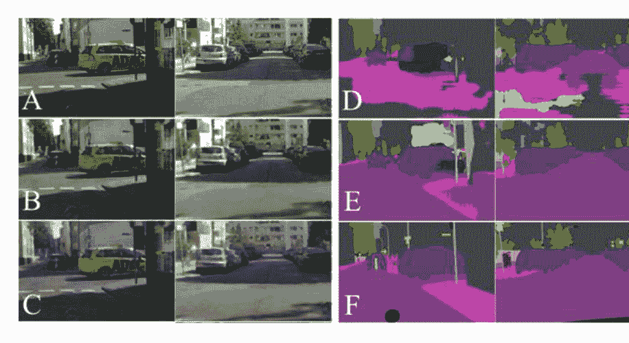

（下采样）图像卷积。我们的超参数为：$\lambda_c = 1.0$, $\lambda_z = 0.01$, $\lambda_{tr} = 0.04$, $\lambda_{id} = 0.2$, $\lambda_{cyc} = 0.0$, $\lambda_{trc} = 0.1$。我们的编码器架构（扩张ResNet/DenseNet）针对分割进行了优化，因此不足为奇，我们的翻译（见图7.6）不如[59]中报告的那么好。从图7.6中可以看出，与无适应相比，我们的分割更加清晰。定量上（见表7.4），我们的方法在除了3之外的所有类别上优于先前的方法[16]，整体上提高了5%。此外，我们证明在我们的框架中使用扩张DenseNets可以将SOA提高8.6%。

#### 7.5 最后的评论

在本书章节中，我们提出了一个通用的无监督领域适应（UDA）框架，该框架包括许多最近的作品作为特例。我们对现有文献中的工作进行了全面的回顾，并将UDA领域的最新进展纳入了一个统一的理论框架。

我们提出的方法同时实现了图像到图像的转换、源域判别和领域适应，并为后续关于UDA的工作提供了路线图。此外，该方法可以轻松扩展到半监督和少样本学习框架。我们的实现在数字分类和驾驶场景的语义分割适应方面优于现有技术水平。当与DenseNet架构结合使用时，我们的方法明显优于当前的技术水平。

| 类别 | 源 | 野外中的FCNs | 我们的方法 | 源-稠密网络 | 我们的-稠密网络 |
| :--- | :--- | :--- | :--- | :--- | :--- |
| 道路 | 31.9 | 67.4 | 85.3 | 67.3 | 85.8 |
| 人行道 | 18.9 | 29.2 | 38.0 | 23.1 | 37.5 |
| 建筑物 | 47.7 | 64.9 | 71.3 | 69.4 | 80.2 |
| 墙 | 7.4 | 15.6 | 18.6 | 13.9 | 23.3 |
| 栅栏 | 3.1 | 8.4 | 16.0 | 14.4 | 16.1 |
| 杆 | 16.0 | 12.4 | 18.7 | 21.6 | 23.0 |
| 交通灯 | 10.4 | 9.8 | 12.0 | 19.2 | 14.5 |
| 交通标志 | 1.0 | 2.7 | 4.5 | 12.4 | 9.8 |
| 植被 | 76.5 | 74.1 | 72.0 | 78.7 | 79.2 |
| 地形 | 13.0 | 12.8 | 43.4 | 24.5 | 36.5 |
| 天空 | 58.9 | 66.8 | 63.7 | 74.8 | 76.4 |
| 人 | 36.0 | 38.1 | 43.1 | 49.3 | 53.4 |
| 骑手 | 1.0 | 2.3 | 3.3 | 3.7 | 7.4 |
| 汽车 | 67.1 | 63.0 | 76.7 | 54.1 | 82.8 |
| 卡车 | 9.5 | 9.4 | 14.4 | 8.7 | 19.1 |
| 公共汽车 | 3.7 | 5.1 | 12.8 | 5.3 | 15.7 |
| 火车 | 0.0 | 0.0 | 0.3 | 2.6 | 2.8 |
| 摩托车 | 0.0 | 3.5 | 9.8 | 6.2 | 13.4 |
| 自行车 | 0.0 | 0.0 | 0.6 | 1.9 | 1.7 |
| mIoU | 21.1 | 27.1 | 31.8 | 29.0 | 35.7 |

上面的线使用标准的扩张ResNet作为编码器。我们的方法在整体上表现最好，并且在除两个之外的所有子类别上表现最好。即使没有领域适应，切换到DenseNet编码器也能超越以前的方法。DenseNet加上我们的方法明显优于以前的方法。蓝色在ResNet中最好，粗体字在整体上最好。

本章的三个要点是：（1）领域不可知特征提取的重要性，（2）领域特定重建，以及（3）循环一致性，以实现从未配对的源域和目标域中学习的无监督领域适应。

### 参考文献

1.  Arjovsky, M., Chintala, S., Bottou, L.: Wasserstein生成对抗网络。 在：国际机器学习大会，第214-223页（2017年）
2.  Bousmalis, K., Silberman, N., Dohan, D., Erhan, D., Krishnan, D.: 无监督像素级领域适应与生成对抗网络。 在：IEEE计算机视觉与模式识别大会论文集，第3722-3731页（2017年）
3.  Cordts, M., Omran, M., Ramos, S., Rehfeld, T., Enzweiler, M., Benenson, R., Franke, U., Roth, S., Schiele, B.: 用于语义城市场景理解的Cityscapes数据集。 在：IEEE计算机视觉与模式识别大会（CVPR）论文集（2016年）
4.  Courty, N., Flamary, R., Tuia, D., Rakotomamonjy, A.: 领域适应的最优传输。IEEE模式分析与机器智能杂志。 39 (9) ， 1853-1865 (2016年)
5.  Damodaran, B.B., Kellenberger, B., Flamary, R., Tuia, D., Courty, N.: Deepjdot:深度联合分布最优传输用于无监督领域适应。在:欧洲计算机视觉会议上, 第467-483页。Springer, 柏林 (2018年)
6.  Deutsch, S., Kolouri, S., Kim, K., Owechko, Y., Soatto, S.:通过多尺度流形正则化进行零样本学习。在:IEEE计算机视觉和模式识别会议论文集上, 第7112-7119页 (2017年)
7.  Gabourie, A., Rostami, M., Pope, P., Kolouri, S., Kim, K.:学习一个领域不变的嵌入, 用于无监督领域适应, 使用类条件分布对齐 (2019年)。预印本, arXiv:1907.02271
8.  Gaidon, A., Wang, Q., Cabon, Y., Vig, E.:虚拟世界作为多目标跟踪分析的代理。在:IEEE计算机视觉和模式识别会议论文集上, 第4340-4349页 (2016年)
9.  Ganin, Y., Lempitsky, V.:通过反向传播进行无监督领域适应。在:机器学习国际会议, 第1180-1189页 (2015年)
10. Ganin, Y., Ustinova, E., Ajakan, H., Germain, P., Larochelle, H., Laviolette, F., Marchand, M., Lempitsky, V.:神经网络的领域对抗训练。机器学习研究杂志17(59), 1-35页 (2016年)
11. Ghifary, M., Kleijn, W.B., Zhang, M., Balduzzi, D., Li, W.:用于无监督领域适应的深度重建-分类网络。在:欧洲计算机视觉会议, 第597-613页。Springer, 柏林 (2016年)
12. Goodfellow, I., Pouget-Abadie, J., Mirza, M., Xu, B., Warde-Farley, D., Ozair, S., Courville, A., Bengio, Y.:生成对抗网络。在:神经信息处理进展, 第2672-2680页 (2014年)
13. Gretton, A., Smola, A.J., Huang, J., Schmittfull, M., Borgwardt, K.M., Sch lkopf, B.:通过核均值匹配进行协变量偏移 (2009)
14. Gulrajani, I., Ahmed, F., Arjovsky, M., Dumoulin, V., Courville, A.:改进的Wasserstein GANs训练方法 (2017). 预印本, arXiv:1704.00028
15. He, K., Zhang, X., Ren, S., Sun, J.:深度残差学习用于图像识别. 在:IEEE计算机视觉和模式识别会议论文集, pp. 770-778 (2016)
16. Hoffman, J., Wang, D., Yu, F., Darrell, T.:野外的FCNs:像素级对抗和约束适应 (2016). 预印本, arXiv:1612.02649
17. 霍夫曼, J., Tzeng, E., Park, T., Zhu, J.Y., Isola, P., Saenko, K., Efros, A.A., Darrell, T.:Cycada:循环一致的对抗领域适应 (2017年)。预印本, arXiv: 1711.03213
18. 黄, G., 刘, Z., Weinberger, K.Q., van der Maaten, L.:密集连接的卷积网络 (2016年). 预印本, arXiv: 1608.06993
19. Hull, J.J.:用于手写文本识别研究的数据库。IEEE Trans. Pattern Anal. Mach. Intell. 16 (5) , 550-554 (1994年)
20. Isola, P., Zhu, J.Y., Zhou, T., Efros, A.A.:具有条件的图像到图像翻译对抗网络 (2016年)。预印本, arXiv: 1611.07004
21. J gou, S., Drozdzal, M., Vazquez, D., Romero, A., Bengio, Y.:一百层的提拉米苏:用于语义分割的全卷积稠密网络。在:IEEE计算机视觉和模式识别研讨会 (CVPRW), 2017年, 第1175-1183页。IEEE, Piscataway (2017年)
22. Kingma, D.P., Ba, J.:Adam:一种用于随机优化的方法 (2014年)。预印本, arXiv:1412.6980
23. Kolouri, S., Park, S.R., Thorpe, M., Slepcev, D., Rohde, G.K.:最优质量传输:信号处理和机器学习应用。IEEE信号处理杂志 34 (4) , 43-59 (2017年)
24. Kolouri, S., Pope, P.E., Martin, C.E., Rohde, G.K.:切片瓦瑟斯坦自动编码器。在:国际学习表示会议 (2019年) 。 https://openreview.net/forum?id=H1xaJn05FQ
25. Krizhevsky, A., Sutskever, I., Hinton, G.E.: 使用深度卷积神经网络进行Imagenet分类。在：神经信息处理系统的进展，第1097-1105页（2012年）
26. Kulis, B., Saenko, K., Darrell, T.: 所看到的并不是你得到的：使用非对称核变换进行领域适应。在：CVPR 2011，第1785-1792页。IEEE，皮斯卡维（2011年）
27. LeCun, Y., Bottou, L., Bengio, Y., Haffner, P.: 基于梯度的学习应用于文档识别。IEEE 86(11), 第2278-2324页（1998年）
28. Lee, C.Y., Batra, T., Baig, M.H., Ulbricht, D.: 用于无监督领域适应的切片Wasserstein距离（2019年）。预印本，arXiv:1903.04064
29. Liu, M.Y., Tuzel, O.: 耦合生成对抗网络。在：神经信息处理系统的进展，第469-477页（2016年）
30. Liu, M.Y., Breuel, T., Kautz, J.: 无监督的图像到图像翻译网络。在：神经信息处理系统的进展，第700-708页（2017年）
31. Long, M., Cao, Y., Wang, J., Jordan, M.: 用深度适应网络学习可迁移特征。在：机器学习国际会议，第97-105页（2015年）
32. Long, M., Zhu, H., Wang, J., Jordan, M.I.: 带有残差传输网络的无监督领域适应。在：神经信息处理系统的进展，第136-144页（2016年）
33. Luo, Z., Zou, Y., Hoffman, J., Fei-Fei, L.: 跨领域和任务的标签高效学习可迁移表示。在：神经信息处理系统会议（NIPS）（2017年）
34. 毛, X., 李, Q., 谢, H., 劳, R.Y., 王, Z.: 多类生成对抗网络与l2损失函数 (2016). 预印本, arXiv:1611.04076
35. Murez, Z., Kolouri, S., Kriegman, D., Ramamoorthi, R., Kim, K.: 图像到图像的转换用于领域适应. 在: IEEE计算机视觉和模式识别会议论文集, pp. 4500–4509 (2018)
36. Netzer, Y., 王, T., Coates, A., Bissacco, A., 吴, B., 吴, A.Y.: 在自然图像中读取数字的无监督特征学习. 在: NIPS深度学习和无监督特征学习研讨会, vol. 2011, p. 5 (2011)
37. Noroozi, M., Vinjimoor, A., Favaro, P., Pirsiavash, H.: 通过知识传递提升自监督学习. 在: IEEE计算机视觉和模式识别会议论文集, pp. 9359–9367 (2018)
38. Ravi, S., Larochelle, H.: 优化作为少样本学习的模型 (2016)
39. Richter, S.R., Vineet, V., Roth, S., Koltun, V.: 从电脑游戏中获取真实数据的方法 在: 欧洲计算机视觉会议, 第102-118页 Springer, 柏林 (2016)
40. Ros, G., Sellart, L., Materzynska, J., Vazquez, D., Lopez, A.: SYnTHIA数据集: 用于城市场景语义分割的大规模合成图像集合. 在: CVPR (2016)
41. Rostami, M., Kolouri, S., Eaton, E., Kim, K.: 深度迁移学习用于少样本合成孔径雷达图像分类 (2019)
42. Royer, A., Bousmalis, K., Gouws, S., Bertsch, F., Moressi, I., Cole, F., Murphy, K.: XGAN: 无监督的图像到图像转换的多对多映射 (2017). 预印本,arXiv:1711.05139
43. Saenko, K., Kulis, B., Fritz, M., Darrell, T.: 将视觉类别模型适应到新领域。计算机视觉-ECCV 2010, 第213–226页 (2010年)
44. Sankaranarayanan, S., Balaji, Y., Castillo, C.D., Chellappa, R.: 通过生成对抗网络生成并适应：对齐领域 (2017年)。预印本，arXiv:1704.01705
45. Sener, O., Song, H.O., Sa xena, A., Savarese, S.: 学习可迁移的表示以进行无监督领域适应。在：神经信息处理系统进展，第2110–2118页（2016年）
46. Shrivastava, A., Pfister, T., Tuzel, O., Susskind, J., Wang, W., Webb, R.: 通过对抗训练从模拟和无监督图像中学习。在：IEEE计算机视觉和模式识别会议论文集（2017年）
47. Snell, J., Swersky, K., Zemel, R.: 原型网络用于少样本学习。在：神经信息处理系统进展，第4077-4087页（2017年）

48. Socher, R., Ganjoo, M., Manning, C.D., Ng, A.: 通过跨模态转移实现零样本学习。 在：神经信息处理系统进展，第935-943页 (2013年)

49. Srivastava, A., Valkov, L., Russell, C., Gutmann, M.U., Sutton, C.: Veegan: 使用隐式变分学习减少GAN中的模式崩溃。 在：Guyon, I., Luxburg, U.V., Bengio, S., Wallach, H., Fergus, R., Vishwanathan, S., Garnett, R. (编辑) 神经信息处理系统进展，第30卷，第3308-3318页。 Curran Associates, Red Hook (2017年)。 http://papers.nips.cc/paper/6923-veegan-reducing-mode-collapse-in-gans-using-implicit-variational-learning.pdf

50. Tabor, J., Knop, S., Spurek, P., Podolak, I., Mazur, M., Jastrzebski, S.: Cramer-wold自动编码器 (2018). 预印本, arXiv:1805.09235

51. Taigman, Y., Polyak, A., Wolf, L.: 无监督的跨领域图像生成 (2016). 预印本, arXiv:1611.02200

52. Tsai, Y.H., Hung, W.C., Schulters, S., Sohn, K., Yang, M.H., Chandraker, M.: 学习适应结构化输出空间用于语义分割。 在: IEEE计算机视觉和模式识别会议（CVPR） (2018)

53. Tzeng, E., Hoffman, J., Zhang, N., Saenko, K., Darrell, T.: 深度领域混淆: 最大化领域不变性 (2014). 预印本, arXiv:1412.3474

54. Tzeng, E., Hoffman, J., Darrell, T., Saenko, K.: 同时进行跨领域和任务的深度迁移(2015)。 在：IEEE国际计算机视觉会议论文集，第4068-4076页 (2015)

55. Tzeng, E., Hoffman, J., Saenko, K., Darrell, T.: 对抗性判别领域适应 (2017) 预印本， arXiv:1702.05464

56. Venkateswara, H., Eusebio, J., Chakraborty, S., Panchanathan, S.: 无监督领域适应的深度哈希网络(2017)。 在： 2017年IEEE计算机视觉和模式识别会议论文集，第5385-5394页。 IEEE， Piscataway (2017)

57. Yan, H., Ding, Y., Li, P., Wang, Q., Xu, Y., Zuo, W.: 注意类别权重偏差： 加权最大均值差异用于无监督领域适应(2017)。 在：IEEE计算机视觉和模式识别会议论文集，第2272-2281页 (2017)

58. Yu, F., Koltun, V., Funkhouser, T.: 扩张残差网络(2017) 预印本， arXiv:1705.09914

59. Zhu, J.Y., Park, T., Isola, P., Efros, A.A.: 使用循环一致性对抗网络进行无配对图像到图像的转换 (2017). 预印本， arXiv:1703.10593

60. Zou, Y., Yu, Z., Vijaya Kumar, B., Wang, J.: 通过类平衡自训练实现无监督领域适应语义分割。 在: 欧洲计算机视觉大会(ECCV)论文集，第289-305页 (2018)

## 第8章 通过图像风格转换进行领域适应

Amir Atapour-Abarghouei和Toby P. Breckon

#### 8.1 引言

现代机器学习技术的最新进展已经在各种计算机视觉应用中得到了显著的增长，并且可以在现实世界的场景中快速部署。然而，用于训练这些机器学习模型的数据集中偶尔存在的偏差可能会导致明显的问题。这种基于学习的模型通常通过捕捉其训练数据所采样的潜在数据分布来近似执行分类和预测任务的函数。然而，即使训练数据和测试数据之间存在微小的分布差异，也可能对方法的性能产生负面影响。

这些关注导致了迁移学习和领域适应的产生[40]，研究人员积极解决数据领域转移的问题。

在本章中，我们主要关注图像风格转移作为一种领域适应技术。我们利用了计算机视觉中增长最快、最具挑战性的研究领域之一，即单目深度估计，来展示通过图像风格转移进行领域适应的有效性。

随着3D图像在计算机视觉中的普及，准确和高效的深度估计现在在许多基于视觉的系统中至关重要。虽然多年来使用传统策略如立体对应[47]、运动结构[10, 14]、阴影和光扩散深度[1, 52, 58]等已经实现了可行的深度估计，但是这样的方法这些技术往往面临诸多问题，如计算密集、校准要求高、深度不均匀和缺失深度信息，通常需要后处理阶段来创建更准确和完整的场景深度[2–6, 8, 35, 43]。基于学习的单目深度估计可以作为一种新的替代方法，绕过这些过时方法[6, 16, 19, 21, 31, 34, 59, 64]。

基于监督学习的单目深度估计方法利用离线训练的地面真实深度数据来实现深度预测[16, 17, 31, 34, 67]。然而，在现实世界中，由于地面真实深度通常稀缺且昂贵，许多这样的方法的实际应用受到严重限制。

然而，还有其他单目深度估计方法不需要直接的地面真实深度，而是在训练过程中利用次级监督信号，间接产生所需的深度[12, 19, 21, 59, 64]。这些方法的训练数据丰富且易于获取，但由于次级监督的特性，它们存在模糊和不连贯的内容等不良伪影。然而，一个经常被忽视的事实是，促进训练大规模深度神经网络的同样技术也可以帮助获取这些神经网络的合成数据[39, 49]。几乎逼真的图形渲染环境主要用于游戏，可以用于捕捉均匀的合成深度图像，然后用于训练深度估计模型。

虽然使用这种合成数据并不是新颖的，可以解决数据稀缺问题[2, 18, 32, 49]，但是合成数据和真实世界图像之间的差异可能导致在部署过程中出现明显问题，因为在合成数据上训练的模型不能期望在测试自然感知的真实世界图像时表现出色。在这里，我们打算演示使用风格转移作为领域适应技术的可能性。在这方面，在第8.2节和第8.3节中，我们简要概述了领域适应、图像风格转移以及它们之间的相关领域，并随后着重展示了风格转移在基于合成图像的单目深度估计领域适应中的适用性。本章部分基于[7]的早期工作。

#### 8.2 最大均值差异的领域适应

领域适应的主要目标是将已经封装了一组标记数据的潜在分布的模型从源领域转移到目标领域的以前未见的未标记数据上表现良好[40]。

在当前的文献中，通常通过最小化源分布和目标分布之间的距离来实现。用于衡量两个分布之间距离的最常见指标之一是最大均值差异（MMD），它是基于嵌入概率在再生核希尔伯特空间中的概率测度之间的差异[23, 53]。

假设存在两个样本集 \( X = \{x_1, ..., x_n\} \) 和 \( Y = \{y_1, ..., y_m\} \)，其中 \( x_i \) 和 \( y_i \) 独立同分布于 \( p \) 和 \( q \)。

如[23]所述，在两样本检验问题中，MMD可以作为一个检验统计量，通过从分布 \( p \) 和 \( q \) 中抽取样本并拟合一个平滑函数，在从 \( p \) 抽取的点上较大，在从 \( q \) 抽取的点上较小[23]。 MMD是两个样本上均值函数值的差异。

这意味着当样本来自不同的分布时，最大均值差异（MMD）会很大，而当分布相等时（\( p = q \)），总体MMD会消失。

更正式地说，平方MMD如下所示[33]：

\[  
MMD^2[X, Y] = \|\mathbb{E}_x[\phi(x)] - \mathbb{E}_y[\phi(y)]\|^2 = \left\| \frac{1}{n}\sum_{i=1}^n \phi(x_i) - \frac{1}{m}\sum_{j=1}^m \phi(y_j) \right\|^2 =  
\frac{1}{n^2}\sum_{i=1}^n\sum_{i'=1}^n \phi(x_i)^T\phi(x_{i'}) + \frac{1}{m^2}\sum_{j=1}^m\sum_{j'=1}^m \phi(y_j)^T\phi(y_{j'}) - \frac{2}{nm}\sum_{i=1}^n\sum_{j=1}^m \phi(x_i)^T\phi(y_j)  
\]  

其中 \( \phi(.) \) 表示从 \( X \) 到 \( \mathbb{R} \) 的特征映射函数。为了将方程（8.1）重新表述为核函数的形式，可以将函数 \( k(x, y) = \langle \phi(x), \phi(y) \rangle_{\mathcal{H}} \) 应用于方程[33]：

\[  
MMD^2[X, Y] = \frac{1}{n^2}\sum_{i=1}^n\sum_{i'=1}^n k(x_i, x_{i'}) + \frac{1}{m^2}\sum_{j=1}^m\sum_{j'=1}^m k(y_j, y_{j'}) - \frac{2}{nm}\sum_{i=1}^n\sum_{j=1}^m k(x_i, y_j)  
\]  

其中 \( k(., .) \) 是定义映射到更高维特征空间的核函数。在第8.3节中，我们简要介绍了现代基于神经网络的风格迁移的进展，并与通过最大均值差异进行领域适应的方法进行了连接。

#### 8.3 图像风格迁移

通过卷积神经网络进行图像风格迁移首次出现在[20]的工作中，自那以后提出了各种改进和新颖的方法，能够将一幅图像的风格转移到另一幅图像上[1, 29, 54]。

传统上，图像的风格被表示为一组格拉姆矩阵[48]，描述了从图像中提取的低级卷积特征之间的相关性，而高级语义特征的原始值通常构成图像的内容。这些风格和内容表示通常是从预训练的损失网络中提取的，并随后用于量化与目标风格和内容图像相关的风格和内容损失。

更正式地，对于损失网络的特定层 \(l\) 的内容损失可以定义为：

\[ \mathcal{L}_{\text{内容}} = \sum_{i=1}^{N_l} \sum_{j=1}^{M_l} || f_{ij}^{l}(x) - f_{ij}^{l}(c) ||^2 \quad (8.3) \]

其中 \(c\) 和 \(x\) 分别表示内容和输出风格化图像，\(f\) 表示损失网络 [51]，\(f^l(x)\) 是通过 \(f\) 传递后从层 \(l\) 提取的特征图集合，\(N^l\) 是层 \(l\) 中的特征图数量，\(M^l\) 表示特征图的大小（高度 × 宽度）。

类似地，损失网络的特定层 \(l\) 的风格损失可以表示为：

\[ \mathcal{L}_{\text{风格}} = \frac{1}{4N_l^2 M_l^2} \sum_{i=1}^{N_l} \sum_{j=1}^{N_l} (\mathcal{G}[f_{ij}^l(x)] - \mathcal{G}[f_{ij}^l(s)])^2 \quad (8.4) \]

其中 \(s\) 和 \(x\) 分别表示风格和输出风格化图像，\(\mathcal{G}[f i_{j}^{l}(x)]\) 表示从层 \(l\) 提取的特征图的格拉姆矩阵 \(x\) 通过 \(f\) 传递。

总体损失函数可以随后定义为：

\[ \mathcal{L} = \lambda_c \mathcal{L}_{\text{内容}} \quad (x, c) + \lambda_s \mathcal{L}_{\text{风格}} (x, s) \quad (8.5) \]

其中 \(\lambda_c\) 和 \(\lambda_s\) 是决定风格和内容损失分量在整体目标中相对权重的系数。在[20]中的原始工作中，该目标通过图像空间内的梯度下降直接最小化，虽然[20]的结果令人印象深刻，但其过程非常计算密集，导致出现了使用神经网络在单次前向传递中近似全局最小值的替代方法。这种方法[11, 29, 54]利用经过训练的神经网络对输入图像进行重新风格化，同时保留其内容。

风格转移可以被视为从内容图像到风格图像的分布对齐过程[28, 33]。换句话说，将一个图像的风格（来自源域）转移到另一个图像（来自目标域）实质上等同于最小化源分布和目标分布之间的距离。为了通过MMD展示风格转移和领域适应之间的联系，可以通过展开Gram矩阵并应用二阶多项式\(k(x, y) = (x^T y)\)来重新定义Eq. (8.4)中的风格损失，如下所示[33]：

$$\mathcal{L}_{风格} = \frac{1}{4N_{l}^{2}M_{l}^{2}} \sum_{k_{1}=1}^{M_{l}} \sum_{k_{2}=1}^{M_{l}} \left( k(f_{k_{1}}^{l}(x), f_{k_{2}}^{l}(x)) + k(f_{k_{1}}^{l}(s), f_{k_{2}}^{l}(s)) - 2k(f_{k_{1}}^{l}(x), f_{k_{2}}^{l}(s)) \right) = \frac{1}{4N_{l}^{2}} MMD^{2}[\mathcal{F}^{l}(x), \mathcal{F}^{l}(s)] \quad (8.6)$$

其中，s和x分别表示样式和输出样式化图像， fk l(x)表示f的第k列， F l(x)是从x中提取的特征集，其中每个样本是f的一列。

因此，通过最小化样式损失（减小目标图像的样式与期望样式化图像之间的距离），实际上是在减小它们之间的分布距离。在这里，我们利用域适应和样式转换之间的直接联系，通过将我们的数据分布（即真实世界图像）适应到在不同分布（即合成图像）上训练的深度估计模型来执行单眼深度估计。

然而，虽然通过匹配Gram矩阵的样式转换在理论上等同于最小化具有二阶多项式核的MMD并导致域适应，但我们放弃了传统的样式转换，选择了对抗训练的样式转换方法[66]。除了对抗训练的样式转换方法在性能上更优越且能够更明显地改变输出图像的样式之外，选择这种方法的主要原因是[66]可以在不同领域的两组不对齐图像之间转移样式，而更传统的神经样式转换技术（如[29]）只能接受一个特定图像作为样式图像。在领域适应中，这是不太理想的，特别是因为目标领域中存在数以万计代表相同样式的图像。在第8.5.2节中包含了实验证明这种选择的实验证据。在下一节中，将更详细地概述通过样式转换[7]进行单眼深度估计的方法。

## 通过风格转移进行单目深度估计

我们基于风格转移的单目深度估计方法包括两个阶段，依赖于同时训练的两个完全独立的模型来执行每个阶段的操作。第一阶段包括直接使用从图形渲染环境中捕获的合成数据训练深度估计模型，该环境主要设计用于游戏应用程序[39]（第8.4.1节）。然而，由于整体模型的最终目标是从真实世界图像中估计深度，我们尝试通过在整体方法的第二阶段使用训练有能力在合成图像和真实世界图像之间转移风格的模型来减小合成数据分布和真实世界数据分布之间的域差异（第8.4.2节）。

### 第8.4.1节：深度估计模型的第一阶段

在这里，我们将单目深度估计视为图像到图像的映射问题，RGB图像作为输入，场景深度作为输出。使用现代卷积神经网络，图像到图像的转换和预测问题变得更加可行，并且可以产生非常高质量的结果。

对于像深度估计这样的翻译问题，一个过于简单化的解决方案是使用试图最小化输出像素值与真实值之间的重构损失（欧几里得距离）的网络。然而，由于单目深度估计是一个固有的多模态问题（一个问题有多个全局解而不是唯一的全局最优解，因为多个合理的深度值可以对应一个RGB视图），任何仅基于重构损失训练的模型往往会生成预测中所有可能模态的平均值。这种平均化会导致输出中的模糊效果。

因此，许多基于预测的方法[2, 7, 27, 42, 60, 61, 63, 66]和其他生成模型[15, 55]利用对抗训练[22]来缓解模糊输出问题，因为对抗损失的使用通常强制模型从分布中选择单个模式，而不是对所有可能的模式进行平均，并生成更逼真的结果而不模糊。

生成对抗网络（GAN）[22]通过在生成器和判别器之间创建竞争，能够产生语义上正确的样本，生成器试图捕捉潜在的数据分布，判别器评判生成器的输出并惩罚不真实的图像和伪像。这两个网络同时进行训练，以达到平衡[22]。虽然大多数生成模型将潜在噪声向量作为输入传递给生成器来生成图像，但本文提出的模型仅以输入图像（RGB）为条件。

更正式地说，生成模型学习从输入图像（RGB视图）到输出图像（场景深度）的映射，G：x→y。生成器G试图生成无法被鉴别为真实地面真实样本y的假样本G(x)=~y，而鉴别器D则通过对生成器生成的假样本进行对抗训练来检测假样本。

许多其他方法遵循类似的框架，将随机噪声向量z或dropout引入生成器训练中，以防止确定性映射并引入随机性[27, 37, 42, 57]。然而，在深度估计等问题中，并不关注确定性映射，因此不需要随机噪声或dropout。经验证明，即使在模型中使用这些策略鼓励随机性，也无法实现输出分布的显著差异。

###### 8.4.1.1 损失函数

通过最小化一个由两个组成部分构成的损失函数，实现单目深度估计模型的目标。第一个是简单的重建损失，它强制生成器捕捉场景的结构和上下文内容，并输出与地面真实深度信息尽可能接近的深度图像。为了实现这一点，我们使用 \(L_1\) 损失：

$$\mathcal{L}_{rec} = \|G(x) - y\|_1 \qquad\qquad (8.7)$$

虽然重建损失的使用可以帮助网络内部建模场景的结构和内容，但它也可能导致生成器优化以平均所有可能的输出深度值而不是选择一个，这可能导致输出深度图像中的模糊效果。因此，整体损失函数的第二个组成部分是对抗损失，用于激励生成器创建更清晰和更高质量的深度图像：

$$\mathcal{L}_{adv} = \min_G \max_D \mathop{\mathbb{E}}_{x,y \sim \mathbb{P}_d(x,y)} [\log D(x, y)] + \mathop{\mathbb{E}}_{x \sim \mathbb{P}_d(x)} [\log(1 - D(x, G(x)))] \qquad (8.8)$$

其中 \(\mathbb{P}_d\)表示由 \(\tilde{y} = G(x)\)定义的数据分布，\(x\)是生成器的输入，\(y\)是真实值。随后，整体损失函数如下所示：

$$\mathcal{L} = \lambda\mathcal{L}_{rec} + (1 - \lambda)\mathcal{L}_{adv} \qquad\qquad (8.9)$$

其中 \(\lambda\)是经验选择的权重系数。

###### 8.4.1.2 实现细节

为了获得训练深度估计模型所需的合成数据，使用放置在虚拟汽车前方的摄像机视角捕获相应的彩色和视差图像，虚拟汽车在图形渲染的虚拟环境中自动驾驶，每60帧捕获一次图像，高度、视野、天气和光照条件在一天的不同时间随机变化。从以这种方式捕获的80,000对相应的彩色和视差图像的整体数据集中，用于训练的是70,000对，用于测试的是10,000对。使用合成数据集训练的深度估计模型生成视差图像，可以使用已知的相机参数将其转换为深度，并缩放到KITTI图像帧的深度范围[38]。

任何深度估计问题的一个重要方面是整体结构和场景的RGB视图（输入）以及深度图像（输出）中存在的高频信息是对齐的，因为它们最终代表着完全相同的场景。因此，许多信息（例如结构、几何、对象边界和类似的内容)在输入和输出之间是共享的。因此，我们利用生成器架构中的跳跃连接的能力[9, 25, 42, 45, 57]来准确保留高频场景内容。因此，生成器可以利用机会在编码器和解码器之间的相应层之间直接传递几何信息，而无需经过每个单独的层，可能会在下采样和上采样过程中丢失宝贵的细节。

生成器的结构与[45]类似，唯一的区别是编码器和解码器的每一对相应层之间存在跳跃连接。至于鉴别器，采用了[44]中使用的基本架构。

生成器和判别器都使用卷积-BatchNorm-ReLU模块[26]，其中判别器使用了泄漏的ReLUs（斜率 = 0.2）。所有技术实现都使用PyTorch[41]进行，优化使用Adam [30]（β1 = 0.5, β2 = 0.999, α = 0.0002）。在方程（8.9）中，整体损失函数的权重系数是根据经验选择的λ = 0.99.

##### 8.4.2 阶段2：风格转移作为领域适应

在第8.4.1节中介绍的单目深度估计模型在从虚拟环境中捕获的合成数据的测试集上表现非常好。然而，由于该模型只在合成图像上进行训练，而合成图像和真实世界图像来自不同的领域，直接从真实世界中捕获的RGB图像估计深度仍然具有挑战性，这就是为什么通过风格转移进行领域适应是整体方法的重要组成部分的原因。

因此，该方法的风格转移组件的目标是学习一个映射函数 D : X → Y，将源域 X（真实世界图像）映射到目标域 Y（合成图像），使得分布 D(X) 和 Y 相同。当 X 中的图像映射到 Y 时，可以使用第 8.4.1 节中介绍的单目深度估计模型推断它们对应的深度信息，该模型是专门针对图像进行训练的。

在现有文献中，已经由各种成功的尝试将图像从一个域转换到另一个域[36, 46, 50, 66]。在这里，提出的方法依赖于使用生成对抗网络进行图像风格转移的思想，正如[66]中提出的那样，以减少源域（真实世界数据）和目标域（深度估计模型在第 8.4.2 节中训练的合成数据）之间的差异。该方法使用对抗训练[22]和循环一致性[21, 56, 62, 65]来在不同域的两组不对齐图像之间进行转换。

更正式地说，目标是将图像在两个领域x和Y之间进行映射，其中x和Y分别具有分布x更正d(x)和y和yd(y)。映射Y和相应的分布x～𝔓d(x)和y～𝔓d(y)之间的图像映射

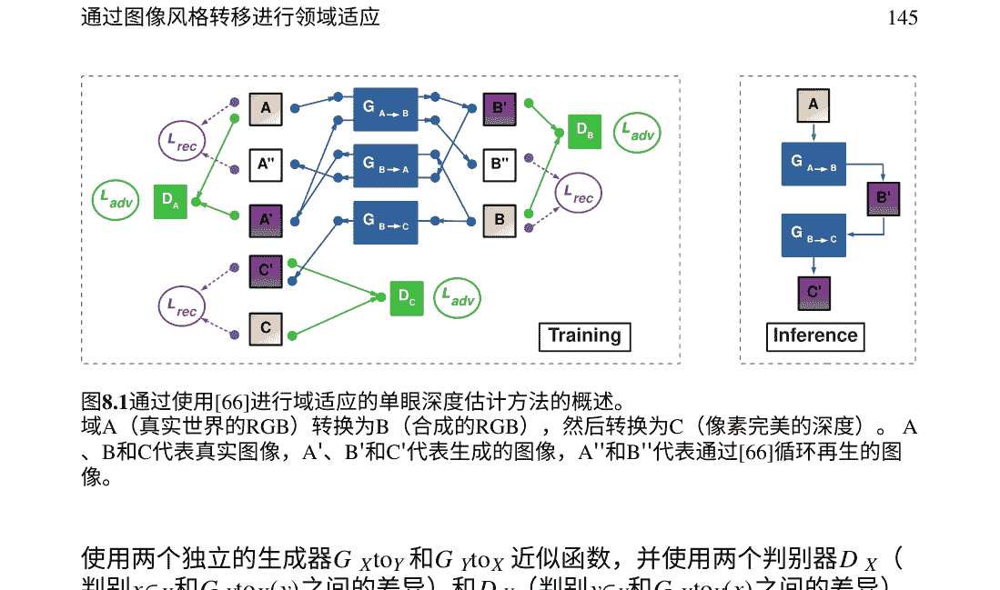

图8.1通过使用[66]进行域适应的单眼深度估计方法的概述。域A（真实世界的RGB）转换为B（合成的RGB），然后转换为C（像素完美的深度）。A、B和C代表真实图像，A'、B'和C'代表生成的图像，A''和B''代表通过[66]循环再生的图像。

使用两个独立的生成器$G_{XtoY}$和$G_{YtoX}$近似函数，并使用两个判别器$D_X$（判别$x \in X$和$G_{YtoX}(y)$之间的差异）和$D_Y$（判别$y \in Y$和$G_{XtoY}(x)$之间的差异）。损失包含两个组成部分：对抗损失[22]和循环一致性损失[66]。方法的一般流程（包括深度估计模型Sect. 8.4.1）如图8.1所示，其中包括三个生成器$G_A$、$G_{B\to A}$和$G_{B\to C}$，以及三个判别器$D_A$，$D_B$和$D_C$。

###### 8.4.2.1 损失函数

由于有两个生成器来约束图像的内容，因此有两个映射函数。使用对抗性损失函数可以保证一个域的风格被转移到另一个域。对于$G_{XtoY}$和$D_Y$的损失表示如下：

```
L_{adv-XtoY} = \min_{G_{XtoY}} \max_{D_Y} \mathbb{E}_{y \sim \mathbb{P}_d(y)} [\log D_Y(y)] + \mathbb{E}_{x \sim \mathbb{P}_d(x)} [\log(1 - D_Y(G_{XtoY}(x)))]
```

其中 $\mathbb{P}_d$是数据分布，$X$是具有样本$x$的源域，$Y$是具有样本$y$的目标域。类似地，对于$G_{YtoX}$和$D_X$，对抗性损失函数如下：

```
L_{adv-YtoX} = \min_{G_{YtoX}} \max_{D_X} \mathbb{E}_{x \sim \mathbb{P}_d(x)} [\log D_X(x)] + \mathbb{E}_{y \sim \mathbb{P}_d(y)} [\log(1 - D_X(G_{YtoX}(y)))]
```

(8.11)为了限制生成器的对抗损失，使模型能够产生与目标域相关的图像，而不是随机的语义无意义的内容，添加了一个循环一致性损失，鼓励模型能够将被翻译成目标域的图像带入 $Y$使用$G_{XtoY}$将其带回源域$X$使用$G_{YtoX}$。本质上，在完成一个完整的

循环之后：$G_{Y \to X}(G_{X \to Y}(x))=x$，反之亦然。因此，循环一致性损失如下：

```
$\mathcal{L}_{cyc}=\|G_{Y \to X}(G_{X \to Y}(x))-x\|_1+\|G_{X \to Y}(G_{Y \to X}(y))-y\|_1$
```

随后，联合损失函数如下所示：

```
$\mathcal{L}=\mathcal{L}_{adv-X \to Y}+\mathcal{L}_{adv-Y \to X}+\lambda \mathcal{L}_{cyc}$
```

其中$\lambda$是经验选择的权重系数。

###### 8.4.2.2 实现细节

生成器的架构与[29]中提出的网络类似，包括两个卷积层，后面跟着九个残差块[24]和两个上采样卷积层，将图像恢复到原始输入尺寸。至于鉴别器，使用的是与第8.4.1节中相同的架构。此外，鉴别器是基于最后50个生成器输出进行更新，而不仅仅是最后生成的图像[50, 66]。

所有技术实现都使用PyTorch[41]进行，优化使用Adam[30]（$\beta_1=0.5, \beta_2=0.999, \alpha=0.0001$）。在公式（8.13）中，整体损失函数的权重系数是经验性选择的$\lambda=10$。

#### 8.5 实验结果

为了展示将风格转移用作域适应技术来进行单眼深度估计任务的有效性，在本节中，使用消融研究和与最先进的单眼深度估计方法的定性和定量比较来评估深度估计方法。

评估使用KITTI数据集[38]和本地捕获数据。

##### 8.5.1 与当代方法的比较

为了评估第8.4节中的单眼深度估计方法的性能，并展示将风格转移用作域适应的能力，使用[17]中建议的数据分割中的697张图像作为测试集。如表8.1所示，使用合成数据训练并使用风格转移（DST）进行适应的单眼深度估计模型比直接在真实世界图像上训练的当代单眼深度估计方法[17, 21, 34, 64]表现更好。

表8.1 通过样式转换（DST）对KITTI数据集上的深度估计结果与其他方法进行比较，使用[17]中的数据分割

| 方法 | 训练数据 | 绝对相对误差 | 平方相对误差 | 均方根误差 | 对数均方根误差 | σ < 1.25 | σ < 1.25² | σ < 1.25³ |
| :--- | :--- | :--- | :--- | :--- | :--- | :--- | :--- | :--- |
| Eigen等人的粗糙K | K | 0.214 | 1.605 | 6.563 | 0.292 | 0.673 | 0.884 | 0.957 |
| Eigen等人的精细 | K | 0.203 | 1.548 | 6.307 | 0.282 | 0.702 | 0.890 | 0.958 |
| Liu等人 | K | 0.202 | 1.614 | 6.523 | 0.275 | 0.678 | 0.895 | 0.965 |
| Zhou等人 | K | 0.208 | 1.768 | 6.856 | 0.283 | 0.678 | 0.885 | 0.957 |
| Zhou等人 | K+CS | 0.198 | 1.836 | 6.565 | 0.275 | 0.718 | 0.901 | 0.960 |
| Godard等人 | K | 0.148 | 1.344 | 5.927 | 0.247 | 0.803 | 0.922 | 0.964 |
| Godard等人 | K+CS | 0.124 | 1.076 | 5.311 | 0.219 | 0.847 | 0.942 | 0.973 |
| DST方法 | K+S* | **0.110** | **0.929** | **4.726** | **0.194** | **0.923** | **0.967** | **0.984** |

对于训练数据，K代表KITTI [38]，CS代表Cityscapes [13]，S*代表从虚拟环境中捕获的合成数据。粗体数值表示最佳结果。

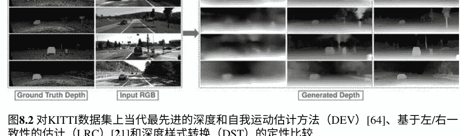

图8.2 对KITTI数据集上当代最先进的深度和自我运动估计方法（DEV）[64]、基于左/右一致性的估计（LRC）[21]和深度样式转换（DST）的定性比较

具有更低的误差和更高的准确性。一些比较器[21, 64]使用不同数据集的组合进行训练和微调以提高性能，而本文提出的方法仅依赖于合成数据进行训练。

KITTI [38]中的200张图像数据集也被用于提供更好的定性评估，因为该数据集中的地面实况视差图像质量较高，并提供了用于替代移动车辆的CAD模型。如图8.2所示，与其他在类似数据领域上训练的方法[21, 64]相比，通过样式转换进行的单目深度估计产生了更清晰、更鲜明的输出，其中物体边界和细小结构得到了更好的保留。

##### 8.5.2 消融研究

消融研究在证明方法的各个组成部分的必要性方面起着重要作用。在第8.4.1节中介绍的单目深度估计模型

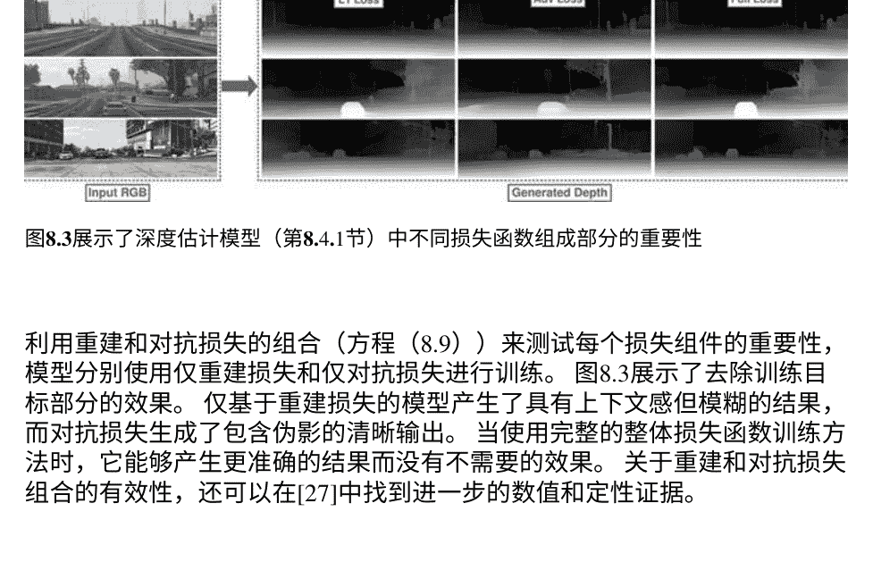

利用重建和对抗损失的组合（方程（8.9））来测试每个损失组件的重要性，模型分别使用仅重建损失和仅对抗损失进行训练。图8.3展示了去除训练目标部分的效果。仅基于重建损失的模型产生了具有上下文感但模糊的结果，而对抗损失生成了包含伪影的清晰输出。当使用完整的整体损失函数训练方法时，它能够产生更准确的结果而没有不需要的效果。关于重建和对抗损失组合的有效性，还可以在[27]中找到进一步的数值和定性证据。

消融研究的另一个重要方面是在整体流程中展示领域适应的必要性（第8.4.2节）。如表8.2所示，由于合成数据和真实数据的领域差异，直接应用于真实数据的深度估计模型无法产生理想的数值结果，这凸显了领域适应方法的重要性。类似地，图8.4定性地展示了当方法中没有使用风格转换时，生成的深度输出包含显著的不准确性和不良伪影。

尽管在第8.2节和第8.3节中简要概述了通过最小化最大均值差异与二次多项式核函数进行域适应和通过匹配格拉姆矩阵进行神经风格转移之间的联系，但本文所提出的方法并不使用传统的神经风格转移，而是需要使用对抗性鉴别器[66]来进行域适应的风格转移。

为了证明鉴别器可以通过风格转移合理地进行域适应，我们使用[29]中提出的风格转移方法进行实验，该方法通过最小化内容损失和风格损失（公式（8.3）和（8.4））改进了[20]的风格转移工作，训练一个可以将我们合成域的特定风格转移到一组特定域（真实世界图像）的生成器。图8.5显示了使用[29]的整个流程概述（以及第8.4.1节中的单目深度估计模型）。

虽然[66]能够在不同领域的两个大型集合之间转移风格，但[29]中的神经风格转移方法需要使用一个特定的图像作为目标风格图像。在这项工作中，

表8.2 使用KITTI数据集进行消融研究，使用KITTI分割

| 方法 | 训练数据 | 误差度量（越低越好） |  |  |  | 准确度度量（越高越好） |  |  |
| :--- | :--- | :--- | :--- | :--- | :--- | :--- | :--- | :--- |
|  |  | 绝对相对误差 | 平方相对误差 | 均方根误差 | 对数均方根误差 | $\sigma < 1.25$ | $\sigma < 1.25^{2}$ | $\sigma < 1.25^{3}$ |
| 无领域适应 | $\text{K}+\text{S}^{*}$ | 0.498 | 6.533 | 9.382 | 0.609 | 0.712 | 0.823 | 0.883 |
| 使用[29]的方法 | $\text{K}+\text{S}^{*}$ | 0.154 | 1.338 | 6.470 | 0.296 | 0.874 | 0.962 | 0.981 |
| 使用[66]的方法 | $\text{K}+\text{S}^{*}$ | **0.101** | **1.048** | **5.308** | **0.184** | **0.903** | **0.988** | **0.992** |

\*该方法使用KITTI（K）和合成数据（S）进行训练。当通过[66]中的技术使用风格转移进行领域适应时，该方法提供了最佳结果。粗体数值表示最佳结果。

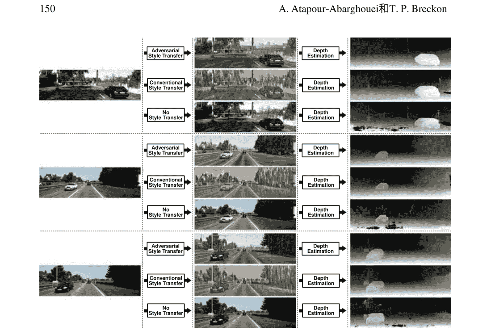

图8.4演示风格转移的重要性的示例结果。

示例包括通过循环一致对抗训练[66]进行风格转移的深度估计结果，[29]的传统风格转移方法以及没有任何风格转移的结果

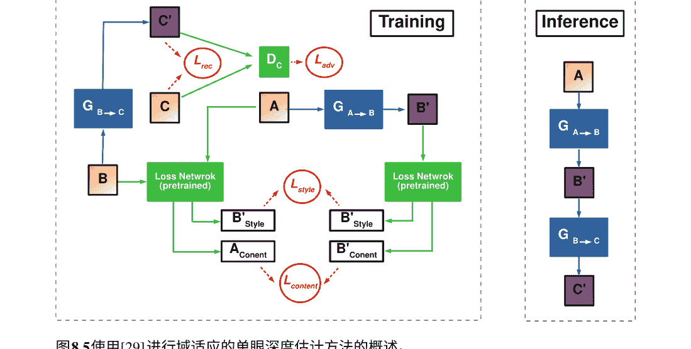

图8.5使用[29]进行域适应的单眼深度估计方法的概述。

来自域A（真实世界）的图像被转换为B（合成）然后转换为C（像素完美深度）。A、B和C表示真实图像，A'、B'和C'表示生成的图像。

目标领域包含数以万计的图像，代表着相同的样式。 因此，收集了一些包含各种对象、纹理和颜色的合成图像，以代表它们的领域，并通过从这些图像中提取特征创建了一个持有所需样式的单个图像。

为了评估该方法在通过样式转换进行领域适应方面的性能，使用了KITTI数据集[38]中的200个图像进行数据分割。 在两种样式转换技术中进行了实验除了使用真实世界的图像作为深度估计模型的直接输入之外，还使用了[66]和[29]，而没有进行任何领域适应。 如表8.2所示的结果所示，使用直接的真实世界输入而没有进行任何领域适应通过样式转换会导致输出中的显著异常，而在深度估计之前将图像转换为合成空间使用[66]会导致明显改善的结果。图8.4中提供的定性结果也指向相同的结论。

##### 8.5.3 泛化

通过风格转换使用领域适应可以使模型更加稳健，对于存在未知数据的领域转移也更不易受到影响。 考虑到单目深度估计模型（第8.4.1节）训练过程中使用的图像来自合成环境[39]，以及用于训练方法的风格转换组件（第8.4.2节）的数据来自KITTI数据集[38]，我们使用在城市环境中本地捕获的额外数据来评估方法的泛化能力。如图8.6所示，该方法能够轻松生成锐利、连贯且视觉上合理的深度图像，而无需对新数据领域的未见图像进行训练。

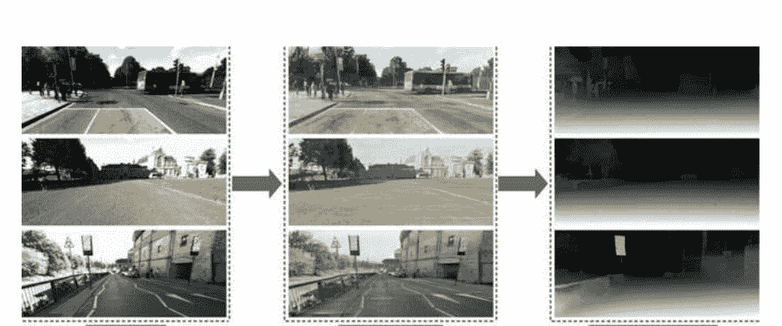

图8.6 在本地捕获的城市驾驶场景上，所提出方法的定性结果无需进一步训练

#### 8.6 限制

本章讨论的单目深度估计方法能够通过图像风格转换利用领域适应生成高质量和准确的深度，最小化异常。然而，使其能够生成高度准确的像素完美深度的方法组件，即风格转换，也可能在整个流程中带来某些缺点。最重要的问题是适应风格转换期间突然的光照变化和饱和度的问题。这里使用的两个图像领域（合成图像和真实世界图像）在照明区域和阴影之间的强度差异方面存在显著差异，这在使用不同相机在不同环境下捕获的图像中非常常见。因此，在风格转换后，阴影区域可能被错误地解释为凸起的表面或前景对象，导致对该区域的深度估计不准确。图8.7中的示例演示了此类问题可能如何产生。

此外，尽管深度图像中的空洞（缺失区域）通常被认为是不可取的[3, 4, 8, 35, 43]，但场景深度中的某些区域应该保持没有深度值（例如非常遥远的物体和天空）。然而，监督式单目深度估计方法，例如本章讨论的方法，无法区分天空和场景中其他极度饱和的物体，即使进行了风格转换，这可能导致在不应该有的地方产生小的空洞。

此外，虽然[66]中的方法已经证明在映射两组内容相似但未对齐的图像方面非常强大，但它很容易错误地合成无意义的内容。如果某个内容（场景对象、几何、结构等）在一个域的图像中常见而在另一个域中不常见，这种情况尤其容易发生。在这种情况下，[66]中的对抗性鉴别器倾向于鼓励生成器在后一个域中合成内容，以弥补整体场景内容差异引起的差异。由于域适应通过风格转换的目标是转换图像的风格而不是内容，这个问题可能导致输出中出现不需要的伪影和异常。

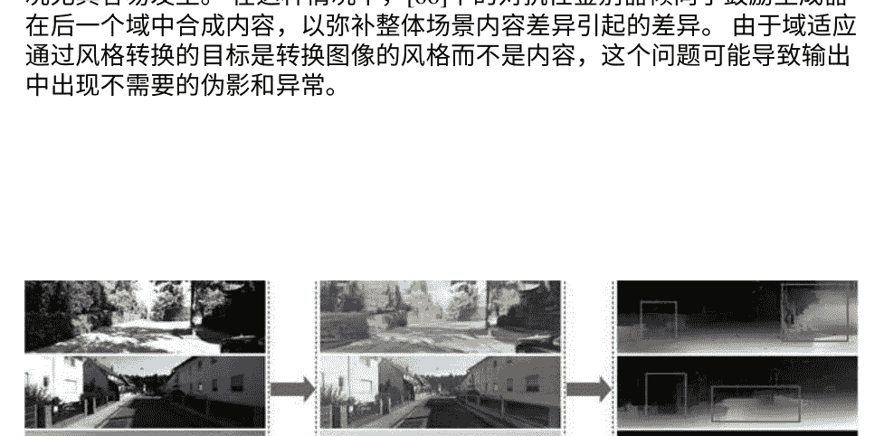

#### 8.7 结论

在本章中，我们主要关注展示图像风格转移作为计算机视觉应用中的领域适应技术的可行性。领域适应方法的目标是将在一个特定领域上训练的模型适应于在不同领域中的以前未见过的数据。在这方面，我们选择了单目深度估计问题作为我们的实验对象，因为直接监督的单目深度估计方法所需的大量地面真实深度数据非常昂贵且难以获得，因此对领域适应的需求更大。

利用从专为游戏应用程序设计的图形渲染的城市环境中捕获的像素完美的合成深度数据，可以以直接监督的方式训练一个有效的深度估计模型。然而，这样的模型不能指望在以前未见过的真实世界图像上表现良好，因为这两个领域（合成图像和真实世界图像）所属的数据分布差异很大。由于神经风格转移的现代进展理论上可以与最小化两个分布之间的最大均值差异（使用二阶多项式核）联系起来，我们利用对抗训练的循环一致方法来适应我们的真实世界数据以适应我们深度估计模型中生成器近似的分布。尽管存在某些孤立问题，实验评估和与当代单目深度估计方法的比较表明，风格转移确实是一种高效的领域适应方法。

### 参考文献

- 1. Abrams, A., Hawley, C., Pless, R.: 太阳位置的形状测量：来自太阳位置的形状。在：欧洲计算机视觉会议论文集，第357-370页 (2012年)
- 2. Atapour-Abarghouei, A., Akcay, S., Payen de La Garanderie, G., Breckon, T.: 通过Wasserstein度量，余弦变换和领域转换的生成对抗框架用于深度填充。模式识别 91, 232-244页 (2019年)
- 3. Atapour-Abarghouei, A., Breckon, T.: DepthComp: 基于先前语义场景分割的实时深度图像完成。在：英国机器视觉会议论文集 (2017年)
- 4. Atapour-Abarghouei, A., Breckon, T.: 在场景深度图像完成的背景下，可行的孔填充策略的比较评估。计算机图形学 72, 39-58页 (2018年)
- 5. Atapour-Abarghouei, A., Breckon, T.: 在受限的基于示例的RGB-D图像完成中，扩展的补丁优先级排序用于深度填充。在：国际图像分析和识别会议论文集，第306-314页 (2018年)
- 6. Atapour-Abarghouei, A., Breckon, T.: 通过多任务几何和语义场景理解方法实现时间一致的深度预测 (2019年)。预印本，arXiv:1903.10764
- 7. Atapour-Abarghouei, A., Breckon, T.P.: 利用图像风格转换进行合成数据的域适应实现实时单目深度估计。在：IEEE计算机视觉和模式识别会议论文集，pp. 2800-2810 (2018年)。

8. Atapour-Abarghouei, A., Payen de La Garanderie, G., Breckon, T.: 基于巴特沃斯 - 一种用于RGB-D图像中三维表面凹陷填充的傅里叶基础。在：国际模式识别会议论文集，pp. 2813-2818。IEEE，Piscataway (2016)。

9. Badrinarayanan, V., Kendall, A., Cipolla, R.: SegNet：一种用于图像分割的深度卷积编码器-解码器架构。IEEE Trans. Pattern Anal. Mach. Intell. 39(12), 2481–2495 (2017)

10. Cavestany, P., Rodriguez, A., Martinez-Barbera, H., Breckon, T.: 改进的3D稀疏地图，用于低成本全向机器人的高性能结构运动。在：Proc. Int. Conf. Image Processing, pp. 4927–4931 (2015)

11. Chen, T.Q., Schmidt, M.: 任意风格的快速基于补丁的风格转移。在：构造性机器学习研讨会，pp. 1–5 (2016)

12. Chen, W., Fu, Z., Yang, D., Deng, J.: 野外单幅图像深度感知。在：神经信息处理系统的进展，pp. 730–738 (2016)

13. Cordts, M., Omran, M., Ramos, S., Rehfeld, T., Enzweiler, M., Benenson, R., Franke, U., Roth, S., Schiele, B.: 用于语义城市场景理解的Cityscapes数据集。在：IEEE计算机视觉和模式识别会议论文集，第3213-3223页（2016年）

14. Ding, L., Sharma, G.: 融合运动结构和LiDAR进行密集准确深度图估计。在：国际声学、语音和信号处理会议论文集，第1283-1287页。IEEE, Piscataway (2017)

15. Dosovitskiy, A., Brox, T.: 基于深度网络的感知相似度度量生成图像。在：神经信息处理系统进展，第658-666页（2016年）

16. Eigen, D., Fergus, R.: 用共同的多尺度卷积架构预测深度、表面法线和语义标签。在：国际计算机视觉会议论文集，第2650-2658页（2015年）

17. Eigen, D., Puhrsch, C., Fergus, R.: 使用多尺度深度网络从单张图像预测深度图。在：神经信息处理系统进展，第2366-2374页（2014年）

18. Gaidon, A., Wang, Q., Cabon, Y., Vig, E.: 虚拟世界作为多目标跟踪分析的代理。在：IEEE计算机视觉和模式识别会议论文集，第4340-4349页（2016年）

19. Garg, R., Carneiro, G., Reid, I.: 无监督的单视图深度估计的卷积神经网络：几何拯救。在：欧洲计算机视觉会议论文集，第740-756页。Springer，柏林（2016年）

20. Gatys, L.A., Ecker, A.S., Bethge, M.: 使用卷积神经网络进行图像风格转移。在：IEEE计算机视觉和模式识别会议论文集，第2414-2423页（2016年）

21. Godard, C., Mac Aodha, O., Brostow, G.J.: 无监督的单目深度估计与左右一致性。在：IEEE计算机视觉和模式识别会议论文集，第6602-6611页（2017年）

22. Goodfellow, I., Pouget-Abadie, J., Mirza, M., Xu, B., Warde-Farley, D., Ozair, S., Courville, A., Bengio, Y.: 生成对抗网络。在：神经信息处理进展系统，第2672-2680页（2014年）

23. Gretton, A., Borgwardt, K.M., Rasch, M.J., Schlkopf, B., Smola, A.: 一个核心双样本测试。机器学习研究。13, 723-773页（2012年）

24. He, K., Zhang, X., Ren, S., Sun, J.: 深度残差学习用于图像识别。在：计算机视觉和模式识别会议论文集，第770-778页（2016年）

25. Hinton, G.E., Salakhutdinov, R.R.: 用神经网络降低数据的维度。科学 313(5786), 504–507 (2006)

26. Ioffe, S., Szegedy, C.: 批归一化：通过减少内部协变量转移加速深度网络训练。在：Proc. Int. Conf. Machine Learning, pp. 448–456 (2015)

27. Isola, P., Zhu, J.Y., Zhou, T., Efros, A.A.: 条件对抗网络的图像到图像翻译。在：Proc. IEEE Conf. Computer Vision and Pattern Recognition, pp.5967–5976 (2017)

28. Jing, Y., Yang, Y., Feng, Z., Ye, J., Song, M.: 神经风格转移：一篇综述 (2017). 预印本，arXiv:1705.04058

29. Johnson, J., Alahi, A., Fei-Fei, L.: 用于实时风格转移和超分辨率的感知损失。在：Proc. Euro. Conf. Computer Vision, pp. 694–711 (2016)

30. Kingma, D., Ba, J.: Adam:一种用于随机优化的方法。在：Proc. Int. Conf. Learning Representations (2014)

31. Ladicky, L., Shi, J., Pollefeys, M.: 从透视中拉出物体。在：Proc. Conf. Computer Vision and Pattern Recognition, pp. 89–96 (2014)

32. Le, T.A., Baydin, A.G., Zinkov, R., Wood, F.: 使用合成数据训练神经网络是基于模型的推理。在：Proc. Int. Joint Conf. Neural Networks, pp. 3514–3521. IEEE, Piscataway (2017)

33. Li, Y., Wang, N., Liu, J., Hou, X.: 揭秘神经风格转移。在：Proc. Int. Joint Conf. Artificial Intelligence, pp. 2230–2236. AAAI Press, Palo Alto (2017)

34. Liu, F., Shen, C., Lin, G., Reid, I.: 使用深度卷积神经场从单眼图像学习深度。IEEE Trans. Pattern Anal. Mach. Intell. 38(10), 2024-2039 (2016)

35. Liu, J., Gong, X., Liu, J.: 用于Kinect深度图的引导修复和滤波。在：Proc. Int. Conf. Pattern Recognition, pp. 2055-2058. IEEE, Piscataway (2012)

36. Liu, M.Y., Tuzel, O.: 耦合生成对抗网络。在：神经信息处理系统的进展，pp. 469-477（2016）

37. Mathieu, M., Couprie, C., LeCun, Y.: 超越均方误差的深度多尺度视频预测。在：Proc. Int. Conf. Learning Representations (2016)

38. Menze, M., Geiger, A.: 自主车辆的物体场景流。在：IEEE计算机视觉和模式识别会议论文集, pp. 3061–3070 (2015)

39. Miralles, R.: 用于自动驾驶车辆的开源开发环境。在: Universitat Oberta de Catalunya, pp. 1–31 (2017)

40. Pan, S.J., Yang, Q.: 迁移学习综述。IEEE知识与数据工程交易 22(10), 1345–1359 (2010)

41. Paszke, A., Gross, S., Chintala, S., Chanan, G., Yang, E., DeVito, Z., Lin, Z., Desmaison, A., Antiga, L., Lerer, A.: PyTorch中的自动微分。在: 神经信息处理系统进展, pp. 1–4 (2017)

42. Pathak, D., Krahenbuhl, P., Donahue, J., Darrell, T., Efros, A.A.: 上下文编码器: 通过修复学习特征。在: IEEE计算机视觉和模式识别会议论文集, pp. 2536–2544 (2016)

43. Qi, F., Han, J., Wang, P., Shi, G., Li, F.: 结构引导的深度图修复融合。模式识别通讯 34(1), 70–76 (2013)

44. Radford, A., Metz, L., Chintala, S.: 无监督表示学习与深度卷积生成对抗网络, pp. 1–16 (2015). 预印本, arXiv:1511.06434

45. Ronneberger, O., Fischer, P., Brox, T.: U-net: 用于生物医学图像分割的卷积网络。在: 国际医学图像计算与计算机辅助干预会议论文集, pp. 234–241. Springer, Berlin (2015)

46. Rosales, R., Achan, K., Frey, B.J.: 无监督图像转换。在：国际会议论文集 计算机视觉，第472-478页（2003年）

47. Scharstein, D., Szeliski, R.: 密集两帧立体对应算法的分类和评估。计算机视觉国际杂志 47 (1-3), 7-42页（2002年）

48. Schwerdtfeger, H.: 线性代数和矩阵理论导论。P. Noordhoff, 格罗宁根（1950年）

49. Shah, S., Dey, D., Lovett, C., Kapoor, A.: AirSim: 用于自动驾驶车辆的高保真视觉和物理仿真。在：田野和服务机器人学，第621-635页（2017年）

50. Shrivastava, A., Pfister, T., Tuzel, O., Susskind, J., Wang, W., Webb, R.: 通过对抗训练从模拟和无监督图像中学习。在：IEEE计算机视觉和模式识别会议论文集，第2242-2251页（2017年）

51. Simonyan, K., Zisserman, A.: 非常深的卷积网络用于大规模图像识别。在：国际学习表示会议论文集，第1-14页（2015年）

52. Tao, M.W., Srinivasan, P.P., Malik, J., Rusinkiewicz, S., Ramamoorthi, R.: 利用光场角度相干性进行阴影、散焦和对应关系的深度估计。在：IEEE计算机视觉和模式识别会议论文集，第1940-1948页（2015年）

53. Tolstikhin, I.O., Sriperumbudur, B.K., Scholkopf, B.: 利用径向核的最大均值差异的极小极大估计。在：神经信息处理系统进展，第1930-1938页（2016年）

54. Ulyanov, D., Lebedev, V., Vedaldi, A., Lempitsky, V.S.: 纹理网络：纹理和风格化图像的前馈合成。在：国际机器学习会议论文集，第1349-1357页（2016年）

55. Walker, J., Marino, K., Gupta, A., Herbert, M.: 姿势知道：通过生成姿势未来进行视频预测。在：国际计算机视觉会议论文集，第3352-3361页。IEEE，Piscataway（2017）

56. Wang, F., Huang, Q., Guibas, L.J.: 通过一致的功能映射进行图像共分割。在：国际计算机视觉会议论文集，第849-856页（2013年）

57. Wang, X., Gupta, A.: 使用风格和结构对抗网络进行生成图像建模。在：欧洲计算机视觉会议论文集，第318-335页。Springer，柏林（2016年）

58. Woodham, R.J.: 从多个图像中确定表面方向的光度方法。光学工程 19（1），191139（1980年）

59. Xie, J., Girshick, R., Farhadi, A.: Deep3D: 使用深度卷积神经网络进行全自动2D到3D视频转换。在：欧洲计算机视觉会议论文集，第842-857页。Springer，柏林（2016年）

60. Yang, C., Lu, X., Lin, Z., Shechtman, E., Wang, O., Li, H.: 使用多尺度神经补丁合成的高分辨率图像修复。在：IEEE计算机视觉和模式识别会议论文集，第4076-4084页（2017年）

61. Yeh, R.A., Chen, C., Lin, T.Y., Schwing, A.G., Hays, J., Efros, A.A.: 基于深度生成模型的语义图像修复。在：IEEE计算机视觉和模式识别会议论文集，第6882-6890页（2017年）

62. Yi, Z., Zhang, H., Gong, P.T.: DualGAN: 无监督的图像到图像转换的双重学习。在：国际计算机视觉会议论文集，第2868-2876页（2017年）

63. Yu, J., Lin, Z., Yang, J., Shen, X., Lu, X., Huang, T.S.: 具有上下文关注的生成图像修复。在: IEEE计算机视觉和模式识别会议论文集, pp. 1–15 (2018)

64. Zhou, T., Brown, M., Snavely, N., Lowe, D.G.: 从视频中无监督学习深度和自我运动。在: 计算机视觉和模式识别会议论文集, pp. 6612–6619 (2017)

65. Zhou, T., Krahenbuhl, P., Aubry, M., Huang, Q., Efros, A.A.: 通过3D引导的循环一致性学习密集对应关系。在: IEEE计算机视觉和模式识别会议论文集, pp. 117–126 (2016)

66. Zhu, J.Y., Park, T., Isola, P., Efros, A.A.: 使用循环一致性对抗网络进行非配对图像转换。在: 国际计算机视觉会议论文集, pp. 2242–2251 (2017)

67. Zhuo, W., Salzmann, M., He, X., Liu, M.: 单张图像深度估计的室内场景结构分析。在: IEEE计算机视觉和模式识别会议论文集, pp. 614–622 (2015)

## 领域适应的未来方向

## 第9章 通过领域适应实现具有噪声标签的可扩展图像分类器学习

李光辉，何晓东，杨林军和张磊

#### 9.1 背景

推动最近大规模图像识别进展的关键因素之一是像ImageNet [6]和MSCOCO [19]这样的大规模标记图像集合。然而，收集大规模手动标记的数据集通常是昂贵且耗时的。对于细粒度识别在利基领域中，数据收集可能更具挑战性，因为有时需要招募一支领域专家团队来标记数据[2, 22, 39, 44]。

实际上，为了快速开发图像识别模型，通常使用替代品，例如

- 带有用户提供标签的网络图像。例如，YFCC100M数据集[34]是从Flickr收集的，用户为上传的图像提供文本标签。用户提供的标签通常是嘈杂的。
- 使用图像搜索引擎爬取的网络图像，使用固定的词汇集作为搜索查询，每个查询与一个图像类别相关联，例如使用Google和Flickr图像搜索爬取的WebVision数据集[17]，使用从1000个ILSVRC同义词集合[6]生成的搜索查询；Krause等人[12]使用Google图像搜索获得了用于几个细粒度识别任务的训练图像和标签。
- 机器生成的图像标签，例如OpenImages数据集[14]最初是使用Google Cloud Vision API对一组无注释的Flickr图像进行标注而创建的。

这些方法易于扩展，但不可避免地引入了噪声标签和领域转移（也可以视为标签噪声）。许多研究表明，噪声标签会显著影响识别器的准确性[7,24,27,31]，因此有必要开发在存在噪声标签的情况下进行学习的算法。

#### 9.2 可扩展性与人类监督效果之间的冲突

我们可以将先前为具有噪声标签的学习提出的方法大致分为是否涉及人类工作（或其他高准确度监督信号）。涉及人类的最简单方法是让标注工作者查看整个数据集（例如从互联网上爬取的图像）并删除错误标记的实例。一个著名的例子是ImageNet数据集[6]。一些大规模训练数据，如LSUN数据集[46]和Places数据集[47]，是使用图像分类算法与人类结合进行半自动标记的方式构建的，从而增加了人类的工作量。例如，在LSUN工作流程中，对于每个类别的类别标签验证过程被视为一个二元分类问题，即为每个特定类别收集的每个图像都被标记为正面或负面。为每个图像类别学习一个二元分类器，使用一小组手动判断的种子图像，在完整的未验证池上运行以预测图像是否被错误标记。另一方面，一些用于具有噪声标签的卷积神经网络（CNN）的学习的研究也依赖于手动标记来估计标签混淆并随后进行修正[25,43]。这些方法在可扩展性方面都存在劣势，因为它们需要为每个图像类别进行人工标注。对于具有数十万个甚至更多类别的分类任务（也称为极端分类任务）[5,8,41]，每个类别甚至一个手动注释几乎是不可行的。

相比之下，不依赖人力的方法，如基于模型预测的过滤[7]和无监督异常值去除[20,30,42]，虽然可扩展性强，但往往效果较差且更加启发式，因为缺乏可靠的监督。例如，无监督异常值去除假设异常值是错误标记的实例。然而，在实践中，异常值往往没有明确定义，甚至与错误标记无关（例如，罕见的实例，甚至可能对模型学习有价值）。去除它们是一个挑战[7]。

| 作者 | 机构 |
| --- | --- |
| K.-H. Lee (✉) | Microsoft AI和研究，Redmond, WA, 美国<br>Google Brain, San Francisco, CA, 美国 |
| X. He | 京东AI研究，中国北京<br>电子邮件：xiaodong.he@jd.com |
| L. Yang | Facebook, 西雅图, WA, 美国 |
| L. Zhang | Microsoft Research, Redmond, WA, 美国<br>电子邮件：leizhang@microsoft.com |

采用这些方法中的任何一种，要么全部类别要么不需要手动验证，导致可扩展性与人工监督的有效性之间存在冲突。

## 通过领域适应在规模上解决噪声标签问题

通过放宽人工标注的要求，迁移学习解决了冲突。在学习具有噪声标签的分类器的迁移学习设置中，只需要对某些类进行手动标注，而没有人工监督的类依赖于领域适应。

为了简单起见，考虑多类别分类设置。假设我们有一个包含$n$个图像的数据集，即$X = \{(x_1, y_1), ..., (x_n, y_n)\}$，其中$x_i$是第$i$个图像，$y_i \in \{1, ..., L\}$是其类别标签，$L$是总类别数。类别标签存在噪声，这意味着一些图像与其类别标签不相关。

每个图像及其类别标签都由一个验证标签标记，定义为

```
$$l = \begin{cases} 1 & \text{如果图像对于其类别标签是正确的} \\ 0 & \text{如果图像对于其类别标签是错误的} \\ -1 & \text{如果图像未经验证} \end{cases} \qquad \qquad (9.1)$$
```

手动标记过程以获得有效的验证标签被称为验证。实质上，每个图像现在与两个标签相关联：一个类别标签和一个验证标签。为了方便起见，我们将$l = -1$称为验证标签不可用，并且在术语上交替使用“标签”和“类别标签”。

为了最小化人力努力，大多数图像保持未验证（它们的验证标签为 $-1$），并且许多类别可能没有任何经过验证的数据。目标是开发出从某些图像类别获得的验证标签学习的模型，并将模型适应于没有人工监督的其他类别。这将有效解决使用人工监督处理嘈杂标签的可扩展性问题。

#### 9.4 清洁网络

清洁网络（标签清洗网络）[16]是第一个实际实现具有噪声标签的学习分类器的模型。它受到一个观察的影响，即许多处理噪声标签的方法明确或隐含地创建类原型来有效地表示图像类别。
方法从手动验证的种子图像[46, 47]中学习，方法假设大多数正确性，如[1]，属于这个类别。CleanNet从迁移学习的角度扩展了创建类原型的思想-它学习从人工监督中选择具有代表性的种子图像，并将“如何选择”的知识转移到没有人工监督信号的类别中。

CleanNet通过两个步骤处理噪声标签：（1）区分噪声标签和（2）根据图像被错误标记的可能性加权学习图像分类器。在第9.4.1节中，我们详细介绍了CleanNet模型架构和学习目标。在第9.4.2节和第9.4.3节中，我们描述了如何将CleanNet应用于识别噪声标签和学习具有噪声标签的图像分类器，分别。

##### 9.4.1 清洁网络模型

###### 9.4.1.1 概述

CleanNet的整体架构如图9.1所示。它是一个联合神经嵌入网络，由两部分组成：一个参考集编码器和一个查询编码器。

参考集编码器 $f_s(\cdot)$ (详见第9.4.1.2节) 以表示一个类的参考图像集作为输入。参考集图像通过在噪声数据上预训练的CNN $f_v(\cdot)$ 转换为特征向量。参考集编码器学习在噪声参考图像集上关注代表性图像特征，并将它们融合成类别级别的嵌入向量（类别嵌入）。

在实践中，将参考集中的所有图像作为参考集编码器的输入可能会计算上昂贵。考虑一个类别 $c$ 的参考集。一个实用的替代方法是对参考集中所有图像的特征运行 K均值聚类，然后形成一个较小的“参考特征集”，表示为 $V_c^s$。然后从参考特征集创建类别嵌入：

```
ϕ_c^s = f_s(V_c^s) (9.2)
```

CleanNet的另一个组成部分是查询编码器 $f_q(\cdot)$ (详细说明见第9.4.1.3节)。让 $q$ 表示标记为类 $c$ 的查询图像。与参考图像类似，查询图像也使用相同的预训练CNN转换为特征向量：

> 参考图像集是与图像类相关联的一组嘈杂图像。例如，假设“狗”是一个分类任务中的类标签，从互联网上获取的“狗”图像可以用作其参考集。对于CleanNet，为每个类创建一个参考集作为其“参考”。请注意，参考集没有人工监督。

```
$v^q = f_v(q)$ (9.3)
```

查询编码器 $f_q(\cdot)$ 然后将查询图像特征 $v^q$ 映射到查询嵌入：

$\phi^q = f_q(v^q)$ (9.4)

查询嵌入 $\phi^q$ 和类别嵌入 $\phi^s$ 受到匹配约束的限制，其中如果查询$q$与其类别标签$c$相关，则鼓励 $\phi^q$ 接近相应的类别嵌入 $\phi^s_c$；否则，两个嵌入向量之间的相似性被最小化。换句话说，我们通过比较查询嵌入向量和相应的类别嵌入向量来决定查询图像是否被错误标记。正如描述所示，这种匹配约束主要受到验证标签的监督驱动（见第9.4.1.4节和第9.4.1.5节）。

###### 9.4.1.2 参考集编码器

参考集编码器的架构如图9.2所示。如前所述，它将一个类别为 $c$ 的参考特征集 $V_c$ 映射到一个类别嵌入向量 $\phi_c^s$。一个两层的多层感知器（MLP）将每个参考特征投影到一个隐藏表示 $h_i$。然后，一个点积注意力机制[21]根据它们的重要性差异性选择隐藏表示，并将它们融合成一个固定长度的表示 $h$：

```
u_i = \tanh(W h_i + b)                     (9.5)
α_i = e^{u_i^T u} / \sum_i \exp(u_i^T u)    (9.6)
h = \sum_i α_i h_i                          (9.7)
```

如公式 (9.7) 所示，每个隐藏表示 $h_i$ 的重要性是通过 $u_i$ 和上下文向量 $u$ 之间的相似度来衡量的。上下文向量 $u$ 在训练过程中是随机初始化并学习的。受匹配约束的驱动（在第9.4.1.4节和第9.4.1.5节中详细介绍），这个注意力机制学习如何专注于最具代表性的类别特征。最后，一个全连接层将表示 $h$ 映射到表示类别的类别级嵌入 $\phi_c^s$。参考集编码器的参数，包括上下文向量 $u$，在所有类别之间是绑定的，以实现知识传递。

###### 9.4.1.3 查询编码器

CleanNet的查询编码器是一个五层自编码器[10]，如图9.1所示。一个典型的自编码器通常由对称的编码器-解码器架构组成。它将输入向量压缩成一个紧凑的表示，然后通过无监督的重构损失来寻求重构原始输入。自编码器通过将所有类别的所有图像都纳入训练中，包括大多数没有验证标签的图像，从而有助于学习过程。通过将重构损失与匹配约束一起使用，鼓励查询嵌入保留所有图像类别的丰富语义信息，无论是否存在监督，从而提高了迁移学习的性能。

给定一个查询图像特征向量 $v^{q}$，自编码器将 $v^{q}$ 映射到一个隐藏表示 $\phi^{q}$，并试图从 $\phi^{q}$ 重构 $v^{q}$。重构损失的定义如下

```
$$L_{r}(v^{q}) = ||v^{q} - r(v^{q})||^2 \tag{9.8}$$
```

其中 $r(v^{q})$ 是重建表示。

###### 9.4.1.4 监督匹配约束

匹配约束主要受到验证标签的监督驱动。对于与类别标签 $c$ 相关联的已验证查询图像，如果查询图像与类别 $c$ 相关（验证标签 $l = 1$），则最大化相应类别嵌入 $\phi_{c}^{s}$ 和查询嵌入 $\phi^{q}$ 之间的相似度；否则最小化相似度 ($l = 0$)。CleanNet采用带有边界的余弦相似度损失来施加这个约束：

```
$$L_{cos}(\phi^{q}, \phi_{c}^{s}, l) = \begin{cases} 1 - \cos(\phi^{q}, \phi_{c}^{s}) & \text{如果 } l = 1 \\ \omega(max(0, \cos(\phi^{q}, \phi_{c}^{s}) - \rho)) & \text{如果 } l = 0 \\ 0 & \text{如果} l = -1 \end{cases} \tag{9.9}$$
```

其中 $\omega$ 是用于平衡正负样本的负样本权重，$\rho$ 是边界，cos是归一化余弦相似度函数：

```
$$\cos(\phi^{q}, \phi_{c}^{s}) = \frac{\phi^{q} \cdot \phi_{c}^{s}}{||\phi^{q}||\ ||\phi_{c}^{s}||} \tag{9.10}$$
```

未经验证的图像 ($l = -1$) 在公式 (9.9) 中被忽略，因为这个监督目标只考虑具有验证标签的查询图像。

###### 9.4.1.5 基于自训练的无监督匹配约束

在适应图像类别的领域转移中处理领域偏移，而不需要明确的监督，依赖于无监督的自训练目标，该目标为未验证的图像引入了伪验证标签。具体来说，如果$\cos(\phi^{q}，\phi_{c}^{s})$大于边界$\rho$，则将具有类别标签$c$的未验证图像视为相关的查询图像：

```
$$L_{cos}^{无监督}(\phi^{q}, \phi_{c}^{s})=\begin{cases}1-\cos(\phi^{q}, \phi_{c}^{s})&\text{if }l_{pseudo}=1\\0&\text{如果 }l_{pseudo}=0\end{cases}\quad (9.11)$$

$$l_{pseudo}=\begin{cases}1&\text{如果 }\cos(\phi^{q}, \phi_{c}^{s})\geq\rho \\0&\text{否则}\end{cases}\quad (9.12)$$
```

其中$\rho$与第(9.9)式中的边界相同。从第(9.11)式和第(9.12)式可以观察到，对于最初被视为相关的查询，模型学习进一步提高查询和参考集之间的相似度；对于最初被视为不相关的查询，则被忽略。

自训练[23, 45]是一种简单而有效的半监督学习和无监督领域适应方法。顾名思义，它利用模型对未标记数据的预测作为监督的代理，就像我们在第(9.11)式和第(9.12)式中所做的那样。通常，最有信心的预测被视为伪标签。

自我训练在无监督领域适应[26, 29, 36]以及计算机视觉[28]和自然语言处理[11, 32, 38]等许多其他任务中表现出了不同的成功。李[15]认为，使用伪标签训练分类器的效果等同于熵正则化。虽然公式(9.11)不是熵的形式，但将其纳入训练损失仍然隐式地最小化了熵，特别是对于目标域（没有人类监督信号的类别），它减少了模型预测的不确定性。

###### 9.4.1.6 完整的学习目标

总结训练目标，CleanNet通过最小化以下损失函数进行学习，该函数结合了监督匹配约束、无监督重构损失和基于自我训练的无监督匹配约束：

```
$$L_{total}=L_{cos}+\beta L_{r}+t\gamma L_{cos}^{unsup}\quad (9.13)$$

$$t=\begin{cases}1&\text{如果 }l=-1 \\0&\text{如果 }l\in\{0, 1\}\end{cases}\quad (9.14)$$
```

其中 $\beta$ 和 $\gamma$ 是无监督重构损失和无监督匹配约束的系数，而 $t$ 表示查询图像是否具有验证标签。通常选择 $\gamma$ 小于1以强调监督匹配约束。

##### 9.4.2 CleanNet用于检测标签噪声

从相关性的角度来看，CleanNet可以通过余弦相似度$\cos(\phi^q, \phi_c^s)$对收集到的所有属于一个类别的图像进行排序，该相似度表示查询图像与其类别标签之间的相关性。我们可以简单地在余弦相似度上设置一个阈值，以预测图像是否与其类别标签相关，即预测验证标签，用于标签噪声检测：

```
\hat{l} = \begin{cases} 1 & \text{如果 } \cos(\phi^q, \phi_c^s) \geq \delta \\ 0 & \text{否则} \end{cases} (9.15)
```

其中 $\delta$ 是通过交叉验证选择的阈值。

图9.3比较了CleanNet与其他基准方法在Food-101N数据集[16]上的标签噪声检测结果。Food-101N是一个用于标签噪声检测和学习带有噪声标签的图像分类的基准数据集。它包含从Google图像搜索、Bing图像搜索、Yelp和TripAdvisor收集的310,009个带有噪声的图像，使用了Food-101数据集[3]的分类法。训练集中有52,868个带有验证标签的图像，用于测试标签噪声检测的47,414个带有验证标签的图像。每个类别包含大约相同数量的验证标签。在Food-101N上训练的图像分类器在原始Food-101测试集上进行评估。

图9.3a比较了CleanNet、MLPs [46]和分类过滤[35]的标签噪声检测结果。具体而言，图9.3a中的CleanNet结果基于在所有类别中使用验证标签来提供人工监督。MLPs是针对每个类别训练的二元分类器，作为一种基准方法，它使用人工监督。分类过滤是一种弱监督方法，作为一种基准方法，不需要额外的人工监督²：使用在嘈杂数据上预训练的图像分类器，如果类别在前K个预测中（K通过交叉验证选择）则将图像归类为与其类别标签相关，否则将其归类为标签错误。结果表明，当所有类别都提供人工监督时，CleanNet与MLPs相当。

通过在一些类别的CleanNet训练中排除验证标签，我们可以证明知识传递的有效性。图9.3b显示了如何

> ²如[16]所报道，分类过滤是不需要额外人工监督的基线方法中最好的方法，包括各种无监督的异常值去除方法。

在学习CleanNet时，标签噪声检测的平均错误率随着验证标签在$m/101$个类别中的保留而改变，其中CleanNet的平均错误率仅在保留的类别上进行评估，以便专注于衡量知识传递的有效性。将CleanNet与MLPs和分类过滤进行比较，评估其在学习CleanNet时保留的类别上的平均错误率。请注意，MLPs仍然可以访问所有的验证标签，以便我们了解如果所有的验证标签对于一个简单的基线方法是可用的情况。可以观察到，在排除70个类别的情况下，CleanNet在保留的类别上与MLPs相当。

##### 9.4.3 用于学习带有噪声标签的分类器的CleanNet

现在我们考虑将CleanNet应用于学习带有噪声标签的分类器。CleanNet通过比较图像的查询嵌入和类别嵌入来预测图像与其噪声类别标签的相关性。也就是说，两者之间的距离

在训练图像分类器时，可以使用两个嵌入来决定我们应该对数据样本给予多少关注。

具体而言，数据样本的权重是基于CleanNet预测的余弦相似度进行加权：

```
w_{soft}(x, y) = \left[ max(0, \cos(f_q(f_v(x)), f_s(V_c^s)) \right]_{y=c}
```

其中 $V_c^s$ 是类别 $c$ 对应的参考特征集。方程 (9.16) 定义了对具有类别标签 $y = c$ 的图像 $x$ 进行软加权。类似地，我们还可以进行硬加权：

```
w_{hard}(x, y) = \begin{cases} 1 & \text{如果 } [\cos(f_q(f_v(x)), f_s(V_c^s))]_{y=c} \geq \delta \\ 0 & \text{否则} \end{cases}
```

其中 $\delta$ 是一个阈值，如公式 (9.15) 所示。本质上，硬加权等同于显式标签噪声去除。根据Lee等人的实验结果[16]，软加权更有效，因此我们专注于使用软加权。

分类学习目标定义为加权交叉熵损失：

```
L_{加权} = \sum_{i=0}^{n} \left[ w_{软}(x_i, y_i, V_{y_i}^s) l(x_i, y_i) \right]
```

其中 $l(x_i, y_i)$ 是训练样本 $x_i$ 的负对数似然，具有类别标签 $y_i$ ：

```
l(x_i, y_i) = -log \hat{p}_{\theta}(y_i | x_i)
```

学习图像分类器依赖于CleanNet为数据样本分配适当的权重。另一方面，更好的CNN分类器提供更具有区分性的图像表示，这对于CleanNet的学习至关重要。为了利用这种互利关系，可以将CleanNet与CNN分类器集成到一个框架中，并通过以下替代步骤进行学习：

- 步骤1：在所有样本权重设置为1的噪声数据上训练CNN分类器，直到收敛。
- 步骤2：修复CNN参数并使用它提取图像特征进行学习 CleanNet，并训练CleanNet直到收敛。
- 步骤3：修复CleanNet参数并使用它对训练样本进行加权，并训练CNN分类器直到收敛。

可以交替进行学习CleanNet和CNN分类器的步骤2和3，直到两个模型都停止改进。

图9.4展示了使用ResNet-50 [9]进行图像分类准确率的变化，在保留$m/101$个类别的验证标签的情况下。与直接在嘈杂的数据上学习分类器相比，使用CleanNet显著改善了结果，即使在训练中排除了70/101类别的验证标签。

#### 9.5 超越眼界

CleanNet标志着在具有噪声标签的图像分类器的迁移学习范式方面的当前进展。成功适应无明确人工监督的类别主要归功于自训练策略（部分归功于自编码器）。也就是说，尽管参考集编码器可以在推理时接受代表类别的任何参考集作为输入，但它对于在训练时未见过且未通过无监督目标学习的类别的泛化能力不强。因此，一旦训练完成，CleanNet受到预定义类别集的限制。如何消除这个限制仍然是一个未解决的问题。

在训练时适应未见过的类别的能力有益于（1）减少开发新分类模型的开销，以及（2）实现在训练时无法预测和包含新的图像类别的场景，例如在图像搜索结果中过滤噪声图像（图像搜索查询可以被视为定义一个图像类别，但搜索查询是无限的）。另一方面，CleanNet被开发为一种神经联合嵌入网络，将参考集和查询映射到联合语义嵌入空间中的表示。学习CleanNet被制定为一个度量学习问题。

如第9.4节所述，联合语义嵌入空间中的距离已经被使用通过阈值化来识别噪声标签和加权分类训练样本。与度量学习相比，使用具有概率预测的判别模型（例如[37]）在具有概率解释方面具有优势。基于概率预测的噪声标签识别或加权训练样本可能更具可解释性，并且可以与统计先验和更复杂的概率形式相结合。

最后，本章讨论的迁移学习范式不仅限于多类图像分类任务。推广到多标签分类是直接的，因为它不要求一幅图像只与一个标签相关联。只要提供适当的表示，本章讨论的设置和方法也适用于分类任务。

#### 9.6 相关工作

在本章的最后部分，我们简要讨论了关于检测数据中错误标记实例和使用有噪声标签的分类器学习的相关工作。其中一些在前面的章节中已经提到过。

##### 9.6.1 检测数据中的错误标记实例

如第9.4节所述，CleanNet属于通过两个步骤解决分类器学习中的噪声标签问题的方法类别：首先区分错误标记实例，然后对训练分类模型时的错误标记实例进行降权或移除。在这个类别中，一种流行的方法是无监督的异常检测和移除（例如，One-Class SVM [30]， UOCL [20]和DRAE [42]），假设异常值是错误标记实例。然而，正如在第9.1节中讨论的那样，异常值通常没有明确定义。这个基本假设通常不成立，因此去除它们是一个挑战[7]。另一种不需要人工努力的方法是弱监督标签噪声降低[7]。例如，Thongkam等人[35]提出了一种从有噪声数据中学习SVM并移除SVM误分类实例的分类过滤方法。弱监督方法通常是启发式的，没有可靠的监督效果较差。另一方面，学习从人工监督中检测标签噪声已经被广泛研究用于数据集构建。

例如，Yu等人[46]提出了在手动标记的种子图像上训练MLP，并使用它们来去除错误标记的图像。类似地，Places数据集[47]是使用在手动验证的种子图像上训练的AlexNet[13]创建的。然而，使用人工监督的方法在可扩展性方面存在劣势，因为它们需要对所有图像类别进行人工监督。这引发了我们在本章讨论的迁移学习设置的动机。

##### 9.6.2 使用标签噪声端到端学习图像分类器

一些方法被开发用于学习具有标签噪声的神经网络端到端[1, 4, 18, 25, 27, 31, 33, 40, 43, 48]，包括那些依赖于人工监督的所有类别和那些不需要人工标注的方法。这些方法再次面临着效果和可扩展性之间的冲突。

一组作品，例如Xiao等人的方法[43]和Patrini等人的方法[25]，提出使用在手动标记的种子图像上估计的混淆矩阵来处理噪声标签。在这种标记过程中，种子图像除了有噪声类别标签外，还会被增加手动分配的类别标签。与我们在第9.3节介绍的验证不同，这是文献中另一种处理噪声标签的人工标记方法，我们称之为纠正。

然而，与验证相比，它有两个主要限制。首先，对于涉及大量类别标签的分类任务，手动选择图像的正确类别标签比仅仅验证噪声类别标签是否相关要困难得多。将纠正标签的标记工作扩展到大量类别是实际上不可行的。此外，如何将标签纠正扩展到多标签分类并不清楚，因为它要求图像与一个真实类别标签相关联。

### 参考文献

- 1. Azadi, S., Feng, J., Jegelka, S., Darrell, T.: 辅助图像正则化用于具有噪声标签的深度CNN。在：国际学习表示会议（2016）
- 2. Bejnordi, B.E., Veta, M., Van Diest, P.J., Van Ginneken, B., Karssemeijer, N., Litjens, G., VanDer Laak, J.A., Hermsen, M., Manson, Q.F., Balkenhol, M., 等：对乳腺癌女性淋巴结转移检测的深度学习算法进行诊断评估。Jama 318（22），2199-2210（2017）
- 3. Bossard, L., Guillaumin, M., Van Gool, L.: Food-101-使用随机森林挖掘具有区分性的组件。在：欧洲计算机视觉会议（2014）
- 4. Chen, X., Gupta, A.: 卷积网络的网络监督学习。在：国际计算机视觉会议（2015年）
- 5. Dean, T., Ruzon, M.A., Segal, M., Shlens, J., Vijayanarasimhan, S., Yagnik, J.: 在单台机器上快速、准确地检测100,000个对象类别。在：IEEE计算机视觉和模式识别会议论文集（2013年）
- 6. Deng, J., Dong, W., Socher, R., Li, L.J., Li, K., Fei-Fei, L.: ImageNet：一个大规模的分层图像数据库。在：2009年IEEE计算机视觉和模式识别会议（2009年）
- 7. Frénay, B., Verleysen, M.: 在标签噪声存在的情况下的分类研究。IEEE Trans. Neur. Net. Lear. Sys. 25(5), 845–869 (2014)
- 8. Frome, A., Corrado, G.S., Shlens, J., Bengio, S., Dean, J., Mikolov, T., 等：Devise：一种深度视觉语义嵌入模型。在：神经信息处理系统会议（2013年）
- 9. He, K., Zhang, X., Ren, S., Sun, J.: 深度残差学习用于图像识别。在：IEEE计算机视觉和模式识别会议论文集（2016年）
- 10. Hinton, G.E., Salakhutdinov, R.R.: 用神经网络降低数据的维度。科学 313(5786), 504–507 (2006)
- 11. Huang, Z., Harper, M.: 跨语言自训练PCFG语法与潜在注释。在：2009年经验方法在自然语言处理中的会议论文集 (2009)
- 12. Krause, J., Sapp, B., Howard, A., Zhou, H., Toshev, A., Duerig, T., Philbin, J., Fei-Fei, L.: 嘈杂数据对细粒度识别的非常有效性。在：欧洲计算机视觉会议 (2016)
- 13. Krizhevsky, A., Sutskever, I., Hinton, G.E.: 使用深度卷积神经网络的ImageNet分类。在：神经信息处理系统的进展 (2012)
- 14. Kuznetsova, A., Rom, H., Alldrin, N., Uijlings, J., Krasin, I., Pont-Tuset, J., Kamali, S., Popov, S., Malloci, M., Duerig, T., Ferrari, V.: 开放图像数据集v4：规模化的图像分类、目标检测和视觉关系检测 (2018)。arXiv:1811.00982
- 15. Lee, D.H.: 伪标签：深度神经网络的简单高效的半监督学习方法。在：ICML的表示学习挑战研讨会 (2013)
- 16. Lee, K.H., He, X., Zhang, L., Yang, L.: CleanNet：用于可扩展图像分类器训练的迁移学习与标签噪声。在：IEEE计算机视觉和模式识别会议论文集 (2018)
- 17. Li, W., Wang, L., Li, W., Agustsson, E., Van Gool, L.: Webvision数据库：从网络数据中进行视觉学习和理解 (2017)。预印本。arXiv:1708.02862
- 18. Li, Y., Yang, J., Song, Y., Cao, L., Luo, J., Li, J.: 通过蒸馏从嘈杂标签中学习。在：IEEE国际计算机视觉会议论文集 (2017)
- 19. Lin, T.Y., Maire, M., Belongie, S., Hays, J., Perona, P., Ramanan, D., Dollár, P., Zitnick, C.L.: Microsoft COCO：上下文中的常见对象。在：欧洲计算机视觉会议 (2014)
- 20. Liu, W., Hua, G., Smith, J.R.: 无监督的单类学习用于自动异常值去除。在：IEEE计算机视觉和模式识别会议论文集 (2014)
- 21. Luong, M.T., Pham, H., Manning, C.D.: 基于注意力的神经机器翻译的有效方法。在：自然语言处理的经验方法会议 (2015)
- 22. Maji, S., Rahtu, E., Kannala, J., Blaschko, M., Vedaldi, A.: 精细化的飞机视觉分类 (2013)。预印本。arXiv:1306.5151
- 23. McClosky, D., Charniak, E., Johnson, M.: 有效的自我训练用于解析。在：人类语言技术协会北美分会的主要会议论文集 (2006)
- 24. Nettleton, D.F., Orriols-Puig, A., Fornells, A.: 对不同类型噪声对监督学习技术精度的影响的研究。人工智能评论 33(4), 275–306 (2010)
- 25. Patrini, G., Rozza, A., Krishna Menon, A., Nock, R., Qu, L.: 使深度神经网络对标签噪声具有鲁棒性的损失修正方法。在：IEEE计算机视觉和模式识别会议论文集 (2017)
- 26. Reichart, R., Rappoport, A.: 自我训练以增强和适应小数据集上的统计解析器。在：第45届计算语言学协会年会论文集 (2007)
- 27. Rolnick, D., Veit, A., Belongie, S., Shavit, N.: 深度学习对大规模标签噪声具有鲁棒性 (2017)。预印本。arXiv:1705.10694
- 28. Rosenberg, C., Hebert, M., Schneiderman, H.: 半监督自我训练目标检测模型。在：IEEE计算机视觉应用研讨会 (2005)
- 29. Saito, K., Ushiku, Y., Harada, T.: 非监督领域适应的对称三训练。在：第34届国际机器学习大会论文集 (2017)
- 30. Schölkopf, B., Platt, J.C., Shawe-Taylor, J., Smola, A.J., Williamson, R.C.: 估计高维分布的支持。神经计算。13 (7), 1443-1471 (2001)
- 31. Sukhbaatar, S., Bruna, J., Paluri, M., Bourdev, L., Fergus, R.: 使用噪声标签训练卷积网络 (2014)。预印本。arXiv:1406.2080
- 32. Suzuki, J., Isozaki, H.: 使用吉卜诺字规模未标记数据的半监督序列标记和分割。在：人类语言技术主要会议北美计算语言学协会（2008年）
- 33. Tanaka, D., Ikami, D., Yamasaki, T., Aizawa, K.: 学习具有噪声标签的联合优化框架。在：IEEE计算机视觉和模式识别会议（2018年）
- 34. Thomee, B., Shamma, D.A., Friedland, G., Elizalde, B., Ni, K., Poland, D., Borth, D., Li, L.J.: YFCC100M：多媒体研究中的新数据。Commun. ACM 59（2），64-73（2016年）
- 35. Thongkam, J., Xu, G., Zhang, Y., Huang, F.：支持向量机用于异常检测乳腺癌生存预测。在：亚太网络会议，第99-109页。Springer, 柏林（2008年）
- 36. Tsai, Y.H.H., Hung, L.K., Salakhutdinov, R.: 学习鲁棒的视觉-语义嵌入. 在: 2017年IEEE国际计算机视觉会议(2017)
- 37. Tzeng, E., Hoffman, J., Saenko, K., Darrell, T.: 对抗性判别领域适应. 在: 2017年IEEE计算机视觉和模式识别会议论文集
- 38. Van Asch, V., Daelemans, W.: 预测自我训练的有效性: 应用于情感分类 (2016). 预印本. arXiv:1601.03288
- 39. Van Horn, G., Branson, S., Farrell, R., Haber, S., Barry, J., Ipeirotis, P., Perona, P., Belongie, S.: 构建一个鸟类识别应用和大规模数据集与公民科学家: 精细数据集收集中的细节. 在: 2015年IEEE计算机视觉和模式识别会议论文集
- 40. Veit, A., Alldrin, N., Chechik, G., Krasin, I., Gupta, A., Belongie, S.: 从带有最小监督的嘈杂大规模数据集中学习。 在： IEEE计算机视觉和模式识别会议论文集 (2017年)
- 41. Weston, J., Bengio, S., Usunier, N.: Wsabie: 扩展到大词汇图像注释。 在： 第二十二届国际人工智能联合会议 (2011年)
- 42. Xia, Y., Cao, X., Wen, F., Hua, G., Sun, J.: 学习用于无监督异常值去除的判别重构。 在： IEEE国际计算机视觉会议论文集 (2015年)
- 43. Xiao, T., Xia, T., Yang, Y., Huang, C., Wang, X.: 从大规模嘈杂标记数据中学习图像分类。 在： IEEE计算机视觉和模式识别会议论文集 (2015年)
- 44. Yan, K., Wang, X., Lu, L., Summers, R.M.: DeepLesion: 自动挖掘大规模病变注释和深度学习的通用病变检测。 J. Med. Imag. 5(3), 1-11-11 (2018). https://doi.org/10.1117/1.JMI.5.3.036501
- 45. Yarowsky, D.: 无监督的词义消歧方法与监督方法相媲美。 在: 第33届计算语言学协会年会 (1995)
- 46. Yu, F., Seff, A., Zhang, Y., Song, S., Funkhouser, T., Xiao, J.: LSUN: 使用深度学习和人类参与构建的大规模图像数据集 (2015)。 预印本. arXiv:1506.03365
- 47. Zhou, B., Lapedriza, A., Khosla, A., Oliva, A., Torralba, A.: Places: 一个包含1000万图像的场景识别数据库。IEEE Trans. Pattern Anal. Mach. Intell. 40, 1452-1464 (2017)
- 48. Zhuang, B., Liu, L., Li, Y., Shen, C., Reid, I.: 集体参与: 一种基于弱监督深度学习框架从网络数据中学习的方法。 在: IEEE计算机视觉与模式识别会议论文集 (2017)

## 第10章 用于开放集领域适应的对抗学习方法

Kuniaki Saito，Shohei Yamamoto，Yoshitaka Ushiku和Tatsuya Harada

#### 10.1 引言

深度神经网络已经提高了许多图像识别任务的性能[19]。其中一个挑战是，基本上，如果它们的类别在训练过程中不存在，它们无法将样本识别为未知。我们将这样的类别定义为“未知类别”，并且在训练过程中显示的类别被称为“已知类别”。如果这些样本可以被识别为未知，我们可以整理嘈杂的数据集并从中挑选出感兴趣的样本。此外，如果一些在开放世界中工作的系统能够识别未知对象并要求人类对其进行注释，这些系统可以轻松提高其识别能力。出于这些原因，开放集识别是非常重要的任务。

在领域适应中，我们尝试从标签丰富的领域（源领域）训练模型，并将其应用于标签贫乏的领域（目标领域）。不同领域的示例具有不同的特征，这可能会损害模型的性能。许多领域适应方法是基于这样一个假设提出的，即目标领域中的示例应该属于图10.1左上角的某个类别。然而，这个假设并不总是成立。让我们来看看无监督领域适应的问题，其中我们只有无标签的目标示例。我们无法确定目标样本是否必然属于源领域中的类别，因为它们没有被注释。目标领域可能包含源领域中没有显示的类别的样本（开放集领域适应），或者目标领域可能没有源域中存在的类别（部分域适应）。在这种情况下表现良好的算法非常实用。为了解决这个问题，最近引入了任务，即开放集域适应[4]，其中目标域具有不属于源域类别的样本，如图10.1左下所示。此外，还提出了一种称为部分域适应的任务[5, 41]，其中源域具有目标域中缺失的类别，如图10.1右上所示。在本章中，我们主要关注开放集域适应问题。本章部分基于[31]的早期工作。

解决开放集域适应问题需要将未知目标样本识别为“未知”，并将已知目标样本正确分类到已知类别中。他们[4]利用未知源样本获取有关未知示例的知识。然而，拥有未知源样本可能是昂贵的，因为需要收集各种各样的未知源样本来获得“未知”的概念。因此，在本章中，我们介绍了一种更具挑战性的开放集域适应（OSDA），它不需要任何未知源样本来训练模型。也就是说，我们可以访问已知源示例和未标记的目标示例，用于开放集域适应，如图10.1右下所示。

解决这个具有挑战性的问题主要有两个问题。首先，很难划定已知类别和未知类别之间的的边界，因为我们没有任何已标记的未知示例。第二个问题是领域的差异。为了正确地将已知目标分类到已知类别中，我们需要在源和目标之间执行分布匹配。然而，我们应该将未知目标样本与已知源示例保持远离。先前的分布匹配方法是为了将目标的分布与源的分布匹配。然而，这种方法不能用于我们的问题。在OSDA中，有必要拒绝未知的目标样本，而不是将它们与源样本对齐。

作为解决这个问题的一种方法的一个例子，我们介绍了一种对抗学习的方法，鼓励特征提取器将目标样本分类为已知或未知。图10.2中呈现了与先前方法的比较。与现有的特征对齐方法不同，该方法能够高准确度地拒绝未知的目标样本，并将已知的目标样本与已知的源样本对齐。这种方法中有两个角色，即特征提取器和分类器。特征提取器从输入图像中输出特征，分类器接收这些特征并输出$K+1$维的概率向量，其中$K$是已知类别的数量。第$K+1$维表示未知类别的概率。分类器在源样本和目标样本之间建立决策边界，而特征提取器则被训练为将目标样本远离边界。具体而言，分类器被训练为输出未知类别的概率$t$，其中$0 < t < 1$。通过弱化训练分类器以将所有目标样本识别为未知类别，建立了未知样本的决策边界。特征提取器以对抗的方式欺骗分类器进行训练。特征提取器在这里有两个选择，即增加或减少概率$t$。这意味着特征生成器有两个选项：将它们与源示例对齐或将它们识别为未知。

本章的概述如下。

- 1. 我们解释了关于开放集领域适应和部分领域适应的最新研究概述。
- 2. 我们介绍了未知源样本不提供的开放集领域适应。
- 3. 我们介绍了一种用于解决该问题的对抗学习方法。该方法使特征生成器能够学习能够将未知目标样本与已知样本分开的表示。该方法称为OSBP。我们展示了对OSBP的一些评估，该评估是针对数字和物体数据集进行的。

#### 10.2 相关工作

在本节中，我们简要介绍了闭域适应、部分领域适应和开放集识别的方法。

##### 10.2.1 闭域适应

图像识别的领域适应引起了人们的关注，可以在不同领域之间传递知识，并减少给大量图像标注的成本。提供了基准数据集[28]，并且已经提出了许多无监督领域适应和半监督领域适应的方法[8, 10–12, 22, 23, 29, 34]。如前几节所讨论的，无监督和半监督领域适应是针对数据集中不同领域共享类别的的情况提出的，这在某些情况下可能不实际。

代表性的方法之一是基于分布匹配的方法[3, 8, 22, 30, 37]。每个领域都有其自己的特征，这可能会影响在每个领域上训练的模型的性能。因此，他们的目标是通过匹配特征的分布来获得域不变的特征。这种技术广泛应用于各种视觉领域适应任务[6, 8, 15, 32]。这些方法的代表与生成对抗网络（GAN）[13]类似。他们训练一个鉴别器来判断输入图像是假的还是真实的，而图像生成器则被训练来欺骗鉴别器。在领域适应中，类似于GAN，域分类器被训练来识别中间层的特征是来自目标域还是源域，而特征提取器被训练来欺骗它。已经提出了许多生成模型的变体和扩展[2, 3, 21, 36, 38]。

最大均值差异（MMD）[14]也是一种衡量领域之间差异的流行方法。该距离被用于训练领域不变的有效模型，并提出了其变体[22–24, 39]。这些方法在开放集领域适应上表现不佳。如果应用于目标样本，包括未知类别的样本，都应与源样本对齐。这使得识别未知目标样本变得困难。

相比之下，我们在本章介绍的方法能够识别未知目标样本，即使在训练过程中没有提供任何标记的未知目标样本。我们将与上述分布匹配方法进行比较。该方法利用分布匹配技术实现开放集识别。然而，该方法允许特征提取器将某些目标样本拒绝为未知。

##### 10.2.2 部分领域适应

Cao等人[5]和Zhang等人[41]提出了一个称为部分领域适应的任务。与传统的封闭领域适应不同，目标领域没有源领域中存在的类别。由于我们不知道目标示例的标签，这种设置也是现实的。该设置的概述如图10.1所示。这种设置的困难在于，如果我们试图完全匹配分布，目标示例可能与目标中不存在的源类别对齐。因此，两种方法都提出了利用基于对抗学习的领域分类器和重要性加权。他们的想法是，与目标示例相似的源示例应该属于共享类别。仅关注这些示例应该能够在部分领域适应设置中实现更好的特征对齐。部分领域适应的困难在于如何找到目标中不存在的源类别，而OSDA的困难在于如何找到不应与源示例对齐的目标示例。尽管我们在本章中没有提出部分领域适应的方法，但这种设置对于许多应用来说是现实和重要的。此外，部分领域适应中使用的方法对于OSDA也可能有用，反之亦然。

##### 10.2.3 开放集识别

许多方法已被提出来在测试期间检测异常值并正确分类内部值。Jain等人提出了多类开放集SVM[17]。他们通过训练可以给出概率决策分数的SVM来拒绝未知样本。他们的目标是通过阈值概率值来拒绝未知样本。此外，还提出了一种利用深度神经网络进行开放集识别的方法[1]。提出了OpenMax层，它考虑了输入来自未知类的概率。此外，为了以无监督的方式对未知样本进行监督，提出了生成未知示例的方法[9]。该方法使用GAN仅通过观察已知示例生成未知样本，并将其用于训练模型，然后应用OpenMax层。这些方法定义了一个阈值来拒绝未知样本，以在测试期间识别未知样本。

在本章中，我们介绍了一种在领域适应设置中尝试解决开放集识别问题的方法。目标域中已知样本的分布与源域中的样本不同，这与一般的开放集识别不同，使任务更加困难。

#### 10.3 方法

首先，我们提供一个概述，然后解释训练过程。模型的概述如图10.3所示。

##### 10.3.1 问题设置和关键思想

假设有一个源图像 $x_s$ 和标签 $y_s$ 来自源数据集 $\{X_s, Y_s\}$，以及一个来自未标记目标数据集 $X_t$ 的未标记目标图像 $x_t$。源图像仅来自已知类别，而目标图像可以来自未知类别。在这种方法中，我们训练一个特征提取器 $G$，它接受输入 $x_s$ 或 $x_t$，并且一个网络 $C$，它从 $G$ 获取特征并将其分类为 $K +1$ 个类别，其中 $K$ 是已知类别的数量。总结一下，$C$ 对每个样本输出一个 $K +1$ 维的逻辑向量 $\{l_1, l_2, l_3 ... l_{K+1}\}$。

我们使用softmax层将logits转换为类别概率。即，给定输入 $x$，$x$ 被分类为类别 $j$ 的概率表示为 $p(y = j|x) = \frac{\exp(l_j)}{\sum_{k=1}^{K+1} \exp(l_k)}$。在K维空间中，已知类别的概率表示为已知类别的概率，而 $K +1$ 维空间表示未知类别的概率。我们使用符号 $p(y|x)$ 来表示输入 $x$ 的 $K +1$ 维概率输出。

将已知目标样本正确分类到相应的已知类别，并将未知目标样本识别为未知类别是该方法的目标。尽管没有关于未知类别的任何信息，但有必要为未知类别建立决策边界。然后，该方法利用伪决策边界来处理未知类别，通过弱训练一个分类器将目标样本分类为未知类别。然后，特征提取器试图欺骗分类器。重要的是，特征提取需要使未知目标样本与已知目标样本远离。如果一个分类器被训练成输出 $p(y = K + 1|x_t) = 1.0$ 并且特征提取器试图欺骗它，那么特征提取器的目标将是完全匹配目标分布与源分布。因此，特征提取器只会降低未知类别的概率。这种方法被应用于训练半监督学习的生成对抗网络[33]，并且预计对无监督领域适应有用。然而，它不能直接应用于将未知样本与已知样本分开。

然后，该方法尝试训练分类器输出 $p(y = K + 1|x_t) = t$，其中 $0 < t < 1$，并训练特征提取器欺骗分类器。特征提取器的目标是最大化分类器的损失。为了增加损失，特征提取器可以选择增加未知类别的概率，这意味着将样本分类为未知。例如，考虑当 $t$ 是一个非常小的值时，特征提取器应该更容易增加未知类别的概率，而不是减少它以增加分类器的损失。同样，特征提取器可以选择减少它，使得 $p(y = K + 1|x_t)$ 低于 $t$，这意味着样本与源对齐。

总结一下，特征提取器可以选择是否将目标样本与源样本匹配，或者将其拒绝为未知样本。在所有实验中，$t$ 的值设置为0.5。如果 $t$ 大于0.5，则样本必定被识别为未知类别。因此，假设这个值（$t=0.5$）可以作为已知和未知之间的良好决策边界。在实验中，当这个值变化时，行为分析被展示出来。

##### 10.3.2 训练过程

首先，分类器和生成器都应该被训练以正确分类源样本。为此，使用标准的交叉熵损失函数。

$$L(x, y) = -\log(p(y=y|x)) \quad (10.1)$$
$$p(y=y|x) = (C \circ G(x))_y \quad (10.2)$$

为了为未知类别建立分类器的边界，应用了二元交叉熵损失。

$$L_{adv}(x_t) = -t \log(p(y = K + 1|x_t)) - (1 - t) \log(1 - p(y = K + 1|x_t)) \quad (10.3)$$

其中 $t$ 被设为0.5。总体目标是，

$$\min_{C} L_s(x_s, y_s) + L_{adv}(x_t) \quad (10.4)$$
$$\min_{G} L_s(x_s, y_s) - L_{adv}(x_t) \quad (10.5)$$

### 算法2 方法的小批量训练

- 对于训练迭代次数 do
- 采样大小为 $m$ 的源样本小批量 $\{\{x_s, y_s\}^{(1)}, ..., \{x_s, y_s\}^{(m)}\}$ 从 $\{X_s, Y_s\}$ 中
- 从 $X_t$ 中取样 $m$ 个目标样本 $\{x_t^{(1)}, ..., x_t^{(m)}\}$
- 通过交叉熵损失计算 $L_s(x_s, y_s)$，并通过公式10.3计算 $L_{adv}(x_t)$。
- 根据公式10.4和10.5更新 $G$ 和 $C$ 的参数。这里使用了梯度反转层。
- 结束循环

分类器试图使 $p(y = K + 1 | x_t)$ 的值等于 $t$，而特征提取器则试图增加 $L_{adv}(x_t)$ 的值。这意味着特征提取器试图使 $p(y = K + 1 | x_t)$ 的值与 $t$ 不同。为了高效计算 $L_{adv}(x_t)$ 的梯度，使用了梯度反转层[8]。该层在反向传播过程中翻转梯度的符号，用于对抗损失。通过这个层，我们可以通过一次反向传播来更新分类器和生成器的参数。算法2总结了该算法。

#### 10.4 实验

我们展示了在Office [28]、VisDA [27]和digits数据集上的实验结果。

##### 10.4.1 实现细节

我们使用在ImageNet [7]上预训练的AlexNet [19]和VGGNet [35]来训练分类器和特征提取器。在Office和VisDA数据集上的实验中，网络的参数没有被更新。在FC8层之后构建了具有100个隐藏单元的全连接层。使用了批归一化[16]和Leakly-ReLU层。使用学习率为 $1.0 \times 10^{-3}$ 和动量为0.9的动量随机梯度下降（Momentum SGD）进行训练。

实施了三个基准模型。第一个是开放集支持向量机（OSVM）[17]。OSVM使用阈值来识别未知样本。如果对于任何类别，预测的概率低于阈值，则该样本应该是未知的。首先只使用源样本训练CNN，然后将其用作特征提取器。提取特征来训练OSVM。OSVM在训练过程中不使用任何未知样本。因此，我们只使用源样本来训练OSVM，并在目标样本上进行测试。第二个基准模型是使用最大均值差异（MMD）[22]和OSVM训练的神经网络的组合。MMD用于测量无监督领域适应中不同领域之间的距离。为了适应开放集识别，我们使用最大均值差异（MMD）和训练网络进行训练，使用从网络中提取的特征来训练OSVM。与现有的分布匹配方法相比，通过与这个基准线进行比较，可以看出引入的方法的不同之处。最终的基准线是基于领域分类器的组合方法，BP [8]和OSVM。BP是一种流行的领域适应的分布匹配方法。与MMD类似，我们首先使用BP训练了一个网络，并提取特征来训练OSVM。我们使用相同的网络架构来训练这些基准模型。每种方法的实验重复了3次，并报告了平均分数。为了简单起见，我们将我们引入的方法称为OSBP。

##### 10.4.2 Office上的实验

###### 10.4.2.1 11类分类

首先，我们按照Busto和Gall [4]提出的设置，展示了使用Office数据集的结果。该数据集有31个类别，其中10个类别被选为共享已知类别。这些类别在Caltech数据集[11]中也是常见的。按字母顺序，21-31类被选为目标中的未知样本。在这个实验中，模型必须正确地将目标域中的样本分类为10个共享类别或未知类别。因此，进行了11类分类。表中的OS表示所有类别的平均准确率。我们还展示了在目标域的已知类别上测量的准确率（OS*）。

根据[4]，我们展示了在OS和OS*中类别平均准确率。我们还将该方法与[4]提出的方法进行了比较。他们的方法是针对源域中存在未知样本的情况提出的。然而，当源域中不存在未知样本时，他们也使用了OSVM来适应他们的方法。为了更好地理解方法的性能，我们还展示了在训练过程中利用未知源样本的结果，作为一些基准方法。这些数字引用自[4]。

结果在表10.1中呈现。与基准方法相比，OSBP在几乎所有场景中都表现出更好的性能。对于OSVM，OS的准确率在许多情况下优于OS*，这表明许多已知目标样本被视为未知。这是因为OSVM被设计用于检测异常值，并且很可能将目标样本分类为未知，因为它们的特征与源样本不同。通过比较OSVM和MMD+OSVM的性能，我们可以看到使用MMD并不总是提升性能。未知目标样本的存在对正确的特征对齐造成了伤害。使用t-SNE [25]在图10.4中可视化了特征。由于网络是使用源样本训练的，特征对已知类别具有区分性。我们可以观察到该方法将未知目标样本与已知样本分开，而MMD和BP则不会。

### 表10.1 在10个共享类别情况下的准确率（%）

| 方法 | A-D OS | A-D OS* | A-W OS | A-W OS* | D-A OS | D-A OS* | D-W OS | D-W OS* | W-A OS | W-A OS* | W-D OS | W-D OS* | 平均 OS | 平均 OS* |
| :--- | :---: | :---: | :---: | :---: | :---: | :---: | :---: | :---: | :---: | :---: | :---: | :---: | :---: | :---: |
| **具有未知类别的源域方法 (AlexNet)** | | | | | | | | | | | | | | |
| BP [8] | 78.3 | 77.3 | 75.9 | 73.8 | 57.6 | 54.1 | 89.8 | 88.9 | 64.0 | 61.8 | 98.7 | 98.0 | 77.4 | 75.7 |
| ATI-λ [4] | 79.8 | 79.2 | 77.6 | 76.5 | 71.3 | 70.0 | 93.5 | 93.2 | 76.7 | 76.5 | 98.3 | 99.2 | 82.9 | 82.4 |
| **没有未知类别的源域方法 (AlexNet)** | | | | | | | | | | | | | | |
| OSVM | 59.6 | 59.1 | 57.1 | 55.0 | 14.3 | 5.9 | 44.1 | 39.3 | 13.0 | 4.5 | 62.5 | 59.2 | 40.6 | 37.1 |
| MMD + OSVM | 47.8 | 44.3 | 41.5 | 36.2 | 9.9 | 0.9 | 34.4 | 28.4 | 11.5 | 2.7 | 62.0 | 58.5 | 34.5 | 28.5 |
| BP + OSVM | 40.8 | 35.6 | 31.0 | 24.3 | 10.4 | 1.5 | 33.6 | 27.3 | 11.5 | 2.7 | 49.7 | 44.8 | 29.5 | 22.7 |
| ATI-λ [4] + OSVM | 72.0 | - | 65.3 | - | 66.4 | - | 82.2 | - | 71.6 | - | 92.7 | - | 75.0 | - |
| 我们的方法 | 76.6 | 76.4 | 70.1 | 69.1 | 62.5 | 62.3 | 94.4 | 94.6 | 82.3 | 82.2 | 96.8 | 96.9 | 80.4 | 80.2 |
| **没有未知类别的源域方法 (VGGNet)** | | | | | | | | | | | | | | |
| OSVM | 82.1 | 83.9 | 75.9 | 75.8 | 38.0 | 33.1 | 57.8 | 54.4 | 54.5 | 50.7 | 83.6 | 83.3 | 65.3 | 63.5 |
| MMD + OSVM | 84.4 | 85.8 | 75.6 | 75.7 | 41.3 | 35.9 | 61.9 | 58.7 | 50.1 | 45.6 | 84.3 | 83.4 | 66.3 | 64.2 |
| BP + OSVM | 83.1 | 84.7 | 76.3 | 76.1 | 41.6 | 36.5 | 61.1 | 57.7 | 53.7 | 49.9 | 82.9 | 82.0 | 66.4 | 64.5 |
| 我们的方法 | 85.8 | 85.8 | 76.9 | 76.6 | 89.4 | 91.5 | 96.0 | 96.6 | 83.4 | 83.1 | 97.1 | 97.3 | 88.0 | 88.5 |

A、D和W分别对应亚马逊、DSLR和网络摄像头

未知样本数量和准确性我们展示了当目标样本数量在从数码单反相机到亚马逊的适应中变化时的准确性。未知目标样本是从亚马逊随机选择的，并且未知样本的比率是变化的。 OS的准确性在图10.5a中呈现。当比率变化时，OSBP似乎表现良好。t的值我们还观察到当在等式10.3中的 t的值变化时，模型的行为也会改变。 正如我们在方法部分中提到的，如果 t被设为1，特征提取器的目标是完全匹配目标特征的整个分布与源特征的分布相同，这与其他分布匹配方法完全相同。 因此，在这种情况下，准确性应该下降。根据图10.5 b，随着 t的增加，OS和OS*的准确性下降，整体准确性提高。 这个结果表明，模型没有学习到有效区分未知示例和已知示例的表示。

未知类别的概率在图10.5c和d中，展示了从网络摄像头到DSLR的适应过程中未知类别的频率图。在训练开始时，图10.5c中，大多数样本包括已知和未知样本的概率都很低。如图10.5d所示，许多未知样本具有较高的未知类别概率，而许多已知样本则没有。经过500个时期后，样本对于未知类别的概率较低。 我们可以观察到，在训练过程中，未知样本和已知样本被分开。

###### 10.4.2.2 21类分类

此外，我们将展示数据集具有更多类别时的结果。除了之前实验中使用的10个已知类别外，还添加了10个之前设置中未使用的类别的样本。 这10个类别在源域中被用作未知类别[4]。 总结一下，在这个设置中，我们进行了21类分类实验。 我们还评估了VGG网络上的OSBP。关于其他细节，我们遵循了之前实验的协议。

结果在表10.2中描述。OSBP相对于基线的优越性是明显的。 在这种情况下，MMD和BP的有效性也没有观察到。 从亚马逊到网络摄像头（A-W）的适应结果表明，其他方法的准确性优于基于OS*和OS的我们的方法。 然而，它们的“ALL”得分比OSBP差得多。“ALL”表示对所有样本进行测量的准确性，而不是对类别进行平均。 因此，结果表明现有方法倾向于将目标样本识别为已知类别之一。 从结果中可以验证OSBP的有效性，当类别数量增加时。

##### 10.4.3 在VisDA数据集上的实验

在本节中，我们将介绍在从合成到真实数据集的适应中对OSBP的评估。 VisDA数据集[27]总共有12个类别。 源域图像是通过渲染3D合成模型收集而来，而目标域则包含真实图像。 选择了6个类别（自行车、公共汽车、汽车、摩托车、火车和卡车），其他6个类别被定义为未知类别（飞机、马、刀、人、植物和滑板）。 网络的训练过程与在Office上的实验中使用的相同。

结果呈现在表10.3中。OSBP在大多数指标上表现更好比其他基准线。 Avg显示了所有类别的平均准确率。 Avgknown表示仅针对已知类别的平均准确率。 在两个评估指标中，OSBP表现出更好的性能，这表明OSBP在对齐已知类别分布和拒绝未知类别方面更好。

我们进一步在表10.4中展示了OSBP的图像和预测示例。我们同时展示了失败案例和成功案例。 正如我们所观察到的，大多数图像都有多个类别的对象或者对象有些被遮挡。 在最左边的第二列中，这些图像被分类为摩托车，尽管它们实际上不是。

### 表10.2 在Office数据集上的实验准确率（%）在20个共享类别的情况下

| 方法        | A-D 操作系统       | A-D 操作系统*      | A-D 全部  | A-W 操作系统       | A-W 操作系统*      | A-W 全部  | D-A 操作系统       | D-A 操作系统*      | D-A 全部  | W-A 操作系统       | W-A 操作系统*      | W-A 全部  | W-D 操作系统       | W-D 操作系统*      | W-D 全部  | D-W 操作系统       | D-W 操作系统*      | D-W 全部  |
|-------------|--------------------|--------------------|-----------|--------------------|--------------------|-----------|--------------------|--------------------|-----------|--------------------|--------------------|-----------|--------------------|--------------------|-----------|--------------------|--------------------|-----------|
| OSVM        | 73.6 ± 0.4         | 75.8 ± 0.6         | 72.0 ± 0.5| 57.6               | 71.2 ± 0.9         | 54.9      | 44.9 ± 0.1         | 30.9 ± 0.6         | 49.9 ± 0.1| 34.0 ± 0.9         | 31.8 ± 1.3         | 48.3      | 82.9 ± 2.3         | 82.9 ± 1.7         | 48.3      | 61.9 ± 1.2         | 61.7               | 69.9      |
| MMD + OSVM  | 72.1 ± 0.9         | 73.9 ± 1.0         | 69.1 ± 0.8| 57.8               | 70.9 ± 0.4         | 57.6      | 29.8 ± 0.6         | 30.9 ± 0.2         | 26.5 ± 0.6| 39.7 ± 2.1         | 37.1 ± 2.4         | 55.9      | 84.5 ± 1.2         | 84.2 ± 1.3         | 55.9      | 56.6 ± 0.6         | 58.9               | 68.8      |
| BP + OSVM   | 70.4 ± 0.2         | 72.1 ± 0.3         | 70.9 ± 0.5| 57.1               | 66.1 ± 3.7         | 59.7      | 30.9 ± 0.2         | 64.6 ± 1.2         | 27.6 ± 0.2| 40.0 ± 2.7         | 37.4 ± 3.0         | 56.0      | 83.5 ± 0.8         | 83.1 ± 0.8         | 56.0      | 61.7 ± 3.0         | 59.8               | 71.3      |
| 我们的方法  | 74.8 ± 0.5         | 74.6 ± 0.5         | 66.8 ± 3.5| 73.9               | （图片中未完全显示）| （图片中未完全显示）| 64.6 ± 1.2         | （图片中未完全显示）| （图片中未完全显示）| 65.9 ± 0.1         | 65.3 ± 0.2         | 69.0      | 92.8 ± 0.2         | 93.3 ± 0.2         | 69.0      | 82.5 ± 0.6         | 74.7               | 84.9      |
| 平均        |                    |                    |           |                    |                    |           |                    |                    |           |                    |                    |           |                    |                    |           |                    |                    |           |

我们使用VGG网络来获得结果。

### 表10.3 在VisDA数据集上的准确率（%）

| 方法 | Bcycle | 公共汽车 | 汽车 | Mcycle | 火车 | 卡车 | 未知 | 平均 | 已知平均 |
|------|--------|----------|------|--------|------|------|------|------|----------|
| AlexNet | | | | | | | | | |
| OSVM | 4.8 | 45.0 | 44.2 | 43.5 | 59.0 | 10.5 | 57.4 | 37.8 | 34.5 |
| OSVM+MMD | 0.2 | 30.9 | 49.1 | 54.8 | 56.1 | 8.1 | 61.3 | 37.2 | 33.2 |
| OSVM+BP | 9.1 | 50.5 | 53.9 | 79.8 | 69.0 | 8.1 | 42.5 | 44.7 | 45.1 |
| 我们的方法 | 48.0 | 67.4 | 39.2 | 80.2 | 69.4 | 24.9 | 80.3 | 58.5 | 54.8 |
| VGGNet | | | | | | | | | |
| OSVM | 31.7 | 51.6 | 66.5 | 70.4 | 88.5 | 20.8 | 38.0 | 52.5 | 54.9 |
| OSVM+MMD | 39.0 | 50.1 | 64.2 | 79.9 | 86.6 | 16.3 | 44.8 | 54.4 | 56.0 |
| OSVM+BP | 31.8 | 56.6 | 71.7 | 77.4 | 87.0 | 22.3 | 41.9 | 55.5 | 57.8 |
| 我们的方法 | 53.6 | 72.0 | 49.1 | 80.8 | 81.9 | 29.4 | 89.7 | 65.2 | 61.1 |

每个类别的准确率如下所示。

### 表10.4 VisDA数据集上的识别结果示例

| Known → Unknown × | Unknown → Known × | Known → Known √ | Unknown → Unknown √ |
|-------------------|-------------------|-----------------|---------------------|
| Train → Unknown<br>Image: Train classified as Unknown | Unknown → Motorcycle<br>Image: Unknown object classified as Motorcycle | Truck → Truck<br>Image: Truck correctly classified | Unknown → Unknown<br>Image: Unknown object correctly classified |
| Motorcycle → Unknown<br>Image: Motorcycle classified as Unknown | Unknown → Motorcycle<br>Image: Unknown object classified as Motorcycle | Bicycle → Bicycle<br>Image: Bicycle correctly classified | Unknown → Unknown<br>Image: Unknown object correctly classified |
| Car → Unknown<br>Image: Car classified as Unknown | Unknown → Motorcycle<br>Image: Unknown object classified as Motorcycle | Motorcycle → Motorcycle<br>Image: Motorcycle correctly classified | Unknown → Unknown<br>Image: Unknown object correctly classified |

未知人们经常出现在摩托车的图像中，人和马的外观与这些摩托车图像具有相似的特征。在第三列和第四列中，我们展示了成功的案例。如果只有一个对象出现，大多数情况下分类是成功的。

##### 10.4.4 数字数据集上的实验

我们进一步展示了OSBP在数字数据集上的评估。我们使用了三个数字数据集，SVHN [26], USPS [20]和MNIST。在这个评估中，我们总共进行了3个场景，即从SVHN到MNIST的适应，从USPS到MNIST的适应和从MNIST到USPS的适应。这些是评估无监督领域适应方法的常见场景。选择了0到4的数字作为已知类别，而其他数字则选择为未知。在这个实验中，OSBP与两个基准进行了比较，即OSVM，MMD与OSVM相结合，以及BP与OSVM相结合。关于OSVM，我们首先用源已知样本训练网络，并使用网络提取特征，然后使用这些特征来训练OSVM。在训练网络时，我们使用了Adam [18]，学习率为2.0 × 10^{-5}。

从SVHN到MNIST的适应在这种情况下，使用所有数字在0到4范围内的SVHN训练样本来训练网络。关于目标样本，利用MNIST训练集中的所有样本。

USPS和MNIST之间的适应当将数据集用作源域时，使用所有数字从0到4的训练样本。至于目标数据集，我们使用了所有的训练样本。

结果结果在表10.5中呈现。OSBP的表现优于其他基线。特别是对于USPS和MNIST之间的适应，OSBP实现了非常准确的识别。相比之下，SVHN和MNIST之间的适应性性能不如USPS和MNIST之间的适应性好。SVHN和MNIST之间存在很大的领域差异，这导致了性能的下降。我们还在图10.6中可视化了从模型中提取的特征。OSBP将未知类别（5~9）与已知类别分开，而已知类别与源样本对齐。基于分布匹配的方法在这种开放集情景下的适应性失败。我们可以看到BP试图将所有目标特征与源特征对齐。结果是，未知目标样本很难检测出来，这在BP的定性结果中是明显的。BP + OSVM中UNK的准确性要比其他方法差得多。

#### 10.5 结论和未来工作

在本章中，我们展示了领域适应的最新进展，其中源域和目标域数据集并不完全共享类别。我们专注于开放集领域适应，并介绍了一种称为OSBP的对抗学习方法。该方法能够生成能够将未知目标样本与已知目标样本分开的特征，这与现有的分布匹配方法明显不同。此外，这种方法还可以不需要未知来源的样本。通过各种实验，我们已经看到了这种方法的有效性。

最近，在领域适应研究中，对开放集或部分领域适应的研究引起了关注。然而，为了提出一种方法，我们仍然利用了我们知道目标领域中有未知类别或者不具有某些已知类别的假设。作为解决这个问题的一种方式，提出了一种称为通用领域适应的任务[40]。这个任务解决了我们对目标领域的标签分布没有知识的情况。这是一个非常困难的任务。然而，考虑到领域适应的问题设置，目标领域可以是黑盒子，这种设置非常实际。我们相信应该开发这种任务的方法。

### 表10.5 实验结果（准确率）（%）

| 方法 | SVHN→MNIST: 辨识系统 | SVHN→MNIST: 误识系统* | SVHN→MNIST: 全部 | SVHN→MNIST: 未知 | USPS→MNIST: 辨识系统 | USPS→MNIST: 误识系统* | USPS→MNIST: 全部 | USPS→MNIST: 未知 | MNIST→USPS: 辨识系统 | MNIST→USPS: 误识系统* | MNIST→USPS: 全部 | MNIST→USPS: 未知 | 平均: 辨识系统 | 平均: 误识系统* | 平均: 全部 | 平均: 未知 |
|------|---------------------|-----------------------|-------------------|-------------------|----------------------|------------------------|-------------------|-------------------|-----------------------|-----------------------|-------------------|-------------------|-----------------|-------------------|---------------|---------------|
| OSVM | 54.3 | 63.1 | 37.4 | 10.5 | 43.1 | 32.3 | 63.5 | 97.5 | 79.8 | 77.9 | 84.2 | 89.0 | 59.1 | 57.7 | 61.7 | 65.7 |
| MMD + OSVM | 55.9 | 64.7 | 39.1 | 12.2 | 62.8 | 58.9 | 69.5 | 82.1 | 80.0 | 79.8 | 81.3 | 81.0 | 68.0 | 68.8 | 66.3 | 58.4 |
| BP + OSVM | 62.9 | 75.3 | 39.2 | 0.7 | 84.4 | 92.4 | 72.9 | 0.9 | 33.8 | 40.5 | 21.4 | 44.3 | 60.4 | 69.4 | 44.5 | 15.3 |
| 我们的方法 | 63.0 | 59.1 | 71.0 | 82.3 | 92.3 | 91.2 | 94.4 | 97.6 | 92.1 | 94.9 | 88.1 | 78.0 | 82.4 | 81.7 | 84.5 | 85.9 |

## 10 对抗学习方法用于开放集领域适应

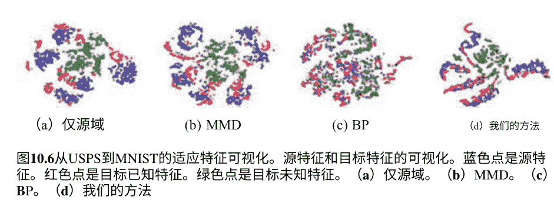

### 参考文献

- 1. Bendale, A., Boult, T.E.: 面向开放集深度网络的研究。 在：IEEE计算机视觉和模式识别会议论文集 (2016)
- 2. Bousmalis, K., Trigeorgis, G., Silberman, N., Krishnan, D., Erhan, D.: 领域分离网络。 在：神经信息处理系统进展会议 (2016)
- 3. Bousmalis, K., Silberman, N., Dohan, D., Erhan, D., Krishnan, D.: 基于生成对抗网络的无监督像素级领域适应。 在：IEEE计算机视觉和模式识别会议论文集 (2017)
- 4. Busto, P.P., Gall, J.: 开放集领域适应. 在: IEEE国际计算机视觉会议论文集 (2017)
- 5. Cao, Z., Ma, L., Long, M., Wang, J.: 部分对抗领域适应. 在: 欧洲计算机视觉会议论文集 (2018)
- 6. Chen, Y., Li, W., Sakaridis, C., Dai, D., Van Gool, L.: 适应野外目标检测的领域自适应 Faster R-CNN. 在: IEEE计算机视觉和模式识别会议论文集 (2018)
- 7. Deng, J., Dong, W., Socher, R., Li, L.J., Li, K., Fei-Fei, L.: ImageNet: 一个大规模的分层图像数据库。 在: IEEE计算机视觉和模式识别会议论文集 (2009)
- 8. Ganin, Y., Lempitsky, V.: 通过反向传播进行无监督领域适应. 在: 机器学习国际会议论文集 (2015)
- 9. Ge, Z., Demyanov, S., Chen, Z., Garnavi, R.: 生成式OpenMax用于多类开放集分类。 在: 英国机器视觉会议 (2017年)
- 10. Ghifary, M., Kleijn, W.B., Zhang, M., Balduzzi, D., Li, W.: 用于无监督领域适应的深度重建-分类网络。 在：欧洲计算机视觉会议论文集（2016年）
- 11. Gong, B., Shi, Y., Sha, F., Grauman, K.: 用于无监督领域适应的测地线流核。 在：IEEE计算机视觉和模式识别会议论文集（2012年）
- 12. Gong, B., Grauman, K., Sha, F.: 通过地标连接点：为无监督领域适应学习领域不变特征。 在：国际机器学习会议（2013年）
- 13. Goodfellow, I., Pouget-Abadie, J., Mirza, M., Xu, B., Warde-Farley, D., Ozair, S., Courville, A., Bengio, Y.: 生成对抗网络。 在：神经信息处理系统进展会议（2014年）
- 14. Gretton, A., Borgwardt, K.M., Rasch, M., Sch lkopf, B., Smola, A.J.: 两样本问题的核方法。 在：神经信息处理系统进展会议（2007年）
- 15. Hoffman, J., Wang, D., Yu, F., Darrell, T.: 野外的全卷积网络：像素级对抗和约束适应（2016年）。 预印本。arXiv:1612.02649
- 16. Ioffe, S., Szegedy, C.: 批归一化：通过减少内部协变量偏移来加速深度网络训练。 在：机器学习国际会议（2015年）
- 17. Jain, L.P., Scheirer, W.J., Boult, T.E.: 多类开放集识别使用包含概率。 在：欧洲计算机视觉会议论文集（2014年）
- 18. Kingma, D., Ba, J.: Adam：一种随机优化方法（2014年）。 预印本。arXiv:1412.6980
- 19. Krizhevsky, A., Sutskever, I., Hinton, G.E.: 使用深度卷积神经网络进行Imagenet分类。 在：神经信息处理系统进展会议（2012年）
- 20. LeCun, Y., Bottou, L., Bengio, Y., Haffner, P.: 基于梯度的学习应用于文档识别。IEEE 86(11), 2278–2324 (1998)
- 21. Liu, M.Y., Breuel, T., Kautz, J.: 无监督的图像到图像转换网络。 在：神经信息处理系统进展会议（2017年）
- 22. Long, M., Cao, Y., Wang, J., Jordan, M.I.: 使用深度适应网络学习可迁移特征。 在：国际机器学习会议（2015年）
- 23. Long, M., Zhu, H., Wang, J., Jordan, M.I.: 使用残差传输网络进行无监督领域适应。 在：神经信息处理系统进展会议（2016年）
- 24. Long, M., Wang, J., Jordan, M.I.: 具有联合适应网络的深度迁移学习。 在：国际机器学习会议（2017年）
- 25. Maaten, L.V.D., Hinton, G.: 使用t-SNE可视化数据。J. Mach. Learn. Res. 9（11月），2579–2605（2008年）
- 26. Netzer, Y., Wang, T., Coates, A., Bissacco, A., Wu, B., Ng, A.Y.: 用无监督特征学习在自然图像中读取数字。 在：神经信息处理系统研讨会上的深度学习和无监督特征学习（2011年）
- 27. Peng, X., Usman, B., Kaushik, N., Hoffman, J., Wang, D., Saenko, K.: Visda: 视觉领域适应挑战（2017年）。 预印本。arXiv:1710.06924
- 28. Saenko, K., Kulis, B., Fritz, M., Darrell, T.: 将视觉类别模型适应到新领域。 在：欧洲计算机视觉会议论文集（2010）
- 29. Saito, K., Ushiku, Y., Harada, T.: 非监督领域适应的非对称三训练。 在：机器学习国际会议论文集（2017）
- 30. Saito, K., Watanabe, K., Ushiku, Y., Harada, T.: 无监督领域适应的最大分类器差异（2017）。 预印本。arXiv:1712.02560
- 31. Saito, K., Yamamoto, S., Ushiku, Y., Harada, T.: 通过反向传播进行开放集领域适应。 在：欧洲计算机视觉会议论文集（2018）

[content]
+   32. Saito, K., Ushiku, Y., Harada, T., Saenko, K.: 强弱分布对齐用于自适应目标检测。 在: IEEE计算机视觉和模式识别会议论文集 (2019)
+   33. Salimans, T., Goodfellow, I., Zaremba, W., Cheung, V., Radford, A., Chen, X.: 改进的训练GAN的技术。 在: 神经信息处理进展会议 (2016)
+   34. Sener, O., Song, H.O., Saxena, A., Savarese, S.: 学习可转移的表示以进行无监督领域适应。 在: 神经信息处理系统进展会议 (2016)
+   35. Simonyan, K., Zisserman, A.: 用于大规模图像识别的非常深的卷积网络 (2014)。 预印本。 arXiv:1409.1556
+   36. Taigman, Y., Polyak, A., Wolf, L.: 无监督的跨域图像生成。 在: 国际学习表示会议 (2016)
+   37. Tzeng, E., Hoffman, J., Zhang, N., Saenko, K., Darrell, T.: 深度领域混淆：最大化领域不变性 (2014)。 预印本。 arXiv:1412.3474
+   38. Tzeng, E., Hoffman, J., Saenko, K., Darrell, T.: 对抗性判别领域适应。 在: IEEE计算机视觉和模式识别会议论文集 (2017)
+   39. Yan, H., Ding, Y., Li, P., Wang, Q., Xu, Y., Zuo, W.: 注意类别权重偏差：加权最大均值差异用于无监督领域适应。 在: IEEE计算机视觉和模式识别会议论文集 (2017)
+   40. You, K., Long, M., Cao, Z., Wang, J., Jordan, M.I.: 通用领域适应。 在: IEEE计算机视觉和模式识别会议论文集 (2019)
+   41. Zhang, J., Ding, Z., Li, W., Ogunbona, P.: 部分领域适应的重要性加权对抗网络。 在: IEEE计算机视觉和模式识别会议论文集 (2018)

## 第11章 通用领域适应

Kaichao You, Mingsheng Long, Zhangjie Cao, Jianmin Wang, 和 Michael I. Jordan

#### 11.1 引言

在过去的十年中，我们已经看到了深度学习在计算机视觉领域的强大力量。对于许多视觉任务，包括目标检测[16]、图像分类[8]和语义分割[9]，都取得了最新的成果。然而，深度学习算法需要大量标记的训练数据才能实现，这意味着需要进行繁琐的数据收集和标注工作。当我们进入一个具有大量未标记数据的新场景时，通常很难获得足够的标签来满足数据饥饿的深度模型，使其能够在未见过的数据上进行良好的泛化。一种有希望的方法是充分利用来自相关领域（称为源领域）的现有标记数据，以帮助模型在目标领域（感兴趣的领域）中获得更好的性能。与源领域中的数据相比，目标领域中的数据可能是从不同角度收集的，由不同品牌和配置的相机拍摄的，或者在不同的光照条件下拍摄的，导致存在领域差异。直观地说，领域差异可以被消除，因为对于人类学习者来说很容易。为了克服领域差异，研究人员提出了视觉领域适应[18]，试图将模型从源领域转移到目标领域。

前几章提到的领域适应方法通过学习领域不变特征来消除边缘分布差异，通过为目标领域生成特征/样本以及相应的标签，或者通过在保持样本翻译的同时在领域之间进行转换来解决领域差距的问题。

尽管采用了新的方法，但它们只关注域差距。一个基本的假设是源标签集与目标标签集相同，如图11.1所示（封闭集域适应）。简化的问题在数学上是优雅的，并使研究人员能够专注于域适应的核心问题。这一研究方向为未来的研究提供了启示。最近的研究尝试走出舒适区，放松假设，导致开放集域适应[11, 14, 19]和部分域适应[1, 3, 22]的出现。如图11.1所示，部分域适应[1, 22]依赖于一个较弱的假设，即目标标签集是源标签集的子集。Busto等人[14]进一步引入了两个域中的“未知”类别。然而，它们仍然假设在训练阶段已经事先知道了两个域之间哪些类别是共同的。Saito等人[19]提出的开放集域适应的变体假设目标标签集是源标签集的超集。Luo等人[13]声称能够解决具有部分共享标签集的域适应问题，但需要每个目标类别中的少量标记数据，这意味着目标标签集的结构必须是透明的。这些研究不断推动域适应朝着更实际的设置发展。

尽管研究人员一直致力于为领域适应添加实际价值，但这些假设都不能适用于野外领域适应。以野外中的识别问题为例：我们被要求在一个新的区域识别动物。在新区域中，未标记的数据可以通过在野外设置摄像机来轻松收集。其他区域的标记数据也将可用。然而，我们不能选择闭集DA、部分DA或开放集DA中的任何方法，因为新区域的标签集是未知的，任何假设都无法验证。如果源标签集足够大，包含目标标签集，则部分领域适应方法是不错的选择；如果源标签集包含在目标标签集中或者已知共同类别，则开放集领域适应方法是不错的选择。然而，在一般情况下，我们无法选择适当的领域适应方法，因为没有关于目标领域标签集的先验知识。

为了达到这个目的，很明显我们需要一个更通用的领域适应设置。在这里，我们研究了[21]中提出的名为通用领域适应（UDA）的设置。在UDA中，我们给出了一个带标签的源领域，任务是正确分类目标领域的样本，如果它属于源标签集中的任何类别，否则将其标记为“未知”。为了使UDA更加实用，我们要求UDA适用于与给定源领域相关的任何目标领域，无论其标签集与源领域的差异如何。也就是说，UDA的模型应该适用于各种不同的目标领域。

“通用”一词表示UDA对标签集没有先验知识。虽然我们提出了一个更通用的UDA设置，但UDA中的挑战更加困难。为了设计一个通用领域适应模型，我们必须解决两个主要技术挑战：（1）由于目标标签集是未知的，我们必须自动发现其结构，然后我们可以决定源领域的哪一部分应该与目标领域的哪一部分匹配。如果我们简单地将整个源领域与整个目标领域匹配，不同标签集之间的不匹配将损害模型的性能。（2）该模型应该具备拒绝目标样本（将其标记为“未知”）的能力，如果它不属于源标签集中的任何类别。由于我们只知道源领域中的类别，模型无法确定它们的详细类别。

接下来，我们研究一种特定的解决方案，称为通用适应网络（UAN）用于通用领域适应。它精心设计了一个新的准则来量化每个样本的可转移性。该准则是样本级加权机制，包括域相似性和预测不确定性的每个样本。借助可转移性准则，UAN可以自动检测并匹配源域和目标域之间的公共标签集中的样本。同时，目标域中的目标样本可以被正确地拒绝为“未知”类别。

本章的主要内容包括：

- 1. 更实际的通用领域适应（UDA）设置，不限制源标签集和目标标签集之间的关系。它将域适应推向了一个几乎实际的方向，因为在无监督域适应中无法访问目标标签，更不用说目标标签集与源标签集的重叠了。
- 2. 对现有领域适应方法在广泛的UDA设置中进行性能评估，包括封闭集、部分和开放集领域适应。 具有强假设的方法（因此专为特定设置而设计）在UDA中效果不佳。这凸显了对UDA友好模型的需求。
- 3. 对第一个UDA模型Universal Adaptation Network (UAN)进行了详细描述。它是一个端到端的解决方案，可以发现两个领域共享的标签集，并促进共同类别的适应。 具体而言，它通过使用样本的领域相似性和预测的不确定性来开发加权机制。 与现有方法相比，实验证明UAN在不同的UDA设置下工作稳定，并取得了最先进的结果。

#### 11.2 相关工作

前几章可以作为本章的相关工作。 有关详细的相关工作，请参阅会议版本[21]。

#### 11.3 通用领域适应

在本节中，正式定义了通用领域适应（UDA）设置，并详细描述了其解决方案（通用适应网络），从思想的起源到具体的公式。

##### 11.3.1 问题设置

在通用领域适应（UDA）中，我们提供了一个源域$\mathcal{D}_s = \{ (\mathbf{x}_i^s, y_i^s) \}$包含$n_s$个标记样本和一个目标域$\mathcal{D}_t = \{ (\mathbf{x}_i^t) \}$包含$n_t$个未标记样本。 源数据的潜在分布表示为$p$，目标分布称为$q$。$C_{sub}$用于表示标签集合，其下标表示标签集合的具体含义。$C_s$表示源域的标签集合，$C_t$表示目标域的标签集合。 如前所述，两个标签集合的并集可以分为三个部分：重叠部分$\mathcal{C} = C_s \cap C_t$（两个域中共有的标签），源域私有部分$C_s^{'} = C_s \setminus \mathcal{C}$（源域独有的标签）和目标域私有部分$C_t^{'} = C_t \setminus \mathcal{C}$（目标域独有的标签）。

$p_{C_s}$和$p_C$是用来表示源数据的底层分布的简写符号，其标签属于标签集$C_s$和$C$，$qC$也是一样用于目标分布。请记住，目标示例是完全无标签的，目标标签集$C_t$（在训练中无法访问）仅用于定义问题。

两个域之间的共同性定义为两个标签集的Jaccard距离：$\xi = \frac{|C_s \cap C_t|}{|C_s \cup C_t|}$。现在我们可以统一各种域适应设置：当$\xi =1$时，封闭集域适应是UDA的一种特殊情况。较大的$\xi$值意味着共享的知识更多，适应性更小。

$\xi$在一定程度上反映了域适应的可行性。UDA的任务是设计一个模型，在不知道$\xi$的情况下，在广泛的$\xi$谱上表现良好。这需要能够区分$C$中的目标数据和$C_t$中的目标数据，并学习一个分类模型。

为了最小化具有公共标签的目标误差，即min $\mathbb{E}_{(x,y)\sim q_C}[f(x)=y]$。

##### 11.3.2 技术挑战

为了解决UDA问题，我们必须了解其挑战。第一个挑战是两个领域之间的类别差距。类别差距的原因在于不同领域的标签集不同。当$C_s = C_t$时，闭集领域适应方法效果很好，但在UDA中，它们会错误地将$C_s$中的源数据与$C_t$中的目标数据匹配。这种盲目对齐可能会导致问题，因为这两个标签集没有重叠（$C_s \cap C_t = \emptyset$），它们不应以任何方式匹配。强行匹配它们将使来自$C_t$的目标示例被预测为$C_s$中的一个标签，而它们的真实标签应该是“未知”。在部分或开放集领域适应中，定制的方法精心设计了选择要匹配的数据部分的机制。然而，$C_s$和$C_t$之间的关系未知，这阻止了我们选择适当的算法来解决问题。因此，如果我们能自动从$C$中选择出源数据和目标数据，然后将特征对齐限制在自动发现的公共标签集中，那将是有利的。

类别差距是UDA的特征。尽管处理了类别差距，但我们仍然需要处理UDA中的域差距，即源域和目标域在公共标签集中的分布不匹配。换句话说，$p = q$(特别是$p_C = q_C$)，这是我们在标准闭集域适应中遇到的类似形式。

来自$C_t$的另一个挑战是拒绝“未知”类别。在文献中，这被称为“异常检测”，并通过使用预定义的置信度阈值进行置信度阈值处理来进行。每个分类置信度低于阈值的样本都被标记为“未知”。然而，这种直接实现在通用域适应中很可能失败，因为现代神经网络的预测通常过于自信[7]，但由于潜在的域差距而缺乏区分性。

##### 11.3.3 通用适应网络

现在是通用适应网络中的实质部分。如图11.2所示，UAN中有几个模块：特征提取器F，标签预测器G，对抗领域鉴别器D和非对抗领域鉴别器D'。计算流程始于来自任一领域的输入x。然后x被送入特征提取器F。标签预测器G接受提取的特征z = F(x)来产生概率ŷ = G(z)，表示x来自源类C。对抗领域鉴别器D旨在对源数据和目标数据的特征分布进行对抗匹配，这些数据属于共同的标签集C（需要一种机制来检测共同的标签集）。非对抗领域鉴别器D'通过计算域相似度d' = D'(z)来量化x与源域的相似性。E_G，E_D'和E_D分别表示标签预测器G、非对抗领域鉴别器D'和对抗领域鉴别器D的误差，它们的形式定义如下

$$
E_G = \mathbb{E}_{(\mathbf{x},\mathbf{y})\sim p} L \left( \mathbf{y}, G(F(\mathbf{x})) \right) \quad (11.1)
$$

$$
E_{D'} = - \mathbb{E}_{\mathbf{x}\sim p} \log D'(F(\mathbf{x})) - \mathbb{E}_{\mathbf{x}\sim q} \log \left( 1 - D'(F(\mathbf{x})) \right) \quad (11.2)
$$

$$
E_D = - \mathbb{E}_{\mathbf{x}\sim p} w^s(\mathbf{x}) \log D(F(\mathbf{x})) - \mathbb{E}_{\mathbf{x}\sim q} w^t(\mathbf{x}) \log \left( 1 - D(F(\mathbf{x})) \right) \quad (11.3)
$$

其中，L是标准的交叉熵损失函数用于分类，$w^s(x)$和$w^t(x)$表示源/目标样本属于公共标签集C的概率。$w^s(x)$和$w^t(x)$的构建细节将在下一部分中解释。

方程（11.3）的好处是，当 $w^s(\mathbf{x})$ 和 $w^t(\mathbf{x})$ 被很好地建立时，$D$ 可以被限制在共同的标签集 $\mathcal{C}$ 中区分源数据和目标数据。通过对战的极小极大博弈，$F$ 和 $D$ 共同在共同的标签集 $\mathcal{C}$ 中实现领域不变的特征。在这样的特征上训练的标签预测器 $G$ 可以安全地转移到目标领域。

UAN的训练过程可以被形式化为一个极小极大博弈：

$$
\max_{D} \min_{F,G} E_G - \lambda E_D
$$
$$
\min_{D'} E_{D'}
$$
(11.4)

其中 $\lambda$ 平衡了可转移性和可区分性。通过在 $F$ 和 $D$ 之间插入梯度反转层[4]，所有模块可以以端到端的训练方式进行优化。

在图11.2的右子图中描述了UAN的测试过程。对于每个输入测试样本 $\mathbf{x}$，我们使用方程（11.8）（详细信息见下一小节）将其分类预测 $\hat{y}(\mathbf{x})$ 和领域预测 $\hat{d}'(\mathbf{x})$ 组合起来计算 $w^t(\mathbf{x})$。通过超参数阈值 $w_0$ 来控制可转移性，预测 $y(\mathbf{x})$ 可以表示为

$$
y(\mathbf{x}) = \begin{cases} \text{未知} & w^t < w_0 \\ \text{argmax}(\hat{y}) & w^t \ge w_0 \end{cases}
$$
(11.5)

它要么将其分类为源类别之一，要么将目标样本拒绝为“未知”类别。

##### 11.3.4 可转移性准则

在本节中，我们将深入探讨样本级可转移性准则 $w^s = w^s(\mathbf{x})$ 和 $w^t = w^t(\mathbf{x})$ 的细节。正如我们之前分析的那样，一个好的样本级可转移性准则是必要的。这样，两个域中的每个样本都可以在对抗训练过程中加权，以使源数据和目标数据在公共标签集 $\mathcal{C}$ 中的分布对齐。可转移性准则的另一个用途是辅助“未知”样本检测过程，该过程检测来自目标私有标签集 $\mathcal{C}_t$ 的数据。理想情况下，一个良好建立的样本级可转移性准则应满足不等式（11.6）：

$$
\mathbb{E}_{\mathbf{x} \sim p_{\mathcal{C}}} w^s(\mathbf{x}) > \mathbb{E}_{\mathbf{x} \sim p_{\overline{\mathcal{C}}_s}} w^s(\mathbf{x})
$$
$$
\mathbb{E}_{\mathbf{x} \sim q_{\mathcal{C}}} w^t(\mathbf{x}) > \mathbb{E}_{\mathbf{x} \sim q_{\overline{\mathcal{C}}_t}} w^t(\mathbf{x})
$$
(11.6)

这些不等式应在大边界中成立。

所以最后一个问题是如何构建样本级的可转移性准则。首先，让我们列出我们对每个输入 x 所了解的所有信息： $\hat{y}, \hat{d}, \hat{d}'$。由于 $D$ 参与了对抗训练，因此被欺骗，其输出 $\hat{d}$ 不够具有区分性。这使我们转向 $\hat{y}$ 和 $\hat{d}'$。

**域相似性** 在公式（11.2）中， $D'$ 的目标是区分来自源域和目标域的样本。因此， $\hat{d}'$ 量化了每个样本的域相似性。具有较小 $\hat{d}'$ 的源样本意味着它更类似于目标域；具有较大 $\hat{d}'$ 的目标样本意味着它更类似于源域。因此，我们可以假设

$\mathbb{E}_{\mathbf{x} \sim p_{\bar{C}_s}} \hat{d}' > \mathbb{E}_{\mathbf{x} \sim p_{C}} \hat{d}' > \mathbb{E}_{\mathbf{x} \sim q_{C}} \hat{d}' > \mathbb{E}_{\mathbf{x} \sim q_{\bar{C}_t}} \hat{d}'$。

这里是一个直观的验证假设的例子：（1）由于 $D'$ 的性质，不等式 $\mathbb{E}_{\mathbf{x} \sim p_{\bar{C}_s}} \hat{d}' > \mathbb{E}_{\mathbf{x} \sim p_{C}} \hat{d}' > \mathbb{E}_{\mathbf{x} \sim q_{C}} \hat{d}' > \mathbb{E}_{\mathbf{x} \sim q_{\bar{C}_t}} \hat{d}'$ 自然成立。（2）由于 $p_C$ 和 $q_C$ 共享相同的标签集合， $p_C$ 与 $q_C$ 相比更接近 $q_{\bar{C}_t}$，因此假设 $\mathbb{E}_{\mathbf{x} \sim p_{\bar{C}_s}} \hat{d}' > \mathbb{E}_{\mathbf{x} \sim p_{C}} \hat{d}'$ 是合理的。同样的观察也适用于 $\mathbb{E}_{\mathbf{x} \sim q_C} \hat{d}' > \mathbb{E}_{\mathbf{x} \sim q_{\bar{C}_t}} \hat{d}'$。

**预测不确定性** 输入的判别信息直接反映在预测 $\hat{y}$ 中，但只在源领域中可靠，因为源领域是完全标记的。为了利用无标签数据，熵最小化已被用作半监督学习和领域适应的准则[6, 12]，以确保决策边界不通过高密度区域的无标签数据。本质上，熵量化了预测的不确定性：较大的熵意味着较不自信的预测。我们假设：

$\mathbb{E}_{\mathbf{x} \sim q_{\bar{C}_t}} H(\hat{y}) > \mathbb{E}_{\mathbf{x} \sim q_C} H(\hat{y}) > \mathbb{E}_{\mathbf{x} \sim p_C} H(\hat{y}) > \mathbb{E}_{\mathbf{x} \sim p_{\bar{C}_s}} H(\hat{y})$。

还有一种直观的验证方法：（1）由于源域数据是完全标记的，目标域数据是完全未标记的，因此对于源样本的预测是确定的（感谢监督学习），而对于目标样本是不确定的。 $\mathbb{E}_{\mathbf{x} \sim q_{\bar{C}_t}} H(\hat{y}), \mathbb{E}_{\mathbf{x} \sim q_C} H(\hat{y}) > \mathbb{E}_{\mathbf{x} \sim p_C} H(\hat{y}), \mathbb{E}_{\mathbf{x} \sim p_{\bar{C}_s}} H(\hat{y})$（2）来自 $q_C$ 和 $p_C$ 的相似样本可能会相互影响。也就是说，来自 $p_C$ 的样本的熵会变大，因为它们可以受到来自 $q_C$ 的高熵样本的影响。然而，由于 $C_s$ 与 $C_t$ 没有交集，来自 $p_{\bar{C}_s}$ 的样本 - 不能受到目标数据的影响并保持最高的确定性。因此，假设 $\mathbb{E}_{\mathbf{x} \sim p_{\bar{C}_s}} H(\hat{y}) < \mathbb{E}_{\mathbf{x} \sim p_C} H(\hat{y})$ 是合理的， $C_t$ has no intersection with $C_s$ (来自 $q_C$ 的数据不属于 $C_s$ 中的任何类别)，因此假设 $\mathbb{E}_{\mathbf{x} \sim q_C} H(\hat{y}) > \mathbb{E}_{\mathbf{x} \sim q_{\bar{C}_t}} H(\hat{y})$ 是合理的。

通过以上分析，我们可以分别为源数据示例和目标数据示例构建样本级的可转移性准则，如公式(11.7)和(11.8)所示：

$$
w^s(\mathbf{x}) = \dfrac{H(\hat{y})}{\log |C_s|} - \hat{d}'(\mathbf{x})
$$一个小技巧是将熵除以其最大值($\log |\mathcal{C}_{s}|$)，以限制其在 $[0, 1]$ 范围内。 这样，它可以与处于相同范围的域相似度测量 $\hat{d}^{t}$ 进行比较。

本章介绍的通用适应网络 (UAN) 利用样本级可转移性准则来识别并分离源数据中的 $\mathcal{C} \mathcal{C}_{s}$ 和目标数据中的 $\mathcal{C}, \mathcal{C}_{t}$ 。因此，类别差距减小了。 通过对共享标签集 $\mathcal{C}$ 中的域之间的特征进行对齐，域差距也减小了。

#### 11.4 实验

对于通用领域适应，标签集有3个自由度： $\xi, |\mathcal{C}|$ 和 $|\mathcal{C}_{t}|$ 。 为了进行全面评估，我们将UAN与针对各种标签集假设的最先进方法在多种UDA设置下在几个标准数据集上进行比较，这些数据集具有不同的 $\xi, |\mathcal{C}_{s} \cup \mathcal{C}_{t}|, \mathcal{C}_{t}$ 和 $\mathcal{C}_{s}$ 。 然后，我们进行受控实验，分别探索 $\xi, |\mathcal{C}_{s} \cup \mathcal{C}_{t}|, \mathcal{C}_{t}$ 和 $\mathcal{C}_{s}$ 的影响。

最后，我们提出了样本级可迁移性准则和UAN模型的超参数敏感性分析。代码和数据可在https://github.com/thuml/Universal-Domain-Adaptation获取。

##### 11.4.1 实验设置

本小节介绍数据集、评估协议和实现细节。

###### 11.4.1.1 数据集

**Office-31**[18]是一个标准的领域适应数据集，包含3个视觉上不同的领域 (**A**, **D**, **W**) 和31个类别。 选取Office-31和Caltech-256[5]中共有的10个类作为公共标签集 $\mathcal{C}$ 。然后按字母顺序，选取接下来的10个类作为 $\mathcal{C}_{s}$ ，剩下的11个类作为 $\mathcal{C}_{t}$ 。这里$\xi = 0.32$。

**Office-Home**[20]是一个比 **Office-31**更大的数据集，包含4个不同领域的65个类别：艺术图片 (**Ar**) 、剪贴画图片 (**Cl**) 、产品图片 (**Pr**) 和真实世界图像 (**Rw**) 。 按字母顺序，我们将前10个类别作为$\mathcal{C}$，接下来的5个类别作为$\mathcal{C}_{s}$，剩下的作为$\mathcal{C}_{t}$。这里$\xi=0.15$。

VisDA2017[15]数据集专注于模拟到真实环境的设置。源数据包括由游戏引擎渲染的带标签图像，目标数据包括未标记的真实世界图像。每个领域共享相同的12个类别。我们将前6个类别作为$\mathcal{C}$，接下来的3个类别作为$\mathcal{C}_{s}$，剩下的作为$\mathcal{C}_{t}$。这里$\xi=0.50$。ImageNet-1K[17]和Caltech-256构建的。按照[1, 2]的传统，选择两个领域共同拥有的84个常见类别作为共同标签集$\mathcal{C}$，它们的私有类别分别作为私有标签集。这种设置自然地属于UDA范式：由于目标域标签集不可用，它可能与源标签集重叠，但也有私有部分。两个UDA任务是：I→C和C→I。这里$\xi=0.07$。

这些UDA设置旨在与现有的配置[1, 2, 14, 19]最大程度地保持一致，并涵盖尽可能多的共同性水平 $\xi$。
对于 $\xi$、 $\mathcal{C}_t$ 和 $\mathcal{C}_s$的所有可能组合进行蛮力枚举是不可接受的。

###### 11.4.1.2 评估细节

比较方法UAN与以下方法进行比较：
(1) 卷积神经网络： ResNet[8]（没有任何适应）
(2) 闭集域适应方法：Domain-Adversarial神经网络（DANN）[4]， Residual Transfer Networks（RTN）[12]
(3) 部分域适应方法：Importance Weighted Adversarial Nets（IWAN）[22]， Partial Adversarial Domain Adaptation（PADA）[2]
(4) 开放集领域适应方法：分配和转换迭代（ATI）[14]（ATI-λ与λ的比较和λ的推导如[14]所述），开放集反向传播（OSBP）[19]。
上述方法在各自的设置中都是最先进的。研究这些方法在实际UDA环境中的性能将是有价值的。

评估协议性能指标与Visual Domain Adaptation（VisDA2018）Open-Set Classification Challenge中的指标相同，其中目标私有标签集中的所有类别都被统一为“未知”类别，最终指标是所有$\mathcal{C}+1$个类别的每类准确率的平均值。对于没有异常检测能力的方法，我们通过置信度阈值进行扩展：在测试阶段，如果预测置信度低于置信度阈值，则将输入图像分类为“未知”类别。

实现细节我们选择的框架是PyTorch。主干网络（$f$的架构和初始化）是ResNet-50[8]。特征提取器是从在ImageNet上预训练的ResNet-50中初始化，然后进行微调。在计算方程（11.7）中的$y$时，我们将温度[10]设置为10，因为对于源数据的预测通常过于确定且熵较低。在方程（11.3）中应用时，$w_s$、$w_t$在小批量中被归一化为区间[0，1]，以使方程（11.3）中的权重为非负数。

##### 11.4.2 分类结果

主要结果可以在表11.1和11.2中找到。在这些实验中，UAN被经验证明是解决UDA问题的合适解决方案。此外，还有几个值得讨论的现象。

(1) ResNet似乎是通用领域适应的一个强大基准。许多定制方法努力追赶ResNet，强调了UDA的困难。实际上，许多领域适应方法往往遭受负迁移，这个术语用于描述比仅在源数据上训练的模型性能更差的情况，而没有任何适应。图11.4a通过每类准确率改进来量化负迁移，相对于Office-Home任务中ResNet的改进情况 $\text{Ar} \rightarrow \text{Cl}$。它显示DANN，IWAN和OSBP在大多数类别中都遭受负迁移，并且它们只促进了少数类别的适应。

只有UAN在所有类别中实现了积极的迁移，这要归功于精心设计的样本级迁移能力准则。它在特征对齐过程中丢弃来自 $\mathcal{C}_t$ 和 $\mathcal{C}_s \setminus \mathcal{C}$ 的数据，并产生了一个比朴素的置信度阈值更好的用于检测“未知”类别的准则。

(2) 除了UDA之外的其他领域适应设置的方法在其假设成立时表现良好，但在违反假设时表现较差。例如，OSBP假设没有源私有类别。如果手动删除源私有类别（在没有目标标签的情况下是无效操作），OSBP在Office-31上的准确率为89.1%；然而，如果保留源私有类别（违反其假设），其准确率会急剧下降至67.68%。由于UDA中比较方法的假设被违反，它们的准确性急剧下降并不奇怪。

##### 11.4.3 不同UDA设置的分析

变化的$\mathcal{C}_t$和$\mathcal{C}_s$的大小。在这里，我们固定$|\mathcal{C}_s \cup \mathcal{C}_t|$和$\xi$，以探索这些方法在Office-31中不同大小的$\mathcal{C}_t$（同时变化）对通用领域适应的结果。如图11.3a所示，UAN在大多数$\mathcal{C}_t$大小上获得最佳结果。此外，当$|\mathcal{C}_t|=0$时，满足部分领域适应的假设$\mathcal{C}_t \subset \mathcal{C}_s$，UAN与IWAN相当。当$|\mathcal{C}_t|=21$时，满足开放集领域适应的假设$\mathcal{C}_s \subset \mathcal{C}_t$，UAN与OSBP相当。IWAN和OSBP都利用关于标签集的先验知识和设计模块来利用知识。然而，在它们的专家设置中，UAN仍然能够赶上它们，表明UAN对不同大小的$\mathcal{C}_t$和$\mathcal{C}_s$是有效和稳健的。当$0 < |\mathcal{C}_t| < 21$，其中$\mathcal{C}_s$和$\mathcal{C}_t$部分重叠时，UAN以较大的优势胜过其他方法。UAN可以在没有关于目标标签集的先验知识的情况下产生令人印象深刻的结果。在图11.3a中，

表11.1 通用领域适应任务的平均类别准确率（%）在Office-Home（ξ=0.15）数据集上（ResNet）

| 方法       | Ar→Cl | Ar→Pr | Ar→Rw | Cl→Ar | Cl→Pr | Cl→Rw | Pr→Ar | Pr→Cl | Pr→Rw | Rw→Ar | Rw→Cl | Rw→Pr | 平均   |
|------------|-------|-------|-------|-------|-------|-------|-------|-------|-------|-------|-------|-------|--------|
| ResNet[8]  | 59.37 | 76.58 | 87.48 | 69.86 | 71.11 | 81.66 | 73.72 | 56.30 | 86.07 | 78.68 | 59.22 | 78.59 | 73.22  |
| DANN[4]    | 56.17 | 81.72 | 86.87 | 68.67 | 73.38 | 83.76 | 69.92 | 56.84 | 85.80 | 79.41 | 57.26 | 78.26 | 73.17  |
| RTN[12]    | 50.46 | 77.80 | 86.90 | 65.12 | 73.40 | 85.07 | 67.86 | 45.23 | 85.50 | 79.20 | 55.55 | 78.79 | 70.91  |
| IWAN[22]   | 52.55 | 81.40 | 86.51 | 70.58 | 70.99 | 85.29 | 74.88 | 57.33 | 85.07 | 77.48 | 59.65 | 78.91 | 73.39  |
| PADA[22]   | 39.58 | 69.37 | 76.26 | 62.57 | 67.39 | 77.47 | 48.39 | 35.79 | 79.60 | 75.94 | 44.50 | 78.10 | 62.91  |
| ATI[14]    | 52.90 | 80.37 | 85.91 | 71.08 | 72.41 | 84.39 | 74.28 | 57.84 | 85.61 | 76.06 | 60.17 | 78.42 | 73.29  |
| OSBP[19]   | 47.75 | 60.90 | 76.78 | 59.23 | 61.58 | 74.33 | 61.67 | 44.50 | 79.31 | 70.59 | 54.95 | 75.18 | 63.90  |
| UAN(无d)   | 61.60 | 81.86 | 87.67 | 74.52 | 73.59 | 84.88 | 73.65 | 57.37 | 86.61 | 81.58 | 62.15 | 79.14 | 75.39  |
| UAN(无e)   | 56.63 | 77.51 | 87.61 | 71.96 | 69.08 | 83.18 | 71.40 | 56.10 | 84.24 | 79.27 | 60.59 | 78.35 | 72.91  |
| UAN        | 63.00 | 82.83 | 87.85 | 76.88 | 78.70 | 85.36 | 78.22 | 58.59 | 86.80 | 83.37 | 63.17 | 79.43 | 77.02  |

粗体数字表示最佳结果

表11.2 Office-31（ξ = 0.32）、ImageNet-Caltech（ξ = 0.07）和VisDA2017（ξ = 0.50）的平均类别准确率（%）（ResNet）

| 方法 | Office-31 | ImageNet-Caltech | VisDA2017 |
| :--- | :--- | :--- | :--- |
| | A→W | D→W | W→D | A→D | D→A | W→A | I→C | C→I | VisDA |
| ResNet [8] | 75.94 | 89.60 | 90.91 | 80.45 | 78.83 | 81.42 | 82.86 | 70.28 | 65.14 | 52.80 |
| DANN [4] | 80.65 | 80.94 | 88.07 | 82.67 | 74.82 | 83.54 | 81.78 | 71.37 | 66.54 | 52.94 |
| RTN [12] | 85.70 | 87.80 | 88.91 | 82.69 | 74.64 | 83.26 | 84.18 | 71.94 | 66.15 | 53.92 |
| IWAN [22] | 85.25 | 90.09 | 90.00 | 84.27 | 84.22 | 86.25 | 86.68 | 72.19 | 66.48 | 58.72 |
| PADA [22] | 85.37 | 79.26 | 90.91 | 81.68 | 55.32 | 82.61 | 79.19 | 65.47 | 58.73 | 44.98 |
| ATI [14] | 79.38 | 92.60 | 90.08 | 84.40 | 78.85 | 81.57 | 84.48 | 71.59 | 67.36 | 54.81 |
| OSBP [19] | 66.13 | 73.57 | 85.62 | 72.92 | 47.35 | 60.48 | 67.68 | 62.08 | 55.48 | 30.26 |
| UAN | **85.62** | **94.77** | **97.99** | **86.50** | **85.45** | **85.12** | **89.24** | **75.28** | **70.17** | **60.83** |
| 粗体数字表示最佳结果 |

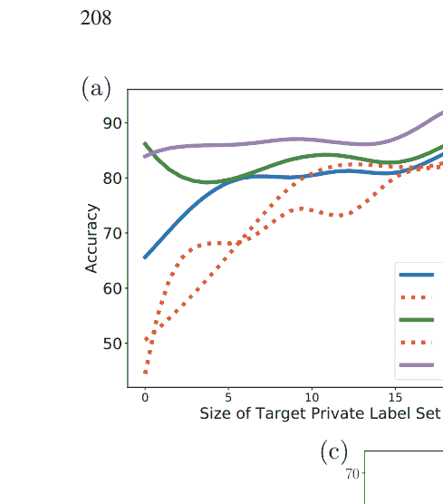

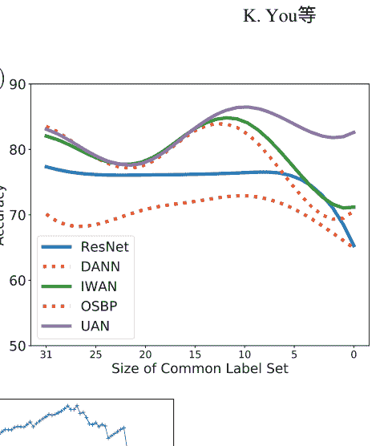

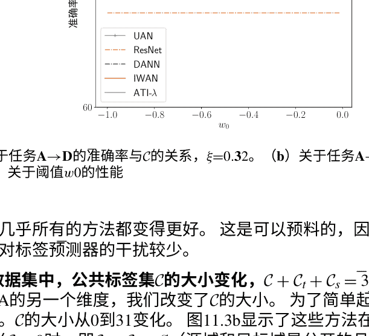

图11.3 (a) 关于任务A→D的准确率与$\mathcal{C}_t$的关系，$\xi$=0.32。 (b) 关于任务A→D的准确率与$\mathcal{C}$的关系。 (c) 关于阈值$w_0$的性能

当$\mathcal{C}$变大时，几乎所有的方法都变得更好。这是可以预料的，因为较大的$\mathcal{C}$表示较小的$\mathcal{C}_s$和$\mathcal{C}_t$，以及对标签预测器的干扰较少。

在Office-31数据集中，公共标签集$\mathcal{C}$的大小变化，$\mathcal{C} + \mathcal{C}_t + \mathcal{C}_s = 31$。为了探索UDA的另一个维度，我们改变了$\mathcal{C}$的大小。为了简单起见，我们设置$|\mathcal{C}_t| = |\mathcal{C}_s| + 1$。$\mathcal{C}$的大小从0到31变化。图11.3b显示了这些方法在不同$\mathcal{C}$大小下的性能。当$|\mathcal{C}| = 0$时，即$\mathcal{C}_t \cap \mathcal{C}_s = \emptyset$ (源域和目标域是分开的且没有重叠)，UAN的性能明显优于所有其他方法。这可能是因为它们错误地假设了跨域的一些公共标签，因此不能很好地过滤出“未知”样本。当$|\mathcal{C}| = 31$时，UDA退化为具有$\mathcal{C}_t = \mathcal{C}_s$的闭集DA，令人惊讶的是UAN仍然与DANN相当，这表明UAN的样本级可迁移性准则不会损害适应性的有用样本。当$\mathcal{C}$减小时，DANN和IWAN困难重重，但UAN仍然稳定工作。

##### 11.4.4 通用适应网络的分析

**消融研究** 我们通过对UAN的变体进行消融研究，更深入地探究了样本级可迁移性准则的根源：(1)没有$d$的UAN仅将不确定性整合到样本级可迁移性准则中，即公式(11.7)和(11.8)；(2)没有$y$的UAN仅将域相似性整合到样本级可迁移性准则中，即公式(11.7)和(11.8)。消融研究的结果可以在表11.1的最后几行找到。与UAN相比，没有$d$的UAN和没有$y$的UAN效果更差，因为它们在 $w^s(\mathbf{x})$, $w^t(\mathbf{x})$ 的定义中要么缺少域相似性组件，要么缺少不确定性准则组件。经过仔细观察，我们发现没有$d$的UAN比没有$y$的UAN表现更好，这意味着不确定性准则在样本级可迁移性准则中更为关键。

**假设的证明** 在第11.3.4节中，假设直观地得到了验证。在这里，我们通过实验证明了假设。在图11.4b中绘制了方程（11.7）和（11.8）中不同组件的估计概率密度函数。图表显示了第11.3.4节中的假设在实验上得到了验证，这是UAN在各种UDA设置中表现良好的原因。不确定性和域之间的相似性在不同域之间有所不同。通过结合这两个组件，传递性准则可以更加明显和有用地应用于UAN。

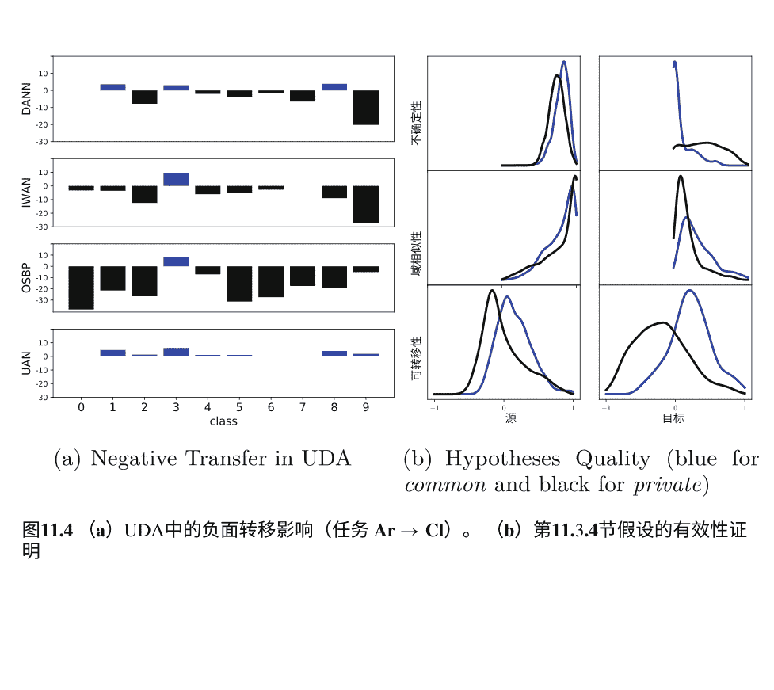

**阈值敏感性** UAN需要预先定义的阈值 $w_0$ 来检测“未知”类别。我们测量UAN对于阈值 $w_0$ 在任务$\mathcal{I} \rightarrow \mathcal{C}$中的敏感性。如图11.3c所示，UAN的准确性取决于 $w_0$，并且可能会变化约2%。然而，尽管其他方法完全调整以获得最佳准确性，但它在广泛的 $w_0$ 范围内远远优于其他方法。

#### 11.5 结论

在本章中，我们介绍了一种实际的领域适应设置，称为UDA，用于处理没有标签数据且对目标标签集一无所知的情况。与UDA设置一起，我们介绍了一种名为UAN的解决方案，从其思想到其实现。UAN具有精心设计的样本级转移能力准则，以解决UDA问题。实验证明，在标签集关系上具有先验知识的方法在一般的UDA设置中会失败，只有UAN能够稳定工作。

当我们遇到一个新的领域适应场景时，UAN可以作为一个试点研究。如果一个人想要将模型部署到一个新的场景中，UAN可以是第一个尝试的选择。如果大多数示例被UAN标记为“未知”，那么就不可能期望成功的适应，需要收集标签。相反，如果UAN可以为大多数示例生成标签，我们可以转向其他定制的领域适应方法，并期望领域能够起作用。

### 参考文献

1. Cao, Z., Long, M., Wang, J., Jordan, M.I.: 具有选择性对抗网络的部分迁移学习。在：IEEE计算机视觉和模式识别会议论文集 (2018年)
2. Cao, Z., Ma, L., Long, M., Wang, J.: 部分对抗领域适应。在：欧洲计算机视觉会议论文集，第135-150页 (2018年)
3. Cao, Z., You, K., Long, M., Wang, J., Yang, Q.: 学习将示例转移用于部分领域适应。在：IEEE计算机视觉和模式识别会议论文集 (2019)
4. Ganin, Y., Ustinova, E., Ajakan, H., Germain, P., Larochelle, H., Laviolette, F., Marchand, M., Lempitsky, V.S.: 神经网络的领域对抗训练. 机器学习研究杂志 17, 59:1–59:35 (2016)
5. Gong, B., Shi, Y., Sha, F., Grauman, K.: 无监督领域适应的测地流核. 在: IEEE计算机视觉和模式识别会议论文集(2012)
6. Grandvalet, Y., Bengio, Y.: 通过熵最小化的半监督学习。在：神经信息处理系统进展会议上，第529-536页 (2004年)
7. Guo, C., Pleiss, G., Sun, Y., Weinberger, K.Q.: 关于现代神经网络的校准。在：机器学习国际会议上，第1321-1330页 (2017)

## 第12章
通过深度CockTail网络进行多源领域适应

Ziliang Chen和Liang Lin

#### 12.1 引言

深度表示学习的最新发展显著提高了计算机视觉问题的现状 [15, 17, 26, 31]。

这些引人注目的进展在很大程度上应归功于大规模数据集 [3, 14]，为监督学习提供了大量标记示例。 然而，当面对(无监督的)领域适应 [24] (DA)时，我们只能在源领域中提供带标签的示例，但需要在没有目标标签数据的情况下完成任务(我们的工作主要涉及目标领域的视觉分类)。 一个直接的解决方案是直接使用带标签的源示例学习模型，然后将其部署到目标示例进行分类。 但由于源领域和目标领域之间的domain shift[11]，源分类器在对目标实例进行分类时性能几乎严重下降。 为了减轻这种损害，通过最小化源-目标分布差异来学习可转移的表示，赋予分类器在源和目标示例上具有一致的分类能力 [2, 7, 12]。

值得注意的是，现有的DA算法几乎都是在单个源上进行预处理的，其中标记的示例是从源潜在分布中相同地绘制出来的。 这种设置被广泛认可可用于开发新的DA方法，尽管只反映了现实转移情况的冰山一角。 在许多实际情况下，我们很可能同时观察到多个源域。 例如，在训练嵌入在家庭机器人中的物体识别模块时，人们可以利用来自标记物体图像的源域，例如Amazon.com（来源1）或Flickr（来源2）。在医学影像数据收集领域经常发生另一种情况。为了对疾病的典型性进行采样，医学图像通常从全国各地的医院长时间收集。

这些应用情况产生了大量的数据集，应该将其视为多个来源的集合。因此，多源无监督领域适应（MSDA）问题在许多应用中越来越受到关注[4,13,33]，因为合理的方法可能带来更多的迁移学习性能提升。

然而，与深度单源DA取得的进展相比，很少有研究关注更复杂的多源深度MSDA的领域转移条件。一方面，多个来源之间的领域转移表明，直接将多个来源组合为单个领域应用UDA是低效的，无法解决MSDA问题。另一方面，根据利比希最小定律，远离目标领域的来源更可能威胁到目标模型的性能。通过过滤掉那些黑羊源可能有助于减轻这种负面影响，但是很难实现：黑羊源实际上无法被人工检测到。另一种选择是平衡来自多个来源的适应性，但平衡原则对于迁移性能至关重要。一些先前的研究表明，平衡比例的精心设计确实会影响目标领域上的预期损失上限[22]。

另一个挑战来自于源之间可能的类别不一致。MSDA比单源DA拥有更丰富的资源，但同时也面临着易于引起负迁移的风险[24]，因为存在多源类别不一致。例如，当源之间存在类别不匹配时（如图12.1c所示），不同的源域可能不精确地共享它们的类别，因此MSDA应该同时考虑类别转移和域转移。

为了克服上述挑战，我们提出了一种名为Cocktail Network（DCTN）的可传递表示学习框架，用于解决不同传输协议下的MSDA问题。假设每个源域的分类器已知。在DCTN中，理想的目标示例分类器可以通过基于相应源分布权重的所有源预测进行整合来获得。因此，除了特征提取器外，DCTN还包括一个（多源）类别分类器，用于预测来自不同源的类别，以及一个（多源）域鉴别器，用于生成多个源-目标特定的困惑度分数¹作为源分布权重的近似。

类似于制作鸡尾酒，多源类别预测与困惑度得分相结合，对目标示例进行分类，因此提出的方法被称为鸡尾酒网络（DCTN）。

¹这里的困惑度得分与自然语言处理中使用的术语无关。在我们的章节中，它们完全由一些相关方程确定。

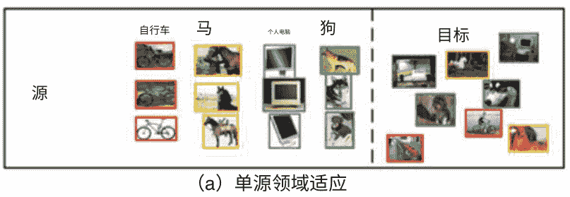
（a）单源领域适应

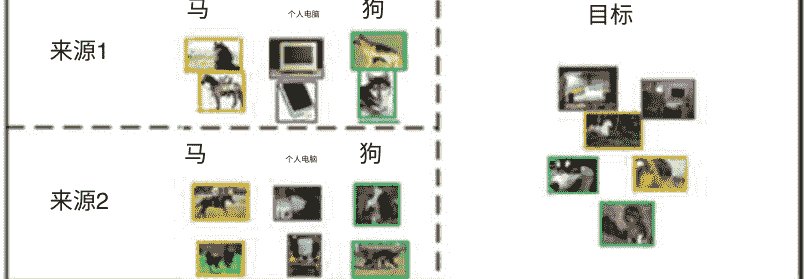
（b）香草MSDA场景

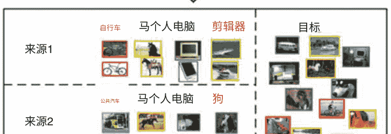
（c）类别转移场景中的MSDA

图12.1三种领域适应场景的演示。（a）单源无监督领域适应（uDA）假设所有源示例都是在i.i.d.条件下从某个潜在分布中抽取的。（b）香草MSDA场景考虑到多源和目标示例完全共享它们的类别。（c）类别转移中的MSDA假设源数据是从不同的源分布中收集的，与不同的类别集相关。

通过执行两个交替的领域适应来学习DCTN：

-   1. 多源领域鉴别器通过使用多路对抗迁移学习来更新，以最小化目标和每个源域之间的领域差距，从而预测它们对应的多源困惑度得分；
    2. 特征提取器和类别分类器通过使用多源标记和目标伪标记数据进行判别性微调。

在这种学习方式中，多路对抗迁移学习隐式地减少了这些源之间的领域偏移。判别性适应有助于学习更可分类的特征[28]，并防止由于不匹配的类别而导致的负迁移效应。

深入研究我们的目标数据分类原则，我们发现，这种方式巧合地与一个众所周知的MSDA理论一致，即源分布加权组合规则[22]，其中目标分布被假设为多源分布的线性组合。这种老式理论导致了目标域上预期分类错误的上界。然而，这种多源权重组合涉及一组由经验经验精心设计的超参数，因此在深度领域适应背景下是不切实际的。相比之下，DCTN采用多路对抗学习来自动决定源之间的平衡权重。

我们对DCTN进行了一些实证评估。它们分别在三个DA基准上进行，即Office-31、Image-CLEF和Digit-five，分别对应2对1、2对1和4对1的多源迁移学习案例。在MSDA基准协议下，DCTN的表现相当竞争力，与一些最先进的深度DA基线相比。在MSDA类别转移协议下，DCTN通过改变多个源的公共类别的比例来进行转移。在这种情况下，深度DA基线几乎遭受负迁移，其结果下降，而DCTN始终保持正迁移性能。这些实验与一个事实一致，即我们的DCTN是一个解决多源迁移学习各个方面的优越框架。本章部分基于[32]的早期工作。

#### 12.2 问题设置

本节将介绍两种MSDA场景。第一种场景在大多数现有研究中很常见，而第二种和第三种场景则来自最近在单源DA方面的进展。

##### 12.2.1 香草MSDA迁移场景

在多源迁移方面，有 M个不同的源分布，分别用 {P_j(\mathbf{x}, \mathbf{y})}_{j=1}^{M}表示，其中带标签的源域图像集合为 {(\mathbf{X}_j, \mathbf{Y}_j)}_{j=1}^{M}，分别从这些分布中获取，其中 \mathbf{X}_j = \{\mathbf{x}_{j,i}\}_{i=1}^{N_j}表示总共 N_j个来自源_j的图像，\mathbf{Y}_j = \{\mathbf{y}_{j,i}\}_{i=1}^{N_j}表示它们的标签。此外，还有一个目标分布 P_t(\mathbf{x}, \mathbf{y})，其中目标图像集合 \mathbf{X}^{(t)} = \{\mathbf{x}_i^{(t)}\}_{i=1}^{N^{(t)}} 从未标记的观测 \mathbf{Y}^{(t)}中抽取的样本。这些 M+1 个领域集合已被视为一个训练集合，测试集 (\mathbf{X}_{test}, \mathbf{Y}_{test}) = \{\mathbf{x}_i^{test}, \mathbf{y}_i^{test}\}_{i=1}^{N_{test}} 从 P_t(\mathbf{x}, \mathbf{y})中抽取，以评估模型的适应性能。

###### 12.2.1.1 类别转移

在传统的多源领域自适应设置下，来自不同源的样本共享相同的类别集合。与此相反，我们引入了一个新的多源领域自适应场景，其中 M个源的类别也是不同的。严格来说，给定一个类别集合 C_j = \bigcup_{i=1}^{|\mathbf{Y}_s|} \{\mathbf{y}_{j,i}\}作为领域_j的类别集合，C_j和C_k之间的关系已经从 C_j \cup C_k = C_j \cap C_k推广到 C_j \cap C_k \subseteq C_j \cup C_k，其中C_j \cap C_k表示源_j和 k之间的公共类别。假设目标数据域标记为这些源中类别的并集 (C_t = \bigcup_{j=1}^{M} C_j)，然后我们术语 C_j \cap C_k = C_j \cup C_k作为多个源域中的类别转移 {(\mathbf{X}_j, \mathbf{Y}_j)}_{j=1}^{M}。

#### 12.3 深度鸡尾酒网络 (DCTNs)

无论是在原始情况下还是在其他多源传输场景中，MSDAs都很难解决。主要困难在于保持影响目标数据分类的源之间的平衡。直观地说，如果一个源域与目标域共享更多的共同特征，那么它们的标记数据应该能够提供比其他源域更可靠的判别信息。我们的解决方案，即深度鸡尾酒网络 (DCTNs)，是基于这个动机提出的。DCTN的框架已经在图12.2中简洁地展示，并且我们将其详细说明如下。

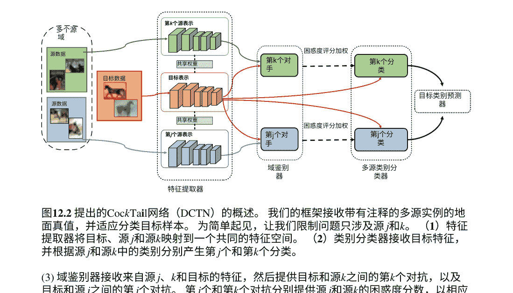

-   1. 特征提取器将目标、源j和源k映射到一个共同的特征空间。
    2. 类别分类器接收目标特征，并根据源j和源k中的类别分别产生第j个和第k个分类。
    3. 域鉴别器接收来自源j、k和目标的特征，然后提供目标和源k之间的第k个对抗，以及目标和源j之间的第j个对抗。第j个和第k个对抗分别提供源j和源k的困惑度分数，以相应地加权第j个和第k个分类。
    4. 目标分类运算符整合所有加权分类结果，然后预测目标类别的跨类别转换。

##### 12.3.1 框架

DCTN的框架由四个部分组成: 三个子网络，即特征提取器，（多源）域鉴别器，（多源）类别分类器；以及一个目标分类运算符，该规则将三个子网络组合起来对目标样本进行分类。

特征提取器 F, 引入了一个深度卷积网络作为骨干, 将来自多个源和目标的图像映射到一个共同的特征空间中。由于对抗学习在学习领域不变特征和每个目标-源特定关系方面表现良好，我们采用了一个共享领域的流水线来获得最佳和可扩展的转换映射。

（多源）领域鉴别器 D, 一组 M 个源特定鉴别器 {Dj}Mj=1 被构建用于对抗。给定一张来自源 j 或目标域的图像 x, 首先经过特征提取器 F, 然后领域鉴别器 D 接收输出特征 F(x)。然后源特定鉴别器 Dj 对 F(x) 进行分类，判断其是否来自源 j 或目标。来自每个源的数据不会触发其他源的那些鉴别器，而来自每个目标实例 x(t) 会使领域鉴别器 D 产生 M 个源特定的鉴别结果 {Dj(F(x(t)))}Mj=1，每个结果对应一个源域。它们被用于更新鉴别器 D，并为目标分类运算符提供目标-源困惑度分数 {s(x(t); F, Dj)}Mj=1。

$s(\mathbf{x}^{(t)}; F, D_j) = -\log(1 - D_j(F(\mathbf{x}^{(t)})))$ (12.1)

（多源）类别分类器 C，由 M个源特定类别预测器 $\{C_j\}_{j=1}^{M}$组成，用于进行分类。每个预测器都是一个由相应源 j中的类别集配置的softmax分类器。给定图像 $\mathbf{x}$，类别分类器将其从特征提取器映射作为输入，然后：

-   - 如果图像来自源 j，只有 $C_j$的值被激活并提供梯度进行训练；
    - 如果它是一个目标图像 $\mathbf{x}^{(t)}$，所有源特定的预测器提供 M个分类结果， $\{C_j(F(\mathbf{x}^{(t)}))\}_{j=1}^{M}$到目标分类运算符。

目标分类运算符，将用于对目标示例进行分类的关键，被引入到设置中为每个目标样本分配最终标签。更具体地说，对于每个目标特征 $F(\mathbf{x}^{(t)})$，目标分类运算符采用每个源困惑度得分 $s(\mathbf{x}^{(t)}; F, D_j)$ 来重新加权相应的源特定预测 $C_j(F(\mathbf{x}^{(t)}))$，然后累积结果以对目标示例 $\mathbf{x}^{(t)}$进行分类。如果类别 $c \in \bigcup_{j=1}^{M} \{C_j\}$被认为，置信度 $\mathbf{x}^{(t)}$属于 $c$ 表示为

$C_t(c|\mathbf{x}^{(t)}) := \sum_{c \in C_j} \frac{s(\mathbf{x}^{(t)}; F, D_j)}{\sum_{c \in C_k} s(\mathbf{x}^{(t)}; F, D_k)} C_j(c|F(\mathbf{x}^{(t)}))$ (12.2)

其中 $C_j(c|F(\mathbf{x}^{(t)}))$是源 j对应于类 c的基于softmax的入口值。$\mathbf{x}^{(t)}$被归类为具有最高置信度的类别。总和 $\sum_{c \in C_j}$ 意味着只有具有类 $c$的源才能参与困惑度得分的重新加权。它被发明用于结合原始和多源类别转换设置。由于该模块独立估计每个类别的置信度，因此在这些转换的类别中的变化仅仅修改了目标分类运算符中的类别组合，而不会影响三个子网络的结构或参数。这个设计可以在普通和类别转移的场景中灵活部署。

##### 12.3.2 学习

DCTN允许一种替代的适应流程。简而言之，在预训练特征提取器和分类器之后，DCTN结合了上述多方对抗者，从所有领域中获得了相互映射，然后使用M个源标记和目标伪标记示例对特征提取器和类别分类器进行微调，试图赋予领域不变性更多的区分能力。这两个步骤交替重复，直到达到时代限制。

###### 12.3.2.1 多方对抗适应

多方对抗适应被提出来从每个源领域到目标领域进行领域不变特征的适应。它被描述为一个遵循经验损失目标：

$$ \min_{F} \max_{D} V (F, D; \overline{C}) = \mathcal{L}_{adv}(F, D) + \mathcal{L}_{cls}(F, \overline{C}) \quad (12.3)$$

其中

$$ \mathcal{L}_{adv}(F, D) = \frac{1}{M} \sum_{j}^{M} \left[ \mathbb{E}_{\boldsymbol{x} \sim \mathbf{X}_{j}}[\log D_{j}(F (\boldsymbol{x}))] \right. $$
$$ \left. \quad + \mathbb{E}_{\boldsymbol{x}^{(t)} \sim \mathbf{X}_{t}}[\log(1 - D_{j} (F (\boldsymbol{x}^{(t)})))] \right] \quad (12.4)$$

其中第一项表示我们的多路对抗机制；第二项表示源特定分类的M个交叉熵损失。分类器 $C$ 被固定为 $C$ 以提供稳定的梯度值。

值得注意的是，方程12.3的优化对于 $D$ 有效，但对于 $F$ 无效。由于特征提取器学习捕捉从 $M$ 源到目标的映射，领域分布同时发生变化，导致对抗性振荡可能对我们的特征提取器产生不利影响。针对这个问题，Tzeng等人[29]提到当源和目标的特征映射共享它们的架构时，可以使用领域混淆来替代对抗目标，这样更稳定地学习映射 $F$。在我们的情况下，我们设计了多领域混淆损失：

$$ \mathcal{L}_{adv}(F, D) = \frac{1}{M} \sum_{j}^{M} \left[ \mathbb{E}_{\boldsymbol{x} \sim \mathbf{X}_{j}} \mathcal{L}_{cf}(\boldsymbol{x}; F, D_{j}) \right. $$
$$ \left. \quad + \mathbb{E}_{\boldsymbol{x} \sim \mathbf{X}_{t}} \mathcal{L}_{cf}(\boldsymbol{x}^{(t)}; F, D_{j}) \right] \quad (12.5)$$

其中

$$ \mathcal{L}_{cf}(\boldsymbol{x}; F, D_{s_{j}}) = $$
$$ \quad \frac{1}{2} \log D_{j}(F (\boldsymbol{x})) + \frac{1}{2} \log(1 - D_{j}(F (\boldsymbol{x}))) \quad (12.6)$$

在基于随机梯度的优化中，多路对抗适应从 $M$ 个源中接收 $N$ 个样本来迭代更新新特征提取器 $F$。然而，来自不同源的样本并不总是有助于提高适应性能。实际上，随着训练的进行，冗余的源样本会拖累先前的适应结果。

[1] He, K., Zhang, X., Ren, S., Sun, J.: 深度残差学习用于图像识别。 在:IEEE计算机视觉和模式识别会议论文集 (2016)

[2] He, K., Gkioxari, G., Dollár, P., Girshick, R.: Mask R-CNN。 在: 国际计算机视觉会议上, pp. 2980–2988. IEEE (2017)

[3] Hinton, G., Vinyals, O., Dean, J.: 提取神经网络中的知识。 在: NIPS深度学习和表示学习研讨会 (2015)

[4] Liu, H., Cao, Z., Long, M., Wang, J., Yang, Q.: 分离以适应: 通过渐进分离进行开放域适应。 在: IEEE计算机视觉和模式识别会议论文集 (2019)

[5] Long, M., Zhu, H., Wang, J., Jordan, M.I.: 无监督领域适应与残差传输网络。 在: Advances in Neural Information Processing Systems会议上, pp. 136–144 (2016)

[6] Luo, Z., Zou, Y., Hoffman, J., Fei-Fei, L.F.: 跨领域和任务的标签高效学习可迁移表示 在: 高级神经信息处理系统会议, 第165-177页 (2017)

[7] Panareda Busto, P., Gall, J.: 开放集领域适应 在: 国际计算机视觉会议 (2017)

[8] Peng, X., Usman, B., Kaushik, N., Wang, D., Hoffman, J., Saenko, K., Roynard, X., Deschaud, J.E., Goulette, F., Hayes, T.L.: VisDA: 一个用于视觉领域适应的合成到真实的基准 在: IEEE计算机视觉和模式识别会议论文集, 第2021-2026页

[9] Ren, S., He, K., Girshick, R., Sun, J.: Faster R-CNN: 实时目标检测与区域建议网络 在: 高级神经信息处理系统会议, 第91-99页

[10] Russakovsky, O., Deng, J., Su, H., Krause, J., Satheesh, S., Ma, S., Huang, Z., Karpathy, A., Khosla, A., Bernstein, M., Berg, A.C., Fei-Fei, L.: ImageNet大规模视觉识别挑战. Int. J. Comput. Vision 115(3), 211–252 (2015). https://doi.org/10.1007/s11263-015-0816-y

[11] Saenko, K., Kulis, B., Fritz, M., Darrell, T.: 将视觉类别模型适应到新领域。 在: 欧洲计算机视觉会议论文集 (2010)

[12] Saito, K., Yamamoto, S., Ushiku, Y., Harada, T.: 通过反向传播进行开放集领域适应。 在: 欧洲计算机视觉会议论文集 (2018)

[13] Venkateswara, H., Eusebio, J., Chakraborty, S., Panchanathan, S.: 用于无监督领域适应的深度哈希网络。 在: IEEE计算机视觉和模式识别会议论文集 (2017)

[14] You, K., Long, M., Cao, Z., Wang, J., Jordan, M.I.: 通用领域适应. 在:IEEE计算机视觉和模式识别会议论文集 (2019)

[15] Zhang, J., Ding, Z., Li, W., Ogunbona, P.: 重要性加权对抗网络用于部分领域适应. 在: IEEE计算机视觉和模式识别会议论文集 (2018)为了解决这个问题，我们设计了一种简单而有效的硬域批量挖掘技术来提高训练效率。然而，来自不同源的样本并不总是有助于提高适应性能。实际上，随着训练的进行，冗余的源样本会拖累先前的适应结果。

更具体地说，假设在每次迭代中，DCTN随机选择$m$个目标示例 $\{\boldsymbol{x}_i^{(t)}\}_{i=1}^m$ 和$m$个源示例，即$\{\{\boldsymbol{x}_{1,i}\}_{i=1}^m, \cdots, \{\boldsymbol{x}_{M,i}\}_{i=1}^m\}$。因此，每次迭代中，训练DCTN的样本总数为$m(M + 1)$。我们按照Eq. 12.3中所述的方式进行鉴别器训练。至于特征提取器的训练，我们独立考虑目标和每个源之间的对抗。鉴于此，源-目标鉴别器损失

$$-\log D_j(F(\boldsymbol{x}_{j,i})) \quad \text{对于}\quad \boldsymbol{x}^{(t)}\quad \text{来自} \quad m\quad \text{源-}j\text{样本。因此，如果}F\text{最差地将目标样本转换为混淆源 }j^* \text{，则结果为 } j^* = $$

$$\arg \max_j \{\sum_i^m - \log D_j(F(\boldsymbol{x}_{j,i})) - \log[1 - D_j(F(\boldsymbol{x}_i^{(t)} \quad ))]\}_{j=1}^M.\text{ 基于域混淆损失，我们使用源 }j^*\text{和小批量中的目标示例来训练特征提取器 }F\text{。这种随机学习方法由算法3表示。}$$

###### 12.3.2.2 目标判别适应

与对抗性DA中现有工作的精神相似，多路对抗适应过程在学习过程中不考虑类别变化。尽管DCTN已经能够学习到域不变特征，但这并不能保证它们在目标域中的可分类性。David等人[1]证明了一个事实，为了适应目标中的源分类器，DA算法需要在域间工作出类别分类器。在MSDA的背景下，这更具挑战性，因为域不一致性不仅存在于每个源-目标对之间，还存在于多个源之间。此外，在各种MSDA情况下，它们的分类器应该考虑到跨 $M$ 个源和目标的类别不对齐。

```
算法3：通过在线硬域批处理挖掘进行小批量学习

输入：小批量$\{\boldsymbol{x}_i^{(t)}\}_{i=1}^m; \{\{\boldsymbol{x}_i^j, y_i^j\}_{i=1}^m\}_{j=1}^M\}$从$\mathbf{X}_t$和$\{\{(\mathbf{X}_j, \mathbf{Y}_j)\}_{j=1}^M$中采样；特征提取器$F$；域鉴别器$D$；类别分类器$C$。

输出：更新的$F^*$

1: 选择源$j^* \in [M]$，其中$j^*=$
$$\arg \max_j \{\sum_i^m- \log D_j(F(\boldsymbol{x}_i^{j}))- \log(1-D_j(F(\boldsymbol{x}_i^{(t)})))\}_{j=1}^M;$$
2: 通过梯度下降更新$F^*$。
2: $\mathcal{L}_{adv}^{j^*} = \sum_i^m \mathcal{L}_{cf}(\boldsymbol{x}_i^{j^*}; F, D_{j^*}) + \mathcal{L}_{cf}(\boldsymbol{x}_i^{(t)}; F, D_{j^*})$
3: 用$\mathcal{L}^{s j^*}$替换等式12.3中的$\mathcal{L}_{adv}$通过等式12.3更新 $F$
4: 返回 $F' = F$
```

为了实现这个通用的目标类别预测器，我们通过区分性微调将目标示例与源数据结合起来学习可分类特征 $\{C_j\}_{j=1}^{M_j}$ 或 $\{C_j^{(R)}\}_{j=1}^{M}$。我们开发了一种可切换的策略来选择和注释目标样本，然后使用它们来训练特征提取器 $F$ 和多源分类器，使用多源标记样本和伪标记的目标示例。特别是，我们使用在先前迭代中获得的目标类别预测器来注释每个目标样本。该策略选择合适的目标示例 $\mathbf{X}^{(p)}$ 并分配它们的伪标签 $\{\mathbf{Y}^{(p)}\}$。选择和注释原则根据不同的场景进行切换。具体而言，DCTN的判别适应性表现为

$$\min_{F, C} \mathcal{L}_{cls}(F, C) = \sum_{j}^{N} \mathbb{E}_{(\mathbf{x}, y) \sim (\mathbf{X}_j, \mathbf{Y}_j)} [\mathcal{L}(C_j(F(\mathbf{x})), y)] + \mathbb{E}_{(\mathbf{x}^{(t)}, \hat{y}^{(t)}) \sim (\mathbf{X}_t^{(p)}, \mathbf{X}_t^{(p)})} [\sum_{\hat{y} \in \mathcal{C}_s} \mathcal{L}(C_{\hat{s}}(F(\mathbf{x}^{(t)})), \hat{y}^{(t)})] \quad (12.7)$$

其中第一项和第二项分别表示来自多个源图像的分类损失 $\{\mathbf{X}_j, \mathbf{Y}_j\}_{j=1}^{M_j}$ 和带有伪标签的目标图像 $\{\mathbf{X}_t^{(p)}, \mathbf{Y}_t^{(p)}\}$。我们应用目标分类算子来分配伪标签，并选择置信度高于给定阈值 $\gamma$ 的样本进入 $\mathbf{X}_t^{(p)}$ 中。

由于目标预测是通过整合多源分类得到的，因此没有明确的可学习目标分类器。如图12.7的第二项所示，我们应用多源类别分类器来反向传播伪目标分类错误。具体而言，给定一个带有伪标签类别 $\hat{y}$ 的目标实例 $\mathbf{x}^{(t)}$, 我们找到包含该类别的源 $\hat{s}$ ($\hat{y} \in \mathcal{C}_{\hat{s}}$), 然后通过多源分类损失的总和来更新我们的网络，即第二项中的 $\sum_{\hat{y} \in \mathcal{C}_{\hat{s}}} \mathcal{L}(C_{\hat{s}}(F(\mathbf{x}^{(t)})), \hat{y})$。

通过结合上述两个过程，我们总结了DCTN的适应算法，见算法4。

##### 12.3.3 与源分布加权组合规则的联系

令 $\{\mathcal{P}_j\}_{j=1}^{M_j}$ 和 $\mathcal{P}_t$ 表示 $M$ 源分布和目标分布。^3 给定一个实例 $\mathbf{x}$, $\{\mathcal{P}_j(F(\mathbf{x}))\}_{j=1}^{M_j}$ 和 $\mathcal{P}_t(F(\mathbf{x}))$ 表示从 $\{\mathcal{P}_j\}_{j=1}^{M_j}$ 中抽取的概率。

> ^3由于每个样本 $\mathbf{x}$ 对应一个唯一的类别 $y$, $\{\mathcal{P}_j\}_{j=1}^{M_j}$ 和 $\mathcal{P}_t$ 可以被视为从 $\{P_j(\mathbf{x}, y)\}_{j=1}^{N_j}$ 和 $P_t(\mathbf{x}, y)$ 的等效嵌入，我们已经讨论过。

### 算法 4 DCTN的学习算法

输入：$N$源标记数据集 $\{ \mathbf{X}_j, \mathbf{Y}_j\}_{j=1}^{M}$；目标未标记数据集 $\mathbf{X}_t$；初始化特征提取器 $F$；多源类别分类器 $C$和领域鉴别器 $D$；置信度阈值 $\gamma$；熵阈值 $\varsigma$；最大对抗迭代次数 $\beta$。

输出：训练良好的特征提取器 $F^*$，领域鉴别器 $D^*$和多源类别分类器 $C^*$。

1: 预训练 $C$ 和 $F$
2: 当未收敛时执行
3:  多路对抗适应：
4:  对于 $1:\beta$ 执行
5:      从 $\{ \mathbf{X}_j\}_{j=1}^{M}$ 和 $\mathbf{X}_t$ 中抽取小批量样本；
6:      通过公式12.3更新 $D$；
7:      通过算法3更新 $F$；
8:  结束循环
9:  目标鉴别适应：
10: 通过公式12.2估计 $\mathbf{X}_t$的置信度。具有大于 $\gamma$的置信度的样本 $\mathbf{X}_t^{(p)} \subset \mathbf{X}_t$获得注释 $\mathbf{Y}_t^{(p)}$；
11: 通过公式12.7更新 $F$和 $C$。
12: 结束循环
13: 返回 $F^* = F; C^* = C; D^* = D$。

分别为 $\mathcal{P}_s$和 $\mathcal{P}_t$。在源分布加权组合规则[22]中，目标分布可以被定义为多源分布的混合，通过将源分布加权并通过隐式单纯形进行归一化

$= \{\boldsymbol{\lambda} : \lambda_j \geq 0 \& \sum_{j=1}^{M} \lambda_j = 1\}_{j=1}^{M}$，即 $\quad \mathcal{P}_t(F(\mathbf{x})) = \sum_{c \in \mathcal{C}_k}^{M} \lambda_k \mathcal{P}_k(F(\mathbf{x}))$。对于为了简单起见，在我们的讨论中，我们只考虑了基本的MSDA情况，即 $\mathcal{C}_k = \bigcup_{j}^{M}$ 在这个目标分布组合的假设下，理想的

目标分类器 $C_t(c|\mathbf{x}^{(t)})$呈现为源分类器的线性加权组合 $\{C_j(c|F(\mathbf{x}^{(t)}))\}_{j=1}^{M}$：

$$C_t(c|\mathbf{x}^{(t)}) = \sum_{j=1}^{M} \frac{\lambda_j \mathcal{P}_j(F(\mathbf{x}^{(t)}))}{\mathcal{P}_t(F(\mathbf{x}^{(t)}))} C_j(c|F(\mathbf{x}^{(t)})) \quad (12.8)$$

形式上，我们将公式框入适应性学习理论中，以提供更多的解释。具体而言，$\mathcal{X}$表示输入空间（我们考虑的特征空间）；$f: \mathcal{X} \rightarrow \mathbb{R}$ 表示要学习的目标函数（对应于真实值）；$h: \mathcal{X} \rightarrow \mathbb{R}$ 表示关于特定潜在分布的假设（对应于分类器）；$L: \mathbb{R} \times \mathbb{R} \rightarrow \mathbb{R}$ 表示作用于特征的凸损失函数（对应于分类错误）。因此，学习问题大多数情况下被形式化为

$$\min_{h \in \mathcal{H}} \mathcal{L}(\mathcal{P}, h, f) = \mathbb{E}_{\mathbf{x} \sim \mathcal{P}}[L(h(\mathbf{x}), f(\mathbf{x}))] \quad (12.9)$$

根据 $\{\mathcal{P}_j\}_{j=1}^{M}$ 和 $\mathcal{P}_t$, $\mathbf{x}$ 表示 $\mathbf{x}$ 的特征，且 $\mathbf{x} \sim \mathcal{P}(F( \mathbf{x}))$ 的定义，我们希望将其写成 $\mathbf{x} \sim \mathcal{P}(\mathbf{x})$。假设 $M$ 个源假设 $\{h_1, \cdots, h_M\}$ 对应 $\{\mathcal{P}_1, \cdots, \mathcal{P}_M\}$，因此，对于所有 $j \in [M]$, $\mathcal{L}(\mathcal{P}, h, f) \leq \epsilon, (\epsilon > 0)$，源分布权重组合规则保持目标域上的期望损失的上界：

$$h_{\lambda}(x) = \sum_{j=1}^{M} \frac{\lambda_j \mathcal{P}_j(x)}{\mathcal{P}_t(x)} h_j(x) \quad \text{s.t.} \quad \mathcal{P}_t(x) = P_{\lambda}(x) = \sum_{j=1}^{M} \lambda_j \mathcal{P}_j(x), \quad \forall \lambda \in \quad (12.10)$$

给定目标分布 $\mathcal{P}_t$ 作为多个源分布的混合 $P_{\lambda}$ of $\{\mathcal{P}_j\}_{j=1}^{M}$ w.r.t., $\lambda$, 其混合假设的期望损失 $h_{\lambda}$ 至多为 $\epsilon$ w.r.t. 任何目标函数 $f$, 即 $\mathcal{L}(P_{\lambda}, h_{\lambda}, f) \leq \epsilon$。

混合假设 $h_{\lambda}$ 很容易对应于 $C_t(c|\mathbf{x}^{(t)})$ in Eq. 12.8。定理证明了，如果我们能够找到理想的超参数 $\lambda$ 使得目标分布可以表示为多个源分布的混合 $P_{\lambda}$ 在 Eq. 12.10 中，目标分类器将保持目标分布的上界，而无需使用目标标记数据进行训练。

重新审视我们在方程12.2中的 DCTN 目标分类原则。有趣的是，我们的 DCTN 还利用源-目标关系来聚合多源分类结果，这与决定目标分类器的动机类似。但与方程12.8相比，DCTN 选择的权重完全根据对抗学习的结果。显然，这对于深度对抗领域适应非常方便。具体来说，我们首先将方程12.2转化为我们的分析背景，然后转变为

$$h_t(\mathbf{x}) = \sum_{j=1}^{M} \frac{-\log(1 - D_j^*(\mathbf{x}))}{\sum_{k=1}^{M} -\log(1 - D_k^*(\mathbf{x}))} h_j(\mathbf{x}) \quad (12.11)$$

其中 $\forall j \in [M]$, $D_j$ 表示源$_j$ 和目标之间的最优领域鉴别器。用 $M$ 个源特定的假设替换 $\{C_j(c|F(\mathbf{x}^{(t)}))\}_{j=1}^{M}$，方程式12.11完全退化为方程式12.2。

#### 12.4 实验

在多源域适应的视觉分类背景下，我们评估了所有实验中目标分类算子的预测准确性。我们考虑了多源域适应的两种转移场景，即普通多源域适应设置和类别转移。我们的 DCTN 模型都是在 PyTorch 平台下实现的。

##### 12.4.1 实验设置

我们使用了三个UDA基准，即Office-31 [27]，ImageCLEF-DA<sup>5</sup>和Digits-five进行MSDA评估。Office-31是一个包含31个类别和4652张图像的目标识别基准，分布在三个视觉数据子集A（Amazon），D（DSLR）和W（Webcam）中。ImageCLEF-DA源自域适应挑战，由12个对象类别（飞机、自行车、鸟、船、瓶子、公共汽车、汽车、狗、马、显示器、摩托车和人）组成，这些类别在三个著名的真实世界数据集I（ImageNet ILSVRC 2012）、P（Pascal VOC 2012）和C（Caltech-256）中共享。每个类别包含50张图像。Digits-five包括从公共数据集mt（MNIST）[16]、mm（MNIST-M）[6]、sv（SVHN）[23]、up（USPS）和sy（Synthetic Digits）[6]中提取的五个数字图像集。分别对应于MNIST、MNIST-M、SVHN和Synthetic Digits中的图像。对于每个域，我们从中抽取25,000张图像用于训练，9000张图像用于测试。由于USPS中只有9298张图像，我们选择整个基准作为我们的域。对于真实世界图像，我们遵循先前的研究[18, 19]中的测试流程进行公平比较；对于数字数据集，评估是在目标域的测试集上进行的。

为了在Office-31和ImageCLEF-DA中进行识别，现有的深度DA方法[18, 19]通常使用Alexnet [15]作为它们的骨干。为了进行公平比较，我们选择了一个从Alexnet派生的DCTN架构：提取器F被设计为一个具有三个最大池化运算符的五层全卷积网络，(多源)类别分类器C是一个三层全连接多任务网络。它们被堆叠成与Alexnet流水线完全对应的架构。对于我们的多路对抗学习，我们选择了一个具有两个头分类器作为域判别器D的CNN。与现实世界的图像相比，数字感知到的视觉特征较少。因此，我们选择了更轻量级的结构作为我们的特征提取器F、类别分类器C和域判别器D用于数字识别。

实现细节可以在原始论文[32]中找到。

##### 12.4.2 在Vanilla设置中的评估

基线现有的MSDA工作几乎缺乏对真实世界视觉识别基准的全面评估。在我们的实验中，我们引入了两个浅层架构的基线：稀疏FRAME（sFRAME）[30]和SGF[10]作为Office-31实验中的多源方法。此外，我们还将DCTN与包括传统的单源视觉UDA方法在内的进行比较，例如转移分量分析（TCA）[25]和测地线流核（GFK）[9]，以及最先进的深度方法：深度领域混淆（DDC）[12]，深度重建分类网络（DRCN）[8]，反向梯度（RevGrad）[5]，领域适应网络（DAN）[18]，残差传输网络（RTN）[19]和联合适应网络（JAN）[20]。由于这些方法最初是为单源设置而发明的，我们使用Source combine标准来评估它们在MSDA中：所有源域被合并成传统的单源与目标设置。该标准证明了多源是否有价值进行开发。此外，作为Source combine和多源标准中的基线，我们将所有源的图像合并到训练基于骨干的多源分类器，并将其应用于分类目标图像。它们被称为Source only，确认评估的多源迁移学习是否失败。

目标识别我们在所有转移案例中报告结果，并与基准进行比较。表12.1和12.2显示，DCTN在Office-31的转移任务中表现最好A,W→D和A,D→W，在D,W→A中表现出色。在深度表示的支持下，DCTN大幅优于传统的MSDA基准。此外，当单一源深度DA基准（即DAN、RTN、JAN和RevGred）将组合源视为单一域时，它们的源组合性能被最佳单一源基准抑制。

在比较中，DCTN基本上优于所有基准。这表明，如果我们将MSDA视为单一源DA问题，性能增益无法完全挖掘出来。但通过DCTN的数据传输，成功利用了多个源的潜在能力来提高适应性效果。在比较中，ImageCLEF-DA中的源组合基准显示出更优越的性能，但仍然不及我们的DCTN。这验证了无论域大小是否相等，DCTN仍然能够从多源转移中学习到更具传递性和区分性的特征，适用于自然图像领域。

数字识别与现实世界的视觉识别基准不同，数字五总共包括五个领域数据集，专门用于多领域学习，因此我们考虑了DCTN上的4对1迁移学习结果，考虑了领域的不变化：mm，mt，sy，up→sv和mt，sv，sy，up→mm，并提供了平均性能。我们将DCTN与RevGred，DAN及其源组合转移变体进行比较。

结果已在表12.3中显示。首先，显然单一源DA方法的准确率落后于其源组合。这意味着随着M的增加，多个源提供的边缘比仅涉及单个源的边缘更有助于提高转移性能。然而，我们观察到这些源组合通常比它们的单一源除了mt，sv，sy，up→mm之外表现更差。换句话说，尽管多个源带来的潜在好处，单一源深度DA方法通常会遭受负面转移，因此难以利用多源信息来优化模型。相比之下，DCTN始终显示出与仅源的正向转移性能，并且无论源-## 通过深度鸡尾酒网络进行多源领域适应

表12.1 在Office-31基准上的分类准确率（%）在香草设置中的MSDA

| 标准 | 模型 | W→D | A→D | A→W | D→W | D→A | W→A | 平均 |
| :--- | :--- | :--- | :--- | :--- | :--- | :--- | :--- | :--- |
| 单一来源 | TCA | 95.2 | 60.8 | 61.0 | 93.2 | 51.6 | 50.9 | 68.8 |
|  | GFK | 95.0 | 60.6 | 60.4 | 95.6 | 52.4 | 48.1 | 68.7 |
|  | DDC | 98.5 | 64.4 | 61.8 | 95.0 | 52.1 | 52.2 | 70.7 |
|  | DRCN | 99.0 | 66.8 | 68.7 | 96.4 | **56.0** | 54.9 | 73.6 |
|  | WMMD | 98.7 | 64.5 | 66.8 | 95.9 | 53.8 | 52.7 | 72.1 |
|  | RevGrad | 99.2 | 72.3 | 73.0 | 96.4 | 53.4 | 51.2 | 74.3 |
|  | DAN | 99.0 | 67.0 | 68.5 | 96.0 | 54.0 | 53.1 | 72.9 |
|  | RTN | **99.6** | 71.0 | 73.3 | 96.8 | 50.5 | 51.0 | 73.7 |
|  | JAN | 99.5 | 71.8 | 74.9 | 96.6 | **58.3** | 55.0 | 76.0 |
|  |  | A,W→D | A,D→W | D,W→A |  |  |  |  |
| 源组合 | 仅源 | 98.1 | 93.2 | 50.2 |  |  |  | 80.5 |
|  | RevGrad | 98.8 | 95.2 | 53.4 |  |  |  | 82.5 |
|  | DAN | 98.8 | 95.2 | 53.4 |  |  |  | 82.5 |
|  | JAN | 96.0 | 94.0 | 57.2 |  |  |  | 82.4 |
| 多源 | 仅源 | 98.2 | 92.7 | 51.6 |  |  |  | 80.8 |
|  | RDALR | 31.2 | 36.9 | 20.9 |  |  |  | 29.7 |
|  | sFRAME | 54.5 | 52.2 | 32.1 |  |  |  | 46.3 |
|  | SGF | 39.0 | 52.0 | 28.0 |  |  |  | 39.7 |
|  | DCTN (我们的) | **100.0** | **96.9** | 55.4 |  |  |  | **84.1** |

（粗体值表示最先进的性能。）

表12.2 在ImageCLEF-DA基准上的分类准确率（%）在香草设置中的MSDA

| 标准 | 模型 | I→P | C→P | I→C | P→C | P→I | C→I | 平均 |
| :--- | :--- | :--- | :--- | :--- | :--- | :--- | :--- | :--- |
| 单一来源 | RevGrad | 66.5 | 63.5 | 89.0 | 88.7 | 81.8 | 79.8 | 78.2 |
|  | DAN | 67.3 | 61.6 | 87.7 | 88.4 | 80.5 | 76.0 | 76.9 |
|  | RTN | 67.4 | 63.0 | 89.5 | 90.1 | 82.3 | 78.0 | 78.4 |
|  | JAN | 67.2 | 63.5 | **91.3** | 91.0 | 82.8 | 80.0 | 79.3 |
|  |  | I,C→P | I,P→C | P,C→I |  |  |  |  |
| 源组合 | 仅源 | 68.3 | 88.0 | 81.2 |  |  |  | 79.2 |
|  | DAN | **68.8** | 88.8 | 81.3 |  |  |  | 79.6 |
|  | JAN | **68.7** | 89.4 | 82.6 |  |  |  | 80.2 |
| 多源 | 仅源 | 68.5 | 89.3 | 81.3 |  |  |  | 79.7 |
|  | DCTN (我们的) | **69.6** | **91.0** | **83.3** |  |  |  | **81.3** |

（粗体值表示最先进的性能。）

组合和多源集成，DCTN始终优于其他基线。在表12.3中，我们的DCTN的平均准确率超过第二名3.6%。特征可视化在Office-31的适应任务实验中，我们在适应之前和之后可视化了DCTN的激活（分类之前的特征）。为简单起见，源域 A, D都已经

表12.3 在原始设置中，Digits-five数据集上的分类准确率（%）
| 标准 | 模型 | mm→sv | mt→sv | sy→sv | up→sv | mt→mm | sv→mm | sy→mm | up→mm | 平均 |
| :--- | :--- | :--- | :--- | :--- | :--- | :--- | :--- | :--- | :--- | :--- |
| 单一来源 | 仅源 | 45.3 | 46.4 | 67.4 | 29.7 | 58.0 | 49.6 | 54.8 | 43.7 | 49.4 |
|  | RevGrad | 45.3 | 46.4 | 67.4 | 29.7 | 58.0 | 49.6 | 54.8 | 43.7 | 49.4 |
|  | DAN | 43.2 | 42.2 | 67.1 | 38.5 | 53.5 | 51.8 | 58.8 | 40.5 | 49.5 |
|  |  | mm, mt, sy, up → sv | | | | mt, sv, sy, up → mm | | | | |
| 源组合 | 仅源 | 72.2 | | | | 64.1 | | | | 68.2 |
|  | RevGrad | 62.6 | | | | 62.9 | | | | 62.8 |
|  | DAN | 71.0 | | | | 66.6 | | | | 68.8 |
| 多源 | 仅源（e） | 64.6 | | | | 60.7 | | | | 62.7 |
|  | RevGrad（e） | 62.6 | | | | 62.9 | | | | 62.8 |
|  | DAN（e） | 62.6 | | | | 62.9 | | | | 62.8 |
|  | DCTN（我们的） | **78.7** | | | | **71.6** | | | | **75.2** |

(e) 表示原始基线的集成版本

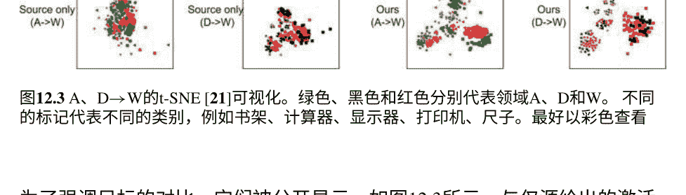

为了强调目标的对比，它们被分开显示。如图12.3所示，与仅源给出的激活相比，A → W和D → W的激活都显示出良好的适应模式。这意味着DCTN能够成功地学习具有多个来源的可转移特征。此外，目标激活变得更加清晰，以进行分类，这表明DCTN学习的特征具有良好的区分性。最后，即使多源传输已经包含了困难的传输任务（A → W），DCTN仍然能够在D → W的性能不降低的情况下实现目标数据的适应。

##### 12.4.3 在类别转移设置中的评估

在这个小节中，我们转向评估在类别转移场景中的DCTN，其中多个源不保证共享它们的类别。我们将我们的DCTN与仅源（源组合）以及另外两个最先进的基线方法进行比较，即DAN（源组合），RevGrad（源组合），根据它们在四个MSDA转移案例中发生转移后的准确性：A，D→W在Office-31中，I，P→C在ImageCLEF-DA中。

如何评估？由于源类别转移是在MSDA场景中新提出的，基准应该被修改以在这种情况下评估DA算法。具体来说，假设 M个源涉及 C个类别， \(C_p \le C\) 表示它们的公共类别的数量。由于 M=2，我们考虑 C个类别的字母顺序，并取前 \(C - C_p\) 个类别。最后，\(\frac{C - C_p}{2}\) 将源特定的私有类别作为类别，然后将其余比例 \(C_p\) \(\frac{C}{2}\) 表示公共类别。为了揭示在这种情况下的综合基线，我们通过指定公共类别比例 \(c^p\) 来评估它们。分别为 {0, 0.3, 0.5, 0.7, 1}。

> $DA(\frac{C_p}{C}) = Acc(\frac{C'_p}{C} = 1) - Acc(\frac{C_p}{C})$ \quad (12.12)

其中 \(Acc(\frac{C_p}{C})\) 表示当公共类别比例为 \(C_p/C\) 时模型的准确性，然后 \(Acc(\frac{C'_p}{C} = 1)\) 表示在普通MSDA中训练的模型的准确性。该公式展示了由于不一致的源类别而引起的性能下降。较低的值意味着算法受到这种负面影响的影响较小，在这种情况下表现更加稳健。最后，我们使用转移增益来进一步确认迁移学习的可用性。转移增益通过将基线的准确性与仅源的准确性相减来计算。较高的值更好。正值无疑意味着迁移可用，而负值意味着DA方法扩大了域偏移。

结果评估涵盖了两种转移情况，分别在图12.4、12.5和12.6中说明了基于平均准确性、降级准确性和转移增益的性能。DCTN在不同比例的公共类别和转移情况下始终优于其他基线。一般来说，随着源包含更多的公共类别，改进效果越大。考虑到由DA（图12.5）测量的相对增强效果，我们发现在ImageCLEF-DA中，仅源和DCTN表现相当。在Office-31中，仅源甚至获得比DCTN更低的DA值。请注意，这并不意味着仅源优于我们的DCTN。特别是与DA算法（即DAN、RevGrad和DCTN）相比，仅源经历了完全监督学习，因此不会受到类别不对齐引起的风险。

在某种程度上，它应该被视为一种连续的策略，更倾向于有标签数据的监督训练的安全性，而不是适应没有标签数据的领域。回顾图12.4中Source-only的绝对性能，显然，Source-only几乎比所有的DA方法都差。

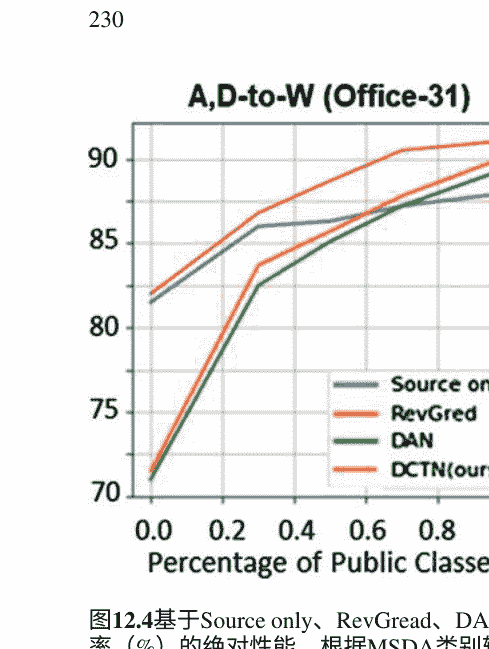

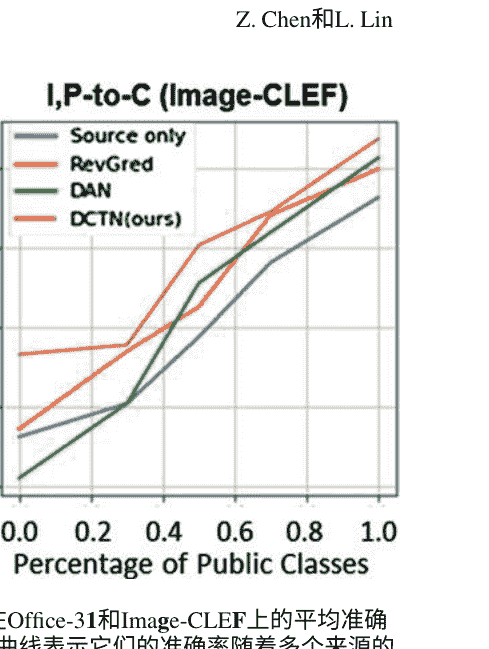

图12.4 基于Source only、RevGrad、DAN和DCTN在Office-31和Image-CLEF上的平均准确率（%）的绝对性能，根据MSDA类别转移场景。曲线表示它们的准确率随着多个来源的公共类别的增加而变化。越高越好。

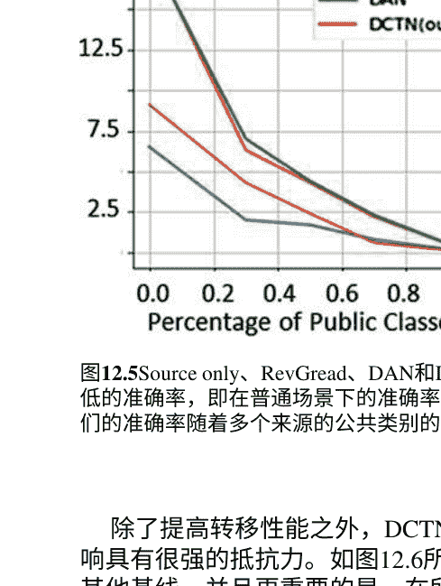

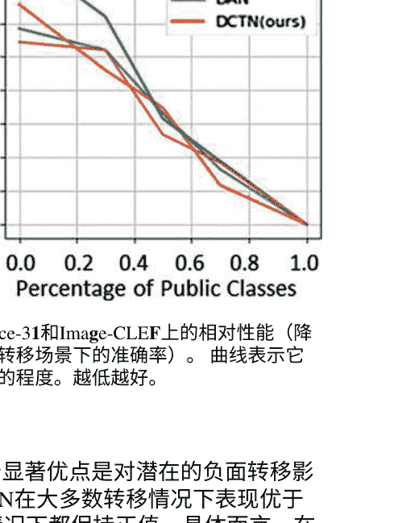

图12.5 Source only、RevGrad、DAN和DCTN在Office-31和Image-CLEF上的相对性能（降低的准确率，即在普通场景下的准确率减去在类别转移场景下的准确率）。曲线表示它们的准确率随着多个来源的公共类别的增加而下降的程度。越低越好。

除了提高转移性能之外，DCTN的另一个显著优点是对潜在的负面转移影响具有很强的抵抗力。如图12.6所示，DCTN在大多数转移情况下表现优于其他基线，并且更重要的是，在所有转移情况下都保持正值。具体而言，在

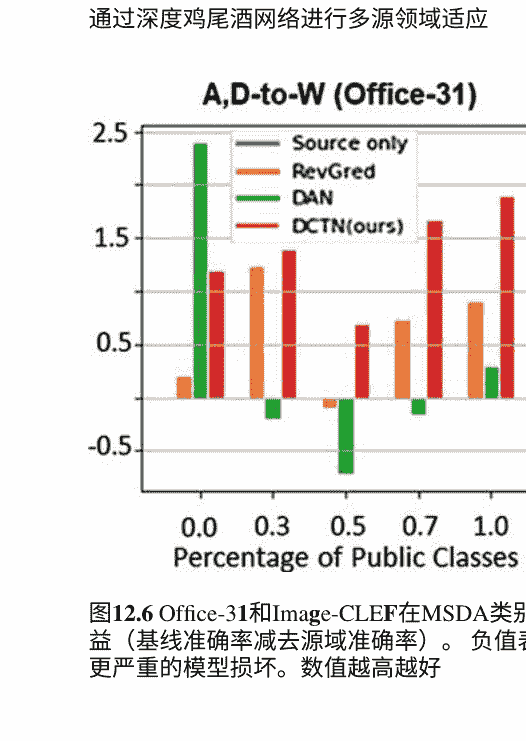

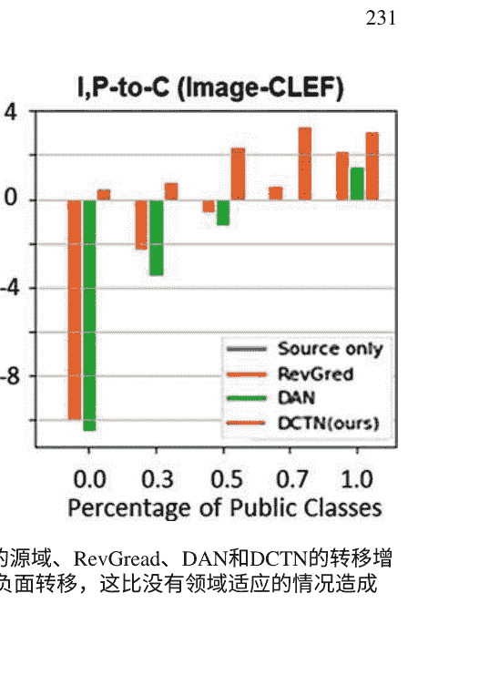

图12.6 Office-31和Image-CLEF在MSDA类别下的源域、RevGrad、DAN和DCTN的转移增益（基线准确率减去源域准确率）。负值表示负面转移，这比没有领域适应的情况造成更严重的模型损坏。数值越高越好

在Office-31中，DAN在A、D→W的0%公共类别下展现出令人惊讶的转移性能，但随着公共类别的改变，其转移增益相当不稳定。在一般情况下，RevGrad的性能比DAN更稳定且更好，然而它们两者都不可避免地受到负迁移的影响，并且完全被我们的DCTN所抑制。在ImageCLEF-DA中，DAN和RevGrad几乎没有提供有希望的迁移性能。具有讽刺意味的是，当公共类别的数量很少时，它们的迁移甚至会导致比领域转移更多的模型损坏。相比之下，我们的DCTN始终通过迁移学习来使模型受益。

#### 12.5 结论

在本章中，我们探讨了多源域适应的无监督领域适应问题。这是领域适应领域的一个古老课题，然而由于这种适应问题的固有困难，最近的研究很少能够成功地解决深度特征学习的问题。我们提出了一个新的MSDA框架，称为深度混合网络，从多个源中学习可迁移和有区分性的深度特征。该方法可以应用于普通的MSDA设置和类别转移，其中来自不同源的类别是不一致的。实证结果显示了DCTN在不同迁移场景下的出色性能。

致谢我们要感谢其他作者，即徐瑞佳、左旺盟和严俊杰，对原始论文的贡献。

### 参考文献

1. Ben-David, S., Blitzer, J., Crammer, K., Kulesza, A., Pereira, F., Vaughan, J.W.: 从不同领域学习的理论。机器学习。 **79**(1), 151-175 (2010年)
2. Bousmalis, K., Silberman, N., Dohan, D., Erhan, D., Krishnan, D.: 无监督的像素级领域适应与生成对抗网络 (2016年)。预印本。arXiv:1612.05424
3. Deng, J., Dong, W., Socher, R., Li, L.J., Li, K., Fei-Fei, L.: ImageNet: 一个大规模的分层图像数据库。在: 2009年IEEE计算机视觉和模式识别会议上。CVPR 2009年, 第248-255页。IEEE, 皮斯卡塔韦 (2009年)
4. Duan, L., Xu, D., Tsang, I.W.H.: 多源领域适应: 一种领域相关的正则化方法。IEEE Trans. Neural Netw. Learn. Syst. **23**(3), 504-518 (2012年)
5. Ganin, Y., Lempitsky, V.: 通过反向传播进行无监督领域适应。在: 机器学习国际会议, 第1180-1189页 (2015年)
6. Ganin, Y., Ustinova, E., Ajakan, H., Germain, P., Larochelle, H., Laviolette, F., Marchand, M., Lempitsky, V.: 神经网络的领域对抗训练。J. Mach. Learn. Res. **17**(1), 2096-2100 (2016年)
7. Gebru, T., Hoffman, J., Fei-Fei, L.: 野外细粒度识别: 一种多任务领域自适应方法 (2017). 预印本。arXiv:1709.02476
8. Ghifary, M., Kleijn, W.B., Zhang, M., Balduzzi, D., Li, W.: 用于无监督领域自适应的深度重建-分类网络。在: 欧洲计算机视觉大会上, pp. 597-613. Springer, Cham (2016)
9. Gong, B., Shi, Y., Sha, F., Grauman, K.: 用于无监督领域自适应的测地线流核。在: 2012年IEEE计算机视觉与模式识别会议(CVPR)上, pp. 2066-2073. IEEE, Piscataway (2012)
10. Gopalan, R., Li, R., Chellappa, R.: 对象识别的领域自适应: 一种无监督方法。在: 2011年IEEE国际计算机视觉大会(ICCV)上, pp. 999-1006. IEEE, 皮斯卡维 (2011)
11. Gretton, A., Smola, A., Huang, J., Schmittfull, M., Borgwardt, K., Schölkopf, B.: 通过核均值匹配实现协变量偏移。数据集偏移机器学习。 **3**(4), 5 (2009)
12. Hoffman, J., Tzeng, E., Darrell, T., Saenko, K.: 同时进行跨领域和跨任务的深度迁移。在: 计算机视觉应用中的领域适应, 第173-187页。Springer, Cham(2017)
13. Jhuo, I.H., Liu, D., Lee, D., Chang, S.F.: 具有低秩重建的鲁棒视觉领域适应。在: 2012年IEEE计算机视觉和模式识别会议(CVPR), 第2168-2175页。IEEE, Piscataway (2012)
14. Krishna, R., Zhu, Y., Groth, O., Johnson, J., Hata, K., Kravitz, J., Chen, S., Kalantidis, Y., Li, L.J., Shamma, D.A.: 视觉基因组: 使用众包密集图像注释连接语言和视觉。国际计算机视觉。 **123**(1), 32-73 (2017)
15. Krizhevsky, A., Sutskever, I., Hinton, G.E.: 使用深度卷积神经网络进行Imagenet分类。在: 神经信息处理系统的进展, 第1097-1105页 (2012年)
16. LeCun, Y., Bottou, L., Bengio, Y., Haffner, P.: 基于梯度的学习应用于文档识别。IEEE会议记录 **86** (11), 2278-2324页 (1998年)
17. Long, J., Shelhamer, E., Darrell, T.: 用于语义分割的全卷积网络。在: IEEE计算机视觉和模式识别会议论文集, 第3431-3440页 (2015年)
18. Long, M., Cao, Y., Wang, J., Jordan, M.: 使用深度适应网络学习可迁移特征。 在： 机器学习国际会议，第97-105页（2015年）
19. Long, M., Zhu, H., Wang, J., Jordan, M.I.: 使用残差传输网络进行无监督领域适应。 在： 神经信息处理系统的进展，第136-144页（2016年）
20. Long, M., Zhu, H., Wang, J., Jordan, M.I.: 具有联合适应网络的深度迁移学习。 在： 第34届国际机器学习大会论文集，第70卷，第2208-2217页（2017年）。JMLR.org
21. Maaten, L.v.d., Hinton, G.: 使用t-SNE可视化数据。 J. Mach. Learn. Res. 9（11月），2579-2605页（2008年）
22. Mansour, Y., Mohri, M., Rostamizadeh, A.: 多源域适应。 在： 神经信息处理系统进展，第1041-1048页（2009年）
23. Netzer, Y., Wang, T., Coates, A., Bissacco, A., Wu, B., Ng, A.Y.: 用无监督特征学习在自然图像中读取数字。 在： NIPS深度学习和无监督特征学习研讨会（2011年）
24. Pan, S.J., Yang, Q.: 转移学习综述. IEEE Trans. Knowl. Data Eng. 22(10), 1345–1359 (2010)
25. Pan, S.J., Tsang, I.W., Kwok, J.T., Yang, Q.: 基于转移组件分析的领域适应. IEEE Trans. Neural Netw. 22(2), 199–210 (2011)
26. Ren, S., He, K., Girshick, R., Sun, J.: Faster R-CNN: 实时目标检测与区域建议网络. 在: Advances in Neural Information Processing Systems, pp. 91–99(2015)
27. Saenko, K., Kulis, B., Fritz, M., Darrell, T.: 将视觉类别模型适应到新领域. 在: 计算机视觉–ECCV 2010, pp. 213–226 (2010)
28. Saito, K., Watanabe, K., Ushiku, Y., Harada, T.: 非监督领域适应的非对称三训练 (2017). 预印本。arXiv:1702.08400
29. Tzeng, E., Hoffman, J., Saenko, K., Darrell, T.: 对抗性判别领域适应 (2017). 预印本。arXiv:1702.05464
30. Xie, J., Hu, W., Zhu, S.C., Wu, Y.N.: 学习自然图像模式的稀疏帧模型. Int. J. Comput. Vis. 114 (2-3) , 91-112 (2015)
31. Xu, K., Ba, J., Kiros, R., Cho, K., Courville, A., Salakhudinov, R., Zemel, R., Bengio, Y.: 展示，关注和告诉: 具有视觉注意力的神经图像字幕生成. 在: 国际机器学习会议,第2048-2057页 (2015)
32. Xu, R., Chen, Z., Zuo, W., Yan, J., Lin, L.: 深度鸡尾酒网络: 多源无监督领域适应与类别偏移。在: 计算机视觉和模式识别IEEE会议论文集，第3964-3973页（2018年）
33. Yang, J., Yan, R., Hauptmann, A.G.: 使用自适应的支持向量机进行跨领域视频概念检测。 在：第15届ACM国际多媒体会议论文集，第188-197页。ACM，纽约（2007年）

## 第13章 零样本任务转移

Arghya Pal和Vineeth N. Balasubramanian

#### 13.1 引言

精心策划的标记数据是当今计算机视觉、机器学习和深度学习应用的关键驱动力。 最先进的深度网络利用了大量的精心策划的标记数据，并通过优化数十万个参数来学习非线性函数逼近。 然而，为了完成几个真实世界的视觉任务，获取精心策划的标记数据需要长时间的人工劳动、昂贵的基于传感器的数据收集、对数据策划和标记的深入专业知识，这些共同使得标记数据收集成为一项昂贵且耗时的任务[42, 53]。 因此，许多视觉任务被认为是昂贵的，从业者要么使用带有噪声的标记数据，要么使用少量的精心策划的标记数据，往往导致模型性能较差。 在本章中，我们通过提出一种替代方法来解决这个问题，即学习一个元学习器，可以为没有任何标记数据的任务获取模型参数。 我们将我们提出的方法称为零样本任务转移，这是对现有的从类别级别识别扩展到视觉任务级别回归的一种新颖扩展。

被归类为“自我产生的运动”，认知科学已经展示了结果[21, 47]，在这些结果中，人类受试者（尤其是儿童）和其他少数哺乳动物从他们对旧学习任务（自身运动、肩膀运动）的认知理解和关联中适应了一个全新的任务（比如深度估计）- 而不需要对新任务进行明确的监督。这样的


这一发现支持了这样一个观点，即通过对一些基础任务及其与新任务和基础任务之间的潜在关系的知识进行操作，可以对新的认知任务进行泛化。基于这个前提，我们提出了一种元学习算法，通过利用一组已知任务的知识来回归新的零样本任务（即没有可用的真实值的任务）参数。具体而言，我们提出的元学习算法将利用已知任务（即具有真实值的任务）的编码器-解码器模型参数，并学习回归零样本任务的编码器-解码器模型参数。从形式上讲，给定已知任务的编码器-解码器模型参数{τ1, τ2, ..., τm}，一个元学习网络 F(.)回归零样本任务τ(m+1)的编码器-解码器模型参数。

然而，仅仅从已知任务的知识中构建元学习器是不可行的，因为元学习器可以收敛到元参数流形上的任何不希望的点。因此，我们引入了源任务和零样本任务之间的成对任务相关性作为元学习网络 F(.)的附加输入。在我们的框架中，成对任务相关性作为条件输入，帮助元学习网络 F(.)收敛到所需的编码器-解码器模型参数。关于如何获得成对任务相关性可能有各种合理的观点。本研究利用“众人的智慧”来获取这些成对任务相关性，作为实现所提出目标的一个例子。将众人的智慧作为学习过程的一部分进行编码已经在几个视觉[38]和非视觉[42, 49]机器学习应用中找到了立足点。使用标准的高保真度投票聚合方法，如Dawid-Skene投票聚合算法[14]，将众人的意见进行整合。在讨论结束时，我们将展示我们提出的方法不仅限于通过聚合“众人的智慧”获得的成对任务相关性，还可以包含从其他来源获得的任何其他任务相关性，例如来自[54]。

利用任务相关性作为元学习器学习的一部分，可能与Taskonomy [54]的工作相似，但我们提出的方法和最终目标在许多方面是不同的：（1）Taskonomy是一种已知到已知的任务转移方法，作为一个附加点，该工作允许从多个已知源任务向单个已知目标任务的知识转移，而我们的方法是从已知任务参数和成对任务相关性的知识中回归零样本任务的编码器-解码器参数；（2）为了转移到新任务，Taskonomy需要大量的目标标记数据；另一方面，我们的框架可以在没有任何目标标记数据的情况下回归一个新任务；（3）Taskonomy工作的主要目标是基于最佳转移在一个已知任务到另一个已知任务之间构建任务图；而我们的方法利用成对任务关系回归零样本任务模型参数；（4）我们的方法可以回归多个零样本任务。本章部分内容基于[39]的早期工作。

> 我们的贡献可以总结如下：
- 一种元学习算法，用于回归没有标记数据的视觉任务的高性能模型参数。
- 所提出的元学习器可以回归多个零样本任务的模型参数。通过较小的已知任务参数和任务关系集合，我们的方法推断出多个零样本任务的高性能模型参数，接近（或在某些情况下，优于）基于真实数据学习的最新模型性能。
- 我们还展示了在迁移学习环境中使用回归模型参数的零样本任务的结果。

#### 13.2 相关工作

迁移学习迁移学习的方法假设任务之间存在相关性，并提供了从一个任务到另一个任务的监督信息的原则性方法。从[40]的调查中，我们可以得出结论，有四种主要的方法可以实现迁移学习：（1）基于实例的迁移学习处理源域标记数据的重新加权，并将其重用到目标域。TrAdaBoost [12]或基于主动学习的方法[22]是一些著名的基于实例的迁移学习方法的名称。与此不同的是，（2）基于关系网络的迁移方法尝试映射关系网络，如马尔可夫逻辑网络（MLN）[34]，以帮助从源域到目标域的迁移。另一方面，（3）基于参数共享的迁移方法发现共享参数或先验[9, 25]作为知识传递的一种方式。最后，（4）基于特征相似性的迁移方法发现可传递的特征作为知识传递的一种方式。对卷积神经网络（CNN）特征[52]的实验表明，初始层可以在任务之间重复使用，因为它们的滤波器显示出相似性。最近，Zamir等人[54]基于从一个源任务到目标任务的最佳传递构建了一个包含26个视觉任务的任务图。然而，与我们的方法不同，以上方法都无法在没有对新任务的基本真实数据的情况下适应新任务。

多任务学习在多任务学习范式中，同时学习一组相关任务，以实现任务的泛化。与独立学习任务不同，与所有任务相关的共同表示改善了最终性能和泛化能力。然而，任务共享的一个注意事项是负迁移的影响[25]，即不相关的任务可能相互影响并导致性能下降。为了缓解这个问题，已经提出了几种利用任务分组概念的方法。一些方法假设先验[9, 13]，然后对其进行迭代，而其他方法则假设任务参数位于低维流形[1]或共同子空间[25]上。

分布式多任务学习[30]侧重于学习分布在共享网络上的多个任务。所有这些方法的主要约束因素是访问所有任务的真实标签。与我们的方法不同，它们无法适应没有标记样本的零样本任务。与我们的方法不同，它们无法适应没有标记样本的零样本任务。

域适应主要，域适应方法处理将知识从数据丰富的域转移到数据稀缺的域的问题[11, 31]。域适应方法关注学习具有域不变特征的领域对齐。这种适应技术主要通过域对齐的概念来区分。例如，[18]通过对齐CNN的中层特征来执行域适应，而[18]等方法使用基于自动编码器的技术将相关知识从源域传输到目标域。其他方法包括基于聚类的方法[46]，或者最近使用生成对抗网络[29]。最近的无监督域适应工作[8, 45]利用源域和目标域的差异进行成功的适应。然而，仍然无法避免需要大量标记数据来自两个域。

元学习元学习在文献中最好被描述为学习学习的过程[32]。基于黑盒适应的方法使用神经网络方法来推断参数[20, 35]。其他努力假设任务参数位于低维子空间上[3]，共享共同的先验[26]等。另一方面，[17, 23]是基于优化的方法的例子。最近的元学习方法将所有任务参数视为输入信号，以学习帮助少样本学习[36, 48]，迁移学习[44]和域适应[18]的元流形。与我们的方法不同，所有上述方法都假设某些任务的标记数据可用。因此，这些方法无法扩展到没有标记数据的新任务。据我们所知，这是第一次涉及在没有任何任务的基本真实信息的情况下回归模型参数的工作。

利用弱监督学习的方法，我们的方法利用任务相关性作为一种来自“众包智慧”的弱监督。最近，[38]在生成对抗网络中使用标注函数的弱监督形式，并学习了带标签图像的联合分布。在主题建模中，[2]使用启发式方法构建了一个分层主题模型。方法如[42, 49]使用固定数量的用户定义的标注函数来生成未标记图像的标签。这些方法使用最大似然估计和因子图来整合每个标注函数的结果。Bach等人[4]在结构学习框架中利用远程监督信号作为弱监督。

MeTaL [43]通过识别遵循层次结构的多个子任务，并为子任务提供标注函数来扩展了[42]。在零样本任务泛化的背景下，我们发现在强化学习（RL）[37]中的工作，其中一个代理被分配执行未见指令或具有复杂和较长序列的指令。代理利用其训练知识作为弱监督。

#### 13.3 方法论

在这项工作中，我们提出了一种元学习算法，该算法从已知任务的模型参数（具有基本事实的任务）中学习，并回归新的零样本任务（我们无法访问基本事实的任务）的高性能模型参数。我们的元学习器被分配来完成 K 个视觉任务，即T= {τ1, τ2, …, τm}。我们的方法假设每个任务的模型参数位于一个元流形 M_θ上。在 K 个任务中，我们将前 m 个任务称为已知任务，即 {τ1, τ2 , … , τm}，因为我们可以访问这些任务的基本事实。

因此，他们的模型参数 {(θ_i) : i = 1, 2, …, m}和在元流形 M_θ上的位置是已知的。其余的任务， {τ_{(m+1)}, …, τ_K}, 被称为零样本任务，为了方便起见，我们无法获得这组任务的真实数据。我们试图建模一个元学习器 F(.)，它从已知任务的模型参数中学习，然后回归零样本任务的模型参数，即：

```
math
F(θ_{τ1}, θ_{τ2}, \dots, θ_{τm}) = θ_{τj}, \quad j = m+1, \dots, K \quad (13.1)

```

然而，仅仅从已知任务的知识中构建一个元学习器 F(.)是不可行的，因为元学习器可以自由地学习元流形上的任何坐标，而不是收敛到所需的点。为了构建一个实用的元学习器，我们使 F(.)能够利用任务间的关系知识。我们引入一个任务相关矩阵 Γ，作为元学习函数 F(.)的附加输入，与已知任务的模型参数一起。

任务相关矩阵是一个非对称矩阵，其中每个条目 γ_{i,j} ∈ Γ 表示两个任务 τi 和 τj 之间的任务转移程度。通过这种方式，任务相关矩阵 Γ 充当元学习网络 F(.) 的条件。因此，我们的方程式 13.1 现在变为：

```
math
F(θ_{τ1}, θ_{τ2}, \dots, θ_{τm}, Γ) = θ_{τj}, \quad j = m+1, \dots, K \quad (13.2)

```

元学习器 F(.) 本身是一个具有参数 W 的网络，如图 13.1 所示。我们使用以下目标函数/损失来获得 F(.) 的最优值：

```
math
min_W \sum_{i=1}^m \| F((θ_{τ1}, γ_{1,i}), \dots, (θ_{τm}, γ_{m,i})); W) - θ_{τ_i}^* \|^2 \quad (13.3)

```

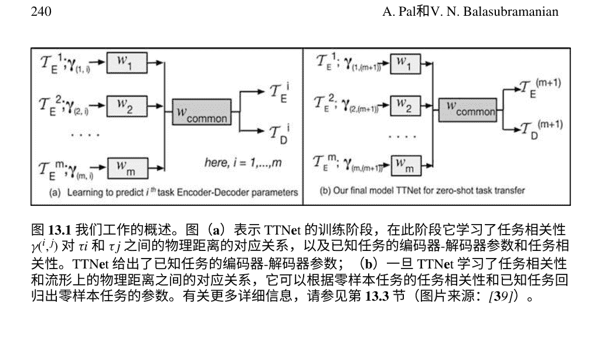

不失一般性，可以假设所有任务模型参数都具有编码器-解码器网络结构，就像[54]中一样（尽管我们的方法不一定受此假设的限制）。通过这样做，任何任务模型的参数 θτi 可以被认为由一个编码器网络 θEτi 和一个解码器网络 θDτi 组成。我们注意到，在这项工作中，仅考虑源任务的编码器网络就足以回归零样本任务的编码器和解码器网络 {τ(m+1), · · · , τK}。因此，我们将方程式13.3重写如下：

```
min_W Σ_{i=1}^{m} ||F((θ_{E_{τ1}}, γ_{1,i}), · · · , (θ_{E_{τm}}, γ_{m,i}); W) − (θ_{E_{τ_i}}^*, θ_{D_{τ_i}}^*)||^2   (13.4)
```

在这个方程中，θ_{E_{τ_i}}^* 和 θ_{D_{τ_i}}^* 是已知任务的学习模型的编码器和解码器参数，τ_i ∈ T。在本节的最后以及第13.4节中，我们提供了关于获取 θ_{E_{τ_i}}^*，θ_{D_{τ_i}}^* 和已知任务的模型参数。

仅仅在元流形 M_θ 上最小化上述损失函数的损失可能不足够。重要的是，回归的编码器-解码器参数在实际任务中表现良好（损失低）。为了实现这一点，将数据模型一致性损失添加到方程13.4中。令 D_{θ_{D_{τ_i}}}(.) 表示由 θ_{D_{τ_i}} 参数化的数据解码器，以及 ε_{θ_{E_{τ_i}}}(.) 表示由 θ_{E_{τ_i}} 参数化的数据编码器给定输入图像 X，回归的编码器-解码器模型参数应该使损失函数相对于真实值 y 最小化，即：

```
$$\min_W \sum_{i=1}^{m} \mathcal{F}(\theta_{E_{\tau_i}}, \gamma_{1, i}), \dots, (\theta_{E_{\tau_m}}, \gamma_{m, i}); W) - (\theta_{E_{\tau_i}}^*, \theta_{D_{\tau_i}}^*)\| ^2$$
$$+ \lambda \sum_{x \in X_{\tau_i} \atop y \in Y_{\tau_i}} \mathcal{L} \left( \mathcal{D}_{\theta_{D_{\tau_i}}} (\mathcal{E}_{\theta_{E_{\tau_i}}} (x)), y \right)$$
(13.5)
```

元网络根据我们在方程13.5中的目标函数，$\mathcal{F}(.)$从$m$个已知任务中获取输入。为了适应$m$个已知任务的编码器参数，$\mathcal{F}(.)$最初有$m$个分支。这$m$个分支分别由参数化$\{W_1, W_2, \cdots, W_m\}$来表示。随后，$W_i$被连接起来并输入到一个共享块$W$中，该块回归编码器和解码器模型参数。受[52]中讨论的直觉驱动，我们观察到初始的$m$个分支参数化为$W_i \mid m_{i=1}$，将从个体任务中学习到一个共同的表示空间，并且后续的层参数化为$W_{common}$，学习相关任务表示之间的关系，从而实现对零样本任务的泛化。关于$W_1, W_2, ..., W_m, W_{common}$和$\mathcal{F}(.)$的更具体细节在第13.4节中讨论。

学习任务相关矩阵$\Gamma$。我们的方法使用任务相关矩阵$\Gamma$来学习任务之间的关系。正如前面所述，这是通过众包获得的，尽管我们提出的框架不受此限制，可以接受任何其他任务相关概念。我们在本章的第13.4节中展示了通过其他方法（如[54]）获得任务相关矩阵$\mathbf{T}_N$的结果。

输入元网络是在每个已知任务的模型参数批次上进行训练的$\tau_1, \cdots, \tau_m$。我们紧密遵循[51]的步骤来获取每个任务的模型参数$p$。我们假设数据集$B_j$的大小为$S_j$，其中包含实例$(X_{\tau_j}, \mathbf{Y}_{\tau_j})$对应于任务$\tau_{j}$。为了得到一个编码器-解码器模型参数集$\theta_{\tau_j}$，对于这个已知任务$\tau_j$，我们遵循以下步骤：一个基学习器，即编码器-解码器，由$\mathcal{D}(\mathcal{E}(x; \theta_{E_{\tau_j}}); \theta_{D_{\tau_j}})$在任务$\tau_j$的数据集$B_j$的子集$b_j^k$上进行训练（大小为$s$，$s << S_j$），并使用适当的损失函数（均方误差、交叉熵或类似的基于任务的损失函数）。结果，得到一个编码器-解码器模型参数的实例$\Theta_{\tau_j}^1 = \{\theta_{E_{\tau_j}}^1, \theta_{D_{\tau_j}}^1\}$，任务$\tau_j$的子集被获得。类似地，使用有放回抽样策略从数据集$B_j$中获得任务$\tau_j$的标记数据的子集$\{b_j^1, b_j^2, \dots, b_j^P\}$。在此之后，获得一组模型参数（对应于每个采样的子集），即$\Theta_{\tau_j} = \{\Theta_{\tau_j}^1, \dots, \Theta_{\tau_j}^P\}$，为任务$\tau_j$获得“最优”模型参数。类似的过程用于获得每个已知任务$\{\Theta_{\tau_1}^1, \dots, \Theta_{\tau_m}^P\}$的“最优”模型参数。这些模型参数（在所有已知任务中总共有$p \times m$个）作为我们的元网络$\mathcal{F}(.)$的输入。另一方面，我们通过训练另一个基础学习器$\mathcal{D}(\mathcal{E}(x; \theta_{E_{\tau_j}}); \theta_{D_{\tau_j}})$，该模型在任务$\tau_j$的完整数据集$B_j$上进行训练。我们将这样的编码器-解码器模型参数表示为$\Theta_{\tau_i}^* =$

${θ_{Eτ_j}^{*}, θ_{Dτ_j}^{*}}$，这些作为元学习函数 $\mathcal{F(.)}$ 在 Eqs. 13.3 和 13.5 中的基准真值

元学习器的训练为了学习 $W$，$\mathcal{F(.)}$ 在 Eq. 13.5 中描述的目标函数上进行训练。给定已知任务模型参数 ${\{θ_{τ_1}, θ_{τ_2}, \cdots, θ_{τ_m}\}}$（如上所述）和 $Γ$，$\mathcal{F(.)}$ 以两种模式进行训练：（1）自我模式和（2）转移模式。给定一个已知任务 $τ_i$，网络 $\mathcal{F(.)}$ 仅更新第 $i$ 个分支 $W_i$ 和共享的 $W$，而跳过所有其他 $(m-1)$ 个分支的参数。而在转移模式下，网络 $\mathcal{F(.)}$ 更新所有其他 $(m-1)$ 个分支的权重，即 $W_{-i}$，意味着所有的 $W_j = i, j = 1, \cdots, m$ 和共享的 $W$，但现在跳过第 $i$ 个分支的参数。在自我模式下，$\mathcal{F(.)}$ 以自编码器的方式运行，强制执行回归模型参数 $θ_{τ_i}$，以便尽可能接近实际的模型参数 $θ_{τ_i}^{*}$（从真实数据中学习得到）。而在传输模式下，$\mathcal{F(.)}$ 从一组源任务（而不是 $τ_i$）中学习任务的转移，并将模型参数映射到接近实际模型参数 $θ_{τ_i}^{*}$，在元流形 $\mathcal{M}_θ$ 上。元学习器 $\mathcal{F(.)}$ 在推理时以传输模式运行（即用于零样本任务转移）。

回归零样本参数给定最优参数 $W^{*}$（在执行算法5后学习得到），已知任务的编码器模型参数和 $Γ$，$\mathcal{F(.)}$ 回归零样本任务的编码器和解码器模型参数，即 $\mathcal{F}_{W^{*}}((θ_{Eτ_1}, γ_{1, j}), \cdots, (θ_{Eτ_m}, γ_{m, j}))$ 对于所有的 $j = (m + 1), \cdots, T$。此外，我们注意到任务的顺序在实现算法5的过程中没有任何明显的差异。

| **算法5 训练我们的元网络，TTNet** |
| :--- |
| **输入**：训练轮数-`Num_Epochs`；自我模式/转移模式所需的迭代次数-`k`；最优模型参数 `{θ_{τ_1}^{*}, …, θ_{τ_m}^{*}}`；已知任务的最优模型参数；任务相关矩阵 `Γ={γ_{ij}}(m×T矩阵)`。 |
| **输出**：训练好的 `TTNet` 模型，`F(.)`。 |
| 1: 对于 `Num_Epochs` 次循环<br>2: &nbsp;&nbsp;&nbsp;&nbsp;对于 `j=1, …, m` 做<br>3: &nbsp;&nbsp;&nbsp;&nbsp;&nbsp;&nbsp;&nbsp;&nbsp;&nbsp;&nbsp;&nbsp;&nbsp;对于 `k` 步骤做 &nbsp;&nbsp;&nbsp;&nbsp;&nbsp;&nbsp;&nbsp;&nbsp;&nbsp;&nbsp;&nbsp;&nbsp;&nbsp;&nbsp;&nbsp;&nbsp;&nbsp;&nbsp;&nbsp;&nbsp;&nbsp;&nbsp;&nbsp;&nbsp;&nbsp;&nbsp;&nbsp;&nbsp;&nbsp;&nbsp;&nbsp;&nbsp;&nbsp;&nbsp;&nbsp;&nbsp;&nbsp;&nbsp;▷ 自我模式<br>4: &nbsp;&nbsp;&nbsp;&nbsp;&nbsp;&nbsp;&nbsp;&nbsp;&nbsp;&nbsp;&nbsp;&nbsp;&nbsp;&nbsp;&nbsp;&nbsp;&nbsp;&nbsp;&nbsp;&nbsp;通过优化来更新权重 `W_i, W_common` 的 `F(.)`：<br>&nbsp;&nbsp;&nbsp;&nbsp;&nbsp;&nbsp;&nbsp;&nbsp;&nbsp;&nbsp;&nbsp;&nbsp;&nbsp;&nbsp;&nbsp;&nbsp;&nbsp;&nbsp;&nbsp;&nbsp;&nbsp;&nbsp;&nbsp;&nbsp;&nbsp;&nbsp;&nbsp;&nbsp;&nbsp;&nbsp;&nbsp;&nbsp;&nbsp;&nbsp;&nbsp;&nbsp;&nbsp;&nbsp;&nbsp;&nbsp;&nbsp;`‖F((θ_{E_{τ_1}}, γ_{1,i}), …, (θ_{E_{τ_m}}, γ_{m,i}); W_i, W_common) - (θ_{E_{τ_i}}^{*}, θ_{D_{τ_i}}^{*})‖^2`<br>&nbsp;&nbsp;&nbsp;&nbsp;&nbsp;&nbsp;&nbsp;&nbsp;&nbsp;&nbsp;&nbsp;&nbsp;&nbsp;&nbsp;&nbsp;&nbsp;&nbsp;&nbsp;&nbsp;&nbsp;&nbsp;&nbsp;&nbsp;&nbsp;&nbsp;&nbsp;&nbsp;&nbsp;&nbsp;&nbsp;&nbsp;&nbsp;&nbsp;&nbsp;&nbsp;&nbsp;&nbsp;&nbsp;&nbsp;&nbsp;&nbsp;&nbsp;&nbsp;&nbsp;&nbsp;&nbsp;&nbsp;&nbsp;&nbsp;`+ λ Σ_{x∈X_{τ_i}, y∈Y_{τ_i}} L ( D_{θ_{D_{τ_i}}} (E_{θ_{E_{τ_i}}}(x)), y )`<br>5: &nbsp;&nbsp;&nbsp;&nbsp;&nbsp;&nbsp;&nbsp;&nbsp;&nbsp;&nbsp;&nbsp;&nbsp;结束循环<br>6: &nbsp;&nbsp;&nbsp;&nbsp;&nbsp;&nbsp;&nbsp;&nbsp;&nbsp;&nbsp;&nbsp;&nbsp;对于 `k` 步骤做 &nbsp;&nbsp;&nbsp;&nbsp;&nbsp;&nbsp;&nbsp;&nbsp;&nbsp;&nbsp;&nbsp;&nbsp;&nbsp;&nbsp;&nbsp;&nbsp;&nbsp;&nbsp;&nbsp;&nbsp;&nbsp;&nbsp;&nbsp;&nbsp;&nbsp;&nbsp;&nbsp;&nbsp;&nbsp;&nbsp;&nbsp;&nbsp;&nbsp;&nbsp;&nbsp;&nbsp;&nbsp;&nbsp;▷ 传输模式<br>7: &nbsp;&nbsp;&nbsp;&nbsp;&nbsp;&nbsp;&nbsp;&nbsp;&nbsp;&nbsp;&nbsp;&nbsp;&nbsp;&nbsp;&nbsp;&nbsp;&nbsp;&nbsp;&nbsp;&nbsp;通过优化来更新权重 `W_{-i}, W_common` of `F(.)`：<br>&nbsp;&nbsp;&nbsp;&nbsp;&nbsp;&nbsp;&nbsp;&nbsp;&nbsp;&nbsp;&nbsp;&nbsp;&nbsp;&nbsp;&nbsp;&nbsp;&nbsp;&nbsp;&nbsp;&nbsp;&nbsp;&nbsp;&nbsp;&nbsp;&nbsp;&nbsp;&nbsp;&nbsp;&nbsp;&nbsp;&nbsp;&nbsp;&nbsp;&nbsp;&nbsp;&nbsp;&nbsp;&nbsp;&nbsp;&nbsp;&nbsp;`‖F((θ_{E_{τ_1}}, γ_{1,i}), …, (θ_{E_{τ_m}}, γ_{m,i}); W_{-i}, W_common) - (θ_{E_{τ_i}}^{*}, θ_{D_{τ_i}}^{*})‖^2`<br>&nbsp;&nbsp;&nbsp;&nbsp;&nbsp;&nbsp;&nbsp;&nbsp;&nbsp;&nbsp;&nbsp;&nbsp;&nbsp;&nbsp;&nbsp;&nbsp;&nbsp;&nbsp;&nbsp;&nbsp;&nbsp;&nbsp;&nbsp;&nbsp;&nbsp;&nbsp;&nbsp;&nbsp;&nbsp;&nbsp;&nbsp;&nbsp;&nbsp;&nbsp;&nbsp;&nbsp;&nbsp;&nbsp;&nbsp;&nbsp;&nbsp;&nbsp;&nbsp;&nbsp;&nbsp;&nbsp;&nbsp;&nbsp;&nbsp;`+ λ Σ_{x∈X_{τ_i}, y∈Y_{τ_i}} L ( D_{θ_{D_{τ_i}}} (E_{θ_{E_{τ_i}}}(x)), y )`<br>8: &nbsp;&nbsp;&nbsp;&nbsp;&nbsp;&nbsp;&nbsp;&nbsp;&nbsp;&nbsp;&nbsp;&nbsp;结束循环<br>9: &nbsp;&nbsp;&nbsp;&nbsp;结束循环<br>10: 结束循环 |

#### 13.4 实验结果

为了评估我们提出的框架，我们考虑了[54]中定义的26个视觉任务。在我们的初始实验中，我们将四个视觉任务视为零样本：表面法线、深度估计、房间布局和相机姿态估计。选择这些零样本任务是基于数据注释的成本以及使用深度网络进行学习过程的复杂性。三个零样本任务，即表面法线估计、深度估计和房间布局估计，需要昂贵的传感器来从RGB数据中获取地面真值。第四个相机姿态估计任务涉及估计六个自由度以收集地面真值，通常被认为是一项昂贵的任务。最初，我们考虑了三个不同的TTNet来完成它们：(1) TTNet₆，(2) TTNet₁₀和(3) TTNet₂₀，分别将6、10和20个视觉任务作为已知源任务，并研究TTNet在四个上述零样本任务上的性能。第四个TTNet与TTNet₂₀相似，但是回归参数在零样本任务的少量数据上进行了微调（20%），从而提供了较低的监督水平，因此被称为TTNet_{LSo}。随后，我们通过改变源任务和零样本任务来研究性能，并在第13.5节中报告结果。

##### 13.4.1 数据集描述

在这项工作中，我们考虑了公开可用的Taskonomy数据集[54]。Taskonomy识别了26个视觉任务，并提供了给定RGB图像的所有任务的真实值。所有结果都在第13.4节中展示，其中使用了120K张图像进行训练，16K张图像进行验证，以及17K张图像进行测试，如[54]所述。

##### 13.4.2 实现细节

网络架构所有源任务编码器网络都使用没有池化的全卷积ResNet-50模型。解码器结构取决于源任务，例如：(1) 像素到像素的任务（如法线估计）每个解码器由15个全卷积层组成；(2) 低维任务（如消失点）的解码器由2-3个全连接（FC）层组成。

为了获得任务τ_j的TTNet的一个输入样本，即 Θ†_j = {θ^1_{Eτ_j}, θ^1_{Dτ_j}}（在第13.3节中描述），编码器-解码器网络 D（E（x; θ_{Eτ_j}）; θ_{Dτ_j}）是在从Taskonomy数据集中采样的1k个数据点上进行训练的（带替换）。在此之后，我们为每个任务 τ_j创建5000个模型参数样本。我们获得任务 τ_j的真实编码器-解码器网络参数，即 Θ*_τ_j = {θ^*_{Eτ_j}, θ^*_{Dτ_j}}通过训练 D（E（x; θ_{Eτ_j}）; θ_{Dτ_j}）在整个Taskonomy数据集上。所有这些数据网络都是使用小批量随机梯度下降（SGD）进行训练的，批量大小为32，学习率为0.001，动量因子为（0.5, 0.99），优化器为Adam。

| 模型变体 | 描述 | 源任务数量 | 备注 |
| :--- | :--- | :--- | :--- |
| TTNet₆ | 初始TTNet | 6 | |
| TTNet₁₀ | 初始TTNet | 10 | |
| TTNet₂₀ | 初始TTNet | 20 | |
| TTNet_{LSo} | 与TTNet₂₀相似 | 20 | 回归参数在零样本任务上微调(20%)，低监督水平 |

**TTNet** 如第13.3节所述，**TTNet**具有 \(m\) 个分支，取决于所考虑的模型（\(\text{TTNet}_m : m \in \{6, 10, 20\}\)）。这些初始分支中的每一个分支都由15个全卷积（FCONV）层和14个FC层组成。然后，所有这些分支都以通道方式组合形成一个共同的层，该层后面跟着15个FCONV层。整体架构如图13.1所示。**TTNet** 使用小批量SGD进行训练，批量大小为32，学习率为0.0001，动量因子为（0.5， 0.99），优化器为Adam。

任务相关性对于每对任务 \(\tau_i, \tau_j \in \mathcal{T}\)，专家根据+2（强关系），+1（轻微关系），0（弃权）的刻度给出任务相关性的响应。−1（无关系），而+3保留给自关系。我们对每对任务 \(\tau_i, \tau_j \in \mathcal{T}\)（已知和零样本任务集）从30个注释者那里获得反馈。使用众包投票使用众所周知的Dawid-skene（DS）算法[14]进行聚合，并且任务相关矩阵如图13.2所示。

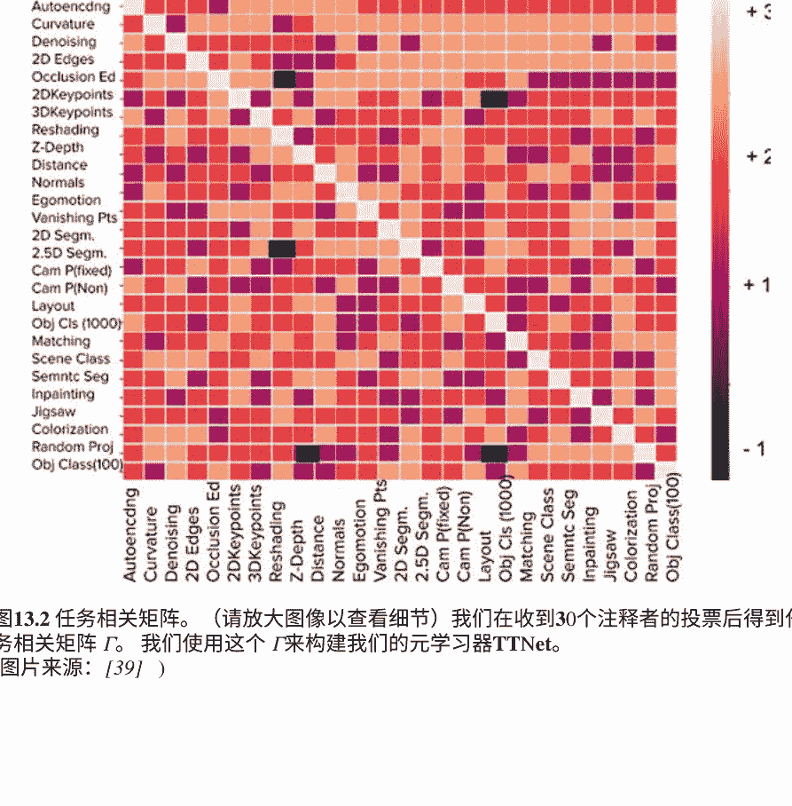

##### 13.4.3 与最先进模型的比较

为了研究我们提出的TTNet的有效性，我们在四个确定的零样本任务上进行了定性和定量的实证分析。我们使用TTNet6来完成一组已知任务：自编码、去噪、2D边缘、遮挡边缘、消失点和着色，并且所有结果都使用相关矩阵Γ在图13.2中呈现。

##### 13.4.4 定性结果

在本节中，我们展示了评估我们模型性能的定性结果。对于每个零样本任务，我们确定了一组独立的最先进方法，并与它们进行比较，并在随后的部分中报告它们。

表面法线从单目RGB图像中估计是计算机视觉中的一项具有挑战性的任务，我们尝试使用TTNet6、TTNet10、TTNet20和TTNetLS模型来完成这项任务。我们为这个任务确定了最先进的方法：多尺度CNN（MC）[16]、Deep3D（D3D）[50]、表面法线估计的深度网络（DD）[50]、SkipNet（Skip）[6]、GeoNet（Geo）[41]和Taskonomy（TN）[54]。我们将TTNet与上述所有方法进行比较，并在图13.3a中显示结果。在图中，红色框对应于我们的模型：TTNet6、TTNet10、TTNet20和TTNetLS。随着源任务数量的增加，我们的TTNet显示出改进的结果。例如，TTNetLS捕捉到了更细节的信息（请参见吊灯的边缘），这在其他结果中不可见。

房间布局估计TTNet的结果与以下进行了比较：体积测量（VM）[19]，边缘图（EM）[55]，布局网络（LN）[56]，房间网络（RN）[27]和任务学习（TN）[54]。在图13.3b中，绿色框表示TTNet的结果。与[27]类似（这是一个类似SegNet[5]的编码器-解码器网络），我们的编码器-解码器网络预测房间布局关键点和相应的边缘，并用直线连接它们。为了展示在复杂场景中的鲁棒性，我们在图13.3b中报告了具有：

+ 1. 大量遮挡
+ 2. 多个边缘（如屋顶，门等）

的图像（分别为顶部和底部）。

深度估计Z缓冲深度估计测量从相机平面的相对深度。由TTNet回归的编码器-解码器网络从单个RGB图像计算深度。将不同TTNet的结果与最先进的方法进行比较：FDA[28]，任务学习[54]和GeoNet[41]，如图13.3c所示。TTNet的结果仍然显示为红色边界框。为了在图13.3c中可视化相对深度，输出显示为灰度图像（强度值范围从[0-255]），其中近处物体的强度值接近0（黑色），而远处物体的强度值接近255（白色）。

从图13.3c可以观察到，TTNet10优于[54]；而TTNet20和TTNetLS优于所有其他研究方法。

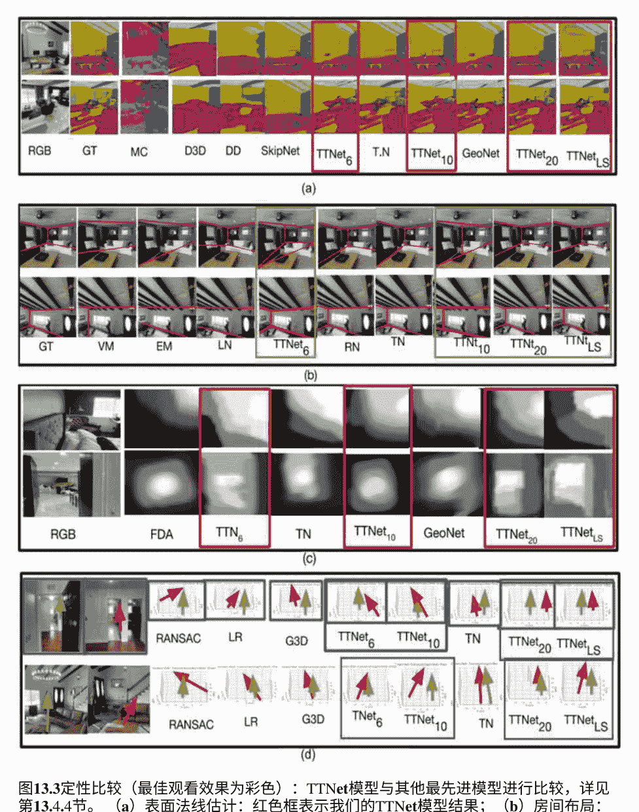

图13.3 定性比较（最佳观看效果为彩色）：TTNet模型与其他最先进模型进行比较，详见第13.4.4节。（a）表面法线估计：红色框表示我们的TTNet模型结果；（b）房间布局：红色边缘表示预测的房间边缘；绿色框表示我们的TTNet模型结果；（c）深度估计：红色边界框显示我们的结果；（d）相机姿态估计：第一张图像是相机的参考帧，即绿色箭头。第二张图像，带有红色箭头，是在几何变换方面相对于第一张图像进行拍摄的。蓝色矩形显示我们的结果（图片来源：[39]）

##### 13.4.5 定量结果

表面法线估计我们根据[6, 41]中描述的评估标准对我们的方法进行了评估。结果呈现在表13.1中。我们的TTNet6与Taskonomy [54]和GeoNet [41]等最先进的方法相当。我们的TTNet10，TTNet20和TTNetLS超过了所有最先进的模型。

表13.1 表面法线估计

| 方法 | 平均值(↓) | 中位数(↓) | 均方根误差(↓) | 11.25°(↑) | 22.5°(↑) | 30°(↑) |
| :--- | :--- | :--- | :--- | :--- | :--- | :--- |
| MC[16] | 30.30 | 35.30 | – | 30.29 | 57.17 | 68.29 |
| DD [50] | 25.71 | 20.81 | 31.01 | 38.12 | 59.18 | 67.21 |
| DD[50] | 21.10 | 15.61 | – | 44.39 | 64.48 | 66.21 |
| Skip [6] | 20.21 | 12.19 | 28.20 | 47.90 | 70.00 | 78.23 |
| TN[54] | 19.90 | 11.93 | 23.13 | 48.03 | 70.02 | 78.88 |
| TTNet6 | 19.22 | 12.01 | 26.13 | 48.02 | 71.11 | 78.29 |
| Geo [41] | 19.00 | 11.80 | 26.90 | 48.04 | 72.27 | 79.68 |
| TTNet10 | 19.81 | 11.09 | 22.37 | 48.83 | 71.61 | 79.00 |
| TTNet20 | 19.27 | 11.91 | 26.44 | 48.81 | 71.97 | 79.72 |
| TTNetLS | **15.10** | **9.29** | **24.31** | **56.11** | **75.19** | **84.71** |

平均值、中位数和均方根误差是指模型预测的表面法线与真实表面法线之间的差异（数值越低越好，↓）。另外3个值是真实预测像素中在11.25°、22.5°和30°阈值内的像素数量（数值越高越好，↑）。—表示相应方法无法获得这些值。

房间布局估计评估标准包括：(1)关键点误差：模型预测关键点与真实值之间的欧几里德距离的全局平均值；(2)像素误差：预测的表面标签与真实标签之间的像素误差的局部测量。表13.2呈现了结果。

表13.2 房间布局估计

| 方法 | VM [19] | EM [55] | LN [56] | TTNet 6 | RN [27] | TN [54] | TTNet 10 | TTNet20 | TTNetLS |
| :--- | :--- | :--- | :--- | :--- | :--- | :--- | :--- | :--- | :--- |
| 关键点 | 15.5 | 11.2 | 7.64 | 7.5 | 6.3 | 6.2 | 6.00 | 5.82 | 5.52 |
| 像素 | 24.3 | 16.7 | 10.6 | 8.1 | 8.0 | 8.0 | 7.72 | 7.10 | 6.81 |

TTNet 20 和 TTNet LS 在关键点和像素误差方面均优于现有模型。

深度估计 根据 [28]，我们使用评估标准：RMSE(lin) = $\frac{1}{N} (\sum (d_X - d_X^*)^2)\frac{1}{2}$; RMSE(log) = $(\log \frac{1}{N} \sum (\log d_X - \log d_X^*)^2)\frac{1}{2}$; 绝对相对距离 = $\frac{1}{N} \sum_X \frac{|d_X - d_X^*|}{d_X}$; 平方绝对距离 = $\frac{1}{N} \sum_X \left( \frac{|d_X - d_X^*|}{d_X} \right)^2$. $d_X^*$是地面真实深度， $d_X$是估计深度， $N$是测试集中所有图像中的像素总数 (表13.3)。

表13.3 深度估计

| 方法 | RMSE(lin) | RMSE(log) | ARD | SRD |
| :--- | :--- | :--- | :--- | :--- |
| FDA [28] | 0.877 | 0.283 | 0.214 | 0.204 |
| TTNet6 | 0.745 | 0.262 | 0.220 | 0.210 |
| TN [54] | 0.591 | 0.231 | 0.242 | 0.206 |
| TTNet10 | 0.575 | 0.172 | 0.236 | 0.179 |
| Geonet [41] | 0.591 | 0.205 | 0.149 | 0.118 |
| TTNet20 | 0.597 | 0.204 | 0.140 | 0.106 |
| TTNetLS | 0.572 | 0.193 | 0.139 | 0.096 |

TTNet 20 和 TTNet LS 超过了所有其他方法。

相机姿态估计我们采用了胜率 (%) 评估标准[54]，计算超过基准线的图像比例。 表13.4显示了TTNet模型在角度误差方面相对于最先进模型（RANSAC [52]， LRANSAC [24]， G3D和Taskonomy [54]）的胜率。我们考虑了角度误差的正确率 (%)。列是现有方法，行是我们的四个 TTNet 模型。

表13.4 相机姿态估计 (固定)

| 方法 | RANSAC [52] | LR [24] | G3D [53] | TN [54] |
| :--- | :--- | :--- | :--- | :--- |
| TTNet6 | 88% | 81% | 72% | 64% |
| TTNet10 | 90% | 82% | 79% | 82% |
| TTNet20 | 90% | 82% | 92% | 80% |
| TTNetLS | 96% | 88% | 96% | 87% |

#### 13.5 讨论与分析

源任务对于回归零样本任务的相关性为了理解源任务对于回归零样本任务的影响，我们遵循GO-MTL方法[25]，计算每个源任务和零样本任务的参数的任务基础。 每个源任务的最优模型参数 τ_i被映射到一个低维空间R，即S: ti → Ri，后跟GO-MTL的任务基础分析。我们在图13.4a中展示了结果。如果源任务在构建零样本任务的任务基础元素上做出了很好的贡献，则认为源任务很重要。例如，源任务“自编码”与零样本任务“深度估计”共享四个基础元素，因此是一个重要的源任务，而回归“深度估计”模型参数。

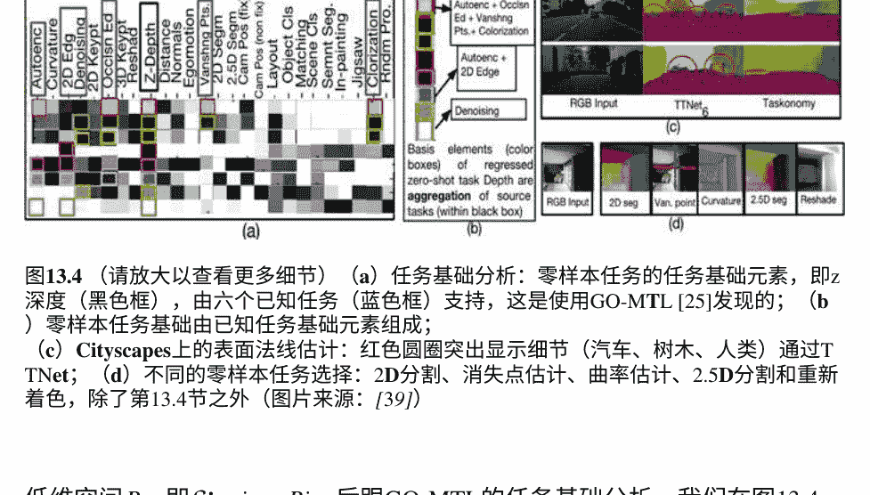

图13.4（请放大以查看更多细节）（a）任务基础分析：零样本任务的任务基础元素，即z深度（黑色框），由六个已知任务（蓝色框）支持，这是使用GO-MTL [25]发现的；（b）零样本任务基础由已知任务基础元素组成；（c）Cityscapes上的表面法线估计：红色圆圈突出显示细节（汽车、树木、人类）通过TTNet；（d）不同的零样本任务选择：2D分割、消失点估计、曲率估计、2.5D分割和重新着色，除了第13.4节之外（图片来源：[39]）

为什么预测的零样本任务参数比监督训练表现更好？继上述讨论之后，零样本任务的基础元素由多个源任务的潜在元素组成，并提供更多信息。例如，在图13.4b中，我们可以看到零样本任务“Z-depth”的基础向量得到了源任务的潜在元素的很好支持。因此，我们的设置显示出从相似任务中学习比在纯粹监督设置中仅学习特定任务提供更好的性能。

不同标注者数量的消融研究之前的评估都是通过聚合30位专家的投票结果（关于任务相关性的估计）进行的。我们通过改变专家数量 Mi 的方式来研究我们方法的鲁棒性，其中 i ∈ {3, 10, 20, 30, 35, 40, 45, 50}。我们使用TTNet₆进行姿势估计任务，并报告了不同专家数量下的胜率(%)。我们发现在所有这些情况下的结果都是令人满意的，并观察到我们的研究不需要超过 i =30 个标注者来获得最佳结果，因此我们在所有实验中都报告了相同的结果。

从零样本任务到已知任务的迁移学习我们研究了一个问题——预测的零样本模型参数在迁移到已知任务时的能力如何？为了回答这个问题，我们采用回归得到的零样本编码器-解码器参数，并在固定编码器参数的情况下，将解码器微调到目标已知任务，按照[54]中描述的过程进行。表13.5显示了定量结果。

表13.5 从零样本任务到已知任务的迁移学习胜率 (%)

| | TTNet6 | | | | | | Taskonomy | | | | | |
| :--- | :---: | :---: | :---: | :---: | :---: | :---: | :---: | :---: | :---: | :---: | :---: | :---: |
| **模型** | **王** | | **扎米尔** | | **全面支持** | | **王** | | **扎米尔** | | **全面支持** | |
| | N | L | N | L | N | L | N | L | N | L | N | L |
| 深度 | 85 | **87** | 81 | **97** | 67 | 42 | **98** | 85 | **92** | 88 | 60 | 46 |
| 2.5 D | **88** | 75 | **75** | 81 | **89** | 35 | **88** | 77 | 73 | 88 | 85 | **39** |
| 曲率 | 84 | 87 | **91** | 58 | **86** | 47 | 78 | **89** | 88 | **78** | 60 | 50 |

我们考虑通过我们的方法学习的零样本任务的自动编码器-解码器参数，并通过[54]中的过程对解码器进行微调（固定编码器）以适应目标已知任务。 源任务（零样本）是表面法线（N）和房间布局（L）。 目标任务是深度、2.5D分割和曲率。与自监督方法（如Wang等[50]，Zamir等[53]）以及完全监督设置相比，任务转移的胜率（%）显示在上表中（所有值均为%），粗体数字表示获胜条目。结果显示，使用零样本任务（表面法线估计和房间布局估计）进行迁移到目标任务：深度估计、2.5D分割和曲率（所有已知任务）。 表格13.5显示了与完全监督方法和自监督方法（Wang等[51]和G3D [53]）相比的迁移学习的胜率（%）。 我们在表中观察到非常令人鼓舞的结果。

在其他数据集上的有效性考虑到任务相关性和源任务的学习模型参数，值得问一下所提出的方法在其他视觉领域中的普适性如何，这些领域不一定像Taskonomy数据集那样富有任务。 我们通过在Cityscapes数据集[10]和COCO-Stuff数据集[7]上微调TTNet来研究这个问题。 我们选择在Cityscapes数据集上进行表面法线估计作为零样本任务，并尝试我们提出的TTNet和[54]。 结果如图13.4c所示——我们清楚地观察到TTNet捕捉到了更多的细节。 此外，TTNet6模型在Cityscapes数据上微调了分割模型参数的训练。 我们将我们的方法与[54]进行了比较并注意到，尽管没有监督，所提出的方法在Cityscapes数据集上的四个零样本任务（表面法线、深度、2D边缘和3D关键点）上优于[54]。 从图13.5可以明显看出，我们的模型似乎捕捉到了更多的细节。 在COCO-Stuff数据集上，目标检测被视为零样本任务。 TTNet被微调以执行目标检测，结果如图13.6所示。 在这两种情况下，我们提出的方法表现得相当好。

已知任务的最佳数量改变已知任务的数量和选择以回归零样本任务模型参数的程度是一个合理的问题。 由于对所有可能的源任务组合进行详尽研究是不可行的，我们尝试使用六个不同的TTNet模型来回答：TTNet 4、TTNet 6、TTNet 10、TTNet 15、TTNet 18和TTNet 20（下标表示源任务的数量）。 在图13.7中，我们展示了不同数量和组合的源任务的研究结果，并报告了每个零样本任务相对于Taskonomy方法[54]的胜率（以%表示）。

图13.5 城市景观数据的结果。我们在Cityscapes数据集[10]上微调了TTNet 6，并使用TTNet 6学习到的模型参数报告了表面法线、深度、2D边缘和3D关键点的结果（图片来源：[39]）

| 方法 | AP{50:95} | AP{50} | AP{75} | AP{sml} | AP{med} | AP{lrg} |
|------|-----------|--------|--------|---------|---------|---------|
| CoupleNet | 34.4 | 54.8 | 37.2 | 13.4 | 8.1 | 50.8 |
| TTNet{6} | 29.9 | 51.9 | 34.6 | 10.8 | 32.8 | 45 |
| YOLOv2 | 21.6 | 44 | 19.2 | 5 | 22.4 | 35.5 |

图13.6 使用TTNet6进行目标检测：TTNet6在COCO-stuff数据集上进行了微调（图片来源：[39]）

图13.7显示，增加源任务的数量可以提高回归零样本任务的性能。尽管源任务数量较少，并且大多数源任务都不需要大量注释（即自动编码、去噪、2D边缘、遮挡边缘、消失点和着色等任务都不需要大量注释），TTNet6的性能表现良好。我们还注意到，TTNet6在选择源任务时具有较强的鲁棒性。

在备选任务相关矩阵下的零样本任务转移到目前为止，我们使用任务相关矩阵 Γ 通过聚合“众包智慧”来进行。本节利用[54]中获得的任务图来构建任务相关矩阵 Γ。我们将这个新的任务相关矩阵称为 Γ_{T N}，并在图13.8中进行了定性比较。然而，需要注意的是，通过[54]的工作获得的任务相关矩阵 Γ_{T N} 需要所有任务（包括零样本任务）的地面真实标签数据。因此，它可能不适合作为我们框架中 Γ 的合适替代品，因为我们的框架是通过众包方式进行的，没有来自零样本任务的任何标记数据。

| Win Rate (Camera Ps.(fixed) (%) | 89% | 94% | 91% | 88% | 96% | 89% | 82% | 89% | 88% | 71% |
| Win Rate (Depth) (%) | 93% | 93% | 97% | 18% | 19% | 81% | 91% | 16% | 87% | 11% |
| Win Rate (Room Layout) (%) | 91% | 91% | 87% | 85% | 83% | 88% | 84% | 86% | 85% | 62% |
| Win Rate (Normal) (%) | 94% | 95% | 93% | 89% | 88% | 87% | 85% | 87% | 88% | 79% |
| Colorization | / | / | / | / | / | / | / | / | / | / |
| Random Projection | / | / | / | x | x | x | / | x | / | / |
| Jig-Saw Puzzle | / | / | / | / | / | x | / | x | / | x |
| Vanishing Point | / | / | / | / | / | / | x | / | x | x |
| Semantic Segmentation | / | / | / | / | / | / | / | / | / | x |
| 2D Segmentation | / | / | / | / | / | / | / | / | / | x |
| 2.5D Segmentation | / | / | / | / | / | / | / | / | / | / |
| Room Layout | x | x | x | x | x | x | x | x | x | x |
| Normals | x | x | x | x | x | x | x | x | x | x |
| Distance | / | / | / | / | / | / | x | x | / | / |
| Z-Depth | x | x | x | x | x | x | x | x | x | x |
| Reshading | / | / | / | / | / | / | / | / | / | / |
| Matching | / | / | / | / | / | x | / | / | / | / |
| Cam Pose (non-fixed) | / | / | / | / | / | / | / | / | / | / |
| 3D Key Point | / | / | / | / | / | x | / | / | / | / |
| 2D Key Point | / | / | / | / | / | x | / | x | / | / |
| Cam Pose (fixed) | x | x | x | x | x | x | x | x | x | x |
| Ego motion | / | / | / | / | / | / | / | / | / | / |
| Occlusion Edges | / | / | / | / | / | / | / | x | x | / |
| 2D Edges | / | / | / | / | / | / | / | / | / | / |
| Denoising | / | / | / | / | / | / | / | / | / | / |
| Curvature | / | / | / | / | / | / | / | / | / | / |
| Scene Class | / | / | / | / | / | / | / | / | / | / |
| Object Class | / | / | / | / | / | / | / | / | / | x |
| Autoencoding | / | / | / | / | / | / | / | / | / | / |
|  | 4 | 6 | 10 | 15 | 18 | 20 |  |  |  |  |

图13.7 对不同组合的源任务进行不同的TTNet消融研究。

列数字，即4、6、10、15、18和20（底行）表示已考虑用于训练模型的源任务数量。蓝色框（带有✓）表示源任务。前四行表示对每个考虑的4个零样本任务与[54]进行的胜率（%）。我们观察到我们的方法相当稳健，即使在低数量的源任务（图片来源：[39]）下，TTNet₆也能表现出相当好的性能。

图13.8 TTNet 的定性结果，当任务相关矩阵（\mathcal{I}）是从[54]计算的任务图中获得时。我们研究了考虑从[54]计算的任务图（而不是众包投票）来构建任务相关矩阵\mathcal{I}T\mathcal{N}。第一列代表RGB图像，随后的列（从第二列到第四列）是零样本任务：曲率、消失点、2D关键点和表面法线估计（图像来源：[39]）

#### 13.6 结论

在本章中，我们提出了一种元学习器TTNet，用于回归模型参数，这些参数用于没有可用的真实数据的新任务（零样本任务）。人们可以将所提出方法的灵感与认知科学中的发现联系起来，这些发现表明，一些哺乳动物在没有明确监督的情况下，通过理解和与旧的学习任务（自身运动、肩膀运动）的关联来适应全新的任务（深度测量）。TTNet回归了四个零样本任务的编码器-解码器模型参数：表面法线估计、房间布局估计、深度估计和相机姿态估计，尽管我们还展示了该方法在选择其他任务时也很稳健。将结果与[54]和其他最先进的方法进行了比较。我们未来的工作涉及从各种来源学习任务相关性以及零样本任务转移的相应结果。特别是任务空间中的负迁移是未来工作中特别有趣的方向。

### 参考文献

1. Agarwal, A., Gerber, S., Daume, H.: 使用流形正则化学习多个任务。 在：神经信息处理系统的进展，第46-54页 (2010年)
2. Alfonseca, E., Filippova, K., Delort, J.Y., Garrido, G.: 使用分层主题模型进行关系抽取的模式学习。 在：计算语言学协会第50届年会论文集：短论文-第2卷，第54-59页。 计算语言学协会，斯特劳斯堡 (2012年)
3. Argyriou, A., Evgeniou, T., Pontil, M.: 凸多任务特征学习。 机器学习。 73 (3) ，243-272页 (2008年)
4. Bach, S.H., He, B., Ratner, A., R., C.: 在没有标记数据的情况下学习生成模型的结构 (2017年)。 预印本。 arXiv:1703.00854
5. Badrinarayanan, V., Kendall, A., Cipolla, R.: Segnet:一种用于图像分割的深度卷积编码器-解码器架构. IEEE Trans. Pattern Anal. Mach. Intell. 39(12), 2481–2495 (2017)
6. Bansal, A., Russell, B., Gupta, A.: Marr重访:通过表面法线预测进行2D-3D对齐. In: Proceedings of the IEEE Conference on Computer Vision and Pattern Recognition, pp. 5965–5974 (2016)
7. Caesar, H., Uijlings, J., Ferrari, V.: Coco-stuff:上下文中的物体和物品类别. In: Proceedings of the IEEE Conference on Computer Vision and Pattern Recognition, pp. 1209–1218 (2018)
8. Chen, Q., Liu, Y., Wang, Z., Wassell, I., Chetty, K.: 用于无监督领域适应的重新加权对抗适应网络。 在：IEEE计算机视觉和模式识别会议论文集，第7976-7985页 (2018)
9. Cohen, H., Crammer, K.: 使用共享注释器并行学习多个任务. In: Advances in Neural Information Processing Systems, pp. 1170–1178 (2014)
10. Cordts, M., Omran, M., Ramos, S., Rehfeld, T., Enzweiler, M., Benenson, R., Franke, U., Roth, S., Schiele, B.: 用于语义城市场景理解的Cityscapes数据集. In: Proceedings of the IEEE Conference on Computer Vision and Pattern Recognition (CVPR) (2016)
11. Csurka, G.: 视觉应用的领域适应:一项综合调查 (2017). 预印本. arXiv:1702.05374
12. 戴，W.，杨，Q.，薛，G.R.，于，Y.： 提升转移学习。 在：机器学习国际会议论文集，第193-200页。 ACM，纽约 (2007)
13. Daum III，H.： 具有潜在层次结构的贝叶斯多任务学习 (2009年)。 预印本. arXiv:0907.0783
14. Dawid, A.P., Skene, A.M.: 使用 em算法最大似然估计观察者错误率。 Appl. Stat. 28，20-28 (1979年)
15. Derpanis，K.G.： RANSAC算法概述。 Image Rochester NY 4 (1) ，2-3 (2010年)
16. Eigen，D.，Fergus，R.： 用于预测深度、表面法线和语义标签的通用多尺度卷积架构。 在：IEEE国际计算机视觉会议论文集，第2650-2658页 (2015年)
17. Finn，C.，Abbeel，P.，Levine，S.： 模型无关元学习用于深度网络的快速适应 (2017). 预印本. arXiv:1703.03400
18. Ghifary，M.，Kleijn，W.B.，Zhang，M.，Balduzzi，D.，Li，W.： 用于无监督领域适应的深度重建-分类网络. 在：计算机视觉欧洲会议，pp. 597–613. Springer, Cham (2016)
19. Gupta，A.，Hebert，M.，Kanade，T.，Blei，D.M.： 使用关于对象和表面的体积推理来估计房间的空间布局. 在：神经信息处理系统进展，pp. 1288–1296 (2010)
20. Ha，D.，Dai，A.，Le，Q.V.： 超网络 (2016). 预印本. arXiv:1609.09106
21. Held，R.，Hein，A.： 运动产生的刺激在视觉引导行为发展中的作用. J. Comput. Physiol. Psychol. 56(5), 872 (1963)
22. Kale, D., Liu, Y.: 加速主动学习与迁移学习. 在: 2013年IEEE第13届国际数据挖掘会议上, pp. 1085–1090. IEEE, Piscataway (2013)
23. Kim, T., Yoon, J., Dia, O., Kim, S., Bengio, Y., Ahn, S.: 贝叶斯模型无关元-学习 (2018). 预印本, arXiv:1806.03836
24. Korman, S., Litman, R.: 潜在RANSAC. 在: IEEE计算机视觉和模式识别会议论文集, pp. 6693–6702 (2018)
25. Kumar, A., Daume III, H.: 学习多任务学习中的任务分组和重叠 (2012). 预印本. arXiv:1206.6417
26. Lee, S.I., Chalatbashev, V., Vickrey, D., Koller, D.: 从多个相关任务中学习特征相关性的元级先验. 在: 第24届国际机器学习大会论文集, 第489-496页。ACM, 纽约 (2007年)
27. Lee, C.Y., Badrinarayanan, V., Malisiewicz, T., Rabinovich, A.: Roomnet: 端到端的房间布局估计. 在: 2017年IEEE国际计算机视觉大会（ICCV）, 第4875-4884页。IEEE, 皮斯卡塔韦 (2017年)
28. Lee, J.H., Heo, M., Kim, K.R., Kim, C.S.: 基于傅里叶域分析的单幅图像深度估计. 在: IEEE计算机视觉和模式识别大会论文集, 第330-339页 (2018年)
29. Liu, M.Y., Tuzel, O.: 耦合生成对抗网络. 在: 神经信息处理系统的进展, 第469-477页 (2016年)
30. 刘, S., 潘, S.J., 何, Q.: 分布式多任务关系学习. 在: 第23届ACM SIGKDD国际会议上的知识发现和数据挖掘, 第937-946页。ACM, 纽约 (2017年)
31. 罗, Z., 邹, Y., 霍夫曼, J., 费-费, L.F.: 跨领域和任务的标签高效学习可转移表示。 在: 神经信息处理系统的进展, 第165-177页 (2017年)
32. 马德里, J., 埃斯卡兰特, H.J., 莫拉莱斯, E.: 文本表示的元学习 (2019年)。 预印本. arXiv:1906.08934
33. 梅列科夫, I., 伊里奥纳斯, J., 坎纳拉, J., 拉图, E.: 基于图像的定位使用沙漏网络。 在: IEEE国际计算机视觉会议论文集, 第879-886页 (2017年)
34. Mihalkova, L., Huynh, T., Mooney, R.J.: 将马尔可夫逻辑网络映射和修订用于迁移学习. 在: AAAI, 卷7, 第608-614页 (2007年)
35. Mishra, N., Rohaninejad, M., Chen, X., Abbeel, P.: 一个简单的神经注意力元学习器 (2017年)。 预印本. arXiv:1707.03141
36. Naik, D.K., Mammone, R.: 学习的元神经网络. 在: 国际联合神经网络会议, 1992年, IJCNN, 卷1, 第437-442页。IEEE, 皮斯卡塔韦 (1992年)
37. Oh, J., Singh, S., Lee, H., Kohli, P.: 多任务深度强化学习的零样本任务泛化 (2017年)。 预印本. arXiv:1706.05064
38. Pal, A., Balasubramanian, V.N.: 对抗性数据编程：使用GAN放松策划标记数据的瓶颈。 在: IEEE计算机视觉和模式识别会议论文集, 第1556-1565页 (2018年)
39. Pal, A., Balasubramanian, V.N.: 零样本任务转移. 在: IEEE计算机视觉和模式识别会议论文集, 第2189-2198页 (2019年)
40. Pan, S.J., Yang, Q.: 转移学习综述. IEEE Trans. Knowl. Data Eng. 22(10), 1345-1359页 (2009年)
41. Qi, X., Liao, R., Liu, Z., Urtasun, R., Jia, J.: Geonet: 联合深度和表面法线估计的几何神经网络。 在: IEEE计算机视觉和模式识别会议论文集, 第283-291页 (2018年)
42. Ratner, A.J., De Sa, C.M., Wu, S., Selsam, D., R , C.: 数据编程：快速创建大型训练集。 在: 神经信息处理系统进展, 第3567-3575页 (2016年)
43. Ratner, A., Hancock, B., Dunnmon, J., Sala, F., Pandey, S., R , C.: 用多任务弱监督训练复杂模型 (2018年)。 预印本. arXiv:1810.02840

- 44. Redmon, J., Divvala, S., Girshick, R., Farhadi, A.: 你只需要一次看到：统一的实时目标检测。 在：IEEE计算机视觉和模式识别会议论文集，第779-788页（2016年）

- 45. Saito, K., Watanabe, K., Ushiku, Y., Harada, T.: 无监督领域适应的最大分类器差异 3（2017年）。 预印本。arXiv:1712.02560

- 46. Sener, O., Song, H.O., Saxena, A., Savarese, S.: 学习可迁移的表示以进行无监督领域适应。 在：神经信息处理系统的进展，第2110-2118页（2016年）

- 47. Smith, L., Gasser, M.: 具身认知的发展：从婴儿身上学到的六个教训。 人工生命11（1-2），13-29页（2005年）

- 48. Thrun, S., Pratt, L.: 学会学习。 Springer Science & Business Media，纽约（2012年）

- 49. Varma, P., He, B., Iter, D., Xu, P., Yu, R., De Sa, C., R., C.: 苏格拉底式学习：增强生成模型以纳入训练数据中的潜在子集（2016年）。 预印本。arXiv:1610.08123

- 50. Wang, X., Fouhey, D., Gupta, A.: 设计用于表面法线估计的深度网络。 在：IEEE计算机视觉和模式识别会议论文集，第539-547页（2015年）

- 51. 王，Y.X.，Ramanan, D.，Hebert, M.: 学习建模尾部。在：NIPS（2017）

- 52. Yosinski, J., Clune, J., Bengio, Y., Lipson, H.: 深度神经网络中的特征可转移性如何？ 在：神经信息处理系统的进展，第3320-3328页（2014）

- 53. Zamir, A.R., Wekel, T., Agrawal, P., Wei, C., Malik, J., Savarese, S.: 通过姿态估计和匹配进行通用3D表示。 在：欧洲计算机视觉会议，第535-553页。 Springer, Cham (2016)

- 54. Zamir, A.R., Sax, A., Shen, W., Guibas, L., Malik, J., Savarese, S.: 任务学习的解缠。 在：IEEE计算机视觉和模式识别会议论文集，第3712-3722页（2018）

- 55. Zhang, W., Zhang, W., Liu, K., Gu, J.: 学习预测高质量的边缘图用于房间布局估计。IEEE Trans. Multimedia 19(5), 935–943 (2017)

- 56. Zou, C., Colburn, A., Shan, Q., Hoiem, D.: Layoutnet: 从单个RGB图像重建3D房间布局。 在: Proceedings of the IEEE Conference on Computer Vision and Pattern Recognition, pp. 2051–2059 (2018)