# 计算机视觉度量

# 第二版前言

第二版的目标是增加关于深度学习、应用于计算机视觉的神经科学、神经网络的历史发展以及特征学习架构，特别是神经网络方法的新材料。此外，第二版还修正了第一版中的一些拼写错误和其他问题。总共增加了三个新章节，以调查最新的特征学习和分层深度学习方法和架构。总体而言，本书提供了对计算机视觉方法的广泛调查，包括局部特征描述符、区域和全局特征以及特征学习方法，并提供了一种用于组织目的的分类法。

分析通过本书分布，提供对各种方法背后的直觉，鼓励读者自己思考每种方法的动机，为什么会创建不同的方法，每种方法是如何设计和构建的，以及为什么它有效。提供了近1000个文献和其他资料的参考，使计算机视觉和图像处理资源在多个层次上可访问。

我对读者的期望是：如果你想学习关于计算机视觉的90%，请阅读本书。要学习剩下的10%，请阅读提供的参考资料，并花至少20年时间创建真实系统。阅读本书只需要几个小时，而阅读参考资料和创建真实系统将需要一生时间，只能浅尝辄止。我们遵循杰克·斯帕罗博士的格言，他没有时间处理无关的细节，我们努力以一种使基础知识对许多人在学术界之外可理解的方式呈现计算机视觉材料：

> > “我喜欢它。简单，容易记住。”
> > 杰克·斯派罗，加勒比海盗

这本书适合独立学习、参考或大学及以上水平的课程，适用于有经验的工程师和科学家。这些章节的划分方式可以根据课程要求设计出各种课程，以包含章节的子集。例如，典型的课程标题包括“图像传感器和图像处理”、“计算机视觉与图像处理”、“应用计算机视觉和图像优化”、“特征学习、深度学习和神经网络架构”、“计算机视觉架构”、“计算机视觉调查”。每章末尾都提供了课程作业问题。建议将本书作为其他优秀书籍、开源代码和实践材料的补充，用于计算机视觉和相关科学学科的学习，或者作为高级调研课程的单独使用。

这本书可以作为科学和工程学科的学术课程的调查组成部分，以补充其他包含实践和操作材料的文本。

这本书不提供大量的编码示例、解决示例、数学证明、实验结果和比较，也不提供详细的性能数据，这些内容在参考文献中已经很好地涵盖了。目标是在代表性方法的调查中提供分析，而不是重复参考文献中已有的内容。这不是一本带有开源代码的工作簿（只提供了一点点源代码），因为已经有很多优秀的开源材料可供参考。

相反，这本书提供了对计算机视觉方法的广泛调查、分类和分析。目标是找到调查方法背后的直觉。这本书是用来阅读的，而不是用来学习的。这不是一本工作簿，而是旨在为读者提供足够的背景，以便他们在各种科学和工程应用中找到基础或应用研究的途径。在某种程度上，这项工作是计算机视觉的博物馆，包含了我着迷的概念、观察、奇特之处和文物。

这本书的设计是为了补充现有的文献，并填补文献中的一个空白。这本书从计算机视觉的完整路径开始，从图像传感器、图像处理、全局-区域-局部特征描述符方法、特征学习和深度学习、用于计算机视觉的神经网络、基准数据和训练、应用工程优化等方面进行了介绍，包括了CPU、GPU和软件优化方法。作者没有找到类似的书籍，否则我就不会开始这项工作了。

本书旨在从所使用的特征的角度对计算机视觉方法进行调查、分类和分析——特征描述符本身的特征，它们是如何设计和组织的。学习方法和架构是必要的支持因素，在这里也包括在内。然而，我个人对特征描述符方法本身非常着迷，并将它们视为一种数学上排列像素模式、形状和光谱以揭示图像生成方式的艺术形式。我将每个特征描述符都视为一件艺术品，就像艺术家准备的绘画或数学雕塑，因此，本书的视角是调查特征描述符和特征学习方法，并欣赏每一种方法。

正如本书一再展示的那样，研究人员发现各种特征描述符都是有效的，而在特征层次结构中使用的特征数量似乎是取得最佳结果的关键之一，而不是选择SIFT vs.像素补丁 vs. CNN特征。在这里的调查中，我们看到许多学习方法和训练使用了许多架构，并且共识似乎是分层特征学习现在是计算机视觉的主流，继承了卷积神经网络和深度学习方法在计算机视觉中的开创性工作，自新千年以来加速发展。较旧的计算机视觉方法正在与较新的方法结合，现在开始在消费设备中出现，而不再是过去的奇特军事和情报系统中的应用。

特别感谢Springer的Courtney Clarke委托制作这个第二版，并提供支持和指导，使第二版更好。

特别感谢所有对第一版提供宝贵反馈的人，这些反馈帮助塑造了第二版。Vin Ratford和Jeff Bier为嵌入式视觉联盟（EVA）的所有会员提供了第一版的纸质和电子书版本，并为评论提供了反馈网页，非常感谢。

感谢Mike Schmidt和Vadim Pisarevsky对整本书的精彩评论。Juergen Schmidhuber提供了神经网络的历史信息和其他有用的信息，Kunihiko Fukushima提供了他早期神经网络研究论文的副本，Rahul Suthankar提供了计算机视觉关键趋势的更新，Hugo LaRochelle提供了有关CNN主题和Patrick Cox提供了有关HMAX主题的信息和参考资料。Robert Gens和Andrej Karpathy也提供了有趣的信息。我还要再次感谢那些对第一版做出贡献的人，包括Paul Rosin关于合成兴趣点的贡献，Yann LeCun提供了深度学习和卷积网络的重要参考文献，Shree Nayar允许使用一些图像，Luciano Oviedo进行了蓝天讨论，还有许多其他影响了我的思考的人，包括Alexandre Alahi，Steve Seitz，Bryan Russel，Liefeng Bo，Xiaofeng Ren，Gutemberg Guerra-filho，Harsha Viswana，Dale Hitt，Joshua Gleason，Noah Snavely，Daniel Scharstein，Thomas Salmon，Richard Baraniuk，Carl Vodrick，Herve´ Je´gou，Andrew Richardson，Ofri Weschler，Hong Jiang，Andy Kuzma，Michael Jeronimo，Eli Turiel以及其他我未能提及的人。

一如既往，感谢我的妻子对我的研究的耐心，也感谢她提供了“调节器”开关来控制我的工作节奏，否则我可能会完全烧脑。最重要的是，特别感谢这位伟大的发明家，他激励着我们所有人，公元2016年。


“将身体转化为光，将光转化为身体，非常符合自然的规律，似乎对变化着迷。” ——艾萨克·牛顿

计算机视觉始于图像。本章概述了涉及捕捉、处理和表示图像的一系列主题，包括计算成像、2D成像和3D深度成像方法、传感器处理、用于立体和单眼多视图立体的深度场处理以及表面重建。提供了对所选主题的高级概述，并为有兴趣的读者提供了深入研究的参考文献。在2D和3D成像领域有扎实背景的读者可以轻松阅读本章内容。

## 图像传感器技术

本节提供了图像传感器技术的基本概述，以便理解图像的形成原理，并开发有效的图像传感器处理策略，以优化计算机视觉的图像质量。

典型的图像传感器由CCD单元（电荷耦合器件）或标准CMOS单元（互补金属氧化物半导体）创建。CCD和CMOS传感器具有相似的特性，两者在商业相机中被广泛使用。然而，由于制造考虑，如今大多数传感器使用CMOS单元。传感器和光学元件通常集成在一起，创建用于生物学或显微镜等应用的晶片级相机，如图1.1所示。

图像传感器的设计目标是为了满足不同应用的需求，提供不同的灵敏度和质量。请参考制造商的信息，熟悉每个传感器。例如，每个光电二极管传感器单元的尺寸和材料组成都经过优化，以适应给定的半导体制造工艺，以实现在光强度和颜色检测方面的硅片面积和动态响应的最佳平衡。

对于计算机视觉而言，采样理论的影响是相关的，例如应用于目标场景的像素覆盖的奈奎斯特频率。传感器的分辨率和光学系统必须共同提供足够的分辨率，以使每个像素能够成像感兴趣的特征，因此可以得出结论，感兴趣的特征应该被成像或采样至少比最小重要像素的尺寸大两倍。当然，2×过采样只是准确性的最低目标；实际上，单个像素宽度的特征不容易被解析出来。

为了获得最佳结果，相机系统应根据特定应用进行校准，以确定在不同光照和距离情况下的传感器噪声和动态范围的像素位深度。应该开发适当的传感器处理方法来处理传感器的噪声和非线性响应，以检测和纠正坏点，并处理几何失真的建模。如果你设计一个简单的校准方法，使用具有细和粗灰度、颜色和不同像素特征尺度的测试图案，可以设计适当的传感器处理方法。在第2章中，我们调查了一系列适用于传感器处理的图像处理方法。但是让我们先调查一下传感器材料。

### 传感器材料

基于硅的图像是最常见的，尽管其他材料如镓（Ga）在工业和军事应用中用于覆盖比硅更长的红外波长。图像传感器的分辨率范围取决于所使用的相机，从单像素光电晶体相机，到用于工业应用的1D线扫描阵列，再到常见相机的2D矩形阵列，甚至高分辨率成像的球形阵列。（传感器配置和相机配置将在本章后面介绍。）

常见的成像传感器使用硅作为CCD、CMOS、BSI和Foveon方法制造，本章稍后将进行讨论。硅图像传感器具有非线性光谱响应曲线；它对近红外光谱部分的感应较好，而对蓝色、紫色和近紫外光谱的感应较差，如图1.2所示。请注意，在读取原始传感器数据并将数据量化为数字像素时，必须考虑硅光谱响应。传感器制造商在这个领域进行设计补偿；然而，在校准相机系统和设计传感器处理方法时，还应考虑传感器的颜色响应。

### 传感器光电二极管

图像传感器的一个关键考虑因素是光电二极管的尺寸或单元尺寸。使用小型光电二极管的传感器单元将无法捕捉到与大型光电二极管相同数量的光子。如果单元尺寸接近要捕捉的可见光波长，例如400纳米的蓝光，则传感器设计必须克服额外的问题来校正图像颜色。传感器制造商非常注意以最佳尺寸设计单元，以同样良好地成像所有颜色（图1.3）。在极端情况下，小型传感器可能对噪声更敏感，这是由于光子积累不足和传感器读出噪声的缺乏所致。如果光电二极管传感器单元太大，也没有任何好处，硅片的尺寸和成本会增加，而不提供任何优势。常见的商用传感器设备的传感器单元尺寸可能约为1平方微米及更大；然而，每个制造商都不同，并且需要权衡以满足特定要求。

图1.2 几种硅光电二极管的典型光谱响应。 请注意，在近红外范围（约900纳米）具有最高灵敏度，并且在可见光谱范围（400-700纳米）具有非线性灵敏度。从相机中去除红外滤光片会增加近红外灵敏度，因为硅的正常响应。（光谱数据图像©OSI Optoelectronics Inc.并获得许可使用）

图1.3 主要颜色分配给波长。 请注意，主要颜色区域重叠，绿色是所有颜色的良好单色代理

### 传感器配置：马赛克，Foveon， BSI

多光谱传感器设计有各种芯片内配置，包括马赛克和堆叠方法，如图1.4所示。在马赛克方法中，彩色滤光片按照马赛克图案排列在每个单元上。 Foveon¹传感器堆叠方法依赖于颜色波长进入半导体材料的深度穿透物理原理，每种颜色穿透硅材料的深度不同，从而成像分离的颜色。 整体单元尺寸适应所有颜色，因此不需要为每种颜色单独的单元。

背面照明（BSI）传感器配置重新排列芯片上的传感器布线，以便在每个单元中累积更多的光子。 请参阅Aptina [392]的白皮书，了解正面和背面芯片电路布局的比较。

传感器单元的排列方式也会影响颜色响应。 例如，图1.5显示了主要颜色（R， G， B）传感器以及白色（W）传感器的各种排列方式，其中W传感器具有清晰或中性的颜色滤光片。 传感器单元的排列方式允许在传感器处理期间以各种相邻单元的不同配置方式组合选定的像素，以优化颜色响应或空间颜色分辨率的像素形成。 实际上，一些应用程序只使用原始传感器数据，并执行自定义处理以增加分辨率或开发替代的颜色混合。

整体传感器尺寸和格式也决定了镜头尺寸。 一般来说，较大的镜头可以更多地进光，因此较大的传感器通常更适合用于摄影应用的数码相机。 此外，芯片上的单元布置纵横比决定了像素的几何形状，例如，4:3的纵横比对于数码相机而言很常见，而3:2的纵横比则是35毫米胶片的标准。 了解传感器配置细节有助于设计最佳的传感器处理和图像预处理流程。

图1.5包括白色、主要RGB颜色和次要CYM细胞在内的几种不同的细胞颜色镶嵌配置。每种配置都提供了不同的传感器处理选项，以优化颜色或空间分辨率。（图像经许可使用，©英特尔出版社，来自《构建智能系统》）

### 动态范围、噪声、超分辨率

当前最先进的传感器每个颜色细胞提供至少8位，通常为12-14位。传感器细胞需要面积和时间来积累光子，因此必须仔细设计较小的细胞以避免问题。噪声可能来自光学、彩色滤光片、传感器细胞、增益和A/D转换器、后处理，或者如果使用的话，压缩方法。传感器读出噪声还会影响有效分辨率，因为每个像素细胞从传感器读出，发送到A/D转换器，并形成数字行和列进行转换成像素。更好的传感器将提供更少的噪声和更高的有效位分辨率，然而可以使用超分辨率方法增加有效分辨率，通过快速连续拍摄多张图像进行平均以减少噪声[886]，或者可以微型MEMS抖动传感器位置以创建图像序列进行平均以增加分辨率。Ibenthal的研究中有关去噪的良好调查[391]。

此外，对于每种颜色，传感器对光子的吸收是不同的，对于较小的传感器来说，蓝色可能是最难成像的颜色。在某些情况下，制造商可能会尝试为每种颜色提供一个内置于传感器中的简单伽马曲线校正方法，但这是不推荐的。对于要求严格的彩色应用，可以考虑色度设备模型和色彩管理（将在第2章中讨论），或者通过表征传感器的每个颜色通道的非线性并开发一组简单的校正LUT变换来解决。（深度感知中适用的噪声滤波方法也在第2章中介绍。）

### 传感器处理

传感器处理需要对传感器阵列中的像素进行去马赛克和组装，并且还需要纠正感应缺陷。我们在本节中讨论传感器处理的基础知识。

通常，每个成像系统中都提供了专用的传感器处理器，包括快速的硬件传感器接口，优化的VLIW和SIMD指令，以及专用的固定功能硬件块，用于处理传感器处理的大规模并行像素处理工作负载。通常，传感器处理是透明的、自动的，并由成像系统的制造商设置。

传感器的所有图像都以相同的方式进行处理。可能存在一个旁路，提供原始数据，可以允许自定义传感器处理，例如数字摄影等应用。

#### 去马赛克

根据传感器细胞配置，如图1.5所示，采用各种去马赛克算法从原始传感器数据创建最终的RGB像素。Losson等人[388]的一项良好调查和Li等人[389]的另一项调查提供了一些背景信息，介绍了涉及的挑战和各种方法。

去马赛克的一个核心挑战是像素插值，将附近细胞的颜色通道合并为一个像素。考虑到传感器细胞布置的几何形状和细胞布局的纵横比，这不是一个简单的问题。相关问题是颜色细胞加权-例如，每个颜色应该整合到每个RGB像素中的比例。由于马赛克传感器中的空间细胞分辨率大于最终组合的RGB像素分辨率，一些应用程序需要原始传感器数据以利用所有可能的准确性和分辨率，或者执行特殊处理以增加有效像素分辨率或更好地进行空间准确的颜色处理和去马赛克。

#### 坏点校正

传感器，如LCD显示器，可能会有坏点。供应商可能在工厂对传感器进行校准，并提供已知缺陷的传感器缺陷图，为相机模块或驱动软件中的校正提供这些坏点的坐标。在某些情况下，传感器上使用自适应缺陷校正方法[390]来监测相邻像素以主动寻找缺陷，然后校正一系列缺陷类型，例如单个像素缺陷、列或行缺陷以及2×2或3×3簇等缺陷。相机驱动程序还可以提供自适应缺陷分析，实时查找缺陷，并在相机设置菜单中可能提供特殊的补偿控制。

#### 颜色和光照校正

需要进行颜色校正以平衡整体颜色准确性和白平衡。如图1.2所示，硅传感器对红色和绿色的颜色敏感度通常非常好，但对蓝色的颜色敏感度较差，因此提供最准确的颜色的机会始于对传感器的理解和校准。

大多数图像传感器处理器都包含一个几何处理器，用于校正暗角效应，即图像边缘的较暗照明，如第7章表7.1中所讨论的鲁棒性标准。这些校正是基于一个几何变形函数进行的，该函数在工厂进行校准以匹配光学暗角模式，从而允许可编程的照明函数增加边缘处的照明。有关适用于暗角的图像变形方法的讨论，请参阅参考文献[472]。

#### 几何校正

镜头可能存在几何畸变或向边缘弯曲，导致产生具有径向畸变的图像，这是与上述暗角相关的问题，如第7章（图7.6）所示。为了处理镜头畸变，大多数成像系统都配备了一个专用的传感器处理器，类似于GPU中的纹理采样器的硬件加速数字变形单元。几何校正在工厂进行校准和编程，以适应光学系统。有关图像变形方法的讨论，请参阅参考文献[472]。

## 计算机视觉度量标准

## 相机和计算成像

许多新颖的相机配置正在使用计算成像方法进入商业应用，从原始传感器数据合成新图像，例如深度相机和高动态范围相机。如图1.6所示，传统相机系统使用单个传感器、镜头和照明器件创建2D图像。然而，计算成像相机可以提供多个光学元件、多个可编程照明模式和多个传感器，实现诸如3D深度感知和图像重照等新颖应用，利用深度信息将图像映射为纹理并引入新的光源，然后在图形流水线中重新渲染图像。由于计算相机开始出现在消费设备中，并将成为计算机视觉流水线的前端，我们对一些使用的方法进行了调查。

图1.6 计算成像系统与传统相机的比较。(顶部)简单相机模型，带有闪光灯、镜头和成像设备，然后进行锐化和颜色校正等图像增强处理。(底部)计算成像使用可编程闪光灯、光学阵列和传感器阵列，然后进行计算成像应用。未显示：前面讨论的超分辨率[886]

### 计算成像概述

计算成像[396, 429]提供了从原始图像数据合成新图像的选项。计算成像相机可以控制可编程闪光模式投影仪、镜头阵列和多个图像传感器，以及从原始数据合成新图像，如图1.6所示。要深入了解计算成像并探索当前的研究，请参阅哥伦比亚大学CAVE计算机视觉实验室和罗切斯特理工学院成像研究。以下是一些正在使用的方法和应用。

### 单像素计算相机

单像素计算相机可以从一系列相同场景的单个光电探测器像素图像中重建图像。单像素相机领域[95, 96]属于压缩感知研究的范畴，该研究还在图像处理之外的领域有应用，延伸到模拟数字转换等领域。

如图1.7所示，单像素相机可以使用微镜阵列或数字镜面设备（DMD），类似于衍射光栅。光栅排列在矩形微镜网格阵列中，允许网格区域开启或关闭以产生二进制网格图案。

二进制图案被设计为伪随机二进制基函数集。通过组合相邻区域的图案来调整网格图案的分辨率，例如2 ×2或3 ×3微镜区域的网格。

图1.7 单像素成像系统，入射光通过微镜像器的DMD阵列反射到单个光电二极管上。微镜像器阵列内的网格位置可以打开或关闭光线，如此处所示，以创建二进制图案，其中白色网格方块是反射和打开的，而黑色网格方块是关闭的。（图像经许可使用，©R.G. Baraniuk，压缩感知讲义）

通过一组伪随机微透镜阵列图案拍摄一系列单像素图像，然后从该集合中重建图像。实际上，用于重建图像的图案样本数量低于奈奎斯特频率，因为使用了稀疏随机采样方法，并且该随机采样方法在研究中已被证明在数学上足够[95, 96]。网格基函数采样方法直接适用于图像压缩，因为只采用了相对稀疏的图案和样本集。由于微镜阵列使用矩形形状，这些图案类似于一组HAAR基函数。

（有关更多信息，请参见图3.21、6.21和6.22。）

DMD方法非常出色，因为可以从一组相对较小的图像中重建图像，而不是像CMOS或CCD图像传感器中那样使用2D阵列的光电探测器。由于只使用了一个传感器，该方法在超红外和可见光谱之外的波长上具有潜力，而CMOS和CCD传感器则用于成像近红外和可见光谱。DMD方法可以用于检测使用对非可见波长敏感的非硅传感器的隐蔽武器或物质的发射。

### 2D计算相机

正在开发可编程2D传感器阵列、镜头和照明器件的新型配置，将其作为计算相机系统[406-408]，应用范围从数码摄影到军事和工业用途，采用计算成像方法来增强图像。计算相机从共焦成像[401]和共焦显微镜[402, 403]中借鉴了许多计算成像方法，例如使用多个照明模式和多个焦平面图像。它们还借鉴了二战后开发的合成孔径雷达系统[404]的研究，利用来自单个移动相机平台的宽基线数据创建高分辨率图像和3D深度图。利用多个图像传感器和光学器件实现重叠视场的合成孔径也是研究的主题[401]。我们在这里调查了几种计算2D传感器方法，包括高分辨率(HR)、高动态范围(HDR)和高帧率(HF)相机。

当前的商用数码百万像素相机，从大约10百万像素开始，提供与35毫米相机中使用的高端胶片相匹配或超过的分辨率[394]，因此图像传感器中的像素大小与最佳分辨率胶片上的银粒相当。表面上看，商业用途中提高分辨率似乎没有太大的动力，因为当前的数字方法已经取代了大多数胶片应用和胶片打印机，而且胶片打印机的分辨率已经超过了人眼的分辨率。

然而，正在设计和构建非常高分辨率的千兆像素成像设备，它们由图像传感器和镜头组成，在图像拍摄后提供计算成像的优势。一种配置是二维阵列相机，由正交的二维图像传感器阵列和相应的光学器件组成；另一种配置是球形相机，如图1.8所示[393, 397]，是哥伦比亚大学CAVE的DARPA研究项目开发的。高动态范围(HDR)相机[398-400]可以通过拍摄场景的多个图像，并使用不同的曝光设置进行组合，产生具有更高位深度的更深的像素和更好的颜色通道分辨率。这种组合使用适当的加权方案，生成具有更高位深度的新图像，例如每个颜色通道32个像素，提供超出常见商用CMOS和CCD传感器能力的图像。HDR方法可以使微弱光和强光同样好地成像，并使用自适应局部方法将微弱光和强光结合起来，消除眩光并创建更均匀和令人愉悦的图像对比度。

高帧率(HF)相机[407]能够快速捕捉场景的一系列图像，并使用括号技术将图像集合合并起来，以改变曝光、闪光灯、对焦、白平衡和景深。

图1.8 (顶部) 一个非常高分辨率的千兆像素相机的组件，使用了一种新颖的球形镜头和传感器排列方式。(底部) 结果显示的高分辨力图像为 82,000 × 22,000 = 1.7 千兆像素。(所有图像和图片均经过许可 ©Shree Nayar哥伦比亚大学CAVE研究项目)

## 3D深度相机系统

对于许多应用来说，使用3D深度场进行计算机视觉提供了一种低调的优势，因为计算机视觉在很大程度上关注从2D图像中提取3D信息，导致了各种准确性和不变性问题。正在为3D深度场计算机视觉设计新颖的3D描述符，并在第6章中进行讨论。

通过深度图，场景可以轻松地分割为前景和背景，以识别和跟踪简单的物体。数字摄影应用正在整合各种计算机视觉方法，从而变得更加丰富。 如表1.1所示，有许多方法可以从图像中提取深度。

| 深度感知技术 | 传感器数量 | 照明方法 | 特征 |
|--------------|------------|----------|------|
| 视差和混合视差 | 2/1/阵列 | 被动照明 - 正常 | 在两个摄像机位置之间的视场中进行位置偏移测量，例如立体视觉、多视图立体视觉或阵列摄像机。 |
| 尺寸映射 | 1 | 被动照明 - 正常 | 利用特定尺寸的颜色标签来确定范围和位置 |
| 焦深 | 1 | 被动照明 - 正常 | 多帧扫描聚焦 |
| 差分放大 | 1 | 被动照明 - 正常 | 在不同放大倍率下进行两帧图像捕捉，创建基于距离的偏移 |
| 结构光 | 1 | 主动照明 - 投影 | 多帧模式投影 |
| 形状恢复阴影 | 1 | 被动照明 - 正常 | 基于表面法线、表面反射函数和光源位置 |
| 飞行时间 | 1 | 主动脉冲照明 - 脉冲 | 高速光脉冲与特殊像素测量反射光的返回时间 |
| 阴影偏移 | 1 | 主动照明 - 交替 | 两个光源之间的两帧阴影差分测量在不同位置 |
| 图案扩散 | 1 | 主动照明 - 多光束 | 从相机镜头场景扩展的投影2D斑点图案以不同速率扩展 |
| 光束跟踪 | 1 | 主动照明 - 照明在物体上 | 两个点光源安装在视野中要跟踪的物体上 |
| 光谱焦距扫描 | 1 | 被动照明 - 正常 | 每个颜色波长的焦距都不同，通过焦距扫描对每个颜色进行聚焦并计算深度[416] |
| 衍射光栅 | 1 | 被动照明 - 正常 | 通过光栅或光导提供深度信息[418] |
| 锥形径向镜 | 1 | 被动照明 - 正常 | 来自锥形镜的光在不同深度上成像为一个环状，深度从环状中提取[411] |

来源： Ken Salsmann Aptina [409]提供，作者添加了一些其他方法。

在某些情况下，只需要一个相机镜头和传感器，软件会完成剩下的工作。 请注意，照明方法是许多深度感知方法的关键组成部分，例如结构光方法。 传感器、镜头和照明的组合被用于深度成像和计算成像，如图1.9所示。 我们在本节中对一些选择的深度感知方法进行调查。

深度感知并不是一个新的领域，在几个相关学科中已经得到了很好的覆盖，具有巨大的工业应用和财务资源，例如卫星成像、遥感、摄影测量和医学成像。然而，随着商用深度感知相机（如Kinect）的出现，涉及深度感知的主题在计算机视觉中引起了越来越多的兴趣，使得预算有限的研究生可以使用手机或电脑进行3D深度图和点云的实验。多视角立体（MVS）深度感知几十年来一直被用于计算数字高程图或DEM，以及数字地形图或DTM，使用雷达和激光雷达成像从卫星图像中，以及使用配备高分辨率相机和稳定相机平台的区域航测中，制作数字地形图并与相邻地区的照片叠加在一起。照片拼接是计算机视觉中一个相关的研究课题，正在引起关注。关于数字地形制图的文献中充满了关于正确几何模型和视差计算方法的信息。此外，通过CAT和MRI模态进行的三维医学成像得到了一个丰富的研究社区的支持，使用了优秀的深度感知方法，并提供了基于深度的渲染和可视化。然而，总是有趣的观察到在一个领域（如计算机视觉）中对其他领域中已知方法的“重新发明”。正如所罗门所说，“太阳底下并无新事。”在本节中，我们将深度感知放在计算机视觉的背景下进行讨论，引用相关研究，并将有趣的探索其他相关学科的旅程留给感兴趣的读者。

## 双目立体视觉

立体视觉[414, 415, 419]可能是捕捉3D深度图最基本和最熟悉的方法之一，因为有很多方法和算法在使用中，所以我们在这里提供一个高级概述，并附上一些选定的标准参考文献。立体视觉算法的第一步是通过确定相机系统的立体校准参数，将世界坐标点参数化为其对应的图像坐标的投影变换。在搜索视差计算的特征之前，需要对左右图像对进行矫正。请注意，在搜索视差计算的特征之前，需要对左右图像对进行矫正。如图1.10所示，计算立体深度。

图1.10 基本双目立体视觉原理的简化示意图

在Scharstein和Szeliski [422]以及Lazaros [423]的工作中，可以找到关于立体算法和方法的优秀调查。立体几何是投影和欧几里得[419]的组合；我们稍后在本节讨论一些影响它们准确性的几何问题。用于比较立体算法的标准在线资源由MiddleburyCollege提供，³在那里对许多新算法进行基准测试并提供比较结果，包括附录B中讨论的广泛的真实数据集。

用于立体深度的基本几何校准信息包括以下基本内容。

- 相机校准参数。相机校准超出了本工作的范围，但是参数被定义为11个自由参数[414, 417]——三个用于旋转，三个用于平移，五个内部参数——加上一个或多个镜头畸变参数，以从2D相机空间中的像素重建3D世界坐标中的点。相机校准可以使用多种方法进行，包括已知的校准图案或许多自校准方法[418]之一。外部参数定义了相机在世界坐标中的位置，内部参数定义了相机图像坐标中像素坐标之间的关系。关键变量包括光学系统下主点或中心点处两个相机之间的校准基线距离；光学系统的焦距；它们的像素大小和纵横比，该比值由传感器尺寸除以每个轴上的像素分辨率计算；以及相机的位置和方向。

³ http://vision.middlebury.edu/~schar/stereo/web/results.php.

- 基础矩阵或本质矩阵. 这两个矩阵相关，定义了用于投影重建的立体相机系统的流行几何[418-420]。它们的推导超出了本工作的范围。根据所使用的算法，可以使用任一矩阵。

本质矩阵仅使用外部相机参数和相机坐标，而基础矩阵则依赖于外部和内部参数，并揭示了在极线上的立体图像对之间的像素关系。

无论哪种情况，我们最终都会得到投影变换，以从立体图像对中重建二维相机点的三维点。
立体处理步骤通常如下：

1. 捕捉：同时拍摄左右图像对。
2. 矫正：将左右图像对矫正到同一平面上，使像素行的x坐标和线对齐。可以使用多种投影变换方法进行矫正[419]。矫正通过将图像沿x轴对齐，将模式匹配问题简化为在图像之间沿x轴进行一维搜索。矫正还可以作为一个单独的步骤包括对光学系统的径向畸变进行校正；然而，许多相机都包含一个内置的出厂校准的径向畸变校正。
3. 特征描述：对图像对中的每个像素，将其周围的小区域作为目标特征描述符进行隔离。用于立体特征描述的方法有多种[112, 206]。
4. 对应：在相反的图像对中搜索每个目标特征。搜索操作通常会进行两次，首先在右图像中搜索左侧目标特征，然后在左图像中搜索右侧目标特征。对于对应关系，需要亚像素精度以提高深度场准确性。
5. 三角测量：使用三角测量计算匹配点之间的视差或距离[421]。对所有的左右目标特征匹配进行排序，以找到最佳质量的匹配，可以使用多种方法[422]。
6. 填补空洞：对于没有相应良好匹配的像素和相关目标特征，在深度图中存在一个空洞。空洞可能是由于左右图像对中特征的遮挡，或者仅仅是由于起始特征质量较差引起的。使用局部区域最近邻像素插值方法来填补空洞。

立体深度范围分辨率是与视点距离的指数函数相关的：一般来说，基线越宽，长距离的深度分辨率越好。较短的基线对于近距离深度更好（见图1.10和1.20）。人眼的基线或瞳孔间距已被测量为50到75毫米，男性平均约为70毫米，女性约为65毫米。

多视角立体（MVS）是一种相关方法，用于使用同一主体的不同基线从多个视角计算深度，例如从单个或单眼相机或相机阵列。单眼、MVS和相机阵列深度感知将在本节后面介绍。

## 结构化和编码光

结构化或编码光使用特定的模式投射到场景中并成像返回，然后测量以确定深度；参见图1.11。我们为了讨论这个问题定义了以下使用结构化光的方法[427]：

- 空间单模式方法，只需要在单个图像中使用单个照明模式。
- 定时多路复用多模式方法，需要一系列模式照明和图像，通常使用二进制或n阵列编码，有时在后续帧中对模式进行相移或抖动以增加分辨率。常见的模式序列包括格雷码、二进制码、正弦码和其他独特的码。

例如，在原始的微软Kinect 3D深度相机中，结构光由几个略有不同的微网格模式或伪随机红外光点投射到场景中，然后拍摄一张单一图像来捕捉光点在场景中的出现。基于对实际系统和专利申请的分析，原始Kinect使用多种方法计算深度，包括（1）红外光点的大小-较大的点和低模糊表示位置较近，而较小的点和更多的模糊表示位置较远；（2）光点的形状-圆表示平行表面，椭圆表示斜面；以及（3）使用小区域或光点的微模式，以便分辨率不是很高-然而，噪声敏感性很好。使用这种方法，可以从单个图像中计算深度，而不需要多个连续的模式和图像。

多图像方法用于结构光，包括投射一系列时间顺序的结构化和编码模式，如图1.11所示。在多图像方法中，每个模式依次发送到场景中进行成像，然后使用所有模式的深度测量的组合来创建最终的深度图。

结构光的工业、科学和医学应用可以达到高精度，对大小为几米的物体进行成像，精度可达到微米级别。使用模式投影方法以及使用多个照明光束的激光条纹模式方法来创建波长干涉；干涉用于计算距离。例如，常见的牙科设备使用插入口腔的小型手持激光测距仪来创建具有缺失的牙齿区域的高精度深度图像。

然后使用这些图像创建新的、实际上完美适配的冠或充填物，使用CAD/CAM微铣削机。

当然，红外光图案在白天户外使用效果不好；它们会被自然光冲刷掉。此外，实际可使用的红外发射器的强度受到实用性和安全性的限制。在室内使用结构光的有效距离受到红外发射器可用功率的限制；也许5米是室内红外光的现实限制。

Kinect声称使用均匀恒定的红外照明的TOF（飞行时间）方法可以达到约4米的范围，而第一代Kinect传感器使用结构光具有类似的深度范围。

除了创建深度图之外，结构光或编码光还用于使用光学编码器进行测量，例如机器人技术和过程控制系统。编码器测量径向或线性位置。它们提供红外照明图案，并测量刻度或网格的响应，这对于单轴定位设备（如线性电机和旋转导程螺杆）非常有用。例如，可以将二进制位置码和反射二进制格雷码等图案轻松转换为二进制数（见图1.11）。格雷码集中的每个元素在连续元素之间具有汉明距离为1。

结构光方法在处理高光反射和阴影时存在问题；然而，通过在图案投影仪和场景之间使用光学扩散器来使用扩散结构光方法[425]可以缓解这些问题，以保持照明编码。

此外，多图案结构光方法无法处理快速移动的场景；然而，单图案方法可以很好地处理帧运动，因为只需要一个帧。

## 光学编码：衍射光栅

衍射光栅是光学编码的众多方法之一[429]，用于创建一组用于深度场成像的图案，其中光结构元件（如镜子、光栅、光导、特殊透镜）靠近探测器或镜头放置。据报道，原始Kinect系统使用衍射光栅方法创建随机化的红外点照明图案。如图1.12所示，在传感器上方放置衍射光栅[412, 413]可以提供角度敏感的像素感知。

在这种情况下，光线以不同的角度折射到周围的细胞中，这取决于衍射光栅或其他光束成形元件的放置位置，例如光导。这样可以根据给定的视角以不同的方式处理相同的传感器数据，产生不同的图像。

这种方法允许在窄孔径衍射光栅中并行捕获的一系列低分辨率图像的组合，从而减小了探测器尺寸，同时提供更高的分辨率图像。衍射光栅使得从相同的传感器数据中产生各种信息成为可能，包括深度信息、增加像素分辨率、透视位移以及拍摄后对多个焦平面进行聚焦。衍射光栅是一种光照编码设备的一种类型。

如图1.13所示，光结构化或编码元件可以以多种方式放置，包括（见[429]）：

- 对象侧编码：靠近被拍摄物体
- 瞳孔平面编码：靠近物体一侧的镜头
- 焦平面编码：靠近探测器
- 照明编码：靠近照明器

请注意，图1.11中的结构化光模式显示了照明编码，而图1.7中显示了照明编码的变体，使用一组打开或关闭的镜子来创建模式。

## 飞行时间传感器

通过测量红外光传播和反射所需的时间，创建了一种飞行时间（TOF）传感器[432]。TOF传感器是一种测距仪或激光雷达[431]。有几种单芯片TOF传感器阵列和深度相机解决方案可用，例如Kinect深度相机的第二个版本。基本概念涉及在场景中以已知时间广播红外光，例如通过脉冲IR激光器，然后测量光返回每个像素所需的时间。

高端系统[431]报告了在几百米范围内的亚毫米精度，这取决于TOF传感器的使用条件、设计中采用的特定方法以及给予红外激光的功率大小。

如图1.14所示，TOF传感器中的每个像素都有几个活动组件，包括红外传感器井、计时逻辑以测量从照明到红外光检测的往返时间，以及用于同步电子快门和脉冲红外激光的光学门。TOF传感器提供激光测距功能。例如，通过对电子快门进行门控以消除短往返响应，可以减少雾霾或烟雾反射等环境条件的影响。

此外，可以通过在所需的时间间隔内打开和关闭快门来测量特定深度范围，如长距离。

图1.14 一个假设的TOF传感器配置。请注意，光脉冲长度和传感器可以一起进行门控，以针对特定的距离范围。

TOF传感器的照明方法可以使用非常短的红外激光脉冲进行第一幅图像，获取没有激光脉冲的第二幅图像，然后取两幅图像的差异来消除环境红外光的影响。通过使用光子混频器装置 (PMD) 将红外光束调制为射频载波信号，可以测量返回的红外信号的相位偏移，从而提高精度-这在许多激光测距方法中很常见[432]。快速光学门控结合增强型CCD传感器可以在有限条件下将精度提高到亚毫米范围，甚至在100米以上的距离。然而，多个红外反射可能会对距离图像产生误差，因为整个场景只发送一个红外脉冲，并可能在多个表面上反射后再成像。

由于TOF传感器的深度感知方法与传感器电子集成在一起，与立体和其他方法相比，所需的处理开销非常低。然而，IR光在户外环境中仍存在限制[430]，这可能会影响深度准确性。

## 阵列相机

如前面的图1.9所示，阵列相机包含多个相机，通常排列成2D阵列，例如3 ×3阵列，为计算成像提供了几个关键选项。商用便携设备的阵列相机开始出现。它们可以使用多视图立体方法计算视差，利用阵列中的多个传感器的组合，如前面所讨论的。

阵列相机的一些关键优势包括宽基线图像集合用于计算3D

可以穿透和绕过滤挡物的深度图，从每个传感器的低分辨率图像插值得到的高分辨率图像，全焦点图像以及在一个或多个位置上特定的图像重新聚焦。阵列相机的最大光圈等于传感器之间的最宽基线。

## 径向相机

一个锥形或径向镜围绕镜头和一个2D图像传感器创建了一个径向相机[395]，它结合了2D和3D成像。如图1.15所示，径向镜允许一个2D图像在传感器中心形成，而包含反射的3D信息的径向环形图像则形成在传感器周围。通过根据锥形镜的几何形状将环形信息处理成点云，可以提取深度，并将图像中心的2D信息叠加作为纹理映射进行完整的3D重建。

## 光场相机

光场方法创建了一个由多个光学元件创建的3D空间，被定义为光场。光场系统使用一组微光学元件和主光学元件来成像一个4D光场，并在后期处理过程中从光场中提取图像[405, 433, 434]。光场相机只需要一个单一的图像传感器，如图1.16所示。4D光场包含了空间中每个点的信息，并且可以被表示为一个体数据集，将每个点视为一个具有3D定向表面、颜色和不透明度的体素或3D像素。体数据可以被处理以产生不同的视图和透视位移，使得在拍摄图像后可以在多个焦平面上进行聚焦。可以提取体积的切片来隔离视角并渲染2D图像。使用光线追踪和体渲染方法可以渲染光场[435, 436]。

图1.16 一幅光场相机示意图。 场景中的多个独立主体可以从相同的传感器图像中进行处理。 在拍摄图像后，可以为每个主体单独计算景深和焦点，从而在3D光场中实现透视和焦平面调整。

除了光场的体积和表面渲染外，还可以通过傅里叶投影切片定理在频域中处理来自3D场或体积的2D切片，如图1.17所示。这是医学成像方法在处理3D MRI和CAT扫描数据中的基础。Levoy [434, 437]和Krig [129]描述了傅里叶投影切片方法在体积和3D范围数据上的应用。基本算法的描述如下：

1. 体积数据经过3D FFT正向变换，得到幅度和相位数据。
2. 为了可视化，将得到的频率体积中的每个立方体按八分之一象限移动，使频率0的数据围绕在一个三维笛卡尔坐标系的中心，类似于二维频谱在二维笛卡尔坐标系的中心进行象限移动以显示频谱。
3. 从体积中提取与FOV平面平行的平面2D切片，切片通过体积的原点（中心）。从频域体积数据中取出的切片确定了所需2D视图的角度和景深。
4. 从频域中的2D切片经过逆2D FFT，得到与所选角度和景深相对应的2D空间图像。

图1.17 傅里叶投影切片定理算法的图形表示，这是一种光场处理方法。利用3D傅里叶空间对数据进行滤波，创建2D视图和渲染[129, 434, 437]。 (图像使用许可， ©英特尔出版社，来自构建智能系统)

### 3D深度处理

出于历史原因，在深度感知及相关方法的讨论中使用了几个术语及其首字母缩写，因此我们在本节中涵盖了一些重叠的主题。 表1.1早些时候提供了深度感知的底层物理手段的概述。无论深度感知方法如何，都存在许多相似性和共同问题。 考虑到相机系统的校准精度、深度场的几何模型、深度数据的测量精度、深度数据中存在的任何噪声以及预期的应用，后处理深度信息至关重要。

我们在这里对几个相关的深度感知主题进行调查，包括：

- 稀疏深度感知方法
- 密集深度感知方法
- 光流
- 同时定位与地图构建（SLAM）
- 运动结构（SFM）
- 3D表面重建，3D表面融合
- 单目深度感知
- 立体和多视图立体（MVS）
- 深度感知中的常见问题

人类深度感知依赖于一组与生俱来和学习得来的视觉线索，这些线索超出了本研究的范围，并涉及到光学、眼科学和心理学等多个领域[446]；然而，我们在深度处理的背景下对上述选定的主题进行了概述。

### 方法概述

对于深度处理方法的讨论，深度感知分为两大类，基于表1.1中所示的方法：

- 稀疏深度方法，使用计算机视觉方法提取局部兴趣点和特征。只有选定的点被组合成稀疏深度图或点云。特征从帧到帧进行跟踪，当相机或场景移动时，稀疏点云被更新。通常只需要一个摄像头。
- 密集深度方法，计算每个像素的深度。这创建了一个密集的深度图，使用立体、TOF或MVS等方法。可能涉及一个或多个摄像头。

许多稀疏深度方法使用标准单目摄像头和计算机视觉特征跟踪，如光流和SLAM（稍后在本节中介绍），并且特征描述符从帧到帧进行跟踪以计算视差和稀疏深度。密集深度方法通常更多地基于特定的深度摄像头技术，如立体或结构光。也有例外情况，下面将介绍。

### 深度感知和处理中的问题

深度感知方法各自都有特定的问题；然而，我们可以在这里讨论一些共同的问题。首先，一个常见的问题是深度场的几何建模，这是复杂的，包括透视和投影。大多数深度感知方法将整个场域视为笛卡尔坐标系，这会在深度解决方案中引入一些问题。

相机传感器是一个二维欧几里得模型，离散体素在三维欧几里得空间中成像；然而，使用简单的笛卡尔模型在相机和真实世界之间进行映射会引入几何畸变。其他问题包括对应关系，即在不同帧之间无法匹配特征，以及噪声和遮挡。我们将在下一节中讨论这些问题。

### 几何场和畸变

场几何是一个复杂的领域，影响深度感知和二维成像。对于商业应用程序来说，几何场问题可能不重要，因为定位人脸、跟踪简单物体和增强现实在3D精度方面并不苛刻。然而，军事和工业应用通常需要高精度和准确性，因此需要仔细处理几何问题。为了理解深度感知方法常见的几何场问题，让我们分解主要领域：

- 投影几何问题，处理透视
- 极坐标和球面几何问题，处理透视随着观察者距离的增加而扩散
- 径向畸变，由于镜头像差
- 坐标空间问题，由于传感器和体素的笛卡尔坐标以及从场景到传感器的投射射线的极坐标性质

本讨论的目标是详细列举深度感知中的问题，而不是解决这些问题，并在适用的情况下提供参考资料。由于几何学的主题非常广泛，我们只能在这里提供一些更好的建模深度场的方法的例子。希望通过识别深度感知中涉及的几何问题，能够更多地关注这个重要的主题。

## 视差区域、帕努姆区和深度融合

如图1.18所示，视差区域最早由托勒密等人在天文学背景下进行研究，是一个曲面，其中包含与观察者距离相同且在同一焦平面上的3D点。帕努姆区是围绕视差区域的区域，在这个区域内，人类视觉系统将视网膜上的点融合成一个距离和焦点平面相同的物体。 人类视觉系统能够协调3D点之间的距离并合成一个共同的深度场景，这真是个奇迹！视差区域和帕努姆区的挑战在于，任何深度算法的后处理步骤必须正确地融合点，就像人类视觉系统那样。 误差边界取决于通常的变量，包括基线和像素分辨率，误差在深度场景的边界处最为显著，在中心部分则较不显著。 一些球面畸变是由于镜头向边缘的像差引起的，可以在早期传感器处理中进行部分校正，正如本章前面讨论的几何校正一样。

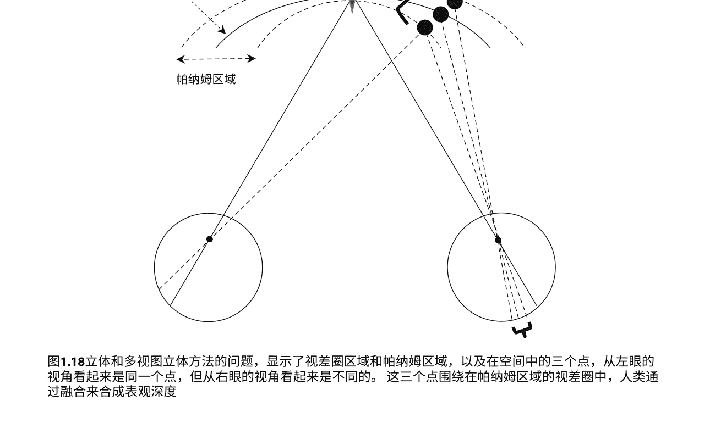

## 笛卡尔坐标与极坐标：球面投影几何

如图1.19所示，用于TOF或单目深度感知方法的2D传感器也存在特定的几何问题；这些问题在视野的边缘处增加。 请注意从空间中的一个点到传感器上的像素的深度实际上是使用极坐标的球面坐标系来测量的，但传感器的几何形状是纯粹的笛卡尔坐标，因此几何错误已经固化在其中。

由于立体和多视图方法也使用单个2D传感器，因此与单个传感器深度感知方法相同的问题也会影响到多摄像头方法，增加了开发准确且计算合理的几何模型的困难。

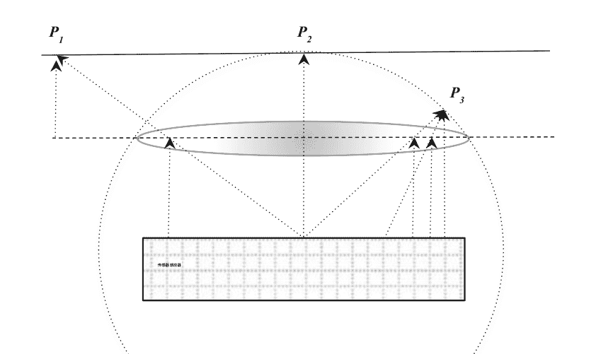

图1.19 一个二维深度传感器和具有夸张成像几何问题的镜头，处理距离时，深度取决于镜头和传感器的入射角度。 请注意，P1和P2与焦平面等距离；然而，每个点通过光学到传感器的距离不相等，因此根据使用的几何模型计算的深度将不准确。

## 深度粒度

如图1.20所示，简单的笛卡尔深度计算无法将深度场分辨为线性均匀的颗粒大小；事实上，深度场的粒度随着离传感器的距离呈指数增加，而在长距离上解析深度的能力则不太准确。

例如，在一个假设的基线为70毫米、使用480p视频分辨率的立体视觉系统中，如图1.20所示，10米处的深度分辨率下降到约1/2米；换句话说，在10米远的距离上，物体在Z中可能不会出现移动，除非它们在Z中至少移动了正负1/2米。通过增加传感器分辨率可以将深度分辨率提高一倍。 随着距离的增加，人类越来越多地使用单眼深度线索来确定深度，例如物体的大小、物体运动的速度、颜色强度和表面纹理细节。


图1.20 Z深度粒度非线性问题对于典型的立体相机系统来说。请注意，使用立体和MVS方法进行实际深度感知受到像素分辨率、基线和焦距的限制。在10米处，深度粒度几乎为½米，因此物体必须至少移动+或－½米才能计算出测量到的立体深度的变化。

#### 对应

对应或特征匹配是大多数深度感知方法中常见的，参见Mayer [877]的新颖深度学习方法。有关立体特征匹配算法的分类，请参见Scharstein和Szeliski [422]。在这里，我们讨论与特征描述符方法和三角测量相关的对应，应用于立体视觉、多视图立体视觉和结构光。

亚像素精度是大多数深度感知方法的目标，因此存在多种算法[450]。流行的方法是通过拟合曲面来找到最高匹配的两个补丁或强度模板；然而，傅里叶方法也用于相关相位[449, 451]，类似于强度相关方法。

对于立体系统，图像对在特征匹配之前被矫正，以便特征点在大致相同的尺度上沿着同一条线找到，如图1.10所示；适合具有很少或没有旋转不变性的描述符[112，207]。诸如相关模板之类的特征描述符是可以的，而像SIFT特征描述方法[153]这样的强大方法则过于复杂。特征描述符区域可以是一个矩形，偏向于在x轴上具有视差，并且在y轴上期望具有很小的变化，例如矩形的3×9描述符形状。视差期望在x轴上，而不是y轴上。描述符形状的窗口大小方法有多种，包括固定大小和自适应大小[422]。

多视图立体系统与立体视觉相似；然而，由于帧间的运动可能包括缩放、平移和旋转，所以校正阶段可能不够准确。由于尺度和旋转可能在帧间存在显著的对应问题，因此已经应用了其他特征描述方法来解决多视图立体问题，并取得了更好的结果。应用于多视图和宽基线立体的一些值得注意的特征描述方法包括MSER [186]方法（也在第6章中讨论），该方法使用类似斑点的补丁，以及SUSAN [156, 157]方法（也在第6章中讨论），该方法根据已知质心或核心周围的对象区域或分割定义特征。

对于结构光系统，光图案的类型将决定特征，相位的相关性是一种常用的方法[451]。例如，依赖相位相关的结构光方法使用相位移位模式匹配[449]，声称精度可达到1/100个像素。其他方法也用于结构光对应以实现亚像素精度[449]。

## 孔洞和遮挡

当帧间无法匹配模式时，深度图中存在一个孔洞。孔洞也可能是由于遮挡引起的。无论哪种情况，都必须修复深度图，并且存在多种方法来完成修复。应提供一个孔洞图，显示问题的位置。因此，一个简单的方法是在局部深度图块内使用双线性插值来填充孔洞。另一种简单的方法是使用当前扫描线中深度图中的最后已知良好深度值。

处理遮挡的更强大方法存在[453, 454]，使用更计算密集但略微更准确的方法，例如自适应局部窗口来优化插值区域。处理孔洞的另一种方法是将其表面融合到深度体积中[455]（下一节介绍），即将多个连续深度图集成到深度体积中作为累积表面，然后可以从深度体积中提取深度图。

## 表面重建和融合

从深度图信息创建表面的一种通用方法是表面重建。计算机图形学方法可用于渲染和显示表面。基本思想是结合多个深度图来构建更好的表面模型，包括作为纹理映射的表面的RGB 2D图像。通过创建一个迭代模型，将来自不同视角的多个深度图集成到3D表面中，可以提高深度准确性，减少或消除遮挡，并创建更广阔的3D场景视角。

Curless和Levoy的工作[455]提出了一种将多个范围图像或深度图融合成3D体积结构的方法。该算法将所有范围图像渲染为等值面，并将其集成到体积中，通过集成多个范围图像。使用体积数据结构中存储的已有表面的符号距离函数和加权因子，将新的表面集成到体积中，以获得对实际表面位置的累积最佳猜测。当然，所得到的表面具有减少噪声、减少空洞、减少遮挡、多个视角和更好的准确性等多种优点（见图1.21）。

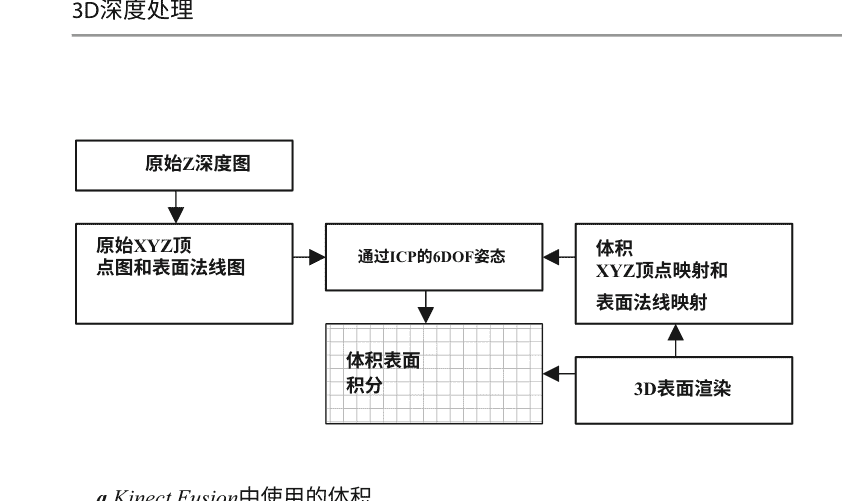

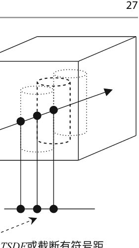
图1.21 (右) Curless和Levoy [455]的从范围图像或深度图构建表面的方法。这里显示了三种不同的加权表面测量结果通过射线投射到体积中。(左) Kinect Fusion方法的处理流程。

SLAM的Curless和Levoy方法的一个派生是Kinect Fusion方法[456]，如图1.22所示，使用计算密集型的SIMD并行实时方法，不仅提供表面重建，还提供相机跟踪和6自由度或6自由度相机通过帧对齐实现的姿态。光线追踪和纹理映射用于表面渲染。还有其他从多个图像中进行表面重建的方法[462, 533]。

## 噪声

深度传感器存在噪声问题[391]，各种原因包括低照明和在某些情况下，运动噪声，以及较差的深度感知算法或系统。此外，深度图通常非常模糊，因此可能需要图像预处理，如第2章中所讨论的，以减少明显的噪声。许多人更喜欢双边滤波器进行深度图处理[294]，因为它尊重局部结构并保留边缘过渡。此外，还开发了其他噪声滤波器来纠正双边滤波器的缺点，这些滤波器非常适合去除深度噪声，包括引导滤波器[468]，可以像双边滤波器一样执行保边噪声滤波，边缘避免小波方法[470]和域变换滤波器[471]。

## 单目深度处理

单目或单传感器深度感知使用图像帧对的运动从帧到帧创建立体视差的深度图。在具有校准的固定几何关系的立体处理的假设对于单目方法不成立，因为每次相机移动时都必须重新计算相机姿态。相机姿态是一个包括沿每个轴的线性运动和绕每个轴的滚动、俯仰和偏航旋转运动的6自由度（6DOF）方程。在单目深度感知方法中，必须为每个帧计算相机姿态作为比较两个帧和计算视差的基础。

请注意，使用惯性传感器（如加速度计和MEMS陀螺仪[465]）进行粗略对齐步骤，然后再使用基于视觉特征的表面对齐方法进行增强6DOF矩阵的计算，这在光流方面稍后讨论。由于移动电话和平板电脑上的通用惯性传感器已经很常见，惯性姿态估计将随着传感器的成熟变得更加有效和普遍。尽管通用加速度计的精度不是很高，但单眼深度感知系统可以利用惯性传感器进行姿态估计，从而节省计算时间。

## 多视角立体视觉

大多数单目多视角立体视觉（MVS）深度算法的几何模型基于投影几何和极线几何；关于这两者的良好概述可在Hartley和Zisserman的经典著作[419]中找到。Seitz等人[460]提供了六种MVS算法的分类和准确性比较。在本节中，我们将介绍几种代表性的方法。

### 稀疏方法：PTAM

稀疏MVS方法创建稀疏的三维点云，而不是完整的深度图。稀疏深度的基本目标很简单：跟踪帧之间的特征，计算特征的视差以创建深度，并执行6自由度对齐以定位新帧并获取相机姿态。根据应用的不同，稀疏深度可能是作为特征描述符的一部分使用，以增加对透视视角的不变性，或者提供足够的信息用于基于场景中的几个关键地标进行导航。在机器人领域，已经开发了几种稀疏深度感知方法，分别称为SLAM、SFM和光流（下面讨论）。

然而，我们首先通过讨论一种具体的方法：并行跟踪和建图（PTAM）[438, 439]，更详细地说明了稀疏深度感知，该方法可以同时跟踪6自由度相机姿态并生成适用于轻型增强现实应用的稀疏深度图，允许在场景中的已知位置和方向放置虚拟角色。基本算法由两个部分组成，分别在并行线程中运行：一个用于更新姿态的跟踪线程，一个用于更新稀疏三维点云的建图线程。我们对每个下一个部分提供了一个快速概述。

建图线程处理最近N个关键帧的历史缓冲区和每个帧的N级图像金字塔，通过捆绑调整过程（即通过选择的最小化方法，如Levenberg-Marquardt [419]，将新的3D坐标拟合到现有的3D坐标）不断改进稀疏三维点云，使用最新的深度特征。在场景运动较小时，捆绑调整过程可以在有限的一组最近帧上进行局部调整，或者在时间允许的情况下对所有帧进行全局调整。

跟踪线程扫描传入的图像帧，寻找预期的特征，基于已知良好特征的最后出现位置的投影，以6自由度相机姿态作为投影的基础，来指导特征搜索。使用FAST9 [130]角点检测器定位角点，然后使用Shi-Tomasi [149]非极大值抑制步骤来去除弱角点候选（在第6章中详细讨论）。特征匹配阶段在图像金字塔上进行粗到细的进展，计算6自由度姿态。

目标特征在新帧中使用围绕每个选定角点的8 ×8块进行计算。参考特征也是从最早发现它们的第一张已知图像中获取的8 ×8块。为了在特征匹配之前对齐参考和目标块，使用每个参考块的表面法线对块进行预扭曲，以适应最后已知的6自由度相机姿态，并使用零均值SSD距离进行对齐特征匹配。

单目深度感知的一个弱点是在定位失败时会出现；也就是说，如果有太多的运动或者光照变化太大，系统可能无法定位，跟踪就会停止。另一个弱点是算法必须完全针对特定的本地化场景或工作空间进行初始化，比如桌面。对于初始化，PTAM采用了一个五点立体校准方法，需要几秒钟的用户合作来执行。还有一个弱点是包含点云的3D体积大小仅适用于小型本地化场景或工作空间。然而，积极的一面是，3D点云的准确性非常好，接近像素大小；姿态足够准确用于增强现实或游戏应用；并且可以通过在场景周围行走来创建一个360°透视点云。 PTAM已经在一部移动电话[438]上实现，使用了适度的计算和内存资源，以权衡准确性和帧率。

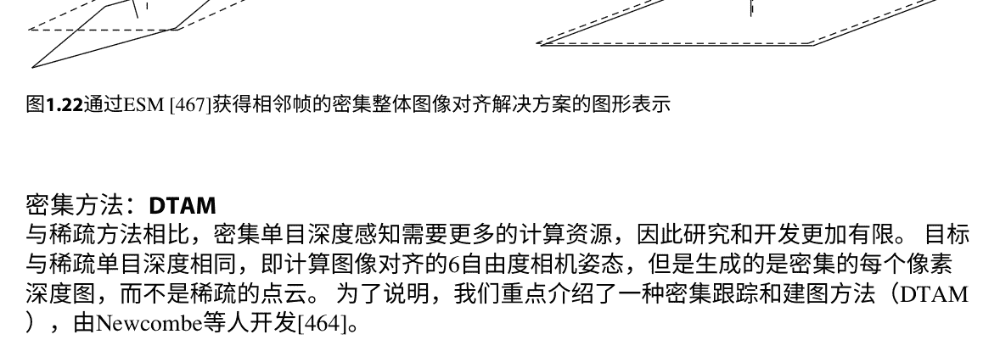

### 密集方法： DTAM

与稀疏方法相比，密集单目深度感知需要更多的计算资源，因此研究和开发更加有限。 目标与稀疏单目深度相同，即计算图像对齐的6自由度相机姿态，但是生成的是密集的每个像素深度图，而不是稀疏的点云。 为了说明，我们重点介绍了一种密集跟踪和建图方法（DTAM），由Newcombe等人开发[464]。

虽然DTAM的目标是计算每个像素的密集深度而不是稀疏深度，但是DTAM与PTAM[439]有一些相同的要求，因为两者都是单目方法。 为了对齐新帧并计算视差，DTAM和PTAM都需要计算每个新帧的6自由度姿态。DTAM还需要一种用户辅助的单目场景标定方法，并使用PTAM的标定方法。 DTAM也适用于小型、局部场景或工作空间。 DTAM借鉴了Lovegrove和Davison的球面镶嵌方法[466]的一些背景概念，包括基于Efficient Second Order Minimization（ESM）方法[467]的整个图像对齐概念，据报道该方法在较少的迭代次数下找到稳定的表面对齐，比LK方法[440]更高效，作为生成6自由度姿态的过程的一部分。

显然，DTAM和球面镶嵌都使用球坐标几何模型将新帧镶嵌到密集的3D表面上，从粗对齐到细对齐在图像金字塔上迭代，以逐步解决从帧到帧的6自由度相机姿态变化问题。

整体图像表面对齐的思想如图1.22所示。使用局部引导滤波方法[468]将新的和现有的深度表面集成到代价体中。 也就是说，引导滤波器使用引导图像将传入的深度信息合并到代价体中。

DTAM还充分利用SIMD指令和高度线程并行的SIMT GPGPU编程，在普通GPU硬件上获得所需的实时性能。

## 光流、SLAM和SFM

光流测量特征和模式在帧与帧之间的位移向量形式的运动。 光流类似于稀疏单目深度感知方法，并且可以应用于宽基线立体匹配问题[445]。 由于光流研究及其应用领域广泛[441–443]，我们在这里只提供一个简介，以描述所使用的方法和获得的特征。

光流可以被视为稀疏特征跟踪问题，其中特征可以被视为一个粒子[444]，因此光流和粒子流分析是相似的。 粒子流分析应用于各种粒子场流分析问题，包括天气预测、燃烧和爆炸模拟、水流动力学和机器人导航。 存在用于2D和3D光流的方法。 各种光流算法关注的是在连续的离散标量值场中跟踪特征描述符或矩阵，而不是个别标量或像素。 对于计算机视觉，光流算法的输入是一组连续的2D图像和像素，或者3D体积和体素，输出是一组显示跟踪特征移动方向的向量。

对于光流问题，早期的Lucas Kanade (LK)方法[440–443]有很多推导和替代方法被使用（例如参见[156]）；然而，这仍然是最流行的参考点，因为它使用了相关模板的局部特征（如第6章所讨论的）。 关于基于LK的最新方法有很好的覆盖，可以参考Baker和Matthews的《Lucas Kanade 20 years on》[462]。 高效的二阶最小化（ESM）方法[467]与LK方法相关。 据报道，ESM是一个稳定的解决方案，使用较少的迭代次数比LK方法。 LK方法不跟踪单个像素；相反，它依赖于像素邻域，如3 × 3矩阵或模板区域，并尝试猜测特征移动的方向，通过迭代搜索局部区域并使用最小二乘解决方案对搜索结果进行平均，以找到最佳猜测。

虽然LK方法有很多变种[441–443]，但大多数LK派生的光流方法的关键假设包括特征从帧到帧的小位移、刚性特征以及足够的纹理信息，以便识别特征。 各种方法用于寻找局部梯度，如Sobel和Laplacian（在第2章中讨论）。 特征从帧到帧的位移较大且纹理信息较少的区域不适合LK方法。 这是因为LK算法通过检查每个局部矩阵的特征值来优化迭代解，从而忽略了梯度信息较少的区域。 然而，更近期和更强大的研究方法正在超越LK的局限性[441, 442]，包括Deepflow [336]，它专为可变形特征和大位移光流[372]设计，使用类似于卷积网络[331]的多层特征尺度层次结构[386]。

将表面重建应用于定位和建图的方法被用于同时定位和建图（SLAM）和运动结构（SFM）方法，例如在机器人导航中。 SLAM的一个目标是定位或找到当前位置和6自由度相机姿态。 另一个目标是创建一个包含深度的局部区域地图。 要深入了解SLAM和SFM方法，请参阅Bailey和Durrant-Whyte的历史调查[458, 459]。

## 3D表示：体素、深度图、网格和点云

深度信息以各种可转换的格式表示和存储，具体取决于预期的用途。 我们在这里总结了一些常见的格式；也可以参考图1.23。

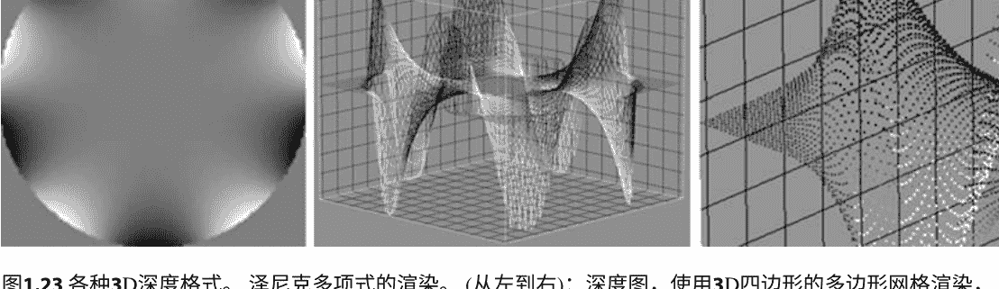
图1.23 各种3D深度格式。泽尼克多项式的渲染。(从左到右): 深度图，使用3D四边形的多边形网格渲染，等效于体素的点云渲染。

能够在不同算法之间进行深度格式转换是可取的，并且易于实现。常见的3D深度格式包括：

-   **2D像素阵列，3D深度图:** 2D像素阵列是内存中2D图像的默认格式，并且是许多处理操作（如卷积和邻域滤波）的自然存储格式。对于深度图像，像素值是Z，即深度值。数组中的每个点可能包含{颜色，深度}。
-   **3D体素体积:** 由体素的3D数组组成的3D体积数据结构非常适合一些算法，包括用于3D表面重建的深度图集成和用于图形渲染的表面光线追踪。体素是一个体积元素，就像像素是一个图像元素一样。每个体素可以包含{颜色，法线}；深度坐标隐含在体积结构中。
-   **3D多边形网格:** 将3D点存储在标准的3D多边形网格中，提供了一组连接的点或顶点，每个顶点都有一个表面法线、3D坐标、颜色和纹理。网格格式非常适合在GPU管线（如OpenGL或DirectX）中渲染表面。网格中的每个点可以包含{x, y, z, 颜色，法线}，并与标准模式（如四边形或三角形）中的相邻点相关联，描述了表面的形状。
-   **3D点云:** 这是一种稀疏结构，可以直接转换为标准的3D多边形网格。点云格式非常适合稀疏单目深度感知方法。云中的每个点可能包含{x, y, z, color, normal}。

## 摘要

在本章中，我们首先调查图像感知方法和传感器图像处理方法，作为视觉流程的第一步。我们介绍了可用的图像传感器技术，并着眼于图像预处理，以便从图像数据中获得最佳效果，因为图像传感方法通常决定所需的图像预处理（有关图像预处理的更多讨论见第2章）。讨论了用于2D和3D成像的传感器配置，以及用于计算成像的各种相机配置，以在捕获数据后创建新图像，如HDR图像和图像重焦。这里还介绍了深度成像方法，包括立体视觉和飞行时间，因为移动设备设备越来越多地为消费者应用提供3D深度摄像技术。深度图可以用于计算机视觉中解决许多问题，例如3D特征描述和前景和背景对象的3D图像分割。本书贯穿始终的主题是3D深度处理和3D特征；第6章介绍了3D特征描述符，第7章和附录B介绍了3D地面真实数据。

# 第1章：学习任务

- 至少列举两种用于创建成像传感器的半导体材料，并从制造角度和最终用户角度讨论每种传感器材料之间的权衡。
- 讨论硅成像传感器的可见光RGB、红外和紫外波长响应曲线，并可选择绘制显示光谱响应的图表。
- 至少列举一种可用作硅图像传感器近红外滤光片的材料。
- 讨论相机系统中的动态范围、每像素位数以及动态范围何时变得关键。
- 讨论图像传感器上的彩色单元马赛克模式，以及这些模式对组装彩色像素的一些影响。例如，硅单元的大小和排列方式。
- 描述彩色去马赛克算法的工作原理。
- 描述一系列相机和图像传感器校准方法，以及它们是如何建立的。
- 列举一些必须在传感器读出后、在将彩色单元组装成RGB像素之前对图像传感器彩色单元数据进行的校准调整。
- 讨论在从图像传感器组装像素之后必须进行的一些校正类型。
- 描述如何从多个图像帧中合成高动态范围（HDR）图像。
- 描述如何计算从RGB相机读出像素的数据速率，假设每个RGB分量包含16位，帧率为60帧/秒，帧大小为7680 ×4320像素（UHD TV）。
- 以高层次描述至少三种从相机图像计算深度的方法，包括立体视觉、多视角立体视觉、结构化或编码光以及飞行时间传感器。
- 讨论立体深度感知和单目深度感知之间的权衡。
- 讨论立体算法中涉及的基本步骤，如图像矫正和对齐，以及其他步骤。
- 描述结构化光模式及其工作原理。
- 描述视差圈和帕纳姆区域如何影响深度感知。
- 讨论立体处理中由遮挡引起的问题，如立体场中的空洞，以及如何解决这些问题。
- 描述如何使用3D体素缓冲区执行多个图像的2D表面融合。
- 讨论单目深度感知与立体深度感知的相似之处。
- 描述立体相机系统的校准参数，包括基线。
- 描述如何计算图像中像素在相机距离给定距离处所覆盖的面积。提示：相机传感器分辨率是一个变量。
- 讨论体素、深度图和点云。

“我进去后，发现尼莫船长正在进行x和其他数量的代数计算。”
——朱尔斯·凡尔纳，《海底两万里》

本章介绍了用于进一步分析的图像准备方法，包括兴趣点和特征提取。重点是计算机视觉的图像预处理，因此我们不涵盖应用于计算摄影和照片增强等领域的整个图像处理主题范围，因此我们在进行过程中引用感兴趣的读者到其他标准资源中的数字图像处理和信号处理[4, 9, 317, 318]，我们还指出一些有趣的研究论文，以增进对这些主题的理解。

- **注意** 具有图像处理强大背景的读者可能会从轻松阅读本章中受益。

## 图像处理的视角

图像处理是一个广阔的领域，无法在一章中涵盖。那么为什么我们要在一本关于计算机视觉的书中讨论图像预处理呢？原因是在特征描述的讨论中通常忽略了图像预处理。这里涵盖了一些通用的图像处理主题，以特征描述为重点，旨在说明而不是规定，因为应用和图像数据将指导图像预处理阶段。

有人会认为图像预处理不是一个好主意，因为它会扭曲或改变原始数据的真实性质。然而，智能地使用图像预处理可以提供好处并解决问题，从而最终实现更好的局部和全局特征检测。我们调查了常见的图像增强和校正方法，这些方法将在视觉流水线中对特征分析产生有利或不利的影响，具体取决于这些方法的使用方式。

图像预处理可能对特征提取的质量和图像分析的结果产生显著的正面影响。图像预处理类似于数学归一化数据集的过程，这是许多特征描述方法中的常见步骤。或者以音乐类比，将图像预处理视为具有一系列控制的音响系统，例如没有音量控制的原始声音；带有简单音调旋钮的音量控制；带有高音、低音和中音的音量控制；或者音量控制加上完整的图形均衡器、效果处理和优质扬声器在一个声学上优越的房间里。通过描述一种纠正和增强的组合，本章促进了图像预处理，这是计算机视觉流程的重要组成部分。

## 图像预处理中的问题

从相机直接获取的原始图像数据可能存在各种问题，如第1章所讨论的，因此不太可能产生最佳的计算机视觉结果。这就是为什么仔细考虑图像预处理是基本的原因。例如，使用灰度数据的局部二进制描述符将需要与使用彩色SIFT算法的不同预处理；此外，一些探索性工作需要对图像预处理阶段进行微调以获得最佳结果。我们通过以下方式探索图像预处理，按照四个基本特征描述方法的视觉流程进行，其中包括一些示例：

- 本地二进制描述符(LBP，ORB，FREAK，其他)
- 光谱描述符(SIFT，SURF，其他)
- 基础空间描述符(FFT，小波，其他)
- 多边形形状描述符(斑点对象面积，周长，质心)

这些特征描述度量标准被发展成为第5章的分类体系。然而，在此之前，第4章讨论了特征描述符构建的概念，而第3章涵盖了全局特征描述，然后第6章调查了局部特征描述。这里介绍的图像预处理方法和应用只是一些示例，但在第8章中，根据各种视觉流程，开发了一组更完善的示例，包括对预处理阶段的应用特定讨论。

## 视觉流水线和图像预处理

表2.1列出了常见的图像预处理操作，其中包括每个描述符族的示例，既展示了这些图像预处理步骤之间的差异和共性，也可以在特征描述之前应用。

表2.1 应用于不同视觉流程的可能图像预处理增强和校正

| 图像预处理 | 局部二进制 (LBP,ORB) | 光谱 (SIFT,SURF) | 基础空间 (FFT, Codebooks) | 多边形形状 (斑点度量) |
|------------|----------------------|------------------|---------------------------|------------------------|
| 光照校正   | x                    | x                | x                         | x                      |
| 模糊和焦点校正 | x                | x                | x                         | x                      |
| 滤波和噪声去除 | x                | x                | x                         | x                      |
| 阈值处理   |                      |                  |                           | x                      |
| 边缘增强   |                      | x                |                           | x                      |
| 形态学     |                      |                  |                           | x                      |
| 分割       |                      |                  |                           | x                      |
| 区域处理和滤波器 |                | x                | x                         | x                      |
| 点处理     |                      | x                |                           | x                      |
| 数学和统计处理 |                    | x                |                           | x                      |
| 颜色空间转换 |                    | x                | x                         | x                      |

局部二进制特征处理点对的像素强度比较。这使得比较对局部光照、亮度和对比度相对不敏感，因此在实现良好结果时可能不需要太多的图像预处理。目前文献中描述的局部二进制模式方法通常不需要太多的图像预处理；它们依赖于一个简单的局部比较阈值，可以调整以考虑光照或对比度。

光谱描述符，如SIFT（作用于局部区域梯度）和SURF（使用HAAR-like特征与局部区域的综合像素值），提供了多样的预处理机会。使用图像金字塔的方法通常对图像金字塔进行一些图像预处理，使用高斯滤波对金字塔的较高层级进行平滑，从而创建一个尺度空间表示的数据。在计算梯度之前，基本的光照校正和滤波可能有助于增强图像，例如增强可能包含特征的梯度边缘信息的一组强度内的对比度。但是一般来说，文献中没有报告任何特定方法用于预处理图像数据以进行特征提取的好坏结果，其中就存在机会。

基础空间特征通常是全局或区域性的，跨越一个正则形状，例如在整个图像或块上计算的傅里叶变换。然而，基础空间特征可能是局部特征的一部分，例如LBP直方图的傅里叶谱，可以在局部描述符的直方图区间值上计算，以提供旋转不变性。另一个例子是用于计算径向线段长度的多边形因子的傅里叶描述符，显示特征的圆滑度以提供旋转不变性。请参见第3章，特别是图3.20。最复杂的描述符族是基于多边形形状的描述符，可能需要多个图像预处理步骤来分离图像中的多边形结构和形状进行测量。多边形形状描述流程可能涉及从图像增强到结构形态学和分割技术的一切。设置多边形特征形状提取的预处理通常比其他任何方法都需要更多的工作，因为阈值和分割需要精细调整以获得良好的结果。还要注意，多边形形状描述符不是局部模式，而是跨越许多像素的较大区域结构，因此处理也可能更加密集。

在某些情况下，图像预处理是必要的，以纠正可能对特征描述产生不利影响的问题；我们接下来将讨论这个问题。

### 更正

在图像预处理过程中，图像中可能存在需要在特征测量和分析之前进行校正的伪影。以下是各种可能的校正方法。

- 传感器校正。在第1章中讨论了这些内容，包括坏点校正、几何镜头畸变和暗角校正。
- 光照校正。光照可能会产生深阴影，遮挡局部纹理和结构；此外，场景中不均匀的光照可能会使结果偏斜。候选校正方法包括秩滤波、直方图均衡化和查找表重映射。
- 噪声。这有很多形式，并且可能需要特殊的图像预处理。有很多方法可供选择，其中一些在本章中进行了调查。
- 几何校正。如果整个场景被旋转或从错误的角度拍摄，修正几何形状可能在特征描述之前是有价值的。某些特征对几何变化比其他特征更具鲁棒性，如第4-6章所讨论的。
- 颜色校正。在强度通道中重新分配颜色饱和度或校正照明伪影可能是有帮助的。通常，颜色色调是更难以校正的属性之一，可能无法使用简单的伽马曲线和sRGB颜色空间进行校正。我们将在本章后面介绍更准确的色度测量方法。

### 增强

增强是用于优化特定特征测量方法，而不是修复问题。熟悉的图像处理增强包括锐化和颜色平衡。这里是一些图像增强的一般示例及其对特征描述的潜在好处。

- 尺度空间金字塔。当使用八度尺度（或非八度尺度间隔）和像素减采样来构建金字塔时，会引入减采样伪影和锯齿状像素过渡。尺度空间金字塔构建过程的一部分是对减采样图像应用高斯模糊滤波器，以去除锯齿伪影。此外，GPU硬件还提供了抗锯齿缩放功能。
- 光照。一般来说，光照总是可以增强的。可以使用简单的LUT重映射、像素点操作和直方图均衡化以及像素重映射来增强全局光照。可以使用梯度滤波器、局部直方图均衡化和秩滤波器来增强局部光照。
- 模糊和焦点增强。在预处理阶段可以使用许多众所周知的滤波方法来进行锐化和模糊处理。例如，为了补偿由旋转引入的像素混叠伪影，可能会导致模糊的像素遮挡细节，可以在梯度计算之前使用锐化滤波器来增强边缘特征。或者，相反，旋转伪影可能过于明显，可以通过模糊处理来去除。

无论如何，预处理的增强或校正都取决于使用图像的描述符和应用程序。

## 为特征提取准备图像

每个特征描述方法的家族在流水线的预处理阶段有不同的目标。让我们在这里从每个家族中看几个例子，并为每个家族考虑可能的图像预处理方法。

### 局部二进制家族预处理

局部二进制描述符家族主要关注点对强度值的比较，并且在常见方法（如FREAK、BRISK、BRIEF和ORB）中，展示了几种点对模式。如图2.1所示，点之间的比较差异（<, >, =）是唯一重要的，因此几乎不需要任何图像预处理。基于这个讨论，这里有两种图像预处理的方法：

1. 保持像素不变。除了使用像素值差异比较阈值（例如Census变换和其他方法中所做的）之外，不做任何处理，因为阈值会处理噪声和其他伪影。
2. 使用过滤器。除了使用比较阈值外，还可以应用适当的滤波器来去除局部噪声，例如平滑或秩滤波器。或者，采用相反的方法，使用锐化滤波器来放大小的差异，可能后跟一个平滑滤波器。根据数据和应用程序，任何一种方法都可能起作用。

```
如果 |point1 - point2| > 阈值
```

图2.1使用中心邻点对比在一个3 ×3的局部区域中来说明局部阈值和局部二值模式LBP的预处理操作之间的差异，如下所示：

- 左图像：原始未处理的局部3 ×3区域数据；比较阈值 =5，中心像素的黑色像素 >5。
- 左中图像：比较阈值 =10；注意通过改变阈值，模式形状不同。
- 右中心图像：在应用拉普拉斯锐化滤波器到3 ×3区域后，注意中心像素值从52变为49，因此当比较阈值设置为5时，模式与左侧的原始模式不同。
- 右图像：拉普拉斯滤波后的数据集阈值设置为10；注意不同的二进制模式结果。

| 35 | 53 | 59 |
| 38 | 52 | 47 |
| 48 | 60 | 51 |

| 35 | 53 | 59 |
| 38 | 52 | 47 |
| 48 | 60 | 51 |

| 35 | 53 | 59 |
| 38 | 49 | 47 |
| 48 | 60 | 51 |

| 35 | 53 | 59 |
| 38 | 49 | 47 |
| 48 | 60 | 51 |

图2.1 LBP如何受预处理影响，显示了比较阈值的影响。（左）比较阈值 =5。（左中）比较阈值 =10。（右中）应用拉普拉斯滤波器后的原始数据。（右）拉普拉斯滤波后的数据上比较阈值 =5

### 光谱家族预处理

由于光谱类别中存在各种各样的方法，很难概括可能有用的预处理方法。例如，SIFT关注每个像素处计算的梯度信息。SURF关注HAAR小波或局部矩形区域的像素值的组合，这减少了单个像素值的重要性。

对于基于积分图像的方法，使用HAAR样式特征如SURF和Viola Jones，这里有几个假设的预处理选项。

1. 什么都不做。HAAR特征是通过对积分图像中的局部区域像素值求和来计算的；在求和过程中，局部像素中的细微结构没有被保留下来，因此一个选项是在图像预处理阶段什么都不做。
2. 去噪。在HAAR预处理阶段似乎不需要去噪，因为在局部区域中的积分图像求和过程中会有一种过滤噪声的倾向。
3. 光照问题。这可能需要预处理；例如，如果训练数据的光照与当前帧不同，可以考虑增强对比度。在这种情况下，一种预处理方法是计算训练集中图像的全局对比度度量，然后在每一帧中计算相同的全局对比度度量，并在对比度超出阈值时调整图像对比度以接近期望的全局对比度度量。增强对比度的方法包括LUT重映射、全局直方图均衡化和局部自适应直方图均衡化。
4. 模糊。如果当前帧存在模糊问题，可能会表现为局部对比度问题，因此可能需要进行局部对比度增强，例如锐化滤波器。作为地面真实数据的一部分，计算全局统计度量标准（如SDM）可以用来衡量局部或全局对比度，如果当前图像在对比度上有太大的差异，可以应用适当的对比度增强作为预处理步骤。

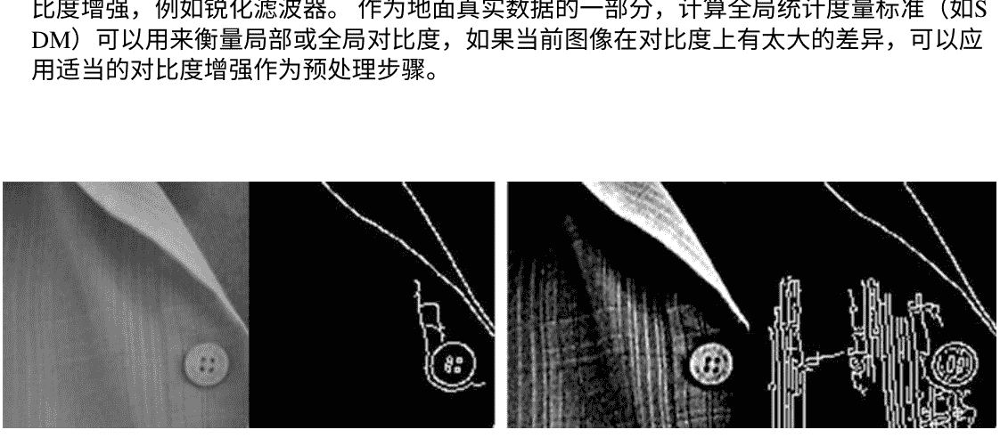

请注意图2.2中，增加局部区域对比度会导致更大的梯度和更明显的边缘。依赖于局部梯度信息的特征描述符会受到局部对比度的影响。

对于使用局部区域梯度的SIFT类型描述符，预处理可能有助于增强计算前的局部梯度，从而影响某些特征：

1. 模糊。这将抑制梯度幅度计算，并可能使确定梯度方向变得困难，因此可能需要使用局部秩滤波器、高通滤波器或锐化滤波器。
2. 噪声。这将加剧局部梯度计算并使其不可靠，因此可能需要应用现有的几种去噪算法来帮助。
3. 对比度。如果局部对比度不够高，梯度计算将变得困难和不可靠。可能可以应用局部直方图均衡化、LUT重映射、秩滤波器甚至锐化滤波器来改善结果。

### 基础空间家族预处理

对于基础空间方法，不可能进行泛化的图像预处理，因为它们在我们的工作中是相当多样的，根据我们遵循的分类法。如第4-6章所讨论的，基础空间方法包括傅里叶、小波、视觉词汇、KTL等等。然而，在这里我们提供了一些关于预处理的一般观察。

1. 傅里叶方法，小波，斜变换，Walsh Hadamard，KLT。这些方法将数据转换为另一个域进行分析，如果不了解预期的应用，很难建议任何预处理方法。例如，计算傅里叶谱会产生幅度和相位，相位在特征描述中被证明对于提供模糊不变性很有用，正如第6章中描述的LPQ线性相位量化方法所示，因此在这种情况下，模糊图像可能不是一个问题。
2. 稀疏编码和视觉词汇。这些方法使用局部特征描述符，可以是SURF、SIFT、LBP或任何其他所需特征，这些特征是从空间域中的像素派生出来的。因此，特征描述的方法将决定最佳的预处理方法。例如，使用相关性和原始像素块作为稀疏编码的方法可能不需要任何预处理。或者可以使用一些最小的预处理方法，例如亮度归一化以平衡对比度，局部直方图均衡化或LUT对比度重映射。

在图2.3中，对比度调整对傅里叶方法没有太大影响，因为图像中没有主导结构。傅里叶频谱通常显示主导结构和功率仅限于位于四分之一平移的2D图的中心的较低频率。对于具有主导结构（如线条和其他形状）的图像，傅里叶功率谱将显示结构，也许预处理可能更有价值。此外，傅里叶

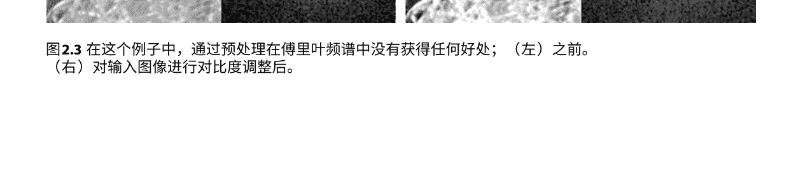功率谱显示以对数值进行缩放，并且不能线性显示所有细节，因此线性频谱渲染可能更好地显示缩放和放大的较低频率，以便更容易观看。

## 多边形形状家族预处理

在考虑图像预处理步骤时，多边形形状可能是最具挑战性的特征，因为如表2.1所示，潜在的预处理方法范围非常广泛，选择要使用的方法非常依赖于数据。可能是因为多边形形状测量的挑战和预期用例，它们仅在各种利基应用中使用，例如细胞生物学。

在多边形形状测量之前，最常用的图像准备方法之一是对光照进行物理校正并选择主题背景。例如，在自动显微镜应用中，含有细胞的载玻片会使用荧光染料进行准备，以突出细胞中的特征，然后在放大倍率下仔细调整照明角度和位置，以在每个细胞特征下提供均匀的背景；然后，结果图像更容易进行分割。

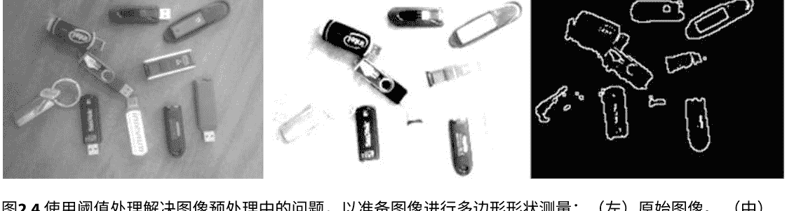

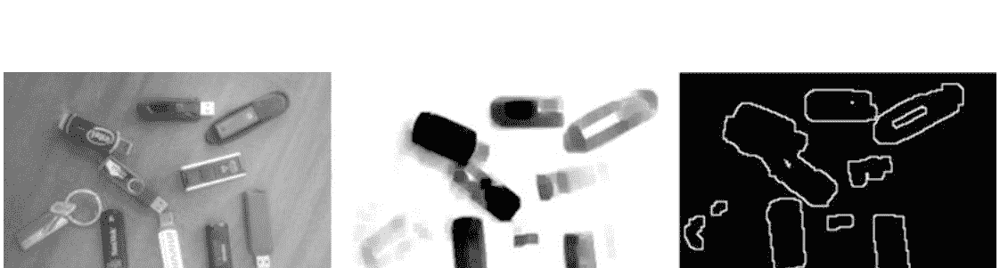

如图2.4和2.5所示，如果预处理错误，得到的形状特征描述符就不太有用。接下来，我们列举一些在基于形状的特征提取之前进行预处理的突出选项，然后在本章后面我们将调查一系列其他方法。

1. **光照校正**。 通常对于定义二进制特征的形状和轮廓至关重要。
例如，如果周长跟踪或边界分割基于边缘或阈值，不均匀的光照会导致问题，因为边界定义变得不清晰。
如果无法校正光照，则可以使用其他不基于阈值的分割方法，例如基于纹理的分割。

2. **模糊和焦点校正**。 对于多边形形状检测来说，可能不像光照那样关键，因为对象边界和形状的分割对模糊不太敏感。

3. **滤波和噪声去除**。 形状检测对噪声有一定的容忍度，这取决于噪声的类型。 拍摄噪声或斑点噪声可能不会成为问题，并且可以使用各种噪声清除方法轻松去除。

4. **阈值化**。这对于多边形形状检测方法至关重要。 许多阈值化方法被使用，从简单的二值化阈值化到本章后面讨论的局部自适应阈值化方法。 阈值化是一个有问题的操作，除了要仔细控制光源位置和方向以处理阴影外，还需要对算法参数进行微调。

5. **边缘增强**。 可能对周长轮廓定义有用。

6. **形态学**。这是一种常用的方法之一，用于准备多边形形状的测量，在本章后面的部分中有详细介绍。 形态学用于改变形状，主要通过腐蚀和膨胀操作的组合或管道来实现，如图2.5所示。形态学的示例包括对象区域边界清理、尖刺去除以及线条和周长的清理和平滑处理。

7. **分割**。这些方法使用图像中的结构或纹理，而不是阈值，作为将图像分割成连接区域或多边形的基础。 本章后面将对一些常见的分割方法进行调查。

8. **区域处理**。卷积滤波器掩模，如锐化或模糊，以及统计滤波器，如排序滤波器或中值滤波器，在分割之前可能是有用的。

9. **点处理**。逐点算术缩放图像数据，例如将每个像素乘以给定值，然后进行剪切操作，以及LUT处理，在分割之前通常是有用的。

10. **颜色空间转换**。在准确处理颜色特征方面至关重要，在本章后面进行介绍。

如图2.4所示，范围阈值法使用红色通道，因为桌面背景有很多红色，并且可以很容易地通过红色阈值去除桌面顶部。图像通过剪切超出强度带外的值进行阈值处理；请注意，在阈值处理后，右下角的USB闪存驱动器消失了，因为它是红色的并且低于阈值。 还要注意，底部中心的白色USB闪存驱动器也大部分消失了，因为它是白色的（最大RGB值）并且高于阈值。 右侧的图像显示了在阈值之上尝试追踪周长的结果；仍然不太好，需要更多的预处理步骤。

## 图像处理方法的分类

在我们调查图像预处理方法之前，有一个简单的分类法来框定讨论是很有用的。所提出的分类法是一组操作，包括点、线、区域、算法和数据转换，如图2.6所示。表2.1中介绍的图像预处理操作的基本类别适用于这个简单的分类法。

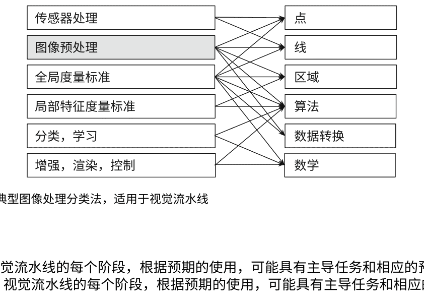

图2.6简化的典型图像处理分类法，适用于视觉流水线

请注意，视觉流水线的每个阶段，根据预期的使用，可能具有主导任务和相应的预处理操作。请注意，视觉流水线的每个阶段，根据预期的使用，可能具有主导任务和相应的预处理操作。

我们在这里简要介绍了分类法，然后在第5章中进行了更详细的讨论。请注意，分类法遵循图像数据的内存布局和内存访问模式。内存布局特别影响性能和功耗。

### 点

点操作一次处理一个像素，不考虑相邻像素。例如，点处理操作可以分为数学、布尔和像素值比较替换等部分，如“点滤波”章节中的表2.2所示。其他点处理示例包括颜色转换和数值数据转换。

### 线

线操作处理离散的像素或数据，不考虑前后的线。例如，FFT是一种可分离的变换，像素行和列可以作为一维FFT线操作独立并行处理。如果算法需要数据行，则可以进行图像预处理内存布局、流水线读写和并行处理的优化。优化内容在第8章中介绍。

### 区域

区域操作通常需要局部像素块，例如通过核掩模、卷积、形态学和许多其他操作进行空间滤波。区域操作生成特定类型的内存流量，并可以使用细粒度方法（如图形处理器中的常见着色器）和粗粒度线程方法进行并行化。

## 算法

一些图像预处理方法是纯串行或算法代码。这些代码块很难甚至不可能并行化。在某些情况下，算法块可以分成几个独立的线程进行粗粒度并行处理，或者进行流水线处理，如第8章所讨论的。

## 数据转换

虽然这些任务很平凡和明显，但是在进行简单的数据转换时可能会花费大量时间。例如，整数传感器数据可能会被转换为浮点数进行几何计算或颜色空间转换。数据转换在许多情况下是图像预处理的重要部分。示例转换包括：

- 整数位深度转换（8/16/32/64）
- 浮点数转换（单精度到双精度）
- 定点到整数或浮点数的转换
- 任意组合的浮点数到整数和整数到浮点数的转换
- 颜色空间之间的转换
- 基础空间计算的转换，例如整数到浮点数和浮点数到整数的FFT转换

设计关注数据转换和性能，可以提供良好的投资回报，如第8章所讨论的。

## 色度测量

在本节中，我们提供了对颜色科学的简要概述，以指导特征描述，注意颜色准确性、颜色空间和颜色转换。如果特征描述符使用颜色，则颜色表示和处理应该经过精心设计，准确且适合应用。例如，在某些应用中，仅使用颜色就可以识别对象，例如使用汽车的油漆颜色来识别，假设供应商每年为每个型号选择了独特的油漆颜色。通过将颜色描述符（参见[880–882]，特别是van de Weijer和Schmidt [883]）与其他简单特征（例如形状）结合起来，可以设计出一种有效的多变量描述符。

颜色科学是一个被国际标准定义并在文献中广泛描述的领域[241–243]。我们在这里只列举了一些资源。

- 罗切斯特理工学院的Munsel Color Science实验室是颜色科学和图像领域的领先研究机构之一。它提供广泛的资源，并与柯达、施乐等行业巨头有着紧密联系。
- 国际照明委员会（CIE）提供了一系列光源的标准照明数据，涉及颜色科学，以及著名的色彩空间CIE XYZ、CIE Lab和CIE Luv的标准。
- 国际色彩联盟（ICC）为成像设备提供ICC标准色彩配置文件，以及许多其他行业标准，包括用于彩色显示的sRGB色彩空间。
- 由行业领导者开发的专有色彩管理系统包括Adobe CMM和Adobe RGB、Apple ColorSync和HP ColorSmart；也许最先进的是基于佳能早期的Kyuanos系统和CIECAM02的微软Windows Color System。

## 色彩管理系统概述

对于计算机视觉应用程序来说，可能不需要一个完整的色彩管理系统，但是当你处理颜色时，了解色彩管理的方法是至关重要的。如图2.7所示，色彩管理系统将颜色在设备颜色空间（如RGB或sRGB）与色度学颜色空间（如CIE Luv、Lab、Jch或Jab）之间进行转换，以执行色域映射。由于每个设备只能在特定的色域或颜色范围内再现颜色，因此需要进行色域映射，使用每个颜色设备的数学模型将颜色转换为最接近的匹配。

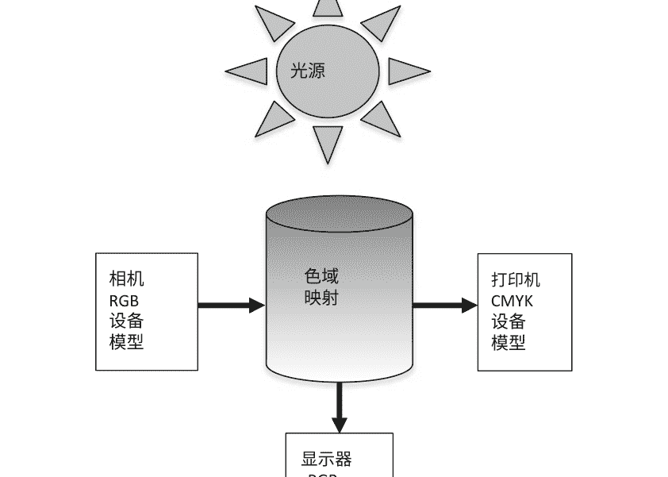

图2.7具有RGB相机设备模型、sRGB显示器设备模型、CMYK打印机设备模型、色域映射模块和光源模型的色彩管理系统

## 光源、白点、黑点和中性轴

光源是指自然光或荧光灯等光源，通过其光谱成分、光谱功率或色温来定义的白点颜色。实际系统中的白点颜色值从来不是完全白色，而是一个测量得到的数量。白点值和对立的黑点值共同定义了色彩空间中中性轴（灰度强度）的端点，它不是一个完全直线的颜色向量。

颜色管理依赖于光源或光源的准确信息和测量结果。在测量颜色时，无法没有关于光源的准确信息，因为颜色在荧光灯和自然光等不同光源下呈现出不同的外观。CIE标准定义了几个标准光源的数值，例如图2.8中的D65。

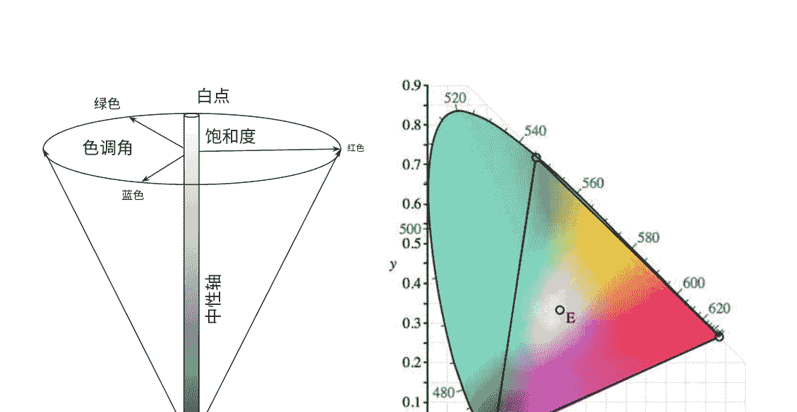

图2.8（左）以三维空间中的颜色空间表示，中性轴表示白色的数量，色调角表示主要颜色，饱和度表示颜色的数量。（右）CIE XYZ色度图显示标准光源D65 OE的白点和R、G和B的色彩原色值。

## 设备颜色模型

实际设备如打印机、显示器和相机通常通过与使用校准光源和光谱设备测量的标准颜色补丁进行比较来再现颜色，例如广泛使用的Munsel颜色补丁，它以色调、明度和饱和度（HVC）相对于标准光源来定义颜色。为了有效地管理给定设备的颜色，必须为每个设备创建一个数学模型或设备颜色模型，定义设备颜色色域的异常和色域范围。

为了使颜色管理系统准确，必须在实验室中对每个实际设备进行光谱特性化和建模，创建数学设备模型，将每个设备的颜色色域映射到标准照明模型上。设备模型用于颜色空间之间的色域转换。

设备通常使用主要和次要颜色RGB和CMYK来表示颜色。RGB是一种主要的、加法的颜色空间；从黑色开始，RGB颜色的主要成分红色、绿色和蓝色被添加在一起创建颜色。CMYK是一种次要的颜色空间，因为颜色成分青色、黄色和品红色是RGB主要颜色的次要组合；青色＝绿色加蓝色，品红色＝红色加蓝色，黄色＝红色加绿色。CMYK也是一种减法的颜色空间，因为颜色是从白色背景中减去以创建特定的颜色。

## 颜色空间和颜色感知

色度空间以抽象的方式表示颜色，如亮度、色调和颜色饱和度。每种颜色空间都是为不同的目的而设计的，每种颜色空间对于不同类型的分析和处理都是有用的。简单的颜色空间示例包括HSV（色调、饱和度、亮度）和HVC（色调、亮度、色度）。在CIE颜色空间的情况下，RGB颜色成分被标准化的CIE XYZ成分取代，作为定义CIE Luv和CIE Lab颜色空间的基础。

在色彩科学的高端，我们有更近期的CIECAM02色彩模型和颜色空间，如Jch和Jab。CIECAM02不仅仅涉及光源和颜色补丁的色度测量，还提供了包括测量颜色的环境在内的高级颜色外观建模考虑因素[241, 246]。

虽然CIECAM02对大多数应用来说可能过于复杂，但值得一些研究。颜色感知因所观察的背景、直接和环境光的光谱和角度以及人类视觉系统本身而异，因为人们对颜色的感知并不完全相同。

## 色域映射和渲染意图

色域映射是将颜色在两个颜色空间之间转换并获得最佳匹配的艺术和科学。由于每个设备的色域不同，色域映射是一个挑战，并且有许多不同的算法在使用中，没有明确的赢家。根据渲染的意图，不同的方法是有用的——例如，从相机颜色空间到打印机颜色空间的色域映射与到液晶显示器上的映射是不同的。

CAM02系统提供了一个详细的模型用于指导。例如，一个彩色成像设备可能对蓝色的捕捉非常弱，而显示器可能能够很好地显示蓝色。颜色色域拟合方法应该使用颜色剪裁还是拉伸？如何计算颜色色域之间的差异？使用哪种颜色空间？关于超过90种色域映射方法的优秀调查，请参阅Morovic的工作[244]。

在图2.9（左图）中，显示了sRGB颜色空间适应Adobe RGB颜色空间的情况，说明sRGB的色域不如Adobe RGB广泛。每个色域以不同的方式再现颜色，并且每个颜色空间可能在内部是线性的或者是扭曲的。图2.9中的右图示例了一种色域映射方法，用于确定两个色域共同的最近颜色，使用欧氏距离和剪裁；然而，还有许多其他色域映射距离方法。根据周围的光线和环境，颜色感知会进一步复杂化色域映射。

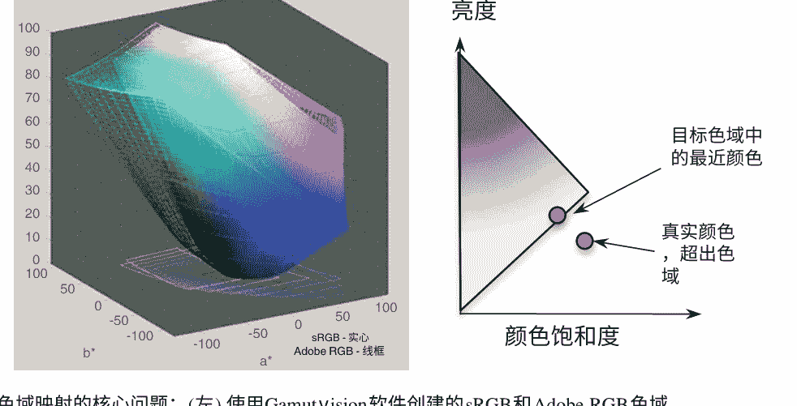

图2.9 色域映射的核心问题：(左) 使用GamutVision软件创建的sRGB和Adobe RGB色域。(右) 色域映射细节

在色域映射中，有一个源色域和一个目标色域。例如，源色域可以是相机，目标色域可以是液晶显示器。 根据色域转换的渲染意图，开发了不同的算法来将颜色从源色域转换到目标色域。 使用感知意图，颜色饱和度被映射并保持在目标色域的边界内，以保持相对颜色强度；源色域中的超出色域的颜色被压缩到目标色域中，这允许更可逆的色域映射转换。 使用色度意图，颜色可以直接从源色域映射到目标色域，目标色域之外的颜色将被简单地裁剪。

一种常见的颜色校正方法是依靠应用于强度通道的简单伽马曲线，以帮助人眼更好地可视化数据，因为伽马曲线可以提亮图像的暗区域并压缩亮区域，类似于人类视觉系统处理光亮和暗区域的方式。 然而，色域校正与真实传感器数据无关，因此建议使用经过校准的、色度学上合理的方法。

## 颜色增强的实际考虑因素

对于图像预处理，颜色强度通常是唯一应该增强的颜色信息，因为颜色强度单独携带了大量信息并且常常被使用。 此外，颜色处理在保留相对颜色的同时不能在RGB空间中轻易完成。

例如，使用锐化滤波器独立增强RGB通道会导致RGB通道重新组合成单一渲染时出现莫尔条纹伪影。 因此，为了锐化图像，首先将RGB转换为HSV或YIQ等颜色空间，然后锐化V或Y分量，最后再逆转回RGB。 例如，为了校正颜色中的照明问题，标准的图像处理方法如LUT重映射或直方图均衡化可以使用，只要它们在强度空间中执行即可。

作为实际操作，快速将RGB转换为灰度的几种方法如下。

(1) G颜色通道是灰度信息的良好代理，因为如第1章中传感器讨论所示，光谱中的RB波长与G波长有很大重叠。
(2) 通过将 \(I = (R+G+B)/3\)，可以简单地将 RGB转换为灰度强度I。
(3) NTSC电视广播标准中使用的YIQ颜色空间提供了RGB和灰度分量Y之间的简单正向/反向颜色转换方法，如下所示：

$$
\begin{bmatrix} R \\ G \\ B \end{bmatrix} = \begin{bmatrix} 1 & 0.9663 & 0.6210 \\ 1 & -0.2721 & -0.6474 \\ 1 & -1.1070 & 1.7046 \end{bmatrix} \begin{bmatrix} Y \\ I \\ Q \end{bmatrix}
$$

$$
\begin{bmatrix} Y \\ I \\ Q \end{bmatrix} = \begin{bmatrix} 0.299 & 0.587 & 0.114 \\ 0.595716 & -0.274453 & -0.321263 \\ 0.211456 & -0.522591 & 0.311135 \end{bmatrix} \begin{bmatrix} R \\ G \\ B \end{bmatrix}
$$

## 颜色准确性和精度

如果颜色准确性很重要，每个RGB颜色通道的8位可能不够。 有必要研究图像传感器供应商的数据手册，以了解传感器的真实性能。 目前，常见的图像传感器每个RGB通道产生10-14位的颜色信息。 每个颜色通道的光谱响应可能不同，如第1章所讨论的。

通常，绿色是大多数设备上一个好的且相当准确的颜色通道；红色通常也很好，如果从传感器中移除红外滤光片，则还可能具有近红外灵敏度；而蓝色始终是一个挑战，因为蓝色波长在较小的硅井中很难捕捉到，这些硅井的尺寸接近蓝色波长的大小，因此传感器供应商需要特别注意蓝色感知细节。

## 空间滤波

在离散像素阵列上进行滤波被认为是空间滤波，或者是时域滤波，与使用傅里叶方法在频域进行滤波相对应。 空间滤波器是频域方法的替代方案，空间域中可以实现多种多样的处理方法。

### 卷积滤波和检测

卷积是一种基本的信号处理操作，可以轻松地计算为离散空间处理操作，适用于1D、2D和3D处理。 基本思想是将两个信号组合或卷积在一起，使源信号更像滤波器信号。源信号是图像中的像素数组；滤波器信号是加权的核心掩模，例如梯度峰值形状和定向边缘形状，或者其他加权形状。 有关几种滤波器核心掩模形状的示例，请参阅本章后面讨论Sobel、Scharr、Prewitt、Roberts、Kirsch、Robinson和Frei-Chen滤波器掩模的部分。

卷积通常用于滤波操作，如低通、带通和高通滤波器，但也可以使用许多其他滤波器形状来检测特征，例如对边缘方向敏感的边缘检测卷积核，甚至是点、角和轮廓检测器。 卷积在卷积网络方法中被用作检测器[77]，如第4章所讨论的。

| 35 | 43 | 49 |   | -1 | -1 | -1 |   | 35 | 43 | 49 |
|:--:|:--:|:--:|:-:|:--:|:--:|:--:|:-:|:--:|:--:|:--:|
| 38 | 52 | 47 | * | -1 | 8 | -1 | = | 38 | 67 | 47 |
| 42 | 44 | 51 |   | -1 | -1 | -1 |   | 42 | 44 | 51 |

-(35 + 43 + 49 + 47 + 51 + 44 + 42 + 38) + (52*8) = 67

图2.10 卷积，这里是一个锐化滤波器：（从左到右）图像数据，锐化滤波器和结果图像数据

图2.10中的锐化卷积掩模（中间图像）旨在放大中心像素与周围像素的关系。每个像素与其卷积核位置相乘，结果（右侧图像）显示卷积的和作为中心像素，其相对于周围像素已经增加或放大。

卷积操作通常后跟一系列后处理点操作来清理数据。以下是一些有用的后处理步骤；在本章后面的“点过滤器”部分中还提出了更多建议。

```
switch (后处理器)
{
case RESULT_ASIS:
    break;
case RESULT_PLUS_VALUE:
    sum += value;
    break;
case RESULT_MINUS_VALUE:
    sum -= value;
    break;
case RESULT_PLUS_ORIGINAL_TIMES_VALUE:
    sum = sum + (result * value);
    break;
case RESULT_MINUS_ORIGINAL_TIMES_VALUE:
    sum = sum - (result * value);
    break;
case ORIGINAL_PLUS_RESULT_TIMES_VALUE:
    sum = result + (sum * value);
    break;
case ORIGINAL_MINUS_RESULT_TIMES_VALUE:
    sum = result - (sum * value);
    break;
case ORIGINAL_LOW_CLIP:
    sum = (result < value ? value : result);
    break;
case ORIGINAL_HIGH_CLIP:
    sum = (result > value ? value : result);
    break;
}
switch (后处理符号)
{
```

## 核滤波和形状选择

除了卷积方法外，还可以设计核来捕捉像素区域，以进行统计滤波操作，其中区域中的像素按从低到高的顺序排列成列表。例如，假设一个3 ×3的核区域，我们可以设计以下统计滤波器：

```c
sort(&kernel, &image, &coordinates, &sorted_list);
switch (filter_type)
{
case RANK_FILTER:
    // 在列表中选择最高的像素，对于3 × 3的核，rank =8
    // 也可以选择最低、中间或其他rank
    image[center_pixel] = sorted_list[rank];
    break;
case MEDIAN_FILTER:
    // 中值是核大小的一半，(3 × 3 = 9)/2 =4 在这种情况下
    image[center_pixel] = sorted_list[median];
    break;
case MAJORITY_FILTER:
    // 找到出现最频繁的像素值，计算排序后的像素值
    count(&sorted_list, &counted_list);
    image[center_pixel] = counted_list[0];
    break;
}
```

秩滤波器是一种简单而强大的方法，它对区域中的每个像素进行排序，并用所需秩的像素替换中心像素，例如用区域中最高的像素替换中心像素，或者用中值或多数值替换。

## 形状选择或形成卷积核

任何区域操作都可以通过形状选择卷积核从区域中选择像素并排除其他像素来受益。形状选择或形成可以作为任何图像预处理算法或任何特征提取方法的预处理步骤。形状选择卷积核可以是二值真值卷积核，用于选择源图像中要作为一组使用的像素，或者标记应接受个别处理的像素。如图2.11所示，形状选择卷积核也可以应用于局部特征描述符和检测器；类似但有时更复杂的局部区域像素选择方法经常与局部二进制描述符方法一起使用，如第4章所讨论的。

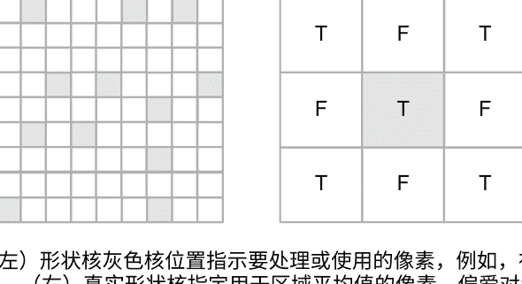

图2.11 真实和形状核：（左）形状核灰色核位置指示要处理或使用的像素，例如，在局部二进制模式点对比探测器之前进行卷积的像素。（右）真实形状核指定用于区域平均值的像素，偏爱对角线—T表示使用该像素，F表示不使用

## 点滤波

在图像预处理实验中，通常会忽视个别像素的处理。点处理适用于许多优化方法，将在第8章中讨论。

如上所述，卷积通常后跟点后处理步骤。表2.2展示了数学运算、布尔运算和比较替换运算等几种常见的像素点处理方法，这些方法看似显而易见，但在探索图像增强方法以提取特征时非常有价值。

## 表2.2 可能的点操作

| 数学运算 | 比较和替换操作 |
| :--- | :--- |
| NAMES math_ops[] = {<br>"src + value -> dst",<br>"src - value -> dst",<br>"src * value -> dst",<br>"src / value -> dst",<br>"(src + dst) * value -> dst",<br>"(src - dst) * value -> dst",<br>"(src * dst) * value -> dst",<br>"(src / dst) * value -> dst",<br>"sqroot(src) + value -> dst",<br>"src * src + value -> dst",<br>"exp(src) + value -> dst",<br>"log(src) + value -> dst",<br>"log10(src) + value -> dst",<br>"pow(src ^ value) -> dst",<br>"sin(src) + value -> dst",<br>"cos(src) + value -> dst",<br>"tan(src) + value -> dst",<br>"(value / max(all_src)) * src -> dst",<br>"src - mean(all_src) -> dst",<br>"absval(src) + value -> dst",<br>};<br>// 布尔运算<br>NAMES bool_ops[] = {<br>"src AND value -> dst",<br>"src OR value -> dst",<br>"src XOR value -> dst",<br>"src AND dst -> dst",<br>"src OR dst -> dst",<br>"src XOR dst -> dst",<br>"NOT(src) -> dst",<br>"LO_CLIP(src, value) -> dst",<br>"LO_CLIP(src, dst) -> dst",<br>"HI_CLIP(src, value) -> dst",<br>"HI_CLIP(src, dst) -> dst",<br>}; | NAMES change_ops[] = {<br>"if (src = thresh) value -> dst",<br>"if (src = dst) value -> dst",<br>"if (src != thresh) value -> dst",<br>"if (src != thresh) src -> dst",<br>"if (src != dst) value -> dst",<br>"if (src != dst) src -> dst",<br>"if (src >= thresh) value -> dst",<br>"if (src >= thresh) src -> dst",<br>"if (src >= dst) value -> dst",<br>"if (src >= dst) src -> dst",<br>"if (src <= thresh) value -> dst",<br>"if (src <= thresh) src -> dst",<br>"if (src <= dst) value -> dst",<br>"if (src <= dst) src -> dst",<br>"if (lo <= src <= hi) value -> dst",<br>"if (lo <= src <= hi) src -> dst",<br>}; |

## 噪声和伪影滤波

噪声通常是图像传感器的一个伪影，但并不总是如此。图像中可能存在几种其他伪影。去噪的目标是在不扭曲底层图像的情况下去除噪声，去除伪影的目标类似。根据噪声或伪影的类型，可以采用不同的预处理方法。第一步是对噪声或伪影进行分类，然后制定正确的图像预处理策略。

- 斑点噪声。这种类型的噪声显然是随机的，可以使用秩滤波器或中值滤波器去除。
- 瞬态频率尖峰。这可以通过傅里叶谱确定，并可以使用陷波器去除尖峰；频率尖峰可能位于谱的异常区域，并可能在图像中表现为亮点。
- 抖动和噪线。这是视频流中特有的一种伪影，通常是由于电影转换伪影、相机或图像场景的运动引起的，纠正起来比较复杂。它主要是以线为导向，而不仅仅是单像素为导向。
- 运动模糊。这可能是由于均匀或非均匀运动引起的，是一个复杂的问题；存在多种方法可以去除；参见参考文献[297]。

Gonzalez [4]讨论了去噪的标准方法。最基本的方法是去除异常值，采用了各种方法，包括阈值处理和基于局部区域的统计滤波器，如秩滤波器和中值滤波器。加权图像平均法有时也用于从视频流中去除噪声；假设相机和被拍摄对象没有移动，这种方法可以很好地工作。虽然去模糊或高斯平滑卷积核有时用于去除噪声，但这些方法可能会导致模糊，并不是最佳的方法。

Buades等人提供了噪声去除方法的调查和性能比较模型[493]。该来源包括作者的NL-means方法的描述，该方法除了使用相似加权像素值之间的欧氏距离度量之外，还使用非局部像素值统计来识别和去除噪声。

## 积分图像和盒子滤波器

积分图像用于快速找到一个矩形像素组的平均值。积分图像也被称为累加面积表，在积分图像中，每个像素是当前像素左侧和上方所有像素的累积和。积分图像可以在对图像进行单次遍历时快速计算出来。累加面积表中的每个值都是使用图像中当前像素的值i(n,m)与之前的条目s(n,m)结合计算得出的，计算公式如下：

```
s(x,y) = i(x,y) + s(x-1,y) + s(x,y-1) - s(x-1,y-1)
```

如图2.12所示，从积分图中找到一个HAAR矩形特征值，只需要使用积分图表中的四个点A、B、C、D，而不是从图像中使用数十个或数百个点。然后，可以将矩形区域的积分图总和除以矩形区域的大小，得到平均值，也称为盒子滤波器。

| 05 | 02 | 05 | 02 |
| 03 | 06 | 03 | 06 |
| 05 | 02 | 05 | 02 |
| 03 | 06 | 03 | 06 |

| 05 | 07 | 12 | 14 |
| 08 | 16 | 24 | 32 |
| 13 | 23 | 36 | 46 |
| 16 | 32 | 48 | 64 |

| 05 | 07 | 12 | 14 |
| 08 | 16 | 24 | 32 |
| 13 | 23 | 36 | 46 |
| 16 | 32 | 48 | 64 |

图2.12（左）图像中的像素。（中）积分图。（右）从积分图的四个点A、D、B、C计算盒子滤波器值的区域：sum = s(A) + s(D) - s(B) - s(C)

积分图像和盒子滤波器在许多计算机视觉方法中被使用，例如HAAR滤波器和特征描述符。积分图像也被用作小区域高斯滤波器的快速替代方法，以降低计算成本。事实上，具有大量重叠区域处理的描述符，例如BRISK [123]，有效地利用积分图像进行描述符构建，并将积分图像用作快速高斯模糊或卷积的代理。

## 边缘检测器

边缘检测器的目标是增强图像中的连通梯度，这可能是边缘、轮廓、线条或一些连通的边缘集合的形式。许多边缘检测器只是作为核操作或卷积来实现，我们在这里调查了常见的方法。

### 核集合：Sobel、Scharr、Prewitt、Roberts、Kirsch、Robinson和Frei-Chen

Sobel算子用于检测边缘的梯度幅值和方向。基本方法如下所示。

1. 使用基本的导数核近似值，如3×3的核，执行两个方向的Sobel滤波器（x和y轴），使用以下数值：

$$
S_y = \begin{bmatrix} -1 & -2 & -1 \\ 0 & 0 & 0 \\ 1 & 2 & 1 \end{bmatrix}
$$

$$
S_x = \begin{bmatrix} -1 & 0 & 1 \\ -2 & 0 & 2 \\ -1 & 0 & 1 \end{bmatrix}
$$

2. 计算总梯度为 $G_v = S_x + S_y$
3. 计算梯度方向为 $\theta = \text{ATAN} \frac{S_y}{S_x}$
4. 计算梯度幅值 $G_m = \sqrt{S_y^2 + S_x^2}$

Sobel边缘检测中使用的核的区域大小和形状存在变化。除了上面显示的Sobel核之外，在实践中还使用其他类似的核集，只要核的值相互抵消和相加为零，例如Scharr、Prewitt、Roberts、Robinson和Frei-Chen提出的这些核，以及Laplacian近似核。Frei-Chen核被设计为一组一起使用，因此边缘是所有核的加权和。有关边缘检测掩模的更多信息，请参阅参考文献[4]。一些核具有罗宾逊、Kirsch等指南针方向。请参阅图2.13。

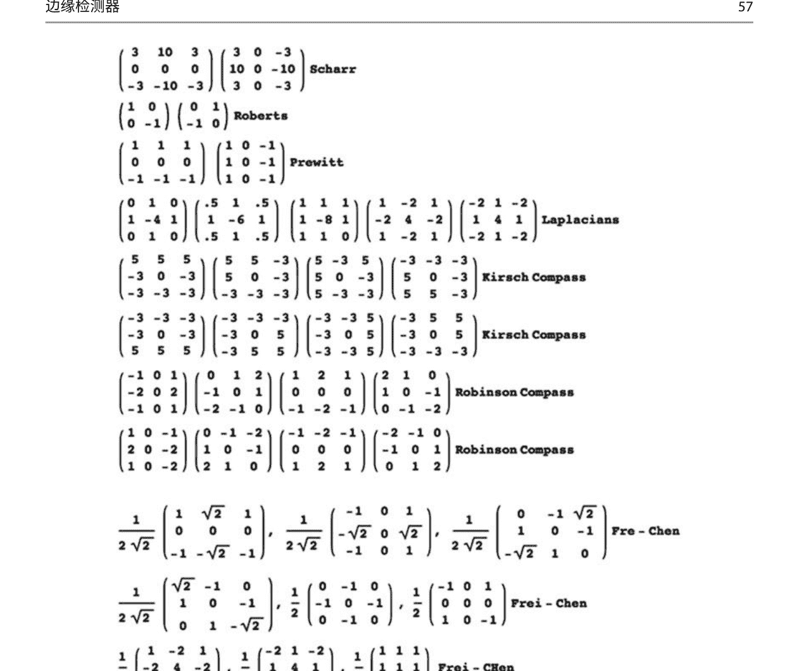

## Canny检测器

Canny方法[146]类似于Sobel风格的梯度幅度和方向方法，但它添加了后处理来清除边缘。

1. 使用选择的卷积核（7 × 7、5、5等）对图像进行高斯模糊，具体取决于所需的低通滤波级别。
2. 执行两个方向的Sobel滤波器（x和y轴），并将边缘强度计算为|G| = |G_x| + |G_y|，边缘方向计算为theta = ATAN(G_y/G_x)，并将方向四舍五入为0、90、180或270中的一个。
3. 在梯度方向上执行非最大值抑制，将不在边缘上的像素设置为零（0）（最小值）。
4. 在梯度方向上执行滞后阈值处理，以消除边缘混叠和异常值，并创建更好连接的边缘。

## 变换滤波、傅里叶和其他方法

本节讨论图像滤波中基础空间和图像变换的概念，其中最常见和广泛使用的是傅里叶变换。在特征描述的背景下，本章提供了更全面的基础空间和变换处理。在图像处理的背景下，Pratt [9]提供了一个很好的变换滤波参考。

为什么要使用变换来切换领域？为了使图像预处理更容易或更有效，或者为了更高效地执行特征描述和匹配。在某些情况下，没有比将图像或特征转换到另一个领域更好的方法，例如，通过将其转换为傅里叶频谱的异常频率分量来去除噪声和其他结构伪影，或者使用HAAR基础特征来紧凑描述和编码图像特征。

## 傅里叶变换家族

傅里叶变换非常著名，并在Bracewell [219]的标准参考书中有所涵盖，它构成了一系列相关变换的基础。在图像和信号处理库中，常见的快速傅里叶变换（FFT）方法有几种。傅里叶分析几乎触及了世界事务的各个领域，包括科学、金融、医学和工业，并被誉为“我们生命中最重要的数值算法”[282]。在这里，我们讨论了傅里叶分析的基础知识，以及傅里叶变换家族的一些分支及其在图像预处理中的应用。

傅里叶变换可以使用光学计算，以光速进行[498]。然而，我们对适用于数字计算机的方法感兴趣。

### 基础知识

傅里叶分析的基本思想[4, 9, 219]是将周期函数分解为一系列正弦和余弦波（图2.14）。傅里叶变换是双向的，可以在周期波和频域中的相应一系列谐波基函数之间进行转换，其中每个基函数都是以基频的整数倍间隔的正弦或余弦函数。正向FFT的结果是一个复数，由系列中每个正弦和余弦分量的幅度和相位数据组成，也称为实数数据和虚数数据。

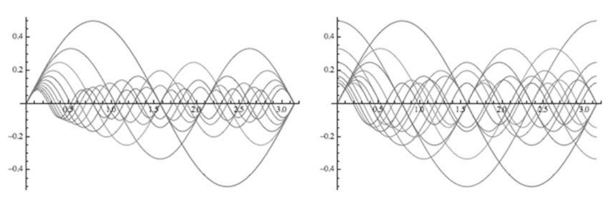

任意周期函数可以通过求和所需的傅里叶基函数集来合成，并且周期函数可以使用傅里叶变换分解为基本函数作为傅里叶级数。傅里叶变换在离散像素的时间域和频率域之间是可逆的，在滤波和分析中可以使用每个基函数的幅度和相位，其中幅度是最常用的组成部分。

如何实现2D图像或3D体积的FFT？傅里叶变换是一种可分离的变换，因此可以作为一组并行的1D FFT线变换来实现。因此，对于2D图像和3D体积，每个维度（如x、y、z维度）可以在原地并行计算，作为独立的x线，然后下一个维度或y列可以作为并行线在原地计算，然后z维度可以作为并行线在原地计算，最后的结果根据变换进行缩放。任何好的1D FFT算法都可以设置为使用并行化处理2D图像或3D体积。

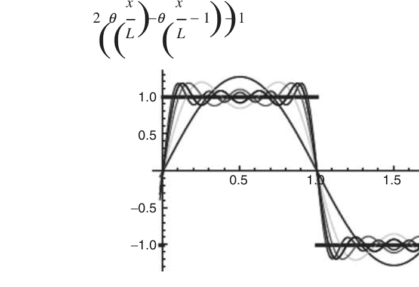

图2.15傅里叶级数和傅里叶变换的概念，展示了由一系列傅里叶谐波近似得到的方波

为了使逆变换从频率空间返回到像素的准确性，FFT计算将需要两个双精度64位浮点缓冲区来保存幅度和相位数据，因为正弦和余弦等超越函数需要高浮点精度以获得准确性；使用64位双精度浮点数来表示图像数据允许计算图像的正向变换，然后进行逆变换，与原始图像相比不会丢失精度-当然，非常大的图像将需要超过双精度的精度。

由于64位浮点数通常较慢且功耗较高，这是由于ALU中的计算需求和硅片面积增加，以及更重的内存带宽负载，因此已经开发了使用整数变换和在某些情况下使用定点变换的FFT优化方法，这些方法对许多应用来说是不错的选择。

请注意图2.16中的低通滤波器（右中）被应用于保留主要位于图像中心的低频信息，并减少位于边缘的高频分量，从而得到最右边的滤波图像。

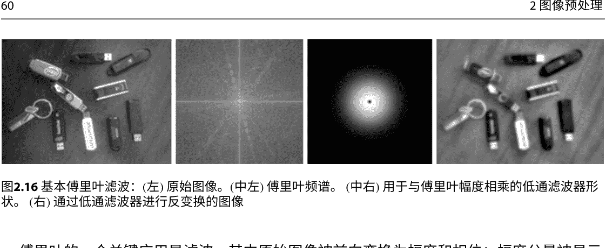

傅里叶的一个关键应用是滤波，其中原始图像被前向变换为幅度和相位；幅度分量被显示为幅度数据的傅里叶功率谱，它显示了图像中的结构，如直线和块状结构，或者通常是噪声的异常结构或斑点。幅度可以通过各种滤波器形状进行滤波，例如高通、低通、带通和斑点滤波器，以去除斑点噪声，影响频谱的任何部分。

在图2.16中，显示了一个圆对称的低通滤波器形状，其滤波器系数从1到0呈平滑分布，在低频率处具有较高的乘数，向边缘的高频率处逐渐减少至零。滤波器形状在频域中与幅度数据相乘，以滤除较高频率的成分，这些成分位于频谱图的外部，然后进行逆FFT以提供滤波后的图像。低频成分位于中心位置；通常这些成分最有趣，因此图像的大部分能量都包含在低频成分中。可以使用任何其他滤波器形状，例如点滤波器，以去除噪声或频谱中特定位置的任何结构。

## 傅里叶变换家族

傅里叶变换是一系列变换的基础[4]，其中一些变换包括：

1. **DFT，FFT**。傅里叶变换的离散版本，通常实现为快速版本，或FFT，常用于图像处理。有许多实现FFT的方法[219]。
2. 正弦变换。仅由正弦项组成的傅里叶公式。
3. 余弦变换。仅由余弦项组成的傅里叶公式。
4. **DCT，DST，MDCT**。离散傅里叶变换有几种形式：离散正弦变换（DST），离散余弦变换（DCT）和改进的离散余弦变换（MDCT）。这些相关方法在宏块上操作，例如16×16或8×8像素区域，因此可以使用整数而不是浮点数进行高度优化的计算。通常，DCT在视频编码和解码的硬件中实现，用于从帧到帧的宏块运动估计。MDCT在重叠的宏块区域上进行计算以提高效率。
5. 快速哈特利变换，**DHT**。这是在1925年左右作为傅里叶变换的替代公式开发的，用于电话传输分析，多年来被遗忘，然后由Bracewell [219]重新发现并推广为傅里叶变换的替代方法。哈特利变换是傅里叶变换的对称公式，将信号分解为两组一起使用的正弦函数集合，表示为*cosine-and-sine*或*cas()*函数，其中$cas(vx) \equiv \cos(vx) + \sin(vx)$。这包括正频率和负频率分量，并且完全使用实数进行输入和输出。哈特利公式避免了傅里叶复指数$exp(j\omega x)$中使用的复数。哈特利变换已经

（原始OCR文本在此页结束，内容不完整）发展成为优化版本，称为DHT，显示出与优化FFT速度大致相等。

## 其他变换

还可以使用几种其他变换进行图像滤波，包括小波、可操纵滤波器组等，在第3章中将在特征描述的上下文中进行描述。请注意，变换通常具有许多常见的用途和重叠的应用，例如图像描述、图像编码、图像压缩和特征描述。

## 形态学和分割

为了简单起见，我们将形态学的目标定义为形状和边界的定义，分割的目标是定义具有内部相似性的区域，例如纹理或统计相似性。形态学用于将特征识别为可以用形状度量描述的多边形区域，将在第3章和第6章中进行讨论，与使用其他方法的局部兴趣点和特征描述符不同。图像被分割成区域，以便根据某种策略或处理目标对每个区域进行独立处理和分析。区域覆盖的面积小于全局图像，但通常大于局部兴趣点特征，因此一个应用程序可以同时使用全局、区域和小的局部兴趣点度量作为对象的签名。

> 在Haralick和Shapiro的工作中可以找到对几种分割方法的优秀综述[313]。 在实践中，分割和形态学并不容易：结果往往比预期的要差，需要试错，有太多的方法可供选择，无法提供严格的指导，并且每个图像都是不同的。 因此，在这里我们只是对各种方法进行调查，以介绍这个主题并说明其复杂性。 表2.3显示了区域分割方法的概述。

表2.3 分割方法
| 方法 | 描述 |
| :--- | :--- |
| 形态学分割 | 基于阈值和形态学运算符定义区域。 |
| 基于纹理分割 | 使用区域的纹理将相似纹理分组成连接的区域。 |
| 基于变换分割 | 使用基础空间特征对图像进行分割。 |
| 边界分割 | 仅使用梯度或边缘来定义区域的边界，在某些情况下进行边缘连接以形成边界。 |
| 颜色分割 | 颜色信息用于定义区域。 |
| 超像素分割 | 核和距离变换用于将像素分组并将它们的值更改为公共值。 |
| 灰度/亮度分割 | 灰度阈值或带用于定义区域。 |
| 深度分割 | 深度图和与观察者的距离用于将图像分割为前景、背景或其他场景特征的渐变。 |

### 二值形态学

二值形态学操作于二值图像，这些图像是从其他标量强度通道图像创建的。形态学 [9] 用于将特征形状变形为新形状，以便通过去除形状噪声或异常值并加强主要特征特性来进行分析。例如，可以使用形态学去除孤立像素，使细长的特征变粗，并且仍然保留主要形状。请注意，形态学本身就是一个相当庞大的研究领域，广泛应用于一般物体识别、细胞生物学、医学、粒子分析和自动显微镜技术。我们在这里介绍了二值图像形态学的基本概念，然后在本节中介绍了对灰度和彩色数据的应用。

二值形态学从对图像进行二值化开始，通常先进行阈值处理，创建由8位黑白值组成的二值像素图像，其中0值 =黑色，255值 =白色。阈值处理方法将在本章后面进行调查，形态学处理之前的阈值处理非常重要。

二值形态学是一种邻域操作，可以使用具有真值的形成核，如图2.17所示。形成核通过定义哪些周围像素对形态学处理有贡献来指导形态学过程。图2.17显示了两个形成核：核a，其中考虑与当前像素接触的所有像素，核b，其中仅考虑正交相邻像素。

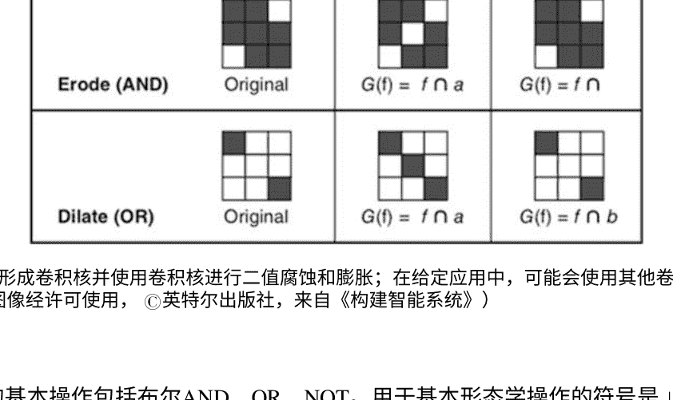

图2.17 3×3形成卷积核并使用卷积核进行二值腐蚀和膨胀；在给定应用中，可能会使用其他卷积核尺寸和数据值。（图像经许可使用，©英特尔出版社，来自《构建智能系统》）

形态学的基本操作包括布尔AND、OR、NOT。用于基本形态学操作的符号是 ∪表示膨胀和 ∩表示腐蚀。在二值形态学中，膨胀是布尔OR运算符，而腐蚀是布尔AND运算符。在图2.17提供的示例中，只有具有“1”的核元素才会在形态学计算中使用，从而允许邻域贡献的变化。对于腐蚀，所有真形成核元素下的像素进行AND运算；如果全部为真，则结果为1，像素特征保持不变，否则像素特征被腐蚀或设置为0。

在形成真实卷积核下的所有像素必须为真，才能对中心像素进行腐蚀。腐蚀试图减少稀疏特征，直到只剩下强特征。膨胀试图膨胀稀疏特征，使它们变得更宽，只有在形成卷积核元素下的1个像素为真时，才能对中心像素进行膨胀，对应于布尔逻辑的或运算。

基于简单的腐蚀和膨胀，可以得到一系列形态学操作，如下所示，其中⊕ = 膨胀，⊖ = 腐蚀。

| 操作 | 公式 |
| --- | --- |
| 腐蚀 | G(f) = f ⊖ b |
| 膨胀 | G(f) = f ⊕ b |
| 开运算 | G(f) = (f ⊕ b) ⊖ b |
| 关闭 | G(f) = (f ⊖ b) ⊕ b |
| 形态梯度 | G(f) = f ⊖ b 或 G(f) = f ⊕ b - f ⊖ b |
| 形态内梯度 | Gi(f) = f - f ⊖ b |
| 形态外梯度 | Ge(f) = f ⊕ b - f |

### 灰度和彩色形态学

灰度形态学对将像素合成和组合成具有相似强度值的均匀强度带或区域非常有用。灰度形态学可以用于单个颜色分量，以在各种颜色空间中影响色调、饱和度和颜色强度。

对于灰度形态学或颜色形态学，基本操作是MIN、MAX和MINMAX，其中超过MIN的像素被改为相同的值，低于MAX的像素被改为相同的值，而在MINMAX范围内的像素被改为相同的值。MIN和MAX是一种阈值化的形式，而MINMAX允许将像素值的带合并为相等的值，形成一个均匀的区域。

### 形态学优化和细化

除了简单的形态学[9]，还有其他使用自适应方法[246-248]进行形态学分割的方法。此外，MorphoLibJ软件包（也是ImageJ Fiji的插件）包含了最全面和高质量的形态学方法套件，包括分割、滤波和标记。简单的形态学方法依赖于在每个像素上使用固定的核，并假设阈值已经应用到图像上；而自适应方法将形态学操作与基于局部像素强度统计的可变核和可变阈值相结合。这使得形态学能够适应局部区域的强度，并在某些情况下产生更好的结果。自动阈值和自适应阈值方法将在本章后面进行讨论，并在图2.24和图2.26中进行说明。

## 欧几里德距离图

距离图或欧几里得距离图（EDM）将二值图像中的每个像素转换为到最近背景像素的距离，因此EDM需要一个二值图像作为输入。EDM在分割中非常有用，如图2.18所示，其中EDM图像基于EDM值进行阈值处理，类似于ERODE运算符。

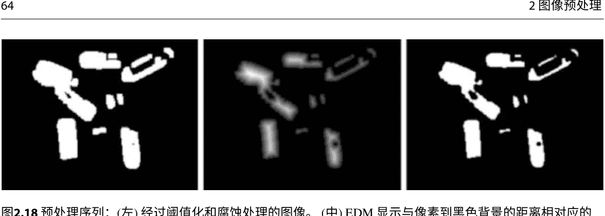

图2.18 预处理序列：(左) 经过阈值化和腐蚀处理的图像。(中) EDM 显示与像素到黑色背景的距离相对应的灰度级。(右) 简单的二值化 EDM 图像。

## 超像素分割

超像素分割方法[249-253]试图将局部区域中相似的像素合并成一个具有相等像素值的更大的超像素区域，从而将相似的值合并到更大的超像素中。超像素方法通常用于数字摄影应用程序，以创建缩放或水彩特效。超像素方法将每个像素视为图中的一个节点，并根据相邻像素的相似性和图距离确定区域之间的边。参见图2.19。

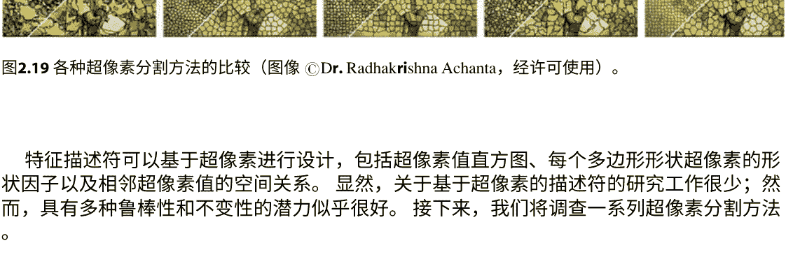

图2.19 各种超像素分割方法的比较 (图像 ©Dr. Radhakrishna Achanta，经许可使用)。

特征描述符可以基于超像素进行设计，包括超像素值直方图、每个多边形形状超像素的形状因子以及相邻超像素值的空间关系。显然，关于基于超像素的描述符的研究工作很少；然而，具有多种鲁棒性和不变性的潜力似乎很好。接下来，我们将调查一系列超像素分割方法。

### 基于图的超像素方法

基于图的方法根据像素距离质心的距离或区域内像素的边缘特征将像素结构化为树。计算复杂度因方法而异。

- **SLIC 方法[250]** 简单线性迭代聚类（SLIC）基于包括 CIE Lab 色彩主色和 XYpixel 坐标在内的 5D 空间创建超像素。 SLIC 算法接受所需生成的超像素数量作为输入，并适应灰度和RGB 彩色图像。 聚类距离函数与所需生成的超像素数量的大小相关，并使用欧氏距离函数将像素分组成超像素。
- **归一化割[254, 255]** 使用基于局部纹理和区域轮廓的递归区域划分方法来创建超像素区域。
- **GS-FH 方法[256]** 基于感知或心理线索使用基于图像边缘的方法来分割图像区域。 该方法使用图树结构中像素之间的最小长度来创建超像素区域。 计算复杂度为 O(nLog n)，相对较快。
- **SL 方法[257]** 超像素格点（SL） 方法使用图割方法在图像区域或像素条带中找到区域边界。

### 基于梯度上升的超像素方法

梯度上升方法迭代地优化超像素聚类以优化分割，直到达收敛条件。 这些方法使用树图结构将像素根据某些准则关联在一起，这种准则可以是像素的RGB值或笛卡尔坐标，然后应用距离函数或其他函数来创建区域。 由于这些是迭代方法，性能可能较慢。

- **均值漂移[258]** 通过基于核心的均值平滑方法，根据区域质心进行注册，创建相似像素的区域。
- **快速漂移[259]** 类似于均值漂移方法，但不使用均值模糊核，而是使用基于RGB值和XY像素坐标的图结构计算的距离函数。
- **分水岭[260]** 从局部区域像素值最小点开始，找到基于像素值的轮廓线，定义了水域或盆地轮廓，在其中可以替换相似的像素值，创建一个均匀的像素值区域。
- **Turbo像素[261]** 在图像上均匀网格中放置小圆形种子点，将超像素收集到分配的区域中，然后逐渐将超像素边界扩展到未分配的区域，使用几何流方法根据控制的边界值扩展标准扩展边界，以便将更多像素聚集到具有相当平滑和均匀几何形状和大小的区域中。

## 深度分割

深度信息，例如图2.20中显示的深度图，非常适合基于距离进行物体分割。 深度图可以通过各种深度传感器和方法计算得到，包括单个相机，如第1章所讨论的。 深度相机，如微软Kinect相机，正在变得越来越常见。 深度图是一个二维图像或数组，其中每个像素值表示距离或 Z值。

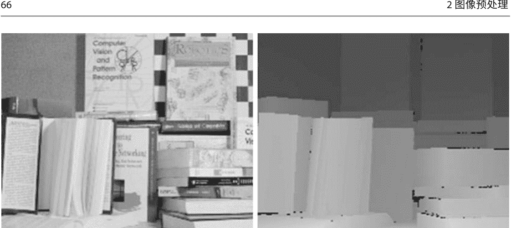

图2.20 Middlebury 数据集的深度图像：（左）原始图像。（右）对应的深度图像。数据 courtesy of Daniel Scharstein and used by permission

计算机视觉中的许多不确定性源于在二维图像数组中定位三维物体的问题，因此将深度图添加到视觉流程中是一个很大的优势。使用深度图，图像可以轻松地分割为前景和背景，并且可以通过简单的深度阈值分割特定的特征或对象。深度图通常非常模糊和嘈杂，这取决于深度感应方法，因此可能需要图像预处理。然而，没有完美的深度图清理滤波方法。许多从业者更喜欢双边滤波器[294]及其变种，因为它能保留局部结构并更好地处理边缘过渡。

## 颜色分割

有时仅使用颜色就可以进行分割和阈值处理。使用正确的颜色分量可以轻松地从图像中滤除特征。例如，在图2.5中，我们从RGB集合中的红色通道图像开始，目标是从桌面背景中分割出USB闪存。由于桌子是棕色的并且含有很多红色，红色通道与USB闪存之间提供了有用的对比，从而通过红色进行分割。可能需要对图像进行颜色校正以获得最佳结果，例如色域校正或增强每种颜色的色调或饱和度以突出差异。

## 阈值处理

阈值处理的目标是根据特定的强度水平对图像进行分割，以显示前景、背景和特定对象等特征。存在各种各样的阈值处理方法，从全局到局部自适应。在实践中，阈值处理非常困难，通常单独使用并不令人满意，必须根据数据集进行调整，并与视觉流水线中的其他预处理方法相结合。

阈值化中的一个关键问题是非均匀照明，因此需要进行阈值化的应用，如细胞生物学和显微镜学，对细胞制备、标本的光照、间距和光源位置特别注意。由于许多图像对涉及简单方法的全局阈值化不起作用，因此通常需要使用局部方法，这些方法使用局部像素结构和统计关系来创建有效的阈值。本文讨论了全局和局部自适应阈值化的方法。阈值可以有几种形式：

- **Floor** 允许的最低像素强度
- **Ceiling** 允许的最高像素强度
- **Ramp** 在底部和顶部之间的像素坡道的形状，如线性或对数
- **Point** 可能是一个没有底部、顶部或坡道的二值阈值点

### 全局阈值处理

在全局确定的阈值水平上对整个图像进行阈值处理有时是探索图像数据的好方法，但通常局部特征会受到影响，结果变得难以理解。可以使用统计方法改进阈值处理，以确定最佳阈值水平。可以构建查找表（LUT），通过统计矩来创建底部、顶部和斜坡，并创建用于对图像进行快速LUT处理或为可视化而对图像进行伪彩色处理的函数。

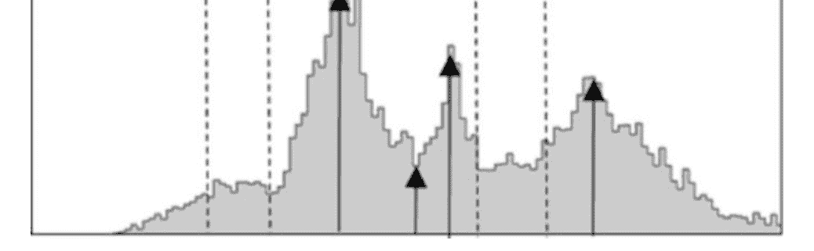

直方图的峰值和谷值，以及滞后阈值。再次回到老朋友，图像直方图。直方图中的峰值和谷值可能指示用于分割和阈值处理的阈值[311]。滞后区域标记具有相似值的像素，在直方图中很容易发现，如图2.21所示。此外，许多图像处理程序都具有交互式滑块，允许使用指针设备设置阈值点甚至区域。¹花些时间了解图像数据的直方图，并熟悉使用交互式阈值处理方法。

> ¹请参阅开源软件包ImageJ2，以及菜单项图像！调整亮度/对比度进行交互式阈值处理。

如果直方图峰值之间没有明显的谷值，则在谷值的两侧建立两个阈值是定义滞后区域的一种方法。滞后区域内的像素值被视为对象内部。此外，可以使用滞后范围和形态学将像素分类为一个区域，以确保区域连通性。

#### LUT变换，对比度重映射

简单查找表 (LUT) 对于对比度重映射和全局阈值处理非常有效，可以使用交互式工具创建LUT。一旦交互式实验用于找到最佳的底部、顶部和斜坡函数，LUT可以生成为表数据结构，并用于设置快速代码中的阈值。使用伪彩色LUT对图像进行伪着色在数据阈值理解方面很常见且非常有价值。可以设计各种LUT形状和斜坡。有关使用线性斜坡函数的示例，请参见图2.22。

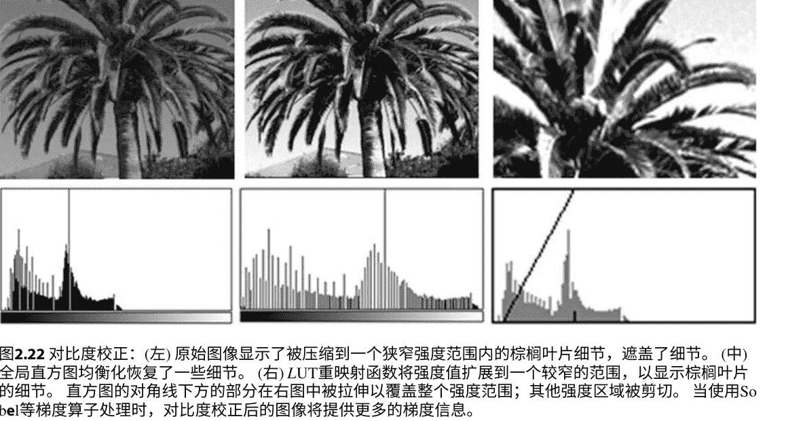

#### 直方图均衡化和规范化

直方图均衡化通过对比度重映射函数将像素值在一个范围内进行扩展，目标是创建一个具有近似相等的条目计数的直方图，接近于直线分布。参见图2.23。虽然这种方法对灰度图像效果很好，但彩色图像应该在所选颜色空间的强度通道中进行均衡化，例如HSV的V通道。分别对每个RGB分量进行均衡化和重新渲染会产生彩色莫尔纹效应。

直方图均衡化对于区域内的所有像素使用固定的区域和固定的重映射；然而，也有自适应局部直方图均衡化方法可用[306]。

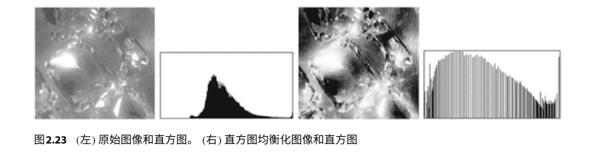

可以创建所需的直方图形状或值分布，称为直方图规范化，并将源图像的所有像素值重新映射以符合指定的直方图形状。可以直接创建形状，或者使用第二个图像的直方图形状将源图像重新映射以匹配第二个图像。在某些图像处理软件中，直方图规范化可以是交互式的，可以放置和调整曲线上的点以创建所需的直方图形状。

#### 全局自动阈值化

已经设计了各种方法来基于图像直方图的统计特性自动找到全局阈值[312, 495-497]，但在大多数情况下，结果并不理想，除非进行一些图像预处理以前的自动阈值化。表2.4提供了自动阈值化方法的简要调查，而图2.24显示了每种方法的渲染效果。

表2.4 从基本直方图特征中派生出的几种全局自动阈值方法 [295]
| 方法 | 描述 |
| --- | --- |
| 默认 | IsoData方法的变体，也被称为迭代均值法。 |
| Huang | Huang的模糊阈值法。 |
| Intermodes | 迭代直方图平滑。 |
| IsoData | 迭代像素平均值，用于得到高于和低于阈值的新阈值的组合平均值。 |
| Li | 迭代交叉熵阈值法。 |
| MaxEntropy | Kapur-Sahoo-Wong (最大熵) 算法。 |
| Mean | 使用平均灰度级作为阈值。 |
| MinError | Kittler和Illingworth的迭代方法，以收敛到最小误差阈值。 |
| Minimum | 迭代直方图平滑，假设直方图是双峰的。 |
| Moments | Tsai的阈值法，旨在阈值化并保留原始图像的矩。 |
| 大津 | 大津聚类算法通过最小化方差来设置局部阈值。 |
| 百分位数 | 根据预设的前景和背景像素分配来调整阈值。 |
| Renyi熵 | 另一种基于熵的方法。 |
| Shanbhag | 使用模糊集度量来设置阈值。 |
| 三角形 | 使用图像直方图峰值，假设峰值不居中，在峰值两侧的最大区域上设置阈值。 |

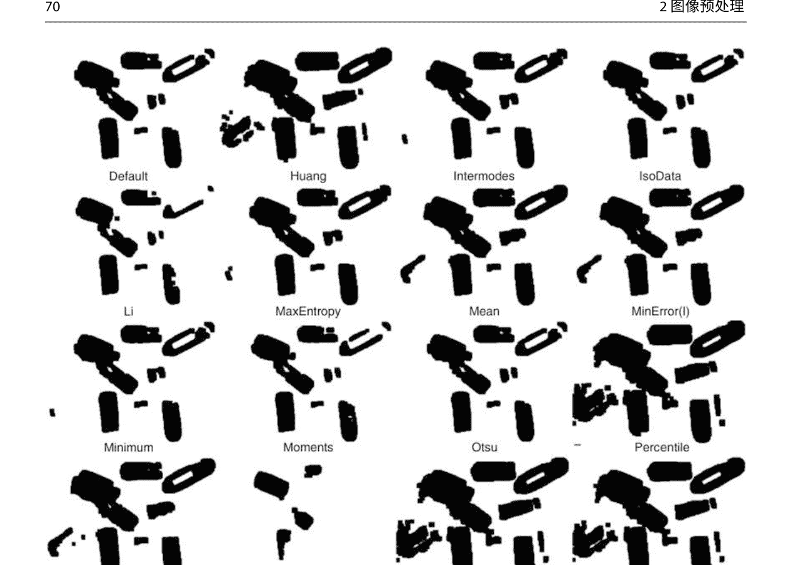

## 局部阈值处理

局部阈值方法从局部像素区域获取输入，并分别对每个像素进行阈值处理。以下是一些常见且有用的方法。

### 局部直方图均衡化

局部直方图均衡化将图像分割成小块，例如32 ×32像素，并为每个块计算直方图，然后使用直方图均衡化重新渲染每个块。然而，对比度结果可能包含与所选直方图块大小相对应的块伪影。局部直方图均衡化有几种变体，包括对比度受限自适应局部直方图均衡化（CLAHE）[296]。

### 积分图像对比滤波器

一种基于直方图的方法使用积分图像计算局部区域统计量，无需计算直方图，然后像素按照相应的映射进行重新映射，这样可以更快地实现类似效果，如图2.25所示。

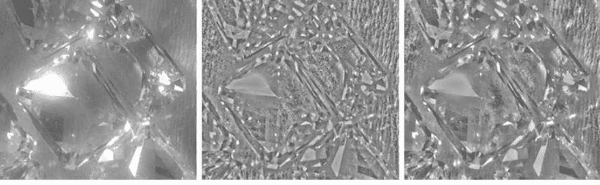

**图2.25** 来自ImageJ的积分图像滤波器，用于重新映射局部区域的对比度，类似于直方图均衡化：（左）原始图像。（中）20 ×20个区域。（右）40 ×40个区域

### 局部自动阈值方法

局部阈值化根据图像中每个目标像素周围的即时区域调整阈值，因此局部阈值化更像是一个标准的区域操作或滤波器[495-497]。标准软件包中提供了局部自动阈值化方法。²图2.26提供了一些示例自适应局部阈值化方法，总结在表2.5中。

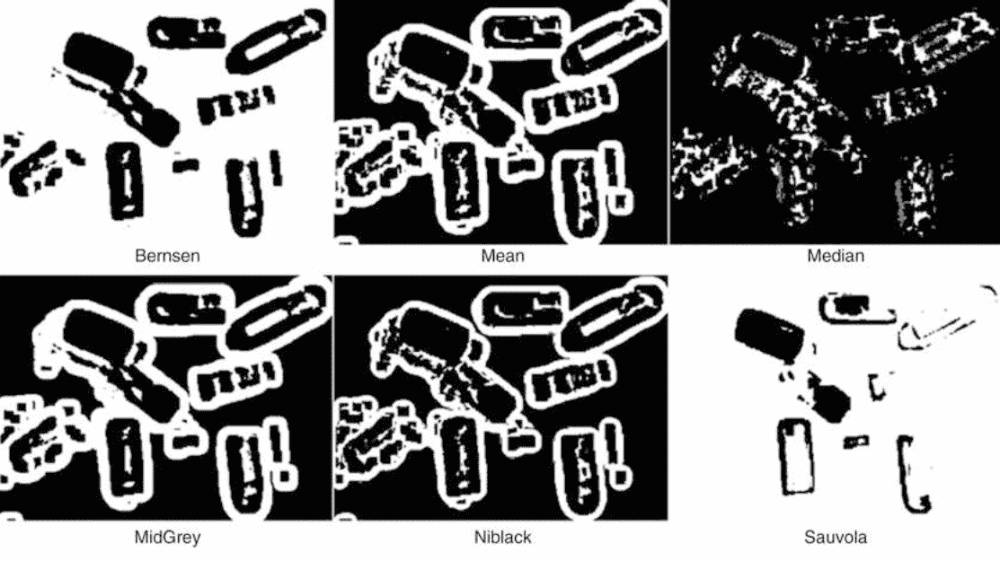

**图2.26** 使用ImageJ插件渲染的一些本地自动和本地阈值方法的图像[295]
（Bernsen，Mean，Median，MidGrey，Niblack，Sauvola）

表2.5 一些局部自适应阈值方法
| 方法 | 描述 |
| :--- | :--- |
| Bernsen | 基于局部最小和最大值的对比度。 |
| Mean | 使用局部平均值。 |
| Median | 使用局部中值。 |
| MidGrey | 使用局部最小值和最大值的中间值。 |
| Niblack | 基于局部平均值和标准差。 |
| Sauvola | Niblack的变体，针对文本图像进行了优化。 |

²请参阅开源软件包ImageJ2，菜单项图像！ 调整！ 自动本地阈值 | 自动阈值。

表2.5 选定的几种局部自适应阈值方法[295]

| 方法 | 描述 |
| --- | --- |
| Bernsen | Bernsen算法使用圆形窗口而不是矩形窗口和局部中灰度值 |
| Mean | 使用局部灰度平均值作为阈值 |
| 中值 | 使用局部灰度平均值作为阈值 |
| 中灰度 | 使用局部区域灰度平均值 - C（其中C是一个常数） |
| Niblack | Niblack算法如下：<br>p = (p > mean + k * standard_deviation - c) ? object : background |
| Sauvola | Sauvola的Niblack变体如下：<br>p = (p > mean * (1 + k *( standard_deviation / r - 1))) ? object : background |

## 摘要

在本章中，我们调查了图像处理作为预处理步骤，可以改善图像分析和特征提取。我们制定了图像处理方法的分类法来框定讨论，并将分类法应用于四个基本视觉流程的示例，这将在第5章的分类法中开发，包括（1）本地二进制描述符，如LBP、ORB、FREAK；（2）频谱描述符，如SIFT、SURF；（3）基础空间描述符，如FFT、小波；和（4）多边形形状描述符，如斑点对象面积、周长和质心。讨论了图像预处理的常见问题和机会。从照明、噪声和伪影去除开始，我们涵盖了一系列主题，包括深度分割和超像素方法的分割变体，二值、灰度和彩色形态学，用于卷积和统计区域滤波的空间滤波，以及基础空间滤波。

# 第二章：学习任务

- 1. 讨论为什么图像处理用于改进计算机视觉流水线，使图像更适合特定的特征描述符。
- 2. 讨论图像预处理可以解决梯度特征描述符（如SIFT）的哪些问题。
- 3. 讨论图像处理目标在一定程度上受图像传感器的影响。
- 4. 以一般意义上的图像处理为目标，描述一些纠正和增强的目标。
- 5. 讨论为什么图像预处理对于优化使用给定特征描述符（如SIFT）的系统非常重要，以及为什么图像预处理应该专门为给定的特征描述符设计。
- 6. 描述一个假设的计算机视觉应用程序，勾勒出包括使用的特征描述符在内的架构，并描述在特征提取之前的图像预处理目标，并讨论选择达到目标的图像处理算法。
- 7. 描述一个图像处理流程，以改善在低光环境（室内照明不足）中从高速相机（4000 fps）拍摄的图像质量，包括选择每个算法的目标以及每个算法的替代方案。
- 8. 描述一个用于在户外环境中校正彩色图像的图像处理流程，包括选择每个算法的目标以及每个算法的替代方案。
- 9. 讨论噪声如何影响特征描述算法。
- 10. 讨论减少噪声的算法，以及放大噪声的算法。
- 11. 讨论噪声与对比度的关系。
- 12. 讨论图像中的一般照明问题，如何使用统计和图像分析方法检测照明问题，以及纠正照明的一般方法。
- 13. 讨论对比度重映射的工作原理，以及如何利用它来改善图像对比度。
- 14. 描述一个图像处理流程，为基于连接梯度或强度脊的分割算法准备图像。
- 15. 基于区域，可以描述图像处理操作的基本分类：（1）点操作，（2）线操作和（3）区域操作。以一般意义上描述这三种类型的区域操作，描述每种方法的局限性，并为每种方法命名至少一个示例算法。
- 16. 描述以下颜色空间：RGB（加法），CYMK（减法）和HSV。
- 17. 讨论彩色图像处理在颜色强度空间中的工作原理，以及为什么与处理其他颜色空间分量（如饱和度或色调）相比，处理强度空间通常更有效。
- 18. 讨论为什么在RGB空间中进行颜色处理会导致颜色莫尔纹效应。
- 19. 描述颜色管理系统的目标，包括为什么需要颜色管理，并提供一些示例。
- 26. 描述在局部空间区域进行图像处理时的几个优势示例。
- 27. 描述点积和卷积的关系，以及它们如何通过绘制算法来实现。
- 28. 提供几个3 ×3卷积核的核矩阵值，包括一个锐化滤波器核和一个模糊滤波器核。
- 29. 讨论为什么卷积滤波器的值应该总和为零。
- 30. 讨论应用于卷积结果的有用的后处理数值条件器，例如绝对值。
- 31. 描述如何检测图像中的噪声（例如直方图和其他方法），以及用于去噪的空间滤波方法。
- 32. 比较Sobel边缘检测算法和Canny边缘检测算法。
- 33. 提供用于卷积滤波的几种类型的边缘检测器的核矩阵。
- 34. 比较频域中的傅里叶变换滤波和离散空间域中的卷积核滤波，并描述每种方法在图像处理中的相对优势和劣势。
- 35. 描述积分图算法以及如何使用积分图实现盒子filters。
- 36. 讨论图像分割的一般目标，并使用伪代码描述至少一种分割算法。
- 37. 描述二值形态学操作ERODE和DILATE，讨论其预期用途，并提供3个示例3 × 3二值核心用于ERODE和DILATE。
- 38. 描述灰度形态学操作MIN和MAX，讨论其预期用途，并提供3个示例3 × 3灰度核心用于MIN和MAX。
- 39. 总体上讨论超像素算法的工作原理。
- 40. 讨论对比度重映射以及如何使用查找表实现它。
- 41. 比较全局和局部区域的直方图均衡化。
- 42. 描述直方图规范化算法。

> 量取两次，切割一次。——木匠的说法

本章介绍了一般特征描述的度量标准，通常用于整个图像和图像区域，包括纹理、统计、基于模型和基础空间方法。纹理是一个重要的度量标准，在图像处理中是一个众所周知的主题，通常被分为结构和统计方法。结构方法寻找边缘和形状等特征，而统计方法关注像素值之间的关系和统计矩。还存在用于建模图像纹理的方法，主要用于图像合成而不是描述。基础空间，如傅里叶空间，也用于特征描述。

在图像处理和计算机视觉中，很难在全局特征度量、区域特征度量和局部特征度量之间建立清晰的分界线；大多数度量标准的应用存在相当大的重叠。然而，在本章中，我们根据合理的界限划分了这些主题，尽管这些边界可能看起来是任意的。同样，在全局特征和区域特征的讨论中，与图像处理中涉及的主题以及第6章中讨论的局部特征存在一些重叠。简而言之，许多方法被用于局部、区域和全局特征描述，以及图像处理，如傅里叶变换和LBP。

但我们首先简要调查了纹理分析和一般视觉度量领域的一些关键思想。

## 特征的历史调查

为了比较和对比全局、区域和局部特征度量标准，调查和追踪描述机器视觉特征的关键思想、方法和途径是很有用的。这个调查包括图像处理（纹理和统计）和机器视觉（局部、区域和全局特征）。从历史上看，特征度量标准的选择受限于当时可计算的度量标准，由于计算性能、内存和传感器技术的限制。随着时间的推移和技术的发展，度量标准的计算变得更加复杂，占用更大的内存空间。图像变得多模态，结合了强度、颜色、多个光谱、深度传感器信息、多曝光设置、高动态范围图像、更快的帧速率以及在x、y和z深度方面更精确和准确的信息。因此，内存带宽和计算性能的增加催生了描述特征度量标准和进行分析的新方法。

已经尝试了许多纹理分析方法，它们可以分为以下几类：

- - 结构化，通过一组称为纹素的微纹理模式来描述纹理。例如，对于天然纹理（如织物、草地和水），可以进行数值描述。边缘、线条和角点也是结构化模式，区域内边缘的特征（如边缘方向、边缘数量和边缘梯度幅度）对于纹理度量是有用的。可以通过边缘特征的直方图来定义纹理，类似于局部特征描述符（如第6章中描述的SIFT）中使用的方法。
- - 统计，基于灰度级统计矩描述点像素区域属性，包括共生矩阵或SDM等方法。例如，图像中颜色强度在相近范围内的区域可以被视为具有相同的纹理。具有相同直方图的区域可以被视为具有相同的纹理。
- - 基于模型的，包括分形模型、随机模型和各种半随机场。通常，这些模型可以用于生成合成纹理，但在识别纹理方面可能不太有效，我们不涉及纹理生成。
- - 基于变换或基函数的，包括傅里叶变换、小波变换、Gabor滤波器、Zernike变换和其他基函数空间。在这里，它们被视为统计方法（统计矩）的一个子类；然而，基函数空间也被用于图像处理和滤波的变换中。

## 关键思想：全局、区域和局部度量标准

让我们简要回顾一下特征度量研究中的一些主要趋势和里程碑。虽然这个简要概述并不打算精确地包含所有关键事件和研究，但它描述了主流行思维和学术活动中的一些普遍趋势。

## 1960年代、1970年代、1980年代——整体对象方法

在这个时期，度量主要描述整个对象、较大的区域或图像；通过FFT频谱方法和相关性进行大目标的模式匹配；识别方法包括对象、形状和纹理度量；并且简单的几何基元被用于对象的组合。常见的是低分辨率图像，如NTSC、PAL和SECAM——主要是灰度图像，当有足够的内存时会有一些彩色图像。军方可以获得一些分辨率较高的卫星图像，例如来自NASA的LANDSAT图像和来自法国的SPOT图像。

一些早期的模式识别工作开始使用局部兴趣点和特征：特别是，Moravic [502] 在1981年开发了一个局部兴趣点检测器，而Harris和Stephens [148] 在1988年开发了局部兴趣点检测器。商业系统开始出现，特别是在1980年代初出现的View PRB，它使用数字相关和尺度空间超像素进行粗匹配和精匹配，并且Imaging Technology引入了实时图像处理和模式识别系统。机架式成像和机器视觉系统开始被工作站和高端个人电脑取代，这些系统配备了附加成像硬件、阵列处理器以及由Krig Research等公司提供的软件库和应用程序。

## 20世纪90年代初-部分对象方法

计算能力和内存的增加使得更多关注局部特征方法，例如Shi和Tomasi [149] 对Harris检测方法的改进，Kitchen和Rosenfeld [200] 开发了灰度角点检测方法，以及Wang和Brady [205] 的方法。1990年，使用Zernike多项式计算多边形形状上的图像矩Khotanzad和Hong [268]. 尺度空间理论被Lindberg [502]应用于计算机视觉中，许多其他研究人员也沿着这条思路继续研究，比如2004年的Lowe [153]。度量描述了物体的较小部分或物体组件以及图像的部分；越来越多地使用局部特征和兴趣点。使用了大量的子模式或基向量，并开发了相应的度量标准。增加了对颜色信息的使用；出现了更多的方法来改善尺度、旋转或仿射变化的不变性；并且基于找到具有适当度量标准的物体部分开发了识别方法。在公共领域（特别是医疗应用）中，越来越多地使用了更高的图像分辨率、增加的像素深度和颜色信息，以及新的经济实惠的图像传感器，如KODAK MEGA-PLUS，它提供了一个1024 × 1024的图像。

## 中期1990年代-局部特征方法

更多关注点放在识别图像中兴趣点周围的小局部特征的度量标准上。特征描述符从每个特征周围的窗口或补丁中添加了更多细节，并且识别是基于搜索一组特征并将描述符与更复杂的分类器进行匹配。描述符谱包括梯度、边缘和颜色。

## 晚期1990年代-分类不变局部特征方法

新的特征描述符被开发和改进，以便对尺度、亮度、旋转和仿射变换的变化具有不变性。Schmidt和Mohr的工作[340]推进并推广了局部特征描述方法。特征充当了拼写复杂特征描述符或向量的字母表，其中向量用于匹配。使用神经网络和其他机器学习方法[134]对特征匹配和分类阶段进行了改进，以提高速度和效果。

## 早期2000年代-场景和对象建模方法

场景和物体被建模为具有良好描述符的特征组件或模式的集合；特征之间的空间关系被测量并用于匹配；新的复杂分类和匹配方法使用增强和相关方法来结合强特征和弱特征以实现更有效的识别。Lowe的SIFT [153]算法被发布；Bay等人 [152]也发布了SURF，采用了与仅使用梯度不同的HAAR特征的方法。Viola-Jones方法 [486]被发布，使用HAAR特征和增强学习方法进行分类，加速匹配。计算机视觉的OpenCV库由INTEL的Bradski开发并作为开源发布。

## 2000年代中期-更精细的特征和度量组合方法

在这个领域的研究人员数量开始激增；Czurka等人 [226]开发了各种特征和度量（特征包）的组合，用于描述场景和物体，使用了Sivic [503]描述的关键点；新的局部特征描述符被创建和改进；对于商业应用，实时特征提取和匹配方法引起了更多的兴趣。更好的局部度量和特征描述符被分析、测量和一起使用，以提高模式匹配的准确性。此外，特征学习和稀疏特征码本被开发用于减少模式空间、加快搜索时间和提高准确性。

## 2010年后—多模态特征度量融合

越来越多地使用深度传感器信息和深度图像来分割图像、描述特征并创建体素度量，例如参见Rusu等人[380]，例如2D纹理度量在3D空间中表示。3D深度感知方法不断增加，越来越多地使用高分辨率图像和高动态范围（HDR）图像来提高特征准确性，更高的位深度和颜色图像准确性可用于有价值的基于颜色的度量和计算成像。 处理能力增强和廉价、丰富的内存可在低成本计算平台上处理更大的图像。 使用二进制模式的更快、更好的特征描述符已经被开发出来，并且可以使用汉明距离快速匹配，例如Alahi等人的FREAK [122]和Rublee等人的ORB [112]。 多模态和多变量描述符[770, 771]由图像特征和其他传感器信息（如加速度计和位置传感器）组成。

未来的计算研究可能会完全回到原点，当足够的计算和内存容量存在时，可以使用并行和固定功能硬件方法实时执行旧的方法，例如跨多个尺度和几何视角的相关性。 这将消除对小不变特征集的当前关注，并允许多种方法协同使用。 因此，了解这个领域的发展历史是值得的，因为它可能以不同的技术体现重复。

由于获取正确的特征度量集没有单一解决方案，随着时间的推移开发的所有方法今天都有应用并仍在使用。

## 纹理分析

最基本的度量之一是纹理，它是图像通道表面的描述，例如颜色强度，就像高程图或地形图。纹理可以在全局或局部区域内表示。 纹理可以通过区域内相邻像素之间的统计关系局部地表示，也可以通过像素值在图像或区域内的总结关系全局地表示。 有关涵盖广泛的纹理方法的文献摘录，请参阅参考文献[13, 16–20, 52, 53, 302, 304, 305]。

根据Gonzalez [4]的说法，在图像分析中有三个基本纹理类别：统计、结构和光谱。统计测量包括直方图、散点图和SDMs。结构技术更关注于在图像中定位模式或结构原语，如平行线、规则模式等。这些技术在[1, 5, 8, 11]中有描述。光谱纹理是通过对数据的频域表示进行分析得到的。也就是说，使用快速傅里叶变换创建数据的频域图像，然后可以使用傅里叶技术对其进行分析。

直方图揭示了像素值的整体分布，但不提供空间关系信息。散点图本质上是二维直方图，不揭示任何空间关系。在参考文献[307]中可以找到一份很好的调查报告。纹理已被用于实现几个目标：

- - 基于纹理的分割（在第2章中介绍）。
- 图像区域的纹理分析（在本章中介绍）。
- 纹理合成，使用合成纹理创建图像（本书不涉及）。

在计算机视觉中，纹理度量标准是通过使用离散方法来描述纹理的感知属性的。例如，纹理可以通过几个属性来感知描述，包括：

- - 对比度
- 颜色
- 粗糙度
- 方向性
- 线状
- 粗糙度
- 恒定性
- 分组
- 分割

如果纹理可以被识别，那么可以基于纹理对图像区域进行分割，并且可以使用形状度量标准（如面积、周长和质心）来测量相应的区域（如第6章所讨论的）。第2章包括了对分割方法的调查，其中一些方法是基于纹理的。分割的纹理区域可以被识别和比较，用于计算机视觉应用。局部区域的微纹理，如第6章中详细讨论的LBP，可以作为特征描述符，而宏纹理可以用来描述一个区域的均匀纹理，例如湖泊或草地，因此在图像分割中具有自然应用。

总结一下，纹理可以用来描述全局图像内容、图像区域内容和局部描述符区域内容。特征描述符和纹理度量之间的区别可能很小。

过去传感器的限制以及计算和内存能力的限制主要限制了纹理度量的发展，主要是2D灰度度量。然而，随着每个相机提供更高分辨率图像、更高帧率、更深的像素、深度成像、更多内存和更快计算的普及计算摄影技术的进步，我们可以预期纹理度量方面的新进展将会出现。

这里是纹理度量的简要历史调查。

### 1950年代至1970年代——全局均匀纹理度量

自相关或互相关是Kaizer在1955年开发的一种在航空摄影中寻找随机性和重复模式特征的方法，其中自相关是一种将信号或图像与其时间偏移版本进行相关的统计方法，提供了一种计算简单的分析地面覆盖和结构的方法。

Bajcsy [25]于1973年开发了傅里叶谱方法，使用频域中的各种类型的滤波器来分离各种类型的重复特征，如纹理。
灰度级空间依赖矩阵，GLCMs，SDMs或共现矩阵[6]是由Haralick于1973年开发和使用的，以及一组从SDMs中提取的摘要统计度量，用于辅助纹理的数值分类。一些摘要度量标准已被证明是有用的，但并非全部；然而，对SDMs的分析和新SDM度量标准的开发仍在继续，其中涉及2D可视化和在空间区域内对SDM数据进行滤波的方法[23]，以及添加新的SDM统计度量标准，其中一些在本章中讨论。

### 1980年代—纹理分类的结构和基于模型的方法

早期的工作主要集中在描述相邻像素小核之间的统计度量的微纹理上，而宏纹理则发展出来以解决较大区域内纹理的结构问题。
K. Laws于1979年和1980年开发了纹理能量检测方法[27-29]，以及纹理分类器，可以看作是一些现代分类器概念的先驱。Laws方法可以作为纹理分类器在并行流水线中实现，其中包括通过一组卷积掩模对高斯滤波图像进行梯度提取，以分离纹理微观特征的阶段，然后是用于处理噪声的高斯平滑阶段，接着是从组合梯度中计算能量的阶段，最后是与纹理描述符匹配的分类器。

Eigenfilters是Ade于1983年开发的一种替代Laws梯度或能量方法和SDMs的方法；Eigenfilters使用局部3 ×3像素区域强度的协方差矩阵表示，允许基于协方差矩阵中的特征向量的方差进行纹理分析和聚合。

结构性方法是由Davis [31]于1979年开发的，重点关注纹理的整体结构，而不是基本元素或微纹理特征。 霍夫变换是由Duda和Hart [220]于1972年发明的一种寻找直线和曲线的方法，Eichmann和Kasparis [32]于1988年使用它来提供不变纹理描述。

分形方法和马尔可夫随机场方法被发展成纹理描述符，虽然这些方法对于纹理合成可能很好，但在纹理分类方面效果不佳，因为分形和马尔可夫随机场方法都使用随机场，因此在应用于非随机的真实世界纹理时存在局限性。

### 1990年代-纹理度量的优化和改进

1993年，Lam和Ip [33, 39]使用金字塔分割方法实现了空间不变性，其中图像使用Voronoi多边形镶嵌和不规则金字塔分割技术分割为同质区域；对每个多边形计算五个形状描述符：面积、周长、圆度、方向和主/次轴比，组合成纹理描述符。

局部二值模式（LBP）是由Ojala等人于1994年开发的一种新的方法，用于编码图案和对比度以定义纹理[15, 16, 35, 36]；自那时以来，数百名研究人员在LBP文献中增添了理论基础、2D和3D泛化、用于人脸检测的领域特定兴趣点描述符以及用于运动分析的时空应用[34]。 目前，LBP研究仍然非常活跃。 在第6章中详细介绍了LBPs。 强大的LBP方法有许多应用，包括纹理度量、特征描述符和图像处理算子，后者在第2章中进行了讨论。

### 从2000年至今——更强大的不变纹理度量和3D纹理

特征度量研究正在研究对尺度、旋转、光照、透视等具有不变性的纹理度量，以接近人类纹理辨别的能力。 事实上，在某些领域中，纹理被用作特征描述符的同义词。 Pun和Lee的工作[37]是旋转不变纹理度量的发展示例，同时也具有尺度不变性。 不变性属性在第5章的一般分类中进行了讨论。

越来越多的度量标准正在开发中，将充分利用3D深度信息。 一个例子是Spence在2003年开发的表面形状度量标准[38, 304]，它提供了一种仿射不变纹理识别和纹理描述的凸起图度量标准，具有尺度和透视不变性。 第6章还讨论了一些相关的3D特征描述符。

## 统计方法

统计方法的主题是广泛的，我们只能在进行过程中参考一些选择的文献。 一个有用且全面的资源是在线的NIST国家标准与技术研究所工程统计手册¹，其中包括示例和其他资源和工具的链接。

图3.1 直方图的线性刻度值（黑色）和对数刻度值（灰色），说明相同的数据根据图表刻度的不同而有不同的解释。

统计方法可以随时用来生成新颖的特征度量标准。任何特征，如像素值或局部区域梯度，都可以通过任意数量的统计方法来表达。简单的方法，如图3.1中显示的直方图，是非常宝贵的。基本统计量，如最小值、最大值和平均值，在图2.21中的第2章的直方图中可以很容易地看到。我们在这里调查了几个将统计方法应用于计算机视觉的应用。

## 纹理区域度量标准

现在我们详细研究基于纹理的特征描述的具体度量标准。纹理是最研究的度量标准之一。可以从表面的角度来考虑纹理，例如麻布袋与丝绸面料的比较。在各个领域中，可以设计出许多可能的纹理关系和特征，而且新的特征不断被开发出来。在本节中，我们调查了一些常用的计算纹理度量标准的方法：

- 边缘度量标准
- 互相关
- 傅里叶频谱特征
- 共生矩阵，哈拉利克特征，扩展SDM特征
- Laws纹理度量标准
- 镶嵌
- 局部二值模式（LBP）
- 动态纹理

在图像中，每个图像区域都有一个纹理特征，其中纹理被定义为该区域内的常见结构和模式。纹理特征可能是位置和强度关系的函数，如在空间域中，也可能基于其他函数基础和特征域中的比较，例如使用傅里叶方法在频率空间中。

纹理度量标准可用于分割和描述区域。区域根据纹理的均匀性进行区分，因此纹理作为区域分割的一种方法效果良好。纹理也是一种用于特征描述的良好度量标准，因此它对于特征检测、匹配和跟踪非常有用。

附录B包含了几个用于计算纹理度量标准的示例图像的真实数据集，包括哥伦比亚大学的CUReT反射和纹理数据库。

关键论文描述了针对CUREt数据集使用的度量标准[21, 40-42]，包括表面的双向反射分布函数（BRDF）和双向纹理函数（BTF）的外观。

这些度量标准旨在测量纹理与方向和照明的关系，以捕捉每个表面的粗略细节和精细细节。如果表面纹理包含在单个像素或像素组中不明显的亚像素细节，BRDF反射度量标准可以捕捉到粗糙的反射细节。如果表面包含逐像素的差异细节，BTF可以捕捉到精细纹理细节。

## 边缘度量标准

边缘、线条、轮廓或脊线是基本的纹理特征[308, 309]。通过分析图像中区域的边缘结构，可以设计出各种简单的度量标准。文献中有很多边缘度量标准，这里只列举了一些。

计算边缘可以被视为从兴趣点到边缘的一系列方法，其中兴趣点可以是梯度最大值或最小值处的单个像素，多个连接的梯度最大值像素可以组成角点、脊线线段或轮廓。总结一下，梯度点是退化的边缘，而边缘是由连接的梯度点组成的集合。

边缘度量标准可以在图像区域上局部或全局计算，具体如下：

- 在每个像素处计算梯度g(d)，选择适当的梯度算子g()，并选择适当的核大小或距离d以针对微观或宏观边缘特征。
- 距离d或核大小可以变化以实现不同的度量标准；许多研究者使用3×3的核大小。
- 通过将每个边缘的梯度方向分成一个直方图来计算边缘方向；例如，使用45°角度增量的8个箱子，分别为0°、45°、90°、135°、180°、225°、270°。

还有其他几种方法可以用来计算边缘统计。这里展示了一些代表性的方法；也可以参考Shapiro和Stockton [499]进行标准参考。

### 边缘密度

边缘密度可以表示为区域内梯度幅值g_m的平均值。

$$ E_{\mathrm{d}} = \frac{g_{\mathrm{m}}(d)}{\text{区域内的像素}} $$

### 边缘对比度

边缘对比度可以表示为梯度幅值的平均值与区域内最大可能像素值的比值。

$$ E_{\mathrm{c}} = \frac{E_{\mathrm{d}}}{\text{最大像素值}} $$

### 边缘熵

边缘随机性可以表示为梯度幅值的香农熵的度量。

$$ E_{\mathrm{e}} = \sum_{i=0}^{n} g_{\mathrm{m}}(x_i) \log_{\mathrm{b}} g_{\mathrm{m}}(x_i) $$

### 边缘定向性

边缘定向性可以用梯度方向的香农熵来表示。

$$ E_e = \sum_{i=0}^{n} g_d(x_i) \log_b g_d(x_i) $$

### 边缘直线性

边缘直线性通过使用梯度方向来测量共线边缘对的共现，如图3.2中的边缘a-b所示。

$$ E_l = \text{共线边缘对的共现} $$

### 边缘周期性

边缘周期性通过使用梯度方向来测量相同方向边缘对的共现，如图3.2中的边缘a-c所示。

$$ E_p = \text{相同方向边缘对的共现} $$

### 边缘尺寸

边缘尺寸通过使用梯度方向来测量相反方向边缘对的共现，如图3.2中的边缘a-d所示。

$$ E_s = \text{相反方向边缘对的共现} $$

### 边缘基元长度总和

边缘基元长度测量了沿着相同方向的所有梯度幅值的总长度。

$$ E_t = \text{具有相同方向的梯度幅值的总长度} $$

## 互相关和自相关

互相关[26]是一种衡量两个信号在时间上的相似性的度量标准，它们之间有一个时间位移。自相关是一个信号与其时间位移版本的互相关。在信号处理的文献中，互相关也被称为滑动内积或滑动点积。通常，这种方法用于在大信号中搜索较小的模式。

$$ f*g = \overline{f}(-t)*g(t) $$

使用维纳-金钦定理作为一般互相关定理的特例，互相关可以简单地写成函数$f_v$的绝对平方的傅里叶变换，如下所示：

$$ c(t) = \mathcal{F}_v \left[f_v^2\right](p) $$

在计算机视觉中，用于相关性的特征可以是一维像素线或梯度幅值，二维像素区域或三体素区域。通过使用互相关导数比较当前图像帧和上一个图像帧的特征，我们可以获得有用的纹理变化相关度量。

通过将图像的位移版本与自身进行比较，我们可以获得一组局部或全局自相关纹理度量。自相关可以用于检测图像中的重复模式或纹理，并且还可以根据粗细来描述纹理，其中粗纹理的自相关函数下降速度比细纹理慢。另请参阅第6章和图6.20中关于相关性的讨论。

## 傅里叶谱、小波和基础特征

基础变换，如FFT，将信号分解为一组基向量，从中可以合成或重构信号。将基向量集合视为频谱是理解图像纹理和创建签名的有价值方法。本章讨论了几种基础空间，包括傅里叶、HAAR、小波和Zernike。

尽管计算成本高且占用内存，但快速傅里叶变换（FFT）通常用于生成频谱签名。FFT频谱对于各种问题都很有用。计算通常限制在固定大小的矩形区域内，具体取决于变换的基数（参见Bracewell [219]）。

如图3.3所示，傅里叶频谱图显示出对纹理和图像的统计分析有用的明确图像特征。例如，图3.10显示了LBP模式度量的FFT频谱。请注意，傅里叶频谱具有许多有价值的属性，例如旋转不变性，如所示。

图3.3 (顶行) 带纹理的示例图像。(底行) 对应的FFT功率谱中显示的纹理和形状信息

在图3.3中，纹理图像旋转了90°，相应的FFT谱展示了相同的属性，只是旋转了90°。

小波[219]与傅里叶方法类似，并且在纹理分析[303]中变得越来越流行，在基础空间的部分中进行了讨论。

请注意，FFT谱作为纹理度量或描述符是旋转不变的，如图3.3左下图所示。可以在矩形2D区域上进行FFT谱分析。此外，可以使用1D数组（例如环形或围绕对象形状周长的笛卡尔坐标）作为FFT的输入和FFT描述符形状度量。

## 共生矩阵、Haralick特征

Haralick [6]提出了一组从相邻像素之间的方向差异计算的2D纹理度量，称为共生矩阵、空间依赖矩阵（SDM）或灰度共生矩阵（GLCM）。通过计算相邻像素在x、y、对角线x和对角线y方向上的差异，得到一组完整的四个（4）矩阵，如图3.4所示，并在图3.5中用4 ×4的图像和相应的共生表进行进一步说明。

SDM作为纹理度量标准的一个好处是，在图像上进行单次计算非常容易。SDM对旋转也相对不变，这通常是一个难以实现的鲁棒性属性。在分割区域或兴趣点周围，SDM图可以作为一个有价值的纹理度量标准，因此对纹理分析、特征描述、噪声检测和模式匹配非常有用。

例如，如果相机具有数字电路读出噪声，只有在将线逐个按照x方向从传感器读出时，才会在SDM中显示出来，因此使用SDM信息将使智能传感器处理能够去除读出噪声。然而，需要注意的是，单独使用SDM度量标准并不总是有用的，应该结合其他特征信息进行评估。SDM主要关注空间关系，包括空间方向和出现频率。因此，它主要是一种统计测量。

SDM在四个方向上计算，如图3.4所示。由于SDM只关注相邻的像素对，这四个计算涵盖了所有可能的空间方向。通过使用扩展到5 ×5、7 ×7、9 ×9和其他维度的形成核，可以将SDM扩展到2 ×2区域之外。

空间依赖矩阵基本上是给定像素值与另一个像素值相邻出现的次数的计数。图3.5说明了这个概念。例如，假设我们有一幅8位图像（0.255）。如果一个SDM显示像素值x经常出现在范围x+1到x-1的相邻像素中，那么我们可以说该强度处存在“平滑”纹理。然而，如果像素值 $x$ 经常出现在范围 $x+70$ 到 $x-70$ 内的相邻像素之间，我们可以说在该强度下存在相当大的对比度，如果不是噪声的话。

在使用SDMs时，关键点是要对在小图像区域和大图像区域采样时获得的不同结果敏感。通过在较小的区域（例如64×64像素）上采样SDM，可以揭示SDM中否则会被遮挡的细节。采样图像区域的大小越大，SDM中的数据点就越多。而且，采样数量越多，SDM图像中的细节就越容易被遮挡。实际上，使用SDMs时，较小的区域（即64×64像素）是一个很好的起点，因为较小的区域计算速度更快，并且能够揭示关于局部纹理的很多信息。

Haralick度量标准如图3.6所示。

SDM的统计特征已经被几位研究人员扩展，以添加更多有用的度量标准[23]，并且SDM已经被许多研究人员应用于3D体积数据，并取得了良好的结果[22]。

## 扩展的SDM度量标准（Krig SDM度量标准）

作者通过对SDM图的视觉研究，主要受到了Haralick度量标准的扩展[23]的启发。扩展的SDM度量标准的应用包括纹理分析、数据可视化和图像识别。单独的SDM视觉图是像素强度关系的有价值指标，值得与直方图一起使用来了解数据。

扩展的SDM度量标准包括质心、总覆盖率、低频覆盖率、总功率、相对功率、轨迹长度、轨迹平均密度、区间平均密度、包含度、线性度和线性强度。扩展的SDM度量标准捕捉到了最好通过观察SDM图来观察的关键信息。在许多情况下，扩展的SDM度量标准需要计算四次，分别为0°、45°、90°和135°的每个SDM方向，如图3.5所示。

当作为图像查看时，SDMs本身就很有趣且有用。在查看和理解SDMs之后，许多纹理度量标准都是显而易见的；而其他一些则不是。

| 度量名称 | 公式/描述 |
|----------|-----------|
| Angular Second Moment | $\sum_i \sum_j p(i,j)^2$ |
| Contrast | $\sum_{n=0}^{N_g-1} n^2 \left\{ \sum_{i=1}^{N_g} \sum_{j=1}^{N_g} p(i,j) \right\}$ 其中 $|i-j|=n$ |
| Correlation | $\frac{\sum_i \sum_j (ij) p(i,j) - \mu_x \mu_y}{\sigma_x \sigma_y}$<br>其中 $\mu_x, \mu_y, \sigma_x, \sigma_y$ 是 $p_x$ 和 $p_y$（部分概率密度函数）的均值和标准差 |
| Sum of Squares: Variance | $\sum_i \sum_j (i-\mu)^2 p(i,j)$ |
| Inverse Difference Moment | $\sum_i \sum_j \frac{1}{1+(i-j)^2} p(i,j)$ |
| Sum Average | $\sum_{i=1}^{2N_g} i p_{x+y}(i)$<br>其中 $x$ 和 $y$ 是共生矩阵中某个元素的坐标（行和列），$p_{x+y}(i)$ 是共生矩阵坐标和为 $x+y$ 的概率 |
| Sum Variance | $\sum_{i=1}^{2N_g} (i-f_s)^2 p_{x+y}(i)$ |
| Sum Entropy | $-\sum_{i=1}^{2N_g} p_{x+y}(i) \log \{ p_{x+y}(i) \} = f_s$ |
| Entropy | $-\sum_i \sum_j p(i,j) \log( p(i,j) )$ |
| Difference Variance | $\sum_{i=0}^{N_g-1} i^2 p_{x-y}(i)$ |
| Difference Entropy | $-\sum_{i=0}^{N_g-1} p_{x-y}(i) \log \{ p_{x-y}(i) \}$ |
| Info. Measure of Correlation 1 | $\frac{HX - XY}{\max\{HX, HY\}}$ |
| Info. Measure of Correlation 2 | $\sqrt{1 - \exp[-2(HXY2 - HXY)]}$<br>其中 $HXY = -\sum_i \sum_j p(i,j) \log( p(i,j) )$, $HX, HY$ 是 $p_x$ 和 $p_y$ 的熵，$HXY1 = -\sum_i \sum_j p(i,j) \log \{ p_x(i) p_y(j) \}$, $HXY2 = -\sum_i \sum_j p_x(i) p_y(j) \log \{ p_x(i) p_y(j) \}$ |
| Max. Correlation coeff. | $Q$ 的第二大特征值的平方根<br>其中 $Q(i,j) = \sum_k \frac{p(i,k) p(j,k)}{ p_x(i) p_y(k) }$ |

图3.6 Haralick纹理度量标准。 （图像经许可使用， © Intel Press, 来自Building Intelligent Systems）

在对SDM图像绘制进行基本熟悉之前，这些度量标准既不明显也不显得有用。接下来，我们将调查以下内容：

- 展示四个方向SDM图的示例SDMs：完整的SDMs集合将包含四个不同的图，每个方向一个。通过视觉解释SDM图可以获得有用的信息。例如，具有平滑纹理的图像将产生一个狭窄的对角线值带；具有宽纹理变化的图像将产生更大范围的值；噪声图像将产生具有极值的共现矩阵。在某些情况下，噪声可能仅沿图像的一个轴分布 - 也许是沿行或x轴分布，这可能表明每行从传感器读出时存在传感器读出噪声，建议在视觉流水线中进行行或线定向的图像准备阶段以补偿相机。

`MatrixPlot[ImageCooccurrence[..., 64]]`

`In[87]: MatrixPlot[ImageCooccurrence[..., 64]]`

图3.7 一对图像共现矩阵图（x轴图）在底部行上计算了64个bin，对应于顶部行的图像

- 扩展的SDM纹理度量标准：在Haralick提出的基础上，增加了其他12个有用的统计量。
- 一些代码片段：这些代码片段展示了扩展的SDM计算，完整的源代码在附录D中显示。

在图3.7中，可以轻松地看到几个扩展的SDM度量标准，包括包含和位置均值密度。请注意，右侧图像没有很多离群强度点或噪音（良好的包含性）；大部分能量集中在对角线上（紧凑的位置），显示出一组相当平滑的图像像素过渡和纹理，而左侧图像显示了更宽范围的强度值。对于某些图像，更宽范围可能是噪音在频谱上的分布（较差的包含性），显示出能量和相邻像素之间的更宽的对比度带。

## 度量标准1: 质心

要计算质心，对于每个SDM bin p(i,j)，将该bin的计数乘以bin的坐标 x,y，并将所有bin的计数求和。质心计算是加权的，根据实际的bin计数来计算质心，而不是仅基于bin数据存在的无权重的“二进制”方法来确定binning区域的中心。 结果是SDM bins上的加权质心。

$$ \text{质心} = \sum_{i=0}^{n} \sum_{j=0}^{m} \begin{pmatrix} x = jp(i, j) \\ y = ip(i, j) \\ z = p(i, j) \end{pmatrix} $$

$$ \text{质心}_y = \frac{y}{z} $$

$$ \text{质心}_x = \frac{x}{z} $$

## 度量标准2: 总覆盖率

这是对分箱的分布范围或范围的度量。较小的覆盖率百分比可能表明图像的灰度级较少，在某些情况下对应于图像的平滑度。例如，随机图像的覆盖率数字会很大，因为会命中所有或大多数SDM分箱。覆盖特征度量（2、3、4）与下面建议的线性特征（11、12）一起，可以给出图像平滑度的指示。

$$ \text{覆盖率}_c = \sum_{i=0}^{n} \sum_{j=0}^{m} \begin{cases} 1 & \text{如果 } 0 < p(i, j) \\ 0 & \text{否则} \end{cases} $$

$$ \text{覆盖率}_t = \frac{\text{覆盖率}_c}{(n * m)} $$

## 度量标准3: 低频覆盖率

对于许多图像，SDM中具有小于阈值（例如3）的分箱计数可以被视为噪声。低频覆盖率度量标准或噪声度量标准提供了一个关于分箱中有多少在此范围内的概念。随着图像区域的样本面积增加，这可能尤其正确。对于整个图像，对于0-255的数据范围，使用3作为阈值确定一个分箱是否包含噪声是有用的，在较小的局部核区域上使用SDM可能需要使用所有值而不需要阈值处理。

$$ \text{覆盖率}_c = \sum_{i=0}^{n} \sum_{j=0}^{m} \begin{cases} 1 & \text{如果 } 0 < p(i, j) < 3 \\ 0 & \text{否则} \end{cases} $$

$$ \text{局部覆盖率} = \frac{\text{覆盖率}_c}{(n * m)} $$

## 度量标准 4: 修正覆盖率

修正覆盖率是去除噪声后的总覆盖率。

$$ \text{覆盖率}_n = \text{覆盖率}_t - \text{局部覆盖率} $$

## 度量标准 5: 总功率

功率度量标准提供了图像中相邻像素之间值的变化量的度量，并且在四个方向上计算。平滑图像的功率数值较低，因为像素之间的差异较小。总功率和相对功率是相互关联的，相对功率使用总填充的区间 (z) 和总差异功率 (t) 进行计算。

度量标准6: 相对功率

相对功率是基于使用非空SDM（空间分布模式）区间的缩放总功率计算的 t，而总功率使用所有区间。

$$功率_r = \frac{t}{z}$$

度量标准7: 聚焦均值密度

对于许多图像，存在一个高强度分区的“聚焦”区域，该区域围绕分区轴（聚焦轴是相邻像素具有相同值的地方 x = y）对应于从SDM图的左上角绘制的对角线。聚焦区域周围的聚集程度表示图像的平滑程度。从嘈杂的图像进行分区将会散布在聚焦区域周围，与聚焦区域几乎没有关系，而清晰的图像将显示围绕聚焦区域中心的模式。

$$聚焦_c = \sum_{i=0}^{n} \sum_{j=0}^{m} \text{如果} \ 0 < i - j < 7 \left( \begin{array}{c} z+ = 1, \\ d+ = p(i,j) \end{array} \right)$$
$$位置_d = \frac{d}{z}$$

位置的平均密度是位置区域内的bin值的平均值。位置是指中心对角线附近的区域，在每个SDM的中心沿着标识线(x = y)的两侧7个像素的带状区域内。然而，数字7并没有特别的含义，只是基于经验，它能够很好地表示整个图像中所需的特征。这个特征对于表示平滑度很好。

度量标准8: 位置长度

位置长度测量了位置集中度在对角线附近的范围。位置长度的算法是计算位置区域中填充的bin的数量；在位置周围的7个像素的阈值带被发现是有用的。

```
y = 长度 = 0;
当 (y < 256) {
  x = 计数 = 0;
  当 (x < 256) {
    n = |y-x|;
    if (p[i,j] == 0) && (n < 7) count++;
    x++;
  }
  if (!count) length++;
  y++;
}
```

度量标准9：二进制均值密度

这只是非空箱子的平均箱子计数。

$$c = \sum_{i=0}^{n} \sum_{j=0}^{m} \text{if} \ p(i,j) \neq 0 \ (v = p(i,j), z += 1)$$
$$\text{密度}_{b} = \frac{v}{z}$$

度量标准10：包含性

包含性是衡量SDM中的分箱是否完全包含在SDM的边界或边缘内的度量标准，例如假设数据范围为[0..255]，则沿着行0和255以及列0和255存在包含边界。

通常，分箱计数m为256个箱子，或者可能更少，例如64个。为了衡量包含性，基本上检查了SDM分箱的周长，以查看是否发生了任何分箱，其中SDM的周边区域分箱表示与其他值相邻的极值。图3.7中的左图比右图的包含性较低，特别是对于低值。

$$\text{包含}_{1} = \sum_{i=0}^{m} \text{如果} \ p(i,0) \neq 0 \ (c_{1} += 1)$$
$$\text{包含}_{2} = \sum_{i=0}^{m} \text{如果} \ p(i,m) \neq 0 \ (c_{2} += 1)$$
$$\text{包含}_{3} = \sum_{i=0}^{m} \text{如果} \ p(0,i) \neq 0 \ (c_{3} += 1)$$
$$\text{包含}_{4} = \sum_{i=0}^{m} \text{如果} \ p(m,i) \neq 0 \ (c_{4} += 1)$$
$$\text{包含}_{t} = 1.0 - \frac{(c_{1} + c_{2} + c_{3} + c_{4})}{4m}$$

如果频繁出现极值，这可能表明存在某种溢出情况，如数值溢出、传感器饱和或噪声。分箱处理是不加权的。高的包含性数值表示所有分箱都在SDM的边界内进行。较低的数值表示存在一些溢出。这个特征在SDM图中视觉上非常明显。

度量标准11：线性度

线性特征可能只在单个SDM的一个方向上可见，或通过比较SDMs来观察。例如，图3.8中的图像显示了一些SDM集合中的线性变化。这与使用的图像传感器（旧的管式摄像机）一致。

$$\text{线性}_{c} = \sum_{j=0}^{m} \text{如果} \ p(jm, j) > 1 \begin{pmatrix} z += 1, \ l += p(256j, j) \end{pmatrix}$$

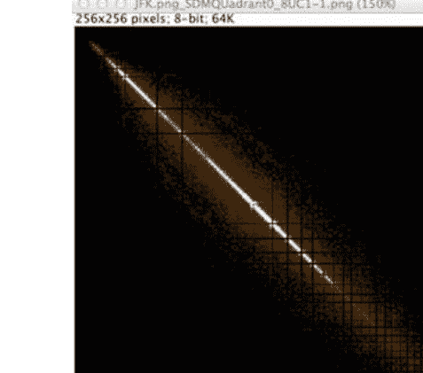

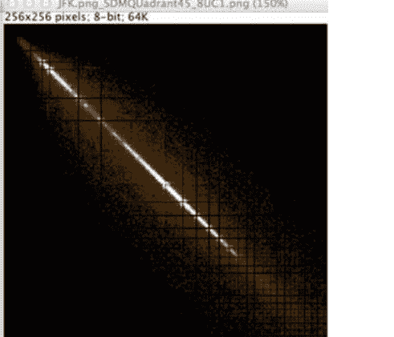


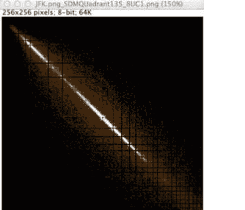

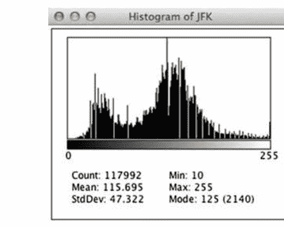


图3.8显示了来自旧管式摄像机的SDMs，显示了传感器中的线性变化，包括完整的0°、45°、90°和135°SDMs。（来自国家档案馆的公共领域图像）

度量标准12：线性强度

线性强度的算法在度量标准11中显示。如果在给定的SDM角度上存在任何线性度，那么在这个角度上，线性强度和线性度都会比其他SDM角度高（表3.1）。

表格 3.1 从图 3.8 中扩展的 SDM 度量标准

| 度量标准 | 0度 | 45度 | 90度 | 135度 | 平均 |
|----------|-----|------|------|-------|------|
| x质心 | 115 | 115 | 115 | 115 | 115 |
| y质心 | 115 | 115 | 115 | 115 | 115 |
| 低频覆盖率 | 0.075 | 0.092 | 0.103 | 0.108 | 0.095 |
| 总覆盖率 | 0.831 | 0.818 | 0.781 | 0.780 | 0.803 |
| 修正覆盖率 | 0.755 | 0.726 | 0.678 | 0.672 | 0.708 |
| 总功率 | 2.000 | 3.000 | 5.000 | 5.000 | 3.750 |
| 相对功率 | 17.000 | 19.000 | 23.000 | 23.000 | 20.500 |
| 轨迹长度 | 71 | 72 | 71 | 70 | 71 |
| 轨迹平均密度 | 79 | 80 | 74 | 76 | 77 |
| bin平均密度 | 21 | 19 | 16 | 16 | 18 |
| 包含度 | 0.961 | 0.932 | 0.926 | 0.912 | 0.933 |
| 线性度 | 0.867 | 0.848 | 0.848 | 0.848 | 0.853 |
| 线性度强度 | 1.526 | 1.557 | 0.973 | 1.046 | 1.276 |

Laws纹理度量标准

Laws度量标准[24, 27–29]提供了一种结构化的纹理分析方法，使用一组掩膜核来测量固定大小局部区域内的纹理能量或变化，类似于2 × 2区域SDM方法，但使用更大的像素区域来实现不同的度量标准。

基本的Laws算法涉及将图像中的每个像素基于局部能量分类为纹理，使用几个基本步骤：

- 1. 从每个核邻域中减去每个像素的平均强度，以补偿照明变化。
- 2. 在每个像素处使用一组和为零的核进行卷积，然后对结果求和，以获得每个核窗口上的绝对平均值。
- 3. 测量卷积图像与原始图像之间的差异，揭示Laws能量度量标准。

Laws定义了一组九个可分离的核，以产生一组纹理区域能量度量标准，其中一些核在实践中效果更好。这些核通过矩阵乘法从一组四个向量掩膜L5、E5、S5和R5组合而成，如下所述。这些核最初被定义为5 × 5的掩膜，但也使用了3 × 3的近似，如下所示。

5 × 5 表格

| 标识 | 检测器类型 | 向量 |
|------|------------|------|
| L5 | 层级检测器 | [1, 4, 6, 4, 1] |
| E5 | 边缘检测器 | [-1, -2, 0, 2, 1] |
| S5 | 斑点检测器 | [-1, 0, 2, 0, 1] |
| R5 | 波纹检测器 | [1, -4, 6, -4, 1] |

3×3个5的近似×5表格

L3 层级检测器 [1 2 1]
E3 边缘检测器 [-1 0 1]
S3 斑点检测器 [-1 2 -1]
R3 波纹检测器 [*注意：无法以3x3形式重现]

$$\begin{pmatrix} -1 \\ 0 \\ 1 \end{pmatrix} * [1,2,1] = \begin{pmatrix} -1 & -2 & -1 \\ 0 & 0 & 0 \\ 1 & 2 & 1 \end{pmatrix}$$

| E3L3 | E3S3 | L3S3 |
| :---: | :---: | :---: |
| \begin{pmatrix} -1 & 0 & 1 \\ -2 & 0 & 2 \\ -1 & 0 & 1 \end{pmatrix} | \begin{pmatrix} 1 & 0 & -1 \\ -2 & 0 & 2 \\ 1 & 0 & -1 \end{pmatrix} | \begin{pmatrix} -1 & -2 & -1 \\ 2 & 4 & 2 \\ -1 & -2 & -1 \end{pmatrix} |
| E5L5 | E5S5 | L5S5 |
| \begin{pmatrix} -1 & -2 & 0 & 2 & 1 \\ -4 & -8 & 0 & 8 & 4 \\ -6 & -12 & 0 & 12 & 6 \\ -4 & -8 & 0 & 8 & 4 \\ -1 & -2 & 0 & 2 & 1 \end{pmatrix} | \begin{pmatrix} 1 & 2 & 0 & -2 & -1 \\ 0 & 0 & 0 & 0 & 0 \\ -2 & -4 & 0 & 4 & 2 \\ 0 & 0 & 0 & 0 & 0 \\ 1 & 2 & 0 & -2 & -1 \end{pmatrix} | \begin{pmatrix} -1 & -4 & -6 & -4 & -1 \\ 0 & 0 & 0 & 0 & 0 \\ 2 & 8 & 12 & 8 & 2 \\ 0 & 0 & 0 & 0 & 0 \\ -1 & -4 & -6 & -4 & -1 \end{pmatrix} |

图3.9 L3E3内核组合示例

为了创建2D掩膜，向量 Ln, En, Sn, 和 Rn (如上所示) 被卷积在一起成为可分离的核；图3.9展示了一些示例。

请注意，Laws纹理度量标准已经扩展到了用于体积纹理分析的3D纹理度量标准[43, 44]。

LBP局部二值模式

与各种结构和统计方法的纹理分析相比，LBP算子[18, 50]计算每个区域周围的局部纹理作为LBP二进制码，或微纹理，允许基于相似微纹理进行简单的微纹理比较以分割区域。（有关详细讨论和文献引用，请参见第6章关于LBP的非常详细的讨论，特别是图6.6。）LBP算子[165]非常灵活，易于计算，占用内存较少，并可用于纹理分析、兴趣点和特征描述。因此，本书的多个地方都讨论了LBP算子。

如图3.10所示，由一组统一的LBP运算符组成，这些运算符本身是旋转不变的子集，可以被分成一个直方图，并且相应的bin值通过FFT作为一个一维数组进行运行，从而创建一个FFT频谱，这产生了一个具有强旋转不变性的稳健度量标准。

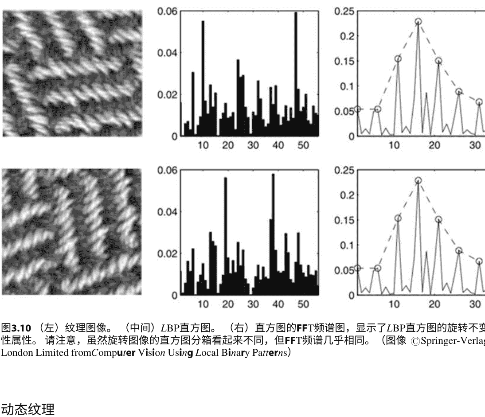

图3.10 (左) 纹理图像。 (中间) LBP直方图。 (右) 直方图的FFT频谱图，显示了LBP直方图的旋转不变性属性。请注意，虽然旋转图像的直方图分箱看起来不同，但FFT频谱几乎相同。 (图像 ©Springer-Verlag London Limited from Computer Vision Using Local Binary Patterns)

动态纹理

动态纹理是用来描述和跟踪纹理区域在帧与帧之间动态变化和变形的概念[13–15, 45]。例如，动态纹理可以是运动中的纹理，如海浪、烟雾、风中摇曳的树叶、火焰、面部表情、手势和姿势。这些变化通常在时空图像帧集中进行跟踪，其中连续的帧被堆叠成卷以作为一组进行分析。这三个维度是 XY帧大小，而 Z维度是由连续帧的堆叠派生而来的。n - 2, n - 1, n. 动态纹理研究的一个近亲是活动识别（在第6章中讨论），其中特征是组成活动的移动物体的部分，例如在帧与帧之间跟踪的手臂和腿部的特征，以确定运动或活动的类型，如行走或奔跑。活动识别和动态纹理之间的一个相似之处是特征或纹理随时间从帧到帧变化，因此对于活动识别和动态纹理分析，跟踪特征和纹理通常需要一种时空方法，涉及具有过去和当前帧的历史缓冲区的数据结构，这为数据提供了一个体积表示。

例如，VLBP和LBP-TOP (在第6章中讨论) 提供了动态纹理分析的方法，通过使用构建在三维体积结构上的LBP来操作，其中体积包含图像帧 n - 2, n - 1, 和n堆叠到体积中。

统计区域度量标准

用像素的统计度量来描述纹理是一种常见且直观的方法。通常，一个区域的简单直方图就足以很好地描述纹理，适用于许多应用。直方图还有许多变体，适用于广泛的纹理分析。因此，这是一个检查直方图方法的好时机。由于统计数学是一个广阔的领域，我们只能在这里介绍这个主题，将讨论分为图像矩特征和点度量特征。

图像矩特征

图像矩[4,500]是标量量，类似于常见的统计量，如均值、方差、偏度和峰度。矩非常适合描述多边形形状特征和一般特征度量信息，如梯度分布。图像矩可以基于标量点值或基函数，例如傅里叶或泽尼克方法，后面的基空间部分将进行讨论。

矩可以描述函数在基空间上的投影-例如，傅里叶变换将函数投影到谐波函数的基上。请注意，在形状描述的上下文中，1D和2D矩之间存在概念上的关系。例如，1D均值对应于2D质心，1D最小值和最大值对应于2D主轴和次轴。1D最小值和最大值还对应于2D多边形形状周围的2D边界框（也参见图6.29）。

在这项工作中，我们将图像矩归类为多边形形状描述符，并将其纳入分类体系（见第5章）。关于用于2D形状描述的几个图像矩的详细信息在第6章中介绍，属于“斑点和物体的对象形状度量标准”。

- 在1D分布和2D图像的背景下，矩的常见属性包括：
- 零阶矩是均值或2D质心。
- 中心矩描述了围绕均值或2D质心的变化。
- 一阶中心矩包含有关2D面积、质心和大小的信息。
- 二阶中心矩与方差有关，用于测量2D椭圆形状。
- 三阶中心矩提供关于2D形状的对称性信息，或者偏斜度。
- 四阶中心矩用于测量2D分布的高、矮、瘦、胖。
- 可以设计更高级的矩，并由矩比率组成，例如协方差。

矩可用于创建对多个鲁棒性标准不变的特征描述符，例如尺度、旋转和仿射变化。鲁棒性和不变性标准的分类体系在第5章中提供。对于2D形状描述，在1961年，胡适用不变代数推导出一套理论上的七个2D平面矩，用于字符识别工作，这些矩在尺度、平移和旋转下是不变的[7]。许多研究人员对胡的工作进行了扩展。关于这个主题的一个很好的资源是《模式识别中的矩和矩不变量》，作者是Jan Flusser等人[500]。

点度量特征

点度量标准可用于以下方面：（1）特征描述，（2）分析和可视化，（3）阈值处理和分割，以及（4）通过可编程LUT函数进行图像处理（在第2章中讨论）。点度量标准经常被忽视。使用点度量标准来理解图像数据的结构是设计图像预处理流程以准备进行特征分析的第一步。同样，开始的地方是通过直方图的分析，如图3.1和3.11所示。基本的点度量标准可以通过视觉方式确定，例如最小值、最大值、峰值和谷值。使用颜色查找表对直方图区域进行虚拟数据可视化非常简单。

下面是统计点度量标准的总结：

- 分位数、中位数、重新缩放：通过将像素值排序为有序列表，就像在直方图过程中一样，可以找到各种四分位数，包括中位数值。此外，像素可以从列表中重新缩放并用于像素重映射函数（如第2章所述）。

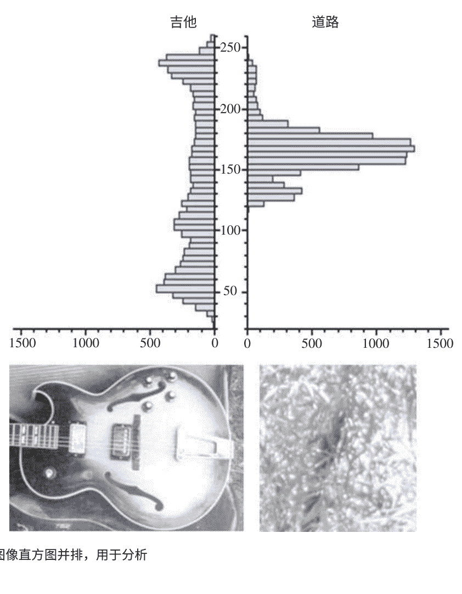

- 最小值、最大值、众数：最小值和最大值以及直方图分析可以用于引导图像预处理，设计阈值方法以去除数据中的异常值。众数是排序后的像素列表中最常见的像素值。
- 均值、调和均值和几何均值：均值的各种形式对于学习主导光照水平（暗或亮）以引导图像预处理以增强图像以进行进一步分析非常有用。
- 标准差、偏度和峰度：这些矩可以通过查看SDM图来可视化。
- 相关性：该主题在本章早些时候已经在交叉相关和自相关下进行了讨论。
- 方差、协方差：方差度量提供有关像素分布的信息，协方差可用于比较两个图像之间的方差。方差在SDM中可以在一定程度上可视化，也如本章所示。
- 比率和多变量度量：单独的点度量可能有用，但是使用简单的点度量进行多变量组合或比率也非常有用。根据应用程序的不同，这些比率本身构成了特征描述符的关键属性（如第6章所述）。例如，平均值：最小值，平均值：最大值，中位数：平均值，面积：周长。

全局直方图

全局直方图处理整个图像。在许多情况下，通过全局直方图进行图像匹配是简单且有效的，使用像SSD这样的距离函数。如图3.12所示，直方图揭示了像素强度的定量信息，但没有结构信息。区域中的所有像素

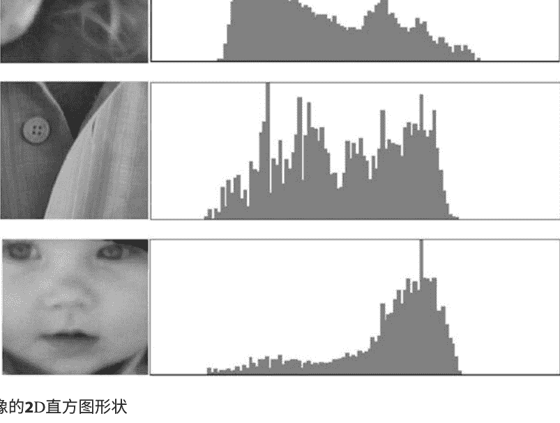

为直方图做出贡献的像素与任何特定点或特征的距离无关。如第2章所述，直方图本身是直方图修改方法的基础，允许根据需要拉伸、压缩或裁剪直方图的形状，然后将其用作逆查找表以重新排列图像像素强度级别。

局部区域直方图

直方图也可以计算在像素的局部区域上，例如矩形或多边形，以及在特征属性集合上，例如梯度方向和幅度或其他光谱。为了创建一个多边形区域直方图特征描述符，首先可以使用形态学分割来创建一个感兴趣区域周围的掩膜形状，然后只使用掩膜像素来进行直方图计算。

像素强度值的局部直方图可以用作特征描述符的属性，并且还可以用作从一个直方图形状重新映射像素值到另一个直方图形状的基础，如第2章所讨论的那样，通过重新塑造直方图并相应地重新处理图像。第6章讨论了一系列特征描述符，例如SIFT、SURF和LBP，它们利用特征直方图对梯度幅度和方向等属性进行分组。

散点图，3D直方图

散点图可用于可视化两个图像数据集之间的关系或相似性，用于图像分析、模式识别和特征描述。可以在散点图中比较两个图像或图像区域的像素强度，以可视化值之间的对应程度。散点图可用于在有限平移不变性下进行特征和模式匹配，但对于仿射、尺度或旋转不变性则不太有用。图3.13显示了使用散点图在图像中寻找模式的示例，目标模式在不同偏移处进行比较，偏移越小，对应关系越好。一般来说，更紧密的峰值特征集表示强烈的结构或模式对应关系；数据的扩散程度越大，表示对应关系越弱。模式偏移越远，对应关系越低。

图3.13是图像和目标模式在不同位移下呈现为3D直方图的散点图。

顶部行: (左) 图像, (中) 图像中的目标模式, (右) 目标模式与自身的SDM。中间行: (左) 目标和图像偏移1,1 (右) 目标和图像偏移8,8。底部行: (左) 目标和图像偏移16,16 (右) 目标和图像偏移32,32

请注意，通过分析峰值特征与低频特征的对比，可以可视化对应关系。图3.14显示了来自两个不同图像的散点图。沿轴线缺乏峰值，数据中的扩散表明低结构或模式对应关系。

散点图可以逐像素从两个图像中生成，其中像素对形成散点图的笛卡尔坐标，使用图像1的像素强度作为x坐标，图像2的像素强度作为y坐标，然后将像素对对应关系计数分组在散点图中。每个坐标的计数可以进行虚假着色以进行可视化。图3.15提供了一些用于说明目的的代码。

对于特征检测，如图3.12所示，散点图可以在粗糙的平移步骤中揭示足够的对应关系，从而减少某些特征检测和模式匹配应用中对图像金字塔的需求。例如，可以通过跳过像素、以8或16像素间隔搜索图像，而不是每个像素进行模式搜索和比较的步长进行优化，从而减少特征检测时间。此外，散点图数据可以首先阈值化为二进制图像，掩蔽只显示峰值值，转换为位向量，并使用汉明距离进行一致性测量，以提高性能。

图3.14 来自两个不同图像的散点图显示沿对角线的低一致性

```

r1.x = sarea.x;
r1.y = sarea.y;
r1.z = sarea.z;
r1.dx = dx;
r1.dy = 1;
r1.dz = 1;

r2.x = darea.x;
r2.y = darea.y;
r2.z = darea.z;
r2.dx = dx;
r2.dy = 1;
r2.dz = 1;

/* 初始化数据 */
for (x=0; x < 0x10000; mbin[x] = (int)0, x++);

gf = c->grain;
if (gf <= 0) gf = 1;
if (gf > dx) gf = dx;

z=0;
while (z < dz) {
    r1.y = sarea.y;
    r2.y = darea.y;
    y=0;
    while (y < dy) {
        pix_read(c->soid, &r1, data1);
        pix_read(c->doid, &r2, data2);
        for (x=0; x < dx; mbin[ ((data2[x] << 8)&0xff00) + (data1[x] & 0xff) ]++, x += gf);
        y += gf;
        r1.y += gf;
        r2.y += gf;
    }
    z += gf;
    r1.z += gf;
    r2.z += gf;
}

```

## 图3.15 代码用于说明逐像素比较两幅图像并对结果进行分组以绘制散点图的8位数据分组

## 多分辨率，多尺度直方图

多分辨率直方图已用于纹理分析[46]，也用于特征识别[47]。第6章中描述的PHOG描述符利用了特征谱的多尺度直方图，这里的特征谱是梯度信息。请注意，多分辨率直方图提供了特征描述的尺度不变性。对于纹理分析[46]，使用图像金字塔构建多分辨率直方图，然后为每个金字塔级别创建直方图并连接在一起[10]，这被称为多分辨率直方图。该直方图具有算法简单性、快速计算、低内存需求、噪声容忍度和在空间和旋转变换方面的高可靠性的优点。参见图3.16。赵和皮耶蒂凯宁的方法[15]中使用了金字塔的变体，利用了来自体积的多维金字塔图像集。

图3.16 多分辨率直方图图像序列。请注意，多个直方图是在不同的高斯模糊水平下获取的，以尝试创建更不变的特征描述符。

### 创建和使用多分辨率直方图的步骤如下：

1. 对图像应用高斯滤波器。
2. 创建图像金字塔。
3. 在每个级别创建直方图。
4. 使用L1范数对直方图进行归一化。
5. 创建累积直方图。
6. 创建差异直方图或DOG图像（金字塔级别之间的差异）。
7. 使用差异直方图重新归一化直方图。
8. 从一组差异直方图中创建特征向量。
9. 使用L1范数作为直方图之间的距离函数进行比较。

## 径向直方图

对于某些应用程序，使用从形状质心起始的径向样本计算直方图可能很有价值[128, 129]。为了做到这一点，从质心到形状周长投射一条线，并记录沿着每条线的像素值，然后将其分组成直方图。参见图3.17。

图3.17 径向直方图示例[128, 129]

## 轮廓或边缘直方图

对象的周长或形状可以成为形状直方图的基础，其中包括对象周边每个点的像素值被分组到直方图中。除了记录沿周长的实际像素值外，链码直方图（CCH）在第6章中讨论的是连接边缘点坐标处周长的方向。综合考虑CCH和轮廓直方图可以提供有用的形状信息。

## 基础空间度量标准

特征可以在基础空间中描述，这涉及将像素转换为另一种基础并在所选择的基础上描述特征，例如频域。什么是基础空间，什么是变换？考虑十进制系统，它是基数10，以及二进制系统，它是基数2。我们可以通过使用变换在两个数字系统之间进行转换。傅里叶变换在频率空间中使用正弦和余弦作为基函数，以便将像素在时域像素空间和频率空间之间移动。基础空间矩描述了将函数投影到基础空间上的过程[500]，例如，傅里叶变换将函数投影到谐波函数的基础上。

## 图3.18基空间选项的过度简化谱，显示特征集大小和描述和重建的复杂性

基础空间和变换在广泛的应用中非常有用，包括图像编码和重建、图像处理、特征描述和特征匹配。如图3.18所示，图像表示和图像编码与特征描述密切相关。图像可以使用编码方法或特征描述符来描述，也可以从编码或特征描述符中进行重建。存在许多从替代基础空间编码中重建图像的方法，从无损RLE方法到有损JPEG方法不等；在第4章中，我们提供了仅使用局部特征描述符重建的图像示例（参见图4.12、4.13和4.14）。

如图3.18所示，可以想象出一系列基础空间，从连续的实函数或具有无限复杂性的实景，到完整的光栅图像、JPEG压缩图像、频域或其他基础表示，再到局部特征描述符集。请注意，提供和使用基础空间表示的细节越多，就越能识别或重建真实场景。因此，权衡的关键是找到最佳的表示或描述，在最优的基础空间中，以使用最少的计算和内存达到不变性和准确性目标。

变换和基空间是数学和信号处理中的一个广阔领域，在其他作品中有很好的涵盖，因此我们只介绍了对图像编码和特征描述有用的常见变换。我们描述了它们的主要优点和应用，并在进行过程中参考了相关文献。见图3.19。

图3.19 图像处理和计算机视觉中使用的各种基础变换

由于计算机视觉中处理的是离散像素，我们主要关注离散变换，特别是那些可以通过优化软件或固定功能硬件加速的变换。 然而，我们也涵盖了一些计算速度较慢且使用较少的积分变换方法。 以下是一个概述：

- 全局或局部特征描述。 可以使用图像的变换和基础空间表示作为全局特征描述符，从而可以识别和比较场景和较大的对象。 2D FFT频谱只是一个例子，可以使用SAD或SSD距离度量来比较FFT频谱特征。
- 图像编码和压缩。 许多变换已被证明对图像编码和图像压缩非常有价值。 基本方法涉及对图像或块区域进行变换

将图像转换为另一个基础空间。例如，将图像的块转换为傅里叶域，可以将图像区域表示为正弦和余弦波。然后，根据区域中的能量量，可以存储或编码较少数量的频率空间分量来表示图像。能量主要包含在低频分量中，可以在傅里叶功率谱中观察到，如图2.16所示；高频分量可以被丢弃，而显著的低频分量可以被编码，从而实现了一定程度的图像压缩，但会有一些细节损失。存在许多新颖的图像编码方法，例如使用图像金字塔上的缩放拉普拉斯特征作为基础[310]。

图3.20奇异形状多边形围绕左侧圆的傅里叶描述符

## 傅里叶描述

傅里叶变换家族在第2章中详细介绍了图像预处理和滤波的上下文中。然而，傅里叶频率分量也可以用于特征描述。使用正向傅里叶变换，图像被转换为频率分量，可以选择性地用于描述转换后的像素区域，通常用于图像编码和压缩以及特征描述。

傅里叶描述符提供了几个不变性属性，如旋转和缩放。任何值的数组都可以输入到FFT中生成描述符，例如直方图。图3.20中展示了一个常见的应用，描述形状的圆度并找到主轴和次轴作为正弦波的极值频率偏差。另一个相关的应用是通过将傅里叶变换的幅度作为极坐标与笛卡尔空间中的直线拟合来找到周长上的平线段的端点。

在图3.20中，一个复杂的波形被绘制成一个围绕正弦波函数或完美圆的深灰色圆圈展开。请注意，每个点围绕复杂函数的长度的傅里叶变换得到了一个周期性波的近似，而复杂波的形状的傅里叶描述符是可见的。图6.29显示了另一个说明傅里叶描述符的例子。

图3.21 （左）Walsh-Hadamard基函数集。 （中）HAAR基函数集。 （右）Slant基函数集

## 沃尔什-哈达玛变换

Hadamard变换[4,9]使用一系列取值为+1或-1的方波，非常适合数字信号处理。 它易于优化，因为只需要进行有符号加法来求和基向量，使得这种变换比正弦基变换快得多。

谐波Hadamard系列的基向量和相应的变换可以通过采样Walsh函数来生成，这些函数构成了一个正交基组；因此，这种组合方法通常被称为Walsh-Hadamard变换；参见图3.21。

## HAAR变换

HAAR变换[4,9]类似于傅里叶变换，不同之处在于基向量是类似于方波的HAAR特征，类似于小波。 由于其正交矩形形状，HAAR特征适用于检测具有接近恒定灰度级的垂直和水平图像特征。 HAAR特征无法很好地解决数据中的任何结构性不连续性，例如边缘和局部纹理；参见图3.21和6.21。

## 倾斜变换

Slant变换[276]，如图3.21所示，最初用于电视信号编码，后来应用于一般图像编码[4,275]。Slant变换类似于

傅里叶变换，不同之处在于基函数是一系列斜线、锯齿或三角波。
斜向基向量适用于图像亮度在函数长度上线性变化的应用。 斜向变换适用于数字系统中的离散优化。
尽管主要应用是图像编码和图像压缩，但斜向变换也适用于特征描述。 它与卡尔胡宁-洛夫变换和斜向哈达玛变换[494]密切相关。

## 泽尼克多项式

1953年诺贝尔奖得主弗里茨·泽尼克在研究衍射光栅的光学特性和光谱时，设计了泽尼克多项式，用于开发相位对比显微镜。
泽尼克多项式[264-266]被广泛用于光学分析和人类视觉系统建模，以及辅助医疗程序如激光手术。 它们提供了一组基础多项式的精确模型，用于表示光学波面像差，如图3.22所示。

图3.22 泽尼克多项式基础函数的示例

Zernike多项式类似于可定向滤波器[370]，它们也包含用于识别定向特征并进行描述符创建的定向基础集合的滤波器形状。 Zernike模型使用径向坐标和圆形区域，而不是许多其他特征描述方法中使用的矩形补丁。

Zernike方法广泛用于模拟人眼的像差。 Zernike矩也用于图像水印[270]、图像编码和重建[271, 273]。 Zernike特征具有尺度和旋转不变性，部分原因是由于径向坐标对称性和高阶多项式中可能的更多细节。 通过将Zernike基础特征与目标图像中的圆形补丁进行比较，Zernike矩在计算机视觉应用中得到使用[268, 269]。

存在快速计算Zernike多项式和矩的方法[267, 272, 274]，利用基础函数在x轴和y轴周围的对称性来减少计算量，并利用递归。

## 可操纵滤波器

可转向的滤波器在这里被宽泛地认为是基函数，并且可以用于滤波或特征描述。 在概念上类似于Zernike多项式，可转向滤波器[370, 382]是通过合成选择的基函数的转向或定向线性组合来组成的，例如高斯滤波器的正交对和每个函数的定向版本，在一个简单的变换中。

许多类型的滤波器函数可以用作可转向滤波器的基础[371, 373]。滤波器变换是通过将基函数组合在一个滤波器组中创建的，如图3.23所示。为每个函数选择增益，并将滤波器组中的所有滤波器相加，然后自适应地应用于图像。可以创建金字塔形的基函数集来进行尺度操作。应用包括将定向可转向滤波器与目标图像区域卷积以确定滤波器响应强度、方向和相位。其他应用包括根据特征的方向对图像进行滤波、轮廓检测和特征描述。

图3.23 可操纵滤波器组的示例

对于特征描述，有几种方法可以使用，例如，将每个可操纵基函数与图像块进行卷积。然后，可以选择最高的一个或两个滤波器响应或矩作为有序特征描述符，或者可以使用所有滤波器响应作为特征描述符。作为一种优化，可以首先在图像块中确定一个兴趣点，并使用兴趣点的方向选择最接近兴趣点方向的一个或两个可操纵滤波器；然后使用最接近的可操纵滤波器来计算描述符。

## Karhunen-Loeve变换和Hotelling变换

Karhunen-Loeve变换（KLT）[4, 9]是为了将连续随机过程描述为一系列展开项，而不是使用傅里叶方法描述周期信号。Hotelling后来使用主成分分析方法提出了KLT的离散等价方法。“KLT”是同时指代这两种方法的最常见名称。

基函数依赖于底层图像的特征向量，并且计算特征向量是一个计算密集型的过程，没有已知的快速变换方法。KLT不能分离优化图像块，因此KLT通常用于小数据集上的主成分分析，例如模式分类、聚类和匹配中使用的特征向量。

## 小波变换和加伯滤波器

正如名称所示，小波是短波或小波[326]。将小波视为短时脉冲，例如地震颤动，从零开始和结束，而不是连续或共振波。小波与给定信号（例如图像）卷积，以找到相似性和统计矩。因此，小波可以像空间域中的卷积核一样实现。参见图3.24。

图3.24使用‘墨西哥高帽’小波基函数的小波概念。（顶部）一些缩放的墨西哥高帽小波，由母小波导出。（底部）一些平移的小波

小波分析是一个广阔的领域[283, 284]，有许多应用和有用的资源可用，包括小波族库和分析软件包[281]。常见的信号和图像处理库中存在快速小波变换(FWTs)。小波变换的几个变体包括：

- 离散小波变换(DWT)
- 平稳小波变换(SWT)
- 连续小波变换(CWT)
- 提升小波变换(LWT)
- 静态小波包变换 (SWPT)
- 离散小波包变换 (DWPT)
- 分数傅里叶变换 (FRFT)
- 分数小波变换 (FRWT)

小波函数是为了满足不同的目标而设计的，并且为特定的应用而制定的；没有一个单一的小波函数或基函数。 例如，可以设计一组小波函数来表示音乐音阶，其中每个音符（如中央C）被定义为持续时间为八分音符的小波脉冲，然后将该组小波函数卷积到信号中以定位音阶中对应的音符。

在设计小波函数时，母小波是小波族的基础，然后使用平移、缩放或压缩母小波来得到子小波。 理想情况下，一组小波应该是重叠且互补的，以便对数据进行无缝分解并且可以进行数学上的逆变换。

小波在变换中被用作一组非线性基函数，其中每个基函数可以根据需要设计，以最佳匹配输入函数中的期望特征。 因此，与使用统一的基函数集合的变换（例如傅里叶变换使用正弦和余弦函数）不同，小波使用一组动态的、复杂且非均匀的基函数。

见图3.25。

小波已被用作尺度和旋转不变特征描述[280]、图像分割[277, 278]、形状描述[279]，以及显然的图像和信号滤波，包括去噪、图像压缩和图像编码。 可以为特征描述设计一组应用特定的小波。

图3.25 小波变换的示例

### Gabor函数

小波可以被视为早期Gabor函数概念的扩展[285, 325]，可以作为一组2D定向带通滤波器用于成像应用。Gabor的工作集中在声音的物理传输以及涉及时变信号（如警报器）的傅里叶方法问题，这些信号无法完美地表示为周期频率信息。Gabor提出了一种比傅里叶分析提供的更紧凑的表示方法，使用了一种称为“原子”的概念，记录了可以更紧凑地传输的声音系数。参见图3.26。

图3.26 Gabor滤波器的示例

## 霍夫变换和Radon变换

Hough变换[220–222]和Radon变换[291]是相关的，许多人认为它们的结果是等价的[287, 292]。Radon变换是一种积分变换，而Hough变换是一种离散方法，因此速度更快。Hough方法在图像处理中被广泛使用，并且可以使用GPU [290]和数据并行方法加速。Radon算法略微更准确，也许在数学上更可靠，并且通常与应用于从X射线投影中重建的X射线断层扫描成像相关联。我们主要关注Hough变换，因为它在图像处理库中广泛可用。

Hough和Radon变换的关键应用是检测和描述线条、圆和参数曲线的形状。主要优点包括：

- 对噪声和部分遮挡具有鲁棒性
- 填补明显线条、边缘和曲线中的空隙
- 可以参数化处理各种边缘和曲线形状

### 缺点包括：

- 一次只能寻找一种类型或参数化的特征，比如一条线
- 共线段无法区分并合并在一起
- 可能错误地填补间隙并连接未连接的边缘
- 线的长度和位置未确定，但可以在图像空间中完成

霍夫变换主要是全局或区域描述符，作用于较大的区域。它最初是用来检测线条的，并且后来被推广用于检测参数化形状[293]，比如曲线和圆。然而，对特征添加更多参数化需要更多的内存和计算。霍夫特征可以用来标记由常规参数化曲线和线条描述的区域边界。霍夫变换对于某些应用是有吸引力的，因为它可以容忍线条或曲线中的间隙，并且不受噪声或某些遮挡的影响，但形态学和通过其他方法进行的边缘检测通常已经足够，因此霍夫变换的应用有限。

霍夫变换的输入是一个梯度幅值图像，该图像已经经过阈值处理，只保留了主要的梯度信息。梯度幅值用于构建一个地图，显示图像中的所有参数化特征，例如具有给定方向的线条或具有给定直径的圆。例如，为了检测线条，我们将像素空间中的每个梯度点映射到霍夫参数空间中，参数化为一个点$(d,\theta)$，对应于所有与原点距离为$d$且方向角为$\theta$的线条。曲线和圆的参数化使用不同的变量[293]。参数空间被量化为单元格或累加器箱，并且每个累加器通过计算通过相同霍夫点的梯度线的数量来更新。累加器方法被修改用于检测参数化曲线和圆。对累加器空间进行阈值处理，并将只有最高累加器值的叠加图重新投影回图像，可以突出显示特征。

## 摘要

本章提供了全球和区域度量标准的部分历史，对于局部特征度量标准的处理将推迟到第4章和第6章。提供了一些关于结构和统计纹理度量标准的发展历史背景，以及用于特征描述的基础空间和几种常见的区域和全局度量标准。对纹理分析和统计分析的广泛主题进行了调查，并应用于计算机视觉。

由于在图像处理和计算机视觉中很难清晰地划分所有相关主题，因此这里和第2章、第4章、第5章和第6章中的主题存在一些重叠。

# 第三章：学习任务

1.  讨论何时使用全局图像处理操作与局部或区域图像处理操作。
2.  总体上讨论全局图像统计如何指导计算机视觉应用的图像预处理，并具体提及一个全局图像度量标准并讨论其应用方式。
3.  总体上比较全局图像特征度量标准和局部特征描述符，并讨论一个具体的全局特征度量标准并将其与一个具体的局部特征描述符进行比较。
4.  以一般术语描述全局图像纹理。
5.  讨论如何使用图像的二维直方图来理解图像纹理。
6.  讨论如何使用图像的二维傅里叶级数来理解图像纹理。
7.  讨论基于共生矩阵的Haralick纹理度量标准如何用于理解图像纹理。
8.  讨论如何使用空间依赖矩阵（SDM）图来理解图像纹理。
9.  讨论图像直方图的统计矩，包括至少均值和方差，并说明这些特征作为全局图像描述符的用途。
10. 描述从图像金字塔中构建的多分辨率直方图，以及如何解释直方图的结果。
11. 描述如何从傅里叶级数创建圆形的傅里叶描述，并说明它作为形状描述符的用途。
12. 描述HAAR变换、斜变换和Walsh-Hadamard变换的基本特征。
13. 比较小波特征和傅里叶级数特征。
14. 描述Hough变换和Radon变换算法，以及它们作为形状检测的全局图像度量标准的用途。

> “科学，我的孩子，是由错误组成的，但这些错误是有用的，因为它们逐渐引向真理。” ——朱尔斯·凡尔纳，《地心游记》

在本章中，我们将研究与局部特征描述符设计相关的几个概念，包括局部模式、形状、光谱、距离函数、分类、匹配和目标识别。主要关注局部特征度量标准，如图4.1所示。本讨论遵循在第5章中提出的一般视觉分类法，并包括了理解兴趣点检测器和特征描述符的关键基础知识，如第6章所述，并包括了两者共同概念的选择性概念。请注意，始终有机会修改、混合和匹配检测器和描述符以获得最佳结果。

## 局部特征

我们重点关注局部特征描述符的设计以及它们在训练、分类和机器学习中的应用。本讨论遵循第5章中提出的特征分类法，并如图5.1所示。主要元素包括：（1）形状（例如，矩形或圆形）；（2）模式（密集采样或稀疏采样）；以及（3）光谱（二进制值、标量、稀疏编码或其他值）。密集模式特征将使用局部区域中的每个像素，例如矩形中的每个像素，而稀疏特征将仅使用区域中的选定像素。

除了形状和模式的许多方法外，还有许多方法用于光谱，从基于梯度的补丁方法到稀疏局部二进制模式方法。这里主要涵盖的主题包括：

- 检测器，用于定位图像中的有趣特征。
- 描述符，用于描述周围有趣特征的区域。
- 描述符属性，如特征的鲁棒性和不变性。
- 分类，用于创建特征数据库和最佳特征匹配。
- 识别，用于将目标图像中检测到的特征与训练特征进行匹配。
- 特征学习，或者机器学习方法。

基于本章介绍的概念，第5章提供的视觉分类方法可以总结和分析特征描述符及其属性，从而实现不同方法之间的有限比较。

### 检测器，兴趣点，关键点，锚点，地标

一个检测器在图像中找到有趣的特征。文献中讨论“有趣特征”的术语包括几个可互换的术语，如关键点，地标，兴趣点，或锚点，所有这些术语都指的是角点、边缘或模式等可以高概率重复出现的特征。在第6章中，我们调查了许多检测器方法，以及各种设计方法。在某些情况下，关键点检测器用于确定周围特征描述符的方向向量，例如通过计算角点的整体梯度方向。在进行特征描述之前，通常会过滤掉不确定或质量低的关键点。请注意，许多关键点方法在较小的像素区域上操作，例如LBP方法使用3×3的像素区域，FAST方法使用7×7的像素区域。

关键点的位置本身可能不足以进行特征匹配；然而，这里讨论的一些方法仅依赖于关键点，而没有特征描述符。特征描述提供了关键点周围更多的信息，并且可以在更大的区域和多个尺度上计算，例如SIFT和ORB。

### 描述符、特征描述、特征提取

可以在每个关键点处计算特征描述符，以提供有关关键点周围像素区域的更多信息。然而，在像Viola-Jones方法[138]这样计算固定大小像素网格上的特征的方法中，不需要兴趣点，因为网格定义了描述符区域。特征描述通常使用颜色或灰度强度通道的组合，以及梯度和颜色等局部信息。特征描述发生在形状（如正方形或圆形）上。在某些情况下，使用像素点对样本模式来计算或比较选定的像素值，以生成描述符向量-例如，如后面的图4.8所示。

通常，一个兴趣点提供一定程度的不变性和鲁棒性，例如在尺度和旋转方面。在许多情况下，描述符的方向是根据兴趣点确定的，并且描述符提供其他不变性属性。将兴趣点与描述符提供了更大的不变性属性。如果几个描述符与同一对象相关联，则可以进行对象识别。

例如，描述符可以包含在多个强度通道、多个几何尺度和多个视角上计算的多元、多维和多几何数量（有关多元描述符的更多信息，请参见Varma [771]和Vedaldi [770]）。一个多元描述符可以包含RGBD数据（红色、绿色、蓝色和深度数据）；一个多维描述符可以包含在图像金字塔的各个缩放级别上的特征描述；一个多几何描述符可以包含在局部图像块或区域的仿射变换上计算的一组特征描述。

设计特征的方法没有对错之分；有很多种方法可以采用。例如，在一个应用中，包括对象的区域形状、区域纹理和区域颜色在内的一组度量标准可能有助于定位水果，而另一个应用可能不需要颜色或形状，而是依赖于一组兴趣点、特征描述符及其空间关系。事实上，将几种较弱的描述符方法组合成一个多变量描述符通常是最好的方法。

从图像中计算特征描述符通常被称为特征提取。

#### 稀疏局部模式方法

虽然一些方法在图像上密集地描述特征，例如在第6章中讨论的PHOG [183]方法，但其他方法如FREAK [122]则使用稀疏的局部模式来采样以兴趣点为锚点的像素来创建描述符。根据方法的不同，形状可以通过训练、学习或设计选择，并且目前使用的形状和模式的拓扑结构有很多种。

为了对稀疏局部模式和描述符方法进行讨论，注意与通常不依赖于稀疏局部模式的全局和区域描述符方法的对比。相反，全局和区域方法通常使用对较大形状（如矩形或其他多边形）进行密集采样。例如，如第6章所讨论的多边形形状描述符，可以使用数学形态学和区域分割等密集方法勾勒或分割特征区域。全局和区域描述符度量标准（如纹理度量标准、直方图或第3章讨论的SDMs）通常是在连贯的、密集的区域上计算，而不是在稀疏区域上计算。

#### 局部特征属性

本节讨论如何选择特征以提供特征良好性的所需属性，例如不变性和鲁棒性。

#### 选择特征描述符和兴趣点

兴趣点检测器和特征描述方法都必须选择得很好，并且对于正在处理的图像类型也必须工作得很好。对于检测器和描述符对，必须考虑到鲁棒性属性，如对比度、尺度和旋转。如附录A所示，每个兴趣点检测器都是为了找到特定类型的特征而设计的，因此没有一种单一的方法适用于所有类型的图像。

例如，FAST和Harris方法通常会找到许多小的单尺度兴趣点，而其他方法（如SIFT中使用的方法）会找到较少、较大且经过精细调整的多尺度兴趣点。预计需要对兴趣点检测器参数进行一些调整，以使其正常工作，否则可能需要对图像进行一些预处理，以帮助检测器找到兴趣点。（第6章提供了兴趣点方法和背景数学概念的调查。）

## 特征描述符和特征匹配

特征描述是特征匹配的基础，可以实现图像理解、场景分析和物体跟踪。特征匹配中的核心问题包括如何确定一个特征是否与其他相似特征有所区别，以及该特征是否属于一个更大的对象。

确定特征匹配的方法至关重要，原因有很多，包括计算成本、内存大小、可重复性、准确性和鲁棒性。虽然完美匹配是理想的，但在实践中，通过距离函数比较传入的特征描述符与已知特征描述符，确定相对匹配。但我们将在本章后面讨论几种距离函数。

表4.1 一些好的特征描述符和兴趣点的属性。（也可参见图5-2中的一般鲁棒性标准。）

| 好的特征度量属性 | 细节 |
| :--- | :--- |
| 尺度不变性 | 应该能够在不同尺度下找到特征 |
| 透视不变性 | 应该能够在视野中的不同视角下找到特征 |
| 旋转不变性 | 特征应该能够在图像平面内的各种旋转中被识别 |
| 平移不变性 | 特征应该能够在视野中的各种位置被识别 |
| 反射不变性 | 特征应该能够被识别为其自身的镜像 |
| 仿射不变性 | 特征应该能够在仿射变换下被识别 |
| 噪声不变性 | 特征应该能够在存在噪声的情况下被检测到 |
| 光照不变性 | 特征应该能够在包括亮度和对比度变化在内的各种光照条件下被识别 |
| 计算效率 | 特征描述符应该计算和匹配高效 |
| 独特性 | 特征应该是独特且可检测的，具有低的误匹配概率，可以从特征数据库中进行匹配 |
| 简洁描述 | 特征不应需要大量内存来保存细节 |
| 遮挡鲁棒性 | 当特征或特征集的部分被遮挡时，仍然可以描述和检测特征或特征集 |
| 焦点或模糊鲁棒性 | 特征或特征集可以在不同程度的焦点下检测到（即，图像金字塔可以提供部分能力） |
| 杂波和异常值鲁棒性 | 特征或特征集可以在存在异常特征和杂波的情况下检测到 |

### 好坏的标准

衡量特征的好坏可以逐个属性进行。特征地标的一般好坏属性列表在表4.1中提供。请注意，此列表主要涉及不变性和鲁棒性：这些是关键概念，因为性能可以使用各种优化方法进行调整，如第8章所讨论的。当然，在给定的应用中，某些好坏属性比其他属性更重要；这在第7章中讨论，在与地面真实数据相关的情况下。

我们如何知道一个特征对于一个应用程序是好的？我们可以将讨论分为兴趣点方法和描述符方法，并且通过表4.1显示的两者提供的组合鲁棒性和不变性属性。特征锚定的兴趣点是关键的，因为如果锚点不好并且不能轻易地重复找到，那么得到的描述符将在一个次优的位置计算。

请注意，在许多情况下，图像预处理是创建一个好特征的关键，如图4.2所示。如果图像数据存在可以纠正或改进的问题，则应在图像预处理之后进行特征描述。请注意，许多特征描述方法在描述符创建过程中依赖于局部图像增强，例如对关键点周围区域进行高斯模糊以去除噪声，因此图像预处理应该与描述符方法相辅相成。每种预处理方法都有优缺点，请参阅表2.1和第2章以获取有关图像预处理的信息。

### 可重复性、易于找到与难以找到

理想情况下，特征在图像中易于找到，这意味着特征描述包含足够的信息，在各种条件下都能够具有鲁棒性，如表4.1所示，例如对比度和亮度变化、尺度和旋转。可重复性特别适用于兴趣点检测，因此兴趣点检测方法的选择至关重要。（附录A包含了了几种常见兴趣点检测器的非重复性异常示例图像。）一些描述符，如SIFT [153, 170]，在许多成像条件下都被认为具有鲁棒性。

这并不令人太惊讶，因为SIFT被设计为在多个维度上具有区分性，如尺度和旋转，使用精心组合的局部区域梯度集合，并应用加权因子来增加靠近特征中心的梯度的重要性。但是鲁棒性和可重复性是以计算成本为代价的。SIFT [153, 170]是最耗计算资源的方法之一；然而，第6章对各种SIFT优化和变体进行了调查。

### 有区别与无区别

如果描述符是独特的，则：

- 该特征可以与图像中其他相似的特征区域区分开来。
- 不同的特征向量在特征集中是唯一的。
- 可以使用适当的距离函数有效地匹配该特征。

如果相似的特征无法区分，则该特征是模糊的；这可能是由于缺乏适当的图像预处理、描述符中的信息不足，或者匹配阶段选择的距离函数不合适所致。当然，将信息添加到更简单的描述符中，使描述符成为混合多变量或多尺度描述符，可能是改善独特性所需的全部。例如，可以添加颜色信息以区分肤色。

### 相对位置和绝对位置

位置信息，如坐标，对于特征的好处至关重要。例如，要使用对人眼角位置的约束将特征关联在一起，需要兴趣点坐标。这些通过使用眼角位置之间的距离和角度作为智能匹配过程的一部分，实现了更准确的眼睛识别和定位。

随着深度传感器的广泛使用，仅仅提供特征在描述符中的深度位置可能足以轻松区分特征和背景。在深度场中的位置是一种强大的信息，由于计算机视觉通常涉及在二维图像场中找到三维信息，深度信息对于特征的好坏是一种宝贵的属性。

### 匹配成本和对应关系

特征匹配是使用距离函数（在本节中讨论）测量两个或多个特征之间对应关系的一种方法。请注意，特征匹配在成本方面是有代价的。内存和计算时间的消耗。例如，如果一个特征描述符由一个8位字节数组组成，例如一个18 ×18像素相关模板，那么特征匹配的成本就是比较两个18 ×18（324）像素区域所需的计算时间和内存，其中使用的匹配方法或距离函数可以是SAD、SSD或类似的差异度量。另一个例子涉及本地二进制描述符，例如LBP（线性二进制模式），它们以位向量的形式存储，其中匹配成本是执行汉明距离函数所需的时间，该函数通过布尔异或后跟位计数来比较两个二进制向量以提供匹配度量。

一般来说，距离函数是应用于计算机视觉的众所周知的数学函数；然而，某些函数在可计算性和应用于特定视觉任务方面比其他函数更合适。例如，SSD、SAD、余弦距离和汉明距离度量标准已经在一些架构中以计算机机器语言指令的形式实现，因为它们具有广泛的适用性。因此，在硅芯片中加速的距离函数可能具有优势。

特征数据库是匹配成本的另一个组成部分，因此数据库的组织和特征搜索对成本有所贡献。我们稍后在本章中简要涉及这个主题。

## 距离函数

本节对用于聚类、分类和特征匹配的距离函数进行了一般讨论。通常情况下，对于一个应用程序来说，适当的距离函数是未知的，因此应该尝试几个距离函数来找到最佳的，或者设计一个新的距离函数。例如，可以扩展距离函数以仅对非零数据进行距离比较（交集），或者其中一个数据为零而另一个数据不为零（异常值），或者仅对超过阈值的数据进行距离比较。要有创造力。请注意，距离函数可以跨越多个维度，例如用于特征描述符匹配的2D图像数组，用于点云匹配的3D体素体积，以及用于多变量描述符的多维空间。由于这只是一个简要概述，更深入的讨论可以参考Pele [530]、Varma [771]、Vedaldi [770]、Cha [884]、Duda [824]和Deza [885]的著作。

请注意，在本章后面讨论的核机器[353, 354]以及第10章更详细地讨论的核函数、核机器、支持向量机，在分类特征空间和替代选择的距离函数核方面提供了一个自动化框架。

##### 距离函数的早期研究

1968年，Rosenfeld和Pfaltz [113]开发了一种确定图像特征之间距离的新方法，他们将其称为“给定图片的一个子集”，他们在工作中使用的特征形状包括菱形、正方形和三角形。他们研究的距离度量标准包括一些现在不常用的方法：

- 从单个点到六边形距离（笛卡尔数组）
- 从单个点到六边形距离（交错数组）
- 从单个点到八边形距离
- 从空白区域到城市街区距离
- 从空白区域到正方形距离
- 从空白区域到六边形距离
- 从空白区域到八边形距离
- 从单个点到最近整数的欧几里德距离

罗森菲尔德和普法尔茨的这项早期工作非常有趣，因为用于渲染图像的输出设备是打印在CRT终端或行打印机上的ASCII字符，如图4.3所示。

图4.3 罗森菲尔德和普法尔茨的早期渲染图，展示了一个距离函数（在本例中为平方距离）使用行打印机作为输出设备。（图像 © 转载自Rosenfeld和Pfaltz，《模式识别》（牛津：佩尔加蒙出版社，1968年），1:33-61。经Elsevier出版社许可使用）

##### 欧几里德或笛卡尔距离度量

欧几里得距离度量标准包括笛卡尔坐标空间中的基本欧几里得几何特性；一般来说，这些特性很简单明显，易于使用。

###### 欧几里得距离

这是两点之间的简单距离。

```
欧几里得距离 $[\{a,b\},\{x,y\}] = \sqrt{(a-x)^2 + (b-y)^2}$
```

###### 平方欧氏距离

这种计算速度更快，并省略了平方根。

```
平方欧氏距离 $[\{a,b\},\{x,y\}] = (a-x)^2 + (b-y)^2$
```

###### 余弦距离或相似度

这是角度距离，或两个向量的归一化点积，用于计算向量角度的相似度；也适用于3D表面法线和视点匹配。

```
$\cos (\theta) = \frac{A \cdot B}{||A|| ||B||}$
```

```
余弦距离 $[\{a,b\},\{x,y\}] = 1 - \frac{ax+by}{\sqrt{a^2+b^2} \sqrt{x^2+y^2}}$
```

###### 绝对差之和（SAD）或L1范数

向量元素之间的差异求和，并作为向量之间的总距离。请注意，SAD等同于曼哈顿距离。

```
$\text{SAD}(d1,d2) = \sum_{i} \sum_{j} |d1[i,j] - d2[i,j]|$
```

###### 平方差和（SSD）或L2范数

向量元素之间的差异求和并平方，作为向量之间的总距离；在视频解码中常用于运动估计。

```
$\text{SSD}(d1,d2) = \sum_{i} \sum_{j} (d1[i,j] - d2[i,j])^2$
```

###### 相关距离

这是两个向量之间的相关差异系数，类似于余弦距离。

```
$C[u,v] = 1 - \frac{(u - \bar{u}) \cdot (v - \bar{v})}{||u - \bar{u}|| ||v - \bar{v}||}$
```

##### Hellinger距离

Hellinger距离是欧几里德距离的一种有效替代方法，有时在直方图类型的距离度量中可以获得更好的准确性，如在SIFT的ROOTSIFT [166]优化中所报道的。Hellinger距离可以用几种不同的形式来定义，对于L1归一化的直方图向量，可以表示为：

```
H(x, y) = \sum_{i=1}^{n} (\sqrt{x_i} - \sqrt{y_i})^2
```

##### 网格距离度量

这些度量标准计算类似于网格上的路径的距离。因此，距离被测量为网格步骤。

###### 曼哈顿距离

也被称为城市街区差异或直线距离，它通过沿着网格的路径测量距离；在网格上可能有多条等距离的路径。

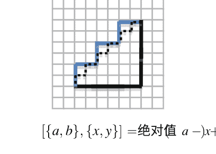

曼哈顿距离 [{a,b},{x,y}] = |a - x| + |b - y|

###### 切比雪夫距离

也被称为棋盘差异，它测量了两个向量之间在网格上的最大差异。请注意，在下面的插图中，三角形的每条边都有一个切比雪夫距离，或者长度为5，但在欧几里得空间中，其中一条线，即斜边，比其他线更长。

```
切比雪夫距离 [{a,b},{x,y}] = max(|a - x|, |b - y|)
```

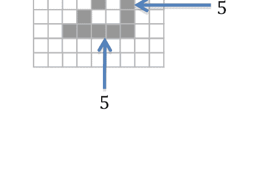

##### 统计差异度量

这些度量标准基于向量的统计特征，因此距离度量标准不需要映射到欧几里得空间。

###### 地球移动距离（EMD）或Wasserstein度量

地球移动距离衡量将一个多维向量（例如直方图）转换为另一个向量的成本。类比是一个挖土机在两组堆中移动土壤，使得每组土堆的大小相同。EMD假设向量中的特征之间存在地面距离，例如直方图中的bin之间的距离。

EMD的计算结果是变换的最小成本，它将移动的距离d ×移动的量/综合考虑，同时受到一些约束条件的限制。

```
成本 \(P, Q, F ) = \sum_{i=1}^{m} \sum_{j=1}^{n} d_{ij} f_{ij}\)
```

一旦计算出成本，结果将被归一化。

```
EMD(P, Q) = \frac{\sum_{i=1}^{m} \sum_{j=1}^{n} d_{ij}f_{ij}}{\sum_{i=1}^{m} \sum_{j=1}^{n} f_{ij}}
```

EMD具有较高的计算成本，对于图像分析可能有用，但EMD不是一种高效的特征匹配度量标准。

###### 马氏距离

也称为二次距离，使用均值和协方差计算距离；它是尺度不变的。

```
d_{ij} = \left( (\bar{x_i} - \bar{x_j})^{\mathrm{T}} S^{-1} (\bar{x_i} - \bar{x_j}) \right)^{\frac{1}{2}}
```

```
\mathrm{SSD}(d_1, d_2) = \sum_{i=-n1}^{n1} \sum_{j=-n2}^{n2} f\left( (x+i, y+j) - g\left( x+i-d_1, y_j-d_2 \right) \right)^2
```

其中， \(\bar{x_i}\) =特征向量1的均值， \(x_j\)=特征向量2的均值。

###### 布雷-柯蒂斯距离

这相当于绝对差异和总和的比率，例如曼哈顿距离的范数比率。布雷-柯蒂斯不相似度有时用于聚类数据。

```
布雷-柯蒂斯距离 \(\left[ \{ a,b,c \}, \{ x,y,z \} \right] = \frac{|a-x| + |b-y| + |c-z|}{|a+x| + |b+y| + |c+z|}\)
```

###### 堪培拉距离

这衡量了两个等长向量之间的距离：

```
堪培拉距离 \(\left[ \{ a,b \}, \{ x,y \} \right] = \frac{|a-x|}{|a| + |x|} + \frac{|b-y|}{|b| + |y|}\)
```

##### 二进制或布尔距离度量标准

这些度量标准依赖于集合比较和布尔代数的概念，这使得这个度量标准家族在数字计算机上具有吸引力。

###### L0范数

L0范数是向量中非零元素的计数，用于汉明距离度量和其他二进制或布尔度量。

```
||x_0|| = #(i x_i = 0)
```

###### 汉明距离

这度量了等长向量之间的二进制差异或一致性，例如字符串或二进制向量。二进制位向量的汉明距离可以通过完整的机器语言指令或XOR操作后跟位计数操作在数字计算机上高效实现。汉明距离是匹配局部二进制描述符（如LBP、FREAK、CENSUS、BRISK、BRIEF和ORB）的常用方法。

```
字符串距离：5 = 0001100111 =比较“HelloThere”和“HelpsThing”的差异
二进制距离：3 = 10100010 = (01001110) XOR (11001100)
(u XOR v)的位计数
```

###### 杰卡德相似度和不相似度

二进制集合（0、1或真、假）的成对相似度与集合元素数量的比率。下面的集合1包含与集合2相同成对值的两个位，因此相似度为2/5，不相似度为3/5。杰卡德相似度可以与汉明距离结合使用。

- 集合1: {1,0,1,1,0}
- 集合2: {1,1,0,1,1}
- 杰卡德相似度: 2 / 5 = .4
- 杰卡德不相似度: 3 / 5 = .6

## 描述符表示

本节讨论描述符中的信息表示方式，包括用于特征描述和匹配的坐标空间，以及关于多模态数据和特征金字塔的一些讨论。

### 坐标空间，复杂空间

计算机视觉中使用许多坐标系统，因此能够在坐标系统之间转换数据非常有价值。坐标空间类似于基空间。通常，选择正确的坐标系统可以为特征表示、计算或匹配提供优势。

复杂空间可能包括标量和向量变量的多元集合，例如梯度、颜色、二进制模式和像素区域的统计矩。参见图4.4。

### 笛卡尔坐标

图像通常在时间域中以笛卡尔空间中捕获，并且对于许多应用程序，需要转换到其他坐标空间。人类视觉系统将世界视为复杂的3D球坐标空间，人类可以通过一个小奇迹将3D空间映射到近似或相对的笛卡尔坐标中。计算机成像系统捕获数据并将其转换为笛卡尔坐标，但深度感知和几何精度在转换过程中丢失。（第1章讨论了深度感知方法和3D成像系统，包括几何考虑。）

### 极坐标和对数极坐标

后面在第6章提到的许多描述符使用圆形描述符区域来匹配人类视觉系统。因此，极坐标是将特征向量进行分组的合理选择。例如，GLOH [136] 方法使用极坐标进行直方图梯度分组，而不是原始SIFT [153] 方法中使用的笛卡尔坐标。GLOH可以用作SIFT的后期改进，并且已被证明可以提高准确性[136]。由于圆形采样模式往往提供更好的旋转不变性，极坐标和圆形采样是描述符设计的良好匹配。

### 径向坐标

RIFF描述符（在第6章中描述）使用本地径向坐标系来描述旋转不变的基于梯度的特征描述符。径向坐标系基于径向梯度变换（RGT），用于对向量进行不变性分组。

如图4.4和6.27所示，RGT在一个补丁区域 c 内创建一个局部坐标系，并相对于补丁中的任意点 p 建立两个正交基向量（r,t）用于径向向量和切向向量。所有点 p 处的测量梯度 g 被投影到径向坐标系（r,t）上，使得梯度以局部不变的方式表示，相对于补丁中心的兴趣点 c。当补丁围绕c旋转时，梯度也会旋转，不变性表示仍然成立。

### 球面坐标

球面坐标，也称为三维极坐标，可以应用于三维成像和深度感知领域，以提高描述和分析的准确性。例如，如今的深度相机通常只提供每个样本的$(x,y)$和 $Z$深度信息。然而，这远远不足以描述空间的复杂几何形状，包括弯曲、径向畸变和样本之间的非线性距离。第1章讨论了三维空间、深度测量和坐标系统的复杂性。

### 测量坐标

G-SURF方法[180]使用局部区域规范坐标系的微分几何概念[182]来计算特征。规范坐标是局部于图像特征的，并且它们具有几何精度的优势。规范导数是旋转和平移不变的。

### 多变量空间，多模态数据

多变量空间结合了多个量，例如张量空间结合了标量和矢量值，在计算机视觉中常用。虽然原始图像数据可能只是标量值，但许多特征描述符在每个像素处计算局部梯度，因此像素标量值和梯度矢量的组合形成了张量或多变量空间。例如，颜色空间（见第2章）可以将颜色表示为一组标量和矢量量，例如色调、饱和度和值（$HSV$）颜色空间在图2.8中有所示，其中矢量包括$HS$，其中$H$色调为矢量角度，$S$饱和度为矢量大小。$V$是另一个矢量，具有两个目的，首先作为$HS$矢量的轴原点，其次作为颜色强度或灰度矢量$V$。通常将原始$RGB$数据转换为这样的颜色空间以便于分析，例如能够统一改变所有颜色的颜色强度，从而影响亮度或对比度。

一般来说，通过增加特征空间的维度，可以增加更多的区分性和鲁棒性。例如，后面在第6章中描述的$LBP$模式可以通过添加诸如旋转不变表示（$RILBP$）等特征来扩展为多个变量；或者通过在$RGB$颜色通道上复制$LBP$，如颜色$LBP$描述符中所示；或者通过将$LBP$模式扩展到时空3维空间，如$LBP-TOP$，以增加几何失真不变性。

随着内置GPS、指南针、温度计、高度计、惯性和其他传感器的移动设备的普及，多模态传感器数据正在变得越来越普遍。SIFT-GAFD [237]方法是一个多模态、多变量描述符的例子，如图4.5所示，它将加速度计信息以重力向量的形式添加到SIFT描述符中。重力向量被称为全局方向，SIFT局部像素区域梯度被称为局部方向。

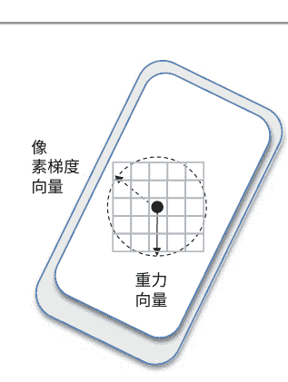

### 特征金字塔

许多特征描述符是以单一尺度的方式计算的，仅使用给定尺度下的像素值，并且对于特征检测和匹配，特征在尺度空间图像金字塔中进行搜索。然而，通过在多个尺度上计算描述符并将多个缩放描述符一起存储在特征金字塔中，可以在具有尺度变化的单一尺度图像上检测到特征，而无需使用尺度空间金字塔。

对于兴趣点和特征描述符方法，可以通过以下方式解决尺度不变性问题：（1）在搜索之前对图像进行缩放，就像本章后面讨论的尺度空间金字塔方法一样；或者（2）在描述符中对特征进行缩放和金字塔处理。基于形状的方法在本质上比兴趣点和特征描述符方法更具尺度不变性，因为基于形状的方法依赖于更大的多边形结构和形状度量。

## 描述符密度

根据图像数据的不同，良好的兴趣点和特征的数量也会有所不同，因为某些图像具有更明显的纹理。而且，根据所使用的检测器方法，具有高纹理结构或像素强度范围差异较大的图像很可能会产生比对比度较低且纹理平滑的图像更多的兴趣点。

一个好的经验法则是，在图像中，0.1%到1%的像素可以产生原始、未经滤波的兴趣点。更敏感的检测器，如FAST和Harris检测器系列，位于这个范围的上限（见附录A）。当然，检测器参数会根据每个应用程序来调整，以减少不需要的检测。

## 兴趣点和描述符筛选

实际上，即使兴趣点看起来不错，但在某些情况下，在兴趣点处计算得到的相应描述符可能不值得使用，会被丢弃。兴趣点和描述符都会被筛选。因此，调整检测器和描述符是关键的试错过程。根据我们的基本假设，图像中0.1%到1%的像素会产生有效的原始兴趣点，我们可以根据视频分辨率估计可能检测到的兴趣点数量，如表4.2所示。

表4.2 每个图像检测到的兴趣点的可能范围

|          | 480p NTSC | 1080p 高清 | 2160p 4k超高清 | 4320p 8k超高清 |
| :------- | :-------- | :--------- | :------------- | :------------- |
| 分辨率   | 640 x 480 | 1920 x 1080 | 3840 x 2160    | 7680 x 4320    |
| 像素     | 307200    | 2073600    | 8294400        | 33177600       |
| 兴趣点   | 300 – 3k  | 2k – 21k   | 8k – 83k       | 33k – 331k     |

根据方法的不同，检测器可以仅在单一尺度上运行，也可以在图像金字塔尺度空间中跨多个缩放图像上运行。对于尺度空间搜索方法，兴趣点检测器在金字塔中的每个图像的每个像素上运行。有哪些方法可以用来减少兴趣点密度，使其数量可控？

选择最佳兴趣点的一种方法是使用自适应检测器调整方法（如第6章“兴趣点调整”中所讨论的）。其他方法包括仅选择与给定阈值距离相距一定距离的兴趣点，例如，在一个五像素窗口内不能与另一个兴趣点相邻的兴趣点，并在阈值内选择最佳候选点。

另一种方法是根据本章讨论的搜索策略的变化，例如，在图像金字塔的较低分辨率上搜索特征，识别最佳特征并记录它们的位置，然后可能在金字塔的较高级别上进行搜索以确认特征位置，然后计算描述符。这种最后一种方法的缺点是默认情况下会错过细粒度特征，因为特征可能仅存在于完整图像分辨率上。

另一种方法是在每个像素或网格大小的区域内寻找兴趣点。上述所有方法都在实践中使用，并且除此之外还存在其他方法。

## 稠密与稀疏特征描述

密集描述符利用区域或补丁中的所有像素。通过“密集”我们指的是核采样模式包括所有像素，因为稀疏核可能选择使用或忽略特定像素。SIFT和SURF是密集描述符的经典示例，因为矩形区域中的所有像素都对描述符计算有贡献。

许多特征描述方法，特别是局部二进制描述符方法，利用稀疏模式，在区域中选择使用特定像素而不是所有像素。FREAK描述符展示了一种最巧妙的稀疏采样方法，通过模拟人类视觉系统，使用圆形搜索区域，并利用靠近区域中心的更细分辨率采样以及调整逐渐增加分辨率的本地采样模式的层次结构以获得最佳结果。稀疏特征不仅可以潜在地减少内存使用和减少计算量，而且稀疏描述符可以在更广泛的区域内分布，以弥补较小区域中出现的特征异常。

## 描述符形状拓扑

在这个讨论中，我们将描述符的形状和拓扑视为调查用于描述符计算的像素区域的各种形状。拓扑的一部分是形状或边界，另一部分是密集采样和稀疏采样模式的选择，稍后会进行讨论。

在本章中，采样和模式方法从简单的矩形区域到更复杂的稀疏局部二进制描述符模式都有。正如第6章中讨论的那样，2D和3D描述符都被设计为使用各种拓扑结构。让我们看一些拓扑设计考虑，如补丁形状、子补丁、条带和可变形补丁。

哪个形状更好？答案是主观的，我们不试图提供绝对的答案，只是提供一份调查。

### 相关模板

一个明显的形状是常用于相关模板匹配方法的简单矩形区域。因此，描述符就是模板区域中的照片，或者实际图像。为了在矩形内选择子空间，可以使用掩码——例如，可以是一个圆形掩码，位于边界矩形内部，用于屏蔽掉边缘像素的考虑。

### 补丁和形状

文献通常将特征形状称为一个补丁，并且通常假设为矩形形状。由于2D数组内存访问的便利性，补丁形状通常是矩形的。圆形补丁广泛用于局部二进制描述符方法。

然而，许多描述符还计算跨多个补丁或区域的特征，而不仅仅是单个补丁。这里是一些补丁拓扑的常见变化。

### 单个补丁，子补丁

许多描述符将补丁数量限制为单个2D补丁。这适用于大多数在第6章中调查的常见描述符。然而，一些局部二进制描述符在较大的补丁内使用一组积分图像子补丁，例如，BRIEF在局部二进制模式中的每个样本点内使用一个5 ×5的积分图像子补丁，在较大的31 ×31像素补丁区域内，因此每个子补丁的值成为用于点对比较的值。

目标是在每个点上过滤值以去除噪音。

### 可变形补丁

与使用刚性形状（如固定大小的矩形或圆）不同，特征描述符可以设计成考虑变形，例如尺度变形[337, 338]和仿射或单应性变形[212]，以实现更强大的匹配。例如，DeepFlow [326, 376]深度匹配方法和RFM2.3在第6章中讨论。此外，D-NETS [127] 方法使用全连接或稀疏连接拓扑结构，在条纹模式的放置上具有可变形性；参见图4.7和第6章中对D-nets的讨论。

本章后面讨论的许多特征学习方法也使用了变形特征进行训练。
固定的描述符形状，如刚性矩形和圆，可以在刚性运动假设下检测运动，其中整个描述符预计会以某种方差移动，例如尺度或仿射变换。然而，对于活动识别和运动，需要更具可变形的描述符模型，DeepFlow [336, 376] 在描述符匹配方法和光流匹配方法之间架起了桥梁，使用可变形补丁和深度匹配，沿着深度学习网络的方向。

### 多补丁集

SIFT描述符使用来自尺度空间金字塔结构中相邻DoG图像的三个补丁的多补丁集，如图6.15所示。其他一些方法，如图6.12所示的LBP-TOP和VLBP，使用分布在体积结构中的补丁集。LBP-TOP使用相邻平面的补丁，而VLBP使用三维空间中的交叉补丁。动态纹理方法使用来自时空图像帧集的三个相邻补丁，如帧$n -2$，帧$n -1$和帧 $-0$（当前帧）。

### TPLBP, FPLBP

三补丁LBP TPLBP和四补丁LBP FPLBP [236]利用新颖的多补丁采样模式将稀疏的局部结构添加到复合LBP描述符中。如图4.6所示，三补丁LBP使用由交替的三个补丁组成的径向LBP模式集，而四补丁LBP使用更广泛范围内的补丁配对。

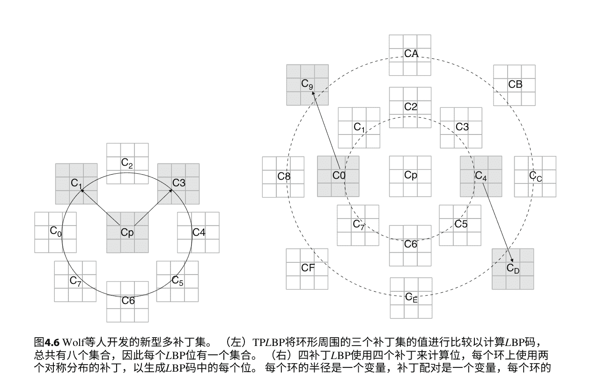

图4.6 Wolf等人开发的新型多补丁集。（左）TPLBP将环形周围的三个补丁集的值进行比较以计算LBP码，总共有八个集合，因此每个LBP位有一个集合。（右）四补丁LBP使用四个补丁来计算位，每个环上使用两个对称分布的补丁，以生成LBP码中的每个位。每个环的半径是一个变量，补丁配对是一个变量，每个环的补丁数量是一个变量；在这里，每个环有八个补丁。

### 条纹和径向风扇形状

径向风扇或从特征兴趣点位置或形状质心起始的辐条可以用作描述符采样拓扑结构，例如，使用傅里叶形状描述符（如第6章中讨论的图6.29）。

### D-NETS条纹模式

Hundelshausen和Sukthankar [127]开发的D-NETS方法使用了一个连接图-形描述符模式，采样模式可以有所变化。作者建议使用三种不同的模式，如图4.7所示：

- 1. 兴趣点处的完全连接图
- 2. 兴趣点处的稀疏或迭代连接图
- 3. 在选择的网格上密集采样的图

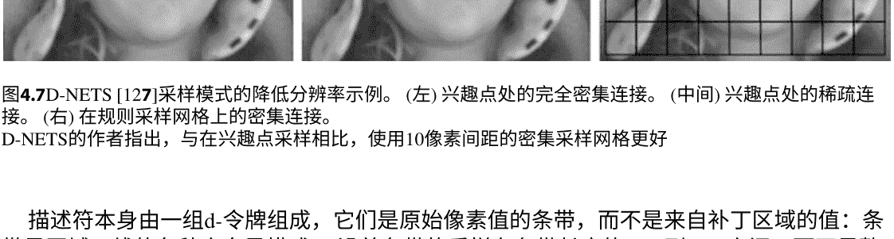

图4.7 D-NETS [127]采样模式的降低分辨率示例。(左)兴趣点处的完全密集连接。(中间)兴趣点处的稀疏连接。(右)在规则采样网格上的密集连接。
D-NETS的作者指出，与在兴趣点采样相比，使用10像素间距的密集采样网格更好

描述符本身由一组d-令牌组成，它们是原始像素值的条带，而不是来自补丁区域的值：条带是区域，线的各种方向是模式。沿着条带的采样在条带长度的80%到20%之间，而不是整个长度，省略了端点，据称可以减少噪声兴趣点的贡献。

采样点被组合成一组均匀的像素块，并进行归一化和存储到离散的d-令牌描述符中。

### 物体多边形形状

对象和多边形形状方法在整个图像帧或区域中全局和局部扫描以找到形状。目标是找到一个具有内聚性的对象或区域。本文提供了有关用于特征描述符的分割多边形形状的基本方法的讨论，包括：

- 形态学对象边界方法
- 纹理或区域结构方法
- 超像素或像素相似性方法
- 深度图分割

第6章详细介绍了用于统计描述多边形形状特征的一系列对象形状因子和度量标准。请注意，这个主题通常在文献中被称为“图像矩”；有关信息的一个好的来源是Flusser等人的著作[500]。

### 形态学边界形状

定义多边形形状的一种方法是使用形态学。形态学分割是一种常用的区域划分方法，可以作为二值对象或灰度对象。形态学形状有时被称为斑点。在二值和灰度情况下，阈值化通常被用作定义对象边界的第一步，形态学重塑操作（如腐蚀和膨胀）用于增长、收缩和清理形状边界。形态学分割是基于阈值和边缘特征的。（第3章讨论了形态学和阈值化的方法。）

### 纹理结构形状

区域纹理也用于分割多边形形状。纹理分割是一种熟悉的图像处理方法，用于图像分析和分类，并且是一种非二值分割的理想方法。纹理揭示了简单阈值化忽略的结构。如图6.6所示，LBP算子可以检测局部纹理，并且可以用于分割天空、水域和陆地等区域。纹理分割基于局部图像像素之间的关系。（第3章对几种纹理分割方法进行了调查。）

### 超像素相似形状

使用超像素方法分割区域是基于将相似像素合并在一起的思想，例如将具有相似颜色的像素合并成一个较大的形状。目标是将整个图像区域分割成超像素。超像素方法是基于相似性的。（第3章讨论了几种超像素处理方法。）

## 局部二进制描述符点对模式

局部二进制描述符的形状和采样模式，例如在FREAK、BRISK、ORB和BRIEF中使用的那些，是研究各种权衡和设计方法的好例子。我们在这里研究局部二进制形状和模式的概念。（第6章提供了每个描述符的更详细调查。）

局部二进制描述符使用点对采样方法，其中将一对像素分配给彼此进行二进制比较。请注意，局部二进制描述符和点对比较的一个缺点是，局部区域中图像像素值的微小变化可能会表现为二进制伪影。一组像素值中看似微不足道的变化可能会导致匹配过程中的问题，这对于：（1）噪声图像和（2）具有恒定灰度级的图像来说更为明显。

然而，每种局部二进制描述符方法都试图减轻二进制伪影问题。例如，BRISK（见图4.10）和ORB（见图4.11）在进行二进制比较之前，计算每个兴趣点周围的滤波区域以减少噪声成分。

另一种减轻常数灰度级二进制伪影问题的方法是在LBP方法的修改版本中使用称为局部三值模式算子或LTP [504]（也参见引用[165]，第2.9.3节）的三值{-1, 0, 1}来描述区域。为了描述接近恒定灰度值的LTP，建立了一个阈值带，将阈值带上方的值设为1，阈值带下方的值设为-1。LTP可以用来描述常数灰度级的平滑区域和标准LBP中的对比区域。此外，点对的比较阈值可以调节以补偿噪声、光照和对比度，几乎所有局部二进制描述符方法都采用了这种方法。

图4.8（左图）展示了一个假设的描述符模式，将选定的像素作为黑色值，而左中图显示了一个以条状为导向的形状和模式，其中描述符沿着一组线段计算描述符，没有特定的对称性，类似于DNETS [127]方法。

在图4.8中，右中图还展示了一个卷积核，其中指定了滤波器形状和滤波器目标，而右图是一个使用径向像素采样线从形状重心起始并终止于斑点周长的斑点形状。 请注意，可以从包含从重心到周长的每个径向线段的长度的数组中计算1D Fourier描述符来描述形状，或者只保留原始像素值的数组，或者计算D-nets。

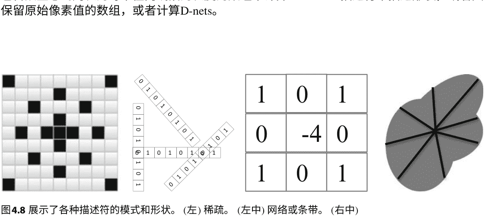

图4.8 展示了各种描述符的模式和形状。（左）稀疏。（左中）网络或条带。（右中）卷积核。（右）径向辐条

通过同时使用一个或多个形状和模式来设计特征描述符。例如，图4.8中的假设描述符模式（左图）使用一种模式来捕捉靠近兴趣点的像素，另一种模式使用离中心较远的像素来捕捉圆形模式信息，另一种模式覆盖了一些极值点。调整采样模式的一个很好的例子是下面讨论的FREAK描述符。

### FREAK视网膜模式

FREAK [122] 描述符的形状也在第6章中进行了详细讨论，它使用基于人类视网膜系统的局部二进制模式，如图4.9所示，其中人类视觉系统中感受器细胞的密度在中心更大，并随着距离中心的增加而减小。

FREAK在构建局部二进制描述符时遵循类似的模式，被称为粗到细的描述符模式，中心区域具有细节，向外部移动则具有粗略的细节。粗到细的方法还允许在粗到细的片段中匹配描述符。首先匹配粗略部分，如果匹配足够好，则匹配细节特征组件。

在这个框架中，可以使用多种模式构建FREAK描述符。对于FREAK，实际的模式形状和点对配对是在训练阶段设计的，使用类似ORB [126]的方法学习具有高方差的点对配对模式。模式仅受训练数据的约束；仅使用来自32 ×31图像块区域的45个点对。

如图4.9所示，比较每条线段末端的点对，将一组比较值组合成一个使用16字节的二进制描述符向量，并在描述符集中包含四个级联的16字节粗到细模式。通常，仅使用粗模式就可以有效地拒绝错误匹配，而更细的模式仅用于验证最接近的匹配。

### Brisk模式

BRISK描述符[123]的点对采样形状是对称和圆形的，由图4.10所示的四个同心圆环排列的60个点组成。每个60个点周围都有一个圆形采样区域，采样区域的大小随着距离中心的距离增加而增加，并且与采样点之间的距离成比例。在采样区域内，对像素进行高斯平滑处理，并计算平滑区域上的局部梯度。 在采样区域内，对像素进行高斯平滑处理，并计算平滑区域上的局部梯度。

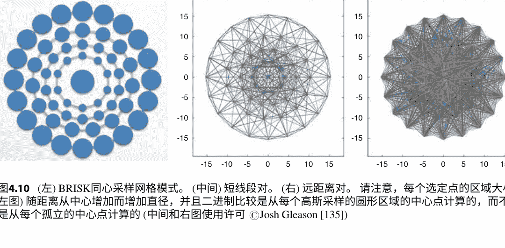

与其他局部二进制描述符一样，BRISK比较一对点来形成描述符。这些点对分为两组：(1)长线段，与区域梯度一起用于确定描述符的角度和方向，角度用于旋转描述符区域，然后应用一对一的采样模式；(2)短线段，可以进行一对一的比较并组合成512位的二进制描述符向量。

### ORB和BRIEF模式

ORB [126]在一定程度上基于BRIEF描述符[124, 125]，因此被命名为方向二进制简洁描述符，因为ORB在BRIEF方法上添加了方向并提供了其他改进。例如，ORB还通过使用Harris角点方法对FAST角点进行限定，通过Rosin的方法[53]改进角点方向，以引导BRIEF描述符以提高旋转不变性（已知BRIEF对旋转敏感）。

ORB还提供了一种非常好的点对训练方法，这是对BRIEF的改进。在BRIEF中，如图4.11所示，样本点根据31 ×31区域内中心点周围的高斯分布随机分布选择的样本点数量为256。选择的样本点对相互比较以形成二进制描述符向量。通过积分图像方法计算每个点的值，将5 ×5区域平滑为点值。

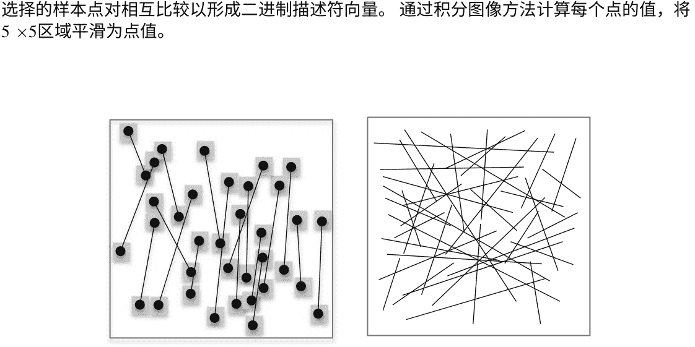

图4.11 （左图）是一个ORB风格模式，使用了大大减少的点对数量，只使用了 <32个点，而不是全部的256个点。（右图）是一个使用随机点对的BRIEF风格模式。

为了学习描述符点对样本和比较模式，ORB使用训练算法在训练集中找到具有高方差的不相关点，并选择最佳的256个点来定义用于创建二进制特征向量的成对采样模式。因此，形状和模式是非对称的，如图4.11所示，类似于一些DNETS模式。ORB点对模式依赖于训练数据。

请注意图4.11中的BRIEF风格模式（右图）使用了随机点对。开发者们提出了几种随机化点对的方法[124]。图4.11中显示的ORB模式是基于选择具有高统计方差的点对，在一个边界为31 ×31的图像块中进行选择，其中较小的5 ×5灰度图像块区域位于所选择的兴趣点的中心。然后，每个5 ×5区域都使用积分图像方法进行平滑处理，得到一个点的单个值。

## 描述符区分度

描述符有多具有区分性？通过“区分性”我们指的是描述符能够如何唯一地描述和区分其他特征。根据应用的不同，可能需要更多或更少的区分性，因此可能会通过提供更多的信息和不变性来过度描述一个特征，或者通过限制其鲁棒性和不变性属性来不足描述一个特征。对于给定一组鲁棒性标准的特征描述符区分性可能很重要和有趣，但在某些情况下，区分性并不总是解决问题的正确方法。

在以下假设下，可以通过使用级联的简单描述符（如相关模板）来平衡对描述符的增加的区分度的需求。

1.  假设廉价的大规模并行计算，像Taylor和Rosin的RFM2.3 [212]这样的可变形描述符成为更有吸引力的选择，允许在硅上使用GPU纹理采样器实时地对简单的弱区分相关模板或像素块进行变形。在各种姿势变化和光照变化下，可以通过并行GPU SIMT/SIMD计算和卷积核轻松实现匹配和对应。因此，GPU可以有效地允许对相关补丁进行变形和对比增强，以用作可变形描述符并与目标特征进行比较。
2.  假设有大量快速且廉价的内存，例如大型内存缓存系统，可以将许多非区分描述符或训练模式存储在内存缓存中的数据库中。
3.  各种加权方案，如神经网络和卷积网络中使用的方案，可以有效地用于实现所需的对应和质量。此外，还可以使用其他提升方案来进行分类器，例如Adaboost方法，以从弱判别数据中开发出强分类器。

总之，对于特定应用程序，既可以选择高度判别的特征描述符，也可以选择级联的简单弱判别特征描述符，这取决于目标系统。

### 光谱区分度

特征判别的一个维度是所选择的描述符谱或用于表示特征的值。我们将谱简单地称为谱内的值或连续谱上的值。仅使用单个谱的特征描述符（例如强度值的直方图）将具有对强度分布的判别能力，但对于其他属性（如形状或仿射变换）没有判别能力。例如，特征描述符可以通过组合多元谱集（例如RGB颜色、深度和颜色强度的局部区域梯度）来增加判别水平（有关多元描述符的更多信息，请参见Varma [771]和Vedaldi [770]）。

众所周知[240]，人类视觉系统能够以一种尺度和旋转不变的方式对视网膜上的梯度信息进行区分和响应，这在SIFT和许多其他特征描述方法中得到了证明。因此，梯度的使用是计算机视觉中常见且首选的光谱。

光谱可以在一系列变量上进行取值，其中简单的标量取值范围只是光谱的一种类型：

1.  灰度强度
2.  颜色通道强度
3.  基函数域（频域，HAAR等）
4.  2D或3D梯度
5.  3D表面法线
6.  形状因子和形态测量
7.  纹理度量
8.  区域积分
9.  区域的统计矩
10.  从局部二进制模式中获取的汉明码

上述每种光谱类型以及其他许多可以列举的类型都可以包含在多变量特征描述符中，以增加区分度。当然，所选择应用的区分要求将指导描述符的设计。例如，用于识别水果的应用将更有效地使用颜色通道光谱来识别水果颜色，形状因子来识别水果形状，以及纹理度量来识别皮肤纹理。

回答歧视问题的一种方法是查看描述符中包含的信息。描述符是否包含多变量光谱集合，以及覆盖了多少不变性属性，如方向或尺度？

### 区域、形状和模式区分度

特征描述符的形状和模式是影响歧视的重要维度。每种特征形状都有优点和缺点，取决于应用。令人惊讶的是，甚至一个像素也可以用作特征描述符的形状（见图1.7）。让我们看看歧视的其他维度。

形状和模式可以分类如下：

1.  一个像素（后续将讨论单像素描述方法）
2.  一行像素
3.  一个矩形区域的像素
4.  一个多边形形状或像素区域
5.  一个模式或一组不相连的像素，如中央凹模式

描述符的形状决定了歧视的属性。例如，与圆形描述符相比，矩形描述符在旋转不变性属性上受限。此外，描述符的较小形状限制了范围较小的区域，并且也限制了尺度不变性。较大尺寸的描述符区域携带更多像素，可以增加歧视能力。

描述符形状、像素采样模式、采样区域大小和像素度量已经被其他几位研究人员调查过[120-122]。在本节中，我们将更深入、更广泛地探讨用于特征描述符调整的具体方法，特别关注局部二进制特征描述符，这对于低功耗和高性能非常有潜力。

### 几何区分度因子

形状在很大程度上决定了可能的旋转不变性的数量。例如，矩形形状在大约15°处开始在旋转判别上下降，而圆形模式在旋转变化下通常表现更好。请注意，任何判别能力差的形状或模式描述符都可以通过将多个形状或模式合并到描述符向量中来增强和提高判别能力。

例如，像Viola-Jones方法中使用的HAAR小波这样的形状和模式将整个矩形区域中的所有像素进行整合，得到该区域中所有像素的综合值。因此，描述符中不包含局部细节模式信息，导致局部区域判别能力有限，旋转不变性或判别能力较差。

另一个旋转辨别能力差的例子是矩形相关模板方法，它逐像素比较两个矩形区域。然而，一些有效的描述符方法使用矩形形状的区域。

总的来说，矩形对于旋转不变性是有限制的。然而，SURF使用一种方法来确定圆形邻域内矩形HAAR小波特征的主导方向，以实现更好的旋转不变性。而SIFT使用一种方法，在分组阶段对矩形区域应用圆形加权函数，以提高旋转不变性和准确性。

值得注意的是，在定向应用中，低辨别度的描述符被非常有效地用于视频编码中的运动估计相关方法。在这种情况下，矩形形状非常适合编码问题，并且适用于高度优化的固定功能硬件实现，因为在30 Hz帧率下，帧与帧之间的运动可以在矩形区域中很好地捕捉，且通常很少有旋转或尺度变化，只有平移。

在考虑这个问题时，描述符的区分度应该适当地适应应用程序，因为增加区分度会增加计算和内存的成本。

### 特征可视化以评估区分度

理解区分度的另一种方式是仅使用特征描述符本身来重建图像，其中我们可以将描述符的集合视为实际图像的压缩或编码版本。图像压缩、编码和特征描述是相关的；参见图3.18。接下来，我们将从描述符信息中检查几个图像重建的示例。

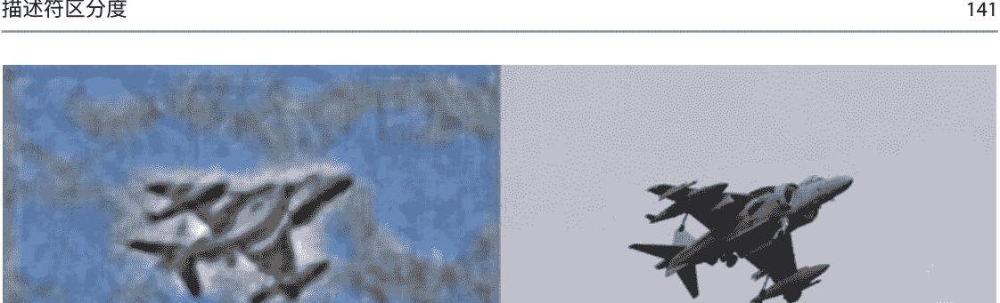

图4.12通过HOG描述的可视化进行区分（左图），右边是原始图像。（图片 © Carl Vodrick，经许可使用。）还可以参考“HOGgles: Visualizing Object Detection Features, Carl Vondrick, Aditya Khosla, Tomasz Malisiewicz, Antonio Torralba, Massachusetts Institute of Technology, Oral presentation at ICCV 2013”

### 通过HOG图像重建实现区分度

图4.12使用HOG描述符[98]可视化了一次重建。细节水平粗糙，遵循与HOG的预期使用相匹配的线条和边缘结构。HOG提供的一个关键方面是在计算描述符之前不对图像进行平滑处理。HOG研究表明，对图像进行平滑处理会导致区分度的损失。

Dalal和Triggs [98]强调他们有意避免图像平滑以保留图像细节。

然而，一些研究人员认为噪声在计算局部区域梯度和边缘等数值时会导致问题，并进一步建议在描述符计算之前通过平滑来消除噪声；这是许多领域的常识。请注意，有许多方法可以在不使用极端的高斯式平滑、卷积模糊和积分图像的情况下滤除噪声，这些方法会扭曲图像场。

一些更好的噪声滤波方法包括斑点去除滤波器、秩滤波器、双边滤波器和其他在第2章中讨论的方法。如果输入图像保持原样，或者至少使用了最佳的噪声滤波方法，特征描述符很可能会保留更多细粒度特征的区分能力。

### 通过从局部二进制模式重建图像进行区分

如图4.13所示，d'Angelo和Alahi [119]提供了从FREAK和BRIEF局部二进制描述符重建的图像的可视化。重建完全是根据描述符信息进行的，覆盖整个图像。BRIEF使用更随机的模式来比较区域内的点，而FREAK使用经过训练的、更具中央凹陷和对称性的模式，靠近区域中心的细节更多。d'Angelo和Alahi [119]指出，重建结果与原始图像的拉普拉斯滤波版本相似，这有助于我们理解这些特征的区分与详细边缘和梯度信息的结构相关。

d'Angelo和Alahi的重建方法[119]通过计算原始图像上的一组重叠描述符块来创建图像。为了重建图像，首先使用一种新颖的方法重建描述符以渲染块，然后通过对重叠区域进行平均来合并块，形成图像，其中块合并大小可以根据需要变化。

例如，请注意图4.13在左列的Barbara图像中使用了32 ×32个补丁，中间列的摄像机人的补丁大小为64 ×64。 还要注意的是，Barbara的重建与摄像机人的重建不具有相同的区分能力，摄像机人的图像包含更细节的信息。Vodrick [888]提供了其他引人入胜的特征可视化工作。

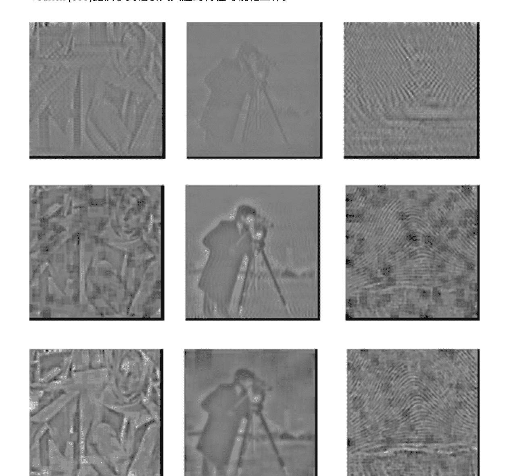

### 通过SIFT特征进行图像重建的区分能力

另一种近似图像重建的方法[97]证明了SIFT描述符的区分能力，请参见图4.14。该研究的重建方法首先获取包含著名建筑物等场景的未知图像，在图像中找到一组Hessian-affine区域检测器，提取相关的SIFT特征描述符，然后保存一组椭圆形图像补丁区域。

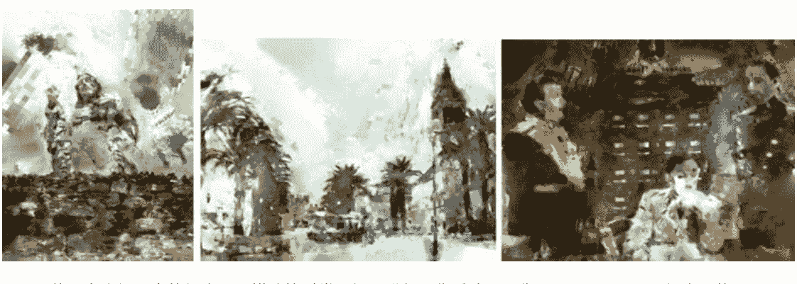

图4.14使用多个视图中的组合SIFT描述符对常见场景进行图像重建，图像 ©Herve Jegou，经许可使用

接下来，搜索包含相似且希望匹配的同一场景图像的图像数据库，以找到最接近的Hessian-affine兴趣点处的SIFT描述符。然后，取每个SIFT描述符周围的一组椭圆形补丁区域。在基于场景的先验兴趣区域几何参数的基础上，将在数据库中找到的椭圆形补丁变形为合成图像。

通过堆叠和混合重叠的补丁以及平滑插值，将补丁拼接在一起。通过平滑插值填充任何剩余的空洞。这种方法的一个显著结果是，可以从不同图像的补丁集合中重建图像，因为特征描述符是相似的；在这种情况下，SIFT描述符的区分能力得到了很好的展示。

## 准确性、可追踪性

准确性可以通过特定的特征属性或鲁棒性标准来衡量；请参见表4.1和7.4。一个给定的描述符在某个领域可能优于另一个描述符，在其他领域可能不是。在研究文献中，每个新的特征描述符的准确性和性能通常与SIFT和SURF等标准方法进行基准测试。特征描述符的准确性是使用常用的地面真实数据集来衡量其鲁棒性和不变性属性。（有关标准地面真实数据集的调查，请参见附录B，有关地面真实数据集设计的讨论，请参见第7章。）

这里列举了一些有用的准确性研究，说明了描述符和兴趣点准确性的一些衡量方法。例如，Mikolajczyk和Schmid [136]提供了关于早期特征检测器和描述符准确性和不变性的最全面的调查，涵盖了包括GLOH、SIFT、PCA-SIFT、Shape Context、自旋图像、Hessian Laplacian GLOH、交叉相关、梯度矩、复杂滤波器、微分不变量和可操纵滤波器在内的一系列描述符。

在Gauglitz等人的研究中[137]，对于缩放、平移、旋转、透视畸变、运动模糊、静态光照和动态光照等多个特征度量标准进行了不变性度量，其中包括Harris、Shi-Tomasi、DoG、Fast Hessian、FAST和CenSurE等几种特征度量标准，在第6章中进行了讨论。还有一些分类器的度量标准，包括随机树和FERNS，在本章后面进行了讨论。图4.15提供了Gauglitz [137]关于特征检测器和兴趣点准确性的一些视觉比较。

### 准确性优化、子区域重叠、高斯加权和池化

有多种方法用于优化特征描述符的准确性，这里讨论了一些方法。例如，描述符通常使用重叠的采样模式子区域，如图4.9中的FREAK描述符模式所示。通过重叠采样区域并仔细处理边界，准确性在大多数情况下似乎更好[153, 170]。重叠的区域在直观上是有意义的，因为区域中的每个点与周围的点相关。在特征描述中，模式子区域重叠的价值对于局部二值模式类型的描述符和SURF等光谱描述符变体似乎是显而易见的[136, 173]。当描述符中使用的采样区域不重叠时，识别率不够准确[122]。

高斯加权是另一种增加准确性、减少测量中的噪声和不确定性的有效方法。例如，SIFT [153, 170] 描述符对描述符区域中的每个局部区域梯度应用了基于高斯的加权因子，以偏好靠近中心的梯度并减少远离中心的梯度的权重。此外，SIFT 加权是以圆对称的方式应用的，这增加了一定的旋转不变性；参见图6.17。请注意，高斯加权与高斯滤波不同；高斯滤波既减少噪声，又消除图像中的关键细节，但在HOG方法中发现这种滤波是适得其反的。高斯加权因子，例如SIFT在梯度柱上使用的，可以简单地用于限定数据而不改变数据。一般来说，加权因子可以用于缩放结果并微调检测器或描述符。采样模式中的子区域重叠和高斯加权方案是互补的。

通过依赖于一组附近的特征而不仅仅是一个单一特征，可以提高准确性。例如，在卷积网络中，可以对几个附近的特征进行汇集，以通过选择的鲁棒性或不变性标准来增加准确性[339]。在文献中，汇集概念也可以被称为邻域共识或半局部约束，并且可以涉及联合约束，例如一组组合局部特征之间的角度和距离 [340-342]。

### 亚像素准确性

一些描述符和识别方法可以在匹配特征位置时提供亚像素精度 [139-142]。计算亚像素精度的常见方法包括互相关、绝对差值求和、高斯拟合、傅里叶方法和刚体变换和ICP。一般来说，亚像素精度在流行的商业应用中并不常见，只在高端应用如工业检测、航空航天和军事系统中需要。

例如，SIFT提供关键点位置的亚像素精度。数字相关方法和模板匹配在工业应用中被广泛使用于目标跟踪，并且可以扩展到计算一系列一像素偏移区域的相关性，以得到一组相关性，可以拟合成曲线并插值以找到最高匹配以获得亚像素精度。

亚像素精度通常仅限于平移。旋转和缩放在亚像素精度方面要更加困难，无法用数值来量化。通常，仅针对平移的亚像素精度结果可以达到¼像素的分辨率，但分辨率的精度可以更细致，并且在某些方法中，使用FFT注册方法可以声称达到1/20像素的高精度[143]。

此外，立体视差方法受益于改进的亚像素精度，特别是在长距离上，因为距离测量的粒度随着距离的增加呈指数增长。

因此，随着深度场的增加，计算得到的深度场包含更粗糙的信息，并且计算得到的深度场在Z上实际上是非线性的。因此，在立体和多视图立体视差计算中，亚像素精度非常理想和必要以获得最佳精度。

## 搜索策略和优化

如图5.1所示，一个特征可能是稀疏的，覆盖一个局部区域，或者覆盖一个区域或全局区域。用于隔离这些特征类型的搜索策略是不同的。对于全局特征，没有搜索策略：整个帧被用作特征。对于区域描述符，需要选择或分割一个区域（在第2章中讨论）。对于稀疏的局部特征，搜索策略变得重要。稀疏局部区域的搜索策略可以分为几个主要类别，如下所示（也包括在第5章的分类中）。

### 密集搜索

在密集搜索中，检查图像中的每个像素。例如，在每个像素处计算一个兴趣点，然后将兴趣点分类并排序到候选列表中，并为每个候选计算一个特征描述符。局部二进制描述符和常见描述符（如SIFT）使用密集搜索。

在立体匹配和深度感知中，每个像素都以密集的方式进行搜索，以计算视差和最近点。例如，立体算法使用密集搜索逐行逐像素地进行对应关系计算视差；单目深度感知方法（如PTAM）使用密集搜索兴趣点，然后在预测位置上进行稀疏搜索已知特征。

密集方法也可以应用于图像金字塔，通常先搜索较低分辨率的金字塔，然后再搜索更细粒度的金字塔。当特征位置未知且无法预测时，一般首选密集方法以获得更高的准确性和鲁棒性。

### 网格搜索

在网格搜索方法中，图像被分成一个规则的网格或瓦片，并且特征是基于这些瓦片定位的。OpenCV库提供了一种新颖的网格搜索方法，使用网格搜索适配器（在第6章和附录A中讨论）。这允许在网格区域内进行重复的试验搜索以找到最佳特征，并且可以在每次试验运行之前调整检测器参数。从准确性的角度来看，网格搜索的一个可能的缺点是特征不会对齐到网格上，因此可能会错过或截断沿着网格边界的特征，从而降低整体的准确性和鲁棒性。

网格搜索可以以多种方式使用。例如，一个规则的网格被用作D-NETS的锚点，如图4.7所示。或者，一个网格被用来形成图像瓦片补丁，并且为每个瓦片计算一个描述符，例如HOG方法中所示，如图4.12所示。另外，Viola-Jones方法[138]在网格上计算HAAR特征。

### 多尺度金字塔搜索

多尺度图像金字塔搜索的思想要么是通过从较低分辨率开始加速搜索，要么是真正提供多尺度图像以便在适当的尺度上找到特征。减小图像尺度的方法包括像素抽取、双线性插值和其他多采样方法。尺度空间是创建图像金字塔的一种常用方法，在下一节中讨论了许多变体；参见图4.16。

然而，随着金字塔层数的增加，检测到的特征数量迅速减少，特别是对于经过高斯滤波的尺度空间金字塔，因为高斯滤波器会减少图像纹理细节。此外，较高金字塔层级上的像素数量较少，因此有时会使用小于八度的金字塔尺度间隔。有关图像金字塔的良好讨论，请参考参考文献[152]。

### 尺度空间和图像金字塔

通常，为了减小图像尺度，不使用简单的像素抽取和像素插值，而是使用高斯滤波方法构建一个尺度空间[505, 506]金字塔表示，最初由林德伯格[529]提出，以减少尺度伪影并保留类似斑点的特征。尺度空间是一种更正式的方法，用于定义一组多尺度图像，通常使用高斯核 g() 与图像f(x,y)进行卷积，如下所示：

```
g(x, y; t) = 1/(2πt) * e^(-(x^2+y^2)/2t)
L(., .; t) = g(., .; t) × f(., .),
```

或者通过等效方法：

```
$$\partial_tL = \frac{1}{2} \nabla^2L,$$
```

具有初始状态 $L(x,y;0)=f(x,y)$。

高斯滤波器设计在尺度空间中的一个很好的例子是SURF方法[152]中描述的。高斯滤波器以递增的大小作为核被应用于原始图像的八度间隔下采样间隔，以创建尺度空间图像，例如，从一个9 ×9的高斯滤波器逐渐增加到15 ×15、21 ×21、27 ×27、33 ×33和39 ×39；参见图4.17。

尺度空间的一个缺点是在图像金字塔的较高层次中丧失了定位和准确性。事实上，一些特征在图像金字塔的较高层次中根本不存在，这是由于分辨率不足和高斯滤波造成的。有效尺度空间特征匹配的最佳例子可能是SIFT，它提供了在尺度空间问题上将第一个金字塔图像的分辨率加倍的方法，并提供了一个良好的多尺度描述符框架。另请参见图4.18。

图像金字塔类似于计算机图形学中使用的纹理mip-maps。图像金字塔的变种很常见。使用八度和非八度金字塔间距，并且滤波方法也有所变化。例如，SIFT方法[153, 170]使用一个五级八度尺度的图像金字塔，在尺度空间中使用高斯滤波后的图像。然后，使用高斯差分（DoG）方法来捕捉金字塔中相邻图像中的兴趣点极值点和极小值点。SIFT使用双尺度的第一个金字塔层，其中线性插值像素为2×原始放大倍数以保留细节。这种技术将稳定关键点的数量增加了约四倍，这是非常显著的。在ORB [112]方法中，围绕一个非八度尺度空间构建了一个 $\sqrt{2}$ 在一个五级金字塔上进行尺度变换，其金字塔层级之间的分辨率更接近，比两倍尺度的八度金字塔更好。

### 特征金字塔

与尺度空间金字塔和金字塔搜索相比，另一种方法是使用特征空间金字塔，并在数据库中构建一组多尺度特征描述符。在这种方法中，描述符本身包含金字塔，不需要尺度空间或图像金字塔。相反，特征搜索直接从单尺度目标图像到多尺度特征进行。RFM方法[212]在第6章中讨论，甚至包括每个描述符的多透视变换版本的每个补丁。在表4.3中，注意多尺度特征可以直接用于目标图像匹配，而单尺度特征更适合在图像金字塔上使用。

表4.3 使用单尺度特征和多尺度特征的一些权衡

| 特征尺度 | 特征大小 | 特征描述计算时间 | 图像金字塔用于匹配 | 单尺度图像用于匹配 |
|----------|----------|------------------|--------------------|----------------------|
| 单尺度特征 | 更小的内存占用 | 计算速度更快 | 是 | 否 |
| 多尺度特征 | 更大的内存占用 | 计算速度较慢 | 否 | 是 |

图3.16展示了一个相关概念，即多分辨率直方图[144]，它是从尺度空间金字塔的图像区域中创建的，并且将直方图连接在描述符中，用于确定特征匹配的纹理度量。因此，在多尺度直方图方法中，运行时不需要金字塔图像集；相反，金字塔搜索使用描述符中的直方图特征与单尺度目标图像进行对应。

可以将各种标量和其他度量组合成多尺度特征金字塔，例如图像强度补丁、颜色通道强度补丁、梯度幅值和梯度方向。纹理特征的直方图作为不变仿射度量的一部分已被发现很有用，作为更广泛的特征描述符的一部分[144]。

### 稀疏预测搜索和跟踪

在稀疏预测搜索流水线中，特定位置上的特征在前一帧中被搜索，并在下一帧中的预期位置上进行搜索。例如，在PTAM [319]算法中，通过定位一组兴趣点和特征描述符，从单个摄像头的连续视频帧中创建了一个稀疏的三维点云和相机姿态。对于每一帧新图像，使用先前的相机姿态矩阵对相同的兴趣点和特征检测器在新图像中可能出现的坐标进行预测。然后，对于新的帧，启动搜索或跟踪循环，使用金字塔粗到细的搜索策略来定位预测的少量兴趣点。在每个预测的兴趣点周围搜索并查找特征，并根据找到特征的新坐标更新相机姿态矩阵。然后，使用更新后的相机姿态和搜索跟踪循环在更细的金字塔图像集上预测更多的点。这个过程迭代进行，以找到点并优化姿态矩阵。

### 跟踪区域限制搜索

区域限制搜索的一个例子是视频会议系统，通过使用立体声麦克风跟踪发言人的位置来通过三角测量计算粗略位置。一旦知道了粗略的发言人位置，摄像头就会移动到发言人的位置，并且只对脸部区域感兴趣，以进行进一步的精确定位调整、自动缩放、自动对焦和自动对比度增强。在这个应用中，不需要搜索或处理整个图像来寻找面部特征。相反，视野中心是限制搜索以定位面部的区域。例如，如果图像是从一个1920 ×1080分辨率的高清摄像头拍摄的，只需要处理图像中心的一个有限区域，可能是512 ×512像素，来定位面部特征。

### 分割限制搜索

分割区域可以定义搜索区域，例如具有特定纹理的区域，或者具有特定颜色强度的像素。在形态学视觉流水线中，可以通过阈值分割和二值腐蚀+膨胀来以各种方式分割区域，以创建二值形状。然后，可以使用二值形状作为掩模，对掩模下的相应灰度图像区域进行分割以进行特征搜索。图像分割方法在第2章中进行了介绍。

### 深度或 Z 限制搜索

随着低成本商用深度传感器出现在移动消费设备上，Z维度可用于限制搜索范围。参见图4.19。例如，通过使用深度分割图像的背景，前景特征更容易分割和识别，并且可以通过深度段限制搜索。 考虑到在计算机视觉中从2D图像中提取3D图像信息所花费的时间，我们可以预期深度相机将以新颖的方式用于简化计算机视觉算法。

## 计算机视觉，模型，组织

本节包含一些高级示例的概述，以说明特征度量在计算机视觉系统中的使用方式。 在这里，我们探讨了如何选择、学习、关联特征，以描述真实对象，以及如何进行高效搜索和匹配，并在计算机视觉流程中使用。 本节介绍机器学习，但仅以选定的高级示例为例。 关于机器学习的良好参考资料可在Prince的[528]中找到。关于计算机视觉模型、组织、应用和算法的良好参考资料可在Szelinski的[316]中找到。

本节选择并定义了几个术语，用于讨论计算机视觉模型，包括特征空间、物体模型和约束。本节的主要内容包括：

- 特征空间和最佳特征的选择
- 通过包含特征和约束的物体模型进行物体识别
- 优化模式匹配的分类和聚类方法
- 训练和学习

注意计算机视觉研究期刊和课程中讨论的许多方法都借鉴了其他相关领域的方法，例如机器学习和统计分析。 在某些情况下，计算机视觉推动了这些相关领域的研究。 由于这些领域已经很成熟，并且超出了本工作的范围，我们在这里只提供了一个简要的主题介绍，并附上了参考文献以保证完整性[316, 528]。

### 特征空间

收集和组织描述对象所需的所有特征、属性和其他信息的过程可以称为特征空间。 在训练或学习阶段，特征通常被组织和分类到特征空间中，使用地面真实数据作为训练集。 所选特征被组织和结构化存储在数据库或一组数据结构中，如树和列表，以便在运行时进行快速搜索和特征匹配。

特征空间可以包含一个或多个类型的描述符，使用光谱如直方图、二进制模式向量，作为多变量复合描述符（有关多变量描述符的更多信息，请参见Varma [771]和Vedaldi [770]）。此外，特征空间包含用于将一组特征关联起来以识别对象和对象类别的约束条件。 特征空间对于任何给定的应用程序都是独特的，并根据所使用的特征类型和应用程序的要求进行构建；没有标准的方法。

特征空间可能包含用于描述对象的多个 parameters，例如：

- 多种类型的特征描述符，如SIFT和简单的颜色直方图。
- 相对于训练图像的每个描述符的笛卡尔坐标。
- 每个描述符的方向。
- 与每个描述符相关联的训练图像的名称。
- 多模态信息，如GPS、温度、海拔、加速度。
- 特征集或相关描述符的列表。
- 集合中描述符之间的约束，例如彼此之间的相对距离、相对距离阈值、描述符之间的角度关系或相对于参考点的关系。
- 对象模型用于收集和关联每个对象的参数。
- 类或相同类型对象的关联，例如汽车。
- 对象或约束的标签。

### 物体模型

机器学习的任务是从数据中创建模型。 正如Wittrock所说：“大脑是一个模型构建者”（参见Wittrock, M.C., Generative learning processes of the brain. Educational Psy-chologist, 27(4), 531–541）。 人脑是一个优秀的学习者，利用来自触觉、嗅觉、视觉、味觉、嗅觉的输入，以及来自内部神经和内部思想的输入。 所有这些输入都用于我们创建的模型，以便在行动和进一步思考时做出决策。 我们的思想认为这些模型是真实的。

与通过机器学习构建模型不同，许多成功的视觉系统是由专家专门设计的，通过硬编码的程序逻辑来解决问题，并由专家进行调整，直到达到预期的目标。因此，机器学习只是创建完整模型的一种方法，更多关于机器学习的详细信息请参阅第9章和第10章。

对象模型使用特征空间的参数来描述真实对象或对象类。例如，一个对象可能包含描述特定汽车的所有参数，如特征描述符集、标签和约束。对象类可以关联和标记同一类别的所有对象，例如任何类型的汽车。没有标准或规范的对象模型可供参考，因此在本节中我们描述了计算机视觉对象的整体属性以及如何对其建模。生成模型在对象类别中生成模型数据；判别模型区分对象类别。

对象模型可以由一组个体特征、与对象模型中特征相关的约束（如特征的位置或方向）以及对象或描述符的其他多模态信息（如GPS信息或时间戳）组成，如图4.20所示。对象模型可以使用监督学习和无监督学习方法的组合来创建[385]；我们稍后在本章中对几种方法进行调查。

早期尝试之一是1973年Fischler和Elschlager [512]提出的基于部件的模型。这些模型通过首先识别它们的部件来描述和识别更大的对象，例如，一个脸由眼睛、鼻子和嘴巴等部件组成。基于部件的模型有几种变体；例如，请参考文献[513–515]。机器学习方法也用于创建对象模型[528]，并在本节中进行了讨论。

一个简单的对象模型可能只由整个图像的直方图、每个关联图像的名称或标签以及可能的一些分类参数（如图像的主题、GPS位置和日期）组成。为了识别未知的目标图像，需要对目标图像进行直方图，并将其与数据库中的图像直方图进行比较。使用适当的距离度量标准（如SAD）来测量对应关系。在这个简单的例子中，可以使用暴力搜索或哈希表索引来检查数据库中的每个直方图与目标图像的直方图进行比较，并且可能还可以匹配对象模型中的其他参数，如GPS坐标。由于搜索方法是暴力搜索，所以不需要进行复杂的机器学习分类、聚类、数据降维或数据库的组织。

然而，随着数据库中添加更多图像，寻找对应关系将变得越来越慢。直方图本身并不具有很强的区分性，并且提供的不变性很少。

### 约束条件

在对象识别中，约束用于关联和限定特征和相关属性作为对象。仅仅依靠特征可能不足以识别一个对象，还需要额外的限定条件，包括邻域一致性或涉及联合约束的半局部约束，例如一组局部特征之间的角度和距离等[340-342]。约束将对象模型元素关联在一起，以描述和识别更大的对象[357, 358, 361]，例如通过要求最小特征计数阈值来确保找到一组正确的对象特征，或者通过使用多模态数据约束，如GPS位置或投票。

由于创建约束的方法有很多，我们只能说明概念。例如，Lowe [153]展示了使用SIFT特征来识别包含许多不同特征的对象的识别示例，在某些情况下只使用两三个好的特征。如果无法找到描述对象的某些特征，这允许透视和遮挡不变性，考虑到特征的方向和尺度作为约束。

另一个例子是宽基线立体匹配，它需要在假设L/R图像中L/R特征对的尺度和方向大致相等的情况下，对特征对的位置和距离进行约束；在这种情况下，平移将受到基于深度的范围约束。

### 检测器和特征的选择

特征检测器的选择基于多个变量的组合，例如特征检测器的设计方法和所需的不变性和性能类型。接下来讨论几种方法或设计方法。

### 手动设计的特征检测器

一些特征检测器，例如多边形形状描述符和稀疏局部特征（如SURF），是通过从从业者的直觉、经验和测试结果中选择来手动设计和选择的，以满足应用程序的所需不变性属性。这涉及选择正确的光谱来描述特征，确定特征的形状和模式，并选择要搜索的区域类型。然而，一些检测器是基于统计和经验设计的，我们将在下面介绍。

统计方法被用来设计和创建特征检测器。例如，像ORB和FREAK这样的方法中使用的二进制采样模式是根据训练数据集的统计特性创建的，这些统计特性是可能的兴趣点比较对的基础。通常，ORB对每个检测到的兴趣点特征对组合进行排序，以找到与高方差不相关的项。

这是一个统计排序或训练过程，用于设计特征模式并对其进行调整以适应特定的真实数据集。有关ORB的更多详细信息，请参见图4.11，以及本章前面关于FREAK和ORB的讨论。

SIFT也使用统计方法来确定最佳兴趣点、每个兴趣点的主导方向和每个兴趣点的尺度。

### 学习到的特征

许多系统使用稀疏编码方法在训练阶段对选定的真实数据进行特征码本的学习，以识别一组唯一的基础特征。学习到的基础特征是特定于应用领域或训练数据的，所选择的检测器和描述符可能只是用作相关模板的像素区域。然而，任何描述符都可以使用，例如SIFT。神经网络和卷积网络方法广泛用于特征学习，以及稍后在本章中介绍的稀疏编码方法，并在第9章和第10章中进行详细调查。

### 培训概述

机器视觉系统被训练用于识别所需的特征、对象和活动。训练可以由专家监督和协助，也可以是无监督的，就像后面在本节中讨论的深度学习方法一样。在这里，我们提供常见步骤的概述，并提供更详细的参考资料。训练的最简单示例之一是获取与每种类型图像相关联的图像直方图，例如从不同图像中获取的描述面部、动物或汽车的一组直方图。

训练涉及收集适用于应用领域的训练图像集，然后确定可以调整以产生最佳结果的检测器和描述符。在某些情况下，特征描述符本身可以进行训练，并设计为与训练数据匹配，例如局部二进制模式描述符ORB、BRIEF和FREAK，可以使用从训练数据中优化和学习的可变像素采样模式。

在特征学习系统中，整个特征集是从训练集中学习的。特征学习方法采用一系列描述符方法，例如包含像素区域的简单相关模板或SIFT描述符。通过保留与已有特征明显不同的特征，来减少学习到的特征集。特征学习方法将在本章后面和第10章关于特征学习架构的讨论中介绍。

为了在训练过程中形成更大的对象，可以使用约束条件将一组特征关联在一起，例如几何关系（如特征之间的角度或距离）或在特定区域内具有特定值的特征数量。在训练过程中确定对象，包括对选择的基准数据运行检测器和描述符以找到特征，然后确定约束条件以将对象表示为一组组合特征。通过跟踪特征及其在相邻帧中的位置来识别活动。

无论如何，通过训练阶段获得的特征都会使用各种统计和机器学习方法分类到可搜索的特征空间中。

### 特征和对象的分类

分类是视觉流程中特征识别、模式识别或推理阶段的术语。分类将未知的目标特征与训练过的特征空间进行比较。自动构建分类器采用了多种方法，包括支持向量机（SVM）、核机器和神经网络，请参见第10章。

一般来说，训练集或者标准数据集的大小对于分类器的准确性至关重要[328-330]。在系统训练过程中，首先使用带有标准数据的训练集来构建分类器，关于标准数据的讨论请参见第7章。机器学习社区提供了丰富的训练指导，因此我们参考已有的资料。深入研究机器学习和针对标准数据进行测试的重要期刊包括NIPS和IEEE PAMI，后者可以追溯到1979年。在训练过程中，使用机器学习和统计方法来指导特征的选择、分类和组织。如果对特征空间没有进行分类，特征匹配过程将对新特征进行缓慢的暴力线性搜索，与已知特征进行对比。

- 本节讨论的关键分类问题包括：
    - 使用一系列最近邻方法对相似特征进行分组距离和聚类，以帮助组织、拟合、误差最小化、搜索和匹配，并实现几何接近性、角度关系和多模态线索的相似性约束。
    - 降维以避免过拟合，清理数据以去除异常值和虚假数据，并减小数据库的大小。
    - 增强和加权以提高特征匹配的准确性。
    - 约束描述组成对象的描述符之间的关系，例如姿态估计器和阈值接受/拒绝过滤器。
    - 为了快速匹配而对数据库进行结构化与蛮力方法相比。

### 群组距离：聚类、训练和统计学习

在本讨论中，我们将群组距离和聚类有时可以互换使用，作为描述数据原子组之间的相似性和差异的方法，例如特征描述符。
群组距离和聚类的应用包括误差最小化、回归、异常值去除、分类、训练和特征匹配。

根据Estivill-Castro [343]的观点，聚类在数学意义上是无法定义的，因为有很多不同的方法和途径来描述一个聚类。请参阅表4.4以获取相关方法的概要。然而，在计算机视觉的背景下，我们在这里讨论聚类，以解决数据组织、模式匹配和描述对象模型约束的问题（同时尽量不触怒使用不同术语的数学纯粹主义者）。为了识别组中的相似特征，使用了各种聚类算法或群组距离算法[345]，这在一些文献中也可以称为误差最小化和回归方法。在计算机视觉中，将特征聚类在一起有助于解决基本问题，包括对象建模、匹配过程中找到相似模式、组织和分类相似数据以及降维。

描述一个聚类的一种方法是通过相似性来描述，例如使用某种距离度量或回归方法描述相关特征的聚类。从这个意义上说，聚类与距离函数重叠：位置的欧氏距离，方向的余弦距离和汉明距离。
二进制特征向量比较是例子。然而，在这个讨论中，两点之间的距离函数与群组距离函数、聚类和群组分布有所不同。

在特征空间中高效地组织相似数据以进行搜索和分类是一种聚类形式。它可以基于特征向量的相似性或距离度量，也可以基于对象约束相似性，并且需要加快特征搜索和匹配的速度。然而，商业数据库和蛮力搜索可以直接用于特征描述符，而不需要进行优化。可以通过树、金字塔、列表和哈希表构建自定义数据结构以进行优化。（我们将读者引用到计算机科学中关于数据组织和搜索的标准参考资料；参见Donald Knuth的经典著作《计算机程序设计艺术》或Aho、Ullman和Hopcroft的《数据结构与算法》。）

聚类的另一个方面是特征空间的维度和拓扑结构。由于一些特征空间是多变量和多维的，包含标量和张量，对于聚类、误差最小化、回归或距离的严格定义是困难的；它真正取决于相似性要在哪个空间中进行测量。

### 群组距离：聚类方法调查，KNN，RANSAC，K-Means，GMM，SVM，其他

在聚类和学习数据原子组之间的相似性方面，可以选择一系列替代方法，从基本的C库搜索和排序函数开始，到统计和机器学习方法，如核机器和支持向量机（SVM）来构建完整的分类器，核机器在第10章的核函数、核机器、SVM部分介绍。核机器允许将各种相似性函数替换为一个共同的框架，以便简化相似性方法和分类的比较。

表4.4是选定聚类方法的总结，对于感兴趣的读者，还附有一些关键参考文献。

### 分类框架，REIN，MOPED

训练和分类可以归入以下几个一般类别：

- 有监督。在训练过程中，人类会协助以确保结果的正确性。
- 无监督。分类器可以从特征数据和参数[385]自动训练。

将所有的部分整合在一起，我们可以看到，训练分类器可能是手动的或自动的，简单的或复杂的，这取决于对象的复杂性和使用的特征度量的范围。

SVM或核机器可能是理想的解决方案，或者问题可能更简单。例如，一个用于识别水果的机器视觉系统可能包含每种水果的分类器，其中包括简单的颜色直方图、面积和周长等形状因子和傅里叶描述符等特征，以及用于关联和量化每种水果的所有特征的约束条件。训练过程将涉及对每种类型的水果进行成像；为颜色、形状和表面纹理开发规范描述符；并设计一个顶层分类器，可能首先根据颜色、然后是表面纹理，最后是形状进行判别。一个更简单的水果分类器可能只包含每个水果对象的一组图像直方图和准确的颜色测量值，并且如果每个水果都是在工厂的黑色传送带背景下使用高精度彩色相机成像的话，它可能工作得足够好。

尽管大多数已发表的研究都基于各种非标准的分类方法，这些方法旨在特定应用或证明研究结果，但也有一些工作正在朝着更标准化的分类框架方向进行。

### 表4.4 聚类、分类和机器学习方法

| 群组距离准则 | 方法和参考文献 | 描述 |
| --- | --- | --- |
| 距离 | K最近邻 [356] | 使用选择的距离函数，在训练集中基于与k个最近邻的简单距离进行聚类。 |
| 共识模型 | RANSAC [362]<br>PROSAC [355]<br>Levenberg-Marquardt [383] | 使用随机抽样一致性来估计受污染数据集中的模型参数。 |
| 质心模型 | K-Means [346],<br>Voroni Tesselation,<br>Delauney Triangulation<br>Hierarchical K-Means,<br>Nister trees [369] | 使用分布的质心作为聚类的基础，对于大型数据集可能非常慢；可以使用词汇词（Nister方法）在分层树结构中进行表达，以获得更好的性能。 |
| 聚类的连通性 | 层次聚类 [347] | 在其他聚类之间建立连通性。 |
| 密度模型 | DBSCAN [344, 377]<br>OPTICS [378] | 定位具有最大和最小密度的分布与周围数据进行比较。 |
| 分布模型 | 高斯混合模型 [348] | 迭代方法找到模型的最大似然参数。 |
| 神经方法 | 神经网络 [352] | 神经方法没有一个单一的定义，但通常使用一个或多个输入；每个输入可以学习和训练的自适应权重因子，一个作用于输入和权重的神经函数，神经函数的偏置因子；产生一个或多个输出。 |
| 贝叶斯 | 朴素贝叶斯 [365]<br>随机树 [366]<br>FERNS [299] | 学习模型记录变量之间的概率关系。 |
| 概率的，语义的 | [224]<br>潜在语义分析（pLSA）<br>潜在狄利克雷分配（LDA）<br>隐马尔可夫模型，<br>HMM [367, 368] | 基于变量之间的概率关系的学习模型。 |
| 核方法，核机器 | 核机器 [353]¹<br>各种核函数 [354]<br>主成分分析 [349, 350]*<br>SVM是一个著名的核机器的实例。 | 将分布降维为一组在欧几里得空间中无相关性的排名主成分，以便于匹配和聚类。 |
| 支持向量机 | SVM [351] | 支持向量机可以产生结构化或多变量输出来对输入进行分类。 |

¹http://www.kernel-machines.org/

一个值得注意的例子是用于机器人导航和物体识别的潜在标准分类器框架REIN方法[379]，该方法允许混合和匹配检测器、描述符和分类器来确定约束条件。REIN提供了一个插件架构和接口，允许任何算法（如OpenCV检测器和描述符）并行或串行地组合在一起。REIN中有两种分类方法可作为插件模块同时使用：引入了一种新方法的二值化梯度网格金字塔[379]和视点特征直方图[380]。

REIN管道提供接口用于（1）注意力运算符以识别有趣的3D点并减少搜索空间；（2）检测器用于创建特征描述符；以及（3）姿态估计器用于确定几何约束，用于机器人运动（如抓取）等应用。REIN作为开源软件可用于研究；参见参考文献[379]。

另一个研究项目MOPED [381]提供了一个用于机器人导航的常规架构，包括对象和姿态识别。MOPED包括优化以并行使用所有可用的CPU和GPU计算资源。Moped为GPGPU提供了经过优化的SIFT和SURF版本，并在姿态估计中大量使用SSE指令。

### 核机器

在机器学习中，核机器[354]是一个允许自动化一组方法用于统计聚类、排名、相关性和模式或特征分类的框架。支持向量机（SVM）[333]是核机器的一个常见例子。

核机器的框架将描述符数据映射到特征空间，其中特征空间中的每个坐标对应一个描述符。在特征空间中，可以使用核函数高效地进行特征匹配和特征空间降维。核机器框架中使用各种核函数，包括RBF核、Fisher核、各种多项式核和图核。

一旦将特征描述符转换为特征空间，可以进行比较、降维和聚类。核机器的关键优势在于核方法是可互换的，允许对相同的特征数据评估许多不同的核函数。

有一个活跃的核机器社区（参见kernel-machines.org）。另请参阅第10章，了解有关支持向量机和核描述符的更多信息。

### 提升，加权

提升[363]是一种机器学习概念，允许一组分类器一起使用，组织成组合网络、流水线或级联，并对每个分类器应用学习到的权重。这导致了使用组合加权分类器的更高的协同预测和识别能力。提升类似于用于神经网络输入的加权因子；然而，提升方法进一步结合了分类器网络，创建一个强大的分类器。

我们通过Viola-Jones方法[138, 178]来说明提升，该方法也在第6章中讨论过，它使用ADA-BOOST训练方法从许多弱学习器生成级联模式匹配和分类网络，创建强大的分类器。这是通过训练阶段确定的动态加权因子来实现的，使用加权因子的方法称为提升。

增强学习的思想是首先对检测到的特征（在本例中为HAAR小波）进行等权重处理，然后将检测到的特征与预期特征集进行匹配；例如，针对特定人脸检测到的特征。每组加权特征都是一个分类器。未能正确匹配的分类器被称为弱学习器。在训练阶段的每个弱学习器中，都会对每个特征应用新的加权因子，以使分类器能够正确匹配。最后，所有弱学习器线性组合成一个级联分类器，类似于管道或漏斗，旨在在管道的早期阶段尽早排除不良特征。

训练可能需要数小时、数天或数周，并需要一些监督。虽然ADA-BOOST解决了二元分类问题，但该方法可以扩展到多类分类。

### 表4.5 各种兴趣点、描述符和分类器概念的比较

| 技术 | FERNS | SIFT | FREAK | 卷积网络 | 多边形形状因子 |
|------|-------|------|-------|----------|----------------|
| 稀疏关键点 | x | x | x | x |  |
| 特征描述符 |  | x | x | x | x |
| 多尺度表示 | x | x |  | x |  |
| 粗到细描述符 |  |  | x |  |  |
| 深度学习网络 |  |  |  | x |  |
| 稀疏码本 |  |  |  | x |  |

注意：FERNS方法不依赖于局部特征描述符，而是依赖于使用兴趣点之间的约束的分类器。

### 分类的选定示例

我们在这里列举了一些值得注意和流行的分类方法，这些方法也在表4.5中列出。有关特征学习架构的更多信息，请参见第10章，包括视觉词汇等分类方法。

随机树是一种使用基于贝叶斯概率方法的分层补丁分类器的方法[366]，它采用由随机单应性变换参数变形的一组简单补丁特征。Ozuysal等人[299]进一步发展了随机树方法，使用非分层组织形式的FERNS，使用二进制概率测试来确定补丁分类器的成员资格。匹配结果使用朴素贝叶斯方法进行评估。

FERNS训练[299]将每个补丁的多个视点的训练数据组合起来，以增加尺度和透视不变性，使用具有11个级别和每个补丁的11个版本的树，使用随机仿射变形参数对补丁进行变形；还对变形的补丁应用了一些高斯噪声和平滑处理。然后在每个变形的补丁中定位关键点，并选择在最变形的补丁中找到的关键点作为训练集。FERNS关键点使用三个尺度的Laplacian滤波器的极大值，并仅保留最强的400个关键点。Laplacian关键点不包括方向或细粒度估计。FERNS不使用描述符，只使用每个集合中的11个变形图像上计算的最强Laplacian关键点。虽然K-means方法可能非常慢，但使用分层Nister树[369]进行优化是一种高度可扩展的替代方法，用于索引大量量化或聚类的局部描述符的分层词汇树。据报道，该方法具有很高的区分度，并且已在大型数据集上进行了测试。

二进制直方图交集最小化（BHIM）[314]使用多尺度局部二进制模式（MSLBP）[314]的成对形式来构建基于MSLBP特征对之间强差异的成对分类器。对于成对的MSLBP特征，直方图交集使用SAD等距离函数来找到直方图距离的最大差异。然后，BHIM分类器由具有大差异的MSLBP直方图“对”列表组成，并且MSLBP与分类器匹配。BHIM使用跨多个训练数据尺度创建的特征。据作者报道，BHIM至少与ADA-BOOST一样准确，并且MSLBP特征比LBP更具有区分度。

Alahi等人[373]开发了一种使用级联的粗到细网格区域描述符集合（称为对象描述符（ODs））进行分类和匹配的方法。目标应用是在一组摄像头中跟踪对象，例如都市区域的交通摄像头。每个OD是在多尺度网格上的等尺寸区域中计算的多尺度描述符的集合；网格在六个尺度上变化，缩放因子差异为25%。任何现有的描述符方法都可以在其中使用OD方法，如SIFT、SURF或相关模板。作者[373]声称在OD中级联描述符与使用现有描述符相比，性能有所提高。

### 特征学习、稀疏编码、卷积网络

特征学习方法在训练阶段从真实数据中创建一组基础特征（我们在这里宽泛地使用术语“基础特征”）。这些基础特征被收集到一个集合中。本节讨论了创建集合的几种相关方法。

> > 本节介绍的主题在第10章的“特征学习架构”中有更详细的讨论。

### 术语：代码本、视觉词汇、词袋、特征词袋

在特征学习文献中使用了几种相关方法和术语，包括变体，如稀疏编码，代码本，词袋和视觉词汇。然而，对于初学者来说，在各种方法中存在一些概念上的重叠，术语上的差异微妙，描述了学习特征和构建分类网络所使用的方法的细微变化；参见参考文献[106–111]。稀疏编码类似于基础特征。在活动识别领域的许多研究者[61, 67]正在使用稀疏代码本并扩展研究领域。

我们描述了一些术语和概念，包括：

- 字典、代码本、视觉词汇、词袋、特征词袋和特征α-贝塔，包含一组特征。
- 稀疏代码、稀疏编码和最小特征或代码集。
- 多层稀疏编码和深度置信网络，包含用于分层匹配的多层分类网络，这些网络由小、中和大尺度特征组成—可能包含十层或更多层的尺度。
- 单层稀疏编码，没有特征的层次结构，可以建立在多尺度描述符（如SIFT）之上。
- 无监督特征学习，包括从地面真实数据集中学习给定应用的最佳特征的各种方法；特征学习在神经信息处理系统（NIPS）社区中近年来受到了广泛关注，特别是在卷积网络中的应用。

### 稀疏编码

在自然图像的稀疏编码领域，一些早期的工作可以在Olshausen和Field的研究中找到[118]，这构成了概念基础。为了创建一个稀疏码本，首先选择一个图像特征域，例如人脸识别或汽车识别。然后根据选择的唯一性函数，选择一组基础项（补丁、向量或函数）并将其放入码本中。稀疏编码的目标是包含系统所需的最小一组唯一基础项，以实现准确性和性能目标。

在训练阶段向代码本中添加新特征时，候选特征与已经存在于代码本中的特征进行比较，以确定特征的唯一性，使用合适的距离函数和经验阈值。如果特征足够唯一，根据距离函数和阈值进行测量，新特征将被添加到代码本中。

在Bo、Ren和Fox的工作中[116]，学习特征的训练阶段涉及使用放置在小型旋转台上的物体，例如杯子。从多个视角和距离拍摄物体的多张图像，以实现透视不变性，然后从中获取一组补丁，这些补丁来自各种姿势，从而创建并添加唯一的稀疏码字到代码本中。另请参阅参考文献[116, 217, 218, 229]。相关工作包括稀疏码直方图描述符或HSC [117]，如第7章所述，用于改进HOG描述符。

有关稀疏编码架构的更多细节，请参阅第10章。

### 视觉词汇

视觉词汇类似于单词词汇，并且它们共享共同的研究[223]。有关词汇架构的更多细节，请参阅第10章。在文档分析领域，内容是根据文档中唯一单词计数的直方图进行分析和描述的。当然，直方图可以被修剪和重新映射以减少量化和分箱。视觉词汇遵循与单词词汇方法相同的方法，通过视觉单词的频率全局表示图像，如图4.21所示，其中视觉单词方法使用多种类型的特征描述符。

为了构建视觉词汇，从真实图像中提取并收集唯一的特征描述符。要包含在词汇中，新特征必须与词汇中的现有特征具有显著的统计差异，因此只有当特征超过差异阈值函数时，才将其添加到词汇中。

为了量化视觉词汇特征以确定其独特性，对特征集进行聚类和分类方法，并选择独特的候选特征，以减少特征空间并帮助匹配速度。可以采用各种统计方法来减少特征空间，例如K-means、KNN、SVM、Bayes等。

为了收集视觉特征，从业者使用了各种可能的特征描述和图像搜索方法，包括在规则网格和兴趣点上对图像进行采样，以及尺度空间搜索。词汇中使用的特征范围从简单的矩形像素区域到SIFT特征等各种特征。视觉词汇的应用范围从分析时空图像以进行活动识别[224, 227]到图像分类[108, 110, 225–227]。

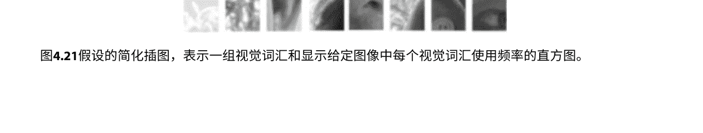

## 通过卷积滤波器掩模学习检测器

如图4.22所示，Richardson和Olson [114]开发了一种学习最优卷积滤波器的方法，作为兴趣点检测器，并应用于立体视觉测距。该方法使用DCT和HAAR基础特征的组合，使用随机权重形成一组候选的8×8像素基础函数，每个函数都与类似于二维条形码的AprilTags [509]的目标特征集进行测试。每个8×8像素的候选函数都与AprilTags进行度量，以找到每个标签的最佳卷积掩模，形成基础集。当然，也可以使用其他目标特征，如角点，作为地面真实数据来代替AprilTags。使用学习到的卷积掩模，特征检测的步骤如下：

- （1）在选择的像素处对每个掩模进行卷积，得到响应；（2）将卷积响应与阈值进行比较；（3）使用3×3的空间滤波窗口抑制非极值响应值。

作者报告称，随着特征计数的增加，准确性和性能都表现良好，性能达到了FAST检测器的水平，但在检测和非极大值抑制阶段具有更高的性能优势。

## 卷积神经网络，神经网络

卷积神经网络在第9章和第10章中进行了详细讨论，由Lecun [331]和其他人首创，是基于神经网络理论[352]实现机器学习算法的一种方法。卷积网络在学术界和工业界取得了巨大的成功[332]，用于图像分类和特征匹配。

卷积神经网络是建模神经网络的一种方法。卷积网络中的主要计算元素是许多优化的并行卷积，以及计算单元之间的快速本地内存。运行时分类性能可以非常快，特别是对于硬件优化的实现[510]。

如图4.23所示，在高层次上，建模每个神经元和神经网络的一种方法包括一组输入，应用于每个输入的一组加权因子，一个组合函数和一个输出。存在许多将神经模型映射到卷积网络的模型，我们建议读者参考专家，参见Lecun [331]。神经网络使用了几种模型，但这个主题超出了本工作的范围[352]；更多信息请参考NIPS社区研究。

神经网络是多层的，包含多个层和相互连接。如图4.23所示的假设神经网络中，每个神经功能都提供了一个偏置输入作为加权因子。一些神经网络配置使用单独的权重应用于每个单独的输入，因此加权因子充当卷积核系数。就卷积网络而言，神经网络范式可以映射到原始像素的局部补丁作为最低级别的特征输入。例如，补丁大小可以是1个像素或一个5×5像素的补丁，每个输入都有一个卷积加权因子。

有关神经网络的详细信息，请参阅第9章，包括历史背景和神经科学概念。有关使用神经网络的特征学习架构，请参阅第10章。

## 摘要

在本章中，我们调查了用于创建局部特征描述符和兴趣点检测器的背景概念和思想。这些关键概念和思想也被发展成了第5章中提出的视觉分类系统。本节介绍了距离函数以及有用的坐标系统。我们研究了局部描述符的形状和模式，重点介绍了局部二进制描述符（如ORB、FREAK和BRISK）来说明这些概念。

使用仅基于特征描述符数据的图像重建来说明特征描述符的区分能力。讨论了搜索策略，如尺度空间金字塔和多级搜索，以及其他方法，如网格限制搜索。介绍了计算机视觉系统模型，包括特征空间、对象模型、特征约束、统计设计特征和特征学习等概念。使用多种方法进行分类和训练，包括核机器、卷积网络和深度学习。提供了一些参考文献供有兴趣的读者深入研究。还提供了设计视觉系统的实用观察和考虑事项。

总结一下，本章提供了一些有用的背景概念，以便在阅读第6章的局部特征描述符调查时牢记在心，因为这里讨论的概念主要来自当前使用的局部描述符方法；然而，本章还提出了一些额外的观察和未来研究的方向。

# 第四章：学习任务

- 1. 讨论局部特征描述符与全局图像描述符或全局统计度量的区别，并提供局部特征描述符和全局特征描述符之间的一个例子比较。
- 2. 特征检测器等价地被称为局部兴趣点、锚点和地标。讨论特征检测器的用途，并概述它们的工作原理。
- 3. 讨论如何减少本地兴趣点集合（特征检测器），以及为什么减少对于有效的特征描述至关重要。
- 4. 讨论并比较使用特征检测器以寻找稀疏本地兴趣点的替代方法，例如在每个像素上计算密集特征描述符，或者在网格对齐的特征描述符。
- 5. 讨论为什么将合适的特征检测器和特征描述符组合在一起至关重要。
- 6. 讨论特征描述和特征提取之间的区别。
- 7. 讨论特征不变性标准，如尺度和旋转不变性，并至少列举五个其他的不变性标准。
- 8. 讨论为什么提前确定不变性标准对于选择给定应用程序的兴趣点和特征描述符方法至关重要，并描述一个示例应用程序并描述相关的不变性标准。
- 9. 讨论为什么兴趣点或特征检测器应该是独特且易于高度重复性地找到的。
- 10. 尽可能描述你记得的距离函数，至少包括欧氏距离、余弦距离和SSD差异。
- 11. 描述距离函数如何用于衡量特征描述符之间的对应关系以进行特征匹配。
- 12. 描述汉明距离的工作原理，以及为什么它是衡量局部二进制描述符之间对应关系的理想选择。
- 13. 讨论尺度空间、图像金字塔和特征描述符金字塔，并提供每个的示例应用。
- 14. 讨论特征描述符的形状，也称为补丁，并讨论每种形状的优缺点。
- 15. 讨论设计局部二进制描述符的动机和目标。
- 16. 使用其他光谱（如像素值或梯度值）将局部二进制描述符与其他特征描述符方法进行比较。
- 17. 讨论用于创建特征描述符的几个光谱的示例，如梯度、像素值和颜色信息。
- 18. 描述人类视觉系统如何使用扫视抖动。
- 19. 描述视网膜检测到的变量细节级别的形状，并描述应用变量细节级别到特征描述符设计。
- 20. 讨论确定局部二进制描述符中使用的像素采样模式的方法，包括LBP中使用的密集采样模式，以及FREAK和ORB中使用的稀疏点对像素模式，并讨论每种方法的动机和目标。
- 21. 讨论特征描述符中亚像素精度的应用，并列举已被证明具有亚像素精度的具体特征描述符方法。
- 22. 描述特征搜索方法，包括多尺度图像金字塔搜索、密集像素搜索、网格瓦片搜索和稀疏局部兴趣点搜索。
- 23. 描述图像分类和标记类别。
- 24. 描述在训练过程中如何使用特征聚类来选择代表性特征。
- 25. 高层次地描述K-MEANS和K-NN（K最近邻）聚类方法的工作原理以及它们的区别。
- 26. 描述Viola-Jones方法中ADA-BOOST方法的一般操作和目标。
- 27. 描述稀疏编码在特征分类中的目标。
- 28. 描述视觉词汇和词袋方法在特征分类中的应用。

> “因为安娜渴望秩序、丰富和平（她们指的是事物应该保持在她们设定的位置上）。”

——J. R. R. 托尔金，《指环王》

本章开发了一个通用的视觉度量标准分类，用于收集高级分析的摘要描述符属性。该分类包括一组用于特征描述和基准数据集的一般鲁棒性标准。本书所呈现和讨论的材料遵循并反映了这个分类。通过开发一个标准的分类词汇，旨在更一致地传达术语和技术，并更好地理解。

在第6章的特征描述方法调查中，使用分类法记录从业者的“行为”。

如图5.1所示，视觉度量分类法基于特征描述维度，使用三个轴——形状和模式、光谱和密度——旨在创建一个简单的框架用于分析和讨论。在没有标准的情况下，引入了一些新的术语和概念，例如特征描述符族。这些被分解为局部二进制描述符、光谱描述符、基空间描述符和多边形形状描述符的类别；这些描述符族也在第4章中进行了详细讨论。此外，分类法从文献中借用了一些有用的术语，包括对鲁棒性和不变性属性的几个术语。

为什么要创建一个保证模糊、包含多个变量且不能完美表达任何特征描述符属性的分类法？目的是提供一个描述用于特征描述的各种设计方法的框架。然而，分类法不打算用于比较描述符的好坏、性能或准确性。

图5.1中视觉度量分类法的三个轴是：

1.  形状和模式：从目标图像中提取像素的方式。
2.  密度：描述符所需的图像范围，区分局部、区域和全局描述符。
3.  光谱：用于度量的标量和向量量，以及算法和计算的摘要。

## 特征描述符家族

特征描述符和度量标准在几个思路上发展成为独立的家族。在许多情况下，不同家族的研究社区致力于解决不同的问题，几乎没有交叉交流或相互兴趣。例如，细胞生物学和医学应用通常对多边形形状描述符感兴趣，也被文献称为图像矩。涉及移动电话的时尚增强现实应用的人，如计算机视觉文献中所讨论的，可能更感兴趣的是局部二进制描述符。在某些情况下，特征检测器和特征描述符共享共同概念，这将在第6章中详细讨论；其中包括梯度和局部二进制模式的使用。

## 形状和模式

基于图5.1中所示的分类法，我们将特征分为以下几类：

- 局部二进制描述符。这些样本点对在局部区域内创建一个二进制编码的比特向量，每个比较使用1个比特，可用于汉明距离特征匹配。例如LBP、FREAK、ORB、BRISK、Census。
- 光谱描述符。这些描述符使用各种光谱值，例如梯度和区域平均值。对于这些特征，可以使用任意数量的光谱。在检测器中最常用的光谱之一是局部区域梯度，例如SIFT中的梯度。梯度还用于几个兴趣点和边缘检测器，例如Harris、Sobel。
- 基础空间描述符。这些方法将特征向量编码为一组基函数，例如正弦和余弦幅度和相位的傅里叶级数（我们宽泛地使用基础空间这个术语）。此外，还有现有的和新颖的基础特征，以稀疏码本和视觉词汇的形式被设计出来（我们宽泛地使用基础空间这个术语）。
- 多边形形状描述符。这些通过统计度量来衡量对象的形状，例如面积、周长和质心。通常，形状是使用形态学视觉流水线和区域算法提取的，这可能比用于特征检测器和特征描述符的局部算法更复杂（将在第8章中讨论）。图像矩[500]是文献中经常用来描述形状特征的术语。

## 计算机视觉分类法的先前工作

几篇研究论文比较和对比了稀疏局部特征的各个方面，该领域丰富地提供了关键点检测器[85, 298]和特征描述符[99, 137]的比较示例。

通常，新的特征描述方法和改进方法会与现有方法进行比较，利用多个鲁棒性和不变性标准。然而，缺乏正式的分类法工作来突出影响设计和比较的微妙细节。有关涵盖最先进计算机视觉方法的良好调查，请参阅Szelinski [316]。

值得注意的是，计算机视觉是一个庞大的领域。每年都会发表数千篇研究论文，同样有数千篇同样有趣的研究论文被会议出版商拒绝。以下是一些对特征度量和计算机视觉领域进行调查和组织的值得注意的作品。

- 仿射协变兴趣点检测器。Mikolajczyk等人[145]为仿射协变兴趣点检测器提供了良好的分类法。此外，Lindberg [142]广泛研究了尺度无关兴趣点方法的领域。然而，我们希望有一个更丰富的分类法，以涵盖特征描述符的设计原则，并且我们已经开发了一个基于具有共同设计特征的描述符方法家族的分类法。
- 计算机视觉注释文献。这个资源由USC提供并由Keith Price维护，详细介绍了计算机视觉的几个分支，以及一些领域内的重要研究和计算机视觉资源的链接。¹
- CVonline：计算机视觉的发展、分布、非专有、在线汇编。这提供了计算机视觉领域中的全面和详细的主题列表。该网站由Robert Fisher维护，并索引了关键的维基百科文章。这可能是目前最好的在线资源之一。²
- 局部不变特征检测器：一项调查。由Tinne Tuytelaars和Krystian Mikolajczyk [99]准备，该参考资料提供了对几种特征描述方法的良好概述，以及关于局部特征的文献、性能和准确性评估的讨论，方法类型（角点检测器、斑点检测器、特征检测器）和实现细节。

## 鲁棒性和准确性

计算机视觉的一个关键目标是鲁棒性，即在各种条件下能够识别特征的能力。鲁棒性可以分解为几个属性。例如，检测特征应该在关键应用的各种标准下具有鲁棒性，如尺度、旋转或光照。我们还可以使用不变性来描述鲁棒性。最终目标是在不变性标准下进行准确的定位、对应和鲁棒性。

然而，一些鲁棒性属性取决于特征描述符与其他变量的组合。例如，许多局部特征描述符方法根据选择的兴趣点方法计算位置和方向，因此描述符的准确性与兴趣点方法相关。距离函数和分类方法也是相互关联的，以确定最终的准确性。

注意，由于无法单独定义特征描述符的鲁棒性或准确性，因此可以将众所周知的检测器和描述符与各种分类器相结合，以获得所需的鲁棒性和准确性。

## 鲁棒性和准确性是以下因素的组合：

1.  关键点准确性，因为许多描述符依赖于关键点的位置和方向。
2.  描述符准确性，因为每种描述符方法都有所不同，并且可以进行调整。
3.  分类器和距离函数的准确性，因为糟糕的分类器和匹配阶段可能导致错误的结果。

因此，对于应用程序来说，挑战的一部分是逐个属性定义鲁棒性标准，然后定义所需的不变性的限制和范围。例如，从1×到100倍放大的尺度不变性可能不是必需的，也很难实现，但从1×到4倍放大的尺度不变性可能是所需的，并且更容易实现。

这里将几个鲁棒性属性发展成了一个鲁棒性分类。为了确定实际的鲁棒性，需要基于地面真实数据来检查算法并测量结果。第7章提供了关于地面真实数据选择和设计的背景知识。

### 一般鲁棒性分类

鲁棒性标准可以用属性来表达，并且可以通过对这些属性的不变性或鲁棒性进行测量来衡量。（有关每个鲁棒性标准属性的更多信息，请参见第7章，表7.1，以及创建地面真实数据集的考虑因素。）鲁棒性标准和属性分组如下：

- 照明
- 颜色
- 不完整性
- 分辨率和距离
- 几何失真
- 区分度和唯一性

每个鲁棒性标准组包含几个更细粒度的属性，如图5.2所示。

让我们来看看这些鲁棒性属性，以及一些实际考虑因素，用于设计和实现特征描述符和相应的基准数据，以解决这些属性。

### 照明

光是所有成像的源头，当设置给定应用的要求时，它应该是第一优先考虑的领域。照明有几个方面，与颜色和颜色空间分开考虑。在某些情况下，可以通过更改光源或添加或重新定位光源来纠正照明。在其他情况下，需要图像预处理来纠正照明，以准备图像进行进一步的分析和特征提取。

对照明的关注不可忽视；例如，参见图4.2，显示了预处理改变照明条件对特征提取中增加对比度的影响。
关键照明属性包括：

- 不均匀照明：图像包含暗区和亮区，有时会遮挡依赖于特定像素强度范围的特征。
- 亮度：光线过多或过少，影响特征检测和匹配。
- 对比度：强度带太窄、太宽或包含在多个带内。
- 暗角：光线分布不均匀，例如边缘周围较暗。

### 颜色标准

当使用颜色时，颜色的准确性至关重要。颜色管理和颜色空间在第2章中进行了讨论，但一些主要考虑因素包括：

- 颜色空间准确性：应使用哪种颜色空间——RGB、YIQ、HSV还是CIECAM02 Jch或Jab这样的感知准确的颜色空间？每种颜色空间都有准确性和实用性的考虑因素，例如将颜色转换到和从颜色空间的便捷程度。
- 颜色通道：由于相机通常提供RGB数据，从RGB数据中提取灰度强度通常很重要。有许多方法可以将RGB颜色转换为灰度强度，并且有许多可供选择的颜色空间。
- 颜色位深：当使用颜色信息时，必须足够准确以适应应用程序。例如，对于大多数应用程序来说，8位颜色可能足够，除非需要颜色辨别能力，因此可能需要使用每个通道10、12、14或16位的更高精度颜色。

此外，根据所使用的相机传感器，每个颜色通道的信号特性（如颜色敏感性和动态范围）会有所不同。对于要求颜色关键的应用程序，应该对相机传感器有充分的了解，并具有已知的校准方法。
在图像预处理过程中，可能需要对各个颜色进行补偿。（有关相机传感器的讨论，请参见第1章。）

### 不完整性

图像中的特征并不总是按照预期的方式或学习时的方式呈现。这些特征可能看起来是不完整的。不完整性的关键属性包括：

- 混乱：特征被周围图像特征遮挡，特征与周围像素混合在一起。
- 遮挡：特征部分隐藏；在许多情况下，应用程序会遇到被遮挡的特征或特征集。
- 异常值、接近度：有时只使用特定区域的特征，并且必须检测和忽略异常值特征。
- 噪声：可能来自雨水、糟糕的图像传感器和许多其他来源。噪声是一个持续的问题，如果能够理解，可以在预处理过程中使用各种滤波方法进行补偿。
- 运动模糊：如果能够测量和理解，可以在预处理过程中使用滤波进行补偿。
- 抖动：一种运动伪影，抖动可以纠正，但并非总是如此；这可能是一个难以满足的鲁棒性标准。

### 分辨率和准确性

对于计算机视觉来说，分辨率、尺度和距离的鲁棒性通常是一个挑战。当使用依赖于离散像素大小的特征度量时，像素区域的面积随距离变化而变化，这一点尤为真实。例如，仅依赖于像素邻域结构的特征度量无法很好地或轻松地进行缩放，如相关模板和大多数局部区域核方法。其他基于形状因子的描述符可能提供像素区域结构无法实现的鲁棒性。根据应用程序的不同，可能需要多种描述符方法来处理分辨率和尺度。

为了应对分辨率和距离鲁棒性的挑战，在实践中采用了各种方法，例如尺度空间图像金字塔集合和特征空间金字塔，其中包含了特征的多尺度表示。分辨率和距离鲁棒性的关键标准包括：

- 位置准确性或坐标位置：在尺度、旋转、噪声和其他标准下，度量标准需要提供多接近的坐标位置？需要像素准确性还是亚像素准确性？特征描述的区域准确性方法无法确定位置准确性；例如，使用HAAR-like特征和积分图像的方法可能受到最大的影响，因为在计算HAAR矩形时，矩形中的所有像素都被加在一起，丢失了各个像素位置的区分能力。像素精确的特征准确性也可能具有挑战性，因为随着特征的移动和旋转，它们会发生扭曲，并且像素采样产生的伪影会导致不确定性。
- 形状和厚度的扭曲：距离、分辨率和旋转结合起来扭曲了像素采样的形状，因此一个特征可能看起来比实际上更厚或更薄。扭曲是一种采样伪影。
- 焦平面或深度：根据距离的不同，每个像素所覆盖的像素区域大小会发生变化。在这种情况下，深度传感器在与RGB或其他传感器一起使用时可以提供一些帮助。
- 像素深度分辨率：例如，处理颜色通道以保留位精度可能需要使用浮点数或无符号短整型作为最小值。

### 几何失真

图像特征的几何失真可能是最常见的失真，因为随着相机移动和物体移动，几何失真会呈现多种形式。用于鲁棒性的几何属性包括以下内容：

- 尺度：视点距离，是一个常见的鲁棒性标准。
- 旋转：在许多应用中非常重要，例如工业检测。
- 几何变形：是活动识别和动态纹理分析领域的一个重要研究方向，如第4章和第6章所讨论的。

## 效率变量、成本和收益

我们认为效率与计算、内存和总不变属性有关。
特征描述符或特征度量有多高效？创建度量需要多少计算？存储度量需要多少内存？度量的准确性如何？提供多少鲁棒性和不变性与计算和内存成本相比？回答上述问题非常困难，取决于如何为应用程序实现整个视觉流水线，以及可用的计算资源。视觉度量分类法提供了追踪这些问题的信息，但是追踪错误的问题可能导致错误的答案。

- 反射：通过180度翻转图像。
- 径向畸变：深度感知中的一个关键问题，也是2D相机几何的一个关键问题，因为深度场不均匀或简单；参见第1章。
- 极坐标畸变：深度感知几何中的一个关键问题；参见第1章。

## 辨别和独特性

通过各种方法实现选择最佳的、有区别的特征。例如，局部特征检测方法根据诸如角点强度等标准仅滤除最有区别性或独特的候选点；然后在选定的兴趣点上计算描述符作为补丁或其他形状；最后根据独特性标准接受或拒绝生成的描述符。独特性也是在第4章中讨论的创建稀疏码本的关键标准。

辨别性可以通过仅使用描述符信息重新创建图像的能力来衡量，如第4章所讨论的。如果描述符信息过少以至于无法充分重新创建图像，则可以被视为弱或非区别性的。

## 一般视觉度量标准分类

为了理解特征度量标准，我们制定了一个由总结标准组成的视觉度量标准分类法。每个标准都是从实际的工程角度选择的，以提供算法、光谱、内存大小和其他属性等具体术语的评估和实施信息。视觉度量标准分类法的基本类别如表5.1所示，并在本章的不同部分中分别对每个列表项进行了讨论。

- 特征描述符家族
- 光谱维度
- 光谱值
- 兴趣点
- 存储格式
- 数据类型
- 描述符内存
- 特征形状
- 特征模式
- 特征密度
- 特征搜索方法

| 特征描述符家族 | 兴趣点 | 模式对采样 |
| --- | --- | --- |
| 局部二进制描述符 | 点、边或角 | 中心 - 边界对 |
| 光谱描述符 | 基于轮廓，周长 | 随机对点 |
| 基础空间描述符 | 其他 | 中央凹训练对 |
| 多边形形状描述符 | 无兴趣点 | 训练对 |
| **光谱维度** | **存储格式** | **对称对** |
| 单变量 | 光谱向量 | **模式区域大小** |
| 多变量 | 位向量 | 边界框（x大小，y大小） |
| **光谱值** | **多变量集合** | **距离函数** |
| 方向向量 | **数据类型** | 欧氏距离 |
| 传感器，加速度计数据 | 浮点数 | 平方欧氏距离 |
| 多几何 | 整数 | 余弦相似度 |
| 多尺度 | 定点数 | 相关距离 |
| 傅里叶幅度 | **描述符内存** | 曼哈顿距离 |
| 傅里叶相位 | 固定长度或可变长度 | 棋盘或切比雪夫距离 |
| 其他基函数 | 字节计数范围 | 地球移动距离 |
| 形态学形状度量 | **特征形状** | SAD L1范数 |
| 学习的二进制描述符 | 矩形块补丁 | SSD L2范数 |
| 字典、码本、词汇 | 对称多边形区域 | 马氏距离 |
| 区域直方图2D | 不规则分割区域 | 布雷-柯蒂斯差异 |
| 三维直方图 | 体积区域 | 堪培拉距离 |
| 对数极坐标区间 | 可变形 | L0范数 |
| 笛卡尔区间 | **特征搜索方法** | 汉明距离 |
| 区域总和 | 粗到细的图像金字塔 | 杰卡德相似度 |
| 区域平均值 | 尺度空间金字塔 | **运行时间计算** |
| 区域统计 | 金字塔尺度 | SIFT计算复杂度的百分比 |
| 二进制模式 | 密集滑动窗口 | **特征密度** |
| DoG（1位） | 密集网格块搜索 | 全局 |
| DoG（多位） | 窗口搜索 | 区域的 |
| 值的位向量 | 网格块搜索 | 稀疏 |
| 梯度幅值 | 稀疏的兴趣点 | **特征模式** |
| 梯度方向 | 稀疏的预测点 | 矩形核 |
| 3D表面法线 | 分割区域中的稀疏 | 二进制比较模式 |
| 线段度量 | 深度分割区域（Z） | DNET线样本带集合 |
| 灰度信息 | 超像素搜索 | 径向线采样模式 |
| 颜色空间信息 | 亚像素搜索 | 周长或轮廓边缘 |
|  | 双尺度 1级金字塔层级 | 样本加权模式 |

- 模式对采样
- 模式区域大小
- 距离函数
- 运行时计算

在分类法中使用的许多背景概念在第4章中进行了讨论，分析了常见特征的内部结构和目标。此外，该分类法在本章后面的特征度量评估（FME）信息表中有所说明。在第6章对特征描述符的调查中，使用分类法的一个小子集来记录摘要信息。 表5.1中的分类法是收集和总结信息的指南。

不记录或暗示对优劣或性能的评判。

## 特征描述符家族

正如本章开头所述，特征描述符在这个分类中被归类为如下所示：

- 局部二进制描述符
- 光谱描述符
- 基础空间描述符
- 多边形形状描述符

## 光谱维度

特征描述符中记录的光谱或值是多样的，可能包括一种或多种类型的信息或光谱。 我们将这些类别划分如下：

- 单变量：存储单个值，例如积分图像或区域平均值，或者只是一组简单的像素梯度。
- 多变量：存储多种光谱；例如，颜色信息、梯度幅值和方向以及其他值的组合。

## 光谱类型

特征描述符的光谱类型是这个分类中的一个主要维度，如图5.1所示。下面是一些常见的光谱，已经在第3章中讨论过，并且在第6章中也会讨论。

- 梯度幅值：用于衡量局部区域的纹理或差异，被广泛应用于基于补丁的特征描述符方法。众所周知[240]，人类视觉系统对梯度信息具有尺度和旋转不变性，这在视网膜上得到了证明，如SIFT和许多其他特征描述方法所示，因此梯度的使用是计算机视觉中首选的方法。
- 梯度方向：一些描述符方法计算梯度方向，而其他方法则不计算。一些特征描述符和边缘检测方法（包括Sobel和SIFT）使用简单的区域梯度方向方法来提供旋转不变性。
- 方向向量：一些描述符具有方向性，而其他描述符则没有。方向可以通过其他方法计算，而不仅仅是简单的梯度。例如，SURF使用一种采样多个梯度方向来计算整个补丁区域的主导梯度方向作为方向向量的方法。 在RIFF方法中，计算了一个径向相对方向。 在SIFT方法中，检测到的任何方向与主导方向相差80%的方向都会生成一个额外的兴趣点，因此同一个描述符可能允许多个仅在方向上有所不同的兴趣点。
- 传感器数据：将加速度计或GPS信息等数据添加到描述符中。 在GAFD方法中，使用从加速度计计算出的重力向量作为方向。
- 多几何：描述符数据的多个几何变换一起存储在描述符中，例如RFM2.3描述符中使用了相同数据的几个不同透视变换，以增加尺度、旋转和几何鲁棒性。
- 多尺度：不依赖于尺度空间金字塔，描述符存储了几个缩放表示的副本。 第4章中描述的多分辨率直方图方法是一种近似描述特征在一系列尺度上的方法，其中尺度是近似的。

使用一系列高斯模糊函数和它们的结果直方图作为多尺度描述符进行存储。

- 傅里叶幅度：傅里叶级数中的正弦和余弦基函数都可以用于描述符，例如在图6.29中所示的多边形形状族描述符中。正弦或余弦的幅度本身就是一个有意义的形状因子，不包含相位，如图6.6所示，它显示了通过傅里叶级数运行的LBP直方图产生的功率谱。 这说明了LBP直方图功率谱提供了旋转不变性。 与傅里叶级数相关的其他方法可能使用计算的替代排列，例如离散余弦变换（DCT），它仅使用余弦分量，并且常用于媒体应用的整数计算和硬件加速。
- 傅里叶相位：相位信息已被证明对于创建模糊不变特征描述符非常有价值，正如在第6章中讨论的LPQ方法所示。
- 其他基函数：可用于特征描述。 小波通常用于代替傅里叶方法，因为它对来自母小波的基函数的函数窗口和调谐具有更大的控制能力，形成了相关小波族。有关小波与其他基函数的讨论，请参见第2章。
- 形态学形状度量：主要用于多边形形状描述符家族中，由形状因子组成，并在一些文献中称为图像矩。 它们是通过计算多边形图像区域的总体特征（如面积、周长、质心等）得出的。用于多边形形状描述的视觉流水线和图像预处理可能包括形态学和纹理运算符，而不是局部兴趣点和描述符计算。
- 学习的二进制描述符：通过将真实数据通过训练步骤（例如ORB和FREAK中开发的方法）创建一组统计优化的二进制采样点对模式。
- 字典、码书、特征学习方法的词汇表：使用各种描述符方法（如简单图像相关补丁或SIFT描述符）构建一个视觉词汇表、码书或稀疏码书作为一组稀疏的唯一特征。 当作为一组稀疏集合时，它们代表了在应用领域中找到的一组地面真实数据的特征，例如汽车识别或人脸识别。
- 区域直方图2D：用于多种类型的信息，例如将梯度方向进行分组，如CARD、RFM2.3和SURF；或者将线性二进制模式进行分组，如LBP。SIFT方法使用一个相当大的直方图区域对梯度信息进行分组，这提供了一定的平移不变性，类似于人类视觉系统对视网膜上梯度的3D位置的处理[240]。
- 3D直方图：在SIFT等方法中使用，将梯度幅值和方向一起表示为一个3D直方图。
- 笛卡尔直方图：一种常见的将局部区域信息分组到描述符中的方法，仅基于像素在补丁中的笛卡尔位置，例如，对区域中每个点的像素强度大小进行直方图统计。
- 对数极坐标直方图：与笛卡尔矩形排列不同，一些描述符（如GLOH）使用对数极坐标系统来准备直方图分组的值，以增加描述符的旋转不变性。
- 区域求和：例如积分图像或HAAR特征，用于快速求和局部区域像素值的方法。 区域求和存储在表示区域中所有像素总值的特征中。 请注意，区域求和可能适用于对区域进行粗略特征描述，但求和过程会消除细节纹理信息。
- 区域平均值：区域中像素的平均值，也称为盒子滤波器，可以通过卷积操作、缩放积分图像或简单地将像素值相加来计算。
- 区域统计：例如区域矩、标准差、方差、最大值或最小值。
- 二进制模式：例如二进制值或位向量，例如存储在局部像素对比计算中作为局部二进制描述符系列（如LBP、Census和ORB）的结果。
- DoG（1位量化）：在FREAK描述符中使用的一组DoG或带通滤波器特征，以类似于人类视觉系统的视网膜采样模式中的局部二进制区域为基础，进行成对比较，并量化为直方图向量的单个位。
- DoG（多位量化）：一种使用多种变体实现的带通滤波器类型，其中对图像应用高斯模糊滤波器，然后从图像中减去（a）自身的平移副本，（b）另一个高斯模糊级别的副本，或者（c）另一个图像尺度的副本，如SIFT描述符方法中所示。
- 值的位向量：包含一个量化为单个位的值序列的位字符串，例如一个阈值。
- 3D表面法线：类似于2D梯度，但在3D中使用，在HON4D方法[190]中用于描述3D对象位置的表面。
- 线段度量：如CCH方法中所用，用于描述组成对象周长的线段。或者，用作对象的形状因子，其中以质心为起点并延伸到周长的一组径向线段的长度记录在描述符中，可以输入傅里叶变换以生成功率谱签名，如图6.29所示。
- 颜色空间信息：一些描述符不利用颜色信息，而在许多情况下，颜色信息可以提供额外的区分度和准确性。无论是使用简单的RGB通道，如RGB-D方法[67, 110]中的方式，还是将颜色空间转换为更准确的空间，都是非常宝贵的。例如，人脸识别在区分来自不同文化的人脸时存在问题，由于肤色在不同地区有所变化，可以测量颜色值并将其添加到描述符中。然而，有几个描述符利用颜色信息，例如S-LBP，在色度测量中操作，使用准确的颜色空间，如CIE-Lab，或者F-LBP，计算从中心像素到相邻像素的颜色距离的傅里叶频谱，以及SIFT的颜色变体和其他许多描述符。
- 灰度信息：灰度或颜色强度值是几乎所有描述符中的默认光谱。然而，用于从彩色创建灰度的方法以及用于准备强度进行分析和测量的图像预处理对于视觉流水线至关重要，并在第2章中进行了讨论。

## 兴趣点

在特征描述中，使用兴趣点是可选的。一些方法不使用兴趣点，而是在固定网格上对图像进行采样，而不是在每个像素上进行采样，例如使用HAAR-like特征的Viola-Jones方法。也可以简单地为每个像素创建一个特征描述符，而不仅仅是在兴趣点上，但由于性能影响很大，通常会首先使用兴趣点找到最佳位置。

在第6章中，对寻找兴趣点的几种方法进行了调查和讨论。用于分类的兴趣点类别包括：

- 点、边缘或角点：这些方法通常从定位局部区域的极大值和极小值开始；使用的方法包括梯度、局部曲率、Harris方法、斑点检测器和边缘检测器。
- 基于轮廓，周长：一些方法不从最大值和最小值开始特征描述，而是在图像中寻找结构，比如轮廓或周长，这主要适用于形态学基于形状的方法。
- 其他：确定兴趣点位置的其他可能性包括预测可能的兴趣点或特征位置，或者使用网格或瓦片区域。
- 无兴趣点：一些方法根本不使用任何兴趣点。

## 存储格式

存储格式是内存效率和工程实际系统以及设计数据结构的实际问题。 了解存储格式可以指导工程和优化工作，以支持各种编程结构、指令集和内存架构。

例如，CPU和GPGPU图形处理器通常提供专用硅片来支持各种存储格式组织，如散射和聚集操作，以及稀疏和密集数据结构支持。 了解GPGPU的能力可以为设计存储格式提供指导，如第8章所讨论的。存储格式摘要：

- 光谱向量：可以是一组直方图、一组颜色值或一组基向量。
- 位向量：局部二值模式使用位向量数据类型，一些编程语言包括位向量构造，一些指令集包括位向量处理指令。
- 多变量集合：一组统计矩或形状因子等数值。

## 数据类型

用于特征描述的数据类型对于准确性、内存使用和计算至关重要。然而，值得注意的是，在某些情况下，可以通过改变数据类型来权衡准确性。例如，将浮点数转换为定点数或整数计算可能更加内存高效，同时也更加功耗高效，因为浮点数硅芯片的ALU复杂度几乎占据了整个芯片的四倍空间，从而消耗更多的功耗。数据类型摘要包括：

- 浮点数：许多应用需要浮点数以获得准确性。例如，图像的傅里叶变换至少需要64位双精度（更大的图像需要更高的精度）；其他应用程序如目标跟踪可能需要32位浮点数进行精确的轨迹计算。
- 整数：像素值通常用8位值表示，每个像素常见的是16位因为图像传感器提供更好的数据。许多数据结构和数值结果（如积分图像）需要至少32位整数。
- 定点数：这是浮点数的一种替代表示，它可以节省数据空间并且可以在硅上更高效地实现。大多数现代GPU支持多种定点数格式，一些CPU也支持。定点数格式包括8位、16位和24位表示。根据应用程序，使用定点数可能足够接近精确度。除了定点数数据类型，GPU和一些处理器还提供各种归一化数据类型（请参阅制造商信息）。

## 描述符内存

总描述符内存大小是描述符效率的一部分，计算性能是另一个组成部分。具有大内存占用、少不变属性和大量计算的描述符是低效的。我们对内存大小感兴趣是出于实际考虑。与内存相关的关键属性包括：

- 固定长度或可变长度：一些描述符允许使用替代表示。
- 字节计数：描述符中所有数据的长度。

## 特征形状

像素采样模式使用一系列形状；第4章中调查了这些形状，包括以下方法：

- 矩形块补丁：简单的 x, y, dx, dy 范围。
- 对称多边形区域：可以是八边形，如CenSurE方法，也可以是圆形区域，如FREAK或DAISY。
- 不规则分割区域：例如使用形态学方法计算的分割区域或阈值周长。
- 体积区域：一些特征利用类似体积结构的图像堆栈。如图6.12所示，VLBP或Volume LBP和LBP-TOP利用体积数据结构。动态纹理方法和活动识别方法通常使用当前帧及其前两帧的三个相邻补丁集合，组织成一个时空图像帧历史，类似于一个体积。
- 可变形: 大多数特征使用刚性形状，如固定大小的矩形或圆形；然而，一些描述符是设计用于考虑变形的，例如尺度变形[337, 338]和仿射或单应性变形[212]，以实现更强大的匹配。

## 特征模式

特征模式在这个分类中是一个主要因素，如图5.1所示，因为它影响内存架构和计算效率。

特征形状和模式是相关的。形状指的是边界，模式指的是采样方法。模式包括：

- 矩形核: 一些方法使用核来定义区域中包含在样本中的元素；参见图5.3（左图）显示的不使用区域中的角像素的核；还可以参考图4.8。
- 二进制比较模式：例如FREAK，ORB和BRISK，其中一个区域中的特定像素成对形成一个复杂的采样模式。
- DNET线采样条集：沿着线段的点密集采样；参见图4.8。
- 径向线采样模式：从中心点起始的径向线段上的点密集采样；例如，用于计算多边形区域形状的傅里叶描述符；参见图6.29。
- 周长或轮廓边缘：对形状或区域边缘周围的点进行密集采样。
- 样本加权模式：如图6.17所示，SIFT在直方图柱中使用圆形加权模式，以减少远离补丁中心的点的贡献。D-NETS方法使用二进制加权对线条上的样本进行加权，偏向于远离端点的点，并忽略靠近端点的点。加权模式可以提供对噪声和遮挡的不变性。

请参阅第4章，了解有关补丁和形状部分的更多插图。

## 特征密度

如图5.1所示，特征密度是该分类法中的一个主要因素。在这个分类法中，用于描述符的图像部分的数量被称为特征密度。例如，某些描述符旨在使用较小的局部像素区域，锚定在兴趣点上，并忽略较大的图像。其他方法使用较大的区域。密度类别包括：

- 全局：覆盖整个图像，图像中的每个像素。
- 区域：覆盖相当大的图像区域，通常是在网格上或围绕分割的结构或区域，而不是锚定在兴趣点上。
- 稀疏：可以在兴趣点上进行，或者在选定点上的小区域进行，例如在BRIEF描述符中的随机点，如FREAK和ORB中的训练点，或者在RFM2.3描述符中的稀疏采样网格中。

## 特征搜索方法

在图像中搜索特征的方法对于特征描述符的设计非常重要。搜索方法对描述符的设计和视觉处理流程中所需的计算时间有很大影响。我们在这里列举了几种搜索变体，并在第4章中提供了更详细的描述和说明。请注意，特征描述符可以利用多个搜索准则。特征搜索相关信息总结如下：

- 粗到细的图像金字塔：或者多尺度搜索，使用原始图像的分辨率较低的金字塔副本。
- 尺度空间金字塔：尺度空间金字塔是常规粗到细图像金字塔的一种变体，其中对每个金字塔尺度图像进行高斯模糊函数计算[529]，以创建更均匀的搜索空间；参见图4.17。
- 金字塔尺度因子：捕捉金字塔尺度间隔，例如八度或其他尺度—例如，ORB使用一个~1.4 1×的尺度。
- 密集滑动窗口：在图像的每个像素上进行搜索，通常在以每个像素为中心的滑动矩形区域内进行。
- 网格块搜索：将图像分成固定的网格或瓦片，以加快搜索速度，但不如密集方法那样具有辨别能力。例如，参见图6.17描述的PHOG方法，该方法在整个图像上的不同网格分辨率上计算描述符。

## 模式对采样

对于局部二值模式来说，模式对采样设计是创新的关键领域之一。使用函数（中心像素 < 卷积核像素）进行点对比，使用比较区域阈值，然后比较结果形成二进制描述符向量。请注意，许多局部二值描述符方法在第4章中进行了讨论和说明，以说明点对采样配置和比较函数的变化。点对采样的视觉分类包括：

- 中心-边界对：例如LBP系列和Census变换。
- 随机对点：例如BRIEF和ORB中的半随机对。
- 中心视觉对：例如FREAK和Daisy。
- 训练对：许多方法使用地面真实数据训练点对以满足客观标准，例如FREAK和ORB。
- 对称对：例如BRISK，它为点对比提供了短线段和长线段的对称间距。

## 模式区域大小

局部模式区域的大小是一个关键的性能因素，尽管内存访问可能来自快速寄存器文件和缓存。例如，如果我们对一个3 × 3的模式区域进行卷积，每个卷积核有九个乘法运算，并且可能有一个汇总乘法运算来缩放结果，总共每个像素有十个乘法运算。对于每个乘法运算，我们需要两次内存读取，一次是像素值，一次是卷积核值；并且我们有十次内存写入，每个乘法运算一次。

一个640 × 480的图像有307,200个像素，假设每个像素只有8位灰度，每帧我们得到3,072,000次乘法运算，60,720,000次内存读取和307,200次结果写入。更大的卷积核尺寸和更大的图像尺寸当然会增加更多的计算量。有很多优化性能的方法，我们在第8章关于视觉流水线工程中进行了介绍。对于这个属性，我们感兴趣的是以下内容：

- 边界框（x大小，y大小）：例如，围绕矩形区域、圆形区域或多边形区域的边界框。

## 距离函数

计算模式匹配或对应是一个良好描述符的关键性能指标之一。特征匹配是准确性和性能之间的权衡，关键变量包括特征描述符向量的数值类型和大小、距离函数以及特征数据库中的模式数量和搜索优化。选择一个适合快速匹配的特征描述符是一个好目标。

一般来说，最快的距离函数是二进制家族和汉明距离，汉明距离在局部二进制描述符家族中使用。这里列举了一些常见的距离函数；详细信息请参见第4章。

- 欧几里得或笛卡尔距离家族
  - 欧氏距离
  - 平方欧氏距离
  - 余弦相似度
  - SAD L1范数
  - SSD L2范数
  - 相关距离
  - Hellinger距离
- 网格距离系列
  - 曼哈顿距离
  - 棋盘或切比雪夫距离
- 统计距离系列
  - 地球移动距离
  - 马氏距离
  - 布雷-柯蒂斯差异
  - 堪培拉距离
- 二进制或布尔距离系列
  - L0范数
  - 汉明距离
  - 杰卡德相似度

## 特征度量评估

本节讨论如何将视觉度量标准中的特征描述符信息总结为一个实用的特征度量评估框架（FME）。从工程和设计的角度来看，特征度量评估（FME）

### 注意：FME旨在捕捉本分析的高级信息的模板。

## 效率变量、成本和收益

效率可以用简单的方式来衡量特征描述符的计算成本和内存使用与所提供的准确性、区分度、鲁棒性和不变性之间的收益。该方法在时间、空间和功耗成本方面提供了多少价值？效率度量包括：

- 成本：计算、内存、时间、功耗
- 收益：提供的准确性、鲁棒性和不变性属性
- 效率：利益与成本

描述符中包含的数据的有效性是不同的 - 例如，一个占用大量内存但具有较少不变性的描述符是不高效的，而对于少量不变性和准确性而言，计算成本高也意味着低效率。我们可以说，一个高效的特征表示包含了最少的字节和最低的计算成本，同时提供最大的区分度、鲁棒性和准确性。对于许多鲁棒性属性来说，局部二进制描述符表现出最佳的效率。

## 图像重建效率度量

为了对特征描述符的效率进行视觉比较，我们还可以从特征描述符中重建图像，然后在计算和内存成本与重建质量之间进行视觉和统计分析。详细的特征描述符可以仅通过描述符数据提供原始图像的良好可视化和重建。例如，图4.12展示了HOG描述符如何使用32,780字节每个64 × 128区域捕捉定向梯度，图4.13展示了BRIEF和FREAK如何使用64字节每个描述符捕捉类似于拉普拉斯或其他边缘滤波器的边缘信息，图4.14展示了SIFT图像重建使用128字节每个描述符。

尽管我们在FME中没有包括图像重建效率，但这个主题在第4章中有讨论。

## 示例特征度量评估

以下是一些示例，展示了如何使用视觉度量标准和FME来收集摘要描述符信息。

### SIFT示例

我们以SIFT为例，因为SIFT被广泛认可并经过精心设计。

- 视觉度量分类法FME
  - 姓名： SIFT
  - 特征族： 光谱
  - 光谱维度： 多变量
  - 光谱： 梯度幅度和方向，DoG尺度空间极大值
  - 存储格式： 方向和位置，梯度方向直方图
  - 数据类型: 浮点数，整数
  - 描述符内存: 描述符直方图占用128字节
  - 特征形状: 矩形区域
  - 搜索方法: 2D和3D中的密集滑动窗口和3图像金字塔
  - 特征密度: 局部
  - 特征模式: 矩形和金字塔立方体
  - 模式对采样: -
  - 模式区域大小: 16 × 16
  - 距离函数: 欧氏距离
  - 一般鲁棒性属性 总计: 5 (尺度、光照、旋转、仿射变换、噪声)

### LBP示例

LBP是一个非常简单的特征检测器，有很多变种，用于纹理分析和特征描述。我们在这里使用最基本的3×3 LBP作为示例。

#### 视觉度量分类法FME

- 姓名: LBP
- 特征族: 局部二进制
- 光谱维度: 单变量光谱
- 光谱: 像素对与中心像素比较
- 存储格式: 二进制位向量
- 数据类型: 整数
- 描述符内存: 1字节
- 特征形状: 以中心像素为中心的正方形
- 搜索方法: 密集滑动窗口
- 特征密度: 局部
- 特征模式: 矩形核
- 模式对采样: 中心-边界对
- 模式区域大小: 3 × 3或更多
- 距离函数: 汉明距离
- 一般鲁棒性属性 总计: 3 (亮度、对比度、使用RILBP的旋转)

### 形状因子示例

这个例子使用二值化的多边形区域。对于这个假设的例子，预处理步骤从自适应二值化和形态学形状定义操作开始，测量步骤从像素邻域的周长跟随到定义的周边边缘，然后从周边点计算质心，然后确定从质心到周边的36个径向线段。然后，分析每个线段以找到包括主/次轴和傅里叶形状因子。

描述符。这些测量假设正在测量单个二进制对象，并且现实世界图像可能包含多个对象。

我们还假设内存占用如下：绕360度采样的角度样本，从质心开始，每隔10度增加一个样本，36个角度样本的FFT频谱幅度为36个浮点数，线段长度数组为36个整数，主/次轴方向和长度为4个整数，边界框为4个整数（x, y, dx, dy），周长长度为1个整数，质心坐标为2个整数，总共36 * 4 + 36 * 2 + 4 * 2 + 4 * 2 + 1 * 2 * 2 * 2 =238，假设使用2字节短整数和4字节浮点数。

#### 视觉度量分类法FME

- 姓名: 形状因子
- 特征族: 多边形形状
- 光谱维度: 多变量
- 光谱: 周长跟随、面积、周长、质心、其他图像矩
- 存储格式: 复杂数据结构
- 数据类型: 浮点数，整数
- 描述符内存: 变量，可能有几百个字节
- 特征形状: 多边形形状，矩形边界框区域
- 搜索方法: 密集的，递归的
- 特征密度: 区域的
- 特征模式: 周长轮廓或边缘
- 模式对采样: -
- 模式区域大小: 整个图像
- 距离函数: 多种方法，多个比较

#### 一般鲁棒性属性

- 总计: 8个或更多（尺度、旋转、遮挡、形状、仿射、反射、噪声、光照）

## 摘要

本章提出了一个分类法，如图5.1所示，用于描述特征描述的维度，如形状、模式和光谱。该分类法用于将特征描述方法的家族划分为多边形形状描述符、局部二进制描述符和基础空间描述符。本书中使用了这个分类法。此外，还提出了一个通用的视觉度量分类法，用于总结高级特征描述符设计属性，如光谱类型、描述符像素区域大小、距离函数和搜索方法。此外，还开发了一个通用的鲁棒性分类法，用于根据不变性和鲁棒性准则属性来量化特征描述符的好坏，包括光照、尺度、旋转和透视。由于特征描述符方法仅设计用于解决部分不变性和鲁棒性属性，因此在评估给定应用程序的特征描述符时，应将每个属性单独考虑。此外，鲁棒性属性可以应用于地面真实数据集的设计，如第7章所讨论的。最后，将视觉度量分类法和鲁棒性分类法结合起来，形成一个特征度量评估（FME）表，以摘要形式记录特征描述符属性。使用FME的简单子集来回顾问在第6章中调查的几种特征描述符方法的属性。

# 第五章：学习任务

1. 描述以下特征描述符族之间的区别：
   - 局部二进制描述符
   - 使用梯度和其他标量值的光谱描述符
   - 基础空间描述符
   - 多边形形状描述符

2. 以高层次描述在每个以下鲁棒性和不变性类别下图像中可能出现的问题类型：
   - 光照变化
   - 颜色变化
   - 特征不完整
   - 分辨率和距离变化
   - 几何失真
   - 区分度和唯一性

3. 描述一些示例特征描述符区域形状，并讨论设计形状时涉及的权衡。

4. 描述光照问题及其来源。

5. 描述几何失真及其来源。

6. 描述不同的光谱，如梯度和颜色，可以用于特征描述符，并描述每个光谱的应用。

7. 描述金字塔搜索与滑动窗口搜索的区别。

> “这些都是谁做的？”

——杰克·斯帕洛，加勒比海盗

计算机视觉的许多算法依赖于在每个图像中定位兴趣点或关键点，并从兴趣点周围的像素区域计算特征描述。这与诸如相关性的方法形成对比，在相关性方法中，一个较大的矩形模式在图像上以像素间隔步进，并在每个位置测量相关性。兴趣点是锚点，并且通常为描述符提供尺度、旋转和光照不变性属性；描述符添加更多细节和更多不变性属性。兴趣点和描述符的组合共同描述实际对象。

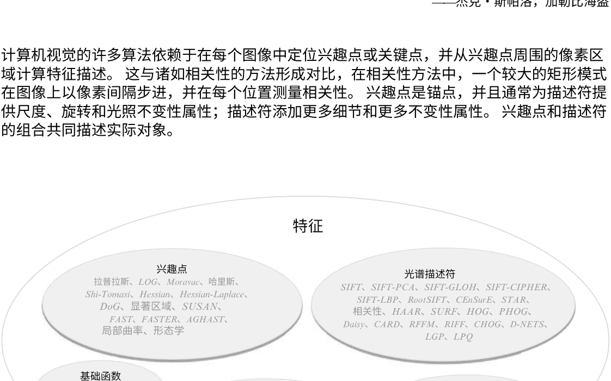

然而，特征描述中存在许多方法和变体。一些方法使用不以兴趣点为锚点的特征，例如在图像中较大的分段多边形结构或区域上计算的多边形形状描述符。其他方法仅使用兴趣点，而不使用特征描述符。而一些方法仅使用特征描述符，在图像上的正则网格上计算，没有任何兴趣点。

术语在文献中有所不同。在一些讨论中，兴趣点可能被称为关键点。用于寻找兴趣点的算法可能被称为检测器，而

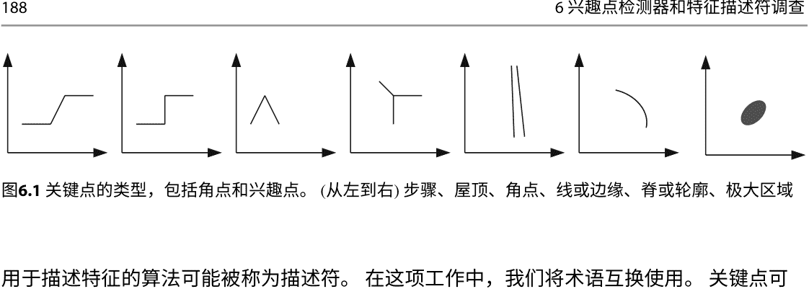

用于描述特征的算法可能被称为描述符。在这项工作中，我们将术语互换使用。关键点可以被认为是由以下组成的集合：(1)兴趣点，(2)角点，(3)边缘或轮廓，以及(4)更大的特征或区域，例如斑点；参见图6.1。本章概述了设计局部兴趣点检测器和特征描述符的各种方法。

## 兴趣点调整

对于给定的应用程序，什么样的关键点是好的？哪些是最有用的？哪些应该被忽略？调整检测器并不简单。每个检测器都有不同的参数，需要调整以获得在给定图像上的最佳结果，而每个图像在光照、对比度和图像预处理方面都面临不同的挑战。此外，每个检测器都设计用于不同类别的兴趣点，并且必须相应地进行调整，以将结果过滤为一组对于特定特征描述符而言有用的良好候选集。每个特征检测器与某些描述符最搭配，详见附录A。

因此，关键点进一步被过滤，以便对所选择的特征描述符有用。在某些情况下，即使关键点得分高且响应强烈，该关键点也不适合生成有用的特征描述符。如果在关键点处计算的特征描述符得分过低，例如，关键点和相应的描述符都应该被拒绝。OpenCV提供了几种新颖的方法来处理检测器，使用户可以在一个共同的框架中尝试不同的检测器和描述符，并自动调整参数进行调优和筛选，具体如下：

- **DynamicAdaptedFeatureDetector.** 这个类将使用adjusterAdapter()来调整支持的检测器，只保留有限数量的特征，并在检测器参数上进行多次迭代和重新检测特征，以寻找最佳参数，只保留所需数量的最佳特征。几个OpenCV检测器提供了adjusterAdapter()，有些则没有；API允许创建调整器。

- **AdjusterAdapter.** 该类实现了筛选和保留兴趣点的标准。标准可能包括KNN最近邻匹配、检测器响应或强度、到最近其他检测点的半径距离、局部区域内的关键点数量以及其他用于筛选无法计算出良好描述符的关键点的度量。

- **PyramidAdaptedFeatureDetector.** 该类可用于适应不使用尺度空间金字塔的检测器，适配器将创建一个高斯金字塔并在金字塔上检测特征。

- **GridAdaptedFeatureDetector.** 该类将图像分割成网格，并适应检测器以在每个网格单元中找到最佳特征。

## 兴趣点概念

兴趣点可以由各种类型的角点、边缘和极值形状组成，如图6.1所示。一般来说，一个好的兴趣点必须易于找到，并且最好计算速度快；希望兴趣点位于一个好的位置以计算特征描述符。因此，兴趣点是描述特征的限定符或关键点。

目前使用的兴趣点方法背后有各种概念，因为这是一个活跃的研究领域。Mikolajczyk等人在[145]中对兴趣点检测器进行了最好的分析，提供了一个用于仿射协变兴趣点检测器的比较框架和分类法，其中covariant指的是兴趣区域的椭圆形状，这是一种仿射可变形表示。尺度不变检测器在一个圆形区域内表示得很好。极值区域和斑点检测器可以采用不规则形状。请参阅附录A中几个检测器对合成兴趣点和角点字母表的响应。

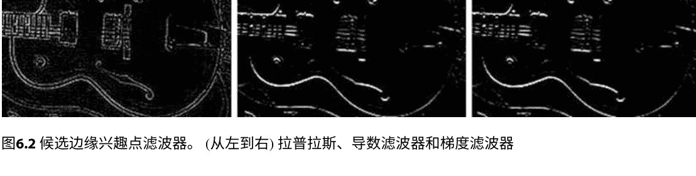

通常，检测器使用极大值和极小值点，如梯度峰值和角点；然而，边缘、脊线和轮廓也可以用作关键点，如图6.2所示。对于所有应用程序来说，没有一种优越的兴趣点检测方法。Tuytelaars和Van Gool [511]提供了一个简单的分类法，列出了基于边缘的区域方法（EBR）、基于极大值或强度的区域方法（IBR）以及用于寻找基于形状的区域（SBR）的分割方法，这些区域可能是斑点或具有高熵的特征。

角点通常优于边缘或孤立的极大值点，因为角点是一种结构，可以用来计算特征的角度方向。兴趣点可以计算彩色分量和灰度亮度。许多兴趣点方法首先在图像上应用高斯滤波器，然后执行梯度运算符。首先使用高斯滤波器的想法是为了减少图像中的噪声，否则会被梯度运算符放大。

每个检测器都能以不同程度的不变性定位特征，例如旋转、尺度、透视、遮挡和光照。要评估兴趣点检测方法在各种鲁棒性和不变性标准下的质量和性能，可以参考Mikolajczyk和Schmidt [136]以及Gauglitz等人[137]的标准化数据集。兴趣点检测的一个关键挑战是尺度不变性，因为在某些情况下，兴趣点在尺度上发生了巨大变化。Lindberg [204]对尺度无关兴趣点方法进行了广泛研究。

Mikolajcyk和Schmid [99, 133, 136, 145, 298, 303]对仿射不变兴趣点进行了详细研究。此外，Mikolajcyk和Schmid [501]开发了Harris检测器的仿射不变版本。如[523]所示，将多个兴趣点检测方法组合成混合方法通常是有用的，例如使用Harris或Hessian来定位合适的极大区域。

然后使用拉普拉斯选择最佳的尺度属性。变化很常见，基于哈里斯和海森的检测器可能使用尺度空间方法，而局部二进制检测器方法则不使用尺度空间。

许多兴趣点方法背后的一些基本概念来自线性代数领域，其中像素的局部区域被视为矩阵。（参考一本好的线性代数教材作为本节的背景。）其他数学分析领域也提供了一些概念。下面展示了一些用于定位兴趣点的关键数学，但请注意，在实践中使用各种形式的方程和算法，与这里显示的有所偏离，请参考文献了解更多细节。

- 矩阵。我们从一个二维矩形像素区域或矩阵开始，其维度为x，y：
- 梯度幅度。这是局部兴趣区域中像素的一阶导数，并假设一个方向。这是一个无符号的正数，也是一个拉普拉斯算子。
- 梯度方向。这是局部区域中像素的最大梯度角度的角度或方向，范围为+π到-π。
- 拉普拉斯算子。这是二阶导数，可以使用三个项之一进行选择性计算：
  - 然而，拉普拉斯算子不使用上述第三种形式，而是仅使用x和y的偏导数计算平均方向的有符号值，请参见上面的梯度幅值算子。
- Hessian矩阵或Hessian。一个包含矩阵区域内每个像素的二阶偏导数的方阵，描述每个像素的曲率。Hessian具有几个有趣的属性，对于本节讨论的兴趣点检测方法非常有用，我们可以用L表示如下：
- 最大Hessian。这是基于二阶导数的，与拉普拉斯算子类似，但Hessian使用二阶导数的所有三个项来计算二阶导数沿最大方向的有符号值。

```
M_{x,y} = \begin{bmatrix} 0, 0 & \dots & x, 0 \ \dots & \dots & \dots \ 0, y & \dots & x, y \end{bmatrix}
```

```
\left( \frac{\partial M_{x,y}}{\partial x} \right)^2 + \left( \frac{\partial M_{x,y}}{\partial y} \right)^2
```

```
tan^{-1} \left( \left( \frac{\partial M_{x,y}}{\partial x} \right)^2 \bigg/ \left( \frac{\partial M_{x,y}}{\partial y} \right)^2 \right)
```

```
\frac{\partial^2 f M_{x,y}}{\partial x^2}
\frac{\partial^2 M_{x,y}}{\partial y^2}
\frac{\partial^2 M_{x,y}}{\partial x \partial x}
```

```
H(x, \sigma) = \begin{pmatrix} L_{xx}(x, \sigma) & L_{xy}(x, \sigma) \ L_{xy}(x, \sigma) & L_{yy}(x, \sigma) \end{pmatrix}
```

- 最小的Hessian。这是基于二阶导数计算的有符号数，作为最大和最小Hessian之间的比率，可能是一个有用的度量标准。

- Hessian的方向，最大和最小值。这是在范围+π到-π内最大二阶导数的方向，它是一个有符号值，并且对应于一个没有方向的方向。最小的方向可以通过从最大值中加上或减去π/2来计算。

- Hessian的行列式，Hessian的迹，高斯拉普拉斯。这三个名称用于描述矩阵的迹特征，可以通过值的绝对值揭示几何尺度信息，并通过值的符号揭示方向。参见SURF [166]的应用，我们可以用L表示如下。

```
迹 H范数L = tγ∇²L = (tγ Lxx + )Lyy
det HnormL = t2γ (Lxx Lyy - L²xy)
```

- 特征值、特征向量、特征空间。特征属性对于理解局部像素区域矩阵中的向量方向非常重要。当矩阵作用于向量时，如果向量的方向保持不变，只是符号或方向被简单地反转，那么该向量被认为是特征向量，矩阵因子被认为是特征值。因此，特征空间是具有相同特征值的所有特征向量所在的空间。特征属性对于兴趣点检测、方向和特征检测非常有价值。例如，Turk和Petland [150]使用通过主成分分析（PCA）将特征向量缩减为较小的向量集合进行人脸识别，他们称之为Eigenfaces方法。

## 兴趣点方法调查

现在我们将简要介绍一些常见兴趣点检测方法的算法和计算方法，包括：

- 高斯拉普拉斯算子（LOG）
- Moravac角点检测器
- Harris和Stephens角点检测
- Shi和Tomasi角点检测器（对Harris方法的改进）
- 高斯差分（DoG；LOG的近似）
- Harris方法，Harris–Hessian–Laplace，Harris/Hessian Affine
- Hessian矩阵行列式（DoH）
- 显著区域
- SUSAN
- FAST, FASTER, AGAST
- 局部曲率
- 形态学兴趣点
- MSER（在多边形形状描述符部分讨论）
- *注意：许多特征描述符（如SIFT、SURF、BRISK等）都提供了自己的检测器方法和描述符方法，请参见附录A。

### 拉普拉斯和高斯拉普拉斯

在图像处理中，拉普拉斯算子是一种找到像素区域导数或最大变化率的方法。通常，拉普拉斯算子使用标准卷积核来近似，这些卷积核的和为零，例如：

$$L1 = \begin{pmatrix} -1 & -1 & -1 \\ -1 & 8 & -1 \\ -1 & -1 & -1 \end{pmatrix}$$

$$L2 = \begin{pmatrix} -1 & 0 & -1 \\ 0 & 4 & 0 \\ -1 & 0 & -1 \end{pmatrix}$$

高斯拉普拉斯（LOG）是在使用高斯平滑核处理区域后执行的拉普拉斯运算，以聚焦边缘能量；参见Gun [147]。

### Moravec角点检测器

Moravec角点检测算法是一种早期的角点检测方法，通过相关性分析每个像素周围重叠的图像块来测试图像中的每个像素。在任何方向上的相关性强度揭示了有关该点的信息：当所有方向都发生变化时，找到一个角点；当沿着边缘方向没有变化时，找到一个边缘。平坦区域在任何方向上都没有变化。通过计算两个重叠图像块之间的SSD来计算相关性差异。相似性通过SSD中接近零的差异来衡量。这种方法计算密集；参见Moravec [322]。

### Harris方法，Harris-Stephens，Shi-Tomasi和Hessian类型检测器

Harris或Harris-Stephens角点检测器家族[148, 357]相对于Moravec方法提供了改进。Harris方法的目标是通过使用局部方向导数的协方差矩阵来找到特征方向的最快和最低变化的方向。将方向导数值与评分因子进行比较，以识别哪些特征是角点，哪些是边缘，哪些可能是噪声。根据算法的制定方式，Harris方法可以提供高旋转不变性，有限的强度不变性，并且在某些算法的制定方式中，提供了尺度不变性，例如使用尺度空间的Harris-Laplace方法[204, 501]。许多Harris家族算法可以以计算效率高的方式实现。

> 请注意，角点的梯度是不明确的，因为两个边缘在角点处汇合，但在角点附近，梯度可以根据$x$和$y$的两个不同值进行检测，这是Harris角点检测器背后的基本思想。

Harris方法的变种包括：

- Shi、Tomasi和Kanade角点检测器[149]是对Harris方法的优化，仅使用最小特征值进行区分，从而大大简化了计算过程。
- Hessian (Hessian affine) 角点检测器[145]被设计为仿射不变，并且它使用基本的Harris角点检测方法，在金字塔中结合了多个尺度的兴趣点，并采用一些迭代选择标准和Hessian矩阵。
- 基本的Harris算子还存在许多其他变种，例如Harris-Hessian-Laplace[323]，它使用尺度选择方法提供了改进的尺度不变性，以及Harris/Hessian仿射方法[145, 298]。

## ## Hessian矩阵检测器和Hessian-Laplace

Hessian矩阵方法，也称为Hessian行列式（DoH）方法，用于流行的SURF算法[152]。 它从多尺度图像集中检测出感兴趣的对象，其中Hessian矩阵的行列式达到最大值，并且使用高斯的二阶偏导数的卷积来计算Hessian矩阵算子以得到梯度的最大值。

DoH方法使用积分图像来快速计算高斯偏导数。
计算Hessian矩阵的性能非常好，准确性也比许多方法更好。 相关的Hessian-Laplace方法[298, 323]也是基于局部极值进行操作，使用多个尺度上的Hessian行列式进行空间定位，使用多个尺度上的Laplacian进行尺度定位。

## ## 高斯差分

高斯差分（DoG）是高斯拉普拉斯的近似，但是通过使用两个平滑或高斯滤波后的图像的差异来检测局部极值特征，计算更简单更快。 高斯平滑的思想是去除在给定尺度上不相关的噪声，否则会被放大并导致错误的DoG特征。

DoG特征在流行的SIFT方法[153]中使用，如图6.15所示，采用简单的高斯差分滤波图像来识别极大值区域。

## ## 显著区域

显著区域[154, 155]基于这样一个概念，即在一系列尺度上的兴趣点应该表现出与周围区域“不可预测”或“令人惊讶”的局部属性或熵。 该方法的步骤如下：

1. 计算像素属性（如强度或颜色）的香农熵 $E$ 在一个尺度空间上，其中香农熵用于衡量不可预测性。
2. 在尺度空间上找到熵值的最大值或峰值 $M$。在这个阶段，还确定了最佳尺度。
3. 在每个尺度的每个峰值处计算幅度增量的概率密度函数（PDF），其中使用从峰值处取得的像素值的直方图计算PDF，该直方图来自所需半径的圆形窗口。
4. 显著性是每个峰值处 $E$ 和 $M$ 的乘积，也与尺度相关。 因此，最终的检测器在尺度上是显著且稳健的。

### SUSAN和Trajkovic和Hedly

SUSAN方法[156, 157]依赖于基于局部区域的相似亮度分割图像特征，从而产生一个双峰值特征。不使用噪声滤波和梯度。如图6.3所示，该方法通过使用中心核心像素值作为比较参考，与给定半径区域内的邻居像素进行比较，得到一组亮度相似的像素，称为单值段吸收核心(USAN)。

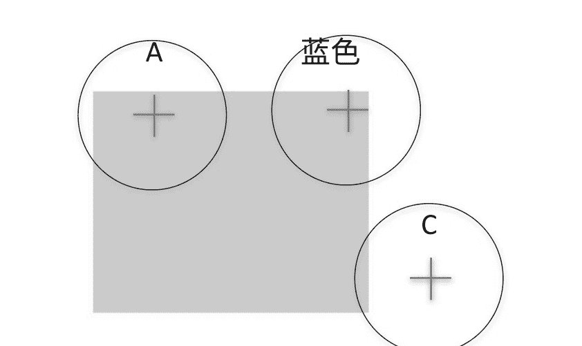

图6.3 SUSAN方法计算兴趣点。图像的暗区域是一个矩形，与USANs A、B和C相交。USAN A将被标记为边缘，USAN B将被标记为角点，USAN C将被标记为既不是边缘也不是角点。

每个USAN包含有关局部区域图像的结构信息，可以计算每个USAN的大小、质心和二阶矩。SUSAN方法可用于边缘和角点检测。角点是通过圆形区域中与中心像素相似的像素比例确定的：低于25%的比例表示角点，高于50%的比例表示边缘。SUSAN对噪声非常稳健。

Trajkovic和Hedly方法[206]与SUSAN相似，并区分USAN区域中的点、边缘点和角点。

SUSAN也可用于噪声抑制，而双边滤波器[294]与SUSAN密切相关。SUSAN使用相当大的圆形窗口；几个实现使用37像素半径的窗口。FAST [130]检测器也类似于SUSAN，但使用较小的7×7或9×9窗口，并且只使用区域中的一部分像素而不是全部像素；FAST生成局部二进制描述符。

### 快速，更快，惊讶

FAST方法[130]是根据SUSAN推导出的，目标是进行双峰分割。然而，FAST依赖于圆形模式中的一组相连像素来确定角点。常见的连接区域大小为9或10，总共有16个可能的像素；可以选择任意一个数字，称为FAST9和FAST10。FAST计算效率高，匹配速度快；准确性也相当好。FAST可以被认为是局部二进制模式LBP的一种相关方法。FAST不是一个尺度空间检测器，因此在给定尺度上可能产生比尺度空间方法（如SIFT中使用的方法）更多的边缘检测结果。

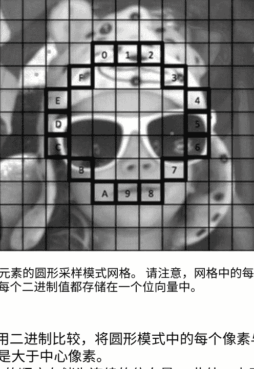

图6.4 FAST检测器，带有16个元素的圆形采样模式网格。 请注意，网格中的每个像素都与中心像素进行比较，以产生一个二进制值，并且每个二进制值都存储在一个位向量中。

如图6.4所示，FAST使用二进制比较，将圆形模式中的每个像素与中心像素进行比较，使用阈值确定像素是小于还是大于中心像素。
生成的描述符按照从0到15的顺序存储为连续的位向量。 此外，由于像素比较模式的圆形特性，可以对FAST进行改进，并将位向量存储为旋转不变表示，如本章后面讨论的RILBP描述符所示；参见图6.11。

### 局部曲率方法

局部曲率方法[200-204]是最早用于检测角点的方法之一，一些局部曲率方法是第一个被认为在尺度变化下可靠和准确追踪角点的方法[202]。 局部曲率检测梯度幅值和局部曲率都较高的点。一种方法是差分法，通过在尺度空间中计算梯度幅值和等值曲率的乘积，然后选择尺度和空间中的最大和最小绝对值。 该方法的一个公式如下所示。

$$ \tilde{\alpha} (x, y; t) = L_x^2 L_{yy} + L_y^2 L_{xx} - 2 L_x L_y L_{xy} $$

根据曲率方程的不同形式，可以采用不同的基本算法公式。 为了提高尺度不变性和噪声敏感性，可以使用规范化的公式在尺度空间上进行修改，如下所示：

$$ \tilde{\alpha}_{norm} (x, y; t) = t^{2\gamma} \cdot (L_x^2 L_{yy} + L_y^2 L_{xx} - 2 L_x L_y L_{xy}) $$

其中

$$ \gamma = 0.875 $$

## ## 形态学感兴趣区域

兴趣点可以通过形态学操作的流水线确定，例如阈值化，然后通过腐蚀和膨胀的组合来平滑、细化、增长和收缩像素组。 如果对于给定的应用程序正确执行，这些形态学特征可以具有尺度和旋转不变性。 请注意，仅仅使用简单的形态学操作是不够的；例如，未加约束的腐蚀将使区域收缩直到消失。 因此，必须向形态学流水线中添加智能以控制最终的区域大小和形状。 对于多边形形状描述符，形态学兴趣点定义了特征，并且在特征上计算各种图像矩，如第3章和本章稍后的多边形形状描述符部分所述。

形态学操作可以用于在二进制、灰度或彩色通道图像上创建感兴趣的区域。 为了准备灰度或彩色通道图像进行形态学处理，通常会使用某种预处理方法，如像素重映射、LUT变换或直方图均衡化。（这些方法在第2章中讨论过。） 对于二值图像和二值形态学方法，二值阈值化是一个关键的预处理步骤。 已经设计了许多二值阈值化方法，从简单的全局阈值到基于统计和结构核的局部方法。

请注意，形态学感兴趣区域方法与后面在多边形形状描述符部分讨论的最大稳定极值区域（MSER）特征描述符方法类似，因为两种方法都寻找像素最大值或最小值的连接组。 然而，MSER不使用形态学运算符。

图6.5显示了一些形态学和相关操作序列用于感兴趣区域检测的示例，还可以设计出更多的方法。

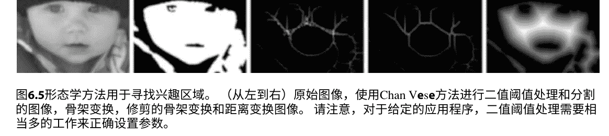

## ## 特征描述符调查

本节提供了对几种代表性特征描述符方法的调查和观察，没有直接比较这些描述符之间的意图。 有关比较特征描述符的分析方法的更详细信息，请参阅Lempitsky [844]和Huang [889]。 在实践中，特征描述符方法经常被修改和定制，通常多个描述符一起作为多元描述符使用，以增加置信度，参见Varma [770]、Vedaldi [887]和Gehler [792]。

有关多元描述符的更多详细信息以及将加权描述符应用于分类器（即多级分类器）的方法，请参阅[770]，Vedaldi [887]和Gehler [792]。本调查的目标是从每个特征描述符家族中检查一系列特征描述符方法，这些方法在第5章的分类法中进行了介绍：

- 本地二进制描述符
- 光谱描述符
- 基础空间描述符
- 多边形形状描述符
- 3D、4D和体积描述符

对于关键特征描述符方法，我们在这里提供了一个摘要分析：

- 一般视觉分类和FME：包括光谱、形状和模式等特征属性，单变量或多变量，计算复杂度准则，数据类型，内存准则，匹配方法，鲁棒性属性和准确性。
- 一般鲁棒性属性：包括光照、尺度、透视等不变性属性和其他属性。

这里没有直接比较特征描述符，但提供了大量参考文献，详细比较和性能信息可在每种方法上找到。请参阅表8.2，了解本调查中各种特征描述符方法的内存占用情况，这对性能分析很有用。

## 局部二进制描述符

这个描述符系列将特征表示为二进制位向量。为了计算这些特征，图像像素点对进行比较，并将结果存储为二进制值向量。本地二进制描述符的计算效率高，存储效率高，并且使用汉明距离进行匹配效率高。一般来说，与其他方法相比，局部二值模式方法具有非常好的准确性和鲁棒性。

在局部二进制描述符中，使用了各种局部采样模式来设置成对点的比较；有关局部二值采样模式的讨论，请参见第4章中的一节。我们从分析局部二值模式（LBP）及其一些变体开始，因为LBP本身就是一个强大的度量标准，并且被广泛认可。

### 局部二值模式

局部二值模式（LBP）是由Ojala等人于1994年开发的一种新颖的编码模式和对比度的方法，用于定义纹理。LBP可以作为图像处理运算符。LBP使用一组直方图来创建描述符或纹理模型，这些直方图描述了每个像素周围的局部纹理。在这种情况下，局部纹理是特征描述符。LBP度量标准简单而强大；参见图6.6。我们详细介绍了LBPs的一些细节，因为作为特征描述符，这个强大的纹理度量标准有很多应用。此外，数百名研究人员在LBP文献[165]中增加了理论基础、2D和3D的泛化，将其应用于人脸检测的描述符，以及应用于时空应用如运动分析。LBP研究目前仍然非常活跃。

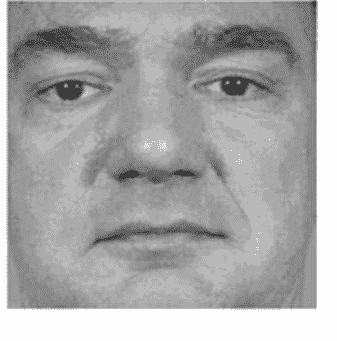

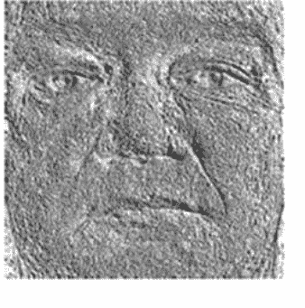

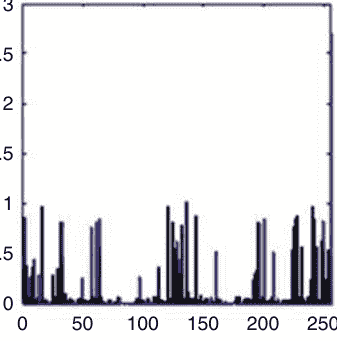

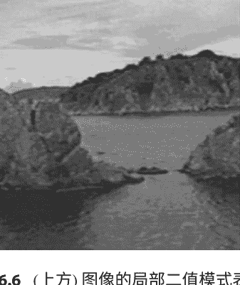

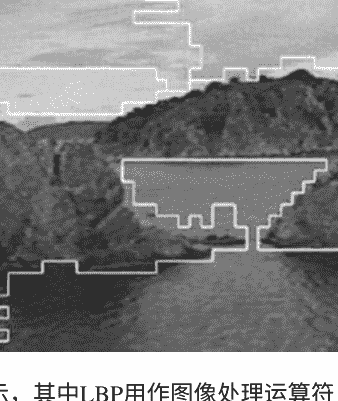

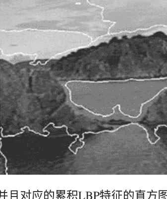

图6.6（上方）图像的局部二值模式表示，其中LBP用作图像处理运算符，并且对应的累积LBP特征的直方图。（底部）使用LBP纹理度量的分割结果。（图片由©Springer Press提供，来源于Matti Pietikäinen和Janne Heikkilä的《使用局部二值模式的计算机视觉》[165]）

现在。此外，LBP被用作图像处理运算符，并且已经在SIFT中作为特征描述符进行了优秀的结果改进，本章对此进行了描述。

在其最简单的形式中，LBP的目标是为像素创建一个二进制编码的邻域描述符。它通过使用>运算符将每个像素与其邻居进行比较，并将比较结果（1,0）编码为二进制数，如图6.8所示。甚至可以使用来自较大图像区域的LBP直方图作为信号，并传入1D FFT以创建特征描述符。LBP直方图的傅里叶谱具有旋转不变性；参见图6.6。然后可以将FFT谱连接到LBP直方图上，形成一个多变量描述符，有关多变量描述符的更多细节，请参阅Varma [770]、Vedaldi [887]和Gehler [792]，并应用提升来加权特征。

如图6.6所示，LBP被用作图像处理运算符、区域分割方法和直方图特征描述符。LBP有许多应用。可以使用不同大小的形成核和不同大小的形状计算LBP。简单的3×3邻域提供了对局部特征的基本覆盖，同时也使用了更大的区域和核形状。

假设选择了一个3×3的LBP核模式，这意味着将进行8次像素比较，并且对于256个bin的直方图可能有2^8种结果组合。然而，研究表明[18]，将8位的256个bin直方图减少到仅使用58个基于均匀模式的LBP bin是最优的。选择58个bin或均匀模式，仅代表圆圈周围的两个连续LBP模式，其中包括两个相连的连续段，而不是全部256种可能的模式组合[15, 165]。相同的均匀模式逻辑适用于大于8位的LBP。因此，均匀模式既提供了直方图空间的节省，又提供了特征比较空间的优化，因为只需要匹配较少的特征（58个而不是全部256个）。

LBP特征识别可以按照图6.7所示的步骤进行。

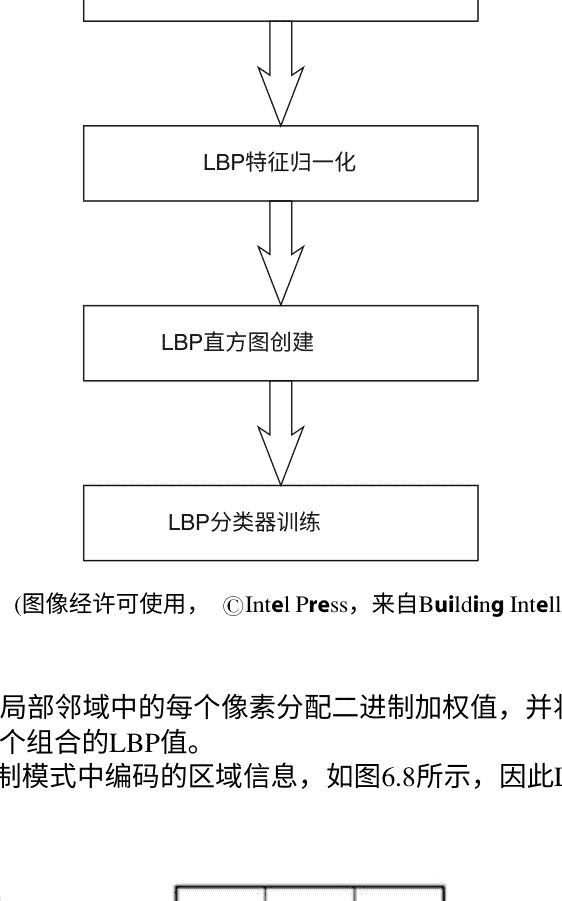

LBP的计算是通过为局部邻域中的每个像素分配二进制加权值，并将像素比较结果作为二进制值相加，以创建一个组合的LBP值。

LBP包含在紧凑的二进制模式中编码的区域信息，如图6.8所示，因此LBP是一个二进制编码的邻域纹理描述符。

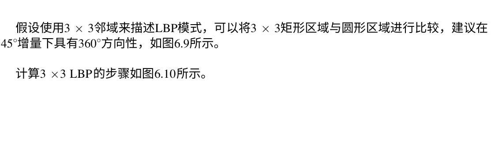

假设使用3 × 3邻域来描述LBP模式，可以将3 × 3矩形区域与圆形区域进行比较，建议在45°增量下具有360°方向性，如图6.9所示。

计算3 × 3 LBP的步骤如图6.10所示。

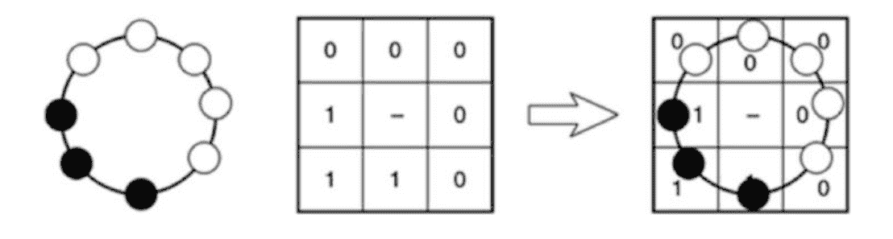

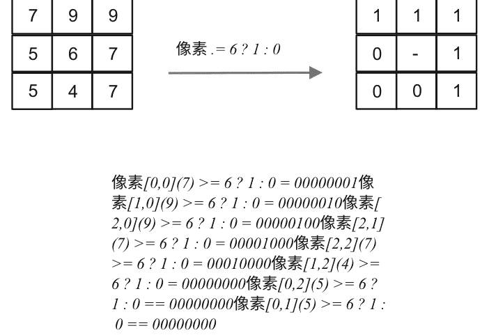

#### 邻域比较

在3 ×3区域中，每个像素与中心像素进行比较。如果像素 ≥中心像素，则LBP记录该位置的位值为1，否则为0。参见图6.10

#### 直方图组合

将图像区域中的每个LBP描述符记录在直方图中，以描述累积纹理特征。统一的LBP直方图将具有56个箱子，因为只有单连接区域进行直方图处理。

#### 可选的归一化

最终的直方图可以使用二进制减少到较少的箱子数，例如256 →32，通过二进制减少或类似的算法。此外，直方图可以通过阈值化直方图中连续箱子的范围来减小大小，例如，如果在这些箱子中没有或很少有信息，则忽略箱子1-64。

#### 描述符串联

在重叠区域上采用多个局部二值模式可以将它们连接成一个更大的直方图特征描述符，以提供更好的区分能力。

#### LBP总结分类

| 类别 | 详情 |
| --- | --- |
| 光谱: | 局部二进制 |
| 特征形状: | 正方形 |
| 特征模式: | 像素区域与中心像素比较 |
| 特征密度: | 每个像素的局部 $3 \times 3$ |
| 搜索方法: | 滑动窗口 |
| 距离函数: | 汉明距离 |
| 鲁棒性: | 3（亮度，对比度，*旋转用于RILBP） |

#### 旋转不变的LBP（RILBP）

为了实现旋转不变性，通过对局部LBP进行循环位移旋转来找到最小的二进制值来计算旋转不变的LBP（RILBP）[165]。最小值LBP被用作旋转不变的签名，并记录在直方图中。RILBP的计算效率非常高。

为了说明该方法，图6.11显示了三个连续LBP位的模式；为了使该描述符具有旋转不变性，该值被左移直到达到最小值。

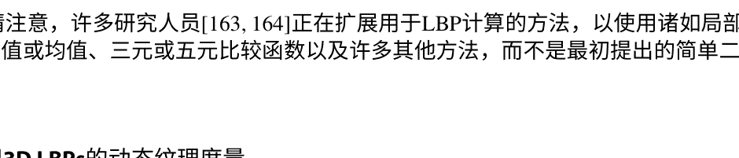

请注意，许多研究人员[163, 164]正在扩展用于LBP计算的方法，以使用诸如局部导数、局部中值或均值、三元或五元比较函数以及许多其他方法，而不是最初提出的简单二元比较函数。

#### 使用3D LBPs的动态纹理度量

动态纹理是一种随着帧与帧之间的移动而变化的视觉特征；例如波浪、云、风、烟雾、植被和涟漪。本文讨论了用于跟踪此类动态纹理的基本LBP的两个扩展：VLBP和LBP-TOP。

#### 体积LBP (VLBP)

为了创建VLBP [167]描述符，首先将至少三个连续视频帧堆叠成一个三维数据集的图像体积。然后，在所选兴趣点上取三个LBP，一个来自体积中的每个平行平面，形成一个汇总体积LBP或VLBP，并将每个正交LBP的直方图连接成一个单一的动态描述符向量，即VLBP。然后可以从帧到帧跟踪VLBP，并重新计算以考虑纹理从帧到帧的动态变化。参见图6.12。

图6.12 (顶部) VLBP方法[167]从平行平面计算LBP。 (底部) LBP-TOP方法[168]从正交平面计算LBP。 (图像经许可使用， © Intel Press， 来自Building Intelligent Systems)

#### LBP-TOP

LBP-TOP [168]的创建方式与VLBP类似，只是不再计算平行平面上的三个独立的LBP，而是从与兴趣点相交的体积中的正交平面（x，y，z）计算，如图6.12所示。这个三维组合描述符与VLBP的大小相同，并包含三个平面的数据。每个LBP平面的直方图也会像VLBP一样被连接起来，形成LBP-TOP。

#### 其他LBP变体

如表6.1所示，LBP [165]有许多变体。请注意，LBP已成功用作SIFT、SURF的替代品，也用作纹理度量标准。

##### 表6.1 LBP变体（来自参考文献[165]）

- ULBP（均匀LBP）仅使用56个均匀的箱子，而不是8位像素可能的256个箱子，来创建直方图。均匀模式由连续的连接的TRUE值段组成。
- RLBP（鲁棒LBP）添加+比例因子以消除由噪声引起的转换（p1 - p2 + SCALE）
- CS-LBP圆对称，比LBP少一半的向量，对比相反的像素对与中心像素，有助于减少LBP箱子计数
- LBP-HF傅里叶频谱描述符+ LBP
- MLBP中值LBP使用区域中值而不是中心像素值进行比较
- M-LBP多尺度LBP将多个半径LBP连接起来
- MB-LBP多尺度块LBP；在小块中比较平均像素值
- SEMB-LBP：统计有效的MB-LBP（SEMB-LBP）使用分布中的百分比，而不是LBP中的0-1和1-0转换的数量，并重新定义标准LBP中的均匀模式。在使用GENTLE ADA-BOOSTing [531]进行人脸识别中有效使用。
- VLBP 体积LBP在相邻视频帧上或在一个体积内进行 - 将直方图连接在一起形成一个更长的向量
- LGBP（局部Gabor二进制模式）对一个特征计算大约40个Gabor滤波器，提取LBPs并将它们连接在一起形成一个长特征向量，该向量在更多尺度和方向上是不变的
- LEP 局部边缘模式：在标准LBP之前进行边缘增强（Sobel）
- EBP 椭圆二进制模式 标准LBP，但在椭圆区域而不是圆形区域上进行
- EQP 椭圆五元模式 - LBP从二进制（2）级分辨率扩展到五元（5）级分辨率（-2, -1, 0, -1, 2）
- LTP - LBP在三元范围上进行扩展，以处理近似恒定的区域（-1, 0, 1）
- LLBP 局部线二进制模式 - 计算线型模式（十字形）上的LBP，然后使用每个X/Y维度的平方根的平方计算幅度度量
- TPLBP- [x5]三个LBP一起计算：中心像素的基本LBP，以及周围两个相邻像素的LBP，因此总描述符是一组重叠的LBP。
- FPLBP- [x5]四个LBP一起计算：中心像素的基本LBP，以及周围两个相邻像素的LBP，因此总描述符是一组重叠的LBP，
- XPLBP -
- *注意： TPLBP和FPLBP方法可以在特征空间中扩展到3、4、n维。大向量。
- TBP - 三进制（3）二进制模式，类似于LBP，但使用三个编码级别（1、0、-1）来有效处理相等或接近相等强度的区域，使用两个二进制模式（一个用于+，一个用于-）连接在一起
- ETLP - 拉长的三进制局部模式（椭圆形+三进制[3]级别
- FLBP - 模糊LBP，每个像素对多个bin有贡献
- PLBP - 概率LBP计算每个像素与中心像素之间的差异幅度（计算量更大，存储量更多）
- SILTP - 尺度不变LBP使用三部分分段比较函数来补偿和支持强度尺度不变性以处理图像噪声
- tLBP - 过渡编码LBP，其中编码是在LBP中相邻像素之间按顺时针方向进行的
- dLBP - 方向编码LBP - 类似于CSLBP，但同时存储最大值和比较信息（该像素是否大于、小于或最大值）
- CBP - 集中二进制模式 - 中心像素与所有九个核心邻居的平均值进行比较
- S-LBP - 在色度准确空间（如CIE LAB等）上进行的语义LBP，用于找到主方向+弧长，以形成2D直方图作为描述符的统一连接LBP圆形模式
- F-LBP - 从中心像素到相邻像素的颜色距离的傅里叶频谱
- LDP - 本地导数模式（高阶导数） - 基础LBP是一阶方向导数，与附加的第n阶方向导数结合起来，连接成直方图，对噪声更敏感，当然
- BLBP - 贝叶斯LBP - 使用贝叶斯方法将LBP和LTP结合在一起，以优化更健壮的模式
- FLS - LBP比较的过滤、标记和统计框架，将LBP或任何类型的直方图描述符转换为向量空间，实现高效比较"贝叶斯局部二值模式纹理描述符"
- MB-LBP多尺度块LBP - 比较小块中的平均像素值，而不是单个像素，因此3x3像素的PBL将变成一个9x9块LBP，其中每个块是一个3x3区域。通过对图像进行缩放，并在每个尺度上创建渲染图像，并创建每个缩放图像的直方图，然后将直方图连接在一起来计算直方图。
- 基于金字塔的多结构LBP-使用5个模板在不同级别上提取不同的结构信息1）高斯滤波器，4个各向异性滤波器用于检测梯度方向
- MSLBF-多尺度选择的局部二进制特征
- RILBP-旋转不变的LBP将箱子（二进制LBP值）旋转到最小值为止，最大值被认为是旋转不变的。这是LBP旋转不变性最广泛使用的方法。
- ALBP-自适应LBP用于旋转不变性，与标准LBP方法中的最大值移位不同，找到主导向量方向并将向量移位到主导向量方向
- LBPV-局部二进制模式方差-使用局部区域方差对LBP的像素贡献进行加权，对主要方向进行特征对齐，确定非主导模式并减少其贡献。
- OCLBP-对手颜色LBP-描述颜色和纹理-每个颜色通道LBP被转换，然后使用一种颜色作为中心像素，另一种颜色作为邻域，因此总共考虑了9种RGB组合LBP模式。
- SDMCLBP - SDM（每个颜色的co-LBP图像用作生成发生矩阵的基础，然后从图像中提取Haralick特征形成多维特征空间。
- MSCLBP - 多尺度颜色局部二值模式（将6个直方图连接在一起）- 使用颜色空间组件
- HUE-LBP OPPONENT-LBP（所有3个通道）nOPPONENT-LBP（计算在2个通道上），光强度变化，强度偏移，强度变化+偏移，颜色变化，颜色偏移，定义六个新操作：转换后的颜色LBP（RGB）[减去均值，除以标准差]，对手LBP，nOpponent LBP，Hue LBP，RGB-LBP，nRGB-LBP [x8] “用于视觉对象类别识别的多尺度颜色局部二值模式”，朱超，Charles-Edmond BICHOT，陈黎明
- 3D直方图-3DRGBLBP [最佳性能，内存占用高]- 在RGB-LBP颜色图像空间上使用统一模式最小化计算的3D直方图，每个颜色产生10个级别或模式，从而产生一个大的描述符：10 x 10 x 10 = 1000个描述符。
- LATCH -LATCH: 学习的三个补丁码排列 [871]

### 普查

人口普查变换[169]基本上是一个LBP，就像人口普查一样，它使用简单的大于和小于查询来计算和比较结果。人口普查记录了在核心像素和核心区域中的其他像素之间进行的像素比较结果。它使用比较和可能的阈值，并将结果存储在一个二进制向量中。人口普查变换还使用了一个称为排名值标量的特征，它是小于中心像素的像素值的数量。因此，人口普查描述符同时使用了位向量和排名标量。

#### 人口普查总结视觉分类
- 光谱: 局部二进制 + 标量排名
- 特征形状: 正方形
- 特征模式: 像素区域与中心像素比较
- 特征密度: 每个像素的局部3 × 3
- 搜索方法: 滑动窗口
- 距离函数: 汉明距离
- 鲁棒性: 2（亮度，对比度）

#### 修改的人口普查变换

修改的人口普查变换（MCT）[197]旨在改善原始人口普查变换的局部二进制模式鲁棒性。该方法使用有序比较3 × 3邻域中的每个像素与3 × 3邻域中所有像素的平均强度，生成一个二进制描述符位向量，其中位值设置为低于所有像素的平均强度。位向量可以使用每个像素的MCT值创建MCT图像。请参见图6.13。

图6.13 3×3 MCT可能的511个二进制模式中的15个缩写模式。模式集中的结构核是MCT特征空间比较的基础集。结构核形成了一个模式基础集，可以表示线条、边缘、角点、鞍点、半圆等模式。

如图6.13所示，MCT依赖于可能的全部3 × 3二进制模式（2^9 -1或511个变体），并将其作为核索引进二进制模式作为MCT输出，因为每个二进制模式本身都是唯一的签名且具有很高的区分度。MCT的最终结果类似于将输出分配给核索引中的任何2^9 -1模式的非线性滤波器。结果显示，对于某些类型的物体识别，MCT的结果优于基本CT [197]。

### BRIEF

如第4章所述，在局部二进制描述符点对模式的部分中，并在图4.11中说明，BRIEF[124, 125]描述符使用了一个256个点对的随机分布模式，在局部$31 \times 31$区域进行二进制比较以创建描述符。BRIEF的一个关键思想是在局部区域内选择随机点对进行比较。

BRIEF是一种局部二进制描述符，在机器人应用中取得了非常好的准确性和性能[195]。BRIEF和ORB密切相关；ORB是BRIEF的一种定向版本，ORB描述符的点对模式也与BRIEF不同。BRIEF对旋转不太容忍。

#### BRIEF摘要分类
- 光谱：局部二进制
- 特征形状：以兴趣点为中心的正方形
- 特征模式：随机局部像素点对比
- 特征密度：兴趣点处的局部$31 \times 31$
- 搜索方法：滑动窗口
- 距离函数：汉明距离
- 鲁棒性：2（亮度，对比度）

### ORB

ORB [126]是Oriented BRIEF的缩写，正如其名称所示，ORB基于BRIEF，并通过使用FAST9确定角点方向，然后使用Harris角点度量对关键点进行排序来为BRIEF添加旋转不变性；角点方向通过使用Rosin的方法[53]进行强度质心修正。FAST、Harris和Rosin处理在图像金字塔的每个级别上进行，缩放因子为1.4，而不是常见的八度金字塔比例方法。ORB在第4章中的局部二进制描述符点对模式部分进行了详细讨论，并在图4.11中进行了说明。

值得注意的是，ORB是一个高度优化且非常良好设计的描述符，因为ORB的作者非常关注计算速度、内存占用和准确性。在本节中，许多描述符主要是研究项目，对实际问题给予较少的优先考虑，但ORB专注于优化和实际问题。

与BRIEF相比，ORB提供了一种改进的训练方法，用于创建用于成对像素点采样的局部二进制模式。BRIEF使用$31 \times 31$窗口中的随机点对，而ORB通过训练步骤在具有高方差和均值0.5的窗口中找到不相关的点对，这被证明效果更好。有关可视化ORB模式的详细信息，请参见图4.11。

对于对应搜索，ORB使用多探测局部敏感哈希（MP-LSH），当匹配失败时，在相邻的桶中搜索匹配项，而不是重新导航哈希树。作者报告称，MP-LSH需要更少的哈希表，从而减少了内存占用。MP-LSH还产生比BRIEF更均匀的哈希桶大小。由于ORB是基于点对比较的二进制描述符，因此使用汉明距离进行对应。

据报道，ORB的速度比SURF快一个数量级，比SIFT快两个数量级，准确度相当。作者在Pascal数据集的超过24个NTSC分辨率图像测试中提供了令人印象深刻的性能结果。

| ORB* | SURF | SIFT |
| :--- | :--- | :--- |
| 15.3毫秒 | 217.3毫秒 | 5228.7毫秒 |

*结果以参考文献[126]中的测量为准。

#### ORB总结分类
- 光谱： 局部二进制+方向向量
- 特征形状： 正方形
- 特征模式： 训练的局部像素点对比
- 特征密度： 局部31 × 31个兴趣点
- 搜索方法： 滑动窗口
- 距离函数：汉明距离
- 鲁棒性： 3个（亮度、对比度、旋转、有限尺度）

### BRISK

BRISK [123, 135]是一种使用圆对称模式区域形状和总共60个点对作为线段排列在四个同心圆环中的局部二进制方法，如图4.10所示，并在第4章中详细描述。该方法使用短线段和长线段的点对，这提供了尺度不变性的度量，因为短线段可能更适合于细分辨率，而长线段可能更适合于粗分辨率。

该快速算法是独特的，使用了一种适应尺度空间的新型FAST检测器，据报道，与具有相当准确性的SURF相比，性能提高了一个数量级。以下是算法中的主要计算步骤：

- 在尺度空间中使用FAST或AGHAST进行基于选择的关键点检测。
- 在每个像素采样点上执行高斯平滑以获取点值。
- 生成三组配对：长配对、短配对和未使用的配对（未使用的配对不在长配对或短配对集合中；参见图4.10）。
- 计算长配对之间的梯度，求和梯度以确定方向。
- 使用梯度方向调整和旋转短配对。
- 从短配对的逐点比较创建二进制描述符。

#### BRISK摘要分类
- 光谱： 局部二进制+方向向量
- 特征形状： 正方形
- 特征模式： 训练的局部像素点对比
- 特征密度： 在FAST兴趣点处的本地31 × 31搜索
- 方法： 滑动窗口
- 距离函数：汉明距离
- 鲁棒性： 4（亮度、对比度、旋转、尺度）

### FREAK

FREAK [122]使用一种新颖的受中央凹点启发的多分辨率像素对采样形状，并使用经过训练的像素对来模拟人眼的设计，作为一种从粗到细的描述符，中心分辨率最高，向外围逐渐降低，如图4.9所示。在本作者的观点中，FREAK展示了许多更好的特征描述设计方法；它结合了性能、准确性和鲁棒性。请注意，与其他本地二进制描述符（如LBP、Census、BRISK、BRIEF和ORB）相比，FREAK计算速度快，具有良好的区分度，并且与SIFT相比具有优势。

FREAK特征训练过程涉及根据训练数据确定用于二进制比较的点对，如图4.9所示。该训练方法允许通过加权和选择具有高方差和低相关性的样本点来构建一系列描述符采样模式和形状。每个采样点都取自重叠的圆形区域，其中每个采样点的值是每个区域中值的高斯平均值。

圆形区域设计为每个圆中的6个区域的同心圆，中心区域较小，边缘区域较大，类似于生物视网膜感受器细胞的分布，与相邻区域有一定的重叠，从而提高准确性。

因此，特征描述符设计为一个粗到细的级联，包含16字节粗到细描述符的四组，这些描述符包含存储在向量中的像素对二进制比较。级联中的第一个16字节，即粗分辨率设置，通常足以找到90%的匹配特征并丢弃不匹配的特征。FREAK使用来自31 × 31像素补丁采样区域的45个点对进行描述符。

通过将点对比较存储在四个级联的分辨率递减的模式向量中，匹配过程从粗糙到精细进行，模仿人类视觉系统的扫视搜索机制，在匹配阶段早期成功或拒绝时加速匹配性能。总之，FREAK方法效果非常好。

#### FREAK总结分类
- 光谱：局部二进制粗到细 + 方向向量
- 特征形状：正方形
- 特征模式：31 × 31个区域像素点对比
- 特征密度：稀疏局部AGAST兴趣点
- 搜索方法：在尺度空间上滑动窗口
- 距离函数：汉明距离
- 鲁棒性：6个（亮度、对比度、旋转、尺度、视角、模糊度）

## 光谱描述符

与局部二进制描述符组相比，光谱描述符组通常涉及更强烈的计算和算法，通常需要浮点计算，并可能消耗大量内存。在这个分类和讨论中，光谱只是一个可以测量或计算的数量，例如光强度、颜色、局部区域梯度、局部区域统计特征和矩、表面法线以及任何光谱的2D或3D直方图等排序数据。例如局部梯度方向的直方图等类型 本节讨论的许多方法使用局部梯度信息。

如前一节所讨论的局部二进制描述符，是为了摆脱更昂贵的频谱方法，以减少功耗并提高性能的尝试。 在许多情况下，局部二进制描述符提供了与计算密集型频谱方法相似的准确性和鲁棒性。

### SIFT

尺度不变特征变换（SIFT）是由Lowe [153, 170]开发的最著名的用于寻找兴趣点和特征描述符的方法，具有尺度、旋转、光照、仿射变形、透视和相似变换以及噪声的不变性。 Lowe证明了通过使用多个SIFT描述符来描述一个对象，可以增加对遮挡和杂乱的不变性，因为如果一些描述符被遮挡，其他描述符仍然可以被找到[153]。 我们在这里详细介绍SIFT，因为它设计良好且广为人知。

SIFT通常被用作其他视觉方法进行比较的基准。 最初，SIFT的原始研究论文由作者David Lowe多次被主要计算机视觉期刊拒绝发表，因此Lowe申请了专利并采取了不同的方向。 根据Lowe的说法，“那时我已经决定计算机视觉界对此不感兴趣，所以我申请了专利，并打算将其推广给工业应用。”最终，SIFT论文发表并成为计算机视觉历史上被引用最广泛的文章！

SIFT是一个完整的算法和处理流程，包括兴趣点和特征描述方法。 SIFT包括选择中心-周围圆形加权高斯差分（DoG）极大值兴趣点的阶段，以在尺度空间中创建尺度不变的关键点（这是一个重大创新），如图6.14所示。特征描述符是计算围绕尺度不变关键点的。 特征提取步骤涉及从局部梯度幅值计算出一个分箱的梯度直方图（HOG）结构，或者使用GLOH变体将其计算为笛卡尔矩形箱或对数极坐标箱，在围绕多个尺度上得到的最大响应兴趣点的选定位置上进行。

将描述符输入匹配流程中，通过计算最近距离比率度量来找到最接近的匹配和次接近的匹配，如果它们太相似，则同时拒绝主要匹配和次要匹配，假设其中一个可能是错误匹配。 局部梯度幅度按金字塔尺度级别加权，然后被分成局部直方图。 总之，SIFT是一个非常周密和精心设计的多尺度局部特征描述符。

用于彩色图像的SIFT变体被称为CSIFT [171]。

以下是基本的SIFT描述符处理流程（注意：匹配阶段被省略，因为本章关注特征描述符和相关度量）：

1.  创建一个尺度空间金字塔

图6.14 (顶部) 通过与高斯核进行卷积获得的一组高斯图像和相应的一组DoG图像。(底部) 在八度集合中。DoG函数近似于LOG梯度，或可调节的旁路滤波器。将特征与缩放的八度集中的各种图像进行匹配，可以得到尺度不变的特征。

使用高斯滤波图像的n/2倍的八度尺度图像金字塔。高斯模糊的程度与尺度成比例，然后使用高斯差分（DoG）方法来捕捉金字塔中相邻图像中的兴趣点极值点。图像金字塔包含五个级别。SIFT还使用双倍尺度的第一个金字塔级别，使用两倍放大的像素来保留细节。这种技术将稳定关键点的数量增加了约四倍，这是非常显著的。否则，对原始图像进行高斯模糊会导致高频细节丢失。参见图6.15和6.16。

2.  识别尺度不变的兴趣点

如图6.16所示，候选兴趣点是从金字塔中的三个相邻八度的DOG图像中的26个相邻像素之间进行比较选择的局部极大值或极小值。换句话说，兴趣点是尺度不变的。

通过分析局部26像素邻域内的局部对比度、局部噪声和局部边缘存在性，进一步确定所选兴趣点的不变性。除了原始方法中使用的方法外，还可以使用其他各种方法，并且可以同时使用多种技术来选择最佳的兴趣点，包括在小区域上进行局部曲率插值，并平衡边缘响应以包括主要边缘和次要边缘。关键点在尺度和空间上被定位到亚像素精度。因此，完整的兴趣点对尺度是不变的。

#### 3. 创建特征描述符

选择的兴趣点周围大小为16 × 16像素的局部区域或补丁是特征向量的基础。计算并存储16 × 16补丁中的局部梯度的大小和梯度方向，形成HOG（梯度直方图）特征向量，以圆对称的方式加权，以减小远离中心兴趣点的点的权重，该兴趣点周围计算HOG时使用高斯加权函数。

如图6.17所示，4 × 4梯度分箱方法允许梯度在描述符中移动并组合在一起，从而对可能改变局部梯度位置的各种几何扭曲具有不变性，类似于人类视觉系统对视网膜上的3D梯度位置的处理[240]。 SIFT HOG对尺度、对比度和旋转具有相当的不变性。 直方图箱使用三线性插值填充梯度信息，并进行归一化处理，以提供光照和对比度不变性。

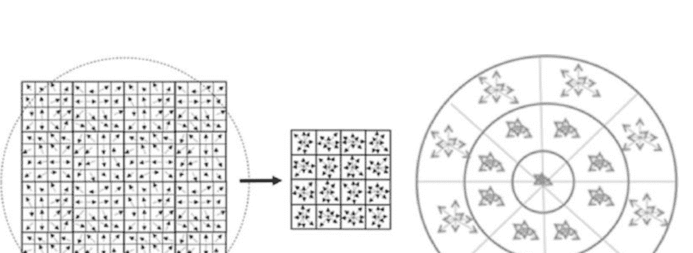

SIFT还可以使用一种称为梯度位置和方向直方图（GLOH）的HOG描述符变体进行，该方法使用对数极坐标直方图格式而不是笛卡尔HOG格式；请参见图6.17。 GLOH对数极坐标直方图的计算非常简单，如下所示，其中使用笛卡尔HOG直方图的笛卡尔坐标，向量大小为斜边，角度为反正切值。

```
$$m(x, y) = \sqrt{(L(x + 1, y) - L(x - 1, y))^2 + (L(x, y + 1) - L(x, y - 1))^2}$$
$$\theta(x, y) = \text{tan}^{-1}((L(x, y + 1) - L(x, y - 1))/(L(x + 1, y) - L(x - 1, y)))$$
```

如图6.17所示，SIFT HOG和GLOH本质上是3D直方图，在这种情况下，直方图的bin值是梯度幅值和方向。 因此，描述符向量的大小为4 × 4× 8 = 128字节。 4 × 4描述符（中心图像）是左侧图像中每个4 × 4组合的八向梯度方向和幅值的直方图集合，使用笛卡尔坐标表示，而GLOH梯度幅值和方向则在极坐标中分成17个bin，覆盖更大的binning区域。 SIFT-HOG（左图）还使用加权因子以圆对称的方式逐渐减少梯度信息的贡献，随着距离中心的增加。

表6.2 SIFT计算复杂度（来自Vinukonda [172]）

| SIFT流程步骤 | 复杂度 | 操作次数 |
| --- | --- | --- |
| 高斯模糊金字塔 | $\Theta(N^2 U^2 s)$ | $4N^2 W^2 s$ |
| 高斯差分金字塔 | $\Theta(s N^2)$ | $4N^2 s$ |
| 尺度空间极值检测 | $\Theta(s N^2)$ | $104 s N^2$ |
| 关键点检测 | $\Theta(\alpha s N^2)$ | $100 s \alpha N^2$ |
| 方向分配 | $\Theta(s N^2 (1 - \alpha \beta))$ | $48 s N^2$ |
| 描述符生成 | $\Theta(x^2 N^2 (\alpha \beta + \gamma))$ | $\Theta(1520 x^2 N^2 (\alpha \beta + \gamma) N^2$ |

SIFT的整体计算复杂度较高[172]，如表6.2所示。请注意，特征描述是最计算密集的，因为它涉及到所有局部区域梯度计算、方向分配和描述符生成，包括三线性插值的直方柱分组。SIFT中开发的梯度方向直方图是一项关键创新，提供了相当大的鲁棒性。

SIFT的结果特征向量为128字节。然而，存在一些方法来降低维度并改变描述符，下面将进行讨论。

#### SIFT总结分类

- 光谱：局部梯度幅值+方向
- 特征形状：正方形，带有圆形加权
- 特征模式：正方形，带有圆对称加权
- 特征密度：局部稀疏$16 \times 16$ DoG兴趣点
- 搜索方法：在尺度空间上滑动窗口
- 距离函数：欧氏距离（或使用RootSIFT修正的Hellinger距离）
- 鲁棒性：6个（亮度、对比度、旋转、尺度、仿射变换、噪声）

#### SIFT-PCA

Ke和Suthankar [175]开发的SIFT-PCA方法使用了一种基于主成分分析（PCA）的替代特征向量，该向量基于归一化梯度补丁而不是SIFT中使用的加权和平滑的梯度直方图。此外，SIFT-PCA将SIFT描述符的维度降低到一个较小的元素集。最初的SIFT报告使用了128个向量，但使用SIFT-PCA后，向量减少到较小的数量，如20或36。

SIFT-PCA的基本步骤如下：

1. 根据局部41 × 41图像补丁的梯度构建特征空间，得到一个3042元素的向量；该向量是正常SIFT流程的结果。
2. 为补丁计算局部图像梯度。
3. 使用主成分分析(PCA)在每个特征向量的协方差矩阵上创建降低尺寸的特征向量。

SIFT-PCA在图像扭曲鲁棒性方面相对于SIFT提供了一些改进，并且特征向量的较小尺寸导致更快的匹配速度。作者指出，虽然PCA通常不适用于图像补丁特征，但该方法在定向和局部化尺度空间的SIFT样式梯度补丁上效果良好[175]。

#### SIFT-GLOH

梯度位置和方向直方图（GLOH）[136]方法使用极坐标和径向分布的箱子，而不是SIFT使用的笛卡尔坐标样式直方图箱子方法。据报道，与SIFT和其他描述符相比，它在某些基准数据集上提供更高的准确性和鲁棒性[136]。如图6.17所示，GLOH使用一组17个径向分布的箱子来总结极坐标中的梯度信息，得到一个272个箱子的直方图。中心箱子没有方向性。使用PCA来减小描述符的大小。GLOH已被用于改进SIFT。

#### SIFT-SIFER改装

具有误差容忍性的尺度不变特征检测器（SIFER）[216]方法提供了与标准SIFT流程不同的选择，据报道在某些标准下，准确性提高了高达20%。然而，准确性是以性能为代价的，因为其性能大约是SIFT的两倍。SIFER的主要贡献包括使用更高粒度的图像金字塔表示改进的尺度空间处理，以及使用余弦调制高斯滤波器进行更好的尺度调谐滤波。

方法中的主要步骤如表6.3所示。尺度空间金字塔使用余弦调制高斯（CMG）滤波器进行模糊处理，这样可以将每个八度的尺度细分为六个尺度，从而获得更好的尺度准确性。

表6.3 SIFT、SURF 和 SIFER 流水线的比较（改编自[216]）

| 特征 | SIFT | SURF | SIFER |
| :--- | :--- | :--- | :--- |
| 尺度空间滤波 | 高斯二阶导数 | 高斯二阶导数 | 余弦调制高斯 |
| 探测器 | LoG | Hessian | 小波模值极大 |
| 滤波近似级别 | OK精度 | OK精度 | 良好精度 |
| 优化 | DoG 用于梯度 | 积分图像，常数时间 | 卷积，常数时间 |
| 图像上采样 | 2倍 | 2倍 | 未使用 |
| 子采样 | 是 | 是 | 未使用 |

由于CMG的性能不佳，SIFER提供了一种快速的近似方法，以提供合理的准确性。特别关注图像尺度和滤波器尺度，以增加检测的准确性，因此余弦被用作高斯滤波器的带通滤波器，以尽可能匹配尺度，在尺度空间上使用匹配良好的滤波器对每个八度的六个尺度进行滤波。CMG比SIFT高斯二阶导数方法具有更强的误差容忍性。

#### SIFT CS-LBP 改装

SIFT-CSLBP 改装方法[165, 194]通过用更高效的计算替代 SIFT 梯度计算，结合了 SIFT 和中心对称 LBP (CS-LBP) 的最佳特性，通过创建类似的直方图分箱方向特征向量，使用高效的 LBP 运算符，并创建相似的直方图分箱方向特征向量 与 SIFT 描述符相比，LBP 的创建和匹配都更简单。

CS-LBP描述符首先对局部补丁应用自适应降噪滤波器（本工作中使用的是维纳滤波器）进行自适应降噪，以保留局部对比度。CS-LBP不是计算所有256种可能的8位局部二进制模式，而是仅计算16种中心对称模式，以减少维度，如图6.18所示。

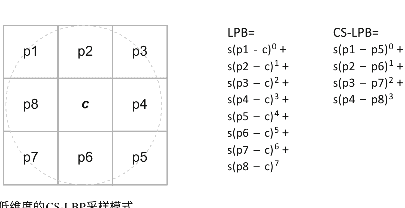

CS-LBP直方图的权重不使用SIFT的圆形加权函数，而是不使用权重，从而减少计算量。与SIFT类似，CS-LBP的分箱方法使用3 × 3的区域笛卡尔网格；在分箱时使用更简单的双线性插值，而不是SIFT中的三线性插值。总体而言，CS-LBP的后期改进方法简化了SIFT的计算流程，并提高了性能，同时保持了可比较的准确性；对于某些数据集，报告了更高的准确性。请参见表6.4。

表6.4 SIFT和CSLBP的改进性能（根据参考文献[194]）

| | 特征提取 | 描述符构建 | 描述符归一化 | 总计算时间 |
| :--- | :--- | :--- | :--- | :--- |
| CS-LBP 256 | 0.1609 | 0.0961 | 0.007 | 0.264 |
| CS-LBP 128 | 0.1148 | 0.0749 | 0.0022 | 0.1919 |
| SIFT 128 | 0.4387 | 0.1654 | 0.0025 | 0.6066 |

#### RootSIFT Retrofit

RootSift方法[166]对SIFT流程进行了一系列简单的关键改进，从而提高了计算性能并略微提高了准确性，具体如下：

- Hellinger距离： RootSIFT使用Hellinger距离而不是欧氏距离来进行简化的SIFT对象检索流程的性能优化。 SIFT流程的其他部分保持不变；仍然使用K-means构建特征向量集，并且对于较大的特征向量集仍然可以使用其他近似最近邻方法。 作者声称，将SIFT代码进行简单修改，以执行Hellinger距离优化而不是欧氏距离，只需要进行一行简单的代码更改。 RootSIFT中的其他改进是可选的，下面进行讨论。
- 特征增强：该方法增加了总召回率。由Turcot和Lowe [324]开发，应用于特征。来自数据库中相似视图的特定对象的特征向量或视觉单词被关联到用于在相似特征之间找到对应关系的图中，而不仅仅依赖于单个特征。
- 判别式查询扩展（DQE）：该方法在训练过程中增加了查询扩展。在接近区域内的特征向量通过平均关联到一个新的特征向量，对于对数据库的重新查询非常有用，使用线性SVM中的正负训练数据；参考文献[166]报告了更好的对应关系。

通过将上述三种创新结合到SIFT流程中，性能、准确性和鲁棒性得到了显著改善。

#### 表6.5 CenSurE和SIFT和SURF之间的主要区别（改编自参考文献[177]）

|          | CenSurE | SIFT     | SURF     |
|----------|---------|----------|----------|
| 分辨率       | 每个像素     | 金字塔子采样   | 金字塔子采样   |
| 边缘滤波器方法     | Harris   | Hessian  | Hessian  |
| 尺度空间极值点方法     | 拉普拉斯，中心环绕 | 拉普拉斯，DOG | Hessian, DOB |
| 旋转不变性     | 近似     | 是的       | 不       |
| 尺度中的空间分辨率    | 完整的     | 子采样的     | 子采样的     |

### CenSurE和STAR

Center Surround Extrema或CenSurE [177]方法提供了一个真正的多尺度描述符，在金字塔的所有尺度上使用完整的空间分辨率创建特征向量，与在子采样像素上找到极值的SIFT和SURF相比，这种方法在较大尺度上牺牲了准确性。

CenSurE与SIFT和SURF类似，但在表6.5中总结了一些关键区别。在OpenCV中对原始CenSurE算法进行了修改，被称为STAR描述符。

作者们非常注重创建计算效率高、内存效率高、性能和准确性高的方法[177]。CenSurE通过首先在所有尺度上使用拉普拉斯算子，然后使用哈里斯方法进行滤波来定义一种优化的极值点查找方法，以丢弃响应较弱的角点。

CenSurE相对于SIFT和SURF的主要创新如下：

1. 使用双层中心环绕滤波器，如图6.19所示，包括差分盒子（DoB）、差分八边形（DoO）和差分六边形（DoH）滤波器，八边形和六边形比盒子更具旋转不变性。DoB计算简单，可以使用积分图像计算，而不是SIFT的高斯尺度空间方法。使用改进的积分图像方法也可以快速计算DoO和DoH滤波器。圆形是期望的形状，但计算代价更高。
2. 为了找到极值点，使用七级尺度空间的滤波器计算DoB滤波器，每个像素使用3 × 3 × 3邻域。尺度空间搜索使用非八度边界上的中心-环绕Haar-like特征和滤波器块大小[1,2,3,4,5,6,7]组成，覆盖[1和7]之间的2.5个八度，产生五个滤波器。这种尺度排列提供了比一个八度音阶更具有辨别力。在每个级别上应用一个阈值来消除弱滤波器响应，因为弱响应很可能不会在其他尺度上重复出现。
3. 非矩形滤波器形状，如八边形和六边形，可以使用重叠的积分图像区域的组合快速计算；请注意，八边形和六边形避免了由矩形区域引起的伪影，并增加了旋转不变性；参见图6.19。
4. CenSurE滤波器使用一种快速的、修改过的SURF方法，称为修改过的正立SURF（MU-SURF）[180, 181]，稍后将与其他SURF变体一起讨论，该方法通过使用扩展的重叠子区域来特别关注描述符中的边界效应。

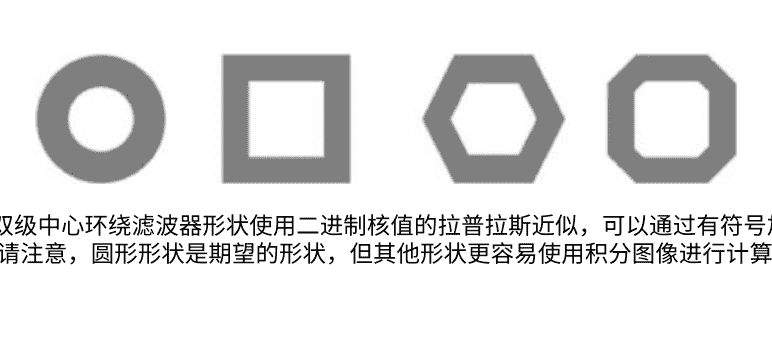

#### CENSURE摘要分类

- 光谱：	中心-周围形状的二值滤波器
- 特征形状：	八边形、圆形、矩形、六边形
- 特征模式：	滤波器形状掩码，24 × 24最大区域
- 特征密度：	局部兴趣点稀疏
- 搜索方法：	在尺度空间上进行密集滑动窗口
- 距离函数：欧氏距离
- 鲁棒性：	5个（亮度、对比度、旋转、尺度、仿射变换）

### 相关模板

特征描述和检测中最为著名和明显的方法之一，被用作基本深度学习架构中的主要特征，如第9章和第10章所讨论的，它通过直接像素比较来寻找完整特征的图像，这被称为相关性。

相关性涉及将包含第一个像素区域模板的滑动窗口沿着第二个图像区域模板进行步进，并使用诸如差异和之和（SAD）之类的方法进行简单的逐像素区域比较；得到的分数即为相关性。

由于图像的照明可能会有所不同，通常首先对相关模板和目标图像进行强度归一化，通常是通过减去均值并除以标准差来实现；然而，也可以使用对比度平衡和LUT变换。相关性通常在矩形窗口的空间域中实现，但也可以与频域方法一起使用[4, 9]。

相关性在基于视频的目标跟踪应用中使用，其中平移作为从相邻小区域到帧之间的正交运动占主导地位。例如，视频运动编码器使用相关性来找到图像内部区域或块的位移，因为通常情况下视频中的小块运动与笛卡尔坐标轴正交，并且可以通过相关性很好地映射到简单的位移。 相关性可以在图像和使用的方法之间提供1/4到1/20个像素的亚像素精度；参见参考文献[143]。对于视频编码应用程序，相关性允许对应块的运动矢量位移进行高效编码和准确计算。 相关性适用于固定功能硬件加速。

相关性的变种包括交叉相关（滑动点积）、归一化交叉相关（NCC）、零均值归一化交叉相关（ZNCC）和纹理自相关（TAC）。

总的来说，相关性是检测恒定大小的单空间模式区域的正交运动的良好检测器。 它提供亚像素精度，在光照方面具有有限的鲁棒性和准确性，但在旋转或缩放方面几乎没有鲁棒性。 然而，为了克服这些鲁棒性问题，可以使用图形处理器中的多个纹理采样器并行地在尺度空间上加速相关性，以及各种几何变换，从而快速缩放和旋转相关性模板。 然后，可以通过SIMD SAD指令或使用视频编码引擎中的快速固定功能相关器来进行相关性匹配。

#### 相关性在图6.20中有所说明。

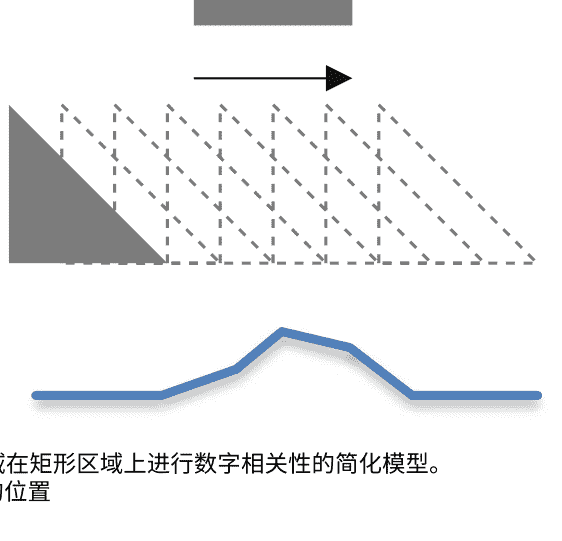

#### 相关性总结分类

| 类别 | 描述 |
| :--- | :--- |
| 光谱: | 相关性 |
| 特征形状: | 正方形，矩形 |
| 特征模式: | 密集 |
| 特征密度: | 可变大小的核 |
| 搜索方法: | 密集滑动窗口 |
| 距离函数: | SSD典型，其他可能 |
| 鲁棒性: | 有限 (照明，亚像素精度) |

### HAAR特征

HAAR-like特征[4, 9]通过Viola-Jones [178]算法在计算机视觉领域中得到推广。HAAR特征基于特定的矩形模式集，如图6.21所示，这些模式近似了基本的HAAR小波，其中每个HAAR特征由矩形内像素的平均像素值组成。这可以通过积分图像高效计算。

通过使用矩形特征中的平均像素值，目的是在相邻区域中找到一组小的模式，亮度较高或较低的区域相邻可能会显示出一个特征，例如，明亮的脸颊旁边是一个较暗的眼窝。然而，HAAR特征有缺点，因为矩形本质上不具备超过15°的旋转不变性。此外，矩形内的像素值的整合会破坏细节。

根据要检测的特征类型，例如眼睛，选择特定的HAAR特征来显示眼睛/脸颊细节和眼睛/鼻子细节。例如，具有两个矩形的HAAR模式对于检测边缘很有用，而具有三个矩形的模式可用于线条，具有内嵌矩形或四个矩形的模式可用于单个对象特征。请注意，HAAR特征可能是一组旋转的特征。

当然，HAAR模式的尺度是一个问题，因为给定的HAAR特征只适用于适当尺度的图像。图像金字塔用于HAAR特征检测，以及其他技术用于在给定应用程序的最佳网格大小下沿着图像移动搜索窗口。解决特征尺度的另一种方法是使用更广泛的缩放HAAR特征集在特征空间中进行金字塔处理，而不是在图像空间中进行处理。解决HAAR特征粒度和矩形形状的一种方法是使用重叠的HAAR特征来近似八边形和六边形；参见图6.19中的CenSurE和STAR方法。

HAAR特征与小波[219, 326]密切相关。小波可以看作是对Gabor函数[179, 325]的扩展。在这里，我们只提供了对小波和Gabor函数的简要讨论；更详细的讨论在第2章中提供。小波是一组正交的短时函数。每组小波都被设计成满足不同的目标，以定位短期信号现象。没有单一的小波函数；相反，在设计小波时，首先设计一个母小波作为小波族的基础，然后使用母小波的平移和压缩导出子小波作为基函数集合。小波被用作一组非线性基函数，其中每个基函数可以根据输入函数中所需的特征进行优化设计。因此，与使用傅里叶变换的均匀基函数集（由SIN和COS函数组成）不同，小波使用一组动态的、复杂且非均匀的基函数。小波可以用来描述非常复杂的短期特征，这在某些特征检测应用中可能是一个优势。

然而，与积分图像和HAAR特征相比，小波在计算上是昂贵的，因为它们在复杂域中表示复杂函数。由于简单的矩形形状和计算简单性，HAAR 2D基函数通常用于从积分图像中导出HAAR特征。

- 光谱: 积分盒滤波器
- 特征形状: 正方形, 矩形
- 特征模式: 密集
- 特征密度: 可变大小的核
- 搜索方法: 典型的网格搜索
- 距离函数: 简单差异
- 鲁棒性: 1 (照明)

#### Viola-Jones与HAAR-Like特征

Viola-Jones方法[178]是基于HAAR样式特征的特征检测流水线框架，使用感知器学习算法训练一个匹配网络检测器，该检测器由三个主要部分组成：

1. 积分图像用于快速计算HAAR样式特征。
2. ADA-BOOST学习算法通过将具有良好匹配性能的强分类器与在训练过程中通过调整加权因子来“增强”的弱分类器相结合，创建一个强模式匹配和分类器网络。
3. 将分类器组合成级联或漏斗，以便在级联的早期阶段快速丢弃不需要的特征。

由于在单个图像中可能找到数千个HAAR模式匹配，因此必须快速进行特征计算。为了快速进行HAAR模式匹配计算，首先将整个图像处理成积分图像。使用滑动窗口方法，在图像的每个区域中搜索已知的HAAR特征，步长为某个选择的间隔，例如每n个像素，并将检测到的特征输入到称为HAAR级联分类器的分类漏斗中。漏斗的顶部包含产生低误报和误拒的特征征集，因此级联的一阶结果包含图像的高概率区域，用于进一步分析。HAAR特征在级联的漏斗深处变得更加复杂。通过这种安排，如果没有找到所需的HAAR特征，图像区域将尽快被拒绝，从而最小化处理开销。

一个完整的HAAR特征检测器可能将数百或数千个HAAR特征组合在一起形成最终的分类器，其中不仅特征本身可能很重要，而且特征之间的空间排列也可能很重要，例如特征之间的距离和角度关系可以在分类器中使用。

### SURF

加速稳健特征方法（SURF）[152]在尺度空间中操作，并使用基于Hessian矩阵的行列式最大点的快速Hessian检测器。 SURF使用一个3 × 3 ×3邻域上的尺度空间来定位类似于斑点的兴趣点特征。 为了找到特征的方向，在每个兴趣点周围的局部区域内计算一组类似于HAAR的特征响应，该响应是在匹配金字塔尺度上计算的。

通过使用大小为≥的滑动扇形窗口，找到局部HAAR特征集的主导方向分配，如图6.22所示。 这个滑动扇形窗口围绕兴趣点旋转间隔。- 在滑动扇形区域内，对所有HAAR特征进行求和。 这包括水平和垂直响应，得到一组方向向量；选择最大的向量来表示主导特征方向。作为比较，SURF集成梯度来找到主导方向，而SIFT使用梯度方向的直方图来记录方向。

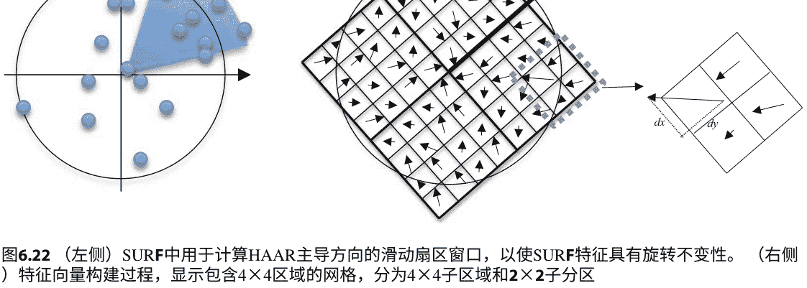

图6.22（左侧）SURF中用于计算HAAR主导方向的滑动扇区窗口，以使SURF特征具有旋转不变性。（右侧）特征向量构建过程，显示包含4×4区域的网格，分为4×4子区域和2×2子分区

为了创建SURF描述符向量，首先建立一个4 × 4的矩形网格，围绕兴趣点，类似于SIFT，然后将该网格的每个区域分割成4 × 4个子区域。 在每个子区域内，计算5 ×5个采样点上的HAAR小波响应。 每个HAAR响应都使用一个圆对称的高斯加权因子进行加权，其中加权因子随着距离中心兴趣点的距离减小，类似于SIFT。每个特征向量包含四个部分：

```
v = (\sum d_x, \sum d_y, \sum |d_x|, \sum |d_y|)
```

每个子区域的小波响应 d_x和 d_y求和，响应的绝对值 |d_x| 和 |d_y| 提供了强度变化的极性。 最终的描述符向量是4 ×4 × 4：每个区域有四个部分，总共64个向量长度。 当然，通过修改基本方法可以设计其他向量长度。

如图6.22所示，在滑动扇区窗口过程中，SURF梯度网格根据主导方向进行旋转，然后计算波纹响应。

每个方向相对于方向进行分组以进行特征向量的分组。特征向量中记录了每个小波方向和总和 $d_x$, $d_y$, $|d_x|$, $|d_y|$。
SURF和SIFT流程方法在实现步骤和最终准确性上通常是可比较的，但是与ORB基准测试中的SIFT相比，SURF的计算速度快一个数量级。然而，像ORB这样的局部二制描述符比SURF快一个数量级，并且在许多应用中具有可比较的准确性。有关更多信息，请参阅本章前面关于局部二制描述符的部分。

- 光谱：积分盒滤波器+方向向量
- 特征形状：HAAR矩形
- 特征模式：密集
- 特征密度：稀疏的Hessian兴趣点
- 搜索方法：在尺度空间上进行密集滑动窗口
- 距离函数：Mahalanobis或欧氏距离
- 鲁棒性：4个（尺度、旋转、光照、噪声）

#### SURF的变种

值得讨论的SURF描述符的几个变体[180, 181]如表6.6所示。特别有趣的是G-SURF方法[180]，它使用了微分几何概念[182]中的局部区域标尺坐标系来计算特征。由于标尺坐标不是全局的，而是局部的图像特征，标尺空间特征具有几何精度的优势。

表6.6 SURF变体（如Alcantarilla等人[180]所讨论）

| SURF | 圆对称高斯加权方案，20x20网格 |
|------|--------------------------------|
| U-SURF [181] | SURF的快速版本，只使用直立特征，没有方向。与M-SURF类似，但计算直立特征“U”时不旋转网格，使用20x20网格，没有重叠的HAAR特征，修改的高斯加权方案，在直方图柱之间进行双线性插值。 |
| M-SURF MU-SURF [181] | 使用两步计算的圆对称高斯加权方案，而不是正常SURF的一步计算，使用24x24网格和重叠的HAAR特征，MU-SURF版本中省略了旋转方向。 |
| G-SURF, GU-SURF [180] | 在Gauge坐标空间中，用二阶测量导数代替HAAR特征，没有高斯加权，使用20x20网格。测量导数具有旋转和平移不变性，而HAAR特征是简单的矩形，矩形的旋转不变性较差，最多可能+/-15度。 |
| MG-SURF [180] | 与M-SURF相同，但使用了规格导数。 |
| NG-SURF [180] | N = 不像SURF那样使用高斯加权; 与SURF相同，但不应用高斯加权，允许对规格导数特征和HAAR特征进行比较。 |

### 梯度直方图（HOG）及其变种

梯度直方图（HOG）方法[98]用于图像分类，依赖于在重叠块的密集网格上计算局部区域梯度，而不是在兴趣点上。HOG适用于某些应用，例如人体检测，其中图像中的特征相当大。

HOG在原始数据上操作; 而许多方法依赖于高斯平滑和其他滤波方法来准备数据，HOG专门设计为使用所有原始数据，而不引入去除细节的滤波伪影。作者展示了使用这种方法的明显好处。这是一个权衡：如平滑等滤波伪影与细节等图像伪影。HOG方法显示了对原始数据的优先结果。参见图4.12，显示了HOG描述符的可视化。

HOG方法的主要方面如下：

- 原始RGB图像没有进行颜色校正或噪声滤波，使用其他颜色空间和颜色伽马调整对增加的成本几乎没有优势。
- 首选64 × 128大小的滑动检测窗口；还测试了56 × 120和48 × 112大小的窗口。在这个检测窗口内，总共定义了8 × 16个8 × 8像素块区域用于计算梯度。块大小可调。
- 对于每个8 × 8像素块，计算了64个局部梯度幅值。首选的方法是简单的行和列导数[-1, 0, 1]在x/y方向上；尝试了其他梯度滤波方法，但是带有或不带有高斯滤波的较大滤波器会降低准确性和性能。为每个颜色通道单独计算梯度。
- 局部梯度幅度被分成一个9-bin的边缘方向直方图，通过双线性插值将维度从64量化为9；<9个bin会导致较差的准确性，>9个bin似乎并不重要。请注意，可以使用矩形R-HOG或圆形对数极坐标C-HOG进行分bin区域。
- 将梯度幅度直方图值归一化为单位长度，以提供光照不变性。归一化是以组的形式进行的，而不是单个直方图。在检测器窗口内使用重叠的2 × 2个直方图块；块重叠方法可以减少锐利的伪影，2 × 2的区域大小似乎效果最好。
- 对于64 × 128像素的检测器窗口方法，定义了总共128个8 × 8像素的块。每个8 × 8的块有四个单元用于计算独立的9-bin直方图。总描述符大小为8 × 16 × 4 × 9 = 4608。

请注意，滑动窗口和块大小的各种表达方式用于处理特定的应用领域。参见图4.12，显示使用7 × 15 8 × 8像素单元计算的HOG描述符的可视化。HOG [98]设计方法的关键发现包括：

- 原始数据中细尺度的突变边缘对于梯度计算的准确性是必需的，后处理和对梯度柱进行归一化的工作效果良好。
- L2风格的局部对比度块归一化更受青睐，并且提供比全局归一化更好的准确性；请注意，局部区域块是重叠的，以帮助归一化。
- 在直方图分箱过程中去除L2块归一化阶段会导致准确性下降27%。
- HOG特征的性能比HAAR风格的检测器要好得多，这在考虑到HAAR小波是一个集成的无方向值时是有道理的，而局部HOG区域上的梯度幅度和方向提供了更丰富的频谱。

### PHOG及相关方法

定向梯度金字塔直方图（PHOG）[183]方法是为了全局或区域图像分类而设计的，而不是用于局部特征检测。PHOG将区域HOG特征与整个图像区域特征相结合，使用跨越整个图像的特征之间的空间关系在八度网格区域细分中传播；参见图6.23。

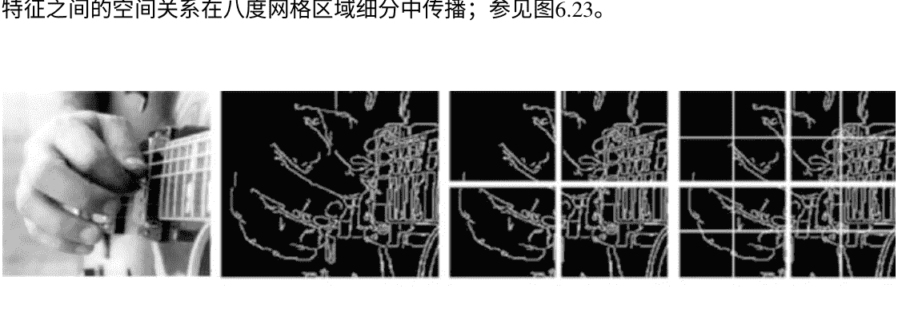

图6.23 使用八度网格单元计算的整个图像上的PHOG描述符集合，用于限定边缘信息。（左中）单个直方图。（右中）四个直方图连接在一起显示。（右）十六个直方图连接在一起显示。

PHOG与Lazebnik、Schmid和Ponce [516]提出的使用粗到细的区域直方图网格的相关工作类似，使用定向边缘和SIFT特征提供多类别分类。它也类似于Grauman和Darrell [517]提出的在逐渐细化的网格上采用连接直方图特征的金字塔匹配核方法，该方法使用加权的多分辨率直方图交集计算对应关系。其他相关的早期工作使用多分辨率直方图进行纹理分类，详见参考文献[47]。

PHOG描述符捕捉了几个特征变量，包括：

- 形状特征，根据受HOG方法[98]启发的梯度特征的局部边缘分布导出。
- 空间关系，通过计算一组八度网格单元上的直方图特征来覆盖整个图像，并且随着图像的细分，块的大小也逐渐变小。

- 外观特征，使用在规则间隔的密集网格上计算的一组密集SIFT描述符。 PHOG被证明可以计算彩色图像的SIFT向量； HSV颜色空间的结果在[183]中提供。

一组训练图像用于为一类图像生成一组PHOG描述符变量，例如汽车或人物。 使用K-means聚类将这个PHOG特征训练集减少到几百个视觉词，用于特征匹配和图像分类。

PHOG的一些关键概念在图6.23中有所说明。 对于特征形状，使用Canny边缘检测器计算边缘，并使用Sobel算子计算梯度方向。 梯度方向的分组在相邻的直方图分组之间进行线性插值，每个分组表示边缘的角度。 对整个图像的每个网格单元大小计算一个HOG向量。 最终的PHOG描述符由每个网格级别的所有单个HOG直方图的加权串联组成。 在八度网格单元区域之间没有进行尺度空间平滑以减少细节。

如图6.23所示，最终的PHOG包含了所有串联的HOG。 请注意，对于中心左图像，完整的网格大小单元产生1个HOG，对于中心右图像，半个八度网格产生4个HOG，对于右图像，细网格产生16个HOG向量。 最终的PHOG被归一化为单位，以减少由于边缘或纹理的集中而引起的偏差。

| 类别 | 描述 |
| :--- | :--- |
| 光谱: | 全局和区域梯度方向直方图 |
| 特征形状: | 矩形 |
| 特征模式: | 密集的网格瓦片 |
| 特征密度: | 密集的瓦片 |
| 搜索方法: | 网格区域，无搜索 |
| 距离函数: | 2范数 |
| 鲁棒性: | 3（在一定程度上对光照、视角、噪声具有不变性的图像分类） |

### Daisy和O-Daisy

Daisy描述符[206, 308]受到SIFT和GLOH样式描述符的启发，用于稠密匹配应用，如立体映射和跟踪，据报道比SIFT快约40%。 请参见图6.24。 Daisy依赖于一组径向分布和逐渐增大的高斯卷积核，这些核重叠并呈现出类似花朵的形状（Daisy）。

Daisy不需要局部兴趣点，而是在每个像素点密集计算描述符，因为其预期应用是立体映射和跟踪。 Daisy不像SIFT和GLOH那样使用梯度幅值和方向计算，而是使用一组基于定向高斯导数滤波器的卷积方向图来创建八个等角度的方向图。

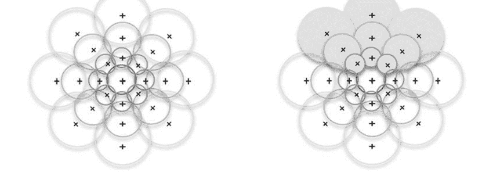

图6.24（左）Daisy模式区域，由四组八个重叠的同心圆组成，在外圆中增加高斯模糊，每个圆的半径与高斯核区域标准差成比例。重叠的圆形区域可以一定程度上过滤相邻区域的过渡伪影。（右）一个假设的二进制遮挡掩码；较暗的区域表示在匹配过程中可能被遮挡和“关闭”的点。

Daisy的设计考虑了优化。卷积方向图方法比SIFT和GLOH的梯度幅值和方向方法消耗更少的计算周期，但产生类似的结果。Daisy方法还包括用一系列较小的卷积核来计算较大的高斯核的优化，以及通过递归计算某些卷积核来进行优化。另一个优化是使用圆形网格模式而不是SIFT中使用的矩形网格，这允许Daisy通过旋转采样网格来改变旋转，而无需重新计算卷积图。

如图6.24所示（右图），Daisy还使用二进制遮挡掩码来识别在特征匹配距离函数中使用或忽略的描述符模式的部分。这是一种新颖的特征，可以对遮挡具有不变性。

Daisy的FPGA优化版本称为O-Daisy [209]，提供了增强的旋转不变性。

- DAISY摘要分类
- 光谱：高斯卷积值
- 特征形状：圆形
- 特征模式：重叠的同心圆
- 特征密度：每个像素密集
- 搜索方法：密集滑动窗口
- 距离函数：欧几里德
- 鲁棒性：3（照明、遮挡、噪声）

### CARD

紧凑实时描述符（CARD）方法[210]旨在通过基于学习的稀疏哈希将描述符转换为二进制码来进行性能优化。

支持快速的汉明距离匹配。 CARD的一个新概念是从局部像素块中提取直方图的梯度直方图查找表描述符，以及将其分配到笛卡尔或对数极坐标中的查找表。 据报道，CARD在旋转和尺度鲁棒性方面比SIFT和SURF显著更好，性能至少比SIFT好十倍，并且略优于SURF。

CARD遵循RIFF [211, 214]的特征检测方法，在图像金字塔的八度级别上使用FAST特征进行定位。 完整的CARD金字塔包括八度之间的中间级别，以增加分辨率。 金字塔级别以1/√2的间隔计算。其中级别0是完整的图像。 使用Shi-Tomasi [149]优化的Harris角点检测器找到关键点。

与SIFT类似，CARD在每个像素处计算梯度，并且可以使用笛卡尔坐标分配或类似GLOH的对数极坐标分配；请参见图6.17。为了避免将梯度信息插值到直方图中的昂贵双线性插值，CARD在分配之前通过旋转分配模式来优化此步骤，如图6.25所示。请注意，分配还使用查找表进行进一步优化，该查找表包含基于图像块中梯度的主要方向的函数值。

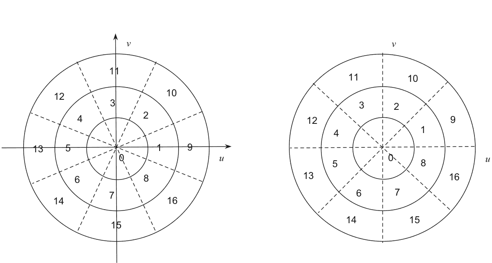

图6.25 CARD补丁模式包含17个对数极坐标分箱，左侧图像旋转以优化分箱

如图6.25所示，为了加快分箱速度，CARD不像SIFT和其他方法那样根据估计的梯度方向旋转补丁以提取和分箱旋转不变描述符，而是基于梯度方向旋转分箱模式然后进行分箱，这样速度更快。 图6.25显示了右侧未旋转的分箱模式，左侧旋转了 π/8。 所有分箱值都被连接并归一化以形成描述符，在最准确的报告中长度为128位。[210]

- CARD总结分类
- 光谱：梯度幅度和方向
- 特征形状：圆形，根据金字塔尺度和主方向变化
- 特征模式：密集
- 特征密度：在图像金字塔上的FAST兴趣点上的稀疏
- 搜索方法：滑动窗口
- 距离函数：汉明距离
- 鲁棒性：3（光照、尺度、旋转）

### 鲁棒快速特征匹配

Taylor、Rosten和Drummond [212]（RFM2.3）开发的2.3微秒内的鲁棒特征匹配（RFM2.3）（本文作者在此处创造了这个首字母缩写）是一种新颖、快速的特征描述和匹配方法，针对计算速度和内存占用进行了优化。RFM2.3在所调查的特征描述符中独树一帜，采用了多种方法和优化，包括稀疏区域直方图和二进制特征码。RFM2.3中开发的一个关键是通过创建一组缩放、旋转和仿射变换的原始特征的视图来计算同一补丁的描述符，从而实现对仿射变换（如旋转和缩放）以及透视变换的不变性。

除了扭曲之外，还对扭曲的补丁集添加了一些噪声和模糊，以提供对描述符的鲁棒性。RFM2.3是变形描述符类中为数不多的方法之一[336–338]。在尺度空间金字塔中使用FAST关键点来定位候选特征，并为每个关键点计算扭曲的补丁集。计算完扭曲的补丁集后，再次在集合中的每个新补丁上生成FAST角点，以确定哪些补丁最为独特和可检测，并选择最佳补丁并将其量化为二进制特征描述符并保存在模式数据库中。

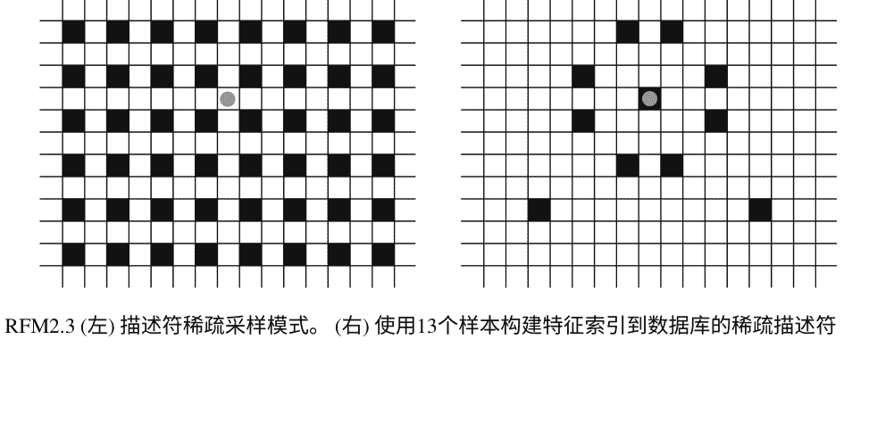

如果像素值大于补丁均值，则将其设置为1，将索引限制为2^13或8192个条目，因此数据库中的多个特征可能共享相同的索引。然而，使用汉明距离可以快速计算特征差异，因此索引主要用作组织类似补丁的数据库键。训练阶段确定要包含在特征数据库中的最佳索引值集合和要保存的最佳模式，因为某些模式比其他模式更不同。最初，特征以全分辨率捕获，但如果在全分辨率下找到的好特征很少，还会在图像金字塔的下一级提取其他特征。

在训练期间，描述符被建模为一个64值的归一化强度分布函数，通过两次缩小尺寸来计算最终的描述符向量：首先，将64个值缩小为一个五-bin像素强度分布直方图；其次，在训练完成后，每个直方图bin都用一个1位二进制编码表示，如果该bin被使用，则为1，如果该bin很少使用，则为0。得到的描述符是一个压缩的、二进制编码的位向量，适用于汉明距离。

#### RFM2.3总结分类

- 光谱：将归一化的直方图块强度编码为二进制块索引码
- 特征形状：矩形，多个视点
- 特征模式：15 × 15像素块中的稀疏模式
- 特征密度：在FAST9兴趣点上稀疏
- 搜索方法：在图像金字塔上滑动窗口
- 距离函数：汉明距离
- 鲁棒性：4（光照，尺度，旋转，视角）

### RIFF, CHOG

旋转不变快速特征（RIFF）[211, 214]方法的动机是在移动增强现实的跟踪和建图应用中。RIFF方法的基础包括开发径向梯度变换（RGT），以一种计算效率高且具有旋转不变性的方式表示梯度方向和大小。RIFF的另一个贡献是一种跟踪方法，据报道比KLT更准确，性能更好，具有26×更好的性能。据报道，RIFF比SURF快15×。

RIFF使用在尺度空间中计算的FAST兴趣点处的HOG描述符，并且通常遵循作者在CHOG [215]（压缩HOG）中的先前工作的方法，以减少维度和低比特率的分箱。在对HOG梯度进行分箱之前，使用径向梯度变换（RGT）创建一个具有旋转不变性的梯度格式。如图6.27（左图）所示，RGT使用两个正交基向量 (r,t) 形成围绕补丁中心点c的径向坐标系，并且HOG梯度g投影到(r,t)上，表示为旋转不变向量（g^T r, g^T t）。图6.27中显示了向量量化器和标量量化器的使用情况。

如图6.27（右图）所示，基向量可以通过使用近似径向梯度变换（ARGT）中的梯度方向近似进行优化，该近似优化可通过沿着相同梯度线的相邻归一化像素之间的简单差异和简单的45°量化来计算。还请注意，在图6.27（中左图）中，直方图优化通过在环形区域内采样每隔一个像素，并且出于实际原因使用四个环形区域作为区分度和性能之间的权衡。为了满足量化梯度直方图箱的实时系统性能目标，RIFF使用了一个5 × 5的标量量化器，而不是向量量化器。

#### RIFF

图6.27 RIFF描述符背后的概念[211, 214]，部分基于CHOG[215]

在图6.27（左图）中，梯度投影g在点c上到一个径向坐标系 (r,t) 上用于旋转不变的梯度表达式，并且描述符块以c为中心。中心左图（环形）说明了分箱方法，使用四个环形环，可以降低维度，并且只对灰度像素进行采样，可以提高2倍的速度。中心和中心右图说明了直方图量化的分箱中心机制：（1）更灵活的标量量化器SQ-25和（2）更快速的矢量量化器VQ-17。右图说明了从中心向外辐射的梯度方向的径向坐标系基向量，显示了更高计算效率的ARGT或近似径向梯度变换（RGT），它不使用浮点数运算（RGT未显示，请参阅[214]）。

#### RIFF摘要分类

| 属性 | 值 |
|------|-----|
| 光谱 | 局部区域近似径向梯度直方图 |
| 特征形状 | 圆形 |
| 特征模式 | 稀疏每隔一个像素 |
| 特征密度 | 在图像金字塔上的FAST兴趣点上的稀疏 |
| 搜索方法 | 滑动窗口 |
| 距离函数 | 对称KL散度 |
| 鲁棒性 | 4（光照，尺度，旋转，视角） |

### 链码直方图

链码直方图（CCH）[198]描述符通过将连接组件的方向（在这种情况下为连接的周长像素）分箱为直方图来记录周长的形状。当逐像素遍历周长时，遍历的方向被记录为一个数字，如图6.28所示，并记录在直方图特征中。为了匹配CCH特征，可以使用SSD或SAD距离度量。

链码直方图受到美国专利US4783828的保护。CCH于1961年发明[198]，也被称为Freeman链码。CCH的一种变体是顶点链码[199]，它允许减小描述符的大小，并且据称具有更好的准确性。

图6.28 制作直方图的链码过程。(从左到右) 1. 连接周长可能改变的八个可能方向。2. 每个连接周长方向改变的链码值；确定链码值的方向是从中心像素开始。3. 通过黑色像素突出显示的具有连接周长的对象。4. 遵循连接周长的对象的链码，从顶部像素开始。5. 所有链码值的直方图。

### D-NETS

D-NETS（描述符-NETS）[127]方法由Hundelshausen和Sukthankar开发，放弃了矩形描述符区域或矩形描述符区域，而采用一组在端点连接的条带。

D-NETS允许使用一组端点之间的有向图组成的条带模式族；它不特定限制可以使用的端点或条带模式的类型。D-NETS论文提供了三种类型模式的结果讨论：

- **Clique D-NETS**：将所有兴趣点连接起来的全连接网络。虽然方法中使用的兴趣点类型可能会有所变化，但最初的工作报告了使用SIFT关键点的结果。
- **迭代D-NETS**：使用一部分兴趣点动态创建网络，使用停止准则增加连接密度，以优化匹配性能和准确性。
- **密集采样的D-NETS**：这种变体不使用兴趣点，而是在规则间隔的网格上密集采样网络，经验上选择了10像素的网格，并添加了一些滞后或噪声以减少病态采样伪影。密集方法适用于高度并行的实现，以提高性能。

有关三种D-NETS模式的示例和讨论，请参见图4.8。每个条带是在两个点之间采样的原始像素值数组。描述符本身被称为d-token，并提出了各种计算d-token的方法，例如在条带中的像素值之间进行二进制比较（类似于FERNS或ORB），以及比较条带数组的1D傅里叶变换或使用小波。报道的最佳结果是一种经验性设计的d-token，创建过程如下：

- 条带向量采样，其中每个像素条带向量在等距位置上采样在像素条带向量长度的10%到80%之间；这种采样方式是根据经验确定的，以忽略靠近端点的像素。
- 将像素条带向量化为一组均匀的块，s，以减少噪音。
- 对条带向量进行归一化，以进行缩放和平移。
- 将向量值离散化为有限的位范围，b。
- 将所有均匀块连接成d-token，它是一个长度为s×b的位串。

描述符匹配利用了一种高效且新颖的哈希和假设对应投票方法。D-NETS的结果在精确度和召回率上报告比ORB或SIFT更高。

#### D-NETS总结分类

- 光谱: 归一化、平均线性像素强度块
- 特征形状: 线段连接网络
- 特征模式: 选择点之间的稀疏线段
- 特征密度: 沿线稀疏
- 搜索方法: 滑动窗口
- 距离函数: 哈希和投票
- 鲁棒性: 5 (光照、尺度、旋转、视角、遮挡)

### 局部梯度模式

LBP方法的一种变体，局部梯度模式（LGP）[196]使用局部区域梯度而不是局部图像强度对比来形成二进制描述符。计算局部区域中每个像素的3×3梯度，然后将每个梯度幅值与所有局部区域梯度的均值进行比较，如果值较大，则分配二进制位值1，否则为0。作者声称在人脸识别算法中，相对于基本LBP，准确性和区分度有所提高，包括减少了误报。然而，由于局部区域梯度计算，计算要求大大增加。

#### LGP总结分类

- 光谱: 中心像素和局部区域之间的局部区域梯度比较
- 特征形状: 正方形
- 特征模式: 每个像素3 × 3内核区域
- 特征密度: 3 × 3区域密集
- 搜索方法: 滑动窗口
- 距离函数: 汉明距离
- 鲁棒性: 3 (光照、尺度、旋转)

### 局部相位量化

局部相位量化（LPQ）描述符[158-160]旨在对图像模糊具有鲁棒性，并利用傅里叶相位信息的模糊不敏感特性。由于需要计算傅里叶变换来计算相位，因此存在一些计算开销；但是，可以使用整数DFT方法进行加速。据报道，LPQ对均匀模糊以及均匀光照变化具有鲁棒性。据报道，在非模糊图像上，LPQ的准确性与LBP和Gabor滤波器组方法相当或略有提高。尽管主要用于纹理描述，但LPQ也可以与另一种描述符方法（如SIFT）结合使用，用于局部特征描述并增加模糊不变性。

#### LPQ总结分类

| | |
|---|---|
| 光谱： | 使用*DFT*的局部区域白化相位！一个8位二进制码 |
| 特征形状： | 正方形 |
| 特征模式： | 8 × 8个核区域 |
| 特征密度： | 每个像素密集 |
| 搜索方法： | 滑动窗口 |
| 距离函数： | 汉明距离 |
| 鲁棒性： | 3 (对比度、亮度、模糊度) |

## 基础空间描述符

本节介绍了用于计算机视觉应用的基础空间来描述图像特征。基础空间由一组函数组成，即基础函数，这些函数作为一组组合在一起，例如傅里叶级数（在第3章中讨论）。复杂信号可以被分解为所选基础空间作为描述符。

基础函数可以设计和用于描述、重构或合成信号。它们需要进行正向变换将值投影到基础集中，并进行逆变换将数据移回原始值。一个简单的例子是在基于2的数字系统和基于10的数字系统之间进行转换；每个基础都有优势。

有时候将数据集从一个基础空间转换到另一个基础空间是很有用的，可以帮助我们更好地理解数据，或者对数据进行处理和过滤。例如，以笛卡尔坐标系中的像素集合形式捕获的图像可以转换为其他基础空间，比如频域中的傅里叶基础空间，用于处理和统计分析。对于计算机视觉应用来说，一个好的基础空间应该提供正向和反向变换。傅里叶变换再次满足这些条件，还有其他几种基础空间也满足这些条件。

基础空间类似于坐标系，因为它们都具有与相关空间的可逆变换。在某些情况下，仅仅将特征谱转换到另一个坐标系中可以使分析和表示更简单和高效。（第4章讨论了用于特征表示的坐标系。）本章中调查的几种描述符使用非笛卡尔坐标系，包括使用极坐标分箱的GLOH和使用径向坐标描述符的RIFF。

### 傅里叶描述符

傅里叶描述符[219]将特征数据表示为正弦和余弦项，可以在傅里叶功率谱中观察到。傅里叶级数、傅里叶变换和快速傅里叶变换用于广泛的信号分析，包括1D、2D和3D问题。没有讨论图像处理或计算机视觉的完整性，就没有傅里叶方法，因此我们将在这里探索傅里叶方法，并应用于特征描述。

与其开发傅里叶级数和傅里叶变换的数学和理论（这在Bracewell [219]的标准文本中已经做得非常好），我们在这里讨论傅里叶功率谱在特征描述中的应用，并对基本原理进行最少的处理；另请参阅第3章。傅里叶级数背后的基本思想是通过幅度和相位来定义一系列正弦和余弦基函数，这些函数可以相加以近似表示任何复杂周期信号。相反，傅里叶变换用于将复杂周期信号分解为傅里叶级数的正弦和余弦基项。信号（如线或2D图像区域）的傅里叶级数分量被用作该区域的傅里叶描述符。

在这个讨论中，傅里叶描述符是从傅里叶功率谱中选择的组件，通常选择低频组件，这些组件携带大部分功率。下面是一些使用傅里叶描述符的示例；请注意，傅里叶幅度和相位都可以使用。

- LBP直方图的傅里叶谱。如图3.10所示，一个LBP直方图集可以表示为傅里叶谱幅度，这使得直方图描述符对旋转不变。
- 形状周长的傅里叶描述符。如图6.29所示，多边形对象的形状可以使用傅里叶方法描述，使用一系列从周长到质心的线段数组，间隔为10°。该数组被输入FFT以产生一个形状描述符，该描述符具有尺度和旋转不变性。
- 梯度直方图的傅里叶描述符。许多描述符使用梯度来表示特征，并使用梯度幅度或方向直方图对结果进行分组。傅里叶谱幅度可以用于从梯度信息中创建描述符，以增加不变性。
- 径向线采样的傅里叶频谱。在RFAN描述符[128]中使用的径向线从局部区域中采样像素值，并将其表示为傅里叶幅度的傅里叶描述符。
- 傅里叶频谱相位。本章描述的LPQ描述符利用了描述符中的傅里叶频谱相位信息，而LPQ对于模糊不敏感，归功于相位信息。

### 用于描述符构建的其他基函数

除了傅里叶基函数系列，还使用其他函数系列和基础集进行描述符构建、模式识别和图像编码。然而，这些方法通常应用于全局或区域范围。有关其他几种方法的详细信息，请参阅第3章。

## 稀疏编码方法

本章讨论的任何局部特征描述方法都可以作为稀疏码本的基础，稀疏码本是一组经过精简的描述符集合。稀疏编码和相关方法在第10章中有更详细的讨论。有趣的例子可以在Aharon、Alad和Bruckstein [518]以及Fei-Fei、Fergus和Torralba [519]的工作中找到。请参见图6.30。

图6.30 使用稀疏编码进行特征学习的一种方法，展示了如何从一组学习到的稀疏编码构建稀疏编码直方图（HSC）。据报道，HSC方法[117]在许多情况下优于HOG方法。

## 多边形形状描述符

多边形形状描述符计算任意多边形或斑点的一组形状特征，并使用统计矩或图像矩来描述形状（如第3章所讨论的）。这些形状特征基于多边形形状的周长。在测量和描述之前，用于勾画图像周长以突出形状的方法通常是复杂的、经验调整的图像预处理操作流程，如阈值化、分割和形态学（如第2章所讨论的）。一旦多边形形状被勾画出来，就可以计算形状描述符；请参见图6.31。通常，多边形形状方法适用于较大的区域尺寸特征。在文献中，这个主题也可以被讨论为图像矩。要深入了解图像矩的主题，请参阅Flusser等人的文章[500]。

多边形形状方法通常用于医学和工业应用，例如细胞生物学的自动显微镜和工业检测；参见图6.31。有商业软件库可用于多边形形状描述，通常称为粒子分析或斑点分析。请参阅附录C。

### MSER方法

最大稳定极值区域（MSER）方法[186]通常在文献中被讨论为兴趣区域检测器，事实上也是如此。然而，我们将MSER包括在形状描述符部分，是因为MSER区域可以比其他兴趣点方法（如HARRIS或FAST）更大。

MSER检测器是为解决宽基线立体视觉系统中的视差对应问题而开发的。立体视觉系统创建了一个扭曲和复杂的几何深度场，根据摄像机之间的基线和物体到摄像机的距离，必须进行各种几何效应的补偿。在宽基线立体视觉系统中，靠近摄像机的特征在仿射变换下更容易产生畸变，这使得在左/右图像对之间找到精确匹配变得更加困难。MSER方法试图通过匹配斑点状特征来克服这个问题。

MSER区域类似于形态学斑点，并且对倾斜和光照具有相当强的鲁棒性。MSER本质上是分水岭算法的一种高效变体，不同之处在于MSER的目标是找到一系列阈值，使分水岭盆地的大小保持不变。MSER方法涉及将像素根据二值强度阈值分成一组区域，具有在连接组件模式中在一系列阈值上具有相似像素值的区域被认为是最大稳定的。为了计算MSER，像素在二值强度阈值循环中进行排序，该循环从最小值到最大值扫描强度值。首先，二值阈值设置为低值，例如单个图像通道（如亮度）。小于阈值的像素为黑色，大于或等于阈值的像素为白色。在每个阈值级别上，保留一个连接组件或像素的列表。强度阈值从0递增到最大像素值。在强度变化时不增长、不缩小或不改变的区域被认为是最稳定的，MSER描述符记录了最大区域的位置和相应的阈值。

在立体应用中，更小的MSER区域被优先选择，并且相关性用于最终的对应，相似性在选择的旋转间隔内测量在一组圆形MSER区域内。 MSER的一些有趣优势包括：

- 多尺度特征和多尺度检测。由于MSER特征不需要任何图像平滑或尺度空间，因此可以检测到粗特征和细边缘特征。
- 在整个区域上计算的可变大小特征，不限于补丁大小或搜索窗口大小。
- 仿射变换不变性，这是一个具体的目标。
- 由于极值区域往往在广泛的图像变换中被检测到，因此具有对形状变化的普遍不变性和检测的稳定性。

MSER也可以被视为形状描述符的基础，并作为形态学分割方法的替代选择。每个MSER区域可以使用形状度量进行分析和描述，本章后面将进行讨论。

### 用于斑点和多边形的物体形状度量标准

对象形状度量具有强大的能力，并在不变性和鲁棒性方面提供许多自由度。对象形状度量与局部特征度量不同，因为对象形状度量可以描述更大的特征。这对于从帧到帧的跟踪是有利的。例如，一个由面积、周长和质心等几个简单的对象形状度量描述的大对象可以在广泛的条件和不变性下从帧到帧进行跟踪。有关2D形状描述方法的调查，请参阅参考文献[120, 121]。

形状可以用几种方法来描述，包括：

- 对象形状的矩和度量标准：本节的重点。
- 图像矩：参见“图像矩”第3章。
- 傅里叶描述符：本章和第3章中讨论。
- 形状上下文特征描述符：本节中讨论。
- 用于周长描述的链码描述符：本节中讨论。

对象形状与形态学领域密切相关，形态学处理的计算机方法在第2章中有详细讨论。还可以参见本章前面关于形态学兴趣点的讨论。

在计算机视觉研究的许多领域中，局部特征似乎比基于对象形状的特征更受青睐。形状分析方法不受欢迎可能是对创建预处理流水线（滤波、形态学和分割）以准备形状分析图像所需的工作的一种反应。如果图像没有经过正确的预处理和准备，形状分析是不可能的。（有关假设形状分析预处理流水线的讨论，请参见第8章。）多边形形状度量标准可用于几乎任何场景分析应用，以查找常见对象并准确测量其大小和形状；典型应用包括生物学和制造业。一般来说，大多数多边形形状度量标准都是旋转和尺度不变的。

表6.7提供了一些常见的度量标准的示例，这些度量标准可以从区域形状中得出，包括二进制形状和灰度形状。

### 表6.7 各种常见的物体形状和斑点物体度量标准描述

| 度量标准名称 | 描述 |
| --- | --- |
| **物体二进制形状度量标准描述** | |
| 周长 | 物体边缘周围所有点的长度，包括对角线长度的总和~= 1.4和相邻长度= 1面积 |
| 凸包 | 多边形形状或包围所有周长点的线段集合 |
| 质心 | 物体质量中心，所有像素坐标的平均值或所有周长坐标的平均值 |
| 傅里叶描述符 | 傅里叶频谱是由包含从质心到周长的一组径向线段的长度的数组得出的，这些线段以规则的角度用于建模1D信号函数，1D信号函数被输入到1D FFT中，FFT幅度数据集被用作一组选择的八度频率的度量标准 |
| 主/次轴 | 通过质心包含在内并与周长接触的最长和最短线段 |
| 费雷特 | 物体的最大卡尺直径 |
| 宽度 | 最短卡尺直径 |
| 纵横比 | 费雷特/宽度 |
| 圆形度 | 4 X Pi X 面积/周长² |
| 圆度 | 4 X 面积/(Pi X 费雷特²) (也可以从傅里叶描述符计算) |
| 面积等效直径 | sqrt((4/Pi) X 面积) |
| 周长等效直径 | 面积/Pi |
| 等效椭圆 | (Pi X 费雷特 X 宽度)/4 |
| 紧凑度 | sqrt((4/Pi) X 面积)/费雷特 |
| 固实度 | 面积/凸包面积 |
| 凹度 | 凸包面积-面积 |
| 凸度 | 凸包/周长 |
| 形状 | 周长²/面积 |
| 修改比率 | (2 X 最小R)/费雷特 |
| 形状矩阵 | 多边形形状的2D矩阵表示或绘图（可以使用笛卡尔或极坐标；参见图6-32） |
| **灰度物体形状度量标准** | |
| SDM图 | *请参阅第3章，“纹理度量标准”部分。 |
| 散点图 | *请参阅第3章，“纹理度量标准”部分。 |
| 灰度像素值的统计矩 | 最小值<br>最大值<br>中位数<br>平均值<br>平均偏差<br>标准差<br>方差<br>偏度<br>峰度<br>熵 |

> *注意：一些二值物体度量标准也适用于灰度物体。

形状被认为是二值的；然而，也可以使用灰度形态学计算强度通道物体的形状。周长被视为一组相连的组件。形状由二值阈值或强度范围内的单像素宽度的周长定义，像素可以位于周长上、内部或外部。周长边缘可以通过逐像素扫描图像并检查相邻的接触像素邻居的连通性来计算。或者，周长也可以从本章前面讨论的形状矩阵[327]或链码计算得出。对于每个段（像素），计算周长长度，其中段长度 =1表示水平和垂直邻居，以及 $\sqrt{2}$ 否则对于对角邻居。周长可以用作掩码，并且可以在区域内计算灰度或颜色通道的统计度量。对象的面积是周长内所有像素的计数。质心可以通过计算周长区域内所有点的(x,y)坐标的平均值，或者计算周长的(x,y)坐标的平均值来计算。

形状度量是强大的。例如，形状度量可以用于在测量之前从场景中移除或排除对象。例如，当面积小于给定大小或质心坐标超出给定范围时，可以从场景中移除对象。

如图6.29和表2所示，傅里叶描述符提供了一个旋转和尺度不变的形状度量，还具有一定的遮挡不变性。确定傅里叶描述符的方法是从质心到周长上的点上取一组等角间隔的半径测量，例如每10°，然后将半径测量组装成一个1D数组，通过1D FFT运行该数组以得到对象的傅里叶矩。或者可以使用径向像素辐条作为描述符。

在图6.29中展示了其他有用的形状度量标准的示例，包括具有主要和次要轴的边界框，通过质心到周长的最长和最短直径段；这可以用来确定物体的旋转方向。

SNAKES方法[522]使用样条模型将一组感兴趣点（如选择的周长点）拟合到区域轮廓中。感兴趣点是样条点。SNAKE可以用于从一帧到另一帧跟踪轮廓特征，围绕感兴趣点位置进行变形。

一般来说，2D对象形状方法可以扩展到3D数据；然而，在这里我们不探讨3D对象形状度量标准，参考文献[192, 193]中有关3D形状描述符的调查。

### 形状上下文

Belongie、Malik和Puzicha [231–233]开发的形状上下文方法使用周长上的参考点作为笛卡尔坐标轴原点，并将选择的周长点坐标相对于参考点原点进行分组。每个点的相对坐标被分组到对数极坐标直方图中。形状上下文与早期的形状矩阵描述符[327]相关，该描述符于1985年开发，如图6.32所示，也使用对数极坐标描述物体的周长。形状上下文方法提供了几种变体，由作者在几篇论文中描述[231–233]。在这里，我们看一些关键概念。

首先，对象的周边边缘以均匀间隔稀疏采样，通常保留大约100个边缘采样点进行粗略分组。稀疏的周边边缘点通常与兴趣点不同，并且使用周边追踪方法找到。接下来，在对象的周边选择一个参考点作为笛卡尔空间的原点，并计算从原点到每个周边点的向量角度和大小（, θ）。大小或距离被归一化以适应直方图。每个稀疏的周边边缘点用于计算切线。

图6.32一个用于对象周长的形状矩阵描述符[327]。(左两个图像)笛卡尔坐标形状矩阵。(右两个图像)极坐标形状矩阵，使用三行八个编号的区域箱进行表示，灰色框表示要进行分箱的像素。请注意，可以同时使用多个形状矩阵。如果像素至少填充了半个区域箱，则在矩阵中设置值，不使用插值。

图6.33形状上下文方法。(左)周长点被测量为形状向量，包括角度和距离，相对于选择的周长点作为参考笛卡尔原点。(右)形状向量被分箱成一个对数极坐标直方图特征描述符。

起源。最后，每个归一化向量都使用（r，θ）分成一个对数极坐标直方图，这被称为形状上下文。

在匹配过程中，描述符对之间生成对齐变换，这产生了目标和选择模式之间的差异，并可用于重建。对齐变换可以根据需要选择为仿射、欧几里德、基于样条等方法。对应关系使用匈牙利方法，其中包括直方图相似度，并通过切线角度差异加权对齐变换强度。匹配还可以使用局部外观相似度度量，例如补丁之间的归一化相关性或颜色直方图。

形状上下文方法提供了对尺度、平移、旋转、遮挡和噪声的不变性度量。参见图6.33。

## 3D、4D、体积和多模态描述符

随着更多的3D传感器的出现，例如立体相机和其他深度感知方法，以及内置在廉价移动设备中的普遍加速计和其他传感器，3D特征描述和多模态特征描述的领域开始蓬勃发展。

许多3D描述符与机器人研究和3D定位相关。由于3D特征描述领域处于早期发展阶段，尚不清楚哪些方法将被广泛采用，因此我们在这里只提供了一小部分3D描述符方法的示例。这些方法包括3D HOG [188]、3D SIFT [187]和HON 4D [190]，它们基于熟悉的2D方法。对于3D形状描述符的调查，我们建议感兴趣的读者参考参考文献[192, 193, 208]。在点云库中，有几种有趣的3D描述符度量标准可作为开源软件使用，包括基于半径的表面描述符（RSD）[521]、主曲率描述符（PCD）、直方图方向签名（SHOT）[523]、视点特征直方图（VFH）[381]和旋转图像（Spin Images）[520]。

我们不调查的一些值得注意的3D描述符包括Wu的3D Shapenets [863]，3D体素模式 [864]，三角形表面补丁 [865]，3D表面补丁特征 [865]，还有 [866–870]。

驱动对3D描述符进行研究的应用包括机器人技术和活动识别，在这些应用中，特征在帧与帧之间进行跟踪，随着时间的推移发生形变。目标是定位位置和识别人类动作，例如行走、挥手、转身或跳跃。还可以参考3D的LBP变体：V-LBP和LBP-TOP，在本章前面的图6.12中进行了调查，也用于活动识别。由于2D特征在活动识别过程中是移动的，时间是融入描述符的第三个维度。我们在这里调查了一些值得注意的3D活动识别研究。

在动作识别工作中的一个关键概念是将熟悉的2D特征扩展到一个时空的3D空间中，其中3D空间由2D x，y视频图像序列随时间t组成，形成一个体积表示v（x，y，t）。此外，许多动作识别描述符方法中使用了3D表面法线、3D梯度幅度和3D梯度方向。

3D描述符的发展正在继续，这超出了本简介的范围。

然而，对于感兴趣的读者，我们提到了在体积形状描述符、深度图像表面形状描述符和基于深度的地表检测器的3D重建领域的最新工作，可以在参考文献[863-870]中找到。

### 3D HOG

3D HOG [188]在一些早期的体积特征工作[191]的基础上进行了部分改进。总体思路是在3D HOG描述符的制定中使用熟悉的HOG描述符[98]，使用一系列连续的2D视频帧或切片作为3D体积，并在体积内的相邻帧上计算时空梯度方向。为了效率，开发了一种新颖的积分视频方法，作为基于积分图像方法的图像金字塔的替代方案，思路与Viola-Jones方法中使用的积分图像方法相同。

在[191]中还使用了类似的方法，使用了64×64的子采样空间，在4-40个视频帧的体积中使用像素强度梯度方向的积分视频方法，也可以被视为积分体积方法，允许将堆叠的连续视频帧中的任意长方体区域进行积分，以计算任意尺度上的局部梯度方向。与使用预计算的图像金字塔相比，这种方法在空间和时间上都更加高效。事实上，这种积分视频积分方法是该工作的一项新颖贡献，并且可以应用于其他光谱，如强度、颜色和梯度幅值，无论是2D还是3D，以消除对图像金字塔的需求，提供更多的图像尺度选择。

图6.34展示了3D HOG描述符的计算过程。为了找到特征关键点来锚定描述符，在关键点处使用了Harris算子的时空扩展[189]，然后在关键点的立方区域内计算了梯度方向的均值的直方图描述符。
由于梯度幅度对光照变化敏感，因此使用梯度方向来提供光照不变性，梯度方向是使用简单的 x, y, z导数在3D立方体区域上计算的。任何3D立方体的平均梯度方向可以通过积分视频方法快速计算。梯度方向通过将每个向量投影到正20面体的面上来量化为直方图箱，如图6.34所示。这20个正20面体的面充当直方图箱。稀疏的时空特征被合并成一个视觉词汇的特征包或词袋。

### HON 4D

类似于3D HOG的方法被称为HON 4D [190]，它将描述符计算为定向4D法线的直方图，其中3D表面法线+时间总共有四个维度（4D）。HON 4D使用深度图像序列或3D深度图作为计算描述符的基础，而不是像3D HOG方法中那样使用2D图像帧。因此需要一个深度相机。在这方面，HON 4D与一些体积渲染方法类似，这些方法计算3D表面法线，并可以使用类似的方法进行加速[434–436]。

在HON 4D方法中，表面法线捕捉每个物体的表面形状线索，随时间变化的法线方向变化可以用来确定运动和姿态。在这种方法中，只有表面法线的方向是重要的，所以法线长度都被归一化为单位长度。因此，直方图的分箱与HOG风格的分箱不同，因此时间的第四维编码了帧与帧之间梯度的差异。HON 4D描述符使用4D投影函数进行分箱和量化，将局部表面法线方向量化为600个多面体，这是2D多边形在4维空间中的几何扩展。

考虑使用梯度方向的HON 4D方法与使用梯度幅度的HOG方法的区分能力。 如果两个表面在梯度幅度方面相同或相似，HOG风格的描述符无法区分；然而，由于描述符中使用了表面法线的方向，HON 4D风格的描述符可以区分。当然，计算3D法线在没有考虑非连续内存访问模式的特殊优化的情况下是计算密集型的，每个体素的每个分量都需要访问非连续的内存。

### 3D SIFT

3D SIFT方法[187]从2D SIFT特征方法开始，并重新定义了特征分箱以使用体积空间时间区域 v(x,y,t)，如图6.35所示。梯度对方向的3D方向计算如下：

```
m3D(x,y,t) = \sqrt{L_x^2 + L_y^2 + L_t^2}
```

```
\theta(x,y,t) = \tan^{-1}\left(\frac{L_y}{L_x}\right)
```

```
\phi(x,y,t) = \tan^{-1}\left(\frac{L_{yt}}{\sqrt{L_x^2 + L_y^2}}\right)
```

该方法为每个关键点在3D空间中的梯度方向的每个角度提供了唯一的二值化(φ, θ)表示。与SIFT不同，binning阶段使用了球坐标空间中由子午线和纬线定义的正交bin。这种方法计算更简单，但需要对每个值进行归一化，以考虑从极点到赤道的球面差异的视觉大小范围。

为了计算SIFT描述符，每个子直方图的3D梯度方向被用来引导描述符关键点处的3D区域的旋转，使其指向0，从而提供了描述符的旋转不变性的度量。每个点将被表示为一个单一的梯度幅值和两个方向向量（φ，θ），而不是像2D SIFT那样只有一个。描述符的分箱计算是在三个维度上进行的，而不是在2D SIFT描述符中的两个维度上进行。

一旦特征向量被分箱，特征向量集合将被聚类成类似特征或单词的组，使用分层K均值聚类形成一个时空单词词汇。超越聚类的另一步可能是使用稀疏编码方法[107-109]来减少特征集合，但本文并未尝试稀疏编码步骤。

与其他类似方法相比，使用3D SIFT进行动作识别的结果被报道为相当好；参见参考文献[187]。

## 摘要

在本章中，我们调查了广泛的局部兴趣点检测器和特征描述方法，以了解从业者们正在做的事情，包括2D和3D方法。视觉分类法来自第5章，用于根据描述符家族（如局部二进制方法、光谱方法和多边形形状方法）划分特征描述符调查。局部描述符和区域描述符之间存在一些重叠；然而，本章试图专注于局部描述符方法，将区域方法留给第3章。局部兴趣点检测器在一个简单的分类法中进行讨论，包括基于强度的区域方法、基于边缘的区域方法和基于形状的区域方法，包括许多兴趣点检测器方法使用的关键概念和数学知识的背景。讨论了选择适当的兴趣点检测器时的一些困难，并对几种检测器方法进行了调查。

本章还重点介绍了常见描述符方法的改进。例如，许多描述符通过改变所使用的描述符光谱（如LBP vs.梯度方法）进行改进，或者通过更换兴趣点检测器为不同的方法进行改进。根据第5章开发的分类法属性，为特征描述符提供了摘要信息，以便进行有限的比较，利用了第4章中介绍的局部特征描述设计概念的分析概念。

# 第6章：学习任务

1.  兴趣点或关键点位于图像中的极大值和极小值等位置。描述图像中找到的极大值和极小值特征的类型。
2.  必须选择并对兴趣点检测器进行参数调整以获得最佳结果。描述选择和调整兴趣点检测器的各种方法，适用于不同类型的图像。
3.  描述你最喜欢的兴趣点检测器，讨论与其他检测器相比的优势，并描述基本算法。
4.  尽可能多地列举你记得的兴趣点检测器的名称，并描述每个算法的基本概念和目标。
5.  可以设计一个兴趣点适配器函数来帮助调整兴趣点参数，以自动找到更好的兴趣点。选择你喜欢的兴趣点检测器，使用伪代码描述兴趣点检测器算法的工作原理，描述兴趣点函数的每个参数，描述适配器可以使用的图像搜索模式，并描述控制区域大小和迭代次数的参数。（另请参阅下面的第6项任务）。
6.  使用您喜欢的编程语言中的最喜欢的兴趣点检测器编写一个兴趣点适配器函数，并提供测试结果。
7.  使用伪代码描述局部二进制模式（LBP）算法的工作原理。
8.  列举局部二进制模式的几个应用。
9.  描述如何将局部二进制模式存储为旋转不变格式。
10. 比较Brief、Brisk、Orb和Freak等局部二进制模式算法，并突出像素区域采样模式的差异。
11. 列举最适用于局部二进制描述符的距离函数，并说明如何进行优化。
12. 描述基本SIFT算法，突出像素区域采样的尺度范围，检测兴趣点的算法，计算特征描述符的算法以及描述符中存储的摘要信息。
13. 描述基本SIFT算法的至少一种改进，如SIFT-PCA和SIFT-GLOH、SIFT-SIFER或RootSIFT，并突出改进所提供的主要优点。
14. 描述SIFT算法中使用的像素块区域形状和大小，并描述如何在该区域内加权像素样本。
15. 讨论SURF特征描述算法。
16. 比较局部二进制特征描述符ORB、FREAK和BRISK。
17. 描述HAAR-like特征在特征描述中的使用方式，绘制或描述一些示例HAAR-like特征，并讨论HAAR特征与小波的关系。
18. 描述积分图像的构建方式，并讨论为什么积分图像可以用于优化HAAR滤波器的工作。
19. 描述Viola-Jones特征分类漏斗和流程。
20. 设计一个算法来计算局部区域的梯度直方图，描述如何从梯度直方图中创建一个有用的特征描述符，并选择一个特定的距离函数来衡量梯度直方图之间的对应关系，并讨论你的算法的优点和缺点。
21. 描述你最喜欢的特征描述符算法，讨论其优点，并与其他几种特征描述符进行简单比较。
22. 描述如何计算链码直方图。
23. 描述如何对多边形特征形状进行改进（例如使用形态学操作、阈值操作），然后描述可以计算的特征度量标准的类型。
24. 列举至少五种多边形形状特征度量标准，并描述它们的计算方法，包括周长和质心。

## 基准数据、内容、度量标准和分析

本章讨论与基准数据相关的几个主题，这是计算机视觉度量分析的基础。我们通过示例来说明基准数据设计和使用的重要性，包括手动和自动方法。然后，我们通过开发一种方法和相应的基准数据集来说明基准数据，以衡量兴趣点检测器的响应与人类视觉系统的响应和人类期望的差异。此外，本章还包括将第5章中开发的一般鲁棒性标准和一般视觉分类应用于虚拟基准数据准备的示例应用。最后，我们将介绍当前的最佳实践和可用基准数据的调查。

关键主题包括：

-   创建和收集基准数据：手动 vs. 合成方法
-   标记和描述基准数据：自动化 vs. 人工标注
-   选定的基准数据集
-   与基准数据配对的度量标准
-   过拟合、欠拟合和质量测量
-   公开可用的数据集
-   使用合成基准数据将人类视觉系统与机器视觉检测器进行比较的示例场景

基准数据可能不是一个前沿的研究领域，但它与机器视觉算法一样重要。让我们探索一些最知名的方法并考虑一些未解之谜。

### 什么是真实数据？

在计算机视觉的背景下，基准数据包括一组图像和一组标签，以及在第4章中讨论的用于对象识别的模型，包括关键特征的计数、位置和关系。标签可以由人工添加，也可以通过图像分析自动添加，这取决于问题的复杂性。标签的收集，如兴趣点、角点、特征描述符、形状和直方图，形成一个模型。

图7.1包含正样本和负样本的所有地面真实数据集

对于深度学习系统（在第10章中进行了调查），训练协议通常涉及通过包括几何变换和对每个原始图像进行对比度增强来扩展训练集，以创建更多的训练集变化。

模型可以使用各种机器学习方法进行训练。在运行时，检测到的特征被输入到分类器中，以测量检测到的特征与模型特征之间的对应关系。建模、分类和训练在本书的其他部分中有所涉及。因此，我们在这里关注的是地面真实图像的内容和设计。

因此，创建一个地面真实数据集可能需要考虑以下主要任务：

-   模型设计。模型定义了对象的组成，例如一组SIFT特征的数量、强度和位置关系。模型应该正确地适应问题和图像数据，以产生有意义的结果。
-   训练集。该集合是为了与模型配合收集和标记的，其中包含了正面和负面的图像和特征。负面图像和特征旨在生成错误匹配；参见图7.1。
-   测试集。收集了一组图像用于对训练集进行测试，以验证模型预测正确匹配的准确性。
-   分类器设计。构建分类器以满足速度和准确性等应用目标，包括数据组织和搜索优化模型。
-   训练和测试。使用多组图像进行训练和测试，以检查与基准真实数据的匹配情况。

除非基准真实数据包含精心选择和准备的图像内容，否则无法有效地衡量算法。因此，基准真实数据与根本原因分析密切相关：我们无法衡量和理解的东西无法改进。能够根本原因分析算法问题、了解性能和准确性是建立基准真实数据的主要目的。更好的基准真实数据将能够实现更好的分析。

标准数据因任务而异。例如，在3D图像重建或人脸识别中，必须识别出地面真实数据的不同属性以适应每个任务。一些任务，如人脸识别，需要分割和标记来定义已知对象，如人脸位置、人脸的位置和方向、人脸的大小以及人脸的属性，如情绪、性别和年龄。其他任务，如3D重建，需要图像中的原始像素和参考的3D网格或点云作为地面真实数据。

地面真实数据集可分为几个类别：

-   合成生成：图像是由计算机模型或渲染生成的。
-   真实生成：设计和制作了一个视频或图像序列。
-   真实选择：从现有来源中选择真实图像。
-   机器自动注释：使用特征分析和学习方法从数据中提取特征。
-   人工标注：专家定义特征和对象的位置。
-   组合：以上任意混合。

许多从业者坚决反对使用合成数据集，并坚持使用真实数据集。然而，深度学习系统通常通过旋转、缩放、添加噪声和改变对比度来对原始数据进行排列，以增加训练过程的鲁棒性。有关各种DNN和CNN的训练协议的详细信息，请参见第10章。在某些情况下，需要随机的真实图像作为基准；在其他情况下，需要精心编写和设计的基准图像，类似于创建具有场景和演员的电影。

通常更喜欢具有不可预测伪影的随机和自然的基准数据，例如糟糕的照明、运动模糊和几何变换。许多计算机问题需要真实图像作为基准，并且图像的随机变化非常重要。真实图像通常很容易获得和/或使用视频摄像机甚至手机摄像头生成。但是创建合成数据集并不那么明确；它需要了解适当的计算机图形渲染系统和工具，因此学习和使用这些工具的时间投资可能超过其好处。

然而，合成的计算机生成数据集可以避免涉及真实图像使用的法律和隐私问题。

### 关于真实数据的先前工作：艺术与科学

在本节中，我们对一些关于真实数据的文献进行了调查。我们还强调了几个自动标记真实数据的例子，以及其他关于确定真实数据是否有效的度量标准的研究。在这里调查的其他研究包括真实数据的特征与人类感知和期望的一致性，例如，人类在真实数据中检测到的边缘是否确实被选择的检测算法找到。

### 质量性能的一般度量

与计算机视觉中的其他主题相比，关于指导真实数据创建的形式化或分析工作很少发表。然而，机器学习社区提供了丰富的指导，用于衡量用于训练和测试数据集的真实数据的质量。一般来说，训练集或真实数据的大小对其准确性至关重要[329-331]，数据越大越好，前提是使用正确的数据。

深入研究机器学习和根据真实数据进行测试的关键期刊包括《IEEE PAMI》（Pattern Analysis and Machine Intelligence）杂志，该杂志的有关主题的文章可以追溯到1979年。虽然大多数真实数据集包含真实图像和视频序列，但一些从业者选择创建合成的真实数据集，用于各种应用领域，例如具有合成3D图像的标准Middlebury数据集。请参见附录B，了解可用的真实数据集，以及一些合成数据集。

一个值得注意的用于根据真实数据、检测器和描述符进行评估的框架是Mikolajczyk和Schmidt方法（M&S），该方法在本章后面进行了讨论。许多计算机视觉研究项目都遵循M&S方法，使用各种数据集。

### 算法性能的度量

Ericsson和Karlsson [94]开发了一种用于在七个真实数据集和一个合成数据集上进行算法性能基准测试和排名的真实数据对应度量（GCM）。他们的工作侧重于统计形状模型和边界，即在第5章的视觉分类中称为多边形形状描述符。其目标是利用他们的GCM自动化数据库中形状模型与来自真实数据的检测到的形状之间的对应关系。由于形状模型可能相当复杂，自动化模型比较和生成与形状描述相关的质量度量是一项新颖的工作。

Dutagaci等人[83]开发了一个框架和方法，包括地面真实数据，用于测量人类和3D兴趣点检测器之间的感知一致性，换句话说，3D兴趣点检测器是否找到了人类期望的相同兴趣点？地面真实数据包括一组已知的人类标记的兴趣点，在一组图像中，这些图像是由一个互联网爬虫应用程序自动收集的。人类标记的兴趣点被排序为一个共识集，并且异常值被拒绝。共识标准是一个半径区域，计算在该半径内标记兴趣点的人数。一组3D兴趣点检测器被应用于数据，并使用诸如假阳性、假阴性和加权漏检误差等简单度量进行比较。地面真实数据被用来测试人类和机器视觉算法在3D兴趣点检测器上的一致性。结论包括观察到人类在选择兴趣点方面犹豫不决且差异很大，同时兴趣点检测算法在计算机视觉中是一个模糊的问题。

Hamarneh等人[80]开发了一种自动生成医学应用的基准数据的方法，该方法利用已知地标的参考数据集，如分割边界和兴趣点。缺乏受过训练的专家来注释医学图像并生成基准数据，这促使了这项研究。在这项工作中，通过生成模拟物体运动、振动和其他考虑因素（如噪声）的合成图像来创建数据。Prastawa等人[81]为医学基准数据生成开发了类似的方法。Haltakov等人[492]从汽车驾驶模拟器中生成了合成基准数据，用于测试使用计算机视觉方法提供情境感知的驾驶辅助算法。

Vedaldi等人[82]设计了一个框架，用于表征仿射协变检测器，使用合成生成的基准数据作为使用光线追踪的3D场景，包括模拟的自然和人造环境；每个场景都提供了深度图。目标是在仿射变形下表征协变检测器的性能，并设计出更好的协变检测器。定义了一组参数化特征来建模检测器，包括点、圆盘和定向圆盘，以及各种椭圆和定向椭圆。生成了大量的3D场景，最多包括1000个透视视图，包括深度图和相机校准信息。在这项工作中，度量标准和基准数据是一起设计的，重点是分析几何变化。特征区域形状的分析主要集中在圆盘和弯曲椭圆盘上，以发现在不同方向、遮挡、折叠、平移和缩放下的对应关系和稳健性（此工作开发的源代码可用。¹）。

## Rosin关于角点的工作

Rosin的研究[53, 84]涉及对灰度角点属性的基准真值数据进行分析分类，如图7.2所示。Rosin开发了一种方法论和案例研究，生成了基准真值数据集和评估几种知名角点检测器性能和准确性的度量基础。该度量标准基于接收器操作特性（ROC）来衡量检测器评估角点与非角点的准确性。

该工作在13,000个合成角点图像上进行，合成角点具有不同的方向、角度、噪声和尺度变化。合成基准真值数据集专门设计用于检测和分析一组选择的角点属性，包括顶点的钝度或形状、尖点的边界形状、对比度、方向和角点的角度。

Rosin的工作的一个新颖之处是将明确类型的合成兴趣点（如角点、非明显角点和非角点）引入数据集，目标是创建一个与理想特征不同的、在评估中具有统计学意义的特征集。合成角点是在模拟光学系统中创建和生成的，以实现具有参数化变化的角点，包括仿射变换、衍射、子采样，并且在某些情况下添加噪声，以实现逼真的渲染。Rosin的基准真值数据集可供研究使用，并已用于Kitchen和Rosenfeld、Paler、Foglein和Illingworth以及Kittler检测器和Harris和Stephens检测器的角点检测方法的评估。与Rosin类似，本章后面还开发了一组合成兴趣点字母表，并在附录A中进行了测试，包括边缘和角点字母表，目标是将人类对兴趣点的感知与机器视觉方法进行比较。合成兴趣点和角落被设计用来测试像素厚度、边缘交叉、形状和复杂性。该集合与Rosin和其他人的集合有显著差异，并试图填补对兴趣点检测器分析的空白。字母被放置在一个规则的网格上，可以确定位置检测计数。

## 构建基准数据的关键问题

在本节中，我们确定了一些关键问题，以便创建基准数据，而不是提供太多具体的指导或答案。所从事的工作类型将决定指导的类型，例如，发表的研究通常需要广泛接受的基准数据，以便进行同行评审和结果复制。在医疗或汽车行业，可能会有政府法规，如果竞争对手发布测量或性能数据，还可能涉及法律问题。例如，如果一家公司发布任何类型的基准结果，并将结果与竞争系统的基准数据进行比较，所有这些数据和声明都应该由律师进行审查，以避免商业法规的复杂性和处罚，这可能是令人生畏和严重的。

对于真实产品和真实系统，也许最好的指导来自于性能和准确性的要求、期望和目标。一旦明确了一组清晰的要求，那么就可以开始选择基准真值的过程。

### 内容：采用、修改或创建

在创建新的基准真值之前，熟悉现有的基准真值数据集是很有用的。选择很明显：

-   采用现有的数据集。
-   采用并修改现有的数据集。
-   创建一个新的数据集。

### 可用基准数据的调查

附录B中提供了几个现有的基准真值数据集的信息。花些时间了解已有的内容，并研究SIGGRAPH、CVPR、IJCV、NIPS等会议的研究论文，以了解更多关于新数据集及其使用方式的信息。现有的数据集来自各种来源，包括：

-   学术研究机构，通常可以免费用于学术研究。
-   政府数据集，有时受限使用。
-   行业数据集，可以从像微软这样的大公司获取，有时可以获得商业使用许可。

### 将基准数据与算法配对

也许最大的挑战是确定数据集是否适合手头的问题。基准真值数据的细节是否足够找到所选择算法和系统的边界和限制？“拟合”适用于关键变量，如基准真值数据、使用的算法、对象模型、分类器和预期的使用案例。参见图7.3，该图说明了基准真值数据、图像预处理、检测器和描述符算法以及模型度量应如何拟合。

基准真值数据应谨慎选择，以适应和衡量分类器和机器视觉算法的统计模型的准确性。过拟合发生在模型捕捉训练数据中的噪声，换句话说，模型过于拟合训练数据，不能推广到相关数据。过拟合可能是由复杂模型引起的。欠拟合发生在模型未能捕捉基础数据趋势时。欠拟合可能是由简单模型引起的。

在正确的基准数据下，过拟合和欠拟合之间的最佳点可以找到。通常，基准数据被分为一个较大的训练集和一个或多个较小的测试集，根据需要进行划分。

可以根据以下标准评估训练结果：过拟合捕捉噪声，欠拟合错过趋势，良好拟合捕捉趋势。训练数据和训练算法是相关的。

图7.3（左上角）使用Shen-Castan边缘检测对比基准数据的图像预处理。（右上角）过拟合检测参数会产生过多的小边缘。（左下角）欠拟合参数会产生过少的边缘。（右下角）放松的参数会产生合理的边缘。

以下是一些示例，以说明这些变量。

-   训练数据拟合：如果数据集没有提供足够的像素分辨率或位深度，或者训练集中没有足够 的独特样本，模型将不完整，匹配可能会受到影响，数据对问题的拟合不足。 或者，如 果基准数据包含太多在测试集或实际应用中永远不会遇到的不同类型的特征。 如果模型 分辨率为每个RGB通道16位，而实际数据中每个颜色通道只提供8位，则数据和模型对问 题进行了过拟合。
-   训练算法拟合：如果在标准数据中包含了尺度不变性，并且正在测试的LBP算子没有声称 具有尺度不变性，那么该算法对数据的拟合程度不足。 如果在没有尺度或旋转变化的数 据上使用SIFT方法，则SIFT算法对数据的拟合程度过高。
-   用例拟合：如果数据和模型中没有表示用例，则数据和模型对问题的拟合程度不足。

## 场景构图和标记

标准数据由带有标签的特征组成，例如前景、背景和要识别的对象或特征。 这些标签准确地定义了图像中存在的特征，这些标签可以是屏幕上的标签、相关的标签文件或数据库的组合。 有时候，更喜欢使用野外随机组合的场景作为标准数据，然后只对场景中所需的物品进行标记。 其他时候，标准数据是按照电影场景的方式进行编写和组合的。

无论如何，场景中的适当对象和角色必须被标记，也许还必须知道和记录每个对象的位置。 因此，必须创建一个包含标签的数据库或文件，并与每个真实图像相关联，以便进行测试。 参见图7.4，显示了用于场景分析的带注释或标记的基准真值数据集图像的立方体场景[54]。 还可以参考附录B中描述的Labelme数据库，该数据库允许贡献者提供带标签的数据库。

### 构图

建立正确的基准数据集就像组合一样；涉及到几个变量，包括：

-   场景内容：设计视觉内容，包括固定物体（不动的物体），动态物体（进入和离开场景的物体）和动态变量（如场景中物体的位置和移动）。
-   照明：为场景投射适当的光照。
-   距离：设置和标记每个物体的正确距离以获得所需的像素分辨率——距离太远意味着像素不够。
-   运动脚本：确定场景中每个帧物体的适当运动；例如，场景中有多少人，他们的位置和距离，每个人出现的帧数，以及每个人进入和退出的位置。此外，编写场景以实现对透视、比例、仿射几何和遮挡变化的不变性测试。
-   标注：创建一个格式化的文件、数据库或电子表格，描述场景中每个带标签的真值对象的每一帧。
-   预期算法：决定使用哪些算法进行兴趣点和特征检测，要生成哪些度量标准，并期望每个算法具有哪些不变性属性；例如，单独的LBP算法不具备尺度不变性，但SIFT算法具备。
-   预期使用案例：确定问题领域或应用。基准真值数据是否代表足够多的真实使用案例？
-   图像通道位深度、分辨率：将其设置为符合要求。
-   度量标准：定义要测量的一组度量标准，例如假阳性和假阴性。创建一个测试装置来对数据集运行算法，测量并记录所有必要的结果。
-   分析：通过理解基准真值数据和算法的限制，定义成功标准来解释度量标准。
-   开放评级系统：探索是否存在可以用于报告结果的开放评级系统。例如，Middlebury数据集提供了一个用于3D立体算法的开放评级系统，并在附录B中进行了描述；其他评级系统是作为计算机视觉组织和政府举办的大型挑战竞赛的一部分发布的，并且一些评级系统在附录B中进行了评估。开放评级系统允许对现有和新算法进行统一的比较。

### 标记

基准真值数据可能只是从搜索引擎返回的图像，标签可能只是搜索引擎的单词或短语。图7.5显示了来自照片旅游[55-57]的熟知地点罗马的特雷维喷泉的照片连接性图。在5-10年内，照片旅游应用程序可能会提供高质量的图像重建，包括纹理、3D表面和同一位置的重新渲染，与真实照片相媲美。

对于一些应用，标签和标记被插入到基准真值数据集中，以便分析结果，如图7.4中的立方体三维场景理解数据库所示。本章后面的另一个例子使用合成字母表的感兴趣点和角点在图像上叠加在规则间隔的网格上，以便进行位置验证（也可参见附录A）。在一些视觉跟踪应用中，标记被附加到物理对象上（例如手腕带），以建立基准真值特征。

另一个例子是用于测量注视检测的基准真值数据，使用包含两个人类男性主体在已知位置和时间进入和离开场景的视频序列，以已知速度和深度从左到右行走的标签。他们注视的物体也将被标记为已知位置。

图7.5 从分析特雷维喷泉的多个公共图像中创建的照片连接图（中心）。边缘显示与3D场景中的特征匹配和连接的照片，包括白天和夜晚的照明（b-d）。(图像 © Noah Snavely [56]，并获得许可使用)

## 定义目标和期望

为了建立基准真值数据的目标，必须提出问题。例如，需要基准真值数据的应用的预期使用是什么？在准确性和性能方面，必须从基准真值数据中做出哪些决策？如何衡量质量和成功？
学术研究和商业系统的目标是非常不同的。

## Mikolajczyk和Schmid的方法论

Mikolajczyk、Schmid等人的一系列有声望的论文[37, 71, 74, 83, 298]为测量局部兴趣点和特征检测器质量提供了一个很好的方法论。特别有趣的是用于测量尺度和仿射不变兴趣点检测器的方法论[298]，它使用自然图像作为起点，然后对这些图像应用一组已知的仿射变换，如单应性、旋转和尺度。兴趣点检测器在图像上运行，然后是特征提取器，然后测量匹配的召回率和精确度，以得到质量度量。

## 开放评级系统

计算机视觉社区正在逐渐开发各种开放评级系统，鼓励算法比较和改进以提高质量。在存在这种开放数据库的领域，特定算法的质量迅速增长。附录B列出了开放评级系统，例如，用于目标检测的Pascal VOC挑战系统。 Pascal VOC使用一个开放的基准数据库，并提供与数据集相关的大挑战竞赛问题，以衡量最新算法对数据集的准确性。

另一个例子是Middlebury数据集，它提供了覆盖3D立体算法领域的基准数据集，允许新旧算法之间的开放比较关键指标，并在线发布结果。

## 特殊情况和限制

找出算法失败的地方是有价值的。 学术研究通常对定义故障模式所需的严谨性不感兴趣。找到边界情况和限制的一种方法是在广泛的基准数据上运行相同的测试，甚至可能是超出问题范围的数据。 鉴于公开可用的基准数据库的可用性，使用多个数据库是现实的。

然而，一旦收集到关键的基准数据，还可以设计一系列边界情况，例如提供噪声数据、强度滤波数据或模糊数据来测试性能和准确性的极限。

## 兴趣点和特征

兴趣点和特征并不总是按预期或预测的方式被检测到。 机器视觉算法检测到的兴趣点与人类期望的兴趣点集合不同。例如，图7.6显示了使用给定参数的SURF算法错过的明显兴趣点，该算法使用基于Hessian行列式的斑点检测方法。 请注意，一些对人类来说明显的兴趣点根本没有被检测到，一些误报发生，一些相同的兴趣点没有一致地被检测到。

此外，真实的兴趣点会随着时间的推移而改变，例如物体的移动和旋转，这是使用真实的基准数据与合成数据进行测试各种潜在兴趣点的误报和漏报的一个有力论据。

图7.6 使用不同方法检测到的兴趣点在同一图像上的标记：（左）Shi-Tomasi角点用十字标记表示。（右）SURF兴趣点用圆圈标记。结果不一致或不确定。

## 基准数据的鲁棒性标准

在第5章中，我们制定了一个鲁棒性标准，列出了各种不变性属性，如旋转和尺度。在这里，我们将鲁棒性标准应用于基准数据的开发。

### 图示的鲁棒性标准

表7.1讨论了各种鲁棒性标准属性，不是所有属性都适用于特定的应用。例如，如果光学系统中可能存在径向畸变，则将设计出最佳算法和相应的度量标准，以使其对径向畸变具有鲁棒性，或者作为缓解措施，必须在确定度量标准之前设计一个预处理部分来去除或补偿径向畸变。

**表7.1 基准真值数据的鲁棒性标准**

| 属性 | 讨论 |
|------|------|
| 不均匀照明 | 为应用程序定义可接受照明范围；不均匀照明可能会降低某些算法的性能，某些算法则更具容忍性。 |
| 亮度 | 定义关键特征的预期亮度范围，并相应地准备基准数据。 |
| 对比度 | 为应用程序定义可接受对比度范围；某些算法更具容忍性。 |
| 暗角 | 光学系统可能会降低光线并在边缘处表现为暗淡的照明。特征越小，定位越好，可能能够克服这种情况；跨越不均匀光区域的大特征受到更大影响。 |
| 颜色准确性 | 不准确的颜色空间处理可能导致颜色性能差。色度学很重要；考虑选择正确的颜色空间（RGB、YIQ、Lab、Jab等），并为每种颜色使用正确的位精度，无论是8位还是16位最佳。 |
| 杂乱 | 某些算法对图像中的杂乱不具容忍性，并依赖于场景以最少的主体构建。对于块搜索方法，描述符像素大小可能是一个问题—区域中过多的无关细节可能会影响算法的性能。 |
| 遮挡和裁剪 | 物体可能被遮挡、隐藏或裁剪。算法可能会或可能不会容忍这种遮挡。一些遮挡伪影可以通过图像预处理和分割方法来消除或补偿。 |
| 异常值和邻近性 | 有时候，一个区域内的对象组可能是主题，而异常值需要被忽略。此外，对象或特征的邻近性可能会指导分类，因此在场景中改变特征或对象的排列可能是关键的。 |
| 噪声 | 噪声可能呈现规律或随机的模式，例如雪、雨、单像素斑点噪声、线噪声、影响像素位分辨率的随机电噪声等。 |
| 运动模糊 | 运动模糊是几乎所有实时应用中的一个重要问题。如果可能的话，可以通过使用更快的帧率和应用图像预处理来消除运动模糊。 |
| 抖动和跳动 | 在从移动相机拍摄的视频图像中常见的问题，每个扫描线可能与常规的二维网格偏离。 |
| 焦平面或深度 | 如果算法的应用或用例假设图像的所有深度都处于焦点中，则使用具有失焦深度平面的基准数据可能是一种测试极限的好方法。 |
| 像素深度分辨率 | 如果特征是基于像素值（如灰度强度或颜色强度）匹配的，像素分辨率就是一个问题。例如，如果特征描述符使用16位有效灰度强度，但实际的用例和基准数据只提供8位分辨率，那么描述符可能对数据过拟合，或者数据可能对应用程序来说不现实。 |
| 几何失真 | 复杂的变形可能是由光学或与主体的距离的几何误差的组合引起的。在可变形的表面上，如人脸上，表面和特征形状可能以难以几何描述的方式发生变化。 |
| 尺度，投影 | 近距离和远距离的物体将由更多或更少的像素表示，因此对于给定的应用程序，可能需要一个多尺度数据集，以及多尺度特征描述符。算法对特征尺度和预期使用情况的敏感性也决定了基准数据的尺度。 |
| 仿射变换和旋转 | 在一些应用程序中，比如全景图像拼接，相邻帧之间预计的旋转非常小——可能容忍最多15度。然而，在其他应用程序中，比如工业传送带上的零件分析和跟踪，预计旋转角度在0到360度之间。 |
| 特征镜像，平移 | 在立体对应中，使用特征可以在L/R对之间的有限平移差异范围内进行匹配。如果点之间的平移极端，立体算法可能会失败，导致深度图中出现空洞，必须填充。 |
| 反射 | 一些应用程序，如交通中的汽车识别，需要一个特征模型，其中包含反射表示和相应的基准数据集。汽车可能从不同的方向来来去去，并具有反射的右/左特征对。 |
| 径向畸变 | 光学可能在边缘周围引入径向畸变；通常，这是通过相机系统使用数字信号处理器或固定功能硬件在传递图像之前进行校正的。 |

## 将鲁棒性标准应用于实际应用

每个应用都需要开发一组不同的鲁棒性标准作为基准数据。 表7.2说明了如何将鲁棒性标准应用于一些真实而多样的应用中。

**表7.2 应用于样本应用的鲁棒性标准（每个应用对鲁棒性有不同的要求）**

| 一般目标标准属性 | 在传送带上对苹果进行工业检查固定距离，固定速度，固定照明 | 在道路上识别汽车白天和黑夜，所有道路条件 | 多视图立体重建束调整 |
|---|---|---|---|
| 不均匀照明 | - | 重要 | 有用 |
| 亮度 | 有用 | 重要 | 有用 |
| 对比度 | 有用 | 重要 | 有用 |
| 暗角 | 重要 | 有用 | 有用 |
| 颜色准确性 | 重要 | 重要 | 有用 |
| 杂乱 | - | 重要 | 重要 |
| 遮挡 | - | 重要 | 重要 |
| 异常值 | - | 重要 | 重要 |
| 噪声 | - | 重要 | 有用 |
| 运动模糊 | 有用 | 重要 | 有用 |
| 焦平面或深度 | - | 重要 | 有用 |
| 像素深度分辨率 | 有用 | 重要 | 重要 |
| 亚像素分辨率 | - | - | 重要 |
| 几何失真（扭曲） | - | 有用 | 重要 |
| 仿射变换 | - | 重要 | 重要 |
| 尺度 | - | 重要 | 重要 |
| 倾斜 | - | - | - |
| 旋转 | 重要 | 有用 | 有用 |
| 平移 | 重要 | 有用 | 有用 |
| 投影变换 | 重要 | 重要 | - |
| 反射 | 重要 | 重要 | - |
| 径向畸变 | - | - | 重要 |
| 极坐标失真 | - | - | 重要 |
| 区分性或唯一性 | - | 有用 | - |
| 位置准确性 | - | 有用 | - |
| 形状和厚度失真 | - | 有用 | - |

如表7.2所示，多视图立体（MVS）应用程序将保持某些几何标准非常重要，因为准确的深度图需要准确的几何假设作为视差计算的基础。为了算法准确性调整，应使用校准良好的相机系统创建相应的基准真值数据，以实现对3D场景位置准确性的有效比较。

另一个例子是表7.2中的一个在不受控制的环境中具有许多变量的例子，即道路上的汽车识别，可能涉及距离、形状、颜色和噪声。例如，识别汽车可能需要多个车辆在各种自然条件下的基准真值图像，如黎明、黄昏、多云的日子和晴天，还包括降雨和降雪、运动模糊、遮挡和透视视图等条件。第8章中开发了一个汽车识别流程示例。

## 将度量标准与真实数据配对

度量标准和真实数据应该一起使用。每个应用都会有鲁棒性和准确性的设计目标，每个算法也会有不同的预期用途和能力。

例如，第6章讨论的SUSAN检测器通常应用于宽基线立体应用中，而立体应用通常不太关注旋转不变性，因为图像特征是在对应的立体对帧上计算的，这些帧已经进行了仿射矫正以逐行对齐。图像对之间的特征对应应在一个小的窗口内，在*x*轴上可能有一些微小的平移。

## 配对和调整兴趣点、特征和真实数据

选择合适的兴趣点检测器和特征描述符可以提高结果，许多兴趣点方法都是可用的，并在第6章中进行了讨论。在准备真实数据时，应考虑用于兴趣点检测的方法作为指导。

例如，使用导数的兴趣点方法，如拉普拉斯和海森风格的检测器，在图像的局部像素区域没有足够的对比度时效果不好，因为对比度强调极大值、极小值和局部区域变化。然而，像FAST9这样的方法更适用于低对比度图像，使用局部二进制模式，并且可以简单地调整比较阈值和区域大小以检测角点和边缘；但使用FAST9的折衷是牺牲了尺度不变性。

使用边缘梯度和方向的方法，例如特征值方法，需要包含足够数量的定向边缘和正确对比度水平的真实数据。使用形态学兴趣点的方法同样需要能够正确阈值化和处理图像数据以得到所需的形状。

兴趣点方法还必须调整各种参数，如接受和拒绝候选兴趣点的阈值强度以及区域大小。选择正确的兴趣点检测器，进行调整，并与适当的真实数据配对是至关重要的。调整兴趣点检测器参数的效果如图7.6所示。

## 使用通用视觉分类的示例

作为将度量标准和真实数据配对的指南，我们使用在第5章中开发的视觉分类系统来说明如何同时考虑特征度量标准和真实数据。

表7.3给出了SIFT和FREAK描述符的样本分类和分类方法，可用于指导选择真实数据，并展示算法能力上的几个相似之处。在这个例子中，数据中内置的不变属性可能是相同的，即尺度和旋转不变性。需要注意的是，FREAK声称的计算性能比SIFT快几个数量级，因此，也许真实数据应该包含每帧良好性能测量所需的最小和最大特征数量。

表7.3 描述FREAK和SIFT的通用视觉分类法

| 属性 | SIFT | FREAK |
|------|------|-------|
| 特征类别家族 | 光谱描述符 | 局部二进制描述符 |
| 光谱维度 | 多变量 | 单变量 |
| 光谱值 | 方向向量 梯度幅值 梯度方向 HOG，笛卡尔直方图 | 方向向量 值的位向量 4个扫视级联 描述符 |
| 兴趣点 | SIFT在3D尺度金字塔上的DOG | 多尺度AGAST |
| 存储格式 | 频谱向量 | 位向量 方向向量 |
| 数据类型 | 浮点数 | 整数 |
| 描述符内存 | 512字节，128个浮点数 | 64字节，4个16字节级联 |
| 特征形状 | 矩形 | 圆形 |
| 特征搜索方法 | 从粗到细的图像金字塔 尺度空间图像金字塔 双尺度第一个金字塔层 兴趣点稀疏 | 稀疏的兴趣点 |
| 模式对采样 | 不适用 | 中央凹训练对 |
| 模式区域大小 | 41x41边界框 | 31x31边界框（可能有所变化） |
| 距离函数 | 欧几里得距离 | 汉明距离 |
| 运行时间计算 | 100%（SIFT是基准） | SIFT的0.1% |
| 特征密度 | 稀疏 | 稀疏 |
| 特征模式 | 矩形核 样本加权模式 | 二进制比较模式 |
| 声称的鲁棒性 | 尺度 旋转 噪声 仿射变形 光照 | 尺度 旋转 噪声 |
| *最终的鲁棒性是兴趣点方法、描述符方法和分类器的组合 | | |

## 合成特征字母表

在本节中，我们为兴趣点算法分析创建了合成的真实数据集。我们创建了合成兴趣点和合成角点的字母表。这些字母表是合成的，意味着每个元素都被设计成完美地表示所选择的二进制模式，包括点、线、轮廓和边缘。

字母表字符使用不同的像素宽度或厚度来测量细粒度和粗粒度的特征检测。每个模式在图像上的已知像素坐标上注册。允许测量检测准确性。这些数据集旨在实现人类兴趣点感知和机器视觉兴趣点检测器之间的比较。

以下是每个合成字母数据集的高级描述：

-   合成兴趣点字母表。包含盒子、三角形、圆形、半盒子、半三角形、半圆形、边缘和轮廓等点。
-   合成角点字母。包含几种类型的角点和不同像素厚度的多角点。
-   自然图像上叠加合成字母。包含在自然图像上叠加的兴趣点和角点的黑白版本。

> 注意：完整的基准数据集在附录A中提供。

附录A中提供了分析结果，包括对数据集运行十个检测器的结果。这些检测器是使用OpenCV实现的，包括SIFT、SURF、ORB、BRISK、HARRIS、GFFT、FAST9、SIMPLE BLOB、MSER和STAR。需要注意的是，SIFT、SURF和ORB等方法既提供了兴趣点检测器，也提供了特征描述符的实现。我们只关注每种方法中兴趣点检测器部分的分析，而不是特征描述符。

使用合成图像字母的想法并不新鲜。如图7.2所示，Rosin [53]设计了一套合成的灰色角点和相应的测量方法，用于通过属性（如钝度或顶点形状、尖点的边界形状、对比度、方向和角的张角）来量化角点的属性。然而，本研究中的合成兴趣点和角点字母是为了解决一组不同的目标而开发的，下面将进行讨论。

### 合成数据集的目标

这个合成数据集的目标和期望列在表7.4中。它们的重点是使分析能够确定找到哪些合成兴趣点和角点，因此每个兴趣点的确切数量和位置是一个关键要求。

表7.4 地面真实数据示例的目标和期望：人类期望与机器视觉结果的比较

| 目标 | 方法 |
| --- | --- |
| 兴趣点和角点检测器，压力测试 | 提供易于人类识别的合成特征；衡量各种检测器的性能 |
| 人类可识别的合成兴趣点集 | 开发人类可识别的合成特征，涵盖边缘和线段的形状和大小、轮廓和曲线以及角点和多角点 |
| 兴趣点的网格定位 | 每个兴趣点将被放置在已知位置的正则网格上，用于检测准确性检查 |
| 尺度不变性 | 使用不同的像素厚度创建具有一般形状的合成兴趣点，以进行尺度测试 |
| 旋转不变性 | 创建兴趣点，然后在后续帧中进行旋转 |
| 噪声不变性 | 噪声将被添加到一些感兴趣点集中。 |
| 重复的感兴趣点，已知计数 | 为了确定检测和性能，每帧将创建和复制感兴趣点。 |
| 在真实图像上叠加混合合成的感兴趣点 | 在真实图像上叠加网格上的合成感兴趣点，以进行混合测试。 |
| 感兴趣点检测器，确定性和可重复性 | 检测器将包括SIFT、SURF、ORB、BRISK、HARRIS、GFFT、FAST9、SIMPLE BLOB、MSER和STAR。通过在网格上定位合成感兴趣点，我们可以计算检测次数。 |

人类视觉系统不像兴趣点检测器那样工作，因为检测器可以接受人类可能无法识别的特征。人类视觉系统以视网膜上的尺度和旋转不变的方式辨别和响应梯度信息[240]，并倾向于寻找梯度和颜色之间的学习特征关系。

人们通过观察和经验来学习特征，因此学习的期望在解释视觉特征方面起着关键作用。人们看到他们相信的和他们寻找的东西，如果他们不寻找它，可能不会相信他们所看到的。例如，图7.7显示了机器角点检测的示例；人类可能不会选择完全相同的角点特征。请注意，结果不是人类可能期望的结果，而且算法参数必须根据基准数据进行调整以获得最佳结果。

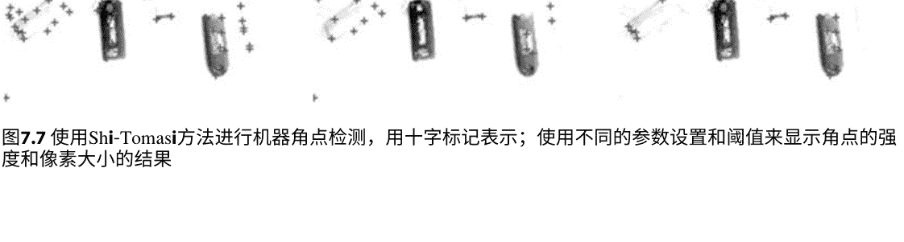

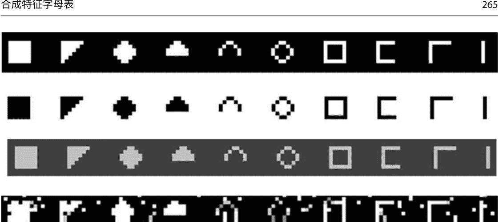

图7.8 合成兴趣点字母表的一部分：点、边、边缘和轮廓。（从上到下）白色黑色背景，黑色背景上的白色，浅灰色背景上的深灰色，添加盐和胡椒噪声，添加高斯噪声

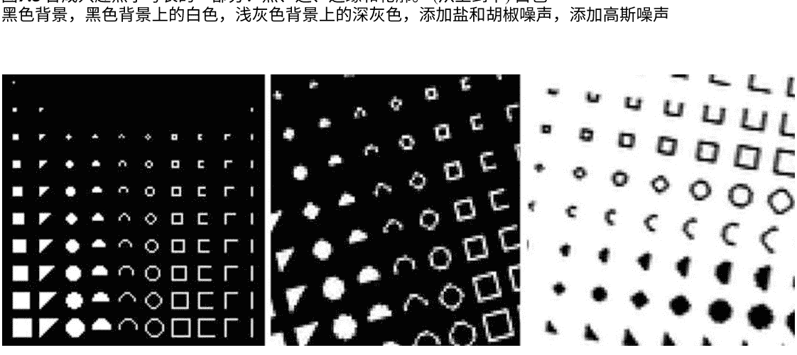

图7.9 合成兴趣点字母表的缩放和旋转示例。请注意，仿射旋转引入的伪影通过抗锯齿和子采样伪影来扭曲合成二进制模式。

## 通过位置网格的特征检测准确性

通过在规则间隔的网格上放置合成特征，并在检测后分析计数和位置，解决了对于这个合成的真实位置的检测器准确性的目标。一些检测器会为单个合成感兴趣点或角点找到多个特征。选择的特征网格大小为14 ×14像素，并且该网格覆盖整个图像。请参见图7.8和7.9。

## 通过旋转图像集实现旋转不变性

对于每个真实数据集，都会创建在0-90度范围内以10度为增量的旋转版本的每个图像。由于合成特征被放置在已知位置的规则网格上，通过旋转图像集可以实现旋转不变性。

## 通过线条粗细和边界框大小实现尺度不变性

合成角点特征以特征边缘厚度从1到3像素的范围渲染到真实数据中，以模拟尺度变化。一些兴趣点特征，如矩形框、三角形和圆形，以1 ×1像素到10 ×10像素的边界框进行缩放，以进行尺度不变性测试。

## 噪声和模糊不变性

使用高斯噪声渲染一组合成字母表，使用盐和胡椒噪声渲染另一组字母表，以向图像添加扭曲和不确定性。此外，通过在0°和90°之间以不同角度旋转感兴趣点字母表，由于仿射变换算法中引入的反锯齿插值，合成模式中引入了数字模糊。

## 可重复性

每个真实数据集包含已知数量的合成特征，以便分析检测率。为了能够测量每个检测器的可重复性，在每个图像中有多个重复的感兴趣点特征。人类期望以相同的方式检测到相同的特征；然而，附录A中的结果显示，一些感兴趣点检测器的行为是不可预测的，而且有些比其他的更可预测。

如图7.6所示，检测器并不总是找到完全相同的特征。例如，合成字母表提供了三个版本——黑底白字、白底黑字和浅灰底深灰字——用于测试每个检测器在相同模式但不同灰度级别和极性下的表现。请参见附录A，展示了检测器如何根据极性和灰度级别因素提供不同的结果。

## 合成特征的真实图像叠加

提供一组由合成兴趣点和角落叠加在真实图像上的图像，有点像标记。为什么要叠加兴趣点标记，因为最先进的技术已经超越了标记，实现了无标记跟踪？目标是了解检测器本身的限制和行为，以便在自然和合成特征存在的情况下分析其性能，从而提供一些见解。

## 合成兴趣点字母表

如图7.7和7.8所示，定义了一组合成兴趣点的字母表，跨越一系列像素分辨率或厚度，包括以下特征：

-   点/正方形，1-10像素大小
-   点/三角形半方形，3-1像素大小
-   圆形，3-10像素大小
-   圆形/半圆形，3-10像素大小
-   轮廓，3-10像素大小
-   轮廓/半轮廓，3-10像素大小
-   连接边缘
-   双角点，3-10像素大小
-   角点，3-10像素大小
-   边缘，3-10像素大小

合成兴趣点字母表包含83个独特元素，组成一个14 ×14的网格，如图7.8所示。完整字母表的七行七列可以放入一个1024 ×1024的图像中，总共产生7 × 7 × 83 =4067个兴趣点。

## 合成角点字母表

合成角点字母表如图7.9所示。字母表包含以下类型的角点和属性：

-   2段角点，1,2,3像素宽度
-   3段角点，1,2,3像素宽度
-   4-段角落，1、2、3像素宽

如图7.10所示，角落字母表包含具有多种类型角落的模式，由由1、2和3像素宽的两线段、三线段和四线段组成。合成角落字母表包含在14 ×14像素网格上组成的54个独特元素。

每个1024 ×1024像素图像包含由6 × 9个独特元素组成的8 ×12个完整字母表，每个图像总共有5184个角落点。完整数据集包括每个图像从0°到90°以10°间隔旋转的版本。

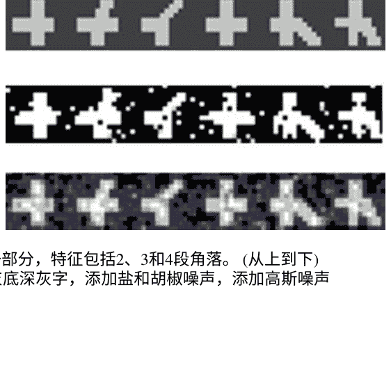

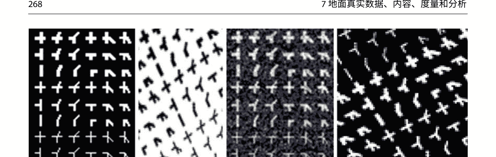

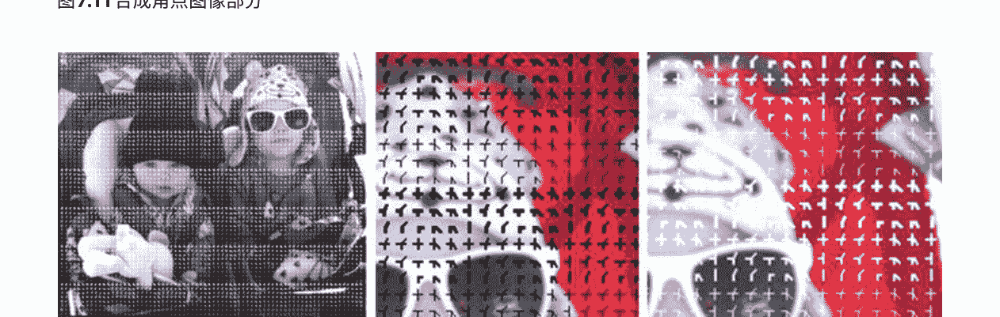

## 在真实图像上进行混合合成

我们将合成的兴趣点和角点与真实图像叠加，以开发一个混合的地面真实数据集，作为一个更复杂的案例。

合并合成的兴趣点和真实数据将为兴趣点算法和角点检测器提供新的挑战，同时说明每个检测器的工作原理。在真实图像上使用混合的合成特征叠加是一种新的地面真实数据方法（据作者所知），其好处在好奇心之外并不明显。选择合成叠加方法的一个原因是填补文献和研究中的空白，因为通常不使用合成特征叠加。参见图7.12。

混合合成和真实地面真实数据集的设计目标如下：

-   使用完整的合成字母叠加在真实图像上，为兴趣点和角点提供单独的地面真实数据集，以提供每个兴趣点和角点周围的像素细节范围。
-   在一个14 ×14的网格上显示已知兴趣点的位置和数量。
-   提供彩色和灰度图像的相同数据。
-   提供相同数据的0-90°间隔为10°的旋转版本。

## 创建叠加图的方法

字母表可以用作由黑色0 ×00和白色0 ×ff的8位像素值的二进制掩码，用于组合图像叠加。

下面的布尔掩码示例是使用Mathematica代码中的ImageMultiply和ImageAdd运算符执行的。

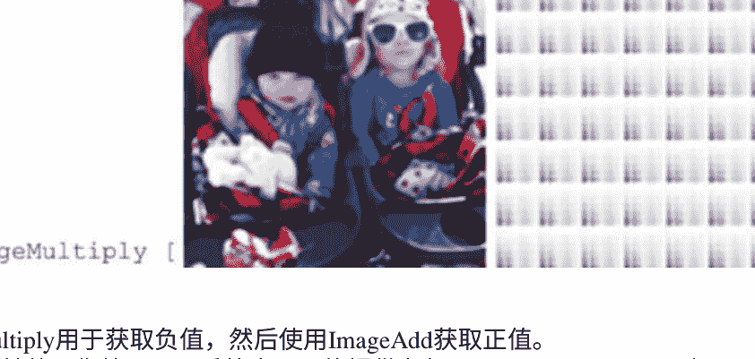

ImageMultiply用于获取负值，然后使用ImageAdd获取正值。

请注意，在其他图像处理工具系统中，可能提供布尔ImageAND、ImageOR和ImageNOT作为替代方法。

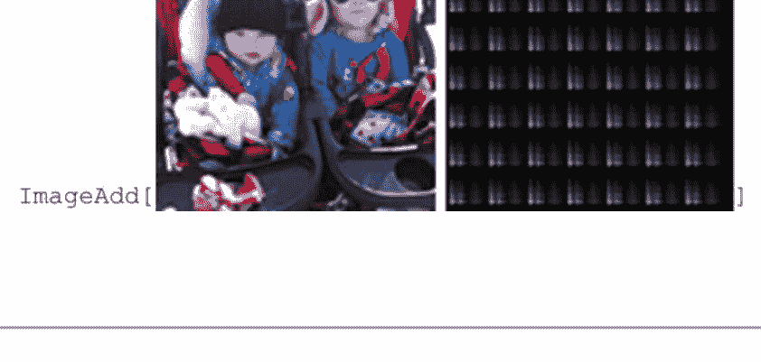

## 摘要

我们调查了手动和自动创建基准数据的方法，确定了一些最佳实践和准则，应用了第5章中开发的鲁棒性标准和视觉分类法，并通过示例创建了一个基准数据集，用于评估人类感知与机器视觉方法在关键点检测器方面的差异。

以下是准备基准数据的一些最终思考和关键问题：

-   适用性：基准数据集对于分析和预期应用有多合适？使用案例和应用目标是否融入了基准数据和模型中？数据集是否对算法和用例进行了过度拟合或欠拟合？
-   公开 vs. 专有：专有的真实数据是独立评估度量标准和算法的障碍。有兴趣的各方必须能够复制生成的度量标准通过各种类型的算法，以便可以将其与真实数据进行比较。如果问题领域存在开放评级系统，则可能更倾向于使用。但是，对于开源任何专有的真实数据存在可信度和法律方面的障碍。
-   隐私和法律问题：选择任何图像都存在个人隐私问题；未经他们的许可，不应使用他人的照片，并且应遵守在受限制的地点拍照的禁令。法律问题是非常真实的。
-   真实数据与合成数据：在某些情况下，可以使用计算机图形和动画来创建合成地面数据集。在涉及隐私和法律问题时，应特别考虑使用合成数据集，并将其视为获得对数据本身更多控制的一种方式。

# 第7章：学习任务分配

1.  针对面部情绪识别应用程序，描述地面真实数据的具体目标，以确保鲁棒性和不变性属性。
2.  讨论收集地面真实数据集所需的图像情绪类别。推导出一种统计方法来确定每个类别需要多少图像以及如何处理这些图像。
3.  提供一个高级设计或编写一些脚本代码（php、ruby等）来自动收集和评估地面真实数据与选定目标的符合程度。在代码中包括统计度量标准和其他图像分析方法，以自动评估图像，并描述在代码中可以自动化的内容以及必须由人完成的任务。
4.  请列举一些公开可获取的地面真实数据集以及它们的获取途径。
5.  讨论正样本和负样本的训练。
6.  讨论何时使用合成地面真实图像可能有用，以及如何设计合成图像，并准备一个包括所需软件工具名称的计划。
7.  讨论何时应采用现有的地面真实数据集而不是从头开始创建。
8.  讨论何时使用带标签的地面真实数据集比使用无标签的地面真实数据集更合适。
9.  讨论如何选择与特定地面真实数据集配合良好的兴趣点检测器，描述您将遵循的过程以找到最佳兴趣点检测器，并设计一些伪代码来评估和筛选兴趣点检测器。

## 视觉流水线和优化

> “多速度，少匆忙      …”
——树胡子，《指环王》

本章探讨了一些假设的计算机视觉流水线设计，以了解硬件/软件设计的替代方案和优化。本章不仅仅关注孤立的计算机视觉算法，而是将许多概念融合到完整的视觉流水线中。为了说明不同方法的使用，本章为几个示例应用程序勾勒了视觉流水线。示例应用包括使用形状和颜色进行汽车目标识别，使用局部特征进行人脸检测和情绪检测，使用全局特征进行图像分类，以及增强现实。

这些示例被选择来说明在第5章中提出的视觉度量标准分类中使用不同特征描述度量的用法。探索了视觉流水线每个阶段的替代优化方法。例如，我们考虑了哪些视觉算法在CPU和GPU上运行得更好，并讨论了计算单元和内存之间的数据传输时间如何影响性能。

■ 注意：本章不涉及训练阶段或分类阶段的优化。相反，我们在这里重点关注分类之前的视觉流水线阶段。本章中的假设示例有时不完整。相反，意图是探索设计的替代方案。示例中的设计选择仅用于说明；构建工作系统可以做出其他同样有效甚至更好的设计选择。鼓励读者分析示例以找出弱点和替代方案。如果读者能改进示例，那么我们就成功了。

本章按照以下顺序讨论了以下主要主题：

1.  跨SOC（CPU、GPU、内存）的优化的一般设计概念。
2.  使用不同描述符方法的四种假设视觉流水线设计。
3.  SW优化资源和具体优化技术的概述。

*注意：我们不在这里讨论DNN特定的优化（请参见第9章和第10章），也不在这里讨论专用视觉处理器。有关最新视觉处理器的更多信息，请联系嵌入式视觉联盟。

## 阶段、操作和资源

计算机视觉解决方案可以实现为阶段的流水线，如图8.1所示。在流水线中，同时进行并行和顺序操作。通过以最佳方式利用所有可用的计算资源，可以在速度、功耗和内存效率方面实现最大化的性能。

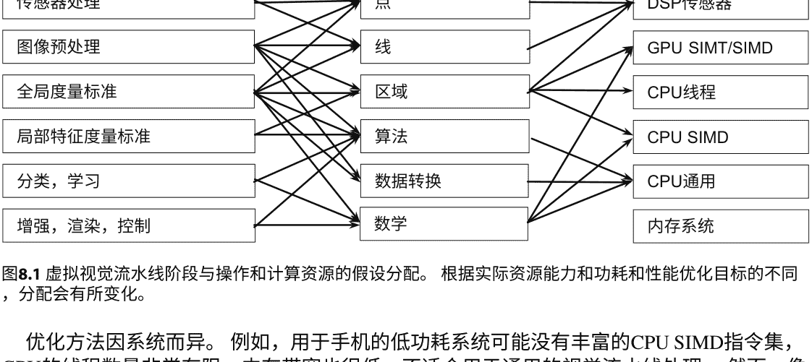

优化方法因系统而异。例如，用于手机的低功耗系统可能没有丰富的CPU SIMD指令集，GPU的线程数量非常有限，内存带宽也很低，不适合用于通用的视觉流水线处理。然而，像机架式计算服务器这样的大型计算设备可能有多个CPU和GPU，每个CPU和GPU都具有强大的SIMD指令和高内存带宽。

表8.1提供了基于数据类型和处理器能力的操作分配到资源的更多细节。例如，在传感器处理阶段，点线和区域操作占据主导地位，因为传感器数据被组装成像素并进行校正。

大多数传感器处理器都基于具有宽SIMD指令字的数字信号处理器（DSP），DSP还可能包含用于校正光学问题（如镜头畸变）的固定功能几何校正单元或变换单元。表8.1中列出的传感器DSP和GPU通常包含专用的纹理采样器单元，能够快速进行像素插值、几何变形以及仿射和透视变换。如果代码是直线状且有很多分支，而且并行操作不多，那么CPU是最佳选择。

### 表8.1 根据数据类型和并行性指导的基本操作的假设分配 (参见Zinner [477])

| 操作 | DSP | GPU SIMT/SIMD | CPU线程 | CPU SIMD | CPU通用 | 内存系统DMA |
|------|-----|---------------|---------|----------|---------|-------------|
| 点   | x   | x             |         | x        |         |             |
| 线   | x   | x             |         | x        |         |             |
| 区域 | x   | x             | x (瓷砖) | x        |         |             |
| 算法分支 |     |               |         |          | x       |             |
| 通用数学 |     |               |         |          | x       |             |
| 数据复制和转换 |     |               |         |          |         | x (DMA首选) |

如表8.1所示，数据类型和数据布局通常指导选择最佳的计算资源来执行给定任务，以及算法和数据中的并行类型。此外，编程语言的选择基于并行性，例如使用OpenCL还是C++。例如，CPU可能支持浮点和双精度数据类型，但如果底层代码是SIMT和SIMD并行导向的，需要调用许多并发的线程并行内核操作，那么高线程数的GPU可能比单个CPU更好。然而，在多个CPU上运行像OpenCL这样的语言可能提供与较小的GPU一样的性能；有关性能信息，请参阅参考文献[526]和有关OpenCL编译器的供应商信息。还请参阅本章后面的“SIMD、SIMT和SPMD基础知识”部分。

有关如何优化不同计算单元和内存上的基本图像处理操作的优秀讨论，请参阅Zinner等人的PfeLib工作[477]，该工作深入探讨了基于数据类型和智能内存使用的优化类型。

为了使从视觉处理阶段到操作和计算资源的分配具体化，我们将在本章后面的具体视觉流水线示例中进行讨论。

## 计算资源预算

在实施视觉流水线之前，应该合理估计可用的计算平台资源的成本，并确定应用程序是否与资源匹配。例如，用于军事战场的系统可能会优先考虑计算速度和准确性，而用于移动设备的应用程序则会优先考虑电池寿命方面的功耗，并在性能和准确性方面进行权衡。

由于大多数计算机视觉研究关注处理相对狭窄和明确定义的问题，因此在视觉流水线分析和优化方面，可用于指导一般工程讨论的研究有限。相反，我们遵循一种从硬件资源本身开始的思路，并讨论性能、功耗、内存和I/O要求，并参考并行编程和其他文献。

代码优化方法。对于自动测量算法强度的工具的未来研究，例如整数和浮点操作的数量，数据类型的位精度以及每个算法的内存传输次数（读/写），工程师们对于视觉流水线分析和优化将非常欢迎。

如图8.2所示，计算机系统的主要组成部分包括I/O、计算和内存。

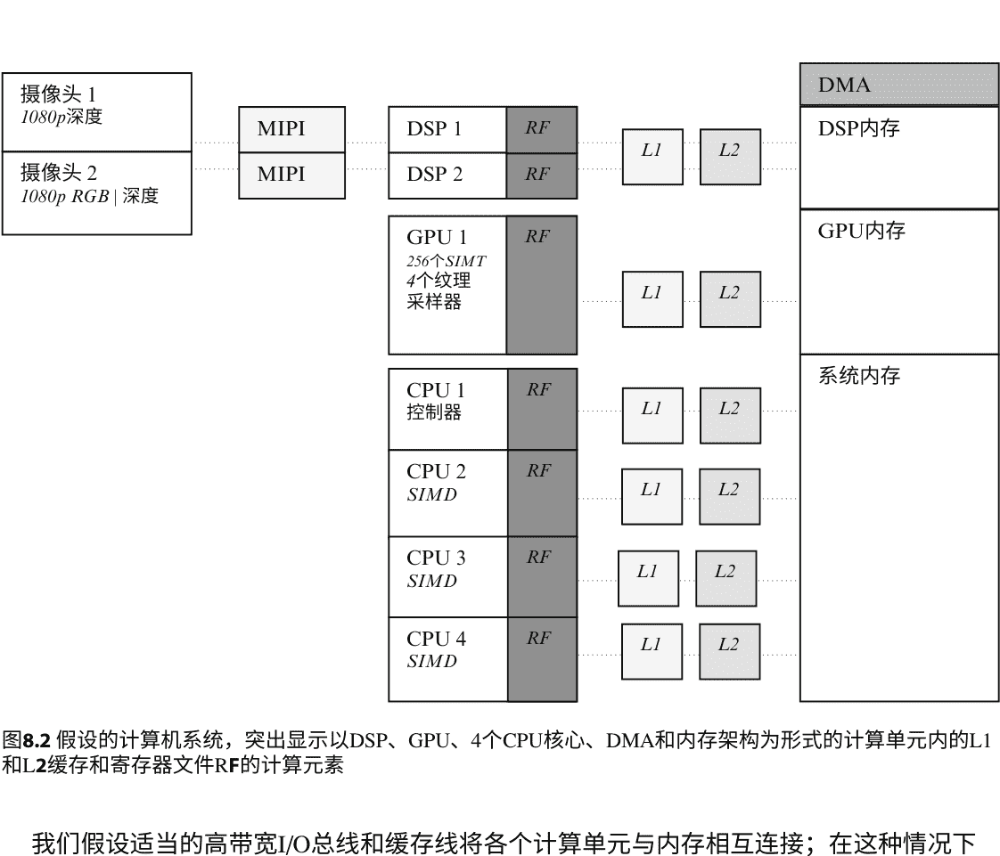

图8.2 假设的计算机系统，突出显示以DSP、GPU、4个CPU核心、DMA和内存架构为形式的计算单元内的L1和L2缓存和寄存器文件RF的计算元素

我们假设适当的高带宽I/O总线和缓存线将各个计算单元与内存相互连接；在这种情况下，我们特别提到了MIPI相机接口，它直接连接到我们假设的SOC中的DSP。对于一个简单的计算机视觉系统，我们假设价格、性能和功耗曲线继续朝着正确的方向发展，以实现足够低价格的芯片（SOC），以接近一次性计算成本，与任何小型便携电子设备的价格相似。这将使得低功耗和高性能的普适视觉应用程序能够在不使用专用硬件加速器的情况下运行，这些加速器是为任何特定的计算机视觉算法构建的。

下面是图8.2中显示的SOC组件的摘要描述：

- 两个1080p相机，一个用于RGB，另一个用于自包含的深度相机，例如TOF传感器（如第1章所讨论的）。
- 一个小型低功耗控制器CPU，具有简化指令集和无浮点数，用于处理键盘、加速度计更新、服务于DSP的中断以及其他周期性任务，如网络中断处理程序。
- 三个完全支持SIMD的CPU，具有浮点数，用于重型计算，通常是线程并行算法，如平铺，但也用于SIMD并行算法。
- 一块能够运行 >256个线程的GPU，具备完整的整数和浮点运算以及四个纹理采样器。广泛的区域算法非常适合GPU，但编程模型是基于SIMT内核，如DirectX和OpenGL的计算着色器，或者OpenCL。
- 一块具有有限指令集和适用于像素处理和传感器处理的VLIW处理能力的DSP。
- 一块用于快速内存传输的DMA单元；尽管显而易见，DMA是一种简单有效的增加内存带宽和降低功耗的方法。

### 计算单元、ALU和加速器

在典型系统中有几种类型的计算单元，包括CPU、GPU、DSP和专用硬件加速器，如密码单元、纹理采样器和DMA引擎。每个ALU都有不同的指令集，针对特定用途进行了优化，因此了解每个计算单元的ALU指令集非常有帮助。

一般来说，计算机体系结构还没有发展到提供任何标准的视觉流水线方法或硬件加速器的程度。这是因为计算机视觉的算法不断改进，选择在硅上实现任何视觉加速器存在过时的风险。此外，创建计算机视觉硬件加速器很困难，因为应用程序必须具备可移植性。因此，开发人员通常选择足够好且可移植的高级语言实现，最小化对特定硬件或API的依赖。相反，依赖于像C++这样的通用语言并优化软件是一个不错的起点，还可以根据需要利用GPU中的现有像素处理加速方法，如像素着色器和纹理采样器。标准的C++语言路径提供了灵活性，可以在各个平台上进行更改和移植，而不依赖于任何特定供应商的硬件加速功能。

在本节中开发的示例视觉流水线中，我们做出了两个基本假设。首先，DSP专用于传感器处理和光图像预处理，以实现系统的负载平衡。其次，CPU和GPU用于视觉流水线的后续部分，所以CPU与GPU的选择取决于所使用的算法。

由于具有可编程ALU的计算单元通常是开发人员关注的工具和注意力所集中的地方，我们稍后在本章的“视觉算法优化和调优”部分专门介绍了一些编程加速替代方案；还有一份选定的优化资源和软件构建模块的调查。

在图8.2中显示的假设系统中，计算单元包括通用CPU、主要用于图形和媒体加速以及一些GPGPU加速的GPU，以及用于传感器处理的DSP。每个计算单元都是可编程的，并包含一个通用ALU和一个调整过的指令集。例如，CPU包含了所有必要的通用编程指令，并且可能还包含本章后面讨论的SIMD指令。GPU包含了诸如平方根、反正切等超越函数指令，以加速图形处理。DSP同样具有针对传感器处理调整过的指令集，很可能是一个VLIW指令集。

硬件加速器通常用于常见操作，例如DSP中用于传感器处理的几何校正单元和GPU中用于扭曲表面补丁的纹理采样器。目前还没有针对计算机视觉的标准，新的算法改进正在不断进行中。

因此，除了嵌入式和特殊用途系统外，几乎没有动力添加任何专用的计算机视觉加速器。相反，寻找使用现有加速器的创造性方法可能会带来好处。

本章后面我们将讨论优化各种计算单元上的软件的方法，充分利用每个ALU和指令集的优势和预期用途。

### 功耗

在没有非常详细的功耗分析的情况下，很难量化在SOC或单个计算设备上用于特定算法的功耗；可能模拟是最好的方法。通常，为SOC开发视觉流水线的系统工程师没有准确的功耗测量方法，只能使用粗略的方法，如运行实际完成的应用程序并测量墙上的功耗或电池的耗电量。

功耗问题有时与使用的计算设备有关，例如CPU与GPU之间的选择，因为每个设备的门数和时钟频率不同，因此功耗也不同。由于GPU和CPU设计的硅架构师都在努力提供每瓦性能最高的设计（我们假设每组硅架构师的效率相同），所以在CPU与GPU的功耗/性能竞赛中没有明确的赢家。与其他方面（如数据组织和内存架构）相比，通过使用GPU而不是CPU来节省功耗的搜索可能并不值得努力。

在SIMD和SIMT并行代码的功耗和性能权衡中，一种方法是使用OpenCL等语言，在CPU或GPU上运行相同的代码。然后需要在每个计算设备上测量实际功耗和性能；在“视觉算法优化和调优”部分中将对此进行更多讨论。

有关使用相同的OpenCL代码在特定CPU与GPU上运行进行详细性能分析的信息，请参阅国家超级计算应用中心的优秀研究[526]。此外，还可以查看主要OpenCL供应商提供的技术计算资源，例如英特尔、NVIDIA和AMD，以了解有关在CPU与GPU上运行相同代码的OpenCL编译器的详细信息。有时候结果会令人惊讶，特别是对于多核CPU系统与较小的GPU而言。

一般来说，视觉流水线的计算部分并不是功耗的主要来源；大部分功耗消耗在内存子系统和I/O总线上，这需要高数据带宽来保持计算流水线元素的充分运行。事实上，所有的寄存器文件、缓存、I/O总线和主存储器都消耗了大量的功耗和硅片面积。

因此，在任何试图降低功耗的尝试中，内存使用和带宽是高价值的目标。内存拷贝越少，缓存命中率越高；在本地寄存器文件中重复使用相同的数据，效果越好。

### 内存使用

在功耗和性能方面，内存是最重要的资源。

在开发视觉流水线时，大部分注意力都集中在算法和处理流程上，这已经具有足够的挑战性。然而，视觉应用对内存系统的要求非常高。单独考虑图像的大小并不是很大的问题，但是当我们考虑到视觉流水线中像素进行内核操作时的帧率和读写次数时，内存传输带宽活动变得更加清晰。

内存传输带宽活动变得更加清晰。内存系统是复杂的，包括每个计算单元旁边的本地寄存器文件、缓存、I/O传输连接和系统内存。在本节中，我们将讨论几个内存问题，包括：

- 像素分辨率、位精度和总图像大小
- 视觉流水线中的内存传输带宽
- 图像格式，包括灰度和颜色空间
- 特征描述符的大小和类型
- 匹配和定位所需的准确性
- 特征描述符数据库的大小

为了探索内存使用情况，我们详细介绍了一个本地兴趣点和特征提取场景，假设我们首先定位兴趣点，根据一些标准筛选出一个较小的集合，计算选择的兴趣点周围的描述符，然后将特征与数据库进行匹配。

一个合理的初步估计是，图像中0.05-1%的像素可以生成良好的兴趣点。当然，这完全取决于：（1）图像纹理的复杂性，以及（2）所使用的兴趣点方法。例如，具有丰富纹理和高对比度的图像将生成比远处山脉周围云朵纹理和对比度较小的图像更多的兴趣点。此外，兴趣点检测方法会产生不同的结果-例如，FAST角点方法可能检测到比SIFT尺度不变的DoG特征更多的角点，请参见附录A。

描述符大小可能是一个重要的变量，请参见表8.2。一个640 x 480的图像将包含307,200个像素。我们估计上限为1%，即3072个像素，可能具有良好的兴趣点；我们假设下限为0.05%，即153个像素。我们提供了第二个估计，即兴趣点可能进一步被过滤以筛选出适用于特定应用的最佳兴趣点。因此，如果我们假设只有33%的兴趣点实际上被保留下来，那么我们可以说在153 x 0.33和3072 x 0.33之间的兴趣点是特征描述的良好候选。这个估计范围因图像纹理和兴趣点方法而异，超出了边界。

表8.2 每帧描述符字节数（1%兴趣点），改编自[133]

| 描述符 | 字节大小 | 480p NTSC | 1080p 高清 | 2160p 4k超高清 | 4320p 8k超高清 |
| :--- | :--- | :--- | :--- | :--- | :--- |
| 分辨率 |  | 640 x 480 | 1920 x 1080 | 3840 x 2160 | 7680 x 4320 |
| 像素 |  | 307200 | 2073600 | 8294400 | 33177600 |
| BRIEF | 32 | 98304 | 663552 | 2654208 | 10616832 |
| ORB | 32 | 98304 | 663552 | 2654208 | 10616832 |
| BRISK | 64 | 196608 | 1327104 | 5308416 | 21233664 |
| FREAK (4级级联) | 64 | 196608 | 1327104 | 5308416 | 21233664 |
| SURF | 64 | 196608 | 1327104 | 5308416 | 21233664 |
| SIFT | 128 | 393216 | 2654208 | 10616832 | 42467328 |
| LIOP | 144 | 442368 | 2985984 | 11943936 | 47775744 |
| MROGH | 192 | 589824 | 3981312 | 15925248 | 63700992 |
| MRRID | 256 | 786432 | 5308416 | 21233664 | 84934656 |
| HOG (64x128块) | 3780 | 不适用 | 不适用 | 不适用 | 不适用 |

使用和兴趣点过滤条件。假设特征描述符大小为256字节，每帧的总描述符大小为3072 x 256 x 0.33 =最大为259,523字节，这并不是极端的。然而，当我们考虑特征匹配阶段时，特征描述符的数量和内存大小将成为一个问题，因为每个提取的特征必须与数据库中的每个训练特征集进行匹配。

一般来说，局部二进制描述符具有较低的内存占用。例如，表8.2提供了几个描述符的字节计数，如Miksik和Mikolajczyk [133]所述。此处注释的数据添加了各种分辨率下每帧描述符工作内存大小（以字节为单位）的信息。

在表8.2中，图像帧分辨率在第1行，每帧像素计数在第2行，典型的描述符大小以字节为单位在后续行中。所选描述符的总字节数在第1列中，其余列显示每帧总描述符大小，假设每帧中的估计1%的像素用于计算兴趣点和描述符。实际上，我们估计每帧的描述符计数的上限估计为1%，下限估计为0.05%。请注意，字节大小与表中的大小有所不同，这取决于设计优化。

内存带宽通常是隐藏的成本，并且通常在优化周期的最后阶段才被忽视，因为开发算法通常已经足够具有挑战性，而无需担心内存访问模式和内存流量。表8.2包括各种图像帧大小和特征描述符大小的几个内存变量的摘要。例如，使用第2行中的1080p图像像素计数作为基础，我们可以看到具有每个颜色通道16位的RGB图像将消耗：

```
2,073,600像素 x 3通道 /RGB x 2字节/像素 = 12,441,600 字节/帧
```

如果我们还需要保留一个从RGB计算得到的灰度通道 I，那么RGBI的总大小将增加到：

```
2,073,600像素 x 4通道 /RGBI x 2字节/像素 = 16,588,800 字节/帧
```

如果我们假设每秒30帧，并且使用两个RGB相机进行深度处理+I通道，从DSP中移出完整的4通道RGBI图像对所需的内存带宽接近1 GB/s：

```
16,588,800像素 x 30fps x 2立体 = 995,328,000 字节/秒
```

因此，在这个例子中，我们假设基线内存带宽约为1GB/s，仅用于将图像对从ISP传输到下游。我们现在忽略了传感器处理的ISP内存读写需求，假设聪明的DSP内存缓存、寄存器文件设计和汇编语言中的循环展开方法可以减少内存带宽。

通常，来自计算单元寄存器文件的内存在一个时钟周期内传输；来自各种缓存层的内存可能需要几十个时钟周期；而来自系统内存的内存可能需要数百个时钟周期。在内存传输过程中，CPU或GPU中的ALU可能处于空闲状态，等待内存。

内存带宽分布在靠近ALU处理器的快速寄存器文件中，通过内存缓存甚至系统内存，因此实际的内存带宽分析起来相当复杂。尽管这里提供了一些内存带宽数据，但仅用于说明活动情况。

而且内存带宽只在DSP下游增加，因为在图像预处理期间，每个图像帧将被读取并可能被重写多次，然后在兴趣点生成和特征提取期间再次被读取。例如，如果我们假设只有一个使用5 x 5内核在I通道上进行的图像预处理操作，那么每个I像素将被读取25次，希望从内存缓存行和快速寄存器中读取。

这种内存流量并不完全来自慢速系统内存，而是主要发生在更快的内存缓存系统和更快的寄存器文件内，直到发生缓存未命中或重新加载快速寄存器文件为止。然后，性能下降一个数量级，等待缓冲区获取和寄存器重新加载。如果我们在I通道上添加一个FAST9兴趣点检测器，那么每个像素将被读取81次（9 x 9），可能来自内存缓存行或寄存器。如果我们可能检测到的兴趣点的0.05%上添加一个FREAK特征描述符，那么每个描述符将增加41 x 41个像素读取以获取该区域（加上在41 x 41区域内进行的点对比较的45 x 2个读取），希望从内存缓存行或寄存器中读取。

通常图像会以各种格式进行处理，例如对RGB颜色进行图像预处理以增强图像，并将其转换为灰度强度I以计算兴趣点和特征描述符。RGB颜色转换是隐藏的内存开销，需要进行数据复制操作和临时存储以进行颜色转换，通常使用浮点数以获得最佳精度。因此，颜色转换可能会消耗额外的几GB/s内存带宽。在所有的内存活动中，可能会将所需图像的全部或部分缓存驱逐到较慢的系统内存中，从而降低非线性性能。

因此，描述符的内存大小在整个视觉流水线中需要考虑。首先，我们考虑特征提取的时机；其次，我们考虑特征匹配和从特征数据库中检索的时机。在许多情况下，特征数据库的大小是内存方面的关键问题，因为与之匹配的所有描述符的总大小会影响静态内存存储大小、内存带宽和模式匹配速率。在分类和训练过程中，将特征空间缩小为可快速搜索的格式通常至关重要。除了第4章中讨论的优化分类方法外，数据组织问题主要集中在标准计算机科学搜索、排序和数据结构领域；第4章中提供了一些讨论和参考资料。

当我们查看特征数据库或训练集时，内存大小可能是主要问题。应该将整个特征数据库保存在云服务器上进行匹配吗？还是应该将整个特征数据库保存在本地设备上？应该使用一种从服务器向本地设备缓存特征数据库部分的方法吗？目前在实际系统中都采用了上述所有方法。

总之，内存、缓存和寄存器文件的面积远远超过计算单元中的硅面积。通过视觉流水线的SOC结构的内存带宽对于功耗和性能至关重要，需要快速的内存架构和内存缓存布局以及仔细的软件设计。然而，仅仅考虑内存存储大小并不能完全解决问题，因为每个字节都需要在计算单元之间移动。因此，除了小型应用程序外，对内存占用和内存带宽的仔细考虑至关重要。

通常，通过仔细关注内存问题，可以显著提高性能和功耗。在本章后面，我们将介绍几种设计方法，以帮助减少内存带宽并提高内存性能，例如锁定内存页面、流水线代码、循环展开和SIMD方法。未来研究如何最小化视觉流水线中的内存传输是一个值得探索的领域。

### I/O性能

我们将I/O主题归为一般性能问题，包括计算单元之间的SOC I/O总线上的数据带宽，相机输入的图像以及特征描述符匹配数据库的流量到存储设备。在讨论内存之前，我们提到了I/O问题，因为像素数据在视觉流水线上的各种计算设备之间通过I/O总线进行传输。其中一个主要的I/O考虑因素是特征描述符数据在特征匹配时从数据库中移出，因此使用较小的描述符并使用有效的机器学习和分类方法来优化特征空间是有价值的。

另一种需要考虑的I/O类型是相机输入本身，通常通过标准的MIPI接口完成。然而，任何总线或I/O总线都可以使用，例如USB。如果视觉流水线设计包括完整的硬件/软件系统设计，而不仅仅是标准SOC上的软件，那么对于相机的硬件I/O子系统设计以及可能用于图像内存传输的特殊快速总线可能是值得关注的。在考虑功耗时，I/O总线的硅面积和功耗远远超过ALU处理器的面积和功耗。

## 视觉流水线示例

在本节中，我们将看一下四个虚拟的视觉流水线示例。每个示例都被选择来说明视觉度量标准分类法中的不同描述符族，包括直方图和颜色匹配等全局方法，FAST兴趣点结合FREAK描述符等局部特征方法，傅里叶描述符等基础空间方法，以及形态学和整个对象形状度量等基于形状的方法。这些示例被分解为阶段、操作和资源，如图8.1所示，用于以下应用：

- 汽车识别，使用形状和颜色
- 人脸识别，使用稀疏局部特征
- 图像分类，使用全局特征
- 增强现实，使用深度信息和跟踪

这些示例都不包括分类、训练和机器学习的细节，这超出了本书的范围（机器学习的参考资料在第4章中提供）。假设一个简单的数据库存储特征描述符足以满足本讨论的需求，因为这里的重点是图像预处理和特征描述阶段。在完成示例和探索不同类型的计算资源分配（如GPU vs. CPU）之后，本章将讨论每种计算资源的优化资源和技术。

### 汽车识别

在这里，我们设计了一个视觉流水线，通过使用多边形形状描述符和准确的颜色匹配来识别汽车或机械零件。例如，多边形形状度量可以用来测量汽车的长度和宽度，而颜色匹配可以用来测量油漆颜色。在某些情况下，例如定制汽车喷漆作业，仅凭颜色是不足以进行识别的。

对于这个汽车的例子，主要的设计挑战包括从道路上分割汽车，匹配油漆颜色，以及测量汽车的大小和形状。整个系统包括一个RGB-D相机系统，准确的颜色和照明模型，以及多个特征描述符的协同使用。参见图8.3。我们详细介绍这个例子，以探索这种类型的完整视觉流水线设计的挑战和可能的解决方案。

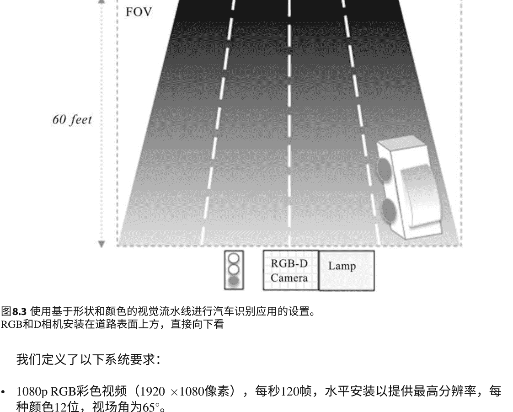

图8.3 使用基于形状和颜色的视觉流水线进行汽车识别应用的设置。RGB和D相机安装在道路表面上方，直接向下看

我们定义了以下系统要求：

- 1080p RGB彩色视频（1920 × 1080像素），每秒120帧，水平安装以提供最高分辨率，每种颜色12位，视场角为65°。
- 1080p立体深度相机，分辨率为8位 Z，每秒120帧，视场角为65°。
- 图像视场覆盖了宽度为44英尺和长度为60英尺的四条交通车道，当交通停止时，每条车道足够容纳大约三辆普通汽车长度。
- 时速限制为25英里/小时，相当于约37英尺/秒。
- 相机安装在顶部红绿灯旁边，夜间照明由路灯提供。
- 嵌入式PC具有4个CPU核心，具有SIMD指令集，1个GPU，8 GB内存，80 GB硬盘；假设具有高端PC的性能（为简洁起见未指定）。
- 实时识别汽车的制造商和型号；还包括每个汽车的发生次数、时间戳和置信度分数。
- 主要制造商提供的汽车真实训练数据集，包括几何形状和所有常规车型使用的准确颜色样本；无法识别定制颜色和售后颜色。
- 平均汽车尺寸从5到6英尺宽，12到16英尺长。
- 准确率达到99%或更高。
- 简化的鲁棒性标准，包括噪声、光照和运动模糊。

#### 分割汽车

为了从道路表面分割出汽车，使用一台1080p 120 fps（每秒帧数）的立体深度相机，利用深度可以简单地将每辆汽车与道路隔离开。为了使这个方法起作用，需要开发一种将深度相机校准到基准道路表面的方法，从而可以识别出高于道路表面的汽车。

我们在这里概述深度校准方法以供说明。

在深度图中观察到球形深度差异，主要影响视野的边缘。为了纠正球形场景畸变，使用适当的校准深度函数（在现场和分析上确定）对每个图像进行矫正，然后处理每个水平线，考虑到曲线真实深度距离，在边缘处更大，以使每条线上的深度相等。

由于速限为25英里/小时，即37英尺/秒，以120帧/秒进行成像，每帧的最大运动模糊约为0.3英尺，或4英寸。由于像素的长度确定为0.37英寸，如下一节“测量汽车尺寸和形状”中所述，从像素计算车长的能力在4英寸/0.37英寸内准确，即11个像素，或大约是25英里/小时下12英尺长汽车的3%（包括运动模糊）。然而，在图像预处理期间，可以对每个RGB和深度图像应用运动模糊补偿，以进一步减少运动模糊；基于卷积或对多个连续图像进行补偿的方法有多种[297, 474]。

#### 匹配油漆颜色

我们假设在许多情况下仅通过油漆颜色就可以识别车辆，因为每个制造商都使用专有颜色，因此可以使用准确的色度测量方法。对于匹配油漆颜色，每个颜色通道应提供足够的12位分辨率，这是使用CIECAM02模型和 Jch颜色空间在颜色匹配阶段确定的[245]。这需要开发相机在不同照明条件下与场景的几个校准设备模型，例如全日照、不同时间的云覆盖、清晨和黄昏的低光条件，以及使用安装在交通灯上方的照明灯和相机进行夜间拍摄。

色度准确性的关键是设备模型对各种光照条件的考虑。使用光传感器测量色温，并结合白天时间和季节的知识，选择正确的设备模型以实现适当的照明。然而，脏车对于颜色匹配会带来问题；目前我们忽略这个细节（定制喷漆工作也是一个问题）。在某些情况下，颜色描述符可能无用或不可靠；在其他情况下，仅颜色可能足以识别汽车。请参阅第2章中关于颜色管理的讨论。

#### 测量汽车的尺寸和形状

对于汽车的尺寸和形状，最好的测量方法是直接俯视汽车，以减少透视畸变。如图8.4所示，使用立体相机的深度信息，结合汽车形状的多边形分割，将汽车分割为C（货物）、T（顶部）和H（引擎盖）区域。为了计算形状，将RGB和D图像的加权组合成一幅图像，根据测试中的最佳结果进行选择。我们假设摄像机安装在最佳位置，位于所有车道的正上方，但存在一定的透视畸变。

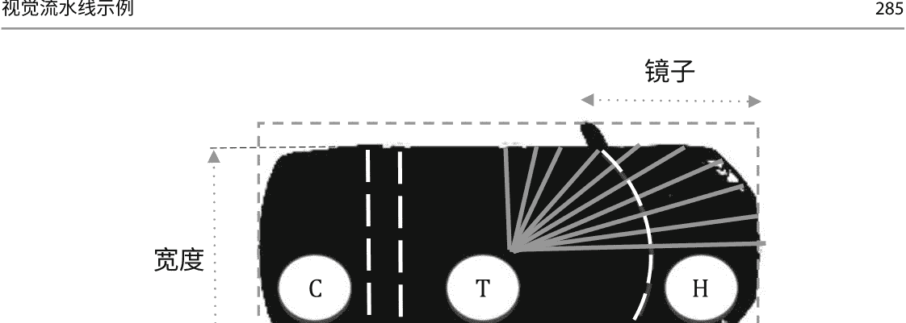

图8.4 用于汽车识别的特征

将存在于视野的远端。我们还假设对图像进行了几何校正，以将其矫正为笛卡尔对齐。假设通过几何校正矫正视野引入的误差可以忽略不计，以下是对长度和宽度的近似尺度精度的期望，以最小汽车尺寸为5′ × 12′的示例：

视野像素宽度：1080像素 / (44′ × 12″) 英寸 = 每个像素约为0.49英寸宽
视野像素长度：1920像素 / (60′ × 12″) 英寸 = 每个像素约为0.37英寸长
汽车宽度：(5′ × 12″) / 0.49 = 约122个像素
汽车长度：(12′ × 12″) / 0.37 = 约389个像素

这个例子使用以下形状特征：

- 包含所有特征的边界框；宽度和长度被使用
- 在汽车区域中间计算的质心
- 通过从质心到周长的最短直径计算的分离宽度
- 镜像特征被测量为距离汽车前部的距离；镜像位置是边界框内最小和最大周长宽度点
- 使用深度将形状分割为三个区域；在每个区域中测量颜色：货物舱（C）、顶部（T）和引擎盖（H）
- 通过在质心到周长点之间以5°的间隔测量线段来计算周长形状的傅里叶描述符

#### 特征描述符

多个特征描述符一起用于识别，汽车识别的置信度基于所有描述符的综合得分。要提取的关键特征描述符如下：

- 汽车形状因子：基于道路上方的每辆汽车的基于深度的分割用于粗略形状轮廓。随后进行一些形态学处理来清理边缘并去除噪音。对于每个分割的汽车，计算对象的形状因子，包括面积、周长、质心和边界框。

#### 校准、设置和基准数据

关于场景设置、相机校准和其他校正方面做出了几个关键假设；我们在这里对它们进行总结：

- 道路深度表面：深度相机校准到道路表面作为参考，以分割出道路上方的汽车；只校准了只包含道路的基准深度图像作为参考，并用于实时分割。
- 设备模型：每辆汽车的模型是根据制造商的信息创建的，具有准确的车身形状几何和颜色，适用于每个品牌和型号。具有自定义油漆的汽车会使这种方法变得复杂；然而，形状描述符和汽车区域深度分割提供了一种可靠的备选方案，可能足以提供良好的匹配结果——只有测试才能确定。
- 照明模型：为各种条件创建模型，如晨光、白天和傍晚的阳光和多云天气；根据时间、日期和天气条件选择照明模型以获得最佳匹配。
- 几何校正模型：为RGB和深度相机设计了整个视场的模型，以便在每个新帧上应用以矫正图像。

#### 流水线阶段和操作

假设系统事先完全校准，完整流水线的基本实时处理流程如图8.5所示，分为三个主要操作阶段。请注意，完整的流水线包括图像预处理阶段，用于对齐视场中的图像并分割特征，特征描述阶段用于计算形状和颜色描述符，以及用于特征匹配的对应阶段，以开发由形状和颜色特征加权组成的最终汽车标签。我们假设某个标准数据库中的每个特征都有一个单独的数据库表，这是可以接受的。

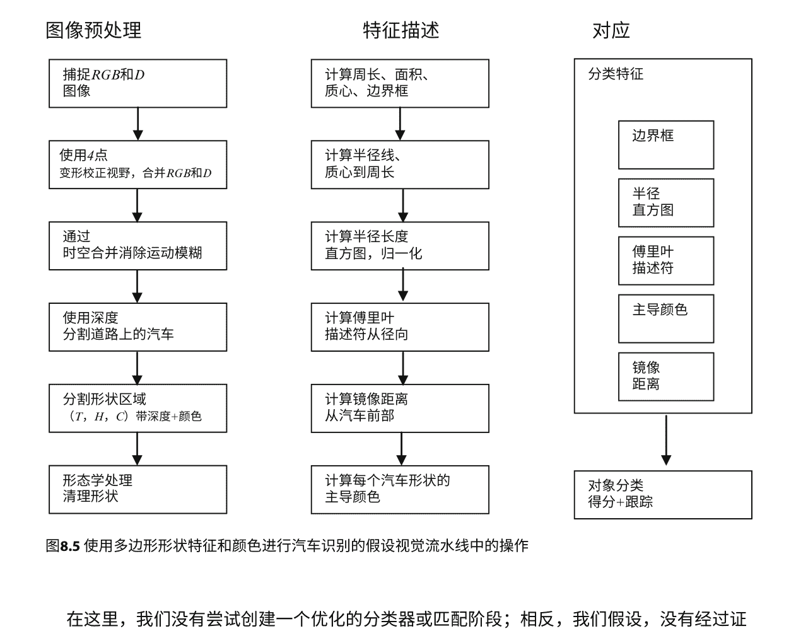

在这里，我们没有尝试创建一个优化的分类器或匹配阶段；相反，我们假设，没有经过证明或测试，使用标准数据库通过几千个汽车对象的蛮力搜索可以正常工作Alpha版本。

请注意图8.5（右下角）中的每个汽车都从一帧跟踪到另一帧，我们在这里不定义跟踪方法。

#### 操作和计算资源

对于管道阶段中的每个操作，我们现在探讨可能的映射到可用计算资源的方式。首先，我们回顾一下我们示例系统中可用的主要资源，其中包含8 GB的快速内存，我们假设有足够的空闲空间将整个数据库映射和锁定在内存中，以避免分页。我们的系统包含四个带有SIMD指令集的CPU核心和一个GPU，能够同时运行128个SIMT线程，具有128 GB/s的内存带宽用于GPU和CPU的共享内存，被认为足够强大。让我们假设，总体上，计算和内存资源对于我们的应用程序来说都很好，不需要考虑特殊的内存优化。接下来，我们来看一下将操作分配给计算资源的粗粒度优化。表8.3提供了可能的资源分配评估。

#### 资源分配的标准

在我们的简单示例中，如表8.3所示，将算法分配给计算单元的主要标准是处理器的适用性和负载均衡；对于这个问题来说，功耗不是一个问题。

表8.3 计算资源的操作分配

| 操作 | DSP传感器 VLIW (uint16, int16, WarpUnit) | GPU SIMT/SIMD (uint16/32, int16/32, float/double, 纹理单元) | CPU 线程 (uint16/32, int16/32, float/double) | CPU SIMD (uint16/32, int16/32, float/double) | CPU 通用 (uint16/32, int16/32, float/double) |
| :--- | :---: | :---: | :---: | :---: | :---: |
| 1. 捕捉 RGB-D图像 | x | | | | |
| 2. 四点矫正图像 | | x | | x | |
| 3. 去除运动模糊 | | x | | | |
| 4. 自动分割，道路 | | | x | | |
| 5. 自动分割形状区域 | | | x | | |
| 6. 形态学清理形状 | | x | | | |
| 7. 面积，周长，质心 | | | | | x |
| 8. 半径线段 | | | | | x |
| 9. 半径直方图 | | | x | | |
| 10. 傅里叶描述符 | | | x | | |
| 11. 镜像距离 | | | x | | |
| 12. 主要区域颜色 | | | x | | |
| 13. 特征分类 | | | x | | |
| 14. 物体分类得分 | | | | | x |

应用程序。在这个假设的设计练习中，表8.3中提供的操作资源分配是一个起点；实际的优化会有所不同，根据性能分析进行调整。然而，假设对于每个算法使用的内存访问模式是明显的，我们可以根据内存访问模式做出良好的资源分配猜测。在二阶分析中，我们还可以考虑流水线上的负载平衡，以最大化计算单元的并行使用；然而，这需要实际的性能测量。

在这里，我们将暂时将表8.3中的任务分配给资源。如果我们观察内存访问模式，使用GPU执行顺序任务2和3是有意义的，因为我们可以首先将图像映射到GPU内存空间，然后使用GPU执行三个顺序操作。GPU具有纹理采样器，我们将任务2分配给它，使用四点变形进行几何校正。一些DSP或相机传感器处理器也具有能够进行几何校正的纹理采样器，但在我们的示例中没有。除了几何校正，运动模糊也是GPU的一个很好的选择，可以在着色器中高效地实现为一个区域操作。

在流水线的后期，图像在任务4和任务5中被分割后，任务6中的形态学阶段可以使用GPU着色器快速执行；然而，将图像从GPU传输到CPU进行形态学处理的成本可能比在CPU上执行形态学处理更慢，因此需要进行性能分析，以便对CPU与GPU实现进行最终设计决策。

在表8.3中显示的7-11阶段的情况下，面积、周长、质心和其他测量的算法涵盖了非局部化的数据访问模式。例如，周长追踪沿着汽车的边缘进行。因此，我们将使用单个CPU通过图像进行一次遍历，以跟踪周长并计算每辆汽车的面积、质心和边界框。然后，我们分配将每个边界框作为图像瓦片分配给单独的CPU线程，用于计算剩余测量值：径向线段长度，傅里叶描述符和镜像距离。然后，将每个边界框分配给单独的CPU线程，计算每个区域的色度学，包括货物，车顶和引擎盖，如表8.3所示。每个CPU线程使用C++进行颜色转换，并尝试使用编译器标志来强制SIMD指令优化。

使用形状和颜色特征可以在帧与帧之间追踪汽车；然而，我们在这里不开发追踪算法。对于通信和匹配，我们依赖于第三方的通用数据库，在与管道的早期阶段并行执行的CPU上运行的单独线程中。我们假设数据库可以将自己的工作分成并行线程。然而，优化阶段可以重写和创建更好的数据库和分类器，使用并行线程来匹配特征描述符。

### 人脸、情绪和年龄识别

在这个例子中，我们设计了一个使用局部特征描述符和兴趣点的人脸、情绪和年龄识别管道。人脸识别关注的是识别一个人的独特面孔，而人脸检测关注的只是确定面孔的位置和有趣的特征，如情绪、年龄和性别。我们的例子是用于人脸检测，并找出被试者的情绪和年龄。

为了简单起见，这个例子使用了用静止摄像机拍摄的单个面孔的照片来进行生物识别，以便进入安全区域。使用照片简化了例子，因为不需要从多个角度和距离中挑选出人群中的面孔。关键设计挑战包括找到可靠的兴趣点和特征描述符方法来识别关键的面部标志，确定情绪和年龄，并在一个归一化的相对坐标系统中对这些标志进行建模，以便计算距离比例和角度。

多年来，已经部署了出色的面部识别系统用于生物特征识别，采用了各种方法，准确率接近100%。在这个练习中，没有试图证明性能或准确性。我们用以下要求定义系统：

- 1080p RGB彩色视频（1920 × 1080像素），水平安装以提供最高分辨率，每个颜色12位，65°视场角，30帧/秒
- 图像视场覆盖高度为2英尺，宽度为1.5英尺，足够容纳完整的头部和肩膀
- 背景是一个白色的落地屏幕，便于分割
- 照明位于被拍摄对象的前方并略高于其位置，以在整个面部投射微弱的阴影，突出眼睛、嘴唇和鼻子周围的角落
- 对于每张脸，系统识别以下标志点：
  - 眼睛：两个眼角和一个眼中心
  - 主要眼睛颜色：在CIECAM02 JCH颜色坐标中
  - 主要面部颜色：在CIECAM02 JCH颜色坐标中
  - 眉毛：两个眉毛端点和一个眉弓中心，用于确定情绪
  - 鼻子：鼻尖上的一个点和两个鼻孔最宽处的点，用于确定情绪和性别
  - 嘴唇：嘴唇的两个端点，上唇的两个中心脊
  - 脸颊：每个脸颊中心的一个点
  - 下巴：一个点，下巴的底部点，由于面部毛发可能不可靠
  - 头顶：一个点；由于发型可能不可靠
  - 独特的面部标记：这些可能包括胎记、痣或疤痕，并且必须位于计算出的面部区域的边界框内
- 在原始图像上的每个检测到的标志点上计算一个FREAK特征
- 准确率为99%或更高
- 简化的鲁棒性标准仅包括尺度

请注意，情绪、年龄和性别都可以通过选定的面部特征的相对距离和比例来估计，我们假设人脸解剖学专家提供了正确的位置和比例以供实际系统使用。见图8.6。

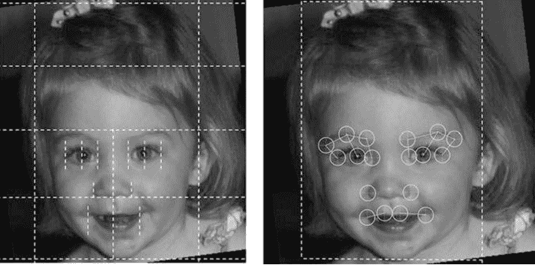

图8.6 (左)基于头部和面部区域边界框的比例关系作为预测面部特征点位置的指导线。(右)带有检测到的面部特征点位置以及特征点之间的相对角度和距离的标注图像。相对测量用于确定情绪、年龄和性别

此示例系统计算的特征集包括：

1.  面部标志物的相对位置，如眼睛、眉毛、鼻子和嘴巴
2.  标志物之间的相对比例和比率，以确定年龄、性别和情绪
3.  每个标志物的FREAK描述符
4.  眼睛颜色

#### 校准和基准数据

校准很简单：在被拍摄者后面使用白色背景，被拍摄者站在离相机约4英尺的地方，使得能够拍摄到头部和上半身。（我们将在本节后面讨论用于将头部从背景区域分割出来的操作。）假设我们有一张1080p的图像，我们将1920个像素分配给垂直方向，将1080个像素分配给水平方向。假设摄影师足够好，能够将头部居中在图像中，使得头部占据水平像素的约50%，垂直像素的约50%，那么我们对头部的像素分辨率约为540个水平像素和约960个垂直像素，这对于我们的应用来说已经足够好，并且对应于头部高度与宽度的比例。由于我们假设平均水平男性和女性成年人的头部高度约为9英寸，宽度约为6英寸，根据我们的假设，相机距离为4英尺，我们有足够的像素准确性和分辨率：

```
9" / (1920_pixels × 0.5) = 0.009" 垂直像素大小
6" / (1080_pixels × 0.5) = 0.01" 水平像素大小
```

地面真实数据包括：(1) 已知人物的照片，以及 (2) 用于辅助定位面部特征点的一组规范眼睛特征点模板 (稀疏码本的相关模板)。有两组相关模板：一组用于基于Hessian检测器找到的位置的细微特征，一组用于基于可调滤波器检测器找到的位置的粗糙特征 (细微和粗糙检测器将在本示例中更详细地描述)。

由于人们的面部特征如眼睛和嘴唇在很大程度上相似，规范的地标特征相关模板只能提供地标的粗略识别和位置。提供了几个模板，涵盖了各个年龄和性别的所有地标，例如眼角、眉角、眉峰、鼻角、鼻底、嘴角和嘴中心区域的形状。为了简洁起见，我们在这里不开发地标相关模板的真实数据集，但我们假设该过程是通过扭曲或改变真实特征并将其与几个真实人脸进行测试来获得最佳规范特征集的。相关模板在后面讨论的面部地标识别阶段中使用。

#### 兴趣点位置预测

为了找到面部地标，如眼睛、鼻子和嘴巴，这个示例应用程序通过使用正面照片简化了过程，使得面部特征的位置可预测，并能够在预测的位置智能搜索每个特征。与其依赖头部大小和形状的科学研究，对于这个示例，我们使用人体解剖学的基本比例假设 (几个世纪以来一直被艺术家使用) 来预测面部特征的位置，并在预测的位置进行搜索。面部特征的比例主要因年龄、性别和种族而异；例如，典型的成年男性比例如表8.4所示。

表8.4 基本近似面部和头部特征比例

| 特征 | 描述 |
| :--- | :--- |
| 头部高度 | 头部宽度 × 1.25 |
| 头部宽度 | 头部高度 × .75 |
| 面部高度 | 头部高度 × .75 |
| 面部宽度 | 头部高度 × .75 |
| 眼睛位置 | 眼睛中心位于边缘的30%，距离头部顶部的50% |
| 眼睛长度 | 头部宽度 × .25 |
| 眼睛间距 | 头部宽度 × .5 (中心到中心) |
| 鼻子长度 | 头部高度 × .25 |
| 嘴角 | 关于眼睛中心 x，比下巴高约15% y |> 注意：表8.4中的信息是从基本艺术材料中综合出来的，仅供说明目的，不保证准确性。

最基本的坐标是头部的边界框。通过边界框，可以预测其他面部特征的位置。

#### 使用边界框对头部和面部进行分割

如前所述，这些照片是在距离约4英尺的地方拍摄的，背景是白色的背景，可以简单地将头部分割出来。我们使用简单的颜色强度阈值化作为RGBI-1，其中 \(I = (R + G + B)/3\)，并将白色背景识别为最高强度。

分割的头部和肩膀区域用于创建头部和面部的边界框，接下来进行讨论。（注意：特殊的发型将需要另一种方法，可能基于面部特征相对于头部形状和比例的大小和位置。）在分割头部的边界框之后，我们继续分割面部区域，然后找到每个标志点。头部边界框的大致大小通过两个步骤计算：

- 1. 找到头部的顶部、左侧和右侧边界——顶部xy、左侧xy、右侧xy。我们假设可以通过逐行遍历图像并记录背景与头部前景相交的行和列来直接找到。
每行的最左和最右坐标可以保存在一个向量中，并进行排序以找到用作右侧x/左侧x坐标的中位数值。我们计算头部宽度为：
\[ H_w = 右_x - 左_x \]

- 2. 找到下巴以辅助计算头部高度\(H_h\)。首先通过预测下巴的位置，然后在预测位置周围进行边缘检测和一些滤波来确定下巴特征。我们假设根据下巴周长的梯度幅值可以简单找到下巴。下巴位置的预测是通过使用头部顶部坐标\(Top_{xy}\)和头部高度\(H_h\)与头部宽度\(H_w\)之间的正常解剖比例（约为0.75）来进行的。由于我们从步骤1中知道了\(Top_{xy}\)和\(H_w\)，我们可以预测下巴的x和y坐标如下：
\[ 下巴_y = 0.25 \times H_w + Top_y \]
\[ 下巴_x = Top_x \]

实际上，发型在某些情况下会使头部分割变得困难，因为头发可能堆积在头顶上或广泛延伸到两侧并遮盖住耳朵。然而，我们可以迭代几次下巴检测方法来找到最佳下巴，或者假设我们的分割方法将通过一个头发滤波模块来解决这个问题，所以为了简洁起见，我们继续进行这个示例。

为了定位下巴的位置，在预测位置周围使用水平边缘检测掩模，因为下巴主要是水平边缘。连接的水平边缘的坐标最大值被过滤以找到水平边缘集的最低y坐标，并且最低x/y坐标的中位数被用作下巴中心位置的初始猜测。稍后，当眼睛位置已知时，可以使用眼睛之间中点的位置与下巴 x 位置进行合理性检查，并在需要时重新计算。参见图8.7。

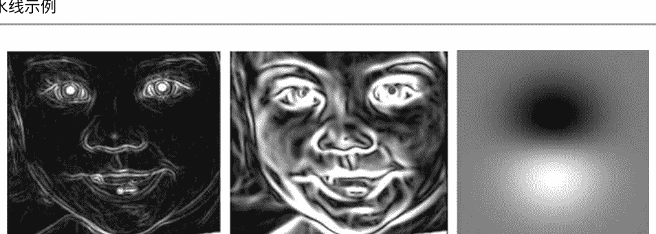

图8.7 面部特征点的位置。（左）使用Hessian张量的最大特征值增强的面部特征点[475]在FeatureJ中；注意提供额外细节的细边缘。（中间）基于模板的特征检测器使用可转向滤波器，并在Canny检测器[382]的基础上进行额外的滤波，以提供粗略的细节。（右）用于计算中心图像的可转向滤波器模式。两个图像都使用对比度窗口重映射进行增强，以突出边缘。使用ImageJ的FeatureJ插件生成Hessian的特征值（FeatureJ由Erik Meijering开发）。

假设包含脸部的头部边界框为：

```
BoundingBoxTopLeft_x = Left_x
BoundingBoxTopLeft_y = Top_y
BoundingBoxBottomRight_x = Right_x
BoundingBoxBottomRight_y = Chin_y
```

#### 面部标志识别和特征计算

现在已经计算出头部边界框，可以使用表8.4中的基本比例估计来预测面部标志特征集的位置。在每个预测位置周围进行搜索以找到这些特征；参见图8.6。例如，眼睛中心位置距离头部两侧约30%，距离头部顶部约50%。

在我们的系统中，我们使用一个具有两个级别的图像金字塔进行特征搜索，一个粗级别的搜索，缩小了四倍，一个细级别的搜索，在完整分辨率下重新定位兴趣点，计算特征描述符并进行测量。粗到细的方法允许对头部的相对大小进行广泛变化，以考虑由于距离摄像机和/或年龄差异而引起的轻微尺度不变性。

我们在这里没有添加一个步骤来将头部旋转成笛卡尔坐标系的正交方向，但这可以很容易地完成。例如，可以使用迭代过程来最小化正交边界框的宽度，使用每2°从-10到+10°拍摄的图像的多个旋转。对于每个旋转，计算边界框，并选择最小的边界框宽度来找到用于校正头部倾斜的角度。

此外，我们在这里没有添加一个步骤来计算皮肤的表面纹理，这对于年龄检测来说是有用的，以找到皱纹。这可以通过分割几个皮肤区域（如额头、眼角和嘴周围区域）并使用边缘或纹理度量来轻松完成。

地标检测步骤包括特征检测、特征描述和计算地标之间位置和角度的相对测量，如下所示：

- 1. 计算兴趣点：在搜索面部特征之前，使用兴趣点检测器计算预测位置周围的可能候选位置。这里我们使用了两个检测器的组合：（1）海森矩阵的最大特征值[475]，以及（2）可转向滤波器[370]，使用类似Canny方法[382]的边缘检测滤波器准则进行处理，如图8.7所示。海森矩阵和类似Canny的边缘检测器图像都经过对比度窗口处理以增强边缘细节。海森矩阵风格和Canny风格的图像一起用于在下一阶段的相关性阶段对最佳兴趣点的实际位置进行投票。

- 2. 使用相关性计算地标位置：使用一组规范化的相关性模板确定每个面部地标特征的最终位置，包括眼角、眉角、眉峰、鼻角、鼻底、嘴角和嘴中心区域的形状。相关性搜索的起始位置是来自步骤1的两个检测器的平均位置：（1）海森方法提供了细节特征，（2）而可转向滤波器方法提供了粗特征细节。测试将确定是否仅使用相关性就足够，而不需要步骤1中的兴趣点。

- 3. 使用FREAK描述符描述地标：对于在步骤2中找到的每个地标位置，我们计算一个FREAK描述符。SIFT可能同样有效。

- 4. 使用CIECAM02 JCH测量主要眼睛颜色：我们使用超像素方法[249, 250]将眼睛中心周围的颜色区域分割出来，并制作颜色的直方图。黑色瞳孔和眼白应该在直方图中聚集为峰值，眼睛的主要颜色也应该在直方图中聚集。即使是多彩的眼睛也可以使用我们的方法识别，使用直方图对应。

- 5. 计算地标之间的相对位置和角度：在上述第2步中，使用相关性来找到每个特征的位置（如果需要，可以达到亚像素精度[450]）。如图8.6所示，我们使用地标位置作为测量多个特征的相对距离的基础，例如：
(a) 眼距，中心到中心，用于年龄和性别
(b) 眼睛大小，角到角
(c) 眉毛角度，末端到中心，用于情绪
(d) 眉毛到眼睛角度，末端到中心位置，用于情绪
(e) 眉毛距离眼睛中心的距离，用于情绪
(f) 嘴唇或口宽度
(g) 中心唇脊与唇角的角度，用于情绪

流水线阶段和操作
管道阶段和操作如图8.8所示。对于对应，我们假设每个特征都有一个单独的数据库表。我们不感兴趣创建一个优化的分类器来加快模式匹配；暴力搜索就可以。

#### 图像预处理

#### 特征描述

#### 对应

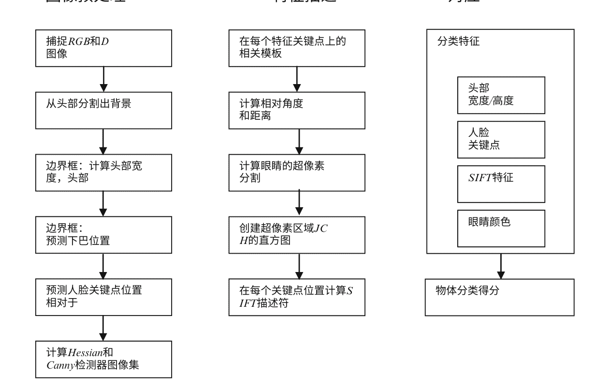

图8.8 使用局部特征进行面部、情绪和年龄检测的虚拟视觉流水线中的操作

#### 操作和计算资源

对于这个例子，大部分是适合CPU的直线代码。根据数据访问模式作为指南，边界框、相对距离和比例、FREAK描述符和对应是CPU的好选择。在某些情况下，可以使用单独的CPU线程，例如在单独的线程中计算每个地标处的FREAK描述符（对于这个简单的应用程序来说，线程可能过度）。我们假设使用标准数据库进行特征匹配。我们的应用程序假设有足够的时间等待对应。

一些操作适合在GPU上进行，例如面积操作，包括Hessian和Canny样式的兴趣点检测器。这些方法可以合并并优化为一个单一的着色器程序，使用单一的公共数据读取循环和组合处理循环，生成两个图像的输出，每个检测器一个。此外，我们假设GPU在媒体部分提供了一个快速的硬件加速相关块匹配器的API，因此我们利用了硬件加速的相关性。

#### 资源分配的标准

在这个例子中，性能不是一个问题，因此使用计算机资源的标准是放松的。实际上，所有的代码都可以编写成在单个CPU的单个线程上运行，并且在我们的目标系统假设下，性能可能足够快。然而，表8.5中显示的资源分配旨在说明每个操作合理使用资源以分担SOC的工作负载。

表8.5 计算资源的操作分配

| 操作 | DSP 传感器 VLIW<br>uint16, int16<br>WarpUnit | GPU SIMT/SIMD<br>uint16/32, int16/32, float/double<br>纹理单元 | CPU 线程<br>uint16/32, int16/32, float/double | CPU SIMD<br>uint16/32, int16/32, float/double | CPU 通用<br>uint16/32, int16/32, float/double |
| :--- | :--- | :--- | :--- | :--- | :--- |
| **1. 捕捉RGB-D图像** | x | | | | |
| **2. 从头部分割背景** | | | | | x |
| **3. 边界框** | | | | | x |
| **4. 计算Hessian和Canny** | | x | | | |
| **5. 相关性** | | x | | | |
| **6. 计算相对角度和距离** | | | x | | |
| **7. 超像素眼部分割** | | | | | x |
| **8. 眼部分割颜色直方图** | | | | | x |
| **9. FREAK描述符** | | | x | | |
| **10. 对应** | | | | | x |
| **11. 物体分类得分** | | | | | x |

### 图像分类

对于我们的下一个示例，我们设计了一个简单的图像分类系统，用于移动电话使用，目标是识别相机视野中的主要对象，如建筑物、汽车和人。对于图像分类应用程序，整个图像都是感兴趣的，而不是特定的局部特征。用户将拥有一个简单的应用程序，允许他们将相机对准一个对象，并从一侧摇摆相机以建立用于MVS深度感知的立体基线，稍后将讨论。可以应用广泛的全局度量标准（如第3章所讨论的），计算整个图像上的纹理、颜色或强度的直方图以及连接组件标记的方法。此外，还可以应用局部特征（如第6章所讨论的）来描述图像的关键部分。这个假设的应用程序同时使用全局和局部特征。

#### 我们定义了以下系统要求：

- 1080p RGB彩色视频（1920 × 1080像素），每秒30帧，每个颜色12位，65°视场角，30帧每秒
- 图像视场覆盖了从手机摄像头的无限焦点视图
- 无限的光照条件（好与坏）
- 准确率达到90%或更高
- 简化的鲁棒性标准，包括尺度、透视、遮挡
- 对于每个图像，系统计算以下特征：
  - 全局RGBI直方图，在RGB-I颜色空间中
  - GPS坐标，因为手机具有GPS
  - 通过MVS深度感知计算相机姿态，使用加速度计数据进行几何校正到正交视场平面（用户被要求在指向主体的同时挥动相机，相机姿态向量通过加速度计数据计算，并相对于视场中的主要对象进行ICP）
  - *SIFT*特征，理想情况下每个图像存储20到30个特征
- 通过单目稠密深度感知获取深度图，用于在视野中分割出物体，深度范围目标为0.3-30米，在1米处的准确度为1%，在30米处的准确度为10%
- 场景标记和像素标记，基于分割区域的属性，包括RGB-I颜色和LBP纹理

场景识别是一个经过深入研究的领域，每年都会举办几个大挑战竞赛，以找到使用已建立的真实数据集的方法来提高准确性，如附录B所示。在挑战中，各类图像的最佳准确度范围从50%到90%以上。在这个练习中，不试图证明性能或准确性。

#### 图像分割和特征描述符

对于这个假设的视觉流水线，将使用多种方法将场景分割成对象，而不是依赖于单一的方法，如下所示：

- 1. 密集分割、场景解析和对象标记：使用单目MVS生成的深度图用于分割场景中的常见物体，包括地面或地板、天空或天花板、左右墙壁、背景和场景中的主体。为了计算手机设备的单目深度，应用程序提示用户将相机从左到右移动，覆盖大约3英尺的臂长范围，以创建一系列用于使用MVS方法计算深度的宽基线立体图像（如第1章所讨论的）。MVS提供了一个密集的深度图。尽管MVS计算需要大量计算资源，但这不是一个问题，因为我们的应用程序不需要连续实时深度图生成，只需要一个单一的深度图；假设我们的假设移动设备可以在3-4秒内获取基线图像并生成深度图。
- 2. 使用超级像素的颜色分割和组件标记：使用超级像素的颜色分割应该与深度分割的部分大致对应。
- 3. LBP区域分割：该方法计算速度较快，表示紧凑，如第6章所讨论的。
- 4. 融合分割：使用布尔掩码、形态学和一些逻辑将深度、颜色和LBP分割区域组合成一个融合分割。该方法使用迭代循环来最小化颜色、深度和LBP分割方法之间的差异，形成一个新的融合分割图。融合分割图是全局图像描述符之一。
- 5. 对于每个分割区域的形状特征：对于每个融合分割区域，计算基本形状特征，如面积和质心。还计算了区域质心之间的相对距离和角度，形成一个综合描述符。

在这个假设的例子中，我们将几种特征描述符方法结合在一起，以增加鲁棒性和不变性，并进行一些预处理，总结如下：

- 1. 整个图像上的SIFT兴趣点被用作额外的线索。我们完全遵循SIFT方法，因为已知SIFT可以使用仅有三到四个SIFT特征来识别较大的物体[153]。然而，根据训练结果，我们预计将SIFT特征数量限制在每个场景中的20或30个强候选特征。
- 2. 此外，由于我们在移动电话上有加速度计和GPS传感器数据，我们可以仅基于位置和相机姿态使用传感器数据来识别物体，例如假设存在一个服务器来查找区域内地标的GPS坐标。
- 3. 由于需要光照不变性，我们在进行SIFT特征计算、颜色直方图和LBP计算之前，尝试进行RGBI对比度重映射，以规范对比度和颜色。我们假设使用统计方法来计算最佳强度重映射限制，以扩展颜色的总范围，以减轻暗图像和过饱和图像的影响，基于地面真实数据测试，但我们没有花时间在这里开发算法；然而，在第2章中提供了一些关于候选算法的讨论。例如，在暗图像上计算SIFT描述符可能无法提供足够的边缘梯度信息来计算良好的SIFT描述符，因为SIFT需要梯度。过饱和的图像将具有褪色的颜色，从而阻止了良好的颜色直方图。
- 4. 融合分割将所有颜色、LBP和深度分割方法的优点结合起来，通过将所有分割融合成一个融合分割图来最小化分割差异。同时还使用了LBP方法，它对低光和过曝条件都不太敏感，提供了一定的平衡。

再次强调，出于假设性练习的精神，我们在这里不花时间来进一步开发算法，仅仅给出基本描述。

#### 流水线阶段和操作

流水线阶段如图8.9所示。它们包括图像预处理阶段，主要用于校正图像对比度、计算深度图和分割图。特征描述阶段计算RGBI颜色直方图、SIFT特征，将最佳的深度、颜色和LBP方法融合成一个分割图，并将像素标记为连接组件。对于对应关系，我们假设每个特征都有一个单独的数据库表，使用暴力搜索；不进行任何优化尝试。

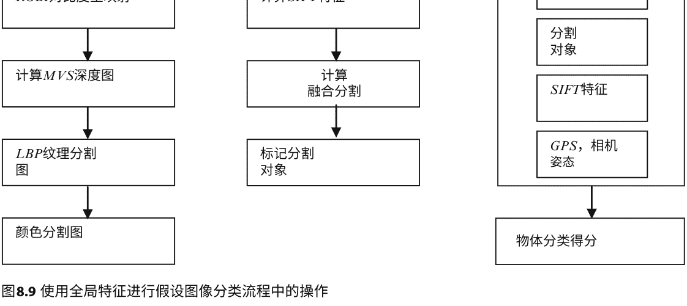

图8.9 使用全局特征进行假设图像分类流程中的操作

#### 将操作映射到资源

我们假设DSP提供对比度重映射的API，并且由于DSP已经处理来自传感器的所有像素，并且像素数据已经存在，对比度重映射是DSP的一个很好的匹配。

MVS深度图计算遵循线和区域操作的数据模式。我们使用GPU来处理MVS算法的繁重部分，例如左/右图像对的模式匹配。我们的算法遵循第1章讨论的基本立体算法。立体基线最初是从加速度计估计的，然后通过基线图像集上的一些束调整迭代来改进基线估计。我们假设MVS立体工作负载在这个流程中最重，并且在一两秒钟内消耗大部分GPU。最后产生一个密集的深度图用于深度分割。

使用超像素方法对RGBI分量进行颜色分割[249, 250]。还计算了RGBI每个超像素单元的颜色分量直方图。LBP纹理计算非常适合GPU，因为它是一种适合着色器编程风格的区域操作。因此，可以将颜色分割和LBP纹理分割合并到同一个着色器中，以利用寄存器文件中的数据共享，并避免数据交换和数据复制。

SIFT特征描述可以分配给CPU线程，并且数据可以被划分和分配给CPU线程以进行并行特征描述。同样，融合分割也可以分配给CPU线程，并且数据也可以被划分。请注意，划分的数据可以包括重叠的边界区域或缓冲区，参见图8.12中重叠数据划分的示例。标记也可以以类似的方式分配给并行CPU线程，使用划分的数据区域。最后，我们假设使用数据库表对每个描述符进行蛮力匹配阶段，以开发最终得分，并根据与地面真实数据的训练来对某些特征进行加权。

#### 资源分配的标准

资源分配的基本标准是在DSP上进行早期点处理，因为数据已经驻留，然后使用GPU SIMT SIMD模型计算区域操作，作为着色器创建深度图、颜色分割图和LBP纹理图。管道的最后阶段很好地映射到线程并行方法和数据切片。根据表8.6中所示的选择的操作资源分配，该应用程序似乎很容易进行工作负载平衡和CPU核心线程和GPU之间的并行化。

### 增强现实

在这个第四个例子中，我们设计了一个使用可穿戴显示设备（如眼镜或护目镜）和可穿戴摄像头进行设备维护的增强现实应用。完整的系统由一个便携式可穿戴设备、带摄像头和显示器的设备与服务器通过无线连接组成。处理任务分布在可穿戴设备和服务器之间（注意：这个例子特别高级，省略了很多细节，因为实际系统的设计、训练和测试会很复杂）。

服务器系统包含了机器的所有CAD模型，并提供按需图形模型或渲染任何视角下的任何机器零件。可穿戴摄像头跟踪眼睛注视点和机器位置。可穿戴显示器允许服务技术人员查看机器并在显示器上查看增强现实叠加层，说明如何维修机器。
当用户观察特定机器时，增强现实功能会识别机器零件并提供叠加层和动画来帮助故障排除和维修。该系统使用RGB图像与3D深度表面纹理以及机器和所有组件机器零件的3D CAD模型数据库的组合。

该系统将具备以下要求：

- 1080p RGB彩色摄像头（1920 ×1080像素），30 fps，每个颜色12位，65°视场角，30 FPS
- 1080p立体深度摄像头，分辨率为8位 Z，60 fps，65°视场角；所有立体处理在摄像头ASIC中以深度图为输出进行。
- 480p近红外摄像机指向技术员的眼睛，用于注视检测；近红外摄像机在头戴显示器周围的低光环境中拍摄效果更好
- 1080p可穿戴式RGB显示器
- 可穿戴式个人电脑用于驱动摄像机和显示器、描述符生成和与服务器的无线通信；该系统由电池供电，可移动使用，电池寿命为8小时
- 服务器用于存储机器和零件的CAD模型；每个零件都将有预先计算的描述符存储在数据库中；服务器可以通过无线方式向可穿戴设备提供图形模型或完整渲染
- 服务器用于存储基准数据，包括在每个零件的CAD模型渲染上计算的特征描述符+每个描述符的归一化3D坐标
- 简化的鲁棒性标准包括透视、尺度和旋转

表8.6 计算资源的操作分配

| 操作 | DSP 传感器 VLIW<br>uint16<br>int16<br>WarpUnit | GPU SIMT/SIMD<br>uint16/32<br>int16/32<br>float/double<br>纹理单元 | CPU 线程<br>uint16/32<br>int16/32<br>float/double | CPU SIMD<br>uint16/32<br>int16/32<br>float/double | CPU 通用<br>uint16/32<br>int16/32<br>float/double |
| :--- | :--- | :--- | :--- | :--- | :--- |
| 1. 捕获RGB宽基线图像 | x | | | | |
| 2. RGBI对比度重映射 | x | | | | |
| 3. MVS深度图 | | x | | | |
| 4. LBP纹理分割图 | | x | | | |
| 5. 颜色分割图 | | x | | | |
| 6. RGBI颜色直方图 | | | x | | |
| 7. SIFT特征 | | | x | | |
| 8. 融合分割 | | | x | | |
| 9. 标记分割对象 | | | x | | |
| 10. 对应 | | | x | | |
| 11. 物体分类得分 | | | | | x |## 校准和基准数据

我们假设RGB相机和立体相机系统经过正确的光学校准，能够精确地成像相同的视场，因为RGB相机和3D深度图必须在每个像素位置上对应，以便能够准确地将2D特征与相应的3D深度位置关联起来。然而，眼动相机需要进行一些独立的校准，我们假设开发了一个简单的校准应用程序，通过使用立体相机和RGB相机在视场中定位一个特征，然后在监视器上叠加眼动矢量来确认眼动矢量的准确性。我们不在这里开发校准过程。

然而，地面真实数据需要一些时间来开发和训练，并且需要机器维修和设计方面的专家在训练过程中共同合作。地面真实数据包括每个零件的特征集，包括沿角落、边缘和其他位置（如旋钮）的2D SIFT特征。为了创建SIFT特征，首先从技术员可能看到的代表性视点制作每个CAD零件模型的一组图形渲染，然后在图形渲染上计算2D SIFT特征，并使用模型的几何形状为每个SIFT特征创建相对3D坐标以进行对应。

2D SIFT特征位置与相对3D坐标一起记录在数据库中，并使用适当的约束条件（如角度和相对距离）关联到对象中，参见图8.10。在训练过程中，专家会选择每个部分的最小特征集，主要是来自角落和表面边缘的最强特征。在数据库中记录了2D SIFT特征之间在三维空间中的相对角度和距离，以实现透视、尺度和旋转不变性。所有部件的3D坐标都被归一化到机器的尺寸。此外，从渲染中计算并存储每个部件表面的主要颜色和纹理作为纹理和颜色特征。这个系统需要大量的训练和测试。

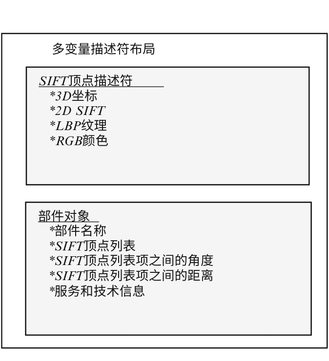

图8.10 SIFT顶点描述符类似于使用3D位置、颜色和纹理的计算机图形顶点。SIFT顶点描述符包含来自RGB相机的2D SIFT描述符，从深度相机生成的2D SIFT描述符的3D坐标，SIFT顶点处的RGB颜色以及SIFT顶点处的LBP纹理。Part对象包含一系列SIFT顶点描述符，以及SIFT顶点列表中每个3D坐标之间的相对角度和距离。

#### 特征和对象描述

在实际使用中，RGB相机用于查找2D SIFT、LBP和颜色特征，立体相机用于创建深度图。由于RGB图像和深度图像像素对齐，每个特征都具有从深度图中获取的3D坐标，这意味着可以将3D坐标分配给2D SIFT特征位置。计算2D SIFT特征位置之间的3D角度和3D距离作为约束，并将具有3D位置约束的组合LBP、颜色和2D SIFT特征存储为SIFT顶点特征，并发送到服务器进行对应。请参见图8.10，了解SIFT顶点描述符和部件对象的布局示例。请注意，3D坐标与多个描述符相关联，包括SIFT、LBP纹理和RGB颜色，类似于计算机图形中通过3D位置、颜色和纹理表示3D顶点的方式。

在训练过程中，从零件的各个视角创建了多个SIFT顶点描述符，每个视角都与数据库中的3D坐标相关联，从而可以根据3D坐标和特征进行简化的搜索和匹配。

#### 叠加和跟踪

在服务器中，将场景中的SIFT顶点描述符与数据库进行比较，以找到零件对象。在搜索之前，每个特征的3D坐标、角度和距离都相对于机器的尺寸进行了归一化处理。如图8.10所示，SIFT特征在3D坐标上组成了一个SIFT顶点描述符，其中包括一个关联的2D SIFT特征、LBP纹理和颜色。SIFT顶点描述符被关联到零件对象中，零件对象包含描述每个零件的顶点坐标列表，以及SIFT顶点特征之间的相对角度和距离。

假设机器的零件对象可以使用一小节SIFT顶点特征来定义，可以实时确定大小和距离，并且可以持续计算每个零件和整个机器的相对3D信息，如大小和位置。使用识别出的零件和特征的3D坐标，可以在头戴显示器中显示增强现实渲染，突出显示零件位置，并使用叠加动画来说明需要移除的零件，以及手在修理过程中需要遵循的路径。

近红外摄像机跟踪技术员的眼睛，以创建一个3D凝视矢量到场景上。凝视矢量可用于头戴式显示器中的增强现实“帮助”叠加，允许凝视定向缩放或信息，对技术员正在查看的部分显示更详细的渲染和叠加信息。

#### 流水线阶段和操作

流水线阶段如图8.11所示。请注意，处理过程在可穿戴设备（主要用于图像捕获、特征描述和显示）和服务器之间进行划分，服务器用于处理重负荷任务，如对应和增强现实渲染。在这个例子中，可穿戴设备与服务器结合使用，依靠无线网络传输图像和数据。我们假设无线网络上的数据带宽和数据压缩方法对于所有必要的数据通信是足够的。

#### 特征描述（设备）

#### 对应（服务器）

#### 增强和跟踪（服务器）

- 特征描述（设备）：
  - 对齐RGB + 立体图像
  - 计算2D SIFT描述符
  - 3D信息：将3D坐标添加到2D SIFT
  - 3D信息：计算3D角度和距离
  - 计算LBP纹理 + RGB颜色
  - 将2DSIFT、3D信息、纹理和颜色发送到服务器
- 对应（服务器）：
  - 将3D信息转换为相对坐标
  - 分类特征
  - 匹配2D SIFT描述符
  - 将3D信息与SIFT 3D坐标匹配
  - 匹配RGB-I纹理 + RGB颜色
  - 物体分类得分
- 增强和跟踪（服务器）：
  - 更新凝视姿态向量
  - 确定增强渲染坐标
  - 渲染叠加和动画图像
  - 将图形几何发送到设备
  - 将增强渲染到头戴显示器

图8.11 虚拟现实流水线中的操作

#### 表8.7 计算资源的分配

| 操作 | DSP传感器 VLIW | GPU SIMT/SIMD | CPU 线程 | CPU SIMD | CPU 通用 |
|------|----------------|---------------|----------|----------|----------|
| 1. 捕捉RGB和立体图像 | 设备 | | | | |
| 2. 对齐RGB和立体图像 | | 设备 | | | |
| 3. 计算LBP纹理 | | | 设备 | | |
| 4. 计算颜色 | | | 设备 | | |
| 5. 计算2D SIFT | | | 设备 | | |
| 6. 计算3D角度/距离 | | | 设备 | | |
| 7. 归一化3D坐标 | | | | | 服务器 |
| 8. 匹配2D SIFT描述符 | | | 服务器 | | |
| 9. 匹配SIFT顶点坐标 | | | 服务器 | | |
| 10. 匹配SIFT顶点颜色和LBP | | | 服务器 | | |
| 11. 物体分类得分 | | | | | 服务器 |
| 12. 更新凝视姿态向量 | | | | | 服务器 |
| 13. 渲染叠加和动画图像 | | 服务器 | | | |
| 14. 显示叠加和动画 | | 设备 *GFX管道 | | | |

#### 将操作映射到资源

我们在GPGPU处理中尽量少使用GPU，并假设服务器有很多可用的CPU，并且我们在管道的最后使用GPU进行图形渲染。大多数操作可以通过数据切片映射到单独的CPU线程中。请注意，服务器通常配备许多高功率和快速的CPU，因此使用CPU线程是一个很好的选择。请参阅表8.7。

#### 资源分配的标准

在移动设备上，深度图是通过深度相机在硅上计算的。我们使用GPU使用纹理采样器执行RGB和深度图的对齐，然后在CPU上执行SIFT计算，因为SIFT计算必须首先完成以获得顶点来锚定和计算多变量描述符信息。我们继续并遵循数据局部性，并使用数据切片和重叠区域在单独的CPU线程中为每个2D SIFT点执行LBP和颜色计算。请参阅图8.12以了解重叠数据切片的示例。

在服务器上，我们已经分配了CAD数据库和大部分繁重的工作负载，包括特征匹配和数据库访问，因为服务器预计具有大容量的存储和内存以及许多可用的CPU。此外，我们希望保持移动设备的电池寿命和最小化发热，因此服务器更适合处理大部分工作负载。

## 加速替代方案

有各种常见的加速方法可以应用于视觉流水线，包括注意内存管理，使用线程进行粗粒度并行处理，使用SIMD和SIMT方法进行数据级并行处理，多核并行处理，高级CPU和GPU汇编语言指令以及硬件加速器。

加速的基本方法有两种：

- 1. 遵循数据
- 2. 遵循算法

优化计算设备的算法，例如SIMD指令集或SIMT GPGPU方法，也被称为流处理，通常是设计者考虑的明显选择。然而，优化数据流和数据驻留可能会产生更好的结果。例如，来回复制数据和数据格式之间的操作是不明智的；它会消耗时间和功耗，并且在复制和格式转换操作中。在慢速系统内存中进行数据复制比在计算单元内的快速寄存器文件中进行数据访问要慢得多。考虑到内存速度的层次结构，如图8.2所示，并考虑到计算机视觉的图像密集特性，最好找到一种方法来遵循数据并尽可能长时间地将数据驻留在快速寄存器和缓存内存中，局部于计算单元。

## 内存优化

在优化图像或视觉应用程序时，往往忽视了内存占用和内存传输带宽，然而内存问题在性能方面是最关键的。功耗、带宽、硅面积和整体性能。如表8.2所示和后续的内存讨论中，一个非常基本的视觉流水线在计算单元和系统内存之间传输了几GB/s的描述符，并且DNN可能是数量级更高的数据密集型。此外，像兴趣点检测和图像预处理这样的区域处理过程通过每个计算单元的寄存器文件、缓存和系统内存中的复杂路径移动更多的数据。

为什么要优化内存？通过优化内存使用，可以减少数据传输，提高性能，降低功耗成本，并延长电池寿命。电力成本很高；事实上，一家大型互联网搜索公司已经在哥伦比亚河的水电系统附近建立了服务器农场，以确保清洁电力并降低电力传输成本。

对于移动设备来说，电池寿命是一个重要关注点。政府也开始发行碳税和碳信用，以鼓励节能减排。因此，内存使用往往是一个被忽视的成本。内存优化的API和方法将因计算平台和操作系统而异。关于Linux内存优化方法的良好讨论可参考文献[476]。

尽量减少计算单元之间的内存传输。如果可能的话，应避免在计算单元之间进行数据传输。在优化和调整阶段应考虑工作负载整合，以便在数据驻留在寄存器文件和给定计算单元的本地缓存中时尽可能多地进行处理。也就是说，按照数据的流向进行操作。

例如，对于单区域操作，使用GPGPU着色器，然后在CPU上处理相同的数据可能比在CPU上进行所有处理更慢。这是因为GPGPU内核需要设备驱动程序介入来设置每个内核的内存并启动每个内核，而CPU程序直接访问代码和数据，除了初始程序加载外，不需要任何驱动程序设置。减少计算单元之间来回传输的一种方法是使用循环合并和任务链接，稍后在本节中讨论。

### 内存切片

当将粗粒度并行计算的工作负载分成多个线程时，图像可以被分成平铺区域，并将每个平铺分配给一个线程。平铺在点、线和区域处理中效果很好，每个线程在平铺区域上执行相同的操作。通过允许平铺之间存在重叠的读取区域，可以消除硬边界，并且区域操作（如卷积）可以读取相邻平铺进行内核处理，以及将完成的结果写入其平铺。

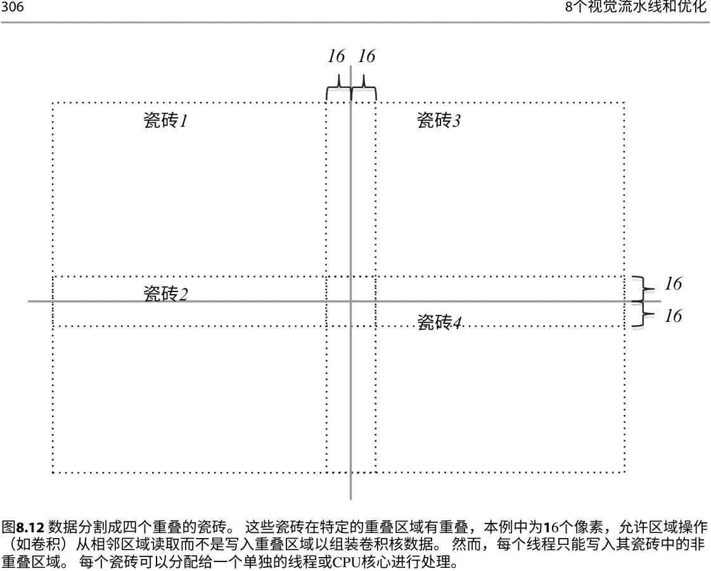

### 图8.12 数据分割成四个重叠的瓷砖。

### DMA、数据复制和转换

在视觉流水线中通常需要图像的多个副本，并且在某些情况下，数据必须从一种类型转换为另一种类型。将存储在16位整数中的12位无符号颜色通道数据转换为32位整数，以便在计算中获得更准确的数值精度是一个例子。此外，颜色通道可能会转换为所选择的颜色空间，例如RGBI，用于在I分量空间（R × G × B）中进行颜色处理；然后，新的I值被混合并复制回RGB分量。对数据布局和数据驻留的仔细关注将允许更高效的前向和后向颜色转换。

在复制数据时，最好尝试使用直接内存访问（DMA）单元进行最快的数据复制。DMA单元是通过硬件实现的，用于直接优化和控制内存中的I/O互连流量。操作系统提供API来访问DMA单元[476]。有多种优化DMA方法的变体，并且在参考文献[477,479]中可以找到一些有趣的研究，比较了缓存性能与DMA在视觉应用中的性能。

### 寄存器文件、内存缓存和固定

内存系统是每个处理器的虚拟和物理内存的层次结构，由慢速固定存储（如文件系统、页面文件和交换文件）组成，用于管理虚拟内存、系统内存、缓存和计算单元内的快速寄存器文件，并在它们之间进行内存互连。如果要处理的数据驻留在寄存器文件中，则由ALU以处理器时钟速率进行处理。最佳情况下，通过靠近每个ALU的寄存器文件进行内存访问，因此在复制数据之前将数据保留在寄存器中并执行所有可能的处理是最优的，但这可能需要一些代码更改（稍后在本节中讨论）。

如果必须访问缓存以获取数据，则会消耗更多的时钟周期（消耗功耗，性能下降）与访问寄存器文件相比。如果发生缓存未命中并且必须访问速度较慢的系统内存，则通常需要许多个时钟周期将内存通过缓存移动到寄存器文件中进行ALU处理。

### 数据结构、打包和向量与散射-聚集数据组织

所使用的数据结构对内存传输有影响。数据组织应尽可能允许连续块的串行访问，以提供最佳性能。从编程的角度来看，数据结构通常是为了方便而设计的，并且没有考虑编译器将如何安排数据或结果的性能。

例如，考虑一个由字节、整数和浮点数据项组成的数据结构；编译器可能会尝试重新排列数据结构中数据项的位置，甚至按不同的顺序打包数据以进行各种优化。编译器通常提供一组编译器指令，如内联指示和编译器开关，来控制数据打包行为；这些值得研究。

对于点处理，数据的向量是自然的结构，内存系统将在访问和处理连续向量时达到最佳性能。对于区域操作，使用跨越多行的矩形，并且这些矩形会导致可能引发缓存未命中的内存访问模式。使用散射-聚集操作来收集卷积核数据，可以将一个大的数据结构拆分成数据的向量，从而提高性能。通常，CPU和GPU的内存架构特别关注数据访问模式，并提供隐藏的优化方法。

散射-聚集操作，也称为矢量I/O或分散的内存访问，可以在GPU或CPU芯片中实现，以实现对非连续数据结构模式的快速读/写访问。通常，散射操作将多个输入缓冲区写入单个输出缓冲区的连续模式中，而聚集操作类似地从多个输入缓冲区中读取连续模式到输出缓冲区中。

操作系统和计算语言提供了用于散射-聚集操作的API。对于Linux风格的操作系统，请参阅POSIX 1003.1-2001规范中指定的readv和writev函数。OpenCL提供了用于散射-聚集的async_work_group_strided_copy函数。

## 粗粒度并行性

可以通过将工作分解为线程并将工作分配给多个处理器核心来使用粗粒度并行性来实现视觉流水线。可以通过将计算工作负载分解为线程的流水线或将内存分解为分配给多个线程的瓦片来实现粗粒度并行性。

### 计算中心导向与数据中心导向

通过计算中心导向和数据中心导向的方法可以实现粗粒度并行处理。例如，在计算中心导向的方法中，视觉流水线阶段可以在独立的执行线程和计算单元之间分割，并且数据通过队列和FIFO逐步输入到下一个阶段。在数据中心导向的方法中，图像可以被分割成瓦片，如图8.12所示，每个线程处理一个独立的瓦片区域。

### 线程和多核

有几种方法可以将线程分布在多个CPU核心上，包括依赖操作系统调度程序来充分利用每个CPU核心并进行负载平衡。另一种方法是将特定任务分配给特定的CPU核心。每个操作系统都有不同的控制选项来调整每个线程的进程调度程序，并且还可以提供将特定线程分配给特定处理器的功能。（我们将在本章后面讨论粗粒度线程的编程资源、语言和工具。）每个操作系统都会提供一个线程API，例如pthread。请参见图8.13。

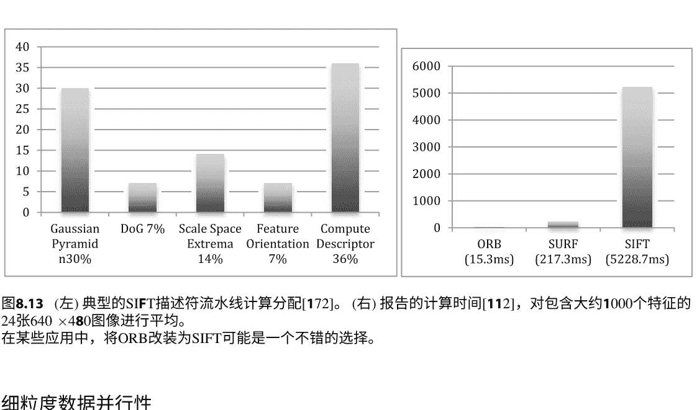

## 细粒度数据并行性

细粒度并行性是指数据组织和相应的处理器架构，传统上被称为数组处理器或向量处理器，利用并行性。并非所有应用都是数据并行的。将非数据并行代码部署到数据并行机器上运行是适得其反的；最好使用CPU和直线代码来启动。

数据并行操作应该表现出常见的内存模式，例如大量的规则数据数组，如像素行或像素块，以相同的方式进行处理。回顾图8.1，注意一些算法是在点、线和像素区域的向量上操作。这些数据模式和相应的处理操作本质上是数据并行的。点操作的例子包括颜色校正和数据类型转换，区域操作的例子包括卷积和形态学。一些算法是直线代码，有很多分支和很少的并行性。通过SIMD和SIMT方法直接支持细粒度数据并行性。

### SIMD、SIMT和SPMD基础知识

昨天的超级计算机现在相当于今天的GPU和多核CPU。SIMD、SIMT和SPMD机器以及它们的并行编程语言的性能对科学界非常感兴趣。它已经发展了几十年，现在有很多好的资源可以应用于今天的廉价SOC；可以参考国家超级计算应用中心[526]作为起点。

当数据布局和算法本身存在细粒度并行性时，可以应用SIMD指令和多线程，例如对向量进行点、线和区域操作。单指令多数据（SIMD）指令可以同时处理多个数据项。为了在SIMD级别上利用细粒度并行性，计算机语言和相应的ALU都应该提供对丰富的向量数据类型和向量指令的直接支持。需要面向向量的编程语言来利用数据并行性，如表8.8所示；然而，有时可以使用编译器开关来利用SIMD。请注意，像C++这样的语言不直接支持向量数据类型和向量指令，而数据并行语言则支持，如表8.8所示。

**表8.8 常见的数据并行语言选择**

| 语言名称 | 标准或专有 | 操作系统平台支持 |
|----------|------------|------------------|
| 像素着色器GLSL | 标准OpenGL | 多个操作系统平台 |
| 像素着色器HLSL | Direct3D | 微软操作系统 |
| 计算着色器 | Direct3D | 微软操作系统 |
| 计算着色器 | 标准OpenGL | 多个操作系统平台 |
| RenderScript | 安卓 | 谷歌操作系统 |
| OpenCL | 标准 | 多个操作系统平台 |
| C++ AMP | 微软 | 微软操作系统平台 |
| CUDA | 仅适用于NVIDIA GPU | 多个操作系统平台 |
| OpenMP | 标准 | 多个操作系统平台 |

在某些情况下，SIMT的成本超过了其好处，特别是考虑到数据设置和拆除的运行时开销，线程管理，代码可移植性问题以及大型和小型CPU和GPU之间的可扩展性。

除了SIMD指令之外，还必须提供一种启动和管理运行相同代码的大型线程组的方法，以利用数据并行性，称为单指令多线程（SIMT），也称为单程序多数据（SPMD）。SIMT程序被称为着色器，因为在计算机图形学中历史上广泛使用的像素着色器和顶点着色器是最早用于利用细粒度数据并行性的程序。

着色器也被称为内核。

CPU和GPU都支持SIMD指令和SIMT方法，例如使用OpenCL等语言。CPU使用操作系统调度程序来管理线程；然而，GPU使用硬件调度程序、分派程序和记分板逻辑来跟踪线程执行和阻塞状态，允许多个线程在不同的数据上运行相同的内核并共享相同的ALU。对于GPU，每个着色器在ALU上运行，直到被内存传输、函数调用阻塞或者在时间片到期时被GPU着色器调度程序替换。

请注意，C++ AMP和CUDA似乎提供了最接近C++的语言环境。SIMT编程的编程模型和语言包含一个运行时执行组件，用于为每个线程传递数据，启动线程，并管理线程组的通信和完成状态。常见的SIMT语言在表8.8中显示。

请注意，CPU和GPU的执行环境在硬件和软件层面上有很大的差异。GPU依赖于设备驱动程序进行设置和拆除，以及固定功能硬件调度，而CPU依赖于操作系统调度程序和可能的微调度程序。

通常情况下，CPU使用C或C++进行编程，程序直接从内存中执行，并由操作系统进行调度，而GPU需要使用像DirectX或OpenGL中的计算着色器或像素着色器这样的SIMT/SIMD友好语言编写着色器或内核程序，或者使用CUDA或OpenCL这样的GPGPU语言。

此外，必须通过设备驱动程序通过运行时系统启动着色器内核，并在执行之前在GPU内创建执行上下文。 GPU还可以使用专用的系统内存分区来存储数据，在某些情况下，GPU还会提供专用的快速内存单元。

GPGPU编程通过运行时系统既有内存数据设置和程序设置开销，除非在GPU中连续执行多个内核以隐藏开销，否则单个内核的设置和拆卸开销可能超过通过GPU SIMD/SIMT处理获得的任何好处。

决定使用数据并行的SIMT编程模型会影响程序设计和可移植性。 使用SIMT并非必需，而且在任何情况下都必须使用像C++这样的标准编程语言来控制SIMT运行环境以及整个视觉流水线。

然而，在某些情况下，数据并行的SIMT模型的性能优势非常明显，是最佳选择。 然而，需要注意的是，在某些情况下，使用多个CPU核心配合SIMD指令、粗粒度线程和数据平铺可能比使用GPGPU SIMT编程更慢，特别是在GPU硬件不支持足够的并行线程的情况下，这种情况适用于较小的GPU。

### 着色器内核语言和GPGPU

如表8.8所示，有几种创建SIMD/SIMT数据并行代码的替代方案，有时被称为GPGPU或流处理。 如上所述，实际的GPGPU程序被称为着色器或内核。 从历史上看，像素着色器和顶点着色器是为OpenGL和DirectX等图形标准开发的数据并行语言。 然而，随着专为NVIDIA GPU构建的CUDA的出现，GPU内部出现了标准的通用计算能力的概念。 这个概念在行业中得到了接受，尽管没有杀手级应用程序存在，像素着色器也可以用来获得相同的结果。 最终，每种GPGPU编程语言都会转换为机器语言，因此在许多情况下，高级GPGPU语言的选择可能并不重要。

然而，选择GPGPU语言有时受限于供应商操作系统。 例如，像谷歌、微软和苹果这样的主要供应商在GPGPU方面并不采用相同的方法，它们提供不同的语言，这意味着行业标准化仍在不断发展中，着色器代码的可移植性仍然难以实现。 也许最接近可移植标准解决方案的是OpenCL，但DirectX和OpenGL的计算着色器也是可行的替代方案。

### 高级指令集和加速器

每个处理器都有一组用于加速特定操作的高级指令。 应查阅供应商处理器和编译器文档以获取最新信息。 表8.9显示了高级指令的摘要。

操作系统供应商提供的API可能会或可能不会使用特殊指令。 来自每个处理器供应商的编译器将优化所有代码，以充分利用高级指令；其他编译器可能会或可能不会提供优化。 然而，每个编译器将提供不同的标志来控制优化，因此需要进行代码调优和性能分析。 使用汇编语言是获得高级指令集提供的全部性能的最佳方法。

#### 表8.9 高级指令集项

| 指令类型 | 描述 |
|---|---|
| 超越函数 | GPU具有特殊的汇编指令，用于计算常见的超越数学函数，如点积、平方根、余弦和对数，用于图形渲染数学运算。在某些情况下，CPU也具有超越函数。 |
| 融合指令 | 常见操作，如乘法和加法，通常在单个融合MADD指令中实现，其中乘法和加法在一个时钟周期内完成；该指令可能具有三个或更多操作数。 |
| SIMD指令 | CPU具有SIMD指令集，如Intel SSE和Intel AVX指令，类似于AMD处理器的SIMD和ARM处理器的NEON |
| 高级数据类型 | 某些指令集（如GPU）提供了常见语言编译器不支持的奇特数据类型，如半字节整数、8位浮点数和定点数。特殊数据类型可能由指令集的部分支持，但不是全部支持。 |
| 内存访问修饰符 | 一些处理器提供跨步内存访问能力，以支持散射-聚集操作，位交换操作允许寄存器内容以可编程的位模式移动和复制，以及排列内存访问模式以支持跨通道模式。Intel处理器还提供用于指针检查的MPX内存保护指令。 |
| 安全 | 加密加速器和特殊指令可以用于常见的密码，如SHA或AES密码；例如，INTEL AES-NI。此外，Intel提供了INTEL SGX扩展，以提供带幕帘的内存区域来执行安全软件；这些幕帘区域无法被恶意软件访问。 |
| 硬件加速器 | 常见的加速器包括用于图像扭曲和子采样的GPU纹理采样器，以及用于快速内存复制的DMA单元。操作系统提供API来访问DMA单元[492]。图形编程语言如OpenGL和DirectX提供对纹理采样器的访问，而GPGPU语言如OpenCL和CUDA也提供纹理采样器API。 |

## 视觉算法优化和调整

优化可以基于直觉或性能分析，通常是两者的结合。
假设热点已经被识别出来，在本节中讨论了各种优化方法。性能热点可以从数据角度、算法角度或两者兼而有之来解决。大部分时间，内存访问是一个隐藏的成本，开发者并不理解（算法已经足够复杂了）。然而，仅仅进行内存优化就可以提高性能。表8.11总结了各种优化方法，接下来将进行讨论。

每个算法的数据访问模式可以使用Zinner、Kubinger和Isaac的分类法[476]来描述，如表8.10所示。通常，首选的数据访问模式是原地（IP）计算，它将数据读取一次到快速寄存器中，处理并将结果存储在寄存器中，然后将最终结果写回原始图像上。这种方法最大程度地利用了缓存行和寄存器，避免了在数据处理之前使用较慢的内存。

表8.10 图像处理数据访问模式分类（来自Zinner等人[476]）
| 类型 | 描述 | 源图像 | 目标图像 | 读取 | 写入 |
| :--- | :--- | :--- | :--- | :--- | :--- |
| (1S) | 1个源，0个目标1 | | | 0 | 源图像 | 不 |
| (2S) | 2个源，0个目标2 | | | 0 | 源图像 | 不 |
| (IP) | 原地* | 1 | 0 | 源图像 | 源图像 |
| (1S1D) | 1个源，1个目标1 | | | 1 | 源图像 | 目标图像 |
| (2S1D) | 2个源，1个目标2 | | | 1 | 源图像 | 目标图像 |
| *IP处理通常是减少内存读/写带宽和内存占用的最简单方法 |

### 编译器和手动优化

通常，一个好的编译器可以自动执行表8.11中列出的许多优化；但是，请检查编译器标志以了解选项。优化的目标是保持CPU指令执行流水线的充分利用，或者减少内存传输。然而，表8.11中的许多优化需要手动编码，将算法简化为更紧凑的循环，使用更多快速寄存器进行数据共享，减少数据复制。

表8.11 常见的优化技术，手动和编译器方法
| 名称 | 描述 |
| :--- | :--- |
| 子函数内联 | 通过将函数代码内联复制来消除函数调用 |
| 任务链接 | 将函数的输出逐个输入到等待的函数中 |
| 分支消除 | 重新编码以消除条件分支，或通过将多个分支条件组合在一起来减少分支 |
| 循环合并 | 将内部和外部循环合并为更少的循环，使用更直线的代码 |
| 数据打包 | 重新排列结构中的数据对齐，并为某些数据项添加填充，以更好地对齐较大的数据字或页面边界，以实现更高效的内存读取和写入 |
| 循环展开 | 通过在循环内复制代码来减少循环迭代次数；可以使用直线代码复制或将多个迭代打包到VLIW中来实现 |
| 函数合并* | 将串行函数重写为一个函数，使用一个外部循环来读写数据到系统内存；在合并的函数之间使用快速寄存器传递小数据项，而不是传递大的图像缓冲区 |
| ROS-DMA* | 双缓冲DMA与处理重叠；DMA和处理同时进行，在处理过程中DMA新数据进入，DMA结果输出 |
| *函数合并和ROS-DMA不是编译器方法，可以在源代码级别执行注意：有关编译器优化的更多信息，请参见参考文献[480， 481]，有关可用优化控件的信息，请参阅每个供应商的编译器文档 |

### 调整

在优化之后，可以从几个角度对工作中的视觉流水线进行调优。
目标是提供运行时控制。表8.12提供了一些调优控制的示例，可以实现运行时或编译时调优。

表8.12 视觉流水线的运行时调优控制
| 调优控制项 | 说明 |
| :--- | :--- |
| 图像分辨率 | 允许在一个八度或其他尺度上使用可变分辨率以减少工作量 |
| 每秒帧数 | 跳帧以减少工作量 |
| 特征数据库的大小和准确性 | 寻找减小数据库大小的方法，例如使用一个具有更高准确性的数据库和一个使用不同分类器构建的具有较低准确性的数据库 |
| 特征数据库的组织和速度 | 通过更好的组织和搜索来提高性能，也许可以使用多个数据库，每个数据库使用不同的组织策略和分类器 |

### 特征描述符改装，检测器，距离函数

如第6章所讨论的，许多特征描述符方法（如SIFT）可以改装为使用其他表示和特征描述。例如，在第6章中讨论的LBP-SIFT改装中，使用局部二进制模式代替SIFT使用的梯度方法，以实现令人印象深刻的加速，同时保留SIFT流程的其他方面。ROOT-SIFT方法是第6章讨论的另一种SIFT加速替代方案。检测器和描述符可以混合使用，以实现不同的不变性和性能组合，请参见REIN框架[379]。

除了描述符提取器本身之外，距离函数在特征匹配阶段通常会消耗大量时间。例如，像FREAK和ORB这样的局部二进制描述符使用快速汉明距离，而SIFT使用欧氏距离，速度较慢。将视觉流水线改为使用局部二进制描述符是距离函数如何对性能产生显著影响的一个例子。

应该指出，第6章中评估的描述符通常基于学术研究，而不是广泛的工程领域试验和优化。每种方法只是进一步开发和定制的起点。我们可以肯定，军事武器系统在部署系统的视觉流水线中已经使用了类似但更优化的特征描述方法数十年。

### 盒子和卷积加速

卷积是特征描述和图像预处理中最常见的操作之一，因此卷积是优化和硬件加速的关键目标。盒子方法[374]近似卷积并提供速度与准确性的权衡。盒子可以用于优化任何严重依赖卷积的系统，例如LeCun和其他人使用的卷积网络方法[77, 328, 331]。基本方法是将一对2D信号（核和图像）近似为低次多项式，对每个信号进行量化并减小数据大小；然后对这两个信号进行微分以获得脉冲函数和卷积近似。通过对微分结果进行积分，可以恢复完整的卷积。

另一种卷积和一般区域处理加速方法是尽可能地重用存在于快速寄存器中的重叠数据，而不是为每个操作读取整个数据项区域。在执行区域操作时，可以编程使用滑动窗口和指针，以尝试从已经在寄存器文件中的相邻矩形中重用数据项，而不是为每个区域操作将完整的新矩形复制到寄存器中。这是另一个适合硅加速的领域。

此外，散射-聚集指令可以用于将卷积数据聚集到内存中，以加速处理，在某些情况下，GPU通常会优化内存架构以实现快速区域操作。

### 数据类型优化，整数 vs. 浮点数

软件工程师通常使用整数作为默认数据类型，很少考虑内存和性能。 通常，在数据类型方面，大多数代码中都存在低成本的优化机会。 例如，从int32到int16的数据转换，以及从double到float的转换，在不需要额外位精度时，是明显的节省空间的项目。

在某些情况下，当整数同样适用时，会使用浮点数据类型。 一般而言，浮点计算需要近四倍的硅面积，这会消耗相应更多的功耗。 这些数据类型消耗更多的内存，并可能需要更多的时钟周期来计算。 作为浮点数的替代方案，一些处理器提供了定点数据类型和指令，这可以非常高效。

### 优化资源

有几种以软件库和工具形式提供的资源可用于计算机视觉和图像处理优化。 其中一些列在表8.13中。

表8.13 视觉优化资源
| 方法 | 加速策略 | 示例 |
|------|----------|------|
| 线程库 | 粗粒度并行性 | Intel TBB, pthreads |
| 流水线构建工具 | 将函数连接成流水线 | PfeLib视觉流水线库[477] Halide [525]* |
| 基本加速库 | 函数已经预优化 | Intel IPP, NVIDIA NPP, Qualcomm FastCV |
| GPGPU语言 | 开发SIMT/SIMD代码 | CUDA, OpenCL, C++ AMP, INTEL CIL K++, GLSL, HLSL, OpenGL和Direct3D的计算着色器, RenderScript |
| 编译器标志 | 编译器为每个处理器进行优化; 请参阅表8.11 | 供应商特定 |
| SIMD指令 | 直接使用汇编语言编写代码, 或使用标准语言的编译器标志, 或使用GPGPU语言。 | 供应商特定 |
| 硬件加速器 | 用于复杂函数的硅加速器 | 纹理采样器; 其他选择性地由供应商提供 |
| 高级指令集 | 加速复杂的低级操作, 或者融合多个指令; 参见表8.9 | INTEL AVX, ARM NEON, GPU指令集 |
*开源可用。

## 摘要

本章将之前章节的讨论整合在一起，通过开发四个纯理论的高级应用设计来构建完整的视觉系统。 对于每个流水线，讨论了计算资源分配和优化替代方案等设计细节，旨在引发关于如何设计高效系统的讨论（示例有时候比较简略）。

所探讨的应用包括使用形状和颜色特征进行汽车识别，使用稀疏局部特征进行人脸和情绪检测，使用全局特征进行整个图像分类，以及增强现实。 每个示例都展示了使用第5章中介绍的视觉度量标准分类中的不同特征描述符族，例如多边形形状方法、颜色描述符、稀疏局部特征、全局特征和深度信息。 示例中使用了各种特征描述方法，以展示预处理阶段的挑战。

此外，还提供了关于SOC结构中计算资源（CPU、GPU和内存）的优化和负载平衡设计概念的一般讨论，以探索功耗降低等HW/SW系统挑战。 最后，介绍了SW优化资源和具体优化技术的概述。

# 第8章：学习任务

- 1. 估计处理分辨率为1920×1080、每秒60帧的立体RGB图像所需的内存空间和内存带宽，并展示估计值的推导过程。
- 2. 虚拟内存系统允许每个运行的程序在一个大的虚拟内存空间中运行，与所有其他程序共享物理内存。以高层次描述虚拟内存系统的运作方式，包括快速寄存器、主内存和最慢的页面/交换文件之间使用的所有层次和速度的内存。讨论内存体系结构中每个内存层次的相对速度（提示：寄存器每个读/写访问操作需要一个处理器时钟周期）。
- 3. 描述虚拟内存系统中的内存交换和分页，并讨论对计算机视觉应用的性能影响。
- 4. 描述DMA的操作方式，以及如何将内存区域锁定在内存中。
- 5. 讨论数据结构组织如何影响计算机视觉应用的内存性能，并提供一个具体算法的最坏内存组织示例。
- 6. 比较CPU和GPU的功耗，并比较每个计算单元的硅芯片面积。
- 7. 列举几个可以用于优化C++编译器代码的编译器标志。
- 8. 描述子函数内联和函数合并。
- 9. 描述循环合并和循环展开。
- 10. 讨论使用整数和浮点数数据类型之间的权衡，并说明每种数据类型适用的情况。
- 11. 通过说明一个具体算法的工作方式以及如何优化该算法的内存访问，列举几种优化计算机视觉应用中的内存访问方法。提示：通过内存项的结构可以优化内存访问，并且可以提高内存的使用速度。
- 12. 描述至少三种可以优化为使用多核CPU的图像处理和计算机视觉算法，并描述算法优化。
- 13. 列举至少两种高端CPU中可用的汇编指令，以加速计算机视觉和图像应用。
- 14. 讨论多线程以及如何将其应用于计算机视觉，并描述已经针对多线程进行了优化的算法。
- 15. 讨论SIMD指令以及如何将SIMD应用于计算机视觉。
- 16. 描述GPU的主要特点，并描述如何将GPU特性应用于计算机视觉，并描述已经针对GPU进行了优化的算法。
- 17. 列举至少两种可用于编程GPU的编程语言。
- 18. 讨论SIMT处理并描述如何将SIMT应用于计算机视觉，并描述已经针对SIMT进行了优化的算法。
- 19. 讨论VLIW和指令级并行性，以及如何将VLIW应用于计算机视觉，并描述一个已经针对VLIW进行了优化的算法。
- 20. 选择一个计算机视觉应用程序，然后高层次地描述如何将计算工作负载分割到多核CPU和GPU上并行操作。
- 21. 列举并描述几种图像处理操作，并针对每个图像处理操作描述具体的优化方法。
- 22. 列举并描述应该检测到的面部标志特征，例如眼角，以分类情绪，并描述每个面部标志的像素特征。
- 23. 定义和编写人脸识别算法，并描述每个流水线阶段。 提供一个适合他人根据架构文档实现系统的需求和高层设计的架构文档。 示例流水线阶段可能包括（1）传感器处理，（2）用于指导图像预处理的全局图像度量，（3）用于定位图像中人脸区域以确定在哪里搜索各个面部标志特征的搜索策略和特征检测器，（4）用于定位面部标志特征的特征检测器，（5）如何设计剔除坏特征的筛选标准（提示：特征的相对位置是一种可能性），如何测量检测到的特征与预期特征之间的对应关系，（6）定义一个视觉词汇构建器，用于最终分类器，使用K-MEANS将相似特征描述符聚类到减少的词汇集中，并选择一种距离函数来衡量传入检测到的特征与字典中学习到的词汇特征之间的对应关系。 选择或创建一个你选择的人脸图像数据库作为基准数据（附录A中有一些示例，如Faces In The Wild和CMU Multi-Pie Face）。 创建代码来实现训练协议以构建词汇字典。 代码可以在你选择的计算机上运行。

## 特征学习架构分类法 和神经科学背景

> “……他们寻求了许多发明。” 
 —所罗门，公元前848-796年

在许多方面，计算机视觉从业者现在被神经科学家超越了，他们直接以神经生物学为模型，借鉴计算机视觉和成像来模拟人类视觉系统的生物学和理论。计算机视觉的最新技术正在迅速发展，朝着合成大脑和合成视觉系统的方向发展，类似于其他生物科学中的合成生物学，如假肢、机器人和基因工程。计算机视觉正在成为神经科学和视觉科学的一个子领域，研究人员正在实现完整的合成视觉模型，利用计算机视觉和成像方法，使一些计算机视觉和成像方法成为历史的遗留。

而大数据统计学家也在大量涉足计算机视觉应用，将视频内容视为另一种形式的大数据，借鉴计算机视觉系统的特征描述和学习工具，构建庞大的视觉学习系统，以大规模分类和关联视觉信息与其他形式的电子信息。

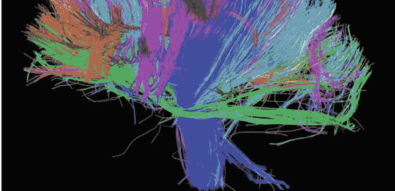

计算机视觉正在成为一种商品。在这里，我们提供了特征学习架构概念的分类法、术语列表以及基本神经科学概念的简要介绍，这些概念启发了许多在第10章中调查的特征学习架构。我们在这里确定了基本的架构类型、组件和结构元素。

本章涵盖的主要主题包括：

- 神经科学的启示
- 特征学习的机器学习历史发展
- 术语
- 特征学习架构和组件分类

> > 本章推荐了解特征学习架构和深度学习调查的关键术语和背景概念。专业的计算机视觉从业者也可以从快速浏览中受益。

## 神经科学对计算机视觉的启示

神经网络可以模仿大脑中视觉通路的部分，从而形成一个由表示视觉智能的特征层次结构组成的深度学习方法，例如低级纹理、物体部分、整个物体和场景。虽然许多计算机视觉和局部特征描述符方法，如SIFT和FREAK，受到更接近视网膜的人类视觉系统解剖学的启发，但计算能力的进步使得整个视觉通路的神经学模型对计算机视觉和特征学习系统变得有吸引力和实用。例如，在第10章中，我们将调查各种类型的人工神经网络和整个视觉通路的模型，如HMAX和HMO。

鉴于神经科学的价值，计算机视觉从业者将通过关注神经生物学和神经科学期刊以及计算机视觉期刊受益。计算机视觉方法正在为神经生物学研究提供支持。本章和第10章介绍了深度学习和特征学习架构，与第4章和第5章介绍的使用局部特征描述符的其他计算机视觉方法相互补充。

神经网络架构可以实现完整但原始的计算机视觉系统。甚至识别和分类逻辑也可以完全在人工神经网络模型中描述和训练，而不是依赖于数学和统计分类方法，如第4章所讨论的。混合方法将神经网络与其他方法结合起来。

正在竞相开发提供视觉和其他形式学习和推理的共同框架架构的人工大脑[650–652]。到目前为止，我们已经在对颜色科学、图像处理科学以及受人类视觉系统视网膜启发的系统的基本理解中奠定了计算机视觉的基础。现在，随着神经科学研究对神经生物学提供了更多的洞察力，并且具备足够的计算能力来实现模仿人脑的人工神经网络，我们正在见证早期合成视觉系统的成功，这些系统是根据成像科学、生物视觉科学和神经科学的综合原理建模的。

除了神经网络，我们还介绍了相关的机器学习主题，这些主题应用于广泛的应用领域，如市场营销和投资的数据分析，以及政府情报、语音识别和计算机视觉分析图像和视频以理解场景和找到对象。我们无法对机器学习进行全面的处理，只能突出介绍应用于特征学习的一小部分机器学习，并在进行时将感兴趣的读者引用到我们范围之外的更好的机器学习参考资料。Hagan等人提供了一本关于神经网络设计和训练的优秀入门参考书[668]，Bishop也提供了另一本优秀参考书[637]。参见Mitchel的机器学习教材[809]。关于分类和学习的良好参考资料包括Duda和Hart [807]，Alpaydin [808]，Deng等人[553]和LeCun [810]。要深入了解ANN领域或一般性的ANN，参见Bengio等人[554]和Schmidhuber [552]。Hastie的统计方法应用于机器学习的良好调查文本可在[347]中找到。

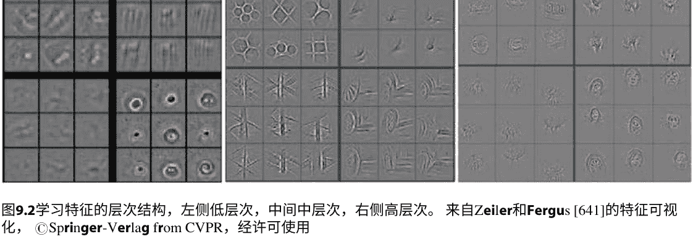

在深度学习网络中，所谓的特征学习也可以称为特征生成。深度学习网络通常使用一种反向传播方法类似于一种繁琐的平均过程来生成特征泛化所有训练样本，但并不是针对任何特定样本。生成的特征与图像中的特征相似，但并不完全相同。事实上，通过稍微改变给定深度学习架构的训练数据或权重初始化，会生成不同的特征，因此实际上并没有真正学到任何东西，而是生成了不同的特征。可以说特征在图像数据中是潜在的，一个好的学习系统应该能够学习到这些特征，而不受权重初始化或训练数据的轻微变化的影响，但是在当今的深度神经网络中并没有像人们期望的那样发生。因此，遵循人工神经模型和深度学习训练机制的深度学习系统仍然是非常原始的系统。

深度学习的训练过程在第10章中详细讨论，它通过将训练样本作为输入，并调整一组特征权重，直到每个特征权重最好地表示训练集中特征的平均值，以相似度度量吸引的特征权重。换句话说，生成的特征是一组特征的压缩表示，而不是精确表示。这不是人类学习的方式。神经科学表明，大脑会创造新的印象。

根据第10章中HMAX部分中调查的基于视图的理论，印象的重要项目而不是平均印象，可以得出结论。

然而，在附录E中，我们讨论了一种基于存储的分层特征记忆印象的密集记忆特征表示方法，称为Visual Genomes [534]。基本思想是特征是沿着视觉通路未经处理的分层记忆印象，并且基于视图的假设下，特征记忆几乎是无限的。

总结一下，今天在深度学习中所谓的特征学习仍然是一种非常原始的艺术形式，可以称之为特征生成。

## 将神经科学的术语应用于计算机视觉

在这里，我们介绍一些高级术语，特别适用于理解人工智能和深度学习方法中的特征学习。鼓励阅读这个术语部分，因为在文献中有一些模糊之处，从业者（包括本作者）对相同概念使用许多等效术语。

有几个独立的研究社区为计算机视觉中的特征学习讨论做出了贡献：

1.  神经科学，神经生物学
2.  人工神经网络（ANNs）
3.  人工智能和机器学习
4.  计算机视觉和图像处理

因此，计算机视觉文献中使用的术语最终成为几种方言的混合体，常常难以理解，有时令人困惑。事实上，深度学习社区有一种方言，我们会尽力阐明和澄清。

与计算机视觉从业者不同，神经科学家采用了不同的方法，因为神经科学关注理解和建模生物结构和大脑功能的神经科学信息。计算机视觉ANN研究人员主要关注模仿神经生物学，创建适用于软件和硬件实现的合成或人工模型和架构，可能用于解决实际问题。计算机视觉中使用ANN的推动力主要来自计算机视觉社区外部，并且作为ANN从业者寻找新应用而引入计算机视觉。ANN从业者通常对计算机视觉和图像处理的现有方法了解较少，而计算机视觉从业者通常精通图像处理、信号处理、模式识别和数据分类的统计方法，并对神经科学或ANN知之甚少，这使得计算机视觉从业者在学习和应用ANN方法时面临巨大的学习曲线。

本节列出了许多常见的词汇术语，旨在弥合计算机视觉和神经科学研究之间的差距。人工神经网络社区将受益于更多了解计算机视觉科学，特别是在第4、5和6章中调查的局部特征描述方法，以使人工神经网络能够更有效地融入计算机视觉领域的最佳思想。

在深度学习讨论中使用的一些术语是有多重含义的，正常对话中的意思与深度学习研究中的意思完全不同。例如，模糊的术语包括深度学习（深度是什么？）、贪婪学习（贪婪的方式是什么？）、池化（是否涉及水？）以及将卷积称为三次（1）一个滤波器，（2）一个特征和（3）权重，取决于上下文。

根据上下文。有时，从业者会引入全新的术语来描述他们自己的工作，尽管已经存在完全合适的词汇和现有术语可以同样好地使用，甚至更好。因此，作者在此提前为术语混淆道歉，因为术语问题可能同样存在于本文作者的工作和所选择的术语中。

术语和定义的简要列表（没有特定顺序）：

-   机器学习（ML）：可以从输入数据中进行训练以学习特征或模式，以便做出决策和采取行动的系统。
-   特征学习（FL）：一种从特定的地面真实数据（计算机视觉情况下的图像）中生成、学习和调整特征或模式集的方法。
-   分层学习（HL）：一种模型，类似于层次结构的管道，为每个层次的层次结构学习一组特征集，例如，最低层次的特征可能是定向边缘、轮廓或斑点，下一个更高层次可能是更大的微纹理和形状，更高层次可能类似于物体的模式或部分，或完整的物体。
-   人工神经网络（ANN）：实现神经网络的众多方法之一，包括FNN、RCN和任何受神经生物学启发的方法。
-   神经计算（NC）：机器学习和人工神经网络的方法。
-   神经元，神经功能，人工神经元，合成神经元，神经模型：神经元是神经网络中的处理单元，接收输入并产生输出以供其他层使用。许多神经模型是可能的，例如多项式模型或相关模型，或卷积模型。卷积神经功能可以将神经元建模如下：首先，使用函数计算特征，例如 f() = (输入 ×权重) +偏差，其次，使用激活函数使用非线性函数（如sigmoid）对结果进行调整，以压缩或扩展结果（参见激活函数）。
-   激活函数，传递函数，激活函数，生物神经元在输入值足够时以二进制的方式触发或激活。在这个意义上，生物神经元的激活函数仅根据输入和电化学偏差确定何时发射。然而，一些人工神经网络不以二进制方式发射，而是作为模拟数值强度。激活是神经元模型的结果（参见神经元），可以是卷积、多项式或其他函数。参见非线性和传递函数。传递函数的输出可以进一步进行条件处理（参见池化和整流），最后直接输入到网络的下一层作为输入。使用各种传递函数，如S型函数（参见图9.18）。传递函数的选择是为了支持使用梯度下降方法进行反向传播的可微分性。传递函数的选择是为了使结果围绕零进行操作，这意味着输入数据也应该围绕零进行操作。此外，传递函数旨在减少数据范围极值处的饱和效应。非线性的一个目标是将纯线性卷积操作投影到非线性解空间中，据信可以改善结果。此外，非线性可能导致在反向传播训练过程中更快地收敛，将梯度更快地移出平坦区域朝向局部最小值。此外，非线性用于确保值在反向传播时可微分。
-   非线性，在卷积神经网络（CNNs）中，每个神经元的传递函数（激活函数）可以使用非线性函数，如sigmoid函数，将特征匹配阶段的实际输出结果在一定范围内分布（压缩）成一种非线性方式，这被认为可以提高人工神经网络的性能，因为神经生物学表明神经元是一个非线性函数。此外，非线性可以将数据移动到更高维空间，使本来不可分离的特征变得可分离。然而，关于生物神经元内部使用的算法，目前还没有确切的了解。

激活函数的选择通常是基于经验猜测的。例如，使用sigmoid非线性函数被认为有助于解决数据饱和的问题，可能是由于数值溢出、光照不良或光照强烈引起的。例如，如果相关输出在范围 -1...+1饱和，可以选择一个非线性函数将值+1理想地重新分布到范围内的某个位置，比如 -0.99到+0.99，以克服饱和现象。

-   汇聚和子采样，将特征分组在一个局部区域中，例如一个2 ×2或5 ×5的区域，这些区域可能与相邻的汇聚区域重叠，然后选择一个新的特征来代表整个汇聚区域以降低空间分辨率。参见图9.3。有多种方法用于对汇聚区域进行子采样，例如取平均值或最大值。汇聚还可以提供一定的平移和变形不变性。汇聚可以帮助从一组相关的不稳定特征中产生更稳定的特征。

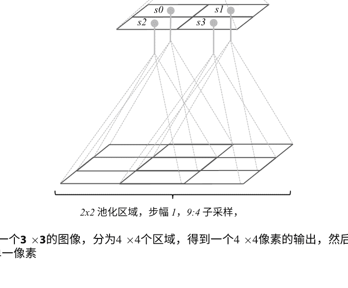

图9.3 池化，输入为一个3 ×3的图像，分为4 ×4个区域，得到一个4 ×4像素的输出，然后通过池化取最大值将其下采样到一个单一像素

-   多层汇聚，跨通道汇聚，跨通道参数化汇聚， CCCP，一种汇聚方法，将当前层特征图和前一层特征图中的像素一起包括进来（x, y, z区域），而不仅限于空间x, y区域。
-   矫正，一种处理特征匹配不良的方法，通过校正值来考虑特征的极性（正负特征）。矫正解决了特征倒置导致的负匹配问题。矫正包括ABSVAL()在内的多种方法。
-   阈值，偏置，在卷积网络中，使用各种阈值来缩放每个神经元的传递函数或卷积滤波器。在我们调查的大多数神经网络中，偏置被忽略，仅用作神经模型中矩阵运算的便利。在神经生物学中，偏置可能是一种化学或激素诱导的因素。
-   特征，滤波器，权重：所有这些术语可能用来指代一个单一的特征。对于卷积特征，使用滤波器权重矩阵与输入的点积来处理输入区域。输出是输入的滤波版本，并且输出被放置在特征图或输出图像中。对于卷积风格的网络，权重就是特征。正权重激励；负权重抑制。更强的权重具有更大的影响力。通常，权重使用浮点数。在卷积式网络中，特征有三种用法：(1) 作为输入图像上的滤波器，产生下一层网络的输出图像，(2) 作为特征描述符或相关模板，用于输入中的模式匹配，以及(3) 作为可调节的特征，在反向传播过程中通过调整权重矩阵来更好地匹配输入。这里的词“滤波器”是一个误称，因为通常我们将滤波器称为改变图像的操作。然而，从数学上可以证明，在某些假设下，卷积等价于相关，但仍然可能会引起困惑，因为这些滤波器既用于滤波，也用于作为特征本身。相关模板的权重类似于特征层次结构中的形状，例如低层特征中的边缘，以及高层特征中的模式或对象部分。
-   特征图，这个术语用于描述在卷积式网络中将权重滤波器应用于输入图像后产生的滤波图像，该图像被称为特征图，并作为输入图像传递给网络的下一层。每个层产生一系列特征图，每个滤波器或特征权重矩阵对应一个特征图。
-   子采样，一种用于减小图像尺寸以供下一层使用的方法，参见池化。
-   特征集: 对于卷积网络，特征集是层次结构中每一层的权重矩阵集合。 每层的特征集可能包含几百个特征。一些网络使用基函数作为较低层特征的特征描述符，例如Gabor函数。参见基函数。
-   基函数, 基特征, 基集: 用于创建和定义特征的函数，而不是从头开始学习和调整特征。例如，Gabor函数和傅里叶级数。人工神经网络模型将基特征渲染成权重矩阵，以用作卷积特征。
-   码本,字典,视觉词袋: 用于描述学习特征集合的术语，可能是局部特征描述符或ANN风格特征，用于视觉词汇分析，类似于文本词汇分析来确定电子邮件的主题。 例如，从训练集中学习得到的一组SIFT描述符可以被视为码本，码本对于图像分类很有用。
-   编码,稀疏编码: 用于创建、学习和表示精简特征基础集的各种方法，而不是详尽的集合，可以进行特征分类和基于基础特征的重构。
-   层: 分层网络中的级别或阶段，包括数值调节层、卷积滤波层、全连接分类层和后处理函数，例如池化和非线性激活函数。
-   输入单元: 网络的输入，例如像素输入。
-   输出单元: 网络的输出，可以来自分类器或多级分类器。
-   隐藏层: 在DNN术语中，隐藏层指的是位于感知输入（如像素）和网络分类输出之间的任何神经元层。
-   隐藏单元: 在DNN术语中，这是隐藏层中的一个人工神经元。
-   深度学习（DL）: 在DNN术语中，DL模型是一个包含隐藏层中隐藏单元的分层学习模型，通常有三个或更多个隐藏层。
-   神经网络（NN）: 受神经生物学启发的网络架构和学习模型。缩写为NN或ANN（人工神经网络）。存在几种变体，如CNN和RNN。通常，ANN使用卷积滤波神经模型和非线性输出调节函数。
-   卷积神经网络（CNN）， Convnet: 目前在计算机视觉中最常用的ANN样式，使用前馈网络和多个隐藏层实现。卷积神经模型的度量标准。卷积神经网络的主要创新在于使用一个统一大小的局部感受野，其中包含一个n×n的像素核心，从输入中提取信息，并输入到一个单一的卷积神经函数中。通过这种方式，一个单一的卷积神经元可以依次接收来自输入图像的所有局部感受野，而不是实现一个神经元对应一个感受野的系统。
-   深度神经网络（DNN）：另一个术语是神经网络（NN）或高级网络（HL）或卷积神经网络（CNN），通常指使用多层神经处理来生成分层或更深层次的特征，深度通常表示多个层次的特征。
-   前馈神经网络（FNN）：一种没有反馈循环的神经网络，层次结构是一个直线管道，从输入经过特征层次结构到分类器和输出。
-   循环神经网络（RNN）：一种具有一些循环反馈循环的神经网络，实现了一种基本形式的记忆。通常，RNN被应用于时空问题或序列学习。
-   潜在变量，特征：另一个术语是特征或统计意义上的推断变量，特征在图像像素中是潜在的，直到它们被学习。
-   超参数，DNN参数在学习和训练过程中进行调整，以控制学习速率，学习动量，正则化项以控制权重衰减等其他变量。
-   误差最小化，成本函数，一种在训练过程中用于量化误差的算法在训练模式和计算模式之间。使用合适的距离函数计算误差。
-   提前停止，在达到局部最小值之前停止训练过程，以加快训练速度，特别是当收敛非常缓慢且以小步骤进行时。
-   自动编码器（AE）：一种学习稀疏压缩的基础特征集来重构自身输入的FNN类型。AE和其他ANN之间的一个主要区别是AE的输出与输入数量相同。自动编码器对DNN的逐层训练非常有用。
-   受限玻尔兹曼机（RBM）：一种具有限制的前馈神经网络，所有输入单元直接连接到包含隐藏单元的隐藏层，而不是连接输入到输出单元。RBM的输入可以是像素，也可以是RBM的输出。RBM的架构使得可以使用梯度下降的反向传播训练协议来调整特征权重。
-   深度置信网络（DBN）：一种使用自动编码器或RBM实现隐藏层的前馈神经网络，例如CNN。
-   标记数据，未标记数据：训练数据，例如训练图像，已经被注释以定义训练图像的内容。通过这种方式，系统可以根据已知标签进行训练，而不是尝试在没有标签的情况下学习图像特征和内容。
-   监督学习：使用带有标签的数据进行的学习，以及为定义学习模型设置的其他前提条件。
-   强化学习：一种与监督学习密切相关的方法，它通过添加一个强化函数作为反馈，类似于奖励，来鼓励网络根据强化反馈进行自我训练。
-   无监督学习：一种尝试使用无标签数据和无学习先决条件来创建和调整特征或模式的学习方法。
-   分类器：一种建模特征输入和类别输出之间映射关系的算法。例子包括SVM、CNN中的FC层和回归模型。一些分类器（例如线性回归模型）依赖于可以在2D中通过一条线或在更高维度中通过超平面分离的数据分组，以找到限定类别之间最大间隔的方法。其他分类器可能使用表示部件模型的二进制特征向量，其中向量中的每个位表示部件的存在或缺失，并使用汉明距离进行匹配。对于分类，可以使用各种聚类和组距离方法，更多细节请参见第4章。

没有对用于分类的聚类和组距离方法进行限制，更多细节请参见第4章。

-   **全连接层（FC层）**：描述了一种连接拓扑，其中一个层的所有输出都与下一层的所有输入相连。全连接层可以实现CNN的分类器，被建模为一个由人工神经元和一维权重向量以及偏置因子组成的一维向量。
-   **核连接层**：与FC层不同，核连接层使用滑动窗口在输入上收集局部区域的nxn个卷积处理层节点。这种拓扑结构通过为每个虚拟人工神经元提供一个nxn的输入核来并行化卷积操作。一个单独的人工神经元可以按顺序从所有核中接收输入，或者核可以排队等待一组人工神经元并行处理。
-   **稀疏连接层**允许从输入到后续层的随机或稀疏连接模式。可以使用dropout方法的变体来定义稀疏连接，以对模型进行正则化，请参见Dropout。
-   **Softmax**：一种逻辑或指数函数，通常用作最后的分类层，将类别预测压缩和归一化为概率范围0.0到1，就像以百分比表示的概率。例如，softmax层中的每个节点将产生一个在0.0到1之间的结果，对应于给定样本的分类排名。
-   **反向传播**：在神经网络训练过程中用于调整特征权重以提高准确性的一系列方法。反向传播通过获取神经网络前向传播的结果，找到当前预测结果与正确结果之间的误差，并将误差按比例向后传播到网络中的每一层，通过调整特征权重来最小化每一层的误差。反向传播方法类似于一个巨大的特征平均过程。有许多方法被使用，并且其中一些包含了针对不同目标的优化，例如更快的收敛。例子包括梯度下降和对比散度。
-   **梯度下降**：一种基于将分类错误建模为总梯度的反向传播方法，然后逐层向后工作，按比例找到每个特征权重的贡献梯度，这可以从微积分的链式法则理解。随着梯度向后传播，梯度变得越来越小。

## 特征学习的类别

在这项工作中，我们对特征学习采取了广泛的观点，并考虑了许多方法，包括人工神经网络、深度学习、稀疏编码、字典学习和局部特征描述符学习。如第4、5和6章所述，许多局部特征描述符方法（如SIFT、ORB和FREAK）包含了一些被学习的属性，例如形状、像素采样模式和各种权重。一些从业者主要将特征学习方法与深度学习方法（如CNN）联系起来，然后声称像SIFT、ORB和FREAK这样的局部特征描述符不是被学习的，而是手工制作的。然而，这种区别是不成立的，因为更好的局部特征的许多属性是被学习和调整的。事实上，最好的局部特征受到人类视觉系统的启发，而像SIFT、ORB和FREAK这样的描述符实际上是被学习的。在设计中，它们融合了人类视觉系统的几个特征。 实际上，深度神经网络(DNNs)是经过精心设计的，需要大量的实证工作来获得正确的架构和参数进行训练。 此外，深度神经网络通常使用最原始和最不变的特征之一：相关模板，从而限制了不变性。

鉴于对特征学习的广泛观点，我们对几类特征学习进行了调查和讨论。 我们将各种方法划分为三个主要的特征学习类别，这是基于每种方法中使用的特征描述符，即(1)卷积特征权重学习，(2)局部特征描述符学习，以及(3)基础特征组合和学习。

## 卷积特征权重学习

对于计算机视觉来说，卷积神经网络(CNN)学习以核心或矩阵形式表示的分层特征集，例如3×3的权重。 特征在一个特征层次结构中被创建，低层特征表示微观纹理，而高层特征表示对象的一部分。 层次结构中的一些或所有特征被馈送给分类器，以匹配由这些特征组成的较大对象。 每个权重在训练过程中进行调整，详见第10章。

一些从业者将CNN方法视为部件模型的一种变体[549]。

## 局部特征描述符学习

在第6章讨论的许多局部特征描述方法（如ORB、SIFT、FREAK和D-NETS）实际上是在训练过程中学习它们的形状、像素采样模式和权重阈值。 例如，FREAK和ORB是根据真实数据进行训练，以学习如何构建特征采样模式，请参见第4章。 然而，一些较为原始的局部特征描述方法不会根据真实数据进行学习或调整，例如形状检测器（如Gabor函数）和其他硬编码描述符。

稀疏编码通常与局部特征描述符一起使用，将描述符集合缩减为一个视觉词汇，而不是一个详尽的词汇。 特征的视觉词汇用于对图像进行分类，类似于用于对文本信息进行分类的词汇。 稀疏编码类似于JPEG图像压缩，它使用图像像素块的局部DCT变换的选定频率细节级别来创建或编码图像的压缩表示。 稀疏编码是一种编码和压缩方法。 稀疏编码也可以被视为一种性能优化方法，因为使用较少的特征可以提高计算性能，但是如果压缩过多细节，稀疏编码可能会影响准确性。

K-SVD方法是Aharon等人开发的一种稀疏特征编码方法的一个例子[779]，Aharon对各种稀疏编码方法进行了很好的调查。 在第6章中讨论的稀疏代码直方图（HSC）方法[117]通过使用滑动窗口边缘检测器以无监督的方式学习特征的单层表示，然后从特征中的边缘生成梯度特征描述符的直方图。 K-SVD方法用于将特征集减少到稀疏码集。Feng等人[797]和Bo等人[132]对K-SVD方法进行了优化，以缩小码本并在重构空间中更均匀地分布值。

有关稀疏编码和词汇方法的更深入探讨，请参见第10章。

## 基础特征组合和字典学习

从Gabor函数等基函数创建的基础特征可以用作原始基本级特征，然后可以从基础特征中组合出更高级的特征，并进一步调整为新的更高级特征，并收集到一个字典中，也可以称为视觉词汇。基础特征也可以按特征层次结构进行收集。在这种情况下，高级词汇是基于低级基础特征学习的。类似于使用词汇字典的单词计数直方图进行文本分析，视觉词汇可以用于发现图像的内容，例如通过使用包含图像中检测到的加权视觉单词的直方图格式，将其馈入分类器进行匹配，参见图10.70。使用部件模型，例如自行车的部件，可以学习并组合成一个字典，然后在分类时，如果图像中检测到足够多的自行车部件，则分类器可以预测并匹配自行车。

## 特征学习方法的综述

我们可以得出结论，深度学习方法创建了一组分层的平均、压缩或者一个稀疏特征集，这些特征对应于训练集中的主要特征。局部特征例如SIFT和FREAK被训练成表示复杂和更不变的特征，这些特征个别上比深度学习中使用的单一相关模板特征更强大。看起来深度学习风格特征的强大之处在于（1）特征的数量之多，以及（2）特征的分层性质，用于表示低级、中级和高级概念。这一观点表明，可以以类似的分层方式创建一组局部特征，例如SIFT和FREAK，以与卷积式深度学习方法中使用的简单相关模板特征的性能相媲美甚至超越。

## 用于计算机视觉的机器学习模型

在这里，我们概述了机器学习的一个非常宏观的图景，为深入研究特征学习架构做好准备。

正如Juergen Schmiduber所指出的那样，机器学习是关于压缩的。学习到的特征是一组压缩的参数，代表了各种对象。在卷积神经元模型（如CNN或RNN）中，每个滤波器都是许多相似特征的压缩表示。也许深度学习方法将数百万个参数或特征压缩成几百个。

在机器学习的早期阶段，人工智能（AI）领域被宣传为涵盖计算机化学习和机器理解的研究领域。

最初，原始的计算和存储能力限制了实用人工智能系统的发展，因此许多人认为AI领域被过度炒作，并且AI在很多年里被限制在晦涩的学术研究项目中。随着电子技术的进步、廉价计算能力的提升以及更多的存储空间，对AI方法的兴趣逐渐恢复，使得AI方法可以应用于商业可行的系统，如数据库。随着时间的推移，机器学习和人工智能分支出了几个研究领域，以解决机器学习的不同方法，这些方法在图9.4中总结。

如图9.4所示，机器学习流程已经有多种表达方式：

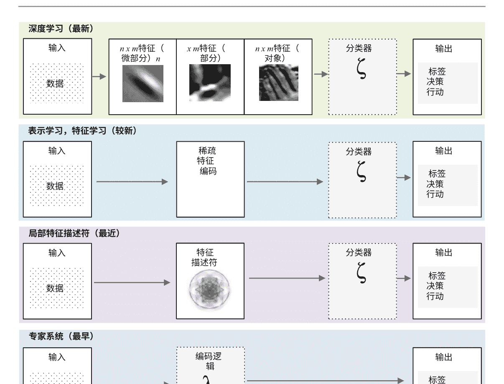

### 图9.4 简化的人工智能方法分类，突出相似性和差异性，参考Bengio等人[554]

1.  特征提取，可以是局部特征描述符或学习的DNN特征
2.  特征编码，可能保留所有特征或只保留一部分稀疏特征
3.  分类器设计和训练

DNN方法的优势在于流程中的这三个步骤可以合并为一个单一的特征学习架构，适用于各种应用，可以通过训练集生成（或学习）特征。本质上，目标是DNN网络架构是固定的；特征成为程序代码；学习参数和训练协议是程序员；DNN是计算机。

请参阅附录C中的资源，其中列出了一些开源项目、商业产品和关注的几位重要研究人员，包括Schmidhuber、Ng、LeCun等。

### 专家系统

曾经，专家系统在人工智能研究中是热门话题。专家系统[556]相当于一个编码专家知识的系统，并被称为基于规则的专家系统和决策支持系统。基于规则的方法允许递归过程模型[607]，类似于RNN。主要的专家系统架构组件包括（1）规则和事实的知识库，以及（2）推理引擎，使用知识库从输入中做出决策。为了填充知识库，程序员会采访专家，将专家的知识编码为逻辑决策和规则。曾经有人试图将专家系统的概念泛化和结构化为软件产品，这些产品可编程且可用于各种应用。在20世纪70年代和80年代，AI研究人员开发了几种商业专家系统的变体，然后研究兴趣逐渐减弱。一段时间后，专家系统的思想和关键经验被整合到业务逻辑软件和数据库软件中，如今在学术界几乎不再讨论专家系统。然而，在许多情况下，专家系统被体现为临时的系统，通常由专家级别的逻辑硬编码到软件中。

使用宽泛的专家系统定义，许多软件程序在非正式情况下都是专家系统。本章不涉及专家系统方法，但已经涵盖了一些特定的专家系统方法示例。

### 统计和数学分析方法

人工智能中最大的部分可能基于过去几百年来发展起来的标准数值分析方法，使用了大量的回归、群组距离、聚类和误差最小化方法来对特征描述符进行分类。在机器学习和计算机视觉任务中，数值方法的应用没有限制。我们在第4章中介绍了几种用于距离和聚类的统计方法，并在本章中介绍了一些应用于深度学习和特征学习的统计方法，并在第10章中简要介绍了支持向量机。有关统计学习的概述，请参阅Hastie等人的著作[698]。

### 受神经科学启发的方法

受神经科学中研究的大脑神经网络的启发，神经网络方法（NNs）和深度学习使用多层次的原始人工神经元网络来表示智能。如图4.23所示，人脑组成了相当复杂的神经网络，这些网络显然会随时间而生长和变化。由于大脑的神经网络非常复杂且无法在真实系统中建模，研究人员开发了原始模型来模拟大脑的结构，如图9.10所示。

神经生物学是计算机科学社区中人工神经网络研究的前沿，神经生物学家经常修改ANN的架构模型，如CNN，还创建了新的模型，如HMAX和HMO。人工神经网络是未来的一部分：这位作者预测，神经网络研究和受生物机制启发的架构最终将推动计算机科学产生真正的产品和商业突破，基于一种常见的神经编程语言和硅加速的架构。

表9.1提供了人工神经方法与人类神经生物学的比较。

### 深度学习

深度学习这个术语在2000年代初由Hinton和其他人[539, 540]推广，用于描述具有多个层的分层前馈神经网络。在DNN术语中，深度意味着输入和输出之间有多个隐藏层的神经网络。隐藏层包含隐藏单元或人工神经元，它们表示从输入数据中学到的特征，参见图9.2。在DNN中，层可以复制，每个层都学习并产生特征。

参见图9.5。在CNN-DNN系统中，特征由每一层的卷积神经元生成，作为特征权重或相关模板，并存储在一系列特征集中。

早期的工作始于1980年代末和1990年代初，由LeCun和其他人[574, 576, 577]开展，当时被称为Convnets和CNNs，也可以被视为深度学习。深度学习在1991年由Schmidhuber使用深度RNNs证明了其有效性。除了CNNs之外，还有几个特征学习概念属于深度学习范畴。目前，大多数DNN系统都遵循LeCun和Hinton的工作，并以卷积样式网络或卷积神经网络的形式实现，使用相关模板作为特征描述符。此外，HMAX模型[812]是由Riesenhuber和Poggio在1990年代末开发的，它以一种原始的方式模拟整个视觉皮层，而不仅仅是像CNNs那样模仿神经生物学的部分。

由于商品计算能力的进步，将深度学习神经网络（DNN）实现为卷积神经网络（CNN）在解决计算机视觉问题方面变得更加常见。自2010年左右以来，DNN在计算机视觉挑战赛和实际应用中表现出色，这导致许多新的计算机视觉研究人员采用了DNN方法，如第10章所调查的那样。

表9.1 人工神经网络与人脑的简单比较
| 属性 | 人工神经网络 | 人脑 |
|---|---|---|
| 神经元类型 | 单一类型（通常） | 多种类型，类型数量未知 |
| 神经激活，传递函数 | 输入的数学逻辑函数 | 基于电气、化学、高级推理、问题、兴奋等未知非线性函数 |
| 网络拓扑结构 | 结构化的已知连接，如前馈神经网络（FNN）或递归神经网络（RNN） | 未知的拓扑连接模型，半结构化，似乎会增长和变化 |
| 输入 | 已知数据，如像素 | 感官输入（触觉、嗅觉、视觉、味觉、听觉），以及来自未知神经途径的递归输入 |
| 神经元数量 | <1,000,000（典型） | 80,000,000,000 –估计 |
| 连接数量 | <1,000,000（典型） | 100,000,000,000,000 –估计 |
| 参数数量 | <1,000,000,000（典型） | ? |
| 学习时间 | 每个项目的天数、周数 | 终身持续 |
| 识别速度 | <1 毫秒每次往返 *越来越快… | ~100毫秒每次往返 |
| *往返一次=一次猜测 |  |  |

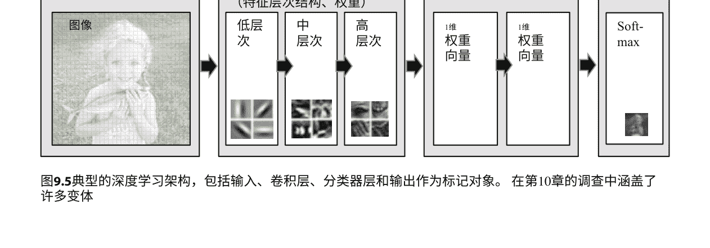

在典型的卷积式深度神经网络（CNN）中，层次结构中的每个特征集可能包含每个隐藏层中的数百个个体特征。每个特征只是一个相关模板。每个相关模板都表示为包含训练权重的矩阵。每个特征捕捉不同类型的细节，因此低层特征捕捉更细微的细节，而高层特征捕捉更高层次的概念，如部件或对象。深度神经网络特征是对象和对象部件的层次结构。事实上，有些人将深度学习称为众所周知的部件模型的变体[549]。虽然这在概念上是正确的，但深度学习方法的细微差别超越了部件模型，因为架构允许统一的训练协议，而深度学习的架构本身就是一个领域，因为它在很大程度上依赖于神经科学和机器学习，并且适用于除计算机视觉之外的广泛问题范围。

深度架构或分层架构本身并不是一个新概念，但深度学习网络带来的细微差别，如特征学习、迁移学习（稍后在本章和第10章中讨论）以及常见的DNN架构，是新颖且有效的。DNN的强大之处在于特征映射层次结构中每个层级的特征数量和每个特征在训练过程中的调整质量。在第10章中，我们调查了选定DNN的限制和能力，以及DNN架构各个阶段的基本创新。

#### DNN黑客和误分类

需要指出的是，深度学习方法，特别是卷积网络，容易受到对抗性误分类的影响。例如，当图像的一些像素值仅发生微小变化时，DNN可能会误分类。这对于DNN的可信应用来说是一个严重的问题。在未来，需要采用替代方法来训练和分类，以克服这些问题，但即使如此，我们可能仍会看到对计算机视觉系统的黑客威胁，甚至可能会有针对计算机视觉系统的黑客挑战事件。

深度学习方法已被证明无法识别明显正确的特征，却能成功识别明显错误的特征[541]。请参阅Goodfellow等人的文章[591]，了解有关DNN对高置信度对抗数据的错误分类的详细信息，这是基于故意损坏的数据（即DNN黑客）的。此外，Sutskever等人在2014年的文章中也提到了DNN的有趣异常情况。

#### 机器学习（ML）和特征学习的历史

机器学习的历史非常有趣，因此我们提供了这个简短的介绍，特别适合新手阅读。也许最详细和完整的历史信息和参考资料可以在Schmidhuber的文章[552]中找到，他是这个领域的先驱之一。此外，Anderson的综述[555]提供了许多机器学习和人工智能的重要研究论文的参考文献。此外，Haykin的著作[647]也提供了神经网络的全面介绍。

回顾历史永远不可能全面，因为某些细节可能被遗漏。然而，在这里我们调查了与计算机视觉特征学习相关的机器学习的几个历史发展，特别是分层或深度学习方法。我们强调了机器学习的早期基础，特别是从神经科学中获得的灵感。我们还涉及了一些相关的统计和数值方法。机器学习的基础概念在历史上被讨论过多次，涉及到多个相关的术语和概念，如神经动力学、控制论、自主学习、综合学、智能电子学、人工智能、神经计算、模式识别、专家系统、分析学和深度学习。

#### 历史调查，1940年代-2010年代

机器学习的许多基础工作是在1940年代、1950年代和1960年代奠定的，当时没有今天这样的计算能力和计算语言。像往常一样，在技术领域，对历史研究和概念不熟悉的从业者经常重新发明相同的概念，给它们起一个新的名字和新的解释。在本章的后面，我们将更深入地探讨许多关键的历史概念，这些概念在特征学习中仍然具有影响力。

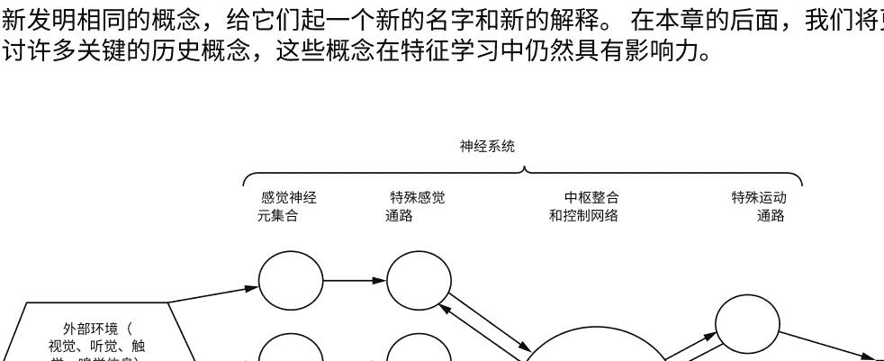

图9.6 早期1960年代神经科学的主流理论，图像 ©Springer-Verlag，来源于《脑理论，Palm, Gunther, Aertsen, Ad, Frank Rosenblatt: Principles of Neurodynamics: Perceptrons and the Theory of Brain Mechanisms, Springer Berlin Heidelberg, 1986》

#### 1940年代和1950年代

在1940年代和1950年代，随着第一台模拟计算机的诞生，我们开始在具体的工作人工智能模型领域取得进展。1943年，Mcculoch和Pitts使用真空管将大脑的第一个模型实现为布尔电路[561]，使用了他们的布尔逻辑中的硬连线神经模型。随后，Rudi-在无监督学习领域中，Hebb于1949年提出了初步的学习概念[562]，而Rosenblatt于1958年提出了简单的感知器模型中的有监督学习概念[557, 563]，Joseph于1961年也提出了类似的概念[558]。感知器是一个重要的里程碑，像CNN一样使用可调节的权重进行学习，尽管学习仅限于具有线性可分训练数据的任务。我们将在第10章中更深入地探讨感知器的概念。Wiesel和Hubel于1959年[559]和1962年[560]开发了一个有影响力的大脑分层或深度模型，其中一些靠近感觉输入的神经元检测简单或低级特征，而其他神经元检测复杂或高级特征，以实现高级推理。Hubel和Wiesel关于简单细胞(S)和复杂细胞(C)的概念的研究启发了迄今为止大多数深度学习架构的发展，特别是特征存在于细节、低级、中级和高级细节层次的概念。因此，我们将在本章后面更深入地探讨Hubel和Wiesel模型（图9.11）。

Selfridge于1959年引入的Pandemonium模型[815]可能是最早用于模式识别和无监督特征学习的模型之一，它使用一组局部特征检测器。该应用程序是1D信号摩尔斯码检测。这些检测器被称为计算子-恶魔。分类器是认知恶魔，通过对检测到的特征进行加权求和计算得到一个分数。Pandemonium系统还解决了在分数空间中找到最高分数的问题，其中梯度下降方法可能会找到多个解决方案。在Pandemonium中，每个特征检测器在滑动窗口中对图像进行扫描，以寻找低层次和中层次特征。然后使用决策恶魔根据最强特征激活的存在与否来对信号进行分类，使用调整后的特征权重。

Pandemonium定义了两种特征学习方法，称为突变裂变和共轭，用于确定是否应该将新特征添加到特征集中以增加表示能力，或者如果很少使用和不需要则从特征集中删除。

#### 1960年代

在1960年代，稍大一些的计算机和存储系统使得更详细的受神经科学启发的模型得以实现。在1961年，Joseph实现了一些最早的单层前馈神经网络。此外，Rosenblatt开发了多层感知器模型，其中包括最多四层，这些模型使用层之间的“前向耦合”，“交叉耦合”和“反向耦合”来描述（RNN风格）。最早的多层或深度网络之一是称为数据处理群组方法（GMDH）的模型，它被建模为多层感知器，由Ivakhneko和Lapa于1965年开始展示[564-566]。请注意，Ivakhneko的工作在今天仍然非常值得阅读，其中包含了不再常见的高级概念。Ivakhneko的工作经常出现在Avtomatika，即苏联自动控制的期刊以及其他苏联出版物中，这些出版物对西方研究人员不可获得。此外，在1960年代，一些研究人员探索了梯度下降和最大下降方法，适用于反向传播算法，请参见1962年的Dreyfus [572]，1960年的Kelley [578]和1961年的Bryson [580]。

#### 1970年代

1971年，Ivakhneko [567] 将GMDH模型改进为第一个深度神经网络启发模型，使用了八层，也被称为多项式神经网络（PNN），它可以学习层数、每层的神经元数量，并根据需要修剪神经元。GMDH方法在当时非常先进，一些概念在近年来被重新发现并重新命名，其他一些概念仍然非常先进，值得进一步研究。GMDH研究社区至今仍然活跃，更多细节请参阅第10章的GMDH调查报告。在20世纪70年代，第一个反向传播算法被用于调整CNN中的权重因子。虽然反向传播和梯度下降在20世纪60年代就被应用于神经网络，但只有少数人实际实现了这些算法。例如，Dreyfus [573] 在1972年和1973年开发了用于误差最小化的反向传播方法，使用了权重控制参数。此外，在1974年Werbos在他的博士论文中展示了一种使用反向传播在DNN中进行多层阈值调整的方法。

#### 1980年代

20世纪80年代引入了福岛的Neocognitron [570, 571]，基于他早期在Cognitron [677]上的工作，这是第一个深度神经网络的样式，类似于今天的CNN/FNN架构。Neocognitron使用卷积风格的特征，其中特征被建模为矩形相关模板，受到2D视觉场的生物启发，跨越一些小的、局部的感受器距离。每个相关模板滤波器系数都被赋予一个权重因子，该因子进行调整。每个滤波器阶段的输出被作为输入馈送到下一个具有相似滤波器的卷积层。权重参数在每一层中被共享或复制。

Neocognitron包括子采样单元，用于在小的局部区域中寻找最强的滤波器激活，以提供一定的特征检测的平移不变性。在子采样单元中，不使用最大池化来寻找最佳的滤波器响应，而是使用空间平均。Neocognitron的权重是使用无监督的硬编码学习规则进行调整的，而且Neocognitron没有使用反向传播。

20世纪80年代，深度学习中也出现了更多的反向传播创新。1981年，Werbos [581]演示了一种使用梯度下降的反向传播方法，专门用于调整神经网络中的权重，这是当前系统的早期先驱。此外，LeCun [574, 575]在反向传播方面取得了早期的成功。LeCun是部署神经网络系统的早期先驱之一，并带领团队创建了几个商业上成功的神经网络系统[682]，包括手写邮政编码识别和银行支票手写识别。LeCun风格的前馈神经网络通常被称为卷积神经网络（Conv nets）或卷积神经网络（CNNs）

1989年，LeCun等人[576]引入了基本的卷积神经网络CNN架构，通常被称为LeNet，包括最大池化、通过核连接层进行权重共享以及反向传播的进展[593]。LeCun的工作还引入了MNIST手写数字的真实数据集，这是机器学习中最广为人知的基准之一。

同样在20世纪80年代，Ballard和Hinton开发了早期的层次化或深度自编码器网络，使用无监督学习逐层学习特征层次结构。Boltzman机器[587, 588]由Ackley、Hinton、Sejnowski引入，是一种与Hopfield网络[589] RNN相关的RNN类型。Boltzman机器和Hopfield网络都很难训练，但即便如此，它们仍然是重要的理论进展。Smolensky引入了Harmonium[590]，这是基本Boltzman机器的一种变体，它对连接性有限制，使其成为FNN而不是RNN。Harmonium在2000年后由Hinton和其他人重新引入，采用了更快的学习训练协议，以实现更快的学习。

#### 1990年代

根据Schmidhuber（在纽约关于深度学习RNNaissance的讲座中），神经网络研究在20世纪90年代初到21世纪初经历了一个黑暗时期，大约持续了十年，在这段时间里，没有人愿意资助它，学术界之外的人也不感兴趣。根据LeCun（在波特兰CVPR私人英特尔会议期间的评论），在这个黑暗时期，很多应用于计算机视觉的神经网络研究被计算机视觉界忽视了。但是，在这段时间里，计算技术的重大进步以及关键算法的进展，深刻推动了科学的发展，并将卷积神经网络推到了计算机视觉的前沿。

在20世纪90年代，神经网络取得了几项改进。1991年，Hochreiter的毕业论文探讨了使用梯度下降进行反向传播训练，并确定了关键问题：## 2000年代至2010年代

（1）梯度消失，即错误在向前传播到前一层时变得太小；（2）梯度爆炸；（3）梯度振荡，这些问题阻止了算法收敛以调整权重。对于梯度爆炸和梯度振荡，梯度问题在训练周期的早期就会显现出来，因为随着误差最小化函数在解决方案上收敛，梯度预计会越来越小。Hochreiter的洞察力以及与Schmidhuber的合作，为反向传播带来了几项创新，以克服梯度问题。

1992年，Schmidhuber [582] 提出了一种克服梯度下降问题的方法，通过使用分层或多层网络，可以逐层使用无监督学习进行预训练，得到一组稀疏、压缩的合理和有用的起始特征权重，然后使用反向传播在监督学习下进行微调。

1992年，Wang等人演示了Cresceptron [616]，它提供了一个分层框架，用于在图像尺度金字塔上学习多尺度特征层次结构，类似于LeCun [576, 577] 的早期工作。Cresceptron定义了一个神经平面，用于识别图像中的低级特征，以及一个概念模块，用于分类高级特征。此外，Cresceptron可以通过在网络中回溯响应路径来确定图像中每个特征的坐标（好主意）。

然后在1997年，Hochreiter和Schmidhuber [584]开发了LSTM（Long Term Short Term Memory）RNN架构，其中包括可以在稍后时间将先前信息反馈到RNN中的内存单元，以帮助学习与时间相关的序列。LSTM使用长期和短期记忆单元作为旋转木马，以控制方式将反向传播的梯度引入到一个时间感知的梯度下降算法中。原始的LSTM论文[584]还提供了对梯度下降算法变体的非常全面的调查。LSTM是神经网络架构的一个重大进展，因此我们将在第10章中更详细地研究LSTM架构。由于LSTM梯度下降算法是门控和受控的，因此LSTM不受梯度消失和梯度爆炸等梯度下降问题的影响。LSTM使得使用无监督预训练后跟监督训练的逐层训练协议变得不必要，从而大大加快了训练过程。

SVM在1992年由Boser等人[595]根据Vapnik的原始1963年算法进行了改进，几乎达到了它们当前的形式。1993年，Cortes和Vapnik[596]进行了其他SVM改进。有关入门材料，请参阅Ng [585]。视觉皮层的分层模型HMAX首次由Riesenhuber和Poggio于1999年引入[812]，其灵感来自于关于视觉腹侧通路的已知事实，主要基于Logothetis等人[813]对猴子视觉通路中形状响应的实验数据。Logothetis发现在层次结构中，一些神经元群对特定形状的响应类似于低层次的Gabor样基函数，并在较高层次上对面部等物体级概念有响应。我们在第10章中对HMAX进行了详细调查。本作者认为神经科学现在是计算机视觉研究的主导力量，并将导致具有生物界面的合成视觉系统。

廉价的计算能力带来了CNN风格网络的快速进展。个人计算机包含相对强大的GPU、多核CPU、大容量内存和SIMD指令集，可以通过GPGPU、SIMD和SIMT编程方法进行利用，提供了适用于使用非常大的数据集进行反向传播训练的大规模并行性，这是有效的CNN训练的关键。

在2006年左右，深度学习和深度神经网络（DNNs）这些术语开始流行，当时由Hinton、LeCun、Bengio和其他人组成的智囊团得到了加拿大政府CIFAR计划的资助，以促进神经网络研究；他们的工作取得了成功。随后出现了重要的研究突破和成功。从2000年代中后期开始，DNNs在计算机视觉应用中开始表现出色，一批新的学者和工业界人士开始关注。

随着对神经网络研究和实际应用的重新关注，包括成千上万的新研究人员和工业界的软件开发工程师，科学发展迅速。

2006年，Hinton等人[539, 540]展示了使用无监督预训练有效训练的FNNs，并推广了一种称为深度置信网络（DBNs）的NNs风格，该网络由一系列受限玻尔兹曼机层构建而成，使用对比散度逐层训练[601]。在2010年代初，LeCun和Hinton领导的研究团队展示了FNNs的成功，在几个CVPR IMAGENET挑战赛中获得了前几名，并影响了其他大多数研究人员跟随他们的架构。

全球的研究团队正在继续创造深度神经网络的创新。例如，在2012年，Ciresan等人[602]展示了一种DNN，打破了德国交通标志基准的记录，超过了人类专家，并赢得了其他几个国际机器学习竞赛，包括ICDAR 2009手写识别挑战赛学习三种语言。

Schmidhuber的NN实验室是最多样化的之一，赢得了几个比赛，并且在计算机视觉之外的许多领域都有涉足。^2

基于LeCun早期的LeNet风格的CNN，以及本简史中提到的许多其他人的工作，新千年以来，ANNs已经出现了快速的架构和算法创新。事实上，最近关于局部特征描述符和兴趣点方法的研究在研究界已经显著减缓，因为研究已经转向了NNs，并且最终研究主题将会稳定下来并变得更加平衡。虽然较新的DNN方法很有效，但是最好的局部特征描述符方法，如SIFT和FREAK，在更广泛的标准范围内仍然提供了更好的不变性和鲁棒性。然而，通过在DNN的训练集中引入变化，可以学习和表示大部分所需的不变性，但代价是特征集大小的增加和训练时间的增加。

总之，在2000年之前，为我们今天看到的神经网络的进展奠定了基础。增加的计算能力和大量标记的训练数据图像使得使用神经网络的真实世界计算机视觉应用变得可能且非常有效。在第10章中，我们将进一步探讨在神经网络中发生的架构和设计创新，比较和对比各种方法。

## 人工神经网络（ANN）分类概述

如图10.1所示，我们将ANN架构分为三种类型：

- **FNN**—前馈神经网络，其中所有输入都朝着输出阶段的分类器方向移动。CNN等同于FNN。
- RNN—循环神经网络，允许网络中存在反馈路径。换句话说，是一个任意连接的网络（ACN）。
- BFN—基函数网络，它们不总是遵循CNN、FNN和RNN模型中定义的神经网络原则，而是使用替代的架构配置和基函数，如Gabor特征或SIFT特征，而不是FNN-CNN和大多数RNN中使用的相关模板。

请注意，BFNs在这里被分为一个单独的类别，并且在这项工作中引入了BFN这个术语，以便开发一个分类系统。 然而，一些深度学习模型，我们在这里称之为BFNs，不使用相关模板或滤波器，而是使用替代的基函数，如Gabor、SIFT和其他函数，或者BFNs以某种其他方式偏离了典型CNN中体现的更多神经科学启发的网络模型。 因此，BFN是一个综合类别。

此外，由于ANN架构的一般变体适用于广泛的问题，我们可以预期会看到越来越多的商业和开源软件资源来加速应用开发，增加专用的ANN加速器，一些ANN变体的标准化，以及更多的学术课程来培训工程人员。 附录C提供了一些选定的资源。

## 特征学习概述

特征学习的思想是从一组基准数据中创建特征，并调整特征使其对数据中的所有相似特征都最优。 例如，特征学习问题可能包括学习最佳特征集来表示各种人脸，因为这些人在基准数据中呈现。 典型的特征学习目标是仅收集最优特征，将特征集大小限制为仅保留最强和最常见的特征，而不是所有可能的特征的详尽集合。

## 学习的特征描述符类型

用于学习特征的一系列特征描述方法，我们对特征学习有一个广泛的观点，其中包括：

- 局部特征描述符- 例如SIFT、SURF、FREAK、ORB等是一些学习得到的描述符，用于编码多个维度的信息以识别唯一的像素模式。 学习得到的特征描述符维度包括梯度信息、尺度信息和像素采样模式信息。
- 区域特征集- 例如Lazebnik等人在第6章中描述的空间金字塔匹配，通过将图像分割成区域，对每个区域进行单独描述以构成最终的描述符。
- 基础特征集- 可包括选定的Gabor特征集、选定的傅里叶频率分量或仅由稀疏编码组成的HMP风格[778]学习特征。 CNNs学习一组分层的基础特征。
- CNN-风格的分层特征集- 由网络的每个层级学习的相关模板或滤波器组成，表示为可调节的权重矩阵。

根据定义，神经网络风格的特征学习方法不强制要求任何特定的特征风格，只要这些特征可以通过神经网络进行学习和训练。然而，大多数用于计算机视觉的神经网络使用卷积风格的特征，或者相关模板，而不是其他特征描述方法。

使用局部特征描述符（如SIFT），在局部区域的兴趣点上学习一个特征，可以通过在图像金字塔中找到相邻尺度上存在的局部极大点，然后对兴趣点周围的局部区域进行梯度计算和编码，得到梯度方向直方图。收集一组SIFT特征来识别一个对象。使用SIFT风格的特征，通常可以通过很少的特征数量来识别对象，例如总共10-20个特征，因为每个描述符中编码了很多局部信息。在某些应用中，数百个CNN特征等同于10-20个SIFT特征描述符。

## 分层特征学习

通常，深度网络具有2、3或更多层的特征。特征集大小通常限制在每个层级的几百个或更多特征，参见图9.2。神经网络中的第一层特征可以直接从像素中派生出来，神经网络的后续层以每层的像素相关性作为输入，以特征图的形式输出经过滤波的输出值（即处理后的图像），因此这些值不再严格是像素，而是从像素到中间值的非线性映射。这种非线性通常是CNN的一个特征，并被视为可取的。

## 学习多少个特征？

在极端情况下，如果存储了所有对象在所有角度下的完整内存图像，并且计算机具有足够的内存和处理能力以在实际时间内对所有输入进行采样、匹配和分类，则计算机视觉将变得更简单。如果存在一种自动捕获主体的地面真实数据的方法，包括尺度、几何和光照变化等所有所需的不变性属性，则训练将变得更简单。在极端情况下，尽可能多的特征可能是有用的。

然而，实际问题，如带有错误标签的有限真实数据和缺乏内置的不变性属性，限制了训练效率。此外，内存和计算实际限制了可以存储和搜索的特征数量。因此，特征学习研究中花费的大部分时间似乎是为了创造妥协或优化，设计更高效和有区分度的特征和分类器，工作在实际特征压缩的限制下，寻找当天内存和计算限制下的最佳性能。有关描述符特征的最佳特征化作为不变性和区分度之间的权衡的讨论，请参阅Varma等人的[771]。

使用的特征描述符类型似乎并不像特征数量那样关键。在本调查中，我们将看到在各种架构中成功使用的各种特征描述符。简单地使用大量特征，特别是深度特征集，似乎是成功的一个一致要素，而特征类型似乎并不重要。例如，顾等人[706]已经证明，大量简单的图像像素区域对于分割、检测和分类非常有效的图像描述符。顾将架构组织为一个强大的重叠特征征集，使用Hough投票来识别假设的对象位置，然后使用分类器，在几个测试中实现了最先进的准确性。

一般来说，特征越多越好，但是不能太多以至于难以管理，正如本章后面的架构调查所讨论的那样。

## 深度神经网络的威力

单独来看，神经网络学习到的个别特征并不是很有用。然而，深度神经网络的强大之处在于几个因素的结合：

1. 特征的分层性质，用于表示多层次的概念。将特征分散到各个层次实际上减少了卷积神经网络所需的特征数量，因为消除层次会导致需要在其他层次上添加更多的特征来补偿。
2. 每层中个别特征的数量。卷积神经网络在每个层次生成许多特征，这实际上增加了准确性，因为这些特征允许形成一个过完备的特征集，而不是一个稀疏的特征集。
3. 通用特征调整。卷积神经网络调整每个特征以学习通用特征，这些特征代表一组相似的特征。每个特征通常在成千上万个相似图像上进行训练，并通过梯度最小化方法进行调整，以最好地表示一定范围内的平均特征。实质上，卷积神经网络的样式滤波器是经过良好调整的斑点模式和轮廓模式检测器，它们表示低级、中级和高级概念。深度神经网络的特征理想上是对形变不变的，这是通过对输入进行非线性变换（如白化、归一化和局部直方图均衡化）来实现的。我们知道人类视觉系统（如第6章中的SIFT调查所讨论的）对梯度敏感，并且由于LGN中的局部感受池化，梯度可以在视网膜上滑动并仍然被识别出来。这为低级特征提供了有限的形变不变性，并扩展到汇集局部感受野的更高级特征。

深度学习和神经网络系统中使用的概念，如分层学习、算法流水线、复制的计算阶段（神经元）、通过训练调整特征以及通过图形方法进行计算，都不是新鲜事物。相反，深度学习方法的威力主要在于架构的协同作用和其各个部分的总和。

## 编码效率

值得注意的是，最有效的局部特征描述符，如ORB、SIFT、SURF或FREAK，单独编码的信息要比任何单个CNN特征多得多。事实上，许多局部特征描述符非常强大，仅凭局部特征就可以相当好地重建整个图像，参见图4.12、4.13和4.14。然而，单个CNN特征并不包含足够的信息来很好地重建图像。我们可以得出结论，强大的局部特征描述符单独编码的信息比单个CNN特征更多。

## 手工特征与手工深度学习

关于DNN与其他计算机视觉方法的价值存在一些争议。许多DNN从业者更喜欢深度学习方法，他们认为学习特征比设计特征更好，因此对他们所谓的手工制作持有偏见。

特征，如SIFT、FREAK和其他局部特征描述符。然而，DNN架构和训练方法非常手工制作，并依赖于几个特定的设计假设，如DNN架构、DNN训练协议和学习参数。与局部特征描述符相比，DNN的开发和使用要困难得多。局部特征描述符和DNN一样都是手工制作的，两者都涉及经验工程过程，并且预期会有试错。

卷积神经网络类似于由方形拼图块（即特征）组成的系统，其中每个拼图块的内容类似于从训练图像中的几个相似方形块的平均值学习得到的，并且最终的分类是基于呈现的拼图块的最佳猜测。拼图块并不是设计成相互拼合的，因为每个块中都没有编码空间关系或连贯性。有人可能会认为这根本不是特征学习，更像是偶然发现。

虽然神经网络受到了一些神经科学的启发，但最好的局部特征描述符（如SIFT和FREAK）受到了最好的视觉科学的启发。因此，这位作者设想将神经生物学启发的方法和视觉科学启发的方法合并，将最佳特征表示与最佳学习和训练架构结合到一个共同的系统中。

这个关于CNN和局部特征描述符的讨论和比较围绕着自上而下设计与自下而上设计的难题。一个观点是，像SIFT或FREAK这样的局部特征描述符是自上而下设计的，使用基于人类视觉系统和直觉的高级概念来指导描述符的设计，而CNN特征是自下而上设计的，使用大量的非常原始的简单相关模板，仅依靠局部感受野来指导特征层次的形成。

以下是作者看到的一些评论：“手工制作的特征是脆弱的、劣质的、过度特定或不完整的”，“深度神经网络是唯一值得使用的方法”，以及“我们必须超越手工制作的特征和简单的机器学习”。从业者表示“他们不理解像SIFT这样的局部特征”，令人惊讶的是他们还表示“他们并不真正理解神经网络和反向传播...但它们确实有效。”也许最有趣的评论可能是“手工制作的特征需要耗费时间”，因为训练深度神经网络可能非常耗时、耗费数据，并且很难设置所有的学习参数、转移函数、数值条件和管道的其他部分。直到最近，只有在学术界解决小问题时，多核CPU和具有大量内存的GPU才能进行深度神经网络的训练。与此相比，局部特征更简单。如今，只有非常有经验的从业者，通常是专注于学术研究的研究人员，才能足够理解并成功设计和部署深度神经网络，尽管深度神经网络工具包和商业产品正在使非专家开发深度神经网络应用变得更简单。很快，深度神经网络将成为商品化，详见附录C中的资源产品。

在所有情况下，没有一种方法明显更好。根据选择的客观标准，任何特征学习或特征描述方法都可以优化以获得比其他方法更好的得分。不变性标准通常至关重要。如果训练速度很重要，也许深度神经网络不是正确的选择。如果尺度和几何失真不变性很重要，也许一些局部特征描述符与专注的训练协议的组合是最好的选择，以呈现所有尺度和几何视图。

深度学习从业者开发临时方法来使深度神经网络在所有情况下都能工作，并且引导特征学习朝着正确的方向发展。因此，从业者经常复制现有的工作的深度神经网络（即类似剪切和粘贴编码），并进行架构调整以寻求渐进改进。最佳性能的深度神经网络通常由大公司或大学的专业开发人员团队设计和维护，因为复杂性对于一个人来说是令人望而却步的。深度神经网络是手工制作的。

## 不变性和鲁棒性属性用于特征学习

不变性和鲁棒性属性是任何特征描述方法的质量度量（见图5.1和5.2）。相对于更好的局部特征描述符，DNN/CNN学习到的特征在不变性属性方面是逐个较差的，但作为一个层次化组合，DNN/CNN特征可以达到或超过最好的特征描述符。典型CNN中使用的方形核矩阵可能是最不变的特征描述符类型。 然而，通过在DNN的训练集中引入变化，包括具有所需变化（如旋转、变形、对比度、尺度和其他变化）的训练样本，可以学习和表示CNN特征集中的所需不变性。我们在第10章中调查了训练协议和训练样本的变化。

## 最佳特征和学习架构是什么？

研究人员和实践者不断尝试解开DNN和其他特征学习方法的组成部分和架构属性，以找到最关键的变量和最佳解决方案。随着视觉问题的范围不断扩大，解决方案的评估和比较变得越来越困难。许多研究人员试图设计出终极解决方案：重新创造人类智能作为人工大脑（见表9.2中的各种倡议）。

## 架构优化的主要领域包括：

1. 训练协议，样本的排序和丢弃，样本批量大小，以及向训练集中添加修改后的每个样本以增加不变性，例如几何变换后的图像和数值调整后的图像，以影响对比度、噪声和其他在本章后面调查的技术。
2. 特征，使用的特征类型（相关模板 vs. SIFT 或基础特征），特征层次结构的深度或卷积层数，每个特征的颜色通道数，每层的特征数，以及每个特征的大小，例如 3×3 vs. 11×11。
3. 分类器，改变卷积分类器层数的数量，或使用其他分类器如 SVM。
4. 数值调整，通过数值调整来分解数据以增强光谱，例如局部均衡、归一化和白化方法，以及激活函数的选择。
5. 池化和子采样方法可以通过改变池化大小和池化准则（如最大池化和CCCP池化）来减小特征大小并增加一定的不变性。

许多从业者提供了研究结果，指出了DNN优化的最佳位置，但结果各不相同。

Bergstra等人[644]建议使用随机实验来找到最佳架构。 Russakovsky等人[643]的一项研究分析了Imagenet挑战中发现的错误类型，其中大多数情况下CNN方法表现最佳。 然而，只提供了少数比较性结论。 许多DNN架构和其他非DNN方法被使用，并且表现出良好的竞争力。

通常，从一年到另一年，许多从业者以前一年的最佳方法作为起点，并进行改进以争取下一年的竞争。 目前，使用多个网络投票的集成方法很受欢迎，还有训练协议的变体，稍后在第10章的调查中进行介绍。

Coates和Ng [618] 认为，选择最佳特征或基函数并不像选择正确的架构和编码方案那样关键。例如，Jarret等人 [619] 发现，对于特征集，使用随机特征（未经训练的权重）与使用经过训练的权重的模板相比表现得非常好，这证明了CNN架构的强大之处在于将许多特征结合在一起，而不是选择最佳的基础特征。使用随机权重的相关模板等效于随机的边缘检测器集合。

然而，Parikh和Zitnick [636] 发现，特征是架构中最关键的部分，通过比较（1）特征描述符，（2）学习算法和（3）训练数据。Parikh和Zitnick通过使用人类专家代替算法创建了一个基准，以比较人类在任何领域中提高性能与各种DNN算法相比的能力。

Eigen等人的其他研究[638]评估了深度卷积神经网络的几个参数，以找到最关键的元素。考虑的参数包括层数、特征图维度、空间核大小、参数数量、池化大小和池化位置。Eigen的工作重点是(1)层数、(2)每层的特征数和(3)参数数量，他们的工作表明，在CNN架构中，仅增加卷积层可以显著提高准确性，而增加每个特征层中的特征数则不如前者有效。此外，Eigen发现卷积层对特征数量不太敏感，而对每个相关模板的维度（大小）即每个相关模板中的权重数量更敏感。

Fergus及其在微软研究院的团队进行的其他研究涉及从CNN DNN中删除层，并发现更深的网络表现更好。Fergus首先采用了Krizhevsky [640]的CNN架构（两个分类器层，五个卷积层），然后逐渐删除架构中的层，以检查对准确性的影响。总的来说，多个卷积层和多个分类层都可以增强DNN的效果。此外，Fergus的幻灯片[639]提供了关于不变性属性的信息，确认了静态相关模板对遮挡、尺度和旋转的一般缺乏鲁棒性，除了正交旋转，即镜像。当然，这些结果是预期的，因为所使用的相关模板特征已知可以提供这种程度的不变性，没有更多的特性。

Zeiler和Fergus [641, 642] 探索了一种方法，通过使用他们称之为解卷积网络架构的仪器化CNN，来可视化层次结构中特征的质量，从而实现对输入空间中强特征激活的可视化。换句话说，可以显示每个特征强烈激活的图像区域，以便直观地检查特征的质量。然而，实际上并没有执行解卷积操作。相反，该方法利用内置于CNN中的仪器来在前向传递中仅选择最佳或最强激活函数，通过反向梯度下降将最低梯度设置为零，以稀疏化感兴趣的特征。此外，在前向池化传递过程中，记录了所选择的最强特征以及它们在输入空间中的笛卡尔坐标，允许将输入空间中的区域可视化为图像，这对于确保特征的唯一性和可辨识性非常有用。

从几位从业者的观点来看，DNNs并不像宣称的那样新颖或不同。请参阅Ross Girshick、Forrest Iandola、Trevor Darrell、Jitendra Malik的技术报告《可变形部件模型是卷积神经网络》[549]。在这项工作中，显示了可变形部件模型等效于DNN，并且对可变形部件模型进行了重构以使用基本的DNN架构。

矛盾的是，深度学习方法已被证明在识别明显正确的特征时失败，并在识别明显错误的特征时成功[541, 591]。在某些情况下，只需改变少量像素值就足以欺骗深度神经网络。当然，在任何计算机视觉系统的训练过程中，这是可以预料的，并且可以通过纠正来解决。重新训练和重新设计。也许我们会看到深度学习黑客竞赛[591]，其中编码人员试图欺骗DNNs。

最后，在本章的架构调查中，还涵盖了一些来自最新研究的新颖架构和发现，以说明一些更好的方法。

## 大数据、分析和计算机视觉的合并

一个趋势正在显现：神经网络架构适用于广泛的分析应用，如语音识别、计算机视觉和通用数据分析。所有应用的基础神经网络架构非常相似，这导致了学习和人工智能的共同架构的可能性，例如神经计算机或NC。这意味着单个NC架构可能成为分析的共同构建模块，类似于用于一般计算问题的共同CPU架构的想法。神经计算将成为一种商品。神经计算和类似的分层和多变量方法将作为混合方法一起使用。

在不久的将来，我们应该经常看到移动和手持设备与神经计算机连接到远程服务器，由商业、商业、政府、军事、执法和法律组织用于对人们进行完整的音频、视觉、历史和文本评估，以进行就业面试、银行业务、商业、执法或住房申请。

神经计算机将评估面部表情、身体语言和服装风格以获取情绪和意图，同时对口语的语调和节奏进行音频评估以获取潜在的意图和假设，通过对他们在电子邮件、短信、博客和其他文档中编写的文字进行完整的NC文本分析，包括来自地方政府、学术机构、采购记录和其他金融交易的历史记录，以开发一个综合的人物概况——所有这些都使用相同的神经计算架构。结果将是完整的在线虚拟个人资料存储在互联网上的某个地方，可以通过语音命令或文本命令查询，了解一个人的信息，无论他们是否知情，并在一组情况下进行分析和预测他们未来的行为，例如允许商业企业设计适合他们偏好的情境或机会，并影响购买行为，或者允许政府制定政策和宣传来测试人口的反应、偏好、意图和个人信仰。

这些信息将会依赖于多少是另一回事；然而，今天的技术已经可以组装和开发成为一种商品设备，根据所需的分析、希望访问的数据库以及所需的反馈时间，可以收取费用。基于NC的个人行为预测服务和基于NC的个人配置服务现在非常接近，并处于早期阶段，大量投资正在投入早期分析初创公司。计算机视觉将成为未来分析的核心组成部分。想象一下，政府政策和商业计划是围绕着由NC生成的预测来设计的，然后由另一个NC对每个计划进行评估，形成建议，再由另一个NC提出最终决策权的建议-一个人类...还是？

神经网络创新已经打乱并重新聚焦学术研究和行业投资，将神经网络方法应用于更多领域。今天，来自主要公司的商业NC产品可以快速开发商业神经网络解决方案。我们正在看到神经网络方法、API和软件库的商品化和标准化，详见附录C。基础研究为在硅中孵化第一代商品化神经计算架构奠定了基础，从而产生了广泛而普遍的解决方案。

比赛已经开始，将会类似于太空竞赛和武器竞赛，因为人工智能是商业和国家安全的优先事项，今天已经获得了数十亿美元的政府和工业投资，并催生了商业产品和服务。利益巨大，因为有可能创造出学习、推理、决策和执行动作的机器，在某些情况下，机器将优于人类。如下所示，正在资助重大计划，详见表9.2。在不久的将来，机器人技术、自动化和分析将变得和厨房电器和电动工具一样普及，改变全球社会的性质，改变政府、军事、工业和商业的面貌。

| 投资者 | 计划描述 |
| --- | --- |
| 美国政府 / DARPA | 脑机接口计划 [650]<br>10年内30亿美元的资金，类似于NASA的资金水平<br>http://www.artificialbrains.com/darpa-synapse-program |
| 欧洲联盟人类大脑计划，包括24个国家 | 对神经生物学、基因组学和神经解剖学的基础研究。 [651]<br>https://www.humanbrainproject.eu |
| 脑科学研究所，(保罗·艾伦基金会在西雅图) | 对神经生物学、基因组学和神经解剖学的基础研究。<br>http://en.wikipedia.org/wiki/Allen_Brain_Atlas |
| NCAP神经计算&自适应感知加拿大高级研究所CIFAR | 加拿大政府。资助神经科学和人工神经网络的基础研究，[652]<br>http://www.cifar.ca/neural-computation-and-adaptive-perception-research-progress |
| 百度 | 亚洲最大的全球搜索引擎<br>• 在全球范围内投资大型深度学习(DL)软件/服务器/硬件<br>• 深度学习硅谷研究所2013年<br>• 大量投资大型数据中心<br>• 将云端和设备的深度学习结合在一起<br>• 聘请关键的人工智能研究人员<br>• 将他们的深度学习技术授权给移动设备公司<br>http://technews.co/2014/08/01/mediatek-baidu-developing-super-smartphones/ |
| 苹果 | 全球最大的计算机公司，进行重大投资。<br>• 苹果目前使用深度学习方法提供Siri语音识别服务。<br>• 致力于视觉识别产品的开发。<br>• 为了更好地了解他们的客户，致力于为他们的产品线开发分析产品。 |
| 谷歌大脑 | 最大的搜索引擎公司<br>- 每年投资数亿美元进行人工智能相关研究<br>- 视觉搜索、用户分析和语音识别等领域<br>- 相关领域还包括无人驾驶汽车、谷歌眼镜等 |
| Facebook | 拥有重大投资的人工智能实验室（金额未知） |
| 微软 | 包括语音识别、视觉搜索以及各种软件API和库，以便开发人员使用NC进行通用分析、计算机视觉和语音识别 |
| 初创公司和风险投资 | 有几家机器人、分析和计算机视觉初创公司正在获得资金支持，将深度学习应用于实际（有时是时尚的）应用 |

## 关键技术推动因素

当今可用的技术使得人工智能和机器学习方法受益并得到广泛应用，这使得大量研究人员能够探索新的概念并改进方法。随着计算能力的提升，深度学习和神经网络研究得到了广泛发展。

推动机器学习进步的一些主要技术因素包括：

- 1. 计算能力增加：笔记本电脑和台式机上可用的通用图形处理器（GPU）以及多核CPU提供了巨大的SIMD和SIMT计算能力，非常适合机器学习和视觉处理的大部分流程。需要注意的是，在某些情况下，多核CPU的性能与GPU相当，具体取决于每个计算单元的规格。详见第8章。
- 2. 编程语言进步：如CUDA和OpenCL等GPGPU编程语言开辟了直接利用CPU和GPU的SIMT方法和SIMD指令集进行算法加速的途径。详见第8章。
- 3. 内存大小增加：由于主存和缓存内存更大，机器学习中使用的大型训练数据集在许多情况下很容易适应快速内存。
- 4. 训练数据规模增加：互联网使得我们能够找到和收集大量带有标签的数据集，涵盖几乎任何主题，例如在图片分享网站上标记为狗或猫的图片。网络爬虫脚本可以搜索互联网站点以收集具有所需标签的图像，或者通过使用搜索引擎来找到这些图像。通常需要大规模标记数据集来进行有效的机器学习。

图9.7该图说明了使用亚5纳米硅技术、堆叠晶体管和堆叠互连，在神经元核内部的3D体积空间中可以轻松容纳相当于一个小型的2.5万个晶体管的中央处理器和1MB内存。

## 神经科学概念

由于计算机视觉很大程度上受到神经科学研究中关于学习机制和人类视觉系统的启发，我们在 这里提供了一个高层次的概述，重点介绍了从眼睛到视觉皮层的视觉通路。人们认为每个 神经元都执行模式匹配、内部处理、神经网络连接控制和内存存储管理。大脑中可能含有约 1000亿个神经元（估计数字有所不同），每个神经元的直径可能在4到100微米（0.00015-0.00 4英寸）之间变化，核仅仅25微米（约0.001英寸，或者相当于人类头发的直径）。神经元的 体积足够容纳大量的处理、网络和内存设备。与亚5纳米硅技术相比，一个典型的神经元在 三维体积中有足够的空间容纳数百万个门，以实现一个至少与ARM/68000级处理器（约25,00 0个晶体管）一样强大的小型计算机，并且可能还有1兆字节的内存，以及另外约25,000个晶 体管用于互连，假设使用了三维堆叠的晶体管和互连方法，因为神经元是一个三维体积形状 ，如图9.7所示，可以容纳几个硅堆叠。

每个神经元平均连接到其他10,000个神经元，平均而言，控制所有记忆和学习行为的连接 达到了100万亿[858]，而银河系中估计有2-4亿颗恒星。相比之下，最先进的人工神经网络可 能包含超过100亿个参数，并且需要数千个CPU和GPU进行一周以上的训练才能完成单个数 据集。如果我们考虑到每个神经元可能只能执行1百万次操作（每秒），并且具有1MB的存 储空间，那么神经皮层可能包含比银河系中的恒星数量多100倍的操作每秒和存储单元。

神经元既代表记忆又代表行为。生物神经网络是动态和适应性的：神经元在学习或遗忘 时会生长和收缩，并形成新的树突以在看似无限的拓扑结构中将神经元连接在一起，而树突 连接也会随时间的推移而生长或收缩。生物神经网络的脆弱性似乎证实了所罗门的智慧“不 要倚靠自己的理解”。我们知道神经处理功能、记忆和连接会像植物一样根据环境、情况和 经验而生长，因此即使是生物体的DNA克隆在不同的环境中生长，也会发展出生物上不同的 神经拓扑和特征。

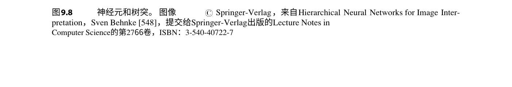

### 生物学和蓝图

在人类大脑的视觉通路中，有两种基本力量激发了人工神经网络：生物学和蓝图。

神经网络的生物结构越来越被理解，它是一个由连接的神经元组成的复杂的电化学机器，是我们神经系统的中央处理器。研究人员可以通过测量大脑的电活动来绘制出各种感觉任务的处理区域，例如视觉学习任务以及光学神经的连接区域。请参阅最新的神经通路图像和模拟，如Human Connectome Project [686]和图9.1。Human Connectome Project使用各种成像模式，类似于非常快速的MRI，来成像神经元状态并测量神经元在树突之间传递时的电脉冲，以了解神经活动。在某些情况下，神经成像可以揭示被试是否认出他们所看到的物体，以及他们是否在说实话。

从神经科学中，我们知道神经元使用经过训练的激活函数来处理输入，根据需要发射，从电化学刺激中获取输入和偏差。显然，每个神经元的激活函数是通过学习和经验逐渐发展起来的。我们知道神经元以二进制或全有或全无的方式发射或激活。我们知道神经元对其识别的输入模式以及大脑中形成的概念和感知具有某种记忆。但是生物学上的记忆是如何工作的呢？可以存储多少信息？什么时候会忘记记忆？是什么激活了似乎已经被遗忘的记忆？神经生物学记忆模型如何指导人工神经记忆的构建？

除了编码在DNA中之外，没有人真正知道大脑的蓝图。与遗传工程师们刚刚开始理解的DNA编程代码一样，人类视觉系统的设计中也体现了明显的智能。DNA是一种编程语言，它创造了一个学习机器-大脑。两个相同的人类，孪生或克隆人，可以拥有相同的DNA，但他们的学习经历决定了生物神经网络的生长方式：神经生物学将会有所不同，因此每个人的发展方向也会不同。关于神经学有多少是学习而非先天的问题存在一些争议。一个婴儿出生时是否具备预先训练好的神经生物学来识别母亲？研究表明，DNA可以被我们的祖先所刻印，遗传编码对疾病以及神经学倾向具有影响，也许视觉记忆和学习在出生时就传递给了我们。视觉的基本方面似乎是先天的，或者说人类有倾向于学习它们，例如深度感知、大小、纹理、颜色、梯度检测和形状。

根据Metin和Frost [626]的研究，人类可以在大约100毫秒内发现场景的基本含义，并在150毫秒内找到特定目标。视觉系统在颜色、灰度和各种光照条件下使用非常高的动态范围优化运作，从视网膜的感光细胞中接收输入，能够使用多个假设评估场景，以检查假设并定位特定的视觉信息，满足多个鲁棒性和不变性标准（见图5.2）。而没有人确切知道神经元是如何工作的，神经元如何处理输入，为什么神经元会发放电信号，以及神经元如何学习。没有人真正知道神经元之间的连接拓扑是如何在学习过程中形成和增长的，是什么导致神经元生长和萎缩，以及是什么导致新的树突生长并连接到其他神经元。而且没有人真正理解指导整个系统的意识精神的中心。

神经科学激发了研究人员开发人工神经网络（ANNs），使用简单的模型和简单的假设来模仿人脑的生物学，同时猜测它的实际工作原理的蓝图。因此，我们说ANNs的结构或架构是受生物启发的。

## 难以捉摸的统一学习理论

根据神经科学，人脑由几个不同的相互作用区域组成，每个区域专门负责不同的任务。例如，五种感觉（视觉、听觉、味觉、触觉、嗅觉）在大脑中通过不同的、有时重叠的通路进行处理，参见图9.10。情感和理性思维也在大脑的不同区域进行处理，例如语言和视觉具有专门的神经处理中心和独特的神经生物学。

然而，由于所有区域的潜在神经元生物学看起来基本相同，许多研究人员推测神经元只是等待根据一种通用学习机制进行训练。

Metin和Frost [626]通过重连测试动物的皮层来测试这个普遍学习假设，例如将视觉神经交换到听觉皮层中，发现啮齿动物实际上仍然能够通过听觉皮层区域学习看见，尽管视觉能力稍有受损。其他类似的实验证实了这些结果。这个普遍学习假设激发了研究人员开发能够学习各种信息的人工学习模型。因此，人工神经网络经常被应用于不同类型的学习领域，如文本、语音和视觉，而无需进行太多额外的工作。Roe等人[627]还将视觉感受野重连到雄性雪貂的听觉通路中，并发现视觉学习得以完成。

在20世纪60年代，著名神经科学家巴赫-伊-里塔提出我们是用大脑看见的，而不是用眼睛看见的，并且他后来的研究[628, 629]通过展示一种连接到摄像头的舌头传感器证明了这个概念，使盲人能够通过舌头训练来看见，参见图9.9。随后，出现了几种商业产品沿着这个方向进行开发。

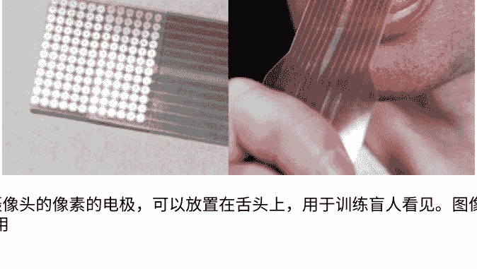

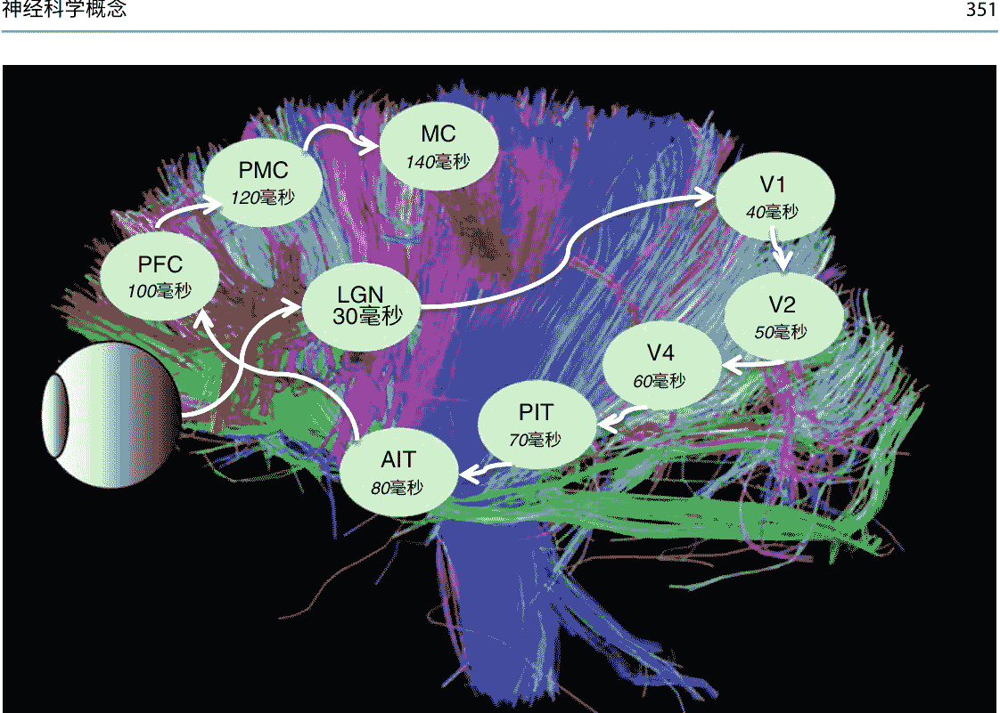

图9.10 “由神经影像学实验室和马丁诺斯生物医学影像中心提供，人类连接组学计划联盟www.humanconnectomeproject.org。” 这个连接组图像已经覆盖了包括区域之间的大致累计传输时间的视觉通路区域。 连接组图像是使用多种神经影像学模态在体内捕获的连接通路的地图或布线图

## 人类视觉系统架构

从神经生物学的角度来探索人类视觉系统是有用的，以增强对人工神经网络的讨论。 因此，我们提供了一个快速概述，突出了一些激发计算机视觉相关神经网络的概念。 人工神经网络模仿了神经科学观察到的大脑的一些关键生物结构和可编程行为。 在这个简要概述中，我们将重点介绍大脑的关键神经生物学结构和可编程行为。 关于人类视觉系统的其他背景和参考资料，特别是从纯照明角度来看眼睛的光谱响应，在第1章的成像部分提供。

人类视觉系统的一个优秀参考文献是Kandel等人的[623]。 神经科学家们开发了一个名为HMAX的视觉通路的标准研究模型，并且许多研究人员在基本的HMAX模型上进行了扩展，我们在第10章进行了调查。 从计算机视觉社区的角度来看，局部特征描述符和最近的CNNs非常流行，在神经科学社区中HMAX也很受欢迎。

图9.10展示了一个简单的视觉系统模型，其中视网膜将图像发送到视觉皮层中。 Yeo等人[631]提供了对视觉皮层映射历史的很好的概述和参考。 关于视觉通路的神经生物学活动的了解正在逐渐增加，例如Wiskott等人[630]对视觉通路中的平移和尺度不变性进行了探索。 还可以举出许多其他例子。

如图9.10所示，人类视觉通路在层次结构中使用大约六个层次（LGN，V1，V2，V4，PIY，AIT），并且共享更高级别的推理中心（PFC，PMC，MC）。 各种机器学习从业者也发现使用接近六层的结果很好。 根据Yann LeCun的说法，视觉皮层通路中有5到10个不同的层，具体取决于计数的方式。 作为第一个近似，视觉通路类似于前馈网络，或者FNN。然而，实际的处理架构，包括反馈机制和电化学刺激算法，是未知的。视觉皮层中存在一些反馈，处理过程并非全部是前馈的，请参见Rao等人的研究[624]。

图9.11 Hubel和Wiesel的简单细胞和复杂细胞模型。图像 © Springer-Verlag，来自《分层神经网络用于图像解释》的Hierarchical Neural Networks for Image Interpretation，Sven Behnke [548]，提交给Springer-Verlag的草稿，发表于计算机科学讲义的第2766卷，ISBN: 3-540-40722-7

图9.12 对视觉处理路径（“标准模型”）的说明，包括视觉神经区域层次结构中所表示的特征类型。图像 © Springer-Verlag，来自《分层神经网络用于图像解释》的Hierarchical Neural Networks for Image Interpretation，Sven Behnke [548]，提交给Springer-Verlag的草稿，发表于计算机科学讲义的第2766卷，ISBN: 3-540-40722-7

如图9.11所示，Hubel和Wiesel [559, 560]为视觉通路的较低层开发了有影响力的模型，并引入了几个概念，这些概念指导了分层人工神经网络的发展。基本概念包括（1）简单细胞，它们从局部感受野收集输入，并调整自己以识别定向的局部特征，如梯度模式或边缘，以及（2）复杂细胞，它们从简单细胞的局部感受野中汇集并选择最佳激活。

在下面总结了视觉通路的神经生物学结构，请参考图9.10和9.12。

- LGN，即侧脑室旁核，由Hubel和Wiesel [559, 560]研究，他们提出LGN是视觉皮层的关键部分，并且如图9.12所示，它由局部视网膜图像中的小、重叠的同心区域组成，是一个串行的分层视觉处理通路的起点。
- 局部神经场相互作用，几位神经科学研究者[632–635]观察到，相邻刺激处理的紧密相邻的神经元之间存在相互作用，类似于它们之间的侧向控制。例如，视觉通路中的V1、V2、V2和更高级别的组件将局部区域输入进行组合，甚至在局部区域之间横向散布抑制和兴奋信号，以改变局部区域的感知参数。
- V1，S1，从重叠的LGN局部视网膜细胞区域接收输入，并形成简单细胞（S1细胞）或低级特征，这些特征对平移和旋转方向具有一定的不变性。因此，简单细胞的输出与旋转方向对齐。V1还从V2区域接收反向传播的信号，显然为了构建局部感受野以形成特征提供指导。正如Hubel和Wiesel所假设的，简单细胞包含边缘和微纹理等局部特征，这些特征作为输入传递到复杂细胞或C1细胞的视觉处理层次结构中。
- V2，C1，将V1中的低级S1特征组合成中级特征或C1复杂细胞。V2还从视网膜区域汇集局部特征，如图9.12所示。C1细胞通过局部视网膜区域汇集将V1中对齐、重叠的视网膜区域的输出组合起来，类似于卷积网络中使用的重叠特征核，其中每个特征图对相位、平移和旋转方向都是独立敏感的。C1复杂细胞以相位不变的方式组合简单的S1细胞特征，对边缘和条纹作出响应。C1感受野可能比S1大2个单位。请注意，许多简单细胞或低级特征（如边缘）以及局部视网膜特征汇集输入到更高级别的细胞（如中级特征，如模式和物体部分）中，这是卷积神经网络的关键灵感之一。
- V3，一些研究人员将额外的低层次定向边缘特征层定义为V3，它与V1和V2相似但更高级。
- V4，在这里，中层概念被组合起来，例如模式和物体部分。来自V2的C1细胞输出在V4中组合成更高级的概念，使用与V1和V2中相同类型的特征图响应汇集，因此我们可以看到V1、V2和V4层次结构中的共同架构，这也是CNN设计的另一个重要灵感，通常由多个复制的隐藏层组成，包括滤波、汇集和非线性神经元激活函数。数据的非线性和ANN的神经传递函数的非线性是受生物学启发的另一种方法，因为在V1、V2、V4和更高层次的每一层中，我们都越来越远离像素，越来越接近根本不是像素的抽象概念。
- PIT，CIT，包含中层概念，如方向性、主题、隐藏层架构。

## 特征学习架构的分类法

该分类法旨在概述在深度神经网络中使用的整体架构和组件，以便对深度神经网络进行比较。该分类法总结了连接、层、组件和算法。该分类法包括：

- 架构拓扑、连接和图结构
- 组件、算法和层

例如，架构拓扑定义了连接、数据流、网络深度和整体组织，而组件包括架构中每个层中使用的算法和方法。表9.3包含了分类法概述，接下来对每个分类法组件元素进行了简要介绍。

该分类法还显示图像处理、计算机图形学和媒体处理方法被应用于人工神经网络的设计；然而，大多数深度神经网络从业者对图像处理、计算机图形学、媒体处理以及GPU如何在硅中实现和加速基本操作知之甚少。因此，深度神经网络从业者通常会重新实现常见操作并赋予其新名称，或者使用较慢的算法，例如他们称之为最大池化的秩滤波，以及在软件中实现平均池化而不是使用与相机连接的DSP中的图像处理加速器或GPU中的硅进行重新缩放和抗锯齿处理，我们将在接下来的内容中指出其他示例。

表9.3

| 第一列 | 第二列 |
|--------|--------|
| 特征学习架构和组件分类总结 | |
| 人工神经网络类型 | 训练协议 |
| 无循环前馈神经网络 | 随机化训练样本 |
| 循环神经网络 | 数据抖动/平移 |
| 混合型神经网络 | 样本扭曲 |
| 内存模型 | 样本反射 |
| 简单固定内存 | 通过分割进行区域提议 |
| 时空记忆 | 装袋法 |
| 关联记忆，CAM | 批处理 |
| 输入采样 | 子类别挖掘与融合 |
| 区域不重叠，平铺 | 对抗扰动 |
| 区域重叠，n步长或每个像素 | 层总数 |
| 区域归一化（分割可能区域） | 总层数 |
| 矩形形状 | 特征层次结构（nxm） |
| 圆形形状 | 分类层（1x1） |
| 形状多边形 | 其他层 |
| 每个像素密集模式 | 特征、滤波器 |
| 稀疏训练模式 | 相关模板/卷积滤波器 |
| 光谱浮点 | 多层感知机 |
| 光谱整数 | CCCP特征图缩减 |
| 丢弃、重构、正则化 | RCL特征 |
| 输入样本丢弃 | 基函数或局部特征 |
| 装袋法 | 复合（inception） |
| 将输入权重置为零 | 激活函数、传递函数 |
| 丢弃连接（随机、稀疏化） | 二进制阶跃函数 |
| 将输出丢弃为零 | 线性斜坡 |

表格 9.3 (续)

| 特征学习架构和组件分类总结 | |
| :--- | :--- |
| 噪声注入 | 饱和线性斜坡 |
| 预处理，数值调整 | 对数-sigmoid |
| 均值为零的归一化 | 双曲正切sigmoid |
| 局部EQ归一化 | 竞争性的 |
| 全局EQ归一化 | Softmax |
| 白化 | 修正（ReLu） |
| PCA | 参数化修正（PrReLu） |
| 其他 | 绝对值修正 |
| 特征集维度 | 径向基函数 |
| 每层特征块大小 | 最大输出值 |
| 每层特征数量 | NiN. 多层感知器 |
| 特征初始化 | 后处理，数值调整 |
| 迁移学习 | 响应归一化（局部，跨通道） |
| 无监督预训练 | 除法归一化 |
| 随机特征初始化 | 局部EQ归一化 |
| 固定基函数集 | 其他 |
| 层连接拓扑 | 池化、子采样、上采样 |
| 核连接 | 平铺池化 |
| 全连接 | 重叠池化 |
| 稀疏连接 | 随机池化 |
| 高斯连接 | LWTA池化 |
| 其他 | 最大池化 |
| | 平均池化 |
| | 重叠池化 |
| | 用于重新缩放的GPU像素着色器 |
| | 上采样 |
| | 全局平均池化 |
| | 多路局部池化 |
| | 空间金字塔最大池化（HMP） |
| | 仿射池化（SYMNETS） |
| | 多尺度最大池化（HMAX） |

注意这里首先以总结格式介绍了体系结构分类和组件分类，然后详细介绍了每个元素。术语和解释性信息对于理解第10章中的体系结构调查很有用。

## 架构拓扑

体系结构拓扑处理连接结构，也称为网络或图，连接组件或算法部分。体系结构拓扑定义了输入、输出和组件之间的连接图。拓扑是这个体系结构分类中的顶层特征，为每个组件提供了结构以包含额外的细节。

基本的ANN体系结构拓扑如图9.14所示，并在下面进行了讨论。有关神经网络连接拓扑的良好综述，请参阅Bengio [507]。Rojas [787]提供了一本基础性的文本。

图9.14人工神经网络架构拓扑结构，（左上角）前馈神经网络（FNN），（右上角）循环神经网络（RNN），显示递归、横向、前向和后向连接拓扑结构，以及（底部）假设的基础函数网络（BFN），使用平铺输入、基础函数（如Gabor函数）输入到完全连接的一维卷积神经网络输出层，然后是SVM分类器。

## 人工神经网络（ANNs）

ANNs没有明确的模式可遵循。因此，从业者定义了一些常见的人工神经网络类型，这些类型在实现上是实用的，只是生物神经网络无限多样性的一个很小的子集。因此，这个分类法确定了三种基本类型的ANNs：（1）前馈神经网络（FNNs），（2）循环神经网络（RNNs），（3）基函数网络（BFNs）。

### FNN（前馈神经网络）

受视觉通路的启发，FNNs提供了类似于复制操作或阶段的管道架构。 FNNs通常使用简单的内存模型，仅存储分层特征集（权重）和一些参数。 对于我们的讨论来说，FNNs也是CNN的一种类型，并使用卷积权重矩阵作为特征和滤波器。

### RNN（循环神经网络）

循环意味着网络中存在回路。 换句话说，网络可以任意连接。然而，存在许多循环式的架构，例如带有少量反馈回路的FFN和带有较大网络内部的网络内网络（NiN）。 RNN也可以使用时间存储单元来构建记忆模型，用于学习时空序列和相关参数。 RNN与CNN相关，并且通常使用相同类型的卷积权重矩阵作为特征和滤波器。

### BFN（基函数网络）

对于这项调查，BFN是一个包含所有类型特征和架构的综合类别。在BFN类别中，最有趣的架构之一是HMAX模型，它可能是视觉皮层最详细的模型，使用基础功能神经元模型而不是CNN和RNN中使用的纯卷积神经元特征模型。BFN通常受到高级推理方法的启发，而不是自下而上的神经生物学方法，它们使用各种拓扑结构和特征描述符，广泛使用各种分类器和架构。对于BFN类别，我们认为基础函数包括功能特征，如Gabor函数、Zernike函数、傅里叶特征，以及所有类型的局部特征描述符，如SIFT或FREAK。

### 集成、混合

类似于一个充满专家的房间，集成方法将几个网络组合在一起，可能在最后使用一个主分类阶段来合并和投票每个网络的结果。混合方法可能将ANN与其他方法结合使用。我们将在第10章中调查一些混合和集成网络的示例。

#### 架构组件和层

这些组件在架构中作为图形或网络中的节点连接在一起，类似于一个流水线。描述一个组件的另一种方式是一个层。在某些情况下，一个层是一个单一的函数，例如卷积滤波层或池化层，而在其他情况下，从业者将几个组件组合成一个层。在DNN中，层的模式经常被复制，例如卷积层后面跟着池化层，参见图9.16。

图9.16 典型的CNN层，包括复制的卷积和池化层

请注意，图9.16显示的是分类器和卷积层，在DNN术语中被称为隐藏层（注意：这些层并不是隐藏的，但是在输入和输出之间的任何层都被认为是DNN术语中的隐藏层）。卷积层实现了一个低级和高级特征的层次结构。

在CNN术语中，术语存在一些歧义（我们在进行时会指出术语的澄清，对于重复表示歉意）。以下是一些等价性：

- filters = weights = convolution_kernels = correlation_templates = features
- feature_map = image = 2D数组 = 输出（filter × input）
- hidden layer = 输入层和输出层之间的任何层
- layer = 算法 = 一组算法 = 流水线阶段

这种术语的歧义性和等价性是不幸的；然而，在我们的讨论中，我们也遵循这种术语，因为许多术语被广泛使用。例如，在讨论处理输入时，我们可能将 features 称为 convolution_kernels，它们作为 filters over 输入产生输出图像或 feature_map，并使用 correlation_templates 来测量每个特征在输入上的匹配强度。在讨论反向传播来调整 features 时，我们将把 features 称为 weights。

接下来，我们介绍和总结了分类法中的组成部分。

#### 层总数

除了输入和输出层之外，主要类型的层包括卷积-连接卷积滤波层和全连接分类层。

CNN使用多个复制的层以流水线方式连接，如图9.16所示，每个层包含一系列的处理元素，例如数值调节后跟随卷积，然后是最大池化。每个层的常规架构还支持在每个层内共享参数，例如特征权重，极大地简化了实现过程。其他的ANN架构是非对称的，包含反馈循环或者像RNN风格一样的循环，并且通常更难实现。

| 层总数 | |
| :--- | :--- |
| 总层数 | 前馈架构中的总层数，包括输入层、中间层和输出层。层可以包含多个步骤组合在一起的复合功能，也可以以更细粒度的方式定义，例如预处理层、卷积滤波层、池化层和后处理层。 |
| 特征层次结构 | 不同层次包含的低、中、高级特征 |
| 分类层 | 最终层将顶层特征分类以识别更高级的概念，如物体和场景。分类器也可以使用高、中、低级特征一起进行分类，而不仅仅是高级特征。FC-MLPANN\'s可以用于分类（有关FC层的详细信息，请参见第10章），还可以使用统计方法，如SVM\'s（请参见第10章）。 |

#### 层连接拓扑

典型CNN中的每一层都与其他层以可能不同的输入/输出拓扑连接在一起。例如，卷积网络中的输入层通常组装成包含2D模板或模式的nxn卷积核模式，并且每个卷积核都与一个（虚拟的）单独的人工神经元进行卷积处理。完全连接的层通常用于最后的1D分类层，尽管在典型的DNN中，完全连接性总是向前的，并不是一个完全连接的网格，例如将每个特征连接到所有神经元（请参见第10章中的FC层讨论）。稀疏连接的层在支持反馈的RNN中找到，并且特征描述符可以使用稀疏统计采样模式来分组输入，类似于Chap. 4中讨论的ORB、FREAK、BRISK和其他局部二进制描述符中使用的模式。

在这个分类中，还使用了各种丢弃方法来创建稀疏连接。
实际上，从神经生物学的角度来看，整个神经网络似乎是稀疏连接的，具有惊人的变化。

| 层连接拓扑 | |
| :--- | :--- |
| 核连接 | 输入区域的形状类似于矩形核 |
| 全连接 | 所有输入都连接到所有输出 |
| 稀疏连接 | 层间连接不是密集的 |

#### 内存模型

在ANN中使用了几种类型的记忆模型。

- 简单的、固定的记忆：典型的CNN使用简单的固定记忆模型，在每一层存储固定数量的特征，并在运行时使用动态参数。
- 时空记忆：例如LSTM风格的循环神经网络[LSTM]具有学习特征或事件序列的时空功能，因此使用了包含基于时间的内存管理功能和门控机制的内存模型，以控制内存内容、内存读写访问，并存储事件的历史记录。
- 关联记忆，某些人工神经网络（ANNs），特别是循环神经网络（RNNs），使用专用的内存单元，称为内容寻址内存（CAM）或关联记忆，因此不使用内存地址来访问内存内容，而是通过引用内存内容的键来访问内容。

| 内存模型 |  |
| --- | --- |
| 简单固定内存 | 内存在使用期间分配和使用 |
| 时空记忆 | 一种在一段时间内使用的本地内存，可以使用RNN进行实现 |
| 关联记忆，CAM | 具有标记或哈希内存地址而不是线性数值地址的内存，可以使用RNN进行实现 |

#### 训练协议

训练协议关注的是数据准备和呈现的方法，例如创建训练数据的旋转或裁剪副本，并以批次呈现数据。训练协议设计的目标是确保为系统训练提供足够的样本和样本的随机化，并且许多变化是常见的。

| 训练协议 |  |
| --- | --- |
| 随机化训练样本 | 为每次训练运行随机排序训练样本 |
| 数据抖动/平移 | 移动图像 |
| 样本扭曲 | 扭曲图像 |
| 样本反射 | 反射或镜像图像 |
| 通过分割进行区域提案 | 将输入图像分割成区域，并将每个区域作为单独的图像进行训练 |
| 批次，随机化 | 所有训练图像一起发送，并根据整个组调整训练参数。组可以在内容或大小上进行随机化。 |
| 小批处理 | 类似于批次，但训练集被分成较小的图像批次进行逐批次训练，并在整个批次运行后调整所有权重。 |
| 子类别挖掘和融合 | 根据图像内容的数据挖掘分析，智能地将相似的图像集合分组为训练集，而不是随机创建训练集批次，参见Dong CVPR 2013 |
| 对抗扰动 | 有意设计的对抗性图像，旨在干扰和错误分类，参见Fawzi CVPR 2015 |

#### 输入采样方法

每个神经层的输入使用各种方法进行采样：

- 区域，包括平铺的非重叠区域或分块的重叠区域，例如每个像素或每$n$个像素。
- 形状，通常采样矩形补丁，例如$3 \times 3$内核，但也可以是矩形或圆形。
- 模式，在CNN中，模式通常是密集模式，使用$3 \times 3$内核区域中的所有值，例如。然而，一些局部特征，如FREAK，使用抖动或扫视样式的采样模式，以提供更高的分辨率和细节，模仿人类视网膜在密切检查特定区域时的行为。
- 光谱，对于像素输入，数值是标量，可能是浮点数、定点数或整数。对于在CNN风格网络中的更高级别的输入，数值不再严格是像素，因为每个数值都经过了滤波器的非线性变换，以及激活函数的非线性变换，可能还有其他数值调整。

| 输入采样 | |
|---|---|
| 区域不重叠，平铺 | 在非重叠的瓦片中对输入图像进行采样 |
| 区域重叠，n步长 | 在重叠的瓦片中对输入区域进行采样，其中步长因子确定了瓦片的重叠 |
| 每个像素都有区域重叠 | 在输入图像的每个像素处进行密集采样 |
| 矩形形状 | 采样形状是矩形 |
| 圆形形状 | 采样形状是圆形 |
| 形状多边形 | 采样形状是多边形 |
| 每个像素密集模式 | 特征描述符在描述符形状区域内密集采样每个像素，例如相关模板 |
| 稀疏训练模式 | 特征描述符的采样模式是稀疏的，例如FREAK和ORB方法。 |
| 光谱浮点 | 描述符是一个浮点数数组，这在CNN权重中很常见 |
| 光谱整数 | 描述符是一个整数数组 |

#### 丢弃、重构、正则化

训练过程中使用了各种方法，统称为丢弃，它们以层的形式出现在架构中。使用丢弃的原因包括：

- 忽略数据样本，以防止过拟合。
- 动态重新配置网络的输入/输出拓扑，以忽略样本进行正则化，并随机化连接拓扑以进行训练的正则化。
- 动态将权重设置为零，用于模型正则化。

几位从业者已经证明，丢弃方法可以提高训练收敛速度，减少过拟合，可能提高训练准确性。

通过忽略（丢弃）或将输入或输出设置为零，使用丢弃来防止过拟合。丢弃有效地改变了神经网络模型，对于网络的每次前向传递，随机地将一些数据样本设置为零，从而得到一组半随机的网络。

在训练过程中，这些变化会被平均在一起。当应用于大多数神经网络模型时，Dropout会带来适度的改进[568, 660]。Dropout在训练的早期阶段最为有效，在这个阶段，调整参数的步长较大且仍在收敛，而不是在后期训练阶段，此时调整步长较小。需要注意的是，Dropout在数学上是有依据的，而不是受到神经生物学的启发。

随机丢弃样本还会随机改变架构，从而在运行时创建稀疏连接的层，并具有不同的连接拓扑结构。选择要丢弃的神经元输入是经验性的，许多从业者选择丢弃 >50%的输入，而其他从业者可能只丢弃 <50%的输出。还尝试了其他方法来随机丢弃神经元的输入或输出，甚至是卷积层中的单个滤波器权重[539, 660–662]。此外，还应用了L2正则化和添加输入噪声的方法。

Dropout的目的是通过解决过拟合和无法收敛的问题，使得深度神经网络的训练成为可能。训练过程中的过拟合可能是由于数据样本的差异较大，导致分类器对错误值拟合模型，从而引起过冲和欠冲等异常情况。此外，使用反向传播权重调整算法的神经网络模型很容易对数据变化过拟合，而不是对数据趋势进行拟合，表现为振荡和无法收敛，这可能会增加训练时间并增加复杂性。此外，使用过少的数据样本也会导致过拟合，因为由于欠采样引起的采样伪影是众所周知的，例如奈奎斯特效应。

一些实践者在训练过程中还会添加噪声，如高斯噪声，以对数据进行正则化，但在测试过程中不添加噪声。噪声在训练过程中大部分会被滤除，因为所有样本都会进行平均。

任何采样操作的一部分问题是噪声；数据样本定义上可能不是平滑、规则的连续值，而是可能包含坏的训练样本和非均匀分布的值，还可能包含一些强烈的异常值，这些都会使结果产生偏差。Dropout是将噪声从数据中去除的逆过程，类似于对数据添加高斯滤波来去除噪声。Dropout的目的是通过减去噪声来处理噪声或过拟合的问题。当然，目前的Dropout是使用随机的丢弃机制实现的，因此Dropout效果只是类似于稀疏化数据样本，这在实践中似乎效果不错。

1971年，Ivakhnenko的GMDH神经网络模型[564-566, 569]是第一个使用参数化数据样本调节方法来忽略某些数据样本（早期的Dropout变体），以防止模型过拟合的深度神经网络模型。

更近期在2012年左右，Hinton等人[539, 660]推广了一种称为随机丢弃的变体方法，用于随机丢弃训练样本以防止过拟合。其中一种变体是设置一个对称应用于网络的每一次往返的丢弃掩码：相同的掩码用于从输入到分类器的前向传递和反向传播调整传递。当然，掩码是随机的，并且每一次往返都会改变。通过将神经元输出值设为零，反向传播在梯度下降过程中找到了几个零值梯度，加快了反向传播的速度，并希望防止过拟合。

正则化是一种试图通过改变训练变量（使其更规则）来强制模型正确训练的方法，有点类似于高斯滤波或模糊化，试图消除表现为“过拟合”的伪影。数据正则化方法可以被视为非线性数据降维，可以在每个神经处理器的输入端或输出端对数据进行正则化。

Dropout正则化方法在大脑视觉通路的同一层次的神经元之间实现了粗糙的侧抑制和侧向通信[632–635]。

| 丢弃、重构、正则化 |
| --- |
| 输入样本丢弃 |
| 装袋法 | 另一种用于选择性忽略数据以防止过拟合的方法是装袋法，由Breiman于1994年提出[611, 662]。基本思想是将总训练集分成袋装组，并创建相应的模型对每个组进行训练。对于所有模型及其相应的袋装数据集，训练是同步进行的，并将每个模型的结果进行平均，或者可以应用投票方法，如多数滤波器（见第2章）。 |
| 将输入权重置为零 | 将随机选择的输入置零 |
| 丢弃连接（随机、稀疏化） | DropConnect是Wan等人提出的一种dropout变体[661]，它使用随机掩码将输入神经元中的随机滤波器权重置零，而不是像dropout方法那样将输出置零，Wan报告了良好的结果。 |
| 将输出丢弃为零 | 将随机选择的输出设为零 |
| 噪声注入 | 向样本添加噪声 |

## 预处理、数值调整

为了数值调整的目的，常见的数据预处理方法包括去除噪声、将数据压缩到以零为中心的范围内，或者仅呈现最常见的数据元素，例如主成分分析（PCA）。从标准信号和图像处理中应用了几种方法，详见第2章和第3章。然而，值得注意的是，尚未从神经科学研究中发现任何数值调整函数，因此数值调整、图像预处理和非线性方法被用作网络中其他问题的临时补偿方法。

| 预处理，数值调整 |
| --- |
| 均值为零的归一化 | 将数据归一化到以零为中心的范围，例如[-1...1] |
| 局部EQ归一化 | 使用直方图均衡化对输入数据区域进行归一化 |
| 全局EQ归一化 | 使用直方图均衡化对整个输入图像进行归一化 |
| 白化 | 一种去相关转换，将一个变量向量转换为一个方差为1的不相关变量向量，使得输入变得像一个白噪声向量 |
| PCA | 主成分分析方法在分布中找到最常见的值，类似于聚类中心，有助于将值归纳为较小的代表性集合 |
| 其他 | 几乎任何图像处理操作 |

## 特征集维度

特征集维度包括层次结构中的特征集数量和每个集合中的特征数量。每个架构通常固定每层的特征数量，可能会增加较高层中的特征数量。

| 特征集维度 | 特征集维度 |
|------------|------------|
| 每层特征块大小 | 在CNN中，特征层次结构中的每个层可以为每个特征分配不同的x、y维度，例如3x3 .. 31x31或更大。 |
| 每层特征数量 | 在CNN中，层次结构中的每个层可以定义不同数量的特征，例如200个。其他方法，如1D词汇和FC层，可以在1D单层表示中使用数千个特征。 |

## 特征初始化

初始化CNN的特征方法将影响最终的训练结果。在稍微不同的特征初始化上运行相同的训练数据将导致不同的特征集，可能是由于每个集合中的不同局部最小值。许多从业者使用随机初始化，在某些情况下，使用迁移学习并从一组预先训练好的特征开始学习是有益的。在其他情况下，会运行无监督的预训练会话来构建特征库，然后使用监督训练来优化特征。

| 特征初始化 | |
|------------|---|
| 迁移学习 | 使用已经训练好的预先存在的特征，可能只使用较低层次。 |
| 无监督预训练 | 使用未标记的数据训练网络，然后使用标记的数据开始训练会话以改进基础特征。 |
| 随机特征初始化 | 将特征权重初始化为随机值，注意随机值权重矩阵等效于一组边缘检测器。 |
| 固定基函数集 | 对于较低层次使用固定的基础特征，例如在第10章中调查的HMAX模型中。 |

## 特征、滤波器

典型的深度神经网络遵循CNN模型，并使用相关模板，例如 nxn权重卷积核作为特征。权重卷积核也可以作为卷积滤波器，用于以非线性方式转换输入，产生CNN术语中的子采样缩减，用于下一层的输入。

> 然而，一些ANN方法（BFNs）可能使用基础特征或局部特征描述符，例如SIFT，而不是简单的卷积滤波器。

| 特征、滤波器 | |
|---------------|---|
| 相关模板/卷积滤波器 | 权重矩阵将特征定义为模板 |
| 多层感知机 | 使用多层感知器来定义特征，如NiN方法中使用的（见第10章） |
| CCCP特征图缩减 | 从大量特征图中过滤出一组较小的特征图，如NiN和Inception中使用的。这有效地改变了特征结果。 |
| RCL特征 | 递归卷积层用RNN替代卷积特征，通过RNN考虑局部区域的空间关系 |
| 局部特征描述符 | 例如SIFT、ORB和其他局部特征的特征 |
| 基函数集 | 在傅里叶、Gabor、Zernike等空间上计算的基函数。基函数不是通过学习或设计得到的，而是从参数函数生成的。 |

## 激活、传递函数

大多数DNN中使用的基本人工神经处理器模型由两部分组成：（1）卷积函数：$s = f(inputs, weights)$，（2）非线性激活函数：$a = n(s)$用于扩展或压缩数据，产生一个标量值。使用了多种激活函数；详见Hagan等人[668]的说明和图9.18。

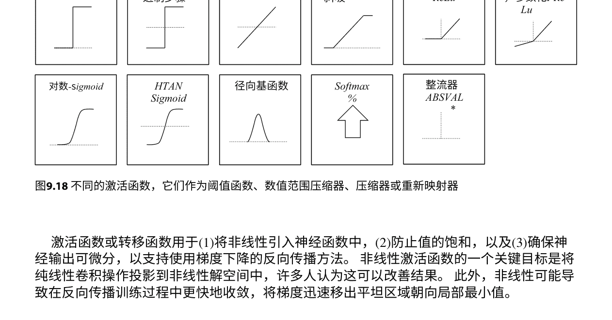

激活函数或转移函数用于(1)将非线性引入神经函数中，(2)防止值的饱和，以及(3)确保神经输出可微分，以支持使用梯度下降的反向传播方法。非线性激活函数的一个关键目标是将纯线性卷积操作投影到非线性解空间中，许多人认为这可以改善结果。此外，非线性可能导致在反向传播训练过程中更快地收敛，将梯度迅速移出平坦区域朝向局部最小值。

然而，神经生物学激活的实际非线性函数仍然是一个未知函数，如果它存在的话。人工神经网络，如CNN，不像真实的神经元那样以二进制的全有或全无的方式发射，而是产生一个模拟输出，然后通过激活函数和其他函数（如池化）进行数值调整。根据Mccullogh和Pitts[561]的简单感知器模型不使用激活函数，而是仅使用输入上的权重。

| 激活函数、传递函数 | 描述 |
|---|---|
| 二进制阶跃函数 | 使用阈值来确定神经激活输出作为二进制的全或无值 |
| 线性斜坡 | 将激活分配在线性范围内，可以是压缩的范围斜坡或完整的范围映射，请参见第2章中的重新映射 |
| 饱和线性斜坡 | 将激活分配在线性范围内，并使用饱和阈值值来限制线性范围 |
| 对数-sigmoid | 使用对数Sigmoid样式函数分配激活 |
| 双曲正切sigmoid | 使用双曲正切Sigmoid函数分配激活 |

| 激活函数、传递函数 | |
| --- | --- |
| 竞争性的 | 一种将多个神经输出耦合在一起并抑制输掉的神经输出的激活方法 |
| Softmax | 一种概率激活函数，产生百分比或强度激活，而不是全有或无的二进制激活 |
| 修正（ReLu） | 对输出值进行校正以消除极性，有助于识别在极性变化下的相同特征 |
| 参数化修正（PrReLu） | 具有参数化的修正线性单元，用于控制负极性的阈值确定位置 |
| 绝对值修正 | 使用激活的绝对值来消除负极性 |
| 径向基函数 | 通过与RBF's进行匹配来控制激活 |
| 最大输出值 | 在一系列特征图通道上进行池化，详见下文。 |
| MLP (NIN) | 使用多层感知器作为激活函数，而不是像NiN中使用的简单卷积权重模板 |

Maxout网络或深度Maxout网络（DMNs），由Goodfellow等人提出[610]，是CNN的一种有趣变体，使用了一种称为maxout的新型激活函数，它在空间区域和前一层的特征图通道之间进行池化，能够逼近任何凸函数。基本思想是对一小组不重叠的神经输出进行池化，并选择组中的最大激活传递到下一层，将其他激活置零，类似于dropout。这也类似于MAX池化，但替换了激活函数，并可以从前一层的特征图接收输入。maxout函数可以实现各种激活函数，例如绝对值修正和二次函数。最终结果是模型参数的减少，适用于较小的计算机。

## 后处理、数值调整

一些从激活函数或池化函数进一步后处理结果的从业者，例如使用归一化、压缩和扩展。后处理进一步增加了非线性，并且还可以纠正数值范围问题。似乎没有限制于其他后处理方法的使用。

| 后处理 | |
| --- | --- |
| 响应归一化（局部，跨通道） | 使用非线性扩散函数来规范化像素区域或输入，可以使用局部区域值或其他通道（如颜色、强度或梯度）的值。 |
| 除法归一化 | 根据附近大量神经元的活动，使用除法因子来缩放局部区域的值，参见D. J. Heeger 1992。 |
| 局部EQ归一化 | 使用直方图均衡化函数对像素或值的局部区域进行规范化 |
| 其他 | 使用白化、重新缩放和对比度窗口等多种方法。 |

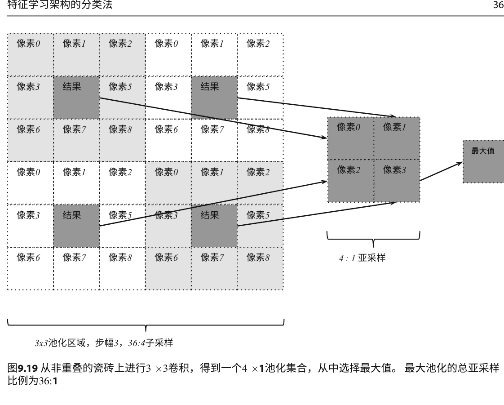

3×3池化区域，步幅3，36:4子采样

图9.19 从非重叠的瓷砖上进行3 ×3卷积，得到一个4 ×1池化集合，从中选择最大值。最大池化的总亚采样比例为36:1

## 池化、子采样、下采样、上采样

池化是将由激活函数或传递函数生成的标量组合成一个池或组，并从池中创建一个新的输出的方法。有多种方法用于从池中选择值。实际上，使用像素着色器进行缩放和抗锯齿的计算机图形方法可能是一种首选方法，而且GPU甚至提供了硬件加速这种基本操作的功能，但作者不知道有任何从业者使用GPU抗锯齿。上采样是一种为某些分类方案规范化特征的方法，请参见图9.19。

| 池化、子采样、上采样 | |
| :--- | :--- |
| 平铺池化 | 在非重叠区域上汇总结果 |
| 重叠池化 | 在重叠的区域上汇总结果，使用步幅因子进行调整 |
| 随机池化 | 用于通过在区域上进行池化来消除样本噪声，以防止过拟合，除了最大值或平均值之外，还使用了半随机确定的激活，并使用多项式概率函数来表示区域，请参见Zeiler [663] |
| LWTA池化和动态连接 (见下图9.21) | LWTA池化关闭了从一层到另一层的选定神经元值的前向传播，除了获胜神经元的值之外。请参见下面的详细信息。 |
| 最大池化 | 使用一组神经元的最大激活作为该组的表示 |
| 平均池化 | 使用一组神经元的平均激活作为该组的表示 |

| 池化、子采样、上采样 | |
|----------------------|--|
| 用于重新缩放的GPU像素着色器 | 使用像素着色器和GPU中的硅加速器来实现亚采样和池化的一个实例。 |
| 上采样 | 将一小组像素插值到放大的较大区域中。 |
| GAP 全局平均池化 | 通过对最后一层的所有特征进行空间平均来替换CNN中用于分类的全连接层，用于评分，如NiN方法中所使用的。 |
| GMP 全局最大池化 | 将每层特征图中最强的激活组合起来，输入到softmax分类器中，如RCL-RCNN方法中所使用的。 |
| 多路局部池化 | 池化具有相似特征空间或空间上相邻的特征。 |
| 空间金字塔最大池化（HMP） | 在空间金字塔中对特征的最大值进行池化，得到特征尺寸的组合，这是HMP方法中使用的。 |
| 仿射池化（SYMNETS） | 在仿射变换下，对一组相似特征激活进行最强激活的池化，这是SYMNETS中使用的方法。 |
| 多尺度最大池化（HMAX） | 在HMAX中，使用相似尺度的局部特征激活区域进行池化。 |

正如Srivastava等人在Compete to Compute（CTC）方法中所示，LWTA池化和动态连接方法是一种局部胜者通吃的dropout形式，它基于局部神经元之间的竞争生成动态神经连接，当局部竞争失败时，暂时关闭神经元的输出。LWTA是一种局部激活抑制的形式。请注意，LWTA不像其他池化方法那样对输出进行下采样，而是临时改变网络拓扑或稀疏化拓扑。如图9.20所示，LWTA方法首先将神经元分组成每层的块。每个层内的块进行竞争。每个块包含逻辑来关闭输掉的神经元的输出连接，并打开赢的神经元的输出连接。研究还表明，LWTA还为网络增加了一种记忆形式，防止了作者所称的灾难性遗忘。神经生物学研究表明[228]，神经元之间存在局部池化或竞争，这在SIFT方法中得到了利用，它对局部梯度幅值进行池化形成直方图特征。

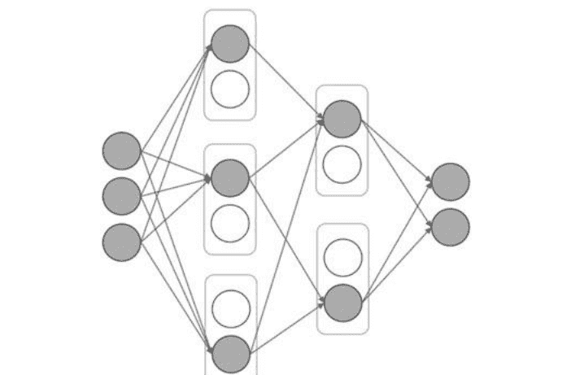

图9.20 LWTA池化和动态连接[613]，其中局部神经元组（本例中为2组）在组内竞争，将其输出传递到下一层。获胜神经元（深色）将输出传递到下一层，失败神经元（白色）则不传递。获胜神经元形成一个动态的网络拓扑结构，随着输入数据的变化而变化。

## 分类器

虽然分类方法不是本研究的重点，但我们在这个分类法中包含了一些符号，并在第4章和第10章提供了一些背景讨论。分类通常是计算机视觉系统的最后阶段，通过使用特征的存在与否来做出决策（注意：Google Inception架构在各个层次上使用多个分类器，详见第10章）。分类器将检测到的模式与学习到的模式进行匹配，以确定输入的类别并生成一个表示置信度的分数。

还可以使用一组分类器，协同工作。首先，确定一个假设，比如我是在看狗还是猫？这个假设决定了使用哪些参数和特征来设置分类器，使用已经经过多个识别任务训练的相同架构。

根据Cadiue等人的研究[617]，人脑会顺序处理多个假设。大脑可能需要大约100毫秒来对新场景中的一个假设进行前向传递，进行第一次评估。之后，可能会进行其他传递，将其他假设相互比较，针对问题、不确定性或进一步分析的需要，在新场景中生成额外的假设等等。因此，大脑充当一个集成分类器，对场景进行假设检查，然后可能改变假设并进行进一步评估，然后选择最佳假设。

| 分类器 | 描述 |
|--------|------|
| FC层分类器 | 在卷积式网络中，分类器可以由包含卷积式神经元的1D全连接层组成，这些神经元适合于反向传播式训练，而不是传统的统计方法，如回归模型、SVM和核机器。有关FC层的讨论可见第10章。 |
| Softmax | Softmax层是一种概率表示的对应关系，类似于百分比分数，权衡每个特征对组成最终对象的贡献。 |
| SVM | 支持向量机（SVM）提供了一个框架，用于评估具有不同距离函数的多个特征表示或编码在更高维空间中，其中特征变得可分离，以允许距离测量。第10章提供了一些背景知识。 |
| 统计，其他 | 其他：使用了广泛的回归模型和统计方法，请参阅第4章和第10章中分散的参考文献（超出本工作的范围） |

## 摘要

本章为第10章的特征学习架构调查奠定了基础，应在阅读第10章之前阅读。本节探讨了深度学习网络和视觉通路背后的神经科学启示，包括神经科学和人工神经网络历史中的关键思想。介绍了合成视觉的概念，即正在设计完整系统以模仿整个人类视觉系统，类似于其他假肢科学（如机器人学）。讨论了机器学习的各种方法的简要历史，包括专家系统、局部特征描述、表示学习和深度学习。引入了深度学习系统的概念，其中在一个层次结构中学习多个层次的特征或概念，类似于视觉通路中的层次结构。

总结了关键术语，并开发了深度学习架构的分类法。该分类法包括三个架构家族：前馈神经网络（FNNs）、循环神经网络（RNNs）和基函数网络（BFNs），以涵盖所有其他特征学习方法，这些方法不一定使用ANN方法来学习所有特征。该分类法还包括对特征学习网络层中使用的各种设计元素和算法的细分。该分类法还包括对特征学习网络层中使用的各种设计元素和算法的细分。

# 第9章：学习任务

+   1. 描述特征学习的几个目标。
2. 描述深度学习网络中通常用于计算机视觉的人工神经元模型，并描述每个模型组件。
3. 以高层次的方式描述分层学习（深度学习）。
4. 将分层学习与字典学习进行比较。
5. 描述视觉词汇，并讨论可以使用的特征类型。
6. 描述稀疏编码的几个目标。
7. 描述基础特征以及它们在计算机视觉的深度学习中如何使用，并给出至少两个基础特征的示例。
8. 描述专家系统及其设计方式。
9. 描述你选择的局部特征描述符的设计。
10. 比较和对比使用ORB描述符的局部描述符特征训练与CNN特征学习。
11. 将前馈神经网络（FFN）与循环神经网络（RNN）和基函数网络（BFN）进行比较。
12. 提供人脑中神经元数量、神经连接数量和人脑的识别速度的估计。
13. 描述卷积神经网络（CNN）的架构，包括典型层的描述。
14. 描述关于生物神经元的架构的已知信息，包括神经元的组成部分。
15. 描述视觉通路中的各个层，包括V1. . . AIT之间的所有层。
16. 描述视觉通路PFC、MFC的高层分类层。
17. 提供一个关于人脑如何发展概念性视觉理解和高层视觉推理的理论。
18. 提供一个关于将假设引入视觉通路以评估视觉场的神经机制的理论。
19. 提供一个包括局部神经记忆、与其他神经元共享神经记忆的神经元的假设模型，并列举神经处理操作和参数。
20. 讨论视觉皮层中的局部感受野以及在CNN中实现的局部感受野。
21. 描述激活函数（即传递函数）的至少两个目标，并提供至少两种类型的激活函数的算法描述。
22. 描述卷积神经网络中池化和子采样的至少两个目标，并比较至少两种池化方法。
23. 描述完全连接的神经层的组织方式，以及它在卷积神经网络中的应用。
24. 讨论S细胞和C细胞的Hubel和Weiss模型。
25. 讨论特征层次结构的概念（深度学习），以及深度学习如何受到神经生物学的启发。
26. 讨论卷积神经网络的训练协议，包括批量训练和小批量训练。
27. 讨论训练考虑因素，如训练样本数量以及对训练样本的修改。
28. 描述隐藏单元和隐藏层。

+   29. 描述卷积神经元模型的工作原理，包括输入、特征权重和至少四个其他可能的模型函数，包括激活函数和池化函数。
+   30. 讨论分类器的目标。
+   31. 列举至少两种类型的分类器，并讨论每种分类器的设计和操作。

> > ...代码更像是...指南。
——巴博萨船长，《加勒比海盗》

在本章中，我们调查了广泛的特征学习架构和深度学习架构，这些架构包括一系列特征模型和分类模型。本章更深入地探讨了特征学习和人工神经网络的背景概念，总结了第9章的分类法，并补充了第3-6章的局部和区域特征描述符调查。调查中的架构代表了神经网络方法、局部特征描述符和基于分类的方法以及集成方法之间的重要变化。整体架构作为其各个部分的总和显然比单个部分或设计的组件更重要，例如特征描述符的选择、特征层次结构中的层数、每层的特征数量或分类器的选择。在广泛的架构范围内，取得了良好的结果。

调查中的特征学习架构涵盖了两个广泛的类别：

-   1.  统计学习方法使用各种特征描述符、学习方法、稀疏编码和统计分类器。
-   2.  神经网络方法受到一些简单的神经生物学概念的启发，例如将局部感受野集中到人工神经元中，以及宽而深的特征层次结构。

本章综述了深度学习架构的历史和最新实例，特别是在特征学习领域，其中对象的组成特征和特征之间的关系在常见的架构中被学习。我们检查了每个架构中使用的组件，并讨论了设计背后的一些动机和直觉。

为了解释每种架构的关键概念，我们提供了几个详细的背景部分，例如人工神经元模型、梯度下降等反向传播方法、稀疏编码和视觉词汇。

深度学习架构用于在熟练的从业者的控制下从训练数据中生成特征——这需要一个学习曲线。训练数据的数量和准备通常是成功特征学习的最重要因素。以下是一些来自熟练从业者的见解。

> “赢得胜利的不是拥有最好算法的人，而是拥有最多数据的人”
Bank and Brill

> “权重就是程序代码”
“这一切都与压缩有关”
Juergen Schmidhuber

## 架构调查

该调查包括了从第9章的分类法中选择的代表性架构。目标是探索架构家族创新的边界。大多数调查的架构可以被认为是深度学习方法，但我们也调查了一些混合和特殊情况。该调查重点关注架构的变化，而不是哪种架构在单一基准测试中是领先的。不幸的是，我们无法调查这个领域的每一项重要发展。然而，我们将读者引荐给Schmidhuber的优秀历史调查[552]。Hagan等人提供了一个关于基本神经网络设计的良好介绍，包括对几种有影响力的FNN架构的描述[668]。此外，我们在附录C中提供了一个关键期刊和会议的列表，供有兴趣的读者跟踪最新研究。

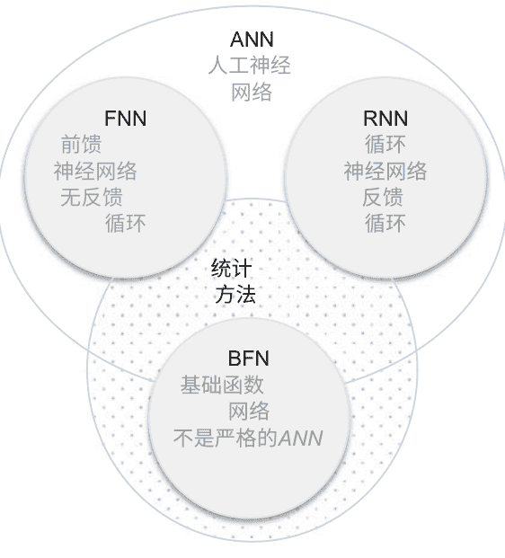

如图10.1所示，该调查被分为三个架构族：

-   FNNs 前馈卷积式网络
-   RNNs 循环网络，主要是卷积式
-   BFNs 通常使用基础函数作为特征，如Gabor或Fourier

人工神经网络（ANNs，NNs）与统计方法密切相关，实际上可以解决许多相同的问题。请注意，我们将FNNs和RNNs显示为ANN类别的子集，将BFNs显示为混合体，因为一些BFNs包含了一些神经网络概念，以及统计和启发式方法。

神经网络是函数逼近引擎：它们以压缩、稀疏的方式学习特征，以重构它们的输入函数，这些函数是计算机视觉应用中的图像或图像序列。神经网络的架构决定了训练的容易程度和函数逼近的有效性。

人工神经网络的设计可能受到神经生物学的启发，但真实系统的架构和设计是一种艺术形式。实际上，主要的从业者主张尝试不同的架构、组件和训练协议，并将结果进行比较，逐步调整架构。通常，研究人员会从现有的架构开始，然后进行小的改变，测量结果并发表论文。

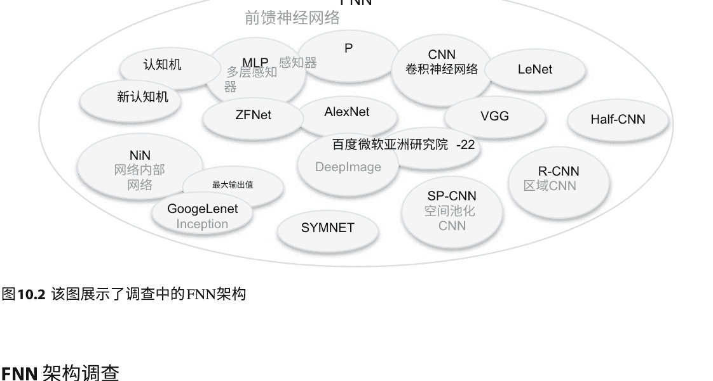

## FNN 架构调查

我们从前馈神经网络或FNNs开始进行架构调查，如图10.2所示，因为许多最早成功的神经网络应用使用了前馈模型。特别是，我们在调查中花费了相当多的时间来研究卷积神经网络（CNNs）或卷积神经网络（CNNs），它们是作为FNNs实现的。卷积神经网络具有重要影响力，为大量的研究奠定了基础，正如LeCun和其他人的开创性工作所示。感知机稍后进行调查，通常被引用为卷积模型的基础，其中作为特征的权重因子被应用于输入以测量对应关系。FNNs已经在各种应用领域中得到了验证，提供了一个相当规则的架构，已经被多位从业者扩展和改进。

### P—感知器

1958年，罗森布拉特开发的感知器模型[557, 563]是一个被归类的人工智能项目的一部分，该项目研究了罗森布拉特所称的神经动力学，为美国海军进行了研究，这一项目在1950年代进行，后来在1961年解密[604]。公众对于关于人工智能的新闻的反应

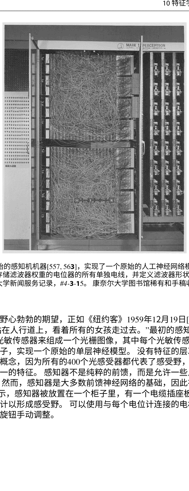

图10.3 这个图展示了原始的感知机机器[557, 563]，实现了一个原始的人工神经网络模型。 请注意用于连接光电晶体管像素输入和存储滤波器权重的电位器的所有单独电线，并定义滤波器形状。 图像 © 康奈尔大学，经许可使用，康奈尔大学新闻服务记录，#4-3-15。 康奈尔大学图书馆稀有和手稿收藏部

智能最好可以概括为野心勃勃的期望，正如《纽约客》1959年12月19日[604]所述：“这是一个简化。感知就像站在人行道上，看着所有的女孩走过去。”最初的感知器是以硬件形式实现的，使用了400个光敏传感器来组成一个光栅图像，其中每个光敏传感器连接到一个电位计，可以调节权重因子，实现一个原始的单层神经模型。 没有特征的层次结构，也没有固定大小的局部感受野的概念，因为所有的400个光感受器都代表了感受野，而400个权重是一起调整的，作为一个单一的特征。 感知器不是纯粹的前馈，而是允许一些反馈向侧面和向后提供正反馈和负反馈。 然而，感知器是大多数前馈神经网络的基础，因此在FNN架构调查中包括在内。如图10.3所示，感知器被放置在一个柜子里，有一个电缆插座板，用于手动连接光敏传感器和权重电位计以形成感受野。 可以使用与每个电位计连接的电机在软件控制下进行权重调整，或者通过旋钮手动调整。

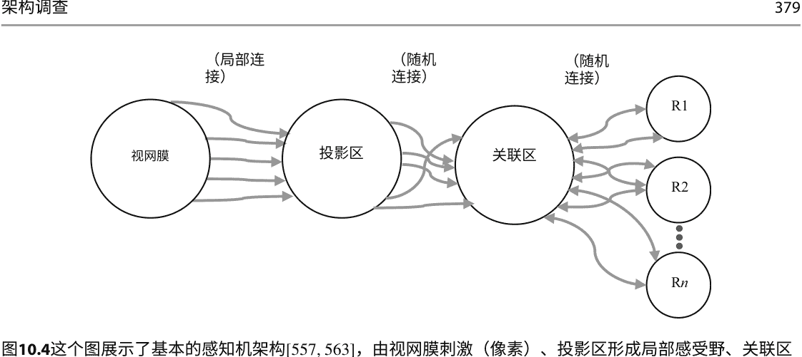

图10.4这个图展示了基本的感知机架构[557.563]，由视网膜刺激（像素）、投影区形成局部感受野、关联区将像素与权重相乘，以及多个分类器的响应区（Rx）组成。请注意半随机的连接模式和遵循RNN模型的反馈循环。

感知机是许多人工神经网络概念的基础；特别是卷积神经网络是基于感知机神经模型的权重调整来学习特征。单层感知机架构限制了学习和准确性只能应用于简单问题，并最初导致许多研究人员在很多年内放弃了人工神经网络研究。然而，多层感知机（MLP）在1980年代后期开发并改进，使用反向传播和学习方法，克服了单隐藏层感知机的许多限制。我们在下一节中调查了各种MLP架构。一些研究人员开发了并行感知机模型和相应的训练算法，例如Auer等人[673]。

这里是感知器的一些有趣特点的总结，包括架构、权重调整和学习。

#### 感知器架构

-   感知器架构包括三层：像素刺激（S单元）、相关像素（A单元）和响应（R单元），如图10.6所示。
-   S点，或输入刺激，作用于视网膜或图像上。
-   S点以局部感受野的方式聚集在一个点周围，但不是密集地，而是半随机地。
-   S点的密度或数量随着距离中心点的增加呈指数级下降，这是基于更现代研究中揭示的放射状减少的视网膜神经分布的生物证据，并且似乎支持轮廓检测。
-   参见第4章中FREAK使用的类似的局部响应场分布模型。换句话说，希望高密度的S点集中在感受野的中心，随着距离中心的增加，希望S点更稀疏。
-   A单元或相关细胞接收S点的组合。A单元连接定义了一个感受野。相关细胞被称为投影区。
-   局部感受野中相关细胞的模式被假设为随机的，而不是结构化的，如矩形或圆形核，而是类似于斑点以便进行轮廓检测。参见图10.5。
-   S点可以是兴奋性的或抑制性的，其权重表示。权重可以是兴奋性的（正值）或抑制性的（负值）。
-   对于一个A单元，所选S点的代数和会导致A单元的全有或全无触发（然而，感知机允许模拟值或标量触发事件）。

-   响应或$R$单元 $R_1...R_n$（或标记机制、分类器）从一组$A$单元接收输入，假设输入是半随机的。最佳输出是一个二进制的全或无发射事件，受到神经生物学的启发。使用多个$R$单元的响应组合来确定对象识别比使用较少的$R$单元更好。然而，发射事件的二进制性质意味着感知器可以很好地模拟$AND$函数，但不能模拟$XOR$函数，这被视为分类能力的严重限制，使许多研究人员对感知器相关研究感到沮丧（参见Minsky和Papert，1969年）。
-   响应是互斥的，只期望对输入做出一个响应，任何强烈的响应往往会抑制其他响应。
-   感知器内存被描述为关联和分布式的，允许通过权重设置删除一些内存单元，而整体准确性只会略微降低。

如图10.4和10.5所示，感知机允许可变的连接拓扑结构，包括视网膜刺激（S点、光感受器、像素）之间的局部连接和神经元（A单元）与R单元（分类器）之间的随机连接。

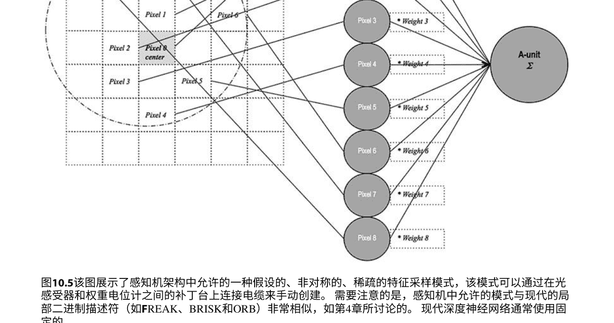

图10.5该图展示了感知机架构中允许的一种假设的、非对称的、稀疏的特征采样模式，该模式可以通过在光感受器和权重电位计之间的补丁台上连接电缆来手动创建。需要注意的是，感知机中允许的模式与现代的局部二进制描述符（如FREAK、BRISK和ORB）非常相似，如第4章所讨论的。现代深度神经网络通常使用固定的$n \times n$矩阵模式

#### 感知机权重调整

感知机中使用的学习规则是新颖的，并包括了几种技术。系统中的反馈，包括横向和反向反馈，类似于RNN的概念，用于调整或偏置不同层中的权重，以抑制信号从R单元（分类器）到A单元（感受野浓缩神经元），甚至在A单元之间传递信号，以有效增强最佳响应的R单元的强度，降低较弱响应的R单元的强度，实现一种强化学习的形式。参见图10.6。

罗森布拉特探索的一种新颖的学习概念包括使用双值权重强化来实现强化学习，这在今天值得重新考虑并纳入深度神经网络中。双值调整允许抑制（负）和兴奋（正）的权重调整，以及在RNN风格中的A单元和R单元之间的递归、侧向和反向偏差调整。

感知机对于权重设置的初始值非常敏感，不同的初始值会导致不同的解决方案。将初始权重设置为接近零的值可以获得最佳结果。

罗森布拉特将整体感知机权重调整方法和学习总结为试错学习。（在本作者看来，深度神经网络今天仍未克服试错范式。）感知机研究中探索了几种反馈系统和权重训练协议：

-   时间单位增益，即在激活时将活动的A单元放大或增加其权重一单位时间。
-   永久增益of权重值，当激活时，导致权重不合理地持续增长。
-   双值强化，减少非活动A单元的权重，增加活动单元的权重。
-   与权重成比例的权重衰减，使非活动A单元接收与权重大小成比例的权重衰减，而不是在感受野中进行更局部化的权重调整分布。

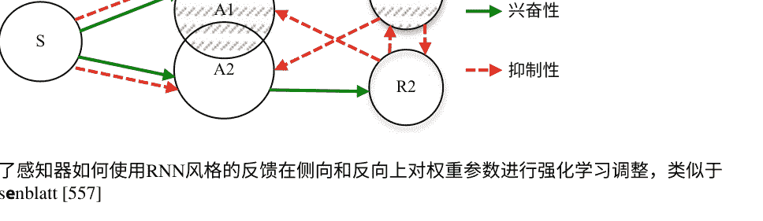

#### 感知器学习、训练、分类

感知器被认为是一种线性分类器。感知器学习和训练存在一些问题，例如（1）可分离数据可能会导致多个解决方案，这取决于初始权重值，（2）收敛所需的训练迭代次数可能非常大，类似于使用相同的增量调整样式的现代卷积神经网络对权重进行平均以获得最佳拟合所有训练示例的权重，以及（3）如果数据不可分离，则不会发生收敛，并且会出现振荡，这可能是长时间的周期，难以检测。

Rosenblatt研究了几种训练和学习协议[672]。由于局部感受野旨在成为围绕中心位置的半随机稀疏模式，并且连接模式允许密度随距离中心的增加而减小，设计良好的特征提取器真的是，正如Rosenblatt所说，“…一个试错学习系统”，需要相当的专业知识才能使其正常工作—今天的DNN中仍然如此。由于使用电缆补丁台通过手动连接光感受器到电位计来设计稀疏特征采样模式，感知器特征提取器真的是手工制作的。

对于给定的感知器，有六个参数来定义系统的训练、学习、判别和泛化方面：

-   x：每个A单元的兴奋性输入数量，
-   y：每个A单元的抑制性输入数量，
-   z：A单元的阈值值，
-   w：连接到R单元的A单元的比例，
-   Tₐ：系统中A单元的总数，
-   Tᵣ：系统中R单元的总数。

Rosenblatt报告称，增加A单元或感受野的数量通常会增加准确性，而增加R单元（分类类别）的数量通常会降低准确性。此外，随着视网膜区域的增大，所需的S点数量不再那么重要。

训练方法涉及将所有400个电位器独立设置为最佳匹配目标光栅图案。在训练过程中，电位器可以使用电动机进行设置。感知器是一个简单的线性分类器，需要线性可分的数据才能进行训练。尽管感知器因功能表示有限而受到批评，从而阻碍了对非线性问题的学习，但感知器中引入的卷积的基本概念，即输入 *权重，仍然是卷积式神经网络今天的主要基础。然而，现代卷积神经网络使用增强技术，如局部感受野、多个具有一组分层特征的卷积层，以及其他技术，如池化。

感知器学习规则用于线性分类具有很高的影响力，并且在本文的其他地方讨论了其对支持向量机和核机器分类器的启发。基本感知器学习规则算法可以表示如下：

-   在电缆补丁台中定义特征采样模式
-   定义目标模式栅格，例如数字0..9。
-   将权重初始化为随机值，例如接近0的小随机值
-   对于每个权重，计算测试输入：目标模式的差异
-   如果目标模式的权重不等于测试输入的权重，则调整权重：
-   否则保持权重不变，不进行调整
-   重复直到达到最小误差或迭代次数限制

```
w_j(t + 1) = w_j(t) + n(d - y)x
```

其中：
-   y = (目标模式 - 测试输入)
-   d = 期望输出
-   t = 迭代次数 (0 ... 400)
-   n =学习率常数，0...1
-   w_j = 权重

如上述算法所示，如果权重设置 =测试输入，则不进行权重调整 因此，感知器实现了一种排斥性学习规则，只有在权重错误时才会改变权重 权重调整的目标是对唯一模式进行分类并在权重空间中分离模式 还要注意输入未经过归一化处理，模式也未经过归一化处理，这使得参数调整难以管理，因此后续的研究者通过添加各种形式的归一化和数值条件来解决了这个弱点，稍后进行了调查

有关感知器设计和学习的详细介绍，请参阅Hagan [668]，其中包括详细的示例、数学证明、样本算法和编码指南

### MLP，多层感知器，认知机，新认知机

多层感知器 (MLP) 是基于感知器模型的更深层模型，其中MLP包含更多隐藏层和其他改进。已经开发了几种MLP架构，它们本质上是Convnet风格架构的先驱，例如后面介绍的LeCun的LeNet架构，为当前大部分DNN的基础提供了基础。

正如Hornik等人[890]所示，MLP可以被设计为通用函数逼近器，接受标量输入，与权重进行卷积，并添加偏置因子以提供标量输出。MLP函数逼近的思想类似于傅里叶级数的概念，在频域中可以将频率输入组合成任意函数。然而，MLP中使用的反向传播训练与傅里叶逆变换没有任何类似之处。

Cognitron和Neocognitron是MLP架构的早期和有影响力的例子，接下来我们将对其进行调查。

#### 认知机

Fukushima的Cognitron [677]于1975年被证明是最早的多层感知器之一，将基本感知器模型改进为深度架构。Cognitron是一个FNN。然而，考虑到当时的工程能力，Cognitron还比较原始，并且对于低层特征（如平移或尺度不变性）在较小的感受野上并不支持太多的不变性，但对于高层特征，由于更大的感受野和卷积子采样，更多的不变性得到了证明。

Cognitron受到当时的神经生物学启发，Fukushima提供了一些有趣的神经生物学观察结果，例如分层的Hubel和Wiesel模型并不适用于所有类型的视觉推理，但可能代表了神经视觉通路的主要部分。Fukushima还指出，Hubel和Wiesel模型并没有指定复杂或超复杂细胞上方的更高级别细胞，然而已知存在对各种不变性（如尺度和变形）都非常敏感的更高级别细胞，被称为“祖母细胞”。

认知机 (Cognitron) 是由Fukushima提出的第一代模型，如图10.7所示，随后通过改进添加了平移不变性和一些畸变不变性，被称为新认知机 (Neocognitron)，我们在认知机之后进行讨论。

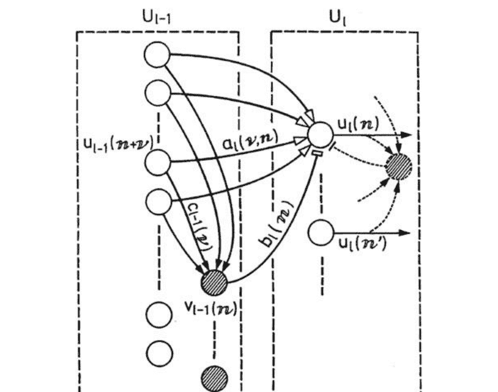

> 图10.7 这个图展示了Cognitron的兴奋权重 $U_n$和抑制权重 $V_n$的基本概念。
图片 © Springer-Verlag，经许可使用，来源于“Cognitron: A self-organizing multilayered neural network”, K. Fukushima, 经许可使用, Biol. Cybernetics 20, 121–136 (1975) Springer-Verlag

认知机学习规则体现了Fukushima所称的动态平衡概念，它增加了最强特征匹配的权重，使匹配更强，同时减少了其他权重以实现抑制，以平衡兴奋和抑制的权重。 然而，认知机的权重设置很难平衡兴奋和抑制因素。 兴奋和抑制权重调整规则允许兴奋权重无限制地增长，因此Fukushima引入了权重限制函数。 如果权重设置正确，认知机可以比感知机更好地识别重叠模式。 此外，只要权重设置正确，认知机还可以更好地区分二进制和灰度模式。

Cognitron的权重调整规则总结在图10.8中。

#### 兴奋性权重调整规则*

```
$e = \frac{P * v}{n}$
```

-   $e = 兴奋性增量$
-   $P = 比例常数$
-   $v = 线值（输入值）$
-   $n = 模式子电路中的输入数量（即卷积核）$

#### 抑制性权重调整规则*

```
$i = \frac{G * s}{t}$
```

-   $i = 抑制性增量$
-   $G = 普遍性常数$
-   $s = 子电路（即卷积核）中输入值的总和$
-   $t = 模式卷积核中权重值的总和$

#### *兴奋性权重限制函数

```
$l = \frac{e - i}{1 + i}$
```

图10.8 该图显示了Cognitron权重调整规则

#### 新认知机

新认知机[571, 679]是Fukishma的Cognitron[677]的扩展。新认知机相对于Cognitron的一个主要改进是平移不变性，通过将子电路比较器的局部区域的输出进行OR运算（即卷积滤波器在每一层的输出进行汇集），使得相同的特征可以在多个位置检测到，仅受特征重叠范围的限制。

Neocognitron是Convnet风格DNN的先驱。Neocognitron于1980年由Fukushima首次展示[570, 571]，能够进行自组织学习，正如Fukushima所说的无监督学习。学习方法产生的特征捕捉到每个特征的Gestalt或几何要点，提供基于几何相似性的模式匹配，具有平移不变性。Neocognitron是一个FNN，由输入层组成，后面是模仿Hubel和Wiesel模型[559, 560]的常规两部分层，包含输入模式的简单细胞，以及包含从简单细胞中派生出的更高级概念的复杂细胞。每个输入（或Fukishma所指的突触）都是传入的、可塑的和可修改的（即通过权重）。训练后，C细胞的最后一层成为一组经过训练的分类器，仅对单一类型的高级概念或特征响应，具有一定的变形和平移不变性。

福岛指出，兴奋性细胞和抑制性细胞之间的分裂是一种侧抑制的形式，这是一个受到神经生物学启发的概念，因为抑制性权重因子倾向于允许特征模式在位置上发生移动，但仍然可以从不同位置识别，因为兴奋性权重将在不同位置产生强烈的响应。新认知机使用简单细胞作为卷积特征（S细胞），复杂细胞用于汇集S细胞（C细胞），并使用V细胞对C细胞活动进行求和，用于为S细胞卷积提供增益控制。

图10.9（顶部）显示了基于当前神经科学的新认知机中所表示的基本细胞类型，从左边的视网膜开始，通过简单和复杂细胞组合成感受野，最后导致表示高级概念的超复杂细胞和表示最高级概念的祖母细胞。图10.9（中间）显示了细胞特征实际上覆盖更多像素，因为它们在网络的更高层次中表示，输入图像中的大写字母A说明了这一点。

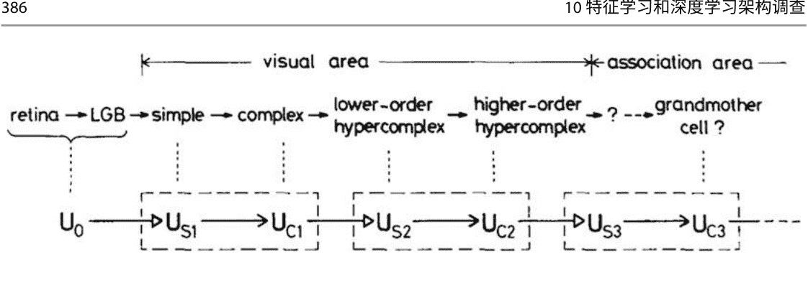

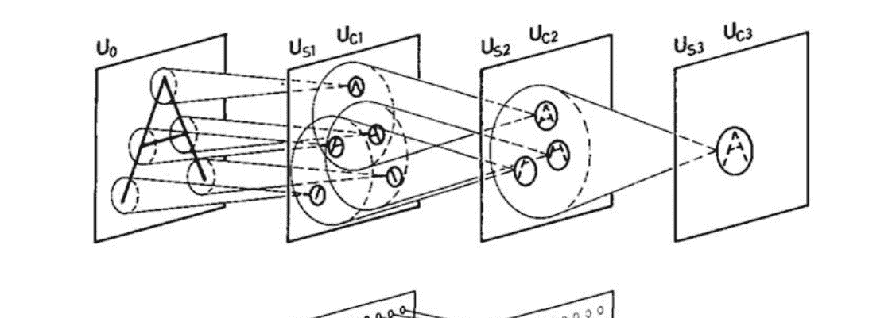

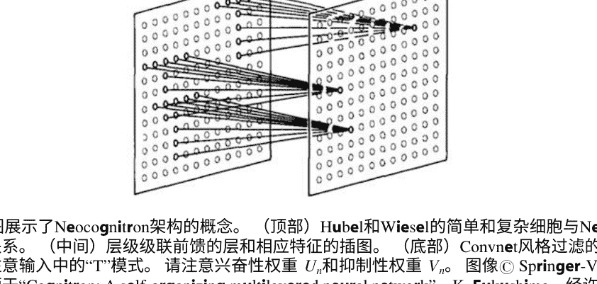

图10.9 这个图展示了Neocognitron架构的概念。（顶部）Hubel和Wiesel的简单和复杂细胞与Neocognitron层之间的对应关系。（中间）层级级联前馈的层和相应特征的插图。（底部）Convnet风格过滤的常规层次结构的插图，注意输入中的“T”模式。请注意兴奋性权重 \(U_n\) 和抑制性权重 \(V_n\)。图像 © Springer-Verlag，经许可使用，来源于“Cognitron: A self-organizing multilayered neural network”，K. Fukushima，经许可使用，Biol. Cybernetics 20, 121–136 (1975) Springer-Verlag

左侧最终表示为顶部的压缩、子采样的字母A特征。特征的压缩是卷积和子采样的结果，形成一组独特的顶层特征表示。还要注意，每个特征都表示为特征部分的层次结构，或深度表示。图10.9底部的图像显示了与表示字母T的输入像素最匹配的层之间的兴奋性细胞输出作为黑线；然而，抑制性细胞也存在于系统中，但没有显示在突触连接线上。

Neocognitron的输入没有在零附近进行归一化，而是大多数情况下是0-1的浮点数（有时 > 1），神经元的输出或C细胞也没有进行归一化。请注意，在后续的CNN生成中，我们看到更多关注数据归一化，以将数据与在均值为零的归一化范围内操作的各种激活函数配对。

S-列代表了Hubel和Wiesel在1977年引入的超列概念，在Neocognitron层中以图10.10所示的形式呈现，并注意单个细胞可能重叠并对多个S-列做出贡献。S-列概念描述了特征在层次结构中的集中形成，并倾向于抑制特征重叠。

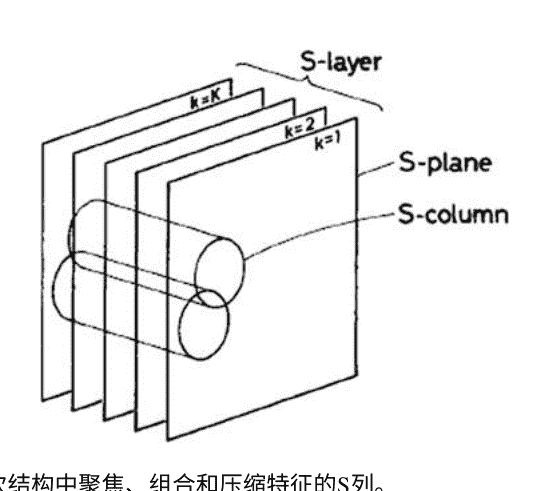

图10.10 该图显示了S层层次结构中聚焦、组合和压缩特征的S列。
图像 © Springer-Verlag，经许可使用，来源于“Cognitron: A self-organizing multilayered neural network”，K. Fukushima，经许可使用，Biol. Cybernetics 20, 121–136 (1975) Springer-Verlag

福岛还有几个实验计划来测试和改进Neocognitron，但只能在可用的计算能力范围内尽可能地进行。整个Neocognitron在早期的数字计算机上进行了模拟，这些计算机通常只包含不到64,000字节的内存，可能是手工绕制的磁芯存储器。Neocognitron架构的主要创新，启发了LeCun和其他深度神经网络(Convnet-style)的后续发展，总结如下：

- 由复制函数组成的常规前馈层。
- 使用步幅进行输入窗口分割，以组装n个输入核心用于滤波器。
- 由层次集合中的滤波器（特征）组成的卷积层。
- 每层中的权重复制和共享，用于并行卷积，从而减少了参数的数量。
- 由卷积层提供输入的下采样层，以提供平移不变性。下采样使用整个特征的局部空间特征平均值。
- 通过有趣的权重调整方法进行学习，尽管没有使用反向传播方法，但调整算法的灵感和基础已经奠定，参见[678, 679]。
- LWTA权重调整和训练。与反向传播不同，权重可以通过（1）局部最大值（LWTA）无监督学习或（2）预连接电路（迁移学习）进行调整。

## CNN、卷积神经网络、深度多层感知器的概念

卷积神经网络，简称为Convnets或CNNs，是学习DNNs的一个很好的起点。CNN是一种多层感知器（MLP）的类型。LeCun [655]提供了CNN动机的概要，他被认为是这个领域的先驱之一。在本节中，我们将调查CNN的基本架构和组件，包括特征、层类型、卷积神经元模型、反向传播和训练参数，为调查基本CNN架构上的几个创新奠定基础。

卷积神经网络利用了在感知机、认知机、新认知机和其他在历史部分中描述的系统中发展的历史概念。请参阅表10.1以了解CNN发展的摘要比较。

表10.1 总结了卷积神经网络与历史上的P和MLP模型的比较

| CNN架构特征 | 感知器 | 认知机 | 新认知机 | LeNet |
|---|---|---|---|---|
| 光栅像素输入网格 | y | y | y | y |
| 卷积滤波器/特征/权重 | y | y | y | y |
| 分层深度网络 | - | y | y | y |
| 滑动窗口 $n \times m$ 输入卷积核 | - | y | y | y |
| 层间权重共享 | - | y | y | y |
| 非矩形特征形状 | y | - | - | - |
| 预处理，全局归一化 | - | - | - | y |
| 非线性激活函数 | - | - | - | y |
| 池化和子采样 | - | - | y | y |
| 后处理，局部归一化 | - | - | - | y |
| 1D分类层 | - | - | - | y |
| LWTA或硬连线训练 | - | y | y | - |
| 反向传播训练 | - | - | - | y |

卷积是用于建模人工神经元以学习和检测特征的基本操作，使用一个权重矩阵与一个像素输入窗口进行卷积。卷积类似于相关模板或特征检测器的使用。每个卷积滤波器的输出被组装成一个称为特征图的输出图像，并作为输入发送到下一层。每个滤波器创建一个输出图像，每层通常有数百个滤波器。每个卷积滤波器既是特征检测器又是滤波器。卷积滤波器在层次结构的每个级别上组合在一起形成特征集，每个滤波器在训练过程中进行调整，如后向传播部分所讨论的。

如图10.11所示，卷积神经网络的特征层可以概念上表示为一个体积或者一个由单独的输入图像和输出图像组成的堆叠。例如，输入体积可以包含一个堆叠

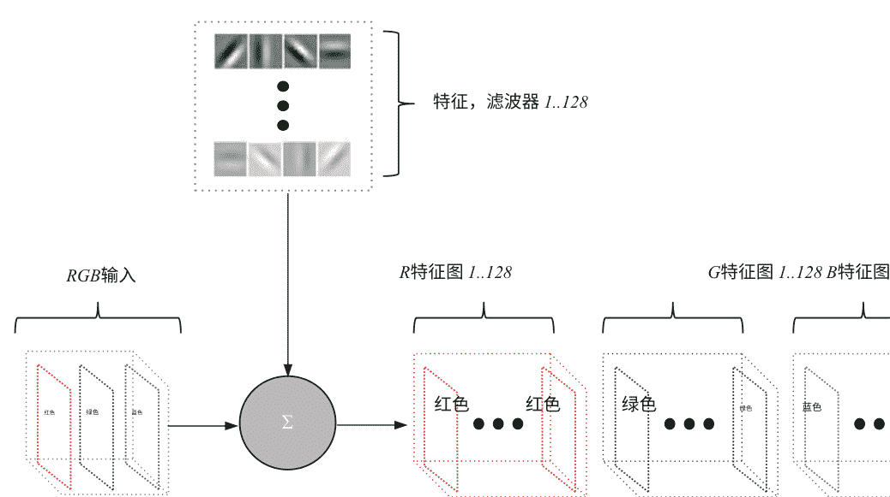

如果卷积层包含128个滤波器（特征），则该层的输出是一个由128个特征图组成的体积或堆叠，每个RGB颜色通道有三个图像。因此，对于包含三个通道的RGB输入，输出是$3 \times 128$个特征图。

请注意，卷积只是DNN中建模神经元的一种方式。在本章中，我们调查了一系列的模型。例如，在Li [636]的NiN模型中，将卷积作为广义线性模型替换为MLP模型，在每个神经元内作为完全连接的微型分类器，以达到与卷积相当或更好的结果。在稍后调查的PNN模型中，使用多项式来建模神经元。此外，在稍后调查的HMAX模型[812]中，演示了使用基础特征代替卷积来建模神经元。在Visual Genomes模型[534]中，使用原始内存印象来建模神经元，请参见附录E。

CNNs被用于许多应用，包括（1）对象类别的分类，（2）在类别中识别特定对象，例如已知人脸的具体面部，（3）定位对象以找到坐标，（4）将像素区域分割为水、草地或道路等类别，以及（5）一般回归分析。我们将在本章中调查用于这些任务的架构和设计考虑因素。

许多CNNs今天使用的基础架构LeNet-5由LeCun [682]描述，并在本节后面进行了调查。LeCun指出[655]，Convnets是一种基本类型的多阶段Hubel和Wiesel模型，使用卷积滤波器组作为简单细胞，池化层作为复杂细胞的设计模式。

Convnet是一种前馈网络，数据从输入经过处理到输出分类。然而，特征学习的训练阶段是反向操作的，计算预期结果与计算结果之间的误差，并将误差分布回其源头，以纠正滤波器权重（特征），这种方法被称为反向传播，在稍后详细讨论。

当前一代的卷积神经网络都是基于对方形标量数据进行离散卷积的，$n \times n$卷积核，未来的研究指向将数据映射到其他基础空间，例如傅里叶空间[680]，从而允许将其他维度映射到卷积神经网络框架中。

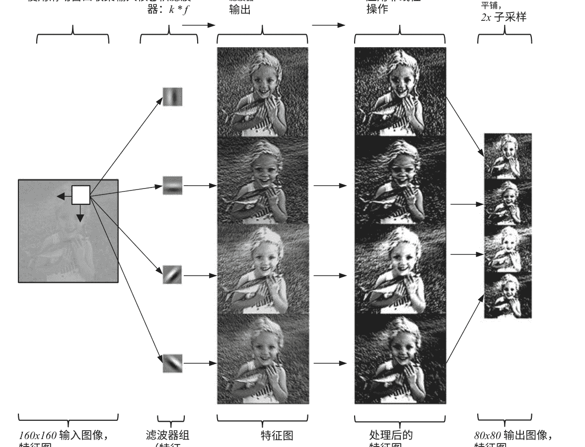

### 图10.12 该图示例了卷积层中发生的基本操作。请注意，输出图像的分辨率降低了（我们假设在此示例中所有图像周围使用了1像素的填充，因此没有边界像素的分辨率丢失到卷积窗口边界效应），基于3×3核（3×3区域！1像素）和最终的池化和子采样层（2×2区域！1像素）的减少

## 通过CNN的前向和后向传递

接下来，我们描述了CNN在两个方向上的基本操作，作为调查实践中使用的各种CNN变体的起点。

### 前向传递概述（特征检测传递，训练传递稍后介绍）：

- 每次只有一个训练样本被向前传递到网络中，计算样本与最接近的目标特征之间的误差。
- 输入数据（对于第一层是像素，对于后续层是特征图）被前向传递到卷积层中，以局部像素组的形式，例如从图像上的滑动窗口中取3 × 3个像素。
- 可以对输入数据进行一些数值调整，例如对数据进行零均值归一化，以使数据适应零均值激活函数。
- 相关性/卷积：然后将数据与一个 n × m 滤波器（即权重）进行卷积，以计算滤波器的相关性或结果值。
- 存储的结果保存在输出特征图（即滤波后的图像）中，同时通过当前卷积结果 f′ 和之前的结果 f″ 之间的差异来存储导数。为每个训练样本的每个特征计算并存储导数。最初，每个存储的特征权重矩阵可能与最接近的训练样本有很大的差异，直到通过反向传播调整来减小差异。
- 通常对滤波结果使用某种激活函数进行后处理，例如零中心的 sigmoid 函数，从而引入非线性到结果中。非线性的一个目标是将纯线性的卷积操作投影到非线性解空间中，据信可以改善结果。此外，非线性可能导致在反向传播训练过程中更快地收敛，将梯度迅速移出平坦区域并朝向局部最小值。此外，非线性用于确保值在反向传播中是可微分的。
- 池化和子采样通常应用于池化层的输出特征图中，其中局部区域被合并为一个单一的值，例如 2 × 2 个区域，通过对值进行平均或选择最大值。结果是一个较小的输出图像或特征图，参见图9.19。
- 在CNN的末尾，全连接层通过执行1D向量卷积来减少和分类特征，参见图9.5。FC分类器的最后一层产生输入数据的最佳猜测标签或识别。
- 输出分类猜测被测量为一个误差项（期望值与计算结果之间的差异），用于反向传播调整，下面将讨论。

### 反向传播概述（权重调整或学习）：

- 在前向传播过程中，在分类器输出处计算的总误差项是反向传播的基础。有关详细信息，请参阅下面的反向传播部分。输出值是一个分类结果，它具有一个误差项（计算结果与期望结果之间的差异）。在分类器输出处的总误差项是所有先前卷积层的错误的组合，包括特征权重的贡献，池化和归一化等处理步骤以及学习参数。
- 反向传播通过每个特征层向后追踪错误，找到贡献权重的源头，并将错误项分解为越来越小的部分（偏导数或梯度），每次调整一个特征权重，以减小错误。反向传播将在后面的“反向传播，特征学习，特征调整”部分详细讨论，还可参见图10.22和10.23。
- 每个特征权重通过将梯度与存储在每个神经元中的导数误差 f′ – f″ 进行比例缩放来独立调整。导数对应于当前权重和先前权重之间的响应变化，有助于通过梯度对每个权重进行调整，参见图10.23。

## 全连接（FC）层，展平，降维，重塑

前馈网络通常利用特殊的网络连接安排来实现特定目标，例如（1）将特征权重完全连接到一维向量以进行线性分类，以及（2）将大型全连接层减小为较小的层以减少参数数量，参见图10.13。在本调查中的某些体系结构中，层之间的连接可能被设计为重塑、分割或在一维和二维形状之间转换。全连接网络有时被称为感知器（P），将多个感知器串联在一起称为多层感知器（MLP）。FC层可以被视为神经元的数组，并通过反向传播进行训练。

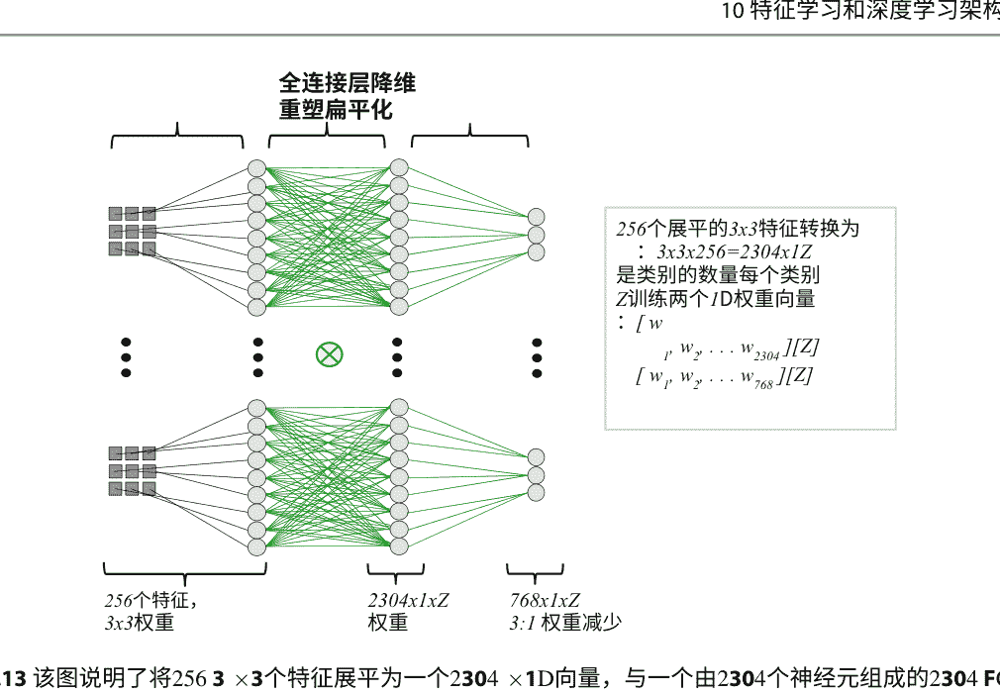

图10.13该图说明了将256 3×3个特征展平为一个2304×1D向量，与一个由2304个神经元组成的2304 FC层完全连接，最后以3:1的比例减少为一个由768个神经元组成的FN神经元层

在深度神经网络中，全连接层充当着过滤层和分类器之间的桥梁。全连接模型在卷积神经网络架构中可以无缝训练，因为使用了相同的卷积神经权重模型。由于全连接层在高参数数量下容易过拟合，因此在训练过程中采用了各种缓解策略来减少和规范化参数，例如随机丢弃数据（参见dropout，第9章）。

第一个全连接层通常包含整个系统中最多的参数数量，具体来说是最多的连接和权重。后续的全连接层通常会出于实际原因而减小尺寸。例如，图10.13中的2304个元素的全连接层必须对每个全连接神经元的2304个连接进行1×1卷积计算（2304×2304=5,308,416个MADD指令+某种激活函数）。此外，每个全连接层都维护着一组1D权重向量和偏置向量，每个类别都有一个，通过反向传播进行训练。例如，对于一个宽度为2304的全连接层，FC特征向量可能是一个[5308416][类别数量]的1D特征权重向量和偏置向量的数组，而与之相比，一个仅有[256][3×3]特征权重和每个特征一个偏置的卷积连接层。卷积连接层保留了感受野中的局部空间关系，而全连接分类层中的1D向量则不一定保留这种关系。

FC层是DNN中的典型构建模块，通常用于最后几层进行分类。后续将调查使用或忽略FC层的替代方法，包括在Half-CNN中使用纯卷积滤波器层和在网络中具有多个FC分类器的Inception架构。FC网络可以根据预期的用途以几种不同的方式描述:

- 作为简单的感知器P，或者当多个FC堆叠时作为MLP
- 作为降维层，将输入特征减少到所需的输出类别数量，类似于最终的池化层
- 作为归一化层，用于输入到softmax分类器
- 作为线性回归网络覆盖FC输入
- 作为二元分类的逻辑回归网络
- 作为通用的函数逼近器

全连接层是一个通用的函数逼近器，能够实现线性分类器，或者用于二元分类的逻辑回归函数，也可以使用汉明距离进行匹配。通过对FC层中每个神经元的每个输入进行加权，输入和权重的组合形成了一个线性分类器。通常，堆叠在一起的一个或两个FC层就足以逼近所需的函数。甚至单层或浅层的FC网络已被证明能够以任意精度逼近任何函数，如Hornik等人[890]所示。最终的FC层向量长度通常会在降维层中减少，以提供应用程序所需的正确数量的类别输出。FC层对于每个标签或类别使用一个1D权重向量，因此需要一个由1024个1D权重向量组成的数组来对1024个对象进行分类，并且必须对每个权重向量进行训练和评估以找到最佳匹配。有时，在训练后会用SVM或其他分类器替换FC层以提高准确性。

稀疏高斯连接层，而不是全连接层，也被用来减少连接数量，还有其他稀疏拓扑结构是可能的。程等人提出的圆形矩阵投影连接拓扑结构[695]，以及第9章中讨论的其他方法。例如，Nin [546] 架构中引入的全局平均池化（GAP）层已被用来替换全连接层并大大减少参数数量。

当作者在1999年使用傅里叶频谱特征在个人电脑上实现他的第一个全连接神经网络来识别音频吉他和弦时，很难相信这个简单的全连接神经模型只是炒作，因为从编程的角度来看，它似乎如此简单，但它确实起作用。

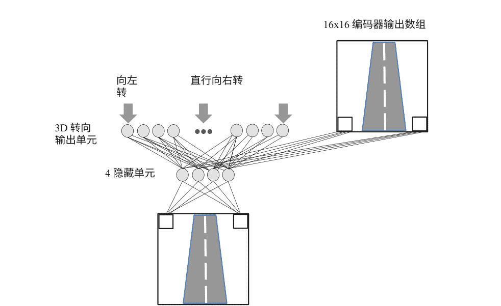

全连接模型提供了一个思考分类的框架，迫使系统围绕特征向量进行设计以支持全连接层。一小组全连接层可以将输入规范化到正确的维度并标记结果，例如减少较大数量的输入。

将特征转化为所需类别数量的分类向量。可以设计一个全连接层来过滤输入，类似于dropout，通过将1D向量设置为包含对感兴趣的像素输入的零值掩码权重，以及包含对感兴趣的像素输入的非零值。对于归一化和其他处理，全连接层的权重可以设置为激活（i >0）某些输入，抑制（i <0）某些输入，以及忽略（i =0）某些输入。对于二元分类和逻辑回归，权重值为1和0可能足够。

例如，完全连接的网状拓扑结构可以用于将图像中的每个像素连接在一起，用于分割应用（连接数量巨大！）。为了说明完全连接网格的能力，图10.15提供了一些由Andrej Karpathy使用Caffe开源神经网络库创建的特征权重可视化。FC网格是使用Imagenet数据进行训练的，以创建非常原始的特征。该架构只是一个连接图像中所有像素的单个FC网格连接，仅用于可视化和研究线性分类器失效模式，并且不打算具有竞争力或准确性，因为据报道，该架构的准确率最多为3%。训练协议涉及将1.2百万Imagenet图像训练集中的每个图像调整大小为64 ×64像素，以减少训练时间，然后使用反向传播进行训练。每个图像中的所有输入像素都完全连接到一个大小为64 ×64 =4096的线性分类器。生成的特征被可视化为类似斑点的颜色特征，显示了每个类别的训练集图像中的主导颜色分布，每个类别有1000个图像。

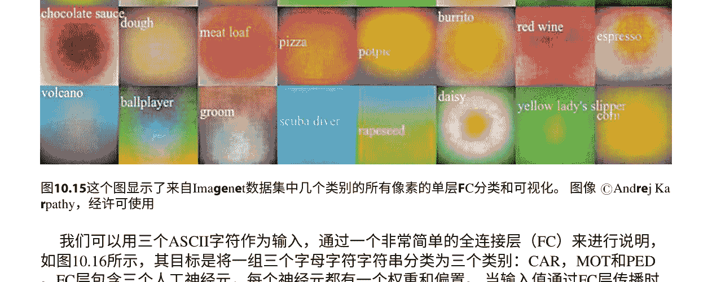

我们可以用三个ASCII字符作为输入，通过一个非常简单的全连接层（FC）来进行说明，如图10.16所示，其目标是将一组三个字母字符字符串分类为三个类别：CAR，MOT和PED。FC层包含三个人工神经元，每个神经元都有一个权重和偏置。当输入值通过FC层传播时，每个输入字母都会乘以相应的权重因子并在神经元中求和，权重的设计使得匹配的和为3（基于ASCII字符值）。在这个简单的例子中，偏置是一个缩放因子，而不是

> i 请参阅http://karpathy.github.io/2015/03/30/breaking-Convnets/以获取训练参数和目标。

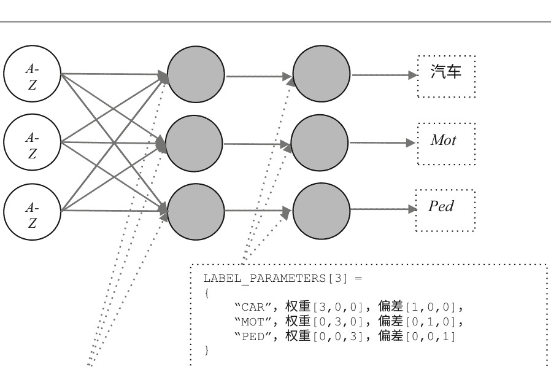

```
LABEL_PARAMETERS[3] =
{
    "CAR", 权重[3,0,0], 偏差[1,0,0],
    "MOT", 权重[0,3,0], 偏差[0,1,0],
    "PED", 权重[0,0,3], 偏差[0,0,1]
}
```

```
COMBINATORIAL_PARAMETERS[3] =
{
    "CAR", 权重[1/‘C’, ‘1/A’, 1/‘R’], 偏差[1,1,1],
    "MOT", 权重[1/‘M’, 1/‘O’, 1/‘T’], 偏差[1,1,1],
    "PED", 权重[1/‘P’, 1/‘E’, 1/‘D’], 偏差[1,1,1]
}
```

图10.16 这个图示了一个用于分类三个字母字符字符串的简单FC网络。注意：在这个例子中，我们将偏差作为卷积结果的乘法缩放因子，而不是加法偏差。通常，CNN忽略偏差并将其设置为1

加性偏差。FC输出直接传递给最终的单连接分类器层，当所有三个字符与预期值匹配时，每个类的正确匹配将产生一个值为3的结果。对于这个简单的例子，不需要非线性激活函数，因为我们正在寻找线性分类。

## 层和深度

CNN架构通常逐层描述。为简单起见，我们区分以下主要层次：

- 1. 输入层
- 2. 卷积特征层（在DNN术语中为隐藏层）
- 3. 卷积分类层（在DNN术语中为隐藏层）
- 4. 输出层

注意我们将卷积层分类为一个聚合层，包含多个操作，如数值调整、卷积、激活函数和池化。我们不为所有各种操作单独列出不同的层次，因为可能性太多。请参见图10.19和第9章的分类。

卷积神经网络的一个关键概念是在架构中使用复制的卷积层。如图10.17所示，使用了几种基本类型的层。输入层是最简单的，由像素组成，用于2D成像应用，输入到卷积层中。卷积层的输出包括：（1）特征或权重核作为 n × n 权重卷积核，（2）经过滤波的图像（每个特征一个图像），在CNN中称为特征图，这些特征图作为输入传递给下一层的卷积层。

### 图10.17 该图显示了卷积神经网络的分层架构。请注意，该网络有五个层，三个卷积滤波层和两个卷积分层

通常情况下，卷积层会进行复制，或者在每一层稍作修改。例如，卷积层可以选择包括对输入数据进行数值调整，卷积滤波，然后对卷积结果进行非线性变换，池化和子采样，以及对数据进行局部区域后处理。参见图10.18和表10.2。

### 图10.18 该图显示了卷积层的基本组件，详见表10.2

### 表10.2 典型卷积神经网络组件的摘要描述

| 卷积层组件 | 描述和原理 |
|------------|------------|
| 输入       | 像素图像用于输入层，处理后的图像用于后续层 |
| 预处理     | 数值调整，丢弃 |
| 滤波器组，特征，权重 | 相关性，基于过完备基的投影，维度扩展 |
| 非线性，激活 | 侧抑制，稀疏化，压缩，扩展 |
| 池化和子采样 | 在平铺上进行子采样，平移不变性 |
| 后处理     | 数值调整，丢弃 |
| 输出       | 要馈送到下一个卷积层的特征图或图像 |

在CNN中，分类层也可以使用统计方法（如SVM）来实现，而不是使用卷积层（如上面讨论的FC层）。FC分类层类似于池化层，但用于正则化。分类器层将特征层中的2D权重卷积核展平为1D向量，以支持（1）建模和调整1D线性分类器，以及（2）通过反向传播进行训练。

整个网络的深度是一个架构变量，通常在试验和错误后确定最终深度。在图10.17中，我们可以看到一个总共有五个卷积层的网络：三个滤波卷积层和两个用于分类的1D卷积层。实际上，根据本章后面的架构调查和表10.3，可以使用多达20个或更多的卷积层。

一些从业者已经证明，特征层次的深度比特征和分类器更重要，包括Coates、Lee和Ng [603]，Simonyan等人[656]，Ren Wu（2014年10月嵌入式视觉峰会上的评论）以及Szegedy在Inception架构中[547, 608]。使用更多和更深的特征是一种直观的优势。

卷积神经网络已经使用分步窗口方法从输入图像的间隔瓦片中收集像素，以实现更快的计算，或者引入子采样来对输入进行条件处理，或者引入平移不变性。然而，最近的卷积神经网络将步幅设置为1，以便在每个可能的窗口上收集输入，并且通常能够获得更好的结果。

#### 建模人工神经元

如图10.19所示，人工神经元使用一系列操作进行建模。我们将在本节中讨论优化管道的方法，例如参考Mamalet等人[664]。下面是典型卷积神经元模型中的组件讨论。

##### 图10.19 这个图展示了常见的可以以不同方式组合来模拟卷积特征层中的人工神经元的元素

#### 卷积特征，滤波器

卷积特征层将神经功能表示为卷积或通过相关进行模板匹配，特征是权重矩阵，通过各种训练协议和反向传播方法对训练集进行调整。在从业者中术语有一些变化，并且意图上有微妙的差别，我们在本节中进行介绍。对于2D图像，权重被建模为2D卷积核数组或权重。对于完全连接的分类层（本章也讨论），权重被展平为1D向量以供1D神经元数组使用。每个人工神经元的主要操作是输入和权重的卷积。在CNN讨论中，术语卷积的使用非常不准确，所指的是输入向量 I 和权重向量 W 的点积:

I·W = ∑_{i=0}^{n} I_i W_i = I_0 W_0 + I_1 W_1 + ... + I_n W_n

实际上，卷积的数学定义假设其中一个输入向量在进行点积之前已经被反转和移位（即，滤波器已经水平和垂直翻转）；然而，相关性则是直接使用原始数据。在典型的图像处理软件中，通常会对卷积结果应用一个缩放因子 s，并可能添加一个偏置 b:

卷积 (I, W) = s (∑_{i=0}^{n} I_i W_i) + b

在某些设置假设下，卷积和相关性在数学上是等价的。模板匹配是另一个常用于描述相关性的术语。此外，在卷积神经网络（CNN）的讨论中，过滤是一个通常用于卷积的术语，因为点积的结果可以被解释为一个滤波器。有关卷积和相关性的更多细节，请参阅本章后面的卷积与相关性部分。

除了更复杂的神经模型管道用于2D特征过滤层之外，FC层包含一个更简单的神经元管道，通常只包括卷积和激活函数用于1D特征向量，请参见关于FC层的讨论。对于特征层，每个层级都保留一组独特的滤波器，并且每层的特征数量通常限制在几百个特征。卷积滤波器是对称的矩形滤波器，例如3×3，7×7，11×11。在更高的抽象层中保留了一系列特征概念，包括低层的边缘和纹理滤波器以及更高层的更高级概念，例如图案、物体部分、完整物体和场景。每个滤波器都像任何其他空间滤波器一样针对输入特征图进行运行，通常作为一个滑动窗口在图像的每个像素或步进上，产生一个新的特征图。因此，Convnet滤波器具有双重用途: (1) 滤波器是特征（相关模板），(2) 滤波器实际上是滤波器。对于FC层，保留一组1D向量，每个输出类别一个向量，例如如果输出类别是 dog, cat 和 bird，FC层将为每个类别保留一个单独的1D向量进行训练。

##### 图10.20 这个图展示了由点积滤波器组成的基本卷积人工神经元模型后面跟着一个激活函数或传递函数，以提供响应的非线性性

如图10.20所示，卷积（即点积）通常后跟一个激活函数或转移函数，以为响应提供非线性，在下一节中讨论。非线性确保值在使用梯度下降和类似方法进行反向传播时是可微分的，以调整特征权重，如在反向传播部分中讨论。

##### 图10.21 这个图展示了卷积滤波器的响应，(左) 输入图像，(中) 应用两个滤波器的结果滤波器响应强度高亮显示，滤波器#66和#118，以及(右) 滤波器响应的示例，右上方显示对滤波器#66响应的V形特征，右下方显示对滤波器#118响应的角落特征 图像 ©Springer，来自He等人[542]，经许可使用

#### 转移函数（激活函数）

激活函数可以是线性的，例如简单的阈值或斜坡函数，也可以是非线性的，例如S型函数，在第9章的激活函数讨论中可以看到，也可以参考图9.18。在CNN中，卷积结果被发送到激活函数以执行非线性阈值机制。

非线性的一个目标是将纯线性卷积操作投影到非线性解空间中，据信可以改善结果。此外，非线性可能导致在反向传播训练过程中更快地收敛，以从平坦区域移动到局部最小值。

此外，非线性用于确保值在反向传播时可微分。激活函数可以提供一个阈值偏差；然而，在大多数CNN模型中很少使用，除了在矩阵运算中为了数学方便而设置为1，参见图4.23。非线性被认为有助于解决数据饱和的问题，可能是由于数值溢出或光照不良或光照强烈引起的。例如，如果相关输出在0-255范围内为255，一个设计良好的非线性函数将在范围内重新分配极限值255，比如分配到180，以克服饱和并避免极限。激活函数产生的非线性分布受到应用于输入数据的任何数值调节函数的影响，例如归一化或白化，也称为局部响应归一化或LRN。一些研究人员报告称，局部响应归一化效果不够好，无法证明增加计算时间的必要性。

LeCun²表示，激活函数的一个基本目标是以非线性方式将数据分解并投影到其他空间，因为每个空间可能提供更好的特征表示和匹配方式。缩放和图像金字塔不符合分解和投影的标准。非线性投影可以使用偏差因子进行，可以通过缩放或加法方式实现。偏差也可以用作掩码，影响哪些特征是重要的。

#### 特征权重和初始化

特征权重矩阵通常是计算机视觉应用中的特征，通常是2D矩阵或卷积核。网络的每一层都包含一组特征权重，每一层可能有不同数量的特征。通常，特征权重使用浮点数值，并且特征的大小范围从3 ×3到可能是29 ×29或更大，正如我们在本章的真实CNN调查中所指出的。

特征权重初始化的方法决定了特征学习的最终结果。例如，从有偏的特征权重开始会导致有偏的特征学习。随机权重初始化已经在许多系统中使用。特征权重初始化非常关键，因为初始值决定了权重调整的方向。迁移学习是一种使用预训练特征作为起点的方法。逐层预训练是另一种方法，从底层开始，逐层训练特征，直到它们似乎收敛。更多信息，请参阅第9章关于特征初始化的讨论。

#### 局部感受野

如图10.26所示，每个卷积神经元都从输入图像或特征图的小窗口中接收到一个局部感受野。局部感受野的概念受到神经生物学研究的影响。在神经生物学中观察到了神经元在每一层处理的局部区域之间的局部竞争[657, 658]，并且有猜测认为神经元的激活函数包括类似于空间相邻像素之间的局部直方图均衡化的非线性。这种竞争常常在人工神经模型中实现以模拟竞争。此外，竞争可以通过输入端的局部感受野重叠或输出端的池化来模拟。

输入被建模为视野的感受野、中央凹区域或注意力区域。这个注意力区域可以根据指示在图像上移动，例如扫描整个图像或定向凝视某个位置，或者使用扫视运动以获得更高的分辨率。卷积神经网络实现了局部感受野的神经学概念，通过在二维图像上滑动窗口来模拟人类视觉系统中的局部感受野。卷积窗口可以重叠。

在CVPR 2013期间向英特尔进行的私人演示。

根据步幅因子为1或更多，邻接窗口可以使用非重叠的平铺窗口，尽管卷积神经网络可能使用非重叠的平铺窗口。

请注意，局部感受野通常被处理和存储为独立的、空间上不相连的、无序的，与其他窗口或特征没有关联。卷积神经网络只是学习和记录特征，分类器根据特征的强度、存在和缺失进行判别。Rosenfeld [625]提供了一些关于在场景标记应用中保持空间关系的早期工作。

#### 通过输入步幅或输出池化进行感受野压缩

通过(1)对输入窗口进行步幅操作，或者(2)对输出窗口进行池化操作，可以在每个神经元上等效地实现子采样或压缩。为了对局部特征变形具有一定的不变性，卷积神经网络可以使用步幅输入窗口来降低输入分辨率，或者使用池化输出窗口来降低输出分辨率。通过对滤波器进行步幅操作，可以有效地对输入窗口进行下采样，例如以2个像素的步幅在图像上滑动滤波器窗口。池化输出窗口包括将滤波器结果分组在小的局部区域中，例如2 ×2区域，并选择局部区域中的最大值或平均值，并将此池化值作为池化区域的滤波器结果，从而在输出处进行下采样或降低分辨率。然而，Schmidhuber [552]指出，Creseptron [616]添加了模糊层以增加平移不变性的度量，从而产生了与池化类似的结果。

#### 可训练偏差

每个特征可能具有可训练的偏差，在卷积操作的结果之前，作为比例因子或加性偏差应用于非线性和后续处理。
偏差因子受生物启发，尽管没有人真正知道它们是如何运作的，或者生物神经元可能具有多少个偏差因子。

#### 当前神经元状态的记忆

为了反向传播和学习，每个卷积层在本地内存中维护几个状态变量，例如神经元激活函数后的当前输出和先前输出，以及神经状态的导数（当前输出 –previous output）。

请参阅下一节关于反向传播的内容。

#### 反向传播，特征学习，特征调整

CNN中的特征学习发生在反向传播过程中，通过逐层将分类错误分布到网络中，调整特征权重以最小化错误。

> 我们在这里只提供了对反向传播基础知识的简要介绍，因为这是一个活跃研究领域，适合单独一本书来讲解。可能需要几个月的时间来掌握这些概念并获得实践经验。

关于反向传播的介绍和方法调研，请参考Hagan [668]，其他好的讨论可以在Werberos [581]中找到。请参阅Rojas [787]，以获得易读的逐步解释。
关于反向传播的历史、关键创新的详细信息和参考资料，请参阅Schmidhuber [552]。早期建立使用梯度下降法的反向传播算法的一些工作是由Plaut等人在1986年开发的[855]，这仍然是许多方法的基础。也许了解反向传播的真正工作原理的最佳方法是使用开源代码包和深度神经网络软件库，如Caffe，其中一些列在附录C资源中。

反向传播是多方向的并且通过许多单独的梯度下降路径回溯网络，通过所有贡献的特征权重。使用（1）数值方法如牛顿迭代法来找到梯度，这种方法更简单易实现，提供接近的近似值，但收敛速度较慢，以及（2）闭式解析方法，可以更准确、计算速度更快，但通常更难参数化。在实践中，数值方法和解析方法可以同时使用作为并行基准来相互核对。

反向传播算法需要解决一些基本问题，包括：

- 调整反向传播学习参数
- 设置收敛准则和停止准则
- 选择误差最小化算法
- 避免过拟合
- 减少训练时间
- 将误差项修正反馈到权重中

反向传播的基本事件顺序包括以下内容：

1. 前向传递通过网络
   (a) 计算每个神经元对每个特征的响应 $f()$以进行前馈传递
   (b) 在每个神经元上存储响应导数 $f'()$ 以便进行反向传播
   (c) 计算分类得分和错误
2. 通过网络进行反向传播
   (a) 将错误向后传递给每个贡献神经元
   (b) 使用错误和存储的响应导数调整权重
   (c) 计算当前层的残差，向后传播，重复
3. 继续直到达到停止条件（阈值、迭代次数、经过的时间）

理想情况下，希望具有凸数据，以便在梯度下降和其他反向传播方法中使用，因此可以使用输入数据调整来减少噪音、减少异常值，并希望消除虚假的吸引盆地。使用梯度下降的反向传播方法依赖于神经元的传递函数，以提供非线性性质，以确保其输出响应在反向传播时是可微分的。此外，非线性性质可能导致在反向传播训练过程中更快地收敛，将梯度迅速移出平坦区域，朝向局部最小值。

使用了几种反向传播方法（参见Schmidhuber [552, 584]）：

- 梯度下降变种-使用了微积分中的链式法则
- 共轭梯度-用于加速计算梯度
- Levenberg-Marquardt-一种用于模式匹配的阻尼最小二乘法
- 级联相关-添加新特征而不是训练旧特征
- Rprop算法-使用偏导数误差进行优化的方法
- LSTM-优化梯度引入的门控机制
- Quickprop算法-迭代损失函数，遵循牛顿法
- SuperSAB算法-用于更快收敛的自适应反向传播

接下来，我们将概念上描述使用梯度下降的反向传播，以便开发一些直觉；然而，实际算法请参考上述引用，因为这里没有必要重复引用中的算法。下面讨论的概念不遵循特定的反向传播算法，仅用于说明目的。

##### 图10.22 一个过于简化的示例，说明最终的分类错误和权重调整。脸部特征得分为.6，与获胜的猫得分.8（分类错误）相比太低。调整脸部特征权重上升，但将猫和其他特征权重下降

如图10.22和10.23所示，我们有四个类别需要分类：人脸、猫、飞机和鸟。类别得分是训练特征与输入的加权和。在我们的例子中，一个人脸图像候选被提供给一个假设的CNN，结果人脸得分为0.6，小于猫得分0.8，因此存在分类错误。对于每个图像候选\(x\)，实际输出得分\(o\)对每个目标类别得分\(t\)进行测量。例如，我们期望匹配接近1.0，不匹配接近0。总误差\(E\)是所有类别的实际得分和目标得分之间差异的总和。例如，可以使用SSD来求总误差\(E\)的和：

\[E = \frac{1}{2} \sum_{i} [o_i - t_i]^2\]

总网络误差项\(E\)被分解并按比例分配给所有贡献特征权重，这个过程称为反向传播。每个梯度部分都以有符号梯度的形式通过网络向后传递，通过每个贡献神经元向后传递，以允许权重调整得更高或更低。例如，从图10.23中，我们可以将类梯度可视化为每个特征类的有符号值，如下所示：

\[\nabla_{\text{人脸}} \propto +(1.0 - .6) \propto +\left( \frac{\delta E}{\delta_{\text{人脸}}} \right)\]
\[\nabla_{\text{猫}} \propto -(0 + .8) \propto -\left( \frac{\delta E}{\delta_{\text{猫}}} \right)\]

在反向传播过程中，类别误差梯度向后传递到其贡献的神经输入，然后按比例缩放以反映每个神经元的误差贡献。以下是遵循反向传递的关键要点：

1. 确定每个神经元输出的导数变化（前向传递）
2. 确定每个神经元输出的错误贡献（反向传递）
3. 按比例缩放并分配错误给贡献神经元（反向传递）
4. 调整该神经元的权重（反向传递）

##### 图10.23 网络输出 $N$ 是所有神经元响应的功能组合，由一组特征权重组成，候选图像根据这些权重进行分类。为了找到分类错误的源头，使用微积分中的链式法则对整个网络 $N$ 进行功能分解，找到每个神经元输出相对于每个输入 $x$ 的导数函数贡献 $N'$:

\[N'_{1...n}(x) = \Pi_{k=0}^{n} N'_{k} (N_{(k+1...n)}(x))\]

权重调整与每个神经元响应的导数成比例进行。换句话说，在网络上最后一次前向传递期间对权重所做的任何更改都会对当前的误差项 $E$ 有所贡献，因此每个神经元的导数响应 $N'$ 被用作权重调整的基准增量。如图10.24所示，在前向传递期间，每个神经元的偏导数被存储以便在反向传播期间使用。卷积神经网络的响应是输入与权重的点积，然后经过激活函数处理。

##### 图10.24 反向传播梯度示意图

图10.24说明了反向传播梯度 E 如何输入神经元 N 并按比例缩放为 E_Z，然后计算神经元 N 输入的比例梯度贡献，以进行反向传播到贡献神经元 N_1 和 N_Z，并计算反向传播梯度为 E_1 和 E_Z。理解梯度反向传播的关键之一是将梯度的比例缩放视为作为传入值进行反向传播的过程。我们将通过下面的一个简单示例来说明这个概念，并展示权重如何更新。

首先，在前向传播过程中，存储每个神经元响应 N 的导数 N'。我们可以将 N' 可视化为 (N 之前 - N 当前)，即当前响应和之前响应之间的差异。同样，偏导数 κ1 和 κ2 是对神经元输入 x1 和 x2 的偏导数贡献，并存储以供反向传播使用。

N' ∝ (N当前 - N之前)

κ1 = ∂N/∂x1

κ2 = ∂N/∂x2

我们将展示如何使用 s1 和 s2 以及 N' 来缩放传入的梯度贡献并计算下一个反向传播的梯度贡献。

直观地说，存储的导数 N' 和 κ1 和 κ2 表示与当前响应相比，从上一轮权重变化到神经元的网络响应的变化，为相对于上一次权重变化的权重调整提供基础。通常，前一百个或更多的权重调整较大，希望能更快地收敛到局部最小值，随后随着偏导数变得越来越小，权重调整也变得越来越小，收敛可能会变慢。梯度消失问题在深层网络中尤为严重，因为梯度误差变得非常小。

为了确定相对于响应导数 N' 的神经元的梯度误差贡献 E_N，将反向传播的梯度误差 E_Z 相对于神经元的响应导数 N' 进行导数运算：

E_N = (∂E_Z/∂N')

请注意，前馈步骤计算每个权重 w 对每个输入 x 的响应为 wx，并且由于 w 是 wx 的导数，因此权重 w 是输入函数的导数，因此用于正向和反向方向以比例调整输入 x 和反向传播的梯度误差项 E_N。

神经元 E_N 的误差贡献与每个权重相结合，以缩放权重以补偿神经元 N 的梯度误差 E_N：

Δw1 = (∂E_N/∂w1)

Δw2 = (∂E_N/∂w2)存储的输入偏导数 $s_1$ 和 $s_2$ 与当前神经元 $N'$ 的梯度贡献相结合，向后传播到每个输入 $x_1$ 和 $x_2$ 的贡献神经元，产生梯度误差项 $E_1$ 和 $E_2$，并馈送到输入神经元 $N_1$ 和 $N_2$：

$$ N_1 \leftarrow E_1 = \left( \frac{\delta N'}{\delta s_1} \right) $$

$$ N_2 \leftarrow E_2 = \left( \frac{\delta N'}{\delta s_2} \right) $$

从概念上讲，一种简单的调整每个权重的方法是根据累积误差进行比例调整，换句话说，使用 $E$ 相对于每个权重的偏导数：

$$ \Delta w_i = -\beta \frac{\delta E_N}{\delta w_i} \quad 对于 \quad i=1, \dots, n $$

其中 $\beta$ 是一个学习常数，用于缩放权重更新以限制振荡。

然而，在实践中有许多方法用于按比例分配和组合每个权重的误差项。通常，为了进行权重调整，会定义一个权重调整函数，其中包含各种学习参数。通常，使用学习速率参数 $\beta$ 来缩小梯度值，以防止由于噪声和数值伪影而产生过多的振荡。此外，可以设计一个动量函数，使用最近的错误活动的历史缓冲区来控制权重调整，作为历史缓冲区上的一维卷积函数，以平滑错误曲线的轨迹，以减少噪声、过冲和欠冲。

请注意，在典型的卷积神经网络中，特征权重的贡献是交织在一起的，因为一个低层特征权重可能对多个高层特征有贡献。这使得反向传播在解析上非常困难，并且通常在计算上非常耗时，因为权重调整可能在训练过程中在各个类别和训练样本上交替变好和变差。反向传播类似于一个繁琐的平均过程，导致特征在所有训练样本上都被泛化调整，但对任何特定样本并不具体调整。如果权重在每次前向传播时立即调整，梯度下降可能不会直接走向局部梯度最大值，并且可能会明显振荡并阻止收敛，或者在最好的情况下，振荡可能有助于避免浅层局部最小值。如果权重按批次更新训练图像，则需要在卷积神经网络中添加额外的存储来保存所有中间值。除了关于权重调整的振荡和虚假局部最小值的不确定性之外，误差项在传播到每个较低层时会缩小并消失。Hochreiter 等人 [721] 确定并量化了梯度消失问题。当梯度过小时，进一步训练是无用的。请参阅“神经网络技巧” [654]，特别是关于随机梯度下降技巧的章节。反向传播甚至在最快的计算机上也可能需要数天甚至数周的时间。事实上，如果学习参数设置不正确，反向传播根本无法工作，尤其是对于深度网络，训练的困难在机器学习社区中是众所周知的。LaRochelle [694] 将特征空间中的局部最小值收敛和吸引盆地命名为两个主要挑战。众所周知，梯度下降在达到最低最小值之前可能会陷入某些局部最小值，并且随机权重初始化对此现象起到了贡献。事实上，每一层都有一组不同的局部最小值，因此对于更深的网络来说，达到所有最低最小值变得越来越困难。事实上，权重初始化值通常决定了吸引盆地可能位于何处。

Zeiler等人[641, 642]开发了可视化卷积特征权重的方法，以帮助设计更好的反向传播方法，因为将权重矩阵视为图像可以更好地调整特征，参见图9.2。Zeiler发现，如果可视化的特征看起来大致相同或模糊不清，可能是学习参数设置错误，而如果可视化的特征看起来不同且清晰，可能是学习参数设置更好。

反向传播学习并不受神经生物学的启发，事实上，离开神经元的树突通常是单向激发机制，向前馈送到视觉通路中。神经生物学并不验证反向传播学习所使用的神经模型。事实上，人类学习比反向传播学习要快得多。更有可能的是，视觉通路的基于视图的模型更加真实，通过添加对象的新视图以及相应的特征层次结构来构建更好的模型，参见Tarr [814]和本章后面关于HMAX的讨论，以及附录F关于视觉基因组的内容[534]。没有神经生物学机制或连接路径支持反向传播学习。请注意，实际的物理神经元使用二进制阶跃函数进行激活，并通过树突连接进行全有或全无的激发，而CNN和相关的ANN模型通过激活函数进行激发，产生一定的激发范围或强度。

#### 反向传播的替代方法

需要注意的是，反向传播是一个模糊的操作，因为并不完全清楚是否应该无差别地调整所有特征权重朝着梯度的方向，就像反向传播和梯度下降方法通常操作一样，忽略了关于个别特征权重平衡和权重独立性的更复杂和困难的问题。每个特征中的个别权重可以更独立地进行调整，向上、向下或成比例调整。这是一个复杂的问题。需要注意的是，我们稍后会调查其他学习方法，包括NAP架构，该架构在学习过程中结合了空间关系，并使用Hebbian学习原理单独调整每个权重。此外，dasNet架构使用新颖的注意力学习和增强方法，逐个调整弱特征和错误分类的特征。有关学习方法的更多信息，请参阅Schmidhuber [552]。

需要注意的是，早期的CNN并没有使用反向传播，请参阅前一节中感知器的描述。

#### 每层特征

在每一层都需要足够数量的特征来创建一个稳健的分层特征模型。特征过多和参数过多是适得其反的，特征过少可能导致过拟合和训练困难。每层的特征数量是临时的数字。在某些架构中，随着网络层级的增加，CNN的特征数量也会增加。随后，我们将调查具体的CNN示例，以探索特征数量作为整体架构的组成部分。在表10.3中，我们总结了各种CNN的层数和特征大小。

| CNN 名称 —典型的 配置 显示 | 年份 | 总层数 | 滤波层数 卷积 n×n | 滤波器尺寸 在不同层中使用 | 池化层数 | 分类层数 卷积 1D 向量 | 其他层 (不包括在总数中) |
| :--- | :--- | :--- | :--- | :--- | :--- | :--- | :--- |
| LeNet5 | 1998 | 7 | 2 | (3×3), (5×5) | 2 | 3 | — |
| Ale × Net | 2012 | 10 | 5 | (11×11), (5×5), (3×3) | 2 | 3 | — |
| NiNᵇ | 2014 | 6 | 4 MLP’s | (11×11), (5×5), (3×3), (3×3) | 0 | 1 全局 平均池化 1000 | — |
| Inceptionᵃ | 2014 | 41 | 22 | (1×1), (3×3), (5×5) | 14 | 5 | 11 |
| VGG-19 | 2015 | 24 | 16 | (3×3) | 10 | 3 | 19 |
| MSRA-22 | 2015 | 29 | 19 | (3×3) | 6 | 3 | — |
| HMA× | 1999 | 5 | 2 | (3×3), … (29×29) | 2 | 1 | — |
| DRLᶜ [872] | 2015 | 100–1000 | 变量 | 变量 | 变量 | 变量 | 跳跃连接 |

> Inception 注意: *Inception's* 架构不是一个直接的CNN，因此很难进行比较，因为在几个层中存在并行的卷积、池化操作和分类操作。 因此，作者不确定上面的Inception层是否可与其他CNN's进行比较 ᵇNiN 注意: 基于ILSVRC幻灯片的NiN分类[592]

> ᶜDRL笔记: 我们将在本章后面的深度神经网络未来部分更详细地讨论DRL。

| 卷积尺寸 nxn | 每次卷积的操作数(Rₚ+Rₖ+I+W) | Rₚ 输入读取 | Rₖ 权重读取 | M乘法/加法指令 | R_c 卷积结果写入 |
| :--- | :--- | :--- | :--- | :--- | :--- |
| 3x3 | 28 | 9 | 9 | 9 | 1 |
| 5x5 | 76 | 25 | 25 | 25 | 1 |
| 7x7 | 148 | 49 | 49 | 49 | 1 |
| 9x9 | 244 | 81 | 81 | 81 | 1 |
| 11x11 | 364 | 121 | 121 | 121 | 1 |
| 13x13 | 508 | 169 | 169 | 169 | 1 |
| 15x15 | 675 | 225 | 225 | 225 | 1 |

计算卷积特征和层的成本
每个特征都有计算成本，每个层都有计算成本。 对于特征来说，卷积核大小越大，计算成本越大。 目前最先进的训练方法可能需要数天甚至数周，因为网络越深，计算成本越高。

通常，卷积层考虑的最小特征是3×3，因为这样可以表示中心像素和1像素邻域，包括九个旋转方向 (0°，45°，90°，135°，180°，225°，270°，315°)。 实际上，本调查中的一个CNN，VGG [656]，完全使用堆叠的3×3卷积，参见图10.33。然而，下面的调查中许多CNN架构在同一网络中使用了一系列不同的滤波器尺寸，从1×1到11×11不等。请参见表10.4和图10.25，了解隐藏计算的概要。

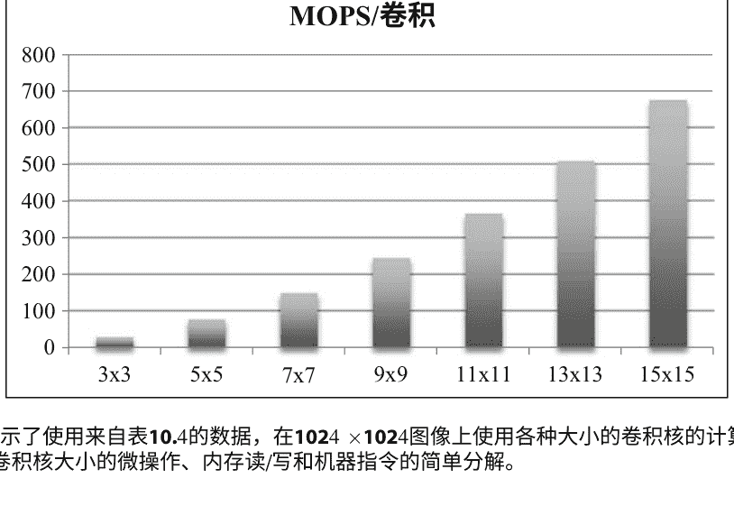

图10.25该图显示了使用来自表10.4的数据，在1024 ×1024图像上使用各种大小的卷积核的计算成本，包括未优化的每个卷积核大小的微操作、内存读/写和机器指令的简单分解。

未经优化的卷积成本，假设所有数据在寄存器中加载以进行单个时钟周期的指令操作，无缓存未命中的预取。卷积可以使用SIMD指令、SIMT、内存切片和流水线以及专用硅进行大幅优化。有关优化策略的详细信息，请参阅第8章。卷积还使用可分离核进行优化，稍后将进行讨论。

有关计算成本的更多信息，请参阅下面的参数和超参数部分。有关卷积加速的更多讨论，请参阅第8章中的Boxlets和卷积加速讨论。

滤波器形状和大小
卷积网络通常使用方形的内核形状，例如3 ×3或5 × 5。
然而，方形特征是最不具有旋转不变性的形状，请参阅第4章。为了补偿单个矩形特征的旋转不变性，可以通过包含数据的旋转副本来增强训练数据，并且可以训练额外的特征，因此最终会生成更多的特征，以及相关的计算和内存成本。

然而，方形特征是最不具有旋转不变性的形状，请参阅第4章。为了补偿单个矩形特征的旋转不变性，可以通过包含数据的旋转副本来增强训练数据，并且可以训练额外的特征，因此最终会生成更多的特征，以及相关的计算和内存成本。

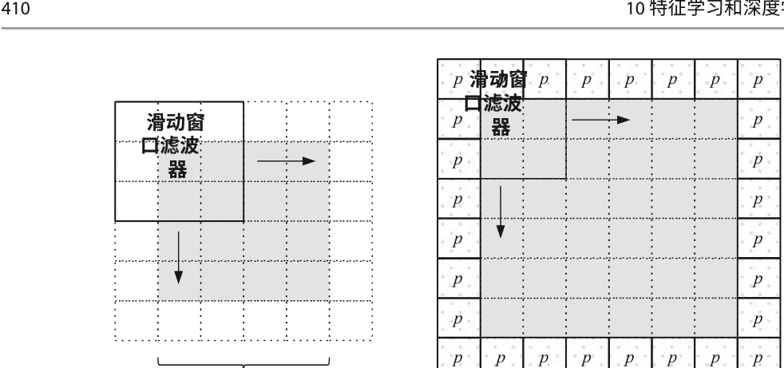

如图10.26所示，滤波器形状也会对图像边界效果产生影响。为了减轻方形滤波器的边界效应，可以通过在边缘周围填充一个或多个像素来扩大输入图像，以保留真实的图像边界，否则由于卷积而被裁剪掉。填充可以使用边界像素的复制副本、整个图像的均值和其他方法来实现。

在实践中，每个层的滤波器大小是经验确定的，以找到给定数据集的最佳大小和大小粒度。根据LeCun [682]的说法，对于由相当小的28 × 28像素图像组成的MINST数据集，每个图像包含手写字符和数字，第一层的5 × 5卷积核被证明是有益的。对于使用较大图像尺寸（如256 ×256及更大）的其他数据集，第一层和更高层使用了较大的滤波器形状，如11 ×11或15 ×15。然而，使用堆叠卷积的小内核（如3 ×3大小）作为后续VGG架构中所调查的一种良好替代方案，可以降低计算成本。接下来将讨论堆叠内核。

#### 堆叠卷积

可以将几个较小的卷积堆叠在一起以近似一个较大的卷积核。如图10.27所示，可以使用三个3 ×3的卷积核来近似一个7 × 7的卷积核，因为第一次卷积将7 × 7的图像减小到5 ×5，第二次卷积将图像减小到3 ×3，最后一次卷积产生1个像素的输出。Simonyan和Zisserman [656]展示了一个非常深的卷积网络，称为VGG，使用了高达19层的纯粹3 ×3的卷积特征，指出堆叠的3 ×3卷积是较大卷积核的可行替代方案，并且具有相同的准确性。例如，通过观察总的
感受野，可以看出两个堆叠在一起的3 ×3卷积核等效于一个5 ×5的卷积核。

较小的卷积核的关键优势是计算效率。

一些从业者尝试通过使用跳跃因子在输入卷积核组装过程中跳过像素来减轻较大卷积核的计算负担。例如，

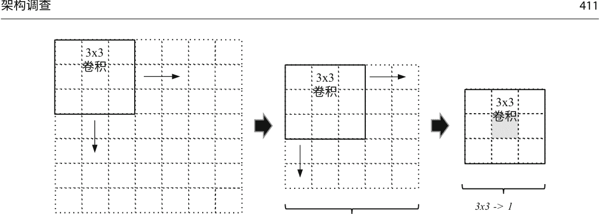

图10.27 这个图示了堆叠卷积的等效性，显示了对7 ×7输入图像应用三个堆叠的3 × 3卷积得到一个5 × 5图像，然后对5 ×5图像进行3 × 3卷积得到一个3 × 3图像，最后对3 × 3图像进行3 × 3卷积得到一个单像素输出，与一个7 ×7核的有效感受野覆盖相同。

Krizhevsky等人[640]开发了一种称为AlexNet的架构，如图10.30所示，使用了多种卷积核尺寸，包括11 ×11、5 ×5和3 ×3，并且为了改善11 ×11卷积核的性能，使用了步长为2。堆叠卷积的用途有限，因为根据输入数据和应用程序的不同，较大的卷积核（如11 ×11）可能是正确的选择，因为较大的卷积核可以捕捉更多的局部区域信息来描述更高级的对象特征。

叠加卷积核也被声称[656]可以通过在每个3个卷积核后添加修正或非线性来增加一些正则化，从而强制通过链中的3个 ×3个滤波器进行分解，据称可以增加最终结果的区分度。当然，对于较小的卷积，参数数量大大减少，可能会根据整体架构提高性能。例如，假设卷积堆栈的输入和输出相同 C，一个3通道的RGB输入到3个 ×3个卷积的堆栈使用3(3^2C^2) = 27C^2权重参数（不包括偏置参数）来覆盖一个7 ×7的区域，而单个7 ×7的卷积使用(7^2C^2) = 49C^2权重参数（不包括偏置参数）。

总结一下，在某些应用中，堆叠较小的卷积核而不是单个较大的核是一种可行的选择，可以减少权重参数的数量。

#### 可分离和融合卷积

减少卷积开销的另一种方法是使用可分离的滤波器。许多2D滤波器，如卷积，都是可分离的滤波器，可以分解为行和列操作。例如，离散傅里叶变换是一种可分离的滤波器，可以分解为在2D或3D场中重叠的1D FFT。卷积也可以实现为可分离的滤波器。这意味着行和列可以作为1D向量独立处理，并且可以使用快速SIMD指令加速处理向量。

例如，2D高斯模糊核可以分解为两个1D核，如下所示：

$$ \frac{1}{4} \begin{bmatrix} 1 \\ 2 \\ 1 \end{bmatrix} * \frac{1}{4} \begin{bmatrix} 1 & 2 & 1 \end{bmatrix} = \frac{1}{16} \begin{bmatrix} 1 & 2 & 1 \\ 2 & 4 & 2 \\ 1 & 2 & 1 \end{bmatrix} $$

另一种方法是将几个卷积滤波器融合在一起，合并成一个单一的滤波器。由于卷积是可交换的，并且在频域中实现为乘法，所以

在空间（像素）域中进行乘法运算，一组卷积滤波器可以进行卷积运算，或者预卷积，得到一个表示一组滤波器的单一滤波器。例如，Mamalet等人[664]开发了一种方法，将融合卷积应用于组合滤波器、激活函数和池化函数，并在准确度上以<1%的误差近似相同的结果。虽然融合不完全等同于分步骤，但性能提高了2-6×，具体取决于配置以及网络是处于训练阶段还是操作匹配阶段。此外，Mamalet还开发了融合和可分离滤波器的反向传播方法。

#### 卷积与相关性

术语卷积和相关性经常被互换使用，尽管实际的数学和使用目的通常不同。我们将在讨论一些可能引起混淆的点。

在CNN讨论中，“卷积”一词的使用非常不准确，实际上指的是输入向量 I 和特征权重向量 W 的点积：

$$ \mathbf{I} \cdot \mathbf{W} = \sum_i I_i W_i = I_0 W_0 + I_1 W_1 + \cdots + I_n W_n $$

事实上，数学上卷积和相关性密切相关，因为通过将卷积模板旋转180度，或者换句话说反射矩阵的行和列，卷积等效于相关性。相关性的一种变体，归一化相关性，使用比例因子 x 计算以实现尺度不变性：

$$ \frac{\sum_i (I(i) W(x+i))}{\sqrt{\sum_i I(x+i)^2} \sqrt{\sum_i (W(i))^2}} $$

事实上，“卷积神经网络”这个术语有些令人困惑，因为它同时暗示了相关性和卷积。从图像处理的角度来看，也会产生一些混淆，因为“卷积滤波器”是一种图像处理算子，而“相关性”既不是统计度量标准，也不是模板匹配特征检测器。然而，这两种方法在数学上基本相同。卷积通常用于改变图像，而相关性用于命中或未命中的模式匹配操作，也可以使用形态学操作来实现，请参见第2章。通常，相关性核表示用于模板匹配的模式、形状和结构。相关性匹配在图像区域内逐像素进行，使用相似度度量（使用多种方法，如SSD，请参见第4章中有关距离度量的讨论）来计算模板中相应像素与图像中像素之间的差异，并求和得到最终得分。有关相关性和卷积的比较，请参见[683]。

在图像滤波操作中，卷积核通常使用缩放因子来设计，以根据需要对结果进行调整。卷积的缩放因子类似于CNN中的偏置因子参数，在CNN训练过程中与每个特征一起进行调整。因此，每个卷积特征由具有独立权重参数和偏置因子参数的卷积核组成，例如一个 3 × 3 的特征卷积核由 9 + 1 个可调参数组成：

$$ \text{偏置} \begin{bmatrix} w_1 & w_2 & w_3 \\ w_4 & w_5 & w_6 \\ w_7 & w_8 & w_9 \end{bmatrix} \text{ 或者偏置 } + \begin{bmatrix} w_1 & w_2 & w_3 \\ w_4 & w_5 & w_6 \\ w_7 & w_8 & w_9 \end{bmatrix} $$

偏置因子也可以作为加法缩放因子实现，而不是乘法缩放因子，与卷积核一起使用。

卷积神经网络使用卷积滤波器有两个目的：作为类似相关模板的特征权重矩阵，以及作为滤波器来改变输入图像以产生下一个卷积层的输出。在CNN术语中，滤波器产生包含潜在特征的特征图。
对于以中心原点为基础的对称特征，例如高斯模糊核，卷积和相关性本质上是相同的。然而，Convnets中学习到的特征不受对称性约束，并且很少是对称的。

例如，用于卷积的非对称边缘检测器：

$$ \begin{bmatrix} -1 & 0 & 1 \\ -1 & 0 & 1 \\ -1 & 0 & 1 \end{bmatrix} $$

等同于使用相同的旋转了180度的核进行相关性计算：

$$ \begin{bmatrix} 1 & 0 & -1 \\ 1 & 0 & -1 \\ 1 & 0 & -1 \end{bmatrix} $$

有关卷积和相关性的更多信息，请参见第2章。有关将相关性用作模板匹配特征检测器的更多信息，请参见第6章。

#### 池化，子采样

在CNN术语中，池化是子采样的另一个名称（即，在图像处理术语中是图像重新缩放），并且有几种方法在第9章中进行了讨论。池化通常用作每个卷积层的最后一步或其中一步。Neocognitron [571, 679]是1980年首个使用池化的CNN。池化的声明目标通常是为了增加一些平移不变性，或者简单地将图像进行较小的子采样以减少计算和参数。然而，ANN中使用的子采样方法与标准的计算机图形采样方法（如线性插值和其他抗锯齿方法）不同。我们在这里讨论了几种变体。

对于CNN，简单的方法是取池化层的平均值。
然而，最流行的方法似乎是使用RANK滤波器方法（见第2章）来选择局部区域的最大值。选择最大值似乎是直观和明显的，因为局部区域中的最大激活类似于最强的特征，而使用平均值则意味着不确定性。

池化层是否真的需要？Dosovitskiy等人[684]认为，用至少2个步长的卷积层替换最大池化层在准确性上是等效的。Graham提出创建可变大小的最大池化区域[685]。实际上，我们调查的许多CNN并不总是使用池化层。然而，池化操作通常需要对图像进行下采样或上采样，以使输出的尺寸与全连接分类层的输入匹配。

卷积神经网络层还会对图像进行子采样，而较大的卷积核，如11×11，可以产生比较小的卷积核更多的子采样。此外，滑动窗口的步幅因子大于1也会对图像进行子采样。因此，卷积核、步幅和池化区域大小的综合子采样效果是理解特征所表示的细节水平的重要考虑因素。

2x2的池化区域，选择最大值，类似于排名滤波器（见第2章）。

图10.28 这个图示了MAX池化，其中一个RANK滤波器在局部区域上运行，并选择最大值来组装最终的输出图像。

#### 参数和超参数

几位从业者分别总结了（1）CNN的架构参数和（2）学习超参数。架构参数有助于总结CNN中的移动部件，这对应于训练难度和整体性能。CNN的参数数量通常在数百万到数十亿个参数之间。本章中的反向传播讨论中讨论了用于学习的超参数，如动量和学习率。

CNN中包含的参数数量令人眼花缭乱，与人脑中的神经元数量相当，人脑中包含数十亿个神经元和连接，参见表9.1。幸运的是，CNN具有更加规则的架构，简化了架构。我们鼓励读者在心中形成对CNN架构参数的视觉化，以更好地理解基本原理。

#### 架构参数

参数是CNN的程序代码。通过调整学习参数和训练数据来编程自身的架构，从而实现特征学习。这些参数类似于大脑中的神经DNA代码。在分析架构复杂性时，我们可能对分析参数以比较设计方案感兴趣。例如，我们可能想要探索使用更大的图像作为输入、更多的图像通道、更大的特征或更深的网络的成本。由于每个参数都意味着相应的内存和计算操作，参数分析对于估计训练时间和运行时性能非常有用。

##### 关键架构参数类型包括：

- 通用参数：通常计算为卷积层的总数，即 `(input_feature_maps × output_feature_maps × weights_per_kernel) + 当前层每个内核的偏差因子。` 这些参数是神经DNA代码。
- 神经元：网络中模拟的人工神经元数量。实际神经元数量可能不会同时运行，因为人工神经元通常是串行共享的，一次处理一个特征，而不是同时并行运行所有特征。然而，也会使用并行实现来提高性能，但会以增加系统大小为代价。
- 连接：人工神经元之间的总连接数。这是网络中模拟的人工树突和轴突的简单度量。

在这里，我们提供了一些计算架构参数的方法，这些方法可能与其他从业者计算参数、操作和连接复杂性的方法不同，其中：

- 下标表示：
$t$ = 总计
$l$ = 层
$l-1$ = 前一层
$n$ = 单个神经元
- 参数：
$n_t$ = 网络的总神经元数
$c_t$ = 网络的总连接数
$p_t$ = 网络的总参数数
$s_l$ = 单个卷积层中的总参数数
$i_l$ = 卷积层的输入，来自前一层，要么从每个特征图中使用滑动窗口进行卷积核过滤，要么从每个特征图中使用全连接权重进行1D卷积
$d_l$ = 深度，即该特征图的通道数
$f_l$ = 该层的特征数
$m_l$ = 该层输出的特征图数 ($m_l = f_l$)
$f_{l-1}$ = 前一层的特征数量
$m_{l-1}$ = 前一层的输出特征图数 ($m_{l-1} = f_{l-1}$)
$k_l$ = 每个核中的特征权重数量，例如 $3 \times 3 = 9$
$b_l$ = 偏置因子，每个特征1个 ($=$ 每层的总特征数)
$x_n$ = 每个神经元的操作，例如归一化、最大池化等

1.  神经元：对于2D卷积滤波层，每个神经元从前一层的每个特征图中接收一个单独的核输入窗口（与核连接），计为1个输入。对于每个1D卷积1D分类器层，每个神经元从前一层的每个特征的每个权重中接收全连接输入。
$$\text{(网络的总神经元数 ) } n_t = \sum_{l=1}^{\text{总层数}} i_{l-1} m_{l-1} f_l$$

2.  参数：卷积神经元的简单参数总数，包括权重和偏置。
$$\text{(网络 ) } p_t = \sum_{l=1}^{\text{总层数}} m_{l-1} k_l m_l + b_l$$

3.  操作：激活函数和卷积被默认视为神经元的一部分，不被计算为单独的操作。相反，操作是神经网络中的额外函数，包括预处理（丢弃、数值调整、...）和后处理（响应归一化、池化、...）。我们将操作视为人工神经元管道的串行部分（隐藏单元的一部分），而不是单独的层。作为度量标准的操作是神经元复杂性的简单度量，尽管某些操作比其他操作更复杂。操作函数可以独立地在反向传播过程中分配一个错误项，一些从业者称之为损失权重，以便调整每个操作函数以减少其错误贡献，例如通过调整操作的参数。
$$\text{(网络 ) } x_l \sum_{l=1}^{\text{总层数}} x_n n_l p_t$$

4.  连接：我们将连接定义为上一层每个特征图到当前层每个滤波器中的每个权重的输入。输入可以是与卷积核相连的窗口，也可以是完全连接的权重，如1D卷积层所示。
$$\text{(网络的总连接数 )} c_t = \sum_{l=1}^{\text{总层数}} i_{l-1} m_{l-1} k_l m_l$$

请注意，第一个完全连接的1D分类层可能比其他层具有更多的参数，因为它是第一个完全连接的层，将上一卷积层的每个特征权重作为输入连接到分类层的每个神经元。

##### 表10.5 这个表说明了假设的网络参数

| 卷积层 | 参数 | 神经元 | 连接 |
| :--- | :--- | :--- | :--- |
| 第0层 - 输入<br>640x480图像<br>单色，1通道<br>完全填充的输出 | 640x480x1<br>完全填充<br>即7x7卷积核的情况下为642x472<br>P = 307,200 | | |
| 第1层 - 过滤器<br>256个偏置因子<br>256个7x7特征<br>(op*1) 均值为零的归一化<br>(op*2) ReLU激活<br>完全填充的输出 | (1 * 7x7 *256) + 256<br>P = 12,800 | 640x480 * 256<br>N = 78,643,200 | 640x480 * 256 * 7x7<br>C = 3,853,516,800 |
| 第2层 - 过滤器<br>512个偏置因子<br>512个5x5特征<br>(op*1) ReLU激活<br>完全填充的输出 | (256 * 5x5 * 512) + 512<br>P = 3,277,312 | 640x480 * 512<br>N = 157,286,400 | 640x480 * 512 * 5x5<br>C = 3,932,160,000 |
| 第3层 - 滤波器<br>1024个偏置因子<br>1024个3x3特征<br>(op*1) ReLU激活<br>完全填充的输出 | (512 * 3x3 * 1024) + 1024<br>P = 4,719,616 | 640x480 * 1024<br>N = 314,572,800 | 640x480 * 1024 * 3x3<br>C = 2,831,155,200 |
| 第4层 - 分类<br>8192个1维向量权重 | 1024 * 3x3 * 8192<br>P = 75,497,472 | 1024 * 8192<br>N = 8,388,608 | 1024 * 8192 * 3x3<br>C = 75,497,472 |
| 第5层 - 分类<br>4096个1维向量权重 | 8192 x 4096<br>P = 33,554,432 | 8192 x 4096<br>N = 33,554,432 | 8192 x 4096 * 1<br>C = 33,554,432 |
| 第6层 - 分类<br>1024个1维向量权重 | 4096 x 1024<br>P = 4,194,304 | 4096 x 1024<br>N = 4,194,304 | 4096 x 1024 * 1<br>C = 4,194,304 |
| 第7层 - 输出<br>标记 | 1024个Softmax | - | - |
| 总计 | P = 121,563,136 | N = 596,639,745 | C = 10,730,385,408 |

#### 学习超参数

学习超参数包括在DNN训练过程中使用的一系列变量和常数，如初始特征权重、偏置、动量、学习率和其他几个参数。我们在这里不深入探讨学习参数，而是将感兴趣的读者引荐给更好的资料。参考文献在反向传播部分和本文其他地方提供。超参数被认为是难以选择、理解和控制的，例如LeCun等人[654]的“神经网络，技巧的诀窍”。

从统计分析中，超参数是从先验中确定的，因此必须智能地初始化，并从那里进行优化。然而，许多深度神经网络从业者认为没有已知的方法来初始化深度神经网络训练的超参数，并主张经验主义[644]。在这方面，我们可以说深度神经网络从业者经常使用“最佳猜测”，而不是统计生成的超参数。然而，对于特征权重初始化，迁移学习是有效的，并遵循使用先验的统计分析模式，因为现有的训练好的特征权重被重复使用来初始化权重，通常在CNN的较低层级。除了迁移学习之外，似乎没有太多正式的指导来初始化和调整超参数。请参阅第9章的讨论，以及LeCun [687]。

接下来，我们将超越上面讨论的卷积神经网络基础知识，开始对几个示例进行调查，这些示例说明了CNN架构。

## LeNet

LeNet是由Yann LeCun [574, 575]在1980年代末开发的经典CNN架构，是理解CNN的一个很好的起点。Yann可能与研究、开发和成功部署实际卷积网络解决实际问题[682]最相关，例如商业部署的邮政编码识别系统和银行支票处理的手写识别系统。鉴于基础的卷积网络研究已于1980年代中期完成，并且有足够的计算能力可用，LeCun能够在LeNet架构中综合和改进卷积网络架构[574, 575]，该架构已经发展到LeNet5版本及以上，成为学术研究和工业界今天使用的大多数DNN的基础。

在这里，我们调查了早期的LeNet架构[576]，该架构被美国邮政服务用于邮件分类。LeNet架构是最早成功将反向传播应用于实际问题[577]的架构之一。

训练数据包括9298个个别数字化的手写数字或数字，取自实际邮件中的手写邮政编码，以及多种大小和样式的书写方式。训练数据还包含一些无法识别、模糊和错误分类的数字。为了准备训练数据，每个数字化的数字被渲染成一个16 × 16像素的模板，使用线性插值来保持每个数字的纵横比。通过像素编辑，手动删除了每个数字周围的随机错误标记。

每个16 × 16的输入图像被处理为灰度图像，使用均值归零归一化在范围 −1…+1 进行预处理。输入图像的边缘周围完全填充，填充值为 −1。因此，包括填充，输入特征被视为24 × 24像素的图像，以允许对16 × 16模板中每个像素进行完整的5 × 5输入窗口采样，通过在每一侧填充4个像素（16 + 4 + 4 = 24）。后续层也对输入特征图像进行了填充。权重使用随机值进行初始化，这是一种原始的边缘检测器。

图10.29 基本的LeNet架构，来自1986年LeCun的论文[576]，用于数字识别。

LeNet的一个目标是减少计算开销，因此对减少参数进行了仔细的注意。为了允许一次只搜索一个特征，使用了权重共享。过滤器的权重和偏置在同一层中同时共享给所有神经元，因此实现了虚拟神经元来共享权重，而不是详尽地实现所有神经元及其自己的权重副本——共享权重和虚拟神经元是LeNet成功证明的创新。虽然这似乎很自然，但LeCun等人是最早在常规卷积网络的背景下采用这种技术的人之一。请注意，LeCun使用术语特征图来表示将权重与输入进行卷积的结果，这常常令人困惑，因为卷积的结果只是另一幅图像，根本不是特征，因为权重才是特征。然而，在CNN术语中，术语潜在特征用于描述潜藏在特征图中的特征，等待在下一层被发现。

该架构在图10.29中有所说明。有三个隐藏层（卷积层），标记为H1、H2和H3。请注意，每一层的所有图像都是完全填充的。输入（底部）是一个16 ×16的零均值归一化的灰度模板。输入的卷积核窗口大小为5 ×5，每个像素跨度为1。H1层的输出特征图大小为8 ×8，相对于16×16的输入进行了2倍的降采样，由于2像素的跨度导致输入图像被欠采样。减少的原因是为了提供一定的平移不变性。同样，2D输入欠采样也用于H3层，将8 ×8的特征图减少到4 ×4。第一个版本中没有使用池化层，但后续的LeNet架构添加了池化和子采样层[682]，相当于以2或更大的步长对输入进行欠采样。

然而，需要注意的是，LeCun将hidden layer称为完整的卷积层，将 hidden unit称为隐藏层中的单个卷积神经处理器。然而，需要注意的是，LeCun将term hidden unit用于特征图中的单个像素，它等效于神经processor的输出。每个LeNet隐藏单元都是使用卷积权重计算的，无论是在过滤器层中的卷积核，还是在全连接层中的1D向量。H1包含了8 ×8大小的12个特征图，总共有12 ×8 ×8 =768个隐藏单元。H2包含了4 ×4 =192个隐藏单元。H3是一个完全连接层中最大的隐藏单元数为30 × 192 =5750个隐藏单元+30个偏置 =5790。输入包含16 ×16个像素，或256个隐藏单元。输出是一个十进制分类器有十个输出，每个数字一个。总之，H1层包含12个5 ×5个特征，H2层包含12个5 ×5个特征，H3层包含一个1D向量，具有30个权重，与来自H3的192个权重完全连接。

LeCun还是硬件加速CNN的先驱。例如，最初的LeNet是使用DSP进行加速的，这与大多数学术研究不同通常只关注探索新概念，将优化留给应用研究人员和工程师。此外，Farabet、LeCun和其他人[689, 690]开发了一个使用FPGA和后来的ASIC进行硬件加速的CNN，这成为一家初创公司的基础。

| 名称 | LeNet |
| :--- | :--- |
| 人工神经网络类型 | 卷积神经网络 |
| 内存模型 | 简单，固定 |
| 输入采样 | 滑动窗口步长=2 |
| 丢弃，重构 | - |
| 预处理，数值调整 | 均值为零的输入归一化 |
| 特征集维度 | 5x5x12, 5x5x12, 30x192, 1x30 |
| 特征初始化 | 随机 |
| 层总数 | 2个过滤器，1个分类器 |
| 特征、滤波器 | 卷积 |
| 激活函数、传递函数 | Sigmoid |
| 后处理，数值调整 | - |
| 池化，子采样 | 后续版本使用2x2x2平均池化 |

## AlexNet, ZFNet

LeNet架构是几个现代卷积神经网络的基础，包括由Krizhevsky等人开发的AlexNet CNN变体[640]，这是第一个在大型自然图像数据集上实现卷积神经网络潜力的CNN。³AlexNet也成为后续用于图像识别的CNN的基础。⁴事实上，Zeiler和Fergus [641, 642]改进了AlexNet架构，称为ZFNet，随后在一家名为Clarifai的初创公司商业化。ZFNet的成功部分归功于Zeiler的方法，可以可视化学习到的特征与输入图像中匹配的像素区域相对应，称为反卷积网络，以便开发关于如何改进弱特征的学习超参数的直觉。此外，ZFNet减少了超参数的数量，并扩展了卷积滤波层的深度，将准确性提高了几个百分点。

基本的AlexNet架构如图10.30所示。引入了几个重大创新来提供工程效率的优化（这在学术工作中是不寻常的），我们将在这里进行调查：

- 优化以在两个GPU上并行运行
- 过拟合缓解技术
- 训练时间算法优化

图10.30 这个图显示了AlexNet卷积神经网络的架构，使用两个并行路径在两个GPU上实现。图像经许可使用，©Alex Krizhevsky来自[640]。

如图10.30所示，AlexNet包含五个卷积滤波层和三个1D分类层。尝试了更少的层，但准确性降低。如第9章所讨论的，激活函数使用了修正线性单元（ReLu），这是与当时常用的S形函数不同的一种离散函数。使用ReLu可以减少训练时间，因为它使用了一个更简单的斜坡式函数。此外，ReLu可以在未归一化的数据上操作，而不会饱和，在预处理期间消除了归一化的计算成本。GPU并行化设计为在每个GPU上运行一半的特征核，GPU之间的通信最小化。实际上，GPU的内存限制是并行化的主要原因之一。

AlexNet中双GPU分区的一个有趣的副作用是每个GPU专注于学习独立的特征集。如图10.31所示，一个GPU生成了顶部特征，主要是梯度风格的单色特征，而另一个GPU生成了底部特征，主要是颜色斑点风格的特征。图10.31还说明了CNN会根据梯度下降算法的收敛性、每个权重的实际更新和调整方法以及权重的初始值而生成不同的特征，所有这些都会影响收敛性。梯度下降和反向传播是难以可视化、预测或控制。AlexNet的并行GPU结果类似于具有相同DNA的克隆人：两个个体都是由其条件和经历形成的，导致不同的结果。

图10.31 这张来自Krizhevsky等人[640]的图片显示了在不同GPU上学习到的特征的分区情况，（顶部）在GPU A上学习的梯度，以及（底部）在GPU B上学习的颜色斑点。注意：相同的训练数据在GPU A和B之间分割。图片经许可使用，©Alex Krizhevsky。

AlexNet在卷积输出特征图的局部区域上使用响应归一化，使用一种相当计算密集的函数：
$$x_t = a_{x,y}^j / \left( k + \alpha \sum_{j=\max(0,i-\frac{n}{2})}^{\min(N-1,i+\frac{n}{2})} (a_{x,y}^j)^2 \right)^\beta$$

局部响应归一化包括输出特征图中重叠的局部区域的贡献。超参数是从训练集中确定的，包括 k, a, α和 β。归一化目标是亮度调整，类似于其他方法，如局部直方图均衡化或LUT斜坡，参见第2章。请注意，一些最近的从业者不使用响应归一化，并且发现没有利益可以证明计算成本的合理性[656]；然而，Krizhevsky报告称响应归一化有利于降低错误率。

AlexNet使用了一种通过重叠区域进行池化的方法，而不是其他CNN中使用的非重叠区域，据报道与非重叠池化相比，准确率提高了小于1%。

内存和训练时间是限制架构的关键瓶颈，因此Krizhevsky的架构可以调整以适应可用内存和训练时间预算。训练数据集（ILSVRC）包括超过120万张256 ×256的RGB分辨率的图像，经过均值归一化处理。通过使用每个样本的镜像和平移版本引入新的训练样本，以将多个视图纳入评分中。此外，对每个图像的RGB通道进行预处理，使用基于PCA的算法选择主要成分并增加图像的强度和颜色的方差，从而将错误率降低小于1%。在训练过程中，使用dropout随机将一半神经元的输出设置为零，应用于全连接层。在测试时，每个神经元的输出乘以0.5，以近似累积dropout效应的几何平均值。权重从零均值的高斯分布初始化，偏置初始化为1。

总结一下，AlexNet架构是第一个展示了卷积神经网络在自然图像数据集上潜力的架构，它利用GPU进行计算加速和大规模标记数据集。

| 名称 | AlexNet |
| :--- | :--- |
| 人工神经网络类型 | 卷积神经网络 |
| 内存模型 | 简单，固定 |
| 输入采样 | 滑动窗口步长=4，在第一层为1，在其他层为1 |
| 丢弃，重构 | 在全连接层上进行50%的Dropout |
| 预处理，数值调整 | 均值为零的归一化 |
| 特征集维度 | 11x11x96RGB, 3x3x256RGB, 3x3x384RGB, 3x3x384RGB, 3x3x256RGB, 1x4096RGB,1x4096RGB |
| 特征初始化 | 高斯分布 |
| 层总数 | 5个滤波器，2个分类器 |
| 特征、滤波器 | 卷积 |
| 激活函数、传递函数 | ReLu |
| 后处理，数值调整 | 局部亮度均衡 |
| 池化，子采样 | 最大池化2x2x2 |## VGGNet和其变种MSRA-22，百度深度图像，深度残差学习

由Simonyan和Zisserman [656]开发的VGGNet架构具有很高的影响力，从微软MSRA [670]和百度[700]衍生出了各种变种，因此我们在这里简要讨论VGGNet和各个变种，在本节稍后会有更详细的调查。在撰写本文时，来自MSRA和百度的VGGNet变种以及Google Inception几乎达到了相同的最先进结果，只有几个百分点的差异，赢得了几个ImageNet竞赛。基于VGGNet的部分，截至2015年，在大多数ImageNet竞赛类别中，目前的领先者是He等人的深度残差学习（DRL）方法[872]，在本章末尾的深度神经网络未来部分将更详细地讨论，该方法支持非常深的网络——迄今为止已经尝试了超过1000层的最深DNN。

Simonyan和Zisserman [656]使用最多19层的3×3卷积核而不是一系列更大的卷积核，以及最小的其他操作，即池化和ReLU，取得了出色的结果。核心概念是使用堆叠的卷积来减少参数数量并提高性能。如上面的“堆叠卷积”部分所解释的那样（在阅读本节之前值得回顾一下），三个3×3的卷积堆叠可以覆盖相同的感受野并近似于一个7×7的卷积；然而，使用堆叠卷积可以使用更少的参数，在训练和运行时都具有显著的性能优势。然而，可以争论的是，对于一些需要更多细节来描述特征的应用，如11×11或15×15的更大特征是无价的，其中3×3的堆叠缩减可能由于有限的感受野而无法工作。

VGGNet启发了一些值得注意的CNN。请注意，稍后调查的Microsoft MSRA [670]也使用了修改后的VGGNet架构，包括22个卷积层，以及其他修改，如空间金字塔池化[542]，参数化ReLU（PReLU）[670]，改进的权重初始化方法，一些更大的卷积核和更激进的下采样。百度深度图像[700]，稍后调查，也使用了一个19层的VGGNet，并在训练协议上进行了巨大的投资。

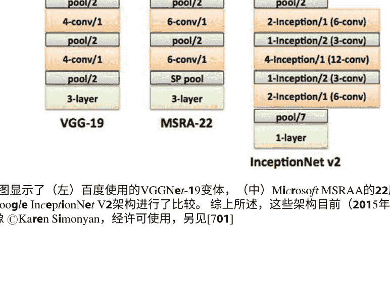

ConvNet Configuration

| Configuration | A | A-LRN | B | C | D | E |
|---------------|---|---|---|---|---|---|
| **Weight Layers** | 11 weight layers | 11 weight layers | 13 weight layers | 16 weight layers | 16 weight layers | 19 weight layers |
| **Input** | input (224 × 224 RGB image) | | | | | |
| **Conv1** | conv3-64 | conv3-64 LRN | conv3-64 conv3-64 | conv3-64 conv3-64 | conv3-64 conv3-64 | conv3-64 conv3-64 |
| **Maxpool** | maxpool | | | | | |
| **Conv2** | conv3-128 | conv3-128 | conv3-128 conv3-128 | conv3-128 conv3-128 | conv3-128 conv3-128 | conv3-128 conv3-128 |
| **Maxpool** | maxpool | | | | | |
| **Conv3** | conv3-256 conv3-256 | conv3-256 conv3-256 | conv3-256 conv3-256 | conv3-256 conv3-256 conv1-256 | conv3-256 conv3-256 conv3-256 | conv3-256 conv3-256 conv3-256 conv3-256 |
| **Maxpool** | maxpool | | | | | |
| **Conv4** | conv3-512 conv3-512 | conv3-512 conv3-512 | conv3-512 conv3-512 | conv3-512 conv3-512 conv1-512 | conv3-512 conv3-512 conv3-512 | conv3-512 conv3-512 conv3-512 conv3-512 |
| **Maxpool** | maxpool | | | | | |
| **Conv5** | conv3-512 conv3-512 | conv3-512 conv3-512 | conv3-512 conv3-512 | conv3-512 conv3-512 conv1-512 | conv3-512 conv3-512 conv3-512 | conv3-512 conv3-512 conv3-512 conv3-512 |
| **Maxpool** | maxpool | | | | | |
| **FC1** | FC-4096 | | | | | |
| **FC2** | FC-4096 | | | | | |
| **FC3** | FC-1000 | | | | | |
| **Softmax** | soft-max | | | | | |

图10.33 该图展示了使用纯粹的3 ×3卷积的六种不同的深度架构，图像来自CVPR的Simonyan和Zisserman [656]，经Springer-Verlag许可使用

通过使用自定义的百度-设计的DNN超级计算机和其他客户硬件，比任何人都使用了大量的训练样本，达到了1.9PFlops的速度。对于第一代VGGNet，输入图像为224 ×224的RGB图像，每个像素点都减去了RGB均值进行预处理。训练过程包括随机颜色偏移、裁剪、水平镜像和通过随机重新缩放训练样本来增加尺度不变性，尺度范围为[256 × 256...512 ×512]。尺度抖动提高了约1%的准确性，但计算成本也增加了。此外，测试图像还应用了水平镜像，在softmax层中，使用原始图像和镜像版本的平均分数进行评分。训练样本还使用随机RGB颜色偏移；然而，这似乎更像是猜测而不是有针对性的改进，因为在RGB空间中改变颜色是相当模糊和不自然的，请参阅第1章了解更多关于颜色空间的信息。对每个图像进行多次裁剪进行评估，但被证明是微不足道的，相当于使用重叠核进行完全填充的密集评估。

基本的VGGNet架构基于AlexNet。如图10.33所示，尝试了多种网络深度，包括不同大小的卷积堆叠，后跟步长为2的MAX池化。为了保持空间分辨率，步长固定为1，以包含每个像素，并且使用完全边缘填充。每个卷积使用ReLU非线性函数。作者指出，尝试了输出处的局部响应归一化，但成本高昂且没有改善性能。最佳结果

5VGGNet和AlexNet可以完全在开源的Caffe神经网络包中实现，最佳性能的VGGNet模型可作为Caffe配置文件获取，参见http://www.robots.ox.ac.uk/~vgg/research/very_deep/。

通过仅使用更深的3 ×3卷积堆栈获得。三个全连接的分类层后面跟着一个软最大分类器。

权重初始化分为两个步骤。首先，随机权重被零均值归一化并在图10.33中的网络A上进行训练。然后将权重转移到其他层并继续训练。作者还推荐Glorot和Bengio [697]提出的训练过程，以获得更好的随机权重初始化。训练遵循小批量协议。

对于分类测试，所有输入图像都被缩放到统一的最小尺寸进行测试，该尺寸可能与训练尺寸不同。此外，第一个全连接层被转换为一个7 ×7的卷积层，最后两个全连接层被用作1 ×1的卷积层进行特征图缩减，请参阅下面关于1 ×1卷积的NiN调查。网络密集地应用于整个图像，因此不使用裁剪或区域提议。测试集也作为镜像图像对发送到网络，因此最终的软最大分类器对图像对进行平均以获得最终得分。作者评估了使用每个测试图像的多个裁剪作为输入，但发现成本无法证明结果的有效性（图10.34）。

VGGNet是许多研究任务的首选，特别是用于创建迁移学习的初始特征，并且Caffe开源神经网络库中提供了几个工作模型。

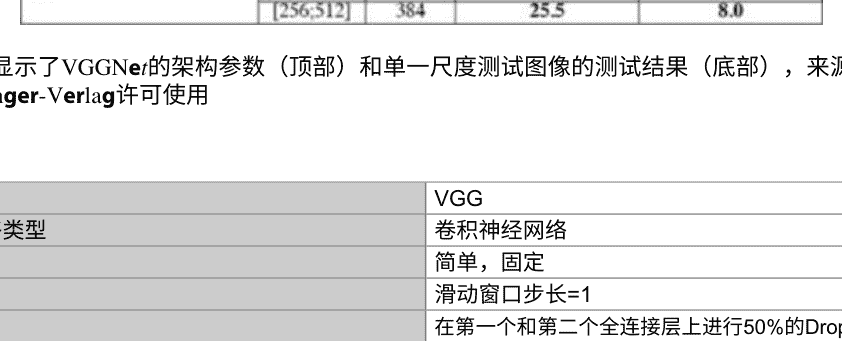

| 姓名 | VGG |
| :--- | :--- |
| 人工神经网络类型 | 卷积神经网络 |
| 内存模型 | 简单，固定 |
| 输入采样 | 滑动窗口步长=1 |
| 丢弃，重构 | 在第一个和第二个全连接层上进行50%的Dropout |
| 预处理，数值调整 | RGB均值归零标准化 |
| 特征集维度 | 3x3RGB，1x4096RGB,1x4096RGB，1x1024RGB |
| 特征初始化 | 随机均值归零分布 |
| 层总数 | 16个过滤器，3个分类器，5个最大池化层，1个Softmax层 |
| 特征、滤波器 | 卷积 |
| 激活函数、传递函数 | ReLU |
| 后处理，数值调整 | 局部亮度均衡 |
| 池化，子采样 | 最大池化2x2x2 |

## Half-CNN

Half-CNN [693]是由袁等人提出的整体图像回归模型或局部相关分类器。Half-CNN是SVM或其他回归模型的可行替代方法。Half-CNN方法完全去除了全连接层，从而消除了分类器设计的需要。相反，输出是一个特征图，显示输入与训练网络中学到的特征之间的相关性，这在检测和分割中有应用。如图10.35所示，注意在池化层之后使用的新型上采样层，以将特征大小归一化，以支持检测到的特征的线性组合，然后通过sigmoid激活函数转换为统一大小的图像。该系统的目标是通过滑动窗口上的n个卷积实现输入与特征的局部相关性，利用局部性质。请注意，本节中调查的MSRA-22 [670]系统也使用了类似于上采样的策略来归一化特征大小，但意图不同，称为SPP [542]，稍后讨论。

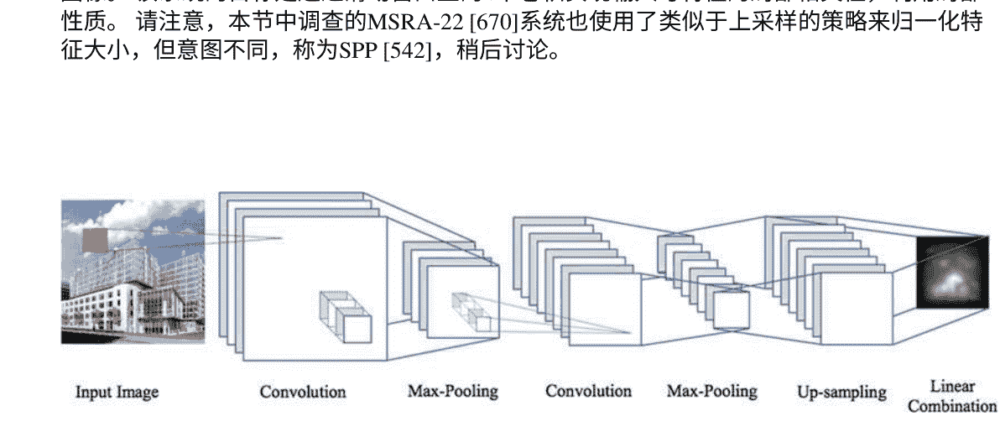

由于Half-CNN是一个完整图像通用回归分类器，它不依赖于区域建议，并且设计用于支持不等大小的输入图像。地面真实数据由使用高斯加权掩膜在标记区域（检测器区域）内生成的预处理图像组成，高斯加权掩膜位于标记区域的中心，例如面部特征点的中心，如图10.36所示。每个图像都填充到256 × 256。这样可以使输入图像以平滑的高斯方式分割。图10.36中的输出是从输入图像学习到的卷积特征的线性组合，可以用作与输入图像合并的掩膜，用于分割输出。

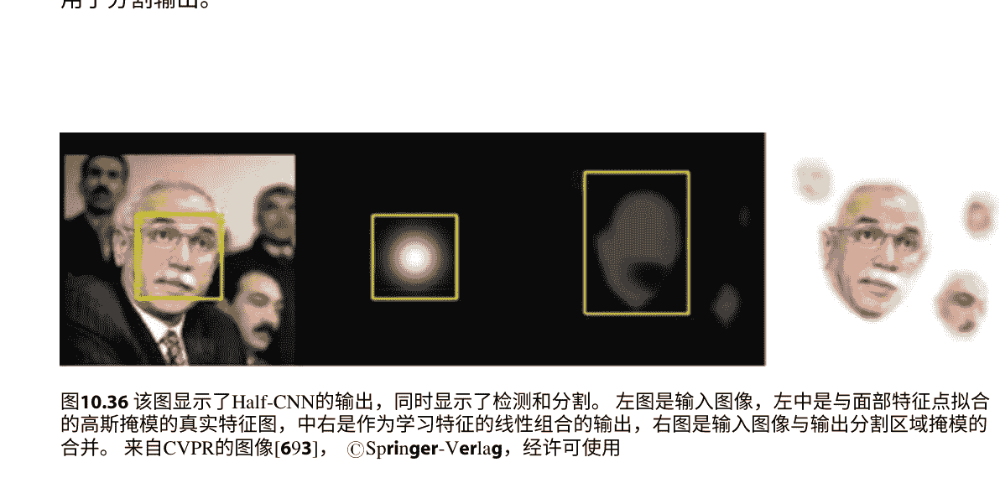

架构的元素由严格的内核连接的卷积内核过滤层、ReLU激活和最大池化组成，还包括使用新型上采样函数的最终过滤层，以强制所有输出图像具有相同的大小，消除了输入图像必须具有相同尺寸的需要。不使用全连接层。每层的滤波器尺寸为11 × 11 ×5，7 × 7 ×5，和5 × 5 ×5。最后一层特征被上采样，以便将特征线性组合成最终的特征图，可以将其作为叠加掩模应用于输入图像以可视化对应关系。

如图10.35所示，第一个全连接层不是通过正则化特征大小来实现，而是通过上采样层将所有特征调整为相同的大小来实现正则化。然而，由于最大池化层中的下采样量较大，因此在特别小的图像上进行上采样的能力是有限的。Yuan报告称，为了获得良好的结果，需要更大的训练集（例如ImageNet大小）。

| 姓名 | Half-CNN |
| --- | --- |
| 人工神经网络类型 | 卷积神经网络 |
| 内存模型 | 简单，固定 |
| 输入采样 | 滑动窗口步长=1 |
| 丢弃，重构 | - |
| 预处理，数值调整 | RGB均值归零标准化 |
| 特征集维度 | 11x11RGB, 7x7RGB, 5x5RGB+上采样 |
| 特征初始化 | - |
| 层总数 | 3个滤波器，3个最大池化层，1个上采样层，1个线性组合层 |
| 特征、滤波器 | 卷积 |
| 激活函数、传递函数 | ReLU |
| 后处理，数值调整 | 局部归一化 |
| 池化，子采样 | 最大池化2x2x2 |

## NiN, Maxout

Lin等人开发的网络中的网络（NiN）模型可能是DNN调查中最新颖和最重要的架构，并对创建人工神经模型的方法进行了根本性的改变。除了原始论文[546]外，NiN幻灯片[592]和ILSVRC 2014的海报也提供了很好的概述。NiN的作者受到Goodfellow等人开发的Maxout网络[610]的启发，通过将多层感知器（MLP）作为激活函数，而不是简单的卷积核，来改进Maxout网络。Maxout网络使用卷积层堆叠后的Maxout层，再加上一个分类层。NiN和Maxout都使用多层或跨通道的方法，将像素列转换为所有输入特征图上的输入，我们将其称为Z列。因此，我们在这里同时调查NiN和Maxout方法，重点关注NiN，并简要讨论Maxout网络的相关特性。

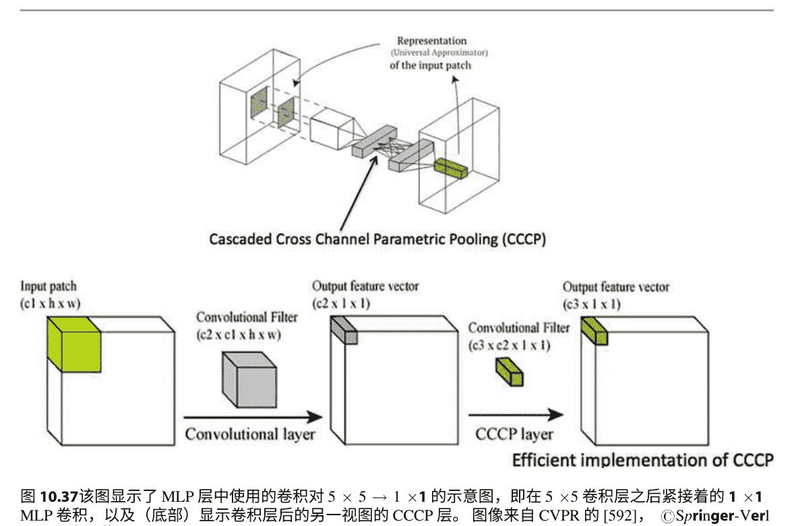

图10.37 该图显示了MLP层中使用的卷积对$5 \times 5 \rightarrow 1 \times 1$的示意图，即在$5 \times 5$卷积层之后紧接着的$1 \times 1$MLP卷积，以及（底部）显示卷积层后的另一视图的CCCP层。图像来自CVPR的[592]，©Springer-Verlag，经许可使用

NiN创新包括：

- 1. **MLP特征模型**，使用MLP（多层感知器）支持非线性学习模型，而不是卷积特征的一般线性模型。**MLP在卷积操作之后作为三层MLP微网络实现，因此被称为网络中的网络（NiN）**。参见图10.37。
- 2. **Z列用于$1 \times 1$卷积**，作为减少特征图数量的方法，如图10.38所示。**Z列一次从所有输入特征图中获取，作者将其称为级联交叉通道参数池化（CCCP）**，用于执行$1 \times 1 \times n$卷积（$n$为输入特征图的数量）以减少输入特征图的体积。$1 \times 1 \times n$向量被输入到MLP中。Maxout [610]的作者将Z列概念称为跨通道池化（CCP），用于在$n$个特征图中取最大值。Z列卷积和Z最大池化具有重要意义，引发了关于为什么需要特征图、应该使用什么函数来创建特征图以及特征图如何对准确性有贡献的精确原因的问题，因为Z列和$1 \times 1$卷积重新组合了通过精心设计和调整的特征权重生成的特征图。
- 3. **卷积对$\mathbf{n} \times \mathbf{n} \rightarrow \mathbf{1} \times \mathbf{1}$**，NiN MLP层使用普通的2D卷积之后紧接着的$1 \times 1$卷积，以增加卷积特征的表达能力。这与之前讨论的堆叠卷积不同，因为目标不同。
- 4. **使用全局平均池化(GAP)** 替换全连接层进行分类，通过对最后一层特征进行空间平均来进行评分。这样可以减少训练负担，并且避免过拟合问题，参见图10.39。**GAP在某种程度上类似于Maxout Z-pooling。**

Maxout创新包括：

- 1. Z列，Z池化，一种通过取多个特征图的最大值并组合成一个单一的特征图来减少特征图数量的方法，减少了特征图的数量，Maxout的作者将其称为跨通道池化（CCP），将输入特征图的单像素列与当前层的空间 x,y最大池化相结合，从而增加了更强大的凸函数逼近能力。请注意，Z池化会减少特征图的数量。
- 2. Dropout优化，Maxout被设计为与dropout互补，并使用相同的dropout掩码进行跨通道池化，并将dropout的结果合并到maxout函数中。

术语说明：NiN和Maxout文献中使用交叉通道池化（CCP）和交叉通道参数池化（CCCP）这些术语来描述从一组输入特征图中收集z列像素，而不是从一个特征2D图中以瓦片形式收集 x,y卷积核。我们在这里使用Z列这个术语来描述多层输入模式，因为术语通道可能会与RGB或其他通道混淆。

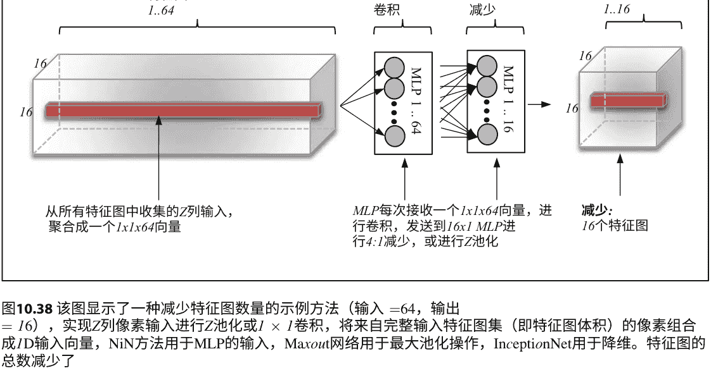

图10.38 该图显示了一种减少特征图数量的示例方法（输入 =64，输出 = 16），实现Z列像素输入进行Z池化或1 × 1卷积，将来自完整输入特征图集（即特征图体积）的像素组合成1D输入向量，NiN方法用于MLP的输入，Maxout网络用于最大池化操作，InceptionNet用于降维。特征图的总数减少了

如图10.38所示，Z列直接支持1 × 1卷积的概念，也被称为CCCP和CCP。如图10.37所示，MLP操作紧随2D卷积操作之后，作为卷积流水线的一部分。1 × 1卷积是在MLP特征检测器中作为滑动窗口的一部分在所有输入特征图上进行的，同时还有2D卷积。与2D x,y输入模式相比，1 × 1卷积具有几个有趣的特性。首先，1 × 1卷积可以用于在 z方向上进行维度缩减，以减少输出特征图的数量。Z维度缩减对于减少系统参数非常宝贵。例如，如果有640 × 480 ×256维的256个输入特征图 (x,y,z)，通过对输入集合进行一组64个1 × 1 ×256个卷积，可以将256个特征图减少到64个特征图（z减少），从而得到所需的较小或减少的特征图集合。此外，1 × 1卷积是新颖的，可以产生丰富的特征，并且已经被证明可以产生

在Maxout网络、NiN和GoogLeNet（Inception）中取得了出色的结果，与x,y输入模式互补，并可一起使用。
使用1 × 1卷积在特征图空间中减少Z列的成功影响深远，触及了CNN设计的基本假设。对于全局平均池化也可以这样说，参见图10.39。考虑到CNN从业者通常在不质疑的情况下使用每个卷积特征作为将输入图像转换为输出特征图的滤波器，假设这些滤波器都是必需且有效的。CCCP将特征图减少到较小的集合中，从而减少了每个滤波器的具体贡献，引发了关于每个特征和特征图的内在价值以及偶然性的问题。CNN的有效性似乎是由层次结构中学到的特征数量（平均和生成的特征）决定的，而不是CNN本身的方法论。CNN风格的2D滤波涉及经验选择的数字调节、卷积、非线性激活函数和池化，以创建每个2D特征图。最终，如果生成的特征图足够好或比其他方法更好，则宣布其有效。然而，由于1 × 1卷积将整个特征图空间缩小到一个新空间，所以无论选择的滤波器和处理流程带来了什么好处都是无关紧要的，因为1 × 1卷积会产生与原始特征图完全不同的视图。因此，将神经元表示为卷积滤波器以生成特征图显然是一种偶然的设计选择。

NiN和Maxout的结果也对通过反向传播生成卷积滤波器权重的概念提出了质疑，尽管它似乎起作用。也许预先存在的特征，如基础函数或视觉基因组（见附录F）更合乎逻辑作为起点。对于特征图Z变换领域的未来研究肯定是一个富有成果的领域。

Maxout使用了ReLU的一个变种，但Maxout不会产生零值。NiN MLP使用ReLU作为激活函数。卷积是线性函数，通常会应用非线性激活函数来增加非线性。请注意，由于MLP本身就是一个非线性函数，因此没有严格的需要将非线性激活函数应用于MLP的结果。

Maxout为激活函数增加了通用性，可以定义任意凸函数，如ReLU、ABS和二次函数，并且受到丢弃的启发旨在与之良好地配合。然而，与Maxout的凸函数相比，NiN中使用的MLP并不局限于凸函数，这促使NiN的作者提供了一种更好的基于MLP的特征来限制网络中较高层的特征爆炸和复杂性。

NiN方法是基于以下观察结果的指导，即高层特征由低层特征组成，因此对于低层特征的MLP模型的更好抽象将有助于更好且更少的高层特征。NiN方法解决了卷积特征作为线性函数或简单线性加权标量值的基本限制。

为了最大化CNN中卷积特征的有效性，需要在DNN特征层次结构的每一层中使用过完备的特征集来单独捕捉非线性变化，这会增加系统的参数数量。与卷积特征相比，MLP能够用更少的参数来逼近更丰富的特征。通过使用MLP而不是卷积，特征数量从过完备减少到足够。由于MLP具有权重，MLP与通用CNN架构兼容，并支持反向传播训练。

使用MLP模型和全局平均池化（GAP）的NiN系统如图10.39所示，大大减少了参数数量，主要是由于GAP相比一组全连接层的参数数量减少（请参阅本章关于全连接层的讨论）。请注意，作者仅使用750万个参数和29 MB的内存空间展示了具有四个MLP层和最终全局平均池化层的NiN系统，而Khrishevsky架构使用6000万个参数和230 MB，NiN实现了相同的性能和一半的训练时间[592]。

图10.39 该图说明了全局平均池化分类概念与FC层分类概念的对比。由Lin等人[546]从CVPR海报演讲中生成的图像，©Springer-Verlag并获得许可使用。

在Maxout池化中，逐列输入（Maxout作者称之为跨通道池化）和 x, y 从当前层的池化区域被合并成一个新的三维 x, y, z 池化区域，从中选择最大值，然后应用激活函数。典型的最大池化仅使用当前层的 x, y 区域特征，在应用激活函数后进行池化以添加非线性。Maxout池化明显在没有修正的情况下工作良好，并且应该单独使用以获得最佳结果。

如图10.39所示，全局平均池化（GAP）是一种新颖的操作，它减少了CNN中常用于分类的FC层的参数数量和连接数量。FC层通常是参数和连接最多的层，而GAP提供了一种更低成本的方法来实现类似的结果。GAP的主要思想是从每个最后一层特征图中生成平均值作为评分的置信因子，直接输入到softmax层中。全局平均池化是有道理的，因为预计最后一层的强特征具有更高的平均值，参见图10.40。因此，GAP可以简单地用作分类得分的代理。正如NiN的作者所述，GAP下的特征图被解释为置信图，并强制特征图与类别之间的对应关系。如果最后一层的特征足够抽象以进行直接分类，则GAP可能是特别有效的；然而，仅仅使用GAP是不够的，如果需要将多级特征组合成类似部件模型的组，则最好在GAP之后添加一个简单的FC层或其他分类器来完成。此外，与FC层相比，GAP使训练变得更简单，参数更少，过拟合不是问题，因为参数大大减少。同样，NiN的作者预计MLP生成的特征本身质量更高，因此可以单独依赖于全局平均池化方法。本作者预计将出现其他可训练的类别方法，沿着全局平均池化的方向，而不是FC层。

全局平均池化是一种直观且合理的替代方案，用于FC层。FC层不是最优解决方案，因为FC层会增加连接数和权重参数，容易过拟合，需要正则化方法（如dropout）来防止过拟合。

总之，NiN是一种深远的架构，应该对CNN研究的发展路径产生重大影响。

接下来，我们将调查受NiN影响的GoogLeNet Inception架构。

| 姓名 | NiN |
| :--- | :--- |
| 人工神经网络类型 | 卷积神经网络 |
| 内存模型 | 简单，固定 |
| 输入采样 | 滑动窗口步幅=1 |
| 丢弃，重构 | 使用70%的dropout率 |
| 预处理，数值调整 | RGB均值归零规范化。 |
| 特征集维度 | |
| 特征初始化 | - |
| 层总数 | 22个卷积，5个池化。 |
| 特征、滤波器 | 多层感知机 |
| 激活函数、传递函数 | ReLu |
| 后处理，数值调整 | |
| 池化，子采样 | 4 最大池化，1 平均池化 5x5-步幅=3 |

## GoogLeNet, InceptionNet

Szegedy等人引入的InceptionNet架构[547, 608]，也被称为GoogLeNet，展示了创建复杂CNN的几个新颖架构概念，利用了之前调查的NiN架构[546]和Maxout架构[610]的一些概念。也许GoogLeNet中最重要的创新是如图10.41所示的Inception模块，它在同一层定义了不同尺寸的卷积滤波器的聚合，提供了(1)多尺度卷积和(2)使用NiN引入的1 × 1卷积模型进行特征空间维度缩减。InceptionNet架构在参数数量上减少了约10×，计算量减少了约25%。InceptionNet目前是各种Imagenet基准测试中排名前三的CNN之一。由于该系统是Google的专有系统，因此某些细节尚不为人所知。

InceptionNet可能是迄今为止最复杂的CNN。Simonyan [701]提供了关于InceptionNet V2的优秀概述，John Schlens [702]也提供了一些概述幻灯片。Ioffe等人[703]提供了关于最近InceptionNet变体的详细信息，Szegedy [893]中涵盖了结合Resnets和DRL概念的进一步发展。

图10.41 这个图显示了（顶部）一个单独的Inception模块，将1 × 1、3 × 3和5 × 5个卷积组合成卷积对，并且（底部）是InceptionNet V1架构，还有其他更近期的变体。注意Inception模块和三个用于单独分类器的分支（黄色框）。© Springer-Verlag，经许可使用，摘自CVPR [547]

如图10.41所示，基本的Inception模块与NiN模块类似，都使用了 n × n → 1 × 1 卷积对，即1 × 1卷积和n × n卷积。然而，Inception使用了多对1 × 1 → n × n卷积，使用多个并行的2D空间卷积来增加多尺度特征的表示，例如3 × 3, 5 × 5，并且还使用了最大池化。因此，即使输入不是多尺度的，Inception模块的输出也是多尺度的，这是由于卷积降采样的结果。

在这里，我们强调InceptionNet架构的一些新特性。请注意，这个摘要涵盖了基本架构的几个变体的信息，因为确切的细节很难获得。

- CNN在早期层中：在靠近输入的层中使用了典型的CNN架构，更倾向于中等大小的特征，例如5 × 5和7 × 7，以进行更激进的下采样，以减少参数和计算负载。
- 逐层1D MLP卷积：与NiN架构类似，使用1 × 1卷积既增加了表示能力，又允许对特征图数量进行激进的减少，否则在更高层中会呈指数级增长。请参见上述NiN调查中的图10.38。
- Inception模块：每个模块聚合了不同尺寸的卷积，并且可能包括一个池化层和一个在中间层分支出来的softmax分类器，支持多尺度分类。一个声明的Inception模块目标是支持多层次的并行多尺度特征提取和分类。
- 多尺寸特征聚合和连接：多种尺寸的卷积，例如在每个Inception模块中，执行1 ×1、3 × 3和5 ×5，并将它们连接在一起作为单个特征向量输出到下一层，从而减少参数数量。Inception特征在每个层级上提供了一种多尺度特征表示，因为卷积输出在每一层都进行了尺度缩减。特征向量包含1 ×1、3 × 3、5 ×5和3 × 3最大池化 →1特征。特征聚合增加了表示能力，受到了之前调查的NiN方法的启发。作者表示，1 ×1卷积的主要原因是在3 × 3和5 ×5卷积之前减少输入特征图的维度。
- 最大池化、平均池化、步幅和卷积池化：在层之间进行特征下采样时使用最大池化，在softmax分类之前使用平均池化。在某些层中，使用步幅 >1和卷积下采样来替代严格的池化。
- 分支分类器，减少FC层：InceptionNet允许从网络的较低层分支出来对特征进行分类，因此网络包括（1）使用FC层和softmax层的较低层分类器，以及（2）具有单个FC层的最终softmax分类器。InceptionNet的分类是多尺度的。将分类分为几个部分也减少了系统中的总FC网络参数。
- 更喜欢较小的卷积：类似于VGGNet概念，使用3 ×3堆叠卷积，更喜欢较小的卷积核以减少参数和计算开销。
- 在较低的网络层中进行积极的空间下采样以减少参数。

InceptionNet的训练协议涉及独立训练七种略有不同的InceptionNet架构，以得到一个集成分数。每个七种架构的训练仅在图像的训练协议选择和呈现顺序上有所不同。

最终的softmax分数是从每个尺度和裁剪的多个图像中取平均值。使用平均池化的最终全连接层用于得出softmax分数，作者指出在评估了几种替代方法后，平均池化效果最好。

训练期间的图像增强包括一组激进的操作，作者指出这些操作随时间不断变化，很难在这里总结，例如四个尺度的图像（256 ×256，288 ×288，320 × 320，352 × 352）以及从每个尺度图像中取的裁剪和每个裁剪的镜像版本。候选图像的其他缩放范围为8%到100%。纵横比的变化在¾到4/3的范围内随机选择。此外，对一些图像应用了几何扭曲，并尝试了不同的计算尺度变化和其他几何扭曲的方法，包括双三次插值和其他标准的计算机图形方法。然而，由于训练图像变化的巨大数量和训练期间超参数的变化，对于最佳训练协议没有得出结论。

InceptionNet非常复杂，无法进行简单的数学分析。事实上，作者对于这种架构的成功并不确定是由于指导原则还是偶然性和辛勤工作。但它确实有效。请参见表10.3，了解包括InceptionNet在内的性能最佳的DNN的参数比较，InceptionNet可在Caffe开源库中获得，并且未来可能会发布更多的预训练网络模型。

| 属性 | 值 |
| :--- | :--- |
| 姓名 | InceptionNet Vn |
| 人工神经网络类型 | 卷积神经网络 |
| 内存模型 | 简单，固定 |
| 输入采样 | 滑动窗口步幅为1或2用于池化层 |
| 丢弃，重构 | 40%的丢弃率 |
| 预处理，数值调整 | - |
| 特征集维度 | 首层为7x7，其他层为3x3的卷积核，每层的特征包括64、192、256、320、576、1024 |
| 特征初始化 | - |
| 层总数 | 33 (与非Inception架构不可比较) |
| 特征、滤波器 | 二维卷积，1x1的多层感知器 |
| 激活函数、传递函数 | ReLu |
| 后处理，数值调整 | - |
| 池化，子采样 | 最大值、平均值、步幅、卷积降维 |

*注意：参数是根据不同版本的已发布信息猜测得出的*

## MSRA-22, SPP-Net, R-CNN, MSSNN, Fast-R-CNN

MSRA-22架构是由何等人在微软开发的，基于VGGNet架构的改进版本，对权重初始化进行了优化，使用了何等人引入的参数化修正线性单元（PReLu），还使用了何等人引入的空间金字塔池化（SPP）来减少CNN的固定大小输入图像限制，以加快训练速度和提高尺度不变性。我们将在这里总结主要的MSRA-22创新点，相对于VGGnet。由于该系统是微软专有的，因此某些细节不为人所知。

SPP方法减少了对固定大小区域输入的需求，类似于其他区域提议选择方法，因此我们在这里对类似方法进行了简要调查和讨论。Fast-R-CNN系统（Region-CNN）是由Girshick [707]开发的SPP方法的简化和优化版本。注意：SPP方法是为了加速R-CNN方法而提出的，然后Fast-R-CNN方法是为了加速SPP方法而提出的。R-CNN基于Girshick等人之前的工作[704]，使用分割的区域提议作为CNN的输入，分别学习特征并对每个区域进行分类。Erhan等人在[47]中提出了一种使用显著性分数将相似的区域提议分组的相关方法。Fast-R-CNN方法使用了一种使用图像的小批量和稀疏区域提议的训练协议。Girchick对该方法的主要瓶颈进行了有趣的研究：如何确定最佳的区域提议数量。显然，比较稠密区域提议和稀疏区域提议的结果表明，超过1000个稀疏区域提议是最佳的。稀疏区域提议似乎可以减少误报。另一种创建区域提议候选的方法是使用超像素进行分割，由Farabet等人在[850]中提出。

超像素可以是最好的分割技术之一，更多关于超像素分割和相关方法请参见第2章。Uijlings等人[667]提出了另一种基于图像分割的区域提案生成方法。

MSRA-22解决的一个问题是尺度不变性，通常通过训练多个具有不同尺度的网络并对结果进行平均来解决。MSRA-22解决的另一个问题是权重初始化和激活函数，它们彼此相关并影响训练和收敛到最佳特征。

SPP也受到空间池化方法的启发[109, 132]，该方法在本章后面进行了调查，并且在第6章中进行了调查的空间金字塔匹配（SPM）方法[516]，该方法将图像划分为嵌套区域，并为每个区域计算特征。SPP的作者利用了空间汇聚概念，并简单地将所有提取的CNN特征组装成一个空间池，从最后的特征图中。特征图就像一个特征图的比例金字塔。空间汇聚将输入规范为固定大小，因为空间汇聚区域的数量和比例是相同的，无论图像或特征图的大小如何。请注意，本节中调查的Half-CNN系统[693]也使用了类似于SPP的策略，称为上采样，以规范特征大小。

空间金字塔池化[542]用于减少图像的输入尺寸限制，因为大多数卷积神经网络都设计为支持固定尺寸的图像。卷积神经网络的训练协议通常包括将裁剪、重新缩放和扭曲的区域转换为固定大小的窗口，这可能会扭曲和截断图像信息。作者指出，SPP解决了卷积神经网络的固定尺寸限制，这是由于全连接分类层必须根据正确的分类槽数量进行尺寸调整，而卷积特征提取层可以接受任意大小的图像。这一观察启发了SPP的作者将尺度归一化放在特征提取之后，使用空间金字塔池化，在分类阶段之前，以确保类别对齐，如图10.42所示。然而，作者指出，无论如何，图像尺度都是关键的，SPP可以在一定程度上克服尺度问题。如果像素分辨率对于捕捉局部纹理至关重要，那么缺失的局部纹理信息（即像素和尺度）无法重建。

图10.42 该图说明了SPP层如何在训练协议层中替代输入的裁剪和几何变换，通过在分类之前使用SPP层。在SPP下，训练协议层的裁剪和几何变换是不需要的。

首先，如图10.42所示，SPP层将尺度不变性步骤转移到最后一个卷积特征层之后的SPP池化层中，然后进行分类。SPP通过消除使用不同尺度图像的重复卷积特征提取，只需要对训练图像进行一次传递，而不是多次裁剪和几何变换。在将特征馈送到分类层之前，SPP层对特征进行池化和尺度归一化，本例中为FC层。SPP显著简化和加速了训练过程。性能声称比其他方法快得多，速度提高了24×到170×之间，具体取决于比较的情况。

加速部分归因于SPP使用的特征池化，因为SPP从相对较小的特征图集合中池化最终特征，而不是从输入图像的大量裁剪或几何变换的区域提案中池化，因此SPP池化空间更小。

其次，特征权重初始化经过优化，可以与由He等人引入的PReLU激活函数一起使用[670]。PReLU方法的部分动机是消除零梯度，这会导致反向传播训练停滞。PReLu是一种具有可学习参数的激活函数，可以在训练过程中进行调整以定义零阈值。PReLu受到Gloriot和Bengio [705]的方法的启发，该方法选择了一个缩放的均匀权重初始化，以便与线性激活函数很好地配合使用。因此，PReLu的作者创建了一种与PReLu激活函数配合良好的权重初始化方法，该方法基于均值为零、标准差为 $\sqrt{2/n_i}$ 的高斯分布，这在使用整流非线性函数时效果很好。作者声称PReLu权重初始化方法可以使更深的网络更好地收敛，而Gloriot方法则不行。有关激活函数的更多讨论可在第9章中找到。

MSRA-22训练协议包括零均值像素归一化、随机裁剪、尺度抖动、水平镜像、随机颜色偏移和小批量处理。镜像和非镜像图像分别得到单独的分数。除了在单个网络上进行训练外，MSRA-22团队还尝试了一种修改后的训练协议，使用两个在不同尺寸图像上并行训练的网络，共享所有权重。一个网络接受180 × 180张图像，另一个接受224 × 224张图像。这个选择是受Imagenet竞赛的启发，该竞赛提供224 × 224张图像。模型的得分取平均值。

| input size | VGG-19 [25] | model A | model B | model C |
| :--- | :--- | :--- | :--- | :--- |
| 224 | 3×3, 64<br>3×3, 64<br>2×2 maxpool, /2 | 7×7, 96, /2 | 7×7, 96, /2 | 7×7, 96, /2 |
| 112 | 3×3, 128<br>3×3, 128<br>2×2 maxpool, /2 | 2×2 maxpool, /2 | 2×2 maxpool, /2 | 2×2 maxpool, /2 |
| 56 | 3×3, 256<br>3×3, 256<br>3×3, 256<br>3×3, 256<br>2×2 maxpool, /2 | 3×3, 256<br>3×3, 256<br>3×3, 256<br>3×3, 256<br>3×3, 256<br>2×2 maxpool, /2 | 3×3, 256<br>3×3, 256<br>3×3, 256<br>3×3, 256<br>3×3, 256<br>3×3, 256<br>2×2 maxpool, /2 | 3×3, 384<br>3×3, 384<br>3×3, 384<br>3×3, 384<br>3×3, 384<br>3×3, 384<br>2×2 maxpool, /2 |
| 28 | 3×3, 512<br>3×3, 512<br>3×3, 512<br>3×3, 512<br>2×2 maxpool, /2 | 3×3, 512<br>3×3, 512<br>3×3, 512<br>3×3, 512<br>3×3, 512<br>2×2 maxpool, /2 | 3×3, 512<br>3×3, 512<br>3×3, 512<br>3×3, 512<br>3×3, 512<br>3×3, 512<br>2×2 maxpool, /2 | 3×3, 768<br>3×3, 768<br>3×3, 768<br>3×3, 768<br>3×3, 768<br>3×3, 768<br>2×2 maxpool, /2 |
| 14 | 3×3, 512<br>3×3, 512<br>3×3, 512<br>3×3, 512<br>2×2 maxpool, /2 | 3×3, 512<br>3×3, 512<br>3×3, 512<br>3×3, 512<br>3×3, 512<br>spp, {7, 3, 2, 1} | 3×3, 512<br>3×3, 512<br>3×3, 512<br>3×3, 512<br>3×3, 512<br>3×3, 512<br>spp, {7, 3, 2, 1} | 3×3, 896<br>3×3, 896<br>3×3, 896<br>3×3, 896<br>3×3, 896<br>3×3, 896<br>spp, {7, 3, 2, 1} |
| fc₁ | fc₂ | fc₃ | 4096 | 4096 | 1000 |
| depth (conv+fc) | 19 | 19 | 22 | 22 |
| complexity (ops., ×10¹⁰) | 1.96 | 1.90 | 2.32 | 5.30 |

图10.43 该图显示了基于VGGnet的各种MSRA-22架构变体，图像 © Springer-Verlag经许可使用，摘自CVPR [670]如图10.43所示，MSRA-22架构使用多达22个卷积层，包括一些使用更大的卷积核和更大步幅进行更激进下采样的示例。请注意，InceptionNet以及VGG-net变体MSRA-22、Baidu Deep Image是首个在某些Imagenet基准测试上超越人类准确度的DNNs。

| 姓名 | MSRA-22 |
| :--- | :--- |
| 人工神经网络类型 | 卷积神经网络 |
| 内存模型 | 简单，固定 |
| 输入采样 | 滑动窗口步长=1 |
| 丢弃，重构 | - |
| 预处理，数值调整 | RGB均值归零标准化 |
| 特征集维度 | 第一层为7x7，其他层为3x3 |
| 特征初始化 | - |
| 层总数 | 19个过滤器，3个最大池化，1个SPP |
| 特征、滤波器 | 卷积 |
| 激活函数、传递函数 | PReLU |
| 后处理，数值调整 | - |
| 池化，子采样 | 最大池化3x3、2x2、1x1 |

## 百度，深度图像，MINWA

由搜索引擎巨头百度资助，吴等人介绍的Deep Image系统[700]采用了名为MINWA的自定义超级计算机硬件架构，以及迄今为止最复杂的DNN训练软件架构，实现了几乎与微软和谷歌等世界顶级系统相当的结果。Deep Image基于本章前面调查的VGGnet风格模型，使用了一个19层模型，所有层级都有3 ×3的卷积，进一步强调了较小卷积和深度堆叠卷积的价值。

Deep Image和MINWA是独树一帜的，它们比任何已知的系统都使用更多的计算资源、大量标记的训练样本组和更广泛的训练样本增强技术。所使用的计算资源令人惊叹。

MINWA硬件用于加速Deep Image DNN，提供6.9 TB的主机内存、1.7 TB的本地GPU设备内存和0.6PFlops的总单精度性能。与本调查中的其他系统相比，百度在MINWA中所使用的总计算能力是独一无二的。MINWA基本上是一个GPU集群，具有高速InfiniBand互连，用于直接GPU到GPU的RDMA内存访问，每个GPU都有大量的本地内存，以及非常大的全局系统内存，类似于1990年代的Cray超级计算机架构，但成本只是普通GPU的一小部分。

除了巨大的计算能力外，该软件还经过了广泛的并行操作优化，以充分利用MINWA，远远超过迄今为止报告的任何其他DNN优化（NSA尚未报告...），显然是为了重度商业使用而设计的。关于优化的一种技术被称为模型数据并行，其中全连接层被分割成几个GPU上的片段运行。FC层是大多数DNN的主要瓶颈，因此模型数据并行显然是优化性能的关键。卷积层表达了一个与内核连接的工作负载，并且可以在GPU上很好地加速，使用GPU的SIMD和SIMT能力，以及可能的GPU中用于卷积的硅加速器。

> “你看得越多，你知道的就越多”

Deep Image实现了已知DNN中最广泛的训练数据增强方案，这得益于MINWA。对于训练数据增强，作者引用了短语“你看得越多，你知道的就越多”[700]来指导训练数据的准备-大量的数据。

MINWA的目标远远超过了迄今为止在研究期刊中发表的任何学术DNN。作者声称他们拥有其他系统的10000倍的训练数据。对于训练不同类别，使用不同的批次大小，调整到MINWA上的最佳效果。训练样本分为75%用于训练，25%用于测试。使用多个分辨率的数据，包括比较小的系统无法处理的更高分辨率，最高可达512 ×512。尺度归一化将多个图像尺度的结果合并到softmax层。请注意，通过MINWA，使用更高分辨率的图像变得实用。使用更高分辨率的图像可以保留细节，特别是在图像裁剪中。其他增强包括独立地改变RGB分量的色彩偏移，暗角，镜头畸变，旋转，翻转和裁剪。总之，迄今为止，没有其他DNN能够支持如此多的增强和大型数据集，这是由于巨大的计算需求。

训练协议使用几个已知的带标签图像数据库进行预训练，为各类图像生成一个基本特征集。迄今为止，似乎没有其他系统在这么多带标签的数据库上进行过训练。显然，预训练特征在所有层上都被用于开始额外的训练会话，并且在进行中的训练过程中，所有层都进行了微调。

总之，Deep Image和MINWA是独树一帜的，利用大规模数据集和庞大的计算基础设施来加速学习和分析，指向了未来拥有大规模、专用的深度学习系统的方向，这些系统将被各个国家和商业企业采用。

| 姓名 | 深度图像 |
| --- | --- |
| 人工神经网络类型 | 卷积神经网络 |
| 内存模型 | 简单，固定 |
| 输入采样 | 滑动窗口步长=1 |
| 丢弃，重构 | 在第一和第二个全连接层上进行50%的Dropout（类似于VGG） |
| 预处理，数值调整 | - |
| 特征集维度 | 3x3RGB, 1x4096RGB, 1x4096RGB, 1x1024RGB |
| 特征初始化 | 大规模预训练 |
| 层总数 | 16个过滤器，3个分类器，5个最大池化层，1个softmax层 |
| 特征、滤波器 | 卷积 |
| 激活函数、传递函数 | ReLU |
| 后处理，数值调整 | - |
| 池化，子采样 | 最大池化2x2x2 |

## SYMNETS—深度对称网络

Gens和Domingos引入了Deep Symmetry Networks或Symnets [665]来解决CNN中静态权重模板作为特征时的不变性限制问题。SYMNETS通过将输入补丁投影到六维仿射特征空间中，产生具有仿射不变性的特征，从而提供了特征空间中缺失的不变性。SYMNET类似于CNN，不同之处在于特征生成层在六维仿射空间中操作，对每个特征权重矩阵应用一组仿射变换进行滤波。虽然选择了仿射变换空间来演示SYMNET概念，但也可以实现其他对称空间。SYMNETS学到的特征非常强大，更类似于可变形部件模型[549]，而不是典型的卷积风格稀疏特征。SYMNETS包含了其他CNN中没有的几个新颖特性。请注意，HMAX中使用不变特征的相关概念用于低层特征的组合成高层特征，在BFN部分将进行详细调查。

$$\begin{bmatrix} x' \\ y' \end{bmatrix} = \begin{bmatrix} a & b \\ c & d \end{bmatrix} \begin{bmatrix} x \\ y \end{bmatrix} + \begin{bmatrix} e \\ f \end{bmatrix} \quad (S1)$$

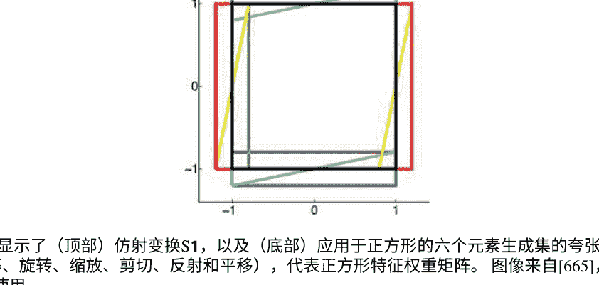

图10.44 该图显示了（顶部）仿射变换S1，以及（底部）应用于正方形的六个元素生成集的夸张渲染（六个变换包括恒等、旋转、缩放、剪切、反射和平移），代表正方形特征权重矩阵。图像来自[665]，©Robert Gens，经许可使用

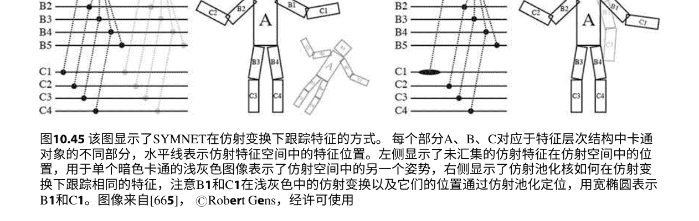

图10.45 该图显示了SYMNET在仿射变换下跟踪特征的方式。每个部分A、B、C对应于特征层次结构中卡通对象的不同部分，水平线表示仿射特征空间中的特征位置。左侧显示了未汇集的仿射特征在仿射空间中的位置，用于单个暗色卡通的浅灰色图像表示了仿射空间中的另一个姿势，右侧显示了仿射池化核如何在仿射变换下跟踪相同的特征，注意B1和C1在浅灰色中的仿射变换以及它们的位置通过仿射池化定位，用宽椭圆表示B1和C1。图像来自[665]，©Robert Gens，经许可使用

Gens和Domingos从对称群理论中获得灵感，开发了一种仿射类不变特征。对称变换保持特征的类别或身份，并且是可逆的。SYMNets支持仿射对称群，包括旋转、缩放、剪切、反射和平移，如图10.44所示。因此，CNN中有一组身份特征权重矩阵用于每个级别，并且仿射特征变化是从身份特征中派生出来的，用于与输入进行滤波，如图10.45所示。

SYMNets提供了一种在仿射空间中一致的特征表示，可以处理姿态变化和物体部分变形。CNN训练协议通常通过几何和强度变换来增加训练数据的多样性，从而在特征集中增加了一定程度的不变性，但同时也增加了特征集的大小和训练时间。相反，SYMNets使用仿射不变特征，减少了训练协议的增强要求，并且证明可以加快训练收敛速度。

$$\begin{bmatrix} x' \\ y' \end{bmatrix} = \begin{bmatrix} a & b \\ c & d \end{bmatrix} \begin{bmatrix} x \\ y \end{bmatrix} + \begin{bmatrix} e \\ f \end{bmatrix}$$

SYMNETS多层特征表示允许通过低层不变特征的组合来构成高层不变特征。如图10.45所示，当低层特征在仿射空间中移动时，高层特征的身份得以保留，因为低层特征的身份也得以保留。这是其他CNN中没有的一个强大概念。使用一组100个每个身份特征的仿射变化来实现不变性，使得每个特征都可以在仿射空间中被跟踪。每个仿射变化都被用作输入图像空间的滤波器，并且所有滤波器的结果都被汇集（我们稍后会详细讨论汇集方法）。由于高层特征由低层身份特征组成，所以在仿射变换下可以检测到低层身份特征，从而保留了高层特征的身份。

SYMNETS在层次结构中的每个级别上维护一个包含20个像素特征权重的身份集合，用于在反向传播期间进行梯度下降调整，与其他CNNs一样。然而，对于滤波，使用一组新颖的稀疏仿射特征，每个身份特征计算100个仿射变化，在6D仿射空间中在半随机均匀间隔的控制点上计算。仿射空间中的控制点使用图10.44中的方程（S1）计算，通过选择适当的仿射变换系数 [a, b, c, d, e, f]，然后使用仿射变换将身份特征渲染到一个20 × 20像素的特征权重矩阵中。为了准备滤波，使用Lucas-Kanade方法的正向组合（FC）扭曲扩展来将仿射变换后的特征块矩阵与附近网格点附近的分数分辨率的局部极大值对齐，例如5，并且在LK对齐期间调整确切的网格点位置与特征对齐。

使用周围网格位置的局部极大值类似于使用兴趣点，并且是卷积神经网络的一种新颖方法。

接下来，对每个20 ×20特征的点积进行对齐，并在每个调整后的网格点处进行计算。通过将特征与输入窗口的极大值对齐，可以最大化点积。接下来，应用sigmoid非线性函数，并将每个100个特征的输出存储在一个向量中，类似于每个100个仿射变换的特征图，以允许对所有仿射激活进行池化，以找到所有100个仿射变换中最强的激活，以揭示仿射空间中身份特征的位置。

所有100个仿射滤波器的结果通过使用新颖的仿射池化核减少为包含所有100个仿射滤波器最强激活的摘要特征图，以揭示6D仿射空间中最强激活的位置，或者在特定仿射变换组合下定位特征。摘要特征图可以被视为所有100个仿射变换的累加器，类似于Hough变换中使用的累加器（见第3章）。如果我们想象一下，每个100个滤波器在一个体积中产生一个单独的特征图，那么仿射池化核将穿过特征图体积的Z维度（类似于之前在NiN和Inception中用于1 × 1卷积的Z列），因此当前位置的所有仿射特征激活都是仿射特征激活池的一部分。SYMNETS允许设计仿射池化核以在仿射特征空间中池化变换的组合，以表示真实对象的预期仿射变换。例如，可以设计一个池化核，以偏好在小范围尺度和广范围旋转上进行池化，以表示特定对象（如面部或手臂运动）在6D仿射空间中的真实运动。请参见图10.46。所有滤波器的综合结果在局部区域中充当对称池，支持平均池化或最大池化，作者更倾向于最大池化。如图10.46所示，对称核组池可以检测到在仿射变换下相同的特征。

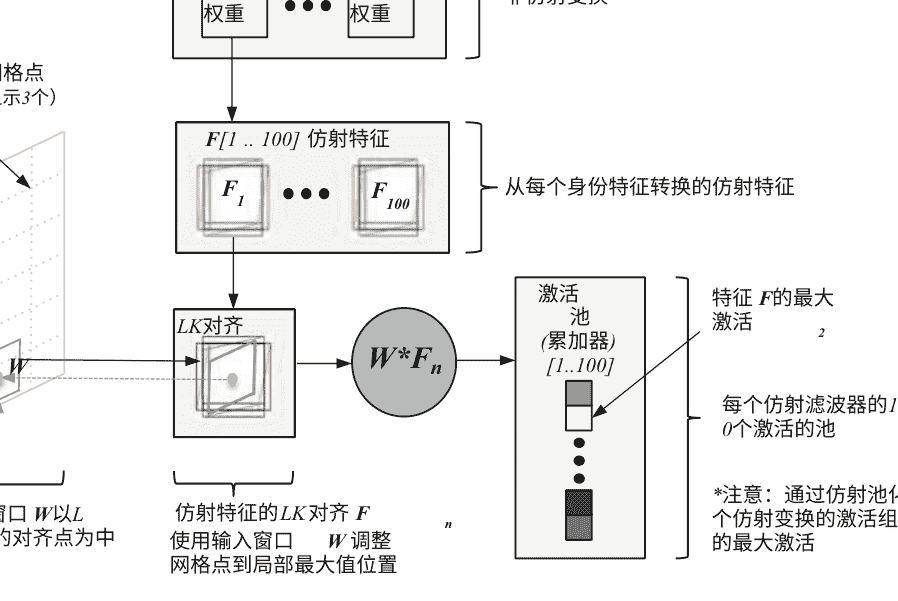

图10.46 本图说明了仿射特征生成、仿射滤波和仿射核池化的过程

由于特征的仿射性质，训练协议不需要对训练集进行大量的添加，以包括仿射变换的测试图像。SYMNETS以小批量的方式训练为ConvnetS，使用梯度下降和反向传播。作者证明了SYMN ET可以比典型的Convnet更快地实现训练收敛，并且使用更少的训练样本。SYMNETS在仿射变换和控制点对齐方面计算密集。然而，可以使用CPU SIMD指令、GPGPU内核、图像处理库和GPU硬件加速器，但未提及。因此，如果不对控制点处的仿射特征进行优化，对于较大的图像来说，仿射变换将变得难以处理。

评估了一层和两层网络，两层网络表现最好。生成的特征被输入到一个具有500个连接的全连接层，然后是一个softmax层。在SYMNET S中，较大的特征表现最好，例如20 × 20个特征块，而在CNN中，使用较小的特征如3 × 3或5 × 5更为常见，因此SYMNET特征卷积非常计算密集，实际上，一个20 × 20的卷积等效于一个由9个连续的3 × 3卷积堆叠而成的（请参见ConvnetS讨论中的堆叠卷积部分）。

总结一下，SYMNETS为将不变特征添加到基本的Convnet架构中提供了一条优雅的路径。关于将不变特征添加到ConvnetS的相关工作包括Bruna等人的工作[780]，他们使用级联小波组合成特征描述符，类似于SIFT。基于散射的小波变换通过使用非线性产生变体小波来增加基本小波的不变性。所得到的非线性小波变换被用于CNN中的卷积特征的位置，Bruna将其称为散射卷积网络，其中包括一种新颖的仿射空间分类模型。

| 姓名                 | SYMNETS                          |
|----------------------|----------------------------------|
| 人工神经网络类型     | 卷积神经网络                     |
| 内存模型             | 简单，固定                       |
| 输入采样             | 在特征对齐的网格点上滑动窗口，步长为n |
| 丢弃，重构           | -                                |
| 预处理，数值调整     | -                                |
| 特征集维度           | 每层100个特征，20x20大小        |
| 特征初始化           | 每个特征的100个仿射变换排列       |
| 层总数               | 1-2个特征层，1个全连接层，1个softmax |
| 特征、滤波器         | 卷积，100个仿射排列               |
| 激活函数、传递函数   | Sigmoid                          |
| 后处理，数值调整     | -                                |
| 池化，子采样         | 对于每个特征，通过100个仿射激活进行最大池化，无子采样 |

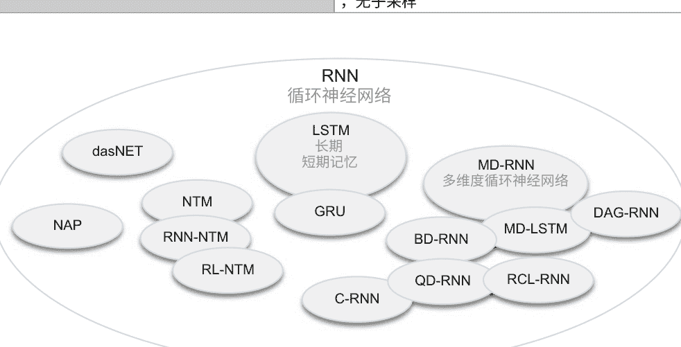

## RNN 架构调查

RNN是最复杂的ANN类型，讨论起来没有明确的架构模式。由于本调查重点是特征度量和计算机视觉，我们只涵盖了RNN的基本概念。此处调查的RNN架构被选择为涵盖一系列新颖的计算机视觉应用，这是一个新兴的研究领域。我们认为脉冲神经网络（SNN）与RNN相关，因为SNN使用复杂的神经元模型，允许神经元群之间的特殊反馈路径影响神经元群的激发。然而，在这个简短的调查中，我们不涵盖SNN和其他复杂的神经元模型。有关复杂神经元模型的更多信息，请参考《理论神经科学》（Dayan和Abbot，MIT Press）等标准文本。RNN最流行的应用之一是序列学习，例如文本处理，因为RNN提供了存储先前状态和预测状态的原始记忆单元。然而，如今RNN正与CNN结合用于计算机视觉应用，例如CNN执行特征学习和分类，而RNN用于视频帧序列学习和视频字幕生成，图像的CNN分类结果可以通过偏置权重影响RNN序列学习。

要深入研究RNN，最好的资源包括Schmidhuber、Graves、Hochrieter和Bengio的工作，我们在进行中引用了他们的出版物。然而，我们在这里专注于与计算机视觉相关的选定研究。要深入了解RNN领域，可以参考Bengio等人的[554]，Schmidhuber的[552]以及Schmidhuber即将出版的关于RNN的书籍。要获取有关设计和使用RNN的操作信息，请参考附录C中的开源资源，并跟踪源代码。在这里，我们故意避开了操作材料和详细的数学内容，因为这些内容已经在提供的参考资料中很好地呈现出来。

早期在1986年，Rumelhard和McClelland [739]展示了对于1D序列学习的循环网络的成功，随后在1990年由Elman [740–742]和其他许多人进一步发展。LSTM-RNNs是一种更多功能的变体，被应用于计算机视觉中的时空视频序列，用于活动识别和视频字幕等应用，通常在同一系统中结合了CNN和RNN。例如，Vinyals等人的视频字幕工作[709]使用了深度CNN来分析图像，并使用LSTM-RNN [584]生成文本字幕。Ren等人展示了一个视频问答系统[710]，利用VGGnet风格的CNN进行图像特征学习，结合LSTM-RNN和softmax分类器生成答案，使用DAQUAR标记的视频问答数据集作为基准。Venugopalan等人[711]展示了将图像序列与一系列形成句子的单词进行匹配，使用了结合了CNN和LSTM-RNN网络的方法。Graves [712]展示了一种将LSTM-RNN应用于分析手写风格并生成合理手写的新方法。

Socher等人[729]将CNN和RNN结合在一起，用于RGB-D图像分类，使用RNN树进行分层特征汇聚。Gregor等人[728]开发了一种新颖的用于图像生成的RNN。

目前，计算机视觉文献中只有很小一部分专门研究RNN。RNN最初设计用于处理序列学习，主要研究一维问题，因此使用2D数据的计算机视觉应用很少。然而，针对2D图像数据设计的多维RNN（MDRNNs）正在兴起，我们将在本节中进行调查。未来，本作者预见到RNN在计算机视觉中的应用将会增加，例如应用于将特征描述符聚合在一起进行图像分类，使用RNN来定义局部区域特征之间的模式邻接关系，其中一个区域中的有序特征集或序列被输入到RNN中进行特征邻接签名的编码、预测和匹配。然后，可以使用RNN签名编码来实现各种类别和对象的分类器。

我们不调查的一些值得注意的方法包括由Mnih等人开发的循环注意模型(RAM) [754]，该模型使用RNN来选择要跟踪和处理的图像区域，并以高分辨率进行处理，其中包括一种瞥见传感器和一种瞥见网络，该网络使用强化学习进行训练，而不是使用BPTT（用于训练RNN的反向传播算法）。Mnih等人还提出了另一种使用RNN在高分辨率下选择性处理图像的方法[708]。Volodymyr等人[708]提出了一种RNN，可以在感兴趣的区域中选择性地处理图像，并且只在高分辨率下处理图像。

### 循环神经网络的概念

我们将在这里介绍一些RNN的基本概念，以便为调查做好准备，例如不同的RNN架构概念，如何将RNN展开为FNN以理解前向传递和反向调整传递，RNN权重共享以及RNN中实现的记忆类型。循环神经网络是一类动态的非线性系统，用于将序列映射到序列，使用虚拟时间的概念。RNN使用一个由迄今为止看到的输入的内部状态空间组成，参见Boden [746]。RNN还通过循环输入实现了一种记忆形式，这对于建模由当前和过去状态组成的序列非常有用。

#### 将RNN展开为FNN

RNN可以被重新映射为一个输入序列上的流图，然后将该流图展开为前馈网络（FNN）或事件链。展开展开允许可视化RNN的前向传递和反向传递，并且还能够实现通过时间的反向传播（BPTT [746]）。参见图10.49和10.50，它们展示了使用FNN的等效性。

#### Tapped Delay Line FNN

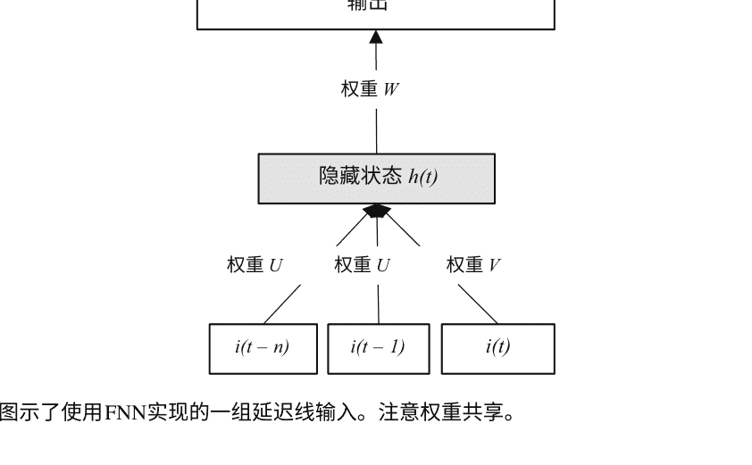

图10.49 这个图示了使用FNN实现的一组延迟线输入。注意权重共享。

#### 展开的循环神经网络（RNN）成为前馈神经网络（FNN）

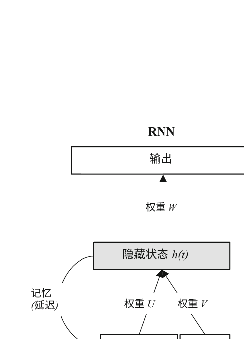

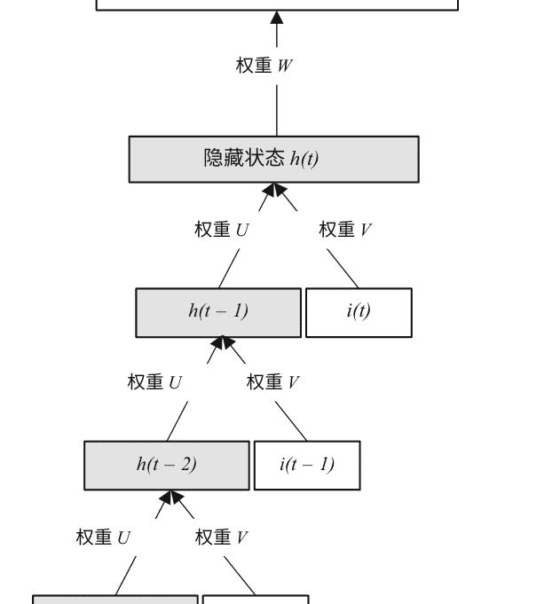

图10.50 这个图示了（左边）一个简单的RNN和（右边）将简单的RNN展开成FNN的过程。注意权重共享。将RNN展开成FNN对于可视化随时间变化的输入数据序列以及随时间进行反向传播训练（BPTT）非常有用。

分时延线、循环神经网络（RNN）和展开的RNN。关于展开在反向传播中的简单概述可参考Boden [746]和Bengio [554]。

序列的大小决定了展开图或FNN的大小。RNN是根据序列大小设计的。或者，也许RNN是设计为并行操作的多个序列网络，每个网络的长度不同。RNN的状态或输出由序列中的所有先前输入组成：

$$ o_t = h_t(i_t, i_{t-1}, i_{t-2}, \ldots, i_2, i_1) $$

请注意，RNN状态对于适合于可能的序列大小的每个序列都不是精确的，但由于贡献被加在一起，因此会有一些损失，因为根据训练协议，某些贡献比其他贡献更精确地加权。较大的序列大小尤其适用于对训练数据中不存在的序列进行泛化。通过设计具有包含不同大小序列的几个并行图的RNN，可以找到最佳的序列精度，支持训练数据和测试数据中预期的序列长度。然而，随着网络规模的增大，当然会引入更多的参数和连接，增加复杂性。

如图10.50所示，一个简单的RNN可以按照时间步骤展开其输入序列，其中前向传播用于通过将新输入与先前状态相结合来计算每个单元的当前状态。请注意，RNN中的权重在每个层的单元之间是共享的，并且当前状态存储在RNN单元中，我们稍后会讨论。展开的网络看起来像一个CNN，因此在反向传播过程中，通过时间的反向传播（BPTT）用于调整权重；错误被计算为网络输出处的偏导数，并且为了向后传播错误，偏导数被分割为对最近层的每个贡献RNN单元的贡献，并且该过程向后通过网络重复到输入。关于RNN中使用的反向传播方法，包括由Williams等人[743]和Werbos [745]描述的BPTT以及由Robinson等人[744]描述的实时递归学习（RTRL），我们将读者参考Graves [725]。另请参阅Bengio等人[554]。

### RNN权重共享和概率匹配

权重共享是RNN展开成FNN的一个特征，如前所述。如图10.50所示，在展开的FNN图中，相同的权重在不同的时间步骤中被共享。这减少了参数，但也降低了精度到一定程度。在展开的图中，权重共享是显而易见的，但在循环图中，权重在每个时间步骤中隐式共享，因此单个RNN单元不共享权重，而是在每个时间步骤中重用相同的权重。

在RNN中，权重在时间上共享的想法允许相同的权重适用于一系列序列和子序列，例如“abcd”和“abcdefg”，以及不同序列的相同长度，例如“abcd”和“abcz”。共享权重的想法允许对类似于已学习序列的新序列进行泛化。但在这方面，权重共享提供了一种统计建模能力，可以进行泛化和逼近，而不是需要包含所有已知序列以进行精确匹配的更大内存系统的详尽、逻辑精确匹配建模能力（如果可以获得完整的训练集并且需要精确匹配，则可能更可取）。序列和子序列的泛化和权重共享意味着可变的精度。

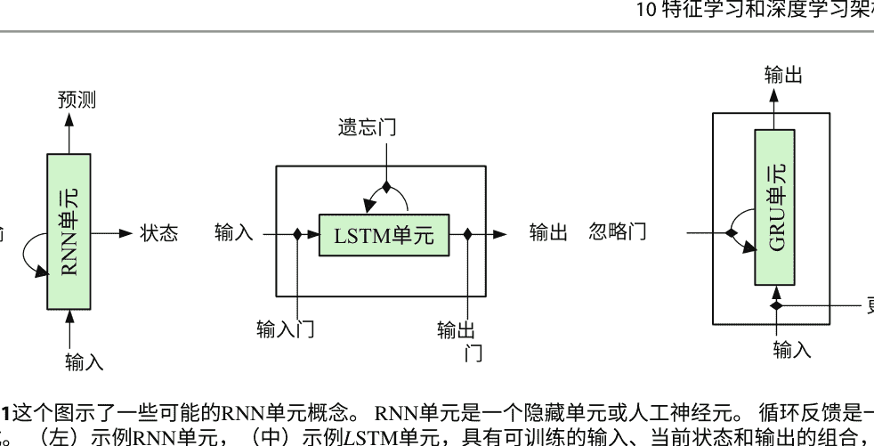

图10.51这个图示了一些可能的RNN单元概念。RNN单元是一个隐藏单元或人工神经元。循环反馈是一种记忆形式。（左）示例RNN单元，（中）示例LSTM单元，具有可训练的输入、当前状态和输出的组合，以及（右）GRU单元，结合了输入和当前状态的权重组合。本节稍后讨论的单元类型

### RNN单元和网络分类

为了说明RNN概念的基本概述，我们对RNN进行分类，以下是一些单元和网络拓扑的示例，知道这个列表远非完整（详见Schmidhuber [548]以深入挖掘和找到详细参考资料）。

RNN单元类型，如图10.51所示，实现了一种记忆形式，利用循环输入、来自其他RNN单元的输入以及可编程门函数进行变量组合。RNN单元已经得到改进和改进，以提供对内存的更多控制，特别是长短期记忆（LSTM）模型，由Schmidhuber [584]于1991年引入，这是一个特别有吸引力的模型，我们稍后进行调查。

- 对于RNN单元的分类，我们认识到：
- RNN简单单元，使用简单的循环输入，每个单元都是一个人工神经元，具有输入、权重、偏置和输出。
- LSTM单元，GRU单元，与简单单元类似，但添加了门控函数以允许记忆持久化和更好的控制。

RNN网络拓扑，由RNN单元和其他人工神经元单元组成，使用各种连接拓扑。RNN架构拓扑可能包括循环部分、FNN部分和任意连接部分。没有通用的RNN架构。

- 各种RNN网络拓扑包括：
- DAG-RNN，有向无环图RNN，可以在格子、树或其他图结构拓扑中使用递归连接。DAG提供了多维RNN中使用的基本拓扑结构，参见[727]。
- ACRNN—任意连接的递归神经网络，这是神经生物学揭示的模型；然而，建模困难。
- DTRNN—离散时间RNN，同步操作，像由时钟驱动的状态机。
- CTRNN—连续时间RNN，异步操作，类似于状态机，并具有动态反应。
- BRNN，BLSTM—双向RNN或LSTM，由两个在相反方向工作的RNN组成。BRNN通过将输入合并到RNN中提供双向上下文。
- RRNN—反向循环神经网络，输入序列是反向读取的，而不是正向的，参见Sutskever等人[749]。
- MDRNN, MDLSTM—多维循环神经网络，能够支持2D成像和计算机视觉问题，使用BRNN在两个或多个维度上的扩展。

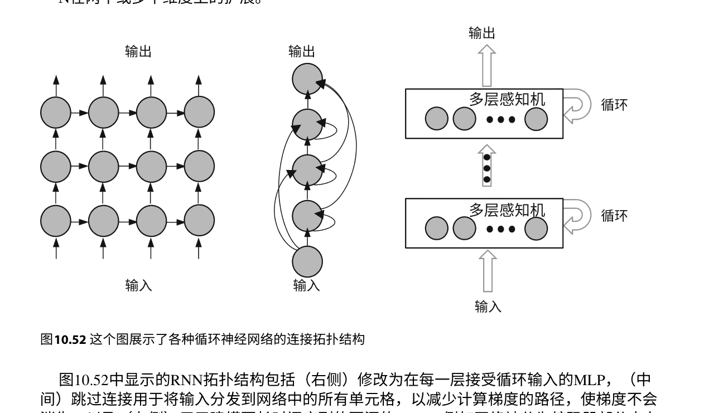

图10.52 这个图展示了各种循环神经网络的连接拓扑结构

图10.52中显示的RNN拓扑结构包括（右侧）修改为在每一层接受循环输入的MLP，（中间）跳过连接用于将输入分发到网络中的所有单元格，以减少计算梯度的路径，使梯度不会消失，以及（左侧）用于建模更长时间序列的更深的RNN，例如网络被分为编码器部分来存储序列标记，和预测器部分来解释标记。

### RNN序列和状态

RNN实现了一种在分布式内存中存储序列的神经模型。内存可以在可变长度的时间内持续存在，并且根据RNN架构的深度分布在多个内存单元中。RNN可以设计成更像有限状态机而不是FNN。时间的概念对于RNN序列学习至关重要，可以是同步或异步的。例如，数据通过RNN的每个时间步骤输入，过去的输入按需存储在网络中。虽然FNN通常按层次结构组织，但RNN不容易分解为层次结构，更常见的是类似于一组单元或单元组的网络。

> > Cho等人[734]提供了关于序列处理的神经方法的清晰概述，总结了关键的研究和概念发展，并提供了良好的直觉和实际知识。Cho还介绍了门控循环单元（GRU），稍后与LSTM一起进行了调查。如图10.53所示，序列首先从输入中进行编码并存储在RNN内存单元中，直到确定序列完成，然后序列可以被解码成另一个序列，然后释放序列内存以处理下一个输入序列。例如，一个包含十个单词的英语句子可能首先被编码成一个向量表示，然后解码成一个包含14个法语单词的序列，其中每个单词、单词对或短语可以根据需要重新编码为正确长度的序列。

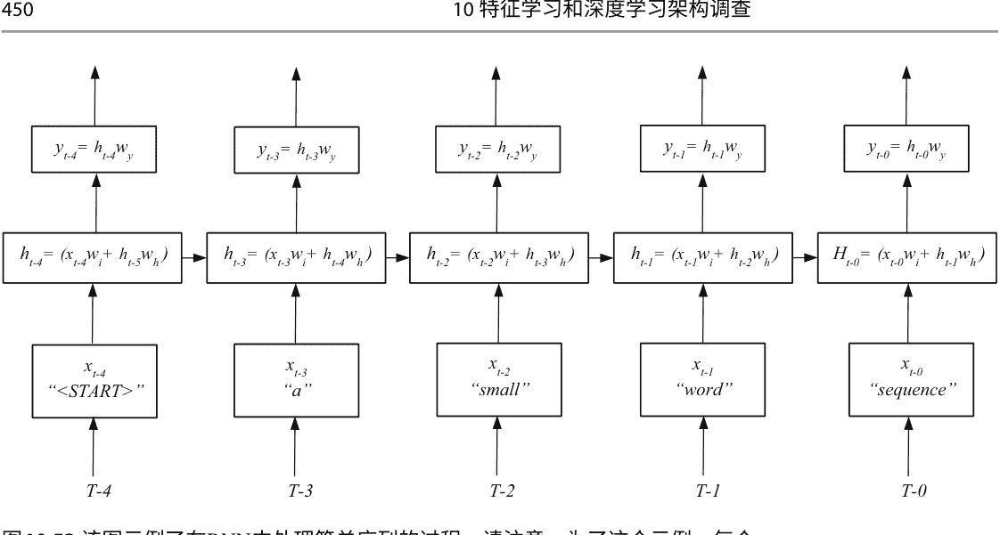

图10.53 该图示例了在RNN中处理简单序列的过程。请注意，为了这个示例，每个输入标记“字符串”x在内部被编码为作为字符串表索引的整数

循环神经网络的细胞状态取决于过去的状态和当前的输入。循环神经网络经常被用来预测未来的状态，因为已经学习和存储在网络中的一系列过去的状态是未来顺序状态的基础。通过将循环神经网络单元组合成深度网络，可以学习深度序列。事实上，与卷积神经网络相比，循环神经网络通常非常深。我们将在本节中介绍一些例子。

循环神经网络可以学习和存储复杂的时空模式或节奏。循环神经网络接收输入，记录状态并产生输出。循环神经网络的状态记忆可以根据输入和其他门控因素而改变，并产生与状态相关的输出。其他用于学习序列的方法，如有限状态机、隐马尔可夫模型（HMM）和高斯混合模型（GMM），无法使用微分和反向传播进行训练。

虽然MLP或CNN是一种通用的函数逼近器，而RNN是一种通用的序列逼近器，并且已经被用来创建程序代码序列[738]。然而，由于表示为权重和偏差的组合，序列状态是概率的，因此RNN不包含每个可能的单词和短语组合的完整字典；相反，RNN的目标是通过短语编码进行泛化和学习。在RNN中，概率概念被编码在每个单元的个体权重中，并组合成一个概率总结，而不是通过概率将完整的短语候选项与已知短语进行比较。RNN利用RNN单元中的时间状态信息进行动态学习和时空序列的预测。虽然FNN批量学习类别，但RNN可以随时间动态学习。RNN比无状态模型（如HMM和SVM）更具多功能性，适用于分类。然而，RNN既可以应用于分类，也可以应用于序列。RNN可以进行并行和顺序计算。一般来说，循环网络的参数比FNN少得多，学习速度更快。此外，与严格的CNN特征相比，RNN可以设计出具有良好泛化性的网络。

### RNN内存模型

RNN中的一个核心概念是内存模型。大多数RNN变体都围绕着使用的内存模型展开，下面进行总结。RNN内存模型被设计成智能、聪明的构建块，用于实现时空机器学习算法。到目前为止，大部分将智能内存系统应用于计算机视觉的工作都非常原始，并且是在RNN架构而不是CNN架构中完成的。然而，我们强调了韦斯顿的工作

例如，et al. [714] 将更先进的记忆模型应用于文本识别的一个最新例子。 我们预计，仅凭智能记忆就可以提供令人印象深刻的工具，用于开发全新的机器智能和计算机视觉方法，因为生物智能表示关联记忆分类和回忆。 智能记忆是未来的趋势。 有关视觉基因组 [534] 的讨论，请参见附录F，它们是一种计算机视觉特征记忆印象的形式。

例如，可以通过关联记忆矩阵 (AMM) 来表示 CNN，正如 LaRue [715] 在与 DARPA 的合同下所示。LaRue 将 CNN 转换为一个相对较小维度的双向记忆矩阵，以替代整个 CNN，将所有隐藏层压缩到一个关联矩阵中，这样训练速度更快，执行速度更快，声称快了一个数量级。智能记忆对于计算机视觉和机器学习是一个有前途的研究领域，但超出了本简要调查的范围。

在这里，我们简要总结了一些智能存储器的类型，这些存储器已经被纳入神经网络中，并使用了一些使用RNN的方法。提供了参考资料以深入了解。

- CEC LSTM, GRU—Constant Error Carousel (CEC) 和Long Short-Term Memory (LSTM) —由Schmidhuber等人开发[584]。CEC和LSTM允许记忆持久存在，错误保持恒定，而不是消失或爆炸。参见图10.54，LSTM在长时间滞后上特别有效。LSTM是一个可训练的人工神经模型，使用权重和偏置因子，其中记忆单元周围有几个门控函数，用于控制记忆的持久性、更新和重置。恒定错误旋转木马是保持记忆在当前状态下不变的机制。我们将在本节中对LSTM以及变体GRU进行调查。
- 半无限带模型 (NTM) —由Graves等人[583]开发的神经图灵机循环神经网络使用了包含LSTM单元的半无限带内存模型；内存持久存在直到不再需要为止。NTM是一种新颖的方法，但对于随机访问工作负载来说很难进行优化。与硬编码LSTM单元数量不同，LSTM内存单元的半无限带可以增长和缩小。NTM还允许时间的正向和反向遍历（虚拟时间）。
- CAM、AMM、Hopfield网络、SOM—内容可寻址内存首次由Hopfield [719]于1982年作为RNN实现，也被称为Hopfield网络。在CAM中，内存地址与单元内容相关联，类似于单元内容的哈希键。CAM内存已经应用于计算领域的各种问题几十年，但在计算机视觉的机器学习中并不流行。关联记忆矩阵 (AMM) 类似，但可以从CNN中派生，参见LaRue [715]，还可以使用SVD和PCA对向量进行处理以减轻虚假吸引盆地的影响，从而实现双向AMM (BAM)。另请参阅Kohonen [718]对于类似概念的讨论，即自组织映射 (SOM)。
- BAM—双向关联记忆在RNN中首次由Kosko [717]在1988年展示，类似于CAM记忆，不同之处在于每个记忆单元的内容是其他相关记忆单元的关键。关联的概念是智能中的一个重要概念，因此BAM记忆系统可以类似于距离函数（见第4章）用于识别特征候选选项进行分类和特征匹配。LaRue [715]开发了一种新颖的CNN，它与BAM同时运行，训练速度明显比单独的CNN快得多。

在BAM记忆和变体方面，早期的研究也已经进行了，例如Zhou和Quek [716]对DBAM和DCBAM进行了讨论。还可以参考LaRue [715]。

### LSTM, GRU

LSTM是一种设计用于实现提供短期记忆的记忆单元的RNN类型(STM)，它可以弥合长时间滞后 (L + STM)。LSTM由Schmidhuber引入

1991年，作为对RNN模型的改进，LSTM模型通过使用相互连接的RNN-LSTM组来在深度架构中高效地压缩学习到的表示，并克服了梯度下降问题。LSTM模型在需要时保留RNN记忆单元的内容，并在长时间滞后上保留反向传播的梯度信息，以避免梯度消失问题。RNN受到反向传播训练困难和缺乏标准RNN架构的限制。然而，LSTM-RNN的创新使得RNN更易训练，并实现了更深层的网络。有关LSTM的优点和缺点的详细分析，请参见Ders [747]。

LSTM是一个线性积分器，类似于其他人工神经模型，使用权重和偏置来整合输入。LSTM包含训练机制（门）来确定积分器何时以及如何听取输入以影响当前状态。然而，如图10.54所示，LSTM是一个比简单RNN更复杂的记忆单元的人工神经模型，它包含以下几种门的组合：

- 输入门（逻辑单元，权重 = [1:0]）
- 遗忘门，控制当前状态（线性单元，权重 = [0...1]）
- 输出门（逻辑单元，权重 = [1:0]）

输入门和遗忘门共同决定存储多少输入以及忘记多少当前状态。这种安排允许表示和学习序列元素之间的长期依赖关系。例如，当遗忘门权重设置为1时，LSTM将随时间保留其当前状态值，当设置为0时，当前状态将被遗忘。

也可以使用中间权重值进行部分遗忘。输入和输出门的值为1或0时，在反向传播过程中产生简单的导数，因此由于常数的导数为零，没有错误被传播。

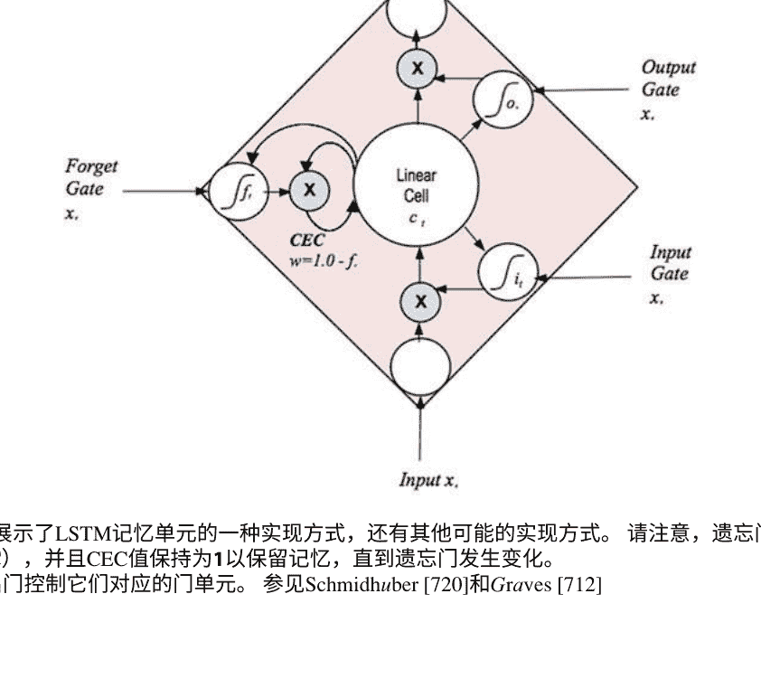图10.54中的LSTM细胞状态可以计算如下：

```
i_t = \sigma(W_{xi}x_t + W_{hi}h_{t-1} + W_{ci}c_{t-1} + b_i)
f_t = \sigma(W_{xf}x_t + W_{hf}h_{t-1} + W_{cf}c_{t-1} + b_f)
c_t = f_t c_{t-1} + i_t \tanh(W_{xi}x_t + W_{hi}h_{t-1} + b_i)
o_t = \sigma(W_{xo}x_t + W_{ho}h_{t-1} + W_{co}c_{t-1} + b_o)
h_t = o_t \tanh(c_t)
```

*其中 $\sigma$ 是sigmoid函数。

最近的LSTM变体是由Cho等人开发的门控循环单元（GRU）[734, 735, 750]，它只使用两个控制门：输入门和动态门，为反向传播调整提供了一个更简单的模型。如果我们将当前单元值和新输入值视为GRU神经函数的两个输入，则GRU动态门允许当前值和输入值的权重组合。如图10.54所示，当输入门关闭时，内存的内容将被新输入覆盖。当动态门关闭时，先前单元的过去信息将按照动态门值的期望强度与权重计算相结合，这可以用于减少梯度消失问题。此外，Cho还基于GRU开发了一种门控递归卷积神经网络（grConv）用于文本翻译，详见[735]。请注意，LSTM的概念最初也是使用较少的门实现的，就像GRU一样。

基本循环神经网络的一个弱点是没有办法控制每个记忆单元的更新，它只是一个没有控制的循环反馈或输入。长短期记忆网络允许保护每个单元中的数据，并且使用门的组合来保持状态的时间长度。这些门类似于内存的读/写和重置操作。然而，这些门可能使用非线性的sigmoid函数，范围在0-1之间。如果输出门=0，那么无法读取LSTM单元中的数据。如果遗忘门为零，那么单元中的数据为零，或者被重置。

LSTM解决的一个基本问题是消除梯度消失，这是梯度反向传播方法中的一个难题。解决方案是常数误差旋转(CEC)，它为一个或多个神经单元提供了一个恒定的反向传播误差流，因为LSTM单元可以集成在一起共享CEC。遗忘门用于控制一个或多个单元上的CEC。（注意：没有固定的LSTM设计，因为CEC可以在LSTM单元之间共享）。常数值1被乘法地用作CEC权重，以保持当前状态，而不是输入一个无穷小的梯度，这会将单元值缩放为零。当遗忘门的值改变为非1时，神经元单元的值将发生变化。CEC还缓解了梯度振荡的问题。Lyu等人在门控函数上的研究表明，更陡峭的门控函数，如更陡峭的sigmoid函数，可以更好地加速学习和强制收敛。

在一个连接的网络中，LSTM可以学习何时忘记记忆，何时更新记忆。LSTMs通常使用基本的卷积神经学习模型来支持通过梯度下降的反向传播。然而，除了通过梯度下降的反向传播之外，使用LSTMs还有其他的训练方法，参见Schmidhuber等人[713]，而且对于训练RNNs来说，没有明确的最佳方法，因为拓扑结构变化很大。LSTM的概念可以以几种方式实现，例如带有或不带有遗忘门。其中一种方法如图10.55所示。

LSTM是一种时间感知的学习方法。可以学习算法步骤或更大的过程等序列。LSTM可以学习重现序列，组织和关联数据。LSTM可以处理序列，并处理类似引号或括号的断开序列分隔符。

图10.55这个图示了LSTM单元与其他单元相互连接，引自Schmidhuber [720]

例如，一个LSTM单元可以设置为识别开放括号'['，并在检测到闭合括号']'时进行重置训练。当训练数据或输入流中包含足够的冗余和可预测性时，LSTM的运行效果很好。在LSTM架构中，纯随机数据表现不佳，因为其目的是序列学习。

LSTMs的另一个关键概念是压缩。例如，一个LSTM单元可以设置为监视字符序列，寻找分隔符序列，如“，”。通过这样做，中间值不会被存储，只有分隔符被存储。这就是序列压缩。序列压缩的想法可以使LSTM网络更具鲁棒性，因为需要比预期更大的序列才能打破这个范式。LSTMs通常被组织成层次结构，以表示时间步长或序列步长。较低的层次将学习初始序列，而较高的层次将学习较低层次未学习的未知序列，以更加紧凑的形式。此外，LSTMs可以组织成包含整个序列的较大内存块，其中共享一个公共的CEC来控制该块。

RNN-LSTM风格方法的未来方向包括元学习或学习如何学习，以及记忆网络，请参阅Schmidhuber [722]。关于使用LSTMs进行元学习的良好介绍可以在Hochreiter等人的[721]中找到，这是LSTMs的理想应用，因为LSTM可以改变自己的权重以改进自己的算法。我们在下面的多维RNN（MDRNN）部分讨论了应用于计算机视觉的2D LSTMs。

### NTM, RNN-NTM, RL-NTM

神经图灵机（NTM，或RNN-NTM）是由Graves等人开发的一种RNN，用于实现可训练的、概率性的内存控制器，用于物理内存单元（如DRAM）[583]。NTM的设计目的是自动学习算法，特别是基本的内存访问模式（序列）和写入内存的内存值（CAM）。NTM还可以推广学习到的算法，这比学习简单的序列（如单词短语或句子）要求更高，通常通过RNN来执行。目前，作者不知道NTM的计算机视觉应用；然而，随着研究的继续，预计会出现计算机视觉应用。

图10.56这个图展示了基本的NTM概念。 请注意，NTM是外部存储设备的控制器，其指令集由可训练的权重控制，就像其他RNN一样。

NTM内存模型被证明是LSTM模型的一种增强[584]。 然而，随着NTM模型的内存大小和序列大小的增加，计算复杂度呈指数级增加，因为RNN在每个时间步访问每个内存单元。 实际上，NTM将物理内存地址表示为可能内存地址的概率分布，而不是绝对内存地址。 因此，随着内存空间大小的增加，概率计算呈指数级增加，限制了NTM在所选平台上可计算的序列大小。 为了解决NTM的局限性，Zaremba和Sutskever [757]开发了RL-NTM（强化学习NTM），用于改进NTM模型，用强化学习代替RNN来学习内存访问模式。 我们在这里只简要调查了NTM和RL-NTM作为LSTM概念的扩展，以说明RNN风格内存的能力，并将感兴趣的读者参考原始论文。

Graves等人[583]提供了这样一个类比，即NTM-RNN就像是在外部存储器上操作的图灵机，因此遵循了使用半无限带作为存储器的图灵机模型，NTM模型包含了读写头的古老概念（磁带驱动器上使用读/写头）。 与图灵机类似，NTM还包括了指令序列的概念，如序列位置、读取、擦除和添加，以及RNN约束概念，包括时间和时钟。

如图10.57所示，NTM实现了一种概率性的读写地址方法，它提供了对可变大小的概念组或窗口的注意力聚焦窗口，其中可以是以下之一：

-   CAM: 分布在内存位置上的一个值或一系列值
-   序列: 一个地址（时间步长）或一系列地址

注意焦点窗口可以是窄的或宽的，这取决于模糊加权因子和其他加权因子，这使得学习过程可微分且适合于梯度下降学习，就像其他RNN一样，但因此是概率性的而不是绝对的。 模糊性允许有选择地忽略某些记忆概念，而将其他概念集中在焦点上，如图10.57所示。从NTM论文[583]中并不完全清楚模糊参数是如何工作的，因为NTM系统是专有的。

图10.57 这个图展示了NTM模型中可变焦点记忆窗口的概念，焦点的级别可以增加以变得更具体，或者减小以变得更概率化。（左）基于时间的序列窗口的可变宽度，和（右）基于内容的可变特异性窗口

NTM CAM寻址机制类似于Hopfield网络中的内容寻址[589]，使用模糊的、近似的地址或稀疏地址，它使用概念数据的一部分与其他概念（块）进行比较，以找到包含最接近匹配的块。描述NTM存储器的另一种方式类似于分类器，它根据稀疏描述符或关键字找到最接近的记忆概念，并加权。

NTM的作者引用了一系列神经生物学研究作为灵感。例如，Baddely[605]和其他人已经表明，人类学习和推理过程通常同时保持几个概念的注意力，这是由中央执行者在指导当前推理任务时请求的。中央执行者的概念假设输入可能在不同的时间到达，因此在给定时间内需要注意几个概念才能实现最佳学习。

也许人脑一次可以保持七个概念的注意力，因此贝尔实验室最初使用七位数的电话号码。所选概念被保持在工作内存或短期内存中（即注意内存或概念内存），而不是来自过去且与当前任务无关的长期内存。正如Goldman-Rakic [606]所示，注意内存或概念可以以不同的速率访问，例如在延迟期间不断检查，或者在中央执行者追求当前任务并访问其他记忆部分时不访问。短期内存将根据各种提示、逻辑或规则进行响应，并且与某些CPU中用于缓存的熟悉的关联内存或内容寻址内存（CAM）相似。

Graves等人证明了NTM可以被训练和优化用于顺序访问复制操作、分块访问和排序，进一步说明了NTM如何学习比LSTM模型更长的序列。然而，由于LSTM可以以各种配置方式排列，比较的方式并不清楚。此外，论文[583]中没有提供确切的NTM架构，也没有提供用于比较的LSTM架构。

NTM的应用似乎非常适合搜索引擎执行的搜索和排序操作。如果进一步开发，NTM的概念可以成为一种标准化的硅器件，广泛应用于机器智能（NTM-RAM或SMART-RAM），存储和组织学习的序列和元组，如n-gram，这可能是大多数分类方法的可行替代方案，并支持其他用于数据分析的通用计算应用。

### 多维度 RNN，MDRNN

我们在这里介绍多维RNN（MDRNN）及其变体，作为一组相关的架构，以指出它们与2D图像的相似性和应用。 MDRNN是Baldi和Pollastri于2003年引入的DAG-RNN模型的一个特殊情况[727]，有时作为1D序列模型通过BRNN（双向RNN）实现，它使用有向无环图模型和RNN内的递归来处理序列。 DAG-RNN也可以在多个维度上实现，例如用于2D图像，例如支持前向和后向传递的独立RNN的2D网络。 Baldi和Pollastri将DAG-RNN概念描述为类似于两个带有权重的轮子，在数据序列上以相反的方向移动，将当前输入和双向轮子的输出组合起来计算预测。

### 用于计算机视觉的2D RNN和2D LSTM

在文献中出现了一些将RNN和LSTM应用于计算机视觉的应用，我们在这里简要介绍一些。 Graves开发了一种用于图像分割的MDRNN [725]，包括相关的MD-LSTM变体[732]。 在所有的RNN架构中，MDRNN最适用于2D成像和计算机视觉，因为2D和更高维度直接支持。 Donahue等人[723]开发了一种基于LSTM的图像字幕和活动识别系统，将LSTM和CNN结合在一起，参见图10.58。 Byeon等人[781]开发了一种新颖的Quad-LSTM排列，以捕捉四个方向（n，s，e，w）的序列，使用四个并行的LSTM处理图像帧，将四个序列馈送到CNN中，使用非线性函数对序列进行求和和压缩，并将结果馈送到softmax层，目标是对场景进行局部和全局像素依赖序列建模。 Yong等人[782]将RNN应用于动作识别，使用RNN学习运动序列。

在许多情况下，2D RNN和CNN结合在一起，以便每个都可以完成不同的互补任务，通常依赖CNN学习特征，RNN学习帧与帧之间的特征序列或局部特征之间的空间关系序列。 例如，Venugopal等人[711]， Ren [724]和Donahue等人[723]在视觉识别中使用CNN， LSTMs用于序列预测， Donahue等人[723]在活动识别和视频字幕中应用LSTMs。

图10.58 这个图示了（左）用于活动识别和视频字幕中的序列学习的混合CNN和LSTM架构，（右）使用LSTMs对序列进行编码和解码的概念，图像来自Donahue等人[723] CVPR 2015，©Springer-Verlag，经许可使用

后来，我们还详细调查了C-RNN [731]作为MDRNN在计算机视觉中的应用示例。

## **MDRNN, MDLSTM, DAG-RNN, BDRNN, RRNN**

在本节中，我们将调查基本MD-RNN的变体。变体包括多维LSTM（MDLSTM）和有向无环图RNN（DAG-RNN）。此外，我们还讨论了基于1D RNN的2D变体，包括双向RNN（BDRNN）和反向RNN（RRNN）。为了理解2D图像的MDRNN概念，我们首先看一下1D情况，即由三个RNN网络组成的双向RNN（有时缩写为BRNN），如图10.59所示：

-   1. $F_i$ —用于预测上游序列的前向网络
-   2. $B_i$ —用于预测下游序列的后向网络
-   3. $N_O$ —用于合并（1）和（2）输出的汇总网络。

*请注意，$F$和$B_i$在数据序列上运行的方向相反。对于序列中的每个位置，前向和后向网络通过$N$和$O$进行组合，得到最终的预测，并且错误沿着$F_i$和$B_i$两个方向传播。想象一下，两个重叠的序列预测以相反的方向运行，分布在当前位置周围：当前位置的BDRNN输出预测是两个方向的组合。*

根据图10.59，1D_BRNN输出$O_i$由$N_O$，$N_B$和$N_F$RNN组成，可以计算如下：

```
$O_i = N_{O}(I_i; F_i; B_i)$
```

```
$F_i = N_{F}(I_i; F_{i-1})$
```

```
$B_i = N_{B}(I_i; B_{i+1})$
```

请注意，BRNN同时读取正向和反向的序列。然而，Sutskever等人[749]开发了一种用于文本到文本翻译的RNN，它在训练过程中将输入序列反转，我们在这里称之为RRNN（反向RNN）。Sutskever发现，通过在训练过程中反转输入字符串，RNN-LSTM能够处理更长的句子。

图10.60这个图示了2D MDRNN的概念，将一个3 ×3像素的2D图像作为输入，分别输入到四个RNN序列(N、S、E、W)中，然后合并成第五个输出RNN。注意：将此示例与图10.59中的1D BRNN示例进行比较。

表现明显更好。Sutskever认为，训练类似的RNN网络并反转输入序列将使它们表现更好。

为了将BRNN扩展到二维情况，我们引入了一个使用四个重叠网络的二维网络，按照指南针方向N、S、E、W N_N， N_S, N_E和 N_W在图像栅格中，以当前时间步的像素为中心，如图10.60所示。

根据图10.60，二维MDRNN输出 O_i可以由 N_O, N_N, N_S, N_E和 N_WRNN组成，如下所示：

```
O_{i,j} = N_O(I_{i,j}, E_{i,j}, W_{i,j}, S_{i,j}, N_{i,j})
E_{i,j} = N_E(I_{i,j}, E_{i-1,j}, E_{i+1,j})
W_{i,j} = N_W(I_{i,j}, W_{i+1,j}, W_{i-1,j})
S_{i,j} = N_S(I_{i,j}, S_{i,j-1}, S_{i,j+1})
N_{i,j} = N_N(I_{i,j}, N_{i,j+1}, N_{i,j-1})
```

如Graves等人所述[725, 726, 732]， MDRNN或MDLSTM的基本思想是将单个循环输入扩展为与维度一样多的循环输入。如图10.60所示，对于2D情况，MDRNN被建模为笛卡尔坐标空间中一系列扫描线上的像素有序序列。请注意，像素从图像中以从左到右、从上到下的顺序作为一个序列扫描到RNN中。这个序列定义了可能的RNN邻接连接模式。在这种情况下，MD RNN的应用[725, 726]是将图像分割成具有相似纹理模式的区域，这些纹理是已知的。

图10.61 该图说明了MDRNN的基于帧的扫描线输入

在训练数据中，像素是按顺序标记的，因此当前行和前一行的相邻像素对于检测和定义分割是有用的。然而，Graves等人[733]还开发了一种通过连接主义时间分类方法（CTC）对未标记数据进行RNN分类的方法。

如图10.61所示，图像被逐帧逐行扫描到RNN中，因此RNN在任何一个时间点的序列状态只包括先前的像素，包括前一行的相邻像素和当前行的前一个像素，因此一次只能知道两个方向的连接性。因此，对于这个例子，RNN架构至少应该足够大，能够容纳两行像素，即当前行和前一行，并且输入缓冲区可以被安排为一个循环像素缓冲区，或者是一个包含前一行、当前行和下一行的线缓冲池，并且每个缓冲区的指针会随着前一行变为当前行而改变，依此类推。

总结一下，MDRNN可以应用于2D图像或更高维度的数组，并且在图像分割中已经被有效使用。然而，MDRNN生成的特征类型是一组非常原始的1D权重模板，形成了围绕中心像素的1D交叉核。目前还不清楚MDRNN方法是否有足够的基础来扩展到更强大的分层特征集，这在CNN方法中已经被证明对于分类非常有效。

接下来，我们调查了一些MDRNN的例子。

### C-RNN, QDRNN

卷积循环神经网络（C-RNN）或四向循环神经网络（QDRNN）是由Zuo等人[731]引入的，它学习了局部区域卷积特征之间的空间依赖关系，这是简单CNN特征模型的一个明显弱点。（公平地说，我们注意到CNN模型并不是为了处理空间依赖性问题而设计的。）C-RNN是少数几个直接应用于计算机视觉特征表示的RNN示例之一。首先，C-RNN使用CNN来捕捉图像上的特征。其次，2D CNN特征被馈送到四个并行运行的RNN中，以捕捉四个方向上的特征序列签名，形成一个十字形的特征依赖模式。四向序列被收集在一个全局隐藏层中，如图10.62所示。需要注意的是，C-RNN与Graves[725, 732]为图像分割开发的MDRNN和MDSLS TM不同，因为C-RNN是在CNN特征上操作而不是像素上操作的。特征之间的关系被排序。 然而，MDRNN和QDRNN在每个轴(x,y)上使用相同的双向扫描模式。 请注意，C-RNN的图像标注应用由Shuai等人[730]讨论。

图10.62 这个图示了C-RNN方法，其中（左）收集了类似CNN的相关模板特征，（中间）使用RNN在四个方向上扫描图像以学习特征的方向性连接序列，（右）使用全连接层学习特征和相关序列的分类。图像来自C VPR Zuo等人[731]，©Springer-Verlag，经许可使用

C-RNN使用由卷积和池化组成的五个特征层，一个用于计算四个罗盘方向RNN序列的循环层，两个用于分类的全连接层和一个softmax层。 五个C-RNN CNN层包括11 ×11-96，5 ×5-256，3 ×3-384，3 ×3-384和3 ×3-256。 第一层的输入窗口步幅为4，其他层为1。第一、第二和第五层使用3 ×3最大池化，步幅为2。 因此，馈入RNN的摘要滤波器大小为6 ×6 ×256。

如图10.62中心所示，有四个RNN计算所有6 ×6 (36) 个特征的序列，并且每个特征图（256个之一）的RNN序列长度为36。 四个序列权重向量 w_x被连接成向量 h_s作为FC层的输入，类似于 MDRNN的形式，如下所示：

```
为了方便起见，我们将符号从图10.62转换为：
[↑,↓,→,←] = [n,s,e,w]
```

```
∴
hs = (w_n + w_s + w_e + w_w)
```

总之，C-RNN探索了一种新颖的特征学习架构，将CNN用于学习特征，并将RNN用于学习特征之间的空间关系。 这位作者预计会看到对于计算机视觉应用而言，对异构CNN/RNN架构的研究趋势增加。

### RCL-RCNN

Liang和Hu [751]提出的循环卷积层（RCL）是将RNN应用于计算机视觉的最早的有前景的应用之一，它将几个新颖的特性结合在一起。

图10.63 该图说明了循环卷积层（RCL），它在卷积函数的位置使用了RNN。与NiN方法相比，它在卷积函数的位置使用了MLP。图像来自CVPR Liang和Hu [751]，© Springer-Verlag获得许可使用。

新颖的RCL（循环卷积层）将RNN替代了CNN通常使用的卷积函数。在每个卷积层中使用RCL构建一个FNN，作者称之为RCNN（循环卷积神经网络）。可以说RCL-RCNN更像是CNN而不是RNN，应该在CNN调查部分中进行介绍；然而，我们选择在这里介绍，因为它包含了RNN。此外，RCL-RCNN在每个RCL层中直接使用多尺度输入是非常新颖的，如图10.63所示，原始图像以全尺度输入到每个RCL层中计算特征，同时还有可能经过卷积和池化的前一层的特征图像，从而减小图像尺度。这种排列需要一些缩放和对齐才能使图像对齐进行特征计算，Liang和Hu在论文[751]中没有明确指定使用的确切方法。

RCL-RCNN通过将先前层的输入窗口与当前层的输入窗口组合（如图10.63所示，原始输入层），递归地创建新的CNN风格特征块，从而形成深度递归特征表示。例如，使用当前层和先前层，对于当前特征图 k（来自96个特征图集合）的 3 × 3特征，计算如下：

$$f_{k}(t)=\sum_{i=1}^{3} \sum_{j=1}^{3} w_{i, j}^{c}\left(c_{i, j}\right)+w_{i, j}^{p}\left(p_{i, j}\right)+b$$

其中：
- $(i, j)$ 是图像中的坐标
- $k$ 是特征图像的索引 $[1 \ldots 96]$
- $w$ 是权重矩阵 ($3 \times 3$ 窗口) 的一层
- $c$ 是当前层的输入窗口, $t(k)$ 是 ($3 \times 3$ 窗口)
- $p$ 是上一层的输入, $t-1(k)$ 是 ($3 \times 3$ 窗口)
- $t$ 是时间，所以 $t$ 是当前层, $t-1$ 上一层
- $b$ 是特征图 $k$ 的偏置

如图10.63所示，第1层是使用$5 \times 5$特征的CNN层，第2-5层是使用$3 \times 3$特征的RCL层。网络表示为RCL-RCNN-$n$，其中$n$是特征的数量，每层都使用相同数量的特征，与大多数其他CNN不同，它们在每层的特征数量上有所变化。作者报告称，在每层使用96、128和160个特征可以获得良好的结果，并且根据每层的特征数量，结果只有0.5%的差异。在某些层之间使用最大池化，区域大小为$3 \times 3$，某些重叠的地方步长为2。还使用了局部响应归一化（LRN），类似于上面在FNN部分调查的AlexNet中使用的方法。一种新颖的全局最大池化（GMP）层将每层的最强激活组合起来，然后输入到softmax分类器中。

请注意，在之前调查的RCL-RCNN和NiN中，我们看到的是相似的和新颖的：两种方法都用另一个函数（MLP + RCL）替换了标准CNN中使用的卷积层，并且两种方法都用全局、包容性模型（GAP + GMP）替换了完全连接的分类器。

#### dasNET

Stollenga等人开发的深度注意力选择网络（dasNet）[612]使用一种新颖的循环反馈机制来调整CNN中卷积特征权重的敏感性，以优化被错误分类的样本的特征权重。核心思想包括一种评估多个假设的方法，这些假设以稍微不同的特征权重的形式存在，类似于人类专家可能使用的视觉推理过程，以得出最佳的特征权重。部分灵感来自Branson等人的研究[755]和Cadiou等人的研究[617]，展示了人类专家如何通过逐个测试多个假设来进行复杂的视觉评估，类似于一个智能地通过多类分类来最小化问题数量的20问游戏，使用颜色、大小和形状等不同的分类器来缩小解决空间的范围。dasNet的一个好处是每个特征都会通过内置的增强过程自动进行评估和优化，逐个进行，减少了将特征可视化为图像进行视觉质量检查的需求[641]。

dasNet结合了稍微修改的Maxout架构（参见Goodfellow等人[610]）和一个循环反馈机制，以实现一种变种的强化学习[756]来优化特征权重。Maxout网络的修改允许在单个图像被多次输入到网络中的调整循环中逐个修改权重，以计算出最佳权重在一系列可能值范围内。请注意，Maxout的Z-pooling参数被设置为每次减少通过取Z池中所有映射的最大值，将$n$个连续的特征图像转换为单个特征图像（有关更多详细信息，请参见上面的NiN、Maxout调查）。

dasNet分为两个阶段：训练阶段，然后是增强阶段。首先，Maxout网络使用有标签的训练样本进入正常的训练阶段学习方式。接下来，进行提升阶段，通过智能地增强错误分类样本或弱分类样本的权重，来改善经过训练的网络。

请注意，控制策略体现在在提升阶段训练得到的学习权重中。控制策略使用循环反馈机制，在单个图像上迭代网络n次。在提升迭代过程中，特征权重参数和softmax分类得分被收集到一个观察向量中，参见图10.64。控制策略从观察向量中获取输入，以实现对特征权重的概率优化，通过抑制或激发特征权重来减小误差梯度，使用多次对同一图像的遍历来找到最佳权重。控制策略的输出是一个动作向量，用于调节特征权重参数。最终结果是一种注意力学习，有选择地增强和抑制在正常监督训练中未能有效训练的特征。

增强特征权重的变化应用于最大输出特征图的减少之前。

实质上，观察向量提供了一种参数之间相互影响的方式，形成一种协同适应。观察向量和动作向量是用于实现权重优化的参数空间的控制策略。

增强阶段涉及以下过程：
- 从训练集中选择一批随机图像。
- 将随机批次通过网络运行n次：
  - 将每个图像通过网络运行m次：
    - 通过网络运行图像。
    - 收集观察向量。
    - 计算误差项（*误分类图像最高）。
    - 从误差项和观察向量更新控制策略。
    - 通过控制策略生成动作向量。
    - 根据动作向量改变权重。

总之，dasNet是RNN和CNN最优雅的组合之一，充分利用了两种方法的优势，而且还通过强化学习来选择和增强误分类和弱特征以优化特征权重。 此外，dasNet指引了未来更智能的特征权重优化和增强方法的研究，包括选择性图像特征聚焦（这可能使我们回到早期关于在CNN或RNN中找到候选特征进行聚焦的本地特征描述符和兴趣点的研究）。

#### NAP—神经抽象金字塔

Behnke提出的神经抽象金字塔（NAP）是一种新颖的分层递归网络，将侧向局部递归、前馈和反馈连接结合成一个网络。 NAP采用独特的神经网络设计方法，根据迭代的精炼目标形成网络和处理架构，遵循神经科学研究。 人类视觉系统在特定有趣的位置上进行迭代和扫视，比较特征和更高层次的概念，以验证关键细节。

既不是局部特征关系，也不是多级特征关系单独可以模拟人类视觉系统，因此NAP支持基于局部横向和分层特征关系的协同分类。 NAP解决了现有CNN架构中的一个重要问题，即特征是独立的，分类模型更像是特征的概率分布，没有局部或分层特征依赖的概念。

NAP分类过程是迭代的，依次关注一个特征，然后使用不同的兴奋特征和抑制特征集合来建立信心，受到视觉皮层中在同一局部区域和空间区域内同时兴奋和抑制的神经元的启发，稍后会进行描述。 可靠和可信的特征激发信心，不可靠的特征则被抑制。 短距离相关性或横向相关性在扫视迭代过程中最重要，不同尺度特征层之间的长距离相关性则不那么重要。 迭代方法假设FNN在低层捕捉到了原始特征，然后层内的横向和局部空间特征关系可以解决大多数部分表示和无法在本地做出的决策，则被推迟到更高层。 最高层包含抽象特征表示。

图10.65 这个图展示了神经抽象金字塔，显示了低层特征层，中层特征层和高层概念层。 图像 © Springer-Verlag，来自《分层神经网络用于图像解释》的Sven Behnke [548]，提交给Springer-Verlag出版的Lecture Notes in Computer Science的第2766卷。

如图10.65所示，基本架构由特征的分层金字塔组成，其中较低层的特征是原始概念，如边缘，而较高层表示中层和高层概念。这些特征被称为特征细胞，随着抽象层级的提高，特征细胞的数量也增加。与CNN类似，NAP低层特征在更高的空间分辨率上获取，而高层特征在降低的空间分辨率上获取。特征的数量随着NAP层次结构的增加而增加，而较高层的特征表示更抽象的概念。这些特征受到CNN的成功启发，并且在每一层都使用权重共享。

NAP金字塔抽象是新颖的，它允许层次结构中的所有特征在空间x,y坐标方面进行横向和跨层级的关联，以便将一个跨越大像素窗口的高级概念分解为同一窗口内的中级或低级特征。因此，空间关系得到保留并用于指导分类。如图10.65所示，NAP使用超列和超邻域来关联特征。每个特征都保留一个x,y坐标，用于定位每个超列和超邻域。金字塔结构允许特征通过跨尺度层进行相关性投影，例如允许分析高级抽象特征及其中级和低级特征的内容。超列和超邻域中的特征关系由卷积权重向量描述，表示关联的激活和抑制。

权重表示同一层内的局部、侧向上下文影响，以及通过层次结构内的前向或后向连接来自其他层的偏差影响。NAP连接在层内和层间的组织可以为各种编码优化和缓存机制提供优势，这些机制利用了局部性，如并行处理、SIMT和SIMD。与CNN类似，NAP特征是通过加权求和和偏差计算的。然而，特征输入更加复杂。特征细胞由侧向区域、递归输入和来自其他层的输入组成，然后经过零中心Sigmoid等转移函数。详细信息请参见Behnke [548]第4.2节。NAP提供了兴奋特征和抑制特征。抑制特征由层内特征之和组成，遵循Neocognitron模型[570, 571, 679]，其中特征和被用作抑制增益因子。全局抑制和兴奋可以用于实现胜者通吃分类或增强。局部抑制或兴奋可以类似于CNN中的最大池化。NAP以循环方式运行，在离散的时间步骤中重新计算特征。根据具体的NAP架构，特征可以从底层逐层计算，就像FNN一样，并且可以在层内作为组进行计算，例如兴奋特征组和抑制特征组。

图10.66 这个图示了在NAP金字塔中使用特征坐标来实现基于位置的分层特征关联的概念，图像 © Springer-Verlag，来自《分层神经网络用于图像解释》的Sven Behnke [548]，草稿提交给Springer-Verlag，作为计算机科学讲义的第2766卷发表。

NAP实现了一套新颖的学习规则，以优化每个稀疏特征的响应，确保每个特征都是独特且必要的。学习规则遵循Hebbian [758]原则进行权重更新和MAX池化，而不是采用梯度下降方法，该方法会均匀分布梯度以进行权重更新。在NAP学习中，每个特征在训练过程中都会被单独调整，以更具体地响应，而不是更普遍地响应。在每个层级上使用竞争来通过权重更新找到应该被抑制或激活的特征，目标是使所有特征对特定特征而不是一般特征作出响应，以避免某个特征过于频繁地获胜。当训练图像通过网络时，选择两个最具响应性的特征，并相对于第二个最具响应性的特征调整最具响应性的特征，从而使该特征与所有其他特征解耦。在特征核邻域内，个别权重会有不同的调整，以优化极大值和脊线检测。

图10.67 这个图展示了一种无监督、稀疏学习方法的NAP架构，用于手写数字的图像解释，来自于Hierarchical Neural Networks for Image Interpretation, Sven Behnke [548]的Springer-Verlag出版物，草稿提交给Springer-Verlag，作为计算机科学讲义的第2766卷。

Behnke在高层次上演示了NAP架构如何适应各种应用，包括局部对比度归一化、手写二值化（即骨架化形态学）以及使用高斯局部窗口上的DFT实现的Gabor滤波器进行平移不变特征提取（类似小波）。此外，Behnke还为更具挑战性的应用开发了新颖的NAP架构和性能分析，包括邮票识别、一维条形码和二维条形码的二值化、人脸定位、MNIST手写数字注入遮挡缺陷和注入噪声缺陷的局部迭代图像重建。图10.66显示了一个六层稀疏分层特征学习特征系统的NAP架构，采用无监督学习方法应用于手写数字。

图10.68 这个图展示了调查中涵盖的基函数网络。

## BFN架构调查

这个基函数网络调查将涵盖很多内容，涉及计算机视觉中大多数特征学习架构，这些架构在之前的FNN和RNN调查部分中没有被考虑在内，也不属于ANN风格的深度学习架构。换句话说，我们将BFNs视为一个包含所有其他非神经网络DNN架构的总类，这是一个非常大的类别，因此我们只能选择代表性的架构进行调查，并强调共同的基本概念和组件。

我们区分基础函数和从训练数据生成的CNN风格权重特征。例如，Gabor函数或傅里叶级数分量是在这个分类法下生成基础特征的基础函数。我们将BFN定义为基础函数网络，它是一个使用基础特征而不是纯卷积特征和CNN和RNN中常见的人工神经元模型的网络。在BFN中，使用基础函数而不是卷积神经层。在许多系统中，使用混合特征模型，结合了BFN、CNN、RNN和几种风格的特征和分类器，我们称之为集成方法或混合网络。在本调查中，一些网络中同时使用基础函数和CNN风格函数。

首先，我们将调查几个关键的背景概念，为BFN架构调查奠定基础，包括：
- 特征模型，分类模型
- 基础集合
- 词汇学习
- 核描述符学习
- 稀疏编码和码本学习
- 其他分类器，树，提升

在探索背景概念之后，我们调查了代表性的BFN架构：
- 多项式特征-PNN
- 核描述符特征-HKD
- 局部特征描述符-HMP
- CNN + 基础特征-HMAX

机器学习和基础特征网络的概念
在本节中，我们讨论了在使用基础函数的特征学习网络中使用的一些关键背景概念，包括词汇方法、码本和稀疏编码，以及统计分类模型，如核机器和支持向量机，这些模型与ANN风格的卷积滤波器特征和FC层等ANN风格的分类模型不同。本节的目标是以高层次的方式奠定基础，以欣赏调查中的各种BFN架构示例。

特征模型、分类模型、决策模型
如图10.69所示，用于定义BFNs和CNNs的基本模型在高层次上进行了比较。请注意，神经网络模型是统计模型的一个子集，例如神经分类器如FC层和简单的MLPs等等同于回归和SVM等统计方法。然而，BFNs通常不基于神经模型，而是基于一组不同的模型。

决策模型

分类模型

特征模型

图10.69 这个图示了基函数网络的特征学习架构概念，与CNN相比。注意：Zernike多项式（左下角）是许多数学基函数的替代选择之一。根据所选择的特征，分类器阶段可能会有所不同，例如需要使用核方法将特征投影到一个线性可分的空间中用于SVM。CNN通常使用SVM代替全连接层。

特征模型和分类模型。如图10.69所示，特征学习网络大致对应以下基本模型部分：
- 特征模型：任何特征描述符，例如像素块、局部、区域、基础或人工神经网络风格的特征。这些特征可以组织成固定大小的特征层次结构，如CNN中所使用的，并编码成稀疏码本或视觉词汇（词袋模型）。
- 分类模型：我们将分类模型分为以下几类：
  - 卷积分类器模型（人工神经网络、卷积神经网络、循环神经网络） FC分类器（前面讨论过）在CNN和ANN中很常见，使用加权和偏置的分层神经模型实现简单线性分类器的层，通过反向传播进行训练。
  - 统计分类器模型（有许多方法，稍后讨论） 统计回归和聚类方法，例如KNN（见第4章），SVM（支持向量机），核机器，一种用于回归分析和分类的框架，使用核方法将线性不可分的特征映射到线性可分的空间中。
- 决策模型：（有时分类器执行此功能）：对分类数据执行某些决策函数，例如概率softmax %。

特征模型在很大程度上决定了特征学习架构，特别是影响了分类器模型。请注意，图10.69左侧的灰色阴影框中的项目通常与相同风格的架构相关，例如统计分类器和非卷积风格特征，但在实践中使用了许多变化。特征的风格还决定了训练协议，因为卷积特征通过梯度下降方法在完全卷积网络中进行调整，而BFNs使用各种其他分类器和训练协议。神经风格分类模型在本章早些时候在全连接（FC）层，展平，减少，重塑部分中介绍。统计分类器模型，SVM和核方法在第4章中简要介绍，并在后面详细讨论。

### 函数基 vs. CNN基 vs. 其他模型

什么是基函数或基特征？我们对基函数采取广泛和包容的观点，将基函数定义为由函数生成的基本特征的基本集合。基函数通常是数学函数或多项式（有关数学基函数的概述，请参见第3章和图3.19），但根据我们更广泛的定义，也可以是第4-6章中讨论的任何局部特征描述符方法，以及第3章中讨论的全局和区域特征描述符。例如，在频率空间中，傅里叶级数分量表示正弦和余弦基函数。加伯函数（见第3章）描述了定向边缘特征，在几个DNN中用于较低层特征，因为它们类似于神经科学研究所建议的视觉通路的V1-V2区域中检测到的低层边缘特征。

使用基础特征作为低级特征可以消除从头开始学习低级特征的需要。然后，中级和高级特征可以在Gabor函数的基础上学习，并且可以表示为卷积滤波器掩模，用于中级和高级特征的CNN风格特征学习，例如后面介绍的HMAX模型是一个很好的例子。虽然大多数人工神经网络使用基本的输入与权重+偏差之间的卷积点积，然后是非线性函数，但是可以使用纯粹的基础函数（例如PNN或多项式神经网络）来创建人工神经网络，后面在本节中进行了调查。（注意：根据我们宽泛的定义，CNN特征层次结构可以被视为CNN基础集；但是，为了分类的目的，我们将CNN模型与BFN模型分开。）

> 虽然CNN调整特征权重以表示一组相似的特征，但统计方法调整特征组以表示相似特征的聚类。换句话说，CNN调整每个特征权重，与调整特征空间的统计方法形成对比。

我们可以将CNN特征模型和架构与其他特征模型和架构进行比较，以获得一些见解：
- CNN特征模型：CNN特征是使用复杂的反向传播过程生成的，类似于平均化，调整每个特征中的每个特征权重以表示相似特征的组。CNN分类阶段通常使用一个FC层（在本章前面讨论过）。

由一个单一的大1D特征权重向量组成，从所有特征权重中获取输入，以类似的方式训练其他低层特征权重矩阵。可以通过加入特征权重层和FC层来设计纯卷积特征的端到端CNN。一些CNN在FC层或FC层之上使用SVM。Softmax层可以作为CNN中的最后一层，用于生成分类决策的概率方法。

- 其他特征模型：其他特征模型，如基础特征、词汇特征、稀疏码本和局部特征描述符集，需要一定的训练来学习特征集或调整特征描述符参数，例如调整和选择 Gabor 函数，将特征词汇缩减为稀疏集合，并学习和调整局部特征描述符（局部特征描述符学习），如第 4-6 章所讨论的。除了 CNN 特征之外的基础特征通常使用某种统计分类模型，如 SVM，或者聚类方法，如 KNN，最终的决策层可能是 softmax。

## 视觉词汇，词袋（BoW）模型，替代编码

类似于单词词汇表，视觉词汇[768]或词袋（BoW）模型允许根据检测到的视觉单词对图像或图像区域进行分类。视觉词汇也可以称为视觉词典或码本的编码词。许多类型的特征描述符可以用作视觉单词。该词汇可以用于形成一个直方图描述符，如图 10.70 所示，将检测到的特征总数与最接近的词汇特征进行分箱。根据视觉单词的描述符格式，使用不同类型的距离函数来执行特征匹配，并使用各种方法将词汇集合减少到聚类相似特征，类似于稀疏编码方法。

词汇是基础特征集的基础。基础集中的特征可以编码以改变特征的表示方式，通常是为了减小表示的尺寸或使用替代编码方式，以达到设计目标，如减少内存占用和提高搜索和匹配性能。我们将在本节中对几种编码方法进行调查。

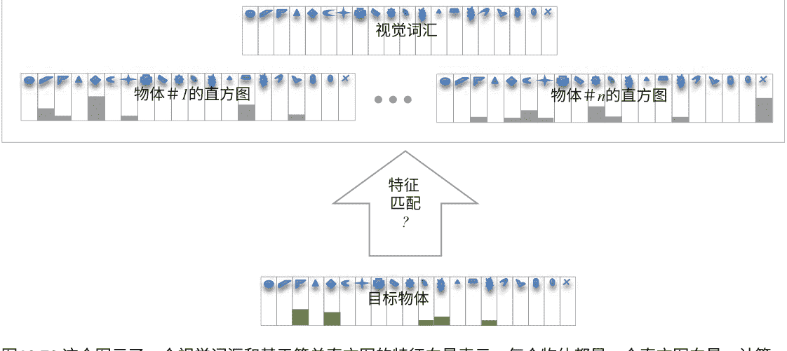

图10.70 这个图示了一个视觉词汇和基于简单直方图的特征向量表示，每个物体都是一个直方图向量，计算物体中检测到的特征数量。目标特征可以通过重构少量词汇特征的加权组合来匹配

视觉词典通常包含几千个或几万个视觉单词。词汇方法具有灵活性，可以使用强大的局部特征描述符，如FREAK、ORB和SIFT，使用各种距离函数进行词汇特征比较，使用各种聚类方法将特征集合简化为较低维度的集合，并且可以使用高维特征集拓扑结构，如聚合集合和分层集合。特征距离测量的搜索时间和特征集的内存使用可能是限制因素。

词汇通常以稀疏的方式进行编码，使用一系列聚类方法将特征缩减为适当大小的集合（参见第4章）。在文献中，有几个相关术语用于描述视觉词汇，例如词袋或特征词袋模型，也称为字典或码本（一些从业者在这个术语中做出非常细微的区分）。基于纹理块的词汇方法之一是由Julez [764]在1981年首创的，他使用选定的纹理元或纹理块作为特征词汇，其他研究也沿着这些方向继续进行 [21, 40–42]，包括在CURET数据集中创建一组来自真实图像的预先存在的纹理样本的研究，详见附录B。词汇方法适用于生成图像统计信息和场景识别，参见Jurie和Triggs [768]。通常，词汇方法应用于图像识别、图像和场景分类以及视觉搜索引擎。

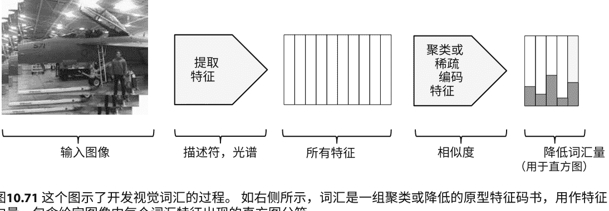

图10.71 这个图示了开发视觉词汇的过程。如右侧所示，词汇是一组聚类或降低的原型特征码书，用作特征向量，包含给定图像中每个词汇特征出现的直方图分箱。

如图10.71所示，任何类型的特征都可以作为词汇基础。词汇特征描述符通常是来自码本的特征直方图。基本词汇模型是原始的，并且依赖于特征的无序存在或缺失，忽略了序列、空间关联和特征不变性准则，如旋转和尺度。然而，无序词汇方法已经通过多种方式进行了增强，例如通过聚合多个描述符，如颜色、形状和纹理[773]，或颜色、梯度和LBP[774]，通过Ionescu将特征描述符的局部性纳入到一个元描述符组中进行聚类[776]，或通过引入几何尺度（参见第6章中的金字塔匹配核[212]）。

词汇中的特征数量是一种设计选择。一个可能的做法是将训练集中检测到的所有特征都包含在详尽的词汇中，但为了效率起见，通常会使用稀疏编码方法、聚类方法或软量化方法将词汇缩减为一个较小的代表性特征集合[842]。我们注意到，BoW方法和CNN方法都使用了固定数量的特征。需要多少个特征？特征计数通常基于从业者的经验和直觉，以及在训练过程中的一些实验。通常，CNN在每个层中使用不同数量的特征，可能每层有几百个特征，并且使用一个或多个全连接（FC）层对特征进行分类。

也许可以使用SVM来进行基础特征、描述符、视觉词汇和最优特征数量的学习，通过找到最小的重构误差来指导，有关从局部特征描述符进行图像重构的讨论，请参见第4章。

### 词汇编码

为了方便起见，词汇项可以以多种方式进行编码。例如，像SIFT这样的特征描述符或像素强度这样的光谱可以被编码或投影到另一种表示格式中，以便在特定分类算法中进行更统一的处理。编码可以是基于核的元描述符，也可以只是与词汇中原型特征的距离。Jakkola和Hau ssler [841]在推导核函数方面的早期工作已经被许多研究人员扩展，我们在本节中进行了介绍。已经设计出许多编码方法来优化特征编码以进行搜索和匹配。用于使视觉词汇表示和匹配更高效的关键思想之一是将一组特征描述符聚合成紧凑的编码，然后编码后的视觉词变得更小且处理速度更快，用于分类。我们在这里介绍了一些替代的视觉词优化方法，并引用Je gou [842]、Chatfield等人[844]、Tolias [840]和van de Sande [550]进行更深入的研究。

- 直方图编码（基于视觉词典基础，将特征硬分配给单个码字，使用简单的SSD或SAD距离）
—简单地创建一个直方图，计算与词典中每个最接近描述符匹配的特征数量。直方图的分配是将单个描述符硬分配给最近的单个视觉词。直方图可以进行归一化或加权[842]。可以使用欧氏距离、SSD、SAD和其他简单的方法计算对应关系。
- 核心码本编码（基于视觉词典基础，将特征软分配给多个码字，使用最近匹配的简单距离）
—将单个特征描述符软分配或分布分配给词汇表中多个最近的特征，例如最近的五个特征。参见Gemert等人[846]。
> 请注意，Fisher向量、VLAD和超级向量编码是相似且高效的，因为它们在特征质心空间中编码基础形状的差异，而不是编码整个描述符向量来计算距离。因此，距离受到聚类方法和聚类初始化过程的强烈影响。例如，参见图10.73，该图说明了使用K-MEANS时的聚类中心异常情况。
- Fisher向量（HMM高斯基础，特征描述符与最近的HMM高斯基础之间的残差向量差） -由P erronnin等人开发的Fisher向量[545, 838, 839]基于创建一个高斯基础特征的词汇集来将特征编码为高斯混合模型（GMM）。高斯基础特征是从特征描述符（如SIFT）的训练集创建的。通过将训练集中的所有特征描述符聚类成几千个簇来创建词汇表。Perronnin [848]通过首先使用PCA对SIFT描述符集进行汇总，将簇计数减少到256来优化词汇集。高斯基础特征由每个簇形状的质心、均值和方差定义。Fisher向量编码是GMM基础特征之间所有距离的串联。从目标特征到GMM基础形状的距离是一个缩放的方向梯度，它将描述符的大小减小到一个小的标量值，而不是一个大的单独距离集合。匹配SIFT描述符结构。Perronnin[847]开发了一种优化Fisher向量以实现更高效的大规模搜索的方法，使用Fisher向量的点积计算相似性，并使用汉明编码对Fisher向量进行二值化表示。
- **VLAD, MultiVLAD[840, 842]** (基于视觉词典的特征描述符基础，余弦差异的残差角度) — VLAD (局部聚合描述符向量) 编码被优化为紧凑且快速，用于特征匹配。**VLAD**构建了一个包含SIFT等局部描述符的词汇表，并使用K-MEANS或类似方法对描述符进行聚类。VLAD基于一个粗糙的词汇集，可能包含256个特征。对于每个基础聚类中心，累积并连接聚类之间的残差距离，形成与SIFT描述符大小相匹配的向量，通常为128字节。因此，每个VLAD是残差距离的向量聚合。VLAD使用余弦距离残差角度编码描述符与基础聚类中心之间的距离。VLAD被设计为非常低维的描述符，仅使用16字节来描述整个图像，非常适合大规模图像分类任务。对于分类，根据与聚类中心的距离评估每个新目标描述符。Arandjelovi和Zisserman[843]提供了一个非常易读的VLAD摘要，并对原始方法进行了几个改进，特别是多重VLAD方法，可以在图像上使用多个尺度和多个平铺的VLAD描述符。
- **超级向量** (码字簇基准的质心，简单距离，残差距离) — 由Zhou等人[845]提出，类似于与直方图编码相结合的Fisher编码。一种变体是分配给最近的码字，另一种变体使用软分配分布在一组五个最近的邻居之间。分配基于一种新颖的距离准则，包括簇归一化步骤，个体特征与簇中心之间的一阶差异，并考虑簇的质量。
- **汉明编码** (汉明码基准，快速汉明距离) — Douze[849]提出了对每个视觉词进行组合编码的BoW模型扩展，包括 (1) 用于快速计算描述符之间汉明距离的二进制签名生成和编码，因为汉明距离非常快速，并且通常在CPU和GPU指令集中实现，以及 (2) 提供旋转和尺度不匹配的匹配惩罚的弱几何一致性约束。还提出了一种新颖的对可变数量的最近视觉词进行软分配的方法。
- **FLAIR** (基于视觉词汇基础和积分图的各种距离函数) — FLAIR (快速局部独立表示) 由van de Sande[550]开发，将图像编码为多维积分图空间，其中包含每个像素对应字典中的码字索引。每个视觉词汇都编码了一个积分图。积分图的计算非常高效和快速，时间复杂度为常数，因此匹配性能非常快速和可预测。FLAIR可以将一个或多个编码嵌入到积分图框架中，每个编码对应一个积分图维度。与BoW表示相比，FLAIR在更复杂的编码（如Fisher向量和Flair）上效果最好。Van de Sande提供了一份相关搜索优化方法的优秀调查报告。

接下来，我们将讨论稀疏编码方法，用于将词汇特征编码为过完备的稀疏集合，以进行分类。

### 稀疏编码和码本学习概述，K-MEANS，K-SVD

稀疏编码方法在噪声去除、修复、信号编码和通用压缩等广泛应用中使用。对于计算机视觉应用，稀疏码本包含一个稀疏的过完备的码字集合（特征），通过线性加权组合一小组码字来近似重构未知特征，从而将未知特征与码本匹配。过完备集合允许从基础码字集合中以多种方式近似表示特征。例如，考虑基于傅里叶级数的信号重构。

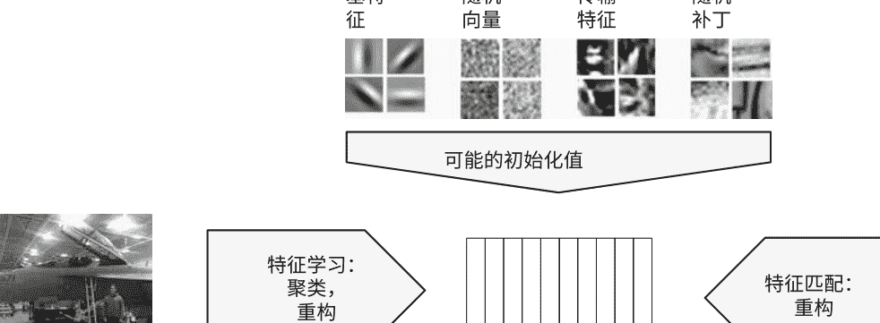

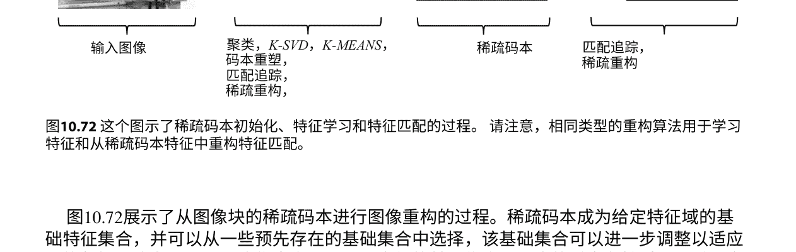

#### 图10.72 这个图示了稀疏码本初始化、特征学习和特征匹配的过程。请注意，相同类型的重构算法用于学习特征和从稀疏码本特征中重构特征匹配。

图10.72展示了从图像块的稀疏码本进行图像重构的过程。稀疏码本成为给定特征域的基础特征集合，并可以从一些预先存在的基础集合中选择，该基础集合可以进一步调整以适应训练数据，或者可以从训练集中学习到一个全新的基础集合。码本的过完备性对于通过码字的组合进行充分重构是必需的。我们在这里提供了稀疏码本特征学习的基本介绍，并提供了深入了解的参考文献。

稀疏编码可以分为以下任务：

- 1. 码本初始化从某个基础集合或随机值中
- 2. 特征学习通过修改训练数据的码字条目
- 3. 特征匹配通过从小的码本特征集合进行重构

稀疏码本不包含完整的词汇表，无法完美表示或重构训练数据，而是稀疏码是一组压缩的特征，根据信号重构和模式匹配的精度要求定义所需的稀疏级别。稀疏编码是一种信号压缩形式。信号压缩的一个目标是使用比Nyquist频率采样率通常要求的信号数量更少的信号来表示信号，Nyquist频率采样率规定信号必须过采样至少 >2×。稀疏编码显著降低了重构要求。稀疏编码类似于使用某种量化准则（如变化的位分辨率）在*ID*特征空间中合并标量值。从8位到4位，将相似值合并为较少的值，降低细节级别。然而，稀疏编码在多维特征空间中运行。对于计算机视觉，稀疏编码解决了分类器判别能力与计算效率之间的权衡，因为更多的特征提供了更多的判别能力，但计算效率会受到影响。

有几种方法用于学习稀疏特征码本，例如单层SIFT特征码本和像素块码本。Aharon等人[779]对各种稀疏编码方法进行了良好的调查，还可以参考Feng等人[797]。参见Yu等人[796]对用于稀疏编码的SIFT与像素块方法的比较调查，它们被证明同样有效。参见Candes等人[795]了解更多关于理论稀疏编码优化的内容。有关稀疏编码的神经生物学理论细节，请参见Olhausen[2127]。请参见Coates和Ng[618]，他们发现编码方案和架构比任何特定的特征描述符方法更重要。此外，大多数研究人员指出，特征层次结构中的许多弱特征对于稀疏编码来说与强大的局部特征描述符一样有效。Mairal开发了几种特征学习和稀疏编码方法，请参见[803, 804]，包括新颖的分层方法[805, 806]。Bo等人[132, 234]使用分层匹配追踪(HMP)来学习原始像素块特征，并在后面详细调查。Ranzato等人[551]开发了一种稀疏编码卷积特征模型，类似于一个名为SESM（稀疏编码对称机器）的RBM网络。

我们可以通过图10.72来说明稀疏编码。首先，通过许多方法之一（如1）使用来自另一个稀疏编码的预训练特征进行迁移学习，（2）使用DCT或Gabor特征的基础集，（3）从随机采样的图像块或随机值特征向量，或（4）从首先被聚类并减少到较小集合的候选局部特征描述符集合来初始化稀疏码本。例如，Bo[233]将码本初始化为一组过完备的DCT基础特征，并在另一种情况下将码本初始化为从训练图像中获取的随机图像块集合。由于无法事先准确知道如何初始化码本，因此使用超完备集合而不是欠完备集合是常见的，超完备集合具有足够的细节。在这方面，特征变化的范围和集合中的特征数量是相互关联的。

接下来，通过调整初始稀疏码本特征来适应训练数据来完成特征学习。为了说明稀疏码本构建的概念，我们重点介绍了Aharon等人开发的K-SVD方法[779]。K-SVD在训练过程中迭代地重新计算特征码本。K-SVD是一种奇异值分解方法，实现了参数化的K-means的推广，它通过迭代重新计算码本来最小化新样本与最近码字之间的误差。K-SVD在学习过程中会递归地重塑码本，以平衡特征空间内特征分布的均匀性。K-SVD是K-MEANS聚类的众多参数化推广之一[779]。

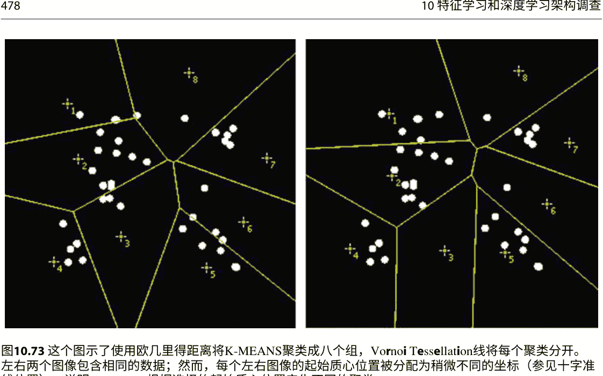

#### 图10.73 这个图示了使用欧几里得距离将K-MEANS聚类成八个组，Voronoi Tessellation线将每个聚类分开。左右两个图像包含相同的数据；然而，每个左右图像的起始质心位置被分配为稍微不同的坐标（参见十字准线位置），说明K-MEANS根据选择的起始质心位置产生不同的聚类。

K-MEANS从训练样本中学习一个质心聚类集合，然后通过与质心聚类集合中最近的聚类进行匹配来对测试样本进行分类。因此，聚类集合的位置是特征词汇的码本条目。K-MEANS迭代地将样本聚类到选定数量的细胞周围。我们将感兴趣的读者参考更详细的参考文献，参见Lloyd的原始论文[801]，Hartigan的优秀著作[100]，以及Hastie的更大的调查文本[347]。如图10.73所示，K-MEANS细胞边界通常通过Voronoi于1908年提出的Voronoi Tessellation Diagram进行说明，该图将空间划分为多边形细胞，其边界与每个相邻细胞质心等距。K-MEANS允许预先选择质心数量和每个质心的坐标，然后算法将每个样本分配给最近的质心。质心到每个样本的距离可以简单地在欧几里得空间中计算，即在一个区域内所有x、y坐标的平均值。K-MEANS的结果会根据用于确定聚类质心的距离函数而变化，例如欧几里得距离与曼哈顿距离会产生不同的结果。此外，K-MEANS聚类将根据选择的质心数量和质心位置的精确性而变化，如图10.73所示。

#### K-MEANS聚类可以总结如下：

- 初始化：
- 选择聚类的数量。
- 为每个聚类分配一个质心的起始位置，可以通过从数据集中随机选择样本点或其他方法来选择[100, 347]。
迭代学习和重新调整聚类：
- 使用某种距离函数（如欧几里得距离，参见第4章中的距离函数）将每个样本分配给最近的质心。
- 重新计算每个质心以使其更好地适应最近的样本。
- 重复步骤1-3，直达到到停止条件：计算新质心与之前质心的差异，并将其与阈值进行比较；当值低于阈值时，K-MEANS停止。

K-MEANS和类似方法的弱点在于聚类结果取决于质心点的数量、使用的距离函数以及每个质心点的坐标。因此，已经提出了改进和变体，例如K-SVD来解决其他特定的目标函数，有关聚类方法和聚类目标的调查请参见第4章。

K-SVD由Aharon等人开发[779]，它是K-Means (K)和奇异值分解 (SVD)的组合，因此被称为K-SVD。K-SVD的目标是在SVD的背景下对K-MEANS进行泛化和参数化。SVD等价于主成分分析 (PCA)，因为这两种方法都是通过去相关化值来识别具有最高方差的主成分值，这在概念上类似于寻找聚类质心。

#### K-SVD算法可以总结如下：

- 初始化：
* 选择基础集合项的数量。
* 从基础函数、随机选择、训练样本的PCA或其他方法初始化基础项。
- 迭代学习和优化稀疏码本：
* 重新计算基础项（稀疏编码）：
  - 使用基础追踪添加新样本以近似值。
  - 重新计算所有基础项。
* 重新计算字典（字典优化）：
  - 修剪不经常使用的基础项。
  - 删除过于相似（相互相干）的基础项。
  - 用少数基础项的线性组合替换很少使用的码字。

K-SVD将每个新目标特征重构为由码本中少数基础特征的线性组合组成的近似值。K-SVD将新的近似值添加到字典中，更新每个字典项，最后更新整个字典以修剪和删除相互相干（即相似）的项。例如，傅里叶级数逼近是一种类似的方法，用于从基础特征中重构目标特征，请参见图2.15。

K-SVD可以与任何匹配追踪方法一起使用，从稀疏码本特征中近似计算新样本特征。匹配追踪方法通过线性组合稀疏码来近似重构样本特征，类似于从熟悉的傅里叶级数正弦和余弦基波中进行级数重构（参见图2.14和2.15）。根据特征描述符的表示细节，选择不同的匹配追踪算法。匹配追踪方法在信号处理领域由Pati等人于1993年[778]首创，用于小波信号字典构成，Pati称之为正交匹配追踪，即在基底集中正交地寻找最接近的特征。Aharon [779]对几种匹配追踪方法进行了调查，包括更常见的正交匹配追踪 (OMP) 和基底追求 (BP)。还使用了更复杂的匹配追踪方法，通过多路径码字组合[779, 800]和批处理方法[811]评估多个可能的重构。

#### 一个过于简化的匹配追踪算法可以如下设计：

```
// 要匹配的样本特征
输入：样本特征
// 记录最佳匹配码字的加权和
输出：重构 = 0
// 维护匹配残差范围的累加总和 [0-1]
残差 = 1
// fi找到最接近的 n 个匹配码字
迭代 n 次:
    closestCodeword = findClosestCodeword(样本特征 * 残差)
    // 用 n 个加权码字重构最佳匹配
```重构 += 残差 * closestCodeword
// 样本特征与最佳匹配之间的差异
残差 = 残差 - closestCodeword

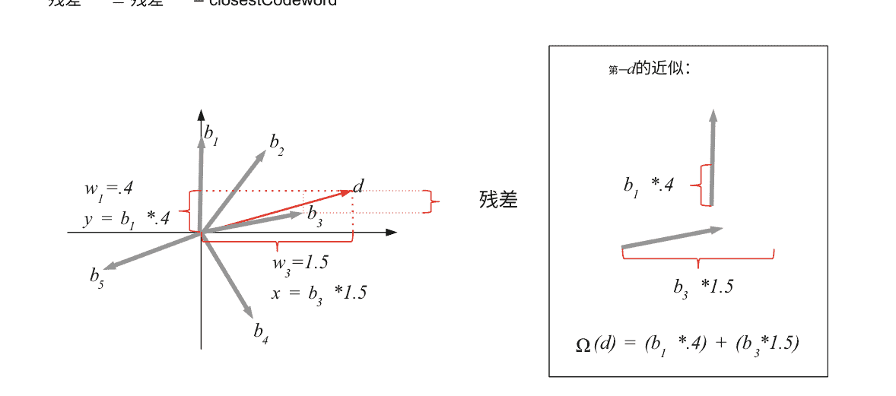

如算法和图10.74所示，可以使用基础追踪方法来近似地使用目标特征 d，通过将目标与所有基础码字进行矢量投影，找到具有最大幅度的匹配。幅度是匹配的强度，并保存为加权系数。通过从样本特征中减去加权系数来记录残差。基础追踪递归地重复执行 n 次，以找到最佳的 n 个稀疏码字来表示剩余的 n 个残差。最终的近似重构是从 n 最佳匹配向量的加权和中重建的。可以制定停止准则，例如重构误差阈值或固定的迭代次数。

##### 这里是从图10.74中简化的基础追踪和重建细节。

（稀疏码本基向量）：

ℝ_c = {b_0, ..., b_n}

（通过码本特征的加权和对特征 d 的第一次近似）：

x̂(d) = ∀b_i ∈ ℝ_c : ∑_{i=0}^{n} w_i b_i(d)

（要最小化的残差）：

r = d - x̂

（通过码本特征的加权和对残差 r 的第二次近似）：

ŷ(r) = ∀b_i ∈ ℝ_c : ∑_{i=0}^{n} w_i b_i(r)

（使用两个基向量进行重建*注意：可以计算并组合更多残差）：

$\Omega(d) = \hat{x} + \hat{y}$

其中：

$x$ — 要近似的信号
$w_i$ — 通过将特征$[d,r]$投影到最接近的匹配基原子上确定的权重，参见图10.74

稀疏编码特征空间值得特别关注，特别是空间中特征的分布和特征之间的距离。在特征空间中测量特征之间的相似性通常是一个多维问题，方法在匹配追踪方法之间有所不同。例如，我们在下一节中讨论核方法，这些方法有时用于将特征投影到矩阵表示的更高维特征空间中，以实现高效的相似性解决方案，并且也可以在基追踪算法中使用。创建一个良好的稀疏编码特征空间的一些考虑因素包括确保特征在特征空间中均匀分布，且在常见特征周围没有距离失真，这导致在罕见但必要的特征周围存在距离失真，否则可能会通过编码方案进行量化。我们将在HMP方法调查中讨论稀疏编码特征空间的均匀补偿和重塑。

为了验证稀疏码本是否足够，一种方法是通过对图像块进行采样，将每个样本图像块与稀疏码本进行匹配，找到最佳匹配的稀疏码组合，然后从稀疏码组合中重构图像。一个足够的特征集应该能够以期望的细节水平进行良好的图像重构，如第4章中基于局部特征描述符（如SIFT、HOG和FREAK）的几个示例所示。参见图10.75，说明了如何从HMP方法中的两个或五个码本特征组合中逐个重构原始图像块。因此，码本被训练成稀疏表示应用领域的特征词汇，并用于从稀疏码本条目的组合中重构模式匹配。

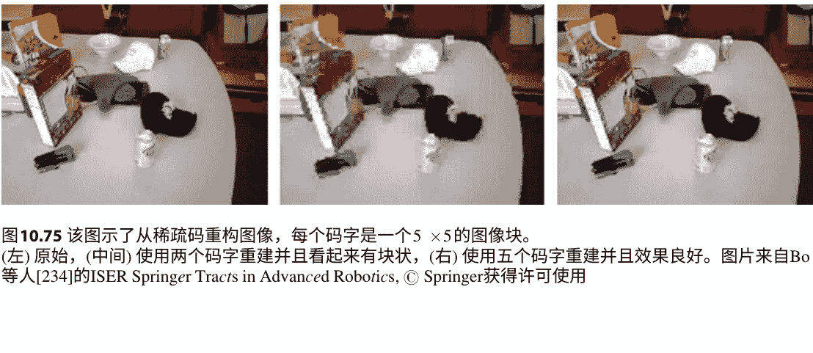

有关稀疏编码用于特征学习的更多细节，请参阅Grimes [535]，Grosse [536]和Bergstra [537]。信号处理文献和视频压缩文献也是很好的资源。
有关基于局部性的稀疏编码的示例，请参阅Wang等人[783]，以及[618, 624]。有关稀疏编码优化的更多信息，请参阅Candes等人[795]。有关保持2D局部性或位置以及改善较小字典结果的特征空间局部性的更多信息，请参阅Bourdeau等人[699]。

### 核函数，核机器，支持向量机

特征词汇或代码本可以提供不变性，鲁棒性和特征描述和提取计算效率，但在特征空间中很难解开以进行分类。为了实现最佳特征分类，通常使用核方法来准备使用各种机器学习方法对词汇进行分类的特征。术语核在数学中有不同的含义。例如，在数据挖掘的文献中[698, 789]，术语核在几个不同的上下文中使用，例如在核回归方法领域中，将核函数视为凸起映射或窗函数沿回归线加权局部数据点，以在距离测量之前加权窗口内的局部数据点。在关于核机器和支持向量机（SVMs）的统计分类讨论中，核函数用于将特征向量映射到核矩阵（核）中执行核之间的点积相似度测量。计算核矩阵对之间的相似性比首先将特征转换为更高维空间再计算相似性要快得多，并且还允许用于多变量描述符的特征聚合，如下图所示。

这些核函数在希尔伯特空间中操作，类似于多维欧几里得空间，在这个空间中可以使用熟悉的向量运算来搜索线性关系，使用点积来计算角度和距离。核矩阵也被称为格拉姆矩阵，它是对称的且半正定的，通过核矩阵中所有点对之间的点积来完全定义多维希尔伯特空间中的坐标。已经设计了许多应用特定的核函数来创建核矩阵，并且存在一些方法来学习核矩阵，称为多核学习（MKL），参见Lanckriet等人[793]。我们在这里提供一个高级概述，并在进行过程中将读者引用到机器学习和统计分析文献中更好的参考资料。

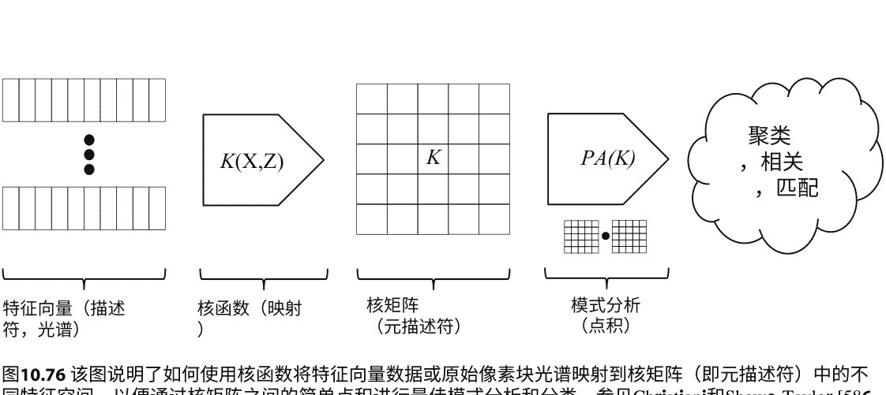

图10.76 该图说明了如何使用核函数将特征向量数据或原始像素块光谱映射到核矩阵（即元描述符）中的不同特征空间，以便通过核矩阵之间的简单点积进行最佳模式分析和分类，参见Christianni和Shawe-Taylor [586, 785]

核方法用于执行以下操作之一或两者：

-   将一个或多个特征聚合成新的元特征表示
-   将特征或光谱投影到另一个表示空间进行分类（图10.77和10.78）

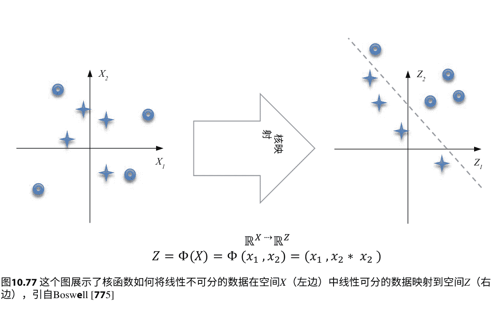

```
$\mathbb{R}^X \cdots \mathbb{R}^Z$
$Z = \Phi(X) = \Phi(x_1, x_2) = (x_1, x_2 * x_2)$
```

图10.77 这个图展示了核函数如何将线性不可分的数据在空间X（左边）中线性可分的数据映射到空间Z（右边），引自Boswell [775]

核方法的需求源于某些应用中数据的非线性分布，这使得分析变得复杂。如图10.78所示，非线性可分的数据使用正确的核变得可分。因此，核函数就像是一个映射函数或投影函数，将特征移动到另一个特征空间。因此，核矩阵是一种强大的方法，可以将异构特征描述符或光谱组合规范化和合并到一个共同的特征空间中，以进行分类的成对相似性计算。在本节中，我们将调查示例，展示如何将特征描述符（如SIFT特征和RGB光谱像素块）转换为用于分类的核矩阵。

核方法(参见Hoffmann [786]) 与核机器一起使用，例如支持向量机(SVMs)。核机器允许在训练过程中替换和尝试各种核函数以找到最佳核函数。当核函数与SVMs一起使用时，核函数将数据从一个维度为n的空间投影到一个更高维度的空间n + 1(即VC维度，n + 1)。

如图10.78所示，在1D空间中，保证可分离的最大点数为2。在2D空间中，保证可分离的最大点数为3（除非点共线）。在3D空间中，非可分离的2D点可能通过超平面变得可分离。核函数设计的目标是找到最佳核函数将数据映射到某个更高维度的空间进行最优分析，这涉及到特征空间的拉伸和压缩的组合，以实现最佳的聚类和分离，因此在实践中使用了许多核函数。

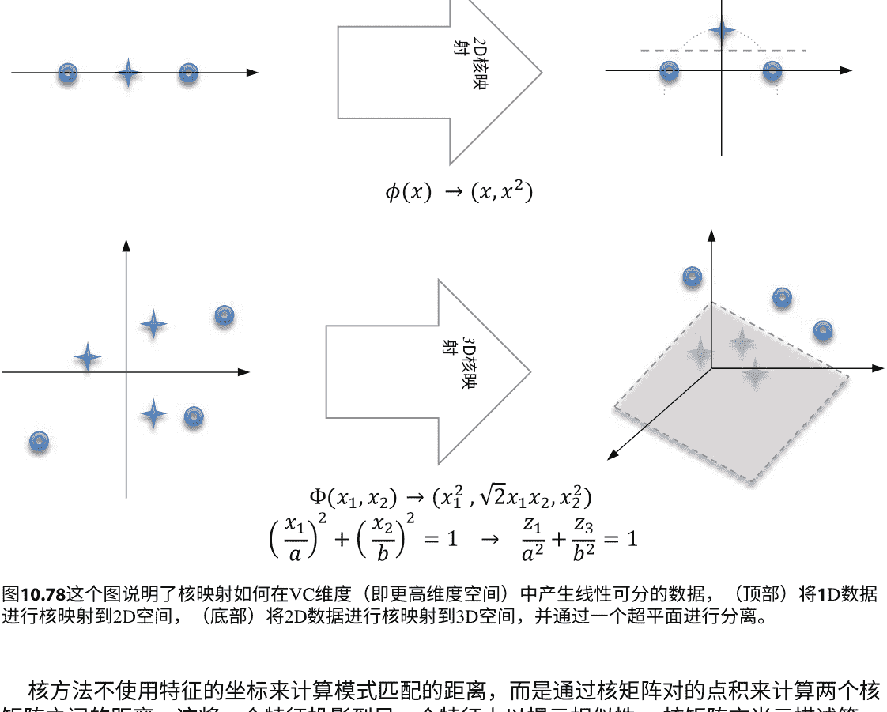

图10.78 这个图说明了核映射如何在VC维度（即更高维度空间）中产生线性可分的数据，（顶部）将1D数据进行核映射到2D空间，（底部）将2D数据进行核映射到3D空间，并通过一个超平面进行分离。

核方法不使用特征的坐标来计算模式匹配的距离，而是通过核矩阵对的点积来计算两个核矩阵之间的距离，这将一个特征投影到另一个特征上以揭示相似性。核矩阵充当元描述符。

创建核矩阵的核函数是问题特定的，具体的核函数推导细节超出了本文的范围，可以参考各种文献，例如Vapnik [597]、Shawe-Taylor和Nello Cristianini [586, 785]。核解决方案返回一个单一的值，即一个核矩阵与另一个核矩阵的点积。使用核方法进行一系列标准的统计分析方法，例如成对距离分析、主成分分析和聚类分析。复杂和不规则的数据，例如字符字符串和树等数据结构，必须首先转换为适合核方法应用的矩阵形式。例如，结构化数据可以通过类似哈希函数的方式运行，以生成表示数据的矩阵形式，关于生成用于表示抽象结构的核的更多参考和细节，请参考Hausler [777]。

高斯核、径向基核和简单的多项式核通常在大多数情况下被使用，尽管不同的应用程序使用了各种各样的核。找到适合数据的正确核函数也很重要，这在参考文献中有所涉及。

NIPS⁷社区包含大量关于核机器、支持向量机和核函数的研究论文和其他信息。

核矩阵还可以加快分类速度，作为一种避免在高维空间中直接计算距离的快捷方式。如下面简化的例子所示，核函数使用两个核矩阵之间的简单点积，而不是先将核矩阵特征移动到更高维度再计算距离的完整代数解（通常在文献中称为核技巧）。请注意，对于大型特征向量和大型特征集，代数解与点积相比在计算上是不可行的。

使用一个假设的核函数K(x,y)=⟨x,y⟩的冗长示例 ()²与下面的等效代数解进行比较，说明了计算上的差异。

#### 慢速代数方法（完全投影到更高维空间）：

```
φ(x,y) = ⟨f(x),f(y)⟩
f(n) = (x₁x₁, x₁x₂, x₁x₃, x₂x₁, x₂x₂, x₂x₃, x₃x₁, x₃x₂, x₃x₃)
x = (1,3,5)
y = (2,1,3)
f(x) = (1,3,5,3,9,15,5,15,25)
f(y) = (4,2,6,2,1,3,6,3,9)
f(x) f(y) = (4 + 6 + 30 + 6 + 9 + 45 + 30 + 45 + 225) = 400
```

#### 更快的内核方法（不投影到更高维空间，使用点积代替）：

```
K(x,y) = ((x,y))^2
K(x,y) = ([x₁,x₂,x₃] · [y₁,y₂,y₃])^2
K(x,y) = ([1,3,5] · [2,1,3])^2
K(x,y) = (2 + 3 + 15)^2 = 20^2 = 400
```

核函数将特征数据或光谱映射到更高维度的另一个特征空间中，其中特征可以被分解为线性可分离的簇。从图5.1中可以看出，我们将光谱定义为从像素派生的任何数据表示，例如基础集、像素块强度值、RGB颜色、深度信息、局部区域直方图或LBPs。核函数通过将数据投影到表示数据的核矩阵中，从各种数据（即光谱和特征）的组合中创建新的特征表示（即元描述符）。已设计了一系列问题特定的核函数。有关调查核方法应用的信息，请参阅Mueller等人[772]、Cho等人[769]、Lampert[767]、Zhang等人[765]和Vedaldi等人[770]。Teknomo[788]提供了一个关于SVM的很好的教程。SVM也应用于DNN中。在某些CNN中，不使用FC层，而是使用SVM进行分类。在其他CNN系统中，FC层在训练后被SVM替换，并从学习到的CNN特征进行微调。

词汇表或代码本可以表示为由其他特征描述符和光谱构建的核矩阵的集合或层次结构（即元描述符）。正如Bo等人在分层核描述符（HKD）和分层匹配追踪（HMP）方法中所示[108, 131, 233, 684, 659]，RGB-D光谱和LBP特征描述符被用作输入用于创建核矩阵或元描述符的核函数，我们稍后在本节中进行调查。Bo等人提供了一种使用优化匹配核的核方法的新应用[763]，我们稍后也会进行调查。多个描述符可以被聚合和编码

一起放入单个核矩阵中，例如参见Tolias等人关于他们的选择性匹配核（SMK）和聚合SMK（ASMK）的论文[840]，与类似的方法如向量和局部应用描述符（VLAD）和汉明编码（HE）进行比较。在Shashua和Hazan的论文中也发现了一种聚合集合核的代数方法[791]。有关使用核方法组成的多变量描述符的更多细节，请参见Gehler和Nowozin的论文[792]。有关核方法的良好调查，请参见Lampert的论文[767]和Zhang等人的论文[765]。

### 其他统计分类方法，决策树，森林，提升

我们只是简要地调查了三种分类方法：（1）CNN FC层，（2）核方法和支持向量机（SVM），以及（3）词汇和稀疏编码，并忽略了其他大部分有趣的分类模型。作者认为，统计分类的主题远远大于计算机视觉和特征学习领域，这是本文关注像素方面的计算机视觉和特征描述符的主要原因，而不是借用和应用数学和统计分类方法。

我们没有调查的其他几种值得注意的分类方法包括基于树和森林的分类器，如FERNS [298]，它将特征组织成特征相似性的层次结构。
Viola-Jones方法[138, 178]也值得注意，它将多个特征组合成特征的层次结构或漏斗，通过提升弱特征进行训练和优化[363]，更多关于Viola Jones的内容请参见第4章和第6章。

有关应用于机器学习中的分类方法的更多信息，请参阅Hartigan [100]和Hastie [347]的标准文本。还可以参考NIPS社区资源。
接下来，我们将开始对代表性BFN的调查，以说明我们所涵盖的所有背景概念，包括各种特征模型和分类器模型。

### PNN—多项式神经网络，GMDH

我们从可能是世界上第一个DNN开始进行BFN调查，即数据处理的群体方法（GMDH），也称为多项式神经网络（PNN），由Ivakhenko和Lapa于1965年开发[564-566]。PNN使用可调的多项式作为基础特征，而不是CNN架构中的卷积滤波器。Zjavka [762]提供了关于PNN的良好概述，以及神经网络的实现细节。PNN与McCulloch和Pitts的工作（1943）不同，因此它将神经元定义为复杂的非线性函数，而不是二进制的两态或三态平衡系统。请注意，神经科学尚未发现物理神经功能的可验证的电化学模型；然而，与CNN中使用的简单权重模板相比，PNN多项式似乎提供了对各种可能性的灵活建模。Ivakhenko的工作经常出现在《Avtomatika》和其他苏联出版物中，在苏联以外的地方不为人知。GMDH模型是归纳和自组织的，并且一直很受欢迎[760]，尤其是在俄罗斯和世界其他地区，有着重要的研究人员社区。全球各地的几个商业软件包和系统中都可以找到GMDH的实现。大多数GMDH应用都是统计性质的，包括一般的多维数学建模、数据挖掘和预测，但也开发了一些计算机视觉和模式识别应用[760]。

GMDH是鼓舞人心和独特的。与许多从业者使用的为设计CNN和RNN的临时方法相比，GMDH中体现的基本思想听起来太好以至于难以置信。这里是对几个关键GMDH概念的总结：

-   创建数据的最优数学模型
-   自组织网络，通过对数据进行归类来进行归纳学习
-   使用多项式描述特征，而不是CNN风格的模板
-   神经元和层数的确定是自动的
-   网络模型的自动构建
-   自动学习数据中的相互关系和模式

1971年，Ivakhneko [567]通过使用八层来改进GMDH，学习最优层数、每层的最优神经元数量，并根据需要修剪神经元。例如，GMDH神经激活函数使用二阶多项式和自适应阈值，并且可以利用Kolmogorov-Gabor多项式，提供比其他简单激活函数更多的控制。事实上，原始论文提到了超过20种算法（类似于今天的神经激活函数），这些算法在GMDH中被提出。Ivakhneko系统可以从验证集中学习和训练特征，就像今天一样，每一层可以根据给定的数据和应用程序进行不同的训练。事实上，GMDH的验证集使用了一种参数化的 drop-out变体来调整，以消除可能导致过拟合的不需要的数据样本。

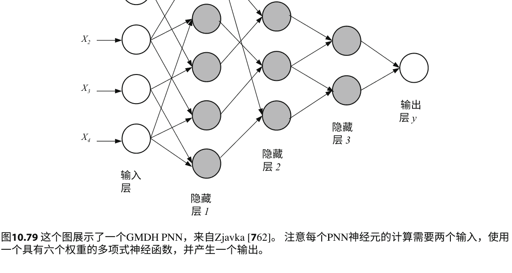

图10.79 这个图展示了一个GMDH PNN，来自Zjavka [762]。注意每个PNN神经元的计算需要两个输入，使用一个具有六个权重的多项式神经函数，并产生一个输出。

GMDH多项式是基于科尔莫戈洛夫-加伯多项式建模的，这是一种加伯函数。PNN神经模型通过使用六个权重，将多项式组合为多项式，使用二次函数的输入产生两个输入，并通过一个多项式产生单个输出，如图10.79所示。有关详细信息，请参见Zjavka [762]。

自从Ivakhenko在1971年引入了dropout，其他几位研究者[569]重新发现了dropout的变体。最近，[568]引入了另一种dropout方法，即随机dropout，通过将随机训练样本设置为零来防止过拟合。显然，还没有人将随机dropout与Ivakhneko的工作进行比较，因此也许会重新审视Ivakhneko的工作。在俄罗斯和乌克兰，关于GMDH的研究仍在继续，详细的网站[760]总结了历史和持续的GMDH研究[761, 762]。

### HKD—核描述符学习

核描述符方法通过将特征向量转换为核矩阵来学习特征，例如简单的像素块、局部区域梯度、颜色块、LBPs、深度信息和其他特征描述符。核矩阵是核描述符或元特征，适用于核机器。有时在文献中，核描述符被称为匹配核。

核描述符可以表示词汇特征向量直方图，并将这些直方图转换为核矩阵，以供核机器使用。与依赖于人工连接拓扑训练的神经元的临时模型的DNN方法相比，核方法在统计分析中可能被认为更具数学基础和常见。

> 有关在此HKD调查中提到的核方法的背景，请查看上面关于核函数、核机器、支持向量机的部分。

在本节中，我们调查了一些使用基于核的特征学习来生成从光谱中获取的元-描述符的体系结构，例如RGB-D补丁和LBP特征。

Bo等人开发的分层核描述符方法（HKD）[759]从各种像素补丁光谱（如梯度颜色、深度和LBPs）中学习核描述符。HKD基于Bo等人在核描述符方面的早期工作[774]，并通过在分层结构中计算核描述符来扩展描述符。因此，HKD将基本的核描述符方法扩展到从层次结构中的其他核描述符的输出中获取输入，将来自局部感受野的特征组合成更高级的特征，而不是从像素补丁或其他特征中获取输入。请参见图10.80。

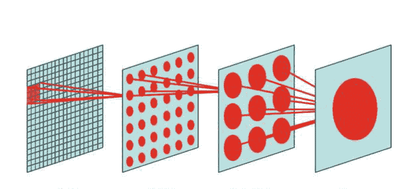

图10.80 这个图示了HKD递归地计算核描述符的方法，将核描述符组成特征层次结构，图像来自Bo等人[759]在CVPR中，经Springer出版社许可使用。

HKD的目标是提供一种原则性、统一的方法，从像素光谱或其他特征描述符中学习核描述符，受到Bo等人[763]关于高效匹配核(EMK)的早期工作的启发，该工作使用SIFT特征和傅里叶光谱生成核描述符。然而，HKD从原始像素块和其他矩形块中学习核，包括：

-   KDES-G: 梯度匹配核，由使用梯度幅值加权的归一化梯度直方图组成，其中包括梯度方向和像素位置高斯核在块内。KDES-G学习了HOG或SIFT风格特征的核表示。

### KDES核描述符
- KDES-C: 颜色匹配核，由RGB等各个颜色通道组成，与块内的像素位置高斯核相结合。
- KDES-S: 形状匹配核，使用LBP表示局部补丁形状信息，并在补丁内部使用高斯像素位置核。
- KDES-D: 深度匹配核，由Z深度通道标量组成，并与补丁内的高斯像素位置核相结合。

HKD梯度核描述符从像素补丁中学习梯度方向直方图的表示视图，类似于SIFT和HOG描述符，但据称HKD梯度描述符更准确一些。HKD梯度核描述符包括三个组成部分：（1）逐像素属性比较梯度幅度，（2）方向，和（3）高斯加权像素位置比较器。

HKD解决了与大型特征矩阵相关的计算问题。如果一个核矩阵很大，并且特征集也很大，核方法的计算成本将变得不可行。为了解决更大核矩阵的计算成本，HKD首先将特征映射到较低维空间（减少特征集），然后缩小每个特征的大小。

通过凸二次近似方法对每个特征进行压缩。在HKD中，核描述符是从训练数据中学习的，例如从像素块中获取的大小为16×16的块，采用密集的8×8采样网格。然后将这些块缩减为一个稀疏集合（较低维度的集合）。例如，如果在采样网格上收集了1,000,000个块，则使用K-MEANS聚类将词汇量减少到1000个词。接下来，将从缩减的块集合计算出最终的核描述符，形成字典词汇表。

为了减少计算工作量，核描述符在大小上进行了单独的压缩，因为较大的特征向量需要更多的计算，尤其是在特征集大小增长时更为明显。压缩是使用修改后的KPCA（Kernel-PCA）在特征集上操作的联合基向量。目标是在有限维度上逼近核，使核描述符更小，并减少特征集中的冗余。Bo发现16×16的块大小足以逼近基向量。

可以同时使用不同的补丁尺寸和光谱。例如，强度通道表示梯度信息，RGB颜色通道表示颜色外观，深度相机提供空间信息，LBP表示局部空间关系或局部强度形状。HKD研究证实了其他研究人员的一些有趣发现，即使用多种补丁尺寸而不仅仅是单一补丁尺寸会略微提高准确性。例如，尝试了8×8、16×16、25×25和31×31的补丁尺寸，以确认多尺寸补丁提高了准确性。另一个发现是通过使用多元特征描述符核将不同类型的特征向量（如梯度和颜色）连接在一起，然后将描述符映射到核矩阵中，可以提高准确性。有关多元描述符的更多详细信息，请参阅Gehler和Nowozin [792]以及Vedaldi等人 [887]。

另一个使用核描述符的有趣架构是由Mairal等人开发的[794]，称为卷积核网络(CKN)，它将核描述符纳入CNN框架中，而不是使用卷积和相关函数来建模人工神经元。据称，CKN是HKD方法的一种推广，具有额外的核变体和优化。在Reubold [784]中可以找到HMP和HKD的有用概述和比较，他分析了每种方法的细节和权衡。

总之，我们注意到HKD是另一个例子，说明特征层次结构和架构中支持的特征数量似乎是取得最佳结果的关键，而不是将成功归因于任何特定的特征描述符，无论是学习还是其他方式创建的。

一个相关的观察是，在深度和宽度层次结构（如HKD和CNN）中，强大的局部特征描述符（如SIFT、FREAK和ORB）可以与大量的个体弱特征相媲美，甚至有时超越它们。

### HMP—稀疏特征学习

在本节中，我们通过对Bo等人的Hierarchical Matching Pursuit (HMP)方法的调查，展示了一种稀疏特征学习架构。[132]HMP通过无监督的方式从未标记的数据中学习和编码多层次的特征层次结构，作为稀疏字典的像素块特征。Bo [234]扩展了HMP，将RGB-D彩色通道、深度图(D)和表面法向量(N)的数据纳入其中。在多路径扩展MP-HMP [109]中，对HMP进行了更多的改进，使用三个或更多层次的特征层次结构和多个大小的特征块。

> 关于稀疏编码、码本学习、K-SVD、K-MEANS和匹配追踪方法的背景，请参阅上面的稀疏编码和码本学习概述部分。

在本调查中，我们对HMP的几个关键创新进行了观察，包括：

- PSC—金字塔稀疏编码特征[234]使用一种名为空间最大池化的新方法对像素块进行稀疏编码特征编码。
- 多变量RGB-D-N数据[234]引入了描述符。
- MI-KSVD [132]使用一种名为MI-KSVD的变体学习具有优化特征之间距离的分层稀疏码本。
- M-HMP [109] M-HMP使用多尺寸特征块[109]通过多个路径进行编码。

请注意，Yu等人[796]之前开发了一种类似于HMP的方法，使用分层稀疏编码（HSC）将第1层的低级特征编码联合编码到第2层的高级特征编码中，证明了分层稀疏编码方法可以在更高层次上提供空间编码，将局部特征空间关联到更高级别的稀疏编码中，这在使用无序BoW特征词汇的单层稀疏编码方法中是缺乏的。HMP遵循与HSC相同的方法，使用局部区域空间依赖性对较低级别特征进行编码以获得较高级别的稀疏编码特征。

#### HMP金字塔稀疏码（PSC）特征描述符

HMP的金字塔稀疏码特征描述符是一种新颖的编码方法，将一组21个稀疏码连接在一起。在PSC的M-HMP扩展中，正负稀疏码被分成单独的特征，以便进行单独的加权和响应。因此，PSC是本调查中最复杂的特征之一。

如图10.81所示，HMP使用空间金字塔最大池化来对特征进行特征编码，以选择每个空间金字塔区域中的最大稀疏码。如图10.81所示，每个稀疏码是从一个5 ×5像素区域计算得出的。请注意，图10.81（右侧）的空间金字塔中定义了21个区域，并且每个区域的最大稀疏码被连接成21元素的PSC描述符。得到的HMP PSC描述符为

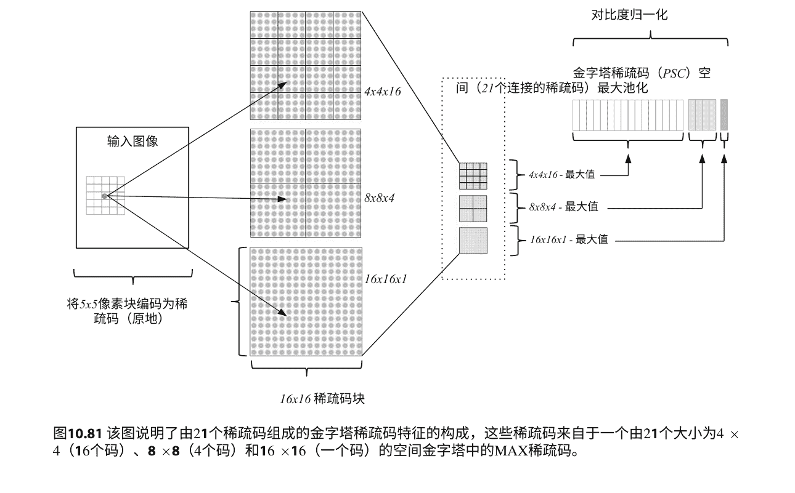

图10.81 该图说明了由21个稀疏码组成的金字塔稀疏码特征的构成，这些稀疏码来自于一个由21个大小为4×4（16个码）、8×8（4个码）和16×16（一个码）的空间金字塔中的MAX稀疏码。

类似于Grauman和Darrell [517]在第6章中讨论的金字塔匹配核（PMK），不同之处在于PMK描述符是在整个图像上计算的，使用每个细分图像区域的简单直方图特征，并将每个区域的直方图连接在一起。然而，HMP金字塔稀疏编码特征是由一个16×16的稀疏编码块组成的，其中最大值被连接在一起表示16×16区域的尺度金字塔。

M-HMP扩展使用相同的5×5稀疏编码和16×16的块作为第一层，但扩展了块的大小和池化区域的数量。特征层次结构中的每一层都从较低层次的空间最大池化和对比度归一化特征中获取输入。第二层使用36×36的块来学习中层特征，第三层使用36×36的块来学习整个图像特征。Bo报告了使用一层、两层和三层网络以及特征计数从300到1000的M-HMP的一系列结果。

#### 使用MI-KSVD的HMP字典学习

HMP的第一个版本[132]使用了Aharon等人[779]开发的K-SVD字典学习方法来对稀疏码本中的特征进行编码。K-SVD在每添加一个新特征时，递归优化和重新计算整个码本，正如前面所解释的那样。然而，Bo [109]后来对K-SVD进行了关键改进，称为MI-KVSD（互不相干-K SVD）[234]，通过将基础特征编码为与常见和不常见特征具有更均匀的相对距离，而不是将码本聚类在最常见的特征周围，从而实现了常见和不常见特征之间的平衡。为了说明问题，想象一下仅从最常见的像素块构建稀疏码本-这将导致过度拟合的码本

最常见的块，可能不覆盖整个特征空间。M-HMP在互不相关性和重构误差之间取得平衡，以包含常见和不常见的观察到的块，以优化码本，使特征空间分布更加均匀。因此，MI-KSVD方法是新颖的。

为了在稀疏码本中添加特征或找到特征，MI-KSVD使用一种正交匹配追踪（OMP）方法，如前面讨论的那样，通过组合稀疏码的线性组合来近似重构像素块，类似于使用熟悉的傅里叶级数对波进行系列重构（见图2.15）。在码本学习过程中，基本思想是理想情况下找到与样本特征最接近的稀疏码本中的单个最接近特征，如果没有接近的特征存在，则添加一个新特征。如果需要，匹配追踪将使用多个基础码字重构一个特征。HMP使用一种称为批量树OMP（BTOMP）的优化方法，将基础集字典分成较小的字典（即批次），使用K均值聚类算法更快地并行计算每个批次的匹配追踪，详见Rubinstein [811]。

我们在这里比较K-SVD和MI-KSVD目标函数：

```
$$ \min_{D,X} \|Y - DX\|_F^2 $$ (KSVD目标函数)
```

```
$$ \min_{D,X} \|Y - DX\|_F^2 + \lambda \sum_{i=1}^M \sum_{j=1,j=i}^M d_i^T d_j $$ (MI-KSVD目标函数)
```

其中：
- $D = [d_k, \ldots]$ 代码字典
- $X = [x_k, \ldots]$ 稀疏编码
- $Y = [y_k, \ldots]$ 像素块矩阵观测
- $\lambda =$ 互相关权衡参数

如方程所示，对于每个新的块样本矩阵 Y，通过使用BT-OMP从代码字典 D 中找到一组最接近的匹配代码字典项，计算稀疏编码矩阵 X 以近似重构 Y。然后，使用以 λ 为参数的 MI-KSVD 目标函数重新计算代码字典中的每个项，以平衡重构误差和互相关性（即避免代码字典项相似性）的结果是一个重构后的代码字典。代码字典 D 以相同的方式重复地重新计算所有新样本 Y。图10.82展示了构建HMP第1层特征的基本方法。

如图10.82（1）所示，第一层稀疏码本初始化为过完备的DCT基础集，转换为稀疏码。第二级码本从一个相对随机的、可能包含1,000,000个5 × 5图像块的集合中初始化，这些图像块经过零均值归一化并转换为稀疏码。HMP从随机采样的5 × 5像素块构建稀疏码，然后将稀疏码组装成稀疏码图像。

如图10.82（2）所示，HMP在16 × 16的稀疏码块上使用空间金字塔池化，使用三个空间分辨率级别，而不是在CNN中通常使用的简单子采样池化。HMP中使用的三个池化级别分别是1 × 1（当前特征像素块）、2 × 2图像分割成四个区域，以及4 × 4图像分割成16个区域，还有一个16 × 16区域，总共21个区域在空间最大池化后连接成金字塔稀疏码（PSC）。从每个区域中选择并编码最大特征。所有特征在0-1范围内归一化。

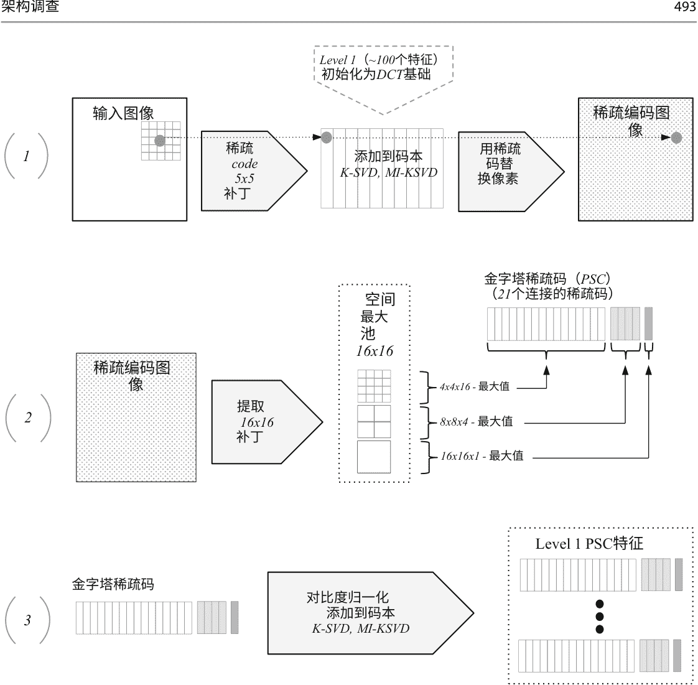

接下来在10.82 (3)中，使用MI-KSVD将每个特征添加到码本中。HMP以逐层方式进行训练，从较低层开始。步骤(2)和(3)在码本的每一层中重复进行。然而，Bo还尝试了一种在多个层上进行联合池化的方法[234]，并报告了改进的结果。

HMP训练协议是新颖的，它涉及将第一层训练为在16×16空间金字塔池中记录稀疏码，然后在中间层(2 - n)中使用整个图像上的16×16补丁来优化稀疏码。训练时，以4的步幅在输入训练图像上取16×16像素补丁。首先，将16×16像素补丁从稀疏码本中编码成16×16稀疏码补丁，使用每个像素周围的5×5像素局部区域计算稀疏码。然后，对于每个16×16稀疏码区域，构建一个空间金字塔细分，包括2×2细分和4×4细分以及整个16×16区域。从每个区域中选择最大的稀疏码，并将它们连接成一个区域稀疏码。

在一个测试中，Bo冻结了第一层的DCT基础，并且在第一层上没有进行任何特征学习。当将DCT基础与通过K-SVD学习的特征进行比较时，无论是DCT基础还是K-SVD稀疏编码基础的准确性都在几个百分点之内，再次说明特征描述符本身并不像特征层次结构中的特征数量那样重要。

#### HMP多元I-RGB-D-N特征

HMP扩展了[234]，使用了来自深度相机的特征（[234]是将深度信息编码为特征描述符的最早方法之一），以及颜色信息，输入补丁有四个通道：(1) Intensity，(2) RGB，(3) Depth相机Z像素，以及(4) Surface Normal向量。该方法基本上遵循了HMP中使用的稀疏编码和K-SVD方法。然而，最终的四个特征向量可以通过将每个通道的特征连接在一起来关联在一起，形成一个188,300维的特征描述符。Bo得出结论，学习每个通道的单独较小特征比学习从所有通道组合成一个较大通道的单个较大特征效果更好。请参见图10.83，了解学习到的I-RGB-D-N特征的示例。

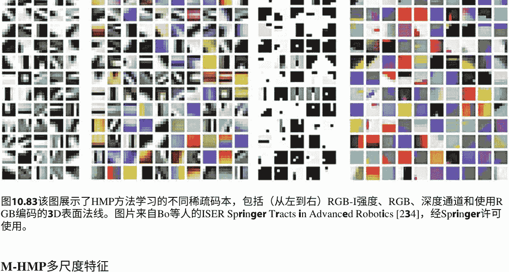

#### M-HMP多尺度特征

多路径分层匹配追踪扩展了基础HMP方法，跨越多个补丁尺寸（16 ×16和32 ×32）和三级特征层次结构，从而形成一个具有与许多使用3 ×3和5 ×5特征的CNN相比异常大的特征的深度网络。多路径匹配追踪将单路径编码扩展到多个路径，以提取更广泛和更深入的特征范围。使用多个补丁尺寸的多路径HMP方法创建了更丰富的特征集，相比原始HMP方法中的单一尺寸补丁，提高了准确性。

我们注意到，许多局部特征描述符（如FREAK（31 ×31或其他较大尺寸）和SIFT（16 ×16））也使用较大的特征尺寸，并取得了良好的成功。

总结一下，HMP变体表明，从简单的像素块中学习特征可以与SIFT特征集的性能相媲美。Bo等人发现，两层特征层次结构的性能优于单层，而两层层次结构的性能与三层层次结构的性能相当。多变量I-RGB-D-N特征的联合使用比单一I通道特征更有效。

使用多个特征块大小的多路径编码被证明可以增加效果。

### HMAX和神经模型

我们将在这里调查Riesnhuber和Poggio于1999年引入的原始HMAX工作[812]，并调查相关的神经视觉模型，包括基本HMAX架构的一些后续变体。有兴趣的读者应该参考Riesenhuber在乔治城大学的MAXLab中的历史论文和持续研究的收集[837]，其中包括在线源代码资源和参考文献。要深入研究神经科学研究，请参阅附录C中列出的神经科学期刊。

为了理解HMAX，我们在这里提供一些关于视觉通路的简要背景，这些背景影响了HMAX模型。HMAX是基于神经科学的整个视觉通路层次结构的第一个模型之一。神经科学界在发展视觉通路模型方面非常活跃，他们的工作往往与计算机视觉界不重叠，因为研究目标不同。因此，通过HMAX，本节作为一个简要介绍，介绍了一种与之前调查的CNN和RNN不同且可能更复杂的神经科学视觉和特征学习模型。

#### 视觉通路的标准模型

HMAX的基础在于1994年Ungerleider [834]、Riesenhuber [833]等人描述的所谓的标准模型。HMAX基于一个标准模型，如图10.84所示的视觉通路模型。标准模型包括一个层次结构的感受野，遵循之前在本章中讨论的Hubel和Wiesel模型。(另请参阅关于视觉通路和图9.10和9.12的讨论) HMAX的许多概念受到生物启发，但也有一些不是。与计算机视觉界越来越多地在商业系统和计算机视觉界内使用的CNN相比，HMAX在神经科学界作为研究工具被广泛使用。作者指出，神经科学研究越来越多地推动计算机视觉朝着HMAX等合成视觉模型发展，而不是设计为解决原始计算和内存约束下的实际问题的临时计算机视觉模型。随着计算能力的增加，合成视觉模型变得越来越复杂和逼真，往往受到最佳神经科学的驱动。

#### 标准模型

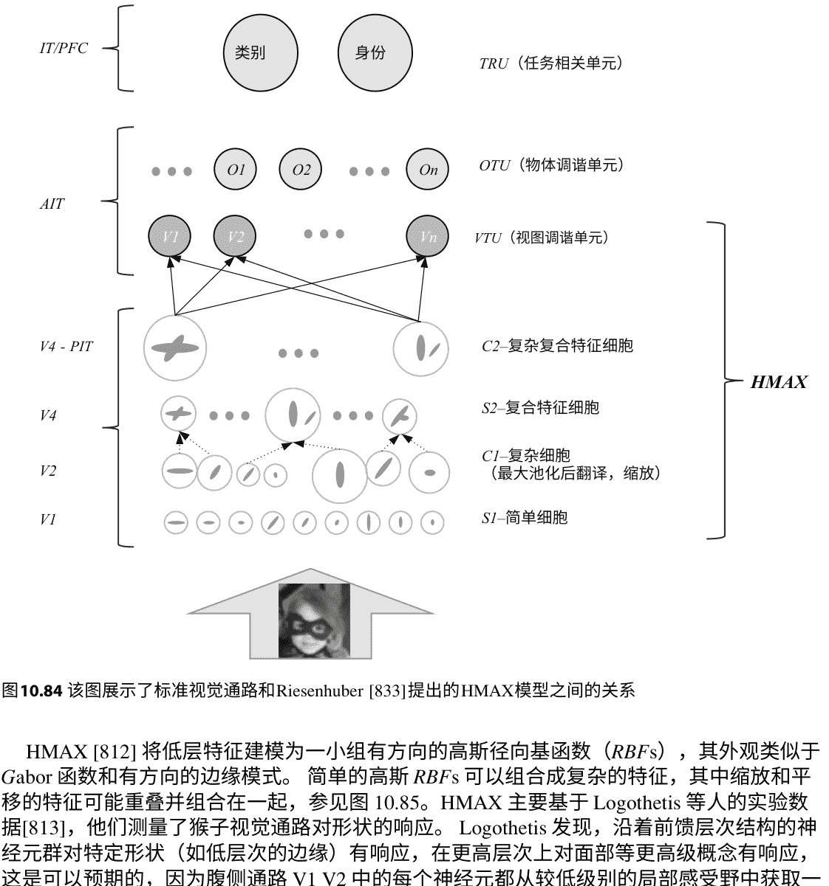

图10.84 该图展示了标准视觉通路和Riesenhuber [833]提出的HMAX模型之间的关系

HMAX [812] 将低层特征建模为一小组有方向的高斯径向基函数（RBFs），其外观类似于Gabor函数和有方向的边缘模式。简单的高斯RBFs可以组合成复杂的特征，其中缩放和平移的特征可能重叠并组合在一起，参见图10.85。HMAX主要基于Logothetis等人的实验数据[813]，他们测量了猴子视觉通路对形状的响应。Logothetis发现，沿着前馈层次结构的神经元群对特定形状（如低层次的边缘）有响应，在更高层次上对面部等更高级概念有响应，这是可以预期的，因为腹侧通路V1 V2中的每个神经元都从较低级别的局部感受野中获取一些输入，因此较低级别的神经元从边缘和斑块特征占主导的小区域获取输入。Logothetis和其他人的神经生物学研究表明，视觉通路具有包含数十亿特征的巨大分层特征记忆，通过极其大量的并行和同时处理进行处理，其中一些神经元专门用于单个低层特征，其他神经元专门用于较大特征的一部分，还有其他神经元专门用于形成和测试高级分类决策的假设。这意味着未来的合成视觉模型可以设计成假设大量特征是有用和有优势的，与使用较少特征和统计分类器的模型相比，后者更擅长泛化、压缩，并适用于适度计算机系统的实现。

#### 视点不变模型

HMAX提供了一个部分调和人类视觉中视点不变性理论的桥梁模型。换句话说，人类视觉系统如何在不同视角下识别相同的物体？根据Tarr [814]的观点，有两种基本的视觉表示理论可以解释视点不变性:

1. 分层部件模型（大部分是视点无关的）：部件的层次结构，每个部件都是完全或部分视点无关的。大部分视点不变性被认为记录在特征层次结构中，可能是在较高层次。据推测，视觉通路中进行了一些视角插值，以调和不同视角之间的差异。
2. 外观模型（主要是视角相关）：每个视角由单独的神经特征记忆表示，可能在视角之间共享一些高级概念的特征。理论上，视角表示被认为是从原始视图中记录新的神经记忆印象，可能基于印象的新颖性和重要性形成新的神经生长和互连。

*HMAX综合了模型（1）和（2）：HMAX在较低层次的特征中使用部件的层次结构，并在较高层次的概念中使用视角相关模型（视角调谐单元或VTUs）。

HMAX引入了术语视角调谐细胞来表示视图调谐单元（VTUs）中的较高级概念，如图10.84和10.86所示。每个视角调谐细胞基于较低层次的特征。较高层次的视角相关视角调谐细胞是由较低层次的视角无关特征组成的模式识别器。HMAX已经证明很好地模拟了尺度和平移不变性，同时还利用了视角调谐细胞和低层次的视角无关特征，在x轴或y轴上也具有一定的镜像不变性。

#### HMAX特征层次结构

HMAX将一个过完备的较低层特征组合成更高层的概念表示，从而减轻特征不变性问题。如图10.85所示，需要注意的是，较低层特征类似于Gabor函数，可以将对象（如边缘段）建模为3D旋转的集合，相当于3D旋转和尺度不变性。我们认为视点不变性主要由仿射变换组成。因此，更高层特征是建立在3D不变的边缘特征之上的，关于仿射不变性对称特征组的SYMNETS调查也可以参考。

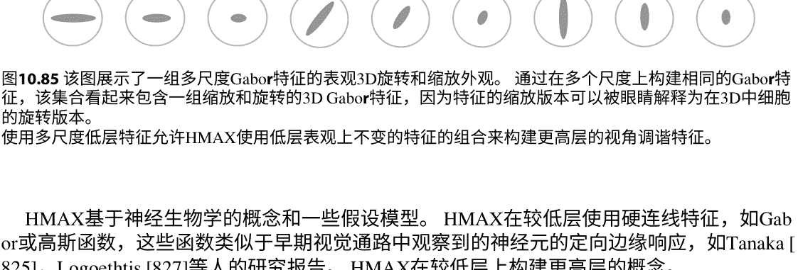

HMAX基于神经生物学的概念和一些假设模型。HMAX在较低层使用硬连线特征，如Gabor或高斯函数，这些函数类似于早期视觉通路中观察到的神经元的定向边缘响应，如Tanaka [825], Logoethis [827]等人的研究报告。HMAX在较低层上构建更高层的概念。特征，根据研究结果，视觉通路的更高层（如IT区）对高度视角特异性的模式（如面孔、形状和复杂对象）具有感受性，参见Perrett [821, 822]和Tanaka [823]。事实上，视觉通路IT区的聚类区域被Tanaka [826]证明对相似的对象聚类有响应，这表明神经元会生长和连接以创建语义相关的视角特异性特征表示，以增加区分能力。连接组学研究还提供了证据，表明相关的特征概念存储在相邻的区域[852, 859]。

HMAX提供了一个与视角无关的模型，对于尺度和平移具有不变性，利用对所有输入进行尺度和平移的MAX池化操作，供给更高层的S2、C2和VTU单元，类似于在竞争神经元之间观察到的侧抑制，允许最强的激活关闭竞争较弱的激活。HMAX还允许低层特征之间的共享和插值，因为它们被组合成更高层的视角特异性特征。

在HMAX的假设下，每个神经元更像是一个非常简单的记忆细胞，带有一个神经相关器。事实上，神经生物学研究[816-818]提供了充分的证据，表明特定的神经元群体作为独立的记忆细胞，每个细胞包含相同物体的不同视角的视图，而不是将视角不变性编码在单个神经元中。根据视角依赖的假设，需要更少的神经元来记住神经元群体之间的高级视角依赖差异[819-821]，正如研究猴子时所注意到的，在前IT区域的特定神经元对视角特定的特征作出反应。特定神经结构的视角依赖性似乎是可能的，例如，在视觉通路的顶层IT区域中学习的特征需要非常具体甚至是视角特定的才能识别出一个家庭成员的人脸。

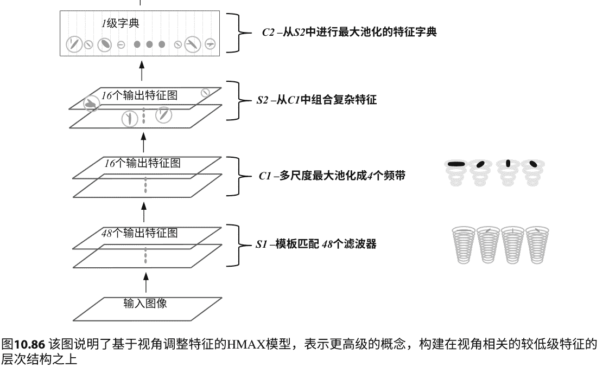

原始的HMAX概念在图10.86中进行了说明，作为可视化真实系统架构的一种方式。HMAX不会学习S1、C1、S2和C2中的底层特征，而是使用基础函数代替[543]。HMAX中的低级特征是硬编码的，或者使用基于迁移学习的特征，基于Serre等人的研究结果[835]，他们实现了真实的HMAX系统，显示出与CNN模型中常见的学习特征相比，并没有更高的效果，提供基础特征或从迁移学习中得到的特征能够适应训练集。高级的视角调整单元(VTUs)是学习特征的地方。S1和C1单元产生特征图，S2和C2单元产生无序特征的字典(Bag-of-Words模型)。越来越多的研究表明，DNA可能包含记忆印象或基因记忆，类似于基础函数而不是学习函数(参见[824]，还可以引用更多的参考文献)。其他研究表明，DNA可以通过记忆印象和经验进行修改[825]，这些记忆印象可以通过DNA传递给后代。因此，HMAX模型在低层使用预先存在的特征，在视觉皮层的较高层次上进行专业化和更高级概念的学习是符合神经生物学的可行的。

#### HMAX模型中的关键层如下：

- S1：简单细胞通过模板匹配计算定向多尺度滤波器响应。
- C1：复杂C细胞执行多尺度最大池化操作。
- S2：将缩放和平移特征组合成原型特征。
- C2：MAX池化的S2细胞的1D特征字典。
- VTU：由高级特征组成的视角无关单元（VTUs）。

#### HMAX层

在这里，我们按照Reisenhuber的MAXLab开源代码[837]逐层调查Reisenhuber的原始HMAX版本[812]，并指出其他研究人员最近的HMAX增强和创新。

#### S1层

S1层用于将输入图像进行多尺度滤波，生成一组跨整个输入图像的多尺度输出特征图，根据滤波器区域的大小进行子采样。

如图10.87所示，S1由在12个尺度（4 × 12 =48）上计算的四个定向高斯边缘函数组成，用于构建相关的权重模板矩阵。每个输出特征图包含不同尺度下每个特征的滤波响应，使用视网膜坐标系统来保留子采样后特征的空间网格位置。原始的HMAX版本使用二阶导数高斯滤波器。Mutch和Lowe [543, 828]，Serre [544]以及后续版本的HMAX [829, 831]使用Gabor滤波器代替高斯滤波器，而Hu [830]使用PCA学习从补丁中创建卷积滤波器。在较新版本的HMAX中，更常用的是Gabor滤波器，因为Gabor滤波器可以更精确地调节。Sharpee等人尝试了曲线Gabor滤波器[653]，发现曲线Gabor滤波器仍然无法完全描述所检测到的特征类型。

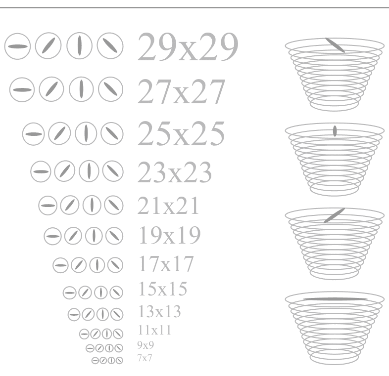

图10.87 该图展示了S1层的特征，包含四个方向的滤波器函数和每个滤波器的12个尺度，共48个滤波器。每个滤波器都被渲染为一个圆形模板权重矩阵

##### 原始HMAX二阶高斯2D滤波器形状：

$$G_{x,y} = \frac{(-x \cos \theta + y \sin \theta)^2}{\sigma^2(\sigma^2 - 1)} \exp \left( \frac{(x \cos \theta + y \sin \theta)^2 + (-x \cos \theta + y \sin \theta)^2}{2\sigma^2} \right)$$

其中方向 = $\theta$ 和宽度 = $\sigma$

##### Gabor滤波器形状 (Mutch & Lowe和Serre)：

$$G(x,y) = \exp \left( \frac{X^2 + \gamma^2 Y^2}{2\sigma^2} \right) \cos \left( \frac{2\pi}{\lambda} X \right)$$

其中：

$X = x \cos \theta - y \sin \theta$
$Y = x \sin \theta + y \cos \theta$

$x$ 和 $y$ range $[-5 ... 5]$
$\theta$ range $[0 ... \pi]$

$\gamma$ (纵横比), $\sigma$ (有效宽度), $\lambda$ (波长)

##### 像素块 X 对 Gabor 滤波器的响应：

$$R(X, G) = \frac{\sum X_i G_i}{\sqrt{\sum X_i^2}}$$

每个滤波器被复制成0度、45度、90度和135度四个方向，并且每个方向被复制成从7 × 7到29 × 29像素的12个缩放版本，缩放增量为2：[7 × 7, 9 × 9, ... 29 × 29]。因此，S1特征的总数为4 × 12 = 48。HMAX的后续版本使用稍微不同的滤波器尺寸排列[829–831]。S1特征包含在一个圆形区域中，而不是一个矩形区域，这增加了旋转不变性，并且比简单的矩形更符合生物学上的可行性。

S1通过模板匹配产生滤波器响应，因此滤波器被渲染成权重矩阵，用于对像素区域进行模板匹配，类似于CNN。每个滤波器在输入图像的每个像素上都居中进行滤波，所有滤波器的响应被收集到48个输出特征图中，供C1层使用。Mutch和Lowe [543, 828]不是创建从7 × 7 ... 29 × 29范围的缩放特征，而是对输入图像进行缩放，并使用单尺度滤波器，参见图10.88。Serre等人[835]将滤波器尺度范围从7 × 7扩展到37 × 37，间隔为2，从而得到16个尺度和四个方向的64种特征类型。

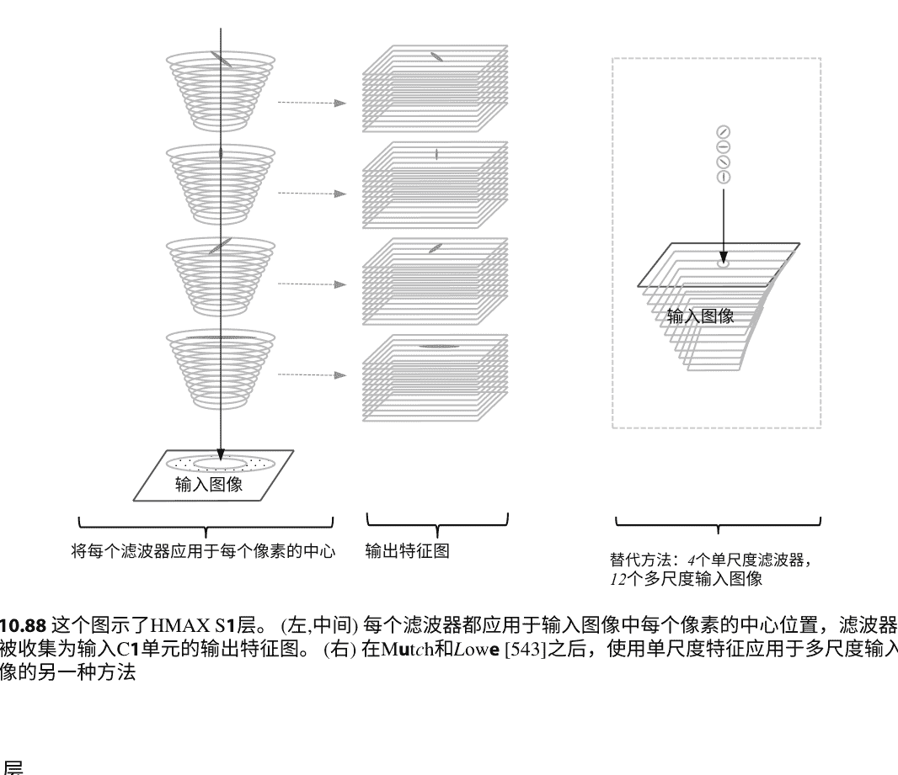

#### C1层

C1层对所有方向和尺度的滤波器响应进行多尺度最大池化，以创建V2复杂细胞，这些细胞在小尺度范围内具有尺度不变性，并在局部区域内具有位置不变性。每个方向的滤波器集合都独立进行池化。如图10.89所示，C1层将来自S1的48个输入特征图池化和下采样为16个输出特征图，对应于尺度带。尺度带包含相似大小的滤波器，例如带4：[7 × 7, 9 × 9]，带3：[11 × 11, 13 × 13, 15 × 15]，带2：[17 × 17, 19 × 19, 21 × 21]，以及带1：[23 × 23, 25 × 25, 27 × 27, 29 × 29]。使用带的想法是通过汇集来增加尺度不变性。

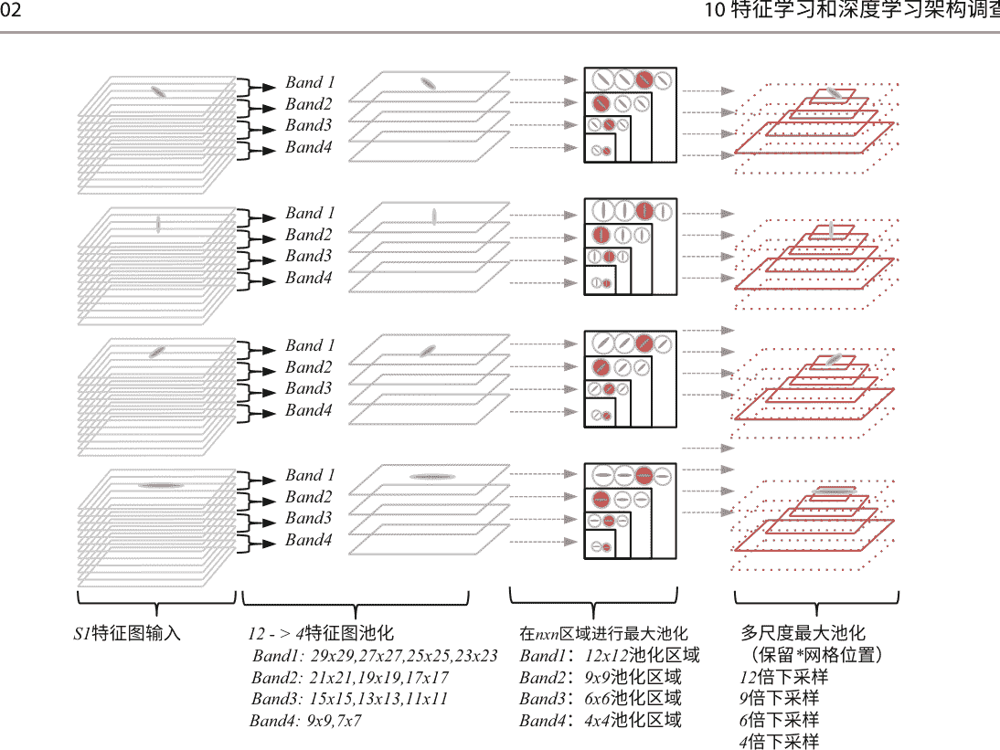

图10.89 该图展示了HMAX C1层。S1滤波器响应被分为四个频带，然后通过$n \times n$区域进行最大池化。池化特征包含尺度和位置变化

类似大小的滤波器响应的响应。MAX池化区域的大小为4 $\times$ 4, 6 $\times$ 6, 9 $\times$ 9和12 $\times$ 12，足够大以适应每个带中的特征，这为特征位置提供了一定的不变性，并且区域可以通过可变的步幅重叠。或者，可以生成并使用每个极性的特征。如图10.89所示，MAX池化区域的大小与每个带中的特征大小成比例，例如对于较小的特征使用较小的区域，如4 $\times$ 4，对于较大的特征使用较大的区域，如12 $\times$ 12。MAX池化区域的重叠可以调整，例如使用密集重叠区域采样的步幅因子，或者使用更高的步幅因子来减少区域重叠。每个滤波器响应的绝对值用于MAX池化，以提供对比度反转的特征极性不变性。

#### S2层

S2层对应于标准模型中的V4或后IT层。S2单元从C1 2 $\times$ 2局部区域的每个尺度带的每个四个方向的滤波器响应中汇集，然后根据C1层中从训练图像中获取的原型n $\times$ n块$P$，组合成一个复合滤波器响应。S2细胞对C1特征的方向和尺度的组合的共同激活作出响应，覆盖更大的感受野大小。如图10.91所示，每个S2单元在C1特征映射中的每个方向上汇集和组合来自局部2 $\times$ 2区域的输入，以创建复合滤波器。Mutch和Lowe [543]通过仅使用每个滤波器响应的主导方向来改善特征组合，如图10.90所示。

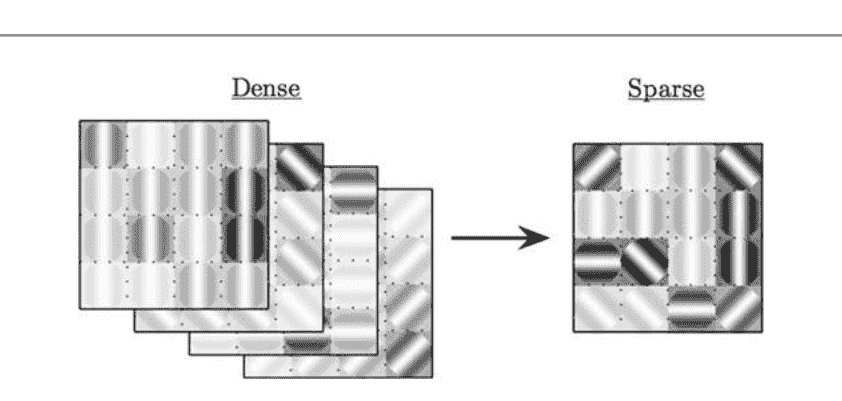

图10.90 这张图展示了Mutch和Lowe [543]使用仅来自所有滤波器带响应的最大方向进行稀疏特征组合（调节）的方法，而不是使用所有滤波器响应的组合，图片来自[543] IJCV 2008, ©Springer并获得许可

S2单元找到训练图像中C1补丁 X对原型补丁 P的响应。每个补丁区域有4个深度（对应四个C1尺度带），包含四个可能的值。C1特征图包含四个特征方向 × 四个池化尺度带，因此尺度和方向不变特征组合的可能数量为4^4 = 256。在整个图像中的局部2 × 2区域中考虑所有组合。请注意，通过包括比2 × 2更宽的区域并增加C1特征方向的数量，可以增加特征计数。Cadieu [831]将区域大小扩展到3 × 3，并在组合中包含所有方向的特征，而不仅仅是单一方向。有关S2单元形状表示的信息和可视化，请参见Cadieu [831]。

组成和调整方法在不同的实现中有所不同，原始的HMAX版本[829]使用带有加权高斯求和{1,1,1,1}的响应函数，其中包括四个标准差为1的特征。在HMAX-S衍生版本中，Theriault等人[832]使用C和C1补丁之间的余弦相似度，并使用P和X之间的归一化点积，该点积对光照强度不变，而RBF对光照强度敏感。在HMAX的其他变体中也使用了其他相似性函数[828, 836]。

复杂特征包含每个滤波器的多个尺度和方向的组合，因此S2输出是一个由复杂原型特征P组成的单个2D特征映射字典，如图10.91所示。

通过比较当前图像补丁X与训练图像中的当前C1原型特征X之间的差异，获取S2特征，差异对应于特征匹配的强度。为了组成每个S2原型，对于C1级别的每个图像，随机选择图像补丁X，并使用响应函数R(X, P)来组成来自C1中当前图像补丁X和原型P补丁的特征Y，该过程在所有图像补丁的所有位置、所有频带和方向上进行。

```
Y = R(X, P) = \exp\left( -\gamma \| X - P_i \|^2 \right) \quad \text{(RBF来自Serre和Reisenhuber [544, 835])} \\ \text{其中} \ \gamma \ \text{是一个锐度调节参数，距离是欧氏距离。}
```

```
Y = R(X, P) = \exp\left( -\frac{\| X - P_i \|^2}{2\sigma^2} \right) \quad \text{(RBF—Mutch和Lowe [543, 828])} \\ \text{其中} \ \alpha = (n/4)^2 \ \text{是一个归一化因子，} n \ \text{是滤波器尺寸维度} n \times n \text{，距离是欧氏距离。}
```

```
Y = R(X, P) = \frac{P \cdot X}{\|P\| \|X\|} \quad \text{(归一化点积—Theriault等人 [832])}
```

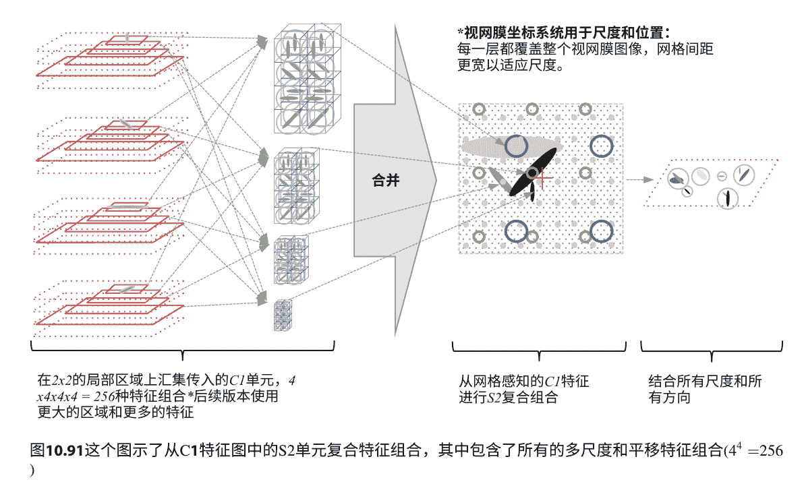

图10.91这个图示了从C1特征图中的S2单元复合特征组合，其中包含了所有的多尺度和平移特征组合(4⁴ =256 )

S2单元激活函数是可调的高斯函数，后续的HMAX版本使用了Gabor函数。 S2单元用于保存特征字典，该字典是由C2单元中的四个方向上的条状特征组合而成的。

请注意，Cadieu [831] 还提供了对S2和C2的扩展，以放宽特征组合方法，允许S2层进行一些特征学习，以更好地匹配目标模式，并且C2层的池化参数也更加灵活。

#### C2层

C2单元结合不同大小的S2单元以响应更大的感受野尺寸。 C2层以S2单元作为输入，并产生无序的1D字典作为输出。 在构建S2层时，可以同时构建C2单元，方法是在整个图像的所有位置和尺度带上取最大响应。 C2单元输入到VTU中以组合更高级别的概念。 C2字典包含复合的条状特征。 C2单元在整个图像上跨所有四个滤波器带的特定方向的S2单元的复合特征上进行最大池化，从而提供了大量的旋转和平移不变性。 S2单元组合了复合特征，而C2单元实质上只选择了最大值。 在这一点上，池化没有空间排列，因此特征只是作为一个无序的字典收集起来。 256个C2单元中包含的模式可以组合起来编码任意的物体形状（图10.92）。

请注意，HMAX C2字典完全基于训练数据原型；然而，Serre [835]还提供了关于更大特征数量的研究，该研究使用了一个通用特征字典，除了Gabor样的定向边缘之外，还使用了更多特征数量约为5000个特征和更多的训练示例数，比之前的HMAX实现更多。

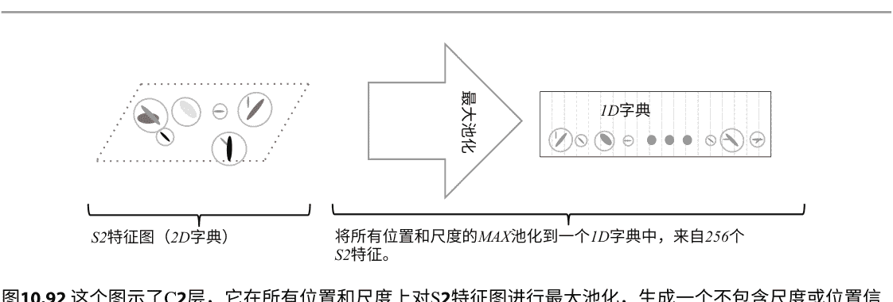

#### VTU分类

VTU层是最终的分类层，其中C2特征和可能的C1特征被组合成更高级的对象。最后，在VTU层中进行实际的特征学习。VTU单元（视图调谐单元）从C2单元接收输入，并模拟对三维物体的二维视图的响应，这与Logothetis [813]在猴子中观察到的VTU非常相似。VTUs可以使用高斯响应函数来调谐对较小宽度的响应，以聚焦响应，以实现最强匹配的最大响应和无匹配的零响应。

如果激活强度太弱，C2单元可能会被过滤掉并忽略，或者如果足够强，则选择为传入神经元。

请注意，Serre和Riesenhuber [829]后来扩展了基本架构以使用更多特征（17个而不是12个），并提供了用于滤波器带组合和池化区域大小调整的参数。Mutch和Lowe [543]通过几种方法引入了特征集的稀疏性，包括（1）如果激活小于50%，则抑制特定特征方向的弱激活。

（2）在给定位置上仅计算每个特征的最强方向的匹配（一种侧抑制形式），并且（3）丢弃具有低值的权重模板，而不是将它们传递给VTUs。胡等人[830]还通过稀疏编码、迁移学习和PCA/ICA PCA来增强HMAX特征基础，而不是从硬连线的Gabor滤波器开始。Serre等人[544]在VTU层使用SVM分类器，该分类器接收C1和C2特征的输入，并进行了提升[486]的实验。

#### 训练协议

HMAX训练协议各不相同，早期版本使用较小的未修改图像训练集，而CNN通常使用大规模的缩放、旋转和对比度修改的训练集。HMAX训练过程涉及从训练图像中提取一组大小为N的随机位置像素块X。通常，一起提取数千个块。像素块X的大小与C1滤波器的区域池化大小匹配（即4×4、6×6、9×9、12×12为原始HMAX版本）。每个块都经过滤波以计算所有方向和尺度的C1级别响应，然后被视为原型P。C1滤波器响应的数量因区域池化大小而异，因此对于4×4块，有16个位置，对于每个位置，有四个定向滤波器单元，因此4×4块包含64个C1单元响应。每个原型都以中心为基准，并针对所有S2单元特征进行滤波，使用欧氏距离[835]或余弦距离[832]等距离函数来测量响应。Lau等人[851]和Theriault [832]使用点积来测量距离。HMAX-S方法[832]使用多个局部尺度进行更深层次的原型特征响应，从而得到更详细和敏感的原型。然后对原型进行MAX池化，创建C2特征字典。

### HMO—分层模型优化

另一个神经学模型是由Yamins等人开发的分层模型优化（HMO），它模拟了IT皮层中的高级推理中心。相比之下，CNN模型处理视觉通路中的从低级到高级特征，而局部特征描述符方法主要关注对视网膜和眼睛的建模以及其他一些处理，然而在CNN和局部描述符模型中，高级IT区域和学习中心并没有得到很好的解决，而是被提出作为一个使用FC层和SVM方法解决的分类问题。因此，HMO在计算机视觉模型中填补了一个独特的空白。

HMO通过使用提升和其他优化方法来优化一组较低级别的分层模型，以模拟更高级别的推理，并在某些测试中实现了与人类视觉通路的显著等效性，参见图10.93。HMO模型的开发过程涉及将电极连接到一个主体的168个神经元，并测量神经电极对标记的训练集的响应。然后，通过分层模型优化过程（HMO）评估和调整了成千上万个可能的响应模型，如CNN和HMAX，以从候选模型中发现最接近的匹配分类（即逆向工程）。

HMO响应模型集从随机组合的调整参数开始进行优化，例如特征计数、层数和动量，并在图像旋转、缩放和强度上进行训练协议变化。HMO发现并组合最佳性能模型，以预测和实现高分类得分，使用自适应提升和参数优化。

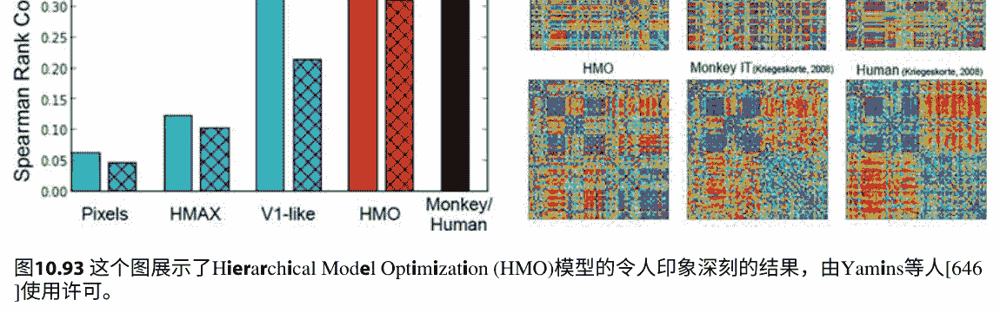

## 集成方法

集成方法是网络的组合，它们可以并行构建特征、并行分类，并对组合结果进行投票。网络集成可以是异构的或同构的，例如仅使用多个CNNs，或者同时使用CNNs和词汇方法，或者同时使用CNNs和RNNs（参见C-RNN，QDRNN，RCL_RCNN和dasNET）。

CNNs和词汇方法可以一起使用，或者CNNs和RNNs可以一起使用，就像之前调查过的那样（参见C-RNN，QDRNN，RCL_RCNN和dasNET）。一个简单的集成网络可能包括五个CNNs，每个CNN使用稍微不同的训练协议和学习参数（参见Inception），每个CNN产生用于分类的标记特征，最后在末尾使用一个投票机制将所有结果结合起来。

- 减少过拟合
- 在特征集中增加更多的不变性
- 提高整体准确性
- 加快训练速度，正如Waibel [688]在1989年建议的那样

集成的一个缺点是增加了计算需求；然而，下面将介绍优化集成的方法。

正如Bucilla等人[614]所指出的，许多表现最佳的模型都是由数百个或数千个模型组成的集成模型。这是合理的，因为没有单一的模型可以针对所有类型的数据进行优化，而且模型是针对给定的训练集进行专门化训练的。Bucilla开发了一种将一组模型压缩为较小一组模型的方法。关键概念包括识别较小、更快的模型来近似较慢、较大的模型，他们的工作重点是确定最佳的训练协议和训练数据，以便进行模型比较。有关在神经网络上提炼集成模型的更多信息，请参见Hinton等人[620]。

图10.94 该图示了一组网络一起工作，每个网络具有不同的训练协议、调整参数和图像块区域，输入到最终的分类器

之前调查的dasNet方法[612]使用并行的CNN集合，通过修改每个网络中的权重来允许对不同假设进行并行测试，类似于专家测试一组假设的方式。 DasNet结合了自动特征优化和评估过程。

之前在CNN部分调查的AlexNet方法[640]将特征学习分为两个并行网络：一个网络学习低级特征，另一个网络学习高级特征。 尽管AlexNet双重特征学习网络的动机是性能，但一个副作用是每个并行网络中的特征学习遵循稍微不同的路径，并且导致的结果与在同一网络中学习特征时略有不同。

Ciresan Meier和Shmidhuber [790]开发的多列DNN（MCDNN）在并行使用多个DNN，并为每个DNN提供不同的图像输入，然后对最终的分类得分进行平均。 DNN的每一列都使用共享权重，并允许并行评估特征。 每个DNN都以重叠的图像列进行训练，采用赢者通吃的方式，只有获胜的DNN特征才会被训练。 这样可以保留已经学习到的特征，并且允许每个网络可能专注于不同层次的特征层次结构，因此每个DNN可能是层次结构的不同层次的赢家。 输入图像列可以以不同的方式进行处理。

Yamins等人[649]之前调查的HMO方法评估了数千个候选模型，如CNN和HMAX模型，并通过提升和超参数优化和调整过程来优化最终结果。 HMO是另一个从神经科学界而不是计算机视觉界推出的模型。

集成的缺点是委员会式设计综合症，没有人是对的，没有人是错的，每个人都有贡献，但没有人百分之百满意。 即使委员会成员中有一个是正确的，委员会式设计方法也会使他们被压制。 正如MAX池化（选择最强的激活）所证明的那样，在许多情况下，最高的置信度响应比平均池化响应（即集成方法）更好。

有关集成和委员会领域的更多参考和历史发展，请参阅Schmidhuber [552]。

## 深度神经网络的未来

本章对DNN的最新研究进行了调查，因此在这里我们将探索一些扩展DNN边界的未来研究领域。 未来的研究将继续探索更复杂的神经元模型，例如提供神经元组之间反馈路径以影响神经元组发射的脉冲神经网络。 未来研究的其他领域包括（1）如何以计算高效的方式增加网络深度（网络深度优化），（2）将单个深度网络或复杂集成网络重构和压缩为更小的单个网络作为近似（模型压缩），（3）将复杂分类器分解为一组更简单的分类器（分类器分解和重组），以及（4）训练协议将是一个关键的未来研究领域，我们应该期待通过更好地准备训练集和更好地选择图像，结合DNN从训练集图像中更好地分割正确感兴趣区域，推动分类准确性提高到更高水平。 最后，我们应该预期会出现大量专用与DNN的相关处理器，例如百度为其基于云的系统提供的数据带宽加速器，在MINWA部分中进行了调查，用于提高计算性能的Google TPU云加速器，以及用于端点设备的专用加速器，用于在本地图像和训练的DNN模型上进行推理。

### 将深度提升到最大——深度残差学习（DRL）

深度残差学习（DRL）是由何凯明等人[872]开发的，旨在探索尽可能增加DNN网络深度以提高准确性的方法，并借鉴了何凯明早期在本章前面讨论的SPP [542]和Fast-R-CNN [707]架构的工作。何凯明等人报告称，DRL网络是迄今为止最深的网络，使用了非常高效的参数化方法来实现100-1000层的架构，与较小的网络相比具有可比性。DRL方法的驱动目标是解决DNN研究中观察到的一个关键问题，即当层数增加时，准确性停止收敛，并且准确性开始变差，最终比层数较少的DNNs差。此外，何凯明等人还展示了DRL概念的另一个好处，即减轻与权重和网络参数初始化不当相关的问题。还可以参考邓[891]的早期相关工作，以及Targ[892]和Szegedy[893]等人对DRL作为Resnet的最新发展。

DRL使用的基本概念之一是快捷连接，如图10.95所示，它将输入前馈到后续重用。（注意，在本章前面调查的Inception Net也使用了快捷连接。许多历史上的MLP也以临时的方式使用了快捷连接，参见Schmidhuber[552]）。DRL网络通过层组的方式重新构建了基本的FNN，这些层组由新颖的残差学习构建块（RLBBs）分隔开，如图10.95所示，它们通常插入在He的工作中的每个滤波器层之后。RLBBs从跳跃连接中获取输入，计算输入和处理后的输入之间的残差或差异，使用残差函数将输入x与一组层F（x）的输出组合起来，产生残差差异。关键思想是在数值较小的残差上进行训练，这样在训练过程中更容易发现真实的梯度波动，并且能够进行更准确的权重更新。残差函数在一组层上被定义为一个映射函数，表示如下：

```
H(x) : 底层映射函数
F(x) := H(x) - x : 堆叠的非线性映射
F(x) + x : 使用残差重新映射
```

He等人展示了使用RLBB的网络，可以有效地消除大部分计算和参数密集的全连接分类层，这在本文前面已经讨论过的章节。由于大型全连接层代表了典型DNN中的大部分参数，通过消除全连接层，即使增加了层数，也可以大大减少总网络参数数量，通过引入RLBBs。因此，RLBB的形式不会增加网络的复杂性或额外的参数，可以使用反向传播进行训练，并且已经证明可以解决更深层网络的准确性差异问题。

为了说明在不同层的DNN中观察到的异常情况，He等人提供了结果，显示出一个22层的CNN架构比一个类似的50层CNN架构具有更好的准确性，后者表现出训练准确性的差异异常。尽管He的工作没有探索准确性差异和退化的根本原因，并且被指出作为未来研究的一个领域，但准确性差异的一个可能原因似乎是梯度下降方法本身，这可能会由于异常的梯度误差组合而在网络中产生瞬态梯度峰值，类似于电路中的瞬态峰值。也许，当给定的梯度被纠正时，纠正可能会导致其他梯度的相关振荡，在特定的训练时期可能会对齐并相加，形成一个令人不满意的梯度瞬态峰值，然后通过相应的异常权重更新进行调整，从而导致增加的梯度瞬态。梯度下降方法本身并不被很好地理解，并且类似于一个大规模的、偶然的平均和抖动过程，使用特定的学习率和动量参数进行控制，以平滑梯度下降，正如本章前面介绍的那样。

### 使用简化的MLP（模型压缩）来近似复杂模型

增加DNN准确性的一种方法是将一组DNN一起使用，每个DNN的架构和训练略有不同，并对组合的结果进行平均，以获得一种通过委员会风格的分类的协同设计。然而，由于集合是一个大的计算工作量，研究人员已经开发了使用单个DNN来近似集合的方法，以减少计算工作量，这似乎是直观的，因为MLP是一个通用的函数逼近器。最终结果是一个较大集合的较小且紧凑的近似。

类似地，可以通过简化的DNN来近似单个复杂和深层的DNN，以提供计算优势。模型减少的一个明显应用是首先训练一个更大的基于云的集合或复杂网络，然后将模型减少到一个较小且更快的DNN，以便在嵌入式或便携设备上部署。我们在这里讨论一些相关的研究。

近似一个集合的一种方法是由Bucila等人采用的两阶段方法[875]，首先训练一个集合来标记训练集，然后将集合的标记输出和测试集作为输入来训练一个单一的DNN来近似集合。使用单一的DNN来近似一个大集合大大减少了计算工作量，无论是在训练时还是部署时。在这方面，模型压缩与DNN中的迁移学习相关，正如本章前面讨论的那样，首先训练一个DNN，然后将权重转移到另一个DNN中，进一步训练以获得类似的知识领域，从而获得更快的训练时间、特征细化和专业化，以及可能更好的准确性。压缩模型因此近似了分类标签和权重。

当然，除了集合外，也可以通过类似的方式近似一个非常深的网络，得到一个更小、更高效的压缩模型。

为了推广Bucila的工作，Hinton等人[873]定义了一个知识蒸馏模型(KD)，使用一个教师模型和一个学生模型。对教师模型的输出应用参数化的softmax松弛函数，使得学生模型能够在一定的准确性范围内推广到新模型。然后，使用一个目标函数对学生模型进行进一步优化，该目标函数比较学生模型和教师模型的结果。

KD模型的进一步改进是由Romero等人[874]开发的FitNets架构，该架构使用从教师模型中得出的提示来指导学生模型的训练。提示来自教师网络的隐藏层，并用于指导学生网络中一个隐藏层的逼近。因此，提示过程指导并优化学生模型以复制教师的某一层的权重，旨在将学生网络优化到正确的分类输出方向。FitNets显示出比KD和Bucila的方法更高的逼近准确性。基于提示的训练被认为是Bengio早期关于课程学习[876]的工作的一个衍生，该工作使用从简单到复杂的训练协议来训练网络，类似于迁移学习（即，我们可以将课程学习视为连续的逐步改进的迁移学习协议）。首先，使用简单的训练样例来训练网络，然后通过使用更具表现力和复杂的训练样例逐步重新训练网络权重。因此，课程学习逐步改进同一个网络，从简单的训练样例推广到复杂的训练样例。

### 分类器分解和重组

Hinton等人开发了一种用于模型压缩的相关方法，将分类器分解为一个或多个专家模型或细粒度分类器。Hinton将教师分类器建模为一组较小的细粒度分类器，因为较大的教师模型在某些情况下可能会将分类混淆为粗粒度分类。将粗粒度分类器分解为一组细粒度分类器的想法是新颖的，并且是未来增加分类准确性的有前途的研究领域。

相反，未来的工作预计将找到重新组合一组细粒度分类器以产生更强大的混合分类器的最佳方法，该分类器更通用或应用特定，例如通过在较小的训练集上训练一组较小的DNN，然后将较小的DNN组合在一起形成一个分类器库，类似于滤波器库。分类器库可以作为一个非常宽的全连接层、并行的全连接层或特定应用的集成网络来实现。

## 摘要

我们探索特征学习架构和深度学习，同时使用特定和受神经科学启发的方法。在大多数特征学习系统中，学习到一系列特征，从低级边缘和纹理特征，到中级的模式概念，再到更高级的物体部分和整个物体。有些方法使用一组分类器来评估特征，而其他方法使用一组分类器的层次结构来得出结论。在未来，我们将看到除了目前在大多数深度神经网络中使用的简单相关模板之外，还会出现更好的特征表示，利用局部、区域和全局特征。

特征学习中使用的神经网络方法指向了合成智能和合成视觉的未来融合，使用相同的底层神经网络架构标准化到硅片上，可以针对包括计算机视觉、语音、投资、营销和监视在内的广泛分析问题进行调整。

科学和技术就像波浪一样，随着它们的上升而形成力量，携带着最好的研究思想在浪尖上冲浪，当波浪迅速接近海岸线时，应用变得更加广泛并超越旧方法，然后变得商业化或军事化，从而改变社会和国家。然后，当技术商品化并接近零价格点（即免费和预期）时，波浪冲击沙滩，研究对许多人来说可能变得无趣，而那些在他们生命中的黄金岁月中投入了最好的头脑和研究者们往往会受到影响。研究这项技术的人们被困在海滩上，他们的知识已经过时，过去的几次成功经验也不足以让他们转向新的学科并迎接下一个浪潮。 当当前的浪潮退去时，新的技术浪潮正在接近，由一批新的研究人员和聪明的头脑驾驭，他们充满了新潮的激情和力量，于是循环重复。 我们正接近基于视觉神经科学概念的合成视觉系统的新浪潮的顶峰：合成大脑。 我们很快将看到合成大脑、合成视觉、智能假肢和机器人永久改变社会。 当前的人工智能和特征学习浪潮已经让早期的计算机视觉研究人员被困在海滩上，因为他们没有乘上神经视觉研究的浪潮。

合成大脑和合成视觉浪潮的早期浪尖已经到来，推动着智能汽车、视觉监控、智能广告和智能分析等新创新，但还有更多的东西即将到来。 当合成视觉和合成大脑的浪潮以大规模进入商业市场时，我们将看到一大批廉价而普及的智能设备，它们能够节省时间和能源，类似于应用程序和廉价的家电设备。 这些产品将成为完整的物理设备，很可能使用人工神经网络、机器人电机控制器和合成视觉的共同核心架构，从而构建一个智能设备的生态系统，可以为各种商业应用进行定制。 这将改变社会的本质。

然而，人工神经网络无法创造人类的精神和灵魂，所以我们将继续像以前一样生活，只是有更多的合成辅助。

# 第10章：学习任务

1.  讨论感知器（P）架构和多层感知器（MLP），包括所使用的学习规则和训练协议。
2.  讨论Neocognitron架构。
3.  描述如何创建特征映射。
4.  描述分层特征映射体积（堆叠）。
5.  描述基本LeNet架构中的层。
6.  根据基本LeNet架构描述CNN的前向传递过程。
7.  根据基本LeNet架构描述CNN的反向传递过程。
8.  在CNN的前向传递过程中存储了什么？
9.  描述如何在CNN中使用全连接层（FC层）进行分类，讨论FC层特征权重，并提供一个假设的FC层设计。
10. 描述CNN中的常见层。
11. 描述卷积核如何在输入图像和特征图上应用。
12. 在CNN的背景下，描述点积、卷积、相关性和归一化相关性之间的区别。
13. 比较至少两种初始化CNN特征权重的方法。
14. 讨论滑动窗口以及如何使用步幅因子，并比较小窗口和大窗口的优缺点。
15. 描述人工神经元的偏置输入以及其用途。
16. 描述CNN前向传播过程中收集的信息，在反向传播步骤中如何使用。
17. 描述使用梯度下降的反向传播过程。
18. 描述在分类器中如何计算总梯度误差以开始反向传播步骤，并描述如何将总梯度误差按比例分解为偏导数，并在每个神经元中向后传播。
19. 描述在每个神经元中如何将总梯度误差的偏导数和神经状态导数一起使用来调整特征权重。
20. 描述在反向传播过程中用于调整特征权重的学习率和动量参数。
21. 讨论确定CNN中层数和每层特征数的考虑因素。包括计算性能和内存的考虑因素。
22. 描述使用小内核窗口进行堆叠卷积与使用较大窗口进行卷积的优势和限制。
23. 讨论可分离卷积，并提供一个示例算法。
24. 讨论融合卷积，并提供一个示例算法。
25. 讨论如何估计架构参数以衡量CNN的复杂性。
26. 描述VGGnet架构，包括变体。
27. 描述NiN架构中的人工神经元模型，用于计算特征。
28. 描述NiN架构中的交叉通道参数池化（CCCP）。
29. 描述Maxout架构中的交叉通道池化（CCP）。
30. 描述在特征图体积上使用Z列进行1×1卷积的优势。
31. 比较在NiN架构中使用的全局平均池化（GAP）与在典型CNN中使用的FC层。
32. 描述GoogLenet特征层（即Inception模块）的组成。
33. 描述GoogLenet Inception模块的特征向量格式。
34. 描述SMYNETS架构的特征模型。
35. 讨论多项式神经网络（PNN）模型，也称为数据处理的群方法（GMDH）。
36. 描述在反向传播的背景下消失梯度和爆炸梯度。
37. 描述RNN神经元模型并讨论RNN中的短期记忆。
38. 讨论如何将RNN展开为FNN以及这样做的动机。
39. 描述对RNN进行的长短期记忆（LSTM）增强。
40. 讨论为什么RNN适用于序列处理和时空模式匹配。
41. 描述一个双向RNN，画出一个图示。
42. 描述一个2D RNN，画出一个图示，并讨论2D RNN在计算机视觉中的应用。
43. 以高层次描述K-MEANS聚类算法，并讨论使用K-MEANS聚类构建字典或视觉词汇时的实际考虑因素和陷阱。
44. 列举并描述至少两种特征编码方法。
45. 描述K-SVD稀疏编码算法，并将其与K-MEANS方法进行比较。
46. 描述核函数、核投影、核编码以及为什么在分类中使用核技巧。
47. 描述核机器的一般概念和优势，例如支持向量机。
48. 描述线性分类器的工作原理以及逻辑回归分类器的工作原理。
49. 描述基本的HMAX架构。
50. 讨论HMAX架构底层使用的特征类型。
51. 讨论HMAX架构中的特征学习。
52. 讨论HMAX架构中的视角调谐单元。
53. 讨论视角依赖与视角无关的视觉模型，并解释其在存储记忆中的特征类型差异。
54. 讨论集成架构的概念。
55. 讨论HMO架构集成方法在高层推理中的应用。

## 附录A：合成特征分析

图A.1 下面是测试#4的示例分析结果，(左)标注图像显示探测器位置，(中)每个字母特征的检测数量，以2D阴影直方图显示，(右)旋转图像集的一组2D阴影直方图显示所有十个探测器

本附录对Chap. 7中描述的合成特征字母表进行了几种常见检测器的分析。 完整的源代码、shell脚本和字母图像集可从Springer Apress获取：http://www.apress.com/source-code/ComputerVisionMetrics。

本附录包括：

- 分析的背景、方法论、目标和期望。
- 合成字母表的真实图像摘要。
- 使用标准OpenCV方法的检测器参数列表：SIFT、SURF、BRISK、FAST、HARRIS、GFFT、MSER、ORB、STAR、SIMPLEBLOB。注意：没有特征描述符。

在分析中，只使用BRISK、SURF、SIFT、ORB和STAR的探测器部分进行计算或使用。

- 测试1：兴趣点字母表。
- 测试2：角点字母表。
- 测试3：合成字母覆盖到真实图像上。
- 测试4：探测器对合成字母的旋转不变性。

### 背景目标和期望

分析的主要目标是：

- 开发关于人类与机器对兴趣点和角点探测器的简单直觉，观察在合成字母表上的探测器行为，并开发对设计和调整特征探测器所涉及问题的一些理解。
- 为了衡量字母的白色、黑色和灰色版本之间的检测异常。一个人无论背景和前景是否改变，都可以轻松识别相同的模式；然而，检测器的设计和参数设置会影响检测器对背景和前景极性的不变性。
- 为了衡量检测器对旋转下细微像素插值伪影的敏感性。

> > 注意有经验的从业者对于兴趣点和角点检测方法的能力可能不会有任何意外。

该分析使用了OpenCV库中实现的几种众所周知的检测器方法；请参见表A.1。该分析仅提供检测器信息，没有意图将检测器的优劣与任何标准进行比较。在各个检测器中，通过汇总表格显示了对合成字母中的哪些特征进行了识别，计算每个网格单元中检测到该特征的次数。对于某些应用程序来说，合成兴趣点字母的方法可能很有用，前提是设计了一个特定于应用程序的字母，并为该应用程序设计和调整了检测器，例如用于识别制造的物体或零件的工厂检查应用程序。

### 测试方法和结果

地面真实数据集中的图像被用作一些修改后的OpenCV测试的输入：

- opencv_test_features2d (BRISK, FAST, HARRIS, GFFT, MSER, ORB, STAR, SIMPLEBLOB)
- opencv_test_nonfree (SURF, SIFT)

每个检测器使用的调整参数在表A.1中显示；更多信息请参阅OpenCV文档。注意：不会尝试调整合成字母的检测器参数。参数设置为合理的默认值；然而，在某些情况下，最大关键点特征计数会增加，以便记录所有检测到的特征。

## 表A.1 检测器的调整参数

| 检测器 | 调整参数 |
|--------|----------|
| BRISK  | octaves = 3<br>threshold = 30 |
| FAST   | threshold = 10<br>nonMaximalSuppression = TRUE |
| HARRIS | maxCorners = 60000 (以捕获所有检测结果)<br>qualityLevel = 1.0<br>minDistance = 1<br>blockSize = 3<br>useHarrisDetector = TRUE<br>k = .04 |
| GFFT   | maxCorners = 60000 (用于捕获所有检测结果)<br>qualityLevel = .01<br>minDistance = 1.0<br>blockSize = 3<br>useHarrisDetector = FALSE<br>k = .04 |
| MSER   | Delta = 5<br>minArea = 60<br>maxArea = 14400<br>maxvariation = .25<br>minDiversity = .2<br>maxEvolution = 200<br>areaThreshold = 1.01<br>minMargin = .003<br>edgeBlurSize = 5 |
| ORB    | WTA_K = 2<br>edgeThreshold = 31<br>firstLevel = 0<br>nFeatures = 60000 (用于捕获所有检测结果)<br>nLevels = 8<br>patchSize = 31<br>scaleFactor = 1.2<br>scoreType = 0 |
| SIFT   | contrastThreshold = 4.0<br>edgeThreshold = 10.0<br>nFeatures = 0<br>nOctaveLayers = 3<br>sigma = 1.0 |
| STAR   | maxSize = 45<br>responseThreshold = 30<br>lineThresholdProjected = 10<br>lineThresholdBinarized = 8 |
| SURF   | Extended = 0<br>hessianThreshold = 100.0<br>nOctaveLayers = 3<br>nOctaves = 4<br>upright = 0 |

## 表A.1 (续)

| 探测器 | 调整参数 |
|--------|----------|
| SIMPLEBLOB | thresholdStep = 10<br>minThreshold = 50<br>maxThreshold = 220<br>minRepeatability = 2<br>minDistBetweenBlobs = 10<br>filterByColor = true<br>blobColor = 0<br>filterByArea = true<br>minArea = 25<br>maxArea = 5000<br>filterByCircularity = false<br>minCircularity = 0.8f<br>maxCircularity = std::numeric_limits<float>::max()<br>filterByInertia = true<br>minInertiaRatio = 0.1f<br>maxInertiaRatio = std::numeric_limits<float>::max()<br>filterByConvexity = true<br>minConvexity = 0.95f<br>maxConvexity = std::numeric_limits<float>::max() |

每个测试都会产生各种结果，包括：

- 1. 标注图像显示检测到的特征的位置和方向（如果提供）。
- 2. 文本文件中显示网格中每个检测到的合成特征的摘要计数，包括兴趣点坐标、检测器响应强度、如果由检测器提供则包括方向，以及找到的总合成特征数量。
- 3. 显示字母表中每个特征的二维直方图的bin计数。

## 检测器参数未针对合成字母表进行调整

这里没有尝试调整特征检测器。为什么呢？总结起来，在没有（1）特定的特征描述符用于关键点和（2）预期的应用和使用情况的情况下，特征检测器的调整价值非常有限。对此方法可能会提出一些异议，因为检测器被设计为需要进行调整，并且必须进行调整以获得实际应用的最佳结果。然而，这里的测试结果只是一个起点，旨在允许对比检测器行为与人类期望的简单观察。

在某些情况下，即使关键点具有高分数和高响应，也不适合生成有用的特征描述符。如果在关键点处计算的特征描述符太弱，应该同时拒绝关键点和相应的描述符。每个检测器都设计用于不同类别的兴趣点，并相应地调整结果以得到一组对于特定特征提取器而言有用的候选点。

由于我们在这里没有涉及任何特定的特征描述符方法，因此在没有特定特征描述符的情况下调整关键点检测器的价值有限，因为在缺乏特定特征描述符的情况下，检测器参数调整是模糊的。此外，检测器调整对于每个检测器-描述符对、每个应用程序和每个图像可能都不同。

调整检测器并不简单。每个检测器都有不同的参数需要在给定图像上进行调整以获得最佳结果，而每个图像在光照、对比度和图像方面都会带来不同的挑战。

预处理。对于典型应用，根据一些过滤条件，检测到的关键点会被剔除和丢弃。OpenCV提供了几种用于调整检测器的新方法；然而，这里没有使用任何方法。OpenCV的调整方法包括：

- DynamicAdaptedFeatureDetector类将使用adjusterAdapter()来调整支持的检测器，仅保留有限数量的特征，并在检测器参数上进行多次迭代和重新检测特征，以尝试找到最佳参数，仅保留请求的最佳特征数量。几个OpenCV检测器提供了adjusterAdapter()，而有些则没有，并且API允许创建调整器。
- AdjusterAdapter类实现了筛选和保留兴趣点的标准。标准可能包括KNN最近匹配、检测器响应或强度、到最近其他检测点的半径距离、删除无法计算描述符的关键点等。
- PyramidAdaptedFeatureDetector类可用于适应不使用尺度空间金字塔的检测器，该适配器将创建一个高斯金字塔并在金字塔上检测特征。
- GridAdaptedFeatureDetector类将图像分割成网格，并适应检测器以在每个网格单元中找到最佳特征。

## 对测试结果的期望

读者应该将这些测试结果仅作为开发特征检测直觉的信息。测试结果并不能证明任何检测器的优点。在解释测试结果时，应该记住以下信息：

- 1. 一组检测器调整参数被用于所有图像，根据调整参数，检测结果会有很大差异。事实上，参数被故意设置为过于敏感的值，以便为ORB、SURF和其他检测器生成尽可能多的可能关键点。
- 2. 有时一个字母特征会生成多个检测结果；例如，一个单独的角落字母特征可能实际上包含了几个角落特征。
- 3. 检测结果可能在图像特征网格中复制的特征分布上不可重复。换句话说，对于人类来说看起来差不多的相同模式，有时在不同位置上无法被识别。如果不详细研究每个算法，很难说出现了什么情况。
- 4. 使用图像金字塔的检测器，如SIFT、SURF、ORB、STAR和BRISK，可能会在尺度空间中识别出偏移或介于实际字母特征之间的关键点。这是预期的，因为检测器使用了多个尺度的特征。

## 合成字母真实图像摘要

这里总结了真实数据集。请注意，集合中的每个图像文件的旋转版本从0到90°以10°间隔提供。每个集合中的第0°图像为1024 × 1024像素，每个集合中的旋转图像略大，以包含整个旋转的1024 × 1024像素网格。

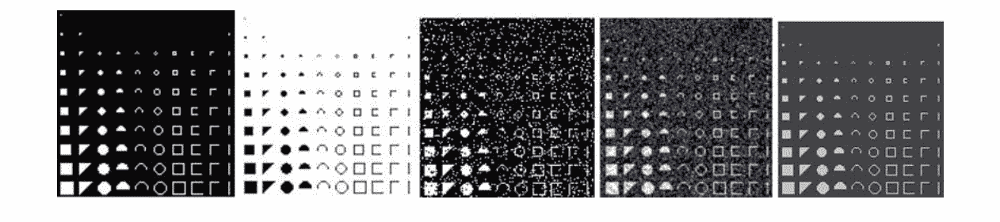

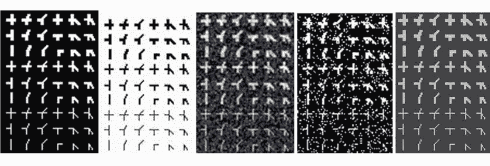

## 合成兴趣点字母表

合成兴趣点字母包含83个唯一模式的倍数，如图A.2所示。在1024 ×1024图像中，共有7 ×7个83个特征的集合。图像的总唯一特征计数为7 × 7 × 83 =4116，每个特征有7 × 7 =49个实例。这些特征布局在一个由10行10列组成的14 ×14像素网格上，包括几个空的网格位置。灰度图像像素值为0 ×40和0 ×c0，黑白像素值为0 ×0和0xff。

## 合成角点字母表

合成角点字母表包含63个独特模式的倍数，如图A.3所示。在1024 ×1024的图像中，共有8 ×12组63个特征。总共有8 × 12 × 63 =6048个独特特征，每个特征有8 ×12个实例。每个特征都排列在一个由14 ×14像素矩形组成的网格上，包括9行和6列的特征。灰度图像像素值为0 ×40和0 ×c0，黑白像素值为0 ×0和0xff。

## 合成字母叠加

提供了一组带有合成字母叠加的图像，包括每个图像的旋转版本，如图A.4所示。

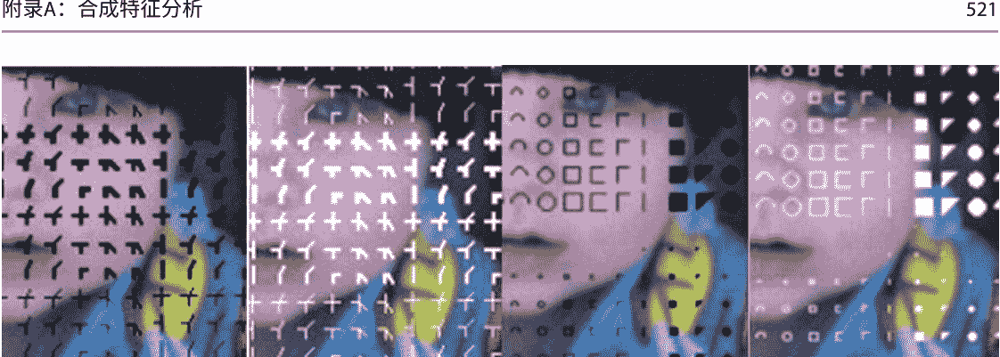

图A.4 合成字母覆盖在真实图像上

表A.2 在合成兴趣点字母中检测到的特征的摘要计数，0°旋转

| 探测器 | 兴趣点 白色背景 黑色字体 | 兴趣点 黑色背景 白色字体 | 兴趣点 白色背景黑色字体 盐/胡椒 噪声 | 兴趣点 白色背景黑色字体 高斯 滤波 | 兴趣点浅灰色 背景深灰色字体 |
|--------|--------------------------|--------------------------|--------------------------------------|----------------------------------|-----------------------------|
| SURF   | 18178                    | 19290                    | 33419                                | 22951                            | 13526                       |
| SIFT   | 11672                    | 15208                    | 18323                                | 19054                            | 8519                        |
| BRISK  | 823                      | 4634                     | 25070                                | 9075                             | 550                         |
| FAST   | 343                      | 4971                     | 41265                                | 50711                            | 2112                        |
| HARRIS | 14833                    | 14217                    | 47025                                | 23473                            | 14854                       |
| GFFT   | 16296                    | 14069                    | 52415                                | 58804                            | 15876                       |
| MSER   | 0                        | 1                        | 2758                                 | 2289                             | 0                           |
| ORB    | 32414                    | 42675                    | 56653                                | 55044                            | 27996                       |
| STAR   | 3486                     | 5847                     | 3692                                 | 4336                             | 2277                        |
| SIMPLEBLOB | 441                  | 1201                     | 68                                   | 385                              | 441                         |

## 测试1：合成兴趣点字母检测

表A.2提供了检测到的合成兴趣点的总数。注意：总检测器计数包括在图像金字塔的每个尺度上计算的特征。对于报告图像金字塔每个级别上的特征检测的检测器，在表A.3中显示了各个金字塔级别的检测结果。从注释图像中提供了每个字母单元中检测到的特征总数的摘要表。请注意，每个14 × 14单元格内可能检测到多个特征，并且检测器通常提供不可重复的结果，这在附录的最后进行了讨论。计数显示了在整个图像中检测到的字母特征的总数，如图A.5所示。

## 注释的合成兴趣点检测器结果

对于ORB和SURF检测器，使用drawkeypoints()函数进行注释的渲染对于可视化来说过于密集，但已包含在在线测试结果中。

表A.3 在合成兴趣点字母中检测到的特征的八度计数，0°旋转

| 探测器 | 兴趣点白色背景黑色字体 | 兴趣点黑色背景白色字体 | 兴趣点白色背景黑色字体盐/胡椒噪声 | 兴趣点白色背景黑色字体高斯滤波 | 兴趣点浅灰色背景深灰色字体 |
|--------|------------------------|------------------------|-----------------------------------|--------------------------------|-----------------------------|
| SURF总数: | 18178 | 19290 | 33419 | 22951 | 13526 |
| 八度0: | 9044 | 9807 | 24820 | 15667 | 8176 |
| 八度1: | 4392 | 4505 | 5199 | 3936 | 2801 |
| 八度2: | 4623 | 4862 | 3270 | 3226 | 2435 |
| 八度3: | 119 | 116 | 130 | 122 | 114 |
| BRISK总数: | 823 | 4634 | 25070 | 9075 | 326 |
| 八度0: | 258 | 3482 | 24686 | 8256 | 143 |
| 八度1: | 21 | 170 | 2 | 226 | 0 |
| 八度2: | 402 | 851 | 315 | 555 | 179 |
| 八度3: | 136 | 101 | 54 | 31 | 4 |
| ORB总数: | 32414 | 42675 | 56653 | 55044 | 27996 |
| 八度0: | 330 | 4924 | 13030 | 13030 | 330 |
| 八度1: | 5507 | 9467 | 10859 | 10859 | 5126 |
| 八度2: | 7437 | 8519 | 9049 | 9049 | 7003 |
| 八度3: | 6114 | 6333 | 7541 | 7541 | 5704 |
| 八度4: | 4575 | 4625 | 6284 | 6284 | 3922 |
| 八度5: | 3390 | 3495 | 4744 | 3869 | 2787 |
| 八度6: | 2988 | 3150 | 3173 | 2793 | 2061 |
| 八度7: | 2073 | 2162 | 1973 | 1619 | 1063 |

每个检测到的关键点绘制的圆的直径对应于“有意义的关键点邻域的直径”，根据OpenCV KeyPoint类的定义，其大小根据检测到特征的图像金字塔级别而变化。某些检测器不使用金字塔，因此直径始终相同。检测到的特征的位置被归一化到全分辨率图像，并绘制所有检测到的关键点。

完整的图像可在线获取。为了更好地理解每个测试的检测器结果，应该查看整个图像以查看异常情况，例如检测器无法识别相同的模式。图A.5是显示BRISK检测器结果的整个图像，其他结果可在网上找到。图A.6到A.15中显示的测试结果仅显示图像的一部分。

## 测试2：合成角点字母检测

表A.4提供了所有金字塔级别上检测到的合成角点的总数；某些检测器不使用金字塔。注意：对于报告图像金字塔级别上的特征分别的检测器，在表A.5中显示了各个金字塔级别的检测结果。每个特征存在于一个14 × 14像素区域内，每个单元格中检测到的特征总数在带注释的图像的摘要表中提供。请注意，每个14 × 14单元格内可能检测到多个特征，并且检测器通常提供不可重复的结果，这在附录的最后进行了讨论。

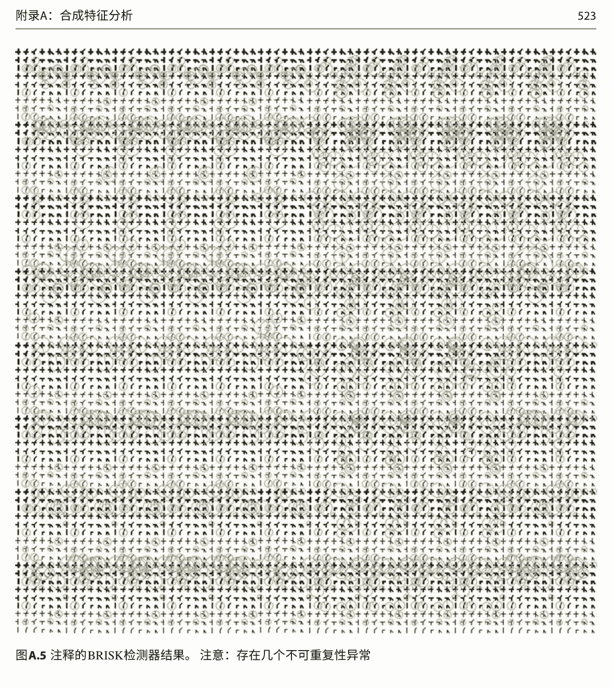

图A.5 注释的BRISK检测器结果。注意：存在几个不可重复性异常

## 注释的合成角点检测结果

测试2与测试1中的兴趣点检测结果完全相同。因此，对于ORB和SURF检测器，使用`drawkeypoints()`函数进行注释的渲染过于密集，无法使用，但包含在线测试结果中。

每个检测到的关键点绘制的圆的直径对应于“有意义的关键点邻域的直径”，根据OpenCV KeyPoint类的定义，其大小根据检测到特征的图像金字塔级别而变化。某些检测器不使用金字塔，因此直径始终相同。检测到的特征的位置被归一化到全分辨率图像，并绘制所有检测到的关键点。

### 图A.6 SIMPLEBLOB检测器，显示了单个字母网格集的结果。(顶行)高斯和椒盐响应。(中间行)黑色、白色和灰色响应。(底行)在网格中的所有字母中对各个字母特征检测的汇总计数，对于每个1024 × 1024图像，黑色、白色和灰色图像，彩色编码表

黑色背景数字表格

白色背景数字表格

灰色背景数字表格

完整的图像可在线获取

为了更好地理解每个测试的检测结果，应该查看整个图像以查看异常情况，例如检测器无法识别相同的模式。图A.16到A.25显示的测试结果仅显示了图像的一部分。

图A.7 STAR检测器，显示了单个字母网格集的结果。(顶行) 高斯和椒盐响应。(中间行) 黑色、白色和灰色响应。(底行) 在网格中的所有字母中对各个字母特征检测的汇总计数，对于每个1024 × 1024图像，黑色、白色和灰色图像，彩色编码表

| 49 | 0 | 0 | 0 | 0 | 0 | 0 | 0 | 0 | 0 |
| 196 | 49 | 0 | 0 | 0 | 0 | 0 | 0 | 147 |  |
| 49 | 70 | 49 | 91 | 49 | 49 | 98 | 98 | 147 | 217 |
| 196 | 147 | 70 | 98 | 98 | 49 | 49 | 56 | 196 | 175 |
| 196 | 147 | 196 | 98 | 175 | 49 | 245 | 224 | 273 | 140 |
| 196 | 147 | 252 | 147 | 147 | 154 | 364 | 322 | 245 | 126 |
| 196 | 147 | 196 | 147 | 196 | 196 | 392 | 357 | 266 | 126 |
| 196 | 147 | 392 | 196 | 238 | 196 | 392 | 357 | 266 | 126 |
| 196 | 147 | 392 | 245 | 147 | 217 | 392 | 357 | 266 | 126 |
| 196 | 147 | 392 | 196 | 294 | 392 | 392 | 357 | 266 | 119 |

| 49 | 0 | 0 | 0 | 0 | 0 | 0 | 0 | 0 | 0 |
| 49 | 0 | 0 | 0 | 0 | 0 | 0 | 147 |  |  |
| 49 | 91 | 49 | 91 | 49 | 49 | 105 | 98 | 147 | 210 |
| 98 | 56 | 70 | 84 | 77 | 203 | 196 |  |  |  |
| 98 | 168 | 49 | 245 | 252 | 266 | 175 |  |  |  |
|  |  |  |  |  |  |  |  |  |  |
|  |  |  |  |  |  |  |  |  |  |
|  |  |  |  |  |  |  |  |  |  |
|  |  |  |  |  |  |  |  |  |  |
|  |  |  |  |  |  |  |  |  |  |

| 49 | 0 | 0 | 0 | 0 | 0 | 0 | 0 | 0 | 0 |
| 196 | 49 | 0 | 0 | 0 | 0 | 0 | 0 | 147 |  |
| 49 | 49 | 49 | 63 | 49 | 49 | 154 | 98 | 147 | 210 |
| 196 | 147 | 105 | 98 | 98 | 63 | 49 | 91 | 217 | 161 |
| 196 | 147 | 196 | 98 | 147 | 49 | 245 | 266 | 287 | 154 |
| 196 | 147 | 266 | 154 | 154 | 154 | 266 | 294 | 245 | 126 |
| 196 | 147 | 196 | 147 | 196 | 196 | 392 | 357 | 266 | 126 |
| 196 | 147 | 392 | 196 | 210 | 196 | 392 | 357 | 266 | 126 |
| 196 | 147 | 392 | 245 | 147 | 273 | 392 | 357 | 266 | 126 |
| 196 | 147 | 392 | 196 | 294 | 392 | 392 | 357 | 266 | 119 |

图A.8 GFFT检测器，显示了单个字母网格集的结果。(顶行)高斯和椒盐噪声响应。(中间行)黑色、白色和灰色响应。(底行)网格中所有字母特征的汇总计数，在每个1024 × 1024图像、黑色、白色和灰色图像、彩色编码表中。

图A.9 MSER检测器（黑色叠加在白色上、白色叠加在黑色上和浅灰色叠加在深灰色上没有检测到特征）

图A.10 ORB检测器（使用默认参数的注释无用，图像在网上提供），结果显示了网格中所有字母特征检测的汇总计数，跨越每个1024 × 1024图像，黑色、白色和灰色图像，以彩色表格表示

## 测试3：合成字母叠加在真实图像上

表A.6提供了在小女孩的测试图像中找到的合成特征的总数，如图A.3所示。请注意，仅使用0°版本（无旋转），并且每个字母的黑色版本和白色版本都叠加在一起。一般而言，白色特征叠加会产生更多的兴趣点和角点检测。

图A.11 BRISK检测器，结果显示了单个字母网格集的情况。(顶行) 高斯和盐/胡椒响应。(中行)黑色、白色和灰色响应。(底行) 网格中所有字母特征检测的汇总计数，跨越每个1024 × 1024图像，黑色、白色和灰色图像，以彩色表格表示

叠加图上的标注检测结果

在线提供了标注图像

图A.12 FAST检测器，结果显示了单个字母网格集的情况。(顶行)高斯和盐/胡椒响应。(中行)黑色、白色和灰色响应。(底行)网格中所有字母特征检测的汇总计数，跨越每个1024 × 1024图像，黑色、白色和灰色图像，以彩色表格表示

图A.13 HARRIS检测器，显示了单个字母网格集的结果。(顶部行) 高斯和盐/胡椒响应。(中间行)黑色、白色和灰色响应。(底部行) 网格中所有字母特征的汇总统计，每个1024 × 1024图像、黑色、白色和灰色图像，彩色编码表

黑底图像特征计数表

| 列1 | 列2 | 列3 | 列4 | 列5 | 列6 | 列7 | 列8 | 列9 | 列10 |
|------|------|------|------|------|------|------|------|------|------|
| 49 | 0 | 0 | 0 | 0 | 0 | 0 | 0 | 0 | 0 |
| 196 | 49 | 0 | 0 | 0 | 0 | 0 | 0 | 0 | 98 |
| 49 | 70 | 49 | 49 | 49 | 49 | 196 | 98 | 49 | 49 |
| 196 | 49 | 112 | 70 | 49 | 133 | 105 | 56 | 196 | 98 |
| 196 | 147 | 196 | 98 | 168 | 49 | 245 | 245 | 196 | 98 |
| 196 | 147 | 259 | 154 | 147 | 112 | 308 | 252 | 196 | 98 |
| 196 | 147 | 196 | 147 | 196 | 196 | 392 | 294 | 196 | 98 |
| 196 | 147 | 392 | 196 | 196 | 196 | 392 | 294 | 196 | 98 |
| 196 | 147 | 392 | 245 | 147 | 196 | 392 | 294 | 196 | 98 |
| 196 | 147 | 392 | 196 | 196 | 392 | 392 | 294 | 196 | 98 |

白底图像特征计数表

| 列1 | 列2 | 列3 | 列4 | 列5 | 列6 | 列7 | 列8 | 列9 | 列10 |
|------|------|------|------|------|------|------|------|------|------|
| 49 | 0 | 0 | 0 | 0 | 0 | 0 | 0 | 0 | 0 |
| 196 | 49 | 0 | 0 | 0 | 0 | 0 | 0 | 0 | 98 |
| 49 | 91 | 49 | 49 | 49 | 49 | 196 | 98 | 49 | 49 |
| 196 | 49 | 182 | 91 | 49 | 140 | 175 | 84 | 196 | 98 |
| 196 | 147 | 196 | 98 | 182 | 49 | 245 | 245 | 196 | 98 |
| 196 | 147 | 294 | 154 | 147 | 154 | 315 | 259 | 196 | 98 |
| 196 | 147 | 196 | 147 | 196 | 196 | 392 | 294 | 196 | 98 |
| 196 | 147 | 392 | 196 | 196 | 196 | 392 | 294 | 196 | 98 |
| 196 | 147 | 392 | 245 | 147 | 196 | 392 | 294 | 196 | 98 |
| 196 | 147 | 392 | 196 | 196 | 392 | 392 | 294 | 196 | 98 |

灰底图像特征计数表

| 列1 | 列2 | 列3 | 列4 | 列5 | 列6 | 列7 | 列8 | 列9 | 列10 |
|------|------|------|------|------|------|------|------|------|------|
| 49 | 0 | 0 | 0 | 0 | 0 | 0 | 0 | 0 | 0 |
| 196 | 49 | 0 | 0 | 0 | 0 | 0 | 0 | 0 | 98 |
| 49 | 56 | 49 | 49 | 49 | 49 | 196 | 98 | 49 | 49 |
| 196 | 49 | 168 | 98 | 56 | 182 | 182 | 70 | 196 | 98 |
| 196 | 147 | 196 | 98 | 182 | 49 | 245 | 245 | 196 | 98 |
| 196 | 147 | 259 | 154 | 154 | 112 | 273 | 287 | 196 | 98 |
| 196 | 147 | 196 | 147 | 196 | 196 | 392 | 294 | 196 | 98 |
| 196 | 147 | 392 | 196 | 196 | 196 | 392 | 294 | 196 | 98 |
| 196 | 147 | 392 | 245 | 147 | 196 | 392 | 294 | 196 | 98 |
| 196 | 147 | 392 | 196 | 196 | 392 | 392 | 294 | 196 | 98 |

图A.14 SIFT检测器，显示了单个字母网格集的结果。（顶部行）高斯和盐/胡椒响应。（中间行）黑色、白色和灰色响应。（底部行）网格中所有字母特征的汇总计数，每个1024 × 1024图像、黑色、白色和灰色图像，彩色编码表

图A.15 SURF检测器（使用默认参数的注释不实用，图像在线提供），显示网格中所有字母特征检测的摘要计数结果，跨每个1024 × 1024图像、黑色、白色和灰色图像，以彩色表格表示

表A.4 在合成兴趣点字母表中检测到的特征总数摘要，0°旋转

| 探测器 | 角点白色黑色 | 角点黑色白色 | 角点白色在黑色上盐/胡椒噪声 | 角点白色在黑色上高斯滤波 | 角点浅灰色在深灰色上灰色 |
|--------|--------------|--------------|--------------------------|------------------------|--------------------------|
| SURF | 28579 | 28821 | 32637 | 26806 | 26406 |
| SIFT | 17996 | 17515 | 22377 | 28624 | 16122 |
| BRISK | 1852 | 2286 | 22472 | 12522 | 550 |
| FAST | 2112 | 2304 | 37283 | 51266 | 2112 |
| HARRIS | 28616 | 29210 | 45615 | 30868 | 29760 |
| GFFT | 32720 | 31578 | 51969 | 55069 | 32597 |
| MSER | 0 | 0 | 3751 | 2446 | 0 |
| ORB | 40162 | 40373 | 59549 | 58693 | 37665 |
| STAR | 5932 | 6178 | 5589 | 7473 | 4251 |
| SIMPLEBLOB | 0 | 96 | 1 | 1 | 0 |

## 测试4：每个字母的旋转不变性

本节提供了结果，显示检测器对于黑色、白色和灰色字母的0-90度旋转图像集的响应具有旋转不变性。关键观察结果：

- 黑底白字、白底黑字：使用当前一组检测器和参数，旋转不变性通常较差，主要原因是(1)像素值使用的最大值和最小值为0 × 0和0xff，以及(2)未经优化的检测器调整## 表A.5 在合成角点字母中检测到的特征的八度计数，0°旋转

| 探测器       | 兴趣点白色背景黑色字体 | 兴趣点黑色背景白色字体 | 兴趣点白色背景椒盐噪声 | 兴趣点白色背景黑色字体高斯滤波 | 兴趣点浅灰色背景深灰色字体 |
|--------------|------------------------|------------------------|------------------------|--------------------------------|----------------------------|
| SURF总数:    | 28579                  | 28821                  | 32637                  | 26806                          | 26406                      |
| 八度0:       | 16122                  | 16217                  | 20494                  | 15402                          | 16120                      |
| 八度1:       | 2327                   | 2315                   | 2925                   | 2008                           | 1692                       |
| 八度2:       | 9989                   | 10141                  | 9062                   | 9297                           | 8582                       |
| 八度3:       | 141                    | 148                    | 156                    | 99                             | 12                         |
| BRISK总数:   | 1852                   | 2286                   | 22472                  | 12522                          | 550                        |
| 八度0:       | 1356                   | 1223                   | 21913                  | 11686                          | 426                        |
| 八度1:       | 172                    | 278                    | 2                      | 183                            | 0                          |
| 八度2:       | 324                    | 727                    | 535                    | 644                            | 124                        |
| 八度3:       | 0                      | 57                     | 22                     | 8                              | 0                          |
| ORB总数      | 40162                  | 40373                  | 59549                  | 58693                          | 37665                      |
| 八度0:       | 1932                   | 2105                   | 13030                  | 13030                          | 1932                       |
| 八度1:       | 6752                   | 6653                   | 10859                  | 10859                          | 6594                       |
| 八度2:       | 9049                   | 9049                   | 9049                   | 9049                           | 9049                       |
| 八度3:       | 6870                   | 6920                   | 7541                   | 7541                           | 6664                       |
| 八度4:       | 4334                   | 4343                   | 6284                   | 6284                           | 4140                       |
| 八度5:       | 4072                   | 4181                   | 5237                   | 5010                           | 3751                       |
| 八度6:       | 3909                   | 3919                   | 4364                   | 4080                           | 3316                       |
| 八度7:       | 3244                   | 3203                   | 3185                   | 2840                           | 2219                       |

参数。检测器在不包含旋转抗锯齿伪影的0°和90°方向的图像上似乎以类似的方式运行；然而，对于10-80°的其他旋转，像素伪影结合在一起降低了这些字母模式的旋转不变性-每个检测器的行为都不同。

- 浅灰色在深灰色上：使用像素值为0 ×40和0xc0的缩小范围灰度图像字母集的检测器通常具有更好的旋转不变性，而不是在黑白图像集中使用的完整最大和最小值范围。灰度字母检测器的结果通常在旋转下显示出最好识别的字母字符。

这可能是由于兴趣点或角落处较近范围灰度值的局部曲率较不明显。

### 确定旋转不变性的方法论

确定旋转不变性的方法论在图A.26到A.28中进行了说明，并通过伪代码进行了说明：

```
对于（degree =0; degree <100; degree +=10）
    旋转图像（degree）
    对于每个检测器（SURF，SIFT，BRISK，...）：
        计算兴趣点位置
        标注旋转图像显示兴趣点位置
        计算每个字母特征被检测到的次数
        创建bin count图像：像素值 =每个字母字符的bin count
```

图A.29和A.30显示了合成角点检测在0-90°旋转中的汇总bin count。 每个图像中的十列从左到右显示了0-90°旋转图像的最终bin count作为图像显示。

### 结果分析和不可重复性异常分析

完整的分析结果已经在线上，包括显示检测到的关键点位置的带注释图像和包含每个检测到的关键点的摘要信息的文本文件。

| 154 | 147 | 20 | 108 | 158 | 279 |
|---|---|---|---|---|---|
| 231 | 142 | 50 | 70 | 238 | 308 |
| 82 | 82 | 70 | 305 | 154 | 226 |
| 154 | 147 | 105 | 185 | 154 | 159 |
| 232 | 70 | 40 | 210 | 77 | 103 |
| 34 | 101 | 27 | 100 | 308 | 231 |
| 46 | 39 | 78 | 40 | 20 | 77 |
| 74 | 70 | 28 | 0 | 71 | 126 |
| 0 | 0 | 0 | 0 | 0 | 2 |

| 127 | 138 | 30 | 163 | 183 | 224 |
|---|---|---|---|---|---|
| 220 | 143 | 70 | 70 | 247 | 265 |
| 104 | 126 | 80 | 295 | 134 | 199 |
| 113 | 133 | 85 | 220 | 165 | 202 |
| 205 | 83 | 110 | 210 | 88 | 71 |
| 12 | 40 | 32 | 33 | 265 | 282 |
| 42 | 72 | 76 | 77 | 148 | 92 |
| 74 | 73 | 89 | 0 | 46 | 140 |
| 31 | 0 | 0 | 0 | 0 | 51 |

| 154 | 147 | 20 | 108 | 158 | 273 |
|---|---|---|---|---|---|
| 231 | 140 | 50 | 70 | 238 | 308 |
| 82 | 77 | 70 | 165 | 154 | 226 |
| 154 | 147 | 75 | 185 | 154 | 159 |
| 155 | 70 | 0 | 70 | 0 | 103 |
| 0 | 0 | 0 | 0 | 154 | 154 |
| 0 | 0 | 0 | 0 | 0 | 0 |
| 0 | 0 | 0 | 0 | 0 | 0 |
| 0 | 0 | 0 | 0 | 0 | 0 |

图A.17星形检测器，结果显示了单个字母网格集的情况。(顶行)高斯和椒盐响应。(中间行)黑色、白色和灰色响应。(底行)在网格中所有字母特征检测的摘要计数，跨越每个1024×1024的图像，黑色、白色和灰色图像，以及彩色编码的表格。

| 694 | 846 | 654 | 846 | 778 | 668 | 704 | 758 | 626 | 842 | 607 | 608 | 742 | 846 | 638 | 846 | 772 | 689 |
| --- | --- | --- | --- | --- | --- | --- | --- | --- | --- | --- | --- | --- | --- | --- | --- | --- | --- |
| 480 | 624 | 576 | 480 | 480 | 488 | 494 | 691 | 576 | 480 | 481 | 489 | 480 | 664 | 560 | 480 | 480 | 560 |
| 192 | 384 | 480 | 384 | 480 | 480 | 252 | 433 | 444 | 444 | 492 | 457 | 192 | 384 | 384 | 384 | 480 | 480 |
| 926 | 726 | 638 | 926 | 768 | 656 | 877 | 673 | 570 | 930 | 765 | 717 | 976 | 776 | 672 | 976 | 776 | 768 |
| 590 | 430 | 430 | 542 | 464 | 472 | 650 | 488 | 475 | 508 | 452 | 439 | 624 | 448 | 456 | 568 | 424 | 448 |
| 330 | 362 | 362 | 490 | 456 | 432 | 462 | 440 | 440 | 632 | 515 | 524 | 416 | 432 | 432 | 592 | 456 | 432 |
| 1180 | 988 | 916 | 1116 | 1022 | 788 | 921 | 705 | 608 | 924 | 784 | 689 | 1098 | 930 | 802 | 1098 | 929 | 751 |
| 832 | 616 | 760 | 800 | 736 | 352 | 896 | 670 | 672 | 744 | 442 | 350 | 814 | 624 | 677 | 768 | 640 | 341 |
| 384 | 384 | 528 | 536 | 576 | 192 | 480 | 458 | 458 | 632 | 336 | 244 | 384 | 384 | 416 | 520 | 496 | 192 |

### 图A.18 GFFT检测器，显示了单个字母网格集的结果。(顶行)高斯和椒盐噪声响应。(中行)黑色、白色和灰色响应。(底行)网格中所有字母特征检测的汇总计数，每个1024 × 1024图像、黑色、白色和灰色图像，彩色编码表

| 16 | 44 | 85 | 20 | 85 | 86 |
|---|---|---|---|---|---|
| 50 | 3 | 104 | 2 | 25 | 7 |
| 21 | 179 | 86 | 35 | 3 | 45 |
| 58 | 112 | 62 | 61 | 0 | 2 |
| 60 | 143 | 37 | 17 | 9 | 3 |
| 0 | 97 | 0 | 1 | 4 | 2 |
| 0 | 0 | 0 | 0 | 14 | 88 |
| 2 | 96 | 0 | 0 | 0 | 0 |
| 0 | 88 | 0 | 0 | 0 | 0 |

| 81 | 73 | 72 | 96 | 144 | 86 |
|---|---|---|---|---|---|
| 83 | 55 | 100 | 32 | 22 | 31 |
| 18 | 154 | 102 | 8 | 23 | 91 |
| 43 | 48 | 30 | 48 | 36 | 27 |
| 52 | 26 | 9 | 18 | 20 | 17 |
| 0 | 92 | 14 | 0 | 35 | 20 |
| 0 | 8 | 12 | 0 | 12 | 54 |
| 5 | 77 | 0 | 0 | 86 | 38 |
| 0 | 96 | 72 | 0 | 20 | 0 |

| 4 | 2 | 17 | 5 | 33 | 0 |
|---|---|---|---|---|---|
| 26 | 6 | 19 | 0 | 0 | 6 |
| 0 | 108 | 0 | 0 | 0 | 3 |
| 2 | 4 | 8 | 2 | 22 | 5 |
| 2 | 0 | 5 | 0 | 2 | 3 |
| 0 | 88 | 0 | 0 | 0 | 2 |
| 0 | 0 | 0 | 0 | 19 | 22 |
| 0 | 69 | 0 | 0 | 2 | 0 |
| 0 | 64 | 0 | 0 | 0 | 0 |

图A.19 BRISK检测器，显示了单个字母网格集的结果。(顶行) 高斯和椒盐噪声响应。(中行)黑色、白色和灰色响应。(底行)网格中所有字母特征检测的汇总计数，每个1024 x 1024图像、黑色、白色和灰色图像，彩色编码表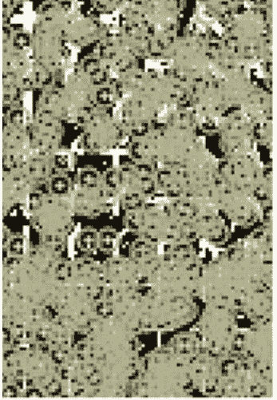

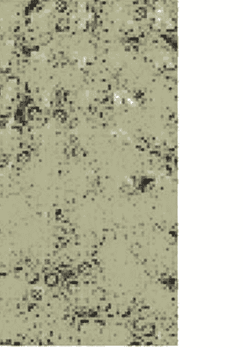

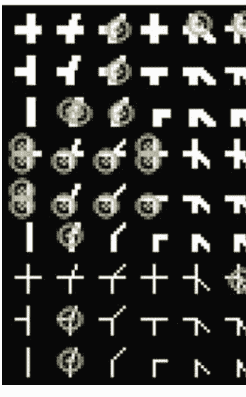

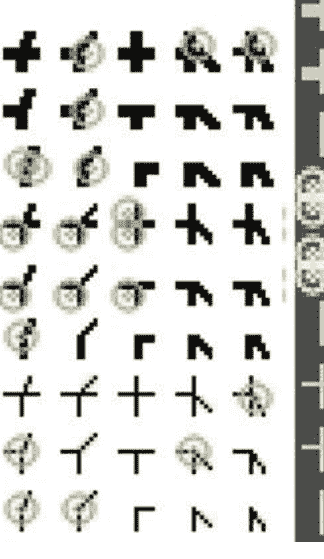

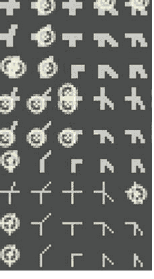

| 0 | 0 | 96 | 0 | 96 | 96 |
|---|---|---|---|---|---|
| 0 | 0 | 96 | 0 | 0 | 0 |
| 0 | 192 | 96 | 0 | 0 | 0 |
| 192 | 96 | 96 | 192 | 0 | 0 |
| 192 | 96 | 96 | 96 | 0 | 0 |
| 0 | 96 | 0 | 0 | 0 | 0 |
| 0 | 0 | 0 | 0 | 0 | 96 |
| 0 | 96 | 0 | 0 | 0 | 0 |
| 0 | 96 | 0 | 0 | 0 | 0 |

| 0 | 20 | 104 | 0 | 96 | 96 |
|---|---|---|---|---|---|
| 0 | 0 | 96 | 0 | 0 | 0 |
| 0 | 180 | 96 | 0 | 0 | 0 |
| 144 | 60 | 60 | 144 | 0 | 0 |
| 192 | 96 | 96 | 96 | 0 | 0 |
| 48 | 144 | 48 | 48 | 0 | 0 |
| 0 | 0 | 0 | 0 | 0 | 72 |
| 0 | 76 | 0 | 0 | 76 | 24 |
| 0 | 96 | 76 | 0 | 20 | 0 |

| 0 | 0 | 96 | 0 | 96 | 96 |
|---|---|---|---|---|---|
| 0 | 0 | 96 | 0 | 0 | 0 |
| 0 | 192 | 96 | 0 | 0 | 0 |
| 192 | 96 | 96 | 192 | 0 | 0 |
| 192 | 96 | 96 | 96 | 0 | 0 |
| 0 | 96 | 0 | 0 | 0 | 0 |
| 0 | 0 | 0 | 0 | 0 | 96 |
| 0 | 96 | 0 | 0 | 0 | 0 |
| 0 | 96 | 0 | 0 | 0 | 0 |

### 图A.20 FAST检测器，显示了单个字母网格集的结果。（顶行）高斯和椒盐噪声响应。（中行）黑色、白色和灰色响应。（底行）网格中所有字母特征检测的汇总计数，每个1024 × 1024图像、黑色、白色和灰色图像，彩色编码表

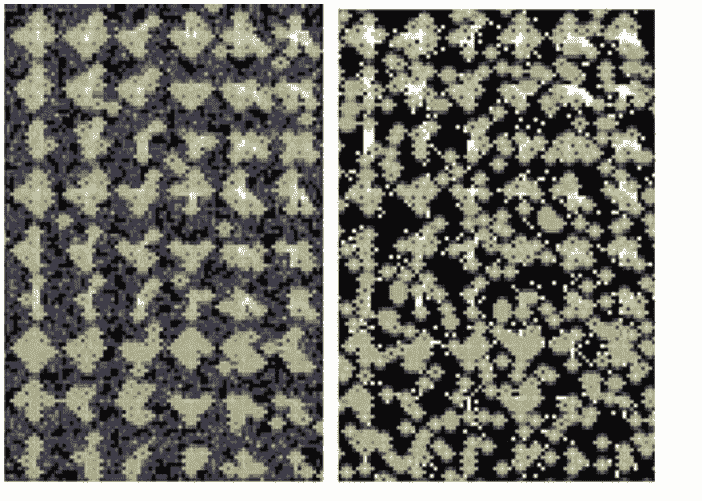

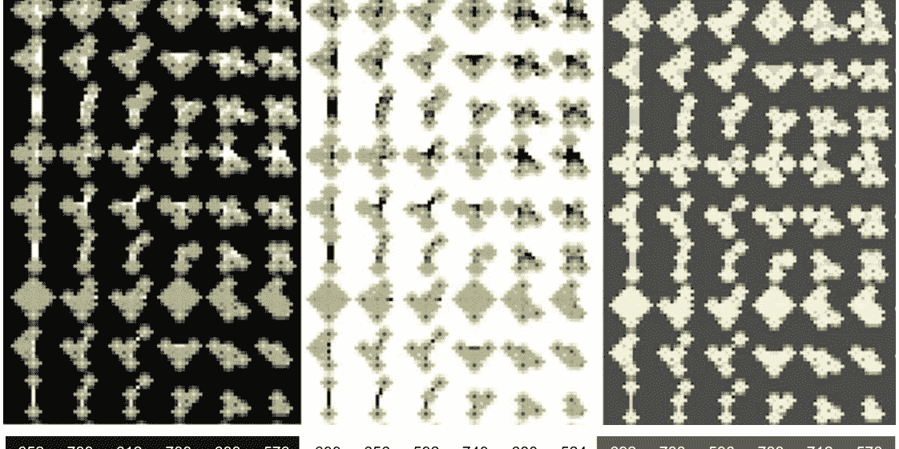

| 652 | 788 | 612 | 788 | 688 | 576 | 600 | 656 | 592 | 740 | 680 | 524 |
|---|---|---|---|---|---|---|---|---|---|---|---|
| 480 | 488 | 624 | 480 | 480 | 488 | 492 | 636 | 656 | 480 | 480 | 487 |
| 192 | 288 | 528 | 384 | 480 | 480 | 252 | 336 | 524 | 444 | 492 | 481 |
| 628 | 596 | 500 | 612 | 496 | 496 | 683 | 587 | 460 | 729 | 583 | 583 |
| 532 | 404 | 396 | 428 | 432 | 432 | 588 | 378 | 382 | 398 | 449 | 437 |
| 260 | 332 | 332 | 388 | 456 | 552 | 418 | 416 | 415 | 439 | 472 | 580 |
| 1232 | 848 | 752 | 1232 | 824 | 968 | 1011 | 701 | 603 | 1034 | 730 | 716 |
| 576 | 480 | 480 | 576 | 576 | 480 | 724 | 568 | 568 | 636 | 592 | 496 |
| 192 | 288 | 288 | 384 | 384 | 288 | 276 | 276 | 352 | 472 | 448 | 352 |

### 图A.21 HARRIS检测器，显示了单个字母网格集的结果。(顶行)高斯和椒盐噪声响应。(中行)黑色、白色和灰色响应。(底行)网格中所有字母特征检测的汇总计数，每个1024×1024图像、黑色、白色和灰色图像，彩色编码表

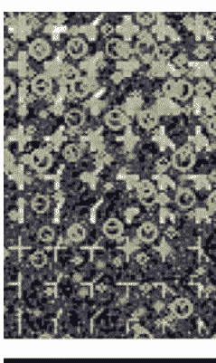

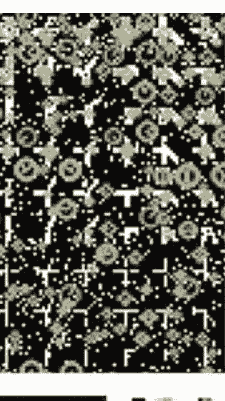

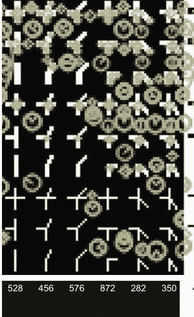

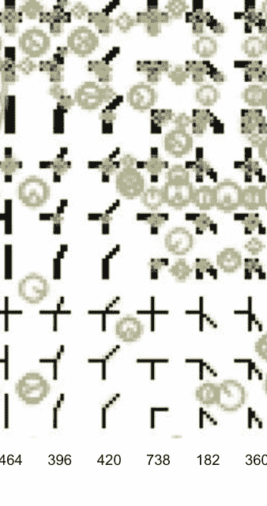

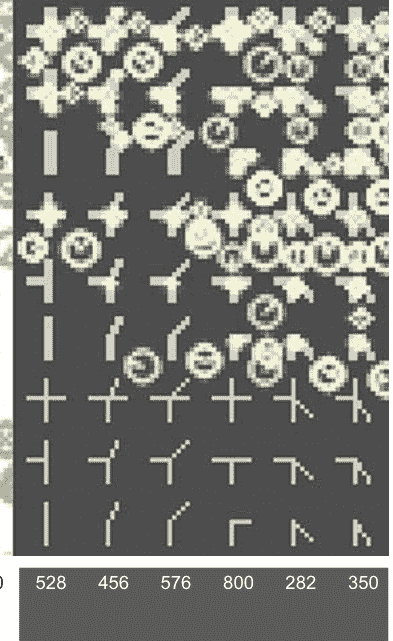

| 528 | 456 | 576 | 872 | 282 | 350 |
|---|---|---|---|---|---|
| 785 | 780 | 480 | 764 | 576 | 493 |
| 78 | 288 | 480 | 432 | 523 | 1097 |
| 301 | 192 | 576 | 960 | 384 | 389 |
| 240 | 96 | 192 | 480 | 576 | 609 |
| 0 | 6 | 16 | 486 | 362 | 222 |
| 118 | 22 | 216 | 10 | 208 | 32 |
| 21 | 0 | 88 | 164 | 48 | 292 |
| 51 | 0 | 0 | 382 | 351 | 66 |

| 464 | 396 | 420 | 738 | 182 | 360 |
|---|---|---|---|---|---|
| 699 | 722 | 650 | 592 | 528 | 413 |
| 262 | 372 | 624 | 504 | 518 | 860 |
| 279 | 168 | 372 | 900 | 480 | 566 |
| 206 | 185 | 296 | 564 | 492 | 568 |
| 8 | 24 | 28 | 326 | 416 | 371 |
| 49 | 128 | 124 | 102 | 136 | 42 |
| 39 | 0 | 160 | 20 | 0 | 323 |
| 175 | 90 | 0 | 0 | 316 | 258 |

| 528 | 456 | 576 | 800 | 282 | 350 |
|---|---|---|---|---|---|
| 785 | 780 | 480 | 668 | 576 | 492 |
| 78 | 288 | 480 | 408 | 514 | 1097 |
| 301 | 192 | 576 | 960 | 384 | 389 |
| 240 | 96 | 192 | 480 | 576 | 609 |
| 0 | 6 | 16 | 486 | 362 | 222 |
| 109 | 22 | 16 | 10 | 208 | 32 |
| 0 | 0 | 0 | 0 | 0 | 0 |
| 0 | 0 | 0 | 0 | 0 | 0 |

### 图A.22 SIFT检测器，显示了单个字母网格集的结果。(顶行) 高斯和盐/胡椒响应。(中间行)黑色、白色和灰色响应。(底行)在网格中的所有字母中单个字母特征检测的汇总计数，每个1024 × 1024图像、黑色、白色和灰色图像，彩色编码表

| 523 | 516 | 433 | 574 | 381 | 468 | 516 | 531 | 502 | 634 | 422 | 458 | 520 | 485 | 384 | 509 | 381 | 463 |
|-----|-----|-----|-----|-----|-----|-----|-----|-----|-----|-----|-----|-----|-----|-----|-----|-----|-----|
| 664 | 361 | 428 | 607 | 523 | 484 | 627 | 391 | 486 | 597 | 465 | 444 | 664 | 361 | 427 | 607 | 518 | 401 |
| 346 | 368 | 375 | 487 | 525 | 388 | 369 | 410 | 426 | 503 | 497 | 451 | 344 | 368 | 371 | 487 | 525 | 385 |
| 690 | 470 | 622 | 672 | 442 | 505 | 574 | 512 | 558 | 611 | 509 | 578 | 681 | 414 | 526 | 643 | 442 | 505 |
| 692 | 348 | 654 | 750 | 417 | 351 | 688 | 385 | 601 | 886 | 445 | 344 | 580 | 294 | 512 | 650 | 417 | 351 |
| 513 | 647 | 436 | 426 | 451 | 434 | 441 | 559 | 466 | 401 | 466 | 515 | 395 | 606 | 333 | 379 | 348 | 377 |
| 704 | 567 | 501 | 566 | 591 | 577 | 676 | 650 | 619 | 537 | 544 | 548 | 694 | 551 | 461 | 524 | 530 | 418 |
| 829 | 660 | 738 | 620 | 565 | 492 | 860 | 662 | 643 | 595 | 596 | 523 | 750 | 562 | 651 | 543 | 612 | 346 |
| 540 | 404 | 697 | 531 | 504 | 522 | 584 | 454 | 653 | 441 | 507 | 461 | 520 | 381 | 677 | 530 | 494 | 509 |

### 图A.23 SURF检测器（使用默认参数的注释无用，图像在网上提供），显示了在网格中的所有字母中单个字母特征检测的汇总计数，每个1024 ×1024图像、黑色、白色和灰色图像，彩色编码表

| 841 | 887 | 874 | 812 | 1160 | 1022 | 868 | 880 | 845 | 821 | 1114 | 986 | 811 | 833 | 820 | 781 | 1025 | 939 |
|-----|-----|-----|-----|------|------|-----|-----|-----|-----|------|-----|-----|-----|-----|-----|------|-----|
| 776 | 820 | 876 | 597 | 827  | 941  | 777 | 849 | 899 | 593 | 901  | 879 | 710 | 764 | 838 | 581 | 815  | 831 |
| 617 | 919 | 925 | 521 | 645  | 753  | 584 | 877 | 899 | 528 | 685  | 746 | 555 | 877 | 880 | 491 | 626  | 646 |
| 1012 | 898 | 1034 | 1044 | 1041 | 1037 | 993 | 943 | 1006 | 1064 | 1179 | 1014 | 981 | 866 | 1001 | 1012 | 987  | 988 |
| 862 | 851 | 890 | 696 | 889  | 843  | 865 | 792 | 891 | 672 | 768  | 735 | 835 | 830 | 871 | 684 | 885  | 820 |
| 473 | 856 | 783 | 454 | 633  | 722  | 563 | 923 | 887 | 584 | 802  | 828 | 471 | 834 | 746 | 416 | 622  | 697 |
| 510 | 683 | 793 | 498 | 608  | 784  | 471 | 714 | 792 | 479 | 603  | 808 | 492 | 642 | 754 | 483 | 588  | 750 |
| 425 | 673 | 591 | 378 | 606  | 678  | 385 | 608 | 562 | 352 | 663  | 726 | 358 | 604 | 518 | 331 | 565  | 640 |
| 391 | 686 | 594 | 423 | 466  | 544  | 341 | 616 | 617 | 403 | 465  | 528 | 275 | 566 | 487 | 340 | 399  | 504 |

### 图A.24 ORB检测器（使用默认参数的注释无用，图像在网上提供），显示了在网格中的所有字母中单个字母特征检测的汇总计数，每个1024 ×1024图像、黑色、白色和灰色图像，彩色编码表

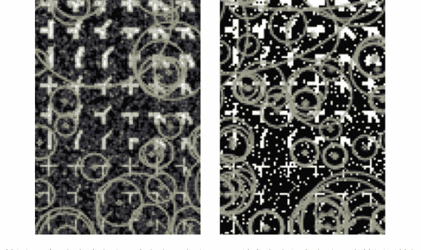

| 探测器 | 正常图像，没有叠加 | 黑色角落叠加 | 白色角落叠加 | 黑色兴趣点叠加 | 白色兴趣点叠加 |
| --- | --- | --- | --- | --- | --- |
| SURF | 3945 | 16458 | 20809 | 10134 | 14196 |
| SIFT | 1672 | 12417 | 15347 | 8017 | 11551 |
| BRISK | 600 | 7919 | 10351 | 5914 | 8741 |
| FAST | 9026 | 25463 | 24952 | 17770 | 17995 |
| HARRIS | 475 | 9393 | 22201 | 4408 | 11097 |
| GFFT | 4474 | 23009 | 25120 | 11632 | 13872 |
| MSER | 1722 | 174 | 163 | 309 | 209 |
| ORB | 7325 | 53080 | 57016 | 41300 | 50946 |
| STAR | 477 | 3135 | 5558 | 2728 | 4756 |
| SIMPLEBLOB | 19 | 45 | 10 | 551 | 405 |

## 注意事项

每个兴趣点检测器设计不同的原因是有意的；没有任何绝对的度量标准可以认为某个检测器在所有情况下都优越。对于这些测试结果进行松散解释的几个论点如下：

- 不可预测性：兴趣点检测器发现的特征通常从人类视觉系统的角度来看是不可预测的，并且它们的设计并不受限于合成兴趣点和角点的狭窄边界。通常，兴趣点检测器会发现人类不会选择的特征。

- 像素混叠伪影：混叠伪影会影响检测结果，在使用极大值和极小值字母表进行旋转图像时最为明显，例如黑色在白色上或白色在黑色上，而在浅灰色在深灰色上时则不太明显。

- 尺度空间：并非所有的检测器都使用尺度空间，这是一个关键点。例如，SIFT、SURF和ORB在检测过程中使用尺度空间金字塔。尺度空间方法可以过滤掉在尺度空间金字塔的某些层级中不可见的合成字母特征。

- 二进制与标量值：FAST使用二进制值比较来构建描述符，而其他方法使用梯度等标量值。二进制值方法（如FAST）将检测到相同的特征，无论极性或灰度值范围如何；然而，基于梯度的标量检测器对像素值的极性和像素值范围更敏感。

- 像素区域大小：FAST使用7 × 7的图像块来查找连接的圆周区域，而其他特征（如SIFT、SURF和ORB）使用更大的像素区域，跨越字母网格单元，导致兴趣点位于字母特征之间而不是在其上。

- 区域形状：MSER和SIMPLEBLOB等特征被设计用于检测没有特定形状的较大连接区域，而不是像兴趣点字母那样的较小局部特征。尺度不变的仿射检测器（例如SIFT）可以检测到椭圆形或椭圆形区域中的特征，对应于仿射尺度和旋转变换，而非仿射不变的检测器（例如FAST）只能在具有一定旋转不变性的圆形或正方形区域中检测到相同的特征模板。

- 图像边界偏移区域：一些检测器（例如ORB、SURF和SIFT）从图像边界偏移开始进行检测计算，因此特征不会在整个图像上计算。

- 已证明的价值：这里使用的每种检测器方法都在实际应用中证明了其有用性和价值。

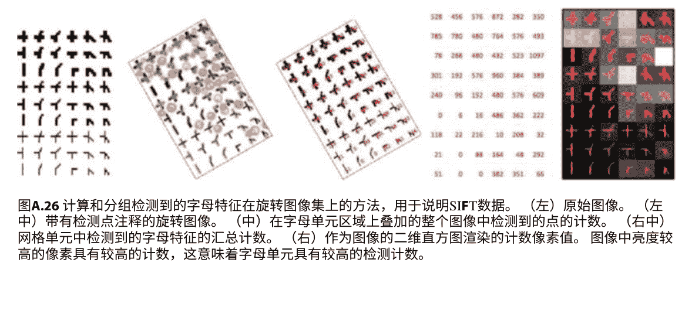

| 0度 | 10度 | 20度 | 30度 | 40度 | 50度 | 60度 | 70度 | 80度 | 90度 |
|:---|:---|:---|:---|:---|:---|:---|:---|:---|:---|
| (图像条) | (图像条) | (图像条) | (图像条) | (图像条) | (图像条) | (图像条) | (图像条) | (图像条) | (图像条) |

### 图A.27 一组10个SIFT灰度角点字母特征检测结果显示为2D直方图图像，应用了sepia LUT，像素值设置为直方图的bin值。每个旋转图像的直方图如下所示：左图 = 0°旋转；从左到右的顺序：0,10,20,30,40,50,60,70,80,90°旋转。请注意，直方图的bin计数是在整个图像上计算的，对每个字母特征的所有检测进行求和。

| 0度 | 10度 | 20度 | 30度 | 40度 | 50度 | 60度 | 70度 | 80度 | 90度 |
|---|---|---|---|---|---|---|---|---|---|

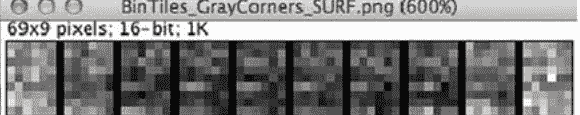

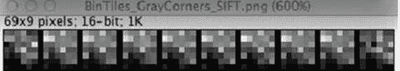

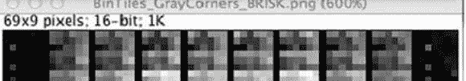

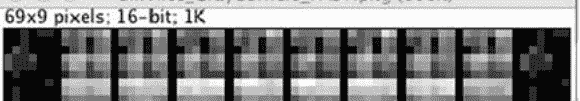

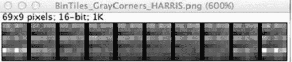

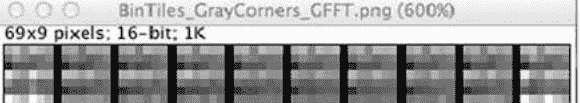

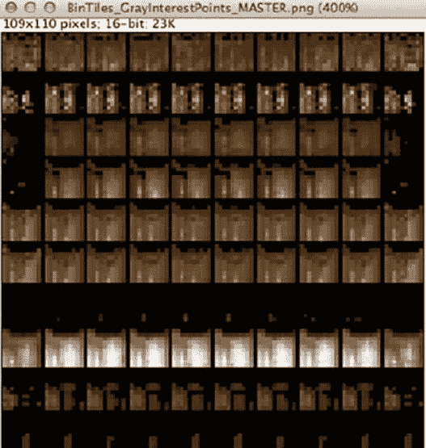

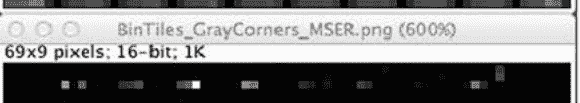

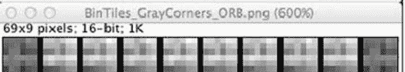

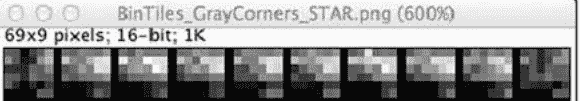

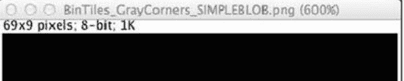

### 图A.28 （左）灰度角点2D直方图bin图像。从左到右：0-90°旋转，应用了灰度尺度LUT，兴趣点字母2D直方图binning图像，对比度增强，应用了sepia LUT。

图A.29显示为一组6×9像素图像的检测到的角落字母特征的汇总计数，其中每个像素值是计数。(左 10×10图像组)黑色在白色角落。(中间 10×10图像组)浅灰色在深灰色角落。(右 10×10图像组)白色在黑色角落。请注意，灰色字母具有最佳的旋转不变性。列从左到右 0-90°旋转，行从顶部到底部，SURF、SIFT、BRISK、FAST、HARRIS、GFFT、MSER、ORB、STAR、SIMPLEBLOB。应用Sepia LUT

图A.30 显示为一组10×10像素图像的检测到的兴趣点字母特征的摘要桶计数，其中每个像素值都是桶计数。(左 10×10图像组)黑色在白色角落。(中间 10×10图像组)浅灰色在深灰色角落。(右 10×10图像组)白色在黑色角落。请注意，灰色字母具有最佳的旋转不变性。列从左到右为0-90°旋转，行从上到下为SURF、SIFT、BRISK、FAST、HARRIS、GFFT、MSER、ORB、STAR、SIMPLEBLOB。应用了Sepia LUT

在考虑到这些限制条件的情况下，测试结果可以自行说明。

## 测试1和测试2中的不可重复性

在测试1和测试2中可见的一个有趣的异常出现在注释图像中，说明检测器结果在合成的兴趣点和角落字母上不可重复。在某些情况下，非线性非常明显；请参见测试1和2的注释图像。 人类的期望是，相同的兴趣点应该被同样好地识别出来。 以下是一些观察结果：

- 1. 一个人类可以轻松识别相同的模式，无论背景和前景是否改变；然而，一些检测器对极端背景和前景极性的不变性不太强。 在白色、黑色和灰色版本的字母之间的异常是不太预期的，也更难以解释，除非深入研究每个算法。
- 2. 一些检测器计算的区域边界比14×14的字母网格更大，因此检测器几乎忽略了字母特征网格，并使用相邻的字母特征片段。
- 3. 一些检测器使用尺度空间，因此在较高尺度水平上有时会错过单个字母特征，而SIFT DoG等检测器则同时使用多个尺度。

总之，兴趣点检测和参数调整类似于图像处理运算符及其参数：有无数种变化可用于实现相同的目标。 希望通过研究这里的测试结果，增加直觉并制定新的方法。

## 测试3中的其他不可重复性

我们注意到使用带有合成叠加的小女孩图像的测试3中存在不可重复性异常，但是在这个测试中不太期望有可重复性。 可以在在线的注释合成叠加图像中观察到对正（白色）和负（黑色）特征叠加之间的一些差异的分析。

## 测试总结

所有测试的要点分析如下：

- 1. 不可重复性：一些不可重复性异常检测到几乎相同的特征，只在局部像素插值伪影下发生旋转差异。 一些检测器也以不同的方式检测到黑色、白色和灰色字母。
- 2. 灰度字母（浅灰色在深灰色上）通常被检测到与人类的期望最相似。 结果显示，使用当前的调整参数，检测器对于灰度模式在旋转中的响应更加均匀，而不是极大值的黑白模式。
- 3. 真实图像与合成图像的叠加测试提供了有关检测器行为的有趣信息，仅用于说明目的。

## 未来的工作

额外的分析应包括设计和使用适合特定类型应用的替代字母表，包括更大范围的像素大小和比例尺，特别是具有更接近灰度级值极性的字母表，而不是极大值和极小值像素值。 还应探索在字母表上进行检测器调优。

# 附录B：地面真实数据集调查

表B.1是各种类别的公共领域数据集的简要调查，没有特定顺序。请注意，许多公共领域数据集可以从大学和政府机构免费获取。

表B.1 公共领域数据集

| 名称 | 描述 | 类别 | 贡献 | 工具和应用程序 | 关键论文 | 链接 |
| :--- | :--- | :--- | :--- | :--- | :--- | :--- |
| Labelme | 注释场景和对象 | 超过30,000张图像；全面；数百个类别，包括汽车、人物、建筑、道路、人行道、天空、树木 | 开放接受贡献 | Labelme iPhone应用程序用于贡献数据库 | [59] [60] | http://new-labelme.csail.mit.edu/Release3.0/ |
| SUN | 注释场景和对象 | 908个场景类别，3,819个物体类别，13,1072个物体，且不断增长 | 开放接受贡献 | 图像分类器源代码+ API，iOS应用程序，Android应用程序 | [62] | http://groups.csail.mit.edu/vision/SUN/ |
| UC Irvine机器学习仓库 | 非常有用；大量包含许多类别的图像仓库 | 太多了，非常广泛的类别，数据的许多属性都可以进行特定的搜索，并设计到了地面真实数据集中 | 正在进行中 | 在线助手用于搜索特定的地面真实数据集 | [532] | http://archive.ics.uci.edu/ml/datasets.html |
| 斯坦福3D扫描仓库 | 高分辨率的三维扫描图像，具有亚毫米级的准确度，包括XYZ和RGB数据集 | 几个扫描的三维物体，具有三维点云，分辨率从3,400,000扫描点到750,000个三角形及以上 | | | | http://graphics.stanford.edu/data/3Dscanrep/ |
| KITTI基准套件，卡尔斯鲁厄理工学院 | 用于各种城市驾驶场景的立体数据集 | KITTI基准套件涵盖了光流、里程计、目标检测、目标方向估计；卡尔斯鲁厄序列涵盖了从城市中行驶的移动平台拍摄的灰度立体序列；卡尔斯鲁厄物体涵盖了从城市中行驶的移动平台拍摄的灰度立体序列 | | 链接 | | http://www.cvlibs.net/datasets/index.html |
| Caltech物体识别数据集 | 虽然旧但仍然有用；数百个类别的物体，一些带有轮廓注释 | 超过256个类别，动物、植物、人物、常见物品、常见食品、工具、家具等。 | | | [63] | http://www.vision.caltech.edu/Image_Datasets/Caltech101/ http://www.vision.caltech.edu/Image_Datasets/Caltech256/ http://authors.library.caltech.edu/7694/（101和256的最新版本） |
| Imagenet + Wordnet | 标记、注释、边界框和特征描述标记的图像；超过14,197,122张图像索引到21,841个相似图像集合或synsets，使用姐妹应用程序Wordnet创建 | 类别包括几乎任何东西 | 从互联网搜索中获取的图像 | 在线控件：http://www.image-net.org/download-API 源代码：ImageNet大规模视觉识别挑战（ILSVRC2010） http://www.image-net.org/challenges/LSVRC/2010/index | [64]；其他几篇请参阅http://www.image-net.org/about-publication | http://www.image-net.org/ http://www.image-net.org/challenges/LSVRC/2012/ |
| Middlebury计算机视觉数据集 | 学术和全面的数据集，以及大多数数据集上的算法比较 | 立体视觉（优秀），多视角立体（优秀），MRF，光流（优秀），颜色处理 | 可以提交对数据集的算法基准 | | 几个；请参阅网站 | http://vision.middlebury.edu/ |
| ADL活动识别数据集 | 常见生活场景的活动识别注释场景 | 日常生活 | | 活动识别代码可用（请参阅下面的链接） | [65] | http://deepthought.ics.uci.edu/ADLdataset/adl.html |
| MIT室内场景67，场景分类 | 特别包含各种室内场景的注释数据集 | 15,620张图像组织成67个室内类别，一些注释以Labelme格式 | | | [66] | http://web.mit.edu/torralba/www/indoor.html |
| RGB-D物体识别数据集，U of W | 数据集包含RGB和相应的深度图像 | 300个常见家庭物品，51个类别，使用与Imagenet类似的Wordnet风格（上面回顾的Imagenet数据集），每个物体在不同的旋转角度和视角下以RGB和Kinect depth记录 | | | [67] | http://www.cs.washington.edu/rgbd-dataset/ |
| NYU深度数据集 | 使用RGB-D数据集+加速度计数据的室内场景注释数据集 | 超过500,000帧，许多不同的室内场景和场景类型，数千个类别，加速度计数据，修复和原始深度信息 | | Matlab工具箱+g++代码 | [68] | http://cs.nyu.edu/~silberman/datasets/nyu_depth_v2.html |
| Intel Labs Seattle - 手持物体的自我中心识别 | 使用可穿戴摄像头的自我中心处理对象的注释数据集 | 超过42个日常物品在不同的光照、遮挡、视角下；超过6GB的总视频序列数据 | | | [69, 70] | http://seattle.intel-research.net/~xren/egovision09/ |
| 佐治亚理工学院GTEA自我中心活动-凝视(+) | 使用可穿戴摄像头的自我中心处理对象的注释数据集 | 许多日常物品在不同的光照、遮挡、视角下 | | 视觉函数和数学函数的代码库 | [71] | http://www.cc.gatech.edu/~afathi3/GTEA_Gaze_Website/ |
| CUREt：哥伦比亚-乌得勒支反射和纹理数据库 | 广泛的纹理样本和照明数据集方向 | 超过60个不同的样本，超过200个观看和照明组合，BRDF测量数据库，更多 | | | [72] | http://www.cs.columbia.com/CAVE/software/curet/ |
| MIT Flickr材料表面类别数据集 | 用于识别材料类别的数据集，包括织物、玻璃、金属、塑料、水、植被、皮革、纸张、石头、木材 | 类别。包含用于表面属性分析的材料图像，与对象或纹理分析相对；10个材料类别+每个类别100张图像 | | | [73] | http://people.csail.mit.edu/celiu/CVPR2010/index.html |
| 野外人脸 | 包含超过13,000张带有人名注释的人脸图像 | 人脸 | | | [74] | http://vis-www.cs.umass.edu/lfw/ |
| CMU Multi-PIE人脸数据库 | 带有多个姿势角度的注释人脸和情绪数据库 | 每个337个主题的750,000张人脸图像在15个视角和19个光照条件下拍摄，注释了面部表情 | | | [75] | http://www.multipie.org/ |
| 斯坦福40个动作 | 人物动作图像数据库 | 人物执行40个动作，边界框注释，9,532张图像，每个动作类别180-300张图像 | | | [76] | http://vision.stanford.edu/Datasets/40actions.html |
| NORB 3D物体形状识别 | | | | | | |
| PETS人群感知数据集挑战 | 多传感器摄像机视图组成的数据集，包含人群活动序列 | | 挑战目标包括人群估计、密度、特定人员的跟踪、人群流动 | | [86] | http://www.cvg.rdg.ac.uk/PETS2009/a.html |
| I-LIDS | 面向安全的挑战基准数据集，用于定位停放的车辆、遗弃的行李、安全围栏和门口监控 | 安全领域的各种类别 | 不，由英国政府资助 | 不适用 | 不适用 | http://computervision.wikia.com/wiki/I-LIDS |
| TRECVID, NIST, 美国政府 | NIST赞助的公共项目，跨越2001-2013年，用于自动分割、索引和基于内容的视频检索 | - 1. 语义索引（SIN）2. 已知项搜索（KIS）3. 实例搜索（INS）4. 多媒体事件检测（MED）5. 多媒体事件回顾（MER）6. 监控事件检测（SER），自然场景，人类，植被，宠物，办公室物品，更多 | 美国政府每年一次 | 检测评估框架（F4DE）工具，故事评估工具和其他 | [87] | http://www-nlpir.nist.gov/projects/trecvid/ |
| 微软剑桥研究院 | 像素级标记或分割对象 | 几百个对象 | | | | http://research.microsoft.com/en-us/projects/objectclassrecognition/ |
| 光流算法评估 | 用于光流算法基准测试的体积渲染视频场景 | 用于光流的各种场景；主要是通过光线追踪生成的合成序列 | | 贡献不适用 | 是的，Tcl/Tk | [88] | http://of-eval.sourceforge.net/ |
| Pascal目标识别VOC挑战数据集 | 标准化的真实数据，用于跨2005-2013年的目标识别研究挑战；竞赛包括分类、检测、分割和动作等20个类别的数据 | 类别包括场景中的20多个对象类别，包括人物、动物、车辆、室内物体 | | 通过Pascal会议 | 包括开发工具包和其他用于标记数据和数据库访问的实用软件，以及用于报告基准结果的工具 | [89] | http://pascallin.ecs.soton.ac.uk/challenges/VOC/ |
| CRCV | 非常广泛；佛罗里达中央大学's计算机视觉研究中心拥有涵盖多个领域的大量研究数据 | 类别包括动态纹理、多模式iPhone传感器的地面真实数据（视频、加速度计、陀螺仪）、几个人类动作类别、人群分割、停车场、人类动作等等 | | 不适用 | 不适用 | [90] | http://vision.eecs.ucf.edu/datasetsActions.html |
| UCB轮廓检测和图像分割 | 加州大学伯克利分校计算机视觉组提供了完整的真实数据、算法和性能评估，用于轮廓检测、图像分割和一些兴趣点方法 | 类别包含广泛主题的自然场景的500个真实图像和标记的真实数据 | | 不适用 | 基准代码（ 全局PB 用于CPU和GPU） | [91] | http://www.eecs.berkeley.edu/Research/Projects/CS/vision/grouping/resources.html#bench |
| CAVIAR上下文感知视觉的真实视频数据 | 项目网站包含城市和购物中心中人类的标记和注释的真实数据，包括52个视频，总共有9万帧，包括室内办公场景和购物中心中的人 | 类别包括购物中心和办公室中的脚本和真实生活活动，包括行走，浏览，会议，打斗，逛街，进出商店 | | 不适用 | 不适用 | [92] | http://homepages.inf.ed.ac.uk/rbf/CAVIAR/caviar.htm |
| 波士顿大学计算机科学系 | 涵盖广泛主题类别的图像和视频数据库 | 用于头部跟踪和手语的视频序列；一些数据集有标记；用于手部跟踪、多人脸跟踪、车辆跟踪等的静态图像 | | 贡献；匿名FTP | 工具和应用程序不适用 | [93] | http://www.cs.bu.edu/groups/ivc/data.php |

# 附录C：成像和计算机视觉资源

本附录包含一些计算机视觉和成像资源的列表，包括商业产品、开源项目、组织和标准机构。

## 商业产品

| 名称 | Matlab |
| :--- | :--- |
| 描述 | 行业标准数学软件包，提供许多科学软件包选项，适用于各个领域，包括成像和计算机视觉。包括一个不错的软件开发环境，提供用于计算机视觉、图像处理、可视化等的附加库。非常适合代码开发。 |
| 库API | SDE内部的广泛API库。 |
| SDE | 包括用于编码的软件开发环境。 |
| 开源 | 不适用于产品，但可能适用于用户开发的某些代码。 |
| 链接 | http://www.mathworks.com/products/matlab/ |

| 名称 | Mathematica |
| :--- | :--- |
| 描述 | 行业标准数学软件包，提供许多科学软件包选项，适用于各个领域，包括图像处理和计算机视觉。非常适合创建出版物准备的可视化和数学笔记本。用于计算机视觉、图像处理、可视化等的附加库。 |
| 库API | SDE内部的广泛API库。 |
| SDE | 包括一个默认的基于函数的脚本开发环境，以及一些代码开发附加组件。 |
| 开源 | 不适用于产品，但可能适用于用户开发的代码。 |
| 链接 | http://www.wolfram.com/mathematica/ |

| 名称 | Intel TBB, Intel IPP, Intel CILK++ |
| :--- | :--- |
| 描述 | Intel提供了针对IA指令集进行优化的库、语言和编译器。Intel TBB是一个用于单核和多核处理器的多线程库，Intel IPP提供了针对IA和SIMD指令以及在某些情况下的GPGPU进行优化的图像和计算机视觉性能原语，Intel CILK++是一种用于编写SIMD/SIMT并行代码的语言。 |
| 库API | 广泛的API库。 |
| SDE | 不，但Intel CILK++是一种编程语言。 |
| 开源 | 不。 |
| 链接 | http://software.intel.com/en-us/intel-tbb http://software.intel.com/en-us/intel-ipp |

## 开源

| 名称 | OpenCV |
| :--- | :--- |
| 描述 | 行业标准的计算机视觉和图像处理库，被世界各大公司和其他机构广泛使用。 |
| 库API | 广泛的API库。 |
| SDE | 不。 |

| 属性 | 值 |
|---|---|
| 姓名 | **OpenCV** |
| 开源 | BSD许可证。 |
| 链接 | http://opencv.org/ |

| 属性 | 值 |
|---|---|
| 姓名 | **ImageJ - FIJI** |
| 描述 | 用于图像处理、可视化和计算机视觉的应用程序。由美国国家卫生研究院开发[484]，可供公众使用。FIJI是ImageJ的一个分发版本，包含了用户社区提交的许多插件。 |
| 库API | 不。 |
| SDE | 不。 |
| 开源 | 公共领域使用。 |
| 链接 | http://rsbweb.nih.gov/ij/index.html<br>http://rsb.info.nih.gov/ij/plugins/<br>http://fiji.sc/Fiji |

| 属性 | 值 |
|---|---|
| 姓名 | **VLFEAT** |
| 描述 | 包含一系列常见的计算机视觉算法，用于特征描述、模式匹配和图像处理的C库。 |
| 库API | 广泛的API库。 |
| SDE | 不。 |
| 开源 | BSD许可证。 |
| 链接 | http://vlfeat.org |

| 属性 | 值 |
|---|---|
| 姓名 | **VTK** |
| 描述 | 包含一系列常见的图像处理、图形和数据可视化函数的C++库。包括GUI小部件。VTK还提供咨询服务。 |
| 库API | 广泛的API库。 |
| SDE | 不。 |
| 开源 | BSD许可证。 |
| 链接 | http://vtk.org/ |

| 属性 | 值 |
|---|---|
| 姓名 | **Meshlab** |
| 描述 | 用于可视化、渲染、注释和转换3D数据网格（如点云和CAD设计）的应用程序。广泛使用。使用ISTI-CNR的VCG库。 |
| 库API | 不。 |
| SDE | 不。 |
| 开源 | BSD许可证。 |
| 链接 | http://meshlab.sourceforge.net/ |

| 属性 | 值 |
|---|---|
| 姓名 | **PfeLLb** |
| 描述 | 用于图像处理和计算机视觉加速的库。 |
| 库API | 是的。 |
| SDE | 不。 |
| 开源 | 不。 |
| 链接 | 参见参考文献[477]。 |

| 属性 | 值 |
|---|---|
| 姓名 | **点云库 (PCL)** |
| 描述 | 广泛的开源库，主要用于处理3D点云，包括最新学术研究中许多前沿的3D描述符实现和可视化方法。 |
| 库API | 是的。 |
| SDE | 不。 |
| 开源 | 是的。 |
| 链接 | [http://pointclouds.org/downloads/](http://pointclouds.org/downloads/)<br>[http://pointclouds.org/documentation/](http://pointclouds.org/documentation/)<br>[http://docs.pointclouds.org/trunk/a02944.html](http://docs.pointclouds.org/trunk/a02944.html) |

| 属性 | 值 |
|---|---|
| 姓名 | **Shogun机器学习工具箱** |
| 描述 | 用于机器学习和模式匹配的库。非常广泛。 |
| 库API | 是的。 |
| SDE | 不。 |
| 开源 | GPL许可证。 |
| 链接 | [http://shogun-toolbox.org/page/features/](http://shogun-toolbox.org/page/features/) |

| 属性 | 值 |
|---|---|
| 姓名 | **Halide高性能图像处理语言** |
| 描述 | 针对SIMD、SIMT和GPGPU进行优化的C++语言类。 |
| 库API | 是的。 |
| SDE | 不。 |
| 开源 | 开源MIT许可证。 |
| 链接 | [http://halide-lang.org/](http://halide-lang.org/) |

| 属性 | 值 |
|---|---|
| 姓名 | **REIN（Recognition INfrastructure）视觉算法框架** |
| 描述 | 用于机器人计算机视觉的框架；使用ROS操作系统。参见参考文献[379, 485]。 |
| 库API | 是的。 |
| SDE | 不。 |
| 开源 | 开源MIT许可证。 |
| 链接 | [http://wiki.ros.org/rein](http://wiki.ros.org/rein) |

| 属性 | 值 |
|---|---|
| 姓名 | **ECTO –计算机视觉的图网络构建** |
| 描述 | 用于创建计算机视觉流水线中的有向无环图的库，支持线程。采用C++/Python框架编写。可以与OpenCV、PCL和ROS集成。 |
| 库API | 是的。 |
| SDE | 不。 |
| 开源 | 显然。 |
| 链接 | http://plasmodic.github.io/ecto/ |

## 组织、机构和标准

**微软研究院**
[http://academic.research.microsoft.com/](http://academic.research.microsoft.com/)
微软研究院拥有世界上最大的计算机视觉专家团队，并积极推动会议和研究。提供了几个很好的在线资源。

**CIE**
[http://www.cie.co.at/](http://www.cie.co.at/)
国际照明委员会，简称CIE，根据颜色科学提供一系列光源的标准照明数据，以及著名的CIE XYZ、CIE Lab和CIE Luv颜色空间的标准。

**ICC**
[http://www.color.org/index.xalter](http://www.color.org/index.xalter)
国际色彩协会为图像设备提供ICC标准色彩配置文件，以及许多其他行业标准，包括用于彩色显示的sRGB色彩空间。

**CAVE计算机视觉实验室**
[http://www.cs.columbia.edu/CAVE/](http://www.cs.columbia.edu/CAVE/)
哥伦比亚大学计算机视觉实验室，由Shree Nayar博士领导，提供世界一流的图像和视觉研究。

**RIT Munsel色彩科学实验室**
[http://www.rit.edu/cos/colorscience/](http://www.rit.edu/cos/colorscience/)
罗切斯特理工学院Munsel色彩科学实验室是该领域的领先研究机构之一，提供广泛的资源，并与柯达、施乐等行业巨头有着紧密联系。

**OPENVX KHRONOS**
[http://www.khronos.org/openvx](http://www.khronos.org/openvx)
OPENVX是一个由KHRONOS标准组操作的低级视觉基元加速的提议标准。

**SPIE**
光学与光子学学会
医学成像杂志
电子成像杂志
应用遥感杂志
[http://spie.org/](http://spie.org/)
跨学科的光学科学方法，包括光子学、传感器和成像；促进会议，出版期刊。

**IEEE**
CVPR，计算机视觉和模式识别
PAMI，模式分析和机器智能
ICCV，国际计算机视觉IP，图像处理
[http://ieee.org](http://ieee.org)
出版期刊和会议的学会，包括各种计算机视觉和成像主题。

**CVF**
计算机视觉基金会
[http://www.cv-foundation.org/](http://www.cv-foundation.org/)
促进计算机视觉，提供论文传播。

**NIST – 图像组（USG）**
国家标准局
[http://www.nist.gov/itl/iad/ig/](http://www.nist.gov/itl/iad/ig/)
促进计算机视觉和成像的重大挑战；涵盖生物识别标准、指纹测试、人脸、虹膜、多模态测试、下一代测试平台。

**I20 - Darpa信息创新办公室（USG）**
[http://www.darpa.mil/Our_Work/I2O/Programs/](http://www.darpa.mil/Our_Work/I2O/Programs/)
[http://www.darpa.mil/OpenCatalog/index.html](http://www.darpa.mil/OpenCatalog/index.html)
广泛的计算机视觉和相关程序研究，用于军事应用。一些工作通过OpenCatalog向公众发布。

## 期刊及其缩写

- CVGIP图形模型/图形模型和图像处理/计算机视觉、图形和图像处理
- CVIU计算机视觉和图像理解
- IJCV国际计算机视觉杂志
- IVC图像与视觉计算
- JMIV数学成像与视觉杂志
- MVA机器视觉与应用
- TMI—IEEE医学成像交易

## 会议及其缩写

- 3DIM国际三维成像和建模会议
- 3DPVT三维数据处理、可视化和传输
- ACCV亚洲计算机视觉会议
- AMFG面部和手势分析与建模
- BMCV生物启发式计算机视觉
- BMVC英国机器视觉会议
- CRV加拿大计算机和机器人视觉会议
- CVPR计算机视觉与模式识别
- CVRMed医学中的计算机视觉、虚拟现实和机器人技术
- DGCI计算机图像的离散几何
- ECCV欧洲计算机视觉会议
- EMMCVPR计算机视觉和模式识别中的能量最小化方法
- FGR自动人脸和姿态识别的IEEE国际会议
- ICARCV控制、自动化、机器人和视觉的国际会议
- ICCV国际计算机视觉会议
- ICCV研讨会
- ICVS计算机视觉系统的国际会议
- ICWSM网络日志和社交媒体的国际会议
- ISVC视觉计算的国际研讨会
- NIPS神经信息处理系统
- 计算机视觉中的尺度空间理论
- VLSM计算机视觉中的变分、几何和水平集方法
- WACV计算机视觉应用研讨会

## 在线资源

| 姓名 | 描述 | 链接 |
|---|---|---|
| CVONLINE | 计算机视觉软件和项目的大量列表，索引到维基百科 | [http://homepages.inf.ed.ac.uk/rbf/CVonline/environ.htm](http://homepages.inf.ed.ac.uk/rbf/CVonline/environ.htm) |
| 注释的计算机视觉参考书目 | 大量链接到计算机视觉主题、参考资料、软件等的索引 | http://www.visionbib.com/bibliography/contents.html |
| NIST在线工程统计手册（美国政府） | 统计手册，包括示例和软件 | http://www.itl.nist.gov/div898/handbook/ |
| 计算机行业（大卫·洛威） | 包含主要计算机视觉和图像产品公司的链接 | http://www.cs.ubc.ca/~lowe/vision.html |

## 人工智能和计算机视觉-关键研究

达莱·莫勒人工智能研究所，尤尔根·施密特胡贝尔库兰数学科学研究所，神经科学中心，杨立昆计算机科学与运筹学系加拿大研究主席，约书亚·本吉奥和杰弗里·辛顿斯坦福计算机科学系，吴恩达

## 神经科学期刊和研究

- 自然—国际科学周刊
- 自然评论神经科学
- 自然神经科学杂志
- Brain (牛津大学神经学期刊)
- Annals of Neurology
- Behavioral and Brain Sciences
- NeuroImage (爱思唯尔)
- NeuroComputing (爱思唯尔)
- Neuroscience (爱思唯尔)
- Neuron (爱思唯尔)
- The Journal of Neuroscience
- European Journal of Neuroscience
- PLOS Computational Biology
- Neural Information Processing Systems (NIPS)
- Vision Research (爱思唯尔)
- Brain Research (爱思唯尔)
- 国际机器学习会议
- Journal of Cognitive Neuroscience
- The Journal of Machine Learning Research

## 精选深度学习资源

TORCH开源机器学习代码
http://torch.ch

FANN快速人工神经网络库
http://leenissen.dk/fann/wp/

Minerva: 多GPU加速的深度学习工具包
https://github.com/dmlc/minerva

caffee—CNN深度学习开源
http://caffe.berkeleyvision.org

cuDNN—优化的NVIDIA深度学习库，与caffee配合使用
https://developer.nvidia.com/cudnn

DeepLearnToolbox—Matlab深度学习工具
https://github.com/rasmusberghaIm/DeepLearnToolbox

Neon—基于Python的深度学习库
http://neon.nervanasys.com/docs/latest/index.html

Graphlab Create—机器学习工具包
https://dato.com/products/create/

## 附录 D：扩展的 SDM 度量标准

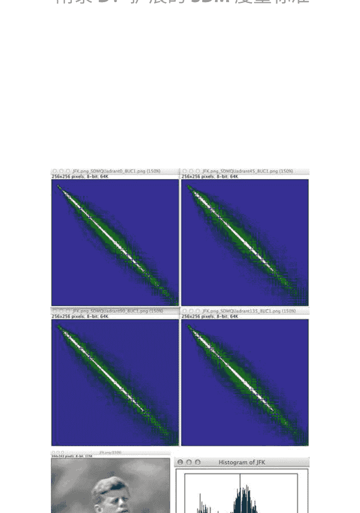

图 D.1 SDM 扩展度量标准

图 D.1 展示了来自第三章的扩展的 SDM 度量标准。该代码可在 http://www.apress.com/source-code/ComputerVisionMetrics 上在线获取。图 D.1 展示了来自第三章的扩展的 SDM 度量标准。

```
c++
/* 创建于 1991 年 (C) KRIG RESEARCH, SCOTT KRIG - 未发布的软件
**    2014 年移植到 MAC
**
**        保留所有权利
**
**    本软件可自由用于学术和研究目的。
**    在使用本软件时，请引用本书并提供此通知。
*/

using namespace std;
#include <math.h>
#include <stdio.h>
#include <opencv2/opencv.hpp>
#include "/usr/local/include/opencv/cv.h"
#include "/usr/local/include/opencv2/core/core.hpp"
#include "/usr/local/include/opencv2/highgui/highgui.hpp"
#include <iostream>

使用命名空间cv;
#define TINY 0.0000000001
#define F6U "%.6f.3"
#define F6F "%.6f"
#define F3F "%.3f"
#define FXF "%.0f"
#define FALSE 0
#define TRUE 1

typedef struct area {
    int x;
    int y;
    int dx;
    int dy;
} area_t;

typedef struct {
    double t0;
    double t90;
    double t135;
    double t45;
    double tave;
} ctab;

typedef struct {
    double median;
    double ave;
    double adev;
    double sdev;
    double svar;
    double skew;
    double curt;
    int min;
    int max;
    ctab xcentroid;
    ctab ycentroid;
    ctab _asm;
    ctab low_frequency_coverage;
    ctab total_coverage;
    ctab corrected_coverage;
    ctab total_power;
    ctab relative_power;
    ctab locus_length;
    ctab locus_mean_density;
    ctab bin_mean_density;
    ctab containment;
    ctab linearity;
    ctab linearity_strength;
    ctab autocorrelation;
    ctab covariance;
    ctab惯性; /* haralick对比度 */
    ctab绝对值;
    ctab逆差异; /* haralick */
    ctab熵; /* haralick */
    ctab相关性; /* haralick */
} glob_t;

glob_t gt;
/* 函数 */
int i_sort(
int *x,
int n,
int parm)
{
    int k,i,ii;
    int y,found;
    int xi;
    int n2, n2p;
    x--;
    for (k=1; k<n+1; k++) {
        y = x[k];
        for (i=k-1, found = FALSE; i>=0 && !found;) {
            xi = x[i];
            ii = i+1;
            if (y < xi) {
                x[ii] = xi;
                i--;
            } else {
                found = TRUE;
            }
        }
        x[ii] = y;
    }
    if (parm == 0) return 0;
    n2p = (n2=(n>>1))+1;
    return (n % 2 ? x[n2p] : (x[n2] + x[n2p]) >> 1);
}
int Imoment(
int *data,
int n,
double *median,
double *ave,
double *adev,
```

## 附录 D：扩展的 SDM 度量标准

```c
double *sdev,
double *svar,
double *skew,
double *curt)
{
    int j;
    double s,p,ep=0.0;
    if (n <= 1) return 0;
    s=0.0;
    for (j=1; j<=n;j++) s += (double)data[j];
    *ave=s/n;
    *adev=(*svar)=(*skew)=(*curt)=0.0;
    for (j=1;j<=n;j++) {
        *adev += fabs(s=(double)data[j]-(*ave));
        *svar += (p=s*s);
        *skew += (p *= s);
        *curt += (p *= s);
    }
    *adev /= n;
    *svar = (*svar - ep*ep / n) / (n-1);
    *sdev=sqrt(*svar);
    if (*svar) {
        s = (n*(*svar)*(*sdev));
        if (s != 0) *skew /= s;
        else *skew = 0;
        s = (n*(*svar)*(*svar))-3.0;
        if (s != 0) *curt = (*curt) / s;
        else *curt = 0;
    } else {
        *skew = *curt = 0.0;
    }
    *median = 0;
    if (n > 20000) return 0;
    *median = (double)i_sort(data, n, 1);
    return 0;
}

int mean_sdev(
int xp,
int yp,
int *xdata,
double *xmean,
double *xsdev,
double *ymean,
double *ysdev)
{
    double u_x1, a_x1;
    int mx,my,v,t,x,y,z, offset;
    int dif[256];
    /* first 计算均值 */
    offset = 256 * yp;
    x = y = 0;
    for (z=0; z < 256; x += xdata[offset+z], z++);
    for (z=0; z < 256; y += xdata[xp + (z*256)], z++);
    mx = x / 256.;
    *xmean = (double)mx;
    my = y / 256.;
    *ymean = (double)my;
    /* 现在计算标准差 */
    x = y = 0;
    z=0;
    while (z < 256) {
        v = mx - xdata[offset+z];
        x += v*v;
        v = my - xdata[xp + (z*256)];
        y += v*v;
        z++;
    }
    *xsdev = x / 256;
    *ysdev = y / 256;
    return 0;
}
int lohi(
int n,
int *cv,
int *lo,
int *hi)
{
    int x;
    int lv, hv;
    lv = 0x1fffff;
    hv =0;
    x=0;
    while (x < n) {
        if (cv[x] < lv) lv = cv[x];
        if (cv[x] > hv) hv = cv[x];
        x++;
    }
    *lo = lv;
    *hi = hv;
    return 0;
}
int savegt(
ctab *ctp,
double dv1,
double dv2,
double dv3,
double dv4)
{
    ctp->t0 = dv1;
    ctp->t90 = dv2;
    ctp->t135 = dv3;
    ctp->t45 = dv4;
    ctp->tave = (dv1 + dv2 + dv3 + dv4) / 4;
    return 0;
}
int gtput(
char *提示,
char *fs,
ctab *ctp,
FILE *fstream)
{
    char str[256];
    char form[256];
    fputs(提示, fstream);
    sprintf(form, "%s %s %s %s %s ", fs, fs, fs, fs, fs);
    sprintf(str, form, ctp->t0, ctp->t90, ctp->t135, ctp->t45, ctp->tave);
    fputs(str, fstream);
    return 0;
}

int put_txfile(
FILE *fstream)
{
    char str[256];
    sprintf(str, "灰度值矩: 最小值:%u 最大值:%u 平均值:%u", gt.min, gt.max, (int)gt.ave);
    fputs(str, fstream);
    sprintf(str, "矩: adev:%.4f sdev:%.4f svar:%.4f skew:%.6f curt:%.6f ", gt.adev,
            gt.sdev, gt.svar, gt.skew, gt.curt);
    fputs(str, fstream);
    fputs("", fstream);

    fputs(" ----------------------------- --", fstream);
    fputs(" 0度 90度 135度 45度 平均", fstream);
    fputs(" ----------------------------- --", fstream);
    gtput("x中心 ", FXF, &gt.x中心, fstream);
    gtput("y中心 ", FXF, &gt.y中心, fstream);
    gtput("低频覆盖率 ", F3F, &gt.低频覆盖率, fstream);
    gtput("总覆盖率 ", F3F, &gt.总覆盖率, fstream);
    gtput("修正覆盖率 ", F3F, &gt.修正覆盖率, fstream);
    gtput("总功率 ", F3F, &gt.总功率, fstream);
    gtput("相对功率 ", F3F, &gt.相对功率, fstream);
    gtput("轨迹长度 ", FXF, &gt.轨迹长度, fstream);
    gtput("轨迹平均密度 ", FXF, &gt.轨迹平均密度, fstream);
    gtput("bin平均密度 ", FXF, &gt.bin平均密度, fstream);
    gtput("包含度 ", F3F, &gt.包含度, fstream);
    gtput("线性度 ", F3F, &gt.线性度, fstream);
    gtput("linearity_strength ", F3F, &gt.linearity_strength, fstream);
    return 0;
}

int texture(
char *filename)
{
    char str[256];
    int pmx[256], pmy[256];
    int x,y,z,dx,dy,dz,sz,bpp;
    int accum, tmin, tmax;
    int tmin2, tmax2, yc;
    int *data;
    int mval0, mval90, mval135, mval45;
    double median, ave, adev, sdev, svar, skew, curt;
    double median2, ave2, adev2, sdev2, svar2, skew2, curt2;
    int *dm0, *dm90, *dm135, *dm45;
    FILE *fstream;
    int i0, i90, i135, i45, iave, n;
    int c0, c90, c135, c45, cave;
    int p0, p90, p135, p45, pave;
    double d0, d90, d135, d45, dave;
    double f0, f90, f135, f45;
    /* 读取输入图像，预期为8位无符号整数 */
    /* 在openCV中，Mat类型转换很简单，以后再试试 */
    Mat imageIn = cv::imread(filename);
    dx = imageIn.rows;
    dy = imageIn.cols;
    unsigned char *pixels = imageIn.data;
    cout << "dx " << dx << " dy " << dy << " elemSize() " << imageIn.elemSize() << endl;
    data = (int *)malloc(dx * dy * 4);
    if (data == 0)
    {
        cout <<"texture()中的内存分配错误" << endl;
    }
    for (y=0; y < dy; y++) {
        for (x=0; x < dx; x++) {
            int pixel = (int)*(imageIn.ptr(x,y));
            if (pixel > 255) {pixel = 255;}
            data[(y * dx) + x] = pixel;
        }
    }
    /* 第一部分 - 从像素数据中获取常规统计信息 */
    lmoment(data, sz, &median, &ave, &adev, &sdev, &svar, &skew, &curt);
    lohi(sz, data, &tmin, &tmax);
    gt.median = median;
    gt.ave = ave;
    gt.adev = adev;
    gt.sdev = sdev;
    gt.svar = svar;
    gt.skew = skew;
    gt.curt = curt;
    gt.min = tmin;
    gt.max = tmax;
    fstream = fopen("SDMExtended.txt", "w");
    if (fstream <= 0) {
        cout << "#无法创建   file" << endl;
        return 0;
    }
    sprintf(str, "对象的纹理： %s", filename);
    fputs(str, fstream);
    sprintf(str, "区域： %u, %u ", dx, dy);
    fputs(str, fstream);
    /* 第2部分 - 计算4个空间依赖矩阵 */
    dm0 = (int *)malloc(256*256*4);
    dm90 = (int *)malloc(256*256*4);
    dm135 = (int *)malloc(256*256*4);
    dm45 = (int *)malloc(256*256*4);
    if ((dm0==0) || (dm90==0) || (dm135==0) || (dm45==0)) {
        cout <<"在texture2中分配内存错误" << endl;
        return 0;
    }
    x=0;
    while (x < 256*256) {
        dm0[x] = dm90[x] = dm135[x] = dm45[x] = 0;
        x++;
    }
    y=0;
    while (y < dy-1) {
        yc = dx * y;
        x=0;
        while (x < dx-1) {
            dm0[(data[yc + x]&0xff) + (((data[yc + x + 1])<< 8)&0xff00)]++;
            dm0[(data[yc + x + 1]&0xff) + (((data[yc + x])<< 8)&0xff00)]++;
            dm90[(data[yc + x]&0xff) + (((data[yc + x + dx])<< 8)&0xff00)]++;
            dm90[(data[yc + x + dx]&0xff) + (((data[yc + x])<< 8)&0xff00)]++;
            dm135[(data[yc + x]&0xff) + (((data[yc + x + dx + 1])<< 8)&0xff00)]++;
            dm135[(data[yc + x + dx + 1]&0xff) + (((data[yc + x])<< 8)&0xff00)]++;
            dm45[(data[yc + x + 1]&0xff) + (((data[yc + x + dx])<< 8)&0xff00)]++;
            dm45[(data[yc + x + dx]&0xff) + (((data[yc + x + 1])<< 8)&0xff00)]++;
            x++;
        }
        y++;
    }
    /************************ 计算纹理度量标准 ************************/
    /* 质心 */
    pmx[0] = pmx[1] = pmx[2] = pmx[3] = 0;
    pmy[0] = pmy[1] = pmy[2] = pmy[3] = 0;
    i0 = i90 = i135 = i45 = 0;
    y=0;
    while (y < 256) {
        x=0;
        while (x < 256) {
            z = x + (256 * y);
            pmx[0] += (x * dm0[z]);
            pmy[0] += (y * dm0[z]); i0 += dm0[z];
            pmx[1] += (x * dm90[z]);
            pmy[1] += (y * dm90[z]); i90 += dm90[z];
            pmx[2] += (x * dm135[z]);
            pmy[2] += (y * dm135[z]); i135 += dm135[z];
            pmx[3] += (x * dm45[z]);
            pmy[3] += (y * dm45[z]); i45 += dm45[z];
            x++;
        }
        y++;
    }
    pmx[0] = pmx[0] / i0;
    pmy[0] = pmy[0] / i0;
    pmx[1] = pmx[1] / i90;
    pmy[1] = pmy[1] / i90;
    pmx[2] = pmx[2] / i135;
    pmy[2] = pmy[2] / i135;
    pmx[3] = pmx[3] / i45;
    pmy[3] = pmy[3] / i45;
    x = (pmx[0] + pmx[1] + pmx[2] + pmx[3]) / 4;
    y = (pmy[0] + pmy[1] + pmy[2] + pmy[3]) / 4;
    gt.xcentroid.t0 = pmx[0];
    gt.ycentroid.t0 = pmy[0];
    gt.xcentroid.t90 = pmx[1];
    gt.ycentroid.t90 = pmy[1];
    gt.xcentroid.t135 = pmx[2];
    gt.ycentroid.t135 = pmy[2];
    gt.xcentroid.t45 = pmx[3];
    gt.ycentroid.t45 = pmy[3];
    gt.xcentroid.all = x;
    gt.ycentroid.all = y;
    gt.xcentroid.tave = x;
    gt.ycentroid.tave = y;
    /* 低频覆盖 */
    i0 = i90 = i135 = i45 = 0;
    c0 = c90 = c135 = c45 = 0;
    x=0;
    while (x < 256*256) {
        if ((dm0[x] != 0) && (dm0[x] < 3)) i0++;
        if ((dm90[x] != 0) && (dm90[x] < 3)) i90++;
        if ((dm135[x] != 0) && (dm135[x] < 3)) i135++;
        if ((dm45[x] != 0) && (dm45[x] < 3)) i45++;
        if (!dm0[x]) c0++;
        if (!dm90[x]) c90++;
        if (!dm135[x]) c135++;
        if (!dm45[x]) c45++;
        x++;
    }
    d0 = (double)i0 / 0x10000;
    d90 = (double)i90 / 0x10000;
    d135 = (double)i135 / 0x10000;
    d45 = (double)i45 / 0x10000;
    savegt(&gt.low_frequency_coverage, d0, d90, d135, d45);
    d0 = (double)c0 / 0x10000;
    d90 = (double)c90 / 0x10000;
    d135 = (double)c135 / 0x10000;
    d45 = (double)c45 / 0x10000;
    savegt(&gt.total_coverage, d0, d90, d135, d45);
    d0 = (c0-i0) / (double)0x10000;
    d90 = (c90-i90) / (double)0x10000;
    d135 = (c135-i135) / (double)0x10000;
    d45 = (c45-i45) / (double)0x10000;
    savegt(&gt.corrected_coverage, d0, d90, d135, d45);
    /* power */
    i0 = i90 = i135 = i45 = 0;
    c0 = c90 = c135 = c45 = 0;
    p0 = p90 = p135 = p45 = 0;
    y=0;
    while (y < 256) {
        z = y * 256;
        x=0;
        while (x < 256) {
            n = x-y;
            if (n < 0) n = -n;
            if (dm0[x+z] != 0) {i0 += n; c0++;}
            if (dm90[x+z] != 0) {i90 += n; c90++;}
            if (dm135[x+z] != 0) {i135 += n; c135++;}
            if (dm45[x+z] != 0) {i45 += n; c45++;}
            x++;
        }
        y++;
    }
    d0 = (i0 / 0x10000);
    d90 = (i90 / 0x10000);
    d135 = (i135 / 0x10000);
``````
d45 = (i45 / 0x10000);
savegt(&gt.total_power, d0, d90, d135, d45);
d0 = (i0 / c0);
d90 = (i90 / c90);
d135 = (i135 / c135);
d45 = (i45 / c45);
savegt(&gt.relative_power, d0, d90, d135, d45);
/* 位置密度 */
d0 = d90 = d135 = d45 = 0.0;
c0 = c90 = c135 = c45 = 0;
p0 = p90 = p135 = p45 = 0;
y=0;
while (y < 256) {
    z = y * 256;
    i0 = i90 = i135 = i45 = 0;
    x=0;
    while (x < 256) {
        n = x-y;
        if (n < 0) n = -n;
        if ((dm0[x+z] != 0) && (n < 7)) {c0++; p0 += dm0[x+z];}
        if ((dm90[x+z] != 0) && (n < 7)) {c90++; p90 += dm90[x+z];}
        if ((dm135[x+z] != 0) && (n < 7)) {c135++; p135 += dm135[x+z];}
        if ((dm45[x+z] != 0) && (n < 7)) {c45++; p45 += dm45[x+z];}
        if ((dm0[x+z] == 0) && (n < 7)) {i0++;}
        if ((dm90[x+z] == 0) && (n < 7)) {i90++;}
        if ((dm135[x+z] == 0) && (n < 7)) {i135++;}
        if ((dm45[x+z] == 0) && (n < 7)) {i45++;}
        x++;
    }
    if (!i0) d0 += 1;
    if (!i90) d90 += 1;
    if (!i135) d135 += 1;
    if (!i45) d45 += 1;
    y++;
}
savegt(&gt.locus_length, d0, d90, d135, d45);
d0 = (p0/c0);
d90 = (p90/c90);
d135 = (p135/c135);
d45 = (p45/c45);
savegt(&gt.locus_mean_density, d0, d90, d135, d45);
/* 密度 */
c0 = c90 = c135 = c45 = 0;
p0 = p90 = p135 = p45 = 0;
x=0;
while (x < 256*256) {
    if (dm0[x] != 0) {c0 += dm0[x]; p0++;}
    if (dm90[x] != 0) {c90 += dm90[x]; p90++;}
    if (dm135[x] != 0) {c135 += dm135[x]; p135++;}
    if (dm45[x] != 0) {c45 += dm45[x]; p45++;}
    x++;
}
d0 = c0 / p0;
d90 = c90 / p90;
d135 = c135 / p135;
d45 = c45 / p45;
savegt(&gt.bin_mean_density, d0, d90, d135, d45);
/* 包含性 */
i0 = i90 = i135 = i45 = 0;
x=0;
while (x < 256) {
    if (dm0[x]) i0++; if (dm0[256*256 - x - 1]) i0++;
    if (dm90[x]) i90++; if (dm90[256*256 - x - 1]) i90++;
    if (dm135[x]) i135++; if (dm135[256*256 - x - 1]) i135++;
    if (dm45[x]) i45++; if (dm45[256*256 - x - 1]) i45++;
    if (dm0[x*256]) i0++; if (dm0[(x*256)+255]) i0++;
    if (dm90[x*256]) i90++; if (dm90[(x*256)+255]) i90++;
    if (dm135[x*256]) i135++; if (dm135[(x*256)+255]) i135++;
    if (dm45[x*256]) i45++; if (dm45[(x*256)+255]) i45++;
x++;
}
d0 = 1.0 - ((double)i0 / 1024.0);
d90 = 1.0 - ((double)i90 / 1024.0);
d135 = 1.0 - ((double)i135 / 1024.0);
d45 = 1.0 - ((double)i45 / 1024.0);
savegt(&gt.containment, d0, d90, d135, d45);
/* 线性度 */
i0 = i90 = i135 = i45 = 0;
c0 = c90 = c135 = c45 = 0;
y=0;
while (y < 256) {
    z = y * 256;
    if (dm0[z + y] > 1) {i0++; c0 += dm0[z+y];}
    if (dm90[z + y] > 1) {i90++; c90 += dm90[z+y];}
    if (dm135[z + y] > 1) {i135++; c135 += dm135[z+y];}
    if (dm45[z + y] > 1) {i45++; c45 += dm45[z+y];}
    y++;
}
d0 = (double)i0 / 256.;
d90 = (double)i90 / 256.;
d135 = (double)i135 / 256.;
d45 = (double)i45 / 256.;
savegt(&gt.linearity, d0, d90, d135, d45);
/* 线性强度 */
d0 = (c0/(i0+.00001)) / 256.;
d90 = (c90/(i90+.00001)) / 256.;
d135 = (c135/(i135+.00001)) / 256.;
d45 = (c45/(i45+.00001)) / 256.;
savegt(&gt.linearity_strength, d0, d90, d135, d45);
/* 将所有统计数据写入输出文件中的gt结构体 */
put_txfile(fstream);
/* 限制最大值为255 */
mval0 = mval90 = mval135 = mval45 = 0;
x=0;
while (x < 256*256) {
    if (dm0[x] > 255) dm0[x] = 255;
    if (dm90[x] > 255) dm90[x] = 255;
    if (dm135[x] > 255) dm135[x] = 255;
    if (dm45[x] > 255) dm45[x] = 255;
    x++;
}
/**************************************************/
/* 将数据转换为无符号字符以写入png文件 */
unsigned char *dm0b = (unsigned char *)malloc(256*256);
unsigned char *dm90b = (unsigned char *)malloc(256*256);
unsigned char *dm135b = (unsigned char *)malloc(256*256);
unsigned char *dm45b = (unsigned char *)malloc(256*256);
if ((dm0b==0) || (dm90b==0) || (dm135b==0) || (dm45b==0)) {
    cout << "texture3中的malloc错误" << endl;
    return 0;
}
x=0;
while (x < 256*256) {
    dm0b[x] = (unsigned char) (dm0[x] & 0xff);
    dm90b[x] = (unsigned char) (dm90[x] & 0xff);
    dm135b[x] = (unsigned char) (dm135[x] & 0xff);
    dm45b[x] = (unsigned char) (dm45[x] & 0xff);
    x++;
}
/*
 * 将输出写入4个象限： 0=0, 1=90, 2=135, 3=45
 */
char outfile[256];
sprintf(outfile, "%s_SDMQuadrant_0deg_8UC1.png", filename);
Mat SDMQuadrant0(256, 256, CV_8UC1, dm0b);
imwrite(outfile, SDMQuadrant0);
sprintf(outfile, "%s_SDMQuadrant_90deg_8UC1.png", filename);
Mat SDMQuadrant90(256, 256, CV_8UC1, dm90b);
imwrite(outfile, SDMQuadrant90);
sprintf(outfile, "%s_SDMQuadrant_135deg_8UC1.png", filename);
Mat SDMQuadrant135(256, 256, CV_8UC1, dm135b);
imwrite(outfile, SDMQuadrant135);
sprintf(outfile, "%s_SDMQuadrant_45deg_8UC1.png", filename);
Mat SDMQuadrant45(256, 256, CV_8UC1, dm45b);
imwrite(outfile, SDMQuadrant45);
free(dm0);
free(dm90);
free(dm135);
free(dm45);
free(data);
free(dm0b);
free(dm90b);
free(dm135b);
free(dm45b);
fclose(fstream);
return 0;
}
int main (int argc, char **argv)
{
    cout << "8-bit unsigned image expected as input" << endl;
    texture (argv[1]);
    return 0;
}
```

## 附录 E：视觉基因组模型 (VGM)

记忆印象是特征

斯科特·克里格

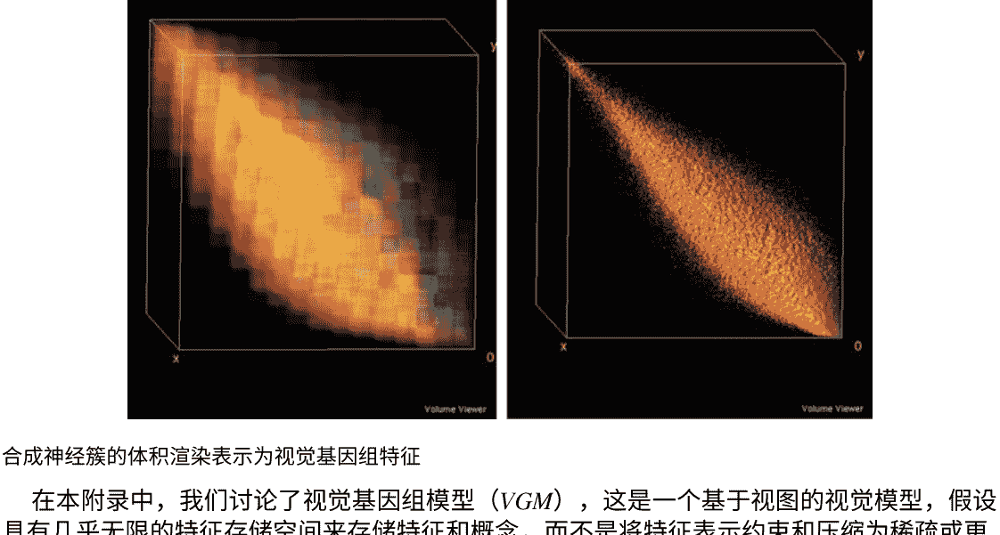

合成神经簇的体积渲染表示为视觉基因组特征

在本附录中，我们讨论了视觉基因组模型（VGM），这是一个基于视图的视觉模型，假设具有几乎无限的特征存储空间来存储特征和概念，而不是将特征表示约束和压缩为稀疏或更可计算的集合，这在常见的神经模型（如CNNs）中是典型的。视觉基因组记录了在单独的虚拟神经元中检测到的所有特征，这些神经元被建模为简单的记忆细胞，用于记录每个特征，并使用比较器来测试呈现给神经元的输入印象与记忆细胞的匹配程度。视觉基因组被组合成序列或视觉基因组，类似于DNA链，用于表示更高级的概念。视觉基因组模型受到视觉通路的基本低级结构的启发，包括视网膜、LGN和V1-V4层。视觉通路的更高级推理中心不包括在VGM中，而是假设高级推理中心是一个可以作为特殊目的代理过程在软件中实现的意识水平，管理适当的训练协议、分类器和假设检验机制。在这方面，VGM可以被视为一种适用于在更大的视觉处理机器中由代理代理控制的视觉记忆机器。

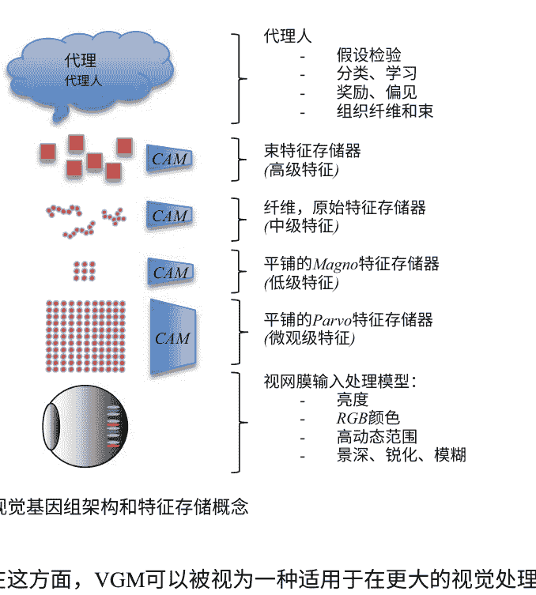

我们在本附录中概述了VGM，并在Krig [534]和http://krigresearch.com中提供了更详细的分类和物体识别结果。

VGM遵循局部感受野和特征层次结构的神经生物学概念，类似于Hubel和Wiesel模型[559, 560]。如图E.1所示，层次结构包括parvo、magno、strand和bundle特征，如下所述。每个特征只是存储在神经元记忆组中的视觉输入的记忆记录。这与设计特征描述符的概念相反。

VGM将低级Parvo和Magno特征存储为原始记忆记录或印象，并将低级记忆记录分组在连续分段的原始区域内作为strand，并将strand组合在一起作为描述更高级概念的bundle。局部感受野的原始输入像素值用于组成引用巨大虚拟多维地址空间的特征地址向量，参见图E.8。地址就是特征。使用将原始像素值串联成地址的目的是在没有中间处理的情况下，直接将原始视觉印象存储在几乎无限的特征存储器中，遵循神经生物学的视图模型。地址的位精度决定了存储空间的大小。地址的位精度和粗糙度由一个量化参数控制，稍后将与VGM神经模型一起讨论。因此，VGM在一个量化空间中运行，根据量化级别显示更多或更少的特征细节。

为什么选择简单的特征模型？VGM模型假设特征的数量比选择的特征类型更重要，正如第10章中的特征学习架构调查所证明的那样，提供了几个系统的示例，这些系统都使用了各种特征类型和层次结构，但达到了相似的准确性。从CNN研究中并不清楚，尺度层次本身是否是成功的关键，或者与尺度层次不同，一个大型的单尺度多模型特征集合是否同样有效。例如，顾等人[706]证明了大量的简单图像像素区域非常适合作为图像描述符用于分割、检测和分类。Gu将架构组织为一个稳健的重叠特征包，使用Hough投票来识别假设对象位置，然后使用分类器，在几个测试中实现了最先进的准确性。

### VGM的神经科学启发

在这里，我们总结了具体的神经科学研究，这些研究为VGM提供了启发和指导，接着介绍了相应的架构和设计细节。我们介绍了视觉通路、记忆机制、神经模型和视网膜处理模型的基础知识。

### 特征和概念记忆的局部性

神经科学研究表明，视觉通路将相关概念存储在连续的记忆区域[852, 853]，这表明视觉采用了基于视图的模型[814]。在基于视图的模型中，为了存储相似物品的变化，会创建新的记忆记录，而不是不变的特征。相关概念存储在靠近相似对象的局部记忆区域中。

创建新的记忆特征的机制很可能基于未知的学习动机或偏见，由视觉通路中更高层次的推理指导。相反，存储的记忆似乎不是个体不变的，而是通过收集具有几何或光照变化的多个场景视图来概念上地建立不变性。脑部映射研究支持基于视图的模型假设。使用功能性磁共振成像（fMRI）的研究显示，脑部映射可以应用于法医学，通过映射在观看或记忆视觉概念时激活的脑区域，如Lengleben等人[859]所报道。事实上，自然界已经报道了有限的心灵阅读是可能的[852, 853, 860]，使用脑部映射揭示了在观看某个主题、评估某个概念假设或回答口头问题时在大脑皮层中被电激活的特定区域。（相关研究表明，根据一些研究人员的观点，脑部映射揭示的认知模式可以被解释为揭示原始智力水平，并且脑部映射已被用于记录认知指纹，这在军事和政府安全领域目前很流行）。

新的记忆印象将保留在短期记忆中，以评估给定假设，并且可能在之后被遗忘，除非被视觉通路的更高级推理部分分类并承诺到长期记忆中。视觉通路的更高级部分有意识地使用一组假设来指导对短期记忆中的传入数据进行分类，或者重新对长期记忆进行分类。视觉通路的更高级部分可能独立于生物学由灵魂的更高级意识控制。眼睛和视网膜可以由更高级的推理中心指导，以调整传入区域的对比度和焦点。

### 注意力神经记忆研究

Baddely [605] 和其他人已经表明，人类学习和推理过程通常同时保持几个概念的注意力，这是由中央执行者在指导手头的推理任务。（VGM将中央执行者建模为代理人，下面讨论）。

中央执行概念假设输入可能在不同的时间到达，因此可能有几个在给定的时间内，需要注意的概念可能多达七个。因此，贝尔实验室最初使用七位数字创建电话号码。所选的概念被保留在工作记忆或短期记忆（即注意力记忆或概念记忆）中，而不是与当前任务无关的过去的长期记忆。正如Goldman-Rakic [606]所示，注意力记忆或概念可能以不同的速率被访问，例如在延迟期间不断检查或根本不访问，而中央执行器正在进行当前任务并访问其他部分的记忆。短期记忆将对各种提示作出反应，并且与熟悉的关联记忆或内容寻址存储器（CAM）相似，用于某些CPU的缓存。VGM地址特征模型类似于CAM模型，并允许中央执行器根据需要确定特征检测，VGM不区分短期/长期记忆或限制短期记忆。

## **HMAX模型和视觉皮层模型的视觉通路**

HMAX模型是根据视觉通路区域设计的，清楚地显示了概念的层次结构。HMAX在较低层次上使用硬连线特征，如Gabor或高斯函数，这些函数类似于早期视觉通路中观察到的神经元的定向边缘响应，如Tanaka [825]、Logoethis [827]等人所报道的。Logothetis发现在层次结构中，一些神经元群体对类似于Gabor样基函数的特定形状有响应，而在较高层次上对面部等物体级概念有响应。HMAX在较低层次特征的基础上构建了较高层次的概念，这是根据研究结果表明视觉通路的较高层次（IT区域）对高度视角特异性模式（如面部、形状和复杂物体）具有感受性，参见Perrett [821, 822]和Tanaka [823]。事实上，Tanaka [826]报告了视觉通路IT区域的聚类区域对类似的物体聚类有响应，这表明神经元会生长和连接以创建语义相关的视角特异性特征表示，以满足基于视角的区分需求。HMAX提供了一个与视角无关的模型，对尺度和平移具有不变性，利用了对所有输入进行尺度和平移的MAX池化操作，类似于在竞争神经元之间观察到的侧抑制，允许最强的激活关闭竞争较弱的激活。HMAX还允许在低层特征之间共享和插值，因为它们被组合成更高层次的视角特异性特征。

## **几乎无限的特征记忆**

大脑可能包含约1000亿个神经元或100十亿神经元（GN）（估计有所不同），每个神经元平均连接到约1万个其他神经元（估计有所不同），总共产生超过100万亿个连接[858]，而银河系中估计有200-4000亿颗恒星。显然，人脑中有足够的神经元来存储信息，因此VGM假设不需要减小特征集的大小，并支持几乎无限的特征记忆。不知何故，大脑显然只使用了可用神经元的一部分，估计范围为10%至25%（10GN-25GN）。也许在可能有1000年寿命的情况下，所有神经元都可以被激活使用。

VGM特征记忆以量化空间表示，其中特征的位分辨率可以调整以扩大或减小精度，这对于实际实现非常有用。实际上，所有神经元的虚拟内存大小由像素的数值精度控制。视觉基因组在量化空间中以可变分辨率表示特征，以在VGM神经模型和下面的内存结构的后续部分中产生粗糙或精细的结果。

## 遗传性先天记忆

越来越多的研究表明，DNA可能包含记忆印象或遗传记忆，例如本能和性格特征（参见[824]，还可以引用更多参考文献）。其他研究表明，通过记忆印象[825]可以修改DNA，并通过DNA传递给后代。

神经科学表明，一些特征在出生时就存在于神经皮层中，例如祖先的记忆和其他学习可能被印在DNA中，而其他行为则预先编码在基本人类基因组中，设计在DNA中，并且不需要学习。众所周知，DNA可以通过经历来改变，无论是好是坏，并通过遗传传递给后代。因此，深度神经网络的训练概念是通过将权重初始化为随机值并在训练样本上进行响应平均，这是最原始的方法，并且是一个追随时间+机会=改进的兔子洞。换句话说，我们观察到可见特征既是遗传设计的记录，也是创造的，而不是由随机过程生成的。

VGM模型允许使用迁移学习来模拟预先存在的记忆，以初始化VGM内存空间，随后可以通过从训练集或视觉观察中记录新的印象来进一步改进转移特征。具体来说，一些较高级的磁感、股和束特征可以初始化为原始基础集，例如形状或模式，以模拟遗传的原始形状特征，或提供基于经验的学习。

## 神经发生、神经元大小和连接性

正如Bergami等人[861, 862]以及许多其他研究者所报道的，神经发生（即神经生长）受经验调节。对现有神经大小和连接性的改变，以及全新神经元的生长，都是对真实或感知经验的反应。因此，低级特征没有固定的神经结构，而是会不断生长。即使是相同的双胞胎（即DNA克隆）也会根据经验发展出不同的神经生物学结构，从而导致不同的行为和观点。

通过脑部映射[852, 853]，已经确定了视觉通路中的各种高级结构，例如概念推理中心和高级通信路径[686]，参见图9.10。神经发生在每个结构区域内以受控的方式发生。

神经发生包括生长和萎缩，神经元和树突都被观察到在短时间内显著增长，同时随着时间的推移缩小。神经元的大小和连接性似乎代表记忆新鲜度和遗忘，因此也许遗忘可以通过神经元萎缩和消失的树突连接来生物学地表达。

Li等人[862]报道称，神经发生在成年人的整个生命周期中发生，尤其是在早期形成年龄段。

为了表示神经发生，VGM通过检测特征印象的次数来表示神经元的大小和连接性，这可以解释为（a）每个单独印象都是一个新的神经元，或者（b）多次印象计数对应一个更大的神经元（从神经科学的角度来看，目前还不清楚是a还是b，或者a和b都是真的）。因此，神经发生在VGM中以每个神经元的大小和连接性来反映。

### 对学习新记忆印象的偏见和动机

神经科学表明，大脑在第10章的基于视图的理论调查中创建了重要物品的新记忆印象，而不是像DNN反向传播训练中将视觉印象混合在一起。许多计算机视觉模型基于这样一个观点，即特征应该被设计成对特定的鲁棒性标准具有不变性，例如尺度、旋转、遮挡和其他在第5章中讨论的因素，这可能只是视觉神经生物学中部分表达的人为观念。虽然在学习过程中假设存在偏见，但VGM神经元模型中没有建模偏见因素。大多数人工神经模型包括一个偏见因素，以便于矩阵方法，但通常忽略或固定偏见。偏见可以解释人们经常看到他们相信的东西，而不是相信他们看到的东西，因此偏见在建模中似乎存在问题。

### 深度处理

人类视觉系统中的深度处理至少有两种方式：（1）在视觉皮层中使用L/R立体深度处理通路进行立体处理，（2）在视觉通路的更高级推理中使用其他2D视觉线索一起关联。如第1章所讨论的并在表1.1中总结的，人类视觉系统依赖于立体处理来确定近距离深度，可能达到5-10米，然后依赖于其他2D视觉线索（如阴影和空间关系）来确定远距离深度，因为由于眼睛之间的短基线距离，人眼的立体信息在增加的距离上不可用（参见图1.20）。此外，立体深度处理受到一些关键问题的影响，包括由于物体在视野中的位置而导致的深度图中的遮挡和空洞，以及在视觉系统中可能出现多个空间点在同一位置上“融合”在一起的Horopter区域内，需要进行复杂的近似处理。VGM模型不试图对深度或立体通路进行建模。

然而，未来的工作可能包括为magno和parvo特征提供深度图通道和表面法向量图像作为输入通道，但也许更好的方法是将深度图和表面法向图像提供给更高级的代理人，以便将其纳入到链、束和分类器中。

### 双视网膜处理通路：Magno和Parvo

如图E.3所示，视网膜中有两种类型的细胞，它们向视神经提供神经节细胞输入：magno细胞和parvo细胞。大约有一百万个神经节细胞离开视网膜，其中约80-90%是较小的parvo细胞，具有较小的感受野，约10-20%是较大的magno细胞，具有较大的感受野。magno细胞可以追踪3D中的粗略运动，并对对比度、亮度和粗略细节（即感受野较大）敏感。parvo细胞反应较慢，代表颜色和细节（即感受野较小）。

Magno细胞分布在视网膜上，提供粗糙的低分辨率轮廓，而Parvo细胞集中在视网膜中央，对扫视抖动反应最强，以增加有效分辨率。

Magno细胞和Parvo细胞的分辨率差异表明视网膜中存在一个两级空间金字塔结构，用于Magno细胞下采样的低分辨率和Parvo细胞的高分辨率。此外，

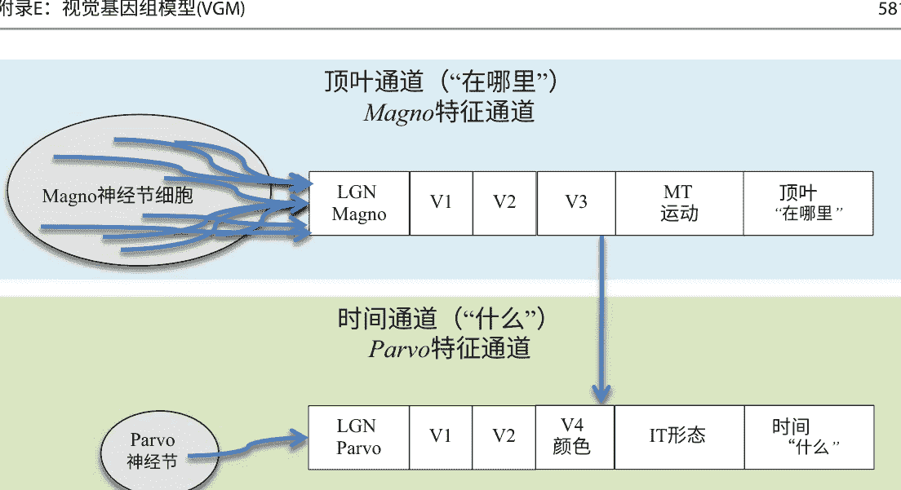

图E.3 这个图示了由较大的Magno细胞和较低分辨率、较小的Parvo细胞组成的顶叶和时间视觉通路。Parvo细胞的大小是Magno细胞的10-20%

视觉通路包含两个独立的并行处理通路——快速Magno形状跟踪单色通路和慢速Parvo颜色和纹理通路。根据Magno细胞和Parvo细胞的概念，视觉基因组提供两类基因组：用于粗糙形状和分割（Magno特征）的低分辨率亮度基因组，以及用于颜色和纹理（Parvo特征）的高分辨率基因组。

根据人类视觉系统中的双重Parvo和Magno通路，视觉基因组将Parvo特征建模为更高分辨率的微观级RGB颜色和纹理瓷砖，将Magno特征建模为更低分辨率的亮度通道，例如具有连接性和空间关系的原始形状。Magno特征主要对应于视网膜中的棒状细胞，对亮度和快速移动的形状敏感，而Parvo特征主要对应于视网膜中的锥状细胞，对RGB颜色敏感，并以空间敏锐度捕捉低级细节。

视网膜的中央黄斑区域是专门用于捕捉更细节的RGB锥体，它包含着视网膜中细胞密度最高的区域，而视网膜细胞密度在视野边缘变得更稀疏。

## 视网膜处理模型

视网膜可以进行广泛的处理，包括在每个细胞上进行动态范围调整。视网膜通过扫视抖动过程来从特定区域获取更多细节，通过在该区域周围抖动焦点。虹膜可以打开和关闭以控制光照，而感受器的杆、锥和神经节细胞共同进行局部对比度增强。此外，晶状体可以用于改变景深和焦平面（景深是一种立体过程，视觉通路为深度处理提供了单独的左/右处理通路）。请注意，视网膜模型不包括几何位置或尺度变化。

VGM提供了一个由一组独立的输入图像组成的视网膜输入处理模型，这反映了眼睛实际视觉生物学的能力：

- 亮度图像
- RGB彩色图像和单独的颜色通道图像
- 使用生物启发的Retinex方法进行高动态范围对比度增强图像（参见《科学美国人》1959年5月和1977年12月）
- 局部对比度归一化
- 锐化和模糊图像

视觉基因组假设输入处理的视网膜模型，结合不执行任何处理的简单神经元。视网膜提供景深和焦点控制、对比度控制、用于压缩和扩展的动态范围控制。然而，其他变化，如旋转和尺度，是通过移动身体和眼睛位置来控制的，而不是神经图像处理。在这方面，训练协议可以通过包含不同视角和透视的预处理图像来进行优化学习。

## 视觉基因组模型概念

在这里，我们对VGM模型的每个组成部分进行更详细的描述。

### Magno和Parvo特征

在经过Magno细胞的生物区域子采样之后，VGM在两级特征层次结构中定义了两种类型的特征和两种类型的图像：

1.  Parvo特征：Parvo特征被建模为具有高细节的RGB特征，遵循Parvo细胞的设计，以全分辨率（100%）获取输入图像，使用RGB颜色，并表示颜色和纹理特征。
2.  Magno特征：Magno特征被建模为较低分辨率的亮度特征，遵循Magno细胞生物学，选择为全分辨率的20%（作为对视网膜生物学的默认近似），假设较大的Magno细胞集成和子采样较大的视网膜区域，从而产生适用于形状、轮廓和边缘的快速跟踪的较低分辨率图像，用于掩模和线索。由于实际的Magno细胞主要使用单色杆细胞，VGM定义Magno特征使用单色空间和Retinex处理算法（参见《科学美国人》1959年5月和1977年12月），以模拟低光级杆反应，提供局部对比度增强，并且类似于直方图均衡化的全局对比度归一化方法。

Parvo和Magno特征在四个基因形状A、B、C、D中收集在重叠的输入窗口中，模拟了Hubel和Weiss [559, 560]在局部感受野中发现的原始边缘，参见图E.8、E.9和E.10。基因形状将在后面更详细地讨论。

还观察到视觉通路分为两个主要阶段：

-   扫描阶段（大视觉特征）：显然，视觉系统首先通过大视觉特征（如形状和模式）识别感兴趣的区域，在扫描阶段，眼睛在场景中四处看而不是专注于特定区域。在扫描阶段，视网膜模型并没有针对特定的对象或特征进行优化，除非是为了控制粗略的光照和通过虹膜和晶状体调节焦距。当眼睛专注于特定区域进行更近距离的评估时，大视觉特征会被更好地聚焦，并且动态范围会被优化。
-   扫视阶段（小视觉特征）：为了更近距离的评估，视觉系统会检查有趣的大视觉形状和模式来识别小视觉特征，然后尝试识别更大的概念。

视网膜处理的优化可能会根据高级代理注意的当前假设在扫视抖动阶段多次变化，例如在特定点上可能会改变焦点和景深以测试一个假设。

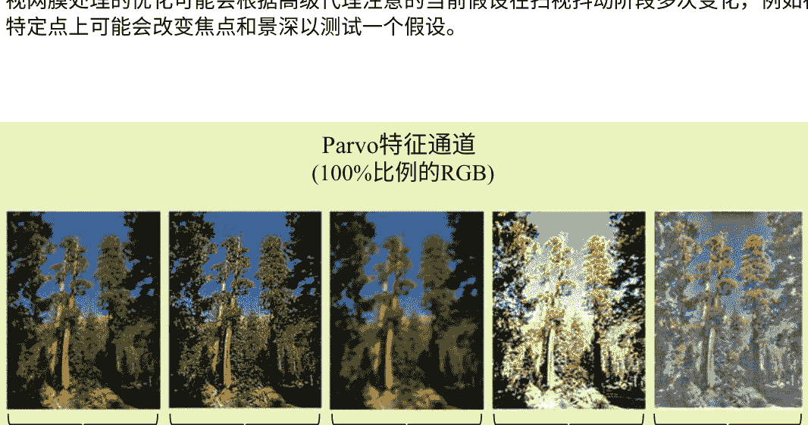

### Parvo视网膜处理

Parvo细胞被设计用于捕捉颜色和纹理的高细节，并且以比Magno细胞更高的分辨率运行，并且对变化的响应较慢。为了模拟VGM视网膜模型中的Parvo细胞，使用四种类型的输入处理来创建Parvo特征的全分辨率图像，对应于眼睛的生物能力:

1.  未经处理的原始RGB图像。
2.  局部对比度增强的RGB图像，模拟扫视抖动。
3.  全局对比度增强的RGB图像，以减轻阴影和饱和度效果，并支持高动态范围对比度增强。
4.  锐化的RGB图像，支持焦点增加。
5.  模糊的RGB图像，模拟景深效果。

输入图像都由VGM神经元处理并组合成相同的基因组特征（如图E.8所示的A、B、C、D），因此模糊、锐化、原始和对比度增强图像没有单独的特征基因组。相反，目标是将视网膜特征范围整合到每个记忆细胞中，假设生物神经元具有短期记忆，允许神经元根据代理机构的控制形成和提交特征记忆。此外，在VGM原型开发的这个阶段，为每个视网膜处理功能使用单独的基因组会导致特征记忆数量和处理负载激增，而没有明确的理由。

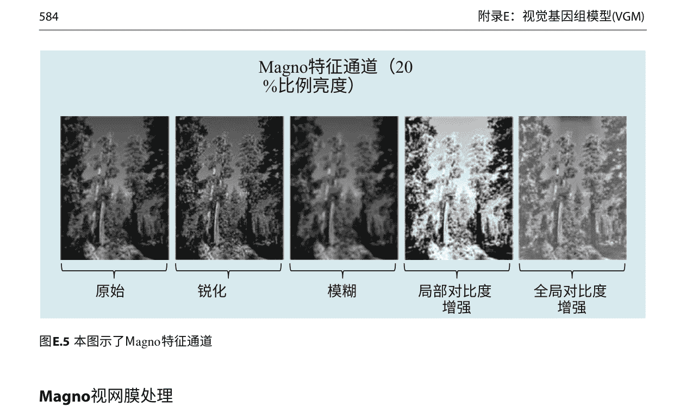

### Magno视网膜处理

对于Magno特征，我们假设比Parvo细胞更简单的模型，因为Magno细胞的分辨率较低，适应快速移动的物体，这意味着视网膜模型在印象到印象之间不会对Magno特征产生太大的改变，而是在Magno扫描的视网膜模型可能会改变三次：(1)在恒定设置下进行全局场景扫描，(2)在特定位置和焦点进行暂停扫描，以及(3)在暂停位置进行对比度增强，然后将处理交给Parvo阶段。因此，我们建议将Magno特征建模为原始亮度输入的20%子采样，使用反映眼睛处理生物学的准备好的亮度图像。由于Magno细胞区域包含Magno区域内的多个细胞，并且主要适应更快速的亮度变化，所以亮度5:1的子采样(即20%比例)是对Magno细胞生物学的合理模拟。也许Magno区域的较大尺寸既能更快地累积所有细胞的低光响应，又能通过对Magno区域内所有细胞进行子采样来降低Magno细胞的输出分辨率。

请注意，眼睛无法控制比例和其他几何变化，而是由包含眼睛的身体或被拍摄对象的位置来控制。因此，最好通过使用一系列精心选择的带有标签的训练样本，从不同的视角、角度和距离来实现几何变化，如比例、旋转和扭曲，或者通过对带有标签的训练图像应用几何变换来模拟（在视点模型下不太理想）。

### Magno原始特征分割

此外，还需要仔细地从带有标签的训练样本中屏蔽掉多余的信息，例如只屏蔽苹果标签图像中的苹果，以记录苹果的最佳基因印象。为了模拟选择性区域屏蔽和注意力聚焦

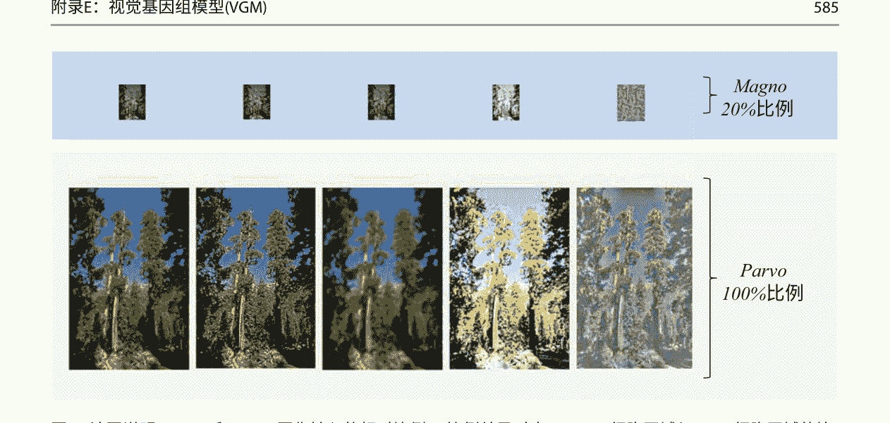

图E.6 该图说明了Parvo和Magno图像输入的相对比例。比例差异对应于Magno细胞区域与Parvo细胞区域的比例，其中Parvo细胞的大小是Magno细胞的10-20%。Parvo细胞是全分辨率的视网膜图像，而Magno细胞是5:1下采样的图像。

为了聚焦，Magno扫描阶段采用图像分割流程来识别有趣的区域，稍后在视觉基因组序列、瓦片、链、束、原始特征部分进行讨论。

## VGM神经元模型

每个磁神经元和视觉神经元模型都代表一个独立的特征；然而，特征可能是共享的，对应于神经元与多个其他神经元相连。在VGM中，神经元的大小和连接密度被建模为神经元被共享的次数。特征共享被记录为每个存储的神经记忆印象的特征检测计数。

（注意：股和束神经元和特征在[534]中有更详细的讨论）。如图E.7所示，代表平铺磁神经元和视觉神经元的神经元由一个CAM存储单元和一个比较器δ组成，该比较器在输入到神经元的位精度量化级别θ上操作。神经输入k可以被视为表示平铺特征的3×3矩阵，或者作为9×1向量。同样，CAM存储器对应于3×3平铺或9×1向量。（有关3×3以外的其他尺寸的信息，请参见Krig [534]）。CAM存储器和输入k的内容由比较器δ接收，产生两个项目：（1）相关距离输出k'，以及（2）动机或激活输出φ，它是一个TRUE或FALSE输出，对应于树突的全或无激活。当距离很小时，相关距离k'可以用于实现抑制（一种生物学上合理的神经机制）。每个神经元的动机激活和输出距离可以被更高级的代理机构用于遗忘记忆（在[534]中讨论）或确定特征距离。为了生成φ，使用量化因子输入θ与k'一起实现量化空间，以确定激活阈值。量化空间基于二进制量化，因此减少一位精度会使空间量化为2的幂次，例如11111111=256空间量化，11111110=128空间量化。位级量化模拟了一种生物学上合理的注意力细节级别。

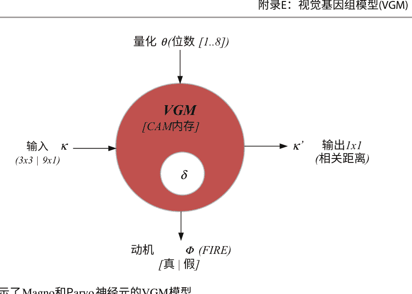

图E.7 这个图示了Magno和Parvo神经元的VGM模型

```
$$\kappa \sim [\kappa_0, \kappa_1, \kappa_2, \kappa_3, \kappa_4, \kappa_5, \kappa_6, \kappa_7, \kappa_8] \sim \begin{bmatrix} \kappa_0 & \kappa_1 & \kappa_2 \\ \kappa_3 & \kappa_4 & \kappa_5 \\ \kappa_6 & \kappa_7 & \kappa_8 \end{bmatrix}$$

$$\kappa' = f\left(\sum_{n=0}^{9} |CAM_n - \kappa_n|, \theta\right)$$

$$\phi = f(\kappa', \theta)$$
```

在原始的印象模式（类似于学习模式）中，所有的记忆印象都以检测计数的形式存储在CAM记忆细胞中。常见的印象具有更大的印象计数，因为它们更经常被检测到。如附录末尾的基因组渲染所示，通常检测到的特征通常以规律的模式按照地址格式结构进行记录。量化输入θ位可以通过对每个像素进行掩码来塑造内存地址，从而将相似的内存地址聚合在一起，如下面的VGM内存结构部分和图E.11所解释的那样。实质上，量化输入θ用于屏蔽地址中每个像素的低位，以(1)减少检测到的特征的细节级别和数量，并相应地(2)通过聚合相似特征来增加检测计数。我们还将θ称为量化距离或量化空间。量化允许可变精度的特征解释或记录，允许根据任务的不同以不同的细节程度表示相同的特征，例如在高级通过中使用较低的细节级别来查找候选匹配，而在最终的分类通过中使用较高的细节级别。

为了说明量化空间，考虑两个不同的特征地址，在使用量化θ掩码合并后变得相等：

-   特征1 = 0x81A89D
-   特征2 = 0x83A19e
-   量化输入 θ掩码 = 0xFCFCFC
-   0x81A89D & 0xFCFCFC = 0x80A89C
-   0x83A19e & 0xFCFCFC = 0x80A89C

每个神经元代表视觉通路中某个层次上的完整Magno或Parvo特征。

## VGM特征内存结构

VGM特征是由一个3 ×3像素值区域组成的内存地址——像素值构成了地址。 这个想法是将每个视觉印象表示为一个内存特征。 当然，这会导致非常大的内存空间，因此评估了几个模型，以得出一个合理的内存地址格式来限制大小。 最简单的格式是将像素连接在一起形成一个内存地址。 例如，使用3 ×3像素区域中的九个8位像素值连接成一个72位地址，得到一个2⁷²(4 zetabytes)的空间，这对于台式计算机来说是不实际的。 请注意，虽然可以将像素分辨率降低到小于8位，但是位精度的权衡似乎不值得，例如4位像素精度会产生一个2³⁶(68GB)的地址空间，超出了典型桌面级系统的每个进程地址空间限制，并且像素的细节水平大大降低，这可能是不可取的。 当前的实现使用一种权衡方法将地址空间分为四个区域，如图E.8所示。大多数使用32位和64位内存寻址的桌面计算机以及商业操作系统支持每个进程至少2GB的地址空间（注：对于实际情况

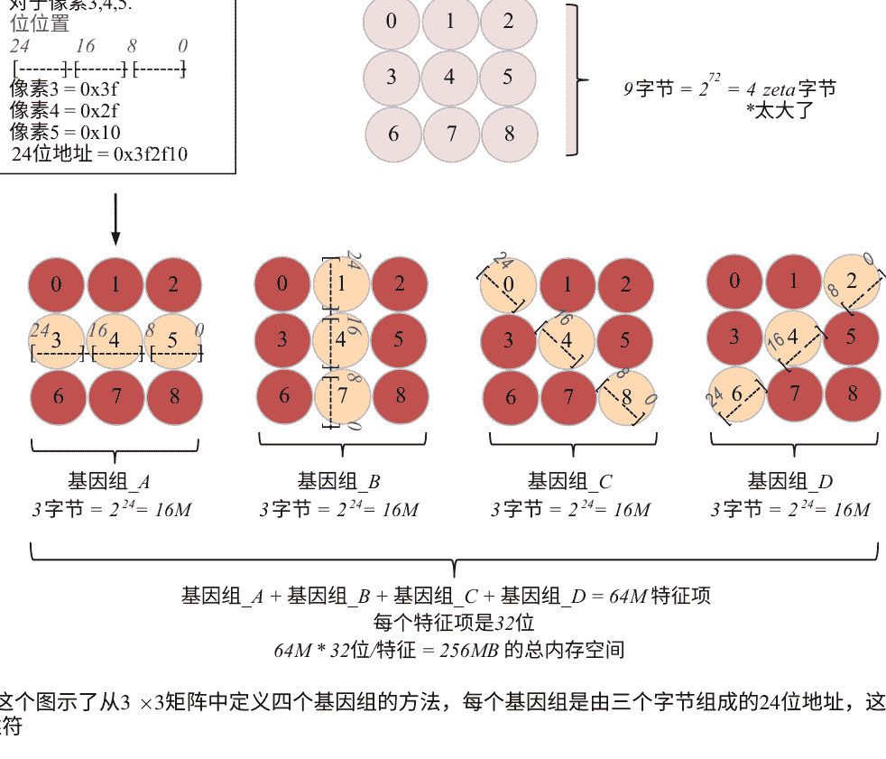

图E.8 这个图示了从3 ×3矩阵中定义四个基因组的方法，每个基因组是由三个字节组成的24位地址，这是特征描述符

## Parvo特征 (RGB基因组)

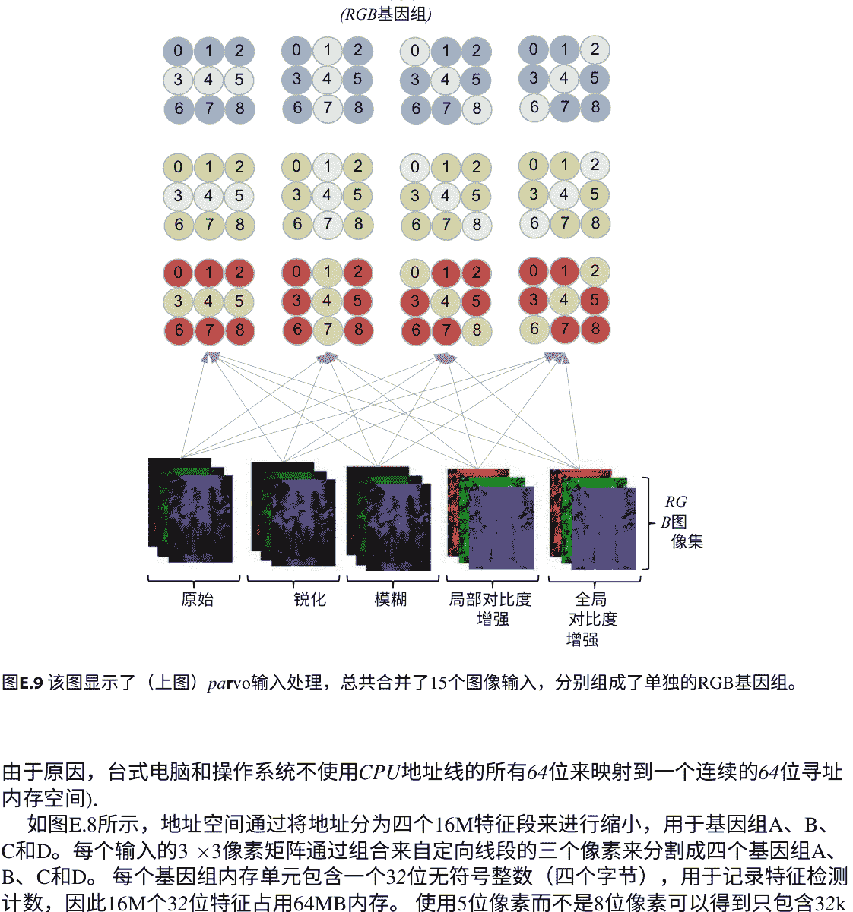

图E.9 该图显示了（上图）Parvo输入处理，总共合并了15个图像输入，分别组成了单独的RGB基因组。

由于原因，台式电脑和操作系统不使用CPU地址线的所有64位来映射到一个连续的64位寻址内存空间)。

如图E.8所示，地址空间通过将地址分为四个16M特征段来进行缩小，用于基因组A、B、C和D。每个输入的3×3像素矩阵通过组合来自定向线段的三个像素来分割成四个基因组A、B、C和D。每个基因组内存单元包含一个32位无符号整数（四个字节），用于记录特征检测计数，因此16M个32位特征占用64MB内存。使用5位像素而不是8位像素可以得到只包含32k个32位特征的基因组，而且由于5位色彩图像是现实的，基因组计算中使用5位像素值可以节省空间。

此外，可以通过使用量化输入θ位来将特征合并在...，如图E.11中的代码示例所示（注意用于调整每个地址的量化掩码）。如图E.9所示，Parvo特征是从五种类型的输入图像中计算得出的：原始、锐化、模糊、局部对比度增强和全局对比度增强，分为3个RGB通道，每个RGB颜色总共合并了15个输入图像，分别组成了四个基因组A、B、C、D。输入图像被合并到同一个基因组中，因此每个基因组代表了原始、锐化、模糊和对比度增强印象的组合变化。图E.10显示了用于计算四个Magno基因组A、B、C、D的Magno亮度通道输入，因此对于基于Magno级别的分割成原始区域，可以使用任意或全部5种类型的视网膜图像。

## Magno特征（亮度基因组）

图E.10 这个图示了记录在四个基因组A、B、C和D中的亮度通道Magno图像。

对于图E.9中的parvo特征，对于8位像素，每个基因组占用的总内存空间为：4个基因组 * 3个RGB颜色 * 16M特征 * 4字节 = 1.2GB。对于图E.10中的magno特征，每个基因组占用的总内存空间为：4个基因组 * 1个亮度通道 * 16M特征 * 4字节 = 268MB。

parvo和magno特征基因组共包含16个组。如下所示的特征计数详细信息，如果将图E.9和E.10中显示的所有瓷砖特征基因组连接成连续的地址（仅用于说明目的），那么8位像素分辨率下所有magno和parvo基因组的总虚拟特征计数为2^384。

特征计数详细信息（每个RGBL通道的8位像素）
- 2^24 = 每个基因组的16M个可能特征
- 4 = 3 + 1：每个小视觉特征（R、G、B）有3个基因组 * + 1个大视觉亮度4个基因组（A、B、C、D）
- 2^384 = 总可能的特征数（2^(24*4*4))

特征计数详细信息（每个RGBL通道的5位像素）
- 2^15 = 每个基因组的32k个可能特征
- 4 = 3 + 1：每个小视觉特征（R、G、B）有3个基因组 * + 1个大视觉亮度4个基因组（A、B、C、D）
- 2^240 = 总可能的特征数（2^15 * 4 * 4）

> *注意：原始、锐化、模糊、Retinex、全局对比度这五个小视觉输入被合并到形状基因组（A、B、C、D）中，而不是分别记录。*

需要注意的是，对于8位像素，可能的特征地址2^384在真实图像中不会出现，因此整个地址空间将永远不会被填充，并且会像3D SDM一样聚集在体积空间的中心，如附录末尾的基因组渲染所示。这是因为在自然图像中，最大或广泛分散的相邻像素值并不经常出现，而是相邻像素通常更接近。广泛分散的相邻像素值更多地表现为噪声和饱和效应，而合理的分散对应于纹理，没有分散对应于无纹理或平坦表面。

```c
for(int y=0; y < ysize-2; y++)
{
    for(int x=0; x < xsize-2; x++)
    {
        getRegion3x3_u8((U8_PTR)filedata_8u_g, x, y, xsize, ysize, (U8_PTR)w3x3);
        //
        // [x x x] [x B x] [C x x] [x x D]
        // [A A A] [x B x] [X C x] [x D x]
        // [x x x] [x B x] [X X C] [D x x]
        //
        U32 genome_A_address = ((w3x3[1][1]) & 0xff) | ((w3x3[0][1]<<8) & 0xff00) | ((w3x3[2][1]<<16) & 0xff0000);
        U32 genome_B_address = ((w3x3[1][1]) & 0xff) | ((w3x3[1][0]<<8) & 0xff00) | ((w3x3[1][2]<<16) & 0xff0000);
        U32 genome_C_address = ((w3x3[1][1]) & 0xff) | ((w3x3[0][0]<<8) & 0xff00) | ((w3x3[2][2]<<16) & 0xff0000);
        U32 genome_D_address = ((w3x3[1][1]) & 0xff) | ((w3x3[2][0]<<8) & 0xff00) | ((w3x3[0][2]<<16) & 0xff0000);

        quantization_mask = 0xF8F8F8;
        magno_luminance_g[GENOME_A_0_DEGREES][genome_A_address & quantization_mask]++;
        magno_luminance_g[GENOME_B_90_DEGREES][genome_B_address & quantization_mask]++;
        magno_luminance_g[GENOME_C_135_DEGREES][genome_B_address & quantization_mask]++;
        magno_luminance_g[GENOME_D_45_DEGREES][genome_C_address & quantization_mask]++;

    }
}
```

图E.11 该图说明了使用量化掩码从8位像素值创建24位地址进入四个基因组的方法，以合并和聚焦特征。

因此，视觉基因组特征的地址空间的极端值可能永远不会被填充，这将类似于稀疏的体积形状。

每当在图像中检测到给定的特征地址时，该地址的计数就会增加，对应于特征的普遍性。计算特征地址和计数的方法如图E.8所示，它依赖于VGM神经元中引入的量化输入，参见上面的VGM神经元模型部分，见图E.7。作为一个实际的例子，对于每个RGB-L通道使用8位像素值，可以使用表示为0xF8的8位十六进制掩码值的量化空间进行量化和聚焦，然后将地址中的每个像素值进行位掩码操作，以忽略底部的3位。下面的代码片段中有示例。

## 视觉基因组序列、瓦片、链、束、原始特征

VGM允许一种特征类型的层次结构，更多细节请参考Krig [534]。由于DNA显然可以将视觉特征编码到视觉神经元中，然后成为后续学习的生物默认值，因此VGM允许将一组原始特征加载到模型中。原始特征对应于区域形状掩模，其中之一是：（1）从实际Magno图像导出的分割掩模（参见图E.12），（2）包含某些预先存在形状的原始特征模板掩模（参见附录A），或者（3）来自另一个图像集的分割，对应于一种迁移学习形式。原始特征是形状掩模，这些掩模包括图像的一个区域，在该区域内计算并求和一整套parvo特征，形成一个视觉基因组地址空间。由于掩模是在magno分辨率下计算的，因此在将掩模应用于完整分辨率的parvo图像之前，先将掩模缩放5倍。

目前，创建形状掩模的实际分割流程基于超像素分割[256, 257]（有关形态学和分割的详细信息，请参见第2章）。使用一系列超像素大小设置来收集大量候选分割，然后应用一定的统计标准来选择最佳的超像素区域作为形状掩模，并忽略其他区域。目前的统计选择标准结合了Haralick特征度量和第3章中讨论的Krig Extended SDM度量。超像素是原始形状用于边界限制magno和parvo特征的掩码。当前的分割流程基于启发式和测试；然而，未来工作的一个有希望的领域是开发更自动化和自适应的图像分割流程，这是成像领域的一个核心研究领域。

如果形状掩码基于当前查看的图像的分割，那么掩码的注册和对齐是正确的，并且计算出了相应的视觉基因组特征。然而，对于基于假定的原始形状或从另一幅图像中进行的分割形状的迁移学习的原始特征，形状掩码的对齐是不存在的。要在图像像素空间中使用这样的原始特征，需要将掩码在整个图像上进行步进相关，并且对于强相关性，将在形状区域中计算视觉基因组。我们将将来的工作保留在这个领域中，以评估原始特征形状掩码相关性作为VGM的一部分，但目前我们忽略它。然而，基于当前图像的真实分割的视觉基因组特征将通过在视觉基因组空间中进行相关性而提供所需的结果，而不是在图像像素空间中进行。

除了每个掩码下记录的16个小视觉特征之外，还可以为每个掩码形状计算其他特征，例如掩码下的像素的颜色直方图，以及各种形状因子，如傅里叶圆度描述符或Freeman链码（见第6章）。

请注意，Hubel和Weiss将最低级感受野的原始形状定义为定向的边缘特征，VGM以与基因组A、B、C和D类似的方式对其进行建模，参见图E.9和E.10。VGM还假设在Strand特征级别上存在更高级别的原始特征形状，这些形状是类似于角、斑点和圆形区域的分割区域，如图E.13所示。例如，可以在Strand特征模型中定义一系列形状，以基于Strand形状将图像分割为熟悉的部分，并将分割特征中的相应magno和parvo特征收集到一个Strand中。原始特征通过经验学习随时间记录下来，参见[534]。

## 以下是VGM特征类型的摘要。

- **Magno and Parvo Tiles** - 一个3x3的瓷砖区域被转化为代表基因组A、B、C和D的四条线段，作为一个24位地址（对于8位像素）表示的微特征。地址即为特征。每种类型的所有检测到的瓷砖的计数都记录在该地址上作为一个bin。用于分析和分类的计数Tiles genomes是存储在内存中的默认特征，代理代理根据这些特征构建出一系列的tiles链来表示更高级别的概念束。Magno特征用于分割原始形状。
- **Strands, Primal** - 分割的原始形状被用作组装3 × 3个tiles序列的基础区域，类似于DNA链序列，存储在strand内存空间中。Strands在magno特征形状区域内被定义为包含在该区域中的一组parvo tile特征，或者可能在其他预先存在的原始分割形状区域内定义。该strand是在[534]中进一步定义的基因组序列类型。
- **束** - 由代理人定义的高级概念的组合，存储在束内存空间中。束基因组序列类型在[534]中定义。

简单来说，小视觉特征就像纹理和颜色瓷砖编码。大视觉特征是形状。束是由大视觉和小视觉瓷砖组成的形状集合。束内存存储可变长度的束，这些束是大视觉和小视觉特征的集合。束可以通过多种方式创建，例如使用预先存在的特征形状掩码或从真实图像分割的掩码。束是一组束。代理人将一组束关联并创建。

## ## VGM代理人

代理人代表系统的智能，不在VGM模型中定义。VGM表示用于存储和组织视觉特征的内存空间，并为代理人提供控制。可以为应用程序设计各种代理人，因为VGM不试图对所需的更高级意识进行建模。然而，为了在VGM中设计控制器以启用代理代理，做出了以下假设：

- **视网膜处理控制器** — VGM使用非常简单的视网膜模型为帕尔沃通路（原始、锐利、模糊、局部对比度增强用于高动态范围调整和全局对比度归一化）和马格诺通路提供生物学上合理的图像处理。这种基本的视网膜处理模型足以模拟视觉通路，而不是像通常在CNN架构特征层中应用的各种临时处理方法。例如，典型的CNN神经元模型使用各种预处理和后处理方法，请参见第9章和表9.3中的分类。相反，VGM假设严格基于内存和比较器的神经元模型，除了用于注意力细节级别的位级量化控制外，神经元没有任何处理，这在生物学上是合理的。
- **训练协议控制器** — 我们提出了一个详细的学习和训练模型[534]，该模型提供了高度分割的标记区域，排除了多余的细节，而不仅仅是提供带有多个标签的图像，或者准备不充分的图像，带有遮挡、几何变化、光照和颜色变化。准备更好的训练集在应用于真实变化时应该能够产生更好的结果。
- **假设控制器** — 一种检查和比较对象与一系列假设的方法是智能控制器的一部分，用于指导领域特定的（1）新记忆记录的创建和（2）对象的分类。VGM神经模型和内存层次结构在控制器上没有限制，提供了一个量化空间来进行假设评估的渐进细化。
- **多内存区域控制器** — 代理代理可以控制多个预训练在不同主题上的VGM内存模型，以模拟整个视觉皮层的独立特征区域。我们在[534]中开发了一个使用多内存区域的架构。
- **特征空间中的环境控制** — 还可以对每个特征中的像素值进行某种形式的环境处理，以允许在分类时使用色度计和环境准确的像素处理来改变特征以测试给定的假设。例如，像素的颜色和亮度会在一天的不同时间发生变化，因此VGM模型允许对特征空间进行像素处理，以考虑季节性照明、云层覆盖、雨、雪、雾、噪声或霾等因素。为了进行环境假设测试，可以按照准确的颜色空间方式调整每个RGB-L颜色分量的动态范围，独立地处理每个像素中的颜色通道和亮度。可以重新计算特定环境的基因组，并重复分类。这种环境假设测试在监视和军事应用中非常重要。作为检测和识别过程的一部分，特征集的环境处理在[534]中进行了探讨。

## 摘要

总结一下，VGM架构基于基于视图的模型假设，简化的视网膜处理模型，分别用于magno和parvo特征的不同路径和目的，以及基于记忆印象的原始链和束特征的层次结构，而不是使用局部特征描述符，或者像典型的CNN那样通过池化和子采样创建的分层特征尺度金字塔。

## 瓷砖基因组渲染

为了可视化瓷砖基因组，每个16M特征基因组被渲染成一个4096 × 4096的32位整数图像。然后，应用一些虚假着色来可视化地址空间中的热点，这是检测到最常见特征的地方。图像集1展示了室内场景（强盗图像）的magno A基因组的表示，图像集2表示了室外场景（红杉图像）的magno A基因组。请注意，室内场景包含许多具有相似纹理和颜色的平坦区域，如门和墙壁，而室外场景则包含更广泛的纹理，并且几乎没有相似纹理或颜色的平坦表面。mag no亮度基因组清楚地反映了颜色和纹理。

请注意，Krig [534] 提供了更广泛的图像类别的分类和匹配结果。

### 图像集1：室内场景的小女孩（强盗），24位RGB 2448 × 3264 图像

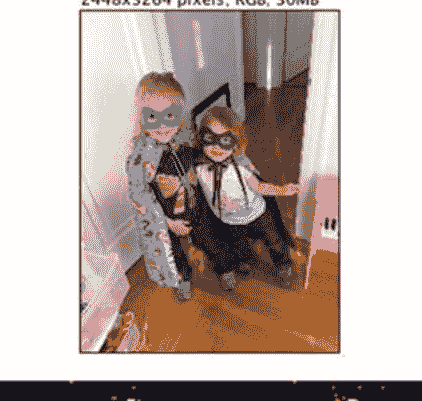

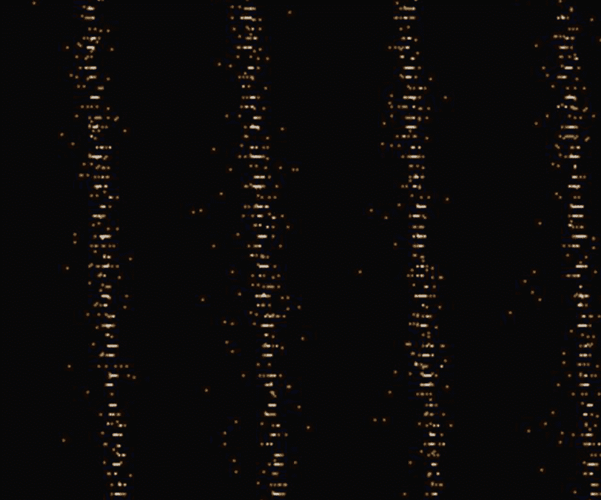

放大到4096 × 4096的区域，可视化室内强盗图像的基因组A地址空间，通过伪彩色显示热点或常见的基因组A特征

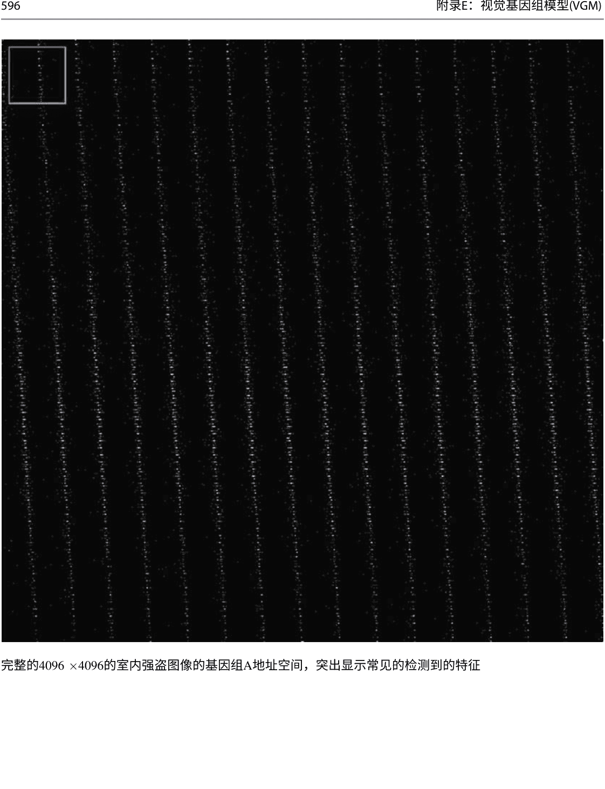

完整的4096 × 4096的室内强盗图像的基因组A地址空间，突出显示常见的检测到的特征

## 附录E：视觉基因组模型（VGM）

### 图像集2：巨型红杉树的室外场景，24位RGB 2112 × 2816 图像

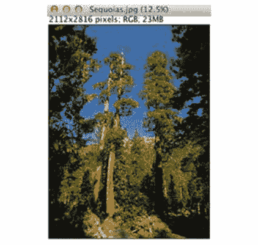

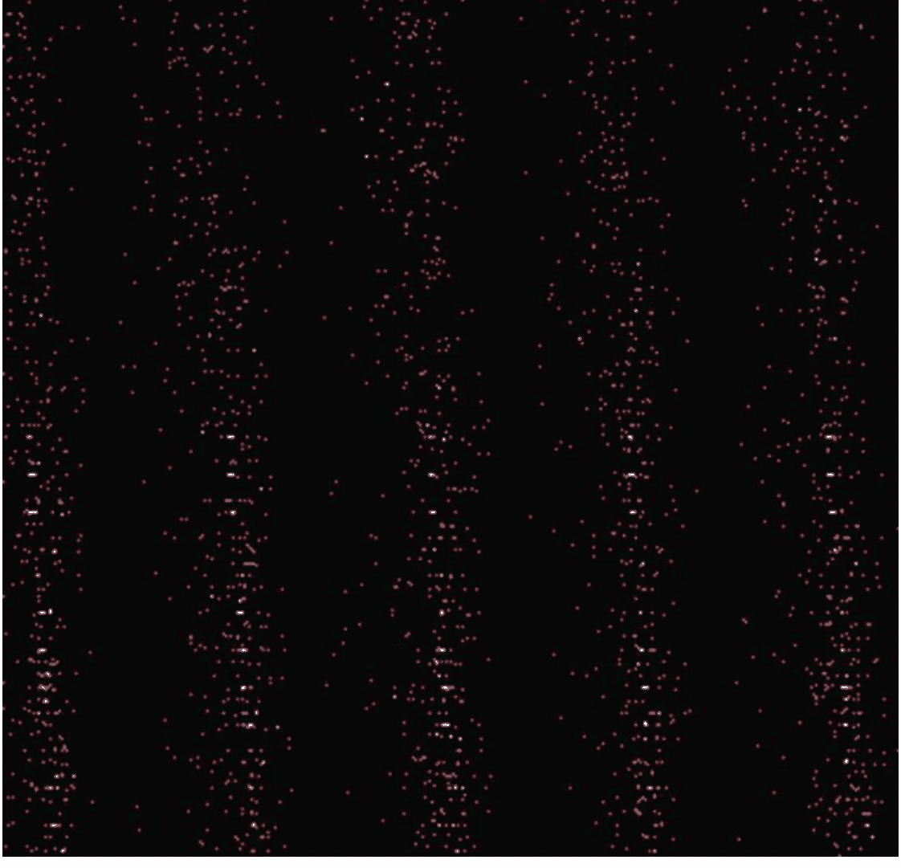

放大到4096 × 4096的区域，可视化室外红杉图像的基因组A地址空间，通过伪彩色显示热点或常见的基因组A特征

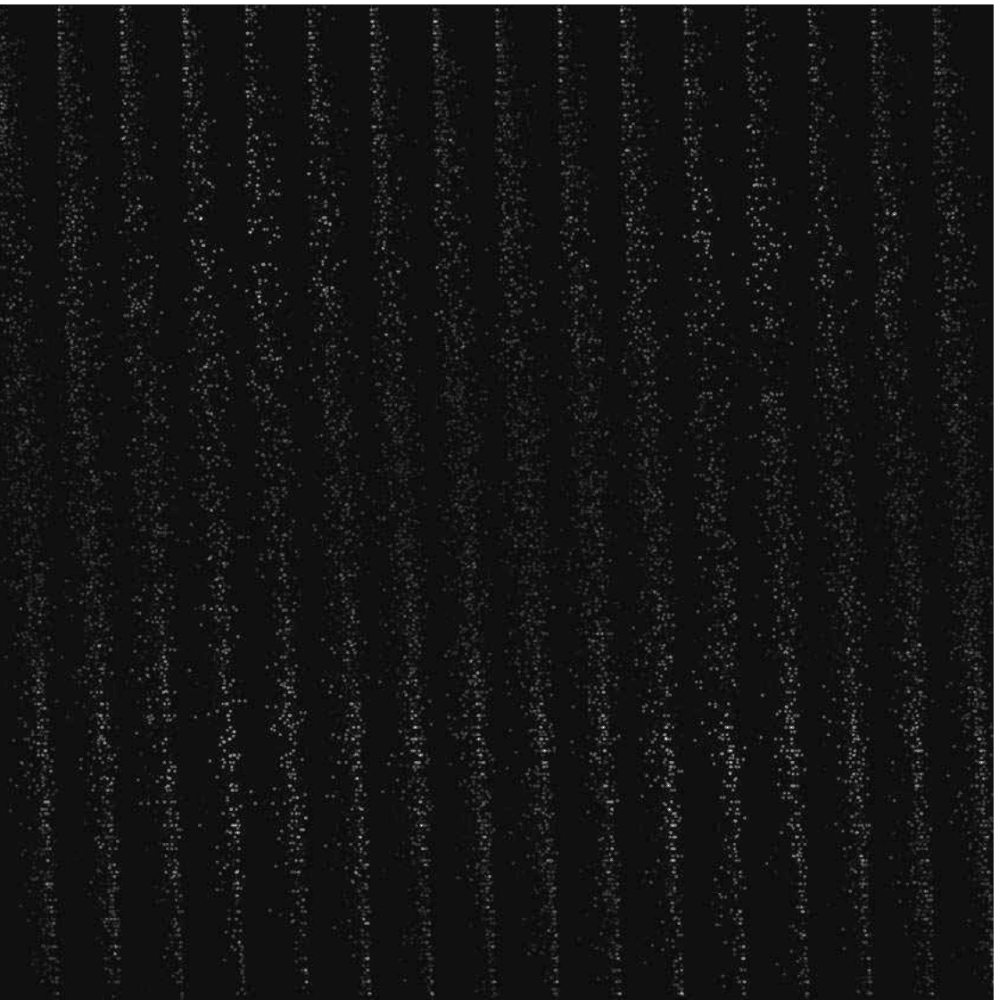

完整的4096 × 4096的室外红杉图像的基因组A地址空间，突出显示常见的检测到的特征

### 图像集3：整个基因组的比较体积渲染，用于Sequoias场景，表示体积坐标x、y和z的每个n位特征分量

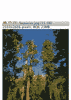

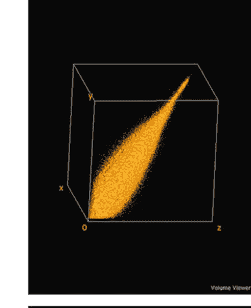

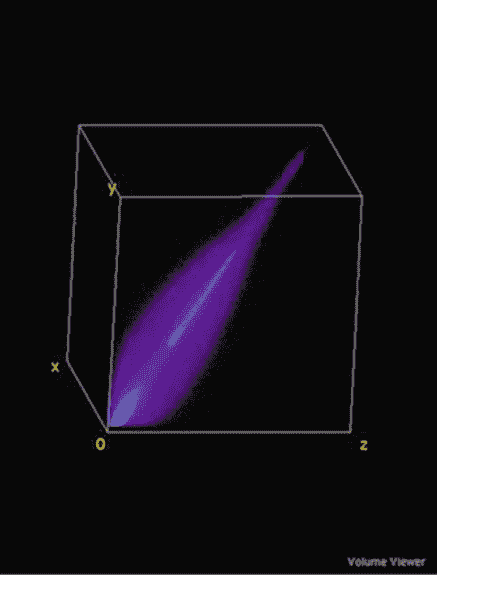

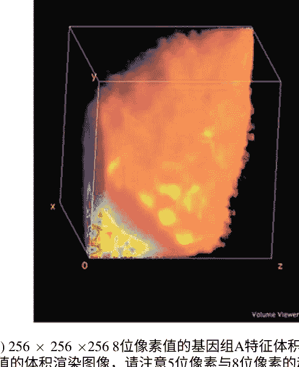

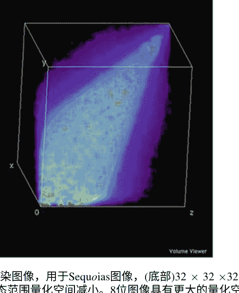

（顶部）256 × 256 × 256 8位像素值的基因组A特征体积渲染图像，用于Sequoias图像，（底部）32 × 32 × 32 5位像素值的体积渲染图像，请注意5位像素与8位像素的动态范围量化空间减小。8位图像具有更大的量化空间。

### 图像集4：整个基因组的比较体积渲染，用于Bandits场景，表示体积坐标 x、y 和 z的每个n位特征分量

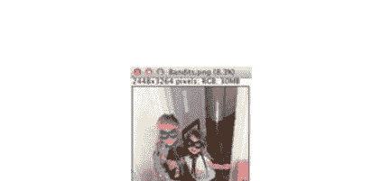

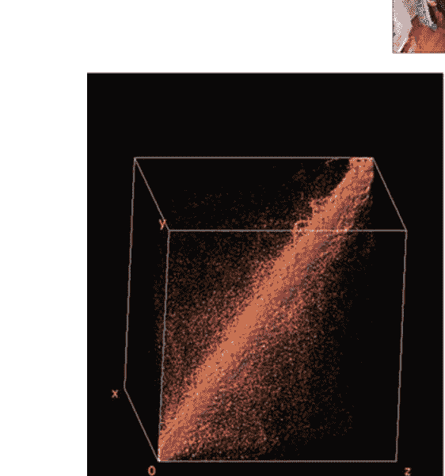

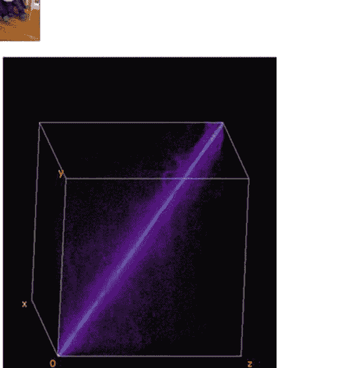

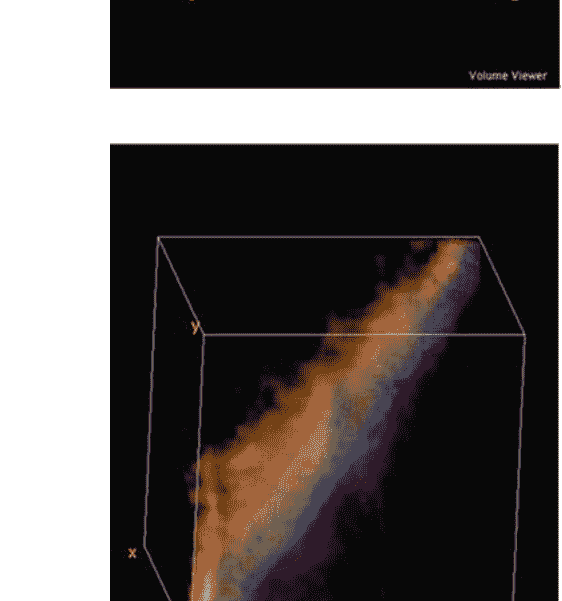

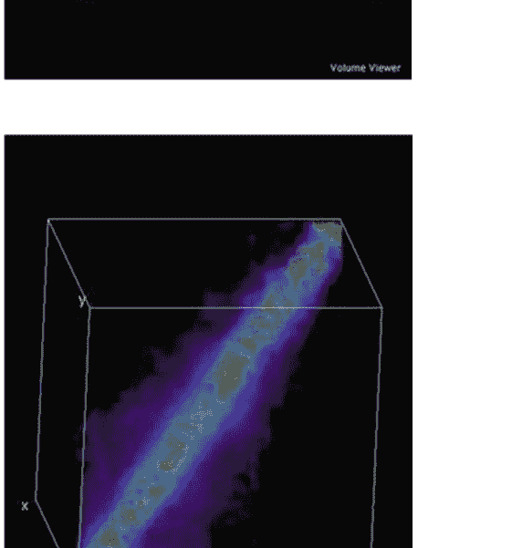

（顶部）256 × 256 × 256 8位像素值的基因组A特征体积渲染图像，用于Bandits图像，（底部）32 × 32 × 32 5位像素值的体积渲染图像。请注意5位像素与8位像素的动态范围量化空间减小。8位图像具有更大的量化空间。

## 参考文献

1.  Bajcsy, R.: 纹理表面的计算机描述. 国际人工智能统计学会议 (1973)
2.  Bajcsy, R., Lieberman, L.: 纹理梯度作为深度线索. 计算机图形图像处理 **5**(1), (1976)
3.  Cross, G.R., Jain, A.K.: 马尔可夫随机场纹理模型. PAMI **54**(1), (1983)
4.  Gonzalez, R., Woods, R.: 数字图像处理, 第三版. Prentice-Hall, Englewood Cliffs, NJ (2007)
5.  Haralick, R.M.: 纹理的统计和结构方法. 国际模式识别联合会议论文集 (1979)
6.  Haralick, R.M., Shanmugan, R., Dinstein, I.: 图像分类的纹理特征. IEEE Trans. Syst. Man Cybern. **3**(6), (1973)
7.  胡明凯: 通过矩不变量进行视觉模式识别. IRE Trans. Inform. Theor. **8**(2), (1962)
8.  陆和恩, 傅克诚: 一种用于纹理分析的句法方法. Comput. Graph. Image Process. **7**(3), (1978)
9.  普拉特: 数字图像处理, 第三版. Wiley, Hoboken, NJ (2002)
10. 罗森菲尔德, 卡克: 数字图像处理, 第二版. Academic Press, 纽约 (1982)
11. 富田, 白井, 辻: 通过结构分析描述纹理. Pattern. Anal. Mach. Intell. **4**(2), (1982)
12. 黄瑞扬, 霍尔: 使用不变矩进行场景匹配. Comput. Graph. Image Process. **8** (1978)
13. Guoying, Z., Pietikainen, M.: 使用局部二进制模式进行动态纹理识别, 并应用于面部表情. 模式分析与机器智能交易。 **29**(6), 915–928 (2007)
14. Kellokumpu, V., Guoying Z., Pietika¨inen, M.: 使用基于动态纹理的方法进行人体活动识别
15. Guoying, Z., Pietika¨inen, M.: 使用局部二进制模式进行动态纹理识别, 并应用于面部表情. 模式分析与机器智能交易。 **29**(6), 915–928 (2007)
16. Eichmann, G., Kasparis, T.: 拓扑不变纹理描述符. 计算机视觉图形图像处理. **41**(3), (1988)
17. Lam, S.W.C., Ip, H.H.S.: 使用不规则金字塔进行结构纹理分割. 模式识别信件. **15**(7), (1994)
18. Pietika¨inen, M., Guoying, Z., Hadid, A.: 使用局部二值模式的计算机视觉. Springer, 纽约 (2011)
19. Ojala, T., Pietika¨inen, M., Hardwood, D.: 基于分布的Kullback判别的纹理度量性能评估. Proc. Int. Conf. Pattern Recogn. (1994)
20. Ojala, T., Pietika¨inen, M., Hardwood, D.: 基于特征分布的纹理度量的比较研究. Pattern Recogn. **29** (1996)
21. Van Ginneken, B., Koenderink, J.J.: 纹理直方图与辐射和视角的关系. Int. J. Comput. Vis. **31**(2/3), 169–184 (1999)
22. Stelu, A., Arati, K., Dong-Hui, X.: 用于计算机断层扫描研究的纹理分析. Visual Computing Workshop DePaul University, (2004)
23. Krig, S.A.: 使用空间依赖矩阵进行图像纹理分析. Krig研究白皮书系列, (1994年)
24. Laws, K.I.: 快速纹理识别. SPIE **238** (1980年)
25. Bajcsy, R.K.: 计算机识别视觉表面. 计算机图形图像处理. **2** (2), 118-130 (1973年)
26. Kaizer, H.: 对航空照片上的纹理进行量化. 波士顿大学硕士论文, (1955年)
27. Laws, K.I.: 纹理能量测量. 图像理解研讨会论文集, (1979年)
28. Laws, K.I.: 快速纹理识别. SPIE **238** (1980年)
29. Laws, K.I.: 纹理图像分割. 南加州大学博士论文, (1980年)

30. Ade, F.: 通过“特征滤波器”对纹理进行表征。信号处理, 5(1983).

31. Davis, L.S.: 计算细胞纹理的空间结构。计算机图形图像处理, 11(2), (1979).

32. Eichmann, G., Kasparis, T.: 拓扑不变纹理描述符。计算机视觉图形图像处理, 41(3), (1988).

33. Lam, S.W.C., Ip, H.H.S.: 使用不规则金字塔进行结构纹理分割。模式识别快报, 15(7), (1994).

34. Pietikäinen, M., Guoying, Z., Hadid, A.: 使用局部二进制模式的计算机视觉。Springer, 纽约 (2011).

35. Ojala, T., Pietikäinen, M., Hardwood, D.: 基于分布的纹理度量的性能评估与基于库尔巴克判别的分类。国际模式识别会议论文集 (1994).

36. Ojala T., Pietikäinen, M., Hardwood, D.: 基于特征分布的纹理度量的比较研究。模式识别, 29 (1996).

37. Pun, C.M., Lee, M.C.: 用于旋转和尺度不变纹理分类的对数极坐标小波能量特征。Trans. Pattern. Anal. Mach. Intel., 25(5), (2003).

38. Spence, A., Robb, M., Timmins, M., Chantler, M.: 用于虚拟纺织品目录的实时逐像素渲染。INTEDEC会议论文集，爱丁堡, (2003).

39. Lam, S.W.C., Horace, H.S.I.: 自适应金字塔方法用于纹理分割。计算机图像模式分析计算机科学讲义 719, 267–274 (1993).

40. Dana, K.J., van Ginneken, B., Nayar, S.K., Koenderink, J.J.: 真实世界表面的反射率和纹理。技术报告CUCS-048-96，哥伦比亚大学, (1996).

41. Dana, K.J., van Ginneken, B., Nayar, S.K., Koenderink, J.J.: 真实世界表面的反射和纹理。计算机视觉模式识别会议 (1997).

42. Dana, K.J., van Ginneken, B., Nayar, S.K., Koenderink, J.J.: 真实世界表面的反射和纹理。ACM图形学交易 (1999).

43. Suzuki, M.T., Yaginuma, Y.: 基于三维卷积核的实体纹理分析。SPIE会议论文集 6491, (2007).

44. Suzuki, M.T., Yaginuma, Y., Yamada, T., Shimizu, Y.: 基于3D卷积掩模的形状特征提取方法。第八届IEEE多媒体国际研讨会，ISM'06, (2006).

45. Guoying, Z., Pietikainen, M.: 使用局部二进制模式进行动态纹理识别，并应用于面部表情。模式识别与机器智能交易, 29 (2007).

46. Hadjidemetriou, E., Grossberg, M.D., Nayar, S.K.: 多分辨率直方图及其在纹理分类中的应用。IEEE PAMI 26.

47. Hadjidemetriou, E., Grossberg, M.D., Nayar, S.K.: 多分辨率直方图及其在识别中的应用。IEEE PAMI 26(7), (2004).

48. Lee, K.L., Chen, L.H.: 一种用于纹理粗分类和纹理检索中类别权重估计的新方法。Pattern Recogn. Image Anal., 12(4), (2002).

49. Van Ginneken, B., Koenderink, J.J.: 纹理直方图作为辐射和观察方向的函数。Int. J. Comput. Vis., 31(2/3), 169–184 (1999).

50. Shu, L., Chung, A.C.S.: 利用高级局部二值模式和主导模式的空间分布进行纹理分类。ICASSP 2007. IEEE Int. Conf. Acoust. Speech Signal Process., (2007).

51. Stelu, A., Arati, K., Dong-Hui, X.: 计算机断层扫描研究的纹理分析。视觉计算德保罗大学研讨会, (2004).

52. Ade, F.: 通过“特征滤波器”对纹理进行表征。信号处理, 5(1983).

53. Rosin, P.L.: 测量角点属性。计算机视觉图像理解, 73(2).

54. Russel, B., Jianxiong, X., Torralba, A.: 在单视图图像中定位3D立方体。神经信息处理系统会议, (2012).

55. Snavely, N., Seitz, S.M., Szeliski, R.: 照片旅游：在3D中探索照片集合。ACM图形学交易 (SIGGRAPH会议记录), (2006).

56. Snavely, N., Seitz, S.M., Szeliski, R.: 从互联网照片集合建模世界。国际计算机视觉杂志, (TBP).

57. Furukawa, Y., Curless, B., Seitz, S.M., Szeliski, R.: 朝着互联网规模的多视角立体视觉发展。计算机视觉模式识别会议 (2010).

58. Yunpeng, L., Snavely, N., Huttenlocher, D., Fua, P.: 利用三维点云进行全球姿态估计。欧洲计算机视觉会议 (2012).

59. Russell, B., Torralba, A., Murphy, K., Freeman, W.T.: LabelMe: 一个用于图像注释的数据库和基于网络的工具。国际计算机视觉 77期 (2007).

60. Oliva, A., Torralba, A.: 场景形状建模：空间包络的整体表示。国际计算机视觉 42期 (2001).

61. Lai, K., Bo, L., Ren, X., Fox, D.: 一个大规模的分层多视角RGB-D物体数据集。机器人自动化国际会议 (2011).

62. Xiao, J., Hays, J., Ehinger, K., Oliva, A., Torralba, A.: SUN数据库：从修道院到动物园的大规模场景识别。计算机视觉模式识别会议 (2010).

63. Fei-Fei, L., Fergus, R., Perona, P.: 从少量训练样本中学习生成性视觉模型：基于增量贝叶斯方法的测试结果，测试对象为101个物体类别。计算机视觉模式识别会议 (2004).

64. Fei-Fei, L.: ImageNet: 众包、基准测试和其他酷炫的事情。CMU VASC研讨会 (2010).

65. Pirsiavash, H., Ramanan, D.: 在第一人称摄像头视角下检测日常活动。计算机视觉模式识别会议 (2012).

66. Quattoni, A., Torralba, A.: 室内场景识别。计算机视觉模式识别会议 (2009).

67. Lai, K., Bo, L., Ren, X., Fox, D.: 一个大规模的分层多视角RGB-D物体数据集。机器人自动化国际会议 (2011).

68. Silberman, N., Hoiem, D., Kohli, P., Fergus, R.: 室内RGBD图像的分割和支持推理。欧洲计算机视觉会议 (2012).

69. Xiaofeng R., Philipoose, M.: 手持物体的自我识别: 基准和分析。CVPR研讨会 (2009).

70. Xiaofeng, R., Gu, C.: 基于图像的前景-背景分割改善自我中心视频中的手持物体识别。计算机视觉与模式识别会议 (2009).

71. Fathi, A., Li, Y., Rehg, J.M.: 使用凝视学习识别日常动作。欧洲计算机视觉会议 (2012).

72. Dana, K.J., van Ginneken, B., Nayar, S.K., Koenderink, J. J.: 真实世界表面的反射和纹理。图形学交易, **18**(1), (1999).

73. Ce, L., Sharan, L., Adelson, E.H., Rosenholtz, R.: 在贝叶斯框架下探索材料识别中的特征。计算机视觉和模式识别会议 (2010).

74. Huang, G.B., Ramesh, M., Berg, T., Learned-Miller, E.: 野外标记人脸数据库：用于研究非受限环境下人脸识别的数据库。马萨诸塞大学阿默斯特分校技术报告07-49 (2007).

75. Gross, R., Matthews, I., Cohn, J.F., Kanade, T., Baker, S.: Multi-PIE。第八届IEEE国际自动人脸和手势识别会议论文集 (2008).

76. Yao, B., Jiang, X., Khosla, A., Lin, A.L., Guibas, L.J., Fei-Fei, L.: 通过学习动作属性和部分的基础进行人类动作识别。国际计算机视觉会议 (2011).

77. LeCun, Y., Huang, F.J., Bottou, L.: 学习方法用于具有对姿态和光照不变性的通用物体识别。计算机视觉模式识别会议论文集 (2004).

78. McCane, B., Novins, K., Crannitch, D., Galvin, B.: 关于光流基准测试的研究。计算机视觉图像理解, **84**(1), (2001).

79. Pirsiavash, H., Ramanan, D.: 在第一人称摄像头视角下检测日常活动。计算机视觉模式识别会议, 罗得岛提供, (2012).

80. Hamameh, G., Jassi, P., Tang, L.: 通过物理和统计基础变形模拟地面真实验证数据。MICCAI 2008, 第11届国际医学图像计算与计算机辅助干预会议.

81. Prastawa, M., Bullitt, E., Gerig, G.: 用于验证脑肿瘤MRI分割的合成地面真实数据。MICCAI 2005, 第8届医学图像计算与计算机辅助干预国际会议.

82. Vedaldi, A., Ling, H., Soatto, S.: 看到好特征时的认知：用于识别的地面真实数据和方法。计算机视觉研究与计算智能, **285**, 27-49 (2010).

83. Dutagaci, H., Cheung, C.P., Godil, A.: 通过人工生成的地面真实数据评估3D兴趣点检测技术。The Visual Computer, **28** (2012).

84. Rosin, P.L.: 增强角点描述符。图形模型图像处理, **58**(3), (1996).

85. Rockett, P.I.: 特征检测算法的性能评估：角点检测器的方法论和案例研究。图像处理交易, **12**(12), (2003).

86. Shahrokni, A., Ellis, A., Ferryman, J.: PETS2009结果的整体评估。IEEE PETS (2009).

87. Over, P., Awad, G., Sanders, G., Shaw, B., Martial, M., Fiscus, J., Kraaij, W., Smeaton, AF.: TRECVID 2013: 目标、任务、数据、评估机制和度量标准概述, NIST美国, (2013).

88. Horn, B.K.P., Schunck, B.G.: 确定光流。AI Memo 572, 麻省理工学院, (1980).

89. Everingham, M., Van Gool, L., Williams, C. K. I., Winn, J., Zisserman, A.: PASCAL视觉对象类别(VOC)挑战。Int. J. Comput. Vis., **88**(2), (2010).

90. 刘, J., 罗, J., 沙, M.: 从“野外”视频中识别真实动作。计算机视觉模式识别会议 (2009).

91. Arbelaez, P., Maire, M., Fowlkes, C., Malik, J.: 轮廓检测和分层图像分割。Trans. Pattern. Anal. Mach. Intell., **33**(5), (2011).

92. Fisher, R.B.: PETS04监控真实数据集。IEEE PETS会议, (2004).

93. Quan Y., Thangali, A., Ablavsky, V., Sclaroff, S.: 通过乘法核学习一族检测器。Pattern. Anal. Mach. Intell., 33(3), (2011).

94. Ericsson, A., Karlsson, J.: 用于自动对应算法基准测试的度量标准。Math. Imaging Vis. J., (2007).

95. Takhar, D., 等: 一种使用光域压缩的新型压缩成像相机架构。在: IS&T/SPIE电子成像研讨会论文集 (2006).

96. Marco, F.D., Baraniuk, R.G.: Kronecker压缩感知。IEEE图像处理期刊, 21(2), (2012).

97. Weinzaepfel, P., Jegou, H., Perez, P.: 从局部描述符重建图像。计算机视觉会议模式识别 (2011).

98. Dalal, N., Triggs, B.: 用于人体检测的梯度直方图。计算机视觉会议模式识别 (2005).

99. Tuytelaars, T., Mikolajczyk, K.: 局部不变特征检测器：一项调查。计算机图形学基础趋势, 3(3), 177-280 (2007).

100. Hartigan, J.A.: 聚类算法。Wiley, 纽约 (1975).

101. Fischler, M.A., Bolles, RC.: 随机采样一致性：一种适用于图像分析和自动制图的模型拟合范式。Commun. ACM, 24(6), (1981).

102. Sunglok, C., Kim, T., Yu, W.: RANSAC家族的性能评估。Br. Mach. Vis. Assoc. (2009).

103. Hartigan, J.A., Wong, M.A.: 算法AS 136: 一种K-means聚类算法。J. Royal Stat. Soc. Ser. C Appl. Stat., 28(1), 100–108 (1979).

104. Voronoi, G.: Nouvelles applications des paramètres continus à la théorie des formes quadratiques。Journal für die Reine und Angewandte Mathematik, 133 (1908).

105. Capel, D.: 随机森林和蕨类植物。宾夕法尼亚州立大学计算机视觉实验室，研讨会讲义 在线: ForestsAndFernsTalk.pdf.

106. Xiaofeng, R., Malik, J.: 学习分割的分类模型.

107. Lai, K., Bo, L., Ren, X., Fox, D.: 结合RGB和深度信息的稀疏距离学习用于目标识别.

108. Xiaofeng, R., Ramanan, D.: 用于目标检测的稀疏代码直方图。计算机视觉模式识别会议 (2013).

109. Liefeng, B., Ren, X., Fox, D.: 使用分层匹配追踪的多路径稀疏编码。计算机视觉模式识别会议 (2013).

110. Herbst, E., Ren, X., Fox, D.: 使用颜色和深度进行稠密三维运动估计的RGB-D流。IEEE国际机器人与自动化会议 (ICRA) (2013).

111. Xiaofeng, R., Bo, L.: 用于轮廓检测的有区别训练的稀疏代码梯度。神经信息处理系统会议 (2012).

112. Rublee, E., Rabaud, V., Konolige, K., Bradski, G.: ORB: SIFT或SURF的高效替代品。ICCV'11计算机视觉国际会议 (2011).

113. Rosenfeld, A., Pfaltz, J.L.: 数字图像上的距离函数。Pattern Recognition, 1, 33-61 (1968).

114. Richardson, A, Olson, E.: 学习卷积滤波器进行兴趣点检测。IEEE国际机器人与自动化会议ICRA'13 IEEE, 631-637 (2013).

115. Moon, T.K., Stirling, W.C.: 信号处理的数学方法和算法。Prentice-Hall, 新泽西州恩格尔伍德克利夫斯 (1999).

116. Liefeng, B, Ren, X., Fox, D.: 使用分层匹配追踪的多路径稀疏编码。计算机视觉与模式识别会议 (2013).

117. Ren, X., Ramanan, D.: 用于目标检测的稀疏编码直方图。计算机视觉与模式识别会议 (2013).

118. Olshausen, B., Field, D.: 通过学习自然图像的稀疏编码来产生简单细胞的感受野特性。Nature, 381(6583), 607-609 (1996).

119. d'Angelo, E., Alahi, A., Vanderheynst, P.: 超越位：从局部二进制描述符重建图像。瑞士联邦理工学院，第21届国际模式识别会议 (ICPR) (2012).

120. Dengsheng, Z., Lu, G.: 形状表示和描述技术综述。模式识别学会杂志, 37, 1-19 (2004).

121. 杨 M., Kidiyo, K., Joseph, R.: 形状特征提取技术综述。模式识别, 43-90, (2008).

122. Alahi, A., Ortiz, R., Vanderheynst, P.: Freak: 快速视网膜关键点。计算机视觉模式识别会议, (2012).

123. Leutenegger, S., Chli, M., Siegwart, R.Y.: BRISK: 二进制鲁棒不变可扩展关键点。国际计算机视觉会议, Vis. (2011).

124. Calonder, M., Lepetit, V., Strecha, C., Fua, P.: BRIEF: 二进制鲁棒独立基本特征。ECCV'10 第11届欧洲计算机视觉会议论文集：第四部分, (2010).

125. Calonder, M., et al.: BRIEF: 非常快速计算局部二进制描述符。Pattern. Anal. Mach. Intell., 34 (2012).

+   126. Rublee, E., Rabaud, V., Konolige, K., Bradski, G.: ORB: 一种高效的SIFT或SURF的替代方法。ICCV'11 2011年国际计算机视觉会议论文集, (2011)

+   127. von Hundelshausen, F., Sukthankar, R.: D-Nets: 超越基于图像块的图像描述符。计算机视觉模式识别会议 (2012)

+   128. Krig, S.: RFAN径向风扇描述符。 Picture Center Imaging and Visualization System, 白皮书系列 (1992)

+   129. Krig, S.: Picture Center Imaging and Visualization System. Krig Research白皮书系列 (1994)

+   130. Rosten, E., Drummond, T.: 快速机器学习用于高速角点检测。欧洲计算机视觉会议 (2006)

+   131. Rosten, E., Drummond, T.: 融合点和线以实现高性能跟踪。国际计算机视觉会议 (2005)

+   132. Lifeng, B., Ren, X., Fox, D.: 分层匹配追踪用于图像分类：架构和快速算法。神经信息处理系统会议 (2011)

+   133. Miksik, O., Mikolajczyk, K.: 评估用于快速特征匹配的局部检测器和描述符。国际会议模式识别。 (2012)

+   134. Freund, Y., Schapire, R.E.: 一种决策理论的在线学习推广及其应用。J. Comput. Syst. Sci. 55(1), 119–139 (1997)

+   135. Gleason, J.: BRISK (Josh Gleason在国际计算机视觉会议上的演讲) (2011)

+   136. Mikolajczyk, K., Schmid, C.: 一种局部描述符的性能评估。模式分析与机器智能IEEE Trans. 27(10), (2005)

+   137. Gauglitz, S., Ho¨llerer, T., Turk, M.: 评估用于视觉跟踪的兴趣点检测器和特征描述符。国际计算机视觉杂志。 94(3), (2011)

+   138. Viola, P., Jones, M.: 鲁棒的实时人脸检测. Int. J. Comput. Vis. 57(2), (2004)

+   139. Thevenaz, P., Ruttimann, U.E., Unser, M.: 基于强度的亚像素注册的金字塔方法. IEEE Trans. Image Process. 7(1), (1998)

+   140. Qi, T., Huhns, M.N.: 亚像素注册算法 .Comput. Vis. Graph. Image Process. 35 (1986)

+   141. Zhu, J., Yang, L.: 亚像素眼球注视追踪. Autom. Face Gesture Recogn. Conf. (2002)

+   142. Cheezum, M.K., Walker, W.F., Guilford, W.H.: 用于追踪单个荧光颗粒的算法的定量比较. Biophys. J. 81(4), 2378–2388 (2001)

+   143. Guizar-Sicairos, M., Thurman, S.T., Fienup, J.R.: 高效的亚像素图像配准算法。Opt. Lett. 33 (2), 156–158 (2008)

+   144. Hadjidemetriou, E., Grossberg, M.D., Nayar, S.K.: 多分辨率直方图及其在纹理分类中的应用。Int. Workshop Texture Anal. Synth. 26(7), (2003)

+   145. Mikolajczyk, K., et al.: 仿射区域检测器的比较。Conf. Comput. Vis. Pattern Recogn. (2006)

+   146. Canny, A.: 边缘检测的计算方法。Trans. Pattern. Anal. Mach. Intell. 8(6), (1986)

+   147. Gunn, S.R.: 离散高斯拉普拉斯边缘检测误差。国际图像处理会议，ICIP 98. Proceedings. vol 2, (1998)

+   148. Harris, C., Stephens, M.: 一个结合了角点和边缘检测器的方法。 第四届Alvey Vision Conference的论文集, (1988)

+   149. Shi, J., Tomasi, C.: 用于跟踪的好特征。计算机视觉与模式识别会议 (1994)

+   150. Turk, M., Pentland, A.: 用于识别的特征脸。认知神经科学杂志 3(1), 1991 ©麻省理工学院媒体实验室 (1991)

+   151. Haja, A., Jahne, B., Abraham, S.: 区域检测器的定位精度。IEEE CVPR (2008)

+   152. Bay, H., Ess, A., Tuytelaars, T., Van Gool, L.: 加速鲁棒特征 (SURF)。 计算机视觉与图像理解 110(3), 346–359 (2008)

+   153. Lowe, D.G.: 尺度不变关键点的SIFT显著图像特征。国际计算机视觉杂志 60(2), 91–110 (2004)

+   154. Kadir, T., Zisserman, A., Brady, M.: 一个仿射不变的显著区域检测器. 欧洲计算机视觉会议 (2004)

+   155. Kadir, T., Brady, J.M.: 尺度、显著性和图像描述 . 计算机视觉国际期刊 45(2), 83–105 (2001)

+   156. Smith, S.M., Brady, J.M.: SUSAN——一种新的低级图像处理方法. 技术报告 TR95SMS1c (专利), 版权所有 (1995), 国防研究机构, 英国 (1995)

+   157. Smith, S.M., Brady, J.M.: SUSAN——一种新的低级图像处理方法. 计算机视觉国际期刊档案 23(1), 45–78 (1997)

+   162. Ojala, T., Pietika¨inen, M., Hardwood, D.: 基于特征分布的纹理度量的比较研究。模式识别。29 (1996年)

+   163. Pietika¨inen, M., Heikkila¨, J.: 使用局部二进制模式变体进行图像和视频描述的教程。计算机视觉和模式识别会议 (2011年)

+   164. Shu, L., Albert, C.S. Chung.: 使用高级局部二进制模式和主要模式的空间分布进行纹理分类。IEEE国际会议。声学。语音信号处理。ICASSP， (2007年)

+   165. Pietika¨inen, M., Hadid, A., Zhao, G., Ahonen, T.: 使用二进制模式的计算机视觉。计算。成像和视觉系列，第40卷。Springer，纽约 (2011年)

+   166. Arandjelovi, A., Zisserman, A.: 每个人都应该知道的三件事来改善对象检索。计算。Vis。模式识别。 (2011年)

+   167. Zhao, G., Pietikainen, M.: 使用局部二进制模式进行动态纹理识别，并应用于面部表情。模式分析与机器智能IEEE交易。29 (6) ， (2007年)

+   168. Kellokumpu, V., Zhao, G., Pietika¨inen, M.: 使用基于动态纹理的方法进行人体活动识别。Br. Mach. Vis. Conf. (2008)

+   169. Zabih, R., Woodfill, J.: 用于计算视觉对应的非参数局部变换。欧洲计算机视觉会议 (1994)

+   170. Lowe, D.G.: 基于局部尺度不变特征的物体识别。第七届IEEE国际计算机视觉会议论文集 (1999)

+   171. Abdel-Hakim, A.E., Farag, A.A.: CSIFT: 具有颜色不变特性的SIFT描述符。计算机视觉模式识别会议 (2006)

+   172. Vinukonda, P.: 并行流水线上尺度不变特征变换的研究。论文项目

+   173. Alcantarilla, P.F., Bergasa, L. M., Davison, A.: Gauge-SIFT描述符。Elsevier出版社 (2011)

+   174. Christopher, E.: OpenSURF库笔记，布里斯托大学技术论文 (2009)

+   175. Yan, K., Sukthankar, R.: PCA-SIFT: 更具区分度的局部图像描述符。计算机视觉模式识别会议 (2004)

+   176. Gauglitz, S., Ho¨llerer, T., Turk, M.: 对视觉跟踪中的兴趣点检测器和特征描述符进行评估。Int. J. Comput. Vis. 94 (2011)

+   177. Agrawal, M., Konolige, K., Blas, M.R.: CenSurE: 用于实时特征检测和匹配的中心环绕极值。Eur. Conf. Comput. Vis. (2008)

+   178. Viola, P., Jones, M.: 强大的实时目标检测。Int. J. Comput. Vis. 57(2), 137–154 (2002)

+   179. Grigorescu, S.E., Petkov, N., Kruizinga, P.: 基于Gabor滤波器的纹理特征比较。IEEE Trans. Image Process. 11(10), (2002)

+   180. Alcantarilla, P., Bergasa, L.M., Davison, A.: Gauge-SIFT描述符。Image Vis. Comput. 31(1), 103–116 (2013), Elsevier通过DOI 1302

+   181. Agrawal, M., Konolige, K., Blas, M.R.: CenSurE中心环绕极值点用于实时特征检测和匹配。欧洲计算机视觉会议 (2008年)

+   182. Morse, B.S.: 第11讲：微分几何。布里格姆扬大学 (1998/2000年)。http://morse.cs.byu.edu/650/lectures/lect10/diffgeom.pdf

+   183. Bosch, A., Zisserman, A., Munoz, X.: 用空间金字塔核表示形状。CIVR '07图像和视频检索的第6届ACM国际会议论文集

+   184. Rubner, Y., Tomasi, C., Guibas, L.J.: 作为图像检索度量的移动者距离。国际计算机视觉杂志40 (2) ， 99-121 (2000年)

+   185. Oliva, A., Torralba, A.: 对场景形状的建模：空间包络的整体表示。国际计算机视觉杂志 (2001年)

+   186. Matas, J., Chum, O., Urban, M., Pajdla, T.: 从极值稳定区域中获得鲁棒的宽基线立体视觉. Br. Mach. Vis. Conf. (2002)的会议论文

+   187. Scovanner, P., Ali, S., Shah, M.: 一种三维SIFT描述符及其在动作识别中的应用. ACM第15届多媒体国际会议论文集, 第357-360页, (2007)

+   188. Klaser, A., Marszalek, M., Schmid, C.: 一种基于三维梯度的时空描述符. Br. Mach. Vis. Conf. (2008)

+   189. Laptev, I.: 关于时空兴趣点的研究. Int. J. Comput. Vis. 64 (2005)

+   190. Oreifej, O., Liu, Z.: HON4D: 基于方向的四维法线直方图用于深度序列的活动识别. Conf. Comput. Vis. Pattern Recogn. (2013)

+   191. Ke, Y., Sukthankar, R., Hebert, M.: 使用体积特征进行高效的视觉事件检测。国际计算机视觉会议 (2005)

+   192. Zhang, L., da Fonseca, M.J., Ferreira, A.: 3D形状描述符调查。Unia˜o Europeia—Fundos Estruturais Governo da Republica Portuguesa Referência: POSC/EIA/59938/2004

+   193. Tangelder, J.W.H., Veltkamp, R.C.: 基于内容的3D形状检索方法综述。Springer，纽约 (2007)

+   194. Heikkila, M., Pietika¨inen, M., Schmid, C.: 使用中心对称局部二进制模式描述兴趣区域。计算机视觉图形图像处理。Lect. Notes Comput. Sci. 4338, 58–69 (2006)

+   195. Schmidt, A., Kraft, M., Fularz, M., Domagala, Z.: 在机器人导航的背景下，对点特征检测器和描述符的比较。移动机器人自主感知研讨会， (2012年)

+   196. Jun, B., Kim, D.: 使用局部梯度模式和证据累积的鲁棒人脸检测。模式识别。45 (9)，3304-3316 (2012年)

+   197. Froba, B., Ernst, A.: 使用修改的普查变换进行人脸检测。国际会议自动化人脸手势识别。(2004年)

+   198. Freeman, H.: 对任意几何配置的编码。IRE电子计算机交易。(1961年)

+   199. Salem, A.B.M., Sewisy, A.A., Elyan, U.A.: 一种用于图像识别的顶点链码方法。国际图形视觉。图像处理。ICGST-GVIP，(2005年)

+   200. Kitchen, L., Rosenfeld, A.: 灰度角点检测。模式识别。信件1 (1992)

+   201. Koenderink, J., Richards, W.: 二维曲率算子。光学学会杂志5(7), 1136–1141 (1988)

+   202. Bretzner, L., Lindeberg, T.: 具有自动选择空间尺度的特征跟踪。计算机视觉图像理解。71(3), 385–392 (1998)

+   203. Lindeberg, T.: 具有自动选择检测尺度和定位尺度的交叉点检测。第一届国际图像处理会议论文集，(1994)

+   204. Lindeberg, T.: 具有自动尺度选择的特征检测。国际计算机视觉杂志。30(2), 79–116 (1998)

+   205. Wang, H., Brady, M.: 用于运动估计的实时角点检测算法。图像视觉计算。13(9), 695–703 (1995)

+   206. Trajkovic, M., Hedley, M.: 快速角点检测。图像视觉计算。16(2), 75–87 (1998)

+   207. Tola, E., Lepetit, V., Fua, P.: DAISY: 一种应用于宽基线立体的高效密集描述符。PAMI 32(5), (2010)

+   208. Arbeiter, G., et al.: 评估用于点云中表面几何分类的3D特征描述符。智能机器人系统国际会议 (2012) IEEE/RSJ

+   209. Rupell, A., Weisshardt, F., Verl, A.: 一种旋转不变的特征描述符O-DAISY及其FPGA实现。IROS (2011)

+   210. Ambai, M., Yoshida, Y.: CARD: 紧凑且实时的描述符。计算机视觉国际会议 (2011)

+   211. Takacs, G., et al.: 统一的实时跟踪和识别，具有旋转不变的快速特征。计算机视觉模式识别会议 (2010)

+   212. Taylor, S., Rosten, E., Drummond, T.: 在2.3 μs中的稳健特征匹配。计算机视觉模式识别会议 (2009)

+   213. Grauman, K., Darrell, T.: 金字塔匹配核：具有图像特征集的判别分类。IEEE国际计算机视觉会议第十2. (2005)

+   214. Takacs, G., et al.: 具有旋转不变快速特征的统一实时跟踪和识别。计算机视觉模式识别会议(2010)

+   215. Chandrasekhar, V., 等: CHoG: 梯度的压缩直方图，一种低比特率描述符。计算机视觉模式识别会议 (2009年)

+   216. Mainali, G.L., 等: SIFER: 具有错误容忍性的尺度不变特征检测器。国际计算机视觉杂志 (2013年)

+   217. Fowers, S.G., Lee, D.J., Ventura, D., Wilde, D.K.: 一种新颖、高效的基于树的描述符和匹配算法(BASIS)。计算机视觉模式识别会议 (2012年)

+   218. Fowers, S.G., Lee, D.J., Ventura, D.A., Archibald, J. K.: 自然启发的BASIS特征描述符及其硬件实现。IEEE Trans. Circ. Syst. Video Technol. (2012)

+   219. Bracewell, R.: 傅里叶变换及其应用，第3版，麦格劳-希尔科学/工程/数学，(1999)

+   220. Duda, R.O., Hart, P.E.: 使用Hough变换在图片中检测线条和曲线。Commun. ACM. (1972)

+   221. Ballard, D.H.: 将Hough变换推广到检测任意形状。Pattern Recogn. 13(2), (1981)

+   222. Illingsworth, J., Kittler, J.: Hough变换综述。Comput. Vis Graph. Image Process. (1988)

+   223. Salton, G., McGill, M.J.: 现代信息检索导论。麦格劳-希尔，纽约(1983)

+   224. Niebles, J.C., Wang, H., Fei-Fei, L.: 使用时空词汇无监督学习人类动作类别。Int. J. Comput. Vis. (2008)

+   225. Bosch, A., Zisserman, A., Munoz, X.: 通过pLSA进行场景分类。欧洲计算机视觉会议 (2006)

+   226. Csurka, G., Bray, C., Dance, C., Fan, L.: 使用关键点袋进行视觉分类。SLCV研讨会，欧洲计算机视觉会议 (2004)

+   227. Dean, T., Washington, R., Corrado, G.: 用于活动识别的稀疏时空编码。布朗大学技术报告 (2010)

+   228. Le, Q.V., Zou, W.Y., Yeung, S.Y., Ng, A.Y.: 学习用于动作识别的分层不变时空特征。计算机视觉模式识别会议 (2011)

229. Olshausen, B., Field, D.: 通过学习自然图像的稀疏编码来产生简单细胞的感受野特性。 Nature **381**, 607–609 (1996)

230. Belongie, S., Malik, J., Puzich, J.: 使用形状上下文进行匹配。 CBAIVL '00 IEEE图像和视频库内容访问研讨会论文集

231. Belongie, S., Malik, J., Puzicha, J.: 形状上下文：一种用于形状匹配和物体识别的新描述符。 神经信息处理系统会议 (2000)

232. Belongie, S., Malik, J., Puzich, J.: 使用形状上下文进行形状匹配和物体识别。 PAMI **24(4)**, (2002)

233. Belongie, S., Malik, J., Puzich, J.: 使用形状上下文匹配形状。 CBAIVL '00 IEEE图像和视频库内容访问研讨会论文集

234. Liefeng, B., Ren, X., Fox, D.: 基于RGB-D的无监督特征学习的物体识别。 ISER, Springer高级机器人学系列第88卷。 Springer, 第387-402页, (2012)

235. Loy, G., Zelinsky, A.: 用于检测兴趣点的快速径向对称变换。 欧洲计算机视觉会议 (2002)

236. Wolf, L., Hassner, T., Taigman, Y.: 野外基于描述符的方法。 欧洲计算机视觉会议 (2008)

237. Kurz, D., Ben Himane, S.: 惯性传感器对齐的视觉特征描述符。 计算机视觉模式识别会议 (2011)

238. Kingsbury, N.: 复杂小波旋转不变的局部特征匹配。 欧洲信号处理会议 (EUSIPCO), (2006)

239. Dinggang, S., Ip, H.H.S.: 用于2D模式识别的判别小波形状描述符。 模式识别 **32(2)**, 151–165 (1999)

240. Edelman, S., Intrator, N., Poggio, T.: 复杂细胞和物体识别。 神经信息处理系统会议 (1997)

241. Hunt, R.W.G., Pointer, M.R.: 测量颜色。 Wiley, Hoboken, NJ (2011)

242. Hunt, R.W.G.: 色彩再现。 第6版, Wiley, (2004)

243. Berns, R.S.: Billmeyer和Saltzman的色彩技术原理。 Wiley, Hoboken, NJ (2000)

244. Morovic, J.: 色域映射。 Wiley, Hoboken, NJ (2008)

245. Fairchild, M.: 色彩外观模型。 第1版, Addison Wesley Longman, (1998)

246. Ito, M., Tsubai, M., Nomura, A.: 基于局部可变结构元素的形态学运算及其在超声图像区域提取中的应用。 Syst. Comput. Jpn. **34(3)**, 33–43 (2003)

247. Tsubai, M., Ito, M.: 自适应数学形态学中可变结构元素的控制，用于超声图像边界增强。 Electron. Commun. Jpn. Part 3 Fund. Electron. Sci. **87(11)**, 20–33

248. Mazille, J.E.: 数学形态学和卷积。 J. Microsc. **156**, 257 (1989)

249. Achanta, R., 等： 与最先进的超像素方法相比的SLIC超像素。 PAMI **34(11)**, (2012)

250. Achanta, R., 等： SLIC超像素。 EPFL技术报告编号149300, (2010)

251. Felzenszwalb, P., Huttenlocher, D.: 高效基于图的图像分割。 Int. J. Comput. Vis. (2004)

252. Levinshtein, A., 等： Turbopixels: 使用几何流的快速超像素。 PAMI (2009)

253. Lucchi, A., 等： 在EM图像中对不规则形状细胞结构的完全自动化分割方法。 MICCAI (2010)

254. Shi, J., Malik, J.: 归一化割和图像分割。 PAMI (2000)

255. Vedaldi, A., Soatto, S.: 快速移动和核方法用于模式寻找。 欧洲计算机视觉会议 (2008)

256. Felzenszwalb, P.F., Huttenlocher, D.P.: 高效基于图的图像分割。 Int. J. Comput. Vis. **59(2)**, 167–181 (2004)

257. Felzenszwalb, P., Huttenlocher, D.: 高效基于图像分割的图像分割。 Int. J. Comput. Vis. **59** (2004)

258. Comaniciu, D., Meer, P.: 均值漂移：一种鲁棒的特征空间分析方法。 PAMI **24(5)**, (2002)

259. Vedaldi, A., Soatto, S.: 快速漂移和核方法用于模式寻找。 Eur. Conf. Comput. Vis. (2008)

260. Vincent, L., Soille, P.: 数字空间中的分水岭：一种基于浸润模拟的高效算法。 PAMI **13(6)**, (1991)

261. Levinshtein, A., et al.: Turbo像素：使用几何流的快速超像素。 PAMI **31(12)**, (2009)

262. Scharstein, D., Pal, C.: 学习用于立体视觉的条件随机场。 Conf. Comput. Vis. Pattern Recogn. (2007)

263. Hirschmüller, H., Scharstein, D.: 立体匹配的代价函数评估。 Conf. Comput. Vis. Pattern Recogn. (2007)

264. Goodman, J.W.: 傅里叶光学导论。 麦格劳-希尔, 纽约 (1968)

265. Gaskill, J.D.: 线性系统，傅里叶变换，光学。 Wiley, 霍博肯, 新泽西州 (1978)

266. Thibos, L., Applegate, R.A., Schweigerling, J.T., Webb, R.: 报告眼部光学像差的标准。 在: Lakshminarayanan, V. (编) OSA光学和光子学趋势，视觉科学及其应用。 美国光学学会，华盛顿特区 (2000)

267. Hwang, S.-K., Kim, W.-Y.: 一种快速计算泽尼克矩的新方法。 模式识别。 **39** (2006)

268. Khotanzad, A., Hong, Y.H.: 泽尼克矩不变图像识别。 PAMI **12** (1990)

269. Chao Kan, M., Srirath, D.: 具有泽尼克和正交傅里叶-梅林矩的不变字符识别。 模式识别 **35**, (2002)

270. Hyung, S.K., Lee, H.-K.: 使用Zernike矩不变图像水印。 IEEE Trans. Circ. Syst. Video Technol. **13(8)**, (2003)

271. Papakostas, G.A., Karras, D.A., Mertzios, B.G.: 使用基于小波的Zernike矩压缩技术的图像编码。 在: Proceeding of: Digital Signal Processing, vol 2, DSP, (2002)

272. Mukundan, R., Ramakrishnan, K.R.: 快速计算Legendre和Zernike矩。 **28(9)**, 1433–1442, (1995)

273. Yongqing, X., Pawlak, M., Liao, S.: 使用极坐标Zernike矩进行图像重建。 ICAPR’05 Proceedings of the Third International Conference on Pattern Recognition and Image Analysis—Volume Part II (2005)

274. Singh, C., Upneja, R.: 高阶Zernike矩计算的快速准确方法。 Appl. Math. Comput. **218(15)**, 7759–7773 (2012)

275. 普拉特, W., 陈, W.-H., 韦尔奇, L.: 倾斜变换图像编码。 IEEE Trans. Commun. **22(8)**, (1974)

276. 江本, H., 柴田, K.: 电视信号正交变换编码系统。 IEEE Trans. Electromagn. Compatibil. **13(3)**, (1974)

277. 杜特拉达席尔瓦, R., 罗布森, W., 佩德里尼·施瓦茨, H.: 基于小波特征描述符和降维的遥感图像分割。 智利统计学杂志。 **2** (2011)

278. 阿伦, N., 库马尔, M., 萨蒂德维, P.S.: 小波SIFT特征描述符用于鲁棒人脸识别。 Springer Adv. Intell. Syst. Comput. **177** (2013)

279. 丁刚, S., 叶博, H.H.S.: 用于2D模式识别的判别小波形状描述符。 Pattern Recogn. **32** (1999)

280. Kingsbury, N.: 旋转不变的复小波局部特征匹配。 欧洲信号处理会议论文集 EUSIPCO (2006)

281. 沃尔夫拉姆研究公司的Mathematica小波分析库

282. Strang, G.: “小波。” 美国科学家 **82(3)**, (1994)

283. Mallat, S.: 信号处理的小波之旅: 稀疏方式, 第3版, Elsevier, (2008)

284. Percival, D.B., Walden, A.T.: 时间序列分析的小波方法。 剑桥大学出版社, 剑桥 (2006)

285. Gabor, D.: 通信理论。 IEE杂志。 **93** (1946)

286. Minor, L.G., Sklansky, J.: 红外图像中斑点的检测和分割。 IEEE Trans. Syst. Man Cybernetics. **11(3)**, (1981)

287. van Ginkel, M., Luengo Hendriks, C.K., van Vliet, L. J.: Radon和Hough变换的简要介绍以及它们之间的关系。 Quantitative Imaging Group Technical ReportSeries (2004)中的编号QI-2004-01

288. Toft, P.A.: 使用广义Radon变换检测噪声图像中的曲线。 1996年IEEE国际会议论文集, ICASSP-96. 会议论文集, 卷4, (1996)

289. Radon, J.: 通过其积分值沿特定多样性确定函数。 莱比锡萨克森科学院报告, 莱比锡, 数学物理学类 **69** (1917)

290. Fung, J., Mann, S., Aimone, C.: OpenVIDIA: 并行GPU计算机视觉。 ACM Multimed.会议论文集(2005)

291. Bazin, M.J., Benoit, J.W.: 用于气泡室图片的离线全局模式识别方法。 核科学交易 **12** (1965)

292. Deans, S.R.: 从Radon变换到Hough变换。 模式识别与人工智能交易 **3(2)**, 185–188 (1981)

293. Rosenfeld, A.: 计算机数字图像处理。 学术出版社, 纽约 (1982)

294. Tomasi, C., Manduchi, R.: 灰度和彩色图像的双边滤波。 ICCV '98第六届国际计算机视觉会议论文集 (1998)

295. 请参阅ImageJ、ImageJ2或Fiji软件包的文档，了解每种方法的完整参考资料，[全局]自动阈值命令和自动局部阈值命令。 http://fiji.sc/ImageJ2

296. Garg, R., Mittal, B., Garg, S.: 图像增强的直方图均衡化技术。 电子通信技术国际期刊 **2** (2011)

297. Sung, A.P., Wang, C.: 时空抗锯齿。 可视化计算与图形交易 **8** (2002)

298. Mikolajczyk, K., Schmid, C.: 尺度和仿射不变的兴趣点检测器。 国际计算机视觉期刊 **60** (2004)

299. Ozuysal, M., Calonder, M., Lepetit, V., Fua, P.: 使用随机蕨类快速关键点识别。 PAMI **32** (2010)

300. Schaffalitzky, F., Zisserman, A.: 电影中的自动场景匹配。 CIVR 2004, 在图像和视频检索挑战中的论文集，伦敦，LNCS 2383

301. Tola, E., Lepetit, V., Fua, P.: 一种用于密集匹配的快速局部描述符。 计算机视觉模式识别会议。(2008)

302. Davis, L.S.: 计算细胞纹理的空间结构。 计算机图形图像处理。 **11(2)**, (1979)

303. Pun, C.M., Lee, M.C.: 用于旋转和尺度不变纹理分类的对数极坐标小波能量特征。 Trans. Pattern. Anal. Mach. Intell. **25(5)**, (2003)

304. Spence, A., Robb, M., Timmins, M., Chantler, M.: 用于虚拟纺织品目录的实时逐像素渲染。 INTEDEC会议论文集。 (2003)

305. Lam, S.W.C., Ip, H.H.S.: 自适应金字塔纹理分割方法。 计算机图像模式分析。 **719**, 267–274 (1993)

306. Yinpeng J., Fayad, L., Laine, A.: 多尺度自适应直方图均衡化的对比度增强。 SPIE会议论文。 **4478** (2001)

307. Jianguo, Z., Tan, T.: 不变纹理分析方法简要回顾。 模式识别 **35** (2002)

308. Tomita, F., Shirai, Y., Tsuji, S.: 结构分析描述纹理。 IEEE Trans. Pattern. Anal. Mach. Intell. Arch. **4** (1982)

309. Tomita, F., Tsuji, S.: 计算机视觉纹理分析。 Springer, 纽约 (1990)

310. Burt, P.J., Adelson, E.H.: 拉普拉斯金字塔作为紧凑图像编码。 IEEE Trans. Commun. (1983)

311. Otsu, N.: 一种基于灰度直方图的阈值选择方法。 IEEE Trans. Syst. Man Cybern. **9(1)**, 62–66 (1979)

312. Sezgin, M., Sankur, B.: 图像阈值技术综述和定量性能评估。 SPIE J. Electron. Imaging (2004)

313. Haralick, R.M., Shapiro, L.G.: 图像分割技术。 计算机视觉与图形图像处理。 **29**, 100–132 (1985)

314. Raja, Y., Gong, S.: 稀疏多尺度局部二值模式。 英国机器视觉会议。 (2006)

315. Fleuret, F.: 基于条件互信息的快速二值特征选择。 机器学习研究杂志。 **5** (2004)

316. Szeliski, R.: 计算机视觉， 算法与应用。 Springer, 纽约 (2011)

317. Pratt, W.K.: 数字图像处理: PIKS科学内幕。 第4版, Wiley-Interscience, (2007)

318. Russ, J.C.: 图像处理手册, 第5版, CRC Press, (2006)

319. Klein, G., Murray, D.: 小型AR工作空间的并行跟踪和建图。 IMAR. (2007)

320. Newcombe, R.A., et al.: KinectFusion: 实时稠密表面映射和跟踪。 ISMAR '11 Proceedings of the 2011 10th IEEE International Symposium on Mixed and Augmented Reality (2011)

321. Izadi, S., 等: KinectFusion: 使用移动深度相机的实时3D重建和交互。 ACM用户界面软件技术研讨会 (2011)

322. Moravec, H.: 通过视觉感知的机器人漫游器在现实世界中避障和导航。 CMU-RI-TR-3技术报告，卡内基梅隆大学机器人研究所 (1980)

323. Mikolajczyk, K., Schmid, C.: 基于尺度不变兴趣点的索引。 国际计算机视觉会议 (2001)

324. Turcot, P., Lowe, D.G.: 在大型数据库识别问题中使用更少特征进行更好匹配: 有用特征的选择。 国际计算机视觉会议 (2009)

325. Feichtinger, H.G., Strohmer, T.: Gabor分析与算法，1997年版， Birkhäuser出版社 (1997)

326. Ricker, N.: 小波收缩，小波扩展和地震分辨率的控制。 地球物理学 **18**, 769–792 (1953)

327. Goshtasby, A.: 使用形状矩阵描述和区分平面形状。 PAMI **7(6)**, (1985)

328. Vapnik, V.N., Levin, E., LeCun, Y.: 测量学习机的维度。 Neural Comput. **6(5)**, 851–876 (1994)

329. Cowan, J. D., Tesauro, G., Alspector, J.: 学习曲线: 渐近值和收敛速度。 Adv. Neural Inform. Process. **6** (1994)

330. Vapnik, V.N.: 统计学习理论的本质。 Springer, 纽约 (1995)

331. LeCun, Y., Bottou, L., Bengio, Y., Haffner, P.: 基于梯度的学习应用于文档识别: 智能信号处理。 Proc. IEEE **86(11)**, 2278–2324 (1998)

332. Krizhevsky, A., Sutskever, I., Hinton, E.: 使用深度卷积神经网络进行ImageNet分类。 Conf. 神经信息处理系统会议 (2012)

333. Boser, B.E., Guyon, I.M., Vapnik, V.N.: 一种用于最优边界分类器的训练算法。 COLT '92计算学习理论第五届年度研讨会论文集 (1992)

334. Cortes, C., Vapnik, V.N.: 支持向量网络。 机器学习。 **20** (1995)

335. Burges, C.J.C.: 用于模式识别的支持向量机教程。 Kluwer数据挖掘与发现。 **2** (1998)

336. Weinzaepfel, P., Revaud, J., Harchaoui, Z., Schmid, C.: DeepFlow: 使用深度匹配进行大位移光流计算。 国际计算机视觉会议 (2013)

337. Keysers, T.C., Gollan, D., Ney, H.: 图像识别的变形模型。 PAMI **20** (2007)

338. Kim, J., Liu, C., Sha, F., Grauman, K.: 用于快速密集对应的可变形空间金字塔匹配。 Conf. Comput. Vis. Pattern Recogn. (2013)

339. Boureau, Y.-L., Ponce, J., LeCu, Y.: 对视觉识别中特征汇聚的理论分析。 IML, 第27届国际机器学习大会，以色列海法, (2010)

- 340. Schmid, C., Mohr, R.: 使用局部特征描述和半局部约束的物体识别。PAMI **19**(3), (1997)
- 341. Ferrari, V., Tuytelaars, T., Gool, L.V.: 单个或多个模型视图中的同时物体识别和分割。Int. J. Comput. Vis. **67** (2005)
- 342. Schaffalitzky, F., Zisserman, A.: 电影中的自动场景匹配。CIVR. (2002)
- 343. Estivill-Castro, V.: 为什么有这么多聚类算法–一个立场论文。ACM SIGKDD Explor. Newslett. **4**(1), (2002)
- 344. Kriegel, H.-P., Kröger, P., Sander, J., Zimek, A.: 基于密度的聚类。Wiley Interdisciplinary Rev. Data Mining Knowl. Discov. **1**(3), 231–240 (2011)
- 345. Hartigan, J.A.: 聚类算法。Wiley, Hoboken, NJ (1975)
- 346. Hartigan, J.A., Wong, M.A.: 算法AS 136: 一种K-means聚类算法。J. Roy. Stat. Soc. **28**(1), (1979)
- 347. Hastie, T., Tibshirani, R., Friedman, J.: 分层聚类: 统计学习的要素, 第2版。Springer, 纽约 (2009)
- 348. Dempster, A.P., Laird, N.M., Rubin, D.B.: 通过EM算法从不完整数据中获得最大似然估计。J. Roy. Stat. Soc. Ser. B **39**(1), 1–38 (1977)
- 349. Pearson, K.: 关于空间中最接近点系的直线和平面。Phil. Mag. (1901)
- 350. Hotelling, H.: 两组变量之间的关系。Biometrika **28**(3–4), 321–377 (1936)
- 351. Cortes, C., Vapnik, V.N.: 支持向量网络。Mach. Learn. **20**(3), 273–297 (1995)
- 352. Haykin, S.: 神经网络: 一个全面的基础, 第二版。Prentice-Hall, Englewood Cliffs, NJ (1999)
- 353. Vapnik, V.: 统计学习理论。Wiley, Hoboken, NJ (1998)
- 354. Hofmann, T., Scholkopf, B., Smola, A.J.: 机器学习中的核方法。Ann. Stat. **36**(3), 1031 (2008)
- 355. Raguram, R., Frahm, J.-M., Pollefeys, M.: 一种自适应实时随机采样一致性的RANSAC技术比较分析。Eur. Conf. Comput. Vis. (2008)
- 356. Weinberger, K.Q., Blitzer, J., Saul, L.K.: 大边界最近邻分类的距离度量学习。Conf. Neural Inform. Process. Syst. (2004)
- 357. Schmid, C., Mohr, R.: 图像检索的局部灰度值不变量。PAMI **19**(5), (1997)
- 358. Dork, G., Schmid, C.: 使用有区分性的局部特征进行物体类别识别。Technical Report RR-5497, INRIA—Rhone-Alpes (2005)
- 359. Schölkopf, B., Smola, A.J.: 使用核函数学习: 支持向量机, 正则化, 优化和更多。MIT出版社, 麻省剑桥 (2001)
- 360. Ferrari, V., Tuytelaars, T., Gool, L.V.: 单个或多个模型视图中的同时目标识别和分割。计算机视觉国际期刊 **67**(2), (2006)
- 361. Cinbis, R.G., Verbeek, J., Schmid, C.: 基于分割的目标检测与Fisher向量。计算机视觉国际会议 (2013)
- 362. Fischler, M., Bolles, R.: 随机采样一致性: 用于图像分析和自动制图的模型拟合范例。ACM通信 **24**(6), (1981)
- 363. Freund, Y., Schapire, R.E.: 提升算法简介。日本人人工智能学会 **14**(5), (1999)
- 364. Freund, Y., Schapire, R.E.: 决策理论的在线学习推广及其应用。J. Comput. Syst. Sci. **55**(1), 119–139 (1997)
- 365. Heckerman, D.: 用贝叶斯网络进行学习的教程。微软研究技术报告。 (1996)
- 366. Amit, Y., Geman, D.: 带有随机树的形状量化和识别。神经计算 **9**(7), (1997)
- 367. Rabiner, L.R., Juang, B.H.: 隐马尔可夫模型简介。IEEE声学. 语音信号处理杂志. (1986)
- 368. Krogh, A., Larsson, B., von Heijne, G., Sonnhammer, E.L.: 用隐马尔可夫模型预测跨膜蛋白拓扑结构: 应用于完整基因组。分子生物学杂志. (2001)
- 369. Nister, D., Stewenius, H.: 带有词汇树的可扩展识别。计算机视觉模式识别会议. (2006)
- 370. Freeman, W.T., Adelson, E.H.: 可操纵滤波器的设计和使用。PAMI **13**(9), (1991)
- 371. Leung, T., Malik, J.: 使用三维纹理表示和识别材料的视觉外观。Int. J. Comput. Vis. **43**(1) (2001)
- 372. Schmid, C.: 构建基于内容的图像检索模型。Conf. Comput. Vis. Pattern Recogn. (2001)
- 373. Alahi, A., Vandergheynst, P., Bierlaire, M., Kunt, M.: 级联描述符用于在任何摄像头网络中检测和跟踪对象。Comput. Vis. Image Understand. **114**(6), 624–640 (2010)
- 374. Simard, P., Bottou, L., Haffner, P., LeCun, Y.: Boxlets: 一种用于信号处理和神经网络的快速卷积算法。Conf. Neural Inform. Process. Syst. (1999)
- 375. Vedaldi, A., Zisserman, A.: 通过显式特征映射实现高效的加性核。PAMI **34**(3), (2012)
- 376. Brox, T., Malik, J.: 大位移光流: 变分运动估计中的描述符匹配。PAMI **33**(3), (2010)
- 377. Martin, E., Kriegel, H.-P., Sander, J., Xu, X.: 一种基于密度的算法用于在大型空间数据库中发现带有噪声的聚类。在：第二届知识发现与数据挖掘国际会议， pp. 226–231, (1996)
- 378. Mihael, A., Breunig, M.M., Kriegel, H.-P., Sander, J.: OPTICS: 用于识别聚类结构的点排序。SIGMOD '99 Proceedings of the 1999 ACM SIGMOD International Conference on Management of Data
- 379. Muja, M., Rusu, R.B., Bradski, G., Lowe, D.G.: REIN - 一种快速、稳健、可扩展的识别基础设施。Int. Conf. Robot Autom. (2011)
- 380. Rusu, R.B., Bradski, G., Thibaux, R., Hsu, J.: 使用视点特征直方图进行快速的3D识别和姿态估计。Intell. Robots Syst. (2010)
- 381. Alvaro, C., Martinez, M., Siddhartha S., Srinivasa: MOPED: a scalable and low latency object recognition and pose estimation system. Int. Conf. Robot Autom. (2010)
- 382. Jacob, M., Unser, M.: Design of steerable filters for feature detection using canny-like criteria. PAMI 26(8), (2004)
- 383. Moré, J.J.: The Levenberg-Marquardt algorithm implementation and theory. Numer. Anal. Lect. Notes Math. 630, 105–116 (1978)
- 384. Lecun, Y.: Learning invariant feature hierarchies. Eur. Conf. Comput. Vis. (2012)
- 385. Ranzato, M.A., Huang, F.-J., Boreau, Y.-L., Cun, Y.L.: Unsupervised learning of invariant feature hierarchies with applications to object recognition. Conf. Comput. Vis. Pattern Recogn. (2007)
- 386. Boureau, Y.-L., Ponce, J., LeCun, Y.: 视觉算法中特征池化的理论分析。国际机器学习会议 (2010)
- 387. Kingma, D., LeCun, Y.: 通过得分匹配对图像统计进行正则化估计。神经信息处理系统会议 (2010)
- 388. Losson, O., Macaire, L., Yang, Y.: 颜色解马赛克方法的比较。先进成像电子物理学 162, 173–265 (2010)
- 389. Xin, L., Gunturk, B., Zhang, L.: 图像解马赛克: 一项系统性调查。SPIE 6822会议论文集, 视觉通信和图像处理, 68221J (2008)
- 390. Tanbakuchi, A.A., et al.: 自适应像素缺陷校正。SPIE 5017会议论文集, 科学、工业和数字摄影应用的传感器和相机系统 IV, (2003)
- 391. Ibenthal, A.: 图像传感器噪声估计和降低。ITG Fachausschuss 3.2 数字图像编码 (2007)
- 392. 对FSI和BSI的客观观察, Aptina白皮书
- 393. Cossairt, O., Miau, D., Nayar, S.K.: 千兆像素计算成像。IEEE国际计算摄影会议 (2011)
- 394. 东曼柯达公司, E-58技术数据/彩色底片。柯达160NC技术数据手册, (2000)
- 395. Kuthirummal, S., Nayar, S.K.: 多视角径向折反射成像用于场景捕捉。ACM图形学交易 (也是ACM SIGGRAPH会议论文集), (2006)
- 396. Zhou, C., Nayar, S.K.: 计算摄像机: 光学和处理的融合。IEEE图像处理交易. 20(12), (2011)
- 397. Krishnan, G., Nayar, S.K.: 迈向真正的球形相机。SPIE 7240会议录, 人类视觉和电子成像XIV, 724002 (2009)
- 398. Reinhard, H., Debevec, P., Ward, M., Kaufmann, M.: 高动态范围成像, 第二版, 采集、显示和基于图像的照明。第2版, Morgan Kaufmann, (2010)
- 399. Gallo, O., et al.: 无伪影高动态范围成像。IEEE国际计算机摄影会议 (2009)
- 400. Grossberg, M.D., Nayar, S.K.: 多图像高动态范围: 哪些曝光时间要结合? 国际计算机视觉会议 (2003)
- 401. Nayar, S.K., Krishnan, G., Grossberg, M.D., Raskar, R.: 使用高频照明快速分离场景的直接和全局成分。SIGGRAPH会议录 (2006)
- 402. Wilson, T., Juskaitis, R., Neil, M., Kozubek, M.: 孔径相关共聚焦显微镜。Opt. Lett. 21(23), 1879–1881 (1996)
- 403. Corle, T.R., Kino, G.S.: 共聚焦扫描光学显微镜及相关成像系统。Academic Press, 纽约 (1996)
- 404. Fitch, J.P.: 合成孔径雷达。Springer, 纽约 (1988)
- 405. Ng, R., et al.: 手持光场相机的光场摄影。斯坦福技术报告CTSR 2005-02
- 406. Ragan-Kelley, J., et al.: 解耦算法与调度以便轻松优化图像处理流水线。ACM Trans. Graph. 31(4), (2012)
- 407. Levoy, M.: 计算摄影的实验平台。Comput. Graph. Appl. 30 (2010)
- 408. Adams, A., et al.: 弗兰肯相机: 计算摄影的实验平台。Proc. SIGGRAPH。 (2010)
- 409. Salsman, K.: 基于计算机的应用的3D视觉。技术报告, Aptina, Inc., (2010)。
- 410. Cossairt, O., Nayar, S.: 光谱焦点扫描: 通过色差获得扩展景深。IEEE Int. Conf. Comput. Photogr. (2010)。(另见美国专利EP2664153A1)
- 411. Fife, K., El Gamal, A., Philip Wong, H.-S.: 一种3D多孔径图像传感器架构。IEEE Custom Integr. Circ. Conf. 281–284, (2006)
- 412. Wang, A., Gill, P., Molnar, A.: 基于塔尔波效应的光场图像传感器。Appl. Optics 48(31), 5897–5905 (2009)
- 413. Shankar, M., et al.: 通过多通道采样实现薄型红外成像系统。Appl. Optics 47(10), B1–B10 (2008)
- 414. Flusser, B.Z.J.: 图像配准方法：一项调查。图像视觉计算 21(11), 977–1000 (2003)
- 415. Hirschmüller, H.: 通过半全局匹配和互信息实现准确高效的立体处理。计算机视觉模式识别会议 (2005)
- 416. Tuytelaars, T., Van Gool, L.: 基于局部、仿射不变区域的宽基线立体匹配。英国机器视觉会议 (2000)
- 417. Faugeras, O.: 三维计算机视觉。麻省理工学院出版社，剑桥，马萨诸塞州 (1993)
- 418. Maybank, S.J., Faugeras, O.D.: 移动相机自标定理论。国际计算机视觉杂志 8(2), (1992)
- 419. Hartley, R., Zisserman, A.: 计算机视觉中的多视角几何。剑桥大学出版社，剑桥 (2004)
- 420. Luong, Q.-T., Faugeras, O.D.: 基础矩阵：理论、算法和稳定性分析。Int. J. Comput. Vis. 17 (1995)
- 421. Hartley, R.I.: 射影矫正的理论与实践。Int. J. Comput. Vis. 35 (1999)
- 422. Scharstein, D., Szeliski, R.: 密集双帧立体对应算法的分类和评估。Int. J. Comput. Vis. 47 (2002)
- 423. Lazaros, N., Sirakoulis, G.C., Gasteratos, A.: 立体视觉算法综述：从软件到硬件。Int. J. Optomechatroni. 2(4), 435–462 (2008)
- 424. Clark, D.E., Ivekovic, S.: 从矫正立体相机进行三维状态估计的Cramer-Rao下界。IEEE Fusion (2010)
- 425. Nayar, S.K., Gupta, M.: 扩散结构光。计算机摄影国际会议 (2012)
- 426. Cattermole, F.: 脉冲编码调制原理，第一版，美国Elsevier出版公司, (1969)
- 427. Pages, J., Salvi, J.: 编码光投影技术用于三维重建。J3eA, Journal sur l'enseignement des sciences et technologies de l'information et des systèmes 4(1), (2005) (Hors-Série 3)
- 428. Gu, J., et al.: 压缩结构光用于恢复非均匀参与介质。欧洲计算机视觉会议 (2008)
- 429. Nayar, S.K.: 计算摄像机: 方法,好处和限制。技术报告,计算机科学系哥伦比亚大学,(2011)
- 430. Lehmann, M., et al.: CCD/CMOS锁相像素用于范围成像：挑战、限制和最新技术。CSEM, 瑞士电子与微技术中心, (2004)
- 431. Andersen, J.F., Busck, J., Heiselberg, H.: 用于航天飞机瓦片检查的亚毫米3D激光雷达。Danisch哥本哈根, 丹麦国防研究机构, (2013)
- 432. Grzegorzek, M., Theobalt, C., Koch, R., Kolb, A. (编) ：飞行时间和深度成像。传感器、算法和应用计算机科学讲座笔记，斯普林格 (2013)
- 433. Levoy, M., Hanrahan, P.: 光场渲染。SIGGRAPH '96第23届计算机图形学和交互技术年会论文集 (1996)
- 434. Curless, B., Levoy, M.: 一种从范围图像构建复杂模型的体积方法。SIGGRAPH '96第23届计算机图形学和交互技术年会论文集 (1996)
- 435. Drebin, R.A., Carpenter, L., Hanrahan, P.: 体积渲染。SIGGRAPH (1988)
- 436. Levoy, M.: 从体数据显示表面。CG&A (1988)
- 437. Levoy, M.: 使用傅里叶投影切片定理进行体渲染。技术报告CSL-TR-92-521, 斯坦福大学, (1992)
- 438. Klein, G., Murray, D.: 在相机手机上进行并行跟踪和建图。ISMAR '09第8届IEEE国际混合与增强现实研讨会论文集 (2009)
- 439. Klein, G., Murray, D.: 用于小型增强现实工作空间的并行跟踪和建图。在国际混合与增强现实研讨会(ISMAR'07,奈良)论文集中
- 440. Lucas, B.D., Kanade, T.: 一种图像配准技术及其在立体视觉中的应用。图像理解研讨会论文集, (1981)
- 441. Beaucemin, S., Barron, J.D.: 光流计算。ACM计算机调查 27(3), (1995)
- 442. Barron, J., Fleet, D., Beaucemin, S.: 光流技术的性能。国际计算机视觉期刊 12(1), 43-77 (1994)
- 443. Baker, S., et al.: 光流的数据库和评估方法。国际计算机视觉杂志 92(1), 1-31 (2009)
- 444. Quénot, G.M., Pakleza, J., Kowalewski, T.A.: 具有光流的粒子图像测速。在: 流体实验, 第25卷(3), 第177-189页, (1998)

445. Trulls, E., Sanfeliu, A., Moreno-Noguer, F.: 用于非刚性和模糊场景宽基线立体重建的时空描述符。欧洲计算机视觉会议 (2012)
446. Steinman, S.B., Steinman, B.A., Garzia, R.P.: 双目视觉基础：临床视角。麦格劳-希尔，纽约 (2000)
447. Roy, S., Meunier, J., Cox, I.J.: 圆柱形矫正以最小化极线畸变。计算机视觉模式识别会议 (1997年)
448. Oram, D.: 任何极线几何的矫正。英国机器视觉会议 (2001年)
449. Takita, K., et al.: 基于相位相关的高精度亚像素图像配准。电子、信息与通信工程师学会 (IEICE)， (2003年)
450. Huhns, T.: 亚像素配准算法。CGIP计算机图形图像处理 (1986年)
451. Foroosh (Shekarforoush), H., Josiane B. Zerubia和Marc Berthod: 相位相关的亚像素配准扩展。IEEE图像处理期刊 (2002年)
452. Zitnick, L., Kanade, T.: 用于立体匹配和遮挡检测的协作算法。卡内基梅隆大学，技术报告CMU-RI-TR-99-35
453. Jian, S., Li, Y., Kang, S.B., Shum, H.-Y.: 对遮挡处理的对称立体匹配。CVPR '05 2005年IEEE计算机学会计算机视觉和模式识别会议论文集 (CVPR'05) 2
454. Kang, S.B., Szeliski, R., Chai, J.: 处理密集多视图立体遮挡。计算机视觉和模式识别会议 (2001)
455. Curless, B., Levoy, M.: 一种从距离图像构建复杂模型的体积方法。SIGGRAPH会议论文集 (1996)
456. Izadi, S., et al.: KinectFusion: 实时三维重建和交互使用移动深度相机。UIST '11 第24届ACM用户界面软件和技术研讨会论文集，(2011)
457. Newcombe, R.A. et al.: KinectFusion: 实时密集表面映射和跟踪。ISMAR '11 2011年第10届IEEE国际混合与增强现实研讨会论文集
458. Durrant-Whyte, H., Bailey, T.: 同时定位与地图构建（SLAM）：第一部分基本算法。IEEE机器人与自动化杂志 (2006)
459. Bailey, T., Durrant-Whyte, H.: 同时定位与地图构建（SLAM）：第二部分现状。IEEE机器人与自动化杂志 (2006)
460. Seitz, S., et al.: 多视图立体重建算法的比较和评估。CVPR 1, 519–526 (2006)
461. Scharstein, D., Szeliski, R.: 密集双帧立体对应算法的分类和评估。国际计算机视觉杂志 47 (2002)
462. Baker, S., Matthews, I.: Lucas-Kanade 20年：一个统一的框架。国际计算机视觉杂志 56 (2004)
463. Gallup, D., Pollefeys, M., Frahm, J.M.: 使用n层高度图的3D重建。模式识别。Lect. Notes Comput. Sci. 6376 (2010)
464. Newcombe, R.A., Lovegrove, S.J., Davison, A.J.: DTAM:实时稠密跟踪和建图。Int Conf Comput Vis (ICCV) IEEE, 2320–2327, (2011)
465. Hwangbo, M., Kim, J.-S., Kanade, T.: 基于惯性辅助的KLT特征跟踪移动相机。Intell. Robots Syst. (IROS)—IEEE. (2009)
466. Lovegrove, S.J., Davison, A.J.: 实时球面镶嵌使用整体图像对齐。Eur. Conf. Comput. Vis. (2010)
467. Malis, E.: 使用高效的二阶最小化技术改进基于视觉的控制。Int. Conf. Robot Autom. (2004)
468. He, K., Sun, J., Tang, X.: 引导图像滤波。Eur. Conf. Comput. Vis. (2010)
469. Rhemann, C., 等: 快速成本体积滤波用于视觉对应及其他。CVPR, IEEE, 3017–3024, (2011)
470. Fattal, R.: 避免边缘的小波及其应用。SIGGRAPH (2009)
471. Gastal, E.S.L., Oliveira, M.M.: 域变换用于边缘感知图像和视频处理。ACM SIGGRAPH 2011 论文 文章编号 69
472. Wolberg, G.: 数字图像变形。Wiley, Hoboken, NJ (1990)
473. Baxes, G.: 数字图像处理：原理与应用。Wiley, Hoboken, NJ (1994)
474. Fergus, R., 等: 从单张照片中去除相机抖动。ACM Trans. Graph. 25(3), (2006)
475. Rohr, K.: 基于标志的图像分析使用几何和强度模型。Kluwer Academic Publishers, Dordrecht (2001)
476. Corbet, J., Rubini, A., Kroah-Hartman, G.: Linux设备驱动程序，第3版，O'Reilly Media，(2005)
477. Zinner, C., Kubinger, W., Isaacs, R.: PfeLib-嵌入式视觉性能原语库。EURASIP, (2007)
478. Houston, M.: OpenCL概述。SIGGRAPH OpenCL BOF (2011)，也可在KHRONOS网站上找到
479. Zinner, C., Kubinger, W.: ROS-DMA一种用于嵌入式图像处理的DMA双缓冲方法，资源优化切片。IEEE RTAS 2006，实时和嵌入式技术与应用研讨会(2006)
480. Kreahling, W.C.等：通过条件合并进行分支消除。Euro-Par 2003并行处理。Lect. Notes Comput. Sci. 2790, (2003)
481. Ullman, J.D., Aho, A.V.: 编译器设计原理。Addison-Wesley, (1977)
482. Ragan-Kelley, J., et al.: 将算法与调度分离以便轻松优化图像处理流水线。ACM Trans. Graph. SIGGRAPH 31(4), (2012)
483. Alcantarilla, P.F., Bartoli, A., Davison, A.J.: KAZE特征。Eur. Conf. Comput. Vis. (2012)
484. Schneider, C.A., Rasband, W.S., Eliceiri, K.W.: NIH图像到ImageJ: 25年的图像分析。Nat. Meth. 9 (2012)
485. Muja, M.: 识别流程和对象检测可扩展性。2010年夏季实习报告, 不列颠哥伦比亚大学
486. Viola, P.A., Jones, M.J.: 快速对象检测使用简单特征的增强级联。Conf. Comput. Vis. Pattern Recogn. (2001)
487. Swain, M., Ballard, D.H.: 颜色索引。Int. J. Comput. Vis. 7 (1991)
488. Zhang, Z.: 一种灵活的相机标定新技术。IEEE Trans. Pattern. Anal. Mach. Intell. 22(11), 1330–1334 (2000)
489. Viola, P.A., Jones, M.J.: 强大的实时目标检测。Int. J. Comput. Vis. (2001)
490. Murase, H., Nayar, S.K.: 从外观学习和识别三维物体。Int. J. Comput. Vis. 14 (1995)
491. Grosse, R., et al.: 用于内在图像算法的基准数据集和基准评估。Int. Conf. Comput. Vis. (2009)
492. Haltakov, V., Unger, C., Ilic, S.: 用于驾驶辅助应用程序的合成地面真实数据生成框架。Pattern Recogn. Lect. Notes Comput. Sci. 8142 (2013)
493. Buades, A., Coll, B., Morel, J.-M.: 一种用于图像去噪的非局部算法。计算机视觉与模式识别。2 (2005)
494. Agaian, S.S., Tourshan, K., Noonan, J.P.: 参数斜哈达玛变换。SPIE会议论文集， (2003)
495. Sauvola, J., Pietaksinen, M.: 自适应文档图像二值化。模式识别。33(2), (2000)
496. Yen, J.C., Chang, F.J., Chang, S.: 一种自动多级阈值的新准则。图像处理交易。4 (3), (1995)
497. Sezgin, M., Sankur, B.: 图像阈值技术综述和定量性能评估。电子成像杂志 13(1), 2004
498. Gaskill, J.D.: 线性系统、傅里叶变换和光学。Wiley出版社，霍博肯，新泽西州 (1978)
499. Shapiro, L.G., Stockman, G.C.: 计算机视觉。Prentice-Hall出版社，上塞尔德尔河，新泽西州 (2001)
500. Flusser, J., Suk, T., Zitova, B.: 模式识别中的矩和矩不变量。Wiley出版社，霍博肯，新泽西州 (2009)
501. Mikolajczyk, K., Schmid, C.: 一个仿射不变的兴趣点检测器。国际计算机视觉会议 (2002年)
502. Moravec, H.P.: 通过一个能看见的机器人漫游者在现实世界中避开障碍物和导航。CMU-RI-TR-80-03技术报告，卡内基梅隆大学机器人研究所和斯坦福大学博士论文 (1980年)
503. Sivic, J.: 将视频搜索作为文本检索的高效视觉搜索。PAMI 31 (2009)。
504. Tan, X., Triggs, B.: 在困难的光照条件下增强的局部纹理特征集用于人脸识别。AMFG'07人脸和手势分析建模国际会议论文集 (2010年)
505. 尺度空间。计算机科学与工程百科全书。Wiley, Hoboken, NJ (2008年)
506. Lindeberg, T.: 尺度空间理论：分析不同尺度结构的基本工具。J. Appl. Stat 21(2), 224–270 (1994年)
507. Bengio, Y.: Learning Deep Architectures for AI, Foundations and Trends in Machine Learning. Now Publishers Inc USA, (2009)
508. Hinton, G.E., Osindero, S.: A fast learning algorithm for deep belief nets. Neural Comput. 18(7), (2006)
509. Olson, E.: AprilTag: a robust and flexible visual fiducial system. Int. Conf. Robotics Autom. (2011)
510. Farabet, C., et al.: Hardware accelerated convolutional neural networks for synthetic vision systems. ISCAS IEEE 257–260, (2010)
511. Tuytelaars, T., Van Gool, L.: Matching widely separated views based on affine invariant regions. Int. J. Comput. Vis. 59 (2004)
512. Fischler, M.A., Elschlager, R.A.: The representation and matching of pictorial structures. IEE Trans. Comput. (1973)
513. Felzenszwalb, P.F., Girshick, R.B., McAllester, D., Ramanan, D.: 使用具有区分性训练的基于部件的模型进行目标检测。PAMI 32(9), (2010)
514. Yi Y., Ramanan, D.: 使用灵活的部件混合进行关节姿态估计。计算机视觉模式识别会议(2011)
515. Amit, Y., Trouve, A.: 用于目标识别的部件拼接模型。国际计算机视觉杂志 75 (2007)
516. Lazebnik, S., Schmid, C., Ponce, J.: 超越特征包：用于识别自然场景的空间金字塔匹配。计算机视觉模式识别会议(2006)
517. Grauman, K., Darrell, T.: 金字塔匹配核：使用图像特征集进行判别分类。国际计算机视觉会议(2005)
518. Michal, A., Elad, M., Bruckstein, A.: KSVD: 用于稀疏表示的超完备字典设计算法。IEEE信号处理杂志 64 (2006)
519. Fei-Fei, L., Fergus, R., Torralba, A.: 识别和学习物体类别。计算机视觉模式识别会议 (2007)
520. Johnson, A.: 自旋图像: 用于三维表面匹配的表示方法。博士学位论文, 技术报告 CMU-RI-TR-97-47, 卡内基梅隆大学机器人学研究所 (1997)
521. Zoltan-Csaba, M., Pangeric, D., Blodow, N., Beetz, M.: 综合的二维-三维分类和识别方法用于多模态感知系统。国际机器人研究杂志 30(11), (2011)
522. Kass, M., Witkin, A., Terzopoulos, D.: Snakes: active contour models. Int. J. Comput. Vis. (1988)
523. Tombari, F., Salti, S., Di Stefano, L.: A combined texture-shape descriptor for enhanced 3D feature matching. Int. Conf. Image Process. (2011)
524. Mikolajczyk, K., Schmid, C.: Indexing based on scale invariant interest points. Int. Conf. Comput. Vis. (2001)
525. Ragan-Kelley, J., et al.: Halide: a language and compiler for optimizing parallelism, locality, and recomputation in image processing pipelines. PLDI '13 Proceedings of the 34th ACM SIGPLAN Conference on Programming Language Design and Implementation, (2013)
526. Kindratenko, V.V., et al.: GPU clusters for high-performance computing. In: Proceedings of Workshop on Parallel Programming on Accelerator Clusters—PPAC'09, (2009)
527. Munshi, A., et al.: OpenCL编程指南。第1版, Addison-Wesley Professional, (2011)
528. Prince, S.: 计算机视觉: 模型、学习和推理。Cambridge University Press, Cambridge (2012)
529. Lindeberg, T.: 尺度空间理论在计算机视觉中的应用。Springer, New York (2010)
530. Pele, O.: 距离函数: 理论、算法和应用。博士论文, 希伯来大学, (2011)
531. Schapire, R.E., Singer, Y.: 使用置信度评级的改进增强算法。机器学习。 (1999)
532. Bache, K., Lichman, M.: UCI机器学习库 (http://archive.ics.uci.edu/ml), 加利福尼亚大学信息与计算机科学学院。伊尔维恩, 加利福尼亚州, (2013)
533. Zach, C.: 快速高质量的深度图融合。3DPVT联合3DIM/3DPVT会议 3D成像、建模、处理、可视化、传输 (2008)
534. 用于合成视觉的视觉基因组。Scott Krig, TBP (2016)
535. Grimes, D.B., Rao, R.P.N.: 不变视觉的双线性稀疏编码。神经计算。17(1), 47–73 (2005)
536. Roger, G., Raina, R., Kwong, H., Ng, A.Y.: 音频分类的平移不变稀疏编码。在: 第23届不确定性人工智能会议论文集 (UAI'07), (2007)
537. 图像稀疏编码的统计效率低下 (或者说, 一个Gabor规则统治它们全部), 技术报告, James Bergstra, Aaron Courville, 和 Yoshua Bengio (2011)
538. 使用深度神经网络的可扩展目标检测 Dumitru Erhan, Christian Szegedy, Alexander Toshev, 和 Dragomir Anguelov
539. Hinton, G., Osindero, S., Teh, Y.: 一种用于深度信念网络的快速学习算法。神经计算。18, 1527–1554 (2006)
540. Hinton, G., Salakhutdinov, R.: 用神经网络降低数据的维度。科学 313(5786), 504–507 (2006)
541. Anh, N., Yosinski, J., Clune, J.: 深度神经网络很容易被愚弄：对于无法识别的图像有高置信度的预测。CVPR (2015)
542. He, K., Zhang, X., Ren, S., Sun, J.: 空间金字塔池化在深度卷积网络中用于视觉识别。ECCV (2014)
543. Mutch, J., Lowe, D.G.: 使用有限感受野的稀疏特征进行目标类别识别和定位。IJCV (2008)
544. Serre, T., Wolf, L., Poggio, T.: 基于视觉皮层启发的特征进行目标识别。CVPR (2005)
545. Sanchez, J., Perronnin, F., Mensink, T., Verbeek, J.: 使用Fisher向量进行图像分类：理论与实践。IJCV (2013)
546. Lin, M., Chen, Q., Yan, S.: 网络中的网络。在: ICLR (2014)
547. Szegedy, C., Liu, W., Jia, Y., Sermanet, P., Reed, S., Anguelov, D., Erhan, D., Vanhoucke, V., Rabinovich, A.: 用卷积更深入
548. Behnke, S.: 用于图像解释的分层神经网络。提交给Springer的草稿，作为计算机科学讲义的第2766卷出版，ISBN: 3-540-40722-7, Springer (2003)

549. Girshick, R., Iandola, F., Darrell, T., Malik, J.: Deformable Part Models are Convolutional Neural Networks. CVPR (2014)

550. van de Sande, E.A., Snoek, C.G.M., Smeulders, A.W.M.: Fisher and VLAD with FLAIR. In: IEEE Conference on Computer Vision and Pattern Recognition (2014)

551. Ranzato, M., Boureau, Y., LeCun, Y.: Sparse Feature Learning for Deep Belief Networks. In: Advances in Neural Information Processing Systems (NIPS), (2007)

552. Schmidhuber, J.: Deep Learning in Neural Networks: An Overview. Technical Report IDSIA-03-14/arXiv:1404.7828 v4

553. Li D., Yu, D.: Deep Learning: Methods and Applications, Foundations and Trends in Signal Processing 7

554. Bengio, Y., Goodfellow, I.J., Courville, A.: Deep Learning. MIT Press, (2016) (forthcoming)

555. Anderson, J.A., Rosenfeld, E., (eds.): Neurocomputing: Foundations of Research. MIT Press, Cambridge, MA, (1988). Also Neurocomputing 2: Research Directions. MIT Press, Cambridge, MA, (1991)

556. Jackson, P.: Introduction to Expert Systems, 3rd edition, Addison Wesley, (1998)

557. Rosenblatt, F.: The Perceptron: A Probabilistic Model for Information Storage and Organization in the Brain. Psychological Review (1958)

558. Joseph, R.D.: Contributions to Perceptron Theory. PhD thesis, Cornell University (1961)

559. Wiesel, T.N., Hubel, D.H.: Single-Unit Activity in Striate Cortex of Kittens. Journal of Physiology (1959)

560. Hubel, D.H., Wiesel, T.: Receptive Fields, Binocular Interaction and Functional Architecture in the Cat's Visual Cortex. Journal of Physiology 160, 106–154 (1962)

561. McCulloch, W., Pitts, W.: A Logical Calculus of the Ideas Immanent in Nervous Activity. Bulletin of Mathematical Biophysics (1943)

562. Hebb, D.O.: The Organization of Behavior. Wiley, New York (1949)

563. Rosenblatt, F.: The Perceptron: A Perceiving and Recognizing Automaton. Report 85-460-1, Cornell Aeronautical Laboratory (1957)

564. Ivakhnenko, A.G.: Group Method of Data Handling – A Rival of the Method of Stochastic Approximation. Soviet Automatic Control (1968)

565. Ivakhnenko, A.G., Lapa, V.G.: Predicting and Control Systems by Cybernetic Models. CCM Inform. Corp. (1965)

566. Ivakhnenko, A.G., Lapa, V.G., McDonough, R.N.: Cybernetics and Forecasting Techniques. American Elsevier, New York (1967)

567. Ivakhnenko, A.G.: Polynomial Theory of Complex Systems. IEEE Trans. Syst. Man Cybern. 4, 364–378 (1971)

568. Hinton, G.E., Srivastava, N., Krizhevsky, A., Sutskever, I., Salakhutdinov, R.R.: Improving Neural Networks by Preventing Co-adaptation of Feature Detectors. CoRR, abs/1207.0580 (2012)

569. Ikeda, S., Ochiai, M., Sawaragi, Y.: Sequential GMDH Algorithm and Its Application to River Flow Forecasting. IEEE Trans. Syst. Man Cybern. 7, 473–479 (1976)

570. Fukushima, K.: NEOCOGNITRON: A Self-organizing Neural Network Model for a Mechanism of Pattern Recognition Unaffected by a Shift in Position. Trans. IECE J. 62 (10), 658–665 (1979)

571. Fukushima, K.: Neocognitron: A Self-organizing Neural Network Model for a Mechanism of Pattern Recognition Unaffected by Shift in Position. Biol. Cybern. 36 (4), 193–202 (1980)

572. Dreyfus, S.E.: The Numerical Solution of Variational Problems. J. Math. Anal. Appl. 5 (1), 30–45 (1962)

573. Dreyfus, S.E.: The Computational Solution of Optimal Control Problems. (1973)

574. LeCun, Y.: A Learning Scheme for Asymmetric Threshold Networks. Proceedings of Cognitiva 85, Paris, France, 599-604, (1985)

575. LeCun, Y.: A Theoretical Framework for Back-Propagation. In: Touretzky, D., Hinton, G., Sejnowski, T., (eds.) Proceedings of the 1988 Connectionist Models Summer School, CMU, Morgan Kaufmann, Pittsburgh, PA, 21-28, (1988)

576. LeCun, Y., Boser, B., Denker, J.S., Henderson, D., Howard, R.E., Hubbard, W., Jackel, L.D.: Backpropagation Applied to Handwritten Zip Code Recognition. Neural Computation. 1(4), 541-551, (1989)

577. LeCun, Y., Boser, B., Denker, J.S., Henderson, D., Howard, R.E., Hubbard, W., Jackel, L.D.: Handwritten Digit Recognition with a Back-Propagation Network. In: Touretzky, D. S., (ed.) Advances in Neural Information Processing Systems 2, Morgan Kaufmann, 396-404, (1990a)

578. Kelley, H.J.: Gradient Theory of Optimal Flight Paths. ARS J. 30(10), 947-954, (1960)

579. Bryson, A.E.: A Gradient Method for Optimising Multi-stage Allocation Processes. In: Proceedings of the Harvard University Symposium on Digital Computers and Their Applications, (1961)

580. Bryson, Jr., A. E. and Denham, W. F.: A Steepest-Ascent Method for Solving Optimum Programming Problems. Technical Report BR-1303, Raytheon Company, Missile and Space Division, (1961)

581. Werbos, P.J.: The Roots of Backpropagation: From Ordered Derivatives to Neural Networks and Political Prediction. Wiley, (1994)

582. Schmidhuber, J.: Learning Complex, Extended Sequences Using the Principle of History Compression. Neural Computation. (1992)

583. Graves, A., Wayne, G., Danihelka, I.: Neural Turing Machines. (2014)

584. Hochreiter, S., Schmidhuber, J.: Long Short-Term Memory, Neural Computation. (1997)

585. Ng, A.: Stanford CS229 Lecture Notes. Support Vector Machines.

586. Shawe-Taylor, J., Cristianini, N.: Kernel Methods for Pattern Analysis, Cambridge University Press, (2000)

587. Hinton, G.E., Sejnowski, T.J., Rumelhart, D.E., McClelland, J.L.: Learning and Relearning in Boltzmann Machines, Parallel Distributed Processing, Vol. 1, PDP Research Group (1986)

588. Ackley, D.H., Hinton, G.E., Sejnowski, T.J.: A Learning Algorithm for Boltzmann Machines. Cognitive Science (1985)

589. Hopfield, J.J.: Neural Networks and Physical Systems with Emergent Collective Computational Abilities. Proceedings of the National Academy of Sciences (1982)

590. Smolensky, P.: Chapter 6: Information Processing in Dynamical Systems: Foundations of Harmony Theory. In: Rumelhart, D.E., McLelland, J.L. (eds.) Parallel Distributed Processing: Explorations in the Microstructure of Cognition, Vol. 1, Foundations. MIT Press (1986)

591. Goodfellow, I.J., Shlens, J., Szegedy, C.: Explaining and Harnessing Adversarial Examples. arXiv (2014)

592. Also see NiN slides from ILSVRC (2014) http://www.image-net.org/challenges/LSVRC/2014/slides/ILSVRC2014_NUS_release.pdf

593. LeCun, Y.: A Theoretical Framework for Back-Propagation. In: Touretzky, D., Hinton, G., Sejnowski, T., (eds.) Proceedings of the 1988 Connectionist Models Summer School, CMU, 21-28, Morgan Kaufmann, Pittsburgh, PA, (1988)

594. Vapnik, V., Lerner, A.: Pattern Recognition Using Generalized Portrait Method. Autom. Remote Contr. (1963)

595. Boser, B.E., Guyon, I.M., Vapnik, V.N.: A Training Algorithm for Optimal Margin Classifiers. In: Proceedings of the 5th Annual Workshop on Computational Learning Theory, COLT '92, (1992)

596. Cortes, C., Vapnik, V.: Support-Vector Networks. Machine Learning. (1995)

597. Vapnik, V.: Estimation of Dependences Empirical Data [in Russian]. Nauka, Moscow, (1979). English translation, Springer, New York, (1982)

598. Vapnik, V.: The Nature of Statistical Learning Theory. Springer, New York (1995)

599. Vapnik, V.: Statistical Learning Theory. John Wiley and Sons, Inc., New York (1998)

600. Powell, M.J.D.: An Efficient Method for Finding the Minimum of a Function of Several Variables Without Calculating Derivatives. The Computer Journal. (1964)

601. Carreira-Perpignan, M.A., Hinton, G.E.: On Contrastive Divergence Learning. In: Proceedings of the 10th International Workshop on Artificial Intelligence and Statistics, (2005)

602. Cireşan, D., Meier, U., Schmidhuber, J.: Multi-column Deep Neural Networks for Image Classification, cvpr (2012)

603. Coates, A., Lee, H., Ng, A.: An Analysis of Single-layer Networks in Unsupervised Feature Learning, AISTATS (2011)

604. Rosenblatt, F.: Principles of Neurodynamics. Unclassified—Armed Services Technical Information Agency. Spartan, Washington, DC (1961)

605. Baddeley, A., Eysenck, M., Anderson, M.: Memory. Psychology Press, (2009)

606. Goldman-Rakic, P.S.: Cellular Basis of Working Memory. Neuron 14(3), 477–485 (1995)

607. Rumelhart, D.E., McClelland, J.L., PDP Research Group, et al.: Parallel Distributed Processing, vol 1. MIT Press, (1986)

608. Szegedy, C., Liu, W., Jia, Y., Sermanet, P., Reed, S., Anguelov, D., Erhan, D., Vanhoucke, V., Rabinovich, A.: Going Deeper with Convolutions. arXiv:1409.4842, (2014)

609. Von Neumann, J.: First Draft of a Report on the EDVAC. (1945)

610. Goodfellow, I.J., Warde-Farley, D., Mirza, M., Courville, A., Bengio, Y.: Maxout Networks. In: Proceedings of the 30th International Conference on Machine Learning (ICML), (2013)

611. Breiman, L.: Bagging Predictors. Machine Learning. 24 (2), 123-140 (1994)

612. Stollenga, M., Masci, J., Gomez, F., Schmidhuber, J.: Deep Networks with Internal Selective Attention through Feedback Connections. ICML (2014)

613. Rupesh Kumar, S., Masci, J., Kazerounian, S., Gomez, F., Schmidhuber, J.: Competing Co-evolving Networks. In: NIPS, (2013)

614. Buciluǎ, C., Caruana, R., Niculescu-Mizil, A.: Model Compression, ACM SIGKDD (2006)

615. Mansimov, E., Srivastava, N., Salakhutdinov, R.: Initialization Strategies of Spatio-Temporal Convolutional Neural Networks, Technical Report, (2014)

616. Weng, J., Ahuja, N., Huang, T.S.: Cresceptron: A Self-Organizing Neural Network Which Grows Adaptively. In: Proceedings of the International Joint Conference on Neural Networks, Baltimore, MD, (1992)

617. Cadieu, C. F., Hong, H., Yamins, D. L. K., Pinto, N., Ardila, D., Solomon, E. A., Majaj, N. J., DiCarlo, J. J.: Deep Neural Networks Rival the Representation of Primate IT Cortex for Core Visual Object Recognition, (2014), PLOS Comput Biol 2014 DOI: 10.1371/journal.pcbi.1003963

618. Coates, A., Ng, A.Y.: The Importance of Encoding versus Training with Sparse Coding and Vector Quantization. ICML (2011)

619. Jarrett, K., Kavukcuoglu, K., Ranzato, M., LeCun, Y.: What is the Best Multi-Stage Architecture for Object Recognition? ICCV (2009)

620. Hinton, G., Vinyals, O., Dean, J.: Distilling the Knowledge in a Neural Network. NIPS (2014)

621. Hinton, G.E., Osindero, S., Teh, Y.W.: A Fast Learning Algorithm for Deep Belief Nets. Neural Computation (2006)

622. Bengio, Y., Lamblin, P., Popovici, D., Larochelle, H.: Greedy Layer-Wise Training of Deep Networks. NIPS (2007)

623. Kandel, E.R., Schwartz, J.H., Jessel, T.M. (eds.): Principles of Neural Science, 4th edition, McGraw-Hill, (2000)

624. Rao, R.P.N., Ballard, D.H.: Predictive Coding in the Visual Cortex: A Functional Interpretation of Some Extra-classical Receptive-field Effects. Nature Neuroscience (1999)

625. Rosenfeld, A., Hummel, R.A., Zucker, S.W.: Scene Labeling by Relaxation Operations. IEEE Trans. Syst. Man Cybern. (1976)

626. Metin, C., Frost, D.O.: Visual Properties of Neurons in Somatosensory Cortex of Hamsters with Experimentally Induced Retinal Projections to the Medial Geniculate Body. Proc. Natl. Acad. Sci. U. S. A. 86(1), 357–361 (1989)

627. Roe, A.W., Pallas, S.L., Kwon, Y.H., Sur, M.: Visual Projections Routed to the Auditory Pathway in Ferrets: Receptive Fields of Visual Neurons in Primary Auditory Cortex. J. Neurosci. 12(9), 3651–3664 (1992)

628. Bach-y-Rita, P., Kaczmarek, K.A., Tyler, M.E., Garcia-Lara, J.: Morph Perception by a 49-point Electrotactile Stimulus Array on the Tongue: A Technical Note. J. Rehabil. Res. Dev. (1998)

629. Bach-y-Rita, P., Tyler, M.E., Kaczmarek, K.A.: Seeing with the Brain. International Journal of Human-Computer Interaction (2003)

630. Laurenz, W.: How Does Our Visual System Achieve Translation and Scale Invariance? Problems in Systems Neuroscience, Oxford University Press, (2002)

631. Yeo, B.T.T., Krienen, F.M., Sepulcre, J., Sabuncu, M.R., Lashkari, D., Hollinshead, M., Roffman, J.L., Smoller, J.W., Zöllei, L., Polimeni, J.R., Fischl, B., Liu, H., Buckner, R.L.: The Organization of the Human Cerebral Cortex Estimated by Intrinsic Functional Connectivity. Journal of Neurophysiology. (2011)

632. Gross, G., Lømo, T., Sveen, O.: Inhibitory and Excitatory Interneurons Involved in Control of Output from Hippocampal Cortex, In: Interneurons, University of California Press, Los Angeles, (1969)

633. Eccles, J.C., Ito, M., Szentágothai, J.: The Cerebellum as a Neuronal Machine, Springer, New York, (1967)

634. Schmidt, R.F.: Presynaptic Inhibition in the Cerebral Cortex, In: Interneurons, University of California Press, Los Angeles, (1969)

635. Grossberg, S.: Outline of a Theory of Short-Term Memory and Recalling: Applications of Network Theory, and Studies in Applied Mathematics, (1973)

636. Parikh, D., Zitnick, C.L.: The Role of Features, Algorithms and Data in Visual Recognition. CVPR (2010)

637. Bishop, C.M.: Pattern Recognition and Machine Learning, Springer, (2006)

638. Eigen, D., Rolfe, J., Fergus, R., LeCun, Y.: Understanding Deep Architectures Using a Recursive Convolutional Network, arXiv:1312.1847 [cs.LG]

639. NIPS.: Tutorial - Deep Learning for Computer Vision (Rob Fergus) (2013)

640. Krizhevsky, A., Sutskever, I., Hinton, G.E.: ImageNet Classification with Deep Convolutional Neural Networks. NIPS (2012)

641. Zeiler, M.D., Fergus, R.: Visualizing and Understanding Convolutional Networks. ECCV (2014)

642. Zeiler, M., Taylor, G., Fergus, R.: Adaptive Deconvolutional Networks for Mid and High Level Feature Learning. In: ICCV, (2011)

643. Russakovsky, O., Deng, J., Su, H., Krause, J., Satheesh, S., Ma, S., Huang, Z., Karpathy, A., Khosla, A., Bernstein, M., Berg, A.C., Fei-Fei, L.: ImageNet Large Scale Visual Recognition Challenge. http://arxiv.org/abs/1409.0575, (2015)

644. Bergstra, J., Bengio, Y.: Random Search for Hyper-Parameter Optimization. Journal of Machine Learning Research (JMLR) (2012)

645. Donahue, J., Jia, Y., Vinyals, O., Hoffman, J., Zhang, N., Tzeng, E., Darrell, T.: DeCAF: A Deep Convolutional Activation Feature for Generic Visual Recognition. CVPR (2013)

646. Yamins, D.L., Hong, H., Cadieu, C., DiCarlo, J.J.: Hierarchically Modular Optimization of Convolutional Networks Achieves Representations Similar to Macaque IT and Human Ventral Pathway. NIPS (2013)

647. Haykin, S.: Neural Networks: A Comprehensive Foundation. Pearson Educ. (1999)

648. Pascanu, R., Mikolov, T., Bengio, Y.: On the Difficulty of Training Recurrent Neural Networks. (2013)

649. Yamins, D.L.K., Hong, H., Cadieu, C.F., Solomon, E.A., Seibert, D., DiCarlo, J.J.: Performance-Optimized Hierarchical Models Predict Neural Responses in Higher Visual Cortex. Proceedings of the National Academy of Sciences (2015)

650. US Government BRAIN Initiative: http://www.artificialbrains.com/darpa-synapse-program

651. European Union Human Brain Project: https://www.humanbrainproject.eu

652. Canadian Government Institute for Computational and Adaptive Perception (CIFAR). http://www.cifar.ca/neural-computation-and-adaptive-perception-research-progress

653. Tatyana, V., Sharpee, O., Kouh M., Reynolds, J.H.: A Tradeoff between Curvature Tuning and Position Invariance in Visual Area V4. PNAS. (2013)

654. Neural Networks: Tricks of the Trade, Springer, (2012)- 655. LeCun, Y.: 卷积网络及其在视觉中的应用，纽约大学计算机科学系，纽约，美国，Kavukcuoglu, K., Farabet, C., ISCAS. (2010)

- 656. Simonyan, K., Zisserman, A.: 用于大规模图像识别的非常深的卷积网络。 ICLR. (2015)

- 657. Lyu, S., Simoncelli, E.P.: 使用除法归一化的非线性图像表示。 CVPR. (2008)

- 658. Pinto, N., Cox, D.D., DiCarlo, J.J.: 为什么真实世界的视觉对象识别很困难？ PLoS Comput Biol. (2008)

- 659. Yang Y., Hospedales, T.M.: 用于草图识别的深度神经网络。 (2015)

- 660. Srivastava, N., Hinton, G., Krizhevsky, A., Sutskever, I., Salakhutdinov, R.: Dropout: 一种简单的方法来防止神经网络过拟合, JMLR. (2014)

- 661. Wan, L., Zeiler, M., Zhang, S., LeCun, Y., Fergus, R.: 使用drop connect来正则化神经网络. Int. Conf. Mach. Learn. (2013)

- 662. Breiman, L.: Bagging预测器. Mach. Learn. (1994)

- 663. Zeiler, M.D., Fergus, R.: 随机池化用于深度卷积的正则化. 神经网络.

- 664. Mamalet, F., Garcia, C.: 简化卷积神经网络以实现快速学习. ICANN. (2012)

- 665. Gens, R., Domingos, P.: 深度对称网络. NIPS (2014) 也可参考幻灯片 http://research.microsoft.com/apps/video/default.aspx?id=219488

- 666. Yosinski, J., Clune, J., Bengio, Y., Lipson, H.: 深度神经网络中的特征可转移性如何？, NIPS (2014)

- 667. Uijlings, J.R.R., van de Sande, K.E.A., Gevers, T., Smeulders, A.W.M.: 用于目标识别的选择性搜索. IJCV (2013)

- 668. Hagan, M.T., Demuth, H.B., Beale, M.H.: 神经网络设计. PWS Publishing, (1996)

- 669. Dominik S., Müller, A., Behnke, S.: 用于目标识别的卷积架构中池化操作的评估. ICANN. (2010)

- 670. Kaiming, H., Zhang, X., Ren, S., Sun, J.: 深入研究整流器：在ImageNet分类上超越人类水平的性能. CVPR (2015)

- 671. Field, G., Gauthier, J., Sher, A., Greschner, M., Machado, T., Jepson, L., Shlens, J., Gunning, D., Mathieson, K., Dabrowski, W., 等：功能连接在视网膜上以光感受器的分辨率。 自然。 (2010)

- 672. Rosenblatt, F.: 感知机：认知系统中的统计可分离性理论。 康奈尔航空实验室，水牛城公司。 报告编号VG-1196-G-1, (1958)

- 673. Auer, P., Burgsteiner, H., Maass, W.: 由感知机单层组成的非常简单的通用逼近器的学习规则。 澳大利亚科学基金会 (2008)

- 674. Vapnik, V., Chervonenkis, A., Moskva, N.: 模式识别理论，统计学习问题。 (1974)

- 675. Hearst, M.A., 伯克利, U.C.: 支持向量机。 IEEE智能系统。 (1998)

- 676. John P.: 如何实现SVM， 微软研究。 IEEE智能系统, (1998)

- 677. 福岛克：认知机：一种自组织的多层神经网络， 生物控制论， Springer, (1975)

- 678. 福岛克：多层神经网络的人工视觉及其进展。 神经网络。 37， 103-119

- 679. 福岛克：训练多层神经网络Neocognitron。 神经网络。 40， 18-31

- 680. 乔安，扎伦巴，斯拉姆，勒坤：图上的谱网络和局部连接网络。 arXiv:1312.6203 [cs.LG] (2014)

- 681. Pascanu, R., Gulcehre, C., Cho, K., Bengio, Y.: 如何构建深度递归神经网络。 ICLR。(2014)

- 682. LeCun, Y., Bottou, L., Bengio, Y., Haffner, P.: 基于梯度的学习应用于文档识别。 Proc. IEEE (1998)

- 683. http://www.imagemagick.org/Usage/convolve/#convolve_vs_correlate

- 684. Springenberg, J.T., Dosovitskiy, A., Brox, T., Riedmiller, M.: 追求简单：全卷积网络。 CVPR. (2015)

- 685. Benjamin Graham: Fractional max-pooling. CVPR. (2014)

- 686. 人类连接组学计划是一家领先的神经科学研究实验室联盟，正在绘制大脑中的通路。请参阅http://www.humanconnectomeproject.org/about/

- 687. Cun, Y.L., Denker, J.S., Solla, S.A.: 最佳脑损伤。 NIPS. (1990)

- 688. Waibel, A.: 通过模块化构建大型音素时延神经网络进行辅音识别。 IEEE ASSP (1989)

- 689. Farabet, C., LeCun, Y., Kavukcuoglu, K., Culurciello, E., Martini, B., Akselrod, P., Talay, S.: 基于大规模FPGA的卷积网络。 (2011)

- 690. Clement, F., LeCun, Y., Kavukcuoglu, K., Culurciello, E., Martini, B., Akselrod, P., Talay, S.: 硬件加速的卷积神经网络用于合成视觉系统。 ISCAS。(2010)

- 691. Sermanet, P., Eigen, D., Zhang X., Mathieu M., Fergus R., LeCun, Y.: OverFeat: 使用卷积网络进行集成识别、定位和检测。 CVPR。(2014)

- 692. Dong, J., Xia, W., Chen, Q., Feng, J., Huang, Z., Yan, S.: 子类感知的物体分类。 CVPR。(2013)

- 693. Jun, Y., Ni, B., Kassim, A.A.: Half-CNN: 一种用于整体图像回归的通用框架。 CVPR。(2014)

- 694. Hugo, L., Bengio, Y., Louradour, J., Lamblin, P.: 探索训练深度神经网络的策略。 JMLR。 (2009)

- 695. Yu, C., Yu, F.X., Feris, R.S., Kumar, S., Choudhary, A., Chang, S.-F.: 具有循环投影的快速神经网络。 (2015)

- 696. Jochem, T., Dean Pomerleau, AI.: 生活在快车道上，一个自适应车辆控制系统的演变。杂志 (1996)

- 697. Glorot, X., Bengio, Y.: 理解训练深度前馈神经网络的困难。 JMLR。 (2010)

- 698. Hastie, T., Friedman.: 统计学习的要素。 第二版，Springer，(2009)

- 699. Boureau, Y.-L., Le Roux, N., Bach, F., Ponce, J., Lecun, Y.: 问当地人：图像识别的多路本地汇聚。 ICCV'11

- 700. Ren, W., Yan, S., Shan, Y., Dang, Q., Sun, G.: 深度图像：扩展图像识别。 CVPR。 (2015)

- 701. Karen, S., Simonyan, K.: http://imagenet.org/tutorials/cvpr2015/recent.pdf，根据最新发展的ILSVRC提交要点。 ImageNet，教程 (2015)

- 702. Jon Shlens 谷歌研究：Google的卷积神经网络方向，(2015)，http://vision.stanford.edu/teaching/cs231n/slides/jon_talk.pdf

- 703. Sergey, I., Szegedy, C.: 批量归一化：通过减少内部协变量偏移来加速深度网络训练。 CVPR. (2015)

- 704. Girshick, R., Donahue, J., Darrell, T., Malik, J.: 准确的目标检测和语义分割的丰富特征层次结构。 CVPR. (2014)

- 705. Glorot, X., Bengio, Y.: 理解训练深度前馈神经网络的困难。国际人工智能统计会议。(2010)

- 706. Chunhui, G., Lim, J.J., Arbelaer, P., Malik, J.: 使用区域进行识别。 CVPR. (2009)

- 707. Ross G.: 快速 R-CNN。 CVPR. (2015)

- 708. Volodymyr, M., Heess, N., Graves, A., Kavukcuoglu, K.: 视觉注意力的循环模型。 NIPS. (2014)

- 709. Oriol, V., Toshev, A., Bengio, S., Erhan, D.: 展示和描述：一个神经图像字幕生成器。(2015)

- 710. Ren, M., Kiros, R., Zemel, R.: 探索图像问题回答的模型和数据。ICML (2015)

- 711. Subhashini, V., Rohrbach, M., Donahue, J., Mooney, R., Darrell, T., Saenko, K.: 序列到序列-视频到文本。(2015)

- 712. Graves, A.: 使用循环神经网络生成序列。(2014)

- 713. Schmidhuber, J., Wierstra, D., Gagliolo, M., Gomez, F.: 通过evolino训练循环网络。 Neural Comput. (2007)

- 714. Weston, J., Chopra, S., Bordes, A.: 记忆网络。 ICLR. (2015)

- 715. LaRue, J.P.: 基于卷积神经网络和联想记忆矩阵的双向神经网络，满足通用逼近定理，Jadco Signals，Charleston，SC，USA，1 315 717 9009，james@jadc signals.com

- 716. Zhou, R.W., Quek, C.: DCBAM: 一种离散可链式双向联想记忆。 Pattern Recogn. Lett. (1991)

- 717. Kosko, B.: 双向联想记忆。 IEEE Trans. Syst. Man Cybern. 7, 49–60 (1988)

- 718. Kohonen, T.: 相关矩阵记忆。 IEEE Trans. Comput. 353–359, (1972)

- 719. Hopfield, J.J.: 具有新兴集体计算能力的神经网络和物理系统。 Proc. Natl. Acad. Sci. U. S. A. 79(8), 2554–2558 (1982)

- 720. Schmidhuber, J.: 长短期记忆：LSTM循环网络教程，http://people.idsia.ch/~juergen/lstm/

- 721. Hochreiter, S., Steven, Y.A., Conwell, P.R.: 使用梯度下降学习学习。 ICANN。 (2001)

- 722. Schmidhuber, J.: 学习控制快速记忆：循环网络的替代方法。 神经计算。(1992)

- 731. Zuo, Z., Shuai, B., Wang, G., Liu, X., Wang, X., Wang, B., Chen, Y.: 卷积循环神经网络：学习图像表示的空间依赖关系. CVPR. (2015)

- 732. Alex, G., Schmidhuber, J.: 多维循环神经网络的离线手写识别. NIPS. (2008)

- 733. Graves, A., Fernandez, S., Gomez, F., Schmidhuber, J.: 连接主义时间分类：用循环神经网络对未分段的序列数据进行标记. ICML. (2012)

- 734. Kyunghyun, C., van Merrienboer, B., Gulcehre, C., Bahdanau, D., Bougares, F., Schwenk, H., Bengio, Y.:使用RNN编码器-解码器学习短语表示进行统计机器翻译. EMNLP. (2014)

- 735. Kyunghyun, C., van Merrienboer, B., Bahdanau, D., Bengio, Y.: 关于神经机器翻译的性质：编码器-解码器方法. SSST-8. (2014)

- 736. Peter, T., Horne, B.G., Lee Giles, C.: Collingwood, P.C.: 有限状态机和循环神经网络-自动机和动力系统方法. 神经网络模式识别. 第6章, (1998)

- 737. Arai, K., Nakano, R.: 用于有限状态机的循环神经网络的稳定行为. Neural Netw. 13(6),(2000)

- 738. Wojciech, Z., Sutskever, I.: 学习执行

- 739. Rumelhart, D.E., McClelland, J.L.: 并行分布式处理：认知微结构探索. (1986)

- 740. Elman, J.L.: 时间中寻找结构. 认知科学. (1990)

- 741. Elman, J.L.: 分布式表示，简单循环网络和语法结构. 机器学习. (1991)

- 742. Elman, J.L.: 神经网络中的学习和发展：开始小的重要性. 认知. (1993)

- 743. Williams, R.J., Zipser, D.: 基于梯度的循环网络学习算法及其计算复杂性. 反向传播：理论、架构和应用，劳伦斯埃尔巴姆出版社，(1995)

- 744. Robinson, A.J., Fallside, F.: 动态误差传播网络的效用驱动. 技术报告CUED/F-INFENG/TR.1, 剑桥, (1987)

- 745. Werbos, P.: 通过时间的反向传播：它的作用和如何实现. IEEE会议录 (1990年)

- 746. Boden, M.: 递归神经网络和反向传播指南. (2014年)

- 747. Ders, F.: 循环神经网络中的长短期记忆，博士学位论文. (2001年)

- 748. Qi, L., Zhu, J.: 重新审视长短期记忆：优化的视角. NIPS. (2015年)

- 749. Sutskever, I., Vinyals, O., Le, QV.: 序列到序列学习与神经网络. NIPS. (2014年)

- 750. Kyunghyun, C., van Merrienboer, B., Gulcehre, C., Bahdanau, D., Bougares, F., Schwenk, H., Bengio, Y.:使用RNN编码器-解码器学习短语表示的统计机器翻译. (2014年)

- 751. Liang, M., Hu, X.: 用于物体识别的循环卷积神经网络. CVPR. (2015年)

- 752. Socher, R., Lin, C.C., Manning, C., Ng, A.Y.: 用递归神经网络解析自然场景和自然语言. 在第28届国际机器学习大会 (ICML) 上的论文集. (2011年)

- 753. Socher, R., Manning, C.D., Ng, A.Y.: 使用递归神经网络学习连续短语表示和句法分析. 在神经信息处理系统的进展中， NIPS. (2010年)

- 754. Volodymyr, M., Heess, N., Graves, A., Kavukcuoglu, K.: 视觉注意力的循环模型

- 755. Steve, B., Wah, C., Schroff, F., Babenko, B., Welinder, P., Perona, P., Belongie, S.: 人在循环中的视觉识别. 在计算机视觉-ECCV, Springer, (2010年)

- 756. Tom, S., Glasmachers, T., Schmidhuber, J.: 自然进化策略的高维度和重尾特性. 遗传和进化计算第13届年会论文集. ACM. (2011)

- 757. Zaremba, W., Sutskever, I.: 强化学习神经图灵机. (2015)

- 758. Hebb, D.: 行为的组织. Wiley, 纽约 (1949)

- 759. Liefeng, B., Lai, K., Ren, X., Fox, D.: 基于层次核描述符的目标识别. CVPR. (2011)

- 760. Ivakhnenko, G.A., Cerda R.: 用于复杂系统建模和预测的归纳自组织GMDH算法 http://www.gmdh.net/articles/index.html, 请参阅GMDH网站获取其他资源, http://www.gmdh.net

- 761. 可由数据处理组方法算法解决的问题综述. 模式识别与图像分析 (1995), www.gmdh.net/articles/

- 762. Ladislav, Z.: 通过多项式神经网络学习简单依赖关系. J. Inform. Contr. Manag. Syst. 8(3), (2010)

- 763. Liefeng, B., Sminchisescu, C.: 用于视觉识别的特征集之间的高效匹配核函数. NIPS. (2009)

- 764. Julesz, B.: Textons, 纹理感知的元素及其相互作用. Nature 290, 91–97 (1981)

- 765. Zhang, J., Marszalek, M., Lazebnik, S., Schmid, C.: 用于纹理和物体类别分类的局部特征和核函数：一项全面研究. IJCV. (2007)

- 766. Lazebnik, S., Schmid, C., Ponce, J.: 一种基于部分的纹理和物体识别的最大熵框架. IEEE CV. (2005)

- 767. Lampert, C.H.: 计算机视觉中的核方法. Found. Trends Comput. Graph. Vis. 4(3), 193–285 (2009)

-   768. Jurie, F., Triggs, B.: 为视觉识别创建高效的代码本. ICCV. (2005)
-   769. Youngmin, C., Saul, L.K.: 用于深度学习的核方法. NIPS. (2009)
-   770. Vedaldi, A., Gulshan, V., Varma, M., Zisserman, A.: 用于目标检测的多核方法. (2009)
-   771. Varma, M., Ray, D.: 学习区分能力和不变性的权衡. 计算机视觉国际会议. (2007)
-   772. Klaus-Robert, M., Mika, S., Ra`tsch, G., Tsuda, K., Scho`lkopf, B.: 基于核的学习算法简介. IEEE TNN. (2001)
-   773. Nilsback, M.-E., Zisserman, A.: 用于花卉分类的视觉词汇. CVPR. (2006)
-   774. Liefeng, B., Ren, X., Fox, D., 用于视觉识别的核描述符. NIPS. (2010)
-   775. Boswell, D.: 支持向量机简介. (2002)
-   776. Radu Tudor, I., Popescu, M., Grozea, C.: 本地学习改进面部表情识别的视觉词袋模型. ICML. (2013)
-   777. Haussler. D.: 离散结构上的卷积核. Tech. Rep. (1999)
-   778. Pati, Y.C., Rezaifar, R., Krishnaprasad, P.S.: 正交匹配追踪: 递归函数逼近及其在小波分解中的应用. Asilomar Conf. Signals Syst. Comput. (1993)
-   779. Aharon, M., Elad, M., Bruckstein, A.: K-SVD: 一种用于设计过完备字典的稀疏表示算法. IEEE Trans. Signal Process. 54(11), 4311–4322 (2006)
-   780. Bruna, J., Mallat, S.: 不变散射卷积网络. (2012)
-   781. Wonmin, B., Breuel, T.M., Raue, F., Liwicki, M.: 使用LSTM循环神经网络进行场景标记. CVPR. (2015)
-   782. Du, Y., Wei, W., Liang, W.: 基于层次循环神经网络的基于骨架的动作识别. CVPR. (2015)
-   783. Jianchao, Y., Yu, K., Lv, F., Huang, Yihong Gong, T.: 用于图像分类的局部约束线性编码. CVPR (2001) Jinjun Wang Akiira Media Syst., Palo Alto, CA, USA
-   784. Reubold, J.: 与分层匹配追踪相比的核描述符. 研讨会论文, 机器人学习研讨会论文集, (2010)
-   785. John, S.-T., Cristianini, N.: 模式分析的核方法. Cambridge University Press, (2004)
-   786. Hofmann, T., Scholkopf, B., Smola, A.J.: 机器学习中的核方法. Ann. Stat.
-   787. Rojas, R.: 神经网络—系统性介绍. Springer, (1996)
-   788. Teknomo, K.: 支持向量机教程
-   789. 弗拉基米尔, C., 穆利尔, F.M.: 从数据中学习: 概念, 理论和方法, 第2版, Wiley, (2007)
-   790. 丹, C., 迈尔, U., 施密特胡伯, J.: 用于图像分类的多列深度神经网络. CVPR. (2012)
-   791. 阿姆农, S., 哈赞, T.: 代数集核函数及其在局部图像表示推理中的应用. (2005)
-   792. 格勒, P., 诺沃津, S.: 用于多类对象分类的特征组合. CVPR. (2009)
-   793. 兰克里特, G.R.G., 克里斯蒂亚尼, N., 巴特利特, P., 埃尔加韦, L., 乔丹, M.I.: 用半定规划学习核矩阵. JMLR. (2004)
-   794. 迈拉尔, J., 科尼乌斯, P., 哈查维, Z., 施密特, C.: 卷积核网络. NIPS. (2009)
-   795. 坎德斯, E., 罗姆伯格, J.: 压缩采样中的稀疏性和不一致性. 逆问题. 23, 969 (2007)
-   796. 凯, Y., 林, Y., 拉弗蒂, J.: 通过分层稀疏编码从像素级学习图像表示. CVPR. (2011)
-   797. Jian, Z.F., Song, L., Yang X.K., Zhang, W.: 子聚类K-SVD: 用于稀疏表示的可变大小字典学习. ICIP. (2009)
-   798. Olshausen, B., Field, D.: 通过学习自然图像的稀疏编码而出现的简单细胞感受野特性. Nature. (1996)
-   799. Mallat, S.G., Zhang, Z.: 带有时频字典的匹配追踪. IEEE信号处理. 3397–3415, (1993)
-   800. Kwon, S., Wang, J., Shim, B.: 多路径匹配追踪. IEEE信息论. (2014)
-   801. Lloyd, S.P.: PCM中的最小二乘量化. Bell Telephone Laboratories Paper. 后来发表在期刊上: Lloyd, S.P.: PCM中的最小二乘量化, IEEE信息论. (1957/1982)
-   802. Voronoi, G.: 连续参数在二次形式理论中的新应用. Journal f¨ur dieReine und Angewandte Mathematik 133(133), 97–178 (1908)
-   803. Mairal, J.: 机器学习、图像处理和计算机视觉的稀疏编码. 博士论文. Ecole Normale Superieure de Cachan. (2010)
-   804. Mairal, J., Sapiro, G., Elad, M.: 带有学习字典的多尺度稀疏图像表示. 在: IEEE国际图像处理会议, 美国德克萨斯州圣安东尼奥, (2007), 口头报告
-   805. Mairal, J., Sapiro, G., Elad, M.: 学习多尺度稀疏表示用于图像和视频恢复. SIAM多尺度模型. 模拟. 7 (1), 214-241 (2008)
-   806. Mairal, J., Jenatton, R., Obozinski, G., Bach, F.: 学习具有结构稀疏性的分层和拓扑字典. 在: SPIE会议上的小波和稀疏性XIV. (2011)
-   807. Duda, R.O., Hart, P.E., Stork, D.G.: 模式分类, 第二版. Wiley-Interscience, 纽约 (2000)
-   808. Ethem, A.: 机器学习导论, MIT出版社, (2004)
-   809. Tom, M.: 机器学习, 麦格劳希尔出版社, (1997)
-   810. LeCun, Y., Chopra, S., Hadsell, R., Huang, F.-J., Ranzato, M.-A.: 基于能量的学习教程, in 预测结构化输出, MIT出版社, (2006)
-   811. Pursitt, R.R., Zibulevsky, M., Elad, M.: 使用批量正交匹配的K-SVD算法的高效实现. 技术报告—CS Technion, (2008)
-   812. Riesenhuber, M., Poggio, T.: 皮层中的对象识别的分层模型. 自然. (1999)
-   813. Logothetis, N.K., Pauls, J., Poggio, T.: 猴子颞叶皮层中的形状表示. 当前生物学 5(5), 552–563 (1995)
-   814. Tarr, M.: 视觉神经科学和深度学习的计算机视觉调查、分类和分析. Nat. Neurosci. (1999)
-   815. Selfridge, O.G.: Pandemonium: 一种学习范式. Proceedings of the Symposium on Mechanisation of Thought Processes (1959)
-   816. B``ülthoff, H., Edelman, S.: 通过心理物理学支持二维视图插值理论的物体识别. Proc. Natl. Acad. Sci. U. S. A . 89, 60–64 (1992)
-   817. Logothetis, N., Pauls, J., B``ülthoff, H., Poggio, T.: 猴子颞下皮层中的形状表示. Curr. Biol. 4, 401–414 (1994)
-   818. Tarr, M.: 通过旋转物体来识别它们: 关于视角依赖性在三维物体识别中的作用的案例研究. Psychonom Bull . Rev. 2, 55–82 (1995)
-   819. Booth, M., Rolls, E.: 通过下丘脑视觉皮层中的神经元对熟悉物体进行视角不变的表示. 大脑皮层 8, 510–52 3 (1998)
-   820. Kobatake, E., Wang, G., Tanaka, K.: 形状辨别训练对成年猴子下丘脑细胞选择性的影响. 神经生理学杂志 80 , 324–330 (1998)
-   821. Perrett, D., et al.: 猕猴颞叶皮层对头部的观察者中心和物体中心编码. 实验性脑研究 86, 159–173 (1991)
-   822. Perrett, D.I., Rolls, E.T., Caan, W.: 猴子颞叶皮层对面部有反应的视觉神经元. 实验性脑研究 47, 329–342 (1982)
-   823. Tanaka, K., Saito, H.-A., Fukada, Y. & Moriya, M.: 猕猴下丘脑皮层对物体的视觉图像编码. 神经生理学杂志 66, 170–189
-   824. 父母的嗅觉经验影响后代的行为和神经结构。 自然神经科学。 17， 89-96， (2014)
-   825. Gjoneska, E., Pfenning, A., Mathys, H., Quon, G., Kundage, A., Tsai, L.H., Kellis, M.: 在小鼠 和人类中发现的保守的表观基因组信号揭示了阿尔茨海默病的免疫基础。 自然 (2015) , doi: 10.1038/nature14252
-   826. 田中, K.: 下颞皮层和物体视觉。 年度复习神经科学。 19, 109-139 (1996)
-   827. Logothetis, N.K., Sheinberg, D.L.: 视觉物体识别。 年度复习神经科学。 19, 577-621 (1996)
-   828. Mutch, J., Lowe, D.: 使用稀疏的局部特征进行多类物体识别。 CVPR。 (2006)
-   829. Serre, T.: HMAX模型中简单和复杂细胞调谐的逼真建模，以及对皮层中不变物体识别的影响。 CBL备忘录。 239 (2004)
-   830. 胡晓亮，张建伟，李建明，张斌： 用于视觉识别的稀疏正则化HMAX。 PLOS One。 9(1), (2014)
-   831. 查尔斯，库，里森休伯，波吉奥： V4中的形状表示：研究边界符合标准模型的位置特定调谐。 AI Memo 2004-024(2004)
-   832. 克里斯蒂安，托马斯，科德： HMAX-S： 用于生物启发式图像分类的深度尺度表示。 ICIP。 (2011)
-   833. 里森休伯，波吉奥： 物体识别的神经机制。 Curr. Opin. Neurobiol。 12, 162–168 (2002)
-   834. 温格莱德，哈克斯比： 人脑中的“什么”和“哪里”。 Curr. Opin. Neurobiol。 4, 157–165a, (1994), 美国贝塞斯达国家精神卫生研究所
-   835. Serre, T., Wolf, L., Bileschi, S., Riesenhuber, M., Poggio, T.: 用类皮层机制进行鲁棒的物体识别。 PAMI。 (2007年)
-   836. Mutch, J.: HMAX架构模型幻灯片演示。 (2010年)
-   837. http://maxlab.neuro.georgetown.edu/hmax/
-   838. Perronnin, F., Dance, C.: 用于图像分类的视觉词汇的Fisher核。 在： CVPR会议论文集， (2006年)
-   839. Florent, P., Sánchez, J., Mensink, T.: 改进大规模图像分类的Fisher核。 ECCV。 (2010年)
-   840. Giorgos, T., Avrithis, Y., Jégou, H.: 聚合还是不聚合： 用于图像搜索的选择性匹配核。 ICCV。 (2013年)
-   841. Jaakkola, T., Haussler, D.: 在NIPS中利用生成模型进行判别分类器。(1999)
-   842. Jegou, H., Douze, M., Schmid, C., Perez, P.: 将局部描述符聚合成紧凑的图像表示。 INRIA Rennes, Rennes, France, CVPR. (2010)
-   843. Relja, A., Zisserman, A.: 关于VLAD的一切。CVPR. (2013)
-   844. Chatfield, K., Lempitsky, V., Vedaldi, A., Zisserman, A.: 魔鬼在细节中： 对最近的特征编码方法进行评估。英国机器视觉会议。 (2011)
-   845. Zhou, X., Yu, K., Zhang, T., Huang, T.S.: 使用局部图像描述符的超向量编码进行图像分类。 在ECCV会议论文集中， (2010)
-   846. van Gemert, J.C., Geusebroek, J.M., Veenman, C.J., Smeulders, A.W.M.: 场景分类的核心代码簿。 在： ECCV会议论文集， (2008年)
-   847. Perronnin, F., Liu, Y., Sánchez, J., Poirier, H.: 压缩Fisher向量的大规模图像检索。CVPR。 (2010年)
-   848. Perronnin, F., Sánchez, J., Mensink, T.: 改进大规模图像分类的Fisher核方法。 在： ECCV会议论文集， (2010年)
-   849. Jégou, H., Douze, M., Schmid, C.: 改进大规模图像搜索的特征包方法。国际计算机视觉杂志。 87 (3) , 316–336 (2010年)
-   850. Farabet, C., Couprie, C., Najman, L., LeCun, Y.: 学习用于场景标记的分层特征。IEEE PAMI。 (2012年)
-   851. 洪劳, K., 郑泳华, 罗富良: 用LLC的HMAX进行视觉识别。CVPR。 (2015)
-   852. 史密斯, K.: 脑解码：读心术。 自然 502 (7472) , (2013)
-   853. 史密斯, K.: 用脑部扫描进行读心术。自然 (2008)
-   854. 巴塞洛缪-比格斯, M., 布朗, S., 克里斯蒂安森, B., 迪克森, L.: “算法的自动微分” (PDF) 。 计算机与应用数学 124 (1-2) , 171-190 (2000)
-   855. 普劳特, D., 诺兰, S., 辛顿, G.: 反向传播学习实验, 卡内基梅隆大学, (1986)
-   856. 凯利, A.: 关于群论的理论, 取决于符号方程 θ n =1. Phil. Mag. 7, (1854)
-   857. 凯利, A.: 关于群论的理论。美国数学杂志 11 ( 1889)
-   858. 沃伊特克, B.: 脑度量标准。自然 (2013)
-   859. Langleben Daniel, D., Dattilio Frank, M.: 评论： 法医功能性脑成像的未来。美国精神病学与法律学会 36(4), 502–504 (2008)
-   860. Finn, E.S., Shen. X., Scheinost, D., Rosenberg, M.D., Huang, J., Chun, M.M., Papademetris, X., Todd Constable, R.: 功能连接组指纹：通过脑连接模式识别个体。自然 (2015)
-   861. Bergami, M., Masserdotti, G., Temprana, S.G., Motori, E., Eriksson, T.M., Göbel, J., Yang, S.M., Conzelmann,K.-K., Schinder, A.F., Götz, M., Berninger, B.: 成年后新生神经元连接的经验依赖重塑的关键时期。神经元 (2015)
-   862. Allen Lee, W.-C., Huang, H., Feng, G., Sanes, J.R., Brown, E.N., So, P.T., Nedivi, E.: 成年视觉皮层中伽马氨基丁酸能抑制性间质神经元树突重塑的动态过程。PLoS 4(2), e29 (2006)
-   863. Wu, Z., Shuran, S., Aditya, K., Fisher, Y., Linguang, Z., Xiaouo, T., Jianxiong, X.: 3D ShapeNets: 一种用于体积形状的深度表示方法。CVPR. (2015)
-   864. Xiang, Y., Wongun, C., Yuanqing, L., Silvio, S.: 基于数据的用于物体类别识别的三维体素模式。CVPR. (2015)
-   865. Papazov, C., Marks, T.K., Jones, M.: 利用三角形表面补丁特征从深度图像中实时估计3D头部姿态和面部标记。CVPR. (2015)
-   866. Martinovic, A., Jan, K., Riemenschneider, H., Van Gool, L.: 3D一路走来： 从开始到结束的城市语义分割场景的3D。CVPR. (2015)
-   867. Rock, J., Tanmay, G., Justin, T., JunYoung, G., Daeyun, S., Derek, H.: 从一个深度图像中完成3D物体形状。CV PR. (2015)
-   868. Yub, J., Lee, H., Seok Heo, S., Dong Yun, Y., II.: 随机树行走实现即时3D人体姿势估计。CVPR. (2015)
-   869. 形状先验Karimi Mahabadi, R., Hane, C., Pollefeys, M.: 基于分割的3D物体形状先验。CVPR (2015)
-   870. Xiaowei, Z., Spyridon, L., Xiaoyan, H., Kostas, D.: 从2D地标估计3D形状： 一种凸松弛方法。CVPR (2015)
-   871. Levi, G., Hassner, T.: LATCH: 三个补丁代码的学习排列，arXiv预印本arXiv:1501.03719 (2015)
-   872. He, K., Zhang, X., Ren, S., Sun, J.: 深度残差学习用于图像识别。 (2015)
-   873. Hinton, G.E., Vinyals, O., Dean, J.: 提取神经网络中的知识。 arXiv预印本arXiv:1503.02531 (2015)

> 874. Romero, A., Nicolas, B., Samira Ebrahimi, K., Antoine, C., Carlo, G., Yoshua, B.: FitNets: 向浅网络传递知识。 arXiv:1412.6550 [cs], (2014)

> 875. Bucila, C., Caruana, R., Niculescu-Mizil, A.: 模型压缩。 在: Proceedings of the 12th ACM SIGKDD International Conference on Knowledge Discovery and Data Mining, KDD '06, ACM (2006)

> 876. Bengio, Y.: 学习AI的深度架构。 Found. Trends Mach. Learn. (2009)

> 877. Nikolaus, M., Eddy, I., Philip H., Philipp F., Daniel C., Alexey D., Thomas B.: 用于视差、光流和场景流估计的卷积网络训练的大型数据集。 CVPR, (2016)

> 878. Horn, B.K.P.: 从阴影中获取光滑不透明物体的形状的方法。 MIT DARPA报告, (1970)

> 879. Mutto, C.D., Zanuttigh, P., Cortelazzo, G.M.: 微软Kinect™深度相机。 Springer, (2014)

> 880. Mojsilović, A.: 一种用于图像中颜色命名和颜色组合描述的方法。 ICIP, (2002)

> 881. van de Weijer, J., Schmid, C., Verbeek, J.: 从真实世界图像中学习颜色名称。 CVPR, (2007)

> 882. Khan, R., Van de Weijer, J., Shahbaz Khan, F., Muselet, D., Ducottet, C., Barat, C.: 判别性颜色描述符。 CVPR, (2013)

> 883. van de Weijer, J., Schmid, C.: 颜色局部特征提取。 ECCV, (2006)

> 884. Sung-Hyuk Cha.: 概率密度函数之间的距离/相似度度量综述, IJMMMAS, (参见Duda [826])

> 885. Deza, E., Deza, M.M.: 距离词典, Elsevier, (2006)

> 886. Glasner, D., Bagon, S., Irani, M.: 单幅图像超分辨率。 ICCV, (2009)

> 887. Vedaldi, V., Varma, G.M., Zisserman, A.: 目标检测的多核方法。 (2009)

> 888. Vondrick, C., Khosla, A., Malisiewicz, T., Torralba, A.: HOGgles: 可视化目标检测特征。 ICCV, (2013)

> 889. Huang, Y., 自然模式识别国家实验室 (NLPR); 自动化研究所; 中国北京; Wu, Z., Wang, L., Tan, T., PAMI.: 图像分类中的特征编码: 一项综合研究。 (2014)

> 890. Hornik, K., Stinchcombe, M., White, H.: 多层前馈网络是通用逼近器。 神经网络 2(5), 359–366 (1989)

> 891. Deng, J., Dong, W., Socher, R., Li, L.-J., Li, K., Li, F.-F.: ImageNet: 一个大规模的分层图像数据库。 在计算机视觉和模式识别中, 2009年。 CVPR 2009, IEEE会议论文集, 第248–255页. IEEE, 2009年

> 892. Targ, S., Almeida, D., Lyman K.: ResNet in ResNet: 广义残差架构, arXiv: 1603.08029。 (2016)

> 893. Szegedy, C., Ioffe, S., Vanhoucke, V.: Inception-v4, Inception-ResNet和残差连接对学习的影响。 arXiv: 1602.07261, (2016)

## 索引

## A

- 加速方法, 277, 304, 313
- 准确性和可追踪性, 143–144
- 准确性优化, 145
- 激活函数, 323–325, 343, 349, 353, 363, 367, 368, 386, 388, 390, 392, 395, 399–402, 405, 408, 412, 415, 420, 425, 426, 429, 430, 434–436, 487, 504
- 自适应检测器调整方法, 130
- AdjusterAdapter类, 519
- ADL活动识别数据集, 549
- 采用并修改数据集, 252
- 采用数据集, 252
- 高级指令集项, 311
- 仿射不变性, 80, 150, 189, 193, 256, 438–440, 497, 543
- AlexNet, 411, 419–421, 423, 463, 508
- 算法拟合, 254
- 算法性能, 250
- ALU, 59, 178, 277–278, 280–282, 306, 307, 309
- 分析, 196, 249, 251, 284, 321, 333, 345–346, 402, 407, 511, 512
- 锚点, 116, 146, 187
- ANN 参见 人工神经网络 (ANN)
- 近似径向梯度变换 (ARGT), 229, 230
- 任意周期函数, 59
- 区域操作, 44, 71, 274, 288, 295, 299, 305–309, 313, 314
- 阵列相机, 9, 11, 14, 18–19
- 伪影滤波, 54–55
- 人工智能, 322, 329, 333, 334, 345, 346, 377, 560
- 人工神经网络 (ANN), 164, 320–323, 325–327, 331, 332, 338–339, 346, 348–351, 353–360, 362, 366, 367, 371, 372, 375, 377–379, 408, 413, 419, 421, 424, 426, 431, 434, 437, 438, 442, 469–471, 512, 561
- 人工神经元, 323, 325, 327, 331, 332, 354, 361, 375, 388, 394, 397–399, 414, 415, 448, 469, 489
- 增强现实, 28, 168, 229, 273, 282, 299–300, 302, 303, 315
- 自相关, 79, 83–84, 218
- 自编码器 (AE), 326, 336
- 汽车识别应用, 283
- 汽车识别, 161, 176, 260, 282-284, 315
- 蓝色
- 反向传播, 321, 323, 325-327, 335-337, 342, 355, 360, 364, 367, 371, 375, 379, 383, 387, 388, 390-392, 396, 400, 402-408, 412, 414, 415, 417, 420, 429, 436, 440, 441, 443-447, 450, 452, 453, 471, 510
- 背面照明 (BSI) 传感器, 4
- 装袋, 356, 365
- 视觉词袋, 325
- 词袋, 161, 242, 470, 472, 473
- 词袋方法, 161, 472-474
- 百度深度图像, 422-424, 437
- 基础特征, 58, 109, 155, 161, 163, 168, 325, 326, 328, 329, 339, 343, 344, 366, 389, 469–472, 474, 476, 477, 479, 486, 491, 499
- 基础函数, 8, 58, 59, 96, 104, 109–111, 139, 163, 168, 174, 176, 219, 220, 233–235, 325, 329, 337, 339, 344, 356–359, 366, 368, 372, 376, 429, 468–471, 479, 496, 499, 580
- 基础函数网络 (BFN), 339, 356, 358, 359, 366, 372, 376, 377, 438, 468–471, 486
- 基础集, 8, 52, 108–110, 163, 205, 219, 233, 235, 325, 357, 366, 469, 471, 472, 476, 477, 479, 485, 492, 581
- 基础空间描述符, 36, 72, 167, 168, 174, 175, 185, 186, 197, 233
- 度量标准, 104-113
- BFN 参见 基础函数网络 (BFN)
- 偏置输入神经元, 164
- 大数据, 319, 345-346
- 二进制掩码, 269
- 形态学, 62-63, 196
- 二进制/布尔距离, 125, 182
- 二进制直方图交集最小化 (BHIM), 160
- Bin均值密度, 86, 91, 93, 565, 568, 573
- 分箱方法, 212, 214, 215
- 双目立体, 12-13
- 黑点值, 47
- 模糊不变性, 232, 233, 266
- Boosting, 66, 77, 138, 156, 159–160, 197, 198, 203, 408, 463–466, 469, 486, 505, 506, 508
- 边界框, 96, 174, 182, 185, 234, 239, 262, 266, 285, 286, 288–290, 292–293, 295, 296, 549, 551
- Boxlet方法, 313
- Bray Curtis距离, 125
- BRIEF, 39, 126, 131, 134, 137, 141, 142, 144, 155, 180, 181, 183, 206, 208, 279
- BRISK检测器, 522, 523, 528, 537
- 方法, 39, 207
- 模式, 136–137
- C
- 缓存, 138, 181, 276, 278–281, 304–307, 311, 347, 409
- 相机校准, 12, 13, 250, 286
- Canberra距离, 125, 174, 182
- 候选边缘兴趣点滤波器, 189
- Canny方法, 57, 294
- 捕捉深度信息, 11
- CARD查看紧凑实时描述符 (CARD)
- 笛卡尔坐标, 20, 22, 65, 85, 101, 122, 127, 152, 212, 214, 227, 233, 240, 293, 344, 459
- 模型, 22
- 与极坐标相比, 24
- CCCP参见交叉通道参数化汇聚 (CCCP)
- CCH参见链码直方图 (CCH)
- CCP参见交叉通道汇聚 (CCP)
- 细胞放置纵横比, 4
- CenSurE 和 STAR, 216–217, 219
- Census 变换, 39, 181, 205
- 中心环绕极值 (CenSurE) 方法, 179, 216
- 中心对称 LBP (CS-LBP), 203, 214–215
- 质心, 26, 36, 64, 65, 72, 79, 86, 88, 96, 103, 132, 135, 158, 168, 176, 177, 184, 185, 194, 206, 234, 237–239, 285, 286, 288, 297, 474, 475, 478, 479, 565, 570
- 链码直方图 (CCH), 104, 177, 230-231
- 电荷耦合器件 (CCD) 单元, 1
- 切比雪夫距离, 124
- 分类不变局部特征方法, 77
- 分类器, 68, 77, 138, 170, 197, 248, 287, 325, 548, 577
- 聚类方法, 151, 157, 470, 472-474, 479
- CNN见卷积神经网络 (CNN)
- 粗粒度并行性, 307
- 码本, 37, 77, 155, 160-162, 168, 173, 174, 176, 235, 291, 325, 328, 469, 470, 472-482, 485, 490-494
- 码本学习, 469, 475, 490, 492
- 编码方法/特征描述符, 105
- 颜色准确性和精度, 50
- 颜色校正, 6, 7, 38, 49, 223, 308
- 颜色标准, 171
- 颜色增强, 49-50
- 色度测量, 5, 38, 45-50, 177, 204, 258, 284, 286, 289, 595
- 色彩管理系统, 46, 47
- 色彩形态学, 63, 72
- 色彩分割, 61, 66, 297, 299, 300
- 色彩空间和感知, 45-48, 63, 128, 171, 223, 279, 423, 558
- 哥伦比亚-乌得勒支反射和纹理数据库, 550
- 商业产品, 330, 342, 346, 350, 555
- 常见的数据并行语言, 295, 309, 365
- 紧凑和实时描述符 (CARD), 176, 226-228
- 方法, 226
- 压缩HOG (CHOG) 方法, 229
- 计算成像方法, 7, 9
- 计算中心化vs.数据中心化方法, 307
- 计算复杂度SIFT, 174, 213
- 计算机系统元素, 276
- 计算机视觉, 1, 35, 75, 120, 168, 187, 247, 273, 319, 377, 549, 555, 582
- 连接图像, 319, 351
- 约束条件, 120, 125, 145, 151–160, 165, 301, 302, 455, 475, 495
- 包含度量, 91
- 轮廓/边缘直方图, 104
- 传统相机系统, 7
- Convnet (卷积神经网络), 325, 387–390
- 卷积滤波和检测, 50–52
- 卷积核网络 (CKN), 489
- 卷积神经网络 (CNN), 163, 164, 323, 325–329, 331–344, 351, 353–355, 358–363, 366–368, 370, 377, 386–392, 394–402, 404, 407, 408, 412–414, 417–422, 424–426, 429–435, 437–445, 447, 450, 451, 453, 457, 460–466, 469–473, 485, 486, 489, 490, 492, 494, 495, 499, 501, 505–510, 561, 577, 578, 595
- 卷积循环神经网络 (C-RNN), 458, 460–461, 507
- 共现矩阵见扩展SDM (Krig度量)
- 坐标和复数空间, 126
- 角点, 28, 50, 76, 116, 169, 188, 247, 279, 400, 516, 593
- 角点检测器, 28, 163, 169, 181, 191–193, 227, 251, 264, 268, 516
- 修正覆盖率, 89, 93, 565, 568, 571
- 相关性距离, 123, 174, 182, 587
- 模板, 25, 30, 121, 131, 138, 140, 155, 161, 172, 217–218, 291, 294, 325, 328, 329, 332, 333, 336, 338–340, 342–344, 354, 356, 360, 363, 366, 388, 399, 413, 461, 511
- 对应关系, 14, 22, 25–26, 99–101, 120, 138, 146, 150, 154, 169, 181, 182, 206, 215, 216, 224, 232, 236, 237, 240, 245, 248, 250, 259, 261, 286, 289, 294–296, 298, 300–302, 317, 371, 377, 386, 426, 430, 474
- 余弦距离/相似度, 123
- 余弦调制高斯 (CMG), 214
- 代价函数, 326
- 协变量, 169, 189, 250
- 中央处理器 (CPUs), 159, 178, 273–278, 280, 282, 283, 287–289, 295, 296, 299, 300, 303-312, 315, 337, 342, 345, 347, 348, 441, 456, 475, 553, 580, 590
- CPU线程, 275, 288, 289, 295, 296, 299, 300, 303, 304
- CRCV, 553
- C-RNN查看卷积循环神经网络（C-RNN）
- 交叉通道参数池化（CCCP），324，343，366，427–429
- 交叉通道池化（CCP），324，427，428，430
- 交叉相关，79，81，83–84，98，143，145，218
- CSIFT，209
- CS-LBP改进，214–215
- Curless和Levoy方法，27
- 柱面畸变，23

## D

- DAG-RNN, 448, 449, 457, 458
- Daisy, 179, 181, 225–226
- dasNet查看深度注意力选择网络（dasNet）
- 数据组合，248，256
- 构建，154
- 转换，44，45
- 拟合，254
- 标记，249
- 结构，26，31，68，95，152，157，178，179，185，281，307，484
- 平铺，299，304，306，310
- 传输，273，305
- 类型，173，174，178，184，185，197，262，274–276，288，296，300，303，308，309，311，314
- 数据访问模式分类，312
- 数据集创建，170，248，473
- DBN参见深度置信网络（DBN）
- DCT参见离散余弦变换（DCT）
- 坏点校正，6，38
- 决策树，486
- 深度注意力选择网络（dasNet），408，463–465，507，508
- 深度置信网络（DBN），161，326，338
- 深度学习（DL），25，131，155，160，165，217，320–322，325，327，329–334，336，338，339，341–342，344–347，371，372，375–512，561
- 深度学习方法，25，320，322
- 深度神经网络（DNN），273，325，326，330–333，338，341–344，355，356，360，364，392，395，397，402，416，417，422，423，426，429，437，438，469，486，488，508–512，581，582
- 深度残差学习（DRL），397，422，432，509
- 可变形补丁，131
- 自由度（DOF），27，237
- 去马赛克，6
- 密集搜索，146，181
- 跟踪，29
- 密集深度方法，22
- 密集深度感知方法，21
- 深度融合，23
- 粒度，24，25
- 分割，61，65-66，72，286，297-299
- 感知，5，7，11，12，14，18，21，22，24，25，27-31，66，77，127，146，150，173，241，296，297
- 深度/Z有限搜索，151
- 描述符连接，201
- 密度，129
- 内存，173，174，179，184，185，262
- 表示，126-128，479
- 形状拓扑，130-134
- 描述符-NETS（D-NETS），131，133，135，137，146，180，231，232，328
- 检测器，8，50，76，115，168，187，247，279，328，388，515
- Hessian行列式（DoH）方法，191，193，257
- 设备颜色模型，47-48
- 字典，42，161，174，176，317，325，327，329，450，472–475，479，482，489–491，499，503–505
- 字典学习，327，329，491–494
- 高斯差分（DoG），103，132，143，148，163，174，177，183，191，193，209–211，213，214，216，262，279，546
- 六边形差分（DoH），216
- 衍射光栅，8，11，16–17，109
- 数字镜像设备（DMD），8
- 数字信号处理器（DSP），259，274–277，280，281，288，296，299，300，303，356，419
- 数字地形映射，12
- 方向性，79，199，200，353
- 直接内存访问（DMA），275–277，306，311，312，316
- 离散余弦变换（DCT），60，163，176，328，477，492，494
- 离散正弦变换（DST），60
- 区分性和唯一性，170，173，186
- 区分性查询扩展（DQE）方法，216
- 距离函数，26，27，65，98，103，115，118，120–126，157，158，160，162，164，169，170，174，182，184，185，201，205–208，213，217，218，220，222，224–226，228–230，232，233，262，313，317，326，371，447，451，472，473，475，478，479，505
- 显著 vs.不显著特征，120
- DMA 见 直接内存访问（DMA）
- DMA单元，277，306，311
- D-NETS 见 描述符-NETS（D-NETS）
- DNN 见 深度神经网络（DNN）
- DoG见高斯差分（DoG）
- Drawkeypoints () 函数，521，523
- DRL 见 深度残差学习（DRL）
- Dropout，327，338，356，361，363–365，368，370，392，393，396，415，419，421，424，426，428–431，434，437，438，442，487
- DSP 见 数字信号处理器（DSP）
- D-token，133，231
- DynamicAdaptedFeatureDetector类，188，519
- 动态范围和噪声，2，5，7，9，75，78，171，349，583–585，595，601，602
- 动态纹理，81，95，132，172，179，201，553

## E

- 提前停止，326
- 地球移动距离（EMD），125，174，182
- 地球移动距离（EMD）/Wasserstein度量，125## F

### FAST
- 检测器, 163, 195, 207, 529, 538
- 方法, 109, 194, 228

### FERNS
- , 143, 158, 160, 231, 486
- FERNS训练, 160

### FFT参见快速傅里叶变换 (FFT)
- FFT频谱, 84, 85, 94, 95, 106, 185, 198

### FME参见特征度量评估 (FME)
### FNN参见前馈神经网络 (FNN)
### FREAK
- 视网膜模式, 135-136
- , 36, 39, 72, 78, 117, 126, 130, 134-136, 141, 142, 144, 145, 155, 160, 164, 168, 176, 177, 179-181, 183, 208, 261, 262, 279, 281, 282, 290, 294-296, 313, 320, 327-329, 338-342, 354, 359, 361, 363, 379, 380, 473, 481, 490, 494

### FWT参见快速小波变换 (FWT)
### 面部情绪和年龄识别, 289-290
### 野外的面孔, 317, 551
### 面部特征比率, 291
### 面部标记位置, 293
### 方法, 343, 359, 469, 506-508
### 网络, 359, 507, 508, 511
### 误差最小化, 156, 157, 326, 331, 335, 337, 403
### 欧几里德/笛卡尔距离, 122, 182
### 欧几里德距离图 (EDM), 63-64
### 专家系统, 330-331, 333, 371
### 梯度爆炸, 337
### 扩展SDM (Krig度量), 81, 86-88, 93, 563-575, 592
### 快速傅里叶变换 (FFT), 20, 36, 37, 44, 45, 58-61, 72, 76, 78, 84, 85, 94, 95, 106, 107, 145, 185, 198, 234, 238, 239, 263, 411
### 快速哈特利变换, 60
### 快速小波变换 (FWT), 111
### FC层参见全连接层 (FC层)
### 特征
- 密度, 168, 173, 174, 180, 184, 185, 201, 205-208, 213, 217, 218, 220, 222, 224-226, 228-230, 232, 233, 262
- 描述, 14, 25, 26, 32, 35-39, 41, 45, 58, 61, 75, 77, 81, 85, 94, 97, 99, 102, 105-107, 109-111, 114, 116-120, 126, 130, 138, 140, 145, 149, 163, 167-185, 187, 208, 213, 217, 228, 232, 234, 241, 244, 273, 279, 282, 286, 294, 298, 299, 302, 313, 315, 319, 322, 339, 371, 482, 518, 556
- 检测, 35, 81, 101, 110, 129, 163, 171, 191, 199, 219, 220, 224, 227, 255, 262, 265, 294, 336, 390, 519, 521, 524-532, 534-541, 543, 580, 587, 590
- 生成, 321-322, 438, 441
- 初始化, 357, 366, 401, 419, 421, 424, 426, 431, 434, 437, 438, 442
- 映射, 324, 325, 333, 340, 344, 353, 355, 356, 360, 366, 368, 370, 389, 390, 395, 399, 401, 413-418, 421, 424-430, 432, 433, 435, 440, 461-464, 498, 499, 501-505
- 模式, 155, 173, 174, 179-180, 184, 185, 201, 205-208, 213, 217, 218, 220, 222, 224-226, 228-230, 232, 233, 262, 385
- 金字塔, 126, 129, 149-150
- 搜索方法, 173, 174, 180, 262
- 集合, 105, 118, 120, 152, 155, 162, 163, 220, 244, 254, 280, 291, 293, 301, 323, 325, 328, 332, 333, 335, 338-340, 343, 344, 357, 358, 365, 366, 388, 419-421, 424, 426, 431, 434, 437-439, 442, 460, 472, 473, 476, 481, 485, 489, 494, 495, 505, 507, 580, 595
- 形状, 37, 62, 121, 131, 139, 173, 174, 179, 184, 185, 201, 205-208, 213, 217, 218, 220, 222, 224-226, 228-230, 232, 233, 239, 259, 262, 388, 593, 594
- 空格, 121, 128, 149, 151-153, 156, 157, 159, 163, 165, 172, 203-205, 219, 281, 282, 370, 407, 431, 438-440, 471, 476, 477, 481-483, 485, 492, 595, 600, 602
### 特征描述符, 14, 35, 76, 115, 167, 187, 247, 279, 320, 375, 515, 549, 578
### 特征学习 (FL), 77, 115, 155, 160, 161, 164, 165, 176, 235, 319-372, 375-512
### 特征学习术语, 319-372
### 特征度量评估 (FME), 174, 182-185, 197
### 前馈神经网络 (FNN), 323, 326, 331, 332, 335, 336, 338, 339, 352, 356, 358, 372, 376-378, 383, 385, 443, 445, 462, 463, 465, 466, 469, 509
### 滤波器, 2, 37, 76, 116, 172, 188, 257, 279, 322, 378, 518
### 细粒度数据并行性, 308
### 更细粒度和度量组合方法, 77
### Fisher向量, 474, 475
### FLAIR, 475
### 傅里叶
- 描述, 107
- 描述符, 37, 107, 135, 157, 180, 234, 237-239, 282, 285, 286, 288, 289
- 方法, 25, 41, 50, 81, 85, 110, 112, 145, 176, 234
- 变换, 37, 58-60, 75, 78, 83, 84, 96, 104, 107-109, 111, 177, 178, 219, 231-234, 383, 411
### Foveon方法, 2, 4
### 分形方法, 80

## G

### Gabor函数, 112, 219, 325, 328, 329, 358, 359, 469, 471, 472, 487, 496, 497, 504
### Gamma曲线校正方法, 5
### 色域映射, 46, 48, 49
### GAP参见全局平均池化 (GAP)
### 测量坐标, 128, 222
### 高斯滤波器, 37, 56, 79, 103, 109, 110, 145, 147, 148, 189, 193, 204, 210, 211, 214, 223, 225, 364, 499, 521, 522, 532, 533
### 高斯加权方法, 145, 212, 221, 222
### 通用视觉分类法, 115, 197, 247, 261, 262
### 几何校准, 13
### 校正, 6, 7, 23, 38, 274, 277, 285, 288
### 判别因子, 140
### 畸变, 2, 22, 128, 170, 172, 186, 212, 259, 260, 342, 433
### 建模, 22
### GFFT检测器, 526, 536
### 全局自动阈值化, 69
### 直方图, 40, 68, 98-99
### 阈值化, 67-69, 196
### 全局平均池化 (GAP), 357, 370, 392, 427, 429-431, 463, 465
### 全局均匀纹理度量标准, 79
### GLOH参见梯度位置和方向直方图 (GLOH)
### GMDH参见数据处理的群组方法 (GMDH)
### 良好的特征描述符, 118
### GoogLeNet, 429, 431
### GPGPU, 29, 159, 178, 274, 277, 304, 305, 310, 311, 314, 337, 347, 441, 556, 558
### GPU, 7, 29, 31, 38, 112, 138, 159, 178, 273-278, 280, 282, 283, 287, 288, 295, 296, 299, 300, 303, 304, 307-311, 314, 315, 337, 342, 347, 348, 356, 357, 369, 370, 420, 421, 437, 441, 475, 553, 561

## H

### HAAR样式特征, 37, 40, 172, 177, 216, 219-221
### HAAR变换, 108
### Half-CNN, 392, 425, 426, 435
### 汉明距离, 16, 78, 101, 121, 126, 157, 168, 174, 182, 184, 197, 201, 205-208, 227, 229, 262, 313, 327, 392, 475
### 汉明编码, 475, 486
### Haralick纹理度量, 87
### HARRIS检测器, 76, 129, 189, 530, 539
### Harris-Hessian-affine方法, 191, 193
### Harris-Hessian-Laplace方法, 191, 193
### Harris-Laplace方法, 191
### Harris-Stephens角点检测器, 192
### Hellinger距离, 124, 182, 213, 215
### Hessian-affine角点检测器, 193
### Hessian-Laplace方法, 193
### Hessian矩阵方法, 193
### 隐藏层, 325, 326, 332, 333, 353, 354, 360, 379, 383, 395, 418, 444, 451, 460, 511
### 隐藏单元, 325, 326, 332, 415, 418, 419, 448, 458
### 分层特征学习, 340, 468
### 分层核描述符 (HKD), 469, 485, 488-490
### 分层学习 (HL), 323, 325, 341
### 分层匹配追踪 (HMP), 339, 357, 370, 434, 469, 477, 481, 485, 489-495
- 方法, 485, 490
### 分层模型优化 (HMO), 320, 331, 506, 508
### 高动态范围 (HDR) 相机, 7, 9
### 高帧率 (HF) 相机, 9
### 直方图编码, 474, 475
### 直方图均衡化, 38, 40, 41, 49, 68, 70, 71, 119, 196, 365, 368, 401, 421, 584
### 梯度直方图 (HoG), 209, 211, 221, 223-224, 328
### 稀疏码的直方图 (HSC), 162, 235, 328, 490
### 直方图规范化, 69
### 特征的历史调查, 75-81
### HKD参见分层核描述符 (HKD)
### HMAX, 320, 322, 331, 332, 337, 351, 357, 359, 366, 370, 389, 408, 438, 467, 469, 471, 495, 496, 498-506, 508, 580, 582
### HMO参见分层模型优化（HMO）
### HMP参见分层匹配追踪（HMP）
### HOG参见梯度直方图（HoG）
### HOG描述符, 141, 162, 183, 212, 223, 229, 241, 242, 254, 489
### 填充孔洞, 14
### 孔洞和遮挡, 26
### HON4D, 177
### 视差区域, 23, 582
### Hotelling变换, 110
### Hough和Radon变换, 112
### 人类期望与机器视觉相比, 264
### 混合网络, 469
### 混合合成兴趣点, 264
### 超参数, 326, 409, 414, 416, 417, 419, 421, 433
### 假设性任务, 274, 275
### 滞后阈值, 57, 67
### IBR参见基于强度的区域方法（IBR）
### I-LIDS, 552
### 光源, 45-47, 558
### 光照属性, 171

## + 图像
- 分类, 163, 223-225, 273, 282, 296-298, 315, 443, 475
- 编码, 61, 105-109, 111, 235
- 矩, 69, 76, 96, 133, 168, 176, 185, 196, 235, 237
- 处理, 2, 8, 31, 35-36, 38, 43-45, 49, 58, 60, 67, 69, 72, 75, 76, 80, 97, 105, 106, 111, 112, 114, 192, 197, 198, 234, 236, 239, 275, 312, 314, 320, 322, 356, 365, 399, 412, 413, 441, 546, 555-559, 584, 595
- 处理运算符, 80, 197, 198, 412, 546
- 金字塔, 28, 29, 37, 101-103, 107, 110, 117, 118, 129, 130, 146-149, 172, 174, 180, 181, 184, 206, 210, 214, 219, 227-230, 241, 242, 262, 293, 340, 401, 519, 521-523
- 重建, 140-143, 164, 183, 248, 255, 468, 474, 476, 481
- 传感器技术, 1-7, 31

### ImageMultiply, 269
### Inception, 356, 366, 371, 392, 396, 397, 422, 429, 431-433, 440, 507, 509
### InceptionNet, 422, 428, 432-434, 437
### 输入单元, 325, 326

## + 积分图像
- 和盒子滤波器, 55, 56
- 对比度滤波器, 70

### 积分体积方法, 242
### 基于强度的区域方法（IBR）, 189
### 兴趣点, 22, 35, 76, 115, 168, 187, 247, 279, 338, 440, 516, 553
### 兴趣点检测器, 76, 115, 117, 118, 120, 130, 163, 164, 169, 187-244, 247, 250, 252, 256, 261, 263, 264, 266, 279, 281, 294, 295, 521-523, 542
### 不变性, 10, 37, 77, 115, 167, 187, 254, 293, 324, 383, 516, 579
### 不变性属性, 80, 107, 116, 117, 119, 138, 139, 143, 154, 167, 173, 179, 183, 187, 197, 255, 258, 261, 340, 343, 344
### 不变纹理度量, 80
### I/O性能, 282
### Jaccard相似度和不相似度, 126
### Karhunen-Loeve变换（KLT）, 41, 109, 110, 229

## + 内核
- 描述符, 159, 469, 485, 488, 489
- 机器, 121, 156-159, 165, 371, 382, 469, 471, 482-484, 488
- 集合, 56
- 技巧, 485

### 内核码书编码, 474
### 内核连接层, 327, 354, 392
### 内核滤波和形状选择, 52-53
### 关键点, 116, 119, 145, 149, 160, 169, 170, 181, 187-189, 206, 207, 209-211, 213, 227, 228, 231, 242, 244, 269, 516, 518, 519, 521-523, 534
### Kinect融合方法, 27
### KITTI基准套件, 548
### KLT参见Karhunen-Loeve变换（KLT）
### K-Means, 157, 158, 160, 163, 215, 225, 244, 286, 317, 474-479, 489, 490, 492
### K-means方法, 158, 160, 475
### Krig度量（扩展SDM）, 81, 86-88, 93, 563-575, 592
### K-SVD, 328, 475, 477, 479, 490-492, 494
### 标记数据, 254, 326, 347, 366, 421, 438
### 地标检测步骤, 294
### 拉普拉斯导数, 189
### 高斯拉普拉斯（LoG）, 191-193, 210
### 激光条纹模式方法, 15
### 潜在变量, 326
### Laws度量, 93
### 层, 30, 161, 280, 323, 375, 517, 577
### LBL
### LBP参见局部二值模式（LBP）

## + 学习
- 卷积掩模, 163
- 特征, 155, 264, 321, 325, 329, 332, 339, 343, 413, 419, 425

## + 学习
- 超参数, 414, 416, 419
- 参数, 330, 342, 391, 403, 407, 408, 414, 416, 507

### LeNet, 336, 338, 383, 388, 390, 397, 417-419
### 镜头和传感器配置, 12
### Levenberg-Marquardt方法, 28, 158, 403
### LGP参见局部梯度模式（LGP）
### 线性二进制模式, 121, 176

## 边缘
- 对比度, 82
- 密度, 82
- 检测器, 56-57, 93, 94, 168, 178, 225, 294, 328, 344, 366, 413, 417
- 定向性, 83
- 熵, 82
- 线性度, 83
- 度量标准, 81-83
- 周期性, 83
- 大小, 83

### 基于边缘的区域方法 (EBR), 189, 244
### 边缘原始长度测量, 83
### EDM参见欧几里德距离图 (EDM)
### 效率变量, 173, 183
### 高效匹配核函数 (EMK), 488
### 高效二阶最小化 (ESM) 方法, 29, 30
### 特征值属性, 191
### EMD参见地球移动距离 (EMD)
### EMK参见高效匹配核函数 (EMK)
### 集成, 343, 359, 371, 375, 433, 469, 506-508, 510, 511

- 线性度
  - 强度，86，92，93，565，568，573，574
  - 变化，91，92
- 线性斜坡函数，68
- 线操作，44
- L2范数，123，174，182，225
- 局部自动阈值方法，71
- 局部二进制描述符，36，39，53，72，121，126，130，131，134–146，164，167，168，174，175，177，181–183，185，194，197，206，208，209，222，262，280，313，361，380
- 局部二进制模式（LBP）
  - 直方图，37，95，176，198，200，234
  - 内核，198
  - 变体，197，203，241
- 局部曲率方法，195–196
- 局部特征方法，77
- 局部梯度模式（LGP），232
- 局部直方图均衡化，38，41，68，70，401，421
- 局部引导滤波方法，29
- 局部相位量化（LPQ），41，232–233，235
- 局部区域直方图，99，230，485
- 局部纹理，38，65，86，94，108，134，176，197，435
- 局部阈值处理，39，69–71
- 局部赢家通吃（LWTA），357，369，370，387，388
- 位置长度测量，90
- 位置平均密度，86，88，90，93，565，568，572
- LoG参见高斯拉普拉斯（LoG）
- 长短期记忆（LSTM），337，362，403，443，448，449，451–458
- 查找表（LUTs），67，68，97，99，227
- 低频覆盖，86，89
- 低通滤波器形状，60
- LPB-TOP，202
- LPQ见局部相位量化（LPQ）
- LSTM见长短期记忆（LSTM）
- Lucas Kanade（LK）方法，29，30，440
- LUTs 见 查找表（LUTs）
- LWTA 见 局部赢家通吃（LWTA）
- LWTA池化，357，369，370
- M
- 机器学习（ML），77，115，151–154，156–159，163，248，249，282，320–323，329–339，342，347，355，371，407，450，451，469，482，486，548，557，561
- 马氏距离，125，174，182
- 神经计算的主要倡议，346
- 曼哈顿距离，123–125，174，182，478
- 手动和编译器方法，312
- 手动设计的特征检测器，154
- 映射（DTAM），29
- 马尔可夫随机场方法，80
- 匹配成本和对应关系，120
- 最大稳定极值区域（MSER）
  - 检测器，236，527，542
  - 方法，236–237
- Maxout，357，368，426–431，463，464
- MD-LSTM，457
- MD-RNN参见多维递归神经网络（MD-RNN）
- 测量（GCM），250
- 医学成像，12，20，319，559
- 记忆
  - 带宽，59，75，274，277，280，281，487
  - 问题，279，281，304
  - 优化，287，304–305，311
  - 大小，118，173，179，280，281，347，455
  - 系统，274，275，278，279，306，307，335，447，450，451
- Middlebury数据集，249，255，257
- Mikolajczyk和Schmidt方法，249
- MINWA，437–438，508
- MIT Flickr材料表面类别数据集，551
- MIT室内场景分类，550
- MLP参见多层感知器（MLP）
- 模型压缩，508，510，511
- 修改的census变换（MCT），205
- 修改的离散余弦变换（MDCT），60
- 修改的正立SURF（MU-SURF），217，222
- 单眼深度处理，27–28
- 单眼深度感知，21，24，27–31，33，146，150
- MOPED，157，159
- Moravac角点检测器，191，192
- 形态学方法，63，179，196，237
- 形态学优化和改进，63
- 镶嵌方法，4
- MP-LSH查看多探针局部敏感哈希（MP-LSH）
- MSRA，397，422，425，434–437
- MSSNN，434–437
- 多维描述符，117
- 多维RNN（MD-RNN），443，448，449，454，457–461
- 多几何描述符，117
- 多层感知器（MLP），335，366，368，379，383，387，391，426–432，434，449，450，462，463，510
- 多层池化，324
- 多模态特征度量融合，77–78
- 多模态传感器数据，128
- 多补丁集，132
- 多探针局部敏感哈希（MP-LSH），206
- 多分辨率直方图，102，103，150，175，224
- 多尺度金字塔搜索，147
- 多变量描述符，45，78，117，121，128，138，152，196–198，304，482，486，489，多变量空间，128
- 多视角立体视觉（MVS），1，11，12，14，18，21–26，28，259，260，296，297，299，300，549
- MVS见多视角立体视觉（MVS）
- MVS深度图，299，300
- N
- NAP见神经抽象金字塔（NAP）
- NCC见归一化互相关（NCC）
- 邻域比较，200
- 新认知机，336，383，385–388，413，466
- 网络中的网络（NiN），357，358，366，368，389，392，397，424，426–433，440，462，463
- 神经抽象金字塔（NAP），408，465–468
- 神经计算（NC），323，345，346
- 神经功能，158，164，323，326，367，398，453，486，487
- 神经模型，164，321，323–326，334，378，379，393，399，401，408，426，444，449，451，452，468–470，487，577，578，580，582，595
- 神经网络（NN），138，320，375，561
- 神经元，164，323，375，561，577
- 中性轴，47
- NIN参见网络中的网络（NIN）
- NIST，80，552，559，560
- 噪声，2，37，79，118，172，189，250，284，343，403，521，591
- 噪声过滤方法，141
- 非线性，5，25，323，324，340，353，363，365，368，390，396，399–403，411，423，429，430，436，440，441，457，546
- NORB D物体识别形状，551
- 归一化互相关（NCC），218
- NTM，451，454–456
- 数值条件，338，342，343，354，357，359，360，363，365，368，383，395，396，400，415，419，424，426，429，431，437，438，442
- 奈奎斯特频率，1，8，476
- O
- 物体模型，77，151–154，156，165，253，物体多边形形状，133
- 物体形状度量，96，237–239，282
- 八度音阶，38，147–149，180，206，210，211，214，216，217，224，225，227，238，242，313，517，522，533
- O-Daisy，225，226
- OpenCV测试方法，516
- 开放评级系统，255–257，270
- 操作和计算，275，287，295
- 光流，21，22，28，30，131，548，549，551，552
- ORB检测器，527，541
- 定向BRIEF（ORB），36，37，39，72，78，116，126，134，135，137，144，149，155，164，168，176，177，180，181，206–208，222，231，232，263，264，279，308，313，328，339，341，361，363，366，380，473，490，515–517，519，521–523，527，532，533，542，543，545
- 振荡梯度，337，453
- 输出单元，325，326
- 叠加和跟踪，302
- 过采样，1，133
- P
- 配对度量，261
- 帕努姆区域，23
- 并行FFT线变换，59
- 并行化，59，299，327，420
- 并行跟踪和映射（PTAM），28，29，146，150，181
- 参数化ReLU（PReLU），422，434–437
- 模式识别，76，96，99，122，156，235，322，333，335，486，559，560
- 模式区域大小，174，181，184，185，262
- 峰谷直方图，67–68
- 感知器，220，334，335，366–368，377–384，387，388，391，392，408，426，427，513
- 性能优化，215，226，328
- PETS人群感知数据集挑战，552
- PHOG参见金字塔方向梯度直方图（PHOG）
- 照片镶嵌，12
- 光子混频器件（PMD），18
- 管道操作和计算资源，287，295
- 管道阶段和操作，286，294，298，302
- 光场方法，19
- PMD参见光子混频器件（PMD）
- PNN参见多项式神经网络（PNN）
- 点滤波，44，53，280
- 度量标准，61，96–98
- 操作，38，44，51，54，308
- 点对模式，39，134–137，176，197，206
- 采样方法，134
- 极坐标和对数极坐标，127
- 多边形形状描述符，36，37，72，96，117，154，167，168，174–176，185–187，191，196，197，235–240，250，282
- 多项式神经网络（PNN），335，389，469，471，486–487
- 池化，145，322，382，580
- 池化和子采样，324，343，389，390，395，396，418，595
- 正负训练，216，248
- 后处理，19，21，23，51，223，357，361，368，388，390，395，396，415，419，421，424，426，431，434，437，438，442，595
- 功耗，90，278
- PReLU参见参数化ReLU（PReLU）
- 主曲率描述符（PCD），241
- 概率密度函数（PDF），193
- PTAM参见并行跟踪和映射（PTAM）
- 金字塔适应特征检测器类，188，519
- 金字塔方向梯度直方图（PHOG），102，117，180，224–225
- Q
- 四向循环神经网络（QDRNN），460，461，507
- 质量，1，14，35，63，116，138，183，189，247，249，250，255，256，333，343，344，430，463，517
- R
- 径向相机，19
- 坐标系统，127
- 直方图，103，104
- 径向梯度变换（RGT），127，229，230
- 基于半径的表面描述符（RSD），241
- 随机树方法，143，160
- RBM参见受限玻尔兹曼机（RBM）
- RCL-RNN，442
- R-CNN，434–437，509
- 索引
  - 真实应用的鲁棒性标准，259–261
  - 接收者操作特性（ROC），251
  - 感受野，326，341，342，350，353，354，375，378，379，381–383，385，392，401，402，410，411，422，488，495，496，502，504，578，582，584，593
  - 矩形模式，219
  - 矫正，14，26，296，323，324，357，368，411，430
    - 过程，14，324
  - 循环神经网络（RNN），326，329，331，332，335–337，339，356，358–360，366，372，379，381，442–452，454–456，458–462，469，470，507
  - 区域限制搜索，150
  - 区域分割，61，81，117，198，286，297
  - 正则化，326，356，363–365，396，411，430
  - 强化学习，326，381，443，455，463，464
  - REIN方法，158
  - 相对和绝对位置，120
  - 相对功率，86，89，90，93，565，568，572
  - 可重复性，118，120，264，266，518，546
  - 残差学习，422，509–510
  - 分辨率和准确性，172
  - 资源，12，13，29，35，45，80，96，111，159，169，173，273–282，287，288，295，296，299，300，303，304，308，314，315，330，339，342，402，437，443，486，495，553，555–561
  - 资源分配，282，287，288，295，299，304，315
  - 受限玻尔兹曼机（RBM），326，336，338，477
  - RGB-D物体识别数据集，550
  - RGT参见径向梯度变换（RGT）
  - RL-NTM，454–456
  - RNN参见循环神经网络（RNN）
  - RNN-NTM，454–456
  - 鲁棒快速特征匹配方法，228–229
  - 鲁棒性
    - 属性，85，117，169，171，183–185，197，343
    - 准则，6，96，118，138，143，167，170，172，185，247，258–261，269，284，290，296，300，582
  - RootSift方法，215
  - Rosin角度度量，251
  - Rosin方法，137，206
  - 旋转不变性，25，37，84，94，95，109，118，127，137，139，140，144，145，175，176，192，201，204，206，216，217，221，222，226，244，261，265–266，409，501，516，532–534，543，545
  - 旋转不变快速特征（RIFF）方法，175，227，229–230
- S
- SAD绝对差值之和（SAD）
- 显著区域，191，193
- 尺度不变性，80，118，129，139，170，189，192，193，195，203，207，254，255，261，264，266，293，383，423，434，435，497，501
- 尺度不变性
  - 检测器，189
  - 兴趣点，210
- 具有错误容忍性的尺度不变特征检测器（SIFER）方法，214
- 尺度不变特征变换（SIFT）
  - 描述符，128，132，142，143，155，176，177，209，213，215，225，244，298，301，303，308，325，474，475
  - 检测器，531，540
  - 特征，25，142，154，163，224，243，248，262，297–302，339，340，477，483，488，495
  - 顶点描述符，301，302
- 尺度选择方法，193
- 尺度空间
  - 和图像金字塔，147–149
  - 金字塔创建，209
- 散点图，99–102
- 场景和物体建模方法，77
- SDM扩展度量，563
- 分割
  - 有限搜索，150
  - 方法，43，61，64，79，80，134，150，181，189，198，258，292，297，298
- 传感器
  - 材料，2
  - 处理，1，2，4–6，23，85，274，277，280，317
  - 堆叠方法，4
- 串行/算法代码，45
- SFM参见运动结构（SFM）
- 着色器内核语言和GPGPU，310
- 形状
  - 上下文方法，239，240
  - 因素，133，139，157，160，172，176–178，184–185，285，286，593
  - 特征，42，96，168，224，235，285，287，297，543，581
  - 和模式判别，139
- 基于形状的区域（SBR），189
- 形状选择/形成核，52–53
- Shi-Tomasi和Kanade角点检测器，192
- Shi-Tomasi方法，192–193，264
- SHOT参见直方图方向签名（SHOT）
- SIFT参见尺度不变特征变换（SIFT）
- SIFT-PCA方法，213
- 直方图方向签名（SHOT），241
- 基于硅的图像传感器，2
- SIMD参见单指令多数据（SIMD）
- 相似度度量，240，321，482
- 简单斑点检测器，534
- SIMT参见单指令多线程（SIMT）
- 同时定位与地图构建（SLAM），21，22，27，28，30
- 正弦和余弦
  - 变换，60
  - 波，58，107
- 单个和子块，131
- 单指令多数据（SIMD），5，27，29，138，218，274，275，277，278，281，283，287–289，296，299，300，303，304，308–311，314，337，347，409，411，437，441，466，556，558
- 单指令多线程（SIMT），29，138，275，277，278，287，288，296，299，300，303，304，308–310，314，337，347，409，437，466，556，558
- 单像素相机，8单程序多数据（SPMD），275，308，309
参见同时定位与地图构建（SLAM）
倾斜变换，41，108-109
SNakes方法，239
SNN
参见脉冲神经网络（SNN）
SOC
参见片上系统（SOC）
SOC组件，276
Softmax， 327， 357， 368， 370， 371， 392， 416， 423， 424， 430， 433， 438， 441–443， 457， 461， 463， 464， 471， 472， 510
稀疏编码， 41， 155， 161–162， 235， 244， 325， 327， 328， 339， 375， 469， 472， 473， 475–477， 479， 481， 482， 486， 490， 493， 494， 505
稀疏连接层， 327， 361
稀疏深度感知方法， 21， 28
稀疏局部模式方法， 117
稀疏预测搜索流水线， 150
空间滤波方法， 50–56
空间金字塔池化（SPP）， 422， 425， 434， 435， 437， 492， 509
空间单模式方法， 15
时空应用， 80， 197
SP-CNN， 377
光谱
描述符家族， 174， 175
维度， 173–175， 183–185， 262
区分度， 138–139
光谱类型， 175
加速稳健特征方法（SURF）， 1， 36， 77， 119， 174， 190， 255， 277， 339， 490， 515， 551， 582
球形
相机， 9
坐标系统， 128
镶嵌方法， 23， 29
脉冲神经网络（SNN）， 442， 508
SPMD
参见单程序多数据（SPMD）
SPP
参见空间金字塔池化（SPP）
SPP-NET， 434–437
平方欧氏距离， 123， 174， 182
SSD
参见平方差和（SSD）
SSD/L2范数， 123， 174， 182
堆叠方法， 4
阶段操作和资源， 274–275， 282
斯坦福行动， 551
斯坦福3D扫描库， 548
STAR检测器， 525， 535
统计差异度量， 124
统计距离族， 182
统计方法， 67， 75， 76， 79–81， 94， 155， 156， 163， 298， 321， 322， 331， 361， 371， 376， 396， 469， 471
统计区域度量， 96–104
可操纵滤波器， 52， 61， 109–110， 143， 291， 293， 294
立体校准， 12， 29
存储格式， 31， 173， 174， 178， 183–185， 262
条带和径向风扇形状， 132
结构化和基于模型的方法， 79–80
结构光法， 11， 16， 26
运动结构（SFM）， 21， 28， 30

亚像素精度， 145–146， 172， 181， 218， 294
子区域重叠， 145
子采样， 38， 148， 251， 265， 324， 325， 336， 338， 343， 354， 357， 369–370， 383， 386–390， 395， 396， 402， 413， 418， 419， 421， 424， 426， 431， 434， 437， 438， 442， 492， 499， 584， 586， 595
摘要频次计数， 534， 543， 545
摘要计数， 518， 521， 524–532， 534–542
绝对差值之和（SAD）， 106， 121， 123， 154， 160， 174， 182， 217， 218， 230， 474
平方差之和（SSD）， 28， 98， 106， 121， 123， 174， 182， 192， 218， 230， 404， 412， 474
SUN， 548
超级向量， 474， 475
监督学习， 326， 334， 337
支持向量机（SVM）， 121， 156-159， 163， 216， 326， 331， 335， 337， 343， 358， 361， 371， 382， 392， 396， 425， 450， 469-472， 474， 482-486， 488， 505， 506
SURF
参见加速稳健特征方法（SURF）
表面融合， 21， 26
表面重建， 1， 21， 26， 27， 30， 31
表面重建和融合， 26
SURF检测器， 521， 523， 532， 541
调查数据， 252
SUSAN方法， 194
SVM
参见支持向量机（SVM）
SYMNET， 357， 370， 438-442， 497
合成的
字母叠加， 268， 520， 521， 527-532
光圈， 9
特征字母， 262–269， 515
兴趣点， 189， 251， 262–268， 516， 520–522， 532， 542， 545
神经元， 323
叠加图像， 542， 546
视觉， 319， 320， 337， 371， 495， 511， 512
合成角字母， 267
点字母， 263， 520， 522–527， 533
系统计算优化， 296
片上系统（SOC）， 273， 276， 278， 281， 282， 295， 308， 315
系统要求， 289， 300

## T
纹理
分析， 75， 76， 78， 80， 85， 86， 93–96， 102， 114， 172， 184， 551
区域度量， 81–95
线程和多核， 308
阈值， 37， 80， 121， 177， 195， 261， 292， 324， 382， 517， 587
定时多路复用多模式方法， 15
飞行时间（TOF）传感器， 17-18， 276
总覆盖范围， 86， 89， 93， 565， 568， 571
总功率， 86， 89， 90， 93， 565， 568， 572
训练和统计学习， 156
训练深度神经网络， 342
训练协议深度神经网络， 342， 435， 439
训练系统， 155-156
Trajkovic和Hedly方法， 194
传递函数， 323， 324， 332， 342， 353， 356， 367-369， 399， 400， 403， 419， 421， 424， 426， 431， 434， 437， 438， 442， 466
TRECVID， 552
三角测量， 14， 25， 150， 158
调谐控制， 312， 313
调整参数， 364， 445， 503， 506， 507， 516-519， 546

## U
UCB轮廓检测和图像分割， 553
展开RNN， 445-447
单值段同化核（USAN）， 194
无标签数据， 326， 366， 460， 490
无监督学习， 153， 326， 334， 336， 337， 385， 387， 468
USAN
参见单值段同化核（USAN）
用例拟合， 254

## V
梯度消失， 337， 406， 407， 452， 453
矢量和局部应用描述符（VLAD）， 474， 475， 486
VFH
参见视点特征直方图（VFH）
VGG， 397， 408， 410， 424， 437， 438
视点特征直方图（VFH）， 241
晕影校正， 6
Viola Jones方法， 40， 77， 116， 140， 146， 159， 177， 220， 241， 486
视觉优化资源， 314
视觉流水线， 7， 31， 35-37， 44， 66， 72， 87， 150， 151， 156， 168， 173， 176， 177， 180， 182， 258， 273-315， 347， 558
视觉词典， 473
视觉编码， 349， 355
基因组， 322， 355， 389， 408， 429， 451， 577-602
度量分类法， 262
词汇， 41， 160-163， 168， 176， 242， 317， 325， 328， 329， 375， 470， 472-474
视觉通路
标准视觉通路模型， 496
VLAD
参见向量和局部应用描述符（VLAD）
VLBP
参见体积LBP（VLBP）
体积LBP（VLBP）， 95， 132， 179， 201-203

## W
晶圆尺寸相机， 1
Walsh-Hadamard变换， 41， 108
Wang和Brady方法， 76， 196
小波， 27， 36， 40， 41， 61， 72， 76， 84-85， 108， 110-112， 140， 159， 176， 214， 219-223， 231， 441， 468， 479
权重
共享， 336， 354， 388， 418， 443， 446， 447， 466
调谐， 364， 378， 379， 381， 387， 391， 401， 404， 407
加权值， 199
白点颜色值， 47
整体目标方法， 76

## Z
Zernike多项式， 31， 76， 109， 470
零均值归一化互相关（ZNCC）， 218
ZFNeT， 419