# 计算毒理学中的机器学习与深度学习

工程与科学中的计算方法

洪慧晓编辑


## 工程与科学中的计算方法

系列编辑

Klaus-Jürgen Bathe，机械工程系，麻省理工学院，剑桥，马萨诸塞州，美国

该系列出版涉及工程和科学中使用的计算方法的书籍。强调通过数学建模进行模拟，该系列接受不同领域的高质量内容书籍，包括工程、材料和其他应用科学。该系列出版专著、专题论文集、专业书籍和手册，涵盖前沿研究和专业实践的基础知识。感兴趣的主题包括在固体和结构力学、流体力学、传热、电磁学、多物理场、优化、随机过程、结构健康监测、能源系统、航空航天系统、机械和涡轮机、气候预测、地震影响、岩土工程系统、化学和生物分子系统、分子生物学、纳米和微流体学、材料科学、纳米技术、制造和3D打印、人工智能、物联网等广泛领域中的计算模拟的发展和应用。

洪慧晓

编辑

# 计算毒理学中的机器学习和深度学习

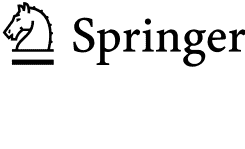

编辑

洪慧晓

生物信息学和生物统计学部

国家毒理研究中心

美国食品和药物管理局

阿肯色州杰斐逊

## 工程与科学中的计算方法

ISSN 2662-4869      ISSN 2662-4877 (电子版)

ISBN 978-3-031-20729-7      ISBN 978-3-031-20730-3 (电子书)

https://doi.org/10.1007/978-3-031-20730-3

这是美国政府的工作，不受美国版权保护；外国版权

保护可能适用于2023

所有权利仅由出版商许可，无论是全部还是部分材料

涉及到的，特别是翻译权、再版权、插图重用权、朗诵权、广播权、

微缩胶片复制权或以任何其他物理方式的复制、传输或信息存储和

检索、电子适应、计算机软件，或通过类似或不同的方法现在已知

或今后开发的方法。

在本出版物中使用一般描述性名称、注册名称、商标、服务标志等，并不意味着即使在没有具体声明的情况下，这些名称也不受相关保护法律和法规的限制，因此可以自由使用。

出版商、作者和编辑可以安全地假设本书中的建议和信息在出版日期时被认为是真实和准确的。

出版商、作者或编辑对本文所包含的材料不提供明示或暗示的保证，也不对可能存在的任何错误或遗漏承担责任。出版商在已发表的地图和机构隶属方面保持中立。

这本施普林格印记由注册公司施普林格自然瑞士股份有限公司出版，注册公司地址为：

瑞士钻石街11号，6330 Cham。

## 前言

由于化学工业的最近爆炸性增长，再加上改进的方法来快速合成具有更多样化化学结构的化合物，迫切需要高效评估化学物质对公共健康的风险，并评估含有化学物质的产品的安全性。安全评估和风险评估需要保护不仅是人类，还有其他生物和我们的生态系统。除了仅需要评估化学物质外，该领域还必须评估化学物质的副产品以及在生物体或环境中可能发生的与其他化学物质的相互作用。

直到最近，毒理学危害评估的黄金标准是动物模型。然而，动物模型在其实用性方面存在许多根本性限制，包括但不限于高成本、低通量、低准确性和伦理关切。因此，整个科学界已经宣布了三个“R”的重要性：替代、减少和改进动物使用。为了实现这三个R目标，需要使用替代方法来评估化学物质的安全性和危害。

幸运的是，毒理学界开始充分意识到与动物模型相关的问题，同时在计算机科学领域取得了令人难以置信的进展。因此，计算毒理学家正在与计算机科学家合作，引发计算毒理学时代的黎明。该领域的目标是以低成本、高效率的方式预测和理解化学物质的危害，并且几乎没有道德问题的风险。

随着新的计算方法的开发，它们可以应用于毒理学挑战，从而实现持续迭代和改进。目前，人工智能，主要是机器学习和深度学习，在各个领域都处于黄金时代，新的先进算法正在不断开发和部署。这种快速进步迅速改变了行业、就业和甚至社会。

虽然机器学习和深度学习是在其他领域中发展起来的，但它们都已成功应用于计算毒理学。

本教材将调查部署各种先进算法以解决有关化学品危害和毒性的重要问题的情况。由于许多这些算法来自其他领域，因此本工作还将介绍在解决关键挑战时部署此类算法时需要注意的重要最佳实践。为了充分关注计算毒理学的许多方面，本书分为四个部分。首先，本文将详细介绍与计算毒理学领域最相关的机器学习和深度学习算法以及它们的相关性。接下来，将通过描述工具和方法来实现高效应用先进算法于毒理学。由于示例对于说明相关性非常重要，因此本教材将重点介绍机器学习和深度学习在化学毒性预测中的应用。本教材还将深入探讨新兴方法和该领域的新进展的未来。

这本教材的作者考虑到了广大读者群体。对于希望尝试计算方法的经典毒理学家，通过澄清的例子全面介绍和解释了计算概念。对于希望将机器学习和深度学习应用于其他领域的计算机科学家，本教材展示了许多成功应用先进计算解决毒理学问题的例子。最后，对于渴望进一步发展职业的学生和其他实习生，这部作品将概述各种计算毒理学主题，并可能为职业方向提供灵感。

尽管接下来的章节回顾了各种计算毒理学主题，但它不包含计算机代码示例、章节测验或练习考试。为了教学目的，编写测验和考试的任务留给课程讲师。作者们非常感谢读者的评论、反馈和纠正意见，以便改进未来的工作。

与计算毒理学相关的数据的数量、速度和多样性令人印象深刻，在最近几年里大幅增长。这些越来越丰富的数据集推动了机器学习和深度学习方法的发展，这些方法对大规模和高质量的数据集有很高的需求。随着毒理学和计算机科学领域在新的方式上交叉和同步，世界将从对化学物质的毒性和危害潜力的预测和理解的改进中受益。

本序言反映了作者的观点，不一定反映美国食品和药物管理局的观点。

Rebecca Kusko, 博士商务发展和企业事务负责人Immuneering Corporation美国马萨诸塞州剑桥市

Huixiao Hong, 博士SBRBPAS专家首席生物信息学分部美国食品和药物管理局美国阿肯色州杰斐逊市

## 目录

1 机器学习和深度学习的推动化学品的计算毒理学风险评估 . . . . 1

Rebecca Kusko和Huixiao Hong

## 第一部分 机器学习和深度学习方法在计算毒理学中的应用

2 考虑到外源物质的毒性评估它们的代谢 . 21

Dmitry Filimonov，Alexander Dmitriev，Anastassia Rud ik和Vladimir Poroikov

3 预测中的新兴机器学习技术不良药物反应 53

易中，王珊珊，李高正，杨吉，翁祖权，和罗恒

4 基于图卷积的药物效果深度学习器网络 . 83

吴云毅，关胜辉，和王冠宇

5 基于AOP的毒性预测机器学习 . 141

施伟，张荣，和谭浩月

6 用于预测毒性模型的图核学习 . 159

徐友军，周佳涵，韩宁生，裴建峰，和赖鲁华

7 基于体外试验和机制知识优化和加强机器学习模型和真实世界的数据 . 183

Thilini V. Mahanama，Arpan Biswas和Dong Wang

8 多任务学习用于定量构效关系教程

Cecile Valsecchi, Francesca Grisoni, Viviana Consonni, Davide Ballabio和Roberto Todeschini

## 第二部分 工具和方法促进计算毒理学中的机器学习和深度学习方法

9 Isalos预测分析平台：化学信息学，纳米信息学和数据挖掘应用

Dimitra-Danai Varsou, Andreas Tsoumanis, Anastasios G. Papadiamantis, Georgia Melagraki, 和Antreas Afantitis

10 ED Profiler: 用于筛选潜在机器学习工具的机器学习工具内分泌干扰化学物质

Xianhai Yang, Huihui Liu, Rebecca Kusko和Huixiao Hong

11 定量目标特异性毒性预测建模 (QTTPM)：将机器学习与动态蛋白质-配体相互作用描述符 (DyPLIDs) 相结合以进行预测雄激素受体介导的毒性

Sundar Thangapandian, Gabriel Idakwo, Joseph Luttrell, Huixiao Hong, Chaoyang Zhang和Ping Gong

12 Mold2描述符有助于开发用于预测毒性的机器学习和深度学习模型化学物质

Huixiao Hong, Jie Liu, Weigong Ge, Sugunadevi Sakkiah, Wenjing Guo, Gokhan Yavas, Chaoyang Zhang, Ping Gong, Weida Tong和Tucker A. Patterson

13 适用性域表征用于机器学习QSAR模型

王中宇和陈静雯

14 在复杂调查机器中控制混杂因素学习模型以评估药物安全性和风险

保罗·罗杰斯

15 用于异质性分析的多元曲线解析毒物基因组学系统

刘源，林金柱，李孟龙和温志宁

## 第三部分 机器学习和深度学习用于化学毒性预测

16 使用机器学习支持药物安全性预测

# 第四部分 机器学习和深度学习在新领域的进展

## 17 基于机器学习的QSAR模型和结构预测线粒体功能障碍的警报
Kevin P. Cross和Glenn J. Myatt
407

## 18 机器学习和深度学习应用评估致突变性
唐伟豪，Willie J. G. M. Peijnenburg和陈静雯
433

## 19 建模Tox21数据用于毒性预测和机制解卷积
赵琳琳和Catrin Hasselgren
447

## 20 通过机器学习识别结构警报及其在毒理学中的应用
徐团，夏梦航和黄瑞丽
463

## 21 机器学习在纳米毒理学预测中的应用
楼超峰，顾亚鑫和唐云
479

## 22 机器学习用于预测器官毒性
穆力，于福波，贾玉英，孙珊，李晓康，张晓林和胡向刚
497

## 23 机器学习用于预测器官毒性
刘杰，郭文静，董帆，塔克·A·帕特森，和洪慧晓
519

## 24 计算模型用于预测肝毒性由药物和化学物质引起
陈敏军，刘杰，廖宗仁，克里斯汀·阿什比，吴越，吴磊红，董伟达和洪慧晓
541

## 25 人工智能用于癌症治疗相关心脏毒性风险评估和精准心脏肿瘤学
Jessica Castrillon Lai和Feixiong Cheng
563

## 26 用于化合物活性预测的深度学习模型在一组主要毒性相关蛋白质上
Mariia Radaeva，Mohit Pandey，Hazem Msla ti和Artem Cherkasov
579

## 27 机器学习用于分析电子药物安全性
健康记录
595
管美剑

## 28 机器学习在毒物基因组学研究中的应用
学习基因组测序和变异检测
611
李泰芳

## 29 机器学习用于预测金属有机框架的气体吸附能力
的
629
郭文静, 刘杰, 董帆, Tucker A. Patterson和洪慧晓

## 编辑和贡献者

### 关于编辑

洪慧晓是一位高级生物医学研究和生物医学产品评估服务（SBRBPAS）专家，也是美国食品和药物管理局（FDA）生物信息学和生物统计学部门生物信息学分部的首席科学家，致力于生物信息学、化学信息学、人工智能和基因组学在监管申请中的科学基础。在加入FDA之前，他是ICFI公司旗下Z-Tech生物信息学部门的经理。他曾在日本的住友化学公司担任研究科学家职位，并在美国国立卫生研究院的国家癌症研究所担任访问科学家职位。他还曾在中国南京大学担任副教授和计算化学实验室主任。洪博士是OpenTox指导委员会成员，美国中南部计算生物学和生物信息学学会董事会成员，并在美国FDA建模和仿真工作组的领导圈中。他发表了240多篇科学论文，谷歌学术h指数为60。他担任《实验生物学与医学》的副编辑和多个同行评审期刊的编辑委员会成员。他在中国南京大学获得博士学位，并在英国利兹大学进行研究。

### 贡献者

Antreas Afantitis NovaMechanics有限公司，塞浦路斯尼科西亚

Kristin Ashby 美国食品和药物管理局国家毒理研究中心，美国阿肯色州杰斐逊

Davide Ballabio 米兰-比科卡大学地球与环境科学系，意大利米兰

**Arpan Biswas** 美国食品和药物管理局国家毒理研究中心生物信息学和生物统计学部，美国阿肯色州杰斐逊；奥克岭国家实验室纳米相材料科学中心，美国奥克岭

**Jingwen Chen** 大连理工大学工业生态与环境工程重点实验室（教育部），中国大连

大连理工大学环境科学与技术学院，中国大连

**Minjun Chen** 美国食品和药物管理局国家毒理研究中心，美国阿肯色州杰斐逊

**Feixiong Cheng** Cleveland Clinic, Genomic Medicine Institute, Lerner Research Institute, Cleveland, OH, USA;

Cleveland Clinic分子医学部，Lerner医学院，

Case Western Reserve University, Cleveland, OH, USA;

Case Comprehensive Cancer Center, Case Western Reserve University, Cleveland, OH, USA

**Artem Cherkasov** Vancouver Prostate Centre, University of British Columbia, Vancouver, BC, Canada

**Chia-Han Chou** Infinite Intelligence Pharma，中国北京

**Viviana Consonni** 地球与环境科学系，University of Milano-Bicocca，意大利米兰

**Kevin P. Cross** Instem, Columbus, OH, USA

**Alexander Dmitriev** 结构-功能基于药物设计实验室，生物医学化学研究所，莫斯科，俄罗斯

**Fan Dong** 美国食品和药物管理局国家毒理研究中心，Jefferson，AR，USA

**李泰方** Freenome，南旧金山，加利福尼亚州，美国

**Dmitry Filimonov** 基于结构-功能的药物设计实验室，生物医学化学研究所，莫斯科，俄罗斯

**葛伟功** 美国食品和药物管理局国家毒理研究中心，杰斐逊，阿肯色州，美国

**龚平** 美国陆军工程研究和发展中心环境实验室，维克斯堡，密西西比州，美国；

美国陆军工程研究和发展中心，维克斯堡，密西西比州，美国

**Francesca Grisoni** 埃因霍温科技大学生物医学工程系，埃因霍温，荷兰

顾亚欣 分子建模与设计实验室，华东理工大学药学院，上海，中国

管美剑 詹森研究与开发有限责任公司，斯普林豪斯，宾夕法尼亚州，美国

管胜辉 南方科技大学生命科学学院生物学系，深圳，中国

Wenjing Guo 美国食品和药物管理局国家毒理研究中心，美国阿肯色州杰斐逊

Ningsheng Han 无限智能制药，中国北京

Catrin Hasselgren Genentech公司，美国加利福尼亚州南旧金山

Huixiao Hong 美国食品和药物管理局国家毒理研究中心，美国阿肯色州杰斐逊

Xiangang Hu 污染过程与环境标准重点实验室（教育部）/天津市环境修复与污染控制重点实验室，南开大学环境科学与工程学院，中国天津

Ruili Huang 临床前创新部（DPI），国家转化科学中心（NCATS），美国国立卫生研究院（NIH），马里兰州洛克维尔

Gabriel Idakwo 计算科学与计算机工程学院，南密西西比大学，美国哈蒂斯堡

中国天津南开大学环境科学与工程学院污染过程与环境标准教育部重点实验室/天津市环境修复与污染控制重点实验室，中国天津

美国马萨诸塞州剑桥市Immuneering公司，中国北京市北京大学高级跨学科研究院定量生物学中心；

中国北京市北京大学化学与分子工程学院生命科学北京大学-清华大学生命科学中心，中国北京市；中国北京市北京大学生命科学中心高级跨学科研究院；

美国俄亥俄州克利夫兰市克利夫兰诊所基因医学研究所，克利夫兰诊所Lerner研究所；美国俄亥俄州克利夫兰市克利夫兰诊所分子医学系，克利夫兰诊所Lerner医学院，Case Western Reserve University；

廖宗仁 美国食品和药物管理局毒理研究国家中心，阿肯色州杰斐逊

李高正 烧伤与创伤大数据研究中心，福州大学计算机与数据科学学院，福建福州，中国

李孟龙 四川大学化学学院，成都，中国

李晓康 烟台大学环境与材料工程学院，烟台，中国

林金竹 四川大学化学学院，成都，中国

刘慧慧 南京大学环境与生物工程学院江苏省化学污染控制与资源化重点实验室，南京，中国

刘洁 美国食品和药物管理局毒理研究国家中心，阿肯色州杰斐逊

刘源 四川大学化学学院，中国成都；四川大学医学大数据中心，中国成都

楼超峰 华东理工大学药学院分子建模与设计实验室，中国上海

罗恒 MetaNovas Biotech Inc，美国加利福尼亚州米尔布雷

**Joseph Luttrell** 南密西西比大学计算科学与计算机工程学院，美国密西西比州哈蒂斯堡

**Thilini V. Mahanama** 美国食品和药物管理局毒理研究国家中心生物信息学和生物统计学部，美国阿肯色州杰斐逊

科伦坡大学理学院工业管理系，斯里兰卡甘帕哈

**Georgia Melagraki** NovaMechanics有限公司，塞浦路斯尼科西亚

**Hazem MsLati** 不列颠哥伦比亚大学温哥华前列腺中心，加拿大不列颠哥伦比亚省温哥华

李木 天津农业环境与安全产品重点实验室，农业农村部农产品质量安全环境因子控制重点实验室，农业农村部农业环境保护研究所，中国天津

格伦·J·迈亚特 Instem，美国俄亥俄州哥伦布

莫希特·潘迪 温哥华前列腺中心，英属哥伦比亚大学，加拿大温哥华

# 编辑和贡献者

阿纳斯塔西奥斯·G·帕帕迪亚曼蒂斯 NovaMechanics有限公司，塞浦路斯尼科西亚

塔克·A·帕特森 美国食品和药物管理局国家毒理研究中心，阿肯色州杰斐逊

裴建峰 北京大学高级跨学科研究院量化生物学中心，中国北京

威利·J·G·M·佩恩堡 莱顿大学环境科学研究所，荷兰莱顿；荷兰国家公共卫生与环境研究所（RIVM）产品和物质安全中心，比尔特霍芬，荷兰

弗拉基米尔·波罗伊科夫 基于结构功能的药物设计实验室，莫斯科，俄罗斯

玛丽亚·拉达耶娃 温哥华前列腺中心，英属哥伦比亚大学，温哥华，加拿大

保罗·罗杰斯 美国食品和药物管理局国家毒理研究中心，阿肯色州杰斐逊，美国

阿纳斯塔西娅·鲁迪克 基于结构功能的药物设计实验室，莫斯科，俄罗斯

苏古纳德维·萨基亚 美国食品和药物管理局国家毒理研究中心，阿肯色州杰斐逊，美国

施伟 南京大学环境学院污染控制与资源再利用国家重点实验室，江苏南京，中国

孙珊 污染过程与环境标准教育部重点实验室/天津市环境修复与污染控制重点实验室，南开大学环境科学与工程学院，天津，中国

谭浩月 污染控制与资源再利用国家重点实验室，南京大学环境学院，江苏南京，中国

唐伟豪 大连理工大学环境科学与工程学院，中国大连；广东省农业环境综合治理与管理重点实验室，华南地区国家-地方联合工程研究中心，广东省科学院生态环境与土壤科学研究所，中国广州

唐云 药学院分子建模与设计实验室，华东理工大学，中国上海

Sundar Thangapandian 奥克岭科学与教育研究所，奥克岭，田纳西州，美国；Hotspot Therapeutics, Inc.，美国波士顿

Roberto Todeschini 米兰-比科卡大学地球与环境科学系，意大利米兰

Weida Tong 美国食品和药物管理局毒理学研究国家中心，美国阿肯色州杰斐逊

Andreas Tsoumanis NovaMechanics有限公司，塞浦路斯尼科西亚

Cecile Valsecchi 米兰大学比科卡地球与环境科学系，意大利米兰

Dimitra-Danai Varsou NovaMechanics有限公司，塞浦路斯尼科西亚

Dong Wang 美国食品和药物管理局毒理学研究国家中心生物信息学和生物统计学部，美国阿肯色州杰斐逊

Guanyu Wang 南方科技大学生命科学学院生物学系，中国深圳；中国香港中文大学医学生命与健康科学学院，中国深圳

Shanshan Wang 福建福州大学计算机与数据科学学院烧伤与创伤大数据研究中心，中国福建福州

王中宇 工业生态与环境学院重点实验室（教育部），大连理工大学环境科学与工程学院，中国大连

温志宁 四川大学化学学院，中国成都；四川大学医学大数据中心，中国成都

翁祖权 大数据研究中心，烧伤与创伤学院，计算机与数据科学学院，中国福州；生物科学与工程学院，中国福州

吴雷红 美国食品和药物管理局国家毒理研究中心，美国阿肯色州杰斐逊

吴悦 美国食品和药物管理局国家毒理研究中心，美国阿肯色州杰斐逊

吴云仪 南方科技大学生命科学学院生物学系，中国深圳

孟航夏 预临床创新部（DPI），国家转化科学中心（NCATS），国家卫生研究院（NIH），美国马里兰州洛克维尔

团徐 预临床创新部（DPI），国家转化科学中心（NCATS），国家卫生研究院（NIH），美国马里兰州洛克维尔

徐友军 北京大学化学与分子工程学院生命科学北京大学-清华大学生命科学中心，BNLMS，中国北京；无限智能制药，中国北京

杨吉 福州大学计算机与数据科学学院烧伤与创伤大数据研究中心，福建福州，中国

杨先海 江苏省化学污染控制与资源再利用重点实验室，环境与生物工程学院，南京理工大学，中国南京

Gokhan Yavas 美国食品和药物管理局毒理学研究国家中心，阿肯色州杰斐逊

Fubo Yu 污染过程与环境标准重点实验室（教育部）/天津环境修复与污染控制重点实验室，南开大学环境科学与工程学院，天津，中国

Chaoyang Zhang 南密西西比大学计算科学与计算机工程学院，哈蒂斯堡，密西西比州，美国

Rong Zhang 南京大学环境学院污染控制与资源再利用国家重点实验室，江苏南京，中国

Xiaolin Zhang 污染过程与环境标准重点实验室（教育部）/天津环境修复与污染控制重点实验室，南开大学环境科学与工程学院，天津，中国

Linlin Zhao 美国南旧金山Genentech公司

福州大学计算机与数据科学学院烧伤与创伤大数据研究中心

# 第一章 机器学习和深度学习在计算毒理学中的应用

Rebecca Kusko和Huixiao Hong

## 1.1 化学品的风险评估

对化学风险的严格管理需要对预测的毒理学、环境和物理效应进行严格的风险评估，而这些化学物质的种类不断增加。目前最先进的实验系统无法跟上使用中的化学物质的数量和范围的增长速度。随着合成化学方法的成熟，越来越大的化学库已经变得司空见惯，这可能导致大量新化学物质通过农业、环境暴露、废物、污染以及药物和食品产品的人类使用进入各种系统。

从化学风险评估的角度来看，需要采用系统级的方法研究暴露途径、结果和人群，包括化学物质在多个物种中进入关键器官的潜在转运和混合。食品产品、食品补充剂和天然药物的风险评估需要对消化和经过胃肠道的传递、代谢物的分解、排泄途径和产品使用背景有全面的了解。最后，制药和生物技术行业必须关注严格的毒性评估标准，如剂量依赖特性、器官暴露、安全的首次人体剂量、生殖毒性、致癌性、代谢物分解和排泄途径。

化学风险评估的第二个关键任务是确定化学物暴露引起的不良效应 (Gan 2019)。许多传统方法用于化学危害识别。体外测定可以包括细胞毒性、DNA损伤、氧化应激、内分泌干扰、免疫细胞激活等。与二维 (2D) 培养不同，人体是各种细胞类型在不同局部微环境中相互作用的复杂混合物。因此，体外测定在真实人体情况下的应用有限。此外，体外测定的规模基本上限制了可以测试的化学物质和化学物质组合的数量。接近人体环境的是小鼠和大鼠，是体内毒理学测试的标准。除了在快速筛选化学物质方面效率低得多之外，体内实验还引入了经济和伦理方面的问题。

## 1.2 计算毒理学

为了克服实验室毒理学的许多基本限制，计算科学领域已经越来越成功地应用于毒理学的各个方面。在计算毒理学领域，计算机程序被用于设计、构建、测试和改进各种模型，旨在预测制药、农产品、食品和环境中发现的化学物质的危害和毒理效应。具体而言，这些计算机模型基于化学结构和其他化学特征，预测作用机制、吸收、分解、代谢、药动学、药效学、排泄、器官穿透、相互作用甚至各种实验参数。

在毒理学研究中已经开发了各种计算方法。基于计算方法中使用的数据，可以将其分为五类，如图1.1所示。当毒性机制针对蛋白质结构时，可以使用各种方法（如对接和分子动力学模拟）估计化学物质通过与目标蛋白质的相互作用引起的毒性 (Ng等，2015; Sakkiah等，2019)。然而，大多数毒性效应不是由单个蛋白质靶标引起的。可以使用基于已有毒性数据的化学物质结构开发的计算模型来预测此类毒性效应 (Hong等，1998; Shi等，2002; Sakamuru等，2021; Yang等，2021)。当存在基因组和遗传数据 (Li等，2019; Ji等，2020)、蛋白质组数据 (Bruno等，2016) 和代谢组数据 (Cheng等，2017) 时，可以估计化学物质的毒性。

最早出现的计算毒理学方法是基于物理学的，显示出成功的迹象。这些模型通过检查潜在毒物的化学结构，并使用结构警报 (Tan等人，2020年，2021年)、对接和/或分子动力学模拟来预测特定的终点。对于具有详细三维 (3D) 结构的蛋白质和其他分子，可以使用对接来预测主要的姿势和/或结合方式。配体（潜在毒物）。换句话说，对接模型揭示了潜在毒物和生物分子在原子水平上如何相互作用或不相互作用。分子动力学模拟模型计算粒子从起始位置到时间范围内的运动。通过考虑物理度量，包括先前的位置、速度和加速度，计算系统中的粒子相互作用。

与分子对接类似，分子动力学模拟在许多领域中被使用。在计算毒理学领域，它被用于将结构生物学与化学毒性联系起来（Ng等，2014年；Selvaraj等，2018年；Sakkiah等，2021年a，b）。

当毒性靶蛋白的三维结构未知或毒性是由化学物与多个靶标的相互作用引起时，会采用不同的方法来研究化学物的分子描述符与其毒性之间的关系。形式上，这种方法被称为定量构效关系（QSAR）。通常，QSAR模型用于基于化学结构预测化学物的毒性。这种方法的一个核心假设是相似性原则，即模型构建者假设相似的结构和/或描述符会导致相似的毒性。已经开发了QSAR模型用于预测各种毒理学终点（Hong等，2017年；Huang等，2020年；Tang等，2020年；Wang等，2021年）。

随着基因组学时代的到来和基因组测序成本的不断降低，基因组学方法现在已经被计算毒理学领域采用和利用，这一学科被称为毒理基因组学。毒理基因组学旨在将化学物质的毒性模式与其基因组、转录组和遗传数据相关联。因此，对潜在毒性物质的全基因组转录组反应进行系统研究，可以预测分子机制。大量的毒理基因组数据已经产生（Davis等，2019），促进了毒理基因组学的应用。在基因组和遗传数据的生成和处理过程中进行了质量控制工作，以便利用高质量的数据进行毒理基因组学研究（Hong等，2008,2012）。毒理基因组学方法在捕捉细胞可能显示的多种毒性反应机制方面显示出巨大的潜力（Lauschke，2021）。

在基因组学时代的到来之后，新兴的全蛋白组学方法开始出现用于研究毒理学，这一分支被称为毒理蛋白组学（George等，2010；Suman等，2016）。毒理蛋白组学识别和表征了生物系统在暴露于毒性化学物质时表达的整个蛋白质组水平的蛋白质。虽然毒理蛋白组学方法应用于许多领域，但在计算毒理学中，这种方法可以有两种用途。首先，可以使用计算技术利用毒理蛋白组学数据来识别蛋白质生物标志物，以预测化学物质的毒性（Tomonaga等，2021）。其次，可以利用毒理蛋白组学数据揭示潜在的毒理学作用机制，包括分子途径（Pizzatti等，2020）。肝脏和肝细胞并不总是，但通常是毒理蛋白组学研究的重点（Kumagai等，2006）。

与蛋白质组学并行的代谢组学，即研究活体系统中数百种代谢物的艺术，已经成熟。细胞代谢驱动碳水化合物、核苷酸、磷脂、脂肪酸、类固醇等的变化。因此，代谢组学可以用来确定健康的细胞代谢，并查询潜在毒物的影响。毒物代谢组学是一门将代谢组学应用于表征毒物化学品引起的生物系统中的代谢反应和生物途径的学科（Araújo等，2021年）。

毒物代谢组学不仅可以确定毒性影响的程度，还可以确定化学物质的毒性机制。令人信服的是，代谢组学可以在人体生物流体（血液、尿液等）中进行，从而可以在临床环境中监测毒性。毒物代谢组学使用各种分析技术（Miggiels等，2019年）。表1.1列出了一些常用技术及其优势。

计算毒理学使用各种计算方法来研究毒理学，包括传统的数据预处理和统计方法，如单变量和多变量分析。此外，计算毒理学还包括数据库的开发（Shen等人，2013）。数据质量对计算毒理学研究结果的可靠性至关重要。

### 表1.1 毒代谢组学中常用的分析技术

| 分析技术 | 优点 |
|---|---|
| 核磁共振 | 快速，同时测量所有类型的代谢物，高准确性和技术再现性，适用于液体和固体基质，样品制备简单，提供结构信息，对所有代谢物进行定量分析，高通量能力 |
| 直接注入质谱法 | 快速，高再现性，样品量小，样品制备过程中不会丢失代谢物，高通量能力，数据处理简单 |
| 毛细管电泳-质谱法 | 样品体积小，分析快速，样品准备最小化，可以分析多种分子 |
| 液相色谱-质谱法 | 非常高的灵敏度（< μM），稳健，能够分析热不稳定的代谢物，样品准备简单，适用于脂质和其他大分子的研究 |
| 气相色谱-质谱法 | 非常高的灵敏度（< μM），宽线性范围，能够同时分析不同类型的代谢物，通过库进行化合物鉴定 |
| 高分辨质谱法 | 能够确定准确的质量和同位素分布，具有高分辨率、选择性和特异性，对代谢物鉴定有用，用于定量分析方法的方法开发可以更快 |

在计算毒理学中，特别是对于组学数据（如蛋白质组学数据）的质量控制方面的努力（Hong et al.2005a）。

## 1.3 计算毒理学中的机器学习

最近，机器学习，尤其是深度学习，在计算毒理学中受到了关注。机器学习是人工智能的一个子集，与其他统计方法不同的是，算法是通过数据开发和改进的。虽然机器学习目前非常流行，但它并不是一种新的方法，最早出现在1950年代。机器学习，尤其是深度学习，严重依赖大量高质量的训练数据。当前的大数据时代推动了机器学习的使用激增，在这些算法中，它们可以发挥出全部潜力。经过严格和健壮的数据清洗后，机器学习方法都是从观察初始数据开始，算法可以观察到一种模式。这种模式是通过学习而不是人为输入的参数的一部分。

机器学习已成功应用于许多其他领域，包括医学 (Rajkomar等, 2019年; Sidey-Gibbons和Sidey-Gibbons, 2019年; Goecks等, 2020年), 药物发现 (Elbadawi等, 2021年), 食品安全 (Deng等, 2021年), 化学 (Meuwly, 2021年), 基因组学 (Schreiber和Singh 2021年), 蛋白质结构预测 (AlQuraishi, 2021年), 地球科学 (Beroza等, 2021年), 微生物学 (Nami等, 2021年) 和免疫毒性 (Luo等, 2015年a)。矩阵分解是从线性代数中发展起来的，它假设终点是由潜过程的组合产生的，并旨在识别描述过程的驱动因素 (组件) (Cantini等, 2019年)。从纯技术角度来看，矩阵被分解为较低维度的组件，当它们相乘时将重新创建原始矩阵。张量分解是一种非常广泛应用的机器学习算法，涉及创建一个多维数组 (张量)。该算法获得了所述张量的紧凑表示 (Luo等, 2017年)。另一种相关方法，群因子分析，在应用于多个数据集时特别有效，可以创建一个联合表示 (Bunte等, 2016年)。这可以揭示数据之间的共同模式。

决策树是一种简单的机器学习算法。它通过选择最佳的独立变量 (Quinlan 1986) 将一组样本递归地分割成子集。它的一个优点是将变量选择集成到模型构建中。

k最近邻 (`kNN`) 算法是另一种简单的机器学习算法 (Altman 1992)。`kNN`模型使用与样本之间的距离测量相关的`k`个样本的依赖变量值来预测样本的依赖变量值。学习是基于训练集确定参数`k`。由于`kNN`使用距离来确定用于预测的样本，`kNN`模型的性能受到所使用的距离度量的影响。

一些机器学习算法具有更复杂的数学推理，包括人工神经网络 (`ANN`) 和支持向量机 (`SVM`)。`ANN`是一种机器学习的架构，模仿生物神经系统，如图1.2所示。`ANN`模型由三层组成: 输入层 (独立变量), 隐藏层 (神经元) 和输出层 (依赖变量)。从数学上讲, `ANN`从训练样本中学习, 确定将输入数据组合到神经元中的权重, 并使用决策函数通过前馈或反向传播策略将神经元组合到输出中。

`SVM`是另一种机器学习算法, 具有复杂的数学推理, 最初由Vladimir Vapnik和他的同事开发 (Cortes and Vapnik 1995)。`SVM`从训练样本中学习, 在高维空间中确定一个超平面, 该超平面通过使用核函数将原始输入训练数据定义的较低维空间映射而来。`SVM`建模通过确定超平面来决定核函数中使用的参数。

集成学习是一种有吸引力的机器学习策略。随机森林 (Breiman2001) 和决策森林 (Hong et al.2005b) 是集成学习算法的两个例子。随机森林和决策森林都组合了决策树。然而, 在这两种方法之间, 决策树的构建是不同的。随机森林使用大量的浅层树这些模型是基于一组样本和原始独立变量的子集生成的，而决策森林则使用了所有样本和所有独立变量生成了一小部分深度树，同时删除了其他树使用的一些依赖变量。

在计算毒理学中使用了机器学习算法、线性回归、逻辑回归、朴素贝叶斯、k均值聚类、层次聚类、期望最大化、自组织映射、最小绝对收缩和选择算子以及线性判别分析。

在应用机器学习于计算毒理学时，一种一刀切的方法是不明智的。相反，最好先明确定义具体的问题或任务，然后再选择最佳的机器学习工具。每种机器学习方法都有不同的优点和缺点，因此应该有针对性地使用，而不是当作万能药。例如，思考的问题可能会决定化学结构如何表示（分子指纹、分子描述符）作为机器学习处理的特征。在应用机器学习于计算毒理学时，一个重要的任务是选择一组最佳的独立变量来构建机器学习模型（Idakwo等，2019年）。

为了使用机器学习模型预测化学毒性，训练了一些小分子和某种分子指纹，许多算法已经被使用，包括矩阵分解、支持向量机(`SVM`)、分类和回归树(`CART`)、随机森林、张量分解和`kNN`。一项先前的研究使用R中的“`caret`”包比较了这些方法，并发现随机森林在2849个已知有毒小分子的分类中优于其他机器学习算法(Sharma等人，2017年)。支持这一发现的另一组研究使用`SVM`和随机森林预测毒性终点，使用循环描述符实现了等于或高于0.7的接收者工作特征曲线下面积(`ROC-AUC`)(Koutsoukas等人，2016年)。非负矩阵分解被用于分析多个毒理基因组学数据集，结果表明该算法不仅能区分组织类型，还能区分化学物质的剂量水平(Lee等人，2012年)。非监督机器学习算法非负张量分解被开发并成功应用于地下水中化学污染源的识别(Vesselinov等人，2019年)。

在计算毒理学中，机器学习的成功应用非常多，这里只举几个例子，比如预测线粒体融合和分裂的抑制 (Tang等, 2021年)，预测线粒体电子传递链的抑制剂 (Tang等, 2022年)，分类过氧化物增殖物激活受体γ (`PPARγ`) 激动剂 (Wang等, 2020年)，预测烟草和烟雾中化学物质对尼古丁乙酰胆碱受体 (`nAChR`) α7的结合活性 (Sakkiah等, 2020年)，预测神经毒性 (Monzel等, 2020年)，评估药物引起的肝毒性 (Chen等, 2013年)；促进持久性有机污染物的鉴定 (Guo等, 2019年, 2021年)，预测人类白细胞抗原 (`HLA`) -肽结合活性 (Luo等, 2015b年)，评估金属氧化物纳米颗粒的遗传毒性 (Sizochenko等, 2019年)。

对于机器学习在毒物基因组学中的应用，矩阵或张量分解方法已被利用来识别将转录组毒性数据与结构化合物指纹相关联的潜在模式。`NCI-60`数据集的出现为将机器学习应用于毒物基因组学提供了机会。这个包含59种人类细胞系的数据集提供了`GI50` (50%生长抑制)、总生长抑制 (`TGI`) 和`LC50` (50%致死浓度) 数据 (Shoemaker 2006)。此外，`cMAP` (连接图谱) 数据集包含了人类细胞系的基因表达数据，这些数据经过了数千种化学物质的处理。这为训练机器学习模型提供了资源 (Lamb等, 2006)。研究人员报道使用潜在狄利克雷分配来识别基因表达变化和毒性评分之间的毒物基因组模式 (Kohonen等, 2017)。这些作者使用了识别出的基因表达模式来理解药物诱导性肝损伤的机制。机器学习方法在处理较大数据集时效果最好，因此随着越来越多的具有毒理学终点的转录组数据集的可用性，这些先进的方法只会越来越普遍和有用。

大分子与小分子具有非常不同的物理化学特性，因此值得进行专门的研究。在这个毒物蛋白质组学领域中，研究有毒蛋白质的特征、性质和结构警示，以试图预测化学物质的毒性。相对较新的蛋白质组数据的可用性，包括蛋白质信息资源 (`PIR`) (Barker等, 2000)、`CATH`数据库 (Das等, 2015)、蛋白质数据银行 (`PDB`) (Berman等, 2000) 和`Uniprot` (`UniProt`联盟, 2019)，以及`Toxin`和`Toxin Target`数据库 (`T3DB`) (Wishart等, 2015) 中的大分子毒素资源在结构分类蛋白质-2 (`SCOP2`) (Andreeva等, 2014) 中，蛋白质的二级结构字典 (`DSSP`) (Kabsch和Sander, 1983)和`Stride` (Lowe等, 2009) 的使用，使得机器学习方法成为可能。

应用于毒理基因组学。例如，研究人员将支持向量机（`SVM`）、梯度提升机和广义线性模型分类器应用于`UniProt`数据库，并能够以超过99%的准确率区分有毒序列和非有毒序列（Gacesa等，2016年）。类似地，提升树分类已被用于在大分子中搜索有毒序列（Naamati等，2009年）。机器学习集成方法，如随机森林，特别适用于代谢组学。与经典线性回归不同，非线性机器学习算法（如随机森林和支持向量机）不假设代谢物分析中的线性关系，从而能够发现代谢物之间的意外相互作用和相互依赖关系。例如，先前的研究使用随机森林模型对代谢组学和脂质组学数据进行训练，以预测肝重和其他临床化学参数（Acharjee等，2016年）。作者在那里取得的成功表明，将机器学习应用于毒代谢组学可以用于预测肝毒性以外的其他类型的毒性。基于从`Q/TOF/MS`（定量飞行时间质谱）获得的代谢组学数据，使用支持向量机（`SVM`）成功识别了大鼠血清中预测肾毒性的代谢组学生物标志物（Song等，2020年）。

## 1.4 毒理学中的深度学习

深度学习是机器学习的一种演化，它通过构建多层算法来创建一个人工神经网络，能够在最少的人工监督下学习和做出“智能”决策。深度神经网络是最常用的深度学习方法之一，其简化架构如图1.3所示。当机器学习模型做出错误预测时，算法会通过计算机程序员调整代码来改进。然而，深度学习模型可以检测到错误并自我调整。深度学习的一个重要技能是在高维噪声数据中识别结构。然而，这种能力需要非常大且经过精心筛选的数据集才能正常运行（LeCun等，2015年）。鉴于近年来此类数据的爆炸增长，深度学习已成功应用于包括但不限于神经影像学（Abrol等，2021年）、药物再定位（Liu等，2021年）、化学（Korshunova等，2021年）、肿瘤学（Kim等，2021年）、药理学（Baptista等，2021年）、病毒学（Mock等，2021年）、胎儿胚胎移植（Tran等，2019年）、细胞核分割检测（Yang等，2020年）、序列分析（Jing等，2020年）和医学（Bora等，2021年）等各个领域。监督式深度学习与监督式机器学习类似，都是计算模型输出与真实值之间的误差函数。根据这个误差分数，调整算法内部的参数以提高深度学习模型的性能。

深度学习模型可能具有大量这样的参数。有很多方法，但随机梯度下降是改进误差函数最常用的方法之一。通过这种方法，算法被展示出来许多小数据集，并根据内部参数进行迭代调整（Bottou，2012）。这个过程重复进行，直到改进不再大于预定值。

基于导数的链式法则，深度学习方法使用反向传播来计算输入的目标，从先前的输出开始（Baldi et al. 2018）。这个过程可以通过所有层次重复进行，从输出（模型的预测）开始，一直回到输入（数据输入的地方）。前馈方法也被描述过，其中计算来自前一层的加权输入总和，并通过非线性函数传递给下一层（Telgarsky，2015）。常用术语“隐藏层”仅指不是输入或输出的层次（图1.3）（Schilling et al. 2019）。其他深度学习方法包括卷积神经网络（Chen et al. 2017）和循环神经网络（Zaremba et al. 2015）。迄今为止，深度学习已经应用于回答计算毒理学挑战的许多案例。例如，内分泌干扰化学物质的训练数据集越来越大。一组研究人员报告称，他们的深度学习QSAR方法优于其他统计方法，包括机器学习。他们报告的皮尔逊相关系数（`R^2`）为0.80，决定系数（`Q^2`）为0.86（Heo et al. 2019）。

如上所述，深度学习在图像分析方面表现出色。受此启发，一组研究人员应用深度学习来分析用各种毒物处理过的`DAPI`（4‘，6-二胺基-2-苯基吲哚）染色细胞的图像（Jimenez-Carretero等，2018年）。作者利用卷积神经网络来检测细胞核，并根据其健康状况进行分类。

卷积神经网络还被用于筛选潜在的持久性有机污染物和/或持久性、生物积累和毒性物质（Sun等，2020年）。作者报告了95.3%的平均预测准确率。在第三个卷积神经网络示例中，研究人员使用`Tox21`数据预测了十二个毒理学终点，并取得了0.757的平均`ROC-AUC`分数（Chen等，2021年）。考虑到`Tox21`数据集中的有限数据，作者采用了一种先前描述的半监督学习方法“`Mean Teacher`”来提高模型性能（Tarvainen和Valpola，2018年）。

## 1.5 观点

先进的技术，如深度学习和机器学习，随着越来越多的数据可用，呈现出巨大的潜力，但它们将受到一定的限制。特别是深度学习对计算能力有着巨大的需求。许多规模较小、预算较低或计算资源有限的努力将难以部署适当的强大深度学习模型。例如，部署卷积神经网络的费用与参数数量乘以数据点数量的乘积成正比。换句话说，计算需求将随数据呈二次比例增长。

迄今为止，人工智能，尤其是机器学习和深度学习，在计算毒理学领域取得了巨大的成功，这主要得益于不断增长的数据集大小。虽然简单的线性模型可以应用于小型数据集，但先进的机器学习和深度学习算法绝对需要相当大的数据集。目前有一些新兴方法将深度学习应用于较小的数据集，包括少样本学习（Snell等人，2017年）。要实现机器学习和深度学习在计算毒理学中的真正潜力，数据集的大小需要继续增加，并且需要开发能够更好地处理较小数据集的算法。许多机器学习和深度学习方法是在数据丰富的领域，如图像分析中开发的。

毒理学数据集尚未达到这个规模。迄今为止，化学家已经创造了许多不同的方法来模拟或表示分子性质，具有一定程度的抽象。分子可以用二维分子图、三维分子图、点云、网格、变换器或字符串表示法来表示，其中最著名的是简化分子输入行记录系统（`SMILES`）字符串（Hanson，2016）。随着分子描述符和机器学习/深度学习领域的不断发展，计算毒理学领域将有可能进行更复杂的查询。

## 参考文献

Abrol A, Fu Z, Salman M, Silva R, Du Y, Plis S, Calhoun V (2021) 深度学习编码了稳健的区分性神经影像表示，优于标准机器学习。 Nat Commun 12:353

Acharjee A, Ament Z, West JA, Stanley E, Griffin JL (2016) 使用机器学习方法集成代谢组学、脂质组学和临床数据。 BMC Bioinform 17:440

AlQuraishi M (2021) 蛋白质结构预测中的机器学习。 Curr Opin Chem Biol 65:1–8

Altman NS (1992) 核函数和最近邻非参数回归简介。 Am Stat 46(3):175–185

Andreeva A, Howorth D, Chothia C, Kulesha E, Murzin AG (2014) SCOP2原型：一种新的蛋白质结构挖掘方法。 Nucleic Acids Res 42:D310–D314

Araújo AM, Carvalho F, Guedes de Pinho P, Carvalho M (2021) 毒代谢组学：用小分子回答重大毒理学问题。 Metabolites 11(10):692

Baldi P, Sadowski P, Lu Z (2018) 机器学习：随机反向传播和深度学习通道。 人工智能260: 1-35

Baptista D, Ferreira PG, Rocha M (2021) 癌症中的药物反应预测的深度学习。 简要生物信息学22: 360-379

Barker WC, Garavelli JS, Huang H, McGarvey PB, Orcutt BC, Srinivasarao GY, Xiao C, Yeh LS, Ledley RS, Janda JF, Pfeiffer F, Mewes HW, Tsugita A, Wu C (2000) 蛋白质信息资源（PIR）。 核酸研究28: 41-44

Berman HM, Westbrook J, Feng Z, Gilliland G, Bhat TN, Weissig H, Shindyalov IN, Bourne PE (2000) 蛋白质数据库。 核酸研究28: 235-242

Beroza GC, Segou M, Mostafa Mousavi S (2021) 机器学习和地震预测-下一步。 Nat Commun 12:4761

Bora A, Balasubramanian S, Babenko B, Virmani S, Venugopalan S, Mitani A, de Oliveira M G, Cuadros J, Ruamviboonsuk P, Corrado GS, Peng L, Webster DR, Varadarajan AV, Hammel N, Liu Y, Bavishi P (2021) 使用深度学习预测发展糖尿病视网膜病变的风险。 Lancet Digit Health 3:e10–e19

Bottou L (2012) 随机梯度下降技巧。在： Montavon G, Orr GB, Müller K-R (eds) 神经网络：行业技巧，第2版。 Springer， 柏林， pp 421–436

Breiman L (2001) 随机森林 。 Mach Learn 45 (1) : 5–32

Bruno M, Ross J, Ge Y (2016) BEAS-2B细胞对无毒和有毒铬的蛋白质反应：细胞毒性转化的蛋白质指标。 Toxicol Lett 264:59–70

Bunte K, Leppäaho E, Saarinen I, Kaski S (2016) 用于多个数据源的稀疏群因子分析进行双聚类。 Bioinformatics 32(16):2457–2463

Cantini L, Kairov U, de Reyniès A, Barillot E, Radvanyi F, Zinovyev A (2019) 在独立转录组中评估矩阵分解方法的可重复性。 Bioinformatics35(21):4307–4313

Chen J, Si Y-W, Un C-W, Siu SWI (2021) 基于半监督学习和图卷积神经网络的化学毒性预测 。 J Cheminform 13:93

Chen M, Hong H, Fang H, Kelly R, Zhou G, Borlak J, Tong W (2013) 基于FDA批准的药物标签注释和大量药物的定量结构-活性关系模型用于预测药物引起的肝损伤。 Toxicol Sci 136(1):242–249

Chen M, Lin Z, Cho K (2017) 带有结构化标签空间的图卷积网络进行分类 。 Mach Learn 20(3):273–297

Gan SL (2019) 风险管理中危害识别的重要性。 Ind Health 57(3):281–282

Das S, Lee D, Sillitoe I, Dawson NL, Lees JG, Orengo CA (2015) CATH超家族的功能分类：一种基于域的蛋白质功能注释方法。 Bioinformatics31:3460–3467

Davis AP, Grondin CJ, Johnson RJ, Sciaky D, McMorran R, Wiegers J, Wiegers TC, Mattingly CJ (2019) 比较毒物基因组数据库：2019年更新。 核酸研究 47(D1):D948–D954

邓兴，曹松，霍恩AL (2021) 机器学习在食品安全中的新应用。 年度Rev食品科学技术12: 513–538

Elbadawi M, Gaisford S, Basit AW (2021) 药物发现中的先进机器学习技术。药物发现今日26: 769–777

Gacesa R, Barlow DJ, Long PF (2016) 机器学习可以区分毒液毒素和具有非毒性生理功能的其他蛋白质。PeerJ计算科学2: e90

George J, Singh R, Mahmood Z, Shukla Y (2010) 毒性蛋白质组学：毒理学研究的新范式。毒理学机械方法20 (7) : 415–423

Goecks J, Jalili V, Heiser LM, Gray JW (2020) 机器学习将如何改变生物医学。细胞 181:92–101

Guo W, Archer J, Moore M, Bruce J, McLain M, Shojaee S, Zou W, Benjamin LA, Adeuya A, Fairchild R, Hong H (2019) QUICK: 用于检测持久性有机污染物的质量和可用性调查和控制工具包的质量和可用性调查和控制工具包。环境研究与公共卫生杂志16(21):4203

Guo W, Archer J, Moore M, Shojaee S, Zou W, Ge W, Benjamin L, Adeuya A, Fairchild R, Hong H (2021) 软件辅助模式识别在受污染的人类和动物食品中的持久性有机污染物。分子 26 (3):685

Hanson RM (2016) Jmol SMILES和Jmol SMARTS: 规范和应用。J Cheminform 8:50

Heo S, Safder U, Yoo C (2019) 基于深度学习的环境毒理学QSAR模型：内分泌干扰化学物质对人类健康的影响。环境污染 253:29–38

Hong H, Neamati N, Winslow HE, Christensen JL, Orr A, Pommier Y, Milne GWA (1998) 基于四点药效团的HIV-1整合酶抑制剂的鉴定。抗病毒化学化疗 9(6):461–472

Hong H, Dragan Y, Epstein J, Teitel C, Chen B, Xie Q, Fang H, Shi L, Perkins R, Tong W (2005a) 表面增强激光解吸/飞行时间质谱(SELDI-TOF-MS)数据的质量控制和质量评估。BMC生物信息学 6(Suppl 2):S5

Hong H, Tong W, Xie Q, Fang H, Perkins R (2005b) 一种用于铅发现的基于计算的集成方法：决策森林。SAR/QSAR环境研究 16(4):339–347

Hong H, Su Z, Ge W, Shi L, Perkins R, Fang H, Xu J, Chen JJ, Han T, Kaput J, Fuscoe JC, Tong W (2008) 使用270个HapMap样本评估基因型调用算法BRLMM对Affymetrix GeneChip人类映射500K阵列集的批次效应。BMC Bioinform 9(Suppl 9):S17

Hong H, Xu L, Liu J, Jones WD, Su Z, Ning B, Perkins R, Ge W, Miclaus K, Zhang L, Park K, Green B, Han T, Fang H, Lambert CG, Vega SC, Lin SM, Jafari N, Czika W, Wolffinger RD, Good-said F, Tong W, Shi L (2012) 用于全基因组关联研究的基因型SNP阵列的技术可重复性。PLoS ONE 7(9):e44483

Hong H, Thakkar S, Chen M, Tong W (2017) 开发决策森林模型，使用大量FDA批准的药物预测药物引起的肝损伤。科学报告7(1):17311


Huang Y, Li X, Xu S, Zheng H, Zhang L, Chen J, Hong H, Kusko R, Li R (2020) 用于预测金属氧化物纳米颗粒的炎症潜力的定量结构-活性关系模型。环境健康展望128(6):67010

Idakwo G, Luttrell J, Chen M, Hong H, Gong P, Zhang C (2019) 用于基于QSAR的毒性预测的特征减少方法综述。在：Hong H (ed) 计算毒理学的进展：方法和应用在监管科学中。Springer, 纽约, pp 119–139

Ji X, Li P, Fuscoe JC, Chen G, Xiao W, Shi L, Ning B, Liu Z, Hong H, Wu J, Liu J, Guo L, Kreil DP, Łabaj PP, Zhong L, Bao W, Huang Y, He J, Zhao Y, Tong W, Shi T (2020) 一份全面的大鼠基于大规模RNA-seq注释构建的转录组。核酸研究48(15):8320–8331

Jimenez-Carretero D, Abrishami V, Fernández-de-Manuel L, Palacios I, Quílez-Álvarez A, Díez-Sánchez A, Del Pozo MA, Montoya MC (2018) `Tox_(R)CNN`: 基于深度学习的细胞核分析工具，用于药物毒性筛选。PLOS计算生物学14:e1006238

Jing R, Li Y, Xue L, Liu F, Li M, Luo J (2020) `AutoBioSeqpy`: 一种用于生物序列分类的深度学习工具。J Chem Inf Model 60:3755–3764

Kabsch W, Sander C (1983) 蛋白质二级结构词典：氢键和几何特征的模式识别。生物聚合物22: 2577-2637

Kavlock RJ, Bahadori T, Barton-Maclaren TS, Gwinn MR, Rasenberg M, Thomas RS (2018) 加速化学风险评估的步伐。Chem Res Toxicol 31 (5)：287-290

Kim J, Kusko R, Zeskind B, Zhang J, Escalante-Chong R (2021) 在肿瘤学中将人工智能与领域专业知识相结合的入门指南。Biochim Biophys Acta BBA Rev Cancer1876: 188548

Kohonen P, Parkkinen JA, Willighagen EL, Ceder R, Wennerberg K, Kaski S等 (2017) 基于转录组学数据驱动的基因空间准确预测肝细胞病理学和药物性肝损伤。Nat Commun 8: 15932

Korshunova M, Ginsburg B, Tropsha A, Isayev O (2021) `OpenChem`: 一种用于计算化学和药物设计的深度学习工具包。J Chem Inf Model 61:7–13

Koutsoukas A, St Amand J, Mishra M, Huan J (2016) 预测毒理学：将循环指纹与随机森林和支持向量机相结合建模化学诱导的毒理反应。Front Environ Sci 4:11

Kumagai K, Ando Y, Kiyosawa N, Ito K, Kawai R, Yamoto T, Manabe S, Teranishi M (2006) 对大鼠肝脏中环己酰胺诱导的肝细胞凋亡的毒性蛋白质组学研究。Toxicology 228(2–3):299–309

Lauschke VM (2021) 药物诱导肝损伤的毒物基因组学研究-从机制理解到早期预测。Drug Metab Rev 53(2):245–252

Lamb J, Crawford ED, Peck D, Modell JW, Blat IC, Wrobel MJ等 (2006) 连通性图：使用基因表达特征连接小分子、基因和疾病。科学313:1929–1935

LeCun Y, Bengio Y, Hinton G (2015) 深度学习。自然521:436–444

Lee CM, Mudaliar MA, Haggart DR, Wolf CR, Miele G, Vass JK, Higham DJ, Crowther D (2012) 毒理学中多个大规模基因表达数据集的同时非负矩阵分解。PLoS ONE 7(12):e48238

Li Y, Netherland MD, Zhang C, Hong H, Gong P (2019) 体外识别对乙酰羟酸合酶抑制剂产生抗性的遗传突变：以苜蓿为例的案例研究。PLoS ONE 14(5):e0216116

刘瑞，魏磊，张平（2021年）一种基于深度学习的药物再利用框架，通过模拟真实患者数据上的临床试验。自然机器智能3:68-75

Lowe HJ, Ferris TA, Hernandez PM, Weber SC (2009年) `STRIDE`-一个集成的基于标准的转化研究信息学平台。AMIA Annu Symp Proc 2009:391-395

罗华，叶辉，吴辉，史立，童伟，马特斯，门德里克，洪辉（2015a）通过网络分析理解和预测人类白细胞抗原（HLA）和肽之间的结合。BMC Bioinformatics 16(Suppl 13):S9

罗华，叶辉，吴辉，史立，童伟，门德里克，洪辉（2015b）用于预测HLA-肽结合活性的机器学习方法。Bioinform Biol Insights 9(Suppl 3):21-29

罗瑜，王飞，Szolovits P（2017年）张量分解朝向精准医学。Brief Bioinform18(3):511-514

Meuwly M (2021) 化学反应的机器学习。Chem Rev 121:10218–10239

Miggiels P, Wouters B, van Westen GJP, Dubbelman AC, Hankemeier T (2019) 代谢组学的新技术：更多的东西。Trends Analyt Chem 120:115323

Mock F, Viehweger A, Barth E, Marz M (2021) `VIDHOP`，深度学习的病毒宿主预测。Bioinformatics 37:318–325

> Monzel AS, Hemmer K, Kaoma T, Smits LM, Bolognin S, Lucarelli P, Rosety I, Zagare A, Antony P, Nickels SL, Krueger R, Azuaje F, Schwamborn JC (2020) 机器学习辅助的神经毒性预测在人类中脑器官中。 Parkinsonism Relat Disord 75:105–109

> Naamati G, Askenazi M, Linial M (2009) `ClanTox`：一种短动物毒素的分类器。 Nucleic Acids Res 37(suppl_2):W363–W368

> Nami Y, Imeni N, Panahi B (2021) 机器学习在噬菌体研究中的应用。 BMC微生物学 21:193

> Ng HW, Zhang W, Shu M, Luo H, Ge W, Perkins R, Tong W, Hong H (2014) 用于预测雌激素受体亚型 α激动剂和拮抗剂的竞争性分子对接方法。 BMC生物信息学 15(增刊11):S4

> Ng HW, Shu M, Luo H, Ye H, Ge W, Perkins R, Tong W, Hong H (2015) 雌激素活性数据提取和计算预测显示了双酚A替代化合物的内分泌干扰潜力。 化学研究毒理学 28(9):1784–1795

> Pizzatti L, Kawasaki ACB, Fadel B, Nogueira FCS, Evaristo JAM, Woldmar N, Teixeira GT, Da Silva JC, Scandolara TB, Rech D, Candiotto LPZ, Silveira GF, Pavanelli WR, Panis C (2020)毒物蛋白质组学揭示了农药在乳腺癌患者中下调TNF-α、IL-1β和雌激素受体通路的作用。 Front Oncol 10:1698

> Quinlan JR (1986) 决策树的归纳。 机器学习 1:81–106

> Rajkomar A, Dean J, Kohane I (2019) 医学中的机器学习。 N Engl J Med 380:1347–1358

> Saka mura S, Zhao J, Xia M, Hong H, Simeonov A, Vaisman I, Huang R (2021) 用于识别小分子激动剂和阻断剂的预测模型。 J Chem Inf Model 61(6):2675–2685


> Sakkiah S, Kusko R, Tong W, Hong H (2019) 分子动力学模拟在计算毒理学中的应用。 In: Hong H (ed) 计算毒理学的进展： 方法和在监管科学中的应用。 Springer, 纽约, 第119-139页

> Sakkiah S, Leggett C, Pan B, Guo W, Valerio LG Jr, Hong H (2020) 一种尼古丁酸乙酰胆碱受体`nAChRα7`结合活性预测模型的开发。 J Chem Inf Model 60(4):2396–2404

> Sakkiah S, Guo W, Pan B, Ji Z, Yavas G, Azevedo M, Hawes J, Patterson TA, Hong H (2021a)通过同源建模和分子动力学模拟阐明`SARS-CoV-2`三聚体尖峰蛋白与`ACE2`之间的相互作用。 Front Chem 8:622632

> Sakkiah S, Selvaraj C, Guo W, Liu J, Ge W, Patterson TA, Hong H (2021b) 通过分子对接、分子动力学模拟和量子力学计算相结合， 阐明`ER-α`中激动剂和拮抗剂的动态结合模式。 Int J Mol Sci 22(17):9371

> Schilling A, Metzner C, Rietsch J, Gerum R, Schulze H, Krauss P (2019) 深度有多深？ —量化深度神经网络隐藏层中的类别可分性。 ArXiv 181101753, https://arxiv.org/abs/1811.01753. 于2022年1月8日访问

> Schreiber J, Singh R (2021) 机器学习在基因组学中的概况预测中的应用. Curr Opin Chem Biol 65:35–41

> Selvaraj C, Sakkiah S, Tong W, Hong H (2018) 分子动力学模拟和应用在计算毒理学和纳米毒理学中的应用. Food Chem Toxicol 112:495–506

> Sharma AK, Srivastava GN, Roy A, Sharma VK (2017) `ToxiM`: 一种用于小分子毒性预测的机器学习和化学信息学方法开发的工具. Front Pharmacol 8:880

> Shen J, Xu L, Fang H, Richard AM, Bray JD, Judson RS, Zhou G, Colatsky TJ, Aungst JL, Teng C, Harris SC, Ge W, Dai SY, Su Z, Jacobs AC, Harrouk W, Perkins R, Tong W, Hong H (2013) `EADB`: 一种用于评估潜在内分泌活性的雌激素活性数据库. Toxicol Sci 135(2):277–291

> Shi L, Tong W, Fang H, Xie Q, Hong H, Perkins R, Wu J, Tu M, Blair RM, Branham WS, Waller C, Walker J, Sheehan DM (2002) 一个集成的“4阶段”方法用于设置内分泌干扰筛选优先级-第一和第二阶段对雌激素受体结合亲和力的预测。 SAR/QSAR环境研究 13(1):69–88

> Shoemaker RH (2006) `NCI60`人类肿瘤细胞系抗癌药物筛选。 Nat Rev Cancer 6:813–823

> Sidey-Gibbons JAM, Sidey-Gibbons CJ (2019) 医学中的机器学习：实用介绍。 BMC Med Res Methodol 19(1):64

> Simonyan K, Zisserman A (2015) 用于大规模图像识别的非常深的卷积网络。 ArXiv 14091556。 于2022年1月8日访问。

> Sizochenko N, Syzochenko M, Fjodorova N, Rasulev B, Leszczynski J (2019) 评估金属氧化物纳米颗粒的遗传毒性：应用先进的监督和无监督机器学习技术。 生态毒理学与环境安全 185:109733

> Snell J, Swersky K, Zemel RS (2017) 用于少样本学习的原型网络。 ArXiv 170305175。 https://arxiv.org/abs/1703.05175。 于2022年1月8日访问

> Song L, Yin Q, Kang M, Ma N, Li X, Yang Z, Jin H, Lin M, Zhuang P, Zhang Y (2020) 非靶向代谢组学揭示类风湿性关节炎肾损伤的新型血清生物标志物。 药物生物医学分析 180:113068

> Suman S, Mishra S, Shukla Y (2016) 人类健康和疾病中的毒性蛋白质组学：更新。 Expert Rev Proteomics 13(12):1073–1089

> Sun X, Zhang X, Muir DCG, Zeng EY (2020) 基于2D结构特征的深度学习方法鉴定潜在的`PBT/POP`类化学物质。 环境科学技术 54:8221–8231

> Tan H, Wang X, Hong H, Benfenati E, Giesy JP, Gini GC, Kusko R, Zhang X, Yu H, Shi W (2020) 内分泌干扰化学物质的结构决定其与雌激素受体`α`和雄激素受体的结合和激活。 环境科学技术 54(18):11424–11433

> Tan H, Chen Q, Hong H, Benfenati E, Gini GC, Zhang X, Yu H, Shi W (2021) 内分泌干扰化学物质的结构与12个经典核受体的激活相关。 环境科学与技术 55(24):16552–16562. https://doi.org/10.1021/acs.est.1c04997

> Tang W, Chen J, Hong H (2020) 改进的线粒体毒性鉴定模型通过共识建模和解决训练中的不平衡问题。 环境科学与技术 55(24):16552–16562.

> Tang W, Chen J, Hong H (2021) 使用机器学习方法开发预测线粒体融合和分裂抑制的分类模型。 环境科学与技术 55(24):16552–16562.

> Tarvainen A, Valpola H (2018) 均值教师是更好的榜样：加权一致性目标改善半监督深度学习结果。 ArXiv 170301780。 https://arxiv.org/abs/1703.01780。 于2022年1月8日访问

> Telgarsky M (2015) 深度前馈网络的表示优势。 ArXiv:1509.08101v2。 https://arxiv.org/abs/1509.08101v2。 于2022年1月8日访问

> Tomonaga T, Izumi H, Yoshiura Y, Nishida C, Yatera K, Morimoto Y (2021) 检测表面活性蛋白`D`作为评估大鼠纳米材料肺毒性的生物标志物。 Int J Mol Sci 22(9):4635

> Tran D, Cooke S, Illingworth PJ, Gardner DK (2019) 深度学习作为胚胎时间延迟孵育和囊胚移植后胎儿心脏妊娠的预测工具。 Hum Reprod Oxf Engl 34:1011-1018

> UniProt联盟 (2019) `UniProt`：一个全球性的蛋白知识中心。 Nucleic Acids Res 47(D1):D506-D515

> Vesselinov VV, Alexandrov BS, O'Malley D (2019) 用于污染源识别的非负张量分解。 J Contam Hydrol 220:66–97

> Wang Z, Chen J, Hong H (2020) 应用领域增强了通过药物类化合物训练的`PPARγ`激动剂分类器对环境化学品的应用。 Chem Res Toxicol 33(6):1382–1388

> Wang Z, Chen J, Hong H (2021) 使用大数据集和机器学习算法开发具有定义的适用领域的`PPARγ`结合亲和力的`QSAR`模型。 Environ Sci Technol 55(10):6857–6866

> Wishart D, Arndt D, Pon A, Sajed T, Guo AC, Djoumbou Y, Knox C, Wilson M, Liang Y, Grant J, Liu Y, Goldansaz SA, Rappaport SM (2015) `T3DB`: 毒性暴露数据库。 Nucleic Acids Res 43(Database issue):D928–D934

> Yang L, Ghosh RP, Franklin JM, Chen S, You C, Narayan RR, Melcher ML, Liphardt JT (2020) NuSeT: 一种用于可靠分离和分析拥挤细胞的深度学习工具。 PLOS Comput Biol 16:e1008193

> Yang X, Ou W, Zhao S, Wang L, Chen J, Kusko R, Hong H, Liu H (2021) 卤代噻酚和卤代酚对人甲状腺素结合亲和力的体外和体内研究。 Chemosphere 280:130627

> Zaremba W, Sutskever I, Vinyals O (2015) 循环神经网络正则化。 ArXiv 14092329。 https://arxiv.org/abs/1409.2329。 于2022年1月8日访问

# 第一部分 计算毒理学的机器学习和深度学习方法

## 第二章 考虑到它们的代谢评估异物毒性

Dmitry Filimonov, Alexander Dmitriev, Anastassia Rudik 和 Vladimir Poroikov

### 2.1 引言

异物被定义为对人类来说是外来化学物质，包括但不限于药物、食品添加剂、农药、香料和工业化学品（Patterson等，2010年）。在一个人的一生中，每个人将接触到1-3百万种异物（Idle和Gonzalez，2007年），药物在其中起着重要作用，因为人体有意接触这些强效生物活性物质。

在过去十年里，每年在美国约有30亿份处方药被开出，其中包含约500种独特的活性成分，每个美国公民平均每年开出约9份处方药（https://clincalc.com/DrugStats）。

肝脏是异物代谢的主要器官，尽管几乎每个人体组织都有一定的异物代谢能力。异物代谢通常被认为是生物转化的第一和第二阶段（Macherey和Dansette，2008年）。在第一阶段（修饰）中，分子通常被改变为更极性的亲水性代谢物，因为这些化合物更容易从体内排泄。第一阶段的主要酶是细胞色素P450超家族的同工酶（`CYP3A4`、`CYP2C9`、`CYP2C19`、`CYP2D6`和`CYP1A2`），它们执行大部分生物转化反应（Guengerich，2008年）。第二阶段的反应包括共轭反应，由一大群广谱转移酶催化。因此，代谢物的分子量较高，通常比它们的底物活性低。

在许多情况下，生物转化会导致外源性物质的解毒作用，并产生化学稳定的代谢产物，既不具有药理活性也不具有毒性（Lyubimov 2012）。然而，在某些情况下，药物生物转化产物可能具有化学反应性或药理活性。这种类型的转化被称为“代谢活化”或“生物活化”（图2.1）。生物活化可能发生在药物代谢的第一阶段和第二阶段。药理活性或有毒产物既可以在单个反应中产生，也可以在一系列酶催化的转化中产生。理论上，参与药物代谢的所有酶也可以进行生物活化。然而，细胞色素P450不仅参与药物代谢，还参与代谢活化（Ioannides and Lewis 2004; Guengerich 2008,2021; Lyubimov 2012）。

由于伦理原因，在早期新药物物质研发过程中，直接评估药物及其代谢物在人体中的毒性是不可能的。此外，对实验动物或细胞系统的研究需要合成和实验测试许多化学化合物及其代谢物；因此，计算方法更可取（Wang等，2007年）。

### 2.2 研究代谢的计算方法

在过去的二十年中，已经发表了几篇综述，考虑了实验（Kulkarni等，2005年; Kirchmair等，2012年）和计算（Peach等，2012年; Wang等，2007年; Kulkarni等，2005年; Kirchmair等，2012年，2015年; Veselovskii等，2010年; Olesen等，2015年）方法来评估异生物代谢。 最近，Alqahtani提供了一个概述，介绍了用于预测化合物ADME-Tox性质的可用的in silico模型，特别是代谢（Alqahtani，2017年）。 Tyzack和Kirchmair在药物发现的背景下，对细胞色素P450（CYP）代谢的计算估计进行了详细探讨（Tyzack和Kirchmair，2019年）。

根据应用领域，对于外源代谢预测的计算方法可以分为三组（Bezhentsev等，2016）：

- (1) 预测外源物与代谢酶的相互作用；
- (2) 预测化合物的化学结构中代谢位点（SOMs）；
- (3) 生成潜在代谢产物结构，以便后续评估其性质。

评估的结构可用于进一步估计其性质和综合评估生物活性谱的预测（Rudik等，2021）。

### 2.2.1 包含异物代谢信息的数据库

下面描述了公开可用的数据库（DB）的概述，其中可以找到关于药物代谢的信息。

**DrugBank**（Wishart等人，2018a）（https://go.drugbank.com/）是由加拿大卫生研究院（CIHR）和代谢组学创新中心（TMIC）创建和维护的数据库。最初，它是一个包含药物、药物靶点和作用机制信息的数据库开发的。

`DrugBank` 5.2是一个全面、免费提供的在线数据库，包含有关药物和药物靶点的信息。 `DrugBank Online`的最新版本（版本5.1.9，发布于2022年01月03日）包含超过14,000种药物，其中约有770种化合物有关于它们的生物转化信息，包括代谢物的结构。 代谢物结构和母化合物结构可以以SDF格式下载。 `DrugBank`的全部内容以XML格式提供。

**ChEMBL**（Mendez等人，2019年）（https://www.ebi.ac.uk/chembl/）是一个免费提供的生物活性药物样品数据库。 `ChEMBL`数据库（版本29）包含超过250种类似药物的生物转化信息。`ChEMBL`数据库可以通过一个网络界面访问，该界面可以使用特定术语或结构式作为查询来搜索小有机化合物。 此外，可以下载`ChEMBL`以在不同的数据库管理系统中进一步使用，包括Oracle、MySQL、SQLite和PostgreSQL。

**MetXBioDB** (Djoumbou-Feunang等，2019年)是一个描述人体内小分子代谢的生物转化数据库，该数据库是在开发`BioTransformer`的背景下建立的(Djoumbou-Feunang等，2019年)。该数据库包含1000多种化合物的生物转化信息，主要由一对“母化合物-代谢物”表示。

`MetXBioDB`数据库可以方便地以CSV格式下载。

人类代谢组数据库 **(HMDB)** (http://www.hmdb.ca/)是一个免费的电子数据库，包含有关人体内小分子代谢物的详细信息(Wishart等，2018b年)。`HMDB`数据库，版本5.0，包含超过20万种代谢物的数据。通过Web界面访问此数据库，并通过LC-MS/MS光谱法识别混合物中的代谢物。所有药物代谢酶的序列以FASTA格式提供，代谢物结构以SDF或XML格式提供，所有光谱文件以XML格式提供。

**Recon3D** (http://vmh.life)是一个计算资源，包括三维（3D）代谢物和蛋白质结构数据，并能够对人体代谢功能进行集成分析（Brunk等人，2018）。`Recon3D`包含超过13,000个代谢反应，涉及超过4,000个独特代谢物。`Recon 3D`是通过多个数据源进行组装的。其中，`HMR 2.00` (Pornputtapong等人，2015) (2478个反应)，代谢组学数据集（1865个反应），药物模块（Sahoo等人，2015）（721个反应），转运模块（51个反应），宿主-微生物反应（24个反应），膳食化合物的吸收和代谢（20个反应），以及其他反应（1004个反应）。“其他”类别包括捕捉特定人体器官（例如肾脏）的代谢以及脂蛋白、胆汁酸和鞘脂的代谢途径。

除了这些免费可用的数据库外，还有一些商业可用的资源包含有关药物代谢的信息。一个例子是`Cortellis`药物发现智能平台（www.cortellis.com/drugdiscovery/），其中包含了130万个药代动力学领域的数据点。它们包括来自实验和临床研究的数据，描述了药物的吸收、分布、代谢和排泄（ADME）特性。特别是，展示了母化合物和代谢物的结构。

#### 2.2.2 用于代谢预测的描述符/符号

对于代谢预测，了解在反应过程中哪些原子和/或键发生了变化非常重要。通常，只考虑母化合物的结构，然后将转化规则应用于该结构。下面考虑了最常用的用于代谢预测的符号。

简化分子输入行入系统（**SMILES**）规范（Weininger 1988）将分子结构编码为字符串。它在化学信息学软件中被广泛使用，因为它比大多数其他化学符号更紧凑，并且对人类来说易于理解。`SMILES`字符串是通过按照深度优先遍历的顺序打印分子图的顶点符号获得的。

`SMILES ARbitrary Target Specification`（**SMARTS**）描述了分子中的亚结构模式。使用`SMARTS`有助于在分子中搜索亚结构。对于亚结构搜索，`SMILES`和`SMARTS`字符串被转换为图形表示，然后执行子图同构搜索。`SMARTS`符号包含了原子和键的标签，可以描述一组结构。例如，`[R]`表示“任意环中的原子”。在`SMARTS`符号中可以使用逻辑运算符；例如“;”（逗号）表示逻辑或。

SMILES和SMARTS可以用于表示反应，使用“>”符号连接反应物、生成物和试剂。然而，最适合描述反应的是`SMIRKS语言`，它被用于描述一组反应（反应类型）（Leach等，1999），这些反应经历相同的原子和键的变化。`SMIRKS`应用了规则，保证了反应可以表示为一个图形，从这个表示中可以理解原子和键的变化。`SMIRKS`要求所有直接参与转化的氢原子必须明确表示。

任何反应都可以表示为分子在转化过程中发生的边缘和原子的变化列表。如果反应规则被指定为“边缘消除”，“键级降低1”，“原子电荷降低1”，特定的原子和键标签不起作用。这个简单的想法构成了`SMIRKS`的基础。在这种格式中，广义反应的描述由底物和产物的SMARTS编码组成，并且在底物和产物原子之间指定了映射。

为了应用机器学习方法预测生物活性和毒性，已经提出了数千种不同的结构描述符（Todeschini和Consonni 2000）。在这里，我们只考虑为代谢预测开发和应用的特定描述符。化学结构描述符可以用于预测外源物与代谢酶的相互作用、代谢位点和代谢产物结构。下面更详细地讨论了主要用于代谢预测的描述符的开发。

原子的标记多级邻域（`LMNA`）描述符与`MNA`描述符（Filimonov等人，2014年）相似，并由一组结构描述符组成，每个描述符描述原子及其邻居。零级`LMNA`原子A的描述符是带有“在结构中已标记一个标记原子（SoLA）”标记的原子符号。 如果原子是代谢位点（SOM），则它会接收“*”标记； 例如，对于原子A，零级`LMNA`描述符如下所示：

```
$D_0 = [*]A$
```

其中“*”是标记原子的符号。

然后，执行迭代过程，第N级`LMNA`描述符具有以下结构：

```
$D_{N-1}(B_2) \ldots D_{N-1}(B_k)$
```

其中“-”是添加到非环原子上的标记（添加到`LMNA`的第二级）， $D_{N-1}(B_i)$ 是原子A的第（$N -1$）级`LMNA`描述符的第$i$个直接邻居 $B_i$。 图2.2（Rudik等人，2014年）给出了一个带有一个标记原子（SoLA）的结构中四个原子（位置18–21）的`LMNA`描述符的示例，该结构代表带有标记原子编号21的阿米替林。

原子的定量邻域（`QNA`）描述符是基于其连接矩阵和原子的电离势（IP）和电子亲和力（EA）的标准值计算的，用于描述分子中每个原子的P和Q值（Filimonov等，2009年）。 它们描述了分子中的每个原子，并且同时，每个P和Q值都取决于分子的整体组成和结构。 先前开发的基于配体的方法（Tyza等，2014年；Rudik等，2014年）主要基于对化学结构的每个原子生成的片段描述符（亚结构）或指纹的使用，并且如果特定原子对应于SOM，则进行特殊标记。在大多数情况下，考虑到其毒性，对外源性物质的评估... SOM对应于单个原子，因此以原子为中心的`QNA`描述符似乎最适合表示SOM。可以根据用作输入的SDF文件自动生成每个分子的SOM和非SOM的标签。

`RMNA`描述符(Borodina等人，2004)是基于`MNA`描述符创建的，用于表示化学反应。 `RMNA`和`MNA`/`LMNA`描述符之间的主要区别在于对原子的附加标记以及同时考虑底物和产物结构。

Sheridan等人(2007)研究了描述每个分子中每个非氢原子周围局部环境的几个描述符。其中之一是`SPAN`描述符比率，它测量候选氧化位点在拓扑意义上是在分子的末端还是中间。它被定义为给定原子到最长键路径距离与整个分子中最长键路径距离的比值。Sheridan等人(2007)研究的其他描述符描述了原子的局部化学环境，包括物理化学环境和溶剂可及表面积，这些需要分子的3D结构。

`SMARTCyp`使用一个反应性描述符（E），一个可及性描述符（A）和溶剂可及表面积（SASA）描述符。非氢原子的原子SASA是基于圆形指纹计算的（Rydberg等人，2013年）。反应性描述符估计了CYP在该位置反应所需的能量，并通过将SMARTS模式与能量（以kJ/mol为单位）的查找表进行匹配来计算每个原子的能量。给定片段与细胞色素的反应的活化能是通过密度泛函理论（DFT）（Parr和Yang，1989年）事先计算的。如果有多个这样的片段，则选择能量最低的片段。不匹配任何模式的原子不被视为具有反应性。片段和活化能的示例如下图所示（摘自https://www.ncbi.nlm.nih.gov/pmc/articles/PMC4055970/figure/fig1/）。

| Atom | SMARTS          | Energy |
|------|-----------------|--------|
| 1    | [CX3H1](=O)[#6] | 40.2   |
| 2    | [CX4][N]        | 39.8   |
| 3    | [N^3][H1,H2]    | 54.1   |

评分函数S，根据原子成为CYP2C代谢位点的概率进行排序，具有以下形式：`S = E - 8 * A - 0.04 * SASA`，其中E是反应性描述符，A是可访问性描述符。描述符A被定义为到给定原子的最长路径距离除以整个分子的路径距离。这个描述符类似于Sheridan等人（2007）使用的`SPAN`描述符。

Singh等人（2003）开发了一种用于估计氢原子从其局部原子环境中的AM1抽取能量的统计趋势向量模型。作者对50个CYP3A4底物进行了AM1和趋势向量计算，这些底物的主要代谢位点已在文献中描述。这50个底物中，最低氢自由基形成能量与其可立体访问表面积的曝光之间的关系图显示，只有那些溶剂可访问表面积大于8.0 Å^2的氢原子才容易发生CYP3A4介导的代谢。作者使用了捕捉氢原子局部拓扑环境的描述符。这些描述符是`H-AT1`、`H-AT1-AT2`、`H-AT1-AT2-AT3`、`H-AT1-AT2-AT3-AT4`，其中`AT1`是氢原子直接键合的原子类型，`AT2`是距离两个键的原子，以此类推。原子类型包括元素、非氢邻居的数量和杂化。作者使用了`PATTY`方法（Bush和Sheridan 1993）为所有氢原子分配描述符。

在`Xenosite`（2013年）中，SOM预测使用了一组描述符。它们包括拓扑学、量子化学描述符、`SMARTCyp`反应性（SCR）描述符，以及分子级和指纹相似性描述符。

#### 2.2.3 生物转化位点的预测

目前，有不同的实验和计算方法用于SOM预测（Kulkarni等，2005年；Zheng等，2009年；Kirchmair等，2012年；Lounnas等，2013年；Bezhentsev等，2016年；Sridhar等，2017年）。第2.2.5节中考虑了各种方法。

通常，计算方法基于：

- 1. 酶-配体相互作用的研究（基于结构的方法）
- 2. 基于已知配体和非配体的训练集的配体属性的计算建模（基于配体的方法）

基于结构的方法是估计分子间相互作用的强大且广泛使用的方法。当目标蛋白质的三维结构未知或分辨率较低时，应用基于结构的计算方法可能是不可行的（Lounnas等，2013年）。基于结构的设计的另一个局限性是计算机模型中出现的多种配体-酶构象，使得在一个分子中正确预测多个SOM非常困难。

基于配体的方法被广泛用于预测代谢位点。关于通过细胞色素P450酶代谢的配体以及在多种配体中实验研究的SOM的大量数据已经存在。积累的关于多个数据库中SOM的信息使得开发SOM预测模型成为可能。

最近，已经开发和应用了几种不同的基于配体的SOM预测方法，包括机器学习技术。Tyzack等人报道了一种基于概率分类器的SOM预测方法，例如朴素贝叶斯和基于核的算法随机属性子采样分类算法（`RASCAL`），最初由作者开发（Tyzack等人，2014年）。`Parzen-Rosenblatt`窗口（PRW）是用于获得核函数的函数，进一步用于`RASCAL`中。有关完整的方法描述，请参阅先前的文献出版物 (Tyzack等人，2014年)。 开发的算法被应用于预测代谢CYP2C9、CYP2D6和CYP3A4的化学化合物建模集的SOM。作者将他们的方法与之前开发的方法进行了比较，如`Xenosite` (Zaretzki等人，2013年)、`RS-predictor` (Zaretzki等人，2011年)和`SMARTCyp` (Rydberg等人，2010年)。使用Top-2指标对其他方法进行了比较：测试集中在前两个预测中识别出SOM的结构的百分比。 预测的准确性与参考方法相当。

Tarasova等人 (2017年) 设计了一种基于`QNA`描述符 (Filimonov等人，2009年) 和几种机器学习算法的SOM/non-SOM分类的简单方法。 作者 (Tarasova等人，2017年) 建议仅使用SOM和非SOM重原子的数据。 每个SOM原子的值为“1”，非SOM原子的值为“0”。 这些SOM的值被用作模型中的目标变量，而P和Q值 (`QNA`描述符) 是独立变量。 机器学习方法的比较使作者得出结论，随机森林分类器在平衡和不平衡数据集上表现最佳。Tarasova等人 (2017年) 证明了使用基于`QNA`的机器学习方法可以获得与Tyzack等人 (2014年) 早期报告的性能相当的结果。 因此，机器学习方法中的`QNA`描述符可以用于预测代谢位点。

代谢彩虹 (Dang等人，2020年) 是一种通过将其分类为五个关键反应类别：稳定和不稳定的氧化，脱氢，水解或还原，从而同时标记SOM和反应类型的系统。 这些类别明确地识别了21种I期反应类型，涵盖了已知反应的92.3%。 彩虹XenoSite方法能够通过十倍交叉验证的AUC (接收器操作特性曲线下的面积) 准确度为0.97来识别特定反应类型的代谢位点。彩虹XenoSite具有五种颜色和组合输出，可通过以下网络服务器免费在线使用`http://swami.wustl.edu/xenosite/p/phase1_rainbow`。

所谓的“代谢键” (BOM) 概念通过指定一组化学键的信息来扩展传统的“代谢位点” (SOM)，这些化学键是由代谢反应的结果而产生或改变的 (而不是特定的原子) (Tian等人，2021年)。 由于化学反应总是涉及一对原子之间的键的断裂或形成，因此该概念明确描述了化学反应发生的位置，涉及的键以及提供其他信息。

### 2.2.4 可能代谢物结构的生成

SOM仅仅是代谢物结构的代理：对SOM的了解并不能明确提供实际的代谢物结构。 没有明确的代谢物结构，计算系统无法评估新分子的性质。 例如，代谢物的反应性无法自动预测。这是一个关键限制是因为反应性药物代谢物是不良药物反应 (ADRs) 的主要驱动因素。此外，一些其他代谢事件无法预测，尽管大多数底物的代谢途径包括两个或更多连续步骤。

`MetabolExpert` (Darvas 1987) 是第一个尝试创建专家系统来模拟人体中异物代谢命运的例子，例如氯霉素类似物的代谢。`MetabolExpert`使用`Prolog`编程语言和Testa和Jenner的代谢途径的经验知识 (Testa和Jenner 1976) 来创建称为“产生规则”的演绎规则。反应规则的概念今天仍在使用。

程序`META` (Klopman等人，1994年) 使用了与`Metabol-Expert`相同的原则，它是一个用于预测代谢转化产物的专家系统。它通过专家创建的反应规则字典来表示已知的代谢途径。与`MetabolExpert`相比，`META`使用了更多基于更广泛的生物转化字典的扩展反应规则。每个字典都代表一个特定的代谢模型，包括各种器官和动物物种的描述，涵盖哺乳动物代谢、细菌对有机物的有氧和厌氧降解以及光降解。`META`不仅能够查看给定母化合物的所有可能代谢产物的顺序形成，还能根据优先级排序来审查各种代谢产物的相对重要性。

`Metabolizer`是`ChemAxon`公司提供的商业模块，包含在`JChem`程序包中，用于早期预测外源性代谢产物和主要代谢产物的鉴定。`Metabolizer`程序为输入的化合物生成可能的代谢产物，并预测代谢途径以及主要代谢产物的稳定性。`Metabolizer`的输入数据是基于手动策划的知识库的生物转化字典，可以进一步扩展或替换以用于其他目的。

`TIMES`代谢模拟器 (Mekenyan等，2004年) 是一种混合方法，它保留了生成代谢反应的加权和由于酶的刚性固定而产生的生化相互作用的计算。它能够创建几个途径的“地图”并计算使用各种数据源训练代谢模拟器的可能性。`TIMES`整合了化学物质的代谢活化和代谢物毒性预测，被认为是该方法的重要优势。

`MetaDrug`软件 (Ekins等，2005年) 包括一个广泛的人类蛋白质-外源物相互作用数据库和各种基于QSAR规则的代谢物预测QSAR模型，用于细胞色素P450 - 主要药物代谢酶。预测基于对主要细胞色素P450亚型 (1A2、2B6、2D6和3A4) 的底物和抑制剂的二元分类器 (对于`IC_{50}< 10 uM`)。这些底物和抑制剂模型适用于母体化合物（底物）和预测代谢物。`MetaDrug`可用于可视化I和II相代谢途径，以及解释从微阵列中获得的高通量数据作为相互作用对象的网络。

Lhasa Limited于1997年开发了`Meteor`软件（Marchant等人，2008年）（Ridings等人，1996年）。`Meteor`预测包括对输入化合物连续应用反应规则。为了避免代谢物生成过程中的组合爆炸，每个反应都附带有定性概率评估（可能的，合理的，模棱两可的，怀疑的或不可能的）。相对推理规则估计了两种不同生物转化的相对可能性，例如，“N-去甲基化比O-去甲基化更有可能”。在生成具有足够LogP值从体内排泄的代谢物后，预测停止（Boobis等人，2002年）。

`EAWAG-PPS`途径预测系统（以前称为`UM-PPS`，Gao等人，2010年）是一个专家系统，用于预测有机化合物的潜在生物降解途径。它基于`Biocatalysis/Biodegradation`数据库（`BBD`），其中包含超过1300种化合物，900种酶，1500种反应和500种微生物的信息，并包括约260个反应规则。`EAWAG-PPS`设想采取措施来防止基于转化规则的组合爆炸，这是基于优先级的。对于某些规则对，从`BBD`检索的1000多个反应计算出的相对优先级在转化基中指示。为了提高预测质量，引入了特定类型生物转化的可变概率分数。为此，正则表达式与一些转化规则相关联。如果在预测过程中，底物结构符合与给定转化相关联的正则表达式的描述，则为该转化分配基于底物识别的结构特征的概率分数。然后，所谓的超级规则对组合爆炸进行额外的减少。应用超级规则将代谢途径压缩为代谢物树，并减少了预测的不太可能的代谢物数量（Fenner等人，2008年）。

系统性生成潜在代谢物（`SyGMA`）使用`SMIRKS`规则这些规则是由专家使用大量实验观察到的代谢反应数据库开发的。生成的代谢物根据Ridder和Wagener（2008）形成的规则被赋予概率。`SyGMA`作为一个Python库可在`https://github.com/3D-e-Chem/sygma`上获得。

`BioTransformer`(Djoumbou-Feunang等，2019)是一个免费提供的软件用于体外代谢预测和化合物鉴定。`BioTransformer`通过结合机器学习方法和基于知识的方法来预测人体组织（如肝脏组织）、人体肠道以及环境（土壤和水中微生物群落）中的小分子代谢，通过其代谢预测工具。使用从大鼠实验研究中获得的质谱数据，`BioTransformer`可以通过其代谢鉴定工具正确识别代谢物并提供潜在代谢物的建议。`BioTransformer`可以作为一个开放的访问命令行工具或软件库。它可以在`https://bitbucket.org/djoumbou/biotransformerjar/`免费获取。此外，它还可以作为一个开放访问的RESTful应用程序在`www.biotransformer.ca`上免费使用，允许用户手动或以编程方式提交查询并检索代谢预测或化合物识别数据。

可以使用无规则神经机器翻译进行药物代谢物的预测。这种方法是一种基于端到端学习的方法，用于预测小分子（包括药物）的可能人体代谢物（Litsa等人，2020）。在这里，代谢物预测任务被视为一个序列翻译问题，化学化合物使用SMILES表示，并在深度学习转换器模型上进行迁移学习，该模型最初在化学反应数据上进行训练，以预测人体代谢反应的结果。作者（Litsa等人，2020）还创建了一个包含多个精调模型的集成模型。每个模型以输入分子的SMILES序列为输入，并预测可能代谢物的SMILES序列。这种方法对不同的酶家族具有很好的泛化能力，因为它可以正确预测通过I期和II期药物代谢以及其他酶进行的代谢物，并且可以提供对药物代谢的全面研究，不限于主要酶家族，并且不需要提取转化规则。

可以使用代谢森林方法（Hughes等人，2020年）来预测药物代谢物的多样结构。该方法通过来自一个包含20,736个记录的大型、化学多样性的文献衍生数据集中的底物和产物结构进行验证。代谢森林可以找到将每个底物和产物连接起来的路径，对于这些记录的79.42%。通过进行深度为2或3的广度优先搜索，作者将性能提高到88.43%和88.77%。代谢森林包括一种用于生成准确的醌结构的专用算法，醌是最常见的反应性代谢物。

另一种方法是`XenoNet`（Flynn等人，2020年），一种代谢网络预测器，可以以将底物和目标产物对作为输入，并（1）列举连接该对的中间代谢物结构的路径，或序列，并（2）计算这些路径和中间代谢物的可能性。每个代谢网络都有一个已经实验观察到发生代谢的定义底物分子和一个定义产物代谢物。`XenoNet`可以预测与输入底物和产物对之间的路径和中间代谢物相关的实验观察到的路径，召回率分别为0.88和0.46。使用可能性评分，`XenoNet`还实现了0.94和0.52的最高路径和中间代谢物准确性。`XenoNet`可在`https://swami.wustl.edu/xenonet`上获得。

休斯和合著者通过合成代谢和反应模型，对导致生物活化的四种最常见的代谢转化进行了建模：醌形成、环氧化、噻吩硫氧化和硝基芳烃还原（Hughes等，2021年）。首先，代谢模型预测了在研究的途径中所有可能代谢物的形成概率。其次，对这些代谢物的确切结构进行了枚举。第三，利用这些结构，反应性模型预测了每个代谢物的反应性。最后，一个前馈神经网络将代谢和反应性预测转化为每个可能代谢物的生物活化预测。这些生物活化预测代表了通过这些途径生物活化的代谢物形成和结合到蛋白质或谷胱甘肽的联合概率。休斯等人在这些途径中通过AUC准确率为0.90预测出了正确的途径。

此外，该模型预测分子是否会被生物活化，通过0.81的AUC区分生物活化和非生物活化的分子。这种生物活化模型是第一种同时考虑代谢和反应性的模型，能够快速评估药物候选物的毒性风险，这种风险通常在临床前试验中难以检测到。XenoSite生物活化模型可在`http://swami.wustl.edu/xenosite/p/bioactivation`上获得。

软件`GLORY`（de Bruyn Kops等人，2019）通过SoM预测与细胞色素P450酶家族介导的新的代谢反应规则的组合，预测化合物的化学结构。`GLORY`有两种模式：`MaxEfficiency`和`MaxCoverage`。在`MaxEfficiency`模式中，使用预测的SoMs限制反应规则可以应用于分子的位置。在`MaxCoverage`模式中，预测的SoM概率被用于开发预测代谢物的新的评分方法。

通过这种评分方法，`GLORY`在新的手动筛选的测试集中，可以在前三个排名位置中预测至少一个已知代谢物，召回率达到0.83。`GLORY`可以作为一个网页服务器免费使用，网址为`https://acm.zbh.uni-hamburg.de/glory/`。

`CyProduct`（Tian et al. 2021）是另一个机器学习的体外组合方法的例子，用于预测细胞色素P450代谢，可以预测指定分子和人类CYP450同工酶的代谢副产物。它包括三个模块：

- `CypReact`，一个预测查询化合物是否与给定的CYP450酶发生反应的工具，

- `CypBOM`，一个准确预测反应的“键位”（即查询分子中与CYP同工酶发生反应的特定键位）的工具，

- `MetaboGen`，一个根据`CypBOM`的键位预测生成代谢副产物的工具。

`CyProduct`预测了每个最重要的九个人类CYP450酶的代谢生物转化产物。`CypBOM`使用BOM数据库来预测训练集中1845个CYP450介导的一期反应中底物分子上的反应性键位。`CypBOM Predictor`对反应性键位预测的交叉验证Jaccard分数在九个CYP450酶中的范围为0.380至0.452。`CyProduct`套件和数据集可在`https://bitbucket.org/wishartlab/cyproduct/src/master/`免费获取。

#### 2.2.5 反应性代谢物形成预测

反应性代谢物形成被认为是特异性不良药物反应的主要原因之一，常与药物引起的皮肤、肝脏和造血毒性有关。通过体内药物代谢形成的反应性代谢物是亲电性物质，可以共价结合到蛋白质和DNA等大分子上，影响其功能并潜在地导致毒性效应（Thompson et al. 2016）。例如，N-乙酰-p-苯醌亚胺（NAPQI）是由`CYP1A2`、`CYP3A4`和`CYP2E1`氧化对乙酰氨基酚（Alves et al.2006）产生的一种有毒代谢物，导致肝脏毒性。

代谢物与DNA或其他大分子的共价结合可能发生，例如，对于生物活化的磺胺甲氧唑、达普酮、普鲁卡因胺、氯霉素、尼美舒利、丹曲林、尼鲁他胺、苯妥英、沙利度胺、呋塞米、炔雌醇等（Lyubimov 2012）。另一个研究充分的例子是肝毒性四氯化碳，它代谢后产生DNA烷基化化合物（烷基化剂），具有遗传毒性[在Ortiz de Montellano（2013）的论文中还可以找到其他实例]。

存在多种类别的反应性代谢物，包括环氧化物、醌类、醌亚胺、醌甲烷、自由基、肼类和许多活性氧物种（Nais-bitt et al. 2001; Park et al. 2011）。不幸的是，实验无法可靠地检测到反应性代谢物。此外，在药物开发的早期阶段测试铅化合物是否形成DNA或蛋白质加合物相当昂贵且耗时。相比之下，计算方法可以快速筛选共价结合潜力，从而标记具有挑战性的分子并减少必要的实验总数（Hughes et al. 2016）。

评估反应代谢物生成的主要方向之一是创建计算模型，该模型可以评估最常见的代谢生物活化转化：环氧化、醌形成、噻吩硫氧化和硝基芳烃还原。

环氧化物是含有三原子环的化合物（环氧基官能团）。这个环大致上是一个等边三角形，因此它很紧张，因此高度反应活性。将卡马西平转化为有毒环氧化物的生物转化示例如图2.3所示。分子中形成环氧基官能团的特定位置被称为环氧化位点（SOE）。环氧化物通常是通过作用于芳香族化合物或双键的细胞色素P450生成的代谢物。

有几种预测环氧化位点的方法。其中之一是计算环氧化的活化能（Rydberg等，2014年；Zhang等，2015年）的计算。最常见的方法是使用密度泛函理论（DFT）方法，配合`B3LYP`（Kim和Jordan1994; Stephens等人1994）交换-相关泛函有时还会加入色散校正。Rydberg等人（2014）对细胞色素P450介导的烯烃环氧化反应的能垒与邻近脂肪碳原子的羟基化反应的能垒进行了比较。

双键。结果表明，`B3LYP`倾向于低估羟基化反应的能垒相对于环氧化反应。

Zhang等人（2015）计算了P450酶活性物种的环氧化活化能。他们发现，在`B3LYP`优化几何结构的基础上，通过零点能和溶剂化校正进行的`B3LYP-D3`单点能量计算可以预测P450环氧化和羟基化之间的实验观察到的区域选择性。

Hughes等人（2015年）使用了数百个环氧化反应来构建他们的深度卷积网络。最终的环氧化模型通过使用每个分子键的214个数值描述符（包括先前为XenoSite代谢模型（Zaretsky等人，2013年）和XenoSite反应性模型（Hughes等人，2015年）开发的原子级描述符）来识别SOEs，其AUC性能为0.95，并以0.79的AUC分离环氧化和非环氧化分子。该环氧化模型可在`http://swami.wustl.edu/xenosite`上获得。

Rudik等人（2017年）使用由355个分子和615个反应组成的训练集以及在PASS软件（Filimonov等人，2014年）中实现的LMNA描述符和类似贝叶斯的算法来估计SOE。在留一法和20折交叉验证过程中计算得到的AUC为0.9。基于创建的SAR模型的环氧化物形成预测是MetaTox网络服务（`http://www.way2drug.com/mg`）的组成部分。Hu等人（2020年）使用由来自不同来源的829个独特SOEs组成的训练集，其中包括原子对（AP）（Carhart等人，1985年）、`Morgan2`（Morgan，1965年）和拓扑扭曲（TT）三种类型的指纹（Nilakantan等人，1987年）应用于描述SOEs。使用了六种机器学习方法来构建分类模型，包括支持向量机（SVM），决策树（DT），随机森林（RF），k-最近邻（k-NN），逻辑回归（LR）和神经网络（NN）。

Sarullo等人（2020年）提出了TLQC方法（从量子化学中进行迁移学习）。他们构建了两个简单的神经网络架构，用于从量子化学（TLQC）进行迁移学习，用于环氧化和反应性数据集。第一个架构是基于图的深度学习模型，使用从PubChemQC（Nakata和Shimazaki2017）提取的训练数据来表示量子化学性质。他们构建并训练了一个消息传递神经网络（MPNN）（Gilmer等人，2017年）来预测量子化学性质。从该网络输出的原子状态进一步通过其他网络进行处理，这些网络被训练用于预测最多三个分子级性质（总能量，最高占据分子轨道能量或HOMO，激发能隙能量），四个原子级性质（Mulliken电荷和电子数，总价电子数和键合价电子数），以及两个键级性质（Mayer序数和键长）。该模型使用`Tensorflow`，`DeepMind GraphNets`和`tflon`深度学习工具包构建和训练。

在计算每个原子的基于图的编码之后，他们训练了一个神经网络来预测环氧化数据集中每个键的键级环氧化标签。此外，他们还训练了一个神经网络来预测反应性数据集中每个原子的原子级反应性标签。这四个输出分别对应着对氰化物、DNA、GSH和蛋白质的反应性预测。这个神经网络是使用`OpenOpt L-BFGS`优化器进行梯度下降训练的。作者在LOO CV实验中获得了以下准确率（前2个准确率）：环氧化为0.85，氰化物为0.8，GSH为0.7，蛋白质为0.83。

Hughes等人（2016年）从代谢物数据库（AMD）中提取了2489个反应（根据与氰化物、DNA、GSH或蛋白质的报道反应提取分子）。对整个数据集中的原子进行了标记，标记为反应性或非反应性，针对这四个反应性亲核靶标的每个分子，然后标记了每个分子的共轭位点，即其反应性（SOR）位点，并使用深度卷积神经网络在交叉验证实验中准确预测这些SOR。此外，他们将SOR分数转换为准确的分子级亲电反应性分数，准确预测分子是否会与DNA或蛋白质结合。此外，他们还将分子反应性分数应用于计算DNA和蛋白质选择性分数，以估计对DNA和蛋白质具有反应性但对氰化物或GSH没有反应性的分子的比例。MRS分数（每个分子的反应性分数）在分离反应性和非反应性分子方面具有合理的准确性（分别为氰化物90.3%，DNA78.7%，GSH77.7%和蛋白质79.8%）。XenoSite的交叉验证ARS（对每个原子的反应性分数）预测具有平均位点AUC准确率的反应性原子分别为0.97，0.90，0.93和0.94，前两个准确率分别为0.84，0.81，0.81和0.84，对应氰化物，DNA，GSH和蛋白质。

吴等人（2021年）使用反应性代谢物预测来估计药物诱导的自身免疫性疾病（AD）-他们开发了一个工作流程来研究结构警示和药物诱导的AD之间的关联，以改进毒理学预筛选工具。考虑到反应性代谢物（RM）形成是药物诱导的AD的一个被广泛记录的机制，他们研究了特定RM相关结构警示的存在是否能预测药物诱导AD的风险。他们使用`CatBoost`生成的二元分类模型评估了407种药物上171个已发表的反应性代谢物形成的结构警示，以确定可用于标记药物诱导AD潜在风险的结构警示。使用Shapley加法解释（SHAP）值探索了特征的重要性和贡献。使用`Linguamatics`的文本挖掘软件（`IQVIA, Marlborough, MA`）在药物标签数据库（`https://dailymed.nlm.nih.gov/dailymed`）中进行了26个与AD相关的`MedDRA`术语的全文搜索。通过药物标签和文献支持，确定了50种药物为AD阳性。高剂量已被确定为ADR的一个contributing factor（Chen等, 2013年; Alves等, 2016年; Stepan等, 2011年），并且正如文献中建议的那样，每日剂量的截断值设定为≥100 mg。因此，作者构建了一个用于反应性代谢物形成的结构警示库，并研究了这些警示与药物诱导AD之间的关联。他们获得了0.70的AUC和0.67的平衡准确率（吴等, 2021年）。

### 2.3 毒物的积分计算评估

有许多不同的方法来估计类似药物的化合物的毒性，可以用于综合评估其毒性，考虑到代谢产物。它们包括现代机器学习和深度学习方法，传统的（定量的）结构-活性关系（（Q）SAR）建模等（参见，例如，Hong等人2016年；Li等人2018年）。许多通用方法在本书的其他章节中有描述。在这里，我们介绍了一些特定的计算方法来评估外源物的毒性。

多年来，这种估计是由专家使用所谓的毒性基团或毒性警报（Williams2006年；Nelson2001年）进行的，这些方法也被一些计算工具实现。例子包括噻吩和其他含硫杂环化合物（通过S-氧化），呋喃（通过环氧化），苯胺（通过N-或C-氧化），硝基苯（通过硝基还原），肼（通过氧化生成自由基物种），以及一些羧酸衍生物（通过酰基葡萄糖苷或酰基辅酶A硫酯形成）（Baillie和Rettie2011年）。毒性基团模式可以是一个特定的亚结构，一组亚结构的组合，或者具有可变特征（如R基团或原子列表）的`Markush`结构（Yang等人2020年）。约翰阿什比（John Ashby）在1985年首次提出了结构警报的概念，用于化学致癌物的结构分析（Ashby 1985年）。结构警报仍然是检测潜在有毒化学物质的有效方法（Arce等人1990年；Moore和Harrington-Brock2000年；Macherey和Dansette2008年；Guengerich2008年；Guengerich 2021年；Wu 2009年；Lyubimov 2012年；Ioannides和Lewis 2004年；Ortiz de Montellano 2013年；Chen等人1998年；Hansten和Horn 2010年），以及QSAR模型。

图2.4显示了从文献中收集的环境毒理学和药物发现中一些经过充分研究的结构警报，其中一些结构警报对于不同的终点是共同的。

商业可用的软件，如`Derek`（`LHASA, Nexus`）（Ridings等, 1996年），`CASE Ultra`（`MultiCASE Inc.`）（Saiakhlov和Klopman2008）（`MultiCASE, Inc.`）和`LeadScope`（Roberts等, 2020年），是最知名的专家系统。

已收集了许多不同终点的结构警报。此外，还有一些免费的软件，如`ToxAlerts`（Sushko等，2012年）和`ChemoTyper`（Yang等，2015年），也可以用于识别结构警报。

`ToxAlerts`（`http://ochem.eu/alerts`）（Sushko等，2012年）是一个开放的基于Web的平台，用于以结构化方式上传和存储在科学文献中发表的结构警报。该工具包括对这些警报进行虚拟筛选，以标记有毒化学物质和具有潜在ADR的化合物的能力。

`ChemoTyper`（Yang等，2015年）（`https://chemotyper.org/`）是一种工具，允许在分子数据集中搜索和突出显示化学化学类型（化学亚结构或子图）。

大多数警报代表许多有毒和非有毒化合物中发现的功能团或亚结构，导致过高的敏感性但低特异性预测。Hewitt等（2013年）为肝毒性开发了新的结构警报，但也发现许多警报同样存在于非肝毒性药物中。

Alves等人（2016年）采用结构警报来分析安全和不安全药物之间的差异。该数据集包括十三种已撤回的药物和七种目前在市场上销售的药物。结果发现，所有20种药物中至少包含一个被分类为不安全的警报。这些结果表明，仅使用已建立的毒性警报无法区分“安全”市售药物和“不安全”撤回药物，这再次说明结构警报作为可靠的药物安全预测器的弱点。因此，有必要将结构警报与机器学习方法相结合。研究人员经常为毒性评估创建QSAR模型（Chen等，2014年；Li等，2014年；Lei等，2016年；Alves等，2016年）。结构警报用于解释模型并展示可能导致特定毒性的片段或功能团（Yang等，2020年）。

`GUSAR`软件是基于适当的化学结构和定量末端点的训练集创建QSAR/QSPR模型的。它基于`QNA`描述符和自洽回归算法（Filimonov等人，2009年）。对于大鼠和小鼠的急性毒性预测（四种给药方式的`LD50`值），可以在网站`http://www.way2drug.com/gusar`（Lagunin等人，2011年）上免费获取。此外，可以在同一网站上使用`IC50`（半最大抑制浓度）、`Ki`（抑制常数）或`Kact`（激活常数）值对32种活性进行抗靶预测（非靶标）（Zakharov等人，2012年）。

现在普遍认为，大多数药物与多个甚至许多生物靶标相互作用（Muratov等人，2020年）。这常常产生有益的治疗活性，但另一方面，药物也可能与非预期的分子靶标相互作用，导致不良或毒性效应。化合物的多靶点特性分析引出了生物活性谱的概念（Lagunin等人，2000年；Filimonov等人，2014年），即化合物与不同生物系统相互作用产生的不同生物活性的集合。因此，它代表了化合物的“固有”特性，仅取决于其化学结构。

多目标建模的最早方法之一是由Filimonov等人在近30年前开发的计算机程序“物质活性谱预测（`PASS`）”（Filimonov et al. 2014）。`PASS`根据药物样品的结构公式，估计了可能的生物活性概况。这种估计是基于已知生物活性化合物的训练集的分析，该分析以“活性”或“非活性”为定性标准。`PASS`采用一组统一的`MNA`分子描述符和朴素贝叶斯分类器，以建模各种生物测定的结构-活性关系。目前（`PASS 2020`版本），活动类型列表包括9942种活动类型。所选活动列表中包括21种毒性和不良效应（例如致癌、细胞毒性、胚胎毒性、遗传毒性、突变原性、镇静剂，溃疡等)，以及144个抗靶（例如，各种5-羟基色胺，乙酰胆碱受体的激动剂；甲状腺激素激动剂；不同肾上腺素受体，组胺受体的激动剂/拮抗剂；磷酸二酯酶抑制剂；钙，`HERG`，钠通道的阻断剂；各种细胞色素的抑制剂等）。因此，`PASS`提供了评估类似药物化合物及其代谢物的广泛毒性和不良生物效应的机会。`PASS`预测可在网站`http://www.way2drug.com/PASSOline/`上免费获取。对于外源物质的毒性的综合评估，应考虑到其代谢物的毒性，包括对父化合物、其代谢物、广泛的毒性效应、副作用以及对不良分子靶点的可能作用的评估。

除了生成代谢物外，`MetaTox`（Rudik et al.2019）还包括可选的整体毒性计算。Dmitriev等人（2017）比较了基于预测父化合物及其所有代谢物的大鼠急性静脉毒性的四种不同方法。预测和已发表数据之间的最佳对应关系是考虑到父化合物的估计特性及其最毒代谢物的方法，以估计`LD50`值的调和平均数形式。

`MetaPASS`（Rudik等，2021年）整合了分析生物活性概率剖面的可能性。对于任何化合物，可以获得生物活性剖面的聚合预测，考虑到其所有代谢物的预测。预测的生物活性分为七个类别：作用机制、药理效应、毒性、副作用、抗靶标、转运体相关相互作用、基因表达调节和代谢术语。

对于任何活性，可以同时预测其在代谢图中的所有化学结构中的存在。这使得可以评估母物质和代谢物对活性表现的贡献。

网络应用程序`MetaPASS`（`http://www.way2drug.com/metapass`）使用`PASS`软件估计母化合物及其代谢物的生物活性谱。计算化合物每种生物活性的两个值（`Pa`和`Pi`）。`Pa`（概率“活跃”）和`Pi`（概率“不活跃”）估计了预测化合物属于模糊类别中活跃和不活跃化合物的程度（参见Filimonov等，2014年）。为了考虑到母化合物的代谢物的预测，除了初始的生物活性估计（`Pa`和`Pi`）之外，还计算了`Pmax`值，该值是化合物及其代谢物计算的所有`Pa`值中的最大值。

`MetaPASS`使用一种颜色方案来预测结果。当`Pmax > Pa`时，棕色细胞用于生物活性。灰色用于当母化合物的活性未被预测时（`Pa < Pi`），但其代谢物的活性被预测时（`Pa > Pi`）。

MetaPASS网络应用的主要界面由两部分组成：代谢图显示在左侧（图2.5中的箭头1），选定化合物的聚合预测显示在右侧（图2.5中的箭头2）。

考虑到其毒性，对外源性物质的评估...

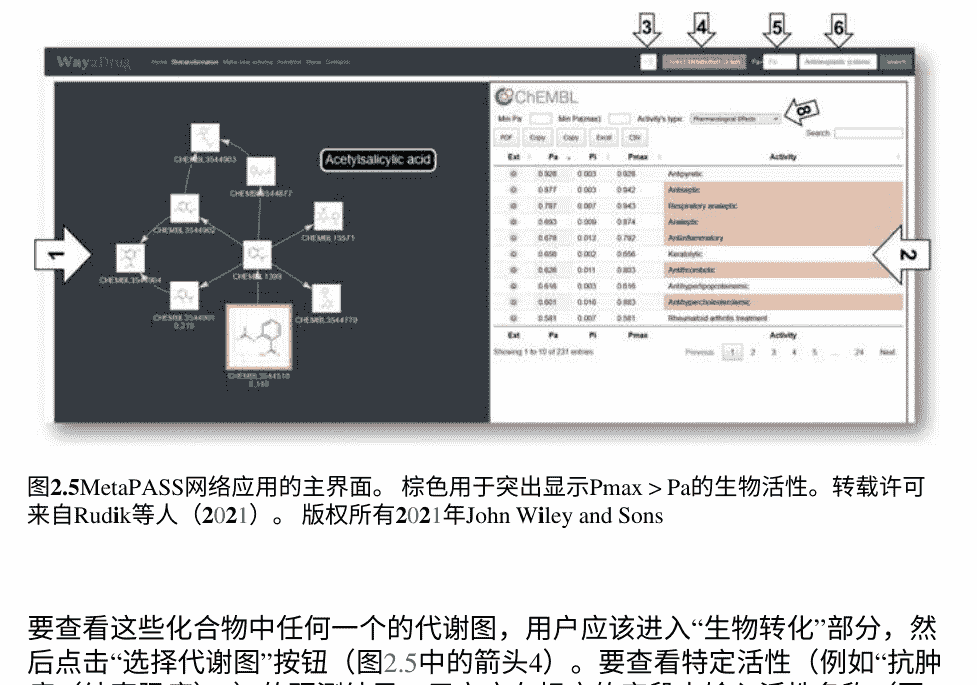

图2.5 MetaPASS网络应用的主界面。棕色用于突出显示`Pmax` > `Pa`的生物活性。转载许可来自Rudik等人（2021）。版权所有2021年John Wiley and Sons

要查看这些化合物中任何一个的代谢图，用户应该进入“生物转化”部分，然后点击“选择代谢图”按钮（图2.5中的箭头4）。要查看特定活性（例如“抗肿瘤（结直肠癌）”）的预测结果，用户应在相应的字段中输入活性名称（图2.5中的箭头6），确定`Pa`的阈值范围从0到1（图2.5中的箭头5），然后点击“搜索”按钮。

图2.6中的图表显示了已知活性并与之相关的计算`Pa`（黑色）和`Pmax`（灰色）值。正如我们所看到的，在所有情况下，当考虑到氟尿嘧啶的代谢时，毒性效应的概率估计更高。例如，致突变效应的`Pmax`值约为0.7，而父化合物的`Pa`值（概率）仅为0.2。使用嵌入式或用户创建的代谢图的MetaPASS网络应用将有益于：

- (a) 启动再利用的药物
- (b) 优化新药物的生物活性概况
- (c) 评估研究性药物的安全性

### 2.4 毒物代谢毒性评估的未来方向

为了通过考虑药物在体内的代谢来提高药物毒性预测的质量，需要更好的基于结构和配体的计算方法来进行代谢物鉴定和毒性估计。

结构基方法的一个重要限制是需要目标的三维结构，主要通过X射线分析宏观分子晶体来确定。许多生物转化酶是膜蛋白。

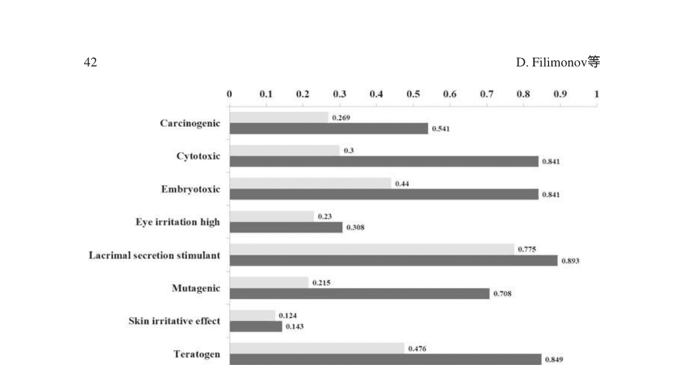

图2.6 氟尿嘧啶的预测结果。灰色表示`Pa`值，黑色表示`Pmax`。转载自Rudik等人（2021年）的许可。版权所有2021年John Wiley and Sons

结晶不完全，因此必须开发替代的实验和计算方法。冷冻电子显微镜为2017年诺贝尔化学奖获得者带来了新的前景（Danelius和Gonen 2021年）。

这种结构生物学方法可以获得高分辨率的蛋白质三维结构，并结合基于人工智能的图像处理和解释来研究细胞蛋白质组（Bäuerlein和Baumeister 2021年）。

近年来，在高级计算方法中，有一种用于蛋白质结构预测的机器学习算法。`AlphaFold2`允许用户获得十万个蛋白质模型（Jumper等人，2021年）。在第14届蛋白质结构预测评估（`CASP14`）挑战中，该方法在大多数情况下展示了与实验结构相当的准确性。它明显优于其他体外方法（Lupas等人，2021年）。尽管这种方法在研究药物代谢酶方面的应用尚未被描述，但在其他蛋白质的情况下取得的进展看起来很有希望。

基于配体的方法需要更可靠的训练集和稳健的体外结构-毒性关系模型。最近的一项研究旨在收集、整理和整合不同物种的公开急性毒性数据，并使用创建的训练集开发预测模型，该研究由Jain等人（2021年）发表。因此，关于超过80,000种化合物的信息，其中包含59种急性全身毒性终点的数据，对科学界变得可用。

社区 ([https://cactus.nci.nih.gov/download/acute-toxicity-db](https://cactus.nci.nih.gov/download/acute-toxicity-db))。此外，最近开发的多任务模型可在 [https://github.com/ncats/ld50-multitask](https://github.com/ncats/ld50-multitask), [https://predictor.ncats.io/](https://predictor.ncats.io/) 上公开获取。将这些开发方法与代谢预测进一步整合可能是通过计算方法进行综合毒性评估的下一步。

此外，我们应该记住，异物在人体中的代谢不仅仅由人类细胞完成。肠道微生物群对药物代谢有直接和间接影响，这可能对药效和毒性产生后果（Wilson和Nicholson 2017）。现在已经确认有超过180种药物是肠道细菌酶的底物，因此容易在体内发生直接酶促转化（McCoubrey等, 2021年; Hatton等, 2019年; Zimmermann等, 2019年）。微生物群可能是患者药物反应变异性的重要原因（Vinarov等, 2021年）。

药物与微生物相互作用的分析可能会指导药物的药代动力学和毒理学特性的研究，也可能使药物在微生物医学中得到再利用（Ghyselinck等, 2021年; Khan等, 2021年）。现在可以在在线数据库中获取大量关于微生物组的数据，例如NIH人类微生物组计划数据门户、`MicrobiomeDB`和中国国家基因库（Chen等, 2020年）（[https://db.cngb.org/about/](https://db.cngb.org/about/)）。Sharma等（2017年）报道了一种新的方法，通过整合化学信息学和机器学习方法来预测代谢酶和能够代谢给定异物/药物分子的相应细菌物种的方法。代谢酶数据库是从491个人类肠道细菌基因组中构建的，其中包含324,697个分配了`EC`号的代谢酶。对于`EC`类别，随机森林（`RF`）模型在十折交叉验证中显示出97.19的准确率。这种方法的作者通过实施预测`RF`模块和相似性搜索模块，开发了一个名为`DrugBug`的网络服务器（[http://metagenomics.iiserb.ac.in/drugbug/](http://metagenomics.iiserb.ac.in/drugbug/)）。

Zimmermann等人（2019年）使用聚类算法来确定药物结构如何增加在肠道中对酶转化的敏感性。他们指出，乳酸酯、尿素、偶氮和硝基官能团的存在会增加细菌代谢的机会。

McCoubrey等人（2021年）成功开发了一个分类算法，可以预测对40种肠道细菌菌株的不良药物影响。目前，高通量离体研究（Javdan等人, 2020年; Zimmermann等人, 2019年）或一般观察微生物组研究（Everett等人, 2021年; Huttenhower等人, 2012年; Proctor等人, 2019年）是机器学习方法的最佳数据来源。还创建了一些数据库，将疾病-微生物组或药物-微生物组相互作用的数据集中在一个地方（Janssens等人, 2018年; Sun等人, 2018年; McCoubrey等人, 2021年）。由于药物候选物的不可接受的代谢率、代谢产物的毒性等不利特性，导致药物开发在临床试验的后期可能终止，这刺激了计算机辅助方法的应用在理论研究阶段和合成先导化合物的规划阶段尽早预测这些特性，并帮助优先进行体外和体内研究，降低潜在药物失败的风险（Bezhentsev等，2016年）。虚拟方法用于代谢评估不断改进，但生物转化取决于许多因素，包括微生物组成、遗传、表型和个体发育等因素，理想情况下应该综合考虑所有这些因素。

致谢本研究得到了俄罗斯科学基金会的支持（项目编号19-15-00396）。

## 参考文献

Alqahtani S (2017) 虚拟`ADME-Tox`建模: 进展与前景。 Expert Opin Drug Metab Toxicol 13(11): 1147-1158。 https://doi.org/10.1080/17425255.2017.1389897

Alves C, Borges R, Da Silva A (2006) 对乙酰氨基酚氧化代谢的密度泛函理论研究。 Int J Quantum Chem 106(13): 2617-2623。 https://doi.org/10.1002/qua.20992

Alves V, Muratov E, Capuzzi S, Politi R, Low Y, Braga R, Zakharov AV, Sedykh A, Mokshyna E, Farag S, Andrade C, Kuz’min V, Fourches D, Tropsha A (2016) 关于结构警报的警告。 绿色化学 18(16):4348-4360。 https://doi.org/10.1039/C6GC01492E

Arce GT, Vincent DR, Cunningham MJ, Choy WN, Sarrif AM (1990) 1,3-丁二烯及其代谢物的体外和体内基因毒性。 环境健康透视 86:75。 https://doi.org/10.1289/ehp.908675

Ashby J (1985) 潜在致癌性或非致癌性的基本结构警报。 环境突变 7(6):919-921。 https://doi.org/10.1002/em.2860070613.

Baillie TA, Rettie AE (2011) 药物诱导毒性中的生物转化作用: 药物代谢中种内和种间差异的影响。 药物代谢与药物动力学26(1): 15-29。 https://doi.org/10.2133/dmpk.dmpk-10-rv-089


Bäuerlein FJB, Baumeister W (2021) 朝向高分辨率的视觉蛋白质组学。 J Mol Biol 433(20): 167187。 https://doi.org/10.1016/j.jmb.2021.167187

Bezhentsev VM, Tarasova OA, Dmitriev AV, Rudik AV, Lagunin AA, Filimonov DA, Poroikov VV (2016) 计算辅助预测人体中的异物代谢。 Russ Chem Rev 85: 854-879。 https://doi.org/10.1070/RCR4614

Boobis A, Gundert-Remy U, Kremers P, Macheras P, Pelkonen O (2002) 在硅预测ADME和药代动力学。 COST B15组织的专家会议报告。 欧洲药学科学杂志17:183。 https://doi.org/10.1016/s0928-0987(02)00185-9

Borodina Yu, Rudik A, Filimonov D, Kharchevnikova N, Dmitriev A, Blinova V, Poroikov V(2004) 一种预测芳香族羟基化位点的新统计方法。 与基于模型的方法进行比较。 J化学信息计算科学44:1998。 https://doi.org/10.1021/ci049834h

Brunk E, Sahoo S, Zielinski DC, Altakunkaya A, Dräger A, Mih N, Gatto F, Nilsson A, Preciat Gonzalez GA, Aurich MK, Prlić A, Sastry A, Danielsdottir AD, Heinken A, Noronha A, Rose PW, Burley SK, Fleming R, Nielsen J, Thiele I, Palsson BO (2018) Recon3D使人类代谢中基因变异的三维视图成为可能。 Nat Biotechnol 36(3):272-281. https://doi.org/10.1038/nbt.4072

Bush BL, Sheridan RP (1993) PATTY: 一种可编程的原子类型和语言, 用于分子数据库中原子的自动分类。 J Chem Inf Comput Sci 33:756-762. https://doi.org/10.1021/ci00015a015

Carhart RE, Smith DH, Venkataraghavan R (1985) 原子对作为结构活性研究中的分子特征：定义和应用。 J Chem Inf Comput Sci 25:64–73. https://doi.org/10.1021/ci00046a002

Chen W, Koenigs LL, Thompson SJ, Peter RM, Rettie AE, Trager WF, Nelson SD (1998) 通过杆状病毒表达和纯化的人类细胞色素P450 2E1和2A6将对乙酰氨基酚氧化为其有毒的醌亚胺和无毒的邻苯二酚代谢物。 Chem Res Toxicol 11:295. https://doi.org/10.1021/tx9701687

Chen M, Borlak J, Tong W (2013) 高脂溶性和口服药物的高日剂量与药物性肝损伤的显著风险相关。 肝脏学（巴尔的摩，马里兰州） 58(1):388-396。 https://doi.org/10.1002/hep.26208

Chen YJ, Cheng FX, Sun L, Li WH, Liu GX, Tang Y (2014) 计算模型预测内分泌干扰化学物质与雄激素或雌激素受体的结合。 生态毒理学与环境安全110:280-287。 https://doi.org/10.1016/j.ecoenv.2014.08.026

Chen FZ, You LJ, Yang F, Wang LN, Guo XQ, Gao F, Hua C, Tan C, Fang L, Shan RQ, Zeng WJ, Wang B, Wang R, Xu X, Wei XF (2020) CNGBdb：中国国家基因库数据库。 遗传学 42(8):799-809。 https://doi.org/10.16288/j.yczz.20-080. PMID：32952115

Dang NL, Matlock MK, Hughes TB, Swamidass SJ (2020) 代谢彩虹：深度学习五种颜色的一期代谢。 化学信息模型 60(3):1146-1164。 https://doi.org/10.1021/acs.jcim.9b00836

Danelius E, Gonen T (2021) 通过冷冻电子显微镜（cryo-EM）方法进行蛋白质和小分子结构确定。 方法分子生物学2305:323–342。 https://doi.org/10.1007/978-1-0716-1406-8_16

Darvas F (1987) Metaboloexpert：一种用于预测物质代谢的专家系统。 在：Kaiser KLE（编）环境毒理学中的QSAR-II。 Springer, Dordrecht, pp 71–81. https://doi.org/10.1007/978-94-009-3937-0_7

de Bruyn Kops C, Conrad Stork C, Šícho M, Kochev N, Svozil D, Jeliazkova N, Kirchmair J (2019) GLORY：根据预测的代谢位点生成可能的细胞色素P450代谢物的结构。 Front Chem 7:402。 https://doi.org/10.3389/fchem.2019.00402

Djoumbou-Feunang Y, Fiamoncini J, Gil-de-la-Fuente A, Greiner R, Manach C, Wishart DS (2019) BioTransformer：一种用于小分子代谢预测和代谢物鉴定的综合计算工具。 J Cheminform 11(1):2. https://doi.org/10.1186/s13321-018-0324-5

Dmitriev A, Rudik A, Filimonov D, Lagunin A, Pogodin P, Dubovskaja V, Bezhentsev V, Ivanov S, Druzhilovsky D, Tarasova O, Poroikov V (2017) 综合评估外源物质在人体内代谢的毒性。 Pure Appl Chem 89(10):1449–1458. https://doi.org/10.1515/pac-2016-1205

Ekins S, Andreyev S, Ryabov A, Kirillov E, Rakhmatulin EA, Bugrim A, Nikolskaya T (2005) 计算预测人类药物代谢。 Expert Opin Drug Metab Toxicol 1(2):303–324. https://doi.org/10.1517/17425255.1.2.303

Everett C, Li C, Wilkinson JE, Nguyen LH, McIver LJ, Ivey K, Izard J, Palacios N, Eliassen AH, Willett WC, Ascherio A, Sun Q, Tworoger SS, Chan AT, Garrett WS, Huttenhower C, Rimm E B, Song M (2021) 护士研究中微生物组的概述（micro-N）作为队列研究中微生物组的前瞻性特征化的例子。 Nat Protoc 16:2724–2731. https://doi.org/10.1038/s41596-021-00519-z

Fenner K, Gao J, Kramer S, Ellis L, Wackett L (2008) 数据驱动的相对推理提取规则，以限制生物降解途径预测中的组合爆炸。 生物信息学24(18):2079–2085。 https://doi.org/10.1093/bioinformatics/btn378

Filimonov D, Zakharov A, Lagunin A, Poroikov V (2009) 基于QNA的“Star Track” QSAR方法。 SAR QSAR Environ Res 20(7–8):679–709。 https://doi.org/10.1080/10629360903438370


Filimonov DA, Lagunin AA, Gloriozova TA, Rudik AV, Druzhilovskii DS, Pogodin PV, Poroikov VV (2014) 使用PASS在线网络资源预测有机化合物的生物活性谱。 Chem Heterocycl Comp 50(3):444–457。 https://doi.org/10.1007/s10593-014-1496-1

Flynn NR, Dang NL, Ward MD, Swamidass SJ (2020) XenoNet: 中间代谢物形成的推断和可能性。 J Chem Inf Model 60(7):3431-3449. https://doi.org/10.1021/acs.jcim.0c00361

Gao J, Ellis LBM, Wackett LP (2010) 明尼苏达大学生物催化/生物降解数据库：改善公众访问。 Nucleic Acids Res 38: D488-D491. https://doi.org/10.1093/nar/gkp771

Ghyselinck J, Verstrepen L, Moens F, Van Den Abbeele P, Bruggeman A, Said J, Smith B, Barker LA, Jordan C, Leta V, Chaudhuri KR, Basit AW, Gaisford S (2021) 对帕金森病患者体外模型中肠道菌群组成和肠壁功能的影响。 Int J Pharm X 3: 100087。 https://doi.org/10.1016/j.ijpx.2021.100087

Gilmer J, Schoenholz SS, Riley PF, Vinyals O, Dahl GE (2017) 用于量子化学的神经消息传递。 arXiv:1704.01212

Guengerich FP (2008) 细胞色素P450和化学毒理学。 Chem Res Toxicol 21(1):70-83。 https://doi.org/10.1021/tx700079z

Guengerich FP (2021) 细胞色素P450酶在药物毒性中的作用历史。 Toxicol Res 37: 1-23。 https://doi.org/10.1007/s43188-020-00056-z

Hansten PD, Horn JR (2010) 100种药物相互作用：患者管理指南。 H&H出版物，华盛顿，第171页

Hatton GB, Madla CM, Rabbie SC, Basit AW (2019) 肠道反应：系统性疾病对胃肠道生理和药物吸收的影响。 Drug Discov Today 24(2):417-427。 https://doi.org/10.1016/j.drudis.2018.11.009

Hewitt M, Enoch SJ, Madden JC, Przybylak KR, Cronin MT (2013) 肝毒性：一种用于生成化学类别的方案，用于交叉验证，结构警报和机制洞察。 Crit Rev Toxicol 43(7):537–558。 https://doi.org/10.3109/10408444.2013.811215

Hong H, Chen M, Ng HW, Tong W (2016) 美国FDA/NCTR的QSAR模型。在：Benfenati E(eds) 用于预测药物毒性的计算方法，分子生物学方法第1425卷，第431–459页。 https://doi.org/10.1007/978-1-4939-3609-0_18

Hu J, Cai Y, Li W, Liu G, Tang Y (2020) 通过机器学习方法对药物样分子进行代谢环氧化预测的计算方法。 Mol Inform 39(8):e1900178。 https://doi.org/10.1002/minf.201900178

Hughes TB, Miller GP, Swamidass SJ (2015) 用深度机器学习网络建模药物样分子的环氧化。 ACS Cent Sci 1(4):168-180。 https://doi.org/10.1021/acscentsci.5b00131

Hughes TB, Dang NL, Miller GP, Swamidass SJ (2016) 用深度多任务网络建模对生物大分子的反应性。 ACS Cent Sci 2(8):529-537。 https://doi.org/10.1021/acscentsci.6b00162

Hughes TB, Dang NL, Kumar A, Flynn NR, Swamidass SJ (2020) 代谢森林：预测药物代谢物的多样结构。 J Chem Inf Model 60(10):4702-4716。 https://doi.org/10.1021/acs.jcim.0c00360

Hughes TB, Flynn N, Dang NL, Swamidass SJ (2021) 模拟药物的生物活化和随后的反应性。 Chem Res Toxicol 34(2):584–600。 https://doi.org/10.1021/acs.chemrestox.0c00417

Huttenhower C, Gevers D, Knight R等 (2012) 人类微生物组计划，C. 健康人类微生物组的结构、功能和多样性。 自然486: 207–214。 https://doi.org/10.1038/nature11234

Idle JR, Gonzalez FJ (2007) 代谢组学。 细胞代谢6(5):348–351。 https://doi.org/10.1016/j.cmet.2007.10.005

Ioannides C, Lewis DF (2004) 细胞色素P450在化学物质的生物活化中的作用。 Curr Top Med Chem 4(16):1767–1788。 https://doi.org/10.2174/1568026043387188

Jain S, Siramshetty VB, Alves VM, Muratov EN, Kleinstreuer N, Tropsha A, Nicklaus MC, Simeonov A, Zakharov AV (2021) 使用多任务深度学习方法的共识模型对多物种急性毒性终点进行大规模建模。 J Chem Inf Model 61(2):653–663。 https://doi.org/10.1021/acs.jcim.0c01164

Janssens Y, Nielandt J, Bronselaer A, Debunne N, Verbeke F, Wynendaele E, Van Immerseel F, Vandewynckel YP, De Tré G, De Spiegeleer B (2018) Disbiome数据库：将微生物组与疾病联系起来。BMC Microbiol 18(1):50. https://doi.org/10.1186/s12866-018-1197-5

Javdan B, Lopez JG, Chankhamjon P, Lee YJ, Hull R, Wu Q, Wang X, Chatterjee S, Donia MS (2020) 人体肠道菌群对药物代谢的个性化映射。Cell 181(7):1661–1679(e1622). https://doi.org/10.1016/j.cell.2020.05.001

Jumper J, Evans R, Pritzel A, Green T, Figurnov M, Ronneberger O, Tunyasuvunakool K, Bates R, Žídek A, Potapenko A, Bridgland A, Meyer C, Kohl SAA, Ballard AJ, Cowie A, Romera-Paredes B, Nikolov S, Jain R, Adler J, Back T, Petersen S, Reiman D, Clancy E, Zielinski M, Steinegger M, Pacholska M, Berghammer T, Silver D, Vinyals O, Senior AW, Kavukcuoglu K, Kohli P, Hassabis D (2021) 在CASP14上应用和改进AlphaFold。Proteins 89(12):1711–1721. https://doi.org/10.1002/prot.26257

Khan S, Hauptmann R, Kelly L (2021) 工程微生物群落以预防不良事件：挑战与机遇。Annu Rev Pharmacol Toxicol 61(1):159–179. https://doi.org/10.1146/annurev-pharmtox-031620-031509


Kim K, Jordan KD (1994) 密度泛函和MP2计算在水单体和二聚体上的比较。J Phys Chem 98(40):10089–10094. https://doi.org/10.1021/j100091a024

Kirchmair J, Williamson MJ, Tyzack JD, Tan L, Bond PJ, Bender A, Glen RC (2012) 计算代谢预测：位点、产物、SAR、P450酶动力学和机制。J Chem Inf Model 52(3):617–648. https://doi.org/10.1021/ci200542m

Kirchmair J, Goller AH, Lang D, Kunze J, Testa B, Wilson ID, Glen RC, Schneider G (2015) 预测药物代谢：实验和/或计算？Nat Rev Drug Discov 14:387–404. https://doi.org/10.1038/nrd4581

Klopman G, Dimayuga M, Talafous J (1994) META. 1. 用于评估化学物质代谢转化的程序。J Chem Inf Comput Sci 34(6):1320–1325. https://doi.org/10.1021/ci00022a014

Kulkarni SF, Zhu J, Blechinger S (2005) In silico techniques for the study and prediction of xenobiotic metabolism: a review. Xenobiotica 35:955–973. https://doi.org/10.1080/00498250500354402

Lagunin A, Stepanchikova A, Filimonov D, Poroikov V (2000) PASS: prediction of activity spectra for biologically active substances. Bioinformatics 16(8):747–748. https://doi.org/10.1093/bioinformatics/16.8.747

Lagunin A, Zakharov A, Filimonov D, Poroikov V (2011) 基于通过预测的基础上的大鼠急性毒性的QSAR建模。Mol Inf 30(2–3):241–250. https://doi.org/10.1002/minf.201000151

Leach AR, Bradshaw J, Green DVS, Hann MM, Delany JJ (1999) 实施一种用于试剂选择和库枚举、剖析和设计的系统。J Chem Inf Comput Sci 39(6):1161–1172. https://doi.org/10.1021/ci9904259

Lei T, Li Y, Song Y, Li D, Sun H, Hou T (2016) 药物发现中的ADMET评估：15. 使用相关向量机和共识建模准确预测大鼠口服急性毒性。J Chem Inf 8:6. https://doi.org/10.1186/s13321-016-0117-7

Li X, Chen L, Cheng F, Wu Z, Bian H, Xu C, Li W, Liu G, Shen X, Tang Y (2014) 使用多分类方法在计算毒性学中预测化学物质的急性口服毒性。J Chem Inf Model 54(4):1061–1069. https://doi.org/10.1021/ci5000467

Li Y, Idakwo G, Thangapandian S, Chen M, Hong H, Zhang C, Gong P (2018) 靶向特异性毒性知识库（TsTKb）：一种新颖的用于计算毒理学的工具包。J Environ Sci Health Part C 36(4):219–236. https://doi.org/10.1080/10590501.2018.1537148

Litsa EE, Das P, Kavraki LE (2020) 使用神经机器翻译预测药物代谢产物。Chem Sci 11(47):12777–12788. https://doi.org/10.1039/d0sc02639e

Lounnas V, Ritschel T, Kelder J, McGuire R, Bywater RP, Foloppe N (2013) 结构基于合理药物设计的当前进展标志着药物发现中的新思维方式。Comput Struct Biotechnol J 5(6):e201302011. https://doi.org/10.5936/csbj.201302011

Lupas AN, Pereira J, Alva V, Merino F, Coles M, Hartmann MD (2021) 蛋白质结构预测的突破。Biochem J 478(10):1885–1890. https://doi.org/10.1042/BCJ20200963

Lyubimov AV (ed) (2012) 药物代谢和相互作用百科全书。Wiley, p 764. https://doi.org/10.1002/9780470921920

Macherey A-C, Dansette PM (2008) 导致有毒代谢物的生物转化：化学方面。In: Wermuth CG (ed) The Practice of Medicinal Chemistry. Academic Press, Amsterdam, pp 674-696

Marchant CA, Briggs KA, Long A (2008) 用于共享毒性和代谢数据和知识的计算工具：Windows的derek，meteor和vitic。Toxicol Mech Methods 18:177-187. https://doi.org/10.1080/15376510701857320

McCoubrey LE, Gaisford S, Orlu M, Basit AW (2021) 用机器学习预测药物-微生物相互作用。Biotechnol Adv 107797. https://doi.org/10.1016/j.biotechadv.2021.107797

Mekenyan OG, Dimitrov SD, Pavlov TS, Veith GD (2004) 计算毒理学中模拟代谢的系统方法。I. TIMES启发式建模框架。Curr Pharm Des 10(11):1273-1293. https://doi.org/10.2174/1381612043452596

Mendez D, Gaulton A, Bento AP, Chambers J, De Veij M, Félix E, Magariños MP, Mosquera JF, Mutowo P, Nowotka M, Gordillo-Marañón M, Hunter F, Junco L, Mugumbate G, Rodriguez-Lopez M, Atkinson F, Bosc N, Radoux CJ, Segura-Cabrera A, Hersey A, Leach AR (2019) ChEMBL：朝着生物测定数据的直接提交迈进。Nucleic Acids Res 47(D1):D930–D940. https://doi.org/10.1093/nar/gky1075

Moore MM, Harrington-Brock K (2000) 三氯乙烯及其代谢物的致突变性：对三氯乙烯风险评估的影响。Environ Health Perspect 108(Suppl.2):215–223. https://doi.org/10.1289/ehp.00108s2215

Morgan HL (1965) 生成化学结构的唯一机器描述-化学文摘服务中开发的技术。J Chem Doc 5(2):107–113. https://doi.org/10.1021/c160017a018

Muratov EN, Bajorath J, Sheridan RP, Tetko IV, Filimonov D, Poroikov V, Oprea TI, Baskin II, Varnek A, Roitberg A, Isayev O, Curtarolo S, Fourches D, Cohen Y, Aspuru-Guzik A, Winkler DA, Agrafiotis D, Cherkasov A, Tropsha A (2020) 无边界的QSAR。Chem Soc Rev 49(11):3525–3564. https://doi.org/10.1039/d0cs00098a


Naisbitt DJ, Williams DP, Pirmohamed M, Kitteringham NR, Park BK (2001) 反应性代谢物及其在药物反应中的作用。Curr Opin Allergy Clin Immunol 1(4):317–325. https://doi.org/10.1097/01.all.0000011033.64625.5a

Nakata M, Shimazaki T (2017) PubChemQC项目：一个用于数据驱动化学的大规模第一原理电子结构数据库。J Chem Inf Model 57(6):1300–1308. https://doi.org/10.1021/acs.jcim.7b00083

Nelson SD (2001) 结构毒性关系——它们在预测新药物毒性方面有多有用？In: Dansette PM et al. (eds) Reactive Intermediates VI. Experimental Biology and Medicine, Vol 500, pp 33-43. https://doi.org/10.1007/978-1-4615-0667-6_4

Nilakantan R, Bauman N, Dixon JS, Venkataraghavan R (1987) 拓扑扭曲：一种用于SAR应用的新分子描述符。与其他描述符的比较。J Chem Inf Comput Sci 27(2):82–85. https://doi.org/10.1021/ci00054a008

Olsen L, Oostenbrink C, Jorgensen FS (2015) 预测细胞色素P450介导的代谢。Adv Drug Deliv Rev 86:61–71. https://doi.org/10.1016/j.addr.2015.04.020

Ortiz de Montellano PR (2013) 细胞色素P450活化的前药。Future Med Chem 5(2):213. https://doi.org/10.4155/fmc.12.197

Park BK, Boobis A, Clarke S, Goldring CEP, Jones D, Kenna JG, Lambert C, Laverty HG, Naisbitt DJ, Nelson S et al (2011) 管理药物开发中的化学反应性代谢物的挑战。Nat Rev Drug Discov 10(4):292–306. https://doi.org/10.1038/nrd3408

Parr RG, Yang W (1989) 原子和分子的密度泛函理论。Oxford University Press, New York, p 333. https://doi.org/10.1002/qua.560470107, https://doi.org/10.1093/oso/9780195092769.001.0001

Patterson AD, Gonzalez FJ, Idle JR (2010) 通过代谢测定器来观察异物代谢。Chem Res Toxicol 23(5):851–860. https://doi.org/10.1021/tx100020p

Peach ML, Zakharov AV, Liu R, Pugliese A, Tawa G, Wallqvist A, Nicklaus MC (2012) 代谢相关属性预测的计算工具和资源。1. 公开可用（免费和商业）数据库和软件概述。Future Med Chem 4(15):1907. https://doi.org/10.4155/fmc.12.150

Pornputtapong N, Nookaew I, Nielsen J (2015) 人类代谢图谱：人类代谢的在线资源。Database 2015:bav068. https://doi.org/10.1093/database/bav068

Proctor LM, Creasy HH, Fettweis JM, Lloyd-Price J, Mahurkar A, Zhou W, Buck GA, Snyder MP, Strauss JF, Weinstock GM, White O, Huttenhower C (2019) 综合HMP (iHMP) 研究网络联盟。综合人类微生物组计划。Nature 569:641–648. https://doi.org/10.1038/s41586-019-1238-8

Ridder L, Wagener M (2008) SyGMa: 结合专家知识和经验评分在预测代谢物中。ChemMedChem 3(5):821–832. https://doi.org/10.1002/cmdc.200700312

Ridings JE, Barratt MD, Cary R, Earnshaw CG, Eggington CE, Ellis MK, Judson PN, Langowski JJ, Marchant CA, Payne MP, Watson WP, Yih TD (1996) 从化学结构预测可能的毒性作用：DEREK系统的更新。Toxicology 106(1–3):267–279. https://doi.org/10.1016/0300-483x(95)03190-q

Roberts G, Myatt GJ, Johnson WP, Cross KP, Blower PE Jr (2000) LeadScope: 用于探索大量筛选数据的软件。J Chem Inf Comput Sci 40(6):1302–1314. https://doi.org/10.1021/ci000631

Rudik AV, Dmitriev AV, Lagunin AA, Filimonov DA, Poroikov VV (2014) 基于异物结构公式和PASS预测算法的代谢位点预测。J Chem Inf Model 54(2):498-507. https://doi.org/10.1021/ci400472j

Rudik AV, Dmitriev AV, Bezhentsev VM, Lagunin AA, Filimonov DA, Poroikov VV (2017) MetaTox中环氧化反应代谢物的预测。SAR QSAR Environ Res 28(10):833-842. https://doi.org/10.1080/1062936X.2017.1399165

Rudik A, Bezhentsev V, Dmitriev A, Lagunin A, Filimonov D, Poroikov V (2019) MetaTox-用于生成代谢途径和毒性估计的Web应用程序。J Bioinform Comput Biol 17(1):1940001. https://doi.org/10.1142/S0219720019400018

Rudik A, Dmitriev A, Lagunin A, Filimonov D, Poroikov V (2021) MetaPASS: 一种用于分析有机化合物生物活性谱的网络应用，考虑到它们的生物转化。Mol Inform 40(4):e2000231. https://doi.org/10.1002/minf.202000231

Rydberg P, Gloriam DE, Zaretzki J, Breneman C, Olsen L (2010) SMARTCyp: 一种用于预测细胞色素P450介导的药物代谢的二维方法。ACS Med Chem Lett 1(3):96–100. https://doi.org/10.1021/ml100016x

Rydberg P, Rostkowski M, Gloriam DE, Olsen L (2013) 原子可及性对细胞色素P450代谢位点模型的贡献。Mol Pharm 10(4):1216–1223. https://doi.org/10.1021/mp3005116

Rydberg P, Lonsdale R, Harvey J, Mulholland A, Olsen L (2014) 预测的细胞色素P450氧化的化学选择性趋势：B3LYP反应势垒高度用于环氧化和羟化反应。J Mol Graph Model 52:30–35. https://doi.org/10.1016/j.jmgm.2014.06.002

Sahoo S, Haraldsdóttir HS, Fleming RM, Thiele I (2015) 对常用药物对人体代谢的影响进行建模。FEBS J 282(2):297–317. https://doi.org/10.1111/febs.13128

Saiakhov RD, Klopman G (2008) MultiCASE专家系统和REACH倡议。Toxicol Mech Methods 18(2–3):159–175. https://doi.org/10.1080/15376510701857460

Sarullo K, Matlock MK, Swamidass SJ (2020) 从量子化学的深度学习表示中获得的小分子的位点生物活性。J Phys Chem A 124(44):9194–9202. https://doi.org/10.1021/acs.jpca.0c06231

Sharma AK, Jaiswal SK, Chaudhary N, Sharma VK (2017) 一种新的方法，用于预测人体肠道微生物对外源性/药物分子的物种特异性生物转化。Sci Rep 7(1):9751. https://doi.org/10.1038/s41598-017-10203-6

Sheridan RP, Korzekwa KR, Torres RA, Walker MJ (2007) 人类细胞色素P450 3A4、2D6和2C9的经验性区域选择性模型。 J Med Chem 50 (14) : 3173–3184。 [https://doi.org/10.1021/jm0613471](https://doi.org/10.1021/jm0613471)

Singh SB, Shen LQ, Walker MJ, Sheridan RP (2003) 一种用于预测药物样分子上CYP3A 4介导代谢可能位点的模型。 J Med Chem 46 (8) : 1330–1336。 [https://doi.org/10.1021/jm020400s](https://doi.org/10.1021/jm020400s)

Sridhar J, Goyal N, Liu J, Foroozesh M (2017) 从分子建模研究中报道的CYP1A亚家族酶的配体特异性因子综述。 分子22(7):1143。 [https://doi.org/10.3390/molecules22071143](https://doi.org/10.3390/molecules22071143)

Stepan AF, Walker DP, Bauman J, Price DA, Baillie TA, Kalgutkar AS, Aleo MD (2011) 结构警报/反应性代谢物概念在药物化学中的应用，以减轻特异性药物毒性的风险：基于对美国市场上前200种药物趋势的关键审查的观点。 化学研究毒理学24(9):1345–1410。 [https://doi.org/10.1021/tx200168d](https://doi.org/10.1021/tx200168d)

Stephens PJ, Devlin FJ, Chabalowski CF, Frisch MJ (1994) 使用密度泛函力场进行振动吸收和圆二色性光谱的从头计算。 J Phys Chem98(45):11623–11627。 [https://doi.org/10.1021/j100096a001](https://doi.org/10.1021/j100096a001)

Sun Y-Z, Zhang D-H, Cai S-B, Ming Z, Li J-Q, Chen X (2018) MDAD: 一种用于微生物-药物关联的特殊资源。 Front Cell Infect Microbiol 8:424。 [https://doi.org/10.3389/fcimb.2018.00424](https://doi.org/10.3389/fcimb.2018.00424)

Sushko I, Salmina E, Potemkin VA, Poda G, Tetko IV (2012) ToxAlerts: 一种用于有毒化学物质和可能产生不良反应的化合物的结构警报的网络服务器。 J Chem Inf Model52(8):2310–2316。 [https://doi.org/10.1021/ci300245q](https://doi.org/10.1021/ci300245q)

Tarasova O, Rudik A, Dmitriev A, Lagunin A, Filimonov D, Poroikov V (2017) 基于QNA的代谢位点预测。 Molecules 22(12):2123. [https://doi.org/10.3390/molecules22122123](https://doi.org/10.3390/molecules22122123)

Testa B, Jenner P (1976) 药物代谢：化学和生化方面。 Marcel Dekker, 纽约, 第500页

Thompson R, Isin E, Ogese M, Mettetal J, Williams D (2016) 反应性代谢物：当前和新兴的风险和危害评估。 Chem Res Toxicol 29(4): 505–533。 [https://doi.org/10.1021/acs.chemrestox.5b00410](https://doi.org/10.1021/acs.chemrestox.5b00410)

Tian S, Cao X, Greiner R, Li C, Guo AC, Wishart DS (2021) CyProduct: 一个用于准确预测人类细胞色素P450代谢副产物的软件工具。 J Chem Inf Model61(6): 3128–3140。 [https://doi.org/10.1021/acs.jcim.1c00144](https://doi.org/10.1021/acs.jcim.1c00144)

Todeschini R, Consonni V (2000) 在： Mannhold R, Kubinyi H, Timmerman H (eds) 分子描述符手册。 WILEY-VCH Verlag GmbH, 德国。 [https://doi.org/10.1002/9783527613106](https://doi.org/10.1002/9783527613106)

Tyzack JD, Kirchmair J (2019) 计算方法和工具用于预测细胞色素P450药物代谢。 Chem Biol Drug Des 93 (4) : 377–386。 [https://doi.org/10.1111/cbdd.13445](https://doi.org/10.1111/cbdd.13445)

Tyzack JD, Mussa HY, Williamson MJ, Kirchmair J, Glen RC (2014) 通过GPU加速的概率分类器从2D拓扑指纹预测细胞色素P450代谢位点。 J Cheminform 6: 29。 [https://doi.org/10.1186/1758-2946-6-29](https://doi.org/10.1186/1758-2946-6-29)

Veselovskii AV, Sobolev BN, Zharkova MS, Archakov AI (2010) 基于计算机的底物特异性预测细胞色素P450。 Biomed Khim 56 (1) : 90–100。 [https://doi.org/10.18097/pbmc20105601090](https://doi.org/10.18097/pbmc20105601090)

Vinarov Z, Abdallah M, Agundez JAG, Allegaert K, Basit AW, Braeckmans M, Ceulemans J, Corsetti M, Griffin BT, Grimm M, Keszthelyi D, Koziolek M, Madla CM, Matthys C, McCoubrey LE, Mitra A, Reppas C, Stappaerts J, Steenackers N, Trevaskis NL, Vanuytsel T, Vertzoni M, Weitschies W, Wilson C, Augustijns P (2021) 对口服药物吸收和药代动力学的胃肠道变异性的影响：一项UNGAP综述。 Eur J Pharm Sci 162:105812. [https://doi.org/10.1016/j.ejps.2021.105812](https://doi.org/10.1016/j.ejps.2021.105812)

Wang J, Urban L, Bojanic D (2007) 最大限度地利用体外ADMET工具预测体内生物利用度和安全性。 Expert Opin Drug Metab Toxicol 3(5):641–665. https://doi.org/10.1517/17425255.3.5.641

Weininger D (1988) SMILES，一种化学语言和信息系统。1. 方法论和编码规则介绍。 J Chem Inf Comput Sci 28(1):31–36. https://doi.org/10.1021/ci00057a005

Williams DP (2006) Toxicophores: investigations in drug safety. Toxicology 226(1):1–11. https://doi.org/10.1016/j.tox.2006.05.101

Wilson ID, Nicholson JK (2017) Gut microbiome interactions with drug metabolism, efficacy, and toxicity. Transl Res 179:204–222. https://doi.org/10.1016/j.trsl.2016.08.002

Wishart DS, Feunang YD, Guo AC, Lo EJ, Marcu A, Grant JR, Sajed T, Johnson D, Li C, Sayeeda Z, Assempour N, Iynkkaran I, Liu Y, Maciejewski A, Gale N, Wilson A, Chin L, Cummings R, Le D, Pon A, Knox C, Wilson M (2018a) DrugBank 5.0: a major update to the DrugBank database for 2018. Nucleic Acids Res 46(D1):D1074–D1082. https://doi.org/10.1093/nar/gkx1037

Wishart DS, Feunang YD, Marcu A, Guo AC, Liang K, Vázquez-Fresno R, Sajed T, Johnson D, Li C, Karu N, Sayeeda Z, Lo E, Assempour N, Berjanskii M, Singhal S, Arndt D, Liang Y, Badran H, Grant J, Serra-Cayuela A, Scalbert A (2018b) HMDB 4.0: the human metabolome database for 2018. Nucleic Acids Res 46(D1):D608–D617. https://doi.org/10.1093/nar/gkx1089

Wu-KM (2009) 一种新的药物前体分类：监管视角。 Pharmaceuticals 2(3):77–81. https://doi.org/10.3390/ph2030077

吴Y, 朱J, 付P, 童W, 洪H, 陈M (2021年) 通过结构警报和每日剂量进行机器学习预测药物诱导的自身免疫性疾病的风险。 环境研究公共卫生杂志18（13）：7139。 https://doi.org/10.3390/ijerph18137139

杨C, Tarkhov A, Marusczyk J, Bienfait B, Gasteiger J, Kleinoder T, Magdziarz T, Sacher O, Schwab CH, Schwoebel J, Terfloth L, Arvidson K, Richard A, Worth A, Rathman J (2015年) 新的公开可用的化学查询语言CSRML，支持用于数据挖掘和建模的化学类型表示。 化学信息模型55（3）：510-528。 https://doi.org/10.1021/ci500667v

杨H, 楼C, 李W, 刘G, 唐Y (2020) 计算方法在环境毒理学和药物发现中识别结构警示和应用的计算方法。 化学研究毒理学33（6）：1312-1322。 https://doi.org/10.1021/acs.chemrestox.0c00006

Zakharov AV, Lagunin AA, Filimonov DA, Poroikov VV (2012) 化学化合物的抗靶相互作用的定量预测。 化学研究毒理学25（11）：2378-2385。 https://doi.org/10.1021/tx300247r

Zaretzki J, Bergeron C, Rydberg P, Huang T-W, Bennett KP, Breneman CM (2011) RS-predictor: 预测细胞色素P450介导的代谢位点的新工具，应用于CYP 3A4。 J Chem Inf Model 51（7）：1667-1689。 https://doi.org/10.1021/ci2000488

Zaretzki J, Matlock M, Swamidass SJ (2013) XenoSite: 使用神经网络准确预测CYP介导的代谢位点。 J Chem Inf Model 53(12):3373–3383. https://doi.org/10.1021/ci400518g

Zhang J, Ji L, Liu W (2015) 体外预测细胞色素P450介导的异物生物转化：环氧化反应的案例研究。 Chem Res Toxicol 28(8):1522–1531. https://doi.org/10.1021/acs.chemrestox.5b00232

Zheng M, Luo X, Shen Q, Wang Y, Du Y, Zhu W, Jiang H (2009) 预测细胞色素P450介导的六种生物转化的代谢位点。 Bioinformatics 25(10):1251–1258. https://doi.org/10.1093/bioinformatics/btp140

Zimmermann M, Zimmermann-Kogadeeva M, Wegmann R, Goodman AL (2019) 通过肠道细菌及其基因映射人类微生物组药物代谢。 Nature 570(7762):462–467. https://doi.org/10.1038/s41586-019-1291-3

## 第三章 预测不良药物反应中新兴的机器学习技术

易中，王珊珊，李高正，杨吉，翁祖权，和罗恒

### 3.1 引言

不良药物反应（ADR）是导致住院和患者死亡的主要原因之一。此外，ADR是临床试验失败和药物撤退的主要原因之一（`Takeda et al. 2017`; `Bennett et al. 2021`）。因此，ADR对患者健康构成重大危险（`Bennett et al. 2021`）。在药物开发过程中迅速确定和理解潜在ADR可以提高药物安全性，节约成本并改善患者健康结果。尽管ADR评估在药物开发过程中的各个阶段都会进行，但主要阶段包括临床前动物研究和临床试验以识别ADR。然而，大多数ADR报告，尤其是药物相互作用（DDI），通常来自后市场监测或社交平台报告。为了在早期开发过程中拦截ADR和DDI，开发了包括机器学习模型在内的计算框架。

ADR的机制在个体之间复杂且常常是特异性的（`Uetrecht 2007`）。尽管越来越多的数据正在生成并变得可用，但有效提取、处理和组合特征的挑战仍然存在，从异构和复杂的数据类型和多样化的资源中仍然存在未解决的问题（`Lee和Chen 2021`）。随着从传统机器学习模型转向表示学习模型的最新范式转变，该领域的最新发展已经显示出对于准确的特征提取和处理以进行系统性ADR评估的有效性（`Lee和Chen 2021`）。而传统的机器学习方法在很大程度上依赖于依赖于专家的工程特征（`Zheng等 2019b`），而端到端的深度学习等表示学习模型可以自动提取特征以进行准确的预测。此外，表示学习具有处理大量异构和复杂数据类型的能力，来自不同来源的数据。在本章中，我们将总结不同的资源、特征类型和机器学习模型，这些模型已经被使用或有潜力用于ADR预测，特别是最新的以及新兴的技术发展。我们还将讨论关于改进模型鲁棒性和可扩展性的潜在未来方向。

### 3.2 用于机器学习的特征生成

#### 3.2.1 基于结构的特征

机器学习算法以向量或矩阵的格式接收输入；因此，原始数据通常会转换为称为特征的数字化表示形式，这些特征携带了用于预测的重要底层信息（`Wu等，2018年`；`Lavecchia，2019年`；`Pattanaik和Coley，2020年`）。例如，化学结构可以转换为二维（2D）分子图作为深度学习模型的输入（`Lavecchia，2019年`）。图3.1总结了一些常见的ADR预测数据类型以及这些特征是如何生成的。

在药物发现的早期阶段，药物候选物的可用信息是化学结构（`Dey等，2018年`）。为了基于结构预测药物性质和ADR，一个重要的步骤是将分子表示为模型可读的特征（`Dey等，2018年`），例如分子描述符（例如分子量，`logP`等），化学指纹（编码分子结构的固定长度向量），以文本字符串或独热编码向量形式表示的`SMILES`，分子图和分子图像（图3.1a）。

分子描述符是从分子中提取或计算的数值物理化学特征，常用于结构-毒性关系（STR）建模（Lémery等，2015年；Istratoaie等，2018年）。一维（1D）描述符和二维（2D）描述符都对ADR预测有用。1D描述符编码物理化学性质，如分子量、logP和片段计数，不表示分子的拓扑结构。2D描述符描述了分子的拓扑信息，即原子之间的连接方式。它们是从分子图中计算得出的，对于图节点数量的变化不敏感（Isakwo等，2019年）。这两种描述符类型通常结合使用。例如，刘等人（2020年）将1D和2D描述符以及其他药物信息作为多个特征整合起来，用于预测口服药物的肝毒性。

分子指纹将分子的结构编码为固定长度的向量。通常，该向量由表示分子中特定亚结构是否存在的二进制位（位）组成（Cereto-Massagué等人，2015年）。

图3.1 ADR预测的数据类型和特征表示。a 分子结构的特征表示。一个分子可以表示为基于文本的SMILES字符串、独热编码向量、描述符、指纹、分子图或图像（以对乙酰氨基酚为例）。b 相互作用和关联数据的特征表示。药物-ADR、药物-药物、药物-RNA和药物-蛋白质的关联可以转化为关联矩阵和相似性概要作为机器学习特征。相似性概要包括结构相似性概要（SSP）、靶标相似性概要（TSP）和基因本体相似性概要（GSP）。药物、蛋白质、ADR和其他实体之间的相互作用和关联可以表示为二部网络、三部网络、多尺度相互作用组或知识图谱。

例如，扩展连接性指纹（ECFP）可以通过改进的Morgan算法（Rogers和Hahn，2010年）识别每个原子周围特定环状亚结构的存在。其他指纹，包括分子访问系统（MACCS）（Durant等人，2002年）和PubChem指纹（Li等人，2009年），也常用于表示分子。尽管描述符或指纹可以表示分子，但它们只能部分覆盖分子属性，可能不足以预测临床终点（Duvenaud等人，2015年）。一种可能的解决方案是将多个描述符或指纹组合成高维多指纹特征（MFF）向量（Sandfort等人，2020年）。此外，借助深度神经网络（DNN）算法，组合描述符或指纹可用于具有改进性能的复杂预测任务（Xu等人，2018年）。然而，预定义和手工设计的描述符或指纹在适应性方面仍存在局限性，无法预测挑战性终点，如ADR（Cadow等人，2020年）。

SMILES代码通常用字符串格式来描述分子结构（Öztürk等人，2016年）。SMILES字符串使用符号如C、N和O来表示原子，使用“-”、“=”和“#”来表示键（Öztürk等人，2016年；Subhasish和Mriganka，2020年）。由于SMILES字符串是顺序和文本表示，自然语言处理（NLP）算法可以用来学习“语法”和分子信息（Schwalbe-Koda和Gómez-Bombarelli，2020年）。SMILES字符串通常通过独热编码或词嵌入来作为NLP模型的输入（Chen等人，2021a年）。独热编码是一种简单的方法，用于在字符级别对SMILES字符串进行编码，如图3.1a所示（以对乙酰氨基酚为例）。转换后的矩阵的行表示乙酰氨基酚的SMILES字符串中的字符，而列表示SMILES字符串词汇表中的唯一字符（Kwon和Yoon，2017年）。另一种编码方法，词嵌入，最初是为了将单词转换为可学习的向量，以确保相关的单词在向量空间中靠近（Jaeger等人，2018年）。词嵌入可以直接应用于编码SMILES字符串，并将SMILES中的每个字符转换为可学习的向量。值得注意的是，大多数研究都使用这种类型的字符级别的SMILES表示作为模型的输入，而在NLP领域，词级别和字符级别的编码都很常见（Chen等人，2021a年）。使用词级别嵌入在SMILES上的挑战是将SMILES字符串分词转换为化学上有意义的子字符串。Li等人（2021年）提出了一种称为`SMILES Pair Encoding`（SPE）的算法来将SMILES分词为子字符串，该算法在分子生成和定量结构-活性关系（QSAR）建模方面表现出优越性能。Huang等人（2020a年）利用数据驱动的化学顺序模式挖掘（SPM）算法在SMILES字符串中找到亚结构，从而在药物-药物相互作用（DDI）预测中取得了最先进的性能。这两种方法都从大型化学数据集中提取SMILES字符串的频繁子字符串作为标记。然而，由于一个分子可以用多个SMILES字符串表示，这可能导致相同分子的特征表示不一致（Li和Fouches，2021年）。作为一种数据增强方法，SMILES枚举可能有助于解决这个问题（Tetko等人，2019年）。

虽然SMILES表示法已成功应用于ADR预测（Huang等人，2020a；Kwon和Yoon，2017），但最近的研究引入了分子图模型，将分子转化为图形，其中原子是节点，化学键是边缘（Kwon等人，2020）。给定一个分子图`G = (V, E)`，`V`是由原子属性的节点特征向量表示的属性节点集合，`E`是由化学键属性的边缘特征向量表示的属性边缘集合（Jiang等人，2021；Chen等人，2021b）。然后，可以将分子图用作基于图形的机器学习模型的输入。

图像不是一种常见的分子表示类型。然而，图像可以直接作为计算机视觉模型（如卷积神经网络）的输入（Gu等人，2018）。由于许多成熟的计算机视觉模型可用于图像识别，分子图像可以作为ADR预测的特征。最近的研究表明，基于二维分子图像的模型在属性预测方面优于基于分子指纹训练的模型（Goh等人，2017）。此外，Dhami等人（2019）基于分子图像开发了一种DDI预测模型，并在某些评估指标上展示了尖端性能。

### 3.2.2 互动和关联

除了化学结构外，药物的药理效应，包括药物与蛋白质和RNA等生物分子之间的相互作用和关联，也可以作为特征。这是至关重要的，因为意外的药物相关相互作用可能导致ADR（Pahikkala等人，2015年；Bahar等人，2017年；Edwards和Aronson，2000年）。有关药物相关相互作用和关联的知识可能来自实验数据，包括体外和体内结果，以及临床试验（Zhou等人，2019年）。例如，`DrugBank`（Wishart等人，2018年）收集了药物的靶点、载体、转运蛋白和酶，可以转化为药物-蛋白质相互作用。连通图（Lamb等人，2006年）和`LINCS`项目（Subramanian等人，2017年）收集了大量细胞系受药物分子和其他化学物质处理或干扰的转录组学特征。图3.1b展示了几种药物相关关联，包括药物-药物、药物-蛋白质、药物-RNA和药物-ADR关联。

随着越来越多的数据可用，与药物相关的知识变得更加复杂，如何将它们组合和转化为特征仍然是一个挑战。在这里，我们总结了两种非图形特征表示方法，(i) 关联矩阵和(ii) 药物相似性概要文件（图3.1b）。与药物相关的关联数据可以转化为二值矩阵，其中‘1’和‘0’分别表示关联的存在和不存在，或者连续值，其中数值表示关联的定量测量。在这些矩阵中，行代表不同的药物，列可以是不同的药物、基因、蛋白质、RNA、ADR或其他类型。矩阵分解模型可以直接利用这些矩阵推断新的连接（`Luo et al.2016; Yang et al.2021`）。此外，矩阵可以作为计算药物之间相似性的中间步骤，基于`Jaccard`指数、欧氏距离和余弦相似度等方法。从药物结构和相关关联计算出的相似性概要在预测药理结果时非常有用（Vilar等人，2013年）。Ryu等人（2018年）提出了一种称为`DeepDDI`的方法，可以计算药物结构的结构相似性概要（SSP），并将其馈送给前馈深度神经网络进行DDI预测。Lee等人（2019年）通过将目标相似性概要（TSP）和基因本体论（GO）术语相似性概要（GSP）作为DDI预测的输入，扩展了SSP相似性概要，并观察到DDI分类性能得到改善。

随着数据类型和数据复杂性的不断增加，异构图被开发用于存储和表示多维药物相关数据（图3.1c）。异构图可以被定义为包含不同关系类型的相互连接节点的网络（Pio等，2018年）。相互连接的结构可以用于学习节点之间的新链接预测。我们根据网络复杂性将异构图方法分为以下类型：二分网络、三分网络、多尺度相互作用网络和知识图谱。以下是两个典型的图定义。

-   定义1：给定图`G=(V,E)`，`V`表示顶点（节点或实体）的集合，`E`表示顶点之间的边（关系）的集合。根据关系，图可以是无向网络或有向网络，并且可能包含多种类型的节点和边（Li和Pi，2020年）。以图3.1c为例，这个二分网络包含两种类型的节点，药物和ADR，以及它们之间的关联作为边。对于三分网络，蛋白质被添加为中间节点以连接药物和ADR。多尺度相互作用网络包含与ADR预测相关的不同类型的节点和边，也被称为知识图谱，因为它的复杂性增加。

-   定义2：有向知识图可以被定义为三元组的超集，格式为（头，关系，尾）（表示为`<h，r，t>`），其中头和尾是节点，关系是边。关系`r`表示从节点`h`到节点`t`的关系。与分子图类似，知识图可以作为基于图的模型（如图卷积网络）的输入（`Zimnik等，2018`），下面将介绍这些模型。

### 3.2.3 特征生成的数据源

最近高通量实验技术的发展使得大规模和高维度数据的生成成为可能。许多数据库可以免费公开访问，其中包含可以用于ADR预测的药物和ADR相关数据。表3.1包含一些可以用于ADR相关研究的示例数据源。其中一些数据库收集与药物相关的信息，如`DrugBank`和`PubChem`，可以用于特征提取。在预测ADR时，生成模型可以是一种选择。另一方面，`FAERS`和`SIDER`可以作为ADR标签的数据来源。请注意，有许多数据库收集、整理或处理药物和ADR相关信息，而本表并不是详尽无遗的。

## 3.3 ADR预测的传统方法

在数据收集和特征准备之后，需要选择机器学习算法来开发ADR预测模型。传统的机器学习算法通常将从原始数据中派生的手动设计特征作为输入（Lavecchia2019），例如从药物结构中计算得出的分子描述符和化学指纹（Luo等，2011年；Liu等，2020年）。ADR预测的任务主要是二元分类或多标签分类。二元分类旨在确定给定药物是否可能与任何ADR相关联，而多标签分类将每个单独的ADR视为一个标签，每个药物可能具有多个ADR标签（Luo等，2011年；Liu等，2020年；Nguyen等，2021年）。已经使用不同类型的特征和分类器来识别潜在的药物-ADR关联。例如，Liu等（2020年）从多个数据库中收集了口服药物的特征，并训练了两个分类器，逻辑回归和随机森林，来预测药物引起的肝损伤（DILI）的多个终点。

此外，基于ADR可能由于药物与非靶标之间的意外相互作用引起的假设（Luo等人，2015年，2011年; Yang等人，2009年，2011年），一组研究人员开发了`DRAR-CPI`（Luo等人，2011年）和`DDI-CPI`（Luo等人，2014年）来基于药物与靶标之间的计算结合特性来识别潜在的ADR和DDI。预测是基于相似性搜索和经过训练的逻辑回归模型进行的。张等人（2015a）通过整合多种药物相似性特征，采用多种机器学习算法来预测DDI。同样，史等人（2016年）提出了一种基于结构和副作用相似性的分类方法来预测DDI。自从研究人员将机器学习引入这个领域以来，类似这样的例子已经变得很多。

然而，最新的研究已经转向多维复杂数据和基于图形和深度学习的最新方法的组合。本章的其余部分将更加关注最新的研究和新兴方法。

## 3.4 ADR预测的新兴方法

### 3.4.1 基于分子的方法

在前面的章节中，我们介绍了表示数据和生成特征以满足学习算法要求的方法。对于药物候选物来说，在早期开发阶段，通常只有分子结构是确切的信息。在本节中，将基于分子结构讨论不同的新兴方法（图3.2）。

#### 3.4.1.1 香草深度神经网络 (DNN)

从复杂数据中提取有意义的特征并生成预测抽象是一项挑战（Lavecchia2019；Aguayo-Ortiz and Fernández-de Gortari2016）。作为一种潜在解决方案，深度学习（DL）是一种使用多层非线性处理单元或神经元来学习数据高级抽象的技术（Lavecchia 2019）。深度神经网络（DNN）的基本结构包括输入层、隐藏层和输出层（图3.2a）（Lavecchia 2019）。在香草DNN中，隐藏层是完全连接的神经元，具有强大的学习能力。随着输入数据变得更加复杂，传统的机器学习算法可能在性能上达到瓶颈，而DNN具有实现更准确预测的潜力。然而，当网络被训练成记忆数据时，过拟合的副作用可能会发生。为了控制过拟合，随机关闭一些神经元的方法被广泛使用。观察到使用随机关闭神经元的方法改善了整体预测性能（Mendenhall and Meiler2016）。与传统的机器学习模型一样，香草DNN通常需要经过工程处理的特征作为输入，例如分子描述符和化学指纹。由于深度神经网络在学习更复杂的复杂数据方面具有优势，最近的研究已经开始使用它们来训练多维数据，从而提高了预测性能。例如，谢等人（2020）将`MACCS`键和`ECFP`指纹作为特征（共2214位）来预测分子性质。

深度神经网络的性能优于传统算法，如随机森林。研究还表明，组合指纹的性能优于单一指纹集。尽管原始的深度神经网络非常强大，但随着网络深度的增加，参数的数量可能变得非常庞大，这可能会影响其训练和预测性能。因此，发展了各种变体的深度神经网络，以实现更好和更高效的学习，即使是从较少经过工程处理的特征中学习。

#### 3.4.1.2 卷积神经网络（CNNs）

作为DNN的常用变体，卷积神经网络（CNNs）在计算机视觉领域具有非常重要的应用，包括目标识别、图像生成和分割（Li等，2021年；Ciresan等，2011年）与传统的深度神经网络不同，卷积神经网络由一系列卷积层组成滤波器的层执行卷积操作，为输入数据创建特征图，然后汇集最终特征并将其馈送到完全连接的层进行预测（Ciresan等人，2011）。这种特定结构对于提取网格结构数据（如序列和图像）的特征非常有效（Pham等人，2016；LeCun和Bengio，1995）。尽管递归神经网络（RNN，稍后将介绍）更常用于处理序列数据，但是一些研究已经将CNN应用于自然语言处理（NLP）中，并在某些任务中显示出可比较的性能，特别是句子分类，如情感分析和文本分类（Xue和Li，2018；Zhang等人，2015b）。由于CNN的同一层中的神经元可以并行更新，因此CNN在大规模计算中具有优势（Yin等人，2017；Pham等人，2016）。Kim（2014）首次将CNN引入NLP领域，将每个句子表示为一个 `n × k` 矩阵，其中 `n` 表示句子中的字符数，`k` 是每个字符的特征向量大小。然后，该矩阵被用作卷积操作的输入。尽管该模型具有高效性，但存在两个缺点：（i）无法捕捉字符之间的远距离关系，（ii）忽视字符的位置信息。原因在于卷积层中的固定步幅大小。由于滑动窗口在每个步骤中仅限于几个连续字符，因此模型很难学习跨越远距离字符的关系。幸运的是，一些研究表明，增加感受野，加深网络深度并在模型中添加序列位置信息是捕捉远距离关系和提高预测性能的有希望的方法（Wang等人，2020a；Gehring等人，2017）。

卷积神经网络可以捕捉SMILES字符串或分子图像中的隐藏特征（图3.2b，d）。对于SMILES输入，网络通过独热编码或词嵌入来编码每个字符。然后将输入馈送到CNN模型中，以学习用于预测任务的隐藏表示。例如，Kwon等人（2017）开发了一个基于SMILES的CNN模型，用于预测化学-化学相互作用（CCI）。模型的输入是两种化学物质的独热编码矩阵，然后将其馈送到共享的1D-CNN和全连接层中，以学习隐藏表示并预测CCI。另一项研究开发了一个基于分子图像的CNN网络，并展示了分子图像包含用于预测DDI的信息特征（Dhami等人，2019）。

#### 3.4.1.3 循环神经网络 (RNN)

循环神经网络（RNN）是一系列可以按顺序传递信息的神经元，最初设计用于从序列数据中提取信息（图3.2c）。研究人员发现，传统的RNN可能缺乏处理长期依赖关系的能力，并且在训练过程中容易出现梯度消失和梯度爆炸问题（Ribeiro等人，2020），因此提出了更复杂的变体，包括长短期记忆网络（LSTM）（Malhotra等人，2015）和门控循环单元（GRU）（Chung等人，2014）。

表3.1 ADR相关研究的示例数据来源

| 数据库 | 描述 | 网站 | 参考文献 |
| :--- | :--- | :--- | :--- |
| AEOLUS | 来自FDA不良事件报告系统（FAERS）的经过策划和标准化的ADR数据来源 | https://datadryad.org/stash/dataset/doi:10.5061/dryad.8q0s4 | (Banda et al. 2016) |
| Bio2RDF | 一个生物信息学知识库，收集了生物实体的语义关系 | http://bio2rdf.org/ | (Belleau et al. 2008) |
| BindingDB | 一个包含药物和蛋白质之间实验相互作用的数据库 | https://www.bindingdb.org/ | (Liu et al. 2007) |
| ChEMBL | 一个手动策划的包含生物活性数据的分子数据库 | https://www.ebi.ac.uk/chembl/ | (Gaulton et al. 2017) |
| Connectivity Map | 药物或化学物质处理的细胞系的转录组谱 | https://www.broadinstitute.org/connectivity-map-cmap | (Lamb et al. 2006) |
| CTD | 比较毒理基因组学数据库<br>化学物质-基因-疾病网络 | https://ctdbase.org/ | (Davis et al. 2009) |
| DrugBank | 包含药物靶标注释和药物相互作用的综合药物信息数据库 | https://go.drugbank.com/ | (Wishart等人, 2018) |
| FAERS | 来自FDA的不良药物报告的监测数据库 | https://www.fda.gov/drugs/surveillance/questions-and-answers-fdas-adverse-event-reporting-system-faers | (Hoffman等人, 2014) |

| LINCS | 基于干扰剂的细胞基因表达和其他数据的大型集合 | https://lincsproject.org/ | (Subramanian等人, 2017) |
| OFFSIDES | 从FAERS中提取的药物副作用 | http://tatonettilab.org/offsites/ | (Tatonetti等人, 2012) |
| PubChem | 包括化学结构、性质、活性和毒性数据的综合化学数据库 | https://pubchem.ncbi.nlm.nih.gov/ | (Kim等人, 2021) |
| TWOSIDES | 从FAERS中挖掘的药物相互作用 | http://tatonettilab.org/offsides/ | (Tatonetti等人, 2012) |
| 超级目标 | 药物靶标关系的数据源 | https://bioinformatics.charite.de/ | (Günther et al. 2007) |
| SIDER | 从药物标签中整理的副作用数据库 | http://sideeffects.embl.de | (Kuhn et al. 2016) |
| Tox21 | 药物毒性实验数据的集合 | https://tox21.gov/ | (Tice et al. 2013) |

解决这些问题。与传统的循环神经网络相比，LSTM网络通过称为门的结构传递细胞状态并控制信息流动。LSTM单元包括一个输入门、一个遗忘门和一个输出门。输入门确定从输入更新到细胞状态的值；遗忘门决定细胞状态中应保留的来自先前值的信息；输出门根据隐藏状态和细胞状态操作输出值。作为一个更简单的选择，GRU将输入门和遗忘门合并为更新门，并将细胞状态与隐藏状态合并。双向LSTM（BiLSTM）是RNN架构的另一种修改，它可以在两个方向上学习顺序数据以获得更好的准确性（Graves等人，2005年）。BiLSTM网络包括两个相反方向的LSTM层，可以同时学习正向和反向的顺序信息。通常在BiLSTM的输出上附加最大池化层和全连接层，以生成固定长度的输出用于最终预测（Lee和Chen，2021年）。

近年来，注意机制的概念已经引入到神经网络中（Komodakis和Zagoruyko 2017），这使得网络能够对输入数据的潜在表示进行加权和调整。研究发现，与单独的双向长短时记忆网络（BiLSTM）相比，结合注意力的LSTM（Att-BiLSTM）在处理长句子时能够更好地学习和捕捉重要信息（Liu和Guo 2019）。此外，学习的词嵌入作为文本表示已经被开发用于自然语言处理（NLP）（Wang等人2019），在使用循环神经网络分类器（RNN）时，与手工特征相比，它在预测性能上表现出优势（Lee和Chen 2021；Yepes 2017）。

研究利用各种循环神经网络及其变种基于SMILES输入预测分子性质和ADR。例如，Chakravarti和Alla（2019）利用带有注意机制的LSTM预测基于SMILES的分子性质，与基于分子描述符的模型相比，表现更好。Zheng等人（2019a）开发了带有自注意机制的双向长短时记忆网络（BiLSTM）来预测药物毒性。由于注意力层具有对输入进行加权的能力，模型将分子中的亚结构标记为潜在的ADR结构警报。

##### 3.4.1.4 图卷积神经网络（GCN）

虽然SMILES字符串可以转换为机器学习模型的输入，但最好的方法是模型可以直接从分子结构中学习。然而，这是具有挑战性的，因为分子结构具有各种大小和形状，而神经网络（如DNN和CNN）通常接受固定大小的输入。因此，研究人员开发了图卷积神经网络（GCN，也称为GCNN），将分子图作为输入并将其处理为固定长度的向量（Shen和Nicolaou 2019；Duvenaud等2015年）。在分子图中，原子被视为节点，化学键则是边。分子中的每种原子类型和键类型都可以用相应的特征向量表示原子特异性和键特异性属性（Yu等2021年）。与预定义的指纹（如ECFP4和MACCS键）不同，以分子图形式表示的分子结构可以通过对图进行卷积（图3.2e）转换为固定长度和高级特征，称为“神经指纹”（Duvenaud等人2015年）。与其他机器学习模型相比，GCN具有两个优点：（1）它们是端到端模型，可以将具有不同长度的分子高效地转换为低维固定长度的指纹，无需手动特征工程（Shen和Nicolaou2019）；（2）通过融入注意机制，它们是可解释的模型，可以将分子亚结构与临床终点等属性关联起来（Duvenaud等人2015年；Dey等人2018年；Jiang等人2021年）。作为GCN的一种变体，图注意力网络（GATs）（Veličković等人2018年）使用注意机制来对邻居特征进行加权聚合，而不是在卷积过程中使用相同的权重。研究表明，在某些预测任务中，GATs的性能优于GCNs（Veličković等人2018年；Wang等人2020b年）。GCNs和GATs的一个共同缺点是由于梯度消失和过度平滑而限制了网络深度（Xiong等人2019年；Huang等人2020b年）。为了解决这个问题，提出了注意力指纹，使用RNN来聚合局部和远程信息，这在分子属性预测中表现出优于GCNs或GATs的性能（Xiong等人2019年）。

最近的研究使用了GCNs及其衍生物进行ADR或DDI预测。Dey等人（2018年）通过添加注意机制修改了基本的GCNs，并使用softmax函数将亚结构转换和汇集为固定大小的向量。该模型在突出可能与ADR（如背痛）相关的药物亚结构方面具有优势。Xu等人（2019年）提出了一种名为MR-GNN的DDI框架，该框架从具有不同感受野的多个亚结构层中提取DDI对的化学特征。由于MR-GNN仅考虑了原子的局部信息和原子级相似性，Wang等人（2020c年）进一步改进了算法并提出了GoGNN。GoGNN从原子级和分子图级连接中提取特征，从而提高了预测性能。Nyamabo等人（2021年）利用GATs和共同注意机制构建了DDI预测模型，从而能够解释与DDI相关的药物亚结构的潜在原因。

#### 3.4.2 基于相似性的方法

在结构或相互作用上相似的药物可能具有类似的性质，例如可能引起糖尿病、肝功能障碍、肝毒性和/或抑郁症等意外结果（Deng等，2020年；Ibrahim等，2021年）。因此，提出了相似性推断模型来预测药物性质和ADR，基于药物相似性概要。结构相似性概要（SSP）（Ryu等，2018年）被定义为一个维原始向量，其中i是参考药物的数量，填充有结构相似性分数。这个相似性值向量可以作为属性预测的特征。一些研究通过对收集的药物分子库进行行i列的相似性矩阵计算来进行预测（Deng等，2020年）。有几种计算药物相似性的方法，包括Jaccard相似性、余弦相似性和基于高斯的相似性（Zhang等，2018年）。例如，在使用二进制结构指纹计算药物相似性时，常用Jaccard相似性（Deng等，2020年）。此外，在生成相似性概要后，可以利用深度神经网络进行深入训练。

与基于结构的方法相比，基于相似性的方法可以接受除了分子结构之外的不同类型的输入。Ryu等人（2018）基于ECFP4指纹计算了2159位SSP的药物相似性。然后，通过主成分分析（PCA）将SSP的维度降低到50，并利用深度神经网络（DNN）预测药物相互作用（DDI）的药理效应。Lee等人（2019）在这项工作的基础上扩展了更多的相似性概要，包括目标相似性概要（TSP）和基因本体相似性概要（GSP）。他们使用自动编码器（autoencoders）而不是PCA来降低这些概要的维度。Zhang和Zang（2020）提出了一个名为CNN-DDI的模型，该模型以药物类别、靶点、途径和酶的相似性矩阵作为输入，并使用卷积神经网络（CNN）预测DDI。然而，CNN-DDI只有四个卷积层，可能不足以处理DDI预测的相似性特征。作为改进，DDIMDL（Deng等人，2020）是一个深度CNN模型，灵感来自计算机视觉模型VGG16（Simonyan和Zisserman，2015）。DDIMDL优于现有的最先进DDI预测方法，表明多模态深度学习框架在DDI预测方面具有潜力。

#### 3.4.3 基于网络和图的方法

生物实体之间的相互作用和关联可以表示为网络，这些网络是理解复杂疾病和ADR的生物过程和机制的宝贵资源（Jin等，2021年; Cheng等，2019年）。然而，由于数据和结构的复杂性和多样性，分析它们仍然存在困难（de Anda-Jáuregui等，2019年）。能够处理全面生物网络的模型需要多个层次来理解复杂关系，包括层次关系和异质结构（de Anda-Jáuregui等，2019年）。一旦开发出来，这些模型已被证明在ADR预测中非常有效（Kwak等，2020年; Zhang等，2021年）。下一节将重点介绍不同类型的基于网络推断模型的总结。

##### 3.4.3.1 非嵌入式推断方法

许多网络推断方法基于嵌入，通过低维向量对网络中的节点和边进行编码（Li和Pi2020）。嵌入或向量包含了原始网络中的有用信息，可以用于属性和链接预测（Aguayo-Ortiz和Fernández-de Gortari2016）。作为简化，非嵌入推断方法利用网络的拓扑结构而不生成嵌入。

随机游走重启（RWR）是一种在网络中测量两个节点之间亲密度的排名算法。它已成功用于识别药物间相互作用和蛋白质-ADR关联（Li和Patra 2010; Chen等2016; Zhang等2017）。以蛋白质-ADR关联为例，RWR从网络中的ADR节点或一组ADR节点开始，每一步随机访问其直接邻居（蛋白质或ADR），并以一定的可能性从种子节点重新启动，使用模拟随机行走者（Chen等2016; Li和Patra 2010）。然后，网络中每个节点的访问概率用于排名和预测（Chen等2016）。刘等人（2016）通过在异质网络上运行两个实例来扩展RWR，包括以药物为中心的RWR和以疾病为中心的RWR。两个RWR的平均概率被定义为置信度得分，有效平衡了药物-疾病关联中的两个实体。

虽然RWR可以帮助估计关联性，在生物网络中，即使节点不同，访问邻居节点的概率也是相等的（Ruiz等人，2021）。因此，Ruiz等人（2021）开发了一种有偏随机游走算法，以捕捉在多尺度相互作用网络背景下治疗疾病的药物的关联。作者为不同类型的节点定义了一组边权重。当模型在网络中行走时，它根据预定义的权重选择要行走到的邻居。

如前几节所讨论的，相互作用或关联网络也可以用矩阵表示。矩阵分解（MF）也可以用于填补矩阵中的缺失值和推断新值（Shtar等人，2019; Zhou等人，2019）。MF可以通过将矩阵分解为较低维度的子矩阵来学习连接的潜在特征（Yue等人，2020; Rohani等人，2020）。各种研究成功地在与药物相关的预测中部署了MF。例如，Zhang等人（2018）基于综合药物相互作用和药物特征关联矩阵，引入了流形正则化矩阵分解进行DDI预测。Rohani等人（2020）提出了一种集成相似性约束矩阵分解（ISCMF），用于根据已知DDI分解的潜在矩阵预测DDI。

### 3.4.3.2 随机游走与嵌入

尽管非嵌入式推理方法易于使用，但它们主要关注连接的拓扑结构，可能无法捕捉网络中的复杂信息，如节点/边缘特定属性。因此，发展了基于嵌入的推理方法。受自然语言处理的启发，随机游走可以用作节点采样的一种方式，生成可由嵌入编码的序列（Perozzi等人，2014年）。例如，DeepWalk是为了在网络上进行截断的随机游走，以获得一组节点序列（Perozzi等人，2014年）。由于序列中的每个节点类似于句子中的单词，因此使用skip-gram模型（Mikolov等人，2013年）来学习每个节点的嵌入。DeepWalk是早期基于嵌入的算法之一，将随机游走与深度学习技术相结合。与DeepWalk相比，Node2vec是一种进一步发展和更灵活的随机游走算法，它通过结合广度优先搜索和深度优先搜索的方式工作（Grover and Leskovec2016）。此外，Node2vec的时间复杂度与网络中节点的数量呈线性相关，适用于学习大型网络（Li and Pi 2020）。

最近的几项研究使用了Node2vec进行网络推断。例如，赵等人（2020年）提出了一种紧凑特征学习框架，用于药物靶标相互作用预测。他们构建了一个药物-蛋白质网络，并使用Node2vec算法学习拓扑信息。然后，将拓扑嵌入与化学结构等其他信息结合起来作为最终嵌入。陈等人（2020b年）构建了一个更复杂的网络，包括药物、蛋白质、疾病、lncRNA和miRNA。Node2vec被用于学习节点嵌入。然后，将药物嵌入输入到随机森林分类器中进行药物靶标预测，其表现优于使用传统特征（如化学指纹）的模型。

### 3.4.3.3 知识图谱和转化距离模型

知识图谱（KG）通常是一个包含不同类型节点（实体）和边（实体之间关系）的异构图。在生物医学知识图谱中，节点可以是药物、基因和疾病等生物医学实体，而边则是它们之间的关系，如“治疗”和“结合”（Percha和Altman 2018; 郑等人2021; Himmelstein等人2017）。知识图谱已广泛应用于药物再利用（Richardson等人2020）、药物靶标发现（Mohamed等人2019）和ADR预测（Bean等人2017）。生物医学知识图谱的简单模式如图3.3a所示。图中的知识可以表示为三元组（*head*, *relation*, *tail*）。例如，药物（“A”）与靶标（“X”）的结合可以表示为（药物A，结合到，靶标X）。在使用知识图谱进行预测时，模型通常将实体和关系转换为嵌入以表示其属性和连接性。开发了评分函数来计算每个三元组（*head*, *relation*, *tail*）的得分，使用它们的嵌入。较高的得分表示该三元组存在的正确性概率较高。可以使用不同类型的模型来学习和优化嵌入，包括转化距离模型、语义匹配模型和神经网络模型（图3.3a）。

对于转化距离模型，给定每个三元组（*head*, *relation*, *tail*），模型将关系视为从头部到尾部的嵌入空间中的平移。例如，作为一种转化距离模型，TransE（图3.3b）（Bordeset al.2013）假设：

$$h + r \approx t$$

其中，h、r和t分别表示头部、关系和尾部的嵌入。对于每个三元组，模型优化嵌入以尽可能地使等式的两边相等。然而，由于一个实体可能存在于连接不同实体的多个三元组中，因此等式的两边并不总是相等的。它们的差异被定义为评分函数：

$$S = -||h + r - t||_{1/2} \tag{3.2}$$

通过优化评分函数，模型从图中学习嵌入。然而，TransE的假设过于简单，无法捕捉图中许多不同实体之间的复杂连接。因此，提出了变种方法。例如，TransH（Wang等人，2014年）进一步将每个关系表示为超平面上的范数向量和平移向量；TransR（Lin等人，2015年）在实体空间和多重关系空间中建模实体和关系；TransD（Ji等人，2015年）使用两个向量用于表示每个实体和关系。所有这些变体使用更多的嵌入来改进异质图中节点和边的表示。

研究已经利用转化距离模型从生物网络中学习嵌入并进行预测。例如，Celebi等人（2019年）从Bio2RDF（Callahan等人，2013年）中提取了与药物相关的知识，构建了一个知识图，并使用TransE和TransD来学习实体的嵌入。然后，将药物对的嵌入连接在一起作为特征输入，用于逻辑回归、朴素贝叶斯和随机森林模型来预测其DDI概率。Abdelaziz等人（2017年）使用TransH和HolE（Nickel等人，2016年）来学习知识图中医药的嵌入，并提出了一种称为Tirensias的方法，根据学习到的嵌入和其他资源（如化学结构和药物靶点）来预测DDIs。研究表明，通过将学习到的嵌入添加到药物相似性计算中，预测性能明显提高。

除了上述的翻译距离模型之外，RotatE（Sun等人，2018年）和HAKE（Zhang等人，2020年）进一步提出了用于学习图中更复杂信息的模型。RotatE将关系定义为在复向量空间中从头到尾的旋转。它可以模拟三种高级关系模式，对称性（例如，两种药物之间的协同作用），倒置（例如，上位词和下位词）和组合（例如，一种药物通过影响蛋白质来治疗疾病），这些在知识图谱中很常见且很重要，但以前的方法建模效果不佳（Sun等人，2018年）。HAKE将实体映射到由模量部分和相位部分组成的极坐标系中，分别表示不同层次之间的层次结构和同一层次内的差异。因此，它可以更好地学习实体之间的层次信息（例如，一种疾病是另一种疾病的子类）。

### 3.4.3.4 语义匹配模型

语义匹配模型基于在知识图中学习知识表示的相似性。它假设对于连接到相同关系的实体，在嵌入空间中它们的嵌入被认为是相似的。一个典型的语义匹配模型是RESCAL（图3.3c）（Nickel等，2011年）。它将每个实体表示为一个向量，将每个关系表示为一个矩阵。下面的函数用于计算三元组得分。

$$f(h, t) = h^T M_r t \tag{3.3}$$

在这个公式中，h和t分别表示头部和尾部的嵌入。M_r表示关系的矩阵。RESCAL将关系表示为矩阵，并使用双线性函数计算三元组得分，这具有很高的计算复杂性。作为简化，Yang等人（2015年）提出了DistMult方法。该方法修改了关系矩阵为对角矩阵，从而降低了计算复杂度。然而，作为结果，DistMult只能建模对称关系。为了解决这个问题，Trouillon等人（2016）提出了ComplEx来表示实体和关系的复向量。由于两个复数之间的共轭乘积取决于输入顺序，ComplEx可以建模对称和非对称关系（Trouillon等人，2016）。

语义匹配模型被广泛用于学习知识图谱中实体和关系的语义。例如，Malone等人（2018）发现DistMult中的对称关系建模非常适用于多药物副作用的研究，因为药物-药物关系是协同和对称的。他们使用DistMult来学习由Zitnik等人（2018）编制的包含4,649,411个DDIs和11,501个药物靶点相互作用的知识图谱中实体和关系的表示。结果显示，与Zitnik等人（2018）相比，DistMult在多药物副作用的预测中将接收者操作特征曲线（AUROC）下的面积从0.872提高到0.923，将精确率-召回率曲线（AUPR）下的面积从0.832提高到0.898。

Paliwal等人（2020年）构建了一个包含药物、基因、疾病、通路和大量不对称关系的知识图谱，用于目标发现。作者将`ComplEx`与`DistMult`进行比较，并发现`ComplEx`在知识表示方面优于`DistMult`（`ComplEx`和`DistMult`的召回率@200分别为65.3%和59.63%）。Nováček和Mohamed（2020年）基于`ComplEx`和`DistMult`提出了`TriVec`来预测多药物的副作用。在这项研究中，每个实体和关系都由三个向量表示，而不仅仅是一个向量，这使得模型能够学习不对称和对称关系。基于Zitnik等人（2018年）的数据的测试结果表明，`TriVec`的性能优于`DistMult`或`ComplEx`。

##### 3.4.3.5 卷积神经网络及其衍生模型

除了图像和分子图之外，卷积神经网络（CNN）还可以应用于知识图推理。Dettmers等人（2018年）提出了`ConvE`，该模型在知识图表示学习过程中利用了二维卷积。卷积核被用于提取头部和关系嵌入的交互特征，生成一系列特征图，然后将其展平为一个向量，并通过全连接层将其映射到与尾部向量相同的维度，用于计算三元组分数（图3.3d）。`ConvE`模型在基准数据集`FB15K-237`上表现出更好的性能（Toutanova和Chen，2015年）。基于`ConvE`，Wang等人（2020年）提出了一种预测多药物副作用的方法。作者交换了关系嵌入和尾实体嵌入的位置，并发现与原始的`ConvE`相比，这种交换更适合DDI预测（Wang等人，2020年）。江等人（2019年）指出，用于组合头部和关系矩阵的卷积核仅获得了交互信息。两个相邻维度的不足之处。为了应对这个挑战，他们提出了一个名为`ConvR`的工具，用于将关系的嵌入分割和重塑成多个卷积核，以增强相互作用。对`WN18RR`（Dettmers等人，2018年）和`FB15K-237`数据集的测试表明，`ConvR`的知识表示优于`ConvE`。

除了`ConvE`之外，图卷积神经网络（GCN）可以用于学习类似于分子图的知识图的嵌入。Nathani等人（Nathani et al.2019）利用GCN在知识图中学习知识表示，然后将训练好的嵌入与CNN结合起来计算三元组得分。由于GCN关注局部信息并且通常无法捕捉全局连接性，`DGCN`（Zhuang和Ma 2018）通过使用双图卷积网络来扩展GCN。它包含基于图邻接矩阵的卷积和基于正点互信息（PPMI）矩阵的卷积，以捕捉局部和全局信息。另一个解决方案是`Cluster-GCN`，由Chiang等人（2019）提出，用于高效训练深层大型GCN。它利用图聚类算法识别与一组采样节点相关的密集子图，并限制邻居搜索在子图内进行。`Cluster-GCN`能够采样网络的有意义的子结构，并提高内存使用和计算效率。

Zhang等人（2019年）提出了一种名为`HetGNN`的异构图神经网络，该网络采用了随机游走重启（RWR）策略来采样与每个节点强相关的固定大小的异构邻居，并根据它们的节点类型对其进行分组。然后使用了两个深度GCN模块来聚合采样节点的特征信息。观察到在许多不同的链接预测测试中，`HetGNN`的性能优于图注意力网络（GAT）。作为一种学习分子图和知识图的新兴技术，有大量证据表明GCN已经有效地从与药物相关的网络中提取了信息（Lin等人，2020年；Kwak等人，2020年；Jiang等人，2020年；Fu等人，2020年）。

##### 3.4.3.6 生成模型

生成模型被开发出来自动发现输入数据的模式，并在给定一定条件概率的情况下生成新的样本。它们已经被用于生成图像、视频（Guera和Delp，2018年）、文本（Floridi和Chiriatti，2020年）甚至分子结构（Marques等人，2021年）。最近的研究将各种深度学习生成框架引入到网络嵌入学习中，例如自编码器（Wang等人，2016年；Yang等人，2019年）和生成对抗网络（GAN）（Goodfellow等人，2014年；Chen等人，2020年）。基于自编码器的结构深度网络嵌入（SDNE）（Wang等人，2016年）和用于图表示的深度神经网络（DNGR）（Wang等人，2016年）是两个例子。与LINE（Tang等人，2015年）类似，`SDNE`优化节点的连接权重（一阶接近度）和节点的上下文相似性（二阶接近度）学习本地和全局网络结构。具体而言，它使用深度自动编码器来保留高阶接近性（Li和Pi 2020）。`DNGR`使用正点互信息（PPMI）矩阵捕获网络结构信息，并使用去噪自动编码器获取节点嵌入。`GraphGAN`（Wang等人，2018）是一种新颖的网络嵌入方法，继承了GAN的结构。GAN通常包括两个部分，生成器和判别器。生成器学习从潜在空间生成感兴趣的数据分布，而判别器区分具有真实输入分布的数据（Goodfellow等人，2014）。在`GraphGAN`中，对于网络中给定的顶点，生成器尝试适应其在所有顶点上的真实连接分布，并生成虚假连接以模糊判别器，而判别器则试图将由生成器生成的虚假顶点与地面真实顶点区分开来。

生成模型已被用于学习与药物相关的知识图谱表示。例如，曾等人（2020）开发了`deepDTnet`用于新目标识别和药物再利用，该模型利用`DNGR`从集成的异质药物-基因-疾病网络中学习药物和目标的向量表示。Karimi等人（2020）引入了分层变分图自编码器，从基因-基因、基因-疾病和疾病-疾病网络中学习嵌入，用于提出新的药物组合。

## 3.5 ADR预测未来方向

基于新兴技术的最新发展，根据当前文献综述，有几个未来方向可以用于识别和预防ADR：

- 大数据整合。生物关系预测是一个新兴的研究领域（Pan等人，2021），未来将会整合更多的大规模数据，如多组学数据。然而，由于有用的信息可能被噪声掩盖，数据质量和数量之间的权衡可能仍然存在。

此外，由于不同的数据库具有不同的数据结构、术语和内容（Pan等人，2021年），数据集成、清洗和质量控制仍然具有挑战性。作为解决方案，机器学习可以帮助从未经筛选的数据或非结构化文本中提取有用的信息（Thirumuruganathan等人，2020年），并在数据源之间跨越边界（Pan等人，2021年）。通过整合来自不同维度的数据源，我们可以在多个证据级别上进行更优越和高度可信的预测。

- 迁移学习。尽管数据量正在迅速增加，但高质量标记数据的数量仍可能成为瓶颈。例如，某些药代动力学终点的公共数据在数据规模和质量方面仍无法与大型制药公司持有的专有信息相媲美。在可用的小规模数据上进行学习是一个挑战，解决这个问题的一个方法是从其他类似的数据集和模型中继承经验和知识（迁移学习）。例如，研究人员可以预先训练一个GCN网络使用大量分子学习结构表示，然后用于预测分子性质。然而，输入表示和预训练模型的选择仍然是一个挑战（Yu等，2021年）。

- 负采样。虽然知识图谱是链接预测的重要学习来源，但真正的负样本在数据中并不总是可用的。因此，研究人员通常会使用随机生成的负样本进行模型训练。然而，负采样是预测准确性的关键因素，因为生成样本的质量直接影响下游应用的性能（Qian，2021年；Kanojia等，2017年）。由于良好的采样策略对于良好的预测性能是必要的，报告真实的负样本和发现对于科学界和出版商仍然很重要。

- 模型可解释性。由于许多深度学习模型被认为是黑盒子，模型的可解释性对于用户能够理解预测的方式很重要。具有注意机制（如GATs）的模型可以通过对图中的节点或边进行加权来提供可解释性（Molnar，2020年）。通过修改特征表示，模型的可解释性也可以得到改善。例如，Huang等人（2020a）使用SMILES子字符串代替原始的SMILES来预测DDIs。该模型然后对子字符串进行加权，这些子字符串是有意义的亚结构，可以用于结构解释，从而提供可解释性。

## 参考文献

Abdelaziz I, Fokoue A, Hassanzadeh O, Zhang P, Sadoghi M (2017)：基于大规模结构和文本相似性的知识图谱挖掘预测药物相互作用。J Web Semant 44:104–117

Aguayo-Ortiz R, Fernández-de Gortari E (2016)：表观遗传靶点的计算机辅助药物设计概述。Epi-informatics。Elsevier, Cambridge, pp 21–52

Bahar MA, Setiawan D, Hak E, Wilffert B (2017)：药物相互作用和药物-基因相互作用的药物基因组学系统综述：关于CYP2C9，CYP2C19和CYP2D6。Pharmacogenomics 18(7):701–739

Banda JM, Evans L, Vanguri RS, Tatonetti NP, Ryan PB, Shah NH (2016) 一个经过策划和标准化的不良药物事件资源，以加速药物安全研究。Sci Data 3 (1) : 1-11

Be an DM, Wu H, Iqbal E, Dzahini O, Ibrahim ZM, Broadbent M, Stewart R, Dobson RJ (2017) 未知不良药物反应的知识图预测，并在电子健康记录中进行验证。Sci Rep 7 (1) : 1-11


Belleau F, Nolin M-A, Tourigny N, Rigault P, Morissette J (2008) Bio2RDF：构建生物信息学知识系统的混搭。J Biomed Inform 41 (5) : 706-716

Bennett CL, Hoque S, Olivieri N, Taylor MA, Aboualfia D, Lubaczewski C, Bennett AC, Vemulaj, Schooley B, Witherspoon BJ (2021) 当发现非常严重的不良药物反应时，对患者、临床医生和制造商的影响 (1997-2019)：来自南方不良反应网络（SONAR）的定性分析。EClinicalMedicine 31: 100693

Bordes A, Usunier N, Garcia-Durán A, Weston J, Yakhnenko O (2013) 用于建模多关系数据的嵌入式翻译。在第26届国际神经信息处理系统会议论文集中，第2卷。Curran Associates Inc., Red Hook, 第2787-2795页

Cadow J, Born J, Manica M, Oskooei A, Rodríguez Mar tínez M (2020) PaccMann: 用于可解释的抗癌化合物敏感性预测的网络服务。Nucl Acids Res 48(W1):W502–W508

Callahan A, Cruz-Toledo J, Ansell P, Dumontier M (2013) Bio2RDF发布2: 生命科学链接数据的改进覆盖范围、互操作性和来源。语义网: 语义和大数据。Springer, Berlin, 第200-212页

Celebi R, Uyar H, Yasar E, Gumus O, Dikenelli O, Dumontier M (2019) 评估知识图嵌入方法在真实环境中的药物相互作用预测中的应用。BMC Bioinform 20 (1) : 1-14

Cereto-Massagué A, Ojeda MJ, Valls C, Mulero M, García-Vallvé S, Pujadas G (2015) 分子指纹相似性搜索在虚拟筛选中的应用。Methods 71: 58-63

Chakravarti SK, Alla SRM (2019) 使用长短期记忆神经网络进行无描述符QSAR建模。Front Artif Intell 2: 17

Chen X, Shi H, Yang F, Yang L, Lv Y, Wang S, Dai E, Sun D, Jiang W (2016) 通过随机游走模型大规模识别与不良药物反应相关的蛋白质。Sci Rep 6 (1) : 1-10

Chen J, Zhang D, Lin X (2020a) 自适应对抗攻击图嵌入的 GAN。在: 国际社交网络和大数据安全与隐私研讨会。Springer, 新加坡, 第72-84页

Chen Z-H, You Z-H, Guo Z-H, Yi H-C, Luo G-X, Wang Y-B (2020b) 在分子关联网络中通过Node2vec节点嵌入预测药物-靶标相互作用。智能计算国际会议。Springer, Cham, 第348-358页

Chen G, Tao L, Li Y (2021a) 通过化学语言处理模型预测聚合物的玻璃转变温度。聚合物13(11): 1898

Chen J, Zheng S, Song Y, Rao J, Yang Y (2021b) 使用通信消息传递变换器学习属性图表示。在: 第三十届国际人工智能联合会议论文集, 第2242-2248页

Cheng F, Kovács IA, Barabási A-L (2019) 基于网络的药物组合预测. 自然通讯 10(1):1–11

Chiang W-L, Liu X, Si S, Li Y, Bengio S, Hsieh C-J (2019) Cluster-GCN: 一种高效的算法, 用于训练深度和大规模图卷积网络。在: 第25届ACM SIGKDD国际会议上的知识发现和数据挖掘, 第257-266页

Chung J, Gulcehre C, Cho K, Bengio Y (2014) 对序列建模的门控循环神经网络的实证评估。在: 2014年NIPS深度学习研讨会上, 第1-9页

Ciresan DC, Meier U, Masci J, Gambardella LM, Schmidhuber J (2011) 灵活、高性能卷积神经网络用于图像分类。在: 第22届国际人工智能联合会议上, 第1237-1242页

Davis AP, Murphy CG, Saraceni-Richards CA, Rosenstein MC, Wiegers TC, Mattingly CJ (2009) 比较毒理基因组数据库: 化学物质-基因-疾病网络的知识库和发现工具。Nucl Acids Res 37 (suppl_1) : D786-D792

de Anda-Jáuregui G, Guo K, Hur J (2019) 基于网络的高通量筛选数据评估多药物治疗中的不良药物反应风险。Int J Mol Sci 20 (2) : 386

Deng Y, Xu X, Qiu Y, Xia J, Zhang W, Liu S (2020) 用于预测药物相互作用事件的多模态深度学习框架。Bioinformatics 36 (15) : 4316–4322

Dettmers T, Minervini P, Stenetorp P, Riedel S (2018) 二维卷积知识图嵌入。在AAAI人工智能会议论文集中, 第32卷 (1) , 第1-9页

Dey S, Luo H, Fokoue A, Hu J, Zhang P (2018) 通过可解释的深度学习框架预测不良药物反应。BMC生物信息学19(21):1–13

Dhami DS, Yan S, Kunapuli G, Page D, Natarajan S (2019) 超越文本数据：使用连体神经网络从分子结构图像预测药物相互作用。arXiv:191106356

Durant JL, Leland BA, Henry DR, Nourse JG (2002) 重新优化MDL键用于药物发现。J化学信息计算科学42(6):1273–1280

Duvenaud DK, Maclaurin D, Iparraguirre J, Bombarell R, Hirzel T, Aspuru-Guzik A, Adams RP(2015) 用于学习分子指纹的图卷积网络。Adv神经信息处理系统28:2224–2232

Edwards IR, Aronson JK (2000) 不良药物反应：定义，诊断和管理。柳叶刀356 (9237) : 1255-1259

Floridi L, Chiriatti M (2020) GPT-3：其性质，范围，限制和后果。Mind Mach 30 (4) : 681-694

Fu S, Liu W, Tao D, Zhou Y, Nie L (2020) HesGCN：用于半监督分类的Hessian图卷积网络。Inf Sci 514：484-498

Gaulton A, Hersey A, Nowotka M, Bento AP, Chambers J, Mendez D, Mutowo P, Atkinson F, Bellis LJ, Cibrián-Uhalte E, Davies M, Dedman N, Karlsson A, Magarinos MP, Overington JP, Papadatos G, Smit I, Leach AR (2017) ChEMBL数据库在2017年。Nucl Acids Res45 (D1) : D945-D954

Gehring J, Auli M, Grangier D, Yarats D, Dauphin YN (2017) 卷积序列到序列学习。在：国际机器学习会议，第1243-1252页

Goh GB, Siegel C, Vishnu A, Hodas NO, Baker N (2017) Chemception：一个具有最小化学知识的深度神经网络与专家开发的QSAR/QSPR模型的性能相匹配。arXiv:170606689

Goodfellow IJ, Pouget-Abadie J, Mirza M, Xu B, Warde-Farley D, Ozair S, Courville A, BengioY (2014) 生成对抗网络。Adv Neural Inf Process Syst 3:2672–2680

Graves A, Fernández S, Schmidhuber J (2005) 双向LSTM网络用于改进音素分类和识别。国际人工神经网络会议。Springer，柏林，第799-804页

Grover A, Leskovec J (2016) Node2vec: 可扩展的网络特征学习。在：第22届ACM SIGKDD国际会议上的知识发现和数据挖掘, pp855–864


Gu J, Wang Z, Kuen J, Ma L, Shahroudy A, Shuai B, Liu T, Wang X, Wang G, Cai J (2018) 卷积神经网络的最新进展. Pattern Recogn 77:354–377

Guera D, Delp EJ (2018) 使用循环神经网络进行深度伪造视频检测. 在: IEEE国际高级视频和信号监控会议上, pp 1–6

Günther S, Kuhn M, Dunkel M, Campillos M, Senger C, Petsalaki E, Ahmed J, Urdiales EG, Gewiess A, Jensen LJ (2007) SuperTarget和Matador: 探索药物靶标关系的资源. Nucl Acids Res 36(Suppl_1):D919–D922

Himmelstein DS, Lizee A, Hessler C, Brueggeman L, Chen SL, Hadley D, Green A, Khankhanian P, Baranzini SE (2017)系统化整合生物医学知识，为药物重新定位优先级。Elife 6:e26726

Hoffman KB, Dimbil M, Erdman CB, Tatonetti NP, Overstreet BM (2014)韦伯效应和美国食品和药物管理局的不良事件报告系统（FAERS）：分析从2006年到2010年批准的62种药物。Drug Saf 37(4):283–294

Huang K, Xiao C, Hoang T, Glass L, Sun J (2020a) Caster:使用化学亚结构表示预测药物相互作用。在: Proceedings of the AAAI conference on artificial intelligence, pp702–709

Huang W, Rong Y, Xu T, Sun F, Huang J (2020b) 应对一般图卷积网络的过度平滑问题。arXiv:200809864

Ibrahim H, El Kerdawy AM, Abdo A, Eldin AS (2021) 基于相似性的机器学习框架，用于预测不良药物相互作用的安全信号。Inform Med Unlock26:100699

Isakwo G, Luttrell IV J, Chen M, Hong H, Gong P, Zhang C (2019) 基于QSAR的毒性预测的特征降维方法综述。 In: 计算化学和物理的挑战和进展，第30卷，第119页

Istratoaie O, Rotaru LT, Varut RM, Varut MC, Fortofoiu MC, Fortofoiu M, Kostici R (2018) 关于一些咪唑类化合物的ORL1激动剂镇痛效应的QSAR研究，使用分子描述符。 Rev. Chim. (Bucharest) 69: 459-462

Jaeger S, Fulle S, Turk S (2018) Mol2vec: 带有化学直觉的无监督机器学习方法。 J Chem Inf Model 58(1): 27–35

Ji G, He S, Xu L, Liu K, Zhao J (2015) 知识图谱嵌入通过动态映射矩阵。 In: 计算语言学协会第53届年会和第7届国际联合自然语言处理会议论文集（卷1：长文），pp 687–696

Jiang X, Wang Q, Wang B (2019) 自适应卷积用于多关系学习。 In: 2019年北美计算语言学协会会议论文集：人类语言技术，卷1（长篇和短篇），pp 978–987

Jiang H, Cao P, Xu M, Yang J, Zai ane O (2020) Hi-GCN: 用于图嵌入学习的分层图卷积网络用于脑网络和脑疾病预测。 Comput Biol Med 127: 104096

Jiang D, Wu Z, Hsieh C-Y, Chen G, Liao B, Wang Z, Shen C, Cao D, Wu J, Hou T (2021) 能否图神经网络为药物发现学习更好的分子表示？ 基于描述符和基于图的模型的比较研究。 J Cheminform 13(1): 1–23

Jin S, Zeng X, Xia F, Huang W, Liu X (2021) 深度学习方法在生物网络中的应用。 Brief Bioinform 22(2): 1902–1917

Kanojia V, Maeda H, Togashi R, Fujita S (2017) 用概率负采样增强知识图嵌入。 In: 第26届国际万维网会议论文集，第801–802页

Karimi M, Hasanzadeh A, Shen Y (2020) 基于网络原则的深度生成模型用于设计药物组合作为图集。 Bioinformatics 36(Suppl_1): i445–i454

Kim Y (2014) 用于句子分类的卷积神经网络。 In: 2014年自然语言处理（EMNLP）会议论文集中。 计算语言学协会，斯特劳斯堡，宾夕法尼亚州，第1746-1751页。

Kim S, Chen J, Cheng T, Gindulyte A, He J, He S, Li Q, Shoemaker BA, Thiessen PA, Yu B, Zaslavsky L, Zhang J, Bolton EE (2021) PubChem在2021年的新数据内容和改进的网络界面。 Nucl Acids Res 49(D1): D1388-D1395

Komodakis N, Zagoruyko S (2017) 更加关注注意力：通过注意力传递改善卷积神经网络的性能。 In: 国际学习表示（ICLR）会议上，第1-13页。

Kuhn M, Letunic I, Jensen LJ, Bork P (2016) SIDER药物和副作用数据库。 Nucl Acids Res 44(D1): D1075-D1079

Kwak H, Lee M, Yoon S, Chang J, Park S, Jung K (2020) 药物-疾病图：通过带有临床数据的图神经网络预测不良药物反应信号。 In: 知识发现和数据挖掘进展，卷12085，第633页

Kwon S, Yoon S (2017) Deepcci: 用于化学-化学相互作用预测的端到端深度学习。 In: 第8届ACM国际生物信息学、计算生物学和健康信息学会议论文集，第203-212页

Kwon Y, Lee D, Choi Y-S, Shin K, Kang S (2020) 可扩展的分子图生成的压缩图表示。 J Cheminform 12(1): 1-8

Lamb J, Crawford ED, Peck D, Modell JW, Blat IC, Wrobel MJ, Lerner J, Brunet JP, Subramanian n A, Ross KN, Reich M, Hieronymus H, Wei G, Armstrong SA, Haggarty SJ, Clemons PA, Wei i R, Carr SA, Lander ES, Golub TR (2006) 连通性图：使用基因表达特征连接小分子、基因和疾病。 Science 313(5795): 1929-1935

Lavecchia A (2019) 药物发现中的深度学习：机遇、挑战和未来前景。 Drug Discov Today 24(10): 2017–2032

LeCun Y, Bengio Y (1995) 用于图像、语音和时间序列的卷积网络。 In: 大脑理论和神经网络手册，卷3361(10)，第1995页

Li CY, Chen Y-PP (2021) 利用深度学习在制药发现中预测药物不良事件。 Brief Bioinform 22(2): 1884–1901

Li G, Park C, An J (2019) 用于更准确预测药物相互作用效应的新型深度学习模型。 BMC Bioinformatics 20(1): 1–8

Lémery E, Briançon S, Chevalier Y, Bordes C, Oddos T, Gohier A, Bolzinger M-A (2015) 表面活性剂的皮肤毒性：结构/毒性关系。 Colloids Surf A 469: 166–179

Li X, Fourches D (2021) SMILES对编码：一种基于数据驱动的深度学习亚结构标记算法。 J Chem Inf Model 61(4): 1560–1569

Li Y, Patra JC (2010) 通过在异质网络上行走来推断基因-表型关系。 Bioinformatics 26(9): 1219–1224

Li B, Pi D (2020) 网络表示学习：一项系统性文献综述。 Neural Comput Appl 32: 16647–16679

Li Q, Wang Y, Bryant SH (2009) 在PubChem中挖掘高度不平衡的高通量筛选数据的新方法。 Bioinformatics 25(24): 3310–3316

Li Z, Liu F, Yang W, Peng S, Zhou J (2021) 卷积神经网络综述：分析、应用和前景。 IEEE Trans Neural Netw Learn Syst 1–21

Lin Y, Liu Z, Sun M, Liu Y, Zhu X (2015) 学习实体和关系嵌入以完成知识图谱。 In: AAAI人工智能会议论文集中，第29卷(1)，第2181–2187页。

Lin X, Quan Z, Wang Z-J, Ma T, Zeng X (2020) KGNN：知识图谱神经网络用于药物相互作用预测。 In: 国际人工智能联合会会议（IJCAI），pp 2739–2745

Liu G, Guo J (2019) 具有注意机制和卷积层的双向LSTM用于文本分类。 Neural Comput 337: 325–338

Liu T, Lin Y, Wen X, Jorissen RN, Gilson MK (2007) BindingDB：一个可访问的蛋白质-配体结合亲和力数据库。 Nucl Acids Res 35(suppl_1): D198–D201

Liu H, Song Y, Guan J, Luo L, Zhuang Z (2016) 通过在药物-疾病异质网络上进行随机游走推断已批准药物的新适应症。 BMC Bioinform 17(17): 269–277

Liu X, Zheng D, Zhong Y, Xia Z, Luo H, Weng Z (2020) 通过多个特征和终点的机器学习预测口服药物引起的肝损伤（DILI）。 Biomed Res Int 2020: 1–10

Luo H, Chen J, Shi L, Mikailov M, Zhu H, Wang K, He L, Yang L (2011) DRAR-CPI：通过化学-蛋白质相互作用组进行药物再定位潜力和不良药物反应的服务器。 Nucl Acids Res 39(suppl_2): W492–W498

Luo H, Zhang P, Huang H, Huang J, Kao E, Shi L, He L, Yang L (2014) DDI-CPI，一个通过实施化学-蛋白质相互作用来预测药物相互作用的服务器。 Nucl Acids Res 42(W1): W46–W52

Luo H, Du T, Zhou P, Yang L, Mei H, Ng H, Zhang W, Shu M, Tong W, Shi L (2015) 分子对接用于识别药物和I类人类白细胞抗原之间的关联，以预测特异性药物反应。 Comb Chem High Throughput Screening 18(3): 296–304

Luo H, Ye H, Ng HW, Sakkiah S, Mendrick DL, Hong H (2016) sNebula，一种基于网络的算法，用于预测人类白细胞抗原和肽段之间的结合。 Sci Rep 6(1): 1–10

Malhotra P, Vig L, Shroff G, Agarwal P (2015) 长短期记忆网络用于时间序列中的异常检测。 In: 欧洲人工神经网络、计算智能和机器学习研讨会论文集，第89-94页

Malone B, García-Durán A, Niepert M (2018) 知识图谱完成以预测多药副作用。 生命科学中的数据整合国际会议。 Springer, 柏林, 页码144-149

Marques G, Leswing K, Robertson T, Giesen D, Halls MD, Goldberg A, Marshall K, Staker J, Morisato T, Maeshima H, Arai H, Sasago M, Fujii E, Matsuzawa NN (2021) 全新设计基于25万分子DFT筛选的低孔洞重组能量的分子。 J Phys Chem A 125(33): 7331-7343

Mendenhall J, Meiler J (2016) 使用dropout训练的人工神经网络改进定量构效关系模型。 J Comput Aided Mol Des 30(2): 177-189

Mikolov T, Sutskever I, Chen K, Corrado GS, Dean J (2013) 单词和短语的分布式表示及其组合性。 In: 神经信息处理系统进展，页码3111-3119

Mohamed SK, Nounu A, Nováček V (2019) 使用知识图嵌入进行药物靶点发现。 In: 第34届ACM/SIGAPP应用计算研讨会论文集，第11-18页

Molnar C (2020) 可解释模型。 In: 可解释机器学习。 Lulu, Research Triangle, NC, 第79-101页

Nathani D, Chauhan J, Sharma C, Kaul M (2019) 学习基于注意力的知识图关系预测嵌入。 In: 第57届计算语言学协会年会论文集，第4710-4723页

Nguyen DA, Nguyen CH, Mamitsuka H (2021) 不良药物反应研究综述：数据、任务和机器学习方法。 Brief Bioinform 22(1): 164-177

Nickel M, Tresp V, Kriegel H-P (2011) 多关系数据的集体学习三路模型。 In: 第28届国际机器学习会议论文集，第809-816页

Nickel M, Rosasco L, Poggio T (2016) 知识图的全息嵌入。 In: AAAI人工智能会议论文集，第1955-1961页

Nováček V, Mohamed SK (2020) 使用知识图嵌入预测多药物副作用。 AMIA峰会翻译科学论文集2020: 449

Nyamabo AK, Yu H, Shi J-Y (2021) SSI-DDI: 药物相互作用的亚结构-亚结构相互作用。 Brief Bioinform 22: bbab133

Öztürk H, Ozkirimli E, Özgür A (2016) 基于SMILES的化合物相似性函数在药物靶标相互作用预测中的比较研究。 BMC Bioinform 17(1): 1-11

Pahikkala T, Airola A, Pietilä S, Shakyawar S, Szwajda A, Tang J, Aittokallio T (2015) 更加现实的药物靶标相互作用预测。 Brief Bioinform 16(2): 325-337

Paliwal S, de Giorgio A, Neil D, Michel J-B, Lacoste AM (2020) 张量分解在异质图上预测治疗靶点的临床验证。 Sci Rep 10(1): 1-19

Pan Y, Lei X, Zhang Y (2021) 基因组学、蛋白质组学、转录组学、微生物组学、代谢组学、病理组学、放射组学、药物、症状、环境因素和疾病网络的关联预测：一种综合方法。 Med Res Rev 42(1): 441-461

Pattanaik L, Coley CW (2020) 分子表示：指纹的长期研究。 Chem 6(6): 1204–1207

Percha B, Altman RB (2018) 从文本中得出的全球生物医学关系网络。 Bioinformatics 34(15): 2614–2624

Perozzi B, Al-Rfou R, Skiena S (2014) Deepwalk: 在线学习社交表示。 In: 第20届ACM SIGKDD国际会议的知识发现和数据挖掘，第701-710页

Pham N-Q, Kruszewski G, Boleda G (2016) 卷积神经网络语言模型。 In: 2016年自然语言处理实证方法会议论文集，第1153-1162页

Pio G, Serafino F, Malerba D, Ceci M (2018) 来自异构网络的多类型聚类和分类。 Inf Sci 425: 107–126

Qian J (2021) 理解知识图嵌入中的负采样。 Int J Artif Intel Appl (IJAIA) 12(1): 71–81

Ribeiro AH, Tiels K, Aguirre LA, Schön T (2020) 超越梯度爆炸和梯度消失：使用吸引子和平滑性分析RNN训练。 In: 国际人工智能和统计学会议，第2370-2380页

Richardson P, Griffin I, Tucker C, Smith D, Oechsle O, Phelan A, Rawling M, Savory E, Stebbing J (2020) Baricitinib作为2019-nCoV急性呼吸道疾病的潜在治疗方法。 Lancet 395(10223): e30

Rogers D, Hahn M (2010) 扩展连接指纹。 J Chem Inf Model 50(5): 742–754

Rohani N, Eslahchi C, Katanforoush A (2020) ISCMF: 用于药物相互作用预测的集成相似性约束矩阵分解。 Netw Model Anal Health Inform Bioinform 9(1): 1–8

Ruiz C, Zitnik M, Leskovec J (2021) 通过多尺度相互作用组学鉴定疾病治疗机制。 Nat Commun 12(1): 1–15

Ryu JY, Kim HU, Lee SY (2018) 深度学习改进了药物-药物和药物-食物相互作用的预测。 Proc Natl Acad Sci 115(18): E4304–E4311

Sandfort F, Strieth-Kalthoff F, Kühnemund M, Beecks C, Glorius F (2020) 一种基于结构的化学反应性预测平台。 Chem 6(6): 1379–1390

Schwalbe-Koda D, Gómez-Bombarelli R (2020) 用于自动化化学设计的生成模型。 Lect Notes Phys 968: 445–467

Shen J, Nicolaou CA (2019) 分子性质预测：人工智能时代的最新趋势。 Drug Discov Today 32: 29–36

Shi J-Y, Gao K, Shang X-Q, Yiu S-M (2016) LCM-DS：一种通过Dempster-Shafer证据理论预测新药物的药物相互作用的新方法。 In: IEEE国际生物信息学和生物医学会议（BIBM），第512-515页

Shtar G, Rokach L, Shapira B (2019) 使用人工神经网络和经典图相似度测量检测药物相互作用。 PLoS ONE 14(8): e0219796

Simonyan K, Zisserman A (2015) 用于大规模图像识别的非常深的卷积网络。 In: 国际学习表示会议，第1-14页

Subhasish G, Mriganka N (2020) 使用简化的分子输入线条系统检测药物候选物的毒性。 Int J Comput Appl 175(21): 1-4

Subramanian A, Narayan R, Corsello SM, Peck DD, Natoli TE, Lu X, Gould J, Davis JF, Tubelli AA, Asiedu JK, Lahr DL, Hirschman JE, Liu Z, Donahue M, Julian B, Khan M, Wadden D, Smith IC, Lam D, Liberzon A, Toder C, Bagul M, Orzechowski E, Enache OM, Piccioni F, Johnson SA, Lyons NJ, Berger AH, Shamji AF, Brooks AN, Vrcic A, Flynn C, Rosains J, Takeda DY, Hu R, Davison D, Lamb J, Ardlie K, Hogstrom L, Greenside P, Gray NS, Clemons PA, Silver S, Wu X, Zhao WN, Read-Button W, Wu X, Haggarty SJ, Ronco LV, Boehm JS, Schreiber SL, Doench JG, Bittker JA, Root DE, Wong B, Golub TR (2017) 下一代连接图：L1000平台和第一百万个配置文件。 Cell 171(6): 1437–1452.e17

Sun Z, Deng Z-H, Nie J-Y, Tang J (2018) RotatE：知识图谱嵌入通过关系旋转在复杂空间中。 In: 国际学习表示会议，第1-18页

Takeda T, Hao M, Cheng T, Bryant SH, Wang Y (2017) 通过药物结构相似性和包含药代动力学和药效学知识的相互作用网络预测药物相互作用。 J Cheminform 9(1): 1-9

Tang J, Qu M, Wang M, Zhang M, Yan J, Mei Q (2015) Line：大规模信息网络嵌入。 In: 第24届国际万维网会议论文集，第1067-1077页

Tatonetti NP, Patrick PY, Daneshjou R, Altman RB (2012) 数据驱动的药物效果和相互作用预测。 Sci Transl Med 4(125): 125ra131

Tetko IV, Karpov P, Bruno E, Kimber TB, Godin G (2019) 增强是你所需要的！ In: 国际人工神经网络会议。 Springer，第831-835页

Thirumuruganathan S, Tang N, Ouzzani M, Doan A (2020) 用深度学习进行数据整理。 In: 第23届国际数据库技术扩展会议论文集，第277-286页

Tice RR, Austin CP, Kavlock RJ, Bucher JR (2013) 改进化学品的人类危害特性Tox21更新。 Environ Health Perspect 121(7): 756-765

Toutanova K, Chen D (2015) 知识库和文本推理中的观察特征与潜在特征。 In: 连续向量空间模型及其组合性的第三次研讨会论文集，第57-66页。

Trouillon T, Welbl J, Riedel S, Gaussier É, Bouchard G (2016) 简单链接预测的复杂嵌入。见：机器学习国际会议，第2071-2080页。

Uetrecht J (2007) 特异性药物反应：当前理解。药理学和毒理学年度评论 47:513-539。

Veličković P, Cucurull G, Casanova A, Romero A, Lio P, Bengio Y (2018) 图注意力网络。见：学习表示国际会议，第1-12页。

Vilar S, Uriarte E, Santana L, Tatonetti NP, Friedman C (2013) 通过建模相互作用特征指纹检测药物相互作用。PLoS ONE 8(3):e58321。

Wang Z, Zhang J, Feng J, Chen Z (2014) 通过在超平面上进行翻译的知识图嵌入。见：AAAI人工智能会议论文集，第28卷(1)，第1112-1119页。

Wang D, Cui P, Zhu W (2016) 结构深度网络嵌入。见：第22届ACM SIGKDD国际知识发现与数据挖掘会议论文集，第1225-1234页。

Wang H, Wang J, Wang J, Zhao M, Zhang W, Zhang F, Xie X, Guo M (2018) GraphGAN：基于生成对抗网络的图表学习。见：AAAI人工智能会议论文集，第2508-2515页。

Wang B, Wang A, Chen F, Wang Y, Kuo C-CJ (2019) 评估词嵌入模型：方法和实验结果。AP SIPA Trans Sig Inf Process 8:E19。

Wang B, Zhang X, Zhou X, Li J (2020a) 一种带有注意力机制的门控膨胀卷积模型用于临床填空式阅读理解。环境研究与公共卫生杂志 17(4):1323。

Wang F, Yang J-F, Wang M-Y, Jia C-Y, Shi X-X, Hao G-F, Yang G-F (2020b) 图注意力卷积神经网络模型用于预测蜜蜂化学中毒。科学通报 65(14):1184–1191。

Wang H, Lian D, Zhang Y, Qin L, Lin X (2020c) GoGNN：图的图神经网络用于预测结构化实体相互作用。见：第二十九届国际人工智能联合会议论文集，第1317–1323页。

Wang R, Li T, Yang Z, Yu H (2020d) 基于增强领域知识图的多药物副作用预测。应用信息学国际会议。Springer, Berlin, 第89–103页。

Wishart DS, Feunang YD, Guo AC, Lo EJ, Marcu A, Grant JR, Sajed T, Johnson D, Li C, Sayeeda Z (2018) DrugBank 5.0：DrugBank数据库2018年的重大更新。Nucl Acids Res 46(D1):D1074–D1082。

Wu Z, Ramsundar B, Feinberg EN, Gomes J, Geniesse C, Pappu AS, Leswing K, Pande V (2018) MoleculeNet：分子机器学习的基准。Chem Sci 9(2):513–530。

Xie L, Xu L, Kong R, Chang S, Xu X (2020) 在深度学习中使用联合分子指纹提高预测性能。Front Pharmacol 11:606668。

Xiong Z, Wang D, Liu X, Zhong F, Wan X, Li X, Li Z, Luo X, Chen K, Jiang H (2019) 用图注意机制推动药物发现的分子表示边界。J Med Chem 63(16):8749–8760。

Xu Y, Yao H, Lin K (2018) 神经网络在药物发现中的概述和输入使用情况。Expert Opin Drug Discov 13(12):1091–1102。

Xu N, Wang P, Chen L, Tao J, Zhao J (2019) MR-GNN：多分辨率和双图神经网络用于预测结构化实体相互作用。见：人工智能国际联合会议第二十八届会议论文集，第3968–3974页。

Xue W, Li T (2018) 基于门控卷积网络的方面情感分析。见：计算语言学协会第56届年会论文集，卷1：长论文，第2514–2523页。

Yang L, Luo H, Chen J, Xing Q, He L (2009) SePreSA：一个用于预测易受严重不良药物反应人群的服务器，实施了化学-蛋白质相互作用的方法。Nucl Acids Res 37(suppl_2):W406–W412。

Yang L, Wang K, Chen J, Jegga AG, Luo H, Shi L, Wan C, Guo X, Qin H, He G (2011) 通过化学-蛋白质相互作用组学研究探索不良药物反应的非靶标和非系统——以氯氮平诱导的粒细胞缺乏症为例。PLoS Comput Biol 7(3):e1002016。

Yang B, Yi W-t, He X, Gao J, Deng L (2015) 嵌入实体和关系用于知识库中的学习和推理。见：国际学习表示会议，第1-12页。

Yang L, Zhang N-m, Li J, Fang J (2019) 通过高斯混合变分自动编码器与图嵌入进行深度聚类。见：IEEE/CVF国际计算机视觉会议论文集，第6440-6449页。

Yang M, Wu G, Zhao Q, Li Y, Wang J (2021) 基于多相似性双线性矩阵分解的计算药物再定位。Brief Bioinform 22(4):bbaa267。

Yepes AJ (2017) 基于长短期记忆节点的词嵌入和循环神经网络在监督生物医学词义消歧中的应用。J Biomed Inform 73:137–147。

Yin W, Kann K, Yu M, Schütze H (2017) 卷积神经网络和循环神经网络在自然语言处理中的比较研究。arXiv:170201923。

Yu L, Su Y, Liu Y, Zeng X (2021) 无监督预训练策略在分子表示中的综述。Brief Funct Genomics 20(5):323–332。

Yue X, Wang Z, Huang J, Parthasarathy S, Moosavinasab S, Huang Y, Lin SM, Zhang W, Zhang P, Sun H (2020) 生物医学网络上的图嵌入：方法，应用和评估。Bioinformatics 36(4):1241–1251。

Zeng X, Zhu S, Lu W, Liu Z, Huang J, Zhou Y, Fang J, Huang Y, Guo H, Li L (2020) 深度学习从异质网络中识别已知药物的目标。Chem Sci 11(7):1775–1797。

Zhang C, Zang T (2020) CNN-DDI：一种用于预测药物相互作用的新型深度学习方法。见：IEEE国际生物信息学和生物医学会议(BIBM)，pp1708–1713。

Zhang W, Liu F, Luo L, Zhang J (2015a) 通过多标签学习和集成学习预测药物副作用。BMC Bioinformatics 16(1):1–11。

Zhang X, Zhao J, LeCun Y (2015b) 用于文本分类的字符级卷积网络。Adv Neural Inf Process Syst 28:649–657。

Zhang W, Chen Y, Liu F, Luo F, Tian G, Li X (2017) 通过整合化学、生物、表型和网络数据预测潜在的药物相互作用。BMC Bioinformatics 18(1):1–12。

Zhang W, Chen Y, Li D, Yue X (2018) 用于药物相互作用预测的流形正则化矩阵分解。J Biomed Inform 88:90–97。

Zhang C, Song D, Huang C, Swami A, Chawla NV (2019) 异构图神经网络。见：第25届ACM SIGKDD国际会议上的知识发现和数据挖掘，第793-803页。

Zhang Z, Cai J, Zhang Y, Wang J (2020) 用于链接预测的层次感知知识图嵌入。见：AAAI人工智能会议论文集，第3065-3072页。

Zhang F, Sun B, Diao X, Zhao W, Shu T (2021) 基于知识图嵌入的不良药物反应预测。BMC Med Inform Decis Mak 21(1):1–11。

Zhao Y, Zheng K, Guan B, Guo M, Song L, Gao J, Qu H, Wang Y, Shi D, Zhang Y (2020) DLDT I：使用神经网络和网络表示进行药物靶标相互作用识别的基于学习的框架。J Transl Med 18(1):1–15。

Zheng S, Yan X, Yang Y, Xu J (2019a) 通过自我注意机制的SMILES语法分析来识别结构-性质关系。J Chem Inf Model 59(2):914–923。

Zheng Y, Peng H, Zhang X, Zhao Z, Gao X, Li J (2019b) DDI-PULearn：一种用于大规模预测药物相互作用的正-无标签学习方法。BMC Bioinformatics 20(19):1–12。

Zheng S, Rao J, Song Y, Zhang J, Xiao X, Fang EF, Yang Y, Niu Z (2021) PharmKG：一种专门用于生物医学数据挖掘的知识图谱基准。Brief Bioinform 22(4):bbaa344。

Zhou L, Li Z, Yang J, Tian G, Liu F, Wen H, Peng L, Chen M, Xiang J, Peng L (2019) 用计算模型和算法揭示药物靶标相互作用。Molecules 24(9):1714。

Zhuang C, Ma Q (2018) 基于图的半监督分类的双图卷积网络。见：2018年世界互联网大会论文集，第499-508页。

Zitnik M, Agrawal M, Leskovec J (2018) 用图卷积网络建模多药物副作用。Bioinformatics 34(13):i457–i466。

## 第四章 基于图卷积网络的药物效果深度学习

吴云毅，关胜辉，和王冠宇

### 4.1 引言

长期以来，药物发现一直面临高成本和低成功率的困扰。一般而言，药物的批准需要经历以下四个开发阶段：分子机制研究、细胞实验、动物试验和临床试验。

分子水平的研究包括设计针对致病蛋白的小分子药物以及在信号通路背景下分析蛋白质的功能。然后，通过用不同浓度的药物处理细胞，并确定相应的细胞存活率和细胞毒性来测试药物的有效性。这些细胞实验不仅提供了快速的体外药物筛选和快速的细胞效果检查，还获得了大量的亚细胞数据，但这些数据尚未被充分挖掘（需要进一步深入挖掘）。

动物试验可以提供一些关于体内药物有效性的见解，但由于动物和人类之间存在巨大差异，其临床有效性几乎无法确定。对动物有效的药物未必对人类有效，甚至可能是不安全的，反之亦然（McKim 2010）。由于这些固有的弱点，即使一种新药在各种临床前试验中都通过了，最终仍有可能失败（Fogel 2018）。根据最近的调查，新药的总成功率仅为13.8%，而抗癌药物的成功率仅为3.4%（Wong et al. 2019）。

Y. Wu · S. Guan · G. Wang

生命科学学院生物系，南方科技大学，深圳，中国 电子邮件：wangguanyu@cuhk.edu.cn

Y. Wu

电子邮件：wuuy3@mail.sustech.edu.cn

G. Wang

中国香港中文大学医学生命与健康科学学院，中国深圳

© 作者，独家许可给 Springer Nature Switzerland AG 2023

H. Hong (编者), 机器学习和深度学习在计算毒理学中的应用

工程与科学中的计算方法

https://doi.org/10.1007/978-3-031-20730-3_4

因为开发一种新药物的成本约为26亿美元（Mullard 2014），这意味着平均每种药物的开发浪费了22.4亿美元。为了降低成本和节省时间，有必要减少湿实验和临床试验的数量，这只有在成功开发具有强大预测能力的体外模型之后才有可能。

深度学习可能提供了实现前述目标的前所未有的可能性。由于大数据和高性能计算的好处，深度学习在我们这个时代得到了快速发展，并广泛应用于诸多领域，如图像识别（Krizhevsky等, 2017年），自然语言处理（Luong等, 2013年；Sutskever等, 2014年）和生物学（Wu和Wang, 2018年；Kuzminykh等, 2018年；Li等, 2019年；Mao等, 2021年）。在语言处理中，自然语言单词通过算法转换为数字向量，以便计算机容易识别（Mikolov等, 2013b年, 2013a年；Pennington等, 2014年）。

这种方法在生物学中得到了扩展，通过将`word2vec`适应为`node2vec`，成功实现了蛋白质相互作用网络的低维表示（Aditya和Leskovec, 2016年）。强大的`Alphafold2`是深度学习在生物学中的巅峰之作，它高效地结合了物理和生物知识，以实现令人难以置信的速度和精度的蛋白质结构预测（John和Evans, 2020年；Senior等, 2020年）。

根据药物分子的表示方式和利用药物毒性标签，深度学习架构在药物毒性预测中是多样的(Chakravarti和Alla 2019; Matsuzaka和Uesawa 2019; Chen等2020; Weber等 2020)。换句话说，深度学习模型的结构反映了研究人员对药物分子、毒性标签和它们之间关系的理解和解析。深度学习架构对其性能有很大影响，当模型架构、药物表示和应用环境高度匹配时，性能可以非常高。化学/生物信息利用得越充分，性能就越好。例如，发现在拜耳的吸收、分布、代谢、排泄和毒性（ADME/T）预测模型中，定制的描述符和算法非常重要(Göller等2020)。在本文中，我们基于图卷积网络（GCN）开发了一个深度学习模型，用于预测药物对细胞的影响。该模型整合了多源信息，如人类细胞的基因相互作用网络、药物分子的结构和药物诱导的基因表达。通过使用`word2vec`算法，一个基因可以用一组数字（一个1024维的基因向量）表示，从而两个基因向量之间的距离可以量化两个基因的相关性。也就是说，如果两个基因在上下文中的共现率很高，则它们在1024维欧氏空间中的距离应该很短。为了找到基因的相关性，我们在文献中搜索了所有人类基因相互作用通路，以确定基因的上下文关系。基于基因向量，可以为给定的细胞构建一个细胞向量，方法是将每个基因向量与其表达水平的乘积相加，然后除以基因数量。通过这种方式，细胞也被嵌入到1024维欧氏空间中，从而可以量化细胞之间的关系。例如，在空间中聚集在一起的细胞可能属于同一类型或具有相似的功能。因此，通过计算药物效果向量，即药物引起的细胞向量的变化，可以评估药物的效果。基于这些准备工作，我们开发了一种称为深度药物效果预测器（DDEP）的GCN，该预测器使用药物的化学结构作为输入来编码药物的效果。我们发现药物治疗显著改变了癌细胞向量，有趣的是，它们向正常细胞向量转变。此外，细胞在接受相似功能的药物治疗后大致转移到相同的位置。因此，基于1024维的细胞向量很好地把握了综合细胞状态，基于这一点，药物的功效可以比简单的药物/靶标分类预测更准确。

### 4.2 结果

#### 4.2.1 基因向量：生成与评估

我们获得了8808个重要人类基因的基因向量。我们首先从数据库`STRING` (von Mering et al. 2005)中检索所有基因相互作用网络。然后，我们使用`Dijkstra`算法(Dijkstra 1959)捕捉相互作用网络中基因之间的上下文关系。如果两个基因经常出现在相同的上下文中，我们说它们具有很高的相关性。通过`word2vec`算法(Mikolov et al. 2013a,b)，每个8808个基因都用一个1024个数字的列表表示，即一个1024维欧几里得空间中的基因向量（缩写：`SPACE`）。`word2vec`精心选择基因向量在`SPACE`中的位置，使得共享相同上下文的基因彼此更接近。也就是说，任意两个基因向量之间的距离表示相应基因之间的相关性。通过这种方式，8808个基因被嵌入到`SPACE`中作为8808个基因向量`$G_i(i = 1, 2, ..., 8808)$`。

然后，我们通过使用`MyGene`（Wu等人，2013年；Xin等人，2016年）对基因向量进行注释，测试了基因向量的有效性，`MyGene`是一个基因本体（GO）网络服务。如果向量表示有效，则在`SPACE`的某些区域中将富集一个常见的GO术语，因为高度相关的基因具有与相同GO术语相关联的高概率。换句话说，如果GO术语在`SPACE`中分散而没有富集，那么向量就不能很好地表示基因。富集的量化如下。在`SPACE`中，与`$G_i$`最接近的50个基因向量的集合被称为第`$i$`个邻域。对于给定的GO术语，让`$E_i$`表示第`$i$`个邻域中与GO术语相关联的基因的富集，即第`$i$`个邻域中与GO术语相关联的基因的数量。

整体富集度`$E$`是所有8808个邻域的平均值：

`$E = \Sigma$`我们计算了与8808个基因相关联的7840个GO术语的`$E$`值。其中，有3655个非常罕见的GO术语；它们与很少的基因相关联（图4.1b），因此它们的`$E$`值几乎为零。对于剩下的4185个GO术语，有2830个、1200个、121个和34个GO术语具有在范围（0, 1），（1, 5），（5, 10）和（10, 30）内的E值（图4.1a）。这些数据验证了我们的基因向量表示。

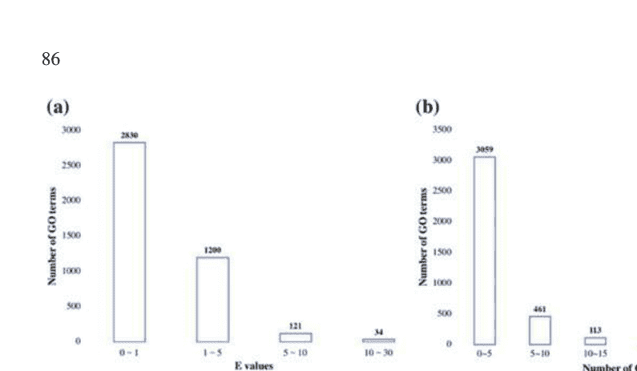

#### 4.2.2 分子特征和向量生成

选择与CTRCD显著相关且进一步有助于ML模型高性能的临床相关变量至关重要。为了做到这一点，可以评估每个结果和变量对的逻辑回归模型的权重。逻辑回归（LR）对每个特征应用权重，预测是权重和特征对的乘积的总和。临床相关变量可以基于两个标准：（1）变异系数（标准差（SD）和均值的比率）的绝对值低，以确保权重在100次重复中波动较小；（2）与该结果的极值权重相比，相关权重的绝对值较高（相对权重）。

此外，建议测试临床相关变量的危险比（95%置信区间（CI））以验证其实用性。使用Wald χ²检验评估具有统计显著系数的变量。

以下R软件包可用于测试危险比对生存结果的影响（v2.44-1.1）和`survminer`（v0.4.6）软件包在R 3.6.1上。

为了进一步可视化富集，我们将1024维基因向量投影到二维平面上，以查看GO术语的富集是否表现为平面上相应基因的聚类。对于小E值的GO术语，可以轻松选择投影平面来聚类相应的基因。例如，负调节胰岛素分泌（GO:0061179）的E值为0.033，非常小；因此，相应的基因用红色表示。

图4.2将基因向量投影到线性平面上以区分给定的GO术语。红色（黄色）的点表示与GO术语相关（不相关）的基因。GO术语包括：a负调节胰岛素分泌（GO:0061179），bPERK介导的未折叠蛋白应答（GO:0036499），c动脉发育（GO:0060840），d破骨细胞分化（GO:0030316）。

图4.2a中的点与未与GO:0061179相关的基因（黄色点）明显分离。线性投影对于PERK介导的未折叠蛋白应答（GO:0036499）和动脉发育（GO:0060840）也取得了成功，两者的E值均为0.5（图4.2b，c）。即使对于破骨细胞分化（GO:0030316），线性投影仍然可接受，其E值为3.0（图4.2d）。对于较大的E值，线性投影不足够，因此我们使用t分布随机邻居嵌入（t-SNE）将基因投影到三维空间中，这是一种非线性降维方法，通过`TensorBoard`（Luus等，2019）找到了有效的展望。该方法对于细胞分化（GO:0030154；E=15.8）、细胞迁移（GO:0016477；E=12.45）、DNA复制(GO:0006260; E=10.09)，以及发展(GO编号未分配)(图4.3a–d)。总之，基于生物功能，基因向量可以通过线性/非线性降维进行聚类。基因-功能的简单可视化将有助于测试药物的有效性。

#### 4.2.3 细胞向量：生成和评估

细胞向量 `C` 被定义为

$$C = \frac{\sum_{i=0}^{N} G_i \times e_i}{N} \qquad\qquad (4.1)$$

其中`$N$`是考虑到细胞的基因数量，`$G_i$`是第`$i$`个基因向量，而`$e_i$`是第`$i$`个基因的表达水平。为了构建真实的细胞向量，我们使用了`CMap`数据库的`GSE92742`数据集（Subramanian等人，2017年；Senior等人，2020年）。

存储在`GEO`（Edgar等人，2002年; Barrett等人，2013年）中的基因表达数据包括1,319,138个细胞。对于这1,319,138个细胞中的每一个，`GSE92742`记录了转录组中大约12,000个基因的表达水平。这12,000个基因与8808个地标基因的交集是一个包含7042个基因的集合；因此，在公式（4.1）中我们设置`$N =7042$`。简而言之，通过将每个7042个基因向量与其表达水平相乘，将它们相加，然后除以7042来构建细胞向量。通过这种方式，所有的1,319,138个细胞都被嵌入到了空间中。由于1,319,138个细胞太多了，无法处理，我们从中随机选择了10,000个细胞进行初步研究。

正如基因向量允许对基因中的GO术语进行定量化/可视化一样，细胞向量允许对细胞中的细胞类型进行定量化/可视化。为了查看相同类型的细胞是否在空间中聚集，我们计算了在10,000个细胞集合中给定细胞类型的整体富集度`$E$`。总共我们研究了69种细胞类型。经过统计分析，我们发现细胞类型富集度（图4.4）比基因中的GO术语富集度（图4.1a）更加显著。

为了可视化富集度，我们测试了三种细胞类型：正常肺细胞（`HCC515`; `$E=4.58$`），主要位于皮肤的肿瘤细胞（`A375`; `$E=20.67$`）和前列腺肿瘤细胞（`VCAP`; `$E=39.83$`）。对于这三种细胞类型，使用`$t$-SNE`将10,000个细胞投影到三维空间中（图4.5）。

图4.4 69种细胞类型的统计数据：69种细胞类型的 E值的直方图，其中有12个、31个、8个、13个和5个细胞的 E值分别在2-5、5-10、10-20、20-30和30-40的范围内

可以看到目标细胞类型的细胞（蓝色点）聚集在一起，并且与其他细胞（橙色点）明显分离。为了进一步测试聚类效果，我们选择了另一组由原代细胞（例如`NPC`、`NPC.CAS9`、`NPC.TAK`、`ASC`）、正常细胞系细胞（例如`HA1E`、`HA1E.101`、`HCC515`、`HEK293T`）和肿瘤细胞系细胞（例如`U2OS`、`WSUDLCL2`、`YAPC.311`）组成的10,000个细胞，这些细胞记录在`GSE92742`中。通过使用 `t-SNE`，我们将这10,000个细胞投影到三维空间中（图4.6），原代细胞（绿色点）、正常细胞系细胞（红色点）和肿瘤细胞系细胞（蓝色点）聚集在一起，并且彼此之间明显分离。请注意，蓝色点明显多于其他点，因为肿瘤细胞占据了数据库的很大一部分。

通过测试其在药物干扰下的变化，证明了细胞向量的有效性（见下文）。特别是，我们展示了对于几种情况，其中一个远离正常细胞向量的癌细胞向量变得更接近正常细胞向量。

#### 4.2.4 深度药物效应预测器：训练和验证

在开发`DDEP`之前，我们开发了四个基于`GCN`的预模型（图4.7），分别学习以下四个药物性质：油水分配系数（`logP`），合成可及性（`SAS`），药物相似性的定性估计（`QED`）和拓扑极性表面积（`TPSA`）。这些预模型通过提供来自`ZINC`数据库（Irwin和Shoichet 2005）的约360,000个药物结构进行训练。通过最小化训练损失（公式（4.6）），即计算药物性质与实际药物性质之间的差异，预模型成功地进行了训练。最小化的训练损失见表4.1。

为了验证训练好的预模型，我们从`ZINC`中提取了另一组50,000个药物结构，将其输入预模型中，得到了预测的药物性质及其与实际药物性质的差异，即验证损失（表4.1）。我们发现训练是成功的，因为训练损失和验证损失都很小且接近。

现在预模型已经“记住”了许多药物结构。基于四个训练后的预模型，通过连接输出构建了`DDEP`。

图4.7 基于`GCN`的深度学习模型。在预模型中（左侧），化学结构信息进入输入层（灰色），经过`GCLs + attention +gate`（紫色）和密集层（黄色），最终得到输出。在`DDEP`中（右侧），预模型被转移并作为输入1。结合输入2（药物的剂量和扰动时间），信息通过密集层计算药物效应向量。

表4.1 `DDEP`的训练、验证和测试损失

|          | `logP`   | `QED`    | `SAS`    | `TPSA`   | 药物效应          |
|----------|--------|--------|--------|--------|-------------------|
| 训练损失 | 0.6178 | 0.1383 | 0.2091 | 0.7489 | 0.01786683875     |
| 验证损失 | 0.6219 | 0.1316 | 0.2101 | 0.6988 | 0.020866077       |
| 测试损失 | –      | –      | –      | –      | 0.020866339       |

使用新输入的预模型，即药物剂量和药物治疗持续时间（图4.7）。信息通过密集层传递，生成输出，即1024维药物效应向量。

为了训练`DDEP`，我们再次使用了`GSE92742`数据集。在1319138个细胞中，672128个细胞接受了药物治疗，但只有645319个细胞可用（一些细胞由于各种原因不可用，例如被过大的药物治疗）。对于这645319个细胞中的每一个，从总共的1319138个细胞中选择相应的对照细胞，通过将对照细胞向量从细胞向量中减去来获得其药物效应向量。这645319个细胞被分为训练、验证和测试集，分别包含625200个、10000个和10119个细胞。然后，`DDEP`按顺序训练每个625200个细胞。

在给定细胞的训练过程中，`DDEP`的权重值一直被修改以最小化训练损失，即计算药物效应向量与实际药物效应向量之间的最小二乘误差。收敛的训练损失为0.0178668。然后，使用验证集中的10,000个细胞对训练后的`DDEP`进行验证。在验证过程中，不允许调整`DDEP`，因此计算得到的药物效应向量可以称为预测的药物效应向量。

收敛的验证损失为0.0208661。然后，使用剩下的10,119个细胞进一步测试经验证的`DDEP`，得到收敛的测试损失为0.0208663。测试过程与验证过程没有本质区别。

## 4.2.5 `DDEP`在预测乳腺腺癌抗癌药物效应方面的应用

我们的工作示例基于来自`GSE92742`数据集的`MCF7`细胞，这是一种特定的乳腺腺癌亚型，来自一位69岁的女性捐赠者（Soule等人，1973年）。`MCF7`细胞要么用四种药物之一以10 μM浓度处理6小时，要么不用任何药物处理。未经处理的细胞作为对照，因为它们只接触到含有二甲基亚砜（`DMSO`）的培养基。这四种FDA批准的药物是：帕博西尼布、拉帕替尼、博苏替尼和舒尼替尼（图4.8，左列）。前两种药物用于训练`DDEP`，后两种药物未使用。帕博西尼布是一种细胞周期依赖性蛋白激酶抑制剂。通过抑制DNA复制和减少肿瘤细胞增殖，它用于治疗转移性乳腺癌的绝经后妇女（国家生物技术信息中心2021c）。拉帕替尼是一种酪氨酸激酶受体抑制剂，用于治疗`HER2`过表达的晚期或转移性乳腺癌（国家生物技术信息中心2021d）。博苏替尼是一种双重激酶抑制剂（针对`BCR-ABL`和`Src`酪氨酸激酶）。它在II期临床试验中显示出治疗乳腺癌患者的有效性（Campone等人，2012年；国家生物技术信息中心2021a）。舒尼替尼是一种多靶点酪氨酸激酶受体抑制剂，对治疗乳腺癌患者具有一定的有效性（Burstein等人，2008年）。尽管根据一些III期临床试验，它并不比其他药物更好（Mayer等人，2010年；Crown等人，2013年），但这些试验没有使用基于分子标记的患者分层和结果评估（Elgealy等人，2016年；国家生物技术信息中心2021a）。

通过`DDEP`预测了四种药物的药效向量，然后与实验获得的药效向量进行比较。对于帕博西尼布，预测的药效向量如图4.9所示，为红色的分段线性函数（维度从1到1024）；实验药效以平均值（蓝线）、中位数（灰线）和25至75百分位数范围（粉色区域）表示。多个展示是为了涵盖对`MCF7`细胞进行多次实验的情况。

| Drugs | Experimental Data | DDEP Results |
|-------|-------------------|--------------|
| **Palbociclib**<br>结构式图片 | Treated `MCF7` (Cancer Cell): 0.1933<br>`MCF10A` (Normal Cell): 0.2820<br>Untreated `MCF7` (Cancer Cell): 0.2304 | Treated `MCF7` (Cancer Cell): 0.1970<br>`MCF10A` (Normal Cell): 0.2820<br>Untreated `MCF7` (Cancer Cell): 0.2316 |
| **Lapatinib**<br>结构式图片 | Treated `MCF7` (Cancer Cell): 0.2026<br>`MCF10A` (Normal Cell): 0.2820<br>Untreated `MCF7` (Cancer Cell): 0.2402 | Treated `MCF7` (Cancer Cell): 0.1914<br>`MCF10A` (Normal Cell): 0.2820<br>Untreated `MCF7` (Cancer Cell): 0.2313 |

| **Bosutinib**<br>结构式图片 | Treated MCF7 (Cancer Cell): 0.1950<br>MCF10A (Normal Cell): 0.2820<br>Untreated MCF7 (Cancer Cell): 0.2324 | Treated MCF7 (Cancer Cell): 0.1937<br>MCF10A (Normal Cell): 0.2820<br>Untreated MCF7 (Cancer Cell): 0.2286 |
| **Sunitinib**<br>结构式图片 | Treated MCF7 (Cancer Cell): 0.1938<br>MCF10A (Normal Cell): 0.2820<br>Untreated MCF7 (Cancer Cell): 0.2323 | Treated MCF7 (Cancer Cell): 0.1941<br>MCF10A (Normal Cell): 0.2820<br>Untreated MCF7 (Cancer Cell): 0.2295 |

图4.8 药物对癌细胞的影响，通过药物效应向量和DDEP计算得出。左列：针对乳腺腺癌的四种FDA批准药物。中列：根据实验数据计算得出的三个细胞向量之间的距离。右列：根据DDEP计算得出的三个细胞向量之间的距离。

帕博西尼布，如`GSE92742`中所记录。对于拉帕替尼，博苏替尼和舒尼替尼，结果分别在图4.10、4.11和4.12中呈现。这些表示成功是因为预测值和实验值一致，并且大多数预测值落在25至75百分位数范围内（分别为帕博西尼布、拉帕替尼、博苏替尼和舒尼替尼的54.2%、93.7%、64.3%和44.6%）。由于博苏替尼和舒尼替尼在训练阶段未使用，我们的DDEP可以准确预测未知化学物质对细胞的影响。

药物治疗后，癌细胞是否变得更健康？这可以通过使用正常细胞系作为参考来确定。我们使用的是`MCF10A`，一种源自正常人类乳腺上皮的免疫化细胞系。总共有三种细胞向量，即`MCF10A`细胞向量、未经处理的`MCF7`细胞向量和经过处理的`MCF7`细胞向量；后者可以根据使用的药物进一步分类。药物治疗的浓度和持续时间分别为10 μM和6小时。即使在应用DDEP之前，我们的细胞向量特征已经揭示出，对于所有四种药物，`MCF7`细胞在药物治疗后比药物治疗前更接近正常细胞（图4.8，中间列）；这些变化都非常显著，因为治疗后的`MCF7`细胞现在比未经治疗的`MCF7`细胞更接近正常细胞。例如，正常细胞`MCF10A`与未经治疗的癌细胞`MCF7`之间的距离在SPACE中为0.2820。将癌细胞用帕博西尼布治疗后，治疗后癌细胞与正常细胞之间的距离显著减小至0.1933，甚至小于治疗后癌细胞与未经治疗的癌细胞之间的距离。因此，我们的结果表明，这四种药物都具有良好的治疗效果，这与它们都获得FDA批准的事实一致。重要的是，我们的DDEP准确预测了药物效应，因为预测距离与实际距离非常接近（图4.8，右列）。最大的预测误差出现在拉帕替尼治疗中，治疗后癌细胞与正常细胞之间的预测距离和实际距离分别为0.1914和0.2026，误差为5.5%。准确的DDEP结果不仅证实了我们的细胞向量分析，还展示了我们DDEP的强大能力。

### 4.2.6 药物分类的洞察

通过与药物效果向量的关联，药物也可以嵌入到空间中，在适当的维度缩减后，可以可视化（图4.13），并可能揭示出有趣的模式。例如，聚集在一起的点对应于对细胞具有类似效果的药物；它们以类似的方式扰乱细胞信号通路和基因表达，因此它们应该属于同一类。由于这可能代表一种新的药物分类方法，我们将其与现有的药物分类系统进行比较，以检查它们的一致性。

我们使用解剖治疗化学（ATC）分类系统（世界卫生组织药物统计方法学合作中心2014年），该系统根据药物对其作用的器官或系统以及其治疗、药理和化学特性将药物的活性成分分为14种类型（A、B、C、D、G、H、J、L、M、N、P、R、S、V）。对于系统中的每种药物，其分子结构、浓度（固定为10 μM）和处理时间（固定为6小时）被输入到DDEP中，然后计算药物效果向量。通过t-SNE，将向量投影到三维空间中，并显示为蓝点（如果药物属于目标类型）或黄点（如果药物属于其他所有类型）。图4.13a-d分别显示了目标类型为A（消化道和代谢）、C（心血管系统）、M（肌肉骨骼系统）和A10（肥胖和糖尿病）时的结果。可以看到蓝点（即目标类型的药物）与其他药物明显分离，证明了基于向量的药物分类的有效性。

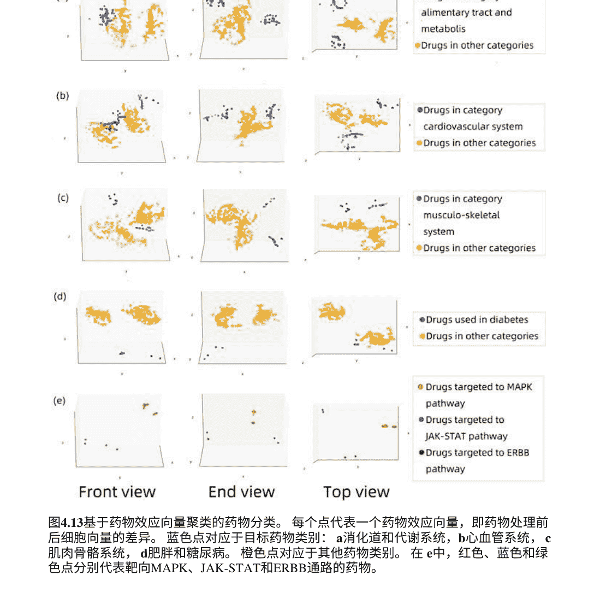

图4.13 基于药物效应向量聚类的药物分类。每个点代表一个药物效应向量，即药物处理前后细胞向量的差异。蓝色点对应于目标药物类别：a 消化道和代谢系统，b 心血管系统，c 肌肉骨骼系统，d 肥胖和糖尿病。橙色点对应于其他药物类别。在e中，红色、蓝色和绿色点分别代表靶向MAPK、JAK-STAT和ERBB通路的药物。

然后我们使用DDEP对靶向不同通路的药物进行分类，即MAPK通路（Segre和Krebs 1995；Kim和Choi 2010），JAK-STAT（Janus激酶/信号转导子和转录激活因子）通路（Rawlings等人，2004年），以及由ErbB家族蛋白（`ErbB1`-`ErbB4`）组成的ERBB通路。这些通路在细胞增殖、迁移、运动和凋亡的调控中都非常重要，其失调可能导致复杂疾病如癌症。由于它们之间高度相互连接，这将是困难的以区分它们各自的药物。然而，我们的DDEP在区分这些靶向途径药物方面非常有效，因为这些药物被投影到三维空间的不同区域（图4.13e）。

### 4.3 讨论

为了预测药物对细胞的影响，我们开发了一种基于GCN的深度学习模型，该模型整合了人类细胞的基因相互作用网络、药物分子的结构以及药物诱导的基因表达等多源信息。在该模型中，每个基因由一个1024维的基因向量表示，任意两个基因向量之间的距离量化了这两个基因的相关性，这是通过在文献中搜索基因的上下文关系发现的；然后通过整合8808个重要人类基因的向量以及它们的表达水平来构建一个细胞向量。药物的效果也可以用一个向量表示，即由药物引起的细胞向量的变化。基于向量表示，我们开发了DDEP，它本质上是一个编码药物效果的GCN，以药物化学结构作为输入。

我们发现DDEP可以比简单的药物/靶标分类更准确地预测药效，并且向量表示很好地把握了细胞的综合状态。

目前的模型类似于`DeepDTnet` (Zeng等人，2020年)，它也是一个深度学习模型，用于使用DrugBank中的小分子药物、ATC代码标签以及化学、表型、基因组和细胞网络的信息进行靶标识别。然而，目前的模型的独特之处在于广泛使用向量来表示基因、细胞和药物效应。

在组学技术和机器学习方法快速发展的背景下，并且随着多层次数据（基因组、转录组、蛋白质组、药物分子结构、药物性质）的积累，我们的向量表示将越来越接近真实的细胞状态，我们的DDEP将越来越强大地预测药效。通过与虚拟药物筛选的结合，我们希望我们不断发展的DDEP在药物发现中发挥重要作用。

### 4.4 方法

我们使用了各种多源数据，例如来自STRING数据库（von Mering等人，2005年）的基因相互作用网络数据，来自CMap数据库（Subramanian等人，2017年）的化学处理前后的基因表达数据，以及来自ZINC数据库（Irwin和Shoichet，2005年）的化学结构和性质数据。为了生成基因向量，我们使用Dijkstra的算法（Dijkstra，1959年）捕捉了大规模人类基因相互作用通路中的上下文信息，然后对上下文进行处理。

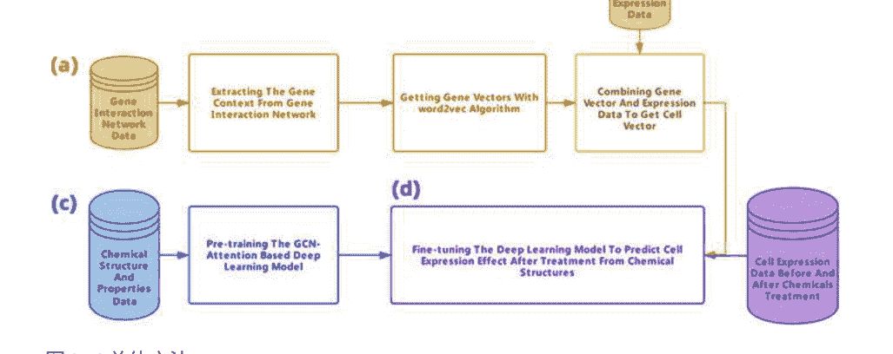

通过使用word2vec算法（Mikolov等人，2013a, b）（图4.14a），我们将细胞中许多重要基因的向量整合并考虑它们的表达水平，从而生成了一个细胞向量（图4.14b）。然后，我们构建了一个基于GCN的深度学习模型，称为DDEP，该模型提取了药物结构和性质的隐藏信息（图4.14c），从而可以预测药物的功效（图4.14d）。DDEP通过许多细胞的药物处理前后的基因表达数据进行训练。

#### 4.4.1 从基因的相互作用网络中捕获上下文信息

我们使用`Dijkstra`算法，在具有加权边的拓扑图中寻找最短路径，从`PathCards`数据库（Belinky等人，2015）中提取人类基因相互作用通路中的基因上下文信息。对于给定的通路，基因-基因相互作用网络是从`STRING`数据库（von Mering等人，2005）的蛋白质-蛋白质相互作用数据转换而来的。总共，我们从`STRING`数据库中提取了8923个基因和880,588个基因相互作用对，这些对在不同的人类细胞中发挥着重要作用。我们使用组合得分（用`c`表示），一个介于0和1之间的数字，来量化任意两个基因之间的亲近程度。它考虑了基因相关性的七个不同方面：保守邻域、基因融合、系统发育共存、共表达、大规模实验、文献共存和数据库导入（von Mering等人，2005）。我们从`STRING`中提取了组合得分。两个基因`i`和`j`之间的距离定义为`d_{ij} = 1 - c_{ij}`。如果基因是网络的节点，那么`d_{ij}`自然成为节点`i`和`j`之间边的权重。对于一个包含`n`个基因的网络，应用`Dijkstra`算法需要计算所有`n^2 - n`个可能的路径。

#### 4.4.2 生成基因向量和细胞向量

`Word2vec`是一种传统的自然语言处理算法（NLP）（Mikolov等人，2013a，b）。它可以通过构建一个模型来嵌入独热向量，用于预测中心词的上下文词，或者反之亦然。同样，对于给定的基因，我们使用基因相互作用网络中的上下文基因创建其基因向量，其中使用了`word2vec`进行嵌入，并使用负采样的`skip-gram`模型作为近似训练方法。在训练之前，我们进行了子采样以平衡高频基因和低频基因之间的采样率。训练后，我们得到了对人类基因相互作用通路起关键作用的8808个基因的1024维向量。

根据生成的基因向量，如在结果中所述，生成了细胞向量。请注意，基因表达数据以`L1000`阵列的形式存在，该阵列旨在生成低成本和高通量数据，并由978个标志性转录本的探针和80个控制转录本的探针组成（Subramanian等人，2017年）。

### 4.4.3 基于GCN的预模型

为了加快`DDEP`的收敛速度，我们开发了四个基于`GCN`的预模型（图4.7（左）），分别学习以下四个药物性质：`logP`、`TPSA`、`SAS`和`QED`。预模型的输入包括化学结构数据，包括原子邻接矩阵和特征矩阵（Ryu等人，2018年）。只保留原子数小于50的小分子，每个小分子的邻接矩阵根据其拓扑图结构构建，特征矩阵由原子类型、原子连接度、连接的氢原子数（主要和隐藏的）、隐藏的氢原子数以及是否芳香性组成。预模型基于参考文献中的`GCN`（Ryu等人，2018年），其特点是多头注意力和门机制。为了减少权重数量并提高模型稳定性，第二层和第三层之间的权重是共享的（Wu等人，2013年；Xin等人，2016年；Hu，2018年）。从输入层到输出层的前向计算涉及将化学结构信息输入第一个带有注意力的图卷积层（`GCL`），将计算结果传递到第二个和第三个带有注意力和门机制的`GCL`，并在最后的三个稠密层中计算预测值作为输出（方程（4.2））：

$$H_i^{(l+1)} = \sigma\left( \frac{1}{K}\sum_{k=1}^K \sum_{j\in N(i)} \alpha_{ij,k}^{(l)} H_j^{(l)} W^{(l)} \right) \tag{4.2}$$

其中`H_i^{(l)}`表示第`l`层节点`i`的状态，`\sigma`是`sigmoid`激活函数，`K`是注意力的总数，`N(i)`是节点`i`的邻居集合，`W^{(l)}`是第`l`层的卷积权重，`\alpha_{ij,k}^{(l)}`是第`k`个注意力和第`l`层节点`i`和`j`之间的注意力系数。更详细地说，

$$\alpha_{ij}^{(l)} = \sigma\left( \left(H_i^{(l)} W^{(l)}\right) C^{(l)} \left(H_j^{(l)} W^{(l)}\right)^T \right) \tag{4.3}$$

其中`C^{(l)}`是第`l`层的耦合矩阵。请注意，应用了门控跳跃连接（`gsc`）机制：

$$H_{i,gsc}^{(l+1)} = z_i \odot H_i^{(l+1)} + (1-z_i) \odot H_i^{(l)} \tag{4.4}$$

其中`\odot`是逐元素矩阵乘法（哈达玛积）和

$$z_i = \sigma\left( W_{z,1} H_i^{(l+1)} + W_{z,2} H_i^{(l)} + b_z \right) \tag{4.5}$$

其中`W_{z,1}`、`W_{z,2}`和`b_z`是可训练的参数。

对于实现，我们使用了`MxNet` GPU版本1.2.1来构建我们的模型。我们从小分子化合物数据集中随机选择了360,000条记录作为训练集，50,000条记录作为验证集。损失函数定义如式（4.6）。

$$\text{损失} = \frac{1}{2} \sum_i (Y_i - P_i)^2 \tag{4.6}$$

其中`P`和`Y`分别代表预测值和真实值。使用`Adam`优化算法在高性能集群（`HPC`）上的四个`GPU`节点上进行分布式数据并行训练。每个`GPU`节点上的总批量大小为`12 \times 100 = 1200`，其中12是一个`GPU`节点的卡数。学习率、权重衰减、学习率衰减和学习率衰减周期分别为0.01、0.95、0.5和20（30）。`log P`、`SAS`和`QED`模型分别训练了100个时期，而`TPSA`模型训练了150个时期。

#### 4.4.4 深度药物效应预测器

预模型中存储了关于药物在`GCL`权重值中的物理/化学特性的信息，将其与基础开发进行连接。完整的`DDEP`（图4.7（右））的开发基于预模型的输出，以及不同药物剂量（0.08、0.4、2、10 μM）和扰动时间（6小时和24小时）的数据，最终通过新的密集层产生1024维药物效应向量的输出。预模型的输出与不同药物剂量（0.08、0.4、2、10μM）和扰动时间（6小时和24小时）的数据一起发送到新的密集层，最终产生1024维药物效应向量的输出。

效果 = Y - X

其中，`X`和`Y`分别是药物处理前后的细胞向量。`DDEP`是使用`GSE92742`数据集中的645,319个药物处理细胞和相应的对照细胞进行训练的。我们使用了551种小分子药物（表4.2），其`ATC`分类数据来自`DrugBank`（Law et al.2014; Wishart et al.2018），其中有64种药物靶向单一途径（表4.3）。`t-SNE`算法用于在三维空间中可视化药物效果向量。

## 表4.2：来自DrugBank的555种药物的规范SMILES表示和标签（ATC代码）

| No. | DrugBankID | 规范SMILES表示 | ATC |
| :--- | :--- | :--- | :--- |
| 1 | DB00140 | CC1=CC=C2CN(C@H](C@H](O)C@H](C)C(=O)C@H](C)C@H](C)C(=O)O)NC2=NC1 | A11 |
| 2 | DB00209 | [H][C@]12CC[C@](O)(C(=O)C1)[C@@H](C)CC[C@@H]2C@H](C)C(=O)O[C@H](C)C(=O)O | A03 |
| 3 | DB00213 | COC1=CC(C(=O)O)C2=C(C=CC(=C2)C(=O)OC)C=C1 | A02 |
| 4 | DB00219 | CC1=CC=CC=C1C(=O)NC2=CC=CC=C2 | A03 |
| 5 | DB00222 | CCC1=CC(C(=O)O)C2=C(C=CC(=C2)C(=O)OC)C=C1 | A10 |
| 6 | DB00284 | [H][C@]12CC[C@](O)(C(=O)C1)[C@@H](C)CC[C@@H]2C@H](C)C(=O)O[C@H](C)C(=O)O | A10 |
| 7 | DB00295 | [H][C@]12CC[C@](O)(C(=O)C1)[C@@H](C)CC[C@@H]2C@H](C)C(=O)O[C@H](C)C(=O)O | A07 |
| 8 | DB00338 | C1CC1C(=O)NC2=CC=CC=C2 | A02 |
| 9 | DB00383 | CN1CCN=C1C2=CC=CC=C2 | A03 |
| 10 | DB00412 | CN1CCN=C1C2=CC=CC=C2 | A10 |
| 11 | DB00424 | CN1CCN=C1C2=CC=CC=C2 | A03 |
| 12 | DB00448 | CC1=CC=C(C=C1)NC2=CC=CC=C2 | A02 |
| 13 | DB00501 | CC1=CC=C(C=C1)NC2=CC=CC=C2 | A02 |
| 14 | DB00581 | CN(C)CCCN1C2=CC=CC=C2SC3=CC=CC=C31 | A06 |


| 序号 | DrugBank ID | 规范SMILES表示 | ATC |
|------|-------------|----------------|-----|
| 15 | DB00635 | `[H][C@]12CC[C@](O)(C(=O)C1)[C@@H](C)CC[C@@H]2C@H](C)C(=O)O[C@H](C)C(=O)O` | A07 |
| 16 | DB00641 | `[H][C@]12CC[C@](O)(C(=O)C1)[C@@H](C)CC[C@@H]2C@H](C)C(=O)O[C@H](C)C(=O)O` | A10 |
| 17 | DB00668 | `C1CC1C(=O)NC2=CC=CC=C2` | A01 |
| 18 | DB00736 | `CC1=CC=C(C=C1)NC2=CC=CC=C2` | A02 |
| 19 | DB00782 | `C1CC1C(=O)NC2=CC=CC=C2` | A03 |
| 20 | DB00836 | `CN1CCN=C1C2=CC=CC=C2` | A07 |
| 21 | DB00847 | `NCCS` | A16 |
| 22 | DB00912 | `CCOc1ccc(CC@H]2C(CCC(=O)N[C@@H](C(c3ccccc3)C(=O)OC)c3ccccc3)C(=O)N[C@@H](C(=O)OC)C(=O)OC)cc1O)CC(=O)N2C` | A10 |
| 23 | DB00914 | `NC(=N)NCCSCc1ccccc1` | A10 |
| 24 | DB00916 | `CC1=NC=C(NC(=O)N1)C` | A02 |
| 25 | DB00927 | `CIN+1(C)C=NCSCCC(N)=O` | A02 |
| 26 | DB00986 | `CC(C)C1=CC(=O)C=CC1=CC=C1` | A03 |
| 27 | DB01025 | `CC(=O)OCC(=O)OCC(=O)OC(=O)C(=O)OC(=O)C(=O)OC(=O)C(=O)OC` | A01 |
| 28 | DB01060 | `[H][C@@]12SC(C)(C)[C@@H](C(=O)N1C)C(=O)N2C` | A02 |
| 29 | DB01129 | `COCCOC1=C(C)C(=C(C(=O)C1=O)O)C` | A02 |
| 30 | DB01132 | `CCC1=CN=C(C(=O)N1)CC` | A10 |
| 31 | DB01156 | `CC(C)(C)OC(=O)CC1=CC=C(C=C1)OC` | A10 |
| 32 | DB01183 | `OC1=CC=C2C@H](C@@H](C(=O)OC)CC2=CC(=O)OCC)C@@H](C@@H](O)CC)C@@H](C@@H](O)C1=CC=CC=C1)C@@H](O)C@@H](C1=CC=CC=C1)O` | A08 |
| 33 | DB01382 | `COCCOC1=CN=C(CS(=O)OCC)C=C1` | A06 |
| 34 | DB01436 | `CC(C)CC1=CC=CC=C1C@@H](C@H](C)N)C@@H](C)N` | A10 |
| 35 | DB01625 | `CC(C)C1=CC=C(C=C1)C@@H](C)N` | A11 |
| 36 | DB02329 | `[H][C@@]12CC[C@H](C(=O)OC)[C@@]1(C)CC[C@@H]1[C@@]2(C)CC[C@H](C1=CC=CC=C1)C(C)C` | A03 |
| 37 | DB02901 | `CC1=CC=C(C=C1)S(=O)(=O)N` | A02 |
| 38 | DB04816 | `[H][C@@]12CC[C@@H](C)[C@@]1(C)CC[C@@H]1[C@@]2(C)CC[C@H](C1=CC=CC=C1)C(C)C` | A14 |
| 39 | DB04876 | `OC1=CC=C(C=C1)/C=C/C(=O)O` | A06 |
| 40 | DB06292 | `COCC1=CC=C(C=C1)C@@H](C)N` | A10 |
| 41 | DB06335 | `CC1=CC=C(C=C1)/C=C/C(=O)O` | A10 |
| 42 | DB08907 | `CC1=C(C(=C(C=C1)O)O)C(=O)O` | A10 |
| 43 | DB09038 | `OC[C@H]1O[C@H](C@@H](O)[C@@H]1O)C1=CC=C(C)C(=C1)C(C)(C)C` | A06 |
| 44 | DB090268 | `OS(=O)(=O)C1=CC=C(C=C1)C1=CC=C(C=C1)C1=CC=CC=C1` | A06 |
| 45 | DB090300 | `CCCC[N+]1C[C@H](C1)C(=O)OC1=CC=CC=C1` | A03 |
| 46 | DB090462 | `O=C(C)OCC` | A12 |
| 47 | DB11093 | `[C@@H]1[C@@H]([C@@H]([C@@H]([C@H]1O)O)O)O` | A12 |
| 48 | DB11126 | `[C@@H]1[C@@H]([C@@H]([C@H]([C@@H]1O)O)O)O` | A12 |
| 49 | DB111315 | `C[N+]1(C)C[C@@H](C[C@@H]1C(=O)OC1=CC=CC=C1)C(=O)OC1=CC=CC=C1` | A03 |
| 50 | DB111386 | `CC(C)OC(=O)C1=CC=CC=C1` | A04 |
| 51 | DB111827 | `CCOC(=O)C1=CC=C(C=C1)OC(=O)C1=CC=CC=C1` | A10 |
| 52 | DB12625 | `CC(C)OC(=O)C1=CC=C(C=C1)N(C)C(=O)C1=CC=CC=C1` | A10 |
| 53 | DB13394 | `CN(C)C(=O)C1=CC=C(C=C1)N(C)C(=O)C1=CC=CC=C1` | A01 |
| 54 | DB13500 | `CCCCCCCC(=O)OC1=CC=C(C=C1)C(=O)OCC` | A03 |
| 55 | DB13542 | `C[N+]1(C)CCCCC1CC(=O)OC1=CC=CC=C1` | A03 |
| 56 | DB13565 | `CCCCCCCCCC[N+](C)(C)CC(=O)OC1=CC=CC=C1` | A01 |
| 57 | DB13586 | `[H][C@]12CC[C@H](C(C)=O)[C@@]1(C)CC[C@@]1([H])C[C@H](O)C[C@@]12C` | A14 |
| 58 | DB13666 | `[H][C@]12CC[C@@]3(C)C(=O)CC[C@@]13[C@@H]1CC[C@@]3(C)CC[C@@]13C` | A03 |
| 59 | DB13844 | `CC1=CC=C(C=C1)C(=O)OC1=CC=C(C=C1)C(=O)OC1=CC=CC=C1` | A03 |
| 60 | DB00158 | `NC1=NC2=NC(=NC(=N2)C(=O)NC)C(=O)N1` | B03 |
| 61 | DB00742 | `OC(=O)C1=CC=C(C=C1)C(=O)O` | B05 |
| 62 | DB00945 | `CC(=O)OC1=CC=C(C=C1)C(=O)O` | B01 |
| 63 | DB01638 | `OC(=O)C1=CC=C(C=C1)C(=O)OCC` | B05 |

## 表4.2 (续)

| 序号 | DrugBank ID | 规范SMILES表示 | ATC |
|------|-------------|----------------|-----|
| 64 | DB03754 | `NC(CO)CO` | B05 |
| 65 | DB09146 | `O.O.O.[OH-].[O-].[O-].[O-].[Na+].[Fe+3][Fe+3][Fe+3][Fe+3][Fe+3][Fe+3]OC[C@H]1OC[C@H](O)[C@@H](O)[C@@H]1O` | B05 |
| 66 | DB11110 | `[Mg++].[Mg++].[O-]C1=CC=CC=C1` | B05 |
| 67 | DB13218 | `OC(=O)C1=CC=CC=C1` | C10 |
| 68 | DB00175 | `[H][C@]12[C@H](C)[C@H](C)[C@@H](C)C(=O)C@@(O)(C1=CC=C2)O` | C09 |
| 69 | DB00177 | `CCCC(C)CC1=CC=C(C=C1)C(C)C(=O)O` | C09 |
| 70 | DB00178 | `[H][C@]12[C@H](C)[C@@H](C)C(=O)C@@(C)(O1)C(=O)C2(C)C` | C02 |
| 71 | DB00206 | `[H][C@]12[C@H](C)[C@@H](C)C(=O)C@@(C)(O1)C(=O)C2(C)C` | C03 |
| 72 | DB00214 | `CC(C)(C)C1=CC=C(C=C1)C(=O)C` | C10 |


| 73 | DB00227 | `[H][C@@]12CC[C@H](C)[C@@]1(O)CC[C@@H]2CC3=CC=CC=C3` | C03 |
| 74 | DB00232 | `C1C(CCC2=CC=CC=C2)C(CC1=O)C3=CC=CC=C3` | C07 |
| 75 | DB00264 | `CCC(=O)OC1=CC=CC=C1` | C09 |
| 76 | DB00275 | `CC(C)CC1=CC=C(C=C1)C(C)C(=O)O` | C07 |
| 77 | DB00335 | `CC(C)CC1=CC=C(C=C1)C(C)C(=O)O` | C09 |
| 78 | DB00343 | `COC1=CC=C(C=C1)C(C)C(=O)O` | C08 |
| 79 | DB00373 | `[H][C@@]12CC[C@](O)(C1)C[C@@H]1CC[C@@H](O[C@@H]2O)C1=O` | C07 |
| 80 | DB00381 | `CC(C)CC1=CC=C(C=C1)C(C)C(=O)O` | C09 |
| 81 | DB00436 | `NS(=O)(=O)C1=CC=CC=C1` | C03 |
| 82 | DB00489 | `CCC(=O)OC1=CC=CC=C1` | C07 |
| 83 | DB00492 | `CCC(=O)OC1=CC=CC=C1` | C09 |
| 84 | DB00519 | `[H]C@12C[C@](C)(O)[C@H](N[C@H](CC3=CC=CC=C3)C(=O)N(C)[C@H]1[C@H]([H])CCC2)C(O)=O` | C09 |
| 85 | DB00524 | `CC1NC2=CCC1(C)(C1)CC(C)(C)C(=O)C1C(O)=O` | C03 |
| 86 | DB00542 | `[H]C@12C[C@](C)(O)[C@H](N[C@H](CC1=CC=CC=C1)C(=O)C1=CC=CC=C1)C1C(O)=O` | C09 |
| 87 | DB00571 | `CCC(C)OC(=O)C1=CC2=CC=CC=C2C1=C1` | C07 |
| 88 | DB00584 | `CCOC(=O)C1=CC=CC=C1NC(=O)C1=CC=CC=C1` | C07 |
| 89 | DB00598 | `CCC(C)N1C(=O)C2=CC=CC=C2C1=O` | C07 |
| 90 | DB00612 | `CCC(C)N1C(=O)C2=CC=CC=C2C1=O` | C10 |
| 91 | DB00627 | `OCC(=O)C1=CC=CC=C1` | C09 |
| 92 | DB00678 | `CCCC1=NCCN1C(=O)C1=CC=CC=C1` | C05 |
| 93 | DB00686 | `O[C@H]1C[C@H](O)[C@H](O)[C@H](O)[C@H]1O` | C09 |
| 94 | DB00691 | `O[C@H]1[C@H](OC(=O)C1)CC1=CC=C(OC(=O)C1)C1=CC=CC=C1` | C09 |
| 95 | DB00722 | `N1CCCC1C(=O)C1=CC=CC=C1` | C03 |
| 96 | DB00770 | `N1CCCC1C(=O)C1=CC=CC=C1` | C09 |
| 97 | DB00774 | `N1CCCC1C(=O)C1=CC=CC=C1` | C01 |
| 98 | DB00790 | `[H]C@12C[C@](C)(O)[C@H](N[C@H](CC1=CC=CC=C1)C(=O)N(C)[C@H]1[C@H]([H])CCC2)C(O)=O` | C09 |
| 99 | DB00806 | `N1C@H12C[C@](C)(O)[C@H](N[C@H](CC1=CC=CC=C1)C(=O)N(C)[C@H]1[C@H]([H])CCC2)C(O)=O` | C04 |
| 100 | DB00808 | `CC1=CC=C(C=C1)C(=O)C1=CC=CC=C1` | C03 |
| 101 | DB00876 | `CCC1=CC=C(C=C1)C(=O)C1=CC=CC=C1` | C03 |
| 102 | DB00880 | `CC1=CC=C(C=C1)C(=O)C1=CC=CC=C1` | C03 |
| 103 | DB00881 | `CC1=CC=C(C=C1)C(=O)C1=CC=CC=C1` | C09 |
| 104 | DB00881 | `CC1=CC=C(C=C1)C(=O)C1=CC=CC=C1` | C09 |
| 105 | DB00908 | `[H][C@@]12C[C@](C)([H])C1=C([H])C(=O)C2=NC=C1` | C01 |
| 106 | DB00960 | `CC(C)(C)C1=CC(=CC=C1)C(=O)C1=CC=C(C=C1)C1=CC=C(C=C1)` | C07 |
| 107 | DB00966 | `CCC1=NC2=C(C=C1)C(=O)N1C2=CC=C1` | C09 |
| 108 | DB00973 | `[H]C1=C(C)C(=O)C2=CC(=CC=C2)C1=O` | C10 |
| 109 | DB00999 | `NS(=O)(=O)C1=CC2=C(C=C1)C(=CC=C2)` | C09 |
| 110 | DB01023 | `CCOC(=O)C1=CC=C(C=C1)C(=O)C1=CC=C(C=C1)` | C07 |
| 111 | DB01029 | `CCC1=C(C)C(=O)C2=CC=CC=C2C1=O` | C05 |
| 112 | DB01047 | `[H]C1=C(C)C(=O)C2=CC=CC=C2C1=O` | C01 |
| 113 | DB01064 | `CCCC1=C(C)C(=O)C2=CC=CC=C2C1=O` | C01 |
| 114 | DB01076 | `CCCC1=C(C)C(=O)C2=CC=CC=C2C1=O` | C02 |
| 115 | DB01089 | `CCCC1=C(C)C(=O)C2=CC=CC=C2C1=O` | C02 |
| 116 | DB01098 | `[H]C1=C(C)C(=O)C2=CC=CC=C2C1=O` | C07 |
| 117 | DB01136 | `CC(C)C1=C(C)C(=O)C2=CC=CC=C2C1=O` | C09 |
| 118 | DB01180 | `[H]C1=C(C)C(=O)C2=CC=CC=C2C1=O` | C07 |
| 119 | DB01193 | `[H]C1=C(C)C(=O)C2=CC=CC=C2C1=O` | C02 |
| 120 | DB01197 | `[H]C1=C(C)C(=O)C2=CC=CC=C2C1=O` | C07 |
| 121 | DB01203 | `[H]C1=C(C)C(=O)C2=CC=CC=C2C1=O` | C09 |
| 122 | DB01275 | `[H]C1=C(C)C(=O)C2=CC=CC=C2C1=O` | C07 |
| 123 | DB01295 | `[H]C1=C(C)C(=O)C2=CC=CC=C2C1=O` | C07 |
| 124 | DB01324 | `CN1C(CSCC(F)F)NC2=CC(Cl)=CC=C2S(=O)(=O)N=O` | C03 |
| 125 | DB01340 | `CCOC(=O)C@H]1CC[C@H](CC1)NC(=O)C1=CC=C(Cl)C=C1` | C09 |
| 126 | DB01359 | `CC(C)(C)C1=CC=C(C=C1)C@H]1CC[C@H](N1C)C(=O)O` | C07 |
| 127 | DB01412 | `CN1C=NC2=C1C(=O)N(C(=O)N2C)C` | C03 |
| 128 | DB01580 | `CC(C)NCC(O)C1=CC=C(O)C=C1` | C07 |
| 129 | DB01698 | `C1C@H]1C[C@@H](C[C@H]1O[C@H]1C[C@@H]([C@H](O1)C(=O)O)N)O[C@H]1C[C@@H]([C@H](O1)C(=O)O)N` | C05 |
| 130 | DB02925 | `NS(=O)(=O)C1=CC=C(N)C=C1` | C03 |
| 131 | DB03325 | `OC1=CC=CC=C1` | C05 |
| 132 | DB04145 | `OC1=CC=CN=C1` | C10 |
| 133 | DB04861 | `OC(=O)C1=CC=CC=C1O` | C07 |
| 134 | DB06152 | `CC(C)CC1=CC=C(C=C1)C(C)C(=O)O` | C04 |
| 135 | DB06403 | `COC1=CC=CC=C1OCC(O)CNC(C)C` | C02 |
| 136 | DB06762 | `CC(NC#N)=NC1=CC=NC=C1` | C02 |


| 序号 | DrugBankID | 规范SMILES表示 | ATC |
|---|---|---|---|
| 137 | DB08807 | CC1=CC2=CC(C)(C)OC2C=C1 | C07 |
| 138 | DB08822 | CCCC1=CC=C(C=C1)C(=O)OC | C09 |
| 139 | DB08985 | CNC(=O)C1=CC=C(C)C=C1 | C01 |
| 140 | DB08995 | CC(C)CC1=CC=C(C=C1)C(C)C(=O)O | C05 |
| 141 | DB09026 | COCCC1=CC(C)=CC(C)=C1 | C09 |
| 142 | DB09238 | COC(=O)C1=CC=C(N)C=C1 | C08 |
| 143 | DB09279 | CCCC1=NC(=O)C2=C(N1)C=CC=C2 | C09 |
| 144 | DB111248 | [Zn+1]1[C@]([C@@](O)[C@]1([H])[C@@]([H])C1=O[H])C@]1[C@@]([H])C(=O)C@]1([H])O | C05 |
| 145 | DB113166 | [C@@]1(C@](C(=O)C1C(=O)C@]1(C)C@]1([H])C(=O)C@]1([H])O | C09 |
| 146 | DB113227 | CC@]1(C@](C(=O)C@]1([H])C(=O)C@]1([H])C@]1([H])O | C05 |
| 147 | DB113277 | CC@]1(C@](C(=O)C@]1([H])C(=O)C@]1([H])C@]1([H])O | C01 |
| 148 | DB113307 | [H]C@]1([C@@]([H])C@]1([H])C@]1([H])C@]1([H])C@]1([H])C@]1([H])C@]1([H])C@]1([H])O | C01 |
| 149 | DB113312 | [C@]1(C@](C(=O)C@]1([H])C(=O)C@]1([H])C@]1([H])O | C09 |
| 150 | DB113345 | [C@]1(C@](C(=O)C@]1([H])C(=O)C@]1([H])C@]1([H])O | C04 |
| 151 | DB113398 | CC@]1(C@](C(=O)C@]1([H])C(=O)C@]1([H])C@]1([H])O | C01 |
| 152 | DB113405 | CN(C1CC(C(=O)C1C(=O)C@]1([H])C@]1([H])O | C03 |
| 153 | DB113430 | CC@]1(C@](C(=O)C@]1([H])C(=O)C@]1([H])C@]1([H])O | C03 |
| 154 | DB113529 | O=C(C1C(C)C(=O)C1C(=O)C@]1([H])C@]1([H])O | C05 |
| 155 | DB113617 | NS(=O)(=O)C@]1(C)C@]1([H])C@]1([H])C@]1([H])C@]1([H])C@]1([H])C@]1([H])C@]1([H])O | C03 |
| 156 | DB113631 | C@]1(C@](C(=O)C@]1([H])C(=O)C@]1([H])C@]1([H])O | C02 |
| 157 | DB113792 | C@]1(C@](C(=O)C@]1([H])C(=O)C@]1([H])C@]1([H])O | C03 |
| 158 | DB113919 | CC@]1(C@](C(=O)C@]1([H])C(=O)C@]1([H])C@]1([H])O | C09 |
| 159 | DB00136 | CC@]1(C@](C(=O)C@]1([H])C(=O)C@]1([H])C@]1([H])O | D05 |
| 160 | DB00210 | CC@]1(C@](C(=O)C@]1([H])C(=O)C@]1([H])C@]1([H])O | D10 |
| 161 | DB00240 | [H]C@]1([C@@]([H])C@]1([H])C@]1([H])C@]1([H])C@]1([H])C@]1([H])C@]1([H])C@]1([H])O | D07 |
| 162 | DB00299 | NC1=NC(=O)C2=C(N1)N(CCO)C=N2 | D06 |
| 163 | DB00324 | [H][C@@]12CC(C)(O)C1=C(Cl)C(Cl)=CC(Cl)=C12 | D07 |
| 164 | DB00336 | NC(=O)NN=CC1=CC=C(C(=O)N1)N+[O-] | D08 |
| 165 | DB00350 | NC1=CC(=C(N=[N+]=[N-])C=C1)N | D11 |
| 166 | DB00394 | [H][C@@]12CC[C@](C)(O)[C@@]1(C)C[C@@H](O)[C@]1(O)C(=O)C[C@@]21C | D07 |
| 167 | DB00400 | CO[C@@]1(CCC(=O)C1=C)C(=O)C1=C(C)C(=O)C(C)(C)C1=O | D01 |
| 168 | DB00446 | OC1CC@HC@H]1C1=CC(=O)C2=C(C1=O)C1=C(C(=O)C=C[C@]1(C)[C@@H]2O)C1=C(C)C(=O)C@HC1 | D06 |
| 169 | DB00452 | [C@@H]1O[C@@H](COC@H]2O[C@@H](OC@H]3C@H](O)C@H](O)C@H](C@@H]3O)C@H](CN)C@H](O)C@H](O)C@H](C@@H]2O)C@H](O)C@H](O)C@H](C@@H]1O)C@H](O)C@H](O)C@H](C@@H]1O)C@H](O)C@H](O)C@H](C@@H]2O)C@H](O)C@H](O)C@H](C@@H]3O)C@H](CN) | D09 |
| 170 | DB00527 | CCCCOC1=NC2=CC=CC=C2C(=O)N1CC | D04 |
| 171 | DB00547 | [H][C@@]12CC[C@](C)(O)[C@@]1(C)C[C@@H](O)[C@]1(O)C(=O)C[C@@]21C | D07 |
| 172 | DB00620 | [H][C@@]12CC[C@](C)(O)[C@@]1(C)C[C@@H](O)[C@]1(O)C(=O)C[C@@]21C | D07 |
| 173 | DB00634 | CC(=O)NS(=O)(=O)C1=CC=C(N)C=C1 | D10 |
| 174 | DB00663 | [H][C@@]12CC[C@](C)(O)[C@@]1(C)C[C@@H](O)[C@]1(O)C(=O)C[C@@]21C | D07 |
| 175 | DB00730 | NIC2=CC=CC=C2NC1=CC=NC=C1 | D01 |
| 176 | DB00846 | CC1(C)OC@H]2C@H](O)C@H](O)C@H](C@@H]2O)C@H](O)C@H](O)C@H](C@@H]1O)C@H](O)C@H](O)C@H](C@@H]2O)C@H](O)C@H](O)C@H](C@@H]3O)C@H](CN) | D07 |
| 177 | DB00860 | [H][C@@]12CC[C@](C)(O)[C@@]1(C)C[C@@H](O)[C@]1(O)C(=O)C[C@@]21C | D01 |
| 178 | DB00936 | OC1=CC1=CC=CC=C1 | D10 |
| 179 | DB00959 | [H][C@@]12CC[C@](C)(O)[C@@]1(C)C[C@@H](O)[C@]1(O)C(=O)C[C@@]21C | D10 |
| 180 | DB01188 | CC1=CC(=O)C(=C1)C1=CC=CC=C1 | D10 |
| 181 | DB01190 | CCC1=C(C)C(=O)NC(C1=O)C1=CC=CC=C1 | D11 |
| 182 | DB01216 | [H][C@@]12CC[C@](C)(O)[C@@]1(C)C[C@@H](O)[C@]1(O)C(=O)C[C@@]21C | D11 |

## 表4.2（续）

| 序号 | DrugBankID | 规范SMILES表示 | ATC |
|---|---|---|---|
| 183 | DB01222 | [H][C@@]12C[C@H](O)C(=O)C1=C[C@]1([H])C@@]([H])CC[C@@]1([H])C(=O)C=C[C@]1([H])C1=CC=C[C@]1([H]) | D03 |
| 184 | DB01783 | CC(C)(CO)C[C@@]1([H])C@]([H])C(=O)N1C(C)(C)C | D05 |
| 185 | DB02300 | O[C@@]1([H])C@]([H])C(=O)N1C(C)(C)C | D02 |


| 186 | DB02362 | CC(C)(CO)C[C@@]1([H])C@]([H])C(=O)N1C(C)(C)C | D08 |
| 187 | DB03175 | CC(C)(CO)C[C@@]1([H])C@]([H])C(=O)N1C(C)(C)C | D02 |
| 188 | DB03904 | CC(C)(CO)C[C@@]1([H])C@]([H])C(=O)N1C(C)(C)C | D08 |
| 189 | DB04813 | OC1=CSC(=C1)C(=O)C1=CC=C1 | D10 |
| 190 | DB05245 | [Ag+]C1=CSC(=C1)C(=O)C1=CC=C1 | D06 |
| 191 | DB08604 | OC1=CSC(=C1)C(=O)C1=CC=C1 | D08 |
| 192 | DB08970 | [H][C@@]12C[C@H](O)C(=O)C1=C[C@]1([H])C@@]([H])CC[C@@]1([H])C(=O)C=C[C@]1([H])C1=CC=C[C@]1([H]) | D07 |
| 193 | DB08971 | [H][C@@]12C[C@H](O)C(=O)C1=C[C@]1([H])C@@]([H])CC[C@@]1([H])C(=O)C=C[C@]1([H])C1=CC=C[C@]1([H]) | D07 |
| 194 | DB09093 | [H][C@@]12C[C@H](O)C(=O)C1=C[C@]1([H])C@@]([H])CC[C@@]1([H])C(=O)C=C[C@]1([H])C1=CC=C[C@]1([H]) | D06 |
| 195 | DB09095 | [H][C@@]12C[C@H](O)C(=O)C1=C[C@]1([H])C@@]([H])CC[C@@]1([H])C(=O)C=C[C@]1([H])C1=CC=C[C@]1([H]) | D07 |
| 196 | DB09357 | CC(C)(CO)C[C@@]1([H])C@]([H])C(=O)N1C(C)(C)C | D03 |
| 197 | DB11085 | CC(C)(CO)C[C@@]1([H])C@]([H])C(=O)N1C(C)(C)C | D10 |
| 198 | DB11125 | CC(C)(CO)C[C@@]1([H])C@]([H])C(=O)N1C(C)(C)C | D08 |
| 199 | DB11157 | CC(C)(CO)C[C@@]1([H])C@]([H])C(=O)N1C(C)(C)C | D05 |
| 200 | DB11573 | OC1=CC(=O)C1=CC=C1 | D09 |
| 201 | DB11750 | [H][C@@]12C[C@H](O)C(=O)C1=C[C@]1([H])C@@]([H])CC[C@@]1([H])C(=O)C=C[C@]1([H])C1=CC=C[C@]1([H]) | D07 |
| 202 | DB13158 | [H][C@@]12C[C@H](O)C(=O)C1=C[C@]1([H])C@@]([H])CC[C@@]1([H])C(=O)C=C[C@]1([H])C1=CC=C[C@]1([H]) | D07 |
| 203 | DB14512 | [H][C@@]12C[C@H](O)C(=O)C1=C[C@]1([H])C@@]([H])CC[C@@]1([H])C(=O)C=C[C@]1([H])C1=CC=C[C@]1([H]) | D07 |
| 204 | DB14540 | [H][C@@]12CC[C@](O)(C(=O)C)[C@@]1[H][C@@]1[H][C@@]2([H])CC[C@@]2CC(=O)CC[C@]12C | D07 |
| 205 | DB00126 | [H][C@@]11OC(=O)C(=C(H)O)CO | G01 |
| 206 | DB00203 | CCC1=NN(C)C2=CN=C(C)C=C1OC(=O)C | G01 |
| 207 | DB00259 | NC1=CC=C(C=C1)S(N)(=O)=O | G01 |
| 208 | DB00304 | [H][C@@]12CC[C@](O)(C(=O)C)[C@@]1[H][C@@]1[H][C@@]2([H])CC[C@@]2CC(=O)CC[C@]12C | G03 |
| 209 | DB00310 | NS(=O)(=O)C1=CC=C(C=C1)C(=O)CC | G01 |
| 210 | DB00346 | COC1=CC2=C(C=C1OC)C(=O)CC(C)(C)OC2=O | G04 |
| 211 | DB00351 | [H][C@@]12CC[C@](O)(C(=O)C)[C@@]1[H][C@@]1[H][C@@]2([H])CC[C@@]2CC(=O)CC[C@]12C | G03 |
| 212 | DB00353 | [H][C@@]12CC[C@@]3(C)C(=O)CC[C@]3([H])[H][C@@]1[H][C@@]2([H])CC[C@@]2CC(=O)CC[C@]12C | G02 |
| 213 | DB00367 | [H][C@@]12CC[C@](O)(C(=O)C)[C@@]1[H][C@@]1[H][C@@]2([H])CC[C@@]2CC(=O)CC[C@]12C | G03 |
| 214 | DB00378 | [H][C@@]12CC[C@](O)(C(=O)C)[C@@]1[H][C@@]1[H][C@@]2([H])CC[C@@]2CC(=O)CC[C@]12C | G03 |
| 215 | DB00396 | [H][C@@]12CC[C@](O)(C(=O)C)[C@@]1[H][C@@]1[H][C@@]2([H])CC[C@@]2CC(=O)CC[C@]12C | G03 |
| 216 | DB00559 | COC1=CC2=C(C=C1OC)C(=O)CC(C)(C)OC2=O | G01 |
| 217 | DB00589 | [H][C@@]12CC[C@@]3(C)C(=O)CC[C@]3([H])[H][C@@]1[H][C@@]2([H])CC[C@@]2CC(=O)CC[C@]12C | G02 |
| 218 | DB00603 | [H][C@@]12CC[C@](O)(C(=O)C)[C@@]1[H][C@@]1[H][C@@]2([H])CC[C@@]2CC(=O)CC[C@]12C | G03 |
| 219 | DB00606 | NS(=O)(=O)C1=CC=C(C=C1)C(=O)CC | G01 |
| 220 | DB00624 | [H][C@@]12CC[C@@]3(C)C(=O)CC[C@]3([H])[H][C@@]1[H][C@@]2([H])CC[C@@]2CC(=O)CC[C@]12C | G03 |
| 221 | DB00655 | [H][C@@]12CC[C@](O)(C(=O)C)[C@@]1[H][C@@]1[H][C@@]2([H])CC[C@@]2CC(=O)CC[C@]12C | G01 |
| 222 | DB00664 | COC1=NC=CN=C1OC | G01 |
| 223 | DB00703 | CNN=C(C1=CC=C(C=N1)C(=O)O)NC | G01 |
| 224 | DB00706 | CCOC1=CC=CC=C1OC(=O)C(C)(C)C | G04 |
| 225 | DB00714 | [H][C@]12CC3=C(C(=O)C3=C(C1)C(CN(C)C)=C23 | G04 |
| 226 | DB00717 | [H][C@@]12CC(C)(C#C)C(=O)C1=C2C=CC=C1 | G03 |
| 227 | DB00783 | [H][C@@]12CC[C@](C)(C#C)C(=O)C1=C2C=CC=C1 | G03 |
| 228 | DB00788 | COC1=CC2=C(C=C1)C(=O)C3=C(C2=O)C=CC=C3 | G02 |
| 229 | DB00795 | OC(=O)C1=CC=C(C=C1)C(=O)NC2=CC=C(C=C2)N(CCCl)CCCl | G01 |
| 230 | DB00819 | CC(=O)NC1=NN=C(S(N)(=O)=O)C=C1 | G04 |
| 231 | DB00820 | [H][C@]12CC3=CC=CC=C3C1=CC=C2 | G01 |
| 232 | DB00826 | [H][C@@]12CC[C@](C)(C=O)C1=CC=C2 | G03 |
| 233 | DB00834 | [H][C@]12CC[C@@](C)(C=O)C1=CC=C2 | G01 |
| 234 | DB00869 | CCN(C)C(=S)NC1=CC=C(C=C1)C(=O)OC2=CC=CC=C2 | G01 |


| 235 | `DB00887` | `CCC1=CC=C(C=C1)C(=O)NC2=CC=C(C=C2)N(CCCl)CCCl` | `G01` |
| 236 | `DB00890` | `[H][C@]12CC[C@](C)(C=O)C1=CC=C2` | `G03` |
| 237 | `DB00891` | `NC1=CC=C(C=C1)S(=O)(=O)NC2=CC=CC=C2` | `G02` |
| 238 | `DB00929` | `CCCC(C(=O)OC1=CC=C(C=C1)C2=CC=C(C=C2)OCC(O)C3=CC=C(C=C3)O)C4=CC=CC=C4` | `G03` |
| 239 | `DB00957` | `[H][C@@]12CC[C@](C)(C=O)C1=CC=C2` | `G01` |
| 240 | `DB00977` | `[H][C@@]12CC[C@@](C)(C=O)C1=CC=C2` | `G04` |
| 241 | `DB01021` | `NS(=O)(=O)C1=C(N)C=CC(=C1)C2=CC=C(C=C2)C3=CC=CC=C3` | `G01` |
| 242 | `DB01119` | `CC1=NS(=O)(=O)C2=C(N)C=CC(=C2)C3=CC=C(C=C3)C4=CC=CC=C4` | `G01` |
| 243 | `DB01126` | `[H][C@@]12CC[C@@](C)(C=O)C1=CC=C2` | `G04` |
| 244 | `DB01325` | `CCCNC(=O)C2=CC(=CC=C2)C1=CC=C(C=C1)C3=CC=CC=C3` | `G01` |
| 245 | `DB01708` | `[H][C@]12CC[C@](C)(O)[C@@]1(C)CC[C@@]1OC(=O)[C@](C)([C@@]11[H])CC[C@]1(C)C(=O)OC` | `G03` |
| 246 | `DB04335` | `OC[C@@]1(O)C[C@@H]2[C@@]1(C)C[C@H]3[C@@]12CC[C@]3(C)C(=O)OC` | `G01` |
| 247 | `DB04573` | `[H][C@]12CC[C@@]3(C)[C@]1(O)CC[C@]3(C)C(=O)OC` | `G03` |
| 248 | `DB04815` | `[C@]1(C)(C(=O)OC)CC[C@@]2(C)[C@]1(O)CC[C@]2(C)C(=O)OC` | `G01` |
| 249 | `DB04839` | `[H][C@]12CC[C@]3(C)[C@]1(O)CC[C@]3(C)C(=O)OC` | `G03` |
| 250 | `DB06147` | `NC1=CC2=C(C)C[C@]3(C)[C@@]2(C)CC[C@]3(C)C(=O)OC` | `G01` |
| 251 | `DB06401` | `CC1=CC=C(C=C1)OC(=O)[C@@]2(C)[C@]3(O)CC[C@]4(C)[C@]3(C)CC[C@]4(C)C(=O)OC` | `G03` |
| 252 | `DB06710` | `[H][C@]12CC[C@]3(C)[C@]1(O)CC[C@]3(C)C(=O)OC` | `G03` |
| 253 | `DB06730` | `CC(C)(C)OC(=O)[C@@]1(C)[C@]2(O)CC[C@]3(C)[C@]2(C)CC[C@]3(C)C(=O)OC` | `G01` |
| 254 | `DB06795` | `CC(C)(C)OC(=O)[C@@]1(C)[C@]2(O)CC[C@]3(C)[C@]2(C)CC[C@]3(C)C(=O)OC` | `G01` |
| 255 | `DB08867` | `CC1=CC[C@@]2(C)[C@]1(O)CC[C@]3(C)[C@]2(C)CC[C@]3(C)C(=O)OC` | `G03` |
| 256 | `DB08881` | `CC(C)(C)OC(=O)[C@@]1(C)[C@]2(O)CC[C@]3(C)[C@]2(C)CC[C@]3(C)C(=O)OC` | `G03` |
| 257 | `DB09123` | `[H][C@]12CC[C@]3(C)[C@]1(O)CC[C@]3(C)C(=O)OC` | `G01` |
| 258 | `DB09124` | `[H][C@]12CC[C@]3(C)[C@]1(O)CC[C@]3(C)C(=O)OC` | `G03` |
| 259 | `DB09389` | `CC(C)(C)OC(=O)[C@@]1(C)[C@]2(O)CC[C@]3(C)[C@]2(C)CC[C@]3(C)C(=O)OC` | `G03` |
| 260 | `DB11636` | `CC(C)(C)OC(=O)[C@@]1(C)[C@]2(O)CC[C@]3(C)[C@]2(C)CC[C@]3(C)C(=O)OC` | `G03` |
| 261 | `DB12474` | `CC(C)(C)OC(=O)[C@@]1(C)[C@]2(O)CC[C@]3(C)[C@]2(C)CC[C@]3(C)C(=O)OC` | `G01` |
| 262 | `DB13026` | `CC(C)(C)OC(=O)[C@@]1(C)[C@]2(O)CC[C@]3(C)[C@]2(C)CC[C@]3(C)C(=O)OC` | `G03` |
| 263 | `DB13129` | `CC(C)(C)OC(=O)[C@@]1(C)[C@]2(O)CC[C@]3(C)[C@]2(C)CC[C@]3(C)C(=O)OC` | `G03` |
| 264 | `DB13143` | `CC(C)(C)OC(=O)[C@@]1(C)[C@]2(O)CC[C@]3(C)[C@]2(C)CC[C@]3(C)C(=O)OC` | `G01` |
| 265 | `DB13248` | `CC(C)(C)OC(=O)[C@@]1(C)[C@]2(O)CC[C@]3(C)[C@]2(C)CC[C@]3(C)C(=O)OC` | `G01` |
| 266 | `DB13268` | `CC(=O)NC1=CC=C(C=C1)O(=O)O` | `G01` |
| 267 | `DB13319` | `COC1=CC=CC1=O)C=CC1=NC(C(N+[O-])=O)C(N+[O-])=O` | `G01` |
| 268 | `DB13350` | `CN1C=C(C2=CC=CC=C21)C(=O)C1=CC=CC=C1N+[O-]=O` | `G01` |
| 269 | `DB13528` | `[H][C@@]12CC[C@](O)(C(=O)COC(=O)CCC(C)C)[C@@]1(C)CC[C@@H]2OC(=O)CCC(C)C` | `G03` |
| 270 | `DB13532` | `NS(=O)(=O)C1=CC2=C(C=C1)C=C(N=C2)C(F)(F)F` | `G01` |
| 271 | `DB13685` | `CC@H]1[C@H]([C@H](C[C@@H](O1)O[C@H]2[C@H](C[C@@H]([C@H](O2)COC(=O)C)O)O)O)O[C@H]3[C@@H]([C@H]([C@@H]([C@H](O3)CO)O)O)O` | `G03` |
| 272 | `DB13866` | `[H][C@@]12C[C@@H](CC1=C)C(=O)OC[C@H](O)[C@@H](OC(=O)c1ccccc1)[C@@H](O)CC(C)(C)O2` | `G03` |
| 273 | `DB14570` | `[H][C@@]12C[C@@H](CC1=C)C(=O)OC[C@H](O)[C@@H](OC(=O)c1ccccc1)[C@@H](O)CC(C)(C)O2` | `G03` |
| 274 | `DB80279` | `N[C@H]1C[C@H](C)OC1=O` | `H03` |
| 275 | `DB80763` | `C1N=CNC1=S` | `H03` |
| 276 | `DB80896` | `[H][C@@]12C[C@@H](CC1=C)C(=O)OC[C@H](O)[C@@H](OC(=O)C1=CC=CC=C1)[C@@H](O)CC(C)(C)O2` | `H03` |
| 277 | `DB83604` | `O=C(O)C1=CC(=CC=C1)C(=O)C1=C(Cl)C=CC=C1Cl` | `H02` |
| 278 | `DB14681` | `[H][C@@]12C[C@@H](CC1=C)C(=O)OC[C@H](O)[C@@H](OC(=O)C1=CC=CC=C1)[C@@H](O)CC(C)(C)O2` | `H02` |
| 279 | `DB80165` | `CC1=C(C)C=C(N1)C(O)C1=CC=CC=C1` | `H02` |
| 280 | `DB80194` | `NC1=NC(=O)C(=C(N)N1)C(F)(F)F` | `J04` |
| 281 | `DB80196` | `O=C(C(F)C(F)(F)F)C(F)(F)F` | `J05` |
| 282 | `DB80233` | `NC1=CC(O)=C1C1=CC=C(Cl)C=C1` | `J01` |
| 283 | `DB80238` | `CC1=CC2=C(C=C1C)N(CCC2)C(C)C1=CC=CC=C1` | `J04` |
| 284 | `DB80249` | `OC1=CC=CC=C1C1=CC=CC=C1` | `J05` |

| 285 | DB80254 | `[H][C@@]12C[C@@H](CC1=C)C(=O)OC[C@H](O)[C@@H](OC(=O)C1=CC=CC=C1)[C@@H](O)CC(C)(C)O2` | J01 |
| 286 | DB80256 | `[H][C@@]12C[C@@H](CC1=C)C(=O)OC[C@H](O)[C@@H](OC(=O)C1=CC=CC=C1)[C@@H](O)CC(C)(C)O2` | J01 |

## 表4.2（续）

| 序号 | DrugBank ID | 规范SMILES表示 | ATC |
|---|---|---|---|
| 287 | DB00263 | `CC1=NOC(NS(=O)=O)C2=CC(Cl)=C(Cl)C=C2C1` | J01 |
| 288 | DB00300 | `[H][C@]1(C(N(C)C(=O)C(Cl)=C(Cl)C1)C(C)(C)C)OC(=O)C(F)(F)F` | J05 |
| 289 | DB00301 | `[H][C@]12SC(C)(C)[C@@H](N1C(=O)C2=CC=CC=C1)C(O)=O` | J01 |
| 290 | DB00319 | `[H][C@]12SC(C)(C)[C@@H](N1C(=O)[C@@H](NC(=O)C1=CC=CC=C1)C2=O)C(O)=O` | J01 |
| 291 | DB00330 | `CC(C)[C@@H](NC(=O)C1=CC=CC=C1)C(=O)N1CC2=CC=CC=C2C1=O` | J04 |
| 292 | DB00339 | `NC1=CC=NC=C1` | J04 |
| 293 | DB00359 | `NC1=C(C(=C(C)N=N1)C2=CC=C(C=C2)S(=O)(=O)N)C3=CC=CC=C3` | J01 |
| 294 | DB00415 | `[H][C@]12SC(C)(C)[C@@H](N1C(=O)C2=CC=C(N)C(=O)O)C(O)=O` | J01 |
| 295 | DB00417 | `[H][C@]12SC(C)(C)[C@@H](N1C(=O)C2=CC(=C(N)C(=O)O)Cl)C(O)=O` | J05 |
| 296 | DB00426 | `CC(=O)OC1CC2(CCCC2(C)C1(O)C=C)C(=O)O` | J04 |
| 297 | DB00440 | `COC1=CC(=CC(=C1OC)OC)C2=CC(=O)C3=C(O2)C=C(C=C3OC)OC` | J01 |
| 298 | DB00485 | `[H][C@]12SC(C)(C)[C@@H](N1C(=O)C2=CC=C(N)C(=O)O)C(O)=O` | J05 |
| 299 | DB00495 | `CC1=C2C(=C(C(=N1)C3=CC=C(C=C3)S(=O)(=O)N)C)C=CC(=N2)C4=CC=C(C=C4)S(=O)(=O)N` | J01 |
| 300 | DB00503 | `CC(C)CC1=CC=C(C=C1)C(C)C(=O)O` | J05 |
| 301 | DB00537 | `O=C(O)C1=CC2=C(C=C1)N=C(N2)C3=CC=C(C=C3)S(=O)(=O)N` | J01 |
| 302 | DB00560 | `[H][C@]12CC3=C(C=CC(=C3)C(=O)NC4=CC=CC=C4)C1=CC[C@@H]2O` | J01 |
| 303 | DB00576 | `[H][C@]12CC3=C(C=CC(=C3)C(=O)NC4=CC=CC=C4)C1=CC[C@@H]2O` | J01 |
| 304 | DB00578 | `[H][C@]12CC3=C(C=CC(=C3)C(=O)NC4=CC=CC=C4)C1=CC[C@@H]2O` | J01 |
| 305 | DB00595 | `[H][C@]12CC3=C(C=CC(=C3)C(=O)NC4=CC=CC=C4)C1=CC[C@@H]2O` | J01 |
| 306 | DB00607 | `[H][C@]12CC3=C(C=CC(=C3)C(=O)NC4=CC=CC=C4)C1=CC[C@@H]2O` | J01 |
| 307 | DB00618 | `[H][C@]12CC3=C(C=CC(=C3)C(=O)NC4=CC=CC=C4)C1=CC[C@@H]2O` | J01 |
| 308 | DB00625 | `FC(F)(F)C@1OC(=O)C2=C1C=C(C)C1=CC(Cl)C(#CC1CC1` | J05 |
| 309 | DB00649 | `CC1=CN(C@H)2O[C@H](CO)C2=C(C)=O` | J05 |
| 310 | DB00698 | `[O-][N+](=O)C1=CC(C(=O)N1CC)=NN1CC(C)(O)C=O` | J01 |
| 311 | DB00709 | `NC1=NC(=O)N(C=C1)C@H1CSC@H(OC)O1` | J05 |
| 312 | DB00713 | `[H]I[C@]12SC(C)(C)[C@@H](N1C(=O)C1=CC(Cl)=CC=C1)C(O)C=O` | J01 |
| 313 | DB00739 | `[H]I[C@]12SC(C)(C)[C@@H](N1C(=O)C1=CC(Cl)=CC=C1)C(O)C=O` | J01 |
| 314 | DB00760 | `[H]I[C@]12C@H(N1C(=O)C1=CC(Cl)=CC=C1)C(O)C=O` | J01 |
| 315 | DB00787 | `NC1=NC(=O)C2=C(N1)N(CCCO2)C#N` | J01 |
| 316 | DB00879 | `NC1=NC(=O)N(C=C1)C@H1CS[C@H](OC)O1` | J05 |
| 317 | DB00931 | `[H][C@@]12[C@H](O)[C@@H](C4=C(C1)C(O)=CC4=C)C@H(N1C(=O)C@H]3[C@H]1CC=C3C(=O)OC)C(N)=O` | J01 |
| 318 | DB00948 | `[H][C@]12SC(C)(C)[C@@H](N1C(=O)C@H]1[C@H]1CC=C1C(=O)OC` | J01 |
| 319 | DB00951 | `NNC1=O)Cl=CC=NC=C1` | J04 |
| 320 | DB01004 | `NC1=NC2=C(COC(C)C(=O)NC1=O)N1` | J05 |
| 321 | DB01015 | `CC1=CNS(=O)(=O)C2=CC(C(N)=C(C2)C(NC2CC2)C=N1` | J04 |
| 322 | DB01017 | `[H][C@]12CC3=C(C(O)=CC=C3)C(=O)C1=C(O)[C@@H](N1C(=O)C@H]1[C@H]1CC(Cl)=C1)C(O)C2=O` | J01 |
| 323 | DB01048 | `NC1=NC2=C(N1)C(=O)N(C)C(C)=O` | J05 |
| 324 | DB01053 | `[H][C@]12SC(C)(C)[C@@H](N1C(=O)C@H]1[C@H]1CC(Cl)=C1)C1=CC(Cl)=CC=C1` | J01 |
| 325 | DB01059 | `CCN1C=C(C(O)=O)C(=O)C2=C1C(=C(N)C=C2)C#CC3=CC=C(NC)C(C(=O)NC(CCC(=O)O)C(=O)O)=C3` | J01 |
| 326 | DB01061 | `[H][C@]12CC(C)(C)SC@H]1[C@@H](NC(=O)C1=CC(Cl)=CC=C1)C(=O)N2` | J01 |
| 327 | DB01082 | `[C@@H]1[C@H](O)[C@H](OC@H]1O[C@H]1[C@@H](O)[C@H](O)[C@@H](O)C@H](O)C1=O)O[C@H]1[C@@H](NC(=O)C)C@H](O)[C@@H](O)[C@@H](O)C1=O` | J04 |
| 328 | DB01099 | `NC1=C(F)C=NC(=O)N1` | J02 |
| 329 | DB01137 | `CIC@H]1COC2=C3N1C=C(C(F)=C2)C(=O)C3=CC(F)=C2N1CCN(CC1)CC1` | J01 |
| 330 | DB01147 | `[H][C@]12SC(C)(C)[C@@H](C(=O)N1C@H]3[C@H]2SC(C)(C)[C@@H]3C(=O)O)OC` | J01 |
| 331 | DB01165 | `CC1COC2=C(O)C=CC=C2C@H]1[C@@H]1OC(=O)C@H]1O` | J01 |
| 332 | DB01212 | `[H][C@@]12SC(C)(C)[C@@H](C(=O)N1[C@H]3[C@H]2SC(C)(C)[C@@H]3C(=O)O)N1C=CC(=O)C1=O` | J01 |

| 333 | DB01264 | `[H][C@@]12SC(C)(C)[C@@H](C(=O)N1[C@H]3[C@H]2SC(C)(C)[C@@H]3C(=O)O)N1C=CC(=O)C1=O` | J05 |
| 334 | DB01301 | `[H][C@@]12SC(C)(C)[C@@H](C(=O)N1[C@H]3[C@H]2SC(C)(C)[C@@H]3C(=O)O)N1C=CC(=O)C1=O` | J01 |
| 335 | DB01413 | `C1=CC(=O)C2=C(N1)C=CC(=C2)O` | J01 |
| 336 | DB01581 | `[H][C@@]12SC(C)(C)[C@@H](C(=O)N1[C@H]3[C@H]2SC(C)(C)[C@@H]3C(=O)O)N1C=CC(=O)C1=O` | J01 |
| 337 | DB01582 | `CC1=CC(=O)C2=C(O1)C=CC(=C2)O` | J01 |
| 338 | DB01602 | `[H][C@@]12SC(C)(C)[C@@H](C(=O)N1[C@H]3[C@H]2SC(C)(C)[C@@H]3C(=O)O)N1C=CC(=O)C1=O` | J01 |
| 339 | DB01603 | `[H][C@@]12SC(C)(C)[C@@H](C(=O)N1[C@H]3[C@H]2SC(C)(C)[C@@H]3C(=O)O)N1C=CC(=O)C1=O` | J01 |
| 340 | DB01604 | `[H][C@@]12SC(C)(C)[C@@H](C(=O)N1[C@H]3[C@H]2SC(C)(C)[C@@H]3C(=O)O)N1C=CC(=O)C1=O` | J01 |
| 341 | DB01605 | `[H][C@@]12SC(C)(C)[C@@H](C(=O)N1[C@H]3[C@H]2SC(C)(C)[C@@H]3C(=O)O)N1C=CC(=O)C1=O` | J01 |
| 342 | DB01607 | `[H][C@@]12SC(C)(C)[C@@H](C(=O)N1[C@H]3[C@H]2SC(C)(C)[C@@H]3C(=O)O)N1C=CC(=O)C1=O` | J01 |
| 343 | DB06150 | `COC1=NC(=NC(=O)C2=CC(=C(N2C)C1)O)O` | J01 |
| 344 | DB06821 | `COC1=CN=CC(=C1)C2=CC=C(C(=O)N2)O` | J01 |
| 345 | DB08621 | `[H][C@@]12SC(C)(C)[C@@H](C(=O)N1[C@H]3[C@H]2SC(C)(C)[C@@H]3C(=O)O)N1C=CC(=O)C1=O` | J01 |
| 346 | DB08798 | `CC1=C(C(=O)C2=CC=CC=C2C1=O)O` | J01 |
| 347 | DB08864 | `CC1=C(C(=O)C2=CC=CC=C2C1=O)O` | J05 |
| 348 | DB08930 | `[H][C@@]12SC(C)(C)[C@@H](C(=O)N1[C@H]3[C@H]2SC(C)(C)[C@@H]3C(=O)O)N1C=CC(=O)C1=O` | J05 |
| 349 | DB08934 | `CC1=C(C(=O)C2=CC=CC=C2C1=O)O` | J05 |
| 350 | DB09101 | `[H][C@@]1(CO)C(C)(C)C1=CC=CC=C1` | J05 |
| 351 | DB09183 | `COC1=CC=C(C=C1)C(=O)C2=C(NC3=CC=CC=C3NC4=CC=CC=C4)C(=O)C5=CC=CC=C5` | J05 |
| 352 | DB09299 | `CC(C)(C)C1=CC=C(C=C1)C2=CC(=NN2C3=CC=C(C=C3)S(=O)(=O)N)C(F)(F)F` | J05 |
| 353 | DB09319 | `[H][C@@]12SCC(C)(C)[C@@H]1NC(=O)C2=CC=CC=C1` | J01 |
| 354 | DB09320 | `[H][C@@]12SCC(C)(C)[C@@H]1NC(=O)C2=CC=C(Cl)C=C1` | J01 |
| 355 | DB11442 | `CC(=O)OC1=CC=CC=C1C(=O)C2=C(O)C=CC=C2` | J01 |
| 356 | DB12127 | `[H][C@@]12SCC(C)(C)[C@@H]1NC(=O)C2=CC=C(Cl)C=C1` | J01 |
| 357 | DB12301 | `CN1C(=O)CN=C1C2=CC=CC=C2` | J05 |
| 358 | DB12329 | `CC1=CC=C(C=C1)C2=CC(=NN2C3=CC=C(C=C3)S(=O)(=O)N)C(F)(F)F` | J01 |
| 359 | DB12343 | `CC1=CC=C(C=C1)C2=CC(=NN2C3=CC=C(C=C3)S(=O)(=O)N)C(F)(F)F` | J01 |
| 360 | DB12829 | `CC1=CC=C(C=C1)C2=CC(=NN2C3=CC=C(C=C3)S(=O)(=O)N)C(F)(F)F` | J04 |
| 361 | DB13288 | `CC1=CC=C(C=C1)C2=CC(=NN2C3=CC=C(C=C3)S(=O)(=O)N)C(F)(F)F` | J05 |
| 362 | DB13337 | `CC1=CC=C(C=C1)C2=CC(=NN2C3=CC=C(C=C3)S(=O)(=O)N)C(F)(F)F` | J01 |
| 363 | DB00242 | `[H][C@@]12SCC(C)(C)[C@@H]1NC(=O)C2=CC=CC=C1` | L04 |
| 364 | DB00255 | `CC1=CC=C(C=C1)C2=CC(=NN2C3=CC=C(C=C3)S(=O)(=O)N)C(F)(F)F` | L02 |
| 365 | DB00432 | `CC1=CC=C(C=C1)C2=CC(=NN2C3=CC=C(C=C3)S(=O)(=O)N)C(F)(F)F` | L01 |
| 366 | DB00544 | `CC1=CC=C(C=C1)C2=CC(=NN2C3=CC=C(C=C3)S(=O)(=O)N)C(F)(F)F` | L01 |
| 367 | DB00563 | `CC1=CC=C(C=C1)C2=CC(=NN2C3=CC=C(C=C3)S(=O)(=O)N)C(F)(F)F` | L04 |
| 368 | DB00694 | `CC1=CC=C(C=C1)C2=CC(=NN2C3=CC=C(C=C3)S(=O)(=O)N)C(F)(F)F` | L01 |
| 369 | DB00987 | `CC1=CC=C(C=C1)C2=CC(=NN2C3=CC=C(C=C3)S(=O)(=O)N)C(F)(F)F` | L01 |
| 370 | DB01033 | `S=C1N=NC2=C1N=C(N2)C#N` | L01 |
| 371 | DB01128 | `CC(O)(C(F)(F)F)C(F)(F)F` | L01 |
| 372 | DB05381 | `NCCC1=CNC=N1` | L02 |
| 373 | DB09256 | `FC1=CN(C2CCC(O2)C(=O)NC1=O` | L03 |
| 374 | DB13230 | `[H][C@@]12CC[C@](O)(C1)C[C@@H](O)[C@]3([H])[C@](C)(CC(=O)C@]3([H])[C@@](C)(O)C(=O)C@]([H])(O)[C@@]1([H])[C@@](C)(O)[C@]1([H])CC@]1([H])CC@]2([H])[C@@](C)(O)C(=O)C1=C` | L01 |
| 375 | DB00169 | `CC(C)CCC[C@@H](C)C1=CC=C(C)C=C1` | L02 |
| 376 | DB00356 | `C1C1=CC2=C1C1=CC=C(C)C=C1C2` | M05 |
| 377 | DB00399 | `OC(C1=CN=CC=C1)(P(O)(O)=O)P(O)(O)=O` | M03 |
| 378 | DB00423 | `COc1ccc2c(c1)[nH]c1ccccc12` | M05 |
| 379 | DB00437 | `OC1=NC=NC2=C1NC=N2` | M03 |
| 380 | DB00465 | `OC(=O)C1=CCN2C1C=CC2=CC=C1` | M04 |
| 381 | DB00468 | `[H][C@]12C[C@H](O)[C@](O)(C1)[C@@](O)(C1=CC=C(C)C=C1)C(=O)OC1=CC=C(C)C=C1` | M01 |
| 382 | DB00482 | `CC1=CC=C(C(=O)C2=CC=C(C)C=C2)C=C1` | M09 |

| 序号 | DrugBankID | 规范SMILES表示 | ATC |
|---|---|---|---|
| 383 | `DB00500` | `CN1C(C(=O)C2=C(C)N=CC=C2)C(=C1C)C(=O)OC1=CC=C(C)C=C1` | `M01` |
| 384 | `DB00554` | `CN1C(C(=O)C2=C(C)N=CC=C2)C(=C1C)C(=O)OC1=CC=C(C)C=C1` | `M01` |
| 385 | `DB00630` | `NCCCCC(O)P(O)(O)=O` | `M01` |
| 386 | `DB00710` | `CCCCCCCC(O)P(O)(O)=O` | `M05` |
| 387 | `DB00814` | `CN1C(C(=O)C2=C(C)N=CC=C2)C(=C1C)C(=O)OC1=CC=C(C)C=C1` | `M05` |
| 388 | `DB00884` | `O=C1C2=CN=CC=C2C2=C1C=CC=C2` | `M01` |
| 389 | `DB00939` | `CC1=CC=C(C(=O)C2=CC=C(C)C=C2)C=C1` | `M05` |
| 390 | `DB01009` | `CC1=CC=C(C(=O)C2=CC=C(C)C=C2)C=C1` | `M01` |
| 391 | `DB01077` | `CC(O)P(O)(O)=O` | `M05` |
| 392 | `DB01178` | `CN1C(C2=CC=C(C=C1)C(F)(F)F)C(=O)C` | `M03` |
| 393 | `DB03585` | `CCC(C)C(=O)NC1=CC=C(C=C1)C(F)(F)F` | `M01` |
| 394 | `DB04552` | `OC(=O)C1=CN=C2C(=C1)C(=O)N(C2=O)C3=CC=CC=C3` | `M02` |
| 395 | `DB04743` | `CS(=O)(=O)C1=CC2=C(C=C1)C(=O)NC(=N2)N` | `M02` |
| 396 | `DB06264` | `CC(C1CCCCC1)C(=O)O` | `M03` |
| 397 | `DB06736` | `O=C(C)C1=CC=C(C=C1)OC` | `M01` |
| 398 | `DB06774` | `COC1=CC=C(C=C1)C(=O)C` | `M02` |
| 399 | `DB09214` | `[H][C@]1(CO)C=CC1=CC=CC=C1` | `M02` |
| 400 | `DB11582` | `COC1=C(C(=O)C2=C[H]1C@H(O)[C@H](C)C3=CC=C(C(=O)C(=C3)C)OC)C` | `M03` |
| 401 | `DB13217` | `O=C(O)C1=CC=C(S1)C1=CC=CC=C1` | `M01` |
| 402 | `DB13317` | `CC@H(C)O)C1=CC=C(C=C1)C` | `M01` |
| 403 | `DB13346` | `CCCCOC1=CC=C(C=C1)C(=O)C` | `M01` |
| 404 | `DB13363` | `[H][C@]1(C)C(C(=O)C@@(O)(CC)C1)C` | `M02` |
| 405 | `DB13407` | `CN1C(C)(C)C(=O)C2=C1C=CC=C2` | `M02` |
| 406 | `DB13501` | `OC(=O)COC1=CC2=CC=CC=C2C=C1` | `M05` |
| 407 | `DB00186` | `OC1=CC=C(C=C1)C1=CC=C(C2=CC=CC=C2)C=C1` | `N02` |
| 408 | `DB00193` | `COC1=CC=C(C=C1)C@@(C)[C@H](C)O` | `N04` |
| 409 | `DB00248` | `[H][C@]12CC[C@](C)(C3=CC=C(C[C@@H]1C)C(=O)O)C(C)(C)C2` | `N03` |
| 410 | `DB00252` | `O=C1C(=C(N)C(=O)C2=C1C=CC=C2)C` | `N01` |
| 411 | `DB00297` | `CCCCN(CCCCCC(C)C)C` | `N01` |
| 412 | `DB00316` | `CC(=O)NC1=CC=C(C(O)=C1)C` | `N02` |
| 413 | `DB00318` | `[H][C@]12C=CC(=O)[C@@](C)(O)[C@]1(H)C1=CC=CC=C1` | `N02` |
| 414 | `DB00320` | `[H][C@]12CCCN(C(=O)[C@](C)(O)[C@@]1(H)C1=CC=C(O)C=C1)C2` | `N02` |
| 415 | `DB00327` | `[H][C@@]12OC3=C(O)C=CC4=C3[C@@]1(H)C[C@@H](O)[C@]4(H)CCC2=O` | `N02` |
| 416 | `DB00333` | `CCC(=O)C1(C(C)C)C=CC=C1` | `N07` |
| 417 | `DB00497` | `C=C1C2=CC=CC=C2CC(=O)C1` | `N02` |
| 418 | `DB00532` | `CC(C)C(C1=O)CC1=CC=CC=C1` | `N03` |
| 419 | `DB00557` | `CCCC(C1CC1)C(C)C=C1` | `N05` |
| 420 | `DB00593` | `CCCC1(CCC1)C(C)=CC=C1` | `N03` |
| 421 | `DB00599` | `CCCC(C1C)C(C=O)N1C=O` | `N01` |
| 422 | `DB00645` | `CCCC1=CC=C(C=C1)OCC1C(C(C(C(O1)CO)O)O)O` | `N01` |
| 423 | `DB00669` | `CNS(=O)C1=CC=C(C=C1)C2=CC=CC=C2` | `N02` |
| 424 | `DB00696` | `[H][C@@]12CCCN(C(=O)[C@@]1(H)CC1=CC=CC=C1)C2=C1` | `N02` |
| 425 | `DB00704` | `[H][C@@]12OC3=C(O)C=CC4=C3[C@@]1(H)C[C@@H](O)[C@]4(H)CCC2=O` | `N02` |
| 426 | `DB00747` | `CN1C=NC2=C1C(=O)N(C(=O)N2C)C` | `N05` |
| 427 | `DB00750` | `CC1(CCC2=CC=CC=C2C1)C1=CC=C(O)C=C1` | `N01` |
| 428 | `DB00794` | `CCC1(CC)C(=O)NC(=O)N1` | `N05` |
| 429 | `DB00843` | `CC(C)CC1=CC=CC=C1C(C)C(=O)O` | `N06` |
| 430 | `DB00909` | `N#CC(C1=CC=CC=C1)C1=CC=CC=C1` | `N03` |
| 431 | `DB00921` | `C1CCN(C1)C1=CC=CC=C1` | `N07` |
| 432 | `DB00961` | `CN1CCCC1C(=O)NC1=CC=CC=C1C` | `N01` |
| 433 | `DB01200` | `[H][C@@]12CCCN1C(=O)[C@H](CC(C)C)NC(=O)[C@@H](CC(C)C)NC(=O)[C@@H](CC1=CC=CC=C1)NC(=O)[C@H](CC1=CC=CC=C1)NC(=O)C` | `N04` |
| 434 | `DB01235` | `N1C@H(CCC1=CC=C(Cl)C(Cl)=C1` | `N04` |
| 435 | `DB01551` | `[H][C@@]12CCC[C@@]1([H])C[C@@H](O)CCC2=O` | `N02` |
| 436 | `DB03783` | `CCC1=CC=C(NC(=O)C2=CC=CC=C2)C=C1` | `N02` |
| 437 | `DB04817` | `CN(S(=O)(=O)C1=CC(Cl)=C(Cl)C=C1)C1=CC=CC=C1` | `N02` |
| 438 | `DB06738` | `CCC(=O)C1=CC(=CC=C1)OC` | `N02` |
| 439 | `DB08797` | `NC(=O)C1=CC=CC=C1O` | `N02` |
| 440 | `DB08987` | `CCCN(CCC)C(=O)C1=CC=CC=C1` | `N01` |
| 441 | `DB09009` | `CCCN(CCC)C(=O)C1=CC=CC=C1O` | `N01` |


| 442 | DB09072 | `[Na+].[O-]C1=CC=CC=C1O` | N01 |
| 443 | DB13278 | `COC1=CC=C(NC(=O)C2=CC=CC=C2)C=C1` | N02 |
| 444 | DB13313 | `COC(=O)C1=CC(NC(=O)C2=CC=CC=C2)=CC=C1` | N04 |
| 445 | DB13509 | `[O-]I(=O)(=O)=O.[O-]I(=O)(=O)=O.[Al+3].[Al+3]` | N02 |
| 446 | DB13544 | `COC1=CC=C(CC1)C(CN)O` | N02 |
| 447 | DB13612 | `[Ca++].[O-]C1=CC=CC=C1[O-].[O-]C1=CC=CC=C1[O-]` | N05 |
| 448 | DB13733 | `CCC(C)(C)C#C` | N02 |
| 449 | DB13839 | `CC(=O)OC1=CC=CC(C(=O)C)=C1` | P01 |
| 450 | DB00205 | `CCC1=CC(N)=NC2=C1C=CC=C2` | P01 |
| 451 | DB00358 | `OC(C1=CCCCN1)C1=CC=CC(=C1)C(F)(F)F` | P01 |
| 452 | DB00613 | `CCN(CC)CC1=CC=CC=C1OC(C)C` | P01 |
| 453 | DB00643 | `COC(=O)NC1=NC2=C(C(=C1)C(=O)C1=CC=CC=C1` | P02 |
| 454 | DB06243 | `NCCCC(N)(C(F)C(F)F)C(=O)O` | P01 |
| 455 | DB09274 | `[H][C@]12CC(C)[C@@](C)(O)[C@@]1([H])C(=O)C1=C([C@@]2([H])C@@H([H])[C@]2([H])OC(=O)C@@]2([H])C([H])([H])C=CC1)[C@]1([H])OC(=O)C@@]([H])([H])C([H])([H])[C@]1([H])C(=O)OC` | P01 |
| 456 | DB11638 | `[H][C@]12CC(C)[C@@](C)(O)[C@@]1([H])C(=O)C1=C([C@@]2([H])C@@H([H])[C@]2([H])OC(=O)C@@]2([H])C([H])([H])C=CC1)[C@]1([H])OC(=O)C@@]([H])([H])C([H])([H])[C@]1([H])C(=O)OC` | P01 |
| 457 | DB12834 | `CC(OC1=NC=C(C=C1)C(=O)O)C(=O)O` | P01 |
| 458 | DB13306 | `CC1=NC2=CC=C(C(=C1)C)C=C2` | P01 |
| 459 | DB13536 | `OC1=CC=CC=C1` | P01 |
| 460 | DB00180 | `[H][C@]12CC[C@](C)(O)[C@@]1([H])C(=O)C1=CC(=CC=C1)[C@]1([H])OC(=O)C@@]([H])([H])C([H])([H])[C@]1([H])C(=O)OC` | P01 |
| 461 | DB00277 | `CN1C2=CC=CC=C2C(=O)N(C1=O)C` | R01 |
| 462 | DB00332 | `[H][C@]12CC[C@](C)(O)[C@@]1([H])C(=O)C1=CC(=CC=C1)[C@]1([H])OC(=O)C@@]([H])([H])C([H])([H])[C@]1([H])C(=O)OC` | R03 |
| 463 | DB00397 | `[H][C@]12CC[C@](C)(O)[C@@]1([H])C(=O)C1=CC(=CC=C1)[C@]1([H])OC(=O)C@@]([H])([H])C([H])([H])[C@]1([H])C(=O)OC` | R03 |
| 464 | DB00410 | `C[C@H]1[C@]([C@H]([C@@H](C(=O)C)C)C)([C@@H]([C@]1(C)C)O)C` | R01 |
| 465 | DB00443 | `[H][C@]12CC[C@@](C)(O)[C@@]1([H])C(=O)C1=CC(=CC=C1)[C@]1([H])OC(=O)C@@]([H])([H])C([H])([H])[C@]1([H])C(=O)OC` | R01 |
| 466 | DB00471 | `OC(=O)CC1(CC(=O)C1=CC=CC=C1)C(=O)O` | R03 |
| 467 | DB00651 | `CN1C2=C(C=C(C)C(=O)C2=CC=C1)C(=O)O` | R03 |
| 468 | DB00716 | `CCC1=CC(=CC=C1)C(=O)O` | R03 |
| 469 | DB00816 | `CC(C)CC1=CC=C(C=C1)C(C)(C)C(=O)O` | R03 |
| 470 | DB00852 | `CN(CC1=CC=C(C=C1)C(=O)O)C(=O)C1=CC=CC=C1` | R01 |
| 471 | DB00871 | `CC(C)C1=CC=C(C=C1)C(=O)O` | R03 |
| 472 | DB00938 | `O=C(O)C1=CC(=CC=C1)NC(=O)C1=CC=CC=C1` | R03 |
| 473 | DB00983 | `COC1=CC=C(C=C1)C1=CC(=CC=C1)NC(=O)C1=CNC2=C1C=CC=C2` | R03 |
| 474 | DB01001 | `CC(C)(C)NCC(O)C1=CC(O)=C1` | R03 |
| 475 | DB01003 | `OC(C)O)C=CC=CC2=CC=CC=C1(=O)C=O` | R03 |
| 476 | DB01106 | `C1=CC=CC=C1C@H)C(O)=CC=C1` | R01 |
| 477 | DB01234 | `|H|CC@H|C1C@H|C@H(C)C(O)=CC=CC2=CC=C=C|12C` | R01 |
| 478 | DB01288 | `CC(C)C(C)C=CC1=CC(O)=C1` | R03 |
| 479 | DB01291 | `CC(C)(C)NCC(O)C1=CC(O)=C1` | R03 |
| 480 | DB01303 | `C1N+C)C1)C1CCO1C(NC1C=O)N(C)C=O` | R03 |
| 481 | DB01366 | `C1C@H|C(NC)C1C(O)C1=CC=CC=C1` | R03 |
| 482 | DB01407 | `CC(C)(C)NCC(O)C1=CC(O)=C1` | R03 |
| 483 | DB01410 | `|H|CC@H|C1C@H|C@H(C)C(O)=CC=CC2=CC=C=C|12C` | R03 |
| 484 | DB01509 | `I0C@H|C(O)C@H|C(O)CC1CC(O)NC2C(O)C1` | R03 |
| 485 | DB01515 | `CC1=CC(C)=CC2=CC(C)=CC=CC1(O)C1` | R03 |
| 486 | DB016742 | `NCC1=C(Br)C=C(C1)C@H|C(O)CC1` | R03 |
| 487 | DB018801 | `CC1=CC(C(C)=C(C)C=C1)C=C` | R03 |
| 488 | DB018820 | `CC(C)C1=CC=C(C=C1)C=C` | R03 |
| 489 | DB018835 | `CC(O)N(C)C1C=CC(C1)C(O)=C1` | R03 |
| 490 | DB018897 | `O=C(O)C@H|C1C=CC(C=C1)C@H|C1=CC=CC=C1` | R03 |
| 491 | DB018906 | `|H|CC@H|C1C@H|C@H(C)C(O)=CC=CC2=CC=C=C|12C` | R03 |
| 492 | DB018957 | `OCCNCCC@H|C1=CC=CC=C1C@H|C1=CC=CC=C1` | R03 |
| 493 | DB018979 | `O=C1CNCC2(C1=CC=C1)C1=CC=CC=C1` | R03 |
| 494 | DB09076 | `OCC1=CC=CC=C1C(Cl)CC=CC(Cl)C(Cl)C(Cl)C1` | R03 |
| 495 | DB09080 | `COC1=CC=C(C(Cl)C(Cl)C(Cl)C(Cl)C(Cl)C1)` | R03 |
| 496 | DB09082 | `OCC1=CC=CC=C1C(Cl)CC=CC(Cl)C(Cl)C(Cl)C1` | R03 |
| 497 | DB09091 | `[H]C@@1(C)C(=O)C@@2(C)CC(Cl)C@@1(H)C@@2(Cl)C(Cl)C(Cl)C1` | R01 |
| 498 | DB09110 | `O=C(Cl)C1=CC=CC=C1` | R05 |


| 序号 | DrugBank ID | 规范SMILES表示 | ATC |
|---|---|---|---|
| 499 | `DB11145` | `OC1=CC=CC2=C1C=CC=C2` | `R02` |
| 500 | `DB12248` | `CC(Cl)(C)Cl` | `R03` |
| 501 | `DB12846` | `CN1C2=C(C(=O)N(C)C1=O)C(Cl)=CC(Cl)=C2` | `R03` |
| 502 | `DB13449` | `CC(Cl)(C)Cl` | `R03` |
| 503 | `DB13625` | `CC(Cl)(C)Cl` | `R03` |
| 504 | `DB13692` | `COC1=CC=CC2=C1C=CC=C2` | `R03` |
| 505 | `DB13840` | `CC(Cl)(C)Cl` | `R03` |
| 506 | `DB13867` | `[H]C@@1(C)C(=O)C@@2(C)CC(Cl)C@@1(H)C@@2(Cl)C(Cl)C(Cl)C1` | `R06` |
| 507 | `DB00162` | `C1=C(Cl)C(Cl)=CC(Cl)=C1` | `R03` |
| 508 | `DB00195` | `CC(Cl)(C)Cl` | `S01` |
| 509 | `DB00218` | `[H]C@@1(C)C(=O)C@@2(C)CC(Cl)C@@1(H)C@@2(Cl)C(Cl)C(Cl)C1` | `S01` |
| 510 | `DB00281` | `CC1=CC=C(C=C1)C(Cl)(C)Cl` | `S01` |
| 511 | `DB00328` | `COC1=CC=CC2=C1C=CC=C2` | `S01` |
| 512 | `DB00388` | `CN1C=CC=C1C(Cl)(C)Cl` | `S01` |
| 513 | `DB00479` | `NCC1=CC=C(C=C1)C(Cl)(C)Cl` | `S01` |
| 514 | `DB00521` | `CC(Cl)(C)Cl` | `S01` |

表4.2 (续)

| 序号 | DrugBank ID | 规范SMILES表示 | ATC |
|---|---|---|---|
| 515 | `DB00572` | `CN1[C@H]2CC[C@@H](C1=O)C@H(C2)OC(=O)C(C)C1=CC=CC=C1` | `S01` |
| 516 | `DB00586` | `OC(=O)C1=CC=CC=C1NC1=CC=CC=C1` | `S01` |
| 517 | `DB00591` | `[H][C@@]12C[C@@]([H])(C)[C@@H](C1=O)C@@1([H])C(=O)C[C@@H](C2)C@H1C` | `S01` |
| 518 | `DB00684` | `N[C@@H]1C=CC[C@@]2([H])C(=O)N[C@@H]1[C@H]2C` | `S01` |
| 519 | `DB00687` | `[H][C@@]12CC[C@@]([H])(C(=O)C1)C@H([H])C(=O)CC2=CC=C(C)C=C1` | `S01` |
| 520 | `DB00693` | `OC1=CC=C2OC3=CC(=O)C1=C2C3=CC=C3` | `S01` |
| 521 | `DB00741` | `[H][C@@]12CC[C@@H](C(=O)C1)[C@@H]1C(=O)C[C@@H]2C1` | `S01` |
| 522 | `DB00759` | `[H][C@@]12C[C@@H](C(=O)C1)[C@]1([H])C(=O)C[C@@H]2C1` | `S01` |
| 523 | `DB00768` | `CN(C)CCC1=CC=CC2=CC(C(=O)C1=C2)C` | `S01` |
| 524 | `DB00798` | `CN(C)C1=CC=CC2=C1C=CC=C2C` | `S01` |
| 525 | `DB00809` | `CCN1CC(C=C1C)=CC1=CC=CC=C1` | `S01` |
| 526 | `DB00892` | `CCC1(C)CC(C)(C)CN1C(C)C` | `S01` |
| 527 | `DB00920` | `C1CC(C1)C1=CC(C1)=C(C)C1=CC=CC=C1` | `S01` |
| 528 | `DB00935` | `CC1=CC(C)(C)C2=CC(C)(C)C(C)(C)C12` | `S01` |
| 529 | `DB00955` | `CN(C)C1=CC=CC=C1C1=CC=CC=C1` | `S01` |
| 530 | `DB00978` | `CCN(C)C1=CC=CC=C1C1=CC=CC=C1` | `S01` |
| 531 | `DB00979` | `CN(C)C1=CC=CC=C1C1=CC=CC=C1` | `S01` |
| 532 | `DB00981` | `[H][C@@]12CC[C@]([H])(C1=O)C1=CC=CC=C1` | `S01` |
| 533 | `DB01044` | `C(C)(C)C1=CC=CC=C1C1=CC=CC=C1` | `S01` |
| 534 | `DB01112` | `[H][C@@]12SCC[C@@]([H])(N1C(=O)[C@H]1NC(=O)C(N)=O)C1=CC=CC=C1` | `S01` |
| 535 | `DB01172` | `NC(C@H1O)C@H1O[C@@H]([C@@H]([C@@H]1OC(=O)C(=C)NC(C1=CC=C(C=C1)O)O` | `S01` |
| 536 | `DB01194` | `CCN(C)C1=CC=C(C=C1)OC(=O)C(=C)NC(C1=CC=C(C=C1)O)O` | `S01` |
| 537 | `DB01214` | `CC(C)NCC(O)C1=CC=C(C=C1)NC(=O)C2=CC=C(C=C2)O` | `S01` |
| 538 | `DB01260` | `CN(C)CC/C=C1\C(=O)NC2=CC=CC=C2N1C3=CC=CC=C3` | `S01` |
| 539 | `DB01364` | `C1CCC(CC1)C(CC2CCCCN2)C3=CC=CC=C3` | `S01` |
| 540 | `DB01466` | `C1CCN(CC1)CCC2=CC=C(C=C2)C3=CC=CC=C3` | `S01` |
| 541 | `DB02703` | `CC1=CC=C(C=C1)C(=O)NC2=CC=C(C=C2)O` | `S01` |
| 542 | `DB06729` | `CC(C)(C)NCC(O)C1=CC(O)=C(C=C1)CO` | `S01` |
| 543 | `DB09203` | `C1=CC=C(C=C1)C(=O)NC2=CC=C(C=C2)O` | `S01` |
| 544 | `DB11753` | `CC(C)NCC(O)C1=CC(O)=C(C=C1)CO` | `S01` |
| 545 | `DB13169` | `C1=CC=C(C=C1)C(=O)NC2=CC=C(C=C2)O` | `V03` |
| 546 | `DB00650` | `C1=CC=C(C=C1)C(=O)NC2=CC=C(C=C2)O` | `V03` |
| 547 | `DB00692` | `C1=CC=C(C=C1)C(=O)NC2=CC=C(C=C2)O` | `V03` |
| 548 | `DB00898` | `C1=CC=C(C=C1)C(=O)NC2=CC=C(C=C2)O` | `V08` |
| 549 | `DB09333` | `C1=CC=C(C=C1)C(=O)NC2=CC=C(C=C2)O` | `V03` |
| 550 | `DB11596` | `C1=CC=C(C=C1)C(=O)NC2=CC=C(C=C2)O` | `V08` |
| 551 | `DB11735` | `C1=CC=C(C=C1)C(=O)NC2=CC=C(C=C2)O` | `V08` |

表4.2 (续)

| 序号 | DrugBank ID | 规范SMILES表示 | 靶向途径 |
|---|---|---|---|
| 1 | `DB15568` | `CN1CC[C@H]2CC5=CN(C)C(=N2)C=CN(C)C2=C1C=CC(C)=CC(C)=C2` | `MAPK` |
| 2 | `DB15569` | `ClC@H](CCNC2=C1C=C5C(=C2)C(=O)C1)C(F)(F)F` | `MAPK` |
| 3 | `DB00398` | `CN(C)C1=CC=C(C=C1)C2=CC(=NN2C)C(F)(F)F` | `MAPK` |
| 4 | `DB00881` | `CCS(=O)C1=CC=C(C=C1)C2=CC(=NN2C)C(F)(F)F` | `MAPK` |
| 5 | `DB00896` | `CN(C)C1=CC=C(C=C1)C2=CC(=NN2C)C(F)(F)F` | `MAPK` |
| 6 | `DB00912` | `CC(C)C1=C(C=C(C=C1)C)C2=CC(=NN2C)C(F)(F)F` | `MAPK` |
| 7 | `DB11718` | `CCN1C(=O)C2=C(C=C(C=C2)C)C(=O)N1CC=C` | `MAPK` |
| 8 | `DB14840` | `CC1=C2C=C(C=CC2=CC(=N1)C)C(F)(F)F` | `MAPK` |
| 9 | `DB05239` | `CN1C=NC2=C1C(=O)N(C(=O)N2C)C` | `MAPK` |


| 10 | DB08911 | C1CCC2=NN=C(N2C1)C3=CC=C(C=C3)C(F)(F)F | MAPK |
| 11 | DB11689 | CC1=C2C=CC(=CC2=CC(=N1)C)C(F)(F)F | MAPK |
| 12 | DB13930 | [H]N(C(=O)C1=CC(=C(NC)C=C1)Cl)C2=CC=CC=C2 | MAPK |
| 13 | DB02733 | [H]C@@](CC1=CC=C(C=C1)C)C2=CC=C(C=C2)C(F)(F)F | MAPK |
| 14 | DB00605 | CC1=C2C=CC(=CC2=CC(=N1)C)C(F)(F)F | MAPK |
| 15 | DB00675 | COC1=CC=C(C=C1)C2=CC(=NN2C)C(F)(F)F | MAPK |
| 16 | DB12010 | CN1C=NC2=C1C(=O)N(C(=O)N2C)C | MAPK |
| 17 | DB11967 | CN1C=NC2=C1C(=O)N(C(=O)N2C)C | MAPK |
| 18 | DB01017 | [H]C@@](C1=CC(=CC=C1)C)C2=CC=C(C=C2)C(F)(F)F | MAPK |
| 19 | DB08865 | CN(C)C1=CC=C(C=C1)C2=CC(=NN2C)C(F)(F)F | MAPK |
| 20 | DB09063 | COC1=CC=C(C=C1)C2=CC(=NN2C)C(F)(F)F | MAPK |
| 21 | DB11363 | CN1C=NC2=C1C(=O)N(C(=O)N2C)C | MAPK |
| 22 | DB12130 | C1C@H]1OC2=C(N)=C(C#N)N(C)=C1C2C1C(C#N)=C2C(C(=O)N(C)=C2C(F)C=C2 | MAPK |
| 23 | DB12141 | CC1=C(NC2CCOC(=O)C2=O)C2=C(C=CC(=C2)C(F)(F)F)N1C3=CC(=CC=C3)C(F)(F)F | MAPK |
| 24 | DB01268 | CC(C)CC1=CC=C(C=C1)C(C)C(=O)O | MAPK |
| 25 | DB00589 | C1=CC=C(C=C1)C2=CC(=NN2C3=CC=C(C=C3)S(=O)(=O)N)C(F)(F)F | MAPK |
| 26 | DB00626 | C1=CC=C(C=C1)C2=CC(=NN2C3=CC=C(C=C3)S(=O)(=O)N)C(F)(F)F | MAPK |
| 27 | DB00708 | C1=CC=C(C=C1)C2=CC(=NN2C3=CC=C(C=C3)S(=O)(=O)N)C(F)(F)F | MAPK |
| 28 | DB15685 | C1=CC=C(C=C1)C2=CC(=NN2C3=CC=C(C=C3)S(=O)(=O)N)C(F)(F)F | MAPK |
| 29 | DB00659 | C1=CC=C(C=C1)C2=CC(=NN2C3=CC=C(C=C3)S(=O)(=O)N)C(F)(F)F | MAPK |
| 30 | DB12978 | C1=CC=C(C=C1)C2=CC(=NN2C3=CC=C(C=C3)S(=O)(=O)N)C(F)(F)F | MAPK |
| 31 | DB00210 | C1=CC=C(C=C1)C2=CC(=NN2C3=CC=C(C=C3)S(=O)(=O)N)C(F)(F)F | MAPK |
| 32 | DB14059 | NS(=O)C1=C(C=C(C=C1)C2=CN=C(N=C2)C3=CC(=CC=C3)OCC4=CC=CC=C4)O | JAK-STAT |
| 33 | DB00877 | N[C@@H]1CCC[C@H]1C2=CC(=C(C=C2)OCC3=CC=CC=C3)OC | JAK-STAT |
| 34 | DB00885 | [H][C@@]12CC[C@H](C(C)=O)C1=CCC[C@@H]2CC3=CC=CC=C3 | JAK-STAT |
| 35 | DB11817 | CCS(=O)C1=CC2=C(C=C1)C=C(C=C2)C3=CC=CC=C3 | JAK-STAT |
| 36 | DB12500 | CC1=CN=C(N=C1)C2=CC(=CC=C2)OCC3=CC=CC=C3 | JAK-STAT |
| 37 | DB15091 | C[C@H]1CC[C@H](C[NH2+]C2=CC=CC=C2)C(C)(C)C1 | JAK-STAT |
| 38 | DB15822 | CC1=CC=C(C=C1)C2=CC(=NN2C3=CC=C(C=C3)S(=O)(=O)N)C(F)(F)F | JAK-STAT |
| 39 | DB11986 | CN1C(=O)C2=C(N=C(N=C2)C3=CC=CC=C3)N(C)C1=O | JAK-STAT |
| 40 | DB001254 | CC1=CC=C(C=C1)C2=CC(=NN2C3=CC=C(C=C3)S(=O)(=O)N)C(F)(F)F | JAK-STAT |
| 41 | DB00213 | CCC1=CC=C(C=C1)C2=CC(=NN2C3=CC=C(C=C3)S(=O)(=O)N)C(F)(F)F | JAK-STAT |
| 42 | DB00945 | CC1=CC=C(C=C1)C2=CC(=NN2C3=CC=C(C=C3)S(=O)(=O)N)C(F)(F)F | JAK-STAT |
| 43 | DB04014 | [O-][N+]1=CC2=C(NC3=CC(C(=O)NC2=3C=CC=C1)=O | JAK-STAT |
| 44 | DB00170 | CC1=CC(=O)C2=CC=CC=C2C1=O | JAK-STAT |
| 45 | DB00481 | OC1=CC=C(C1)C1=CC(=O)C2=CC=CC=C2C1=O | JAK-STAT |
| 46 | DB00924 | CN1C3CCC2CC1CC(O)C2C3 | JAK-STAT |
| 47 | DB12466 | NC(=O)C1=NC(F)=CN=C1O | JAK-STAT |
| 48 | DB08916 | CNC1)CC(C)(C(=O)NC2=CN=C(N)C=C2 | ERBB |
| 49 | DB12267 | COC1=CC=C1NC1=CC=CC2C(N1)N1CC3CC(C(=O)C1(F)C=C3)=C1 | ERBB |
| 50 | DB11652 | CC1=CC(NC2=NC=CC(C1)N1NC3C(C(C(=O)C10)=C1)=NC(=NC2)=C1O | ERBB |
| 51 | DB00317 | COC1=CC2=CC(C3=CC(C(C)=C(C1)C3)=CC(=C2)CN(C)C)C#N | ERBB |
| 52 | DB00530 | COC1=CC1=CC(C)C(=O)C1=CC=C(C(=O)C(C)(C)C | ERBB |
| 53 | DB001259 | CS(=O)=O)CC1=CC=CC=C1C2=CC=C(C)C(=O)C2=C1 | ERBB |
| 54 | DB00281 | CN(C)CC1=CC2=C(C(=C1)C(=O)C3=CC=CC=C3)N=CC=N2 | ERBB |
| 55 | DB05294 | COC1=CC2=CN=C(N)C(=O)C(F)(C3=CC(=C(Br)C=C3)C2)C=C1 | ERBB |
| 56 | DB09330 | COC1=CC2=NC(C)C(=O)C3=CC(=CC(=C3C(=O)N(C)C)C)C | ERBB |
| 57 | DB11737 | CHC1=CC=CC(NC(=O)C2=CC3=CC(=CC=C3C(=O)N(C)C | ERBB |
| 58 | DB13164 | CN1CCN(CC1)C1=CC=C(C=C1)C1=CC(=CC=C1)C(N)=O | ERBB |
| 59 | DB11828 | COC1=CC(=C(C)=C1)C1=CC(=CC=C1)C1=CC(=CC=C1)C(N)=O | ERBB |
| 60 | DB11963 | COC1=C(OC)C=C2CN(C)CC3=C4C=C(OC)C(=CC4=CC3=C2C1)C#N | ERBB |
| 61 | DB15035 | NC(=O)C1=CN2CCN(CC2)C(=O)C1=CC1=CC(=CC=C1)C(N)=O | ERBB |
| 62 | DB06616 | COC1=CN2C=CC(=CC2=C(C(=O)C1=CC=CC(=O)C1=CC(=CC=C1)F)C#N | ERBB |
| 63 | DB08901 | CN1CNC2=C1C=C(OC)C(=C2)C1=CC(=CC=C1)C1=CC(=CC=C1)C(N)=O | ERBB |


| 64 | DB09079 | COC(=O)C1=CC=C2C(=O)C3=C(N)C(=O)C2=C3OC(C)(C)C | ERBB |

### 表 4.3(续)

| 序号 | DrugBank ID | 规范SMILES表示 | 靶向途径 |
|---|---|---|---|
| 64 | DB09079 | COC(=O)C1=CC=C2C(=O)C3=C(N)C(=O)C2=C3OC(C)(C)C | ERBB |

## 参考文献

Aditya G, Leskovec J (2016) Node2vec: 可扩展的网络特征学习. 在: KDD’16:第22届ACM SIG KDD国际会议的知识发现和数据挖掘论文集. 计算机协会,旧金山, 第855-864页

Barrett T, Wilhite SE, Ledoux P, Evangelista C, Kim IF, Tomashevsky M, Marshall KA, Phillippy K H, Sherman PM, Holko M, Yefanov A, Lee H, Zhang N, Robertson CL, Serova N, Davis S, Soboleva A (2013) NCBI GEO: 功能基因组数据集存档—更新. 核酸研究 41(数据库问题):D991–D995. https://doi.org/10.1093/nar/gks1193

Belinky F, Nativ N, Stelzer G, Zimmerman S, Iny Stein T, Safran M, Lancet D (2015) PathCards: 人类生物途径的多源整合。 数据库 (牛津) 。 https://doi.org/10.1093/database/bav006

Burstein HJ, Elias AD, Rugo HS, Cobleigh MA, Wolff AC, Eisenberg PD, Lehman M, Adams BJ, Bello CL, DePrimo SE, Baum CM, Miller KD (2008) Phase II study of sunitinib malate, an口服多靶酪氨酸激酶抑制剂， 用于曾接受蒽环类和紫杉醇治疗的转移性乳腺癌患者。 J Clin Oncol 26(11):1810–1816. https://doi.org/10.1200/JCO.2007.14.5375

Campone M, Bondarenko I, Brincat S, Hotko Y, Munster P, Chmielowska E, Fumoleau P, Ward R, Bardy-Bouxin N, Leip E, Turnbull K, Zacharchuk C, Epstein R (2012) Phase II study of单药波苏替尼，一种Src/Abl酪氨酸激酶抑制剂， 用于曾接受化疗的局部晚期或转移性乳腺癌患者。 Ann Oncol Off J Eur Soc Med Oncol 233:610–617

Chakravarti SK， Alla SRM (2019) 使用长短期记忆神经网络进行无描述符QSAR建模。 Fr ont Artif Intell 2： 17

Chen J, Cheong H-H, Siu SWI (2020) BESTox: 基于二进制编码SMILES的卷积神经网络回归模型， 用于化学化合物急性口服毒性预测。 在: Vega-Rodríguez MA, Wheeler T, Martí n-Vide C (eds) 计算生物学算法。 Springer International Publishing, Cham, pp 155–166

Crown JP, Diéras V, Staroslawska E, Yardley DA, Bachelot T, Davidson N, Wildiers H, Fasching PA, Capitain O, Ramos M, Greil R, Cognetti F, Fountzilas G, Blasinska-Morawiec M, Liedtke C, Kreienberg R, Miller WH, Tassell V, Huang X, Paolini J, Kern KA, Romieu G (2013) 第III期试验， Sunitinib与卡培他滨联合治疗预处理转移性乳腺癌患者， 与卡培他滨单药治疗相比。 J Clin Oncol 31 (23)： 2870–2878。 https://doi.org/10.1200/JCO.2012.43.3391

Dijkstra EW (1959) 关于图中两个问题的注记. 数值数学 1(1):269–271. https://doi.org/10.1007/BF01386390

Edgar R, Domrachev M, Lash AE (2002) 基因表达综合数据库: NCBI基因表达和杂交阵列数据存储库. 核酸研究 30(1):207–210. https://doi.org/10.1093/nar/30.1.207

Elgebal A, Menshawy A, El Ashal G, Osama O, Ghanem E, Omar A, Negida A (2016) Suni-tini b单独或与化疗联合治疗晚期乳腺癌: 一项系统评价和荟萃分析. 乳腺疾病 36(2–3):91–101. https://doi.org/10.3233/bd-160218

Fogel DB (2018) 与临床试验失败相关的因素及提高成功可能性的机会: 一项综述。 Contemp Clin Trials Commun 11:156–164. https://doi.org/10.1016/j.conctc.2018.08.001

Göller AH, Kuhnke L, Montanari F, Bonin A, Schneckener S, ter Laak A, Wichard J, Lobell M, Hi llisch A (2020) 拜尔公司的计算毒理学平台: 机器学习的二十年之旅。 Drug Discov Toda y 25(9):1702–1709. https://doi.org/10.1016/j.drudis.2020.07.001

Hu J (2018) 具有共享权重神经网络和卷积神经网络的多类分类。 在: ABCs 2018—1st AN U生物启发计算会议Irwin JJ, Shoichet BK (2005) ZINC—a free database of commercially available compounds for virtual screening. J Chem Inf Model 45(1):177–182. https://doi.org/10.1021/ci049714+

John J, Evans R (2020) High accuracy protein structure prediction using deep learning. In: The Fourteenth Critical Assessment of Protein Structure Prediction (Abstract Book), pp 22–24.

Kim EK, Choi E-J (2010) Pathological roles of MAPK signaling pathway in human diseases. Biochim Biophys Acta Mol Basis Dis 1802(4):396–405. https://doi.org/10.1016/j.bbadis.2009.12.009

Krizhevsky A, Sutskever I, Hinton GE (2017) ImageNet classification with deep convolutional neural networks. Commun ACM 60:84–90

Kuzminykh D, Polykovskiy D, Kadurin A, Zhebrak A, Baskov I, Nikolenko S, Shayakhmetov R, Zhavoronkov A (2018) 3D molecular representation for convolutional neural networks via wavelet transform. Mol Pharm 15(10):4378–4385. https://doi.org/10.1021/acs.molpharmaceut.7b01134


Law V, Knox C, Djoumbou Y, Jewison T, Guo AC, Liu Y, Maciejewski A, Arndt D, Wilson M, Neveu V, Tang A, Gabriel G, Ly C, Adamjee S, Dame ZT, Han B, Zhou Y, Wishart DS (2014) DrugBank 4.0: shedding new light on drug metabolism. Nucleic Acids Res 42(Database issue):D1091–D1097. https://doi.org/10.1093/nar/gkt1068

Li, Huang, Ding, Li, Pan, Gao (2019) Deep learning in bioinformatics: introduction, application, and perspective in the big data era. Methods 166:4–21. https://doi.org/10.1016/j.ymeth.2019.04.008

Luong T, Socher R, Manning CD (2013) Better word representations with recursive neural networks for morphology. In: CoNLL

Luus FPS, Khan N, Akhalwaya I (2019) Active learning with TensorBoard projector. CoRR abs/1901.0

Mao, Akhtar, Zhang, Sun, Guan, Li, Chen, Liu, Quan Hongning, Jin Mingshan, No KT, Wang G (2021) A comprehensive strategy for quantitative structure-activity relationship models based on machine learning. iScience 24(9):103052. https://doi.org/10.1016/j.isci.2021.103052

Matsuzaka, Uesawa (2019) Deep learning approach for optimization of image classification based on parameterized deep snapshot: a novel molecular image input technique for quantitative structure-activity relationship (QSAR) analysis. Front Bioeng Biotechnol 7:65

Melicher, Dahir, Patel, Sundaram, Fabian, Kozlov, Kamal, Volterra, Palma, Samant, Burstein, (2010) SABRE-B: evaluation of paclitaxel and bevacizumab with or without sunitinib as first-line therapy for metastatic breast cancer. Ann Oncol off J Eur Soc Med Oncol 21(12):2370–2376

McKim JM Jr (2010) Building a tiered approach for in vitro predictive toxicity screening: focus on assay relatedness to in vivo outcomes. Comb Chem High Throughput Screen 13(2):188–206. https://doi.org/10.2174/138620710790596736

Mikolov T, Chen K, Corrado G, Dean J (2013a) Efficient estimation of word representations in vector space. In: First International Conference on Learning Representations, ICLR 2013, Workshop Track Proceedings. Scottsdale, Arizona, USA, May 2–4, 2013

Mikolov T, Sutskever I, Chen K, Corrado G, Dean J (2013b) Distributed representations of words and phrases and their compositionality. In: Advances in Neural Information Processing Systems 26: Annual Conference on Neural Information Processing Systems 2013. Curran Associates Inc., Red Hook, pp 3111–3119

Mullard A (2014) New drug costs hit US\$2.6 billion. Nat Rev Drug Discov 13(12):877. https://doi.org/10.1038/nrd4507

National Center for Biotechnology Information (2021a) PubChem Compound Summary for CID 5328940, Bosutinib

National Center for Biotechnology Information (2021b) PubChem Compound Summary for CID 5329102, Sunitinib

National Center for Biotechnology Information (2021c) PubChem Compound Summary for CID 5330286, Palbociclib

National Center for Biotechnology Information (2021d) PubChem Compound Summary for CID 208908, Lapatinib

Pennington J, Socher R, Manning CD (2014) GloVe: Global vectors for word representation. In: Proceedings of the 2014 Conference on Empirical Methods in Natural Language Processing (EMNLP), pp 1532–1543

Rawlings JS, Rosler KM, Harrison DA (2004) The JAK/STAT signaling pathway. J Cell Sci 117(8):1281–1283. https://doi.org/10.1242/jcs.00963

Ryu S, Lim J, Hong SH, Kim WY (2018) Deeply learning molecular structure-property relationships using attention- and gate-enhanced graph convolutional networks. arXiv. https://doi.org/10.1039/b000000x/been

Seger R, Krebs EG (1995) The MAPK signaling cascade. FASEB J 9(9):726–735. https://doi.org/10.1096/fasebj.9.9.7601337

Senior AW, Evans R, Jumper J, Kirkpatrick J, Sifre L, Green T, Qin C, Židek A, Nelson AWR, Bridgland A, Penedones H, Petersen S, Simonyan K, Crossan S, Kohli P, Jones DT, Silver D, Kavukcuoglu K, Hassabis D (2020) Improved protein structure prediction using potentials from deep learning. Nature 577(7792):706–710. https://doi.org/10.1038/s41586-019-1923-7


## 第五章 基于AOP的机器学习用于毒性预测

施伟，张荣，和谭浩月

### 5.1 引言

许多研究尝试使用机器学习（ML）算法建立各种体外模型（Hoeng和Peitsch 2015），但随着ML算法在毒性预测中的进一步应用，问题开始出现（Ahear n2020；Miller等人2018；Zhong等人2021）。在体外模型的预测性能增加和可解释性降低之间存在权衡。

此外，通过这些模型很难理解其潜在机制（Russo等人2019）。这意味着模型背后的生物机制无法预测或阐明。许多ML模型的可怕后果被称为“黑盒效应”（Idakwo等人2018）。此外，许多研究表明预测数据与实测数据之间缺乏一致性（Grenet等人2018）。因此，我们迫切需要找到新的和改进的ML算法方法来进行毒性预测。

不良结果途径（AOP）框架的提出为毒性预测中的机器学习算法应用提供了新的解决方案。AOP可以为有机体环境响应提供一个框架。框架图并没有详细描述整个生物过程，而是利用已知的毒性数据对毒性事件进行合理预测，以提高基于机器学习的预测模型的性能。本章讨论了基于AOP框架的机器学习算法模型构建的一些优势，并总结了基于机器学习算法和AOP框架的毒性预测的一些例子。通过这些例子，我们可以进一步了解基于AOP的机器学习算法的实际应用性。最后，本章解释了AOP框架面临的当前困境和未来的发展方向。

### 5.2 机器学习的研究现状和现有问题

## 参考文献

Soule HD, Vazquez J, Long A, Albert S, Brennan M (1973) A human cell line from a pleural effusion derived from a breast carcinoma. J Natl Cancer Inst 51(5):1409–1416. https://doi.org/10.1093/jnci/51.5.1409

Subramanian A, Narayan R, Corsello SM, Peck DD, Natoli TE, Lu X, Gould J, Davis JF, Tubelli AA, Asiedu JK, Lahr DL, Hirschman JE, Liu Z, Donahue M, Julian B, Khan M, Wadden D, Smith IC, Lam D, Liberzon A, Toder C, Bagul M, Orzechowski M, Enache OM, Piccioni F, Johnson SA, Lyons NJ, Berger AH, Shamji AF, Brooks AN, Vrcic A, Flynn C, Rosains J, Takeda DY, Hu R, Davison D, Lamb J, Ardlie K, Hogstrom L, Greenside P, Gray NS, Clemons PA, Silver S, Wu X, Zhao W-N, Read-Button W, Wu X, Haggarty SJ, Ronco LV, Boehm JS, Schreiber SL, Doench JG, Bittker JA, Root DE, Wong B, Golub TR (2017) A next generation connectivity map: L1000 platform and the first 1,000,000 profiles. Cell 171(6):1437–1452.e17. https://doi.org/10.1016/j.cell.2017.10.049

Sutskever I, Vinyals O, Le Q V (2014) Sequence to sequence learning with neural networks. In: Advances in Neural Information Processing Systems 27: Annual Conference on Neural Information Processing Systems 2014. MIT Press, Cambridge, pp 3104–3112

von Mering C, Jensen LJ, Snel B, Hooper SD, Krupp M, Foglierini M, Jouffre N, Huynen MA, Bork P (2005) STRING: known and predicted protein-protein associations, integrated and transferred across organisms. Nucleic Acids Res 33(Database issue):D433–D437. https://doi.org/10.1093/nar/gki005

Webel HE, Kimber TB, Radetzki S, Neuenschwander M, Nazaré M, Volkamer A (2020) Unraveling cytotoxic substructures in molecules with deep learning. J Comput Aided Mol Des 34(7):731–746. https://doi.org/10.1007/s10822-020-00310-4

WHO Collaborating Centre for Drug Statistics Methodology (2014) ATC/DDD Index, 2015. Oslo

Wishart DS, Feunang YD, Guo AC, Lo EJ, Marcu A, Grant JR, Sajed T, Johnson D, Li C, Sayeeda Z, Assempour N, Iynkkaran I, Liu Y, Maciejewski A, Gale N, Wilson A, Chin L, Cummings R, Le D, Pon A, Knox C, Wilson M (2018) DrugBank 5.0: a major update to the DrugBank database. Nucleic Acids Res 46(D1):D1074–D1082. https://doi.org/10.1093/nar/gkx1037

Wong CH, Siah KW, Lo AW (2019) Correction to: Estimation of clinical trial success rates and related parameters. Biostatistics 20(2):366. https://doi.org/10.1093/biostatistics/kxy072

Wu C, MacLeod I, Su AI (2013) BioGPS and MyGene.info: organizing gene-centered data resources. Nucleic Acids Res 41(D1):D561–D565. https://doi.org/10.1093/nar/gks1114

Wu Y, Wang G (2018) Machine learning-based toxicity prediction: from chemical structural descriptors to (omic) profiles. Int J Mol Sci 19(8). https://doi.org/10.3390/ijms19082358

Xin J, Mark A, Afrasiabi C, Tsueng G, Juchler M, Gopal N, Stupp GS, Putman TE, Ainscough BJ, Griffith OL, Torkamani A, Whetzel PL, Mungall CJ, Mooney SD, Su AI, Wu C (2016) A high-performance web service for querying gene and variant annotation. Genome Biol 17(1):91. https://doi.org/10.1186/s13059-016-0953-9

Zeng X, Zhu S, Lu W, Liu Z, Huang J, Zhou Y, Fang J, Huang Y, Guo H, Li L, Trapp BD, Nussinov R, Eng C, Loscalzo J, Cheng F (2020) Target identification from known drugs via heterogeneous network deep learning. Chem Sci 11(7):1775–1797. https://doi.org/10.1039/C9SC04336E


在使用机器学习预测毒性时存在三个问题。第一个问题是机器学习的“黑箱”效应。毒性机制不明确阻碍了使用机器学习提高毒性预测准确性。第二个原因是机器学习在体外毒性预测方面表现出色，因为这类实验中的毒性机制相对简单。然而，机器学习在体内毒性终点的预测准确性不足（Wang等，2021a）。第三个问题是机器学习算法本身具有一定的固有限制（Wang等，2021b）。

机器学习通常收集数据并建立预测模型，但由于机制不明确，基于机器学习的毒性预测最终导致预测性能较低。Bhatarai等人（2016）使用来自三个物种的体外数据评估了`OASIS`。`OASIS`是一个包括雌激素受体（`ER`）和雄激素受体（`AR`）结合的`QSAR`平台。该研究得出结论，只有当化合物的毒性机制清楚时，模型才能显示出良好的预测性能。对于一些毒性机制不明确的化合物，需要进一步进行体内实验以获得更准确的结论。Mansouri等人（2021）建立了一个名为`Collaborative Acute Toxicity Modeling Suite`（`CATMoS`）的程序。`CATMoS`使用不同的机器学习算法进行模型构建，例如关联人工神经网络（`ANNS`）、`k`最近邻（`kNNs`）和支持向量机（`SVM`），总共构建了139个预测模型。最后，通过定量和定性评估所得的模型，然后基于证据权重（`WoE`）方法，将预测模型合并为`CATMoS`共识模型，以充分利用每种方法的优势。

然而，`CATMoS`的毒性终点是大鼠的急性口服毒性，而这种个体毒性缺乏完整的`AOP`框架。`CATMoS`没有建立`AOP`来建立`ML`模型，这意味着`CATMoS`中50%的预测模型的预测准确度低于70%。

由于体外实验中毒性机制相对简单，目前给定的`ML`模型在体外毒性预测方面具有很好的预测性能；然而，由于毒性机制尚不清楚，`ML`在复杂生物背景下无法准确地模拟体内毒性预测。

Schwarzman等人（2015）指出，由于一些导致乳腺癌的物质针对不同物种的不同靶器官（Cardona和Rudel 2021），且体内测试环境与体外测试环境之间存在巨大的生物背景差异，通过体外实验数据或动物数据建立的模型的一些预测结果显示出明显的错误。

黄等人（2016年）指出，由于当前的研究还没有完全理解毒性效应的机制和实验动物与人类之间的物种差异，仅基于体内实验数据的模型的预测性能通常不令人满意。作者还指出，结构和活性模型的结合取得了更好的预测结果。将生物机制信息整合到基于化学结构的预测模型中具有很大的研究潜力。例如，在预测内分泌干扰效应方面，陈等人（2018年）从作用机制的角度系统地讨论了类固醇激素受体（`SHRs`）的分子作用机制。研究指出，将`SHRs`激活的一些关键过程的机制应用于体外虚拟筛选具有很大的研究潜力。受到这项研究的启发，谭等人（2020年）对核受体（`NR`）介导的内分泌干扰物质的关键特征及其作用机制进行了更深入的探索。该研究使用分子对接和分子动力学（`MD`）模拟探索了内分泌干扰化学物质（`EDCs`）的层次结构和活性之间的关系。研究表明，`EDCs`的次级片段决定了活性结合，而三级片段决定了干扰活性的类型。在这项研究的基础上，谭等人（2021年）深入研究了`EDCs`与十二种经典核受体之间的作用机制和结构-活性关系。研究得出结论，核受体结构的相似性决定了`EDCs`的结构相似性，从而引起干扰活性。将机制信息整合到计算模型中进行毒性预测可以提高计算模型的预测准确性。

可以看出，将机械信息添加到机器学习模型预测中可以有效解决预测准确性的问题。机器学习算法本身存在一定的局限性。尽管当前机器学习算法的发展远远优于传统的线性算法，如支持向量机（`SVM`）、随机森林（`RF`）和神经网络，但非线性机器学习算法的发展可以更有效地应用于非线性生物信息。然而，数据之间的关系模糊，因此只有基于知识的机器学习建模才能提供出色的预测能力。目前，在预测毒理学中，机器学习建模的预测主要针对一些具有明确毒性机制的终点，如肝毒性、致癌性和心脏毒性。对于机制尚不清楚的终点的预测应该得到改进（Wang等，2020）。例如，对于药物诱导的横纹肌溶解症（`DIR`），周等（2021）使用随机森林算法建立了一个`QSAR`模型，以确定市场上药物对`DIR`的严重程度。然而，由于`DIR`缺乏明确的毒性机制，模型对药物毒性的预测能力还有改进的空间。

一项研究（Huang等人，2016年）指出，读取相似性高度依赖于化学结构相似性。读取相似性将面临诸如具有特殊化学结构和“活性悬崖”等问题。因此，本研究基于化学片段建立了一个聚类模型，用于聚类`PubChem`分析数据，通过该模型获得生物机制信息，并最终将毒性机制整合到读取相似性中以提高预测能力。研究表明，结合机制的模型可以更好地预测化合物的毒性。

## 5.3 AOP的总体概述

`AOP`是一个概念框架，将现有信息整合起来，并将分子起始事件与不良结果相关联（图5.1）。该框架中存在重要的逻辑和顺序，强调毒性事件的背景。`AOP`框架的特点是模块化（Knapen等人，2018年）。`AOP`框架并不是为了完全描述复杂的生物事件，而是提供了从细胞到个体层面的毒性事件摘要（Garcia-Reyero，2015年）。

### 5.3.1 AOP的生成

2001年，国际化学安全计划（`IPCS`）提出使用作用机制（`MOA`）来应用动物到人体的毒性预测数据（Sonich-Mullin等，2001年）。随着`IPCS`对`MOA`框架的完善，2007年，《科学》杂志发表了“21世纪的毒性测试：愿景与策略”（Krewski等，2010年）。该报告描述了毒性测试的未来愿景，并详细说明了毒性测试方法的可行性。随着该报告的发布，生态毒理学界接受了这一观点，并进行了许多讨论（Gutsell和Russell，2013年）。随着讨论的深入，Ankley等人（2010年）提出了`AOP`框架的概念。`AOP`框架的提出并没有产生新的模型，而是整合了现有知识，为毒性预测提供了一个概念框架（Groh等，2015年）。为了规范`AOP`的发展和应用，组织经济合作与发展组织（`OECD`）于2013年制定了`AOP`指南，以引导`AOP`框架的发展和评估（`OECD2013`）。

图5.1 有害结果途径（`AOP`）和基于`AOP`的机器学习（`ML`）算法的示意图，用于化学毒性预测。缩写词：分子起始事件（`MIE`），关键事件（`KE`），不良结果（`AO`）

### 5.3.2 AOP的框架

`AOP`有三个主要部分：分子起始事件（`MIE`），不良结果（`AO`）和关键事件（`KE`）（图5.1）。这三个部分通过关键事件关系（`KERs`）相连。`MIE`指的是`AOP`中的初始事件，意味着`MIE`是外源干扰物质与特定生物分子或生物系统之间的相互作用，是`AOP`框架的基础（Allen等，2014年，2016年）。与其他部分相比，化合物与`MIE`之间的连接最为紧密。`KEs`指的是连接`AO`和`MIE`的中间事件。这个事件应该是可测量的，可观察的和可重复的。`AO`指的是在个体或种群水平上发生的不良生物干扰，有时也可以指组织或器官效应（Chen等，2017年）。一般来说，`MIE`是在`AOP`框架中确定的起点，而`AO`是在`AOP`框架中确定的终点。这两个锚点由`KES`连接。`AO`和`MIE`之间至少有一个`KE`（Edwards等，2016年）。

### 5.3.3 定性AOP和定量AOP

定性`AOP`将现有知识整合起来，建立起`MIE`和`AO`之间的系统概念框架。然而，由于定性`AOP`只是对每个`KE`进行定性描述，我们无法使用定性`AOP`准确评估化学风险。通过定性`AOP`也无法预测导致个体或群体水平上发生`AO`的化学物质的剂量和浓度。因此，定量`AOP`（`qAOP`）应运而生，可以定量描述`MIE`、`KE`和`AO`之间的关系。`qAOP`由一个或多个生物计算模型组成，不仅可以数学上定量描述`KE`之间的关系，还可以提供剂量-反应和时间-反应信息（Ying等，2021年）。因此，研究人员可以使用`qAOP`避免长期动物实验，以获得风险估计（Conolly等，2017年）。

## 5.4 AOP和ML在毒性预测方面的研究进展

目前很少有将`AOP`和`ML`结合起来进行毒性预测的建模案例。本章总结了不同类型的`AOP`建模与基于`ML`的现有案例（图5.2）。现有研究主要使用`ML`算法对`AOP`框架的不同部分进行建模和预测。在`AOP`框架中，`MIE`和`AO`是两个明确的锚点，其中`MIE`是化合物和生物体之间产生的初始分子相互作用。研究已经对`MIE`进行了`ML`建模，使用化合物分子结构特征与毒性机制相结合，筛选出具有潜在毒性效应的化合物（Benigni 2017; Benigni et al. 2017）。`AOP`框架中的另一个确定的锚点是`AO`。研究已经使用体外实验数据对化合物进行了`MOA`分类。基于`MOA`的`ML`算法建模和预测可以提供更多具有清晰毒性机制数据的`AO`。对于具有完整`AOP`框架的毒性终点，研究已经将`ML`算法模型应用于整个`AOP`框架，以量化化合物对毒性途径的活性或为建模和预测提供清晰的毒性机制。最新研究将`AOP`框架与`ML`技术相结合的方向是`qAOP`。`qAOP`量化了各种关键事件之间的关系，并为化合物风险评估提供了可行的解决方案。

`MIE`是`AOP`途径的关键和第一步，`MIE`直接决定化合物是否会导致`AO`效应。因此，基于`MIE`的机器学习毒性预测已成为筛选潜在有毒化合物的关键和第一步（Wedlake等，2019年）。它已被应用于肝毒性、肺毒性、内分泌干扰效应和线粒体毒性的预测（Gadaleta等，2018年；Seo等，2021年；Chen等，2016年；Troger等，2020年）。

研究人员可以通过结合结构和机制信息，通过基于MIE的机器学习毒性预测有效筛选潜在有毒药物（Yang等，2018年；Wu和Wang，2018年）。例如，许多研究已经对内分泌干扰效应的毒性预测进行了实施。目前，内分泌干扰效应的毒性预测仍然面临体内有效数据的缺乏和作用机制不清楚的问题。对MIE机制的研究将进一步推动毒性预测中机器学习的进展。Chen等（2016年）指出，仅使用QSAR模型预测羟基化多溴二苯醚（HO-PBDEs）与甲状腺激素受体（TRs）之间的相互作用是不足够的，因为QSAR预测中存在“活性悬崖”（Maggiora，2006年），而基于分子动力学模拟可以结合作用机制获得更准确的预测数据。本研究基于共调节因子的机制使用分子动力学模拟揭示了HO-PBDEs、TRs和共调节因子之间的关系。这项研究传达的机制信息可以为结合MIE和机器学习技术预测内分泌干扰效应的毒性铺平道路。

## AOP-BASED ML FOR TOXICITY PREDICTION

### The Deficits of ML for Toxicity Prediction

- Toxic mechanism "black box"
- In vivo toxicity low-precision predictive performance
- ML algorithm limitations

### The Advantages of AOP for Toxicity Prediction

- Molecular initiating event is the first step in in silico screening
  - Gadaleta et al. (2018); Seo et al. (2021)...
- Classifications based on the modes of action
  - Lichtenstein et al. (2020); Xu et al. (2020)...
- Giving a framework to describe the complex biological background
  - Browne et al. (2015); Kleinstreuer et al. (2017)...
- Quantifying the adverse effects at the AOP level
  - Conolly et al. (2017); Doering et al. (2018)...

### The Perspectives of AOP-based ML for Toxicity Prediction

- Unclear toxicity mechanism and lack of data
- Unclear relationship between MIEs and adverse outcomes.
- Trade-off between predictivity and explainability for ML algorithms
- Ignoring the exposure concentration of chemicals in organisms

图5.2 机器学习在毒性预测中的缺陷包括毒性机制的“黑盒子”，体内毒性低精度预测性能以及机器学习算法的限制。为了解决这些问题，许多研究使用基于AOP框架的机器学习模型来预测化合物的毒性。AOP在毒性预测中的优势包括使用分子起始事件作为首个体外筛选步骤，基于作用模式进行分类，提供描述复杂生物背景的框架，并在AOP水平上量化不良效应。最后，这个图总结了基于AOP的机器学习在毒性预测中的观点。

随着内分泌干扰效应机制的不断研究和澄清，基于MIE的机器学习毒性预测在筛选EDCs方面也得到了更广泛的应用。在NR介导的EDCs毒性预测的MIE方面，Wang等人（2013）使用体外实验和MD模拟采用了粒子网格伊瓦尔德（PME）算法来探索羟基化和甲氧基化多溴联苯醚（HO-/MeO-PBDEs）与AR的结合模式，研究得出了仅通过取代基团和化合物中溴原子的数量来预测雄激素活性存在一定误差的结论。该研究还指出螺旋12的重定位在AR介导的毒性效应中起着重要作用。最后，该研究得出结论，对MIE的了解可以有效地辅助基于结构的计算机毒性预测。同样，陈等人（2019）进行了一项使用PME算法分析的MD模拟实验BPs干扰AR的MIE的MIE研究将体外实验结果与MD模拟结果相结合，以解释MIE的机制，并进一步定性和定量分析BPs破坏AR介导途径的潜力。在EDCs的NR介导毒性预测方面，王等人（2017）使用MD模拟来建模和预测NR介导的AOP框架的MIE。在这项研究中，研究人员开发了一个名为SPEN的系统，用于预测潜在的有效NRs。这种方法基于AutoDock Vina平台，并利用39个人类NRs的数据库。研究表明，MD模拟和MIE的结合可以根据机制和结构信息有效地预测潜在的有效NRs。

除了内分泌干扰效应外，还进行了一些关于肝毒性预测的类似研究。面对由多种机制引起的非酒精性脂肪肝病的顶级不良反应，QSAR的预测性能将受到很大影响。在这种情况下，Gadaleta等人（2018）使用QSAR模型预测了导致肝脂肪变性的MIE。该研究收集了AOP-WiKi中关于肝脂肪变性的MIE事件的信息。这些MIE事件与肝脂肪变性的AO之间存在明确的途径关系。该研究确定了六个细胞靶点作为潜在的MIE事件，并使用平衡随机森林（BRF）算法对MIE事件进行建模，大多数模型的最小预测准确率大于75%。利用基于AOP框架的这些预测数据集，研究人员可以筛选出潜在引起肝脂肪变性的化学物质，然后进一步与实验结合进行验证。

Troger等人（2020）将基于MIE的ML应用于线粒体毒性。调节线粒体的药物通常会引起严重的副作用。然而，在传统的动物实验环境中很难检测出药物是否引起线粒体毒性。该研究基于农药罗滕酮抑制线粒体呼吸链复合物I（CI）引起帕金森病运动缺陷的MIE构建了模型。该研究首先使用基于结构的方法构建了一个药效团模型，然后使用梯度提升、RF和深度学习模型集成算法从公共数据库中筛选出可能引起线粒体毒性的化合物。最后，使用三种体外测试方法进一步过滤筛选出的化合物。线粒体毒性AOP框架将ML模型的预测能力与基于结构方法的可解释性相结合，为探索复杂体内环境中线粒体毒性的预测提供了模型预测网络。

最近的一项研究比较了几种基于MIE的建模技术在预测潜在化合物肺毒性方面的表现（Seo等，2021年）。肺纤维化是由于异常体修复损伤后正常肺泡组织瘢痕化引起的结构异常。市场上一些杀菌剂可能导致肺纤维化的AO。为了预测大量杀菌剂的肺纤维化毒性，本研究在肺纤维化MIE AOP框架上进行了QSAR、分子动力学模拟和药效团模型建模，并最终发现使用SVM算法的QSAR模型的预测性能最佳。研究最终表明，基于MIE的ML毒性预测能够有效筛选可能导致肺纤维化的杀菌剂。

AOP框架为化合物的AO提供了清晰的毒性机制。因此，基于AOP对化合物MOA的分类，然后针对每个MOA进行ML建模预测，为提供毒性数据提供了有效的解决方案。从理论上讲，具有相似MOA的化合物会导致类似的不良效应。Lichtenstein等人（2020年）基于非酒精性脂肪肝病AOP框架评估了三种目标杀虫剂的二元和三元混合物的混合效应。在本研究中，研究中测试的化合物是根据非酒精性脂肪肝病AOP进行化学品分组选择的。评估混合物的体外实验也结合了关于MOA的重要信息。最后，研究表明，在评估联合暴露效应方面，AOP存在良好的研究潜力。ML的发展还可以帮助研究人员更好地理解化合物的毒性机制，从而推动AOP框架的发展。例如，Xu等人（2020）将体外高通量数据、文献数据和文本挖掘数据与五种机器学习算法（朴素贝叶斯、神经网络、支持向量机、随机森林和极限梯度提升）相结合，建立了一个预测模型，用于不同器官水平的体内终点。这项研究对不同体内终点进行了系统全面的分析。预测结果可以揭示与终点相关的毒性途径，并最终扩展和补充现有的AOP框架。

AOP的理论框架为复杂生物背景下的体内毒性预测建立了一个模型预测网络（Hsieh等人，2020）。2010年，Ankley等人（2010）首次提出了AOP的概念。此后，OECD成功开发了第一个AOP框架，用于皮肤致敏性（Edwards等人，2016）。皮肤致敏性事件是个体皮肤的炎症反应。过去，研究人员通常使用动物实验来预测化学物质是否会引发皮肤致敏效应（Kim等人，2019）。然而，随着3R原则的深入推进，自2009年起，欧盟禁止销售经过动物测试的化妆品及其成分。在这种情况下，OECD开发了皮肤致敏性AOP，OECD建立的皮肤致敏性AOP框架也是成功应用于法规的第一个案例。

在OECD框架下的皮肤致敏性AOP的背景下，Borba等人（2020）构建了一个`Pred-Skin`应用程序。`Pred-Skin`利用AOP框架是模块化的特点，使用一个新的包含1000种化合物的局部淋巴结实验数据库，一组138种化合物和人体皮肤致敏性数据，以及一组体外和化学数据来建立QSAR模型，然后集成到一个共识朴素贝叶斯模型中，可以预测人体皮肤致敏效应。OECD开发的皮肤致敏性AOP框架具有清晰完整的结构，KES的发生是独立存在的（Sakuratani等人，2018）。`Pred-Skin`基于AOP的特点，利用机器学习算法将分子、细胞和器官水平的生物信息数据进行综合预测。最后，获得的数据被整合到一个共识朴素贝叶斯模型中，并且`Pred-Skin`的正确分类率为89%。基于皮肤敏感性AOP框架的`Pred-Skin`可以作为一种可靠的替代方法，用于预测人体皮肤过敏的体内毒性。

除了皮肤敏感性外，AOP和机器学习算法的组合也可以很好地应用于毒性终点，如肝毒性和内分泌干扰毒性等具有完整AOP框架的情况。非酒精性脂肪肝是一种常见的肝病。许多研究将内分泌干扰物暴露与该疾病联系起来。因此，预测化合物和转录因子的结合潜力非常重要。Jain等人（2020）基于肝脏脂肪变性AOP从公共数据库中提取了一系列高质量的体内实验数据，使用RF算法作为基本分类器，并使用分层欠采样和蒙特卡洛预测来对体内数据进行建模，可以预测化合物在人体组织中引起脂肪肝的潜力。该研究指出，肝脏脂肪变性AOP将化合物的毒性机制整合到模型中，使用体内数据进行机器学习建模。

AOP提供了一种可以量化化合物在途径水平上的不良影响的可能性（Judson等人，2015年）。AOP框架结合ML算法也被广泛用于预测内分泌干扰毒性终点。Browne等人（2015年）基于ER介导的AOP选择了18个高通量体外测试实验。这18个实验不仅包括了KES，如受体二聚化、DNA结合和AOP中的转录激活，还包括了MIE，如受体结合。然后，将这18个高通量筛选结果整合到一个可以预测化学物质ER生物活性的计算模型中。

在11个`Tox21/Tox Cast`分析中，Kleinstreuer等人（2017年）为1855种化学物生成了高通量筛选数据。然后，他们将生成的高通量筛选数据映射到AR途径中的关键生物事件，并通过计算模型整合每种化学物生成的数据。整体的AR通路活性预测可以从这个计算模型中得出。定量化的通路活性也极大地提高了机器学习的毒性预测能力。Mansouri等人（2016）基于上述ER生物活性的研究数据开发了一个`CERAPP`预测模型。`CERAPP`使用不同的QSAR和基于结构的方法建立了40个分类模型和8个连续模型，用于预测拮抗剂、激动剂和结合ER活性，单个模型的得分范围从0.69到0.85。

此外，Mansouri等人（2020）从上述基于AOP的研究中获得了定量的AR通路活性数据，用于开发`COMAPA`预测模型。`COMAPA`使用人工神经网络（`ANNs`）、k最近邻（`kNNs`）和线性判别分析（`LDA`）等机器学习算法构建了91个预测模型，用于预测激动剂、拮抗剂和结合AR活性。最后，这些预测数据集被合并成一个共识模型，显示出很好的预测性能。

最近的研究将机器学习中的先进深度学习算法与AOP框架相结合，在内分泌干扰毒性方面取得了良好的结果。Ciallella等人（2021）开发了一种基于知识的深度神经网络（`k-DNN`）。他们使用虚拟AOP（`vAOP`）框架模拟了`ERα`和`ERβ`激动剂的毒性通路。用于模型的训练数据来自一个包含42个化合物的数据集，这些化合物已知具有体内啮齿动物子宫增生生物活性。使用深度神经网络算法进行建模。基于`vAOP`框架的深度神经网络模型准确模拟了与毒性途径相关的体外生物测定的综合效应，并通过在模型训练期间结合高质量生物数据预测了体内雌激素活性的结果。这些例子表明，通过AOP对化合物途径活性进行定量化可以提高机器学习的预测可靠性。

`qAOP`为AOP途径中化学物潜在风险的定量预测提供了解决方案（Perkins等人，2019）。研究人员可以通过量化MIE-KE、KE-KE和KE-AO之间的关系，使用计算机模型对各种暴露情景和化合物的毒性进行预测，从而推断化合物的活性。

芳香化酶的抑制导致鱼类卵黄蛋白（VTG）酶活性的降低，最终导致鱼类的繁殖能力下降（Reynaud和Deschaux，2006）。作为典型的`qAOP`，它主要由八个KE组成，并包含三个独立的计算模型（下丘脑-垂体-性腺（HPG）模型、卵母细胞生长动力学（OGDM）模型、种群模型）（Conolly等人，2017）。这三个独立的计算模型被耦合在一起形成`qAOP`。HPG模型使用实验数据。该实验将`pimephale promelas`暴露于芳香化酶抑制剂`fadrozole`中，然后定量描述了睾酮转化为17-β-雌二醇的芳香化酶催化反应，并通过与VTG转运和内分泌反馈机制相关的机制刺激了VTG的产生。OGDM模型定量描述了循环血浆VTG与卵母细胞发育和产卵的关系，并定量描述了输入值对生命关键速率的影响。本研究的`qAOP`结合了这三个模型，以量化化学物作为芳香化酶抑制剂降低鱼类生育能力的效果。

另一项关于`qAOP`的研究还定量化了导致个体和种群水平上有害结果的化合物的化学计量或浓度，为化合物风险评估提供了定量毒性数据。类二恶英化合物（DLCs）是一类结构相似且对芳香烃受体（AHRs）具有高亲和力的物质。DLCs可以激活AHR并引起AO，从而导致个体鱼类和鸟类的死亡。Doering等人（2018）使用DLCs作为MIE激活AHR，并提出了个体早期死亡率的增加作为AO的间接定量联系，并基于此联系构建了`qAOP`。该研究从胚胎暴露试验和体外AHR实验的文献中收集了几个代表性的浓度-响应数据，以构建这个`qAOP`。使用DLCs和死亡率的实际浓度-响应曲线验证了`qAOP`。`qAOP`使用参考化合物AOP途径活性作为单位活性强度，以量化在个体和种群水平上引起AO的化合物的化学计量或浓度。这可以为化合物风险评估提供定量毒性数据（表5.1）。

### 表5.1 结合机器学习的AOP示例摘要用于毒性预测

| 研究案例 | 毒理学终点 | 使用的方法 | 参考文献 |
| :--- | :--- | :--- | :--- |
| MIE | 雄激素内分泌干扰 | 粒子网格伊瓦尔德（PME） | 王等人（2013） |
| | 雄激素内分泌干扰 | PME | 陈等人（2019） |
| | 核受体介导的内分泌干扰 | AutoDock Vina | 王等人（2017） |
| | 肝脏脂肪变性 | 平衡随机森林（BRF） | Gadaleta等人（2018） |
| | 线粒体毒性 | 梯度提升，随机森林（RF），深度学习 | Troger等人（2020） |
| | 肺纤维化 | 支持向量机（SVM），遗传算法（GA） | Seo等人（2021） |
| AO | 非酒精性脂肪肝病 | 浓度-反应模型 | Lichtenstein等人（2020） |
| | 致癌性，心脏毒性，发育毒性，肝毒性，肾毒性，神经毒性，生殖毒性，皮肤毒性 | 朴素贝叶斯，神经网络，支持向量机，随机森林，极限梯度提升 | 徐等人（2020年） |
| AOP 框架 | 皮肤致敏 | 朴素贝叶斯 | Borba等人（2020） |
| | 非酒精性脂肪肝病 | 随机森林，分层欠采样，蒙特卡洛置信度预测 | Jain等人（2020年） |
| | 雌激素内分泌干扰 | 支持向量机，随机森林，k近邻（k近邻），决策森林（DF），... | Browne等人（2015年）和Mansouri等人（2016） |
| | 雄激素内分泌干扰 | 人工神经网络（ANNs），k近邻，线性判别分析（LDA），... | Kleinstreuer等人（2017年）和Mansouri等人（2020） |
| | 雌激素内分泌干扰 | 基于知识的深度神经网络（k-DNN） | Ciallella等人（2021） |
| 定量AOP (qAOP) | 鱼类繁殖能力的下降 | 下丘脑-垂体-性腺轴（HPG），卵母细胞生长动力学（OGDM），种群模型 | Connolly等人（2017） |
| | 早期生命中个体死亡率的增加 | 浓度-反应模型 | Doering等人（2018） |

## 5.5 AOP的展望和未来前景

基于完整AOP框架的ML模型的发展受到毒性机制和相关数据严重缺乏的限制。许多研究表明，化合物可以干扰甲状腺激素（TH）信号，导致动物的异常脑发育和其他AO（Bernal和Nunez1995）。目前，研究提出了一个甲状腺AOP网络，但由于缺乏相关研究数据，大多数KE没有测试实验（Noyes等人2019年）。

为了解决这个问题，未来的研究应该集中在基于清晰AOP的高通量测试实验的开发上，例如`ToxCastTM/Tox21`，以增加生物活性数据。AOP框架中存在不完整和缺乏毒性机制信息的问题。目前，一些终点的毒性机制仍然不清楚。随着大数据时代的到来，研究人员可以使用`ML`和生物活性大数据来逆向工程可能的AOP框架并进行实验验证。在使用AOP框架进行毒性预测的实际应用中，不能忽视化合物`MOA`方面存在的“黑盒子”。最关键的问题是大多数化学物质的`MIE`仍然未知，这严重限制了AOP在化学物质风险评估中的应用。未来的AOP研究可以通过建立预测模型来针对每个研究事件，预测化合物对多个`MIE`的激活/抑制关系。现有的AOP尚未考虑化学物质的暴露过程存在的问题。体外暴露浓度与体内暴露浓度之间的差异极大地增加了预测的不确定性。

为了解决这个问题，研究人员可以将`PBPK`模型与`qAOP`的定量预测相结合，充分考虑目标在体内的活性浓度。总之，尽管基于AOP的机器学习毒性预测仍处于起步阶段，且示例仍然不足，但随着现有替代测试方法的发展，生物活性数据的“爆炸式”发展为基于AOP的毒性预测提供了巨大的发展潜力。

致谢本工作得到了中国自然科学基金（21922603）和基于生物浓缩转化过程和仿生技术的抗雄激素活性物质的鉴定与评价（21577058）的支持。

## 参考文献

-   Ahearn A（2020）算法的艺术：与Nicole Kleinstreuer一起进行环境健康研究的机器学习。环境健康展望研究展望1。https://doi.org/10.1289/EHP6874Allen TE，Goodman JM，Gutsell S，Russell PJ（2014）在风险评估的不良结果途径框架中定义分子起始事件。Chem Res Toxicol 27（12）：2100-2112Allen TE，Goodman JM，Gutsell S，Russell PJ（2016）分子起始事件的历史。Chem Res Toxicol 29(12):2060–2070

-   Ankley GT, Bennett RS, Erickson RJ, Hoff DJ, Hornung MW, Johnson RD, Mount DR, Nichols JW, Russom CL, Schmieder PK (2010) Adverse outcome pathways: a conceptual framework to support ecotoxicology research and risk assessment. Environ Toxicol Chem 29(3):730–741

-   Benigni R (2017) Building predictive adverse outcome pathway models: role of molecular initiating events and structure–activity relationships. Appl Vitro Toxicol 3(3):265–270

-   Benigni R, Battistelli CL, Bossa C, Giuliani A, Tcheremenskaia O (2017) Endocrine disruptors: data-based survey of in vivo tests, predictive models and the adverse outcome pathway. Regul Toxicol Pharmacol 86:18–24

-   Bernal J, Nunez J (1995) 甲状腺激素和大脑发育. Eur J Endocrinol 133(4):390–398

-   Bhhatara i B, Wilson DM, Price PS, Marty S, Parks AK, Carney E (2016) 使用`toxcast™`体外雌激素和雄激素受体结合数据评估`oasis QSAR`模型，并在综合内分泌筛选方法中应用。环境健康展望124(9):1453–1461

-   Borba JV, Braga RC, Alves VM, Muratov EN, Kleinstreuer N, Tropsha A, Andrade CH (2020) Pred-skin: 一个准确预测人类皮肤致敏物质的网站。化学研究毒理学34(2):258–267

-   Browne P, Judson RS, Casey WM, Kleinstreuer NC, Thomas RS (2015) 使用计算模型筛选雌激素受体生物活性化学物质。环境科学技术49(14):8804–8814

-   Cardona B, Rudel RA (2021) 应用体外测定鉴定增加雌二醇和孕酮合成并可能是乳腺癌风险因素的化学物质。环境健康展望129(7):077003

-   Chen Q, Wang X, Shi W, Yu H, Zhang X, Giesy JP (2016) 在`HO-PBDEs`中识别甲状腺激素干扰物：体外研究和涉及共调节因子的模拟。环境科学技术50(22): 12429-12438

-   Chen Q, Tan H, Wei S, Yu H (2017) 计算毒理学在内分泌干扰化学品筛选中的应用和前景。亚洲生态毒理学杂志

-   Chen Q, Tan H, Yu H, Shi W (2018) 类固醇激素受体的激活：揭示内分泌干扰化学品的计算评估。科学总论631: 27-39

-   Chen Q, Wang X, Tan H, Shi W, Zhang X, Wei S, Giesy JP, Yu H (2019) 双酚类对雄激素受体介导途径的分子起始事件为计算筛选和设计替代化合物提供指导。环境科学技术快报6(4): 205-210

-   Ciallella HL, Russo DP, Aleksunes LM, Grimm FA, Zhu H (2021) 通过基于知识的深度神经网络方法从公共高通量筛选数据中揭示不良结果通路以评估新的毒物。环境科学技术55(15): 10875-10887

-   Conolly RB, Ankley GT, Cheng W, Mayo ML, Miller DH, Perkins EJ, Villeneuve DL, Watanabe KH (2017) 定量的不良结果通路及其在预测毒理学中的应用。环境科学技术51(8):4661–4672

-   Doering JA, Wiseman S, Giesy JP, Hecker M (2018) 一种跨物种的定量不良结果通路，激活芳香烃受体导致鸟类和鱼类早期生命阶段死亡。环境科学技术52(13):7524–7533

-   Edwards SW, Tan Y-M, Villeneuve DL, Meek M, Mcqueen CA (2016) 不良结果通路-整理毒理学信息以改善决策。J药理学实验356(1):170–181

-   Gadaleta D, Manganelli S, Roncaglioni A, Toma C, Benfenati E, Mombelli E (2018) `QSAR`模型化对于导致肝脏脂肪变性的`AOP`的分子起始事件相关的`toxcast`测定。J化学信息模型58(8):1501–1517

-   Garcia-Reyero N (2015) 不良结果途径是否会持续存在？环境科学技术49(1):3–9

-   Grenet I, Yin Y, Comet JP, Gelenbe E (2018) 机器学习预测化合物的毒性。在：`ICANN 2018`会议论文集：人工神经网络和机器学习。希腊罗得岛，2018年10月4日至7日。Springer, 柏林, 335–345页

-   Groh KJ, Carvalho RN, Chipman JK, Denslow ND, Halder M, Murphy CA, Roelofs D, Rolaki A, Schirmer K, Watanabe KH (2015) 不良结果通路的发展和应用框架用于理解和预测慢性毒性：I.生态毒理学中的挑战和研究需求。 Chemosphere 120:76 4-777

-   Gutsell S, Russell P (2013) 化学在发展不良结果途径理解及其在风险评估中的应用中的作用 。 毒理学研究2(5):299–307

-   Hoeng J, Peitsch MC (2015) 计算系统毒理学。 Springer， 纽约

-   Hsieh J-H, Sedykh A, Mutlu A, Germolec DR, Auerbach SS, Rider CV (2020) 利用硅计算、体外和体内数据来了解多环芳烃化合物的毒性景观。 化学研究毒理学34(2):268–285

-   Huang R, Xia M, Sakamuru S, Zhao J, Shahane S, Attene-Ramos M, Zhao T, Austin C, Simeonov A(2016) 模拟`Tox21 10 K`化学物质的体内毒性预测和机制表征。 自然通讯7:10425

-   Idakwo G, Luttrell J, Chen M, Hong H, Zhou Z, Gong P, Zhang C (2018) 机器学习方法在体外毒性预测中的应用。 J Environ Sci Health C 36(4):169–191
-   Jain S, Norinder U, Escher SE, Zdražil B (2020) 通过使用分层装袋和符合预测将体内数据与体外预测相结合，对肝脏脂肪变性进行建模。 Chem ResToxicol 34(2):656–668
-   Judson RS, Magpantay FM, Chickarmane V, Haskell C, Tania N, Taylor J, Xia M, Huang R, Rotr offDM, Filer DL (2015) 使用18个体外高通量筛选试验集成化学干扰生物途径的模型，用于雌激素受体。 Toxicol Sci 148(1):137–154
-   Kim JY, Kim MK, Kim K-B, Kim HS, Lee B-M (2019) 定量构效关系和定量构性关系方法作为替代皮肤致敏风险评估方法。 J Environ Sci Health A 82(7):447–472
-   Kleinstreuer NC, Ceger P, Watt ED, Martin M, Houck K, Browne P, Thomas RS, Casey WM, Dix DJ, Allen D (2017) 发展和验证了一个计算模型，用于雄激素受体活性。 Chem Res Toxic ol 30(4):946–964
-   Knapen D, Angrish MM, Fortin MC, Katsiadaki I, Leonard M, Margiotta-Casaluci L, Munn S,O’ Brien JM, Pollesch N, Smith LC (2018) 不良结果途径网络I：发展和应用。 Environ Toxicol Chem 37(6):1723–1733
-   Krewski D, Acosta D Jr, Andersen M, Anderson H, Bailar Iii JC, Boekelheide K, Brent R, Charnley G, Cheung VG, Green Jr S (2010) 21世纪的毒性测试：愿景和策略。 J Toxicol Environ Health Part B 13(2–4):51–138
-   Lichtenstein D, Luckert C, Alarcan J, De Sousa G, Gioutlakis M, Katsanou ES, Konstantinidou P, Machera K, Milani ES, Peijnenburg A (2020) 基于不良结果途径的方法评估体外肝毒性农药的脂肪变性混合效应。 食品化学毒理学 139:111283
-   Maggiora GM (2006) 关于异常值和活性悬崖为什么QSAR经常令人失望。 化学信息模型 46(4):1535
-   Mansouri K, Abdelaziz A, Rybacka A, Roncaglioni A, Tropsha A, Varnek A, Zakharov A, Worth A, Richard AM, Grulke CM (2016) CERAPP: 协作雌激素受体活性预测项目。 环境健康展望 124(7):1023–1033
-   Mansouri K, Kleinstreuer N, Abdelaziz AM, Alberga D, Alves VM, Andersson PL, Andrade CH, BaiF, Balabin I, Ballabio D (2020) Compara: 协作建模项目用于雄激素受体活性。 环境健康展望 128(2):027002
-   Mansouri K, Karmaus AL, Fitzpatrick J, Patlewicz G, Pradeep P, Alberga D, Alepee N, Allen TE, Allen D, Alves VM (2021) Catmos: 协作性急性毒性建模套件。 环境健康展望 129(4):047013
-   Miller TH, Gallidabino MD, MacRae JI, Hogstrand C, Bury NR, Barron LP, Snape JR, Owen SF (2018) 环境毒理学的机器学习：整合和创新的呼声。 环境科学技术 52(22):12953–12955
-   Noyes PD, Friedman KP, Browne P, Haselman JT, Gilbert ME, Hornung MW, Barone S Jr, Croft onKM, Laws SC, Stoker TE (2019) 评估甲状腺干扰物质：体外测试和不良结果途径方法的机遇和挑战。 环境健康展望 127(9):095001
-   OECD（2013年）关于开发和评估不良结果途径的指导文件。 在：测试和评估系列，第184卷。 可用`http://www.oecd.org/officialdocuments/publicdisplaydocumentpdf/?cote=env/jm/mono(2013)6&doclanguage=en`
-   Perkins EJ, Ashauer R, Burgoon L, Conolly R, Landesmann B, Mackay C, Murphy CA, Pollesch N, Wheeler JR, Zupanic A（2019年）建立和应用定量不良结果通路化学危害和风险评估模型。 环境毒理学与化学38（9）：1850-1865
-   Reynaud S, Deschaux P（2006年）多环芳烃对鱼类免疫系统的影响：一项综述。 水生毒理学77（2）：229-238
-   Russo DP, Strickland J, Karmaus AL, Wang W, Shende S, Hartung T, Aleksunes LM, Zhu H（2019年）非动物模型用于急性毒性评估：应用数据驱动的分析和类比。环境健康展望127(4):047001
-   Sakuratani Y, Horie M, Leinala E (2018) 综合方法测试和评估：OECD对不良结果途径和案例研究的发展和使用的活动。 基础临床药理毒理学123:20–28
-   Schwarzman MR, Ackerman JM, Dairkee SH, Fenton SE, Johnson D, Navarro KM, Osborne G,Rudel RA, Solomon GM, Zeise L (2015) 化学物质对乳腺癌风险的筛查：化学安全评估的案例研究。 环境健康展望123(12):1255–1264
-   Seo M, Chae CH, Lee Y, Kim HR, Kim J (2021) 基于两个交叉不良结果途径的分子启动事件建模的新型QSAR模型，用于生物杀灭混合物的肺纤维化预测。Toxics 9(3):59
-   Sonich-Mullin C, Fielder R, Wiltse J, Baetcke K, Dempsey J, Fenner-Crisp P, Grant D, HartleyM, Knaap A, Kroese D (2001) IPCS评估化学致癌机制的概念框架。 Regul Toxicol Pharmacol 34(2):146–152
-   Tan H, Wang X, Hong H, Benfenati E, Giesy JP, Gini GC, Kusko R, Zhang X, Yu H, Shi W (2020)内分泌干扰物质的结构决定其与雌激素受体α和雄激素受体的结合和激活。 Environ Sci Technol 54(18):11424–11433
-   Tan H, Chen Q, Hong H, Benfenati E, Gini GC, Zhang X, Yu H, Shi W (2021) 内分泌干扰物质的结构与12种经典核受体的激活相关。环境科学与技术55(24):16552–16562
-   Troger F, Delp J, Funke M, Van Der Stel W, Colas C, Leist M, Van De Water B, Ecker GF (2020) 通过组合计算和体外研究鉴定线粒体毒物-基于结构的不良结果途径。 计算毒理学14:100 123
-   Wang X, Yang H, Hu X, Zhang X, Zhang Q, Jiang H, Shi W, Yu H (2013) ho-/meo-pbdes对雄激素受体的影响：体外研究和螺旋12参与的分子动力学模拟。 环境科学与技术47(20):1180 2–11809

- Wang X, Zhang X, Xia P, Zhang J, Wang Y, Zhang R, Giesy JP, Shi W, Yu H (2017) 一个高通量的计算系统，用于预测环境污染物是否能与人类核受体结合。 科学总论576:609–616

- Wang MW, Goodman JM, Allen TE (2020) 机器学习在预测毒理学中的应用: 最近的应用和未来的方向。 Chem Res Toxicol 34(2):217–239

- Wang L, Zhao L, Liu X, Fu J, Zhang A (2021a) Seppcnet: 在增强毒性分类和怀疑的环境雌激素应用中的3D表面电势点云上的深度学习。 Environ Sci Technol 55(14):9958–9967

- Wang Z, Chen J, Hong H (2021b) 使用大数据集和机器学习算法开发具有定义适用领域的PPARγ结合亲和力的QSAR模型。 Environ SciTechnol 55(10):6857–6866

- Wedlake AJ, Folia M, Piechota S, Allen TE, Goodman JM, Gutsell S, Russell PJ (2019) 在受体结合分子起始事件中的结构警示和随机森林模型中的共识方法。 Chem Res Toxicol 33(2):3 88–401

- 吴Y，王G（2018年）基于机器学习的毒性预测：从化学结构描述到转录组分析。 国际分子科学杂志19（8）：2358

- 徐T，吴L，夏M，Simeonov A，黄R（2020年）系统性地识别与人体器官水平毒性相关的分子靶标和途径。 化学研究毒理学34（2）：412-421

杨 H, 孙 L, 李 W, 刘 G, 唐 Y (2018) 利用机器学习方法和结构警示进行药物设计的化学毒性的体外预测。前沿化学 6: 30

应 P, 韩欣 Z, 小伟 Z (2021) 环境化学物质毒性评估中定量不良结果途径（qAOPs）的研究进展 I：模型构建和应用案例。亚洲生态毒理学杂志 3: 1-13

钟 S, 张 K, Bagheri M, Burken JG, 顾 A, 李 B, 马 X, Marrone BL, 任 ZJ, Schrier J (2021) 机器学习：环境科学与工程中的新思路和工具。环境科学与技术 55(19): 12741-12754

周 Y, 李 S, 赵 Y, 郭 M, 刘 Y, 李 M, 温 Z (2021) 使用随机森林的药物诱导肌溶解严重性预测的定量构效关系（QSAR）模型。化学研究毒理学 34(2): 514-521

## 第6章 用于预测毒性模型的图核学习

徐有军, 周家涵, 韩宁生, 裴建峰, 赖鲁华

### 6.1 引言

当候选药物进入临床前研究或临床试验时，总是伴随着极高的失败风险。必须进行大量昂贵的实验来评估药物候选的安全性和有效性。通常，系统性毒性测试对于药物安全评估至关重要。由于生物的复杂性和多样性，药物暴露可能引起各种毒性终点，具有复杂或未知的影响机制。因此，对于识别潜在的有毒化合物以避免不必要的毒性是非常有价值的，这可以决定不良药物反应甚至药物开发的失败。为追求低毒性药物，已经进行了许多药物开发的努力。在本章中，我们将重点介绍通过机器学习和深度学习算法进行化学毒性的计算机辅助预测。

随着人工智能的兴起，大量的机器学习和深度学习技术已经出现，用于预测不同的毒性终点并降低所研究药物的毒性风险。这些学习技术旨在基于标记的数据集，建立从分子结构到毒性概率的映射。目前，许多与毒性相关的数据源已经在本综述文章中收集（Yang 等，2018）。利用这些公共数据源，研究人员努力收集和整理感兴趣的数据，以开发预测服务。有一些流行的网络服务器可用于帮助预测多个毒性终点，例如 ProTox-II（Banerjee 等，2018），AdmetSAR 2.0（Yang 等，2019a）和 ADMETLab（Dong 等，2018）。所有这些服务器都是基于机器学习算法开发的。在过去的十年中，深度学习技术逐渐应用于毒性预测任务。一些有用的深度学习工具包已经实现，以帮助用户更好地开发和评估感兴趣的预测模型，包括 DeepChem（Ramsundar 等，2019）和 ChemProp（Yang 等，2019b）。MoleculeNet（Wu 等，2018）提供了一个用于化学性质预测任务的基准，并发布了一系列与毒性相关的数据集，这些数据集经常用于测试新算法。

- (i) 传统的基于机器学习的模型，如支持向量机（SVM）

- (ii) 基于深度学习的模型，如图神经网络（GNN）

传统的基于机器学习的模型通常倾向于使用选定和预定义的分子描述符或指纹作为特征向量，以构建特定的预测模型。同时，开发人员会关注应用领域和这些预测模型的可解释性，这直接关系到实际应用。随着任务问题的复杂性增加，深度学习技术专注于从原始数据中提取关键特征，实现自动分子表示（MRs）的流程。在没有人工干预的情况下，它可以通过监督学习自动学习任务特定的 MRs，并获得表达丰富的预测模型。然而，由于“黑盒子”学习过程，对模型的预测行为缺乏解释。深度学习基于毒性预测模型在现实世界中的泛化能力和应用还需要进一步探索。

为了解决这些问题，已经提出并应用了 MR 学习技术在化学信息学中。理想情况下，我们希望设计一组具有可预测性、泛化性和可解释性的 MR。由于分子结构是图结构数据，因此从分子图中直接学习表示的图驱动学习技术是首选，包括 GNNs、图嵌入（GEs）和图核（GKs）。GNNs 旨在同时学习任务特定的表示和预测任务的结果。GNN 模型通常具有很强的预测能力。受到词嵌入的启发，图嵌入技术专注于在一个独立阶段学习通用 MR，然后对下游任务进行微调。通用表示的微调。基于核技巧的概念（Schölkopf et al.1997），GK 旨在学习一个用于衡量图之间相似性的核矩阵，该核矩阵可用于图分类、聚类和相似性搜索。学习的核矩阵还可用于降维，以在二维或三维特征图上进行可解释的表示可视化。这些图驱动学习技术的目标是实现一组表达丰富的表示，以提高预测性能。实际上，基于这些学习技术，化学毒性评估需要开发具有指导意义的完全数据驱动模型。在这里，我们提出了一种新的图核学习（GKL）的概念，旨在以数据驱动的方式利用 GNNs、GEs 和 GKs 的图驱动技术来学习有意义的 MR。

在本章中，我们专注于使用 GKL 技术预测化学毒性问题。第 6.2 节简要介绍了图论和图核函数，以帮助读者了解图的基础知识。第 6.3 节系统地总结了化学信息学中的图核函数，旨在描述图核函数的作用。第 6.4 节介绍了 GKL 在毒性预测中的代表性方法及其应用。第 6.5 节描述了 GKL 方法在化学毒性问题上面临的当前挑战。在最后一节中，我们将给出关于 GKL 技术未来发展和应用的结论和展望。

### 6.2 图概念的简要介绍

#### 6.2.1 图论定义

图。一般的有向图 `G` 由一对 `(V, E)` 组成，其中 `V` 是节点（或顶点）的集合，`E ⊆ {(u, v) ∈ V × V}` 是边的集合，每个 `(u, v) ∈ E` 表示从顶点 `u` 到顶点 `v` 的有向连接。特别地，非循环无向图是指不存在具有相同终点和自环的两条边。数学上，边的集合 `E` 满足以下两个条件：

- 对于所有的 `(u, v) ∈ E(G)`, `(u, v) = (v, u)`（无向边）

- 如果 `(u, v) ∈ E(G)`, `u ≠ v`（非环）

标记图。标记图是一个三元组 `G(V, E, L)`，其中 `(V, E)` 是之前定义的图，`L: V ∪ E → Z` 是从节点集 `V` 和边集 `E` 到节点和边标签集 `Z` 的映射。`L` 只能定义在节点上 (`L: V → Z`) 或标签上 (`L: E → Z`)。有时标签和标记图也被称为属性和属性图。

如果 `n` 是 `V` 中节点的总数（例如，`n := |V|`，`V` 的基数）。图 `G=(V,E)` 的邻接矩阵 `A n×n` 定义为

$$A_{ij} = \begin{cases} 1, & (v_i, v_j) \in E \\ 0, & \text{其他情况} \end{cases}$$

其中 `v_i` 和 `v_j` 是 `V` 中的节点。请注意，如果 `G` 是一个非循环无向图，则其邻接矩阵 `A` 是对称的，对角线条目为零。

节点度。节点 `u` 在 `G=(V,E)` 中的度 `d_G(u)` 是 `u` 处的边数，即 `d_G(u) := |\{v: (u, v) \in E\}|`。图 `G` 的最小度数 `Δ_min(G) := min\{d_G(v), v ∈ V\}` 和最大度数 `Δ_max(G) := max\{d_G(v), v ∈ V\}` 分别是 `G` 的最小度和最大度。请注意，`Δ_min(G) = 0` 意味着存在孤立的顶点，而 `Δ_max(G) = n` 意味着至少有一个顶点与所有其他节点（包括自身）相连。图 `G` 的平均度由以下公式定义：

$$d_{avg}(G) := \frac{1}{|V|} \sum_{v \in V} d_G(v)$$

所有节点的平均度数。

# 步行、路径和循环

图 `G` 中的一条路径 `ω` 是一个非空的交替序列 `(v_1, e_1, v_2, e_2, ..., e_k, v_k)` 其中 `{v_i} ⊆ V` 和 `{e_i} ⊆ E` 对于 `i = 1,...,k` 使得 `e_i = (v_i, v_{i+1})` 对于所有 `i = 1,...,k-1`。如果 `v_1 = v_k`，则该路径是闭合的。如果 `ω` 中的节点都是不同的，则它定义了图 `G` 中的一条路径 `p`，表示为 `(v_1, v_2, ..., v_k)`。如果 `v_1 = v_k`，则 `p` 是一个循环。

## 子图

一个图 `G' = (V', E')` 是图 `G=(V,E)` 的子图，如果 `V' ⊆ V` 并且 `E' ⊆ E ∩ (V' × V')`。如果另外，`E' = (V' × V') ∩ E`，我们称 `G'` 为 `G` 的诱导子图。如果一个子图是完全图，则称其为团。我们回顾一下，一个图 `G=(V,E)` 是完全图，如果所有顶点都是完全的（对于所有 `u,v ∈ V`, `(u,v) ∈ E`）。

## 同构

我们说两个图 `G=(V,E)` 和 `G'= (V', E')` 是同构的（相同的），如果存在一个顶点和节点之间的一一对应关系。我们用 `G ≅ G'` 表示。在数学术语中，存在一个双射 `f:V → V'`，使得对于所有 `(u, v) ∈ E`, `(f(u), f(v)) ∈ E'`。映射 `f` 被称为同构函数。

为了比较图之间的相似性，图比较问题在许多领域中都是一个活跃的领域。换句话说，给定两个图 `G` 和 `G'`，图比较问题的目标是找到一个映射 `s: G × G → ℝ`，使得 `s` 量化了 `G` 和 `G'` 之间的相似性。Ghosh 等人（2018）对一些传统方法进行了回顾。

## 6.2.2 图核基础

### 6.2.2.1 核方法

核方法是指通过使用特定的相似度度量来比较数据点对的机器学习算法，即核函数。

设 `χ` 为非空数据点集，如 `ℝ^d` 或图的空间，我们称映射 `k: χ × χ → ℝ` 为一个核函数，如果存在 `ℋ_k` 为希尔伯特空间，以及映射 `φ: χ → ℋ_k`，使得 `k(x,y) = ⟨φ(x), φ(y)⟩`，其中 `⟨·, ·⟩: ℋ_k × ℋ_k → ℝ` 为 `ℋ_k` 的内积。当且仅当 `k` 是半正定函数时，存在这样的特征映射。

希尔伯特空间是一个完备的度量空间，配备有内积 `⟨·, ·⟩`，元素的范数（大小）由其内积引起：`∥x∥ = √⟨x, x⟩`，矩阵 `M` 如果对于所有向量 `z`，都有 `z^T M z ≥ 0`，则称为半正定。理解这个概念的一个简单例子是考虑 `χ = ℝ^d` 和 `φ: ℝ^d → ℝ^d` 恒等映射和核函数: `k(x,y) = ⟨φ(x), φ(y)⟩ = ⟨x, y⟩ = x^T y`，对于所有 `x, y ∈ χ = ℝ^d`。请注意，希尔伯特空间 `ℝ^d` 中的内积是向量的点积。

关于核函数 `k` 的一个有限数据点集合 `x_1, …, x_m ∈ χ` 定义的格拉姆矩阵 `K` 是一个 `m × m` 矩阵，其条目为 `K_{ij} := k(x_i, x_j)` 对于 `i, j ∈ {1, …, m}`。因此，核方法具有不依赖于显式表征数据点向量表示 `φ(x)` 的数据，而只通过 Gram 矩阵 `K` 访问数据的可取性。这样做的好处通常可以使用高斯径向基函数（RBF）核在 `ℝ^d, d ∈ ℕ` 上进行说明，定义如下。

$$k_{\text{RBF}}(x, y) = \exp\left(-\frac{\|x - y\|^2}{2\sigma^2}\right)$$

其中 `σ` 是带宽参数。由于 `ℝ^d` 中有无限多个向量，Gram 矩阵 `K` 是无限维的。然而，核函数可以轻松地计算任意一对点 `x, y ∈ ℝ^d` 的值。

在过去的二十年中，核方法已经被开发用于大多数机器学习范例，例如支持向量机（SVM）用于分类 Cortes 和 Vapnik（1995），高斯过程用于回归 Rasmussen（2003），以及核主成分分析用于无监督学习和聚类 Schölkopf 等人（1997）。

如果 `χ = 𝒢`，表示图的空间，一个核函数 `k: 𝒢 × 𝒢 → ℝ` 被称为图核函数，这将在下一节 6.2.2.2 中解释。

### 6.2.2.2 图核函数

图核函数的概念最早是在 2003 年提出的，用于解决图的比较问题。在过去的 20 年中，图核函数已经成为一种已建立并广泛使用的解决图数据分类任务的技术。事实上，早期的技术类似于图核函数的技术可以追溯到指纹相似性 Rogers 和 Hahn（2010）在 70 年代 Adamson 和 Bush（1973）。后来在 2000 年代，设计了几个专门用于图的核函数，包括随机游走核 Kashima 等人（2003），树模式核 Mahé 和 Vert（2009），以及邻域哈希核 Hido 和 Kashima（2009）。最近，基于深度学习的核方法被提出用于图标签和链接预测，包括图卷积网络（GCN, Kipf 和 Welling（2017）），神经指纹（NeuralFP, Duvenaud 等人（2015）），以及消息传递神经网络（MPNN, Gilmer 等人（2017））。我们回顾一下，一个核函数 `k : 𝒢 × 𝒢 → ℝ` 被称为图核函数，其中 `𝒢` 是与前一节中相同符号的图空间。大多数图核函数也被称为卷积核函数。也就是说，将两个图分解成子结构，例如顶点或子图，然后在每对子结构之间评估一个核函数。数学上，卷积核函数定义如下：

令 `R = R₁ × … × R_d` 表示一个组件空间，使得一个复合对象（图） `G ∈ 𝒢` 可以分解成 `R` 的元素。此外，让 `R : R → 𝒢` 是从组件集合 `R` 到相应图 `R(x) = G` 的映射，`R^{-1}(G) = {x ∈ R : R(x) = G}` 是图 `G` 的所有组件的集合。那么，`R`-卷积核是：

$$ k_{CV}(G, G') = \sum_{x \in R^{-1}(G)} \sum_{y \in R^{-1}(G')} \sum_{i=1}^{d} k_i(x_i, y_i) $$

其中 `x = (x_1, ..., x_d)`，`y = (y_1, ..., y_d)`，并且 `k_i` 是 `R_i` 上的一个核函数，对于 `i ∈ {1, ..., d}`。类似于在向量空间上定义的核函数，图核函数可以通过显式计算（通过计算映射 `φ`）或隐式计算（仅计算基础核函数 `k`）来计算。通常，使用隐式核表示进行学习意味着必须计算和存储每对图之间选择的核函数的值。另一方面，显式核表示意味着我们为每个图计算一个有限维特征向量，并且核函数的值可以在学习过程中计算为特征向量的内积。事实上，如果可以进行显式表示，并且所得到的特征向量的维数不太高，或者向量是稀疏的，那么通常比隐式计算更快速且更节省内存，参考 Kriege 等人（2019）。传统的计算方法已在 Kriege 等人（2020）中进行了全面的回顾。类似地，GE 技术用于学习显式的低维特征向量，这有助于计算图核函数的显式表示。

## 6.3 分子表示的图核学习

为了开发高质量的预测模型，将化合物表示为高效的特征向量至关重要。由于毒性终点的复杂机制，通常需要探索大量的分子特征来构建可靠的针对特定终点的模型。例如，Mayr 等人（2016）使用了超过 1 万维的特征来开发针对 Tox21 数据集中的 12 个毒性靶点的 DeepTox 模型 Richard 等人（2020）。基于深度学习的 MR 是一种避免复杂和不确定的特征工程甚至在某些特定问题上实现最先进水平的选择。这种选择也更适合与传统的分子描述符相结合，以提供合理的预测结果并减少过拟合问题 Stokes 等人（2020）。

对于基于深度学习的 MR，它意味着通过监督学习和无监督学习进行自动学习和特征提取的计算操作。一种常见的方法是直接从分子结构中学习特征。实际上，结构自然上是一种图结构数据，可以用图来表示，其中顶点代表原子，边代表化学键。图是一个由有限顶点集合 `V` 和边集合 `E` 组成的对 `{V, E}`，其中 `{u, v} ⊆ V | u ≠ v}`。详细定义可以参考第 6.2.1 节。顶点表示原子，边表示原子之间的化学键。这些原子和化学键的化学性质可以表示为顶点和边的属性。通常，一个分子图通常具有少于 100 个顶点，度数小于 5。对于一个分子图，原子符号（顶点属性）通常少于 10 种类型，键级（边属性）通常有四种类型：单键，双键，三键和芳香键。单键可能具有手性，可以表示为边的方向。

图核通常被视为由映射函数 `φ` 和内积 `⟨·,·⟩` 确定的形式为 `k(G1, G2) = ⟨φ(G1), φ(G2)⟩` 的图核。在分子图上，构建或学习有效的 MRs 是一个明显的挑战。另一个挑战是如何在不使用内积运算的情况下学习成对关系。

对于 MRs，最早的指纹技术已经被用来解决这些问题很长时间了。分子指纹是一种成熟的经典技术，用于通过特征向量表示分子。通常，向量特征是通过以下方式获得的：(i) 枚举某一类别的所有亚结构（路径、环、树，在第 6.2.1 节中定义）。其中最流行的两种是基于路径的日光指纹和基于环的扩展连接性指纹。基于树的指纹通常基于局部化学性质构建，可以捕捉空间体积、环和药效团特征。(ii) 从预定义的相关亚结构字典中获取，该字典由具有领域特定知识的专家编制。例如，`MACCS` 指纹和 `PubChem` 指纹是基于 166 位和 881 位预定义的结构键构建的。(iii) 在数据挖掘阶段生成。通过对特定任务的统计分析获得关键特征向量。这些指纹通过每个特征的出现次数或仅有的存在与否（每个特征一个比特）来离散编码。通常使用哈希指纹以牺牲信息损失为代价，将指纹长度减小到固定大小。由于分子指纹引起的信息压缩的这些缺点，一些差分和可学习的技术已被提出和发展，以增强 MRs 的表达信息。我们将这些技术分为以下三类：

- `GNNs` 作为一种端到端的方式提供，其中表示学习和目标学习任务同时进行，用于预测分子图的标签。表示学习是一个编码器，将原始图数据编码为节点级或图级特征向量。目标学习是一个解码器，用于预测这些学习到的特征的标签。编码器的架构最初受传统图核函数（如基于树和基于环的核函数）的启发。编码器和解码器被构建为消息传递网络和读出网络（`Gilmer` 等人，2017年）。

- 可学习的 `GEs` 不是以端到端的方式进行学习，而是专注于在孤立的阶段学习节点级别或图级别的表示，并将学习到的表示用于下游任务。这种技术可以直接将原始的图结构数据转换为保留内在分子图属性的低维向量表示。这意味着学习适合的映射 `φ` 来表示分子图作为一个显式向量，通常通过自监督或半监督学习进行训练。

- 在 `GKs` 的思想下，可学习的 `GKs` 旨在自动学习在新的显式或隐式特征空间中捕捉分子图之间相似性的核函数。对于映射和关系函数（类似于内积）来捕捉内在和外在属性是必要的。与 `GNNs` 和 `GEs` 相比，深度 `GKs` 将更加关注成对分子图的学习表示之间的相似性或不相似性学习。

解释性分析将是有益的。

尽管深度 `GKs` 无疑是基于传统图核的概念，但这些可学习的核实际上是 `GNNs` 和 `GEs` 的导数，其背后是分子图之间的关系的设计正则化。一旦一个正则化被精心设计并整合到这些核学习中，这个技巧将显著有益于特定任务的预测性能。这通常意味着关键的潜在特征。附加的核矩阵还可以使用 `T-SNE` 或 `U-Map` 技术提供可解释的可视化效果。

因此，提出的 `GKL` 是 `GNN`、`GE` 和深度 `GK` 技术的一个通用术语。它旨在通过数据驱动的学习产生可行的 `MRs`。关注 `GKL`，我们在下一节中讨论了它们在化合物毒性问题中的一些代表性应用。

## 6.4 GKL 方法在化学毒性上的应用

### 6.4.1 关于化学毒性的基准数据集和方法

关于化学毒性的大部分公共数据来源已经在 `Yang` 等人（2018年）中收集。`ToxCast` 和 `Tox21` 是具有高通量筛选的开放获取数据集，用于化学毒性测试 `Richard` 等人（2020年），这在测试新算法中很受欢迎。`AdmetSAR` 已经整理了许多数据来源，并集成到一个包括各种毒性终点的综合数据集中 `Cheng` 等人（2012年）。`Therapeutics Data Commons` 的开放科学平台已经整合了几乎所有开放获取的数据集，并提供了一些毒性数据集，旨在在公共排行榜上进行公平比较 `Huang` 等人（2021年）。

在过去的五年中，研究人员，特别是计算机科学领域的研究人员，开始致力于开发用于探索分子性质问题的新的基于图形的算法或模型。这些算法在经常使用的数据集上进行了测试。我们在表 6.1 中总结了与毒性相关的数据集。我们发现数据集在化合物的数量和毒性终点方面或多或少地受限，这与真实世界的毒性测试相去甚远。然而，对于相同数据集上不同算法的比较结果进行分析和评估仍然是价值的。这将有助于更好地理解算法的特性，并将它们推向实际应用水平。

为了探索这些已发表方法的潜在能力，我们收集了开发的图驱动算法及其对表 6.2 中总结的 8 个数据集的报告性能。回顾了四种类型的方法：（1）图核函数，用于衡量两个分子图之间的相似性，将其插入到机器学习算法（如 `SVM`）中。（2）图神经网络

表 6.1 经常用于算法比较的与毒性相关的数据集总结

| 数据集 | 数量 | 任务 | 平均节点数 | 平均边数 | 来源 |
|---|---|---|---|---|---|
| `MUTAG` | 188 | 1 | 17.93 | 19.79 | `Debnath` 等人（1991） |
| `NCI1` | 4110 | 1 | 29.87 | 32.30 | `Shervashidze` 等人（2011） |
| `NCI109` | 4127 | 1 | 29.68 | 32.13 | `Shervashidze` 等人（2011） |
| `PTC-MR` | 344 | 1 | 14.29 | 14.69 | `Helma` 等人（2001） |
| `Tox21` | 7831 | 12 | 18.57 | 19.29 | `Wu` 等人（2018） |
| `ToxCast` | 8575 | 617 | 18.78 | 19.26 | `Wu` 等人（2018） |
| `Sider` | 1427 | 27 | 33.64 | 35.36 | `Wu` 等人（2018） |
| `ClinTox` | 1478 | 2 | 26.16 | 27.88 | `Wu` 等人（2018） |

基于端到端框架，用于同时自动学习 `MR` 和特定任务。（3）可学习的图嵌入，受自然语言处理中的词嵌入技术启发，专注于通过自监督学习或半监督学习学习图级别或节点级别的表示。

（4）可学习的图核使用核概念同时学习隐式或显式的图级表示及其关系。当表示是显式的时候，可学习的图核类似于图级嵌入，但在特征空间中揭示了关系。这些关系可以用来将低维空间投影，使得图级嵌入变得有意义和可解释。事实上，所有这些基于图的方法旨在更好地表示分子图作为对特殊化学毒性任务有贡献的最佳特征向量。

在这里，我们简要概述了四种代表性方法及其在公共毒性数据集上的应用，然后讨论了基于表 6.2 的当前通用的基于图的方法。

### 6.4.2 基于图核方法的应用

图核和概念的定义已在第 6.2.2 节中提供。在毒性问题中，最流行的图核之一是 `Weisfeiler-Lehman (WL)` 核 `Shervashidze` 等人(2011)。`WL` 算法通常用于通过迭代顶点重标记来说明图同构，如图 6.1 所示。`Kriege` 等人基于 `GKs` 开发了全面的基于机器学习的模型，插入到 `SVM` 模型中 `Kriege` 等人(2020)。在许多核函数中，`WL` 核在毒性分类问题中取得了最先进的性能，这表明 `WL` 核是一种非常高效的表示分子图的核函数。

受到这个 `WL` 内核的启发，徐等人设计了表达力强的 `GNN` 架构，即图同构网络（`GIN`）徐等人（2018），在第 6.3.3 节中进行了讨论。`Kondor` 等人和 `Jiang` 等人应用多尺度图内核学习来探索毒性问题 `Kondor` 和 `Pan`（2016）；`Jiang` 等人（2021）。从理论上讲，这些内核提供了多视角的洞察力，使特征空间变得更加丰富多彩和信息丰富。如表 6.2 所示，基于多尺度拉普拉斯图内核的 `SVM` 模型相对于基于 `WL` 内核的 `SVM` 模型有两个更好和两个更差的预测结果。江等人使用多尺度加权彩色图（`MWCG`）内核，将其插入梯度提升决策树（`GBDT`）算法中，专门评估 `Tox21` 数据集江等人（2021）。`MWCG` 的内核已经被提出并验证用于蛋白质柔性分析和蛋白质-配体结合预测，在 `D3R Grand Challenges` 中胜过其他方法 `Gathiaka` 等人（2016）。对于分子图，这种多尺度内核主要关注捕捉子图之间的非共价相互作用信息，而不是共价相互作用。实际上，它为从分子图中提取特征提供了一种新的技巧。这个内核已经被证明非常有效地处理 12 个毒性数据集，取得了

表 6.2 新的基于图的算法及其性能总结。“*”表示报告的结果是由其他作者实现的，而不是来自原始论文。“n.a.”表示没有报告的标准值。粗体字是相应方法在给定任务中的最佳结果。

| 方法（参考文献） | `MUTAG` | `PTC-MR` | `NCI1` | `NCI109` | `Tox21` | `ToxCast` | `SIDER` | `ClinTox` |
|------------------|-------|--------|------|--------|-------|---------|-------|---------|
| 基准 | | | | | | | | |
| `DNN` + 分子指纹 `Ramsundar` 等人(2019)* | 85.6±5.8 | 64.2±4.3 | - | - | 69.8±1.2 | 58.5±3.1 | 60.7±3.3 | 76.5±8.5 |
| `GCN` `Kipf` 和 `Welling`(2017)* | 89.4±5.6 | 64.6±7.0 | - | - | 77.2±4.1 | 65.0±2.5 | 59.3±3.5 | 84.5±5.1 |
| `GIN` `Xu` 等人(2018)* | 89.4±6.1 | 66.7±5.1 | - | - | - | - | - | - |
| `GAT` `Veličković` 等人(2017)* | 85.1±7.6 | 63.9±7.7 | - | - | - | - | - | - |

| GraphSage Hamilton等人(2017)* | - | - | - | - | 74.1±4.4 | 67.8±2.4 | 54.3±3.4 | 82.3±2.3 |
| Weave Kearnes等人(2016)* | - | - | - | - | 76.7±2.5 | 67.9±2.1 | 54.5±3.8 | 71.7±4.2 |
| SchNet Schütt等人(2017)* | - | - | - | - | 80.8±2.4 | 69.1±1.3 | 59.5±3.0 | 87.9±5.4 |
| MPNN Gilmer等人(2017)* | - | - | - | - | 82.6±2.3 | 71.8±1.1 | 63.2±2.3 | 89.7±4.0 |
| D-MPNN 杨等人(2019b)* | - | - | - | - | 70.7±1.6 | 66.3±0.9 | 55.2±1.8 | 63.4±4.2 |
| MGCN 卢等人(2019)* | - | - | - | - | 80.7±2.0 | 57.9±0.1 | 60.5±6.0 | 93.3±2.0 |
| AttentiveFP 熊等人(2019)* | - | - | - | - | - | - | - | - |
| 传统的图核函数 | | | | | | | | |
| Graphlet核函数 Shervashidze等人(2009)* | 81.7±2.1 | 57.3±1.4 | 62.3±0.3 | 62.6±0.2 | - | - | - | - |
| 最短路径核函数 Yanardag和Vishwanathan(2015)* | 85.2±2.4 | 58.2±2.4 | 73.0±0.2 | 73.0±0.2 | - | - | - | - |
| 随机游走核函数 Gartner等人(2003)* | 83.7±1.5 | 57.9±1.3 | 64.3±0.3 | 63.5±0.2 | - | - | - | - |
| WL核函数 Shervashidze等人(2011)* | 80.7±3.0 | 57.0±2.0 | 80.1±0.5 | 80.2±0.3 | - | - | - | - |
| WL + OA核函数 Kriege等人(2020) | 87.3±1.7 | 62.7±1.0 | 86.6±0.2 | 86.4±0.2 | - | - | - | - |
| 多尺度拉普拉斯图核函数 Kondor和Pan(2016)* | 87.9±1.6 | 63.3±1.5 | 80.8±1.3 | 81.3±0.8 | - | - | - | - |
| Node2vec Grover和Leskovec(2016)* | 72.6±10.2 | 58.9±8.0 | 54.9±1.6 | 52.7±1.6 | — | — | — | — |
| Sub2vec Adhikari等人(2018) | 61.0±15.8 | 60.0±6.4 | 52.8±1.5 | 50.7±1.5 | — | — | — | — |
| Graph2vec Narayanan等人(2017年) | 83.2±9.2 | 60.2±6.9 | 73.2±1.8 | 74.3±1.5 | — | — | — | — |
| Infomax Veličković等人(2019年)* | — | — | — | — | 75.3±0.5 | 62.7±0.4 | 58.4±0.8 | 69.9±3.0 |
| 监督 + Infomax Veličković等人(2019年)* | — | — | — | — | 77.8±0.3 | 64.9±0.7 | 60.9±0.6 | 71.2±2.8 |
| EdgePred Hamilton等人(2017年)* | — | — | — | — | 76.0±0.6 | 64.1±0.6 | 60.4±0.7 | 64.1±3.7 |
| 监督 + EdgePred Hamilton等人(2017年)* | — | — | — | — | 78.3±0.3 | 66.5±0.3 | 63.3±0.9 | 70.9±4.6 |
| AttrMasking Hu等人(2019年) | — | — | — | — | 76.7±0.4 | 64.2±0.5 | 61.0±0.7 | 71.8±4.1 |
| 监督 + AttrMasking Hu等人(2019年) | — | — | — | — | 77.9±0.4 | 65.1±0.3 | 63.9±0.9 | 73.7±2.8 |
| ContextPred Hu等人(2019年) | — | — | — | — | 75.7±0.7 | 63.9±0.6 | 60.9±0.6 | 65.9±3.8 |
| 监督 + ContextPred Hu等人(2019年) | — | — | — | — | 78.1±0.6 | 65.7±0.6 | 62.7±0.8 | 72.6±1.5 |
| InfoGraph Sun等人(2019年) | — | — | — | — | 76.9±2.7 | — | 63.2±0.5 | 85.5±3.7 |
| N-GRAM Liao等人(2018年)* | — | 61.6±1.4 | — | — | 83.1±2.5 | 73.7±1.0 | 65.8±2.3 | 94.4±2.1 |
| GROVER Rong等人(2020年) | — | — | — | — | — | — | — | — |
| GraphTrans Jian等人(2021年) | — | — | — | 82.3±2.6 | 78.1±0.1 | 69.2±0.4 | 67.2±0.4 | 90.1±1.3 |
| ChemRL-GEM 方等人(2021a) | 89.0±1.1 | — | 82.6±1.2 | — | — | — | — | — |
| 深度图形图核 Yanardag和Vishwanathan(2015) | 82.7±1.4 | 57.3±1.1 | 62.5±0.2 | 62.7±0.2 | — | — | — | — |
| 深度最短路径核 Yanardag和Vishwanathan(2015) | 87.4±2.7 | 60.1±2.5 | 73.5±0.5 | — | 73.9±0.7 | — | 60.5±0.9 | — |
| 深度WL核 Yanardag和Vishwanathan(2015) | 82.9±2.7 | 59.2±1.6 | 80.3±0.5 | 80.3±0.3 | — | 62.4±0.6 | — | — |
| GraphCL 游等人(2020) | 86.8±1.3 | — | 77.9±0.4 | — | — | — | — | — |
| 对比多视图 Khasanmadi等人(2020) | 89.7±1.1 | 62.5±1.7 | — | — | — | 65.5±0.4 | — | 69.4±1.9 |
| 成对半图判别 Li等人(2021a) | 90.5±0.9 | 65.5±0.8 | — | — | — | — | — | 80.9±2.9 |
| GroupCL 徐等人(2021b) | 91.7±1.4 | — | 81.7±0.3 | — | 75.5±0.4 | 62.7±0.9 | 61.5±0.9 | — |
| MoCL 孙等人(2021) | 96.9±无 | — | — | — | 77.7±无 | 65.9±无 | 62.8±无 | 75.0±无 |
| MoLGCN 李等人(2021) | — | — | — | — | 83.7±1.9 | 74.8±0.5 | 66.1±0.7 | 96.3±2.8 |
| CoMPT 陈等人(2021) | — | — | — | — | 80.9±1.4 | — | 63.4±3.0 | 93.4±1.9 |
| MGSSL 张等人(2021) | — | — | — | — | 76.5±0.3 | 64.1±0.7 | 61.8±0.8 | 80.7±2.1 |
| CKGNN 方等人(2021) | — | — | — | — | 82.6±n.a. | 73.5±n.a. | 67.8±n.a. | 82.9±n.a. |
| GraphLGC 徐等人(2021a) | — | — | — | — | 75.7±0.5 | 63.5±0.7 | 61.2±1.1 | 76.7±3.3 |
| GraphMVP 刘等人(2021) | — | — | — | — | 75.9±0.5 | 63.1±0.2 | 63.9±1.2 | 79.1±2.8 |
| MoCL 王等人(2021) | — | — | — | — | 80.6±0.1 | 69.0±0.0 | 62.7±0.0 | 92.5±0.0 |

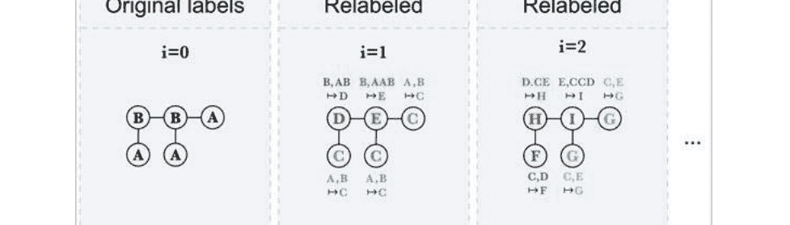

图6.1 WL顶点重标记算法概述。对于具有离散标签(A, B)的图，WL顶点重标记进行两次迭代。顶点可以表示为原子、子树和最短路径。

在Tox21毒性分类预测中，MWCG核心仍需要验证更多毒性数据集的性能。

### 6.4.3 图神经网络的应用

为了尽可能避免在图结构数据上进行特征工程，提出了GNN的概念作为一种自动从图结构数据中提取特征并特定预测分子性质的端到端框架。

为了探索药物诱导肝损伤(DILI)的自动MRs，我们应用了一种树状GNN模型（称为无向图递归神经网络，`UGRNN`，Lusci等人（2013））来探索DILI预测Xu等人（2015）。众所周知，DILI是药物候选物流失的主要原因之一（临床前）临床研究中，药物从市场撤回，以及药物标签上的黑盒警告Regev（2014）。已经探索和验证了许多分子描述符和指纹用于DILI预测。`UGRNN`是一个端到端的架构，包含一个编码器，用于将分子树表示为特征向量，并包含一个解码器，用于对向量进行决策。在图6.2中，编码器和解码器都由多层神经网络构建，可以通过梯度下降算法进行优化。我们证明了基于`UGRNN`的模型在公共数据集上实现了可比较的性能，而无需手动干预，这为从分子图中提取可学习的毒性表示打开了一条新的方向。

为了探索可预测和可解释的分子表示，我们开发了一个端到端的框架来探索急性口服毒性问题（AOT）Xu等人（2017）的毒性问题。该框架在图6.3中描述，并包含一个类似于扩展连接指纹的圆圈状（`GCNs`）用于学习分子表示，以及一个多层神经网络的头部用于分类和回归输出。

回归输出。该框架证明了它不仅可以构建高预测分类和回归模型，还可以自动从学习的分子表示中提取关键的毒性特征。这项工作表明，学习得到的低维表示对于特定任务来说既具有信息丰富性又具有可解释性。

在过去的五年中，许多GNN和它们的工具包已经被开发用于分子性质预测，包括`NeuralFP` Duvenaud等人（2015），`Weave` Kearnes等人（2016），`MPNN` Gilmer等人（2017），`directed-MPNN`（`D-MPNN`，Yang等人（2019b）），`PotentialNet` Feinberg等人（2018）和`AttentiveFP` Xiong等人（2019）。它们主要关注的是在化学信息学中预测分子性质的一般问题，而不是特别针对分子毒性。这些方法通常仅在公共的与毒性相关的数据集上进行评估，例如`Tox21`，`ToxCast`，`Sider`，`ClinTox`，如表6.1所示。`PotentialNet`和`D-MPNN`还进一步验证了ADMET预测和抗生素发现，分别由Feinberg等人（2020），Stokes等人（2020）进行验证。Merck使用`PotentialNet`对包括31个ADMET相关测定的内部数据集进行了系统评估，表明可学习的分子表示能够更好地使分子预测器插值和外推到化学空间的新区域，而不是使用分子描述符和指纹的随机森林（Feinberg等人（2020））。`D-MPNN`还通过从药物再利用中心（Drug Repurposing Hub）中识别出`Halicin`作为抗菌分子进行了验证（Stokes等人（2020））。最近的一项比较研究解释了GNN方法实际上与11个公开可用数据集上的GKs相当，并且学到的MRs的前两个主成分也相似（Xiang等，2021年）。

因此，GNN技术可以提供一种新选择，用于开发用于探索化学毒性问题的表达性预测模型。

## 可学习图嵌入的应用

GNN模型只关注学习任务特定的MRs，通常缺乏转移能力。当标记数据稀缺时，GNN可能在泛化方面表现较差或弱。为了克服这些问题，提出了一种有效的方法，在数据丰富的情况下以自监督的方式预训练模型，然后在感兴趣的下游任务上对这些模型进行微调。实际上，这种方法属于转移学习技术之一，总结在Cai等人（2020年）中。

一个开放的问题是如何有效地使用无监督学习对分子图数据进行预训练？许多GE技术已经在节点级别、图级别、子图级别和知识级别表示方面进行了研究。这些方法旨在保留更有意义的属性（例如局部、全局、子结构和领域知识），以实现一组有信息的节点级别或图级别表示。

图6.4节点级别嵌入的概述。对于上下文预测，使用K个跳跃子图来预测中心原子和上下文原子，类似于词嵌入技术。对于属性掩码，节点/边属性被随机掩码，并且需要由GNN进行预测。

表示。然后，这些表示可以轻松地插入到GNN模型中。通过这些预训练表示，GNN模型可以提供更好的预测性能。

胡等人实现了一种有效的节点级别嵌入和图级别嵌入的预训练策略。为了捕捉语义局部信息，使用了来自`ZINC15` Sterling和Irwin（2015）的两百万个未标记的分子图进行节点级别学习，如图6.4所示的新的自监督方式。使用具有生物活性的预处理的`ChEMBL`数据集通过多任务监督学习进行预训练，以将领域知识（如生物活性）纳入图级别嵌入中。提出了一种节点级别和图级别嵌入的组合策略，并通过实证方法证明能够高效产生可转移的图表示，并且在没有专家选择监督预训练任务的情况下，能够稳健地提高下游性能（胡等人，2019年）。

最近，Rong等人提出了一种新的框架，使用GNN和transformer架构来学习更具信息量的分子表示。对于图6.5，它还采用了K个邻居来学习节点级和边级嵌入，并设计了一种模式预测来学习具有语义领域知识的图级嵌入。这些精心设计的嵌入被融合并插入到GNN模型中，使得预测结果达到了最先进的性能，如表6.2所示。

## 可学习图核的应用

为了检查图级嵌入的可解释性，有必要考虑学习到的嵌入之间的成对距离。这些成对距离类似于可以应用于图聚类和相似性搜索的核矩阵。`KNN`技术可以帮助进行实例级解释。

解释 如果在嵌入空间中的k个邻居实例被标记为正例，则预测的标签很可能是正例，反之亦然。

对角线优势现象经常出现在毒性数据集中。 也就是说，给定的图形与自身相似，但与数据集中的任何其他图形都不相似，如图6.6所示（左侧部分）。 为了缓解这个问题，Yanardag等人首先开发了一个框架，该框架通过子结构之间的依赖信息来学习潜在的MRs。该框架旨在基于导入的依赖关系学习两个分子图之间的相似性，参见图6.6（右侧部分）。

依赖性的正则化可以增强图级嵌入的相关性。 该框架已成功扩展到`WL`、`SP`和图形核。 尽管对于传统的基于GK的模型来说，这些改进在预测性能上并不明显，但它仍然表明了解释能力的潜力。

受到Hu等人（2019）的预训练策略的启发，Li等人将成对的半图鉴别与节点属性屏蔽相结合，对节点级表示进行预训练。 与核技巧类似，半图鉴别的操作使用对比学习来捕捉具有子图正则化的更好的节点级表示。 这意味着这些学习到的节点级表示意味着子图级别的信息。这些表示被转移到GNN模型中，用于预测下游任务。对于毒性预测的评估，在四个数据集上，该模型在表6.2中取得了最先进的性能。此外，McInnes等人（2018）对`UMAP`可视化的分析表明，学习到的表示可以根据支架结构很好地分离，如图6.7所示。这个可解释的观点值得在研究毒性模型中进一步探索。

对于表6.2，已经研究了一些基于`GKL`的工作。显然，大多数这些工作在计算复杂性增加时没有获得更好的预测性能。因此，`GKL`学习框架的设计仍然需要更多的探索，特别是知识级别的核学习。一个巧妙的设计可以带来显著的改进。同时，这些报道的`GKL`算法并不是专门为毒性预测设计的，它们甚至可以进一步针对毒性问题进行改进。

## 6.5图核学习在毒性相关问题上的挑战和展望

为了降低化学毒性风险，已经开发了大量基于图的模型和算法，以在公共数据集上提供更好的预测性能。这些方法总是可以提供一组可学习的分子表示，这是增强预测能力的简单实用选择。

然而，许多现实应用中的挑战和限制仍待解决。

毒性数据的质量和数量。数据质量是一个重大挑战。现有的公共数据集只有数百或数千个标记数据，这些数据是从高通量体外试验或动物体内试验中获得的，例如流行的`Tox21`和`ToxCast`数据。动物模型的临床前数据与人类的临床数据之间仍存在巨大差距。度量学习`Hoffer`和`Ailon`（2015）和多模态学习`Ramachandram`和`Taylor`（2017）可以用来填补这一差距。例如，Iwata等人（2021）应用多模态学习来改善对人体药物清除率的预测，同时考虑化学结构和大鼠的清除率。此外，从临床试验和应用中获取更多数据也是非常需要的。

多元数据集。面对数据限制的情况，一个可能的解决方案是整合多元数据（例如药物靶点、代谢组学、副作用、不良事件和临床指标）以弥合化学结构和毒性终点之间的差距。实际上，整合多元数据集以进行基于网络的药物再利用是相当常见的，例如`Duran-Frigola`等人（2020）。因此，这种策略也可以用于构建化合物-毒性网络，该网络能够提供一定程度的机制级推断，并更好地理解特定化学物质的毒性。尽管已经有很多工作开始关注基于网络的毒性推断，但数据整合和模型泛化仍然存在一些限制。由知识图驱动的学习技术（Wang等人，2017）可以用来处理这些限制。

多层次图核学习。通过一系列精心设计的方法，成功地融合了多尺度嵌入（例如节点级、图级、子图级和知识级），并用于解决化学毒性问题。这些嵌入都是通过差分计算实现的，无需手动干预。随着嵌入表达能力的提高，计算复杂性也在增加。特别是，`GKL`方法需要考虑数据点之间的成对距离。需要设计特殊的近似算法来降低计算复杂性。目前，对比学习技术与不同的辅助损失一起被用于在特征空间中隐式学习关系。需要开发基于多元毒性相关数据集的嵌入学习方法，并融合这些多元嵌入。在希尔伯特特征空间中实现稳健且有意义的嵌入仍然具有挑战性。

除了化学结构外，暴露剂量对药物毒性评估至关重要。实际上，药物代谢和药物动力学（`DMPK`）特性决定了药物产品在目标区域的暴露剂量和持续时间。药物产品的吸收、分布、代谢和排泄（`ADME`）特性是进行`DMPK`研究的关键因素。在计算机模拟中，`ADME`预测（如`ADMET Predictor®`）已经发展成为支持分子特性全面评估和进行`DMPK`研究的重要工具包。所有这些模型都是基于机器学习算法和分子描述符以及指纹构建的。据我们所知，目前只有少数几个案例将这些先进的`GKL`技术应用于`ADME`问题的研究中（`Feinberg`等，2020年；`Xiong`等，2021年）。核心问题是数据可访问性。由于数据障碍，联邦学习可能是一个很好的解决方案，可以私下学习更多的数据集，但只共享模型权重。这种策略可以公平地用于测试各种机器学习或深度学习算法用于实现最强大的预测`ADMET`模型。此外，`GKL`技术还可以尝试探索更具挑战性的`DMPK`性质问题，如生物利用度、清除率、`Cmax`、`Tmax`和药物相互作用。因此，`GKL`可以与其他学习技术（如多模态学习、可转移度量学习和对比学习）集成。这些集成技术有望克服物种差异的挑战，实现对湿实验数据的持续学习。

### 6.6 结论

在本章中，我们重点介绍了用于预测毒性模型的图驱动方法。考虑到化学毒性的复杂性，我们提出了`GKL`的新概念，旨在以完全数据驱动的方式利用`GNNs`、`GEs`和`GKs`的图驱动方法来学习有意义的`MRs`。我们概述了`GKL`技术在化学信息学中，特别是毒性预测问题中的基本原理、目的和应用。随后，我们总结了`GKL`技术当前和未来面临的挑战，并对`GKL`技术与药物评估的更多交叉点提出了展望。我们希望本章能帮助读者更好地理解应用于毒性相关问题的这些`GKL`方法的特点和目的。同时，我们希望完全数据驱动的`GKL`方法能在实际应用场景中有更深入的挖掘。

## 参考文献

- Adamson GW, Bush JA (1973) 化学结构的自动分类方法。Inf Stor Retri 9:561–568
- Adhikari B, Zhang Y, Ramakrishnan N, Prakash BA (2018) `Sub2vec`: 子图的特征学习。在：知识发现与数据挖掘的太平洋亚洲会议，Springer, pp 170–182
- Banerjee P, Eckert AO, Schrey AK, Preissner R (2018) `ProTox-II`: 化学物质毒性预测的网络服务器。Nucleic Acids Res 46: W257–W263
- Cai C, Wang S, Xu Y等 (2020) 用于药物发现的迁移学习。J Med Chem 63: 8683–8694
- Chen J, Zheng S, Song Y等 (2021) 使用通信消息传递变压器学习属性图表示。在：第13届国际人工智能联合会议论文集。arXiv预印本arXiv:1809.10341
- Cheng F, Li W, Zhou Y等 (2012) `admetSAR`: 一种综合的化学`ADMET`性质评估的免费工具和资源。J Chem Inf Model 52:3099–3105
- Cortes C, Vapnik V (1995) 支持向量网络。Mach Learn 20:273–297
- Debnath AK, Lopez de Compadre RL, Debnath G等 (1991) 致突变的芳香和杂芳硝基化合物的结构活性关系。与分子轨道能量和疏水性的相关性。J Med Chem 34:786–797
- Dong J, Wang N-N, Yao Z-J等 (2018) `ADMETlab`: 基于全面收集的`ADMET`数据库的系统`ADMET`评估平台。J Cheminf 10:1–11
- Duran-Frigola M, Pauls E, Guitart-Pla O等（2020）将小分子相似性原则扩展到生物学的所有层次。Nat Biotechnol 38:1087–1096
- Duvenaud D, Maclaurin D, Aguilera-Iparraguirre J等（2015）用于学习分子指纹的图卷积网络。arXiv预印本arXiv:150909292
- 方X，刘L，雷J等（2021a）`ChemRL-GEM`：几何增强的分子表示学习用于属性预测。arXiv预印本arXiv：210606130
- 方Y，杨H，庄X等（2021b）知识感知对比分子图学习。arXiv预印本arXiv：210313047
- Feinberg EN, Joshi E, Pande VS, Cheng AC (2020) 多任务深度特征化改进`ADMET`预测。J Med Chem 63: 8835–8848
- Feinberg EN, Sur D, 吴Z等 (2018) `PotentialNet`用于分子性质预测。ACS Cent Sci 4: 1520–1530
- Gärtner T, Flach P, Wrobel S (2003) 关于图内核：困难结果和高效替代方法。在：学习理论和核机器, Springer, 第129–143页
- Gathiaka S, Liu S, Chiu M等 (2016年) `D3R`大挑战2015年：蛋白质-配体姿势和亲和力预测的评估。J Comput Aided Mol Des 30:651–668
- Ghosh S, Das N, Gonçalves T等 (2018年) 图内核的二十年之旅。Comput Sci Rev 27:88–111
- Gilmer J, Schoenholz SS, Riley PF等 (2017年) 用于量子化学的神经消息传递。在：机器学习国际会议，PMLR, pp 1263–1272
- Grover A, Leskovec J (2016年) `node2vec`：用于网络的可扩展特征学习。在：第22届ACM SIGKDD国际会议上的知识发现和数据挖掘，pp 855–864
- Hamilton WL, Ying R, Leskovec J (2017年) 大规模图表示学习。在：第31届国际神经信息处理系统会议论文集, pp 1025–1035
- Hassani K, Khasahmadi AH (2020) 对比多视图表示学习在图上的应用。在：机器学习国际会议，PMLR, 第4116-4126页
- Helma C, King RD, Kramer S, Srinivasan A (2001) 预测性毒理学挑战2000-2001。生物信息学17: 107-108
- Hido S, Kashima H (2009) 一种线性时间图核。在：2009年第9届IEEE国际会议数据挖掘，IEEE, 第179-188页
- Hoffer E, Ailon N (2015) 使用三元组网络进行深度度量学习。在：基于相似性的模式识别国际研讨会，Springer，第84-92页
- Hu W, Liu B, Gomes J et al. (2019) 预训练图神经网络的策略。arXiv预印本arXiv:190512265
- Huang K, Fu T, Gao W et al. (2021) 治疗数据共享：机器学习数据集和治疗任务。arXiv预印本arXiv:210209548
- 岩田H, 松尾T, 马玛达H等 (2021) 使用动物数据预测人体总药物清除率：基于深度学习的多模态学习方法的提出。J Pharm Sci110:1834–1841
- 詹恩P，吴Z，赖特M等 (2021) 用全局注意力表示图神经网络的长程上下文。Adv Neural Inf Process Syst 34. https://github.com/ucbrise/graphtrans.访问日期2022年1月20日
- 江江，王R，魏G-W (2021) `GGL-tox`：用于毒性预测的几何图学学习。J Chem Inf Model 61:1691–1700
- 鹿岛H, 津田K, 猪口A (2003) 标记图之间的边缘化核。在：机器学习国际会议 (`ICML-03`) 第20届会议论文集, 第321-328页
- Kearnes S, McCloskey K, Berndl M等 (2016) 分子图卷积：超越指纹。J Comput Aided Mol Des 30:595–608
- Kipf TN, Welling M (2017) 使用图卷积网络进行半监督分类。在：国际学习表示会议。arXiv预印本arXiv: 1609.02907
- Kondor R, Pan H (2016) 多尺度拉普拉斯图核。Adv Neural Inf Process Syst 29: 2990-2998

- Kriege NM, Johansson FD, Morris C (2020) 图核的调查。Appl Netw Sci 5: 6

- Krieg e NM, Neumann M, Morris C等 (2019) 图核的显式和隐式特征映射的统一视角。Data Min Knowl Disc 33: 1505-1547

- Li P, Wang J, Li Z等 (2021a) 成对半图鉴别: 一种用于预训练图神经网络的简单图级自我监督策略。在: 第三十届国际人工智能联合会议论文集, pp 2694-2700

- Li P, Wang J, Qiao Y等 (2021b) 一种用于学习具有表达力的分子全局表示的有效自监督框架, 用于药物发现。Brief Bioinf 22.https://doi.org/10.1093/bib/bbab109

- Liu S, Demirel MF, Liang Y (2018) N-gram图: 用于图的简单无监督表示, 用于分子等应用。arXiv预印本arXiv:180609206

- Liu S, Wang H, Liu W等 (2021) 用三维几何预训练分子图表示。arXiv预印本arXiv:211007728

- Lu C, Liu Q, Wang C等 (2019) 分子性质预测: 多级量子相互作用建模视角。在AAAI人工智能会议论文集中, 第1052-1060页

- Lusci A, Pollastri G, Baldi P (2013) 化学信息学中的深度架构和深度学习: 药物样分子的溶解度预测。J Chem Inf Model 53:1563–1575

- Mahe P, Vert J-P (2009) 基于树模式的分子图核函数。Mach Learn 75:3–35

- Mayr A, Klambauer G, Unterthiner T, Hochreiter S (2016) DeepTox: 使用深度学习进行毒性预测。Front Environ Sci 3:80

- McInnes L, Healy J, Melville J (2018) Umap: 统一流形逼近和投影用于降维。arXiv预印本 arXiv:180203426

- Narayanan A, Chandramohan M, Venkateshan R et al. (2017) graph2vec: 学习图的分布式表示。arXiv预印本 arXiv:170705005

- Ramachandram D, Taylor GW (2017) 深度多模态学习: 近期进展和趋势的综述。IEEE信号处理杂志 34:96–108

- Ramsundar B, Eastman P, Feinberg E et al. (2019) DeepChem: 为药物发现和量子化学民主化深度学习。Mater Sci Biol.https://github.com/deepchem/deepchem. 访问日期: 2021年12月1日

- Rasmussen CE (2003) 高斯过程在机器学习中的应用。在: 机器学习暑期学校, Springer, 第63–71页。

- Regev A (2014) 药物引起的肝损伤和药物开发: 行业观点。在: 肝脏疾病研讨会, Thieme Medical Publishers, 第227-239页

- Richard AM, Huang R, Waidyanatha S等 (2020) Tox21 10K化合物库: 推动毒理学的协作化学。Chem Res Toxicol 34: 189-216

- Rogers D, Hahn M (2010) 扩展连接指纹。J Chem Inf Model 50: 742-754

- Rong Y, Bian Y, Xu T等 (2020) 大规模分子数据上的自监督图变换器。arXiv预印本arXiv: 200702835

- Schölkopf B, Smola A, Müller K-R (1997) 核主成分分析。在: 国际人工神经网络会议, Springer, 第583-588页

- Schütt KT, Kindermans P-J, Sauceda HE等 (2017年) Schnet: 用于建模量子相互作用的连续滤波卷积神经网络。arXiv预印本arXiv: 170608566

- Shervashidze N, Schweitzer P, Van Leeuwen EJ等 (2011年) Weisfeiler-Lehman图核。J Mach Learn Res 12: 2539–2561

- Shervashidze N, Vishwanathan S, Petri T等 (2009年) 用于大型图比较的高效图核。在: 人工智能和统计学, PMLR, pp 488–495

- Sterling T, Irwin JJ (2015年) ZINC 15-面向所有人的配体发现。J Chem Inf Model 55: 2324–2337

- Stokes JM, Yang K, Swanson K等 (2020年) 一种用于抗生素发现的深度学习方法。Cell 180:688–702

Sun F-Y, Hoffmann J, Verma V, Tang J (2019) Infograph: Unsupervised and Semi-supervised Graph-Level Representation Learning via Maximizing Mutual Information. arXiv preprint arXiv:1908.01000

Sun M, Xing J, Wang H et al (2021) MoCL: Data-driven Molecular Fingerprint via Knowledge-aware Contrastive Learning from Molecular Graph. In: Proceedings of the 27th ACM SIGKDD Conference on Knowledge Discovery and Data Mining, pp 3585–3594

Veličković P, Cucurull G, Casanova A et al (2017) Graph Attention Networks. arXiv preprint arXiv:1710.10903

Veličković P, Fedus W, Hamilton WL et al (2019) Deep Graph Infomax. In: International Conference on Learning Representations. arXiv preprint arXiv:1809.10341

Wang Q, Mao Z, Wang B, Guo L (2017) Knowledge Graph Embedding: A Survey of Methods and Applications. IEEE Trans Knowl Data Eng 29:2724–2743

Wang Y, Min Y, Shao E, Wu J (2021) Molecular Graph Contrastive Learning with Parametrized Interpretability Augmentation. bioRxiv

Wu Z, Ramsundar B, Feinberg EN et al (2018) MoleculeNet: A Benchmark for Molecular Machine Learning. Chem Sci 9:513–530

Xiang Y, Tang Y-H, Lin G, Sun H (2021) A Comparative Study of Edge-Localized Graph Kernels and Message Passing Neural Networks. J Chem Inf Model 61:5414–5424. https://doi.org/10.1021/acs.jcim.1c01118

Xiong G, Wu Z, Yi J et al (2021) ADMETlab 2.0: An Integrated Online Platform for Accurate and Comprehensive Predictions of ADMET Properties. Nucleic Acids Res 49:W5–W14. https://doi.org/10.1093/nar/gkab255

Xiong Z, Wang D, Liu X et al (2019) Pushing the Boundaries of Molecular Representation for Drug Discovery with the Graph Attention Mechanism. J Med Chem 63:8749–8760

## 第7章 基于体外测定和机制知识以及真实世界数据优化和加强机器学习模型

Thilini V. Mahanama, Arpan Biswas 和 Dong Wang

### 7.1 引言

长期动物测试一直是评估环境化学品和药物候选物的毒性的主要方法。然而，动物评估的缺点也是众所周知的。特别是在药物发现过程中，动物测试常常无法预测药物候选物的人体毒性。即使检测到毒性，对毒性的生物学过程的了解通常非常有限。基于体外测定的测试被提出作为克服这些限制的一种有希望的方法（Kavlock和Dix，2010；Tice等，2013年）。通过直接以人类生物学为基础进行与毒性反应相关的体外测定，结果可能更相关于毒性评估，并具有明确的解释。基于细胞系的体外测定还可以降低毒性评估的成本，并实现时间节约。

高通量设置。部分替代基于动物的测试与体外试验可以减少每年用于毒性评估的动物数量，这是社会各界越来越多地要求的。在Tox21愿景中，美国国家科学院（NRC，2007；NRC，2017）以及欧盟的化学物质注册、评估、授权和限制（REACH）计划（Rudén和Hansson，2010；Locke等人，2017）已经概述了在毒性测试中使用体外试验的潜力。

已经进行了几个大规模的项目，以开发和测试一系列体外试验用于毒性评估。重要的例子包括Tox21计划（Collins等人，2008；Tice等人，2013），EPA的ToxCast（Judson等人，2014；Richard等人，2016），open TG-GATEs（基因组学辅助毒性评估系统，Igarashi等人，2015），L1000项目（Subramanian等人，2017）等。因此，可以利用许多体外试验来评估基因表达特征、核受体结合、细胞活力和线粒体功能，以了解细胞水平的毒性。现在有大量文献关于使用机器学习模型根据广泛的体外试验数据预测毒性（例如，Liu等人，2015；Huang等人，2016；Kleinstreuer等人，2017）。一些论文报告了与基于动物评估相似的预测性能。

然而，完全实现基于体外试验的预测模型在实际毒性评估中的潜力仍面临一些重要挑战。尽管当前的机器学习方法可以通过大量的预测因子实现出色的预测准确性，但模型的高复杂性确实会在应用中产生实际成本。各种研究小组已经发表了基于数百甚至数千个体外试验来预测毒性潜力的机器学习模型的优秀结果。然而，为每个应用执行所有这些试验可能是昂贵或不切实际的。同时，使用大量试验也使模型变得不透明，这违背了使用体外试验的一个重要目的，即提供毒性的机制洞察。基于体外试验构建预测模型的另一个挑战是获取用于验证的人体数据的困难。尽管大多数体外试验基于人类细胞系，并且与动物模型相比更具相关性，但这些模型的性能理想情况下应与实际的人体毒理学数据进行比较。然而，出于这个目的进行临床试验通常是不可行的。另一方面，在药物开发和公共卫生领域，利用与患者健康状况相关的真实世界数据（RWD）以及从各种来源例行收集的与健康护理相关的数据，已经取得了重要的研究进展（FDA，2018）。我们认为利用RWD加强毒性预测建模存在独特的机会。

在本章中，我们讨论了我们在开发解决这两个问题的新方法方面的经验。对于模型复杂性，我们发现可以利用不良结果途径（AOP）来过滤大量的体外测定，并且仍然保持出色的预测性能。为了与人体毒性数据进行比较，我们开发了新的方法来分析药物不良事件的自发报告数据库。

### 7.2 利用AOP构建简洁的机器学习模型

#### 7.2.1 AOP和AOP网络

机制知识对于毒性评估至关重要。在高通量实验时代，这种重要性不会减弱。具体的机制知识可以用于筛选出与生物系统无关的测定，并极大地促进建模任务。为此，AOP框架为毒性的机制知识提供了一种高效的存储和访问方式（Ankley等人，2010年；Krewski等人，2010年）。AOP被表示为具有生物学意义的事件序列的线性结构。主要组成部分包括分子起始事件（MIE），关键事件（KE）和不良结果（AO）。这些结构进一步描述了具有相关因果信息的毒性途径（Allen等人，2014年；Villeneuve等人，2014年；Burden等人，2015年）。AOP是一个在多个方向上积极发展的领域。读者可以参考相关文献获取更多信息（例如，van der Veen等人，2014年；Labib等人，2016年；Bell等人，2016年；Nymark等人，2018年）。

在本章中，我们关注与药物引起肝损伤（DILI）相关的AOPs。DILI是药物获批后从市场撤回以及有希望的药物候选终止开发的重要原因（Chen等，2014）。因此，通过体外试验对DILI潜在风险进行预测建模一直是药物开发中的一个活跃领域。关于机制性知识，已经进行了大量工作来构建与肝毒性相关的AOPs。Khadka等人（2020）使用从DrugDB中提取的药物属性查询AOPwiki（`https://aopwiki.org/`），这是AOPs的主要存储库，以寻找与DILI可能相关的AOPs。作者证明了通过大多数DILI关注和无DILI关注药物在这些途径上的差异性命中，可以恢复与肝毒性相关的10个AOPs。由于一些AOPs共享共同元素（事件），这些途径形成了七个不同的AOP网络。它们与与脂肪变性、胆汁淤积、纤维化和肝癌相关的生物过程有关。由于AOPs正在积极发展，我们更新了与脂肪变性、胆汁淤积和纤维化相关的AOP网络，如图7.1所示。为了简化演示，我们只显示与每个途径中的分子实体（基因、核受体）密切相关的节点。每个AOP的完整信息可以在AOPwiki中找到。读者可以参考Khadka等人（2020）的图1，了解与肝癌相关的网络。这些网络提供了与肝毒性相关的重要分子实体的综合概述。它们可以用于识别

图7.1 肝脏脂肪变性、纤维化和胆汁淤积的AOP网络。只显示与分子实体相关的节点（事件）。AOPs从AOPwiki中提取。黄色阴影区域表示器官水平事件的Markov毯子中的节点。

### 7.2.2 使用AOPs促进构建简洁的机器学习模型

由于肝毒性是毒性评估的主要组成部分，建立使用体外测定的预测模型已经得到了显著的努力。尽管其中一些模型使用大量测定获得了良好的准确性，但简洁的模型在实际应用中更加透明和实用。在Khadka等人的研究中（2020年），我们报道了一种使用AOPs在构建DILI预测模型之前过滤体外测定的新方法。使用肝毒性的AOP网络，我们提取了与肝毒性相关的可测量的分子实体（基因表达和核受体结合）。然后，我们从Tox21和L1000项目中搜索相应的数据集，结果得到了41个分子预测因子。

然后，这些预测因子与从肝脏毒性知识库（LTKB；Chen et al. 2016）中提取的三种药物属性相结合：每日剂量、log P 和反应性代谢物（RM）形成。然后，使用弹性网罚函数构建了一个逻辑回归模型，其中包含这些预测因子：

$$ \log \frac{P(y=1|X=x)}{P(y=0|X=x)} = \beta_0 + \beta^T x $$

其中，y 是无DILI风险的二元指示器（编码为0）或最高DILI风险（7.1），x 是预测因子向量。我们使用 β0 和 β 表示回归系数。弹性网罚函数（Zou and Hastie 2005）用于正则化模型拟合，以实现更好的预测性能。具体而言，回归系数的估计值为

$$ \hat{\beta}_0, \hat{\beta} = \arg\min_{\beta_0, \beta} \left[ -\frac{1}{N} \sum_{i=1}^N \left[ y_i \left( \beta_0 + x_i^T \beta \right) - \log \left( 1 + e^{\beta_0 + x_i^T \beta} \right) \right] + \lambda \left[ \frac{(1-\alpha)\beta_2^2}{2} + \alpha \beta_1 \right] \right] $$

在这里，N是药物的数量，||β||_2和||β||_1分别表示岭回归和Lasso惩罚。参数α设为0.9，λ通过留一交叉验证选择。

这个相对简单的机器学习模型实现了0.91的预测准确率（敏感性=0.96，特异性=0.83），在使用适度数量的实验时与文献中的其他模型相比具有竞争力，这在实践中非常重要。由于使用了逻辑回归，可以轻松比较每个实验对预测的相对贡献。有趣的是，没有了AOP过滤步骤，仅仅盲目地将Tox21和L1000中的所有测定放入模型中将导致基本上是随机的预测结果。这证明了AOP包含了相关的机制信息，可以用于选择体外测定并构建更具解释性和适用性的风险评估模型。由于模型采用了逻辑形式，我们还可以得到一个线性预测器，

$$ s = \beta_0 + \beta^T x $$

在模型拟合过程中，这可以用作DILI的连续风险评分（见图7.2）。我们后来讨论了一种利用真实世界人类数据验证该风险评分实用性的新方法。

另一方面，模型可以在AOP的指导下进一步缩小。正如图7.1所示，AOP网络采用有向无环图（DAG）的形式，这使得将AOP网络视为贝叶斯网络成为自然选择（Edwards，2000）。图7.1中黄色阴影的节点形成了每个网络中肝脏脂肪变性、胆汁淤积和纤维化的所谓马尔可夫毯。

根据贝叶斯网络理论，马尔可夫毯中的节点基本上提供了来自体外试验的肝毒性的所有信息。受到这一观察的启发，我们使用马尔可夫毯中的节点作为预测变量，拟合具有高斯先验的贝叶斯Probit模型。这个进一步简化的模型的准确率为0.86，与Khadka等人的模型相比仅略有降低（2020年）但是使用了更少的测定方法。在实际应用中，人们必须在准确性、成本和便利性之间取得平衡。我们的结果表明，AOP网络可以根据具体需求选择不同大小的模型来进行一组测定。

### 7.3 利用自发报告数据库来验证机器学习模型的发现

尽管基于人类细胞系的体外测定理论上可能与人类生物学更相关，但由于相关数据来源的稀缺性，很难验证基于体外测定的机器学习模型与人体毒理学数据的结果。但是，有一个RWD的来源实际上被低估了，并且值得更多的关注，这就是药物不良事件的自发报告数据库。

出于必要性，临床试验的随访时间相对较短，只能包括有限数量的患者。它们通常还有严格的纳入标准。因此，一些不良反应只能通过监测药物在更大人群中的上市后的不良事件报告来发现。自发不良事件（AE）报告数据库通过持续收集AE报告来提供上市后监测。美国食品和药物管理局（FDA）和疾病控制与预防中心（CDC）的疫苗不良事件报告系统（VAERS）是这些数据库的著名例子。这些数据库长期以来一直被监管机构和行业用于挖掘药物安全信号。数据分析面临一些特殊挑战，我们在下面简要讨论。另一方面，自发报告数据库是一个丰富的信息资源，可以用于回答与药物安全和开发相关的一些重要问题。

在本节中，我们讨论了一种用于分析自发报告数据库中数据的统计框架，以验证使用体外试验的机器学习模型得到的结果。

表7.1 用于药物j和不良事件i的事件报告计数的2 × 2表格

| | 药物j | 没有药物j | 总计 |
| :--- | :--- | :--- | :--- |
| 不良事件i | n_{ij} | n_{i.} - n_{ij} | n_{i.} |
| 没有不良事件i | n_{.j} - n_{ij} | n_{..} - n_{i.} - n_{.j} + n_{ij} | n_{..} - n_{i.} |
| 总计 | n_{.j} | n_{..} - n_{.j} | n_{..} |

#### 7.3.1 使用自发报告数据库进行安全信号挖掘的统计方法

由于需要进行后市场监测，关于从自发报告数据库中挖掘安全信号的文献非常丰富。从自发报告数据库中分析报告计数数据在几个方面具有挑战性，包括与数据质量、案例重复、缺失数据、不一致的词汇和因果关系缺乏验证相关的问题。但是，统计建模最困难的问题是在人群中没有每种药物使用的患者总数。因此，虽然可以从数据库中获取特定药物-不良事件组合的计数，但无法计算传统的发病率，这进而排除了常见统计模型的应用。已经提出了许多方法来解决这个问题。一些著名的例子包括比例报告比率（Evans等，2001年），报告几率比（Rothman等，2004年），似然比检验（Huang等，2011年，2013年，2014年；Nam等，2017年；Xu等，2020年；Zhao等，2018年）和贝叶斯方法（Bate等，1998年；DuMouchel，1999年；Hu等，2015年）。

在这些方法中，一种常用的方法是将不良事件报告数量与零假设下的基线进行比较，即不良事件和药物之间没有关联。考虑表7.1中给出的列联表，根据零假设，与不良事件 i 和药物 j 相关联的报告数量的期望值可以计算为

$$ E_{ij} = \frac{n_{i.} n_{.j}}{n_{..}} \quad\quad (7.2) $$

这个数量可以作为零假设下的基线值。假设在零假设下， n_{ij} 服从泊松分布（E_{ij}），一个远大于 E_{ij} 的值表明存在药物-不良事件的关联证据。Huang等人（2011年），DuMouchel（1999年）和其他人提出了不同的方法来确定药物和不良事件之间的显著关联的阈值。

#### 7.3.2 从FAERS获取数据

在我们描述一种新的分析自发报告数据库中数据的方法之前，我们先简要介绍一个数据库FAERS，该数据库将

虽然我们的方法的一般原则也适用于其他自发报告数据库，但我们将使用示例来演示所提出的方法。FAERS持续收集提交给FDA的自发不良事件报告，并且它是FDA药物和治疗生物制品后市场安全监测计划的重要组成部分。每年有超过一百万与药物或生物制品使用相关的不良事件被输入到数据库中（https://www.fda.gov/drugs/questions-and-answers-fdas-adverse-event-reporting-system-faers/fda-adverse-event-reporting-system-faers-public-dashboard）。它构成了市场上与药物和生物制品相关的不良事件风险的丰富信息来源。FAERS数据以季度下载的形式公开提供，由FDA网站上的七个表格组成。每个事件报告包含药物和不良事件的信息，以及患者的人口统计信息、治疗信息和患者结果。由于任何患者、医生或药企都可以向FAERS提交报告，报告的质量存在显著的变化。分析FAERS数据的一些常见挑战包括缺失值、药物名称的不一致性、重复报告和不同的术语。分析FAERS数据通常需要进行广泛的预处理（Banda等，2016年）。但正如各种研究人员所证明的那样，当适当处理时，自发报告数据库可以提供有价值的信息。对于我们的分析，我们遵循Banda等人（2016年）的预处理方法。预处理后，可以对每个不良事件的报告计数进行制表。由于DILI可能被报告为不同的不良事件范围（定义为医药监管活动医学词典（MedDRA）术语），我们根据George等人（2018年）和Suzuki等人（2015年）的方法，将53个MedDRA首选术语组合成一个综合的不良事件。

#### 7.3.3 泊松回归模型用于报告计数

对于在自发报告数据库中挖掘安全信号，我们的兴趣在于检测具有异常高报告计数（例如，远高于`E_ij`）的药物-不良事件组合。在建模过程中不考虑药物属性。在我们的案例中，我们有兴趣测试DILI潜在预测因子，即方程（7.1）中的线性预测因子`s`是否与FAERS中DILI的高报告计数相关。如果存在强正相关关系，则证实线性预测因子在使用体外试验预测DILI潜在性方面的实用性。然而，FAERS中的报告计数受到服药人数的混杂影响。为了解决这个问题，我们采用与安全信号检测相同的方法，即在零假设下使用方程（7.2）中的`E_ij`作为报告计数的基线。

$$ \mu_{ij} = \lambda_{ij} E_{ij}, \log(\lambda) = \beta_0 + \beta_1 s $$
其中`s`是惩罚逻辑模型中的线性预测因子。这是一个带有偏移项`Ei`的泊松回归模型，用于调整不同药物的基线报告计数。在全局零假设下，即不存在药物-不良事件关联，线性预测因子`s`与药物-不良事件组合的平均报告计数无关，`β1`为零。因此，测试线性预测因子`s`与DILI更高报告计数之间是否存在关联等价于测试`β1 = 0`。

在这里，我们使用似然比检验进行推断。似然比统计量可以通过拟合两个泊松回归模型获得，一个是`β1 = 0`，另一个是`β1`不受限制（参见Dunn和Smyth 2018）。可以使用常见的软件包（如R中的`glm()`函数）来实现这一点。对于p值的校准，我们使用类似于Huang等人的蒙特卡洛模拟方法（2011年）。对于给定的AE `i`，每种药物`j`的报告数量在零假设下进行模拟。给定边际总数 `n.1,...,n.J`，计数 `ni1,...,niJ`在零假设下具有独立的泊松分布。在给定 `ni.`的条件下的联合分布；

$$ (n_{i1}, \dots, n_{iJ}) | n_{i.}; n_{.1}, \dots, n_{.J} \sim \text{多项分布}\left(n_{i.}, \left(\frac{n_{.1}}{n_{..}}, \dots, \frac{n_{.J}}{n_{..}}\right)\right) $$

使用数据的边际总数，可以生成大量在零假设下的数据集，并计算泊松回归的似然比统计量。然后将真实数据集的似然比统计量与模拟值进行比较，以确定p值。

对于我们从惩罚逻辑模型中推导出的线性预测器 `s`，拟合泊松回归模型得到 `β̂1 = 0.26`，相应地`e^β̂1 = 1.30`。这意味着如果我们的线性预测器 `s`增加1，报告计数将平均增加30%。相应的p值非常显著（`<10^-5`）。这是对我们的DILI预测模型实用性的强有力证明。

#### 7.3.4 将宿主因素纳入测试

已经观察到宿主因素如性别和年龄对DILI的风险有影响（Suzuki等，2014年）。在FAERS等自发报告数据库中，患者的组成因药物而异。因此，在确认基于体外试验的DILI风险预测因子的价值时，最好调整宿主因素。我们通过采用类似于Nam等人（2017年）的逻辑建模方法来解决这个问题。在药物和DILI发生之间没有关联的零假设下，可以使用逻辑模型来估计宿主因素的影响。以性别和年龄（线性和二次项）的影响为具体例子。设 `Yijk`为指示变量，表示患者`k`在服用药物`i`时是否出现不良事件`j`，设 `pijk`为事件的概率，即 `E(Yijk) = pijk`。我们拟合逻辑模型

$$ \text{logit} (p_{ijk}) = x_{ijk}^T \gamma = \gamma_0 + \gamma_1 \cdot \text{sex}_{ijk} + \gamma_2 \cdot \text{age}_{ijk} + \gamma_3 \cdot \text{age}_{ijk}^2 $$

其中，`x` 表示协变量向量，`γ` 表示回归系数向量。 在零假设下，该药物-不良事件组合的基线计数可以计算为

$$ E_{ij} = \sum_k p_{ijk} = \sum_{k=1}^{n_{ij}} \text{对于} H_0, \text{每种药物AE组合的报告计数}, n_{ij} = \sum_k Y_{ijk} $$

请注意，在 `H_0` 下，每种药物-AE组合的报告计数， `n_{ij} = \sum_k Y_{ijk}`，是独立伯努利随机变量的总和，即它具有泊松-负二项分布。 但是泊松-负二项分布在计算上具有挑战性。 相反，我们使用泊松近似（Barbour 等人，1992年和Nam等人，2017年）方法进行推断。 根据Barbour等人的结果 (1992),

$$ \sup_t |P(n_{ij} \leq t) - P(Z_{ij} \leq t)| \leq \min\left\{1, \left(\sum_{jk} p_{ijk}^{-1}\right)\right\} \sum_{jk} p_{ijk}^2, $$

其中 `Z_{ij}`是具有均值 `E_{ij}`的泊松随机变量。 通过这个近似，我们可以用泊松回归模型来建模体外试验基于DILI风险评分的效应:

$$ n_{ij} \sim \text{Poisson}(\lambda_{ij} E_{ij}), \log(\lambda_{ij}) = \beta_0 + \beta_1 s, $$

其中 `s` 是 DILI风险评分（线性预测器），而 `E_{ij} = \sum_{k} p_{ijk} = \sum_{k=1}^{n_{ij}} \text{logit}^{-1}(x_{ijk}^T \gamma)`.与前一小节一样，测试 `s` 是否与平均报告计数相关等同于测试 `β_1 = 0`.测试统计量可以计算为

$$ T_i = - \sum_j \log\left( \frac{\max_{H_0} L(\beta)}{\max_{H_A} L(\beta)} \right), $$

其中 `L(\beta)` 是似然函数。

蒙特卡洛模拟用于生成检验的零分布。 我们使用在零假设下从逻辑回归中估计的 `γ̂`计算 `E_{ij}`。

对于每个药物 `j`，报告计数是从泊松分布(`Ê_{ij}`)生成的。 然后，使用伪数据计算 `AE_i` (例如，DILI) 的检验统计量 `T_i`，并重复这个过程很多次。

对于我们的弹性网络模型中的DILI 风险评分， `β̂_1` 的值略微减小到0.20 (相对于基线水平计数增加1的26%)，在性别和年龄调整后，它仍然非常显著（`10⁻⁵`）。这进一步增加了风险评分的预测能力的可信度。

### 7.3.5 利用FAERS数据来验证基于体外试验模型

在前面的小节中，我们提出了一种方法来确认风险评分在自发报告数据库中对DILI（或其他不良事件）的实用性。这种方法的关键步骤是使用列联表推导零假设下的报告计数的基线值。然后，可以使用泊松回归模型将计数与风险评分结合，将基线值作为偏移项。使用蒙特卡洛模拟进行校准。

事实上，这种方法非常灵活，可以处理使用体外试验的一系列应用，并考虑到推导基线值。在这里，我们给出了另一个关于不良事件性别偏倚的例子，以说明这种方法。一些药物在男性或女性中引起特定的不良事件，关于DILI也有相关的例子（George等，2018）。因此，预测分子试验数据中的这种潜在偏倚是很有意义的。我们构建了一个简单的DILI性别偏倚潜力评分。它是与性别相关的六个通路中基因的标准化表达变化的线性组合（`PPARα`，`CAR`，`FXR`，`PGC1A`，`LXR`和`ACTA2`通路）。有兴趣使用FAERS数据测试这个评分的实用性。我们使用相同的泊松回归原理和偏移项。但在这种情况下，需要修改列联表，具体来说，将AE `i`和药物`j`的报告计数分成男性和女性细胞（表7.2）。使用表7.2中的列联表，在全局无性别偏倚的零假设下，女性和男性的报告计数的基线值为

$$ E_{ij}^{(f)} = \frac{n_{i.}^{(f)} n_{.j}}{n_{..}} \quad \text{和} \quad E_{ij}^{(m)} = \frac{n_{i.}^{(m)} n_{.j}}{n_{..}} $$

其中`(f)`和`(m)`分别表示女性和男性。性别为女性的报告计数可以用泊松分布`μ_{ij}^{(f)}`建模，其中

表7.2 事件报告计数的列联表针对药物`j`和不良事件`i`按性别分

| | 药物`j` | 没有药物`j` | 总计 |
|---|---|---|---|
| 不良事件 `i` (男性) | `n_{ij}^{(m)}` | `n_{i.}^{(m)} - n_{ij}^{(m)}` | `n_{i.}^{(m)}` |
| 不良事件 `i` (女性) | `n_{ij}^{(f)}` | `n_{i.}^{(f)} - n_{ij}^{(f)}` | `n_{i.}^{(f)}` |
| 没有不良事件 `i` | `n_{.j} - n_{ij}` | `n_{..} - n_{.j} - n_{i.} + n_{ij}` | `n_{..} - n_{i.}` |
| 总计 | `n_{.j}` | `n_{..} - n_{i.}` | `n_{..}` |

$\mu_{ij}^{(f)} = \lambda_{ij}^{(f)} E_{ij}^{(f)} , \log(\lambda) = \beta_0 + \beta_1 s.$

在这里，这是基于相关生物途径的体外测定的性别偏倚得分。请注意，我们再次使用偏移项$ E_{ij}^{(f)} $来考虑不同的基线值。与之前类似，测试$ s $是否与报告计数中的性别不平衡相关等价于测试$ \beta_1 = 0 $。

对于我们关于DILI的例子，$ \hat{\beta}_1 = 0.11 $和$ e^{\hat{\beta}_1} = 1.20 $，这表明女性计数在基线上没有性别不平衡的情况下，随着基于基因表达的得分增加20%。相关的$ p $值也是显著的($ <10^{-4} $)。这只是一个关于如何将体外测定为基础的预测因子与自发报告数据库中的数据连接的例子。通过仔细考虑基线计数，可以涵盖各种问题。

### 7.4 结论

无疑，体外试验的快速发展为毒性测试带来了巨大的希望。使用各种机器学习方法开发了复杂的模型。但是这些发展也伴随着一些重要的挑战，需要更多的考虑。在本章中，我们解决了两个这样的挑战。一个是如何为实际应用开发简洁的模型（具有适度数量的试验）。我们证明了当针对感兴趣的不良效应精心构建AOP网络时，可以使用AOP网络来过滤可用的试验，构建透明且易于实施的高效模型。此外，通过AOP网络，可以可能构建具有不同规模（试验数量）的一系列模型，因此从业者可以根据准确性/成本权衡考虑选择首选模型。最近各个团体（例如Moné等人，2020年）也强调了使用AOP进行风险评估的价值，因此预计会有更多的发展。

本章讨论的另一个挑战是，由于合适的数据集稀缺，使用体外试验和人体数据直接测试机器学习模型的效用通常很困难。我们概述了一种利用自发报告数据库中的数据来证实体外试验结果的方法。关键是通过报告计数的基准值来克服自发报告数据库中关于服药患者总数的信息缺失。我们提出的偏移泊松回归方法非常灵活，并且可以在适当调整后应用于不同的情境。未来，其他类型的实际数据（例如电子健康记录、人群健康调查）有可能被纳入，以进一步加强体外试验和人体风险评估之间的联系。

## 参考文献

Allen TE, Goodman JM, Gutsell S, Russell PJ (2014) 在风险评估的不良结果途径框架中定义分子起始事件。 Chem Res Toxicol 27 (12) : 2100-3112。 https://doi.org/10.1021/tx500345j

Ankley GT, Bennett RS, Erickson RJ, Hoff DJ, Hornung MW, Johnson RD, Mount DR, Nichols JW, Russom CL, Schmieder PK, Serrano JA (2010) 不良结果途径：支持生态毒理学研究和风险评估的概念框架。 Environ Toxicol and Chem 29 (3) : 730-741

Banda JM, Evans L, Vanguri RS, Tatonetti NP, Ryan PB, Shah NH (2016) 一个经过策划和标准化的不良药物事件资源，以加速药物安全研究。 Sci Data 3 (1) : 1-11

Barbour AD, Holst L, Janson S (1992) 泊松近似。 The Clarendon Press, Oxford University Press

Bate A, Lindquist M, Edwards IR, Olsson S, Orre R, Lansner A, De Freitas RM (1998) 一种用于不良药物反应信号生成的贝叶斯神经网络方法。 欧洲临床药理学杂志 54(4):315–321

Bell SM, Angrish MM, Wood CE, Edwards SW (2016) 整合公开数据以生成计算预测的脂肪肝不良结果途径。 毒理学科学 150(2):510–520

Burden N, Sewell F, Andersen ME, Boobis A, Chipman JK, Cronin MT, Hutchinson TH, Kimber I, Whelan M (2015) 不良结果途径可以推动非动物方法进行安全评估。 应用毒理学杂志 35(9):971–975。 https://doi.org/10.1002/jat.3165

Chen M, Borlak J, Tong W (2014) 预测特异性药物诱导的肝损伤——一些最新进展。 专家评论胃肠病学 8(7):721–723。 https://doi.org/10.1586/17474124.2014.922871

Chen M, Borlak J, Tong W (2016) 一种预测人类药物诱导肝损伤严重程度的模型。 肝脏学 64(3):931–940。 https://doi.org/10.1002/hep.28678

Collins FS, Gray GM, Bucher JR (2008) Transforming Environmental Health Protection. Science 319(5865):906–907

DuMouchel W (1999) Bayesian data mining in large frequency tables, with an application to the FDA spontaneous reporting system. Am Stat 53(3):177–190

Dunn PK, Smyth GK (2018) Generalized linear models with examples in R. Springer, New York, p 562

Edwards DI (2000) Introduction to graphical modelling, 2nd edn. Springer, New York

Evans SJ, Waller PC, Davis S (2001) Use of proportional reporting ratios (PRRs) for signal generation from spontaneous adverse drug reaction reports. Pharmacoepidem Dr S 10(6):483–486

FDA (2018) Framework for FDA’s real-world evidence program. US Department of Health and Human Services Food and Drug Administration. Silver Spring, MD. https://www.fda.gov/media/120060/download

George N, Chen M, Yuen N, Hunt CM, Suzuki A (2018) 性别、年龄和药物特性对药物性肝损伤报告频率的相互作用。 Regul Toxicol and Pharm 94:101–107

Hu N, Huang L, Tiwari RC (2015) 使用狄利克雷过程在FDA AERS数据库中进行信号检测。 Stat Med 34(19):2725–2742

Huang L, Zalkikar J, Tiwari RC (2011) 基于似然比检验的信号检测方法及其在FDA药物安全数据中的应用。 J Am Stat Assoc 106(496):1230–1241

Huang L, Zalkikar J, Tiwari RC (2013) 基于似然比检验的药物类别信号检测方法在FDA AERS数据库中的应用。 J Biopharm Stat 23(1):178–200

Huang L, Guo T, Zalkikar JN, Tiwari RC (2014) 安全监测的统计方法综述。 Ther Innov Regul Sci 48(1):98–108

Huang R, Xia M, Sakamuru S, Zhao J, Shahane SA, Attene-Ramos M, Zhao T, Austin CP, Simeonov A (2016) 模拟Tox21 10K化学物质的体内毒性预测和机制表征。 自然通讯 7(1):10425 。 https://doi.org/10.1038/ncomms10425

Igarashi Y, Nakatsu N, Yamashita T, Ono A, Ohno Y, Urushidani T, Yamada H (2015) OpenTG-GATES: 一个大规模的毒物基因组学数据库。 Nucleic Acids Res 43(D1):D921–D927

Judson R, Houck K, Martin M, Knudsen T, Thomas RS, Sipes N, Shah I, Wambaugh J, Crofton K (2014) 美国环境保护局ToxCast计划中的体外和模拟风险评估方法。 Basic Clin Pharmacol 15(1):69–76

Kavlock R, Dix D (2010) 美国环保局实施的计算毒理学：为筛选和评估化学物暴露、危害和风险提供高通量决策支持工具。 J Toxicol Env Health, Part B 13(2–4):197–217

Khadka KK, Chen M, Liu Z, Tong W, Wang D (2020) 将不良结果途径（AOPs）与高通量体外试验相结合，以实现更好的风险评估：以药物诱导的肝损伤（DILI）为例。

Kleinstreuer NC, Ceger P, Watt ED, Martin M, Houck K, Browne P, Thomas RS, Casey WM, Dix DJ, Allen D, Sakamuru S (2017) 开发和验证了一个计算模型，用于雄激素受体活性。 Chem Res Toxicol 30(4):946–964

Krewski D, Acosta D Jr, Andersen M, Anderson H, Bailar JC III, Boekelheide K, Brent R, Charnley G, Cheung VG, Green S Jr, Kelsey KT (2010) 21世纪的毒性测试：愿景和策略。 J Toxicol Env Health, Part B 13(2–4):51–138. https://doi.org/10.1080/10937404.2010.483176

Labib S, Williams A, Yauk CL, Nikota JK, Wallin H, Vogel U, Halappanavar S (2016) 纳米风险科学：在不良结果途径框架中应用毒基因组学进行多壁碳纳米管的风险评估。 Part Fibre Toxicol 13(1):1–7

Liu J, Mansouri K, Judson RS, Martin MT, Hong H, Chen M, Xu X, Thomas RS, Shah I (2015) 使用ToxCast体外生物活性和化学结构预测肝毒性。 Chem Res Toxicol 28(4):738–751

Locke PA, Westphal M, Tischler J, Hessler K, Frasch P, Myers B, Krewski D (2017) 实施21世纪的毒性测试：挑战与机遇。 Int J Risk Assess Manag 20(1–3):198–225. https://ssrn.com/abstract=2928986

Moné MJ, Pallocca G, Escher SE, Exner T, Herzler M, Bennekou SH, Kamp H, Kroese ED, Leist M, Steger-Hartmann T, van de Water B (2020) 为非动物方法的下一代风险评估做好准备：EU-ToxRisk项目经验。 Arch Toxicol 94(10):3581–3592

Nam K, Henderson NC, Rohan P, Woo EJ, Russek-Cohen E (2017) 用于检测后市场安全监测中不良事件信号的逻辑回归似然比检验分析。 J Biopharm Stat 27(6):990–1008

NRC (国家研究委员会) (2007) 21世纪的毒性测试：愿景和策略。 国家学院出版社，华盛顿特区

NRC (国家研究委员会) (2017) 利用21世纪的科学改进与风险相关的评估。 国家学院出版社，华盛顿特区

Nymark P, Rieswijk L, Ehrhart F, Jeliazkova N, Tsiliki G, Sarimveis H, Evelo CT, Hongisto V, Kohonen P, Willighagen E, Grafström RC (2018) 用于生成和丰富不良结果途径描述的数据融合流程。 Toxicol Sci 162(1):264–275

Richard AM, Judson RS, Houck KA, Grulke CM, Volarath P, Thillainadarajah I, Yang C, Rathman J, Martin MT, Wambaugh JF, Knudsen TB (2016) ToxCast化学景观：铺设通往21世纪毒理学之路。 Chem Res Toxicol 29(8):1225–1251

Rothman KJ, Lanes S, Sacks ST (2004) 报告比率和比例报告比率的优势。 Pharmacoepidem Dr S 13(8):519–523

Rudén C, Hansson SO (2010) 化学品的注册、评估和授权（REACH）只是第一步-它将带我们走多远？进一步改进欧洲化学品立法的六个步骤。 环境健康透视 118(1):6-10

Subramanian A, Narayan R, Corsello SM, Peck DD, Natoli TE, Lu X, Gould J, Davis JF, Tubelli AA, Asiedu JK, Lahr DL (2017) 下一代连接图：L1000平台和第一百万个配置文件。 细胞 171(6):1437-1452

> Suzuki A, Gu J, Tillmann HL, Bonkovsky HL, Fontana RJ, Kleiner DE (2014) 性别和绝经与药物性肝损伤的损伤类型和组织学特征的关联。 Gastroenterology 5 (146), S1000

> Suzuki A, Yuen NA, Ilic K, Miller RT, Reese MJ, Brown HR, Ambroso JI, Falls JG, Hunt CM (2015) 药物引起的肝损伤报告频率受共同用药的影响：在WHO VigiBase™中进行数据挖掘。 Regulatory Toxicology and Pharmacology 72(3):481–490

> Tice RR, Austin CP, Kavlock RJ, Bucher JR (2013) 改进化学品的人体危害特性评估：Tox21的最新进展。 Environmental Health Perspectives 121(7):756–765

> van der Veen JW, Soeteman-Hernández LG, Ezendam J, Stierum R, Kuper FC, van Loveren H (2014) 将分子机制与皮肤致敏的不良结果途径相关联：对现有数据的分析。 Critical Reviews in Toxicology 44(7):590–599. https://doi.org/10.3109/10408444.2014.925425

> Villeneuve DL, Crump D, Garcia-Reyero N, Hecker M, Hutchinson TH, LaLone CA, Landesmann B, Lettieri T, Munn S, Nepelska M, Ottinger MA (2014) 不良结果途径（AOP）开发I：策略和原则。 Toxicological Sciences 142(2):312–320. https://doi.org/10.1093/toxsci/kfu199

> Xu Z, Xu J, Yao Z, Huang L, Jung M, Tiwari R (2020) 使用似然比检验方法评估医疗器械不良事件信号。 Journal of Biopharmaceutical Statistics 31(1):37–46

> Zhao Y, Yi M, Tiwari RC (2018) 基于扩展似然比检验的信号检测方法在药物类别中的应用，应用于FDA的不良事件报告系统数据库。 Statistical Methods in Medical Research 27(3):876–890

> Zou H, Hastie T (2005) 弹性网正则化和变量选择。 Journal of the Royal Statistical Society: Series B 67(2):301–320

## 第8章 用于定量结构-活性关系的多任务学习：教程

Cecile Valsecchi, Francesca Grisoni, Viviana Consonni, Davide Ballabio, 和 Roberto Todeschini

### 8.1 引言

机器学习已成为毒理学的有价值的支持工具，特别是在定量结构-活性关系方法（QSAR）的框架下，但不仅限于此。机器学习可用于预测化合物的危险性，以及化学物质的吸收、分布、代谢、排泄和毒性（ADMET）特性（Antanasijevi´c等, 2017; Karim等, 2021; Wenzel等, 2019; Baell和Holloway, 2010; Rudmann, 2013）。机器学习这个术语指的是一组计算机算法，可以从数据中“学习”（即提取有用信息）并通过经验自动改进（Mitchell等, 1990）。在处理大量数据（或“大数据”）时，最突出的机器学习方法类别是神经网络，因为它们能够捕捉分析属性和描述变量之间的复杂非线性关系（LeCun等, 2015）。人工神经网络，或简称神经网络，是受到神经元生物信号启发的机器学习的一个子集，并且构成了深度学习算法的基础。

C. Valsecchi (✉) · V. Consonni · D. Ballabio · R. Todeschini

米兰大学比科卡分校地球与环境科学系，米兰20126，意大利

电子邮件：c.valsecchi18@campus.unimib.it

V. Consonni

电子邮件：viviana.consonni@unimib.it

D. Ballabio

电子邮件：davide.ballabio@unimib.it

R. Todeschini

电子邮件：roberto.todeschini@unimib.it

F. Grisoni

埃因霍温科技大学生物医学工程系，荷兰埃因霍温

电子邮件：f.grisoni@tue.nl

标准的机器学习范式专注于一次学习一个任务；也就是说，不同的问题被单独学习，就好像它们是独立的（即“单任务”学习）。尽管取得了巨大的成功，但这种学习方式与人类和动物学习的方式非常不同（Perkins和Salomon, 1992）。人类学习经常同时涉及多个任务；特别是，人类在学习将实体分类到这些任务中时会比较和对比相似的任务。尽管通常提供良好的性能，但单任务方法在某些情况下可能适得其反，因为它们忽略了许多现实问题中可用的潜在丰富信息，即来自同一领域的其他任务中包含的信息。

人脑是许多机器学习算法的灵感来源，它在面对每个新的学习任务时都会利用从以前类似学习任务中获得的知识，这就是所谓的迁移学习方法（Perkins和Salomon, 1992）。尽管机器学习离达到人类和动物的学习能力还有很长的路要走，但迁移学习，即将在一个上下文中学到的知识应用到另一个上下文中的能力，构成了持续关注的挑战，人工智能可以从中受益，提高泛化能力和创新性（Torrey和Shavlik, 2010）。

文献中提出了从相关任务中转移知识的不同尝试；强化学习、多任务学习和特征网络是一些例子（Torrey和Shavlik, 2010; Varnek等, 2009）。

多任务学习（MTL）可以看作是迁移学习的一个子领域，可以被定义为一种利用相关任务的训练信号中包含的领域信息作为归纳偏差来提高泛化能力的方法。它通过在并行学习任务的同时使用共享表示来实现；为每个任务学到的知识可以帮助其他任务更好地学习（Caruana, 1997）。

本章介绍了多任务学习理论的基础以及其在QSAR数据集上利用多任务神经网络的应用。实践教程包括以下步骤：（i）制定多任务问题和必要的假设，（ii）描述单任务和多任务全连接网络，（iii）以核受体调节为案例研究分析结果。

### 8.2 QSAR和多任务学习

QSAR方法应用数学和统计技术来建立化学物质结构特征的数值描述符（Todeschini和Consonni, 2008）与感兴趣的生物活性之间的关系。QSAR范式可以表述为以下形式：`$A = f(x_1, x_2, \ldots, x_P)$` 其中 `A` 是化合物的生物活性/物理化学性质，估计为一些结构特征的函数（`f`）编码的 `P` 分子描述符（`x1, x2, ..., xP`）。

通常，QSAR模型专注于特定的活性或性质，构成单一的回归或分类任务。典型的单任务QSAR数据集如图8.1a所示，其中每一行代表一个由分子描述符编码的分子（例如二进制指纹的`P`位（Rogers和Hahn, 2010）），并为所考虑任务的活性标签进行注释。例如，我们可以考虑雄激素受体（AR）的结合物的预测（Grisoni等人, 2019）。这种数据结构可以用来训练一个二分类模型，以区分“任务1”中的活性（AR结合物）和非活性（非结合物）分子，给定描述符。这个问题被配置为单任务分类。

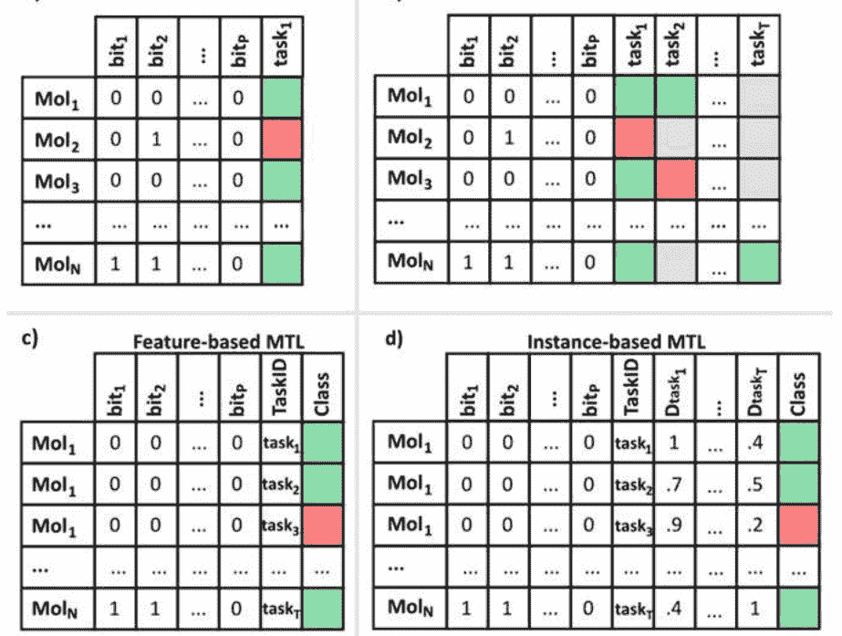

图8.1 单任务 (a) 和多任务问题形式 (b, c, d)；每一行代表一个由二进制描述符（`bit1, bit2, ..., bitP`）描述的分子（`Mol1, Mol2, ..., MolN`）；绿色、红色和灰色单元格分别表示任务 `task1, task2, ..., taskT` 的活性、非活性和缺失响应，以及类别。

当处理小型或不平衡的数据集时，仅使用单任务建模可能无法提供令人满意的结果。在这种情况下，添加相关任务的数据并尝试同时建模不同任务可能会提高性能（Valsecchi等人, 2020a, b）。此外，多任务学习适用于QSAR，因为基于机器学习的QSAR模型的一个关键假设是相似的化合物倾向于共享相似的目标（Zhao等人, 2020）。此外，归纳方法是基于与所研究属性相关的可用实验数据，可以是一种经济高效且节省时间的获取新实验数据的替代方法（Varnek等人, 2009）。

如何合并不同任务的数据集并不直观，文献中可以找到不同的方法。通常，单任务数据集具有一定程度的重叠；例如，不同任务的活动标签对于同一分子是可用的（Ramsundar等人, 2015; Valsecchi等人, 2020a, b）。特别是在这种情况下，MTL问题的形式可以配置如图8.1b所示，其中对于一组`N`对象，我们有一个具有与任务数量相同列数的响应矩阵（例如，图8.1b中的总任务数为`T`）。由于并非所有对象都可能对所有任务进行注释，响应矩阵可能包含一些缺失值。直观地说，缺失值的百分比与单任务数据集之间的重叠程度成反比。

在某些情况下，考虑另一个MTL问题公式化可能更方便。如(Sadawi等人, 2019)所报道的，"基于特征的MTL"需要将任务识别（图8.1c、d中的“Task ID”列）作为一个新变量添加进去。这种策略使得所有任务共享一个响应向量（即图8.1c、d中的“Class”列），且没有缺失值。在这个框架中，一个对象会重复出现`k`次，其中`k`是对该对象进行注释的任务数量。“基于特征的MTL”的一个变种是“基于实例的MTL”。在这种情况下，会在变量级别上利用任务对之间的定量相似度度量。由于`T`是任务的总数，这种方法意味着需要添加`T`个额外的变量，这些变量包含与其他任务的相似度值（图8.1d中的“Dtask_1”、“Dtask_T”列）。如图8.1d所示，“Dtask_1”属性给出了第一个任务与该连接数据集中所有其他任务之间的相似度值。因此，如果第`i`行（即注释）是针对第一个任务的，那么在第`i`行和“Dtask_1”列中的值将为1（图8.1d）。

当任务重叠有限或建模算法不适用于处理多任务问题时，特征和基于实例的多任务学习问题的制定可能更加方便。换句话说，当目标是避免数据缺失并应用能够一次处理一个响应的模型（如随机森林或支持向量机）时，首选基于实例和基于特征的设置。另一方面，传统的多任务设置（图8.1b）避免了对象的不平衡表示，因为每个对象都表示为一行而没有重复；缺点是存在大量缺失数据，在不同任务之间数据集重叠度较低的情况下可能非常多。传统多任务设置中最方便的算法是神经网络，因为它们可以在训练阶段高效处理缺失响应。

多任务学习意味着归纳传递方法（Varnek等人, 2009）。尽管多任务学习最初是通过反向传播神经网络来制定的，但它可以通过许多其他监督式机器学习方法来实现。主要要求是能够创建一个共同的数据表示，可以通过多种方式实现以捕捉共享数据模式（Bakker和Heskes, 2003）。在下面的段落中，我们将参考传统的多任务学习问题的制定（图8.1b）。

#### 8.2.1 MTL问题的定义

考虑到二元分类问题的情况，单任务数据集由有限数量的`N`个对象组成，每个对象定义为一个向量`$x_i$`，包含`P`个描述符，并与要预测的第`t`个任务的二元响应配对 (`$y_i^t$`)。更正式地说，单任务数据集（针对第`t`个任务）可以定义为：

$$S = \{ (x_i, y_i^t) \}_{i=1}^N$$

其中`$x_i$`属于`$R^P$`，`$y_i^t$`属于{0,1}。

在多任务的二元分类环境中，数据集由有限数量的`N`个对象组成，每个对象定义为一个包含`P`个变量的向量，每个向量与一个响应向量的`T`个任务配对。更正式地说，多任务数据集是 `$S = \{S_1, S_2, ..., ST\}$`，其中

$$S_t = \{ (x_i, y_i^t) \}_{i=1}^{n_t}$$

对于 $x_i \in R^P$ 和 $y_i^t \in \{0,1\}$，其中t索引任务 $[1,...,T]$，而$n_t$是第t个任务中标注的对象数量。在这种情况下，存在一个一致的输入 $(N \times P)$和输出空间 $(N \times T)$，假设所有任务共享相同的变量空间，并允许存在缺失的响应。

在多任务框架中，不同任务之间的关系可能会影响选择使用的多任务方法。然而，这些关系通常不明确，因此通常假设不同任务具有相同的重要性并且彼此之间关联程度相等。

定义不同问题的主要多任务学习假设可以总结如下（图8.2）：

- 所有任务彼此相关（先决条件，图8.2a）；

- 存在异常任务（异常MTL，图8.2b）；即，某些任务与其他任务无关；

- 任务之间的关系不对称（不对称MTL，图8.2c）；即，任务之间的关系具有不同的数量级；

- 任务具有群组结构（聚类MTL，图8.2d）；即，只有不同的任务子集彼此相关；

- 任务具有图结构（图结构MTL，图8.2e）；即，任务之间的关系可以是单向的;

- 任务具有树结构（树状MTL，图8.2f）；即，任务之间存在层次结构。

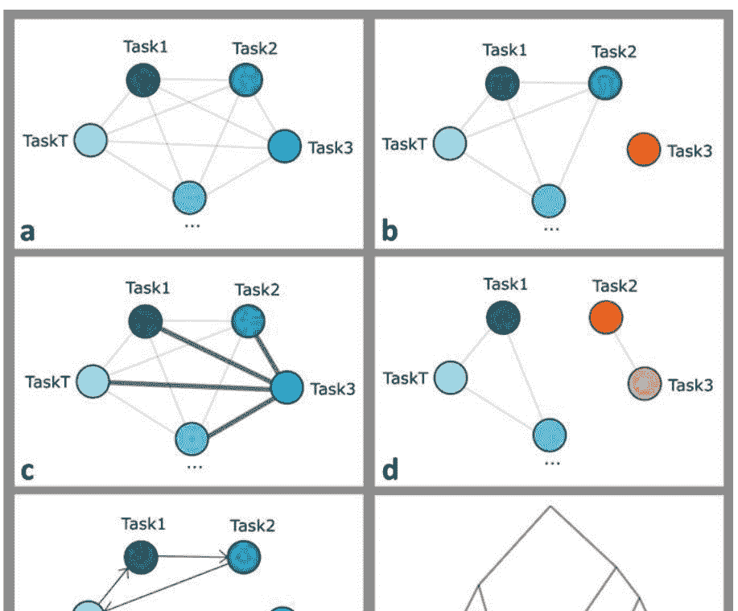

图8.2 任务关系的六种不同多任务学习假设：任务之间关系相等（a），异常任务（b），不对称任务（c），聚类任务（d），图结构任务（e）和树结构任务（f）

每个假设都会影响到最佳的MTL策略的使用。最一般的假设意味着所有任务彼此相关，并且可以被视为多任务神经网络中的共享隐藏节点（Caruana, 1997）。其他方法，如基于正则化的MTL策略，更适用于更具体的假设（例如树状MTL，网络MTL，非对称MTL和聚类MTL），本章不予考虑（Evgeniou和Pontil, 2004）。

### 8.2.2 任务相关性

在MTL中，传输信息是否改善或恶化模型的预测性能取决于组合的任务之间的相关性（Wenzel等人, 2019）。因此，MTL的主要假设是任务的相关性。然而，目前还没有明确的指导方针来评估这个标准。

一些研究从领域知识（即先验知识）中推断任务的相关性，而其他研究则从可用数据（即学习到的知识）中推断任务的相关性。例如，在（Sadawi等人, 2019年）中，作者将多任务学习应用于使用超过一千个ChEMBL（Gaulton等人, 2017年）测定的药物活性数据（即任务），根据蛋白质家族或首选名称进行分组。在（Zhao等人, 2020年）中，作者考虑了几个PubChem（Kim等人, 2019年）靶点（即任务），根据靶点的序列比对进行分组；然后，他们再次对每个分组应用多任务学习策略。因此，在这些情况下，任务的相关性基于给定的分类法或蛋白质序列比对，而不考虑可用的分子数据。

Xu等人（2017年）证明了多任务神经网络只有在训练集中的助理任务具有与目标任务测试集中的分子结构相似且相关活性（无论是正相关还是负相关）的情况下，才能提高目标任务的预测性能。否则，如果这些相似分子之间的活性不相关，多任务网络可能会降低预测性能。如果助理任务没有与目标任务测试集中的分子结构相似的分子，无论任务之间的活性是否相关，多任务网络都不会比单任务模型表现出更好或更差的预测性能。

康和合著者（2011年）以这样的方式制定了MTL问题，即任务之间的相关性被建模为任务之间的共享变量学习。在这些情况下，相关性问题只考虑了可用数据。

### 8.2.3 多任务神经网络

人工神经网络是非线性建模策略，对其输入进行重复的线性和非线性变换。神经网络的基本单元是神经元或节点，排列在层中。神经网络的最简单结构之一被称为全连接，由节点层组成，其中每个节点与前一层的所有节点相连，并通常表示为图8.3中的形式。让$x^{l}$表示网络的第$l$层的输入（其中$x^{0}$只是输入向量）。执行的转换是:

$$x^{l} = \sigma(W^{l} * x^{l-1} + b^{l}) \tag{8.1}$$

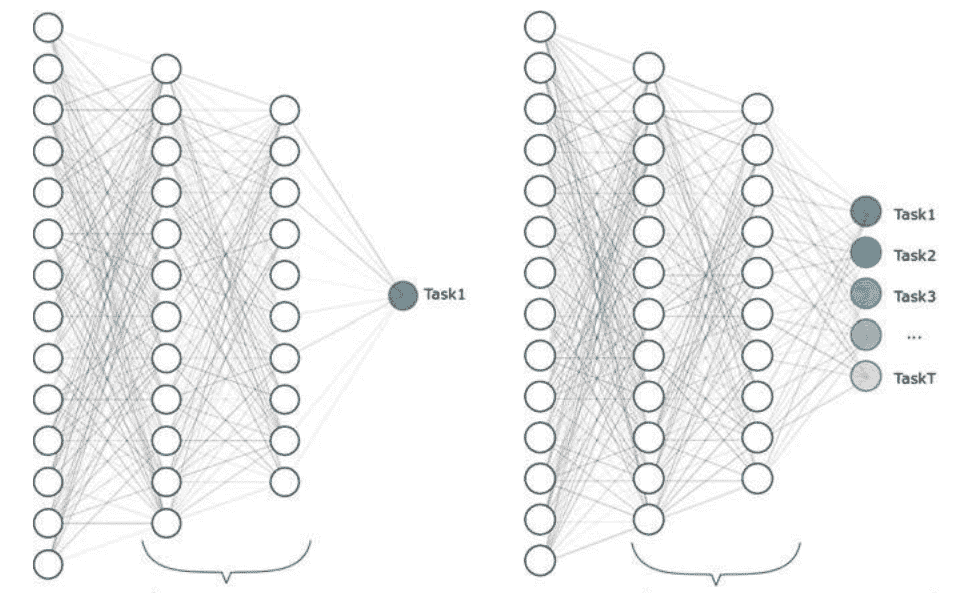

其中，$\mathbf{W}^l$和$\mathbf{b}^l$是第$l$层的权重矩阵和偏置，$\sigma$是非线性或激活函数。最常用的激活函数是修正线性单元（Nair和Hinton, 2010）、双曲正切和Sigmoid函数。经过$L$次转换或层次变换，网络的最后一层为$\mathbf{x}^L$。然后将其输入到简单的线性分类器中，如Softmax或Sigmoid函数。后者适用于二分类问题，并可用于预测输出结果。

$$ \text{Sigmoid}(\mathbf{x}^L) = \frac{1}{1+e^{-\mathbf{x}^L}} \quad (8.2) $$

神经网络经过一定次数的迭代（“epochs”）进行训练，通常包括前向传播和反向传播阶段。在前向传播阶段，每一层的输出按照公式（8.1）计算。通常在训练开始时，权重和偏置会被随机初始化。然后，对于每个输入，通过损失函数（通常是交叉熵）将预测输出与观察值进行比较。

在二元分类的情况下，逐元素的二元交叉熵定义如下：

$$ \text{损失}^t_i = y^t_i \ln(\hat{y}^t_i) + (1 - y^t_i) \ln(1 - \hat{y}^t_i) \quad (8.3) $$

其中 $\hat{y}_i^t$ 和 $y_i^t$，神经网络的输出和观察到的响应是第i个样本和第t个任务的输出。直观地说，如果 $y_i^t$ 等于1，我们希望 $\hat{y}_i^t$ 很大，否则当 $y_i^t = 0$ 时， $\hat{y}_i^t$ 应该很小。

整体损失函数 $J$ 衡量网络在整个训练集上对于第t个任务的性能如何：

$$J = \frac{1}{N} \sum_{i=1}^{N} \text{损失}_i^t \tag{8.4}$$

通过计算损失函数和激活函数的导数（即梯度），所有权重都以反向传播的方式进行更新，以最小化损失函数。更新步长可以通过一个可调节的值称为学习率来调节。为了计算和学习的效率，在每个训练步骤（即迭代）中，使用一个称为批处理的训练对象子集。当模型看到所有对象（即在迭代次数等于训练集大小除以批处理大小的次数之后），完成一个训练周期。

此外，一些被称为正则化技术的策略可以提高网络的泛化能力并减少过拟合。这就是辍学和权重衰减（Ridge $L1$或Lasso $L2$正则化）的情况（Hoerl和 Kennard, 1970; Srivastava等人, 2014; Tibshirani, 1996）。

多任务神经网络在最后一层添加了 $T$ 个softmax 或sigmoid分类器（图8.3），每个任务一个，也可以在任务特定的分类器之前添加其他单任务特定的隐藏层。换句话说，输入到隐藏层，以及最终一些隐藏到隐藏的权重是所有任务共享的，而隐藏到输出，以及最终一些隐藏到隐藏的权重是任务相关的（Bakker和Heskes, 2003）。

这些设置描述了硬参数共享，其中多个任务之间的隐藏层是共享的，而一些靠近输出的任务特定层是不共享的。另一方面，在软参数共享中，每个任务都有自己的模型和参数。然后调整模型参数之间的距离，使参数更相似（Karim等人, 2021年）。

关于多任务神经网络的训练算法，我们可以区分两个家族，即交替训练或联合训练。在前者中，仅为一个输出任务计算梯度。经过一定次数的迭代后，优化器将切换到下一个输出任务，并采用来自先前步骤的共享层或神经元的优化权重。这个循环可以重复固定次数的迭代。在每次迭代中，只有共享网络层的权重和相应的输出单元被更新，而其他输出任务的所有权重都被冻结。

在联合训练中，所有的输出任务同时进行训练，并且梯度是建立在一个全局联合输出单元上的，该单元是通过对所有任务的当前损失函数进行求和得到的（Wenzel等人, 2019年）。

在联合多任务的情况下，需要修改（8.4）中的损失函数，以处理响应矩阵中缺失值的存在。我们定义了一个“掩码”损失函数$J_{masked}$，它计算二元交叉熵，忽略缺失值，如下所示：“掩码”损失函数 $J^{\text{masked}}$ 计算二元交叉熵，忽略缺失值，计算公式如下：

$$J^{\text{掩码}} = \frac{1}{\sum_{i=1}^{N}\sum_{t=1}^{T}\delta_{i}^{t}} \sum_{i=1}^{N}\sum_{t=1}^{T} \delta_{i}^{t} \cdot \text{Loss}_{i}^{t}$$

$$\text{其中} \quad \delta_{i}^{t} = \begin{cases} 1, & \text{if } y_{i}^{t} \text{已知} \\ 0, & \text{否则} \end{cases} \tag{8.5}$$

在本教程中，我们将专注于硬参数共享的背景并进行联合训练。联合训练是最简单的多任务神经网络策略，然而，它意味着所有任务的损失具有相同的重要性。因此，可以通过权衡损失来调整不同任务的重要性，例如考虑数据集中不同任务的表示方式。

### 8.2.4 性能评估

# 分类性能评估与案例研究

## 分类性能评估

分类性能的评估可以基于描述每个建模任务上实现的分类结果的类指标。在最简单的二分类情况下，可以使用敏感性（Sn）、特异性（Sp）来量化每个任务上的模型性能。非错误率（NER），定义如下：

$$\text{Sn} = \frac{\text{TP}}{\text{TP} + \text{FN}} \times 100 \quad \text{Sp} = \frac{\text{TN}}{\text{TN} + \text{FP}} \times 100 \quad \text{NER} = \frac{\text{Sn} + \text{Sp}}{2} \tag{8.6}$$

其中，`TP`、`TN`、`FP`和`FN`分别是第 $t$ 个任务中真正阳性、真正阴性、假阳性和假阴性分子的数量。其他分类指标请参考 (Ballabio et al.2018)。

对于多任务分类，可以通过敏感性、特异性和非错误率的“全局指标”来比较整体性能（$Sn_T$，$Sp_T$，$NER_T$）如下所示 (Valsecchi等, 2020a, b)：

$$\text{Sn}_{T} = \frac{\sum_{t=1}^{T} \text{TP}_{t}}{\sum_{t=1}^{T} \text{TP}_{t} + \sum_{t=1}^{T} \text{FN}_{t}} \cdot 100 \tag{8.7}$$

$$\text{Sp}_{T} = \frac{\sum_{t=1}^{T} \text{TN}_{t}}{\sum_{t=1}^{T} \text{TN}_{t} + \sum_{t=1}^{T} \text{FP}_{t}} \cdot 100 \tag{8.8}$$

$$\text{NER}_{T} = \frac{\text{Sn}_{T} + \text{Sp}_{T}}{2} \tag{8.9}$$

其中 $t$ 遍历每个任务，$T$是任务的总数。$Sn_T$ 和 $Sp_T$ 分别表示在所有任务中正确预测的活性和非活性分子的百分比。分类器神经网络的输出层的每个节点都配备有一个sigmoid函数，它提供了一个在[0，1]范围内的连续值。为了将这个值二值化，需要选择一个阈值。最直观的阈值0.5并不总是最好的选择，因为它意味着一个平衡的数据集，而这并不是我们的情况。因此，对于每个任务，可以根据接收器操作特性（ROC）曲线（Brown和Davis 2006）或 $Sn_T$ 和 $Sp_T$ 之间的最佳权衡来选择最佳阈值。

## 案例研究：NURA数据集

在本指南教程中，我们使用了核受体活性（NURA）数据集（Valsecchi等人，2020a，b）作为案例研究，该数据集包含有关小分子是否调节核受体（NRs）的注释。核受体参与了人体的多个生理过程，如代谢、发育和稳态。具体而言，化学物质与核受体的结合通常可以激活或抑制生物反应。换句话说，如果配体以类似内源配体的方式触发生物反应，则可以将其识别为激动剂；如果它阻止或阻断内源配体的作用，则可以将其识别为拮抗剂。NURA数据集包含15,206个分子和11个NRs（雄激素受体[AR]、雌激素受体α[ERα]、雌激素受体β[ERβ]、孕激素受体[PR]、糖皮质激素受体[GR]、过氧化物酶激活受体α[PPARα]、过氧化物酶激活受体δ[PPARδ]、过氧化物酶激活受体γ[PPARγ]、孕烷X受体[PXR]、视黄酸X受体[RXR]和法尼酰X受体[FXR]）的结合活性、激动作用和拮抗作用的数据。

在本教程中，对于给定的受体，每种调制类型（即结合剂、激动剂和拮抗剂）都被视为二元任务。与(Valsecchi等人，2020a，b)一样，我们只考虑活性和非活性标签，并且舍弃了包含少于200个分子注释的三个任务（即`PPARα`，`RXR`和`PXR`拮抗剂）。在进行修剪过程之后，我们获得了一个包含14,963个分子的数据集，这些分子至少对30个任务中的一个进行了注释（活性或非活性）。然后，每个分子都通过扩展连接性指纹（ECFPs）（Rogers和Hahn，2010）以哈希算法编码的预定义长度的二进制向量来进行数值表示，该向量通过表示分子亚结构的存在或缺失。特别地，我们使用长度为1024的ECFPs，每个亚结构编码两个位，并且分子片段半径在0到2个键之间。ECFPs是使用Dragon 7软件（KodeSrl2017）计算的。然后，将包含14,963个分子的数据集分为训练集和测试集。前者用于训练模型，并且通常进一步细分为一个或多个内部验证集，用于调整神经网络的超参数以避免过拟合，而后者用于评估最终模型的预测性能。通常在单任务问题中，训练集和测试集的划分是随机进行的，同时保持两个集合中类别的比例。

在多任务环境中，这种分层划分并不简单，因为并不总是可能保持所有任务的相同比例，特别是对于稀疏的多任务数据集。通过逐步进行，可以相对准确地为每个任务划分类别（Ramsundar等人，2019年）。

在（Valsecchi等人，2020a，b）中，使用PocketMatch算法（Yeturu和Chandra，2008年）对包含在NURA数据集中的核受体的结合口袋进行了“口袋中心”分析，以识别相关模式。PocketMatch以一种框架不变的方式比较结合位点，通过计算90个排序距离列表来捕捉位点的形状和化学性质。算法为任何考虑的结合位点对提供一个从0到100的分数（`PMscore`）；分数越大，重叠度越高。为了计算成对的`PMscore`，利用了来自PDBbind数据库（“PDBbind 2018”）的配体-核受体复合物的晶体结构。结果重现了一些已知的进化关系，例如`ERα`和`ERβ`之间，`PPAR`亚型之间，或者类固醇激素受体`GR`，`PR`和`AR`之间的关系（Mangelsdorf等人，1995年），并且总体上突出了所分析任务之间的重叠。

### 8.4 实践教程

在接下来的内容中，我们将呈现一个实践教程，指导用户完成计算多任务神经网络的整个过程。在描述所需的软件和数据之后，我们将展示：(i) 如何制定多任务问题，(ii) 如何检查与任务相关的假设，以及 (iii) 如何构建和评估单任务和多任务的全连接神经网络。

#### 8.4.1 入门

所有计算均使用 Python 3.9.7 进行（Python 软件基金会，可在 https://www.python.org 获取）。Python 是一种开源编程语言，在化学信息学和机器学习中被广泛使用（Python 软件基金会。Python 语言参考，版本 3.6）。作为 Python 的框架，我们使用了 Jupyter Notebooks（Kluyver 等，2016），这是一个预装有 Anaconda 的交互式开源基于 Web 的应用程序（https://jupyter.org/）。

我们提供了一个Jupyter Notebook，旨在导入数据并计算MLT模型，用户可以通过更改神经网络的超参数和设置来自定义代码以对其他数据进行建模。实现的模型依赖于Keras（2021）和TensorFlow后端（Abadi等人, 2016），这是一个用于深度学习的开源机器学习库。

##### 8.4.1.1 准备步骤

在运行多任务学习的程序代码之前，必须在本地安装以下软件：

- **Anaconda**是一个开源的Python编程语言分发版本，用于科学计算，简化了软件包管理和部署。可以从官方网页（URL:www.anaconda.com）安装适用于Python 3.9的Anaconda。

- **Git**是一个版本控制系统。Git的安装因平台而异，请参考[www.atlassian.com/git/tutorials/install-git](http://www.atlassian.com/git/tutorials/install-git)上的说明。

##### 8.4.1.2 代码下载

开源代码可在GitHub存储库中获取，网址为：[https://github.com/CValsecchi/Multitask_for_QSAR_tutorial](https://github.com/CValsecchi/Multitask_for_QSAR_tutorial)。用户可以使用以下命令在Linux/Mac终端或Windows命令行上克隆存储库（即获取存储库内容的本地副本）：

```
git clone https://github.com/CValsecchi/Multitask_for_QSAR_tutorial
```

存储库的副本将在本地计算机上的选定路径中生成，文件夹名为“Multitask_for_QSAR_tutorial”。或者，也可以通过在GitHub存储库中选择下载按钮手动下载存储库的压缩文件。要确定本地计算机上存储克隆存储库的“Multitask_for_QSAR_tutorial”文件夹的位置，可以移动到存储库，例如使用以下命令：

```
cd <path/to/Multitask_for_QSAR_tutorial> （从Mac或Linux终端）
cd <path\to\Multitask_for_QSAR_tutorial> （从Windows Anaconda提示符）
```

要运行笔记本，需要几个Python软件包，这些软件包可能没有预先安装在Anaconda中。为了简化安装过程，我们提供了一个`environment.yml`文件，其中包含了所有必要的软件包（表8.1），并允许创建一个虚拟环境。Python解释器、库和脚本安装在虚拟环境中，与安装在其他虚拟环境和Python操作系统中的库相隔离。可以使用以下命令在Anaconda提示符中创建包含所有必要Python软件包的虚拟环境：

```
conda env create -f environment.yml
```

表8.1 列出在`environment.yml`文件中的Python软件包列表

| 软件包 | 版本 |
| :--- | :--- |
| Matplotlib | 3.4.3 |
| Pandas | 1.3.3 |
| Python | 3.9.7 |
| Scikit-learn | 1.0 |
| Scipy | 1.7.1 |
| Jupyter | 1.0.0 |
| Keras | 2.6.0 |
| Numpy | 1.19.5 |
| Tensorflow | 2.6.0 |

一旦环境设置完成，可以使用以下命令激活环境：

```
conda activate mtl_env
```

要使用笔记本电脑，请从`Multitask_for_QSAR_tutorial`文件夹中启动Jupyter Notebook应用程序，如下所示：

```
jupyter notebook
```

在本地主机的Web浏览器上启动Jupyter Notebook后，您应该被引导到一个看起来像图8.4a的页面。

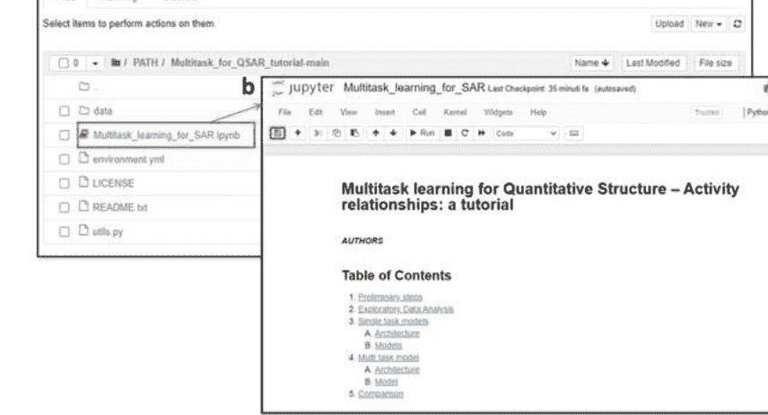

单击`Multitask_learning_for_SAR.ipynb`文件可以打开笔记本（图8.4b）。可以逐步执行代码的每一行，以可视化并重现本章中呈现的结果。该软件使用Intel®Core™ i7-6950X CPU处理器和32 GB专用RAM进行测试。如何运行笔记本。

以下部分与笔记本的目录一致。本教程旨在与笔记本中的相应代码块一起阅读。要执行代码块，请选择它，然后单击“运行”按钮或按下CTRL + Enter键。

### 8.4.1.3 探索性数据分析

为了简单起见，我们提供了默认的训练和测试集划分；存储库中的`data`文件夹包含两个文件：`Xtest_nura.csv`和`Xtrain_nura.csv`，分别包含测试集和训练集。用户可以在此级别加载自定义数据集，并选择与任务和变量相关的列（`tasks`和`var`）。

例如，NURA数据集包含30个二进制任务（活动/非活动）的生物活性，具有中低程度的重叠（64%的缺失值）。除了激动剂和PPARα的结合（`AGO_PPARA`和`BIN_PPARA`）之外，所有任务都以大量的非活性分子为特征，如表8.2所示。

为了可视化数据分布，可以绘制一个t-分布的随机邻域嵌入（t-SNE）（Maaten和Hinton2008），该方法是使用分子指纹表示计算的。我们使用Jaccard-Tanimoto度量（Rogers和Tanimoto 1960）来定义分子之间的相似关系，因为指纹是二进制向量。用户可以根据所考虑的变量在`t-SNE`函数中更改度量标准。

图中的每个点代表一个分子，可以根据（i）可用任务的数量（图8.5a）或（ii）每个任务的特定注释（活性/非活性/缺失）（图8.5b）进行着色。可以注意到，尽管并非所有任务都在活动的重叠区域内，但在t-SNE图中相似的分子（即，接近的点）似乎具有相似的活性。

多任务模型的预测性能的改善或恶化取决于合并的任务之间的相关性（Wenzel等人，2019年）。为了评估这个标准，可以从领域知识或可用数据中推断任务相关性。在笔记本中，我们展示了如何直接从结合数据中提取任务相关性见解，通过计算任务响应之间的距离（在我们的案例中是简单匹配）（Todeschini等人，2015年）。用户可以根据他们的案例研究在`pdist`函数中更改距离度量。

图8.6中的树状图总结了十一个二进制任务之间的不同相似性水平。这种方法的主要缺点是存在缺失响应和在评估中忽略了分子相似性。然而，所得结果与从领域知识出发得到的结果非常相似（Valsecchi等人, 2020a, b）。

我们通过将变量矩阵（`X_train`和`X_test`）从任务矩阵（`y_train`和`y_test`）中分割并用掩码值 –1 填充缺失值来准备数据。

表8.2 NURA数据集分为训练集和测试集，报告为活性、非活性和缺失值的数量（分别为#活性、#非活性和#na）

| 任务 | #活跃 (%) (训练) | #非活跃 (%) (训练) | #不适用 (训练) | #活跃 (%) (测试) | #非活跃 (%) (测试) | #不适用 (测试) |
| :--- | :--- | :--- | :--- | :--- | :--- | :--- |
| `AGO_PR` | 291 (6.1) | 4508 (93.9) | 7171 | 58 (4.8) | 1162 (95.2) | 1773 |
| `ANT_PR` | 586 (14.3) | 3513 (85.7) | 7871 | 155 (14.9) | 887 (85.1) | 1951 |
| `BIN_PR` | 1008 (20) | 4021 (80) | 6941 | 243 (19.3) | 1019 (80.7) | 1731 |
| `AGO_PXR` | 187 (5.7) | 3073 (94.3) | 8710 | 41 (4.9) | 793 (95.1) | 2159 |
| `BIN_PXR` | 191(5.9) | 3073 (94.1) | 8706 | 42 (5) | 793 (95) | 2158 |
| `AGO_RXR` | 104 (2.8) | 3634 (97.2) | 8232 | 26 (2.8) | 915 (97.2) | 2052 |
| `BIN_RXR` | 703 (16.2) | 3649 (83.8) | 7618 | 158 (14.7) | 920 (85.3) | 1915 |
| `AGO_GR` | 586 (12) | 4293 (88) | 7091 | 151 (12.2) | 1091 (87.8) | 1751 |
| `ANT_GR` | 518 (12.4) | 3655 (87.6) | 7797 | 139 (13.1) | 922 (86.9) | 1932 |
| `BIN_GR` | 1461 (25.9) | 4183 (74.1) | 6326 | 354 (25.3) | 1045 (74.7) | 1594 |
| `AGO_AR` | 409 (8.4) | 4452 (91.6) | 7109 | 104 (8.5) | 1126 (91.5) | 1763 |
| `ANT_AR` | 615 (13.5) | 3951 (86.5) | 7404 | 161 (14) | 991 (86) | 1841 |
| `BIN_AR` | 1113 (21.3) | 4108 (78.7) | 6749 | 306 (23) | 1022 (77) | 1665 |
| `AGO_ERA` | 370 (8.4) | 4050 (91.6) | 7550 | 106 (9.5) | 1010 (90.5) | 1877 |
| `ANT_ERA` | 275 (6.2) | 4130 (93.8) | 7565 | 87 (7.8) | 1030 (92.2) | 1876 |
| `BIN_ERA` | 1031 (20.9) | 3896 (79.1) | 7043 | 256 (21) | 965 (79) | 1772 |
| `AGO_ERB` | 226 (4.7) | 4588 (95.3) | 7156 | 60 (4.9) | 1156 (95.1) | 1777 |
| `ANT_ERB` | 179 (4.2) | 4112 (95.8) | 7679 | 45 (4.2) | 1021 (95.8) | 1927 |
| `BIN_ERB` | 927 (17.3) | 4443 (82.7) | 6600 | 232 (17.3) | 1111 (82.7) | 1650 |
| `AGO_FXR` | 293 (6.4) | 4258 (93.6) | 7419 | 79 (6.8) | 1091 (93.2) | 1823 |
| `ANT_FXR` | 96 (2.4) | 3843 (97.6) | 8031 | 28 (2.8) | 986 (97.2) | 1979 |
| `BIN_FXR` | 432 (9.3) | 4195 (90.7) | 7343 | 118 (9.9) | 1077 (90.1) | 1798 |
| `AGO_PPARD` | 485 (9.7) | 4520 (90.3) | 6965 | 131 (10.3) | 1143 (89.7) | 1719 |

| ANT_PPARD | 21 (0.5) | 4442 (99.5) | 7507 | 7 (0.6) | 1119 (99.4) | 1867 |
| BIN_PPARD | 578 (11.2) | 4587 (88.8) | 6805 | 152 (11.6) | 1155 (88.4) | 1686 |
| AGO_PPARG | 1094 (20.7) | 4182 (79.3) | 6694 | 258 (19.9) | 1041 (80.1) | 1694 |
| ANT_PPARG | 66 (1.5) | 4195 (98.5) | 7709 | 22 (2) | 1054 (98) | 1917 |
| BIN_PPARG | 1363 (23.8) | 4356 (76.2) | 6251 | 336 (23.4) | 1102 (76.6) | 1555 |
| AGO_PPARA | 796 (98.5) | 12 (1.5) | 11,162 | 202 (99) | 2 (1) | 2789 |
| BIN_PPARA | 979 (98.8) | 12 (1.2) | 10,979 | 241 (98.8) | 3 (1.2) | 2749 |

图8.5 NURA数据集的t-SNE图，根据可用任务数量和类别对其进行了着色，其中四个任务为GR、AR、PPARD和PPARG的结合（`BIN`）。

对于NURA案例研究，矩阵的最终维度为11,970×1024和11,970×30，分别为训练集的描述符矩阵和任务矩阵，以及外部测试集的描述符矩阵和任务矩阵为2993×1024和2993×30。

### 8.4.1.4 单任务模型

神经网络的性能受到多个超参数的定义的影响，例如架构、学习和正则化。我们在Python中定义了一个`Settings`类，它保存了关于数据和神经网络超参数的信息。在本教程中，我们考虑了一个具有100个神经元的两层神经网络，激活函数为ReLU，批量大小为训练数据的10%，学习率为0.001，优化算法为Adam（Kingma和Ba 2014），丢弃率为0.25。这些超参数在之前的工作中进行了优化（Valsecchi等人，2021年）。最大迭代次数设置为1000；然而，通过提前停止（Prechelt 1998），如果验证损失连续5个迭代增加，训练可以提前停止。在固定的超参数中，损失函数是二元交叉熵，我们设置了0.01的L2正则化。当然，用户应根据自己的分类任务更改超参数。

总结一下，在NURA案例研究中，每个单任务模型由1024个神经元的输入层、100个神经元的两个全连接层（带有0.25的dropout）和一个神经元的输出sigmoid层组成，总共有112,701个可训练的权重 (`[1024 * 100 + 100] +[100 * 100 + 100] +[100 * 1 +1]`)。

在笔记本中，我们执行了一个任务（`BIN_PXR`）的示例，执行以下步骤：创建模型、训练模型、可视化损失和准确率图表以及计算最佳分类阈值。

然而，在单任务框架中，需要构建与任务数量相等的模型，我们的情况下为30个，因此我们重复了上述步骤，总共需要训练的权重数量为3,381,030个。

图8.6 数据的树状图（使用简单匹配距离和ward方法）推断出的任务相关性的绑定任务。

### 8.4.1.5 多任务模型

对于多任务模型，我们使用了与单任务模型相同的架构。然而，输出层重复了30次，每个任务一次，总共可训练的权重数量为115,630。在这种情况下，我们必须应用一个掩码损失函数，只在可用的响应上训练模型，忽略缺失值。同样，在这种情况下，用户可以自由地更改超参数设置。

### 8.4.1.6 单任务和多任务模型性能的比较

可以通过单任务和多任务网络计算在外部测试集中包含的分子的分类性能。然而，为了获得更稳健的结果，我们还进行了内部的三折交叉验证来设置分类阈值，然后在外部测试集上评估性能。这个过程对于单任务和多任务模型都重复了十次，以考虑由随机权重初始化和神经网络一致性引起的变异性。关于`NER_r`的结果在图8.7中报告。总体而言，多任务学习模型更一致，因为结果在十个副本中略有变化，但也有一些例外情况。

与单任务模型相比，MTL需要较少的可训练权重和计算时间，权重数量为115,630个，计算时间为60秒，而单任务模型的权重数量为3,381,030个，计算时间为203秒。

### 8.5 结论

多任务学习是一种利用先前类似学习任务所获得的知识的有价值工具，对于QSARs来说尤为重要。特别是对于毒理学应用，某些任务的实验数据通常有限，MTL可以改善数据缺口填充，并帮助揭示任务之间的相关性。

多任务神经网络允许利用相关任务的信息，利用结构相似性对实验数据较少的任务进行建模，从而实现识别具有选择性或多功能活性的配体等目标。此外，与单任务神经网络相比，多任务神经网络可能具有实际优势，例如较低的计算时间要求和可训练参数。

图8.7考虑十次重复，比较单一任务特定NER（`NERt`）和多任务模型（红色柱状图）的结果。误差线是指在10个重复实验中标准差的变异性。

## 参考文献

Abadi M, Agarwal A, Barham P等（2016）TensorFlow：在异构分布式系统上的大规模机器学习。arXiv [cs.DC]。arXiv。http://arxiv.org/abs/1603.04467

Antanasijević D, Antanasijević J, Trišović N等（2017）从分类到回归的多任务QSAR建模使用一种新颖的模块化神经网络：对琥珀酰亚胺的抗惊厥活性和神经毒性的同时预测。Mol Pharm 14:4476–4484

Baell JB, Holloway GA（2010）用于从筛选库中去除全面干扰化合物（PAINS）的新亚结构过滤器，并在生物测定中排除它们。J Med Chem 53:2719–2740

Bakker B, Heskes T (2003) 用于贝叶斯多任务学习的任务聚类和门控。J Mach Learn Res 4:83–99

Ballabio D, Grisoni F, Todeschini R (2018) 分类性能的多变量比较测量。Chemometrics Intellig Lab Syst 174:33–44

Brown CD, Davis HT (2006) 接收器操作特性曲线及相关决策测量：教程。Chemometrics Intellig Lab Syst 80(1):24–38

Caruana R (1997) 多任务学习。Mach Learn 28:41–75

Evgeniou T, Pontil M (2004) 正则化的多任务学习。在：第十届ACM SIGKDD国际会议上的知识发现和数据挖掘。计算机协会，纽约，纽约，美国，页109–117

Gaulton A, Hersey A, Nowotka ML等（2017年）ChEMBL数据库在2017年。核酸Res 45:D945–D954

Grisoni F, Consonni V, Ballabio D（2019年）机器学习共识预测在CoMPARA项目中与雄激素受体的结合。J Chem Inf Model acs.jcim.8b00794

Hoerl AE, Kennard RW（1970年）岭回归：应用于非正交问题。Technometrics 12:69–82

Kang Z, Grauman K, Sha F（2011年）学习与谁共享多任务特征学习。ICML

Karim A, Riahi V, Mishra A等（2021年）通过元集成多任务深度学习模型进行定量毒性预测。ACS Omega 6：12306–12317

Keras（2021年）2021年2月18日检索自https://keras.io/

Kim S, Chen J, Cheng T等（2019）PubChem 2019更新：改进了对化学数据的访问。核酸研究 47：D1102–D1109

Kingma DP, Ba J（2014）Adam：一种用于随机优化的方法。arXiv [cs.LG]

Kluyver T, Ragan-Kelley B, Pérez F等（2016）Jupyter Notebooks-一种用于可重复计算工作流程的发布格式。ELPUB。https://doi.org/10.3233/978-1-61499-649-1-87

KodeSrl（2017）Dragon（用于分子描述符计算的软件）。第7版

LeCun Y, Bengio Y, Hinton G（2015）深度学习。自然 521：436–444

Mangelsdorf DJ, Thummel C, Beato M等（1995）核受体超家族：第二个十年。细胞 83（6）：835

Mitchell T, Buchanan B, DeJong G等（1990）机器学习。Annu Rev Comput Sci 4:417–433

Nair V, Hinton GE（2010）修正线性单元改进了受限玻尔兹曼机。Icml

Perkins DN, Salomon G（1992）学习的转移。Int Encycl Educ Oxford Pergamon Press 14:2019


Prechelt L（1998）早停止-但是何时停止？在：Orr GB, Müller K-R（eds）神经网络：行业的技巧。Springer，柏林海德堡，柏林，海德堡，pp 55–69

Python软件基金会。Python语言参考，版本3.6.Python.org.https://www.python.org/

Ramsundar B, Kearnes S, Riley P等（2015）用于药物发现的大规模多任务网络

Ramsundar B, Eastman P, Walters P, Pande V（2019）深度学习用于生命科学：应用于基因组学，显微镜，药物发现等。O'Reilly Media, Inc

Rogers DJ, Tanimoto TT（1960）用于植物分类的计算机程序。科学132（3434）：1115–1118

Rogers D, Hahn M (2010) 扩展连接指纹。J Chem Inf Model 50:742–754

Rudmann DG (2013) 靶向和非靶向的毒理效应。Toxicol Pathol 41:310–314

Sadawi N, Olier I, Vanschoren J et al (2019) 基于自然度量的多任务学习结构活性关系学习。J Cheminform 11:68

Srivastava N, Hinton G, Krizhevsky A et al (2014) Dropout：一种防止神经网络过拟合的简单方法。J Mach Learn Res 15:1929–1958

Tibshirani R (1996) 回归收缩和通过套索选择。J R Stat Soc 58:267–288

Todeschini R, Ballabio D, Consonni V (2015) 在化学计量学中的距离和其他差异度量。在：分析化学百科全书，编辑. Meyers. R.A., John Wiley & Sons

Todeschini R, Consonni V (2008) 分子描述符手册。John Wiley & Sons

Torrey L, Shavlik J (2010) 迁移学习。在：机器学习研究手册应用和趋势：算法、方法和技术，IGI Global，第242-264页

Valsecchi C, Collarile M, Grisoni F等（2020a）多任务神经网络预测受体上的分子活性。J Chemom。https://doi.org/10.1002/cem.3325

Valsecchi C, Grisoni F, Motta S等（2020b）NURA：一个核受体调节剂的精选数据集。Toxicol Appl Pharmacol 407：115244

Valsecchi C, Consonni V, Todeschini R等（2021）多任务神经网络超参数的简化优化。Molecules 26: 7254

Van der Maaten L, Hinton G（2008）使用t-SNE可视化数据。J Mach Learn Res 9（11）

Varnek A, Gaudin C, Marcou G等（2009）知识的归纳转移：应用多任务学习和特征网络方法来建模组织-空气分配系数。J Chem Inf Model 49: 133-144

Wenzel J, Matter H, Schmidt F (2019) 预测多任务深度神经网络模型用于ADME-Tox属性：从大数据集中学习。J Chem Inf Model 59:1253–1268

Xu Y, Ma J, Liaw A et al (2017) 解密多任务深度神经网络用于定量结构-活性关系。J Chem Inf Model 57:2490–2504

Yeturu K, Chandra N (2008) PocketMatch：一种比较蛋白质结合位点的新算法结构。BMC Bioinf 9:1–17

Zhao Z, Qin J, Gou Z et al (2020) 用于预测活性化合物的多任务学习模型。J Biomed Inform 108:103484

## 工具和方法促进机器学习和深度学习方法在计算毒理学中

## 第9章 Isalos预测分析平台：化学信息学，纳米信息学，和数据挖掘应用

Dimitra-Danai Varsou, Andreas Tsoumanis, Anastasios G. Papadiamantis, Georgia Melagraki和Antreas Afantitis

### 9.1 引言

数字世界和互联网的快速持续发展导致几乎每个方面的大量数据的日常生产和收集。数据可以包含结构化或非结构化的较小或较大的数据集。数据所有者通常希望从这些数据中提取隐含的有用信息，以帮助他们得出有意义的结论。所获得的信息可以后续用于基于从数据中学习到的广义模型或模式进行战略决策或估计未来情况（Van der Aalst 2016; Wittenlan et al.2016）。

数据科学是一个跨学科的专业领域，包括其他经典科学领域，将数据转化为有价值的信息。为此，根据特定应用的具体需求，涉及各种类型的程序。这些程序可能包括数据的派生和准备、存储和重新获取、挖掘和学习、结果的呈现和可视化。在这个过程中所需的学科包括数据挖掘等。

统计学、数据库操作、算法和机器学习。最重要的是，数据科学需要计算机编程知识，以便开发、自动化、集成和加速所有上述过程（Van der Aalst 2016; Witten Ian等人2016年）。

不同的软件库解决了数据分析问题的需求，例如`scikit-learn`（Pedregosa等人2011年）、`pandas`（The pandas development team2020年）、`XGBoost`（Chen和Guestrin2016年）、`PyTorch`（Paszke等人2019年）、`Keras`（Gulli和Pal 2017年）、`TensorFlow`（Abadi等人2015年）等。然而，这些库需要编程语言接口（例如`Python`、`C++`等），并需要具备编程技能才能使用。此外，其他软件套件（例如`WEKA`（The University of Waikato2021年）、`KNIME`（Berthold等人2009年）、`Orange`（Demšar等人2013年）、`RapidMiner`（Mierswa等人2006年））和编程语言（例如`MATLAB`（Higham和Higham 2017年）、`R`（R core team 2021年））提供机器学习功能，无论是专有的还是开源的。然而，特别是在编程方面，不熟悉的用户通常不愿编写自己的脚本来分析数据。

在本章中，介绍了Isalos预测分析平台，它是一款提供用户友好和即用环境的软件，用于机器学习应用。Isalos提供许多功能，涵盖了广泛的标准数据处理程序。这些功能包括数据预处理、过滤、建模和模型验证，可以由没有编程经验的用户使用。介绍了软件的主要功能，以及从纳米信息学领域衍生出的三个案例研究，展示了平台的可用性和实用性。

### 9.2 Isalos平台

Isalos预测分析平台（简称Isalos）是一个简单易用的软件应用程序，允许非编程人员进行数据操作和模型开发，无需编码技能即可使用该平台。该软件通过菜单、按钮、选项卡和电子表格以及常用的函数为用户提供了直观的工具，用于开发稳健且经过验证的模型，任何计算机用户都可以定期使用。Isalos运行的核心概念是每个选项卡都像一个节点，数据以表格格式导入和导出，使用特定的函数进行处理和转换（图9.1）。实际上，每个选项卡由一个输入电子表格和一个输出电子表格组成，其中呈现结果。选项卡的输出电子表格可以导入到下一个选项卡。在这些电子表格中，数据以实例表的形式表示：在列中，包含不同变量-特征的值，并且每行包含一个实例示例，其特征值不同。

Isalos的主要功能通过用户界面的顶部功能区可用：数据转换、分析和统计（见图9.2a）。

### 9.3 数据输入

Isalos使用户能够使用众所周知的电子表格环境来操作他们的数据。用户可以通过一系列包含明确定义步骤的电子表格来导入和转换数据，并构建预测模型（图9.2b）。每个步骤由一个选项卡表示（图9.2c），其中数据通过左侧和右侧电子表格分别访问和导出（图9.2d）。要在新选项卡中导入数据，用户应右键单击左侧电子表格，并选择两个选项之一：从文件导入或从电子表格导入。

图9.3 从之前的电子表格导入数据。用户可以从下拉菜单中选择要导入数据的选项卡步骤。

当选择第一个选项时，用户应指定一个目录并选择要上传的包含感兴趣数据的CSV文件。从现有电子表格（图9.3）导入数据时，用户应从现有的下拉菜单中选择要读取和导入数据的选项卡的名称。

或者，用户可以直接将数据从一个选项卡复制粘贴到另一个选项卡，或者从外部源复制粘贴到选项卡的输入电子表格中。最后，通过右键单击任何电子表格并选择清除电子表格，可以删除其数据。

### 9.4 数据转换

数据转换菜单包括使用户能够为建模准备数据的功能。这些功能对应于机器学习工作流程的标准预处理步骤，如归一化、过滤和数据分区。

#### 9.4.1 正则化器


在机器学习工作流程中，归一化过程被视为标准程序。它旨在强制具有显著不同数值范围的输入数据获得可比较的值，并因此对建模产生相等的贡献（例如，在预测方案中计算距离时）（Leach和Gillet，2007年）。在Isalos中，高斯归一化（Eq.9.1）可通过数据转换进行。

→正则化器 → Z得分。用户可以通过对话窗口选择要进行归一化的列。所选列将经过线性转换，使其归一化值的平均值为0，标准差为1。结果将显示在选项卡的右侧电子表格中。归一化转换可作为模型使用并应用。

在分析的不同阶段（例如从训练到测试子集），使用现有模型利用函数。

$$\tilde{x_i} = \frac{x_i - \overline{X}}{s}$$ (9.1)

其中$\tilde{x_i}$和$x_i$是$X$变量向量的第$i$个实例的标准化和原始值，$X$是$X$变量向量的均值，$s$是$X$变量向量的样本标准差。

#### 9.4.2 数据操作

Isalos提供了两种数据过滤工具，可以根据建模要求选择数据列。

删除列：数据重复可能导致建模错误或产生偏倚模型。因此，输入数据的细化应被视为预处理步骤（Witten Ian et al.2016）。数据转换→数据操作→删除列会删除输入电子表格中包含重复项百分比等于或高于指定阈值的列（图9.4）。用户可以从配置窗口中选择阈值百分比和将被过滤的列（已选择的列）。未选择的列在输出电子表格中保持不变。

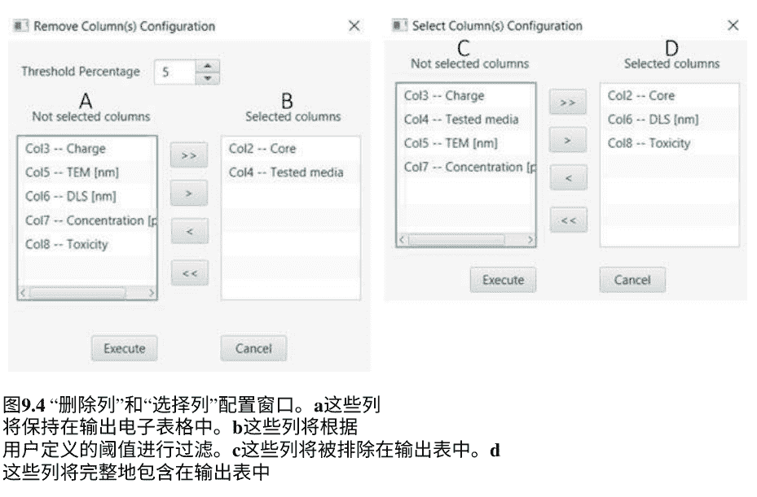

选择列：数据转换→数据操作→选择列根据配置窗口中选择的列进行简单的列过滤（图9.4d）。

#### 9.4.3 数据集拆分

数据集的拆分是数据分析和建模中常见的预处理步骤之一，既可以减少数据的量，也可以创建将在模型外部验证过程中使用的子集（Daszykowski等，2002年）。在后一种情况下，通常需要两个代表性的子集，为此，初始数据集被划分为训练集和测试集。测试集中的对象不用于模型开发，而是留出来用于在实际情况下评估模型的性能（Witten等，2016年；Varsou等，2021年）。拆分可以随机进行，也可以使用代表性选择的方法，以便所选实例均匀地覆盖数据空间。

随机分割：使用数据转换→拆分→随机分割，输入数据按行分割成两个子集。在配置窗口中（图9.5），用户可以定义拆分比例（训练集百分比），并可以选择性地指定一个整数值作为固定种子（随机生成器种子的使用），以便在重新执行拆分步骤时获得可重复的结果。此外，在输入电子表格中存在分类数据的情况下，还有分层抽样的选项。当选择适当的复选框时，用户可以指定感兴趣的分类值的列。随后，这些值的分布在分割中近似保持不变。这两个分区显示在选项卡的右侧电子表格中（参见图9.6）。用户可以从电子表格导入或直接复制和粘贴两个集合到不同的选项卡中，以进行建模和验证。

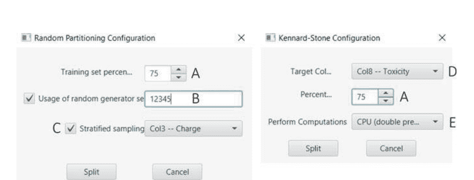

图9.5分区配置窗口，随机（左侧）和Kennard-Stone（右侧）方法。a训练比例（%）数值输入。b为随机种子分配的数值输入c用于分层抽样的列声明。d响应变量列选择。e计算执行的CPU/GPU选择

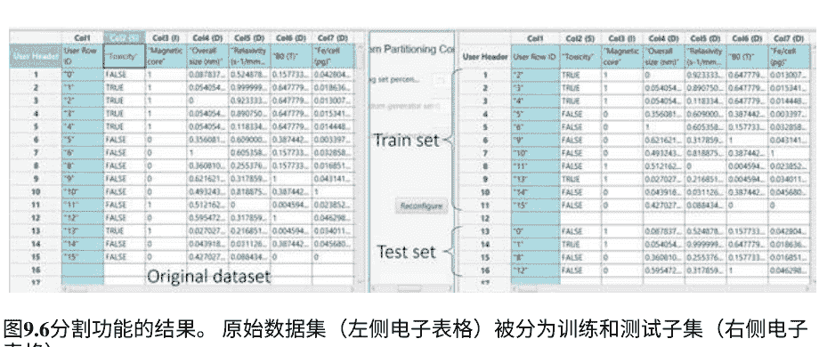

图9.6分割功能的结果。原始数据集（左侧电子表格）被分为训练和测试子集（右侧电子表格）

**Kennard-Stone**: *Kennard和Stone*方法允许选择具有初始数据集上均匀分布的代表性子集。与随机分区相比，这是一种确定性方法，因此始终从给定的起始条件（输入数据集和阈值）（*Kennard和Stone 1969*; Daszykowski等人2002）产生相同的子集。在Isalos中，用户可以通过选择顶部功能区数据转换→拆分→*Kennard-Stone*来应用此分区方法。在配置窗口中，用户选择目标列（依赖变量/终点），拆分比例（百分比）以及计算是在CPU还是GPU上执行（图9.5e）。GPU选项可以加速计算，因为它们在计算机的图形处理单元上运行。结果如前一情况所示。

### 9.5 分析

这个菜单是Isalos平台的核心元素。它包含了分类和回归模型开发的建模功能，并允许一旦开发完成，可以在不同的工作流步骤中使用。希望开发回归或分类模型的用户可以从菜单Analytics→Regression或Analytics→Classification中选择他们选择的模型，或者测试不同建模方法的性能并选择最适合他们数据的方法。下面介绍了可用的方法论。

#### 9.5.1 建模方法

**K-最近邻算法：** K-最近邻算法（KNN）是一种基于实例的学习技术，根据最近的K个训练样本（邻居）的距离加权多数投票来对实例进行分类。在回归问题中，预测值通过所选邻居的响应变量的距离加权平均值计算。在这两种情况下，权重因子是1/距离值（Witten Ian et al.2016）。

线性随机梯度下降：随机梯度下降（SGD）是一种广泛应用于机器学习的优化方法。通过SGD，线性模型的参数可以通过迭代的方式“平滑”地进行识别，通过前向传播和反向传播的步骤来最小化相应的损失函数。在前向传播步骤中，进行模型训练。通过比较预测值和实际响应变量值，计算损失函数（预测误差）。在反向传播步骤中，更新模型参数以减少预测误差（Zhang 2004）。

极限梯度提升：极限梯度提升（XGBoost）开源库通过Isalos提供。该库实现了一类由决策树模型构建的集成机器学习算法。在迭代过程中，将树添加到集成中，以减少先前模型的预测误差（损失）。梯度提升和因此XGBoost可以用于回归和分类问题。均方误差和逻辑损失分别用于回归和分类问题（Chen和Guestrin2016）。

多层感知器：多层感知器（MLP）是一类通过Isalos提供的人工神经网络，它通过多层神经元和激活函数（首先确定神经元是否被激活，其次确定节点输出）在输入和输出之间提供非线性映射（Goodfellow等人，2016年）。

径向基函数：在径向基函数（RBF）人工神经网络中，RBF被用作网络节点的激活函数（Goodfellow等人，2016年）。

自组织映射：自组织映射（SOMs）或科享映射是一种用于降维和投影高维数据的人工神经网络。训练过程是无监督的，而不是通过错误校正学习，而是应用竞争学习。训练样本定义的空间在地图中表示（通常是二维的）。然而，邻域函数保持数据的拓扑特性（Van Hulle，2012年）。

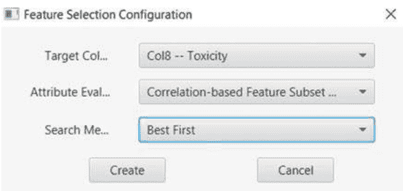

从“目标列”下拉菜单中，用户选择响应变量列（终点）。

#### 9.5.2 特征选择

模型开发过程中的一个关键步骤是特征选择。这一步的主要目标是排除可能导致过拟合现象的噪声变量，从而减少进一步分析的数据空间。通过减少数据空间，模型的计算时间也减少了，并且预测性能得到了提高（Witten等人，2016年；Varsou等人，2021b年）。通过分析→特征选择提供了访问“最佳优先”搜索方法的功能，该方法通过贪婪的爬山算法和回溯功能搜索属性子集的空间，并且还提供了“基于相关性的特征选择（CFS）子集评估器”，该评估器考虑了与预测终点高度相关但互不相关的特征子集（图9.7）（Witten等人，2016年；Varsou等人，2020年）。

#### 9.5.3 现有模型的利用

当一个模型从训练子集实例中开发出来后，它可以应用于测试子集。用户可以导入他们的测试数据，并从分析→现有模型利用中选择他们想要使用的模型，这些模型是前面步骤中的模型（图9.8）。可以对数据应用不同类型的模型，包括归一化、回归和分类模型，以及适用性领域模型（也可参见领域—APD）。

### 9.6 统计

模型的验证是模型开发过程中的关键步骤，用于评估生成的预测是否可靠。统计菜单提供了几个函数，用于评估和测量预测的准确性（无论是分类还是回归），并定义模型的适用性领域。

图9.8现有模型利用配置窗口。从“模型”下拉菜单中，用户可以从相应的选项卡（工作流程步骤）中选择模型。

## 9.6.1 领域—APD

模型开发和机器学习应用的主要目标是通过提供可靠的预测来促进战略决策的可能性。然而，利益相关者需要对产生的预测建立一定的信心，以便在实际应用中使用它。因此，每个理论模型都应该通过定义可接受（可靠）预测的领域来在实际应用中被接受。这可以通过定义模型的适用领域（APD）来实现，例如，通过比较测试实例与训练实例之间的相对“位置”来限定空间范围（Gadalet a等，2016年）。

在Isalos中，包括欧氏距离方法。将每个测试实例与训练实例的每个最近邻的距离与预定义的阈值进行比较（参见公式9.2）；如果该距离小于阈值，则其端点预测可以被认为是可靠的（Zhang等，2006年）。阈值的值仅取决于训练实例，并且独立于开发的模型进行计算。

首先，计算所有训练实例之间的欧氏距离，以及这些距离的平均值（D_av）。接下来，计算包含在训练实例子集中距离小于D_av的距离的新平均值⟨d⟩和标准差σ。Z是一个经验性的截断值，默认值为0.5。

在Isalos中，用户可以通过选择`统计→领域—APD`来计算其训练实例的APD阈值。在配置窗口中，用户可以更改Z值，并选择计算是在CPU还是GPU上运行（图9.8）。稍后，在一个新的选项卡中，用户可以导入测试实例，并通过选择

$$\text{APD} = \langle d \rangle + Z\sigma \quad\quad (9.2)$$

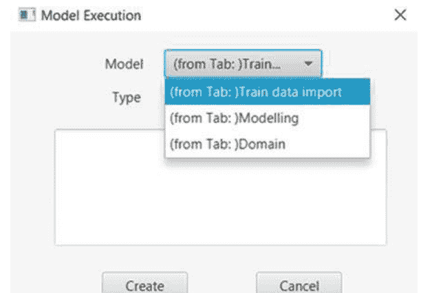

图9.9适用性领域配置窗口。a Z值数值输入。b选择计算执行的CPU/GPU

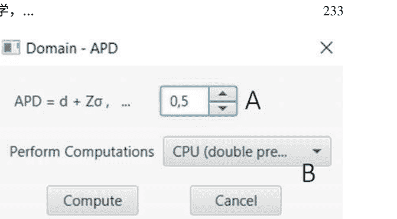

从分析中的`APD阈值→现有模型利用率`，根据上述方法评估预测的可靠性（图9.9）。

### 9.6.2 模型指标

可以使用统计指标来评估模型的性能，这些指标量化了模型对预测结果（与实际值的逼近）的准确性，并展示了可能的欠拟合或过拟合现象。

**回归指标**：对于回归模型，可以通过选择`统计量→模型指标→回归指标`来衡量其在训练和测试数据上的拟合程度。在配置窗口中，用户只需要定义响应变量的实际值和预测值所在的列。计算均方误差（MSE，公式9.3）、均方根误差（RMSE，公式9.4）、平均绝对误差（MAE，公式9.5）和平方相关系数R²（公式9.6）。MSE、RMSE和MAE值越接近0，以及R²越接近1，对应着更好的模型拟合度（Tropsha2010；Faulon和Bender 2010；Witten Ian等，2016年）

$$ \text{MSE} = \frac{1}{N} \sum_{i=1}^{N} (y_i - \hat{y}_i)^2 \quad (9.3) $$

$$ \text{RMSE} = \sqrt{\frac{1}{N} \sum_{i=1}^{N} (y_i - \hat{y}_i)^2} \quad (9.4) $$

$$ \text{MAE} = \frac{1}{N} \sum_{i=1}^{N} |y_i - \hat{y}_i| \quad (9.5) $$

$$ R^2 = \left( \frac{ \sum_{i=1}^{N} (y_i - \bar{y})(\hat{y}_i - \hat{\bar{y}}_i) }{ \sqrt{ \sum_{i=1}^{N} (y_i - \bar{y})^2 \sum_{i=1}^{N} (\hat{y}_i - \hat{\bar{y}}_i)^2 } } \right)^2 $$ (9.6)

其中 $y_i$ 和 $\hat{y}_i$ 是训练样本中原始和预测的终点值，而 $\bar{y}$ 和 $\hat{\bar{y}}_i$ 分别是原始和预测值的平均值。

**分类指标**：对于分类模型，用户可以从`统计→模型指标→分类指标`菜单中定义实际响应变量和预测值的列，以及F分数的 $\beta$值。混淆矩阵（表9.1）以及分类准确度（公式9.7）、精确度（公式9.8）、召回率（或敏感度，公式9.9）和特异度（方程9.10），以及F得分值（方程9.11和9.12）（OECD 2007; Witten Ian et al.2016; Tharwat 2018）。

$$ \text{准确率} = \frac{\text{真正例} + \text{真负例}}{\text{真正例} + \text{假正例} + \text{真负例} + \text{假负例}} $$ (9.7)

$$ \text{精确率} = \frac{\text{TP}}{\text{真正例} + \text{假正例}} $$ (9.8)

$$ \text{召回率} = \frac{\text{TP}}{\text{真正例} + \text{假负例}} $$ (9.9)

$$ \text{特异性} = \frac{\text{TN}}{\text{真负例} + \text{假正例}} $$ (9.10)

$$ F_1 = 2 \cdot \frac{\text{精确率} \cdot \text{召回率}}{\text{精确率} + \text{召回率}} = \frac{2 \text{真正例}}{2 \text{真正例} + \text{假负例} + \text{假正例}} $$ (9.11)

$$ F_{\beta} = \left(1 + \beta^2\right) \cdot \frac{\text{精确率} \cdot \text{召回率}}{\beta^2 \cdot \text{精确率} + \text{召回率}} = \frac{\left(1 + \beta^2\right) \text{TP}}{\left(1 + \beta^2\right) \text{真正例} + \beta^2 \cdot \text{假负例} + \text{假正例}} $$ (9.12)

其中真正例是正确分类为“TRUE”的类TRUE实例的频率，真负例是正确分类为“FALSE”的类FALSE实例的频率，假正例（第一类错误）是类FALSE实例被错误地分类为“TRUE”，而FN（假阴性—第二类错误）是被正确分类为“FALSE”的类TRUE实例的频率。β是一个促进召回率优于精确度的因素。

## 9.7 使用Isalos开发预测模型

在接下来的段落中，将介绍纳米信息学领域的三个案例研究。所提出的模型是在Isalos中构建和验证的，根据一组相关属性（描述符）估计不同的纳米相关终点（属性-响应变量）。所有预测工作流程都是按照数据分割、归一化、变量选择、建模、验证和可靠性评估的步骤构建的。用于构建模型的数据可通过NanoPharos数据库（https://db.nanopharos.eu/Queries/Datasets.zul）（NanoPharos 2022）公开获取。

### 9.7.1 生态毒理模型

生态毒理模型是在Isalos中开发的，用于预测新分散和2年老化纳米材料（NMs）对大型水蚤的毒理效应。原始数据集包含来自11种Ag和TiO2 NMs的剂量-反应数据，具有不同的表面功能化，并分散在三种不同的介质（高硬度介质和两种代表性河水）中（Varsou等人，2021a）。考虑到老化、介质和浓度水平的不同组合，数据集包括353个实例和14个变量。使用48小时内初始大型水蚤种群减少40%的分离阈值（EC40）产生两个相对平衡分布的类别（“有毒”，相对于未处理对照组种群减少40%以上/“非有毒”，相对于未处理对照组种群减少40%以下）。总共有150个NMs被鉴定为“有毒”，203个被鉴定为“非有毒”。毒性类别被选择为要预测的依赖（终点）变量（Varsou等人，2021a）。

根据ECHA的交叉验证指南，数据集的纳米材料被分为两类——新鲜分散和老化，并且分别开发了两个不同的分类模型。

对于每个模型，应用了外部验证方案：数据被上传到Isalos，并以75%:25%的比例随机分成训练和测试子集，使用`数据转换→拆分→随机分区`功能。选择了分层抽样选项，以便两个依赖毒性变量（有毒与无毒）的类别在两个子集中均匀表示。

训练集最初用于变量选择，然后用于定义建模参数。

| 变量 | 新鲜分散纳米材料生态毒性模型 | 老化纳米材料生态毒性模型 |
| :--- | :--- | :--- |
| 核心 | 核心 | 核心 |
| 测试介质 | 测试介质 | 测试介质 |
| TEM尺寸 | TEM尺寸 | TEM尺寸 |
| 表面电荷 | ζ电位 | ζ电位 |
| DLS尺寸 | 电导率 | 电导率 |
| 浓度 | 浓度 | 浓度 |

训练样本被复制并粘贴到一个新的标签中，并使用`数据转换→标准化器→Z得分`函数进行归一化，以确保它们对分析的贡献相等。类似地，测试样本被移动到一个新的标签中，并通过选择`分析→现有模型利用`并选择相应的标签对训练样本进行归一化处理。

在训练数据中应用了BestFirst变量选择和CFS评估器方法，以选择最关键的可用描述符。然而，考虑到核心类型、测试介质和浓度在实验评估过程中是基本参数（它们概述了实验条件），这些描述符被排除在变量选择之外，直接包含在建模变量子集中。用于开发两个模型的变量在表9.2中呈现。

训练数据的减少集合被移动到一个新的标签，并选择`Analytics→Classification→kNN`来应用kNN机器学习算法来将毒性终点与选定的变量相关联。在这两种情况下，选择了k=3的值。在模型训练之后，输出电子表格呈现了每个实例的k个最近训练邻居，以及每个邻居的欧氏距离。当模型应用于测试集时，呈现类似的结果（图9.10）。

为了执行外部验证方案，规范化的测试数据被移动到一个新的标签，并根据选定的变量使用`Data Transformation→Data Manipulation→Select Column(s)`进行过滤。过滤后的测试数据被移动到一个新的标签，并选择`Analytics→Existing Model Utilization`来应用kNN模型。预测结果被移动到一个新的标签，并通过选择`Statistics→Model Metrics→Classification Metrics`来衡量模型在外部数据上的性能。两个模型的分类统计截图如图9.11所示。

最后，模型的适用领域被定义。变量选择后的训练数据被导入到一个新的选项卡中，然后选择`统计`→`领域-APD`来计算APD阈值（方程9.2）。然后，在一个新的选项卡中，过滤后的测试数据被导入，并选择`分析`→`现有模型利用`来检查测试样本是否落入领域限制范围内，以及预测是否可靠（图9.12）。

表9.1 混淆矩阵示例用于两类分类模型

| 预测类别 \ 实际类别 | 真 | 假 |
| :--- | :--- | :--- |
| 真 | TP | FP |
| 假 | FN | TN |

| User Header | User Row ID | Core | Charge | Tested media | TEM [nm] | DLS [nm] | Concentration [ppb] | Toxicity | kNN Prediction | Closest NN1 | Distance from NN1 | Closest NN2 | Distance from NN2 | Closest NN3 | Distance from NN3 |
| :--- | :--- | :--- | :--- | :--- | :--- | :--- | :--- | :--- | :--- | :--- | :--- | :--- | :--- | :--- | :--- |
| 1 | AgNP prom uncoated, pristine_5 | Ag | negative | HH combo | 0.30549918728668746 | -0.4433573997417527 | -0.46327107055208305 | non toxic | non toxic | AgNP prom uncoated, pristine_10 | 5.000004999997913E-6 | AgNP prom uncoated, pristine_15 | 1.0000001000008125E-5 | AgNP prom uncoated, pristine_20 | 1.5000015000006039 |
| 2 | AgNP prom uncoated, pristine_10 | Ag | negative | HH combo | 0.30549918728668746 | -0.4433573997417527 | -0.4618423254296355 | toxic | toxic | AgNP prom uncoated, pristine_12 | 2.000002000001625E-5 | AgNP prom uncoated, pristine_70 | 3.0000030000036686E-5 | AgNP prom uncoated, pristine_50 | 5.0000050000052935E-5 |
| 3 | AgNP prom uncoated, pristine_15 | Ag | negative | HH combo | 0.30549918728668746 | -0.4433573997417527 | -0.4616166701020315 | toxic | toxic | AgNP prom uncoated, pristine_12 | 3.0000030000024367E-5 | AgNP prom uncoated, pristine_20 | 5.000005000005292E-5 | AgNP prom uncoated, pristine_70 | 8.00000800000773E-5 |
| 4 | AgNPs paraffin coated, pristine_7.5 | Ag | neutral | HH combo | -0.5205629457008512 | -0.7018013750493919 | -0.4622597877857028 | non toxic | non toxic | AgNPs paraffin coated, pristine_10 | 2.5000024999989564E-6 | AgNPs paraffin coated, pristine_5 | 2.5000024999989564E-6 | AgNPs paraffin coated, pristine_2.5 | 5.000005000001234E-6 |
| 5 | AgNPs paraffin coated, pristine_150 | Ag | neutral | HH combo | -0.5205629457008512 | -0.7018013750493919 | -0.4616166701020315 | toxic | toxic | AgNPs paraffin coated, pristine_120 | 3.0000030000024367E-5 | AgNPs paraffin coated, pristine_100 | 5.0000050000040616E-5 | AgNPs paraffin coated, pristine_20 | 5.000005000005292E-5 |
| 6 | AgNPs PVP (amepox polymer)_pristine_1 | Ag | neutral | HH combo | -0.3403312075944791 | -0.7985585980332168 | -0.4622891229782914 | non toxic | non toxic | AgNPs PVP (amepox polymer)_pristine_2.5 | 1.5000014999999913E-6 | AgNPs PVP (amepox polymer)_pristine_10 | 4.00000400000817E-6 | AgNPs PVP (amepox polymer)_pristine_10 | 8.00000800000603E-6 |

图9.10 测试集上`ecotox-freshly dispersed`模型的结果。对于每个实例，它的预测结果被呈现出来，同时还有三个最接近的训练邻居及其与每个测试实例的欧氏距离。

### 原始NMs模型（左侧）

| User Header | User Row ID | Actual Class | Actual Class |
| :--- | :--- | :--- | :--- |
| 1 | | non toxic | toxic |
| | | | |
| 2 | Predicted Class | non toxic | 13 | 1 |
| 3 | Predicted Class | toxic | 2 | 16 |
| 4 | | | |
| 5 | | | |
| 6 | Classification Accuracy | 0.90625 | |
| 7 | | | |
| 8 | Precision | 0.9285714285714286 | 0.8888888888888888 |
| 9 | | | |
| 10 | Recall/Sensitivity | 0.8666666666666667 | 0.9411764705882353 |
| 11 | | | |
| 12 | Specificity | 0.9411764705882353 | 0.8666666666666667 |
| 13 | | | |
| 14 | F1 Score | 0.896551724137931 | 0.9142857142857143 |

### 老化NMs模型（右侧）

| User Header | User Row ID | Actual Class | Actual Class |
| :--- | :--- | :--- | :--- |
| 1 | | toxic | non toxic |
| | | | |
| 2 | Predicted Class | toxic | 18 | 3 |
| 3 | Predicted Class | non toxic | 3 | 33 |
| 4 | | | |
| 5 | | | |
| 6 | Classification Accuracy | 0.8947368421052632 | |
| 7 | | | |
| 8 | Precision | 0.8571428571428571 | 0.9166666666666666 |
| 9 | | | |
| 10 | Recall/Sensitivity | 0.8571428571428571 | 0.9166666666666666 |
| 11 | | | |
| 12 | Specificity | 0.9166666666666666 | 0.8571428571428571 |
| 13 | | | |
| 14 | F1 Score | 0.8571428571428571 | 0.9166666666666666 |

图9.11 两个`ecotox`模型的验证结果：原始NMs模型（左侧）和老化NMs模型（右侧）

### 9.7.2 分子、尺寸和基于表面的安全设计 (MS³bD, MSzeta) 模型

MSzeta 模型是使用 Isalos 平台和一个包含69种工程纳米材料的库开发的，旨在预测ζ电位，这是一个关键的物理化学因素。图9.12 在测试集上应用APD函数。a测试实例列。b每个测试实例到其最近的训练实例的距离。cAPD阈值。d预测的可靠性

| Col1 (User Row ID) | Col9 (D) Domain | Col10 (D) APD | Col11 (S) Prediction |
|---------------------|------------------|---------------|-----------------------|
| AgNP prom uncoated_pristine_5 | 2.256553276036577E-5 | 1.0733896363762963 | reliable |
| AgNP prom uncoated_pristine_10 | 9.02621310415741E-5 | 1.0733896363762963 | reliable |
| AgNP prom uncoated_pristine_15 | 1.3539319656236115E-4 | 1.0733896363762963 | reliable |
| AgNPs paraffin coated_pristine_7.5 | 1.1282766380182885E-5 | 1.0733896363762963 | reliable |
| AgNPs paraffin coated_pristine | 1.3539319656236115E-4 | 1.0733896363762963 | reliable |

来自纳米材料监管背景的ζ电位可以直接影响纳米材料在不同溶液中的行为和稳定性，以及其与生物体的相互作用。原始数据集包括七个物理化学描述符，并使用13个分子描述符进行了扩充（Papadiamantis等，2021年）。

模型开发采用了外部验证方案。初始数据集被导入到Isalos，并按照75%：25%的比例随机分为训练集和测试集，使用`数据转换→拆分→随机分区`功能。训练集的描述符使用`数据转换→标准化器→Z得分`进行了归一化，并通过选择`分析→现有模型利用`和相应的归一化模型，在新的选项卡中应用于测试集。

最佳优先变量选择与CFS评估器方法被应用于训练数据中，以选择最关键的可用描述符。在可用的描述符中，有五个-两个物理化学性质和三个分子性质-被确定为最重要的，并在表9.3中呈现。

缩减的训练数据集被移动到一个新的标签，并选择`Analytics→Regression→kNN`来应用kNN机器学习算法，其中`k=7`，以将zeta电位端点与所选变量相关联。

#### 表9.3 用于开发MSzeta模型的变量

| 变量 | 描述 |
|------|------|
| MSzeta模型 |  |
| 涂层/功能化 (CT) |  |
| 核心尺寸 (SZ) |  |
| 金属离子半径 ( r_ion) |  |
| 金属氧化物中金属电负性之和除以氧原子数 | ( χ/no) |
| 绝对电负性 (Mulliken电负性) χ_abs) |  |

#### 图9.13 MSzeta模型的验证结果

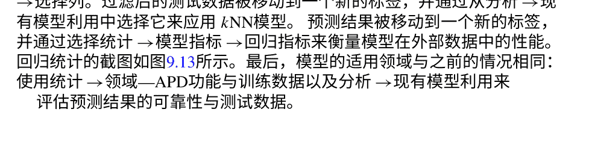

标准化的测试数据被移动到一个新的标签，并根据表9.3中选择的变量进行过滤，使用`数据转换 → 数据操作 → 选择列`。过滤后的测试数据被移动到一个新的标签，并通过从`分析 → 现有模型利用`中选择它来应用 kNN模型。 预测结果被移动到一个新的标签，并通过选择`统计 → 模型指标 → 回归指标`来衡量模型在外部数据中的性能。回归统计的截图如图9.13所示。最后，模型的适用领域与之前的情况相同：使用`统计 → 领域—APD`功能与训练数据以及`分析 → 现有模型利用`来评估预测结果的可靠性与测试数据。

### 9.7.3 细胞存活模型

这个回归模型是在Isalos中使用一个包含24个不同金属氧化物NMs的数据集构建的，其中包括77个描述符：15个物理化学、结构和测定相关的描述符和62个原子计算描述符。 该模型可以用来预测基于比色法乳酸脱氢酶（LDH）测定和发光法三磷酸腺苷（ATP）测定的金属氧化物NMs的细胞毒性（对数转换的细胞存活率，在暴露后24小时）两种测定方法，两种方法都可以量化不可逆的细胞膜损伤（Papadiamantis等人，2020年）。 最初的数据集被导入到Isalos中，我们使用`数据转换 → 数据操作 → 删除列`来删除包含相同值的列，百分比大于等于0.25。

#### 表9.4 用于细胞存活模型开发的变量

| 细胞存活模型 |
| --- |
| 纳米核心尺寸 |
| 纳米流体力学尺寸 |
| 测定方法类型 |
| 纳米材料暴露剂量 |
| 导带能量（`E_c`） |
| 纳米材料表面区域金属原子的平均配位数 |
| 纳米材料表面区域原子力矢量的平均法向分量长度 |

模型开发采用外部验证方案，将数据集按照70%:30%的比例分为训练集和测试集，使用`数据转换→拆分→随机分区`功能。训练集的描述符使用`数据转换→标准化器→Z得分`进行标准化，然后通过选择`分析→现有模型利用`和相应的标准化模型将标准化参数应用于测试集。

在训练数据中应用BestFirst变量选择与CFS评估器方法，选择最重要的可用描述符。在可用的描述符中，确定了七个最重要的描述符，如表9.4所示。

训练数据的减少集合被移动到一个新的标签，并选择`Analytics→Regression→kNN`来应用kNN机器学习算法，其中`k=2`，以将对数转换的细胞存活活性终点与所选变量相关联。

根据前一个模型描述的验证过程，使用`Data Transformation→Data Manipulation→Select Column(s)`对规范化的测试数据进行过滤，根据Table 9.4中的所选变量进行过滤。通过选择`Analytics→ExistingModel Utilization`，将kNN模型应用于过滤后的测试子集。通过选择`Statistics→Model Metrics→Regression Metrics`来衡量模型在外部数据中的性能。图9.14展示了回归统计数据的截图。最后，使用`Statistics→Domain—APD`功能和训练数据以及`Analytics→Existing Model Utilization`来评估对测试数据的预测的可靠性，定义了模型的适用领域。

| Col1 | Col2 (D) | Col3 (D) | Col4 (D) | Col5 (D) |
| --- | --- | --- | --- | --- |
| User Row ID | Mean Squared Error | Root Mean Squared Error | Mean Absolute Error | R Squared |
|  | 0.003649858841144... | 0.060414061617680495 | 0.03989082164600408 | 0.9098749... |

#### 图9.14 细胞存活模型的验证结果

### 9.8 结论

大量的数据创造，结合不同研究和分析领域从中提取有价值信息并解决现实问题的需求，扩大了通常只有科学家/专业人士才能从这些分析中受益的范围。没有数据科学、统计学或编程背景的研究人员（例如实验者）可能会对编程环境感到畏惧，或者由于时间限制而无法学习实施自己的脚本。因此，这些用户被排除在直接利用自己的数据或被迫求助于信息学专家来解释数据提取结果的范围之外。

Isalos分析平台满足了快速数据处理和建模的需求，因为它包括允许数据转换、过滤、分析和验证的功能。使用该平台不需要任何先前的计算或编程知识，因为它具有用户友好的环境，包括菜单、按钮和电子表格。这使得Isalos适用于任何感兴趣的用户，无论是信息学专业人员还是非专业人士，学术界和任何领域的研究人员。因此，通过Isalos，任何背景的利益相关者都可以像信息学专家一样获得机器学习工具，并直接操作他们的数据并开发定制模型。

致谢本工作由欧盟H2020项目NanoSolveIT（授予协议号814572）、SABYDOMA（授予协议号862296）、DIAGONAL（授予协议号953152）、CompSafeNano（授予协议号101008099）、欧盟H2020研究基础设施NanoCommons（授予协议号731032）、绿色协议Horizon 2020项目SCENARIOS（授予协议号101037509）以及POST-DOC/0718/0070项目资助，该项目由欧洲区域发展基金和塞浦路斯共和国通过研究和创新基金共同资助。

## 参考文献

- Abadi M, Agarwal A, Barham P等 （2015） TensorFlow：异构系统上的大规模机器学习
- Berthold MR, Cebron N, Dill F等 （2009） KNIME - 康斯坦茨信息挖掘工具 ACMSIGKDD Explor News1 11:26–31. https://doi.org/10.1145/1656274.1656280

# 第10章 ED Profiler: 用于筛选潜在内分泌干扰化学物质的机器学习工具

Xianhai Yang, Huihui Liu, Rebecca Kusko和Huixiao Hong

## 10.1 引言

自从1993年首次提出“内分泌干扰化学物质（EDCs）”这个术语以来（Colborn等，1993），已经有大量文献证明EDCs可能对人类和野生动物的内分泌相关效应产生有害影响（Diamanti-Kandarakis等，2009；Gore等，2015；Kwiatkowski等，2016；Matthiessen等，2018；联合国环境规划署/世界卫生组织，2013年）。已经确定的有害效应包括但不限于：改变内分泌相关基因的表达水平（Lu等，2018），干扰激素稳态（Kim等，2011），内分泌腺功能障碍（Lu等，2020），激素依赖性癌症的发生（Alsen等，2021；Bokobza等，2021），代谢性疾病（Papalou等，2019），女性化或去雄化（Gimeno等，1996；Harris等，2011；Shenoy等，2011）。为了最小化EDCs对人类和野生动物内分泌系统的潜在有害影响，因此迫切需要从商业化学品中识别/筛选潜在的EDCs。

X. Yang, H. Liu

江苏省化学污染控制与资源再利用重点实验室，环境与生物工程学院，南京理工大学，中国电子邮件：xhyang@njust.edu.cn

H. Liu

电子邮件：hhliu@njust.edu.cn

R. Kusko

Immuneering Corporation, Cambridge, MA 02142, USA

电子邮件：bkusko@immuneering.com

H. Hong

美国食品和药物管理局国家毒理研究中心，阿肯色州杰斐逊，邮编72079，美国电子邮件：Huixiao.Hong@fda.hhs.gov

## 参考文献

- Chen T, Guestrin C （2016） XGBoost：一种可扩展的树提升系统 在第22届ACM SIGKDD国际会议上的知识发现和数据挖掘会议论文集中 ACM，纽约，纽约，美国，第785-794页

- Daszykowski M, Walczak B, Massart DL (2002) 代表性子集选择。 Anal Chim Acta。 https://doi.org/10.1016/S0003-2670(02)00651-7

- Demšar J, Curk T, Erjavec A等 （2013） ： Orange：Python中的数据挖掘工具箱。 J Mach Learn Res 14:2349–2353

- Faulon J-L, Bender A (2010) 化学信息学算法手册。Chapman and Hall/CRC

- Gadaleta D, Mangiardi GF, Catto M等 (2016) QSAR模型的适用领域：理论与现实的结合。Int J Quant Struct Relat 1:45–63。https://doi.org/10.4018/IJQSPR.2016010102

- Goodfellow I, Bengio Y, Courville A (2016) 深度学习。MIT Press

- Gulli A, Pal S (2017) 使用Keras进行深度学习。Packt Publishing Ltd

- Higham DJ, Higham NJ (2017) MATLAB指南。Soc Ind Appl Math

- Kennard RW, Stone LA (1969) 计算机辅助实验设计11:137–148

- Leach AR, Gillet VJ (2007) 化学信息学简介

- Mierswa I, Wurst M, Klinkenberg R等 (2006) YALE：用于复杂数据挖掘任务的快速原型制作。在：第12届ACM SIGKDD国际会议的论文集上，知识发现和数据挖掘-KDD '06，ACM出版社，纽约，美国，第935页

- NanoPharos (2022) NanoPharos数据库。db.nanopharos.eu。2022年1月21日访问。

- OECD (2007) 关于（定量）结构-活性关系[(Q)SAR]模型验证的指南文件

- Papadiamantis AG, Afantitis A, Tsoumanis A等 (2021) 通过Isalos分析平台对物理-化学数据进行计算丰富，开发了一个ζ-电位推测模型。NanoImpact 22：100308。https://doi.org/10.1016/j.impact.2021.100308

- Papadiamantis AG, Jánes J, Voyiatzis E等 (2020) 使用Isalos分析平台预测金属氧化物纳米颗粒的细胞毒性。纳米材料10：1–19。https://doi.org/10.3390/nano10102017

- Paszke A, Gross S, Massa F等 (2019) PyTorch：一种命令式风格、高性能的深度学习库。在：神经信息处理系统32的进展，Curran Associates, Inc.，pp 8024–8035

- Pedregosa F, Varoquaux G, Gramfort A等 (2011) Scikit-learn：Python中的机器学习。J Mach Learn Res 12:2825–2830

- R核心团队 (2021) R：一种用于统计计算的语言和环境。奥地利，维也纳

- Tharwat A (2018) 分类评估方法。Appl Comput Inf 17:168–192。https://doi.org/10.1016/j.aci.2018.08.003

- pandas开发团队 (2020) pandas-dev/pandas：Pandas

- 怀卡托大学 (2021) Weka 3：Java中的机器学习软件。https://www.cs.waikato.ac.nz/ml/weka/index.html。于2019年7月15日访问

- Tropsha A (2010) QSAR模型开发、验证和应用的最佳实践。Mol Inform 29:476–488。https://doi.org/10.1002/minf.201000061

- Van der Aalst W (2016) 过程挖掘：数据科学的实践

- Van Hulle MM (2012) 自组织映射。自然计算手册。Springer, Berlin Heidelberg, Berlin, Heidelberg, pp 585–622

- Varsou D-D, Ellis LJA, Afantitis A等 (2021a) 预测新鲜分散与中等老化纳米材料对大型水蚤的急性毒性的生态毒理学类推模型。Chemosphere 285:131452。https://doi.org/10.1016/j.chemosphere.2021.131452

- Varsou DD, Afantitis A, Tsoumanis A等 (2020) 利用enalos纳米信息云平台上的nanoXtract图像分析工具提取的纳米描述符的Zeta电位类推模型。Small 16。https://doi.org/10.1002/smll.201906588

- Varsou DD, Koutroumpa NM, Sarimeveis H (2021b) 基于数学优化的纳米材料自动分组和类推预测其不良效应。J Chem Inf Model 61:2766–2779。https://doi.org/10.1021/acs.jcim.1c00199

- Witten IH, Frank E, Hall MA, Pal CJ (2016) 数据挖掘：实用机器学习工具和技术。摩根·考夫曼，第四版

- Zhang S, Golbraikh A, Oloff S等 (2006) 一种新颖的自动化懒惰学习QSAR（ALL-QSAR）方法：方法开发，应用和使用经过验证的ALL-QSAR模型的化学数据库的虚拟筛选。J Chem Inf Model 46:1984–1995。https://doi.org/10.1021/ci060132x

- Zhang T (2004) 使用随机方法解决大规模线性预测问题。在：ICML 2004年机器学习国际会议论文集omnipress，第919-926页

并设计新物质，而不会产生内分泌干扰效应 (La Merrill等 2020; Kassotis等2020)。在这方面，成功识别潜在内分泌干扰物的关键先决条件是开发适当的方法。迄今为止，已经对一系列经过验证的内分泌干扰物筛查试验进行了修订和开发。例如，美国环境保护局（EPA）发布了14种测试方法，用于内分泌干扰物筛查计划（EDSP）（Browne等，2017年）。在经济合作与发展组织发布的内分泌干扰物测试和评估的概念框架中，推荐了46多个测试准则和标准化测试方法（经济合作与发展组织，2018年）。然而，实践证明，使用基于体内毒性测试的方法筛查潜在的内分泌干扰物是耗时且昂贵的（每种物质约100万美元）（Mansouri等，2020年；Marty，2014年）。考虑到全球已经使用或曾经使用过的物质超过350,000种（Tang等，2020年；Wang等，2020年），快速且具有成本效益的方法至关重要。

因此，提出了计算模型和基于分子的体外高通量筛选测定法，用于优先筛选潜在的内分泌干扰物（Browne等人，2017年）。有关内分泌干扰物体外高通量筛选测定法的信息可以参考其他评论或报告（Browne等人，2020年；Le Baron等人，2014年；Murk等人，2013年；经济合作与发展组织，2018年；Rotroff等人，2013年；Zhu等人，2014年）。本章重点介绍内分泌干扰效应的计算模型。自1990年代以来，已经开发了大量关于内分泌系统生物大分子终点的定性和定量模型（AbdulHameed等人，2021年；Banerjee等人，2018年；Browne等人，2015年；Chen等人，2018年；Dimitrov等人，2016年；Garcia de Lomana等人，2021年；Guo等人，2017年；Hong等人，2015年；Kolšek等人，2014年；Li等人，2010年；Sakkiah等人，2021年；Tan等人，2021年；Vedani等人，2009年；Wang等人，2021年；Yang等人，2013年，2019年；Yin等人，2017年）。然而，与核受体相比，非受体介导的靶点（例如激素合成相关酶、激素转运蛋白和激素代谢相关酶）的可用预测模型数量要少得多（Sakkiah等人，2018年）。同样的趋势也出现在预测给定化合物潜在内分泌干扰效应的可用软件中（表10.1）。如下所示，这些工具预测的28个终点中有22个是核受体。值得注意的是，直到现在，集成到硅模型中的激素转运蛋白工具非常稀缺。这些结果强调了需要进一步推导与非受体介导的靶点相关的模型，并持续开发具有非受体介导的靶点预测模型的高通量虚拟筛选工具。

在本章中，我们介绍了一个名为“EDProfiler”的高通量虚拟筛选工具，该工具已与（定量）结构-活性关系（（Q）SAR）模型集成，用于一些非受体介导的靶点（例如人类和鱼类激素转运蛋白），并可用于预测EDCs对这些非受体介导的靶点的潜在干扰效应。一般来说，我们首先提出了激素载体的定性和/或定量模型（即人类甲状腺素结合蛋白（hTTR），人类和鱼类性激素结合球蛋白（hSHBG和

## 表10.1 公开可用的软件，用于预测潜在的内分泌干扰效应

| 工具名称 | 预测终点 | 参考/链接 |
| :--- | :--- | :--- |
| `VEGA (V1.1.5)` | 人类雌激素受体 (`hER`)，雄激素受体 (`AR`)，甲状腺受体α (`hTRα`)，甲状腺受体β (`hTRβ`)，芳香化酶 | https://www.vegahub.eu |
| `ToxProfiler` | 雌激素受体α (`ERα`)，雌激素受体β (`ERβ`)，`AR`，胆酸受体 (`BAR`)，孕烷X受体 (`PXR`)，组成性雄激素受体 (`CAR`)，糖皮质激素受体 (`GR`)，孕酮受体 (`PR`)，过氧化物酶激活受体α (`PPAR α`)，过氧化物酶激活受体β (`PPAR β`)，过氧化物酶激活受体γ (`PPAR γ`)，视黄酸受体α (`RXRα`)，维生素D3受体 (`VD3R`)，芳香烃受体 (`AhR`)，芳香化酶 | AbdulHameed等人 (2021年) https://toxpro.bhsai.org |
| 内分泌干扰物组 | `ERα`, `ERβ`, `AR`, `GR`, 肝X受体α (`LXR α`)，肝X受体β (`LXR β`)，醛固酮受体 (`MR`)，`PPARα`, `PPARβ`, `PPARγ`, `PR`, `RXRα`, `TRα`, `TRβ` | Kolšek等人 (2014年) http://endocrinedisruptome.ki.si |
| 丹麦 `(Q) SAR`模型 | `hER`, `hERα`, `hAR`, `AR`, 甲状腺过氧化物酶 (`TPO`)，`hPXR`, `hAhR`, `CAR` | https://qsarmodels.food.dtu.dk |
| `QSAR工具箱 (V4.4.1)` | `hERα`, `hAR`, `hPXR`, `hTRα`, `hTRβ` | Dimitrov等人 (2016年) https://qsartoolbox.org |
| `VirtualToxLab™ (V5.8)` | `AR`, `AhR`, `ERα`, `ERβ`, `GR`, `LXR`, `MR`, `PPARγ`, `PR`, `TRα`, `TRβ` | Vedani等人 (2009年) www.virtualtoxlab.org |
| `ProTox-II` | `AhR`, `AR`, `aromatase`, `ERα`, `PPARγ` | Banerjee等人 (2018年) https://tox-new.charite.de/pro tox_II |
| `admetSAR (V2.0)` | `hERα`, `hAR`, `hTR` | Yang等人 (2019年) http://lmmd.ecust.edu.cn/adm etsar2/ |
| `ChemBioSim` | `Deiodinase1 (DIO1)`, `deiodinase2 (DIO2)`, `deiodinase1 (DIO3)`, `TPO`, `TR`, `human sodium iodide symporter (hNIS)`, `thyrotropin releasing hormone receptor (TRHR)`, `thyroid stimulating hormone receptor (TSHR)` | Garcia de Lomana等人 (2021年) https://zenodo.org/record/4761226#.YQTZ7eSP6Uk |
| `SepPCNET` | `ER` | Wang等人 (2021b年) https://pubs.acs.org/doi/10.1021/acs.est.1c01228 |
| `CPTP（化学预测毒理学平台）` | 人类甲状腺素结合蛋白 (`hTTR`) | http://cptp.dlut.edu.cn/ |
| `ED Profiler (V1.0)` | `hER`, `hPXR`, `hTTR`, 人类性激素结合球蛋白 (`hSHBG`)，`hNIS`，鱼类雌激素受体 (`鱼类ER`)，鱼类性激素结合球蛋白 (`鱼类SHBG`) | http://jszy.njust.edu.cn/hjsw/yxh_en/list.psp |

使用典型的机器学习方法，基于上述定性和/或定量模型，使用Python开发了`ED Profiler`，用于对`fish SHBG`))，人类碘化钠转运体 (`hNIS`) 和一些核受体进行预测。

### 10.2 材料和方法

#### 10.2.1 数据集

`hTTR` (Yang等, 2021年)，`hSHBG` (Liu等, 2016年)，`hPXR` (Yin等, 2017年)，`fish ER` (He等, 2018年; Wang等, 2019b年) 和`fish SHBG` (Liu等, 2017年) 的定性和定量数据来自我们之前的研究。此外，`hER` (Roncaglioni等, 2008年) 和人类碘化钠转运体 (`hNIS`) (Buckalew等, 2020年; Hallinger等, 2017年; Wang等, 2018年, 2019a年, 2021a年) 的定性数据来自先前的研究。每个终点的定性和定量数据数量列在表10.2中。

在所有生物大分子的SAR建模中，活性物质和非活性物质的终点分别被指定为`A`和`I`。而用于推导`hTTR`和`hSHBG`的QSAR模型的终点是相对结合亲和力的对数(`log RAB`)。`log RAB`的定义如下(Hong et al.2015; Liu et al. 2016):

## 表10.2 数据集中各终点的数据量

|      | 数据类型 | n (总数) | n (活性) | n (非活性) | 参考文献 |
| :--- | :--- | :--- | :--- | :--- | :--- |
| `hTTR` | 定性     | 445      | 229      | 216        | Yang等人(2021) |
|      | 定量     | 88       | 88       | –          |          |
|      | 定量     | 41       | 41       | –          |          |
| `hSHBG` | 定性    | 125      | 87       | 38         | Liu等人(2016) |

|      | 定量     | 87       | 87       | –          |          |

| hPXR | 定性     | 2693     | 739      | 1954       | Yin等人(2017) |

| hER  | 定性     | 806      | 288      | 518        | Roncaglioni等人(2008) |

| hNIS | 定性     | 1771     | 112      | 1659       | Buckalew等人 (2020年)，Hallinger等人 (2017年)，(Wang等人2018年，2019a，2021a) |

| 鱼ER | 定性     | 62       | 39       | 23         | He等人 (2018年)，Wang等人 (2019a，b) |

| 鱼SHBG | 定性    | 70       | 52       | 18         | Liu等人 (2017年) |

$$
log_{RBA} = log \frac{IC_{50,\text{参考化合物}}}{IC_{50,\text{配体}}} \quad (10.1)
$$

其中，`IC_{50}`是参考化合物和配体的半最大抑制浓度，分别是hTTR的甲状腺素和睾酮以及hSHBG的模型物质。

#### 10.2.2 分子描述符计算

使用`PaDEL`描述符来推导定性和定量模型 (Yap2011)。考虑到给定物质的几何优化耗时且存在软件开发挑战，这里只考虑了计算快速且不需要几何优化的描述符。特别地，我们为（Q）SAR建模和模型质量评估推导了1D、2D和Pubchem指纹描述符。所有这些描述符都可以直接从给定化合物的简化分子输入行入系统（SMILES）代码中计算得出。

### 10.2.3 (Q)SAR建模

对于每个终点，相应的数据集首先被随机分成训练集（75%）和验证集（25%）。然后，成功构建了许多二分类模型或QSAR模型，除了所有终点之外对于人类碘化钠转运体（hNIS），使用一种基于欧氏距离的k最近邻（kNN）程序，在我们之前的研究中成功用于推导许多定性和定量模型（Ding等，2019年; Lin等，2019年; Liu等，2016年，2017年; Xi等，2020年; Yang等，2021年; Yin等，2017年）。考虑到没有使用kNN得出hNIS的可接受的SAR模型，进一步使用其他机器学习算法（例如逻辑回归，支持向量机，决策树，随机森林等）来推导其分类模型。这些机器学习算法已广泛应用于构建各种毒性终点的预测模型（Chierici等，2018年; Idakwo等，2018年; Tang等，2018年; Wang等，2021年c; Zhong等，2021年）。使用`scikit-learn`代码执行这些机器学习分析（Pedregosa等，2011年）。

在SAR评估中，构建的二元定性模型的预测性能通过以下指标进行评估：预测准确度（Q），特异性（Sp），敏感性（Sn），马修斯相关系数（MCC）和接受者操作特征曲线下的面积（AUC）（Ding等，2019年）：

$$Q = \frac{\text{真正例+真负例}}{\text{TP + TN + FN + FP}}$$

$$S_{\text{p}} = \frac{\text{TN}}{\text{真负例+假正例}}$$

$$S_{\text{n}} = \frac{\text{TP}}{\text{真正例+假负例}}$$

$$\text{MCC} = \frac{\text{TP} \times \text{TN} - \text{FP} \times \text{FN}}{\sqrt{(\text{TP} + \text{FP})(\text{TP} + \text{FN})(\text{TN} + \text{FP})(\text{TN} + \text{FN})}}$$

其中`TP`（真阳性）和`TN`（真阴性）分别是正确分类为有毒和非有毒的化学物质的数量。`FN`（假阴性）和`FP`（假阳性）分别是错误分类为非有毒和有毒的化学物质的数量。对于QSAR，通过以下参数评估所提出的QSAR模型的内部（拟合优度和稳健性）和外部预测质量：拟合优度的平方相关系数（`R²train`）；留一法交叉验证的`Q²LOO`，留多法交叉验证的`Q²LMO`和自助法的`Q²BOOT`用于稳健性；外部解释方差的`Q²EXT`，一致性相关系数的`CCC`，外部验证指标的`r²m`以及外部预测能力的绝对差异`Δr²m`（Lin等，2019年; Yang等，2021年）。此外，还使用训练集和验证集的均方根误差（`RMSE`），标准误差（`s`）和平均绝对误差（`MAE`）来描述最佳模型的预测能力（Lin等，2019年; Yang等，2021年）。通过最大化预测准确度（Q）等统计参数的值，从定性和定量模型的衍生群体中选择最佳的SAR模型和QSAR模型。

对于SAR模型，准确性（`S_p`）和敏感性（`S_n`）以及对于QSAR模型的拟合优度、鲁棒性和外部预测能力的特异性。

## 10.2.4适用领域和可靠性评估

开发的SAR和QSAR模型的适用领域（AD）由基于欧氏距离的方法定义，如下所示：

$$ D_{EAD} = \sqrt{\sum_{i=1}^{n} (x_i - x_{i-aver})^2} $$

其中，`D_{E-AD}`是用于评估AD的欧氏距离，`x_i`和`x_{i-aver}`分别是化合物的描述符_i和描述符_i的平均值。

给定物质的预测值的可靠性通过Tanimoto相似性指数（`T_S`）进行评估。`T_S`的定义如下（Yang等，2021年）：

$$ T_S = \frac{\sum_{i=1}^{n} A_{X-i} \cap B_{X-i}}{\sum_{i=1}^{n} A_{X-i} + \sum_{i=1}^{n} B_{X-i} - \sum_{i=1}^{n} A_{X-i} \cap B_{X-i}} $$

其中，`A_{X-i}`和`B_{X-i}`分别是物质A和B的第i个描述符。我们根据训练集中化合物的Pubchem指纹描述符和目标物质计算了给定化合物的`T_S`值。如果给定物质的`T_S`值≥0.900，则将该物质的预测数据标记为高可靠性；如果0.750≤`T_S`<0.900，则将预测数据标记为中等可靠性；否则标记为低可靠性。

#### 10.2.5 软件开发

`ED Profiler`的概念框架如图10.1所示。一般来说，有两个核心层：用户界面部分和软件背景部分。在用户界面部分，用户可以输入目标化合物，选择模型，显示基本信息并提交任务。而在软件背景部分，软件会自动判断输入的给定化合物信息是否有效。当输入了有效的目标化合物并选择了模型时，软件还会计算所需的描述符，填补数据空白，进行适用领域（AD）和可靠性评估，并自动生成最终报告。

`ED Profiler`是使用`Python 3.9.4`（`https://www.python.org/`）开发的。图形用户界面是使用`Python tkinter`模块构建的。对于给定的开发模型，所需的1D、2D和Pubchem指纹描述符是通过`Python`的`padelpy`模块（`https://github.com/ECRL/PaDELPy`）派生的，这是一个公开可用的用于`PaDEL`描述符程序（Yap 2011）的`Python`库。还使用了其他`Python`模块，如`os`、`re`、`csv`、`sys`、`pandas`、`sklearn`、`base64`和`unicodecsv`。最终的`ED`分析包是由`pyinstaller 4.3`（`http://www.pyinstaller.org`）打包的。

### 10.3 预测模型的发展

#### 10.3.1 提出的预测模型系统

在这里，为了区分AD中的目标物质是否是给定终点的活性干扰物，开发了所有终点的SAR模型。对于具有活性hTTR或hSHBG干扰效应的化合物，其定量干扰数据将进一步由AD中的QSAR模型进行预测。通过Tanimoto相似性指数（Eq. 10.7）评估了SAR和QSAR模型得出的定性和定量结果的可靠性。图10.2描述了基于SAR和QSAR模型的预测系统。

### 10.3.2 SAR模型的发展

每个终点的最佳SAR模型列在表10.3中。表10.3中的所有SAR模型都是通过`kNN`方法开发的，并且除了hNIS外，都包含三个预测变量。无法使用`kNN`方法得出hNIS的可接受SAR模型的原因可能是hNIS的数据不平衡（这里过多的是非活性物质），而`kNN`方法无法很好地处理不平衡数据。因此，还使用了其他机器学习算法（例如逻辑回归、支持向量机、决策树和随机森林）来克服这个问题。比较了基于这些机器学习算法的SAR模型的预测能力。我们发现，基于决策树方法得出的SAR模型具有比其他机器学习算法更好的分类性能。因此，hNIS的最终最佳SAR模型是通过决策树方法开发的，并且具有十个预测变量。

所有SAR模型的统计参数值（即`S`、`n`、`p`和`Q`）均大于0.700。这些模型的`MCC`值大于0.470。根据这些模型的ROC曲线，得到了它们在训练和验证集上的`AUC`值。计算结果表明，所有SAR模型的`AUC`值大于0.800。以`hTTR` SAR模型的ROC曲线为例，如图10.3所示。总体而言，上述统计参数突出显示最终优化的SAR模型具有良好的分类性能。

根据公式10.6，用于评估`AD`的计算最大欧氏距离也在表10.3中给出。例如，从`hTTR` SAR模型的训练集中得到的最大欧氏距离为0.910。如果一个新化合物的欧氏距离≤0.910，则说明该化合物被认为在`hTTR` SAR模型的适用领域内。否则，该化合物被认为超出了该模型的适用领域。

表 10.3 每个终点的最佳 SAR 模型的统计参数

| 终点 | 预测变量 | 数据集 | n | $S_n$ | $S_p$ | $Q$ | MCC | AUC | ED |
| :--- | :--- | :--- | :--- | :--- | :--- | :--- | :--- | :--- | :--- |
| `hTTR` SAR 模型 | `(MATS2e, FMF, maxHBa)^b` | T | 333 | 0.867 | 0.868 | 0.868 | 0.736 | 0.937 | 0.91 |
| | | V | 112 | 0.841 | 0.898 | 0.866 | 0.734 | 0.887 | |
| `hSHBG` SAR 模型 | `(AATS5v, SpMax_Dzi, AATS2l, piPC9)` | T | 93 | 0.955 | 0.926 | 0.946 | 0.871 | 0.977 | 0.971 |
| | | V | 32 | 0.952 | 1 | 0.969 | 0.934 | 0.981 | |
| `hPXR` SAR 模型 | `(VAdjMat, WTPT-4, FMF)` | T | 2019 | 0.806 | 0.924 | 0.892 | 0.729 | 0.952 | 1.02 |
| | | V | 674 | 0.718 | 0.827 | 0.797 | 0.522 | 0.807 | |
| `hER` SAR 模型 | `(GGI7, maxHBd, nHBAcc)` | T | 604 | 0.82 | 0.906 | 0.874 | 0.728 | 0.937 | 0.916 |
| | | V | 202 | 0.773 | 0.912 | 0.866 | 0.693 | 0.867 | |
| `hNIS` SAR 模型 | `(TopoPSA, PubChemFP182, PubChemFP697, nHBacc_Lipinski, PubChemFP581, PubChemFP374, nFRing, PubChemFP38, PubChemFP713, PubChemFP95)` | T | 1328 | 1 | 0.942 | 0.946 | 0.729 | 0.993 | 1.89 |
| | | V | 443 | 0.895 | 0.903 | 0.903 | 0.479 | 0.896 | |
| 鱼ER SAR 模型 | `(nHBAcc, GATS2m, nAtomP)` | T | 46 | 0.962 | 0.95 | 0.957 | 0.912 | 0.985 | 0.744 |
| | | V | 16 | 1 | 1 | 1 | 1 | 1 | |
| 鱼SHBG SAR 模型 | `(nFRing, BIC5, Imax)` | T | 57 | 0.972 | 0.981 | 0.957 | 0.994 | 1.09 | |
| | | V | 18 | 1 | 1 | 1 | 1 | 1 | |

`T` 和 `V` 分别是训练集和验证集。`T`：`MF` 是分子的复杂性，`maxHB` 是（强）氢键受体的最大值，`AATS5v` 是平均 Broto-Morgan 自相关滞后 2 的电负性加权（按 Sanderson 电负性加权），`FM` 是按 `T` 的电负性加权，`SpMax_D` 是 Boravs 矩阵的主特征值（按第一电负性滞后 2，任意氮；任何氧），`WPT_4` 是从氧开始的路径长度（`MDE^{0.11}` 是所有主要氧原子之间的分子距离之和），`M` 是氢键受体的数量（使用 CDK HBondCount 描述符算法），`n_{O}` 是常规键数之和，`pC_4` 是常规键数之和（`MDE^{0.11}` 是所有主要氧原子之间的分子距离之和），`MWC5` 是顺序 5 的分子子图计数（`ln(1+x)`），`WPT_4` 是从氧开始的路径长度，`n_{O}` 是常规键数之和，`pC_4` 是常规键数之和（`MDE^{0.11}` 是所有主要氧原子之间的分子距离之和），`TopoPSA` 是拓扑极性表面积，`PubChemFP12` 是 PubChem 指纹（非饱和非芳香碳环大小为 6），`PubChemFP697` 是 PubChem 指纹（`C=C-C-C-C-C`），`nF` 是融合环的数目（使用 Lipinski 的定义：任何氮；任何氧），`PubChemFP581` 是 PubChem 指纹（`C-H`），`nFRing` 是融合环的数目（`C=C-C-C-C-C`），`PubChemFP834` 是 PubChem 指纹（`C-H`），`PubChemFP731` 是 PubChem 指纹（`C=C-C-C-C-C`），`nFRing` 是融合环的数目（`C=C-C-C-C-C`），`AtomP` 是最大原子数目，`n7Ring` 是 7 元环的数目，`BIC5` 是键信息内容指数（5 阶邻域对称性），`Imax` 是最大的 `H,E-State` 环（包括融合环的计数），`GATS2m` 是 Geary 自相关性（按质量加权的延迟 2），`n` 是按延迟 2 的计数（包括融合环的计数）。

### 10.3.3 QSAR模型的发展

对于`hTTR`和`hSHBG`，构建了三个`kNN-QSAR`模型。基于从放射标记配体位移法获得的`hTTR`干扰数据，得到了两个`kNN-QSAR`模型（称为`kNN-QSAR（Radio）`）和基于ANSA竞争荧光位移测定法的模型（称为`kNN-QSAR（ANSA）`）。基于两个（即`GATS4v` (Geary自相关性-滞后4/按照范德华体积加权）和`minwHBa` (弱氢键受体的最小E-States)）预测变量，构建了最佳的`hTTR kNN-QSAR（Radio）`，`hTTR kNN-QSAR（ANSA）`和`hSHBG kNN-QSAR`模型。基于两个（即`ATSC3c` (中心化的Broto-Moreau自相关性-滞后3/按照电荷加权）和`GATS1s` (Geary自相关性-滞后1/按照I-state加权)）预测变量，构建了最佳的`hTTR kNN-QSAR（Radio）`，`hTTR kNN-QSAR（ANSA）`和`hSHBG kNN-QSAR`模型。基于四个（即`ASP-2` (平均简单路径，顺序2)，`SssCH` (原子类型E-State的总和：> CH–)，`SpMax1_Bhi` (Burden修改矩阵的最大绝对特征值-n1/按照相对权重)，和`SHtCH` (原子类型H E-State的总和：#CH)）预测变量，构建了最佳的`hTTR kNN-QSAR（Radio）`，`hTTR kNN-QSAR（ANSA）`和`hSHBG kNN-QSAR`模型。

所有三个最佳QSAR模型的`k`值为3。计算得到的统计参数列在表10.4中。如图所示，所有统计性能都满足可接受的阈值要求（即`Q²_LOO`， `Q²_LMO`和`Q²_BOOT` > 0.600， `R2 Train` > 0.700， `Q²_EXT` > 0.700， `CCC` > 0.850， `r2_m` > 0.500， 以及`Δr2_m` < 0.200）（Chirico and Gramatica 2012），表明这些`kNN-QSAR`模型具有良好的拟合度、鲁棒性和外部预测性能。图10.4展示了三个`kNN-QSAR`模型的观测值与预测值之间的关系。用于评估三个`kNN-QSAR`的`AD`的计算最大欧氏距离列在表10.4中。

| 参数 | 可接受的阈值 | `hTTR kNN-QSAR (Radio)` | `hTTR kNN-QSAR (ANSA)` | `hSHBG kNN-QSAR` |
| :--- | :--- | :--- | :--- | :--- |
| **训练集** | | | | |
| `m` | - | 2 | 2 | 4 |
| `k` | - | 3 | 3 | 3 |
| `n训练` | - | 66 | 30 | 65 |
| `R²训练` | > 0.700 | 0.927 | 0.910 | 0.887 |
| `Q²LOO` | > 0.600 | 0.839 | 0.852 | 0.745 |
| `Q²LMO` | > 0.600 | 0.801 | 0.810 | 0.724 |
| `Q²BOOT` | > 0.600 | 0.810 | 0.760 | 0.695 |
| `RMSE训练` | - | 0.354 | 0.336 | 0.447 |
| `s训练` | - | 0.362 | 0.354 | 0.457 |

| MAE训练 | - | 0.254 | 0.264 | 0.361 |

| **验证集** | | | | |

| nEXT | - | 22 | 11 | 22 |

| Q²EXT | > 0.700 | 0.833 | 0.870 | 0.825 |

| CCC | > 0.850 | 0.910 | 0.930 | 0.905 |

| r²m | > 0.500 | 0.791 | 0.816 | 0.710 |

| Δr²m | < 0.200 | 0.0833 | 0.110 | 0.107 |

| RMSEEXT | - | 0.560 | 0.390 | 0.631 |

| sEXT | - | 0.603 | 0.457 | 0.679 |

| MAEEXT | - | 0.396 | 0.321 | 0.525 |

| ED | - | 0.766 | 0.648 | 1.19 |

### 10.4 软件开发

#### 10.4.1 软件的特点和概述

图10.5展示了`ED Profiler`的主界面，包括：所需的目标分子输入、模型选择、关键信息显示和提交部分。

`ED Profiler`是一个简单易用的工具，可用于预测迄今为止对七种生物大分子的内分泌干扰效应。目前，`ED Profiler`支持SMILES代码和CAS号作为输入格式，在单分子和多分子模式下。我们建议用户直接输入单个物质或多个化合物的SMILES代码，因为所需描述符可以从有效的SMILES代码中派生出来。对于CAS号，程序将使用输入的CAS号在其自己的化学信息数据库中搜索，以确定是否存在相应的SMILES代码。如果化学信息数据库包含目标化合物，则会自动提取相应的SMILES代码并使用。

图10.4 观察值与预测值的对数`RPhTTR kNN-QSAR（Radio）`模型的值(a), `hTTR kNN-QSAR（ANSA）`模型的值(b)和`hSHBG kNN-QSAR`模型的值(c)

计算相关描述符，否则无法通过`ED Profiler`预测目标。

在模型选择部分，用户可以选择一个或多个模型。在输入目标分子并选择适当的模型之后，用户可以点击提交按钮。然后，该工具将填补数据空白并根据计算得到的描述符评估预测结果的AD和可靠性。最后，报告中包含关键信息，如输入目标化合物的基本信息以及给定终点的观察值（如果可能）和预测的定性和/或定量值（如果可能）。还将生成相应预测值的AD和可靠性的评估结果。

#### 10.4.2 示例

在这里，我们使用了软件中未包含的新物质作为示例。马等人（2018）通过原生电喷雾电离质谱法研究了三种化合物（即4,4′-二HO-3,3′,5,5′-四溴二苯磺酮，4-HO-2,2′,3,4′,5,5′,6-七溴二苯醚和6-HO-2,2′,3,4′,5,5′-七溴二苯醚）与`hTTR`的相互作用。他们的结果表明

## 图10.5 ED分析器的主界面

这三种化合物都是`hTTR`结合物。在这些化合物中，只有4-HO-2,2′,3,4′,5,5′,6-七溴二苯醚已经被编入ED分析器。因此，使用相应的SMILES代码（表10.5）预测了4,4′-二-HO-3,3′,5,5′-四溴二苯磺酮（CAS号：039635-79-5；SMILES代码：`O=S(=O)(c(cc(c(O)c1Br)Br)c1)c(cc(c(O)c2Br)Br)c2`）和6-HO-2,2′,3,4,4′,5,5′-七溴二苯醚（CAS号：1350848-48-4；SMILES代码：`c1(Br)c(Br)c(Br)c(Br)c(O)c1Oc1c(Br)cc(Br)c(Br)c1`）与`hTTR`的结合亲和力。我们之前的研究强调了根据适用领域和可靠性评估预测数据的重要性（Yang等，2021年）。只有标记为适用领域内且高可靠性的结果才能被视为高质量的预测值。如表10.5所示，这两种化合物都在所有（Q）SAR模型的适用领域内。

然而，可靠性评估结果表明，只有`hTTR SAR`模型的定性预测值和`hTTR QSAR`模型（Radio）对6-HO-2,2′,3,4,4′,5,5′-六溴二苯醚的定量预测值具有较高的可靠性。

### 表10.5 选定模型化合物与`hTTR`的预测结合亲和力及其评估结果

|  | 4,4′-二-HO-3,3′,5,5′-四溴二苯磺酮 |  |  | 6-HO-2,2′,3,4,4′,5,5′-六溴二苯醚 |  |  |

| --- | --- | --- | --- | --- | --- | --- |

|  | 预测值 | AD<sup>a</sup> | RA<sup>b</sup> | 预测值 | AD | RA |

| `hTTR SAR` | 非活性 | 在领域内 | M<sup>c</sup> | 活性 | 在领域内 | H |

| `hTTR QSAR（放射）` | - | - | - | 0.713<sup>c</sup> | 在领域内 | H |

| `hTTR QSAR（ANSA）` | - | - | - | -0.780<sup>c</sup> | 在领域内 | L |

| 实验值 | 活性 (Ma et al. 2018; Huang et al. 2020)<br>非活性 (Šauer et al. 2021) |  |  | 活性 (Ma et al. 2018) |  |  |

AD适用领域；RA可靠性评估；H高可靠性；M中等可靠性；L低可靠性；log `RPhTTR`值

### 10.5 结论

在本章中，详细介绍了一种简单易用的高通量虚拟筛选工具`ED Profiler`，其特点是预测EDCs对非受体介导的靶点，特别是激素转运蛋白的潜在破坏效应。我们将继续改进`ED Profiler`的以下方面。

- 首先，将逐步开发与非受体介导的靶点相关的更多模型。

- 其次，通过采用不同的机器学习方法为每个生物大分子构建额外的预测性定性和/或定量模型。

- 第三，将使用新构建的模型和其他功能更新`ED Profiler`。

免责声明：本章节反映了作者的观点，不一定代表美国食品药品监督管理局的官方观点。

致谢：本研究得到了中国国家自然科学基金（No. 22176097）、中国博士后科学基金（2020T130301、2020M671502）和江苏省博士后科研资助计划项目（2020Z288）的支持。

## 参考文献

AbdulHameed MDM, Liu RF, Schyman P, Sachs D, Xu Z, Desai V, Wallqvist A (2021) `ToxProfiler`: 基于化学相似性的毒性靶点分析工具。 Comput Toxicol 18:100162

Alsen M, Sinclair C, Cooke P, Ziadihkhanpour K, Genden E, van Gerwen M (2021) 内分泌干扰物质和甲状腺癌：概述。 Toxics 9(1):14

Banerjee P, Eckert AO, Schrey AK, Preissner R (2018) `ProTox-II`: 一种用于预测化学物质毒性的网络服务器。 核酸研究 46(W1):W257–W263

Browne P, Judson RS, Casey WM, Kleinstreuer NC, Thomas RS (2015) 使用计算模型筛选雌激素受体生物活性化学物质。 环境科学技术 49(14):8804–8814

Browne P, Noyes PD, Casey WM, Dix DJ (2017) 将不良结果途径应用于美国环境保护局的内分泌干扰物筛选计划。 环境健康展望 125(9):096001

Browne P, Van Der Wal L, Gourmelon A (2020) OECD内分泌干扰物的监管评估方法和考虑因素。 分子细胞内分泌学 504:110675

Bokobza E, Hinault C, Tiroille V, Clavel S, Bost F, Chevalier N (2021) 脂肪组织在内分泌干扰物和癌症发展之间的相互作用。 前沿内分泌学 (洛桑) 12:691658

Buckalew AR, Wang J, Murr AS, Deisenroth C, Stewart WM, Stoker TE, Laws SC (2020) 使用二级Fischer大鼠甲状腺腺滤泡细胞(RAIU)放射性碘摄取(RAIU)测定评估潜在的钠碘转运体(NIS)抑制剂。 毒理学杂志 94(3):873–885

Chen Q, Tan H, Yu H, Shi W (2018) 激活类固醇激素受体：揭示内分泌干扰物的体外评估方法。 科学总论 631–632:27–39

Chierici M, Giulini M, Bussola N, Jurman G, Furlanello C (2018) 用于预测环境化学物质内分泌干扰潜力的机器学习模型。 环境科学与健康C环境致癌生态毒理学评论 36(4):237–251

Chirico N, Gramatica P (2012) QSAR模型的真实外部预测能力。第2部分。不同验证标准的新相互比较阈值和散点图检查的需求。 J ChemInf Model 52(8):2044–2058

Colborn T, vom Saal FS, Soto AM (1993) 农业和人类中内分泌干扰化学物质的发育影响。 Environ Health Perspect 101(5):378–384

Diamanti-Kandarakis E, Bourguignon JP, Giudice LC, Hauser R, Prins GS, Soto AM, Zoeller RT, Gore AC (2009) 内分泌干扰化学物质：内分泌学会科学声明。 Endocr Rev 30(4):293–342

Ding F, Wang Z, Yang XH, Shi LL, Liu JN, Chen GS (2019) 预测化学物质对大型水蚤和假毛藻的慢性毒性的分类模型的开发。 SAR QSAR环境研究 30(1):39–50

Dimitrov SD, Diderich R, Sobanski T, Pavlov TS, Chankov GV, Chapkanov AS, Karakolev YH, Temelkov SG, Vasilev RA, Gerova KD, Kuseva CD, Todorova ND, Mehmed AM, Rasenberg M, Mekenyan OG (2016) QSAR工具箱-工作流程和主要功能。 SAR QSAR环境研究 27(3):203–219

Hallinger DR, Murr AS, Buckalew AR, Simmons SO, Stoker TE, Laws SC (2017) 开发一种筛选方法来检测抑制人类碘化钠共运体（NIS）的甲状腺干扰化学物质。 体外毒理学 40:66–78

Harris CA, Hamilton PB, Runnalls TJ, Vinciotti V, Henshaw A, Hodgson D, Coe TS, Jobling S, Tyler CR, Sumpter JP (2011) 野生鱼类繁殖群体雌性化的后果。 环境健康展望 119:306–311

He JY, Peng T, Yang XH, Liu HH (2018) 开发用于预测八种鱼类雌激素受体结合亲和力的QSAR模型。 生态毒理学与环境安全 148:211–219

Hong H, Branham WS, Ng HW, Moland CL, Dial SL, Fang H, Perkins R, Sheehan D, Tong W (2015) 125种结构多样化化学物质与人类性激素结合球蛋白的结合亲和力及其与雄激素受体、雌激素受体和α-胎蛋白的比较。 毒理科学 143(2):333–348

Huang K, Wang X, Zhang H, Zeng L, Zhang X, Wang B, Zhou Y, Jing T (2020) 基于分子识别和色谱分离的结构导向甲状腺干扰化学物筛选和分析，针对甲状腺激素结合蛋白。 环境科学技术 54(9):5437–5445

Gimeno S, Gerritsen A, Bowmer T, Komen H (1996) 雄性鲤鱼的雌性化。 自然 384:221–222

Gore AC, Chappell VA, Fenton SE, Flaws JA, Nadal A, Prins GS, Toppari J, Zoeller RT (2015) EDC-2: 内分泌干扰化学物质的第二个科学声明。内分泌评论 36（6）：E1-E150

García de Lomana M, Morger A, Norinder U, Buesen R, Landsiedel R, Volkamer A, Kirchmair J, Mathea M (2021) ChemBioSim: 通过使用预测的生物活性增强体内毒性的一致性预测。J Chem Inf Model 61（7）：3255-3272

Guo J, Shi W, Chen Q, Deng D, Zhang X, Wei S, Yu N, Giesy JP, Yu H (2017) 扩展虚拟筛选策略以链接抗雄激素活性和土壤中检测到的有机污染物。环境科学技术 51(21):12528–12536

Idakwo G, Luttrell J, Chen M, Hong H, Zhou Z, Gong P, Zhang C (2018) 机器学习方法在体外毒性预测中的综述。环境科学与健康C环境致癌学与生态毒理学评论 36(4):169–191

Kassotis CD, Vandenbergh LN, Demeneix BA, Porta M, Slama R, Trasande L (2020) 内分泌干扰物质：经济、监管和政策影响。柳叶刀糖尿病与内分泌学 8(8):719–730

Kim S, Choi K, Ji K, Seo J, Kho Y, Park J, Kim S, Park S, Hwang I, Jeon J, Yang H, Giesy JP (2011) 十三种全氟化合物的胎盘经胎传递及其与胎儿甲状腺激素的关系。环境科学技术 45(17):7465–7472

Kolšek K, Mavri J, Sollner Dolenc M, Gobec S, Turk S (2014) 内分泌干扰物-一个开源预测工具，通过核受体结合评估内分泌干扰潜力。J Chem Inf Model 54(4):1254–1267

Kwiatkowski CF, Bolden AL, Liroff RA, Rochester JR, Vandenbergh JG (2016) 二十五年的内分泌干扰科学：怀念Theo Colborn。环境健康展望 124(9):A151–A154

La Merrill MA, Vandenbergh LN, Smith MT, Goodson W, Browne P, Patisaul HB, Guyton KZ, Kor tenkamp A, Cogliano VJ, Woodruff TJ, Rieswijk L, Sone H, Korach KS, Gore AC, Zeise L, Zo eller RT (2020) 内分泌干扰化学品的关键特征共识作为危害识别的基础。Nat Rev Endocr inol 16(1):45–57

LeBaron MJ, Coady KK, O'Connor JC, Nabb DL, Markell LK, Snajdr S, Sue Marty M (2014) 美国环境保护局内分泌干扰物筛选计划（EDSP）一级体外试验的关键经验。出生缺陷研究B发展生殖毒理学 101（1）：23-42

Li F, Xie Q, Li X, Li N, Chi P, Chen J, Wang Z, Hao C (2010) 羟基化多溴联苯醚对人甲状腺受体-β的激素活性：体外和体内研究。环境健康透视 118（5）：602-606

Lin SY, Yang XH, Liu HH (2019) 中性和离子性有机化合物的脂质体/水分配系数预测模型的开发。生态毒理学与环境安全 179：40-49

Liu HH, Yang XH, Lu R (2016) 用于预测内分泌干扰化学物质与人类性激素结合球蛋白的结合亲和力的分类模型和QSAR模型的开发。Chemosphere 156:1-7

刘HH，杨XH，尹C，魏MB，何X（2017）发展预测模型，用于预测内分泌干扰化学物质与鱼类性激素结合球蛋白的结合亲和力。生态毒理学与环境安全 136：46-54

卢L，詹T，马M，徐C，王J，张C，刘W，庄S（2018）通过甲状腺激素受体β破坏甲状腺：体外，体内和分子动力学模拟研究。环境科学与技术 52（11）：6617-6625

卢L，吴H，崔S，詹T，张C，卢S，刘W，庄S（2020）五溴乙基苯暴露引起转录组异常和甲状腺功能障碍：体外，体内和体内研究。环境科学与技术 54（19）：12335-12344

Mansouri K, Kleinstreuer N, Abdelaziz AM, Alberga D, Alves VM, Andersson PL, Andrade CH, Bai F, Balabin I, Ballabio D, Benfenati E, Bhhatarai B, Boyer S, Chen J, Consonni V, Farag S, Fourches D, García-Sosa AT, Gramatica P, Grisoni F, Grulke CM, Hong H, Horvath D, Hu X, Huang R, Jeliazkova N, Li J, Li X, Liu H, Manganelli S, Mangiatordi GF, Maran U, Marcou G, Martin T, Muratov E, Nguyen DT, Nicolotti O, Nikolov NG, Norinder U, Papa E, Petijean M, Piir

G, Pogodin P, Porokov V, Qiao X, Richard AM, Roncaglioni A, Ruiz P, Rupakhethi C, Sakkiah S, Sangion A, Schramm KW, Selvaraj C, Shah I, Sild S, Sun L, Taboureau O, Tang Y, Tetko IV, Todeschini R, Tong W, Trisciuzzi D, Tropsha A, Van Den Driessche G, Varnek A, Wang Z, Wedebye EB, Williams AJ, Xie H, Zakharov AV, Zheng Z, Judson RS (2020) CoMPARA: collaborative modeling project for androgen receptor activity. Environ Health Perspect 128(2):27002

Marty S (2014) Introduction to screening for endocrine activity-experiences with the US EPA’s endocrine disruptor screening program and future considerations. Birth Defects Res B Dev Reprod Toxicol 101(1):1–2

Matthiessen P, Wheeler JR, Weltje L (2018) 对野生动物种群中当前使用化学物质的内分泌干扰效应的证据综述。 Crit Rev Toxicol 48(3):195–216

Ma JY, Li YW, Mei N, Tian HD, Wang X (2018) 用原生电喷雾电离质谱法研究溴化阻燃剂与甲状腺激素结合蛋白之间的相互作用（中文）。 JInstrum Anal 37(5): 525–531

Murk AJ, Rijntjes E, Blaauboer BJ, Clewell R, Crofton KM, Dingemans MM, Furlow JD, Kavlock R, Köhle J, Opitz R, Traas T, Visser TJ, Xia M, Gutleb AC (2013) 基于机制的测试策略，利用体外方法鉴定干扰甲状腺激素的化学物质。 Toxicol in Vitro 27(4):1320–1346

经济合作与发展组织（2018年）修订的标准化测试指南150，用于评估化学物质对内分泌干扰的指导文件，经济合作与发展组织（OECD）测试与评估系列，OECD出版社，巴黎，第20-21页，https://doi.org/10.1787/9789264304741-en

Papalou O, Kandaraki EA, Papadakis G, Diamanti-Kandarakis E（2019年）内分泌干扰物质：代谢性疾病的隐匿介质。 Front Endocrinol (lausanne) 10:112

Pedregosa F, Varoquaux G, Gramfort A, Michel V, Thirion B, Grisel O, Blondel M, Prettenhofer P, Weiss R, Dubourg V, Vanderplas J, Passos A, Cournapeau D, Brucher M, Perrot M, DuchesnayÉ (2011年) Scikit-learn：Python中的机器学习。 J Mach Learn Res 12:2825–2830

Roncaglioni A, Piclin N, Pintore M, Benfenati E（2008年）通过雌激素受体介导的内分泌干扰物效应的二元分类模型。 SAR QSAR Environ Res 19(7–8):697–733

Rotroff DM, Dix DJ, Houck KA, Knudsen TB, Martin MT, McLaurin KW, Reif DM, Crofton KM, Singh AV, Xia M, Huang R, Judson RS (2013) 使用体外高通量筛选试验鉴定潜在的内分泌干扰化学物质。 环境健康透视 121（1）：7-14

Sakkiah S, Guo WJ, Pan BH, Kusko R, Tong WD, Hong HX (2018) 计算预测模型用于评估化学物质的内分泌干扰潜力。 J环境科学健康C环境致癌生态毒理学评论 36（4）：192-218

Sakkiah S, Selvaraj C, Guo W, Liu J, Ge W, Patterson TA, Hong H (2021) 通过分子对接、分子动力学模拟和量子力学计算揭示ER-α中激动剂和拮抗剂的动态结合模式。 分子科学国际杂志 22（17）：9371

Šauer P, Švecová H, Grabicová K, Gönnül Aydın F， Mackůťlak T, Kodeš V, Blytt LD, Henninge LB, Grabić R, Kocour Kroupová H（2021）挪威和捷克水环境中出现的双酚类显示甲状腺激素结合能力和其他较少研究的内分泌干扰活性。 科学总论环境 751：141801

Shenoy K, Crowley PH (2011) 雄性交配信号的内分泌干扰：生态学和进化论意义。 功能生态学 25:433–448

Tan H, Chen Q, Hong H, Benfenati E, Gini GC, Zhang X, Yu H, Shi W (2021) 内分泌干扰化学物质的结构与12种经典核受体的激活相关。 环境科学与技术 55(24):16552–16562

Tang W, Chen J, Hong H (2020) 使用机器学习方法开发预测线粒体融合和分裂抑制的分类模型。 Chemosphere 273:128567

Tang W, Chen J, Wang Z, Xie H, Hong H (2018) 深度学习预测化学物质毒性的小型综述。 J Environ Sci Health C Environ Carcinog Ecotoxicol Rev 36(4):252–271

联合国环境规划署/世界卫生组织 (2013) 内分泌干扰化学物质的科学状况。 联合国环境规划署/世界卫生组织 (UNEP/WHO)，日内瓦，页码 23–188

Vedani A, Smiesko M, Spreafico M, Peristera O, Dobler M (2009) VirtualToxLab—对药物、化学品和天然产物的毒性（内分泌干扰）潜力进行 in silico 预测。 两年和2000个化合物的经验：进展报告。 ALTEX 26(3):167–176

Wang J, Hallinger DR, Murr AS, Buckalew AR, Simmons SO, Laws SC, Stoker TE (2018) 钠碘共转运体抑制剂的高通量筛选和定量化学排序在ToxCast阶段I化学库中。 环境科学技术 52(9):5417–5426

Wang J, Hallinger DR, Murr AS, Buckalew AR, Lougee RR, Richard AM, Laws SC, Stoker TE (2019a) 钠碘共转运体（NIS）抑制剂的高通量筛选和化学类型富集分析在ToxCast阶段II化学品中进行评估。 环境国际 126:377–386

Wang J, Richard AM, Murr AS, Buckalew AR, Lougee RR, Shobair M, Hallinger DR, Laws SC, Stoker TE (2021a) 对人类钠-碘共转运体（NIS）抑制的第二阶段：the ToxCast 库进行了扩展的高通量筛选和化学类型富集分析。 Arch Toxicol 95(5):1723–1737

Wang L, Zhao L, Liu X, Fu J, Zhang A (2021b) SepPCNET：基于三维表面电势点云的深度学习，用于增强毒性分类，并应用于疑似环境雌激素。 Environ Sci Technol 55(14):9958–9967

Wang MWH, Goodman JM, Allen THE (2021c) 预测毒理学中的机器学习：分类模型的最新应用和未来发展方向。 Chem Res Toxicol 34(2):217–239

Wang YN, Liu HH, Yang XH (2019b) 开发用于预测有机化合物对斑马鱼的雌激素活性的二分类模型。 Asian J Ecotoxicol 14(4):163–169（中文）

Wang Z, Chen J, Hong H (2021d) 使用大数据集和机器学习算法开发具有定义适用领域的QSAR模型，用于PPARγ结合亲和力。 环境科学技术 55(10):6857–6866

Wang Z, Walker GW, Muir DCG, Nagatani-Yoshida K (2020) 迈向全球化学污染的全面理解：对国家和地区化学清单的首次综合分析。 环境科学技术 54(5):2575–2584

Xi Y, Yang X, Zhang H, Liu H, Watson P, Yang F (2020) 卤苯甲酸、卤苯磺酸和卤苯硼酸与人类甲状腺激素结合蛋白的结合相互作用。 Chemosphere 242:125135

Yap CW (2011) PaDEL-Descriptor: 一个用于计算分子描述符和指纹的开源软件。 J Comput Chem 32(7):1466–1474

杨辉, 楼超, 孙亮, 李军, 蔡勇, 王志, 李伟, 刘刚, 唐勇 (2019) admetSAR 2.0: 用于化学ADMET性质预测和优化的网络服务。 生物信息学 35(6):1067-1069

杨晓辉, 欧伟, 赵思思, 席宇, 王丽娟, 刘海红 (2021) 通过分层的计算机辅助方法快速筛选人类甲状腺激素转运蛋白干扰物。 ACS可持续化学工程 9(16):5661-5672

杨旭, 谢辉, 陈杰, 李晓 (2013) 阴离子酚类化合物与甲状腺激素转运蛋白的结合比其中性形式更强: 在内分泌干扰化学物虚拟筛选中不可忽视的机制。 化学研究毒理学 26(9):1340-1347

尹超, 杨晓辉, 魏明波, 刘海红 (2017) 用于识别结构多样化化学物质与人类孕烷X受体结合活性的预测模型。 环境科学污染研究 24(24):20063-20071

Zhong S, Zhang K, Bagheri M, Burken JG, Gu A, Li B, Ma X, Marrone BL, Ren ZJ, Schrier J, Shi W, Tan H, Wang T, Wang X, Huang BM, Xiao X, Yu X, Zhu JJ, Zhang H (2021) 机器学习: 环境科学与工程中的新思想和工具。 环境科学技术 55(19):12741-12754

Zhu H, Zhang J, Kim MT, Boison A, Sedykh A, Moran K (2014) 化学毒性研究中的大数据：利用高通量筛选试验鉴定潜在毒物。 化学研究毒理学 27(10):1643-1651

## 第11章 定量目标特异性毒性预测建模（QTTPM）：将机器学习与动态蛋白质-配体相互作用描述符（DyPLIDs）耦合以预测雄激素受体介导的毒性

Sundar Thangapandian, Gabriel Idakwo, Joseph Luttrell, Huixiao Hong, Chaoyang Zhang, and Ping Gong

S. Thangapandian

奥克里奇科学与教育研究所，奥克里奇，田纳西州，美国

Hotspot Therapeutics, Inc., 50 Milk St, Boston, MA 02109, USA

G. Idakwo · J. Luttrell · C. Zhang

南密西西比大学计算科学与计算机工程学院，哈蒂斯堡，密西西比州，美国

e-mail: `Gabriel.Idakwo@usm.edu`

J. Luttrell

e-mail: `joseph.luttrell@usm.edu`

C. Zhang

e-mail: `Chaoyang.Zhang@usm.edu`

H. Hong

国家毒理研究中心，美国食品药品监督管理局，阿肯色州杰斐逊，美国

e-mail: `Huixiao.Hong@fda.hhs.gov`

P. Gong (✉)

美国陆军工程研究与发展中心环境实验室，维克斯堡，密西西比州，美国

电子邮件: `Ping.Gong@usace.army.mil`

这是美国政府的工作,在美国没有受版权保护；外国版权保护可能适用于2023年

H. Hong（编），计算毒理学中的机器学习和深度学习，工程与科学中的计算方法，`https://doi.org/10.1007/978-3-031-20730-3_11`

### 11.1 引言

生物大分子与小分子（配体）之间的相互作用对于定量评估配体诱导的靶特异性毒性（Li等，2018）至关重要。活性化学物质以高亲和力与其靶生物大分子结合，以抑制（作为拮抗剂）或激活（作为激动剂）与靶相关的生物活性或功能（例如，酶，转录因子）。在靶-配体界面发生的关键分子相互作用负责决定进一步的下游结构转变和信号传导。这些分子相互作用包括库仑力和范德华力（Charrette等，2016；Stone，2008）等非键合相互作用以及形状互补性。现有的基于配体的定量构效关系（QSAR）方法通常使用从配体的化学结构生成的化学描述符，并不考虑靶-配体相互作用（Drwal等，2015；Hao等，2016；Hughes等，2015）。以前只有少数几项研究尝试在药物设计中使用基于分子相互作用的信息，但忽略了这些分子相互作用的动态性。Deng等人引入了计算结构相互作用指纹（SIFt）的开创性方法，成功地将SIFt作为基于结构的虚拟筛选中的有效过滤器（Deng等人，2004）。SIFt将三维靶-配体相互作用编码为七位一维二进制字符串，其中每一位表示特定相互作用的存在或不存在。Kelly等人扩展了该方法，并提供了更好的氢键配体结合位点内氢键基团的强度、可及性和几何排列的表示（Kelly和Mancera，2004）。另一个扩展，profile-SIFt，将特定相互作用配置文件的保守性纳入到一族靶-配体相互作用中（Chuaqui等，2005）。Mpamhanga等人开发了结合相似性评分和结合知识的相互作用指纹评分方法，基于已知的共结晶X射线结构，惩罚不能假设X射线结构结合模式的化合物（Mpamhanga等人，2006）。Nandigam等人引入了加权SIFt，以根据经验确定的抑制剂效力数据的权重拟合捕获不同结合相互作用的相对重要性（Nandigam等人，2009）。

其他SIFt变体考虑了相互作用的目标-配体原子对之间的相对位置或距离。例如，基于原子对的相互作用指纹（APIFs）编码了目标和配体之间相互作用点之间的距离范围，这个想法类似于基于结构的药效团设计和基于片段的方法（Pérez-Nueno等，2009年）。坐标框架不变的相互作用模式描述符（TIFP）指纹使用基于已识别的蛋白质和配体原子的药效团属性的伪原子（Desaphiv等，2013年）。结构蛋白质-配体相互作用指纹（SPLIF）隐式地使用扩展连接指纹（ECFPs）编码目标-配体相互作用，并处理所有类型的局部相互作用（Da和Kireev，2014年）。最近，蛋白质每个原子得分贡献派生的相互作用指纹（PADIF）结合了不同的相互作用和不利相互作用的存在取决于蛋白质原子的遗传优化配体对接（GOLD）程序生成的每个原子的得分贡献（Jasper等，2018年）。

原始的SIFt及其所有变体已成功用于基于结构的虚拟筛选、片段对接和骨架跳跃（Marcou和Rognan 2007；Venhorst等，2008年）。然而，这些指纹使用基于相似性的排名与已知的靶标-配体复合物进行比较，可能无法找到通过不同相互作用与靶标相互作用的潜在化学引物。此外，它们是从静态晶体结构中发展而来的，几乎没有考虑到这些相互作用的动态性质。Ash和Fourches最近使用分子动力学（MD）生成的基于配体的描述符来区分ERK2激酶结合剂和非结合剂（Ash和Fourches，2017年）。然而，他们没有考虑蛋白质-配体相互作用。在本概念验证案例研究中，我们定义了动态蛋白质-配体相互作用描述符（dyPLIDs），并将其应用于基于相互作用的定量毒性预测模型的开发，以雄激素受体（AR）作为毒性靶标。

本研究的动机是开发一种新的方法来构建基于dyPLIDs的机器学习模型，以预测生物大分子对化学物质的体外生物学响应。 我们将这种方法应用于化学诱导的雄激素受体激动和拮抗的定量预测，即化学物质的雄激素干扰性特性。 雄激素受体是参与男性生殖功能发育和维持的重要生物大分子（Dabre 2015；Luccio-Camelo和Prins 2011；Milla等，2011）。 使用这种新方法开发的模型优于使用传统分子描述符开发的模型。

我们还确定了一系列解释雄激素受体激动和拮抗的关键分子相互作用的贡献dyPLIDs的列表。

本研究开发的新的定量靶特异性毒性预测建模（QTTPM）方法可能适用于其他毒性和治疗靶点。

### 11.2 材料和方法

如图11.1所示，该研究从具有定量体外生物测定数据的化学物质的整理开始。 然后，对整理后的化学物质进行与雄激素受体配体结合结构域（AR-LBD）的对接，随后进行分子动力学模拟以生成dyPLIDs。 此外，还对这些化学物质计算了传统的基于配体的描述符。

#### 11.2.1 研究设计

在基于机器学习的定量预测建模之前，通过分层和随机分割将这些化学物质分为训练集和测试集。结合三种交叉验证方法的四种机器学习算法使用训练集构建QSAR模型。使用留出测试数据集对模型进行外部验证。基于测试集预测性能，选择随机森林算法作为进一步研究的算法选择。生成的具有最高相关系数的QSAR模型被认为是最佳模型，并通过y-随机化（也称为响应随机化）对其与随机相关性进行进一步的统计显著性评估（Rücker等，2007）。进行进一步的结构分析，并使用选定的最佳模型研究具有重要性的描述符。

### 11.2.2 数据集筛选、预处理和化学准备

毒理学在21世纪（Tox21）是一个美国联邦研究计划，旨在推进毒理学测试方法，以优先评估化学品并确定其毒性机制（Thomas等，2018）。Tox21计划已经针对29个信号通路和受体靶点，包括AR（Attene-Ramos等，2013；Huang等，2016；Kavlock等，2009；Thomas等，2018），对超过10,000种化学物质进行了定量高通量筛选（qHTS）体外测定数据。我们下载了四个qHTS测定数据集。这些qHTS测定是使用两种不同的细胞系（MDA-kb2 AR-luc（MDA）和AR-UAS-bla-GripTite（BLA））进行的，以识别AR信号通路的小分子激动剂或拮抗剂。每个细胞系都以激动和拮抗模式进行测定，生成两个qHTS测定数据集。共测试了10,496种化学物质（存在冗余）（Huang等，2016; Wilson等，2002）。这些测试化学物质经过筛选，以去除不活跃、不确定和冗余的化学物质。在进一步清理含有不常见原子的化合物后，保留了最终的273种活性和非冗余化学物质，用于进一步研究（表11.1）。这组化学物质包括154种激动剂和119种拮抗剂，每种化合物都有一个唯一的Pubchem化合物ID（CID）和一致的AR活性值。对于同一化学物质的多个测定结果（最多4个测定）或重复测量，测定的体外活性值进行了平均。所有活性数据均使用z分数方法进行了归一化处理。

273种化学物质的归一化活性数据在表11.2和11.3中呈现。为了准备这些化学物质进行对接，使用OpenBabel程序（O'Boyle等，2011年）去除盐类，添加氢原子，并生成化学物质的三维构象。几何结构和原子电荷使用B3LYP-31G*水平的电负性均衡方法（Bultinck等，2002年）进行处理，然后使用Amber通用力场（GAFF）（Wang等，2004年）进行300步最速下降最小化。

### 11.2.3 分子对接

#### 11.2.3.1 雄激素受体功能和结构

作为一个依赖配体的核转录因子和核受体（NR），雄激素受体（AR）（Davey和Grossmann，2016年）在各种组织中表达，并调节生殖、肌肉骨骼、心血管、免疫、神经和造血系统的发育和维持（Davey和Grossmann，2016年）。此外，已经确立了雄激素受体在

表11.1 根据体外AR活性测定结果和预处理过滤器对Tox21化合物进行分类 详见第11.2.2节，了解Tox21数据集的筛选和预处理细节

| 过滤器 | 激动剂 | 拮抗剂 | 不确定的 | 非活性 | 总计 |
|---|---|---|---|---|---|
| 测定结果 | 241 | 143 | 3560 | 6552 | 10,496 |
| 唯一-CID | 155 | 124 | 不适用 | 不适用 | 279 |
| 不常见的原子ᵃ | 154 | 119 | 不适用 | 不适用 | 273 |

不适用 =由于第一个过滤器已将化学物质移除，因此不适用。

ᵃ有关相应的原子和化学物质，请参见第 11.2.3 节。

表11.2 一个数据集分割的示例，显示了一个由200个Tox21化合物组成的训练集，其中包含它们的唯一化学标识符（CIDs）和实验确定的AR活性

| CID | 实际 | 预测 | 残差 | CID | 实际 | 预测 | 残差 |
| --- | --- | --- | --- | --- | --- | --- | --- |
| 6526396 | 2.458 | 1.286 | 1.172 | 11876263 | -0.001 | 0.097 | -0.098 |
| 91670 | 2.132 | 1.504 | 0.628 | 7050 | -0.022 | -0.206 | 0.184 |
| 443936 | 2.101 | 1.295 | 0.806 | 6010 | -0.031 | 0.061 | -0.092 |
| 9878 | 2.083 | 1.559 | 0.524 | 6238 | -0.051 | 0.008 | -0.060 |
| 71386 | 2.051 | 1.768 | 0.283 | 5284587 | -0.112 | 0.057 | -0.169 |
| 5311051 | 2.047 | 1.605 | 0.442 | 443884 | -0.117 | -0.222 | 0.105 |
| 236702 | 1.988 | 1.682 | 0.306 | 60605 | -0.132 | 0.200 | -0.332 |
| 60196346 | 1.972 | 1.661 | 0.311 | 5865 | -0.167 | -0.218 | 0.050 |
| 71470 | 1.929 | 1.533 | 0.396 | 5284486 | -0.182 | -0.080 | -0.102 |
| 40000 | 1.918 | 1.361 | 0.558 | 23671691 | -0.263 | -0.100 | -0.163 |
| 5311067 | 1.909 | 1.523 | 0.386 | 4993 | -0.281 | 0.004 | -0.285 |
| 16961 | 1.887 | 1.554 | 0.333 | 65067 | -0.283 | -0.340 | 0.057 |
| 443928 | 1.885 | 1.576 | 0.309 | 222786 | -0.320 | 0.072 | -0.392 |
| 23672582 | 1.870 | 1.303 | 0.567 | 54682468 | -0.675 | -0.074 | -0.601 |
| 5755 | 1.870 | 1.129 | 0.741 | 8813 | -0.707 | -0.673 | -0.034 |
| 16158 | 1.867 | 1.542 | 0.326 | 1345 | -0.708 | -0.281 | -0.427 |
| 656804 | 1.835 | 1.370 | 0.465 | 5318517 | -0.726 | -0.343 | -0.382 |
| 63049 | 1.793 | 1.491 | 0.302 | 86102 | -0.734 | -0.728 | -0.006 |
| 5282494 | 1.781 | 0.911 | 0.870 | 5284515 | -0.737 | -0.481 | -0.255 |
| 5743 | 1.774 | 1.508 | 0.267 | 5284558 | -0.743 | -0.719 | -0.024 |
| 63047 | 1.758 | 1.201 | 0.557 | 39327 | -0.754 | -0.547 | -0.208 |
| 21700 | 1.747 | 1.390 | 0.357 | 56846451 | -0.757 | -0.699 | -0.057 |
| 23680530 | 1.735 | 1.630 | 0.106 | 4169 | -0.760 | -0.779 | 0.019 |
| 5834 | 1.716 | 1.238 | 0.479 | 23667299 | -0.765 | -0.679 | -0.087 |
| 6714002 | 1.715 | 1.450 | 0.265 | 213031 | -0.769 | -0.470 | -0.299 |
| 5876 | 1.704 | 1.267 | 0.437 | 9849616 | -0.770 | -0.718 | -0.052 |
| 6918178 | 1.702 | 1.357 | 0.345 | 4890 | -0.772 | -0.534 | -0.239 |
| 6741 | 1.690 | 1.408 | 0.282 | 5756 | -0.774 | -0.324 | -0.449 |
| 16533 | 1.680 | 1.505 | 0.175 | 8227 | -0.788 | -0.777 | -0.011 |
| 9782 | 1.677 | 1.372 | 0.304 | 4933 | -0.792 | -0.701 | -0.091 |
| 20469 | 1.662 | 1.505 | 0.157 | 3391107 | -0.799 | -0.373 | -0.426 |

# 表11.2（续）

| CID | 实际 | 预测 | 残差 | CID | 实际 | 预测 | 残差 |
|---|---|---|---|---|---|---|---|
| 224246 | 1.658 | 1.333 | 0.325 | 74990 | -0.804 | -0.554 | -0.250 |
| 5282493 | 1.626 | 1.330 | 0.296 | 65494 | -0.806 | -0.669 | -0.137 |
| 31307 | 1.579 | 1.416 | 0.163 | 68297 | -0.806 | -0.791 | -0.015 |
| 636398 | 1.567 | 1.185 | 0.383 | 108938 | -0.810 | -0.758 | -0.052 |
| 23694214 | 1.566 | 1.401 | 0.165 | 62306 | -0.827 | -0.825 | -0.002 |
| 31378 | 1.491 | 0.847 | 0.644 | 2999413 | -0.829 | -0.144 | -0.685 |
| 441406 | 1.487 | 1.360 | 0.127 | 2812 | -0.829 | -0.650 | -0.179 |
| 32798 | 1.437 | 1.001 | 0.436 | 2078 | -0.832 | -0.717 | -0.115 |
| 5754 | 1.408 | 1.094 | 0.314 | 31100 | -0.848 | -0.667 | -0.181 |
| 247839 | 1.271 | 1.052 | 0.219 | 5284623 | -0.854 | -0.689 | -0.165 |
| 6279 | 1.080 | 0.622 | 0.458 | 12472902 | -0.868 | -0.710 | -0.157 |
| 5952 | 0.902 | 0.486 | 0.416 | 38884 | -0.870 | -0.781 | -0.088 |
| 10631 | 0.747 | 0.510 | 0.236 | 73672 | -0.870 | -0.800 | -0.070 |
| 5753 | 0.729 | 0.692 | 0.037 | 5881 | -0.871 | -0.409 | -0.462 |
| 5284533 | 0.676 | 0.567 | 0.109 | 21330 | -0.878 | -0.578 | -0.300 |
| 6917715 | 0.540 | 0.718 | -0.178 | 104850 | -0.882 | -0.586 | -0.296 |
| 10041070 | 0.497 | 0.341 | 0.155 | 107720 | -0.888 | -0.719 | -0.169 |
| 3033968 | 0.485 | 0.398 | 0.087 | 4615 | -0.890 | -0.382 | -0.507 |
| 6446 | 0.443 | 0.595 | -0.152 | 9395 | -0.891 | -0.838 | -0.054 |
| 6166 | 0.422 | 0.401 | 0.021 | 20054868 | -0.906 | -0.797 | -0.109 |
| 111332 | 0.421 | 0.390 | 0.031 | 9831581 | -0.906 | -0.504 | -0.402 |
| 8225 | 0.418 | 0.017 | 0.401 | 44460585 | -0.910 | -0.739 | -0.170 |
| 443947 | 0.342 | 0.217 | 0.125 | 6432394 | -0.917 | -0.387 | -0.530 |
| 9403 | 0.310 | 0.516 | -0.206 | 108150 | -0.918 | -0.788 | -0.129 |
| 4235 | 0.297 | -0.161 | 0.459 | 93118 | -0.935 | -0.712 | -0.223 |
| 108013 | 0.289 | -0.135 | 0.424 | 12922658 | -0.936 | -0.815 | -0.121 |
| 68952 | 0.286 | 0.559 | -0.273 | 60699 | -0.936 | -0.237 | -0.700 |
| 229455 | 0.286 | 0.432 | -0.146 | 4115 | -0.943 | -0.829 | -0.114 |
| 441351 | 0.260 | -0.330 | 0.590 | 11556711 | -0.950 | -0.811 | -0.138 |
| 21070 | 0.260 | 0.330 | -0.070 | 2734229 | -0.950 | -0.921 | -0.029 |
| 68570 | 0.259 | 0.339 | -0.080 | 84703 | -0.955 | -0.660 | -0.294 |
| 5757 | 0.226 | 0.224 | 0.003 | 5284610 | -0.956 | -0.789 | -0.167 |
| 66359 | 0.225 | 0.244 | -0.020 | 31677 | -0.957 | -0.799 | -0.159 |
| 23663985 | 0.223 | 0.004 | 0.219 | 62558 | -0.958 | -0.677 | -0.282 |
| 13791 | 0.223 | 0.429 | -0.206 | 53316406 | -0.960 | -0.687 | -0.273 |
| 168088 | 0.222 | 0.016 | 0.206 | 17693 | -0.962 | -0.816 | -0.145 |
| 155143 | 0.221 | 0.159 | 0.062 | 60196379 | -0.965 | -0.616 | -0.349 |
| 68947 | 0.203 | 0.159 | 0.044 | 60196375 | -0.968 | -0.699 | -0.270 |
| 65947 | 0.188 | 0.429 | -0.241 | 4499 | -0.969 | -0.728 | -0.241 |
| 637511 | 0.179 | -0.260 | 0.438 | 6868 | -0.969 | -0.798 | -0.171 |
| 11273 | 0.163 | 0.227 | -0.064 | 62379 | -0.971 | -0.864 | -0.108 |
| 5362376 | 0.161 | -0.078 | 0.239 | 18506491 | -0.972 | -0.839 | -0.134 |
| 6128 | 0.157 | 0.167 | -0.010 | 31101 | -0.979 | -0.773 | -0.206 |
| 14743 | 0.154 | 0.253 | -0.099 | 12449 | -0.980 | -0.738 | -0.242 |
| 16760141 | 0.140 | -0.193 | 0.333 | 3316 | -0.984 | -0.842 | -0.142 |
| 7946 | 0.134 | -0.050 | 0.184 | 457193 | -0.988 | -0.834 | -0.154 |
| 65359 | 0.129 | -0.016 | 0.145 | 6505803 | -0.994 | -0.801 | -0.193 |
| 6230 | 0.128 | 0.074 | 0.054 | 16211417 | -0.996 | -0.851 | -0.145 |
| 444008 | 0.116 | 0.068 | 0.048 | 443939 | -1.003 | -0.887 | -0.117 |
| 10204 | 0.113 | 0.231 | -0.118 | 60196435 | -1.007 | -0.755 | -0.252 |
| 9818306 | 0.111 | 0.300 | -0.189 | 10250129 | -1.010 | -0.904 | -0.106 |
| 5284557 | 0.107 | 0.220 | -0.114 | 5280899 | -1.011 | -0.911 | -0.100 |
| 3345 | 0.103 | -0.140 | 0.244 | 23160059 | -1.014 | -0.804 | -0.210 |
| 222757 | 0.102 | 0.239 | -0.136 | 31200 | -1.016 | -0.655 | -0.360 |

# 表11.3 一个数据集分割的示例，显示了一个由73个Tox21化合物组成的测试集，其中包含它们的唯一化学标识符（CIDs），实验确定的AR活性（实际）和预测的AR活性（预测），以及实际和预测活性之间的差异（残差）

| CID | 实际 | 预测 | 残差 | CID | 实际 | 预测 | 残差 |
|-----|------|------|------|-----|------|------|------|
| 71414 | 1.876 | 1.233 | 0.642 | 6975516 | -0.025 | -0.343 | 0.318 |
| 16490 | 1.862 | 1.349 | 0.514 | 229295 | -0.120 | -0.354 | 0.234 |
| 636374 | 1.838 | 1.024 | 0.814 | 13789 | -0.274 | -0.190 | -0.084 |
| 65478 | 1.815 | 1.292 | 0.523 | 9051 | -0.335 | 0.293 | -0.627 |
| 5877 | 1.739 | 1.328 | 0.412 | 5870 | -0.673 | 0.053 | -0.727 |
| 56649 | 1.737 | 1.504 | 0.234 | 25015677 | -0.693 | -0.707 | 0.014 |
| 5702068 | 1.663 | 1.356 | 0.306 | 11080 | -0.704 | -0.738 | 0.034 |
| 26133 | 1.556 | 1.182 | 0.374 | 39676 | -0.708 | -0.017 | -0.691 |
| 2554 | 1.544 | 1.090 | 0.454 | 7564 | -0.739 | -0.069 | -0.670 |
| 443753 | 1.533 | 0.912 | 0.621 | 107770 | -0.759 | -0.826 | 0.067 |
| 444025 | 1.530 | 1.345 | 0.185 | 454216 | -0.772 | -0.516 | -0.256 |
| 440707 | 0.649 | 0.783 | -0.134 | 16560 | -0.784 | -0.741 | -0.043 |
| 9324 | 0.458 | 0.915 | -0.457 | 60196289 | -0.808 | -0.733 | -0.076 |
| 19571 | 0.324 | 0.292 | 0.032 | 66067 | -0.808 | -0.720 | -0.088 |
| 231084 | 0.301 | -0.215 | 0.516 | 84677 | -0.810 | -0.602 | -0.208 |
| 11033 | 0.289 | -0.544 | 0.833 | 460612 | -0.815 | -0.722 | -0.094 |
| 68289 | 0.271 | -0.581 | 0.852 | 5991 | -0.819 | -0.793 | -0.026 |
| 5995 | 0.260 | -0.361 | 0.621 | 59086459 | -0.853 | -0.661 | -0.192 |
| 27812 | 0.239 | 0.129 | 0.110 | 56069 | -0.857 | -0.658 | -0.199 |
| 9677 | 0.223 | 0.080 | 0.143 | 1988 | -0.899 | -0.726 | -0.173 |
| 25015 | 0.219 | 0.375 | -0.157 | 6450278 | -0.913 | -0.507 | -0.406 |
| 248271 | 0.215 | 0.416 | -0.202 | 31315 | -0.949 | -0.826 | -0.123 |
| 443935 | 0.207 | 0.063 | 0.143 | 61253 | -0.960 | -0.600 | -0.359 |
| 16051930 | 0.190 | 0.584 | -0.394 | 36242 | -0.960 | -0.489 | -0.471 |
| 65784 | 0.189 | 0.573 | -0.385 | 5283731 | -0.966 | -0.523 | -0.443 |
| 667493 | 0.186 | 0.675 | -0.490 | 60196297 | -0.989 | -0.769 | -0.221 |
| 6389 | 0.167 | 0.247 | -0.079 | 3003141 | -0.999 | -0.851 | -0.148 |
| 6537 | 0.154 | 0.232 | -0.078 | 1967 | -1.000 | -0.834 | -0.165 |

有关如何获取实验性AR活性值的更多信息，请参阅材料和方法。

前列腺癌的发病机制（Dehm和Tindall，2007）和雄激素不敏感综合征（Brinkmann等，1989；Nadal等，2017）。

AR在结构上与其他类固醇激素NRs（如雌激素受体和糖皮质激素受体）相似，并由三个主要的功能域组成：N-末端结构域（NTD），DNA结合结构域（DBD）和C-末端配体结合结构域（LBD）（Brinkmann等，1989年；de Jesús-Tran Karine等，2006年；Gao等，2005年）。LBD的几个X射线结构提供了关键的结构信息（de Jesús-Tran Karine等，2006年），而NTD和DBD的结构信息非常有限或没有。AR二聚特性可以从二聚人类LBD（`PDB ID. 5JJM`）（Nadal等，2017年）（图11.2a）和二聚DNA结合的大鼠DBD（`PDB ID. 1R4I`）（Shaffer等，2004年）（图11.2b）的X射线结构中获得。DBD和LBD在所有NR中严格保守，而NTD具有不同长度（de Jesús-Tran Karine等，2006年；Gao等，2005年；Nadal等，2017年）。DBD相对于NTD和LBD较小。NTD和AR的铰链区域的三维结构未知。结构上良好表征的LBD主要由螺旋构成，并排列成三层反平行螺旋夹心结构。螺旋H3、H5和H11的N-末端构成了大部分配体结合位点（图11.2a）。在与其天然激动剂睾酮结合时，AR经历特定的构象变化，为二聚化做好准备，以头对头的方式形成同源二聚体（Nadal等，2017年；van Royen等，2012年）。

| 9904 | 0.098 | 0.055 | 0.042 | 27295 | -1.022 | -0.818 | -0.204 |
| 192826 | 0.097 | 0.002 | 0.094 | 5280453 | -1.022 | -0.538 | -0.484 |
| 5994 | 0.094 | -0.024 | 0.118 | 13765 | -1.025 | -0.597 | -0.428 |
| 7592 | 0.093 | -0.017 | 0.110 | 6439929 | -1.028 | -0.497 | -0.531 |
| 5281034 | 0.091 | 0.158 | -0.067 | 11057 | -1.028 | -0.943 | -0.085 |
| 5832 | 0.086 | 0.260 | -0.174 | 115157 | -1.028 | -0.712 | -0.316 |
| 518605 | 0.080 | -0.213 | 0.293 | 46226173 | -1.028 | -0.732 | -0.296 |
| 10635 | 0.079 | 0.095 | -0.016 | 448537 | -1.037 | -0.485 | -0.552 |
| 11472813 | 0.077 | 0.005 | 0.072 | 5388983 | -1.045 | -0.850 | -0.195 |
| 6540478 | 0.073 | 0.407 | -0.334 | 235227 | -1.051 | -0.846 | -0.205 |
| 10633 | 0.061 | 0.014 | 0.047 | 16722125 | -1.052 | -0.596 | -0.456 |
| 6013 | 0.060 | 0.043 | 0.018 | 11296583 | -1.071 | -0.661 | -0.410 |
| 8111 | 0.050 | 0.032 | 0.018 | 4493 | -1.100 | -0.552 | -0.548 |
| 10634 | 0.036 | -0.082 | 0.118 | 17038 | -1.101 | -0.886 | -0.215 |
| 12038941 | 0.003 | -0.184 | 0.187 | 180494 | -1.126 | -0.751 | -0.375 |


| 13109 | 0.144 | -0.203 | 0.347 | 8816 | -1.007 | -0.635 | -0.372 |
| 60198 | 0.144 | -0.286 | 0.430 | 3397 | -1.020 | -0.188 | -0.833 |
| 6300 | 0.120 | 0.052 | 0.068 | 5364713 | -1.035 | -0.344 | -0.691 |
| 14708 | 0.066 | -0.082 | 0.148 | 26177 | -1.038 | -0.344 | -0.694 |
| 6231 | 0.064 | 0.085 | -0.021 | 91649 | -1.038 | -0.273 | -0.765 |
| 23706212 | 0.020 | -0.261 | 0.281 | 55245 | -1.045 | -0.742 | -0.303 |
| 656583 | 0.013 | -0.317 | 0.330 | 16115 | -1.051 | -0.626 | -0.425 |
| 8846 | 0.003 | 0.161 | -0.164 | 2734231 | -1.082 | -0.696 | -0.386 |
| 28417 | -0.013 | -0.175 | 0.162 | | | | |

有关实验和预测的AR活性值的更多信息，请参阅材料和方法部分。

### 11.2.3.2 配体对AR-LBD的对接

AR-LBD的X射线结构（PDB ID. `2AM9`）（de Jesús-Tran Karine等人，2006年）与睾酮结合，用于对接273个Tox21化合物。`AutoDock Vina 1.1.2`程序（Trott和Olson，2010年）用于执行所有对接计算。在对接之前，从X射线结构中去除了所有配体，包括结合的睾酮和水分子，并生成了一个立方体盒子（16 × 16 × 16Å），包括睾酮结合区域。对于每个化合物，生成了100个对接位姿，并选择了一个具有有利的估计结合自由能的位姿进行进一步研究。在对Tox21化合物进行对接之前，进行了一项验证研究，其中睾酮分子被新鲜对接到结合位点。预测的有利结合模式与X射线结构中鉴定的睾酮构象非常相似，根均方偏差（RMSD）值为0.4 Å（图11.3），这验证了对AR的对接系统和方法。

图11.2 全长雄激素受体（AR）的结构细节。a 配体结合结构域（LBD; PDB ID: `5JJM`）的二聚体形式，与二氢睾酮（DHT, 橙色）结合在两个亚基的配体结合位点上。灰色和白色的蛋白质A和B分别以卡通表示。b DNA结合结构域（DBD）的二聚体形式与雄激素应答元件（ARE; PDB ID: `1R4I`）结合。DBD以绿色卡通表示。两个ARE链以红色和蓝色卡通表示。细虚线表示DBD和LBD之间结构未知的铰链区域。粗虚线表示连接到结构未知的NTD的区域。

## 11.2.4 分子动力学（MD）模拟

所有MD模拟都是使用`Amber 16`模拟软件包和`ff99SB`力场（Case等人，2016年; Lindorff-Larsen等人，2010年）进行的。从分子对接计算中获得的AR-配体复合物被溶解在一个`TIP3P`水分子模型的立方水盒中，与蛋白质的边缘保持10 Å的填充距离。通过添加`Na+`或`Cl-`单价离子来中和系统，并添加额外的离子以维持0.15 M `NaCl`浓度以模拟生理缓冲液。使用`SHAKE`算法来约束共价键结合的氢原子。每个AR-化学复合物都经过最小化处理使用共轭梯度法进行5000步，然后使用最陡下降法方法。然后，在蛋白质上施加1 kcal/mol/Å2的限制进行100 ps的系统平衡。最后，进行无限制的生产MD运行。

选择了四种代表性的Tox21化合物（即2个激动剂和2个拮抗剂，具有相当大的结构多样性，参见图11.4中的它们的CIDs和结构），并将其对接到AR-LBD。对这四个准备好的AR-配体复合物进行了100 ns的分子动力学模拟（表11.4）。它们的构象变化使用`Visual Molecular Dynamics (VMD)`程序（Humphrey et al. 1996）在以下轨迹时间点进行了分析：1、2、4、6、10、20、40、60、80和100 ns。对其余的269个Tox21化合物进行了6 ns的模拟（表11.4），因为对四个100 ns模拟数据的分析表明，前6 ns的片段捕获了整个100 ns模拟中发生的大部分构象变化（有关详细信息，请参见第11.3.1节和第11.3.2节）。

表11.4 Tox21中273个AR活性化合物的MD模拟信息

| 目标 | 配体 (CID) | 活性类型 | 模拟时间 (ns) |
|------|------------|----------|----------------|
| AR-LBD (PDB ID. `2AM9`) | 10041070 | 激动剂 | 100 |
|  | 11033 | 激动剂 | 100 |
|  | 104850 | 拮抗剂 | 100 |
|  | 108938 | 拮抗剂 | 100 |
|  | 其他269个配体 | 激动剂/拮抗剂 | 269 × 6 ns = 1614 |

## 11.2.5 动态蛋白质-配体相互作用描述符 (DyPLIDs) 计算

使用MD轨迹和`VMD`程序为每个配体-受体复合物计算了三种类型的`dyPLIDs` (表11.5，见下面的定义)。计算第一和第二种`dyPLIDs`时，以与停靠化学物质（配体）为中心的半径为10 Å范围内的蛋白质原子进行计算。选择10 Å截断半径是基于一个假设，即大多数静电和范德华相互作用会在这个距离内发生，这也是大多数MD程序所采用的（Piana et al.2012）。

- 1. 类型1: 基于接近性的描述符 (`PBDs`) 通过考虑在10 Å截断范围内存在的特定原子、氨基酸残基和酸性和碱性残基等残基的数量来表示可用的化学接触。在本研究中，针对特定系统推导出了73个`PBDs`。

- 2. 类型2: 药效团基础描述符 (`PPBDs`) 包括两个子类描述符。第一个子类计算与10 Å半径内的每个氨基酸残基与配体之间的距离。另一个子类计算与配体相关的任意一对残基之间的角度。`PPBDs`描述了MD轨迹中与配体周围结合位点残基的排列和动态性。在本研究中，共得到4560个`PPBDs`。

- 3. 类型3: 基于动力学的描述符 (`DyBDs`) 包括均方根偏差 (`RMSD`) 或波动 (`RMSF`)，以及AR-LBD结构域中所有残基的回旋半径 (`Rg`)，没有距离截断。100纳秒轨迹的结构和构象分析显示了显著的构象变化。

表11.5 计算得到的AR-LBD-配体复合物的`dyPLIDs`分解

| 接近度<sup>a</sup> | #描述符 | 药效团<sup>a</sup> | #描述符 | 动力学 | #描述符 |
| :--- | :--- | :--- | :--- | :--- | :--- |
| 原子类型数 | 4 | 距离 | 95 | `RMSD_AA` | 250 |
| 氨基酸类型数 | 20 | 角度 | 4465 | `RMSD_Lig` | 1 |
| 酸性氨基酸数 | 1 | | | `RMSF_AA` | 250 |
| 碱性氨基酸数 | 1 | | | `RMSF_Lig` | 1 |
| 带电氨基酸数 | 1 | | | `Rg_AA` | 250 |
| 芳香族氨基酸数 | 1 | | | `Rg_Lig` | 1 |
| 极性氨基酸数 | 1 | | | `Vina得分` | 1 |
| 疏水氨基酸数 | 1 | | | `Vina重新评分` | 1 |
| 螺旋数 | 1 | | | `配体水` | 1 |
| β折叠数 | 1 | | | `配体内部氢键` | 1 |
| `nTurn` | 1 | | | | |
| `nCoil` | 1 | | | | |
| `nHBProt` | 1 | | | | |
| `nHBProt4A` | 36 | | | | |
| `LigSASA` | 1 | | | | |
| `nRes6A` | 1 | | | | |
| 小计 | 73 | | 4560 | | 757 |
| 总计 | 5390 | | | | |

<sup>a</sup>接近性和药效团描述符是使用距离配体质心10 Å以内的氨基酸计算的。`AA`氨基酸，`Lig`配体，`Rg`旋转半径。`Vina得分`在MD模拟之前和之后进行了计算（重新评分）。

距离配体质心20 Å远的残基被考虑在内，因此在这个计算中考虑了AR-LBD结构域中的所有残基。我们还在MD模拟之后使用`Autodock Vina`对所有273个复合物的估计结合自由能进行了重新评分。总共计算了757个`DyBDs`，代表了AR-LBD对配体结合的动力学响应。除了`dyPLIDs`之外，还使用`PaDEL`程序（Yap 2011）计算了1875个传统的基于配体的分子描述符（即1444个1D/2D描述符和431个3D描述符）。

#### 11.2.6 特征选择：描述符的降维选择


根据表11.6和图11.1，分别对5390个`dyPLID`和1875个常规描述符进行了两步特征选择过程的降维处理。该过程旨在通过去除方差为零或接近零以及具有高共线性的非信息和冗余描述符，以促进更快的学习和模型稳定化（Kuhn和Johnson 2013）。第一步是去除方差接近零的描述符，即包含一个唯一值的描述符。在所有化学物质中具有唯一值或包含少量唯一值（相对于化学物质数量）的描述符（`uniqueCut`），或者显示最常出现值的频率与第二常出现值的频率之间的大比例（`freqCut`）的描述符被定义为方差接近零的描述符。默认的`uniqueCut`和`freqCut`截断值分别设置为10和20。这一步将`dyPLID`的数量减少到5371个，常规描述符减少到431个。第二步是去除与其他描述符具有大于0.7的皮尔逊相关系数的高共线性描述符。这些共线性描述符不仅增加了模型的复杂性，还可能导致数值错误并降低预测性能（Kuhn和Johnson 2013）。在去除共线描述符后，剩下303个`dyPLIDs`和53个常规描述符。所有描述符的值都使用Z分数缩放方法进行了归一化处理。

表11.6 两步特征选择过程中剩余的描述符数量

| 过滤器 | `dyPLID` | 常规 |
| :--- | :--- | :--- |
| 无过滤器 | 5390 | 1875 |
| 接近零方差 | 5371 | 431 |
| 共线性 | 303 | 53 |

#### 11.2.7 数据集划分

使用两种策略（分层和随机划分）将273个化学物质分为训练集和测试集。分层划分基于化学多样性将化学物质分开，从而实现了多样化的训练/测试集。为了实现这一点，对273个化学物质之间的所有可能配对计算了Tanimoto相似度（`TS`）（Bajusz等人，2015年）。`TS`是使用五种不同类型的指纹（`E-state`、`MACCS`、`Pubchem`、`Standard`和`Shortest Path`）计算的，这些指纹是使用R包`Rcpi`计算的。使用指纹计算得到的相似性矩阵作为输入，使用分割分析（`DIANA`）方法（在R包`Caret`中实现）计算层次聚类（Kaufman和Rousseeuw，2005年；Kuhn，2008年）。从聚类分析中获得的树状图被特定地切割成73个聚类，从每个聚类中选择一个化学物质作为测试集，其余化学物质组成训练集。随后，使用两个选择的指纹空间从50次迭代中生成了100个唯一的测试集，其余化学物质包含在100个唯一的训练集中。对于随机划分，通过在100次迭代中随机选择化学物质，生成了100个唯一的训练集和测试集。

## 11.2.8 用于定量AR活性预测建模的机器学习

完整的机器学习工作流程如图11.1所示。简而言之，我们应用了四种机器学习算法，即随机森林（`RF`）、支持向量机（`SVM`）、k最近邻（`kNN`）和梯度提升机（`GBM`），以及三种交叉验证方法（重复k折叠、自助法和留一法），使用100个分层数据集和经过筛选的`dyPLID`描述符（该数据集称为`DS`）构建定量AR活性预测模型。这些算法在`R 3.5.2`程序中执行，采用十折交叉验证和10次重复。总共训练了1200个模型（100个训练集 × 4种算法 × 3种交叉验证方法），并在留置测试数据集上进行了测试，我们选择了具有重复k折叠交叉验证的随机森林（`RF`）作为表现最佳的算法，评估指标为测试数据集的相关系数：$R^2_{obs,pred} = cov(obs,pred) / (\sigma_{obs} \times \sigma_{pred})$，其中$cov(obs,pred)$为协方差，$\sigma_{obs}$和$\sigma_{pred}$分别为测试集化学物质的观测和预测AR活性的标准差（图11.5）。根据使用`RF`计算的均方误差的百分比增加（`%IncMSE`），确定了前10、20和30个描述符，并随后用于模型开发。使用前20个描述符生成的模型通常具有高测试集预测和有利的配对 t-测试统计数据（图11.6），无论是在`DS`和具有传统描述符（`CS`）的分层数据集中。这20个选定的描述符在每次运行时都不同，由`RF`和训练集确定。描述符选择步骤的统计数据来自生成的600个`RF`模型（100个`DS`数据集 + 100个`CS`数据集 × 10/20/30个描述符），并通过配对 t-测试确认其均值的显著性。在选择`RF`作为首选算法和20作为最佳描述符数量后，对以下数据集生成了200个QSAR模型，其中包括具有`dyPLIDs`（`DR`）或传统描述符（`CR`）的随机划分的训练/测试集。相关系数 `R`（均值 ± 标准差，n = 100）用于评估观测值和预测的AR活性之间的线性关系程度。当样本大小（即化学品数量）等于70时，Pearson相关系数`r`的临界值为0.305，因此$R \geq 0.305$在统计上是显著的（$\alpha = 0.01$）。最终选择的最佳模型还经过y随机化测试以进一步验证其统计显著性，即相关性不是偶然发生的（Rücker等人，2007年）。AR活性值（`y`）被随机排列（即随机分配给训练集中的化学品）100次，使用相同的描述符，按照上述相同的模型构建过程生成一组100个y随机化伪模型。然后将最佳模型的相关系数与伪模型的相关系数进行比较。y随机化测试是使用自定义的`R`程序脚本实施的。我们运行了上述机器学习协议（图11.1）。

图11.5 测试集的箱线图 *R*²值显示了使用100个独特的`DS`训练/测试集训练的1<sup>200</sup>个模型的结果。使用四种机器学习算法（即`RF`，随机森林；`SVM`，支持向量机；`k`NN，k最近邻；`GBM`，梯度提升机）进行模型训练，并采用三种交叉验证方法（即`a-rec`，重复交叉验证；`b-boot`，自助法；`c-loo`，留一法）。每个箱线图显示了使用100个不同的测试集获得的（*R*²）值的统计数据，每个图的顶部显示了平均值。通过`ANOVA`和`Tukey`事后检验计算的*p*值，所有组合的*p*值均小于0.001（***），除了`RF-GBM`（0.759）。

使用经过筛选的`dyPLIDs`和传统描述符来研究`dyPLIDs`是否能改善QSAR建模。

### 11.3 结果与讨论

### 11.3.1 AR-配体相互作用的构象集合

我们进行了154个AR激动剂和119个AR拮抗剂的独立全原子MD模拟。尽管这些模拟（除了4个）很短（6 ns），但它们共同提供了有关激动剂和拮抗剂特定构象变化的见解。对四个结构多样的代表性Tox21化合物进行更长的模拟（表11.4和图11.4），发现激动剂（`CIDs 10041070`和`11033`）显示出相似的`RMSD`和残基`RMSF`曲线（图11.7）。相比之下，拮抗剂（`CIDs 104850`和`108938`）显示出高度多样化的构象变化。这可能来源于化合物的分子大小，`CID 108938`比`CID 104850`要小得多。由于其较大的大小和较少的稳定氢键（Fig. 11.8），`CID 104850`的结合可能引起了显著的构象变化，而与`CID 108938`的结合引起的构象变化较小，后者是一种具有较多稳定氢键的较小化学物质。与睾酮类似的激动剂之一`CID 10041070`也是如此，与较小的`CID 11033`相比，它与AR形成的H键较少。

从100 ns模拟计算得到的`RMSF`曲线显示了AR-配体结合复合物中的几个明显的结构波动。H2的N端（AR中的长环）拮抗剂复合物显示出稍微更高的波动（比激动剂复合物高约0.7 Å）。由H4-H5螺旋中的氨基酸726-730形成的螺旋间环在较大的拮抗剂复合物（`AR-104850`）中波动较大，与其他系统相比。激动剂结合后，H5中的构象变化已知为AR的二聚化做准备（Nadal et al.2017）。形成H6的残基在激动剂结合的系统中也显示出类似的波动。

H8和H9之间的螺旋区域的C端部分以及H9的N端部分在所有系统中都显示出波动，尤其是在`AR-CID 104850`这个较大的拮抗剂系统中。最后，H11和H12在`CID 104850`中显示出较大的构象波动，在两个激动剂系统中显示出中等波动，而较小的`CID 108938`系统没有显示出任何显著的波动。因此，任何与关键激动剂诱导的构象变化偏离的偏差可能导致异常的AR功能，因为`CIDs 104850`和`108938`对激动剂显示出不同的行为。

在AR-CID 104850复合物中，观察到H4（G724-L728），H5的N-末端区域（H729-D732），H6（N771-S778）和H11到H12（M886-S908）的独特波动。拮抗剂的结合引起了蛋白质中不同的额外波动。蛋白质的不同部分表明这些构象变化阻止了下游的AR信号传导，可能包括（i）同源二聚体的形成，（ii）DBD结合到细胞核内的ARE，（iii）结合到促进AR核转位的伴侣蛋白，或（iv）AR的NTD的构象变化。根据人类LBD-LBD二聚体X射线结构（PDB ID. 5JJM）（Nadal et al.2017），H1和H5的C-末端以及H8的N-末端形成了LBD-LBD界面的中心核心（图11.2a）。H3和H7的N-末端以及H11的C-末端形成了结合位点的底部。这些区域的RMSF曲线在MD模拟中显示出高波动性，AR的这部分可能作为配体结合的入口门（图11.2a）。此外，与H11相连的H10的N-末端可能与同一蛋白质的DBD形成界面，但是进一步的实验证据是必要的，因为DBD和LBD之间的铰链区域的结构是未知的（图11.2）。基于这些结构信息，我们推测观察到的H5和H8以及H11的N-末端的构象波动可能直接干扰AR同源二聚体化和LBD-DBD相互作用所需的构象变化，从而干扰DNA结合。由于AR的NTD可靠的三维结构不可用，因此未研究配体结合引起的NTD构象变化的结构信息（图11.2b）。

图11.7 四个具有不同AR活性和结构的Tox21化合物在100 ns的分子动力学模拟中的构象变化。两个化合物（CIDs 10041070和11033）是激动剂，而另外两个化合物（CIDs 104850和108938）是拮抗剂。在100 ns的模拟中，Cα原子的RMSD显示在图中，并显示其分布密度。在100 ns的模拟中，Cα原子的RMSF显示在图中。c 激动剂或拮抗剂结合的AR-LBD的结构，每个残基的颜色表示其对应的RMSF值，与颜色标尺相匹配。

图11.8 四个代表性Tox21化合物在100 ns MD模拟中的时间函数形成的氢键数

### 11.3.2 6 ns与100 ns模拟的比较

进行了一些结构分析，包括关键螺旋（H3、H5、H11、H12）的RMSD，形成配体结合位点，并在6 ns和100 ns模拟之间进行了比较（图11.9）。6 ns模拟中H3的平均Cα RMSD值为0.96 Å ± 0.27，而100 ns模拟为1.32 Å ± 0.27（图1.9b）。H3是一个由26个残基组成的长螺旋，6 ns和100 ns数据之间的平均Cα RMSD差异仅为0.36 Å。螺旋H5、H11和H12分别为30、19和17个残基长。其6 ns和100 ns模拟之间的平均RMSD差异分别为0.21、0.27和0.47 Å。H5是二聚界面的一部分，而H12是作为配体结合口袋的盖子的关键螺旋，通常被重新定位以进一步稳定配体(Gao et al.2005; Tan et al.2015a,b)。H12区域的相对较高的平均RMSD差异（0.47 Å）也证实了该区域的动态性。使用从四个100 ns AR-对接复合物获得的数据计算得到的平均RMSF曲线也显示出6 ns和100 ns数据之间的类似结果（图11.9c）。再次，H12螺旋区域显示出相对较高的RMSF值，高于其他区域（H1到H11），证实了其构象动力学。然而，H12在6 ns和100 ns数据之间的平均RMSF值差异（0.32 Å）与其他螺旋区域相比较小。这些观察结果表明，AR-LBD中大部分配体诱导的构象变化在6 ns模拟中被捕获。

图11.9 四个100 ns MD模拟的两个激动剂和两个拮抗剂的结构稳定性分析（参见图11.3a中它们的化学结构）。a LBD结构，突出显示以不同颜色标记并标记的配体结合口袋中的螺旋。b 使用6 ns（灰色）和100 ns（黑色）的MD模拟数据计算的关键螺旋的平均RMSD（和标准偏差，n = 4）进行比较。c 使用6 ns（灰色）和100 ns（黑色）的MD模拟数据计算的LBD残基的RMSF（和标准偏差，n = 4）。AR的LBD由669至920号残基组成。顶部的黑色条标记了LBD的12个螺旋的位置。

#### 11.3.3 指纹化学多样性

使用5种不同的指纹（E-state、MACCS、Pubchem、Standard和Shortest Path）对数据集中的273种化学物质的化学多样性进行了分析（图11.10）。使用每种指纹生成了相似性矩阵，并计算了所有化学物质之间的成对TS分数。在5种指纹中，最短路径和标准指纹解释了超过95%的数据集化合物，其TS分数小于等于0.7，即与数据集中其他化合物的相似性小于等于70%。事实上，标准和最短路径指纹空间中的大多数化合物的TS分数都小于0.4，即与其他化合物的相似性小于等于40%。使用这两种指纹生成的相似性矩阵有助于层次聚类以选择最多样化的聚类。其他指纹空间未能解释数据集中的多样性，特别是在激动剂化合物中（图11.10a），这是因为大多数激动剂都包含环戊苯并蒽（类固醇）骨架，这是从睾酮（AR的天然激动剂）演化而来的合理分子设计。数据集中的拮抗剂在化学上多样性较大，因为在设计具有新骨架的化合物时没有自然限制。从聚类中生成了100个独特的训练和测试数据集（即每种指纹各50个），代表了这些指纹空间中观察到的化学多样性，并与100个随机生成的训练和测试集一起用于QSAR建模。

### 11.3.4 预测性 QSAR 模型

使用四种不同的机器学习算法（RF、SVM、kNN 和 GBM）在生成的 100 个训练/测试集上使用三种交叉验证（CV）方法生成了定量预测模型。从生成的 1200 个模型中（4 种算法 ×3 CV ×100 DR），与其他算法相比（配对 t检验： p<0.05，与SVM、kNN和 GBM 相比），RF 算法通过重复 CV 方法生成的模型在整体留存测试集预测 R²值方面表现出较高的性能（平均值为 0.533 ±0.092，最大/最小值为 0.818/0.213，来自 100 个模型（图 11.5）。除了 RF，GBM 生成的模型显示了测试集 R²分布，平均值为 0.515 ±0.098，最大/最小值为 0.749/0.199。另外两种算法（SVM 和 kNN）的测试集 R²值表现较差，分别为 0.218 ±0.125 和 0.282 ±0.084。这种算法性能的趋势（即 RF > GBM > kNN 和 SVM）对于所有三种 CV 方法都成立（图 11.5）。重复 CV 方法的性能优于其他 CV 方法。

因此，使用具有化学分层数据集（DS）的 dyPLID 描述符生成的模型比使用传统描述符生成的模型预测新化合物的性能更高。这些 dyPLID 模型还提供了有关难以从传统描述符中获得的关键蛋白质-配体相互作用的宝贵见解。除了留存测试集预测之外，y-随机化测试还表明 dyPLID 基于模型的统计鲁棒性，即 100 个随机模型中没有一个显示出与数据集活性轮廓更高的相关性（图 11.11）。

随机模型的最高训练和测试集 R²值分别为 0.841 和 0.164，而 dyPLIDs-based 模型为 0.950 和 0.818（图 11.12a）。因此，所选的 DS 模型确实解释了数据集中的活性轮廓，并非由于偶然相关性而生成。当 dyPLID 和传统描述符一起在模型开发中使用时， CS 的预测性能得到了改善（图 11.12c）。

组合模型（DCS）在训练集和测试集上分别显示出最大的 R²值为 0.974（0.968 ±0.002）和 0.646（0.492 ±0.09）（图 11.13）。由于观察到的性能，选择重复 k 折交叉验证的 RF 作为使用 dyPLIDs 和传统方法生成进一步模型的首选方法。

图11.12 描述符和数据分割策略对最佳随机森林（RF）模型性能的影响 相关系数（R²）是在训练集（黑色）和测试集（红色）之间得出的实验和预测的AR活性之间的相关系数，其中包括最高的留存测试集预测在图11.8中显示了使用dyPLIDs和化学分层数据拆分生成的模型与使用传统描述符和随机拆分数据生成的模型相比，显示出最高的留存测试数据集预测

图11.13 对比5种不同组合的测试集相关系数（R²） DR和CR分别代表具有dyPLIDs和传统描述符的随机分割数据；DS和CS分别代表具有dyPLIDs和传统描述符的化学分层分割。DCS表示DS和CS的组合。每个类别的平均值显示在图的顶部。不同数据集的均值的统计显著性显示在Table11.7中。

描述符以及唯一分割的数据集。此外，我们使用前10、20和30个Ds和Cs数据集生成了600个RF模型，以获得模型生成中最佳描述符的数量。使用20个描述符生成的模型在统计上与其他模型有显著差异（图11.6），因此在进一步的模型生成中使用了前20个描述符。使用dyPLID描述符和化学分层数据分割（Ds）通过RF算法生成的模型显示出最高的预测特性，与其他算法相比，训练集相关系数（R²）为0.950（均值 ± 标准差 = 0.962 ± 0.003），保留测试集R²值为0.818（均值 ± 标准差 = 0.529 ± 0.092）（图11.12a和11.13）。使用相同算法和化学分层数据集（Cs）生成的最佳模型显示出R²值为0.947（0.943 ± 0.003），但保留测试集的值仅为0.523（0.339 ± 0.102）（图11.12b和11.13）。使用随机分割数据集（CR）的传统描述符生成了一个具有更好测试集预测的模型，训练集和测试集R²值分别为0.945（0.944 ± 0.003）和0.615（0.439 ± 0.099）（图11.12b、d和11.13）。这些模型的均值的统计显著性在Table11.7中给出。Ds、Cs、DR和CR数据集的残差值，即实验和预测生物活性之间的差异，显示在图11.14中。

表11.7 本研究中使用的不同类型数据集之间的测试集预测（R²）的显著性检验（参见图11.6）。给出了每种类型（即随机或分层拆分）的配对t检验的P值，以及不同类型之间的非配对t检验。

| 类型 | N  | 均值  | 标准差 | 标准误差 |
|------|----|-------|--------|----------|
| DR   | 100| 0.505 | 0.084  | 0.008    |
| CR   | 100| 0.439 | 0.099  | 0.009    |
| DS   | 100| 0.533 | 0.092  | 0.009    |
| CS   | 100| 0.339 | 0.102  | 0.010    |
| DCS  | 100| 0.492 | 0.091  | 0.009    |

**配对t检验**

| 对比对 | t      | df | 95% CI Lower | 95% CI Upper | P值   |
|--------|--------|----|--------------|--------------|-------|
| DR ~ CR | 5.227  | 99 | 0.041        | 0.091        | ***   |
| DS ~ CS | 14.106 | 99 | 0.163        | 0.217        | ***   |
| DS ~ DCS | 3.458  | 99 | 0.016        | 0.059        | ***   |
| CS ~ DCS | -33.199| 99 | -0.162       | -0.144       | ***   |

**双样本 t 检验**

| 对比对 | t      | df | 95% CI Lower | 95% CI Upper | P值   |
|--------|--------|----|--------------|--------------|-------|
| DR ~ DS | -1.925 | 198| -0.049       | 0.0006       | 0.056 |
| DR ~ CS | 12.494 | 198| 0.140        | 0.192        | ***   |
| DR ~ DCS | 1.056  | 198| -0.011       | 0.038        | 0.293 |
| CR ~ DS | -6.671 | 198| -0.117       | -0.063       | ***   |
| CR ~ CS | 7.031  | 198| 0.072        | 0.128        | ***   |
| CR ~ DCS | -3.928 | 198| -0.079       | -0.026       | ***   |

*p<0.05, **p<0.01, ***p<0.001. C.I. 置信区间

### 11.3.5 特征重要性

与使用传统描述符相比，根据参与建模的dyPLIDs列表，可以直观地区分与化合物的实验活性值相关的关键蛋白质-配体相互作用。Vina对接程序计算的估计结合自由能在MD模拟之前和之后是最佳DS模型中的两个贡献描述符，表明MD模拟进一步优化了化学品的初始对接姿势（图11.15a）。第三个贡献描述符是nHB704，描述了L704和配体在MD模拟期间形成的氢键的平均数。配体与L704的背骨酰胺基团相互作用，该基团来自H3螺旋并位于配体结合口袋内。nHB705、nHB749、nHB873、nHB877和nHB891是测量与N705（H3）、M749（H5）、L873（H11）、T877（H11）和F891（H11/H12环）残基形成的氢键数的其他描述符（图11.15b）。

图11.15高度贡献dyPLID对模型预测的分析。一个特征重要性-均方误差增加百分比（%Inc MSE）的图，显示每个dyPLID的百分比增加。（b-e）解释关键贡献dyPLID及其在AR的LBD中的位置的分子图像。b配体结合口袋中形成氢键的残基（在a中的残基ID前缀为nHB）。c显示的残基和配体之间的角度。d显示的残基的RMSD和eRMSF对模型预测的贡献

在这些残基中，M749（H5）位于二聚界面附近，即距离第二个亚基（PDB ID. 5JJM）19不到6 Å（图11.16）。虽然AR的结合位点高度疏水，但配体主要通过背骨酰胺基团和一些侧链（如T877中的羟基和N705中的末端酰胺基团）形成氢键。突变研究证实，N705到丝氨酸和M749到缬氨酸会降低受体的配体结合亲和力（Ahmed等人，2000）。下一组贡献描述符是三个角度：ang682-685——由残基P682/V685（H11/H12环）和配体中心形成，ang783-869——由残基Q783/I869（H7/H11）形成，以及另一个角度ang683-684——由残基G683/V684（H1/H2环）形成。ang682-685和ang683-684都位于二聚界面的长柔性H2环中（图11.15c和11.16）。Q783和I869分别来自H7和H11的N-末端，这两个残基都面向配体结合口袋，该区域的开合角度可以直接与配体的进入/退出相关（de Vera等人，2019）。突变I869到甲硫氨酸降低了对激动剂的结合亲和力，证明了这个残基的重要性（Ahmed等，2000年）。

残基V736（H5）、K845（H9/H10）、Y857（H10）、V866（H/10/H11）、M886（H11/H12）和E897（H12）的RMSD变化对模型预测有重要贡献（图11.15c和11.16）。例如，V736位于既形成配体结合口袋又形成二聚界面的H5中间位置。配体结合时的构象变化直接影响蛋白质的这一部分。其他所有残基位于H10-H12螺旋上，V866L/M突变降低了对激动剂的结合亲和力，声称其配体结合（Saunders等，1992年）。H12上的E897在激动剂和拮抗剂结合时发生特定的构象变化（Elhaji等，2006年；Tan等，2015a，b）。第二组残基（Y781、G795、Y857）位于H7和H11螺旋上，Y781位于H7的N端，是二聚界面的一部分。在这个区域发生的构象变化直接影响二聚界面。两个残基A735（H5）和A896（H12）的RMSF变化也对最佳模型的活性预测有贡献。

### 11.3.6 模型限制

计算得到的残差（实验值-预测值）显示，所有训练集和测试集中的化学物质的预测值与实验值的平均值相差不超过一个标准差，验证了模型的稳健性（图11.14a）。在获得最佳DS模型时使用的训练集和测试集化学物质的实验值和预测值的完整列表详见表11.2和11.3。有趣的是，在DS模型中，6个残差值大于0.8的化学物质中有7个被观察到是激动剂，这在预测上与数据集中更相似的化学物质形成了鲜明的对比（图11.17和11.10a）。这种对激动剂预测的挑战源于数据集中的激动剂在化学上的多样性较低，与观察到的实验活性的多样性相比。此外，化学基于聚类的指纹在数据集中可能不足以使激动剂化学物质多样化，因此无法得到理想的训练集和测试集划分。另一方面，数据集中化学多样性较高的拮抗剂预测准确率较高。

就最佳的CR模型而言，15种化合物的活性值被预测为超过其测量活性的一个标准差（图11.18和11.14d）。其中，有14种化合物在测试集中，其中7种是激动剂，7种是拮抗剂，因此该模型没有偏向任何一类。这种无偏的行为可能是由于训练/测试化合物的随机选择而导致的，但预测结果较差。唯一一个超过一个标准差的训练集化合物（`CID6526396`）不含有环戊基苯并蒽环，这是大多数AR激动剂中常见的骨架。最高的TS分数为这种化学物质对所有其他训练集化学物质的解释性预测为0.34，解释了其预测能力差的原因。测试集的残差值模糊地显示dyPLID-基模型对激动剂和拮抗剂的预测相当（图11.14a），而传统的基于描述符的模型在预测拮抗剂方面比激动剂更有偏见（图11.14b）（Sakkiah等人，2017）。这可能是由于激动剂化学结构中的高化学相似性，大部分激动剂化学结构中都含有类固醇环骨架，而基于配体的描述符可能未能呈现化学变异性以解释活性特征。对于拮抗剂来说，情况并非如此，因为它们显示出高化学多样性（图11.10和11.15）。有趣的是，Ds和CR模型都对一个激动剂化学物质（`CID6526396`）进行了高残差值的预测，表明该化学物质与训练集中的其他化学物质具有很大的结构差异。因此，本研究开发的模型可能无法预测任何含有与该化学物质相似结构骨架的化学物质。

图11.18异常化学物质的化学结构，其残差大于训练集和测试集的一个标准差，以及它们的Pubchem CIDs。ago: 激动剂，ant: 对抗剂。`CID 6526396`是唯一一个显示出高残差的训练集化学物质，其他所有化学物质都在测试集中

### 11.4 结论

由273个独立的AR-配体复合物的MD模拟集成和机器学习的强大性能提供了关于与观察到的实验AR活性相关的关键结构元素的原子级化学见解。与没有关于目标-配体相互作用信息的配体化学结构生成的传统描述符相比，明确编码的dyPLIDs导致了高预测模型。因此，使用dyPLIDs开发的机器学习模型解释了小分子实验观察到的活性所负责的关键分子相互作用和构象变化。由于AR是一种内分泌核受体，因此本研究开发的模型可以直接用于预测新设计化合物的内分泌干扰性质。

其他核受体的LBD与AR-LBD有很大的相似性，因此，本研究的发现通常也可以谨慎地应用于其他核受体。

免责声明：本章反映了作者的观点，不一定反映美国陆军工程研究与发展中心或美国食品和药物管理局的观点。

致谢本工作得到了美国陆军环境质量和设施计划的支持，并获得了美国国防部高性能计算现代化计划在美国陆军工程研究与发展中心的计算时间赠款。

## 参考文献

Ahmed SF, Cheng A, Dovey L, Hawkins JR, Martin H, Rowland J, Shimura N, Tait AD, Hughes I A(2000) 278例临床报道的雄激素不敏感综合征的表型特征、雄激素受体结合和突变分析。J Clin Endocrinol Metab 85(2):658-665

Ash J, Fourches D (2017) 利用从分子动力学轨迹计算的描述符表征ERK2激酶抑制剂的化学空间。J Chem Inf Model 57(6):1286-1299

Atterne-Ramos MS, Miller N, Huang R, Michael S, Itkin M, Kavlock RJ, Austin CP, Shinn P, Simeonov A, Tice RR, Xia M (2013) Tox21机器人平台用于评估环境化学物质的愿景与现实。Drug Discovery Today 18(15):716-723

Bajusz D, Rácz A, Héberger K (2015) 为什么Tanimoto指数是基于指纹相似性计算的合适选择？J Cheminformatics 7(1):20

Brinkmann AO, Faber PW, van Rooij HCJ, Kuiper GGJM, Ris C, Klaassen P, van der Korput JA GM,Voorhorst MM, van Laar JH, Mulder E, Trapman J (1989) 人类雄激素受体：结构域，基因组组织和表达调控。J Steroid Biochem 34(1):307-310

Bultinck P, Langenaeker W, Lahorte P, De Proft F, Geerlings P, Waroquier M, Tollenaere JP (2002)电负性均衡方法I: 原子电荷计算的参数化和验证。J Phys Chem A 106(34):7887-7894

Case DA, Betz RM, Cerutti DS, Cheatham III TE, Darden TA, Duke RE, Giese TJ, Gohlke AWet al (2016) Amber 2016. 在Amber2016中. 加利福尼亚大学旧金山分校

Charrette BP, Boerneke MA, Hermann T (2016) 通过改善与丙型肝炎病毒RNA靶点的形状互补性来优化配体。ACS Chem Biol 11(12):3263-3267

Chuaqui C, Deng Z, Singh J (2005) 蛋白激酶抑制剂复合物的相互作用概况及其在虚拟筛选中的应用。J Med Chem 48(1):121–133

Da C, Kireev D (2014) 结构蛋白-配体相互作用指纹 (SPLIF) 用于基于结构的虚拟筛选：方法和基准研究。J Chem Inf Model 54(9):2555–2561

Darbre PD (2015) 第9章—内分泌干扰和男性生殖健康。在：Darbre PD (编)，内分泌干扰和人类健康，第159–175页

Davey RA, Grossmann M (2016) 雄激素受体的结构、功能和生物学：从实验室到床边。Clin Biochem Rev 37(1):3-15

de Jésus-Tran KP, Pierre-Luc C, Line C, Jonathan B, Fernand L, Rock B (2006) 人类雄激素受体配体结合结构与各种激动剂结合的晶体结构比较，揭示了与结合亲和力有关的分子决定因素。Protein Sci 15(5):987-999

de Vera IMS, Munoz-Tello P, Zheng J, Dharmarajan V, Marciano DP, Matta-Camacho E, Giri PK, Shang J等 (2019) 在孤儿核受体Nurr1中定义一个规范的配体结合口袋。结构27(1):66-77.e5

Dehm SM, Tindall DJ (2007) 雄激素受体的结构和功能元素：在前列腺癌中的作用和调节。Mol Endocrinol 21(12):2855-2863

Deng Z, Chuaqui C, Singh J (2004) 结构相互作用指纹 (SIFt)：一种新的方法，用于分析三维蛋白质-配体结合相互作用。J Med Chem 47(2):337–344

Desaphy J, Raimbaud E, Ducrot P, Rogman D (2013) 在指纹和图中编码蛋白质-配体相互作用模式。J Chem Inf Model 53(3):623–637

Drwal M, Siramshetty V, Banerjee P, Goede A, Preissner R, Dunkel M (2015) 基于分子相似性的Tox21筛选结果预测。

Elhaji YA, Stoica I, Dennis S, Purisima EO, Trifiro MA (2006) 由于雄激素受体中脯氨酸892替代引起的螺旋12动力学受损与完全雄激素不敏感相关。Hum Mol Genet 15(6):921–931

Gao W, Bohl CE, Dalton JT (2005) 雄激素受体的化学和结构生物学。化学评论105(9):3352–3370

Hao M, Bryant SH, Wang Y (2016) PubChem中AR激动剂和拮抗剂数据集的化学信息学分析。

Huang R, Xia M, Sakamuru S, Zhao J, Shahane SA, Attene-Ramos M, Zhao T, Austin CP, Simeonov A (2016) 模拟Tox21 10K化学物质的体内毒性预测和机制表征。

Hughes TB, Miller GP, Swamidass SJ (2015) 用深度机器学习网络建模药物样分子的环氧化。ACS Cent Sci 1(4):168–180

Humphrey W, Dalke A, Schulen K (1996) VMD: 可视化分子动力学。

Jasper JB, Humbeck L, Brinkjost T, Koch O (2018) 从每个原子的评分贡献中得出的一种新的相互作用指纹：对基于对接的虚拟筛选中相互作用指纹性能的详尽评估。J Cheminformatics 10(1):15


Kaufman L, Rousseeuw PJ (2005) 数据中的群组发现：聚类分析入门。Wiley-Interscience, 新泽西州霍博肯

Kavlock RJ, Austin CP, Tice RR (2009) 21世纪的毒性测试：对人类健康风险评估的影响。Risk Anal 29(4):485-487

Kelly MD, Mancera RL (2004) 用于分析对接和基于结构的药物设计中配体结合模式的扩展相互作用指纹方法。J Chem Inf Model 44(6):1942-1951

Kuhn M (2008) 使用`caret`包在R中构建预测模型。J Stat Softw 28(5):1-26

Kuhn M, Johnson K (2013) 数据预处理。在：应用预测建模，第27-59页

Li Y, Idakwo G, Thangapandian S, Chen M, Hong H, Zhang C, Gong P (2018) 靶向特异性毒性知识库 (TsTKb)：一种新的用于计算毒理学的工具包。J Environ SciHealth C Environ Carcinog Ecotoxicol Rev 36(4):21-36

Lindorff-Larsen K, Piana S, Palmo K, Maragakis P, Klepeis JL, Dror RO, Shaw DE (2010) 改进的侧链扭曲势用于Amber ff99SB蛋白质力场。蛋白质 78(8):1950–1958

# 11 定量目标特异性毒性预测建模（QTTPM）

Luccio-Camelo DC, Prins GS (2011) 环境化学物质对雄性激素受体信号的干扰。 J Steroid Biochem Mol Biol 127(1):74–82

Marcou G, Rognan D (2007) 通过使用分子相互作用指纹优化片段和骨架对接。 J Chem Inf Model 47(1):195–207

Milla S, Depiereux S, Kestemont P (2011) 雌激素和雄激素内分泌干扰物对鱼类免疫系统的影响。 Ecotoxicology 20(2):305–319

Mpamhanga CP, Chen B, McLay IM, Willett P (2006) 基于知识的相互作用指纹评分： 提高快速评分函数效果的简单方法。 J Chem Inf Model 46(2):686–698

Nadal M, Prekovic S, Gallastegui N, Helsen C, Abella M, Zielinska K, Gay M, Vilaseca M等 (2017) 雄激素受体配体结合结构的同源二聚体。 Nat Commun 8:14388

Nandigam RK, Kim S, Singh J, Chuaqui C (2009) 基于加权蛋白质-配体相互作用指纹特征的位置特异性相互作用依赖评分技术用于虚拟筛选。 J Chem Inf Model 49(5):1185–1192

O'Boyle NM, Banck M, James CA, Morley C, Vandermeersch T, Hutchison GR (2011) `Open Babel`：一个开放的化学工具箱. J Cheminformatics 3(1):33

Pérez-Nueno VI, Rabal O, Borrell JI, Teixidó J (2009) `APIF`：一种基于原子对的新型相互作用指纹及其在虚拟筛选中的应用. J Chem Inf Model 49(5):1245–1260

Piana S, Lindorff-Larsen K, Dirks RM, Salmon JK, Dror RO, Shaw DE (2012) 评估蛋白质折叠模拟中截断和长程静电相互作用处理的效果. PLoS ONE 7(6):1–6

Rücker C, Rücker G, Meringer M (2007) QSPR/QSAR中的y-随机化及其变体。 J Chem Inf Model 47(6):2345–2357

Sakkiah S, Selvaraj C, Gong P, Zhang C, Tong W, Hong H (2017) 使用大量化学物质开发雌激素受体β结合预测模型。 Oncotarget 8(54):92989–93000

Saunders PTK, Padayachi T, Tincello DG, Shalet SM, Wu FCW (1992) 在三个部分雄激素不敏感综合征男性中检测到的点突变在雄激素受体基因中。 Clin Endocrinol 37(3):214–220

Shaffer PL, Jivan A, Dollins DE, Claessens F, Gewirth DT (2004) 雄激素受体与选择性雄激素响应元件的结构基础。 Proc Natl Acad Sci 101(14):4758–4763

Stone AJ (2008) 分子间势能。 Science 321(5890):787–789

Tan ME, Li J, Xu HE, Melcher K, Yong E (2015a) 雄激素受体：结构、在前列腺癌中的作用和药物发现。 Acta Pharmacol Sin 36(1):3–23

Tan MHE, Li J, Xu HE, Melcher K, Yong E (2015b) 雌激素和雄激素内分泌干扰物对鱼类免疫系统的影响： 一项综述。 Acta Pharmacol Sin 36:3–23

Thomas R, Paules R, Simeonov A, Fitzpatrick S, Crofton K, Casey W, Mendrick D (2018) 美国联邦Tox21计划： 持续领导的战略和运营计划。 ALTEX Alternatives Anim Experimentation 35(2):163–168

Trott O, Olson AJ (2010) `AutoDock Vina`： 改进对接速度和准确性的新评分函数、高效优化和多线程。 J Comput Chem 31(2):455–461

van Royen ME, van Cappellen WA, de Vos C, Houtsmuller AB, Trapman J (2012) 逐步雄激素受体二聚化。 J Cell Sci 125(8):1970–1979

Venhorst J, Núñez S, Terpstra JW, Kruse CG (2008) 通过使用分子相互作用指纹评估脚手架跳跃效率。 J Med Chem 51(11):3222–3229

Wang J, Wolf RM, Caldwell JW, Kollman PA, Case DA (2004) 开发和测试一个通用的琥珀力场。 J Comput Chem 25(9):1157–1174

Wilson VS, Bobseine K, Lambright CR, Gray JLE (2002) 一种新型细胞系`MDA-kb2`，稳定地表达雄激素和糖皮质激素响应的报告基因，用于检测激素受体激动剂和拮抗剂。

Yap CW (2011) `PaDEL-descriptor`: 一个开源软件，用于计算分子描述符和指纹。 J Comput Chem 32(7):1466–1474

# 第12章 Mold2描述符有助于机器学习和深度学习模型的开发，用于预测化学物质的毒性

洪慧晓, 刘杰, 葛伟功, Sugunadevi Sakkiah, 郭文静, Gokhan Yavas, 张朝阳, 龚平, 童伟达, Tucker A. Patterson

### 12.1 引言

已有超过350,000种化学物质在环境中注册生产和使用（Wang等，2020b）。化学物质和产品安全的风险评估

H. Hong (※) J. Liu · W. Ge · S. Sakkiah · W. Guo · G. Yavas · W. Tong · T. A. Patterson 美国食品和药物管理局毒理学研究国家中心，Jefferson, AR 72079，美国 e-mail: `Huixia.o.Hong@fda.hhs.gov`

| 作者 | 邮箱 |
| :--- | :--- |
| J. Liu | `Jie.Liu1@fda.hhs.gov` |
| W. Ge | `Weigong.Ge@fda.hhs.gov` |
| W. Guo | `Wenjing.Guo@fda.hhs.gov` |
| W. Tong | `Weida.Tong@fda.hhs.gov` |
| T. A. Patterson | `Tucker.Patterson@fda.hhs.gov` |
| C. Zhang (美国南密西西比大学，哈蒂斯堡，MS 39406，美国) | `Chaoyang.Zhang@usm.edu` |
| P. Gong (美国陆军工程研究与发展中心，维克斯堡，MS 39180，美国) | `Ping.Gong@usace.army.mil` |


这是美国政府的工作，在美国没有受版权保护； 外国版权保护可能适用于2023年 H. 洪（编），计算毒理学中的机器学习和深度学习，工程与科学中的计算方法，https://doi.org/10.1007/978-3-031-20730-3_12

评估变得越来越重要，以保护和改善公共健康。化学品风险评估的两个主要组成部分是危害鉴定和暴露评估。暴露评估主要估计化学品对人类或动物的接触量，以及接触的频率和持续时间。危害鉴定是确定化学品暴露对人类或动物可能产生的潜在不良影响。危害鉴定的核心是化学品的毒性估计。

化学品的毒性估计是一项非常复杂的任务。首先，对化学品进行各种类型的毒性估计，并测量许多终点以评估相同类型的毒性。其次，在许多当前化学品法规中，体内毒性测量是最可接受的实验方法，使用动物，非常昂贵且耗时。因此，已经提出和评估了各种替代性毒理学方法，以取代、减少和改进传统动物模型的使用，包括体外测定（如生化或细胞测定）、基于发展较低的动物的测定（如蠕虫和鱼类）以及计算毒理学模型（Shen等, 2013a; Kurdekar和Jadhav, 2015; Luo等, 2015b, 2016b; Ng等, 2015a; Hong等, 2016a; Ye等, 2016; Selvaraj等, 2018; Idakwo等, 2019; Tan等, 2020）。

计算毒理学是毒理学中的新兴组成部分，它使用计算方法来预测药物、食品成分和工业化学品等化学物质的毒性潜力（Kavlock等, 2008; Reisfeld和Mayeno, 2012; Ng等, 2014b; Luo等, 2016a; Aranda等, 2017; Ng等, 2018; Hong, 2019）。许多计算模型和软件工具已经开发出来，用于预测化学物质的毒性（Hong等, 1998; Sakkiah等, 2018a, b; Guo等, 2021）。基于化学结构的毒性预测模型，即定量构效关系（QSAR）模型（Baumann和Baumann, 2014; Garcia-Jacas等, 2014; Saavedra等, 2020; Sakkiah等, 2020），已广泛应用于预测毒理学，包括预测心脏毒性（Cai等, 2018），抗氧化活性（Duchowicz等, 2019），抗肿瘤活性（Tugcu等, 2019），熏蒸活性（Duchowicz等, 2020），纳米毒性（Huang等, 2020）和人类甲状腺激素结合亲和力（Yang等, 2021）。机器学习是人工智能的一个分支，它是一种通过计算机从数据中学习知识和模式以进行预测的技术，几乎不需要人为干预（John和Edward, 1990）。除了广泛应用于各个领域的无监督学习和监督学习两种类型的机器学习之外，还使用了半监督学习（从标记和未标记数据中学习）和强化学习（通过试错学习）（Mohri等, 2018）。在计算毒理学领域，已经开发出各种机器学习模型（Klon等, 2004; Hong等, 2009, 2016d; Luo等, 2015a; Xie等, 2005; Idakwo等, 2018, 2020; Lo等, 2018; Tang等, 2020; Wang等, 2020a, 2021; Sakamuru等, 2021; Vall等, 2021）。机器学习需要领域专业知识或计算机程序，将原始数据（如图像和化学结构）提取为适合学习的内部表示形式。最近广泛采用的深度学习技术将特征提取和学习相结合（LeCun等, 2015）。最常用的深度学习算法是一种特殊类型的神经网络，具有多个隐藏层，是图像识别（Farabet等人，2013）和语音识别（Hinton等人，2012）的最先进技术。深度学习在计算毒理学中受到了吸引力，已经开发出许多成功的深度学习模型，用于预测各种毒理学终点，如内分泌干扰潜力（Ekins，2016；Maxwell等人，2017；Tang等人，2018；Gini等人，2019；Cáceres等人，2020）。

一般来说，开发机器学习和深度学习模型有两个基本要求：（1）算法和（2）数据表示。将机器学习和深度学习应用于计算毒理学的整体工作流程如图12.1所示。简而言之，为了估计化学物质的毒性，实验数据首先被整理成数据库。当化学物质的实验毒性数据可用时，可以直接从数据库中检索化学物质的毒性数据。当实验毒性数据不可用时，可以利用机器学习和深度学习来预测化学物质的毒性。需要计算机软件工具以数值方式描述化学结构，即化学描述符，这些描述符可以在计算机上操作，从而构建机器学习或深度学习模型。

在QSAR建模中，大多数广泛使用的分子描述符可以根据分子特征描述的格式分为两大类：以数字或结构特征的逻辑表达式中的指纹表示的描述符。指纹的例子包括具有直径的ECFP4（扩展连接指纹）和具有167位（Durant等，2002）的MACCS（分子访问系统）结构键在开源化学信息学软件RDKit（https://www.rdkit.org/）中。Mordred描述符（Moriwaki等，2018）和PaDEL描述符（Yap, 2011）是两个数值分子描述符的例子。分子描述符可以从分子式和二维（2D）或三维（3D）化学结构中计算得出。一些描述符不仅来自于三维化学结构，还来自于三维目标蛋白质结构，例如在比较分子场分析（CoMFA）中使用的描述符（Shi等，2002; Hong等，2003）。

Mold2是一个用于计算2D分子结构的分子描述符软件工具（Hong等人，2008年，2012年）。Mold2中有777个分子描述符。该软件是使用C++编程语言开发的。因此，Mold2具有高速性能，适用于在制药行业的药物发现阶段对数百万化合物进行筛选。Mold2描述符在计算毒理学中的机器学习和深度学习QSAR模型的开发中得到了广泛应用。本章介绍了Mold2描述符和Mold2软件。给出了一些示例，以展示Mold2描述符在计算毒理学中的机器学习和深度学习中的成功应用。

### 12.2 Mold2描述符

Mold2软件实现了777个分子描述符的计算。这些分子描述符在文献中非常有名，其中一些可能在其他分子描述符计算软件中找到。Mold2软件工具是用C++编程语言开发的，用于计算这些描述符。因此，计算这777个描述符非常快速。对于描述符，没有缺失值，这是一些商业描述符计算系统常见的问题。

#### 12.2.1 描述符

一个化合物的分子描述符可以基于其二维或三维结构进行计算。从三维结构中导出的分子描述符在机器学习的QSAR建模中应该比从二维结构计算的描述符更好，因为一个化合物可能与蛋白质等生物分子相互作用，这种相互作用信息可以通过其三维结构明确推断出来，而不是通过二维结构。然而，对于一个化合物，尤其是对于柔性结构，有许多三维构象可用，并且具有最低能量的构象可能不是生物活性的构象。因此，在QSAR研究中，从三维结构计算的分子描述符并没有显示出优于二维分子描述符的性能（Brown和Martin 1997; Matter和Potter 1999）。此外，一个化合物只对应一个二维结构，而对于一个化合物，有许多三维构象可用。从一个化合物的二维结构计算的分子描述符不受二维结构的表示方式的影响。相反，从一个化合物的三维结构计算的分子描述符取决于所使用的三维结构，这引起了它们的可重复性的担忧。因此，Mold2只包括可以从一维分子式和二维结构计算的分子描述符。

表 12.1 Mold2 描述符

| 类型 | 类别 | 描述符 | 示例 |
| :--- | :--- | :--- | :--- |
| 1D | 原子计数 | 103 | 氧原子数量 |
|  | 化学物理性质 | 2 | 分子量 |
| 2D | 原子计数 | 80 | 环状三级碳数量 |
|  | 键的计数 | 9 | 可旋转键的数量 |
|  | 功能团的计数 | 106 | 羧基（芳香族）的数量 |
|  | 化学物理性质 | 16 | logP |
|  | 结构特征 | 13 | 五元环的数量 |
|  | 2D 自相关 | 96 | Moran 系数 |
|  | Balaban 指数 | 12 | 归一化中心指数 |
|  | 连通性指数 | 36 | Randic 连通性指数 |
|  | 绕道指数 | 24 | 环状指数 |
|  | 距离（拓扑）指数 | 73 | 平均原子离心率 |
|  | 基于特征值的描述符 | 88 | 折叠度指数 |
|  | 信息内容 | 45 | 平均信息内容 |
|  | 基尔指数 | 14 | 基尔灵活性 |
|  | 分子行走计数 | 13 | 总行走计数 |
|  | 舒尔茨指数 | 4 | 倒数舒尔茨指数 |
|  | 拓扑电荷指数 | 21 | 平均拓扑电荷 |
|  | 维纳指数 | 17 | 归一化维纳指数 |
|  | 扎格勒布指数 | 5 | 二次指数 |

Mold2中包含的777个分子描述符被分为20个类别，如表12.1所示。

1D描述符（有时在文献中称为0D描述符）是从分子式计算得出的。不同原子的数量、分子量和平均分子量可以从分子式计算得出，并且是Mold2中的1D描述符。

Mold2中的2D描述符是从化合物的2D结构计算得出的。值得注意的是，`logP`和片段计数是从化合物的2D结构计算得出的，并且在Mold2中被分组为2D描述符，但在一些出版物中被称为1D描述符。2D原子类型的数量与1D分子式中的原子不同。例如，2D结构中的碳原子根据其杂化状态和结构特征进行区分，如环结构上的一级碳、环上的三级碳、未取代的芳香碳等。Mold2中的大多数2D描述符是基于化合物的分子图表示计算得出的，其中原子是节点，键是边。连接矩阵通常用于表示分子图以计算分子描述符。例如，自相关描述符是使用分子图中的拓扑距离计算得出的；连接性描述符是使用连接矩阵计算得出的。指标描述符是基于化合物拓扑图中节点（原子）的连接性值计算得出的；拓扑距离指标描述符是基于分子图的拓扑距离矩阵计算得出的。

#### 12.2.2 软件

Mold2是使用C++编程语言开发的。Windows版本和Linux版本都可以在`https://www.fda.gov/science-research/bioinformatics-tools/mold2`上找到。图12.2显示了该软件的界面。

Mold2接受描述化合物结构的SDF（结构描述格式）文件进行计算。用户可以直接输入SDF文件的路径和文件名，或使用“浏览”按钮定位SDF文件。

用户还需要输入或使用“浏览”按钮定位路径并输入文件名来存储计算得到的描述符（输出文件）和记录Mold2可能生成的任何错误（报告文件）。Mold2实现了并行计算。用户可以告诉Mold2在计算中使用多少个CPU。最后，用户点击绿色三角形按钮来运行Mold2。在计算分子描述符之前，Mold2会要求用户确定输入SDF文件中用作化合物标识(ID)的属性。如果用户没有指定ID，Mold2将使用化合物在SDF文件中的顺序作为其ID。计算完成后，

图12.2 Mold2软件界面

### 12.3 Mold2描述符的信息内容

描述符集应该传达足够的信息，以便用于开发用于预测毒理学终点的机器学习和深度学习模型。Shannon熵（Shannon1948）被称为信息熵，并在信息技术领域中被使用。分子描述符中包含的Shannon熵由下面的概率分布方程定义。

```
熵 = - \sum_{i=1}^{n} p_i \log(p_i)
```

其中`p_i`是描述符值落在区间`i`的概率。为了评估Mold2描述符的信息内容并将其与其他商业软件工具的描述符进行比较，首先将描述符的所有值分为20个均匀区间。然后，使用上述方程计算Shannon熵。对Mold2描述符以及来自代表性商业软件工具`Molconn-Z` (`www.edusoft-lc.com/molconn`)、`Dragon` (`talete.mi.it`)和`Cerius2` from `MSI` (`Molecular Simulations Incorporated`) (`https://us.msi.com/`)的三组描述符进行Shannon熵计算（Hong等，2008）。`NCTR-ER`是一个包含232种环境化学物质的数据集，对其进行了雌激素受体（ER）结合测定。`NCTR-AR`包括202种化学物质，经过雄激素受体（AR）结合测定。`ER-comb`是一个包含1086种化学物质的数据集，经过ER结合和基因报告测定。`EPA`是一个包含57,453种受美国环境保护署（EPA）监管的环境化学物质的数据集（Hong等，2002）。对四个数据集的四组描述符集合的计算Shannon熵值进行比较分析表明，Mold2描述符的平均Shannon熵与Dragon描述符的平均Shannon熵相当，并略高于Cerius2和Molconn-Z描述符的平均Shannon熵，表明Mold2描述符包含的信息与比较的商业软件工具的描述符相等或更多。

平均香农熵仅仅衡量了一组分子描述符所携带的平均信息。单个描述符的香农熵值的分布是一组描述符的关键特征。一般来说，单个描述符的熵越高，从描述符中构建更好的模型的可能性就越大。将Mold2描述符与其他三组描述符进行比较，发现Mold2比其他四个数据的软件工具获得了更高熵描述符的略大概率。图12.3显示了四组描述符和四个数据集的前20个描述符的熵，表明Mold2描述符相对于其他三个软件工具派生的描述符编码了更多或相等的信息。

### 12.4 机器学习中的应用

Mold2描述符已广泛应用于开发用于预测各种毒理学和药理学终点的机器学习模型，例如：PKCθ抑制活性（Hao等，2010年），荧光性质（Schüller等，2010年），P2Y12拮抗活性（Hao等，2011a年），呼吸道合胞病毒抑制（Hao等，2011b年），药物诱导的磷脂质沉积症（Choi等，2013年），药物诱导的肝损伤（Chen等，2013年；Hong等，2018年），雌激素活性（Ng等，2014a,2015b；Hong等，2016b,c；Sakkiah等，2017a年），肝毒性（Liu等，2015年；Zhao等，2017年），雄激素活性（Sakkiah等，2016年，2017b，2018b年），肿瘤坏死因子抑制（Melagraki等，2017年），氧化速率常数（Ortiz等，2017年），人表皮生长因子受体-2抑制（Duchowicz等，2017年），人K562细胞生长抑制（Afantitis等，2018年），高通量毒性（Wheeler 2019），一般药物相似性（Beker等，2020），血脑屏障穿透（Shaker等，2021）和药物诱导的横纹肌溶解（Zhou等，2021）。在本节中，将介绍一些案例研究，以说明Mold2描述符在机器学习模型开发中的成功应用。

#### 12.4.1 预测雌激素活性

使用从Mold2和三个商业软件工具（`Cerius2`，`Dragon`，`Molconn-Z`）计算的分子描述符，使用决策森林，一种机器学习算法（Tong等，2003；Hong等，2004,2005）开发了QSAR模型，用于基于三个数据集（`NCTR-AR`，`NCTR-ER`，`ER-comb`）预测雌激素活性和雄激素活性（Hong等，2008）。进行了一百次十折交叉验证来评估模型的性能。如图12.4所示，比较了来自三个数据集的交叉验证中模型的平均准确率，使用了四组描述符。

结果表明，使用Mold2描述符构建的模型优于使用其他三个商业软件工具的描述符构建的模型。

图12.4 十次十折交叉验证的预测结果。柱状图表示平均预测准确率。柱状图上的棍子表示标准差。颜色表示使用不同描述符集开发的模型。

测试与内分泌干扰物相互作用的能力对评估环境化学物质的内分泌干扰潜力至关重要。由于环境中存在大量化学物质，实验测试所有环境化学物质非常困难。因此，需要通过计算方法对环境化学物质进行优先测试。

美国环境保护署启动了一个名为合作雌激素受体活性预测项目（CERAPP）的大规模项目，旨在使用各种机器学习算法开发评估大量环境化学物质的雌激素受体相关活性的预测计算模型（Mansouri等，2016）。来自美国和欧洲的17个团队加入了CERAPP，开发了用于预测雌激素受体相关活性的机器学习模型。提供了一个由1677种具有ToxCast高通量筛选数据（雌激素受体结合，雌激素激动剂和雌激素拮抗剂）的化学物质组成的训练集，供17个团队开发预测雌激素受体相关活性的机器学习模型。从文献和公开可访问的数据库（Shen等，2013b）中策划了一个包含7522种具有雌激素受体相关活性数据的化学物质的评估集。只提供了7522种化学物质的结构（保留了活性数据）给17个团队。17个团队向美国环境保护署提交了对7522种化学物质的活性预测结果，以评估他们开发的模型的性能。还向17个团队提供了32464种没有雌激素受体相关活性数据的环境化学物质的目标集进行预测。

根据美国环境保护局使用以下方程式计算了两个得分，用于衡量基于评估集中7522种化学物质的预测结果的模型性能。

```
得分 - 1 = \frac{1}{3} \left( \frac{BA_{ToxCast} N_{pred_{ToxCast}}}{N_{ToxCast}} + \frac{N_{pred}}{N_{total}} + \frac{1}{N_{filter}} \sum_{i=1}^{N_{filter}} \frac{BA_i N_{pred_i}}{N_{total_i}} \right)
```

其中`BA`是平衡准确率，`Npred`是预测化学物质的数量，`Ntotal`是预测集中化学物质的总数，`Nfilter`是应用于评估集中化学物质的五个过滤器的数量，`i`表示第`i`步。

```
得分 - 2 = \frac{1}{2} ( BA_{ToxCast} + BA_{all-filters} )
```

其中`BAToxCast`是ToxCast数据的平衡准确率，`BAall-filters`是在明确的化学物质上的平衡准确率（即，在文献中排除仅有一个文献来源、非常弱的化学物质和不适用领域之外的化学物质后的化学物质子组）。美国食品和药物管理局（FDA）国家毒理研究中心（NCTR）生物信息学和生物统计学部（DBB）的团队`FDA_NCTR_DBB`（简称`FDA1`）在模型开发中使用了Mold2描述符和机器学习算法决策森林来预测所有三个与雌激素受体相关的活性。来自17个机器学习模型

#### 12.4.2 预测雄激素活性

AR是内分泌系统中的配体依赖性核受体，也是潜在内分泌干扰物的另一个重要且广泛研究的靶点。在CERAPP之后，美国环境保护署（EPA）领导了雄激素受体活性协作建模项目（CoMPARA），其中25个国际计算毒理学团队使用各种机器学习算法开发了91个预测模型，用于预测AR结合、激动剂和拮抗剂活性（Mansouri等，2020年）。将这91个模型的性能与图12.6中的结果进行了比较。

来自FDA_HHS团队（简称FDA）的模型在开发用于预测AR结合、激动活性和拮抗活性的模型时，使用了Mold2描述符和机器学习算法决策森林。如图12.6所示，FDA模型预测了目标集中的所有55,450种化学物质。在使用来自ToxCast的1746种具有AR活性数据的训练集开发模型后，使用从文献中提取的7281种具有AR活性数据的评估集对其性能进行了评估。美国EPA使用以下方程计算得分，以衡量模型的性能。

```
得分 = 0.3 * Goodness + 0.45 * Accuracy + 0.25 * Robustness
```

其中，`Goodness`是训练性能，`Accuracy`是评估性能，`Robustness`是训练和评估性能之间的平衡。除了AR结合和AR激动剂和拮抗剂的UMB1和UMEA团队的模型外，FDA模型在得分值方面表现优于其他模型。然而，这四个模型无法预测更多目标集中的化学物质。CoMPARA的结果支持Mold2描述符适用于开发机器学习模型的观点。

图12.5 机器学习模型在预测雌激素受体结合活性、激动活性和拮抗活性方面的性能。模型标记在x轴上。模型预测的目标化学物质百分比以柱状图表示（左y轴）。总体性能得分-1和得分-2分别以圆圈和三角形表示（右y轴）。使用Mold2描述符构建的模型标记为FDA1。

图12.6 机器学习模型在预测雄激素受体结合活性、激动活性和拮抗活性方面的性能。模型标记在x轴上。模型预测的目标化学物质数量以柱状图表示（左y轴）。总体性能得分以圆圈表示（右y轴）。基于Mold2描述符构建的模型标记为FDA。

#### 12.4.3 预测激酶抑制剂

蛋白激酶是最研究的药物靶标类之一，通过磷酸化调节许多细胞信号通路。尽管许多激酶抑制剂是目前市场上的药物，但其中一些抑制剂可能与具有相似ATP结合位点的多个激酶相互作用。因此，用于预测与特定激酶选择性结合的潜在抑制剂的模型在药物发现中可能非常有用。

基于1572个配体和95个具有实验抑制数据的激酶，使用激酶的3D基于场描述和不同的分子描述符和指纹（Subramanian等，2016年）开发了机器学习模型。在准备蛋白质结构之后，对95个激酶的结构进行了重叠，以计算3D基于场的描述符。使用`Open Babel`（`http://openbabel.org`）中的`Mold2`描述符，`FP4`指纹，以及`Schrödinger`中的`Canvas`计算的4点药效团指纹（`4-PFP`）的3D描述符用于1572个配体。配体和激酶被分为训练集和外部测试集。训练集用于五折交叉验证和训练用于预测外部测试集的模型。在构建机器学习模型之前，对激酶的蛋白质场和配体的描述符进行了主成分分析（PCA），并选择了相对较少的主成分。机器学习算法支持向量机（SVM）和随机森林（RF）用于模型开发。接收器操作特征（ROC）曲线下的面积（AUC）值和马修斯相关系数（MCC）用于衡量模型的性能。使用`Mold2`描述符构建的`RF`激酶分类模型的性能优于使用`FP4`指纹和`4-PFP`指纹构建的相应模型，无论是在AUC还是MCC方面。使用`Mold2`描述符构建的`SVM`和`RF`分类模型均用于预测抑制剂。如图12.7所示，性能评估结果无论是通过AUC还是MCC测量，都表明使用`Mold2`描述符构建的`SVM`或`RF`模型优于使用`FP4`指纹和`4-PFP`指纹构建的模型。结果再次证明`Mold2`描述符适用于开发机器学习模型。

### 12.5 深度学习的应用

深度学习是人工智能的一个子领域，也是机器学习的一类，它扩展自受人脑结构启发的人工神经网络。例如，广泛使用的深度学习架构，深度神经网络，使用多个隐藏层的神经元，而不是传统人工神经网络中的一个隐藏层的神经元。一般来说，深度学习使用一种由多层计算单元组成的算法，用于将输入数据转化为输出结果。深度学习已经应用于许多科学领域，包括药物设计（Hessler和Baringhaus 2018）和计算毒理学（Heo等2019）在内的学科和领域。`Mold2`描述符已成功应用于计算毒理学和药物发现中的深度学习模型的开发，包括用于预测药物诱导肝损伤（DILI）（Xu等2015；Li等2021）、化学品的内分泌干扰潜力（Chierici等2018）和药物样性（Hu等2018）的模型。本节介绍了使用`Mold2`描述符开发深度学习模型的两个案例研究。

图12.7 模型在预测配体测试集活性方面的性能。基于不同描述符（以颜色表示）和不同机器学习方法（以x轴标记）的模型产生的AUC a和MCC b。交叉验证（CV）和外部测试（ET）的结果在x轴标签中表示

#### 12.5.1 预测DILI

DILI是市场上撤回的药物和标签上有黑盒警告的药物的安全问题之一。药物通常在临床前研究和大多数临床研究中没有检测到DILI信号而获得批准。在大多数情况下，药物引入市场后才会发现人类的DILI。

制药行业、监管机构和科学界已经做出了巨大的努力，使用各种方法（如动物模型和计算毒理学）来预测药物候选物在人体中引起药物性肝损伤（DILI）的潜力。然而，预测DILI的潜力非常具有挑战性，因为许多因素和机制可能导致人体中的DILI。

基于药物结构，使用机器学习和深度学习算法开发了不同的QSAR模型，用于预测药物的DILI潜力（Chen等，2013年；Xu等，2015年；Hong等，2017年）。基于从文献中获得的三个带有DILI注释的数据集，使用`Mold2`描述符和`PaDEL`描述符开发了传统神经网络模型和深度神经网络模型来预测DILI（Xu等，2015年）。在从文献中删除具有重复或不一致DILI注释的药物（Chen等，2013年；Greene等，2010年；Xu等，2008年）之后，将这三个数据集合并以开发机器学习模型。将合并的数据集分为一个包含475种药物的训练数据集和一个包含198种药物的验证数据集。训练数据集用于构建预测验证数据集中药物的DILI模型，并用于十折交叉验证。使用五个指标（`ACC`：准确度；`SEN`：敏感度；`SPE`：特异度；`MCC`：马修斯相关系数；`GM`：敏感度和特异度的几何平均）来评估模型的性能。

使用`Mold2`描述符和`PaDEL`描述符构建的神经网络模型和深度神经网络模型的十折交叉验证和外部验证性能如图12.8所示。神经网络模型和深度神经网络模型的整体性能指标（`ACC`，`MCC`，`GM`）使用`Mold2`描述符开发的模型始终高于使用`PaDEL`描述符构建的模型，表明`Mold2`描述符不仅适用于开发机器学习模型，还适用于构建计算毒理学中的深度学习模型。

#### 12.5.2 预测药物相似性

从大量化合物库中识别出类似药物的分子是药物发现中的关键步骤。通过观察早期成功药物的启发式过程，得出了诸如Lipinski五法则之类的简单规则。随着成功药物和失败化合物的增加，复杂的

基于分子结构，开发了模型来预测化合物的药物相似性。机器学习和深度学习算法已经在这些模型的开发中使用。

使用来自`DrugBank`（`https://go.drugbank.com/`）的2136种小分子药物作为阳性样本，来自`ZINC`（`https://zinc15.docking.org/`）的1900万化合物、来自`NOC`（有机化学网络）（Kowalik et al. 2012）的600万分子以及来自`PDB`（蛋白质数据银行）（`https://www.rcsb.org/`）的13000个配体作为阴性样本，使用具有60个隐藏单元和五组不同分子描述符的多层感知器开发了预测药物相似性的模型。这些模型的性能在图12.9中进行了比较。对使用`Mold2`、`RDkit`和`Mol2vec`（Jaeger et al. 2018）的分子描述符开发的深度学习模型的性能进行了比较分析。

图12.9 模型在五折交叉验证和外部测试中的性能 a和。数据集在x轴上标记。不同的描述符集以不同的颜色表示。从五折交叉验证中的标准偏差显示

以及`ECFP4`指纹和`MCS`（最大公共亚结构）指纹（Cadeddu等，2014年）显示，使用`NOC`化合物作为负样本开发的模型中，`Mold2`模型在交叉验证和外部验证中表现最好。当使用`ZINC`化合物作为负样本时，使用`Mold2`描述符构建的模型在交叉验证中优于使用其他描述符和指纹构建的模型，并且在外部验证中比使用`Mol2vec`描述符和`ECFP4`指纹构建的模型稍微不准确。对于使用`PDB`化合物作为负样本构建的模型，`Mold2`与其他描述符和指纹一样好或稍微更好。总体而言，使用`Mold2`描述符开发的深度学习模型在药物相似性预测方面具有可比较或稍微更好的能力。这些结果还表明`Mold2`可以促进计算毒理学中深度学习模型的开发。

### 12.6 总结

环境中存在太多化学物质，无法使用实验方法评估它们对人类和动物的风险。需要计算方法来优先考虑需要进行昂贵实验测试的化学物质。可以使用基于化学物质的分子结构和实验毒性数据的机器学习和深度学习算法来开发毒性的预测模型。要在分子上训练机器学习和深度学习模型，第一步是在学习算法中表示分子的结构。已经开发了许多分子描述符和指纹用于此目的。

Mold2是一种可以从化学物质的2D结构计算分子描述符的软件工具。它是使用C++编程语言开发的，并提供并行计算能力。因此，在Mold2中计算分子描述符非常快速，特别适合处理大数据集，如在药物发现中筛选数百万化学物质和基于大量化学物质开发深度学习模型。已经创建了包含丰富信息的Mold2描述符，这是开发具有良好性能的机器学习和深度学习模型的先决条件。

Mold2描述符已广泛应用于开发各种机器学习和深度学习模型，用于预测化学物质的毒性。多项研究表明，使用Mold2描述符开发的机器学习和深度学习模型优于使用其他描述符和指纹构建的模型。预计Mold2描述符将有助于开发更多具有出色性能的机器学习和深度学习模型，用于预测化学活性和毒性。

免责声明：本章节反映了作者的观点，不一定反映美国食品药品监督管理局或美国陆军工程研究与发展中心的观点。

## 参考文献

- Afantitis A, Leonis G, Gambari R, Melagraki G (2018) 通过Enalos云平台预测人K562细胞生长抑制的共识预测模型。ChemMedChem 13(6):555–563
- Aranda JF, Bacelo DE, Leguizamón Aparicio MS, Ocsachoque MA, Castro EA, Duchowicz PR (2017) 通过无构象依赖的QSPR研究预测生物富集因子。SAR QSAR环境研究28(9):749–763
- Baumann D, Baumann K (2014) 使用双重交叉验证可靠地估计QSAR模型的预测误差。J Chem inform 6(1):47
- Beker W, Wolos A, Szymku S, Grzybowski BA (2020) 基于贝叶斯神经网络的一般药物相似性的最小不确定性预测。Nat Mach Intell 2(8):457–465
- Brown RD, Martin YC (1997) 与配体-受体结合相关的2D和3D结构描述符的信息内容。J Chem Inf Comput Sci 37:1–9
- Cáceres EL, Tudor M, Cheng AC (2020) 预测ADMET性质的深度学习方法。Future Med Chem 12(22):1995–1999
- Cadeddu A, Wylie EK, Jurczak J, Wampler-Doty M, Grzybowski BA (2014) 有机化学作为一种语言及其对结构和逆合成分析的影响。Angew Chem Int Ed 53:8108-8112
- Cai C, Fang J, Guo P, Wang Q, Hong H, Moslehi J, Cheng F (2018) 使用组合分类器进行药物诱导心血管并发症的体外药物流行病学评估。J Chem Inf Model 58(5):943-956
- Chen M, Hong H, Fang H, Kelly R, Zhou G, Borlak J, Tong W (2013) 基于FDA批准的药物标签注释和使用大量药物的定量结构-活性关系模型，用于预测药物引起的肝损伤。Toxicol Sci 136(1):242-249
- Chierici M, Giulini M, Bussola N, Jurman G, Furlanello C (2018) 用于预测环境化学品的内分泌干扰潜力的机器学习模型。J Environ Sci Health C Environ Carcinog Ecotoxicol Rev 36(4):237-251
- Choi SS, Kim JS, Valerio LG Jr, Sadrieh N (2013) 通过计算模拟预测药物诱导的磷脂质病。Toxicol Appl Pharmacol 269(2):195-204
- Duchowicz PR, Fioresi SE, Castro EA, Wróbel K, Ibezim NE, Bacelo DE (2017) 关于人表皮生长因子受体-2 (HER2) 抑制剂的构象无关QSAR研究。Chem Select 2:3725-3731
- Duchowicz PR, Szewczuk NA, Pomilio AB (2019) 关于花青素抗氧化活性的QSAR研究。J Food Sci Technol 56(12):5518-5530
- Duchowicz PR, Bennardi DO, Ortiz EV, Comelli NC (2020) 用于杀虫剂活性预测的QSAR模型的研究。J Mol Graph Model 101:107751
- Durant JL, Leland BA, Henry DR, Nourse JG (2002) 重新优化MDL键以用于药物发现。J Chem Inf Comput Sci 42:1273-1280
- Ekins S (2016) 下一个时代：制药研究中的深度学习。Pharm Res 33(11):2594-2603
- Farabet C, Couprie C, Najman L, LeCun Y (2013) 学习场景标记的分层特征。IEEE Trans Pattern Anal Mach Intel 35:1915-1929
- Garcia-Jacas CR, Marrero-Ponce Y, Barigye SJ, Valdes-Martini JR, Rivera-Borrot OM, Olivero-Verbel J (2014) 化学结构编码的N线性代数映射：原子对方法的合适泛化？Curr Drug Metab 15(4):441-469
- Gini G, Zanoli F, Gamba A, Raitano G, Benfenati E (2019) 神经网络中的深度学习能改善QSAR模型吗？SAR QSAR Environ Res 30(9):617-642
- Greene N, Fisk L, Naven RT, Note RR, Patel ML, Pelletier DJ (2010) 开发用于预测肝毒性的结构-活性关系。Chem Res Toxicol 23:1215-1222
- Hong H, Tong W, Fang H, Shi L, Xie Q, Wu J, Perkins R, Walker JD, Branham W, Sheehan DM (2002) 使用结构警示的基于树模型的综合系统预测58,000种化学物质的雌激素受体结合。环境健康展望 110(1):29–36
- Hong H, Fang H, Xie Q, Perkins R, Sheehan DM, Tong W (2003) 使用大量多样的天然、合成和环境化学物质的比较分子场分析（CoMFA）模型，用于与雄激素受体结合。SAR/QSAR环境研究 14(5–6):373–388
- Hong H, Tong W, Perkins R, Fang H, Xie Q, Shi L (2004) 多类决策森林--一种新颖的微阵列数据分析中的多类分类模式识别方法。DNA细胞生物学 23(10):685–694
- Hong H, Tong W, Xie Q, Fang H, Perkins R (2005) 一种用于铅发现的计算机辅助方法：决策森林。SAR/QSAR环境研究16(4):339-347
- Hong H, Tong W, Xie Q, Fang H, Shi L, Su Z, Perkins R (2008) Mold2, 用于化学信息学和毒理信息学的二维结构分子描述符。J化学信息模型48(7):1337-1344
- Hong H, Hong Q, Perkins R, Shi L, Fang H, Su Z, Dragan Y, Fuscoe JC, Tong W (2009) 通过测量序列片段的特征来准确预测蛋白质家族从氨基酸序列中。J计算生物学16(12):1671-1688
- Hong H, Slavov S, Ge W, Qian F, Su Z, Fang H, Cheng Y, Perkins R, Shi L, Tong W (2012) Mold2分子描述符用于QSAR。Star模型分子描述符QSAR/QSPR 2:65-109
- Hong H, Chen M, Wu HW, Tong W (2016a) 美国FDA/NCTR的QSAR模型。方法分子生物学1425:431-459
- Hong H, Rua D, Sakkiah S, Selvaraj C, Ge W, Tong W (2016b) 共识建模用于预测常用防晒产品中成分的雌激素活性。环境研究国际公共卫生13(10):958
- Hong H, Harvey BG, Palmese GR, Stanzione JF, Ng HW, Sakkiah S, Tong W, Sadler JM (2016c) 实验数据提取和基于计算的预测可替代双酚A的雌激素活性。环境研究国际公共卫生13(7):705

- Hong H, Shen J, Ng HW, Sakkiah S, Ye H, Ge W, Gong P, Xiao W, Tong W (2016d) 一种用于评估环境化学品内分泌干扰潜力的大鼠 α-胎蛋白结合活性预测模型。环境研究国际公共卫生13(4):372

- Hong H, Thakkar S, Chen M, Tong W (2017) 使用大量FDA批准的药物开发决策森林模型，预测人体药物诱导的肝损伤。科学报告7(1):17311

- Hong H, Zhu J, Chen M, Gong P, Zhang C, Tong W (2018) 用于预测人体药物引起肝损伤风险的定量结构-活性关系模型。在：药物引起的肝毒性。Springer，第77-100页

- Hong H (2019) 计算毒理学的进展：方法和在监管科学中的应用。Springer国际出版社，Cham，ZG，瑞士

- Hu Q, Feng M, Lai L, Pei J (2018) 使用深度自动编码器神经网络预测药物相似性。Front Genet 9:585

- Huang Y, Li X, Xu S, Zheng H, Zhang L, Chen J, Hong H, Kusko R, Li R (2020) 用于预测金属氧化物纳米颗粒的炎症潜力的定量结构-活性关系模型。环境健康展望128(6):67010

- Idakwo G, Luttrell J, Chen M, Hong H, Zhou Z, Gong P, Zhang C (2018) 机器学习方法在体外毒性预测中的综述。环境科学与健康C环境致癌学与生态毒理学评论36(4):169–191

- Idakwo G, Luttrell J, Chen M, Hong H, Gong P, Zhang C (2019) 用于基于QSAR的毒性预测的特征降维方法综述。计算毒理学的进展。Springer，纽约，第119-139页

- Idakwo G, Thangapandian S, Luttrell J, Li Y, Wang N, Zhou Z, Hong H, Yang B, Zhang C, Gong P (2020) 基于结构活性关系的高度不平衡Tox21数据集的化学分类。J Cheminform 12(1):66

- Jaeger S, Fulle S, Turk S (2018) Mol2vec: 带有化学直觉的无监督机器学习方法。J Chem Inf Model 58(1):27–35

- John M, Edward AF (1990) 纪念: Arthur Samuel: 机器学习的先驱。AI杂志 11(3):10–11

- Kavlock RJ, Ankley G, Blancato J, Breen M, Conolly R, Dix D, Houck K, Hubal E, Judson R, Rabinowitz J, Richard A, Setzer RW, Shah I, Villeneuve D, Weber E (2008) 计算毒理学-科学的最新进展。毒理学科学 103:14–27

- Klon AE, Glick M, Davies JW (2004) 应用机器学习改进HIV-1蛋白酶的高通量对接结果。J Chem Inf Comput Sci 44(6):2216–2224

- Kowalik M, Gothard CM, Drews AM, Gothard NA, Weckiewicz A, Fuller PE, Grzybowski BA, Bishop KJ (2012) 在有机化学网络中并行优化合成路径。Angew Chem Int Ed Engl 51(32):7928–7932

- Kurdekar V, Jadhav HR (2015) 一种新的开源数据分析Python脚本用于QSAR研究及其验证。Med Chem Res 24(4):1617–1625

- LeCun Y, Bengio Y, Hinton G (2015) 深度学习。Nature 521(7553):436–444

- Li T, Tong W, Roberts R, Liu Z, Thakkar S (2021) DeepDILI: 基于模型级表示的深度学习驱动的药物诱导肝损伤预测。Chem Res Toxicol 34(2):550–550

- Liu J, Mansouri K, Judson RS, Martin MT, Hong H, Chen M, Xu X, Thomas RS, Shah I (2015) 使用ToxCast体外生物活性和化学结构预测肝毒性。Chem Res Toxicol 28(4):738–751

- Lo YC, Rensi SE, Torg W, Altman RB (2018) 化学信息学和药物发现中的机器学习。Drug Discov Today 23(8):1538–1546

- Luo H, Ye H, Ng HW, Shi L, Tong W, Mendrick DL, Hong H (2015a) 用于预测HLA-肽结合活性的机器学习方法。Bioinform Biol Insights 9(Suppl 3):21–29

- Luo H, Ye H, Ng HW, Shi L, Tong W, Mattes W, Mendrick D, Hong H (2015b) 通过网络分析理解和预测人类白细胞抗原（HLA）和肽之间的结合。BMC Bioinform 16(Suppl 13):S9

- Luo H, Mattes W, Mendrick DL, Hong H (2016a) 分子对接用于药物再利用潜在靶点的鉴定。Curr Topics Med Chem 16:3636–3645

- Luo H, Ye H, Ng HW, Sakkiah S, Mendrick DL, Hong H (2016b) sNebula, 一种基于网络的算法，用于预测人类白细胞抗原和肽之间的结合。Sci Rep 6:32115

- Mansouri K, Abdelaziz A, Rybacka A, Roncaglioni A, Tropsha A, Varnek A, Zakharov A, Worth A, Richard AM, Grulke CM, Trisciuzzi D, Fourches D, Horvath D, Benfenati E, Muratov E, Wedebye EB, Grisoni F, Mangiordi GF, Incisivo GM, Hong H, Ng HW, Tetko IV, Balabin I, Kancherla J, Shen J, Burton J, Nicklaus M, Cassotti M, Nikolov NG, Nicolotti O, Andersson PL, Zang Q, Politi R, Beger RD, Todeschini R, Huang R, Farag S, Rosenberg SA, Slavov S, Hu X, Judson RS (2016) CERAPP : 协作雌激素受体活性预测项目。Environ Health Perspect 124(7):1023–1233

- Mansouri K, Kleinstreuer N, Abdelaziz AM, Alberga D, Alves VM, Andersson PL, Andrade CH, Bai F, Balabin I, Ballabio D, Benfenati E, Bhatari B, Boyer S, Chen J, Consonni V, Farag S, Fourches D, García-Sosa AT, Gramatica P, Grisoni F, Grulke CM, Hong H, Horvath D, Hu X, Huang R, Jeliazkova N, Li J, Li X, Liu H, Manganelli S, Mangiordi GF, Maran U, Marcou G, Martin T, Muratov E, Nguyen DT, Nicolotti O, Nikolov NG, Norinder U, Papa E, Petitjean M, Piir G, Pogodin P, Poroikov V, Qiao X, Richard AM, Roncaglioni A, Ruiz P, Rupakheti C, Sakkiah S, Sangion A, Schramm KW, Selvaraj C, Shah I, Sild S, Sun L, Taboureau O, Tang Y, Tetko IV, Todeschini R, Tong W, Trisciuzzi D, Tropsha A, Van Den Driessche G, Varnek A, Wang Z, Wedebye EB, Williams AJ, Xie H, Zakharov AV, Zheng Z, Judson RS (2020) CoMPARA: 协作建模项目用于雄激素受体活性。环境健康展望 128(2):27002

- Matter H, Potter T (1999) 比较3D药效团三联体和2D指纹以选择多样化化合物子集。化学信息计算科学杂志 39:1211–1225

- Maxwell A, Li R, Yang B, Weng H, Ou A, Hong H, Zhou Z, Gong P, Zhang C (2017) 深度学习架构用于智能健康风险预测的多标签分类。BMC生物信息学 18(Suppl 14):523

图12.8 神经网络模型的性能a和深度神经网络模型b。基于Mold2描述符的模型的性能值以实心柱形图表示，基于PaDEL描述符的模型的性能值以空心柱形图表示。性能参数标记在x轴刻度上，交叉验证和外部验证的结果由x轴标签表示。

Melagraki G, Ntoukios E, Rinotas V, Papaneophytou C, Leonis G, Mavromoustakos T, Kontopidis G, Douni E, Afantitis A, Kollias G (2017) 化学信息学辅助发现小分子蛋白质相互作用（PPI）的双重抑制剂肿瘤坏死因子（TNF）和受体NF-κB配体（RANKL）。PLoS Computational Biology 13(4):e1005372

Mohri M, Rostamizadeh A, Talwalkar A (2018) 机器学习的基础。MIT出版社，剑桥，美国

Moriwaki H, Tian YS, Kawashita N, Takagi T (2018) Mordred：一种分子描述符计算器。J Cheminformatics 10:4

Ng HW, Perkins R, Tong W, Hong H (2014a) 多功能性或多样性：雌激素受体，对配体选择性的控制和亚型选择性配体的更新。Int J Environ Res Public Health 11(9):8709–8742

Ng HW, Zhang W, Shu M, Luo H, Ge W, Perkins R, Tong W, Hong H (2014b) 竞争性分子对接方法用于预测雌激素受体亚型α agonists和 antagonists。BMC Bioinform 15(Suppl 11):S4

Ng HW, Shu M, Luo H, Ye H, Ge W, Perkins R, Tong W, Hong H (2015a) 雌激素活性数据提取和计算预测显示了双酚A替代化合物的内分泌干扰潜力。Chem Res Toxicol 28(9):1784–1795

Ng HW, Doughty SW, Luo H, Ye H, Ge W, Tong W, Hong H (2015b) 发展和验证使用大数据集的化学物质雌激素受体结合预测的决策森林模型。Chem Res Toxicol 28(12):2343–2451

Ng HW, Leggett C, Sakkiah S, Pan B, Ye H, Wu L, Selvaraj C, Tong W, Hong H (2018) 竞争对接模型用于预测人类尼古丁乙酰胆碱受体α7与烟草成分的结合。Oncotarget 9(24):16899–16916

Ortiz EV, Bennardi DO, Bacelo D, Fioreisi Duchowicz PR (2017) 518构象-独立的QSPR方法用于预测水微量污染物的氧化速率常数。Environ Sci Pollut Res 24(35):27366–27375

Reisfeld B, Mayeno AN (2012) 什么是计算毒理学？Methods Mol Biol 929: 3-7

Rogers D, Hahn M (2010) 扩展连接指纹。J Chem Inf Model 50(5):742–754

Saavedra LM, Romanelli GP, Duchowicz PR (2020) 一项非构象QSAR研究，用于对抗寨卡病毒埃及伊蚊的植物源性杀虫剂。Environ Sci Pollut Res Int 27(6):6205–6214

Sakamuru S, Zhao J, Xia M, Hong H, Simeonov A, Vaisman I, Huang R (2021) 预测模型，用于识别阿片受体的小分子激动剂和抑制剂。J Chem Inf Model 61(6):2675–2685

Sakkiah S, Ng HW, Tong W, Hong H (2016) 结合配体的雄激素受体结构：推动对生物功能和药物发现的理解。Expert Opin Ther Targets 20(10):1267–1282

Sakkiah S, Selvaraj C, Gong P, Zhang C, Tong W, Hong H (2017a) 使用大量化学物质开发雌激素受体结合预测模型。Oncotarget 8(54):92989–93000

Sakkiah S, Wang T, Zou W, Wang Y, Pan B, Tong W, Hong H (2017b) 通过与雄激素受体结合介导的内分泌干扰化学物质与糖尿病相关。Int J Environ Res Public Health 15(1):25

Sakkiah S, Guo W, Pan B, Kusko R, Tong W, Hong H (2018a) 用于评估化学物质内分泌干扰潜力的计算预测模型。Rev Environ Contam Toxicol 36(4):192–218

Sakkiah S, Kusko R, Pan B, Guo W, Ge W, Tong W, Hong H (2018b) 通过分子动力学模拟阐明雄激素受体配体结合口袋中拮抗剂结合引起的结构变化。Front Pharmacol 9:492

Sakkiah S, Leggett C, Pan B, Guo W, Valerio LG Jr, Hong H (2020) 一种尼古丁乙酰胆碱受体nAChRα7结合活性预测模型的开发。J Chem Inf Model 60(4):2396–2404

Schüller A, Goh GB, Kim H, Lee JS, Chang YT (2010) 一个大型BODIPY库的定量结构-荧光性质关系分析。Mol Inform 29(10):717–729

Selvaraj C, Sakkiah S, Tong W, Hong H (2018) 分子动力学模拟在计算毒理学和纳米毒理学中的应用。Food Chem Toxicol 112:495–506

Shaker B, Yu MS, Song JS, Ahn S, Ryu JY, Oh KS, Na D (2021) LightBBB: 基于LightGBM的血脑屏障穿透的计算预测模型。Bioinformatics 37(8):1135–1139

Shannon CE (1948) 通信的数学理论。Bell Syst Tech J 27:379–423

Shen J, Zhang W, Fang H, Perkins R, Tong W, Hong H (2013a) 同源建模，分子对接和分子动力学模拟阐明了α-胎蛋白的结合模式。BMC Bioinform 14(Suppl 14):S6

Shen J, Xu L, Fang H, Richard AM, Bray JD, Judson RS, Zhou G, Colatsky TJ, Aungst JL, Teng C, Harris SC, Ge W, Dai SY, Su Z, Jacobs AC, Harrouk W, Perkins R, Tong W, Hong H (2013b) EADB: 用于评估潜在内分泌活性的雌激素活性数据库。Toxicology 135(2):277–291

Shi L, Tong W, Fang H, Xie Q, Hong H, Perkins R, Wu J, Tu M, Blair RM, Branham WS, Waller C, Walker J, Sheehan DM (2002) 用于设置内分泌干扰筛选优先级的综合“4阶段”方法-第I和II阶段对雌激素受体结合亲和力的预测。SAR QSAR Environ Res 13(1):69–88

Subramanian V, Prusis P, Xhaard H, Wohlfahrt G (2016) 基于3D蛋白质场描述符的激酶预测蛋白质化学计量模型。MedChemComm 7:1007–1015

Tan H, Wang X, Hong H, Benfenati E, Giesy JP, Gini GC, Kusko R, Zhang X, Yu H, Shi W (2020) 内分泌干扰化学物质的结构决定其与雌激素受体α和雄激素受体的结合和激活。Environ Sci Technol 54(18):11424–11433

Tang W, Chen J, Wang Z, Xie Q, Hong H (2018) 深度学习用于化学物质毒性预测的小综述。J Environ Sci Health C Environ Carcinog Ecotoxicol Rev 36(4):252–271

Tang W, Chen J, Hong H (2020) 通过共识建模和解决训练中的不平衡改进线粒体毒性的判别模型。Chemosphere 253:126768

Tong W, Hong H, Fang H, Xie Q, Perkins R (2003) 决策森林：结合多个独立决策树模型的预测。J Chem Inf Comput Sci 43(2):525–531

Tugcu G, Sipahi H, Aydin A (2019) 一个经过验证的QSTR模型在重用COX-2抑制剂香豆素衍生物作为潜在抗肿瘤剂方面的应用。Curr Top Med Chem 19(13):1121–1128

Vall A, Sabnis Y, Shi J, Class R, Hochreiter S, Klambauer G (2021) AI在DILI预测中的应用承诺。Front Artif Intell 4:638410

Wang Z, Chen J, Hong H (2020a) 适用领域增强了通过药物类似化合物训练的PPARγ agonist classifiers对环境化学品的应用。Chem Res Toxicol 33(6):1382–1388

Wang Z, Walker GW, Muir DCG, Nagatani-Yoshida K (2020b) 迈向全球化学污染的全面理解： 首次对国家和地区化学清单进行全面分析。Environ Sci Technol 54(5):2575–2584

Wang Z, Chen J, Hong H (2021) 使用大数据集和机器学习算法开发具有定义的适用领域的PPARγ结合亲和力的QSAR模型。Environ Sci Technol 55(10):6857–6866

Wheeler MW (2019) 贝叶斯附加自适应基张量乘积模型用于建模高维表面： 高通量毒性测试的应用。Biometrics 75(1):193–201

Xie Q, Ratnasinghe LD, Hong H, Perkins R, Tang ZZ, Hu N, Taylor PR, Tong W (2005) 决策森林分析61个单核苷酸多态性在食管癌病例对照研究中的应用；一种新方法。BMC Bioinformatics 6(Suppl 2):S4

Xu JJ, Henstock PV, Dunn MC, Smith AR, Chabot JR, de Graaf D (2008) 细胞成像预测临床药物引起的肝损伤。Toxicol Sci 105:97–105

Xu Y, Dai Z, Chen F, Gao S, Pei J, Lai L (2015) 深度学习用于药物引起的肝损伤。J Chem Inf Model 55(10):2085–2093

Yang X, Ou W, Zhao S, Wang L, Chen J, Kusko R, Hong H, Liu H (2021) 卤代噻酚和卤代酚对人甲状腺素结合亲和力的体外和体内研究。Chemosphere 280:130627

Yap CW (2011) PaDEL-descriptor: 一个开源软件，用于计算分子描述符和指纹。J Comput Chem 32(7):1466–1474

Ye H, Luo H, Ng HW, Meehan J, Ge W, Tong W, Hong H (2016) 应用网络分析和Nebula（基于邻边和无偏杠杆算法）对ToxCast数据进行分析。Environ Int 89–90:81–92

Zhao P, Liu B, Wang C, 急性肝衰竭研究团队（ALFST）（2017）使用计算分子模型对传统中药进行肝毒性评估。Clin Toxicol 55(9):996–1000

Zhou Y, Li S, Zhao Y, Guo M, Liu Y, Li M, Wen Z (2021) 使用随机森林进行药物诱导横纹肌溶解严重程度预测的定量构效关系（QSAR）模型。Chem Res Toxicol 34(2):514–521

## 第13章 适用于机器学习QSAR模型的适用领域特征化

王中宇和陈静雯

### 13.1 定量构效关系（QSAR）模型概述

在化学中，一个被广泛认可的假设是化学物质的性质/活性在本质上由它们的分子结构决定。化学领域的经验也表明，具有相似结构的化学物质通常具有相似的活性或性质，这通常被称为“相似性原则”（Gini 2020）。上述假设和经验构成了QSAR模型的基础。在下一节中，总结了QSAR模型的要点。对于对QSAR领域的历史和进展感兴趣的读者，可以在其他优秀的综述中查阅（Cherkasov等，2014年；Muratov等，2020年）。

QSAR模型本质上是数据驱动的，并且在实践中是从所谓的化学物质训练集中建立的。训练集数据包含化学物质的两个方面的信息：（1）端点性质/活性（也称为响应）值（`y`），通常在特定实验中观察到；（2）特征（`x = (x_1, ..., x_m)`，其中`m`是特征的数量，即特征空间的维度），用于定量描述化学物质。因此，任意化学物质可以在性质/活性-特征空间中表示为一个数据点（`[y, x]`）。数学上，建立的QSAR可以表示为一个将 `x` 映射到 `y` 的函数（`f`）：

```
y = f(x)                                                                                                 (13.1)
```

因此，QSAR模型实际上是直观的“相似性原则”的具体体现。

#### 13.1.1 QSAR模型的核心要素

化学物质的特征直接或间接与其分子结构有关，在QSAR领域通常被称为“描述符”(Todeschini and Consonni 2009)。描述符可以通过实验观察获得或基于分子结构计算得出。早期的QSAR模型主要采用实验中的描述符，包括Ham mett常数(Hammett 1937)、正辛醇/水分配系数(`KOW`)(Fujita et al.1964)等。然而，通过实验校准获得描述符可能会复杂、昂贵，并伴随着不可避免的误差。随着计算化学和化学信息学的发展，可以计算化学物质的全局或局部拓扑(原子的连接性)、3D结构(原子的坐标)和电子结构(分子轨道)等描述符(Todeschini and Consonni 2009)。有关各种描述符的详细信息可以参考Todes chini和Consonni的专著(2009)。

待预测的性质/活性终点可以是连续值或类别标签。例如，在一系列毒性测试中获得的剂量/浓度-响应关系曲线中，指标通常具有连续值(例如，`-log EC50`)。基于连续响应值的QSAR模型被称为(统计)回归模型或回归器。另一方面，当毒性测试无法建立有效的剂量/浓度-响应曲线或实验数据具有不合理的变异性时，连续值也可以离散化为定性类别或类别标签，例如“活性”，“非活性”，“高毒性”和“中等毒性”。此外，类别标签还为化学危害管理和沟通提供了便利(UN 2019)。基于分类响应值的QSAR模型被称为分类模型或分类器。

为了确定QSAR模型的数学函数，需要使用某些算法。在1930-1970年代，当统计分析理论和数值计算能力仍然有限时，回归器通常使用多元线性回归(MLR)或偏最小二乘回归算法建立。建立的函数是几个描述符的线性组合。同时，分类器通常使用线性判别分析(LDA)或逻辑规则建立。随着人工智能和信息技术的发展，越来越复杂的机器学习算法开始用于构建QSAR模型。

在基于训练数据集和特定算法确定了`x`和`y`之间的数学函数之后，可以通过输入化学物质的相关`x`来方便地获得化学物质的端点性质/活性(`y`)的预测值。当获取描述符(即`x`)具有成本效益且高效时，建立的QSAR模型可以快速进行预测。因此，QSAR模型是填补化学危害数据空白的有用工具，因此它们构成了计算毒理学的重要组成部分(Kavlock和Dix 2010; Wang和Chen 2019)。这些模型旨在促进化学品风险评估，因此在计算毒理学中起着重要作用（Kavlock和Dix 2010; Wang和Chen 2019）。

### 13.1.2 QSAR模型的有效性

值得注意的是，QSAR模型内部的算法学习的“规则”或“模式”取决于训练集的质量，并不一定适用于任意化学物质。 QSAR规则的有效性可以从两个方面得到证明。

首先，有效的QSAR模型必须具有令人满意的预测能力，能够预测未参与模型训练的化学物质的性质或活性。用于测试模型预测能力的化学物质构成了所谓的测试集。基于真实值 [`y = (y 1, y2, ..., yN)`, `N`是化学物质的数量] 和模型预测值 [`y^ = (y^1, y^2, ..., y^ N)`]，可以使用各种指标 [`g(y, y^)`，例如回归器的决定系数和分类器的准确度] 来评估模型的预测能力。

其次，有效的QSAR模型与公认的科学定律高度一致，并且具有机械解释性。 QSAR模型的机械解释受到三个因素的影响:

- (1) 被预测终点所涉及系统的复杂性，

- (2) 模型中所采用描述符的含义，

- (3) 模型的数学函数的复杂性。 具有物理化学意义描述符和涉及低复杂系统的线性模型通常可以很好地解释。

由于QSAR模型的有效性是有条件的，它们的适用性自然是有限的。 适用领域 (AD) 可以通过有效性来反映: 在AD内，QSAR模型是有效的，即它们具有合理的预测能力。 QSAR模型学习了训练集数据背后的规则。 因此，AD与训练集化学物质的组成有关，即由化学物质表示的“化学空间”。 在20世纪30年代至70年代，大多数QSAR模型包含了一小部分共同结构的同系物化学物质作为训练集。 这些模型的AD领域仅仅是化学空间的一个局部区域。 因此，这些模型也被称为局部QSAR模型。 相反，当训练集包含具有多样化结构特征的化学物质时，相应的QSAR模型预计可以适用于更广泛的区域。这样的模型被称为全局QSAR模型。

### 13.2 AD的概念和理解

为了规范化化学品管理中对QSAR模型的使用，经济合作与发展组织（OECD 2007）发布了一份关于（定量）结构-活性关系（Q）SAR模型验证的指导文件（以下简称“OECD指南”）。在OECD指南中，AD（有时也称为“适用领域”）是指（Q）SAR模型在给定可靠性下进行预测的响应和化学结构空间。在引入具体的AD表征方法之前，首先需要回顾一些AD的基本概念和理解。

#### 13.2.1 物理化学、结构、机制和代谢方面

Dimitrov等人（2005）提出了一种逐步确定AD的方法，睿智地涵盖了物理化学、结构、机制和代谢领域的四个方面。

##### 13.2.1.1 物理化学领域

查询化学物质应该落在物理化学性质范围内(所谓的物理化学领域)，例如分子量、溶解度和 `$K_{ow}$`等等，训练化学物质的属性。物理化学领域的理由是，虽然物理化学性质通常不是“驱动力”用于预测的终点，但它们可能会隐含地影响测量的终点，例如通过影响化学物质的生物利用度(Dimitrov et al.2005)。在实践中，物理化学性质并不总是可用的，它们本身也是建立QSAR(准确地说是定量结构-性质关系，QSPR)模型的潜在终点。从这个角度来看，某个特定的描述符 `$$(包括常见的物理化学性质)实际上是结构($$Z$$)的函数($$\varphi$$): $$x = \varphi(Z)$$`。因此，QSAR模型可以被视为结构的函数的函数: `$$y = f(\varphi_1(Z), ..., \varphi_m(Z))$$`。

##### 13.2.1.2 结构域

查询化学物质需要具有在训练化学物质中存在的结构片段，这确保了查询化学物质与训练化学物质在结构上相似（所谓的结构域）（Dimitrov等，2005年）。结构域是QSAR“相似性原则”的自然反映。化学结构之间的相似性可以多样且主观（Maggiora等，2014年；Nikolova和Jaworska，2004年；Willett等，1998年）。在处理大量化学物质的数据集时，通常考虑拓扑（2D）结构。拓扑2D结构不受3D构象的影响，可以可以高效地转化为各种拓扑指数或指纹（即描述符）。然而，并没有单一的相似度测量/准则始终优于其他准则。

##### 13.2.1.3 机制领域

为了预测毒性终点，查询化学物质应通过与训练化学物质相同的机制/作用方式发挥其生物学效应（OECD 2007）。同样，为了预测环境行为参数（例如不同环境组分之间的分配系数，反应速率常数），查询化学物质应遵循与训练化学物质相同的分配/反应机制。

毒性机制领域的一个经典案例是Verhaar等人（1992）提出的水生毒性分类框架。在这个框架中，化学物质根据不同类型的机制进行分类，例如非极性麻醉作用、极性麻醉作用、特定反应等。用于预测物理化学性质的机制领域的原型可能起源于20世纪30年代，当时Hammett发表了他著名的方程式（即Hammett方程）来表征不同取代基对特定反应的电子效应。在Hammett方程中，终点，即反应速率或平衡常数，严格遵循具有相同结构框架的一系列同源化学物质（Hammett 1937）。

机械领域的表征可能非常棘手，并且严重依赖于专业知识（OECD 2007）。与终点现象密切相关的关键功能团（药效团/毒效团）通常是重点关注的。早期的QSAR，包括Hammett方程（Hammett 1937），Hansch分析（Hansch和Fujita 1964）等，也暗示着行为受QSAR规则主导的化学物质应该与训练化学物质处于同一系列中。从这个意义上说，尽管在其名称中有“机械”的词，但机械领域仍然通过一系列关于化学结构的精心描述或规则来定义。

##### 13.2.1.4 代谢领域

对于毒性终点，如果化学物质经历代谢转化，可能会出现不准确的预测（OECD 2007）。在广义和类似的意义上，对于与环境行为相关的终点，如果化学物质经历环境化学转化（例如水解、光解和生物降解），可能会出现预测的不准确性。

关于“代谢领域”或更一般地说，“转化领域”的关键问题是哪些化学物质真正负责观察到的实验现象。如果由于实验技术有限而无法准确确定负责的化学物质，则对于一个看似独立的化学物质的特定终点现象可能实际上是由母体化合物和其代谢物共同贡献的。

这些化合物在代谢/转化网络中相互关联。此外，代谢/转化网络的结构和性质可能受特定细胞内环境或环境条件的影响，因此成为不确定性的主要来源。

#### 13.2.2 插值、距离/相似度和边界

在实践中，关于终点现象的机械和代谢知识通常是未知的，而对于QSAR建模通常可用的最少信息是化学物质的结构。化学物质的结构信息通常表示为简化分子输入行入系统（SMILES）代码（Weininger1988）或结构数据文件。基于结构信息，可以收集描述符`x`（包括物理化学性质）（例如，从公开可用的数据库中）或计算，这是获得QSAR数学函数（方程13.1）的前提。

##### 13.2.2.1 插值和外推空间

对于具有连续实数或整数值的描述符，其值的范围被称为“插值空间”（图13.1），在这个空间中，基于QSAR函数的预测被认为是可靠的。与此同时，在插值空间之外的描述符区域上的预测被认为是“外推”，因此可靠性较低。值得注意的是，插值的数学概念可能与“拟合”的概念略有不同。插值要求函数曲线恰好通过每个训练数据点（图13.1a），而拟合要求函数曲线在训练数据点上具有最小的整体估计误差（图13.1b）。然而，插值和外推的思想是基于基于范围的AD特征化方法的基础（见第13.3节）。

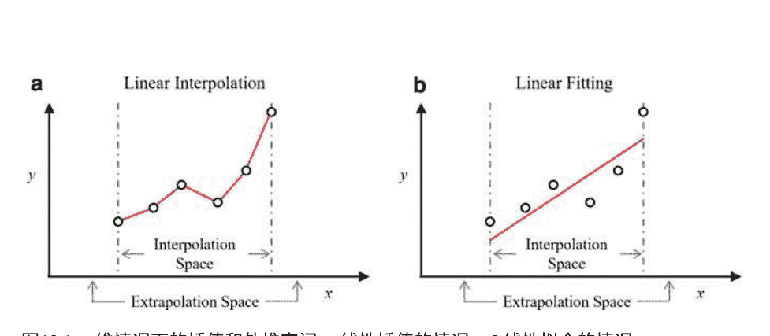

##### 13.2.2.2 距离、相似性和密度

根据QSAR的“相似性原则”（第13.1节），查询化学物质与训练化学物质之间的结构相似性对于表征AD很重要。如第13.2.1.2节所述，相似性测量可以是多样化和主观的。与相似性密切相关的概念是距离。如果用`m`个描述符来表征化学物质的结构，每个化学物质对应一个描述符向量`$\mathbf{x}$`，也可以看作是`m`维描述符空间中的一个点。如果表示两个化学物质的点之间的距离很短，则化学物质之间的结构相似性很高。

范围的概念传达了沿着给定描述符轴的方向感（例如，从 $-5$ 到 $+5$）。与范围相比，距离或相似性不再具有方向属性。同时，距离或相似性允许化学物质之间的成对比较。在这种成对模式下，出现了密度的概念。换句话说，如果从完整的描述符空间中提取具有固定形状和体积的不同描述符子空间，则提取的子空间中的数据点（化学物质）的数量也可能不同。因此，可以利用单位体积的数据点数量来定义描述符空间中的“信息密度”。

## 13.2.2.3 AD边界

给定一个AD，一个查询化合物总是可以被分类为两种类型：（1）在AD内部和（2）在AD外部。显然，在这些内部和外部之间存在一个边界。当考虑插值空间时，边界可以很容易地定义为描述符值的极值（例如，图13.1中的虚线垂直线）。

另一方面，当考虑距离或相似性时，通常有两种相互关联的策略来定义边界。首先，可以定义一个距离半径（或相似性截断）值来绘制一个包络，该包络将在完整的描述符空间中限制具有指定形状和体积的子空间。对于这种策略，需要根据预定义的规则分配包络的中心或定位器。如果一个查询化合物落在包络内部，它就在AD内部。其次，如果基于成对距离或相似性已经分配了特定类型的密度，那么可以分配一个密度下限（$\rho_{\text{LB}}$）。如果一个查询化合物的估计密度大于预定义的$\rho_{\text{LB}}$值，它被认为在AD内部。

## 13.2.3 AD指标评估预测性能

对个别化学物质的

正如OECD指南中所述，“对于定量评估，可以将AD与置信区间相关联，以确定感兴趣化学物质与模型训练集之间的相似程度。”值得注意的是，在这个陈述中，“置信区间”旨在描述“查询化学物质与训练化学物质之间的相似性”，而不涉及QSAR模型误差预测。

事实上，第13.2.2.2节中描述的距离或相似性和密度都是推导置信区间或所谓的AD指标的合法候选方法，用于评估预测性能。

### 13.2.3.1 AD指标的两个类别

然而，并不能保证具有“更好”AD指标（例如，与训练化学物质的距离较小）的查询化学物质也能更准确地预测。换句话说，AD指标不一定以统计显著的方式与预测误差相关。然而，近几十年来，这种AD指标约定已经受到质疑，因为越来越多的研究人员开始追求某种形式的终极AD指标（可能是多个现有AD指标的函数），可以与个别查询化学物质的定量预测误差相关并合理解释（Liu等，2018）。对于这一方面，Horvath等人提出了一个数学形式的理论，其中AD被构想为元模型，通过QSAR模型将AD指标（或“不可信度评分”）与查询化学物质的活性或性质预测相关联。同时，某些AD指标，特别是从随机森林分类器中导出的所谓置信水平，确实与预测准确性相关（Tong等，2004; Sheridan，2012）。

此后，更多的AD指标已经被开发出来，并且可以大致分为两类：（1）从描述符/结构空间中导出的不考虑响应信息的AD指标（所谓的二类AD指标）和（2）从描述符/结构-活性空间中导出的考虑化学结构和化学物质响应值信息的AD指标（所谓的二类AD指标）。AD指标的这两类可以用于机器学习中的新颖性检测或异常检测以及置信度估计。Mathea等人（2016）对于面向分类任务的新颖性检测和置信度估计进行了深入的综述。

##### 13.2.3.2 可靠性和可决定性

值得注意的是，Hanser等人（2016）在最近一次尝试重新思考和整理各种现有的AD表征方法时，提出了一个框架。

AD提供的三个方面：适用性，可靠性和可决定性。确定适用性，可靠性和可决定性导致三个顺序步骤来表征ADs。在这里，简要讨论了框架，这可能进一步帮助整理AD指标。

在他们的论文中，Hanser等人（2016）通过检查是否可以将模型应用于查询化学物质来定义适用性，这总是得到一个是或否的答案。然而，他们建议的定义适用性的做法似乎是包括描述符（包括物理化学性质）插值空间（第13.2.2.1节）和机械领域（第13.2.1.3节）的考虑的组合。

可靠性度量被定义为“向用户提供有关模型执行预测任务所需的信息的数量，质量和相关性”（Hanser等人，2016）。在这个意义上，这里的可靠性主要与第13.2.2.2节中介绍的距离或相似性和密度的概念相关，这可能与适用于新颖性检测的上述一类AD指标基本等效。然而，他们建议的设计可靠性的做法也涉及适当的实验室实践以及查询的最近训练邻居的交叉验证预测误差（Hanser等人，2016）。值得注意的是，交叉验证误差确实涉及响应信息，因此属于适用于置信度估计的第二类AD指标（如第13.3.5.1节所述）。Hanser等人（2016）定义的可决定性指标传达了结论断言的程度。他们建议的可决定性指标与Mathea等人（2016）总结的置信度估计指标完全一致，而这又与本章介绍的第二类AD指标非常吻合。

虽然Hanser等人可能会将可靠性指标与一流和二流指标混合使用。在本章中，可靠性的含义不包括二流指标。通过这种方式，一流的AD指标可以与可靠性的概念基本一致。同时，二流的AD指标通常被称为“可决策指标”。

### 13.2.3.3 由AD指标定义的AD

直观地说，如果获得了查询化学物质的可靠性或可决策指标，那么可以直接使用阈值构建AD。当满足所有阈值要求时，认为查询化学物质在AD内。另一方面，AD表征方法也可以根据AD指标分为不同的类别。并非所有现有的AD表征方法都考虑了可靠性和可决策指标。

有趣的是，一些研究尝试将不同的AD指标合并为一个单一指标，并测试合并指标是否与个体化学物质的预测误差相关（Sheridan 2012）。然而，强行合并不同的AD指标类别可能会导致混淆，符合Hanser等人的观点。因此，本章不会重点介绍将不同的AD指标合并在一起的AD表征方法。

## 13.3 AD特征化方法

本节将详细介绍一些经典和新开发的AD特征化方法，这些方法可以作为演示核心概念和理解的示例（13.2节）。值得注意的是，不会详尽讨论现有的AD特征化方法及其技术细节。代之以提供参考文献，以满足对技术细节感兴趣的好奇读者的需求。

#### 13.3.1 描述符域

插值空间、距离和密度的概念可以直接与原始描述符空间相关联，从而形成所谓的描述符域（Jaworska等, 2005年）。

##### 13.3.1.1 边界框（超矩形）和凸包

边界框（或超矩形）AD是插值空间概念的多维扩展（图13.1）。通常，如果查询点位于所有描述符的最大值和最小值之间，它就在AD内。边界框的上下界值也可以以更灵活和有条件的方式设置，例如Roy等人（2015年）提出的所谓标准化技术。

一个m维集合的凸包是包含原始集合的最小凸区域，它是定义训练集覆盖范围的一种直观几何方法。图13.2a比较了2D描述符空间中的边界框和凸包。在实践中，获取高维（>5）描述符空间中大量化合物的凸包是计算上昂贵的，并且很快变得不切实际。

#### 13.3.1.2 基于距离的广告

对于m维描述符空间，常用的三种距离度量如下：欧氏距离、曼哈顿距离（也称为城市街区距离）和马氏距离。在计算距离之前，通常对所有描述符进行标准化（均值居中和标准差归一化），以消除不同描述符之间的差异。点i和点j之间的欧氏距离[d(Eu(i,j))]可以计算如下：

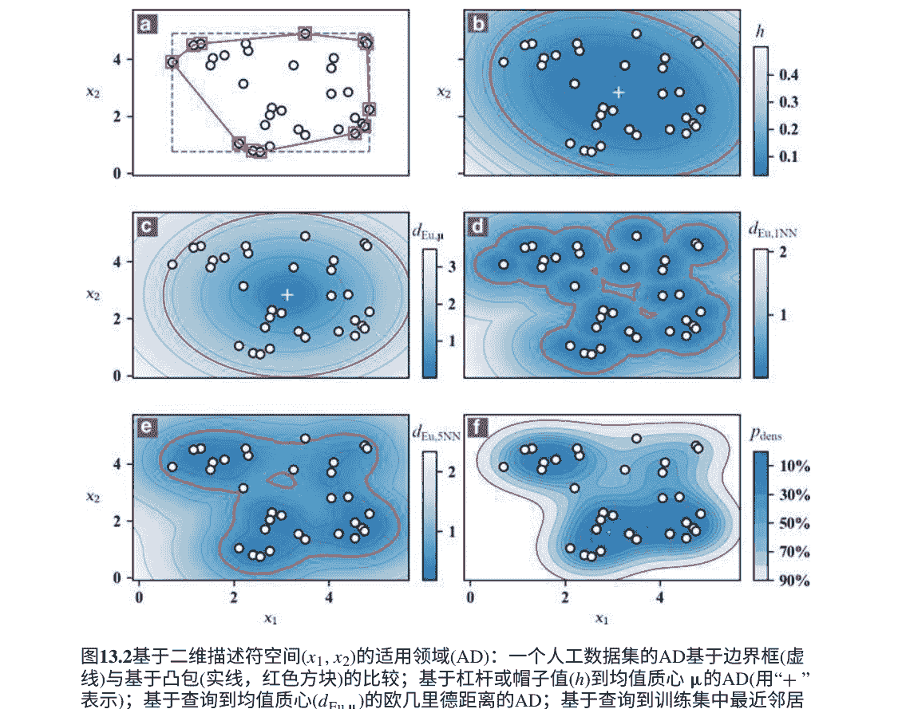

图13.2基于二维描述符空间$(x_1, x_2)$的适用领域(AD)：一个人工数据集的AD基于边界框(虚线)与基于凸包(实线，红色方块)的比较；基于杠杆或帽子值($h$)到均值质心 $\mu$ 的AD(用“+”表示)；基于查询到均值质心($d_{\text{Eu},\mu}$)的欧几里德距离的AD；基于查询到训练集中最近邻居的欧几里德距离的AD($d_{\text{Eu}, 1\text{NN}}$)；基于查询到训练集中五个最近邻居的平均欧几里德距离的AD($d_{\text{Eu}, 5\text{NN}}$)；基于高斯核密度覆盖百分位数的AD($p_{\text{dens}}$)

```
d_{\text{Eu}}(i, j) = \sqrt{\sum_{k=1}^{m} \left( x_{i,k} - x_{j,k} \right)^2} \quad (13.2)
```

其中，$x_{i,k}$和$x_{j,k}$分别是点$i$和$j$的第$k$个描述符的值。两个点$i$和$j$之间的城市街区距离[$d_{\text{CB}}(i,j)$]定义如下。

```
d_{\text{CB}}(i, j) = \sum_{k=1}^{m} \left\| x_{i,k} - x_{j,k} \right\| \quad (13.3)
```

马氏距离衡量了点与分布均值之间相差多少个标准差，并考虑了描述符之间的相关性。查询点$i$与训练集分布均值之间的马氏距离[$d_{\text{Ma}}(i)$]定义如下：

$$d_{\text{Ma}}(i) = \sqrt{(\boldsymbol{x}_i - \boldsymbol{\mu}) \mathbf{V}^{-1} (\boldsymbol{x}_i - \boldsymbol{\mu})^\text{T}}$$ (13.4)

其中，`x`是查询化学物质的描述符值的行向量；`μ`是训练集描述符的均值行向量；`V`是描述符的协方差矩阵。同时，马氏距离也可以在同一分布的两个点`i`和`j`之间计算，其协方差矩阵为`V` [`dMa(i, j)`]，如公式13.5所示：

$$d_{\text{Ma}}(i, j) = \sqrt{(\boldsymbol{x}_i - \boldsymbol{x}_j)^{\text{T}} \mathbf{V}^{\wedge -1} (\boldsymbol{x}_i - \boldsymbol{x}_j)}$$ (13.5)

通常，可以计算查询点到整个训练集的距离。如果这个特征距离低于预定义的阈值，则认为查询点接近训练集，因此在异常检测内。阈值的选择可能有些棘手。一种常见的策略是首先评估训练化学物质之间的成对距离，然后使用成对距离的特定分位数作为阈值。

在实践中，距离通常是在查询点和训练集描述符空间的均值质心`μ`之间测量的。特别地，如果要使用`dMa(i)`，点到质心`dMa(i)`与所谓的杠杆或帽值密切相关。帽值经常与标准化残差结合在一起，用于可视化QSAR回归模型的AD，即所谓的Williams图(OECD 2007)。

在统计学中，杠杆是衡量一个观察值（化学物质）的独立变量值（对应描述符值）与其他观察值整体之间的距离的度量。对于一个包含`m`个描述符的`m`个化合物的训练集，可以创建一个包含`m`行和（`1+m`）列的变量矩阵`X`（最左侧有一个全为1的列向量），然后可以计算化合物`i`的杠杆或所谓的帽值`h i`，如下所示：

$$h_i = \boldsymbol{x}_i (\mathbf{X}^\text{T}\mathbf{X})^{-1} \boldsymbol{x}_i^\text{T}$$ (13.6)

其中，`xi`是查询化合物在`X`中的行向量。可以将阈值杠杆(`h*`)分配给`3(1 + m) /n`。`dMa(i)`和`hi`之间的数学关系如下：

$$d_{\text{Ma}}^2(i) = (n-1)\left( h_i - \frac{1}{n} \right)$$ (13.7)

其中，`n`是训练集中化合物的数量。值得注意的是，在QSAR领域中，当计算`hi`值时，通常会省略`X`中最左边的全为1的列向量（Netzeva等人，2005年），这导致`hi`值与统计上的“标准”帽值略有不同。如图13.2b所示，在考虑协方差矩阵的情况下，由帽值定义的椭圆包围盒围绕原始描述符轴旋转，而由到质心`μ`的欧氏距离定义的椭圆包围盒不旋转（图13.2c）。

否则，可以测量查询点与所有训练集点之间的距离。然后，可以使用特定的统计数据（例如均值、中位数或最大值）或这些距离的函数作为查询化学物质的代表性/特征距离。例如，一种非常经典和流行的方法是计算查询化学物质到训练集中前`k`个最近邻居的距离的均值，也被称为“kNN”方法（Sheridan等人，2004年; Sahigara等人，2013年）。图13.2d、e显示了查询化学物质与训练化学物质之间的欧氏距离下1NN和5NN定义的包络。

##### 13.3.1.3 基于密度的异常检测

根据距离，可以以多种方式在数据点上定义局部密度函数，通常称为核函数。常用的核函数类型是高斯核函数，其估计的查询化学物质密度如下：

```
$$\rho(\mathbf{x}_q) = \frac{1}{n (2\pi)^{m/2} b^m} \sum_{i=1}^{n} \exp\left(-\frac{1}{2b^2} \|\mathbf{x}_q - \mathbf{x}_i\|^2\right) \tag{13.8}$$
```

其中，`$\mathbf{x}_q$`和`$\mathbf{x}_i$`分别是查询化学物质和训练化学物质的描述符向量；`$n$`是化学物质的数量；`$m$`是描述符空间的维度；`$b$`是每个描述符的带宽或平滑参数，可以通过Silverman的经验法则（Heidenreich等人，2013年）进行估计：

```
$$b = \begin{cases} 1.06 \text{ 分钟}\left(\sigma, \frac{\text{IQR}}{1.34}\right) n^{-1/5} & \text{如果IQR = 0} \ 1.06 \sigma n^{-1/5} & \text{如果IQR = 0} \end{cases} \tag{13.9}$$
```

其中，`$\sigma$`和`$\text{IQR}$`分别是描述符值的标准差和四分位距；`$n$`是化学物质的数量。为了定义一个异常检测（AD）边界，需要确定`$\rho$`的下界。通常，可以从估计的密度分布中抽取大量（例如20,000个）数据点进行采样。然后，可以使用采样密度的百分位数（例如10%）作为阈值，这大致对应于总样本空间的（`1 - $\alpha$`）覆盖率。图13.2f显示了使用高斯核函数定义的AD，其中10%的百分位数作为阈值。

##### 13.3.1.4 在新的特征空间中映射范围、距离和锚定密度

将原始描述符空间映射到新的特征空间有多个动机。首先，如图13.2a所示，边界框和凸包无法识别描述符空间的内部空白区域。建议

执行主成分分析（PCA）可以减轻（但不能消除）这个弱点（Netzeva等，2005年; Jaworska等，2005年）。其次，高维描述符不能轻易地可视化。因此，需要进行维度降低。 PCA仍然非常有用于可视化高维描述符空间。非线性技术（例如，t分布随机邻嵌入（van der Maaten和Hinton，2008年））可能提供更好的可视化效果。然而，在非线性映射空间中的范围概念可能是无意义的。

第三，当描述符的维度非常高时，距离度量可能会受到所谓的维度灾难的影响（Korn等，2001年）。简而言之，随着维度的增加，最近距离逼近最远距离，即距离度量（例如欧氏距离和曼哈顿距离）可能无法区分不同的化学物对（Beyer等，1999年）。同时，对于高维结构描述符和常见的数据集大小，高维空间的大部分将是空的（Mathea等，2016年），这可能导致过于严格的异常检测，使大多数查询化学物成为外部样本。

因此，主成分分析（PCA）以及非线性流形学习降维方法（Roweis和Saul，2000年）将是有用的。值得注意的是，一些基于机器学习的新颖性检测方法也将原始描述符空间映射到新的特征空间（Mathea等，2016年）。例如，一类支持向量机（SVM）使用核函数表示数据点之间的相似性，基于此可以采用特定形式的密度函数，并能够估计特征空间的密度轮廓（Scholkopf等，2001年）。因此，基于一类支持向量机的异常检测可以被建立起来（Fechner等，2010年；Baskin等，2010年）。

#### 13.3.2 结构（相似性）域

如今，分子指纹通常被采用作为构建QSAR模型的描述符（Koutsoukas等，2016年）。许多类型的分子指纹本质上是二进制或布尔向量，其中0和1分别表示特定亚结构模式的存在和不存在（Rogers和Hahn，2010年）。

基于指纹的相似性度量是一种现代的变体，用于确定训练化学品中的特定结构片段是否也出现在查询化学品中。因此，根据布尔描述符向量，可能适当地将ADs命名为“结构域”。

对于一个`m`维二进制或布尔向量描述符，相应的描述符空间实际上是一个`m`维立方体。所有数据点都位于立方体的顶点上，无法直观地可视化。此外，基于范围的AD表征方法（即边界框和凸包）是没有意义的。尽管如此，仍然可以计算成对的距离/相似度。

## 13.3.2.1 kNN 策略

设`A`和`B`分别为化学物质`A`和`B`的布尔向量。假设`x_A`和`x_B`分别为`A`和`B`中“真”位的数量，`c`为`A`和`B`中同时为“真”的位的数量，则化学物质`A`和`B`之间的 Tanimoto 相似系数 (`Tc`) 可以如下计算：

```
Tc(A, B) = c / (a + b - c)                     (13.10)
```

同样，Dice 相似系数 (`Dc`) 可以如下计算：

```
Dc(A, B) = 2c / (a + b)                        (13.11)
```

对应于`Tc`和`Dc`的距离度量分别为`1 - Tc`和`1 - Dc`。利用这些距离或相似度量，可以将基于距离的所有策略应用于高维布尔描述符向量（可能是某些类型的分子指纹）。在这些策略中，最流行的可能仍然是 kNN 方法，其中首先计算查询化学物质与训练集中前`k`个最近邻的相似度得分的平均值，然后将该平均值与预定义的阈值进行比较，以确定查询是否在 AD 内部或外部。kNN 方法已经被 Sheridan 等人 (2004) 利用布尔描述符（原子对指纹）进行了研究。基于分子指纹的 kNN AD 特征化方法也与 QSAR 建模中使用的不同描述符系统兼容 (Sheridan 等人, 2004)。

##### 13.3.2.2 基于相似性的加权贡献（密度）

需要注意的是，在k-最近邻方法中，`k`也是一个重要的可调参数。正如Mathea等人（2016）所述，k-最近邻的一个变体是要求至少有`k`个训练集化合物在特定距离阈值内，这保证了一个预定义的局部密度。

最近，Wang等人（2020）开发了一种基于相似性的异常检测方法，称为`AD_FP{Scutoff, Nmin}`，可以看作是k-最近邻方法的上述变体。在他们的方法中，化合物A和B被定义为相似的，如果`Tc(A, B)`不低于预定义的相似性阈值(`Scutoff`)值。首先识别与查询化合物相似的训练化合物。如果这些相似的训练化合物的数量高于预定义的数量(`Nmin`)，则认为这些化合物在AD内。`AD_FP{Scutoff, Nmin}`方法，就像Sheridan等人开发的k-最近邻方法一样，也展示了与各种机器学习回归算法和描述符系统的良好兼容性 (Wang等人，2021年)。

此外，刘等人（2018年）指出，k-NN AD方法可能存在两个缺陷：(1) 只有有限数量的最近训练分子对预测准确性和（2）最近的训练分子可能对预测起到相等的贡献。因此，他们假设每个训练化学品可能对查询化学品的预测性能有所贡献，但贡献的权重不同。因此，采用指数距离加权函数来调整贡献，从而产生所谓的距离加权贡献之和（SDC）（Liu等，2018年；Liu和Wallqvist，2019年）：

```
SDC = \sum_{i=1}^{n} \exp \frac{-3 T d_i}{1 - T d_i} \quad (13.12)
```

其中，`Td_i`是查询化学品和第i个训练化学品之间的Tanimoto距离（即`1 - Tc`），`n`是训练化学品的数量。SDC本质上是一种AD度量。事实上，kNN策略，`AD_{FP} \{S_{cutoff}, N_{min}\}`和SDC与一流的AD度量密切相关，将在第13.3.4.1节中详细介绍。

#### 13.3.3 基于聚类的方法

当训练集包含过多的化学物质时，计算查询化学物质与所有训练化学物质之间的距离或相似性可能会计算上效率低下 - 整个训练集必须存储在应用域(AD)系统中。另一种策略是首先将训练化学物质聚类成几个簇。然后，可以将查询化学物质与簇进行比较，而不是与大量的训练化学物质进行比较。

##### 13.3.3.1 k均值聚类

Stanforth等人（2007）提出了一种基于智能k均值聚类和模糊成员资格的AD系统特征化方法。简而言之，首先将训练化学物质聚类，并记录每个簇的质心。然后，根据查询化学物质与簇质心之间的距离计算，可以构建用于表征查询化学物质和训练集的距离度量。

## 13.3.3.2 自组织映射（SOM）和生成拓扑映射（GTM）

SOM在高维特征空间中执行聚类和映射，将其映射到典型的2D节点网格中（Kohonen 2013）。在SOM的2D节点网格中，相似的化学物质倾向于位于网格中相邻的节点中，而不相似的化学物质则倾向于在网格中相距较远的位置。在拟合训练数据之后，SOM网格中高度占用的节点可以作为主要代表训练化学物质的聚类。同时，也可以将落入这些聚类/节点中的查询化学物质视为在AD内部。

在SOM中，查询化学物质必须被分配到一个唯一的节点中。相反，GTM有时被描述为SOM的“模糊版本”。在GTM中，化学物质可以“部分地”位于节点中，具有0到1之间的实值分数（类似于概率）。关于面向药物设计和QSAR建模的GTM的详细信息可以在Horvath等人最近发表的综述中进行研究（2019年）。

## 13.3.4 一流的AD指标

请记住，一流的AD指标（在本章中也可以称为可靠性指标）仅依赖于化学结构特征或描述符。事实上，只要AD是基于距离、相似性或密度的概念构建的（第13.2.2.2节），它就可以与特定的可靠性指标相关联。

##### 13.3.4.1 基于相似性/距离或密度的指标

如图13.2b-f所示，右侧的“colorbars”中展示的数量都是合法的可靠性指标，包括帽子值（图13.2b）、查询化学物质与训练描述符空间质心之间的距离（图13.2c）、查询化学物质与前k个最近（训练集）邻居之间的平均距离（图13.2d、e）以及描述符空间中查询化学点的估计密度（图13.2f）。同样，也可以实施基于相似性的策略。一般来说，生成可靠性指标的策略可以分为两种类型：（1）类似密度的指标和（2）基于kNN（或任何其他算法）的距离/相似性指标。

- （1）类似密度的指标

- （2）基于kNN（或任何其他算法）的距离/相似性指标

类似密度的度量通常基于特定的相似性或距离加权函数，实际上是核函数（第13.3.1.3节）。例如，由刘等人定义的SDC（见第13.3.2.2节）使用了一个相似性加权函数，如图13.3a所示（蓝色曲线）。与此同时，王等人开发的`AD FP {S_{cutoff}, N_{min}}`（见第13.3.2.2节）实际上采用了分段相似性加权函数，其中当相似性≥`S_{cutoff}`时权重为1，否则为0（图13.3a，灰色线）。为了比较，图13.3b展示了常用的高斯核函数。

通过这些相似性或距离加权函数，可以建立密度的概念。给定一个相似性加权函数`[w(S)]`，相关的“相似性密度 (ρ_S)”度量可以与为查询和训练化学物质计算的权重之和成比例，其中i表示训练化学物质`[w(S_i)]`:

```
ρ_S ∝ Σ_{i=1}^n w(S_i)    (13.13)
```

另一方面，给定一个距离加权函数`[w(d)]`，相关的“距离密度（`ρ_d`）”度量可以与为查询和训练化学物质计算的权重之和成正比：

```
$$ \rho_d \propto \sum_{i=1}^{n} w(d_i) $$ (13.14)
```

此外，基于kNN策略的相似性或距离也可以被视为特定相似性/距离加权函数的实现，其中相似性截断(`S_{\text{cutoff}}`)或距离截断(`d_{\text{cutoff}}`)不是固定的，而是有条件的。例如，查询化学物质的kNN-based“特征相似性(`S_{k\text{NN}}`)”可以如下推导：

```
$$ S_{k\text{NN}} \propto \sum_{i=1}^{n} w(S_i, S_{\text{cutoff}}) $$ (13.15)
```

其中相似性加权函数，`w(S, S_{\text{cutoff}})`，具有以下形式（如图13.3c所示）。

```
$$ w(S, S_{\text{cutoff}}) = \begin{cases} S, & S \ge S_{\text{cutoff}} \\ 0, & S < S_{\text{cutoff}} \end{cases} $$ (13.16)
```

与密度类似方法不同，其中`S_{cutoff}`是一个预定义的固定值，在kNN策略中，`S_{cutoff}`不是固定的，而是有条件的，并且可以表示为一个分位函数（Q）：

```
$$ S_{\text{cutoff}} = Q (S_q, 1- k/n) \quad (13.17) $$
```

其中`S_q`是查询化学物与所有训练化学物的相似系数向量（`S_{q-1}`， `S_{q-2}`， ...， `S_{q-i}`， ...， `S_{q-n}`），`k`是选择的kNN策略的参数，`n`是训练化学物的总数。这样，`S_{cutoff}`必须大于`S_q`中所有元素的（1， k/n）分位数才能确保恰好有k个训练化学物“存活”并对`S_{kNN}`做出贡献。

同样，受到基于k近邻相似度度量的启发，基于k近邻的“特征距离度量（`d_{kNN}`）”可以表示如下：

```
$$ d_{k\text{NN}} \propto \sum_{i=1}^{n} w(d_i, d_{\text{cutoff}}) \quad (13.18) $$
```

其中，距离加权函数`w(d, d_{cutoff})`的形式如下（如图13.3c所示）：

```
$$ w(d, d_{\text{cutoff}}) = \begin{cases} d, & d \le d_{\text{cutoff}} \\ 0, & d > d_{\text{cutoff}} \end{cases} \quad (13.19) $$
```

其中，`d_{cutoff}`也是有条件的，可以表示为一个分位数函数（Q）：

```
$$ d_{\text{cutoff}} = Q(d_q, k/n) \quad (13.20) $$
```

其中，`d_q`是查询化合物到所有训练化合物的距离向量（`d_{q-1}`， `d_{q-2}`， ...， `d_{q-i}`， ...， `d_{q-n}`）。通过这种方式，`d_{cutoff}`必须小于`d_q`中所有元素的（1 – k/n）分位数才能确保恰好有k个训练化合物“存活”并对`d_{kNN}`做出贡献。

根据加权函数的形状，可直观地讨论可靠性度量（以及相应的AD）的局部性和全局性。例如，图13.2显示基于帽值（h，图13.2b）或查询化学物质与训练描述符空间质心之间的距离（`d_{Eu,μ}`，图13.2c）的AD边界实际上是椭圆，既不能表征个体化学物质周围的局部模式，也不能识别椭圆AD边界内的空白区域。因此，h和`d_{Eu,μ}`都是“全局”地描述查询与训练化学物质之间的距离，即将所有训练化学物质作为一个整体处理。

相反，基于`d_{kNN}`度量的AD边界可以有效地描述局部模式，并且“空白区域”在本质上被排除（图13.2d， e）。尽管`d_{Eu,μ}`与`d_{kNN}`看起来明显不同，但这两种距离度量是基于距离加权函数的不同变体，通常使用距离加权函数（方程13.19）来定义距离截断。对于欧几里得距离（Eu），截断由`k=n`定义，因此考虑了所有的训练化学物质。另一方面，对于k近邻（k-NN），截断由`k<<n`定义，因此只考虑了“局部”（在分位数意义上）的训练化学物质。同样，通过调整相似性或距离加权函数或核函数的形状，相关密度相似性度量的重点也可以逐渐在局部性和全局性之间转移。例如，通过增加高斯核函数的带宽（图13.3b），计算得到的`ρ`将更倾向于代表整个训练集，而不是单个训练化学物质。

## 13.3.4.2 GTM中的对数似然

对于GTM，可以计算一个称为对数似然的参数，从而估计查询化学物质到节点的距离（Horvath等，2019年）。此外，查询化学物质将与常规的2D节点网格相关联。累积的“责任节点居民”，即节点密度，可以作为可靠性指标：累积责任低于某个用户选择的阈值的节点表示AD之外的区域（Horvath等，2019年）。

## 13.3.5 二类AD指标

请记住，二类AD指标（在本章中也可以称为可决策性指标）依赖于化学物质的结构特征或描述符以及响应值的信息。

### 13.3.5.1 回归器的可决策性指标

Clark（2009年）指出，“经典统计理论假设所建模的总体误差是独立且同分布的（IID），但实际上往往不是这种情况。这种不均匀误差（异方差性）可以通过为每个特定的新对象u提供个性化的预测不确定性估计来解决：可以估计预测误差的标准误差u可以估计为训练中最接近的对象t*的非交叉验证误差t*。换句话说，使用查询化学物质的最近训练邻居的拟合绝对误差（`εfit`）来估计查询化学物质的预测误差。使用绝对误差而不是有符号误差（即拟合残差），因为后者可能相互抵消，从而导致无意义的结果。假设查询化学物质具有由相似性（`S_{q-i}`）定义的k个最近邻居，则AD指标可以定义如下：

$$ U_{\text{fit}, S_{k\text{NN}}} = \frac{\sum_{1}^{k} S_{q-i} \varepsilon_{\text{fit}}}{\sum_{1}^{k} S_{q-i}} $$

当最近的k个邻居由距离 (d) 定义时，AD指标可以定义如下：

$$ U_{\text{fit}, d_{k\text{NN}}} = \frac{\sum_{1}^{k} \frac{1}{(d_{q-i} + \delta)} \varepsilon_{\text{fit}}}{\sum_{1}^{k} \frac{1}{(d_{q-i} + \delta)}} $$

其中，`δ`是一个小的正值（例如，`10^-6`），确保不会产生无限权重。在这里，`d_{q-i}`与k个最近邻的贡献成反比。此外，如第13.3.4.1节所讨论的，也可以使用相似性或距离加权函数或核函数来计算类似密度的指标，而不是直接使用`S_{q-i}`或`d_{q-i}`作为估计所有训练化学品拟合误差贡献的权重。例如，可以定义一个可决策性指标如下：

$$ U_{\text{fit}, w(s)} = \frac{\sum_{1}^{n} w\left(S_{q-i}\right) \varepsilon_{\text{fit}}}{\sum_{1}^{n} w\left(S_{q-i}\right)} $$

或

$$ U_{\text{fit}, w(d)} = \frac{\sum_{1}^{n} w\left(d_{q-i}\right) \varepsilon_{\text{fit}}}{\sum_{1}^{n} w\left(d_{q-i}\right)} $$

其中，`n`是训练化学品的总数，`w(S)`和`w(d)`分别是相似性加权函数和距离加权函数，如第13.3.4.1节所述，并在图13.3a、b中进行了示例说明。

除了利用拟合的绝对误差，还可以使用内部交叉验证预测绝对误差(`εCV`)或自助法预测绝对误差(`εboot`)来计算训练化学品的可决策度指标(Sahlin et al.2014; Toplak et al.2014)。因此，可决策度指标可以用`εfit`替换为`εCV`或`εboot`来计算。所有上述的可决策度指标也被称为“基于误差的指标”(Toplak et al.2014)。

在基于错误的策略之外，可以首先基于交叉验证或自助法建立一个回归器的集合（也称为集合或包）。然后，通过回归器对查询化学物的预测值（`y^`）的标准差（方差）可以用作决策度量。这样的决策度量也被称为“基于敏感性的度量”，因为对训练集进行了扰动（Toplak等，2014年）。

最后，可以首先使用不同的算法建立一个回归器的集合。然后，通过这些回归器对查询化学物的预测结果的标准差（变异）也可以作为合法的决策度量（以下简称为“基于算法的度量”）（Toplak等，2014年）。

假设描述符空间具有两个维度，响应的三维空间以及描述符可以被所谓的结构-活性景观（SAL）：响应可以表示为高度，而两个描述符 `$x_1$` 和 `$x_2$` 可以表示为纬度和经度。从这个角度来看，QSAR建模可以被认为是使用某些算法拟合训练数据SAL。图13.4展示了相同玩具训练集的六种不同机器学习算法拟合的SAL。当描述符的数量大于2时，原始描述符空间中的SAL无法可视化。尽管如此，将SAL的概念扩展（并想象给读者）到更高维度的描述符空间应该不难。希望在记住SAL的概念的同时，决策度量能够更容易理解。如图13.4所示，训练化学物的拟合误差（即拟合的SAL曲面与真实值之间的差异）可能严重依赖于采用的机器学习算法。如果算法的拟合能力较差（例如，图13.4a中的MLR情况），那么拟合误差也可能很大。相反，如果算法具有较强的拟合能力（例如，图13.4c中的 `$k$`NN情况），拟合误差可能很小。

然而，比较图13.4中的SALs，一些区域的SALs确实比其他区域更“平滑”。SALs的“崎岖”区域通常是由所谓的活性悬崖驱动的，其中结构相似的化学物质可能具有不同的活性（Maggiora 2006）。对于拟合能力较弱的算法，拟合SALs的崎岖区域将更具挑战性。因此，这些区域将对应较高的拟合误差。

同样，在内部交叉验证或自助法中，对活性悬崖做出贡献的化学物质可能被误解为“噪音”。因此，拟合的SAL仍然可能过于平滑，不能反映训练数据的实际SAL。此外，对于交叉验证的每个折叠，训练集不完整且包含不同的样本，这可能导致拟合的SALs可能发生较大变化。另一方面，基于回归器集合预测变化的可决策度指标（标准差）实际上在很大程度上反映了不同算法或内部扰动训练子集的SALs之间的特征。

所有上述的可决定性度量，即基于错误、基于敏感性和基于算法的度量，都需要模型的训练或内部验证。因此，AD度量与建模过程本身密切相关。

如图13.4所示，并且如上所述，训练集SAL的属性可以深刻地影响所有这些度量。在药物化学领域，为了在数据集中识别“活性断崖”的贡献者，Wawer等人（2008）定义了数据集中化学物质内的“局部不连续性”如下：

$$ LD(u)=\frac{\sum_{\{v|S(u,v)\geq S_{\text{cutoff}}, u\neq v\}}S(u, v)D(u, v)}{|\{v|S(u, v)\geq S_{\text{cutoff}}, u\neq v\}|} $$

其中 `v` 是一组与 `u` 的相似性大于预定义的 `S_{cutoff}` 的化合物集合，`D(u,v)` 表示 `u` 和 `v` 之间活性值的绝对差异。 通常，如果基于四个键的扩展连接指纹（ECFP4） 的 `Tc` 大于等于 0.55，则认为两个化合物在结构上相似（Stumpfe and Bajorath 2012）。 最近，Wang等人（2021） 发现 `LD` 与交叉验证误差之间存在统计上显著的线性相关性。

因此，`LD` 也有可能作为 `ε_{fit}`、 `ε_{CV}` 或 `ε_{boot}` 的替代方法。

图13.4 用不同的机器学习算法基于相同的人工训练集拟合的结构-活性景观（SALs） a 多元线性回归（MLR）； b 决策树回归； c k最近邻（kNN）回归； d 多层感知器回归； e 支持向量机回归（径向基函数）； f 高斯过程回归基于错误的度量中的项目，从而实现决策度量，而无需对模型进行繁重的训练或内部验证。

### 13.3.5.2 分类器的决策度量

请注意，图13.4仅显示回归器的情况。许多机器学习分类器提供连续得分，用于定量评估/相关查询化学物质的活性概率。因此，SAL的概念可以粗略地扩展到响应值为0或1的情况，即分类器。因此，用于回归器获取决策度量的上述策略也可以适用于分类器。

Mathea等人（2016）总结了三种用于估计置信度（即本章中的决策度量）的策略。首先，可以根据查询化学物质与决策边界的距离来估计置信度。其次，如果可以生成用于定量评估或相关查询化学物质的活性概率的连续得分，则可以使用该得分来估计预测置信度。第三，可以使用一组分类器（集成分类器）的一致性来估计置信度，其中包括已建立的决策森林“置信水平”（Svetnik等人，2003年；Tong等人，2004年）：

```
$C f = \|y_{\text{prob}} - 0.5\| / 0.5$
```

事实上，所有这三种策略都需要估计查询化学物质活性的后验概率。根据第13.3.5.1节的讨论，置信水平可以被视为回归任务中基于敏感性的度量的类比。

有趣的是，对于分类器而言，没有模型的训练或内部验证，似乎“竞争指数”（Ruiz和Gomez-Nieto 2018c）是一个粗略的类比。对于训练化学物质i，竞争指数（RI）定义如下（Ruiz和Gomez-Nieto 2018b）：

```
$R I_i = \frac{d_i^x - d_i^y}{d_i^x + d_i^y}$
```

其中，$d_i^x$是分子i与其最近邻属于相同类别的化学物质之间的距离，$d_i^y$是分子i与其最近邻属于与i不同类别的任何类别的化学物质之间的距离。RI是一个取值在-1到1之间的有符号值。RI小于零的值意味着分子i的第一个最近邻属于与i相同的类别的分子，这大致意味着避免了活性悬崖。否则，可能存在活性悬崖。假设具有更多悬崖的局部SAL区域往往导致较大的预测误差，那么一个合适的指数可以定义为RI+1，这将介于0和2之间，可以用于创建面向分类器的类似于“基于错误的度量”的模拟。

甚至有几个增强版本的RI考虑了更多的邻居和加权方案，并且有适用于回归任务的RI定义或实现。对于细节感兴趣的读者可以参考原始论文（Ruiz and Gomez-Nieto 2018a, b, c）。

##### 13.3.5.3 符合预测中的非一致性度量

符合预测是一种已经建立起来的统计工具（Shafer and Vovk 2008），最近被引入到QSAR领域，并被Norinder等人（2014）预期成为AD确定的透明和灵活的替代方法。在符合预测中，首先需要建立一个非一致性度量作为AD度量的类比（Norinder等人2016）。然而，符合预测假设数据是独立同分布的，或者至少是可交换的（Shafer and Vovk 2008），这可能与Clark提到的“异方差性”假设恰好相反。最近，Krstajic（2021）批评指出，在QSAR和AD表征中，符合预测在被认为真正有用之前仍然有一些问题需要解决。

## 13.3.6 可视化AD

虽然对于AD的表征来说并不是必需的，但可视化总是能提供一个直观的印象，这可能增加用户对AD的理解。

### 13.3.6.1 广义的Williams图

Williams图是一种非常经典的AD可视化方法，也在OECD指南中介绍过。在Williams图中，x轴表示化学物质的帽值，同时y轴表示预测的标准化（或学生化）残差。需要注意的是，当查询化合物未被模型预测时，只能计算其帽值。因此，Williams图中真正有效的AD指标只有帽值。从这个意义上说，任何单一的AD指标都可以以Williams图的方式绘制，其中AD指标是x轴，预测残差是y轴。

### 13.3.6.2 SOM和GTM

SOM和GTM都可以显示出相当令人印象深刻的规则2D网格图。在SOM或GTM中，训练集的密度分布在节点上，节点内的连贯性。

### 13.3.6.3 网络相似性图 (NSG)

如果原始描述符空间的维度过高，无法进行直观的可视化，就没有必要将训练和查询化学物质之间的成对距离/相似性关系完全锚定回原始描述符空间。否则，属性可以简单地锚定到化学物质本身。因此，化学物质将根据它们的成对相似性形成一个网络。在药物化学领域，Wawer等人（2008年）提出了NSG来表示一组具有已知属性和成对结构相似性信息的化学物质。

在典型的NSG中，化合物由节点表示，并且如果化合物在结构上相似，则它们由边连接。单个节点的大小（u）定量地表征了训练集SAL中化学物质的LDof（Eq.13.25）。正如Wang等人（2021年）所提出的，NSG中还可以识别和展示社区。社区表示共享某些共同结构特征的化合物群。社区内相似化合物之间的边的密度高于社区之间的边的密度。因此，具有许多社区的NSG表示对应训练集中结构空间的广泛覆盖。

图13.5显示了一个合并的训练化合物和查询化合物集合的NSG，其端点为过氧化物酶体增殖激活受体γ结合亲和力（pIC50）（Wang et al. 2021）。在这里，NSG与AD-ECFP4 {0.55,1}兼容（详见第13.3.2.2节）。如图13.5所示，AD中的查询化合物（即用蓝线勾勒出的节点）都与表示训练化合物的节点相连。

## 13.4 机器学习算法对QSAR建模场景的影响

与传统的MLR或LDA算法相比，复杂的机器学习算法具有两个特点，可能会影响QSAR建模。首先，许多机器学习算法在非线性SAL上表现出强大的拟合能力（如图13.4所示）。其次，许多机器学习算法（例如随机森林）允许在QSAR模型中采用更多（例如> 100）的描述符，因此描述符空间的维度可以非常高。

机器学习算法的第一个特征（不包括MLR或LDA）使得从具有多样化结构特征的大数据集中学习成为可能。然而，从局部化学空间转移到全局化学空间可能对QSAR建模和AD表征产生深远影响。首先，在更广泛的化学空间中，化合物的“真实”SAL可能具有固有的非线性特性。同时，化学描述符和QSAR模型的预测误差不一定遵循多元正态分布。

因此，对于具有多样化结构的大型训练化合物集，假设的描述符空间中心（如图13.2b、c中的“+”）可能是没有意义的。换句话说，关注局部性的AD指标比关注全局性的指标更有效。同时，基于范围的边界框也可能无法捕捉化合物的结构多样性。在Wang等人（2021）最近发表的研究中，边界框、基于偏最小二乘分量的杠杆、查询到中心的欧氏距离以及AD_{FP} {S cutoff, N min}被测试其作为AD的功能。结果显示，只有AD_{FP} {S cutoff, N min}的功能符合预期，所有其他AD都表现相对较差。

机器学习算法的上述第二个特征可以更好地区分化学结构的细微差异。然而，它也会受到所谓的维度灾难的困扰（如第13.3.1.4节所解释）（Korn等，2001）。与欧几里德距离或城市街区距离不同，Tanimoto系数或Dice系数省略了对于两种化学物质都不是“True”的描述符（位），因此可以较少受到维度灾难的影响（Mathea等，2016）。因此，在高维描述符空间中表征化学物质的相似性或距离时，基于布尔指纹的相似度度量可能是比用于QSAR的原始描述符更好的选择。事实上，Sheridan等人（2004）和Wang等人（2021）的两项研究都证明了基于指纹的AD的kNN（或其变体）可以与不同的描述符系统和算法兼容。

## 13.5 朝着更广泛的机器学习QSAR模型发展

如图13.4所示，并在第13.3.5.1节中进行分析，当真实的SAL是非线性的时候，位于SAL平滑区域的化学物质通常与低拟合和交叉验证误差相关。在这种情况下，位于平滑SAL的化学物质（希望）预测误差应该较低。对于位于崎岖的活性悬崖区域的化学物质，确保QSAR模型的质量以及AD的功能似乎只能不断收集更多的训练化学物质，以便提高局部SAL的“分辨率”并扩大训练SAL的覆盖范围。

然而，SAL的形状也严重依赖于所选的描述符。优秀的描述符会导致像Patterson等人（1996年）所示的“邻域行为”。在他们的初始论文中，所有化学物质对都被绘制在一个二维平面上（所谓的Patterson图），其中x轴是描述符空间中化学物质之间的成对距离，y轴是化学物质对的活性的绝对差异。“邻域行为”意味着当一对化学物质的结构距离更近时，它们的活性差异应该较小。换句话说，当描述符更好时，SAL上应该没有那么多活性悬崖，或者SAL应该更平滑。

邻域行为以及SALs和活性悬崖的特性，也是所谓的QSAR模型数据集可建模性的核心主题之一（Golbraikh等人，2014年）。尽管数据集的建模能力（好或坏）可能仍然是描述符选择不当（或适当）的反映。为了最终解决活性悬崖问题，了解终点现象机制是至关重要的。

> 致谢：本工作得到了中国国家重点研发计划（2018YFE0110700，2018YFC1801604）和中国国家自然科学基金的支持（21661142001）。

## 参考文献

- Baskin II, Kireeva N, Varnek A (2010) 一类分类方法用于数据描述和模型适用领域。Mol Inf 29 (8-9): 581-587

- Beyer K, Goldstein J, Ramakrishnan R, Shaft U (1999) 何时“最近邻”有意义？在：Beeri C, Buneman P (ed) 数据库理论—ICDT’99，第217-235页

- Breiman L (2001) 随机森林。机器学习 45(1):5-32

- Cherkasov A, Muratov EN, Fourches D, Varnek A, Baskin II, Cronin M, Dearden J, Gramatica P, Martin YC, Todeschini R, Consonni V, Kuz’min VE, Cramer R, Benigni R, Yang C, Rathman J, Terfloth L, Gasteiger J, Richard A, Tropsha A (2014) QSAR建模：你去哪里了？你要去哪里？ J Med Chem 57(12):4977-5010

- Clark RD (2009) DPRESS：预测不确定性的定位估计。 J Cheminformatics 1:11

- Dimitrov S, Dimitrova G, Pavlov T, Dimitrova N, Patlewicz G, Niemela J, Mekenyan O (2005) 一种逐步确定SAR和QSAR模型适用领域的方法。 J Chem Inf Model 45(4):839-849

- Fechner N, Jahn A, Hinselmann G, Zell A (2010) 基于核的机器学习模型在虚拟筛选中的适用领域估计。 J Cheminformatics 2:2

- Fujita T, Hansch C, Iwasa J (1964) 从分配系数中推导出的新取代基常数π。 J Am Chem Soc 86(23):5175-5180

- Gini G (2020) 深度学习时代的QSAR相似性原则：确认还是修订？ Found Chem 22(3):383-402

- Golbraikh A, Muratov E, Fourches D, Tropsha A (2014) 通过QSAR对数据集进行建模。 J Chem Inf Model 54(1):1-4

- Hammett LP (1937) 结构对有机化合物反应的影响。苯衍生物。 J Am Chem Soc 59(1):96-103

- Hansch C, Fujita T (1964) ρ-σ-π分析。一种将生物活性和化学结构相关的方法。 J Am Chem Soc 86(8):1616-1626

- Hanser T, Barber C, Marchaland JF, Werner S (2016) 适用领域：朝着更正式的定义。 SAR QSAR Environ Res 27(11):865-881

- Heidenreich N-B, Schindler A, Sperlich S (2013) 核密度估计的带宽选择：全自动选择器的综述。 Asta-Adv Stat Anal 97(4):403-433

- Horvath D, Marcou G, Alexandre V (2009) 预测可预测性：QSAR模型适用领域问题的统一方法。 J Chem Inf Model 49(7):1762-1776

- Horvath D, Marcou G, Varnek A (2019) 药物设计中的生成拓扑映射。 Drug Discov Today Technol 32-33:99-107

- Horvath D, Marcou G, Varnek A (2020) 可信度，基于网格地图驱动的预测模型增强和适用性领域控制的关键。 J Chem Inf Model 60(12):6020-6032

- Jaworska J, Nikolova-Jeliazkova N, Aldenberg T (2005) 通过在描述符空间中投影训练集来估计QSAR适用性领域：一项综述。 ATLA-ALTERN LAB ANIM 33(5):445-459

- Kavlock R, Dix D (2010) 作为美国环保署实施的计算毒理学：为筛选和评估化学物暴露、危害和风险提供高通量决策支持工具。 J Toxicol Environ Health-Part B-Crit Rev 13(2-4):197-217

- Kohonen T (2013) 自组织映射的要点。神经网络 37:52-65

- Korn F, Pagel BU, Faloutsos C (2001) 关于“维度诅咒”和“自相似祝福”的讨论。 IEEE Trans Knowl Data Eng 13(1):96-111

- Koutsoukas A, St Amend J, Mishra M, Huan J (2016) 预测毒理学：将循环指纹与随机森林和支持向量机相结合建模化学诱导的毒理反应。 Front Environ Sci 4:11

- Krstajic D (2021) 在二分类设置中应用一致性预测方法的关键评估。 J Chem Inf Model 61(10):4823-4826

- Liu R, Glover KP, Feasel MG, Wallqist A (2018) 估计分子活性的定量结构-活性关系预测的误差条的一般方法。 J Chem Inf Model 58(8):1561-1575

- Liu R, Wallqvist A (2019) 基于分子相似性的领域适用度度量高效地识别领域外化合物。 J Chem Inf Model 59(1):181-189

- Maggiora G, Vogt M, Stumpfe D, Bajorath J (2014) 药物化学中的分子相似性。 J Med Chem 57(8):3186-3204

- Maggiora GM (2006) 关于异常值和活性悬崖——为什么QSAR经常令人失望。 J Chem Inf Model 46(4):1535-1535

- Mahalanobis PC (1936) 关于统计学中的广义距离。 Proc Nat Inst Sci India 2:49–55

- Mathea M, Klingsphohn W, Baumann K (2016) 化学信息学分类方法及其适用领域。 Mol Inf 35(5):160–180

- Muratov EN, Bajorath J, Sheridan RP, Tetko IV, Filimonov D, Poroikov V, Oprea TI, Baskin II, Varnek A, Roitberg A, Isayev O, Curtalolo S, Fourches D, Cohen Y, Aspuru-Guzik A, Winkler DA, Agrafiotis D, Cherkasov A, Tropsha A (2020) 无边界的QSAR。 Chem Soc Rev 49(11):3525–3564

- Netzeva TI, Worth AP, Aldenberg T, Benigni R, Cronin MTD, Gramatica P, Jaworska JS, Kahn S, Klopman G, Marchant CA, Myatt G, Nikolova-Jeliazkova N, Patlewicz GY, Perkins R, Roberts DW, Schultz TW, Stanton DT, van de Sandt JJM, Tong WD, Veith G, Yang CH (2005) 定义（定量）结构-活性关系适用领域方法的当前状态 - ECVAM研讨会52的报告和建议。 ATLA-Altern Lab Anim 33(2):155-173

- Nikolova N, Jaworska J (2004) 测量化学相似性的方法-综述。 QSAR Comb Sci 22(9-10):1006-1026

- Norinder U, Carlsson L, Boyer S, Eklund M (2014) 在预测建模中引入符合性预测。透明且灵活的适用领域确定的替代方法。 J Chem Inf Model 54(6):1596-1603

- Norinder U, Rybacka A, Andersson PL (2016) 通过符合性预测来定义适用领域-预测ER和AR结合的案例研究。 SAR QSAR Environ Res 27(4):303–316

- OECD (2007) 关于(定量)结构活性关系(Q)SAR模型验证的指导文件, OECD环境、健康和安全出版物测试和评估系列第69号技术报告。巴黎: 经济合作与发展组织

- Patterson DE, Cramer RD, Ferguson AM, Clark RD, Weinberger LE (1996) 邻域行为: “分子多样性”描述符验证的有用概念。 J Med Chem 39(16):3049–3059

- Rogers D, Hahn M (2010) 扩展连接指纹。 J Chem Inf Model 50(5):742–754

- Roweis ST, Saul LK (2000) 通过局部线性嵌入进行非线性降维。科学 290(5500):2323–2326

- Roy K, Kar S, Ambure P (2015) 关于确定QSAR模型适用领域的简单方法。 Chemom Intell Lab Syst 145:22–29

- Ruiz IL, Gomez-Nieto MA (2018a) 回归模型可预测性指数: 一种用于预测QSAR回归模型中数据集可预测性的新指数。 J Chem Inf Model 58(10):2069–2084

- Ruiz IL, Gomez-Nieto MA (2018b) 数据集可预测性研究: 可预测性、竞争性和加权可预测性指数。 J Chem Inf Model 58(9):1798–1814

- Ruiz IL, Gomez-Nieto MA (2018c) 通过竞争性和可预测性指数研究QSAR分类模型的适用领域。 Molecules 23(11)

- Sahigara F, Ballabio D, Todeschini R, Consonni V (2013) 定义一种新的k最近邻方法来评估QSAR模型的适用领域, 以进行可靠的预测。 J Chem Inf Model 5

- Sahlin U, Jeliazkova N, Oberg T (2014) 在QSAR回归中的适用领域依赖的预测不确定性。 Mol Inf 33(1):26-35

- Scholkopf B, Platt JC, Shawe-Taylor J, Smola AJ, Williamson RC (2001) 估计高维分布的支持。神经计算 13(7):1443-1471

- Shafer G, Vovk V (2008) 关于符合性预测的教程。 J Machine Learning Research 9:371-421

- Sheridan RP (2012) 在随机森林中用于领域适用性的三个有用维度的QSAR模型。 J Chem Inf Model 52(3):814-823

- Sheridan RP, Feuston BP, Maiorov VN, Kearsley SK (2004) 与训练集中的分子相似是QSAR中预测准确性的良好判别器。 J Chem Inf Comput Sci 44(6):1912-1928

## 第14章 在复杂的调查机器学习模型中控制混杂 以评估药物安全性和风险

保罗·罗杰斯

### 14.1 引言和背景

美国疾病控制和预防中心（CDC）进行的美国国家健康和营养调查（NHANES）是一项长期运行的复杂调查，旨在评估美国成年人和儿童的健康和福祉。由于其高质量的设计和数据收集，NHANES的发现为许多生理测量标准，包括身高、体重和血压，树立了国家标准。自20世纪60年代以来，NHANES结合了在全国范围内进行的访谈和体检的数据。调查的访谈部分包括人口统计学、饮食、与健康相关和处方药问题，而体检部分包括在移动检查中心进行的医疗、牙科和实验室测试。NHANES包含丰富的与健康相关的数据，包括国家环境化学物质暴露和处方药使用情况，使其对药物流行病学和环境毒理学研究至关重要。例如，美国疾病控制和预防中心的生物监测计划测量参与者血液或尿液中的化学物质，发布关于其发现的国家报告，并依赖于NHANES调查（美国疾病控制和预防中心2009年）。《美国医学协会杂志》最近的一篇文章报道了基于NHANES发现的许多类处方药物的全国患病率（Kantor等，2015年）。

NHANES是一个横断面观察性复杂调查，每年招募约5000名参与者，旨在代表非机构化的美国公民总体人口。参与者是通过多阶段抽样设计进行选择的，每两年发布一次公共数据。自从现有的样本设计开始以来，1999年，采用了多年、分层、聚类、四阶段的抽样策略。分析师可以使用每个NHANES数据发布中包含的样本权重对整个美国人口进行推断。聚类或主抽样单元（PSU）是设计中抽样的第一个单元，在NHANES的情况下，代表县、县的组合或县内的地块（Chen等人，2020年）。分层将目标人群的代表性样本划分为互斥的分层，从每个分层中选择一个独立样本。

也就是说，根据性别、种族和社会经济地位等变量，将人口分为不同的群体。其中一个原因是确保调查中包含少数民族或较少普遍的亚群。计算的抽样权重考虑了调查非响应和选择概率的差异，代表了一个特定观察的受试者数量。因此，抽样权重允许分析结果反映出如果对整个人口进行调查所得到的结果。

这就是复杂调查设计的魔力——基于有限但战略性的样本选择蓝图进行全国推断的能力。NHANES每两年进行一次，每次数据发布都包括相应时间段的抽样权重。为了确保准确性，分析过程必须充分考虑调查设计并纳入调查的抽样权重。NHANES两年数据周期可以与抽样权重的调整相结合；例如，结果数据集的抽样权重可以除以合并周期的数量。Chen等人（2020）对NHANES调查设计和抽样权重的创建进行了深入讨论。在NHANES中，数据集包含多个设计变量：PSU变量标记为`SDMVPSU`，而分层和抽样权重分别在`SDMVSTRA`和`WTINT2YR`列中。PSU变量从全国的县中抽样，而分层变量则从人口普查区块或区块组合中抽取，抽样权重则来自这些区块上的家庭居住单位的个体。

尽管NHANES是一项高质量的调查，但它是横断面设计，并且受到与大多数观察性研究相同的混杂问题的影响。Last将混杂定义为“一种情况，由于与影响研究结果的其他因素相关，导致了对暴露对风险影响的测量的扭曲”（Last2001）。也就是说，第三个因素可以解释治疗与结果变量之间的关联。混杂是现实世界数据（RWD）因果推断中最重要的挑战之一（Faries等人，2020年）。目前很少有方法可以处理NHANES等复杂调查中的混杂问题。这使得对比流行病学研究中的复杂调查数据进行分析变得不受鼓励。倾向评分用于在传统的观察性研究中调整系统性混杂。目前，在研究领域几乎没有关于如何将倾向评分应用于复杂调查数据的方法。在复杂的观察性调查中控制混杂的可行方法可能为机器学习模型和毒理学和药物研究中的分析开辟了新的前沿，包括NHANES和其他复杂调查数据。

### 14.2 倾向得分方法

随机对照试验（RCT）是评估实验性治疗对健康结果影响的黄金标准（Faries等人，2020年）。RCT中的随机化过程消除了治疗组和对照组之间的系统差异。观察研究中最大的挑战之一是控制由于缺乏随机化而产生的偏倚。由于其性质，观察研究无法控制偏倚；因此，直接比较治疗或暴露与结果可能存在偏倚，因为受治疗组和未治疗组之间主题特征的显著不平衡所影响。这些基线特征的差异通过倾向得分方法得到解决，该方法提供了治疗效果的无偏估计。使用倾向得分来解决混杂问题使观察研究具备了RCT的特征。

倾向得分是具有特定特征（观察到的协变量）的主题被分配到治疗组或对照组的概率。它可以作为一个平衡分数，调整治疗组和对照组之间观察到的协变量的系统差异。因此，倾向得分方法是观察研究中随机化过程的替代品，对混杂因素的控制有限。简而言之，倾向得分方法以类似于RCT中的随机化的方式消除了观察研究中的混杂因素。倾向得分方法的方法仅在观察到的因素上提供平衡，而不一定在未测量或未知的协变量上提供平衡（Austin，2011年）。有三种基本的倾向得分方法：根据倾向得分进行匹配，根据倾向得分进行分层，以及根据倾向得分进行加权。

让`X`表示分析中的协变量或基线混杂因素。如果有`k`个混杂因素，那么`X`可以写成`X=(X1, ..., Xk)`。如果`i`表示每个个体，那么每个个体的`k`个基线混杂因素向量为`Xi=(X1i, ..., Xki)`。让研究组以`T`表示，其中`T=1`和`T=0`分别表示个体是否属于治疗组或对照组。因此，每个个体的倾向得分可以通过方程（14.1）表示为个体在给定其基线协变量的情况下被分配到治疗组的条件概率。

```
p(X_i) = Pr(T_i = 1|X_i) (14.1)
```

复杂调查中的倾向得分方法尚未得到很好的发展，这在基于这些数据集的研究中对处理混杂因素的方法有限。在开发这些方法中的一个复杂性是必须将调查权重纳入其中，以保留研究设计并对目标人群进行推断。这些问题使得在NHANES数据分析中，使用统计方法（如调查加权回归模型）变得不受欢迎。尽管关于复杂调查数据的倾向得分方法的文献很少，但其中一种方法在推导倾向得分时考虑了权重（Dugoff等人，2014年）。

该方法可以在保留复杂调查的设计完整性的同时，在治疗组和对照组之间实现协变量的平衡。

本章遵循Dugoff等人（2014年）的建议，以演示使用倾向得分来解决NHANES调查数据中的混淆问题的有效策略。使用基于调查加权的逻辑回归，构建一个用于探索处方非甾体抗炎药（NSAIDs）与性别关系的药物安全模型。此外，本章通过倾向得分分层和加权的例子，扩展了NSAID药物安全模型，以产生一个调查加权的逻辑回归模型，以调整观察到的协变量中的混淆。请注意，观察性研究关注的是暴露而不是实验性治疗。与RCT实验性治疗不同，暴露并不是随机分配的，而是受主体环境的特征影响。在逻辑回归模型的背景下，使用处方NSAIDs既可以称为暴露，也可以称为治疗。

在这个使用NHANES数据的演示中，倾向性评分加权和分层方法被用来解决混杂问题。基于倾向性评分的加权和分层不应与复杂调查中样本权重和分层的讨论混淆。基于倾向性评分对个体进行加权旨在提供治疗组个体协变量与未治疗组个体协变量之间的系统平衡。个体倾向性评分权重与调查抽样权重相结合，最终产生用于药物安全模型的新权重。

倾向性评分加权和分层在第14.5节中进行了详细讨论。倾向性评分分层涉及将具有相似倾向性评分的个体分配到互斥的组别或分层，并在所有分层上对治疗结果进行平均。倾向性评分加权考虑了暴露组（治疗组）和未暴露组（对照组）之间选择分配的差异。请注意，在复杂调查中根据倾向性评分进行匹配并未得到改进方差估计方法的发展（Austin等，2018年）的解决。

### 14.3 软件和平衡评估

几个统计软件包能够进行复杂调查的分析。以下演示使用了SAS程序`SURVEY-LOGISTIC`和`PSMATCH`。`SURVEYLOGISTIC`是逻辑回归的类似物，能够适应复杂的调查设计。`PSMATCH`是一个SAS程序，能够使用加权、分层或匹配计算倾向分数和相关诊断。

这个演示中的药物安全模型探讨了处方非甾体抗炎药和与性别相关的风险因素之间的关系。这些数据由提供NHANES; 疾病控制与预防中心费尽心思收集每个参与者的有效处方药物数据。我们能够将NHANES的个别调查抽样权重纳入`PSMATCH`中，使用`SURVEYLOGISTIC`的后续结果，在使用处方非甾体类抗炎药和未使用的参与者群体之间实施协变量平衡。演示重点是在我们的机器学习模型中代表处方非甾体类抗炎药的暴露变量，报告使用倾向评分加权和分层两种方法的比值比、95%置信区间和P值。

使用标准化均值差异和方差比统计量对剩余模型的非甾体类药物组之间的平衡进行评估。标准化均值差异就是均值差异除以标准差。方差比是治疗组倾向得分的方差除以对照组倾向得分的方差。方差比在0.5到2.0之间，标准化均值差异小于0.25表示两组之间存在合理的平衡（Faries等, 2020年；Stuart，2010年）。

SAS的`PSMATCH`过程生成关于方差比、连续和二元协变量的标准化均值差异的平衡指标（SAS Institute Inc，2018年）。本章报告了方差比和标准化均值差异，并将这些信息呈现在`PSMATCH`生成的图表和表格中。演示代码采用SAS 9.4版本语法编写，采用`SURVEYLOGISTIC`过程实现了加权逻辑回归模型，而倾向得分权重和分层是在`PSMATCH`过程中生成的（SAS Institute Inc，2018年）。

### 14.4 处方非甾体抗炎药的药物安全模型

药物安全模型提出了对美国平民人口中处方非甾体抗炎药使用和风险因素的性别差异的更好理解。非甾体抗炎药的普遍使用、性别差异导致的不良药物反应（ADR）和副作用，使得这个主题成为一个重要的公共卫生问题（Anderson2008; Neutel et al.1999）。由于这些性别差异，采用了加权调查统计模型来研究这些关系。研究的兴趣因素包括关节炎、年龄、保险状况、高血压、糖尿病、肾脏疾病、中风、癌症和心血管疾病。关节炎、高血压、糖尿病、肾脏问题、中风史、年龄和心血管疾病会增加患者使用非甾体抗炎药的ADR风险。因此，处方非甾体抗炎药的使用被视为主要关注的暴露或治疗。本研究通过NHANES数据量化了性别与非甾体抗炎药使用及其他感兴趣的协变量之间的关系。通过加权调查逻辑回归分析探索了这些关联。

回归模型利用NHANES设计变量和权重生成适用于整个国家的估计值。性别是因变量，而其他项是独立因素。

根据FDA药物指南，NSAIDs的不良事件包括肝功能衰竭、血压升高、过敏反应、心脏病发作、中风和肠道出血（美国食品和药物管理局2007年）。以前的全国调查表明，女性比男性更有可能成为NSAIDs的常规使用者（Davis等人，2017年）。尽管两性在NSAID使用中都有增加的ADR风险，但由于药效动力学和药物浓度（mg/kg）的差异，女性的风险比男性更高。例如，男性患者患严重胃肠道（GI）问题的风险比女性高1.4倍，与NSAID使用无关，但女性患NSAID相关的GI事件的风险更高（Neutel等人，1999年）。女性还更容易出现NSAIDs引起的药物性肝毒性和皮疹（Anderson，2008年）。护士健康研究涉及超过80,000名妇女，报告了高血压发展与NSAID使用之间的强关联（Curhan等人，2002年）。此外，NSAIDs还与流产和早产有关（Nakhai-Pour等人，2011年；Ostensen和Skomsvoll，2004年）。四分之一的美国人患有关节炎，这些人更有可能长期接触处方NSAIDs，并且更容易出现ADR和副作用的风险（Guglielmo等人，2017年）。美国境内NSAIDs的普及率很高，65岁以上的个体持有所有NSAID处方的90%（Kantor等人，2015年；Tenenbaum，1999年）。

NSAIDs通过抑制环氧化酶酶（COX-1或COX-2）的活性来发挥作用。非选择性NSAIDs抑制COX-1和COX-2酶的活性。选择性NSAIDs仅靶向COX-2酶，并且副作用较少，但可能增加心脏病发作的风险。截至2004年，美国市场上有三种（COX-2）选择性NSAIDs可用，但由于不良心血管事件，包括高血压，其中两种已被撤回。风险被认为足够重要，以至于所有处方NSAIDs都需要附上说明书。此外，所有处方选择性和非选择性NSAIDs的患者标签都必须包括药物指南。Celecoxib由于多个临床试验结果相互矛盾而未被暂停，这些结果涉及其相对于不良心血管事件的风险（美国食品和药物管理局2005年）。目前，celecoxib是美国唯一剩下的COX-2选择性NSAID。处方NSAIDs包括以下药物：celecoxib, diclofenac, diflunisal, etodolac, fenoprofen, flurbiprofen, ibuprofen, indomethacin, ketoprofen, meclofenamete sodium, mefanamic acid, naproxen, oxaprozin, piroxicam, meloxicam, nabumetone, salsalate, sulindac, tolmetin, choline magnesium trisalicylate, etoricoxib, valdecoxib, ketorolac和rofecoxib。阿司匹林被排除在此列表之外，因为美国食品和药物管理局在2005年的决策备忘录中承认它具有与NSAID类其他药物不同的药理特性。

本研究的数据来自于2003年至2018年的16年（八个周期）NHANES数据。八个NHANES周期与国家卫生中心建议的个体抽样权重调整相结合。统计学（Chen等人，2020）。调整后的个体抽样权重在16年的NHANES数据集中标记为`WTINT16YR`。在NHANES调查中，男性标记为1，女性标记为2。如果受试者报告在过去30天内使用处方非甾体抗炎药，NSAID二元变量将被编码为1。为了方便演示，表14.1中列出的独立因素的缺失值通过性别进行了基本的热卡片插补处理。此外，感兴趣的协变量被简化为二元变量，表示存在某种情况，否则为零，基于表14.1中列出的特定NHANES问题。

表14.1 模型协变量和从中得出的NHANES问题

| 协变量 | NHANES问题 |
| --- | --- |
| 关节炎 | `MCQ160A` |
| 肾脏 | `KIQ022` |
| 高血压 | `BPQ020` |
| 保险 | `HIQ011` |
| 癌症 | `MCQ220` |
| 冠心病（CHD）a | `MCQ160C`、`MCQ160B`、`MCQ160E`和`MCQ160D` |
| 糖尿病 | `DIQ010` |
| 中风 | `MCQ160F` |

a 如果对任何一个问题的回答是肯定的，那么将记录CHD为存在（CHD=1）。

表14.1中列出的独立因素与性别的关系在逻辑回归模型中表示为方程(14.2)。

```
ln{
    \frac{Pr(Y = 女性)}{Pr(Y = 男性)}
} = \beta_0 + \beta_1[NSAID] + \beta_2[关节炎] + \beta_3[肾脏] + \beta_4[高血压] + \beta_5[保险] + \beta_6[癌症] + \beta_7[冠心病] + \beta_8[糖尿病] + \beta_9[中风] + \beta_{10}[年龄] (14.2)
```

使用NHANES设计变量和权重进行主要分析的SAS `SURVEYLOGISTIC`语法，包括来自方程(14.2)的感兴趣的协变量，编码如下：

```
PROC SURVEYLOGISTIC DATA = NHANES VARMETHOD = TAYLOR;
    WEIGHT WTINT16YR;
    STRATA SDMVSTRA;
    CLUSTER SDMVPSU;
    CLASS 肾脏(REF="0") 高血压(REF="0")
          关节炎(REF="0") 非甾体类抗炎药(REF="0")
          保险(REF="0") 癌症(REF="0") 冠心病(REF="0")
          糖尿病(REF="0") 中风(REF="0")
          性别(REF="1") / PARAM = GLM;
    模型 性别 = 非甾体类抗炎药 关节炎 肾脏 高血压
```

Stanforth RW, Kolossov E, Mirkin B (2007) 基于智能K-means聚类的QSAR建模适用领域度量。 QSAR Comb Sci 26 (7) : 837-844

Stumpfe D, Bajorath J (2012) 在药物化学微观视角中探索活性悬崖。 J Med Chem 55 (7) : 2932-2942

Svetnik V, Liaw A, Tong C, Culberson JC, Sheridan RP, Feuston BP (2003) 随机森林: 化合物分类和QSAR建模的分类和回归工具。 J Chem Inf Comput Sci 43 (6) : 1947-1958

Todeschini R, Consonni V (2009) 用于化学信息学的分子描述符。 Wiley-VCH Verlag GmbH & Co. KGaA, 魏茨海姆, 德国

Tong WD, Xie W, Hong HX, Shi LM, Fang H, Perkins R (2004) 评估预测置信度和两个结构-活性关系模型的领域外推能力, 用于预测雌激素受体结合活性。 Environ Health Perspect 112 (12) : 1249-1254

Toplak M, Mocnik R, Polajnar M, Bosnic Z, Carlsson L, Hasselgren C, Demsar J, Boyer S, Zupan B, Stalring J (2014) 评估机器学习可靠性方法以量化 QSAR 回归模型的适用领域。 J Chem Inf Model 54(2):431-441

UN (2019) 全球统一化学品分类和标签系统 (GHS) 第八版。联合国

van der Maaten L, Hinton G (2008) 使用 t-SNE 可视化数据。 J Mach Learn Res 9:2579-2605

Verhaar HJM, Van Leeuwen CJ, Hermens JLM (1992) 对环境污染物进行分类。1.用于预测水生毒性的结构-活性关系。 Chemosphere 25(4):471-491

Wang ZY, Chen JW (2019) 计算毒理学的背景、任务、建模方法和挑战。 载:洪宏兴 (主编) 计算毒理学进展中。 计算化学和物理的挑战和进展, 第30卷。 Springer, Cham

Wang ZY, Chen JW, Hong HX (2020) 适用领域增强了通过类似药物化合物训练的PPARγ激动剂分类器对环境化学物质的应用。 Chem Res Toxicol 33(6):1382-1388

Wang ZY, Chen JW, Hong HX (2021) 使用大数据集和机器学习算法开发具有定义的适用领域的QSAR模型对PPARγ结合亲和力进行预测。 Environ Sci Technol 55(10):6857-6866

Wawer M, Peltason L, Weskamp N, Teckentrup A, Bajorath J (2008) 通过类似网络图和局部结构-活性关系指数进行结构-活性关系解剖。 J Med Chem 51 (19) : 6075-6084

Weininger D (1988) SMILES, 一种化学语言和信息系统。1.方法学和编码规则介绍。 J Chem Inf Comput Sci 28 (1) : 31-36

Willett P, Barnard JM, Downs GM (1998) 化学相似性搜索。 J Chem Inf Comput Sci 38(6):983-996

## 14.4 性别与NSAID使用关联的初步分析

表14.2 性别和非甾体类抗炎药之间的调整和未调整关系

| | 比值比 | 95% 置信区间 | P值 |
| :--- | :--- | :--- | :--- |
| 未调整 | 1.492 | 1.345, 1.655 | < 0.0001 |
| 调整 | 1.217 | 1.095, 1.354 | 0.0004 |

保险、癌症、冠心病、糖尿病、中风、年龄等变量被纳入分析。

包含模型16年数据的数据集简单地标记为`NHANES`。请注意，`STRATA`、`CLUSTER`和`WEIGHT`语句考虑了复杂的调查设计特征。`WEIGHT`语句包含修改后的16年`NHANES`抽样权重。`CLUSTER`和`STRATA`语句中包含了调查群集或`PSU`和分层变量。`VARMETHOD=TAYLOR`语法指定了泰勒级数线性化方法用于方差估计，这是推荐的`NHANES`联合周期的方法(Chen et al. 2020)。

本研究的主要关注点是通过处方非甾体抗炎药（`NSAIDs`）进行的暴露（治疗）。使用`SAS`加权逻辑回归过程`SURVEYLOGISTIC`观察性别与处方`NSAIDs`之间的单变量关系，得出未调整的比值比。多元逻辑回归分析了性别与`NSAIDs`之间的关系，调整了其他（可能具有混杂作用）变量，得出调整后的比值比。表14.2给出了`NSAID`与性别的调整和未调整的关联。未调整的`NSAIDs`估计表明，女性使用处方`NSAID`的可能性比男性高近50%，在过去30天内。与未调整的估计相比，调整后的估计值减小，并指出女性比男性更有可能在过去一个月内使用处方`NSAID`，接近22%。这两个估计值在统计上都是显著的。

在我们的模型中，涉及到因变量性别，未调整模型的标准化均值差异和方差比率是从`PSMATCH`中获得的，其中`NSAIDs`被视为感兴趣的治疗或暴露。表14.3中报告的初始未调整标准化均值差异表明`NSAID`组之间在基线独立因素上存在一些不平衡。

因此，探索性别与接受处方`NSAIDs`的群体之间的关联的模型可以通过应用倾向得分分析来受益。

### 14.5 倾向得分加权

有两种不同的倾向得分加权方法：第一种用于计算平均治疗效应（`ATE`），而第二种用于计算平均接受治疗效应（`ATT`）。让`Y（1）`和`Y（0）`分别表示接受和不接受处方`NSAIDs`的观察结果。那么，以期望值为基础的平均处理效应由方程（14.3）和（14.4）定义。

$$ ATE = E(Y(1) - Y(0)) $$

$$ ATT = E(Y(1) - Y(0)|T = 1) $$

`ATT`被解释为处方非甾体类抗炎药在治疗或暴露组中的平均效应。也就是说，`ATT`可以被理解为处方非甾体类抗炎药在暴露组中的效应与反事实情景之间的差异，即如果每个暴露的受试者没有服用处方非甾体类抗炎药。当参与者的特征更有可能决定处方非甾体类抗炎药的使用时，`ATT`更具有吸引力。

`ATE`是对所有参与者，包括暴露组和未暴露组，对处方非甾体类抗炎药的平均效应。它可以被视为研究中所有受试者服用处方非甾体类抗炎药与结果之间的差异（Faries等人，2020年）。如果所有研究对象都可能使用处方非甾体类抗炎药，`ATE`可能是最好的选择（Benedetto等人，2018年）。逆概率治疗加权（`IPTW`）用于计算`ATE`权重。假设`ps`表示倾向得分，则处理组和对照组的权重分别为`1/ps`和`1/(1-ps)`。假设总共有`n`个受试者在治疗组和对照组之间，其中`1≤j≤n`表示第`j`个参与者。给定一个受试者的倾向得分，第`j`个观测的`IPTW`权重使用方程（14.5）计算。

$$ w_j = \begin{cases} \frac{1}{ps_j} & \text{对于受治疗组的观察} \\ \frac{1}{1-ps_j} & \text{对于对照组的观察} \end{cases} $$

`ATT`加权倾向分数总是将权重分配为一，给予受治疗组，而对照组的权重为 `$ps/(1-ps)$`；这样可以使对照组的权重与治疗组相等。例如，如果一个未接受治疗的受试者的倾向分数为0.80，则分配的权重将为四，表示`NSAID`组中的四个受试者（`SAS Institute Inc2018`）。使用公式（14.6）计算得到各个`ATT`权重。

$$ w_j = \begin{cases} 1 & \text{对于受治疗组的观察} \\ \frac{ps_j}{1-ps_j} & \text{对于对照组的观察} \end{cases} \quad (14.6) $$

### 14.5.1 使用倾向分数调整混杂因素`ATE`加权

`PSMATCH`包括一个`PSMODEL`语句，该语句调用一个逻辑回归模型，根据模型中包含的观察因素计算个体主题的倾向分数。DuGoff等人（2014）建议在这个逻辑回归模型中使用复杂的调查抽样权重作为预测因子来计算倾向分数。这是有理由的，因为抽样权重可能代表与人口统计学、调查响应概率和居住地相关的其他相关因素（Korn和Graubard 1991; Pfeffermann 1993）。因此，在倾向分数模型中包括抽样权重作为预测因子符合无混杂的治疗分配假设（DuGoff等人2014）。因此，在`PSMODEL`语句中将16年`NHANES`调查抽样权重作为预测变量包括进去。在通过倾向分数加权进行混杂调整后，性别被包括为主要分析的因变量。在此之前，性别被排除在`PSMATCH`过程之外，以解决将受试者分配给处方`NSAID`暴露的混杂问题。处方`NSAIDs`是感兴趣的治疗或暴露，因此在`PSMODEL`语句中将其作为结果变量。下面的`PSMATCH`语法的输出指定了基于倾向分数模型的`ATE`权重将保存在名为`ATEFile`的输出文件中的变量`_ATEWGT`中。它还指示为预测因子创建一个标准化均值差异图，边界为0.25。该图显示了加权与未加权协变量平衡的效果。请注意，16年`NHANES`抽样权重作为独立因子包括在`PSMODEL`语句中：

```sas
PROC PSMATCH DATA = NHANES REGION = ALLOBS;
    TITLE '具有ATE权重的倾向得分';
    CLASS NSAID Arthritis Kidney Hypertension Insurance Cancer CHD Diabetes Stroke;
    PSWEIGHT WEIGHT = ATEWGT NLARGESTWGT = 6;
    PSMODEL NSAID(Treated = '1') = Arthritis Kidney Hypertension Insurance Cancer CHD Diabetes Stroke Age WTINT16YR;
    ASSESS PS allcov / plots=(STDDIFFPLOT(REF=0.25));
    OUTPUT OUT(OBS = ALL) = ATEFile ATEWGT = _ATEWGT;
RUN;
```

语句`REGION=ALLOBS`表示包括所有观察值。`PSWEIGHT`语句指定ATE权重，并且`NLARGESTWGT`请求六个最大权重。检查最大权重可以确定是否存在极端权重。图14.1根据`PSMODEL`语句评估变量，评估NSAID和非NSAID参与者之间的标准化均值差异，并在加权前后包括所有变量的值。

图14.1中的灰色阴影区域由0.25值界定，被定义为确定个体协变量内可接受平衡的限制。因此，图14.1中的红色菱形符号表示未加权的标准化均值差异，而红色十字表示加权ATE值。未加权的协变量：糖尿病、关节炎和年龄的标准化均值差异远远超过0.25的阈值，表明NSAID组之间的平衡不够理想。ATE加权观测的标准化均值差异都在-0.25和0.25之间，表明NSAID治疗组和对照组之间有良好的平衡。

从`PSMATCH`规范中指定的倾向得分权重(`_ATEWGT`)在倾向得分模型的语法中被保存到一个名为`ATEFile`的文件中，使用`ATEWGT`选项。DuGoff建议将倾向得分权重与复杂抽样权重相乘，用于Eq. (14.2)回归模型(DuGoff等人，2014)。换句话说，将NHANES抽样权重`WTINT16YR`与保存的倾向得分权重(`_ATEWGT`)相乘，得到一个新的权重，可以更好地平衡处方NSAID组和对照组之间的协变量。将这个新权重命名为`NEWWGT_ATE`，SAS的`MERGE`语句将这个新权重添加到16年的NHANES数据集中。SAS语法如下：

```sas
DATA NHANES;
  MERGE NHANES ATEFile;
  BY SEQN;
  NEWWGT_ATE = _ATEWGT * WTINT16YR;
RUN;
```

请注意，`SEQN`是NHANES调查中参与者的唯一标识符，必须用于合并两个SAS文件。最后，我们在主要分析的`WEIGHT`语句中包括新的体重变量`NEWWGT_ATE`，语法如下所示：

```sas
PROC SURVEYLOGISTIC DATA = NHANES VARMETHOD = TAYLOR;
   WEIGHT NEWWGT_ATE;
   STRATA SDMVSTRA;
   CLUSTER SDMVPSU;
   CLASS Kidney(REF="0") Hypertension(REF="0")
          Arthritis(REF="0") NSAID(REF="0")
          Insurance(REF="0") Cancer(REF="0") CHD(REF="0")
          Diabetes(REF="0") Stroke(REF="0")
          Gender(REF="1") / PARAM = GLM;
   MODEL Gender = NSAID Arthritis Kidney Hypertension
          Insurance Cancer CHD Diabetes Stroke Age;
RUN;
```

通过将原始倾向得分权重(`_ATEWGT`)与抽样权重(`WTINT16YR`)相乘得到的新权重用于SAS过程中的调查抽样权重位置。表14.4中给出的非甾体类抗炎药的比值比在统计上是显著的，表明女性使用处方非甾体类抗炎药的可能性比男性高40%。

表14.4 倾向得分ATE加权后的非甾体类抗炎药治疗协变量的逻辑回归模型结果

| 比值比 | 95% 置信区间 | P值 |
|--------|--------------|------|
| 1.401 | 1.251, 1.570 | < 0.0001 |

## 14.5.2 使用倾向得分ATT加权进行混杂因素调整

ATT加权的方法与IPTW/ATE权重类似，在`PSMATCH`过程中的语法略有变化：

```sas
PROC PSMATCH DATA = NHANES REGION = ALLOBS;
    TITLE '使用ATT权重的倾向得分';
    CLASS NSAID Arthritis Kidney Hypertension Insurance
        Cancer CHD Diabetes Stroke;
    PSWEIGHT WEIGHT = ATTWGT NLARGESTWGT = 6;
    PSMODEL NSAID(Treated = '1') = Arthritis Kidney
        Hypertension Insurance Cancer CHD
        Diabetes Stroke Age WTINT16YR;
    ASSESS PS allcov / plots=(STDDIFFPLOT(REF=0.25));
    OUTPUT OUT(OBS = ALL) = ATTFile ATTWGT = _ATTWGT;
RUN;
```

与我们使用ATE权重的示例相比，主要区别在于`PSMATCH`语法；`PSWEIGHT`和`OUTPUT`选项指定了ATT权重，并将其保存在名为`ATTFile`的文件中的变量名`_ATTWGT`中。除此之外，语法与ATE加权相同。图14.2评估了在个体模型协变量中使用倾向得分权重和不使用倾向得分权重之间实现的平衡。

ATT加权观测的标准化均差为所有模型协变量提供了良好的平衡，包括NHANES 16年抽样权重和倾向得分。在通过ATT权重进行调整之前，糖尿病、关节炎和年龄等协变量的标准化均差远远超过了Stuart（2010）建议的0.25限制。根据图14.2，ATT加权策略提供的平衡略优于ATE加权策略。

使用ATT加权模型得出的曝光变量NSAID的结果在表14.5中给出。几率比是统计学上显著的，表明女性使用处方NSAID的可能性比男性高20%。这个几率比略低于使用ATE加权得出的几率比。

### 14.6 倾向性评分分层

与先前涉及ATE和ATT加权的两种策略不同，一种不同的方法是分层；即根据受试者的倾向性评分创建不同的分层，并试图在不同的分层中平衡观察到的协变量在NSAID组之间。因此，具有相似倾向性评分的受试者被分组到同一分层中。在`PSMATCH`中，使用倾向性评分分层的方法通过`STRATA`语句指示；不应将`PSMATCH`中的`STRATA`语句与`SURVEYLOGISTIC`中的`STRATA`语句混淆。前者指示`PSMATCH`根据倾向性评分排名将受试者分组为不同的组，而后者表示NHANES的设计变量。这些分层根据其倾向得分的估计排名包括主题，并且是互斥的。使用五个不同的分层并不罕见，因为先前的研究表明这个数字可能是消除观察变量中偏差的最佳选择（Cochran 1968；Rosenbaum and Rubin 1984）。根据处方NSAID暴露和未暴露个体在每个分层中的比例进行加权。因此，某些分层比其他分层更具影响力。最后，将治疗效果在五分位数上平均，得出最终估计。

表14.6 倾向得分分层信息

| 分层指数 | 倾向得分范围 | 频率 - 治疗组 | 频率 - 对照组 | 频率 - 总计 | 分层权重 |
|:-------|:-----------|:-----------|:-----------|:---------|:--------|
| 1      | 0.0024-0.0241 | 627        | 42,366     | 42,993   | 0.535   |
| 2      | 0.0241-0.0592 | 628        | 23,034     | 23,662   | 0.295   |
| 3      | 0.0592-0.1104 | 628        | 4946       | 5574     | 0.069   |
| 4      | 0.1104-0.1472 | 628        | 3112       | 3740     | 0.047   |
| 5      | 0.1472-0.2793 | 627        | 3716       | 4343     | 0.054   |

#### 14.6.1 使用倾向得分分层调整混杂因素

与使用`ATE`和`ATT`加权的先前示例一样，在`PSMATCH`中保留了抽样权重，在`PSMODEL`语句中使用`STRATA`语句将具有相似倾向得分的观测分组到每个分层中。`STRATA`语句中的`NSTRATA`选项指示要使用的分层数量，在此示例中为五个。下面的SAS `PSMATCH`语法将调查参与者的倾向得分和分层保存在名为`STRATAFile`的文件中。该文件中表示主题分配分层的列被命名为`_STRATA`。分层方法估计了处方`NSAIDs`的效果，通过汇总分层特定的加权平均值。

`PSMATCH`的部分输出结果给出了每个个体层的治疗组频率和倾向得分的分布。尽管在每个层中，接受处方`NSAIDs`的调查参与者数量相等，但对照组的数量差异很大，如表14.6所示。

如果希望在每个层中有大致相等数量的受试者，则在`PSMATCH`过程的`STRATA`语句中使用`KEY=TOTAL`选项。默认选项(`KEY=TREATED`)将每个层中的治疗组受试者数量设为相等，但允许对照组数量变化。表14.6提供了层特定信息，包括频率和总权重；很明显，第一层具有最重要的权重，应在平均过程中具有更大的影响力。

```sas
PROC PSMATCH DATA = NHANES REGION = ALLOBS;
    TITLE '倾向得分与层的关系';
    CLASS NSAID Arthritis Kidney Hypertension Insurance
          Cancer CHD Diabetes Stroke;
    PSMODEL NSAID(Treated = '1') = Arthritis Kidney
          Hypertension Insurance Cancer CHD
          Diabetes Stroke Age WTINT16YR;
    STRATA NSTRATA = 5;
    ASSESS PS allcov / plots=(STDDIFFPLOT(REF=0.25));
    OUTPUT OUT(OBS = ALL) = STRATAFile STRATA = _STRATA;
RUN;
```

## 表14.7 处方非甾体抗炎药的比值比及分层显著性比较

| 分层 | 比值比 | 95% 置信区间 | P值 |
| :--- | :--- | :--- | :--- |
| 1 | 1.604<sup>a</sup> | 1.333 | 1.931 | < 0.0001 |
| 2 | 1.196 | 0.967 | 1.478 | 0.0974 |
| 3 | 1.358 | 1.068 | 1.726 | 0.0130 |
| 4 | 1.056 | 0.813 | 1.371 | 0.6823 |
| 5 | 1.131 | 0.886 | 1.445 | 0.3200 |

a层级1的权重较大（表14.6），因此比其他个别层级更具影响力

`SURVEYLOGISTIC`过程在下面的语法中将`_STRATA`变量纳入`DOMAIN`语句中，以生成分层特定的比值比和置信区间。这提供了关于治疗效果估计和每个分层的影响的信息。表14.7列出了非甾体抗炎药协变量的分层特定结果。

```sas
PROC SURVEYLOGISTIC DATA = NHANES VARMETHOD = TAYLOR;
    WEIGHT WTINT16YR;
    STRATA SDMVSTRA;
    CLUSTER SDMVPSU;
    DOMAIN _STRATA;
        CLASS 肾脏(REF="0") 高血压(REF="0")
              关节炎(REF="0") 非甾体类抗炎药(REF="0")
              保险(REF="0") 癌症(REF="0") 冠心病(REF="0")
              糖尿病(REF="0") 中风(REF="0")
              性别(REF="1") / PARAM = GLM;
    MODEL 性别 =NSAID 关节炎 肾脏 高血压
              保险 癌症 冠心病 糖尿病 中风 年龄;
RUN;
PROC SURVEYLOGISTIC DATA = NHANES VARMETHOD = TAYLOR;
    WEIGHT WTINT16YR;
    STRATA SDMVSTRA;
    CLUSTER SDMVPSU;
    CLASS Kidney(REF="0") Hypertension(REF="0")
Arthritis(REF="0") NSAID(REF="0")
Insurance(REF="0") Cancer(REF="0") CHD(REF="0")
Diabetes(REF="0") Stroke(REF="0")
Gender (REF="1") AgeCat(REF="2")
_STRATA / PARAM = GLM;
MODEL Gender = NSAID _STRATA Arthritis Kidney
Hypertension Insurance Cancer CHD Diabetes
Stroke Age;
RUN;
```

`PROC PSMATCH`还提供了在图14.3中描绘的所有分层中汇总的处理效应的标准化均差，并指出在`NSAID`和非`NSAID`组之间的模型协变量之间已经实现了平衡，尽管年龄略高于0.25的边界。在这种情况下，尽管`NSAID`组之间的协变量平衡得到了改善，但这种改善似乎没有`ATE`和`ATT`加权那样有益。

关于倾向得分分层，DuGoff等人（2014）建议将受试者的倾向得分分层作为主要回归模型的协变量。这在逻辑回归模型中得到了体现，用以下SAS语法表示：

用于`NSAID`暴露的加权逻辑回归模型，包括作为协变量的分层数量在Table 14.8中给出。结果具有统计学意义，表明女性使用处方`NSAID`的可能性比男性高23%以上。

## 表14.8 经过倾向得分分层后的非甾体类抗炎药治疗协变量的逻辑回归模型结果

| 比值比 | 95% 置信区间 | P值 |
|--------|--------------|-----|
| 1.233  | 1.108, 1.372 | 0.0002 |

## Standardized Mean Differences

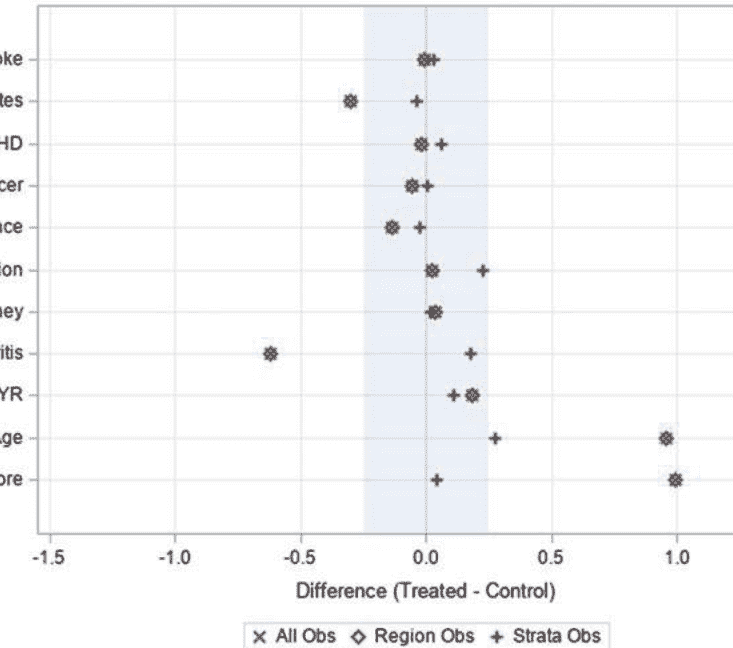

图14.3 标准化均值差异是基于合并五个分层的模型协变量Eq. (14.2)中`NSAID`暴露和未暴露群体之间的参与者

### 14.7 结论

表14.9显示了非甾体类抗炎药曝光的结果总结，包括倾向得分`ATE`和`ATT`加权和分层，统计学上显著的结果表明，处方非甾体类抗炎药的使用与女性性别有显著关联。使用方程（14.2）中的`ATE`加权与逻辑回归模型，得到的比值比显示，女性比男性更有可能在过去30天内使用处方非甾体类抗炎药。使用`ATT`加权，发现女性使用处方非甾体类抗炎药的可能性比男性高20%；使用倾向得分分层调整后，发现女性使用处方非甾体类抗炎药的可能性比男性高23%以上。因此，总体而言，女性比男性更有可能在过去30天内使用处方非甾体类抗炎药。

与表格14.2中的未调整和调整值进行比较，这些结果表明与这些原始估计的`NSAID`暴露存在轻微差异。此外，图14.1、14.2和14.3显示了模型协变量与倾向得分`ATE`、`ATT`加权和分层的标准均值差异较小。因此，当应用我们的倾向得分方法时，在暴露和未暴露处方`NSAID`组之间实现了更好的协变量平衡。这使我们相信，与表格14.2中的调整和未调整估计相比，表格14.9中的估计结果更不偏倚。请注意，使用倾向得分加权和分层的协变量平衡仅适用于观察到的模型协变量；可能未观察到的因素未包含在模型中，可能是重要的混杂因素。

复杂的调查，如`NHANES`，是处方药和有害化学物质暴露信息的丰富来源。分析必须使用`NHANES`设计变量来对更大的美国人口进行有效推断。忽略复杂调查的设计变量进行分析很可能导致错误的结果和错误的结论。同样，在复杂调查统计模型中计算倾向得分需要结合调查抽样权重。

通过`ATE`和`ATT`倾向得分加权以及倾向得分分层，观察到观察到的协变量平衡改善了。在这个例子中，`ATT`方法似乎实现了最小的标准化平均差异，而`ATE`加权和分层则没有。最终，倾向得分方法的选择应该源于感兴趣的估计。

## 表14.9 调整了ATE、ATT加权和分层的处方非甾体类抗炎药结果的比较

| 方法 | 比值比 | 95%的置信区间 | P值 |
| :--- | :--- | :--- | :--- |
| `ATE`加权 | 1.401 | 1.251, 1.570 | < 0.0001 |
| `ATT`加权 | 1.206 | 1.082, 1.344 | 0.0009 |
| `PS`分层 | 1.233 | 1.108, 1.372 | 0.0002 |

这个演示展示了一种可行的策略，根据DuGoff等人的建议来调整复杂观察调查中的混杂因素(2014)。主要分析是使用加权调查逻辑回归模型进行的，但演示的倾向得分方法适用于任何回归模型。不幸的是，目前可用的统计软件中很少有与调查生成数据中的混杂问题相关的集成方法。然而，有许多复杂的调查结果可以自由用于研究。除了NHANES之外，其他著名的复杂调查还包括行为风险因素监测系统(BRFSS)、国家门诊医疗护理调查(NAMCS)和国家家庭增长调查(NSFG)。DuGoff等人(2014)提出的方法不仅适用于NHANES，还适用于任何观察性复杂调查设计，从而增加了加权统计模型的结果的可信度。

免责声明：本章节反映了作者的观点，不一定反映美国食品和药物管理局的观点。任何商业产品的提及仅用于澄清，并不意味着批准、认可或推荐。

致谢作者感谢FDA图书馆的Joanne Berger对手稿的编辑帮助。

## 参考文献

Andersson GD (2008) 药物反应中的性别差异。 Int Rev Neurobiol 83:1–10. https://doi.org/10.1016/S0074-7742(08)00001-9

Austin PC (2011) 降低观察研究中混杂因素影响的倾向性评分方法介绍。 Multivariate Behav Res 46(3):399–424. https://doi.org/10.1080/00273171.2011.568786

Austin PC, Jembere N, Chiu M (2018) 倾向性评分匹配和复杂调查。 Stat Methods Med Res 27(4):1240–1257. https://doi.org/10.1177/0962280216658920

Benedetto U, Head SJ, Angelini GD, Blackstone EH (2018) 统计入门： 倾向性评分匹配及其替代方法。 Eur J Cardiothorac Surg 53(6):1112–1117. https://doi.org/10.1093/ejcts/ezy167

疾病控制与预防中心 (2009年) 关于人类暴露于环境化学物质的第四份报告。亚特兰大，乔治亚州：美国卫生与人类服务部，疾病控制与预防中心。https://www.cdc.gov/exposure report/index.html

陈天才，克拉克，里德尔斯，莫哈杰尔，法库里THI (2020年) 国家卫生与营养调查，2015-2018年：样本设计和估计程序。重要健康统计2 (184) ：1-35

科克伦WG (1968年) 亚组分类调整在消除观察研究中的偏差方面的有效性。生物统计学 24 (2) 295-313。从https://www.ncbi.nlm.nih.gov/pubmed/5683871检索

Curhan GC，Willett WC，Rosner B，Stampfer MJ (2002年) 年轻女性使用止痛药的频率与高血压风险。Arch Intern Med 162 (19) ：2204-2208。https://doi.org/10.1001/archinte.162.19.2204

Davis JS, Lee HY, Kim J, Advani SM, Peng HL, Banfield E, Hawk ET, Chang S, Frazier-Wood AC (2017年) 美国成年人使用非甾体抗炎药物：随时间变化和人口统计学变化。 Open Heart 4(1): e000550。 https://doi.org/10.1136/openhrt-2016-000550

DuGoff EH, Schuler M, Stuart EA (2014年) 推广观察研究结果：将倾向得分方法应用于复杂调查。 Health Serv Res 49(1): 284–303。 https://doi.org/10.1111/1475-6773.12090

Faries D, Zhang X, Kadziola Z, Siebert U, Kuehne F, Obenchain R, Haro JM (2020年) 实际医疗数据分析：使用SAS的因果方法和实施。SAS Institute Inc., Cary, NC

Guglielmo D, Murphy LB, Boring MA, Theis KA, Helmick CG, Hootman JM, Odom EL, Carlson SA, Liu Y, Lu H, Croft JB (2019) 2017年美国关节炎患者的州特定严重关节疼痛和体力不活动。 MMWR Morb Mortal Wkly Rep 68(17):381–387. https://doi.org/10.15585/mmwr.mm6817a2

Kantor ED, Rehm CD, Haas JS, Chan AT, Giovannucci EL (2015) 1999年至2012年美国成年人处方药使用趋势。 JAMA 314(17):1818–1831. https://doi.org/10.1001/jama.2015.13766

Korn EL, Graubard BI (1991) 利用调查的流行病学研究：考虑抽样设计。 Am J Public Health 81(9):1166–1173. https://doi.org/10.2105/AJPH.81.9.1166

Last JM (2001) 流行病学词典，第4版。 牛津大学出版社，纽约，纽约

Lewis TH (2017) 使用SAS进行复杂调查数据分析。 CRC出版社，博卡拉顿，佛罗里达

Nakhai-Pour HR, Broy P, Sheehy O, Bérard A (2011) 妊娠期间非阿司匹林非甾体抗炎药的使用与自然流产的风险。 CMAJ 183(15):1713–1720. https://doi.org/10.1503/cmaj.110454

Neutel CI, Maxwell CJ, Appel WC (1999) 男性和女性在NSAID相关严重胃肠事件风险上的差异。 Pharmacoepidemiol Drug Saf 8(7):501–507. https://doi.org/10.1002/(SICI)1099-1557(199912)8:7%3C501::AID-PDS454%3E3.0.CO;2-Y

Ostensen ME, Skomsvoll JF (2004) 孕期抗炎药物治疗。 Expert Opin Pharmacother 5(3):571–580. https://doi.org/10.1517/14656566.5.3.571

Pfeffermann D (1993) 在建模调查数据时采样权重的作用。 Int Stat Rev/Rvue Internationale De Statistique 61(2):317–337. https://doi.org/10.2307/1403631

Rosenbaum PR, Rubin DB (1984) 通过倾向得分类别减少观察研究中的偏差。 J Am Stat Assoc 79(387):516–524

SAS Institute Inc. (2018) SAS/STAT® 15.1 用户指南。 Cary, NC: SAS Institute Inc. https://documentation.sas.com/doc/en/pgmsascdc/9.4_3.4/statug/titlepage.htm

Stuart EA (2010) 因果推断的匹配方法：回顾与展望。 Stat Sci 25(1):1–21。 https://doi.org/10.1214/09-STS313

Tenenbaum J (1999) 非甾体类抗炎药的流行病学。 Can J Gastroenterol 13(2):119–122。 https://doi.org/10.1155/1999/361651

美国食品和药物管理局 (2005) 关于非甾体类抗炎药和心血管风险的分析和建议。 J Pain Palliat Care Pharmacother 19(4):83–97

美国食品和药物管理局（2007年）非甾体抗炎药（NSAIDs）药物指南。美国卫生与人类服务部，美国食品和药物管理局。 https://www.fda.gov/media/74298/download

## 第15章

多元曲线分辨毒物基因组学中的异质系统分析

## 刘源，林金柱，李孟龙，温志宁

### 15.1 引言

毒物基因组学 (TGx) 是一门科学学科，汇集了生物学、化学、药理学、医学以及聚合遗传学的专业知识，以便对化学物质对生物体的不良影响进行研究 (Wen等人, 2019年)，并诊断和治疗毒素和有毒物质的暴露。 TGx的利用可以在风险评估 (Pennie等人, 2004年; Sturla等人, 2014年)、药物开发和定量结构-活性关系 (QSAR) 建模 (Zhou等人, 2021年) 等领域的研究中发挥强大的作用。然而，由于生物体的复杂性，在许多情况下，这些模型无法解释人类反应的多样性。 多种异质性的主要来源可能影响个体对药物或毒物暴露的反应。 具体而言，异质性可能由遗传多态性 (Wang等人, 2021年)、细胞类型 (Liu等人, 2018a年)、发育过程中的实验因素 (体外、体内等。) (Liu等人, 2020a年)、与激素功能相关的性别差异 (Martin等人, 2018年) 以及受有毒物质暴露影响的既往疾病 (Aldridge等人, 2003年) 等因素驱动。

TGx的异质系统包含多个因素之间的复杂相互作用。然而，在利用TGx数据时，原始样本在生物水平上的异质性经常被忽视。对组织中各种细胞/因子类型及其对毒物的反应进行转录谱分析将产生细胞种群特异的分子效应，从而影响目标因子及其敏感性。利用多个因子的混合基因序列谱分析而不仅仅关注感兴趣的因子，可以严重降低敏感性并引入对毒理相关基因的偏见。样本的不同构成可能会人为地引起差异表达，并且还可能为下游研究设置相当大的偏见（Liu等人，2020b）。

在体外到体内外推（IVIVE）系统中，系统层面的异质性可能导致两个测定之间的相关性较差（Sutherland等人，2016；Liu等人，2018b）。在风险评估领域，个体对毒物的响应具有很大的多样性，这使得确定实际风险因异质性而困难（Zhang等人，2014），尤其是在大多数人暴露于低剂量时(Aldridge等人，2003年)。当涉及到药物开发时，肿瘤内皮细胞（TECs）与其正常对应物不同，由于异质性，进一步在向人体系统输送抗血管生成药物时产生额外的影响（Hida等人，2016年）。同样，对于与疾病相关的治疗，通过基于生理学的药物动力学（PBPK）建模来解决药物反应异质性可能能够推进基于基因组学的精准医学承诺（Vizirianakis等人，2019年）。在医疗治疗的情况下，异质性很可能是由不同的致病机制造成的。例如，肌萎缩性脊髓侧索硬化症（Bendotti等人，2020年）或横纹肌溶解症（Wen等人，2019年）被认为是药物使用可能引起的严重副作用。尽管在样本处理过程中通过执行额外的程序来提取相关因素有实验性解决方案，包括免疫组织化学（IHC）染色（Ju等人，2013年）（Lassmann等人，2002年；DePianto等人，2015年），或原位杂交（ISH）用于提取细胞类型特异性基因表达（Hanna等人，2014年），或荧光原位杂交（FISH）用于遗传毒理学（Natarajan，2001年），或显微镜和荧光激活细胞分选（FACS）分析的组合（Wang等人，2016年），或通过流式细胞术测量细胞比例（Soboleski等人，2005年；Qiao等人，2012年）。这些实验方法相对复杂、耗时且成本高昂。

作为一种替代方法，计算方法可以用于直接从表达水平解析异质样本，目的是估计从批量样本中的每个亚型的比例和表达谱。事实上，生物信息学的发展令人印象深刻地推动了解决生物问题的革命。越来越多的计算方法在改进和研究遗传结果方面发挥了重要作用。几种计算方法在解卷积中显示出特定的优势，例如贝叶斯框架（Troyanskaya等人，2003年），多元线性回归（De Juan和Tauler，2021年），相关分析（包括网络分析）（Aragues等人，2008年；Reimand等人，2008年；Wang，2013年）和多元曲线分辨率（MCR）方法（De Juan和Tauler本章将重点介绍将MCR应用于异质TGx系统分析及相关应用的目标（2021年）。

多元曲线分辨（MCR）作为一种设计用于分析混合系统的工具，提供了对观测数据变化的双线性描述。通过实施适当的约束条件，这保持在化学领域的边界内。MCR通常用于根据特定规则分析矩阵，以实现数据维度缩减、数据筛选或从原始混合物中提取重要因素的目标。因此，MCR在体外基因表达水平上对解析基因表达谱的贡献巨大。MCR将混合系统转化为纯组分及其有意义的贡献的双线性模型。

本章概述了广泛应用于混合系统并具有解析异质基因表达TGx数据潜力的多种MCR方法。利用MCR解决TGx问题的主要目标是减少异质数据挖掘的影响，并确保更准确的结果。为了帮助研究人员更好地理解和更容易地访问相关领域，演示分别分为三个部分，围绕MCR方法：解析问题的定义与通常应用的场景，方法类别与相关研究案例，以及资源总结（包括数据库、函数和工具）。

- 1. 目标1：解卷积问题的定义及相应的应用场景。

- 2. 目标2：总结MCR算法的方法类别及其在不同场景或研究案例中的贡献。

- 3. 目标3：列出可用资源的表格，包括数据库、函数和开发的解卷积工具。

此外，还讨论了相关领域的观点和未来发展方向。

### 15.2 基本概念和应用场景

在TGx数据中，样本的原始表达谱可以表示为一个具有n行和m列的矩阵，其中n是样本的数量，m是基因的数量。然而，由于样本的异质性，每个基因在每个样本中的表达水平可能是由多个组分共同影响的总和值。正如我们之前提到的，所有组分中，其中一些与毒理学背景有较密切的关系，可以被视为毒性因素，而其他一些则可能被视为噪声，因为它们不仅与毒理学的关联较弱，而且掩盖了毒性因素，可以称为非毒性因素。因此，利用MCR可以帮助实现使结果更准确的最终目标，同时在反映基因表达水平上异质性的所有因素中识别和提取与毒性相关的因素。

#### 15.2.1 异质系统中MCR的定义

根据MCR的定义，双线性是MCR算法所假设的一个属性。这要求将数据矩阵写成单组分数据矩阵的和，其中每个数据矩阵都可以分解为包含浓度和纯度因子的两个向量的乘积。因此，多元曲线分辨方法使用双线性模型来解决混合分析问题，或者在多维数据的情况下使用其多线性扩展。因此，在MCR的最简单形式中，作为任何变量或条件集的函数收集的响应被组织在一个数据D中，其中每一行都是某个阶段的全局混合响应。

考虑到数据 D中的混合响应来自于n个变异源，混合分析模型可以表示为 （图15.1）：

```
D = C S^τ + U ≈ C S^τ \quad (15.1)
```

这个紧凑的形式是双线性MCR模型在线性代数矩阵形式中的一般表达式。矩阵 S^τ，有 n行，包含了各个变异源的定性特征，而矩阵 C，有 n列，包含了相关的分配特征（图15.1）。

在了解了MCR模型的基本定义之后，让我们根据以下描述来制定一个异质系统。 TGx的异质系统可以简单地想象成一杯鸡尾酒，或者称为灰色分析系统的“鸡尾酒会问题”（Cherry1953） （Liang et al.1993），其中包含多种纯组分，混合物中的每个组分都有自己的构成或权重。也就是说，包含n个样本的样本集合 O可以被

图15.1 利用MCR对TGx数据集中的基因表达谱进行解卷积的演示。D在MCR中，O是表示原始数据的表达谱（矩阵）的变量。MCR中的 C是表示每个因子对应表达的变量；而MCR中的 W是表示每个因子权重的变量；U是MCR和TGx的不确定性矩阵。O、E、U和W之间的关系可以用方程 O = EW + U来表示。

形成如下：

```
$O = [o_1, o_2, \ldots, o_j]; j = 1 \ldots n \text{个样本} \quad (15.2)$
```

样本集O中的每个样本oj可以表示为对应纯表达谱(eik)的k种因子的线性加权组合。

```
$o_j = (e_{i1}w_1 + e_{i2}w_2 + \cdots + e_k w_k) + u_i$
$= \sum_{k=1}^{K} e_{ik} w_k + u_i; i = m \text{基因} \quad (15.3)$
```

因此，样本集合 O 可以写成如下形式：

```
$o_{ij} = \sum_{k=1}^{K} e_{ik} w_{kj} + u_{ij}; i = 1 \ldots m \text{ 和 } j = 1 \ldots n \quad (15.4)$
```

其中，oi是样本j中基因i的观察表达值；eik是细胞类型k中基因i的平均表达值；w_{kj}是样本j中细胞类型k的比例；u_{ij}是误差项；k是因子/类型的数量；m是基因的数量；n是样本的数量。类似地，TGx数据的表达水平可以被看作是批量样本中不同组分的加权和。

首先，假设在一个TGx样本中，有m个基因的表达水平，并且有n个样本，原始数据可以形成一个m行n列的矩阵（m×n），每一行代表一个基因在n个样本中的表达，每一列代表一个样本的m个基因的表达谱。

# 15.2.2 在TGx中应用MCR的最终目标

$$O \text{（原始）} = \begin{bmatrix} \text{基因}_{1, 1} & \ldots & \text{基因}_{1, j} \\ \vdots & \ddots & \vdots \\ \text{基因}_{i, 1} & \ldots & \text{基因}_{i, j} \end{bmatrix}; i = 1 \ldots m \text{和} j = 1 \ldots n \quad (15.5)$$

其次，MCR的基本思想是将一个二维数据矩阵`O`（`m×n`）分解为包含纯表达谱`E`和纯权重`WT`的两个矩阵，分别表示未知混合物的`k`个成分的纯表达谱和纯权重。假设这个混合物中有`k`个成分，每个成分都有自己的纯表达水平，并且对于原始数据中的每个样本，这些`k`个成分以一定的权重混合在一起。通过将原始数据矩阵`O`（`m×n`）定义为纯基因表达`E`（`m×k`）和`k`个成分在`n`个样本中的权重`WT`（`k×n`）以及表示其他不确定性的变量`U`的组合。有了这些，MCR模型可以表示如下：

$$O = \sum_{k=1}^{K} e_{ik} w_{kj} + u_{ij} = E W + U \approx E W \qquad (15.6)$$

因此，MCR模型可以如下所示，并且在TGx中使用MCR模型解决异质系统的可访问性得到保证：

$$D = C S^\tau + U \ll==\Rightarrow O = E W + U \qquad (15.7)$$

最紧凑的形式：

$$D = C S^\tau \ll==\Rightarrow O = E W \qquad (15.8)$$

其中，`$O$`（原始）表示原始样本中基因`j`的观察表达值；`$E$`（表达）是基因`j`在类型`k`中的表达水平；`$W$`（权重）是类型`k`的权重；`$U$` (`$m \times n$`) 是包含数据残差变化的不确定性矩阵。

综上所述，原始基因表达（`$m$`个基因 `$\times n$`个样本）可以表示为来自批量样本中每个组分/因子的特定表达轮廓的线性组合。也就是说，每个原始基因表达是不同组分/因子类型的加权和，原始轮廓可以被视为混合轮廓（图15.1）。

基于MCR的反卷积可以基于原始表达式(`$O$`)，每个因子的表达式(`$E$`)，每个因子的权重(`$W$`)和因子的数量(`$k$`)之间的线性关系进行。因此，通过了解 `$O$`， `$E$`， `$W$`和 `$k$`中的一些信息，可以计算未知变量。

重要的是，采用MCR模型的目标是根据已知变量解决未知变量，即变量 `$O$`， `$E$`， `$W$`和 `$k$`。

如上所述，在等式(15.8)中已知变量的数量作为参考，可以估计或计算其他部分的值。因此，应用MCR的最终目标是根据用作输入的信息和参考确定输出的反卷积。图15.2中描述了确定树。相应地，根据不同的输入和输出，使用不同类型的MCR方法和策略对异质样本进行反卷积。

具体而言，对于已知的异质数据（`$O$`），存在四种不同的主要情况：

（A）已知 `$O$`，需要解决 `$E$`， `$W$`和 `$k$`；

（B）已知 `$O$`和 `$k$`，需要解决 `$E$`和 `$W$`；

（C）已知 `$O$`， `$k$`和 `$E$`，需要解决 `$W$`；

（D）已知 `$O$`， `$k$`和 `$W$`，需要解决 `$E$`。

图15.2 基于不同情况（已知条件）的不同过程的决策树：

- a已知 `$O$`，需要解决 `$E$`，`$W$`和 `$k$`

- b已知 `$O$`和 `$k$`，需要解决 `$E$`和 `$W$`

- c已知 `$O$`，`$k$`和 `$E$`，需要解决 `$W$`

- d已知 `$O$`，`$k$`和 `$W$`，需要解决 `$E$`

因子数量（`$k$`）是确定或估计的，对于情景C和D，有足够的先前参考资料来启动监督式MCR。至于情景A和B，一种解决方案可以是使用无监督式MCR方法迭代地输出估计的 `$E$`和 `$W$`。另一种方法是通过估计未知变量（`$E$`或 `$W$`，或 `$E$`和 `$W$`）将问题情景A/B转化为情景C/D，并将估计的输出用作额外的输入。

# 15.3 方法类别

多元曲线分辨（MCR）涵盖了一系列算法，旨在通过将原始数据表示为纯组分有意义的双线性模型来解决混合分析问题。当解决异质系统时，MCR方法经典上分为两组：非迭代（Zhang等，2020）（Liang2009）和迭代（De Juan等，2019）。非迭代组使用单个计算步骤来恢复双线性模型中的每个组分，因此非迭代组的输出是相同的。因此，属于非迭代组的算法通常用于确定 `$k$`的数量或在给定更多先前知识（如已知 `$E$`或 `$W$`）时使用。迭代解析方法使用初始估计的 `$E$`或`$W$`配置文件，在约束的作用下进行迭代优化。这种迭代优化可以在 `$E$`和/或 `$W$`空间中进行，并且组分的配置文件可以按顺序或同时恢复。因此，迭代组中的算法通常更擅长处理缺乏先前知识的数据。

## 15.3.1 确定或估计 `$k$`

无论 `$E$` 或 `$W$` 是否已知，都需要一些因素，这些因素要么被给定，要么通过非迭代的 MCR 算法进行估计。因此，许多算法在混合分析之前使用 MCR 作为步骤，以估计 MCR 模型的组分数量或找到权重 (`$W$`) 和表达式概要 (`$E$`)。PCA、ICA 和 FA 被广泛用于完成找到适当的 `$k$` 的任务。

### 15.3.1.1 成分分析 (CA)

成分分析是一组典型的算法，通过使用特征值分解 (或奇异值分解，SVD) 将一组可能线性相关的变量转换为一组线性无关的变量来识别重要因素。成分分析首先被用于解决盲源分离 (BSS) (Cherry1953)，然后广泛用于简化计算，通过去除噪声和重新排列排序的组分 (Hyvarinen 和 Oja2000; Jolliffe2011)。对于遗传异质样本，在无噪声的情况下，由 PCA 分数和表达式概要 (`$E$`) 定义的空间和由 PCA 载荷和加权概要 (`$W$`) 定义的空间是相同的。因此，在应用另一个 MCR 对 `$O$` 进行因式分解之前，通常会使用成分分析来识别 `$k$`，但它仍然可以直接用于 `$O$` 以作为无监督方法找到估计的 `$E$` 和 `$W$`。

两种著名的成分分析方法是主成分分析 (PCA) 和独立成分分析 (ICA)。通过PCA获得的新的线性变量是正交的，而通过ICA获得的新的线性变量相对独立 (非高斯成分) (Comon 1994)。因此，ICA通常被认为是PCA和因子分析的组合和扩展方法 (Roberts和Everson2001)，在实践中，ICA通常比PCA更好地发现多维数据中的不相交的潜在趋势。PCA和ICA的一般工作流程如图15.3所示。

特别地，PCA致力于分离最能解释原始数据变异性的信号。也就是说，PCA基向量中的第一个向量是最能解释特定数据变异性的向量 (主方向)，第二个向量是第二好的解释并且必须与第一个向量正交，依此类推 (Draper等，2003)。相反，ICA致力于将每个向量作为原始数据的独立成分。也就是说，一个特定的数据集可以被视为信号的混合，然后ICA基向量可以有一个向量对应于每个独立的信号 (Patil等，2016)。如果因子分解的目标是找到与某些影响因素 (例如与肿瘤相关与正常相关) 特别相关的主要信号，则首选PCA。然后，如果因子分解的目标是

图15.3 PCA和ICA过程的图形说明。`$O$`是原始数据的表达谱（矩阵）。`$E$`是每个细胞/组织类型的表达，而 `$W$`是每个细胞/组织类型的权重

如果要找到每个特定因子（例如B细胞与T细胞）的某些表达水平和权重，与PCA相比，ICA将是更好的选择。通过一些修改，非迭代CA算法可以转化为迭代方法。已经证明，MCR的经典加权变体可以用一种策略来替代，该策略从原始数据集上的初始最大似然PCA（MLPCA）加权滤波开始，然后继续使用经典的MCR优化（Dadashi等，2012年）。

R中的`prcomp`函数和MATLAB中的`princomp`函数可用于应用PCA，MATLAB中的`rice`或`fastICA`函数可用于应用ICA（Hyvarinen1999; Langlois等，2010年）。此外，还有一些关于优化PCA以改进对遗传数据的应用的研究（Rahmani等，2016年）。

### 15.3.1.2 因子分析 (FA)

FA 用于基于原始数据 (`$O$`) 而不是生成 `$E$` 或 `$W$`来确定因子的数量 (`$k$`)。因此，一旦因子被FA确定为 `$k$`值，这个估计的 `$k$`将被纳入下游的解卷积过程 (情景a)。大多数FA使用辅助的本地排名方法，如进化因子分析 (EFA) (Maeder和Zuberbuehler1986) 或窗口因子分析 (WFA) (Malinowski 1992)。因子分析是由J. Pearson (Holgado–Tello等人2010) 和C. Spearman (Woolley等人2010) 发布的，用于确定物种的数量。

这种统计方法能够描述在观察到的相关变量中生成的一组主要成分。成分可以被看作是几个可能降低未观察到的变量数量并同时保持变量的主要特征的因子。在计算步骤中，与PCA和ICA类似，原始数据矩阵被标记为`$O$`。通过线性重新组合观察变量，原始矩阵`$O$`可以由一组新的潜在变量表示。为了生成`$O$`的因子，首先会创建`$O$`的协方差矩阵，然后将协方差矩阵对角化以生成相应的特征向量和特征值。随后，特征值将被用于计算减少的特征值（REV），它可以被视为每个因子的重要程度（Holgado-Tello等人2010），而不是识别贡献比例。最终，最大的REV可以被视为最重要的因子，最小的比例可以被视为最不重要的因子。

此外，一些FA的变体是迭代算法，不仅能够估计`$k$`的数量，还能估计`$E$`和`$W$`。例如第一个迭代目标转换因子分析（ITTFA）（Vandeginste等，1985年）。

### 15.3.2 确定或估计E和W

确定`$k$`之后，可以进一步应用MCR来解决`$E$`和`$W$`。根据`$E$`或`$W$`是否已知的条件，MCR的应用可以被分类为有监督或无监督。计算`$E$`和`$W$`的大多数方法都是迭代的MCR算法。此外，一旦`$E$`和`$W$`中的一个变量通过无监督算法估计出来，它就会将无监督情况转化为具有估计先验知识的有监督情况。因此，无监督和有监督的MCR可以结合和交替使用。

监督式多元曲线回归（Supervised MCR）是一种机器学习任务，根据输入和输出数据之间的某些函数来学习将输入与输出联系起来的函数。监督式多因子方法通常根据标记的训练数据（Zhang等人，2013b，2016）或参考数据（Russell和Norvig，2010）推断函数。如上所述，情景C和D（图15.2）比给定的原始表达矩阵（`$O$`）具有更多信息，已知条件`$E$`或`$W$`作为参考。因此，对于给定的原始配置文件（`$O$`），监督式多因子可以根据每种类型的已知相应表达式（`$E$`）识别不同类型的细胞/组织的权重（`$W$`），或者根据已知的细胞/组织类型的权重（`$W$`）识别每种细胞/组织类型的表达式（`$E$`）。在本节中，介绍了经常使用的算法。无监督式多元曲线回归（Unsupervised MCR）方法在执行解卷积时不需要参考比例或细胞/组织类型的表达式配置文件。相反，无参考方法根据各种无监督方法估计细胞比例或由未测量因素引起的变异比例。一般来说，对于大多数用于研究其他主题和领域的可用表达数据，数据生成和处理通常是无意的。

对异质性进行细分。因此，很难找到预制的E或W作为启动监督MCR方法的参考。对于大多数情况，要解卷积的候选数据几乎总是情况A或B，除了O之外的所有变量都需要估计（k，E，W或E，W）。这是牺牲准确性的主要原因，然后利用无监督MCR来研究这个问题。

#### 15.3.2.1 最小二乘（LS）算法

最小二乘法（LS）是最常用的MCR方法之一，旨在通过最小化残差平方和来估计最优解。通常也称为普通最小二乘法（OLS）或线性最小二乘法（LS）。

该方法在各种约束条件下同时进行完整的E和W矩阵的交替最小二乘优化。

最广泛使用的LS变体被称为多元曲线分辨率-交替最小二乘法（MCR-ALS）。

这种方法适用于完整矩阵 E或 W的初始估计，并且在每次迭代中，根据适当的约束条件计算双线性模型的两个矩阵（图15.4）。

对于应用于遗传数据的情况，最小二乘法的目标是最小化的 E × W 与观察到的原始值O之间的平方残差的总和。根据给定的 O和 E（或 O和 W ），使用最小二乘法的方程可以描述如下。要找到 W（或 E）：

```
$$\min_{W\text{ (或 E)}} \quad E \times W - O \ ^2 \quad\quad (15.9)$$
```

当方程（15.9）达到最小值时，最优解 W（或 E）也可以确定。

从数学上讲，使用方程（15.9），估计的 W（或 E）最初可能出现负值和正值，并且权重的总和（W）可能大于1（Lawson和Hanson 1995），但结果将是无意义的，因为基因表达水平和权重只能观察到为0或大于0（≥0），而一个混合物的比例之和应始终为1。因此，在应用最小二乘法解决生物学问题时，更倾向于使用非负最小二乘法（NNLS）。

此外，比例之和通常被归一化为每个样本的1。此外，LS还有其他变体，如加权LS（MCR-WALS），它在每个最小二乘计算中结合了适当的误差协方差矩阵（Tauler等人，2009）。此外，还可以联合使用其他算法，包括代理变量分析（SVA）或随机森林（RF）（Zhou等人，2021），以及偏最小二乘（PLS）（Chakraborty等人，2012）。

用户可以选择多个平台，例如R软件中的`nnls`包（Mullen和Van Stokkum，2007），或MATLAB中的`nnls`和`lsqnonneg`函数。此外，通过最小化平方残差的过程，LS可以生成一个不对应于全局解的局部解（Berkson，1956）。此外，凸目标函数能够保证更好的结果图15.4 MCR-ALS (a)和MCR-LLM (b)算法的比较流程图，突出显示了两个主要差异。不再通过应用约束条件修改 E，而是通过最大化约束条件下的对数似然来计算 E。第二个变化与使用多线性回归计算 W有关，通过提升 E的元素来实现。

当矩阵不稀疏时，该方法不会陷入局部最小值 (Henderson2009)。MATLAB中的`quadprog`和`lsqlin`函数以及R中的`quadprog`包可以用于避免陷入局部最小值的问题。基于LS的遗传利用的更多扩展列在表15.1和15.2中。LS算法已被用于分析与毒理学和疾病相关的多种遗传数据 (Sarstedt 2008)。例如，MCR-ALS被用于处理DNA微阵列表达谱。通过在不使用任何训练集的情况下利用ALS，成功检测到了癌细胞系的分类 (Jaumotet al. 2006)。Kronecker正则化最小二乘法是一种半监督LS方法，它与异质组学数据一起用于预测microRNA-disease关联的更好性能 (Luo et al. 2017)。

### 15.3.2.2 对数似然最大化 (LLM)

MCR-LLM是一种迭代方法，类似于MCR-ALS，但它们在计算上有一些不同之处。图15.4展示了MCR-ALS和MCR-LLM的工作流程。MCR-LLM在从嘈杂的时空数据集中提取有意义的模式方面表现出一些优势（Vielfaure等，2020），并且在低计数数据或稀疏矩阵中往往具有更好的性能（Lavoie等，2016）。总结到目前为止的讨论，MCR-LLM直接基于MCR-ALS，并对其进行了两个主要改变，使其特别适用于低计数数据。与MCR-ALS中使用多线性回归计算每个成分的贡献不同，MCR-LLM使用基于泊松噪声的似然最大化来计算它们的贡献。与MCR-ALS中使用多线性回归计算每个成分的谱不同，MCR-LLM在回归步骤之前对`$E_{prior}$`的元素进行缩放。由于MCR-LLM是一种新兴的方法，迄今为止还没有使用MCR-LLM进行TGx数据集的案例研究。然而，MCR-LLM已被用于分析制药片剂的拉曼映射，以确定医疗治疗的成分数量（Wang和He，2017），另一项研究表明，对数似然变体（MCR-LLM）在低信噪比（SNR）数据集中表现出特别好的性能（Wang和He，2017）。

### 15.3.2.3 非负矩阵分解 (NMF)

非负矩阵分解（NMF）是一系列无监督学习方法（Avila Cobos等，2018），可以将非负矩阵`$O$`分解为两个非负矩阵（`$E$`和`$W$`）（Lee和Seung，1999）。由于非负概念，NMF经常在生物盲源分离（BSS）中使用。

NMF的最终目标是：给定一个矩阵`$O$`，NMF将继续寻找以初始非负矩阵`$E$`和`$W$`随机指定的`$k$`个分量开始的解，直到损失函数达到最小值。NMF从原始矩阵`$O$`中估计基矩阵`$E$`和权重矩阵`$W$`。在从原始矩阵`$V$`到损失函数`$F(V， WH)$`（Gaujoux和Seoighe，2010）的求解和迭代之后，达到正则化函数`$F(W， H)$`的最小值，并生成最优化的`$W$`和`$H$`（Hoyer，2004；Kim和Park，2007）。原始的NMF算法如下：

```
$$O \approx E \times W \tag{15.10}$$
```

大多数情况下，矩阵`$W$`和`$H$`是通过交替最小二乘（ALS）算法估计的，该算法最初由Paatero和Tapper（1994）提出，并由Paatero和Albright等人改进（Paatero 1999）。在ALS算法中，`$W$`被初始化为一个随机的稠密矩阵，并用于使用最小二乘（LS）计算步骤来解决`$H$`。将`$H$`中的负元素设置为0，并应用损失函数`$F(V， WH)$`来衡量每次迭代的结果。损失函数`$F$`

```
$$F(E, W) = O - E \times W_F^2 (15.11)$$
```

NMF能够估计样本中基因表达谱和权重的主要成分，而无需任何先前的参考知识，这是一个重要的优势。然而，在大多数应用中，分解等级k，也就是细胞/组织类型的数量，应满足k<<<样本数量的条件。与LS类似，由于在过程开始时初始E和W是随机获得的，存在局部最优解的问题。

由于估计的稳定性`E`和`W`不如有监督的`MF`稳定，每次启动`NMF`时迭代会产生不同的`E`和`W`值。为了减少这种不确定性，可以重复进行`NMF`数千次，直到选择使均方根残差最小的`E`和`W`，或者在重复过程后对不同的`E`和`W`进行平均处理是有帮助的 (Zhang等, 2013a; Liu等, 2018a)。

此外，为了更好地利用实际情况的生物学意义，可以在`NMF`解卷积后通过对`E`进行归一化来生成归一化的`W`。具体来说，通过限制`W`的每列值的总和为1，可以生成归一化权重，以保证处理表达谱时获得更好的结果。`MATLAB`中的`nnmf`函数或`R`中的`nmf`包可以为研究人员提供更快的利用`NMF`的方法。

在`TGx`领域中，将后修饰的`NMF`应用于由体内和体外产生的119个成对化合物的表达谱数据（图15.5），缩小了体内和体外两种测定方法之间的差异。因此，可以通过将体外数据中与药物相关的因素与体内数据确定的环境因素相结合，生成模拟的体内数据集。重新组合的数据有潜力减少活体动物毒理学测试 (Liu等, 2020a)。

如上所述，在通过`NMF`解卷积后，可以通过对`E`进行归一化生成归一化的`W`，这种方法被称为后修饰的`NMF` (Liu等, 2018a)。

### 15.3.2.4 代理变量分析 (SVA)

代理变量是直接从高维数据（如基因表达、`RNA`测序、甲基化或脑成像数据）构建的协变量，可以在后续分析中用于调整未知、未建模或潜在的噪声来源。在基因表达水平上，`SVA`算法的目标是基于某些一致的表达变异模式（给定部分`E`和部分`W`），识别和估计代理变量 (Leek和Storey, 2007; Teschendorff等, 2011)。目标是模拟或训练良好控制的样本作为主要参考矩阵，然后将参考矩阵与原始样本（`O`）拼接以获得联合矩阵。此外，通过使用线性回归方法处理联合矩阵来识别未知的`E`和`W`。

样本。`SVA`的思想类似于插入内部参考的概念。公式可以描述如下：

参考文献：`O_r = E_r \times W` (15.12)

其中，`O_r`是参考数据的表达矩阵，`E_r`和`W_r`分别是每种细胞/组织类型的表达和权重。此外，`E_r`和`W_r`是通常在获取数据时精心设计的模拟数据。

联合矩阵：`[O_r; O] = [E_r; E] \times [W_r, W]` (15.13)

`SVA`的主要优势在于参考可以与批量样本分开生成，这在使用已发布数据时提供了更好的支持。然而，与不同数据源相对应的批次效应已成为

`SVA`的主要缺点。幸运的是，一些研究已经为解决`SVA`的批次效应问题做出了贡献，从而实现了更准确的结果（Parker等人2014a，2014b）。此外，一旦获得联合矩阵，可以通过将其视为新的原始矩阵（`O`）来应用其他`MF`方法来替代线性回归过程。因此，在`SVA`过程中可以用多个`MF`方法替代几个步骤。例如，Chakraborty等人（2012）将`SVA`与偏最小二乘（`SVA-PLS`）结合在基因表达研究中。`SVA`软件包位于`R Bioconductor`中，用于启动`SVA`方法（Leek等人2017）。基于`SVA`的遗传利用的更多扩展列在表15.1和15.2中。

#### 15.3.3 共同利用和交替估计

正如我们在第2.2节中所描述的，无监督方法可以与监督方法一起使用。这种方法从细胞/组织特异性表达和相反方向交替估计比例，从一些有限的先验知识开始。对于一些研究，最近出现了多个有监督和无监督的`MCR`方法用于解卷积（Newman等，2015年；Teschendorff等，2017a年）。这些方法包括用于解卷积基因表达和`DNA`甲基化的`SVA-PLS`（Chakraborty等，2012年）（Teschendorff和Zheng，2017b年），将`NMF`转化为半监督方法的`PCA-NMF`，用于髓母细胞瘤样本（Korshunov等，2012年），以及使用`FA`和`NMF`联合用于癌症和组织混合样本的扩展`NMF`（Liu等，2018a年）。此外，一种名为`DeMix`的`R`工具使用户能够直接插入特定细胞类型的估计表达或权重值以进行进一步的解卷积。将`PCA`和`LS`的优点结合起来产生了一些有趣的方法，包括最大似然`PCA`（`MLPCA`）和总最小二乘（`TLS`）。这些方法处理异质遗传数据和相关误差结构。应用于广泛研究的酵母细胞周期数据的`TLS`方法应用于`MCR`以展示其性能（Jaumot等，2010年）。

此外，基于其他机制的多重解卷积方法可以与`MCR`方法相结合，以获得更好的结果（Wentzell等，2006年）。在几个先前的研究中，`MCR`与贝叶斯框架相结合，比直接在癌症样本上使用`NMF`更敏感于数据集（Hou等，2018年）。简而言之，为了研究`TGx`的大量数据的特征，强烈建议启动或联合启动基于不同期望的不同方法。

### 15.4 可用资源

### 15.4.1 TGx数据库

表15.3介绍了一些最常用的关系数据库，涵盖了专门用于毒性预测（Plant 2015）、副作用报告和更多化学相互作用数据库。通过结合可用的遗传数据集和毒理学数据库，`MCR`应用可以更有潜力帮助挖掘毒理学相关信息。

### 15.4.2 MCR的功能

表15.1列出了每个算法的打包函数及其相应的扩展（第15.3节中提到）以及它们的可用平台。这些函数可以在撰写拟议研究的主要脚本时早期使用。此外，探索算法的编码可以更好地理解机制，并实现联合组合算法或进行修改的目标。

已经发布了一些综合性的`MCR`软件包，并且多个算法已经装备到一个可用的源中。包括基于交替回归的五个`MCR`算法：`MCR-ALS`、`MCR-NNLS`、`MCR-Gauss`、`MCR-Ridge`和`MCR-Lasso`（Camp Jr 2019）。

使用`R`数据的化学计量学是一个基于`MCR`的原始概念的`R`软件包（Pinheiro 2012），没有涉及特定的子分类算法。

### 15.4.3 使用MCR的反卷积工具

在表15.2中，列出了相关研究领域的贡献者设计的不同精心设计的工具或协议，作为遗传反卷积初学者的参考。由于本章重点介绍`MF`方法，基于其他算法的高引用（>200）工具可能会从此列表中排除，例如`csSAM`（Shen-Orr等，2010年），`ESTIMATE`（Yoshihara等，2013年），`Digital Sorting Algorithm (DSA)`（Zhong等，2013年），`CIBERSORT`（Newman等，2015年）和`UNDO`（Wang等，2015年）。随着每年不断涌现出新的工具，越来越多的综合工具可用，例如`CellMix`，它能够涵盖用于遗传数据反卷积的大多数基本方法。并且升级版的后修饰`NMF`已经专门应用于毒物基因组学。然而，在可预见的未来，将会付出更多努力提供更好、更全面的工具，以跟上计算策略的发展。

表15.1 列出了在多个常用平台上的原始函数及其`MCR`扩展

| 函数 | 迭代 | 监督 | 基础 | 平台 | 注意 |
| --- | --- | --- | --- | --- | --- |
| `pyMCR` | - | - | 通用 `MCR` | `Python 3` | 交替回归 |
| `NNLS` | √ | √ | `LS` | `MATLAB` | 非负 |
| `Lsqnonneg` | √ | √ | | `MATLAB` | 非负 |
| `Quadprog` | √ | √ | | `MATLAB` | 凸 |
| `Lsqlin` | √ | √ | | `MATLAB` | 凸 |
| `MCR-ALS` | √ | √ | | `MATLAB` | 工具箱 |
| `NNLS` | √ | √ | | `R包` | 非负 |
| `Quadprog` | √ | √ | | `R包` | 凸 |
| 最小二乘 | √ | √ | | `Python 2/3` | |
| `MCRLLM` | √ | √ | `LLM` | `Python 3` | |
| `SVA` | 不适用 | √ | `SVA` | `R包` | `Bioconductor` |
| `NNMF` | √ | × | `NMF` | `MATLAB` | |
| `NMF` | √ | × | | `R包` | |
| `NMF` | √ | × | | `Python 2/3` | `sklearn.decomposition` |
| `NIMFA` | √ | × | | `Python 2/3` | |
| `Princomp` | × | × | `PCA` | `MATLAB` | |
| `PPCA` | √ | × | | `MATLAB` | 概率主成分分析 |
| `PCACOV` | × | × | | `MATLAB` | 凸 |
| `Prcomp` | × | × | | `R包` | |
| `PPCA` | × | × | | `Python 2/3` | |
| `RICA` | × | × | `ICA` | `MATLAB` | |
| `FastICA` | × | × | | `MATLAB` | 需要统计包 |
| `FastICA` | × | × | | `Python 2/3` | `sklearn.decomposition` |
| `factoran` | × | × | `FA` | `MATLAB` | |
| `lavaan` | × | × | | `R包` | |


| FactorAnalysis | × | × | | Python 2/3 | sklearn.decomposition |

表15.2 使用MCR进行解卷积的可用工具或网络服务器

| 工具名称 | 监督 | 基础 | 平台 | 输入 | 输出 | 参考文献 |
|----------|------|------|------|------|------|----------|
| — | √ | LS和PCA | 微阵列 | O&E/O&W | W/E | (Venet等人 2001) |
| — | √ | LS | 微阵列 | O&W | E | (Stuart等人 2004) |
| — | √ | LS | 微阵列 | O&E | W | (Hofmann等人 2006) |
| NMF-CellMix | × | NMF | 微阵列 | O | E&W | (Gaujoux和Seoighe 2010) |
| PERT | √ | LS | 微阵列 | O&W | E | (Qiao等人 2012) |
| DeconRNASeq | √ | LS | RNA-seq | O&E | W | (Gong和Szustakowski 2013) |
| 虚拟显微切片 | × | NMF | 微阵列/RNA-seq | O | E | (Moffit等人 2015) |
| TIMER | √ | LS | RNA-seq | O&E | W | (Li等人 2016) |
| CAM | √ | LS | 微阵列 | O | E | (Wang等人 2016) |
| — | √ | SVA | 微阵列/RNA-seq | O&E | W | (Şenbabaoğlu等人 2016) |
| 后修饰的NMF | × | FA和NMF | 微阵列/RNA-seq | O | E&W | (Liu等人 2018a, 2020a) |
| 去混淆 | × | LS和NMF | 微阵列 | O | E&W | (Dimitrakopoulos等人 2018) |
| CDSeq | × | MCR/MF | RNA-seq | O | E&W | (Kang等人 2019) |

表15.3 常用的TGx数据库

| 数据库 | 网站 | 描述 | 参考文献 |
|---|---|---|---|
| LINCS | http://www.lincsproject.org/ | 化学干扰效应：集成网络为基础的细胞签名库 | (Millard等人，2011) |
| ToxCast | https://www.epa.gov/chemical-research/exploring-toxcast-data-downloadable-data | 成千上万化学物质的高通量筛选数据 | (Zurlinden等人，2020) |
| Open TG-GATEs | http://toxico.nibio.go.jp/english/index.html | 毒物基因组学项目-基因组学辅助毒性评估系统：大规模毒物基因组学数据库 | (Igarashi等人，2015) |
| CEASAR | http://www.caesar-project.eu/ | 根据法规对工业化学品进行计算机辅助评估 | (Cassano等人，2010) |
| 快速化学物质暴露和剂量研究 | https://www.epa.gov/chemical-research/rapid-chemical-exposure-and-dose-research | 快速暴露和剂量数据 | (Eichler et al. 2020) |
| DEREK Nexus | http://www.lhasalimited.org/products/derek-nexus.htm | 基于知识的软件，能够快速准确地预测毒性 | (Verheyen et al. 2017) |
| Toxtree | http://toxtree.sourceforge.net/ | 基于规则的毒性预测 | (Patlewicz et al. 2008) |
| TOPKAT | http://accelrys.com/solutions/scientific-need/predictive-toxicology.html | (Q)SAR基于毒性预测：计算机辅助技术进行毒性预测 | (Enslein et al. 1987) |
| CEASAR | http://www.caesar-project.eu/ | (Q)SAR基于毒性预测：根据法规对工业化学品进行计算机辅助评估 | (Cassano等人，2010) |
| | | | (续) |

表15.3 (续)

| 数据库 | 网站 | 描述 | 参考文献 |
| :--- | :--- | :--- | :--- |
| 测试 | http://www.epa.gov/nrmrl/std/qsar/qsar.html#测试 | (Q)SAR基于毒性预测：毒性估计软件工具 | (Young等，2008年) |
| CARLSBAD | http://carlsbad.health.unm.edu/wp/ | 化学物质-蛋白质相互作用预测：药物靶点相互作用 | (Mathias等，2013年) |
| ChemProt | http://www.cbs.dtu.dk/services/ChemProt-1.0/ChemProt-2.0/ | 化学物质-蛋白质相互作用预测 | (Kim Kjærulff等，2012年) |
| SLAP | http://cheminfov.informatics.indiana.edu:8080/slap/ | 化学物质-蛋白质相互作用预测；药物靶点预测 | (Chen等，2010年) |
| IMID | http://integrativebiology.org/ | 蛋白质-蛋白质相互作用和通路预测 生物实体网络 | (Balaji等人，2012) |
| IntAct | http://www.ebi.ac.uk/intact/main.xhtml | 分子相互作用 database | (Kerrien等人，2012) |
| BioGRID | http://thebiogrid.org/ | 生物通用交互数据存储库 | (Chatr-Aryamontri等人，2015) |
| STRING | http://string.embl.de/ | 蛋白质功能相互作用 | (Szklarczyk等人，2021) |
| STITCH | http://stitch.embl.de/ | 用组织和亲和力数据增强蛋白质-化学物相互作用网络 | (Szklarczyk等人，2016) |
| FEARS | https://www.fda.gov/drugs/ | FDA不良事件报告系统数据库 | (Vilar等人，2011) |
| DIRA | https://www.adratlas.com/dira/ | 经过策划的DIR数据集 命名为药物诱导横纹肌溶解症图谱 | (Wen等人，2019) |
| DIQTA | https://www.adratlas.com/daqta/ | 用于增强心脏毒性管理的药物诱导QT延长图谱 | (Li等人，2021) |

### 15.5 视角和未来发展方向

遗传信息广泛应用于疾病发展、生物机制、药物开发和分子活性的研究。基于批量样本的基因表达分析的TGx研究经常忽略多组分的组成作为潜在混杂因素，最终可能导致偏倚的结果。本章对TGx中异质系统中应用的MCR进行了概述。

一般而言，与迭代的MCR算法（有监督或无监督）相比，非迭代算法生成的结果相对更稳定可靠。对于迭代的MCR算法，需要额外注意避免结果最终生成局部最优解或过拟合（Jafari等人，2021）。有监督算法能够通过参考数据集（E或W）获得更准确的结果，而无监督算法则较难确定参考。然而，对于生物系统，特别是基因水平的数据，很难确定参考。

为了解决这个问题，无监督的MF算法在遗传学领域展示了自己的优势，因为它们能够在没有参考的情况下启动。与有监督的算法相比，无监督的算法通常具有较低的准确性和更多的不确定性。然而，无监督的算法仍然被广泛应用于许多领域作为高效的方法。对于有监督的MCR算法，原始表达矩阵和E或W被作为参考来计算其他未知变量。至于无监督的MCR算法，给定原始表达信息，可以估计或迭代E和W而无需参考。

考虑到TGx数据的特殊性，所有未来的MCR发展都需要额外关注几个方面，即：

- 描述混合分析问题的双线性模型的有用性或适用性。

- 需要处理生物约束，例如非负性、矩阵的稀疏分布，以适应化学混合物的特征并恢复各个成分的潜在特征等。确定因子的数量（k）。

- 与任何其他遗传数据一样，预处理、批处理效应和归一化等等可以影响原始矩阵的格式（Consortium 2006; Liu et al. 2015; Avila Cobos et al. 2018）。

关于在TGx中使用MCR进行异质系统分析的未来方向，可以根据文献综述提出以下建议。


- 将现有模型汇集在一起，组成一个综合工具，这样当生成新数据时，就可以更快地找到适合处理的模型。

- 将现有的专门用于相关领域的MCR模型移植到处理遗传数据中，例如图像处理或光谱分析。将MCR与其他算法相结合，以在TGx数据上获得更好的性能。

- 利用新技术生成数据作为先验知识，评估大量数据，例如单细胞序列以获得纯净的表达谱。因此，无监督情况可以转化为监督情况，以达到更高的准确性。

尽管对TGx的研究越来越多，但仍有改进各种数据库和数据集以进行更好的研究的空间。

致谢本章研究得到了中国国家自然科学基金（编号21675114和21575094）的资助。

## 参考文献

Aldridge JE, Gibbons JA, Flaherty MM, Kreider ML, Romano JA, Levin ED (2003) 毒物反应的异质性：人类变异的来源。毒理学科学76（1）：3-20

Aragues R, Sander C, Oliva B (2008) 从异质数据中预测基因的癌症参与。BMC生物信息学9（1）：172

Avila Cobos F, Vandesompele J, Mestdagh P, De Preter K (2018) 从混合细胞群体中计算转录组数据。生物信息学34（11）：1969-1979 Balaji S, McClendon C, Chowdhary R, Liu JS, Zhang J (2012) IMID：综合分子相互作用数据库。生物信息学28（5）：747-749

Bendotti C, Bonetto V, Pupillo E, Logroscino G, Al-Chalabi A, Lunetta C, Riva N, Mora G, Lauria G, Weishaupt JH (2020) 关注肌萎缩性侧索硬化症的异质性。Amyotroph Lateral Scler Frontotemporal Degener 21(7-8):485-495

Berkson J (1956) 最小二乘估计和最大似然估计。在: 第三届伯克利数理统计与概率学研讨会论文集，卷1: 统计学理论的贡献。加利福尼亚大学理事会，第1-9页

Camp CH Jr (2019) PyMCR：一种用于多元曲线分辨分析的Python库，采用交替回归(MCR-AR)。J Res Natl Inst Stand Technol 124:1-10

Cassano A, Manganaro A, Martin T, Young D, Piclin N, Pintore M, Bigoni D, Benfenati E (2010) Caesar模型用于发育毒性。化学中心杂志1-11。Springer

Chakraborty S, Datta S, Datta S (2012) 在基因表达研究中使用偏最小二乘法进行代理变量分析(SVA-PLS)。生物信息学 28(6):799-806

Chatr-Aryamontri A, Breitkreutz B-J, Oughtred R, Boucher L, Heinicke S, Chen D, Stark C, Breitkreutz A, Kolas N, O'donnell L (2015) Biogrid互作数据库: 2015年更新。核酸研究 43(D1):D470-D478

Chen B, Dong X, Jiao D, Wang H, Zhu Q, Ding Y, Wild DJ (2010) Chem2bio2rdf: 一个语义框架，用于链接和数据挖掘化学基因组学和系统化学生物学数据。BMC Bioinf 11(1):1-13

Cherry EC (1953) 关于语音识别的一些实验，使用一个和两个耳朵。J 声学学会 25(5):975-979

Comon P (1994) 独立成分分析，一个新的概念？Signal Process 36(3):287-314 Consortium M (2006) 微阵列质量控制（MAQC）项目展示了基因表达测量的平台间和平台内的可重复性。Nat Biotechnol 24(9):1151 Dadashi M, Abdollahi H, Tauler R (2012) 最大似然主成分分析作为噪声数据中多元曲线分辨分析的初始投影步骤。Chemometr IntellLab Syst 118:33-40

De Juan A, Tauler R (2021) 多元曲线分辨分析：50年来解决混合分析问题的回顾。 Anal Chim Acta 1145:59–78

Depianto DJ, Chandriani S, Abbas AR, Jia G, N'diaye EN, Caplazi P, Kauder SE, Biswas S, Karnik SK, Ha C, Modrusan Z, Matthay MA, Kukreja J, Collard HR, Egen JG, Wolters PJ, Arron JR (2015) 异质基因表达特征对应于特定的肺病理和特发性肺纤维化疾病严重程度的生物标志物。 Thorax 70(1):48–56

Dimitrakopoulou K, Wik E, Akslen LA, Jonassen I (2018) Deblender: 一种半-/无监督的多操作计算方法，用于从异质样本中完全解卷积表达数据。 BMC Bioinf 19(1):408

Draper BA, Baek K, Bartlett MS, Beveridge JR (2003) 使用PCA和ICA识别面孔。计算机视觉图像理解91 (1-2) : 115-137

Eichler CM, Hubal EaC XuY, Cao J, Bi C, Weschler CJ, Salthammer T, Morrison GC, KoivistoAJ, Zhang Y (2020) 评估材料、产品和物品中人体暴露于SVOC的模块化机制框架。环境科学技术55 (1) : 25-43

Enslein K, Borgstedt HH, Blake BW, Hart JB (1987) 通过结构-活性关系预测免皮肤刺激严重程度。毒理学体外1 (2) : 129-147

Gaujoux R, Seoighe C (2010) 用于非负矩阵分解的灵活R软件包。BMC生物信息学11 (1) : 367

Gong T, Szustakowski JD (2013) DeconRNASeq: 一种基于mRNA-Seq数据的异质组织样本解混的统计框架。生物信息学 29(8):1083–1085

Hanna WM, Rischhoff J, Bilous M, Coudry RA, Dowsett M, Osamura RY, Penault-Llorca F, VanDe Vijver M, Viale G (2014) 乳腺癌中的Her2原位杂交：多体染色体17和遗传异质性的临床意义。Mod Pathol 27(1):4–18

Henderson H (2009) 计算机科学与技术百科全书。Infobase Publishing

Hida K, Maishi N, Sakurai Y, Hida Y, Harashima H (2016) 肿瘤内皮细胞的异质性和药物输送。Adv Drug Deliv ery Rev 99:140–147

Hoffmann M, Pohlers D, Koczan D, Thiesen H-J, Wölfl S, Kinne RW (2006) 强大的计算重建——一种比较组织和细胞分离中基因表达的新方法。BMC Bioinf 7(1):1–16

Holgado-Tello FP, Chacón-Moscoso S, Barbero-GarcíaI, Vila-Abad E (2010) 探索性和确认性因子分析中的多项式相关与皮尔逊相关。Qual Quant 44(1):153

Hou M-X, Liu J-X, Shang J, Gao Y-L, Kong X-Z, Dai L-Y (2018) 非负矩阵分解方法在TCGA数据上的性能分析。在: 智能计算国际会议。Springer, pp 407–418

Hoyer PO (2004) 具有稀疏约束的非负矩阵分解。J Mach Learn Res 5(Nov):1457–1469

Hyvarinen A (1999) 使用高斯矩进行噪声数据的快速ICA。在: ISCAS'99: 1999年IEEE国际电路与系统VLSI研讨会论文集 (Cat. No. 99CH36349)。IEEE, 第57-61页

Hyvarinen A, Oja E (2000) 独立成分分析：算法与应用。神经网络13 (4-5) : 411-430

Igarashi Y, Nakatsu N, Yamashita T, Ono A, Ohno Y, Urushidani T, Yamada H (2015) Open TG-GATES: 一个大规模的毒物基因组学数据库。核酸研究43 (D1) : D921-D927


Jafari JM, Tauler R, Abdollahi H (2021) 平衡缩放作为噪声数据多变量曲线解析的预处理步骤。微化学杂志160: 105738

Jaumot J, Piña B, Tauler R (2010) 应用多元曲线分解方法分析酵母全基因组筛选结果。Chemometr Intell Lab Syst 104(1):53–64

Jaumot J, Tauler R, Gargallo R (2006) 应用多元曲线分解方法对DNA微阵列数据进行探索性数据分析。Anal Biochem 358(1):76–89

Jolliffe I (2011) 主成分分析。Springer

Ju W, Greene CS, Eichinger F, Nair V, Hodgin JB, Bitzer M, Lee Y-S, Zhu Q, Kehata M, Li M (2013) 在人类疾病的转录水平上定义细胞类型特异性。 Genome Res 23(11):1862-1873

Kang K, Meng Q, Shats I, Umbach DM, Li M, Li Y, Li X, Li L (2019) CDSeq: 一种使用基因表达数据解剖异质样本的新型完全解混方法。 PLoSComput Biol 15(12):e1007510

Kerrien S, Aranda B, Breuza L, Bridge A, Broackes-Carter F, Chen C, Duesbury M, Dumousseau M, Feuermann M, Hinz U (2012) 2012年完整的分子相互作用数据库。 核酸 Res 40(D1):D841-D846

Kim H, Park H (2007) 通过交替非负矩阵分解进行稀疏非负矩阵分解，用于微阵列数据分析 。 Bioinformatics 23(12):1495-1502

Kim Kjærulff S, Wich L, Kringelum J, Jacobsen U P, Kouskoumvekaki I, Audouze K, Lund O,Brunak S, Oprea TI, Taboureau O (2012) Chemprot-2.0: 在疾病化学生物学数据库中进行可视化导航。 核酸Res 41(D1):D464-D469

Korshunov A, Remke M, Kool M, Hielscher T, Northcott PA, Williamson D, Pfaff E, Witt H, Jones DT, Ryzhova M, Cho YJ, Wittmann A, Benner A, Weiss WA, Von Deimling A, Scheurlen W, Kulozik AE, Clifford SC, Peter Collins V, Westermann F, Taylor MD, Lichter P, Pfister SM (2012) mycn-amplified髓母细胞瘤的生物学和临床异质性。 Acta Neuropathol 123(4):515-527

Langlois D, Chartier S, Gosselin D (2010) 独立成分分析的介绍： infomax和fastICA算法。 Tutor or Quant Methods Psychol 6(1):31-38

Lassmann S, Bauer M, Soong R, Schreglmann J, Tabiti K, Nahrig J, Ruger R, Hofler H, Werner M (2002) 通过RT-PCR和免疫组化在结直肠癌中定量ck20基因和蛋白质表达，揭示了肿瘤内和肿瘤间的异质性。 J Pathol 198(2):198-206

Lavoie FB, Braidy N, Gosselin R (2016) 在MCR中包含噪声特性以改善光谱图像的映射和成分提取。 Chemometr Intell Lab Syst 153:40-50

Lawson CL, Hanson RJ (1995) 解决最小二乘问题。 SIAM

Lee DD, Seung HS (1999) 通过非负矩阵分解学习物体的部分。 自然 401(6755):788

Leek JT, Johnson WE, Parker HS, Fertig EJ, Jaffe AE, Storey JD, Zhang Y, Torres LC (2017) SVA: 替代变量分析。 R软件包版本3 (0) : 10.18129

Leek JT, Storey JD (2007) 通过替代变量分析捕捉基因表达研究中的异质性。 PLoS Genet 3 (9) : e161

Li B, Severson E, Pignon JC, Zhao H, Li T, Novak J, Jiang P, Shen H, Aster JC, Rodig S (2016) 肿瘤免疫的综合分析：对癌症免疫治疗的影响。 基因组生物学 17 (1) : 1-16

Li S, Xu Z, Guo M, Li M, Wen Z (2021) 用于增强心脏毒性管理的药物诱导的QT间期延长图谱 (DIQTA)。 药物发现

Liang Y (2009) 双向数据分析：多元曲线分解-非迭代分解方法

Liang Y, Kvalheim OM, Manne R (1993) 白色、灰色和黑色多组分系统：混合问题的分类和定量分析方法。 化学计量学智能实验室系统18 (3) : 235-250

Liu Y, Jing R, Wen Z, Li M (2020a) 通过模拟解析毒理基因组数据缩小体外和体内遗传特征之间的差距。 前药理学10: 1489

Liu Z, Delavan B, Roberts R, Tong W (2018b) 转录反应揭示了临床前大鼠肝脏测试系统之间的相似性。

Luo J, Xiao Q, Liang C, Ding P (2017) 基于异质组学数据的Kronecker正则化最小二乘法预测microRNA-疾病关联。 IEEE Access 5:2503–2513

Maeder M, Zuberbuehler AD (1986) 进化因子分析解决重叠色谱峰的问题。 Anal Chim Acta 181:287–291

Malinowski ER (1992) 窗口因子分析：理论推导和在流动注射分析数据中的应用。 J Chemom 6 (1) : 29-40

Martin J, Walters RK, Demontis D, Mattheisen M, Lee SH, Robinson E, Brikell I, Ghirardi L, Larsson H, Lichtenstein P (2018) 关于注意力缺陷/多动障碍患病率中性别偏差的遗传研究。 Biol Psychiatry 83 (12) : 1044-1053

Mathias SL, Hines-Kay J, Yang JJ, Zahoransky-Kohalmi G, Bologa CG, Ursu O, Oprea T I (2013) 卡尔斯巴德数据库：化学生物活性的联合数据库。 Database 2013

Millard BL, Niepel M, Menden MP, Mulhich JL, Sorger PK (2011) 用于多因素和高内容生物数据的自适应信息学。 Nat Methods 8 (6) : 487-492

Moffitt RA, Marayati R, Flate EL, Volmar KE, Loeza SGH, Hoadley KA, Rashid N, Williams LA, Eaton SC, Chung AH (2015) 虚拟显微切片鉴定胰腺导管腺癌的不同肿瘤和基质特异性亚型。 Nat Genet 47 (10) : 1168-1178

Mullen KM, Van Stokkum IH (2007) NNLS：非负最小二乘（NNLS）的Lawson-Hanson算法：R软件包版本

Natarajan A (2001) 遗传毒理学中的原位杂交（FISH）。 J Environ Pathol Toxicol 20(4)

Newman AM, Liu CL, Green MR, Gentles AJ, Feng W, Xu Y, Hoang CD, Diehn M, Alizadeh AA (2015) 从组织表达谱中稳健地枚举细胞亚群。 Nat Methods 12 (5) : 453-457

Paatero P (1999) 多线性引擎-一种用于解决多线性问题的基于表格的最小二乘程序，包括n路并行因子分析模型。 J Comput Graph Stat8 (4) : 854–888

Paatero P, Tapper U (1994) 正矩阵分解：一种具有数据值误差估计的非负因子模型，实现数据值误差估计的最佳利用。 环境计量学5 (2) : 111–126

Parker HS, Corrada Bravo H, Leek JT (2014a) 使用冻结替代变量分析消除批次效应的预测问题。 PeerJ 2: e561


Parker HS, Leek JT, Favorov AV, Considine M, Xia X, Chavan S, Chung CH, Fertig EJ (2014b) 使用置换替代变量分析保留生物异质性进行基因组批次校正。 生物信息学30 (19) : 2757–2763

Patil MN, Iyer B, Arya R (2016) PCA和ICA算法在面部表情识别应用中的性能评估。 在：第五届软计算国际会议论文集。 Springer, pp 965–976

Patlewicz G, Jeliazkova N, Safford R, Worth A, Aleksiev B (2008) 对toxtree软件中Cramer分类方案的实施进行评估。 SAR QSAR环境研究19(5-6):495–524

Pennie W, Pettit SD, Lord PG (2004) 风险评估中的毒物基因组学：HESI合作研究计划概述。 环境健康展望112(4):417–419

Pinheiro RW (2012) R中的化学计量学：自然科学和生命科学中的多元数据分析。 Springer, Heidelberg, p 286

Plant NJ (2015) 系统毒理学简介。 Toxicol Res 4(1):9–22

Qiao W, Quon G, Csaszar E, Yu M, Morris Q, Zandstra PW (2012) Pert：一种用于表达解卷积的人类血液样本的方法，适用于不同的微环境和发育条件。 PLoS Comput Biol 8(12):e1002838

Rahmani E, Zaitlen N, Baran Y, Eng C, Hu D, Galanter J, Oh S, Burchard EG, Eskin E, Zou J, Halperin E (2016) 稀疏主成分分析在表观基因组关联研究中纠正细胞类型异质性。 Nat Methods 13(5):443–445

Reimand J, Tooming L, Peterson H, Adler P, Vilo J (2008) Graphweb: 用于具有功能意义的基因模块的异质生物网络挖掘。 Nucleic Acids Res 36(suppl_2):W452–W459

Roberts S, Everson R (2001) 独立成分分析：原理与实践。 剑桥大学出版社

Russell SJ, Norvig P (2010) 人工智能-现代方法（第3版）。Pearson 教育，第178页

Sarstedt M (2008) 对捕捉偏最小二乘路径建模中的异质性的最新方法的综述

Şenbabaoğlu Y, Gejman RS, Winer AG, Liu M, Van Allen EM, De Velasco G, Miao D, Ostrovnyaya I, Drill E, Luna A (2016) 清晰细胞肾细胞癌中肿瘤免疫微环境的特征鉴定出预后和免疫治疗相关的信使RNA标志物。 Genome Biol 17(1):1–25

Shen-Orr SS, Tibshirani R, Khatri P, Bodian DL, Staedtler F, Perry NM, Hastie T, Sarwal MM, Davis MM, Butte AJ (2010) 复杂组织中细胞类型特异性基因表达差异。 Nat Methods 7(4):287–289

Soboleski MR, Oaks J, Halford WP (2005) 绿色荧光蛋白是个体真核细胞基因表达的定量报告者。FASEB J 19（3）：440-442

Stuart RO, Wachsman W, Berry CC, Wang-Rodriguez J, Wasserman L, Klacansky I, Masys D, Arden K, Goodison S, Mcclelland M (2004) 体外解剖前列腺癌细胞类型相关基因表达模式。PNAS USA 101（2）：615-620

Sturla SJ, Boobis AR, Fitzgerald RE, Hoeng J, Kavlock RJ, Schirmer K, Whelan M, Wilks MF, Peitsch MC (2014) 系统毒理学：从基础研究到风险评估。Chem Res Toxicol 27（3）：314-329

Sutherland JJ, Jolly RA, Goldstein KM, Stevens JL (2016) 评估啮齿动物肝脏和培养肝细胞中药物诱导的转录反应的一致性。PLoS Comput Biol 12（3）：e1004847

Szklarczyk D, Gable AL, Nastou KC, Lyon D, Kirsch R, Pyysalo S, Doncheva NT, Legeay M, Fang T, Bork P (2021) 2021年的字符串数据库：可定制的蛋白质-蛋白质网络，以及用户上传的基因/测量集的功能特性。核酸研究 49(D1):D605–D612

Szklarczyk D, Santos A, Von Mering C, Jensen LJ, Bork P, Kuhn M (2016) Stitch 5: 用组织和亲和力数据增强蛋白质-化学相互作用网络。核酸研究 44（D1）：D380–D384

Tauler R, Viana M, Querol X, Alastuey A, Flight R, Wentzell P, Hopke P (2009) 在气溶胶源解析研究中四种受体建模方法的结果比较。大气环境 43(26):3989–3997

Teschendorff AE, Breeze CE, Zheng SC, Beck S (2017) 基于参考的算法比较用于纠正表观基因组关联研究中的细胞类型异质性。BMC Bioinf 18(1):105

Teschendorff AE, Zheng SC (2017) 表观基因组关联研究中的细胞类型解卷积：综述和建议。Epigenomics 9(5):757–768

Teschendorff AE, Zhuang J, Widlschwendter M (2011) 独立的替代变量分析用于解卷积大规模微阵列分析研究中的混杂因素。生物信息学 27(11):1496–1505

Troyanskaya OG, Dolinski K, Owen AB, Altman RB, Botstein D (2003) 用于基因功能预测的异质数据源组合的贝叶斯框架（在酿酒酵母中）。PNAS USA 100(14):8348–8353

Vandeginste BG, Derks W, Kateman G (1985) 通过迭代目标转换分析在高效液相色谱中进行多组分自模建模曲线分辨率。Anal Chim Acta 173:253–264

Venet D, Pecasse F, Maenhaut C, Bersini H (2001) 使用基因表达数据将样本分离成其组分。Bioinformatics 17 (suppl_1) : S279–S287

Verheyen G, Braeken E, Van Deun K, Van Miert S (2017) 评估预测化学品皮肤致敏潜力的计算工具。SAR QSAR Environ Res 28 (1) : 59–73

Vielfaire A, Cournoyer A, Gosselin R (2020) 从嘈杂的时空数据集中提取有意义的模式，采用多元曲线分辨率。Ind Eng Chem Res 59 (37) : 16346–16356

Vilar S, Harpaz R, Chase HS, Costanzi S, Rabadan R, Friedman C (2011) 利用分子结构相似性在药物警戒数据库中促进不良药物事件检测，应用于横纹肌溶解症。J Am Med Inform Assoc 18 (Supplement_1) : i73–i80

Vizirianakis IS, Miliotou AN, Mystridis GA, Andriotis EG, Andreadis II, Papadopoulou L C, Fatouros DG (2019) 通过PBPK建模解决药物反应异质性问题，以推进纳米技术和基因组学治疗的精准医学生产力。Expert Rev Precis Med Drug Dev 4 (3) : 139-151

Wang IJ (2013) 全面研究景观异质性对空间遗传变异的影响：一种用于量化地理和生态隔离的多重矩阵回归方法。进化 67 (12) : 3403-3411

Wang N, Gong T, Clarke R, Chen L, Shih I-M, Zhang Z, Levine DA, Xuan J, Wang Y (2015) Undo：一种用于肿瘤样本中无监督解卷积混合基因表达的生物计算R软件包。生物信息学 31 (1) : 137-139

Wang N, Hoffman EP, Chen L, Chen L, Zhang Z, Liu C, Yu G, Herrington DM, Clarke R, Wang Y (2016) 数学建模揭示复杂组织中的转录异质性标记物和亚群。科学报告 6:18909

Wang X, He H (2017) 低信噪比条件下的快速拉曼成像信号处理及其在拉曼成像中的应用。化学计量学智能实验室系统 163:41–48

Wang X, Li F, Chen J, Ji C, Wu H (2021) 整合计算毒理学、毒基因组学数据挖掘和组学技术揭示毒性途径。ACS可持续化学工程 9(11):4130–4138

Wen Z, Liang Y, Hao Y, Delavan B, Huang R, Mikailov M, Tong W, Li M, Liu Z (2019) 药物诱导肌溶解症图谱（DIRA）用于特异性不良药物反应管理。药物发现 24(1):9–15

Wentzell PD, Karakach TK, Roy S, Martinez MJ, Allen CP, Werner-Washburne M (2006)时间序列微阵列数据的多元曲线分解。BMC Bioinf 7(1):1–19

Woolley AW, Chabris CF, Pentland A, Hashmi N, Malone TW (2010) 人类群体表现中的集体智能因素的证据。Science 330 (6004):686–688

Yoshihara K, Shahmoradgoli M, Mart nez E, Vegesna R, Kim H, Torres-Garcia W, Trevi o V, ShenH, Laird PW, Levine DA (2013) 从表达数据中推断肿瘤纯度、基质和免疫细胞混合。Nat Commun 4:2612

Young D, Martin T, Venkatapathy R, Harten P (2008) 你的QSAR中的化学结构正确吗？QSAR Comb Sci 27(11–12):1337–1345

Zhang J, Zhang L, Gang Y, Di W, Jiang L, Huang L, Wen Z, Li M (2013a) 非负矩阵分解用于提高发现潜在与疾病相关基因的敏感性。Chemometr Intell Lab Syst 126(126):100–107

Zhang L, Mchale CM, Greene N, Snyder RD, Rich IN, Aardema MJ, Roy S, Pfuhler S, Venkat- actahalam S (2014) 预测毒理学中的新方法。Environ Mol Mutagen 55(9):679–688

Zhang Y, Cao X, Zhong S (2016) Genemo: 用于基于网络的功能基因组数据的搜索引擎。Nucleic Acids Res 44(W1):W122–W127

Zhang Y, Pu Y, Zhang H, Su Y, Zhang L, Zhou J (2013b) 使用基因表达编程从时间序列数据中推断基因调控网络。Comput Biol Chem 47:198–206

Zhang Z, Ma P, Lu H (2020) 双向数据分析：多元曲线分解：非迭代解析方法。

钟 Y，万 Y-W，庞 K，周 LM，刘 Z (2013) 数字化分选复杂组织以获得细胞特异性基因表达谱。BMC生物信息学 14 (1) : 1-10

周 Y，李 S，赵 Y，郭 M，刘 Y，李 M，温 Z (2021) 使用随机森林的药物诱导横纹肌溶解严重性预测的定量构效关系 (QSAR) 模型。 化学研究毒理学 34 (2) : 514-521

Zurlinden TJ, Saili KS, Rush N, Kothiya P, Judson RS, Houck KA, Hunter ES, Baker NC, Palmer JA, Thomas RS (2020) 利用多能干细胞 (h9) 系基于生物标志物的发育毒性评估对Toxcast图书馆进行分析。 毒理学科学 174 (2) : 189-209

## 第三部分 机器学习和深度学习用于化学毒性预测

### 第16章 使用机器学习支持药物安全预测

Kevin P. Cross和Glenn J. Myatt

### 16.1 引言

机器学习是人工智能的一个分支，它使用专门的算法从数据库中学习数据，通常生成预测模型或发现新的见解。（Hastie et al.2001）这些模型或见解反过来用于做出更明智的决策。机器学习通常分为两类——有监督和无监督学习。有监督的机器学习方法使用数据，其中个别观测结果具有预测所需的测量结果使用其他测量或计算描述符。这些数据用于构建预测模型其中描述符的权重被调整，直到模型适当拟合。相反，无监督的机器学习方法分析、组织和聚类数据以识别有用的模式或群组以支持决策。

有监督和无监督的机器学习方法广泛用于支持药物安全决策（Myatt and Blower 2009; Myatt and Cross2015）。有监督的机器学习算法使用数据库，其中观测结果是化学物质，要预测的结果是实验测量的值，如毒性。生成的模型使用测量和/或计算的描述符作为机器学习过程的输入。这些模型是通过优化描述符的权重来生成的，以创建最佳拟合模型。然后，它们用于预测未经测试的化学物质的毒性，基于计算或包含在模型中的测量描述符。无监督方法也用于支持这些模型的生成以及支持其他决策。

这些模型的结果，无论是直接使用还是与其他实验数据结合使用，都被用于支持药物发现和开发过程中越来越多的决策，例如选择或优先考虑候选药物，提交杂质的监管，以及处理或运输制造过程中使用的试剂（Hasselgren 和 Myatt 2018）。图16.1概述了这些模型在药物发现过程中常用的应用。这些模型预测了一系列毒理学终点，包括突变原性、致癌性、生殖和发育毒性、器官毒性、安全药理学、致敏性、刺激/腐蚀性和急性致死性。在发现和开发过程中使用不同的模型组合，已经证明它们是合适的。

使用这些预测模型相比传统的实验方法有几个优点。首先，它们避免或减少了对动物实验的需求。其次，计算安全模型更快、更便宜，并且不需要任何测试材料，这可能难以获得并且昂贵。最后，它们支持越来越多的监管提交，例如ICH M7药物杂质指南。

下一章概述了在执行和应用机器学习方法支持药物安全决策时所需的步骤。这包括生成高质量数据库，包括一组独特的化学结构和经过筛选的毒性终点实验结果。回顾了有监督和无监督的机器学习方法，并使用案例研究来说明它们在支持与安全相关的决策中的实际应用。

### 16.2 基于化学的安全机器学习

#### 16.2.1 概述

以下部分概述了机器学习方法如何使用化学品数据库支持毒性预测模型的开发，并包含有测量实验数据的化学品。这些数据库的质量对于成功开发合适的模型至关重要。本节概述了如何从公共和专有来源开发这些数据库。有监督和无监督的机器学习方法都用于支持与安全相关的决策，并且概述了一系列方法，包括基于预定义结构特征的亚结构分类和脚手架的使用以及聚类。此外，还回顾了机器学习如何支持专家警报和预测模型的开发。

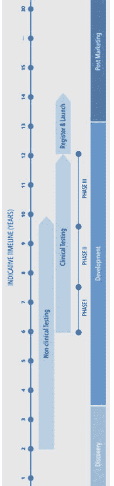

- Target safety assessment
- Lead identification
- Lead optimization
- Chronic study waivers
- Study design
- Interpretation of results
- ICH M7 (pharmaceutical impurities)
- Extractables and leachables
- Classification and labelling
- Green chemistry

#### 16.2.2 数据库

任何用于构建模型的数据库数据的大小、质量和结构多样性是决定最终模型性能的主要因素。开发这些数据库通常是最耗时的步骤，因为相关的实验数据可能存在于公共和专有来源，并且以不同的格式存在。表16.1展示了一些常用的公共数据来源，用于开发这些数据库。

整合这些不同的数据来源需要对底层实验设计信息和结果进行协调，因为包含这些详细信息既支持构建模型的数据库，也支持使用模型进行安全决策时对结果的透明评估。将数据源中的信息映射到通用的数据组织方式，例如使用本体和控制词汇的`ToxML`，需要对结果进行协调（Ali等人, 2013年; Bower等人, 2020年）。

此外，测试化学物质还应作为一组独特的化学结构输入到数据库中，并与记录的毒理学研究相关联。作为确定一组独特化学物质的过程的一部分，有必要使表示测试物的化学结构得到协调。例如，结构可以通过不同的立体化学、芳香性或互变异构体的表示来表示。此外，测试物可能以名称或ID的形式表示，需要将其映射到一个独特的化学结构。通常会生成一个适用于某些建模软件的形式，通常称为`SAR-形式`，以将同一化学物质的不同盐形式规范化为一种常见的表示法。

需要从协调的研究记录中推导出化学物质的整体毒性终点值。例如，对于同一化学物质可能进行了多个研究，得出了相互矛盾的结果。对实验可靠性的专家评审可能会解决任何冲突，或者可能需要排除结果。在没有生成整体判断或需要不同终点的情况下，可能需要从基础的协调研究数据中生成此类信息。

图16.2展示了一个用于支持细菌致突变性评估的数据库的一小部分。一系列经过筛选的化学物质被分配

### 表16.1 常用于机器学习安全数据的公共数据源

| 数据库 | 描述 | 生殖和发育数据 | 急性和慢性数据 | 致癌性和突变性数据 |
|--------|------|----------------|----------------|---------------------|
| Leadscape RCA数据库 (2021), Bower等人(2020) Instem | 来自美国FDA CDER（药物评估中心）产品批准审查、美国FDA CFSAN（食品安全和应用营养中心）审查、美国FDA CFSAN（食品安全和应用营养中心）PAFA（基于优先级的食品添加剂评估）数据库的生殖和发育毒性研究 | X | X | X |
| RTECS (2021), Sweet等人(1999) | 化学物质毒性效应注册表 | X | X | X |
| Leadscope SAR Genetox Instem (2021), Bower等人(2020) | 具有验证结构的遗传毒性数据库，可用于准备用于创建预测系统的训练集的资源 |  | X | X |
| Leadscope SAR致癌性 Instem (2021), Bower等人(2020) | 具有验证结构的致癌性毒性数据库，可用于准备用于创建预测系统的训练集的资源 |  |  | X |
| CPDB (2021) | 致癌潜能数据库 |  |  | X |
| CCRIS (2021) | 化学致癌研究信息系统 |  |  | X |
| ECHA (2021) | 欧洲化学药品机构 REACH数据库 | X | X | X |
| ToxRefDB (2021) | 包含体内毒性研究的毒性参考数据库 | X | X |  |
| NCTR/EDKB (2021) | 内分泌干扰物知识库 | X |  |  |
| TERIS (2021) | 孕妇的致畸暴露 | X |  |  |
| Shepard的目录 Shepard (2001) | 致畸物质 | X |  |  |
| REPROTOX (2021) | 妊娠、生殖和发育数据 | X |  |  |
| DART (2021) | 发育和生殖毒理学以及环境胚胎学信息 | X |  |  |
| LactMed (2021) | 哺乳期婴儿可能的不良反应 | X |  |  |
| 美国FDA ICSAS Matthews等人 (2007a), Matthews等人 (2007b) | 来自FDA的信息学和计算安全分析人员数据库 | X | X | X |
| RepDose (2021) | 重复剂量毒性数据库 |  | X |  |
| eTox (2021) | 制药行业遗留毒理学报告的药物安全数据库 |  | X |  |
| HESS Sakuratani等人 (2013) | 危险评估支持系统 |  | X |  |
| NTP Tennant (1991) | 国家毒理学计划 | X | X | X |
| Gene-tox (2021) | 来自EPA的致突变性数据 | X | | X |
| IRIS (2021) | 支持人体健康风险评估的EPA数据 | X | | X |
| IPCS INCHEM (2021) | 化学安全国际计划 | X | | X |
| JECDB (2021) | 日本现有化学品数据库 | X | | X |
| Pharma Pendium (2021) | 来自FDA和EMA批准文件的毒性数据 | X | X | X |
| DrugMatrix (2021) | 参考数据库包含对这些化合物在多个时间点和多个靶器官中的影响的研究。这些研究包括药理学、临床化学、血液学、组织学、体重和器官重量以及临床观察。 | X | X | X |

根据映射到每种化学物质的研究，总体上呈现出积极（即致突变）和消极（即非致突变）的值。在这个例子中，展示了化学物质LS-23的四项研究。

#### 16.2.3 机器学习算法

##### 16.2.3.1 概述

使用各种监督和无监督的机器学习算法来对数据进行分组，识别结构-活性关系（SAR）并构建预测模型。

##### 16.2.3.2 预定义的亚结构分类

使用预定义的结构特征是一种简单有效的方法来组织与毒性终点相关的化学结构数据库。在这里，开发了一个理想命名的亚结构搜索（特征）字典，以涵盖常见的化学类别。例如，Leadscope特征层次结构包括超过27,000个独特的亚结构搜索，并可用于有效地组织化学结构集。（Roberts等人，2000年）在图16.3中，一个包含11,528个具有细菌诱变性数据的化学物质数据库已根据这些特征的存在进行了组织，这些特征被组织成一个层次结构。在这个例子中，这些特征已经被注释为匹配每个特征的化学物质数量（频率），化学物质的阳性比例摘要（平均：细菌突变）以及表示与毒性终点之间的统计关联的分数（Z-得分：细菌突变）（Blower等人，2004年）。这种统计关联以颜色编码的方式进行，以便可视化识别正关联（红色），负关联（蓝/绿色）和没有显著正或负关联（灰色）。这个图还展示了底层化学示例与特征摘要之间的关联。使用这种方法既可以有效地组织和分组大型数据库，也可以识别结构-活性（毒性）关系的见解，从而支持模型构建和对化学品安全性的后续决策。

##### 16.2.3.3 脚手架生成

在这个背景下，化学脚手架被定义为从底层数据动态识别出的有意义的共同底物结构。与预定义的结构特征讨论类似，脚手架分类对于多种原因都很重要，包括组织数据集、洞察力生成和使用它们。

| Landridge Registry Id | Cell Number | Study Type | Test Cell | Strain | References | Source |
|-----------------------|-------------|------------|-----------|--------|------------|--------|
| LS-23 | 123-24-8 | bacterial mutageness | Positive (10) | TA97, TA98 (2), TA100 (2) | S. AOKI, K. SAKAKIBARA, Y. KUMAGAI, M. SAKURAI, K. SATOH, H. SUZUKI, S. KOBAYASHI, J. NAT. PROD. 1988, 51, 1073-1081; Y. KUMAGAI, S. AOKI, K. SAKAKIBARA, K. SATOH, H. SUZUKI, S. KOBAYASHI, J. NAT. PROD. 1988, 51, 1073-1081; | gwis |
| LS-23 | 123-24-8 | bacterial mutageness | Negative (6) | TA97 (2), TA98 (2), TA100 (2) | M. AOKI, K. SAKAKIBARA, Y. KUMAGAI, M. SAKURAI, K. SATOH, H. SUZUKI, S. KOBAYASHI, J. NAT. PROD. 1988, 51, 1073-1081; Y. KUMAGAI, S. AOKI, K. SAKAKIBARA, K. SATOH, H. SUZUKI, S. KOBAYASHI, J. NAT. PROD. 1988, 51, 1073-1081; | gwis |

| LS-23                 | 123-24-8    | bacterial mutageness | Positive (10)   | TA97                    | S. AOKI, K. SAKAKIBARA, Y. KUMAGAI, M. SAKURAI, K. SATOH, H. SUZUKI, S. KOBAYASHI, J. NAT. PROD. 1988, 51, 1073-1081; Y. KUMAGAI, S. AOKI, K. SAKAKIBARA, K. SATOH, H. SUZUKI, S. KOBAYASHI, J. NAT. PROD. 1988, 51, 1073-1081; | gwis   |

| LS-23                 | 123-24-8    | bacterial mutageness | Positive (10)   | TA97                    | S. AOKI, K. SAKAKIBARA, Y. KUMAGAI, M. SAKURAI, K. SATOH, H. SUZUKI, S. KOBAYASHI, J. NAT. PROD. 1988, 51, 1073-1081; Y. KUMAGAI, S. AOKI, K. SAKAKIBARA, K. SATOH, H. SUZUKI, S. KOBAYASHI, J. NAT. PROD. 1988, 51, 1073-1081; | gwis   |

| Structure | Bacterial Mutation Cell |

|-----------|-------------------------|

|  | Positive |

|  | Negative |

|  | Negative |

|  | Negative |

*注：对应物质为LS-23、LS-24、LS-25、LS-26*

图16.2与底层研究信息相关联的示例数据库。在这个例子中，显示了四种化学物质（LS-23、LS-24、LS-25和LS-26）的总体研究结果。右侧总结了第一个显示的化学物质（LS-23）的四项研究。

| Column 1 | Column 2 | Column 3 |

|----------|----------|----------|

|  BMH-1.0 |  LS-58890 BMH-1.0 |  LS-124997 BMH-1.0 LS-179909 |

|  BMH-1.0 |  LS-12392 BMH-1.0 LS-125960 BMH-1.0 |  LS-120193 BMH-1.0 |

|  BMH-1.0 |  LS-58950 BMH-1.0 LS-94617 BMH-1.18 |  LS-122022 |

图16.3通过预定的结构特征对数据库进行组织

| Compound/Features | Frequency | Mean Bacterial Mutation (θ) | Z-score Structural Mutation (Z) |

|-------------------|-----------|---------------------------|----------------------------------|

| All Compounds | 152,803 | 0.3233 | 0.00 |

| Amino acids | 60,287 | 0.3706 | 5.27 |

| Basic nucleotides | 14,042 | 0.4030 | 8.06 |

| ... | ... | ... | ... |

| ether | 251 | 0.5014 | 6.77 |

| aldehyde | 20 | 0.5244 | 4.10 |

| ... | ... | ... | ... |

在开发预测模型时，可以将其作为描述符。生成脚手架有监督和无监督的方法。在无监督的方式下生成脚手架时，任何机器学习算法都试图识别尽可能大的共同底物结构，这些结构表征了数据库的全部或大部分内容（不考虑终点或因变量）。有不同的方法来生成这样的脚手架。例如，Cross等人开发了一种方法，该方法通过迭代地将预定义的结构特征组合在一起，并进行扩展，以生成越来越大和更精确的脚手架（Cross等人，2003年）。有监督的方法可以使用类似的方法来识别脚手架；然而，它们使用定义的毒性终点来优先考虑映射到主要有毒或非有毒化学物质的脚手架。在图16.4中，有几个示例说明了脚手架如何用于分类（无监督）和识别SAR洞察力（有监督）。

##### 16.2.3.4 聚类

聚类是一种无监督机器学习算法，用于将化学物质分组，以支持数据库的组织和洞察力生成。在任何聚类机器学习算法的核心是对化学物质之间的相似性进行评估。为了量化这种相似性，有必要以一致的方式描述化学物质。一种常见的方法是使用预定义的化学特征进行聚类。然后，通过比较匹配和不匹配的特征来计算两种化学物质之间的相似性和差异，从而得出它们之间的相似性评分。有几种公式可以计算相似性评分，其中Tanimoto评分是最流行的方法（Myatt和Cross 2015）。有多种聚类算法可用于基于结构相似性对化学结构数据库进行分组（例如，凝聚层次聚类，k均值聚类和Jarvis Patrick聚类）（Barnard和Downs 1992；Myatt和Blower 2010）。图16.5说明了一种聚类化学结构数据库的方法（凝聚层次聚类）。在这种方法中，对于每对化学物质，计算一个相似性评分。接下来，逐渐计算化学物质组的相似性评分，并准备一个总结这些关系的树状图。在图16.5中，每个化学物质由其ID表示（例如，LS-0，LS-429）。树状图的水平距离表示化学物质和化学物质组之间的相似距离（1-相似性评分）。例如，在图16.5中，三种化学物质被分组在一起（LS-0，LS-429和LS-1241），并进行展示。

##### 16.2.3.5 专家警报

基于专家规则的方法（也称为专家警报或结构警报）根据一系列编码在内的规则来预测化学物质的毒性。系统的知识库（Myatt等，2017年）这些规则包括激活和去活化毒性的亚结构。公共文献是这些规则的一个来源，其中报告了结构特征，并且被确定为激活和去活化毒性。除了结构定义，这些规则通常还包括与化学类别相关的生物机制的详细解释以及其他支持信息。构建这些专家系统的方法是透明且易于使用和解释的。

然而，手动提取这些信息耗时且往往无法提供结构-活性（毒性）关系的完整图景。因此，机器学习方法使用大型数据库（包含化学结构和毒性研究结果，如第3.2节所述）。在这个背景下，这些数据库被称为参考集。机器学习方法可以识别结构特征（或结构警示），这些特征可以激活或关闭参考集中的毒性。这些结构特征与从文献中确定的任何规则一起进行编码。

图16.6、16.7和16.8展示了监督和无监督机器学习方法在基于Leadscope警示器软件（Instem 2021）的专家规则系统开发中的应用。使用了一个包含10,544种化学物质的参考集，其中包含细菌诱变性数据（表示为二进制值，其中1表示诱变性，0表示非诱变性）。最初，基于预定义的结构特征、支架和聚类方法的一系列无监督方法被用来将参考集组织成广义类别，以帮助将参考集组织成逻辑分组。这些类别根据它们与目标毒性（细菌诱变性）的关联进行优先排序，本例中是细菌诱变性。例如，在图16.6中，参考集中有1244种化学物质含有硝基、芳基，其中86.17%的化学物质是阳性的。通过将这个比例与所有化学物质的比例进行比较（第一行显示为52.23%的阳性），可以看出硝基、芳基类与细菌诱变性强相关。

| Tree | Frequency | Mean: Bacterial Mutation | Z-Score: Bacterial Mutation | Bacterial Mutation |

通过化学类别对数据库进行分组以支持警报生成。

通过Z-得分计算（得分为25.52），将致突变性量化，并以深红色的直方图条形图形式显示。对于参考集的每个子集，使用无监督机器学习算法进行识别，可以自动识别一系列似乎激活毒性的亚结构特征。在图16.7中，展示了一种监督机器学习方法用于环氧类。在这里，使用预测性支架方法识别出一系列激活警报。其中一个警报（122）在图16.7中被描绘出来。

尽管当激活警报与目标毒性相关联时会被识别出来，但仍然可能存在一些缺乏毒性的化学物质群体。通过将主要为负面化学物质映射的结构特征进行分类，可以使用监督机器学习自动识别出使毒性失活（或减轻）的结构特征。在图16.8中，对于警报122，已经识别出一系列失活的结构特征，包括映射到三个非突变性示例的突出特征。

将从文献中手动提取的警报与使用机器学习方法自动生成的警报相结合，可以确保这些系统具有透明性、易于解释，并提供更广泛的结构-活性（毒性）关系覆盖范围，从而提高预测能力。

### 16.2.3.6 预测模型

构建预测模型的起点是化学结构数据库和毒性终点（在第3.2节中描述），在这个背景下称为训练集。该训练集带有一组描述符，例如预定义的结构特征或支架的存在/缺失以及计算得到的物理化学性质。此外，可以根据对SAR的专业知识手动添加任何结构规则到描述符列表中。这些计算得到的值将用作模型中的描述符。值得注意的是，在使用这些模型时，通过检查模型中存在的描述符来解释结果。由于它们应该支持对模型的透明解释，使用有意义的结构描述符通常很重要。在任何预测模型中，识别出这些描述符的子集也是良好的建模实践。这种选择通常基于它们与目标毒性或与模型性能的相关性。

### 图16.4 无监督和监督方法识别骨架的结果

| Supervised scaffold generation |  |  |  |
| :--- | :--- | :--- | :--- |
| Structure | Frequency | Mean Bacterial Mutation | Z-Score Bacterial Mutation |
| Scaffold 154 | 47 | 1.0 | 6.371 |
| Scaffold 157 | 56 | 1.0 | 6.371 |
| Scaffold 350 | 113 | 0.281 | 6.371 |

| Unsupervised scaffold generation |  |  |  |
| :--- | :--- | :--- | :--- |
| Structure | Frequency | Mean Bacterial Mutation | Z-Score Bacterial Mutation |
| Scaffold 614 | 34 | 0.9043 | 4.315 |
| Scaffold 38 | 11 | 0.1838 | -2.642 |
| Scaffold 32 | 13 | 0.7492 | -2.37 |

### 图16.7 识别环氧类化合物的活化规则

| Tree | Frequency | Mean: Bacterial Mutation | Z-Score: Bacterial Mutation | Bacterial Mutation |
|------|-----------|--------------------------|-----------------------------|-------------------|
| All chemicals | 10544 | 0.5223 | -45.7 | [竖状条形图] |
| Unmatched chemicals | 7140 | 0.3688 | 25.52 | [竖状条形图] |
| Class: nitro, aryl- | 1244 | 0.8617 | 14.03 | [竖状条形图] |
| Class: nitroso | 339 | 0.8968 | 12.63 | [竖状条形图] |
| Class: amine(NH2), phenyl- | 793 | 0.7377 | 12.34 | [竖状条形图] |
| Class: chloride, alkyl, acyl- | 516 | 0.7868 | 12.2 | [竖状条形图] |
| Class: epoxide | 425 | 0.8118 | 2.706 | [竖状条形图] |
| Unmatched chemicals | 0 | 1.0 | 2.706 | [竖状条形图] |
| 114: Alert: Scaffold 79-1 | 8 | 1.0 | 2.706 | [竖状条形图] |
| 115: Alert: Scaffold 80-1 | 8 | 1.0 | 2.531 | [竖状条形图] |
| 116: Alert: Scaffold 91-1 | 8 | 1.0 | 2.343 | [竖状条形图] |
| 117: Alert: Scaffold 95-1 | 7 | 1.0 | 2.139 | [竖状条形图] |
| 118: Alert: Scaffold 99-1 | 6 | 1.0 | 2.139 | [竖状条形图] |
| 119: Alert: Scaffold 98-1 | 5 | 1.0 | 2.139 | [竖状条形图] |
| 120: Alert: Scaffold 79-1 | 5 | 1.0 | 8.88 | [竖状条形图] |
| 121: Alert: Scaffold 66-1 | 5 | 0.945 | 8.88 | [竖状条形图] |
| 122: Alert: Scaffold 32-1 | 109 | 0.945 | 3.781 | [竖状条形图] |
| 123: Alert: Scaffold 34-1 | 30 | 0.8667 | 12.2 | [竖状条形图] |
| 124: Alert: Scaffold 1-1 | 425 | 0.8118 | 11.4 | [竖状条形图] |
| Class: quinoline | 422 | 0.7938 | 9.006 | [竖状条形图] |
| Class: bromide, alkyl, acyl- | 189 | 0.8466 | 8.472 | [竖状条形图] |
| Class: azide | 82 | 0.9878 | 7.543 | [竖状条形图] |
| Class: benzene, 1-(alkenyl, cyc) | 292 | 0.7397 | ... | [竖状条形图] |

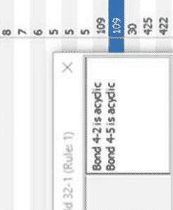

### 图16.8 识别去活化结构特征

| Tree | Frequency | Mean: Bacterial Mutation | Z-Score: Bacterial Mutation | Bacterial Mutation |
| --- | --- | --- | --- | --- |
| All chemicals | | | | |
| Unmatched chemicals | 10544 | 0.5223 | -45.7 | [竖状条形图] |
| Class: nitro, aryl- | 7140 | 0.3688 | 25.52 | [竖状条形图] |
| Class: nitroso | 1244 | 0.8617 | 14.03 | [竖状条形图] |
| Class: amine(NH2), phenyl- | 339 | 0.8968 | 12.63 | [竖状条形图] |
| Class: chloride, alkyl, acyl- | 793 | 0.7377 | 12.34 | [竖状条形图] |
| Class: epoxide | 516 | 0.7868 | 12.2 | [竖状条形图] |
| Unmatched chemicals | 425 | 0.8118 | 2.706 | [竖状条形图] |

| 114: Alert: Scaffold 78-1 | 0 | 1.0 | 2.706 | [竖状条形图] |
| 115: Alert: Scaffold 80-1 | 8 | 1.0 | 2.706 | [竖状条形图] |
| 116: Alert: Scaffold 91-1 | 8 | 1.0 | 2.531 | [竖状条形图] |
| 117: Alert: Scaffold 95-1 | 8 | 1.0 | 2.343 | [竖状条形图] |
| 118: Alert: Scaffold 99-1 | 7 | 1.0 | 2.139 | [竖状条形图] |
| 119: Alert: Scaffold 99-1 | 6 | 1.0 | 2.139 | [竖状条形图] |
| 120: Alert: Scaffold 79-1 | 5 | 1.0 | 2.139 | [竖状条形图] |
| 121: Alert: Scaffold 66-1 | 5 | 1.0 | 8.88 | [竖状条形图] |
| 122: Alert: Scaffold 32-1 | 5 | 0.945 | 8.88 | [竖状条形图] |
| 122: Alert: Scaffold 32-1 (Rule: 1) | 109 | 0.945 | -2.468 | [竖状条形图] |
| Mitigators | 109 | 0.1667 | -1.811 | [竖状条形图] |
| 1: Mitigator: Scaffold 43-1 | 12 | 0.0 | -1.744 | [竖状条形图] |
| 2: Mitigator: Scaffold 42-1 | 3 | 0.1667 | -1.09 | [竖状条形图] |
| 3: Mitigator: Scaffold 46-1 | 6 | 0.25 | 3.781 | [竖状条形图] |
| 123: Alert: Scaffold 34-1 | 4 | 0.8667 | 12.2 | [竖状条形图] |
| 124: Alert: Scaffold 1-1 | 30 | 0.8118 | 11.4 | [竖状条形图] |
| Class: quinoline | 425 | 0.7938 | 9.006 | [竖状条形图] |
| Class: bromide, alkyl, acyl- | 422 | 0.8466 | 8.472 | [竖状条形图] |
| Class: azide | 189 | 0.9878 | | [竖状条形图] |

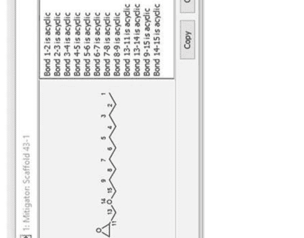

在目标毒性缺失的情况下，需要进行专家评审。一旦确定了可接受的描述符列表，下一步是生成一个预测模型，该模型根据与目标毒性的拟合来优化描述符的权重。常用于生成这种模型的方法包括部分逻辑回归、部分最小二乘回归、决策森林、k最近邻算法、支持向量机、多元线性回归和神经网络（Myatt和Blower 2009）。图16.9展示了从结构和物理化学计算描述符的识别到生成将计算描述符（x）与毒性（y）相关联和加权的预测模型的过程。

一旦模型被开发出来，就可以使用该模型来预测未经测试的化学物质的毒性。为了进行预测，第一步是计算未经测试的化学物质的同一组描述符（并纳入模型中）。然后，将这些计算出的值分配为输入（x变量）给模型，模型再使用这些值和模型的权重来计算预测（y变量）。根据算法的方法，预测可能是毒性终点或正面结果的概率。在后一种情况下，任何概率都将被转换为二元结果，使用适当的截断值。

| Structure | Partial reduction (positive or negative) |
|-----------|-------------------|
| ![结构式] | Positive |
| ![结构式] | Positive |
| ![结构式] | Positive |
| ![结构式] | Positive |
| ![结构式] | Negative |
| ![结构式] | Negative |
| ![结构式] | Negative |
| ![结构式] | Negative |

| Nitro, aryl | Carbonyl | Chloride, p-alkyl | Nitroso | ... |
|-------------|----------|-------------------|---------|-----|
| 0           | 1        | 1                 | 1       | ... |
| 0           | 1        | 1                 | 0       | ... |
| 0           | 1        | 0                 | 0       | ... |
| 1           | 1        | 0                 | 0       | ... |
| 0           | 0        | 0                 | 0       | ... |
| 0           | 1        | 0                 | 0       | ... |
| 0           | 1        | 0                 | 0       | ... |
| 0           | 1        | 0                 | 0       | ... |

| AlogP | Molecular weight | Polar surface area | ... |
|-------|------------------|-------------------|-----|
| 1.16  | 214.1            | 61.77             | ... |
| 3.26  | 358.3            | 58.36             | ... |
| 2.47  | 264.3            | 78.43             | ... |
| 2.23  | 307.3            | 114.1             | ... |
| 3.74  | 406.5            | 75.74             | ... |
| 4.68  | 360.8            | 52.6              | ... |
| 4.36  | 292.2            | 49.33             | ... |
| 3.26  | 317.4            | 66.4              | ... |

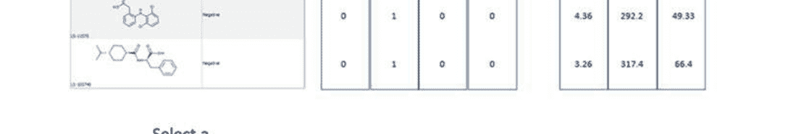

## 图16.9 使用监督机器学习方法生成预测模型

OECD在应用预测模型时提出了几个重要的考虑因素（OECD 2007）。这包括对适用领域的评估，适用领域被定义为模型中可以进行可靠预测的化学/物理化学空间。通常通过将测试化学物质与训练集和相关模型描述符进行比较来进行。以了解它是否足够相似。当化学物质没有足够相似的示例时，它们被标记为不在适用领域内。

另一个OECD的考虑是验证任何模型的性能。有必要将模型结果与一组化学物质的实验数据进行比较。理想情况下，这组化学物质与模型的训练集中的化学物质没有重叠。这个数据库被称为外部验证集（Myatt等人，2017）。验证的另一种方法是交叉验证，其中训练集被分成一系列减少的集合（Myatt等人，2017）。从这些减少的集合构建模型，并使用剩余的化学物质进行评估，从而确保模型被用于构建模型的训练集中未包含的化学物质进行测试。根据毒性终点的数据类型，使用实验结果和预测计算总结模型的性能的统计数据。例如，如果毒性终点是二进制的，通常会生成一系列Cooper统计数据（例如，一致性、敏感性和特异性）（Cooper等人，1979）。

深度学习机器算法（Vasudevan等，2022年）在人工智能神经网络的基础上，不断学习和做出决策，无需人为干预，为未来提供了一些希望。然而，目前工业和监管机构对计算方法的接受程度严重依赖于模型的透明度和专家对信息的审查。深度模型还依赖于大型训练集，而对于大多数毒性终点来说，这通常是不可用的。因此，深度学习方法目前的适用性有限。

针对同一毒性终点可能已经开发了基于不同方法或训练集的多个模型。如果它们的结果一致，共识预测将具有更高的可靠性（Myatt等，2018年）。对于单个或多个模型，可以查看模型生成的附加信息，如置信度分数、任何预测的结构基础、化学类似物的基础数据等，并进行专家审查。

这些额外的信息提供了支持预测的额外证据，并增加了任何预测的可靠性。这可以通过可靠性评分（基于对Klimisch评分（Klimisch等，1997年）的扩展）来量化，其中`RS5`代表未经专家审查的单个预测，`RS4`代表多个一致的预测，`RS3`代表经过专家审查的预测，具有更高的可靠性（Myatt等，2018年；Johnson等，2022年）。值得注意的是，`RS1`和`RS2`保留给实验数据，并直接映射到Klimisch评分1和2。

对于任何复杂的毒性终点，需要评估多种效应或机制的组合，体外毒理学协议可以描述如何将这些信息（基于任何可用的实验和预测结果）结合起来。

生成综合评估时，考虑证据的权重，包括任何可靠性评分，信息的完整性以及信息与评估的相关性。

### 16.3 案例研究-药物杂质评估

以下案例研究涉及与国际协调委员会（ICH）M7指南“评估和控制药物中的DNA反应性（致突变）杂质以限制潜在致癌风险”（ICH M7 2017）一致的计算评估。该指南描述了使用两种互补的计算模型与专家评审相结合来预测细菌反转突变试验（OECD 1997）。这种评估将杂质分为表16.2中给出的五个类别之一。在这个案例研究中，将根据指南中描述的两种预测方法评估图16.10中显示的两种杂质。在这个例子中，使用`Leadscope`统计模型（v2）和`Leadscope`专家规则模型（v8）来预测细菌致突变性，并使用`Leadscope`模型应用软件（v3.1）进行评估（Instem 2021）。

基于统计的模型是使用包含9254种化学物质的训练集开发的，该训练集包含了细菌诱变性的二进制实验数据。该模型使用以下描述符：预定义的结构特征、预测的支架、基于专家知识编码的规则和计算得到的物理化学性质。使用一种监督式机器学习算法（部分逻辑回归）来最佳拟合所选描述符与细菌诱变性实验值的列表（Yang等人，2004年）。该模型计算出一个正面结果的概率，当概率大于0.6时，结果被翻译为正面结果；当概率低于0.4时，结果被翻译为负面结果（在0.4和0.6之间的结果是不确定的）。系统将标记任何超出适用领域的化学物质。

### 表16.2 ICH M7危险分类

| 类别 | 定义 |
| --- | --- |
| 1 | 已知的致突变致癌物质 |
| 2 | 已知的致突变物质，其致癌潜力未知 |
| 3 | 与药物物质的结构无关的警示结构；无突变性数据 |
| 4 | 与已测试且无突变性的相关化合物中相同的警示结构 |
| 5 | 没有结构警示，或者有足够数据证明无突变性或致癌性的警示结构 |

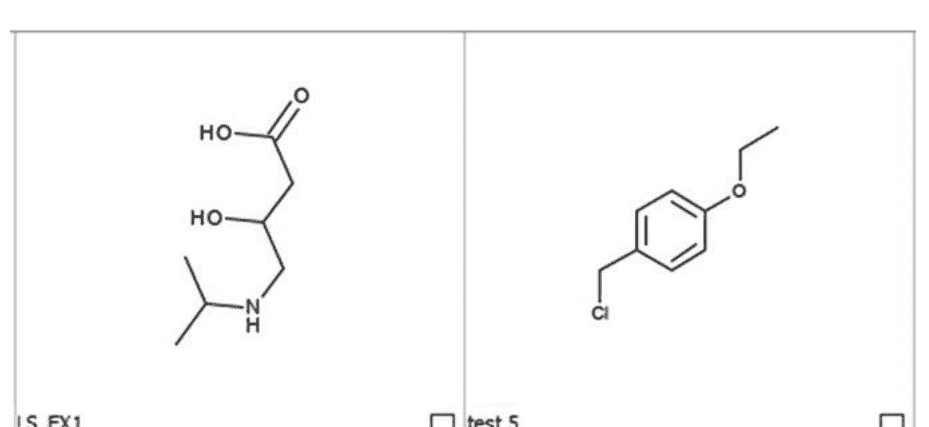

图16.10 案例研究中评估的两种杂质

如果化学物质与模型没有共同特征或不足够相似，则无法建立模型。该模型使用5%的交叉验证和外部验证集进行评估，如表16.3所示。

专家基于规则的模型是通过从文献中手动提取、整理和合并结构警示来开发的（Myatt等，2017年）。此外，还使用了监督式机器学习方法，包括创建预测性支架，以细化该集合并识别其他警示和去活化特征。这些知识被添加到系统中以提高性能。随后，通过使用一种称为`SAR`指纹技术的方法，在约50,000种公共和专有化学物质上对所有警示进行了细化和验证，避免共享任何个体化学物质或结果的机密数据（Ahlberg等，2016年）。在进行预测时，系统会标记超出其适用范围的化学物质。该系统的性能，包括内部验证和外部验证，详见表16.4。

将两种模型应用于这两种化学物质的结果如图16.11所示。化学品的专家评审支持整体分类。对于化学品“`LS_EX1`”，低统计模型概率的阳性结果，与匹配特征和相关类似物的良好覆盖度相结合，足以提高可靠性，从而得出负面预测。专家基于规则的预测也达成了一致，因此，综合考虑为负面（非致突变）预测，并将该化学品分配到第5类。对于杂质“`测试5`”，两种方法都预测该化学品为阳性。基于统计的模型突出了烷基氯特征，该特征与足够相似的阳性示例相对应。同样，杂质对应于警报“`321：芳基甲基卤化物`”，参考集中的匹配化学品以及机制基础提供了额外的支持证据，支持阳性预测。因此，对于杂质“`测试5`”，整体评估为阳性（致突变）并将该化学品分配到第3类。

### 表16.3 Leadscope统计模型对细菌致突变性的性能 (v2)

| 效应/机制 | 计算模型 | 验证类型 | 计数 | 一致性(%) | 敏感性(%) | 特异性(%) | 阳性预测值(%) | 阴性预测值(%) | 评论 |
|-----------|----------|----------|------|-----------|-----------|-----------|---------------|---------------|------|
| 细菌突变 | 细菌突变 v2 | 交叉验证 (5%) | 9254 | 85 | 85 | 86 | 88 | 83 |  |
| 细菌突变 | 细菌突变 v2 | 外部验证 | 388 | 83 | 82 | 83 | 56 | 95 | Landry等人的报告中(2019)报道 |

### 表 16.4 钻石范围专家警报对细菌致突变性的性能（v8）

| 效应/机制 | 计算模型 | 验证类型 | 计数 | 一致性(%) | 敏感性(%) | 特异性(%) | 阳性预测值(%) | 阴性预测值(%) |
|-----------|----------|----------|------|------------|------------|------------|----------------|----------------|
| 细菌突变 | 细菌突变 v8 | 外部验证 | 3903 | 83 | 92 | 70 | 82 | 86 |
| 细菌突变 | 细菌突变 v8 | 内部验证 | 11,528 | 87 | 87 | 88 | 89 | 86 |

| Structure | Bacterial Mutation Consensus | Bacterial Mutation v2 Prediction | Bacterial Mutation v2 Positive | Bacterial Mutation v2 Structure | Bacterial Mutation Alerts v8 | Bacterial Mutation Alerts v8 Precision | Bacterial Mutation Alerts v8 Matched Alerts | Bacterial Mutation Alerts v8 Structure |
|-----------|------------------------------|----------------------------------|--------------------------------|---------------------------------|------------------------------|---------------------------------------|--------------------------------------------|-----------------------------------------|
| Chemical structure (`LS_EX1`) | Negative | Negative | 0.0324 | Chemical structure (`LS_EX1`) | Negative | 0.1352 | No Alerts | Chemical structure (`LS_EX1`) |
| Chemical structure (`test_5`) | Positive | Positive | 0.903 | Chemical structure (`test_5`) | Positive | 0.8478 | 321: aryl methyl halide (0.85) | Chemical structure (`test_5`) |

## 图16.11 使用两种预测方法预测细菌致突变性

### 16.4 结论

在体外和体内方法之外，使用计算模型预测毒理学越来越重要。监督和无监督的机器学习算法有助于从公共和专有的毒性数据库中发现有价值的知识，并将其纳入计算工具以支持安全评估。这些方法在药物发现过程中以及用于监管提交中被广泛使用，如ICH M7指南中所示。有效使用这些`in silico`方法既可以减少动物使用数量，又可以改善安全评估的时间和成本。

机器学习方法依赖于高质量透明注释数据库的可用性。这些数据库是性能和结果接受度的最关键因素。生成这样的数据库需要广泛使用本体和受控词汇，以有意义的方式协调和整合来自多个来源的数据。

有效的机器学习方法需要与化学描述符相结合，以确保任何评估都是透明的，并且任何洞察力都是可行的。使用结构特征，特别是与高质量数据库关联，可以进行有效的专家评审，从而增加结果的信心。还很重要的是，任何预测模型都要适合特定目的，并且记录计算模型的性能（例如，这些模型如何符合`OECD`验证原则）对于采用也是必不可少的。

## 参考文献


> Ahlberg E, Amberg A, Beilke LD, Bower D, Cross KP, Custer L, Ford KA, Van Gompel J, Harvey J, Honma M, Jolly R, Joossens E, Kemper RA, Kenyon M, Kruhlak NL, Kühnke L, Leavitt P, Naven R, Neilan C, Quigley DP, Shuey D, Spirlk H-P, Stavitskaya L, Teasdale A, White A, Wichard J, Zwickl C, Myatt GJ (2016) 扩展（Q）SAR以纳入专有知识用于监管目的：以芳香胺致突变性为例。Regul Toxicol Pharmacol 77:1–12

> Ali M, Patel M, Wilkinson D, Judson P, Cross K, Bower D (2013) ToxML，一种具有内容控制词汇的数据交换标准，用于构建更好的（Q）SAR模型。SAR QSAR Environ Res 24(6):429–438

> Barnard JM, Downs GM (1992) 基于二维相似性测量的化学结构聚类。J Chem Inf Comput Sci 32:644–649

> Blower PE Jr, Cross KP等 (2004) 对药物发现中的大型筛选集进行系统分析。Curr Drug Discov Technol 1(1):37–47

> Bower D, Cross K, Myatt G (2020) 在数据库中组织毒理学数据。在：预测性毒理学中的大数据，毒理学问题。Royal Society of Chemistry, Cambridge, pp 108–165

> CCRIS (2021) CCRIS (化学致癌物研究信息系统）：由国家癌症研究所开发和维护。http://toxnet.nlm.nih.gov/cgi-bin/sis/htmlgen?CCRIS

> Cooper JA, Saracci R, Cole P (1979) 描述致癌物筛选测试的有效性。Br J Cancer 39:87–89

> Cross KP, Myatt G等 (2003) 通过重新组装共同的构建块来找到有区别的结构特征。 J Med Chem 46 (22) : 4770–4775

> CPDB (2021). http://toxnet.nlm.nih.gov/newtoxnet/cpdb.htm

> DART (2021). http://toxnet.nlm.nih.gov/newtoxnet/dart.htm

> DrugMatrix (2021). https://ntp.niehs.nih.gov/results/drugmatrix/index.html

> EDKB (2021). http://www.fda.gov/ScienceResearch/BioinformaticsTools/EndocrineDisruptorKnowledgebase/default.htm

> ECHA (2021). https://echa.europa.eu/home

> eTox (2021). https://jimdo-storage.global.ssl.fastly.net/file/b0703d22-ea41-49c1-a1e4-6e64eac37c08/program_etox2021_Meike_24.06.pdf

> Gene-Tox (2021). http://toxnet.nlm.nih.gov/newtoxnet/genetox.htm

> Hasselgren C, Myatt GJ (2018) 计算毒理学与药物发现. Methods Mol Biol 1800:233–244

> Hastie T, Tibshirani R, Friedman J (2001) 统计学习的要素. Springer series in statistics. Springer New York Inc., 美国纽约

> ICH M7 (2017) 评估和控制制药品中的DNA反应性 (致突变) 杂质以限制潜在的致癌风险, 欧洲药品管理局. https://database.ich.org/sites/default/files/M7_R1_Guideline.pdf

> IPCS INCHEM (2021). http://www.inchem.org

> Instem (2021). https://www.instem.com/solutions/insilico/computational-toxicology.php

> IRIS (2021). https://www.epa.gov/iris

> Johnson C, Anger LT, Benigni R, Bower D, Bringeuz F, Crofton K, Cronin MTD, Cross KP, Dettwiler M, Frericks M, Melnikov F, Miller S, Roberts DW, Suarez-Rodriguez D, Roncaglioni A, Lo Piparo E, Tice RR, Zwickl C, Myatt GJ (2022) 基于实验数据和基于硅预测的毒性评估的置信度评估。 计算毒理学 21:100204

> JECDB (2021). http://Dra4.nihs.go.jp/mhlw_data/jsp/SearchPagesEND.jsp

> Klimisch H-J, Andreae M, Tillmann U (1997) 评估实验毒理学和生态毒理学数据质量的系统方法。 Regul Toxicol Pharmacol 25:1–5

> LactMed (2021). https://toxnet.nlm.nih.gov/newtoxnet/lactmed.htm

> Landry C, Kim MT, Kruhlak NL, Cross KP, Saiakhov R, Chakravarti S, Stavitskaya L (2019) 在ICH M7 (Q)SAR分析中过渡到复合细菌致突变性模型。 Regul Toxicol Pharmacol 109:104488

> Matthews EJ, Kruhlak NL, Benz DR, Contrera JF (2007a) 一个全面的生殖和发育毒性危害鉴定模型：I. 发展一个证据权重QSAR数据库。 Regul Toxicol Pharmacol 47(2):115–135

> Matthews EJ, Kruhlak NL, Benz DR, Ivanov J, Klopman G, Contrera JF (2007b) 一个全面的生殖和发育毒性危害鉴定模型：Ⅱ. 构建用于预测未经测试化学物质活性的QSAR模型。 Regul Toxicol Pharmacol 47(2):136–155

> Myatt GJ, Blower PE (2010) 数据挖掘化学结构和生物数据。 在：生物 data mining。 Chapman and Hall/CRC, 美国, pp 649–688

> Myatt GJ, Cross KP (2015) 预测效力和毒性的计算解决方案。 基于人体的翻译研究系统。 Royal Society of Chemistry, 英国, pp 190–214

> Myatt GJ, Beilke LD, Cross KP (2017) 计算工具及其应用。 在：综合药物化学III。 Elsevier, 牛津, pp 156–176


> Myatt GJ, Ahlberg E, Akahori Y, Allen D, Amberg A, Anger LT, Aptula A, Auerbach S, Beilke L, Bellion P, Benigni R, Bercu J, Booth ED, Bower D, Brigo A, Burden N, Cammerer Z, Cronin MTD, Cross KP, Custer L, Dettwiler M, Dobo K, Ford KA, Fortin MC, Gad-McDonald SE, Gellatly N, Gervais V, Glover KP, Glowienke S, Van Gompel J, Gutsell S, Hardy B, Harvey JS, Hillegass J, Honma M, Hsieh J-H, Hsu CW, Hughes K, Johnson C, Jolly R, Jones D, Kemper R, Kenyon MO, Kim MT, Kruhlak NL, Kulkarni SA, Kümmerer K, Leavitt P, Majer B, Masten S, Miller S, Moser J, Mumtaz M, Muster W, Neilson L, Oprea TI, Patelewicz G, Paulino A, Lo Piparo E, Powley M, Quigley DP, Reddy MV, Richarz A-N, Ruiz P, Schilter B, Serafimova R, Simpson W, Stavitskaya L, Stidl R, Suarez-Rodriguez D, Szabo DT, Teasdale A, Trejo-Martin A, Valentin J-P, Vuorinen A, Wall BA, Watts P, White AT, Wichard J, Witt KL, Woolley A, Woolley D, Zwickl C, Hasselgren C (2018) 硅胶毒理学协议。 Regul Toxicol Pharmacol 96:1–17

> OECD (1997) 测试编号471：细菌反转突变试验。第4节。 OECD Publishing, 巴黎。 https://doi.org/10.1787/9789264071247-en

> OECD (2007) 关于(定量)结构活性关系[(Q)SAR]模型验证的指导文件。 http://ihcp.jrc.ec.europa.eu/our_labs/predictive_toxicology/background/oecd-principles

> Pharma Pendium (2021). http://www.pharmapendium.com

> RepDose (2021). http://fraunhofer-repdose.de/

> Reprotex (2021). http://www.reprotex.org/

> Roberts G, Myatt GJ等 (2000) LeadScope：用于探索大型筛选数据的软件。 J Chem Inf Comput Sci 40(6):1302–1314

> RTECS (2021). http://www.cdc.gov/niosh/rtecs/default.html

> Sakuratani Y, Zhang HQ, Nishikawa S, Yamazaki K, Yamada T, Yamada J, Gerova K, Chankov G, Mekenyan O, Hayashi M (2013) 危害评估支持系统（HESS）用于预测重复剂量毒性的毒理学类别。 SAR QSAR Environ Res 24(5)：351–363

> Shepard TH (2001) 致畸原目录。 The Johns Hopkins University Press, USA

> Sweet DV, Anderson VP, Fang JCF (1999) 化学物质毒性效应登记簿（RTECS）概述：有关化学危害的重要信息。 Chem Health Saf 6(6)：12–16

> Tennant RW (1991) 国家毒理学计划的遗传毒性数据库：遗传毒性与致癌性之间的关系评估。 Environ Health Perspect 96：47–51

> Teris (2021). http://depts.washington.edu/terisdb/index.html

> ToxRefDB (2021). http://www2.epa.gov/chemical-research/toxicity-forecaster-toxcasttm-data

> Vasudevan SK, Pulari SR, Vasudevan S (2022) 深度学习：一本全面指南。 Chapman and Hall/CRC, 美国

> Yang C, Myatt GJ, Blower PE, Cross KP, Rathman J (2004) 基于重新组装药物化学构建模块的区分结构特征构建PTP1B的预测模型。 J Med Chem 47：5984-5994

## 第17章 基于机器学习的QSAR模型和用于预测线粒体功能障碍的结构警示

唐伟豪，Willie J. G. M. Peijnenburg和陈静雯

### 17.1 引言

全球市场上已注册使用和生产的化学品及其混合物超过35万种（Wang等，2020a）。尽管化学品的制造目的是改善人类生活质量，但实际上它们可能对人体健康产生不良影响。根据欧盟统计局的数据，2016年欧盟消耗的大约3.45亿吨化学品中约62%对公共健康构成危害（UNEP 2019）。为了保护公共健康，有必要评估化学品可能引起的不良健康影响，以改善化学品的风险管理。

线粒体是驱动人类健康或疾病的细胞器，取决于功能。它们具有重要的生理功能，如维持钙离子稳态、蛋白质合成、能量代谢和细胞凋亡调节（Wallace和Starkov 2000; Rhee 2006; Lim等2017）。线粒体功能障碍可能通过不同的毒性机制导致细胞氧化应激、生物能量失衡和细胞凋亡，如氧化磷酸化解耦、膜通透性核心开放和电子传递链（ETC）和/或三磷酸腺苷（ATP）合酶的抑制（Fetterman等2017；Meyer等2017）。此外，线粒体功能障碍与2型糖尿病、癌症、神经退行性疾病、自身免疫疾病和心血管疾病有关（Wallace 2011；Picard等2016；Zolkipi-Cunningham和Falk 2017）。

线粒体功能障碍可以通过实验方法来识别，例如高通量筛选（HTS）（Ingelse等，2006年）。Attene-Ramos等人（2015年）使用HTS测定方法筛选了大约10,000种化合物的Tox21（21世纪毒理学）库，以识别与线粒体膜电位破坏相关的化学物质。Wills等人（2015年）使用基于板式仪器和荧光探测器开发的高通量呼吸测定筛选方法，识别了线粒体毒性物质，如ETC抑制剂和解偶联剂。然而，实验方法无法满足筛选所有现有和新化学物质的线粒体功能障碍的要求。

因此，计算毒理学模型对于筛选具有诱导线粒体功能障碍潜力的化学物质是不可或缺的。计算毒理学是环境化学、物理化学、生物化学、毒理学、生物信息学、化学信息学、统计学、计算机科学（例如人工智能、机器学习）和其他相关学科的跨学科组合（Kavlock和Dix 2010年；Wang等，2016年；Tang等，2018年）。定量构效关系（QSAR）建模是计算毒理学中的核心方法，因为QSAR可以提供物理化学性质、环境行为参数和毒动学参数等数据，这些数据对于其他计算毒理学方法是必需的（Cherkasov等，2014年）。QSAR是活性和分子结构之间的数学关系，该关系是通过数学算法建立的。

传统上，线性算法（如多元线性回归）在线粒体功能障碍的QSAR模型中使用有限数量的化学物质进行构建。例如，Balaz等人（1986年）使用来自16个羰基苯肼类化合物的毒性数据构建了QSAR模型。Miyoshi等人（1987年）建立了物理化学分子参数与解偶活性之间的关系，其中包括19个取代酚类化合物。Spycher等人（2008年）利用35个弱有机酸的数据建立了解偶活性的QSAR模型。借助高通量筛选技术，对包括食品添加剂、药物、农药在内的多种化学物质产生了大量线粒体功能障碍数据（Thomas等人，2018年）。这些数据可以用于开发具有更广泛适用领域和更好预测能力的QSAR模型。

对于具有可能通过多种机制引起线粒体功能障碍的大量化学物质数据集，使用线性算法（例如多元线性回归算法）构建令人满意的QSAR模型是困难的。与线性算法相比，机器学习算法（如随机森林、支持向量机和深度神经网络）在基于大型数据集开发QSAR模型方面具有很大的潜力，因为它们能够识别数据集中的非线性关系。机器学习最近在一些研究中被应用于化学危害评估（Wang等，2020b，2021）。然而，使用机器学习算法构建的模型通常被视为“黑盒”模型，无法提供有关毒性机制的详细信息（Polishchuk，2017）。结构警示可能是解决“黑盒”问题的一种方法。

因此，在本章中，对线性定量构效关系模型和线性结构警示对线粒体功能障碍的研究进行了回顾。第一部分描述了开发计算毒理学模型以预测线粒体功能障碍的重要性。然后简要介绍了用于构建线性定量构效关系模型的数据集和机器学习方法，以及识别线性结构警示的方法。最后一部分介绍了关于线性定量构效关系模型和线性结构警示对线粒体功能障碍的最新进展。

### 17.2 数据集和方法

#### 17.2.1 线粒体功能障碍数据

实验数据对于开发线性定量构效关系模型非常重要。线粒体功能障碍的体外数据可以从文献和公共数据库中获得。张等人（2009）从8个不同的文献来源收集了一个关于线粒体功能障碍的数据集，包括171种被报道为引起线粒体功能障碍的化学物质。由于几乎没有文献报道不会引起线粒体功能障碍的化学物质。他们从美国食品药品监督管理局批准的药物清单中选择了117种非线粒体毒性物质，基于这样的假设，这些化学物质是安全的口服药物，不与线粒体功能障碍机制相关联。

Tox21 (https://tox21.gov) 项目对大约10,000种化学物质的线粒体膜电位（MMP）破坏进行了毒性数据生成，这是关于线粒体功能障碍的最大数据集（Attene-Ramos等人，2015年）。关于MMP破坏的数据可以从PubChem数据库（Kim等人，2019年）中收集。PubChem是世界上最大的免费可访问化学信息库，截至2021年11月1日，其中包含超过1.3百万个生物测定。

数据库中还可以找到诸如抑制线粒体融合和分裂等化学诱导的线粒体功能障碍数据（Youle和van der Bliek 2012）。

美国环境保护局开发的基于网络的CompTox化学仪表板还包括线粒体功能障碍数据（Lowe和Williams 2021）。CompTox化学仪表板可以提供约900,000种化学物质的各种数据，如体外和体内生物活性数据。CompTox化学仪表板中至少有18个线粒体功能障碍的测定记录，涉及线粒体形态、MMP和线粒体呼吸。

#### 17.2.2 用于模型构建的机器学习方法

图17.1描述了使用机器学习算法进行QSAR模型构建的工作流程。机器学习算法可以用于识别分子描述符和终点之间的复杂关系。用于QSAR模型构建的大多数机器学习方法属于有监督机器学习方法，它们分析带有标签的数据集，将输入（即分子描述符）映射到输出（即终点）。本节主要介绍了六种有监督机器学习方法，包括支持向量机（SVM）（Cortes和Vapnik 1995）、分类和回归树（CART）（Lemon等人2003）、随机森林（RF）（Breiman, 2001）、朴素贝叶斯（NB）（Sun, 2005）、逻辑回归（LR）（Ren等人2016）和人工神经网络（ANN）（Tang等人2018）。

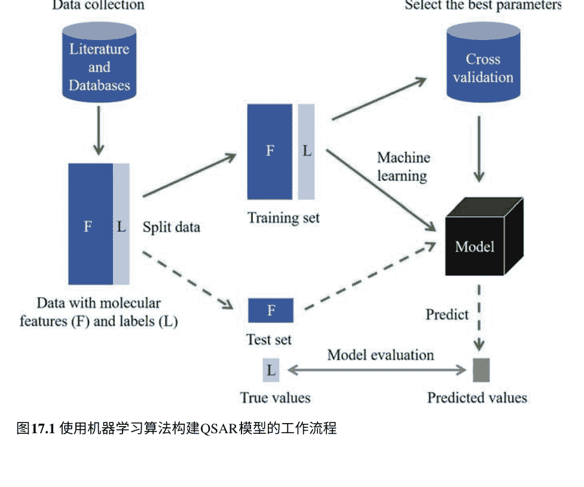

支持向量机（SVM）可以用于开发回归和分类模型（Cortes和Vapnik 1995）。对于二元分类任务，SVM使用线性或非线性核函数将特征空间转换为高维空间，并寻找一个能够在高维空间中将化合物分为两类的最优超平面。

CART是一种决策树方法，可用于分类和回归任务（Lemon等，2003年）。CART可以反复生成具有预测变量的二进制节点，将化合物分为两类。节点中的化合物根据最大化纯度分为两组。

随机森林（RF）是一种集成算法，将一些基本模型（如CART模型）组合成更具预测性的模型（Dietterich 2000; Breiman 2001）。对于分类任务，每棵树都是通过随机重新采样训练集生成的，并且可以给出一个分类结果。RF模型的分类结果是所有树模型的投票结果。

NB是一种基于贝叶斯定理的概率分类方法（Sun, 2005）。

```
$$P(C|X) = \frac{P(X|C)P(C)}{P(X)}$$ (17.1)
```

其中 `$X$` 表示特征向量；`$C$` 表示类别变量；`$P(C)$` 表示先验概率；`$P(X)$` 表示归一化常数；`$P(X|C)$` 表示条件概率；`$P(C|X)$` 表示后验概率。

LR可以用于开发分类模型（Ren et al. 2016）。LR使用一个“S”形曲线（逻辑/Sigmoid函数）将化合物分为两组。逻辑函数的输出值介于0和1之间，可以作为分类概率。

人工神经网络（ANNs）受到大脑中生物神经网络的启发。ANN的结构包括输入层、隐藏层和输出层。每一层都由许多人工神经元组成，它们是ANN中的核心计算单元。具有两个以上隐藏层的ANN被视为深度神经网络（DNN），是一种深度学习算法。DNN在许多领域广泛应用，因为它们可以识别数据集中的抽象模式，但该算法需要大量计算能力，并且容易过拟合。

#### 17.2.3 模型评估

一旦构建了QSAR模型，就需要评估其预测能力和稳健性。通常，使用未在模型构建中使用的外部数据集来评估QSAR模型的预测能力。模型的稳健性可以通过 `$k$` 折交叉验证来评估。具体而言，首先将训练数据分成 `$k$` 个相等的部分。然后，使用 `$k-1$` 个部分生成一个QSAR模型，并使用剩余部分来评估模型。这个过程重复 `$k$` 次，可以得到 `$k$` 个模型评估结果。折交叉验证的结果是这`$k$`个结果的平均值。对于分类模型，可以使用以下指标进行模型评估，即敏感性（SE），特异性（SP），平衡准确率（BA），精确度（PR），F1得分（`$FS$`），马修斯相关系数（MCC）和接收者操作特征曲线下的面积（AUC）。可以使用以下方程计算这些指标：

```
SE = \frac{TP}{(TP + FN)} \quad (17.2)
SP = \frac{TN}{(TN + FP)} \quad (17.3)
BA = \frac{(SE + SP)}{2} \quad (17.4)
PR = \frac{TP}{(TP + FP)} \quad (17.5)
FS = \frac{2 \times PR \times SE}{(PR + SE)} \quad (17.6)
MCC = \frac{TP \times TN - FP \times FN}{\sqrt{(TP + FN)(TP + FP)(TN + FP)(TN + FN)}} \quad (17.7)
AUC = \int_{0}^{1} TPR(FPR) \, d(FPR) \quad (17.8)
```

其中TP，TN，FP，FN，TPR和FPR分别表示真阳性，真阴性，假阳性，假阴性，真阳性率和假阳性率。

#### 17.2.4 识别结构警报的方法

使用包括DNN和SVM在内的机器学习方法构建的QSAR模型通常被认为是无法增加对毒性潜在机制的理解的黑盒模型。结构警报是解释QSAR模型潜在毒性机制的机器学习方法的补充。结构警报是与特定毒性相关的化学亚结构（Raies和Bajic 2016）。可以通过计算方法（如可解释的机器学习和基于大型数据集的统计分析方法（Yang等，2020））获得结构警报。可解释的机器学习方法（如RF）可以估计化学亚结构对模型预测的贡献（Polishchuk 2017）。化学亚结构对模型预测的贡献越大，该亚结构越有可能是结构警报。Python中的结构活性关系（SARpy）是一种统计分析软件工具，用于识别结构警示（Ferrari等，2013年）。通过简化的分子输入行条目规范（SMILES）代码，SARpy可以提取与特定毒性终点相关的结构警示。

### 17.3 线粒体功能障碍QSAR模型和结构警示

#### 17.3.1 线粒体功能障碍QSAR模型

一些研究尝试使用机器学习方法开发预测线粒体功能障碍的QSAR模型。基于收集的288种化学物质数据集，Zhang等人（2009年；2017年）使用SVM和NB算法开发了线粒体功能障碍的QSAR模型。SVM和NB模型在五折交叉验证中的准确率分别为84.6%和95.0%，在外部验证中分别为77.1%和81.0%。

目前大部分线粒体功能障碍QSAR模型是在Tox21挑战中开发的。Tox21挑战是一个全球性的建模竞赛，要求研究人员使用Tox21 HTS数据和化学结构数据开发十二个终点的机器学习模型（Huang和Xia 2017）。这十二个终点涵盖了核受体（如雌激素/雄激素受体）和应激反应途径（如线粒体膜电位）。总共有40个建模团队建立了378个QSAR模型。

深度学习算法首次在Tox21挑战中用于毒性预测。深度学习已成功应用于许多领域，如语音识别、自然语言处理和文本挖掘（LeCun等人2015；Schmidhuber 2015）。Mayr等人（2016）使用深度学习开发了一个多任务模型，可以同时预测12个终点。多任务深度学习模型在12个终点中有10个终点的性能更好。在这12个终点中，预测线粒体功能障碍的AUC为0.942。

在Tox21挑战中，用关联神经网络算法和10种不同的描述符（Abdelaziz等人，2016年）构建的共识模型是预测线粒体功能障碍的最佳模型。构建的共识模型对线粒体膜破坏剂的平衡准确率达到了88.1±0.6%。

Barta（2016年）使用两种类型的描述符，即PaDel和RDKit描述符，开发了线粒体功能障碍QSAR模型。总共生成了3418个描述符，其中包括二维结构特征，即PubChem和Avalon指纹。为了避免模型过拟合，从数据集中删除方差<0.1且成对相关系数>0.95的描述符/指纹。也删除了许多具有缺失值的描述符/指纹。使用额外树构建的模型对线粒体膜电位破坏剂的预测AUC为0.95。

Hemmerich等人（2020年）基于来自Zhang等人（2009年）、Tox21（Attene-Ramos等人，2015年）、ChEMBL（Mendez等人，2019年）和PubChem（Kim等人，2019年）的数据合并开发了用于预测线粒体功能障碍的机器学习模型。数据准备后，数据集包含了5761种化学物质，其中824种是线粒体毒性物质，4937种是非线粒体毒性物质。使用随机森林、梯度提升和深度学习生成的模型的平衡准确率分别为0.866、0.894和0.895。

这些线粒体功能障碍QSAR模型是基于不平衡数据集构建的，其中一个类别的化学物质数量明显高于另一个类别（Li等人，2016年）。先前的研究表明，在不平衡数据集上训练的QSAR模型性能较差（Guo等人，2017年）。因此，需要解决这个不平衡数据问题的方法。Tang等人（2020年）使用机器学习方法（如支持向量机、随机森林、分类回归树、逻辑回归和朴素贝叶斯）和12种指纹开发了基于Tox21线粒体功能障碍不平衡数据的QSAR模型。用于模型构建的数据集包括1284种活性化合物和3527种非活性化合物。为了解决数据集中的不平衡问题，采用了阈值移动方法。在阈值移动方法中，活性化合物的比例被定义为判别模型的分类阈值。如果分类概率大于0.267（1284/4811 = 0.267），则将化学物质分类为活性化合物，否则分类为非活性化合物。还通过平均分类概率的策略构建了一致性模型。通过组合不同数量（2-12）的12个个体模型，共构建了4083个一致性模型。

唐等人（2020）的研究结果表明，共识模型在线粒体功能障碍方面优于单个模型。最佳共识模型是通过随机森林算法构建的，在十折交叉验证中的BA、AUC、SE和SP分别为81.8%、89.9%、82.9%和80.7%。最佳共识模型的性能与Tox21挑战中的深度学习模型在线粒体功能障碍方面相似。深度学习模型没有超越RF模型的原因可能是数据集规模较小。与需要大量计算时间的深度学习算法相比，传统的机器学习算法如RF可能是在有限训练数据上构建QSAR模型的更好选择。

Tox21项目中的线粒体功能障碍数据集是通过线粒体膜电位测定（Attene-Ramos等人，2015）产生的。由于线粒体膜电位可以被不同的毒性机制改变，这些模型不能用于预测具有其他线粒体功能障碍机制（如线粒体融合和分裂抑制）的化学物质（Meyer等人，2017）。线粒体融合和分裂过程对于维持线粒体功能至关重要（Westermann，2010；Youle和van der Blik，2012）。线粒体融合和分裂的抑制可能导致神经退行性疾病等不良事件。

唐等人（2021年）利用机器学习算法（随机森林、深度神经网络、逻辑回归和伯努利朴素贝叶斯）基于从PubChem数据库和其他文献收集的数据，开发了用于预测线粒体融合和分裂抑制的QSAR模型。对于线粒体融合和分裂的抑制，最佳模型是通过逻辑回归算法构建的。进行了一百次五折交叉验证，结果显示预测线粒体分裂抑制剂的最佳模型的AUC、BA、SE和SP分别为84.3%、76.9%、76.6%和77.3%，而预测线粒体融合抑制剂的最佳模型的AUC、BA、SE和SP分别为82.8%、75.4%、76.5%和74.3%。外部验证结果显示，预测线粒体分裂抑制剂的最佳模型的AUC、BA、SE和SP分别为97.5%、82.5%、65.0%和100.0%，而预测线粒体融合抑制剂的最佳模型的AUC、BA、SE和SP分别为78.1%、69.7%、54.2%和85.2%。表17.1显示了用于预测线粒体功能障碍的现有基于机器学习的QSAR模型。

| 参考文献 | 终点 | 算法 | 数据大小 | 模型性能 |
| :--- | :--- | :--- | :--- | :--- |
| Abdelaziz等人（2016年） | MMP的破坏 | 关联神经网络 | 5941 | BA = 90.4%, AUC = 95.0% |
| Mayr等人（2016） | MMP的破坏 | 深度神经网络 | 5941 | BA = 71.4%, AUC = 94.1% |
| Barta（2016） | MMP的破坏 | 随机森林 | 5941 | BA = 69.2%, AUC = 94.6% |
| Hemmerich等人（2020年） | MMP的破坏 | 深度神经网络 | 5761 | BA = 89.5% |
| Tang等人（2020） | MMP的破坏 | 随机森林 | 4811 | AUC = 89.9%, BA = 81.8%, SE = 82.9%, SP = 80.7% |
| Tang等人（2021） | 抑制线粒体融合 | 逻辑回归 | 1146 | AUC = 82.8%, BA = 75.4%, SE = 76.5%, SP = 74.3% |
| Tang等人（2021） | 线粒体分裂的抑制 | 逻辑回归 | 1473 | AUC = 84.3%, BA = 76.9%, SE = 76.6%, SP = 77.3% |
| Zhang等人（2009年） | 线粒体功能障碍 | 支持向量机 | 288 | 准确率交叉验证 84.6%，准确率测试= 77.1% |
| Zhang等人（2017年） | 线粒体功能障碍 | 朴素贝叶斯 | 288 | 准确率交叉验证 95.0%，准确率测试= 81.0% |

#### 17.3.2 线粒体功能障碍的结构警示

大多数文献中发表的线粒体功能障碍结构警示与氧化磷酸化解偶有关。Naven等人（2013年）根据呼吸筛选技术生成的测量孤立线粒体中氧消耗的测定数据，确定了11个与氧化磷酸化解偶相关的结构警示。这11个结构警示的灵敏度达到了68%，特异性超过99%。Naven等人（2013年）发现脂溶性和酸度是影响化学物质解偶活性的关键因素。

基于化合物的亲脂性和酸度，Enoch等人（2018年）开发了一个决策树模型，可以将化合物分为三个级别（即无关、中等关注和高度关注）的氧化磷酸化解偶模型。该模型被用于筛选从OECD QSAR Toolbox收集的31,778种化学物质。从被认为具有高度关注的432种化学物质中，识别出了与氧化磷酸化解偶相关的12个新的结构警示。

唐等人（2020年）基于Tox21线粒体功能障碍数据集，使用信息增益、亚结构频率分析和基于KNIME软件中的MoSS（一个节点）三种亚结构分析方法，识别出与线粒体膜电位紊乱相关的结构警示。亚结构分析方法的结果显示，酚类、芳香族、硝基、芳基氯化物、羧酸和羧酸衍生物对于分类具有线粒体功能障碍的化合物具有显著意义。

一些研究报告显示，线粒体功能障碍结构警示与其他毒性机制有关。Nelms等人（2015）根据从Zhang等人（2009）收集的288种化学物质的数据，确定了线粒体功能障碍结构警示。这些化学物质根据结构相似性被分为八个类别。从这些类别中确定了线粒体功能障碍结构警示，涵盖了五种毒性机制，包括电子传递链的抑制，死亡受体途径的启动，替代电子受体的作用，膜通透性转变的诱导和氧化磷酸化的解偶联。

Tang等人（2021）使用SARpy方法确定了与线粒体融合和分裂抑制相关的结构警示。SARpy可以从SMILES代码中提取与有机化学物质毒性相关的关键亚结构。对于线粒体融合的抑制，SARpy提取了45个亚结构，其中有七个被发现是良好的结构警示。关于线粒体融合的抑制，这45个亚结构包括嘧啶、氨基、吡唑和三嗪等含氮衍生物。对于线粒体分裂的抑制，提取了56个亚结构，包括含氮衍生物、酚类化合物和卤代苯。这些亚结构的平衡准确率分别为75.4%和81.0%，表明它们可以作为识别线粒体融合和分裂抑制剂的结构警示。

### 17.4 结论和未来方向

受益于高通量筛选的进展，一些公共数据库中产生并共享了大量线粒体功能障碍的实验数据。基于数据集，利用机器学习方法开发了用于预测线粒体功能障碍的QSAR模型。这些模型可能对毒理学家或监管机构在化学毒性的早期评估中有用。

尽管这些模型的性能令人满意，但它们是分类模型，用于区分化合物是否为线粒体毒性物质。分类模型无法提供关于线粒体功能障碍活性的定量预测。因此，需要进一步研究开发能够预测线粒体功能障碍活性的回归模型，该模型可以提供连续值，如50%有效浓度。现有的线粒体功能障碍模型是单任务模型，只能预测一个终点。由于线粒体功能障碍可以通过多种毒性途径引起，构建多任务QSAR模型同时预测线粒体功能障碍的多个终点是具有吸引力的。

## 参考文献

1.  Abdelaziz A, Spahn-Langguth H, Schramm K, Tetko IV (2016) 使用基于计算描述符的共识建模方法计算Tox21挑战中的最佳平衡准确性。Front Environ Sci 4:2
2.  Attene-Ramos MS, Huang RL, Michael S, Witt KL, Richard A, Tice RR, Simeonov A, Austin CP, Xia MH (2015) 通过评估Tox21化学物质集合对线粒体功能的影响，鉴定急性降低线粒体膜电位的化合物。Environ Health Perspect 123:49–56
3.  Balaz S, Sturdik E, Durcova E, Antalik M, Sulo P (1986) 碳酰基苯肼类化合物作为线粒体氧化磷酸化解偶联剂的定量构效关系研究。Biochim Biophys Acta 851:93–98
4.  Barta G (2016) 使用多树集成方法识别干扰生物途径的毒素。Front Environ Sci 4:52
5.  Basile AO, Yahi A, Tatonetti NP (2019) 用于药物毒性和安全性的人工智能。Trends Pharmacol Sci 40:624–635
6.  Breiman L (2001) 随机森林。Mach Learn 45:5–32
7.  Cherkasov A, Muratov EN, Fourches D, Varnek A, Baskin II, Cronin M, Dearden J, Gramatica P, Martin YC, Todeschini R, Consonni V, Kuz’min VE, Cramer R, Benigni R, Yang C, Rathman J, Terfloth L, Gasteiger J, Richard A, Tropsha A (2014) QSAR建模：你去哪里了？你要去哪里？J Med Chem 57:4977–5010
8.  Cortes C, Vapnik V (1995) 支持向量网络。Mach Learn 20:273–297
9.  Dietterich TG (2000) 构建决策树集成的三种方法的实验比较：bagging、 boosting和randomization。Mach Learn 40:139–157
10. Enoch SJ, Schultz TW, Popova IG, Vasilev KG, Mekenyan OG (2018) 发展了一个用于线粒体功能障碍的决策树：解偶氧化磷酸化。Chem Res Toxicol 31:814–820
11. Ferrari T, Cattaneo D, Gini G, Bakhtyari NG, Manganaro A, Benfenati E (2013) 从化学结构中自动提取知识：突变原性预测案例。SAR QSAR Environ Res 24:631–649
12. Fetterman JL, Sammy MJ, Ballinger SW (2017) 烟草烟雾和空气污染的线粒体毒性。毒理学 391:18–33
13. 郭H, 李Y, 詹妮弗S, 顾M, 黄Y, 龚B (2017) 学习不平衡数据：方法和应用的综述。Expert Syst Appl 73:220-239
14. Hemmerich J, Troger F, Fuezi B, Ecker GF (2020) 使用机器学习方法和结构警示预测线粒体毒性。J Cheminf 39(5):e2000005
15. Huang R, Xia M (2017) 编辑: Tox21挑战建立核受体和应激反应途径的预测模型，通过暴露于环境毒物和药物。Front Environ Sci 5:3
16. Inglese J, Auld DS, Jadhav A, Johnson RL, Simeonov A, Yasgar A, Zheng W, Austin CP (2006) 定量高通量筛选：一种基于滴定的方法，可以高效地在大型化学库中识别生物活性。Proc Natl Acad Sci U S A 103:11473-11478
17. Kavlock R, Dix D (2010) 计算毒理学在美国环保署的实施：为筛选和评估化学物暴露、危害和风险提供高通量决策支持工具。J Toxicol Env Health Pt B-Crit Rev 13:197-217
18. Kim S, Chen J, Cheng TJ, Gindulyte A, He J, He SQ, Li QL, Shoemaker BA, Thiessen PA, Yu B, Zaslavsky L, Zhang J, Bolton EE (2019) PubChem 2019更新：改进了对化学数据的访问。Nucleic Acids Res 47:D1102–D1109
19. LeCun Y, Bengio Y, Hinton G (2015) 深度学习。Nature 521:436–444
20. Lemon SC, Roy J, Clark MA, Friedmann PD, Rakowski W (2003) 公共卫生中的分类和回归树分析：方法学回顾和与逻辑回归的比较。Ann Behav Med 26:172–181
21. Li YJ, Guo HX, Liu X, Li YA, Li JL (2016) 基于多分类器系统和特征选择的适应性集成分类算法用于多类不平衡数据的分类。Knowl-Based Syst 94:88–104
22. Lim W, Yang C, Jeong M, Bazer FW, Song G (2017) Coumestrol通过刺激ROS产生和钙离子进入线粒体来诱导线粒体功能障碍在人胎盘绒癌细胞中。Mol Hum Reprod 23:786–802
23. Lowe CN, Williams AJ (2021) 通过美国环保局CompTox化学品仪表板实现多种化学数据的高通量搜索。J Chem Inf Model 61:565–570
24. Mayr A, Klambauer G, Unterthiner T, Hochreiter S (2016) DeepTox: 使用深度学习进行毒性预测。Front Environ Sci 3:80
25. Mendez D, Gaulton A, Bento AP, Chambers J, De Veij M, Felix E, Magarinos MP, Mosquera JF, Mutowo P, Nowotka M, Gordillo-Maranon M, Hunter F, Junco L, Mugumbate G, Rodriguez-Lopez M, Atkinson F, Bosc N, Radoux C, Segura-Cabrera A, Hersey A, Leach AR (2019) ChEMBL：朝着生物测定数据的直接提交。Nucleic Acids Res 47:D930–D940
26. Meyer JN, Leuthner TC, Luz AL (2017) 线粒体融合、分裂和线粒体毒性。Toxicology 391:42–53
27. Miyoshi H, Nishioka T, Fujita T (1987) 取代酚的质子载体和解偶活性之间的定量关系。Biochim Biophys Acta 891:194–204
28. Naven RT, Swiss R, Klug-McLeod J, Will Y, Greene N (2013) 结构-活性关系的发展：氧化磷酸化的解偶。
29. Nelms MD, Mellor CL, Cronin MT, Madden JC, Enoch SJ (2015) 用于线上线下线粒体毒性的建模。Chem Res Toxicol 28:1891–1902
30. Picard M, Wallace DC, Burelle Y (2016) 线粒体在医学中的崛起。

-   31. Raies AB, Bajic VB (2016) 体外毒理学：预测化学毒性的计算方法。Wiley Interdiscip Rev Comput Mol Sci 6:147-172

-   32. Ren YY, Zhou LC, Yang L, Liu PY, Zhao BW, Liu HX (2016) 使用逻辑回归和线性判别分析预测水生毒性作用方式。SAR QSAR Environ Res 27:721-746

-   33. Rhee SG (2006) H2O2, 细胞信号传导的必要之恶。Science 312:1882-1883

-   34. Schmidhuber J (2015) 神经网络中的深度学习概述。Neural Netw 61:85-117

-   35. Spycher S, Smejtek P, Netzeva TI, Escher BI (2008) 朝着一种独立于类别的氧化磷酸化解偶剂的定量构效关系模型。Chem Res Toxicol 21:911-927

-   36. Sun HM (2005) 基于原子分类的多药耐药逆转活性的朴素贝叶斯分类器。J Med Chem 48:4031-4039

-   37. 唐W, 陈J, 王Z, 谢H, 洪H (2018) 用于预测化学物质毒性的深度学习：一篇小综述。J Environ Sci Health Pt C-Environ Carcinog Ecotoxicol Rev 36:252-271

-   38. 唐W, 陈J, 洪H (2020) 改进的线粒体毒性判别模型通过共识建模和解决训练中的不平衡问题。Chemosphere 253:126768

-   39. 唐W, 陈J, 洪H (2021) 使用机器学习方法开发用于预测线粒体融合和分裂抑制的分类模型。Chemosphere 273:128567

-   40. Thomas RS, Paules RS, Simeonov A, Fitzpatrick SC, Crofton KM, Casey WM, Mendrick DL (2018) 美国联邦Tox21计划：持续领导的战略和运营计划。ALTEX-Altern Anim Exp 35:163-168

-   41. 联合国环境规划署 (2019) 全球化学品展望II. 从传统到创新解决方案：实施可持续发展2030议程-综合报告。联合国环境规划署, 2019年。https://www.unenvironment.org/resources/report/global-chemicals-outlook-ii-legacies-innovative-solutions. (访问日期2021-12-3)

-   42. Vamathevan J, Clark D, Czodrowski P, Dunham I, Ferran E, Lee G, Li B, Madabhushi A, Shah P, Spitzer M, Zhao SR (2019) 机器学习在药物发现和开发中的应用。Nat Rev Drug Discov 18:463-477

-   43. Vo AH, Van Vleet TR, Gupta RR, Liguori MJ, Rao MS (2020) 药物毒性评估中机器学习和大数据的概述。Chem Res Toxicol 33:20-37

-   44. Wallace DC (2011) 复杂性和疾病的生物能起源。J Inherit Metab Dis 76:1-16

-   45. Wallace KB, Starkov AA (2000) 药物毒性的线粒体靶点。Annu Rev Pharmacol Toxicol 40:353-388

-   46. Wang Z, Chen J, Qiao X, Li X, Xie H (2016) 计算毒理学：面向化学品风险评估。Sci Sin Chem 46:222-240

-   47. Wang Z, Walker GW, Muir DCG, Nagatani-Yoshida K (2020a) 迈向全球化学污染的全面理解：首次对国家和地区化学品清单进行综合分析。Environ Sci Technol 54(5):2575-2584

-   48. Wang Z, Chen J, Hong H (2020b) 适用领域增强了通过类似药物化合物训练的PPAR gamma激动剂分类器对环境化学品的应用。Chem Res Toxicol 33:1382-1388

-   49. Wang Z, Chen J, Hong H (2021) 利用大数据集和机器学习算法开发具有定义适用领域的PPAR gamma结合亲和力的QSAR模型。Environ Sci Technol 55:6857-6866

-   50. Westermann B (2010) 细胞生命和死亡中的线粒体融合和分裂。Nat Rev Mol Cell Biol 11:872-884

-   51. Wills LP, Beeson GC, Hoover DB, Schnellmann RG, Beeson CC (2015) 使用高通量呼吸测定法评估ToxCast第二阶段对线粒体毒性的影响。Toxicol Sci 146:226-234

-   52. Yang HB, Lou CF, Li WH, Liu GX, Tang Y (2020) 用于环境毒理学和药物发现中的结构警示的计算方法。Chem Res Toxicol 33:1312-1322

-   53. Youle RJ, van der Biek AM (2012) 线粒体分裂、融合和应激。Science 337:1062-1065

-   54. Zhang H, Chen QY, Xiang ML, Ma CY, Huang Q, Yang SY (2009) 使用GA-CG-SVM方法进行线粒体毒性的计算预测。Toxicol In Vitro 23:134-140

-   55. Zhang H, Yu P, Ren JX, Li XB, Wang HL, Ding L, Kong WB (2017) 使用朴素贝叶斯分类器方法开发新的药物诱导线粒体毒性预测模型。Food Chem Toxicol 110:122-129

-   56. Zolkippli-Cunningham Z, Falk MJ (2017) 化学物质对线粒体功能的临床影响。Toxicology 391:90-99

## 第18章 机器学习和深度学习在评估致突变性方面的应用

赵琳琳和Catrin Hasselgren

### 18.1 用于预测细菌致突变性的体外方法

能够通过产生DNA加合物、插入、倒位和小缺失来引起DNA永久、可传递性变化的化学物质是致突变剂(`Ames et al. 1975`; `Hasselgren et al. 2019`)。化学物质的致突变性评估是工业化学品注册风险评估的重要方面(`Eastmond et al. 2009`)。为了补充体外和体内测试，已经使用了包括基于知识的方法(基于规则的模型)、机器学习(`ML`)和最近的深度学习(`DL`)方法来预测致突变性。计算方法现在正在被监管机构广泛接受，首先是化学品注册、评估、授权和限制(`REACH`) (`2016`)，然后是`ICH M7`指南(`2018a`)和其他一些指南(`Ji et al. 2017`; `Tcheremenskaia et al. 2019`; `Hasselgren et al. 2019`)。本章概述了应用`ML`和`DL`方法预测致突变性的最新技术以及它们在化学风险评估中的作用。

### 18.2 用于建模致突变性的数据

有各种适用于促进机器学习和深度学习应用的致突变性数据的测定方法，包括细菌突变测定和哺乳动物细胞基因突变测定。细菌反转突变（`Ames`）试验（`Ames et al. 1975`; `Maron and Ames 1983`; `OECD 2020`）被用作致突变性评估的黄金标准。它作为监管性遗传毒性测试方案的一部分进行，以满足新药提交的要求（`2018b`，第2页，`2020`; `Hasselgren`等人，`2019`），并且通常用于化学品的注册和/或评估工人安全性。请参考`OECD`指南以获取实验方案（`OECD 2020`）。因此，在过去的40年中产生了大量的细菌致突变性数据，可以用于开发基于计算模型。值得注意的是，实验方案随时间改变，一些历史数据今天可能不被认为合规，并被视为低质量数据。评估数据质量是模型构建的重要方面，有时会被忽视，但对模型的质量有重要影响。

表18.1列出了一些常用的可用于机器学习和深度学习建模的致突变性数据集。自从Ashby, J., & Tennant, R. W.在1988年（Ashby and Tennant 1988）和1991年（Ashby and Tennant 1991）发表了关于化学结构与细菌突变性之间结构-活性关系（SAR）的论文以来，许多突变性数据集已经被构建和发布。2001年，Sawatari等人（Sawatari et al. 2001）发布了一个包含4224种化学物质的数据库，该数据库是从日本工业安全与健康法（ISHL）数据库（Ji et al. 2017）和国家毒理学计划（NTP）数据库（2022）构建而成的。该数据库中包含863种被分类为阳性和3201种被分类为阴性的化合物，并且讨论了44个亚结构与细菌突变性之间的SAR。Kazius等人（Kazius et al. 2005）在2005年从化学致癌性研究信息系统（CCRIS）数据库（2021a）和其他几个来源（包括NTP、比较毒理基因组学数据库（CTD）、遗传活性数据库（GAP）和致癌潜能数据库（CPDB））构建了一个突变性数据集（Waters et al. 1991, 2021b, c, 2022），该数据集包含4337个分子结构及其对应的细菌突变性数据（2401个致突变物质和1936个非致突变物质）。

在同一时间，Contrera等人于2005年发表了一种使用从美国环境保护局（EPA）数据库生成的数据集进行突变原性预测的软件。该数据集包含3338个化合物，包括沙门氏菌和大肠杆菌（E.coli）的逆突变数据，以及来自枯草杆菌的rec斑点试验数据（Takigami等人，2002年）。2009年，Hansen等人于2009年发表了一个Ames沙门氏菌突变原性基准数据集，其中包括6512个化合物（3503个突变原和3009个非突变原）。这个基准数据集包括2009年之前收集的突变原性数据，它是从CCRIS（2021a），Helma等人（2004），Kazius等人（2005），Feng等人（2013），VITIC（Judson et al. 2005）和GENE-TOX（2021d）中得到的。还开发了几个商业性突变原性数据库，例如来自Leadscope®（现在是Instem的一部分）的数据库（2021e, f），MultiCASE（2019a）和Lhasa Limited（2021g）。这些数据库根据Hillebrecht等人的研究（Hillebrecht et al. 2011），与Hansen的基准数据集在一定程度上重叠。此外，还使用其他来源编制了一些突变原性数据集（Xu et al. 2012; Kumar et al. 2021），并且Hansen的基准数据集在他们的研究中用于验证目的。2019年，日本国立卫生科学研究所（DGM/NIHS）的遗传学和突变原性部门部分发布了一个包含12,140种化学物质的大型细菌突变原性数据库，旨在帮助QSAR供应商验证和改进其实变原性预测工具（Honma et al. 2019）。

### 18.3 传统机器学习在致突变性预测中的应用

1988年发表的SAR研究（Ashby和Tennant 1988）表明了应用计算方法来理解和预测致突变性的潜力，以及细菌致突变性数据的丰富加速了方法的发展。此外，使用定量结构活性关系（QSAR）方法，包括机器学习模型，来预测致突变性并突出毒性以进行风险评估，对该领域的科学进展产生了影响。尽管可用的数据点较少，但还开发了使用其他类型的遗传毒性数据的建模方法，但这些方法的发展程度较低，因此本章不再进一步讨论。

学术团体和软件供应商都开发和发布了大量使用不同细菌致突变性数据集（通常有很大重叠）和各种算法的模型。一些较为知名且常用的模型列在表18.2中。`Leadscope® Genetox统计模型`（2019b）、`Sarah Nexus`（2021i）、`MultiCASE的统计模型`（2019a）、`CAESAR`（2021j）和`SciQSAR`（2013）都是使用传统结构特征和物化性质描述符的机器学习应用或QSAR模型的示例。一些基于知识的模型包括`Leadscope® Genetox专家警报`（2021k）、`Derek Nexus`（2021 l）和`Toxtree`（Contrera 2013）。此外，还描述了使用较少常见特征/算法组合（Webb等人2014; Zhang等人2017; Kuhnke等人2019; Norinder等人2019; Hao等人2019）开发的机器学习模型，例如使用量子化学描述符的模型（Hao等人2019）、机械反应性描述符（Kuhnke等人2019）、特征组合网络（Webb等人2014）和新颖的朴素贝叶斯分类模型（Zhang等人2017）。

商业和免费软件模型的预测能力已在多个研究中进行了评估（Hayashi等，2005年; Snyder, 2009年; Hansen等, 2009年; 欧洲委员会。联合研究中心。健康与消费者保护研究所，2010年; Hillebrecht等, 2011年; Naven等, 2012年; Ford等, 2017年; Van Bossuyt等, 2018年）。例如，2009年Hansen等人发表的研究中，进行了QSAR分析。

### 表18.1 代表性的致突变性数据集

| 数据集 | 大小 | Ames 信息 | 年份 | 数据来源 | 参考文献 |
| :--- | :--- | :--- | :--- | :--- | :--- |
| 由Ashby, J.和Tennant, R. W提供的SAR数据集1 | 222 | 115个致癌物质，24个可疑致癌物质和83个非致癌物质 | 1988 | 美国国家癌症研究所（NCI）(1980)/NTP (2022) | Ashby和 Tennant 1988 |
| 由Ashby, J.和Tennant, R. W制作的SAR数据集 | 301 | 154种警示化学物质和147种非警示化学物质 | 1991 | 美国 NTP (2022) | Ashby和 Tennant 1991 |
| Sawatari等人制作的SAR数据集 | 4224 | 863种致突变阳性化合物和3201种致突变阴性化合物 | 2001 | 日本ISHL (Ji等人2017)和美国NTP (2022) | Sawatari等人 2001 |
| Kazius等人制作的数据集 | 4337 | 2401种致突变物质和1936种非致突变物质 | 2005 | CCRIS (2021a), NTP (2022), CTD (2021b), GAP (Waters等人1991)和CPDB (2021c)⁴ | Kazius等人 2005 |
| SciQSAR (前身为MDL-QSA) 由Contrera, Joseph F.等人提供的数据 | 3338 | 将所有沙门氏菌，大肠杆菌和枯草杆菌结合起来反应点测试研究结果 | 2005 | 美国环境保护署（EPA）(2021年) | Contrera等人 2005年 |
| Hansen, Katja等人提供的基准数据集 | 6512 | 3503个致突变物质和3009个非致突变物质 | 2009 | CCRIS (2021a), Helma等人2004年, Kazius等人2005年, Feng等人2003年, VITIC (Judson等人2005年), 以及GENE-TOX (2021d)⁵ | Hansen等人 2009年 |
| DGM/NIHS数据集 | 12,140 | 1757个阳性化合物（其中672个化合物是强阳性）和10,383个阴性化合物 | 2019 | 日本的工业安全与健康法（ANEI-HOU），以及国家卫生科学研究所遗传学与突变学部门（DGM/NIHS） | Honma等人，2019年 |
| Leadscope® SAR基因毒性数据库 | 11,028 | 33个细菌诱变性终点 | 2021年查询 | 不适用 | Leadscope® (2021年) |
| Leadscope®药物基因毒性数据库 | 594种药物和药品 | 16,419个详细的遗传毒性测试数据 | 2021年查询 | 不适用 | Leadscope® (2021年) |
| MultiCASE数据库 | 不适用 | 不适用 | 2021年查询 | 不适用 | MultiCASE (2019年) |
| Kumar等人的数据集 | 4053 | 2293个诱变剂和1760个非诱变剂 | 2021 | Kazius等人, 2005年; Hsu等人, 2016年; Bhagat等人, 2018年; Guan等人, 2018年; Xu等人, 2012 | Kumar等人2021 |

使用基准数据集（Tropsha 2010; Cherkasov等人 2014）对模型进行了比较，使用了四种机器学习算法 - 支持向量机（SVM）（Hearst等人1998），随机森林（RF）（Breiman 2001），k最近邻（kNN）（Kramer 2013）和高斯过程（GP）（Rasmussen 2004），并与三种商业工具进行了比较：DEREK（不是机器学习方法）（Sanderson和Earnshaw 1991, 2007a），MultiCASE的统计模型（Klopman 1992, 2007b）和Pipeline Pilot中的商业贝叶斯机器学习器（2009）。五个非商业机器学习模型 - SVM，GP，RF，kNN和商业Pipeline Pilot模型在基准数据集（Hansen等人2009）上都产生了良好且可比较的结果。使用相同的基准数据集，Contrera 2013验证了另外两个工具，Toxtree（Patlewicz等人2008）和SciQSAR（以前的MDL-QSAR）（2013）。此外，DEREK（Sanderson和Earnshaw 1991; Greene等人1999; Judson 2006, 2007a），Toxtree（Lahl和Gundert-Remy 2008; Pavan和Worth 2008, 2010a），MultiCASE模型（MC4PC）（Klopman 1984, 1992, 2010b）和

### 表18.2 Ames突变原性的代表性体外工具

| 工具 | 供应商/建模者信息 | 模型类型 | 参考文献 (网站于2021年12月访问) |
| :--- | :--- | :--- | :--- |
| Leadscope® Genetox 专家警报 | Leadscope公司 | 结构警报/基于知识的模型 | 网站（2021k） |
| Leadscope® Genetox 统计模型 | Leadscope公司 | QSAR模型 | 网站（2019b） |
| Derek Nexus | Lhasa Limited | 结构警报/基于知识的模型 | 网站（2021l） |
| Sarah Nexus | Lhasa Limited | QSAR模型 | 网站（2021i） |
| MultiCASE | MultiCASE公司 | 结构警报/基于知识的和QSAR模型 | 网站（2019a） |
| Toxtree | 由JRC计算毒理学和建模委托，由Ideaconsult Ltd开发 | 结构警报/基于知识的模型 | Patlewicz等人, 2008年 |
| CAESAR (CAE) 突变原性模型 | Istituto di Ricerche Farmacologiche Mario Negri | QSAR模型 | 网站（2021j） |
| SciQSAR (以前 MDL-QSAR) | SciVision | QSAR模型 | Contrera于2013年进行的验证 |
| Lazar致突变性 | Maunz, Andreas等 | QSAR模型 | Maunz等人2013年 |
| OASIS/TIMES | LMC—Bourgas大学 | QSAR模型和肝脏代谢模拟器 | 网站（2021 m） |
| OECD工具箱 | OECD | QSAR模型 | 网站（2021n） |
| ADMEWorks | 富士通 | QSAR模型 | 网站（2021o） |

Leadscope®模型应用程序（LSMA，QSAR类型模块）（2010c）由Hillebrecht等人在2011年使用大量高质量的数据集进行了评估。由于大多数这些QSAR模型最初是使用公开可用数据开发的，因此在上述研究中评估的模型通常在使用公共数据集进行验证时显示出高敏感性。这在Benigni和Bossa 2019年的综述中进一步讨论，该综述最近对突变性的QSAR方法进行了详细评估。

为了验证和改进现有的外部（新的）数据使用QSAR模型，日本国家健康科学研究所遗传与突变部（DGM/NIHS）部分发布了一个包含超过10,000种化学物质的细菌致突变性数据库。其中大部分以前没有

### 18.4 深度学习用于突变原性预测

随着最近技术的进步，如计算机计算速度的提高和新型优化方法的发展，深度学习技术已成功应用于许多领域。例如，在图像研究中的目标检测和识别、自动驾驶以及自然语言处理中的文本生成等方面都有应用（LeCun等，2015年；Zhao等，2019年）。它还吸引了生物医学领域的广泛关注（LeCun等，2015年；Khan和Yairi，2018年；Miotto等，2018年；Zhao等，2019年；Zhu，2020年），随着大量数据的生成，最先进的深度学习方法在化学毒理学以及药物开发等方面显示出了巨大的潜力（Unterthiner等，2015年；Baskin，2018年；Jing等，2018年；Tang等，2018年；Lavecchia，2019年；Gini和Zanoli，2020年；Hemmerich和Ecker，2020年；Chary等，2020年；Jiao等，2020年；Kleinstreuer等，2021年）。

深度学习方法通过构建多个隐藏层来学习输入，这些隐藏层是前一层（较低级别）的表示，使用高度优化的算法，并逐步从原始输入中提取更高级别的特征（LeCun等人，2015年）。深度学习方法最近被应用于预测细菌致突变性（Chakravarti和Alla 2019；Li等人2021；Hung和Gini 2021；Moon等人2022）。例如，Li等人2021年使用先进的图卷积神经网络（GCNN）（Zhang等人2019b）架构来识别分子表示并开发突变性的预测模型。他们的模型利用了GCNN架构；因此，该模型不仅可以预测化合物的致突变性，还可以识别化合物中的警示结构特征（Li等人2021年）。这种方法还被Hung和Gini 2021年使用，他们也开发了基于GCNN的突变性预测模型。此外，长短期记忆（LSTM）神经网络（Staudemeyer和Morris 2019年）架构已被应用于突变性数据的预测建模（Chakravarti和Alla 2019）。他们的模型使用传统的SMILES（Weininger 1988）进行训练（这是一种描述化学物质结构的行符号表示法），或者使用研究中开发的一种新的线性分子表示法。LSTM模型的预测准确率与传统QSAR模型相当，但在预测与训练集化合物不相似的测试化学物质方面，LSTM模型更优秀。

关于DL与传统ML方法的优势的常见问题，有许多研究评估了DL方法与传统ML方法的模型性能（Xu等人，2012年；Gini等人，2019年；Zhang等人，2019a；Kumar等人，2021年）。例如，Kumar等人（2021年）比较了使用深度神经网络（DNN）、支持向量机（SVM）（Hearst等人，1998年）、k最近邻（kNN）（Kramer，2013年）和随机森林（RF）（Breiman，2001年）进行突变原性预测的模型。他们得出的结论是，基于DNN的模型不仅在性能上与传统ML算法相比更适应数据，而且在预测准确性、接收者操作特征曲线下面积（AUC ROC）和精确率-召回率曲线（PR曲线）值方面也具有更好的性能指标。然而，在Xu等人（2012年）的研究中，使用人工神经网络（ANN）架构构建的三层模型并没有超越包括SVM、C4.5决策树（C4.5 DT）（Hssina等人，2014年，第5页）、kNN和朴素贝叶斯（NB）（Kaur和Oberai，2014年）在内的传统ML算法。因此，与传统ML模型的评估类似，关于哪种方法能产生更好的模型并没有明确的答案。许多不同的方法得出相似的结果表明，预测能力的限制更多地与数据的可用性有关，而不是技术上的缺陷。额外的实验数据对于进一步验证预测能力和增加传统QSAR工具和DL方法的化学覆盖范围都将非常有用。

### 18.5 讨论与展望

在硅中的致突变性模型通常分为两种类型：1）基于知识的系统，包括基于规则的方法（例如，Leadscope® Genetox Expert Alerts (2021k)和Derek Nexus (2021l)）和2）机器学习（ML）和最近的深度学习（DL）模型。其他模型，如DNA对接模型（Snyder等人，2005年，2013年）已被提出，但使用较少。此外，有时被认为是硅中方法的类似推断方法（Gini等人，2014年，2021p）通常用于风险评估。ML和DL方法通常被构建和应用作为分类模型，以说明分子性质（例如，亲脂性和极化能力）和/或分子结构表示与化合物的致突变活性之间的关系。从风险评估的角度来看，了解哪些特征驱动活性通常非常重要，无论是从分子设计的角度来修改分子，还是从专家审查和理解监管申请的预测的机制基础的角度来看。因此，如果模型是透明的，并且可以解释，以便识别潜在的问题，那将非常有用。支架或结构特征。由于在模型训练之后很难全面理解内部工作机制，许多机器学习模型，特别是深度神经网络，被认为是“黑盒子”(2021q)。

已经提出了克服这个问题的方法，例如对于`SVM`和`RF`等方法(Carlsson等人，2009年)，但是直接通过分析`DL`模型的预测来指示亚结构/支架与致突变性之间的关系通常是困难的。在工业应用模型时，另一个挑战是缺乏精细的`SAR`信息以及结构中较小变化对活性的影响。通常情况下，这导致具有相同核心支架的所有化合物被预测为同一类别，目前正在进行大量工作来克服这个问题。其中一项努力是在定义结构警示时包括专有化合物的化学空间，从而能够更详细地定义这些警示(Ahlberg等人，2016年；Amberg等人，2019年)。此外，数据共享和合作努力在这个领域产生了影响(Patel等人，2018年)。

作为筛选级联的一部分，研究中的应用以及监管应用在工业中广泛应用，并且是日常工作的一部分。在硅中方法、机器学习和深度学习的成功发展和使用与可用的实验数据的数量和质量高度相关（Zhao和Zhu 2018；Idakwo等2018；Hasselgren等2019）。正如`DGM/NIHS`出版物（Honma等2019）中讨论的那样，历史上测试的化合物可能在今天不符合测试协议的条件下进行测试，例如在不足数量的菌株中进行测试，或者未达到所需浓度。

此外，对于旧数据，测试物品的纯度可能不够高。在某些情况下，这可能导致错误的实验结果，从而也导致不准确的模型预测。通过增加数据可用性和确保数据质量的努力，过去几年已经取得了模型准确性和模型覆盖范围的显著改善。此外，随着机器学习和深度学习方法的发展以及多种方法的结合利用，可以合理地认为模型将继续改进。

## 参考文献

- `ADMEWORKS`系列：富士通全球（2021o）。https://www.fujitsu.com/global/solutions/business-technology/tc/sol/admeworks/。2021年12月20日访问

- Ahlberg E, Amberg A, Beilke LD等 (2016) 扩展（`Q`）`SAR`以纳入专有知识-为监管目的：以芳香胺致突变性为例的案例研究。Regul Toxicol Pharmacol 77: 1-12。https://doi.org/10.1016/j.yrtph.2016.02.003

- Amberg A, Anger LT, Bercu J等 (2019) 扩展（`Q`）`SAR`以纳入专有知识-为监管目的：芳香`N`-氧化物是否是预测`DNA`反应性突变性的结构警示？突变 34: 67-82。https://doi.org/10.1093/mutage/gey020

- Ames BN, McCann J, Yamasaki E (1975) 用鲑鱼/哺乳动物微粒体突变性试验检测致癌物和突变原的方法。Mutat Res Mutagen Relat Subj 31: 347-363。https://doi.org/10.1016/0165-1161(75)90046-1

- Ashby J, Tennant RW (1988) 化学结构、沙门氏菌致突变性和致癌性程度作为222种化学物质在美国国家癌症研究所/国家毒理学计划中进行啮齿动物测试的基因毒性致癌性的指标。突变研究 204: 17–115。 https://doi.org/10.1016/0165-1218(88)90114-0

- Ashby J, Tennant RW (1991) 化学结构、致癌性和突变性之间的明确关系，对301种美国国家毒理学计划测试的化学物质进行了研究。突变研究遗传毒理学 257: 229–306。 https://doi.org/10.1016/0165-1110(91)90003-E

- Baskin II (2018) 机器学习方法在计算毒理学中的应用。 在: Nicolotti O (ed)计算毒理学：方法和协议。 Springer, 纽约, 纽约, pp 119–139

- Benigni R, Bossa C (2019) 基于数据的`QSARs`用于预测遗传毒性的综述：现状。突变研究 34: 17–23。 https://doi.org/10.1093/mutage/gey028

- Benigni R, Serafimova R, Parra Morte JM等 (2020) 评估现有（`Q`）`SAR`模型在预测杀虫剂的遗传毒性和与杀虫剂的遗传毒性相关的相似性分析方面的适用性：一项`EFSA`资助的项目。Regul Toxicol Pharmacol 114: 104658. https://doi.org/10.1016/j.yrtph.2020.104658

- Bhagat HA, Compton SA, Musso DL等 (2018) `N`-取代苯基苯甲酰胺类化合物减轻高脂饮食小鼠中与肥胖相关的变化。 PLoS ONE 13: e0204605. https://doi.org/10.1371/journal.pone.0204605

- Breiman L (2001) 随机森林。 机器学习 45: 5–32. https://doi.org/10.1023/A:1010933404324

- Brigo A, Muster W (2016) 在一家大型制药公司中使用体外模型。Methods Mol Biol Clifton NJ 1425: 475–510. https://doi.org/10.1007/978-1-4939-3609-0_20

- `CAESAR` (2021j). http://www.caesar-project.eu/。2021年12月20日访问

- 致癌潜能数据库（`CPDB`）数据（2021c）。下载致癌潜能数据库`CPDB`数据。https://www.nlm.nih.gov/databases/download/cpdb.html。2021年12月15日访问

- Carlsson L, Helgee EA, Boyer S (2009) 解释应用于`Ames`突变原性数据的非线性`QSAR`模型。 J Chem Inf Model 49: 2551–2558. https://doi.org/10.1021/ci9002206

- Chakravarti SK, Alla SRM (2019) 使用长短期记忆神经网络进行无描述符`QSAR`建模。 Front Artif Intell 2: 17. https://doi.org/10.3389/frai.2019.00017

- Chary MA, Manini AF, Boyer EW, Burns M (2020) 人工智能在医学毒理学中的作用和前景。 J Med Toxicol 16: 458-464. https://doi.org/10.1007/s13181-020-00769-5

- Cherkasov A, Muratov EN, Fourches D等 (2014) `QSAR`建模：你去哪儿了？你要去哪里？ J Med Chem 57: 4977-5010. https://doi.org/10.1021/jm4004285

- 全面的癌症信息-国家癌症研究所（1980）。 https://www.cancer.gov/。2021年12月16日访问

- Contrera JF (2013) 使用公开可用的基准突变原性数据库验证`Toxtree`和`SciQSAR`的体外预测软件，并评估其在制药中杂质合格性评估中的适用性。 Regul Toxicol Pharmacol 67: 285-293. https://doi.org/10.1016/j.yrtph.2013.08.008

- Contrera JF, Matthews EJ, Kruhlak NL, Benz RD (2005) 使用电子拓扑`E`状态指数和`MDL QSAR`软件对化学物质进行体外筛选细菌诱变性。 Regul Toxicol Pharmacol 43: 313–323。 https://doi.org/10.1016/j.yrtph.2005.09.001

- `DEREK for Windows` (2007a). Version 10.0.2 service pack 3, knowledge base release `DfW 10.0.0_25_07_2007a`. Lhasa Ltd., Leeds, UK

- `Derek Nexus` (2021l). https://www.lhasalimited.org/products/derek-nexus.htm。 访问日期：2021年12月20日

- `Drugs genetox database: Leadscope`—药物发现的化学信息学平台 (2021f). https://www.leadscope.com/drugs_genetox_database/。 访问日期: 2021年12月8日


- Dynatrace engineering—使用可解释的人工智能理解黑盒机器学习模型 (2021q). https://engineering.dynatrace.com/blog/understanding-black-box-ml-models-with-explainable-ai/. 2021年12月21日访问Eastmond DA，Hartwig A，Anderson D等 (2009) 化学风险评估的致突变性测试: WHO/PCS协调方案的更新。突变 24:341–349。 https://doi.org/10.1093/mutage/gcp014

欧洲委员会。联合研究中心。健康与消费者保护研究所 (2010) 预测基因毒性和致癌性的QSAR模型和软件工具的综述。出版物办公室, 卢森堡

冯杰，卢拉蒂，欧阳辉等 (2003) 预测毒理学: 基于分子描述符和统计方法的基准测试。J Chem Inf Comput Sci 43:1463–1470. https://doi.org/10.1021/ci034032s

Ford KA，Ryslik G，Chan BK等 (2017) 用于小分子致突变性预测的11种计算模型的比较评估: 立体位阻和电子吸引基团的作用。 Toxicol Mech Methods 27:24–35。 https://doi.org/10.1080/15376516.2016.1174761

遗传毒理学数据库 (GENE-TOX) -PubChem物质-NCBI (2021d) 。 https://www.ncbi.nlm.nih.gov/pcsubstance?term=%22Genetic%20Toxicology%20Data%20Bank%20(GENE-TOX)%22%5BSourceName%5D%20AND%20hasnohold%5Bfilt%5D. 2021年12月16日访问

Genetox专家警报套件: Leadscope-药物发现的化学信息学平台 (2021k)。 https://www.leadscope.com/genetox_expert_alerts/. 2021年12月20日访问

Gini G，Zanoli F (2020) 机器学习和深度学习方法在生态毒理学QSAR建模中的应用。在: Roy K (编) 生态毒理学QSAR。 Springer, 美国, 纽约, 纽约, 第111-149页

Gini G, Franchi AM, Manganaro A 等 (2014) ToxRead: 一种辅助读取的工具和其用途评估化学品的致突变性。 SAR QSAR环境研究25: 999-1011。 https://doi.org/10.1080/1062936X.2014.976267

Gini G, Zanoli F, Gamba A等 (2019) 深度学习在神经网络中能改进QSAR模型吗? SAR QSAR环境研究30: 617-642。 https://doi.org/10.1080/1062936X.2019.1650827

Greene N, Judson PN, Langowski JJ, Marchant CA (1999) 基于知识的专家系统用于毒性和代谢预测: DEREK, StAR和METEOR。 SAR QSAR环境研究10: 299-314。 https://doi.org/10.1080/10629369908039182

Guan D, Fan K, Spence I, Matthews S (2018) QSAR配体数据集用于建模致突变性、致遗传毒性和啮齿动物致癌性。 数据简报17:876-884。 https://doi.org/10.1016/j.dib.2018.01.077

关于信息要求和化学安全评估的指导-ECHA (2016)

Hansen K, Mika S, Schroeter T等 (2009) 用于体外预测Ames突变性的基准数据集。 J Chem Inf Model 49:2077–2081。 https://doi.org/10.1021/ci900161g

Hao Y, Sun G, Fan T等 (2019) 基于量子化学描述符的QSAR和机器学习派生的分类方法预测硝基芳香化合物的致突变性。 Ecotoxicol Environ Saf 186:109822。 https://doi.org/10.1016/j.ecoenv.2019.109822

Hasselgren C, Ahlberg E, Akahori Y等 (2019) 体外遗传毒理学协议。 RegulToxicol Pharmacol RTP 107:104403。 https://doi.org/10.1016/j.yrtph.2019.104403

Hayashi M, Kamata E, Hirose A等 (2005) 与909种化学物质的沙门氏菌微粒体试验结果进行比较的化学诱变性的体外评估。 Mutat Res 58(8):129–135。 https://doi.org/10.1016/j.mrgentox.2005.09.009

Hearst MA, Dumais ST, Osuna E等 (1998) 支持向量机。 IEEE智能系统及其应用 13:18–28。 https://doi.org/10.1109/5254.708428

Helma C, Cramer T, Kramer S, De Raedt L (2004) 数据挖掘和机器学习技术用于识别诱导致突变性亚结构和结构活性关系非同源化合物。 J Chem Inf Comput Sci 44:1402–1411。 https://doi.org/10.1021/ci034254q

Hemmerich J, Ecker GF (2020) 体外毒理学: 从结构-活性关系到深度学习和不良结果途径。 Wires Comput Mol Sci 10:e1475。 https://doi.org/10.1002/wcms.1475

Hillebrecht A, Muster W, Brigo A等 (2011) 对体外系统进行比较评估用于Ames试验突变性预测: 范围和局限性。 Chem Res Toxicol 24:843-854。 https://doi.org/10.1021/tx2000398

Honma M, Kitazawa A, Cayley A等 (2019) 改进定量结构-活性关系 (QSAR) 工具以预测Ames致突变性：Ames/QSAR国际挑战项目的结果。突变 34:3-16。 https://doi.org/10.1093/mutage/gey031

Hssina B, Merbouha A, Ezzikouri H, Erritali M (2014) 决策树ID3和C4.5的比较研究。高级计算科学应用国际期刊 8

Hsu K-H, Su B-H, Tu Y-S等 (2016) 分子的致突变性：使用支架分析识别致突变性的核心结构特征。PLoS ONE 11:e0148900。 https://doi.org/10.1371/journal.pone.0148900

Hung C, Gini G (2021) 使用图卷积神经网络进行无描述符的QSAR建模：以致突变性预测为例。 Mol Divers 25:1283–1299. https://doi.org/10.1007/s11030-021-10250-2

ICH M7评估和控制制药品中的DNA反应性（致突变性）杂质以限制潜在的致癌风险（2018a）

ICH S2（R1）药物用于人类的基因毒性测试和数据解释（2018b）

Idakwo G, Luttrell J, Chen M等（2018）机器学习方法在体外毒性预测中的综述。J Environ Sci Health Part C 36:169–191。https://doi.org/10.1080/10590501.2018.1537118

Ji Z, Ball NS, LeBaron MJ（2017）工业化学品注册中突变性评估的全球监管要求。Environ Mol Mutagen 58:345–353。https://doi.org/10.1002/em.22096

焦志，胡鹏，徐华，王强（2020）机器学习和深度学习在化学健康与安全中的应用：技术和应用的系统性综述。ACS化学健康与安全27: 316-334。 https://doi.org/10.1021/acs.chas.0c00075

景颖，边阳，胡志等（2018）药物设计的深度学习：大数据时代的人工智能范式。AAP S J 20: 58。 https://doi.org/10.1208/s12248-018-0210-0

Judson PN, Cooke PA, Doerrer NG 等（2005）走向国际毒理学信息中心的创建。毒理学213: 117-128。 https://doi.org/10.1016/j.tox.2005.05.014

Judson P（2006）使用关于定性和定量信息的计算机推理来预测代谢和毒性。在：药物研究中的药代动力学分析。Wiley，第417-429页


Kaur G，Oberai EN（2014）关于朴素贝叶斯分类器的综述文章，包括各种平滑技术。6

Kazius J, McGuire R, Bursi R (2005) 毒性预测的毒性基团的推导和验证。J Med Chem 48:312–320。 https://doi.org/10.1021/jm040835a

Khan S, Yairi T (2018) 深度学习在系统健康管理中的应用综述。 Mech Syst Signal Process 107:241–265。 https://doi.org/10.1016/j.ymssp.2017.11.024

Kleinstreuer NC, Tetko IV, Tong W (2021) 特刊导言：计算毒理学。 Chem Res Toxicol 34:171–175。 https://doi.org/10.1021/acs.chemrestox.1c00032

Klopman G (1984) 结构-活性研究的人工智能方法。有机分子生物活性性的计算机自动结构评估。 J Am Chem Soc 106:7315–7321。 https://doi.org/10.1021/ja00336a004

Klopman G (1992) MULTICASE 1. 一个分层的计算机自动化结构评估程序。 Quant Struct-A et Relatsh 11:176–184. https://doi.org/10.1002/qsar.19920110208

Kramer O (2013) K-最近邻算法。在：Kramer O (ed) 无监督最近邻算法的降维。Springer, Berlin, Heidelberg, pp 13–23

Kuhnke L, ter Laak A, Goller AH (2019) 用于预测主要芳香胺的Ames突变性的机械反应性描述符。 J Chem Inf Model 59:668–672. https://doi.org/10.1021/acs.jcim.8b00758

Kumar R, Khan FU, Sharma A et al (2021) 一种基于深度神经网络的化合物突变性预测方法。 Environ Sci Pollut Res 28:47641–47650. https://doi.org/10.1007/s11356-021-14028-9

Lahl U, Gundert-Remy U (2008) 在REACH背景下使用(Q)SAR方法。毒理学机制方法18:149–158。 https://doi.org/10.1080/15376510701857288

Lavecchia A (2019) 药物发现中的深度学习：机遇、挑战和未来前景。药物发现今日24:2017–2032。 https://doi.org/10.1016/j.drudis.2019.07.006

Leadscope模型应用程序(2010c)。版本1.2。Leadscope Inc., 哥伦布, OH。http://www.leadscope.com

LeCun Y, Bengio Y, Hinton G (2015) 深度学习。 Nature 521:436–444. https://doi.org/10.1038/nature14539

Lhasa Limited. 欢迎来到Lhasa Ltd (2021g)。 https://www.lhasalimited.org/。2022年1月27日访问

Li S, Zhang L, Feng H等(2021) MutagenPred-GCNNs：基于图卷积神经网络的突变原性预测分类模型，使用数据驱动的分子指纹。Interdiscip Sci Comput Life Sci 13:25–33。 https://doi.org/10.1007/s12539-020-00407-2

Maron DM, Ames BN (1983) Revised methods for the Salmonella mutagenicity test. Mutat Res Mutagen Relat Subj 113:173–215。 https://doi.org/10.1016/0165-1161(83)90010-9

Maunz A, Gütlein M, Rautenberg M et al (2013) lazar: a modular predictive toxicology framework. Front Pharmacol 4:38。 https://doi.org/10.3389/fphar.2013.00038

Miotto R, Wang F, Wang S et al (2018) Deep learning for healthcare: review, opportunities and challenges. Brief Bioinform 19:1236–1246。 https://doi.org/10.1093/bib/bbx044

Moon H-J, Bu S-J, Cho S-B (2022) Mutagenic prediction for chemical compound discovery with partitioned graph convolution network. In: Sanjurjo González H, Pastor López I, García Bringas P et al (eds) 16th International conference on soft computing models in industrial and environmental applications (SOCO 2021). Springer International Publishing, Cham, pp 578–587

MultiCASE (2007b). Version 2.1. Multicase Inc., Beachwood, OH, U.S.A

MultiCASE (2010b)。版本2.1.0.99。Multicase Inc., Beachwood, OH, 美国。http://www.multicase.com

MultiCASE高质量的软件用于体外ICH M7安全评估 (2019a)。http://www.multicase.com/。访问日期为2021年12月16日

国家毒理学计划。下载NTP研究数据-国家毒理学计划 (2022年)。https://ntp.niehs.nih.gov/。访问日期为2021年12月15日

Naven RT, Greene N, Williams RV (2012) 计算基因毒性预测的最新进展。Expert Opin Drug Metab Toxicol 8:1579–1587。 https://doi.org/10.1517/17425255.2012.724059

NCBI化学致癌研究信息系统 (CCRIS) -PubChem物质 (2021a)。 https://www.ncbi.nlm.nih.gov/pcsubstance?term=%22Chemical%20Carcinogenesis%20Research%20Information%20System%20(CCRIS)%22%5BSourceName%5D%20AND%20hasnohold%5Bfilt%5D。访问日期为2021年12月15日

非人类遗传毒性套件：Leadscope-药物发现的化学信息学平台 (2019b)。 http://www.leadscope.com/product_info.php?products_id=67

Norinder U, Ahlberg E, Carlsson L (2019) 使用符合预测在Ames/QSAR国际挑战项目中预测Ames致突变性。 突变 34:33–40。 https://doi.org/10.1093/mutage/gey038

OECD (2020) 测试编号471：细菌反转突变试验。经济合作与发展组织，巴黎

Patel M, Kranz M, Munoz-Muriedas J等 (2018) 解决主要芳香胺基因毒性预测的制药行业方法。 计算毒理学7:27–35。 https://doi.org/10.1016/j.comtox.2018.06.002

Patlewicz G, Jeliazkova N, Safford RJ等 (2008) 对Toxtree软件中Cramer分类方案的实施进行评估。 SAR QSAR环境研究19:495–524。 https://doi.org/10.1080/10629360802083871

Pavan M, Worth AP (2008) 由联合研究中心开发的公开可访问的QSAR软件工具。 SAR QSAR环境研究19:785–799。 https://doi.org/10.1080/10629360802550390


Rasmussen CE (2004) 机器学习中的高斯过程。 在：Bousquet O, von Luxburg U, Rätsch G (编) 机器学习的高级讲座：2003年ML夏季学校，堪培拉，澳大利亚，2003年2月2日至14日，图宾根，德国，2003年8月4日至16日，修订讲座。 Springer，柏林，海德堡，第63-71页

读取跨领域毒理学（2021年） https://www.toxit.it/zh/services/read-across。于2021年12月21日访问

S2（R1）用于人类用药的遗传毒性测试和数据解释（2020年）

Sanderson DM, Earnshaw CG（1991）根据化学结构预测可能的毒性作用；DEREK系统。 Hum Exp Toxicol 10:261–273。 https://doi.org/10.1177/096032719101000405

SAR遗传毒性数据库： Leadscope-用于药物发现的化学信息学平台（2021年）。 https://www.leadscope.com/sar_genetox_database/。 于2021年12月16日访问

Sarah Nexus（2021年） https://www.lhasalimited.org/products/sarah-nexus.htm。 于2021年12月20日访问

Sawatari K, Nakanishi Y, Matsushima T（2001）化学结构与突变性之间的关系：新工作场所化学品突变性测试结果数据库的初步调查。 Ind Health 39:341–345。 https://doi.org/10.2486/indhealth.39.341

SciQSAR 2D（2013年）。 https://www.pharmaceuticalonline.com/doc/sciqsar-2d-0001

SciTegic Pipeline Pilot（2009年）。版本7.0。http://accelrys.com/products/scitegic/

Snyder RD（2009）关于市场上药物的遗传毒性和致癌性的更新，参考了基于计算的预测性。 Environ Mol Mutagen 50:435–450。 https://doi.org/10.1002/em.20485

Snyder RD, McNulty J, Zairov G等（2005）N-二烷基和其他阳离子取代基对DNA插入和遗传毒性的影响。突变研究578：88-99。 https://doi.org/10.1016/j.mrfmmm.2005.03.022

Snyder RD, Holt PA, Maguire JM, Trent JO（2013）使用计算对接模型预测非共价药物/DNA相互作用：超过1350种上市药物的研究。环境分子突变54：668-681。 https://doi.org/10.1002/em.21796

Staudemeyer RC, Morris ER（2019）理解LSTM-长短期记忆递归神经网络的教程。arXiv：1909.09586v1（Cs）

Takigami H, Matsui S, Matsuda T, Shimizu Y（2002）枯草杆菌回收试验：检测水环境中致遗传物质的强大工具。评估来自稳定废物的污染物潜在影响的前景。废物管理22：209-213。 https://doi.org/10.1016/s0956-053x(01)00071-x

唐W, 陈J, 王Z等（2018）深度学习用于预测化学物质的毒性：一篇小型综述。J环境科学健康C部分36：252-271。 https://doi.org/10.1080/10590501.2018.1537563

Tcheremenskaia O, Battistelli CL, Giuliani A等（2019）用于预测化妆品成分的遗传毒性和致癌潜力的计算方法。计算毒理学11：91-100。 https://doi.org/10.1016/j.comtox.2019.03.005

比较毒理基因组数据库-CTD（2021b）。比较毒理基因组数据库CTD。http://ctdbase.org/。访问日期2021年12月15日

OECD QSAR工具箱-OECD（2021n）。 https://www.oecd.org/chemicalsafety/risk-assessment/oecd-qsar-toolbox.htm#Guidance_Documents_and_Training_Materials_for_Using_the_Toolbox。访问日期2021年12月20日

TIMES软件-预测化学物质代谢激活引起的毒性（2021m）。http://oasis-lmc.org/products/software/times.aspx。2021年12月20日访问

Toxtree（2010a）。版本1.60。欧洲委员会研究中心计算毒理学组。http://ecb.jrc.ec.europa.eu/qsar/qsar-tools/index.php?c=TOXTREE

Tropsha A（2010）QSAR模型开发、验证和应用的最佳实践。Mol Inform 29:476–488。 https://doi.org/10.1002/minf.201000061

美国环境保护局（2021h）。美国环境保护局US EPA。https://www.epa.gov/。2021年12月16日访问

Unterthiner T, Mayr A, Klambauer G, Hochreiter S（2015）使用深度学习进行毒性预测。arXiv:1503.01445v1（Cs Q-Bio Stat）Van Bossuyt M, Van Hoeck E, Raitano G, et al. (2018) Simulation model performance for mutagenicity prediction in food contact materials. Toxicol Sci off J Soc Toxicol 163:632–638. https://doi.org/10.1093/toxsci/kfy057

Waters MD, Stack HF, Garrett NE, Jackson MA (1991) Genetic activity database. Environ Health Perspect 96:41–45

Webb SJ, Hanser T, Howlin B, et al. (2014) Feature combination networks for the interpretation of statistical machine learning models: A case study on Ames mutagenicity. 21

Weininger D (1988) SMILES, a chemical language and information system. Introduction to encoding rules and examples for representation of molecular structures. J Chem Inf Comput Sci 28:31–36. https://doi.org/10.1021/ci00057a005

Xu C, Cheng F, Chen L, et al. (2012) In silico prediction of chemical Ames mutagenicity. J Chem Inf Model 52:2840–2847. https://doi.org/10.1021/ci300400a

Zhang H, Kang Y-L, Zhu Y-Y, et al. (2017) Novel naive Bayesian classifier for the prediction of chemical Ames mutagenicity. Toxicol In Vitro 41:56–63. https://doi.org/10.1016/j.tiv.2017.02.016

Zhang J, Mucs D, Norinder U, Svensson F (2019a) LightGBM: An effective and scalable algorithm for prediction of chemical toxicity - Application to the Tox21 and mutagenicity datasets. J ChemInf Model 59:4150–4158. https://doi.org/10.1021/acs.jcim.9b00633

Zhang S, Tong H, Xu J, Maciejewski R (2019b) Graph convolutional networks: a comprehensive review. Comput Soc Netw 6:11. https://doi.org/10.1186/s40649-019-0069-y


Zhao Z-Q, Zheng P, Xu S-T, Wu X (2019) Object detection with deep learning: A review. IEEE Trans Neural Netw Learn Syst 30:3212–3232. https://doi.org/10.1109/TNNLS.2018.2876865

赵亮，朱华 (2018) Big data in computational toxicology: Challenges and opportunities. In: Computational Toxicology. Wiley, pp 291–312

朱华 (2020) Big data and artificial intelligence modeling for drug discovery. Annu Rev Pharmacol Toxicol 60:573–589. https://doi.org/10.1146/annurev-pharmtox-010919-023324

## 第19章 对毒性进行建模的Tox21数据预测和机制解析

徐团，夏梦航和黄瑞丽

### 19.1 引言

截至2021年11月，化学文摘服务（CAS）的数据库中注册了超过1.91亿种有机和无机物质，包括合金、配位化合物、矿物质、混合物、聚合物和盐类，每天都有数千种新物质被添加进来（CAS 2021）。

美国国家毒理学计划（NTP）是毒理学研究的世界领导者，已经评估了大约2800种环境物质对人类健康的潜在影响（NTP 2021）。然而，对于绝大多数物质对人类健康的影响缺乏信息。这种情况导致了人类健康风险评估的很大不确定性，并对医药发展和公共卫生构成了重大挑战。传统的使用体内动物模型进行毒性测试为人类健康提供化学安全参考，但这些方法存在成本高、通量低、重复性差、伦理问题以及结果推广到人类的困难等局限性。因此，有必要呼吁寻找替代策略来补充传统的化学风险评估。

作为传统毒性测试的替代方案，体外试验可以作为初步筛选细胞毒性和遗传毒性的有效替代品，以及研究化学物质潜在毒性的分子机制。其中最成功的例子之一是美国21世纪毒理学 (Tox21) 计划 (Collins et al. 2008; Kavlock et al. 2009; NRC 2007; Tice et al. 2013)，该计划是美国联邦研究合作项目，涉及国家转化科学中心 (NCATS)，美国环境保护局 (EPA)，国家毒理学计划 (NTP) 和美国食品和药物管理局 (FDA)。Tox21计划已开发了一套基于毒性相关靶点/途径的体外试验面板，用于对约10,000种环境化学物质和药物 (Tox21 10K) 进行定量高通量筛选 (qHTS) 格式的测试，使用三重15剂量滴定生成迄今为止超过1亿个数据点 (Richard et al. 2020)。

Tox21计划的目标包括识别毒性途径和化合物的毒性机制，对进一步进行广泛的毒理学评估的化合物，以及开发人类生物反应的预测模型。在本章中，我们将回顾Tox21测定数据在构建毒性预测模型和毒性机制研究中的应用。

### 19.2 Tox21 10K化合物库和测定数据

#### 19.2.1 Tox21化合物收藏

选择Tox21化合物的主要依据包括物理化学性质 (如溶解度、挥发性、分子量和logP)、适用于高通量筛选 (qHTS)、已知或被认为存在的环境危害或暴露问题、成本和商业可获得性。目前，Tox21全面筛选库包含约10,000种化学物质 (8947种独特化学实体)，代表了广泛的结构多样性，通常被称为“Tox21 10K化合物库”，主要由三个Tox21合作伙伴 (即NCATS、NTP和EPA) 贡献 (NCATS 2016; PubChem 2013)。每个合作伙伴都带来了一个单独采购的、大小相近的化合物库 (Richard et al. 2020)。

例如，NCATS贡献了3764种独特的化合物，包括已批准和正在研究的药物 (包括在人体中测试的未批准物质) (Huang et al., 2011; Huang et al., 2019a, b)。NTP贡献了3115种独特的化合物，涵盖了许多环境和毒理学关注领域。EPA贡献了4078种独特的化合物，包括被认为适合筛选的完整的ToxCast化合物集 (Richard et al., 2016)。在去除重复后，收集的化合物库的组成为药品 (34.4%)，杀虫剂 (8.1%)，药物辅助剂 (7.0%)，食品添加剂 (5.2%)，消费品 (5.1%)，工业化学品 (3.0%)，化妆品 (2.1%)，家居用品 (0.7%)，除草剂 (0.4%) 和其他 (33.5%) (图19.1)。Tox21 10K化合物库中的每个化合物都经过了分析化学质量控制 (QC)，这提供了每个样品的纯度和身份信息。每个个体的QC结果和其他注释化合物已在https://tripod.nih.gov/tox/samples上公开提供。这些化合物在二甲基亚砜（DMSO）中稀释成15个浓度，在1536孔板中连续稀释，覆盖了四个数量级的浓度范围。为了评估数据的可重复性，我们制备了三个物理副本的库，每个副本中的相同化合物在不同的孔位上进行了装板。此外，一组88个多样化的化合物作为内部对照品，每个筛选板中都有重复放置，以评估测定的可重复性并确定位置板效应（Attene-Ramos et al., 2013）。

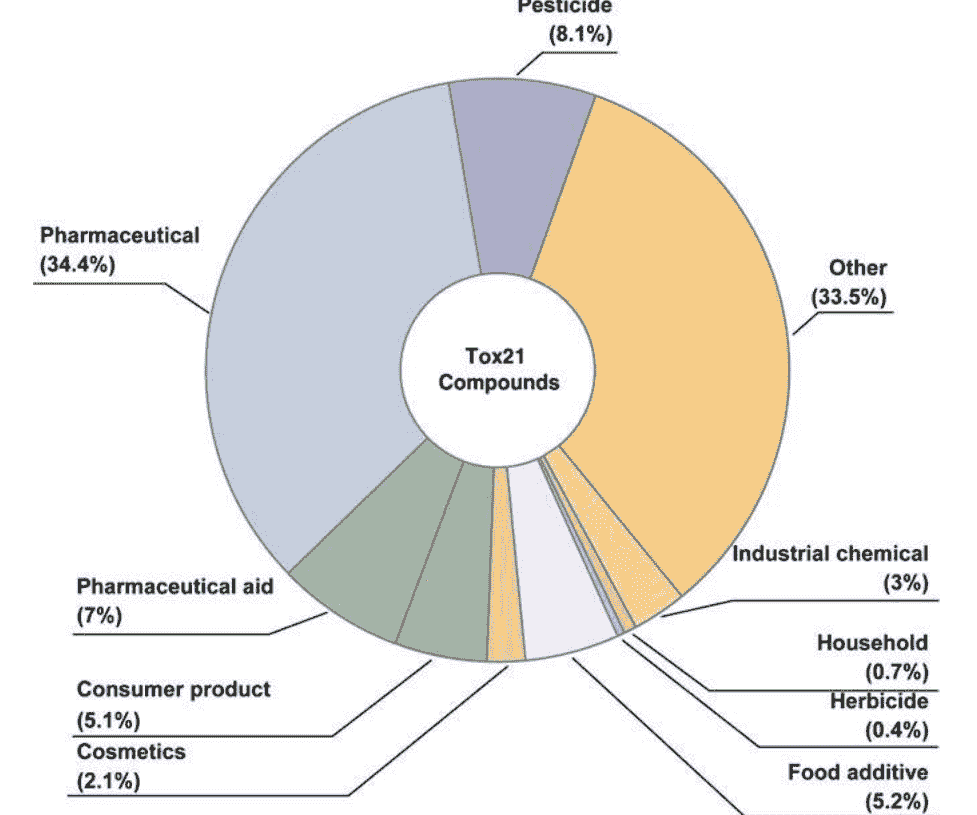

#### 19.2.2 Tox21 qHTS流程

Tox21测定是在一个专用的机器人系统上进行的，该系统由一个具有特殊设计的夹具和条形码阅读器的六轴机器人手臂、化合物板存储单元、测定板孵育器、液体处理器和微孔板读取器组成（Attene-Ramos et al., 2013）。机器人系统能够存储化合物集合和测定板，并以完全集成和自动化的方式进行qHTS。

Tox21 10K化合物库的筛选产生了大量的原始数据，需要新的数据分析方法来整合这些数据并描述从这些测定中观察到的活性。NCATS已经开发了一套标准化的qHTS数据分析流程，包括原始数据处理、浓度响应曲线拟合和分类、数据可重复性评估以及活性分配给化合物（Huang, 2016）。一旦NCATS完成了初始的数据解析和评估，测定结果（例如浓度响应数据、曲线拟合结果、原始板读数、测定条件和样品映射信息）将通过一套数据库和软件工具与Tox21合作伙伴共享（http://tripod.nih.gov/tox/）。经过进一步的质量和实用性审查，测定数据随后通过各种公共数据库向公众发布，例如PubChem（http://pubchem.ncbi.nlm.nih.gov/）、NCATS Tox21浏览器（https://tripod.nih.gov/tox21/pubdata/）、NIEHS生物系统中的化学效应（CEBS）数据库（http://tools.niehs.nih.gov/cebs3/ui/）和EPA的CompTox化学品仪表板（https://comptox.epa.gov/dashboard）（Sakamuru et al., 2019）。

大多数qHTS测定使用人类细胞系进行（80.9%），其次是小鼠胚胎成纤维细胞（7.4%），中国仓鼠卵巢细胞系（5.9%），以及其他（5.9%）（图19.2）。这些测定测量通路活性，包括核受体（NR）信号通路（55.9%），应激反应（SR）通路（11.8%），直接细胞毒性（8.8%），以及与毒性相关的其他分子靶点或通路（23.5%）（图19.2）。这些数据可用于优先评估化合物的毒理学评估，并作为许多机器学习和数据科学项目中的大数据来源，用于虚拟筛选，计算毒理学和化合物毒性机制研究。以下章节将回顾Tox21数据的一些示例应用。

### 19.3 对Tox21数据进行毒性预测建模

#### 19.3.1 多种物种体内毒性

2015年，通过对Tox21 10K化合物库进行30个基于细胞的筛选实验（即NR信号和SR通路实验），生成了Tox21活性谱，评估其在预测体内毒性方面的实用性（Huang et al., 2016a, b）。从Leadscope (Leadscope, Inc.) 编制的化学物质毒性效应注册数据库（RTECS）中检索了多种物种的体内毒性数据。最终选择了72个体内毒性终点，包括13种不同的物种，如人类、啮齿动物、灵长类动物和鸟类（图19.3）。使用自组织映射（SOM）聚类方法构建了基于化合物筛选实验活性谱（基于活性的模型）或化学结构（基于结构的模型）或两者的预测这些体内毒性终点的模型（组合模型）。这些模型基于这样的前提，即具有相似的体外和/或结构特征的化合物可能会表现出类似的体内效应。

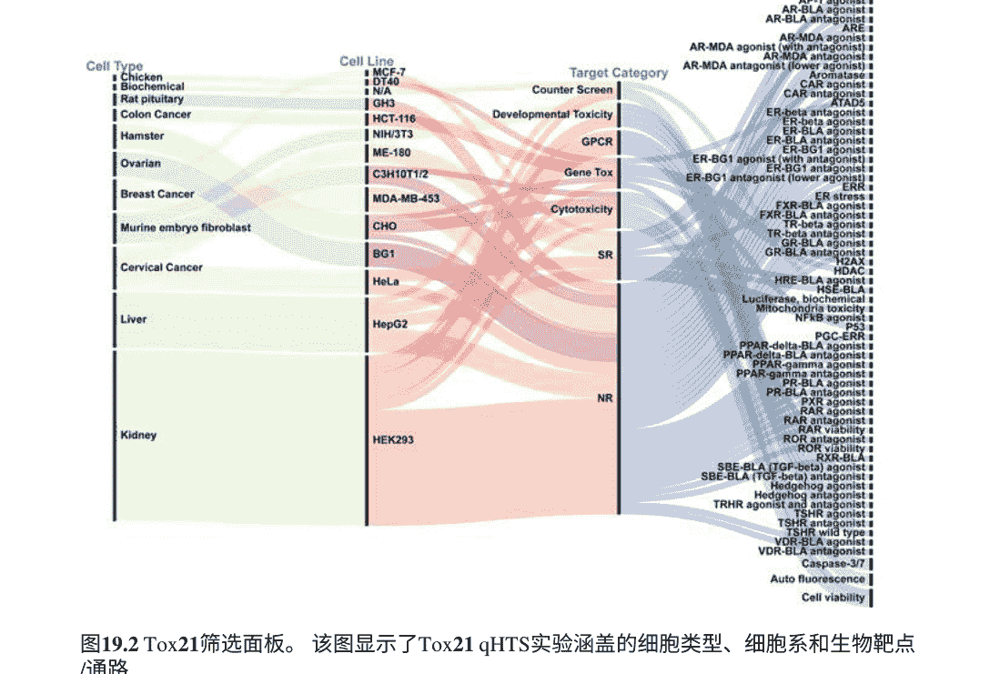

接收操作特征曲线下的面积（`AUC-ROC`）被视为模型性能的衡量标准。为人类终点建立的基于活性的模型表现明显优于针对小鼠/大鼠/兔子毒性终点的模型（图19.3）。这可能是由于物种差异，即本分析中使用的所有筛选数据均来自使用人类细胞或细胞系的细胞基础测定（Huang et al., 2016a, b）。此外，使用`Tox21`测定活性概况构建的模型对大多数体内毒性终点的性能表现合理但不理想。这种现象可能是因为`Tox21`测定主要关注`NR`信号和`SR`途径，并未充分涵盖所有生物学方面参与毒性反应，表明需要通过包括针对毒性相关的其他途径的检测来扩大生物反应空间的覆盖范围，以继续进行`Tox21`计划（Huang et al., 2016a，b）。基于化学结构构建的模型通常表现比基于检测活性构建的模型更好，并且没有显示出任何物种选择性（图19.3）。化合物结构和活性数据的组合导致了比仅使用结构或活性数据构建的模型在大多数体内终点上更好的模型（图19.3），证明了体外检测数据在预测体内毒性方面的价值（Huang et al., 2016a，b）。与基于化合物结构构建的模型类似，组合模型的性能也没有显示出任何物种依赖性（图19.3）。

在一项后续研究中，使用`Tox21`检测数据构建了预测不良药物效应的模型（Huang et al., 2018）。结果显示，通过添加代表当前`Tox21`检测未覆盖的生物反应空间的药物靶标注释，模型性能得到了显著改善。

### 19.3.2 人体内毒性

为了进一步评估`Tox21`测定数据在预测人体内毒性方面的实用性，使用从筛选中生成的`qHTS`数据构建了机器学习模型。该模型使用了2019年对`Tox21 10K`文库进行的47个基于细胞的测定（Xu et al., 2020a，b）。人体内毒性数据从美国国家医学图书馆的`ChemIDPlus`高级数据库中检索得到（可在`http://chem.sis.nlm.nih.gov/chemidplus/`上获得），该数据库包含了来自多个实验室的大量毒性报告，这些报告来自已发表的文献。共收集了14个人体内毒性终点用于建模，包括行为、血液、脑和覆盖物、心脏、内分泌、胃肠道、肾脏输尿管和膀胱、肝脏、肺、胸部或呼吸、肌肉骨骼、周围神经和感觉、感觉器官和特殊感觉、皮肤和附属皮肤、血管毒性（图19.4）（Xu et al., 2020a，b）。

总共使用了五种机器学习方法[即，朴素贝叶斯（`NB`），随机森林（`RF`），支持向量机（`SVM`），神经网络（`NNET`）和极限梯度提升（`XGboost`）]来构建预测模型，使用化学结构、体外测定数据和一些人体体内毒性终点。两种数据类型的组合。使用三种不同的指标[即，`AUC-ROC`、平衡准确率（`BA`）和马修斯相关系数（`MCC`）]来评估模型性能。

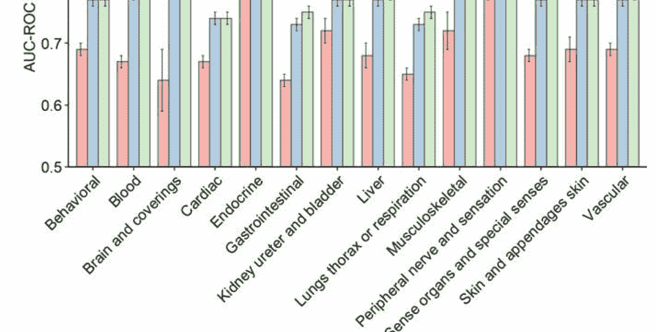

图19.4 通过`AUC-ROC`测量的人体器官水平体内毒性预测模型的性能。在这项研究中，使用了47个`Tox21`测定和147个读数，并使用`KNIME`软件中的`CDK`包生成了1024位的`ECFP4`指纹。通过手动查询美国国家医学图书馆的`ChemIDPlus Advanced`数据库，收集了人体体内毒性数据。最佳模型是从五种机器学习模型（即朴素贝叶斯（`NB`），随机森林（`RF`），支持向量机（`SVM`），神经网络（`NNET`）和极限梯度提升（`XGboost`））和特征选择方法（即`Fisher`精确检验的`p`值，来自`XGboost`的重要性分数和`RF`算法）中选择的。

作为本研究的主要性能指标，`AUC-ROC`值因具体的机器学习方法、数据类型和特征选择方法的不同而有所变化（Xu et al., 2020a, b）。性腺（0.90±0.00）、肌肉骨骼（0.88±0.02）、周围神经和感觉（0.85±0.01）以及大脑和覆盖物（0.83±0.02）毒性的四个最佳模型的`AUC-ROC`值大于0.8，而其余10个毒性终点的最佳模型`AUC-ROC`值大于0.7（图19.4）。此外，化学结构和测定数据对不同体内毒性终点的模型性能贡献不同。尽管与化学结构相结合，体外测定数据在大多数终点（14个中的11个）的预测准确性方面略有改善，但值得注意的是，仅使用结构的模型几乎与仅使用测定的模型的性能相当（图19.4）。因此，本研究中的最佳模型可用于对大量化学物质进行潜在人体毒性的危险筛选，而贡献最大的结构特征可作为毒性的结构警示。

此外，原则上，仅限于测定的模型可以应用于无法获得独特结构的化学物质，例如`Tox21`库中的非可结构化物质，例如混合物和天然产物提取物。此外，显示在模型性能中具有影响力的测定特征（即细胞靶点）可以潜在地阐明体内毒性终点的机制元素。

### 19.3.3 体外毒性

除了作为预测体内毒性的体外标志物外，`Tox21`测定数据还为定量结构-活性关系（`QSAR`）建模社区提供了丰富的训练数据集。例如，`NCATS`推出了“Tox21数据挑战2014”，以化学结构为基础构建预测毒性模型（Huang et al., 2016a, b; NCATS 2014）。

`Tox21`测定数据是由12个体外测定产生的，作为这个建模挑战的训练集。这些测定包括七个`NR` [即芳香烃受体(`AhR`)，雄激素受体全长(`AR`)，雄激素受体配体结合域(`LBD`) (`AR-LBD`)，芳香化酶，雌激素受体α全长(`ER`)，雌激素受体α `LBD` (`ER-LBD`)，和过氧化物酶体增殖物激活受体γ (`PPAR-gamma`)]和五个`SR`通路测定(i.e., 核因子(红细胞衍生2)-样2/抗氧化应答元件(`ARE`), `ATAD5`, 热休克因子应答元件(`HSE`), 线粒体膜电位(`MMP`), 和`p53`) (图19.5)。这个竞赛吸引了来自18个不同国家的参与者，旨在开发计算模型以更好地预测化学毒性。

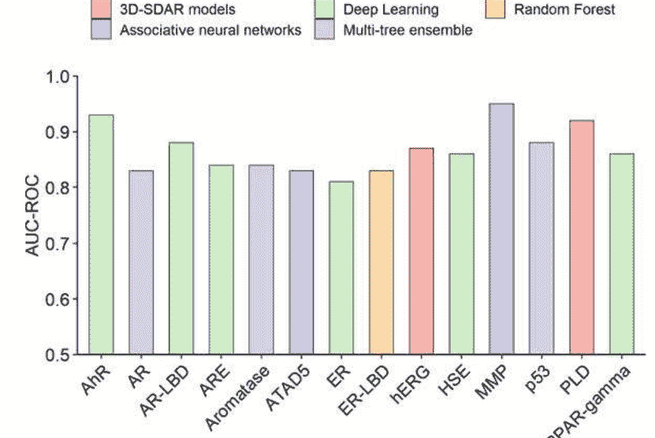

图19.5 通过`AUC-ROC`测量的体外毒性预测模型的性能。`Tox21`计划生成的高质量浓度响应数据为定量结构-活性关系（`QSAR`）建模提供了化学结构与生物活性之间的相关知识库。近400个提交中的获胜模型都具有良好的模型性能（`AUC-ROC` > 0.8） （图19.5）。除了传统的机器学习方法（例如关联神经网络和随机森林）之外，深度学习技术也占了获胜模型的50%（图19.5），它使用许多层的非线性处理单元级联来提取特征和创建转换。

除了`Tox21`挑战模型外，还开发了`3D-SDAR`模型来预测`Tox21`集合中化合物的人类`Ether-à-go-go`相关基因（`hERG`）抑制和磷脂病（`PLD`）诱导活性，两者都取得了很好的性能（`AUC-ROC` > 0.87）（图19.5）（Slavov et al., 2017）。

Wu et al. 基于对`Tox21 10K`化合物库进行的`qHTS`数据筛选构建了5000多个模型，并发现相对于线性回归和`k`最近邻（`KNN`）等简单模型，更复杂的模型如（`LS-`）`SVM`和`RF`的性能仅略好一些（Wu et al., 2021）。在`Tox21`数据挑战中，我们发现通过结合所有参与团队的个体模型生成的共识模型也表现出色，有时甚至超过了获胜模型（Huang et al., 2016a, b)。与此发现一致，美国环境保护局领导了两个全球性的合作组织，使用两个共识模型（即合作建模项目用于雄激素受体活性（`CoMPARA`）和合作雌激素受体活性）对化学物进行虚拟筛选。

活性预测项目（`CERAPP`）表明，共识模型往往优于单个模型，强调了群体智慧的重要性（Mansouri等人，2016年，2020年）。此外，一种新的深度学习共识架构（`DLCA`）将共识和多任务深度学习方法结合起来，生成了大规模的`QSAR`模型，相对于其他共识方法，对于`Tox21`测定目标的回归和分类任务的预测准确性得到了改善（Zakharov等人，2019年）。

## 19.4毒性途径和机制

Tox21 qHTS数据提供了一组丰富而强大的化合物活性概况，可以帮助理解化合物的毒性机制。例如，通过对大约3000种化合物进行细胞存活性和caspase-3/7测定的Tox21 Phase I集合的筛选所生成的数据表明，这些化合物的活性概况或特征对于生成关于化合物作用方式（MoA）的假设有用的（Huang等人，2008年）。此外，使用SOM算法将这10000种化合物按照它们的活性概况相似性进行了聚类。使用Fisher精确检验评估了每个聚类的医学主题头词（MeSH）（NCBI 2013）药理作用（PA）术语的富集程度。这些结果表明，具有相似活性概况的化合物往往具有相似的MoA。例如，已知的雌激素化合物（Rogers等人，2012年），如双酚类化合物A、B、Z和AF，与具有相似活性概况的雌激素类化合物聚集在一起。此外，对于属于同一聚类的化合物，有些可能具有MeSH PA注释，而其他化合物可能没有任何注释。一般来说，同一聚类中的化合物往往具有相似的MoA，这些信息可以用于推断未知化合物的MoA。例如，fludioxonil是一种未被分配MeSH PA的杀虫剂，与雌激素类化合物聚集在一起。这一发现表明，fludioxonil可能具有内分泌干扰活性，这在文献报道中得到了确认（Medjakovic等人，2013年）。这些结果表明，Tox21 10K化合物的活性概况对于化合物MoA假设的生成是有用的。如果没有已知MoA的化合物A具有与具有已知MoA的化合物B相似的活性特征，那么可以优先考虑并测试化合物A的这种MoA。

在基于Tox21体外毒理学实验数据构建体内毒性预测模型的同时，还可以确定分子靶点和生物途径，这些实验对模型性能的贡献最大（Huang等，2016a，b，2018; Xu等，2020a，b）。例如，发现血管毒性预测模型中的一个重要贡献因子是缺氧应答元件（HRE）实验（即`tox21_hre_bla_agonist_p1`，p值=1.84×10^-02）（Xu等，2020a，b）。在哺乳动物细胞中，缺氧诱导因子1（HIF1）是一种结合靶基因启动子中HRE的转录因子，促进转录，如血管内皮生长因子（VEGF）。这对于血管生成和血管化是一个重要的生长因子（Burroughs等，2013年）。为了实现对各种体内毒性终点相关的分子靶点和生物途径的系统和全面的鉴定，采用了一种综合方法来提取涉及八个常见终点（如致癌性、心脏毒性、发育毒性、肝毒性、肾毒性、神经毒性、生殖毒性和皮肤毒性，包括皮肤刺激和皮肤致敏）的化学诱导毒性在人体器官水平上的分子靶点和生物途径。模型识别的分子靶点与文献挖掘结果相结合，针对每个毒性终点进行通路富集分析，使用NCATS BioPlanet数据库（版本1.0，可在`https://tripod.nih.gov/bioplanet/`上获得），该数据库是一个包含1652个策划的人类通路的综合公共资源（Huang等，2019a，b）。

总共鉴定出与毒性相关的1516个基因，并随后进行了生物通路富集分析，得到了206个显著的通路（Xu等人，2020a，b）。通过XGboost重要性增益分数选择了每个体内毒性终点的前五个最显著的毒性基因和通路，并在图19.6中进行了说明。例如，核因子红细胞2相关因子2（NRF2）是由核因子红细胞衍生2样2（NFE2L2）基因编码的转录因子，据报道与氧化应激反应、记忆、空间学习和神经炎症调节抗氧化应答元件有关（Sharma等人，2020年）。我们的研究发现`NFE2L2`基因与神经毒性显著相关（图6a）。一些显著的通路也被报道与相应的人体器官/组织密切相关，这可以作为我们方法的验证。MicroRNAs是一类小的（约22个核苷酸）内源性非编码RNA，可以参与基因表达的表观遗传调控，例如调节DNA损伤应答的蛋白质（Hu和Gatti，2011年）。由致癌物质引起的DNA损伤导致的基因组不稳定性在癌症的发生和发展中起重要作用。MicroRNA调控的DNA损伤应答通路也被鉴定为与致癌性相关的显著通路（图6b）。不良结果途径（AOP）框架被开发为与化学风险评估相关的毒性事件机制的映射工具。本研究鉴定的分子靶点和生物通路不仅可以补充现有的AOP框架，还可以应用于促进新AOP的发展。例如，雄激素受体（AR）被发现参与致癌性、心脏毒性和肾毒性（图6a）（Xu等人，2020a，b）。然而，AR只在少数与生殖相关的不良结果中被记录为关键事件（KE）（例如，AR拮抗导致雄性（哺乳动物）后代阴茎生殖距离缩短，`https://aopwiki.org/aops/306`）和分子起始事件（MIE）（例如，AR激动导致男性偏向性别比，`https://aopwiki.org/aops/376`）。AOP框架中MIE和KE的关联通常依赖于对毒性途径的研究（Browne等人，2017年）发现，例如，乙酰胆碱酯酶（AChE）的抑制是神经退行性疾病（`https://aopwiki.org/aops/281`）、运动协调能力受损导致的急性死亡（`https://aopwiki.org/aops/312`）和认知功能受损（`https://aopwiki.org/aops/405`）的AOP框架中的MIE。基于我们的分析（Xu等人，2020a，b），我们发现包括`AChE`基因在内的“神经系统”途径与神经毒性有显著关联（图6b）。

### 19.5 结论与展望

迄今为止，Tox21 10K化合物库已经以qHTS格式对超过70种体外测定进行了筛选，生成了超过1亿个数据点。通过Tox21计划产生的大数据已被用于构建体内毒性的预测模型。然而，基于体外测定数据构建的模型对于大多数体内毒性终点的性能虽然合理但不理想，这可能是由于测定所覆盖的生物反应空间不足所致。

目前，Tox21合作伙伴正在努力整合探测先前未被充分代表的目标空间的测定，例如发育毒性途径和G蛋白偶联受体信号传导，通过跨合作伙伴项目（`https://tox21.gov/projects/`）。另一方面，从Tox21测定数据中开发的QSAR模型表现出稳健且优异的性能，验证了Tox21 qHTS数据的质量和可靠性。此外，这些QSAR模型可以应用于虚拟筛选大型化合物库，以识别可能具有活性的化合物，并优先进行毒理学后续测试。在该计划的第三阶段，Tox21旨在添加中高通量转录组学测定，以测试化学物质对基因表达的影响，为更好地识别可能引起不良人体健康影响的化学物质提供新的和更多样化的数据资源。从这些研究中确定的分子靶点和生物途径可能为化学诱导毒性的机制提供线索，并为实验测试和验证提供可验证的假设。

图19.6 XGBoost重要性得票选择的前五个显著分子靶点（a）和每个人体毒性的生物途径（b）终点。模型识别的分子靶点与每个毒性终点的文献挖掘结果相结合，并使用NCATS BioPlanet数据库进行通路富集分析。使用Fisher精确检验计算每个毒性终点在特定通路中基因富集的显著性。p值小于0.05的通路被认为是统计显著的。

致谢本工作得到了国家毒理学计划（跨机构协议号Y2-ES-7020-01）、国家环境健康科学研究所、美国环境保护署（跨机构协议号Y3-HG-7026-03）和国家卫生研究院转化科学中心的机构内研究计划的支持。我们还感谢Srilatha Sakamuru、Jinghua Zhao、Caitlin Lynch、Li Zhang、Shuaizhang Li、Samuel Michael和Carleen Klumpp-Thomas对筛选的协助，Paul Shinn、Misha Itkin和Danielle Bougie对化合物管理的支持，以及William Leister、Christopher LeClair和Dingyin Tao对Tox21 10K文库质量控制的支持。

## 参考文献

- Attene-Ramos MS, Miller N, Huang R, Michael S, Itkin M, Kavlock RJ等 (2013) Tox21机器人平台用于评估环境化学物质-从愿景到现实。药物发现今日18:716-723

- Browne P, Noyes PD, Casey WM, Dix DJ (2017) 将不良结果途径应用于美国环保署的内分泌干扰物筛选计划。环境健康展望125:096001

- Burroughs SK, Kaluz S, Wang D, Wang K, Van Meir EG, Wang B (2013) 缺氧诱导因子通路抑制剂作为抗癌治疗药物。未来医药化学5（5）：553-572 CAS内容：物质。`https://www.cas.org/cas-data/cas-registry`。检索日期：2021年11月18日

- Collins FS, Gray GM, Bucher JR (2008) 毒理学。改变环境健康保护。科学 319:906-907

- Hu H, Gatti RA (2011) ：微小RNA：DNA损伤应答中的新角色。J Mol Cell Biol 3(3):151-158

- Huang R, Southall N, Cho MH, Xia M, Inglese J, Austin CP (2008) ：利用体外细胞毒性测定在定量高通量筛选中表征毒性机制的多样性。Chem Res Toxicol 21:659-667

- Huang R, Xia M, Nguyen D-T, Zhao T, Sakamuru S, Zhao J等 (2016a) ：Tox21挑战: 建立核受体和应激反应通路的预测模型，通过暴露于环境化学物质和药物。

- Huang R, Xia M, Sakamuru S, Zhao J, Shahane SA, Attene-Ramos M等 (2016b) ：建立Tox21 10K化学物质的体内毒性预测和机制表征模型。

- Huang R, Xia M, Sakamuru S, Zhao J, Lynch C, Zhao T等 (2018) 通过体外活性剖面扩展生物空间覆盖，增强了对人体药物不良反应的预测。Sci Rep 8:3783

- Huang R, Grishagin I, Wang Y, Zhao T, Greene J, Obenauer JC等 (2019a) NCATS BioPlanet——一个用于探索细胞信号通路的综合平台，用于毒理学、系统生物学和化学基因组学。Front Pharmacol 10:445

- Huang R, Zhu H, Shinn P, Ngan D, Ye L, Thakur A等 (2019b) NCATS药物收藏：10年更新。Drug Discov Today 24:2341-2349

- Huang R, Southall N, Wang Y, Yasgar A, Shinn P, Jadhav A等 (2011) NCGC药物收藏：一个全面的临床批准药物资源，可用于再利用和化学基因组学。Sci Transl Med 3:80ps16

- Huang R (2016) 用于活性分析的定量高通量筛选数据分析流程。在：Zhu H, Xia M (eds) 毒理学中的高通量筛选测定，第1473卷，第1部分。Humana Press

- Kavlock RJ, Austin CP, Tice RR (2009) 21世纪的毒性测试：对人类健康风险评估的影响。风险分析29：485-487

- Mansouri K, Abdelaziz A, Rybacka A, Roncaglioni A, Tropsha A, Varnek A等 (2016) CERAPP: 协作的雌激素受体活性预测项目。环境健康展望124: 1023-1033

- Mansouri K, Kleinstreuer N, Abdelaziz AM, Alberga D, Alves VM, Andersson PL等 (2020) CoMPARA: 雄激素受体活性的协作建模项目。环境健康展望128: 027002

- Medjakovic S, Zoechling A, Gerster P, Ivanova MM, Teng Y, Klinge CM等 (2013年) 非持久性农药对雌激素受体、雄激素受体和芳香烃受体的影响。环境毒理学29 (10) : 1201-1216

- NCATS (2014年) Tox21数据挑战。可在: `https://tripod.nih.gov/tox21/challenge/`找到

- NCATS (2016年) Tox21数据浏览器

- NCBI (2013年) Mesh, 医学主题词。可在: `http://www.ncbi.nlm.nih.gov/mesh`找到

- NRC (2007年) 21世纪的毒性测试: 愿景和策略。国家科学院出版社, 华盛顿特区

- NTP (2021年) `https://ntp.niehs.nih.gov/` PubChem (2013年) Tox21第二阶段化合物收集

- Richard AM, Judson RS, Houck KA, Grulke CM, Volarath P, Thillainadarajah I等 (2016年) ToxCast化学景观: 铺设通往21世纪毒理学的道路。化学研究毒理学29: 1225-1251

- Richard AM, Huang R, Waidyanatha S, Shinn P, Collins BJ, Thillainadarajah I等 (2020年) Tox21 10K化合物库: 协作化学推进毒理学。化学研究毒理学34: 189-216

- Rogers JA, Metz L, Yong VW (2012) 综述: 内分泌干扰物质和免疫反应: 以双酚A及其潜在机制为重点。Mol Immunol 53:421–430

- Sakamuru S, Zhu H, Xia M, Simeonov A, Huang R (2019) 对Tox21化学库进行环境危害评估: 应用于优先级确定、预测建模和毒性机制表征。在: 预测性毒理学中的大数据, 第242-263页

- Sharma A, Chunduri A, Gopu A, Shatrowsky C, Crusio WE, Delprato A (2020) 唐氏综合症中阿尔茨海默病的常见遗传特征。F 1000Research 9:1299

- Slavov S, Stoyanova-Slavova I, Li S, Zhao J, Huang R, Xia M et al (2017) 为什么大多数磷脂质病诱导剂也是hERG阻滞剂? Arch Toxicol 91:3885–3895

- Tice RR, Austin CP, Kavlock RJ, Bucher JR (2013) 改进化学品的人体危害特性评估: Tox21更新。Environ Health Perspect 121:756–765

- Wu L, Huang R, Tetko IV, Xia Z, Xu J, Tong W (2021) 用于机器学习驱动的预测性毒理学的可预测性和可解释性的权衡: 对Tox21数据集进行深入研究。Chem Res Toxicol 34:541–549

- Xu T, Ngan DK, Ye L, Xia M, Xie HQ, Zhao B等 (2020a) 基于体外生物活性数据和化学结构的人体器官毒性预测模型。Chem Res Toxicol 33:731–741

- Xu T, Wu L, Xia M, Simeonov A, Huang R (2020b) 与人体器官水平毒性相关的分子靶标和途径的系统鉴定。Chem Res Toxicol 34:412–421

- Zakharov AV, Zhao T, Nguyen D-T, Peryea T, Sheils T, Yasgar A等 (2019) 用于改善大规模多任务深度学习QSAR模型性能的新型共识架构。JChem Inf Model 59:4613–4624

## 第20章 通过机器学习识别结构警示并在毒理学中应用

楼超峰，顾亚鑫和唐云

### 20.1 引言

结构警示，也称为“毒性基团”或“毒性片段”，是具有潜在毒性的化合物的功能基团或特殊结构模式（Raies和Bajic2016）。这些模式可以是特定的亚结构，亚结构的组合，或者具有各种特征（如R基团或原子列表）的Markush结构。结构警示的概念最早由Ashby（1985）在化学致癌物的结构分析背景下提出。在那项研究中，他列出了一组亚结构，其中大多数有机化学致癌物和诱变物都具有一个或多个，表明化学结构可能对新化学实体的潜在致癌性有所贡献。此后，毒理学家在不同领域编制了一系列化学规则，这些规则有助于对新化学实体进行排名和优先级排序。当毒性机制不清楚时，如果药物化学家避免在药物设计中引入结构警示，成功的机会会更大。因此，这些结构警示提供了一种简单直观的方法来快速识别潜在的有毒化合物，并在毒理学的危险风险评估中得到广泛应用。

结构警报具有高化学反应性，或者可以通过人体酶的生物活化转化为高化学反应性片段（Limban等，2018年）。几十年来的累积研究已经证明了其参与生成活性代谢物时，结构警示的作用是可以与蛋白质共价结合或形成加合物，并引起特异性不良药物反应（Kalutgkar 2019）。根据对68种被撤回或黑盒警告标签药物的调查（Stepan et al. 2011），其中相当大比例的药物（68种中的55种，占80.8%）含有结构警示，其中36种药物（65%）被证明形成了活性代谢物。因此，在新药设计中，避免结构警示，或者至少减少其化学反应性，已成为一种广泛接受的策略（Fig.20.1）。

值得注意的是，尽管结构警示在化学毒理学中具有普遍性和适用性，但对于结构警示过多地标识化学物质为有毒的问题日益引起关注。因此，如果将结构警示视为教条，那么这些基于知识的规则对于成功的毒性评估更多地造成了伤害而非益处。在探索结构警示方面，我们还有很长的路要走，但如果我们站在巨人的肩膀上，我们可以看得更远。

### 20.2 结构警示标识方法

鉴于结构警示在毒理研究和新药开发领域的重要作用，结构警示标识方法受到了广泛关注并取得了巨大进展。在毒理研究的早期阶段，结构警示是通过毒理学家从体内/体外实验中得出的，并通过简单的统计分析总结为毒性规则。随着生物活性数据的增加，许多新颖的计算算法被提出，突破了通过专家策划提取结构警示的限制，并大大丰富了结构警示库。更重要的是，这些数据驱动的结构警示在性能上优于经验性结构警示。

表20.1 结构警示标识方法

| 方法 | 子类 | 示例 |
| --- | --- | --- |

| :--- | :--- | :--- |

| 专家系统 | 商业软件 | `Derek Nexus`（1996年），`LeadScope`（2000年） |

| | 免费工具 | `ChemoTyper`（2021年），`ToxTree`（2021年） |

| | Web服务器 | `ToxAlerts`（2012年），`AGDH` |

| 计算方法 | 频率分析 | 基于图的 | `MoSS`（2002年），`Gaston`（2004年） |

| | | 基于片段的 | `SARpy`（2013年），`CASE`（2012年，1984年），`Emerging pattern`（2014年） |

| | | 基于指纹的 | `Bioalerts`（2016年），`FP`（2017年） |

| | 机器学习 | QSTR | `CNN`（2017年），`NN`用于评估（2018年） |

| | | 其他 | `SOM`预测（2017年） |

对于一些端点（如Ames突变原性试验），整体预测准确性的百分比

一般而言，目前用于结构警报识别的方法可以分为专家系统和计算方法。前者依赖于专家的经验和知识，而后者利用复杂算法从大型数据集中自动提取与毒性相关的亚结构。这两种方法的示例已总结在表20.1中，其中计算方法可以进一步分为频率分析和可解释的机器学习方法。

### 20.2.1 专家系统

在过去的几十年中，在计算机技术广泛应用之前，毒理学家使用控制实验来研究毒性的原因，主要是化学结构方面的定量结构-活性关系（`QSAR`）。毒理学家通过体内/体外毒理学实验总结了一系列毒性规则，主要来自小型数据集。对于一类具有特定毒性的化合物，毒理学家首先提出了关于每个亚结构对毒性影响的一系列猜想。然后，设计了几个实验来记录化合物中每个亚结构的修改对特定毒性的变化。当特定亚结构被修改时，化合物的毒性消失，表明这个亚结构是结构警示或毒性基团。

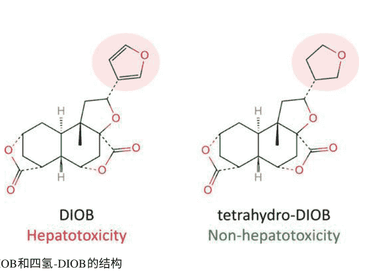

**图20.2 DIOB和四氢-DIOB的结构**

例如，Li等人（2016年）对`Diosbulbin B`（`DIOB`）的肝毒性原因进行了深入研究，并得出结论说呋喃基团对`DIOB`诱导的肝毒性是必不可少的，即结构警示。他们通过对`DIOB`的呋喃环进行化学氢化，将其替换为四氢呋喃基团，在给予相同剂量的四氢-`DIOB`的动物中没有观察到损伤（见图20.2）。进一步研究发现，`DIOB`的一些活性代谢物是通过细胞色素`P450 3A`酶生成并消耗肝脏`GSH`，这可能至少部分导致肝损伤。因此，呋喃环被视为肝毒性的结构警示，这提醒我们在药物开发中使用呋喃环时要谨慎。

迄今为止，毒理学家已经对许多毒性终点进行了研究，包括基因毒性（`Aaron`和`Ames` 1983）、突变性（`Coquin`等人 2015）和内分泌干扰物（`Nendza`等人 2016）。这些研究人员总结了许多有意义的化学规律。商业软件，如`Derek Nexus`（`Ridings`等人 1996）和`LeadScope`（`Roberts`等人 2000），被称为“专家系统”，它们收集了许多不同终点的结构警报。此外，一些免费工具或网络服务器，包括`ToxAlerts`（`Sushko`等人 2012）、澳大利亚卫生部（`AGDH`）（2019）和`ChemoTyper`（2021），也可以用于识别先前从文献中收集的孤儿化合物中的结构警报（表20.1）。毫无疑问，这些基于专家系统的结构警报方法极大地推动了毒性机制和毒性预测的研究。

### 20.2.2 计算方法

尽管专家系统（特别是对于非技术用户）的普及和有用性，但专家系统并不足以总结大型和复杂的化学和生物数据集中的隐藏化学规则（`Yang`等，2020年）。因此，许多计算算法被研究人员提出，显示出在自动化识别大型数据集中的结构警报方面的巨大优势（例如，`Bertrand`等，2012年; `Ferrari`等，2013年; `Sherhod`等，2014年）。

总的来说，用于识别结构警报的计算方法可以大致分为两种方法：传统的统计分析和可解释的机器学习模型。前者的基本原理是频率分析，其一般思想是在有毒化合物中比在非有毒化合物中更频繁地发现一些亚结构。另一方面，后者使用复杂的算法来探索不同亚结构模式对毒性终点的影响，并将这些有影响的片段标记为结构警报。

#### 20.2.2.1 传统统计分析方法

传统的统计分析方法首先需要获取所有可能的亚结构，然后对每个亚结构进行统计分析。一般来说，有三种方法可以帮助推导亚结构集合：

- (i) 基于片段的方法利用化学信息学工具，如`Pipeline Pilot`（2021），从训练集中识别出所有可能的片段。`SARpy`是一个免费的独立工具，可以使用基于`SMILES`的算法从训练集中提取关键的结构规则，它会断开除环中的键之外的所有可能的键（`Ferrari`等人，2013年）。

- (ii) 基于指纹的方法利用各种长度的明确定义的指纹作为亚结构的来源。例如，`PubChem`定义了一个881位的指纹，其中每一位表示一个唯一的亚结构或拓扑特征，而`MACCS`指纹则包含了166个键的子集，这些键已经在开源化学信息学软件包中实现，包括`RDKit`（2021）、`CDK`（`Ayed`等人，2019年）等。这两种指纹方法最初设计用于表示用于`QSAR`研究的分子特征，但它们也可以用于推导结构警示。

- (iii) 基于图的方法更高效、更快速地推导亚结构集合并识别高频亚结构。包括分子子结构矿工（`MoSS`）（`Borgelt`和`Berthold`，2002年）和图序列挖掘（`Gaston`）（`Nijssen`和`Kok`，2004年）在内的工具可以将分子视为具有顶点/原子和边/键的图。前者使用深度优先搜索规则，而后者更加灵活，因为顶点可以被定义为广义原子，这已经被`Kazius`等人（2006年）和`Wang`等人（2012年）用于基因毒性研究。例如，“`[N,O]`”表示一个可以是氮或氧的原子。

在推导出亚结构集之后，通常使用统计指标如精确度、富集因子、似然比和`p`值来评估结构警示的质量。精确度被定义为真阳性样本与所有被预测为阳性的样本之间的比率。在结构警示研究中，我们可以将含有结构警示 (t) 的化合物视为阳性预测（方程式20.1），并且可以通过亚结构匹配计算结构-亚结构关联矩阵。富集因子用于评估有毒化合物的存在如何增加相对于平均比率。与精确度相比，`Du`等人（2017）使用的富集因子通过数据集中有毒化合物的比率进行归一化（方程式20.2）。类似地，似然比用于评估有毒化合物的相对增加，而它比较的是有毒/非有毒比率而不是富集因子中的有毒/总比率，因此如果没有非有毒化合物，它可以是无限大。`p`值（方程式20.3）用于评估给定亚结构和并发毒性与毒性之间的关系在随机机会方面的显著性。大多数研究使用费舍尔精确检验，其中使用无放回随机抽取的概率的超几何分布来评估独立性的显著性。

$$\text{精确度} = P(X=1|t) = \frac{k}{m} \qquad (20.1)$$

$$\text{富集因子} = \frac{P(X=1|t)}{P(X=1)} = \frac{k/m}{n/N} \qquad (20.2)$$

$$P\text{-值} = \frac{\binom{m}{k}\binom{N-m}{n-k}}{\binom{N}{n}} \qquad (20.3)$$

$$\text{覆盖率} = \frac{m}{N} \qquad (20.4)$$

$$E(p) = -p \times \log(p) - (1-p) \times \log(1-p) \qquad (20.5)$$

$$\text{信息增益} = E(P(X=1)) - P(t) \times E(P(X=1|t)) - P(\bar{t}) \times E(P(X=0|\bar{t})) \qquad (20.6)$$

其中，`X`表示具有两个可能值的二进制属性（0表示非毒性，1表示毒性）。对于潜在的结构警报`T`， `t`是包含该亚结构的化合物， `$\bar{t}$` 表示不包含该亚结构的化合物。`E(p)`是信息熵，其中`p`表示一类分子的概率。`P(A)`表示观察到`A`的概率。`P(A|B)`是在条件`B`下观察到事件`A`的概率。`N`是数据集中化合物的总数， `n`是有毒化合物的数量， `m`是含有该亚结构的化合物的数量， `k`是含有该亚结构的有毒化合物的数量。

所提到的四个指标相似，并主要关注亚结构预测化合物的毒性的准确性。然而，如果一个亚结构与毒性强相关，它也应该具有较高的覆盖率（方程式20.4）。信息增益（`IG`）是一种综合评估亚结构的指标，从精确性和覆盖率的角度来看，广泛应用于机器学习中的特征重要性排序。使用`IG`评估亚结构是合理的，因为我们可以将结构警示视为毒性预测模型中化合物的关键特征。在计算毒理学领域，一些研究人员将具有最高`IG`值的亚结构标记为结构警示。

上述所有传统统计分析都具有一些共同的缺点。首先，冗余是一个不可避免的问题，因为具有微小差异的亚结构都被视为独特的结构模式，但具有相似的指标值，导致一组相似或部分重复的结构警示。在不考虑与亚结构相关的化学和生物过程的情况下，很难选择最有意义的亚结构。其次，在当前的化学信息学工具中，难以精确实现在互变异构体。一般来说，在计算过程中只考虑最稳定的异构体，导致忽略了其他异构体中可能隐藏的结构警示。此外，这些方法都没有考虑亚结构之间的相互作用，而是默认毒性可能是由单个亚结构引起的。然而，化合物的毒性可能与多个亚结构有关，因为一些具有结构警示的化合物是无毒的。

##### 20.2.2.2 可解释的机器学习方法

与传统的统计分析方法不同，可解释的机器学习方法通过复杂的算法探索亚结构与毒性之间的关系。那些对毒性有很大影响的亚结构被标记为结构警示（Kim和Nam 2020）。在本章中，我们提供了可解释的机器学习方法中两个重要算法类别的基本概述：基于树的算法和基于神经网络的算法。

基于树的算法，如随机森林和极限梯度提升，可以通过基尼不纯度或信息增益/信息熵计算分类模型中每个输入亚结构特征的重要性值，其中所有这些度量都衡量原始数据集与由亚结构特征分隔的两个数据集之间的差异。具有高特征重要性值的亚结构意味着它们对模型预测至关重要，并且可以被视为潜在的结构警示。换句话说，特征重要性值揭示了亚结构与毒性之间的相关性，并提供了对模型解释的途径。

另一个重要的可解释的机器学习方法，基于神经网络的算法，在近年来取得了很大的进展，特别是在深度学习领域。值得注意的是，并非所有基于神经网络的算法都是可解释的。毒性预测的原始人工神经网络模型通常被批评为“黑盒子”性质，可靠性值得怀疑，尽管它们能够在某些情况下实现高性能。

为了打破不可解释的黑盒子模型的束缚，近十年来提出了许多新颖的深度网络架构和算法，重点是增强神经网络自动学习分子中隐藏知识和提取重要结构特征的能力。例如，Xu等人 (2017) 开发了一种改进的分子图编码卷积神经网络架构，用于急性口服毒性（AOT）预测，可以从数据集中自动学习并成功地推导出与AOT相关的化学亚结构，通过特征的逆向挖掘。Xiong等人 (2020) 引入了一种新的图神经网络架构，具有图注意机制的分子表示，并使用原子注意权重可视化模型预测结果，直观地揭示了每个分子中每个原子对毒性的贡献。与其他机器学习方法相比，深度神经网络算法在特征生成和模型性能方面表现出很大的优势，因为它们避免了特征选择的主观性。

除了机器学习算法本身的模型可解释性外，还提出了几种解释策略（例如，Balfer和Bajorath 2015; Polishchuk 2017; Rodríguez-Pérez等人 2017年），以减少机器学习模型的黑盒性。这些策略可以作为识别潜在结构警报的新方法，例如特征加权和敏感性分析（So和Richards 1992年）。特征加权是一种模型特定的方法，用于评估特征的重要性，并已应用于支持向量机和随机森林模型。作为一种模型无关的方法，敏感性分析观察系统特征波动对模型输出的影响，方便确认模型中最相关的特征。然而，这些方法存在一定的局限性，无法满足日益复杂的机器学习模型的需求。简单来说，SHAP方法通过打开和关闭特征，并可视化决定模型预测的结构模式，量化每个给定结构特征对模型输出的贡献。这为基于机器学习的结构警报识别提供了新的方向。

#### 20.2.3 数据驱动的结构警报与专家系统的比较

专家系统是基于规则的模型，规则是根据体内/体外毒理学实验由专家设计的。换句话说，专家系统中的结构警报更可靠，因为相关机制已经得到了充分的探索和验证。然而，计算方法推导结构警报依赖于数学算法，缺乏直接的实验证据，这导致了机制探索的困难。在大多数情况下，数据驱动的结构警报需要通过与专家系统规则的比较来证明算法的可靠性。此外，计算方法可能会忽略由于缺乏数据而具有最小显著性的结构警报，但在许多情况下，这些警报不应被丢弃。在毒性预测方面，计算方法，特别是机器学习模型，表现优于专家系统。基于频率的方法可以被视为机器学习的一个特殊分支，其中特征是所有可能的片段/亚结构，算法是基于IF-THEN逻辑构建的。重要的是，在算法层面上存在差异。例如，大多数机器学习方法通过优化内部参数来获得一批化合物的最佳平均分数，而基于频率的方法则关注相关化合物中每个亚结构的频率，而不考虑整个模型的预测性能。同样，由于专家关注结构警报与不良事件之间的联系以及通过是否包含结构警报来预测新化合物的毒性，专家系统无法像计算方法那样优化模型性能，导致预测能力较差。

### 20.3 结构警示在毒理学中的应用

#### 20.3.1 毒性预测

在毒理学研究中，结构警示具有广泛的应用，如图20.3所示。在毒性预测领域，研究人员可以通过已知的结构警示评估化合物对某种副作用的潜在风险。例如，结构警示的存在被标记为高风险信号（Allen等，2018年）。

一些网络服务器或工具已将结构警示作为筛选分子的插件，例如ToxAlerts（Sushko等，2012年），FAF-Drugs（Lagorce等，2015年）和ChEMBL（Gaulton等，2017年）。除了像器官水平毒性（Cronin等，2017年）和基因毒性（Snyder，2009年）这样广泛关注的终点外，结构警示还方便评估环境指标，如生物浓缩因子（BCF），这是欧洲化学品注册、评估、授权和限制（REACH）框架等法规要求的（Valsecchi等，2019年）。在结构警示的帮助下，监管机构可以更高效地对化学物质对人类和生态系统的风险进行评估。

然而，仅使用结构警报来预测毒性将不可避免地导致假阴性。在这种情况下，许多无毒化合物可能被标记为潜在有毒化合物，这将大大降低结构警报模型的可信度（Schüürmann等人，2016年）。另一个批评是由于结构警报的潜在滥用，因为它导致了化学空间在药物发现中的不必要缩小（Kalgutkar和Dalvie，2015年）。因此，在使用结构警报模型进行毒性预测时，关键是要有一个适用领域的适用性度量（Chakravarti等人，2012年）。例如，Wedlake等人（2020年）提出了一种方法来为蛋白结合分子引发事件（MIE）的结构警报中的活性和非活性预测分配信心。这种方法依赖于新的化学品与训练集中相关化学品之间的Tanimoto相似性，并根据截断值给出不同的信心。此外，几项研究表明，结合结构警报和机器学习模型的策略可以极大地提高毒性预测的准确性（例如，Chakravarti和Saiakhlov，2019年；Pizzo等人，2016年）。

### 20.3.2 QSAR模型的解释

与结构警报模型相比，机器学习模型显示出更加令人满意的预测性能，这要归功于分子表示方法（如分子指纹和分子图）的发展。然而，这些高性能的机器学习模型也受到批评，因为它们缺乏可解释性，即无法解释预测结果，模型的适用领域可能不够清晰（Cherkasov等，2014年）。这个问题源于QSAR模型所利用的统计学习算法在分子特征和化学毒性之间的复杂关系，因此它们通常被认为是“黑盒子”。例如，神经网络可以将分子特征转化为隐藏神经元，这些神经元是不同加权输入特征的激活值之和。当网络变得复杂时，很难解释隐藏层中的值与输入特征或输出值之间的关系。

鉴于毒性机制中结构警示的可解释性，许多研究者（例如，Chen等人 2014年；Lei等人 2016年；Li等人 2014年）提出了一种策略，通过与结构警示相结合来克服QSAR模型的“黑盒”特性。这种策略首先需要构建QSAR模型，然后通过机器学习算法或其他常规统计分析从相同的训练集中推导出结构警示，其中这些结构警示代表可能导致特定毒性并解释QSAR模型预测的片段或功能团。Alves等人（2016年）证明了在化学类似物推断和毒性预测中盲目依赖结构警示可能会误导研究人员，并可能对药物发现和风险评估造成危害。重要的是，结构警示和QSAR模型的组合可以弥补各自的缺点，并为潜在在毒性风险评估提供全面的分析。从那时起，结构警示和QSAR模型已成为毒性预测领域的黄金搭档。Webb等人（2014年）提出的特征组合网络是一个很好的例子，它将“黑盒”QSAR模型和“可解释”的结构警示集成在一起，用于预测Ames突变性。

然而，这种整合的概念引起了批评（Rudin 2019），批评者认为用其他来源的结构警报来解释当前的机器学习模型是不可靠的。与此同时，作者提出了可解释的模型更为重要，并建议使用这些模型，因为它们不仅可以预测化合物的性质，还可以提供化学信息或结构警报，解释为什么会做出这样的预测。

在过去的十年中，提出了许多可解释的机器学习算法，例如基于注意机制的图神经网络（Xiong等人，2020），基于知识的深度神经网络（Ciallella等人，2021）和梯度加权类激活映射（Mukherjee等人，2021）。正如在计算方法部分提到的那样，结构警报可以从机器学习模型中得出，避免了预测和解释之间的不一致。然而，这些基于机器学习的QSAR模型是从数学角度构建的，因此仍需要通过体内/体外实验进一步验证数据驱动的结构警报。

#### 20.3.3 分子优化

除了毒性预测外，结构警示还可以为分子设计提供重要指导。如上所述，结构警示有可能引起某些毒性反应，因此通过避免结构警示的发生或在引物发现中筛选它们，可以减少与化学物质暴露相关的不良效应的风险(Kalgutkar 2019)。然而，这种避免策略可能会在药物的早期阶段引起不必要的药物淘汰。因此，通过结构警示进行分子优化受到了广泛关注。

当识别出与毒性相关的结构警示时，通常考虑两种分子优化方案: (i) 在引物化合物中替换部分结构警示或完全替换它，(ii) 通过添加另一个亚结构改变结构警示的局部化学环境，从而有助于减少潜在的不良效应。对于前者，生物等价替代和骨架跳跃是有希望的亚结构替换方法，因为替换的亚结构将与原始亚结构相似，避免了化合物生物活性的剧变(Hu et al. 2017; Seddon et al. 2018; Vainio et al. 2013)。一些网络服务器，如`ADMETopt`，可以自动生成几个具有轻微差异的类似化合物，实现骨架跳跃(Yang et al. 2018a, b)。然而，在某些特殊情况下，结构警示是与药物功效相关的药效团，因此直接修改结构警示可能会破坏化合物的核心结构，导致化学性质和生物活性的显著变化。后一种策略通过添加特定的功能基团或结构模式来改变结构警示的局部化学环境，以减少结构警示的风险同时保持生物活性。例如，Yang等人(2018a,b)提出了一种非毒性亚结构的概念，其存在可能会影响相应结构警示的功能并降低毒性风险。然而，通过结构警示进行分子优化的研究仍处于初级阶段。需要开发更多的方法来满足合理结构警示修改的要求。

#### 20.3.4 探索新机制

毒性机制的探索是毒理学研究的重要组成部分，结构警示可以帮助毒理学家进一步了解毒性的潜在机制。很容易理解结构警示与毒性密切相关，因此新发现的结构警示可能表明发现了新的毒性机制。一些结构警示可能会触发不良结果途径（`AOPs`）的分子初始事件（`MIE`）（Vinken 2013），而其他结构警示可能参与代谢并产生活性代谢物（`RM`），例如可以与蛋白质或`DNA`共价结合，与细胞色素`P450`（`CYP450`）相互作用，或导致细胞损伤或药代动力学药物相互作用。例如，Chen等人（2014）发现苯并咪唑可以与法尼索-X-受体（`FXR`）结合，这种结合可能触发内分泌干扰的`AOP`中的`MIE`。通过对苯并咪唑的分析，解释了内分泌干扰的重要机制。另一个例子是哌嗪环，Paludetto等人（2019）证明它是一种可以被`CYP450`酶代谢并产生亚胺基羰基反应性代谢物的结构警示，从而引发肝脏毒性。

在毒性机制探索领域中，基于知识的结构警示比数据驱动的结构警示表现更好。这是因为数据驱动的结构警示警报可能不一定与作用机制（`MOA`）相关，因为计算方法中没有考虑到很多生物化学信息。在一些基因毒性和皮肤致敏性研究中，已经证明数据驱动的方法可以识别与文献报道的机制高度相关的结构警报（Yang等， 2017）。然而，由于数据集噪声，同时检测到了许多不令人信服的结构警报，这增加了毒理学家探索新机制的难度。从另一个角度来看，尽管当前的方法不能直接检测或验证潜在的`MOA`，但通过额外的努力和整合其他资源，这些结构警报仍然有助于探索毒性的新机制。

### 20.4 展望和前景

在过去的十年中，我们在结构警示的识别和应用方面取得了相当大的进展。正如上面所提到的，基于先前知识的专家系统和基于统计的计算方法极大地推动了结构警示的发展，为毒性风险评估提供了重要的指导。然而，对结构警示的科学理解是必要的。首先，具有结构警示的化合物可能具有潜在的毒性，但并非绝对毒性，这已经通过许多批准药物的案例得到证明。其次，同一分子中可能存在多个结构警示，并且它们的毒性效应可能会因亚结构之间的相互作用而发生变化，例如加成、协同和拮抗效应。第三，用于毒性预测的结构警示模型具有相对狭窄的适用领域，与机器学习模型相比性能较差。然而，在模型解释和可视化方面，结构警示模型具有很大的优势。最后，与盲目遵循结构警示避免策略相比，当存在疑问时，我们需要听取数据的意见，有一件事是清楚的：结构警示只是警示。

计算方法主要关注结构警报的发生与毒性之间的关系，并利用统计算法从大数据中总结毒性规则。另一方面，专家系统完全依赖于毒性机制的先前知识来识别结构警报。因此，前者在毒性预测方面取得了巨大的成就，而后者在毒性解释方面更加突出。这种情况表明，在机器学习模型的训练中整合专家系统中的化学规则可能在识别结构警报方面表现更好，因此，迫切需要一种能够利用机器学习方法来探索基于`MOA`的毒性机制的新框架。此外，基于结构警报的分子优化方法的发展也不容忽视。目前，结构警报优化的化学规则主要总结自专家系统，很少有计算研究关注这个领域。总之，结构警报的识别及其在毒理学中的应用已经从传统的专家系统发展到了人工智能算法，但有一件事仍然正确：结构警示在毒理学研究中的重要地位从未改变。

## 参考文献

- Allen TEH， Goodman JM， Gutsell S， Russell PJ （2018） 使用2D结构警示来定义分子起始事件的化学类别。毒理学科学 165: 213-223

- Alves V， Muratov E， Capuzzi S， Politi R， Low Y， Braga R， Zakharov AV， Sedykh A， Mokshyna E， Farag S， Andrade C， Kuz'min V， Fourches D， Tropsha A （2016） 关于结构警报的警告。绿色化学 18: 4348-4360

- Ashby J （1985） 潜在致癌性或非致癌性的基本结构警报。环境突变原 7: 919-921

- 澳大利亚政府卫生部。`https://www.nicnas.gov.au`。于2019年1月7日访问

- Ayed M， Lim H， Xie H （2019） 使用潜在目标相互作用概况对化学物质进行生物学表示。BMC生物信息学 20（增刊24）: 674

- Balfer J， Bajorath J （2015） 支持向量机活动预测的可视化和解释。化学信息模型 55（6）: 1136-1147

- Bertrand C， Guillaume P， Bruno C， Alban L， Ronan B （2012） 作为计算毒理学的结构警示的新兴模式。在： 对比数据挖掘。Chapman and Hall/CRC， 第259-272页

- BIOVIA。 `Pipeline Pilot`。`https://www.3dsbiovia.com/products/collaborative-science/biovia-pipeline-pilot/`。于2021年1月11日访问

- Borgelt C， Berthold MR （2002） 挖掘分子片段： 寻找分子的相关亚结构。在： 2002年IEEE国际数据挖掘会议，2002年。ICDM 2003。会议记录。IEEE， 第51-58页

- Chakravarti SK， Saiakhov RD （2019） 计算突变原性警报的结构环境之间的相似性。突变原性 34: 55-65

- Chakravarti SK， Saiakhov RD， Klopman G （2012） 使用单个毒性警报的适用域优化`CASE Ultra`专家系统模型的预测性能。J Chem Inf Model 52（10）: 2609-2618

- `ChemoTyper`社区网站。`https://chemotyper.org/`。于2021年1月11日访问

- Chen Y， Cheng F， Sun L， Li W， Liu G， Tang Y （2014） 预测内分泌干扰化学物质与雄激素或雌激素受体的结合的计算模型。生态毒理学与环境安全 110: 280-287

- Cherkasov A， Muratov EN， Fourches D， Varnek A， Baskin II， Cronin M， Dearden J， Gramatica P， Martin YC， Todeschini R， Consonni V， Kuz'min VE， Cramer R， Benigni R， Yang C， Rathman J， Terfloth L， Gasteiger J， Richard A， Tropsha A （2014） QSAR建模： 你去哪里了？你要去哪里？J Med Chem 57: 4977–5010

- Ciallella HL， Russo DP， Aleksunes LM， Grimm FA， Zhu H （2021） 通过基于知识的深度神经网络方法从公共高通量筛选数据中揭示不良结果途径，以评估新的毒物。环境科学技术 55（15）: 10875-10887

- Coquin L， Canipa SJ， Drewe WC， Fisk L， Gillet VJ， Patel M， Plante J， SherhodRJ VJD （2015） 使用新兴模式挖掘技术发现的Ames突变原性的新结构警示。毒理学研究 4（1）: 46-56

- Cronin MTD， Enoch SJ， Mellor CL， Przybylak KR， Richarz AN， Madden JC （2017） 体外预测器官水平毒性： 将化学物质与不良效应联系起来。毒理学研究 33: 173-182

- Du H， Cai Y， Yang H， Zhang H， Xue Y， Liu G， Tang Y， Li W （2017） 使用机器学习方法预测化学物质与芳香化酶的结合。化学研究毒理学 30: 1209-1218

- Ferrari T， Cattaneo D， Gini G， Golbamaki Bakhtyari N， Manganaro A， Benfenati E （2013） 从化学结构中自动提取知识： 突变原性预测的案例。SAR QSAR环境研究 24: 631-649

- Gaulton A， Hersey A， Nowotka M， Bento AP， Chambers J， Mendez D， Mutowo P， Atkinson F， Bellis LJ， Cibrián-Uhalte E， Davies M， Dedman N， Karlsson A， Magariños MP， Overington JP， Papadatos G， Smit I， Leach AR （2017） 2017年的ChEMBL数据库。核酸研究 45: D945–D954

- Hu YD， Stumpfe D， Bajorath J （2017） 跳跃脚手架的最新进展。J Med Chem 60: 1238–1246

- Kalgutkar AS （2019） 在药物发现中设计结构警报。J Med Chem 63（12）: 6276–6302

- Kalgutkar AS， Dalvie D （2015） 预测具有反应代谢物阳性的药物候选物的毒性。Annu Rev Pharmacol Toxicol 55: 35–54

- Kazius J， Nijssen S， Kok J， Bäck T， Ijzerman AP （2006） 使用复杂的化学表示进行亚结构挖掘。J Chem Inf Model 46: 597–605

- Kim H， Nam H （2020） hERG-Att： 基于自注意力的深度神经网络用于预测hERG阻断剂。Comput Biol Chem 87: 107286

- Lagorce D， Sperandio O， Baell JB， Miteva MA， Villoutreix BO （2015） FAF-Drugs3： 用于化合物性质计算和化学库设计的Web服务器。Nucleic Acids Res 43: W200–W207

- Lei T， Li Y， Song Y， Li D， Sun H， Hou T （2016） 药物发现中的ADMET评估： 第15章。使用相关向量机和共识建模准确预测大鼠口服急性毒性。J Cheminform 8: 6

- Li W， Lin D， Gao H， Xu Y， Meng D， Smith CV， Peng Y， Zheng J （2016） 二氧杂环己烷基苯并呋喃的代谢活化使得Diosbulbin B具有肝毒性。Arch Toxicol 90（4）: 863–872

- Li X， Chen L， Cheng F， Wu Z， Bian H， Xu C， Li W， Liu G， Shen X， Tang Y （2014） 利用多分类方法进行化学急性口服毒性的计算机预测。J Chem Inf Model 54: 1061–1069

- Limban C， Nuță DC， Chiriță C， NegresS， Arsene AL， Goumenou M， Karakitsios SP， Tsatsakis AM， Sarigiannis DA （2018） 使用结构警示来避免药物的毒性。Toxicol Rep 5: 943–953

- Maron DM， Ames BN （1983） 改进的沙门氏菌致突变性试验方法。突变研究 113: 173–215

- Mukherjee A， Su A， Rajan K （2021） 用于识别潜在内分泌干扰物中关键结构基序的深度学习模型。J Chem Inf Model 61（5）: 2187–2197

- Nendza M， Wenzel A， Müller M， Lewin G， Simetska N， Stock F， Arning J （2016） 在鱼类中筛选潜在内分泌干扰物： 来自结构警示和体外和体内毒理学试验的证据。环境科学 欧洲版 28（1）: 26

- Nijssen S， Kok JN （2004） 频繁结构挖掘的快速入门可以产生差异。在： 第十届ACM SIGKDD国际会议的论文集上的知识发现和数据挖掘。ACM， pp 647–652

- Paludetto MN， Puiset F， Chatelut E， Arellano C （2019） 通过综合方法鉴定酪氨酸激酶抑制剂的反应代谢物： 对药物相互作用和肝毒性的影响 医学研究评论 39（6）: 2105–2152

- Pizzo F， Lombardo A， Manganaro A， Benfenati E （2016） 基于统计和专家结构警示的预测药物诱导肝损伤的新结构活性关系（SAR）模型。Front Pharmacol 7: 442

- Polishchuk P （2017） 定量结构-活性关系模型的解释： 过去、现在和未来 J Chem Inf Model 57（11）: 2618–2639

- PubChem。 PubChem亚结构指纹。`ftp://ftp.ncbi.nlm.nih.gov/pubchem/specifications/pubchem_fingerprints.txt`。2021年1月11日访问

- Raies AB， Bajic VB （2016） 体外毒理学： 预测化学毒性的计算方法 Wiley Interdiscip Rev Comput Mol Sci 6（2）: 147–172

- RDKIT： 开源化学信息学软件。`http://www.rdkit.org`。2021年1月11日访问

- Riding JE， Barratt MD， Cary R， Earnshaw CG， Eggington CE， Ellis MK， Judson PN， LangowskiJJ， Marchant CA， Payne MP， Watson WP， Yih TD （1996） 根据化学结构预测可能的毒性作用： DEREK系统的更新。毒理学 106: 267–279

- Roberts G， Myatt GJ， Johnson WP， Cross KP， Blower PE Jr （2000） LeadScope： 用于探索大量筛选数据的软件。 J Chem Inf Comput Sci 40: 1302–1314

- Rodríguez-Pérez R， Vogt M， Bajorath J （2017） 支持向量机分类和回归优先考虑二元化合物活性和效能值的不同结构特征。 ACS Omega 2（10）: 6371–6379

- Rudin C （2019） 停止解释黑盒机器学习模型以进行高风险决策，改用可解释的模型。 Nat Mach Intell 1: 206–215

- Schüürmann G， Ebert RU， Trluczkwicz I， Escher SE， Kühne R （2016） 吸入毒性关注阈值（TTC） - 结构警示区分高和低重复剂量吸入毒性。

- Seddon MP， Cosgrove DA， Gillet VJ （2018） 从蛋白质数据库中提取的高质量结构中的生物等价替代物。 ChemMedChem 13: 607-613

- Sherhod R， Judson PN， Hanser T， Vessey JD， Webb SJ， Gillet VJ （2014） 新兴模式挖掘助力毒理学知识发现。 J Chem Inf Model 54: 1864-1879

- Snyder RD （2009） 关于市售药物的遗传毒性和致癌性的更新，参考了体外预测能力。 Environ Mol Mutagen 50: 435-450

- So SS， Richards WG （1992） 神经网络的应用： 2，4-二氨基-5-（取代苄基）嘧啶衍生物作为DHFR抑制剂的定量构效关系。 J Med Chem 35: 3201-3207

- Stepan AF， Walker DP， Bauman J， Price DA， Baillie TA， Kalgutkar AS， Aleo MD （2011） 结构警报/反应代谢物概念在药物化学中的应用，以减轻特异性药物毒性的风险： 基于对美国市场上前200种药物趋势的关键审查的观点。 Chem Res Toxicol 24（9）: 1345–1410

- ToxTree 网站。 `http://toxtree.sourceforge.net/`。 2021年1月11日访问

- Sushko I， Salmina E， Potemkin VA， Poda G， Tetko IV （2012） ToxAlerts： 一种用于有毒化学物质和具有潜在不良反应的化合物的结构警报的Web服务器。 J Chem Inf Model 52: 2310–2316

- Vainio MJ， Kogej T， Raubacher F， Sadowski J （2013） 通过片段替换进行脚手架跳跃。 J Chem Inf Model 53: 1825–1835

- Valsecchi C， Grisoni F， Consonni V， Ballabio D （2019） 结构警示用于识别生物累积化合物。 Integr Environ Assess Manag 15: 19–28

- Vinken M （2013） 不良结果途径概念： 毒理学中的实用工具。 毒理学 312: 158–165

- Wang Y， Lu J， Wang F， Shen Q， Zheng M， Luo X， Zhu W， Jiang H， Chen K （2012） 使用分子片段树估计致癌性。 J Chem Inf Model 52: 1994–2003

- Webb SJ， Hanser T， Howlin B， Krause P， Vessey JD （2014） 特征组合网络用于解释统计机器学习模型： 以Ames突变原性为例。 J Cheminform 6（1）: 8

- Wedlake AJ， Allen TEH， Goodman JM， Gutsell S， Kukic P， Russell PJ （2020） 结构警示的非活性和活性预测的可信度。 Chem Res Toxicol 33（12）: 3010–3022

- Wu Z， Jiang D， Wang J， Hsieh CY， Cao D， Hou T （2021） 从大量毒性数据中挖掘毒性信息。 J Med Chem 64（10）: 6924–6936

- Xiong Z， Wang D， Liu X， Zhong F， Wan X， Li X， Li Z， Luo X， Chen K， Jiang H， Zheng M （2020） 用图注意机制推动药物发现的分子表示边界。 J Med Chem 63（16）: 8749–8760

- Xu Y， Pei J， Lai L （2017） 基于深度学习的急性口服毒性预测和多类模型，自动化化学特征提取。 J Chem Inf Model 57: 2672–2685

- Yang H， Li J， Wu Z， Li W， Liu G， Tang Y （2017） 评估不同方法在化学艾姆斯致突变性数据集中识别结构警示的能力。 Chem Res Toxicol 30（6）: 1355–1364

- 杨华， 楼晨， 李伟， 刘刚， 唐勇（2020年）计算方法在环境毒理学和药物发现中识别结构警示和应用的计算方法。 化学研究毒理学 33（6）: 1312-1322

- 杨华， 孙磊， 李伟， 刘刚， 唐勇（2018a年）识别无毒亚结构： 一种避免潜在毒性风险的新策略。 毒理学科学 165（2）: 396-407

- 杨华， 孙磊， 王志， 李伟， 刘刚， 唐勇（2018b年）ADMETopt： 用于药物设计中的ADMET优化的Web服务器通过脚手架跳跃。J化学信息模型 58: 2051-2056

- 张晓晨， 吴长凯， 杨志杰， 吴志祥， 易建昌， 谢春阳， 侯廷军， 曹东升（2021年）MG-BERT： 利用无监督原子表示学习进行分子性质预测。 简要生物信息学 22（6）: bbab152

# 第21章 机器学习在纳米毒理学预测中的应用

李牧，傅博宇，余颖佳，孙珊，李康，张晓林和胡翔刚

## 21.1 引言

近年来，纳米材料在各个领域广泛应用。纳米材料被定义为至少有一个尺寸在纳米级别（大约1到100纳米之间）的材料。根据其尺寸，纳米材料通常被分为零维（0D）（例如量子点），一维（1D）（例如纳米管和纳米纤维），二维（2D）（例如纳米片和纳米薄膜）和三维（3D）（例如由纳米颗粒组成的块状材料）纳米材料。纳米尺度下的纳米材料具有独特的物理和化学性质，因此在环境保护、能源科学和生命科学等领域得到广泛应用。随着纳米材料的日益使用和处理，它们对环境和人类健康的毒性和危害引起了越来越多的关注。许多研究表明，一些纳米材料对细胞和生物体有害。例如，`TiO₂`纳米颗粒是消费品、农业和能源中最广泛使用的纳米材料之一，对多种微生物、藻类、植物、无脊椎动物和脊椎动物（Hou等，2019年）有毒。石墨烯纳米带对人类间充质干细胞具有遗传毒性（Akhavan等，2013年）。作为有前途的量子点之一，`CdTe`纳米晶体在小鼠中显示出生殖毒性（Akhavan等，2016年）。了解纳米材料的毒性行为对于预防纳米材料对环境和人类健康的风险和危害非常重要。

为了评估纳米材料的毒性，传统的生物实验方法通常耗时、费力且昂贵。此外，新生产的纳米材料的结构和性质变得越来越复杂，对基于生物实验的传统毒理学研究方法提出了巨大挑战。最近，机器学习技术的快速发展有望减少纳米安全预测的时间和成本。机器学习是人工智能的一个子领域，专注于使用数据和算法来模仿人类学习方法并逐渐提高准确性。机器学习可以从现有的经验数据（训练数据）中自动学习知识，并快速计算出纳米材料的特定毒性效应。大量文献使用机器学习方法来预测纳米材料的毒性。广泛使用的机器学习算法包括随机森林（`RF`）、支持向量机（`SVM`）、人工神经网络（`ANN`）、贝叶斯网络（`BN`）等，基于大量现有的纳米材料毒性数据，机器学习方法可以准确预测不同实验条件下新纳米材料的毒性，显著降低成本和动物实验，并为安全纳米材料的设计提供洞察（图21.1）。

## 21.2 纳米材料的毒性

目前，许多研究表明纳米材料的毒性取决于其属性（例如类型、大小、表面性质）和剂量。纳米材料的类型是确定其纳米毒性的关键因素，因为一些材料本身就是毒素（Teo等，2014年）。广泛使用的纳米材料包括碳纳米材料（`CNMs`）、金属纳米材料、金属氧化物纳米材料、过渡金属二硫化物（`TMDs`）、金属有机框架（`MOFs`）和碳有机框架（`COFs`）。这些纳米材料的属性差异很大，也显著影响其毒性。纳米尺度的大小使它们能够穿越生物屏障，从而在器官、组织和细胞中传输和积累，并引起毒性效应。纳米材料的表面性质也会影响其被生物体识别的能力。对纳米材料的毒性研究包括生殖毒性、免疫毒性、细胞毒性和遗传毒性，已在个体、组织、细胞和分子水平上进行。

### 21.2.1 碳纳米材料的毒性

碳纳米材料（`CNMs`）是一类广泛存在的碳同素异形体，具有丰富的多样性。最常见的`CNMs`包括0D量子点和富勒烯，1D碳纳米管（`CNTs`），以及2D石墨烯及其衍生物。出色的强度、弹性、电导率和热导率使`CNMs`在生物领域，如医疗保健和体内体外生物传感器中具有巨大的应用潜力，并引起了越来越多的关注。`CNMs`的潜在危害包括细胞膜损伤、凋亡/坏死、线粒体`DNA`损伤、脂质过氧化、氧化应激、炎症等。不同的暴露途径和`CNMs`的类型主导了`CNMs`的危害。例如，人体吸入的`CNTs`会引起肺免疫毒性，并诱发肺纤维化和肉芽肿。石墨烯已被发现能够引起剂量依赖性的肺部炎症反应，但不会引起纤维化。作为两种典型的`CNMs`，多壁碳纳米管（`MWCNTs`）通过氧化应激诱导毒性，而单壁碳纳米管（`SWCNTs`）直接损伤细胞（Lee等，2010年）。

环境中的纳米材料可以接触生物组织并被吸附到生物表面。基于石墨烯的纳米材料[例如氧化石墨烯（`GO`），单壁碳纳米管（`SWCNT`）和氧化石墨烯量子点（`GOQD`）]在水介质中被发现覆盖了植物根部、藻细胞和斑马鱼胚胎的表面（Hu等，2014b；Ouyang等，2015；Chen等，2016b）。纳米材料包裹在生物表面上会导致细胞结构损伤，增加细胞膜渗透性（Hu等，2015a），根部完整性丧失（Du等，2020），胚胎缺氧（Ouyang等，2015）。此外，生物体表面的纳米材料可以进入生物组织并损伤细胞超微结构（Hu等，2014b）。例如，`GO`被斑马鱼吸收并转移到鱼嘴、卵黄囊、心脏、心脏切片和尾部血液等，在胚胎心率增加、畸形、死亡率增加、孵化延迟严重、胚胎自发运动受抑制和体长缩短等方面受到了发育毒性的影响（Chen等，2016b；Zhang等，2017年）。上述发育毒性归因于`DNA`修饰、蛋白质碳酰化和过量产生的活性氧物种（`ROS`）（Zhang等，2017年；Zou等，2018年）。研究还表明，水介质中的纳米材料（例如`GO`、`GOQD`、`SWCNT`和石墨烯）可以通过增加渗透性和自发膜穿透进入藻类和植物根细胞（Hu等，2014a，2015a；Ouyang等，2015年；Du等，2020年），导致显著的质壁分离、细胞器结构破坏（例如液泡、叶绿体和类囊体）、氧化应激增加、光合毒性（例如叶绿素生物合成和净光合速率降低）、抑制植物生长、细胞壁厚度和木质素含量降低（Hu等，2014c，2015a；Ouyang等，2015年；Zhou和Hu，2017年；Du等，2020年；Li等，2021年）。纳米材料（例如石墨烯和`CuO`纳米颗粒）进一步迁移到植物茎中，导致幼苗生长受抑制、细胞收缩、茎细胞叶绿体交联和茎部形态改变（Wang等，2012b；Hu等，2014c）。

研究碳纳米材料对植物可食部分的影响对食品安全至关重要。土壤培养实验证实，碳纳米材料（例如，石墨烯氧化物、还原石墨烯和石墨烯量子点）可以从茎部传输到植物的可食部分（例如，辣椒果实和小麦颗粒）（Rico等，2013年；Li等，2018b，2021年）。同时，辣椒果实中观察到生理紊乱（例如，`H₂O₂`和`MDA`水平的增加，`CAT`活性的降低和细胞壁损伤）（Li等，2021年）。此外，碳纳米材料（例如，石墨烯氧化物、还原石墨烯和石墨烯量子点）对谷物品质有害（Rico等，2013年；Li等，2018b），包括降低直链淀粉、支链淀粉、球蛋白、麦胶蛋白、矿物元素水平和蛋白质二级结构的改变（Li等，2018b）。除了亲代生物毒性外，碳纳米材料还可以从亲代转移到后代，并进一步诱导后代的毒性。例如，研究发现石墨烯氧化物能够从亲代转移到后代鱼的大脑，并引发后代的神经毒性（例如，多巴胺能神经元的丧失和乙酰胆碱酯酶活性的降低）（Ren等，2016年；Hu等，2017年）。研究还发现碳纳米材料影响土壤环境和生物体的微生物群落结构。与对照组相比，暴露于碳纳米材料（例如，石墨烯氧化物和还原石墨烯-钯）的土壤中微生物物种丰富度和群落多样性增加（Du等，2015b年；Zhou等，2021年）。同时，碳纳米材料（例如，还原石墨烯-钯）改变了土壤微生物对碳源的利用，例如减少了糖类、聚合物、羧酸、氨基酸、酚酸和胺类的含量（Zhou等，2021年）。除了土壤微生物群落外，碳纳米材料还进入植物根细胞，然后改变水稻根部内生细菌群落（Du等，2020年）。

除了`CNMs`的直接毒性外，`CNMs`还会影响其他污染物（例如有机污染物和重金属）的毒性。例如，`GO`增强了砷的吸收和砷（V）转化为高毒性砷（III）的过程，进一步极大地增强了小麦中砷（`As`）的植物毒性，如生物量和根数的减少，氧化应激的增加（Hu等，2014c）。

## 21.2.2 过渡金属二硫化物的毒性

2D材料因其独特的电子、机械和催化性质而被广泛研究（Lorch等，2020年；Sun等，2020年；Ding等，2021年）。过渡金属二硫化物（`TMDs`）是一类2D材料，由于其广泛可调的化学物理性质，在石墨烯之后引起了广泛的兴趣（Liu等，2014年；Loan等，2014年；Chen等，2018年）。`TMDs`的一般化学式为`MX₂`，其中`M`代表周期表中IV、V或VI族的任何过渡金属元素（例如，钛、锆、钒、铌、钼和钨），`X`代表硫、硒或碲等硫族元素，是大约60种材料的家族，其中一些是自然存在的矿物质（Makivicky，2006年；Wang等，2012a）。`TMDs`不像石墨烯那样只由单个原子层组成，而是由三层`X-M-X`的基本单元在第三维度上通过弱范德华力相互结合（Eng等人，2014年；Ambrosi等人，2015年）。相对较强的层内键合是共价键合，而层间相互作用由范德华力决定。这种弱的层间键合使得将大块材料剥离成少层或单层形式相对简单（Butler等人，2013年）。由于`TMDs`具有高表面积和化学反应性，人们已经进行了大量工作，以整合`TMDs`的一些独特性质用于应用（Sarkar等人，2014年；Feng等人，2015年；Li等人，2017a年；Zhu等人，2019年）。例如，基于`TMDs`制备了生物传感平台，用于检测生物分子（Kalantar-zadeh等人，2015年）。选择性`TMDs`，如二硫化钼（`MoS₂`），二硫化钨（`WS₂`）和二硫化钛（`TiS₂`）具有高近红外吸收能力，使它们成为光热疗法的理想药物（Chou等人，2013年；Cheng等人，2015年）。特别是，过渡金属和硫族元素的不同组合以及它们在二维晶体中的不同排列方式可能导致一系列的性质，使`TMD`材料在应用中具有趣味性（Hao等人，2017年）。`TMDs`纳米片具有大的表面积，为蛋白质吸附和扩展提供了一个平坦的表面，相对于球形或棒状纳米颗粒，它们可以更容易地吸附蛋白质并改变其结构，这是由于它们表面的曲率（Luo等人，2017年）。考虑到`TMDs`的巨大潜力，探索和检查`TMDs`在生物系统中可能存在的毒性以及使用安全程度至关重要。

化学成分是确定`TMDs`材料在体内生物相互作用和命运的最重要考虑因素之一（Guiney等，2018年）。材料的表面化学性质和溶解性取决于其化学成分，进而影响细胞相互作用、摄取和生物分布（Nel等，2013年；Zhu等，2013年）。在过去的几年里，有很多研究报告研究了`TMDs`纳米材料在体外和体内的毒性（Chng等，2014年；Chen等，2015年；Yong等，2015年；Gu等，2016年）。对于2D材料，根据成分已经有几项研究评估了`TMDs`的细胞毒性（Teo等，2014年；Latiff等，2017年；Shang等，2017年；Chia等，2018年）。例如，`SLMoS₂`（10-100 mg/L）对人类上皮肾细胞（`HEK293f`）和细菌产生毒性，但不会引起突变或畸形（Appel等，2016年）。另一方面，研究发现在相同的细胞和条件下，所研究的`TMDs`（`MoS₂`，`WS₂`和`WSe₂`）的毒性明显低于`GO`（Teo等，2014年）的毒性。

生物细胞是生命的基本构建单元（Lee等人，2018年）。细胞的质膜作为与其环境进行通信的界面，并且它们也是细胞与纳米材料相互作用的第一道屏障（Jin等人，2018年）。细胞形态学已被确定为细胞对生物材料反应的潜在指标（Jin等人，2018年）。作为数据驱动模型，机器学习模型在分析复杂关系方面具有优势，但模型的可解释性较差（Liu等人，2018年）。结构方程模型揭示了各种变量之间的定量关系，并改善了机器学习模型的可解释性（Schnell等人，2020）。机器学习可以用于识别细胞在早期受到`TMDs`暴露时的面部结构和骨骼结构，以预测细胞命运（Chen等人，2016a；Sun等人，2021）。可以使用机器学习对细胞形态学对其周围微环境的物理和生化特性进行系统分析和预测。

## 21.2.3 MOFs的毒性

`MOFs`是由无机节点通过有机桥连接而成的多孔晶体材料，具有高度多样化的结构、大的比表面积、高孔隙度和可定制的化学性质。在`MOFs`进入市场之前和之后，需要对其在生命周期中（包括制造、使用和处理）释放到环境中的潜在环境和健康风险进行全面评估。`MOFs`在溶液中的降解产生金属离子，这严重影响了这些纳米材料的毒性。其他因素，如降解过程中其他物种的形成和金属核心，也可能影响`MOFs`的毒性（Ruyra等，2015年）。胚胎和成年斑马鱼对`Cu-MOF`材料敏感，毒性主要限制于材料结构中铜的释放到溶液中（Abramenko等，2021年）。基于铁（III）聚羧酸盐结构的`MOFs`在酸性细胞中积累，然后缓慢分解，在24小时内分解达到10-15%，尽管降解产物的毒性仍不清楚（Durymanov等，2019年）。相比之下，铬（III）-三聚体交联`MOFs`在雄性和雌性小鼠中没有表现出明显的急性或亚急性毒性（Liu等，2019年）。沸石酸咪唑酯框架（`ZIFs`）是典型`MOFs`的一个亚家族，是由`MN₄`四面体团簇通过咪唑酯配体连接而成的多孔晶体材料。与传统`MOFs`相比，`ZIFs`具有更大的比表面积和孔隙体积，以及相对较高的化学稳定性和热稳定性。

作为纳米酶，`ZIFs`表现出抗菌、抗炎和抗氧化损伤的活性，这是由于细胞或体内`ROS`含量的熄灭引起的。已经报道`ZIFs`在不同模型生物体（例如斑马鱼）中引起了显著的生理缺陷。也观察到`ZIF-8`对微囊藻生长的抑制作用（Fan等，2019年）。与即时毒性相比，暴露于`ZIFs`后的植物毒性的持久性和恢复性提供了对毒理学的深入理解。一些生物学终点（例如`ROS`水平）是持久的，而一些（例如生长抑制、膜渗透性和叶绿素生物合成）是可恢复的（Zhang等，2021年）。在恢复后，大多数毒性指标与对照组没有显著差异。

## 21.3 机器学习预测纳米毒性

### 21.3.1 机器学习预测碳纳米材料毒性

鉴于碳纳米材料的快速更新，通过非生物方法快速评估碳纳米材料对人体健康的潜在影响是必要的。越来越多的研究使用机器学习来预测纳米材料的毒性（Fourches等，2010年）。在机器学习-碳纳米材料研究的早期阶段，科学家通常关注碳纳米管（`CNTs`）的毒性，作为代表性的一维纳米材料。从`CNTs`吸入研究中收集的数据集包含不同合成方法、质量和杂质的各种`CNTs`，然后选择`RF`模型构建回归分析（Gernand和Casman，2014年）。

预测的肺毒性终点是多形核中性粒细胞数、巨噬细胞数、乳酸脱氢酶和总蛋白浓度。使用机器学习模型预测的肺毒性的`R²`值介于0.88和0.96之间。该研究证明了通过机器学习探索`CNTs`的性质和毒性之间关系的可行性，表明`RF`可以产生预期的指数形状的剂量-反应曲线，而无需任何先前的假设。此外，`RF`模型的重要性分析还显示`CNTs`的剂量、恢复持续时间的长度、金属杂质的剂量和`CNTs`的直径显著影响`CNTs`的毒性。决策树模型被用来探索纳米材料的细胞毒性，并进一步证明了`CNMs`的纵横比依赖性（Labouta等，2019年）。基于关联规则挖掘（一种机器学习方法）的研究也证实了纵横比对`CNMs`毒性的重要作用，并发现纵横比在10到100之间对`CNMs`的安全设计更有益（Gul等，2021年）。

碳纳米材料的另一个代表性材料是石墨烯，它开启了二维纳米材料研究的序幕。石墨烯的毒性值得深入研究，因为它被视为构成其他维度的石墨炭基纳米材料（如富勒烯、碳纳米管和三维石墨）的基本构建单元（Choudhary等，2014年）。然而，石墨烯通常被纳入宏观机器学习纳米材料毒性研究的碳纳米材料家族中，只有少数研究专门进行了机器学习-石墨烯毒性探索。

基于10个石墨烯性质（直径、表面修饰、氧化状态、暴露剂量、暴露时间、检测方法、器官类型、细胞形态、细胞来源和细胞系）构建了包括`RF`、`SVM`、`LASSO`（最小绝对收缩和选择算子）回归和弹性网络在内的机器学习模型，用于探索石墨烯的细胞毒性，预测模型的`R²`值分别为0.805、0.903和0.986，用于细胞存活率、`IC50`和乳酸脱氢酶释放（Ma等，2021年）。石墨烯的直径被确定为控制其毒性的重要因素。

### 21.3.2 机器学习预测纳米金属的毒性

基于金属的纳米材料是一种重要的工程纳米材料，在许多领域广泛应用。例如，金属和金属氢化物具有优异的储氢能力（Luo等，2020年）。`MOFs`复合材料被用于高效的氧电催化（Guo等，2019年）。作为超级电容器的电极材料，`MOFs`提供了高电容量（Wu等，2019年）。银纳米团簇封装进`MOFs`可以快速去除水中的重金属离子（Zhuang等，2019年）。然而，基于金属的纳米材料是纳米毒理学中的主要研究对象。金属纳米材料从周围环境进入人体，并可迁移到不同组织中，积累并产生不同的病理学变化（Lachowicz等，2021年）。研究发现，暴露于基于金属的纳米材料可以干扰人体必需元素的稳态，并对人体健康产生不良影响和相关的长期效应（Wang等，2021年）。

纳米金属材料对生物有显著的毒性，毒性与纳米金属材料的大小和浓度密切相关。构建定量结构-活性关系（`QSAR`）是研究纳米颗粒毒性的常用方法。例如，使用基于支持向量机的分类和基于k最近邻的回归等机器学习方法开发了`QSAR`模型（Fourches等，2010年）。`QSAR`模型被用于预测51种不同金属核心的各种制造纳米颗粒的体外细胞毒性。关于纳米金属材料毒性的文献数量庞大，并且数量正在迅速增长。然而，纳米金属毒性数据的多样性和异质性，以及缺失/未报告的信息使得建立可靠的纳米结构-活性关系模型变得困难。

通过文献搜索、数据整理和元分析（Trinh等，2018年），从63篇发表的文章中提取了2005行31列的金属纳米颗粒的纳米安全数据集。通过采用来自制造商规范或同一纳米材料的参考文献的数据，进一步使用各种填补方法对这些具有缺失值的数据集进行预处理。通过使用基于物理化学数据质量和完整性的`PChem`分数，生成了具有不同质量和完整度的五个数据集。使用这些数据集开发了支持向量机和随机森林模型，以预测金属纳米颗粒的毒性分类。具有更高质量和完整度（即更高的`PChem`分数）的数据集比具有较低`PChem`分数的数据集产生了表现更好的机器学习模型。

进一步分析相对属性重要性显示，物理化学特性、核心尺寸和表面电荷以及毒性测定的实验条件、剂量和细胞系是金属纳米颗粒毒性的四个最重要属性。

重金属纳米材料具有高毒性和持久性，并与多种人类心血管疾病和肿瘤相关。机器学习方法被用来研究心血管疾病严重程度与重金属之间的联系。数据集由意大利卡塞塔的DD诊所基金会在2014年9月至2020年2月之间收集，包括90名心血管疾病诊断患者的信息。

通过人体头发分析测试获得了27种重金属浓度。三种机器学习方法（一般线性模型、`RF`和`ANN`）被用来预测重金属浓度和单核苷酸多态性的特征，以预测患者的风险指数（即中度、高度和非常高度风险）。`RF`是表现最好的模型，其准确度为0.61 ±0.03，接收者操作特征曲线下面积（`AUC`）为0.69 ± 0.03（Monaco等人，2021）。研究表明，机器学习方法可以通过重金属浓度作为特征来预测心血管疾病的严重程度。此外，`RF`选择重要特征的能力可以帮助我们解释重金属如何影响心血管疾病的复杂生物学和遗传途径。

铅、汞和镉是常见的重金属污染物，对生物具有高毒性。使用机器学习模型（Park和Kim，2019）预测了与铅、汞和镉暴露相关的高胆固醇血症的患病率。该研究使用了10,089个样本的数据集，并比较了逻辑回归（`LR`）、k最近邻（`KNN`）、决策树（`DT`）、随机森林（`RF`）和支持向量机（`SVM`）等五种机器学习算法的预测性能。`SVM`模型具有最高的预测准确性，`LR`模型的`AUC`为0.718。越来越多的研究表明，机器学习算法在公共卫生和环境科学等各个应用领域具有可靠的预测能力。将机器学习应用于传感器可以实现对汞等有毒重金属的实时检测（Lim等，2021）。结合图像识别和光谱技术，机器学习模型还可以用于识别水生生物的重金属污染（Ji等，2017；Petrea等，2020；Singh等，2021）。

机器学习结合其他先进技术可以用于检测高毒性的纳米重金属材料。例如，一个基于荧光的生物传感器与机器学习方法相结合，设计出了一个巨大的优势，可以预测汞浓度水平，而无需使用传统的读取设备（Pennacchio等，2022年）。一种成本效益高的火花发射光谱系统与机器学习方法相结合，用于测量有毒金属的浓度（Davari和Wexler，2020年）。在这项研究中，采用了无监督学习技术来检测异常光谱。清洁后的光谱集被输入到`LASSO`中，用于预测重金属的浓度。`LASSO`特征检测与单变量回归的组合改善了检测限。

### 21.3.3 通过机器学习预测纳米金属氧化物的毒性

在基于纳米颗粒的产品中，约80%是金属氧化物，因此纳米金属氧化物的毒性是一个不容忽视的问题。例如，`TiO₂`纳米颗粒已被添加到各种产品中，如油漆、化妆品、食品添加剂、纸张和塑料，导致了广泛的人体接触，包括职业、消费者和环境接触`TiO₂`纳米颗粒（Chen等，2021年）。许多研究表明，暴露于`TiO₂`纳米颗粒会引起一系列的毒性效应，比更大颗粒的`TiO₂`更严重（Sizochenko等，2019年；Gomes等，2021年）。因此，对纳米金属氧化物材料的毒性预测对于它们的安全应用非常重要。

通过实验评估了八种金属氧化物纳米颗粒对大肠杆菌的毒性效应，并获得了这些金属氧化物纳米颗粒的细胞毒性排名：`Er₂O₃`，`Gd₂O₃`，`CeO₂`，`Co₂O₃`，`Mn₂O₃`，`Co₃O₄`，`Fe₃O₄`/`WO₃`（按降序排列）（Kar等，2021年）。采用了七种机器学习算法，包括线性判别分析（`LDA`），朴素贝叶斯，多项式逻辑回归，顺序最小优化，`AdaBoost`，`J48`和`RF`，来识别这八种金属氧化物纳米颗粒的毒性机制。线性判别分析模型表现最佳，结果显示金属的核心环境，即核心电子数与价电子数之比以及氧的电负性计数对毒性有积极影响。机器学习方法还用于预测金属氧化物纳米颗粒对其他生物的毒性，包括对胚胎斑马鱼的致命效应，对大型水蚤的纳米毒性和对秀丽隐杆线虫的毒性（Gonzalez-Moragas等，2017年；Shin等，2018年；Robinson等，2021年）。

利用朴素贝叶斯分类器（Simeone和Costa 2019），预测了不同类型的体外系统中金属氧化物的细胞毒性，包括大肠杆菌、大鼠肺泡巨噬细胞、人类支气管上皮细胞、大型水蚤和`Aliivibrio fischeri`。利用基本的物理化学参数（例如氧化数、阳离子的离子势、氧化物的表面可还原性和氧化还原反应活性）构建了模型。重要的是，可以通过周期表来轻松推导出金属氧化物纳米颗粒的四个基本物理化学参数的值，从而可以根据其组成预测纳米颗粒的毒性水平。

纳米颗粒由于其小尺寸可以轻易穿透生物系统，并对生物体产生更高的毒性。利用机器学习的`QSAR`模型，预测了金属氧化物纳米颗粒的炎症潜力（Huang等人，2020年）。作者建立了一个包含30种金属氧化物纳米颗粒的综合数据集，建立了`QSAR`模型，并使用七种新的金属氧化物纳米颗粒进行了验证，预测准确率达到86%。此外，还开发了一种准`QSAR`模型，用于预测人类肺（`BEAS-2B`）和皮肤（`HaCaT`）细胞暴露于21种金属氧化物纳米颗粒时的细胞存活率（Choi等人，2019年）。

### 21.3.4 通过机器学习预测其他纳米材料的毒性

各种纳米材料的迭代速度非常快，但是对于新兴纳米材料的毒理学数据的缺乏已经成为构建相应机器学习模型的巨大挑战。因此，除了最常见的金属、金属氧化物和碳纳米材料之外，对其他类型的纳米材料（例如量子点、二维纳米材料和`MOFs`）的机器学习研究仍然很少见。

由于其独特的光学性质和体外/体内光学可追踪性，具有粒径在1.5到10纳米之间的量子点在医学和健康领域得到了广泛应用，例如多功能纳米探针（Maxwell等，2020年）。为了全面探索含镉半导体量子点的细胞毒性，我们获得了1741个与细胞存活率相关的数据样本，每个样本都描述了材料属性和实验条件的24个定性和定量属性，然后使用`RF`回归模型对数据进行了分析（Oh等，2016年）。这些`RF`模型对细胞存活率的预测准确度为`R²=0.68`，对`IC50`的预测准确度为`R²=0.77`，这表明结合机器学习的元分析可以帮助开发预测纳米材料毒性的方法。`RF`重要性分析显示，量子点引起的毒性反应主要与量子点直径、表面配体以及壳层和表面修饰有关。使用基于`BN`的数据集，探索了含镉量子点的细胞毒性，该数据集编译自517篇文献，包括3028个细胞存活率数据样本和837个`IC50`值（Bilal等，2019年）。

通过`BN-QDTox`模型，量子点直径、暴露时间、表面配体、壳层、测定类型、表面修饰和表面电荷被确定为与`IC50`相关的最相关因素。作为一个可解释的模型，关联规则和特定条件依赖关系从基于网络的图形版本中提取出来。

2D纳米材料呈片状形状，其中两个维度超出纳米尺度，而一个维度只有一层或几层原子厚度。原子级厚度赋予2D纳米材料独特的电子性质，代表性的材料包括石墨烯、MXene、TMDs、六方氮化硼和黑磷。由于2D纳米材料是通过尺寸定义的，并不是一类相似的纳米材料，决定这类材料毒性的主要因素是它们的化学组成。有一项研究使用机器学习评估了某些2D纳米材料（如上述的石墨烯）的毒性，而不是整个家族。基于实验和理论数据集构建了机器学习模型来预测MXene诱导的细胞毒性（Marchwiany等人，2020）。结果表明，表面修饰和分割表面特性是关于MXene毒性的关键问题。事实上，大多数研究似乎更倾向于基于各种常见纳米材料构建综合的机器学习模型，用于特定生物效应（如细胞毒性、生殖毒性和免疫毒性）。结合这个思想，在一项药物再生毒性数据库的元分析中，构建了一个包含18种不同纳米材料和10个因素的数据库（Ban等，2018年）。纳米材料的暴露方法和类型被筛选为纳米材料积累的两个最重要因素，而毒性指标和纳米材料的类型则是生殖毒性的两个最重要因素。

此外，通过基于包含57种纳米材料的1600多个免疫毒性样本的纳米免疫毒性数据集构建`RF`模型，预测了纳米材料引起的肺部免疫毒性（图21.2）（Yu等，2021年）。为了克服机器学习在毒理学机制研究中的低可解释性带来的障碍，作者提出了一种基于树状`RF`特征重要性和特征交互网络分析框架（`TBRFA`）。`TBRFA`通过多重重要性分析克服了小数据集带来的特征重要性偏差，并揭示了剂量、恢复时间和比表面积对纳米材料的免疫毒性的主导作用。`TBRFA`还构建了特征交互网络，提高了模型的可解释性，并揭示了隐藏的相互作用因素（例如，比表面积和ζ电位相互制约并影响纳米材料的生物相容性和毒性）。

除了纳米材料的性质之外，决定其毒性的另一个重要因素是蛋白质包被。蛋白质包被是一层动态蛋白质复合物，由结合或吸附在纳米材料周围的蛋白质组成，在生物体液中很常见（Nguyen和Lee，2017年）。蛋白质包被可以修改表面性质，从而改变纳米材料的生物相容性和毒性。蛋白质包被的形成应与纳米材料的性质和所处的体液环境密切相关。因此，就像探索纳米材料的生物效应一样，机器学习也是探索蛋白质包被形成规律的有效工具。`RF`被用来学习纳米材料性质与包被组成之间的复杂关系，然后利用所学关系全面和定量地预测蛋白质包被的形成和相关细胞反应（图21.3）（Ban等人，2020年）。未经修饰和表面修饰的纳米材料被确定为主导蛋白质包被形成的最重要因素。总的来说，上述工作表明机器学习的发展为预测纳米材料引起的复杂生物反应提供了解决方案。

### 21.4 机器学习在纳米毒理学预测中的未来方向

以下未来研究方向有望改善基于机器学习的纳米毒性预测。其他问题的详细信息在最近的工作中提供，如图21.4所示（Jia等，2021年）。

- 尽管对快速识别和评估纳米毒性的兴趣日益增长，但目前的纳米材料数据库数量和规模仍远远落后于机器学习的科学和决策需求，特别是对于新的纳米材料。

- 迫切需要一套标准和通用的纳米材料表征和测试协议，这将提高文献结果的可比性，并使纳米毒性数据更适合机器学习。

- 纳米材料的多样性使得构建通用描述符变得困难，以便使不同材料（如碳纳米管和过渡金属二硫化物）可比较，并且将机器学习模型推广到新材料（如金属有机框架）也很困难。构建一组通用纳米描述符将为快速预测新材料的毒性提供极大便利。

- 毒理学通常涉及机制信息，但是具有低可解释性的机器学习很难满足纳米毒理学探索的需求。提高机器学习的可解释性或使用可解释的机器学习方法来探索纳米毒理学的机制是未来研究的趋势。

## 参考文献

Abramenko N, Deyko G, Abkhalimov E, Isaeva V, Pelgunova L, Krysanov E, Kustov L (2021) 对胚胎和成年斑马鱼的`Cu-MOF`纳米颗粒（`nanoHKUST-1`）的急性毒性。Int J Mol Sci 22(11):5568

Akhavan O, Ghaderi E, Emamy H, Akhavan F (2013) 石墨烯纳米带对人体间充质干细胞的遗传毒性作用。Carbon 54:419–431

Akhavan O, Hashemi E, Zare H, Shamsara M, Taghavinia N, Heidari F (2016) 重型纳米晶对精子和哺乳动物生育能力的影响。Mater Sci Eng C-Mater 69:52–59

Ambrosi A, Sofer Z, Pumera M (2015) 锂插层化合物对剥离的`MoS2`的电化学性能产生显著影响。Small 11(5):605–612

Appel JH, Li DO, Podlevsky JD, Debnath A, Green AA, Wang QH, Chae J (2016) 二维`MoS2`和`WS2`的低细胞毒性和遗传毒性。ACS Biomater Sci Eng 2(3):361–367

Ban Z, Zhou QX, Sun AQ, Mu L, Hu XG (2018) 筛选决定和预测各种纳米颗粒的生殖毒性的优先因素。Environ Sci Technol 52(17):9666–9676

Ban Z, Yuan P, Yu FB, Peng T, Zhou QX, Hu XG (2020) 机器学习预测蛋白质包膜的功能组成和纳米颗粒的细胞识别。Proc Natl Acad Sci USA 117(19):10492–10499

Bilal M, Oh E, Liu R, Breger JC, Medintz IL, Cohen Y (2019) 贝叶斯网络资源用于元分析：量子点的细胞毒性。ACS Nano

Butler SZ, Hollen SM, Cao LY, Cui Y, Gupta JA, Gutierrez HR, Heinz TF, Hong SS, Huang JX, Ismach AF, Johnston-Halperin E, Kuno M, Plashnitsa VV, Robinson RD, Ruoff RS, Salahuddin S, Shan J, Shi L, Spencer MG, Terrones M, Windle W, Goldberger JE (2013) 二维材料在石墨烯之外的进展、挑战和机遇。ACS Nano 4(4):2898–2926

Chen Y, Tan CL, Zhang H, Wang LZ (2015) 用于生物医学应用的二维石墨烯类似物。Chem Soc Rev 44(9):2681–2701

Chen D, Sarkar S, Candia J, Florczyk SJ, Bodhak S, Driscoll MK, Simon CG, Dunkers JP, Losert W (2016a) 基于机器学习的方法来识别与微环境信号相关的细胞形态表型。Biomaterials 104:104–118

Chen YM, Hu XG, Sun J, Zhou QX (2016b) 斑马鱼胚胎发育过程中石墨烯氧化物的特异性纳米毒性。Nanotoxicology 10(1):42–52

Chen TM, Zou H, Wu XJ, Liu CC, Situ B, Zheng L, Yang GW (2018) 基于`MoS2`纳米片的纳米酶抗氧化系统。ACS Appl Mater Interfaces 10(15):12453–12462

Chen ZJ, Han S, Zhang JH, Zheng P, Liu XD, Zhang YY, Jia G (2021) 利用代谢组学探索二氧化钛纳米颗粒职业暴露早期健康效应的尿液生物标志物。Nanoscale 13(7):4122–4132

Cheng L, Yuan C, Shen SD, Yi X, Gong H, Yang K, Liu Z (2015) 金属离子掺杂的`WS2`纳米片的自下而上合成用于癌症治疗诊断。ACS Nano 9(11):11090–11101

Chia HL, Latiff NM, Sofer Z, Pumera M (2018) 五族过渡金属二碲化物的细胞毒性(`MTe2`; M=V, Nb, Ta)。Chem Eur J 24(1):206–211

Chng ELK, Sofer Z, Pumera M (2014) `MoS2`在剥离过程中表现出更强的毒性。Nanoscale 6(23):14412–14418

Choi JS, Trinh TX, Yoon TH, Kim J, Byun HG (2019) 预测人类肺部和皮肤细胞暴露于不同金属氧化物纳米材料时的细胞存活率的准`QSAR`。Chemosphere 217:243–249


Chou SS, Kaehr B, Kim J, Foley BM, De M, Hopkins PE, Huang J, Brinker CJ, Dravid VP (2013) 化学剥离的MoS2作为近红外光热剂。Angew Chem Int Ed 52(15):4160-4164

Choudhary N, Hwang S, Choi W (2014) 碳化物和氮化物二维材料。In: Bhushan B, Luo D, Schricker SR, Sigmund W, Zauscher S (eds) 纳米材料性质手册。Springer, Berlin, Heidelberg, pp 709-769

Davari SA, Wexler AS (2020) 使用机器学习技术和火花发射光谱法量化有毒金属。Atmos Meas Tech 13(10):5369-5377

Ding YR, Zeng MQ, Zheng QJ, Zhang JQ, Xu D, Chen WY, Wang CY, Chen SL, Xie YY, Ding Y, Zheng ST, Zhao J, Gao P, Fu L (2021) 二维材料层间距的双向可逆调控。Nat Commun 12(1):5886

Du JJ, Hu XG, Mu L, Ouyang SH, Ren CX, Du YD, Zhou QX (2015a) 根系分泌物作为改变氧化石墨烯性质的天然配体及其环境影响。RSC Adv 5(23):17615–17622

Du JJ, Hu XG, Zhou QX (2015b) 氧化石墨烯调节土壤细菌群落并表现出性质变化。RSC Adv 5(34):27009–27017

Du JJ, Wang T, Zhou QX, Hu XG, Wu JH, Li GF, Li GQ, Hou F, Wu YN (2020) 氧化石墨烯进入水稻根部并扰乱内生细菌群落。Ecotoxicol Environ Saf 192:110304

Durymanov M, Permyakova A, Sene S, Guo AL, Kroll C, Gimenez-Marques M, Serre C, Reineke J (2019) 生物相容性金属有机框架（MOF）颗粒在库普弗细胞中的细胞摄取、细胞内转运和稳定性。Mol Pharm 16(6):2315–2325

Eng AYS, Ambrosi A, Sofer Z, Simek P, Pumera M (2014) 过渡金属二硫化物的电化学：对金属-硫族元素组成和剥离方法的强烈依赖。ACS Nano 8(12):12185-12198

Fan GD, Bao MC, Zheng XM, Hong L, Zhan JJ, Chen Z, Qu FS (2019) 纳米晶Cu-MOF-74对有害蓝藻的生长抑制：效率及其机制。J Hazard Mater 367:529-538

Feng ZQ, Wang T, Zhao B, Li JC, Jin L (2015) 用于神经生长和发育加速的软石墨烯纳米纤维设计。Adv Mater 27(41):6462-6468

Feng RH, Yu FB, Xu J, Hu XG (2021) 涉及纳米材料的免疫应答和免疫治疗的知识空白：用于材料设计的数据库和人工智能。Biomaterials 266:120469

Fourches D, Pu DQY, Tassa C, Weissleder R, Shaw SY, Mumper RJ, Tropsha A (2010) 量化纳米结构-活性关系建模。ACS Nano 4(10):5703–5712

Gernand JM, Casman EA (2014) 用于纳米材料毒性风险评估的机器学习。IEEE Intell Syst 29(3):84–88

Gomes SIL, Amorim MJB, Pokhrel S, Madler L, Fasano M, Chiavazzo E, Asinari P, Janes J, Tamm K, Burk J, Scott-Fordsmand JJ (2021) 机器学习和材料建模解释对TiO2纳米颗粒库（紫外线和非紫外线暴露）的体内毒理反应。Nanoscale 13(35):14666–14678

Gonzalez-Moragas L, Maurer LL, Harms VM, Meyer JN, Laromaine A, Roig A (2017) 材料和毒理学方法研究模式生物Caenorhabditis elegans中的金属和金属氧化物纳米颗粒。Mater Horiz 4(5):719–746

Gu W, Yan YH, Cao XN, Zhang CL, Ding CP, Xian YZ (2016) 一种简便和一步乙醇热合成的MoS2量子点用于双光子荧光成像。J Mater Chem B 4(1):27-31

Guiney LM, Wang X, Xia T, Nel AE, Hersam MC (2018) 评估和减轻二维材料的危害潜力。ACS Nano 12(7):6360-6377

Gul G, Yildirim R, Ileri-Ercan N (2021) 通过关联规则挖掘分析纳米颗粒的细胞毒性。Environ Sci-Nano 8(4):937-949

Guo F, Yang H, Liu LM, Han Y, Al-Enizi AM, Nafady A, Kruger PE, Telfer SG, Ma SQ (2019) 中空囊状的掺杂碳材料，包含金属@金属硫化物和金属@金属氧化物核壳纳米颗粒，来源于金属有机框架复合材料，用于高效氧电催化。J Mater Chem A 7(8):3624-3631

Hao JL, Song GS, Liu T, Yi X, Yang K, Cheng L, Liu Z (2017) PEG化过渡金属二硫化物MS2（M=Mo，W，Ti）纳米片的体内长期生物分布、排泄和毒理学。Adv Sci 4(1):1600160

Hou J, Wang LY, Wang CJ, Zhang SL, Liu HQ, Li SG, Wang XK (2019) 二氧化钛纳米颗粒在生物体内的毒性和作用机制。J Environ Sci 75:40-53

Hu XG, Kang J, Lu KC, Zhou RR, Mu L, Zhou QX (2014a) 氧化石墨烯增强了砷对小麦的植物毒性。科学报告4: 6122

Hu XG, Lu KC, Mu L, Kang J, Zhou QX (2014b) 氧化石墨烯与植物细胞的相互作用：细胞形态的调节、摄取、细胞器损伤、氧化作用和代谢紊乱。碳80: 665-676

胡晓光, 穆磊, 康杰, 陆凯成, 周瑞荣, 周庆祥 (2014c) 腐殖酸通过调节纳米材料转位和代谢通量在体内起到天然解毒剂的作用。环境科学技术48（12）：6919-6927

胡晓光, 欧阳生华, 穆磊, 安杰, 周庆 (2015a) 氧化石墨烯和氧化碳纳米管对细胞分裂、微观结构、摄取、氧化应激和代谢特征的影响。环境科学技术49（18）：10825-10833

胡晓光, 周敏, 周庆祥 (2015b) 环境水和可见光照射引起石墨烯形态、结构、表面化学、聚集和毒性的变化。环境科学技术49（6）：3410-3418

胡晓光, 魏忠, 穆磊 (2017) 石墨烯氧化物纳米片在微量浓度下对斑马鱼后代产生神经毒性。碳117: 182-191

Huang Y, Li XH, Xu SJ, Zheng HZ, Zhang LL, Chen JW, Hong HX, Kusko R, Li RB (2020) 金属氧化物的炎症潜力预测的定量结构-活性关系模型。环境健康展望128(6):067010

Ji GL, Ye PC, Shi YJ, Yuan LM, Chen XJ, Yuan MS, Zhu DH, Chen X, Hu XY, Jiang J (2017) 用于快速鉴别重金属污染Tegillarca granosa的激光诱导击穿光谱。传感器17(11):2655

Jia YY, Hou X, Wang ZW, Hu XG (2021) 机器学习推动纳米材料的设计和发现。ACS可持续化学工程9(18):6130-6147

Jin JY, Tilve S, Huang ZH, Zhou LB, Geller HM, Yu PP (2018) 硫酸软骨素蛋白聚糖对神经元细胞粘附、扩展和神经突起生长的影响。神经再生研究13(2):289-297

Kalantar-Zadeh K, Ou JZ, Daeneke T, Strano MS, Pumera M, Gras SL (2015) 二维过渡金属二硫化物在生物系统中的应用。Adv Funct Mater 25(32):5086-5099

Kar S, Pathakoti K, Tchounwou PB, Leszczynska D, Leszczynski J (2021) 通过体外和体内研究评估大量金属氧化物纳米颗粒对大肠杆菌的细胞毒性：机制理解。Chemosphere 264:128428


Labouta HI, Asgarian N, Rinker K, Cramb DT (2019) 通过数据挖掘文献进行纳米颗粒细胞毒性的元分析。ACS Nano 13(2):1583-1594

Lachowicz JL, Lecca LI, Meloni F, Campagna M (2021) 金属和金属纳米颗粒在人类病理学中的应用：从暴露到治疗。Molecules 26(21):90

Latiff NM, Sofer Z, Fisher AC, Pumera M (2017) 剥离层状钒二硫化物的细胞毒性。化学欧洲杂志23（3）：684-690

Lee J, Mahendra S, Alvarez PJ (2010) 建筑行业中的纳米材料：应用和环境健康与安全考虑的综述。ACS Nano 4（7）：3580-3590

Lee JH, Choi HK, Yang L, Chueng STD, Choi JW, Lee KB (2018) 使用石墨烯-Au混合纳米电极阵列实时无损监测增强的干细胞分化。先进材料30（39）：1802762

Li BL, Setyawati MI, Chen LY, Xie JP, Ariga K, Lim CT, Garaj S, Leong DT (2017a) 使用DNA指导2D MoS2纳米片的组装和解组装进行药物传递。ACS Appl Mater Interfaces 9（18）：15286-15296

Li X, Peng L, Yao XJ, Cui SL, Hu Y, You CZ, Chi TH (2017b) 长短期记忆神经网络用于空气污染物浓度预测：方法开发与评估。环境污染231:997-1004

Li XK, Mu L, Hu XG (2018a) 结合蛋白质组学、代谢组学和典型分析研究氧化石墨烯和多环芳烃的摄取和氧化应激。环境科学-纳米5(1):115-129

Li XK, Mu L, Li DD, Ouyang SH, He CJ, Hu XG (2018b) 石墨烯氧化物的尺寸和氧化对作物品质和特定分子途径的影响。碳140:352–361

Li XK, Ban Z, Yu FB, Hao WD, Hu XG (2020) 无目标代谢途径分析作为将各种纳米颗粒属性与纳米颗粒诱导的生态毒性联系起来的有效策略。环境科学与技术54（6）：3395-3406

Li XK, Sun S, Guo SQ, Hu XG (2021) 通过整合多组学和常规分析来识别基于石墨烯纳米材料的植物毒性和防御机制。环境科学与技术55（14）：9938-9948

Lim JW, Kim TY, Woo MA (2021) 汞传感器发展趋势的下一代点对点测试。生物传感器与生物电子学183：113228

Liu T, Wang C, Gu X, Gong H, Cheng L, Shi XZ, Feng LZ, Sun BQ, Liu Z (2014) 使用聚乙二醇修饰的MoS2纳米片进行癌症的光热和化疗联合治疗。先进材料26（21）：3433-3440

Liu J, Dong CC, Deng YX, Ji JH, Bao SY, Chen CR, Shen B, Zhang JL, Xing MY (2018) 钼硫化物共催化Fenton反应快速高效灭活大肠杆菌。水资源研究145:312–320

刘CH, 邱HC, 宋HL, 叶JY, 吴KCW, 刘SH (2019) MIL-101纳米颗粒的急性口服毒性和重复剂量28天口服毒性研究。Regul Toxicol Pharm 107:104426

Loan PTK, 张WJ, 林CT, 魏KH, 李LJ, 陈CH (2014) 用于超灵敏DNA杂交检测的石墨烯/MoS2异质结构。Adv Mater 26(28):4838–4844

Lorchat E, Lopez LEP, Robert C, Lagarde D, Froehlicher G, Taniguchi T, Watanabe K, Marie X, Berciaud S (2020) 用石墨烯过滤原子薄层半导体的光致发光光谱。Nat Nanotechnol 15(4):283–288

Luo NN, Weber JK, 王S, 栾BQ, 岳H, 席XB, 杜J, 杨ZX, 魏W, 周RH, 马GH (2017) 尽管表面钝化，PEG化氧化石墨烯引发强烈的免疫反应。Nat Commun 8:14537

罗Y, 王Q, 李J, 徐F, 孙L, 邹Y, 楚H, 李B, 张K (2020) 通过纳米改性增强金属氢储存/传感的能力。Mater Today Nano 9:100071

马Y, 王JL, 吴JY, 童CX, 张T (2021) 通过数据挖掘文献和机器学习对石墨烯的细胞毒性进行荟萃分析。Sci Total Environ 793:148532

Makovichy E (2006) 硫化物和其他硫族化合物的晶体结构。Rev Mineral Geochem 61:7–125

Marchwiany ME, Birowska M, Popielski M, Majewski JA, Jastrzebska AM (2020) 通过机器学习方法预测MXenes层状材料的细胞毒性行为与表面相关的特征。材料13（14）：3083

Maxwell T, Nogueira Campos MG, Smith S, Doomra M, Thwin Z, Santra S (2020) 在：Chung E J, Leon L, Rinaldi C (eds) 用于生物医学应用的纳米颗粒。Elsevier，第243-265页

Monaco A, Lacalamita A, Amoroso N, D’orta A, Del Buono A, Di Tuoro F, Tangaro S, Galeandro A I, Bellotti R (2021) 随机森林突出了环境重金属暴露和遗传损伤对心血管疾病的综合影响。Appl Sci-Basel 11(18):8405

Mu L, Gao Y, Hu XG (2015) L-半胱氨酸：一种生物相容、透气和有益的石墨烯氧化物涂层。生物材料52:301-311

Mu L, Gao Y, Hu XG (2016) 表征生物分泌物与水中氧化石墨烯结合的特定毒理机制。Environ Sci Technol 50(16):8530-8537

Nel A, Xia T, Meng H, Wang X, Lin SJ, Ji ZX, Zhang H Y (2013) 21世纪的纳米材料毒性测试：使用预测性毒理学方法和高通量筛选。Accounts Chem Res 46(3):607–621

Nguyen VH, Lee BJ (2017) 蛋白质包被：纳米医学设计的新方法。Int J Nanomed 12:3137–351

Oh E, Liu R, Nel A, Gemill KB, Bilal M, Cohen Y, Medintz IL (2016) 镉量子点的细胞毒性的荟萃分析。Nat Nanotechnol 11(5):479–486

Ouyang SH, Hu XG, Zhou QX (2015) 石墨烯氧化物对单细胞小球藻的包被-内化协同效应和代谢机制取决于纳米材料的粒子大小。ACS Appl Mater Interfaces 7(32):18104–18112

Park H, Kim K (2019) 机器学习模型在铅、汞和镉暴露相关高胆固醇血症预测中的比较。Int J Environ Res Public Health 16(15):2666

Pennacchio A, Giampaolo F, Piccialli F, Cuomo S, Notomista E, Spinelli M, Amoresano A, Piscitelli A, Giardina P (2022) 基于水疏水蛋白嵌合体的汞检测的机器学习增强型生物传感器。生物传感器与生物电子学196: 113696

Petrea SM, Costache M, Cristea D, Strungaru SA, Simionov IA, Mogodan A, Oprica L, Cristea V (2020) 机器学习方法在分析比目鱼组织中重金属富集中的应用。分子25 (20) : 4696

Ren CX, Hu XG, Li XY, Zhou QX (2016) 水环境中的超微量氧化石墨烯引发斑马鱼幼体帕金森病样症状和代谢紊乱。生物材料93: 83-94

Rico CM, Morales MI, Barrios AC, Mccreary R, Hong J, Lee WY, Nunez J, Perata-Videa JR, Gardea-Torresdey JL (2013) 氧化铈纳米颗粒对大米（Oryza sativa L.）谷物质量的影响。J Agric Food Chem 61 (47) : 11278–11285


Robinson RLM, Sarimveis H, Doganis P, Jia XD, Kotzabasaki M, Gousiadou C, Harper S L, Wilkins T (2021) 使用机器学习识别对胚胎斑马鱼具有致命效应的多样金属氧化物纳米材料。Beilstein J Nanotechnol 12: 1297–1325

Ruyra A, Yazdi A, Espin J, Carne-Sanchez A, Roher N, Lorenzo J, Imaz I, Maspoch D (2015) 金属有机框架纳米颗粒的合成、培养基稳定性以及体外和体内斑马鱼胚胎毒性。Chem Eur J 21 (6) : 2508–2518

Sarkar D, Liu W, Xie XJ, Anselmo AC, Mitragotri S, Banerjee K (2014) `MoS2`场效应晶体管用于下一代无标记生物传感器。ACS Nano 8(4):3992–4003

Schnell M, Mittal S, Falahkheirkhah K, Mittal A, Yeh K, Kenkel S, Kajdacsy-Balla A, Carney PS, Bhargava R (2020) 红外光学混合显微镜的全数字组织病理学。Proc Natl Acad Sci USA 117(7):3388–3396

Shang EX, Niu JF, Li Y, Zhou YJ, Crittenden JC (2017) `Cd`、`Mo`和`W`硫化纳米材料对紫外辐射下大肠杆菌的比较毒性。Environ Pollut 224:606–614

Shin HK, Seo M, Shin SE, Kim KY, Park JW, No KT (2018) 根据测试指南对`Daphnia magna`纳米毒性实验进行的荟萃分析。Environ Sci-Nano 5(3):765–775

Simeone FC, Costa AL (2019) 基于基本物理化学参数评估金属氧化物纳米颗粒的细胞毒性：一种稳健的分组方法。Environ Sci-Nano 6(10):3102–3112

Singh A, Gupta H, Srivastava A, Srivastava A, Joshi RC, Dutta MK (2021) 关于重金属（`Hg`）污染下鱼类基于成像的鉴定的新型试点研究。J食品加工保鲜45 (6) : e15571

Sizochenko N, Syzochenko M, Fjodorova N, Rasulev B, Leszczynski J (2019) 评估金属氧化物纳米颗粒的遗传毒性：应用先进的监督和无监督机器学习技术。生态毒理学与环境安全185: 109733

Sun YF, Wang YX, Chen JYC, Fujisawa K, Holder CF, Miller JT, Crespi VH, Terrones M, Schaak RE (2020) 界面介导的过渡金属二硫化物纳米结构上的贵金属沉积。Nat Chem 12 (3) : 284–293

Sun S, Deng P, Mu L, Hu XG, Guo SQ (2021) 生物纳米尺度识别支撑细胞命运和治疗。Adv Healthc Mater 10 (22) : 2101260

Teo WZ, Chng ELK, Sofer Z, Pumera M (2014) 剥离的过渡金属二硫化物（`MoS2`, `WS2`和`WSe2`）的细胞毒性低于石墨烯及其类似物。Chem Eur J 20 (31) : 9627–9632

Tong YC, Feng AQ, Hou X, Zhou QX, Hu XG (2019) 纳米孔调节单层二硫化钼的植物毒性。环境科学技术53(23):13938–13948

Trinh TX, Ha MK, Choi JS, Byun HG, Yoon TH (2018) 数据集的整理、质量和完整性评估以及金属纳米颗粒的`nanoSAR`分类模型开发。环境科学-纳米5(8):1902–1910

Wang QH, Kalantar-Zadeh K, Kis A, Coleman JN, Strano MS (2012a) 二维过渡金属二硫化物的电子学和光电子学。自然纳米技术7(11):699–712

Wang ZY, Xie XY, Zhao J, Liu XY, Feng WQ, White JC, Xing BS (2012b) 铜氧纳米颗粒在玉米（玉米L.）中的木质部和韧皮部转运。环境科学技术46(8):4434-4441

Wang LM, Zhao JT, Cui LW, Li YF, Li B, Chen CY (2021) 比较纳米金属组学作为一种新的纳米安全评估工具。金属组学13(4):mfab013

吴SR, 刘JB, 王H, 严H (2019) `MOF`衍生金属氧化物作为超级电容器电极材料的性能优化综述。Int J Energy Res 43 （2）：697-716

Yong Y, Cheng XJ, Bao T, Zu M, Yan L, Yin WY, Ge CC, Wang DL, Gu ZJ, Zhao YL (2015) 钨硫化物量子点作为体内双模态图像引导光热/放射治疗协同治疗的多功能纳米疗法。ACS Nano 9 (12)：12451-12463

Yu FB, Wei CH, Deng P, Peng T, Hu XG (2021) 深入探索随机森林模型提升复杂免疫反应和纳米颗粒肺负担机器学习研究的可解释性。Sci Adv 7 (22)：eabf4130

张XL, 周QX, 邹W, 胡XG (2017) 预测环境浓度下石墨烯氧化物引起的发育毒性的分子机制。环境科学技术51（14）：7861-7871

Zhang XL, Hu XG, Wu H, Mu L (2021) `ZIF-8`和`ZIF-67`的毒性持久性和恢复。环境科学技术55（22）：15301-15312

Zhang P, Guo ZL, Luo WH, Monikh FA, Xie CJ, Valsami-Jones E, Lynch I, Zhang ZY (2020a) 石墨烯氧化物引起的`pH`改变，铁超载和随后的氧化损伤水稻（`Oryza sativa L.`）：纳米材料毒性的新机制。环境科学54（6）：3181-3190

Zhang XL, Zhou QX, Li XY, Zou W, Hu XG (2020b) 将组学和传统分析相结合研究石墨烯氧化物和三苯酚的协同毒性。环境污染263

Zhou QX, Li DD, Wang T, Hu XG (2021) 模拟土壤中氧化石墨烯纳米片的淋洗及其对微生物群落的影响。危险物质杂志404

周QX, 胡XG (2017) 对石墨烯氧化物纳米片响应下水稻根系的全身应激和恢复模式。环境科学技术51（4）：2022-2030

朱MT, 聂GJ, 孟H, 夏T, 内尔A, 赵YL (2013) 物理化学性质决定纳米材料的细胞摄取、转运和命运。化学研究账户46（3）：622-631

朱WD, 刘XM, 谭L, 崔ZD, 杨XJ, 梁YQ, 李ZY, 朱SL, 杨KWK, 吴SL (2019) `AgBr`纳米颗粒在2D `MoS2`纳米片上原位生长，用于快速杀菌和光灭菌。ACS应用材料界面11（37）：34364-34375

庄PF, 张P, 李K, 库玛丽B, 李D, 梅XF (2019) 银纳米团封装进金属有机框架中，用于快速去除水中的重金属离子。分子24(13):2442

邹W, 周QX, 张XL, 穆L, 胡XG (2018) 通过蛋白质组学和标准方法表征石墨烯氧化物对斑马鱼幼体的微量浓度效应。生态毒理学环境安全159：221-231

邹W, 李XY, 李CH, 孙YY, 张XL, 金CX, 蒋K, 周QX, 胡XG (2020a) 单层二硫化钼的尺寸和相位对生物降解、排泄和植物毒性持久性的影响。环境科学技术54（19）：12295-12306

邹W, 张XL, 欧阳SH, 胡XG, 周QX (2020b) 石墨烯氧化物纳米片通过激活线粒体呼吸链和能量代谢减轻斑马鱼中`TDCIPP`的发育毒性。科学总论环境727：138486

## 第22章 机器学习和深度学习在计算毒理学中的应用

刘杰，郭文静，董帆，塔克·A·帕特森和洪慧晓

### 22.1 引言

器官毒性是化学物暴露的结果。它在安全评估中起着重要作用，并且是药物开发的各个阶段中化合物流失的主要原因之一（Lin 和 Will, 2012）。药物诱导的器官毒性（`DIOT`）导致上市药物的撤销或候选药物的终止，这是监管机构和制药公司的主要关注点（Lu 和 Chen, 2015）。肝脏毒性、肾脏毒性和心脏毒性是药物开发过程中的主要器官毒性（图 22.1）（Cook 等, 2014; Schuster 等, 2005; Wilke 等, 2007）。


大量化合物需要进行安全评估。然而，动物实验是传统的毒性测试方法，既昂贵又耗时。对环境中的所有化学物进行动物毒性测试是困难的（Ashburn 和 Thor, 2004; Paul 等, 2010; Tornqvist 等, 2014）。此外，早期发现潜在的器官毒性对于药物开发至关重要，可以降低成本和时间。因此，对于监管机构和制药公司来说，开发高效的毒性预测替代方法至关重要和紧迫（Raschi 和 De Ponti, 2017）。

随着数据量和计算能力的不断增加，机器学习已成为改善药物开发和安全评估过程中预测器官毒性的有希望方法。监管机构和制药公司在安全评估方面已经在开发和应用包括机器学习在内的体外方法上做出了巨大努力。

在本章中，我们总结了使用不同的机器学习算法（如随机森林、决策树和支持向量机）开发的用于预测器官水平毒性的计算模型。还讨论了一些关于预测器官水平毒性的机器学习模型的案例研究，如肝毒性（Liu 等, 2015; Low 等, 2011），肾毒性（Kim 和 Shin, 2014）和心脏毒性（Xu 等, 2020）。

J. 刘 · W. 郭 · F. 董 · T. A. 帕特森 · H. 洪 (✉)

美国食品和药物管理局国家毒理研究中心，3900 NCTR Road, Jefferson, AR 72079, 美国

e-mail: Huixiao.Hong@fda.hhs.gov

J. 刘

电子邮件: Jie.Liu1@fda.hhs.gov

W. 郭

电子邮件: Wenjing.Guo@fda.hhs.gov

F. 董

电子邮件: Fand.Dong@fda.hhs.gov

T. A. 帕特森

电子邮件: Tucker.Patterson@fda.hhs.gov

这是美国政府的工作,在美国没有受版权保护；外国版权保护可能适用于2023年

H. 洪 (编) ，计算毒理学中的机器学习和深度学习，工程与科学中的计算方法，https://doi.org/10.1007/978-3-031-20730-3_22

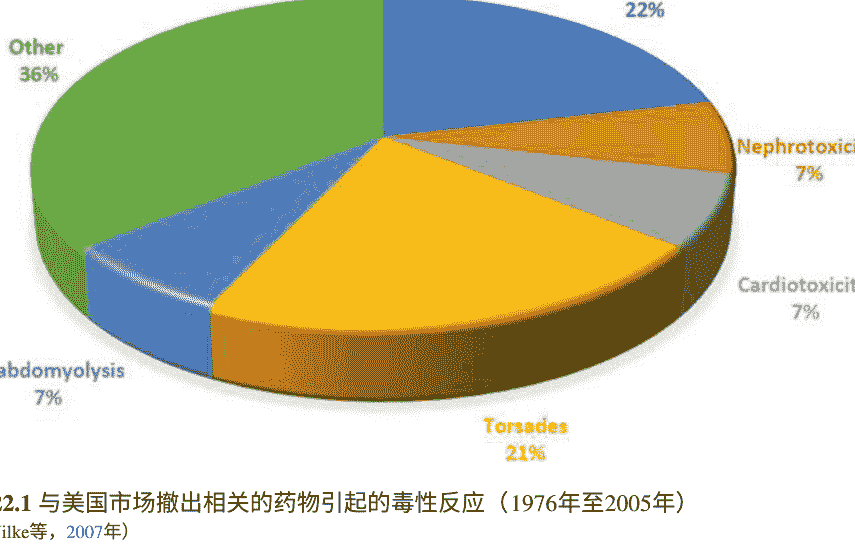

图22.1 与美国市场撤出相关的药物引起的毒性反应（1976年至2005年）(Wilke 等, 2007)。

### 22.2 机器学习算法

机器学习是一种从数据集中提取或识别模式以进行预测的方法。开发用于毒性预测的机器学习模型已经引起了监管机构和制药公司的高度兴趣和接受（Patel 等, 2020）。本节简要介绍了一些已经使用和目前正在使用的器官毒性预测中的机器学习算法。

#### 22.2.1 分类和回归树

分类和回归树（CART）是指用于分类和回归建模的决策树。树状结构表示了预测样本的概率。它是一种常用的监督机器学习建模算法，简单易于解释和可视化。此外，决策树的数据准备简单，不需要数据归一化（Breiman 等, 1984; Loh, 2011）。

使用决策树构建的模型在器官毒性预测上表现良好。在肝毒性预测中，CART模型在十折交叉验证中达到了0.80-0.84的准确率，并且优于使用其他机器学习算法构建的模型[线性判别分析（LDA），k最近邻（kNN）和朴素贝叶斯（NB）]（Liu 等, 2015）。 CART模型用于预测35个目标器官结果，在五折交叉验证中取得了0.71的平均F1分数（Liu 等, 2017）。

#### 22.2.2 k最近邻 (kNN)

k最近邻（kNN）算法是一种非参数的机器学习方法，根据与样本最近的k个样本来为样本分配标签（用于分类）或计算依赖变量值（用于回归）。样本之间的距离可以使用多种方法进行测量，欧氏距离是kNN中最常用的距离测量方法。在训练kNN模型时，有几个需要优化的算法参数，包括最近邻的数量k和距离测量（Baskin, 2018）。

使用kNN和毒物基因组学构建的肝毒性预测模型在五折交叉验证中达到了70%的正确分类率（Low 等, 2011）。肝肥大预测的kNN模型在十折交叉验证中具有75%的平衡准确率（Liu 等, 2015）。肾脏病理终点预测的kNN模型在三折交叉验证中具有0.80的准确性的几何平均值（Kim 和 Shin, 2014）。

#### 22.2.3 朴素贝叶斯 (NB)

NB是一种基于贝叶斯定理的线性机器学习算法，假设独立变量之间相互独立。它是一种简单快速的机器学习算法。NB在毒性预测中被广泛应用（Bender, 2011; Ekins 等, 2010; Williams 等, 2020）。

使用NB和化学结构描述符与体外高通量筛选数据的组合构建的肝毒性预测模型在十折交叉验证中达到了75%的平衡准确率（Liu 等, 2015）。在一项使用临床数据的研究中，使用NB构建的模型在14个研究的器官毒性终点中有8个优于其他算法构建的模型（Xu 等，2020）。用于预测生殖毒性的NB模型在训练中实现了0.884的受试者工作特征曲线下面积（AUC）和91.8%的准确率，在外部验证中实现了0.888的AUC和83%的准确率（Zhang 等，2020）。

#### 22.2.4 随机森林

随机森林（RF）是一组自举决策树的集合，通过将来自各个决策树的样本预测组合起来进行样本预测。RF中的决策树是浅层树，使用随机选择的独立变量的子集构建。一个优点是RF模型开发不需要数据归一化。RF是各个领域广泛应用的机器学习算法（Breiman，2001；Cutler 等，2007；Strobl 等，2008）。

使用毒物基因组学数据构建的RF肝毒性预测模型在五折交叉验证中达到了76%的CCR（Low 等，2011）。在药物诱导的心脏毒性预测中，使用转录和分子特征组合构建的RF模型在留出验证中平均AUC为79%，平均Matthews相关系数（MCC）为0.38（Mamoshina 等，2020）。

#### 22.2.5 支持向量机

支持向量机（SVM）是一种广泛应用于构建分类和回归模型的机器学习算法。对于构建分类器SVM，该算法在通过核函数将低维空间映射到高维空间后，在高维空间中寻找一个能够分离正负组的超平面。数据归一化和参数选择通常用于SVM模型优化（Kim 和 Nam，2017；Liu 等，2015；Zhang 等，2016）。

使用化学结构描述符和体外高通量筛选实验数据组合的SVM模型在十折交叉验证中对肝肥大终点预测达到了0.77的平衡准确率（Liu 等人，2015）。应用SVM开发了肾毒性预测模型，外部验证中肾小管间质性肾炎（TIN）的准确率为0.83，间质性肾炎（IN）的准确率为0.85，管型坏死（TN）的准确率为0.84（Lee 等人，2013）。

### 22.3 器官毒性预测

器官毒性是由化学物质暴露引起的对特定器官的不良影响或疾病。同一种化学物质可能影响不同的器官。因此，在对受管制产品中的化合物进行安全评估时，需要评估肝脏、肾脏、心脏和肺等多个器官的毒性。机器学习具有强大和高效的优势，已被广泛用于开发器官毒性预测模型（Patel 等, 2020）。本节介绍了已开发用于预测肝脏、肾脏和心脏毒性的机器学习模型（表 22.1）。

#### 22.3.1 肝毒性

肝脏是最容易受到化学物质干扰的器官，因为它在转化和清除外源物质方面起着关键作用。肝毒性是药物退出的最常见原因（Bourhia 等人, 2020; Matthews 等人, 2009; Regev, 2014; Russmann 等人, 2009）。因此，人们在肝毒性预测方面投入了大量的努力。

定量结构-活性关系（QSAR）模型是基于假设构建的，即具有相似结构的化合物可能具有相似的生物活性和性质。QSAR模型已广泛用于肝毒性预测（Chen 等人 2013; Hong 等人 2016; Matthews 等人 2009; Zhu 等人 2016）。例如，Matthews 等人（2009）使用四个具有不同机器学习算法的程序构建了QSAR模型，用于药物诱导的肝毒性，使用了来自人类后市场不良反应的数据。

体外生物活性数据已经常被用于毒性预测。为了开发针对啮齿动物肝毒性的预测模型，刘等人结合了化学结构描述符和体外高通量筛选（HTS）实验数据（Liu 等人，2015）。在他们的研究中，肝脏组织病理学终点从`ToxRefDB`（Martin 等人，2009）的体内动物研究中提取，并根据领域术语（Thoolesen 等人，2010）将其分为三个广泛的肝毒性类别（肥大、损伤和增殖性病变）。从三种类型的描述符（仅化学描述符、仅HTS实验数据和两种描述符）和三个肝毒性类别中生成了九个用于监督机器学习的数据集。应用了五种机器学习算法，包括`LDA`、`NB`、`SVM`、`CART`和`kNN`，分别对每个数据集进行模型开发。

如图22.2所示，仅使用化学描述符构建的模型优于仅使用体外生物活性数据构建的模型，表明化学结构特征对于肝毒性至关重要。总体而言，由化学和生物活性描述符组合构建的模型表现略好，这表明体外生物活性数据可以为表征啮齿动物的三个肝毒性类别提供额外的信息。这证明了使用多种类型的数据（如化学结构和体外生物活性数据）构建的模型在肝毒性预测方面的性能提升。

为了预测人体肝毒性，徐等人（2020）还整合了化学结构和高通量筛选生物活性数据来构建机器学习模型。应用了五种机器学习算法[NB，SVM，RF，神经网络（NNET）和极限梯度提升（XGBoost）]，从整合的化学结构和生物活性数据，仅化学结构数据以及仅生物活性数据构建的模型分别达到了最佳AUC值0.78，0.77和0.68。与小鼠研究一致（刘等人，2015），使用多种描述符整合构建的模型比使用单个描述符类型构建的模型表现更好。

基因组学数据已广泛应用于毒理学研究中，通过机器学习算法开发器官毒性预测模型。Low等人仅使用基因组学数据、化学结构描述符或基因组学数据与结构描述符的组合构建模型进行肝毒性预测（Low等人，2011）。在他们的研究中，肝脏器官水平的组织病理学数据被评估用于毒性终点分类。如果观察到化合物的组织病理学变化，则认为该化合物具有毒性；否则，认为该化合物无毒。

基于基因组数据、化学结构描述符和二者的组合，使用四种机器学习算法（RF、kNN、SVM和DWD）开发了肝毒性预测模型。两者都使用五折交叉验证评估了这些模型。在五折交叉验证中，仅使用化学描述符和仅使用基因组数据构建的最佳模型的CCR值分别为61%和76%。在五折交叉验证中，同时使用化学结构描述符和基因组数据构建的最佳模型的CCR为77%，与基于基因组数据构建的最佳模型（76%）的性能相似。结果显示，基因组数据在使用机器学习算法开发肝毒性预测模型中具有实用性。

### 22.3.2 肾毒性

肾脏在代谢中起着重要作用，因此容易受到药物引起的器官毒性的影响。药物引起的肾毒性占急性肾损伤病例的19-25%（Bonventre et al. 2010; Faria et al . 2019）。因此，已经开发了机器学习模型来辅助评估肾毒性。化学结构描述符已被应用于肾毒性预测的QSAR模型的开发中（Lee et al.2013; Matthews et al.2009; Myshkin et al.2012; Pizzo et al. 2015; Sakuratani et al. 2013）。

QSAR模型是使用四个软件包[MC4PC (www.multicase.com), BioEpisteme (www.prousscience.com), MDL-QSAR (www.mdli.com), 和Leadscope Predictive Data Miner (www.leadscope.com)]开发的，用于从1600个化学结构中预测人类药物引起的六种类型的尿路损伤，使用了来自美国食品和药物管理局（FDA）的后市场监测数据库和已发表的文献（Matthews et al.2009）中的不良事件数据。最佳模型显示出高特异性（86.5%）和低敏感性（39.3%），表明通过QSAR预测人类肾毒性是一项具有挑战性的任务，需要改进模型性能。

QSAR模型是用于预测化学物质的肾毒性（Lee et al.2013）。肾毒性数据来自PharmaPendium数据库，该数据库包含临床试验数据和后市场监测报告。基于387种药理化合物及其233种代谢物的8种化学指纹，使用SVM开发了预测肾损伤的三个终点的分类模型，包括TIN、IN和TN。使用十折交叉验证，使用387种药理化合物的模型的分类准确率分别为0.71-0.77、0.69-0.76和0.75-0.83，对于TN、IN和TIN，而外部验证的准确率分别为0.54-0.72、0.64-0.79和0.71-0.89，对于TN、IN和TIN。有趣的是，基于233种代谢物的模型的性能得到了改善，十折交叉验证的整体准确率为0.70-0.83（TN）、0.72-0.84（IN）和0.79-0.84（TIN），而外部验证的准确率为0.68-0.84（TN）、0.73-0.85（IN）和0.72-0.83（TIN）。他们的研究结果表明，使用机器学习算法构建的QSAR模型可以合理地预测肾毒性，并且化合物的代谢物提供了有用的信息，应该包括在机器学习模型的开发中，以提高肾毒性预测的准确性。

高通量筛选（HTS）体外生物活性数据已被用于开发用于预测肾毒性的机器学习模型。Xu等人利用HTS体外生物活性数据和化学结构构建了用于预测肾输尿管和膀胱的机器学习模型（Xu等，2020）。在他们的研究中，通过在ChemIDPlus数据库（chem.sis.nlm.nih.gov/chemidplus/）上手动搜索，收集了肾毒性终点肾输尿管和膀胱的数据。根据化学结构描述符、HTS体外生物活性数据以及两者的组合，构建了五个机器学习算法（XGBoost、NB、RF、SVM和NNET）的毒性预测模型。使用五折交叉验证对模型进行了评估。基于化学结构的最佳模型使用NNET构建，AUC为0.77。基于HTS体外生物活性数据的最佳模型使用SVM构建，AUC略小，为0.72。有趣的是，基于化学结构和HTS体外生物活性数据的组合的最佳模型的AUC为0.77，与仅基于化学结构的最佳模型相同。结果表明，HTS体外生物活性数据可能不比化学结构特征提供更多信息来预测肾毒性。需要进一步研究以改进HTS体外生物活性数据在肾毒性预测中的应用。

基因组学数据也被应用于机器学习模型的开发，用于肾毒性预测。例如，使用基因表达数据（Kim和Shin2014）开发了用于药物诱导性肾毒性预测的模型。在这项研究中，从Open TG-GATEs（http://toxico.nibio.go.jp）中选择了41种药物的3,708个大鼠基因表达谱，作为肾毒性的指标。使用基于kNN的方法构建了预测这10个病理发现的模型。模型的性能通过三折交叉验证进行评估，得到的整体预测准确率、敏感性和特异性分别为0.56-0.92（几何平均值为0.80）、0.39-0.88（几何平均值为0.80）和0.66-0.96（几何平均值为0.88）。尽管结果表明基因表达谱在预测肾毒性的机器学习模型的开发中具有一定的实用性，但需要注意的是药物数量较少，模型的泛化能力存在局限性。还应注意的是，预测肾毒性不同病理发现的模型性能差异很大，这表明使用病理发现评估化学物质的肾毒性仍然是一项具有挑战性的任务。

### 22.3.3 心脏毒性

心脏也是毒性的常见靶器官。心脏毒性代表由化合物暴露引起的对心肌的损害。因此，对市场上和环境中化学品的心脏毒性进行评估对公共健康的保护至关重要。尽管已经开发了许多实验方法来检测心脏毒性，但在实际上不可能测试市场上和环境中所有化学品的心脏毒性。已经提出了各种替代方法，包括计算方法，以辅助心脏毒性评估。机器学习已广泛应用于预测心脏毒性模型的开发中。

使用化学结构描述符和转录谱来预测六种药物诱导的心脏毒性类型（心律失常、心肌疾病、心力衰竭、冠状动脉疾病、心脏疾病和心包疾病）开发了机器学习模型（Mamoshina等，2020）。从DrugBank（www.drugbank.com）等公共数据库收集的357种具有心脏毒性数据和转录谱的药物中，有66种用于测试，其余291种用于训练。模型使用291种药物进行训练，并在66种保留药物上进行测试。此外，从Drug Toxicity Signature Generation Center网站（https://martip03.u.hpc.mssm.edu/index.php）下载了51种药物的654个基因表达谱作为外部验证集，以进一步验证模型的性能。使用RF生成了最佳模型，在保留验证中的10种心脏毒性形式的平均AUC为0.79，在外部验证中的平均AUC为0.66。结果表明，在机器学习模型的开发中，结合基因表达谱和分子描述符可能会提高对心脏毒性的预测性能。

证据表明，在心脏毒性预测的机器学习模型开发中，整合不同类型的数据可以提高模型性能。例如，化学描述符、ToxPrint Chemotypes、体外HTS测定数据被整合以构建预测心脏毒性的模型（Liu等人2017）。在该研究中，心脏毒性数据来源于动物研究和临床试验。使用了五种机器学习算法（NB、SVC、RF、CART和kNN）来开发模型。在五折交叉验证中，最佳模型的F1得分在0.74到0.75之间。

表22.1 用于器官毒性预测的机器学习模型

| 器官 | 描述符 | 算法 | 性能a | 参考文献 |
|------|--------|------|--------|----------|
| 肝脏 | 结构, HTS测定数据 | CART, kNN, LDA, NB和SVM | 准确率: 0.67-0.84 | (Liu等人, 2015) |
|  | 化学结构, HTS测定数据 | NB, SVM, RF, XGBoost和NNET | AUC: 0.68-0.78 | (Xu等人, 2020) |
|  | 结构, 基因组学data | RF, kNN, SVM, DWD | 准确率: 0.61-0.77 | (Low等人2011) |
| 肾脏 | 结构 | SVM | 准确率: 0.69-0.83 | (Lee等人2013) |
|  | 基因组数据 | kNN | 准确率: 0.80-0.88 | (Kim和Shin 2014) |
|  | 结构, HTS测定数据 | NB, SVM, RF, NNET, XGBoost | AUC: 0.72-0.77 | (Xu等人, 2020) |
| 心脏 | 结构, 基因组学data | RF | AUC: 0.79 | (Mamoshina等人2020) |

|  | 结构, HTS测定数据 | NB, SVC, RF, CART, kNN | F1得分: 0.74-0.75 | (Liu等人2017) |

|  | 化学结构, HTS测定数据 | NB, SVM, RF, NNET, XGBoost | 平衡准确率: 0.63-0.70 | (Xu等人, 2020) |

^a来自交叉验证ToxCast的生物活性数据以及体内动物器官水平组织病理学数据被整合用于构建机器学习模型，以预测动物器官水平的心脏毒性（Liu等人，2017年）。这些模型使用`NB`、`SVM`、`RF`、`CART`和`kNN`算法构建，并使用五折交叉验证进行评估。基于下采样数据（50个阳性和50个阴性化学品），使用生物活性数据和化学结构描述符的组合以及生物活性数据和`ToxPrint` Chemotypes的组合，`kNN`生成了最佳的机器学习模型。该模型在五折交叉验证中预测慢性和亚慢性心脏毒性的平均F1分数分别为0.75和0.74。当使用完整数据集（慢性研究：125个阳性和125个阴性化学品；亚慢性研究：134个阳性和134个阴性化学品）时，使用`SVM`构建的模型表现最佳，在五折交叉验证中预测慢性和亚慢性心脏毒性的平均F1分数分别为0.86和0.84。这些结果进一步证明了结合不同类型的数据可以改善预测心脏毒性的机器学习模型。此外，该研究揭示了体外`HTS`测定数据通过机器学习对心脏毒性的预测提供了有用的信息。由于基于完整数据集开发的模型表现优于基于下采样数据集构建的模型，需要增加具有心脏毒性数据的化学品数量，以开发稳健准确的心脏毒性预测机器学习模型。

`Tox21`体外`HTS`生物活性测定数据被用于开发机器学习模型，用于预测心脏毒性（Xu等人，2020年）。使用了五种机器学习算法（`NB`，`SVM`，`RF`，`NNET`和`XGBoost`）基于化学结构，体外`HTS`生物活性测定数据以及两者的组合来开发心脏毒性预测模型。模型使用五折交叉验证进行评估。使用化学结构描述符构建的`SVM`，使用体外`HTS`生物活性测定数据构建的`XGBoost`，以及使用两者组合构建的`SVM`，这三个模型在五折交叉验证中的平均平衡准确度分别为0.70，0.63和0.67。

基于化学结构描述符，仅基于体外`HTS`生物活性测定数据以及两者组合构建的最佳血管毒性模型分别使用了`NB`，`XGBoost`和`NB`，并且在五折交叉验证中的平均平衡准确度分别为0.77，0.62和0.66。令人惊讶的是，无论是心脏毒性还是血管毒性预测，将化学结构和体外`HTS`生物活性测定数据组合构建的最佳模型表现都不如仅使用化学结构构建的最佳模型。这些结果不仅表明在机器学习模型开发中需要谨慎使用体外`HTS`生物活性测定数据，还暗示了在模型构建中使用不当的程序可能是观察结果的原因，因此在机器学习模型开发中遵循良好的实践非常重要。

### 22.4 有关器官毒性预测的案例研究

器官水平毒性的机制很复杂。机器学习提供了一种从体外到体内外推的方法。`Liu`等人使用化学结构描述符、`ToxPrint` Chemotypes、`HTS`生物活性描述符和体内指南动物研究的组织病理毒性终点，开发了多器官水平毒性预测模型（`Liu`等人，2017年）。本节将使用这些数据作为案例研究，展示机器学习技术在器官毒性预测中的应用。

#### 22.4.1 数据来源

使用的动物毒性数据（表22.2）来自`ToxRefDB`（`www.epa.gov/chemical-research/exploring-toxcast-data-downloadable-data`）。`ToxRefDB`中的体内毒性数据来自不同的指南研究、物种和靶器官（`Martin`等人，2009年），根据研究类型和毒性效应的靶位进行分组，例如`CHR`（慢性研究）：肾脏，`MGR`（多代研究）：肾脏，`SUB`（亚慢性研究）：肾脏。从`ToxRefDB`获取了至少100种化学物质（50个阳性和50个阴性）在靶器官和研究类型之间的35个体内毒性结果，并用于开发预测器官毒性的机器学习模型。

用于描述化学物质的三种数据类型包括`HTS`生物活性数据、化学结构数据和化学类型数据。`HTS`体外测定数据从`ToxCast`数据库中提取（`https://www.epa.gov/chemical-research/exploring-toxcast-data-downloadable-data`，版本为2014年11月）（`Judson`等人，2010年）。化学结构从`DSSTox`数据库中获取（`Richard`等人，2016年），并使用`Morgan`指纹（`Rogers`和`Hahn`，2010年）计算结构描述符。对于每种化学物质，使用`ChemoTyper`软件生成了729个`ToxPrint`化学类型（结构片段）描述符（`Yang`等人，2015年）。此外，还为机器学习模型开发生成了两种混合描述符（生物活性和化学结构描述符，生物活性和化学类型描述符）（表22.3）。

对于每组独立变量（结构描述符或生物活性数据），化合物在三种研究类型中有35个靶器官结果。总共生成了175个数据集用于模型开发。从这175个数据集中，具有最大数量活性或非活性化学物质的平衡数据子集被称为完整数据集。从这175个完整数据集中，生成了一个包含50个活性和50个非活性化学物质的较小数据集，称为最小数据集。

表22.2 化学物质在三十五个器官毒性终点上的分布

| 器官毒性终点 | 阳性 | 阴性 |
| :--- | :--- | :--- |
| 慢性研究：肾上腺 | 188 | 351 |
| 慢性研究：骨髓 | 78 | 461 |
| 慢性研究：大脑 | 136 | 403 |
| 慢性研究：眼睛 | 93 | 446 |
| 慢性研究：心脏 | 128 | 411 |
| 慢性研究：肾脏 | 324 | 215 |
| 慢性研究：肝脏 | 414 | 125 |
| 慢性研究：肺 | 183 | 356 |
| 慢性研究：淋巴结 | 73 | 466 |
| 慢性研究：乳腺 | 64 | 475 |
| 慢性研究：胰腺 | 66 | 473 |
| 慢性研究：垂体 | 76 | 463 |
| 慢性研究：脾脏 | 205 | 334 |
| 慢性研究：胃 | 134 | 405 |
| 慢性研究：睾丸 | 164 | 375 |
| 慢性研究：胸腺 | 72 | 467 |
| 慢性研究：甲状腺 | 169 | 370 |
| 慢性研究：膀胱 | 53 | 486 |
| 慢性研究：子宫 | 86 | 453 |
| 多代研究：大脑 | 51 | 388 |
| 多代研究：肾脏 | 147 | 292 |
| 多代研究：卵巢 | 65 | 374 |
| 多代研究：睾丸 | 91 | 348 |
| 亚慢性研究：肾上腺 | 126 | 401 |
| 亚慢性研究：骨髓 | 82 | 445 |
| 亚慢性研究：大脑 | 117 | 410 |
| 亚慢性研究：心脏 | 134 | 393 |
| 亚慢性研究：肾脏 | 313 | 214 |
| 亚慢性研究：肝脏 | 387 | 140 |
| 亚慢性研究：肺 | 87 | 440 |
| 亚慢性研究：脾脏 | 176 | 351 |
| 亚慢性研究：胃 | 88 | 439 |
| 亚慢性研究：睾丸 | 159 | 368 |
| 亚慢性研究：胸腺 | 100 | 427 |
| 亚慢性研究：甲状腺 | 88 | 439 |

表22.3 描述符在三十五个器官毒性终点上的应用

| 描述符类型 | 描述符数量 |
| :--- | :--- |
| 生物活性 | 821 |
| 化学结构 | 2048 |
| `ToxPrint`化学类型 | 729 |
| 生物活性和化学结构 | 2869 |
| 生物活性和`ToxPrint`化学类型 | 1550 |

#### 22.4.2 监督机器学习

针对每个175个完整数据集和175个最小数据集，使用五种监督机器学习算法(`NB`，`SVM`，`CART`，`kNN`和`RF`)构建了预测模型。图22.3总结了有关器官毒性预测模型开发的工作流程。

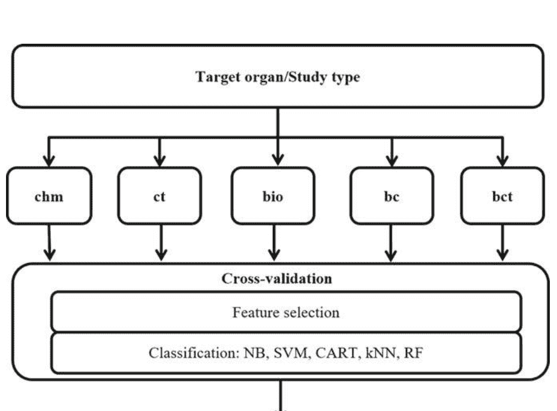

对于每对数据集和机器学习算法，通过对内循环训练集中的自变量进行`ANOVA`分析，选择五个独立变量（5、10、15、20和25）来构建模型。对构建的8750个模型进行了十次五折交叉验证以评估性能。使用F1分数、敏感性和特异性来衡量分类性能。

#### 22.4.3 结果

对于最小数据集（50个阳性和50个阴性化学物质），在所有模型中，预测多代脑毒性的模型具有最高的F1得分为0.85 ±0.09。机器学习算法预测所有目标器官毒性终点的平均F1得分为`kNN`（`k=3`）为0.73，`kNN`（`k=5`）为0.72，`RF`为0.70，`SVM`（线性核）为0.69，`SVM`（径向基核）为0.70，`CART`为0.69，`NB`为0.61。五种独立变量类型的所有目标器官毒性终点的平均F1得分为结构描述符和生物活性数据为0.70，化学类型描述符和生物活性数据为0.70，生物活性数据为0.70，化学类型描述符为0.68，结构描述符为0.67。

在完整数据集（最大正负化学物质）中，预测亚慢性骨髓毒性的模型具有最高的F1得分，为`0.88 ±0.06`。对于完整数据集，机器学习算法预测所有靶器官毒性终点的平均F1得分分别为`kNN`为`0.73`，`RF`为`0.72`，`SVM`为`0.70`，`CART`为`0.71`，`NB`为`0.62`。预测所有靶器官毒性终点的模型在五种独立变量类型上的平均F1得分分别为生物活性和结构描述符为`0.72`，生物活性和化学类型描述符为`0.72`，生物活性描述符为`0.72`，化学类型描述符为`0.69`，结构描述符为`0.68`。

为了研究数据规模的影响，使用不同类型的描述符、动物研究类型和机器学习算法开发的35个器官毒性终点模型的最佳F1得分如图22.4所示。蓝色圆圈和橙色三角形分别代表使用完整数据集和最小数据集构建的模型。与最小数据集相比，完整数据集具有更多的化学物质，并且基于完整数据集构建的模型性能更好。

对不同建模因素对器官毒性预测模型性能的影响进行了检查，结果发现目标器官毒性终点对模型性能的影响最大，其次是独立变量类型，而机器学习算法的影响最小。此外，由两种描述符混合生成的模型比由一种描述符生成的模型性能更好。在由最小数据集构建的模型中，`kNN`模型表现最佳。然而，在由完整数据集构建的模型中，没有单一算法脱颖而出。

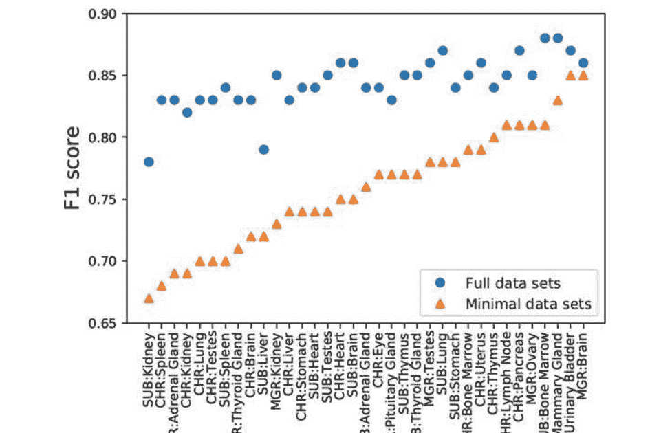

图22.4 F1分数显示了构建的最佳模型在35个器官毒性终点中的表现

这项研究证明了生物活性数据和化学结构描述符在开发用于预测动物指南研究中观察到的目标器官毒性的机器学习模型方面的实用性。

### 22.5 总结

肝脏、肾脏、心脏和肺等靶器官毒性是安全评估中的常见问题，也是药物退市的主要原因。因此，尽早评估化学物质的潜在靶器官毒性对于监管机构和制药公司非常重要，即使目前尚不清楚器官毒性的机制。

目前，化学品的安全评估主要依赖于动物实验。然而，动物实验费用高昂且耗时，这使得使用动物模型测试成千上万种化合物变得不可能。随着提出的3R（替代、减少和改进）原则，越来越多的工作集中在替代性毒性测试方法上。许多计算毒理学方法已经被开发并应用于药物发现、化学品风险评估和产品安全评估（Cheng等，2017年；Hong等，1998年，2018年；Huang等，2020年；Ji等，2021年；Ng等，2015年，2014年；Sakkiah等，2020a，b，2021年；Shen等，2013年；Yang等，2021年）。在计算方法中，机器学习是最有前景的方法，因为它具有计算能力和效率（Hong等，2017年，2005年；Idakwo等，2019年；Luo等，2015年；Sakamuru等，2021年；Sakkiah等，2018年，2017年；Tang等，2020年；Wang等，2020年，2021年）。器官毒性的诱导是复杂的，并受到各种因素的影响。因此，预测体内器官毒性是一个挑战。研究表明，靶器官、数据描述符的类型和机器学习算法都会影响靶器官毒性预测的性能（Liu等，2017；Xu等，2020）。最近开发的用于人体体内器官水平毒性预测的计算模型为分子基因与器官水平毒性之间的联系提供了有希望的视角（Xu等，2021）。随着新技术的发展和可用数据量的增加，将有更多的方法来优化和验证用于筛选具有潜在器官水平毒性的化学物质的计算模型。

免责声明本章反映了作者的观点，不一定反映美国食品药品监督管理局的观点。

## 参考文献

- Ashburn TT, Thor KB (2004) 药物再定位：确定和开发现有药物的新用途。自然药物发现评论3（8）：673-683

- Baskin II (2018) 机器学习方法在计算毒理学中的应用。在：Nicolotti O (eds) 计算毒理学。分子生物学方法，第1800卷。Humana Press，纽约，纽约

- Bender A (2011) 贝叶斯方法在虚拟筛选和化学生物学中的应用。方法Mol Biol 672:175–196

- Bonventre JV, Vaidya VS, Schmouder R, Feig P, Dieterle F (2010) 用于检测肾毒性的下一代生物标志物。Nat Biotechnol 28(5)：436–440

- Bourhia M, Ullah R, A SA, Ibenmoussa S (2020) 证据表明马格里布人群中的药物诱导性肝毒性。Drug Chem Toxicol 1–5

- Breiman L (2001) 随机森林。机器学习45：5–32

- Breiman L, Friedman J, Stone CJ, Olshen RA (1984) 分类和回归树。Taylor & Francis

- Chen M, Hong H, Fang H, Kelly R, Zhou G, Borlak J, Tong W (2013) 基于FDA批准的药物标签注释和大量药物的定量结构-活性关系模型，用于预测药物引起的肝损伤。Toxicol Sci 136(1):242–249

- Cheng F, Hong H, Yang S, Wei Y (2017) 基于个体化网络的药物再定位基础设施，用于泛基因组时代的精准肿瘤学。Brief Bioinform 18(4):682–697

- Cook D, Brown D, Alexander R, March R, Morgan P, Satterthwaite G, Pangalos MN (2014) 从阿斯利康药物管道的命运中汲取教训：一个五维框架。Nat Rev DrugDiscov 13(6):419–431

- Cutler DR, Edwards TC Jr, Beard KH, Cutler A, Hess KT, Gibson J, Lawler JJ (2007) 生态学中的随机森林分类。Ecology 88(11):2783–2792

- Ekins S, Williams AJ, Xu JJ (2010) 用于人类药物诱导性肝损伤的预测性基于配体的贝叶斯模型。药物代谢与排泄 38(12):2302–2308

- Faria J, Ahmed S, Gerritsen KGF, Mihaila SM, Masereeuw R (2019) 基于肾脏的体外模型用于药物诱导性毒性测试。毒理学杂志 93(12):3397–3418

- Hong H, Chen M, Ng HW, Tong W (2016) 美国FDA/NCTR的QSAR模型。

- Hong H, Neamati N, Winslow HE, Christensen JL, Orr A, Pommier Y, Milne GW (1998) 基于四点药效团的HIV-1整合酶抑制剂的鉴定。抗病毒化学与化疗 9(6):461–472

- Hong H, Thakkar S, Chen M, Tong W (2017) 开发决策森林模型，使用大量FDA批准的药物预测药物引起的肝损伤。科学报告7(1):17311

- Hong H, Tong W, Xie Q, Fang H, Perkins R (2005) 一种基于计算的集成方法用于铅发现：决策森林。SAR QSAR环境研究16（4）：339-347

- Hong H, Zhu J, Chen M, Gong P, Zhang C, Tong W (2018) 用于预测人体药物诱导肝损伤风险的定量构效关系模型。在：Chen M, Wei Y (编辑) 药物诱导肝毒性。药理学和毒理学方法。纽约，纽约州，人类出版社，pp 77-100

- Huang Y, Li X, Xu S, Zheng H, Zhang L, Chen J, Hong H, Kusko R, Li R (2020) 用于预测金属氧化物纳米颗粒的炎症潜力的定量结构-活性关系模型。环境健康展望128(6):67010

- Idakwo G, Luttrell IV J, Chen M， Hong H， Gong P， Zhang C （2019） 基于QSAR的毒性预测的特征减少方法综述。在：Hong H （编辑） 计算毒理学的进展。计算化学和物理学的挑战与进展，第30卷。斯普林格，瑞士，pp 119-139

- Ji Z, Guo W, Sakkiah S, Liu J, Patterson TA, Hong H (2021) 纳米材料数据库：促进纳米材料设计和风险评估的数据来源。纳米材料（巴塞尔）11（6）：1599

- Judson RS, Houck KA, Kavlock RJ, Knudsen TB, Martin MT, Mortensen HM, Reif DM, Rotroff DM, Shah I, Richard AM, Dix DJ (2010) 用于环境化学品的体外筛选的靶向测试优先级：ToxCast项目。环境健康展望118（4）：485–492

- Kim E, Nam H (2017) 利用加权分子指纹预测药物诱导的肝毒性的预测模型。BMC生物信息学18（增刊7）：227

- Kim J, Shin M (2014) 利用基因表达数据的多器官药物诱导毒性预测的综合模型。BMC生物信息学15（增刊16）：S2


- Li S, Kang YM, Park H, Dong MS, Shin JM, No KT (2013) 基于药物化合物和它们的代谢物数据集的三种肾损伤类型的人类肾毒性预测模型。化学研究毒理学26（11）：1652-1659

- Lin Z, Wei Y (2012) 在器官特异性细胞系中评估具有特定器官毒性的药物。毒理学科学126（1）：114-127

- Liu J, Mansouri K, Judson RS, Martin MT, Hong H, Chen M, Xu X, Thomas RS, Shah I (2015) 使用ToxCast体外生物活性和化学结构预测肝毒性。Chem ResToxicol 28(4):738–751

- Liu J， Patlewicz G， Williams AJ， Thomas RS， Shah I （2017） 使用体外生物活性数据和化学结构预测器官毒性。化学研究毒理学30（11）：2046-2059

- Luo WY (2011) 分类和回归树。Wiley跨学科综述：数据挖掘知识发现1：14-23

- Low Y， Uehara T， Saito Y， Yamada H， Ohno Y， Kito Y， Sedykh A， Muratov E， Kuz'min V， Fourches D， Zhu H， Rusyn I， Tropsha A （2011） 使用QSAR和毒物基因组学方法预测药物诱导的肝毒性。化学研究毒理学24（8）：1251-1262

- Lu TP， Chen JJ （2015） 鉴定用于治疗决策的药物诱导毒性生物标志物。药物统计学14（4）：284-293

- Luo H, Ye H, Ng HW, Shi L, Tong W, Mendrick DL, Hong H (2015) 机器学习方法用于预测HLA-肽结合活性。Bioinform Biol Insights 9(Suppl 3):21–29

- Mamoshina P, Bueno-Orovio A, Rodriguez B (2020) 双转录组和分子机器学习预测所有主要的药物心脏毒性临床形式。

- Martin MT, Judson RS, Reif DM, Kavlock RJ, Dix DJ (2009) 基于美国EPA ToxRef数据库的慢性毒性结果对化学物质进行分析。环境健康展望117 (3) : 392-399

- Matthews EJ, Ursem CJ, Kruhlak NL, Benz RD, Sabate DA, Yang C, Klopman G, Contrera JF (2009) 鉴定药物对人体产生不良反应的结构-活性关系：第B部分。使用（Q）SAR系统早期检测药物诱导的肝胆和泌尿道毒性。Regul Toxicol Pharmacol 54 (1) : 23-42

- Myshkin E, Brennan R, Khasanova T, Sitnik T, Serebriyskaya T, Litvinova E, Guryanov A, Nikolsky Y, Nikolskaya T, Bureeva S (2012) 基于精确的化学-组织病理学注释的QSAR建模预测器官毒性终点。Chem Biol Drug Des 80(3):406–416

- Ng HW, Shu M, Luo H, Ye H, Ge W, Perkins R, Tong W, Hong H (2015) 雌激素活性数据提取和计算预测显示了双酚A替代化合物的内分泌干扰潜力。Chem Res Toxicol 28(9):1784–1795

- Ng HW, Zhang W, Shu M, Luo H, Ge W, Perkins R, Tong W, Hong H (2014) 竞争性分子对接方法用于预测雌激素受体亚型α激动剂和拮抗剂。BMC Bioinform 15(Suppl 11):S4

- Patel CN, Kumar SP, Rawal RM, Patel DP, Gonzalez FJ, Pandya HA (2020) 一种用于药物发现的多参数器官毒性预测器。Toxicol Mech Methods 30 (3) : 159-166

- Paul SM, Mytelka DS, Dunwiddie CT, Persinger CC, Munos BH, Lindborg SR, Schacht AL (2010) 如何提高研发生产力：制药行业的重大挑战。Nat Rev Drug Discov 9 (3) : 203-214

- Pizzo F, Gadaleta D, Lombardo A, Nicolotti O, Benfenati E (2015) 使用重复剂量毒性数据识别肝脏和肾脏毒性的结构警示。Chem Cent J 9: 62

- Raschi E, De Ponti F (2017) 药物性肝损伤：早期预测和风险分层。World J Hepatol 9 (1) : 30-37

- Regev A (2014) 药物引起的肝损伤和药物开发：行业观点。Semin Liver Dis 34(2):227–239

- Richard AM, Judson RS, Houck KA, Grulke CM, Volarath P, Thillainadarajah I, Yang C, Rathman J, Martin MT, Wambaugh JF, Knudsen TB, Kancherla J, Mansouri K, Patlewicz G, Williams AJ, Little SB, Crofton KM, Thomas RS (2016) ToxCast化学景观：铺设通往21世纪毒理学之路。Chem Res Toxicol 29(8):1225–1251

- Rogers D, Hahn M (2010) 扩展连接指纹。J Chem Inf Model 50(5):742–754

- Russmann S, Kullak-Ublick GA, Grattagliano I (2009) 药物引起的肝毒性的机制的当前概念。Curr Med Chem 16(23):3041–3053

- Sakamuru S, Zhao J, Xia M, Hong H, Simeonov A, Vaisman I, Huang R (2021) 预测模型，用于识别阿片受体的小分子激动剂和抑制剂。J Chem Inf Model 61(6):2675–2685

- Sakkiah S, Guo W, Pan B, Kusko R, Tong W, Hong H (2018) 计算预测化学物质的内分泌干扰潜力模型。J Environ Sci Health C Environ Carcinog Ecotoxicol Rev 36(4):192–218

- Sakkiah S, Guo W, Pan B, Ji Z, Yavas G, Azevedo M, Hawes J, Patterson TA, Hong H (2020a) 通过同源建模和分子动力学模拟阐明SARS-CoV-2三聚体尖峰蛋白与ACE2之间的相互作用。

- Sakkiah S, Leggett C, Pan B, Guo W, Valerio LG Jr, Hong H (2020b) 开发一个尼古丁酸乙酰胆碱受体nAChR alpha7结合活性预测模型。J Chem Inf Model 60(4):2396–2404

- Sakkiah S, Selvaraj C, Gong P, Zhang C, Tong W, Hong H (2017) 使用大量化学物质开发雌激素受体β结合预测模型。Oncotarget 8(54):92989–93000

- Sakkiah S, Selvaraj C, Guo W, Liu J, Ge W, Patterson TA, Hong H (2021) 通过分子对接、分子动力学模拟和量子力学计算相结合，阐明ER-alpha中激动剂和拮抗剂的动态结合模式。Int J Mol Sci 22(17)

- Sakuratani Y, Zhang HQ, Nishikawa S, Yamazaki K, Yamada T, Yamada J, Gerova K, Chankov G, Mekenyan O, Hayashi M (2013) 使用毒理学类别预测重复剂量毒性的危险评估支持系统（HESS）。SAR QSAR Environ Res 24(5):351–363

- Schuster D, Laggner C, Langer T (2005) 为什么药物失败-关于新化学物质的副作用研究。Curr Pharm Des 11 (27) : 3545-3559


Shen J, Xu L, Fang H, Richard AM, Bray JD, Judson RS, Zhou G, Colatsky TJ, Aungst JL, Teng C, Harris SC, Ge W, Dai SY, Su Z, Jacobs AC, Harrouk W, Perkins R, Tong W, Hong H (2013) EADB: 一种用于评估潜在内分泌活性的雌激素活性数据库。Toxicol Sci 135(2):277–291

Strobl C, Boulesteix AL, Kneib T, Augustin T, Zeileis A (2008) 随机森林中的条件变量重要性。BMC Bioinform 9: 307

Tang W, Chen J, Hong H (2020) 线粒体毒性的判别模型通过共识建模和解决训练中的不平衡得到改进。Chemosphere 253: 126768

Thoolen B, Maronpot RR, Harada T, Nyska A, Rousseaux C, Nolte T, Malarkey DE, Kaufmann W, Küttler K, Deschl U (2010) 大鼠和小鼠肝胆系统的增殖性和非增殖性病变。Toxicol Pathol 38 (Suppl 7) : 5S-81S

Tornqvist E, Annas A, Granath B, Jalkestern E, Cotgreave I, Oberg M (2014) 对3R原则的战略关注揭示了制药毒性测试中动物使用的大幅减少。PLoS ONE 9(7):e101638

Wang Z, Chen J, Hong H (2020) 适用领域增强了基于药物类似化合物训练的PPARgamma激动剂分类器对环境化学品的应用。Chem Res Toxicol 33(6):1382–1388

Wang Z, Chen J, Hong H (2021) 使用大数据集和机器学习算法开发具有定义适用领域的PPARgamma结合亲和力的QSAR模型。Environ Sci Technol 55(10):6857–6866

Wilke RA, Lin DW, Roden DM, Watkins PB, Flockhart D, Zineh I, Giacomini KM, Krauss RM (2007) 鉴定导致严重不良药物反应的遗传风险因素：当前进展和挑战。Nat Rev Drug Discov 6(11):904–916

Williams DP, Lazic SE, Foster AJ, Semenova E, Morgan P (2020) 用贝叶斯机器学习预测药物引起的肝损伤。Chem Res Toxicol 33(1):239–248

Xu T, Ngan DK, Ye L, Xia M, Xie HQ, Zhao B, Simeonov A, Huang R (2020) 基于体外生物活性数据和化学结构的人体器官毒性预测模型。Chem Res Toxicol 33(3):731–741

Xu T, Wu L, Xia M, Simeonov A, Huang R (2021) 系统性地识别与人体器官水平毒性相关的分子靶点和途径。Chem Res Toxicol 34(2):412–421

Yang C, Tarkhov A, Marusczyk J, Bienfait B, Gasteiger J, Kleinoeder T, Magdziarz T, Sacher O, Schwab CH, Schwöbel J, Terflot h L, Arvidson K, Richard A, Worth A, Rathman J (2015) 新的公开可用的化学查询语言CSRML，用于支持数据挖掘和建模的化学类型表示。J Chem Inf Model 55(3):510–528

Yang X, Ou W, Zhao S, Wang L, Chen J, Kusko R, Hong H, Liu H (2021) 卤代噻酚和卤代酚对人甲状腺素结合亲和力的体外和体内研究。环境化学 280:130627

Zhang C, Cheng F, Li W, Liu G, Lee PW, Tang Y (2016) 使用亚结构模式识别方法在计算毒性学中预测药物引起的肝毒性。Mol Inform 35(3–4):136–144

Zhang H, Shen C, Liu RZ, Mao J, Liu CT, Mu B (2020) 使用朴素贝叶斯分类器方法开发新的计算毒性学预测模型，评估化学物质的生殖毒性。J Appl Toxicol 40(9):1198–1209

Zhu XW, Xin YJ, Chen QH (2016) 使用递归随机森林预测小鼠肝毒性的化学和体外生物信息。SAR QSAR Environ Res 27(7):559–572

# 第四部分 机器学习和深度学习在新领域的进展

## 第23章 计算模型用于预测药物和化学物质引起的肝毒性

陈敏军，刘杰，廖宗仁，克里斯汀·阿什比，吴越，吴磊红，童伟达和洪慧晓

### 23.1 引言

作为主要的代谢器官，人类肝脏对药物和化学物质很容易受到伤害。药物引起的肝损伤（DILI）是停止药物开发过程的主要原因之一，已经超过50种药物在获得批准后从市场上撤回（Chen等人，2011年）。此外，即使一种药物被认为是安全的并获得公众使用批准，服用该药物的人群中也只有一小部分人会出现副作用，可能会导致肝损伤。因此，开发预测模型以预防和减少DILI的风险非常重要（Chen等, 2014年）。当前数字化技术的浪潮将继续产生越来越多的数据。在药物开发中，基于计算的、高通量的和毒理基因组学的检测方法已经产生了大量的毒性数据。

因此，如何提取隐藏的模式以及如何解释数据分析的结果并将其转化为科学知识对毒理学家和生物信息学家提出了新的挑战。

人工智能和机器学习已经成为计算毒理学领域内潜在有价值的工具。机器学习是人工智能的一个分支，它使用基于统计的计算方法与内部或商业软件结合，能够发现毒性数据中隐藏的非显而易见的模式，并在遇到类似的新数据时进行可靠的统计预测。具体而言，当专家知识不完整或不准确、可用数据量过大无法手动处理或存在一般情况的异常时，机器学习自动识别数据中的模式的能力尤为重要（Chicco 2017）。

在本章中，我们将介绍与机器学习相关的基本概念和技术。我们还将回顾文献中的当前研究，以解释特定的基于机器学习的方法。最后，我们将介绍一个最新的科学案例研究，其中机器学习被用于解决现实世界中的肝毒性问题。

### 23.2 用于预测肝毒性的机器学习方法

机器学习是人工智能的一个分支，专注于使用数据和算法来模拟人类学习的方式。通过使用统计方法和软件，机器学习可以从数据中提取知识，发现数据中隐藏的或非显而易见的模式，并在最小的人为干预下对新数据进行预测。用于预测肝毒性的机器学习模型通常包括以下三个组成部分：

-   (1) 毒性数据集：输入的毒性数据可以由人类进行标记或不进行标记，分别称为监督和无监督的机器学习方法。为了开发一个监督式机器学习模型，毒性数据集通常被分成三个子集：训练数据集（用于开发机器学习模型），验证数据集（用于衡量机器学习模型的性能）和测试数据集（用于检查和确定机器学习模型在实际环境中的性能）。

-   (2) 一种用于优化和决策的机器学习算法：基于输入数据，候选模型产生关于发现的模式的估计。训练数据集。如果模型能更好地拟合数据点，那么可以调整权重来减少标记数据和模型估计之间的差异。该算法重复这个评估并优化这个过程，自主更新权重，直到达到一定的性能阈值。

-   (3) 一个错误度量：错误度量用于在学习过程中测量和评估候选模型的预测性能，并确定最终模型。如果有人类标记的数据可用，错误函数可以将标记数据与预测进行比较，以衡量模型的预测性能。

机器学习已广泛应用于预测肝毒性（表23.1），并可用于提取分子或生物活性描述符中编码的潜在模式和信息，并预测新化合物的毒性概况。

#### 23.2.1 机器学习中的毒性数据集

用于机器学习的毒性数据集通常是一组实例或样本，每个实例或样本都包含一系列带有或不带有标记结果数据的观测数据。结果数据通常是研究特定的，而观测数据更具一般性，可以被不同类型的研究共享。分子描述符在机器学习中最常用于预测肝毒性，其次是从实验中收集的生物活性数据，特别是从高通量筛选试验和毒物基因组学研究中收集的数据。为了预测肝毒性，需要一个具有高质量标记数据的机器学习模型，该数据集包含许多样本或实例。这通常是困难且昂贵的生成。

##### 23.2.1.1 化学描述符

化学描述符被描述为分子结构和物理化学性质的数学表示，通常通过使用专门设计的算法从化学结构进行计算生成。描述符可以是定性的，表示特定属性的存在，也可以是定量的，描述分子的物理和化学信息的值。例如，`logP`是分子亲脂性的定量表示，可以通过分子在水相和亲脂相之间的分配或通过商业或开源工具进行计算来测量。

表23.1 使用机器学习方法预测肝毒性的选定研究

| 算法 | 毒性预测 | a.交叉验证 | a.外部测试 | 参考文献 |
| --- | --- | --- | --- | --- |
| k最近邻算法 | 分子的拓扑指数 | 78% (n = 74) | 84% (n = 37) | (Rodgers 等人 2010) |
| 线性判别分析 | 径向分布函数 | 59% (n = 295) | 60% (n = 237) | (Cruz-Montecudo 等人 2008) |
| 线性判别分析 | 扩展连接功能指纹和物理化学描述符 | 59% (n = 295) | 60% (n = 237) | (Ekins 等人 2010) |
| 决策森林 | Mold2化学描述符 | 70% (n = 197) | 61–79% (n = 190–328) | (Chen 等人, 2013a,b) |
| 随机森林 | 毒物基因组描述符 | 76% (n = 127) | | (Low 等人 2011) |
| 集成递归分区 | 2D分子描述符 | 76% (n = 382) | 81% (n = 98) | (Cheng 和 Dixon 2003) |
| 递归随机森林 | 化学和体外描述符 | 74% (n = 238) | | (Zhu 等人 2016) |
| 决策森林算法 | 生物活性数据和Mold2描述符 | 70% (n = 222) | 71% (n = 111) | (Wu 等人, 2017) |
| SVM | 2D片段描述符 | 62–68% (n = 531) | 78% (n = 18) | (Fourches 等人, 2010) |
| SVM | ISIDA片段描述符 | 66%<sup>b</sup> (n = 424) | | (Muller 等人, 2015) |
| SVM | MACCS和FP4指纹 | 66% (n = 1317) | 75% (n = 88) | (Zhang 等人, 2016a,b) |
| SVM | Amgen化学描述符 | 70% (n = 319) | 65% (n = 285) | (Liu 等人, 2020) |

## 表 23.1(续)

| 算法 | 毒性预测 | 描述符 | a. 交叉验证 | a. 外部测试 | 参考文献 |
|------|----------|--------|--------------|--------------|----------|
| 基于遗传算法的SVM | 2D和3D物理化学描述符 | 75% (n=3712) | | (Mulliner等人, 2016) |
| 深度学习 | 基于SMILES和PaDEL描述符的编码层 | 70-80% (n=190-197) | 62-70% (n=185-320) | (Xu等人, 2015) |
| 深度图学习 | 基于图的化学结构 | 79% (n=479) | | (Ma等人, 2021) |
| 集成分类器 | 物理化学描述符和指纹 | 81% (n=677) | | (Liu等人, 2015) |
| 混合学习的集成 | PaDEL分子描述符 | 68% (n=1087) | 75% (n=120) | (Liew等人, 2011) |
| 混合学习的集成 | PaDEL分子描述符 | 71% (n=1241) | 84% (n=285) | (Ai等人, 2018) |

a带有样本数量括号的准确性

b平衡准确性

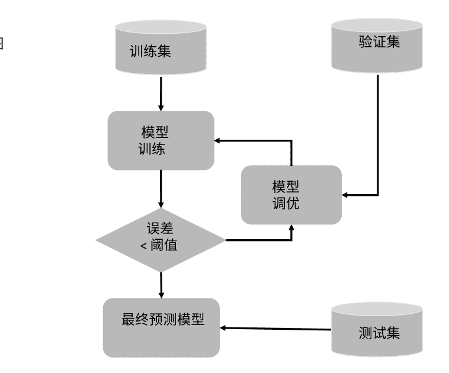

为了构建定量构效关系（QSAR）模型，化学结构应该被转化为表示化合物结构特征的数值描述符。在假设具有相似化学结构的化合物可能具有相似生物活性的前提下，化学描述符被广泛应用于开发用于分类和回归的QSAR模型。使用化学描述符和不同的机器学习算法（如线性判别分析、决策树、神经网络和深度学习），已经应用了QSAR模型来预测肝毒性。

已经开发了几种算法来计算化学描述符，可以分为基于起源或维度的描述符。基于起源的描述符包括拓扑学（例如，基于图论的）、几何学（例如，距离、价角和表面）、构成（例如，功能团计数）、热力学（例如，生成热、熵）和量子化学（例如，电荷分布相关）描述符。与此同时，基于维度的描述符的主要类别如下：0D描述符（例如，构成描述符、计数描述符）、1D描述符（例如，结构片段、指纹）、2D描述符（即拓扑指数）、3D描述符（例如，3D-MoRSE描述符、量子化学描述符、大小、立体、表面和体积描述符）和4D描述符（例如，从GRID或CoMFA方法、VolSurf导出的描述符）。

化学描述符可以通过商业或开源软件包计算，例如`Mold2`（Hong等，2008年，2018年），`PaDEL`（Yap，2011年），`DRAGON`（www.talete.mi.it）和`RDKit`（www.rdkit.org）。例如，`Mold2`是由FDA国家毒理研究中心（NCTR）开发的软件包，总共有77个化学描述符，大多数是从那些有充分文献记录的描述符中衍生出来的。文献中报道的分子描述符（Hong等人，2008年）。在`Mold2`中，有107个描述符是1D描述符，直接从分子式计算得出（例如，不同原子的计数，分子量）。大多数描述符是从2D化学结构计算得出的，包括不同类型的原子、键、功能团和化学物理性质的计数。

`Mold2`生成的化学描述符与其他商业软件（如`Cerius2`、`Dragon`和`Molconn-Z`）之间的比较分析表明，`Mold2`描述符传达了足够的结构信息。对多个数据集的测试表明，使用`Mold2`描述符生成的模型比使用其他商业软件包生成的模型更好（Hong等人，2008年）。

`Mold2`软件是使用`C/C++`开发的，通过使用多个CPU核心并行计算，实现快速计算。它可以用于在单次运行中计算小型或大型数据集的描述符，所有分子都可以在单个SDF文件中导出，该文件可以从其他数据库中导出。有关`Mold2`软件包的信息是公开可用的（https://www.fda.gov/science-research/bioinformatics-tools/mold2）。

##### 23.2.1.2 生物活性数据

生物活性数据在药物安全研究中起着重要作用，并且是机器学习用于肝毒性的另一种常用数据类型。一些测定方法，例如高通量筛选测定方法，可以同时测量多个毒理学终点，为评估药物和化学物质使用所致的肝毒性提供了一种有前途的方法。

体外高通量筛选数据经常用于机器学习。一些政府赞助的倡议，例如21世纪的毒理学（Tox21）计划（由美国国立卫生研究院（NIH）的国家环境卫生科学研究所（NIEHS）、国家推进转化科学中心（NCATS）、美国食品和药物管理局（FDA）以及美国环境保护局（EPA）合作）和美国环境保护局的毒性预测器（ToxCast）项目，提供了数千个化合物的大型数据集，这些化合物经过高通量筛选生物学测定，并且是公共领域的。这些数据集已被用于开发毒性预测模型，例如内分泌毒性（Judson等，2015年），生殖和发育毒性（Sipes等，2011年）以及器官毒性（Xu等，2020年）。Liu等（2015年）开发了计算模型，通过结合ToxCast的高通量体外测定数据和化学结构，预测动物体内的肝毒性。

在他们的研究中，从大鼠慢性研究的肝脏组织病理报告中提取的肥大、损伤和增殖性病变被用作肝毒性终点。同时，125个`ToxCast`体外生物测定、726个化学描述符以及二者的组合被用作模型输入数据。一组机器学习算法，包括线性判别分析、朴素贝叶斯、支持向量机（`SVM`）、分类和回归树以及`k`最近邻算法，被用于开发预测模型。

另一种生物活性数据集使用毒物基因组学来开发肝毒性的机器学习模型。具体而言，细胞系在暴露于具有`DILI`潜力的药物后的转录组表达变化可以提供`DILI`发展的机制洞察，并改善预测性能。

`Low`等人（2011）使用毒物基因组学数据和结构描述符，单独或结合使用，开发了肝毒性的预测模型。他们使用四种机器学习方法，即距离加权判别、`k`最近邻、随机森林和`SVM`，开发了这些模型。`Feng`等人（2019）使用从`ArrayExpress`收集的与`DILI`相关的基因表达数据，开发了`SVM`和深度学习模型来预测`DILI`。

#### 23.2.2 评估模型性能的指标

用于评估机器学习模型性能的统计指标包括准确率、精确率、召回率、马修斯相关系数（`MCC`）、接收者操作特征（`ROC`）曲线和`ROC`曲线下面积（`AUC`）。

##### 23.2.2.1 灵敏度、特异度和准确率

机器学习模型的预测准确率由公式（23.1）定义为正确分类的样本数与总样本数的比值。灵敏度由公式（23.2）定义为被正确预测为正例的实际正例的比例。特异度由公式（23.3）定义为被正确预测为负例的实际负例的比例。

```
准确率 = (TP + TN)/(TP + TN + FP + FN) (23.1)
```

```
敏感性 = TP/(TP + FN) (23.2)
```

```
特异性 = TN/(TN + FP) (23.3)
```

在这里，`TP`是实际阳性预测为阳性的数量，`TN`是实际阴性预测为阴性的数量，`FP`是实际阴性预测为阳性的数量，`FN`是实际阳性预测为阴性的数量。

### 23.2.2.2 `MCC`和平衡准确度

`MCC`是一个稳健的替代准确度的度量，不受不平衡数据集问题的影响，是计算实际值和预测值之间的皮尔逊积矩相关系数的一个列联表方法。`MCC`使用公式（23.4）计算。

```
MCC = \frac{TP * TN - FP * FN}{\sqrt{(TP + FP) * (TP + FN) * (TN + FP) * (TN + FN)}} \tag{23.4}
```

`MCC`范围在区间[-1, +1]内，极值为-1和+1，在完美错误分类和完美分类的情况下达到，而`MCC`=0是分类器的预期值，即随机预测。

平衡准确率是调整不平衡数据集问题的另一个度量标准，使用公式（23.5）计算。

```
平衡准确率 = \frac{敏感度 + 特异度}{2} \tag{23.5}
```

### 23.2.2.3 `AUC`

`ROC`曲线是一种图形绘制，用于说明机器学习模型在不同判别阈值下的诊断能力。`AUC`提供了一个定量的度量标准。

`ROC`曲线通过在不同阈值设置下绘制真正例率（`TPR`）与假正例率（`FPR`）之间的关系而创建。`TPR`也被称为敏感度、召回率或机器学习中的检测概率，使用公式（23.6）计算。`FPR`也被称为误报率或虚警概率，使用公式（23.7）计算。

```
TPR = \frac{TP}{TP + FN} \tag{23.6}

FPR = \frac{FP}{FP + TN} \tag{23.7}
```

#### 23.2.3 机器学习算法

机器学习算法是数学和逻辑程序，用于建立或发现人们用于预测或分类信息的模式。它们会根据暴露给更多数据的情况下表现得更好。机器学习使用从训练数据中得出的参数。在这里，我们简要介绍一下介绍一些在预测肝毒性方面广泛使用的机器学习算法。

### 23.2.3.1 最近邻算法 (`k-NN`)

最近邻算法是一种非参数统计方法，用于分类和回归。在最近邻算法中，一个实例的分类是通过其邻居的多数投票来确定的，即在训练样本中，通过确定最常见的类别来预测测试实例的类别。参数`k`通常是预先确定的，或者可以从训练数据中学习得到。如果`k` = 1，则该实例将被分配给最近邻居的类别。欧氏距离通常用于判断最近邻居。由于最近邻算法依赖于距离度量来进行预测，因此需要对训练数据进行归一化处理，如果特征具有非常不同的尺度或代表不同的物理单位，归一化处理可以提高分类准确性。

`Rodgers`等人（2010年）使用`k-NN` `QSAR`模型对药物的肝脏相关不良反应进行了建模。使用包括大约500种已批准药物的`FDA`自发报告数据库来研究人类肝脏不良反应，主要通过血清肝酶升高来定义。选择了200种具有平衡的活性/非活性比例的化合物进行建模，并随机分为训练集和验证集。使用`k-NN`方法开发了`QSAR`模型，在外部验证集中报告了高敏感性（>73%）和高特异性（>94%）的肝脏不良反应预测。

##### 23.2.3.2 随机森林和决策树

随机森林是一种基于树的集成学习方法，用于生成预测。它由一组决策树或森林组成，这些树是使用递归分割算法构建的。最初，每棵树都是通过随机混合的训练样本进行训练，并且随机选择的描述符子集用于树的生长。在创建初始的“森林”决策树之后，通过对森林中所有决策树的结果估计进行平均，预测测试实例。通过使用交叉验证的网格搜索来优化参数，例如树的数量和特征。与方便的决策树相比，随机森林模型具有多个优势，例如嵌入式特征选择过程。它们也不容易过拟合，更适合处理不平衡的数据集。

使用递归随机森林和化学和体外生物活性数据开发了一种用于预测小鼠肝毒性的机器学习模型(`Zhu`等人，2016)。小鼠肝毒性由四个体内毒性终点（即非增殖性、肿瘤性、增殖性和肿瘤学）的组合定义。输入数据包括来自`ToxCast`高通量筛选测定的293个生物体外描述符和三组化学描述符，即137个`CDK`描述符、848个`Dragon`描述符和376个`Mold2`描述符。数据集包括233种化学物质，67种有毒和167种无毒，使其成为一个不平衡的数据集。使用随机森林算法开发了该模型，并且预测基于500棵树的正预测比例。

采用多重欠采样和移动分类阈值两种方法来处理不平衡数据集问题。使用五折交叉验证的正确分类率（`CCR`）来评估模型的性能。最佳的随机森林模型，由混合体外和化学描述符生成，产生了74%的`CCR`，82%的敏感性和66%的特异性。相比之下，仅使用化学和体外描述符的模型的`CCR`分别为73%和66%。该模型发现与`logP`和分子量相关的化学描述符，以及与`CYP2A2`活性相关的体外测定对于模型性能至关重要。该研究表明随机森林模型在变量选择和预测性`in silico`模型的开发中是高效的。

`Low`等人（2011年）使用化学描述符和毒基因组数据开发了肝毒性预测模型。通过四种机器学习方法（`k`最近邻、支持向量机、随机森林和距离加权判别）构建的模型，使用五折交叉验证的`CCR`来评估其性能。基于化学描述符和毒基因组数据的模型分别达到了61%和76%的`CCR`。此外，随机森林模型在`k-NN`、`SVM`和距离加权判别等所有其他模型中表现优秀或相当。研究结果表明，毒基因组数据在肝毒性预测中具有实用性，并且随机森林算法开发的模型具有稳健的预测性能。`Kim`和`Nam`（2017年）使用加权指纹训练了随机森林和`SVM` `DILI`模型，准确率约为60%。

##### 23.2.3.3 支持向量机

支持向量机是最流行的监督式机器学习算法之一。在毒性预测的背景下，分类问题被认为是在映射空间中找到一个超平面，将训练集中的活性分子与非活性分子分开。开发`SVM`模型是为了优化算法参数，找到一个最大化不同类别训练样本之间间隔的超平面（称为“支持向量”），如图23.2所示。假设类别之间的间隔越大，模型正确分类未在训练中接触过的新分子的概率越高。

如果在原始描述符空间中无法通过线性超平面实现分类，则`SVM`算法使用核函数（如多项式、`sigmoid`和径向基函数）将原始空间转换为更高维的核空间。因此，`SVM`方法在空间转换中既可以用于线性核函数，也可以用于非线性核函数。

`Zhang`等人（2016a，b）开发了`DILI`的体外预测方法。该数据集收集了来自出版物的1317种多样化的分子，并使用`MACCS`和`FP4`化学指纹通过亚结构模式识别方法构建了五种机器学习算法的`QSAR`模型。`SVM`模型在训练和验证集上分别获得了79.5%和64.5%的最高准确率。此外，该模型在来自`FDA`肝毒性知识库（`Chen`等人2013a，b）的88个化合物的外部测试集上生成了75.0%的准确率。此外，还确定了与`DILI`相关的一些关键亚结构模式。

`Fourches`等人（2010年）使用`SVM`算法开发了一个用于预测`DILI`的`QSAR`模型。数据集包含531种化学物质，其中248种对人体有肝脏影响，283种非`DILI`化合物。作者使用了`SVM`机器学习算法和两种类型的化学描述符：2D片段和`Dragon`分子描述符。采用了五折交叉验证来评估模型性能。使用片段描述符和`Dragon`描述符的模型报告的准确率分别为64.2-72.6%和55.7-70.8%。该模型在18种仅对动物而非人类具有肝毒性的化合物上进行了测试，其中14种化合物的预测准确率为77.8%。

##### 23.2.3.4 神经网络和深度学习

人工神经网络（ANN）受到生物系统中的信息处理和分布式通信节点的启发。ANN算法基于一组连接的单元，称为人工神经元，以层的形式组合在一起，相邻层之间通过权重连接。当用于毒性预测时，这种并行计算结构（即神经网络）接收分子/生物活性将描述符从第一个/输入层传递到最后一个/输出层的毒性终点。通常，还有一组中间的隐藏层，它们接收由前一层修改过的数据。

深度神经网络是一种深度学习架构，指的是具有多个隐藏层的神经网络家族。它们在过去几年中非常流行，在多个领域取得了成功。针对不同任务，已经提出了深度学习算法的几个变体，而前馈神经网络仍然是最受欢迎的算法。卷积神经网络在处理多个数组呈现的数据时效果更好，并且已经广泛应用于分析视觉图像。循环神经网络具有内部状态（记忆），可以处理可变长度的输入序列，并且在语音、语言和连续手写识别等任务中取得了成功。然而，尽管取得了成功，深度学习面临着两个常见的挑战：过拟合和计算时间（LeCun等人，2015年）。

徐等人（2015年）开发了第一个用于预测DILI的深度学习模型。在这项研究中，使用训练和测试药物对深度神经网络模型进行了评估，DILI数据集使用FDA批准的标签文件进行了注释（Chen等人，2011年）。采用无向图递归神经网络方法进行分子结构编码，构建了DILI预测模型。在训练集上进行的十折交叉验证产生了80.5%的准确率，70.3%的敏感性和88.2%的特异性。深度学习模型还应用于测试集，并生成了70.3%的准确率，略优于先前报道的决策森林QASR模型的68.9%准确率。此外，与决策树模型相比，深度学习模型在第二个测试集中实现了略高的准确率（64.7%对61.6%），但在第三个数据集中并未超越（61.9%对63.1%）。

因此，应谨慎地应用深度神经网络模型优于决策森林模型的结论。

开发了一种具有属性增强的深度图学习模型，用于预测DILI（Ma等，2021年）。作者仅基于其图结构和底层原子/键级特征使用图神经网络来学习分子向量表示。然而，这种深度学习策略需要大量的输入数据来生成更准确的分子表示。创建了一个更大的训练数据集，将更多药物与其他毒性特性（如磷脂质沉积症）的测量组合起来，用于训练深度学习模型。结果表明，该提出的方法在DILI数据集上通过使用留一法交叉验证和随机分割获得了81.4%的准确率，明显优于所有现有模型。Li等（2020年）使用Mold2描述符开发了一个深度学习模型，其Matthews相关系数值为0.331，优于5种传统机器学习算法。

##### 23.2.3.5 集成学习

集成学习是一种使用投票、平均或其他集成技术的算法，将组成学习算法的结果结合起来以获得更好的预测性能。据报道，集成学习方法在组成模型明显不同的情况下往往能产生更好的结果。集成方法已经在许多领域广泛应用，并在毒性预测方面显示出有希望的性能。

Ai等人（2018年）在一个由1241个化合物组成的数据集上工作，并生成了36个基础分类器，这些分类器是使用三种机器学习算法（即随机森林、XGBoost和支持向量机）和12种分子指纹（包括CDK、PubChem和FP4）构建的，用于创建一个集成模型。通过100次重复的五折交叉验证评估了集成模型，得到了平均准确率为71.1 ±2.6%，敏感性为79.9 ±3.6%，特异性为60.3 ±4.8%，AUC为0.764 ±0.026。将集成模型应用于来自肝毒性知识库（Chen等人，2011年）的286个化合物的外部验证数据集上，准确率为84.3%，敏感性为86.9%，特异性为75.4%，AUC为0.904。与文献中报道的肝毒性预测模型相比，集成模型实现了相对较高的准确率。

Ancuceanu等人（2020）使用各种机器学习算法和来自DILIrank数据集（Chen等人，2016）的694种药物的化学描述符开发了267个模型，并从中选择了79个模型用于集成。集成模型实现了74.6%的平衡准确度，76.0%的敏感度和73.2%的特异度。He等人（2019）使用具有DILI数据的1254个化合物，并使用Marvin描述符生成了一个集成方法。作者采用了八种机器学习算法，包括k最近邻，朴素贝叶斯，Kstar，Bagging，J48，AdaBoostM1，Dl4j和随机森林来构建集成模型，其准确度为78.3%，敏感度为81.8%，特异度为74.8%。此外，该模型还通过Zhang等人（2016a，b），Ai等人（2018）和Kotsampasakou等人（2017）的数据集进行了外部验证，结果显示平衡准确度为71.6%，敏感度为77.3%，特异度为65.8%；这超过了使用传统机器学习算法的原始报告的DILI模型（He等人，2019）。

### 23.3 一个案例研究：机器学习建模用于肝毒性预测

评估化学品健康风险的基于动物的方法耗时、资源密集且难以筛选环境中的所有化合物。这突显了开发更高效和信息丰富的毒性确定工具以表征环境化学品的生物活性特征的紧迫需求。高通量测定的进展使化学品能够快速筛选出特定类型的分子或细胞水平的生物活性。

这种方法可以帮助识别可能调节特定生物途径的化合物，有助于理解化学品在给定生物过程中的可能作用。体外高通量筛选（HTS）测定结合计算模型，可以成为传统动物测试研究的替代方法。

Tox21与EPA ToxCast计划采用了数百种高通量体外测定，并对数千种环境化学物质进行了筛查。这些生物活性数据为利用增强的计算能力（Krewski等人，2020年）构建毒性预测模型提供了机会。一些基于化学和体外生物活性构建的模型表现优于仅基于化学和生物活性描述符构建的模型（Liu等人，2015年，2017年；Xu等人，2020年）。在这里，我们介绍了仅使用化学描述符、仅使用体外高通量测定以及化学和ToxCast测定描述符的计算模型（Liu等人，2015年）用于预测体内肝毒性。

#### 23.3.1 数据来源

肝毒性数据来自于从ToxRefDB（Martin et al.2011）中选择的大鼠慢性研究中观察到的肝脏组织病理学终点，ToxRefDB是美国环境保护局的数据库，收集了在指南动物测试研究中观察到的数百个体内终点在不同组织中的数据。我们使用的体内肝毒性终点根据领域术语（Thoolen et al.2010）被分为三个肝毒性类别（肥大、损伤和增殖性病变）。

高通量体外测定数据来自ToxCast和Tox21项目，并且是公开可用的。化学描述符来自多个来源，包括QikProp软件（Schrödinger，版本3.2），Open Babel（O’Boyle et al.2011），PaDEL（Yap2011）和PubChem。在ToxRefDB和ToxCastDB中包含的化学物质为每个毒性终点获得了二进制分类标签。

一组677种化学物质由711种体外生物活性描述符（来自ToxCast测定）、4376种化学结构描述符（来自QikProp、Open Babel、PaDEL和PubChem）以及三种肝毒性类别（来自动物研究）表示。经过数据减少，使用了125个ToxCast生物测定和726个化学描述符。结合三种毒性终点（即肥大、损伤和增殖性病变），共获得了九个用于模型开发的数据集（表23.2）。

表23.2 肝毒性终点和描述符集用于模型开发 (Liu等，2015年)

| 终点 | 化合物 | 化学物质描述符 | 生物活性描述符 | 化学物质+生物活性描述符 |
| :--- | :--- | :--- | :--- | :--- |
| 肥大 | 624 | 726 | 125 | 726 + 125 |
| 损伤 | 564 | 726 | 125 | 726 + 125 |
| 增殖性病变 | 562 | 726 | 125 | 726 + 125 |

#### 23.3.2 机器学习方法建模

为了检查机器学习算法的影响，使用不同算法构建了每个数据集的六个模型，包括线性判别分析（LDA），朴素贝叶斯，支持向量机（SVM），分类和回归树（CART），k-NN和所有分类器的集成（ENSMB）。描述符的数量也对预测性能有重要影响。因此，对于每个机器学习算法，使用不同数量的最佳描述符进行了多个模型的构建，这些描述符是通过循环t检验进行筛选的，包括10、15、20、25、30、35、40、45、50、55和60个描述符。

通过100次十折交叉验证的表现进行评估，使用平均平衡准确率（BA）、敏感性和特异性。图23.3展示了模型生成和评估的整体工作流程。

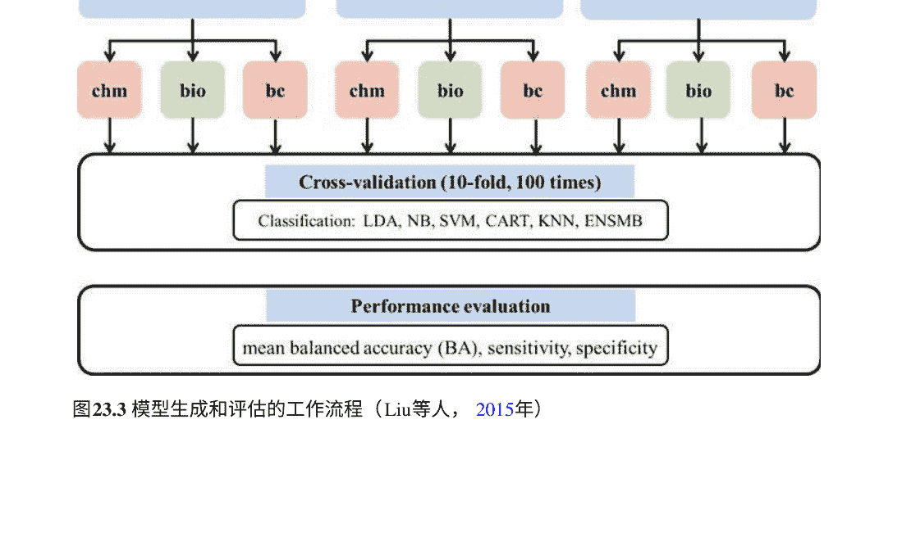

| 终点 | 分类器 | 平均平衡准确率 (化学物质) | 平均平衡准确率 (生物活性) | 平均平衡准确率 (化学物质+生物活性) |
| :--- | :--- | :--- | :--- | :--- |
| 肥大 | CART | 0.82 | 0.79 | 0.84 |
| | ENSMB | 0.74 | 0.76 | 0.76 |
| | SVM | 0.76 | 0.76 | 0.77 |
| 损伤 | CART | 0.81 | 0.75 | 0.80 |
| | SVM | 0.76 | 0.75 | 0.76 |
| | ENSMB | 0.72 | 0.71 | 0.73 |
| 增殖性病变 | CART | 0.79 | 0.75 | 0.80 |

| | SVM | 0.73 | 0.75 | 0.76 |
|---|---|---|---|---|
| | ENSMB | 0.69 | 0.71 | 0.71 |

#### 23.3.3 结果

使用三个数据集报告了三个体内肝毒性终点的机器学习建模：（i）仅高通量生物活性描述符，（ii）仅化学描述符，以及（iii）生物活性和化学描述符的组合。表23.3列出了前三个模型的平衡准确率的详细信息。具体而言，仅使用化学描述符的模型在肥大、损伤和增殖性病变方面具有最高的平衡准确率，分别为82%、81%和79%。仅使用体外`ToxCast`测定数据的模型在肥大、损伤和增殖性病变方面获得了最高的平衡准确率，分别为79%、75%和75%。

仅使用化学描述符和仅使用生物描述符的相似预测性能证明了体外`ToxCast`测定数据在体内肝毒性预测中的实用性。使用化学和生物活性描述符的组合构建的模型对肥大（84%）、损伤（80%）和增殖性病变（80%）的平衡准确性优于仅使用化学描述符和仅使用生物活性数据的模型。使用`CART`、`SVM`和`ENSMB`构建的模型优于使用其他算法构建的模型。核受体激活和线粒体功能经常被识别为对肝毒性具有很高预测性的描述符。

该研究证明，基于生物活性和化学结构数据开发的机器学习模型可以预测体内肝毒性。

### 23.4 总结与未来方向

尽管在人体测试之前已经做出了许多消除肝毒性药物的努力，但这些药物经常逃脱临床前毒性测试，并且直到药物开发的后期甚至获得批准后才被识别为肝毒性。因此，尽早开发用于评估药物候选物和化学物质引起的人体肝损伤潜力的稳健预测模型至关重要。

体内动物实验仍然是预测人体肝毒性的主要方法。由于动物研究的高昂费用和耗时性质，使用体外高通量或体外模拟方法的机器学习方法变得有吸引力。值得注意的是，深度学习技术的最新发展为开发肝毒性的计算模型提供了另一种有前景的途径。随着计算机技术的进步（例如，图形处理单元（`GPU`）和深度神经网络算法的使用），深度学习在语音识别、图像分类、药物发现和毒理学方面取得了突破。在几个公开的科学竞赛中，包括`ImageNet LSVRC-2010`竞赛（`Krizhevsky`等人，2017年）和2015年的`Tox21`数据挑战赛（`Mayr`等人，2016年），深度学习算法展示了优于传统机器学习算法的预测性能。

然而，机器学习方法，尤其是深度学习，对数据有很高的需求，需要大量标记的毒性数据来开发稳健的预测模型。研究界在整理标记的肝毒性数据方面投入了巨大的努力，有几个数据库是公开可用的，包括`FDA`的肝毒性知识库（`Chen`等人，2013a，b），`DILIrank`数据集（`Chen`等人，2011，2016）和`NIH`的`LiverTox`数据库（`Hoofnagle`等人，2013）。与此同时，毒性数据在科学界的使用越来越广泛。例如，`Tox21`计划在70多个高通量筛选中测试了约8500种化学物质，产生了超过1亿个数据点（`Richard`等人，2021）。`EPA`的`ToxCast`项目也提供了对数千种环境化学物质和药物进行高通量筛选的方法（`Richard`等人，2016）。未来，高质量的毒性数据将继续是开发更强大的肝毒性机器学习模型的基石。

总之，机器学习和深度学习的进展，以及高通量实验技术，对于开发预测肝毒性模型具有很大的潜力，并将在降低药物和化学品引起的肝脏风险方面发挥越来越重要的作用。

免责声明：本章节反映了作者的观点，不一定反映美国食品和药物管理局的观点。

致谢作者感谢`Joanne Berger`、`FDA`图书馆对手稿编辑的协助。

## 参考文献

- `Ai H`, `Chen W`, `Zhang L`, `Huang L`, `Yin Z`, `Hu H`, `Zhao Q`, `Zhao J`, `Liu H` (2018) 使用集成学习方法和分子指纹预测药物诱导的肝损伤。 毒理学165(1):100–107

- `Ancuceanu R`, `Hovanet MV`, `Anghel AI`, `Furtnescu F`, `Neagu M`, `Constantin C`, `Dinu M`(2020) 使用多个机器学习算法预测`DILI rank`数据集中的药物肝毒性的计算模型。

- `Chen M`, `Vijay V`, `Shi Q`, `Liu Z`, `Fang H`, `Tong W` (2011) 用于药物诱导肝损伤研究的`FDA`批准药物标签。 Drug Discov Today 16(15–16):697–703

- `Chen M`, `Zhang J`, `Wang Y`, `Liu Z`, `Kelly R`, `Zhou G`, `Fang H`, `Borlak J`, `Tong W` (2013a) 肝毒性知识库：对复杂终点的系统方法。 Clin Pharmacol Ther93(5):409–412

- `Chen M`, `Hong H`, `Fang H`, `Kelly R`, `Zhou G`, `Borlak J`, `Tong W` (2013b) 基于`FDA`批准的药物标签注释和使用大量药物的定量结构-活性关系模型，用于预测药物诱导肝损伤。 Toxicol Sci 136(1):242–249

- `Chen M`, `Bisgin H`, `Tong L`, `Hong H`, `Fang H`, `Borlak J`, `Tong W` (2014) 用于预测人体药物诱导肝损伤的预测模型：我们已经到达目标了吗？ Biomark Med 8(2):201–213

- `Chen M`, `Suzuki A`, `Thakkar S`, `Yu K`, `Hu C`, `Tong W` (2016) `DILI rank`：按照发展药物诱导肝损伤风险排名的最大参考药物列表。 Drug Discov Today21(4):648–653

- `Cheng A`, `Dixon SL` (2003) 用于预测剂量依赖性人类肝毒性的体外模型。 J Comput Aided Mol Des 17(12):811–823

- `Chicco D` (2017) 计算生物学中机器学习的十个快速提示。 BioData Min 10:35

- `Cruz-Monteadudo M`, `Cordeiro MN`, `Borges F` (2008) 用于早期检测药物诱发特异性肝毒性的计算化学方法。 J Comput Chem 29(4):533–549

- `Ekins S`, `Williams AJ`, `Xu JJ` (2010) 用于人类药物诱导性肝损伤的预测性基于配体的贝叶斯模型。 Drug Metab Dispos 38(12):2302–2308

- `Feng C`, `Chen H`, `Yuan X`, `Sun M`, `Chu K`, `Liu H`, `Rui M` (2019) 基于基因表达数据的深度学习模型，用于准确预测药物诱导性肝损伤。 J Chem Inf Model59(7):3240–3250

- `Fourches D`, `Barnes JC`, `Day NC`, `Bradley P`, `Reed JZ`, `Tropsha A` (2010) 从文献中挖掘出的不同物种药物诱导肝损伤的断言的化学信息学分析。 Chem Res Toxicol 23(1):171–183

- `He S`, `Ye T`, `Wang R`, `Zhang C`, `Zhang X`, `Sun G`, `Sun X` (2019) 用于预测药物诱导肝毒性的计算模型。

- `Hong H`, `Xie Q`, `Ge W`, `Qian F`, `Fang H`, `Shi L`, `Su Z`, `Perkins R`, `Tong W` (2008) `Mold(2)`，用于化学信息学和毒理信息学的二维结构的分子描述符。 J Chem Inf Model48(7):1337–1344

- `Hong H`, `Zhu J`, `Chen M`, `Gong P`, `Zhang C`, `Tong W` (2018) 用于预测药物诱导肝损伤风险的定量构效关系模型。 在： `Chen M`, `Will Y`（编辑）药物诱导肝毒性。药理学和毒理学方法。 Humana，纽约，pp77–100

- `Hoofnagle JH`, `Serrano J`, `Knoben JE`, `Navarro VJ` (2013) `LiverTox`：一个关于药物引起肝损伤的网站。肝脏学57(3):873–874

- `Judson RS`, `Magpantay FM`, `Chickarmane V`, `Haskell C`, `Tania N`, `Taylor J`, `Xia M`, `Huang R`, `Rotroff DM`, `Filer DL`, `Houck KA`, `Martin MT`, `Sipes N`, `Richard AM`, `Mansouri K`, `Setzer RW`, `Knudsen TB`, `Crofton KM`, `Thomas RS` (2015) 综合模型化学物质对雌激素受体的生物通路的干扰，使用18个体外高通量筛选试验。 毒理学科学 148(1):137–154

- `Kim E`, `Nam H` (2017) 使用加权分子指纹预测药物引起的肝毒性的预测模型。 BMC生物信息学 18(Suppl 7):227

- `Kotsampasakou E`, `Montanari F`, `Ecker GF` (2017) 预测药物引起的肝损伤：数据整理的重要性。毒理学 389:139–145

- Krewski D, Andersen ME, Tyshenko MG, Krishnan K, Hartung T, Boekelheide K, Wambaugh JF, Jones D, Whelan M, Thomas R, Yauk C, Barton-Maclaren T, Cote I (2020) 21世纪的毒性测试：过去十年的进展和未来展望。Arch Toxicol 94(1):1–58

- Krizhevsky A, Sutskever I, Hinton GE (2017) 使用深度卷积神经网络进行Imagenet分类。Commun ACM 60(6):84–90

- LeCun Y, Bengio Y, Hinton G (2015) 深度学习。Nature 521(7553):436–444

- Li T, Tong W, Roberts R, Liu Z, Thakkar S (2020) DeepDILI: 使用模型级表示进行深度学习驱动的药物引起的肝损伤预测。Chem Res Toxicol 34(2):550–565

- Liew CY, Lim YC, Yap CW (2011) 混合学习算法和特征集成在肝毒性预测中的应用。J Comput Aided Mol Des 25(9):855–871

- Liu J, Mansouri K, Judson RS, Martin MT, Hong H, Chen M, Xu X, Thomas RS, Shah I (2015) 使用ToxCast体外生物活性和化学结构预测肝毒性。Chem Res Toxicol 28(4):738–751

- Liu J, Patlewicz G, Williams AJ, Thomas RS, Shah I (2017) 使用体外生物活性数据和化学结构预测器官毒性。Chem Res Toxicol 30(11):2046–2059

- Liu Y, Gao H, He YD (2020) 基于化合物属性的人体药物诱导肝损伤预测模型。

- Low Y, Uehara T, Minowa Y, Yamada H, Ohno Y, Urushidani T, Sedykh A, Muratov E, Kuz’min V, Fourches D, Zhu H, Rusyn I, Tropscha A (2011) 使用QSAR和毒物基因组学方法预测药物诱导的肝毒性。Chem Res Toxicol 24(8):1251–1262

- Ma H, An W, Wang Y, Sun H, Huang R, Huang J (2021) 使用属性增强的深度图学习预测药物诱导的肝损伤。Chem Res Toxicol 34(2):495–506

- Martin MT, Knudsen TB, Reif DM, Houck KA, Judson RS, Kavlock RJ, Dix DJ (2011) 来自ToxCast高通量筛选的大鼠生殖毒性预测模型。Biol Reprod85(2):327–339

- Mayr A, Klambauer G, Unterthiner T, Hochreiter S (2016) DeepTox: 使用深度学习进行毒性预测。Front Environ Sci 3:80

- Muller C, Pekthong D, Alexandre E, Marcou G, Horvath D, Richert L, Varnek A (2015) 使用分子和生物描述符预测药物引起的肝损伤。Comb Chem HighThroughput Screen 18(3):315–322

- Mulliner D, Schmidt F, Stolte M, Spirl HP, Czich A, Amberg A (2016) 全球应用范围内的人类和动物肝毒性计算模型。Chem Res Toxicol 29(5):757–767

- O’Boyle NM, Banck M, James CA, Morley, Vandermeersch T, Hutchison GR (2011) Open Babel: 一个开放的化学工具箱。J Cheminform 3:33

- Richard AM, Judson RS, Houck KA, Grulke CM, Volarath P, Thillainadarajah I, Yang C, Rathman JF, Martin MT, Wambaugh JF, Knudsen TB, Kancherla J, Mansouri K, Patlewicz G, Williams AJ, Little SB, Crofton KM, Thomas RS (2016) ToxCast化学景观：铺设通往21世纪毒理学之路。Chem Res Toxicol 29(8):1225–1251

- Richard AM, Huang R, Waidyanatha S, Shinn P, Collins BJ, Thillainadarajah I, Grulke CM, Williams AJ, Lougee RR, Judson RS, Houck KA, Shobair M, Yang C, Rathman JF, Yasgar A, Fitzpatrick SC, Simeonov A, Thomas RS, Crofton KM, Paules RS, Bucher JR, Austin CP, Kavlock RJ, Tice RR (2021) Tox21 10K化合物库：推动毒理学的协作化学。Chem Res Toxicol 34(2):189–216

- Rodgers AD, Zhu H, Fourches D, Rusyn I, Tropsha A (2010) 使用k最近邻定量结构-活性关系方法建模药物的肝脏相关不良反应。Chem Res Toxicol 23(4):724–732

- Sipes NS, Martin MT, Reif DM, Kleinstreuer NC, Judson RS, Singh AV, Chandler KJ, Dix DJ, Kavlock RJ, Knudsen TB (2011) 根据ToxCast高通量筛选数据预测产前发育毒性模型。Toxicol Sci 124(1):109–127

Thoolen B, Maronpot RR, Harada T, Nyska A, Rousseaux C, Nolte T, Malarkey DE, Kaufmann W, Küttler K, Deschl U, Nakae D, Gregson R, Vinlove MP, Brix AE, Singh B, Belpoggi F, Ward JM (2010) 大鼠和小鼠肝胆系统的增殖性和非增殖性病变。 Toxicol Pathol 38(7 Suppl):5S-81S

Wu L, Liu Z, Auerbach S, Huang R, Chen M, McEuen K, Xu J, Fang H, Tong W (2017) 将药物的作用方式整合到定量结构-活性关系中，以改进对药物诱导肝损伤的预测。 J Chem Inf Model 57(4):1000–1006

Xu Y, Dai Z, Chen F, Gao S, Pei J, Lai L (2015) 深度学习用于药物引起的肝损伤。 J Chem Inf Model 55(10):2085–2093

Xu T, Ngan DK, Ye L, Xia M, Xie HQ, Zhao B, Simeonov A, Huang R (2020) 基于体外生物活性数据和化学结构的人体器官毒性预测模型。 Chem Res Toxicol 33(3):731–741

Yap CW (2011) PaDEL-descriptor: 一个开源软件，用于计算分子描述符和指纹。 J Comput Chem 32(7):1466–1474

Zhang C, Cheng F, Li W, Liu G, Lee PW, Tang Y (2016a) 使用亚结构模式识别方法预测药物诱导的肝毒性。 Mol Inform 35(3–4):136–144

Zhang H, Ding L, Zou Y, Hu SQ, Huang HG, Kong WB, Zhang J (2016b) 使用朴素贝叶斯分类器方法预测人体药物诱导的肝损伤。 J Comput Aided Mol Des 30(10):889–898

Zhu XW, Xin YJ, Chen QH (2016) 使用递归随机森林预测小鼠肝毒性的化学和体外生物信息。 SAR QSAR Environ Res 27(7):559–572

## 第24章 人工智能用于癌症治疗相关心脏毒性和精准心脏肿瘤风险评估

Jessica Castrillon Lal和Feixiong Cheng

### 24.1 引言

癌症幸存者的患病率在过去几十年中大幅增加。2019年报告了1690万名癌症幸存者，并预计到2030年将超过2200万人（Miller等人，2019年）。尽管过去几年中癌症患者的先进治疗得到了改善，但癌症患者群体正在经历其他类型的健康并发症（Banke等人，2016年；Sturgeon等人，2019年），如癌症治疗相关心脏功能障碍（CTRCD）（Hou等人，2021b年）。心血管疾病是癌症幸存者的第二大死因（11.3%），仅次于癌症复发（38%）（Sturgeon等人，2019年）。

放射治疗、蒽环类化疗药物、靶向治疗和免疫治疗等各种癌症治疗方法与不良心血管结果（Zamorano等，2016年）如CTRCD有关。心脏肿瘤学的目标是通过了解每种癌症药物类别后心脏毒性的机制，确定强大且个性化的心脏毒性预测因子，并加强对目前正在接受治疗的癌症患者的监测和监视，以提高幸存者的护理。

J. C. Lal · F. Cheng (✉)

克利夫兰诊所，基因组医学研究所，克利夫兰，OH 44195，美国

电子邮件：CHENGF@ccf.org

J. C. Lal

电子邮件：CASTRIJ2@ccf.org

克利夫兰诊所，分子医学系，克利夫兰医学院，Case Western Reserve University，OH 44195，美国

F. 郑

医学院，Case Comprehensive Cancer Center, Case Western Reserve University，克利夫兰，OH 44106，美国

© 作者，独家许可给 Springer Nature Switzerland AG 2023

H. 洪（编），机器学习和深度学习在计算毒理学中的应用，工程与科学中的计算方法，

https://doi.org/10.1007/978-3-031-20730-3_24

心脏毒性药物（Brown et al. 2015; Campia et al. 2019; Lenihan et al. 2019; Lenneman and Sawyer 2016）。

该领域意识到，用于定义心脏毒性的标准迟钝分类应该得到改进。随着下一代测序和大数据科学在增强风险分层方面的作用越来越重要，机器学习模型将变得越来越重要。广义上讲，机器学习涉及使用统计模型来拟合带标签或无标签的数据结果。

人工智能（AI）和机器学习（ML）方法越来越受欢迎，用于分析大规模和复杂的数据集。在心脏病学中，机器学习方法已被用于预测心血管并发症（Cai等，2018b，2019），心脏再同步疗法反应（Feeny等，2020），急性心肌梗死后的心血管事件（Wang等，2018）和基于索赔数据的死亡风险预测（Krumholz等，2019）。未来，这些模型有潜力在心脏肿瘤学临床实践中提供基于精确性的CTRCD事件风险评估（图24.1）。本章将讨论设计用于药物发现过程和上市后药物监测的CTRCD评估的AI/ML模型的基本要素。我们将展示两个案例研究，使用大规模电子健康记录（EHR）和临床数据应用这些方法进行CRTCD风险评估。最后，我们将讨论这些方法的现有限制以及在精确心脏肿瘤学中AI/ML应用的未来方向。

### 24.2 方法和材料

#### 24.2.1 数据资源

用于分析的患者群应代表由肿瘤学专家看到并被转诊进行心脏病学评估的肿瘤学患者。根据可用数据，应考虑几个因素来设计实验，包括癌症亚型、心脏毒性治疗类型、多药治疗、疾病阶段、年龄和种族。

#### 24.2.2 分子特征和向量生成

选择与CTRCD显著相关且进一步有助于机器学习模型高性能的临床相关变量至关重要。为了做到这一点，可以评估每个结果和变量对的逻辑回归模型的权重。逻辑回归（LR）为每个特征应用一个权重，预测结果是所有权重和特征对的乘积的总和。

临床相关变量可以基于2个标准来确定：

1.  绝对变异系数（标准差（SD）与均值的比值）较低，以确保100次重复中权重的波动较小；

2.  与该结果的极值权重相比，绝对相关权重较高（相对权重）。

此外，建议对临床相关变量的风险比（95%置信区间（CI））进行测试，以验证其实用性。使用Waldχ2检验评估具有统计显著系数的变量。

以下R软件包可用于测试生存结果的风险比（v2.44-1.1）和survminer（v0.4.6）软件包在R 3.6.1上。

#### 24.2.3 定义生物终点和临床结果

癌症治疗相关的心脏功能障碍（CTRCD）可以从亚急性到长期的不良心血管影响，包括心力衰竭、心律失常、冠状动脉疾病、中风或其组合。选择模型的主要和次要结果是针对所讨论的问题和可用数据而具体的。迄今为止，许多临床试验使用左室射血分数的变化作为研究终点，或者疾病发生的时间。需要强调的是，心脏肿瘤学是一个新领域，仅限于混合患者群体和研究终点的观察性队列研究。因此，这些研究中的异质性可能会影响模型的性能和敏感性。因此，一些在心脏肿瘤学中应用机器学习和统计方法的研究，例如使用二元定性变量作为模型结果，例如由ICD 9/10代码定义的亚急性心血管结果、所有新发CTRCD的危险性或全因死亡率。随着该领域的发展，模型结果可能会改变，以描述与CTRCD特定的事件或生物标志物。

### 表格 24.1 可用数据资源

| 数据库 | 类型 | 描述 | 网站 |
|--------|------|------|------|
| 药物靶点 | DrugBank | 8250个药物条目包括2016个FDA批准的小分子药物和6000多种实验药物 | http://www.drugbank.ca/ |
| | BindingDB | 565,136个化合物针对6612个蛋白质和1,279,670个结合亲和力数据 | http://www.bindingdb.org |
| | ChEMBL | 2,036,512个化合物针对11,224个靶点和类似药物 | https://www.ebi.ac.uk/chemblbdb |
| 临床数据 | FDA不良事件报告系统 | 自1969年以来的2300万份报告涉及不良药物反应和患者结果 | https://www.fda.gov/drugs/questions-and-answers-fdas-adverse-event-reporting-system-faers/fda-adverse-event-reporting-system-faers-public-dashboard |
| | VigiBase | 自2015年以来的3000万份报告来自世界卫生组织(WHO)全球数据库报告的潜在药物副作用 | http://www.vigiaccess.org/ |
| | IBM MarketScan研究数据库 | 来自IBM WatsonHealth®的2.73亿商业索赔和交易包含去识别化的、特定于患者的健康数据，用于报销医疗索赔，适用于超过250个中大型雇主和医疗计划的员工、退休人员和他们的家属 | https://www.ibm.com/products/marketscan-research-databases |
| | 百万退伍军人计划 | 自2011年以来，825,000名退伍军人的遗传学和健康报告 | https://www.research.va.gov/mvp/ |
| | Geisinger MyCode数据库 | 超过90,000份参与者报告，包括分子数据、基因型和电子健康记录衍生的表型 | https://www.geisinger.org/precision-health/mycode |
| | Kaiser Permanente 研究银行 | 超过1250万个经过良好描述的人口报告，拥有超过12年的电子病历 | https://researchbank.kaiserpermanente.org/our-research/for-researchers/ |

#### 24.2.4 人工智能/机器学习算法和模型选择

#### 监督学习与无监督学习

大多数经典的机器学习方法属于有监督或无监督学习。监督学习对应于训练数据集以学习实验标签或人工预先分配的特征和目标之间的关系。

这是迄今为止最流行的ML方法的最常见用途，通常用于分类图像、语言翻译或复杂数据集成以进行群体分层。

无监督学习模型根据算法识别的“学习”模式对未标记的数据进行分类。无监督学习的一些常见应用包括降维和聚类。

在选择模型之前，测试几个统计模型并确定哪个模型在数据集上表现最好是很重要的。另一个考虑因素是模型中使用的变量类型，这也将决定哪个模型最适合。通常从最简单的模型开始是迈出的第一步。

#### 回归与分类模型

选择使用回归还是分类模型将取决于模型中使用的特征变量是定性的、定量的还是两者都有。线性回归将用于确定定量变量（如年龄、BMI和年收入）的结果。分类模型用于确定定性变量（性别、种族、肿瘤类型等）或混合变量（图24.2）。

#### 逻辑回归

简单线性回归模型是一种监督模型的示例，最适合预测定量变量的单一结果。生物学结果是复杂的，因此很少应用这种方法。

```
Y = β0 + β1X
```

#### 多元线性回归

在生物学应用中，通常有多个变量对结果有贡献。例如，患者的人口统计因素会影响中风的风险。为了适应多个预测变量，使用多元线性回归。在这里，每个变量或预测变量都有自己的斜率系数或权重。

```
Y = \beta_o + \beta_1 X_1 + \beta_2 X_2 + \cdots + \beta_p X_p
```

#### 多元逻辑回归

多元逻辑回归根据一组定量和定性变量估计结果（疾病/无疾病，存活/死亡，通过/不通过等）的概率。

```
对数\left[\frac{Y}{(1 - Y)}\right] = \beta_o + \beta_1 X_1 + \beta_2 X_2 + \cdots + \beta_p X_p
```

#### K最近邻（k-NN）方法

k-NN方法是一种用于分类非参数数据的监督式机器学习方法。根据与其邻居的接近程度，将对象分配到不同的组中。

```
$$\Pr (Y = j|X = x_0) = \frac{1}{K} \sum_{i\in N_0} I(y_i = j)$$
```

#### K-means聚类

K-means方法是一种无监督分类方法，根据与其邻居的平均距离将对象分配到k个组中（图24.2）。每个聚类中心点通过计算该聚类中对象的平均向量距离来确定。该方法与k-NN方法不同，算法将学习数据集中的模式并相应地分配聚类。该方法通常用于分类人口统计信息、市场趋势或疾病表型中的亚组。

#### 支持向量机

支持向量机（SVM）是一种有监督分类方法，使用核函数（图24.2）应用非线性边界来区分类别。在高维或无限维空间中放置每个变量，每个群组通过两个类之间的最大分离或边界来区分，因为这定义了多维度中的类边界，允许在数据集中进行更复杂的区分。

#### 随机森林

随机森林模型是一种非监督分类方法，在机器学习中常用于基于决策树生成组。算法通过迭代对数据集进行子采样来生成决策树，并取平均值来提高预测准确性。更多的树提供了一个更稳健和准确的模型。

#### 梯度树提升

与随机森林模型类似，梯度树提升也使用决策树方法对数据进行分类。然而，该方法会逐步构建一棵树，并将模型拟合到前一步的残差值上以改进模型。最终模型代表了每个步骤的聚合，因此通常比随机森林模型表现更好。然而，如果数据存在噪声，这种方法可能会受到过拟合的限制，使其难以调整到新的数据集。

#### 患者-患者相似性矩阵

为了进行无偏的患者分层，已经开发了基于患者-患者相似性网络的风险评估方法（Hou等，2021b）。该方法专门用于异质性癌症患者群体与癌症治疗相关的心脏问题。功能障碍（CTRCD）。该方法涉及三个主要步骤：1. 数据处理，2. 患者相似性计算，和3. 网络构建和可视化。

为了计算所有患者对之间的相似性，计算患者A和B的余弦相似度：

```
$$\text{余弦}_{AB} = \frac{\sum_{i=1}^{n} A_i B_i}{\sqrt{\sum_{i=1}^{n} A_i^2} \sqrt{\sum_{i=1}^{n} B_i^2}}$$
```

其中 `$n$` 表示变量的数量，`$A_i$` 和 `$B_i$` 分别表示患者 `$A$` 和 `$B$` 的第 `$i$` 个变量。余弦截断用于确定是否将两个患者连接到网络进行可视化。

为了构建患者之间的相似性网络，使用K均值聚类分析来使用余弦相似性配置文件进行分类。使用平方和误差来确定数据集的最佳聚类数。

```
$$SSE = \sum_{i=1}^{n} (X_i - \bar{X})^2$$
```

其中 `$X_i$` 表示每个患者，`$\bar{X}$` 是簇内患者的平均值。作为选择最佳簇数的次要方法，可以进行调整兰德指数和调整互信息的计算。两个指标的得分范围从0到1，1表示完全一致。

#### 24.2.5 评估模型性能

为了评估模型性能，需要将数据分为三部分：训练、验证和测试。模型将使用训练数据进行学习，并在验证数据上评估模型。调整模型参数后，将再次使用测试数据对模型进行测试。回归和分类统计模型有各自独特的测试模型性能的方法。

#### 回归方法

为了量化回归模型的性能，使用测试数据对预测响应与真实响应（使用训练数据集）的拟合质量进行测量，使用均方误差（MSE）进行计算。

```
$$MSE = \frac{1}{n} \sum_{i=1}^{n} ( \hat{f}(x_i) - y_i )^2$$
```

其中 `$\hat{f}(x_i)$` 是 `$f$` 对第 `$i$` 个观测值的预测。MSE 值越小，模型的性能越好。

#### K折交叉验证

交叉验证用于通过将训练和测试数据集分成 n 个观测值来测试模型的准确性。模型将迭代地将数据集分成 k 组，并对剩余的 k-1 组进行拟合。MSE 在保留的组上进行计算。平均 MSE 值可用于估计模型的性能。

#### AUROC和AUPR

为了评估模型的精确度，可以评估接收器操作特性曲线下的面积（AUROC）或精确度-召回曲线（AUPR）。用于衡量准确性和精确度的ROC曲线下的面积或精确度-召回曲线。ROC曲线在x轴上显示假阳性率（FPR）。该指标反映了被错误分类为阳性的负类的比例。

```
$$ FPR = \frac{FP}{FP + TN} $$
```

其中FP代表假阳性，TN代表真阴性。在y轴上，它显示真阳性率，也称为召回率或敏感性。它反映了被正确分类的阳性类别的比例。

```
$$ TPR = \frac{TP}{\text{真正例+假负例}} $$
```

其中TP代表真阳性，FN代表假阴性。AUC或AUPR越接近1，模型的性能越好。可以使用`scikit-learn` Python包计算这些分数。

### 24.3 变量网络构建

一些先进的机器学习模型，如神经网络和卷积网络，受到黑盒子的限制。更具体地说，很难分解出哪些变量对模型构建的影响最大。使用患者相似性网络的优势在于能够回顾性地为每个患者亚组识别临床变量网络。对于每个聚类，通过在特定亚组的患者中使用它们的分布，计算所有非分类变量对的皮尔逊相关系数（PCC）值。对于稀疏网络，可以应用使用具有最高PCC的K%连接的K%策略（5%，10%，15%，20%）来构建网络。可以根据平衡网络密度和适量的显著PCC相关性（P<0.05）来选择K%。可以使用`Cytoscape`（v3.8.2，http://www.cytoscape.org/）和`Gephi`（v0.9.2，https://gephi.org/）来可视化网络。

### 24.4 案例研究

#### 24.4.1 使用组合分类器对药物诱导的心血管并发症进行体外流行病学评估

目前，心脏肿瘤学家正在使用药物警戒数据来识别导致不良心血管结果的癌症药物。虽然使用大规模真实世界数据是好的，但建立和验证不良药物效应可能需要5-10年的时间。或者，可以利用体外模型来预测药物的心脏不良反应，具有良好的敏感性和准确性（Cai等，2018a）。2018年，一个研究小组使用四种机器学习算法（逻辑回归、随机森林、k最近邻、支持向量机和神经网络）生成了一个组合分类器，用于预测四种心血管并发症，高血压、心律失常、心脏传导阻滞、心力衰竭和心肌梗死（Cai等，2018a）。在这里，药物诱导的并发症是从`MetaADEDB`（Cai等，2018a）中收集的。随后，为每种药物确定了物理化学性质（即分子描述符，MD）和已建立的分子指纹（MF），并使用Pearson相关分析将MD/MF与心血管并发症进行匹配。共测试了以下药物数量：高血压（n = 1162），心脏传导阻滞（n = 544），心律失常（n = 1450），心力衰竭（n = 630）和心肌梗死（n = 638）。这些分类器被用作高血压（n = 36），心脏传导阻滞（n = 36），心律失常（n = 26），心力衰竭（n = 26）和心肌梗死（n = 37）的机器学习模型的特征。所有分类模型都使用五折交叉验证和外部验证进行验证。总体而言，与四个单一分类器相比，组合分类器在心脏传导阻滞（AUC = 0.842），心律失常（AUC = 0.784），心肌梗死（AUC = 0.790）和心力衰竭（AUC = 0.785）方面表现最佳。此外，该模型还在人类多能干细胞源心肌细胞和多种抗癌药物上进行了测试。组合分类器能够预测与多种酪氨酸激酶抑制剂相关的报道的心血管并发症，这些抑制剂在`hiSPC-CM`毒性试验中被鉴定出来（Sharma等，2017）。根据`Drugs@FDA`数据库评估了63种具有心血管并发症的抗癌药物，组合分类器的准确性达到了87%。除了识别出已知的心脏毒性抗癌药物如厄洛替尼、吉非替尼和蒽环类化合物，它还识别出了一种未知的心脏毒性药物`Tandutinib`（`MLN-519`），一种`PDGFR`抑制剂。这个案例研究表明，组合分类器在后期市场上具有有效的药物毒性关系检测能力。

#### 24.4.2 基于机器学习的癌症治疗相关心脏功能障碍风险评估在4300名纵向肿瘤学患者中的应用

早期预防和监测是心脏肿瘤学领域的核心主题。因此，优化“智能”方法以补充癌症管理对于心脏肿瘤学医学的未来至关重要。在这个案例研究中（Zhou等人，2020年），从1997年到2018年，收集了4309名癌症患者的电子健康记录数据，包括实验室检测和心血管超声心动图变量。使用了五种机器学习分类模型来建立癌症治疗相关心脏功能障碍（CTRCD）的风险评估模型：k最近邻、逻辑回归、支持向量机、随机森林和梯度提升树。使用ICD 9/10代码提取了五种心血管结果（心力衰竭、心房颤动、冠状动脉疾病、心肌梗死、中风）。CTRCD作为一个额外的结果，使用EPIC进行了手动检查。该模型包括45个临床变量，包括患者人口统计学数据、实验室检测和纵向超声心动图参数。

对于这个数据集，逻辑回归、随机森林和梯度提升树取得了最佳性能。逻辑回归模型的性能通过六个结果的AUROC分别为HF为0.882（95% CI，0.878–0.887），AF为0.787（95% CI，0.782–0.792），CAD为0.821（95% CI，0.815–0.826），MI为0.807（95%CI，0.799–0.816），中风为0.660（95% CI，0.650–0.670），和de novo CTRCD为0.802（95% CI，0.797–0.807）。为了评估模型的普适性，患者根据癌症治疗开始日期分为2017.1.1之前和之后。AUROC从HF的0.913到MI的0.656，表明ML模型在CTRCD风险评估方面的普适性。这个案例研究表明，ML能够利用大规模、长期的患者数据提供强大的CTRCD风险评估（Zhou等，2020年）。

### 24.4.3 癌症患者的心脏风险分层：纵向患者网络分析

为了更好地分类已知心血管结果的患者，本病例研究使用基于拓扑的K均值聚类在1997年至2019年间的4632名癌症患者中构建了一个患者网络（Hou等，2021a）。选择了五个心血管事件（房颤、冠心病、心力衰竭、心肌梗死或中风）和总体生存作为结果，使用ICD 9/10代码在癌症诊断后进行编码。本研究使用从Care Everywhere Network收集的112个临床变量，包括来自48个州的373个机构。这些特征被分解为43个人口统计学变量、24个实验室测试变量、7个心脏变量和38个超声心动图变量。

上述患者相似性模型用于生成具有相似临床表型的患者群集，这些群集使用它们的余弦相似性网络配置文件通过K均值聚类进行分类。使用这个框架，四个临床相关的群集与总体生存率高度相关，并且识别出了新生的CTRCD。其中，亚群I（C1）的新生CTRCD累积风险最高，风险比为3.05（95% CI 2.51-3.72），其次是群集3（C3）和群集4（C4）。群集2（C2）的新生HF、AF、CAD和MI的累积风险最低（p<0.001），同时具有最佳的总体生存概率（Hou等，2021a）。

无法提取对分类起到最大贡献的特征是几种人工智能模型的主要限制。该研究的优势在于使用基于网络的方法对每个聚类进行变量-变量网络分析。作者展示了每个变量与四类变量（心脏（红色）、超声心动图（蓝色）、实验室检测结果（绿色）和一般人口统计学数据（灰色））之间的相互作用。与其他临床变量网络相比，心脏变量（肌钙蛋白T和NT-前B型利钠肽[NT-proBNP]）与C1中的新发心脏收缩功能障碍具有最强的连接性。肌酐在C1中与心脏变量之间有很强的连接性，而在C4中失去了这种连接。这些观察结果表明肌酐在CTRCD的风险评估中具有互补的临床作用。

总的来说，这个案例研究强调了无偏的机器学习模型在CTRCD风险分类和特征提取中的实用性（Hou等，2021a）。这些方法可以通过利用大规模数据和机器学习模型对癌症患者的心脏毒性进行监测，产生巨大的影响。

### 24.5 未来方向和结论

本章描述了设计心血管肿瘤学研究的机器学习和基于网络的模型的基本步骤。经过仔细评估，这些方法可以推广到心血管肿瘤学之外的药物-疾病相互作用的风险评估。在这里，我们重点介绍了两个突出的案例研究，这些研究利用大规模纵向数据进行心脏毒性风险评估。

心血管肿瘤学是一个需要生物学家、医生、技术开发人员、数据科学家、患者倡导者和利益相关者之间沟通的多学科领域。2019年全球心血管肿瘤学峰会提出了对生物样本收集、分析和应用的协同努力，并得到了美国心脏协会、美国癌症研究协会和欧洲心脏学会等其他学会的认可。迄今为止，已有超过50项临床试验评估心血管肿瘤学中的生物标志物（Zaha等，2021年）。一些高质量的论文使用风险评估模型监测化疗和HER2抑制剂后的左室功能障碍，使用经典心脏生物标志物如NT-ProBNP和肌钙蛋白T（Chaix等，2020年；Michel等，2020年）。然而，使用多组学和机器学习模型将对生物标志物发现的严格和稳健方法的设计起到重要作用。这将需要各机构共同努力，设计涉及数千个样本而不是数百个样本的研究。

另外，为了改进人工智能/机器学习模型，还需要进行系统性的努力，整合超越心脏生物标志物使用的临床数据。将输入机器学习模型的变量范围扩大将导致更多关于心脏毒性机制的新发现。最近的研究强调了癌症进展和心力衰竭之间的相互作用（Koelwyn等，2020年；Meijers等，2018年；Moslehi等，2020年）。Koelwyn等研究表明，经历心肌梗死的乳腺癌小鼠模型中，炎性单核细胞水平较高，导致肿瘤生长加速。此外，外周小鼠血液样本显示，这些小鼠长期以来循环单核细胞水平较高，这是缺血事件后发生的表观遗传重编程的解释（Koelwyn等，2020年）。类似的结果也观察到在结肠癌小鼠模型中（Meijers等，2018年）。此外，心脏和癌细胞具有类似的应激反应和代谢改变。事实上，癌细胞可以通过营养物重定向促进心脏的代谢重塑，促进氧化应激和改变能量利用途径。大量的基础科学数据强调了癌症、心血管和代谢疾病之间的相互作用，这表明我们应该在风险计算器模型中包括更全面的临床变量。

数字健康技术和可穿戴设备正在成为心血管监测的强大补充工具，并开始吸引公众的兴趣。许多当前的可穿戴技术可以测量多种生理参数，如脉搏、心输出量、血压、心律和交感神经活动（Nam等，2016年；Perez等，2019年）。然而，许多这些设备仍处于早期评估阶段。CHAMPION研究测试了CardioMEMS系统（Abbott），一种可植入的肺动脉压力传感器，用于评估随后的住院率。结果显示，与标准护理相比，HF住院率显著减少（HR = 0.55，95% CI 0.49–0.61，p < 0.001），并且每位患者的医疗费用在6个月后减少了7433美元（Abraham等，2016年；Desai等，2017年）。Apple Heart研究是另一个可用的医疗设备数据的例子。这项研究是一项多中心前瞻性研究，评估了PPG-enabled设备（苹果智能手表）在无心律失常病史的个体中检测房颤的能力，持续8个月。在戴了苹果手表和心电图贴片的子集队列中，34%的参与者出现房颤。苹果手表相对于临床使用的标准心电图贴片的敏感性为84%（95% CI 76–92%）（Perez等，2019年）。这个设备以及KardiaMobile 6L（AliveCor）设备已经获得了FDA的节律监测认可。更多的临床研究已经被全面总结（Kritt anawong等，2021年）。这两个例子展示了未来在机器学习模型中整合新型临床变量用于心脏肿瘤管理风险评估的潜力。在机器学习模型在临床应用之前仍存在一些挑战，如数据异质性、质量和样本量较小、数据安全性和可解释性。

我们预计未来成功的机器学习模型在风险评估方面将变得更加准确，能够处理各种变量格式，并且对噪声和对抗性攻击具有鲁棒性。 此外，我们预计数据可用性和生物标志物发现的进化也将优化心脏肿瘤学监测的机器学习模型。 影像数据已经纳入心脏肿瘤学的差异诊断中。 将无偏模型与临床参数结合，并保持临床医生的监督，将改善心脏肿瘤学的管理。

致谢 本工作得到了美国国立卫生研究院国家心脏、肺部和血液研究所在奖励编号K99 HL1 38272和R00 HL138272下的支持，F.C.获得了Howard Hughes Medical Institute Gilliam Fellowship GT14941。

竞争利益 作者声明没有竞争利益。

## 参考文献

1.  Abraham WT, Stevenson LW, Bourge RC, Lindenfeld JA, Bauman JG, Adamson PB (2016) 持续使用肺动脉压力指导慢性心力衰竭治疗的有效性：来自CHAMPION随机试验的完整后续结果。《柳叶刀》 387:453–461

2.  Banke A, Schou M, Videbaek L, Møller JE, Torp-Pedersen C, Gustafsson F, Dahl JS, Køber L, Hildebrandt PR, Gislason GH (2016) 慢性心力衰竭患者中癌症的发生率：一项长期随访研究。《欧洲心力衰竭杂志》 18:260–266

3.  Brown SA, Sandhu N, Herrmann J (2015) 系统生物学方法应用于不良药物反应：以心脏肿瘤学为例。 Nat Rev Clin Oncol 12:718–731


4. Cai C, Fang J, Guo P, Wang Q, Hong H, Moslehi J, Cheng F (2018a) 利用组合分类器进行药物诱导心血管并发症的计算机流行病学评估。 J Chem Inf Model 58:943–956

5. Cai Y, Yang H, Li W, Liu G, Lee PW, Tang Y (2018b) 利用反应指纹和机器学习方法对氧化还原酶和水解酶的多分类预测。 J Chem Inf Model 58:1169–1181

6. Cai C, Guo P, Zhou Y, Zhou J, Wang Q, Zhang F, Fang J, Cheng F (2019) 基于深度学习的药物诱导心脏毒性预测。 J Chem Inf Model 59:1073–1084

7. Campanija U, Moslehi JJ, Amiri-Kordestani L, Barac A, Beckman JA, Chism DD, Cohen P, Groarke JD, Herrmann J, Reilly CM, Weintraub NL (2019) 心血管肿瘤学：血管和代谢学视角：美国心脏协会的科学声明。

8. Chaix M-A, Parmar N, Kinnear C, Lafreniere-Roula M, Akinrinade O, Yao R, Miron A, Lam E, Meng G, Christie A, Manickaraj AK, Marjerrison S, Dillenburg R, Bassal M, Lougheed J, Zelcer S, Rosenberg H, Hodgson D, Sender L, Kantor P 等 (2020) 机器学习识别了与小儿癌症幸存者中的蒽环类心脏毒性相关的临床和遗传因素。 JACC心血管肿瘤学 2: 690-706

9. Desai AS, Bhimaraj A, Bharni R, Jermyn R, Bhatt K, Shavelle D, Redfield MM, Hull R, Pelzel J, Davis K, Dalal N, Adamson PB, Heywood JT (2017) 在“现实世界”临床实践中，运动血流动力学监测减少了心力衰竭住院。 J Am Coll Cardiol 69: 2357-2365

10. Feeny AK, Chung MK, Madabhushi A, Attia ZI, Cikes M, Firouznia M, Friedman PA, Kalscheur MM, Kapa S, Narayan SM, Noseworthy PA, Passman RS, Perez MV, Peters NS, Piccini JP, Tarakji KG, Thomas SA, Trayanova NA, Turakhia MP, Wang PJ (2020) 人工智能和机器学习在心律失常和心脏电生理学中的应用。 Circ Arrhythm Electrophysiol 13: e007952

11. Hou Y, Zhou Y, Hussain M, Budd GT, Tang WHW, Abraham J, Xu B, Shah C, Moudgil R, Popovic Z, Watson C, Cho L, Chung M, Kanj M, Kapadia S, Griffin B, Svensson L, Collier P, Cheng F (2021a) 癌症患者的心脏风险分层：一项纵向患者-患者网络分析。 PLoS Med 18: e1003736

12. Hou Y, Zhou Y, Hussain M, Budd GT, Tang WHW, Abraham J, Xu B, Shah C, Moudgil R, Popovic Z, Watson C, Cho L, Chung M, Kanj M, Kapadia S, Griffin B, Svensson L, Collier P, Cheng F (2021b) 癌症患者的心脏风险分层：一项纵向患者-患者网络分析。 PLoS Med 18: e1003736

13. Koelwyn GJ, Newman AAC, Afonso MS, van Solingen C, Corr EM, Brown EJ, Albers KB, Yamaguchi N, Narke D, Schlegel M, Sharma M, Shanley LC, Barrett TJ, Rahman K, Mezzano V, Fisher EA, Park DS, Newman JD, Quail DF, Nelson ER 等 (2020) 心肌梗死通过先天免疫重编程加速乳腺癌。 Nat Med 26:1452–1458

14. Krittanawong C, Rogers AJ, Johnson KW, Wang Z, Turakhia MP, Halperin JL, Narayan SM (2021) 将新型监测设备与机器学习技术相结合，实现可扩展的心血管管理。 Nat Rev Cardiol 18:75–91

15. Krumholz HM, Normand S-LT, Wang Y (2019) 美国老年人急性心肌梗死结果的二十年趋势。 JAMA Netw Open 2: e191938

16. Lenihan DJ, Fradley MG, Dent S, Brezden-Masley C, Carver J, Filho RK, Neilan TG, Blaes A, Melloni C, Herrmann J, Armenia S, Thavendiranathan P, Armstrong GT, Ky B, Hajjar L (2019) 全球心脏肿瘤学峰会议记录。 JACC心血管肿瘤学 1: 256–272

17. Lennerman CG, Sawyer DB (2016) 心脏肿瘤学：与癌症相关治疗的心脏毒性的最新进展。 Circ Res 118: 1008–1020

18. Meijers WC, Maglione M, Bakker SJL, Oberhuber R, Kieneker LM, de Jong S, Haubner BJ, Nagengast WB, Lyon AR, van der Vegt B, van Veldhuisen DJ, Westenbrink BD, van der Meer P, Silljé HHW, de Boer RA (2018) 心力衰竭通过循环因子刺激肿瘤生长。 Circulation 138: 678–691

19. Michel L, Mincu RI, Mahabadi AA, Settelmeier S, Al-Rashid F, Rassaf T, Totzeck M (2020) 用于预测癌症患者心脏毒性的肌钙蛋白和脑钠肽的荟萃分析。 Eur J Heart Fail 22:350–361

20. Miller KD, Nogueira L, Mariotto AB, Rowland JH, Yabroff KR, Alfano CM, Jemal A, Kramer JL, Siegel RL (2019) 癌症治疗和幸存统计数据, 2019年。 CA Cancer J Clin 69:363–385

21. Moslehi J, Zhang Q, Moore KJ (2020) 心脏与癌症之间的相互作用。 Circulation 142:684–687

22. Nam Y, Kong Y, Reyes B, Reljin N, Chon KH (2016) 使用智能手机上的双摄像头监测心率和呼吸率。 PLoS One 11: e0151013

23. Perez MV, Mahaffey KW, Hedlin H, Rumsfeld JS, Garcia A, Ferris T, Balasubramanian V, Russo AM, Rajmane A, Cheung L, Hung G, Lee J, Kowey P, Talati N, Nag D, Gummidipundi SE, Beatty A, Hills MT, Desai S, Granger CB 等 (2019) 大规模评估智能手表以识别心房颤动。 N Engl J Med 381:1909–1917

24. Sharma A, Burridge PW, McKeithan WL, Serrano R, Shukla P, Sayed N, Churko JM, Kitani T, Wu H, Holmstrom A, Matsa E, Zhang Y, Kumar A, Fan AC, Del Alamo JC, Wu SM, Moslehi JJ, Mercola M, Wu JC (2017) 用人类诱导多能干细胞高通量筛选酪氨酸激酶抑制剂心脏毒性。 Sci Transl Med 9


25. Sturgeon KM, Deng L, Bluethmann SM, Zhou S, Trifiletti DM, Jiang C, Kelly SP, Zaorsky NG (2019) 美国癌症患者心血管疾病死亡风险的基于人口的研究。 Eur Heart J 40: 3889-3897

26. Wang Y, Li J, Zheng X, Jiang Z, Hu S, Wadhera RK, Bai X, Lu J, Wang Q, Li Y, Wu C, Xing C, Normand S-L, Krumholz HM, Jiang L (2018) 急性心肌梗死后1年内与主要心血管事件相关的危险因素。 JAMA Netw Open 1: e181079

Zaha VG，Hayek SS，Alexander KM，Beckie TM，Hundley WG，Kondapalli L，Ky B，Leger KJ，Meijers WC，Moslehi JJ，Shah SH（2021年）心血管生物标志物在癌症幸存者中的未来应用前景：美国心脏协会的科学声明。循环144：e551-e563

Zamorano JL，Lancellotti P，Rodriguez Muñoz D，Aboyans V，Asteggiano R，Galderisi M，Habib G，Lenihan DJ，Lip GYH，Lyon AR，Lopez Fernandez T，Mohty D，Piepoli MF，Tamargo J，Torbicki A，Suter TM (2016) 2016 ESC癌症治疗和心血管毒性ESC实践指南委员会的立场文件：欧洲心脏病学会（ESC）癌症治疗和心血管毒性工作组。欧洲心脏杂志37:2768–2801

Zhou Y，Hou Y，Hussain M，Brown SA，Budd T，Tang WHW，Abraham J，Xu B，Shah C，Moudgil IR，Popovic Z，Cho L，Kanj M，Watson C，Griffin B，Chung MK，Kapadia S，Svensson L，Collie P，Cheng F (2020) 基于机器学习的4300名纵向肿瘤学患者癌症治疗相关心脏功能障碍的风险评估。 J Am Heart Assoc 9:e019628

## 第25章 基于一组主要毒性相关蛋白质的化合物活性预测的深度学习模型

Mariia Radaeva, Mohit Pandey, Hazem MsLati和Artem Cherkasov

### 25.1 引言

开发新药物的过程平均需要10年时间，成本高达26亿美元（Mullard等人，2020年），其中96%的药物候选者流失率可以归因于此（Paul等人，2010年）。药物毒性是临床前和临床试验终止的最常见原因之一（Harvey，2014年）；此外，不良药物反应可能导致已上市药物的撤回（Park等人，2005年；Weiss等人，2018年）。因此，迫切需要一种经济高效的方法，在开发过程的早期发现药物毒性。

传统上，通过细胞和动物实验来评估小分子的毒性（DiMasi，2001年）。尽管这些方法准确，但在动物研究中劳动密集、昂贵且不道德。另一方面，计算建模的最新进展提供了一种替代解决方案，具有诸多明显优势，包括大大降低的成本和评估所需的时间。现代研究基于化学空间的先进表示和精心设计的深度学习架构提供了强大的毒理学预测模型（Baskin，2018年；Idakwo等人，2018年；Peng等人，2019年；Wang等人，2020年）。这种模型的性能也随着时间的推移而提高。

化学数据库每天都在增长。例如，`ChEMBL`数据库截至目前包含约1800万种已知化学活性，并广泛用于体外模拟建模（Mendez et al. 2019）。毒性预测有许多终点，包括心脏毒性、肝毒性、致突变性、免疫毒性、大鼠致死剂量、药物引起的肝损伤等等。上述提到的终点更加全面，基于细胞或动物数据。另一种毒性终点数据是针对特定毒性相关蛋白靶点的活性测量，例如`hERG`和核受体（`AR`、`ER`、`PR`和`GR`）。随着对毒性机制的了解积累，越来越多的蛋白质被添加到离靶列表中，介导副作用。例如，有大量证据表明药物与`hERG`的结合可能导致严重的心脏并发症，因此`hERG`是体外毒性评估中使用的顶级毒性靶点之一（Rampe和Brown 2013; Garrido等人 2020）。重要的是，已经证明约75%的不良药物反应是剂量依赖性的，并且可以通过特定靶点的分析来解释（Redfern等人 2002; Smith和Schmid 2006）。因此，能够预测离靶终点的模型可以很好地用于近似毒性风险。

近年来，Bowes等人发表了一篇关于四家大型制药公司（包括阿斯利康、葛兰素史克、诺华和辉瑞）所采用的离靶药理学概述。他们强调了对药物毒性进行广泛的临床前评估的重要性。作者报告了一组最小的靶点，用于测试离靶效应。这些蛋白质的选择基于几个考虑因素：功能角色和必需性、化学结合转化为生物效应的证据，以及与靶向相关的不良药物反应的报告。该组包括来自四个主要家族的44种蛋白质——`GPCR`、离子通道、酶、转运蛋白和核受体。`GPCR`类是最丰富的类别，进一步分为腺苷、肾上腺素、大麻素、多巴胺、组胺、毒蕈碱、阿片、胆囊收缩素、内皮素、加压素和血清素受体。与`GPCR`的离靶调节相关的副作用范围广泛，从神经系统的各种损伤到心脏并发症和停搏。离子通道在中枢和外周神经系统中起着重要作用，因为它们负责细胞兴奋，因此对离子通道的不良药理调节可能引发严重的健康并发症。该组中包括七种酶——`COX-1`、`COX-2`、单胺氧化酶（`MAO`）、酪氨酸蛋白激酶`Lck`、乙酰胆碱酯酶和两种磷酸二酯酶`3`和`4D`。对于所有这些酶，有大量证据表明离靶结合可能损害生物体的重要功能。例如，极端情况下对环氧合酶的调节会导致胃肠侵蚀、肾脏和肝脏功能不全（Suleyman等人，2007年）。不希望药物结合到核受体，主要是雄激素和糖皮质激素受体，因为其具有免疫抑制和致癌作用（Mcmaster和Ray，2008年；Kronenberger等人，2015年）。最后，还选择了三种神经递质（多巴胺、去甲肾上腺素和血清素转运体），因为它们在药物分泌和摄取中起着重要作用（Sherman和Writer，2007年）。

在这项工作中，我们开发了一个深度学习模型，用于预测与药物毒性相关的44个蛋白质靶点上的化合物的药理活性。该模型基于从`ChEMBL`和`BindingDB`数据库收集的数据集构建。与传统的`QSAR`模型只能预测一个终点不同，我们采用了综合方法，训练了一个能够预测整个靶点组的单一模型。我们证明了这种方法相比单一蛋白质模型具有更优越的性能。该模型的预测能力可以用于未来候选药物毒性的低成本和高效率估计。

### 25.2 方法

#### 25.2.1 数据集

我们从Bendels等人（2019）的两个数据库`ChEMBL`（Mendez等人，2019）和`BindingDB`（Gilson等人，2016）中收集了44个蛋白质靶点的活性数据。为了适应分类任务的数据，我们将活动的连续测量转换为二进制。对于`IC50`数据，我们选择了10 μM的阈值来转换为二进制的活动/非活动，因为这个浓度通常用于商业面板`CERE P44`（`www.eurofinsdiscoveryservices.com`）中对这些靶点的非特异性结合进行常规筛选。对于`Ki`/`Kd`数据，我们首先使用了Kalliokoski等人（2013）建议的2的校正因子，然后应用了10 μM的截断值进行二进制转换。在进行二进制转换之前，我们还删除了超出典型活动范围的数据点（通常是由于错误的单位转换引起的）。最后，我们基于`SMILES`进行数据清洗，即删除无机化合物和混合物，去除盐类，将互变异构体视为同一化合物，并对剩余的`SMILES`进行规范化处理。分子处理（如去除盐类和`SMILES`规范化）使用了`RDKit`（`http://www.rdkit.org/`）化学信息学软件包。

#### 25.2.2 化学多样性分析

使用`RDKit`计算了分子属性。使用`t-SNE`方法对`ECSP`指纹进行了降维处理，该方法可以聚类分子的局部邻域，揭示出任何结构聚类。使用`ChemPlot`软件包（Sorkun等，2022年）计算了`t-SNE`组件。使用`Murcko`类型分解（Bemis和Murcko，1996年）生成了化学骨架。

#### 25.2.3 预测模型

所有数据整理和建模过程都是使用`Python`编程语言完成的。使用机器学习模块`scikit-learn` (`http://www.scikit-learn.org`) 进行了早期数据建模和研究。

全局模型架构基于融合方法，将蛋白质和药物分子的学习表示组合并投影到共享的潜在空间中，然后将它们输入到预测模块中。我们在“药物和靶标表示选择”部分详细描述了蛋白质和药物表示的选择过程。用于最终估计的预测模块是一个包含1024、1024和512个神经元的3层多层感知器（`MLP`）。我们在模型中使用`ReLU`激活函数。我们使用`Adam`优化器和学习率为0.001对模型进行了50个`epoch`的训练。采用了提前停止策略以避免过拟合。最终的全局模型是使用`DeepPurpose`软件包实现的（Huang等，2020年）。

使用Morgan指纹进行分子表示，为每个蛋白质预测开发了单独的模型。采用与全局模型相同的MLP架构进行公平比较。这些单独的模型使用`pychembl`软件包中发布的代码进行设计（Wilbraham等人，2019年）。

### 25.2.4 评估指标

为了评估模型的性能，我们采用了四种不同的指标。以下是指标的公式：

准确率 = (真正例+真负例) / (TP + TN + FP + FN)

精确率 = TP / (TP + FP), 召回率 = TP / (真正例+假负例)

ROC AUC = 真阳性率下的面积 (TPR) – 假阳性率 (FPR)曲线,

其中

TPR =召回率; FPR = (1 - (TN / (FP + TN)))

其中TP =真阳性，TN =真阴性，FP =假阳性，FN =假阴性。

### 25.3 结果与讨论

#### 25.3.1 数据收集与分析

总共，我们从ChEMBL和BindingDB收集了234,155个药物靶标关联。这些靶标由Bendels等人（2019年）建议的44种蛋白质表示，作为重要非靶标的最小面板。活性的测量值Ki/Kd和IC50被转换为二进制的活性/非活性格式。不同活性测量值的组合可能会在数据中产生很多噪音，然而，正如Kalliokoski等人（2013年）对ChEMBL数据库进行的全面分析所得出的结论，这种方法在大规模建模中是可接受的。此外，他们还指出，将来自不同测定的IC50和Ki数据混合在一起，对于大型数据集来说，噪音水平是可以容忍的，因为变异性部分地互相抵消。

对于Ki/Kd与IC50的转换，因子2的修正似乎是合理的，因为我们观察到相同药物靶标对的测量中，Kd/Ki值通常比IC50值更高。此外，Kd/Ki值的总体分布向右偏移，证实了这一趋势和修正的必要性。

每个蛋白质所属的分子总数和活性分子的数量在表25.1中报告。整个数据集是平衡的，因为它包含63%的活性化合物，然而，对于一些目标来说，这个比例在某个方向上发生了偏移。这种变化既反映了蛋白质与小分子的亲和力范围的自然差异，也反映了实验的差异。

为了评估数据集的化学空间，我们首先分析了分子量和logP参数的分布情况（图25.1a）。大多数数据点落在logP从-0.4到5.6和分子量为200-600Daltons的药物范围内。只有一小部分化合物被认为是异常值，即1.15%的分子超出了分子量范围，1.25%超出了logP范围。我们还根据ECFP指纹的降维分析进行了化学多样性分析（图25.1b）。这种分析可以揭示数据的任何异常聚类。在这里，我们可以看到分子簇在两个主要的t-SNE组件上分布均匀。两种分解方法都表明活性和非活性化合物均匀地覆盖了化学空间。因此，我们得出结论，所收集的数据涵盖了广泛的化学空间，没有任何异常分布，并且非常适合机器学习建模。

#### 25.3.2 药物和靶标的选择

我们设计了一个深度学习模型，可以预测所有选择的44个靶标。该模型将靶标信息和分子信息作为输入。蛋白质序列被转换为经过独热编码的向量，然后传入卷积神经网络（CNN）中。选择了独热编码作为序列数据向量化的传统方法。它非常适用于

表25.1 每个靶标的统计数据

| 家族 | UniProt ID | 蛋白质名称 | 分子 | 活性分子 | 唯一骨架 % | 全局模型 AUC | 单一模型 AUC |
|------|------------|------------|------|----------|------------|--------------|--------------|
| GPCR | P08908 | 5-羟色胺受体1A | 8280 | 6708 | 47 | 0.75 | 0.62 |
| GPCR | P28222 | 5-羟色胺受体1B | 2705 | 1902 | 60 | 0.78 | 0.75 |
| GPCR | P28223 | 5-羟色胺受体2A | 9035 | 6517 | 46 | 0.80 | 0.73 |
| GPCR | P41595 | 5-羟色胺受体2B | 3121 | 1904 | 50 | 0.62 | 0.68 |
| GPCR | P29274 | 腺苷受体A2a | 10,169 | 6363 | 39 | 0.87 | 0.69 |
| GPCR | P35348 | 肾上腺素受体α-1A | 2594 | 2173 | 47 | 0.70 | 0.50 |
| GPCR | P08913 | 肾上腺素受体α-2 | 2835 | 1502 | 54 | 0.79 | 0.68 |
| GPCR | P08588 | 肾上腺素受体β-1 | 1126 | 785 | 49 | 0.79 | 0.73 |
| GPCR | P07550 | 肾上腺素受体β-2 | 2447 | 1471 | 51 | 0.76 | 0.69 |
| GPCR | P21554 | 大麻素受体1 | 9550 | 4849 | 41 | 0.83 | 0.81 |
| GPCR | P34972 | 大麻素受体2 | 9048 | 6632 | 40 | 0.80 | 0.73 |
| GPCR | P32238 | 胆囊收缩素受体 | 3171 | 2155 | 48 | 0.79 | 0.80 |
| GPCR | P21728 | 多巴胺受体D(1A) | 3579 | 1847 | 51 | 0.77 | 0.73 |
| GPCR | P14416 | 多巴胺受体D(2) | 12,384 | 8942 | 45 | 0.67 | 0.55 |
| GPCR | P25101 | 内皮素-1受体 | 2571 | 1860 | 43 | 0.73 | 0.74 |
| GPCR | P35367 | 组胺H1受体 | 3615 | 2164 | 54 | 0.72 | 0.77 |
| GPCR | P25021 | 组胺H2受体 | 2189 | 509 | 58 | 0.65 | 0.50 |
| GPCR | P11229 | 肌肉型乙酰胆碱受体M1 | 4060 | 2406 | 53 | 0.77 | 0.67 |
| GPCR | P08172 | 肌肉型乙酰胆碱受体M2 | 3838 | 2475 | 52 | 0.70 | 0.65 |
| 离子通道 | P20309 | 肌肽乙酰胆碱受体 M3 | 4573 | 3010 | 49 | 0.69 | 0.67 |
|  | P41143 | 阿片受体 δ-型 | 8019 | 4891 | 47 | 0.80 | 0.79 |
|  | P41145 | 阿片受体 κ-型 | 8465 | 6300 | 46 | 0.76 | 0.62 |
|  | P35372 | 阿片受体 μ-型 | 10,312 | 6658 | 44 | 0.83 | 0.84 |
|  | P37288 | 加压素 V1a 受体 | 2388 | 1535 | 53 | 0.77 | 0.70 |
|  | P46098 | 5-羟色胺受体 3A | 2495 | 1410 | 58 | 0.77 | 0.75 |
|  | P63138 | GABA-A 受体 | 540 | 294 | 56 | 0.64 | 0.62 |
|  | P35439 | 谷氨酸受体离子型 | 4171 | 2407 | 35 | 0.73 | 0.75 |
|  | P43681 | 神经元乙酰胆碱受体 α-4/β-2 | 2129 | 1378 | 49 | 0.68 | 0.78 |
|  | Q12809 | 钾电压门控通道 | 17,936 | 8927 | 49 | 0.76 | 0.60 |
|  | Q13936 | 电压门控 L 型钙通道 | 1237 | 707 | 62 | 0.73 | 0.77 |
|  | Q6I9B6 | 电压门控钾通道 | 1037 | 788 | 53 | 0.76 | 0.79 |
|  | Q62968 | 电压门控钠通道 | 6982 | 5288 | 38 | 0.78 | 0.74 |
| K | P06239 | 酪氨酸蛋白激酶 Lck | 6193 | 2880 | 54 | 0.79 | 0.68 |
| LP | P23219 | 环氧合酶-1 | 4756 | 1373 | 35 | 0.68 | 0.50 |
|  | P35354 | 环氧合酶-2 | 7467 | 4487 | 32 | 0.69 | 0.68 |
| NRTM | P22303 | 乙酰胆碱酯酶 | 8480 | 4717 | 40 | 0.86 | 0.75 |
|  | P21397 | 单胺氧化酶 A型 | 6676 | 2557 | 36 | 0.76 | 0.50 |
| NHR | P10275 | 雄激素受体 | 4119 | 3346 | 37 | 0.74 | 0.68 |
|  | P04150 | 糖皮质激素受体 | 4436 | 3248 | 38 | 0.91 | 0.90 |
| PDE | Q14432 | 磷酸二酯酶3 | 2774 | 1349 | 47 | 0.76 | 0.67 |

表格 25.1 (续)

| 家族 | UniProt ID | 蛋白质名称 | 分子 | 活性分子 | 唯一骨架 % | 全局模型 AUC | 单一模型 AUC |
|------|------------|------------|------|----------|------------|--------------|--------------|
|      | Q08499     | 磷酸二酯酶4D | 3330 | 2911     | 37         | 0.79         | 0.62         |
| 转运蛋白 | Q01959     | 依赖钠的多巴胺转运体 | 5614 | 4114     | 37         | 0.69         | 0.65         |
|      | P23975     | 依赖钠的去甲肾上腺素转运体 | 5880 | 4404     | 35         | 0.77         | 0.69         |
|      | P31645     | 依赖钠的血清素转运体 | 7829 | 6237     | 36         | 0.74         | 0.61         |

每个目标数据集中的分子总数、活性分子数和独特支架的百分比。“全局模型AUC”报告了从统一模型计算得出的每个目标的AUC分数。“单一模型AUC”列报告了各个模型的性能。蛋白质家族：GPCR- G蛋白偶联受体，离子通道，K-激酶，LP-脂质代谢，NRTM-神经递质代谢，NHR-核激素受体，PDE-磷酸二酯酶和转运蛋白

蛋白质序列编码，每个20个氨基酸可以用一个实数来描述(Lin等人，2002年)。选择CNN而不是更复杂的网络，如transformers，是因为它们的简单性、训练速度和推理速度(Vaswani等人，2017年)。此外，一维CNN可以从蛋白质序列中捕捉到折叠信息，正如Hou等人(2018年)所示。

为了确定小分子的最佳表示方法，我们使用不同的描述符(Morgan、RDKit、ECFP和Daylight)训练了四个MLP模型。Morgan和ECFP指纹在五折交叉验证ROC AUC得分中获得了最高的五个分数(Table 25.1)。我们决定继续使用Morgan并进一步测试不同的半径和位数组合。我们跳过了512位的Morgan指纹实现，因为它无法捕捉到数据集的大范围和化学多样性。我们测试了半径为2和3的1024位和2048位设置。使用1024位实现和半径为2时，获得了最佳的五折交叉验证AUC得分。

#### 25.3.3 模型性能

全局模型性能通过五折交叉验证进行评估，结果报告在表25.2中。平均ROC AUC得分为0.76，处于基于嘈杂生物数据构建的典型模型范围内。重要的是，折叠之间的性能没有显著变化，标准差仅为0.018 (图25.2)。这表明对训练和测试数据进行随机抽样不会对模型性能产生偏差。

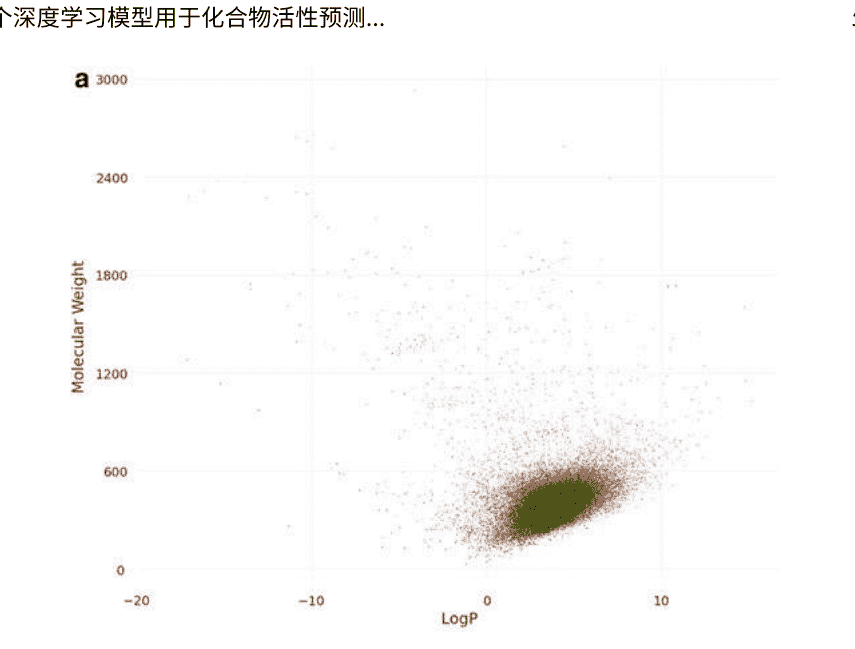

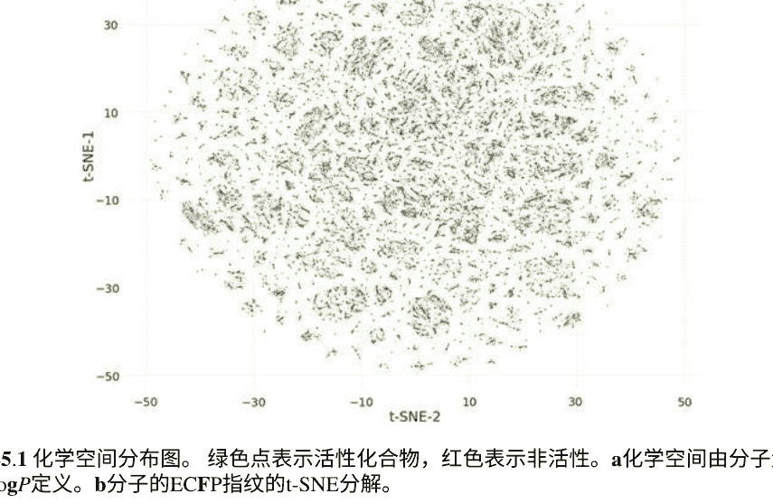

图25.1 化学空间分布图。绿色点表示活性化合物，红色表示非活性。a化学空间由分子量和logP定义。b分子的ECFP指纹的t-SNE分解。

不会对模型性能产生偏见。CV折叠之间的低方差表明模型具有良好的泛化能力（Jiang和Wang 2017年）。

然后我们评估了模型对每个蛋白质靶点的预测。性能在5-羟色胺受体2B的AUC为0.61到糖皮质激素受体的AUC为0.91之间变化。我们使用可视化方法展示了每个靶点的性能

表25.2 使用不同指纹进行全局模型测试的评估指标和平均分数每个蛋白质的得分

| | 全局模型 | | | | 每个蛋白质的平均模型 |
| :--- | :--- | :--- | :--- | :--- | :--- |
| | ECFP | Daylight | RDKit | Morgan | Morgan |
| 准确度 | 0.75 | 0.75 | 0.72 | 0.78 | 0.71 |
| AUC | 0.76 | 0.74 | 0.70 | 0.76 | 0.69 |
| 精确度 | 0.82 | 0.81 | 0.76 | 0.82 | 0.76 |
| 召回率 | 0.84 | 0.76 | 0.80 | 0.84 | 0.80 |

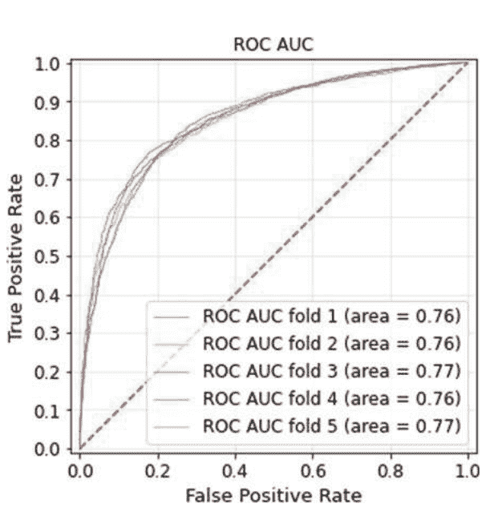

由于一些蛋白质的数据集不平衡，所以使用精确度-召回率曲线可能会过于乐观地呈现这些结果（图25.3）。对于每个靶点，精确度-召回率曲线都在随机线上方，这意味着对于所有靶点，模型在某种程度上能够区分活性和非活性。正如预期的那样，对于具有更不平衡类别的靶点，性能较低。例如，组胺H2和COX-1只有23%和28%的活性分子，而这些蛋白质的AUC得分位于0.64和0.68的较低边界上。我们进一步研究了每个蛋白质靶点内分子多样性对性能的影响。为此，我们通过计算唯一骨架的百分比来估计每个数据集内的分子多样性。因此，在一个蛋白质数据集中，如果所有分子都代表一个唯一的骨架，这个比例将等于百分之百。我们观察到唯一骨架的比例从30%（COX-2）到62%不等。

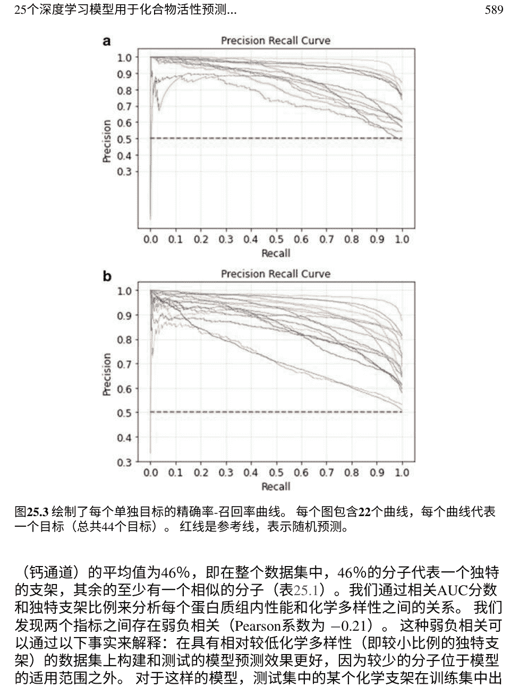

图25.3 绘制了每个单独目标的精确率-召回率曲线。每个图包含22个曲线，每个曲线代表一个目标（总共44个目标）。红线是参考线，表示随机预测。

（钙通道）的平均值为46%，即在整个数据集中，46%的分子代表一个独特的支架，其余的至少有一个相似的分子（表25.1）。我们通过相关AUC分数和独特支架比例来分析每个蛋白质组内性能和化学多样性之间的关系。我们发现两个指标之间存在弱负相关（Pearson系数为 -0.21）。这种弱负相关可以通过以下事实来解释：在具有相对较低化学多样性（即较小比例的独特支架）的数据集上构建和测试的模型预测效果更好，因为较少的分子位于模型的适用范围之外。对于这样的模型，测试集中的某个化学支架在训练集中出现的可能性更高。

#### 25.3.4 与传统蛋白质模型的比较

为了评估单一模型在所有选择的蛋白质上预测活性的优势，我们还为每个蛋白质目标构建了单独的模型。这些模型没有利用任何蛋白质信息，但构建方式与统一模型类似。每个模型的唯一输入是小分子的Morgan指纹。为了进行公平比较，我们使用相同的神经网络架构，即MLP，具有相同数量的层和神经元。对于每个模型，我们进行了五折交叉验证，保持了统一模型和每个蛋白质模型之间的折叠不变。所有模型的平均ROC AUC得分为0.68，明显低于全局模型的0.76。最重要的是，一些单独的模型无法区分类别，并将所有预测标记为相同的类别（AUC 0.5，表25.1）。这在具有高度不平衡类别的蛋白质中发生。例如，COX-1，H2受体和胺氧化酶含有28%，23%和38%的活性物质，相应的模型无法预测任何阳性类别，即召回率为0。相比之下，全局模型对应目标的召回率分别为0.49，0.39和0.66。因此，我们得出结论，更大的目标特征空间使模型能够在不同的目标上进行泛化，从而在原本预测不准确的目标上实现更好的性能。

#### 25.3.5 外部验证

为了验证我们的模型在外部数据集上的效果，我们使用了Lounkine等人（2012）报道的一组新型药物靶标相互作用。他们使用与ChEMBL数据库（Mendez等人，2019）中报道的已知配体的结构相似性比较，预测了656种上市药物在73个与不良反应相关的靶标上的活性。然后，他们通过体外测试验证了他们的预测，确认了175个新的药物靶标相互作用的IC50低于10 μM。其中，128个属于我们的列表中的35个蛋白质。报道的药物靶标相互作用在我们的数据集中不存在。我们对这35个靶标运行了全局模型，并发现68%的相互作用被预测为阳性。此外，我们观察到阳性预测中有一半（82个中的41个）获得了高概率分数（>0.9），这意味着模型对这些预测非常有信心（图25.4）。我们假设未被模型捕捉到的药物靶标对可能属于完全未探索的化学类型-靶相互作用。事实上，我们发现未成功预测的药物靶标对与相应蛋白质数据集的Tanimoto相似性较低，而被模型捕捉到的则较高。这些结果强调了在评估预测可靠性时应考虑模型的适用领域。

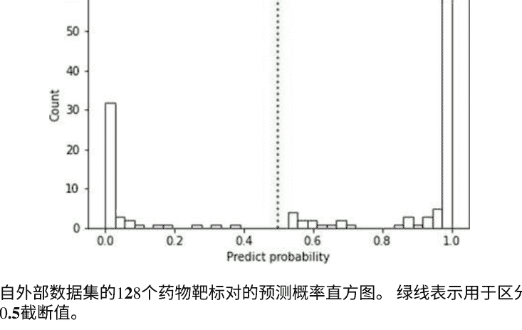

### 25.4 结论

在这里，我们提出了一个机器学习分类模型，用于预测小分子与44个主要离靶蛋白质的相互作用。这些蛋白质靶标常常被制药公司如辉瑞和罗氏用于新候选药物的体外测试（Bowes等，2012年; Bendels等，2019年）。

该模型为大规模筛选化合物的潜在毒性提供了一种高效的替代方法，该毒性通过与这些蛋白质的结合介导。使用机器学习评估毒性非常方便，因为与体外测试相比，它不需要任何人力、细胞培养或动物，并且只需几分钟即可预测数百种化合物。在体外测试非常复杂的情况下，体外预测的优势尤为突出。其中包括需要特定电生理技术的电压门控离子通道（来自面板的钠、钙、钾通道），这些技术并不容易在每个实验室中获得。

所提出的模型输出与44个蛋白质靶点的小分子相互作用的概率。这样的预测不仅在虚拟筛选的早期阶段对潜在有毒化合物进行过滤很有用，而且在引物优化的后期阶段也很有用。例如，预测的活性模式可能揭示细胞培养或动物模型中观察到的特定毒性表型的生物学基础。对毒性机制的理解为结构引导优化化合物以实现减少非靶效应提供了可能性。

我们采用了一种通用模型方法，而不是为每个靶点构建单独的模型，其中一个模型可以在所有44个靶点上进行预测。因此，除了化学结构描述符，我们还将蛋白质序列信息输入模型。我们表明，这种方法优于仅利用化学表示的传统单靶点模型。全局模型的优越性可以解释为迁移学习的特例，其中对一个蛋白质活性模式的知识有助于预测另一个蛋白质活性模式。这种解释在所选蛋白质面板的情况下尤其可能，因为它包含几个相关蛋白质类别，如三个肌动蛋白乙酰胆碱受体和四个肾上腺素受体。在DeepTox论文（Mayr等人，2016）中还证明了多类预测优于毒性终点上的单一模型的性能。与DeepTox的作者类似，我们发现全局模型可以预测严重不平衡类别的靶点，而单一模型无法做到这一点。

毒性建模的主要限制之一是数据的可用性和质量。在这里，我们利用不同测定和不同条件下的活性数据测量。因此，存在一种固有的变异性，阻碍了模型的性能。此外，我们使用Kd值增加了传统IC50测量的数据集大小。与测定变异性相关的噪声以及IC50/Kd混合对整体模型性能没有不利影响，因为数据非常丰富。尽管数据质量有限，但仍然捕捉到了活性概况的一般模式。我们预计，越来越多的分子活性数据将产生更可靠和可推广的体外毒理学模型。

## 参考文献

> - Baskin II (2018) 计算毒理学。 Springer, Berlin, 第119-139页

- Bemis GW, Murcko MA (1996) 已知药物的性质。 1. 分子框架。 J Med Chem 39(15):2887-2893

- Bendels S, Bissantz C, Fasching B, Gerebtzoff G, Guba W, Kansy M, Migeon J, Mohr S, Peters J-U, Tillier F (2019) 早期药物发现中的安全筛选： 优化的测定面板。 J Pharmacol Toxicol Methods 99:106609

- Bowes J, Brown AJ, Hamon J, Jarolimek W, Sridhar A, Waldron G, Whitebread S (2012) 减少与安全相关的药物淘汰： 体外药理学评估的应用。 Nat Rev Drug Discov 11(12):909-922

- Dimasi JA (2001) 新药开发中的风险： 调查药物的批准成功率。 Clin Pharmacol Ther 69(5):297-307

- Garrido A, Lepailleur A, Mignani SM, Dallemagne P, Rochais C (2020) hERG毒性评估： 药物设计的有用指南。 Eur J Med Chem 195:112290

- Gilson MK, Liu T, Baitaluk M, Nicola G, Hwang L, Chong J (2016) BindingDB在2015年： 一份用于药物化学、计算化学和系统药理学的公共数据库。 核酸酸性研究44(D1):D1045-D1053

- Harvey AL (2014) 毒素和药物发现。 毒素 92:193-200

- Hou J, Adhikari B, Cheng J (2018) DeepSF： 用于将蛋白质序列映射到褶皱的深度卷积神经网络。 生物信息学 34(8):1295-1303

- Huang K, Fu T, Glass LM, Zitnik M, Xiao C, Sun J (2020) DeepPurpose： 一种用于药物-靶标相互作用预测的深度学习库。 生物信息学 36(22-23):5545-5547

- Idakwo G, Luttrell J, Chen M, Hong H, Zhou Z, Gong P, Zhang C (2018) 机器学习方法在体外毒性预测中的应用综述。 环境科学与健康C 36(4):169-191

- Jiang G, Wang W (2017) 基于k折交叉验证方差分析的误差估计。 模式识别 69:94-106

- Kalliokoski T, Kramer C, Vulpetti A, Gedeck P (2013) 混合IC50数据的可比性—统计分析。PLoS One 8(4):e61007

- Kronenberger T, Keminer O, Wrenger C, Windshügel B (2015) 核受体调节剂—当前方法和未来展望。 在: 药物发现与开发—从分子到药物

- Lin K, May AC, Taylor WR (2002) 蛋白质结构比对中的氨基酸编码方案: 多维向量描述残基类型。 J Theor Biol 216(3):361–365

- Lounkine E, Keiser MJ, Whitebread S, Mikhailov D, Hamon J, Jenkins JL, Lavan P, Weber E, Doak AK, Côté S (2012) 对副作用靶点的药物活性的大规模预测和测试。 自然486(7403):361–367

- Mayr A, Klambauer G, Unterthiner T, Hochreiter S (2016) DeepTox: 使用深度学习进行毒性预测。Front Environ Sci 3:80

- Mcmaster A, Ray DW (2008) 药物洞察：糖皮质激素受体的选择性激动剂和拮抗剂。 Nat Clin Pract Endocrinol Metab 4(2):91–101

- Mendez D, Gaulton A, Bento AP, Chambers J, De Veij M, Félix E, Magariños MP, Mosquera JF, Mutowo P, Nowotka M (2019) ChEMBL: 朝着生物测定数据的直接提交。 核酸研究 47(D1):D930–D940

- Mullard M, Cadé M, Morice S, Dupuy M, Danieau G, Amiaud J, Renault S, Lézot F, Brion R, Thepault RA (2020) 儿童原发性骨肿瘤中的Sonic hedgehog标志：GLI拮抗剂GANT61对Ewing肉瘤肿瘤生长的影响。 癌症 12(11):3438

- Park K, Williams DP, Naisbitt DJ, Kitteringham NR, Pirmohamed M (2005) 药物开发过程中有毒代谢物的研究。 毒理学应用药理学 207(2):425–434

- Paul SM, Mytelka DS, Dunwiddie CT, Persinger CC, Munos BH, Lindborg SR, Schacht AL (2010) 如何提高研发生产力：制药行业的重大挑战。 自然药物评论 9(3):203–214

- 彭Y, 张Z, 江Q, 关J, 周S (2019) Top: 通过深度分子表示学习实现更好的毒性预测。IEEE, 第318-325页

- Rampe D, Brown AM (2013) hERG通道在心脏风险评估中的作用历史。J药理毒理学方法68 (1) : 13-22

- Redfern WS, Wakefield ID, Prior H, Pollard CE, Hammond TG, Valentin JP (2002) 安全药理学-一种渐进的方法。 Fundam Clin Pharmacol 16 (3) : 161-173

- Sherman C, Writer NN (2007) 药物中毒和成瘾的定义特征可以追溯到细胞间信号传导的紊乱。 NIDA Notes NIH, NIDA 21 (4)

- Smith DA, Schmid EF (2006) 药物撤退和其中的教训。Curr Opin Drug DiscovDev 9 (1) : 38-46

- Sorkun MC, Mullaj D, Koelman JVA, Er S (2022) Chemplot, 一种用于化学空间可视化的Python库

- Suleyman H, Demircan B, Karagoz Y (2007) 环氧合酶抑制剂的抗炎和副作用。药理学报告59 (3) : 247

- Vaswani A, Shazeer N, Parmar N, Uszkoreit J, Jones L, Gomez AN, Kaiser Ł, Polosukhin I (2017) 注意力就是你所需要的。 在: 神经信息处理系统的进展, 第30卷

- Wang MW, Goodman JM, Allen TE (2020) 预测毒理学中的机器学习：分类模型的最新应用和未来方向。 Chem Res Toxicol 34 (2) : 217–239

- Weiss A, Freeman W, Heslin K, Barrett M (2018) 美国医院的不良药物事件，2010年对比2014年。 HCUP统计简报234

- Wilbrahim L, Sprick RS, Jelfs KE, Zwijnenburg MA (2019) 用神经网络映射二元共聚物性质空间。化学科学 10(19):4973–4984

## 第26章 机器学习用于分析电子健康记录中的药物安全性

管美剑

### 26.1 引言

不良药物事件（ADEs）是与药物使用相关的意外有害事件。据估计，ADEs是美国和加拿大的第四大死因，全球第六大死因（Hacker 2009）。

ADE的定义随着时间的推移而演变，可能是由于药物相互作用、处方错误、滥用或滥用，或产品撤回引起的。据估计，尽管各种预防措施，5%至10%的患者在入院、住院期间或出院时可能患有ADE（Coleman和Pontefract2016）。由于广泛的ADE可能是发病率和死亡率的重要原因，有效和准确的药物监测在保护公共健康和减少与ADE相关的医院并发症的医疗费用方面起着关键作用（Hakkarainen等，2012年; Bates等，1997年）。

自发报告系统（SRS）（Polepalli等，2014年）一直被传统上用于药物监测，然而，对自发报告系统的ADEs的显著和广泛的低报告已经被报道（Hazel和Shakir2006）。此外，SRS数据库并不总是具有一致或完整的病史、共病症和药物暴露信息，因此可能导致不准确的发病率报告（Coloma等，2013年）。

电子健康记录（EHRs）被认为是药物监测新的、更主动的范式的关键组成部分，因为它们具有丰富的详细临床信息收集。这些潜在资源包括具有详细临床信息的电子病历，如患者症状、体格检查结果、诊断测试结果和开药或其他干预措施（Coloma等，2013年）。EHR数据库已被用于监测患者结果，进行正式的药物流行病学研究，并确认或否认最初由SRS（García Rodríguez andPérez Gutthann 1998; Suissa and Garbe 2007; Kramarz et al. 2001）检测到的潜在药物安全信号。从EHR数据库中检测安全信号的一个挑战是，大量的医疗信息只存在于非结构化格式中，例如临床记录（Turchin et al.2009）。根据一项研究，只有28.9%的患者有结构化的相关ADE记录（Skentzos et al. 2011）。因此，开发先进的机器学习（ML）和自然语言处理（NLP）方法，从非结构化的EHR中高效准确地提取药物安全信号。

已经开发了几个自然语言处理系统，例如MetaMap（Aronson2001），用于将生物医学文本映射到统一医学语言系统（UMLS），从而生成ADE预测。然而，这种方法可能会忽略其他重要的药物信息。另一个障碍是不同的自然语言处理系统在不同的标准上进行评估，这使得很难确定可重复的自然语言处理方法。

最近，深度神经网络等机器学习算法的进步为改进当前医学自然语言处理系统的性能提供了机会。例如，长短期记忆（LSTM）网络等深度学习算法在利用电子病历数据集中的医学叙述进行ADE检测的许多项目中展示了有希望的结果（Jagannatha和Yu 2016；Tutubalina和Nikolenko 2017；Huang等2015；Christopoulou等2020；Jouffroy等2021；Alfattni等2021）。虽然需要进一步验证，但快速发展的人工智能可能为更有效的药物监测系统带来希望。

在本文中，我们将通过一些例子来说明研究社区如何使用EHR数据集和各种ML和NLP方法来识别导致ADE的关键问题。此外，将对现有和新兴的基于EHR的ML方法进行调查。

### 26.2 使用ML解决的药物安全问题

ADE与许多因素有关；在这里，我们将讨论使用ML和EHR解决药物警戒的关键任务的机会——识别处方错误、药物滥用和药物相互作用。

#### 26.2.1 处方错误

药物处方错误是一种常见的ADE类型，导致相当大的发病率、死亡率和经济成本，在美国每年估计超过200亿美元（Aspden 2007; Andel et al. 2012）。已经开发了基于ML的警戒系统，用于帮助识别患者的处方异常和不规则情况。

临床记录。`MedAware`（以色列拉纳纳）是一款商业软件，可以分析历史电子健康记录，并为每种药物开发计算模型，以捕捉可能被开具该药物的人群以及可能被开具的临床环境。然后，该模型可以用于根据患者的临床情况识别显著的统计异常值。该系统在之前的研究中表现出高准确性和低误报率（Schiff等人，2017年；Segal等人，2019年）。

李琪和同事们开发了一种混合机器学习和自然语言处理算法，用于自动化药物差异检测。该方法包括三个步骤：（1）使用机器学习算法从临床笔记中识别药物实体，（2）使用基于规则的方法进行药物属性链接，（3）使用基于自然语言处理的方法进行药物处方匹配，以发现差异。该方法在一个带有注释的药物协调数据的黄金标准集上进行了测试，并在精确度、召回率和F值方面取得了有希望的结果（李等人，2015年）。

最近的研究显示，高警戒药物（HADs）与高达50%的ADEs相关。此外，由于药物治疗窗口狭窄，与HADs相关的ADEs导致了较高的死亡率（Lee等人，2014年）。多项研究致力于开发基于机器学习的新方法，以筛查HADs中的药物处方错误，例如华法林和地高辛（Hu等人，2012年；Roche-Lima等人，2020年；Corny等人，2020年；Wongyikul等人，2021年）。Corny等人在典型医院环境中测试了一种混合机器学习和基于规则的专家系统，以识别具有高风险药物错误的处方。一位药剂师进行的独立验证表明，与常规临床决策支持系统（CDS）相比，混合系统的准确性更高（Corny等人，2020年）。

处方错误还包括剂量错误，可能导致危及生命的ADEs或治疗效果降低。由于极端剂量错误非常罕见，Nagata等人开发了一种基于单类支持向量机（OCSVM）的无监督方法来检测异常的过量或欠量处方。处方数据从九州大学医院的电子病历中提取，用于构建过量和欠量处方。`OCSVM`检测到了大多数剂量错误（27/31），并且优于其他异常检测算法（Nagata等人，2021年）。

总结一下，基于机器学习的方法在检测处方错误方面可能发挥着重要作用，从而减少ADE的发生频率。

#### 26.2.2 药物滥用

药物，特别是与阿片类药物相关的过量用药，在美国仍然是一个重大的公共卫生问题。1999年至2018年间，已有超过40万例阿片类药物过量死亡的记录，仅2018年就有4.6万例死亡，这是由于阿片类药物滥用引起的流行病（Hedegaard等人，2020年；Wilson等人，2020年）。近年来，已经出现了一些针对阿片类药物过量的风险预测工具的研究。已发表的模型是基于各种数据来源开发的，包括退伍军人事务管理局（VHA）数据、医疗保险数据、商业保险数据和县级数据集（Lo-Ciganic等人，2019年；Sun等人，2020年；Palumbo等人，2020年；Segal等人，2020年；Hur等人，2021年；Marks等人，2021年；Ward等人，2021年）。与一般人口相比，退伍军人在阿片类药物滥用方面遭受了不成比例的影响，包括过量用药、自杀和死亡（Seal等人，2012年；Vowles等人，2020年）。Ward等人利用国家VHA公司数据仓库（CDW）数据，提出了一种多变量广义线性混合模型（mGLMM）方法来分别预测过量和与自杀相关的事件（SRE）。

该模型在AUC（84% vs. 77%）和敏感性（71% vs. 66%）方面表现更好，与VHA实施的阿片类药物风险分层工具（STORM）相比（Ward等人，2021年）。

Lo-Ciganic等进行了一项预测性研究，以预测361,527名非癌症自费医疗保险受益人中发生阿片类药物使用障碍的情况，这些受益人在2011年至2016年之间使用了多种阿片类药物处方（Lo-Ciganic等，2020年）。他们应用了弹性网络、随机森林、梯度提升机和深度神经网络来预测阿片类药物使用障碍。这四种方法在验证队列中都取得了类似的预测性能（C统计量：0.874-0.882），而弹性网络所需的预测因子最少。弹性网络的前两个十分位风险亚组显示出最高的阿片类药物使用障碍率，其中360例中有248例（Lo-Ciganic等，2020年）。

最近，有两项研究使用保险索赔数据预测患者的阿片类药物使用障碍（Segal等，2020年；Hur等，2021年）。商业索赔数据是另一个有价值的阿片类药物过量研究数据来源，因为它包含医疗保险索赔、国际疾病分类（ICD）9和10诊断代码、药房购买细节以及其他患者人口统计学信息（Segal等，2020年）。Segal等实施了`Word2Vec`和梯度提升树算法来预测1000万份医疗保险索赔中的阿片类药物使用障碍。该模型在预测阿片类药物使用障碍方面取得了高C统计量（0.959），并确定了一系列对阿片类药物使用障碍风险有贡献的关键变量，包括每年椎间盘疾病相关投诉、每年诊断的椎板切除术后综合征和每年的疼痛性疾病诊断（Segal等，2020年）。Hur等专注于使用术前保险索赔数据预测术后补充处方和阿片类药物持续使用情况，研究对象为112,898名阿片类药物非使用者（Hur等，2021年）。最佳模型在预测补充处方和持续使用方面的受试者工作特征曲线下面积（AUROC）分别为0.67和0.66。此外，他们确定了接受重大手术、术前30天内使用阿片类药物以及腹痛在预测补充处方方面的有用性，而背部/关节/头痛在预测新的阿片类药物持续使用方面最为重要（Hur等，2021年）。在美国最近的阿片类药物危机中，死亡率集中在特定地区，主要是中西部、阿巴拉契亚和新英格兰地区（Ciccarone，2019年；美国疾病控制与预防中心和国家卫生统计中心，2013年）。Marks等开发了一种负二项模型方法，以识别随后几年中高过量死亡风险最高的县（Marks等，2021年）。他们将预测的美国各县年度药物过量死亡率与观察到的药物过量死亡数据进行了验证。

收集了2013年至2018年之间的数据，并发现他们的模型优于基准模型。这项研究表明，机器学习方法可能有助于有效地识别未来新兴药物滥用流行病中的高死亡率县（Marks等，2021年）。

总之，自然语言处理和机器学习方法有潜力改善临床决策支持，早期干预和预防以应对阿片类药物流行病。

### 26.2.3 药物相互作用

药物相互作用（DDIs）占不良事件的30%（Datta等，2021年；Iyer等，2014年）。多种药物的应用通常可以增强治疗效果和选择性，但也可能导致严重的不良事件，如协同毒性（García-Fuente等，2018年；Datta等，2021年）。越来越多的患者同时接受多种药物治疗。在2009年至2012年间，美国年龄在18至44岁之间的成年人中，有38.1%在30天的时间窗口内使用了三种或更多处方药（Nahta等，2004年；Chou，2010年）。因此，迫切需要开发最先进的方法来识别潜在的药物相互作用。

广泛采用电子病历提供了一个独特的机会，可以识别以前已知的以及潜在的不良药物反应（Wang等，2009年；Banda等，2016年）。例如，Banda等人研究了使用四种不同信息来源从电子病历中优先考虑药物-药物事件关联的可行性（Banda等，2016年）。Iyer等人使用标准方法从5000万份临床笔记中测量不良药物反应的不均衡性来检测药物相互作用（Iyer等，2014年）。他们证明使用临床笔记可以在不良反应报告系统上达到与已建立方法相当的性能（Iyer等，2014年）。

电子病历的普及使得同时研究多种药物暴露成为可能。然而，要避免许多结果中的系统性偏差并提高信噪比仍然具有挑战性（Vajravelu等，2018年）。

Vajravelu等人开发了一种新的方法，药物类别富集分析（`MCEA`），用于在同时分析多种药理学暴露时识别与生物相关的发现（Vajravelu等人，2018年）。他们在`The Health Improvement Network`数据库上应用了`MCEA`来分析与克雷伯氏梭菌感染（CDI）相关的药物。借助`MCEA`的帮助，他们将与CDI相关的47个药理学类别缩小到了仅有的氟喹诺酮类，这是一类与CDI有生物学确认关联的抗生素类（Vajravelu等人，2018年）。尽管结果显示`MCEA`有希望，但仍需要进行额外的研究来确认其卓越的性能。

在2021年，Datta等人进行了一项研究，调查了非甾体抗炎药（NSAIDS）与药物性肝损伤（DILI）相关的药物相互作用（Datta等人，2021年）。他们在约40万次住院的电子健康记录数据集上应用了机器学习算法，以检测出几种已知的相互作用。该提议的方法成功地识别出了87.5%的已知与双氯芬酸相互作用并增加DILI风险的阳性对照（Datta等人2021年)。此外，他们还发现了美洛昔康和埃索美拉唑之间的一种新型潜在肝毒性相互作用，这两种药物通常一起用于非甾体抗炎药（NSAID）引起的胃肠道出血（Datta等，2021年）。他们的方法在大多数指标上也优于所有比较的先前方法（Datta等，2021年）。

Patrick等人专注于通过结合分子数据和医疗索赔来预测用于治疗银屑病及其合并症的药物之间的相互作用（Patrick等，2021年）。该提出的流程整合了984个转录组数据集，2159种药物的分子结构以及来自1.5亿患者的医疗索赔，以预测用于治疗银屑病及其合并症的37611种药物对之间的相互作用（Patrick等，2021年）。他们的方法在区分11861种已知DDI和25750种非DDI药物对方面实现了>0.9的受试者工作特征曲线下面积（AUROC）。他们确认了他们发现的新型DDI，并通过独立的数据来源和电子健康记录进行了支持（Patrick等，2021年）。

除了传统的电子病历数据集之外，扩展的电子病历，例如社交媒体，提供了一个新的渠道来识别患者的不良事件。根据一项调查，72%的互联网用户上网搜索健康信息（White等，2016年）。White等进行了一项关于Web搜索日志的大规模研究，以检测特定的药物相互作用（White等，2013年）。Yang等提出从`MedHelp.org`，一个流行的在线健康社区，发现药物相互作用（Yang和Yang，2016年）。此外，具有大量用户的社交媒体平台，例如`Twitter`和`Instagram`，在检测药物相互作用方面显示出巨大潜力（Carbonell等，2015年；Hamed等，2015年；Correia等，2016年）。尽管社交媒体为研究不良事件和药物相互作用提供了新的可能性，但其通常存在噪音，并且迄今为止在现实世界中的应用有限。需要额外的努力来证明和理解社交媒体在药物监测中的作用。

预测DDIs是一项困难的任务，但通过将ML算法应用于EHR数据集，并结合其他数据源，如药理学数据库、文献、分子数据和社交媒体，我们可能能够更准确、更高效地检测DDI事件。

### 26.3 药物警戒中自然语言处理和机器学习方法的最新趋势

非结构化的EHR数据集中信息的丰富性使得NLP成为检测ADE的重要工具。主要子任务包括对非结构化文本进行命名实体标注（例如药物和疾病）以及识别这些标注实体之间的关系（关系识别）（图26.1）。生物医学命名实体识别（NER）、关系识别（RI）以及综合任务一直是活跃的研究领域。

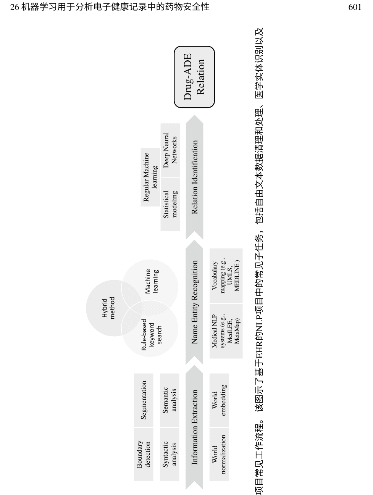

#### 26.3.1 NLP方法的存在

现有的EHR ADE识别的NLP方法可以大致分为基于规则、基于词典、监督机器学习和混合方法。基于规则的方法，如关键词和触发短语搜索，通常依赖于专家生成的关键词和触发短语列表，并且对于特定疾病或药物特别高效。例如，Murff等人开发了一个工具，根据专家意见，在自由文本出院摘要中搜索表示可能ADE的触发词（Murff等人，2003年）。Cantor等人研究了从门诊护理记录中识别ADE的问题，并确定了一系列与ADE发生高度相关的触发短语列表（Cantor等人，2007年）。基于关键词和触发短语的方法由于手动构建和维护关键词/触发短语集合的困难而受到限制。另一种广泛使用的方法是扩展现有的生物医学NLP系统来识别ADE；最常用的系统包括`MedLEE`（Friedman等人，2004年），`MetaMap`（Aronson，2001年）和`cTAKES`（Savova等人，2010年）。例如，`MedLEE`被多项研究用于识别医院记录中的命名实体，如药物和潜在不良事件（Wang等人，2010年；Friedman，2009年；Haerian等人，2012年）。此外，现有的NLP系统通常与医学本体数据库（如`UMLS`）一起使用，以规范化识别的实体（Humphreys等人，1998年；Duke和Friedlin，2010年）。尽管扩展现有的医学NLP系统在检测ADE方面取得了一些成功，但仍然面临系统固有的限制，例如缺乏注释或需要额外的断言分类工具（Luo等人，2017年）。

#### 26.3.2 机器学习方法

过去十年中，以机器学习为中心的方法已经获得了广泛应用。机器学习方法的一个好处是可以定量评估候选药物-疾病或药物-症状是否为真正的不良事件（Luo等，2017年）。在这个领域中已经应用了许多机器学习算法，从传统的统计模型到深度神经网络。Visweswaran等人使用UMLS对EHR中的术语进行了注释，并实施了贝叶斯模型来评估患者是否有ADEs（Visweswaran等人，2003年）。此外，线性模型、隐马尔可夫模型（HMMs）和支持向量机（SVMs）都被用于从EHR中提取信息和识别命名实体（Sampathkumar等人，2014年；Ramesh等人，2014年；Ward等人，2021年）。

条件随机场（CRFs）是被认为是可靠且高性能的概率图模型，用于在生物医学文本中标记识别的实体，因为它们能够对序列数据进行分割和标记（Lafferty等，2001年）。例如，Aramaki等人（2010年）对NER进行了实验

药物和症状与CRFs的关系。然后他们使用基于规则的模式作为特征，使用SVMs对药物和症状之间的关系进行分类，以识别真正的ADEs（Aramaki等人，2010年）。Nikfarjam等人应用词嵌入和CRFs对来自Daily-Strength和Twitter的用户帖子进行ADE预测（Nikfarjam等人，2015年）。Henriksson等人使用CRFs识别相关的命名实体（疾病、症状和药物），并使用随机森林对识别实体的属性（否定、推测和时间性）进行标记（Henriksson等人，2015年）。最近，深度学习模型，特别是循环神经网络（RNN）模型，通过学习上下文中单词的周围环境，展示了在序列标记和NER任务中的有希望的结果（Lipton等人，2015年）。RNN是具有额外权重的神经网络，可以创建循环，以建模时间依赖性和顺序事件（Williams和Zipser，1995年）。长短期记忆（LSTM）网络是RNN的变体，能够有效地学习序列中单词之间的长期依赖关系（Hochreiter和Schmidhuber，1997年）。双向LSTM（BiLSTM）是LSTM的修改版本，可以处理来自两个方向的顺序数据，在ADE检测任务中，与非深度学习工具相比，取得了更好的性能（Roberts等人，2015年；Wang等人，2016年；Wunnava等人，2019年；Christopoulou等人，2020年）。此外，注意力机制是一种使神经网络能够有选择地关注特定信息的技术，并在临床叙述中的NER和ADE关系分类中取得了有希望的结果（Dandala等人，2019年；Christopoulou等人，2020年）。

RNN和CRF的组合也被应用于NER任务，并被发现是有效的（Jagannatha和Yu2016; Tutubalina和Nikolenko2017; Huang等人2015; Christopoulou等人2020; Jouffroy等人2021; Alfattani等人2021）。大多数用于NER任务的深度学习模型使用词嵌入来表示文本数据。词嵌入技术以大型文本语料库作为输入，并通过该语料库为其中的每个唯一单词分配一个相应的向量，从而产生一个高维向量空间。这些词嵌入可以在特定领域的文本（例如，EHR笔记和PubMed文章）上进行训练（Choi等人2016），也可以在各种通用文本（例如，维基百科文章）上进行训练（Pennington等人2014）。

随着为基于电子健康记录的药物监测创建的自然语言处理系统数量的增加，大多数系统已经在不同的数据集和标准上进行了评估，这使得比较它们的性能变得具有挑战性。因此，为了检测医疗实体、分类命名实体之间的关系以及在专家注释的自由文本电子健康记录数据上同时完成这两个任务，组织了两个自然语言处理挑战，即来自电子健康记录的药物和不良药物事件（MADE 1.0）（Jagannatha等，2019年）和2018年全国自然语言处理临床挑战（n2c2）共享任务第2轨道（Henry等，2020年）。这两个挑战的结果表明，深度神经网络在自然语言处理任务中优于传统的机器学习技术，特别是在命名实体识别和关系分类方面（表26.1）。然而，对于联合命名实体识别和关系分类任务仍然需要进一步改进。

| 挑战 | 团队名称 | 解决方案描述 |
|---|---|---|
| MADE 1.0 | IBMResearch-dandala（Dandala等，2019年） | 使用BiLSTM-CRF进行NER的两步模型，以及使用组合的BiLSTM和注意力网络进行RI |
| MADE 1.0 | UArizonaIschool-Xu（Xu等，2018年） | 使用BiLSTM-CRF进行NER的两步模型，以及使用基于SVM的模型进行RI |
| MADE 1.0 | UofUtah-Patterson（Chapman等，2019年） | 使用CRF进行NER的两步模型，以及使用随机森林模型进行RI |
| MADE 1.0 | ASU-BMI（Magge等，2018年） | 使用BiLSTM-CRF进行NER的两步模型，以及使用随机森林模型进行RI |
| N2c2 | UTHealth/Dalian（UTH）（Xu等，2017） | ADDRESS，基于BiLSTM-CRF的联合NER和RI系统 |
| N2c2 | 佛罗里达大学（UFL） | 两步模型BiLSTM-CRF用于NER和SVM用于RI |
| N2c2 | NaCTeM在曼彻斯特大学/丰田技术学院/AIST（NaCT）（Christopoulou等，2020） | BiLSTM-CRF用于NER和具有BiLSTM和注意机制/转换网络的集成方法用于RI |
| N2c2 | 南卡罗来纳医科大学（MSC）（Lafferty等，2001） | 两步模型与堆叠泛化集成用于NER和SVM用于RI |
| N2c2 | VA盐湖城/犹他大学（VA） | 具有BiLSTM-CRF和外部训练的CRF的两步模型用于NER和2个阶段的随机森林用于RI |

如表所示，具有双向长短期记忆（BiLSTM）神经网络和条件随机场（CRF）的组合模型在NER子任务中占主导地位，而多个ML算法在RI子任务中取得了令人鼓励的表现。

例如，将捕捉长距离或隐含的药物-不良事件关系的更大背景或外部知识纳入考虑，很可能会提高未来系统的性能。

### 26.4 讨论

早期检测和预防不良事件是更安全、更高质量的医疗保健的关键组成部分。电子健康记录包含丰富的详细临床信息，可以实时准确地监测药物安全。正如本文所讨论的，已经探索了各种各样的ML和NLP方法来发现电子健康记录中的不良事件，如用药错误、用药滥用和药物相互作用。强大的ML算法，特别是基于深度学习的算法，在检测医疗实体和捕捉关系方面表现出色。

尽管这些方法取得了令人兴奋的进展，但在药物警戒系统中部署和利用这些方法仍面临着重大挑战。

1. 尽管使用先进的机器学习算法挖掘电子病历可以获得与传统的自发报告系统相当甚至更好的结果，但临床叙述仍然是一个未充分利用的数据来源，用于识别未报告的不良药物反应。事实上，电子病历数据库通常用于验证最初在自发报告系统数据库中检测到的不良药物反应信号（Coloma 等，2013年; Vilar等，2018年）。增加对基于电子病历的药物警戒系统的采用将有助于进一步验证和提升其能力。

2. 医疗机构通常缺乏实施最新文本处理技术所需的计算基础设施，从而限制了它们对更先进的基于电子病历和机器学习的药物警戒系统的采用（Ching等，2018年）。因此，开发轻量级的自然语言处理系统，能够在有限的计算资源下发挥功能和效果，是至关重要的。

3. 尽管基于电子健康记录的机器学习系统数量迅速增长，但仍缺乏评估系统性能和可重复性的通用标准。此外，不同临床组织之间的语言变异性和本地环境差异限制了自然语言处理解决方案在组织边界上的采用（Carrell等，2017年）。新系统的广泛采用以及来自研究界的更多合作努力，例如（MADE 1.0）（Jagannatha等，2019年）和2018年全国自然语言处理临床挑战（n2c2）共享任务2（Henry等，2020年），将有助于解决这个问题。

4. 最后，系统的快速发展将超过监管活动。验证先进技术的重要性在于确保这些系统保持可重复性并适用于目的（OHDSI，2017年）。因此，开发既支持监管又支持临床用例的系统将是必要的。

基于EHR的机器学习药物警戒系统显示出巨大的潜力，可以提高药物安全性，从而为未来建立更好的医疗保健系统提供帮助。然而，要实现我们的目标，需要研究界、卫生组织和监管机构的重大努力。

## 参考文献

Alfattani G, Belousov M, Peek N, Nenadic G (2021) 从出院摘要中提取药物名称和相关属性：文本挖掘研究。 JMIR Med Inform 9(5):e24678

Andel C, Davidow SL, Hollander M, Moreno DA (2012) 医疗质量和医疗错误的经济学。 J Health Care Finance 39(1):39–50. PMID:23155743


Aramaki E, Miura Y, Tonoike M, Ohkuma T, Masuichi H, Waki K, Ohe K (2010) 从临床记录中提取不良药物反应。Stud Health Technol Inform 160(Pt 1):739–743

Aronson AR (2001) 将生物医学文本有效映射到UMLS Metathesaurus：MetaMap程序。在AMIA研讨会论文集中，第17-21页。

Bahdanau D, Cho K, Bengio Y (2014) 通过联合学习对齐和翻译的神经机器翻译。arXiv arXiv:1409.0473

Banda JM, Callahan A, Winnenburg R, Strasberg HR, Cami A, Reis BY, Vilar S, Hripcsak G, Dumontier M, Shah NH (2016) 在电子健康记录中发现的药物-药物-事件关联的优先级可行性。药物安全性 39(1):45–57

Bates DW, Spell N, Cullen DJ, Burdick E, Laird N, Petersen LA, Small SD, Sweitzer BJ, Leape LL (1997) 住院患者不良药物事件的成本。JAMA 277(4):307–311

Cantor MN, Feldman HJ, Triola MM (2007) 使用触发短语检测门诊护理记录中的不良药物反应。Qual Saf Health Care 16(2):132–134

Carbonell P, Mayer MA, Bravo À (2015) 在推特上探索品牌药物提及以进行药物监测。Stud Health Technol Inform 210:55–59

Carrell DS, Schoen RE, Leffler DA, Morris M, Rose S, Baer A, Crockett SD, Gourevitch RA, Dean KM, Mehrotra A (2017) 将现有的临床自然语言处理系统适应于多个不同的医疗保健环境中的挑战。J Am Med Inform Assoc 24(5):986–991

Centers for Disease Control and Prevention, National Center for Health Statistics (2013) CDC WONDER在线数据库上的死因1999-2013年，2015年发布。数据来自多原因死亡文件

Chapman AB, Peterson KS, Alba PR, DuVall SL, Patterson OV (2019) 用快速训练的分类模型检测不良药物事件。

Ching T, Himmelstein DS, Beaulieu-Jones BK, Kalinin AA, Do BT, Way GP, Ferrero E, Agapow PM, Zietz M, Hoffman MM, Xie W, Rosen GL, Lengerich BJ, Israel J, Lanchantin J, Woloszynek S, Carpenter AE, Shrikumar A, Xu J, Cofer EM, Lavender CA, Turaga SC, Alexandari AM, Lu Z, Harris DJ, DeCaprio D, Qi Y, Kundaje A, Peng Y, Wiley LK, Segler MHS, Boca SM, Swamidass SJ, Huang A, Gitter A, Greene CS (2018) 深度学习在生物学和医学中的机会和障碍。J R Soc Interface 15(141):20170387

Choi Y, Chiu CY, Sontag D (2016) 学习医学概念的低维表示。AMIA联合峰会关于转化科学的论文集, 第41-50页

Chou TC (2010) 药物组合研究及其利用Chou-Talalay方法量化其协同作用。癌症研究70 (2) : 440-446

Christopoulou F, Tran TT, Sahu SK, Miwa M, Ananiadou S (2020) 采用集成深度学习方法在电子健康记录中提取不良药物事件和药物关系。J Am Med Inform Assoc 27 (1) : 39-46

Ciccarone D (2019) 三波流行病: 美国阿片类药物过量危机的供需驱动因素。Int J Drug Policy 71: 183-188

Coleman JJ, Pontefract SK (2016) 不良药物反应。Clin Med (伦敦) 16 (5) : 481-485

Coloma PM, Trifirò G, Patadia V, Sturkenboom M (2013) 后市场安全监测: 电子医疗记录中的信号检测在整体中的位置? 药物安全36 (3) : 183-197

Corny J, Rajkumar A, Martin O, Dode X, Lajonchère JP, Billuart O, Bézie Y, Buronfosse A (2020) 基于机器学习的临床决策支持系统，用于识别存在高风险药物错误的处方。J Am Med Inform Assoc 27(11):1688–1694

Correia RB, Li L, Rocha LM (2016) 通过Instagram用户时间线的网络分析监测潜在药物相互作用和反应。In: Biocomputing 2016: Pacific symposium的论文集, 第21卷, 第492-503页

Dandala B, Joopudi V, Devarakonda M (2019) 通过神经网络共同建模实体和关系, 在临床笔记中检测不良药物事件。Drug Saf 42(1):135–146

Datta A, Flynn NR, Barnette DA, Woeltje KF, Miller GP, Swamidass SJ (2021) 从回顾性电子健康记录 (EHR) 队列中, 使用机器学习检测与非甾体抗炎药 (NSAIDs) 相关的肝损伤药物相互作用。PLoS Comput Biol 117(7):e1009053

Duke JD, Friedlin J (2010) ADESSA: 用于传递语义编码的实时决策支持服务的不良药物事件数据。In: AMIA年度研讨会论文集, 第177-181页

Friedman C (2009) 使用自然语言处理和电子健康记录的挖掘发现新的不良药物事件。J Biomed Inform 5651:1–5

Friedman C, Shagina L, Lussier Y, Hripcsak G (2004) 基于自然语言处理的临床文档自动编码。J Am Med Inform Assoc 11(5):392–402

Garcia-Fuente A, Vázquez F, Viéitez JM, Alonso FJG, Martín JI, Ferrer J (2018) CISNE: 组合疗法中剂量效应和协同作用的准确描述。Sci Rep 8(1):1–9

García Rodríguez LA, Pérez Gutthann S (1998) 使用英国全科医疗研究数据库进行药物流行病学研究。Br J Clin Pharmacol 45(5):419–425

Hacker M (2009) 第13章—不良药物反应。在：药理学。学术出版社，剑桥

Haerian K, Varn D, Vaidya S, Ena L, Chase HS, Friedman C (2012) 使用电子健康记录和自动化方法检测与药物监测相关的不良事件。Clin Pharmacol Ther 92(2):228–234

Hakkarainen KM, Hedna K, Petzold M, Hägg S (2012) 可预防的不良药物反应患者的百分比和不良药物反应的可预防性。一项荟萃分析。

Hamed AA, Wu X, Erickson R, Fandy T (2015) Twitter K-H网络的应用：推进药物搜索的生物医学文献。J Biomed Inform 56:157–168

Hazell L, Shakir SA (2006) 不良药物反应的低报告率：一项系统综述。

Hedegaard H, Miniño AM, Warner M (2020) 美国1999年至2018年的药物过量死亡

Henriksson A, Kvist M, Dalianis H, Duneld M (2015) 在临床记录中识别不良药物事件信息的分布语义表示。J Biomed Inform 57:333–349

Henry S, Buchan K, Filannino M, Stubbs A, Uzuner O (2020) 2018 n2c2共享任务：电子健康记录中的不良药物事件和药物提取。J Am Med Inform Assoc 27(1):3–12


Hochreiter S, Schmidhuber J (1997) 长短期记忆。 Neural Comput 1735–1780

Hu YH, Wu F, Lo CL, Tai CT (2012) 从临床数据中预测华法林剂量：一种监督学习方法。 Artif Intell Med 56(1):27–34

Huang Z, Xu W, Yu K (2015) 双向LSTM-CRF模型用于序列标记。 arXiv预印本 arXiv:1508.01991

Humphreys BL, Lindberg DA, Schoolman HM, Barnett GO (1998) 统一医学语言系统：一项信息学研究合作。 J Am Med Inform Assoc 5(1):1–11

Hur J, Tang S, Gunaseelan V, Vu J, Brummett CM, Englesbe M, Waljee J, Wiens J (2021) 通过机器学习和保险索赔预测术后阿片类药物使用情况。 Am J Surg 222(3):659–665

Iyer SV, Harpaz R, LePendu P, Bauer-Mehren A, Shah NH (2014) 挖掘临床文本中的不良药物相互作用信号。 J Am Med Inform Assoc 21(2):353–362

Jagannatha AN, Yu H (2016) 用于RNN基于序列标记的结构化预测模型在临床文本中的应用。在：会议论文集中的经验方法在自然语言处理中的应用，pp 856–865

Jagannatha A, Liu F, Liu W, Yu H (2019) 电子健康记录笔记中提取药物、适应症和不良药物事件的第一个自然语言处理挑战概述(MADE 1.0)。药物安全性 42(1):99–111

Jouffroy J, Feldman SF, Lerner I, Rance B, Burgun A, Neuraz A (2021) 混合深度学习用于从法语临床文本中提取与药物相关的信息：MedExt算法开发研究。 JMIR Med Inform 9(3):e17934

Kramarz P, France EK, Destefano F, Black SB, Shinefield H, Ward JI, Chang EJ, Chen RT, Shatin D, Hill J, Lieu T, Ogren JM (2001) 基于人口的轮状病毒疫苗接种和肠套叠的研究。 Pediatr Infect Dis J 20(4):410–416

Lafferty JD, McCallum A, Fernando CNP (2001) 条件随机场：用于序列数据分割和标记的概率模型。 在：第十八届国际机器学习会议论文集，第282–289页

Lee J, Han H, Ock M, Lee SI, Lee S, Jo MW (2014) 临床决策支持系统对高警戒药物处方错误的预防影响。 Int J Med Inform 83(12):929–940

Li Q, Spooner SA, Kaiser M, Lingren N, Robbins J, Lingren T, Tang H, Solti I, Ni Y (2015) 一种端到端的混合算法用于自动化药物差异检测。 BMC Med Inform Decis Mak 15:37

Lipton ZC, Berkowitz J, Elkan C (2015) 关于序列学习的循环神经网络的重要评论。 arXiv预印本: arXiv: 1506.00019

Lo-Ciganic WH, Huang JL, Zhang HH, Weiss JC, Wu Y, Kwoh CK, Donohue JM, Cochran G, Gordon AJ, Malone DC, Kuza CC, Gellad WF (2019) 评估用于预测药物处方中的阿片类药物过量风险的机器学习算法。 JAMA Netw Open 2(3):e190968

Lo-Ciganic WH, Huang JL, Zhang HH, Weiss JC, Kwoh CK, Donohue JM, Gordon AJ, Cochran G, Malone DC, Kuza CC, Gellad WF (2020) 使用机器学习预测费用支付的Medicare受益人中发生阿片类药物使用障碍的风险：一项预测性研究。 PLoS One 15 (7)：e0235981

Luo Y, Thompson WK, Herr TM, Zeng Z, Berendsen MA, Jonnalagadda SR, Carson MB, Starren J (2017) 基于电子病历的药物监测的自然语言处理：一项结构化综述。 药物安全40(11):1075–1089

Magge A, Scotch M, Gonzalez-Hernandez G (2018) 使用双字符LSTMs和随机森林分类器的临床NER和关系提取。 在：国际药物和不良药物事件检测研讨会，第25-30页

Marks C, Abramovitz D, Donnelly CA, Carrasco-Escobar G, Carrasco-Hernández R, Ciccarone D, González-Izquierdo A, Martin NK, Strathdee SA, Smith DM, Bórquez A (2021) 在新兴芬太尼流行病中识别高过量死亡负担的风险县：一项预测性统计建模研究。 Lancet Public Health 6(10):e720–e720

Murrff HJ, Forster AJ, Peterson JF, Fiskio JM, Heiman HL, Bates DW (2003) 电子筛查出院小结中的不良医疗事件。 J Am Med Inform Assoc 10(4):339–350

Nagata K, Tsuji T, Suetsugu K, Muraoka K, Watanabe H, Kanaya A, Egashira N, Ieiri I (2021) 检测过量和欠量处方-一种无监督的机器学习方法。 PLoS One 16(11):e0260315

Nahta R, Hung MC, Esteva FJ (2004) HER-2靶向抗体曲妥珠单抗和帕珠单抗协同抑制乳腺癌细胞的存活。 Cancer Res 64(7):2343–2346

Nikfarjam A, Sarker A, O'Connor K, Ginn R, Gonzalez G (2015) 从社交媒体中挖掘不良药物反应提及的序列标记与词嵌入聚类特征。 J Am Med Inform Assoc 22(3):671–681

OHDSI (2017) 大规模与治疗相关的不良反应证据标准化（LAERTES）：将药物警戒证据来源与临床数据链接的开放可扩展系统。 J Biomed Semantics 8(1):11

Palumbo SA, Adamson KM, Krishnamurthy S, Manoharan S, Beiler D, Seiwell A, Young C, Metpally R, Crist RC, Doyle GA, Ferraro TN, Li M, Berrettini WH, Robishaw JD, Troiani V (2020年) 使用电子健康记录文档评估可能的阿片类药物使用障碍。 JAMA Netw Open 3(9):e2015909

Patrick MT, Bardhi R, Raja K, He K, Tsoi LC (2021年) 通过整合分子和临床资源来预测治疗银屑病及其合并症的药物相互作用的进展。 J Am Med Inform Assoc 28 (6) : 1159–1167

Pennington J, Socher R, Manning C (2014年) Glove: 用于词表示的全局向量。 在：2014年自然语言处理经验方法会议论文集 (EMNLP)，第1532–1543页

Polepalli RB, Belknap SM, Li Z, Frid N, West DP, Yu H (2014) 从食品和药物管理局的不良事件报告系统叙述中自动识别药物和不良事件信息。JMIR Med Inform 2 (1): e10

Ramesh BP, Belknap SM, Li Z, Frid N, West DP, Yu H (2014) 从食品和药物管理局的不良事件报告系统叙述中自动识别药物和不良事件信息。JMIR Med Inform 2 (1): e30 22

Roberts K

Vowles KE, Witkiewitz K, Cusack KJ, Gilliam WP, Cardon KE, Bowen S, Edwards KA, McEnteeML, Bailey RW (2020) 针对患有共病慢性疼痛和危险性阿片类药物使用的退伍军人的综合行为治疗：一项随机对照试验。 JAm Med Inform Assoc 16(3):328–337


Wang X, Chase H, Markatou M, Hripcsak G, Friedman C (2010) 选择电子健康记录中的信息进行知识获取。 J Biomed Inform 43(4):595–601

Wang Y, Rastegar MM, Elayavilli RK, Liu S, Liu H (2016) 临床信息提取和信息检索的集成模型，用于临床决策支持。 TRECWard R, Weeda E, Taber DJ, Axon RN, Gebregziabher M (2021) 利用行政医疗保健数据改进预测退伍军人的与阿片类药物相关的过量和自杀事件的高级模型。 Health Serv Outcomes Res Methodol 1–21

White RW, Tatonetti NP, Shah NH, Altman RB, Horvitz E (2013) 网络规模的药物监测：倾听群众的信号。 J Am Med Inform Assoc 20(3):404–408

White RW, Wang S, Pant A, Harpaz R, Shukla P, Sun W, DuMouchel W, Horvitz E (2016) 从搜索日志数据中早期识别不良药物反应。 J Biomed Inform 59:42–48

Williams RJ, Zipser D (1995) 基于梯度的递归网络学习算法及其计算复杂性。 In: Zipser D, Williams RJ (eds) 反向传播：理论、架构和应用。 L. Erlbaum Associates Inc., Hillsdale, pp 433–486

Wilson N, Karisa M, Seth P, Smith HI V, Davis NL (2020) 美国2017-2018年涉及药物和阿片类药物的过量死亡。 Morb Mortal Wkly Rep 69(11):290

Wongyikul P, Thongyot N, Tantrakoolcharoen P, Seephueng P, Khumrin P (2021) 使用梯度提升分类器进行高警戒药物筛选。科学报告11(1):20132

Wunnava S, Qin X, Kakar T, Sen C, Rundensteiner EA, Kong X (2019) 使用具有双层嵌入的分层递归神经网络从电子健康记录中检测不良药物事件。药物安全42(1):113–122

Xu J, Lee HJ, Ji Z, Wang J, Wei Q, Xu H (2017) UTH_CCB系统用于从药品标签中提取不良药物反应。在TAC-ADR 2017中。在文本分析会议的论文集中

Xu D, Yadav V, Bethard S (2018) UArizona参加MADE1.0 NLP挑战。在国际药物和不良药物事件检测研讨会上，第57-65页

杨H，杨CC (2016年) 在异质医疗保健网络中通过三元预测发现药物相互作用和相关的不良药物反应。在：2016年IEEE国际医疗保健信息学会议（ICHI）芝加哥，IEEE，第244-254页

周P，石W，田J，齐Z，李B，郝H，徐B (2016年) 基于注意力的双向长短期记忆网络用于关系分类。在：计算语言学协会第54届年会论文集，第2卷，第207-212页

## 第27章 通过应用机器学习将基因组测序和变异检测应用于毒基因组学研究

李泰芳

### 27.1 引言

许多疾病具有潜在的基因组成分。虽然遗传性疾病通常由生殖细胞变异驱动，但癌症主要是由细胞中的体细胞突变引起的，这些突变使它们能够无控制地生长和分裂。在癌细胞获得了无需经历凋亡就能持续分裂的能力之后，癌症通过持续的体细胞突变也使其能够逃避抗癌治疗。环境中存在许多毒素和诱变剂，它们在DNA中引起突变，从而增加了健康细胞最终获得致癌驱动突变组合的机会。在了解癌症生物学和导致癌症的环境因素方面，识别癌症中的突变是关键一步。下一代测序（NGS）的出现使得整个人类基因组可以快速、廉价地测序。截至本章撰写时，使用NGS测序一百万个碱基对（bps）的DNA成本不到10美分。因此，以每个碱基覆盖30倍的方式完成人类全基因组测序的成本可以低于1000美元（NHGRI）。因此，癌症研究人员越来越常见地对肿瘤和匹配的正常样本（通常是血液或相邻的健康组织）进行测序，以找到肿瘤中的所有体细胞突变。在配对的肿瘤-正常测序中，体细胞突变被定位在肿瘤中具有变异碱基的基因组坐标上，而在匹配的正常样本中只有参考碱基。

测序技术目前是转化研究和临床环境中主要的下一代测序平台。 为简单起见，本章中的NGS指的是第二代测序，除非另有说明。 测序文库确定了实际测序的内容，例如：

- 1. 全基因组测序（WGS）中，基因组DNA通过声波或限制酶断裂成适合测序的最佳长度，即数百个碱基对长。 测序文库由连接了通用适配器的DNA片段组成，并进行测序，这些片段大多是随机事件。

为了确保对整个基因组进行测序，一种常见的做法是至少以30×的平均深度对整个基因组进行测序，以便大部分基因组具有>10×的测序深度，以实现对整个基因组的自信基因分型（Meynert等人，2014年）。

- 2. 定向测序是选择并富集测序文库中感兴趣的某些基因组区域。 全外显子组测序（WES）是常用的文库，只选择基因组中已知的编码区域，以便测序不会“浪费”在不太有价值的“垃圾”DNA和内含子上。 WES文库通常以>100×的深度进行测序，以考虑目标捕获带来的额外偏差。 用于癌症的临床测序通常针对对诊断、预后或治疗有重要意义的基因组区域，并且通常以1000×的倍数进行测序，以捕获低克隆度的变异体。

目标测序可以通过两种方法进行：

- (a) 混合捕获，使用具有互补序列的探针来物理捕获感兴趣区域的DNA片段。由于碎片化过程的随机性，即使是相同的探针捕获的片段也会具有不同的长度和序列。

- (b) PCR富集，使用特定的引物序列来复制和扩增感兴趣区域。由于PCR复制的性质，相同区域的富集DNA序列通常具有相同的序列。

- 3. 测序策略用于测量RNA表达、甲基化、蛋白质-DNA相互作用等，不在本章的范围内。

由于成本低且高通量，NGS是一种优秀的技术，用于检测小变异，即单核苷酸变异（SNV）或小插入/缺失。NGS也可以检测大规模的拷贝数变异和染色体重排，但对于基因组异常（比测序片段长度大几个数量级）的准确性很难达到（Sedlazeck等，2018年；Gong等，2021年）。 在本章中，我们重点介绍了机器学习方法在检测小变异方面的应用。

如今，采用了当前最佳实践的实验室在NGS中可以在人类基因组的绝大部分中实现非常高的变异检测准确性，即排除低复杂性、低映射性或高度多态性的区域（Krusche等人，2019年）。 由于生殖细胞突变主要是遗传问题，所以它们比体细胞突变更容易检测到。

与体细胞突变相比，支持生殖细胞突变的reads预计将占据变异候选位点的所有reads的50%（杂合子）或100%（纯合子）。因此，通常可以将具有低比例变异支持reads的基因组位置丢弃为噪声。

另一方面，由于体细胞突变的相对罕见性（Kandoth等人，2013年）和肿瘤的异质性和复杂的拷贝数特征（Storchova和Kuffer，2008年），导致了一系列变异等位基因频率（VAF）从接近0到100%的范围，低VAF的突变不能简单地被丢弃为噪声。因此，在体细胞突变检测中，假阳性的数量往往比实际的体细胞突变数量多几个数量级。目前广泛采用的Illumina测序的最新测序错误率约为0.1%（Stoler和Nekrutenko，2021年）。30×全基因组测序（WGS）大约测序了9 × 10^10个碱基，导致大约有9000万个碱基呼叫错误，这些错误可能仅基于测序错误就会导致假阳性突变检测。我们也并不完全了解不同测序上下文（例如低GC含量、同源聚合物或重复序列等）的测序错误特征。信息学挑战，例如将短读序列映射到不完整的参考基因组，特别是对于上述具有挑战性的序列，使得在基因组范围内准确检测体细胞突变变得特别困难。

### 27.2 基因组变异检测中的机器学习

在基因组变异检测的背景下，机器学习（ML）分类器是计算机辅助的模式识别工具，根据每个变异候选的生物学（例如常见变异位置等）、基因组学（例如基因组区域的可映射性和复杂性等）、测序（例如读取质量等）和生物信息学特征（例如映射置信度）来预测非参考碱基呼叫是否为真实变异或假阳性。要构建用于变异检测的机器学习分类器，必须组装一个训练数据集。训练数据是一个包含真实变异和假阳性以及与每个候选人相关联的特征的变异候选人列表。ML算法可以根据与每个类相关联的特征来学习预测真阳性和假阳性。对于“经典”机器学习算法，特征是根据研究人员的经验和专业知识手动选择的。一些高度预测假阳性的特征包括映射质量分数、比对编辑距离、碱基质量分数、常见变异位置以及这些指标在支持变异和支持参考的读取之间的统计差异（Fang等，2015）。最近，有很多积极的研究致力于适应深度学习算法，直接使用读取比对图像来构建变异分类器。表27.1列出了一些基于开源机器学习的下一代测序变异检测算法。在本章中，我们不打算详尽审查此领域中所有可用的机器学习软件及其技术细节。相反，我们将描述了代表性的机器学习软件工具，每个工具都采用了不同的一般方法，并讨论了它们的性能和限制。

**表27.1 开源机器学习基于变异调用的软件的部分列表**

| 软件 | 简要描述 | 参考文献 | 源代码库 |
|------|----------|----------|----------|
| SomaticSeq | 使用Python中实现的XGBoost来来自多个体细胞突变调用的组合调用集中过滤出假阳性。该模型使用手动筛选的基因组和测序特征 | Fang等人（2015） | http://github.com/bioinformatics/somaticseq |
| DeepVariant | 基于TensorFlow构建，用于分类鉴定遗传变异。输入是覆盖变异候选位点的读取堆叠图像，附加的基因组和测序指标编码为额外的通道。已用于多个平台的遗传变异检测，但目前不支持体细胞突变检测 | Poplin等人（2018年） | https://github.com/google/deepvariant |
| Cerebro | 使用scikit-learn中的随机森林实现。该模型使用手动筛选的基因组和测序特征，从肿瘤突变候选集中去除假阳性，这些候选集由两个比对器捕获并通过一些预先确定的硬过滤器。 | Wood等人（2018年） | https://github.com/PGDX/cerebro-paper |
| SMuRF | 使用R中实现的随机森林，从组合的调用集中过滤出假阳性，这些调用集来自一组体细胞突变调用器。该模型使用直接由调用器输出的特征。 | Huang等人（2019年） | https://github.com/skandlab/SMuRF |
| NeuSomatic | 使用PyTorch中实现的深度卷积神经网络对体细胞突变进行分类，其中输入图像是指定窗口内的碱基调用表的摘要，额外的通道描述了其他基因组和测序特征。专注于Illumina测序数据中的体细胞突变，但该算法已经被修改以处理其他长读取平台中的生殖细胞变异 | Sahraeian等人（2019年） | https://github.com/bioinformatics/neusomatic |
| DeepSSV | 使用在TensorFlow中实现的深度卷积神经网络，其中输入是来自肿瘤和正常对齐读取的混合堆积图像，并且额外的测序和对齐质量指标被编码为附加通道 | Meng等人（2021年） | https://github.com/jingmeng-bioinformatics/DeepSSV |
| SICaRiO | 使用基因组上下文作为特征的XGBoost来消除任意调用集中的假阳性插入/缺失调用 | Bhuyan等人（2021年） | https://bitbucket.org/islam2059/sicario |
| 章鱼 | 主要是基因分型器，但考虑了任意和可变倍性，并考虑了生物学先验知识。此外，还应用了随机森林模型来排除假阳性。可以检测到遗传和体细胞突变。 | Cooke等人（2021年） | https://github.com/luntergroup/octopus |

按照出版时间排序

### 27.2.1 遗传变异检测中的机器学习算法

NGS中最广泛使用的变异调用生物信息学流程之一是Broad研究所的基因组分析工具包（`GATK`）。构成遗传变异检测工作流程的一系列生物信息学任务包括(1)适配器和低质量碱基修剪，(2)读取对齐，(3)PCR和光学重复物去除，(4)碱基质量分数校正（`BQSR`），以及(5)变异质量分数校正（`VQSR`）。该工作流程被广泛称为`GATK`最佳实践（Auwera等，2013年）。尽管作为一个整体，“`GATK`最佳实践”通常不被视为机器学习算法，但`BQSR`和`VQSR`是两种机器学习过程，可以提高变异调用的准确性并估计变异调用的置信度（即分配变异调用为真阳性的概率估计）。

基质质量（`BQ`）分数是测序仪发出的Phred-scaled错误估计，用于估计一个碱基被正确识别的概率。大多数Illumina测序仪的基质质量分数在`Q30`（即碱基召回正确率为99.9%）和`Q40`（即碱基召回正确率为99.99%）之间。`BQSR`是一种基于机器学习的过程，用于重新校准基质质量分数，以更好地反映它们在不同测序环境中的真实错误率，并更好地表示它们的真实错误概况。更准确的基质错误估计将改善变异质量分数（即，错误的变异调用可能是基质调用错误的结果）。`BQSR`过程假设常见的单核苷酸多态性（`SNP`）中的参考调用和变异基质调用（例如`dbSNP`（Sherry 2001）或`ExAC`（Lek等，2016）数据库）为正确的基质调用（即标记为真阳性），而其他地方的变异基质调用被估计为大多数错误（即标记为假阳性）。然后，对于测序数据中的所有基质调用，将根据这些输入的经验错误率重新校准每个基质质量分数，使用输入特征，例如测序上下文，其在测序读数上的位置和原始碱基质量分数。`VQSR`遵循相同的概念来校准变异调用的分数，用户可以定义某些输入特征，例如覆盖深度，变异等位基因覆盖深度，比对质量分数，读数上的位置等。支持向量机（`SVM`）估计器重新校准`BQ`并为每个数据集分配变异质量分数。

目前在高通量测序中最著名的基于机器学习的变异检测器之一是`DeepVariant`，这是由Google开发的基于深度卷积神经网络（`CNN`）的算法。它最初使用了由Illumina短读测序仪从Genome in a Bottle Consortium（`GIAB`）创建的八个全基因组测序数据集，在其初始出版物中取得了非常成功的分类器（Poplin等人，2018年）。此后，Google已经整合了额外的训练数据集并改进了其算法，以创建更准确和更广泛适用于不同数据类型（包括PacBio和Oxford Nanopore测序数据）的模型（`DeepVariant` GitHub）。在基因组测序之前，基于`CNN`的模型已被广泛应用于图像分类。为了确定困难的变异候选者，科学家通常会查看基因组浏览器中的对齐读数，并根据他们的专业知识对变异候选者进行手动判断，判断其是否为真实变异或假阳性。因此，基因组变异问题可以转化为图像分类问题，使得`CNN`非常适合对NGS数据中的基因组变异进行分类。对于`DeepVariant`，它不是手动选择与每个变异候选者相关的基因组和测序特征，而是将跨越变异候选者的所有读数的堆积图像投影为输入，其中每个碱基可以表示为一个像素（图27.1）。根据标记的训练数据（例如`GIAB`），`DeepVariant`能够从这些图像中编码的特征中学习，并将它们分类为三类：纯合变异，杂合变异或假阳性变异。`DeepVariant`及其后续版本通过在`precisionFDA v2 Truth Challenge`中赢得12个类别中的四个（即PacBio的所有基准区域，Oxford Nanopore的难以映射区域，Oxford Nanopore的所有基准区域以及Illumina，PacBio和Oxford Nanopore的所有基准区域）而取得了出色的准确性（Olson等人，2021年）。

像`DeepVariant`这样的基于图像的深度学习方法在计算毒理学中具有重要优势，即它可以相对容易地应用于新的测序技术。因此，它被应用于PacBio和Oxford Nanopore测序平台的数据上，而无需大量的额外研究投入，这是在最初使用Illumina测序平台的数据进行开发后实现的。基本上，为了为PacBio和/或Oxford Nanopore生成的数据创建`DeepVariant`分类器，唯一需要的额外工作是在这些平台上对`GIAB`参考样本进行测序，然后使用相同的高置信度调用集作为标签来训练新模型。因此，对于`DeepVariant`等机器学习模型来说，全面且经过良好表征的参考数据集至关重要。

图27.1 IGV快照表示`DeepVariant`的实际堆叠图像（`DeepVariant`的实际堆叠图像是 一个矩阵，其中每个碱基或基因组位置由单个像素值表示。不同的碱基由不同的矩阵值表示，可以在灰度图像上可视化为四个不同的强度。这个IGV快照不是实际的输入矩阵，而只是一个人类友好的可视化表示），其中创建了一个窗口，表示长度为221 bp（即变异位置左侧110 bp和右侧110 bp，宽度为221个像素），以及100个测序深度（高度为100个像素）的每个变异候选者。表示每个碱基的碱基呼叫质量（`BQ`），每个读取的映射质量（`MQ`），它们的链性（正向或反向），变异位置的碱基呼叫，以及窗口中的所有非参考碱基的附加通道是特征的其他部分。

### 27.2.2 体细胞突变检测中的挑战

在二倍体人类基因组中，生殖系变异可能出现在一个或两个等位基因中，对应于变异等位基因频率（VAF）为50%或100%，这些频率在测序读数中表示（除了相对罕见的拷贝数异常或多倍体情况）。然而，不能对体细胞突变做出相同的假设。肿瘤样本具有不同的克隆群体和更复杂的拷贝数异常谱（Storchova和Kuffer 2008），导致可能的0 < VAF ≤1的全部范围，即从发生在单个细胞中的突变到纯合突变。因此，检测体细胞突变不仅仅是找到肿瘤样本与其匹配的正常样本之间预测基因型不同的基因组位置。早期用于检测癌症NGS数据中的体细胞突变的“天真减法”已经过去了，即重新使用生殖系变异检测器在癌症基因组中寻找突变候选者，然后过滤掉那些在匹配的正常样本中也被调用的变异体（Pleasance等人2010）。最近，由于体细胞突变检测的更大挑战，出现了大量的软件可供选择。每个软件都是专门设计用于在配对的肿瘤-正常NGS数据中调用体细胞突变，但通常针对不同的数据特征进行了优化（例如，不同的测序深度，WGS vs.目标捕获vs.PCR富集）和样本类型（例如，不同的突变负担，肿瘤纯度，肿瘤-正常交叉污染等）。它们的性能不是普遍适用的。一些广泛使用的体细胞突变检测器包括但不限于：`MuTect2`（Benjamin等人2019），`VarScan2`（Koboldt等人2012），`SomaticSniper`（Larson等人2012），`VarDict`（Lai等人2016），`Strelka2`（Kim等人2018），`MuSE`（Fan等人2016），`TNscope`（Freed等人2018）和`Lancet`（Narzisi等人2018）。每个检测器都考虑了体细胞突变的特定挑战，即（1）由于肿瘤异质性或肿瘤纯度而产生的广泛变异等位基因频率（VAF），（2）根据癌症类型不同的体细胞突变率（Alexandrov等人2013）。实际上，癌症中的体细胞突变率通常低于当前技术的测序误差率，并且（3）预期的肿瘤-正常交叉污染水平。

### 27.2.3 机器学习提高体细胞突变检测的准确性

逻辑回归方法使用测序特征和三个组合体细胞突变检测器的一致性程度，以及少量基因组和测序特征（例如测序深度、替代类型和变异等级）和来自检测器本身的度量（例如突变分数）来提高体细胞突变检测的准确性（Kim等人，2014）。受到这种方法的启发，

`SomaticSeq`通过整合多达11个当前体细胞突变检测器来最大化灵敏度，然后使用100多个生物学、基因组学、测序和生物信息学特征来过滤掉假阳性，从而获得更好的整体准确性（Fang等人，2015）。`SomaticSeq`在ICGC-TCGA DREAM体细胞突变检测挑战赛的第5阶段中使用测序数据和前几个阶段的真实数据集来获得插入缺失（indel）方面的第1名和单核苷酸变异（SNV）方面的第2名（DREAM Challenge）。自那时以来，`SomaticSeq`已经不断改进，例如添加了更多的预测特征，如语言序列复杂性（Troyanskaya等人，2002），并用更好的计算优化的`XGBoost`替换了`AdaBoost`。像`SomaticSeq`这样的“经典”机器学习方法的一个局限性是它仍然需要人类专业知识来手动确定模型中应包含哪些基因组和测序特征。每个特征的预测价值在不同的数据类型中并不通用。例如，对于Illumina短读数据，除了变异候选者外，具有大量不匹配和插入缺失调用的读取很可能是质量较差或错配的读取。这个特征可以总结为读取的编辑距离，具有较大编辑距离的读取可以被折扣或完全忽略。然而，在PacBio和Oxford Nanopore等容易出错的长读平台中，单个长读中的多个不匹配或插入缺失对齐代表了预期行为。在`SomaticSeq`中没有实现可能对长读数据类型具有预测能力的特征，因为它是针对短读数据类型设计的。为新平台构建新的`SomaticSeq`模型将需要新的专业知识和额外的研究投入。此外，一些在堆积图像表示中可能很明显的读取级信息（例如不匹配和/或插入缺失事件的聚类）很难总结为手动策划的特征。最近，由于深度学习软件的发展和日益可用（例如Google的`TensorFlow`，Facebook的`PyTorch`等），使用深度学习方法在基因组测序数据中检测体细胞突变已成为一个活跃的研究领域。理论上，`DeepVariant`的开发者应该能够通过适度的修改将算法扩展到体细胞突变。

然而，为体细胞突变开发深度学习模型还面临着额外的挑战，需要克服。由于肿瘤-正常配对测序，体细胞突变检测将需要至少两倍的输入数据。此外，为了检测体细胞突变而进行的测序通常需要更高的深度，因为存在多种体细胞突变的变异频率。所有这些都需要更大的计算资源，可能使其只能被最具技术能力的组织所使用。然而，更基本的问题可能是缺乏体细胞突变检测的训练数据。`DeepVariant`的初始版本是在八个GIAB WGS数据集上进行训练的。每个WGS数据集都有近400万个高置信度的种系变异可以用作训练数据，八个WGS数据集将有超过3000万个种系变异用于训练，确保了对于高度复杂的机器学习算法来说，训练数据具有很大的技术和生物多样性。相反，直到最近，体细胞突变数据集没有类似的资源，直到测序质量控制第二阶段联盟（SEQC2）发布了超过20个多中心和多平台的WGS数据集，其中包含相应的高置信度体细胞突变数据，用于一对肿瘤-正常乳腺癌细胞的测序。

Fang等人的研究表明，即使是SEQC2的全基因组测序体细胞突变参考样本，也只有大约40,000个独特的体细胞突变，这是由于体细胞突变在基因组中相对罕见，与生殖细胞突变相比。一个复杂的深度学习算法，使用大量的输入数据矩阵，将需要非常大的训练数据来捕捉基因组和测序环境中所有不同的体细胞突变变异。

与生殖细胞突变相比，体细胞突变具有更大的变异频率范围，因此40,000个体细胞突变在生物学和基因组环境中可能仍然不足以创建一个对于像`DeepVariant`这样高度复杂的图像分类器来说具有鲁棒性的分类器。

虽然像`DeepVariant`这样的高度复杂模型需要大量的计算资源和训练数据来构建鲁棒的体细胞突变模型，但Roche测序解决方案开发的基于CNN的算法`NeuSomatic`探索了一个更简单、要求更少的模型（Sahraeian等人，2019年）。`NeuSomatic`不像传统方法那样使用对齐窗口内的所有个体读取（类似于堆叠图像）作为输入矩阵，而是将这些信息压缩成一个摘要表格（图27.2）。

这种策略的优势在于较小的矩阵作为输入特征，这将需要更简化的训练数据并且可以使用简化的网络架构进行训练，从而实现更高效的实现。对于高测序深度数据，它也具有高可扩展性。在`DeepVariant`方案中，高测序深度数据将被下采样以适应窗口高度（即100像素）。

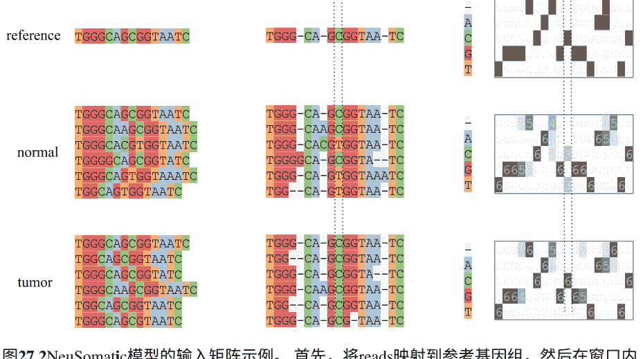

图27.2 `NeuSomatic`模型的输入矩阵示例。首先，将reads映射到参考基因组，然后在窗口内的每个基因组位置上的碱基呼叫总数被压缩成右侧显示的摘要表。该模型将对摘要表中间的基因组位置进行分类，判断是否为体细胞变异。矩阵表示窗口内每个基因组坐标处的缺口数（即顶部的“-”），A、C、G和T。图片来源与Sahraeian等人（2019）

对应于最大深度为100×，这将导致潜在相关的测序信息的丢失。或者，软件需要重新配置以接受更大的图像，这将大大增加对计算资源的需求。另一方面，`NeuSomatic`方案不需要更大的矩阵来处理更高的测序数据，如图27.2所示。然而，一些详细的读取级别信息，如图27.1所示，也会丢失（图27.3）。为了在不使用整个堆积图像的情况下恢复一些读取级别的信息，`NeuSomatic`包括一些额外的输入通道，其中包含与单个读取对齐相关的摘要指标，例如变异支持读取和参考支持读取的编辑距离等。对于图27.3中的示例，第一次对齐将导致变异支持读取的平均编辑距离为3，参考支持读取的平均编辑距离为0。第二次对齐将导致变异支持读取的平均编辑距离为1，参考支持读取的平均编辑距离为1.33。尽管与完整的堆积输入相比，`NeuSomatic`数据输入策略中不可避免地丢失了一些信息，但这种方法已经证明非常有效，在precisionFDA v2 Truth Challenge的12个类别中有两个类别取得了最佳准确性：

- (1) 使用Illumina、PacBio和Oxford Nanopore数据的难以映射的区域，以及

- (2) 与Illumina、PacBio和Oxford Nanopore数据一起并列的所有基准区域（Olson等人，2021年）。

由于`NeuSomatic`的初始出版物是在体外模拟插入数据上进行训练的，开发人员随后对该模型进行了训练，使用了来自SEQC2的肿瘤-正常参考数据和调用集的多样化测序数据类型。从WGS和WES的八个测序中心的119个测序重复中训练和测试了各种模型，这些模型包含了数百万个体突变实例，涵盖了不同测序深度、新鲜和福尔马林固定石蜡嵌入（FFPE）DNA、肿瘤-正常DNA混合物代表不同水平的肿瘤-正常交叉污染（肿瘤纯度为5-100%，正常纯度为95-100%）、不同超声处理时间导致不同的DNA片段长度以及不同的DNA输入量（1 ng至1 μg），以创建代表每个、一些和所有这些实验条件的分类器（Sahraeian等人，2022年）。总的来说，使用各种数据训练的分类器将在各种数据上更加稳健。

另一方面，使用特定数据类型训练的分类器将更准确但仅适用于相同类型的测试数据。换句话说，如果你想要最好的FFPE样本体细胞突变的准确性，你应该只用FFPE数据进行训练。另一方面，使用上述所有数据训练的`NeuSomatic`分类器在肿瘤-正常体细胞突变检测中非常稳健和准确适用于大多数短读测序数据。

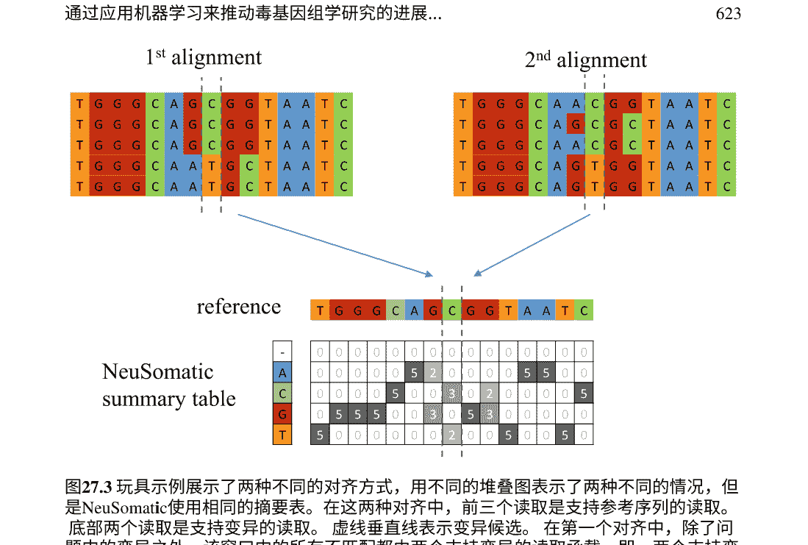

图27.3 玩具示例展示了两种不同的对齐方式，用不同的堆叠图表示了两种不同的的情况，但是`NeuSomatic`使用相同的摘要表。在这两种对齐中，前三个读取是支持参考序列的读取。底部两个读取是支持变异的读取。虚线垂直线表示变异候选。在第一个对齐中，除了问题中的变异之外，该窗口中的所有不匹配都由两个支持变异的读取承载，即，两个支持变异的读取除了变异候选之外还有两个不匹配（编辑距离为3），而三个支持参考序列的读取与参考序列完全匹配（编辑距离为0）。在第二个对齐中，支持变异的读取除了变异候选之外没有任何不匹配（编辑距离为1）。窗口中的额外不匹配由三个支持参考序列的读取承载（编辑距离为1、1和2）。

这两种情况代表了两个不同的问题，无法从基本呼叫摘要表中区分出来。然而，一些缺失的信息可以通过对齐度量（如编辑距离）进行编码。

### 27.3 基于机器学习的变异呼叫的训练数据

所有机器学习算法都需要来自训练数据的模式，然后将其应用于未来的数据集。为了构建一个有效的机器学习变异分类器，训练数据必须代表测序样本和数据，这是分类器预期应用的基础。因此，找到合适的训练数据可以说是开发有效的机器学习模型中最关键的一步。

由国家标准与技术研究所（NIST）主办的“瓶中基因组联盟”（GIAB）已经开发了许多参考人类细胞系。基于这些细胞系，他们发布了多中心和多平台的测序数据和高可信度的种系变异参考呼叫集，可作为开发机器学习算法的优秀训练数据。

用于检测胚系变异的计算方法（Zook等人，2014年，2019年）。每个人类基因组中都包含数百万个可以用作训练数据的胚系变异。

另一方面，社区中缺乏高质量的用于体细胞突变的训练数据。在2014年至2015年期间，国际癌症基因组联盟（ICGC）和癌症基因组图谱计划（TCGA）共同赞助了DREAM体细胞突变检测挑战赛，他们将体外体细胞突变注入实际对齐的全基因组测序数据集中，创建了合成肿瘤，即在对齐的读取中计算性地改变碱基调用并将其标记为体细胞突变（Ewing等人，2015年）。这些合成数据集被用于评估不同的算法。`BAMSurgeon`方法可以用于创建训练数据，但合成肿瘤肯定存在局限性，例如，它依赖于对测序数据中的读取进行正确的映射和对齐的假设，在Ewing等人（2015年）中注入体外体细胞突变。过去的一些已建立的参考样本和数据集缺乏类似GIAB的全面高可信度体细胞突变调用集，这些集合可以用于标记真阳性和假阳性（Alioto等人，2015年；Craig等人，2016年；MDIC，2019年）。在2021年，`SEQC2`联盟发布了来自多个测序中心的多个WGS和WES复制品，这些复制品具有不同的样本体积、样本制备、文库制备试剂盒和测序平台，以及一个肿瘤-正常细胞系对的高可信度体细胞突变参考调用集（Fang等人，2021年）。这个多样化的公开可用测序数据集包含了上述变量的更具代表性的测序指标和质量范围，因此将有助于在WGS和WES体细胞突变检测领域开发机器学习模型（Sahraeian等人，2022年）。然而，`SEQC2`的肿瘤-正常参考样本是从一个单一的乳腺癌细胞系中获得的，其中包含大约40,000个体细胞突变。

通过对这些肿瘤-正常参考样本进行超过100次技术复制，跨多个测序中心和平台生成了数百万个体突变实例，以捕获广泛的技术多样性。然而，与GIAB所描述的数百万个体系突变相比，4万个独特的体突变相形见绌，并且可能缺乏最复杂深度学习模型所需的全谱基因组和生物多样性。虽然`SEQC2`的参考样本和调用集在体突变参考数据集的发展中代表了一个重要里程碑，但在各种癌症类型中还需要更多类似的努力来推动该领域的发展。

### 27.4 结论

由于测序数据集的复杂性和测序技术的持续发展和演变，机器学习是准确检测高通量测序数据中突变的优秀方法。除了与碱基相关的复杂但不一定校准良好的度量标准之外，测序平台、样本类型和制备以及测序策略的多样性也是一个挑战。

在基因组的不同部分中，调用、映射和对齐的准确性使得开发准确的经典统计模型来预测如此丰富的测序数据中的突变几乎不可能。不断发展的新测序方法使整个努力变得更加具有挑战性。机器学习方法提供了一种“捷径”，可以创建能够准确检测突变的分类器，只要能够找到足够和适当的训练数据。`DeepVariant`和`NeuSomatic`在PacBio和Oxford Nanopore测序数据中的变异检测领域取得了成功，证明了这一点。虽然“经典”变异检测器如`GATK`或`MuTect 2`在Illumina平台上的成熟数据类型上表现良好，但机器学习不需要在全新技术上投入相等的资源和努力来创建准确的检测器，只要开发人员能够找到经过良好表征的高质量训练数据，就可以训练分类器。

拥有高质量的训练数据和良好的算法一样重要。虽然GIAB已经发布了大量的资源，包括多个基因组在许多不同平台上的测序和精心策划的真实数据集，但由于癌症基因组中体细胞突变的相对罕见性（相对于胚系变异）和建立可靠真实数据集的挑战，体细胞突变的研究进展相对滞后。然而，最近这种研究的趋势正在增加。`SEQC2`联盟最近发布了一对用于体细胞突变的肿瘤-正常全基因组参考样本。GIAB目前也在计划制作体细胞突变的参考样本。这种缺乏训练数据的问题将在未来得到解决，从而使机器学习方法更加广泛和稳健。

致谢作者感谢Roche测序解决方案的Sayed Mohammad Ebrahim Sahraeian和Immuneering的Rebecca Kusko对本章技术准确性的编辑和建议。

## 参考文献

-   Alexandrov LB, Nik-Zainal S, Wedge DC等（2013）人类癌症中突变过程的特征。自然500：415-421。 https://doi.org/10.1038/nature12477

- Alioto TS, Buchhalter I, Derdak S等（2015）使用全基因组测序对癌症中的体细胞突变进行全面评估。自然通讯6：10001。 https://doi.org/10.1038/ncomms10001

- Auwera GA, Carneiro MO, Hartl C等（2013）从FastQ数据到高置信度变异位点的基因组分析工具最佳实践流程。当前协议生物信息学43。 https://doi.org/10.1002/0471250953.bi1110s43

- Benjamin D, Sato T, Cibulskis K等（2019）使用Mutect2调用体细胞SNV和indel。 http://doi.org/10.1101/861054

- Bhuyan MSI, Pe’er I, Rahman MS（2021）：SICaRiO：具有增强功能的短插入/缺失调用过滤。简要生物信息学22。 https://doi.org/10.1093/bib/bbaa238

- Cooke DP, Wedge DC, Lunter G（2021）：一种基于单倍型的准确和全面的变异调用方法。 Nat Biotechnol 39：885-892。 https://doi.org/10.1038/s41587-021-00861-3

- Craig DW, Nasser S, Corbett R等 (2016) : 癌症基因组测序的体细胞参考标准。 Sci Rep 6: 24607。 https://doi.org/10.1038/srep24607

- DeepVariant Repo. https://github.com/google/deepvariant. 访问日期: 2021年12月30日

- DREAM挑战. https://www.synapse.org/#!Synapse:syn312572/wiki/70726. 访问日期: 2021年12月30日

- Ewing AD, Houlahan KE, 胡Y等 (2015) 结合肿瘤基因组模拟和众包方法来评估体细胞单核苷酸变异检测的性能。 Nat Methods 12:623–630。 https://doi.org/10.1038/nmeth.3407

- Fan Y, Xi L, Hughes DST等 (2016) MuSE: 使用样本特异性误差模型来考虑肿瘤异质性，从测序数据中提高突变检测的灵敏度和特异性。 Genome Biol 17:178。 https://doi.org/10.1186/s13059-016-1029-6

- Fang LT, Afshar PT, Chhibber A等 (2015) 使用SomaticSeq的集成方法来准确检测体细胞突变。 Genome Biol 16:197。 https://doi.org/10.1186/s13059-015-0758-2

- Fang LT, Zhu B, 赵Y等 (2021) 建立社区参考样本、数据和调用集，用于基于全基因组测序的癌症突变检测的基准测试。 Nat Biotechnol39:1151–1160。 https://doi.org/10.1038/s41587-021-00993-6

- Freed D, Pan R, Aldana R (2018) TNscope: 基于单体型的变异候选检测和机器学习过滤的准确检测. http://doi.org/10.1101/250647

- Gong T, Hayes VM, Chan EKF (2021) 从短读取下一代测序数据中检测体细胞结构变异. Brief Bioinform 22. https://doi.org/10.1093/bib/bbaa056

- H uang W, Guo YA, Muthukumar K et al (2019) SMuRF: 便携和准确的集成预测体细胞突变. Bioinformatics 35:3157–3159.https://doi.org/10.1093/bioinformatics/btz018

- Kandoth C, McLellan MD, Vandin F et al (2013) 12个主要癌症类型的突变景观和重要性. Nature 502:333–339. https://doi.org/10.1038/nature12634

- Kim SY, Jacob L, Speed TP (2014) 结合多个体细胞突变检测器的调用. BMCBioinformatics 15:154. https://doi.org/10.1186/1471-2105-15-154

- Kim S, Scheffler K, Halpern AL等 (2018) Strelka2: 快速准确地调用种系和体细胞变异。 Nat Methods 15:591–594。 https://doi.org/10.1038/s41592-018-0051-x

- Koboldt DC, Zhang Q, Larson DE等 (2012) VarScan 2: 通过外显子测序在癌症中发现体细胞突变和拷贝数改变。 Genome Res 22:568–576。 https://doi.org/10.1101/gr.129684.111

- Krusche P, Trigg L, Boutros PC等 (2019) 人类基因组中基因系小变异调用的最佳实践。 Nat Biotechnol 37:555–560。 https://doi.org/10.1038/s41587-019-0054-x

- Lai Z, Markovets A, Ahdesmaki M等 (2016) VarDict: 癌症研究中一种新颖且多功能的变异调用程序。 Nucleic Acids Res 44:e108–e108。 https://doi.org/10.1093/nar/gkw227

- Larson DE, Harris CC, Chen K等 (2012) : SomaticSniper: 在全基因组测序数据中识别体细胞突变。 生物信息学28: 311-317。 https://doi.org/10.1093/bioinformatics/btr665

- Lek M, Karczewski KJ, Minikel EV等 (2016) : 对60,706名人类进行蛋白质编码遗传变异的分析。 自然536: 285-291。 https://doi.org/10.1038/nature19057

- MDIC (2019) : MDIC SRS报告: 用于NGS可用参考样本的体细胞变异参考样本的景观

- Meng J, Victor B, He Z等 (2021) : DeepSSV: 使用卷积神经网络在配对肿瘤和正常测序数据中检测体细胞小变异。 简要生物信息学22。 https://doi.org/10.1093/bib/bbaa272

- Meynert AM, Ansari M, FitzPatrick DR, Taylor MS (2014) 整个基因组和外显子测序中的变异检测敏感性和偏差。 BMC生物信息学15: 247。 https://doi.org/10.1186/1471-2105-15-247

- Narzisi G, Corvelo A, Arora K等 (2018) 使用局部着色的de Bruijn图进行全基因组体细胞变异检测。 Commun Biol 1: 20。 https://doi.org/10.1038/s42003-018-0023-9

> NHGRI DNA测序成本。 https://www.genome.gov/about-genomics/fact-sheets/DNA-Sequencing-Costs-Data. 2021年12月30日访问

> Olson ND, Wagner J, McDaniel J等 (2021) PrecisionFDA真实性挑战V2：在难以映射的区域中从短读和长读中调用变异。 细胞基因组学, 2022年, 2（5）：100129.http://doi.org/10.1016/j.xgen.2022.100129

> Pleasance ED, Cheetham RK, Stephens PJ等 (2010年) 人类癌症基因组中体细胞突变的全面目录。自然, 463:191–196。 https://doi.org/10.1038/nature08658

> Poplin R, Chang P-C, Alexander D等 (2018年) 使用深度神经网络的通用SNP和小插入/删除变异检测器。 Nat Biotechnol, 36:983–987。 https://doi.org/10.1038/nbt.4235

> Sahraeian SME, Liu R, Lau B等 (2019年) 用于准确检测体细胞突变的深度卷积神经网络。 自然通讯, 10:1041。 https://doi.org/10.1038/s41467-019-09027-x

> Sahraeian SME, Fang LT, Karagiannis K等 (2022年) 利用癌症样本的参考数据集构建的深度学习模型实现稳健的体细胞突变检测。 基因组生物学, 23(1):1–20

> Sedlacek FJ, Lee H, Darby CA, Schatz MC (2018) 穿透黑暗物质：长程测序和映射的生物信息学。 Nat Rev Genet, 19:329–346。 https://doi.org/10.1038/s41576-018-0003-4

> Sherry ST (2001) dbSNP：NCBI遗传变异数据库。 Nucleic Acids Res, 29:308–311。 https://doi.org/10.1093/nar/29.1.308

> Slatko BE, Gardner AF, Ausubel FM (2018) 下一代测序技术概述。 Curr Protoc Mol Biol, 122。 https://doi.org/10.1002/cpmb.59

> Stoler N, Nekrutenko A (2021) Illumina测序仪的测序错误特征。 NAR Genomics Bioinf, 3。 https://doi.org/10.1093/nargab/lqab019

> Storchova Z, Kuffer C (2008) 四倍体和非整倍体的后果。 J Cell Sci, 121:3859–3866。 https://doi.org/10.1242/jcs.039537

> Troyanskaya OG, Arbell O, Koren Y et al (2002) 原核生物基因组序列的序列复杂性概况：计算语言复杂性的快速算法。 Bioinformatics, 18:679–688。 https://doi.org/10.1093/bioinformatics/18.5.679

> Wood DE, White JR, Georgiadis A et al (2018) 一种用于体细胞突变发现的机器学习方法。 Sci Transl Med, 10。 https://doi.org/10.1126/scitranslmed.aar7939

> Zook JM, Chapman B, Wang J et al (2014) 整合人类序列数据集提供了基准SNP和indel基因型调用的资源。 Nat Biotechnol, 32:246–251。 https://doi.org/10.1038/nbt.2835

> Zook JM, McDaniel J, Olson ND等 (2019年) 一个用于准确基准测试小变异和参考调用的开放资源。 Nat Biotechnol, 37:561–566。 https://doi.org/10.1038/s41587-019-0074-6

## 第28章 用于预测金属有机框架气体吸附能力的机器学习

郭文静，刘杰，董帆，塔克·A·帕特森和洪慧晓

### 28.1 引言

纳米材料由于其物理、化学、光学和电学性质而在食品科学、能源、电子和药物等各个领域得到广泛研究（Yu等, 2012年; Chellaram等, 2014年; Hofmann-Amtenbrink等, 2015年; Pomerantseva等, 2019年; Begum等, 2020年）。近几十年来，一类多孔纳米材料，金属有机框架（MOFs），通过金属团簇和有机连接剂的自组装形成，并应用于各个领域（Batten等, 2013年）。MOFs的特点包括高热溶解性、各种孔隙性、大表面积和可调节的物理化学性质。可以用于合成MOFs的大量金属节点和有机连接剂几乎有无限的组合方式。所有这些特性使MOFs成为化学领域十大新兴技术之一（Gomollón-Bel, 2019年）。

高孔隙率、大表面积和开放金属位点使MOFs成为气体吸附应用的理想候选材料，包括气体储存（Alezi等，2015年；Ahmed等，2019年）和气体分离（Tan等，2015年）。为了找到这些应用的性能良好的材料，通常使用吸附数据来筛选多样的MOFs数据库。然而，金属簇和有机连接剂的无限组合导致了大量的MOFs，实验处理所有这些MOFs是不切实际的。经典的分子模拟技术，如密度泛函理论、分子动力学和巨正则Monte Carlo模拟已被用作计算气体吸附性质的替代方法（Evans等，2017年；Anderson等，2018年；Chong等，2020年；Altintas等，2021年）。这些计算方法显著缩短了处理MOF所需的时间，从几天缩短到几分钟（Chong等，2020年）。

然而，对于大规模的MOF数据集，这些蛮力方法仍然需要很长时间。

已经开发和使用了各种计算方法来预测化学物质的生物活性和物理化学性质（Hong等，1998年；Shi等，2002年；Shen等，2013年；Ng等，2014年；Cheng等，2017年；Selvaraj等，2018年；Tan等，2020年；Sakkiah等，2021年）。机器学习（ML）正在成为提供估计化学物质的物理化学性质和毒理活性的替代方法的最有吸引力的计算技术（Hong等，2005年，2017年，2018年；Luo等，2015年；Ng等，2015a，b；Sakkiah等，2017年；Huang等，2020年）。ML方法已被用于快速预测MOF的气体吸附性能。ML技术利用计算机来识别数据中的隐藏模式和关系。由于结构数量众多且气体吸附数据有限，毫无疑问，引入ML方法可以帮助设计和开发MOF。最近的研究证明，ML能够有效揭示潜在的结构-性质关系，从而准确预测MOF的气体吸附性能（Chong等，2020年；Jablonka等，2020年；Altintas等，2021年；Yan等，2021年）。本章回顾了ML模型在预测MOF的气体吸附容量方面的当前发展和应用。这些模型是基于不同的ML算法开发的，例如支持向量机（SVM），决策树（DT），随机森林（RF）和神经网络（NN），基于各种类型的描述符，如几何描述符，拓扑描述符，化学描述符和能量描述符。

## 28.2 数据来源

大量的MOF数据库已经被开发出来，用于探索隐藏的结构-性质关系。根据MOF的类型，有两种类型的数据库可用：实验性MOF数据库和假设性MOF数据库。表28.1总结了经常使用的MOF数据库。

像剑桥结构数据库（CSD）这样的实验性MOF数据库收集了已经实验合成的MOF。CSD是存储小分子的库，包括各种MOF和其他有机和有机金属化合物。由于CSD中的MOF通常含有溶剂分子。

表28.1 经常使用的MOF数据库

| 数据库 | 类型 | 化合物 | 描述 |
| --- | --- | --- | --- |
| CoRE MOF-2019 | 实验性 | ~14,000 | 实验性MOF最初于2014年开发（Chung等，2014年），后来在2019年进行了更新（Chung等，2019年） |
| CoRE-DDEC | 实验性 | 2932 | 导出的静电和化学电荷的改进的CoRE MOF数据库（Nazarian等人，2016年） |
| CoRE-DFT优化 | 实验性 | 832 | 使用密度泛函理论（DFT）优化的改进的CoRE MOF数据库中的MOF结构（Nazarian等人，2017年） |
| Moghadam数据库 | 实验性 | 69,666 | 来自CCDC的实验性MOFs（Moghadam等人，2017年） |
| Northwestern hMOF数据库 | 假设的 | 137,953 | 使用“Tinkertoy”算法生成的假设性MOF（Wilmer等人，2012年） |
| Boyd数据库 | 假设的 | ~300,000 | 使用图论方法生成的假设性MOF（Boyd和Woo，2016年） |
| ToBaCCo | 假设的 | 13,512 | 使用ToBaCCo软件生成的假设性MOFs（Colón等人，2017年） |

在使用这些结构之前，需要进行一些处理工作来处理孔隙。2014年，Chung等人通过从CSD（Chung等人，2014年）的结构中去除自由/束缚溶剂，开发了一个计算就绪的实验性MOF（CoRE MOF）。该数据库在2019年进行了更新，包括从CSD更新和Web of Science搜索中获得的MOF结构，由CoRE MOF用户贡献，并使用基于拓扑的晶体生成器导出（Chung等人，2019年）。这个更新的2019年CoRE MOF数据库拥有近14,000个结构，几乎是2014年CoRE MOF数据库的三倍。自2014年以来，还开发了一些经过精细化的CoRE MOF数据库子集，包括具有密度导出静电和化学电荷（DDEC）的CoRE MOF（Nazarian等人，2016年）和使用密度泛函理论（DFT）优化的CoRE MOF结构数据库（Nazarian等人，2017年）。然而，当新的MOF被存入CSD时，需要手动更新这些数据库，这很难维护。随着MOF数量的增加，保持CoRE MOF数据库和相关数据库的最新状态变得困难。为了解决这个问题，Moghadam等人通过使用CSD Python应用程序接口（Moghadam等人，2017年）实施一些标准，构建了一个定期更新的MOF数据库，该数据库是CSD的一个子集。该数据库在2017年首次建立时有69,666个MOF，而且这个数字在过去几年里一直在增长。

除了实验合成的MOF数据库外，还开发了假设性的MOF（hMOF）数据库，包括计算设计的MOF。Wilmer和他的同事是第一个构建hMOF数据库的人（Wilmer等人，2012年）。在他们的工作中，使用了102个构建单元和15个功能团通过类似于拼装Tinkertoy或乐高积木的自下而上的构建算法进行几何组装。使用这个“Tinkertoy”算法，生成了137,953个hMOF。这个hMOF数据集（以下简称为西北大学hMOF数据库）是机器学习研究中最广泛使用的数据库。后来，Fernandez等人也使用类似的方法构建了一个32,450个hMOF的数据库，其中包括66个构建单元和19个功能团（Fernandez等人，2014年）。同样，Aghaji等人使用70个构建单元和20个功能团生成了324,500个结构（Aghaji等人，2016年）。

用于构建hMOFs的另一种方法是基于拓扑的晶体构造算法（ToBaCCo）（Colón等，2017年）。ToBaCCo算法使用各种框架拓扑作为模板来定位构建模块。Colón等使用了41种不同的拓扑结构，在他们的数据库中构建了13,512个结构。ToBaCCo软件还被其他几项研究使用来开发hMOF结构（Anderson等，2018年；Dureckova等，2019年；Ma等，2020年；Li等，2021年）。

Boyd和他的同事们进行了另一项有趣的工作，他们使用了图论方法在他们的数据库中构建了超过300,000个hMOFs（Boyd和Woo, 2016）。

对于上述数据库，只有西北大学的hMOF数据库包含在`http://hmofs.northwestern.edu`上可用的气体储存能力。其他数据库只包含MOFs的结构。这些MOFs的气体吸附性质通常使用分子动力学和正则系综蒙特卡洛（GCMC）模拟等计算工具进行计算。然而，由于需要大量的计算资源来处理这么多的结构，新的替代方法如机器学习已被用于促进MOFs的气体吸附性质的估计。

## 28.3 MOFs的描述符

为了构建一个可靠的机器学习模型来预测MOFs的气体吸附能力，用于训练机器学习模型的输入变量应与气体吸附能力高度相关。在应用机器学习模型预测MOFs的气体吸附能力时，模型中的描述符不仅应能够捕捉框架的特征，还应提供关于MOFs的气体吸附能力的足够信息。MOFs的高度多样化的结构使得选择有信息量的描述符具有挑战性。

几何描述符，如孔体积、表面积和孔径，是用于训练机器学习模型的最常见描述符。然而，对于具有复杂化学环境和孔结构的MOFs来说，这些简单的几何描述符无法提供足够的关于MOFs特性的信息。为了增强关于MOFs的描述，已经开发了拓扑、化学和能量描述符。在本节中，我们对在开发用于预测MOFs气体吸附能力的ML模型时使用的描述符进行简要介绍。

由于孔隙结构与MOF的气体吸附能力密切相关，因此已经开发了各种几何描述符来描述孔隙环境。几何描述符的例子包括密度、空隙率（VF）、孔隙体积（PV）、重量比表面积（GSA）、体积比表面积（VSA）、孔限直径（PLD）、最大孔径（MPD）、最大腔体直径（LCD）、主导孔径（DPD）和全局腔体直径（GCD）。这些描述符通常使用`Zeo++`（Willemss等人，2012年）和`Poreblazer`（Sarkisov和Harrison，2011年）等模拟软件包进行计算。在最近的研究中，上述几何描述符已被广泛用于训练机器学习模型。例如，Ma等人使用了五个几何描述符（VF、VSA、GSA、PLD和LCD）研究了hMOF的氢吸附（Ma等人，2020年）。Aghaji等人使用了三个几何描述符（PV、VF、SA）预测了hMOF的CO2捕获能力（Aghaji等人，2016年）。

Fernandez等人使用了六个几何描述符（密度，VF，GSA，VSA，MPD，LCD）来预测hMOF（Fernandez和Barnard, 2016）的CH4和CO2吸附。Liang等人使用了七个结构描述符（LCD，PLD，GCD，PV，密度，表面积（SA），孔隙度）来研究材料基因组MOFs数据库的Kr/Xe选择性吸附。

几何描述符易于获取，但只能描述MOFs的局部几何特征。对于具有复杂孔环境的MOFs，需要更全面的描述符。因此，拓扑描述符是另一种结构描述符，已经被开发用于增强对MOFs的描述。Lee等人成功地开发了基于持久同调（Edelsbrunner和Harer, 2008）的持久同调条形码作为新的拓扑描述符，用于提供有关孔连通性、形态和空腔大小的信息（Lee等人, 2017）。这种持久同调条形码描述符也被Zhang等人用于预测CH4的吸附能力（Zhang等人, 2019）。在另一项工作中，Krishnapriyan等人使用持久同调作为拓扑描述符，提供了有关通道和孔隙的信息（Krishnapriyan等人, 2021）。

除了结构描述符外，化学描述符也广泛用于提供孔内化学环境的信息。MOFs中的各种金属节点和有机连接剂导致了高度多样化的化学环境，化学描述符可以有效地解释这种多样性。常用的化学描述符类型之一是原子性质，如原子序数和原子类型。Fanourgakis等人展示了使用化学描述符（如MOF单位晶胞中的原子数密度（单位晶胞体积中的原子数）和几何描述符（密度，VF，GSA，DPD，MPD）的模型优于其他所有模型（Fanourgakis等人, 2020年）。另一类化学描述符是原子性质加权径向分布函数（AP-RDF）。Fernandez等人使用AP-RDF来预测CH4储存，并发现在低压下，化学描述符比几何描述符具有更好的性能（Fernandez等人, 2013a）。Dureckova等人还表明最佳的机器学习模型使用了化学描述符（Dureckova等人, 2019年）。

### 28.4 机器学习算法

许多机器学习算法已被用于建立MOFs的描述符与气体吸附性质之间的关系。在本节中，我们简要介绍了一些常用的机器学习算法：支持向量机（SVM）、决策树（DT）、随机森林（RF）和人工神经网络（ANN）。

支持向量机（SVM）是一种由Cortes和Vapnik（1995）引入的有监督机器学习算法，基于结构风险最小化原则。在SVM中，核函数被用来将输入描述符映射到高维空间，通过超平面将样本的类别分开。非线性特征空间中常用的核函数包括高斯径向基函数和多项式核函数。经验和实验分析被用来决定使用哪个核函数。在训练过程中，调整SVM的超参数以找到最优的超平面，最大化不同类别之间的距离。由于SVM可以处理相关的描述符并具有良好的泛化性能，因此它是在MOFs的气体吸附预测模型开发中经常使用的机器学习算法之一，例如CO₂/CH₄选择性（Aghaji等，2016年），CO₂捕获（Fernandez等，2014年；Aghaji等，2016年；Fernandez和Barnard，2016年；Anderson等，2018年），H₂储存（Borboudakis等，2017年；Ahmed和Siegel，2021年），CH₄储存（Fernandez等，2013a；Aghaji等，2016年；Ohno和Mukae，2016年；Pardakhti等，2017年）以及Xe/Kr分离（Liang等，2021年）。

DT是一种倒置的树状分类/回归算法。DT在顶部有一个根节点，在中间有几层内部节点，在底部有叶节点。分支是从根节点到叶节点的连接节点。根节点和内部节点可以使用描述符分割成两个节点。从根节点到叶节点的路径表示一系列用于预测样本标签的决策规则。由于决策规则可以从模型中轻松检索出来，基于树的模型经常用于寻找高性能MOFs的最优设计参数。例如，Anderson等人在CO2捕获方面使用了决策树，并发现孔隙化学性质的变化是CO2捕获度量的最相关因素（Anderson等人, 2018年）。使用决策树，Fernandez等人发现最优的MOFs应具有大于0.43 g/cm3和0.33 g/cm3的密度，以及大于0.52和0.62的孔隙率，分别用于35和100巴的CH4储存。决策树还被用于预测CO2/CH4选择性吸附（Aghaji等人, 2016年），H2储存（Ahmed和Siegel, 2021年），CO2捕获（Deng等人, 2020年），CH4吸附（Fernandez等人, 2013b; Fernandez和Barnard, 2016年; Pardakhti等人, 2017年; Fanourgakis等人, 2019年; Gülsoy等人, 2019年）以及Xe/Kr选择性吸附（Simon等人, 2015年）。

RF (Breiman, 2001) 是一种监督式机器学习算法，它使用多个决策树进行共识决策。在构建决策树时，从原始训练样本中随机选择样本，并且仅随机选择一部分特征。RF模型对于样本的预测是通过其决策树的预测进行综合，对于分类问题使用多数投票，对于回归问题使用平均预测。RF的随机性减小了过拟合的影响，并提高了预测性能。RF已被证明是一种非常成功的机器学习算法，用于开发预测金属有机框架（MOFs）气体吸附能力的模型（Aghaji等, 2016年; Fernandez和Barnard, 2016年; Borboudakis等, 2017年; Pardakhti等, 2017年; Anderson等, 2018年; Zhang等, 2019年; Burns等, 2020年; Deng等, 2020年; Ahmed和Siegel, 2021年; Beauregard等, 2021年）。

人工神经网络（ANNs）是一组用于识别数据中潜在关系的算法，通过模拟生物神经网络的功能来实现。人工神经网络中有三层：输入层、隐藏层和输出层。每一层都由神经元组成，每个神经元通过权重与下一层的所有神经元相连。权重在训练过程开始时随机选择，然后通过反向传播过程计算，以最小化输出层预测值与实际值之间的误差。每个神经元都有一个激活函数，用于将输入值转换为输出信号。激活函数包括线性、Sigmoid、高斯、Elliot和修正线性单元（ReLU）。ReLU是最常用的激活函数，因为它能够快速收敛。已经开发了许多人工神经网络模型来预测金属有机骨架材料的气体吸附能力。例如，邓等人使用反向传播人工神经网络研究了从空气中捕获CO2（邓等人, 2020年）。Fernandez使用人工神经网络预测低压下的CO2和N2吸附（Fernandez和Barnard, 2016年）。Gülsoy等人使用人工神经网络预测CH4的储存能力（Gülsoy等人, 2019年）。类似的工作由Lee等人完成，重点是筛选高能CH4储存的金属有机骨架材料（Lee等人, 2021年）。Anderson等人使用人工神经网络预测H2的体积吸附（Anderson等人, 2018年）。深度神经网络（DNN）是一种具有多个隐藏层的神经网络类型。通过大量的隐藏层，DNN可以处理复杂问题。Anderson等人训练了深度学习模型来预测类似CH4的完整吸附等温线。

N₂、Kr和Xe使用几何和化学描述符进行了训练，并使用了几何和化学描述符（Anderson等人，2020年）。Ma等人在H₂吸附数据上训练了一个DNN模型，并测试了该模型在其他操作条件和不同气体上的可迁移性（Ma等人，2020年）。另一个常用的机器学习算法是多元线性回归（MLR）。MLR通过最小化预测值和实际值之间的平方误差来建立描述符和建模属性之间的线性关系。MLR因其简单性和可解释性而受到关注。然而，由于容易过拟合，很少有研究使用MLR来开发用于预测MOF气体吸附容量的模型（Fernandez和Barnard，2016年）。考虑到这一点，最小绝对收缩和选择算子（LASSO）回归模型（Tibshirani，1996年）通过向目标函数添加惩罚项来避免过拟合。最近的研究表明，LASSO适用于开发预测MOF气体吸附的模型（Bucior等，2019年；Li等，2021年；Liang等，2021年）。

## 28.5 用于预测MOFs气体吸附的机器学习模型

最近关于气体储存和分离的机器学习研究主要有三个目标：（1）选择最佳描述符并开发新的描述符以提高预测性能，（2）估计MOFs的气体储存和气体分离潜力，以及（3）识别高性能的MOFs并设计新型MOFs。已经为不同的气体吸附剂开发了各种机器学习模型。常用的评估模型性能的方法是k折交叉验证和留出验证。在k折交叉验证中，训练数据集被随机分成k组。使用k-1组来构建模型，剩余的一组用于评估模型。这个过程重复k次，以便每个k组都被用作一次测试集。在留出验证中，整个数据集被分成两个集合：训练数据集和测试数据集。训练数据集用于训练模型，测试数据集用于评估模型。经常用于评估气体吸附模型的指标包括接收者操作特征曲线下的面积（AUC），皮尔逊相关系数（r²），确定系数（R²），均方根误差（RMSE）和绝对平均误差（AME）。AUC是使用给定模型绘制的真正阳性率与假正阳性率之间的曲线计算得出的。对于气体吸附模型，真正阳性率是正确预测的高性能MOFs与所有高性能MOFs的比率。假阳性率是错误预测的低性能MOFs与所有低性能MOFs的比率。参数r²，R²，RMSE和AME是使用方程（28.1-28.4）计算的。

$$r^2 = \frac{[ \sum_{i=1}^{n} (y_i - \bar{y})(u_i - \bar{u}) ]^2}{ \sum_{i=1}^{n} (y_i - \bar{y})^2 \sum_{i=1}^{n} (u_i - \bar{u})^2 } \quad (28.1)$$

$$R^2 = 1 - \frac{\sum_{i=1}^{n}(y_i - u_i)^2}{\sum_{i=1}^{n}(y_i - \overline{y})^2} \quad (28.2)$$

$$\mathrm{RMSE} = \sqrt{\frac{\sum_{i=1}^{n}(y_i - u_i)^2}{n}} \quad (28.3)$$

$$\mathrm{AME} = \frac{\sum_{i=1}^{n}|y_i - u_i|}{n} \quad (28.4)$$

其中，$y_i$是第$i$个MOF的观测气体吸附值；$\overline{y}$是平均观测气体吸附值；$u_i$是预测值；$\overline{u}$是平均预测值；$n$是数据集中的样本数量。

表28.2总结了用于CH$_4$吸附、H$_2$吸附、CO$_2$吸附和选择性吸附以及Xe/Kr选择性吸附的ML模型。

### 28.5.1 CH$_4$吸附的ML模型

天然气仍然是最具成本效益的能源之一。CH$_4$是天然气的主要成分，由于其低CO$_2$排放量，它是一种有吸引力的燃料，特别是在交通行业中被视为汽油的替代品。挑战在于CH$_4$的储存通常需要高压。基于吸附的CH$_4$储存因使用多孔材料在相对较低的压力下储存CH$_4$而受到广泛关注。具有高比表面积和孔容积的MOFs已被证明是高密度CH$_4$吸附的有希望的候选材料（Peng等，2013年）。用于预测CH$_4$吸附的ML模型专注于寻找最佳描述符的组合以提高预测准确性。新的化学描述符如AP-RDF已被开发用于提高低压下的预测性能。

Fernandez等人使用六个几何描述符作为输入，构建了MLR、DT和SVM模型，以预测298K下137,953个来自西北hMOF数据库的MOFs在1、35和100 bar下的CH$_4$储存（Fernandez等人，2013b）。首先，使用六个几何描述符的所有可能组合来训练MLR模型。结果表明，DPD、VF和GSA的组合在预测35和100 bar下的CH$_4$储存方面表现最佳，决定系数（$R^2$）分别为0.795和0.917。然后，这三个描述符被用来训练DT和SVM模型。结果显示，SVM模型在预测35和100 bar下的CH$_4$储存方面具有最佳的预测准确性，$R^2$分别为0.851和0.941。由于DT可以提供预测路径，因此还从DT模型中建立了获取CH$_4$储存最佳MOFs的规则。对于35和100 bar下的CH$_4$储存，MOFs的密度应大于0.43 g/cm3和0.33 g/cm3，空隙率应大于0.52和0.62。

还使用了所有两个描述符的SVM模型，使用空隙率和主导孔径构建的SVM模型在交叉验证中表现优于其他模型，预测35和100巴下CH4储存的R²分别为0.82和0.93。还注意到，当CH4储存的压力降低时，模型的预测准确性也会降低。预测1巴下CH4储存的SVM模型的R²较低，仅为0.72。本研究中的单变量相关分析还显示，在低压下，结构与性质之间的关系变得模糊，表明结构和性质之间的相关性非常差。

这一发现的可能原因是，在低压下，大部分孔隙是空的，用于描述孔隙的几何描述符无法提供足够的气体吸附性质信息。另一方面，在高压下，大多数MOF的孔隙都被气体填充，因此气体吸附性质与MOF结构之间存在更强的相关性。

为了提高低压下CH4储存的预测能力，引入了一种新的化学描述符AP-RDF（Fernandez等，2013a）。使用AP-RDF描述符构建的SVM模型的确定系数R²分别达到了0.83和0.88，用于预测35 bar和100 bar下的CH4储存，这与仅使用几何描述符构建的模型的结果相当。用于预测低压下CH4储存的SVM模型中，使用AP-RDF构建的R²分别为0.83、0.82和0.77，对应于4.5 bar、2.5 bar和0.5 bar，而仅使用几何描述符构建的模型的R²分别为0.46、0.52和0.61。

结果表明，使用化学描述符可以显著改善预测低压下CH4储存的机器学习模型。

化学描述符的实用性也在其他几项研究中进行了调查（Pardakhti等，2017年; Fanourgakis等，2019年，2020年; Wu等，2019年）。Pardakhti等人在北西部hMOF数据库中研究了35巴和298K下对130,398个hMOFs的CH4吸附（Pardakhti等人，2017年）。在他们的工作中，除了传统的几何描述符外，还引入了几个新的化学描述符，如单位胞中的原子数，以碳饱和度，金属百分比，氧金属比，电负性原子与总原子比，加权电负性原子数和金属类型等来考虑化学相互作用。

使用不同的机器学习算法，如RF，泊松回归，SVM和DT，基于10,433个结构训练了模型。发现具有结构和化学描述符的RF模型具有最佳性能，确定系数R²为0.97，平均绝对百分比误差（MAPE）为8.75%。为了验证模型，还进行了十折交叉验证，R²和MAPE稍微提高到0.98和7.18%。他们还发现模型的关键描述符是密度，孔隙率，表面积，孔径，金属百分比和碳不饱和度。

在另一项研究中，吴等人应用了支持向量机（SVM）、随机森林（RF）和梯度提升回归树（GBRT）来预测在38巴和298K条件下，从西北大学hMOF数据库中的130,397个hMOFs中的CH4重力吸附。他们发现化学描述符，如亨利系数、功能团数密度和原子数密度极大地提高了预测准确性。当描述符从8个几何特征变为37个组合特征时，RF模型的皮尔逊相关系数r²从0.9407增加到0.9883，均方误差显著降低。

表28.2：用于预测MOFs气体吸附的ML模型

| 气体 | 压力/巴 | 算法 | 描述符类型 | 数据大小 | 性能（R²） | 参考文献 |
| :--- | :--- | :--- | :--- | :--- | :--- | :--- |
| CH₄ | 100 | SVM | 结构 | 137,953 | 0.941 | 1 |
| | 65 | RF | 结构 + 能量 | 4,764 | 0.955 | 2 |
| | 65 | RF | 结构 + 化学 | 27,151 | 0.965 | 3 |
| | 38 | GBRT | 结构 + 化学 | 130,397 | 0.9608ᵃ | 4 |
| | 38 | RF | 结构 + 化学 | 130,397 | 0.9533ᵃ | 4 |
| | 38 | SVM | 结构 + 化学 | 130,397 | 0.9423ᵃ | 4 |
| | 35 | DT | 结构 + 化学 | 130,398 | 0.84 | 5 |
| | 35 | 泊松回归 | 结构 + 化学 | 130,398 | 0.92 | 5 |
| | 35 | RF | 结构 + 化学 | 130,398 | 0.97 | 5 |
| | 35 | RF | 结构 + 化学 | 70,605 | 0.962 | 3 |
| | 35 | SVM | 结构 | 137,953 | 0.851 | 1 |
| | 35 | SVM | 结构 + 化学 | 130,398 | 0.9 | 5 |
| | 5.8 | RF | 结构 + 能量 | 4,764 | 0.932 | 2 |
| | 5.8 | RF | 结构 + 化学 | 28,417 | 0.94 | 3 |
| | 4.5 | SVM | 化学物质 | 137,953 | 0.83 | 6 |
| | 2.5 | SVM | 化学物质 | 137,953 | 0.82 | 6 |
| | 1 | RF | 结构 + 能量 | 4,764 | 0.928 | 2 |
| | 1 | RF | 结构 + 化学 | 10,608 | 0.886 | 3 |


| | 1 | SVM | 结构 | 137,953 | 0.721 | 1 |
|---|---|---|---|---|---|---|
| | 0.5 | SVM | 化学物质 | 137,953 | 0.77 | 6 |
| CO₂ | 1–10* | DT | 结构 | 324,500 | 0.908ᵇ | 7 |
| | 1–10* | SVM | 结构 | 324,500 | 0.919ᵇ | 7 |
| | 40 | GBRT | 结构 + 化学 | 58,400 | 0.944 | 8 |
| | 2.5 | RF | 结构 + 化学 | 70,433 | 0.954 | 3 |
| | 2.5 | SVM | 化学物质 | 137,593 | 0.78 | 6 |
| | 1 | SVM | 化学物质 | 32,450 | 0.978ᵇ | 9 |
| | 0.5 | RF | 结构 + 化学 | 70,433 | 0.933 | 3 |
| | 0.5 | SVM | 化学物质 | 137,593 | 0.75 | 6 |
| | 0.15 | SVM | 化学物质 | 32,450 | 0.979ᵇ | 9 |
| | 0.1 | ANN | 结构 | 81,679 | 0.931ᵇ | 10 |
| | 0.1 | DT | 结构 | 81,679 | 0.907ᵇ | 10 |
| | 0.1 | KNN | 结构 | 81,679 | 0.928ᵇ | 10 |
| | 0.1 | MLR | 结构 | 81,679 | 0.9ᵇ | 10 |
| | 0.1 | RF | 结构 | 81,679 | 0.938ᵇ | 10 |
| | 0.1 | SVM | 化学物质 | 137,593 | 0.69 | 6 |
| | 0.05 | SVM | 结构 | 81,679 | 0.921ᵇ | 10 |
| CO2/CH4 | 1-10* | DT | 结构 | 324,500 | 0.948ᵇ | 7 |
| CO2/CH4 | 1-10* | SVM | 结构 | 324,500 | 0.953ᵇ | 7 |
| CO2/H2 | 40 | GBRT | 结构 | 58,400 | 0.872 | 8 |
| CO2/H2 | 20 | DT | 结构 | 400 | 0.575 | 11 |
| CO2/H2 | 20 | GBM | 结构 | 400 | 0.855 | 11 |
| CO2/H2 | 20 | MLR | 结构 | 400 | 0.779 | 11 |
| CO2/H2 | 20 | NN | 结构 | 400 | 0.768 | 11 |
| CO2/H2 | 20 | RF | 结构 | 400 | 0.776 | 11 |
| CO2/H2 | 20 | SVM | 结构 | 400 | 0.734 | 11 |
| $\mathrm{CO}_2/\mathrm{N}_2$ | 1 | DT | 结构 | 400 | 0.409 | 11 |
| | 1 | GBM | 结构 | 400 | 0.905 | 11 |
| | 1 | MLR | 结构 | 400 | 0.394 | 11 |
| | 1 | ANN | 结构 | 400 | 0.905 | 11 |
| | 1 | RF | 结构 | 400 | 0.507 | 11 |
| | 1 | SVM | 结构 | 400 | 0.347 | 11 |
| $\mathrm{H}_2$ | 2-100* | LASSO | 能量 | 54,776 | 0.96 | 12 |
| | 1-100* | ANN | 结构+化学 | 2,400 | 0.998 | 13 |
| | 1-100* | ANN | 结构+能量 | 85,000 | 0.88 | 14 |
| | 100 | DNN | 结构 | 13,506 | 0.998 | 15 |
| | 1 | SVM | 结构+化学 | 100 | 0.804ᶜ | 16 |
| $\mathrm{Kr}$ | 10 | LASSO | 能量 | 13,512 | 0.96 | 17 |
| | 10 | RF | 能量 | 13,512 | 0.96 | 17 |
| | 1 | LASSO | 能量 | 13,512 | 0.95 | 17 |
| | 1 | RF | 能量 | 13,512 | 0.96 | 17 |
| $\mathrm{Xe}$ | 10 | LASSO | 能量 | 13,512 | 0.96 | 17 |
| | 10 | RF | 能量 | 13,512 | 0.96 | 17 |
| | 1 | ANN | 结构 | 303,791 | 0.56 | 18 |
| | 1 | 贝叶斯 | 结构 | 303,791 | 0.392 | 18 |
| | 1 | 弹性网络 | 结构 | 303,791 | 0.392 | 18 |
| | 1 | LASSO | 能量 | 13,512 | 0.85 | 17 |
| | 1 | LASSO | 结构 | 303,791 | 0.393 | 18 |
| | 1 | RF | 能量 | 13,512 | 0.83 | 17 |
| Xe/Kr | 1.01 | RF | 结构 | 303,791 | 0.883 | 18 |
| Xe/Kr | 1 | 岭回归 | 结构 | 303,791 | 0.393 | 18 |
| Xe/Kr | 1 | SVM | 结构 | 303,791 | 0.334 | 18 |
| Xe/Kr | 1 | XGBoost | 结构 | 303,791 | 0.951 | 18 |
| Xe/Kr | 10 | RF | 能量 | 13,512 | 0.58 | 17 |
| Xe/Kr | 1.01 | ANN | 结构+能量 | 670,000 | 2.21ᵈ | 19 |
| Xe/Kr | 1 | 贝叶斯 | 结构 | 303,791 | 0.831 | 18 |
| Xe/Kr | 1 | 弹性网络 | 结构 | 303,791 | 0.687 | 18 |
| Xe/Kr | 1 | LASSO | 结构 | 303,791 | 0.687 | 18 |
| Xe/Kr | 1 | RF | 能量 | 303,791 | 0.686 | 18 |
| Xe/Kr | 1 | RF | 结构 | 13,512 | 0.15 | 17 |
| Xe/Kr | 1 | 岭回归 | 结构 | 303,791 | 0.933 | 18 |
| Xe/Kr | 1 | SVM | 结构 | 303,791 | 0.688 | 18 |
| Xe/Kr | 1 | XGBoost | 结构 | 303,791 | 0.66 | 18 |
| Xe/Kr | 1 | XGBoost | 结构 | 303,791 | 0.973 | 18 |

ANN：人工神经网络；DT：决策树；DNN：深度神经网络；GBRT：梯度提升回归树；GBM：梯度提升机；KNN：k最近邻；LASSO：最小绝对收缩和选择算子。

*研究了两种压力下吸附能力的差异

ᵃ 平方皮尔逊相关系数

ᵇ AUC

ᶜ 准确率

ᵈ 均方根误差

参考文献：

1: Fernandez 等人 (2013b) ; 2: Fanourgakis 等 (2019) ; 3: Fanourgakis 等 (2020) ; 4: Wu 等人 (2019) ; 5: Pardakhti 等人 (2017) ; 6: Fernandez 等人 (2013a) ; 7: Aghaji等人 (2016) ; 8: Dudekova 等人 (2019) ; 9: Fernandez 等人 (2014) ; 10: Fernandez 和 Barnard (2016) ; 11: Anderson 等人 (2018) ; 12: Bucior 等人 (2019) ; 13: Anderson 等人 (2019) ; 14: Thornton (2019)误差（RMSE）从23.88降低到10.62。同样地，GBRT模型的R²从0.9373增加到0.9908，RMSE从24.55降低到9.4。VF、SA以及一些连接剂和角原子的数量对CH₄吸附和hMOFs的体积容量的最优设计有重要影响，其VF约为0.65-0.88，VSA为2250 m² cm⁻³，液晶显示约为7.5 Å。


最近的工作中使用的另一个化学描述符被称为原子类型，包括MOFs中的原子类型和原子数密度（Fanourgakis等人，2020年）。在这项工作中，使用`LAMMPS`软件包（Plimpton，1995年）来识别原子类型，并从`hMOF`数据集中删除未识别的原子。RF模型是在处理后的数据集上进行训练的。研究结果表明，与仅使用几何描述符相比，化学描述符和几何描述符的组合将决定系数`R²`从0.766增加到1 bar的0.886，从0.82增加到5.8 bar的0.94，从0.868增加到35 bar的0.962，从0.911增加到65 bar的0.965。能量描述符也用于CH₄储存预测模型中。Fanourgakis等人引入了一小部分粒子，称为探针原子，其具有适当的范德华半径，并计算了一组新的探针原子描述符（Fanourgakis等人，2019年）。由于探针原子描述符基于MOFs的势能表面，它们可以被归类为能量描述符。使用约4700个`CoRE MOFs`结构的小型数据集，训练了用于预测280和298 K以及1、5.8和65 bar下CH₄吸附的RF模型。具有几何描述符和能量描述符组合的RF模型表现最佳，而仅具有能量描述符的RF模型的性能优于仅具有结构描述符的模型。例如，对于预测1 bar和298 K下的CH₄储存，使用组合描述符、仅探针描述符和仅结构描述符的十折交叉验证得到的决定系数`R²`分别为0.928、0.892和0.686。如图28.1所示，对于预测其他压力下的CH₄储存的模型，可以找到类似的趋势。结果表明，尽管能量描述符对于低压模型更有用，但结构描述符可以提供一些额外的气体吸附信息。

### 28.5.2 H₂吸附的机器学习模型

H₂是一种清洁能源，被认为是替代化石燃料的选择之一。然而，由于其能量密度低，H₂的储存是一个巨大的挑战。MOFs已被证明是储存H₂的潜在候选材料，因为它们具有高孔隙度和超高表面积。由于可用MOFs数量庞大，实验表征和传统分子模拟方法都不实用，因此使用ML模型从大规模数据库中快速识别高性能MOFs，并找到MOFs的最佳设计规则。

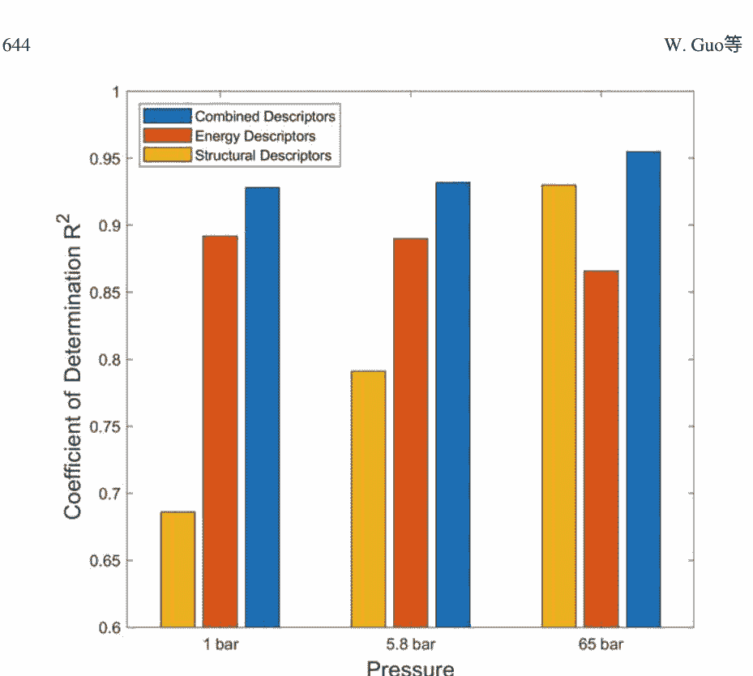

图28.1 随机森林模型使用不同类型的描述符进行比较：仅结构描述符（黄色柱状图），仅能量描述符（红色柱状图）和结构和化学描述符的组合描述符（蓝色柱状图）。RF模型在1、5.8和65 bar（x轴）和298 K下进行训练。模型的准确性通过确定系数`R²`进行评估。（纵轴）

Thornton等人使用人工神经网络(`ANN`)对包括MOFs和其他纳米多孔材料在内的850,000种纳米材料进行筛选，基于它们的H₂吸附能力(Thornton等人，2017)。从`GCMC`模拟生成的气体吸附性质被用来训练`ANN`模型。`ANN`模型识别出`MOF-210`、`PCN-68`、`NOTT-400`和`ZIF-8`等MOFs作为H₂储存的最佳材料，并且这些发现与实验结果一致(Hirscher，2011；Ibarra等人，2011；Yan等人，2018)。对于H₂吸附，`hMOFs`的最佳设计为孔隙率约为0.5，孔径约为10 Å，表面积大于500 m²/g。这项工作证明了机器学习可以大大降低对于H₂吸附的大规模筛选的计算成本。

Anderson等人还使用`ANN`模型探索了在某些温度和压力下的`hMOFs`的体积H₂储存容量的理论极限(Anderson等人，2019年)。`ANN`模型是基于从`GCMC`模拟中获得的气体吸附性质进行训练的。为了使模型能够预测完整的等温线，温度和压力也被用作输入变量。当氢气在MOFs中吸附时，在100 bar/77 K条件下获得了62 g/L的最高体积传递能力，在5 bar/160 K条件下脱附。

Bucior等人引入了H₂的能量直方图和框架作为新的描述符，并使用最小绝对收缩和选择算子（`LASSO`）回归模型来研究几何结构与H₂储存之间的关系（Bucior等人，2019年）。`LASSO`模型在1000个`hMOFs`上进行了训练，并用于预测1250个`hMOFs`的H₂吸附。结果显示，该模型的确定系数`R² = 0.96`，表明新的描述符能够有效描述MOFs与H₂之间的相互作用。本研究还通过将模型应用于来自剑桥晶体学数据中心（`CCDC`）的不同MOF数据集来研究模型的可迁移性。在`CCDC`数据集中，共有51个高性能MOFs被鉴定出来，这与`GCMC`结果一致。`MFU-4l`是其中一个顶级候选物，在Bucior实验室中合成，并且其高H₂储氢能力得到了确认。

Ma等人还研究了ML模型的可迁移性（Ma等人，2020）。他们的目标是测试迁移学习是否能提高在小数据集上训练的预测模型的准确性。在他们的工作中，MOFs是使用`ToBaCCo`软件包构建的。使用两个隐藏层的`DNN`模型在13,506个MOFs上进行训练，以预测100 bar和243 K下的H₂吸附。得到的决定系数`R²`为0.998，表明`DNN`是研究MOFs的H₂吸附性能非常有前景的技术。然后，该模型被转移用于预测在低于130 K的相同压力下的H₂吸附。通过迁移学习构建的模型的决定系数`R²`为0.991，而仅使用深度学习从小数据集直接构建的模型的`R²`为0.96。类似的迁移学习也用于预测298 K和100 bar下的CH₄吸附。迁移学习中的权重使用CH₄数据进行微调，迁移学习的1000个测试集的`R²`为0.98，而直接从头开始的深度学习仅有`R²`为0.935。结果表明，从H₂吸附模型中学到的知识对于开发预测CH₄吸附或在不同条件下预测H₂吸附的模型是有用的。然而，这个迁移ML模型无法筛选出Xe/Kr分离的MOFs，决定系数`R²`为 – 0.092。这种显著下降的可能解释是对于不同气体如H₂和Xe/Kr的吸附缺乏共同的描述符。用于H₂吸附的关键描述符无法提供关于Xe/Kr吸附的足够信息，这表明知识在H₂和Xe/Kr之间不可迁移。

### 28.5.3 CO₂吸附的机器学习模型

CO₂是一种温室气体，由于全球变暖和环境问题，人们一直在研究其捕获问题。MOFs在CO₂捕获方面具有几个优势，包括高孔隙度和开放金属位点，可以极大增强CO₂的吸附能力。MOFs的强度和CO₂捕获能力增加。CO₂和MOFs金属位点之间的静电相互作用使得CO₂捕获的传统建模计算非常昂贵和耗时。因此，机器学习模型已广泛应用于研究CO₂吸附和CO₂/CH₄等混合物的选择性吸附，用于天然气净化，以及CO₂/H₂和CO₂/N₂等混合物的预燃烧和后燃烧CO₂捕获。

机器学习模型在CO₂吸附方面已被用于识别具有期望CO₂吸附性能的MOFs。Fernandez等人研究了32,450种假设MOFs在1 bar和0.15 bar压力下的CO₂吸附（Fernandez et al. 2014）。使用`AP-RDF`作为描述符训练了`SVM`模型，将MOFs分类为具有高或低CO₂吸附能力的MOFs。高CO₂吸附MOFs的阈值在0.15 bar压力下设置为1 nmol/g，在1 bar压力下设置为4 nmol/g。结果显示，分类模型成功恢复了0.15 bar和1 bar下前1000个高性能MOFs中的945个和905个，表明该模型可用于预筛选CO₂吸附MOFs。在后续的工作中，Fernandez等人研究了0.1 bar和298 K下的CO₂捕获，以及0.9 bar和298 K下的N₂捕获，仅使用几何描述符（Fernandez and Barnard 2016）。只有81,679个假设的MOF具有独特的框架，孔径大于1.4 Å，并且表面积大于100 Ų被包括在内。建立了`MLR`、`DT`、`KNN`、`RF`、`SVM`和`ANN`模型来对MOF进行分类。高性能或低性能的MOF的阈值分别设置为CO₂为1 nmol/g，N₂为0.5 nmol/g。他们的结果显示，`RF`模型在CO₂和N₂的灵敏度分别为0.741和0.631，特异性分别为0.944和0.991，表现最佳。孔径大小、空隙率和表面积被发现是影响MOF气体吸附性能的三个关键特征。`DT`模型找到了这三个特征的最佳组合，以区分高性能和低性能的MOF。在另一项研究中，Fanourgakis等人比较了使用不同类型描述符构建的`RF`模型在预测CO₂在低压（0.02、0.5和2.5 bar）和298 K下的吸附性能方面的差异（Fanourgakis等人，2020）。在这项研究中，`hMOF`数据库经过预处理以保留具有已识别原子类型的结构。结果显示，结合化学描述符（原子类型）和几何描述符的模型的准确性得到了提高（对于预测压力为0.02、0.5和2.5 bar下的CO₂吸附，`R²`分别为0.752、0.933和0.954），与仅使用几何描述符的模型相比（对于预测压力为0.02、0.5和2.5 bar下的CO₂吸附，`R²`分别为0.574、0.843和0.954）。还研究了CO₂的选择性吸附，因为需要捕获预燃烧气体、燃烧后烟气和垃圾填埋天然气净化中的CO₂。MOF可以从混合气体中选择性地吸附某种气体。MOF对混合气体中的气体i的选择性由公式（28.5）定义。

$$S = \frac{q_i / q_j}{p_i / p_j} \quad (28.5)$$

其中 $q_i$ 和 $q_j$ 分别是MOF吸附的气体 $i$ 和 $j$ 的摩尔分数； $p_i$ 和 $p_j$ 是混合物中气体 $i$ 和 $j$ 的摩尔分数。许多研究使用机器学习来识别高选择性吸附CO₂的MOF的最佳设计规则。例如，Aghaji等人使用几何描述符研究了天然气净化条件下324,500种hMOFs的CO₂吸附容量和CO₂/CH₄吸附选择性（Aghaji等人，2016年）。本研究中MOF的工作能力是CO₂在10 bar和1 bar下吸附的差值。DT和SVM模型在32,450种MOFs上进行训练，将MOFs分类为高性能或低性能MOFs。DT模型表明，选择性大于10的MOFs需要空隙分数小于0.27和孔径小于6.6 Å。对于CO₂工作能力大于4 mmol/g的MOFs，孔径应小于8.5 Å，表面积应大于2300 m²/g。结果还显示，SVM分类器在CO₂/CH₄选择性阈值为5和10时的AUC分别为0.953和0.936。SVM模型从测试数据集的292,050种MOFs中识别出了前1000种高性能MOFs中的900种，其工作能力大于2 mmol/g且选择性大于5。

Anderson等人研究了使用ToBaCCo软件合成的400个MOFs对CO₂、N₂和H₂的选择性吸附。使用ML算法DT、RF、NN、SVM和梯度提升机(GBM)以及简单的化学和拓扑描述符开发了预测选择性的模型。研究发现，NN模型和GBM模型在1 bar下对CO₂选择性超过N₂的性能最好。NN模型的$R^2$为0.905，Spearman等级相关系数(SRCC)为0.823，而GBM模型的$R^2$为0.905，SRCC为0.921。对于CO₂选择性超过H₂，GBM模型的性能最佳，$R^2$为0.855，SRCC为0.938。在另一项研究中，Dureckova等人研究了使用ToBaCCo软件生成的358,400个hMOFs在40 bar和1 bar下的CO₂吸附能力以及在40 bar和313 K下的CO₂/H₂选择性。在他们的工作中，几何描述符和几何描述符与AP-RDFs的组合被用来训练梯度提升回归树(GBRT)模型。结果显示，具有六个几何描述符和三个AP-RDFs组合的模型表现最佳，用于预测CO₂吸附容量的测试$R^2$为0.944，用于预测CO₂/H₂吸附选择性的测试$R^2$为0.872。此外，由GBRT模型识别出的3000个表现最佳的MOFs中，包括从GCMC模拟中识别出的前1000个MOFs中的997个。

### 28.5.4 Xe/Kr选择性吸附的机器学习模型

惰性气体Xe和Kr在工业中被广泛应用[例如，麻醉（Cullen和Gross 1951; Fra nks等人1998），医学图像（Albert等人1994），气体激光（Bridges和Chester 1965; Hoff等人1973）]。由于Xe和Kr都存在于空气中，传统的提取方法是从空分过程的副产品中纯化Xe和Kr的二元混合物。通常使用的方法是基于Xe的不同沸点的低温精馏过程。在1大气压下，Xe的熔点为164.9K，Kr的熔点为119.8K。然而，这个过程非常耗能和资本。为了克服这个问题，一种替代的环境友好和节约成本的方法是使用纳米多孔材料作为吸附剂，选择性地吸附Xe或Kr。由于其高孔隙度和表面积，MOFs已经成为有希望的候选材料。多项研究已经证明了MOFs在Xe/Kr分离中的应用（Ryan等，2011年；Sikora等，2012年；Banerjee等，2016年）。然而，只有少数ML模型被开发用于研究Xe/Kr的选择性吸附，其中大部分集中在信息描述符的识别和ML模型的比较上（Simon等，2015年；Li等，2021年；Liang等，2021年）。Simon等人利用RF和DT来预测低压下Xe的吸附，使用了包括实验MOFs、假设MOFs、沸石和共价有机框架在内的纳米多孔材料基因组中的670,000个结构（Simon等，2015年）。模型使用了几何和Voronoi能量描述符进行训练。Voronoi能量描述符描述了Xe与MOFs的结合位点之间的相互作用能量，使用计算几何方法进行Voronoi镶嵌计算。RF模型在15,000个MOFs上进行了训练，并且使用剩余的4066个结构进行了保留验证，得到了Xe/Kr选择性的RMSE为2.21。还发现Voronoi能量是最重要的描述符，其次是空隙率的几何描述符。Li等人在使用ToBaCCo数据库上的能量描述符（如相互作用直方图）时，也发现了能量描述符的重要性。在他们的工作中，使用了LASSO和RF来预测Kr/Xe的吸附。结果表明，对于像Kr和Xe这样的小型球形分子，线性LASSO模型与RF模型相当。

Liang等人使用八种机器学习算法（岭回归、LASSO、弹性网络、支持向量机、贝叶斯回归、人工神经网络、随机森林和XGBoost）开发了模型，用于预测材料基因组金属有机骨架数据库中303,991个结构的Xe/Kr吸附和分离性能（Liang等人，2021年）。研究发现，具有七个结构描述符的XGBoost模型在测试集上表现最佳，Xe吸附的确定系数（R²）为0.951，均方根误差（RMSE）为0.055，Xe/Kr选择的R²为0.973，RMSE为0.025。MOFs的密度、孔隙度、孔容量和PLD被发现是影响Xe/Kr选择性吸附的几何描述符中的关键特征。由XGBoost识别出的性能最佳的MOFs在Xe吸附和Xe/Kr选择性吸附的前1000个中分别有888个和896个。XGBoost和GCMC模拟之间的一致结果表明该模型可以用于寻找有前景的候选MOFs。

### 28.6 结论和未来展望

最近，由于其高孔隙度和化学可调性，MOFs在基于气体吸附的应用中引起了很多关注。正如本章总结的那样，基于气体吸附的应用从ML的融入中获益匪浅。ML技术已经证明具有良好的预测性能，并可用于识别高性能MOFs和设计新型MOFs。尽管已经做出了许多努力，但在识别和设计具有高气体吸附能力的MOFs方面采用ML只是冒险的开始。随着每天涌现出越来越多的MOFs，需要进行更多的研究以提高ML模型的性能，以便扩大ML模型在MOFs气体吸附应用中的利用。

描述符的选择对于开发可靠的预测MOFs气体吸附的ML模型非常重要。已经为MOFs开发了许多描述符，从结构描述符（几何描述符，拓扑描述符）到化学描述符和能量描述符。具有结构描述符的ML模型在预测MOFs低压下的气体吸附方面表现不佳。可能的原因是在低压下，MOFs中的大多数孔隙是空的，因此孔隙结构描述符与气体吸附性质的相关性较差。这个问题通过化学和能量描述符的发展得以解决。然而，根据吸收气体、MOF数据库和操作条件，使用不同类型描述符组合构建的ML模型的性能差异显著。因此，需要在这个领域进行持续的工作，以开发新的描述符并确定可广泛应用于开发具有改进性能的ML模型的描述符。

最近关于MOFs气体吸附能力预测的研究中，一个明显的趋势是大多数预测模型是使用传统的ML算法开发的。MOFs数据集的不断增加和MOFs与其气体吸附能力之间的复杂关系使得深度学习成为探索隐藏模式的合适方法。我们预计未来将会开发更多的深度学习模型来改进MOFs气体吸附的预测。

免责声明：本章节反映了作者的观点，不一定反映美国食品和药物管理局的观点。

## 参考文献

- Aghaji MZ, Fernandez M, Boyd PG, Daff TD, Woo TK (2016) 用于识别具有高CO₂工作能力和CO₂/CH₄选择性的金属有机框架（MOFs）的定量结构-性质关系模型，用于甲烷净化。 Eur J Inorg Chem 2016(27):4505-4511

- Ahmed A, Siegel DJ (2021) 通过机器学习预测MOFs中的氢储存。 Matter 2(7):100291

- Ahmed A, Seth S, Purewal J, Wong-Foy AG, Veenstra M, Matzger AJ, Siegel DJ (2019) 通过筛选近50万种金属有机框架实现了异常的氢储存。 Nature Communications 10(1):1568

- Albert MS, Cates GD, Driehuys B, Happer W, Saam B, Springer CS, Wishnia A (1994) 使用激光极化的 ¹²⁹Xe进行生物磁共振成像。 Nature 370(6486):199–201

- Alezi D, Belmabkhout Y, Suyetin M, Bhatt PM, Weseliński ŁJ, Solovyeva V, Adil K, Spanopoulos I, Trikalitis PN, Emwas A-H, Eddaoudi M (2015) MOF晶体化学为气体储存需求铺平了道路：基于铝的soc-MOF用于CH₄，O₂和CO₂储存。 J Am Chem Soc 137(41):13308–13318

- Altintas C, Altundal OF, Keskin S, Yildirim R (2021) 机器学习与金属有机框架相结合用于气体储存和分离。 J Chem Inf Model 61(5):2131–2146


- Anderson R, Rodgers J, Argueta E, Biong A, Gómez-Gualdrón DA (2018) 孔道化学和拓扑在MOFs的CO₂捕获能力中的作用：从分子模拟到机器学习。 Chem Mater 30(18):6325–6337
- Anderson G, Schweitzer B, Anderson R, Gómez-Gualdrón DA (2019) 多孔晶体中基于吸附的氢储存的可实现体积目标：分子模拟和机器学习。 J Phys Chem C 123(1):120–130
- Anderson R, Biong A, Gómez-Gualdrón DA (2020) 使用相同的深度学习模型预测MOFs中多种分子的吸附等温线。 J Chem Theory Comput 16(2):1271–1283
- Banerjee D, Simon CM, Plonka AM, Motkuri RK, Liu J, Chen X, Smit B, Parise JB, Haranczyk M, Thallapally PK (2016) 具有最佳选择性的金属有机框架对氦气吸附和分离。 Nat Commun 7(1)
- Batten SR, Champness NR, Chen X-M, Garcia-Martinez J, Kitagawa S, Öhrström L, O’Keeffe M, Paik Suh M, Reedijk J (2013) 金属有机框架和配位聚合物的术语（IUPAC建议2013年）。 Pure Appl Chem 85(8):1715-1724
- Beauregard N, Pardakhti M, Srivastava R (2021) 用于甲烷吸附的高性能金属有机框架的计算机模拟进化。 J Chem Inf Model 61(7):3232-3239
- Begum S, Karim ANM, Ansari NM, Hashmi MSJ (2020) In: Hashmi S, Choudhury IA (eds) 可再生和可持续材料百科全书。 Elsevier, Oxford, 第515-539页
- Borboudakis G, Stergiannakos T, Frysalı M, Klontzas E, Tsamardinos I, Froudakis GE (2017) 通过机器学习技术对MOF进行化学直觉、大规模筛选。 npj Comput Mater 3(1):40
- Boyd PG, Woo TK (2016) 从图论构建任何网状拓扑的假设性纳米多孔材料的广义方法。 CrystEngComm 18(21):3777–3792
- Breiman L (2001) 随机森林。 Mach Learn 45(1):5–32
- Bridges WB, Chester AN (1965) 离子化的氖、氩、氪、氙、氧和其他气体在118个波长上的可见光和紫外激光振荡。 Appl Opt 4(5):573–580
- Bucior BJ, Bobbitt NS, Islamoglu T, Goswami S, Gopalan A, Yildirim T, Farha OK, Bagheri N, Snurr RQ (2019) 基于能量的描述符快速预测金属-有机框架中的氢储存。 Mol Syst Des Eng 4(1):162–174
- Burns TD, Pai KN, Subraveti SG, Collins SP, Krykunov M, Rajendran A, Woo TK (2020) 基于综合分子模拟、过程优化和机器学习模型的真空摆动吸附系统中MOF性能的预测，用于燃烧后CO₂捕获. Environ Sci Technol 54(7):4536–4544
- Chellaram C, Murugaboopathi G, John AA, Sivakumar R, Ganesan S, Krithika S, Priya G (2014) 纳米技术在食品工业中的重要性。 APCBEE Proc 8:109–113
- Cheng F, Hong H, Yang S, Wei Y (2017) 基于个体化网络的药物再定位基础设施在全基因组时代的精准肿瘤学中的应用。 Brief Bioinform 18(4):682–697
- Chong S, Lee S, Kim B, Kim J (2020) 机器学习在金属有机框架中的应用。 Coord Chem Rev 423:213487
- 用于计算就绪的实验金属有机框架数据库的分析：核心MOF 2019。 J化学工程数据64(12): 5985-5998
- Colón YJ, Gómez-Gualdrón DA, Snurr RQ (2017) 基于拓扑指导的金属有机框架的自动构建及其在能源相关应用中的评估。 晶体生长与设计17(11): 5801-5810
- Cortes C, Vapnik V (1995) 支持向量网络。 机器学习20(3): 273-297
- Cullen SC, Gross EG (1951) 氙在动物和人体中的麻醉特性，并对氮的其他观察进行了补充。 科学113(2942): 580-582
- Deng X, Yang W, Li S, Liang H, Shi Z, Qiao Z (2020) 大规模筛选和机器学习预测计算就绪的实验金属有机框架用于从空气中捕获CO2。应用科学10(2): 569
- Dureckova H, Krykunov M, Aghaji MZ, Woo TK (2019) 鲁棒的机器学习模型用于预测金属有机框架中气体吸附的高CO2工作能力和CO2/H2选择性的前燃碳捕获。 J Phys Chem C 123(7): 4133-4139
- Edelsbrunner H, Harer J (2008) 持久同调—一项调查。 离散计算几何学 453
- Evans JD, Fraux G, Gaillac R, Kohen D, Trouselet F, Vanson J-M, Coudert F-X (2017) 纳米多孔材料的计算化学方法。 Chem Mater 29(1): 199-212
- Fanourgakis GS, Gkagkas K, Tylianakis E, Klontzas E, Froudakis G (2019) 用于预测纳米多孔材料中甲烷吸附的鲁棒机器学习算法。 J Phys Chem A 123(28): 6080-6087
- Fanourgakis GS, Gkagkas K, Tylianakis E, Froudakis GE (2020) 一种用于大规模材料筛选的通用机器学习算法。 J Am Chem Soc 142(8): 3814-3822
- Fernandez M, Barnard AS (2016) 几何性质可以预测金属有机框架 (MOFs) 在低压下的CO2 和N2 吸附性能。 ACS Comb Sci 18(5): 243-252
- Fernandez M, Trefiak NR, Woo TK (2013a) 用于预测气体吸附能力的金属有机框架的原子属性加权径向分布函数描述符。 J Phys Chem C 117(27): 14095-14105
- Fernandez M, Woo TK, Wilmer CE, Snurr RQ (2013b) 金属有机框架中甲烷储存的大规模定量结构-性质关系 (QSPR) 分析。 J Phys Chem C 117(15): 7681-7689
- Fernandez M, Boyd PG, Daff TD, Aghaji MZ, Woo TK (2014) 快速准确的机器学习识别用于CO2捕获的高性能金属有机框架。 J Phys Chem Lett 5(17): 3056-3060
- Franks NP, Dickinson R, De Sousa SL, Hall AC, Lieb WR (1998) 氙如何产生麻醉？ 自然 396(6709): 324
- Gomollón-Bel F (2019) 十项化学创新将改变我们的世界：IUPAC确定了具有使我们的星球更可持续的潜力的化学新兴技术。 化学国际 41(2): 12-17
- Gülsoy Z, Sezginel KB, Uzun A, Keskin S, Yildirim R (2019) 使用数据挖掘工具分析金属-有机框架对CH4的吸附。 ACS Comb Sci 21(4): 257-268
- Hirscher M (2011) 超高孔隙金属-有机框架中的低温吸附储氢。 Angew Chem Int Ed 50(3): 581-582
- Hoff PW, Swingle JC, Rhodes CK (1973) 观察到高压氩和氩/氙混合物的受激发射。 Appl Phys Lett 23(5): 245-246
- Hofmann-Amtenbrink M, Grainger DW, Hofmann H (2015) 医学中的纳米颗粒：无机纳米颗粒毒性评估和标准化面临的当前挑战。 Nanomedicine 11(7): 1689-1694


Hong H, Neamati N, Winslow HE, Christensen JL, Orr A, Pommier Y, Milne GW (1998) 基于四点药效团的HIV-1整合酶抑制剂的鉴定。 抗病毒化学与化疗 9(6): 461-472

洪 H, 童 W, 谢 Q, 方 H, 帕金斯 R (2005) 一种基于计算的集成方法用于铅发现：决策森林。 SAR QSAR环境研究 16(4): 339-347

Hong H, Thakkar S, Chen M, Tong W (2017) 开发决策森林模型，使用大量FDA批准的药物预测药物引起的肝损伤。科学报告 7(1): 17311

Hong H, Zhu J, Chen M, Gong P, Zhang C, Tong W (2018) 在: Chen M, Will Y (eds) 药物诱导的肝毒性。Springer, 纽约, pp 77-100

Huang Y, Li X, Xu S, Zheng H, Zhang L, Chen J, Hong H, Kusko R, Li R (2020) 用于预测金属氧化物纳米颗粒炎症潜力的定量结构-活性关系模型。 Environ Health Perspect 128(6): 067010

Ibarra IA, Yang S, Lin X, Blake AJ, Rizkallah PJ, Nowell H, Allan DR, Champness NR, Hubberstey P, Schröder M (2011) 高度多孔且坚固的基于钪的金属有机框架用于储氢。 Chem Commun 47(29): 8304-8306

Jablona KM, Ongari D, Moosavi SM, Smit B (2020) 多孔材料中的大数据科学：材料基因组学和机器学习。 Chem Rev 120(16): 8066-8129

Krishnapriyan AS, Montoya J, Haranczyk M, Hummelshej J, Morozov D (2021) 使用持久同调和化学词嵌入的机器学习在金属有机框架中提高预测准确性和可解释性。 Sci Rep 11(1): 8888

Lee Y, Barthel SD, Dlotko P, Moosavi SM, Hess K, Smit B (2017) 量化纳米多孔材料中的孔几何相似性。 Nat Commun 8(1): 15396

Lee S, Kim B, Cho H, Lee H, Lee SY, Cho ES, Kim J (2021) 对高性能甲烷储存的数万亿金属有机框架进行计算筛选。 ACS Appl Mater Interfaces 13(20): 23647-23654

Li Z, Bucior BJ, Chen H, Haranczyk M, Siepmann JI, Snurr RQ (2021) 使用主/客体能量直方图的机器学习来预测金属有机框架中的吸附：应用于短链烷烃和Xe/Kr混合物。 J Chem Phys 155(1): 014701

Liang H, Jiang K, Yan T-A, Chen G-H (2021) XGboost：一种仅使用结构特征来发现Xe/Kr的MOF吸附剂的最佳机器学习模型。 ACS Omega 6(13): 9066-9076

Luo H, Ye H, Ng HW, Shi L, Tong W, Mendrick DL, Hong H (2015) 用于预测HLA-肽结合活性的机器学习方法。 Bioinform Biol Insights 9(Suppl 3): 21-29

Ma R, Colón YJ, Luo T (2020) 金属有机框架中气体吸附的迁移学习研究。 ACS Appl Mater Interfaces 12(30): 34041-34048

Pardakhti M, Moharreri E, Wanik D, Suib SL, Srivastava R (2017) 使用结构和化学描述符的机器学习预测金属有机框架（MOFs）甲烷吸附性能。 ACS Comb Sci 19(10): 640-645

彭 Y, Krungleviciute V, Eryazici I, Hupp JT, Farha OK, Yildirim T (2013) 金属有机框架中的甲烷储存：当前记录，意外发现和挑战。 J Am Chem Soc 135(32): 11887-11894

Plimpton S (1995) 用于短程分子动力学的快速并行算法。 J Comput Phys 117(1): 1-19

Pomerantseva E, Bonaccorso F, Feng X, Cui Y, Gogotsi Y (2019) 能源储存：纳米材料带来的未来。科学 366(6468)

Ryan P, Farha OK, Broadbelt LJ, Snurr RQ (2011) 用于氙/氪分离的金属有机框架的计算筛选。 AIChE J 57(7): 1759-1766

Sakkiah S, Selvaraj C, Gong P, Zhang C, Tong W, Hong H (2017) 使用大量化学物质开发雌激素受体β结合预测模型。 Oncotarget 8(54): 92989-93000

Sakkiah S, Guo W, Pan B, Ji Z, Yavas G, Azevedo M, Hawes J, Patterson TA, Hong H (2021) 使用同源建模和分子动力学模拟阐明sars-cov-2三聚体尖峰蛋白与ACE2之间的相互作用。 Front Chem 8(1247)

Sarkisov L, Harrison A (2011) 应用于有序和无序多孔材料的计算结构表征工具。 Mol Simul 37(15): 1248-1257

Selvaraj C, Sakkiah S, Tong W, Hong H (2018) 分子动力学模拟及其在计算毒理学和纳米毒理学中的应用。 Food Chem Toxicol 112: 495-506

Shen J, Xu L, Fang H, Richard AM, Bray JD, Judson RS, Zhou G, Colatsky TJ, Aungst JL, Teng C, Harris SC, Ge W, Dai SY, Su Z, Jacobs AC, Harrouk W, Perkins R, Tong W, Hong H (2013) EADB: 用于评估潜在内分泌干扰活性的雌激素活性数据库。 Toxicol Sci 135(2): 277-291

Shi L, Tong W, Fang H, Xie Q, Hong H, Perkins R, Wu J, Tu M, Blair RM, Branham WS, Waller C, Walker J, Sheehan DM (2002) 用于设置内分泌干扰筛选优先级的综合“4阶段”方法:第一和第二阶段的雌激素受体结合亲和力预测。 SAR QSAR Environ Res 13(1): 69-88

Sikora BJ, Wilmer CE, Greenfield ML, Snurr RQ (2012) 对超过137,000个假设的金属有机框架中Xe/Kr选择性的热力学分析。 Chem Sci 3(7): 2217-2223

Simon CM, Mercado R, Schnell SK, Smit B, Haranczyk M (2015) 什么是最好的材料来分离氪/氙混合物? Chem Mater 27(12): 4459-4475

Tan K, Zuluaga S, Gong Q, Gao Y, Nijem N, Li J, Thonhauser T, Chabal YJ (2015) CO2与H2O, NH3, SO2, NO, NO2, N2, O2和CH4在M-MOF-74（M=Mg, Co, Ni）中的竞争共吸附：氢键的作用。 Chem Mater 27(6): 2203-2217

Tan H, Wang X, Hong H, Benfenati E, Giesy JP, Gini GC, Kusko R, Zhang X, Yu H, Shi W (2020) 内分泌干扰化学物质的结构决定其与雌激素受体α和雄激素受体的结合和激活。 Environ Sci Technol 54(18): 11424-11433

Thornton AW, Simon CM, Kim J, Kwon O, Deeg KS, Konstas K, Pas SJ, Hill MR, Winkler DA, Haranczyk M, Smit B (2017) 材料基因组的实践：确定物理氢储存的性能极限。 Chem Mater 29(7): 2844-2854

Tibshirani R (1996) 通过套索进行回归收缩和选择。 J Roy Stat Soc Ser B (Methodol) 58(1): 267-288

Willems TF, Rycroft CH, Kazi M, Meza JC, Haranczyk M (2012) 用于高通量基于几何的结晶多孔材料分析的算法和工具。 Microporous Mesoporous Mater 149(1): 134-141

Wilmer CE, Leaf M, Lee CY, Farha OK, Hauser BG, Hupp JT, Snurr RQ (2012) 对假设的金属有机框架进行大规模筛选。 Nat Chem 4(2): 83-89

Wu X, Xiang S, Su J, Cai W (2019) 基于机器学习理解甲烷储存能力与金属有机框架的特性之间的定量关系。 J Phys Chem C 123(14): 8550-8559

Yan Y, Da Silva I, Blake AJ, Dailly A, Manuel P, Yang S, Schröder M (2018) 在多孔蒽装饰的金属有机框架中高容积氢吸附。 Inorg Chem 57(19): 12050-12055

Yan Y, Zhang L, Li S, Liang H, Qiao Z (2021) 金属有机框架的吸附行为：从单一模拟、高通量计算筛选到机器学习。 Comput Mater Sci 193: 110383

于 H, 李 L, 张 Y (2012) 基于银纳米颗粒的超低热阻热界面材料在电力电子应用中的应用。 Scr Mater 66(11): 931-934

张 X, 崔 J, 张 K, 吴 J, 李 Y (2019) 利用孔隙几何条形码对纳米多孔材料性质进行机器学习预测。 J Chem Inf Model 59(11): 4636-4644