# 路边视频数据分析：深度学习

Brijesh Verma
Ligang Zhang
David Stockwell

Springer

## 计算智能研究

### 第711卷

## 系列编辑
Janusz Kacprzyk, 波兰科学院, 华沙, 波兰
e-mail: kacprzyk@ibspan.waw.pl

## 关于本系列

该系列“计算智能研究”（SCI）发表了计算智能领域的新发展和进步，快速且高质量。旨在涵盖计算智能的理论、应用和设计方法，以及工程、计算机科学、物理学和生命科学等领域中嵌入的方法论。该系列包含神经网络、连接主义系统、遗传算法、进化计算、人工智能、细胞自动机、自组织系统、软计算、模糊系统和混合智能系统等计算智能领域的专著、讲义和编辑卷。对于投稿者和读者来说，短时间的出版周期和全球范围的分发都具有特别的价值，可以广泛而迅速地传播研究成果。

有关该系列的更多信息，请访问：http://www.springer.com/series/7092

Brijesh Verma · Ligang Zhang · David Stockwell

## 路边视频数据分析：深度学习

Brijesh Verma
工程与技术学院
昆士兰中央大学
布里斯班，昆士兰，澳大利亚

David Stockwell
工程与技术学院
昆士兰中央大学
布里斯班，昆士兰，澳大利亚

Ligang Zhang
工程与技术学院
昆士兰中央大学
布里斯班，昆士兰，澳大利亚

ISSN 1860-949X
ISSN 1860-9503 (电子版)
计算智能研究
ISBN 978-981-10-4538-7
ISBN 978-981-10-4539-4 (电子书)
DOI 10.1007/978-981-10-4539-4

国会图书馆控制号：2017936905

© Springer Nature Singapore Pte Ltd. 2017

本作品受版权保护。出版商保留所有权利，包括整体或部分材料的翻译、重印、插图的再利用、朗读、广播、微缩胶片复制或以任何其他实体方式的复制，以及传输或信息存储和检索、电子适应、计算机软件或类似或不同的已知或今后开发的方法。

在本出版物中使用一般描述性名称、注册名称、商标、服务标志等，并不意味着即使在没有具体声明的情况下，这些名称也不受相关保护法律和法规的约束，因此可以自由使用。

出版商、作者和编辑可以安全地假设本书中的建议和信息在出版日期时被认为是真实和准确的。出版商、作者或编辑对本文中包含的材料不提供任何明示或暗示的保证，也不对可能存在的任何错误或遗漏承担责任。出版商在出版的地图和机构 affiliations 方面保持中立。

采用无酸纸印刷

这个 Springer 品牌由 Springer Nature 发布
注册公司是 Springer Nature Singapore Pte Ltd.
注册公司地址为：152 Beach Road, #21-01/04 Gateway East, Singapore 189721, Singapore

## 前言

视频数据分析已成为一个越来越重要的研究领域，在交通基础设施的自动监控中有广泛应用，包括道路、铁路和机场。随着收集到的视频数据量的增加，使用新的人工智能方法进行进一步处理的机会也在增加。

一种鲜为人知的有用视频数据类型是使用车载摄像头收集的道路边视频数据。这些视频数据可以增强或替代基于道路的调查，用于评估道路边物体（如树木、草地、道路和交通标志）的状况，并可以在许多实际应用中使用，例如道路边植被生长状况监测、减少驾驶员和车辆可能面临的潜在危险的有效道路边管理，以及开发能够自动感知道路边物体和交通标志的自动驾驶车辆。

大多数现有的视频数据分析研究主要集中在公共基准数据集中分析通用对象类别的数据内容上。尽管广泛认识到开发道路边视频数据分析的智能技术的重要性，但是对道路边视频数据分析的研究非常有限。其中一个主要原因可能是缺乏专门为道路边对象创建的综合公共数据集。

另一个原因是在道路边遇到的各种变化和环境条件，这仍然是计算机视觉领域的挑战性问题。对象的外观和结构的巨大变异性以及曝光不足、曝光过度、阴影和阳光反射等各种类型的环境效应使得对象的准确分割和识别变得困难。目前的文献缺乏对道路边视频数据分析中现有机器学习算法的综合评述，特别是深度学习技术。

本书重点介绍了道路边视频数据分析的方法和应用。它描述了基于不同类型学习算法的道路边视频数据处理的各种系统架构和方法，详细分析了分割、特征提取和分类。使用深度学习解决道路边视频数据的问题。

分割和分类问题是本书的主要亮点之一。深度神经网络学习在机器学习和数据挖掘领域变得流行。然而，深度特征自由方法的好处必须与准确性和鲁棒性的考虑相平衡，大多数实际学习系统需要一些手工特征和架构的工程。本书通过实证测试研究了多层神经网络在实际场景分析中的性能贡献的特征和架构类型。然后，我们展示了新颖的架构，其在场景分类方面具有与先前方法相等或更好的准确性，并研究了卷积神经网络的特征工程。此外，我们提供了一个工业视角，以帮助将理论关注点与实际结果对齐。最后，作为道路边视频数据分析的案例研究，我们演示了一种用于道路火灾风险评估的植被生物量估计技术的应用。总的来说，本书汇编了场景分析领域中最有用的策略，以帮助研究人员确定最适合其应用的特征和架构。

澳大利亚布里斯班

Brijesh Verma
Ligang Zhang
David Stockwell

## 致谢

作者对澳大利亚昆士兰州交通和主要道路部门在数据创建和火灾风险调查的现场资源方面的帮助表示感谢。本工作得到了澳大利亚研究理事会的链接项目资助（项目编号LP140100939）。

中央昆士兰大学智能系统中心的许多学生和研究员为本书中的研究做出了贡献。作者要感谢以下研究人员：Sujan Chowdhury博士，Tejy Kinattukara Jobachan博士，Peter Mc Leod博士，M. Asafuddoula博士，Toshi Sinha女士和Fatma Shaheen女士。

## 目录

- **1 引言** .................................................................... 1
  - 1.1 背景 ................................................................... 1
  - 1.2 道路边视频数据的收集 ................................................. 2
    - 1.2.1 行业数据 ........................................................... 2
    - 1.2.2 基准数据 ........................................................... 7
  - 1.3 使用道路边视频数据的应用 ............................................ 10
  - 1.4 本书概述 .............................................................. 11
  - 参考文献 .................................................................. 12

- **2 道路边视频数据分析框架** ................................................. 13
  - 2.1 概述 .................................................................. 13
  - 2.2 方法论 ................................................................ 14
    - 2.2.1 道路边视频数据的预处理 ........................................... 14
    - 2.2.2 道路边视频数据的对象分割 ......................................... 18
    - 2.2.3 从对象中提取特征 ................................................. 19
    - 2.2.4 道路边对象的分类 ................................................. 20
    - 2.2.5 分类后的道路边对象的应用 ......................................... 21
  - 2.3 相关工作 .............................................................. 23
    - 2.3.1 植被分割和分类 ................................................... 24
    - 2.3.2 通用对象分割和分类 ............................................... 28
  - 2.4 用于数据处理的Matlab代码 ........................................... 32
  - 参考文献 .................................................................. 37

- **3 非深度学习技术用于道路边视频数据分析** ................................... 41
  - 3.1 神经网络学习 .......................................................... 41
    - 3.1.1 简介 ................................................................ 41
    - 3.1.2 神经网络学习方法 ................................................. 42
    - 3.1.3 实验结果 ........................................................... 45
    - 3.1.4 总结 ................................................................ 48
  - 3.2 支持向量机学习 ........................................................ 49
    - 3.2.1 简介 ................................................................ 49
    - 3.2.2 SVM学习方法 ........................................................ 49
    - 3.2.3 实验结果 ........................................................... 53
    - 3.2.4 总结 ................................................................ 56
  - 3.3 聚类学习 .............................................................. 56
    - 3.3.1 简介 ................................................................ 56
    - 3.3.2 聚类学习方法 ........................................................ 57
    - 3.3.3 实验结果 ........................................................... 62
    - 3.3.4 总结 ................................................................ 73
  - 3.4 模糊C均值学习 ........................................................ 74
    - 3.4.1 简介 ................................................................ 74
    - 3.4.2 模糊C均值学习方法 ................................................... 75
    - 3.4.3 实验结果 ........................................................... 78
    - 3.4.4 总结 ................................................................ 80
  - 3.5 集成学习 .............................................................. 80
    - 3.5.1 简介 ................................................................ 80
    - 3.5.2 集成学习方法 ........................................................ 80
    - 3.5.3 实验结果 ........................................................... 84
    - 3.5.4 总结 ................................................................ 86
  - 3.6 基于多数投票的混合学习 ................................................ 86
    - 3.6.1 引言 ................................................................ 86
    - 3.6.2 多数投票方法 ........................................................ 87
    - 3.6.3 实验结果 ........................................................... 90
    - 3.6.4 总结 ................................................................ 94
  - 3.7 区域合并学习 .......................................................... 95
    - 3.7.1 引言 ................................................................ 95
    - 3.7.2 区域合并方法 ........................................................ 95
    - 3.7.3 方法组成 ........................................................... 100
    - 3.7.4 实验结果 ........................................................... 109
    - 3.7.5 总结 ................................................................ 115
  - 参考文献 .................................................................. 116

- **4 道路边视频数据分析的深度学习技术** ........................................ 119
  - 4.1 引言 ................................................................... 119
  - 4.2 相关工作 ............................................................... 120
  - 4.3 自动与手动特征提取 ....................................................... 122
    - 4.3.1 引言 ............................................................... 122
    - 4.3.2 比较框架 ........................................................... 122
    - 4.3.3 实验结果 ........................................................... 124
    - 4.3.4 总结 ............................................................... 125
  - 4.4 单一与集成架构 ........................................................... 127
    - 4.4.1 引言 ............................................................... 127
    - 4.4.2 比较框架 ........................................................... 128

4.4.3 实验结果 129
4.4.4 总结 131
4.5 深度学习网络 131
4.5.1 引言 131
4.5.2 深度学习网络 133
4.5.3 实验结果 143
4.5.4 讨论 152
4.5.5 总结 154

参考文献 154

## 5 案例研究：用于火灾风险的道路边视频数据分析评估 159

### 5.1 引言 159
### 5.2 相关工作 160
### 5.3 提出的VOCGP方法 162
5.3.1 问题形式化和动机 162
5.3.2 方法概述 163
5.3.3 草地区域分割 164
5.3.4 Gabor滤波器投票以获得主导垂直方向检测 165
5.3.5 草地像素的垂直方向连通性计算 167
### 5.4 实验结果 171
5.4.1 道路边数据收集 171
5.4.2 实验设置 172
5.4.3 估计草量的性能 173
5.4.4 预测草密度的性能 176
5.4.5 易燃区域识别 177
### 5.5 讨论 180
### 5.6 总结 182

参考文献 182

## 6 结论和未来展望 185

6.1 建议 185
6.2 新挑战 187
6.3 新机遇和应用 188

## 缩写

- ANOVA 方差分析
- BG 背景
- CAV 上下文自适应投票
- CHM 上下文层次模型
- CIVE 植被提取的颜色指数
- CNN 卷积神经网络
- CRF 条件随机场
- CRR 正确识别率
- CSPM 上下文超像素概率图
- CWT 连续小波变换
- DTM 数字地形模型
- DTMR 交通和主要道路部门
- ExG 过度绿色
- ExR 过度红色
- FC 全连接层
- FCM 模糊C均值算法
- FRR 误识别率
- GG 绿色草地
- GLCM 灰度共生矩阵
- HOG 方向梯度直方图
- KNN K最近邻算法
- LBP 局部二值模式
- LIDAR 光探测与测距
- MLP 多层感知器
- MNDVI NDVI的修改
- MNIST 混合国家标准与技术研究所数据集
- MO 形态学开运算
- MRF 马尔可夫随机场
- MSRC 微软剑桥研究院21类数据集
- N/A 不可用
- NDVI 归一化差异植被指数
- NIR 近红外光
- OCP 物体体现先验
- PHOG 金字塔方向梯度直方图
- PID 像素强度差
- PPM 像素概率图
- PPS 像素和补丁选择性
- RBF 径向基函数
- ReLU 线性修正单元
- ROI 感兴趣区域
- SCS-M 空间上下文超像素模型
- SIFT 尺度不变特征变换
- SOM 自组织映射
- SVM 支持向量机
- SVR 支持向量回归
- TL 树叶
- TS 树干
- VI 植被指数
- VocANN 使用 ANN 获得的 VOCGP
- VocCNN 使用 CNN 获得的 VOCGP
- VVI 可见植被指数（草像素的垂直方向连通性）

## 图表列表

- 图1.1 从 DTMR 视频帧中裁剪的小区域的示意图。图中的白色块表示裁剪区域的位置、大小和形状。请注意，最终裁剪中仅包含一部分代表性的裁剪区域。
- 图1.2 道路边物体数据集：七种道路边物体的裁剪区域样本。同一物体的外观存在很大变化，物体之间存在高相似性（例如绿草和树叶），这对准确的物体分类是一个挑战。为了说明，这些区域被重新调整为相同的形状和大小。 4
- 图1.3 (上方) 稀疏和 (下方) 密集的草地样本图像。 5
- 图1.4 自然道路边物体数据集中的样本图像 (左侧) 及其相应的像素级地面真值 (右侧)。六种类型的道路边物体的像素级地面真值。 5
- 图1.5 自然道路边物体数据集中的样本图像。这些图像是使用正面视角摄像头拍摄的。 6
- 图1.6 斯坦福背景数据集中的样本图像及其相应的像素级地面真值。这些图像是在各种真实世界情况下拍摄的，是场景内容理解领域最具挑战性的数据集之一。 7
- 图1.7 MSRC 21类数据集中的样本图像及其相应的像素级地面真值。请注意，像素级真值图像中的黑色像素表示无效标签，不包括在性能评估中。 8
- 图1.8 SIFT flow数据集中的样本图像及其相应的像素级真值。请注意，总共有33个对象，但示例图像中仅显示了部分对象类别。 8
- 图1.9 示例图像及其相应的逐像素克罗地亚道路草地数据集中的真实情况。 9
- 图1.10 MNIST数据集中手写数字的示例 (引用自 [4])。 9
- 图2.1 道路边视频数据分析的通用框架。 14
- 图2.2 视频到帧转换的示例。示例视频中总共有500帧，图中显示了每隔10帧的采样。 15
- 图2.3 将RGB图像转换为灰度图像的示例（左侧）；通过应用图像调整技术将道路边缘区域裁剪并调整为相同分辨率的示例（右侧）。 15
- 图2.4 通过应用图像调整技术将道路边缘区域裁剪并调整为相同分辨率的示例。 16
- 图2.5 通过将 3×3 像素的中值滤波器应用于原始道路边缘进行噪声去除的示例：左图为原始图像，右图为处理后图像。 17
- 图2.6 一个白色塑料方块指示的采样区域现场测试 (左) 和一个可能的对应样本图像中红色矩形指示的区域 (右)。 17
- 图2.7 道路边帧中对象分割的图形说明。帧被分割为不同的对象类别，如树木、天空、道路、土壤、褐色草地和绿色草地。 18
- 图2.8 道路边高和低火灾风险的草地示例。 22
- 图2.9 四个不同树木再生条件的示例，包括高、中、轻和零四个等级。 23
- 图2.10 使用基于图的分割算法在道路图像中分割超像素的可视化显示 [26]。不同的颜色表示不同的超像素区域。 29
- 图3.1 神经网络学习方法的图形说明。对于图像中的每个像素，提取 O1, O2, O3 颜色强度特征。同时在以像素为中心的局部块中提取颜色矩纹理特征。使用特征级融合将颜色和纹理特征组合，并输入到 ANN 中进行六个物体类别的分类处理。 42
- 图3.2 全局准确率与 ANN 分类器中隐藏神经元数量的关系。 46
- 图3.3 来自 DTMR 视频数据的六个样本图像的分类结果。发现的一个问题是物体边界的像素容易被错误分类。 48
- 图3.4 基于补丁（Patch-based）特征提取技术的常见问题。 50
- 图3.5 支持向量机学习方法概述。 (左) 草地区域的像素值; (中) 土壤区域的像素值; 以及 (右) 带有目标区域标签的输入图像。 50
- 图3.6 训练数据采集的示意图：a. 具有 5×5 像素 ROI 的原始图像; b. ROI 中的像素索引; c. 从 ROI 中收集的训练数据; d. 最终训练数据。 52
- 图3.7 输出图像中的像素值校正。 53
- 图3.8 实验评估中使用的图像样本。 54
- 图3.9 样本图像中的对象分割结果。 54
- 图3.10 聚类学习方法的框架。在训练过程中, 通过裁剪一组区域来生成语义颜色和纹理 Texton, 使用 K-means 聚类。在测试过程中, 将每个超像素中的所有像素特征投影到已学习的 Texton 之一, 并聚合为 Texton 出现次数。通过对每个超像素中的 Texton 出现次数进行多数投票, 实现道路边图像的对象分割。 58
- 图3.11 全局准确率与 Texton 数目的关系。颜色和纹理 Texton 数目相同, 纹理 Texton 的组合权重 $w=1$, 高斯滤波器大小: $7 \times 7$ 像素, 距离度量: 欧氏距离。 63
- 图3.12 在裁剪和自然道路边对象数据集上，计算性能与 Texton 数目的关系。时间是计算颜色和纹理特征以及执行 Texton 映射和分类所需的每个图像（或区域）的平均秒数。 64
- 图3.13 全局准确率与组合权重值的关系。纹理 Texton 的权重是相对于颜色 Texton 固定值 1 的比值。Texton 编号：裁剪数据集为 60，自然数据集为 30；高斯滤波器大小：$7 \times 7$ 像素；距离度量：欧氏距离。 65
- 图3.14 全局准确率与高斯滤波器大小的关系。组合权重 $w=1.2$（裁剪数据集）和 1（自然数据集）；Texton 编号：裁剪数据集 60，自然数据集 30；距离度量：欧氏距离。使用不同大小的高斯滤波器时，颜色 Texton 的性能保持不变。 66
- 图3.15 自然道路边物体数据集分割结果样本。 70
- 图3.16 从三个道路边视频帧样本中得到的分割结果。三行帧分别从视频的开头、中间和结尾部分选择，帧编号显示在每张图下方。 71
- 图3.17 基于小波的 FCM 学习方法框架。 75
- 图3.18 CWTs 中的第一级和第二级分解。 76
- 图3.19 自然道路图像数据集中的预处理图像样本集。 78
- 图3.20 提取的道路物体样本集。 79
- 图3.21 集成学习方法的框架。 81
- 图3.22 对被聚类为两个原子簇和一个非原子簇的数据进行分层处理：a. 两个簇；b. 三个簇。 83
- 图3.23 使用集成学习方法提取道路对象的示例集。 85
- 图3.24 集成学习方法与三个基准方法的比较分析。 86
- 图3.25 基于多数投票的混合方法的框架。 88
- 图3.26 被错误分类为密集（左）和稀疏（右）的草地示例。 93
- 图3.27 图像示例说明在测试图像中考虑对象局部特征（如树叶）的必要性。由于树叶区域在像素强度上有明显差异，仅用左侧区域训练的分类系统可能在右侧区域失效。 96
- 图3.28 空间上下文超像素模型的框架。 97
- 图3.29 确定边界与非边界像素的示例。给定一个分割的超像素，其内部和外部边界由超像素边界向内/向外延伸一半高度（或宽度）的距离确定。位于内部和外部边界之间区域的所有像素被视为边界像素，而位于内部边界之内的像素被视为非边界像素。 101

- 图3.30 给予天空、道路和树的概率权重的分布，取决于像素在高度 $\times$ 宽度 $(H \times W)$ 像素的 $(x, y)$ 坐标。坐标从 $(0,0)$ 开始，位于左上角到 $(H, W)$ 位于右下角 ........................... 102
- 图3.31 在裁剪的道路边对象数据集上，分类准确率 (%) 与隐藏神经元数量的对比。基于补丁的特征优于基于像素的特征对于所有对象 ................................... 110
- 图3.32 在自然道路边对象数据集上的整体准确率比较。SCSM 优于所有基准方法。基于补丁的特征显示出比 PPS 和像素基于特征更高的准确性，适用于所有类别 ............ 112
- 图3.33 SCSM 使用像素特征和 PPS 特征的分类结果比较。SCSM 产生比使用像素或 PPS 特征更优的结果 ................................... 114
- 图4.1 LeNet-5 CNN 的架构。总共有 7 层，不包括输入层。通过逐步应用卷积和子采样操作，提取抽象特征表示。然后将这些特征输入两个全连接层，将输入数据分类为不同的对象类别 ..................... 120
- 图4.2 从 1970 年到 2016 年的 CNN 研究趋势。来源 Scopus .... 121
- 图4.3 比较卷积神经网络自动特征提取和手动特征提取的框架，使用相同的 MLP 分类器 .............................. 123
- 图4.4 卷积神经网络中特征提取的比较，基于图像的 MLP 和基于特征的 MLP ........................... 124
- 图4.5 红外热传感器数据集中的两个图像显示改变和不变的颜色 ................................ 125
- 图4.6 使用 CNN、基于图像的 MLP 和基于特征的 MLP 获得的分类准确率 (%)。MLP 有 120 个隐藏神经元 ............................ 126
- 图4.7 比较单个和集合的框架的 CNN 和 MLP ................................. 128
- 图4.8 集合的 CNN 架构示意图 (或 MLPs) .................................... 129
- 图4.9 三层深度学习网络架构的框架。预测层以超像素级别的视觉特征作为输入，并使用类-语义分类器预测每个超像素的类概率。上下文投票层根据最可能的类和对象共现先验，在空间块中的超像素和相邻超像素中投票，计算全局和局部上下文自适应投票 (CAV) 特征。对象共现先验 (OCPs) 基于训练数据中所有块对收集的。OCPs (显示为矩形) 是从训练数据中的所有块对收集的。集成层将基于视觉特征的类概率、全局和局部 CAV 特征整合，生成一个类概率向量。最终将每个超像素 $f_i$ 分配给一个类别，使用多数投票策略进行标签 .......................................... 135
- 图4.10 相对位置先验、绝对位置先验和 OCP 在三种情况下建模的差异示意图 “左边天空和右边建筑 ” (最好以彩色查看) .......................................... 137
- 图4.11 在斯坦福背景数据集中计算全局 OCP 的示意图。对于每个空间图像块，计算所有类别的像素分布，并为每个两个块对 (示例中的 #3 和 #15) 形成一个对象共现矩阵，以反映长距离的两个块内对象之间的标签依赖关系 .......................................... 138
- 图4.12 斯坦福背景数据集的定性结果 (最好以彩色查看)。与仅使用视觉特征相比，深度学习网络通过利用 CAV 特征显示出更稳健的场景解析结果，成功去除了许多错误分类 $f_i$ .......................................... 146
- 图4.13 MSRC 数据集上的定性结果。使用 CAV 特征的深度学习网络成功去除了大部分从基于视觉特征预测的结果中产生的错误分类 $f_i$ .......................................... 149
- 图4.14 SIFT Flow 数据集上的定性结果。结果表明，在自然场景中将 CAV 特征纳入以提高分类准确性和纠正复杂对象的错误分类 $f_i$ 的好处 .......................................... 153
- 图5.1 VOCGP 方法中主要处理步骤的图形说明。对于给定的图像，该方法输出一个用于估计采样窗口内草地生物量的 VOCGP 值。草地区域分割和主导垂直方向检测的输出用于 VOCGP 计算 .......................................... 164
- 图5.2 使用五尺度（行）和四方向（列）Gabor 滤波器（左）的图像响应的实部的可视化说明。本案例中使用的四个方向研究及其定义的指标（右） ........................ 167
- 图5.3 高草和低草之间垂直方向上连通性的差异示意图。右窗口中的白色和黑色分别表示使用 Gabor filter 投票计算得到的主导垂直和非垂直方向。高草沿垂直方向具有更长的连续性。与低草相比，高草沿垂直方向具有更长的连续性 ........................ 168
- 图5.4 61 个样本点的位置分布，用于拍摄图像和收集草量数据。这些样本点 (F001 至 F061) 是从昆士兰菲茨罗伊地区选择的 ........................ 171
- 图5.5 稀疏、中等和密集草地的图像样本 ........................ 172
- 图5.6 所有样本的目标生物量和估计的 VOCGP ........................ 175
- 图5.7 目标生物量和 VOCGP 之间的相关性（所有样本） ........................ 175
- 图5.8 稀疏、中等和密集草地的平均生物量和 VOCGP ........................ 176
- 图5.9 目标生物量和 VOCGP 的箱线图（适用于稀疏、中等和密集的草地） ........................ 177
- 图5.10 目标生物量和 VOCGP 的最佳线性拟合（草地类别） ........................ 178
- 图5.11 图像帧中 15 个采样草地窗口的分布和分类结果。a. 地面真实情况：2-稀疏，3-中等，4-密集；b. 草地分割结果：白色草地像素和黑色非草地像素；c. estimated VOCGP，即 VocANN ........................ 179
- 图5.12 显示了在每个图像的 15 个采样窗口中使用平均 VocANN 来识别易燃区域。帧按照它们在菲茨罗伊地区 16A 号州道上的位置进行排序。最高和最低的 VocANN 与相应的草地密度水平精确匹配 ........................ 180

## 表格列表

- 表2.1 现有研究中使用的典型特征类型（用于视频数据分析） ........................ 20
- 表2.2 典型可见植被分割方法总结 ........................ 25
- 表2.3 典型隐形植被分割方法总结 ........................ 27
- 表3.1 测试和训练数据的类别准确率 (%) ........................ 46
- 表3.2 分类器性能 (%) 比较 ........................ 46
- 表3.3 基于 ANN 分类器的颜色与融合颜色和纹理特征的性能比较 ........................ 47
- 表3.4 一系列像素特征 ........................ 51
- 表3.5 每个对象的平均像素值 ........................ 52
- 表3.6 四个对象的混淆矩阵 ........................ 55
- 表3.7 使用草地像素百分比对草地区域进行分类 ........................ 56
- 表3.8 全局准确度 (% ±标准差) 与距离度量的比较 ........................ 67
- 表3.9 不同方法之间的类别准确度比较 (%) ........................ 68
- 表3.10 不同类别的混淆矩阵 (%)（聚类学习方法） ........................ 69
- 表3.11 LeNet-5 卷积神经网络的全局准确率 (%)（裁剪的道路边物体数据集） ........................ 71
- 表3.12 与现有方法的性能比较 ........................ 72
- 表3.13 基于小波的 FCM 方法与传统 FCM 方法的性能比较 (%) ........................ 79
- 表3.14 集成学习方法与三个基准方法的性能比较 ........................ 85
- 表3.15 使用 SVM 分类器的分类准确率 (%) ........................ 90
- 表3.16 使用线性 SVM 分类器的 5 折交叉验证结果 (%) ........................ 91
- 表3.17 使用 ANN 分类器的分类准确率 (%) ........................ 91
- 表3.18 使用 ANN 分类器的 5 折交叉验证结果 ........................ 91
- 表3.19 使用 KNN 分类器的分类准确率 (%) ........................ 92
- 表3.20 使用 KNN (K = 7) 的 5 折交叉验证结果 ........................ 92
- 表3.21 使用多数投票方法的分类准确率 (%) ........................ 92
- 表3.22 使用多数投票方法的 5 折交叉验证结果 ........................ 92
- 表3.23 使用 5 折交叉验证的分类器间分类率比较 ........................ 93
- 表3.24 单因素方差分析测试总结 ........................ 94
- 表3.25 方差分析测试结果 ........................ 94
- 表3.26 在裁剪的道路边物体数据集上，基于像素和基于补丁的特征的类准确率 (%) ........................ 111
- 表3.27 使用六类获得的混淆矩阵（在自然道路边物体数据集上的 SCSM） ........................ 113
- 表3.28 与最先进技术在斯坦福背景数据集上的性能比较 (%) ........................ 114
- 表3.29 斯坦福背景数据集八个类别的混淆矩阵 ........................ 115
- 表4.1 典型 CNN 类型的简要回顾 ........................ 121
- 表4.2 使用 CNN 集成的准确率 (%) ........................ 129
- 表4.3 使用多层感知器集成的准确率 (%) ........................ 130
- 表4.4 使用单个卷积神经网络的准确率 (%) ........................ 130
- 表4.5 使用单个多层感知器的准确率 (%) ........................ 130
- 表4.6 与先前方法在斯坦福背景数据集上的性能比较 ........................ 145
- 表4.7 斯坦福背景数据集上八个对象的混淆矩阵 (SVR, 全局准确率 81.2%) ........................ 147
- 表4.8 与先前方法在 MSRC 数据集上的性能比较 ........................ 148
- 表4.9 MSRC 数据集上 21 个对象的混淆矩阵 (SVR, 全局准确率 85.5%) ........................ 150
- 表4.10 与先前方法在 SIFT Flow 数据集上的性能比较 ........................ 152
- 表5.1 基于人类观察将样本分类为稀疏、中等和密集的草地，以及客观生物量和估计的 VOCGP（即使用 ANN 和 CNN 的 VocANN 和 VocCNN） ........................ 172
- 表5.2 用于稀疏、中等和密集草地的目标生物量和估计的 VOCGP（即使用 ANN 和 CNN 的 VocANN 和 VocCNN） ........................ 174

## 表格列表

- 表5.3 使用不同旋转角度的图像的性能的旋转 ................................ 175
- 表5.4 VOCGP方法的性能比较与人类观察 ........................................ 176
- 表5.5 稀疏、中等和密集的草地的混淆矩阵使用估计的 VocANN .................... 179

# 第1章 引言

本章简要介绍了道路边视频数据分析的背景信息和数据集。它还展示了视频数据分析的一些相关应用，并详细介绍了本书的大纲。

## 1.1 背景

道路边是一个对农业、林业、交通、电力和电信、国家安全和环境管理等领域具有重要意义的特定区域。能够获取关于道路边条件的准确信息对于辅助各种实际应用非常有用，例如有效的道路边管理、植被生长条件监测和道路危险评估。例如，准确估计道路边植被的场地特定参数，如生物量、高度、覆盖度、密度和绿度，对于监测道路边草地和树木的实时生长条件至关重要。这支持相关政府部门设计和实施有效的植被管理策略，保护道路资产并提高驾驶公众的安全。跟踪这些参数的变化是检测和量化植被可能受到的疾病、干旱、土壤养分和水分压力等影响的有效方法。从安全的角度来看，具有高生物量的道路边植被（如草地和树木）可能对驾驶员和车辆的安全构成重大火灾风险，特别是在没有定期和频繁人工检查道路边草地生长条件的偏远和低人口地区。

目前，相关部门通过人工测量来监测道路边条件的做法严重依赖于人力投入，这在劳动力、时间、精力和成本方面都存在较高的投资。开发自动道路边视频数据分析技术的必要性和重要性已经被政府部门和学术界广泛接受。

政府部门和学术界都对此表示认可。不幸的是，这方面的进展非常有限。事实上，目前从事视频数据分析的大多数计算机科学家都专注于开发能够提高常用基准数据集上性能的稳健或实时算法，这些数据集包含一般类型的对象和场景。对道路边分析的关注较少可能是由于缺乏这样的基准数据集，以及由于其仅限于相对较少数量的特定道路边对象。

鉴于目前缺乏专门关注道路边的工作，本书旨在成为第一批专门关注道路边视频数据分析的研究之一，使用各种现代机器学习算法，特别是深度学习技术，并强调这些技术在支持实际道路边应用方面的使用。我们描述了从澳大利亚昆士兰州菲茨罗伊地区的州道收集的几个行业数据集，以及几个常用的实际基准数据集。然后，我们介绍了道路边视频分析的一般系统框架的概述，并介绍了目前研究中最常用的特征类型和对象分类算法。进一步详细描述和评估了用于视频分析的各种非深度学习和深度学习算法，使用了行业和基准数据集。具体介绍了一个案例研究，涉及开发自动和高效的方法来估计道路边草地的生物量和识别易发火灾的道路区域。最后，我们讨论了分析道路边视频数据所涉及的几个问题和挑战，并强调了可能的未来方向。

## 1.2 道路边视频数据的收集

一个强大而可靠的机器学习技术，包括深度学习算法，预计在本地道路边数据集和来自各种真实场景的通用场景数据集上都能保持一致的有效性。为了能够直接公平地比较本书中描述的技术与其他最先进的方法，本节介绍了四个行业数据集和五个广泛使用的基准数据集。

### 1.2.1 行业数据

本书用于评估机器学习技术的数据集来自澳大利亚昆士兰州菲茨罗伊地区交通和主要道路部门（DTMR）使用车载摄像头收集的道路边视频数据。年。所有视频数据都以AVI格式存储，帧分辨率为1632 × 1248像素，相距约10米，总计超过500 GB。左视摄像头的数据主要关注道路边植被区域，因此可以用于监测植被生长状况并发现潜在的火灾危险区域，随后可以采取措施消除火灾隐患。

与类似的真实世界视频数据集一样，DTMR视频数据缺少对所有出现在视频帧中的对象的像素级别的地面真实标注，考虑到所有视频的数量和帧的高分辨率，这将需要大量的劳动力。然而，地面真实标注对于设计和评估机器学习算法以及推动未来研究工作至关重要。在本书中，我们记录了基于使用左侧或前置摄像头捕获的视频的四个图像数据集。

#### 1.2.1.1 裁剪的道路边对象数据集

我们从230帧中手动裁剪了总共650个小区域，涵盖了七种类型的对象（每种对象100个区域，天空除外，只有50个区域），包括棕色草地、绿色草地、树叶、树干、土壤、道路和天空，如图1.1和1.2所示。所有帧都是从左侧摄像头捕获的视频中选择的，因此它们主要关注的是植被区域而不是道路区域。为了尽可能地模拟真实条件，选择了涵盖各种植被类型、不同场景内容、白天时间和位置等的帧。然后从这些帧中裁剪出一组局部区域，并确保每个区域只属于一个对象。需要注意的是，得到的矩形区域具有不同的分辨率和形状。裁剪的区域代表了道路边对象的各种外观类型，并且在外观和内容上具有非常具有挑战性的特点，这使它们适合在自然条件下评估机器学习算法的性能。

**图1.1** 从DTMR视频帧中裁剪的小区域示意图。白色方块在图中给出了裁剪区域的位置、大小和形状的指示。请注意，仅包含了代表性裁剪区域的一部分在最终裁剪的道路边对象数据集中。

**图1.2** 七种道路边对象的裁剪区域样本。同一对象的外观存在很大的变化，对象之间存在高度相似性（例如绿草和树叶），这对于准确的对象分类是一个挑战。这些区域仅为了说明而被重新调整为相同的形状 and 大小。

#### 1.2.1.2 裁剪的草地数据集

裁剪的草地数据集是为了评估分类稀疏和密集草地的性能而创建的，包括110张彩色图像，其中60张用于密集草地，50张用于稀疏草地。拍摄的图像是在自然光照条件下的彩色图像。为了覆盖实际情况下各种类型的草地，选择了不同的冠层大小，如图1.3所示。所有图像都以900 × 500像素的分辨率存储为JPEG格式。

**图1.3** (上方) 稀疏和 (下方) 密集的草地示例图像。

#### 1.2.1.3 自然道路边物体数据集

我们从左视角视频数据中手动选择了50张图像，如图1.4所示（与用于裁剪的道路边物体数据集独立）。这些图像被选择为道路边真实场景的代表，涵盖了各种类型的植被和其他物体，如土壤、道路和天空。所有像素都由计算机视觉领域的研究人员手动注释为六类物体，包括褐色草地、绿色草地、树木、土壤、道路以及天空，它们用于性能评估的地面真值。不确定的区域被标记为未知。与裁剪的道路边物体数据集不同，树叶和树干两个类别被合并为一个树的类别，因为图像中树干的尺寸相对较小。

**图1.4** 自然道路边物体数据集中的示例图像（左侧）及其对应的像素级地面真值（右侧）用于六种类型的道路边物体的性能评估。

#### 1.2.1.4 自然道路物体数据集

自然道路物体数据集是为了评估正面道路条件下物体检测的性能而生成的。从使用正面视角摄像头拍摄的DTMR视频序列中提取了400多个图像。这些图像是在不同的光照条件和自然环境下拍摄的，重新调整为960 × 1280像素的分辨率，并以JPEG格式存储。这些图像主要关注道路车道，但也包括其他物体，如树木、草地、天空和交通标志。其中包括道路、天空和交通标志等三个物体的存在，已经手动注释，用作道路物体检测的基准。图1.5显示了使用的样本图像集。

**图1.5** 自然道路物体数据集中的样本图像。这些图像是使用正面视角摄像头拍摄的。

### 1.2.2 基准数据

#### 1.2.2.1 斯坦福背景数据集

斯坦福背景数据集[1]包括715张室外场景图像，这些图像是从现有的公共数据集（包括LabelMe、MSRC、PASCAL和Geometric Context）中收集而来的。其中包括天空、树木、道路、草地、水、建筑物、山脉和前景物体等八个对象类别。图像的大小约为320 × 240像素，每个图像至少包含一个前景物体。所有图像像素都经过人工标注，分为八个类别或未知对象，使用了Amazon Mechanical Turk。示例图像如图1.6所示。

#### 1.2.2.2 MSRC 21类数据集

微软剑桥研究院（MSRC）21类数据集[2]旨在评估多类别对象分割或识别。如图1.7所示，该数据集包含了591张带有21个类别标签的图像，包括建筑物、草地、树木、牛、羊、天空、飞机、水、人脸、汽车、自行车、塔楼、标志、鸟、书籍、椅子、道路、猫、狗、人体和船只。图像的分辨率为320 × 213或320 × 240像素。该数据集提供了近似像素级别的类别标签，以及一个 void 标签来处理不属于21个类别之一的像素。

**图1.6** 斯坦福背景数据集中的样本图像及其相应的像素级地面真值。这些图像是在各种真实世界情况下捕获的，并且是场景内容理解领域中最具挑战性的数据集之一。

**图1.7** MSRC 21类数据集中的样本图像及其对应的像素级地面真值。请注意，地面真值图像中的黑色像素表示无效标签，被排除在性能评估之外。

#### 1.2.2.3 SIFT Flow数据集

SIFT Flow数据集[3]包括2688张由LabelMe用户彻底标记的图像。大多数图像都是室外场景，包括天空、建筑物、山脉、树木、道路、海滩、田野等33个具有最多标记像素的对象类别。还有一个额外的未标记类别，用于未标记或标记为其他对象类别的像素。这些图像的分辨率为256 × 256像素，并且图1.8展示了一组样本图像。值得注意的是，大多数关于使用SIFT Flow数据集的现有研究都遵循[3]中的训练/测试数据分割评估策略：2488个训练图像和200个测试图像。

**图1.8** 样本图像及其在SIFT Flow数据集中对应的像素级真值。请注意，总共有33个对象，但样本图像中只显示了一部分对象类别。

#### 1.2.2.4 克罗地亚路边草地数据集

克罗地亚路边草地数据集包括从公共道路上行驶的车辆使用右视高清摄像机 Canon XF100 随机提取的270张图像。这些记录是在不同的白天时间收集的，并包括不同的交通场景，包括各种条件下的路边植被。选择这些图像是为了覆盖不同的光照条件下的植被、修剪和未修剪的草地、灌木丛以及与植被相似颜色的物体。主要关注绿色草地和道路，如图1.9所示，这些图像的帧分辨率为1920 × 1080像素，并且图像像素已手动注释为两个类别之一——草地和非草地。

#### 1.2.2.5 MNIST数据集

混合国家标准与技术研究所 (MNIST) 手写数字数据集被广泛用于评估模式识别算法。它是从NIST获得的一个更大数据集的子集。其中包含从0到9的10个数字，这些图像已经进行了尺寸归一化和居中处理，呈现为28 × 28的灰度图像，如图1.10所示。该数据集包含70,000个手写模式，包括60,000个训练样本和10,000个测试样本。60,000个训练样本集包含大约250个作者的示例。该数据集可以在网站 http://yann.lecun.com/exdb/mnist/ 上公开获取。

**图1.9** 克罗地亚道路草地数据集中的样本图像及其对应的像素级真值。

**图1.10** MNIST数据集中的手写数字样本 (引自[4])。

## 1.3 使用路边视频数据的应用

有许多潜在的应用可以从路边视频数据分析中受益。本节介绍了几个在实际应用中起重要作用的典型应用。

- (1) 道路边植被状态监测。准确估计道路边植被的场地特定参数，如生物量、高度、覆盖度和密度，在许多应用中起着重要作用，如辅助生长条件监测和道路边植被管理。这些参数可以提供可靠和重要的指示当前状态、生长阶段和未来趋势的植被。跟踪这些参数的变化是检测和量化植被可能影响的有效方法，如疾病、干旱、土壤养分和水分压力，并相应地采取适当的措施以实现预期的农林培育目标。
- (2) 道路边火灾风险评估。道路边的植被，如高生物量的草和树木，可能对驾驶员和车辆的安全构成重大火灾风险，特别是在没有定期和频繁人工检查道路边草地生长条件的偏远和低人口地区。由于道路网络的数量极大且条件复杂且难以预测，常常无法通过人工对所有道路边进行常规视觉检查以发现潜在的火灾风险。高生物量植被引发的火灾可能发生在道路边的任何位置，对驾驶员和车辆的安全构成重大威胁。此外，火灾还可能蔓延到邻近地区，导致更大的灾害，如野火。因此，开发自动和高效的方法来估计道路边植被的生物量对于交通管理部门来说非常重要，以识别易发火灾的道路区域并采取必要措施燃烧或剪除植被以防止可能的危险。
- (3) 道路边植被再生管理。某些类型的植被，如树木和灌木的枝干，可能会迅速生长并接近道路边界，这可能会影响道路上的正常行驶，而其他类型的植被可能生长缓慢且远离道路，对道路构成较小威胁。识别道路边植被再生条件，如与道路的接近程度、高度、大小和绿度等植被，并实施近似测量以剪掉那些潜在的威胁性树枝，在确保安全驾驶条件方面也至关重要。

在当前实践中，这种识别通常由人类完成，因此开发自动监测道路边植被再生状况的技术可以非常有用，可以减轻人力工作量并降低相关成本。结果还可以帮助相关交通管理部门决定应该使用什么类型的设备来管理道路边植被的再生状况；例如，可以使用小型设备来砍伐小树和灌木，而对于大树则需要大型设备。这对于估算成本也很有用，因为砍伐大树的成本更高，而小灌木的费用相对较低。

## 1.4 本书概述

本书的其余部分组织如下。

在第2章中，我们介绍了一个道路边视频数据分析框架，重点介绍了实际道路边视频分析系统的主要处理步骤和组件。它为使用相关算法和技术进行道路边视频数据分析提供了蓝图。还简要介绍了用于特征提取、对象分割和对象分类的关键技术。此外，我们还回顾了与植被和通用对象分割相关的工作。最后，提供了几种常用数据处理算法的Matlab代码。

在第3章中，我们详细描述了各种非深度学习技术的类型，这些技术已经被用于或有潜力用于道路边视频数据分析。我们介绍了每种技术中的主要处理步骤，并进行实验评估它们在工业和基准数据集上的性能。

在第4章中，我们介绍了深度学习技术及其在道路数据分析中的应用。我们通过实验证明了卷积神经网络（CNN）中的自动特征提取与基于相同多层感知器（MLP）分类器的手工特征工程的比较，以及比较了CNN集合架构与单个CNN或MLP分类器模型的比较。然后，我们提出了一种新颖的深度学习网络用于对象分割，并展示了在三个基准数据集上的最先进性能。

在第5章中，我们提出了一个案例研究，利用机器学习技术开发了一个系统性框架来进行道路火灾风险评估。我们通过实验证明了CNN自动提取的特征与使用垂直方向连接的草像素（VOCGP）算法估计道路边草地燃料负荷时的手工纹理和颜色特征的比较。我们描述了从昆士兰中部地区的一系列道路边站点收集的客观燃料负荷的现场样本数据，并展示了该框架在识别该地区州道上易发火区域方面的有希望的性能。

在第6章中，我们提供了一些建议，以便在这个方向上进行工作，并讨论了可能的未来挑战和机遇，以促进道路数据分析技术的研究和应用。

## 参考文献

- 1. S. Gould, R. Fulton, D. Koller, 将场景分解为几何和语义一致的区域, 在2009年 *IEEE* 第12届国际计算机视觉会议 (*ICCV*) 上, 第1-8页.
- 2. J. Shotton, J. Winn, C. Rother, A. Criminisi, 用于图像理解的Textonboost: 通过联合建模纹理、布局和上下文进行多类对象识别和分割。国际计算机视觉杂志, **81**, 2-23页(2009).
- 3. L. Ce, J. Yuen, A. Torralba, 非参数场景解析: 通过密集场景对齐进行标签传递, 在2009年 *IEEE* 计算机视觉与模式识别会议 (*CVPR*) 上, 第1972-1979页.
- 4. Y. Lecun, L. Bottou, Y. Bengio, P. Haffner, 基于梯度的学习应用于文档识别。IEEE会议论文集 **86**, 2278-2324 (1998).

# 第2章 道路边视频数据分析框架

本章介绍了道路边视频数据分析的一般框架。框架中的主要处理步骤分别进行描述。它还回顾了之前关于植被和通用对象分割的相关工作，并列举了几种常用的数据处理算法。

## 2.1 概述

图2.1描述了道路边视频数据分析的一般框架，由五个主要步骤组成。对于给定的道路边视频，首先对数据进行预处理，使其适合在框架中进行进一步处理。例如，可以将视频转换为一系列静态帧，并将其重新调整为相同的分辨率。然后，采用对象分割步骤将每个帧分割为对象区域，从中提取每个感兴趣对象的一组代表性特征，并进一步使用深度学习或其他机器学习算法对对象的状态（例如，草的低负荷和高负荷）进行分类。一旦所有感兴趣的对象被正确分类，就可以根据特定应用的目标相应地实施应用程序。

值得注意的是，在设计用于自然视频数据中植被分割和分类的自动系统时，通常面临许多挑战，例如植被的非结构化、动态或甚至不可预测的配置，环境条件的显著变化，以及对数据捕获设置（如相机配置和分辨率）的高度依赖。场景可能通过曝光、欠曝光或模糊。因此，在设计整个系统的不同处理步骤的技术时，考虑到所有或部分这些挑战是至关重要的。

**图2.1** 道路边视频数据分析的一般框架。

## 2.2 方法论

### 2.2.1 道路边视频数据的预处理

数据预处理是提供适合后续步骤的数据类型并确保预期处理结果的重要步骤。根据每个具体应用的目的和视频数据的性质，可以在此步骤中采用不同类型的预处理技术。在这里，我们介绍几种常用的预处理技术。

- (1) 视频转帧。不可忽视的是，有许多应用程序只需原始视频数据并直接对其进行处理以获得所需的结果，但通常情况下，将视频数据转换为一系列帧是许多应用程序的先决条件。从输入视频数据中提取帧允许对每个单独的帧进行进一步的详细分析和处理，这在获得特定应用程序所需的详细信息时通常是至关重要的。图2.2示例了从道路边视频中提取一系列帧的处理过程。
- (2) 色彩空间转换。之前提出了许多类型的色彩空间，它们在视频帧内容的感知方面具有自己的特点，包括RGB、HSV、CIELab、$O_1O_2O_3$等。为了进行稳健的特征提取，常见的步骤是将一个色彩空间转换为另一个更稳健或对环境影响（如阴影、照明和动态不可控因素）不变的适当空间（例如[1]）。

图2.2视频到帧转换的示例。示例视频总共有500帧，并且每10帧显示一次。

光照条件。对于像灰度共生矩阵（GLCM）和直方图均衡化这样需要灰度图像的算法，需要将原始彩色图像转换为灰度图像。RGB到灰度的转换是最常用的转换方法之一，因为大多数现有的彩色图像可以用R、G和B通道表示。在许多将RGB转换为灰度的方法中，例如取R、G和B的平均值，最常用的方法基于公式2.1：

$I = 0.2989 \times R + 0.5870 \times G + 0.1140 \times B \quad (2.1)$

其中，$R$、$G$和$B$分别代表红色、绿色和蓝色通道，$I$是灰度图像。这种转换的优点是它不平等地对待每个颜色通道，这对应于人眼感知绿色比红色更强烈，红色比蓝色更强烈的事实。

图2.3显示了RGB到灰度转换的示例。

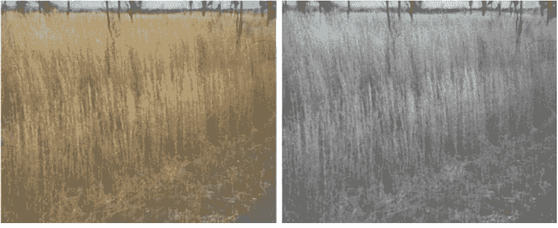

图2.3将RGB图像（左）转换为灰度图像（右）的示例。

(3) 帧调整大小。由于视频录制或图像捕捉设备的不同规格，视频帧的像素分辨率可能存在较大的变化。对于对输入数据大小和计算时间有要求的道路边视频分析系统，将帧调整为所需分辨率成为必要的步骤。关键步骤是选择适当的调整大小以适应具有不同分辨率的数据。通常，缩小帧的大小会导致丢失一些关于内容的信息，而放大则会引入人工生成的信息，这可能会对系统的性能产生重大影响。还有各种类型的调整大小算法可供使用，例如最近邻插值、双线性插值和双三次插值，这些算法也会对调整大小后的帧的质量产生影响。图2.4显示了对裁剪的道路边对象数据集样本进行图像调整大小的结果。

(4) 直方图均衡化。在真实环境条件下捕获的数据可能会受到不同的光照效果的影响，例如阴影、闪光、过曝和欠曝。这些效果对机器学习算法的鲁棒性构成了重大挑战，因为它们可能会显著改变场景数据的外观的一部分或全部，并导致物体之间的混淆。尽管许多研究[2]已经研究了克服某些场景内容理解中的这些效果的技术，但通常的预处理步骤是首先对场景数据进行光照调整，以确保场景数据的均匀照明，然后将数据输入到进一步的处理步骤中。处理不均匀照明的最流行方法之一是进行直方图均衡化，将强度图像转换为具有近似均匀分布直方图的图像，从而减少光照效果。

(5) 噪声去除。图像或视频数据往往容易受到各种噪声的影响，例如椒盐噪声，这些噪声不反映真实世界对象的真实强度。噪声可能在数据采集阶段引入。根据数据创建的方法，可以将其分为预处理阶段、训练阶段或后处理阶段。有许多图像滤波器方法用于去噪，例如平均滤波器、中值滤波器、Sobel滤波器和Wiener滤波器。图2.5显示了一个通过应用中值滤波器去除噪声的示例图像。

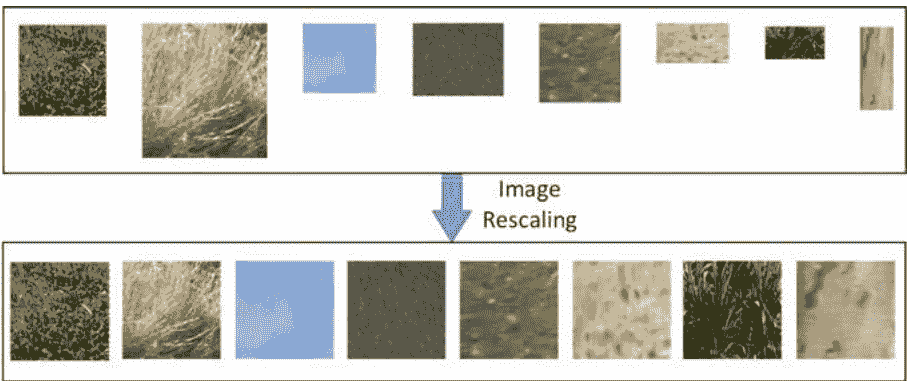

图2.4 通过应用图像调整技术将裁剪的道路边区域调整为相同的分辨率的示例

(6) 样本区域选择。在整个捕捉到的帧中，以代表广泛的场景内容和物体，大多数情况下，只有一部分帧对最终用户或特定应用程序非常感兴趣。因此，有必要进行样本区域选择，以获取与实际使用的道路边区域精确对应的感兴趣区域（ROI）。对于不同的应用程序，所选区域通常是不同的，这个选择过程通常可以通过人工裁剪或在自动系统中预设感兴趣区域的位置、大小和形状来辅助完成。图2.6显示了field测试中的一个样本区域示例及其在捕捉图像中对应的样本区域。

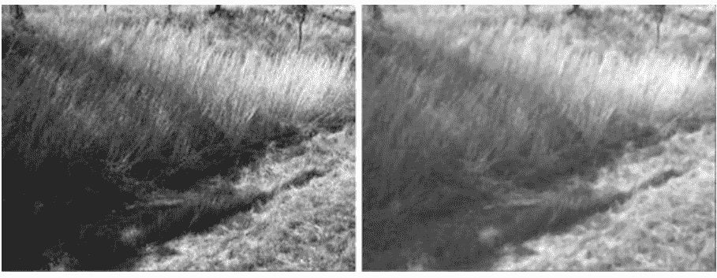

图2.5 通过应用一个3x3像素的中值滤波器对原始道路图像进行噪声去除的示例（右）。

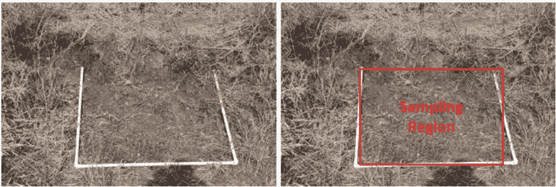

图2.6 在field测试中，一个白色塑料方块表示一个采样区域（左），并且可能有一个对应的采样区域在图像中用一个红色矩形表示（右）。

### 2.2.2 道路边视频数据的对象分割

对象分割的目标是找出每个可能对象的类型和在视频或帧数据中的位置。对象分割是许多计算机视觉任务中的先决步骤，并且支持对感兴趣的对象进行详细分析或进一步处理。对象分割本身是一个相对较受欢迎的研究方向，在文献中有许多研究从场景标记、场景解析、图像分割等角度进行。然而，从自然道路数据中自动和准确地分割植被仍然是一个具有挑战性的任务，因为无约束环境和对象的外观都存在较大的变化。数据可能伴随着各种户外环境效果，如过曝、欠曝、阴影和阳光反射。即使有关于位置、季节、时间、天气条件等的先前知识，准确预测新场景中存在的对象的类型和外观仍然是一项困难的任务。图2.7显示了两个道路帧及其对应的对象分割结果。

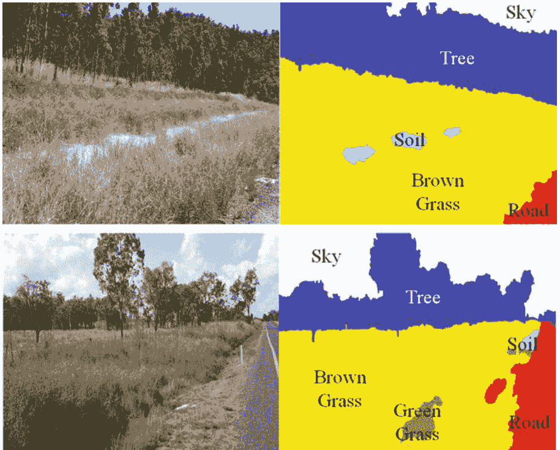

图2.7道路边帧中对象分割的图形说明。帧被分割成不同的对象类别，如树木、天空、道路、土壤、褐色草地和绿色草地。

### 2.2.3 从对象中提取特征

为了能够识别对象，通常需要提取一组能够有效表示不同对象视觉特征的特征集。根据特定应用的目标，需要提取不同类型的特征。

例如，天空通常可以用蓝色或白色来表示，而树木主要以绿色或黄色为特征。值得注意的是，这些特征可以用于对象分割和对象分类任务。自动特征提取面临的挑战包括不同阳光条件和户外环境中光的颜色和强度的变化，以及大多数植被类型缺乏特定的形状和纹理。最近的研究报告成功地从特定植物物种中提取特征进行植被分割，但没有涉及一般植被。

根据数据捕获设备的光谱，现有研究中使用的特征可以大致分为两类：可见特征和不可见特征。

- 1. 可见特征反映了可见光谱中天空、道路和土壤等道路边物体的形状、纹理、几何、结构和颜色特征。这些特征通常在可见光谱中提取，因此与人眼感知具有高度一致性。颜色是人眼在感知和区分不同类型物体时依赖的主要资源之一。一些植被没有特定类型的纹理或形状，但通常可以用主导颜色来表示。植被区域通常呈现的颜色通道包括绿色、红色、橙色、棕色和黄色，最流行的颜色空间包括RGB、HSI、HSV、YUV和CIELab。然而，在复杂的现实环境条件下，也存在具有相似颜色特征的物体，仅仅使用颜色特征很难区分。例如，在大多数环境条件下，植被颜色在HSV空间中被认为是绿色的。然而，在包含天空和光照条件变化的场景中，如阴影、闪光、欠曝光和过曝光效果，情况可能并非如此。对于难以通过颜色特征区分的物体，其他类型的特征，如纹理、位置和几何属性，能够提供补充信息，并对这些物体的稳健分类至关重要。因此，在自然条件下，融合多种类型的特征可以获得更好的结果。计算机视觉领域使用的纹理特征示例包括局部二值模式（LBPs）、Gabor滤波器、尺度不变特征变换（SIFT）、方向梯度直方图（HOGs）和灰度共生矩阵（GLCM）。
- 2. 不可见特征方法提取植被在不可见光谱中的反射特性，以区分其与其他物体。众所周知，植被需要使用叶绿素将来自太阳的太阳辐射能转化为代谢能量，这表现出独特的波长吸收特性。植被指数（VIs）已经被设计用来表征植被的光谱特性与其他可用波段上的物体的光谱特性之间的差异，特别是绿色和近红外波长。不可见特征的一个巨大优势是它们通常对环境条件的大幅变化具有很高的鲁棒性，例如照明变化和光照暴露，因此它们适用于在真实环境中实现始终稳定的性能。相比之下，不可见特征的一个主要缺点是它们需要专门的数据捕获设备，例如光探测与测距（LIDAR），近红外相机和传感器。

在一定程度上，这种要求限制了不可见特征在广泛应用中的直接采用。如何定义适应任何自然条件的VIs仍然是一个问题。表2.1列出了现有研究中使用的不同类型的特征。

### 2.2.4 道路边物体分类

物体分类旨在识别道路边数据中物体的类型或状态，例如草地的燃料负荷，树木的高度，交通标志的内容和道路的宽度。给定为每个物体提取的特征集，关键任务是设计一个能够稳健地预测感兴趣物体状态的合适的机器学习算法。尽管人类能够轻松识别一些物体的状态，而不受诸如物体阴影之类的环境影响，但自动物体分类的机器使用仍然是一项具有挑战性的任务。在文献中，存在着各种算法，它们通常可以分为监督学习和无监督学习，下面简要介绍一下。

表2.1 现有研究中用于视频数据分析的典型特征类型

| 类别 | 子类别 | 特征 |
| :--- | :--- | :--- |
| 可见 | 颜色空间 | Lab、RGB、HSV、YUV等 |
| | 颜色统计 | 直方图、均值、标准差、最大值、最小值、方差、熵等 |
| | 纹理 | LBP、SIFT、HOG、Gabor滤波器、GLCM、CWT、像素强度差异（PID）等 |
| | 几何 | 位置、大小、形状、面积、质心、离心率等 |
| | 运动 | 光流 |
| | VI | 过剩绿色（ExG）、过剩红色（ExR）、可见植被指数（VVI）、植被提取颜色指数（CIVE）等 |
| 不可见 | — | 归一化差异植被指数（NDVI） |
| | — | 近红外线（NIR） |
| | — | 修改的NDVI（MNDVI） |
| | — | 激光反射率 |

注意：植被指数（VI）可以是可见或不可见特征

- (1) 监督学习通常涉及设计合适的机器学习算法，并根据带标签的训练数据集找到算法的最优参数。数据集中每个样本由一个输入对象和一个期望的输出值组成，整个数据集通常被划分为训练、验证和测试子集。算法的参数首先通过训练子集进行训练，然后使用验证子集进行进一步评估，最后应用于对测试子集上的对象状态进行分类，生成预测准确性等性能指标。最常用的基于监督学习的技术包括人工神经网络（ANN）、支持向量机（SVM）、决策树、随机森林、非线性回归、条件随机场（CRF）和最近邻算法。
- (2) 无监督学习在不需要训练数据的情况下进行预测，并直接从带有或不带有标记的数据集中推断。与需要准备和预先标记地面真值的监督学习不同，无监督学习试图推断出最能描述数据中的模式信息的预测函数，无论数据是否带有标签，因此它具有不需要标注工作的优势，这在需要手动注释地面真值的应用中至关重要，在实践中甚至是不可能的。最广泛的无监督算法包括K均值聚类、层次聚类、主成分分析、独立成分分析、非负矩阵分解和自组织映射（SOM）。

### 2.2.5 道路边物体分类的应用

一旦道路边物体被分类，就可以产生许多潜在的应用，这在特定领域中起着重要作用，如农业、交通、道路安全和自然灾害预防。本节列举了几个这样的应用示例。

- (1) 交通标志检测。交通标志是规范和引导车辆驾驶员安全驾驶的最重要信号之一。自动交通标志检测在协助驾驶员做出正确驾驶决策方面非常有用的，尤其是在恶劣天气条件下和对于不够可见的标志。它在开发具有智能感知能力的自动导航车辆方面也非常重要，这些车辆可以在各种道路条件下自动驾驶，或者可以向驾驶员发送警报以避免可能的事故。
- (2) 火灾易发区识别。道路边火灾风险来自道路边的植被，如枯草和树木，是道路安全的主要隐患，可能是重大灾害的一个因素，如森林火灾。交通管理部门目前的做法严重依赖于人工视觉检查来发现易发火灾的道路边区域，他们仍然缺乏有效的系统来自动识别易发火灾的区域。实施自动化技术来处理这个问题变得越来越重要，研究用于道路边物体分类的稳健机器学习算法可以让我们离这个目标更近一步。图2.8显示了具有高或低火灾风险的道路边帧的示例。


图2.8道路边高和低火灾风险的草地示例

- (3) 道路边植被管理。有效的道路边植被管理需要动态、准确和持续地监测不同物种的道路边植被的生长条件。能够在特定季节获取特定道路段的植被物种可以帮助农民和农业专业人员做出更好的决策和更有效的计划，以确保植被的健康状况并消除可能的障碍，如昆虫和干旱天气。
- (4) 道路边树木再生控制。在一些道路边区域，树木可以逐渐生长接近道路边界，因此可能对道路安全构成威胁。因此，有必要实施自动方法来识别这些潜在危险树木的条件，并相应采取适当的措施消除潜在的危险。一般有四个再生条件级别，包括重度、中度、轻度和零，如图2.9所示。‘零’级表示远离道路的大树，而‘重’级表示靠近道路的小树和灌木。通常，10米内的树木被认为是靠近和危险的。结果可以帮助服务提供商决定在正确位置管理再生条件所需的正确设备。通常需要使用小型设备来砍伐小树和灌木，而大型设备用于大树。这也有助于估算成本，因为砍伐大树的费用很高，而小灌木的费用相对较低。树木生长控制的目标是有效处理再生问题，减少道路缺陷，并降低相关责任。


图2.9 显示了四个不同树木重新生长条件的示例，包括重度、中度、轻度和零度。

## 2.3 相关工作

在本节中，我们将回顾有关植被分割和分类的相关工作。此外，我们还将简要回顾现有的从通用场景中分割对象的方法，这些方法可能可用于植被分割。值得注意的是，大部分与植被分割相关的现有工作来自遥感领域[3]和生态系统，这些领域使用不同类型的传感器、激光扫描仪、雷达和特殊类型的自动驾驶车辆。本节将重点回顾仅利用普通数码相机收集的地面数据的方法。

### 2.3.1 植被分割和分类

根据使用的特征类型，现有的植被分割和分类研究可以大致分为三类：可见特征方法、不可见特征方法和混合特征方法。

#### 2.3.1.1 可见特征方法

可见特征方法试图通过探索可见光谱中的区分特征（如颜色、形状、纹理、几何和结构特征）来区分植被与其他物体（如土壤、树木、天空和道路）。使用可见特征的一个主要优势是它们与人类对物体的视觉感知具有高度一致性。

颜色是人眼在感知和区分现实环境中不同物体时依赖的主要信息之一。大多数植被主要以绿色或橙色为特征，因此颜色是现有植被分割研究中最广泛使用的特征之一，主要关注各种颜色空间的适用性，如CIELab [4]、YUV [5]、HSV [6]和RGB [7]。然而，在复杂的自然条件下，找到适合的植被颜色表示仍然是一项具有挑战性的任务。设计能够自适应动态环境或自动适应动态环境的颜色空间仍然是一个活跃的研究方向 [1]。

除了颜色，另一种流行的可见特征类型是纹理，主要反映物体的外观结构，并经常通过执行小波滤波器 (如Gabor滤波器[8]和连续小波变换 (CWT) [6])，提取像素强度分布，如像素强度差异 (PIDs) [4, 5]和邻域中的变化[9, 10]，或生成空间统计测量[10]，熵[7]或超像素上的统计特征[11]。

表2.2列出了现有研究中用于植被分割的典型可见方法。在室外图像中进行植被分割的早期研究之一是在[12]中提出的，该研究采用SOM进行对象分割，然后提取分割区域的颜色、纹理、形状、大小、质心和上下文特征，用于11个对象的分类使用多层感知器 (MLP) 。在[7]中，熵被用作纹理特征，与RGB颜色分量和SVM分类器一起用于从道路图像中检测植被。像素之间的强度差异与YUV的3D高斯模型通道结合用于草地检测[5]，与L、a和b颜色通道结合用于对象分割[4]。通过光流 (optical flow) 估计的视频帧之间的运动也被用于预处理步骤中的ROI检测[6]，从中提取颜色和纹理特征使用二维CWT，并通过测量植被的阻力来辅助植被检测[13]。在[14]中，LBP和GLCM结合起来用于区分密集和稀疏的道路边草地。

表2.2 典型可见植被分割方法总结

| 参考文献 | 颜色 | 纹理 | 分类器 | 物体 | 数据 | 准确率 (%) |
| :--- | :--- | :--- | :--- | :--- | :--- | :--- |
| [12] | RGB, O1, O2, R - G, (R + G)/2 - B | Gabor filter, 形状 | SOM + MLP | 植被, 天空, 道路, 墙壁等 | 3751 R | 61.1<br>80 |
| [7] | RGB | 熵 | RBF SVM + MO | 植被与非植被 | 270 I | 95.0 |
| [6] | RGB, HSV, YUV, CIELab | 2D CWT | SVM + MO | 植被与非植被 | 270 I | 96.1 |
| [5] | YUV (3D高斯) | PID | 软分割 | 草地与非草地 | 62 I | 91 |
| [8] | O1, O2 | NDVI和MNDVI, Gabor filter | 传播规则 | 植被与非植被 | 2000 I, 10 V | 95 |
| [18] | H, S | 草地高度 (激光雷达) | RBF SVM | 草地与非草地 | 无 | 无 |
| [4] | Lab | PID | K-means 聚类 | 物体分割 | 无 | 79 |
| [10] | 灰色 | 强度均值和方差, 二值边缘, 邻域质心 | 聚类 | 草地与人工纹理 | 40 R | 95<br>90 |
| [14] | 灰色 | LBP, GLCM | SVM, ANN, KNN | 稠密与稀疏草地 | 110 I | 92.7 |
| [15] | RGB, HLS, Lab | 共生矩阵 | 高斯分布 + 全局能量 | 5、5和7个物体 | 41 I, 87 I, 100 I | 89.9, 90.0, 86.8 |
| [19] | RGB, Lab | 颜色矩 | 超像素合并 | 7个物体 | 650 I, 50 I | >90<br>77% |

注：N/A不可用，I：图像，V：视频，R：区域。

通过三个分类器 (SVM、ANN和K-最近邻) 的多数投票，对草地进行分析。在[15]中，RGB、HLS和Lab颜色通道以及基于共生矩阵的纹理特征被融合用于室外场景分析。基于概率像素映射选择了一组初始种子像素，这些映射是使用选定的颜色和纹理特征集上的高斯概率密度函数构建的，然后通过在全局能量函数的最小化中整合区域和边界信息从初始种子像素开始生长像素。

还有许多研究[16, 17]调查了使用图像或视频数据在农田中捕获的作物与土壤和杂草等其他物体的检测或分类。大多数研究通过作物的绿色特征来完成识别任务，并且通常基于简化的环境条件而不是自然条件，因此这些研究在此不予审查。大多数现有的可见光方法都集中在植被与非植被的二分类上。尽管可见光谱中各种类型的颜色和纹理特征通常能够取得有希望的性能，但目前还没有被广泛接受的常见特征集，能够在自然条件下良好工作。当场景中存在类似的物体，如草地和树木，绿色车辆和绿色草地，并且照明条件发生变化时，大多数可见光方法会出现问题。另一种解决方案是采用在不可见光谱中具有更好鲁棒性的特征。

#### 2.3.1.2 隐形特征方法

隐形特征方法利用富含叶绿素的植被的光谱特性和在不可见光谱中的反射特性来区分植被和其他物体，或者确定它们的属性（例如车辆导航中可通过的植被检测[13]）。众所周知，植被需要使用叶绿素将来自太阳的太阳辐射能转化为代谢能量，这表现出独特的波长吸收特性。基于这个理论，设计了各种类型的植被指数（VI）来突出植被的光谱特性与其他物体的光谱特性之间的差异，尤其是绿光和近红外波长。与可见特征相比，隐形特征的一个显著优势是它们对阴影、光照和曝光不足等环境变化具有更好的鲁棒性。

植被分类中VI的强大之处已经通过红光和近红外光 (NIR) 反射率之间的简单像素比较得到证明，这可能提供了一种强大而稳健的检测光合植被的方法[20]。一般来说，健康而茂密的植被具有较高的近红外反射率和较低的红光反射率。相反，稀疏且不太健康的植被显示出较低的近红外反射率但较高的红光反射率。近红外光谱已经被修改为归一化植被指数 (NDVI)，成功应用于植被检测[20]。在光照变化下，Nguyen等人发现用于分类植被和其他物体的超平面可以采用对数形式而不是标准形式的NDVI中的线性形式，因此他们提出了修改的NDVI (MNDVI)。他们还通过实验证明，在阴影、光照、曝光不足和过度曝光等各种光照效果下，MNDVI比NDVI具有更强的鲁棒性和稳定性。

然而，在曝光不足或昏暗的照明条件下，MNDVI中红色反射率的软化会产生问题。相比之下，NDVI在这些情况下表现良好。因此，[13]采用了它们的组合来实现对光照变化更强的鲁棒性。Wurm等人[21]测量了激光的反射来对结构化环境中的植被和非植被区域进行分类。Bradley等人[20]引入了植被的光谱反射率，用于地面地形分类，这种方法

## 表 2.3 典型的植被分割方法总结

| 参考文献 | 特征 | 分类器 | 物体 | 数据 | 结果 (%) |
| :--- | :--- | :--- | :--- | :--- | :--- |
| [20] | 密度，表面法线，散射矩阵特征值，RGB，NIR 和 NDVI | 多类别逻辑回归 | 植被，障碍物或地面 | 两个物理环境 | 95.1 |
| [2] | MNDVI | 阈值 | 植被与非植被 | 5000 I, 20 V | 91 |
| [13] | MNDVI, NDVI，背景减法，密集光流 | 融合 | 可通过的植被与其他物体 | 1000 I | 98.4 |
| [22] | 激光反射率，测量距离，入射角 | SVM | 平坦的植被与可行驶表面 | 36,304 个植被<br>28,883 个街道 | 99.9 |
| [23] | Lab 和红外滤波器组 | 联合增强 + CRF | 八个类别 (道路，天空，树木，汽车等) | 2 V | 87.3 |
| [9] | Lidar 散射特征，强度均值和标准差，散射，表面，直方图 | SVM | 植被与非植被 | 500 I | 81.5 |

注：植被 vegetation，非植被 non-vegetation，I 图像，V 视频。

通过采用激光进一步提高了鲁棒性。研究表明，通过添加独立的光源并改变曝光时间，植被检测系统能够在不同的照明条件下更加稳健地工作 [2]。表 2.3 列出了现有研究中用于植被分割的典型非可见光特征方法。

然而，非可见光特征方法的一个主要缺点是它们需要专门的数据捕获设备，如激光扫描仪、近红外相机和传感器。因此，直接在各种应用中采用这些特征仍受到此要求的限制。如何定义能够适应任何自然条件的可自适应鲁棒性指数仍然是这个领域的一个问题。

#### 2.3.1.3 混合特征方法

混合特征方法结合了可见特征和非可见特征，以获得更强大和准确的分类结果，同时利用可见特征在表示物体的视觉外观方面的能力和非可见特征在环境影响方面的鲁棒性。

Nguyen 等人 [8] 提出了一种用于可通过植被检测的双重检查的主动方法。为了计算统计特征，他们在 3D 点云上使用滑动立方体，并在每个滑动立方体中计算一个正定协方差矩阵。从协方差矩阵中，计算了特征值和特征向量，提取以表示两种 3D 点云统计信息，包括散点和表面，其中散点表示植被，如灌木丛、高草和树冠，而表面表示固体物体，如岩石、地面和树干。然而，3D 特征在强健的植被分割方面可能会遇到困难，因为它们没有考虑颜色信息。因此，Nguyen 等人提出了一种 2D 和 3D 融合方法，用于室外汽车导航，考虑了颜色信息，以检测视场景中植被区域的位置。他们使用了六个特征来训练 SVM 分类器，包括强度、颜色特征的直方图和 3D 散点特征。强度特征包括 HSV 空间中亮度和颜色的均值和标准差，而 3D 散点特征反映了 LADAR 数据局部邻域中植被的空间结构。这种方法的局限性在于需要较长的处理时间，以及特征值高度依赖于环境、传感器类型、扫描点数和点密度。类似地，Liu 等人结合了 2D 和 3D 特征，用于区分草地和非草地区域，其中高度和颜色信息分别来自多层雷达和彩色相机。颜色信息在 HSV 空间中由 H 和 S 分量表示。Lu 等人和 Nguyen 等人提出了结合多个特征（如颜色、纹理和 3D 分布信息）的方法，用于植被分割。在 [23] 中，从可见光 L、a、b 和红外通道提取了一个 20 维特征向量，用于道路物体分割。

然后引入了一种分层的文本包方法，通过从较大的邻域区域提取多尺度文本特征来捕捉空间邻域信息。文本本质上是使用聚类算法生成的每个模式的中心。在作者自己的道路场景视频数据集上，对八个对象进行分类，达到了约 87% 的全局准确率。在 [8] 中，对手颜色空间和 Gabor 特征被结合起来，用于衡量像素与其邻居之间的相似性，以实现植被像素的扩散。NDVI 和 MNDVI 被融合在一起，选择富含叶绿素的植被像素作为初始种子像素进行扩散。

混合特征方法通常比可见或不可见特征方法产生更好的结果，但它们也继承了两者的缺点，例如需要专门的数据捕获设备。如何选择适当的可见和不可见特征组合仍然是一个需要进一步探索的问题。

### 2.3.2 通用对象分割和分类

通用对象分割和分类方法旨在找到特定对象存在的区域。它们通常与场景标记、对象分类、语义分割等计算机视觉任务共享类似的概念，并且可以潜在地应用于道路植被分割。对象分类系统的设计必须解决几个处理任务，包括选择合适的基本区域（例如像素、补丁和超像素——共享相似外观和感知上有意义的原子区域，如图 2.10 所示的示例），选择具有区分性的视觉特征来描述它们（例如颜色、纹理和几何），构建用于获取类别标签置信度的稳健预测模型，提取有效的上下文特征，并将预测模型与上下文信息集成。根据使用的技术或特征，现有方法可以分为不同的类别，例如参数化与非参数化、有监督与无监督、基于像素与基于区域。

早期的目标分割方法通过提取像素级别 [15, 27] 或补丁级别 [23] 的一组低级视觉特征来获取图像像素的类别标签。然而，由于像素级特征将每个像素单独处理，它们无法捕捉局部区域对象的统计特征。

虽然补丁级特征能够捕捉区域统计特征，但由于准确分割对象边界的困难，它们容易受到背景对象的噪声干扰。最近的研究 [28–31] 更多地关注以超像素特征作为对象分割的基本单元，这显示出提取有区分性特征的良好结果。

![图 2.10 使用基于图的分割算法 [26] 在道路图像中显示分割的超像素。不同的颜色表示不同的超像素区域。](img/be85c7f71ccac3f28fb3d0f7893f2ca1_51_0.png)

提取有区分性特征的结果显示出良好的前景。超像素级特征相对于传统的补丁级特征具有几个优势，包括在自适应域上支持单一标签的连贯支持区域，而不是在固定窗口上，支持更一致的统计特征提取，通过对多个像素的特征响应进行汇聚来捕捉上下文信息，并且需要更少的计算时间。最常用的超像素级特征包括颜色 (例如 RGB [32, 33] 和 CIELab [27, 28, 32, 34, 35])，纹理 (例如 SIFT [33, 36], texton [27, 33], 高斯滤波器 [32], Gist [34] 和方向梯度金字塔直方图—PHOGs [34])，外观 (例如颜色缩略图 [33])，位置 [37] 和形状。

尽管有益处，但基于视觉特征的预测独立地处理每个超像素，并且不考虑场景的语义上下文，因此在复杂场景中进行对象分割时经常面临挑战。对于分割算法，现有方法中绝大多数关注图形模型，如 CRF [31] 和马尔可夫随机场 (MRF) [33]。工作 [31] 通过将超像素的直方图与邻居合并，并结合 CRF进行对象识别，但该方法仍然高度依赖于初始种子超像素的选择。Tighe 和 Lazebnik [33] 使用朴素贝叶斯获得超像素标签，并利用最小化超像素标签的 MRF 能量来强制执行对象的上下文约束。最近，Balali 和 Golparvar-Fard [11] 使用 MRF 提取了一组超像素特征，用于识别道路资产。当前基于超像素的方法主要依赖于图形模型 (如 CRF 和 MRF)，通过联合最小化两个项目的总能量来强制执行邻近超像素 (或像素) 之间的类别标签的空间一致性——一元势表示每个超像素 (或像素) 属于语义类别之一的可能性，而二元势则考虑邻近超像素 (或像素) 之间的空间一致性。然而，图形模型在捕捉高阶上下文方面的能力有限。

为了克服这个限制，已经提出了各种方法来融入上下文信息，以提高对象分割的准确性，这通常在两个阶段进行：特征提取和标签推断。特征提取通过设计一组丰富的语义描述来融入上下文，这些描述表示不同类型场景中对象之间的内在相关性。常用的上下文特征包括绝对位置 [27]，它捕捉了像素在场景中的绝对位置与类标签的依赖关系，相对位置 [32]，它表示对象在虚拟放大图像中的相对位置偏移，方向空间关系 [38, 39]，它编码了对象的空间排列，如旁边、下方、上方和封闭，以及对象共现统计 [36]，它反映了两个对象在同一场景中共存的可能性。相对位置、方向空间关系和对象共现统计的主要缺点是它们完全丢弃了场景中对象的绝对空间坐标，因此无法捕捉到空间上下文信息，比如天空在场景的顶部出现的可能性很高。相比之下，绝对位置过于保留所有对象的像素坐标，因此通常需要大量的训练数据集来收集每个对象 and 每个图像像素的可靠先验统计信息。

另一种流行的方法是在标签推断阶段使用图形模型，例如 CRF [29, 40, 41]，MRF [42] 和能量函数 [15]。然而，这些图形模型有两个缺点： (1) 由于完美图像分割的困难，无法保证超像素的标签纯度； (2) 只考虑了局部邻域中的上下文信息。为了解决这些缺点，一种方法是采用分层模型，例如分层 CRF [43]，堆叠式分层学习 [34] 和塔模型 [43]，它们生成图像超像素的金字塔，并在多个图像级别上进行分类优化，以减轻不准确的区域边界的影响并利用更高阶的上下文信息。另一种方法是从多个区域提取特征描述，例如聚合直方图 [31] 和加权外观特征 [32]。尽管这些方法考虑了更大的上下文，但仍然无法完全捕捉整个场景中对象的远程依赖关系，并且无法适应场景内容。

图形模型的另一个缺点是它们的参数仅从训练数据中学习，并且它们的性能严重依赖于充足的训练数据的可用性，并且对于新的测试数据存在泛化问题。对于实际应用，往往很难甚至不可能收集大量的训练数据以确保充足的训练，除此之外，这也非常耗时和劳动密集。对于大型数据集，解决这个问题的一种方法是采用非参数化方法 [44]，它从检索集中检索与查询图像最相似的训练图像，然后从检索集中的 K 个最近邻中执行类标签转移到查询图像。然而，非参数化方法仍然依赖于检索策略的可靠性和准确性。

最近，深度学习技术在从原始图像像素中提取具有区分性和紧凑特征方面显示出巨大优势，而不是使用手工设计的特征。广泛使用的卷积神经网络 (CNN) 利用卷积和池化层逐步提取更抽象的模式，并在许多视觉任务 [45] 中展示出最先进的性能，包括对象分割。提取的 CNN 特征可以与各种分类器 (例如 MRF, CRF 和 SVM) 结合使用以预测类标签。Farabet 等人的代表性工作 [29] 将分层 CNN 特征应用于 CRF 中，用于自然场景中的类标签推断。然而， CRF 推断完全独立于 CNN 训练，因此 Zheng 等人 [46] 将 CRF 推断形式化为递归神经网络，并将其集成到统一框架中。[47] 中，递归 CNN 将 CNN 的输出反馈到同一网络的另一个实例的输入上，但它仅适用于序列数据。CNN 模型的最新扩展包括 AlexNet, VGG-19 net, GoogLeNet 和 ResNet [48]。然而，这些模型通常需要充足的图像分辨率，并且可能不适用于道路边植被分割，特别是在像裁剪的道路边对象数据集这样的低分辨率和形状大小变化较大的情况下。

## 2.4 数据处理的 Matlab 代码

本节介绍了几种常用的视频数据预处理、特征提取、对象分割和分类算法。提供 Matlab 代码以说明处理步骤。

- 1) 从视频数据中提取所有帧。

```matlab
% 此代码以视频数据为输入，从视频中提取所有帧，并将所有帧保存在一个新文件夹中。

% 将视频数据读入变量 'mov'。视频的路径和名称由字符串 'videoFilePathName' 表示。
mov = VideoReader(videoFilePathName);

% 设置用于存储提取帧的输出文件夹 'outFrameFold'。
frameFolder = outFrameFold;

% 如果文件夹不存在，则创建该文件夹。
if ~exist(frameFolder, 'dir')
    mkdir(frameFolder);
end

% 获取视频中的总帧数。
numFrame = mov.NumberOfFrames;

% 在循环中提取并保存每一帧。
for iFrame = 1 : numFrame
    % 读取第 i 帧。
    I = read(mov, iFrame);

    % 为每一帧设置一个索引。
    frameIndex = sprintf('%4.4d', iFrame);

    % 将带有类似 ‘Frame0001.jpg’ 命名的帧写入输出文件夹。
    imwrite(I, [frameFolder 'Frame' frameIndex '.jpg'], 'jpg');

    % 显示数据处理的进度。
    progIndication = sprintf('第 %4d 帧，共 %d 帧。', iFrame, numFrame);
    disp(progIndication);
end
```

- 2) 将 RGB 帧转换为灰度帧。

```matlab
% 此代码将从 RGB 彩色格式提取的视频帧转换为灰度。

% 将帧数据读入变量 ‘I’。帧的路径和名称由字符串 ‘imageFilePathName’ 表示。
I = imread(imageFilePathName);

% 执行帧转换。
I = rgb2gray(I);

% 在图形中显示转换后的帧。
imshow(I);
```

- 3) 帧调整大小。

```matlab
% 此代码以帧作为输入，并将帧调整为所需的宽度和高度。

% 执行帧调整大小。
I = imresize(I, [numRows, numCols]);

% 在图中显示调整大小的帧。
imshow(I);
```

- 4) 对帧应用中值滤波器。

```matlab
% 此代码以帧作为输入，并应用中值滤波器以去除帧中的噪声。

% 将 RGB 转换为灰度帧。
I = rgb2gray(I);

% 使用中值滤波器执行图像滤波。
K = medfilt2(I);

% 在图中显示滤波后的帧。
imshowpair(I, K, 'montage');
```

- 5) 像素级 R、G、B 特征提取。

```matlab
% 此代码以帧作为输入，并提取每个像素的 R、G 和 B 值。

% 获取输入帧的尺寸。
[numRows, numCols, ~] = size(I);

% 扫描帧的所有行和列的像素。
for iRow = 1 : numRows
    for iCol = 1 : numCols
        % 获取每个像素的帧的 R、G 和 B 值。
        pixelRValue = I(iRow, iCol, 1);
        pixelGValue = I(iRow, iCol, 2);
        pixelBValue = I(iRow, iCol, 3);
    end
end
```

- 6) 基于补丁的高斯特征提取。

```matlab
% 此代码以帧作为输入，从局部补丁中提取高斯特征，并将结果特征存储在 3D 矩阵中。

% 设置高斯滤波器的参数。
fixV = 0.7;
filterSize = [7 7];
sigma = 1;
% 创建高斯滤波器。
fgaus = fspecial('gaussian', filterSize, sigma*fixV);

% 获取输入帧的尺寸。
[numRows, numCols, ~] = size(I);

% 从帧中分别获取 R、G 和 B 矩阵。
R = I(:, :, 1);
G = I(:, :, 2);
B = I(:, :, 3);

% 将高斯滤波器分别应用于 R、G 和 B 矩阵。结果高斯特征存储在 3D 矩阵 'filterI' 中。
filterI(:, :, 1) = conv2(double(R), fgaus, 'same');
filterI(:, :, 2) = conv2(double(G), fgaus, 'same');
filterI(:, :, 3) = conv2(double(B), fgaus, 'same');
```

- 7) 基于补丁的统计特征提取。

```matlab
% 此代码以帧作为输入，从每个像素周围的局部补丁中提取统计特征，并将结果特征存储在变量中。

% 从输入帧中分别获取 R、G 和 B 矩阵。
R = I(:, :, 1);
G = I(:, :, 2);
B = I(:, :, 3);

[nHeight, nWidth, ~] = size(I);

% 设置补丁的半尺寸。
nHalfBlock = 4;

% 设置处理边界像素的参数。
adHeight = nHeight - nHalfBlock;
adWidth = nWidth - nHalfBlock;
adBegin = nHalfBlock + 1;

% 扫描帧的所有行和列。
for iRow = adBegin : adHeight
    rowBeg = iRow - nHalfBlock;
    rowEnd = iRow + nHalfBlock;
    for iCol = adBegin : adWidth
        colBeg = iCol - nHalfBlock;
        colEnd = iCol + nHalfBlock;

        % 从中提取统计特征的补丁区域。
        patchR = R(rowBeg:rowEnd, colBeg:colEnd);

        % 计算补丁区域中 R 值的均值、标准差和偏度。
        meanPatchR = mean(patchR(:));
        stdPatchR = std(patchR(:));
        skewPatchR = skewness(double(patchR(:)));
    end
end
```

- 8) 对象分割和分类。

```matlab
% 此代码演示了帧中对象的分割/分类，它接受帧作为输入，并将所有像素分配到一个对象类别中。

% 输入帧的维度。
[numRows, numCols, ~] = size(I);

% 创建一个变量来存储所有像素的对象类别。
objCategory = zeros(numRows, numCols);

% 在帧中扫描所有行和列。
for iRow = 1 : numRows
    for iCol = 1 : numCols
        % 在每个像素处获取特征，例如 RGB 值在此示例中。
        pixelRGBValue = I(iRow, iCol, :);

        % 应用名为 'objSegAlgorithm' 的函数，根据其特征获取每个像素的对象类别。
        objCategory(iRow, iCol) = objSegAlgorithm(pixelRGBValue);
    end
end
```

- 9) 训练和测试一个 ANN 分类器。

```matlab
% 这段代码解释了一个三层前馈 ANN 的创建和应用，用于对新的测试数据进行分类。

% 创建一个具有隐藏神经元、激活函数和学习算法参数的 ANN。
net = newff(double(TrainX'), double(TrainY'), [15], {'tansig', 'tansig'}, 'trainrp');

% 控制 ANN 的训练和测试过程的参数。
% 生成命令行输出。
net.trainParam.showCommandLine = true;
% 随机划分训练、验证和测试数据子集。
net.divideFcn = 'dividerand';
% 训练、验证和测试数据子集的比例。
net.divideParam.trainRatio = 1;
net.divideParam.valRatio = 0;
net.divideParam.testRatio = 0;
% 性能测量。
net.performFcn = 'mse';
% 性能目标。
net.trainParam.goal = 0.0001;
% 最大训练轮数。
net.trainParam.epochs = 500;
% 最小性能梯度。
net.trainParam.min_grad = 1e-8;
% 最大验证失败次数。
net.trainParam.max_fail = 10;

% 使用训练数据训练人工神经网络，并将其存储在变量 ‘net’ 中。
[net, tr] = train(net, double(TrainX'), double(TrainY'));

% 训练数据的预测准确率。
outTrainTag = sim(net, TrainX');
% 测试数据的预测准确率。
outTestTag = sim(net, TestX');
```

## 参考文献

- 1. W. Maddern, A. Stewart, C. McManus, B. Upcroft, W. Churchill et al., 光照不变成像：自主车辆的稳健视觉定位、映射和分类应用，在可视化环境中的视觉地点识别研讨会论文集, IEEE 国际机器人与自动化大会 (ICRA), 2014
- 2. D.V. Nguyen, L. Kuhnert, K.D. Kuhnert, 植被检测的结构概述。一种新颖的使用主动照明系统进行高效植被检测的方法。机器人。自动。系统。60, 498-508 (2012年)
- 3. M.P. Ponti, 结合植被指数和均值漂移的低成本遥感图像分割。IEEE 地球科学。遥感。信件。10, 67-70 (2013年)
- 4. M.R. Blas, M. Agrawal, A. Sundaresan, K. Konolige, 用于户外机器人的快速颜色/纹理分割，在 IEEE/RSJ 国际智能机器人和系统会议 (IROS)，2008年，pp. 4078-4085
- 5. B. Zafarifar, P.H.N. de With, 用于电视图像质量增强的草地检测，在国际消费电子会议 (ICCE)，技术论文摘要, 2008年, pp. 1-2
- 6. I. Harbas, M. Subasic, 通过运动估计辅助检测道路边植被，在第 7 届国际图像与信号处理大会 (CISP) 上，2014年，第 420-425页
- 7. I. Harbas, M. Subasic, 利用可见光谱特征检测道路边植被，在第 37 届国际信息与通信技术、电子与微电子大会 (MIPRO) 上，2014年，第 1204-1209页
- 8. D.V. Nguyen, L. Kuhnert, K.D. Kuhnert, 用于杂乱室外环境中高效植被检测的传播算法。机器人与自动化系统。60, 1498-1507 (2012年)
- 9. D.V. Nguyen, L. Kuhnert, T. Jiang, S. Thamke, K.D. Kuhnert, 用于室外汽车导航的植被检测，在 IEEE 国际工业技术会议 (ICIT) 上，2011年，第 358-364页
- 10. A. Schepelmann, R.E. Hudson, F.L. Merat, R.D. Quinn, 对移动机器人割草机的草坪草进行视觉分割，在 2010 年 IEEE/RSJ 国际智能机器人和系统会议 (IROS) 上，第 734-739页
- 11. V. Balali, M. Golparvar-Fard, 使用可扩展的非参数图像解析方法从车载摄像头视频流中分割和识别道路资产。Autom. Constr. 49(Part A), 27-39 (2015)
- 12. N.W. Campbell, B.T. Thomas, T. Troscianko, 使用神经网络自动分割和分类户外图像。Int. J. Neural Syst. 8, 137-144 (1997)
- 13. D.V. Nguyen, L. Kuhnert, S. Thamke, J. Schlemper, K.D. Kuhnert, 一种用于自主地面车辆中可通过植被检测的双重检查的新方法，在 2012 年第 15 届国际 IEEE 智能交通系统会议 (ITSC) 上，第 230-236页
- 14. S. Chowdhury, B. Verma, D. Stockwell, 一种基于纹理特征的多分类器技术用于道路植被分类。Exp. Syst. Appl. 42, 5047-5055 (2015)
- 15. A. Bosch, X. Muñoz, J. Freixenet, 自然户外场景的分割和描述。Image Vis. Comput. 25, 727-740 (2007)
- 16. W. Guo, U.K. Rage, S. Ninomiya, 基于决策树模型的时间序列小麦图像中植被的光照不变分割。Comput. Electron. Agric. 96, 58-66 (2013)
- 17. F. Ahmed, H.A. Al-Mamun, A.S.M. H. Bari, E. Hossain, P. Kwan, 作物和杂草的数字图像分类：支持向量机方法。Crop Prot. 40, 98-104 (2012)
- 18. D.-X. Liu, T. Wu, B. Dai, 将激光雷达和彩色图像融合用于检测草地越野场景，在 IEEE International Conference on Vehicular Electronics and Safety (ICVES), 2007, pp. 1-4
- 19. 张乐, B. Verma, D. Stockwell, 自然道路植被分类的空间上下文超像素模型。模式识别。60, 444-457 (2016年)
- 20. D.M. Bradley, R. Unnikrishnan, J. Bagnell, 复杂环境中的驾驶植被检测, 在 IEEE 国际机器人与自动化会议, 2007年, pp. 503–508
- 21. K.M. Wurm, R. Kummerle, C. Stachniss, W. Burgard, 通过激光数据识别结构化户外环境中的植被, IEEE/RSJ 国际智能机器人与系统会议 (IROS), 2009年, pp. 1217–1224
- 22. K.M. Wurm, H. Kretzschmar, R. Kümmerle, C. Stachniss, W. Burgard, 在结构化户外环境中通过激光数据识别植被。机器人与自主系统。62, 675–684 (2014年)
- 23. Y. Kang, K. Yamaguchi, T. Naito, Y. Ninomiya, 多波段图像分割和目标识别以理解道路场景。IEEE 智能交通系统。12, 1423–1433 (2011年)
- 24. L. Lu, C. Ordonez, E.G. Collins Jr., E.M. DuPont, 使用基于 2D 激光条纹结构光传感器的地形表面分类, 自主地面车辆, IEEE/RSJ 国际智能机器人与系统会议 (IROS), 2009年, 2174–2181页
- 25. D.-V. Nguyen, L. Kuhnert, T. Jiang, S. Thamke, K.-D. Kuhnert, 用于室外汽车导航的植被检测, IEEE 国际工业技术会议 (ICIT), 2011年, 358–364页
- 26. P. Felzenszwalb, D. Huttenlocher, 高效基于图像分割, 计算机视觉国际期刊, 59, 167–181页 (2004年)
- 27. J. Shotton, J. Winn, C. Rother, A. Criminisi, Textonboost 用于图像理解：通过联合建模纹理、布局和上下文进行多类对象识别和分割。Int. J. Comput. Vis. 81, 2–23 (2009)
- 28. S. Gould, R. Fulton, D. Koller, 将场景分解为几何和语义一致的区域, 在 IEEE 第 12 届国际计算机视觉会议 (ICCV), 2009年, pp. 1–8
- 29. C. Farabet, C. Couprie, L. Najman, Y. LeCun, 学习场景的分层特征。IEEE Trans. Pattern Anal. Mach. Intell. 35, 1915–1929 (2013)
- 30. A. Sharma, O. Tuzel, D.W. Jacobs, 深层分层解析用于语义分割, 在 IEEE 计算机视觉和模式识别会议 (CVPR), 2015年, pp. 530–538
- 31. B. Fulkerson, A. Vedaldi, S. Soatto, 使用超像素邻域进行类别分割和对象定位, 在 IEEE 第 12 届国际计算机视觉会议 (ICCV), 2009年, pp. 670–677
- 32. S. Gould, J. Rodgers, D. Cohen, G. Elidan, D. Koller, 具有相对位置先验的多类分割。计算机视觉国际期刊 80, 300–316 (2008年)
- 33. J. Tighe, S. Lazebnik, 超级像素的可扩展非参数图像解析：超级解析, 欧洲计算机视觉大会 (ECCV), 2010年, 第 352–365页
- 34. D. Munoz, J.A. Bagnell, M. Hebert, 堆叠式分层标记, 欧洲计算机视觉大会 (ECCV), 2010年, 第 57–70页
- 35. R. Socher, C.C. Lin, C. Manning, A.Y. Ng, 用递归神经网络解析自然场景和自然语言, 在第 28 届国际机器学习大会 (ICML), 2011年, 第 129–136页
- 36. B. Micusik, J. Kosecka, 通过超像素共现和 3D 几何进行街景语义分割, 在 IEEE 第 12 届国际计算机视觉研讨会 (ICCV Workshops), 2009, pp. 625–632
- 37. L. Zhang, B. Verma, D. Stockwell, S. Chowdhury, 场景解析的空间约束位置先验, 在国际神经网络联合会议 (IJCNN), 2016, pp. 1480–1486
- 38. Y. Jimei, B. Price, S. Cohen, Y. Ming-Hsuan, 上下文驱动的场景解析，关注罕见类别, 在 IEEE 计算机视觉与模式识别会议 (CVPR), 2014, pp. 3294–3301
- 39. A. Singhal, L. Jiebo, Z. Weiyu, 场景内容理解的概率空间上下文模型, 在 IEEE 计算机视觉与模式识别会议 (CVPR), 2003, pp. 235–241
- 40. D. Batra, R. Sukthankar, C. Tsuhan, 学习类别特定的图像标签亲和力, 在 IEEE 计算机视觉与模式识别会议 (CVPR), 2008年, 第 1-8页
- 41. Z. Lei, J. Qiang, 用统一的图模型进行图像分割。IEEE 模式分析与机器智能 32, 1406–1425 (2010年)
- 42. R. Xiaofeng, B. Liefeng, D. Fox, RGB-(D) 场景标签: 特征和算法, 在 IEEE 计算机视觉与模式识别会议 (CVPR), 2012年, 第 2759–2766页
- 43. V. Lempitsky, A. Vedaldi, A. Zisserman, 金字塔模型用于语义分割, 在神经信息处理系统进展, 2011年, 第 1485–1493页
- 44. F. Tung, J.J. Little, 非参数化标签传输的场景解析, 计算机视觉与图像理解 143, 191–200 (2016年)
- 45. 郑 L, 赵 Y, 王 S, 王 J, 田 Q, CNN 特征传输的良好实践。arXiv 预印本 arXiv:1604.00133 (2016)
- 46. 郑 S, Jayasumana S, Romera-Paredes B, Vineet V, 苏 Z 等, 条件随机场 (Conditional Random Fields) 作为递归神经网络。arXiv 预印本 arXiv:1502.03240 (2015)
- 47. Pinheiro P.H., Collobert R., 用于场景解析的递归卷积神经网络。arXiv 预印本 arXiv:1306.2795 (2013)
- 48. 何 K, 张 X, 任 S, 孙 J, 深度残差学习用于图像识别。arXiv 预印本 arXiv:1512.03385 (2015)

## 第三章 非深度学习技术用于道路边视频数据分析

在本章中，我们描述了传统的非深度学习方法，用于道路边视频数据分析。每种类型的这些学习方法在各个部分中分别进行描述，主要关注相关的先前工作、每种方法的技术细节、实验设计和性能分析。

我们还在每个部分的末尾给出了每种学习方法的简要总结。

## 3.1 神经网络学习

### 3.1.1 引言

神经网络是最广泛应用于各种实际应用的机器学习模型之一，特别是计算机视觉和图像分类任务。神经网络的设计模仿了生物大脑解决问题的方式，可以追溯到上世纪 40 年代初。神经网络的典型结构通常由多个层组成，相邻层之间有神经元之间的连接，包括输入层、输出层和中间部分的一个或多个隐藏层。神经网络的预测能力是通过使用基于训练数据集的反向传播算法等算法来学习这些连接的最优权重完成的，学习到的权重固有地传递了特定类型输入数据的代表性模式。

对于任何给定的新测试数据，学习到的神经网络作为一个黑盒子来产生测试数据的预测输出，可以是连续值（如类别概率）或离散的对象类别。关于神经网络及其与深度学习的详细理论，读者可以参考相关出版物，例如 [2]。

在本节中，我们描述了一种用于道路边数据分析的神经网络学习方法 [3] ，并展示了它在对象分类方面的性能，包括对裁剪的道路边对象数据集和一小部分自然道路边图像的分类。我们还将神经网络学习方法的性能与流行的 SVM 和最近邻分类器进行了比较。

### 3.1.2 神经网络学习方法

图 3.1 描述了用于道路边对象分类的融合颜色和纹理信息的神经网络学习方法 [3]。对于 RGB 空间中的输入图像，首先将其转换为对手 $O_1O_2O_3$ 颜色空间，以增强对环境影响的鲁棒性。为了表示颜色信息，每个像素提取了三个 $O_1O_2O_3$ 颜色通道，同时还从以该像素为中心的邻近补丁中提取了每个颜色通道的前三个颜色矩来表示纹理特征。然后对提取的颜色和纹理特征进行特征级融合，并将其输入到多类别 ANN 分类器中，用于分类六种道路边对象，包括棕色草地、绿色草地、树叶、树干、道路和土壤。


**图 3.1 神经网络学习方法的图形说明。** 对于图像中的每个像素，提取 $O_1, O_2, O_3$ 颜色强度特征。还提取颜色矩纹理特征在以像素为中心的局部区域中。使用特征级融合将颜色和纹理特征组合，并输入到 ANN 中进行六个对象类别的分类。

#### 3.1.2.1 特征提取

(1) 颜色特征。 颜色是物体分割中最显著的特征之一。对于道路边数据，大多数类型的树叶和绿草呈现出绿色，而土壤通常呈黄色。现有研究已经使用了许多颜色空间，如 HSI、HSV、RGB 和 YUV，但还没有一个颜色空间在不同环境下被证明具有优越的性能。使用颜色特征的一个主要问题是它们往往容易受到光照变化的影响，因此选择一个对环境影响具有高鲁棒性的合适颜色空间是一个关键的预处理步骤。在本节中，我们使用对立颜色空间（Opponent Color Space），该颜色空间已被证明对光照变化具有很高的鲁棒性。对立颜色空间还成功用于室外环境中的植被检测。

从 RGB 颜色空间中，可以使用以下方式获取对手颜色通道：

$$O_1 = \frac{R-G}{\sqrt{2}}, \quad O_2 = \frac{R+G-2B}{\sqrt{6}}, \quad O_3 = \frac{R+G+B}{\sqrt{3}}$$

在对手空间中，$O_1$ 和 $O_2$ 表示颜色信息，而 $O_3$ 表示强度信息。在 $O_1$ 和 $O_2$ 的减法中的一个优点是它消除了所有通道的光照效果，因此它们对光照强度是不变的 [6]。然而，由于 $O_3$ 只反映了物体的强度，它没有这种不变性。因此，图像中坐标为 $(x, y)$ 的像素的颜色特征向量由以下组成：

$$V_{x,y}^c = [O_1, O_2, O_3]$$

(2) 纹理特征。 道路边的物体不仅通过颜色信息来表征，还通过纹理特征来表征。纹理特征更能够表示物体的视觉外观和结构。对于像绿草和树叶这样在颜色上具有高度相似性的物体，结合纹理特征是至关重要的。有很多纹理描述符，例如 Gabor filters、SIFT 特征和基于 filter 的 textons。然而，这些描述符通常需要在足够大的区域内计算统计特征（例如直方图），以可靠地表示每个物体类别。在自然条件下，由于捕获图像的低分辨率或使用的技术的特殊性，这个要求并不总能满足。因此，神经网络学习方法采用颜色矩来表示纹理信息。

颜色矩 [7] 是图像或区域中的颜色分布特征。颜色的空间结构传达了表示物体外观的重要信息。颜色矩的一个优点是它们编码了物体的形状和颜色信息，并且对缩放、旋转和光照变化不变。它们已经在不同视角和不稳定的照明条件下的分割中展示了出色的物体识别性能。

因为颜色的空间结构主要分布在低阶矩中，我们在对手颜色空间中使用前三个颜色矩。对于位于 $(x, y)$ 的像素，让 $P$ 是一个围绕像素的大小为 $N \times N$ 像素的补丁，计算 $i$ 通道 $O_i$ 的均值、标准差和偏度：

$$M_{x,y}^i = \sum_{j \in P} \frac{1}{N^2} O_i^j \tag{3.3}$$

$$SD_{x,y}^i = \sqrt{\frac{1}{N^2} \sum_{j \in P} (O_i^j - M_{x,y}^i)^2} \tag{3.4}$$

$$SK_{x,y}^i = \sqrt[3]{\frac{1}{N^2} \sum_{j \in P} (O_i^j - M_{x,y}^i)^3} \tag{3.5}$$

其中，$O_i^j$ 是 $P$ 中第 $j$ 个像素的 $O_i$ 值。上述三个特征分别计算在三个颜色通道上，得到一个九元素的纹理特征向量：

$$V_{x,y}^t = [M_{x,y}^1, SD_{x,y}^1, SK_{x,y}^1, M_{x,y}^2, SD_{x,y}^2, SK_{x,y}^2, M_{x,y}^3, SD_{x,y}^3, SK_{x,y}^3] \tag{3.6}$$

因此，通过结合颜色和纹理特征，得到了一个包含 12 个元素的特征向量，用于表示位于 $(x, y)$ 像素的特征：

$$V_{x,y} = [V_{x,y}^c, V_{x,y}^t] \tag{3.7}$$

#### 3.1.2.2 对象分类

一旦提取了用于表示道路边物体（包括植被）特征的颜色和纹理特征，分类步骤将建立一个从输入图像中每个像素的特征到具有最大概率的类标签的映射。这个任务是使用广泛使用的人工神经网络（ANN）完成的，它接受图像中位于 $(x, y)$ 像素的特征向量 $V_{x, y}$ 作为输入，并为每个类别输出一个概率值：

$$P_{x,y}^i = tran(W_i V_{x,y} + b_i) \tag{3.8}$$

其中，$tran$ 代表具有隐藏层中的双曲正切激活函数的三层人工神经网络的预测函数，$W_i$ 和 $b_i$ 是第 $i$ 个对象类别的训练权重和常数参数。像素被分配给具有最高概率的类别标签。

$$C_{x,y} = \max_{i \in C} P_{x,y}^i \hfill (3.9)$$

其中，C代表所有对象类别，$C_{x,y}$表示图像中坐标为(x, y)的像素的类别标签。

### 3.1.3 实验结果

#### 3.1.3.1 评估数据集和指标

神经网络方法的性能在裁剪的道路边对象数据集和一小组自然道路边图像上进行评估。对于裁剪的道路边对象数据集，我们考虑了六种类型的对象（每种对象100个区域），包括棕色草地、绿色草地、树叶、树干、道路和土壤。总共有600个裁剪区域。整个数据被分为两个子集（每个对象50个区域），在实验中用于两次交叉验证。从左视角DTMR视频数据中随机选择了10个自然道路边图像。请注意，这些图像没有创建像素级的真实标签。

使用了两个性能测量指标：像素级全局准确率，以所有测试图像和所有类别的所有像素为基础进行测量，并且使用像素级比较类别结果和真实结果对每个类别进行平均的类别准确率。全局准确率对频繁出现的对象类别有偏好，并且对低频类别关注较少。相比之下，类别准确率忽略了每个类别的出现频率，并将所有类别的分类视为平等。因此，它们能够反映性能的不同方面。ANN的三层神经元数设置为12-$N$-6，其中$N$是隐藏神经元的数量，并通过实验确定。使用弹性反向传播算法对ANN进行训练。

#### 3.1.3.2 在裁剪的道路边对象数据集上的分类结果

ANN分类器的一个关键参数是使用的隐藏神经元数量。要找到一个优化的隐藏神经元数量，图3.2显示了全局准确率与隐藏神经元数量之间的关系，我们可以看到，隐藏神经元数量较多时，在训练数据上的准确率能够持续提高，但在测试数据上的准确率却不是这样，它在77%左右波动，当使用24个隐藏神经元时，准确率最高达到79%。结果表明，设计具有优化参数的适当ANN结构以避免在训练数据上过拟合，并在测试数据上具有稳定的性能是非常重要的。因此，在神经网络学习方法中使用了24个隐藏神经元。

图3.2 ANN分类器中全局准确率与隐藏神经元数量的关系

表3.1展示了使用具有24个隐藏神经元的ANN分类器在测试数据和训练数据上的类别准确率。可以看出，对于大多数六个类别，训练数据和测试数据之间的准确率存在很大差异。在测试数据中，树叶是正确分类最容易的类别，而棕色草地是最难的类别。相比之下，在训练数据中，道路和树干分别成为最容易和最难的类别。测试数据通常提供了更广义和稳定的性能指标。值得注意的是，棕色草地和土壤是最容易相互误分类的两个类别，这可能是因为它们在黄色上有重叠，因此可能需要添加更具有区分性的特征来进一步提高这些对象的准确率。还需要注意的是，相当大比例的树干像素被错误地分类为道路，这可能是因为它们具有相似的黑色和纹理。

表3.2比较了ANN分类器与常用的SVM和最近邻分类器的性能，并使用多数投票策略组合了ANN、SVM和最近邻。采用LIBSVM库[8]中的SVM实现，并比较了两种常用的核函数——RBF和线性。对于最近邻分类器，采用欧氏距离用于计算特征向量之间的差异（距离）的方法。

表3.1 测试数据和训练数据上的类别准确率 (%)

| 数据 | 褐色草地 | 绿色草地 | 道路 | 土壤 | 树叶 | 树干 |
| :--- | :--- | :--- | :--- | :--- | :--- | :--- |
| 测试 | 65.9 | 88.3 | 84.4 | 68.4 | 94.0 | 68.9 |
| 训练 | 87.5 | 88.0 | 92.8 | 78.4 | 84.5 | 72.5 |

表3.2 分类器性能 (%) 比较

| 分类器 | 训练准确率 | 测试准确率 |
| :--- | :--- | :--- |
| 人工神经网络 | 84.0 | 79.0 |
| 支持向量机 (RBF) | 99.7 | 44.0 |
| 支持向量机 (线性) | 77.7 | 75.5 |
| 最近邻 (NN) | 100 | 68.6 |
| 多数投票 (线性SVM, ANN, NN) | 87.2 | 76.1 |

为了公平比较，所有分类器都使用相同的颜色和纹理特征。可以看出，人工神经网络在测试数据上表现最好，其次是线性支持向量机，而最近邻排名最后。三个分类器的组合比线性支持向量机和最近邻都具有更高的准确率，但仍然比人工神经网络的准确率低。有趣的是，在这种情况下，径向基函数（RBF）支持向量机表现出典型的过拟合问题，它在训练数据上达到99.7%的准确率，但在测试数据上的准确率最低为44%。然而，线性支持向量机并非如此，这表明在评估数据上选择适当的核函数对支持向量机分类器的重要性。结果表明，人工神经网络和支持向量机分类器的性能严重依赖于为它们设置的参数。

与仅使用颜色特征相比，使用颜色强度和矩特征融合是否提高了分类性能？为了回答这个问题，我们使用相同的ANN分类器（具有24个隐藏神经元）比较了融合特征和颜色特征的性能，如表3.3所示。请注意，颜色特征由三个通道 $O_1, O_2$ 和 $O_3$ 组成。从表中可以看出，融合特征似乎包含了更多有用和有区别的对象信息，与仅使用颜色特征相比，在训练和测试数据上分别提高了11% and 6%的准确率。结果证实了在无约束的真实世界数据中，采用颜色和纹理信息进行植被分类的好处。

#### 3.1.3.3 自然图像分类结果

我们还对从左视DTMR视频数据中随机选择的一小组道路边缘图像进行了定性评估神经网络方法。由于这些图像中没有像素级别的对象类别真值，我们通过目视检查分类结果的正确性来分析该方法的性能。

图3.3显示了六个道路边缘图像及其对应的分类结果。可以观察到，神经网络方法成功地检测到了树木、草地和土壤的主要部分，这表明在实际应用中使用该方法来分割植被与其他物体具有潜力。

然而，也存在一些分类错误，这代表了在现实环境中进行植被分类的典型挑战。例如，图3.3 显示了来自DTMR视频数据的六个样本图像的分类结果。发现一个问题是对象边界的像素容易被错误分类，这是基于补丁的特征提取技术的常见问题。树的阴影在一些图像中被错误地分类为树干，主要是因为它们具有相似的黑色，而一小部分绿色草地在一些图像中被错误地分类为树叶，因为它们在绿色上重叠。结果似乎表明，颜色信息对于区分所有类型的自然植被是不足够的，特别是对于那些具有高度相似纹理的植被。因此，采用更具有区分性的特征来区分树木和绿色草地，并处理物体的阴影是仍需进一步研究的方向。由于使用纹理提取的补丁，对象之间的边界像素也容易被错误地分类为道路。因此，研究处理对象之间边界像素的更好解决方案是该领域的另一个未来方向。

表3.3 基于ANN分类器的颜色与融合颜色和纹理特征的性能 (%) 比较

| 特征 | 训练准确率 | 测试准确率 |
| :--- | :--- | :--- |
| 融合的颜色和纹理 | 84.0 | 79.0 |
| 颜色 | 72.8 | 72.6 |

### 3.1.4 总结

本节介绍了一种用于从自然道路图像中分割对象的神经网络学习方法。颜色强度和矩特征被融合以实现更准确的多类别人工神经网络分类。对具有挑战性的裁剪道路边对象数据集的实验表明了79%的准确率。六个对象的分类准确率，并且基于对一组自然图像的视觉检查得出了令人鼓舞的结果。结果证实了颜色和纹理特征的融合比单独使用颜色或纹理特征具有更好的性能，并且仍然有必要研究更具有区分性的特征，以克服自然条件下的挑战，例如对象的阴影，颜色相似的对象（例如绿草和树叶），以及对象之间边界像素的纹理特征提取。

## 3.2 支持向量机学习

### 3.2.1 简介

支持向量机（SVM）以其处理复杂非线性问题的能力而闻名，并且已经成为计算机视觉任务中最常用的监督学习算法之一。支持向量机的基本概念是在多维空间中构建一个超平面（或一组超平面），该超平面与任何类别的最近训练样本具有最大的距离。学习支持向量机分类器涉及最大化这个距离，即分类器的边界，而得到的超平面由数据样本的子集完全确定，即支持向量。通常，非线性特征样本通过应用核函数投影到高维特征空间中，从而将非线性分类任务转化为高维空间中更容易分类的线性问题。核函数仅计算数据对之间的内积，而不直接操作高维特征空间中的坐标，它们所需的计算时间比显式计算坐标要少。

因此，在使用SVM分类器时，应选择合适的核函数，其中最常用的包括线性、多项式、RBF和sigmoid。有关SVM的更多详细信息，请参阅[9, 10]。在本节中，我们提出了一种基于像素特征的SVM学习方法[11]，用于从道路视频数据中分割草地、土壤、道路和树木区域。其中一个主要目的是自动识别道路边特定类型植被的比例。

### 3.2.2 SVM学习方法

SVM学习方法[11]提供了一个像素特征集合来表示对象，并结合SVM分类器将每个像素分配给草地、土壤、道路和树木等四个对象类别之一。图3.4描述了该方法的框架，包括五个主要处理步骤：数据采集（为实验准备数据）、特征提取（使用一组像素特征表示道路边物体）、分类器训练（根据训练数据生成SVM模型）、基于像素的分类（将每个测试像素标记为一个类别）、以及后处理（去除输出图像中的噪声或分类错误）。

SVM学习方法类似于用高斯混合模型的最大似然分类器[12]对地形进行分类的方法，用于区分沙子、草地和植被。与[12]不同，SVM学习方法主要利用RGB颜色空间中的像素值来区分不同的物体类别。图3.5显示了不同道路边区域的像素值变化，并标记了一个带有目标区域标签的输入图像示例。

#### 3.2.2.1 颜色特征提取

在提取颜色特征之前，根据可用的各种颜色空间，首先选择一个合适的空间。为此，我们对不同类型的颜色空间进行了比较测试。对于每个空间，提取的使用特征向量训练具有RBF核的SVM分类器，进一步应用于对测试图像像素的分类。我们首先忽略了YUV空间，因为它主要用于电视图像增强。我们从灰度图像开始，但未能提取出有区别的颜色信息。然后我们尝试了CIELab空间，并得到了一些有用的特征，但仍然没有获得非常好的结果。我们进一步评估了YCbCr空间，并在分割植被和土壤区域方面取得了相当有希望的结果。然而，在不同的环境条件下，结果变化很大，并且大部分非植被区域被错误地检测为植被。然后我们转向RGB空间，并获得了最佳性能。因此，我们最终决定基于R、G和B颜色通道生成颜色特征。

表3.4列出了用于SVM学习方法的像素特征集中的特征。特征集由(R, G)、(R, B)和(G, B)像素值的绝对差异、R、G和B通道的平均值、R、G和B通道的总和以及(R, G)、(R, B)和(G, B)像素值的绝对差异的总和组成。取绝对差异的原因在于它们需要较少的计算时间，并且像数值之间的差异遵循相似的比例分布，代表了相同类型的区域。特征集是SVM学习方法的主要贡献，因为提取适当的颜色特征仍然是一个挑战。特征集被输入到SVM分类器中。

#### 3.2.2.2 训练SVM分类器

SVM分类器用于学习和区分道路边的不同特征，包括草地、道路、土壤和树木。训练SVM分类器的关键步骤是从不同的目标区域选择适当的训练数据集。仅使用绿色植被进行训练，使得学习到的SVM分类器适用于识别绿色植被，但不适用于黄色、红色或棕色植被。训练数据包括100张1632 × 1248像素的图像，这些图像是从DTMR视频数据中选择的，代表了所有四个对象。

图3.6显示了从训练集中获取像素值的策略，包括来自样本ROI（感兴趣区域）的颜色特征的详细信息。对于一个5 × 5像素的ROI，我们线性获取25个像素值。对于每个像素，我们定义一个特征集，如图3.6c所示。每个特征集属于四个类别之一。最终的训练集如图3.6d所示，其中类别在第一列中定义，每个类别包含多个特征集。

表3.4 像素特征列表

| 编号 | 特征 |
| :--- | :--- |
| 1–7 | \|R – G\|, \|R – B\|, \|G – B\|, (R + G + B)/3, 2 * G – R – B, \|R – G\| + \|R – B\| + \|G – B\|, \|R + G + B\| |

表3.5 显示了每个类别的平均像素值。像素值是从每个类别的图像数据中随机取出的。可以看出，不同类别的前三个统计量的平均值往往不同，尽管最后一个参数——R、G和B的平均值在除了树木之外的所有类别中都是相同的。结果表明，这些参数的组合对于对象的分类是有用的，验证了提取的像素特征集的有效性。

表3.5 每个对象的平均像素值

| 平均统计 | \|R - G\| | \|R - B\| | \|G - B\| | (R + G + B)/3 |
| :--- | :---: | :---: | :---: | :---: |
| 棕色土壤 | 22 | 71 | 48 | 85 |
| 白色土壤 | 5 | 20 | 27 | 85 |
| 绿色草地 | 20 | 17 | 30 | 85 |
| 褐色草地 | 13 | 40 | 27 | 85 |
| 道路 | 3 | 21 | 23 | 85 |
| 树 | 9 | 6 | 10 | 65 |

#### 3.2.2.3 后处理

在测试图像的分类结果中，每个像素都用不同的颜色标记不同的类别。为了将像素值与每个类别关联起来，使用公式 (3.10) 对一些像素进行调整。图3.7以图形方式显示了像素值的调整。

$$y = \left(\frac{x-a}{b-a}\right)^\gamma(d-c) + c \eqno (3.10)$$

从结果图像中观察到，一些植被像素经常位于非植被区域内，而非植被像素位于植被区域内。因此，应该移除那些错误识别的区域。解决这些错误分类区域的一个方法是基于以下知识：土壤区域很少出现在图像的上部，而天空或树木区域经常出现在上部。通过移除错误标记的像素，我们可以得到植被和土壤的区域。

### 3.2.3 实验结果

为了评估SVM学习方法的性能，进行了在不同道路站点收集的不同类型道路边图像的实验。图3.8显示了一些输入图像。该方法的性能还与考虑所有环境效应的其他现有方法进行了比较。

#### 3.2.3.1 定性结果

图3.9显示了从图像中提取区域的结果，分别为草地、土壤和树木。黄色用于表示草地区域，青色用于表示土壤区域，黑色用于表示树木区域。总体上，大部分草地、树木和土壤区域都被准确提取出来。结果表明，SVM学习方法能够从道路边图像中分割出大部分不同类型物体的像素，表明像素特征集合在SVM分类器中正常工作。然而，在输出图像中也存在一些错误分割。在图3.9a中，道路的一些像素被错误地分类为草地，一些草地的阴影区域被错误地分类为道路。类似的错误分类也发生在土壤像素上，一些土壤区域没有被准确地识别，同时一些草地像素被错误地分类为土壤像素。由于分辨率较低，小树区域没有被正确分割。

#### 3.2.3.2 定量结果

我们使用三个指标对SVM学习方法的性能进行定量分析，包括：（1）混淆矩阵，这是一种有效的方式来展示和分析分类模型在测试数据上的性能，（2）像素级全局分类准确率，计算方法是正确分类的样本数除以所有测试样本的总数，以及（3）精确度，计算方法是真正例除以真正例和假正例的总和。

表3.6显示了四个对象的混淆矩阵。这些值表示像素数除以1000的因子。在总共86,000个像素中，73,000个像素被正确分类为树木，而在总共119,000个像素中，90,000个像素被正确识别为草地。40,000个像素和30,000个像素被正确分类为土壤和道路。值得注意的是，在测试图像中，道路像素的数量相对较低。

像素的整体准确率达到了77%。尽管这种分类准确率相对较低，但在整个区域的分割上仍然是可接受的，因为重点是在整个区域的分割上，而不是像素上。因为这个准确率是基于像素计算的，许多被错误分类的像素被正确分类的像素所包围，这些孤立的像素可以通过应用后处理步骤进行修正。

表3.7显示了基于样本测试图像中草地百分比的识别结果，显示出高的分类准确性。为了判断目标区域是否被正确分类，我们设置了一个阈值来识别植被区域的百分比差异。具体来说，如果地面真实值与实际分类区域之间的差异小于或等于10%，则认为该区域被正确分类。使用这个标准，大多数区域都被正确识别，我们可以判断一个区域是否有稀疏、中等或密集的草地。

表3.6 四个对象的混淆矩阵

| 实际 \ 预测 | 树 | 草地 | 土壤 | 道路 |
| :--- | :---: | :---: | :---: | :---: |
| 树 | 73 | 10 | 2 | 1 |
| 草地 | 8 | 90 | 15 | 6 |
| 土壤 | 3 | 9 | 40 | 7 |
| 道路 | 0 | 2 | 5 | 30 |

表 3.7 使用草地像素百分比进行分类的草地区域

| 图像 | 预测 | 实际 | 差异 | 阈值 | 决策 |
| :--- | :--- | :--- | :--- | :--- | :--- |
| 1 | 52 | 60 | 8 | 10 | 分类正确 |
| 2 | 48 | 55 | 8 | 10 | 分类正确 |
| 3 | 41 | 50 | 9 | 10 | 分类正确 |
| 4 | 66 | 75 | 9 | 10 | 分类正确 |
| 5 | 67 | 75 | 8 | 10 | 分类正确 |
| 6 | 56 | 65 | 9 | 10 | 分类正确 |
| 7 | 78 | 85 | 7 | 10 | 分类正确 |
| 8 | 31 | 40 | 7 | 10 | 分类正确 |
| 9 | 70 | 80 | 10 | 10 | 分类正确 |
| 10 | 62 | 70 | 8 | 10 | 分类正确 |

### 3.2.4 总结

在本节中，我们提出了一种用于从道路边图像中分割草地、树木、道路和土壤区域的SVM学习方法。基于像素颜色特征提取了一组新颖的颜色特征。该方法在一组逼真的道路边图像上进行了评估。实验结果表明，该方法以77%的像素级分类准确率区分了四个区域，并可可靠地检测图像中的草地百分比。一旦根据图像中对象分布的先验知识纠正了那些孤立的错误分类像素，准确性就可以显著提高。作为未来的工作，该方法仍然可以通过包括更多的像素特征来改进。

## 3.3 聚类学习

### 3.3.1 引言

聚类学习是一种常用的无监督学习算法，用于分类问题。它生成一组聚类中心，也称为文本特征 [13]，以表示不同对象的特征。它的概念类似于词袋表示模型，并通过基于距离的聚类在训练数据的特征响应上构建一个词汇表，通常使用简单但有效的K-means聚类。在测试中，每个像素然后被分配给最近的邻近文本特征，形成这些文本特征的频率直方图，作为图像的表示。

先前已经提出了许多聚类学习方法用于对象分割和分类。对于室外场景分析，[14] 使用颜色和纹理特征构建了由L、a、b颜色通道和像素及其周围像素之间的L差异组成的文本特征。然后，在一个大邻域中构建了基于地球移动距离的纹素（texton）直方图，以合并相似的聚类对象。在 [15] 中，通过对图像进行 17-D filter banks 卷积并在所有训练图像上聚合滤波器响应，构建了一个通用的纹理纹素词汇，使用 K-means 聚类。纹素的扩展包括 TextonBoost [16]，它结合了 17-D filter bank textons 和颜色特征，通过一系列弱分类器的总和来迭代地构建一个强分类器，以及 Semantic Texton Forest [17]，它将分层语义纹素的直方图与区域的先验类别分布相结合，构建高度区分性的描述符。

大多数现有的聚类学习方法为所有类别构建通用的纹素特征，并将特征映射到最接近的纹素特征，形成图像的直方图表示。然而，通用的纹素特征可能无法捕捉到每个类别的特定特征，并处理具有相似特征的类别之间的混淆。由于稀疏的直方图问题，直方图表示可能对小图像失效。以前很少使用纹素特征进行植被分割和分类。

本节介绍了一种聚类学习方法 [18]，该方法利用基于超像素的类别语义纹素特征出现次数进行自然道路边对象分割。类似的前期工作是 [19]，该工作为每个对象构建了一组语义 SIFT 词，并将所有词汇整合到图像中以进行场景理解。

视觉词汇是通过对从局部图像块提取的 SIFT 特征进行 K-means 聚类形成的。测试图像中的 SIFT 特征被映射到语义视觉词汇，并通过对映射到图像中的所有类别的视觉词汇数量进行多数投票来完成对象分类。但该方法没有考虑颜色纹素特征，并假设每个裁剪的测试图像只属于一个对象。评估仅限于少数手动裁剪的图像。这些问题在聚类学习方法中得到解决。

### 3.3.2 聚类学习方法

#### 3.3.2.1 方法框架

图 3.10 描述了聚类学习方法的框架，包括训练阶段和测试阶段。在训练阶段，从每个类别的训练数据中手动裁剪出相等的局部区域。从这些区域中提取颜色和滤波器响应，并进一步输入到 K-means 聚类中，为每个类别创建两个独立的类别语义颜色和纹理 textons 集合。每个颜色或纹理 textons 集合都会合并为两个类别语义 texton 矩阵——一个用于颜色，另一个用于纹理。在测试阶段，输入图像首先被分割成一组异构超像素，然后将每个超像素中所有像素的颜色和滤波器特征分别提取并投影到学习到的颜色或纹理纹素中的一个。

图 3.10 聚类学习方法的框架。在训练过程中，通过裁剪一组区域来生成类语义颜色和纹理纹素，使用 K-means 聚类。在测试过程中，将每个超像素内的所有像素的特征投影到已学习的纹素之一，并进一步聚合为纹素出现次数。在每个超像素中对纹素出现次数进行多数投票，用于从道路图像中分割物体。

使用欧几里得距离的纹理纹素基于超像素的颜色和纹理纹素出现次数可以通过线性混合方法获得并进一步组合。最后，通过将每个超像素中的所有像素分配给具有所有类别中最大组合出现次数的类别标签来实现对象分割，包括棕色草地、绿色草地、土壤、道路、树叶、树干和天空。

#### 3.3.2.2 超像素获取

聚类学习方法的第一个预处理步骤是将输入测试图像分割成一组具有均匀外观并且预计每个超像素只属于一个类别的本地超像素。由于超像素在简化分类问题和利用每个超像素内的像素池的集体决策方面具有引人注目的特性，该方法将超像素作为基本处理单元。因此，基于超像素的分类预计能够显著降低聚类学习方法中分类过程的复杂性。在许多流行的区域分割算法中，如均值漂移 [20]、JSEG [21] 和超像素 [22]，我们选择了基于图的算法 [23]，因为它具有快速处理速度和在自然场景分析中的高性能。

#### 3.3.2.3 颜色和纹理特征提取

特征提取旨在提取一组有区别的视觉特征，以区分不同的物体类别的外观。在聚类学习方法中，纹素生成基于两种类型的特征：颜色和纹理。这些方法预期能够相互补充，以实现更有效的道路物体特征表示。

**颜色：** 选择合适的颜色空间的一个标准是该颜色空间在感知上与人类视觉一致，因为人眼在极具挑战的环境条件下也能很好地区分物体。聚类学习方法采用 CIELab 空间，该空间在感知上与人类视觉具有高度一致性，并在场景内容理解方面表现出良好的泛化性能 [17]。我们还包括 RGB，因为它可能包含对于识别特定对象至关重要的补充信息。图像中坐标为 $(x, y)$ 的像素的颜色特征向量由以下组成：
$$V_{x,y}^c = [R, G, B, L, a, b] \tag{3.11}$$

**纹理：** 先前已经提出了一系列用于对象分割的滤波器，例如具有 48 个滤波器的 Leung 和 Malik，具有 13 个滤波器的 Schmid 集合，具有 38 个滤波器的最大响应（MR8）集合以及具有一定数量滤波器的 Gabor 集合等。聚类学习方法采用了 17 维滤波器组，这些滤波器组最初在 [15] 中被采用，并且在通用对象分类中表现出很高的性能。17 维滤波器组包括应用于 $L$、$a$ 和 $b$ 通道的 3 个不同尺度（1、2、4）的高斯滤波器，应用于 $L$ 通道的 4 个不同尺度（1、2、4、8）的高斯拉普拉斯滤波器，以及应用于每个轴（$x$ 和 $y$）的 2 个不同尺度（2、4）的高斯导数滤波器。通过将每个图像与滤波器组进行卷积，可以得到 17 个响应图像，每个像素由 17 个响应特征描述。对于图像中的像素 $(x, y)$，其纹理特征向量由以下组成：
$$V_{x,y}^t = [G_{1,2,4}^L, G_{1,2,4}^a, G_{1,2,4}^b, LOG_{1,2,4,8}^L, DOG_{2,4,x}^L, DOG_{2,4,y}^L] \tag{3.12}$$

#### 3.3.2.4 类-语义颜色纹理纹素构建

在获取颜色和纹理特征之后，我们继续从每个特征中生成两个独立的中层纹素特征集。与现有的基于纹素特征的方法不同，该聚类学习方法为每个类别提取一组代表性的最具区分性的纹素特征，即类-语义纹素特征，这些特征预计能够减少类别之间的混淆，并且更具可分离性和冗余性。

假设有 $C$ 个类别和 $N$ 个训练像素在第 $i$ 个类别中 ($i = 1, 2, \dots, C$)，并且 $V_i^c$ 和 $V_i^t$ 分别是第 $i$ 个类别的颜色和纹理特征向量，K-means 聚类算法被用来生成每个 $V_i^c$ 和 $V_i^t$ 的一组纹素特征，通过最小化以下公式：
$$J_c = \sum_{j=1}^{n} \min_{k} \| V_{i,j}^c - T_{i,k}^c \|^2 \tag{3.13}$$

其中，$V_{i,j}^c$ 是 $V_i^c$ 中第 $j$ 个像素的颜色特征，$T_{i,k}^c$ 是第 $i$ 个类别学习到的第 $k$ 个颜色纹素特征 ($k=1,2,...,K$)，$J_c$ 是误差函数。纹理特征的函数与 (3.13) 类似。第 $i$ 个类别的语义颜色和纹理纹素特征向量分别由以下组成:
$$T_i^c = [T_{i,1}^c, T_{i,2}^c, \dots, T_{i,K}^c] \tag{3.14}$$
$$T_i^l = [T_{i,1}^l, T_{i,2}^l, \dots, T_{i,K}^l] \tag{3.15}$$

纹素元素基本上是颜色或纹理特征的聚类中心，它们与所有特征描述符之间的欧氏距离最小。$K$ 的值控制了学习到的纹素元素的数量，并确定了纹素元素特征空间的大小，这通常对于表示每个类别的特征的有效性有重要影响。

将所有 $C$ 类别的颜色或纹理纹素元素向量组合起来，可以分别形成一个颜色纹素元素矩阵和一个纹理纹素元素矩阵:
$$T^c = \begin{bmatrix} T_{1,1}^c & T_{1,2}^c & \dots & T_{1,K}^c \\ T_{2,1}^c & T_{2,2}^c & \dots & T_{2,K}^c \\ \vdots & \vdots & \ddots & \vdots \\ T_{C,1}^c & T_{C,2}^c & \dots & T_{C,K}^c \end{bmatrix} \text{ 和 } T^l = \begin{bmatrix} T_{1,1}^l & T_{1,2}^l & \dots & T_{1,K}^l \\ T_{2,1}^l & T_{2,2}^l & \dots & T_{2,K}^l \\ \vdots & \vdots & \ddots & \vdots \\ T_{C,1}^l & T_{C,2}^l & \dots & T_{C,K}^l \end{bmatrix} \tag{3.16}$$

上述两个矩阵分别由训练数据中学习到的所有类别的颜色和纹理 textons 组成，预计包含每个类别的代表性和区分性特征，用于区分测试数据中的对象。

#### 3.3.2.5 基于超像素的 texton 出现和对象分割

对于图像中的所有像素 $P^I$ 和一组对象类别 $C^N$，对象分割的任务是找到一个映射函数 $M: P^I \rightarrow C^N$，使得每个像素对应一个类别。给定学习到的颜色和纹理 texton 矩阵，聚类学习方法采用多数投票分类策略，基于超像素的 texton 出现，在测试图像中为所有像素获取类别标签，从而实现对超像素中所有像素的 texton 出现的聚合分类决策。具体而言，我们首先将测试图像中的所有像素映射到学习到的颜色 texton 和纹理 texton 之一，然后计算映射颜色和纹理的出现次数。

每个超像素中每个类别的所有像素的纹理 textons。颜色和纹理 texton 的出现进一步使用线性混合方法结合，以获得每个超像素的类别概率，这些概率表示该超像素属于所有类别的可能性，并且该超像素中的所有像素都最终分配给具有所有类别中最高概率的类别标签。

对于输入图像 $I$，首先使用快速基于图的算法 [23] 将其分割成一组具有均匀特征的超像素：
$$S = \{S_1, S_2, ..., S_L\} \tag{3.17}$$
其中，$L$ 是分割的超像素数量，$S_l$ 表示第 $l$ 个超像素。

假设超像素 $S_l$ 中有 $m$ 个像素，可以使用公式 (3.12) 和 (3.13) 提取 $S_l$ 的颜色和纹理特征向量，即：$V_{S_l}^c = \bigcup_{x,y \in S_l} V_{x,y}^c$ 和 $V_{S_l}^t = \bigcup_{x,y \in S_l} V_{x,y}^t$。这些 $V_{S_l}^c$ 和 $V_{S_l}^t$ 通过使用欧几里德距离度量，将 $x,y \in S_l$ 的学习类语义颜色和纹理 textons 分别投影到最接近的 texton 上：
$$f(V_{x,y}^c, T_{i,k}^c) = \begin{cases} 1, & \text{if } \| V_{x,y}^c - T_{i,k}^c \| = \min_{q,p} \| V_{x,y}^c - T_{q,p}^c \| \\ 0, & \text{否则} \end{cases} \tag{3.18}$$

可以使用颜色 texton 发生矩阵来记录映射到所有像素的 $S_l$ 的 textons $T_{i,k}^c$ 的数量：
$$A_{i,k}^c(S_l) = \sum_{x,y \in S_l} f(V_{x,y}^c, T_{i,k}^c) \tag{3.19}$$

彩色纹理出现矩阵中的图形然后累积到第 $i$ 类中，得到该类别在超像素 $S_l$ 中的彩色纹理出现次数：
$$A_i^c(S_l) = \sum_{k=1}^K A_{i,k}^c(S_l) \tag{3.20}$$

重复上述过程，得到纹理特征向量 $V_{S_l}^t$ 以获取纹理 textons 在 $S_l$ 中的出现次数，对于第 $i$ 个类别：
$$A_i^t(S_l) = \sum_{k=1}^K A_{i,k}^t(S_l) \tag{3.21}$$

使用简单的线性混合方法将颜色和纹理 textons 的出现次数组合起来，在 $S_l$ 中生成第 $i$ 个类别的组合出现次数：
$$A_i^l = A_i^c(S_l) + w \times A_i^t(S_l) \tag{3.22}$$

其中，$w$ 是纹理纹素相对于颜色纹素的权重，固定值为 1，它表示纹理纹素对于综合结果的相对贡献。综合出现次数进一步通过将所有像素总数（即 $M$）除以 $S_l$ 内的所有像素数来转换为类概率：
$$p_i^l = A_i^l / M \tag{3.23}$$

可以获得 $S_l$ 的所有类别的类概率向量：
$$P^l = [p_1^l, p_2^l, \dots, p_C^l] \tag{3.24}$$

在所有类别中，$S_l$ 中的所有像素最终被分配给具有最大类别概率的 $c$ 类：
$$\text{如果 } p^l_c = \max_{i=1,2,\dots,C} p^l_i, \text{ 则 } S_l \text{ 属于第 } c \text{ 类} \tag{3.25}$$

上述过程根据超像素内所有像素的颜色和纹理纹素出现情况，对每个超像素进行集体分类决策，以利用空间邻域中的支持信息。因此，预期结果对超像素中的小误差或噪声具有鲁棒性。请注意，在裁剪的道路边对象数据集中，不执行图像分割的预处理步骤，每个数据集中只有一个对象，并且将每个对象视为一个独立的超像素。

### 3.3.3 实验结果

对裁剪的道路边对象数据集和自然道路边对象数据集评估了聚类学习方法的性能。相对地评估了几个关键参数的不同值，以在准确性和计算时间之间实现平衡的性能，并进一步将该方法应用于实际道路边视频数据的对象分割实践中。

#### 3.3.3.1 实现细节和参数设置

所有自然图像都被缩放到固定大小的 $320 \times 240$ 像素，以便于图像分割的处理并降低计算成本。图像分割算法的参数与 [24] 中推荐的设置相同，即 $\sigma = 0.5, k = 80$，以及 $min = 80$。为了确保对象之间的平衡训练数据，在每个裁剪区域中随机选择坐标，并使用 K-means 聚类生成颜色纹理纹素。在颜色和纹理纹素的融合中，颜色和纹理纹素的数量设置为相同。整个系统在 Macbook 笔记本电脑上使用 Matlab 平台实现，配备 1.8 GHz 英特尔 Core i5 处理器和 4 GB 内存。

**评估指标：** 使用两个度量标准评估聚类学习方法的性能：全局准确率和类别准确率。使用四次交叉验证来获得平均准确率。具体来说，每个类别的裁剪区域被分成四个等分子集，每次交叉验证中，三个子集用于训练，剩下的一个用于测试。

#### 3.3.3.2 全局准确率与纹素数目的关系

图 3.11 显示了在裁剪的道路边对象数据集上对七个对象进行分类和在自然道路边对象数据集上对六个对象进行分类时，聚类学习方法的全局准确率与纹素数目的关系。

图 3.11 全局准确率与纹素数目的关系。颜色和纹理 textons 的数量相同，纹理 textons 的组合权重为 $w=1$，高斯滤波器的大小为 $7 \times 7$ 像素，距离度量：欧氏距离。

比较了多种特征，包括颜色-纹理 textons，仅颜色 textons，仅纹理 textons，以及两种分类策略：基于超像素的集体决策（即超像素）和基于像素的单一决策（即像素）。请注意，颜色-纹理 textons 表示颜色和纹理 textons 的相等集合的组合。

我们可以观察到，基于超像素的分类比基于像素的分类具有更高的准确性（约 14%），无论是使用颜色还是纹理 textons 在两个数据集上。这证明了在每个超像素内对像素池进行集体分类决策的好处，这比基于像素的分类得到更准确的结果。对于超像素和基于像素的分类以及两个数据集，颜色 textons 和纹理 textons 表现出类似的整体性能。它们的性能随着裁剪数据集中 textons 的数量的增加而逐渐提高，但在自然图像数据集上趋于稳定。对于两个数据集，使用颜色和纹理 textons 的组合（即颜色-纹理 textons）比仅使用颜色或纹理 textons 略有更高的全局准确性。在裁剪数据集上使用 90 个颜色-纹理 textons 和在自然图像数据集上使用 30 个颜色-纹理 textons 分别获得了最高的全局准确性，分别为 79.9% 和 74.2%。与仅使用颜色或纹理 textons 相比，使用颜色-纹理 textons 可以在更少的 textons 下获得更高的全局准确性，这对于需要实时处理的应用程序非常重要。

图 3.12 显示了两个数据集上的计算时间与颜色纹理纹素数的关系。整体计算是每个测试图像（或区域）所需的平均秒数，主要由两个处理阶段组成：特征提取和纹素分类。对于两个数据集，整体计算与纹素数之间存在近似线性关系，而整体时间的绝大部分用于纹素映射和分类。相比之下，用于颜色和纹理特征提取的时间保持恒定，并且仅占整体时间的一小部分。由于更高的分辨率，自然图像需要比裁剪区域更多的时间。因此，选择适当数量的颜色纹理纹素以实现在准确性和计算之间取得了良好的平衡。聚类学习方法选择在裁剪和自然道路边物体数据集上分别使用 60 个和 30 个颜色纹理纹素，准确率分别为 78.6% 和 74.2%，计算时间分别为 1.3 秒和 2.6 秒。

图 3.12 计算性能与裁剪和自然道路边物体数据集上的纹素数量之间的关系。时间是计算颜色和纹理特征（即特征）以及执行纹素映射和分类（即分类）所需的每个图像（或区域）的平均秒数。

#### 3.3.3.3 全局准确率与组合权重

我们研究了在全局准确率上给予纹理纹素在与颜色纹素的组合中的权重的影响。权重是相对于颜色纹素的固定值 1 的值，它表示纹理纹素对组合结果的贡献。图 3.13 显示了聚类学习方法在全局准确率方面的结果，使用了 60 个和 30 个颜色纹理纹素在裁剪和自然道路边物体数据集上，权重范围为 [0.1, 1.5]。对于两个数据集，颜色和纹理纹素的融合在大多数权重值上都比单独使用颜色或纹理纹素具有更高的全局准确率，最佳性能是使用权重值介于 0.2 和 1.2 之间。这表明在使用聚类学习方法对道路边对象进行分类时，颜色纹素比纹理纹素稍微起到了更重要的作用。当 $w$ 等于 1.2 时，裁剪数据集的最高准确率达到了 78.9%，当 $w$ 等于 0.6 时，自然数据集的最高准确率达到了 74.4%。

图 3.13 全局准确率与组合权重值的关系。纹理纹素的权重是相对于颜色纹素的固定值 1 的一个值。颜色和纹理纹素编号=60（裁剪数据集）和 30（自然数据集）。高斯滤波器的大小：$7 \times 7$ 像素；距离度量：欧氏距离。

#### 3.3.3.4 全局准确率与高斯滤波器尺寸的关系

我们还研究了高斯滤波器尺寸对全局准确率的影响，如图 3.14 所示。尺寸决定了从中提取纹理特征的空间邻域的范围，因此它们可能对生成的纹理 textons 的有效性以及每个对象的判别特征有重大影响。我们比较了基于超像素的基于颜色纹理 textons 的分类、基于像素或超像素的基于纹理 textons 的分类的性能，使用了五种不同尺寸的高斯滤波器，范围从 $5 \times 5$ 到 $15 \times 15$ 像素，间隔为 2 像素。结果是使用 60 个和 30 个颜色纹理 textons 在裁剪和自然数据集上获得的。对于所有三种方法和两个数据集，使用不同尺寸的高斯滤波器的准确率只有很小的差异，但是使用较小的尺寸似乎略优于使用较大的尺寸，特别是对于裁剪数据集。两个数据集分别使用尺寸为 $7 \times 7$ 和 $9 \times 9$ 的高斯滤波器获得了最高的准确率，分别为 78.9% 和 74.6%。

考虑到在自然道路边物体数据集上使用大小为 $7 \times 7$ 和 $9 \times 9$ 之间只有很小的性能差异，聚类学习方法中使用大小为 $7 \times 7$ 的尺寸来处理两个数据集。

图 3.14 全局准确率与高斯滤波器的大小 $f_i$ 的关系。组合权重 $w=1.2$（裁剪数据集），$1$（自然数据集）；颜色和纹理 texton 编号= 60（裁剪数据集）和 30（自然数据集）；距离度量：欧氏距离。使用不同大小的高斯滤波器，颜色 texton 的性能保持不变。

#### 3.3.3.5 全局准确率与距离度量的关系

影响 texton 生成的另一个重要因素是在 K-means 聚类中使用的距离度量。该度量确定用于计算颜色或纹理特征之间差异的测量单位。表 3.8 比较了四种距离度量的结果——平方欧氏距离、绝对差之和（CityBlock）、余弦相似度和相关性。我们可以观察到，不同的距离度量对使用颜色-纹理 texton 或仅使用颜色 texton 的性能只有很小的影响，但对使用纹理 texton 的性能有很大的影响。

在四种度量中，欧氏距离对于颜色-纹理 texton 和纹理 texton 都具有最高的准确率，而 Cityblock 对于两个数据集上的纹理 texton 具有最高的准确率。当使用欧氏距离生成颜色 texton 和使用 Cityblock 生成纹理 texton 时，我们研究了颜色-纹理 texton 的结果。我们的结果显示，在裁剪的道路边物体数据集上，使用欧氏距离生成颜色和纹理 texton 的准确率为 77.5%，低于仅使用欧氏距离的结果。

#### 3.3.3.6 类准确度和混淆分析

表 3.9 比较了聚类学习方法与其他五种方法的类准确度。可以看出，颜色纹理文本在两个数据集上都具有最高的全局准确度，并且在裁剪数据集上具有最高的平均类准确度。监督颜色纹理文本在分类道路像素方面的表现优于纹理文本，而纹理文本在分类土壤和天空像素方面更好，尤其是在裁剪数据集上。然而，在自然道路边对象数据集上，颜色纹理文本显示出比纹理文本更高的类准确度，除了棕色草地。与基于超像素的分类相比，基于像素的分类在两个数据集上对所有对象的类准确度都有显著降低，尤其是棕色草地和道路，几乎降低了 20%。这表明利用基于超像素的集体决策而不是基于像素的单一决策对于对象分类非常重要。

表 3.10 显示了使用颜色纹理 textons 的对象的混淆矩阵。对于两个数据集，天空是最容易正确分类的对象，准确率超过 96%，道路也具有高准确率。结果与表 3.8 的对比一致。

#### 表 3.8 全局准确率 (% ± 标准差) 与距离度量的对比

| 数据集 | Texton | 欧氏距离 | 曼哈顿距离 | 余弦相似度 | 相关性 |
| :--- | :--- | :--- | :--- | :--- | :--- |
| 裁剪 | 颜色纹理 | 78.9 ± 3.4 | 75.5 ± 2.2 | 78.0 ± 5.0 | 78.1 ± 2.2 |
| | 颜色 | 77.7 ± 2.3 | 73.5 ± 3.3 | 76.8 ± 3.5 | 77.5 ± 3.2 |
| | 纹理 | 76.9 ± 4.4 | 78.1 ± 3.8 | 71.9 ± 5.3 | 72.5 ± 3.7 |
| 自然 | 颜色纹理 | 74.2 | 74.2 | 72.1 | 72.3 |
| | 颜色 | 73.9 | 72.9 | 71.8 | 72.0 |
| | 纹理 | 72.8 | 73.3 | 65.1 | 66.6 |

#### 表 3.9 不同方法之间的类别准确率（%）比较

| 数据集 | 分类策略 | 特征 | 褐色草地 | 绿色草地 | 道路 | 土壤 | 树叶 | 树干 | 天空 | 平均 | 全局 |
| :--- | :--- | :--- | :---: | :---: | :---: | :---: | :---: | :---: | :---: | :---: | :---: |
| **(a) 裁剪数据集** | 基于超像素 | 颜色纹理 | 86.2 | 88.0 | 84.2 | 57.0 | 79.0 | 68.0 | 96.1 | 79.8 | 78.9 |
| | | 颜色 | 85.2 | 87.0 | 90.1 | 51.0 | 80.0 | 65.0 | 92.2 | 78.6 | 77.6 |
| | | 纹理 | 85.2 | 88.0 | 80.2 | 59.0 | 76.0 | 62.0 | 98.0 | 78.3 | 76.9 |
| | 基于像素 | 颜色 | 56.0 | 65.3 | 66.5 | 48.7 | 58.5 | 56.6 | 87.8 | 62.8 | 65.0 |
| | | 纹理 | 52.4 | 71.3 | 68.0 | 44.4 | 55.3 | 55.1 | 91.4 | 62.6 | 67.2 |
| **(b) 自然数据集** | 基于超像素 | 颜色纹理 | 73.5 | 78.7 | 85.7 | 42.5 | 67.6 | — | 96.6 | 74.1 | 74.2 |
| | | 颜色 | 71.3 | 81.7 | 83.9 | 44.4 | 67.9 | — | 98.1 | 74.6 | 73.9 |
| | | 纹理 | 74.2 | 73.7 | 83.7 | 36.3 | 65.5 | — | 94.1 | 71.3 | 72.8 |
| | 基于像素 | 颜色 | 47.4 | 65.1 | 66.9 | 41.0 | 61.7 | — | 94.0 | 62.7 | 58.0 |
| | | 纹理 | 54.9 | 56.4 | 70.1 | 35.6 | 59.4 | — | 88.4 | 60.8 | 59.0 |

#### 表 3.10 不同类别使用聚类学习方法的混淆矩阵 (%)

| 类别 | 棕色草地 | 绿色草地 | 道路 | 土壤 | 树叶子 | 树茎 | 天空 |
| :--- | :---: | :---: | :---: | :---: | :---: | :---: | :---: |
| **(a) 裁剪数据集** | | | | | | | |
| 褐色草地 | **86.2** | 0 | 1.0 | 6.9 | 0 | 5.9 | 0 |
| 绿色草地 | 1.0 | **88.0** | 0 | 0 | 11.0 | 0 | 0 |
| 道路 | 0 | 0 | **84.2** | 1.0 | 0 | 11.8 | 3.0 |
| 土壤 | 33.0 | 0 | 3.0 | **57.0** | 0 | 4.0 | 3.0 |
| 树叶 | 1.0 | 11.0 | 1.0 | 0 | **79.0** | 8.0 | 0 |
| 树茎 | 8.0 | 0 | 17.0 | 4.0 | 3.0 | **68.0** | 0 |
| 天空 | 0 | 0 | 1.9 | 2.0 | 0 | 0 | **96.1** |
| **(b) 自然数据集** | **棕色草地** | **绿色草地** | **道路** | **土壤** | **树** | **天空** | |
| 褐色草地 | **73.5** | 14.7 | 3.3 | 3.1 | 5.4 | 0.0 | |
| 绿色草地 | 7.8 | **78.7** | 2.4 | 0.5 | 8.6 | 0.0 | |
| 道路 | 7.3 | 0.4 | **85.7** | 6.1 | 0.1 | 0.4 | |
| 土壤 | 39.6 | 5.8 | 7.0 | **42.5** | 5.1 | 0.0 | |
| 树 | 5.8 | 5.4 | 18.0 | 0.3 | **67.6** | 2.9 | |
| 天空 | 0.2 | 0.0 | 2.8 | 0.1 | 0.3 | **96.6** | |

*粗体数字表示每个对象的类别准确性。*

与之前的结果 [25, 26] 相比，在 OU 和 MA 数据集上，天空和道路在五个对象中具有最高的分类准确率，在道路场景视频数据集中，在八个对象中具有最高的分类准确率。相比之下，土壤是最困难的类别，分别在两个数据集上只有 57.0%和 42.5%的准确率，超过 33%的土壤像素被错误分类为褐色草地，可能是由于黄色颜色的重叠。此外，超过 17%的树像素被错误分类为道路。在 [25] 中也观察到类似的结果，一些树叶的顶部被错误地识别为道路。结果表明，在自然条件下，需要采用更具有区分性的纹理特征，以在它们之间进行区分。与裁剪数据集上的结果不同，自然道路边对象数据集上的褐色和绿色草地之间存在混淆，这表明在自然图像中进行强健的植被分割面临着典型的挑战，这在手动裁剪的区域中没有观察到。

图 3.15 显示了分割结果的样本，显示了有希望的整体准确性。这些样本的结果在视觉上证实了表 3.10 中对象之间的混淆结果。棕色和绿色草地之间的混淆部分是由于手动创建准确地面真实值的困难。由于树叶像素与道路相似，容易被错误地分类为道路。纹理和重叠以深绿色显示。同样，土壤和棕色草地也容易相互混淆，因为它们具有相似的黄色。

#### 3.3.3.7 自然道路边视频的应用

我们还将聚类学习方法应用于昆士兰州菲茨罗伊地区两条州道上由 DTMR 拍摄的 36 个视频的植被分割实践中。图 3.16 展示了三个样本视频的原始帧子集及其相应的分割结果。

这些帧被手动选择为代表不同场景内容和不同环境条件，以便能够展示聚类学习方法在真实场景下的性能。从图中可以看出，大部分草地和树木区域都被成功分类，证明了聚类学习方法在支持实际应用方面的有效性和直接适用性。结果还显示了一小部分被错误分类的像素，这揭示了在真实世界视频数据上进行植被分割时的典型挑战。具体来说，伴随着物体阴影的区域很容易被错误分类为树干，主要是因为它们具有相似的深色特征。出于同样的原因，一小部分道路区域也被错误分类为树干。在 [25] 中也观察到了阴影的类似效果，阴影的存在导致室外场景中树木被错误分类为未知对象。这表明处理光照变化对于更准确地对自然数据进行分割的重要性。此外，在明亮的光照条件下，土壤和棕色草地像素之间也存在一些混淆，因为它们在黄色方面具有相似性。结果反映了颜色仍然是导致物体混淆的主要影响因素，因此有必要进一步融入更有效的纹理特征来改进结果。

#### 3.3.3.8 性能比较

为了与深度学习方法进行性能比较，我们首先报告了在裁剪的道路边物体数据集上流行的 CNN 的性能，如表 3.11 所示。由于数据集中裁剪区域的图像分辨率较低，因此使用了最初设计用于手写识别的 LeNet-5 [27]。请注意，最近开发的 CNN 模型，如 AlexNet、VGG-19和 GoogLeNet，在这里不能直接使用，因为它们是为更大的图像分辨率（例如 224 × 224 像素）构建的。为了保持输入数据的一致大小，所有裁剪的图像都被调整为 $W \times W$ 像素 $W \in \{32, 64, 128\}$，使用：(1) 一种变化的比例方法，将区域的宽度和高度都调整为 $W$ 像素，并且不保持宽度与高度的纵横比；以及 (2) 一种固定比例方法，将区域的宽度和高度中较大的一个调整为 $W$ 像素，并保持纵横比。研究 [28] 表明，保持图像的纵横比有助于保持物体的形状并提高性能。评估基于四个随机交叉验证进行。

#### 表 3.11 LeNet-5 CNN 在裁剪的道路边对象数据集上的全局准确率（%）

| 图像尺寸 (像素) | 32 × 32 | 64 × 64 | 128 × 128 |
| :--- | :---: | :---: | :---: |
| 宽高比变化 | 73.5 | 67.9 | 55.6 |
| 宽高比固定 | 64.8 | 75.9 | 34.0 |

我们可以看到，对于使用不同比例调整大小的区域，当图像尺寸从 32 × 32 增加到 128 × 128 像素时，全局准确率从 73.5% 下降到 55.6%，这可能是因为使用较小的尺寸有助于防止由于将小区域调整为较大尺寸而导致的大量信息丢失。当使用固定比例，使用 64 × 64 像素可以获得最高的准确率为 75.9%，这是预期的，因为图像调整大小是基于宽度和高度中较大的值。结果还证实了保持图像纵横比在减少物体失真和提高准确率方面的好处。相比之下，使用 128 × 128 像素对于变化和固定比例方法来说都有最低的准确率，这是由于裁剪区域的低分辨率造成的。

表 3.12 比较了聚类学习方法与现有方法在裁剪的道路边对象数据集和公共克罗地亚道路草地数据集上的表现 [29]。对于裁剪数据集，聚类学习方法与四种类型的方法进行了比较：(1) 通用的 texton 直方图方法，使用 K-means 聚类创建一个适用于所有类别的 texton 集合，并将每个裁剪区域分类到与 texton 直方图最近距离的类别。

#### 表 3.12 与现有方法的性能比较

| 数据集 | 方法 | 分类器 | 物体编号 | 分辨率 | 准确率 (%) |
| :--- | :--- | :--- | :---: | :--- | :---: |
| 裁剪 | 颜色纹理图像单元 (提出的) | KNN | 7 | — | 78.9 |
| | 通用纹理直方图 | KNN | 7 | — | 59.7 |
| | LeNet-5 [27] | — | 7 | 64 × 64 | 75.9 |
| | 颜色统计 [11] | SVM | 7 | — | 77.0 |
| | $O_1O_2O_3$ + 颜色矩 [3] | 人工神经网络 | 6 | — | 79.0 |
| | $O_1O_2O_3$ + 颜色矩 [3] | SVM | 6 | — | 75.5 |
| | $O_1O_2O_3$ + 颜色矩 [3] | KNN | 6 | — | 68.6 |
| | $O_1O_2O_3$ [3] | 人工神经网络 | 6 | — | 72.6 |
| 克罗地亚 | 颜色纹理图像单元 (提出的) | KNN | 2 | 320 × 240 | 93.8 |
| | BlueSUAB + 2D CWT [29] | SVM | 2 | 1920 × 1080 | 93.3 |
| | 可见植被指数 [29] | 阈值处理 | 2 | 1920 × 1080 | 58.3 |
| | 绿红植被指数 [29] | 阈值处理 | 2 | 1920 × 1080 | 67.6 |
| | Lab + 2D CWT + 光流 [30] | SVM | 2 | 1920 × 1080 | 96.1 |
| | RGB + 熵 [31] | SVM | 2 | 1920 × 1080 | 94.9 |
| | RGB [31] | SVM | 2 | 1920 × 1080 | 92.7 |
| | HSV [31] | SVM | 2 | 1920 × 1080 | 87.3 |

为了公平比较，在聚类学习方法中使用相同类型的颜色和纹理特征。(2) 使用 64 × 64 的 LeNet-5 方法，使用固定比例方法调整大小的区域 (见表 3.11)。(3) 像素特征方法 [11]，构建一组像素级统计颜色特征来表示植被特征，并使用 SVM 分类器进行植被分割。(4) 使用三个对手颜色通道 $O_1, O_2, O_3$，它们的前三个矩以及三个分类器 (ANN, 线性 SVM 和 KNN) 的方法。可以看出，聚类学习方法优于所有基准方法，并达到最高准确率。类别语义图像单元的准确性明显高于使用通用图像单元，验证了为每个类别生成一组特定图像单元的好处。令人惊讶的是，LeNet-5 的准确率略低于聚类学习方法，这可能部分归因于图像调整大小过程中丢失的信息。聚类学习方法的准确率也比像素特征方法高 2.9%，几乎与使用 $O_1O_2O_3$ 颜色通道及其矩与 SVM, ANN 或 KNN 分类器的方法具有相同或更高的准确率。结果表明，与最先进的方法相比，聚类学习方法具有更优越的性能。

根据 [29–31]，进行十折随机交叉验证，以获得克罗地亚道路草地数据集的平均准确率。聚类学习方法在 [29] 中优于使用五个颜色通道融合（即 Blue SUAB）和 2D CWT 纹理特征、使用基于阈值的可见植被指数以及使用基于阈值的绿红植被指数的三种方法，以及在 [31] 中使用 RGB 和 HSV 颜色特征的方法。我们的方法的准确率略低（即 1.1% 和 2.3%），相比于使用 RGB 和熵融合的方法 [31] 以及使用光流检测到的感兴趣区域中的 Lab 和 2D CWT 特征融合的方法 [30]，但我们的性能是在更低的图像分辨率下获得的（320 × 240 像素对比 1920 × 1080 像素）。

因此，聚类学习方法能够在低分辨率数据上产生与最先进方法相媲美的性能，这对于实时处理在实际应用中至关重要。

### 3.3.4 总结

本节介绍了一种基于类语义文本的聚类学习方法，用于自然道路图像中的植被分割。它学习了类语义的颜色纹理文本，以有效地表示训练数据中的类别特定特征，然后将所有像素的特征投影到学习的文本上。基于超像素的集体分类策略用于通过聚合颜色纹理文本的组合出现来标记每个超像素。

进行实验以研究聚类学习方法的几个关键参数的最佳值，以实现最高的准确率，在两个真实数据集上分别达到 78.9% 和 74.5% 的准确率，并在一组真实世界视频和公共克罗地亚道路草地数据集上取得了有希望的结果。结果表明，物体的阴影和闪光对植被的鲁棒分割构成了最大的挑战，导致阴影和树干之间的颜色重叠，以及褐色草地和土壤像素之间的颜色重叠。此外，树木像素也容易被错误地分类为道路。为了在自然条件下进行准确的分割，希望考虑对这些物体的分割具有光照变化鲁棒性的特征。聚类学习方法仍然可以通过将统计特征引入到区域中 [32]，以生成更稳健的物体描述符来进行扩展，因为目前仅考虑了像素级的颜色和纹理特征。此外，还可以添加全局和局部上下文特征（例如物体共现统计）以进一步提高方法的性能。

## 3.4 模糊 C 均值学习

### 3.4.1 引言

尽管聚类学习算法在道路数据中的对象分割上显示出了有希望的结果，但它们的一个缺点是它们直接将输入数据分类为不同的对象类别簇，而不考虑数据可能属于多个簇的事实。为了解决这个问题，模糊聚类学习算法引入了一个成员函数，允许样本同时被分配（或分类）到不同的簇，并且还提供了样本属于每个簇的程度的指示。因此，模糊聚类学习算法能够更真实地反映现实世界的情况，并在噪声条件下为图像分类问题提供更强大和有意义的结果。作为最广泛使用的模糊聚类算法之一，模糊 C 均值（FCM）算法是传统 C 均值聚类的扩展，在计算机视觉任务中表现良好。预计它适用于在自然数据上鲁棒地处理各种环境效应，用于对象分割。

本节介绍了一种基于模糊聚类和小波的学习方法 [34]，用于道路边物体分割。小波用于预处理数据，以去除具有不同强度的斑点状物体。然后，图像经过模糊聚类，以分离感兴趣的区域，并根据颜色和形状特征提取物体。小波之前也被用于物体分类 [35, 36]，但它们设计用于高质量图像，主要用于识别道路标志。

## 3.4.2 模糊C均值学习方法

图3.17展示了基于小波的FCM学习方法的框架[34]，用于道路、天空和道路标志等物体分割。在初始阶段，图像经过小波进行预处理（例如分解和去噪）。然后，根据FCM算法提取潜在的感兴趣区域，并将其输入到一组神经网络分类器中，以识别道路物体。

#### 3.4.2.1 预处理

主要任务是对输入图像进行预处理，将其传递给FCM聚类，并获取与道路物体相关的区域。由于图像可能具有不同的尺寸和分辨率，首先将其调整为固定大小的250 × 250像素，并从原始的RGB空间转换为HSI空间。图像还经过小波预处理，并输入到模糊聚类中。

首先简要介绍小波，它实际上是将信号分解为多个单独的组件的函数。每个组件都被赋予一个频率值。然后可以使用小波的分辨率属性来研究频率。小波变换比傅里叶变换函数更好，傅里叶变换函数在时间轴上具有不连续性，并且在频率上是不可预测的。在基于小波的FCM学习方法中，使用CWTs来有效地检测2D对象的局部特征。CWTs包含具有较短时间持续性的小波。计算信号中的小波变换涉及递归地进行滤波和子采样。

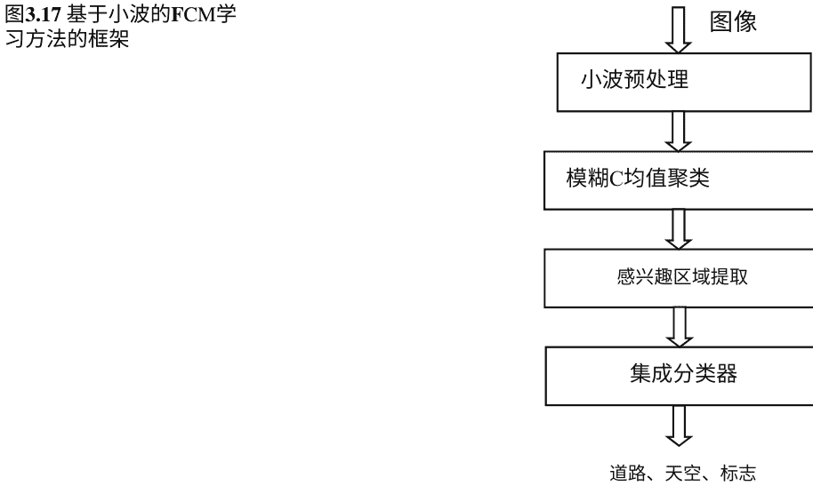
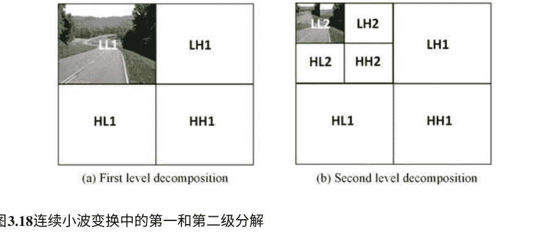

输入图像被分解为特定级别，如图3.18所示的第一级或第二级。小波的使用是通过基于多分辨率特性去除噪声来提高图像质量。图像的小波去噪旨在基于线性或非线性 filtering 恢复被噪声扭曲的图像。线性 filtering 使用低通 filters 来截断高频噪声，而非线性方法使用统计 filters。小波使用的原则是噪声主要属于高频，可以通过抑制高频来去除噪声。这个处理将不同强度和形状的物体分割出来，如斑点。

#### 3.4.2.2 FCM聚类

聚类旨在以无监督的方式学习未标记数据的结构。FCM聚类是一种经典方法，它将相似的训练数据样本分组成簇，并学习每个测试样本对这些簇的模糊成员关系。这种聚类是通过递归地减少成本函数来完成的，实例的模糊成员关系表示实例代表不同类别的程度。FCM的优点是它可以保留比其他聚类方法更多的信息。

与传统的聚类算法不同，传统算法根据数据模式的相似性创建数据簇，并将相似模式放入同一簇中，而模糊聚类创建允许数据属于不同簇的分区。

FCM算法[33]基于以下函数的最小化：

$$J_m(U, Y) = \sum_{k=1}^n \sum_{j=1}^c (u_{jk})^m E_j(x_k) \quad (3.26)$$

其中，$U = \{x_k | k \in [1, n]\}$ 表示训练集中的未标记样本，$Y = \{y_j | j \in [1, c]\}$ 表示一组聚类中心，$E_j(x_k)$ 是不相似性测量，衡量样本 $x_k$ 和聚类中心 $y_j$ 之间的距离；$u_{jk}$ 表示衡量特定聚类 $j$ 的模糊分区矩阵，$m \in (1, \infty)$ 是一个模糊参数。

关于 $Y$ 的 $J_m$ 值可以通过以下方式最小化：

$$\sum_{j=1}^c (u_{jk}) = 1 \quad (3.27)$$

确保离聚类中心更近的像素具有较高的值，而离聚类中心较远的像素具有较低的值。FCM中的成员值基于像素到聚类中心的距离。

#### 3.4.2.3 区域兴趣 (ROI) 提取

一旦图像经过FCM处理，它就会被提交给基于像素的搜索过程，该过程使用颜色特征来 find ROI。对于道路，ROI在图像的底部部分进行搜索，然后提取的ROI被分类为道路或非道路。类似地，天空的搜索过程在图像的顶部部分进行，然后提取的ROI被分类为天空或非天空。然后从提取的ROI中获取颜色特征。交通标志通过模板匹配过程获取，该过程考虑像素浓度的强度。

- 与交通标志相关的颜色特征用于辅助匹配过程。
- 分割区域与道路标志的属性（如颜色和大小）进行匹配。
- 最后，我们获得ROI或候选道路对象。

#### 3.4.2.4 对象分类

一组神经网络被用作最终分类器，用于区分提取的ROI。集成分类器的优势在于将多个分类器的决策结合起来，以获得更强大和准确的结果。神经网络在训练过程中由于不同的初始参数（如权重、隐藏神经元等）而表现不同，即使在相同的数据集上亦如此。因此，每个网络可能导致不同的分类错误，将它们组合起来可以减少错误并提高准确性。我们使用MLP来构建集成分类器，每个MLP都使用从ROI中提取的颜色特征进行单独训练。通过改变MLP分类器的参数来获得多样性。在分类阶段，每个MLP将获得的ROI分为两类，用 $Y_k, k = 1,2$ 表示，其中类 $Y_1$ 表示天空，类 $Y_2$ 表示非天空。开发了五个MLP来将获得的ROI分类为不同的对象类别。

通过使用多数投票策略，将所有MLP的结果组合得到最终结果。

### 3.4.3 实验结果

#### 3.4.3.1 评估指标和系统参数

评估数据集是使用前视摄像头收集的自然道路图像数据集。我们使用FCM学习方法估计正确分类的对象数量。使用两个度量标准：(1) 正确识别率(CRR)，表示所有正确分类的对象数量除以总对象数量；(2) 错误识别率(FRR)，表示错误分类的对象数量占总对象数量的百分比。

系统参数：使用具有一个隐藏层的三层MLP分类器，并使用反向传播算法进行训练。训练所使用的参数如下：(1) 学习率 = 0.01；(2) 动量 = 0.2；(3) 迭代次数 = 60；(4) RMS值 = 0.001。根据不同数据集的试验和错误过程选择最佳参数设置。

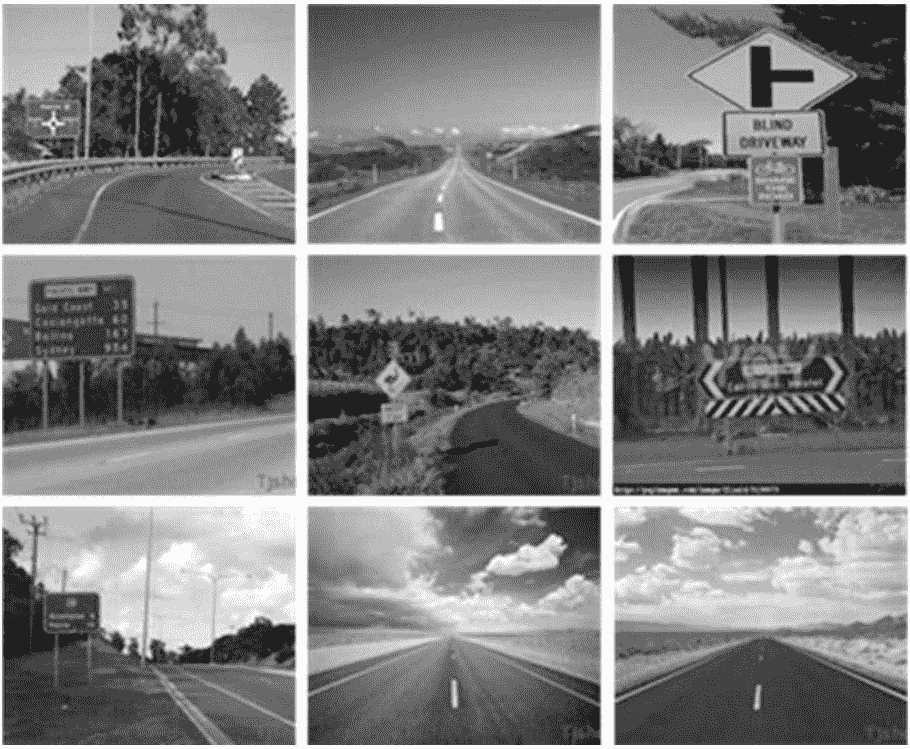
**图3.19 自然道路图像数据集中的预处理图像样本集**

#### 3.4.3.2 实验结果

图3.19显示了一个示例预处理图像集的结果。使用基于小波的FCM方法提取的道路对象的最终集合显示在图3.20中，包括标志、天空和道路。

良好的分类被高CRR和低FRR所指示。我们将基于小波的FCM方法与FCM方法[37]进行了比较。所得到的结果在表3.13中描述，表明在数据预处理中引入小波以增加CRR and 减少FRR的优势。FCM方法在无噪声的图像上表现良好，但对噪声敏感。基于小波的FCM方法使用小波去除噪声，所得到的准确性高于FCM方法。

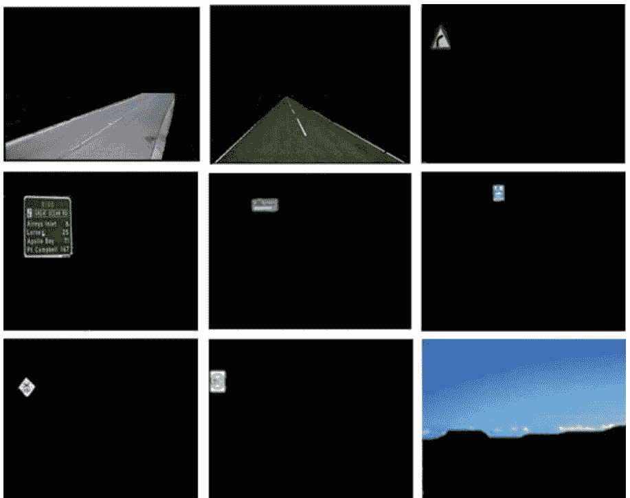
**图3.20 一组提取的道路物体样本**

**表3.13 性能 (%) 基于小波的FCM方法与FCM方法的比较**

| 指标 | FCM方法 (道路) | FCM方法 (天空) | 基于小波的FCM (道路) | 基于小波的FCM (天空) |
| :--- | :--- | :--- | :--- | :--- |
| CRR | 88.4 | 98.1 | 94.5 | 98.8 |
| FRR | 2.1 | 2.8 | 0.01 | 0.02 |

### 3.4.4 总结

本节介绍了一种基于小波的FCM学习方法，用于从道路图像中进行对象分割。使用基于小波的FCM聚类技术完成道路图像中ROI的识别，并使用多层感知器分类器的集成进行道路物体的分类。在真实世界的道路图像上进行的实验表明，道路和天空的识别准确率分别达到94.5%和98.8%。与现有的FCM方法进行实验比较表明，使用基于小波的FCM方法可以显著提高分类准确性。

## 3.5 集成学习

### 3.5.1 引言

集成学习是一种将相同类型或不同类型的多个模型结合起来，通过采用多数投票和多数决策等融合策略获得最终输出的方法。可以为这些模型提供不同的参数集，以实现结果的多样性。集成学习的优势在于它考虑了多个个体模型的决策，从而在大多数情况下可以显著提高分类准确性和集成学习系统的鲁棒性。一般来说，每个模型只能对测试数据的一部分产生准确的结果，但是多个模型的组合可以通过考虑来自各个成员模型的所有决策来实现更高的性能。预计集成学习方法可以在道路边视频数据分析中取得更好的结果。

在本节中，我们提出了一种基于多个神经网络的集成学习方法[38]，用于将道路边图像分割和分类为不同的对象。集成学习过程将由聚类创建的多个分类器的决策进行组合。

### 3.5.2 集成学习方法

图3.21展示了基于聚类和融合概念生成分类器集合的方法框架[38]。第一个任务是将输入图像聚类成多个片段，并使用一组基础分类器学习每个聚类中模式之间的决策边界。这个聚类过程将数据集划分为包含高度相关数据点的片段，这些数据点在几何上更接近彼此。当多个类别的模式在一个聚类中重叠时，这些数据点很难进行分类。

**图3.21 集成学习方法的框架**

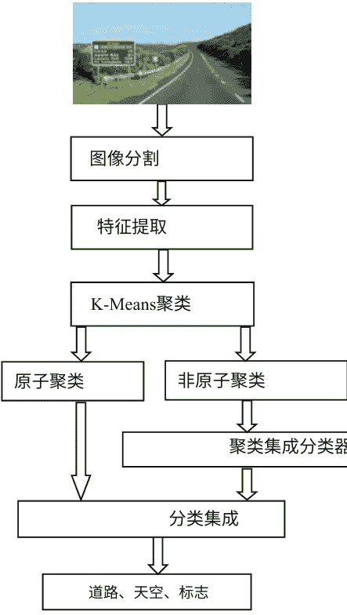

将聚类应用于与一个类相关联的数据集将生成两种类型的片段：原子片段和非原子片段。原子片段包含属于同一类的模式，而非原子片段包含来自多个类别的模式。

在聚类过程之后，基于非原子片段的模式进行分类器训练，并为原子片段分配类别标签。测试模式的类别标签通过找到与其距离最近的聚类来预测，对于原子片段使用相应的类别标签，对于非原子片段使用适当的分类器。聚类有助于识别那些难以分类的模式。一旦进行了聚类操作并确定了聚类，就可以为每个聚类训练一个神经网络分类器。

在K-means聚类中，根据聚类中心的初始状态，将模式标记到一个聚类中可能会有所不同，其中K-means聚类的数量可能与数据中实际聚类的数量不同。如果使用不同的种子点进行多次聚类，模式可能每次被分配到不同的聚类中。当使用不同的初始种子进行新的聚类操作时，称为分层，这些聚类形成一层。这种聚类标记在每一层之间是不同的。可以对每一层的非原子聚类进行分类器训练，并将所有分类器的结果进行组合。通过多数投票的方式将它们组合在一起形成一个集成。分层提供了一种在集成中保持多样性并更容易对非原子模式进行分类的方法。

#### 3.5.2.1 图像分割

对于图像分割，我们使用基于颜色特征的聚类方法，考虑到与颜色分量变化相关的特征。第一步是测量颜色特征。首先，使用 $K$-means 聚类将道路图像分割为两个颜色通道：白色和非白色，其中 $K=2$。分割产生了用于车道、天空、干燥植被和路标的白色分段，以及用于道路、彩色路标和绿色植被的非白色分段。通过它们在图像中的位置来定位潜在的道路对象。道路提取是通过对图像底部部分进行基于块的特征提取来完成的，而天空区域则通过将搜索限制在图像顶部来分离。通过搜索与图像顶部边缘连接的斑点来从白色分段中提取天空。

#### 3.5.2.2 特征提取

然后，使用分割后的图像进行基于块的特征提取。首先定义一个块大小，将图像分割为若干相等的块。集成学习方法使用 $64 \times 64$ 像素的块大小。

对于道路段，图像仅在图像底部部分被分成块，并且每个块被标记为道路、非道路和背景的三个类别。对于天空段，图像在图像顶部被分成块，并且每个块被标记为天空、非天空或植被。然后在每个块中进行特征提取。使用颜色范围从图像中提取出四种类型的道路标志，包括绿色标志、浅蓝色标志、速度标志和黄色标志。一旦提取出区域的边界，就通过将每个斑点的特征与从参考形状获得的特征进行比较，进一步进行 filtered。

#### 3.5.2.3 聚类和集成分类器

所有道路图像都使用 $K$-means 聚类算法进行聚类，该算法产生仅存在一个类别成员的原子聚类和存在多个类别的非原子聚类。然后在非原子聚类上训练神经网络，产生一个层。这个过程在不同的初始聚类种子点上进行多次聚类操作的重复。每个分类器层都经过训练，以识别非原子聚类的决策边界。

训练操作完成后，网络被应用于测试数据。在测试过程中，集成分类器通过两个步骤评估测试模式属于哪个类别。在第一步中，根据模式与聚类中心的距离确定聚类成员资格。如果模式属于原子聚类，则返回该聚类的类标签。如果模式属于非原子聚类，则从训练好的网络中获取类标签。最后，使用多数投票法来融合集成分类器的决策。

图3.22以图形方式解释了通过改变聚类中心的种子来创建层的方式。在图3.22a中，定义了三个聚类，并且类成员资格表明已经形成了两个原子聚类和一个非原子聚类。非原子聚类包含多个类别，因此需要在该聚类上训练神经网络分类器。原子聚类更容易分类，并且它们的类标签表示测试模式。在图3.22b中，更改了聚类种子，该层产生了三个聚类。在这种情况下，聚类成员资格与前一层明显不同。模式的这种差异在神经网络训练过程中产生了多样性，从而提高了集成分类器的性能。

在不同的聚类中使用神经分类器提供了一种通过神经网络的分类输出实现多样性的方法。由于神经网络在不同的聚类组合中使用，通过组合所有输出形成了一个聚类集合。

#### 3.5.2.4 分类集成

从每个聚类层训练的不同神经网络获得的输出通过多数投票进行集成，预计能够改善整体输出，而不是使用每个单独的分类器。多数投票选择具有最高票数的类别标签。

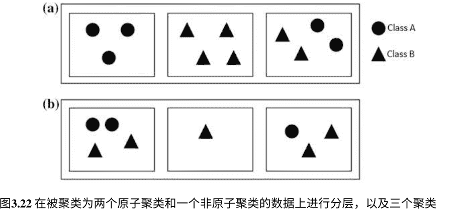

### 3.5.3 实验结果

#### 3.5.3.1 实验设置

评估数据集是自然道路图像数据集。该数据集中的图像代表了在现实道路条件下出现的分割问题。

目前还没有确定的标准来衡量分割性能。虽然工作[31]描述了各种衡量分割性能的方法，但没有指定任何标准标准。用于评估集成学习方法的四个指标是：
(1) 正确识别率，即所有正确分类的对象数除以所有对象的总数；
(2) 丢失对象数，与未正确分类的对象数有关；
(3) 最大分数数，表示方法达到最大分数的次数；
(4) 错误分类率，表示错误分类的对象数除以分类的总对象数。

#### 3.5.3.2 基准方法

本节描述了在道路物体分类实验中使用的三种基准方法。它们作为性能比较的基准方法。

- (1) SVM方法[39]，使用SVM分类器提取道路物体，该分类器在高维特征空间中确定具有最大间隔的线性超平面。我们在每个图像像素处提取一个特征向量，该向量由训练好的SVM分类器进行分类。
- (2) 分层段学习[32]，使用分层段提取和基于神经网络的分段物体分类。在分层阶段提取天空、道路、标志和植被等物体，并使用神经网络分类器进行分类。每个图像使用 (960 × 1280)/(64 × 64) 个分段，每个分段的块大小为 64 × 64 像素。然后对图像进行聚类和特征提取。
- (3) 基于聚类的神经网络[4]，将聚类和神经网络分类器结合起来，将道路图像分割成不同的物体。它为每个类生成聚类，并使用这些聚类形成每个提取段的子类。将聚类整合到分类中，以提高系统的分类准确性。分类器是具有单隐藏层的MLP，并在每个聚类上进行训练，然后将结果进行整合。分类器使用反向传播算法进行训练，参数设置如下：学习率=0.01；动量=0.2；迭代次数=55；RMS目标=0.01。通过对错误进行试验，找到数据集上的最佳参数设置。

#### 3.5.3.3 性能结果

使用上述指标，将集成学习方法的性能与三种基准方法进行比较，如表3.14所示。集成学习方法获得了最高的分类率，即91.2%的准确率。与基准方法相比，准确率提高了超过2.8%。使用集成方法丢失的对象数量和错误检测的对象数量也低于基准方法。图3.23显示了使用集成方法提取的道路对象的样本集，图3.24根据不同的指标比较了所有方法的性能，显示出集成学习方法的整体性能更好。

**表3.14 集成学习方法与三种基准方法的性能比较**

| 指标 | SVM | 分层 | 聚类 | 集成 |
| :--- | :--- | :--- | :--- | :--- |
| 正确率 (%) | 80.2 | 81.5 | 88.4 | 91.2 |
| 丢失 | 4 | 5 | 3 | 2 |
| 最大 | 6 | 9 | 4 | 12 |
| 错误率 (%) | 2.34 | 3.4 | 2.1 | 0.00 |

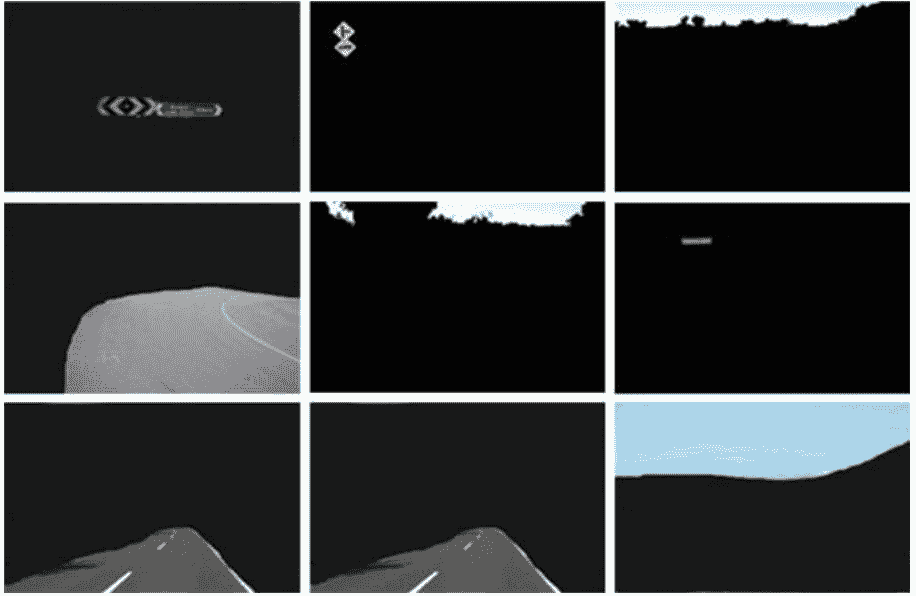
**图3.23 使用集成学习方法提取的道路对象的样本集**

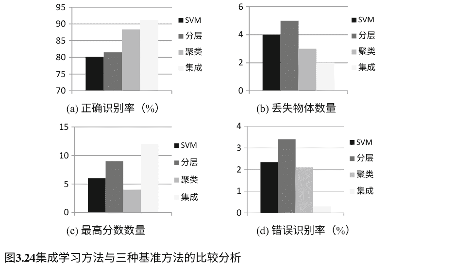

### 3.5.4 总结

在本节中，我们提出了一种基于神经网络的集成学习方法，用于道路物体检测。该方法使用不同的种子点将数据分成多个层次，然后在每个层次生成表示不同模式的聚类。在每个层次的每个聚类上训练一个神经网络分类器，并使用多数投票的方式融合聚类网络的输出。实验结果表明，在道路物体检测中，与基准SVM、分层和聚类方法相比，分类正确率有了很大的提高，达到了91.2%。

## 3.6 基于多数投票的混合学习

### 3.6.1 引言

设计一个强大的分类算法是构建视频数据分析自动系统中最关键的组成部分之一[40]。已经提出了许多解决分类问题的算法，包括KNN [41]、AdaBoost [42]、ANN [43]、SVM [44]、基于小波的技术 [45]等。然而，这些算法都不能保证在实际环境中以正确的分类准确率实现任何形式的最优性。近年来，与传统方式相比，采用多个分类器的混合方法[46, 47]已经成为一种主流趋势。由于其在分类问题中的有效性和鲁棒性，特别是在现实场景中，使用单一分类器的方法受到了越来越多的关注[48]。

然而，现有的大多数植被分割方法都集中在使用单一分类器上，很少有研究探索使用车载摄像头捕获的视频数据进行道路边植被分割。本节介绍了一种基于多数投票的混合方法[49]，用于将多个分类器组合起来进行稠密与稀疏植被分类。具体选择了包括ANN、SVM和KNN在内的三种分类器，以提高多样性，从而实现更好的性能。基于多数投票的方法的优势包括多个分类器的结合和新的特征提取技术。然而，由于该方法结合了多个分类器，需要更长的时间来处理所有分类器，因此对实时处理提出了挑战。

### 3.6.2 多数投票方法

基于多数投票的混合方法用于区分密集和稀疏的草地，其设计基于植被类型可以通过多个纹理特征和多个分类器的融合来学习和区分的假设。图3.25显示了该方法的概述，包括数据采集、图像预处理、基本分类器的训练、分类器决策的融合和准确性计算等五个阶段。

#### 3.6.2.1 图像预处理

预处理步骤旨在准备输入图像，使其可以直接用于特征提取。该步骤包括滤波、颜色空间转换和调整大小。

- (1) 中值滤波。为了从输入图像中去除噪声，应用中值滤波对图像进行处理，生成平滑和清晰的版本。
- (2) RGB转灰度转换。为了支持灰度图像的特征提取，所有彩色图像都被转换为灰度图像，通过取R、G和B的平均值作为每个像素的强度值。
- (3) 图像调整大小。图像在采集时具有900 × 500像素的分辨率。为了减少计算时间，所有图像都被调整为200 × 200像素的分辨率。

#### 3.6.2.2 特征提取

特征提取是植被分割中最关键的步骤之一。观察到根据纹理的光滑程度和草地深度的差异，可以在视觉上将稠密和稀疏的草地分开。基于这一观察，多数投票方法提供了一种纹理提取技术，通过LBP和GLCM的组合获得二进制模式的共生矩阵。具体来说，首先在灰度图像上应用LBP算子，然后应用GLCM生成纹理特征向量。

LBP是一种灰度和旋转不变的纹理特征提取器，从图像中提取整数标签的直方图。LBP运算符通过对每个像素的邻域（例如 $3 \times 3$ 个像素）与中心值进行阈值处理来形成图像像素的标签。对于每个像素，通过顺时针方向将所有这些结果进行二进制连接，然后将其分配给中心像素，从而获得二进制值。像素 $(x_c, y_c)$ 的 LBP 码的计算公式如下：

$$LBP_{P,R}(x_c, y_c) = \sum_{p=0}^{P-1} s(i_p - i_c) 2^p \tag{3.28}$$

$$s(x) = \begin{cases} 1, & x \ge 0 \\ 0, & x < 0 \end{cases} \tag{3.29}$$

其中，$i_c$ 表示中心像素 $(x_c, y_c)$ 的灰度值，$i_p$ 是其邻居的灰度值，$P$ 是邻居的数量，$R$ 是邻域的半径。对于不完全落在像素位置上的邻居，使用双线性插值进行估计。

在计算图像中每个像素 $(x, y)$ 的 LBP 编码后，我们得到一个编码图像表示。通过计算 LBP 代码的出现次数，从编码图像中得到一个直方图 $H$：

$$H(b) = \sum_{x=1}^M \sum_{y=1}^N f(LBP_{P,R}(x,y), b), f(a, b) = \begin{cases} 1, & a = b \\ 0, & a \neq b \end{cases} \tag{3.30}$$

在这里，$b$ 是 LBP 代码值。得到的直方图 $H$ 被用作描述图像纹理的特征向量，进一步作为输入传递给 GLCM 算法。

在下一个阶段，我们使用 GLCM 算法提取纹理特征。GLCM 是描述图像局部纹理空间结构的灰度纹理原语。灰度共生矩阵表示具有给定偏移的灰度强度值的像素在水平方向上与另一个像素相邻的频率。为图像的每个灰度版本构建一个矩阵。

#### 3.6.2.3 训练基础分类器

为了对稠密和稀疏草地图像进行分类，使用了三种分类器，即 SVM、ANN 和 KNN。

- **(1) SVM 分类器**：第一个分类器是 SVM，它被设计用于找到类别之间的最佳分离。令 $S = \{ x_i, y_i | x_i \in R^n \}$ 和 $y_i \in \{1, 2\}$ 表示训练的两个类别标签。一个类别“1”表示密集的草地，而“2”表示稀疏的草地。考虑了三种核函数，包括线性、多项式和 RBF。
- **(2) ANN 分类器**：第二个分类器是一个三层前馈神经网络。假设 $u = [u_1, u_2, u_3, \dots, u_p]^T$ 构成输入特征向量，而 $y = [y_1, y_2, y_3, \dots, y_m]^T$ 是输出向量，其中 $p$ 表示 $u$ 中的元素数量，即 $p = 110$，而 $m$ 表示类别数量，即 $m = 2$。ANN 使用不同数量的隐藏单元进行训练（即 6、10、12、15 和 20 个）和迭代（即 500、1000 和 3500 次）直到训练样本上的均方根误差低于预设值，使用反向传播算法。
- **(3) KNN 分类器**：第三个分类器是 KNN，其中一个测试对象被分类为特征空间中最接近的训练样本的类标签。KNN 有两个需要调整的参数：K 和距离度量。通常将 K 设置为奇数，以避免平局。测试了三个 K 值，包括 5、7 和 9，使用欧氏距离和曼哈顿距离两种距离度量。KNN 的一个主要问题是具有更频繁训练样本的类别会主导测试样本的预测结果。为了解决这个问题，我们的实验采用了相同数量的图像来表示两个类别。

### 3.6.2.4 多数投票法对分类器进行投票

在使用相同的图像描述符训练所有三个分类器之后，它们的决策被合并以达到最终的分类决策，采用多数投票的方式。获得多投票的类别获胜，至少有两个分类器给出相同的结果。最后，测试图像被标记为密集或稀疏。

### 3.6.3 实验结果

本节提供了关于裁剪草地数据集的实验结果。进行了两个实验。第一阶段选择每个分类器的最佳参数，第二阶段应用 5 折交叉验证来获得选择参数后的分类率。总共使用了 110 张图像，其中 60 张是密集的草地， 50 张是稀疏的草地。所有图像被随机分成五个相等的子集，每个子集中密集或稀疏草地的实例数量相等。在每次验证中，一个子集用于测试，其余子集用于训练。上述过程重复五次，得到平均分类率。

表 3.15 显示了使用 SVM 分类器获得的结果，包括三个核函数的训练和测试准确率。线性函数在训练和测试数据上都达到了最高准确率，分别为 90% 和 85%；而多项式和 RBF 函数的准确率较低，多项式函数的训练和测试准确率分别为 85% 和 80%，RBF 函数的训练和测试准确率分别为 80% 和 80%。

#### 表 3.15 使用 SVM 分类器的分类准确率 (%)

| 指标 | 线性 | 多项式 | RBF |
| :--- | :--- | :--- | :--- |
| 训练准确率 | 90 | 85 | 80 |
| 测试准确率 | 85 | 80 | 80 |

表 3.16 列出了使用线性核函数进行 5 折交叉验证的 SVM 分类结果。

#### 表 3.16 使用线性 SVM 分类器进行 5 折交叉验证结果 (%)

| 折 | 1 | 2 | 3 | 4 | 5 | 总体 |
| :--- | :--- | :--- | :--- | :--- | :--- | :--- |
| 准确率 | 95.5 | 90.9 | 95.5 | 86.4 | 91.0 | 91.8 |

表 3.17 列出了在 ANN 分类器中使用不同参数获得的结果。ANN 在以下参数下获得了最高准确率：隐藏单元数 = 12，迭代次数 = 3500，学习率 = 0.01，动量 = 0.15，RMSE = 0.0001。训练和测试准确率分别为 90% 和 85%。这意味着在选择适当的参数时，ANN 能够达到与 SVM 类似的性能。表 3.18 显示了使用选定参数进行 5 折交叉验证的 ANN 的分类准确率。

#### 表 3.17 使用 ANN 分类器的分类准确率 (%)

| 实验编号 | 隐藏单元 | 迭代次数 | 均方根误差 | 训练准确率 | 测试准确率 |
| :--- | :--- | :--- | :--- | :--- | :--- |
| 1 | 6 | 500 | 0.0003 | 80 | 75 |
| | | 1000 | 0.0004 | 75 | 75 |
| | | 3500 | 0.0001 | 80 | 75 |
| 2 | 10 | 500 | 0.0005 | 80 | 80 |
| | | 1000 | 0.0001 | 80 | 80 |
| | | 3500 | 0.0003 | 85 | 85 |
| 3 | 12 | 500 | 0.0001 | 85 | 80 |
| | | 1000 | 0.0002 | 85 | 85 |
| | | 3500 | 0.0001 | 90 | 85 |
| 4 | 15 | 500 | 0.0002 | 85 | 80 |
| | | 1000 | 0.0003 | 90 | 80 |
| | | 3500 | 0.0001 | 90 | 80 |
| 5 | 20 | 500 | 0.0004 | 85 | 80 |
| | | 1000 | 0.0003 | 85 | 80 |
| | | 3500 | 0.0002 | 85 | 80 |

#### 表 3.18 使用 ANN 分类器进行 5 折交叉验证结果

| 折 | 1 | 2 | 3 | 4 | 5 | 总体 |
| :--- | :--- | :--- | :--- | :--- | :--- | :--- |
| 准确率 | 90.9 | 90.9 | 90.9 | 95.5 | 90.9 | 91.8 |

表 3.19 展示了使用 KNN 获得的分类结果。使用不同的 K 值进行训练和测试准确率的比较，以选择最佳值。在这种情况下，使用 90 张图像进行训练， 20 张图像进行测试。使用 K = 7 获得了训练和测试数据集上的最高准确率。

#### 表 3.19 使用 KNN 分类器的分类准确率 (%)

| K 值 | 5 | 7 | 9 |
| :--- | :--- | :--- | :--- |
| 训练准确率 | 75 | 85 | 75 |
| 测试准确率 | 70 | 80 | 70 |

#### 表 3.20 使用 K = 7 的 KNN 进行 5 折交叉验证结果

| 折 | 1 | 2 | 3 | 4 | 5 | 总体 |
| :--- | :--- | :--- | :--- | :--- | :--- | :--- |
| 准确率 | 90.9 | 86.4 | 86.4 | 90.9 | 95.5 | 90.0 |

训练和测试数据集的准确率分别为 85% 和 80%。尽管使用 KNN 获得的准确率低于 ANN 和 SVM，但 KNN 的接受率接近 ANN 和 SVM 的接受率。

在获得最佳 K 值之后，我们使用 5 折交叉验证评估 KNN 分类器，如表 3.20 所示。表 3.21 和 3.22 总结了使用多数投票方法的结果。结果表明，当使用线性核函数进行 SVM 时，隐藏神经元的数量和迭代次数分别设置为 12 和 3500，KNN 的 K 值设置为 7 时，该方法达到了最高的分类准确率。最高的训练和测试准确率分别为 95% 和 90%。

#### 表 3.21 使用多数投票方法的分类准确率 (%)

| 实验编号 | SVM | 人工神经网络 | KNN | 训练准确率 | 测试准确率 |
| :--- | :--- | :--- | :--- | :--- | :--- |
| 1 | 线性 | HN = 12, 迭代次数 = 3500 | 7 | 95 | 90 |
| | 多项式 | HN = 10, 迭代次数 = 3500 | 5 | 85 | 80 |
| | RBF | HN = 15, 迭代次数 = 1000 | 9 | 80 | 75 |
| 2 | 线性 | HN = 10, 迭代次数 = 3500 | 9 | 85 | 80 |
| | 多项式 | HN = 15, 迭代次数 = 1000 | 5 | 80 | 75 |
| | RBF | HN = 12, 迭代次数 = 3500 | 7 | 85 | 80 |
| 3 | 线性 | HN = 15, 迭代次数 = 1000 | 5 | 80 | 75 |
| | 多项式 | HN = 12, 迭代次数 = 3500 | 9 | 80 | 80 |
| | RBF | HN = 10, 迭代次数 = 3500 | 7 | 80 | 75 |

#### 表 3.22 使用多数投票方法进行 5 折交叉验证结果

| 折 | 1 | 2 | 3 | 4 | 5 | 总体 |
| :--- | :--- | :--- | :--- | :--- | :--- | :--- |
| 准确率 | 90.9 | 95.5 | 90.9 | 90.9 | 95.5 | 92.7 |

#### 表 3.23 使用 5 折交叉验证比较分类器的分类率

| 分类器 | 样本总数 | 错误分类样本 | 准确率 (%) |
| :--- | :--- | :--- | :--- |
| SVM | 110 | 9 | 91.8 |
| NN | 110 | 9 | 91.8 |
| KNN | 110 | 11 | 90.0 |
| 多数投票 | 110 | 8 | 92.7 |

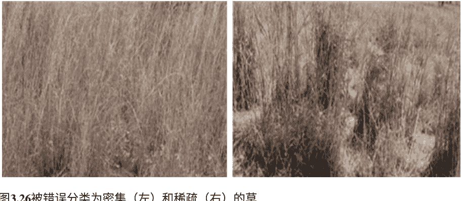

整体表现最好，但也存在一些错误分类，如图 3.26 所示，左侧稀疏草地的样本被错误分类为密集草地。右侧样本也发生了类似的错误分类，中等密度的草地被错误分类为稀疏。

上述结果显示，支持向量机 (SVM) 和人工神经网络 (ANN) 在训练和测试数据上的准确率分别约为 90% 和 85%。使用 K 最近邻算法 (KNN) 的结果显示，训练和测试数据上的准确率分别为 85% 和 80%。最后，通过使用多数投票方法获得了最高的分类准确率，分别为训练和测试数据上的 95% 和 90%。因此，我们可以得出结论，与使用单个分类器相比，融合多个分类器的多数投票方法对道路植被分类更具鲁棒性。

通过对 5 折交叉验证结果进行单因素方差分析 (ANOVA) 测试，比较了多数投票方法与 SVM、ANN 和 KNN 的分类准确率，以测试多数投票方法在分类准确率上的改进是否具有统计学意义。零假设是多数投票方法和单个分类器的分类准确率之间没有统计差异 ($H_0$) ，而备择假设是存在显著差异 ($H_1$) 。$p$ 值的大小决定是否应该拒绝零假设，支持备择假设。

表 3.24 和 3.25 展示了 ANOVA 测试的结果。从表 3.24 可以观察到，多数投票方法具有最高的准确性。它也有很多准确性的方差比 SVM 和 KNN 小，但比 ANN 稍高，表 3.25 中的 $p$ 值大于 0.1，我们可以得出结论，在 0.1 的显著性水平上没有显著的批次效应，无法拒绝原假设。尽管多数投票方法达到了最高的分类准确率，但它与基准方法之间的准确率差异在统计上不显著。

#### 表 3.24 单因素 ANOVA 测试摘要

| 组别 | 计数 | 总和 | 平均值 | 方差 |
| :--- | :--- | :--- | :--- | :--- |
| SVM | 5 | 459.11 | 91.822 | 14.44217 |
| NN | 5 | 459.05 | 91.81 | 4.1405 |
| KNN | 5 | 449.97 | 89.994 | 14.45538 |
| 多数投票 | 5 | 463.6 | 92.72 | 6.21075 |

#### 表 3.25 ANOVA 测试结果

| 变异 | SS | 自由度 | 均方 | F | P 值 | F 临界值 |
| :--- | :--- | :--- | :--- | :--- | :--- | :--- |
| 组间 | 19.6314 | 3 | 6.543818 | 0.6669 | 0.584529 | 3.2388 |
| 组内 | 156.9952 | 16 | 9.8122 | | | |
| 总计 | 176.6267 | 19 | | | | |

### 3.6.4 总结

在本节中，我们提出了一种基于多数投票的混合方法，用于对自然道路图像中的密集和稀疏草地进行分类。原始图像首先经过几个预处理步骤，使其准备好进行特征提取。考虑到密集草地中像素强度值通常保持接近，而稀疏草地中存在较大差异，我们使用 LBP 基于二值化生成基于直方图的纹理特征，然后使用 GLCM 算法进一步处理这些特征以提取每个图像的纹理特征。最后，使用多数投票将三个分类器（即 ANN、SVM 和 KNN）进行融合，以对密集和稀疏草地进行分类。

在裁剪的草地数据集上进行了 5 折交叉验证的实验，结果表明基于多数投票的混合方法的准确率达到了 92%，优于所有单个分类器。然而，进行了方差分析测试，证实多数投票方法的性能与使用单个分类器获得的性能没有统计学上的显著差异。

虽然实验结果相当令人鼓舞，但这种方法仍然可以进一步改进。它没有考虑整个路边图像，因此仍然需要进一步研究如何从图像中分割草地区域。所有的测试数据都是在良好的光照条件下捕获的，该方法可能无法处理如阴影和恶劣天气条件等环境影响。只考虑了密集和稀疏的草地，还需要对大量的草地和混合植被（如树木和灌木）进行测试。

## 3.7 区域合并学习

### 3.7.1 引言

对象分割可以看作是一个区域合并问题，其中具有相似特征的小区域逐渐合并成较大的区域，然后每个合并的区域可以被标记为一个类别。大多数现有的区域合并方法选择一小组具有高水平类别标签的初始种子，然后迭代地将所有像素（或超像素）合并到最相似的相邻种子中。这些方法通常不需要训练，只关注测试数据的局部特征，因此适用于自适应对象分类。然而，它们的一个主要缺点是对初始种子选择的高度依赖，这经常导致在自然条件下可靠性较低。现有的解决方案包括手动选择初始超像素种子和基于高斯概率密度函数选择初始种子像素，但它们要么需要人工干预，要么需要大量计算负担。

本节介绍了一种空间上下文超像素模型 (SCSM)，它结合了基于像素的有监督类别特定分类器和基于超像素的无监督区域合并，用于稳健的道路边物体分割。SCSM 包括一种自适应超像素合并算法，通过考虑训练数据中对象的一般特征和测试图像的局部特征（如光照条件和植被类型，如图 3.27 所示的示例），克服了对初始超像素种子的依赖性。因此，SCSM 能够自动适应测试图像的局部内容，从而预计能够产生更稳健的分类结果。

### 3.7.2 区域合并方法

#### 3.7.2.1 方法框架

图 3.28 描述了 SCSM 方法框架，它以一幅道路边图像作为输入，并将图像的每个部分分配到一个对象类别中。主要有两个处理步骤：

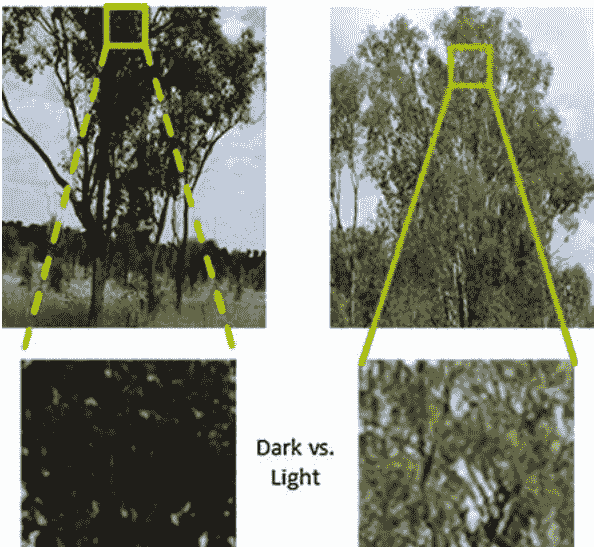

图 3.27 图像示例说明在测试图像中考虑对象的局部特征（即树叶）的必要性。树叶的两个区域在像素强度上有明显的对比差异，因此使用从左侧区域提取的特征训练的分类系统可能在右侧区域效果不佳。

- (1) 图像被分割成一组超像素，从中提取像素和补丁选择（PPS）特征，用于训练多个类别特定的人工神经网络（ANN）分类器。PPS 特征专门设计用于减少对象边界上的噪声。ANN 分类器预测的概率然后在每个超像素内的所有像素上进行聚合，形成上下文超像素概率图（CSPMs），考虑了几个空间约束模型。
- (2) 基于 CSPMs 执行超像素分类，将每个超像素分配给具有最高平均概率的类别。为了考虑测试图像中邻近超像素之间的局部空间信息和全局上下文信息，提出了一种超像素合并方法，用于获取低概率超像素的类别标签。该方法比较低概率超像素与其邻居以及一组高概率种子超像素的相似性。这个过程有助于在局部空间邻域内强制执行更一致的类别标签，并在整个图像中实现更高的分类准确性。

#### 3.7.2.2 超像素生成

SCSM 的第一个任务是将输入图像分割成一组局部超像素。这个过程将分类问题从成千上万个单个像素转换为数百个大的同质区域，可以显著降低对象分类过程的复杂性，使其更易管理。分割的超像素为 PPS 特征提取和超像素种子选择提供了基础。采用流行的基于图的算法将图像分割成一组超像素，每个超像素预期只属于一个类别。分割的超像素还应考虑对象之间的对比视觉差异，并保留大部分对象边界信息。

#### 3.7.2.3 特征提取

特征提取试图从输入数据中提取一组有区别的特征，以区分不同的物体类别。考虑了两种类型的特征：基于像素的特征和基于补丁的特征，它们为生成更强大的 PPS 特征奠定了基础。

(1) 基于像素的特征，从单个图像像素中分别提取。
颜色是最广泛使用的基于像素的特征之一，但选择合适的颜色空间仍然是一个挑战。通常建议颜色空间应该接近于人类对颜色的感知，因为人类在区分物体方面非常擅长。换句话说，在颜色空间中，等距离理想上应该对应于人类感知中的等色差。因此，我们选择了 CIELab 颜色空间，它与人类视觉感知具有高度一致性，并且在物体分类方面具有高性能 [52]。此外，我们还包括 R、G、B 颜色通道，以弥补在 Lab 空间中可能丢失的信息。

因此，我们获得了一个 6 元素的基于像素的特征向量 $V_{x, y}^I$ 对于图像 $I$ 中的像素 $I_{x, y}$ 在坐标 $(x, y)$ 处：

$$V_{x, y}^I = [R, G, B, L, a, b] \quad (3.31)$$

(2) 基于补丁的特征，可以通过考虑像素邻域中的统计信息来提取。在现实世界的应用中，邻近像素中的空间纹理信息在复杂对象识别中起着关键作用。在 SCSM 中，基于补丁的特征是基于颜色矩 [53] 提取的，它具有编码对象的形状和颜色信息的优势，具有尺度和旋转不变性，并且对光照变化具有很高的鲁棒性。因为大部分颜色分布信息都表示在低阶矩中，所以使用了前三个矩，包括均值、标准差和偏度。

让 $I_{x, y}$ 是图像 $I$ 中位置 $(x, y)$ 的像素，$T_{x, y}$ 是以 $I_{x, y}$ 为中心，高度为 $h$，宽度为 $w$ 的补丁，$\tau$ 是 $T_{x, y}$ 中的所有像素数，即 $\tau = h \times w$，$I_{i, j}$ 是属于 $T_{x, y}$ 的像素，即 $I_{i, j} \in T_{x, y}$，$I_{x, y}$ 的前三个矩可以表示为：

$$\text{均值}_{x, y} = \frac{1}{\tau} \sum_{i=x-\frac{w}{2}}^{x+\frac{w}{2}} \sum_{j=y-\frac{h}{2}}^{y+\frac{h}{2}} I_{i, j} \quad (3.32)$$

$$\text{标准差}_{x, y} = \sqrt{\frac{1}{\tau} \sum_{i=x-\frac{w}{2}}^{x+\frac{w}{2}} \sum_{j=y-\frac{h}{2}}^{y+\frac{h}{2}}\left(I_{i, j}-\text{均值}_{x, y}\right)^{2}} \quad (3.33)$$

$$Skw_{x, y} = \sqrt[3]{\frac{1}{\tau} \sum_{i=x-\frac{w}{2}}^{x+\frac{w}{2}} \sum_{j=y-\frac{h}{2}}^{y+\frac{h}{2}}\left(I_{i, j}-\text{均值}_{x, y}\right)^{3}} \quad (3.34)$$

上述三个矩分别针对 $L, a$ 和 $b$ 通道进行提取。由于颜色矩的计算不考虑像素的坐标，它们在捕捉局部邻域中的空间结构纹理方面存在问题。为了解决这个问题，还包括了两个额外的特征，用于指示垂直纹理方向，包括补丁的左右两半部分的均值和标准差之间的差异。同样地，还从上下两半部分计算了两个额外的特征：

$$\text{均值}_{x, y}^{l, r} = \frac{1}{\tau} \left( \sum_{i=x-\frac{w}{2}}^{x} \sum_{j=y-\frac{h}{2}}^{y+\frac{h}{2}} I_{i,j} - \sum_{i=x}^{x+\frac{w}{2}} \sum_{j=y-\frac{h}{2}}^{y+\frac{h}{2}} I_{i,j} \right) \quad (3.35)$$

$$\text{标准差}_{x, y}^{l, r} = \frac{1}{\tau} \left( \sqrt{\sum_{i=x-\frac{w}{2}}^{x} \sum_{j=y-\frac{h}{2}}^{y+\frac{h}{2}} (I_{i,j} - \text{均值}_{x, y}^{l, r})^2} - \sqrt{\sum_{i=x}^{x+\frac{w}{2}} \sum_{j=y-\frac{h}{2}}^{y+\frac{h}{2}} (I_{i,j} - \text{均值}_{x, y}^{l, r})^2} \right) \quad (3.36)$$

$$\text{均值}_{x, y}^{t, b} = \frac{1}{\tau} \left( \sum_{i=x-\frac{w}{2}}^{x+\frac{w}{2}} \sum_{j=y-\frac{h}{2}}^{y} I_{i,j} - \sum_{i=x-\frac{w}{2}}^{x+\frac{w}{2}} \sum_{j=y}^{y+\frac{h}{2}} I_{i,j} \right) \quad (3.37)$$

$$\text{标准差}_{x, y}^{t, b} = \frac{1}{\tau} \left( \sqrt{\sum_{i=x-\frac{w}{2}}^{x+\frac{w}{2}} \sum_{j=y-\frac{h}{2}}^{y} (I_{i,j} - \text{均值}_{x, y}^{t, b})^2} - \sqrt{\sum_{i=x-\frac{w}{2}}^{x+\frac{w}{2}} \sum_{j=y}^{y+\frac{h}{2}} (I_{i,j} - \text{均值}_{x, y}^{t, b})^2} \right) \quad (3.38)$$

由于色度分布对于彩色图像分类更相关，上述四个特征仅针对 $L$ 通道计算。基于块的特征 $V_{x, y}^T$ 对于像素 $I_{x, y}$ 包括：

$$V_{x, y}^T = [V_{x, y}^I, (\text{均值}_{x, y}, \text{标准差}_{x, y}, \text{偏度}_{x, y})^{L, a, b}, \text{均值}_{x, y}^{l, r}, \text{标准差}_{x, y}^{l, r}, \text{均值}_{x, y}^{t, b}, \text{标准差}_{x, y}^{t, b}] \quad (3.39)$$

值得注意的是 $V_{x, y}^T$ 还包括基于 6-D 像素的特征 $V_{x, y}^I$。提取的基于补丁的特征的一个优点是它们对图像中的尺度变化具有不变性，并且对图像旋转具有高鲁棒性。这对于道路数据分析至关重要，因为由于驾驶车辆上的摄像机的晃动和摄像机到物体的距离的变化，真实世界的物体可能以不同的分辨率和旋转被捕捉到。因此，它们被期望在真实世界的数据上具有鲁棒性。

#### 3.7.2.4 像素概率图（PPM）

对于图像 $I$ 中的所有像素 $I_{x,y}$ 和一组对象类别 $C_M$，对象分类的任务是生成一个映射函数 $\varphi : I_{x,y} \rightarrow C_M$，使得每个图像像素被分配给一个对象类别。基于为 $I_{x,y}$ 提取的特征，该部分采用机器学习分类器来获得像素概率图（PPMs），这些图表示图像像素属于所有类别的可能性。

因此，PPM 用于创建增强的上下文超像素概率图。

我们不再构建传统的单一多类别分类器，该分类器一次性对所有类别进行分类，这可能会难以区分外观相似的对象。相反，我们为每个类别单独训练一个特定类别的二元分类器，以更准确地反映所有像素属于特定对象的概率。特定类别的分类器能够专注于从提取的特征到一个类别的映射函数，并将其余类别的特征变化视为第二类别。预计它们能够更有效地克服特征变化并提高分类性能。对于多类别分类问题，特定类别的分类器为每个类别生成一个 PPM。

我们为每个类别训练一个特定的二元人工神经网络分类器。然而，其他流行的分类器，如 SVM，在这里也可以使用。让 $C_i$ 表示第 $i$ 个类别 $(i = 1, 2, \dots, M)$，$M$ 为总类别数，一个由特征向量 $V_{x,y}$ 描述的像素 $I_{x,y}$ 属于 $C_i$ 的概率可以通过第 $i$ 个特定二元神经网络分类器进行预测：

$$p_{x,y}^i = tanh(w_i V_{x,y} + b_i) \quad (3.40)$$

其中，$tanh$ 表示一个具有双曲正切激活函数的三层神经网络，$w_i$ 和 $b_i$ 分别是第 $i$ 个特定分类器的可训练权重和常数参数。一个分类器为每个类别生成一个概率图，总共有 $M$ 个概率图。一幅图像中的像素 $I_{x,y}$ 与 $M$ 个概率相关联，每个类别对应一个概率。

$$PPM_{x,y} = [p_{x,y}^1, p_{x,y}^2, \dots, p_{x,y}^M] \quad (3.41)$$

### 3.7.3 方法的组成部分

本节描述了 SCSM 方法的三个主要组成部分，包括 PPS 特征、上下文超像素概率图和超像素增长。

#### 3.7.3.1 像素块选择（PPS）特征

PPS 特征的设计旨在解决区域边界问题。它们根据分割的超像素，自适应地选择基于像素或块的特征来对所有像素进行分类。它们基于以下观察结果：从对象边界周围的块提取特征不可避免地引入一定程度的噪声到提取的特征集中，而基于像素的特征通常不会受到这个问题的影响，但它们无法捕捉到有区别的纹理特征。因此，建议设计一种特征提取方法，可以根据当前像素是否为边界自动选择提取基于像素或块的特征。

一个引发的问题是如何确定边界与非边界像素？幸运的是，分割的超像素提供了高度均匀区域的清晰分区，形成边界的像素可以近似地被视为边界像素。给定所有超像素的边界坐标和一个特定大小的补丁（例如 $7 \times 7$ 像素），提出了一种方法将所有像素分类为边界与非边界像素，如图 3.29 所示。非边界内部像素被定义为距离超像素边界至少半个补丁高度（或宽度）的位置，可以准确提取基于补丁的特征而不引入任何噪声。图像边界中的像素以相同的方式确定。对于一个像素 $I_{x,y}$，PPS 特征可以通过以下方式获得：

$$PPS_{x,y} = \begin{cases} V_{x,y}^I & \text{如果 } I_{x,y} \text{ 是边界像素} \\ V_{x,y}^T & \text{如果 } I_{x,y} \in \text{非边界像素} \end{cases} \quad (3.42)$$

**图 3.29 确定边界与非边界像素的示意图**。给定一个分割超像素，通过从超像素边界的一半高度（或宽度）的距离来确定内部和外部边界。在内部和外部边界之间的区域内的所有像素被视为边界像素，而在内部边界内的像素被视为非边界像素。

#### 3.7.3.2 上下文超像素概率图（CSPM）

使用基于 PPS 特征的类别特定 ANN 分类器获得所有类别的像素概率图（PPMs）。ANN 分类器的一个缺点是它们将每个单独的像素分开处理，而不考虑上下文空间信息。在自然场景中，对象的几何位置可能因图像之间的观点和场景内容的显著变化而有很大差异，这使得学习空间分布对象的统计建模（例如高斯和图模型 [54]）对于新的测试数据具有鲁棒性变得困难。对于道路数据分析，道路图像是由驾驶汽车上的左侧摄像头捕获的，可以利用特定对象在图像中的位置的先验知识，这要归功于固定视角的摄像头。例如，天空不太可能出现在图像的底部部分，而树木不太可能存在于图像的顶部部分。因此，这种上下文空间信息可以用来改进像素概率图（PPMs）。

对于三个对象，包括道路、天空和树木，考虑了三个简单的上下文模型。与当前的研究不同 [55-58]，该研究基于类间相对空间关系生成上下文感知的概率空间模型，完全忽略了图像中对象的绝对空间坐标。SCSM 方法基于对象像素在等分的空间块中的位置先验生成上下文模型，从而在相对和绝对空间关系之间取得了平衡。图 3.30 展示了测试图像中像素的权重值 $w_c; c \in \{\text{sky, road, tree}\}$ 的分布，取决于像素的 $(x, y)$ 坐标。方程式 (3.41) 可以修正为：

$$PPM_{x,y} = [w_1 p^1_{x,y}, w_2 p^2_{x,y}, \dots, w_M p^M_{x,y}] \quad (3.43)$$

其中，$w_i$ 是给予第 $i$ 个类别的权重。虽然上下文模型很简单，但在纠正 SCSM 中的错误分类时非常有效。所有上述步骤都是在像素级别上执行的，我们提出了 CSPMs 来在超像素级别上执行分类。CSPMs 是通过聚合得到的。

**图 3.30 根据图像的 (x, y) 坐标在天空、道路和树上分布的概率权重**。坐标从左上角的 (0, 0) 开始，到右下角的 (H, W) 结束。

在每个超像素内对所有像素进行概率计算。对于输入图像 $I$，使用基于图的算法 [23] 将其分割为 $N$ 个超像素，即 $S = \{S_j, j = 1, 2, \dots, N\}$，第 $j$ 个超像素为 $S_j$。对于所有像素 $I_{x,y} \in S_j$，计算相应的第 $i$ 个类别的 CSPM：

$$CSPM_j^i = \frac{1}{\tau_j} \sum_{I_{x,y} \in S_j} w_i p_{x,y}^i \quad (3.44)$$ 

其中，$\tau_j$ 是像素点 $I_{x,y}$ 在 $S_j$ 中的数量。因此，得到的 $CSPM_j$ 只由每个类别和每个超像素的一个概率组成：

$$CSPM_j = [CSPM_j^1, CSPM_j^2, \dots, CSPM_j^M] \quad (3.45)$$ 

将每个类别中所有像素的概率在超像素内聚合的方法类似于对像素池进行决策级多数投票，这在消除分类错误和提高性能方面起到重要作用。

#### 3.7.3.3 上下文超像素合并

本部分介绍了一种用于超像素分类的上下文超像素合并算法，该算法利用了相邻超像素之间的局部空间相关性和每个超像素与类别标签之间的全局上下文约束。与现有的区域合并方法不同，该上下文超像素合并算法从具有低 CSPM 概率的超像素开始生长，并根据两个局部空间约束和一个全局空间约束将它们迭代地合并到最近的邻居中：

- **局部约束 1**：超像素 $S_j$ 的邻居 $Q$ 在所有 $Q'$ 的邻居中与 $Q$ 的相似度最高时，接受 $S_j$。
- **局部约束 2**：当 $S_j$ 与其所有邻居之间的相似度中，$S_j$ 与其邻居 $Q$ 具有最高相似度时，超像素 $S_j$ 接受其邻居 $Q$。
    - *解释*：此条件强制执行了一个局部空间约束，只有相邻的超像素才能合并，且它们必须是彼此最近的邻居。这种双向检查防止了合并与其邻居不同类别的孤立超像素。
- **全局约束**：当超像素 $S_j$ 与所有类别之间的相似度中，$S_j$ 与类别 $C$ 具有最高相似度时，类别 $C$ 接受超像素 $S_j$。
    - *解释*：这是机器学习中的常识，同一类别的超像素应该在特征空间中彼此靠近，而与其他类别的超像素相距较远。

超像素合并算法包括四个步骤：

(1) 计算超像素之间的相似度。直方图是衡量图像相似度的最常用指标之一。它们收集图像上特征的统计发生频率，因此对噪声和物体变化具有鲁棒性。SCSM 方法使用词袋特征的直方图表示每个超像素的外观。通过对基于像素的特征（即 $V^I = [R, G, B, L, a, b]$）在训练数据集上执行 $K$ 均值聚类，计算出视觉词典。然后，测试图像中超像素 $S_j$ 中像素 $I_{x,y}$ 的基于像素的特征 $V_{x,y}^I$ 可以通过欧氏距离量化为 $K$ 个聚类词 $W = [W^i] (i = 1, 2, \dots, K)$：

$$I_{x,y} \in W^i \text{ if } E(V_{x,y}^I, W^i) = \min_{i=1,2,\dots,K} \sqrt{\sum_{\gamma=1}^\pi (V_{x,y,\gamma}^I - W_\gamma^i)^2} \quad (3.46)$$

其中，$V_{x,y,\gamma}^I$ 是 $V_{x,y}^I$ 的第 $\gamma$ 个元素，$W_\gamma^i$ 是 $W^i$ 的第 $\gamma$ 个元素，$1 \le \gamma \le \pi$，$\pi$ 是 $V_{x,y}^I$ 中元素的长度。然后，将 $S_j$ 中的所有像素聚合到 $K$ 个直方图柱中：

$$H_{S_j}^i = \sum_{I_{x,y} \in S_j} W^i \quad (3.47)$$

$$H_{S_j} = [H_{S_j}^1, H_{S_j}^2, \dots, H_{S_j}^K] \quad (3.48)$$

其中，$H_{S_j}^i$ 是直方图 $H_{S_j}$ 的第 $i$ 个柱。$\hat{H}_{S_j}$ 是通过将所有的箱子归一化到单位值 1 来进一步处理：

$$\hat{H}_{S_j} = [\hat{H}_{S_j}^1, \hat{H}_{S_j}^2, \dots, \hat{H}_{S_j}^K] = [H_{S_j}^1/U, H_{S_j}^2/U, \dots, H_{S_j}^K/U] \quad (3.49)$$

$$U = \sum_{i=1}^K H_{S_j}^i \quad (3.50)$$

对于超像素的小分辨率，得到的直方图可能非常稀疏，并且只包含少数非零元素。因此，通常建议将 $K$ 设置为一个较小的值。两个超像素 $S_j$ 和 $S_k$ 之间的相似性可以通过计算它们归一化直方图 $\hat{H}_{S_j}$ 和 $\hat{H}_{S_k}$ 的巴氏系数 $B(S_j, S_k)$ 来衡量：

$$B(S_j, S_k) = \sum_{i=1}^K \sqrt{\hat{H}_{S_j}^i * \hat{H}_{S_k}^i} \quad (3.51)$$

越高的 $B(S_j, S_k)$ 值，表示 $S_j$ 和 $S_k$ 之间的相似度越高。在现有的统计度量中（如 $\chi^2$ 和欧氏距离），巴氏系数被选择，因为它反映了区域之间的感知相似性，并且在区域合并方面表现良好 [50]。

(2) 选择超像素种子。在 CSPMs 中分别选择具有低概率和高概率的两组超像素种子。具有高概率的种子作为高置信区域，反映了测试图像中对象的局部特征，而具有低概率的种子应该是合并到其邻居中的超像素候选。对于第 $j$ 个超像素 $S_j$，即 $S_j \in S$，可以使用 (3.44) 计算其在 CSPMs 中属于 $M$ 个类别的类别概率，并且在所有类别中最高的值表示 $S_j$ 最有可能属于的类别：

$$p_j = \max_{i=1,...,M} CSPM_j^i \quad (3.52)$$

通过设置阈值，从所有超像素中选择具有低类别概率置信度的超像素种子集合：
- 对于类别 $C_j$，通过设置阈值 $T$，如果 $p_j < T$，则选择 $S_j \in Seed_{low}^j$。 (3.53)
- 较高的阈值 $T$ 表示将包括更多超像素在合并过程中。对于每个类别，选择具有高类别概率置信度的前 $P$ 个超像素作为超像素种子集合 $Seed_{high}$。如果某个类别的超像素数量小于 $P$，则只选择可用的超像素。 (3.54)

(3) 合并局部超像素。局部超像素合并算法将具有低类别概率置信度的超像素种子从 (3.53) 合并到其最相似的已标记为类别的相邻超像素中。为了实现这个目标，许多现有方法直接比较每个种子与其所有邻居的相似性，然后选择具有最高相似性的邻居。

这些方法基本上是基于关于种子想要合并到哪个邻居的信息，但它们可能导致有偏见的决策，因为它们不考虑种子的更大上下文领域信息（例如，种子的邻居是否愿意“接受”它？）。因此，采用了一种替代算法来对种子及其邻居是否愿意互相接受进行双重检查。

该算法将超像素之间的相似性比较扩展到更大的上下文中，因此预计可以实现更稳健的分类。

该算法由两个步骤组成：

- (a) 将超像素种子的所有邻居与其相邻的超像素进行相似性比较，以确定哪些邻居愿意“接受”该种子。该过程迭代地比较每个种子的所有邻居与其相邻的超像素，并根据种子是否是其邻居中最相似的超像素来决定是否接受。对于一个超像素种子 $S_j \in Seed_i$ 用于类别 $C_i$，让 $\bar{M}_j = [M_v], v = 1, 2, \dots, V$ 是 $S_j$ 的相邻超像素集合，$M_v$ 是 $\bar{M}_j$ 的第 $v$ 个成员。显然，$M_v$ 是 $S_j$ 的相邻超像素，让 $\bar{Q}_{M_v} = \{Q_{\varphi}, \varphi = 1, 2, \dots, Q\}$ 是 $M_v$ 的相邻超像素集合，$Q_{\varphi}$ 是 $\bar{Q}_{M_v}$ 的第 $\varphi$ 个成员。可以使用 (3.51) 计算 $M_v$ 和 $Q_{\varphi}$ 的相似度，即 $B(M_v, Q_{\varphi})$。因为 $S_j$ 是 $\bar{Q}_{M_v}$ 的成员，如果相似度 $B(M_v, S_j)$ 是所有 $B(M_v, Q_{\varphi}), \varphi = 1, 2, \dots, Q$ 中的最高值，然后我们将 $M_v$ 标记为接受 $S_j$ 的邻居并将 $M_v$ 添加到集合 $\bar{A}_j$ 中。这是通过以下方式完成的：
$$\bar{A}_j = \bar{A}_j \cup M_v \quad \text{if} \quad B(M_v, Q_t) = \max_{\varphi=1,2,\dots,Q} B(M_v, Q_{\varphi}) \quad \text{并且} \quad Q_t = S_j \quad (3.55)$$
其中，$\bar{A}_j$ 表示接受 $S_j$ 的邻居集合，$1 \le t \le Q$。“max”操作对 $M_v$ 的所有相邻超像素进行迭代检查。只有当 $S_j$ 与 $M_v$ 的所有相邻超像素中具有最大相似度时，才能确定 $M_v$ 愿意接受 $S_j$。上述过程对于 $\bar{M}_j$ 中的所有成员重复执行。使用以下方式形成接受的邻居集合 $\bar{A}_j$：
$$\bar{A}_j = \bigcup_{v=1,2,\dots,V} M_v \quad (3.56)$$
满足条件 $M_v \in \bar{M}_j$ 且 $M_v$ 满足 (3.55)。

- (b) 将每个种子与其所有接受的邻居进行相似性比较，确定哪个邻居愿意合并。如果有多个愿意接受种子的邻居，则只合并与种子相似性最高的邻居。通过 $S_j$ 与 $\bar{A}_j$ 中的所有成员进行相似性比较，并选择具有最高相似性值的邻居 $A_r$ 作为 $S_j$ 的合并对象：
$$B(S_j, A_r) = \max_{l=1, 2, \dots, L; A_l \in \bar{A}_j} B(S_j, A_l) \quad (3.57)$$
其中，$A_l$ 是 $\bar{A}_j$ 的第 $l$ 个成员，$L$ 是 $\bar{A}_j$ 中所有成员的数量，而 $1 \le r \le L$。“max”操作规定种子 $S_j$ 只能与最相似的邻居合并，从而最小化了错误分类，并在更大的邻域中考虑了超像素之间的上下文信息。当没有邻居愿意接受 $S_j$ 时，使用 (3.52) 确定 $S_j$ 的标签。

### 全局超像素细化

上述无监督超像素合并仅考虑了超像素与其邻居在局部邻域中的空间相关性。它没有考虑测试图像中的全局上下文信息，在不同图像中可能有很大差异。为了反映测试图像中的这种上下文信息，我们使用在 (3.54) 中使用 ANN 分类器预测的高置信度超像素种子。

设 $S_u \in Seed_i^h, u = 1, 2, \dots, P$ 为具有高置信度的第 $u$ 个超像素，其 $K\text{-bin}$ 直方图特征通过以下方式计算：
$$H_{S_u} = [H_{S_u}^1, H_{S_u}^2, \dots, H_{S_u}^K] \qquad (3.58)$$
对于每个 $P$ 超像素，将其直方图的每个 bin 进行聚合以获得类别 $C_i$ 的特征：
$$H_{C_i} = [ \sum_{S_u \in Seed_i^h} H_{S_u}^1, \sum_{S_u \in Seed_i^h} H_{S_u}^2, \dots, \sum_{S_u \in Seed_i^h} H_{S_u}^K ] \qquad (3.59)$$
全局直方图特征 $H_{C_i}$ 可以使用 (3.49) 和 (3.50) 将 $C_i$ 的直方图转换为归一化直方图 $\hat{H}_{C_i}$。使用 (3.51) 计算超像素种子 $S_j$ 与归一化直方图 $\hat{H}_{C_i}$ 之间的相似度 $B(S_j, \hat{H}_{C_i})$。

然后使用 (3.51) 计算 $S_j$ 是否应该合并到 $A_r$ 中，其中 $A_r$ 属于第 $z$ 类，即 $A_r \subseteq C_z$ 且 $1 \le z \le M$。假设 $S_j$ 决定合并到 $A_r$ 中，使用 (3.57)，并且 $A_r$ 属于第 $z$ 类，即 $A_r \in C_z$ 且 $1 \le z \le M$，$S_j$ 预计在 $S_j$ 与所有类别 $\hat{H}_{C_i}$ 之间的相似性比较中，与归一化直方图 $\hat{H}_{C_z}$ 具有最高的相似度：
$$A_r = A_r \cup S_j \quad \text{if} \quad B(S_j, \hat{H}_{C_z}) = \max_{i=1,2,\dots,M} B(S_j, \hat{H}_{C_i}) \qquad (3.60)$$
种子超像素 $S_j$ 最终通过将相同类别分配给 $C_z$ 来合并到 $A_r$ 中。上述超像素细化强制执行了一个全局约束，即属于某一类的超像素种子应该与该类中的超像素比与其他类中的超像素更相似。整个算法总结如算法 3.1 所示。

**Algorithm 3.1: Spatial Constraint Superpixel Merging**

**Input:** initial superpixel acquisition $S_j \in S$.
**Output:** all superpixels labeled to a class.

**Step 1 - Initial seed selection:**
Get $S_j \in Seed_l^l$ and $S_u \in Seed_u^h$ by setting $T$ and $P$.
For each superpixel $S_j \in Seed_l^l$.

    Step 2 – local superpixel merging:
    For each adjacent superpixel of $S_j$, i.e. $M_v \in \bar{M}_j$.
        For each adjacent superpixel of $M_v$, i.e. $Q_{\varphi} \in \bar{Q}_{M_v}$.
            Calculate the similarity between $M_v$ and $Q_{\varphi}$, i.e. $B(M_v, Q_{\varphi})$.
        End
        Find the most similar adjacent superpixel of $M_v$:
            $Q_t$ if $B(M_v, Q_t) = \max_{\varphi=1,2,..,Q} B(M_v, Q_{\varphi})$
        If $Q_t = S_j$, $M_v$ accepts $S_j$ and adds $M_v$ to set $\bar{A}_j$;
        Else $M_v$ does not accept $S_j$.
    End

    For each adjacent superpixel accepting $S_j$, i.e. $A_l \in \bar{A}_j$.
        Calculate similarity between $S_j$ and $A_l$, i.e. $B(S_j, A_l)$.
    End

    Find the most similar adjacent superpixel of $S_j$:
        $A_r$ if $B(S_j, A_r) = \max_{l=1,2,..,L} B(S_j, A_l)$
    If $A_r \neq \emptyset$, $S_j$ accepts $A_r$;
    Else $S_j$ remains the same label.

    Step 3 – global superpixel refinement:
    For each class $C_i \in \bar{C}$
        Obtain the global features of $C_i$ using $S_u \in Seed_u^h$:
            $H_{C_i} = [\sum_{S_u \in Seed_i^h} H_{S_u}^1, \dots, \sum_{S_u \in Seed_i^h} H_{S_u}^K]$
        Calculate the similarity between $S_j$ and normalized $\hat{H}_{C_i}$.
    End

    Find the most similar class of $S_j$:
        $C_z$ if $B(S_j, \hat{H}_{C_z}) = \max_{i=1,2,..,M} B(S_j, \hat{H}_{C_i})$
    If $A_r \in C_z$, $S_j$ is merged to $A_r$;
    Else $S_j$ remains the same label.
End

### 3.7.4 实验结果

SCSM 的性能在裁剪的道路边对象数据集、自然道路边对象数据集和斯坦福背景基准数据集上进行评估。

#### 3.7.4.1 实现细节和参数设置

基于图形算法的参数设置基于 [24] 中的推荐设置，即 $\sigma = 0.5, k = 80$，以及 $min = 80$，图像大小为 $320 \times 240$ 像素。特定类别的 ANN 分类器是使用裁剪的道路边对象数据集进行训练的。为了确保所有分类器具有相等的训练数据，从每个裁剪区域的随机位置选择 80 个像素。ANN 具有三层，并使用 Levenberg-Marquardt 反向传播算法进行训练，目标误差为 0.001，最大迭代次数为 500，学习率为 0.01。输入层分别具有 6 个和 19 个神经元，用于基于像素和基于补丁的特征。补丁的大小设置为 $7 \times 7$ 像素。$K$-means 聚类的 $K$ 值设置为 40。该程序是在一台配备 4 GB 内存和 2.4 GHz CPU 的笔记本电脑上使用 Matlab 开发的。

**评估指标：** SCSM 方法的性能使用两个指标进行衡量：整体准确率（以所有测试图像上的所有像素为单位进行测量），以及类别准确率（通过像素级比较对所有对象类别进行平均，计算分类结果与真实值之间的差异）。使用四折随机交叉验证，并使用所有验证的平均准确率作为结果。在每个验证中，每个类别的 75% 裁剪区域被随机选择用于训练，其余 25% 用于测试。

#### 3.7.4.2 裁剪道路边对象数据集的分类结果

图 3.31 和表 3.26 显示了使用基于像素和基于补丁特征的类别特定 ANN 分类器获得的类别准确率。

这些结果是基于像素级别的分类而不进行超像素合并获得的。除了棕色草地的准确率接近 90% 外，所有对象的像素和补丁特征都能产生超过 90% 的准确率。对于所有类别，基于补丁的特征比基于像素的特征具有约 2% 的更高准确率，这证实了在空间局部补丁中使用纹理特征进行更准确的分类的好处。然而，基于像素或基于补丁的特征对于所有类别的准确性排序几乎没有影响，这表明在分类所有类别时存在一致的内在困难。天空的准确率超过 99%，是正确分类最容易的对象，而棕色草地和土壤是最困难的类别。使用不同数量的隐藏神经元对结果几乎没有影响，使用更多的隐藏神经元只能稍微提高性能。

图 3.31 分类准确率 (%) 与裁剪道路边物体数据集上的隐藏神经元数量的关系。基于补丁的特征在所有物体上表现优于基于像素的特征。

#### 3.7.4.3 自然道路边物体数据集上的分类结果

图 3.32 显示了自然道路边物体数据集的整体准确率。为了性能比较，包括基于像素的特征（带有或不带有空间约束，即 Pixel-C 和 Pixel-NC），基于补丁的特征（带有或不带有空间约束，即 Patch-C 和 Patch-NC），基于 PPS 的特征（带有或不带有空间约束，即 PPS-C 和 PPS-NC），以及 SCSM 模型在内的七种方法被包括在内。从图中我们可以观察到，考虑空间约束对于所有三种类型的特征都会显著提高整体准确率。

**表 3.26 基于像素和基于补丁特征的分类准确率（%，±标准差）在裁剪的道路边对象数据集上**

| 特征 | 褐色草地 | 绿色草地 | 道路 | 土壤 | 树叶 | 树干 | 天空 |
| :--- | :--- | :--- | :--- | :--- | :--- | :--- | :--- |
| 补丁 | 93.0 ± 0.2 | 96.8 ± 0.2 | 97.4 ± 0.2 | 93.7 ± 0.2 | 94.8 ± 0.1 | 94.7 ± 0.3 | 99.9 ± 0.0 |
| 像素 | 89.8 ± 0.2 | 94.5 ± 0.1 | 94.5 ± 0.1 | 90.7 ± 0.3 | 91.4 ± 0.3 | 91.3 ± 0.4 | 99.2 ± 0.1 |

图 3.32 自然道路边物体数据集上各种方法的整体准确性比较。SCSM 优于所有基准方法。基于 Patch 的特征在所有类别上的准确性都高于基于 PPS 和基于像素的特征。

包括基于像素、基于补丁和 PPS 特征，无论使用空间约束与否，PPS 特征的整体准确率都高于基于补丁和基于像素的特征。这证实了我们的预期，PPS 特征考虑了在超像素之间的区域边界引入的噪声。

与裁剪数据集上的结果不同，基于像素的特征在一定程度上优于基于补丁的特征，可能是因为后者在边界区域中对对象的分类更容易混淆。SCSM 方法明显优于所有基准方法，这证实了在超像素合并过程中整合局部和全局上下文约束的重要性。

我们还研究了 SCSM 方法对阈值 $T$ (3.53) 和 $P$ (3.54) 的敏感性。$T$ 控制着被选为具有低置信度并需要合并的超像素的数量。如果 $T$ 减小到 0，没有超像素被合并；如果 $T$ 等于 1，所有超像素都会被合并算法处理。$P$ 控制那些具有高置信度的超像素，它们代表了所有类别的全局约束。我们的结果表明，当 $T = 0.5$ 时，产生了最好的结果，而合并更少或更多的超像素对结果几乎没有影响。对于使用 $P = [1, 3, 5, 7]$ 的分类结果几乎相同，这表明每个类别使用的顶部超像素数量对 SCSM 方法的性能几乎没有影响。

表 3.27 显示了 SCSM 方法的类别准确率。与裁剪数据集上的结果类似，天空是最容易分类的对象，准确率为 97.4%，而土壤是最难分类的对象，准确率仅为 50.2%。约 41.7% 的土壤像素被错误地分类为棕色草地，可能是因为它们具有相似的黄色。此外，我们还观察到

## 表3.27 使用SCSM在自然道路物体数据集上获得的六类混淆矩阵

| | 褐色草地 | 绿色草地 | 道路 | 土壤 | 树 | 天空 |
| :--- | :--- | :--- | :--- | :--- | :--- | :--- |
| 褐色草地 | **74.5** | 13.8 | 2.0 | 5.5 | 4.2 | 0.0 |
| 绿色草地 | 10.2 | **79.0** | 2.8 | 0.7 | 7.3 | 0.0 |
| 道路 | 8.4 | 0.5 | **78.0** | 12.7 | 0.4 | 0.0 |
| 土壤 | 41.7 | 6.0 | 1.5 | **50.2** | 0.6 | 0.0 |
| 树 | 6.3 | 6.0 | 2.4 | 0.7 | **79.8** | 4.8 |
| 天空 | 0.2 | 0.0 | 1.1 | 0.3 | 0.9 | **97.4** |

总体准确率=77.4%，隐藏神经元数量=26，$T$=0.5和 $P$=5
粗体数字表示每个物体的类别准确率

光照变化导致土壤和褐色草地像素之间的混淆。褐色和绿色草地也容易被误分类为彼此，因为它们之间的区分对人眼来说也很困难。道路也容易被误分类为土壤。

图3.33比较了使用不同类型特征对一组样本进行分类的结果。总体上，PPS特征与基于像素的特征具有类似的结果，但它们能够纠正一些分类错误。SCSM方法通过在超像素级别强制空间约束产生最平滑和最准确的结果。我们还分析了失败案例，以提供对自然道路边物体分类的挑战因素的有用见解，这对于进一步改进SCSM方法非常重要。我们的分析发现，褐色草地和土壤（以及树木）之间存在大量的误分类，物体的阴影也导致褐色草地像素明显地被误分类为道路和树木。这些图像展示了对象之间的颜色相似性和不同的光照条件对结果的显著影响。因此，在实际条件下，道路植被分类应该受到特别关注。

#### 3.7.4.4 在斯坦福背景数据上的分类结果

尽管SCSM模型是为道路边对象分类设计的，但它可以很容易地修改为各种场景数据中的通用对象分类。这可以通过简单地忽略用于道路、天空和树的三个上下文模型，并在计算CSPMs时为所有对象设置相等的概率权重来实现。

表3.28比较了SCSM与斯坦福背景数据集上最先进方法的性能。按照常用的评估程序[59]，进行了5折交叉验证。在每次交叉验证中，随机选择572个图像进行训练，其余143个图像进行测试。为了公平比较，在实验中使用了相同的超分割超像素集合和相同的超像素级颜色、纹理和几何特征[59]。我们可以看到，SCSM的分类准确率比方法[59]更高，并且产生了与最先进方法相当的准确率。

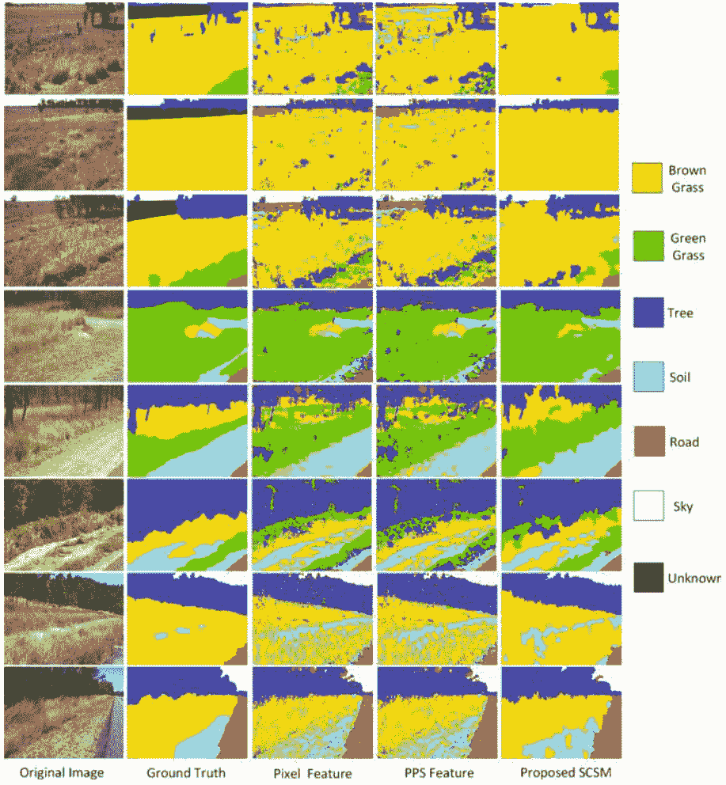

图3.33 使用基于像素特征和PPS特征的SCSM进行分类结果比较。SCSM产生的结果比使用像素或PPS特征更一致。

## 表3.28 性能（%）与斯坦福背景数据集上的最新方法比较

| 参考文献 | 总体准确率 | 类别准确率 |
| :--- | :--- | :--- |
| Gould等人[59] | 76.4 | - |
| Munoz等人[60] | 76.9 | 66.2 |
| Tighe等人[61] | 77.5 | - |
| Socher等人[62] | 78.1 | - |
| Kumar等人[63] | 79.4 | - |
| Lempitsky等人[64] | 81.9 | 72.4 |
| Farabet等人[65] | 81.4 | 76.0 |
| SCSM | 77.5 | 68.8 |

## 表3.29 斯坦福背景数据集上的八类混淆矩阵

| | 天空 | 树 | 道路 | 草地 | 水 | 建筑物 | 山 | 前景 |
| :--- | :--- | :--- | :--- | :--- | :--- | :--- | :--- | :--- |
| 天空 | **94.0** | 2.5 | 0.1 | 0.0 | 0.3 | 2.1 | 0.5 | 0.5 |
| 树 | 5.2 | **69.8** | 1.0 | 3.5 | 0.3 | 14.8 | 1.8 | 3.6 |
| 道路 | 0.2 | 0.6 | **89.3** | 0.9 | 2.6 | 2.2 | 0.4 | 3.8 |
| 草地 | 0.3 | 6.3 | 4.0 | **81.0** | 2.3 | 1.9 | 2.7 | 1.5 |
| 水 | 2.4 | 0.8 | 21.8 | 3.1 | **59.1** | 4.2 | 3.9 | 4.7 |
| 建筑物 | 2.7 | 6.0 | 3.3 | 0.7 | 0.5 | **78.7** | 1.1 | 7.0 |
| 山 | 6.1 | 20.4 | 7.0 | 7.2 | 3.9 | 25.1 | **23.0** | 7.3 |
| 前景 | 2.5 | 5.2 | 11.2 | 2.3 | 1.8 | 20.4 | 1.1 | **55.5** |

隐藏神经元编号=16, $T=0.35, P=5$
粗体数字表示每个对象的类准确性

表3.29中的八类混淆矩阵表明，山和水是正确分类最困难的两个对象，而天空是最容易的一个，准确率达到94%。结果与之前的研究[59, 60]一致，其中天空和山是准确率最高和最低的对象，分别为92%和14%。由于颜色和纹理的相似性，山和水更容易被错误地分类为建筑和道路。

### 3.7.5 总结

本节介绍了一种用于自然道路图像中对象分类的空间上下文超像素模型 (SCSM)。引入了PPS特征来处理区域边界处基于块的特征提取中的噪声。通过融合特定类别的ANN分类器和上下文模型，得到了上下文类别概率图，用于像素级对象分类，然后将分类结果在超像素上进行进一步聚合。然后采用超像素合并策略，将置信度较低的超像素与最相似的邻居合并，以进一步优化结果。实验结果表明，SCSM在裁剪的路边对象、自然路边对象和斯坦福背景数据集上分别达到90%、77.4%和77.5%的准确率。SCSM优于基于像素或基于块的特征，验证了考虑超像素级别的局部和全局空间上下文信息对于对象分类的好处。

SCSM仍然可以从几个方面进行扩展：
- (1) 用于ANN分类的颜色和纹理特征没有考虑它们的不同贡献。值得采用特征选择过程，为每个对象选择一组最重要的特征，以创建类别特定的特征。
- (2) 仍然可以通过使用其他分类器（如SVM和集成分类器）而不是ANN来进一步提高性能。
- (3) 相似度度量仅使用颜色特征的直方图计算，因此一个可能的扩展是添加纹理特征，例如基于滤波器组的纹理特征[15]。

## 参考文献

- 1. W.S. McCulloch, W. Pitts, 神经活动中固有思想的逻辑演算。数学生物物理学报 5, 115–133 (1943)
- 2. J. Schmidhuber, 神经网络中的深度学习：概述。神经网络 61, 85–117 (2015)
- 3. L. Zhang, B. Verma, D. Stockwell, 使用颜色强度和矩进行道路边植被分类, 在第11届国际自然计算会议上, 2015, pp. 1250–1255
- 4. N.W. Campbell, B.T. Thomas, T. Troscianko, 使用神经网络进行室外图像的自动分割和分类。国际神经系统杂志 08, 137–144 (1997)
- 5. D.V. Nguyen, L. Kuhnert, K.D. Kuhnert, 在杂乱的室外环境中进行高效植被检测的扩散算法。机器人与自主系统 60, 1498–1507 (2012)
- 6. K.E.A. Van De Sande, T. Gevers, C.G.M. Snoek, 评估用于对象和场景识别的颜色描述符。IEEE模式分析与机器智能 32, 1582–1596 (2010)
- 7. F. Mindru, T. Tuytelaars, L. V. Gool, T. Moons, 在视角和光照变化下进行识别的矩不变量。计算机视觉与图像理解 94, 3–27 (2004)
- 8. C.C. Chang, C.J. Lin, Libsvm: 支持向量机库, 2001. 软件可在http://www.csie.ntu.edu.tw/cjlin/libsvm找到, 2001
- 9. C.J.C. Burges, 支持向量机模式识别教程。数据挖掘与知识发现 2, 121–167 (1998年)
- 10. Z. Qi, Y. Tian, Y. Shi, 鲁棒双支持向量机模式分类。模式识别 46, 305–316 (2013年)
- 11. S. Chowdhury, B. Verma, M. Tom, M. Zhang, 基于像素特征的道路边物体检测方法, 在国际神经网络联合会议 (IJCNN), 2015年, 第1–8页
- 12. P. Jansen, W. Van Der Mark, J.C. Van Den Heuvel, F.C.A. Groen, 基于颜色的越野环境和地形类型分类, 在智能交通系统, 2005年, 第216–221页
- 13. J. Malik, S. Belongie, T. Leung, J. Shi, 用于图像分割的轮廓和纹理分析。Int. J. Comput. Vis. 43, 7–27 (2001)
- 14. M.R. Blas, M. Agrawal, A. Sundaresan, K. Konolige, 用于户外机器人的快速颜色/纹理分割, 在IEEE/RSJ国际智能机器人和系统会议(IROS), 2008, pp. 4078–4085
- 15. J. Winn, A. Criminisi, T. Minka, 通过学习的通用视觉词典进行对象分类, 在第十届IEEE国际计算机视觉会议(ICCV), 2005, pp. 1800–1807
- 16. J. Shotton, J. Winn, C. Rother, A. Criminisi, 用于图像理解的Textonboost: 通过联合建模纹理、布局和上下文的多类对象识别和分割。Int. J. Comput. Vis. 81, 2–23 (2009)
- 17. J. Shotton, M. Johnson, R. Cipolla, 用于图像分类和分割的语义文本森林, 在IEEE计算机视觉和模式识别会议 (CVPR), 2008年, 第1–8页
- 18. L. Zhang, B. Verma, D. Stockwell, 用于植被分类的类语义颜色纹理文本, 在神经信息处理, 2015年, 第354–362页
- 19. Z. Haibing, L. Shirong, Z. Chaoliang, 使用Sevi-Bovw模型进行室外场景理解, 在国际神经网络联合会议 (IJCNN), 2014年, 第2986–2990页
- 20. D. Comaniciu, P. Meer, 均值漂移: 一种鲁棒的特征空间分析方法。IEEE Trans. Pattern Anal. Mach. Intell. 24, 603–619 (2002)
- 21. D. Yining, B.S. Manjunath, 图像和视频中无监督的颜色纹理区域分割. IEEE Trans. Pattern Anal. Mach. Intell. 23, 800–810 (2001)
- 22. R. Xiaofeng, J. Malik, 学习用于分割的分类模型, 在第九届IEEE计算机视觉国际会议(ICCV), 2003, pp. 10–17
- 23. P. Felzenszwalb, D. Huttenlocher, 高效的基于图像的分割方法. Int. J. Comput. Vis. 59, 167-181 (2004)
- 24. C. Chang, A. Koschan, C. Chung-Hao, D.L. Page, M.A. Abidi, 基于背景识别和感知组织的室外场景图像分割. IEEE Trans. Image Process. 21, 1007-1019 (2012)
- 25. A. Bosch, X. Muñoz, J. Freixenet, 自然户外场景的分割和描述。 Image Vis. Comput. 25, 727-740 (2007)
- 26. Y. Kang, K. Yamaguchi, T. Naito, Y. Ninomiya, 用于理解道路场景的多波段图像分割和对象识别。 IEEE Trans. Intell. Trans. Syst. 12, 1423–1433 (2011)
- 27. Y. Lecun, L. Bottou, Y. Bengio, P. Haffner, 基于梯度的学习应用于文档识别。 Proc. IEEE 86, 2278–2324 (1998)
- 28. L. Zheng, Y. Zhao, S. Wang, J. Wang, Q. Tian, CNN特征传递的良好实践, arXiv 预印本arXiv:1604.00133, 2016
- 29. I. Harbas, M. Subasic, 基于CWT的道路边植被检测辅助运动估计, 在第5届欧洲视觉信息处理研讨会(EUVIP), 2014, pp. 1–6
- 30. I. Harbas, M. Subasic, 通过运动估计辅助检测道路边植被, 在2014年第7届国际图像与信号处理大会 (CISP) 上, 第420-425页
- 31. I. Harbas, M. Subasic, 利用可见光谱特征检测道路边植被, 在2014年第37届国际信息与通信技术、电子与微电子大会 (MIPRO) 上, 第1204-1209页
- 32. V. Balali, M. Golparvar-Fard, 利用可扩展的非参数图像解析方法从车载摄像头视频流中分割和识别道路资产。 Autom. Constr. Part A 49, 27–39 (2015)
- 33. B. Sowmya, B. Sheela Rani, 利用模糊聚类技术和竞争神经网络进行彩色图像分割。 Appl. Soft Comput. 11, 3170–3178 (2011)
- 34. T. Kinattukara, B. Verma, 基于小波的模糊聚类技术用于道路物体提取, 在2015年IEEE模糊系统国际会议 (FUZZ) 上, 第1-7页
- 35. J. Schoukens, R. Pintelon, H.V. Hamme, 插值快速傅里叶变换：一项比较研究。 IEEE Trans. Instrum. Meas. 41, 226–232 (1992)
- 36. M. Lotfi, A. Solimani, A. Dargazany, H. Afzal, M. Bandarabadi, 将小波变换和神经网络结合用于图像分类, 第41届东南系统理论研讨会, 2009年, 第44–48页
- 37. T. Kinattukara, B. Verma, 基于聚类的神经网络方法用于道路图像分类, 国际软计算与模式识别会议 (SoCPaR), 2013年, 第172–177页
- 38. T. Kinattukara, B. Verma, 一种用于道路图像分割和分类的神经集成方法, 神经信息处理, 2014年, 第183–193页
- 39. A. Schepelmann, R.E. Hudson, F.L. Merat, R.D. Quinn, 移动机器人割草机的草坪草的视觉分割, IEEE/RSJ国际智能机器人与系统会议 (IROS), 2010年, 第734–739页
- 40. P. Kamavisdar, S. Saluja, S. Agrawal, 对图像分类方法和技术的调查。 Int. J. Adv. Res. Comput. Commun. Eng. 2, 1005–1009 (2013)
- 41. T.-H. Cho, R.W. Conners, P.A. Araman, 自动化工业检测的基于规则、K最近邻和神经网络分类器的比较, 在The IEEE/ACM International Conference on Developing and Managing Expert System Programs, 1991, pp. 202–209
- 42. M. Liu, 基于奇异特征的指纹分类学习的adaboost方法。 Pattern Recogn. 43, 1062–1070 (2010)
- 43. J. Petrová, H. Moravec, P. Slavíková, M. Mudrová, A. Procházka, 使用Matlab的神经网络进行对象分类。 Network 12(10) (2012)
- 44. H.-Y. Yang, X.-Y. Wang, Q.-Y. Wang, X.-J. Zhang, 基于颜色和纹理信息的LS-SVM图像分割 J. Vis. Commun. Image Represent. 23, 1095–1112 (2012)
- 45. A. Rehman, Y. Gao, J. Wang, Z. Wang, 基于复小波结构相似性的图像分类. Sig. Process. Image Commun. 28, 984-992 (2012)
- 46. T.S. Hai, N.T. Thuy, 使用支持向量机和人工神经网络的图像分类. Int. J. Inf. Technol. Comput. Sci. (IJITCS) 4, 32 (2012)
- 47. S. Kang, S. Park, 用于图像分类的融合神经网络分类器. Pattern Recogn. Lett. 30, 789-793 (2009)
- 48. W.-T. Wong, S.-H. Hsu, SVM和ANN在图像检索中的应用。欧洲运营研究杂志173, 938-950 (2006)
- 49. S. Chowdhury, B. Verma, D. Stockwell, 一种基于纹理特征的道路植被分类的新型多分类器技术。专家系统应用42, 5047-5055 (2015)
- 50. J. Ning, L. Zhang, D. Zhang, C. Wu, 基于最大相似性的区域合并的交互式图像分割。模式识别43, 445-456 (2010)
- 51. L. Zhang, B. Verma, D. Stockwell, 自然道路植被分类的空间上下文超像素模型。模式识别60, 444-457 (2016)
- 52. P. Arbelaez, M. Maire, C. Fowlkes, J. Malik, 轮廓检测和分层图像分割。IEEE Trans. Pattern Anal. Mach. Intell. 33, 898-916 (2011)
- 53. Y. Hui, L. Mingjing, Z. Hong-Jiang, F. Jufu, 用于基于内容的图像检索的颜色纹理矩, in 国际图像处理会议 (ICIP), 2002, pp. 929-932
- 54. C. Myung Jin, A. Torralba, A.S. Willsky, 用于对象识别的基于树的上下文模型。IEEE Trans. Pattern Anal. Mach. Intell. 34, 240-252 (2012)
- 55. A. Singhal, L. Jiebo, and Z. Weiyu, “概率空间上下文模型用于场景内容理解,” in 计算机视觉和模式识别 (CVPR), IEEE会议, 2003, pp. 235-241
- 56. Y. Jimei, B. Price, S. Cohen, Y. Ming-Hsuan, 关注罕见类别的上下文驱动场景解析, 在IEEE计算机视觉与模式识别会议 (CVPR), 2014年, 第3294-3301页
- 57. S. Gould, J. Rodgers, D. Cohen, G. Elidan, D. Koller, 基于相对位置先验的多类别分割。国际计算机视觉 80, 300-316页 (2008年)
- 58. B. Micusik, J. Kosecka, 通过超像素共现和3D几何进行街景语义分割, 在IEEE第12届国际计算机视觉研讨会 (ICCV Workshops), 2009年, 第625-632页
- 59. S. Gould, R. Fulton, D. Koller, 将场景分解为几何和语义一致的区域, 在IEEE第12届国际计算机视觉会议 (ICCV), 2009年, 第1-8页
- 60. D. Munoz, J.A. Bagnell, M. Hebert, 堆叠式分层标注, 在欧洲计算机视觉会议 (ECCV) 中, 2010年, 第57-70页
- 61. J. Tighe, S. Lazebnik, 超级解析: 可扩展的非参数图像解析与超像素, 在欧洲计算机视觉会议 (ECCV) 中, 2010年, 第352-365页
- 62. R. Socher, C.C. Lin, C. Manning, A. Y. Ng, 用递归神经网络解析自然场景和自然语言, 在第28届国际机器学习大会 (ICML) 上, 2011年, 第129-136页
- 63. M.P. Kumar, D. Koller, 高效选择场景理解区域, 在IEEE计算机视觉和模式识别会议 (CVPR) 中, 2010年, 第3217-3224页
- 64. V. Lempitsky, A. Vedaldi, A. Zisserman, 用于语义分割的塔模型, 在神经信息处理系统进展中, 2011年, 第1485-1493页
- 65. C. Farabet, C. Couprie, L. Najman, Y. LeCun, 学习场景分层特征。IEEE Trans. Pattern Anal. Mach. Intell. 35, 1915-1929 (2013年)

## 第四章 道路边视频数据分析的深度学习技术

在本章中，我们描述了用于道路边视频数据分析的深度学习技术。我们首先介绍了深度学习概念，并对几种典型的CNN进行了简要回顾。然后，我们进行了一项实验研究，比较了使用CNN自动提取的特征与使用传统手工工程特征的优劣。我们还展示了多个CNN集成与单个CNN或MLP分类器的比较。

最后，我们提出了一种用于道路数据分析的深度学习架构，并与现有方法在基准数据集上展示了其最先进的性能。

## 4.1 引言

深度学习技术最近在各种计算机视觉任务中越来越受欢迎，并展示出最先进的性能。这种受欢迎的主要原因是它们可以从原始图像像素中自动学习具有区分性和紧凑表示的特征，而不是使用手工设计的特征，并将学习到的特征分类到不同的对象类别中。深度学习技术能够固有地编码每个对象的区分特征，同时考虑到对象类别内部的变化或环境引起的变化。与传统的机器学习算法不同，在深度学习中不需要手动进行特征工程，如特征提取和选择。

以前已经提出了各种类型的深度学习技术，例如CNN，递归神经网络，深度置信网络，深度Boltzmann机和堆叠自编码器。尽管这些技术的实际结构可能有所不同，但它们共享一个类似的概念框架，其中包含多层线性或非线性处理单元，逐渐从低级到高级层生成特征表示。因此，在更高的层次上可以获得更抽象和有区别的模式。

图4.1 LeNet-5 CNN的架构。总共有7层，不包括输入层。通过逐步应用卷积和子采样操作，提取抽象特征表示。然后将这些特征输入两个全连接层，用于将输入数据分类到不同的对象类别中。

CNN是最广为人知的用于对象分类的深度学习技术之一。CNN的设计受到动物视觉皮层的启发，即细胞的排列和学习过程。它也可以被视为MLP的生物启发变体。CNN中的学习涉及多个处理层，包括多个线性和非线性变换。

图4.1显示了最初用于数字字符识别的流行LeNet-5 CNN的整体结构。主要处理层包括[输入—卷积—求和—池化—全连接]，即输入层被馈送到一个卷积(CONV)层，其中使用一组可学习的filters。然后，这些filters被馈送到修正线性单元（RELUs）中，以增加决策函数的非线性。在RELUs之后，使用了一个子采样层（SUMP），其中进行非线性下采样，最后使用了一个全连接（FC）层来对对象进行分类[2]。

## 4.2 相关工作

在过去几年中，深度学习技术的研究受到了极大的关注。图4.2显示了从1970年到2016年关于CNN的研究文章数量，表明在对CNN及其在各种任务中的应用的研究工作上有了显著增加。

已经提出了基于各种类型的CNN的深度学习架构，用于对象分类任务。表4.1列出了几种典型的CNN架构及其报告的应用。

除了LeNet-5之外，Ba等人[3]提出了一种基于深度递归神经网络的视觉注意模型，并使用强化学习来训练模型，通过关注输入图像的最相关区域。该模型在MNIST数据集和多位数字街景房屋号码数据集上进行了评估。与CNN相比，该模型在房屋号码识别方面更加成功。Donahue等人[4]提出了一种循环卷积模型。

图4.2 1970年至2016年的CNN研究趋势。 来源 Scopus

#### 表4.1 典型CNN类型的简要回顾

| 参考文献 | CNN类型 | 架构的简要描述 | 应用 |
| :--- | :--- | :--- | :--- |
| LeCun等人[13] | LeNet | 首次将CNN应用于数字识别。[输入—卷积—求和—卷积—求和—全连接] | 邮政编码，手写数字 |
| Krizhevsky等人[46] | AlexNet | 推广CNN用于计算机视觉。[卷积—5x最大值求和—全连接] | 手写数字，ILSVRC 2010 |
| Zeiler等人[47] | ZF Net | 类似于AlexNet。[未池化特征图—修正—重构—池化—修正—全连接] | ImageNet 2012, Caltech 101, Caltech 256, PASCAL 2012 |
| Szegedy et al. [48] | GoogLeNet | 引入了一个inception模块来减少参数。[输入—卷积—池化—Inception—ReLU—SOFTMAX] | ILSVRC 2012–2014 |
| Simonyan et al. [49] | VGGNet | 与GoogLeNet类似的配置，但没有inception。[输入—3x最大池化—3xFC—SOFTMAX] | ILSVRC 2012–2014 |
| Kaiming et al. [50] | ResNet | 使用跳跃连接，但使用了大量的批量归一化。末尾没有全连接层。 | CIFAR 10, ILSVRC 2012 |

适用于大规模视觉学习的架构，在将12,000多个视频分类为101个人类动作类别的任务中取得了希望的结果。Dundar等人[5]提出了一种聚类算法，以减少相关参数的数量，从而提高准确性。使用一种补丁特征提取方法来减少相邻位置的滤波器之间的冗余。在STL-10图像识别数据集上获得了74.1%的准确率，在MNIST数据集上的测试错误率为0.5%。Krizhevsky等人[6]提出了ImageNet深度卷积神经网络，用于对超过120万高分辨率图像进行分类。ImageNet具有6000万个参数和65万个神经元，包括五个卷积层 and 三个全连接层，最后是1000路分类softmax层。

为了确保快速训练，使用了非饱和神经元，同时还有一个高效的GPU实现。在[7]中，深度学习被用于机器人手抓检测。使用两个深度网络的两步级联系统，其中第一个网络的顶部检测结果被第二个网络重新评估。在黑盒图像分类中应用了一个深度网络，使用了额外的13万个未标记样本[8]。在[9]中，提出了一个稳健的4层CNN架构用于人脸识别，可以处理带有遮挡、姿态变化、面部表情和不同光照的面部图像。

## 4.3 自动与手动特征提取

### 4.3.1 引言

虽然CNN已成功应用于许多计算机视觉任务，但了解CNN learning过程在其他现有技术上的优势仍然很重要。CNN的复杂性使其难以直接用于一些方便和小规模的图像处理任务，其中很难获得足够的训练数据。CNN以其自动从原始图像中提取特征的能力而闻名。然而，目前还不清楚深度学习架构中的特征提取是否比手动特征提取技术更好。目前很少有研究系统地评估深度学习架构的自动特征提取和分类能力。因此，进行系统研究以回答这个问题非常重要。

在本节中，我们进行系统实验，比较CNN与传统的MLP在图像分类任务中的表现[10]，以回答以下问题：(1)始终使用具有自动特征提取的CNN对图像分类是否更好？(2)与传统的MLP相比，CNN在非复杂数据集上的表现如何？(3)如何进一步提高CNN的性能？我们使用MLP作为基准分类器，有两个原因：(1)在CNN中进行特征提取后的分类层可以表示为MLP，(2)MLP是一种常用的人工神经网络，支持带或不带手动特征提取的对象分类。

### 4.3.2 比较框架

图4.3展示了比较框架的概述[10]，该框架用于比较CNN中的自动特征提取和手动特征提取。传统的MLP被用作所有模型的基准分类器，用于比较。

该框架将输入图像分别输入三个独立的神经网络模型进行对象分类，包括CNN、基于图像的MLP（即MLP的输入是原始图像像素）和基于特征的MLP（即MLP的输入是从图像中提取的LBP特征）。

- (1) 使用CNN进行自动特征提取。使用了LeNet-5 CNN架构的修改版本，包括七层，其中包括两个卷积层，两个池化层，两个全连接层和一个输出层。在卷积层中，使用一组可学习的filters。每个filter在空间上很小，覆盖了输入数据的全部深度。给定一个宽度为 $W$、高度为 $H$、深度为 $D$ 的图像，可学习的 filters 在空间上滑动，导致一系列特征图的宽度和高度分别为 $W_1 = (W - F + 2P)/S + 1$ 和 $H_1 = (H - F + 2P)/S + 1$，其中 $F$ 表示神经元的空间范围，$P$ 是零填充的数量，$S$ 是步长的大小。
- 池化层独立地对输入数据的每个深度切片进行操作，并使用最大操作在空间上调整其大小。对于一个宽度为 $W \times$ 高度为 $H \times$ 深度为 $D$ 的图像，池化层将其大小减小为宽度为 $W_1 = (W - F)/S + 1$ 和高度为 $H_1 = (H - F)/S + 1$。在计算所有颜色通道后，执行最大操作。因此，特征矩阵在池化层中减小。在最后一层，使用基于MLP的全连接网络进行对象分类。
- (2) 基于图像的MLP。将完整图像的原始像素输入到MLP分类器中。首先对图像数据进行归一化处理，然后将包含整个原始图像像素集的向量输入到MLP中。在实验中，隐藏神经元的数量和训练迭代次数会进行迭代调整。
- (3) 基于特征的MLP。将从图像中提取的人工工程特征向量输入到MLP分类器中。在本实验中，我们使用LBP算子在整个输入图像上生成特征向量。
- 与基于图像的MLP相比，基于特征的MLP在特征空间上操作相对较小，因为从图像中提取的特征数量较少。

图4.4 卷积神经网络（CNN）、基于图像的多层感知器（MLP）和基于特征的多层感知器（MLP）的特征提取比较。可以看出，这三个模型的主要区别在于使用的特征，而分类器是相同的MLP。

### 4.3.3 实验结果

实验基于三个数据集，包括MNIST [11] 数据集，牛体温传感器数据集和裁剪的道路边物体数据集。由于MNIST数据集已经被分成了60000个训练样本和10000个测试样本，我们使用了这个数据划分。牛数据集包含大约50张体温传感器图像，用于检测牛的体温变化。图像数据被分为两个类别：颜色变化和颜色不变。图4.5显示了两个样本图像，分别显示了两个传感器设备的颜色变化和无颜色变化。裁剪的道路边物体数据集包括从DTMR视频帧中手动裁剪的650个区域和七个物体，如天空、树木、道路、土壤和草地。对于牛体温传感器和裁剪的道路边物体数据集，我们使用了75%的数据进行训练，剩下的25%的数据进行测试。

所有的算法都是在Matlab平台上开发的。对于基于图像的MLP和基于特征的MLP，使用默认参数，并使用共轭梯度下降反向传播算法进行训练。

图4.6显示了使用CNN、基于图像的MLP和基于特征的MLP在三个数据集上使用相同参数设置获得的分类结果。在MNIST数据集上，这三种方法在使用不同的迭代次数时分别具有最高的准确率为99%，80%和72%。结果表明，不适当的手动特征提取会导致较低的准确率，与自动特征提取相比。对于牛数据集，当使用50个迭代次数进行训练时，基于特征的MLP能够达到100%的准确率，但其性能在使用不同的迭代次数时波动很大。CNN的准确率稳步增加，最高准确率为100%，而基于图像的MLP似乎具有最低的整体准确率。

值得注意的是，在牛数据集中，每个类别的图像相对较少（约50张）。在裁剪数据集上评估时，这三种方法的性能相似，并且当使用更多的迭代次数时，准确率会增加，直到达到某些点后准确率达到峰值。基于特征的多层感知器（MLP）达到了最高的72.9%准确率，其次是使用CNN的72.7%准确率和使用基于图像的多层感知器（MLP）的70.6%准确率。与在MNIST和牛数据集上获得的结果相比，CNN在裁剪的道路边数据集上显示出相对较低的分类准确率，这表明在裁剪的道路边数据集中，对象的分类更加困难。有趣的是，基于图像的多层感知器（MLP）的准确率略高于CNN。尽管可以通过改变CNN的参数设置来改善CNN的性能，但这个结果对于最近的CNN扩展也可能成立。裁剪的道路边对象数据集是一个典型的例子，展示了适当的特征提取的重要性。

尽管CNN表现良好，但值得注意的是，在裁剪的道路边对象数据集上，具有自动特征提取的CNN并不是最好的分类器。传统的基于图像和特征的MLP在三个数据集中表现得和或比CNN更好。因此，建议在对象分类任务中尝试传统的MLP和CNN，特别是当只有少量数据可用时。

图4.5 牛热传感器数据集中两个图像显示了颜色的变化和不变。

图4.6 使用CNN、基于图像的MLP和基于特征的MLP获得的分类准确率（%）。MLP具有120个隐藏神经元。

### 4.3.4 总结

本节介绍了一个比较框架，以研究CNN中自动特征提取与手动特征提取对图像分类任务性能的影响。使用了三个模型，包括具有自动特征提取的CNN，使用完整原始图像像素的传统MLP，以及使用LBP特征提取的MLP。MLP被用作这三个模型的分类器。使用类似的参数设置进行了实验，以系统地分析这三个模型在三个基准数据集上的分类准确率。结果表明，具有自动特征提取的CNN表现良好，但不一定是小图像分类任务的最佳解决方案。对于像奶牛和裁剪的小数据集，简单的传统MLP分类器与人工设计的特征可能具有相同或更好的效果，甚至优于CNN。

## 4.4 单一与集成架构

### 4.4.1 引言

深度学习技术的架构可能对其性能产生重大影响。最近关于深度学习的研究倾向于采用更深的学习架构，但是越来越复杂的深层架构使得全局优化所有参数并将其用于大规模图像处理任务变得困难。例如，微软亚洲在2015年提出的深度残差网络（ResNet）的深度可达到153层。除了深度学习，另一种选择是采用广度和集成策略，这也可以看作是通过将多个深度学习网络组合成另一层来增加深度。集成策略的一个例子是装袋法[13]，它提供了关于如何通过从整个数据集中随机抽样来训练分类和回归树的集成的见解。

近年来的研究表明，集成技术在学习和减少测试误差方面能够取得出色的表现。一个由五个ConvNets [14] 组成的集成模型，在ImageNet 2012分类基准测试中的top-1错误率为38.1%，而单一模型的top-1错误率为40.7%。在[15]中，研究表明通过使用六个ConvNets的集成模型，top-1错误率从40.5降低到36.0%。[16]中提出了一种用于机器人手抓检测的深度学习技术。使用两个深度网络的两步级联系统，其中第一个网络的top检测结果会被第二个网络重新评估。深度学习已经与一个由神经网络组成的集成模型相结合[17]，并应用于一个包含130,000个未标记样本的黑盒图像分类问题。

尽管深度学习集成技术已经应用于许多应用任务，但缺乏系统比较深度架构集成与传统的MLP分类技术的性能的研究。本节描述了一个CNN集成[18]，并将其与MLP集成和单个CNN或MLP分类器进行实验比较，以回答以下问题：(1) 与传统分类器 (如MLP) 的集成相比，卷积神经网络 (CNN) 的集成表现如何？以及 (2) 与单个分类器相比，分类器的集成表现如何？

### 4.4.2 比较框架

在图4.7中描述了一种系统的框架[18]，用于比较CNN和MLP的不同架构。考虑了四个模型：CNN的集成，MLP的集成，单个CNN和单个MLP。前两个模型如下所述：

- (1) 一组卷积神经网络。集成架构包括三个独立的卷积神经网络，如图4.8所示。集成中的每个卷积神经网络都包含卷积层、最大池化层和全连接层等标准层。在卷积层中，使用一组 filters，每个 filter的大小可变。每个卷积神经网络中使用窗口大小为28 × 28和 filter大小为5 × 5。最大池化层在输入数据的每个深度切片上独立操作，并使用最大运算符在空间上调整其大小。每个卷积神经网络都是单独训练的，所有卷积神经网络的决策使用多数投票进行组合。
- (2) 一组多层感知机。完整图像的原始像素作为三个多层感知机的输入。使用反向传播算法对多层感知机进行训练，并迭代地改变隐藏神经元的数量和训练时期。

### 4.4.3 实验结果

实验使用了三个真实世界数据集，包括MNIST、牛热数据集[19]和裁剪的道路边对象数据集。训练和测试设置与第4.3.3节中的设置相同。

表4.2和4.3分别显示了在这三个数据集上使用CNN集合和MLP集合获得的结果。在MNIST数据集上，CNN集合的结果显示出99.3%的准确率，高于图像MLP集合的95.2%的准确率。类似地，在裁剪的道路边对象数据集上，CNN集合显示出更高的准确率（88.8%对73.5%）比MLP集合。而在牛数据集上，MLP集合和CNN集合具有相同的训练和测试100%的准确率。结果表明，与多层感知机集成相比，构建卷积神经网络集成更有益。

#### 表4.2 使用卷积神经网络集成的准确率（%）

| 数据 | 卷积神经网络1 迭代次数 | 卷积神经网络2 迭代次数 | 卷积神经网络3 迭代次数 | 训练准确率 | 测试准确率 |
| :--- | :--- | :--- | :--- | :--- | :--- |
| MNIST | 150 | 1000 | 1010 | 99.2 | 99.3 |
| COW | 1000 | 1050 | 1100 | 100 | 100 |
| 裁剪 | 1000 | 1050 | 1100 | 95.5 | 88.8 |

#### 表4.3 使用MLP集成的准确率 (%)

| 数据 | MLP1 迭代 | MLP2 迭代 | MLP3 迭代 | MLP1 隐藏层 | MLP2 隐藏层 | MLP3 隐藏层 | 训练准确率 | 测试准确率 |
| :--- | :--- | :--- | :--- | :--- | :--- | :--- | :--- | :--- |
| MNIST | 50 | 53 | 55 | 12 | 12 | 12 | 78.4 | 95.2 |
| COW | 100 | 100 | 101 | 6 | 16 | 6 | 100 | 100 |
| 裁剪 | 50 | 50 | 45 | 16 | 16 | 20 | 79.2 | 73.5 |

#### 表4.4 使用单个CNN的准确率 (%)

| 数据 | 类型 | 50次迭代 | 100次迭代 | 1000次迭代 |
| :--- | :--- | :--- | :--- | :--- |
| MNIST | 训练 | 92.0 | 94.3 | 98.2 |
| | 测试 | 98.7 | 98.9 | 99.0 |
| 牛 | 训练 | 62.9 | 94.3 | 100 |
| | 测试 | 80.0 | 86.7 | 100 |
| 裁剪 | 训练 | 52.9 | 72.3 | 93.2 |
| | 测试 | 42.1 | 66.2 | 72.7 |

#### 表4.5 使用单个MLP的准确率 (%)

| 隐藏神经元 | MNIST 迭代 | MNIST 训练 | MNIST 测试 | 牛 迭代 | 牛 训练 | 牛 测试 | 裁剪 迭代 | 裁剪 训练 | 裁剪 测试 |
| :--- | :--- | :--- | :--- | :--- | :--- | :--- | :--- | :--- | :--- |
| 6 | 1000 | 100 | 86.7 | 100 | 100 | 100 | 100 | 72.1 | 57.7 |
| 12 | 50 | 100 | 93.3 | 100 | 100 | 92.3 | 100 | 94.5 | 68.2 |
| 16 | 50 | 100 | 86.7 | 100 | 100 | 100 | 100 | 95.5 | 70.0 |
| 24 | 100 | 100 | 86.7 | 50 | 100 | 84.6 | 50 | 86.4 | 68.8 |
| 120 | 50 | 100 | 80.0 | 50 | 100 | 84.6 | 100 | 98.7 | 70.6 |

表4.4和4.5分别显示了使用单个卷积神经网络和多层感知机在三个数据集上获得的结果。对于卷积神经网络和多层感知机，与单个分类器相比，分类器集成能够稍微提高测试准确率，对于MNIST和裁剪的道路边对象数据集而言。相比之下，在COW数据集上，单个卷积神经网络或多层感知机可以达到与卷积神经网络或多层感知机集成相同的准确率，这可能是由于COW数据集中图像和对象类别较少。对于 MNIST 数据集，卷积神经网络分类器集成优于多层感知机分类器集成，单个卷积神经网络也优于单个多层感知机。值得注意的是，多层感知机集成的准确率低于使用单个卷积神经网络，可能是因为卷积神经网络的参数已经针对MNIST数据集进行了优化。在裁剪的道路边对象数据集上，卷积神经网络集成显示出最高的测试准确率为88.8%。接着是MLP集成，而单个CNN和单个MLP表现最差。结果表明，考虑使用CNN集成可以获得更准确的结果。

尽管CNN集成在所有实验中表现良好，并在测试准确率方面产生最佳结果（即MNIST数据集上为99.3%，牛数据集上为100%，裁剪道路边数据集上为88.8%），但值得注意的是，CNN集成需要更长的时间和更多的训练周期才能达到最高准确率。传统基于图像的MLP和MLP集成在牛数据集上与CNN集成表现一样良好。在评估的四个模型中，CNN集成在所有数据集上表现良好。

### 4.4.4 总结

本节介绍了一组卷积神经网络，并将其性能与一组多层感知机、单个卷积神经网络和单个多层感知机在三个真实世界数据集上进行了比较。对于这四个模型，使用完整图像的原始像素作为输入，并具有类似的训练和测试实验条件。实验结果发现，在评估的四个模型中，卷积神经网络的集成是表现最好的。

因此，建议在处理真实世界数据集中的对象分类问题时，考虑使用一组分类器，特别是卷积神经网络。

## 4.5 深度学习网络

### 4.5.1 引言

最近在视频数据分析方面的努力主要转向了引入上下文信息，以对类别标签的一致性施加约束，以改进对象分类结果。上下文是真实世界对象的统计属性，包含了辅助准确的类别标签推断的关键信息，用于复杂的对象分类任务。对人类感知的研究发现，当对象外部的像素不可见时，人类对对象的分类准确性低于机器的分类准确性[20]。

上下文有两种类型：全局上下文从整体场景中收集图像统计信息，局部上下文考虑感兴趣区域的邻近信息。广泛认为，图像像素的类别标签不仅应与邻近像素传递的局部上下文保持高一致性，还应与整个场景的全局上下文在整体语义和布局方面匹配。

在现有的场景内容分析研究中，上下文通常在两个阶段被考虑：特征提取和标签推断。特征提取收集了一组全局或局部的上下文特征，用于捕捉嵌入在每种场景中的对象之间的内在相关性，通常与视觉特征一起使用以提高类别标签的准确性。常用的上下文特征包括绝对位置[21]、相对位置[22]、方向空间关系[23, 24]和对象共现统计[25]。

层次模型，如CNNs [26]和上下文层次模型(CHMs) [27]，已经在从原始图像像素中学习视觉和上下文特征表示方面取得了有希望的结果。标签推断旨在通过能量最小化过程中施加预测标签的上下文一致性，使用图形模型，如CRFs [26, 28, 29], MRFs [30]和基于区域边界能量函数[16]。

近年来，深度学习技术在从原始图像像素中提取稳健的上下文特征方面显示出优势。广泛使用的卷积神经网络 (CNN) 利用卷积和池化层逐步提取抽象和上下文模式，并与MRF或CRF推理共同建模以生成强预测器。Farabet等人[26]将分层CNN特征应用于CRF的标签推理中。Schwing和Urtasun [31]将CRF推理的错误传递给CNN。然而，CRF推理与CNN训练完全独立。为了解决这个问题，Zheng等人[32]将CRF推理形式化为递归神经网络，并将它们集成到一个统一的框架中。

尽管CNN取得了有希望的结果，但它们有两个缺点：
- (1) 由于考虑到有限的上下文，它们经常被视觉上相似的像素所困惑；
- (2) 由于每个学习系统参数的依赖性，它们无法自动适应图像内容。

为了编码更高阶的上下文，递归CNN [33]将CNN的输出反馈到同一网络的输入中，但它仅适用于序列数据。递归上下文传播网络[34, 35]递归地聚合局部上下文信息直到整个图像，然后将聚合的信息传播回局部特征，但它仍受到超像素不纯标签的影响，并且可能在不同层级之间遭受严重的错误传播。CHMs [27]通过在层次结构中集成一系列分类器的输出来整合多分辨率的上下文信息，但上下文信息是基于下采样图像的，其中丢失了相当比例的信息。

上述方法在自然场景中的像素标注方面取得了有希望的结果。然而，它们通常存在三个缺点：
- (1) 上下文特征要么完全丢弃对象的绝对空间坐标，而这些坐标对于场景解析来说也是重要的上下文信息，要么过度保留所有绝对坐标，这就需要大量的训练数据来确保可靠的性能。
- (2) MRF和CRF标签推断模型在捕捉整个图像中对象之间的长程标签依赖关系等全局上下文方面的能力有限。它们主要关注局部邻域中标签的一致性，因此在确保全局一致性方面的能力有限。
- (3) 无法适应新场景中的局部特性，这对于克服对象的变异性和环境变化至关重要[36]。

在本节中，我们描述了一个深度学习网络[37]，它能够学习短期和长期的上下文特征，以提高实际数据上的对象分割准确性。深度学习网络不是以分层方式执行，而是借鉴了深度学习中多层的概念，在图像块中获取强大的上下文特征，并将其与视觉特征集成，以对不同对象的图像像素进行稳健的标注。

### 4.5.2 深度学习网络

#### 4.5.2.1 问题建模

令 $I \in R^3$ 为由一组像素组成的图像，目标是对每个像素 $v$ 进行类别标签 $C = \{c_i | i = 1, 2, \dots, M\}$ 进行分割，其中 $M$ 是所有类别的数量。对于基于超像素的目标分类，令 $S_V = \{s_j | j = 1, 2, \dots, N\}$ 表示从 $I$ 过分割得到的超像素集合，$N$ 是所有超像素的数量，它们对应的视觉特征是 $F^v = \{f_j^v | j = 1, 2, \dots, N\}$，局部上下文特征是 $F^l = \{f_j^l | j = 1, 2, \dots, N\}$，全局上下文特征是 $F^g = \{f_j^g | j = 1, 2, \dots, N\}$。然后，任务转化为对 $s_j$ 中的所有像素 $v$ 进行标记为类别 $c \in C$ 的问题，将正确标签 $c_i$ 分配给 $s_j$ 的条件概率可以表示为：

$$P(c_i | s_j, W) = P(c_i | f_j^v, f_j^l, f_j^g; W^v, W^l, W^g)$$
$$\text{s.t. } \sum_{1 \le i \le M} P(c_i | s_j) = 1 \eqno (4.1)$$

其中，$W = \{W^v, W^l, W^g\}$ 分别表示 $F^v, F^l$ 和 $F^g$ 特征的权重参数，这些参数可以从训练数据中学习得到。最终目标是获得一个模型，该模型可以最大化为所有超像素分配正确标签的条件概率之和：

$$P(C | S, W) \approx \max_{s_j \in S, c_i \in C} P(c_i | s_j, W) \eqno (4.2)$$

现在，有两个任务：(1) 如何获得包含短距离和长距离标签依赖的局部和全局上下文特征，以及适应测试图像的局部属性？(2) 如何无缝地集成视觉和上下文特征，以获得所有超像素的最大化条件概率。

#### 4.5.2.2 网络架构

如图 4.9 所示，深度学习 (DP) 网络架构[37]用于解决问题定义中的两个任务，由三个层组成：
- (1) 视觉特征预测层：基于视觉特征构建类语义监督分类器，预测所有超像素的类别概率。
- (2) 上下文投票层：根据最可能的类别和相应的对象共现先验 (OCP) 获取每个超像素的局部和全局上下文自适应投票 (CAV) 特征。
- (3) 集成层：联合建模视觉和 CAV 特征的相关性，为每个超像素推导出最终的类别标签。

具体而言，该网络以超像素级别的视觉特征作为输入，并为每个超像素输出一个类别标签。第二层接受第一层预测的类别概率，并将最可能的类别与从训练数据中学习到的 OCPs 整合，以学习图像相关的 CAV 特征，这些特征反映了每个超像素在测试图像中由全局或局部上下文投票的类别标签偏好。

$$V^l(C | s_j) = \psi^l(P^v(C | s_j), OCP) \eqno(4.3)$$
$$V^g(C | s_j) = \psi^g(P^v(C | s_j), OCP) \eqno(4.4)$$

其中，$\psi^l$ 和 $\psi^g$ 分别代表全局和局部上下文的投票函数。CAV 特征自适应地捕捉超像素的短程和长程标签依赖关系，以及测试图像的局部特性。

为了整合上下文和视觉特征，我们将视觉特征、局部和全局 CAV 特征作为三个独立的组成部分，并将 CAV 特征归一化为类别概率。然后，我们使用一组优化的神经元权重在第三层中共同建模视觉和 CAV 特征的类别概率相关性：

$$P(C | s_j) = \mathcal{H} \left( \underbrace{P^v(C | s_j)}_{\text{视觉特征}}, \underbrace{P^l(C | s_j)}_{\text{局部 CAV}}, \underbrace{P^g(C | s_j)}_{\text{全局 CAV}} \right) \eqno(4.5)$$
$$P^T(C | s_j) = \bigcup_{1 \le i \le M} P(c_i | f_j^T; W^T) \eqno(4.6)$$

其中 $\mathcal{H}$ 代表联合建模三种类别概率的函数，$P^T(C | s_j)$ 基于特征 $f_j^T$ 和相应的权重 $W^T, T \in \{v, l, g\}$。

（此处为图 4.9：三层深度学习网络架构的框架。预测层将超像素级视觉特征作为输入，并使用类别-语义分类器预测每个超像素的类别概率；上下文投票层根据最可能的类别和对象共现先验从空间块中的超像素和相邻超像素中收集投票，计算全局和局部上下文自适应投票（CAV）特征。OCPs 是从训练数据中收集的所有块对的对象共现先验。集成层将基于视觉特征的类别概率、全局和局部 CAV 特征整合在一起，生成类别概率向量。每个超像素最终通过多数投票策略被分配一个类别标签。）

#### 4.5.2.3 视觉特征预测层

对于输入图像，视觉特征预测层利用多个类别特定的分类器，基于一组视觉特征，获得每个超像素属于每个类别的概率的近似预测。它作为一个初始预测，并为基于图像上下文生成 CAV 特征奠定了基础。

对于第 $j$ 个超像素 $s_j$，其对于第 $i$ 个类别 $c_i$ 的类别概率可以得到：

$$P^v(c_i | s_j) = \phi_i(f_{i,j}^v) = \sigma(w_{1,i} f_{i,j}^v + b_{1,i}) \eqno(4.7)$$

其中 $f_{i,j}^v$ 是提取的视觉特征，$\phi_i$ 是针对类别 $c_i$ 训练的二元分类器的预测函数，$w_{1,i}$ 和 $b_{1,i}$ 是可训练的权重和偏置参数。

对于所有 $M$ 个类别，可以得到一个类别概率向量 $P^v(C | s_j)$：

$$P^v(C | s_j) = [P^v(c_1 | s_j), \dots, P^v(c_i | s_j), \dots, P^v(c_M | s_j)] \eqno(4.8)$$

上述向量包括每个超像素 $s_j$ 属于所有类别 $C$ 的可能性。我们可以将 $s_j$ 分配给具有最大概率的类别：

$$\text{如果 } P^v(\hat{c} | s_j) = \max_{1 \le i \le M} (P^v(c_i | s_j)), \text{ 则将 } s_j \text{ 分配给类别 } \hat{c} \eqno(4.9)$$

与其训练一个单一的多类分类器来对同一模型中的所有类进行分类，不如为每个类设计和训练一系列特定类别的一对多分类器。使用特定类别的分类器有三个优点：(1) 允许为每个类别选择最具区分性的特定类别特征；(2) 专注于每次训练一个更强大和有效的特定类别分类器；(3) 处理训练数据不平衡的问题，特别是在自然数据集中存在许多罕见但重要的类别的情况下。对于现实世界的数据集，像素分布可能偏向于几个常见类别，训练一个多类分类器有完全忽视罕见类别并对那些常见类别有偏好的风险。

#### 4.5.2.4 上下文投票层

上下文投票层是深度学习网络的核心部分，其目的是学习捕捉对象之间的长程和短程标签依赖关系，并适应测试图像中的局部属性。主要有两个处理步骤：

- (1) 从训练数据中计算对象共现先验 (OCPs)。

OCPs 编码了训练图像空间块中对象的类标签分布之间的先验空间相关性。为了有效地捕捉关于特定场景类型的先验上下文知识，OCPs 考虑了四种类间空间相关性，包括对象共现频率、相对位置、绝对位置和方向空间关系。

这些相关性携带了关于场景的重要语义信息，并可以用于使用视觉特征为基础的分类器对类标签施加上下文约束。图 4.10 举例说明了 OCPs 和相对/绝对位置在建模类间空间相关性方面的差异。

OCPs 的计算如下所述。为了考虑对象的相对和绝对位置，图像 $I$ 首先被划分为一组均匀分布的块 $B= \{B_k | k = 1, 2, \dots, K\}$，其中 $K$ 是块的数量。使用块的目的是在相对和绝对位置上保持良好的权衡，其中对象的相对位置偏移由块之间的空间关系编码，而绝对位置则由每个块的空间坐标保留。所有块的空间分布也保留了块之间的方向空间关系，例如左右空间关系。由于对象可能出现在场景的任何位置，因此创建了全局和局部 OCP 来表示场景中两个共现对象的长程和短程标签依赖关系。

（此处为图 4.10：相对位置先验、绝对位置先验和 OCP 在三种情况下空间相关性建模的示意图，例如“左边天空和右边建筑”。）

(a) 全局 OCP。假设一个具有类标签 $\hat{c}$ 在块 $B_{k2}$ 中出现，一个矩阵 $\mathcal{M}_{c|\hat{c}}(k_1, k_2)$ 表示一个具有类 $c$ 的像素出现在块 $B_{k1}$ 的概率。该矩阵被归一化以确保每个块中所有类别的条件概率分布，即 $\sum_{c=1}^M \mathcal{M}_{c|\hat{c}}(k_1, k_2) = 1$。对于每对块，可以生成一个具有 $M \times M$ 元素的矩阵，每个元素表示位于两个不同块中的两个对象之间的像素共现频率。

图 4.11 直观地说明了计算两个块的对象共现矩阵的过程。对于一个块 $B_{k1}$ 中的超像素，全局 OCP 反映了其类别标签的置信度，支持来自其他 $K-1$ 个块中所有超像素的上下文信息。

(b) 局部 OCP。给定一个相邻的超像素 $s_p$ (相对于 $s_j$) 具有类别标签 $\hat{c}$，矩阵 $\mathcal{M}_{c|\hat{c}}(s_j, s_p)$ 表示 $s_j$ 具有类别 $c$ 出现的概率。局部矩阵是在训练数据上针对每对相邻超像素计算的，所有超像素对可能出现在场景的任何位置，因为在计算过程中没有考虑空间块。它补偿了全局 OCP 中未考虑同一块内超像素的“自我支持”上下文信息。

（此处为图 4.11：展示了在斯坦福背景数据集中计算全局 OCP 的示意图。对于每个空间图像块，计算所有类别的像素分布，并为每两个块对形成一个对象共现矩阵，以反映两个块内对象之间的长程标签依赖关系。）

对于超像素，局部 OCP 考虑了其类别标签的置信度，并利用其相邻超像素的上下文信息进行支持。对于全局和局部 OCP，计算每个类别的出现频率是通过计算该类别所有超像素中的像素数量来实现的。每个超像素的类别标签是基于地面真实像素标签的多数投票获得的。由于分割超像素的形状和大小的变化，一个超像素可能跨越多个空间块的边界。因此，图像 $I$ 中的每个超像素 $s_j$ 都被分配给一个唯一的块 $B_k$：

$$s_j \in B_k \quad \text{if } (\bar{x}_j, \bar{y}_j) \in B_k \eqno (4.10)$$

其中 $(\bar{x}_j, \bar{y}_j)$ 是 $s_j$ 所有像素点的质心。

- (2) 在测试图像中生成 CAV 特征。

一旦获得全局和局部 OCP，我们可以继续描述如何将它们纳入测试图像中所有超像素的 CAV 特征计算中。对于每一个超像素，我们首先使用式(4.9)和相应的空间块式(4.10)获取最可能的类别，然后采用投票策略根据全局和局部 OCP 来获取超像素的 CAV 特征。具体来说，空间块中的每个超像素根据全局 OCP $\mathcal{M}_{c|\hat{c}}(k_1, k_2)$ 向其他块中的超像素的类别概率投票，以及基于局部 OCP $\mathcal{M}_{c|\hat{c}}(s_j, s_p)$ 对其邻近超像素的类别概率进行投票。

给定一个块 $B_{k1}$ 中的超像素 $s_j$，令 $S = \{s_q | q = 1, 2, \dots, Q\}$ 为所有其余块中的超像素集合 $\cup(B_{k2}), k_1 \ne k_2$，且 $s_q$ 为 $S$ 的第 $q$ 个元素，则 $s_j$ 从所有 $s_q \in S$ 中获得 $Q$ 个投票：

$$V^g(C | s_j) = \sum_{1 \le k_2 \le K; k_2 \ne k_1} \sum_{s_q \in B_{k2}; s_q \in \hat{c}} w_{2,q} \times \mathcal{M}_{c|\hat{c}}(k_1, k_2) \eqno (4.11)$$

在 $s_q$ 中，$\hat{c}$ 是最可能的类别，$w_{2, q} = P(\hat{c} | s_q) \times \mathbb{C}(s_q)$ 是从 $s_q$ 得到的投票权重，$\mathbb{C}(s_q)$ 是 $s_q$ 中像素的总数。

由于 $s_q$ 可能有 $M$ 个可能的类别标签，得到的全局 CAV 特征 $V^g(C | s_j)$ 可以表示为：

$$V^g(C | s_j) = [V^g(c_1 | s_j), \dots, V^g(c_i | s_j), \dots, V^g(c_M | s_j)] \eqno (4.12)$$

其中 $V^g(c_i | s_j)$ 表示基于全局 OCP 的 $c_i$ 类别对于 $s_j$ 的上下文标签投票。

让 $\bar{S}_j = \{s_p | p = 1, 2, \dots, P\}$ 是相邻超像素的集合，$s_j$ 从其邻居 $s_p$ 处获得 $P$ 票：

$$V^l(C | s_j) = \sum_{1 \le p \le P; s_p \in \hat{c}} w_{2,p} \times \mathcal{M}_{c|\hat{c}}(s_j, s_p) \eqno(4.13)$$

其中 $\hat{c}$ 是 $s_p$ 的最可能类别，权重 $w_{2,p}$ 的计算方式与式(4.11)中的 $w_{2,q}$ 相同。使用类似于式(4.12)的方法，可以基于局部 OCP 获得表示 $s_j$ 的所有类别的局部 CAV 特征，指示上下文标签投票：

$$V^l(C | s_j) = [V^l(c_1 | s_j), \dots, V^l(c_i | s_j), \dots, V^l(c_M | s_j)] \eqno(4.14)$$

现在，我们已经计算出每个超像素的两种类型的 CAV 特征，分别基于全局和局部 OCPs，它们分别代表了场景中超像素使用全局和局部上下文的类标签的置信度。

#### 4.5.2.5 集成层

集成层旨在通过学习一组优化的神经元权重，无缝地集成基于视觉特征的类概率 $P^v(C | s_j)$，局部 CAV 特征 $V^l(C | s_j)$ 和全局 CAV 特征 $V^g(C | s_j)$，以获得测试图像中所有超像素的上下文敏感分类。为了实现这个目标，我们学习了相应神经元的类特定优化权重，以最好地描述每个类与三个预测项之间的相关性。这些权重本质上考虑了视觉特征和上下文线索在预测测试图像中超像素的类标签方面的不同贡献。权重优化过程与多元线性回归模型类似。

为了保持与类别概率 $P^v(C | s_j)$ 的一致性，全局和局部 CAV 特征被归一化为概率，其值在所有类别上的总和为 1：

$$P^g(c_i | s_j) = V^g(c_i | s_j) \bigg/ \sum_{1 \le i \le M} V^g(c_i | s_j) \eqno(4.15)$$

$$P^l(c_i | s_j) = V^l(c_i | s_j) / \sum_{1 \le i \le M} V^l(c_i | s_j) \eqno{(4.16)}$$

对于所有类别的每个类别，从 $P^v, P^l$ 和 $P^g$ 的相应神经元建立连接，以整合三个概率来预测超像素 $s_j$ 的第 $i$ 个类别 $c_i$ 的概率：

$$P(c_i | s_j) = b_{3,i}^c + w_{3,i}^v \times P^v(c_i | s_j) + w_{3,i}^l \times P^l(c_i | s_j) + w_{3,i}^g \times P^g(c_i | s_j) \eqno{(4.17)}$$

其中 $b_{3,i}^c$ 是一个常数值，对于 $c_i$，$w_{3,i}^v, w_{3,i}^l$ 和 $w_{3,i}^g$ 分别是第三层中 $P^v(c_i | s_j), P^l(c_i | s_j)$ 和 $P^g(c_i | s_j)$ 的权重。这些权重是通过最小化标记训练数据上的似然分数的平方偏差之和来学习的：

$$\min \sum_{j=1}^J (P(c_i | s_j) - P'(c_i | s_j))^2 \eqno{(4.18)}$$

其中 $J$ 是训练数据中所有超像素的总数。$P'(c_i | s_j) \in \{1, 0\}$ 表示 $c_i$ 的真实类别标签（为 $c_i$ 时取1，否则取0）。预测的概率被假设为正态分布。

对于所有 $M$ 个类别，学习一系列具有不同权重的连接神经元模型：

$$P(C | s_j) = [P(c_1 | s_j), \dots, P(c_i | s_j), \dots, P(c_M | s_j)] \eqno{(4.19)}$$

最后，使用多数投票策略，将超像素 $s_j$ 标记为在所有类别中具有最高概率的类别 $\hat{c}$：

$$\hat{c} = \arg\max_{1 \le i \le M} P(c_i | s_j) \eqno{(4.20)}$$

深度学习网络的训练和测试过程总结如算法 4.1 所示。

## 算法 4.1: 深度学习网络的训练和测试过程

**输入：** 图像 $I$; 超像素 $S = \{s_j | j = 1, 2, \dots, N\}$; 类别标签 $C = \{c_i | i = 1, 2, \dots, M\}$; 空间块 $B = \{B_k | k = 1, 2, \dots, K\}$。  
**输出：** 类别标签 $s_j$

```
// 使用视觉特征进行初始预测
对于每个超像素 sj ∈ S
    对于每个类别 ci ∈ C
        提取视觉特征 f^v_{i,j};
        获取类别概率：P^v(ci | sj) = fn(w_{1,i} f^v_{i,j} + b_{1,i})
    结束
    获取最有可能的类别：ĉ = max_{1 < i < M} (P^v(ci | sj))
结束

// 将每个超像素分配给一个空间块
对于每个超像素 sj ∈ S
    获取质心 sj: (xj, yj)
    分配给一个块：sj ∈ Bk 如果 (xj, yj) ∈ Bk
结束

// 计算 OCP
对于块 Bk2 ∈ B
    对于块 Bk1 ∈ B 且 k1 ≠ k2
        获取全局 OCP 的类和 c, ĉ: Mc|ĉ(k1, k2)
    结束
结束

对于超像素 sj ∈ S
    对于邻居 sj: sp ∈ Sj
        获取类和的局部 OCP c, ĉ: Mc|ĉ(sj, sp)
    结束
结束

// 计算 VOC 特征
对于每个超像素 sj ∈ S
    对于类 ci ∈ C
        计算全局 CAV 特征：
        V^g(Ci|sj) = Σ Σ w_{2,q} × Mc|ĉ(k1, k2)
        计算局部 CAV 特征：
        V^l(Ci|sj) = Σ w_{2,p} × Mc|ĉ(sj, sp)
    结束
结束

// 通过视觉和 VOC 特征进行最终预测
对于超像素 sj ∈ S
    对于类 ci ∈ C
        将 VOC 转换为概率：
        P^g(ci|sj) = V^g(ci|sj) / Σ V^g(ci|sj)
        P^l(ci|sj) = V^l(ci|sj) / Σ V^l(ci|sj)
        整合视觉和 CAV 特征：
        P(ci|sj) = b^c_{3,i} + w^v_{3,i} × P^v(ci|sj) + w^l_{3,i} × P^l(ci|sj) + w^g_{3,i} × P^g(ci|sj)
    结束
    分配给具有最大概率的类：
    sj ∈ ĉ 如果 P(ĉ | sj) = max_{1 < i < M} P(ci|sj)
结束
```

### 4.5.3 实验结果

使用 CAV 特征评估深度学习网络在场景解析的三个广泛使用的数据集上：斯坦福背景、MSRC 和 SIFT Flow。我们还将我们的结果与现有场景解析算法在文献中报告的准确性进行比较。

#### 4.5.3.1 实验设置

(1) **超像素级视觉特征**。这些特征包括一组颜色、几何和纹理特征 [38]，包括每个超像素像素上的 RGB 颜色的均值和标准差（$2 \times 3$ 维），超像素边界框的顶部高度与图像高度的比值（1 维），超像素形状在图像上的掩码（$8 \times 8$ 维），RGB 颜色的 11-bin 直方图（$11 \times 3$ 维），textons 的 100-bin 直方图（100 维）以及超像素区域上密集 SIFT 描述符的 100-bin 直方图（100 维）。此外，我们还获得了超像素区域膨胀 10 个像素的 RGB、texton 和 SIFT 直方图（233 维）。

SIFT 描述符使用 8 个方向和 4 个尺度滤波器计算，textons 是使用 K-means 聚类算法对旋转不变最大响应滤波器组的 8 维响应进行聚类得到的。最终的视觉特征向量由 537 个元素组成。我们还使用最小冗余最大相关算法 [39] 为每个类别获取了前 50 个特征的类别特定子集。

(2) **系统参数**。使用基于图的算法获取超像素 [40]，其参数设置基于 [38]：$\sigma = 0.8, min = 100, k = 200 \times \max(1, \sqrt{D_I/640})$，其中 $D_I$ 是图像的较大维度（高度或宽度）。我们评估了两种常用的 ANN 和 SVR 分类器，以获取基于视觉特征的类别概率。ANN 每个类别有三层神经网络，分别为 50-16-1 层，而 SVR 使用 RBF 核函数。空间块的数量设置为 36，即宽度为 6，高度为 6。

(3) **评估指标**。我们使用三个评估指标：全局准确率，即正确分类的像素占总测试像素的比例；平均准确率，即类别像素准确率的平均值；类别准确率，即每个类别的像素准确率。平均准确率对每个类别的分类平等对待，不考虑它们出现的频率。类别准确率表示每个对象的性能。

(4) **评估策略**。对于斯坦福背景数据集，我们遵循 [41] 中的评估过程，即进行五折交叉验证以获得分类准确性：每个折中随机选择 572 张图像用于训练，143 张图像用于测试。与斯坦福背景数据集类似，我们使用五折交叉验证来获得 MSRC 21 类数据集的分类准确性。对于 SIFT Flow数据集，我们使用与 [42] 相同的训练/测试数据分割：2488 张训练图像和 200 张测试图像。

#### 4.5.3.2 斯坦福背景数据集的性能

表 4.6 显示了深度学习网络与最先进方法相比的全局和平均准确性。该网络使用 ANN 和 SVR 分类器分别实现了 80.6% 和 81.2% 的全局准确性，性能与最先进方法相当。与现有方法 [35, 43] 相比，深度学习网络的类别准确性较低，为 72%，这表明深度学习网络更倾向于关注具有大比例训练像素的常见类别，这符合我们的预期，因为 CAV 特征是基于训练数据中的类别像素分布生成的。人们认为，对于特定类别，训练像素越多，其 OCPs 越可靠，相应的 CAV 特征准确性越高。

该网络明显优于基于视觉特征的 ANN 和 SVR 分类器，准确率分别提高了 10% 和 38%，证实了 CAV 特征在减少错误分类和细化分类标签方面的优势。图 4.12 直观展示了定性结果。

表 4.7 显示了八个类别的混淆矩阵。我们可以观察到，天空、建筑物和道路是三个最容易正确分类的对象，准确率超过 87%，而山和水是最困难的对象，准确率不到 56%。结果与现有研究 [41, 44, 45] 一致，其中天空和山的准确率最高，约为 94%，最低准确率约为 14%。对于山，所有像素中有 24.6% 被错误分类为树，可能是由于颜色特征重叠造成的。同样，大量水域像素（20% 和 17.3%）被错误分类为道路和前景对象。在所有类别中，前景对象导致其他类别的总体错误分类最多，这主要是由于自然场景中前景对象外观的巨大变化。

#### 4.5.3.3 MSRC 数据集上的性能

表 4.8 显示了深度学习网络与最先进方法的性能比较。我们的网络使用 ANN 和 SVR 分类器在 MSRC 数据集上分别实现了全局准确率 82.1% 和 85.5%。

**表 4.6 性能 (%) 与之前方法在斯坦福背景数据集上的比较**

| 参考文献 | 全局准确率 | 平均准确率 |
| :--- | :--- | :--- |
| Gould 等人 [41] | 76.4 | — |
| Sharma 等人 [34] | 81.8 | 73.9 |
| Shuai 等人 [51] | 81.2 | 71.3 |
| Sharma 等人 [35] | 82.3 | 79.1 |
| 视觉特征 (ANN) | 69.7 | 55.8 |
| DP 网络 (ANN) | 80.6 | 72.1 |
| 视觉特征 (SVR) | 43.1 | 35.2 |
| DP 网络 (SVR) | 81.2 | 71.8 |

图 4.12 斯坦福背景数据集上的定性结果（最佳观看效果为彩色）。

与仅使用视觉特征相比，深度学习网络通过利用 CAV 特征显示出更强大的场景解析结果，成功消除了许多错误分类。

**表 4.7 斯坦福背景数据集上八个对象的混淆矩阵 (SVR, 全局准确率 81.2%)**

| | 天空 | 树 | 道路 | 草地 | 水 | 建筑物 | 山 | 前景 |
| :--- | :--- | :--- | :--- | :--- | :--- | :--- | :--- | :--- |
| **天空** | **91.2** | 3.9 | 0.1 | 0.1 | 0.1 | 3.3 | 0.1 | 1.2 |
| **树** | 2.7 | **74.3** | 1.1 | 1.2 | 0.2 | 14.4 | 0.2 | 6.0 |
| **道路** | 0.1 | 0.6 | **87.2** | 1.8 | 0.3 | 2.8 | 0 | 7.1 |
| **草地** | 0.3 | 5.2 | 10.6 | **64.4** | 1.0 | 1.8 | 0.8 | 15.9 |
| **水** | 3.2 | 0.6 | 20.0 | 1.7 | **55.6** | 1.0 | 0.7 | 17.3 |
| **建筑物** | 1.4 | 4.5 | 1.3 | 0.2 | 0.3 | **88.6** | 0.1 | 3.7 |
| **山** | 7.6 | 24.6 | 4.7 | 4.7 | 2.0 | 8.7 | **37.2** | 10.5 |
| **前景** | 1.3 | 4.2 | 6.1 | 1.1 | 0.7 | 11.1 | 0.1 | **75.4** |

注：粗体数字表示每个对象的类别准确率。

使用 SVR 除了在 [45] 报告的 87% 全局准确率之外，优于所有基准方法。在所有方法中，深度学习网络获得了 82% 和 85% 的最高平均准确率，表明在所有类别之间具有高度平衡的性能。它还保持了对所有 21 个类别中的 11 个类别的最高准确率，这证实了深度学习网络在大多数类别中获得高准确率的好处。尽管大多数类别使用 ANN 获得了更高的准确率，但使用 SVR 获得了更高的全局准确率，这可能是由于类别之间像素分布不平衡造成的。图 4.13 显示了样本图像的分类结果，这证实了使用 CAV 特征比仅使用视觉特征具有更好的性能。

表 4.9 总结了所有 21 个类别的像素级类别准确率的混淆矩阵。正如我们所看到的，书籍、塔、建筑物、汽车和树是正确识别的最容易的对象，准确率超过 91%，而道路、水、鸟和船是最困难的对象，准确率不到 77%。‘物体’类别，如椅子、塔、猫、狗、标志、书籍和羊，对其他类别几乎没有混淆，而‘背景’类别，如建筑物、草地、树木、天空和道路，导致最多的误分类。由于它们在大多数自然场景中的邻居关系，导致超过 10% 的道路、天空和人脸像素被错误分类为草地、建筑物和身体，这可能是由于局部 CAV 特征对它们标签的空间一致性施加了强约束。

#### 4.5.3.4 SIFT Flow 数据集上的性能

表 4.10 比较了 DP 网络与最先进方法的准确性。与其他方法相比，该网络显示出更高的性能，并且使用 ANN 或 SVR 分类器将最先进的全局准确性从 80.9% 提高到 87.0%。这种显著的改进可能是因为在 SIFT Flow 数据集上有更多的训练图像，与 Stanford 背景和 MSRC 数据集相比，这对于收集可靠的 OCP 和计算准确的 CAV 特征至关重要。此外，DP 网络...

**表 4.8 与先前方法在 MSRC 数据集上的性能(%) 比较**

| 参考文献 | 全局 | 平均 | 建筑物 | 草地 | 树 | 牛 | 绵羊 | 天空 | 飞机 | 水 | 脸 |
| :--- | :--- | :--- | :--- | :--- | :--- | :--- | :--- | :--- | :--- | :--- | :--- |
| [52] | 72 | 58 | 62 | 98 | 86 | 58 | 50 | 83 | 60 | 53 | 74 |
| [53] | 81 | 74 | 67 | 96 | 88 | 82 | 83 | 91 | 81 | 66 | 89 |
| [54] | — | 62 | 74 | 93 | 84 | 61 | 60 | 79 | 55 | 75 | 75 |
| [55] | 84 | 79 | 67 | 89 | 85 | 93 | 79 | 93 | 84 | 75 | 79 |
| [56] | 84 | 81 | 67 | 95 | 92 | 91 | 90 | 95 | 96 | 73 | 88 |
| [45] | 87 | 78 | 81 | 96 | 89 | 74 | 84 | 99 | 84 | 92 | 90 |
| DP ANN | 82 | 82 | 94 | 82 | 92 | 89 | 87 | 56 | 89 | 68 | 84 |
| DP SVR | 85 | 85 | 94 | 87 | 91 | 89 | 89 | 86 | 83 | 71 | 82 |

| 参考文献 | 汽车 | 自行车 | 花 | 标志 | 鸟 | 书 | 椅子 | 道路 | 猫 | 狗 | 身体 | 船 |
| :--- | :--- | :--- | :--- | :--- | :--- | :--- | :--- | :--- | :--- | :--- | :--- | :--- |
| [52] | 63 | 75 | 63 | 35 | 19 | 92 | 15 | 86 | 54 | 19 | 62 | 07 |
| [53] | 79 | 92 | 79 | 70 | 45 | 93 | 80 | 78 | 78 | 41 | 72 | 13 |
| [54] | 62 | 75 | 81 | 71 | 36 | 72 | 25 | 75 | 52 | 39 | 49 | 10 |
| [55] | 87 | 89 | 92 | 71 | 46 | 96 | 79 | 86 | 76 | 64 | 77 | 50 |
| [56] | 76 | 94 | 90 | 76 | 57 | 84 | 69 | 82 | 89 | 60 | 84 | 44 |
| [45] | 86 | 92 | 98 | 91 | 35 | 95 | 53 | 90 | 62 | 77 | 70 | 12 |
| DP ANN | 93 | 91 | 96 | 84 | 85 | 98 | 90 | 66 | 94 | 89 | 88 | 85 |
| DP SVR | 93 | 89 | 95 | 87 | 75 | 98 | 90 | 65 | 84 | 83 | 84 | 77 |

图 4.13 在 MSRC 数据集上的定性结果。使用 CAV 特征的深度学习网络成功地消除了视觉特征预测结果中的大部分错误分类。

**表 4.9 MSRC 数据集上 21 个对象的混淆矩阵（SVR，全局准确率 85.5%）**

| | 建筑物 | 草地 | 树 | 牛 | 绵羊 | 天空 | 飞机 | 水 | 脸 | 汽车 |
| :--- | :--- | :--- | :--- | :--- | :--- | :--- | :--- | :--- | :--- | :--- |
| **建筑** | 93.9 | 0.6 | 1.1 | 0.1 | 0.0 | 1.2 | 0.3 | 0.2 | 0 | 0.8 |
| **草地** | 1.3 | 87.1 | 1.3 | 4.4 | 1.5 | 0.6 | 0.4 | 0.2 | 0 | 0.1 |
| **树** | 3.4 | 2.0 | 91.3 | 0.1 | 0 | 1.5 | 0.5 | 0.1 | 0 | 0.4 |
| **牛** | 0.1 | 9.2 | 1.2 | 88.7 | 0.1 | 0.4 | 0 | 0 | 0 | 0 |
| **绵羊** | 0 | 10.3 | 0.1 | 0.3 | 89.0 | 0 | 0 | 0 | 0 | 0 |
| **天空** | 11.4 | 0 | 2.0 | 0 | 0 | 85.9 | 0.2 | 0.1 | 0 | 0 |
| **飞机** | 6.0 | 4.3 | 1.0 | 0 | 0 | 2.1 | 82.6 | 0.2 | 0 | 0.5 |
| **水** | 3.2 | 1.4 | 0.2 | 1.0 | 0 | 13.2 | 0.4 | 70.6 | 0 | 0.1 |
| **脸** | 2.5 | 0 | 1.5 | 0.1 | 0.1 | 0.6 | 0 | 0.1 | 81.9 | 0.1 |
| **汽车** | 3.9 | 0.1 | 0.7 | 0 | 0 | 0 | 0.2 | 0.1 | 0 | 93.4 |
| **自行车** | 5.8 | 0.4 | 1.5 | 0 | 0 | 0.2 | 0 | 0.2 | 0.1 | 0.2 |
| **花** | 0.6 | 0.3 | 2.1 | 0 | 0 | 0.4 | 0 | 0 | 0.6 | 0 |
| **标志** | 5.0 | 0.4 | 1.4 | 0.2 | 0 | 2.5 | 0.2 | 0.1 | 0.3 | 0.2 |
| **鸟** | 0.6 | 9.2 | 0.5 | 0.4 | 0.4 | 4.4 | 0.8 | 4.0 | 0 | 0.1 |
| **书** | 0.7 | 0.2 | 0.1 | 0 | 0.1 | 0.1 | 0 | 0.1 | 0.2 | 0.1 |
| **椅子** | 1.1 | 3.3 | 0.3 | 0.2 | 0.1 | 0.5 | 0.1 | 0.2 | 0.2 | 0.1 |
| **道路** | 2.9 | 13.0 | 0.3 | 0.1 | 0.2 | 4.0 | 0.9 | 0.4 | 0 | 5.7 |
| **猫** | 0.3 | 6.0 | 1.3 | 0.4 | 0.9 | 1.5 | 0.1 | 0.1 | 0.9 | 0.1 |
| **狗** | 0.6 | 5.9 | 0.5 | 0.8 | 0.1 | 0.9 | 0 | 0.5 | 2.0 | 0 |
| **身体** | 2.2 | 1.6 | 1.7 | 0.1 | 0.5 | 2.3 | 0 | 0.2 | 3.6 | 0.8 |
| **船** | 1.7 | 0.4 | 0.3 | 0.8 | 0.1 | 0.6 | 3.6 | 13.7 | 0 | 0.1 |

### 表4.9 (续)

| | 自行车 | 花 | 标志 | 鸟 | 书 | 椅子 | 道路 | 猫 | 狗 | 身体 | 船 |
| :--- | :--- | :--- | :--- | :--- | :--- | :--- | :--- | :--- | :--- | :--- | :--- |
| 建筑 | 0.5 | 0 | 0.2 | 0 | 0.3 | 0 | 0.5 | 0 | 0 | 0.1 | 0.1 |
| 草地 | 0.2 | 0 | 0 | 0.5 | 0 | 0.1 | 1.5 | 0 | 0 | 0.8 | 0.1 |
| 树 | 0.5 | 0 | 0 | 0 | 0.1 | 0 | 0.1 | 0 | 0 | 0.1 | 0.1 |
| 牛 | 0 | 0 | 0 | 0 | 0.1 | 0 | 0 | 0.1 | 0 | 0 | 0.1 |
| 绵羊 | 0.1 | 0 | 0 | 0 | 0.1 | 0 | 0.1 | 0.1 | 0 | 0 | 0 |
| 天空 | 0 | 0 | 0.3 | 0 | 0 | 0 | 0 | 0 | 0 | 0 | 0 |
| 航空 | 0 | 0 | 0.5 | 0 | 0 | 0 | 0.6 | 0 | 0 | 0.1 | 2.1 |
| 水 | 0 | 0 | 0.1 | 2.2 | 0 | 0 | 2.7 | 0 | 0 | 0.8 | 4.2 |
| 脸 | 0.1 | 0.2 | 0.1 | 0 | 1.2 | 0 | 0.4 | 0.2 | 0.1 | 10.7 | 0 |
| 自行车 | 88.7 | 0 | 0 | 0 | 0.1 | 0 | 2.7 | 0 | 0 | 0.1 | 0 |
| 花 | 0.3 | 95.0 | 0 | 0 | 0 | 0 | 0.1 | 0.2 | 0.1 | 0.1 | 0 |
| 标志 | 0.8 | 0.2 | 86.7 | 0.2 | 0.4 | 0.1 | 0.3 | 0 | 0 | 0.3 | 0.6 |
| 鸟 | 1.1 | 0.1 | 0.3 | 74.9 | 0 | 0 | 1.0 | 1.5 | 0.1 | 0 | 0.8 |
| 书 | 0.1 | 0 | 0.2 | 0 | 97.9 | 0 | 0.1 | 0 | 0.1 | 0.2 | 0 |
| 椅子 | 0.3 | 0.1 | 0.2 | 0.1 | 0.5 | 89.7 | 2.4 | 0 | 0.1 | 0.5 | 0.3 |
| 道路 | 1.4 | 0 | 0.1 | 0.3 | 0 | 2.0 | 65.3 | 0.7 | 2.3 | 0.5 | 0 |
| 猫 | 0.1 | 1.5 | 0 | 0.4 | 0.1 | 0 | 2.3 | 83.6 | 0.4 | 0.2 | 0 |
| 狗 | 0.2 | 0.2 | 0 | 0.1 | 0.1 | 0 | 3.8 | 0.9 | 82.8 | 0.5 | 0.2 |
| 身体 | 0.2 | 0.2 | 0 | 0.1 | 0.3 | 0.1 | 1.9 | 0.1 | 0.2 | 83.9 | 0.2 |
| 船 | 0.6 | 0 | 0.3 | 0 | 0 | 0 | 1.0 | 0 | 0 | 0.1 | 76.7 |

### 表4.10 性能（%）与SIFT Flow数据集上的先前方法进行比较

| 参考文献 | 全局准确率 | 平均准确率 |
| :--- | :--- | :--- |
| Liu等人[42] | 74.75 | — |
| Najafi 等人[57] | 76.6 | 35.0 |
| Nguyen等人[58] | 78.9 | 34.0 |
| Shuai等人[51] | 80.1 | 39.7 |
| Sharma等人[35] | 80.9 | 39.1 |
| 视觉特征 (ANN) | 67.7 | 17.0 |
| DP网络 (ANN) | 86.9 | 36.9 |
| 视觉特征 (SVR) | 63.4 | 16.2 |
| DP网络 (SVR) | 87.0 | 36.7 |

网络还具有36.9%的最高类别准确率。结果表明，在克服自然场景中对象分类的复杂性方面，融入CAV上下文特征的优势。图4.14在样本图像上直观比较了DP网络和基于视觉特征的分类器的分类结果，我们可以观察到CAV特征在消除错误分类方面的能力。

### 4.5.4 讨论

从实验结果中可以得出以下主要教训：

- (1) 与仅使用视觉特征相比，CAV特征在性能上取得了显著改进。这主要是因为CAV特征能够捕捉对象之间的长程和短程标签依赖关系，能够适应测试图像的局部特性，并保留相对和绝对位置信息。CAV特征反映了嵌入在每种场景中的丰富语义上下文信息，因此对于对复杂对象的类别标签施加上下文约束非常有用。

- (2) 深度学习网络在三个基准数据集上显示出比现有最先进的场景解析系统更高的准确性，尽管其系统参数仅仅是预设的，并未经过优化。它的架构也是通用的，因为它的三层相对独立，可以直接采用各种现有算法。例如，第一层中的分类器可以选择不同的概率预测模型，如ANN、SVR和Adaboost。

- (3) 深度学习网络显著提高了SIFT Flow数据集上的准确性，从80.9%提高到87%。这主要是因为数据集中有大量的训练图像，可以确保收集到足够的对象分布信息以生成可靠的CAV特征。因此，在具有对象类别的像素级注释的大型数据集中，网络更适合于对象分类。

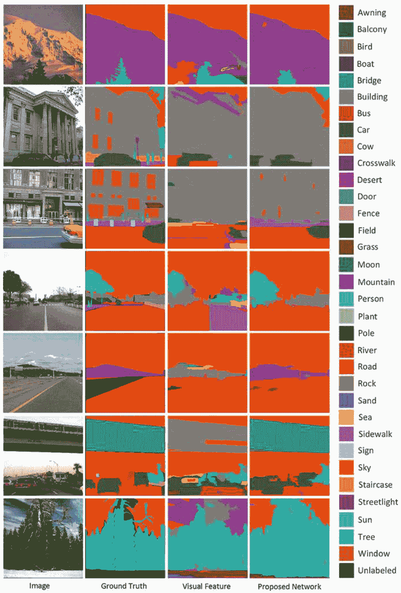

**图4.14 SIFT Flow数据集上的定性结果。** 结果表明，将CAV特征纳入以提高分类准确性并纠正自然场景中复杂对象的错误分类的好处。

### 4.5.5 总结

本节介绍并评估了一种深度学习网络架构，该架构具有CAV特征，用于复杂自然图像中的对象分割和分类。对当前文献的一个重要贡献是将空间图像块纳入其中，通过在块之间汇集对象像素分布来收集对象共现先验知识，从而保留并利用对象的绝对和相对坐标，以对类别标签施加上下文约束。

CAV特征具有捕捉整个场景中对象的短程和长程标签依赖性的优势，同时能够适应场景中的局部特性。因此，它们非常有效地消除了基于视觉特征预测结果中的误分类错误。还表明，引入CAV特征显著提高了基于视觉特征预测的准确性，并在SIFT Flow数据集上取得了迄今为止最高的全局准确率87.0%，在Stanford背景和MSRC数据集上分别达到了81.0%和85.0%的竞争性全局准确率。

深度学习网络架构仍然可以从几个方面进行扩展：
(1) 其性能基于一组预定义的系统参数，可以通过找到一组优化的参数集来进一步改进，例如超像素的数量，选择的特征子集的维度和ANN隐藏神经元的长度。
(2) 它假设视觉和上下文特征之间存在线性关系，值得通过整合技术（如逻辑回归模型）来利用更复杂的非线性关系的建模。
(3) 它采用参数化过程，通过添加非参数化的预处理步骤可以进一步提高其准确性，该步骤检索与查询图像最相似的训练图像，以收集更可靠的对象共现先验。
(4) CAV特征对训练数据中的类像素分布非常敏感，特别是对于罕见的类别，因此仍然有必要研究更加关注这些罕见但重要类别的策略，例如从其他数据集中丰富罕见类别的示例。

## 参考文献

- 1. L. Zheng, Y. Zhao, S. Wang, J. Wang, Q. Tian, CNN特征传递的良好实践。arXiv 预印本 arXiv:1604.00133 (2016)
- 2. S.D. Learning, CS231n：用于视觉识别的卷积神经网络 (2016). http://cs231n.github.io/convolutional-networks/
- 3. J. Ba, V. Mnih, K. Kavukcuoglu, 多目标识别与视觉注意力, *arXiv 预印本 arXiv:1412.7755 (2014)*
- 4. J. Donahue, L. Anne Hendricks, S. Guadarrama, M. Rohrbach, S. Venugopalan, 等, 长期循环卷积网络用于视觉识别和描述, 在计算机视觉和模式识别 (*CVPR*), *IEEE 会议* (2015), pp. 2625–2634
- 5. A. Dundar, J. Jin, E. Culurciello, 卷积聚类用于无监督学习。*arXiv 预印本 arXiv:1511.06241 (2015)*
- 6. D.V. Nguyen, L. Kuhnert, K.D. Kuhnert, 植被检测的结构概述。一种新颖的使用主动照明系统进行高效植被检测的方法。机器人。自动。系统。60, 498–508 (2012)
- 7. I. Lenz, H. Lee, A. Saxena, 用于检测机器人抓取的深度学习。国际机器人研究。34, 705–724 (2015)
- 8. L. Romaszko, 一种基于集成神经网络分类器的深度学习方法, 用于黑盒ICML 2013竞赛, 在表示学习挑战研讨会上, 国际机器学习大会(ICML)(2013), 第1–3页
- 9. S. Ahmad Radzi, K.-H. Mohamad, S.S. Liew, R. Bakhteri, 卷积神经网络用于人脸识别, 具有姿态和光照变化。国际工程技术杂志(IJET) 6, 44–57 (2014)
- 10. F. Shaheen, B. Verma, M. Asafuddoula, 在深度学习架构中自动特征提取的影响, 在数字图像计算：技术和应用(DICTA)国际会议上(2016), 页码1–8
- 11. C. Cortes, Y. LeCun, C.J.C. Burges, 手写数字的MNIST数据库。 http://yann.lecun.com/exdb/mnist/
- 12. K. He, X. Zhang, S. Ren, J. Sun, 用于图像识别的深度残差学习。*arXiv预印本 arXiv:1512.03385 (2015)*
- 13. Y. Lecun, L. Bottou, Y. Bengio, P. Haffner, 基于梯度的学习应用于文档识别。IEEE会议论文集 86, 2278–2324 (1998)
- 14. D.V. Nguyen, L. Kuhnert, K.D. Kuhnert, 用于杂乱室外环境中高效植被检测的扩散算法。机器人与自主系统 60, 1498–1507 (2012)
- 15. D.V. Nguyen, L. Kuhnert, T. Jiang, S. Thamke, K.D. Kuhnert, 用于室外汽车导航的植被检测, 收录于工业技术国际会议（ICIT）, IEEE国际会议（2011), 第358–364页
- 16. A. Bosch, X. Muñoz, J. Freixenet, 自然室外场景的分割和描述。Image Vis. Comput. 25, 727–740 (2007)
- 17. W. Guo, U.K. Rage, S. Ninomiya, 基于决策树模型的时间序列小麦图像中植被的光照不变分割。计算机与电子农业 96, 58–66 (2013)
- 18. F. Shaheen, B. Verma, 用于自动特征提取的深度学习架构集成, in计算智能 (ISSCI), IEEE会议系列(2016) (inPress)
- 19. D.-X. Liu, T. Wu, B. Dai, 融合激光雷达和彩色图像用于检测草地越野场景, in车辆电子与安全 (ICVES), IEEE国际会议（2007), pp. 1–4
- 20. R. Mottaghi, S. Fidler, A. Yuille, R. Urtasun, D. Parikh, 用于识别场景理解中瓶颈的人机CRFs. 模式分析与机器智能。IEEE Trans. 38, 74–87 (2016)
- 21. J. Shotton, J. Winn, C. Rother, A. Criminisi, Textonboost用于图像理解：通过联合建模纹理、布局和上下文进行多类对象识别和分割。Int. J. Comput. Vis. 81, 2–23 (2009)
- 22. S. Gould, J. Rodgers, D. Cohen, G. Elidan, D. Koller, 基于相对位置先验的多类分割。Int. J. Comput. Vis. 80, 300–316 (2008)
- 23. Y. Jimei, B. Price, S. Cohen, Y. Ming-Hsuan, 带有对稀有类别的关注的上下文驱动场景解析，出现在计算机视觉和模式识别（CVPR），IEEE会议上(2014), pp. 3294–3301
- 24. A. Singhal, L. Jiebo, Z. Weiyu, 场景内容理解的概率空间上下文模型, 出现在计算机视觉和模式识别（CVPR），IEEE会议上(2003)，pp. 235-241
- 25. B. Micusik, J. Kosecka, 通过超像素共现和3D几何进行街景语义分割, 在计算机视觉研讨会（ICCV Workshops），IEEE第12届国际会议上（2009年），第625-632页
- 26. C. Farabet, C. Couprie, L. Najman, Y. LeCun, 学习场景的分层特征标签。模式分析与机器智能。IEEE Transactions. 35, 1915-1929 (2013年)
- 27. M. Seyedhosseini, T. Tasdizen, 具有上下文层次模型的语义图像分割。模式分析与机器智能。IEEE Transactions. 38(5), 951-964 (2015年)
- 28. D. Batra, R. Sukthankar, C. Tsuhan, 学习图像标签的类别特定亲和力，在计算机视觉和模式识别（CVPR），IEEE会议上（2008年），第1-8页
- 29. Z. Lei, J. Qiang, 使用统一的图模型进行图像分割。模式分析与机器智能。IEEE Transactions. 32, 1406-1425 (2010年)
- 30. R. Xiaofeng, B. Liefeng, D. Fox, RGB-(D)场景标记：特征和算法，在计算机视觉和模式识别（CVPR），IEEE会议上(2012)，pp. 2759-2766
- 31. A.G. Schwing, R. Urtasun, 全连接的深度结构化网络。arXiv预印本 arXiv:1503.02351 (2015)
- 32. S. Zheng, S. Jayasumana, B. Romera-Paredes, V. Vineet, Z. Su, 等，条件随机场作为循环神经网络。arXiv预印本 arXiv:1502.03240 (2015)
- 33. P.H. Pinheiro, R. Collobert, 用于场景解析的循环卷积神经网络。arXiv预印本 arXiv:1306.2795 (2013)
- 34. A. Sharma, O. Tuzel, M.-Y. Liu, 递归上下文传播网络用于语义场景标记，在神经信息处理系统进展(2014)，第2447-2455页
- 35. A. Sharma, O. Tuzel, D.W. Jacobs, 用于语义分割的深层次解析，在计算机视觉和模式识别 (CVPR)，IEEE 会议(2015)，第530-538页
- 36. S. Ling, L. Li, L. Xuelong, 通过多目标遗传编程进行图像分类特征学习。神经网络学习系统。IEEE Transactions. 25, 第1359-1371页 (2014)
- 37. L. Zhang, B. Verma, D. Stockwell, S. Chowdhury, 用于场景解析的空间约束位置先验，在神经网络 (IJCNN)，国际联合会议（2016），第1480-1486页
- 38. J. Tighe, S. Lazebnik, Superparsing: 可扩展的非参数图像解析与超像素，计算机视觉（ECCV），欧洲计算机视觉会议（2010），第352-365页
- 39. P. Hanchuan, L. Fuhui, C. Ding, 基于最大依赖性、最大相关性和最小冗余性的特征选择。模式分析与机器智能。IEEE Trans. 27, 1226-1238页（2005）
- 40. P. Felzenszwalb, D. Huttenlocher, 高效基于图的图像分割。计算机视觉国际期刊。Vis. 59, 167-181页（2004）
- 41. S. Gould, R. Fulton, D. Koller, 将场景分解为几何和语义一致的区域，计算机视觉（ICCV），IEEE第12届国际会议（2009），第1-8页
- 42. L. Ce, J. Yuen, A. Torralba, 非参数场景解析：通过密集场景对齐进行标签传递，在计算机视觉和模式识别（CVPR），IEEE会议上（2009年），第1972-1979页
- 43. V. Lempitsky, A. Vedaldi, A. Zisserman, 金字塔模型用于语义分割，在神经信息处理系统进展（2011年），第1485-1493页
- 44. D. Munoz, J.A. Bagnell, M. Hebert, 堆叠式分层标记，在计算机视觉（ECCV），欧洲会议上（2010年），第57-70页
- 45. L. Ladicky, C. Russell, P. Kohli, P.H.S. Torr, 关联的分层随机场 (Fields). 模式分析与机器智能. IEEE Transactions. 36, 1056-1077页（2014年）
- 46. A. Krizhevsky, I. Sutskever, G.E. Hinton, 使用深度卷积神经网络进行ImageNet分类，在神经信息处理系统进展(2012)中，第1097-1105页
- 47. M.D. Zeiler, R. Fergus, 可视化和理解卷积网络，在欧洲计算机视觉会议(2014)中，第818–833页
- 48. C. Szegedy, W. Liu, Y. Jia, P. Sermanet, S. Reed等，使用卷积进行更深层次的学习，在计算机视觉和模式识别(CVPR)中，IEEE会议(2015)中，第1-9页
- 49. K. Simonyan, A. Zisserman, 用于大规模图像识别的非常深的卷积网络。arXiv预印本 arXiv:1409.1556 (2014)
- 50. K. He, X. Zhang, S. Ren, J. Sun, 深度残差网络中的身份映射。arXiv预印本 arXiv:1603.05027 (2016)
- 51. S. Bing, W. Gang, Z. Zhen, W. Bing, Z. Lifan, 将参数化和非参数化模型集成到场景标注中，计算机视觉和模式识别 (CVPR)，IEEE会议 (2015)，pp. 4249-4258
- 52. J. Shotton, J. Winn, C. Rother, A. Criminisi, Textonboost: 联合外观、形状和上下文建模进行多类对象识别和分割，计算机视觉 (ECCV)，欧洲会议 (2006)，pp. 1-15
- 53. Z. Long, C. Yuanhao, L. Yuan, L. Chenxi, A. Yuille, 递归分割和识别图像解析的模板。模式分析与机器智能。IEEE Transactions. 34, 359-371 (2012)
- 54. E. Akbas, N. Ahuja, 低层次分层多尺度分割自然图像的统计数据。模式分析与机器智能。IEEE Transactions. 36, 1900-1906 (2014)
- 55. A. Lucchi, L. Yunpeng, P. Fua, 使用近似梯度下降和工作集的结构化预测学习，在计算机视觉和模式识别 (CVPR) 中，IEEE会议上 (2013年)，第1987-1994页
- 56. C. Gatta, F. Ciompi, 堆叠的顺序尺度-空间泰勒上下文。模式分析与机器智能。IEEE Transactions. 36, 1694-1700页 (2014年)
- 57. M. Najafi, S.T. Namin, M. Salzmann, L. Petersson, 样本和过滤：通过高效过滤的非参数场景解析。arXiv预印本 arXiv:1511.04960 (2015年)
- 58. T.V. Nguyen, L. Canyi, J. Sepulveda, Y. Shuicheng, 自适应非参数图像解析。Circ. Syst. Video Technol. IEEE Trans. 25, 1565-1575 (2015)

## 第五章 案例研究：道路边视频数据用于火灾风险评估的分析

在本章中，我们提供了一个案例研究，利用机器学习技术对道路边视频数据进行火灾风险评估。

## 5.1 引言

准确估计道路边草地的特定位置参数，如生物量、高度、覆盖率和密度，在许多应用中起着重要作用，如辅助生长条件监测和道路边植被管理。这些参数可以提供可靠和重要的指示当前草地状况、生长阶段和未来趋势。跟踪这些参数的变化是检测和量化植被状态（如疾病、干旱、土壤养分和水分压力）的有效方法。对于道路驾驶员和车辆来说，生物量较高的植被可能对其安全构成重大火灾风险，特别是在没有定期和频繁人工检查道路边草地生长状况的偏远地区。因此，开发自动和高效的方法来估计道路边草地的生物量对于交通管理部门识别易发火灾的道路区域并采取必要措施（如烧毁或割草）以防止可能的危险非常重要。

生物量通常被定义为植被地上部分的干重[1]。研究发现[2-5]植物高度与生物量产量之间存在密切的统计关系，尽管这种关系可能取决于植被的类型。现有的植被生物量估计方法可以大致分为三类：

- (a) 进行田间调查，这涉及到在不同生长阶段对植物进行破坏性取样，计算样本中包含的植物数量，并在干燥后计算权重[6]。然而，这种方法通常需要大量的时间、人力和成本投入，对于大规模的田间调查来说是不可行的。
- (b) 大多数现有研究[7]都集中在遥感方法上。这些方法可以使用安装在航天、航空和陆地平台上的各种光学成像传感器收集的数据，评估植被特征，包括生物量和高度。然而，遥感方法通常集中在大规模植被领域，这在现场特定分析方面存在困难，并且它们还容易受到大气条件（如雨水和云层）的影响。最近，有几项研究[8-12]使用地面数据上的图像处理技术研究了树木和水稻植株高度的测量。植物高度是基于预设参考标记之间的距离来测量的。这些方法通常需要根据位置、角度、高度等设置数据捕获设备，并手动辅助安装参考标记，因此它们在实际应用中的适用性非常有限。

## 5.2 相关工作

相关工作可以大致分为三类——人工现场调查、遥感测量和图像处理技术。

- (1) 估计植物高度的传统方法是进行现场调查和人工目测，这通常具有很高的准确性，但需要耗费大量时间和人力，并且成本较高。由于地理条件或需要私人土地所有者或相关机构的许可，现场调查可能也难以进入某些区域。
- (2) 大多数现有的自动分析系统严重依赖于遥感测量。通常使用的一种特征类型是VI（植被指数）。Payero等人[13]比较了11种VI用于估计两种作物（草和苜蓿）的植物高度，发现只有4种指数与高度具有良好的线性关系。他们建议为特定类型的作物和特定考虑的高度选择适当的VI。自上世纪80年代以来，研究更多地关注基于航空激光雷达（LiDAR）传感器[1]的数据设计测量方法，这些方法提供比其他方法（如VI和超声波传感器[14]）更准确和详细的冠层信息。冠层高度模型是通过数字表面模型（表示森林冠层最上层的高程）和数字地形模型（表示地面连续高程）之间的差异确定的[15, 16]。为了减轻对数字地形模型的要求，Yamamoto等人[17]将平均树高定义为地面反射和顶部表面模型之间的差异，该模型几乎与数字地形模型平行，达到了近1米的准确性。[18]提出了一种从单目航空图像中估计物体高度的立体匹配算法。对估计植物高度的现有研究进行了综述，使用LiDAR数据测量生物量可以在[7]中找到。然而，使用卫星或飞机数据的研究通常集中在大规模植被领域，这些领域难以支持特定位置的分析，而且受到高昂费用和大气条件（如雨水和云天气）的影响。最近，地面激光扫描技术也被用于估计特定位置的作物高度。[19]中，通过组合LiDAR可见地上茎长的平均值来测量作物 *Miscanthus giganteus* 的茎高。[4]中，使用从地面激光扫描得到的点云生成的作物表面模型来计算稻谷的植株高度。由于需要设置LiDAR设备，这些方法仅支持特定位置的应用，并且在大规模领域中的适用性有限。
- (3) 使用机器学习技术从地面数据估计植物高度是一个很大程度上未被探索的领域。在[8]中，提出了一种从连续监测的水稻田每日照片中检测水稻植株高度的方法。为了提供高度参考，一个已知高度的标记杆被安装在田地中，并通过将水稻高度与标记杆高度进行比较来获取水稻高度。在测量树木高度的类似方法中[9]，分别在树根和距离树根一米处预设了两个红色标记点，并根据标记点的坐标和树顶点之间的比例变换计算树木高度。这种方法后来在移动电话平台上部署[10]，并通过包括一个额外的标记点和使用透视变换进行了进一步扩展[11]。这些方法实际上是基于使用图像处理技术对参考标记进行分割的任务。它们对于数据捕获设备的高度、位置和角度，以及参考标记的位置和可见性都需要严格的现场设置。所使用的技术仅适用于特定场地，并不支持自动的大规模现场分析。

在克服现有研究中的缺点方面，本案例研究中提出的垂直方向连接性草地像素 (VOCGP) 方法是针对使用普通数码相机收集的地面图像而不是卫星或飞机数据而建立的。它是完全自动化且易于操作，不需要手动设置高度参考标记，也不需要任何特定的设备。它不仅支持特定场地的分析，还支持大规模的现场测试。该方法的一个先决条件是相机到草地的距离应该大致固定，在数据收集过程中可以控制。因此，该方法是自动且高效的，具有很高的灵活性和适用性。

为了验证使用深度学习和非深度学习算法对VOCGP计算结果的不同影响，我们在相同数据集上包括两个分类器——ANN和CNN用于草地区域分割，并比较它们的预测准确性。

### 5.3 提出的VOCGP方法

### 5.3.1 问题形式和动机

在野外调查中，测量草地生物量的经典方法通常涉及对采样区域中草茎的破坏性取样，并计算它们的重量。根据草茎的属性，可以用数学方式表达计算草地燃料负荷（吨/公顷）的方法：

$$F_l = \frac{1}{N_s} \sum_{j=1}^{N_s} s_j \times u_j \quad (5.1)$$

其中，$s_j$ 表示第 $j$ 根茎的长度，$u_j$ 是每米草地的燃料负荷单位（例如每根茎的燃料负荷），$N_s$ 是总茎数。燃料负荷是所有茎的平均值。

令 $W = \{X_1, X_2, \dots, X_i, \dots, X_D\}$ 是图像中对应采样草窗口的列向量，$X_i = \{x_{i1}, x_{i2}, \dots, x_{ij}, \dots, x_{iH}\}$ 表示第 $i$ 列向量 $W$；$W \in R^{H \times D}$，$H$ 和 $D$ 分别表示行数和列数。草生物量估计的目标是寻找一个映射函数将 $W$ 投影到估计的燃料负荷 $F_w$ 上：

$$F_w = f(W) \quad (5.2)$$

以便最小化估计和实际量化的燃料负荷之间的差异：

$$F = \min |F_w - F_l| \quad (5.3)$$

假设草生物量与草高度和密度密切相关。为了模拟使用 (5.1) 在野外调查中计算草负荷的方法，可以将草茎近似表示为图像中的列向量。因此，根据 $W$ 中所有列中草像素的长度，可以计算 (5.4) 中的估计燃料负荷：

$$F_w = f(W) = \frac{1}{D} \sum_{i=1}^D l_i \times f_i \quad (5.4)$$

其中，$l_i$ 是第 $i$ 列中草地像素的长度 $X_i$；$f_i$ 是一个校准因子，使 $l_i$ 可以直接与燃料负荷 $s_j \times u_j$ 相比较；$D$ 是 $W$ 中的总列数。

方程 (5.4) 使我们能够使用类似于田间调查的概念来估计图像中草地的燃料负荷，它构成了用于估计草地生物量的 VOCGP 方法的基本思想，该方法通过测量草地高度和密度来计算草地生物量。

不失一般性，(5.4) 中的函数可以分为两个独立的任务：找到适当的长度测量 $l_i$ 来计算第 $i$ 列的长度，并将所有列的长度组合起来。通过计算草地像素的平均连接性，可以实现 (5.4) 中的函数，用于估计草地的燃料负荷：

$$l_i = f_1(X_i) \quad (5.5)$$
$$F_w = f_2 \left( \bigcup_{i=1,\dots,D} l_i \right) \quad (5.6)$$

上述两个方程将在 VOCGP 方法中解决。VOCGP 是基于“finding”（研究发现）的设计，即植物高度与生物量产量之间存在静态密切关系 [2–5]。然而，我们认为仅使用高度可能对低草和高草共存的情况下的场景不具有鲁棒性。因此，在 VOCGP 的设计中，我们还将草密度作为附加因素。一般来说，草的高度和密度越高，生物量越高。在测量草高和密度时，我们受到了之前的工作 [20–22] 的启发，该工作表明每个图像像素的主导纹理方向可以用来生成一个大邻域中主要方向的稳健指标。我们观察到高密度的草通常沿垂直方向具有长时间的连续像素连接，而低密度的草通常在大多数采样窗口的列中具有短时间和断裂的连接。

### 5.3.2 方法概述

如图 5.1 所示，VOCGP 方法包括四个主要步骤：(1) 采样窗口选择，(2) 草地区域分割，(3) 垂直方向检测，以及 (4) VOCGP 计算。

首先从输入图像中选择一个采样窗口，作为估计生物量的基本处理单元。原因是草地产生的总生物量对于草茎被破坏性采样和测量的区域的大小和位置非常敏感。我们遵循的做法是，采样区域通常对于所有采样点设置为相同的大小，并且从每个点的特定兴趣位置开始 [23]。

在采样窗口内，将 ANN 和 CNN 两个分类器用于草地区域分割：对于 ANN，提取代表草地与非草地像素的颜色和纹理特征，并进一步对它们进行特征级融合，然后输入到 ANN 分类器中。对于 CNN 分类器，使用原始窗口中的像素值。作为并行处理，还通过对多分辨率和多尺度 Gabor 滤波器的响应进行投票来检测每个像素的主导纹理方向。

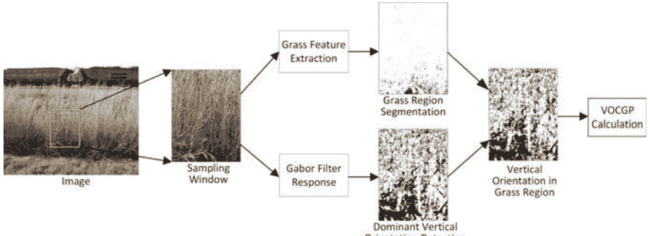

**图 5.1** 主要处理步骤在 VOCGP 方法中的图形说明。对于给定的图像，该方法输出一个用于估计采样窗口内草地生物量的 VOCGP 值。草地区域分割和主导垂直方向检测的输出被结合用于 VOCGP 计算。

通过分割草地结果和主导垂直方向，我们提出了一个算法来计算 VOCGP，即窗口中所有列中具有连续连接的主导垂直方向的草地像素的平均长度。VOCGP 被用作窗口内草地生物量的估计器。

### 5.3.3 草地区域分割

草地区域分割旨在区分草地像素和非草地像素。输出结果可以提供采样窗口内草地像素的空间分布和覆盖情况的指示。有两种类型的技术用于草地区域分割：(1) 具有人工工程草地特征的 ANN 分类器，和 (2) 具有自动特征提取的 CNN。

- (1) **具有草地特征的 ANN 分类器**。草地像素中视觉特征的有效表示在草地区域分割中起着关键作用。第一种技术为道路边草地分析生成了颜色和纹理融合特征。众所周知，草地主要以绿色或黄色表示，并且具有比其他对象（如天空和道路）更丰富的非结构化纹理（如边缘）。它们的融合预计将导致更准确和稳健的分割结果。

颜色空间包括 CIELab 和 RGB。实验发现 Lab 与人眼感知一致 [24]，而 RGB 可能包含 Lab 无法提供的互补信息。纹理包括来自 17-D filter 滤波器组的特征，这些特征首先在 [25] 中被广泛采用，对于纹理丰富的物体具有高区分能力，并被广泛应用于通用对象分类 [26]。17-D filter 滤波器组包括应用于 Lab 通道的 3 个不同尺度（1、2、4）的高斯函数，以及高斯函数的拉普拉斯函数（4个不同尺度：1、2、4、8）和两个不同尺度（2、4）的高斯导数（对于每个轴 $x$ 和 $y$ 在 L 通道上）。像素坐标为 $(i, j)$ 的颜色和纹理特征向量由以下组成：

$$V_{i,j}^c = [R, G, B, L, a, b] \quad (5.7)$$
$$V_{i,j}^t = [G_{1,2,4}^L, G_{1,2,4}^a, G_{1,2,4}^b, LOG_{1,2,4,8}^L, DOG_{2,4,x}^L, DOG_{2,4,y}^L] \quad (5.8)$$

它们被融合以获得一个 23 元素的颜色和纹理特征向量：

$$V_{i,j} = [V_{i,j}^c, V_{i,j}^t] \quad (5.9)$$

我们将一个二进制的 ANN 分类器纳入其中，用于基于颜色和纹理特征区分草地和非草地像素。ANN 接受一个输入特征向量 $V_{i,j}$，并输出两个类别的概率：

$$p_{i,j}^k = \text{tran}(w_k V_{i,j} + b_k) \quad (5.10)$$

其中，$\text{tran}$ 代表三层 transig/purelin ANN 的预测函数，而 $w_k$ 和 $b_k$ 是第 $k$ 个对象类别的训练权重和常数参数。在所有类别中，具有最高概率的类别获得分类标签：

$$A_{i,j} = \arg\max_{k \in C} p_{i,j}^k \quad (5.11)$$

其中，$C$ 代表草地和非草地类别，$A_{i,j}$ 表示位于 $(i, j)$ 处像素的二进制标签（1—草地，0—非草地）。

- (2) **具有自动特征提取的 CNN 分类器**。CNN 接受原始图像像素作为输入，并利用卷积和池化层逐步提取更抽象的模式，然后将其输入到全连接层以生成对象类别的预测。采用了流行的 LeNet-5 CNN [27]。对于采样窗口 $W$ 中的像素 $(i, j)$，LeNet-5 提供了关于二进制类别 $A_{i,j} \in \{\text{grass, non-grass}\}$ 的决策。

### 5.3.4 Gabor 滤波器投票用于主导垂直方向检测

本部分介绍了一种基于 Gabor filter 的投票方法，用于检测每个图像像素的主导垂直方向。对主导方向的精确估计在确定草地高度和密度时至关重要。受生物启发的 Gabor filters 是最流行的多分辨率纹理描述符之一，用于表示和区分对象的外观特性。它们用于提取丰富的多尺度和方向特征，如边缘、线条和结构纹理，用于模式分析。我们对多个方向上的 Gabor filter 响应进行投票，通过考虑小的空间邻域中的所有像素强度，检测每个像素的最强局部纹理方向。

2D Gabor filter 函数 [28] 可以用数学方式表示为：

$$F(x, y)=\frac{f^2}{\pi \gamma \eta} \exp \left(-\left(\frac{f^2}{\gamma^2} X^2+\frac{f^2}{\eta^2} Y^2\right)\right) \exp (j 2 \pi f X) \quad (5.12)$$
$$X=x \cos \theta+y \sin \theta \quad \text{and} \quad Y=-x \sin \theta+y \cos \theta \quad (5.13)$$

其中，$(x, y)$ 定义了滤波器的中心，$f$ 表示中心频率，$\theta$ 是方向，$\gamma$ 和 $\eta$ 分别是与波垂直的高斯主轴和次轴的锐度。空间纵横比为 $\eta / \gamma$。

频率对应于尺度信息，可以通过以下方式计算：

$$\phi_m=f_{\max} \times k^{-m}, \quad m=\{0,1, \dots, M_\phi-1\} \quad (5.14)$$

其中 $\phi_m$ 表示第 $m$ 个尺度，$f_0 = f_{\max}$ 是所需的最高频率，$k > 1$ 是频率缩放因子，$M_\phi$ 是总尺度数。方向可以通过以下方式获得：

$$\theta_n=2 n \pi / N_\theta, \quad n=\{0,1, \dots, N_\theta-1\} \quad (5.15)$$

其中，$\theta_n$ 是第 $n$ 个方向，$N_\theta$ 是总方向数。

对于在 RGB 空间中的采样窗口 $W$，首先通过对每个像素的 R、G 和 B 值求平均值将其转换为灰度值。在一个方向 $\theta$ 和一个尺度 $\phi$ 下，通过将 filter 与 $W$ 中的所有像素进行卷积，可以获得 Gabor filter $F_{\theta, \phi}$ 的响应：

$$G_{\theta, \phi}=W \oplus F_{\theta, \phi} \quad (5.16)$$

输出 $G_{\theta, \phi}$ 是一个复数值，由实部和虚部组成。这两个分量通过平方范数结合在一起，产生复杂幅度，表示 Gabor 滤波器的绝对响应强度：

$$\overline{G}_{\theta, \phi}=\sqrt{\text{实部}(G_{\theta, \phi})^2+\text{虚部}(G_{\theta, \phi})^2} \quad (5.17)$$

由于我们只关心方向信息，因此响应值在所有尺度上进行平均，以获得每个方向的单一响应值：

$$\overline{G}_\theta = \frac{1}{M_{\phi}} \sum_{m=0}^{M_{\phi}-1} \overline{G}_{\theta, \phi_m} \quad (5.18)$$

其中 $M_{\phi}$ 是所有尺度的数量。因此，对于位于 $(i, j)$ 处的像素，可以获得包括所有方向响应幅度的方向向量：

$$\overline{\mathbf{G}}_{i,j} = \left[ \overline{G}_0^{i,j}, \overline{G}_1^{i,j}, \dots, \overline{G}_{N_{\theta}-1}^{i,j} \right] \quad (5.19)$$

其中，$N_{\theta}$ 表示所有方向的数量。像素点 $(i, j)$ 的主导方向可以通过对所有方向上的响应进行投票并选择最大值来获得：

$$O_{i,j} = k, \quad \text{如果 } \overline{G}_k^{i,j} = \max(\overline{\mathbf{G}}_{i,j}) = \max_{k=0, \dots, N_{\theta}-1} \overline{G}_k^{i,j} \quad (5.20)$$

对于五尺度和四方向的 Gabor 滤波器（即 $M_{\phi} = 5; N_{\theta} = 4$），方程式 (5.20) 对每个像素输出一个整数，表示 0°、45°、90°或 135°的主导方向，如图 5.2 所示。因为我们只考虑垂直方向 90°，即 $O_{i,j} = 2$，所以这一步的输出是在采样窗口中每个像素上对垂直或非垂直方向的决策。

### 5.3.5 草地像素垂直方向连通性计算

本部分介绍了计算采样草地窗口的 VOCGP 值的算法，该值是草地高度和密度的指标。

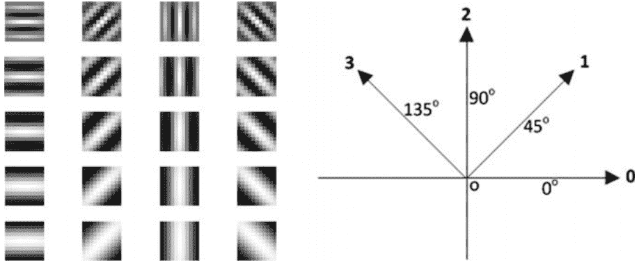

**图 5.2** 使用 five-scale (row) 和四个方向 (column) Gabor filters (left) 的图像响应实部的可视化示例。本案例研究中使用的四个方向及其定义的指标 (right)。

图5.3 说明了高草地和低草地之间垂直方向上连通性的差异。右侧窗口中的白色和黑色分别表示使用Gabor滤波器投票计算得出的主导垂直和非垂直方向。高草地沿垂直方向具有更长的连续连通性，而低草地则没有。

草生物量的估计器。VOCGP被定义为窗口中具有相同主导垂直方向的连续连接草地像素的平均长度，它基于这样的观察结果进行定义：高草通常沿垂直方向具有长而不间断的像素连接性，而较低的草通常具有短而断断续续的连接性，如图5.3所示。此外，密集的草地在窗口的大多数列中具有高连通性，而稀疏的草地仅在有限数量的列中具有高连通性。

从分割的草地区域 $A_{i,j} \in \{\text{草地或背景}\}$ 的主导方向 $O_{i,j} \in \{\text{垂直或非垂直}\}$，所有像素 $x_{i,j}$ 在采样窗口 $W$ 中被转换为一个二进制值，该值指示像素是否属于草地类并具有主导垂直方向：

$$x_{i,j} = \begin{cases} 1, & \text{if } A_{i,j} = \text{草地 且 } O_{i,j} = \text{垂直} \\ 0, & \text{其他} \end{cases} \quad (5.21)$$

对于第 $i$ 列 $X_i$，我们计算所有连续连接像素 $x_{i,j}$ 的长度，其值为1：

$$C^i = \left\{ c_1^i, c_2^i, \dots, c_Q^i \right\} \tag{5.22}$$

其中，$c_q^i$ 代表 $X_i$ 中的第 $q$ 个长度；$Q$ 是 $X_i$ 中长度的总数，且 $Q \le H$。然后我们得到最大的长度，并将其作为第 $i$ 列的长度测量：

$$l_i = \max_{j=1, \dots, Q} c_j^i \tag{5.23}$$

类似地，可以得到所有列的长度测量：

$$L = \{l_1, l_2, \dots, l_D\} \tag{5.24}$$

为了表示草地密度，将长度测量值在所有列上取平均，得到 $W$ 的 VOCGP：

$$VOCGP = a \times \frac{1}{D} \sum_{i=1}^D l_i \tag{5.25}$$

基于 VOCGP，可以得到估计的燃料负荷：

$$F_w = a \times VOCGP \tag{5.26}$$

其中，$a$ 是用于补偿 VOCGP 和物理量化燃料负荷之间不同测量单位的权重。请注意，(5.23) 和 (5.26) 分别对应于 (5.5) 和 (5.6)。

算法 5.1 总结了计算采样草地窗口的 $VOCGP$ 的过程。$VOCGP$ 通过两个步骤获得：(a) 计算每列中具有相同主导垂直方向的连续连接草像素的最大长度，(b) 对所有列的最大长度取平均值。对于窗口 $W$ 中的第 $i$ 列，算法从扫描第一个像素开始，检查像素 $C_{i,j}$ 是否被预测为草地或非草地，然后计算具有垂直方向（即 $O_{i,j}=2$）的连续连接草像素的数量 $Length$，直到找到非草地像素或非垂直方向像素。对所有像素重复此过程，得到一系列连接草像素的长度，这些长度保存在 $C^i$ 中。

然而，只有最大长度 $l_i$ 被保留，因为它是相应列中草高度最重要的指标。小长度通常由非草地像素、低草地像素或没有绝对主导方向的草地像素生成。相比之下，高草地预计会产生较大的长度。所有列的最大长度可以通过重复上述过程获得。然后，在所有列的最大长度上执行一个“平均”操作以获得 $W$ 的 VOCGP。我们相信这个“平均”操作是生成每个窗口内所有草地的平均高度的可靠估计的必要步骤。考虑到草地密度，只有当大多数列具有高长度时，我们才能以高置信度确定窗口包含高密度的草地，从而具有高生物量。

## 算法 5.1: 计算采样草地窗口中 VOCGP 的伪代码

```
输入：一个采样窗口及其像素标签 A_{i,j} {草地；非草地} 和 O_{i,j} {垂直；非垂直}。
输出：VOCGP。

将 SET_L 设置为空
对于采样窗口中的每一列：
    将 SET_C 设置为空
    SET Length 设置为零
    对于采样窗口中的每一行：
        如果 A_{i,j} 属于非草地：
            如果 Length ≠ 0:
                添加 Length 到 SET_C
                设置 Length 为零
            结束如果
        否则：
            如果 O_{i,j} 属于垂直：
                增加 Length
                如果 O_{i,j} 是该列中的最后一个像素：
                    添加 Length 到 SET_C
                结束如果
            否则：
                如果 Length ≠ 0:
                    添加 Length 到 SET_C
                    设置 Length 为零
                结束如果
    结束行循环
    使用(5.23)在 SET_C 中找到最大长度 l_i
    将 l_i 添加到 SET_L
结束列循环
通过对 SET_L 中所有元素进行平均 (5.25) 来获取 VOCGP。
```

## 5.4 实验结果

本节评估了使用样本图像数据集对稀疏、中等和密集草地的 VOCGP 方法进行估计。将准确性与人类观察的准确性进行比较。进一步将该方法应用于使用从道路边视频中收集的 100 个视频帧的测试数据来识别易发火区域。

### 5.4.1 道路数据收集

实验中使用的数据是从澳大利亚昆士兰州菲茨罗伊地区（Fitzroy region）的 61 个样本路边站点收集的图像，如图 5.4 所示。这些站点被选择以涵盖各种类型和密度的草，并且这些站点中的主要草种包括 Buffel、Blackspear、Dichanthium、Panicum、Rhodes、Stylosanthes、Thatch 和 Wire。这些图像的尺寸为 1936 × 1296 像素，是使用尼康 D80 相机拍摄的，面向路边的草地。为了确保采样区域的图像尺寸在各个站点之间保持一致，相机的高度和相机与采样区域的距离都设置为大致相等。

在实验中，采样的草地窗口是从所有图像中手动裁剪出来的，这些窗口与 61 个采样点选择的采样区域完全对应，并且作为 VOCGP 方法的输入。

然后分别创建了关于生物量和密度水平的主观和客观测量，这些测量结果用于验证 VOCGP 方法的准确性。为了获取主观草地密度，我们根据人眼观察将所有图像分为稀疏、中等和密集三类草地样本，如图 5.5 所示。所有图像的人工分类结果如表 5.1 所示。为了获得客观生物量，使用一个平方米区域标记，并将样本剪下、装袋、称重并存放在加热器（70°C）中干燥。几天后（>72小时），从加热器中取出样本并再次称重，使用干重和标准公式估算其燃料负荷（吨/公顷）。所有图像的估计生物量如表 5.2 所示。

### 5.4.2 实验设置

(1) 方法参数。ANN分类器的结构为 23-16-2 个神经元，使用弹性反向传播算法进行训练（目标误差：0.001，最大迭代次数：200）。LeNet-5 卷积神经网络包含七层，我们使用 https://github.com/sdemyanov/ConvNet 上的实现。训练数据包括从昆士兰州交通和主要道路管理部门（DTMR）收集的视频数据中手动裁剪的 650 个草地和非草地区域，涵盖了草地（绿色和褐色草地）和非草地（道路、树木、天空和土壤）区域。高斯滤波器的大小为 7 × 7 像素。Gabor 滤波器有四个方向：$\theta = 0^\circ, 45^\circ, 90^\circ, 和 135^\circ$，五个尺度（$\phi_m = \frac{f_{max}}{(\sqrt{2})^m}, m = 0, 1, \dots, 4; f_{max} = 0.25$）和 11 × 11 Gabor 核。

(2) 性能指标：使用两个指标：$R^2$ 统计量和地面真实值与估计生物量之间的均方根误差（RMSE）。RMSE 是通过以下方式计算的：

$$RMSE = \sqrt{\frac{1}{n} \sum_{t=1}^n (F_w^t - F_l^t)^2} \qquad (5.27)$$

其中，$F_w^t$ 和 $F_l^t$ 分别是第 $t$ 个样本图像的估计和地面真实生物量，$n=61$ 是图像的数量。RMSE 是在五折交叉验证中的平均误差，将所有图像分为五个相等的折叠，在每次验证中，使用四个折叠的图像计算校准因子，将总生物量除以所有训练样本的总 VOCGP，而使用剩下的一个折叠的图像计算 RMSE。

### 5.4.3 估计草生物量的性能

本部分评估了 VOCGP 方法在估计所有样本的草生物量方面的性能。使用 ANN 或 CNN 分类器对草地区域进行分割得到的 VOCGP 分别被定义为 VocANN 和 VocCNN。

表 5.2 和图 5.6 显示了所有图像样本的客观生物量和相应的 VOCGP，尽管这些值是以不同的测量单位计算的，但它们的变化趋势总体上是一致的。图 5.7 使用线性回归显示了它们之间的相关性，表明 VocANN 和 VocCNN 的 $R^2$ 统计量分别为 0.29 和 0.25。

由于真实条件下草茎无法完全垂直生长，我们评估了 VOCGP 方法对非垂直草茎的鲁棒性。表 5.3 显示了使用 [−10, −5, 0, 5, 10] 度旋转的图像获得的 VocANN 的 RMSE。原始图像中的 RMSE 略低于旋转图像中。在旋转图像中，这些差异在旋转角度增加时会急剧增加。然而，原始图像和旋转图像之间的 RMSE 差异相对较小，这主要是由于采用了 Gabor 滤波器投票进行方向检测，该检测器将方向接近的草茎分类为 90° 垂直方向。结果表明 VOCGP 方法对稍微偏离垂直方向的草茎具有鲁棒性。

我们还将 VOCGP 方法的结果与人工观察结果进行比较，如表 5.4 所示。人工观察的均方根误差是基于稀疏、中等和密集草地的平均生物量计算的。VocANN 和 VocCNN 表现出有希望的性能，仅比人工观察的均方根误差高 0.35 和 0.17。结果表明利用机器学习技术估计草地生物量的潜力。

### 5.4.4 预测草地密度的性能

图 5.8 显示了稀疏、中等和密集草地样本的生物量和 VOCGP 的平均值。VocANN 和 VocCNN 以及平均生物量与草地密度具有类似的正相关性，因为较高的平均生物量（或 VOCGP）与较高的草地密度水平密切相关。这符合我们的预期，因为生物量和 VOCGP 都取决于草地的高度和密度。结果表明， VOCGP 能够准确估计三个密度类别内的平均生物量，并预测草地密度。

为了找到稀疏、中等和密集草地的下限/上限阈值，绘制了一个箱线图，如图 5.9 所示。图中显示，对于生物量、VocANN 和 VocCNN，所有三种类型的草地都有极端的最小和最大值，并且大多数样本集中在中位数附近。与生物量相比，VocANN 和 VocCNN 倾向于在中位数上更窄且不均匀地分布，这可能是人类观察分类和自动机器分类之间的区别。

---

**表 5.1 根据人类观察将样本分为稀疏、中等和密集草**

| 密度 | 样本编号 |
| :--- | :--- |
| 稀疏 | F007、F008、F014、F017、F019、F022、F023、F024、F026、F030、F033、F034、F035、F038、F042、F043、F048、F050、F051、F056、F058、F060 |
| 适度 | F002, F004, F006, F011, F013, F018, F020, F027, F029, F031, F032, F036, F039, F040, F041, F045, F047, F049, F052, F055, F061 |
| 密集 | F001, F005, F009, F010, F012, F015, F016, F021, F025, F028, F037, F044, F046, F053, F054, F057, F059 |

**表 5.2 稀疏、中等和密集草地的目标生物量和估计的 VOCGP（即使用 ANN 和 CNN 的 VocANN 和 VocCNN）**

| 稀疏编号 | 生物量 | VocANN | VocCNN | 适度编号 | 生物量 | VocANN | VocCNN | 密集编号 | 生物量 | VocANN | VocCNN |
| :--- | :--- | :--- | :--- | :--- | :--- | :--- | :--- | :--- | :--- | :--- | :--- |
| F007 | 7.94 | 21.5 | 20.1 | F002 | 8.31 | 31.0 | 23.6 | F001 | 23.80 | 33.8 | 33.8 |
| F008 | 6.10 | 32.0 | 28.6 | F004 | 5.00 | 27.9 | 24.0 | F005 | 20.57 | 40.2 | 35.0 |
| F014 | 15.46 | 22.4 | 9.2 | F006 | 10.68 | 22.8 | 20.6 | F009 | 11.74 | 30.9 | 37.4 |
| F017 | 4.28 | 14.7 | 14.0 | F011 | 0.0 | 12.5 | 12.6 | F010 | 16.01 | 46.6 | 23.9 |
| F019 | 11.60 | 18.3 | 18.6 | F013 | 11.93 | 29.5 | 22.3 | F012 | 20.10 | 29.8 | 45.2 |
| F022 | 6.78 | 19.8 | 19.1 | F018 | 15.87 | 29.8 | 31.9 | F015 | 32.10 | 60.8 | 25.8 |
| F024 | 9.03 | 29.3 | 28.3 | F020 | 14.74 | 29.8 | 25.8 | F016 | 11.46 | 35.3 | 51.2 |
| F026 | 4.20 | 26.6 | 21.6 | F023 | 23.95 | 29.3 | 22.6 | F021 | 11.95 | 32.9 | 32.0 |
| F030 | 4.05 | 20.4 | 16.1 | F027 | 7.12 | 27.5 | 40.3 | F025 | 10.96 | 40.0 | 29.8 |
| F033 | 11.75 | 13.0 | 13.4 | F029 | 13.60 | 23.6 | 22.4 | F028 | 21.24 | 19.5 | 36.5 |
| F034 | 2.45 | 20.0 | 20.1 | F032 | 13.50 | 28.9 | 32.9 | F031 | 13.15 | 30.5 | 20.6 |
| F035 | 4.15 | 24.2 | 22.1 | F036 | 10.85 | 29.7 | 25.2 | F037 | 16.00 | 48.9 | 31.8 |
| F038 | 18.90 | 18.9 | 19.7 | F040 | 14.85 | 29.0 | 26.7 | F044 | 7.20 | 31.3 | 42.6 |
| F039 | 10.90 | 18.9 | 17.6 | F041 | 20.10 | 17.7 | 16.4 | F046 | 14.85 | 30.3 | 22.3 |
| F042 | 14.55 | 29.4 | 19.2 | F045 | 5.50 | 29.0 | 32.8 | F053 | 10.35 | 22.2 | 34.4 |
| F043 | 3.45 | 22.4 | 21.2 | F047 | 10.25 | 26.6 | 22.1 | F054 | 22.85 | 33.0 | 21.3 |
| F048 | 5.50 | 18.1 | 23.3 | F049 | 11.45 | 29.6 | 27.3 | F057 | 17.15 | 41.5 | 32.5 |
| F050 | 6.85 | 15.8 | 13.4 | F052 | 8.30 | 26.4 | 21.8 | F059 | 12.20 | 24.9 | 39.2 |
| F051 | 2.20 | 14.8 | 16.4 | F055 | 13.10 | 29.5 | 21.7 | - | - | - | - |
| F056 | 6.95 | 17.2 | 16.9 | F061 | 8.15 | 25.6 | 20.5 | - | - | - | - |
| F058 | 7.90 | 17.5 | 14.2 | - | - | - | - | - | - | - | - |
| F060 | 4.15 | 18.2 | 17.1 | - | - | - | - | - | - | - | - |

注：由于该站点捕捉到的图像模糊，样本 F003 被排除在外。

**表 5.3 使用不同旋转角度的图像的性能**

| 旋转角度 | -10 | -5 | 0 | 5 | 10 |
| :--- | :--- | :--- | :--- | :--- | :--- |
| 均方根误差 (RMSE) | 5.95 | 5.95 | 5.84 | 5.87 | 6.02 |

**表 5.4 VOCGP 方法与人类观察的性能比较**

| 指标 | VocANN | VocCNN | 人类观察 |
| :--- | :--- | :--- | :--- |
| 均方根误差 (RMSE) | 5.84 | 5.66 | 5.49 |

分类。VocANN的两个阈值用于分类稀疏和中等、以及密集草地分别可以定义为27和31。

图5.10显示了目标生物量和估计的VOCGP与对应的稀疏、中等和密集草地类别的最佳线性拟合。对于生物量、VocANN和VocCNN与密度类别的相关性，$R^2$ 统计量分别为0.30、0.47和0.45，表明客观生物量测量与VOCGP方法在预测草地密度方面的一致性。VocANN和VocCNN都比客观生物量具有更高的相关性，这证实了VOCGP方法在预测草地密度类别方面的有效性。

### 5.4.5 易燃区域识别

为了证明VOCGP方法在识别具有高生物量的易燃道路区域方面的有效性，我们对昆士兰州DTMR收集的菲茨罗伊地区16A号州道的道路边视频数据进行了实验。我们从总共22个视频中选择了100帧，以便这些帧均匀分布在整个道路上，帧之间至少相隔200米。在每个帧中，选择了15个重叠的样本窗口，如图5.11所示，并手动注释为稀疏、中等或密集的草地。

图5.10 目标生物量和VOCGP与三个草类别的最佳线性拟合

我们首先将从图5.9中获得的VocANN的两个阈值（27和31）应用于所有窗口中的密度类别分类。稀疏、中等和密集草地的整体准确率分别为81.7%、75.2%和61.2%。

表5.5显示了使用估计的VocANN将所有窗口分类为稀疏、中等或密集草地的混淆矩阵。三个类别的整体准确率为73.2%。稀疏草地是正确分类的最容易的，准确率为81.7%，而密集草地是最困难的，准确率为61.2%，并且有相当大的部分（27.7%）密集窗口被错误分类为中等。这主要是由于密集和中等窗口之间的混淆，即使是人类也可能很难分类。例如，有很多窗口既被高草又被低草覆盖。对于某些类型的草地，它们具有较高的高度和较高的VocANN，但实际上生物量很低。图5.11显示了样本图像中的真实情况、草地分割结果和估计的VocANN。

然后我们将所有15个窗口的平均VocANN作为每个图像中生物量产量的指标。对于一张有密集和高草的图像，预计大多数窗口都具有较高的VocANN，导致平均值较高，并且有很高的可能性发生火灾。

图5.11 图像帧中15个采样草窗口的分布和分类结果。
a地面真实值: 2稀疏, 3中等, 4密集; b草地分割结果: 白色草地像素和黑色非草地像素; c 估计的VOCGP, 即VocANN

**表5.5 混淆矩阵：稀疏、中等和密集草地使用估计的VocANN**

| | 稀疏 | 适度 | 密集 |
| :--- | :--- | :--- | :--- |
| 稀疏 | 81.7 | 13.5 | 4.8 |
| 适度 | 10.0 | 75.2 | 14.8 |
| 密集 | 11.1 | 27.7 | 61.2 |

图5.12说明了在每个图像中使用15个采样窗口的平均VocANN进行火灾易发地区识别。帧按照它们在菲茨罗伊地区16A号州道上的位置进行排序。本地最高和最低的VocANN与相应的草地密度水平精确匹配。

根据它们在道路上的位置对100帧进行排序。还显示了具有局部高、低或中等VocANN的八个典型帧，可以看出使用平均VocANN的方法产生了非常有希望的结果，并且局部最高和最低的VocANN与其对应帧中的草地密度水平精确匹配。具有局部最高平均VocANN的帧的位置可以被识别为火灾风险区域。

## 5.5 讨论

从实验结果中得出的主要教训如下：

- (1) 我们的实验结果证实了使用机器学习技术自动估计草地生物量的可行性。发现对于所有样本，预测的VOCGP与客观生物量具有类似的总体趋势，RMSE接近人工观察。
- (2) 平均生物量和预测的VOCGP与草地密度有类似的正相关关系，即稀疏、中等和密集的草地。VocANN和VocCNN的方法在预测草地密度方面的 $R^2$ 分别为0.47和0.45，在生物量估计方面分别为0.29和0.25。结果证实了VOCGP方法在预测草地密度类别和生物量方面的有效性。
- (3) 对一组手动注释的采样窗口进行评估，结果显示对于稀疏、中等和密集的草地分类，平均准确率为73.2%，其中对于中等草地的最低准确率为61.2%，主要是由于包含高低草地的窗口混淆。我们进一步研究了在菲茨罗伊地区的一条州道上使用平均VocANN来识别易发火区域的可行性。在每个图像中使用所有窗口的平均VocANN来识别菲茨罗伊地区一条州道上易发火区域的可行性。

使用机器学习技术估计草地生物量需要考虑几个影响因素：

- (1) 采样窗口的参数，包括位置、大小、形状等。2D静态图像中窗口的参数可能与现实世界中3D采样草地区域的参数不完全对应，这可能导致估计结果存在偏差。虽然位置相对容易确定，但窗口的大小应根据图像的分辨率和草地区域的范围适当设置，因为小窗口无法覆盖整个植物高度，而大窗口可能包含未预测的对象。严格来说，对于具有相同分辨率和类似草地高度的图像，使用固定大小的窗口才可行。
- (2) 草地分割算法的准确性。如果非草地像素被错误地分类为草地像素，则VOCGP将高于其实际值，导致高生物量的错误预测决策，反之亦然。此外，VOCGP计算还对小的孤立非草地像素敏感，这些像素会破坏草地像素的连通性，导致VOCGP过低的错误结果。可以引入后处理步骤来去除孤立的非草地像素，例如形态学开运算或在邻域上进行区域平滑处理（例如超像素）。值得注意的是，在复杂场景中准确地进行草地分割仍然是一个具有挑战性的课题本身。
- (3) 检测每个像素的主导局部方向的方法。Gabor filters 的参数，如核的大小和尺度的数量，可能会影响检测的准确性，其他检测方法，如像素强度和边缘检测器，也值得研究以获得更有效的检测结果。

## 5.6 总结

使用机器学习技术估计道路边草地生物量仍然是一个相对未开发的领域。本节介绍了一种基于草地高度和密度的道路边草地生物量估计的VOCGP方法。

评估基于昆士兰州菲茨罗伊地区61个道路沿线站点的样本图像数据集，其中包含客观生物量和主观稀疏、中等和密集草地的真实数据。

我们比较了VOCGP方法中的非深度学习和深度学习算法在草地分割方面的表现——VocANN和VocCNN，并且显示它们在草地密度预测方面的 $R^2$ 分别为0.47和0.45，在生物量估计方面分别为0.29和0.25，并且RMSE接近人类观察结果。

在使用非深度学习和深度学习技术进行预测时，预测结果没有太大差异。VOCGP方法在自动识别道路边视频数据中易发火区域方面展示了有希望的结果。未来的一个可能的研究方向是探索基于概率的软决策，用于草地区域分割和主导方向计算，而不是二进制决策。

## 参考文献

- 1. Y.F. Vazirabad, M.O. Karslioglu, LIDAR用于生物量估计，在 生物量 —检测、生产和使用 (INTECH开放取出出版社，2011年)
- 2. H.W. Zub, S. Arnoult, M. Brancourt-Hulmel, 在两个收获日期上鉴定生物量生产的关键特征。生物质生物能源。35, 637–651 (2011年)
- 3. D. Ehlert, R. Adamek, H.-J. Horn, 基于激光测距 finder 的作物生物量测量 field 条件。Precis. Agric. 10, 395–408 (2009)
- 4. N. Tilly, D. Hoffmeister, Q. Cao, V. Lenz-Wiedemann, Y. Miao等，从空间植物高度数据估计稻谷生物量的模型的可迁移性。农业 5, 538–560 (2015)
- 5. N. Tilly, H. Aasen, G. Bareth, 融合植物高度和植被指数估计大麦生物量。Remote Sens. 7, 11449–11480 (2015)
- 6. C. Royo, D. Villegas, 田间测量冠层光谱用于小粒谷物生物量评估，在生物质—检测、生产和使用(INTECH开放取出出版社，2011年)
- 7. T. Ahamed, L. Tian, Y. Zhang, K.C. Ting, 远程感知方法对生物质饲料生产的综述。生物质生物能源。35, 2455–2469 (2011年)
- 8. T. Sritarapipat, P. Rakwatin, T. Kasetkasem, 使用自动稻谷作物高度测量 field 服务器和数字图像处理。传感器 14, 900–926 (2014年)
- 9. Z. Juan, H. Xin-yuan, 基于数字图像处理技术的树高测量方法，第一届信息科学与工程国际会议(ICISE)，2009年，第1327–1331页
- 10. H. Danyuan, W. Chengduan, 基于图像处理智能手机的树高测量，多媒体技术国际会议(ICMT)，2011年，第3293–3296页
- 11. H. Danyuan, 基于图像处理的树高测量与三点校正，计算机科学与网络技术国际会议(ICCSNT)，2011年，第2281–2284页
- 12. N. Soontranon, P. Srestasathiern, P. Rakwatin, 利用ExG植被指数监测小规模地区的水稻生长阶段, 第11届电气工程/电子、计算机、电信和信息技术国际会议(ECTICON), 2014年, 第1-5页
- 13. J. Payero, C. Neale, J. Wright, 比较11种植被指数对苜蓿和草的植物高度估计的影响。应用工程农业 20, 385-393 (2004)
- 14. J. Llorens, E. Gil, J. Llop, A. Escolà, 超声波和LIDAR传感器用于葡萄园电子冠层特性的表征：改进农药施用方法的进展。传感器 11, 2177-2194 (2011)
- 15. B. St-Onge, Y. Hu, C. Vega, 使用LIDAR和立体IKONOS图像绘制混合森林的高度和地上生物量分布图。国际遥感杂志 29, 1277-1294 (2008)
- 16. G. Grenzdörffer, 使用UAS点云进行作物高度测定。国际摄影测量与遥感空间信息科学档案 1, 135-140 (2014)
- 17. K. Yamamoto, T. Takahashi, Y. Miyachi, N. Kondo, S. Morita等人, 使用小脚本空中LIDAR估计平均树高而不使用数字地形模型。林业研究杂志 16, 425-431 (2011)
- 18. J. Cai, R. Walker, 使用显式遮挡的动态规划从单目图像序列估计高度。IET计算机视觉 16, 149-161
- 19. L. Zhang, T.E. Grift, 一种基于LIDAR的高度测量系统，用于巨大芒草。计算机与电子农业 85, 70-76 (2012)
- 20. C. Rasmussen, 用于不规则道路跟踪的主导方向分组, 在 IEEE计算机视觉和模式识别会议 (CVPR) , 2004年, 第470-477页
- 21. W.T. Freeman, E.H. Adelson, 可操纵 filters 的设计和使用。IEEE模式识别与机器智能 13, 891-906 (1991)
- 22. F. XiaoGuang, P. Milanfar, 多尺度主成分分析用于图像局部方向估计, 在第三十六届Asilomar会议记录 信号、系统和计算机, 2002年, 第478-482页
- 23. A.K.P. Meyer, E.A. Ehimen, J.B. Holm-Nielsen, 道路边草地的生物能生产：丹麦道路边草地用于沼气生产的可行性研究案例。资源保护和回收 93, 124-133页 (2014年)
- 24. J. Shotton, M. Johnson, R. Cipolla, 语义文本森林用于图像分类和分割, 在IEEE计算机视觉和模式识别会议 (CVPR) , 2008年, 第1-8页
- 25. J. Winn, A. Criminisi, T. Minka, 通过学习的通用视觉词典进行对象分类, 在第十届IEEE国际计算机视觉会议 (ICCV) , 2005年, 第1800-1807页
- 26. J. Shotton, J. Winn, C. Rother, A. Criminisi, Textonboost 用于图像理解：通过联合建模纹理、布局和上下文进行多类对象识别和分割。计算机视觉国际期刊 81, 2-23页 (2009年)
- 27. Y. Lecun, L. Bottou, Y. Bengio, P. Haffner, 基于梯度的学习应用于文档识别, 在IEEE会议的论文中, 卷. 86, (1998), 页. 2278-2324
- 28. J.K. Kamarainen, V. Kyrki, H. Kalviainen, Gabor filter-based 特征的不变性属性-概述和应用. IEEE图像处理. 15, 1088-1099 (2006)

# 第6章 结论和未来展望

在本章中，我们根据使用各种非深度学习和深度学习技术获得的实验结果，提出了几项未来研究工作的建议。我们还强调了该领域的挑战，并讨论了新的机会和应用。

## 6.1 建议

基于对道路数据分析的各种深度学习和非深度学习技术的实验结果，我们可以提出以下建议：

- (1) 辨别性特征提取。建议考虑颜色、纹理和上下文信息，以实现对道路边物体更稳健的分割。使用深度学习和非深度学习技术进行的实验结果表明，对于大多数道路边物体，颜色和纹理的组合比单独使用它们能产生更高的分类准确性。包括颜色和纹理在内的视觉特征单独使用时，将局部和全局上下文信息（如CAV特征）结合起来，与仅使用视觉特征相比，能显著提高性能。CAV特征的卓越性能主要归因于其能够捕捉对象之间的长程和短程标签依赖关系，能够适应图像内容，并保留相对和绝对位置信息的优势。
- (2) 使用深度学习技术的上下文信息。与用于编码局部和全局上下文信息进行对象分类的现有图形模型相比，深度学习技术具有自动编码上下文信息、提取视觉特征并在深度学习架构中内在集成它们的优势。我们引入了一个用于对象分割的深度学习网络，并确认其在真实世界基准数据集中的最先进性能。
- (3) 现有的基于补丁的特征提取技术存在边界问题，这意味着在对象之间的边界上提取特征不可避免地会引入噪声到特征集中，因为补丁的形状是固定的矩形形状。为了处理区域边界上的噪声，基于分割的超像素提出了PPS特征，并且它们在自然道路数据上的对象分割中比基于像素和基于补丁的特征表现出更高的准确性。因此，仍然有必要研究更有效的技术来克服边界问题，进一步提高对象分割的性能。
- (4) 对象的空间位置施加约束有助于实现更高的检测和分割准确性。例如，天空很可能在道路图像的顶部部分。然而，空间约束的使用在特定应用的情况下受到很大限制。因此，在设计合适的技术和相应的约束以获得稳健结果之前，建议仔细预分析特定应用的上下文。
- (5) 不仅仅依赖于训练数据，正确利用测试图像中的局部特征可以帮助创建能够自动适应测试图像内容的强大算法，从而在处理噪声和光照变化等现实挑战时获得更稳健的结果。例如，超像素合并方法——SCSM，旨在同时考虑训练数据中所有对象的一般特征和测试图像中的局部属性，已经在消除传统分类器（如ANN）结果中的错误分类方面表现出良好的性能。
- (6) 具有自动特征提取功能的CNN在计算机视觉任务中表现良好，并且适用于具有高噪声和广泛变化的真实世界应用。CNN表现良好，但不一定是处理小图像分类任务的最佳选择，与传统的MLP相比。因此，建议在具有相当大量数据的数据集中考虑使用CNN，而对于小数据集，则需要相对比较考虑CNN和传统的非深度学习分类器。然而，当采用集成策略时，结果会有所不同，多个CNN的集成效果比单个MLP或CNN分类器以及多个MLP分类器更好。因此，建议在处理真实世界数据集中的对象分类问题时考虑使用多个CNN的集成。
- (7) 将多个分类器的多数投票方法用于组合以达到对对象分类的最终决策，相对于使用单个分类器，对于稠密与稀疏草地的区分，其准确性更高，尽管准确性的差异在ANOVA测试中并没有统计学上的显著差异。结果表明，即使是简单的组合策略也能够实现更准确的对象分类性能，因此，通常建议考虑采用多个分类器。处理真实世界道路数据集中对象外观和环境的变化。
- (8) 我们提出了一种集成学习方法，用于生成和融合不同版本的神经网络进行道路物体检测。该方法使用不同的种子点将数据分割成多个层，并在每个层生成聚类。为每个聚类和每个层生成一个神经网络。对于道路物体检测，通过对这些神经网络进行多数投票，相对于SVM、分层和聚类方法，分类率有了很大的提高。因此，通过针对数据中的不同模式定制不同版本的个体分类器，有助于增加集成分类器的多样性，最终提高性能。作为建议，个体分类器不需要限制为相同类型，可以是不同类型，以进一步提高多样性。
- (9) 我们进行了一个案例研究，以验证使用机器学习技术自动估计草地生物量和密度的可行性。对于所有样本，预测的VOCGP与客观生物量具有相似的总体趋势，RMSE接近人工观察。尽管草茎可以生长成不同的方向，但垂直方向上草地像素的连通性似乎是草地高度的可靠指标。与使用ANN进行草地区域分割相比，使用CNN与客观生物量略有较低的相关性，但RMSE较低。这表明在这个案例研究中，CNN和ANN的表现相似。

## 6.2 新的挑战

- (1) 对于数字图像中的生物量估计，一个挑战是如何确定采样图像区域，包括位置、大小、形状等。2D图像中的区域参数可能与3D采样草地区域的参数不完全对应，这导致估计结果存在偏差。虽然手动注释采样区域是可能的，但往往消耗时间，并且可能严重限制整个系统的自动化。另一个挑战是如何使估计的生物量与客观生物量直接可比，因为它们不是用相同的单位来测量，即像素与吨/公顷。一种解决方案是在两个值之间设置一个比例因子，就像案例研究中所做的那样，但另一个问题是如何计算这个因子，这可能会显著影响估计的准确性。
- (2) 在2D图像中准确测量道路边草地与道路边界的距离仍然是一个挑战。距离传统上被认为是一个重要因素，对道路边草地的火灾风险水平有很大影响，因为靠近道路的草地通常存在更大的风险，而远离道路的草地则较安全，道路风险较小。由于深度信息的丢失，远处和近处的草地在2D图像中可能会重叠在同一区域，这使得精确测量它们与道路的距离变得困难。一种可能的解决方案是考虑收集关于道路边物体的3D数据，但这增加了数据收集的难度，并对设备提出了更高的要求。
- (3) 道路边物体参数的计算对物体与相机之间的距离非常敏感。当距离发生变化时，捕获图像中物体的大小也相应变化。这给测量道路边物体的实际参数值（如高度和面积）带来了巨大挑战，因为每个像素的实际测量单位在不同的图像中可能会发生显著变化。例如，草地的放大区域会导致比同一草地的缩小区域估计的高度更高。因此，许多现有方法只是假设对象和相机之间的固定距离。
- (4) 目前的文献仍缺乏一个具有像素级对象地面真值的综合公共道路数据集。创建这样一个数据集面临着数据版权问题、隐私问题以及劳动、时间和精力的要求等挑战。生成一个特定的数据集可能无法满足其他评估目的的要求，例如对象类别的数量和类型、数据的大小、帧的分辨率和变化率、环境条件、位置等。

## 6.3 新的机遇和应用

- (1) 一个可能的未来应用是开发一个移动系统，用于识别易发火灾的道路区域，使道路边居民或驾驶员可以使用移动设备拍摄道路边的草地，并提供草地的火灾风险级别预测。然后，居民可以向相关政府部门报告高火灾风险的地点，以便派遣工作人员采取必要的措施来消除风险。这将极大地方便相关部门以更高效和有效的方式检测、监控和维护道路安全条件。
- (2) 调查能够检测和识别道路边物体（如路标）的技术，可以显著促进智能车辆的开发和部署，这些车辆可以向驾驶员提供关键的道路信息或及时的警报，从而提高驾驶的安全性，特别是在恶劣的天气条件或危险的道路场所。驾驶员可以提前了解道路边和道路条件，以相应调整驾驶行为，例如加油站和休息区。

- (3) 道路边数据内容的分析也有助于促进道路条件的有效维护，例如检测道路边界线消失、道路表面损坏或道路围栏破损的情况。在不需要派员进行视觉检查的情况下，交通管理部门可以在这些确定的道路场所进行适当的维护，确保及时的维护行动。作为补充应用，该分析还可以用于自动检测道路边的广告牌标志和商业标志、违反法律要求或对道路用户的安全和效率产生潜在影响的施工活动和设备安装，而这些活动和安装没有获得合法许可证。

- (4) 考虑到在大型现场测试中，不可见特征在环境变化方面的普及性和鲁棒性，建议考虑可见和不可见特征的组合，以在现实环境中进行更强大和准确的分析。在良好条件下，可见特征更好地表示对象的视觉外观和结构，而不可见特征对环境挑战更具鲁棒性。预期能够智能地在现实世界情况下在它们之间切换的对象分割系统将更加稳健地工作。