# 软计算、深度学习和机器学习应用

## 前言

所谓的第四范式在过去的二十年中得到了蓬勃发展，在这个范式中，科学家和工程师可以获得大量的观测数据。 大数据的特点是五个 V: 体量、多样性、价值、速度和真实性。大数据的概念与地质工程和地球科学的特点自然契合。 大规模、全面、多方向和多领域的岩土工程数据分析正在成为一种趋势。 另一方面，软计算（SC）、机器学习（ML）、深度学习（DL）和优化算法（OA）提供了从数据中学习并深入洞察岩土工程问题的能力。 研究人员使用不同的软计算、机器学习、深度学习和优化算法模型来解决与地质工程和地球科学相关的各种问题。

因此，有必要通过整合SC、ML、DL和OA技术来扩展其与大数据研究的研究。
本书侧重于地质工程和地球科学中SC、ML、DL和OA算法的最新技术和应用。 首先简要介绍了各种SC、ML、DL和OA方法，主要涉及易于解释的多元自适应回归样条（MARS）模型、监督学习、无监督学习、深度学习和优化算法。 然后通过VOSviewer演示总结了它们在地质工程和地球科学中的代表性应用。 作者还提供了他们从这些应用中学到的思考以及正在进行和未来的建议。 本书旨在为地质工程和地球科学等研究领域的研究人员和工程师提供全面的总结和基本指南，以便他们如何整合和应用SC、ML、DL和OA方法。

中国重庆

Wengang Zhang
Yanmei Zhang
Xin Gu
Chongzhi Wu
Liang Han


## 关于作者

博士 张文刚目前是中国重庆大学土木工程学院的教授，他的研究兴趣集中在地下施工引起的建筑环境影响评估，以及岩土工程中的大数据和机器学习。他现在是ISSMGE TC304（可靠性）、TC309（机器学习）和TC219（岩土结构系统性能）的成员。他已被评为2020年全球前2%的科学家。

博士 张艳梅目前是重庆大学航空航天学院的副教授。她的研究兴趣集中在工程结构的疲劳和失效评估、聚合物复合材料的断裂分析以及机器学习技术在地质工程中的应用。她是中国力学学会的会员。

顾鑫是重庆大学土木工程学院的博士候选人。他主攻岩土工程，研究兴趣涉及随机有限元分析、边坡稳定性分析、空间变异性、贝叶斯推断和机器学习。

吴崇志目前是重庆大学的博士生。他的研究兴趣包括机器学习方法在岩土工程中的应用，尤其对时间序列分析感兴趣。他在特征工程、数据挖掘和数据可视化方面有经验，并发表了多篇关于机器学习方法在岩土工程中应用的研究论文。

梁瀚目前是中国重庆大学的博士候选人。他的研究兴趣包括地质材料参数的统计特征、场地相似性识别以及地下结构的地震性能评估。他在使用贝叶斯框架和机器学习进行数据分析方面有经验。他发表了几篇关于地质材料参数数据分析和公用隧道地震性能的学术论文。

## 缩写

- ABC 人工蜜蜂群算法
- ACO 蚁群优化算法
- AE 自动编码器
- AI 人工智能
- ANFIS 自适应神经模糊推理系统
- ANN 人工神经网络
- BC 贝叶斯分类器
- BF 细菌觅食算法
- BM 提升方法
- BO 贝叶斯优化算法
- CG 共轭梯度法
- CNN 卷积神经网络
- CS 布谷鸟搜索算法
- CSO 猫群优化算法
- DBN 深度置信网络
- DE 差分进化
- DL 深度学习
- DT 决策树
- ELM 极限学习机
- FA 萤火虫算法
- GA 遗传算法
- GEP 基因表达式编程
- GP 遗传规划
- GRNN 广义回归神经网络
- GWO 灰狼优化器
- INSAR 干涉合成孔径雷达
- KNN K最近邻算法
- LiDAR 光探测与测距
- LR 线性回归
- LSTM 长短期记忆网络
- M5 M5模型树

| 缩写 | 定义 |
| --- | --- |
| MA | 模因算法 |
| MARS | 多元自适应回归样条 |
| ML | 机器学习 |
| MLP | 多层感知器 |
| NB | 朴素贝叶斯 |
| OA | 优化算法 |
| PCA | 主成分分析 |
| PSO | 粒子群优化 |
| QGWO | 量子灰狼优化器 |
| RBF | 径向基函数 |
| RBM | 受限玻尔兹曼机 |
| RBMs | 受限玻尔兹曼机 |
| RF | 随机森林 |
| RNN | 循环神经网络 |
| SAR | 合成孔径雷达 |
| SC | 软计算 |
| SFLA | 洗牌青蛙跳跃算法 |
| SGD | 随机梯度下降 |
| SVD | 奇异值分解 |
| SVM | 支持向量机 |
| SVR | 支持向量回归 |
| TBM | 隧道掘进机 |
| TSP | 旅行推销员问题 |
| WOA | 鲸鱼优化算法 |
| XGB | 极限梯度提升 |
| XGboost | 极限梯度提升 |

# 第1章 引言

在介绍更常用的人工智能（AI）、机器学习（ML）、深度学习（DL）和优化算法（OA）技术表达之前，首先应该提到软计算（SC）的定义，因为前三个术语与软计算更相关。

软计算是使用近似计算来提供复杂计算问题的不精确但可用的解决方案的方法。这种方法使得对于可能无法解决或仅仅是当前硬件解决起来耗时较长的问题能够得到解决。软计算有时被称为计算智能，与硬计算进行比较。它提供了一种除了计算机以外的问题解决方法。与传统的计算模型不同，软计算以人类思维为榜样，容忍部分真相、不确定性、不精确性和近似性。

软计算的容错性使研究人员能够处理传统计算无法处理的问题。

随着计算机性能的快速发展，人工智能逐渐成为第四次工业革命的重要驱动力。人工智能的概念诞生于1956年的达特茅斯会议，由几位计算科学家（如约翰·麦卡锡、马文·明斯基、克劳德·香农）提出，他们最初的想法是讨论利用机器模仿人类学习和其他智能方面的能力。自2012年以来，由于先进的监测技术或设备（Dikshit等，2020年；Gupta等，2020年；Meng等，2021年；Reichstein等，2019年）导致的数据量迅速增加，计算能力的提升以及新的机器学习算法——深度学习的出现，不断推动了人工智能的热门。人工智能已广泛涵盖许多领域，如专家系统、机器学习、进化计算、计算机视觉、自然语言处理等。尽管“人工智能、机器学习和深度学习”这三个常见术语彼此相关，但实际上它们并不相同，这可以从图1.1中看出。图中还显示了软计算。一般来说，机器学习可以被视为实现人工智能的方法，能够从数据中捕捉内部模式，然后提供合理的决策作为指导。受到人脑处理信息的方式的启发，

DL被提出作为ML的一个主要分支，它总是使用更复杂的多层神经网络架构 (LeCun等，2015年)。与其他ML方法相比，DL需要较少的人工指导，但需要大量的数据来探索数据中隐藏的复杂、多样和固有的关系。OA表示优化算法。大多数ML算法的本质是构建一个代理模型，然后通过OA优化目标函数（或损失函数），以获得最佳性能的最优模型。图1.2显示了OA算法的基本组成部分。

目前，越来越多的关注点集中在地质灾害或考虑地质结构安全估计上，因为地质灾害或结构失效会对人类的生命和财产造成巨大威胁，例如新加坡尼科尔高速公路坍塌（Zhang等，2018年）；金川第二矿山岩爆（Yi等，2010年）；深圳滑坡（Luo等，2019年；Zhan等，2021年）；巴子门滑坡（Zhang等，2020b年）；文家沟泥石流（Liu等，2021年）。为了预防或减轻灾害，并确保地质结构具有足够的安全性，迫切需要准确预测地质灾害的发生和进行地质结构的可靠性分析。

近年来，随着软计算、人工智能、机器学习、深度学习和优化技术的快速发展，这些方法逐渐被广泛应用于地质灾害发生概率的评估以及地质结构的破坏或变形，具有足够的准确性和效率(Darabi等，2012年；Li等，2014年；Liang等，2012年；Luo等，2019年；Mohammadi等，2015年；Neaupane和Adhikari，2006年；Shi等，2019年；Solomatine和Xue，2004年；Zhan等，2021年)。尽管已经有一些关于在岩土工程中应用机器学习进行预测的高级概述，例如边坡、隧道、深基坑开挖(Sheil等，2020年；Shreyas和De，2019年；Zhang等，2020a年)，但对于地质工程和地球科学中软计算、机器学习、深度学习和优化的最新研究进展和应用的全面调查还是相当有限的。因此，本研究本书首先通过VOSviewer软件工具对典型的软计算、机器学习、深度学习和优化进行简要介绍，并通过构建和可视化文献计量网络，系统总结了这些算法在岩土工程和地球科学中的一些代表性应用。此外，还对这些应用、正在进行的研究以及未来的潜力和建议进行了反思。本书旨在为研究人员和工程师提供在地质工程和地球科学领域整合和应用软计算、机器学习、深度学习和优化技术的基本指南。

## 参考文献

- Darabi A, Ahangari K, Noorzad A, Arab A (2012) 利用各种方法估计沉降-以德黑兰3号地铁线为例。 Tunn Undergr Sp Technol 31:117–127. https://doi.org/10.1016/j.tust.2012.04.012
- Dikshit A, Pradhan B, Alamri AM (2020) 人工智能在地质灾害建模中的应用路径和挑战。 Gondwana Res
- Gupta R, Tanwar S, Tyagi S, Kumar N (2020) 安全数据分析的机器学习模型：分类和威胁模型。 Comput Commun 153:406–440
- LeCun Y, Bengio Y, Hinton G (2015) 深度学习。 Nature 521:436–444. https://doi.org/10.1038/nature14539
- Li Z, Zhang B, Wang Y et al (2014) 水管状况评估：一种用于稀疏事件数据的分层贝塔过程方法。 Mach Learn 95:11–26. https://doi.org/10.1007/s10994-013-5386-z
- Liang WJ, Zhuang DF, Jiang D, et al (2012) 使用贝叶斯网络评估泥石流危害。 Geomorphology 171–172:94–100. https://doi.org/10.1016/j.geomorph.2012.05.008
- Liu C, Yu Z, Zhao S (2021) 一种用于流体-颗粒-结构相互作用的耦合SPH-DEM-FEM模型及温家沟泥石流冲击估计的案例研究。 Landslides 18:2403–2425. https://doi.org/10.1007/s10346-021-01640-6
- Luo HY, Shen P, Zhang LM (2019) 一组建筑物如何影响滑坡的移动性：以深圳滑坡为例研究。 Landslides 16:2421–2431. https://doi.org/10.1007/s10346-019-01239-y
- Meng W, Li W, Zhou J (2021) 通过基于信任的流量融合和过滤增强基于区块链的软件定义网络的安全性。 Inf Fusion 70:60–71. https://doi.org/10.1016/j.infus.2020.12.006
- Mohammadi SD, Naseri F, Alipour S (2015) 为德黑兰尼亚什地铁隧道的NATM隧道引起的沉降开发人工神经网络和多重回归模型。 Bull Eng Geol Environ 74:117–129. https://doi.org/10.1007/s10064-014-0660-2
- Neaupane KM, Adhikari NR (2006) 使用多层感知器预测隧道引起的地面运动。 Tunn Undergr Sp Technol 21:151–159. https://doi.org/10.1016/j.tust.2005.07.001
- Reichstein M, Camps-Valls G, Stevens B et al (2019) 深度学习和过程理解用于数据驱动的地球系统科学。 Nature 566: 195-204. https://doi.org/10.1038/s41586-019-0912-1
- Sheil BB, Suryasentana SK, Mooney MA, Zhu H (2020) 机器学习用于指导隧道施工：最新进展和未来趋势。 Proc Inst Civ Eng—Smart Infrastruct Constr 1–18. https://doi.org/10.1680/jsmic.20.00011
- Shi S, Zhao R, Li S et al (2019) 浅埋公路隧道围岩变形的智能预测及其工程应用。 Tunn Undergr Sp Technol 90: 1-11. https://doi.org/10.1016/j.tust.2019.04.013
- Shreyas SK, Dey A (2019) 软计算技术在隧道和地下挖掘中的应用：现状和未来前景。 Innovative Infrastructure Solutions 4: 1-15. https://doi.org/10.1007/s41062-019-0234-z
- Solomatine DP, Xue Y (2004) M5模型树和神经网络：在中国淮河上游洪水预测中的应用。 J Hydrol Eng 9:491–501. https://doi.org/10.1061/(asce)1084-0699(2004)9:6(491)
- Yi YL, Cao P, Pu CZ (2010) 金产深部典型岩爆倾向的多因素综合评价。 Science and Technology Review 28:76–80
- Zhan LT, Guo XG, Sun QQ et al (2021) 深圳2015年建筑垃圾堆中的灾难性滑坡：无排水强度和边坡稳定性分析。 Acta Geotech 16:1247–1263. https://doi.org/10.1007/s1440-020-01083-8
- Zhang W, Han L, Gu X, et al (2020a) 空间变异土壤和岩石质量中的隧道和深基坑: 简要综述. Underground Space
- Zhang W, Tang L, Li H et al (2020) 基于监测降雨数据和三峡水库水位波动的巴子门滑坡的概率稳定性分析. Frontiers of Structural and Civil Engineering 14:1247–1261. https://doi.org/10.1007/s11709-020-0655-y
- Zhang W, Zhang R, Fu Y, et al (2018) 由于单支撑杆失效引起的支撑响应的二维和三维数值分析. Geomechanics and Engineering 15:965–972. https://doi.org/10.12989/gae.2018.15.4.965

## 第二章 软计算

正如引言部分和图2.1所示，SC的定义与ML、DL和OA有一些重叠。它使用了模糊逻辑、机器学习、概率推理、进化计算、感知器、遗传算法、微分算法、支持向量机、元启发式、群体智能、蚁群优化、粒子优化、贝叶斯网络、人工神经网络、专家系统等研究领域的组成部分。作为一门数学和计算机研究领域，SC自上世纪90年代以来一直存在。灵感来自于人类大脑通过近似形成现实世界的解决方案的能力。与可能性相反，当没有足够的信息来解决问题时，使用这种方法。相反，SC用于问题没有足够明确以使用传统的数学和计算机技术。它在家庭、商业和工业等各种实际应用中都有很多应用。

## 2.1 什么是软计算

在1994年之前，Zadeh (1994) 首次定义“软计算”之前，当前处理的概念通常以孤立的方式被提及，每个概念都单独讨论，并指出了模糊方法的使用。尽管建立软计算领域的想法可以追溯到1990年 (Zadeh 2001)，但在Zadeh (1994) 中，Zadeh对软计算的定义如下：

> “基本上，软计算不是一个统一的概念和技术体系。相反，它是一种以某种方式符合其指导原则的不同方法的合作。在这个关键时刻，软计算的主要目标是利用对不确定性和模糊性的容忍来实现可处理性、鲁棒性和低成本的解决方案。软计算的主要组成部分是模糊逻辑、神经计算和概率推理，后者包括遗传算法。”

算法、信念网络、混沌系统和部分学习理论。 在模糊逻辑、神经计算和概率推理的合作中，模糊逻辑主要关注不确定性和近似推理；神经计算关注学习和曲线拟合；概率推理关注不确定性和信念传播。

因此，很明显，软计算并没有一个精确的定义，而是通过不同的概念和技术来扩展定义，试图克服在不确定、模糊和难以分类的真实问题中出现的困难。

因此，有各种后续尝试进一步完善这个定义，结果各不相同，在可能的替代定义中，也许最合适的是Li等人 (1998) 提出的定义：“每个计算过程都有意将不确定性引入到一个或多个层次的计算中，并允许这种不确定性在某个阶段改变（减少）问题的粒度，或者在某个阶段“软化”最优化目标，被定义为属于软计算领域。”

软计算被认为是我们所说的硬计算的对立面。因此，它可以被看作是一系列技术和方法，使得真实的实际情况可以像人类处理它们一样处理，即基于智能、常识、类比、方法等。在这个意义上，软计算是一个以近似推理和功能以及优化逼近方法为首的问题解决方法家族，包括搜索方法。因此，软计算是智能系统领域的理论基础，显然人工智能领域与智能系统领域的区别在于前者基于硬计算，而后者基于软计算。

## 2.2 软计算的组成部分

从第二层的另一个视角来看，软计算可以扩展为其他组成部分，这些部分通过扩展来对其进行定义，例如上一节中给出的定义。从一开始 (Bonissone 2002)，在这个第二层中被认为最重要的组成部分是概率推理、模糊逻辑和模糊集、神经网络和遗传算法 (GA)，由于它们的跨学科应用和结果，它们立即凸显出其他方法学（如之前提到的混沌理论、证据理论等）之上。GA的流行，以及它们在各种领域和应用中的证明效率，它们试图模仿自然生物（例如植物、动物、人类），这些生物显然是软性的（即灵活、适应性强、创造性、智能等），尤其是扩展和不同版本，将这第四个第二级成分转化为众所周知的进化算法（EA），因此成为软计算的第四个基本组成部分，如下图所示：

1. 从第一层开始，采用近似推理方法时，当我们只关注概率模型时，我们会遇到Dempster-Shafer理论和贝叶斯网络。然而，当我们考虑将概率方法与模糊逻辑以及其他一些多值逻辑相结合时，我们会遇到可以称之为混合概率模型的情况，基本上是模糊事件的概率论模型、模糊事件信念模型和模糊影响图。

2. 当我们看到与模糊逻辑直接相关的发展时，模糊系统特别是模糊控制器突出出现。然后，由模糊逻辑与神经网络和进化算法相结合产生的模糊逻辑基础混合系统也引人注目，其中最重要的代表是模糊神经系统、由神经网络调整的模糊控制器（与前面提到的模糊神经系统不同）以及使用进化算法创建和调整的模糊逻辑控制器。

3. 通过第一层进入由软计算（功能方法/优化方法）覆盖的另一个大区域时，首先出现的组件是神经网络及其不同的模型。与模糊逻辑方法和进化算法方法的相互作用相关的是混合神经系统，特别是网络参数的模糊控制以及神经网络中的形式生成和权重生成。

4. 软计算的第四个典型组成部分，也许是最新的但可能是最新的进化算法，与之相关的有四个重要领域：进化策略，进化编程，遗传算法和遗传编程。如果我们只关注这些最后的领域，我们可以认为在这种情况下，与软计算相关的方法和技术的融合形成了三条重要线路：模糊遗传系统，生物启发系统以及用于进化参数模糊控制的应用。

在进一步研究这最后一个组成部分时，需要考虑一些额外的因素。首先，独立于采用的开放思维方法来思考模糊遗传系统、生物启发系统和模糊控制应用于进化参数的内容，这个描述中还缺少其他重要的主题。其次，如果我们特指生物启发系统，很明显它们不仅仅是模糊逻辑、神经网络或进化算法的产物（考虑到这三个组成部分的所有变体），还涉及其他非常重要的方法论。

图2.1展示了主要软计算方法的VOSviewer图。图2.1a是网络可视化，其中软计算方法的关键词共现网络是通过VOSviewer软件构建的，该软件是一种用于构建和可视化文献计量网络的工具。这些网络可以包括期刊、研究人员或个别出版物，并且可以基于引用、文献耦合、共引用或共同作者关系构建。它还提供文本挖掘功能，可用于构建和可视化从科学文献中提取的重要术语的共现网络 (https://www.vosviewer.com/)。节点和单词的大小表示节点的权重。节点和单词越大，权重越大。两个节点之间的距离反映了两个节点之间的关系强度。较短的距离通常表示更强的关系。关键词之间的连线表示它们一起出现过。线条越粗，它们的共现次数越多。具有相同颜色的节点属于一个簇。VOSviewer将与SC相关的出版物的关键词分为6个簇，即绿色簇球代表ANN，红色簇球代表OA，深蓝色簇球代表SVR，紫色簇球代表SVM，黄色簇球代表CNN和RNN，浅蓝色簇球代表k最近邻。两个节点之间的链接强度指的是共现频率。它可以作为一个定量指标来描述两个节点之间的关系。一个节点的总链接强度是该节点与所有其他节点的链接强度之和。节点“ANN”与“models”、“optimization”、“algorithm”、“machine learning”、“SVM”、“classification”、“rocks”、“earthquakes”、“landslides”和“droughts”之间有更粗的连线。

图2.1b是密度可视化。关键词密度可视化平台中的每个节点都有一个颜色，该颜色取决于该节点上项目的密度。换句话说，节点的颜色取决于节点附近项目的数量。红色区域中的关键词出现频率更高；相反，绿色区域中的关键词出现频率较低。密度视图对于理解地图的整体结构并引起对地图中最重要的关注尤为有用。从图2.1b中，我们可以直观地看到软计算研究的重点。“ANN”、“模型”、“算法”、“优化”、“SVM”、“机器学习”被证明是重要的。这些关键词是软计算研究的核心关键词。

## 2.3 启发式和元启发式

正如Jiménez等人 (2003) 所述，自20世纪90年代模糊集合（即软计算）的兴起以来，基于模糊集合的方法已成为研究、开发和创新的永久组成部分，并且它们的应用已扩展到我们日常生活的各个领域：健康、银行、家庭，也是不同教育层次的研究对象。同样，毫无疑问，由于我们目前拥有的技术潜力，计算机可以处理各种新领域中的极其复杂的问题（无论是在理解还是在规模上）。

正如我们上面提到的，自从1990年代中期以来，遗传算法（或从一般观点来看，进化算法）已经被证明在这些领域中寻找良好解决方案非常有价值，并且由于它们的科学吸引力、应用的多样性以及在智能系统中的解决方案的高效性，它们已经被纳入软计算组件的第二层级。

然而，遗传算法只是另一类启发式算法或元启发式算法，就像禁忌搜索、模拟退火、爬山法、变邻域搜索、估计分布算法 (EDA)、散列搜索、GRASP、反应式搜索和许多其他算法一样。一般来说，所有这些启发式算法（元启发式算法）通常提供的解决方案并不是理想的，但它们往往能够满足决策者或用户的要求。当这些算法基于满足性优于优化时，它们完美地诠释了扎德的名言：“与传统的硬计算相比，软计算利用对不精确性、不确定性和部分真实性的容忍来实现易处理性、鲁棒性、低解决方案成本和更好的与现实的关联性”。

因此，在软计算组件中，应考虑启发式算法甚至元启发式算法，而不是仅仅使用EA（它只能代表搜索和优化方法的一部分）。

通常对元启发式算法和启发式算法之间的区别存在争议，虽然我们不打算在这里参与这场辩论，但我们对这两个概念进行了简要的思考。启发式一词来自希腊词“heuriskein”，其含义与发现某物的概念相关。

因此，元启发式算法比启发式算法更加广泛。在接下来的章节中，我们将重点介绍元启发式算法的概念，并指出在我们定义的术语中，某些元启发式算法在解决问题时的性能总是优于其他算法。

为了实现元启发式算法的最佳性能，希望它们具有一系列“良好的特性”，包括简单性、独立性、一致性、有效性、高效性、适应性、鲁棒性、互动性、多样性和自治性 (Melian et al., 2003)。从它们的定义和一系列期望的特性来看，很明显进化算法是元启发式算法中的一种，并且它们与其他二级软计算组件一起，为实现新的理论和实践方法、框架提供了便利，以更好地理解和处理现实世界中的广义模糊性。

## 2.4 软计算中的混合元启发式

在本节中，我们将考虑前面提到的三个主要的元启发式算法组。然后，我们将描述新出现的元启发式算法，简要介绍较不发达或不流行的算法，因为它们是较新的。

1. 进化元启发式。这些元启发式是迄今为止最流行的，它们定义了解集的搜索空间中发展演化的机制，以接近具有元素的理想解。这些元素将在后续的种群中存活。在软计算的背景下，以这些元启发式为参考的混合方法是基础。

2. 放松元启发式。当一个实际问题通过消除、削弱或修改其特征元素来简化时，它可以被放松。放松元启发式是在启发式设计中放松问题的策略，能够找到在没有使用这种方法的情况下很难解决的问题的解决方案。这些的例子包括四舍五入或调整，就像当一个不精确和语言表达的数量与一个确切的数值相关联时发生的那样。从这个角度来看，一个真正的选择是灵活化精确算法，引入模糊停止准则，最终导致基于规则的放松元启发式；接受系数的模糊性，为解决具有模糊参数的问题提供算法，并放松对约束条件的验证，允许某些违反其履行。

3. 搜索元启发式方法。一般来说，这些可能是最重要的元启发式方法，它们的基本操作是建立探索问题解空间的策略并迭代起始解。尽管乍一看它们可能与进化搜索相似，但它们并不是，因为进化搜索是基于搜索空间中个体群体的演化。这些元启发式方法通常通过各种隐喻进行描述，将它们分类为仿生、社会学、自然等，这使得它们非常受欢迎。

然而，如果使用各种元启发式方法进行搜索过程，这些方法之间总是存在合作的可能性 (Cruz 2005)，因此将迄今为止描述的所有内容推广到并行性的背景中，这显然超出了本文的范围，但这是一个有趣的思考问题，因为随着并行计算的普及，更强大的工作站和更快的通信网络，元启发式方法的并行实现已经成为一种自然而然的选择，并提供了一个提高解搜索速度的有趣的替代方案。相应地，已经提出和应用了各种策略，并且这些策略在解决大规模问题和寻找比其顺序对应物更好的解方面证明了其非常高效的能力，这要归功于搜索空间的划分，或者因为它们改进了搜索的强化和多样化。因此，并行性（因此也包括多个元启发式方法）不仅是减少单个元启发式方法执行时间的一种方式，还可以提高它们的效果和鲁棒性。

## 2.5 基于数据驱动的非参数可解释MARS模型

多元自适应回归样条（MARS）最早由Friedman（2007）提出，作为一种适应性回归程序，在高维分析中表现良好。它是一种基于分割和征服策略的非参数统计方法，其中训练数据集被划分为不同梯度（斜率）的分段线性段（样条）。一般情况下，样条通过加权求和和平滑连接在一起，以处理线性结构，在某些特殊情况下，这些分段曲线，也称为基函数（BFs），也可以参与乘法，以获得拟合非线性行为的高阶项。

分段线性基函数的形式如下：

```
(x - t)_+ = \begin{cases} x - t, & \text{if } x > t, \\ 0, & \text{otherwise}, \end{cases}

And

(t - x)_+ = \begin{cases} t - x, & \text{if } x < t, \\ 0, & \text{otherwise}, \end{cases}
(2.1)
```

其中下标“+”表示正部分。

如图2.2所示，每个基函数(BFs)$(x - 1)_+$和$(1 - x)_+$都是分段线性的，两个部分之间的界面点称为节点，在这种情况下，节点值为1。这两个函数在下面的讨论中被称为反射对。由于想要为每个输入$X_j$形成具有节点在每个观测值$X_{ij}$的反射对，基函数的集合是

$$C = \left\{ (X_j - t)_+, (t - X_j)_+ \right\}_{j=1,2,3,4,...,N}^{\in \{ x_{1j},x_{2j},x_{3j},...,x_{Nj} \}} \quad (2.2)$$

在模型构建过程中应用了前向逐步线性回归，但是不直接使用原始输入X，而是使用来自集合C的函数及其交互作用。因此，模型的形式为：

$$F(X) = \beta_0 + \sum_{m=1}^{M} \beta_m h_m(X) \quad (2.3)$$

其中每个$h_m(X)$是集合C中的一个函数，或者是两个或多个这样的函数的乘积。模型从一个常数函数 $h_0 = 1$开始。在前向阶段的每一步中，我们的目标是从当前模型K中的所有函数$h_m$与集合C中的一个反射对中获得一个新的基函数对，以产生训练误差的最大减小。每一步的获胜乘积都会被添加到模型中，直到达到预设的最大项数。考虑到当前具有M个基函数的模型，要添加到模型中的下一个对的形式为

$$\acute{\beta}_{M+1} h_l(X)*(X_j - t)_+ + \acute{\beta}_{M+2} h_l(X)*(t - X_j)_+, h_l \in K, \quad (2.4)$$

每个 $\beta$通过最小化残差平方和来估计，即通过标准线性回归来估计。

图2.3展示了一个示例，说明了MARS算法如何利用基函数来拟合提供的数据模式。MARS的数学方程为

$$y = -5.0875 - 2.7678h_1(X) + 0.5540h_2(X) + 1.1900h_3(X) \quad (2.5)$$

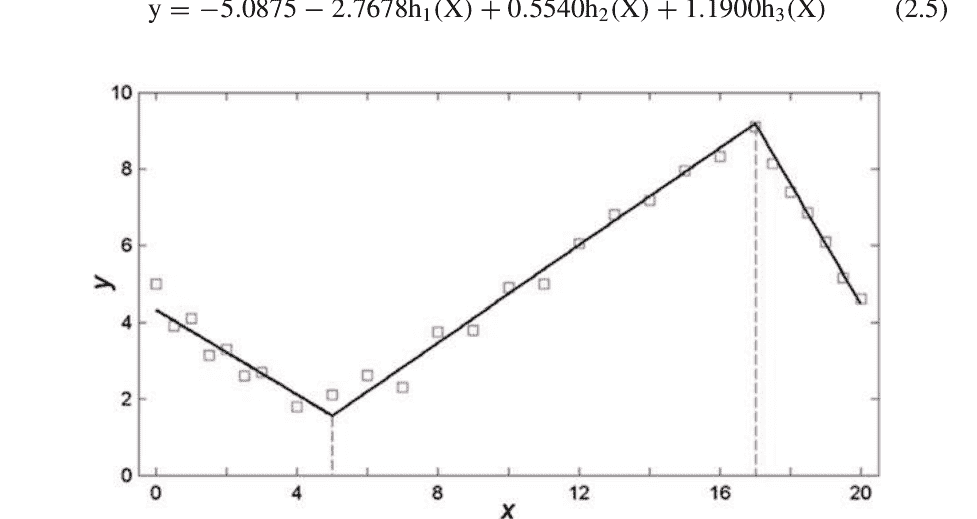

图2.3 简单MARS示例的节点和基函数

节点位于 $x = 5$ 和 $17$ 处，将 $x$ 范围分为三个区间，识别出不同的线性关系。

MARS中的前向建模策略是分层的，因为高阶交互只有在其较低阶的“足迹”已经存在时才可能存在。例如，只有在模型中存在其两个二元乘积之一时，三元乘积才能被添加到模型中。这种策略有助于避免在指数级增长的替代空间中进行搜索。

通常，MARS过程中交互作用的阶数上限被设置为两个，以保持其高解释性，但不会对其适应线性结构和非线性行为产生太大的负面影响。当集合C中的反射对乘以常数函数 $h_0 = 1$ 时，得到线性项，否则形成非线性结构。为了防止特征空间边界附近的急剧增加或减少，每个输入在一个项中最多只能出现一次。

不需要预设依赖和独立变量之间的基本函数关系，相反，MARS允许模型自身通过添加一个节点和其对应的基函数对来确定最适合的线性和非线性结构，以在每一步中最大程度地减少残差平方和误差。这个过程在预定的情况下结束，通常会导致一个有过拟合的模型。

因此，采用了向后删除的方法，在每一步中删除对训练误差减少贡献最小的项，得到一个估计的最佳模型 $f_{\lambda}$ 。每个大小 $\lambda$ 的广义交叉验证用于优化 $\lambda$ ，准则定义为

$$\mathrm{GCV}(\lambda) = \frac{\sum\limits_{i=1}^{N} (y_i - \hat{f}_{\lambda}(x_i))^2}{(1 - M(\lambda)/N)^2}, \qquad (2.6)$$
$$\mathrm{M}(\lambda) = r + cK, \qquad (2.7)$$

其中， $M(\lambda)$ 表示模型中的有效参数数量， $r$ 表示模型中的项数， $K$ 表示前向过程中选择的节点数， $c$ 表示用于确定一个最优节点值的参数数量。一些数学和模拟结果表明，在分段线性回归中应使用三个参数来选择节点，因此通常情况下 $c = 3$ 。但在模型被限制为可加性时，使用 $c = 2$ 。

由于其高度灵活性，MARS通常被视为逐步线性回归的推广。除此之外，它还可以被视为CART方法的修改。

尽管它们看起来可能非常不同，但通过应用以下变化，MARS实际上可以转化为CART。

-   将分段线性基函数（方程2.1）改写为阶梯函数

```
I(x - t > 0) 和 I(x - t ≤ 0). (2.8)
```

-   当模型项参与乘法运算时，将其替换为交互项，以便进一步的交互。

第一个变化导致每个步骤中的阶跃函数乘以一对反射阶跃函数，这相当于在步骤中分割一个节点。第二个变化对应于CART模型中同一节点只能分割一次的事实，这导致CART无法处理加性结构。通过允许某个模型项在与候选选项相乘时仍能进一步交互，MARS放弃了CART模型的二叉树表示，从而更有效地适应了加性结构。

与CART类似，MARS不仅在回归问题上表现出色，而且还能高效处理分类问题。

通常情况下，对于二元分类问题，可以将输出编码为0/1，并将其视为回归问题。对于多类别分类问题，可以使用指示器响应方法。K个响应类别通过0/1指示变量进行编码，然后执行多响应MARS回归，在所有响应变量中使用一组共同的基函数。最终，输出是具有最大预测值的类别。然而，这种方法存在潜在的掩盖问题，更好的方法是使用“最优评分”方法（Hastie等，2017年）。

具体而言，有一种名为PolyMARS的MARS混合模型，由Kooperberg等人（1997年）设计用于处理分类问题。它使用多重逻辑框架，在类似MARS的前向逐步方式下构建模型，但在每个阶段，使用多项式对数似然的二次近似来搜索下一个基函数对。一旦找到，就通过最大似然拟合扩展模型，并重复该过程，直到达到预设目标为止（Hastie等，2017年）。

至于MARS的使用，图2.4提供了VOSviewer绘图用于网络可视化和密度可视化，其中对于网络和密度可视化的解释是相同的。为简洁起见，这些解释被忽略了。图2.4c提供了叠加可视化。叠加可视化与网络可视化相同，只是通过使用颜色条对项目进行不同的着色。这里可视化的右下角的颜色条表示出版年份与颜色之间的对应关系。

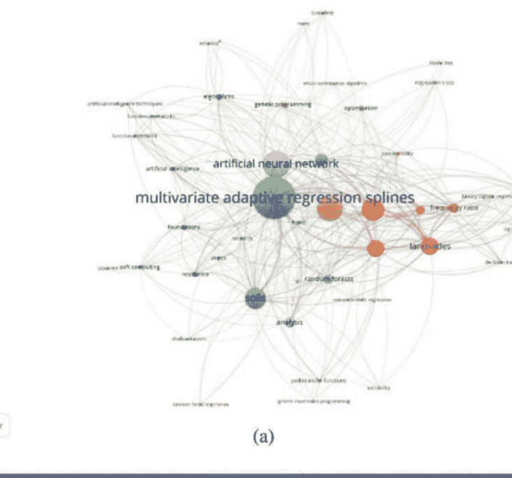

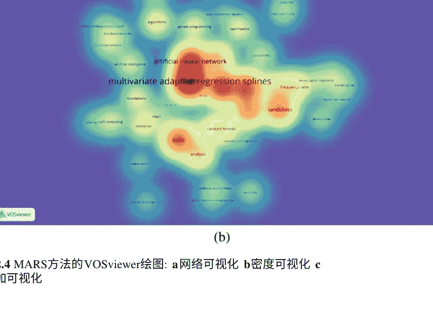

### 图2.4 MARS方法的VOSviewer绘图：a网络可视化 b密度可视化 c叠加可视化

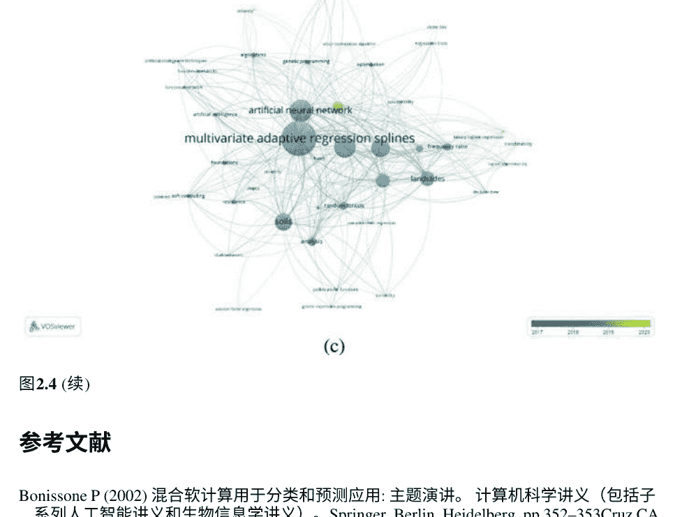

图2.4 (续)

## 参考文献

Bonissone P (2002) 混合软计算用于分类和预测应用: 主题演讲。 计算机科学讲义（包括子系列人工智能讲义和生物信息学讲义）。 Springer, Berlin, Heidelberg, pp 352–353

Cruz CA (2005) 基于软计算的并行协调策略用于优化问题的解决。

Friedman JH (2007) 多元自适应回归样条. Ann Stat 19:1–67. https://doi.org/10.1214/aos/1176347963

Hastie T, Tibshirani R, Tibshirani RJ (2017) 最佳子集选择、前向逐步选择和Lasso的扩展比较

Jiménez F, Gómez Skarmeta AF, Sánchez G, Cadenas JM (2003) 基于模糊集的优化启发式方法: 多目标进化模糊建模. In: Verdegay J-L (ed) Springer. Berlin Heidelberg, Berlin, Heidelberg, pp 221–234

Kooperberg C, Bose S, Stone CJ (1997) 多分类回归. J Am Stat Assoc 92:117–127. https://doi.org/10.1080/01621459.1997.10473608

Li X, Ruan D, Van Der Wal AJ (1998) 在FLINS'96上关于软计算的讨论. Int J Intell Syst 13:287–300. https://doi.org/10.1002/(sici)1098-111x(199802/03)13:2/3%3c287::aid-int10%3e3.0.co;2-4

Melian B, Moreno-Pérez, Moreno-Vega J (2003) Metaheuristicas: Una visión global. Intel Artif Rev Iberoam Intel Artif ISSN 1137–3601, null 7, N° 19, 2003, pags 7–28

Zadeh LA (1994) 软计算和模糊逻辑. IEEE Softw 11:48–56. https://doi.org/10.1109/52.329401

Zadeh LA (2001) 应用软计算-前言. Appl Soft Comput 1:1–2. https://doi.org/10.1016/s1568-4946(01)00003-5

# 第三章 机器学习与应用

## 3.1 监督学习

监督学习是通过使用带有标签的数据集来训练算法，以准确地对数据进行分类或预测结果的定义。当输入数据被输入模型时，它会调整权重，直到模型适当地拟合为止。这是交叉验证过程的一部分，以确保模型避免过拟合或欠拟合。一些用于监督学习的方法包括神经网络、朴素贝叶斯、线性回归、逻辑回归、随机森林、支持向量机（SVM）等。

### 3.1.1 人工神经网络

人工神经网络（ANN）是一种模拟生物神经网络结构和功能的数学模型（Agatonovic-Kustrin和Beresford 2000）。它使用大量的人工神经元连接来进行计算。网络由许多相互连接的“神经元”组成。每个神经元代表一个特定的输出函数，也称为激活函数。每层神经元之间的连接表示通过连接传递的信号的加权值，称为权重系数，它等同于ANN的记忆比例。网络的输出由网络的连接规则确定，ANN可以被理解为自然界中某种算法或函数的近似。

图3.1描述了一个包括输入层、隐藏层和输出层的简单神经网络结构。隐藏层中的细胞与输入层完全连接，而输出层与隐藏层完全连接。如果这样的网络有多个隐藏层，它可以被称为多层神经网络。

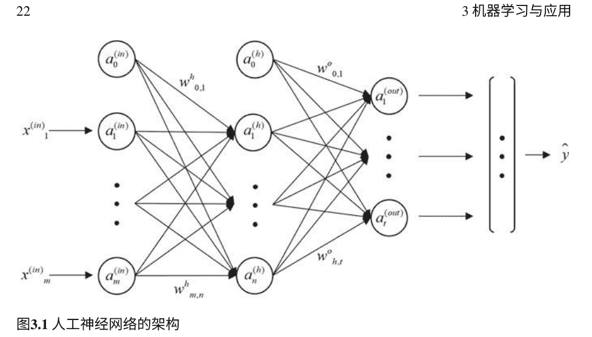

#### 图3.1 人工神经网络的架构

如上所述，$a_i^{(l)}$表示第 $l$ 层中的第 $i$ 个神经元。上标“in”表示输入层，上标“h”表示隐藏层，上标“out”表示输出层。$a_0^{(in)}$ 和 $a_0^{(h)}$ 是偏差值，定义为1，输入层是输入值加上偏差值。

图3.2展示了一些主要的监督学习方法的VOSviewer图，其中ANN的关键词共现网络是由VOSviewer软件构建的。节点和单词的大小表示节点的权重。节点和单词越大，权重越大。两个节点之间的距离反映了它们之间的关系强度。较短的距离通常表示更强的关系。两个关键词之间的连线表示它们一起出现过。连线越粗，共现次数越多。相同颜色的节点属于一个聚类。VOSviewer将与ANN相关的关键词分为7个聚类。

### 3.1.2 极限学习机

极限学习机是一种由黄等人（2006）提出的新型前馈神经网络训练方法。该方法随机生成输入层、隐藏层的连接权重和隐藏层神经元的阈值。在训练过程中，只需设置隐藏层神经元的数量，即可获得唯一的最优解。假设有N个不同的样本，其中$x_i = [x_{i1}, x_{i2}, ..., x_{in}]^T \in R^n$, $t_i = [t_{i1}, t_{i2}, ..., t_{im}]^T \in R^m$，具有隐藏层神经元M和激活函数$g(x)$的标准单隐藏层前馈神经网络可以表示为

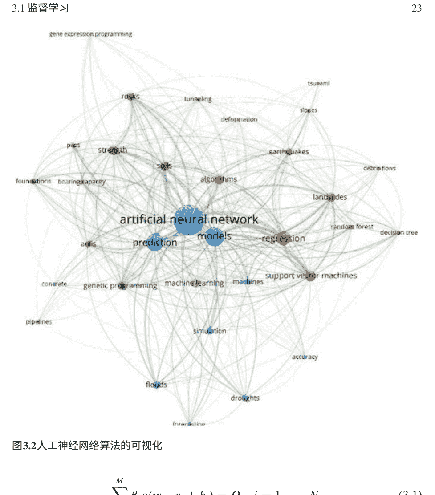

$$\sum_{i=1}^M \beta_i g(w_i \cdot x_i + b_i) = O_j, j = 1, \cdots, N, \quad (3.1)$$

其中 $w_i = [w_{i1}, w_{i2}, \cdots, w_{in}]^T$ 表示输入层节点与隐藏层节点$i$之间的连接权重；$\beta_i = [\beta_{i1}, \beta_{i2}, \cdots, \beta_{im}]^T$ 表示隐藏层节点$i$与输出层节点之间的连接权重；$b_i$ 表示隐藏层的偏差系数；$w_i \cdot x_j$ 表示 $w_i$ 和 $x_j$ 的内积；$O_i = [O_{i1}, O_{i2}, \cdots, O_{in}]^T$ 表示输出值。具有隐藏层$M$和激活函数 $g(x)$ 的标准单隐藏层前馈神经网络可以以零误差近似训练样本，当：

$$\sum_{i=1}^{M} \| O_j - t_j \| = 0 \quad (3.2)$$

因此，$\beta_i, w_i, b_i$满足以下公式：

$$\sum_{i=1}^{M} \beta_i g(w_i \cdot x_i + b_i) = y_i, \quad j = 1, \ldots, N, \quad (3.3)$$

可以表示为 $H\beta = Y$，其中 $H$是神经网络的输出矩阵。由于随机选择的输入权重和隐藏层偏置是固定的，网络训练等效于求解最小二乘解 $\hat{\beta}$ 以下方程的最小值：

$$\min_{\beta} \| H\beta - Y \| \quad (3.4)$$

上述线性系统的最小二乘解为 $\hat{\beta} = H^{+} Y$，其中 $H^{+}$是隐藏层输出矩阵 $H$的Moore-Penrose广义逆。

极限学习机的学习算法主要包括以下三个步骤。首先，随机设置输入层与隐藏层之间的连接权重 $w$ 和隐藏层神经元的偏置 $b$。其次，计算隐藏层的输出矩阵 $H$。最后，计算输出层的权重，$\hat{\beta} = H^{+} Y$。

图3.3展示了ELM算法的可视化，以及在地质工程和地球科学中的应用。

### 3.1.3 决策树

决策树是一种用层次、顺序结构递归地对数据进行分区的表示数据规则的方法 (Murthy 1998) 。决策树是一种常见的机器学习算法，它基于树结构进行决策。图3.4展示了建立决策树的流程图。$S$表示训练样本集，$A$表示分类样本集，$N$表示分类叶节点。

决策树算法包括迭代二分器3 (ID3)、C4.5、分类与回归树 (CART)、有监督学习中的Quest (SLIQ) 等 (Quinlan 1993; Breiman et al. 2017) 。在这些算法中，著名且常用的是Quinlan的ID3算法。C4.5和CART是从ID3决策树算法派生出来的。SLIQ算法是基于C4.5决策树分类算法的修改进一步得到的。在C4.5算法中，树是按照深度优先策略构建的，而SLIQ的结构是按照广度优先策略构建的 (Niuniu 2010) 。

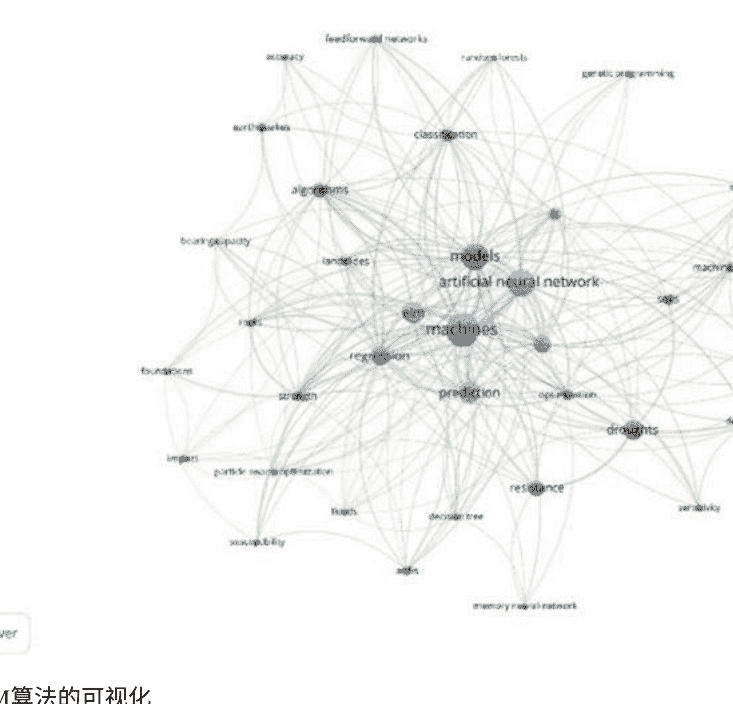

对于SLIQ，决策树的生成是按照广度优先策略构建的（Niuniu 2010）。决策树的生成过程主要包括特征选择、决策树生成和修剪三个主要部分。最关键的问题是特征选择。

不同的分割准则对决策树的泛化误差有显著影响。图3.5展示了决策树算法的可视化。

### 3.1.4 逻辑回归

线性回归是最古老、最简单的参数统计方法之一（Rashidi等，2019年）。这种技术已经在许多研究中广泛应用（Wei等，2019年; Elmousalami，2020年；Ben Chaabene等，2020年）。线性回归模型用于找到最佳拟合直线，也被称为“最小二乘回归线”（图3.6中具有最低误差和的虚线）与自变量和因变量之间的线性关系（Fig. 3.6）。这种方法的优点是简单易懂，能够找到线性关系。然而，在某些复杂情况下，这种方法可能不适用，因为自变量（原因或特征）与因变量之间的关系是非线性的。图3.7展示了线性回归算法的可视化。

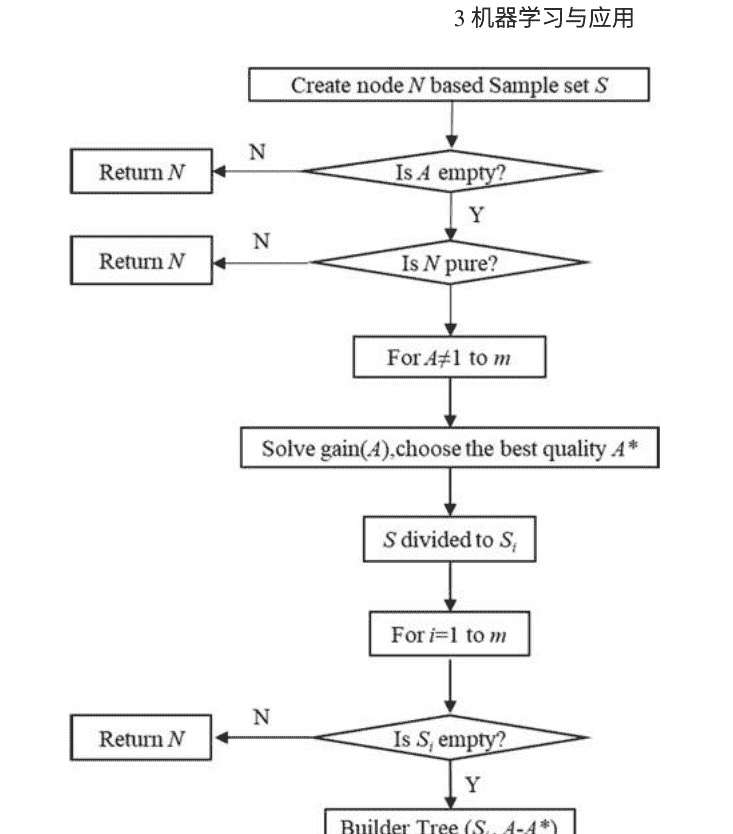

#### 图3.4 决策树发展流程图

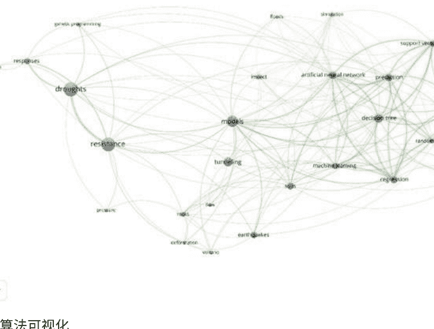

#### 图3.5 DT算法可视化

### 3.1.5 遗传编程

遗传编程（GP）是一种从问题的高级描述开始自动创建计算机程序的方法（Oltean等，2009年）。

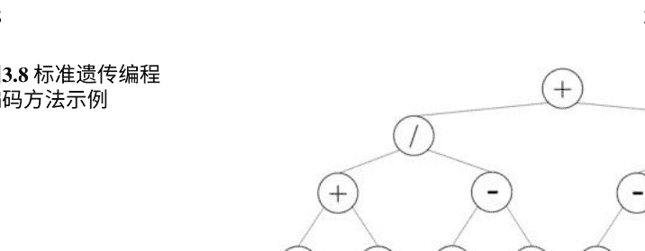

- 遗传编程（Wieczorek和Czech，2000年）：编码方法主要采用树结构，基于树结构的特殊交叉和变异操作符，不仅用于问题规划和离散优化，还用于回归分析和其他领域。（Koza，1992年；Angeline，1994年）对遗传编程进行了大量发展，并系统编辑了GP的书籍。GP开始广泛应用于自动编程和数值与组合优化问题。
- 编码和解码：遗传编程主要使用语法树进行编码，而不是传统的线性编码。图3.8显示了表达式（A1 + 10）÷（A2 - A3）+（20 - A3）× A5的树形编码。该表达式包含变量 A1、A2、A3、A5和常数10、20。这些变量和常数位于树的叶子上，被称为终止符。
符号 ＋、－、×、÷被称为运算符。终止符和运算符共同构成遗传编程的原始集合。
遗传编程的高级形式可以以多组件形式构建。
在这种情况下，遗传编程的编码通过特定规则将多个子树连接到根节点上进行。如图3.9所示。每个组件都是一个子树，每个子树都是一个完整的语法树。通过遗传编程中的语法分析，每个问题的解的形式可以被编码成树结构。同时，解码按照语法规则进行解构。
- 交叉和变异：遗传编程的基本操作包括复制、交叉和变异等。一般来说，个体的适应度越大，被选择的概率就越大。复制操作是根据适应度随机选择一个个体，并将其复制到下一代种群中。交叉操作是生成两个后代个体
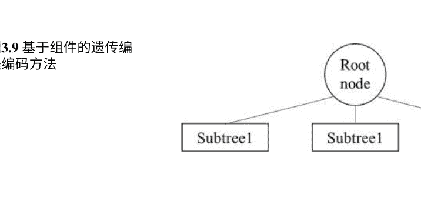

#### 图3.10 交叉操作
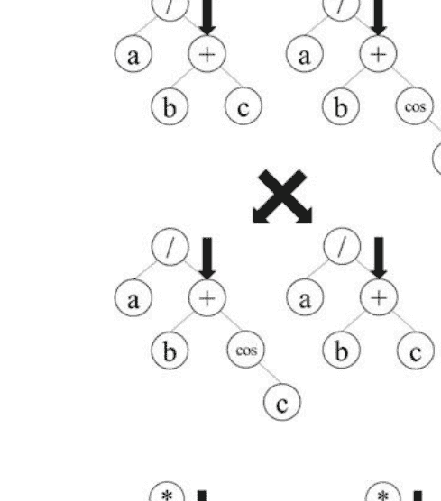

#### 图3.11 变异操作
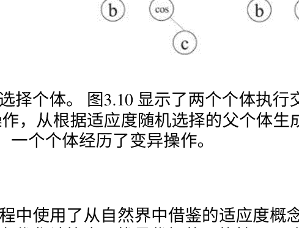

从两个随机选择的父个体中选择个体。图3.10 显示了两个个体执行交叉操作的过程。通过变异操作，从根据适应度随机选择的父个体生成一个子个体。如图3.11所示，一个个体经历了变异操作。
- 适应度函数和适应度：遗传编程中使用了从自然界中借鉴的适应度概念，用于衡量种群中每个个体在优化计算中寻找最优解的可能性。具有较高适应度的个体将更有可能继承到下一代，而适应度较低的个体则有较小的继承概率。衡量适应度的函数称为适应度函数。
- GP算法：遗传编程的基本步骤大致可分为三个步骤：a. 随机生成初始种群；b. 在程序种群上重复以下子步骤，直到满足终止准则。每个程序个体被分配一个适应度度量。使用三种遗传操作符（复制、交叉、变异）生成新的程序种群，并根据概率值选择要处理的个体
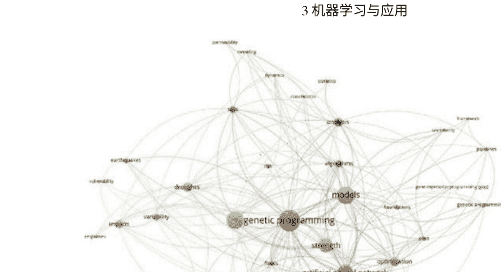

图3.12遗传编程算法的可视化
适应度（允许重新选择）；c. 将个体程序作为遗传编程的运行结果指示返回确定的个体程序。
图3.12提供了遗传编程算法的可视化。

### 3.1.6 朴素贝叶斯

朴素贝叶斯（NB）是一种基于贝叶斯定理和属性之间的绝对独立假设的分类器。由于朴素设计和简化的假设，NB模型可以高效工作，并且只需要相对较小的数据库来优化超参数（Bhargavi和Jyothi 2009）。
一般来说，NB模型的构建包括五个主要步骤：(i) 收集数据，(ii) 估计每个类别的先验概率，(iii) 估计各类别的均值，(iv) 生成协方差矩阵并找到每个类别的逆矩阵和行列式，(v) 构建每个类别的判别函数（Bhargavi and Jyothi 2009; Pham et al. 2017）。
假设$x = (x_1, x_2, ... x_n)$是输入向量，$y = (y_1, y_2, ... y_K)$是输出向量。NB模型的分类过程可以表示如下：
```
$$\hat{y} = \arg\max_{k=\{1,2,...,K\}} = \frac{P(y_k) \prod_{i=1}^{n} P(x_i|y_k)}{P(x)}$$ (3.5)
```
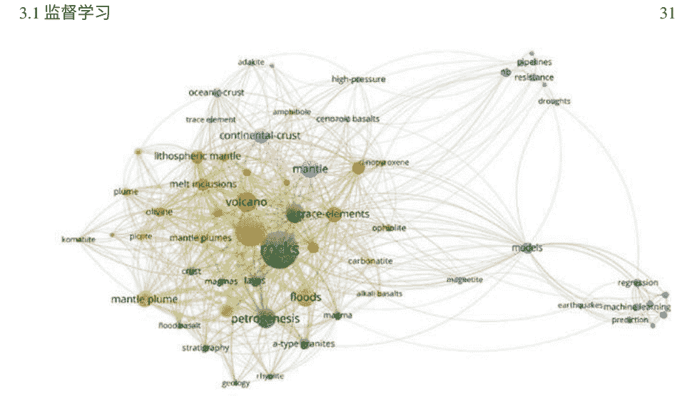

#### 图3.13 NB算法的可视化
其中 \(\hat{y}\) 是类别标签； \(P(y_k)\) 是 \(y_k\) 的先验概率； \(P(x_i|y_k)\) 是条件概率。 图3.13提供了NB算法的可视化。

### 3.1.7 支持向量机

支持向量机（SVM）是一种监督学习算法，最早由Vapnik（2000）提出，并逐渐在分类和回归问题中获得了更多的流行。 在接下来的内容中，将介绍SVM模型的一些基本原理。
假设有一个包含 \(l\) 个数据点的特定训练集，如 \((x_1, y_1), (x_2, y_2), ..., (x_l, y_l)\)，其中 \(x_i \in R^n\) (i = 1,2,...,l)是输入变量， \(y_i \in R\) (i = 1,2,...,l)是相应的目标值。根据Xue等人（2014）的说法，支持向量回归（SVR）的目标是解决以下优化问题：最小化
```
\[ \frac{1}{2} \|w\|^2 + C \sum_{i=1}^{l} (\xi_i + \xi_i^*) \] (3.6)
```
受到
```
\begin{cases} 
y_i - \sum_{j=1}^{n} \sum_{i=1}^{l} w_j x_{ji} - b \leq \varepsilon + \xi_i \\ 
\sum_{j=1}^{n} \sum_{i=1}^{l} w_j x_{ji} + b - y_i \leq \varepsilon + \xi_i^* \\ 
\xi_i, \xi_i^* \geq 0 
\end{cases}
```
其中
```
f(x) = \sum_{j=1}^{n} w_j x_j + b \quad \text{与} \quad w \in R^n, b \in R \quad (3.8)
```
关于这三个方程的一些详细信息如下： n在方程(3.7)和方程(3.8)中，是用于训练和测试的所有变量的数量，而 b表示偏差。j是对应输出的 l个输入的权重。 系数 C保证了 f(x)的简洁性和预测准确性。 当预测结果与观测值之间的误差小于 ε时，这是允许的，不需要惩罚，其中 ε被称为图3.14中的无敏损失函数。除了 ε之外，图3.14中还有两个松弛变量， ξ和 ξ*来确定对样本的惩罚程度。在构建SVR模型时，有几种常见的核函数，包括线性核函数、多项式核函数、径向基函数(RBF)等。(Zhang et al. 2016)。 为了获得一个理想的SVR模型，可用数据通常被分为训练集和验证集。 首先利用训练集建立一个粗略的模型，然后采用验证集进行调整
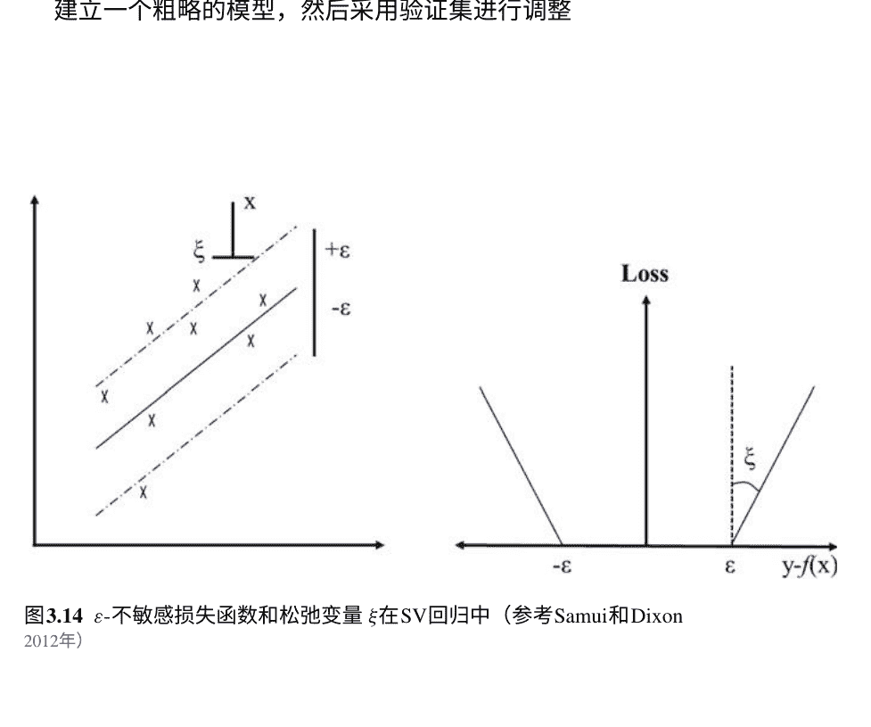

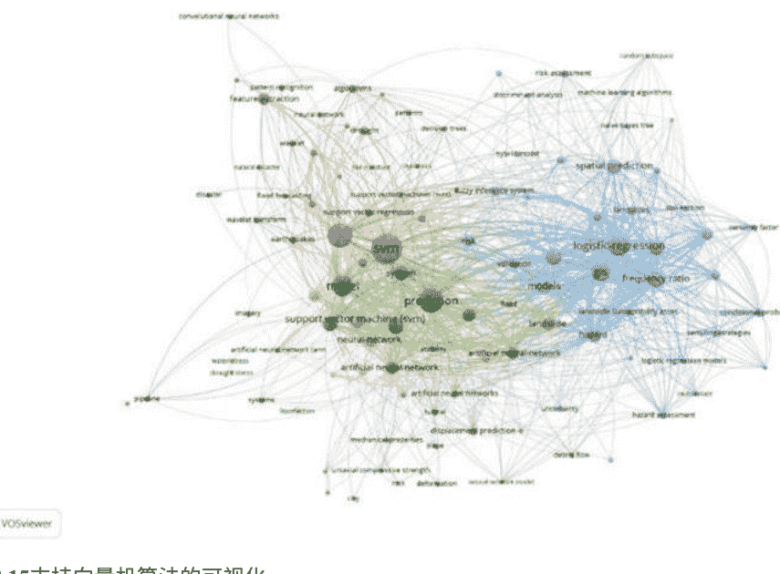

图3.15支持向量机算法的可视化
通过调整超参数来获得最佳模型，以实现准确预测并最小化误差。 为了避免过拟合，广泛使用一种称为k折交叉验证的技术。 有关支持向量机的更多细节，可以参考Samui和Dixon（2012年）；Xue等人（2014年）；Zhang等人（2016年）。 图3.15提供了支持向量机算法的可视化。

### 3.1.8 K最近邻

KNN是K最近邻的缩写，是一种基本的监督学习算法。 KNN可以用来解决分类和回归问题（参考Wu等人2008年）。 相比之下，分类问题更广泛应用。
因此，这里主要介绍分类算法。 首先将数据集分为训练集和测试集。 利用训练集初步建立KNN模型，然后使用验证集获取适当的超参数。 然后，采用测试集验证建立的模型。 KNN分类的关键原则是根据欧氏距离、曼哈顿距离或闵可夫斯基距离将新数据分类到最近的类别中，计算这三种距离的方程分别列在公式（3.9、3.10和3.11）中。 图3.16提供了KNN算法的可视化。
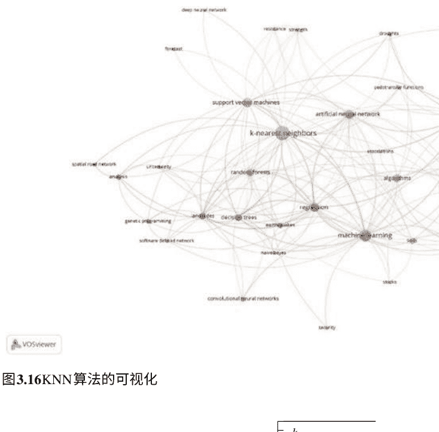

图3.16KNN算法的可视化
```
$$D_{\text{欧氏距离}} = \sqrt{\sum_{i=1}^{k} (x_i - y_i)^2} \tag{3.9}$$
```
```
$$D_{\text{曼哈顿距离}} = \sum_{i=1}^{k} |x_i - y_i| \tag{3.10}$$
```
```
$$D_{\text{闵可夫斯基距离}} = \left\{ \sum_{i=1}^{k} (|x_i - y_i|^q) \right\}^{1/q} \tag{3.11}$$
```

## 3.2 无监督学习

无监督学习使用机器学习算法分析和聚类无标签数据集。这些算法可以发现隐藏的模式或数据分组，无需人工干预。它能够发现信息中的相似性和差异性，是探索性数据分析、交叉销售策略、客户分割、图像和模式识别的理想解决方案。它还用于通过降维过程减少模型中的特征数量；主成分分析（PCA）和奇异值分解（SVD）是两种常用的方法。
无监督学习中使用的其他算法包括神经网络、k均值聚类、概率聚类方法等。

### 3.2.1 K均值聚类

K-means是一种典型的无监督学习算法，它将样本分成几个不相交的簇(Jain 2010)。聚类结果具有高内部相似性和低间部相似性。K-means算法的思想相对简单。假设数据要分成K个类别，步骤如下：
```
K-means算法首先初始化 \( k \) 个不同的质心 \( \{\mu^{(1)}, \dots, \mu^{(k)}\} \)。计算每个样本与质心 \( k \) 之间的距离，并选择与质心 \(\mu^{(i)}\) 最接近的簇作为样本 \( i \) 的类别。然后重新计算每个簇的质心，并再次调整每个样本的类别，直达到最大迭代次数或调整范围小于阈值。由于每次都要计算所有样本与每个质心之间的相似度，所以K-means算法在大规模数据集上的收敛速度相对较慢。
```

### 3.2.2 主成分分析

在数据科学领域，我们经常面临过拟合的问题。减少原始特征空间的维度并简化隐藏在数据库中的结构是一种高效的解决方案。为了降低维度，有两种常用的技术，即特征消除和特征提取。特征消除用于剔除对目标贡献较小的不重要变量。这是一种简单的方法，并且尽可能保持可解释性。特征提取用于生成新的独立变量，以解释数据库中的相关性，每个新创建的变量都是原始变量的组合。主成分分析（PCA）是一种广泛使用的特征提取技术。它以特定的方式组合输入变量，然后可以将最重要的独立主成分用作进一步分析的预测变量。它具有几个优点，但由于原始变量完全被消除，模型的可解释性会降低（Bakshi 1998年）。
图3.17展示了一些主要的无监督学习方法的VOSviewer图。为了简洁起见，节点和单词的具体解释以及距离被省略。
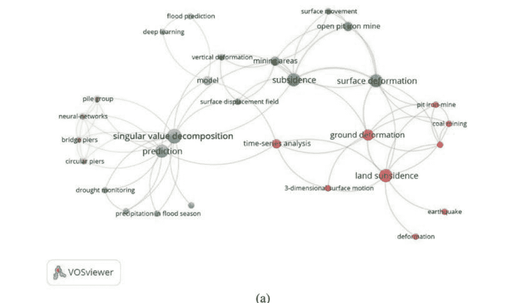

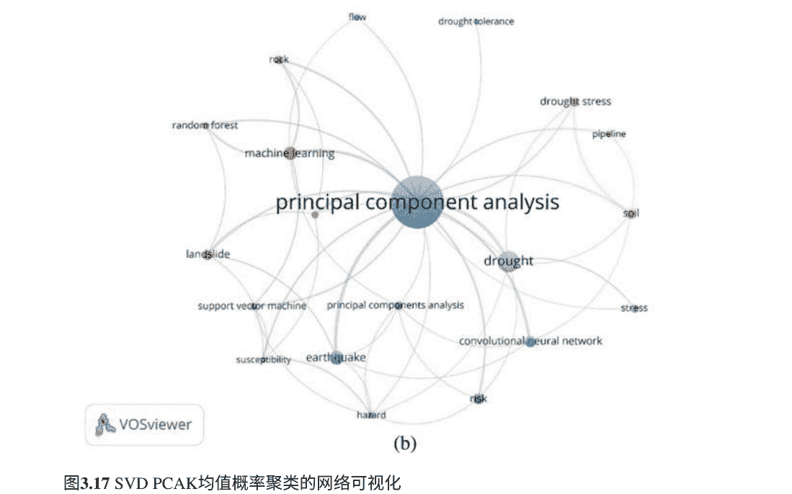

图3.17 SVD PCA K均值概率聚类的网络可视化
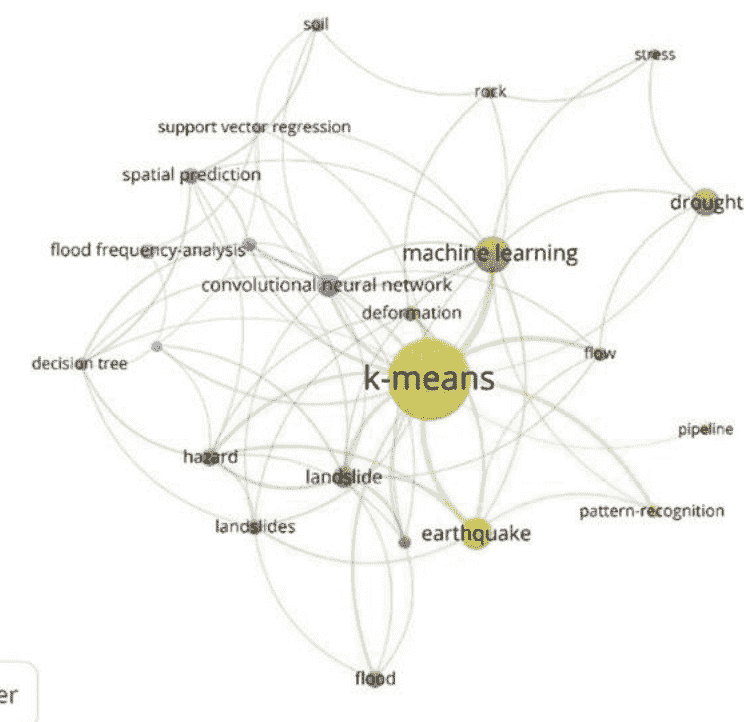

(c)
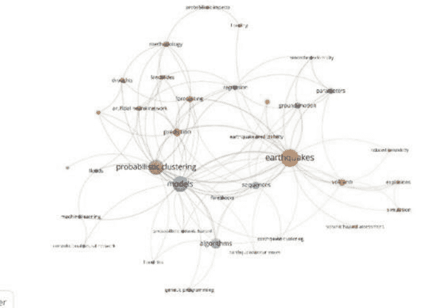

(d)
图3.17（续）

## 3.3 半监督学习

半监督学习在监督学习和无监督学习之间提供了一种折中的方法。 在训练过程中，它使用较小的标记数据集来指导从较大的未标记数据集中进行分类和特征提取。半监督学习可以解决标记数据不足（或无法负担足够的标记数据）以训练监督学习算法的问题。

## 参考文献

Agatonovic-Kustrin S, Beresford R (2000) 人工神经网络（ANN）建模的基本概念及其在制药研究中的应用。 J Pharm Biomed Anal 22:717–727
Angeline PJ (1994) 遗传编程：通过自然选择对计算机进行编程。 生物系统 33:69–73。 https://doi.org/10.1016/0303-2647(94)90062-0
Bakshi BR (1998) 多尺度PCA及其在多变量统计过程监控中的应用。 AIChE J 44:1596–1610. https://doi.org/10.1002/aic.690440712
Ben Chaabene W, Flah M, Nehdi ML (2020) 机器学习预测混凝土力学性能的关键综述。 Constr Build Mater 260 https://doi.org/10.1016/j.conbuildmat.2020.119889
Bhargavi P, Jyothi S (2009) 应用朴素贝叶斯数据挖掘技术对农业土壤进行分类。 IJCSNS Int J Comput Sci Netw Secur 9:117–122
Bin HG, Zhu QY, Siew CK (2006) 极限学习机：理论与应用。 Neurocomputing 70:489–501. https://doi.org/10.1016/j.neucom.2005.12.126
Breiman L, Friedman JH, Olshen RA, Stone CJ (2017) 分类和回归树。 Routledge
Elmousalami HH (2020) 人工智能和参数化施工成本估算模型：现状综述。 J Constr Eng Manag 146:03119008. https://doi.org/10.1061/(asce)co.1943-7862.0001678
Jain AK (2010) 数据聚类：超越K-means的50年。 模式识别信件31:651–666。 https://doi.org/10.1016/j.patrec.2009.09.011
Koza JR (1992) 遗传编程范式：通过遗传繁殖计算机程序种群来解决问题。 动态遗传混沌程序203–321。 https://doi.org/10.1109/TAI.1990.130444
Murthy SK (1998) 从数据中自动构建决策树：一项多学科调查。 数据挖掘与知识发现2 https://doi.org/10.1023/A:1009744630224
Niuniu X (2010) 决策树综述。 2010年第三届计算机科学与信息技术国际会议105–109
Oltean M, Groşan C, Dioşan L, Mihăilă C (2009) 具有线性表示的遗传编程：一项调查。 人工智能工具国际期刊18
Pham BT, Tien Bui D, Pourghasemi HR等（2017） 利用GIS评估北阿坎德地区（印度）的滑坡易发性：朴素贝叶斯、多层感知神经网络和功能树方法的预测能力比较研究。 Theor Appl Climatol 128:255–273. https://doi.org/10.1007/s00704-015-1702-9
Quinlan JR（1993）{C4}.5—机器学习程序
Rashidi HH, Tran NK, Betts EV等（2019） 病理学中的人工智能和机器学习：监督方法的现状。 Acad Pathol 6
Samui P, Dixon B（2012） 应用支持向量机和相关向量机确定水库蒸发损失。 Hydrol Process 26:1361–1369. https://doi.org/10.1002/hyp.8278
Vapnik VN (2000) 统计学习理论的本质. Nat Stat Learn Theory. https://doi.org/10.1007/978-1-4757-3264-1
Wei W, Ramalho O, Malingre L等 (2019) 用于预测室内空气质量的机器学习和统计模型. Indoor Air 29:704–726
Wieczorek W, Czech ZJ (2000) 遗传编程中的语法. Control Cybern 29:1018–1030
Wu X, Kumar V, Ross QJ等 (2008) 数据挖掘中的十大算法. Knowl Inf Syst 14:1–37. https://doi.org/10.1007/s10115-007-0114-2
Xue XH, Yang XG, Chen X (2014) 支持向量机在边坡稳定性预测中的应用. Sci China Technol Sci 57:2379–2386. https://doi.org/10.1007/s11431-014-5699-6
Zhang Y, Dai M, Ju Z (2016) 关于双折岩坡预测模型中SVM核函数选择的初步讨论. J Comput Civ Eng 30:04015031. https://doi.org/10.1061/(asce)cp.1943-5487.0000499

## 第四章 深度学习及应用

深度学习试图模仿人脑，尽管远远不能与其能力相匹配，但能够使系统对数据进行聚类和预测，具有令人难以置信的准确性。 它由多个相互连接的节点层组成，每一层都在前一层的基础上进行改进和优化预测或分类。 这种通过网络进行的计算过程称为前向传播。 深度神经网络的输入和输出层称为可见层。 输入层是深度学习模型摄取数据进行处理的地方，而输出层是最终进行预测或分类的地方。
另一个称为反向传播的过程使用梯度下降等算法来计算预测中的误差，然后通过向后移动层来调整函数的权重和偏差，以训练模型。 前向传播和反向传播共同使神经网络能够进行预测并根据错误进行修正。 随着时间的推移，算法逐渐变得更加准确。 上述描述了最简单类型的深度神经网络，用最简单的术语来说。 然而，深度学习非常复杂，有不同类型的神经网络来解决特定的问题或数据集，例如自编码器、深度置信网络、卷积神经网络、循环神经网络和长短期记忆网络等。

## 4.1 AE

自编码器主要用于降维和压缩（Hinton和Zemel 1994）。 策略是尝试使输出等于输入，或者尝试重构数据。 自动编码器包括编码器和解码器。 编码器接收输入，然后将其编码为低维潜在空间中的向量，然后解码器负责解码向量以获得原始输入。
自编码器可以从网络中的输出中获得较低维度输入的特征表示，实现降维和压缩。

此外，它可以用于检索略有不同的输入数据，甚至更好的数据，这些数据可以用于训练数据增强、数据去噪等。

## 4.2 DBN

受限玻尔兹曼机（RBM）是一种具有生成能力的随机神经网络，可以通过输入学习概率分布（LeCun等，1989年；Hinton，1989年）。与其他网络相比，它最大的特点是只有输入和隐藏层，没有输出。在前向训练中，输入经过后生成相应的特征表示，然后在反向传播中，从这个特征表示中重构出原始输入。这个过程类似于自编码器，但是它是在一个单一的网络中实现的。

多个受限玻尔兹曼机可以堆叠在一起形成一个深度信念网络（DBN）。它类似于全连接层，但训练方式不同。DBN的训练是根据RBM的训练过程，逐层训练其网络层。最近，由于生成对抗网络和变异自编码器的出现，使用DBN和RBM的人越来越少。

## 4.3 CNN

CNN是一种深度学习算法，广泛应用于视频识别、图像分类、推荐系统和自动驾驶问题（LeCun等，1998年；Krizhevsky等，2017年）。与传统方法相比，CNN具有无与伦比的预测准确性和工作效率，因为预处理阶段需要较少的努力。CNN的核心特点在于构建块，它由许多相互连接的层组成，使用一组共享的权重和偏差。图4.1显示了CNN模型的典型架构，包含卷积、池化和全连接层。

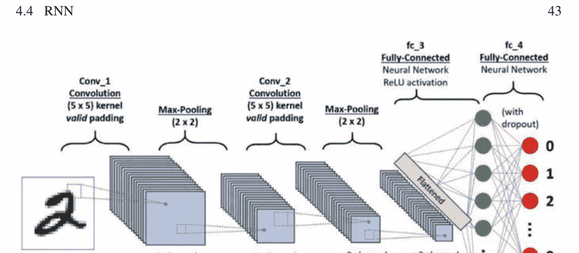

**图4.1 CNN结构模型**

## 4.4 RNN

循环神经网络是一种动态神经网络，可以捕捉时间序列数据（Graves等，2013年）。如图4.2所示，展示了RNN的基本结构。该算法的优势在于能够捕捉顺序信息。具体而言，前一个单元可能对下一个单元产生影响。基于这种结构，信息将按照序列从一层传递到下一层。

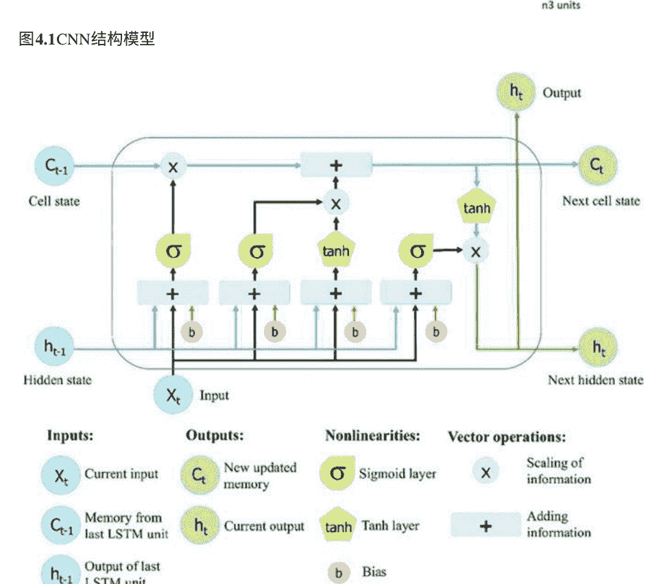

**图4.2 RNN结构模型（引自Le等人，2019年）**

RNN的输入可以是多个有序的，它可以将上一隐藏层的信息传递给下一隐藏层的神经元。也就是说，RNN算法具有一定的记忆能力。此外，RNN只记住重要的信息，然后明确地忘记其余的不重要的信息。虽然RNN算法的原理很简单，但是当目标与其前面的相关事件之间存在很长的时间滞后时，可能很难得到理想的RNN模型。

## 4.5 LSTM

为了解决RNN面临的“梯度消失或梯度爆炸”问题，提出了LSTM（Hochreiter和Schmidhuber，1997年）。与RNN相比，LSTM更好地利用了序列问题的历史信息，并且对于复杂的序列学习问题更加适用。LSTM的主要改进在于“记忆单元”，如图4.3所示。LSTM中的记忆单元包含三个特别设计的门，即输入门、遗忘门和输出门。输入门控制应该传递多少新信息到细胞状态。遗忘门确定细胞状态中应该保留或删除的信息。输出门计算输出结果，这个过程通常由一个sigmoid函数完成。总之，基于当前输入和先前输出的组合，LSTM模型预测下一个时间步的目标值。在达到所需的误差或最大迭代次数之前，这个过程将持续整个生命周期。

**图4.3 LSTM结构模型（赵等，2019年）**

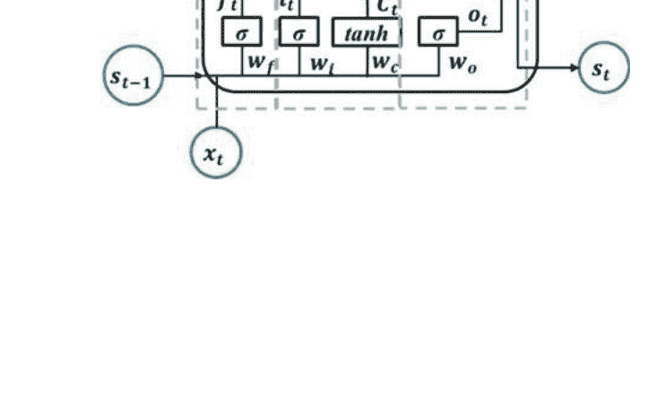

## 参考文献

Graves A, Mohamed AR, Hinton G (2013) 深度递归神经网络的语音识别。 在：ICASSP，IEEE国际声学、语音和信号处理会议-论文集，第6645-6649页

Hinton GE (1989) 确定性Boltzmann学习在权重空间中执行最陡降。 神经计算1：143-150。 https://doi.org/10.1162/neco.1989.1.1.143

Hinton GE, Zemel RS (1994) 自编码器、最小描述长度和Helmholtz自由能。 Adv Neural Inf Process Syst 6：3-10

Hochreiter S, Schmidhuber J (1997) 长短期记忆。 神经计算9：1735-1780。 https://doi.org/10.1162/neco.1997.9.8.1735

Krizhevsky A, Sutskever I, Hinton GE (2017) 使用深度卷积神经网络进行ImageNet分类. 通信 ACM 60:84–90. https://doi.org/10.1145/3065386

Le D-T, Lauw HW, Fang Y (2019) 相关性敏感的下一个篮子推荐. 第二十八届国际人工智能联合会议(IJCAI-19)论文集. 2808–2814.

LeCun Y, Bottou L, Bengio Y, Haffner P (1998) 基于梯度的学习应用于文档识别. IEEE会议论文集 86:2278–2323. https://doi.org/10.1109/5.726791

LeCun Y, Galland CC, Hinton GE (1989) GEMINI: 噪声注入后通过矩阵求逆进行梯度估计

Zhao H, Chen Z, Jiang H, et al (2019) 三种深度学习模型在早期作物分类中的评估，使用Sentinel-1A影像时间序列为例——以中国湛江为案例研究. 遥感 11:2673. https://doi.org/10.3390/RS11222673

## 第五章 优化算法及应用

当你在尝试做出关于涉及大量因素的复杂决策时，优化可以帮助你捕捉关键组成部分，建立工程情况的数学模型，让你更快地做出更好的决策。

优化问题可以分为函数优化问题和组合优化问题。 函数优化问题的对象是在一定区间内的连续变量，解决连续性问题。组合优化的对象解空间是离散状态，解决离散问题。 典型的组合优化包括旅行商问题（TSP）、调度问题、背包问题、装箱问题、图着色问题、聚类问题等。优化问题还可以分为精确算法和近似算法（启发式算法）。 前者通常非常复杂，只适用于解决小规模问题，在地质工程中不实用。 后者基于直觉或经验构建，为要解决的每个组合优化问题实例给出可行解，时间和空间成本可接受。 可行解与最优解之间的偏差无法预测。 元启发式算法是启发式算法的改进。 它是随机算法和局部搜索算法的结合。 元启发式算法还可以进一步分为基于个体的算法，如禁忌搜索算法和模拟退火算法，以及基于群体的算法，如进化算法和前述的新型群体智能优化算法。 如今，在地质工程和地球科学中，群体智能优化的应用占主导地位。

## 5.1 精确算法

如图1.2所示，关于OA算法的基本组成部分，精确算法由随机梯度下降、共轭梯度（CG）以及最陡下降法组成。图5.1提供了SGD和CG在地质工程和地球科学中的VOSviewer图。

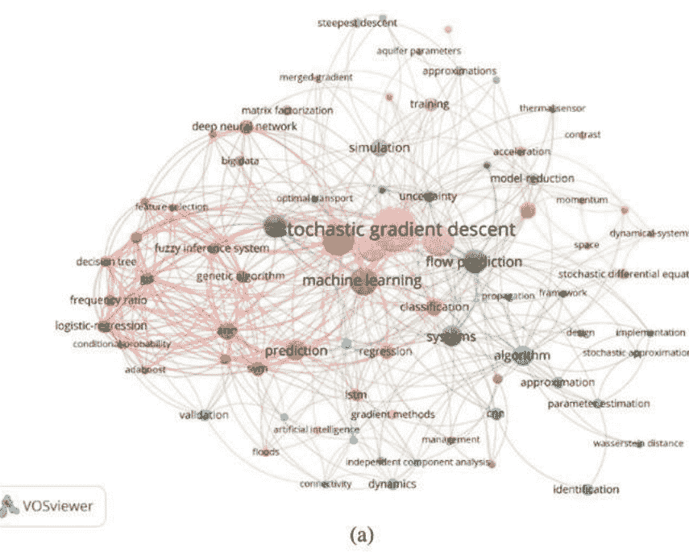

**(a)**

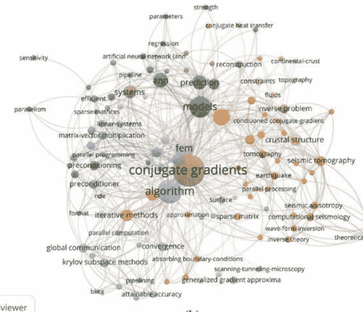

**(b)**

**图5.1 VOSviewer绘制了地质工程和地球科学中使用SGD和CG的情况**

## 5.2 进化算法

进化计算是一种工程和优化方法，其解决方案不是基于第一原理构建的，而是通过模拟达尔文进化元素的过程进行演化。进化计算是所谓的“自然启发计算”中的主要方法之一。进化算法是进化计算中的主要对象。存在一个需要解决的问题，解决方案被认为位于可能候选解的空间中——搜索空间。根据文献调研，常见的进化算法包括:

### 5.2.1 GA

遗传算法是模拟进化计算的最具代表性策略之一，由Holland（1992）提出。它是一种模拟自然生物进化的随机全局搜索和优化方法。该方法在搜索过程中获取和积累关于搜索空间的知识，并自适应地控制搜索过程以获得最优解。

它主要采用交叉和变异操作实现全局搜索，有效地减少了传统算法易陷入局部最优解的缺点。标准遗传算法包括编码过程、适应度函数和遗传操作。图5.2展示了遗传算法的网络可视化。

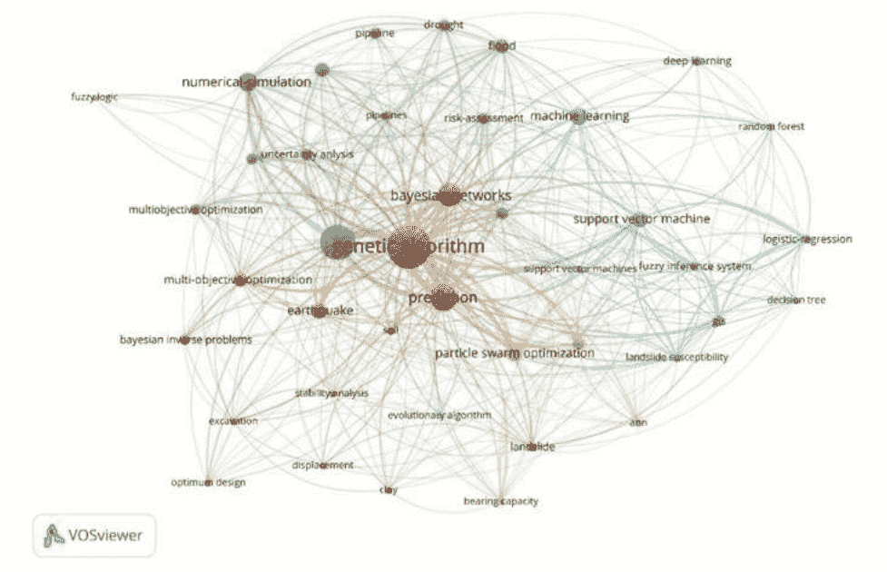

**图5.2 遗传算法的网络可视化**

### 5.2.2 BO

Snoek等人（2012）在2012年提出了用于超参数调优的BO算法。由于其出色的能力和节省时间的优势，它已广泛应用于深度学习、系统优化、环境监测等领域，为解决复杂优化问题提供了新的方向。

BO可以被看作是找到使未知目标函数达到最大或最小值的最优参数的过程。 这个过程涉及到贝叶斯优化算法的两个核心部分，即概率代理模型和采集函数。 BO算法使用概率代理模型来拟合真实的目标函数，并根据采集函数主动选择下一个评估点的潜力最大，从而可以在少数评估次数内获得目标函数的最优解，并避免不必要的采样。 图5.3展示了BO算法的网络可视化。

### 5.2.3 PSO

PSO是Eberhart和Kennedy（1995）提出的一种全局优化算法。 主要思想是将粒子视为优化问题的每个解，每个粒子根据自身和其他粒子的飞行经验在群体中游动。 为了衡量每个粒子解的优越性，它定义了适应度值函数，从整个空间中搜索最优解。 图5.4展示了PSO算法的网络可视化。

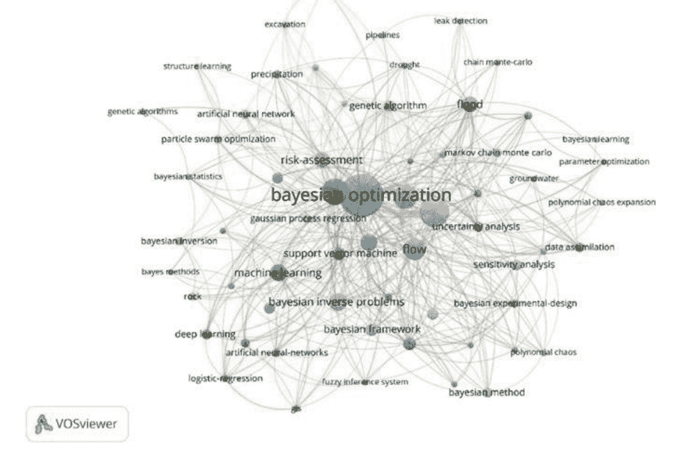

**图5.3 展示了BO算法的网络可视化**

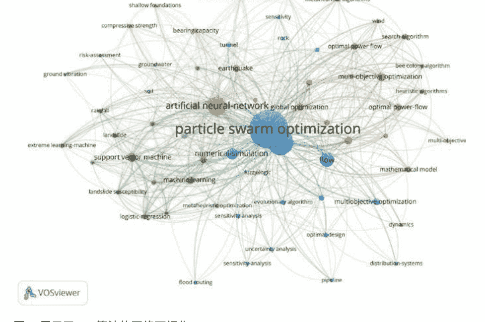

**图5.4 展示了PSO算法的网络可视化。**

### 5.2.4 DE

DE是一种随机、简单且高效的进化算法，通过Storn和Price（1997）在许多无约束测试函数中寻找全局最优解。与其他进化算法相比，DE保留了基于种群的全局搜索策略，并使用了简单的差分变异和一对一竞争的操作，因此可以减少遗传操作的复杂性（Huang和Chen 2013）。

同时，差分进化算法的特殊内存容量使其能够动态跟踪当前搜索，并通过强大的全局收敛性和鲁棒性来调整搜索策略。因此，它适用于解决一些复杂的优化问题（Huang和Chen 2013）。差分进化算法的主要过程包括三个主要操作符：变异、交叉和选择。在迭代过程中，假设每一代G的种群包含N个个体。初始种群通常是根据变量域上的均匀分布随机生成的。

变异操作用于生成一个个体，通过将两个种群个体之间的加权差异添加到第三个个体中。交叉操作用于多样化新种群。根据交叉策略，旧个体和新个体交换部分代码以形成新个体。选择操作是贪婪策略，它比较候选个体和目标个体的成本函数值，以确定最佳个体。图5.5提供了差分进化算法的网络可视化。

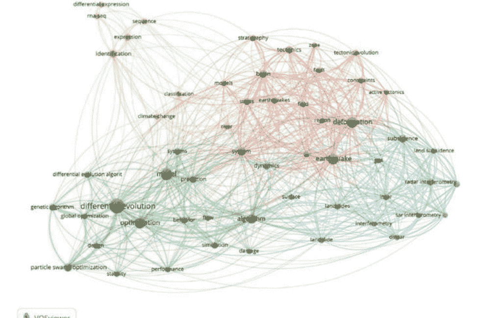

**图5.5 差分进化算法的网络可视化**

### 5.2.5 ABC

ABC是一种基于群体智能的元启发式算法，用于解决优化问题。它受到蜂群蜜蜂的智能觅食行为的启发 (Karaboga 2005)。在ABC算法中，蜂群中有三种类型的蜜蜂：就业蜜蜂 (觅食蜜蜂)，旁观蜜蜂 (观察蜜蜂) 和侦察兵。每种类型的蜜蜂都处理特定的任务。就业蜜蜂开发和搜索食物来源，对于每个食物来源只有一个就业蜜蜂。就业蜜蜂与旁观蜜蜂在蜂巢中共享信息，以便旁观蜜蜂可以选择一个食物来源进行觅食。侦察兵与通过探索蜂巢周围的环境寻找新的食物来源相关联。蜜蜂通过摇摆舞来展示被探索的食物来源的花蜜含量，舞蹈的持续时间与食物来源的质量成正比。旁观蜜蜂在选择一个好的食物来源之前会观看许多舞蹈，根据该食物来源的潜在质量进行选择。当蜜蜂 (无论是侦察兵还是旁观蜜蜂) 找到一个食物来源时，它就成为就业蜜蜂。当一个食物来源被丢弃时，与之相关的就业蜜蜂将再次随机成为侦察兵或旁观蜜蜂。研究发现，侦察兵负责探索工作，而就业蜜蜂和旁观蜜蜂负责开发工作 (Garg 2014)。ABC算法中有三个重要的控制参数，即群体大小、限制和最大周期 (Yusup et al. 2014)。更详细的计算过程可以参考 (Karaboga and Akay 2009)。

图5.6提供了ABC算法的网络可视化。

### 5.2.6 ACO

ACO是一种最近开发的基于群体的技术，由Dorigo和Gambardella (1997) 应用于解决优化问题。该算法受到真实蚂蚁群体觅食行为的启发。在寻找食物时，蚂蚁以随机方式探索其巢穴周围的环境。如果一只蚂蚁找到食物源，它会评估并携带一些食物返回巢穴。在返回的过程中，蚂蚁通过在路径的边缘上释放一定量的信息素来标记路径。信息素包含食物源的数量和质量信息，其他蚂蚁会被信息素吸引，引领它们找到食物。

信息素路径代表了蚂蚁之间的间接通信方式 (也称为信息素传递)，使得寻找巢穴和食物源之间的最短路径成为可能 (Nait Amar等, 2018)。图5.7提供了ACO算法的网络可视化。

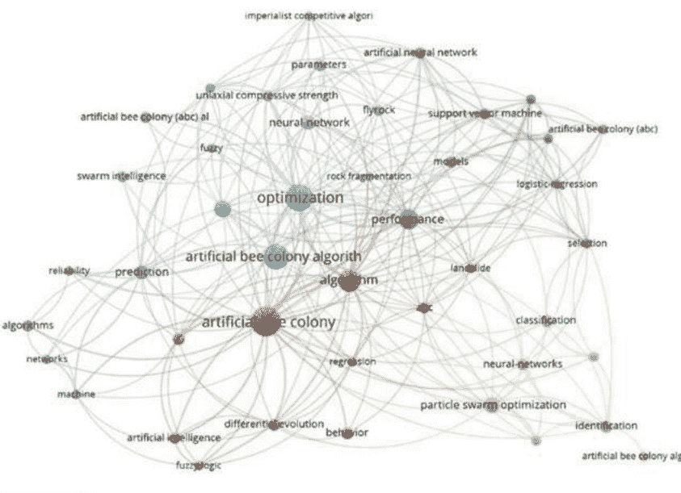

**图5.6 ABC算法的网络可视化**

### 5.2.7 CS

CS是由Yang和Deb（2009）开发的一种自然启发的基于种群的随机元启发式算法。该算法的主要思想受到了一些杜鹃鸟物种的寄生行为以及Lévy飞行的启发，后者是鸟类寻找食物的一种运动方式。在自然界中，一些杜鹃鸟会将它们的蛋放在其他鸟类的巢中，选择适合的巢，其中寄主鸟最近下了蛋，并移除已有的蛋，以增加自己蛋的孵化概率。杜鹃搜索算法可以基于三点理想化条件进行描述（Kanagaraj等，2014；Zhang等，2019）。关于该算法更详细的构建过程可以参考Yang和Deb（2009）。图5.8展示了CS算法的网络可视化。

### 5.2.8 FA

FA是一种启发式的新型仿生优化算法（Yang 2009），受到了自然界中萤火虫的闪烁行为的启发，利用搜索空间中的点来模拟萤火虫个体。FA可以比其他多峰函数更高效地处理。

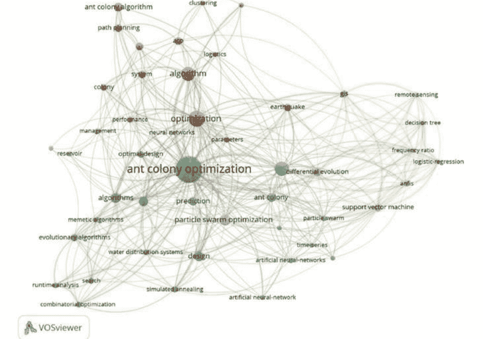

**图5.7 ACO算法的网络可视化**

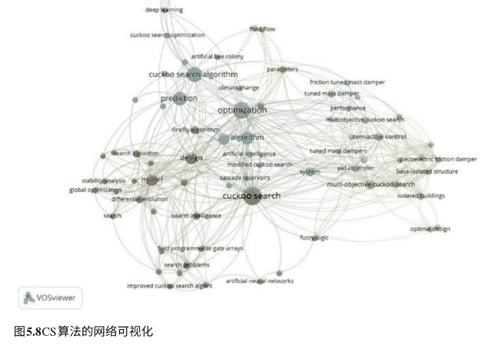

**图5.8 CS算法的网络可视化**

其他群体算法（Łukasik和Zak 2009；Yang 2009；Gandomi等2011；Yang等2012）。搜索过程模拟了萤火虫个体的吸引和移动过程。FA主要包括两个基本元素：亮度和吸引亮度（Huang等2019）。亮度主要反映了萤火虫位置的质量，可以确定萤火虫移动的方向。吸引力决定了萤火虫可以移动的距离。通过不断更新萤火虫在亮度和吸引力上的位置来优化目标。图5.9展示了地质工程和地球科学中FA算法的VOSviewer绘图结果。

### 5.2.9 GWO

受灰狼捕食行为的启发，Mirjalili等人在2014年提出了一种新型的群体智能优化算法：GWO算法。GWO通过模拟灰狼的合作机制和捕食行为来实现优化目标。图5.10展示了GWO的细节，包括狩猎行为的演示，即追踪、追逐和接近猎物；追击、包围和骚扰猎物直到停止移动。

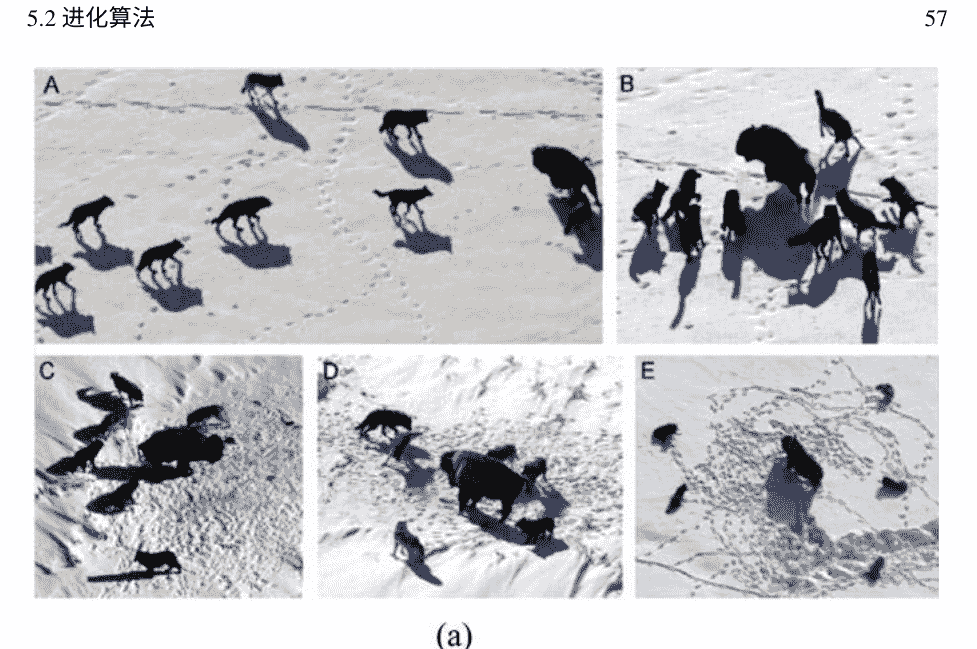

**(a)**

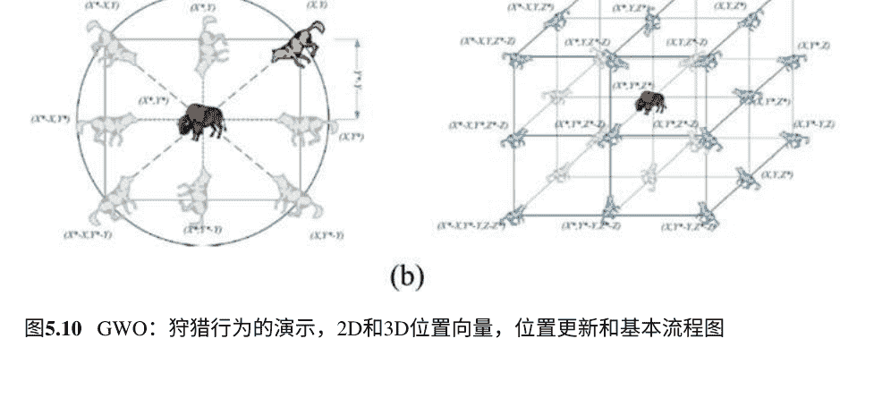

**(b)**

**图5.10 GWO：狩猎行为的演示，2D和3D位置向量，位置更新和基本流程图**

**图5.10（续）**

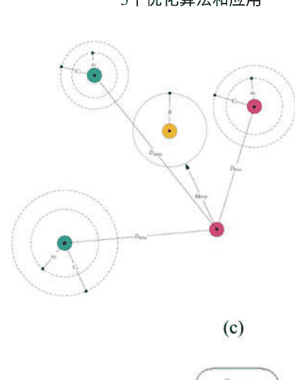

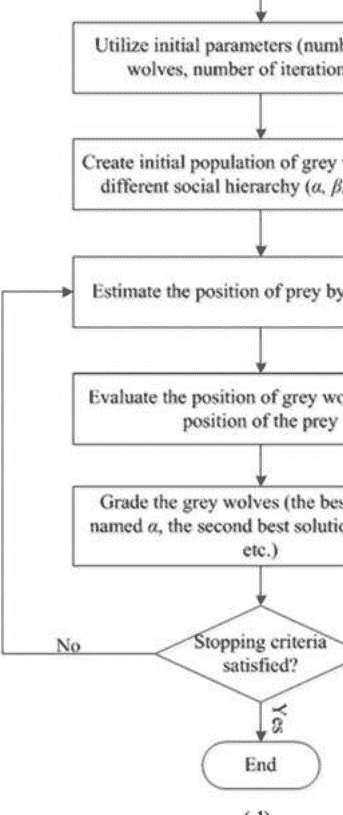

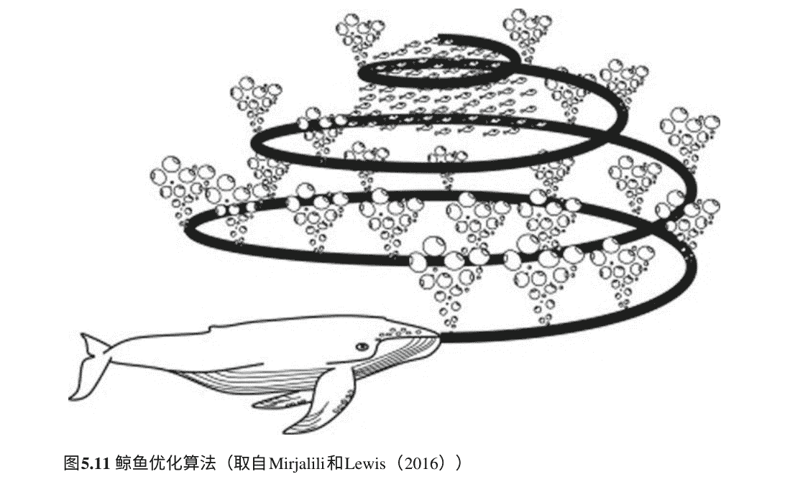

停止移动后向猎物发起攻击，2D和3D位置向量，位置更新和基本流程图。

### 5.2.10 WOA

Mirjalili和Lewis（2016）引入并开发了鲸鱼优化算法，这是一种元启发式算法，并证明了它在平衡探索和开发方面相对于最先进的优化算法的能力。座头鲸使用气泡网捕猎技术（Aljarah等，2018年）。WOA算法由三个阶段组成：（1）围捕猎物阶段；（2）开发阶段；（3）探索阶段（寻找猎物）（图5.11）。

### 5.2.11 SFLA

SFLA由Eusuff和Lansey（2003）提出，是一种用于解决离散优化问题的元启发式算法（Elbeltagi等，2005年）。它起源于青蛙的进食行为。Memetic算法（MA）是一种由Moscato（1989年）使用的群体智能算法，用于通过启发式搜索解决优化问题。“Memetic”意味着它是存储在人类或动物大脑中以指导其行为和传播的信息，类似于基因中的染色体。SFLA本质上结合了基于遗传的多智能体和基于社会行为的粒子群优化算法的优点。图5.12描述了SFLA的工作机制。

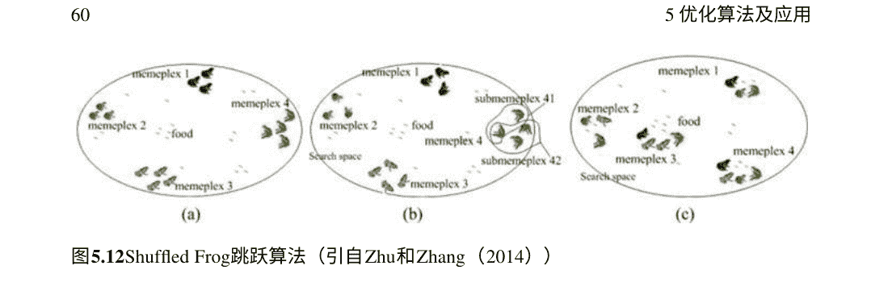

**图5.12 Shuffled Frog跳跃算法（引自Zhu和Zhang（2014））**

### 5.2.12 CSO

CSO是一种群体智能算法，最初由Chu等人（2006）发明。它受到猫的自然行为启发，并在建模探索和开发阶段中具有新颖技术。它已成功应用于科学和工程的各种优化领域。然而，文献中缺乏对该算法的最新和详细的综述，尤其是在地质工程和地球科学领域。为简洁起见，省略了CSO应用的摘要。图5.13显示了CSO的示意图和流程图。简单来说，基本概念包括（1）“寻找模式”，用于猫休息时，和（2）“追踪模式”，用于它们追逐猎物时。

图5.14提供了地质工程和地球科学中GWO、WOA和SFLA应用的饼图统计数据。表5.1列出了相关论文中提到的这三种方法的应用。

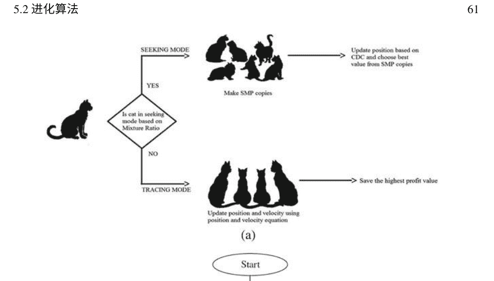

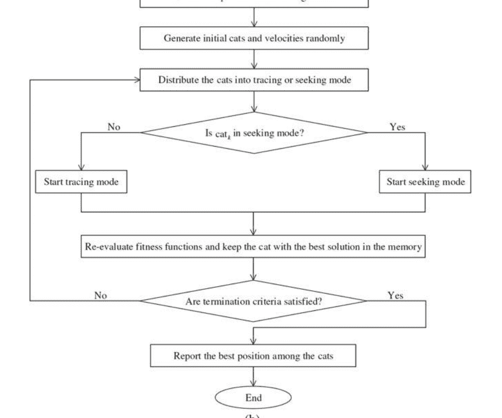

**图5.13 CSO的示意图（部分引自Selvakumar等人的2017年论文）**## The proportion of Grey Wolf Optimizer in the application

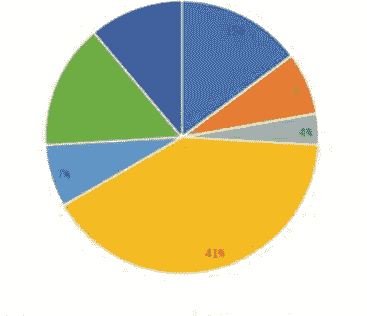

- Tunneling
- Support excavations
- Piles and Pipelines
- Landslides
- Droughts
- Floods
- Earthquakes

(a) GWO

## The proportion of Whale Optimization Algorithm in the application

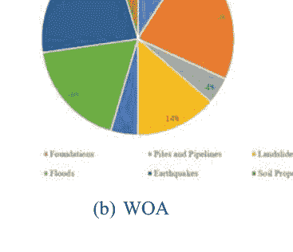

- Tunneling
- Foundations
- Piles and Pipelines
- Landslides
- Droughts
- Floods
- Earthquakes
- Soil Property prediction

(b) WOA

## The proportion of Shuffled Frog Leaping Algorithm in the application

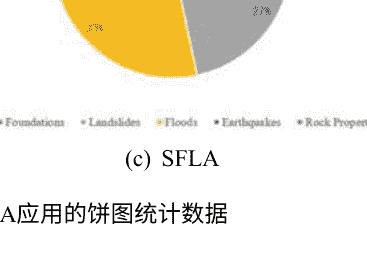

- Tunneling
- Foundations
- Landslides
- Floods
- Earthquakes
- Rock Property prediction

(c) SFLA

图5.14 GWO、WOA和SFLA应用的饼图统计数据

表5.1 提到地质工程和地球科学中GWO、WOA和SFLA应用的相关论文

| 方法 | 参考文献 | 目标 | 用途 |
|------|----------|------|------|
| GWO | Chen和Dong（2020年） | 隧道 | 优化准确稳定的水入口预测模型 |
| GWO | Li等人（2021a） | 隧道 | 预测钻进速度 |
| GWO | Yagiz和Karahan（2015年） | 隧道 | 估计TBM的性能 |
| GWO | Yang等人（2020年） | 隧道 | 优化TBM性能中最重要的参数 |
| GWO | Gandomi和Kashani（2018年） | 基础 | 以两种方式处理浅层优化 |
| GWO | Temur和Oser（2019年） | 基础 | 研究垂直载荷下桩群优化问题的鲁棒性 |
| GWO | Dehghanbanadaki等人（2021年） | 桩和管道 | 证实了MLP-GWO模型的有效性和高准确性 |
| GWO | Temur和Oser（2019年） | 桩和管道 | 计算单桩承载力并估计桩群的最佳数量 |
| GWO | Abdollahizad等人（2021年） | 滑坡 | 滑坡敏感性映射框架 |
| GWO | Chen等人（2019a） | 滑坡 | 滑坡建模框架 |
| GWO | Guo等人（2020年） | 滑坡 | 开发一个新的预测模型GWO-BP |
| GWO | Jaafari等人（2019年） | 滑坡 | 估计滑坡敏感性 |
| GWO | Jiang等人（2021年） | 滑坡 | 预测滑坡位移并使用预测区间量化其不确定性 |
| GWO | Kadirhodjaev等人（2020年） | 滑坡 | 在乌兹别克斯坦特定区域生成滑坡敏感性地图 |
| GWO | Li等人（2021b年） | 滑坡 | 生成泥石流敏感性地图 |
| GWO | Panahi等人（2020年） | 滑坡 | 为韩国首尔市义川镇开发滑坡敏感性地图 |

## 5 优化算法及应用

表5.1（续）

| 方法 | 参考文献 | 目标 | 用途 |
|------|----------|------|------|
| GWO | Paryami等人 (2020年) | 滑坡 | 使用ANFIS-GWO和ANFIS-PSO混合模型生成滑坡易发性地图 |
| GWO | Pham等人 (2020年) | 滑坡 | 在越南阿姆拜省Van Chan区进行滑坡敏感性制图 |
| GWO | Malik等人 (2021年) | 干旱 | 气象干旱（MD）预测 |
| GWO | Tikhamarine等人 (2019年) | 干旱 | 提高支持向量回归（SVR）预测月度交通流量的准确性 |
| GWO | Mustaffa等人 (2018年) | 洪水 | 提前一周预测水位 |
| GWO | Rahmati等人 (2020年) | 洪水 | 基于历史城市洪水事件开发新的混合模型 |
| GWO | Zou等人 (2019年) | 洪水 | 全局搜索最佳模糊聚类中心和FCI-CW的敏感性系数 |
| GWO | Kamgar等人 (2018年) | 地震 | 控制结构的地震振动 |
| GWO | Vijay和Nanda (2019年) | 地震 | 识别和提取聚类事件 |
| GWO | Zhou等人 (2021年a) | 地震 | 预测土壤液化潜力 |
| GWO | Temur和Oser (2019年) | 支护挖掘 | 垂直荷载下桩群的优化 |
| WOA | 李等人 (2021c) | 隧道 | 验证所提出的混合GEP和WOA方法的适用性 |
| WOA | 周等人 (2021b) | 隧道 | 优化SVM技术在TBM AR预测中的超参数 |
| WOA | 林等人 (2020) | 基础 | 分析RCCD的时间相关工作行为 |
| WOA | Moayedi等人 (2019) | 基础 | 分析两层土壤的承载力 |
| WOA | 钟等人 (2020) | 基础 | 预测和控制水泥消耗量 |
| WOA | 叶等人 (2020b) | 桩和管道 | 估计扩大桩的物理行为 |
| WOA | Chen等人 (2019a) | 滑坡 | 提出了一个综合的滑坡建模框架 |
| WOA | 李等人 (2020) | 滑坡 | 确定土坡的临界滑动面 |
| WOA | 魏等人 (2021) | 滑坡 | 两个不同阶段的边坡的FOS评估和分析 |
| WOA | 严等人 (2021) | 干旱 | 估计中国干旱地区的四个站点和湿润地区的四个站点的日蒸散发量 |
| WOA | Anaraki等人 (2021年) | 洪水 | 气候变化条件下的洪水频率分析 |
| WOA | Jafari-Asl等人 (2021年) | 洪水 | 提出一个新的概率设计迷宫溢洪道结构的框架 |
| WOA | Liu等人 (2020年) | 洪水 | 解决韧性评估中的歧义问题 |
| WOA | Samantaray和Sahoo (2021年) | 洪水 | 预测印度马哈纳迪河的Sundargarh和Salebhata站点的悬浮沉积物浓度 |
| WOA | Ashkezari和Yazdi (2021a年) | 地震 | 解决救援中心位置分配的复杂问题 |
| WOA | Ashkezari和Yazdi (2021b年) | 地震 | 解决地震救援中心的位置问题 |
| WOA | Brandao和Miguel (2020年) | 地震 | 将顶层响应和层间位移降低到低于参考标准规范允许的层间位移限值 |
| WOA | Lara-Valencia等人 (2021) | 地震 | 提高结构的地震安全性 |
| WOA | Vaheddoost等人 (2020) | 土壤性质预测 | 在流域尺度上定义FC和PWP |
| SFLA | Mora-Melia等人 (2015) | 隧道 | 确定水管网络的大小 |
| SFLA | Ye等人 (2020a) | 基础 | 使用新型智能模型进行稳定性分析 |
| SFLA | Zhong等人 (2019) | 基础 | 提出基坑最大地面沉降的预测模型 |
| SFLA | Abdollahizad等人 (2021年) | 滑坡 | 高效的滑坡易发性制图框架 |
| SFLA | Chen等人 (2019b) | 滑坡 | 提出一种新颖的集成数据挖掘技术 |
| SFLA | Sun等人 (2021) | 滑坡 | 预测山谷变形 |
| SFLA | Wang等人 (2015) | 滑坡 | 提出滑坡治理方案选择的优化算法 |
| SFLA | Bozorg-Haddad等人 (2015) | 洪水 | Muskingum参数估计 |
| SFLA | Ferdowsi等人 (2020年) | 洪水 | 在气候变化影响下寻找最佳的坝溢洪道形状 |
| SFLA | Li等人 (2010年) | 洪水 | 提出了一种新颖的多目标随机蛙跳算法 |
| SFLA | Orouji等人 (2013年) | 洪水 | 确定Muskingum模型中的最优/接近最优参数 |
| SFLA | Shirzadi等人 (2020年) | 洪水 | 预测伊朗哈拉兹地区的暴洪易感性 |
| SFLA | Lin和Chen (2016年) | 地震 | 建立地震响应与磁流变阻尼器指令电压之间的最优关系 |
| SFLA | Lin等人 (2018年) | 地震 | 寻找最优加权函数 |
| SFLA | Fattahi和Bazdar (2017年) | 岩石属性预测 | 建立间接估计DRI的预测模型 |

## 参考文献

Abdollahizad S, Balafar MA, Feizizadeh B等人（2021年）使用基于神经模糊系统和进化算法的混合人工智能方法模拟伊朗东阿塞拜疆省的滑坡易感性。地球科学信息。https://doi.org/10.1007/s12145-021-00644-z

Aljarah I, Faris H, Mirjalili S（2018年）使用鲸鱼优化算法优化神经网络中的连接权重。软计算22。 https://doi.org/10.1007/s00500-016-2442-1

Anaraki MV, Farzin S, Mousavi SF, Karami H（2021年）使用混合机器学习方法对气候变化对洪水频率的不确定性进行分析。水资源管理35: 199-223。 https://doi.org/10.1007/s11269-020-02719-w

Ashkezari AZ, Yazdi HM（2021a）基于鲸鱼优化算法的雅兹德市地震救援中心位置分配。工程学国际期刊34:1184–1194。 https://doi.org/10.5829/ije.2021.34.05b.12

Ashkezari AZ, Yazdi HM（2021b）基于鲸鱼优化算法的地震救援中心位置分配的新方法。工程学国际期刊34:769–781。 https://doi.org/10.5829/ije.2021.34.04a.03

Bozorg-Haddad O, Hamedi F, Orouji H等（2015）改进的非线性马斯金根模型用于洪水泛滥路由。水资源管理29:3419–3440。 https://doi.org/10.1007/s11269-015-1008-9

Brandao FD, Miguel LFF (2020) 优化调谐质量阻尼器在地震激励下建筑物振动控制中的应用。 Frat Ed Integritas Strutt 66–87。 https://doi.org/10.3221/igf-esis.54.05

Chen S, Dong S (2020) 一种用于煤矿水涌预测的顺序结构，集成特征选择和多目标优化。 IEEE Access 8:183619–183632。 https://doi.org/10.1109/access.2020.3028959

Chen W, Hong HY, Panahi M et al (2019a) 利用基于GIS的数据挖掘技术ANFIS结合鲸鱼优化算法（WOA）和灰狼优化算法（GWO）进行滑坡易发性空间预测。 https://doi.org/10.3390/app9183755

Chen W, Panahi M, Tsangaratos P et al (2019b) 应用基于群体的进化算法和神经模糊系统建模滑坡易发性。 https://doi.org/10.1016/j.catena.2018.08.025

Chu SC, Tsai PW, Pan JS (2006) 猫群优化。 在：人工智能太平洋国际会议论文集，第854-858页。 Springer, 中国桂林

Dehghanbanadaki A, Khari M, Amiri ST, Armaghani DJ (2021) 使用MLP-GWO和ANFIS-GWO模型估计C-φ土壤中驱动桩的极限承载力：一项比较研究。 软计算25: 4103-4119。 https://doi.org/10.1007/S00500-020-05435-0

Dorigo M, Gambardella LM (1997) 蚁群系统：一种合作学习方法解决旅行推销员问题。 IEEE Trans Evol Comput 1: 53-66。 https://doi.org/10.1109/4235.585892

Eberhart R, Kennedy J (1995) 使用粒子群理论的新优化器。 在：微型机器和人类科学国际研讨会论文集。 IEEE, 第39-43页

Elbeltagi E, Hegazy T, Grierson D (2005) 五种基于进化的优化算法的比较。 Adv Eng Inf 19:43-53。 https://doi.org/10.1016/j.aei.2005.01.004

Eusuff MM, Lansey KE (2003) 使用随机蛙跳算法优化水配水网络设计。 J Water Resour Plan Manage 129:210-225。 https://doi.org/10.1061/(asce)0733-9496(2003)129:3(210)

Fattahi H, Bazdar H (2017) 应用改进的人工神经网络模型评估钻进速率指数。 Tunn Undergr Sp Technol 70:114-124。 https://doi.org/10.1016/j.tust.2017.07.017

Ferdowsi A, Mousavi S F, Farzin S, Karami H (2020) 在气候变化条件下优化坝溢洪道设计。 J Hydroinformatics 22:916-936。 https://doi.org/10.2166/hydro.2020.019

Gandomi AH, Kashani AR (2018) 使用最新的群智能技术最小化浅基础建设成本。IEEE Trans Ind Inf 14:1099–1106。 https://doi.org/10.1109/TII.2017.2776132

Gandomi AH, Yang XS, Alavi AH (2011) 使用Firefly算法进行混合变量结构优化。 Comput Struct 89:2325–2336。 https://doi.org/10.1016/j.compstruc.2011.08.002

Garg H (2014) 使用人工蜂群算法解决结构工程设计优化问题。 J Ind Manag Optim 10:777–794。 https://doi.org/10.3934/jimo.2014.777

Guo Z, Chen L, Gui L等 (2020) 基于变分模态分解和WA-GWO-BP模型的滑坡位移预测。滑坡 17:567–583。 https://doi.org/10.1007/S10346-019-01314-4

Holland JH (1992) 自然和人工系统中的适应性：应用于生物学、控制和人工智能的简介分析。自然和人工系统的适应性。https://doi.org/10.7551/MITPRESS/1090.001.0001

Huang Y, Li J, Fu J (2019) 人工智能在土木工程中的应用综述。计算模型工程科学121: 845-875

Huang Z, Chen Y (2013) 基于自适应参数的改进差分进化算法。控制科学与工程2013年。 https://doi.org/10.1155/2013/462706

Jafar A, Panahi M, Pham BT等 (2019) 利用灰狼优化器和生物地理优化算法对自适应神经模糊推理系统进行元优化，用于滑坡易发性的空间预测。 CATENA 175: 430-445。 https://doi.org/10.1016/j.catena.2018.12.033

Jafari-Asl J, Ben Seghier ME, Ohadi S, van Gelder P (2021) 使用鲸鱼优化算法的高效可靠性设计优化方法迷宫溢洪道。应用软计算101。https://doi.org/10.1016/j.asoc.2020.107036

Jiang Y, Xu Q, Lu Z等 (2021) 多种机器学习算法模拟和预测滑坡位移和不确定性：以中国三峡库区白水河滑坡为例。地理信息与自然灾害风险12:741–762。 https://doi.org/10.1080/19475705.2021.1891145

Kadirhodjaev A, Rezaie F, Lee MJ, Lee S (2020) 使用优化的数据处理方法模型进行滑坡易发性评估。ISPRS国际地理信息杂志9。https://doi.org/10.3390/ijgi9100566

Kamgar R, Samea P, Khatibinia M (2018) 优化调谐质量阻尼器在关键地震中的参数。高层建筑结构设计27。 https://doi.org/10.1002/tal.1460

Kanagaraj G, Ponnambalam SG, Jawahar N, Nilakantan JM (2014) 一种有效的混合布谷鸟搜索和遗传算法用于约束工程设计优化。Eng Optim46:1331–1351。 https://doi.org/10.1080/0305215X.2013.836640

Karaboga D, Akay B (2009) 人工蜜蜂群算法的比较研究。Appl Math Comput 214:108–132。 https://doi.org/10.1016/j.amc.2009.03.090

Karaboga D (2005) 基于蜂群的数值优化思想。Tech Rep TR06, Erciyes Univ 10

Lara-Valencia LA, Caicedo D, Valencia-Gonzalez Y (2021) 一种新的鲸鱼优化算法，用于地震激励下调谐质量阻尼器的设计。应用科学11。https://doi.org/10.3390/app11136172

Li YH, Zhou JZ, Zhang YC等 (2010) 一种新的多目标随机蛙跳算法，用于水库洪水调度。J Water Resour Plan Manage 136:217–226。 https://doi.org/10.1061/(asce)wr.1943-5452.0000027

Li H, Yao H, Chen L等 (2021a) 使用软计算方法评估圆形钻孔双隧道（CBTT）性能。工程计算。 https://doi.org/10.1007/S00366-021-01288-9

Li Y, Chen W, Rezaie F等 (2021b) 使用地质环境因素进行泥石流建模：开发混合深度学习算法。地理国际。 https://doi.org/10.1080/10106049.2021.1912194

Li Z, Yazdani Bejarbaneh B, Asteris PG等（2021c）一种基于GEP和WOA的方法来估计花岗岩岩体中TBM的最佳穿透率。软计算。https://doi.org/10.1007/S00500-021-06005-8

Li SH，Wu LZ，Luo XH（2020）一种用于定位土坡临界滑动面的新方法。Eng Appl Artif Intel 94。https://doi.org/10.1016/j.engappai.2020.103733

Lin XF，Chen SM（2016）一种基于改进的蛙跳算法的模糊控制器，用于磁流变阻尼器建筑系统。Int J Comput Appl Technol 53:279–289。

Lin X，Chen S，Huang G（2018）一种基于蛙跳算法的混合灵敏度H∞控制方法，用于地震激励的结构建筑中使用MR阻尼器。J Vib Control 24:2832–2852。https://doi.org/10.1177/1077546317695462

林CN，李TC，陈SY等（2020年）利用元启发式优化技术对坝基长期变形特征进行结构识别。Adv Eng Softw 148。https://doi.org/10.1016/j.advengsoft.2020.102870

刘D，范ZR，付Q等（2020年）基于鲸鱼优化算法的区域洪水灾害韧性随机森林回归评估模型。J Clean Prod 250。https://doi.org/10.1016/j.jclepro.2019.119468

Łukasik S，Zak S（2009年）连续约束优化任务的萤火虫算法。在：计算机科学讲座笔记（包括子系列 计算机科学讲座人工智能和计算机科学讲座生物信息学），第97-106页

Malik A，Tikhamarine Y，Souag-Gamane D等（2021年）支持向量回归与新型元启发式算法相结合的气象干旱预测。Meteorol Atmos Phys 133:891–909。https://doi.org/10.1007/S00703-021-00787-0

Mirjalili S，Mohammad S，Lewis A（2014）工程软件中的灰狼优化器。Adv Eng Softw 69

Mirjalili S，Lewis A（2016）鲸鱼优化算法。Adv Eng Softw 95:51–67。https://doi.org/10.1016/j.advengsoft.2016.01.008

Moayedi H，Bui DT，Ngo PTT（2019）利用四种元启发式优化器改进神经计算在双层土壤上承载力分析中的应用。Appl Sci 9。https://doi.org/10.3390/app9235264

Mora-Melia D，Iglesias-Rey PL，Martinez-Solano FJ，Ballesteros-Pérez P（2015）进化算法在水网管道尺寸优化中的效率。Water Resour Manage 29:4817–4831。https://doi.org/10.1007/S11269-015-1092-X

Moscato P（1989）关于进化、搜索、优化、遗传算法和武术：走向模因算法

Mustaffa Z，Sulaiman MH，Ernawan F，Noor NM（2018）基于混合最小二乘支持向量机的短期预测。Adv Sci Lett 24:7455–7460。https://doi.org/10.1166/ASL.2018.12958

Nait Amar M，Zeraibi N，Redouane K（2018）利用动态代理、遗传算法和蚁群优化优化WAG过程。Arab J Sci Eng 43:6399–6412。https://doi.org/10.1007/s13369-018-3173-7

Orouji H，Haddad OB，Fallah-Mehdipour E，Mariño MA（2013）用元启发式算法估计Muskingum参数。Proc Inst Civ Eng Water Manage 166:315–324。https://doi.org/10.1680/WAMA.11.0068

Panahi M，Gayen A，Pourghasemi HR等人（2020）使用混合支持向量回归（SVR）和自适应神经模糊推理系统（ANFIS）以及各种元启发式算法对滑坡易发性进行空间预测。科学总论741。https://doi.org/10.1016/j.scitotenv.2020.139937

Paryani S，Neshat A，Javadi S，Pradhan B（2020）新型混合ANFIS模型在滑坡易发性制图中的比较性能。自然灾害103：1961-1988。https://doi.org/10.1007/S11069-020-04067-9

Pham BT，Phong TV，Trung NT等人（2020）使用随机子空间学习器和不同的决策树分类器进行滑坡易发性的集成建模。地理国际。https://doi.org/10.1080/10106049.2020.1737972

Rahmati O, Darabi H, Panahi M等人（2020）开发用于城市洪水易感性制图的新型混合模型。 Sci Rep 10. https://doi.org/10.1038/s41598-020-69703-7

Samantara y S, Sahoo A（2021）使用混合SVM-WOA方法预测悬浮泥沙浓度。Geocarto Int. https://doi.org/10.1080/10106049.2021.1920638

Selvakumar K, Vijayakumar K, Boopathi CS (2017) 基于CSO的解决方案用于解决非规范化电力系统中的负荷回弹效应。 Appl Sci 7:1127. https://doi.org/10.3390/app711127

Shirzadi A, Asadi S, Shahabi H等人（2020）基于贝叶斯信念网络和极限学习机的新型集成学习方法用于闪洪易感性制图。 Eng Appl Artif Intel 96. https://doi.org/10.1016/j.engappai.2020.103971

Snoek J, Larochelle H, Adams RP (2012) 机器学习算法的实用贝叶斯优化。在：神经信息处理系统进展，pp 2951–2959

Storn R, Price K (1997) 微分进化——一种简单高效的全局优化启发式方法，适用于连续空间。 J Glob Optim 11:341–359. https://doi.org/10.1023/A:1008202821328

Sun M, Xu W, Wang H et al (2021) 一种新型混合智能预测模型用于山谷变形：以中国溪洛渡水库区为例。计算材料连续性 66:1057–1074。 https://doi.org/10.32604/CMC.2020.012537

Temur R, Oser C (2019) 使用灰狼优化器优化垂直载荷下的桩群。 J Polytech Derg 22:19–32. https://doi.org/10.2339/politeknik.417754

Tikhamarine Y, Souag-Gamane D, Kisi O (2019) 一种新的智能方法用于月度流量预测：基于灰狼优化器的混合小波支持向量回归(WSVR-GWO)。 阿拉伯地质学杂志 12。 https://doi.org/10.1007/s12517-019-4697-1

Vaheddoost B, Guan YQ, Mohammadi B (2020) 应用混合ANN-鲸鱼优化模型评估土壤的田间容水量和永久凋萎点。 环境科学与污染研究 27:13131–13141. https://doi.org/10.1007/s11356-020-07868-4

Vijay RK, Nanda SJ (2019) 基于量子灰狼优化器的去聚集模型，用于在遗传框架中分析地震目录。 计算机科学杂志 36。 https://doi.org/10.1016/j.jocs.2019.07.006

Wang F, Su JY, Wang ZT, Destech Publications I (2015) 基于二维IOWA算子和SFL算法的滑坡治理方案优化

Wei W, Li XB, Liu JZ等 (2021) 采用不同核函数的混合WOA-SVR和HHO-SVR模型对圆形失稳边坡的安全系数进行性能评估。 应用科学11。 https://doi.org/10.3390/app11041922

Yagiz S, Karahan H (2015) 应用各种优化技术并比较其在预测岩体中隧道掘进速率方面的性能。 Int J Rock Mech Min Sci 80:308–315. https://doi.org/10.1016/j.ijrmms.2015.09.019

Yan SC, Wu LF, Fan JL等 (2021) 一种新型的混合WOA-XGB模型，用于估算中国干旱和湿润地区的日参考蒸散发，利用本地和外部气象数据进行应用。农业水管理244。 https://doi.org/10.1016/j.agwat.2020.106594

Yang XS (2009) 火fly算法用于多模态优化。 计算机科学讲义（包括子系列计算机科学人工智能和计算机科学生物信息学讲义）。 Springer, 柏林, 海德堡, 第169-178页

Yang XS, Deb S (2009) 通过Lévy飞行进行布谷鸟搜索。在：Abraham A, Herrera F, Carvalho A, Pai V (eds) 2009年世界自然与生物启发计算大会，NABIC 2009年会议论文集。IEEE, 第210-214页

Yang XS, Hosseini SSS, Gandomi AH (2012) 用于解决具有阀门加载效应的非凸经济分派问题的萤火虫算法。 Appl Soft Comput J 12: 1180-1186. https://doi.org/10.1016/j.asoc.2011.09.017

杨辉, 王志, 宋凯 (2020) 一种新的混合灰狼优化器-特征加权-多核支持向量回归技术用于预测TBM性能。 Eng Comput. https://doi.org/10.1007/S00366-020-01217-2

Ye X, Moayedi H, Khari M, Kok Foong L (2020a) 元启发式混合多层感知器在边坡稳定性分析中的应用。智能结构系统26:263–275。https://doi.org/10.12989/SSS.2020.26.3.263

Ye XY, Lyu ZJ, Foong LK (2020b) 元启发式混合龙蝇、鲸鱼和蚁狮算法在扩大桩行为中的应用。智能结构系统25:765–778。https://doi.org/10.12989/sss.2020.25.6.765

Yusup N, Sarkheyli A, Zain AM等(2014)利用人工蜜蜂群估计最优加工控制参数。J Intell Manuf 25:1463–1472。https://doi.org/10.1007/s10845-013-0753-y

Zhang Y, Ge T, Tian W, Liou YA (2019) 利用机器学习技术在中国日喀则地区进行泥石流易发性制图。遥感11。https://doi.org/10.3390/rs11232801

Zhong D, Liu Z, Su Z等（2020）预测和控制坝基础帷幕灌浆过程中的水泥用量。欧洲环境土木工程杂志。https://doi.org/10.1080/19648189.2020.1847689

Zhong GQ, Wang H, Li L等（2019）基于SFLA-GRNN模型的基坑最大沉降预测。岩土力学与工程学报40。https://doi.org/10.16285/j.rsm.2017.1652

Zhou J, Huang S, Wang M, Qiu Y（2021a）混合GA-SVM和GWO-SVM模型评估土壤地震液化潜力的性能：多数据集调查。工程计算。https://doi.org/10.1007/S00366-021-01418-3

Zhou J, Qiu YG, Zhu SL等（2021b）通过使用元启发式算法优化支持向量机在预测TBM推进速率中的应用。Eng Appl Artif Intell 97:。https://doi.org/10.1016/j.engappai.2020.104015

Zhu GY, Zhang WB（2014）改进的Shuffled Frog-leaping算法用于优化组件拾放排序优化问题。Expert Syst Appl 41:6818–6829。https://doi.org/10.1016/j.eswa.2014.04.038

Zou Q, Liao L, Ding Y, Qin H（2019）基于模糊聚类迭代模型和免疫灰狼优化算法的洪水分类。https://doi.org/10.3390/w11010080

# 第6章 在边坡位移预测中应用LSTM和Prophet算法

## 6.1 简介

中国是世界上地质灾害最严重的国家之一（Wang等，2004年; Keqiang等，2008年; Li等，2010a年; Du等，2013年）。在某些情况下，山体滑坡会导致人员生命和财产的巨大损失，同时对环境造成重大影响（Yin等，2010年; Zhang等，2020a年）。特别是由于高山地区的复杂地质条件和密集的人类工程活动，山体滑坡在三峡库区经常发生，存在陡峭的坡面和洪水（Xu和Niu，2018年; Xie等，2019年）。2003年7月13日的黔江坪滑坡摧毁了4家工厂和129座房屋，造成24人死亡，1000多人无家可归（Jian等，2014年）。这是三峡库区最具破坏性的滑坡之一，因为它发生在水库首次蓄水后不久（Wang等，2004年; Jian等，2014年）。

众所周知，季节性降雨和水库水位的周期性波动的耦合效应对边坡安全构成了巨大威胁(Li等，2010a; Du等，2013; Huang等，2017; Yang等，2019; Chen等，2020; Wang等，2020a; Zhang等，2020a)。然而，滑坡是复杂的、动态的和非线性的系统，其失效机制尚未被研究人员充分探索(Xu和Niu，2018)。近几十年来，为了更好地控制灾害风险并发出预警，在滑坡易发区广泛使用了监测网络和控制系统(Li等，2010a)。基于大量记录的数据，可以分析滑坡位移与其触发因素之间的复杂关系。滑坡位移预测模型的准确性取决于如何表达和反映这些复杂关系(Xu和Niu，2018; Yang等，2019)。

传统的滑坡位移方法，如物理实验、数值分析和经验公式，具有一定的优势，但也存在一些缺点（Huang等，2017年; Xu和Niu，2018年; Yang等，2019年）。例如，实验室实验在揭示滑坡演化和增强方面表现良好对于失效机制的理解，例如基于蠕变理论和土壤岩石力学。另一方面，这些实验成本高，与数值模拟相比需要更多的时间和精力。最近，随着人工智能的发展，许多数据驱动模型已被用于滑坡位移预测（Li等，2010a；Du等，2013年；Zhou等，2016年，2018年；Huang等，2017年；Xie等，2019年；Yang等，2019年）。与上述方法相比，数据驱动模型因在计算成本和模型准确性之间取得平衡而越来越受欢迎（Lian等，2015年；Wang等，2020b年；Zhang等，2020b年）。因此，可以推断出在未来的滑坡问题中，传统方法和人工智能方法的结合将更加适用。

在预测滑坡位移方面，人工智能方法主要分为两大类：考虑触发因素综合影响的方法和考虑滑坡位移本身的方法（Xu和Niu，2018）。在这些方法中，人工神经网络（ANNs）、极限学习机（ELMs）和支持向量机（SVMs）是常用的预测滑坡位移的方法（Du等，2013；Lian等，2015；Zhou等，2016，2018；Cao等，2016）。例如，Du等（2013）使用反向传播神经网络（BPNN）方法结合时间序列模型预测滑坡位移。Cao等（2016）提出了一种极限学习机模型，分析了位移特征，并使用时间序列表达。Zhou等（2016）比较了改进的支持向量机模型和BPNN方法预测的位移时间序列。这些例子说明了时间序列分析和机器学习方法相结合在预测滑坡位移方面越来越受欢迎。

利用时间序列模型，将滑坡位移分为两个主要部分：长期趋势主要受内部因素（即地质条件和材料性质）控制，周期性位移主要受外部因素（即降雨和水库水位）的显著影响。长期趋势更加时间相关且增长缓慢，可以通过多项式函数进行高精度拟合。关于周期项，其周期性与季节性降雨和定期水库调度密切相关，因此预测更加复杂（Du等，2013年；Xu和Niu，2018年；Yang等，2019年）。

最近，长短期记忆（LSTM）模型因其能够有效反映降雨和水库水位耦合效应下滑坡位移的动态响应而受到广泛关注（Xing等，2019年；Zhang等，2019年；Jiang等，2020年）。LSTM模型最早由Hochreiter和Schmidhuber（1997年）提出，可以被视为改进的循环神经网络（RNN）（Sak等，2014年）的方法，它使用特殊的“记忆”结构更好地控制和判断历史信息。例如，Fan等（2014年）研究了LSTM模型在TTS语音合成中的应用。Weytjens等（2019年）发现，与ARIMA等经典预测方法相比，LSTM模型在时间序列预测方面特别有用。Kong等（2017年）高效地使用LSTM模型预测了个体住宅的短期负荷预测问题。

在许多先前的研究中，包括滑坡位移预测问题，LSTM模型已被证明是一种可靠的建模方法。例如，张等人（2019）发现LSTM模型在预测滑坡位移方面比支持向量机（SVM）和Elman神经网络（ENN）模型表现更好，尽管它需要更多的训练时间。杨等人（2019）分别比较了支持向量机和LSTM模型的预测位移，并验证了后者的更高准确性。邢等人（2019）通过堆叠神经网络层提出了一种改进的LSTM模型，并成功应用于中国的大水田滑坡。然而，LSTM模型在滑坡位移预测方面的性能仍需要通过更多案例研究来探索和改进。

本节采用LSTM模型基于时间序列分析和触发因素选择来预测TGR地区巴子门滑坡的位移。预测模型的实施包括四个主要任务：

- 1. 将总位移分解为趋势项和周期项；
- 2. 使用非线性回归函数拟合趋势项；
- 3. 通过分析周期位移与降雨和水库水位之间的关系来构建模型以预测周期位移；
- 4. 将预测的趋势位移和周期位移相加作为预测的总位移。

还使用了支持向量机（SVM）、MARS和Prophet模型来验证结果并比较模型性能。

## 6.2 方法论：Prophet模型

前几节已经介绍了机器学习的基本方法，只有先知模型会被基本介绍。

先知是由Facebook开发的开源算法（Taylor和Letham，2018），它已经被用于基于加法模型的时间序列分析（Zunic等，2020）。它将时间序列数据分解为三个主要组成部分：趋势、季节性和假期（Yan等，2019）。该模型的控制方程可以表示如下（Taylor和Letham，2018）：

```
y_t = g(t) + s(t) + h(t) + ε_t \quad (6.1)
```

其中，g(t)是反映原始数据中长期组成部分的趋势函数，s(t)表示与时间效应（例如年度、月度、周度和日度季节性）密切相关的周期性组成部分，h(t)表示不规则发生的假期的剧烈变化，ε_t是假设为正态分布的误差项。

长期趋势是滑坡位移最重要的组成部分，主要受内部因素控制，例如地质条件和材料性质。Prophet中实现了两种趋势模型：饱和增长模型和分段模型。考虑到本研究中滑坡位移的类似阶梯特征采用分段模型来建模长期趋势，并可以表示为以下形式：

$$g(t) = \frac{C(t)}{1 + \exp(-(k + \alpha(t)^T\delta)(t - (m + a(t)^T\gamma))))} \tag{6.2}$$

其中 \(C(t)\) 是系统在任意时间点的承载能力， \(k + \alpha(t)^T\delta\) 是时间变化的增长率， \(\delta\) 表示速率调整， \(m\) 是偏移参数，而 \(\gamma\) 被设置为正确的调整以使函数连续。

由于外部因素的显著影响，如季节性降雨和水库水位的周期性波动，滑坡位移通常呈现出类似的发展模式，即周期性（张等，2020a）。为了适应和预测这些影响，季节性函数应包含时间的周期函数。Prophet使用傅里叶级数提供了一个灵活的模型。季节性效应 \(s(t)\) 可以表示如下：

$$s(t) = \sum_{n=1}^{N} \left( a_n \cos\left( \frac{2\pi n t}{P} \right) + b_n \sin\left( \frac{2\pi n t}{P} \right) \right) \tag{6.3}$$

其中 \(P\) 是预期作为时间序列数据特征的常规周期（例如，年度数据的 \(P = 365\) 或每周数据的 \(P = 7\)）， \(N\) 是周期数。

为了商业目的，在Prophet中考虑了假日效应，以模拟和预测假日或一些重大事件上的异常变化。对于滑坡位移没有这样的影响，因此在这项工作中不予考虑。

### 6.2.1 模型开发

滑坡位移受内部和外部因素的影响很大，并且可以根据特定影响将其发展分解为两个组成部分：长期趋势和周期项。地质条件和材料性质等内部因素主要控制滑坡位移，并使其在长时间尺度上随时间单调增长。外部因素主要包括降雨和水库水位，它们对滑坡位移有滞后效应，使得地表变形周期性变化。累积位移可以被看作是以下两个组成部分的总和：

$$s(t) = f(t) + g(t) \tag{6.4}$$

其中，\(s(t)\) 表示监测系统记录的总位移，\(f(t)\) 表示长期趋势位移，\(g(t)\) 表示周期性位移，\(t\) 表示时间。

### 6.2.2 预测过程

本研究使用了四种机器学习方法来预测滑坡位移。通过数学函数和机器学习方法（LSTM、MARS和SVM），分别预测了两个位移分量（趋势项和周期项），如图6.1所示。由于Prophet模型和本研究中提出的模型具有类似的机制，我们直接使用前者来预测滑坡位移的总位移，而无需进行任何分解，这样效率更高。

因此，预测过程可以如下实施：

- (1) 监测到的总位移应分解为两个分量。

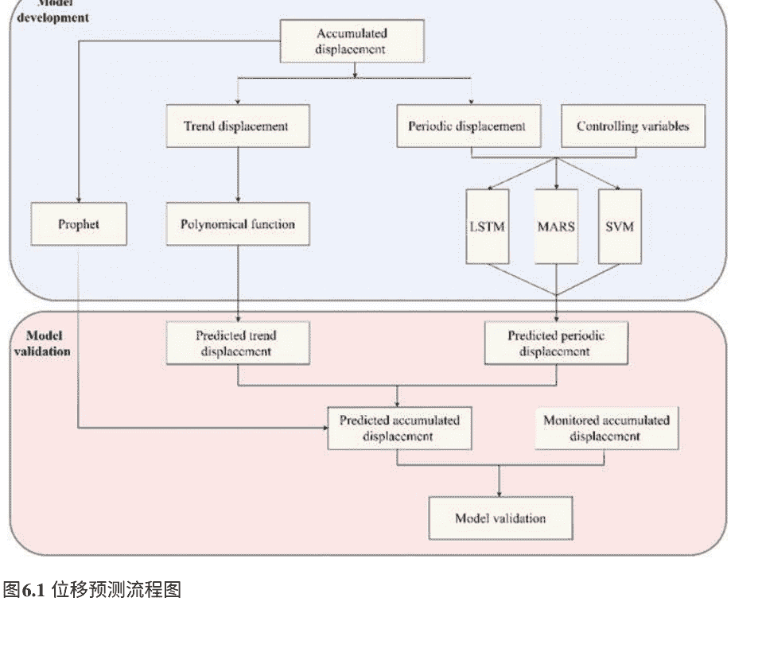

- (2) 趋势位移是时间相关的，随着时间的推移稳定增加，可以用多项式函数进行高精度拟合。

- (3) 周期性位移受降雨和水库水位的影响较大，其随时间的波动更加复杂。通过分析降雨、水库水位和位移之间的相关性，确定了几个控制变量（见第6.4.3.1节），使用上述方法预测三峡库区巴子门滑坡的周期性位移，如图6.1所示。在这部分中，使用一步预测方法来预测下一个时间步的周期性位移。总体而言，当需要预测准确性时，该方法在预测时间序列数据方面表现良好。然后，通过将预测的趋势位移和周期性位移相加，可以得到总位移。

- (4) 在同一阶段，可以使用Prophet模型直接预测总位移，完全使用记录的累积位移。这个预测模型不需要复杂的数据处理和关系考虑；它更容易实施。在这种情况下，Prophet被用来预测多步位移时间序列。与单步方法最大的区别是，这个方法可以预测更多时间步长的数据。

当决策者需要更多预测时间点以长期视角行动时，这可能非常有帮助。

- (5) 最后，将不同机器学习方法得到的预测总位移与监测数据集进行比较，以确定最佳模型性能。

整个数据集包含175个监测点，从2004年6月到2018年12月每月记录一次。除了用于测试的2018年数据集外，其余数据集被分为两个部分：80%用于训练，20%用于验证。

### 6.2.3 模型性能评估

这里使用了三个常见的统计准则来评估这些模型的性能，包括平均绝对误差（MAE）、均方根误差（RMSE）和决定系数（R²）。MAE的定义如下：

$$ MAE = \frac{1}{m} \sum_{i=1}^{m} |y_i - \hat{y}_i| \qquad (6.5) $$

其中，$m$是样本数量，$y_i$是第$i$个样本的观测值，$\hat{y}_i$表示在同一样本$i$上的预测值。

RMSE是一个与尺度相关的度量，它可以有效地比较应用于同一数据集的不同方法。这个准则的定义可以表示如下：

$$ RMSE = \sqrt{\frac{1}{m} \sum_{i=1}^{m} (y_i - \hat{y}_i)^2} \tag{6.6} $$

方程6.6中使用的符号与方程6.5中的符号相同。RMSE或MAE的值越低，模型的预测能力越强。

R²，由方程6.7定义，是皮尔逊相关系数的平方（ρ）通常用于评估模型对数据的拟合质量。它的取值范围从0到1，数值越高表示相关性越强。

$$ R^2 = \left[ \frac{\sum_{i=1}^{m} (y_i - \overline{y})(\hat{y}_i - \hat{\overline{y}})}{\sqrt{\sum_{i=1}^{m} (y_i - \overline{y})^2} \sqrt{\sum_{i=1}^{m} (\hat{y}_i - \hat{\overline{y}})^2}} \right]^2 \tag{6.7} $$

其中 $\hat{\overline{y}}$ 是预测结果的平均值， $\overline{y}$ 表示真实值的平均值，其他符号与方程6.5和6.6中相同。

## 6.3 案例研究

### 6.3.1 背景

巴子门滑坡位于秭归县贵州村，位于湘西河右岸（$30^\circ58'16''N$，$110^\circ45'30''E$），是长江的一条主要支流。它距离湘西河与长江交汇处约0.8公里，距离三峡大坝38公里（图6.2）。坡度角度从10°到30°，初始滑动方向为N120°。滑坡的上边界位于岩石和土壤的交界处。左右边界均由同源沟定义。滑坡目前位于139-280米的海拔高度，前部分的原始高度在2003年三峡水库首次蓄水前为55米。滑坡呈扇形，下部滑动体较缓，上部较陡。它的面积约为$1.35 \times 10^5$平方米，纵向尺寸为380米，宽度为100-350米，估计体积为$2.0 \times 10^6$立方米。

巴子门滑坡的滑动体主要由砂质页岩、砂岩、砾石和黏土组成。根据钻孔数据，发现了两个主要的滑动面（Du等，2013年；Yang等，2019年）。较深的一个是位于10-35米深度的初始滑动面，较浅的一个是位于6-18米深度的次生滑动面。这两个滑动面的材料都是由粉砂和黏土以及碎石组成的。滑动带的厚度在中部较厚，在上部和下部较薄，如图6.3所示。

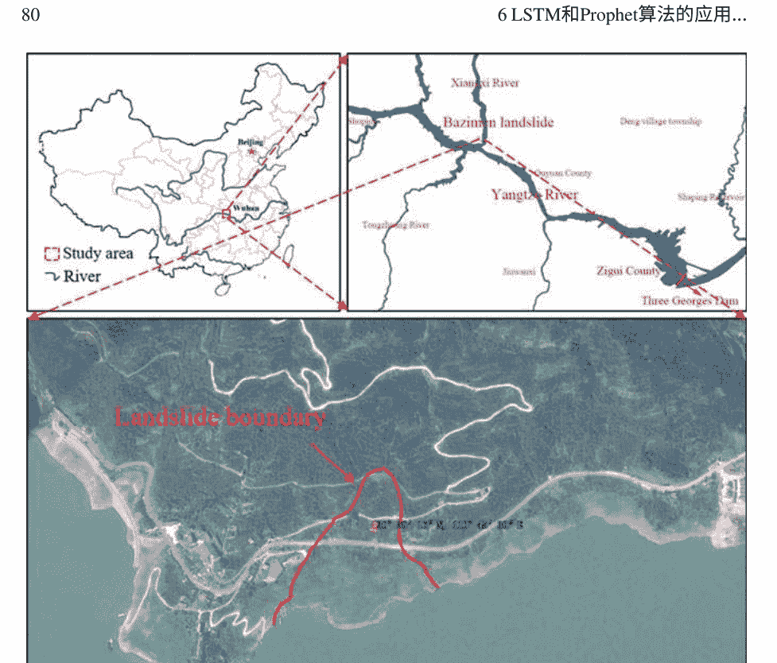

#### 图6.2 巴子门滑坡在三峡库区的位置和卫星地图

### 6.3.2 监测数据分析

目前，在滑坡上安装了10个GPS监测点，编号为ZG110和ZG111的站点自2003年7月以来一直记录数据。
图6.4显示了2003年至2018年的累积位移、降雨和水库水位数据。可以观察到滑坡上部（由ZG111监测）的位移增加速度比中部（由ZG110监测）的位移增加速度更快。滑坡的位移特征表明其发展模式为“前进型”；滑坡从上部开始，随着位移的增加向下发展。与ZG110的监测数据相比，ZG111记录的数据具有更明显的分段特征，这意味着它可以更好地帮助探索潜在的关系。

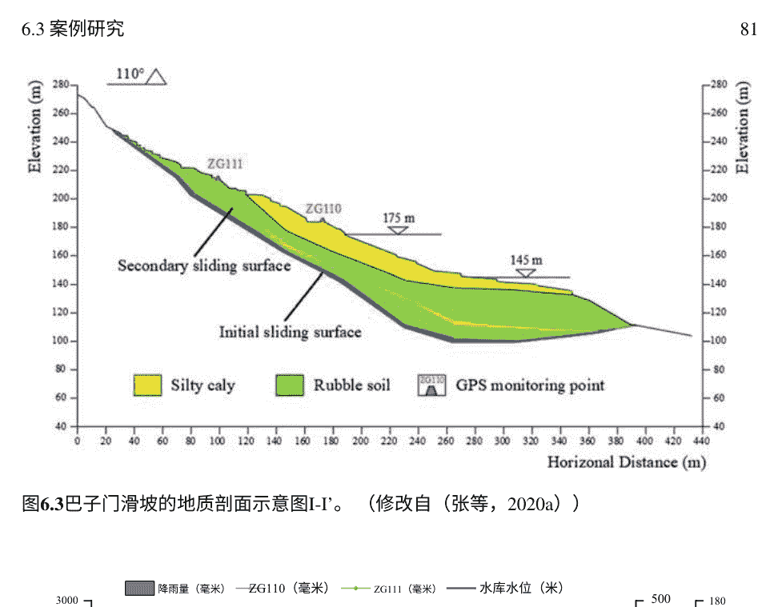

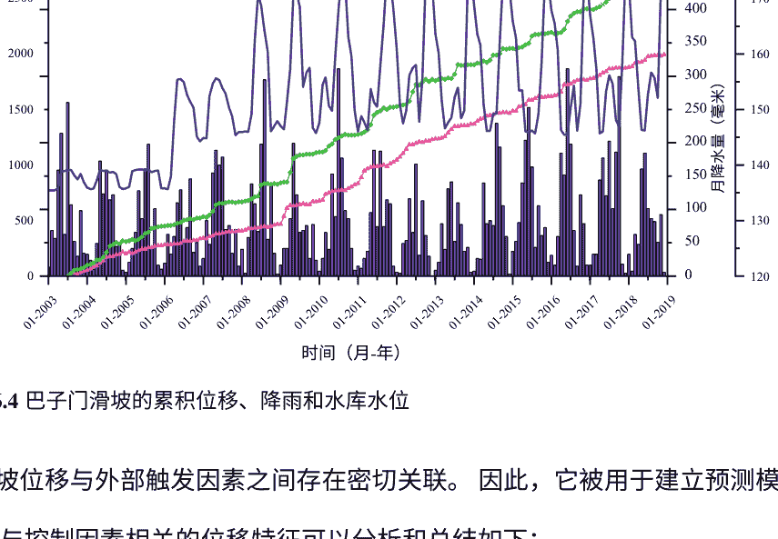

滑坡位移与外部触发因素之间存在密切关联。因此，它被用于建立预测模型。

与控制因素相关的位移特征可以分析和总结如下：

- (1) 水库的调度与滑坡的累积位移之间存在密切关系：当水库水位增加或稳定运行时，位移几乎保持不变；每次水库水位下降，累积位移都会增加。水库水位在2007年至2018年间年度变化，累积位移相应增加。然而，位移并不会立即对水位下降做出反应。图6.4表明，水位对累积位移有滞后效应，后者在前者下降一个或两个月后开始增加。

- (2) 降雨也会影响滑坡的稳定性，尽管累积位移可能与这个因素弱相关（Zhang等，2020a）。如图6.4所示，在雨季期间，累积位移迅速增长，此时会有大量降雨。尽管每年8月底水库水位开始上升，但高强度降雨可能会在一定程度上减弱，而滑坡位移仍然在这个时期继续增加，表明降雨在促进滑坡位移方面起到一定作用。

- (3) 滑坡在降雨和水库放水的耦合作用下急剧变形，监测到的位移具有明显的阶梯特征，表明周期性因素的影响。此外，滑坡的变形速率在5月至8月的洪水季节突然增加，累积位移曲线呈陡峭跳跃，此时降雨量最大，水库水位下降速度最快。可以推断，在水库水位下降期间，叠加降雨条件将进一步加剧滑坡位移，这对滑坡的稳定性更加不利。

## 6.4 数据处理与结果分析

### 6.4.1 位移分解

如第6.2.1节所述，累积位移主要包含两个分量：长期趋势和周期项。从总位移中去除趋势项后，剩余部分是周期位移。许多研究表明，移动平均法适用于位移分解（Du等，2013年；Yang等，2019年），可以用于计算趋势位移，如下所示：

$$ f(t) = (y_t + y_{t-1} + ... + y_{t-k+1}) / k \quad (t = k, k+1, ..., N) \quad (6.8) $$

其中，$f(t)$ 是时间 $t$ 的趋势项；$y_t$ 是时间 $t$ 的累积位移；$k$ 是移动平均周期，在这里设置为6个月，因为雨季和旱季各持续大约半年；$N$ 是样本总数。

### 6.4.2 趋势位移预测

趋势位移显示出随时间稳定的发展模式（图6.5），通常使用非线性回归模型进行拟合（Xu和Niu 2018）。在这项工作中，开发了一个线性和一个三次函数，并进行了比较以拟合长期趋势曲线。这个过程使用Scikit-learn包中的多项式回归模型进行，后端使用TensorFlow 2.0。线性回归模型对于这个数据集的R²值为0.9956，而三次模型的R²值为0.9974，表明后者的性能稍好一些。趋势项的预测值和监测数据如图6.6所示，拟合函数以多项式形式很好地工作，如方程6.9所示。

$$ f(t) = -0.0003t^3 + 0.0844t^2 + 8.7555t + 174.7 \quad (6.9) $$

其中 \( f(t) \) 是时间 \( t \) 处趋势项的预测值。

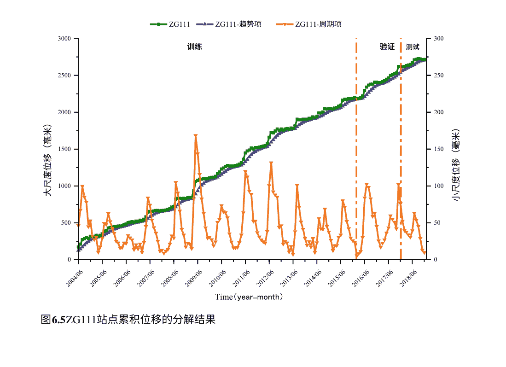

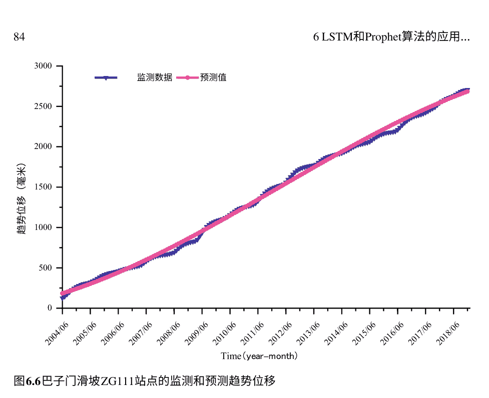

### 6.4.3 周期性位移预测

#### 6.4.3.1 控制因素

模型在数据上的性能主要通过准确性来评估，因此探索输入变量和目标值之间的功能关系非常重要。经分析，季节性降雨和水库水位的年度波动的耦合效应在触发滑坡变形中起着重要作用。因此，像普通回归方法一样，控制因素（即降雨和水库水位）被用作输入序列，周期性位移被作为输出值在这项工作中。

除了外部控制因素外，不同演化阶段的变形状态也会影响预测准确性。正如杜等人（2013年）所报道的，影响因素的性能取决于边坡是否稳定。这意味着即使重要的触发因素在边坡稳定条件下可能不会对边坡位移造成显著威胁。相反，在极不稳定的条件下，即使轻微的干扰也会导致山体滑坡严重变形。因此，在考虑对滑坡位移的影响时，稳定状态应该优先考虑。这可以通过以前的数据来揭示，并且一些研究也表明在考虑这个因素时关注模型的必要性和效率。

候选变量如表6.1所示，定义为 $v_i$，其中 $v$ 表示变量，$i$ 表示编号。皮尔逊相关系数（$r$）也是在表6.1中，通过计算得出的输入变量与周期性位移之间的关联强度。最后，根据 $r$ 值，选择了 v₂、v₃、v₄、v₅、v₇、 和 v₈ 作为输入变量来构建模型。

**表6.1 候选变量和计算的皮尔逊相关系数**

| 输入类型 | 候选变量 | r |
| :--- | :--- | :---: |
| 降水 | v₁, 上个月的累计降水量 | 0.484 |
|  | v₂, 上2个月的累计降水量 | 0.544 |
|  | v₃, 上3个月的累计降水量 | 0.523 |
| 水库水位 | v₄, 当前月的水库水位 | 0.187 |
|  | v₅, 上个月水库水位的变化 | 0.224 |
|  | v₆, 上个月水库水位的下降 | 0.155 |
| 变形状态 | v₇, 上个月的位移增加量 | 0.755 |
|  | v₈, 上2个月的位移增加量 | 0.626 |
|  | v₉, 上3个月的位移增加量 | 0.488 |

#### 6.4.3.2 LSTM模型的开发

整个数据集被分为三部分：2018年的数据用于测试，剩余数据集的80%用于训练，最后的20%用于验证（图6.5）。训练数据集用于模型构建，验证数据集用于验证预测能力。考虑到数据集的规模，其中包含175个数据点，测试数据集也被用于检查模型的泛化能力。在某些情况下，当数据集只有少量数据点时，插值方法可能会有帮助，可以省略测试数据集。模型构建使用了Python环境中的TensorFlow 2.0。

正如前面所提到的，LSTM模型对数据结构非常敏感，归一化可以在一定程度上避免收敛问题。因此，输入变量和目标值都被归一化到[-1, 1]。使用网格搜索方法对模型进行优化，它可以在模型准确性和计算时间之间取得平衡。该方法的过程可以表达如下：在训练集上通过交叉验证方法组合每个参数的合理值，然后可以自动确定最佳参数组合。本质上，它是一种遍历方法，根据模型的复杂性，确定最优参数组合可能需要花费一定的时间。考虑到数据集的规模，开发了一个四层的LSTM模型，前三层为LSTM层，最后一层为密集层。

LSTM模型使用先前的数据（选择的变量作为输入序列）来建立预测目标值的潜在关系，时间步长是一个重要参数需要考虑，它显示了用于预测的前几个时间步长的数据。网格搜索方法表明，在这项工作中，最佳时间步长为3，这意味着最新的数据对构建LSTM模型更有用。网格搜索方法还用于优化本文中提到的其他三种机器学习方法的参数：MARS、SVM和Prophet。

#### 6.4.3.3 预测周期性位移

在ZG111观测站，预测和监测到的周期性位移如图6.7所示，其中使用MARS、SVM和LSTM模型的训练和验证数据集分别呈现。数据集和模型的评估标准比较如表6.2所示。可以观察到LSTM模型在训练和验证数据集上表现良好。在训练数据集中，RMSE和MAE值分别为8.79和6.34毫米，在验证数据集中分别为8.72和6.02毫米。与其他模型相比，LSTM模型显示出更好的预测能力，结果表明这个动态模型能够捕捉输入变量和目标值之间的复杂关系。就SVM模型而言，不同核函数得到的结果进行比较，发现RBF核函数的SVM模型具有更好的预测能力。因此，使用RBF核函数的SVM模型被用作后续分析中SVM模型的代表。与SVM模型相比，MARS模型在两个数据集上具有类似的预测性能，评估标准和预测值相近。

总体上，MARS和SVM方法预测的位移与监测值基本一致，除了局部峰值和不规则位移。例如，在2016年11月、2017年10月和2018年8月的周期性位移中，两个模型预测值与监测值存在显著差异。这表明静态模型的预测能力在外部触发因素（如降雨和水库水位）快速变化时可能受到严重影响。尽管LSTM整体上具有良好的预测能力，但对于这个模型来说，这种现象尤为明显，因为它使用先前的信息来预测当前时间步的目标值。当出现局部峰值或不规则位移时，该模型仍然使用从常规和规则数据中学到的知识，这可能导致较大的误差。此外，峰值位移总是发生在洪水季节，此时高强度降雨和水库水位的快速变化耦合效应更强。因此，需要在未来的工作中对模型在不规则和非常规数据上的预测性能进行检验。

#### 6.4.3.4 预测累积位移

如第6.2.1节所述，对于MARS、SVM和LSTM模型，预测的累积位移应该是预测趋势和周期性的总和。位移趋势位移可以通过公式（6.9）获得，该公式基于历史位移进行拟合。对于Prophet模型，由于其机制与本研究提出的模型相似，直接使用该模型根据记录值预测总位移。该模型不需要进行位移分解过程，也不需要先前时间步长的先前数据来预测多个时间步长的位移。

与其他三种试图找到滑坡位移与外部触发因素之间关系的方法相反，Prophet模型试图捕捉位移的时间特征。因此，对用户来说非常方便和简单，因为该模型不需要找到候选变量，而是位移本身。图6.8显示了Prophet模型对近3年位移（2016年2月至2018年12月）的预测，基于从先前数据（2004年6月至2016年1月）中学习到的探索模型。尽管预测的总位移与监测数据不完全一致，但这个模型很好地捕捉到了逐步发展的模式。从某种意义上说，这是一个真正的预测模型，因为它基于学习到的发展模式进行预测，而不仅仅是输入和输出值的简单函数，更重要的是，该模型除了历史位移之外不需要额外的输入变量。

以2018年位移作为测试数据集，图6.9显示了预测值和监测值，并列出了表6.3中的评估标准，我们得出以下结论。通常，LSTM模型显示出最高的预测准确性，MARS和SVM模型具有类似的中等准确性的预测结果，而Prophet模型的预测能力相对较差。LSTM模型的RMSE和MAE值分别为18.78和17.03毫米，而Prophet模型的这些值分别为36.37和30.09毫米。

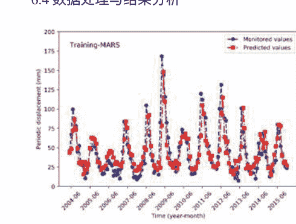

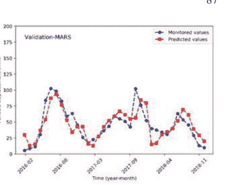

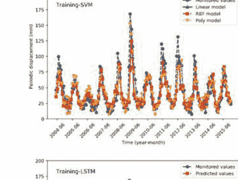

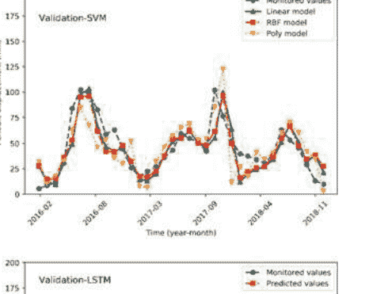

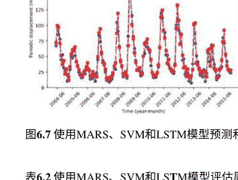

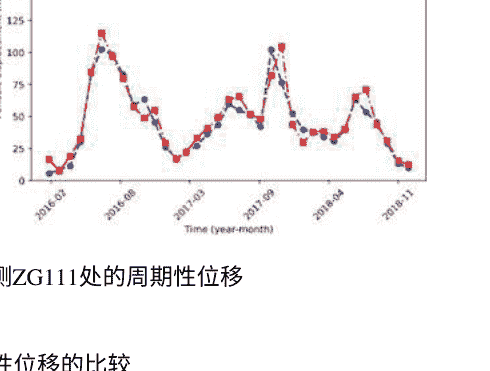

#### 图6.7 使用MARS、SVM和LSTM模型预测和监测ZG111处的周期性位移

**表6.2 使用MARS、SVM和LSTM模型评估周期性位移的比较**

| 模型 | 训练数据集 | | 验证数据集 | |
| :--- | :--- | :--- | :--- | :--- |
| | 均方根误差（毫米） | 平均绝对误差（毫米） | 均方根误差（毫米） | 平均绝对误差（毫米） |
| MARS | 19.11 | 13.38 | 15.79 | 12.16 |
| SVM（RBF） | 19.73 | 13.47 | 14.40 | 10.76 |
| LSTM | 8.79 | 6.34 | 8.72 | 6.02 |

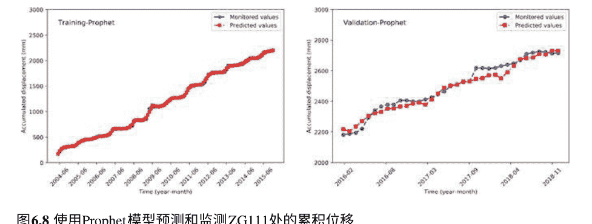

## 6.5 讨论

在本节中，LSTM模型在使用方程6.9预测周期性位移和累积位移方面表现更好。该模型使用一个输入## 6.5 讨论

表6.3 使用MARS、SVM和LSTM模型对累积位移的评估标准比较
| 模型 | 测试数据集 (均方根误差 (毫米)) | 测试数据集 (平均绝对误差 (毫米)) |
| :--- | :--- | :--- |
| MARS | 20.56 | 18.56 |
| SVM (RBF) | 20.62 | 18.18 |
| LSTM | 18.78 | 17.03 |
| Prophet | 36.37 | 30.09 |

在特定长度的序列中，包含有历史周期性信息，以预测当前时间步的目标值。与本文提到的其他三种方法不同，该模型可以充分利用历史信息，基于特殊的“门”设计。这也使得它在构建、开发和测试方面是最耗时的。LSTM模型在不同时间步的先前输入变量和目标值之间建立动态连接，这意味着学习经验会持续被利用和修改用于当前任务。

在这个过程中，模型可以通过记忆有用的信息和删除无效的规则来更新潜在规则。换句话说，这个模型的记忆单元使得更好地反映了滑坡的动态演化过程成为可能。对于相同的数据集，两种经典的机器学习方法，SVM和MARS模型的模型性能较差。缺乏类似的记忆这可能是两个模型中主要的缺陷。这两个模型不会在不同时间步骤的先前数据和目标值之间建立连接，这意味着模型只能使用特定时间点的历史信息来预测相应的位移。然而，最新的数据结构与历史数据不同，这可能在一定程度上导致错误。因此，一些建议是，为了建立更准确可靠的预测模型，应及时更新数据集，删除旧数据并添加新数据（Du等，2013年；Yang等，2019年）。

至于Prophet模型，其性能不如上述三个模型。然而，它的优势并不在于短期预测的准确性。该模型自动实现了时间序列分析，并基于学习到的趋势和季节特征预测目标值。此外，该模型不需要复杂的数据处理和变量选择，这意味着它更容易和方便进行。此外，由于该模型基于时间和位移之间的特征捕捉，因此可以预测比下一个时间步长更长时间段内的目标值。可以合理推断，该模型可能非常适用于工程目的，其中成本控制和时间管理是从更长期的角度规划而不是特定的时间步长。

## 6.6 本章小结

在本节中，应用了四种机器学习方法来预测边坡位移，包括MARS、SVM、LSTM和Prophet。这些模型的预测结果通常与监测到的位移具有良好的一致性，这表明所提出的模型可以处理滑坡位移与外部触发因素（如季节性降雨和水库水位的周期性波动）之间的动态和非线性关系。

与其他三种方法相比，LSTM模型在动态滑坡位移预测方面显示出显著的潜力，因为它建立了历史信息和当前任务之间的联系。记忆单元的特殊设计可能是其更好性能的主要原因。在给定新的输入时，该模型可以结合记忆的规则和先前的信息来实现更准确的预测。通过不断重复这个过程，该模型可以删除无效的规则并保留有用的规则以更新学习到的关系。此外，这个过程在整个模型的生命周期中持续进行。

SVM和MARS模型在预测能力上表现出类似的能力，但当外部触发因素变得不规则和罕见时，它们的偏差很大。静态机制可能是其中的原因。与LSTM相比，SVM和MARS都试图在特定时间点找到滑坡位移与输入触发因素之间的关系。这两种方法无法反映隐藏在函数背后的动态响应。

Prophet模型显示其在预测位移方面的优先性和便利性，因为它可以学习总位移与时间之间的关系。然而，它在预测多个时间步长的能力上取得了成果，但以模型准确性为代价。因此，它对于需要更长时间段信息以进行更好估计的成本控制和时间管理问题非常有用。

## 参考文献

Cao Y, Yin K, Alexander DE, Zhou C (2016) 使用极限学习机预测与控制因素相关的阶梯式滑坡位移。滑坡 13:725-736。 https://doi.org/10.1007/s10346-015-0596-z

Chen L, Zhang W, Zheng Y et al (2020) 针对双平面滑动的过倾岩质边坡稳定性分析和设计图表。工程地质 275:105732

Du J, Yin K, Lacasse S (2013) 在中国三峡水库的堆积滑坡中进行位移预测。滑坡 10:203-218。 https://doi.org/10.1007/s10346-012-0326-8

Fan Y, Qian Y, Xie F-L, Soong FK (2014) 基于双向LSTM的TTS合成的循环神经网络

Hochreiter S, Schmidhuber J (1997) 长短期记忆。神经计算9: 1735-1780。 https://doi.org/10.1162/neco.1997.9.8.1735

Huang F, Huang J, Jiang S, Zhou C (2017) 基于多变量混沌模型和极限学习机的滑坡位移预测。工程地质学218: 173-186

Jian W, Xu Q, Yang H, Wang F (2014) 中国三峡库区千将坪滑坡的机理和失稳过程。环境地球科学72: 2999-3013

Jiang H, Li Y, Zhou C et al (2020) 基于LSTM和SVR算法的滑坡位移预测: 以三峡库区树坪滑坡为例。应用科学10: 7830

Ke Q, Xiang L, Xu Y, Dong G (2008) 中国三峡库区的滑坡及水库蓄水和降雨对其稳定性的影响。环境地质学55: 55-63

Kong W, Dong Z Y, Jia Y et al (2017) 基于LSTM循环神经网络的短期住宅负荷预测。IEEE智能电网交易10: 841-851

Li D, Yin K, Leo C (2010) 分析白水河滑坡受水库水和降雨影响。环境地球科学60:677-687

Lian C, Zeng Z, Yao W, Tang H (2015) 多神经网络切换预测滑坡位移。工程地质学186:91-99

Sak H, Senior A, Beaufays F (2014) 长短期记忆循环神经网络架构用于大规模声学建模。在: 国际语音通信协会年会论文集, INTERSPEECH, pp 338-342

Taylor SJ, Letham B (2018) 大规模预测。美国统计学家72:37-45

Wang F-W, Zhang Y-M, Huo Z-T et al (2004) 2003年7月14日中国三峡库区千将坪滑坡。滑坡 1:157-162

Wang L, Tang L, Wang Z et al (2020a) 土壤水分保持曲线和水力导度的概率特性及其在边坡可靠性分析中的应用。Comput Geotech 121:103460

Wang L, Wu C, Tang L et al (2020b) 极限梯度提升方法在土坝边坡稳定性可靠性分析中的高效应用。Acta Geotech

Weytjens H, Lohmann E, Kleinstreuber M et al (2019) 现金流预测: MLP和LSTM与ARIMA和Prophet的比较。电子商务研究 1-21

Xie P, Zhou A, Chai B (2019) 长短期记忆(LSTM)方法在多因素诱发滑坡位移预测中的应用。IEEE Access 7:54305-54311。 https://doi.org/10.1109/ACCESS.2019.2912419

Xing Y, Yue J, Chen C et al (2019) 应用变分模态分解和堆叠长短期记忆网络对中国大水田滑坡进行动态位移预测。应用科学9:2951

Xu S, Niu R (2018) 基于经验模态分解和长短期记忆神经网络的白家堡滑坡位移预测在中国三峡地区。计算地球科学 111:87–96。 https://doi.org/10.1016/j.cageo.2017.10.013

Yan J, Wang L, Song W et al (2019) 基于变化检测的时间序列分类方法用于快速土地覆盖制图。ISPRS J Photogramm Remote Sens 158:249–262

Yang B, Yin K, Lacasse S, Liu Z (2019) 时间序列分析和长短期记忆神经网络预测滑坡位移。滑坡16:677–694。 https://doi.org/10.1007/s10346-018-01127-x

Yin Y, Wang H, Gao Y, Li X (2010) 中国三峡库区搬迁后巫山镇滑坡的实时监测与预警。滑坡7:339–349

Zhang Y, Wang X, Tang H (2019) 基于分段加权梯度的改进Elman神经网络用于时间序列预测。神经计算359:199–208

Zhang W, Tang L, Li H et al (2020a) 基于监测降雨数据和水位波动的八字门滑坡概率稳定性分析。 https://doi.org/10.1007/s11709-020-0655-y

Zhang W, Zhang R, Wu C et al (2020b) 地下挖掘中软计算应用的最新综述。地球科学前沿1:1095–1106

Zhou C, Yin K, Cao Y, Ahmed B (2016) 应用时间序列分析和PSO-SVM模型预测中国三峡库区八字门滑坡。Eng Geol 204:108–120。 https://doi.org/10.1016/j.enggeo.2016.02.009

Zhou C, Yin K, Cao Y et al (2018) 应用机器学习方法进行滑坡易发性建模：以中国三峡库区龙居为例。Comput Geosci 112:23–37

Zunic E, Korjenic K, Hodzic K, Donko D (2020) 应用Facebook的Prophet算法基于真实数据进行成功的销售预测。arXiv Prepr arXiv:200507575

# 第7章 基于BO的XGBoost和RF预测无排水抗剪强度

## 7.1 引言

软敏感黏土通常具有低剪切强度和高压缩性，在近海环境中广泛分布。因此，涉及软敏感黏土的岩土工程设计相当具有挑战性（D’Ignazio等，2016年）。如今，在软敏感黏土上建筑的需求正在增加，考虑到最近基础设施发展和港口连通性项目的趋势。因此，通过可靠的方法准确评估无排水抗剪强度对岩土工程师来说是一个关键问题。

软敏感黏土的无排水抗剪强度可以通过各种室内试验和原位试验来评估。最常见的是通过原位试验来测试，例如典型的现场十字板剪切试验（FVT）和锥形圆锥穿透试验（CPTU）。一般来说，原位试验成本高且耗时。此外，越来越多的人一致认为无排水抗剪强度与主要的CPTU参数之间存在不可避免的相关系数的不确定性。至于实验室试验，需要相对复杂和昂贵的取样和实验技术（D’Ignazio等，2016年；Ching和Phoon，2018年）。必要的岩土工程设计参数并不总是直接从实验室和原位试验中测量得到，而是经常从经验或数值相关性中估计，这些相关性是通过对预定数据集进行回归拟合而得到的。

自Hansbo（1957）的开创性工作以来，基于经验或半经验回归分析提出了变换模型，用于评估土壤的相关设计参数，根据其性质（Mesri等，1975年；Jamiolkowski等，1985年；Kulhawy和Mayne，1990年）。然而，变换模型通常包含大量来自土壤性质、土壤行为和场地地质等方面的不确定性。这些可能与校准变换模型的数据源不同（Kulhawy和Mayne，1990年；D’Ignazio等，2016年）。因此，需要认识到这些模型的局限性，否则可能导致偏见作为直接后果。为了增强工程师的判断力，许多基于贝叶斯方法的概率变换模型已被提出。

包括(Ching和Phoon 2012, 2018; Wang和Cao 2013; Ching等人2014; Cao和Wang 2014; Wang和Aladejare 2016; Wang等人2018a,2019)。人工智能（AI）技术在过去几年中迅速发展，许多新颖的机器学习（ML）算法已被提出并广泛应用于各个领域，可能在这方面提供新的视角。这与国际土壤力学与岩土工程学会（ISSMGE）最新的倡议一致，该倡议探索岩土工程中的机器学习方法(Ching和Phoon 2018)。

机器学习算法，如人工神经网络（ANN）(Goh 1995; Teh等人1997; Youssef pour等人2011; Zhang等人2019)，贝叶斯网络（BN）(Li等人2018; Koduru 2019)，支持向量机（SVM）(Rodriguez-Galiano等人2015; Zhang等人2016; Zhou等人2016)，以及多元自适应回归样条（MARS）(Zhang和Goh 2013; Zhang等人2015; Liu等人2019)等，逐渐成为岩土工程问题的替代解决方案。然而，单一的复杂算法可能不是构建设计土壤参数代理模型的考虑因素，因为来自不同场地的数据库具有不同的土壤性质、土壤行为和场地地质。因此，在岩土工程中应用集成方法是必要的。集成学习结合了多个处理不同假设的算法，形成更好的假设，因此其预测性能良好（Nascimento等人2014; Xia等人2017a）。如(Nannini和Lumini 2009; Lessmann等人2015)所报道，集成方法优于单一的机器学习和其他统计方法。因此，鼓励在岩土工程中进一步应用集成方法是有前景的。

集成和应用SC、ML、DL和OA方法在地质工程和地球科学中可以广泛分为两种方法：装袋（并行）和提升（顺序）。装袋集成方法是不同学习算法的组合，每个算法在并行中生成一个独立的模型（Xia等，2017b）。作为一种著名的装袋集成学习方法，随机森林（RF）是可以理解的，因为它可以被看作是一种共识决策树的过程，每个决策树独立地对特定问题做出决策，然后将结果组合起来做出最终决策（Breiman，2001）。一些研究人员还应用RF来解决岩土工程问题，例如Zhou等人（2016）研究了使用RF预测隧道施工引起的地表位移的可行性。Zhang等人（2019）构建了RF和MARS模型来预测桩打击性能，并使用了大量数据。在提升中，决策树是通过提升的方式构建的，以便每个后续的决策树都旨在减少前一个决策树的错误。每个决策树都从前面的决策树中学习并更新残差错误。因此，随后生长的树更容易从更新的残差中学习（Friedman，2001）。极端梯度提升（XGBoost）是一种先进的监督算法，由Chen和Guestrin（2016）在提升框架下提出，由于其高鲁棒性和足够的灵活性，在Kaggle机器学习竞赛中得到了广泛认可。到目前为止，基于XGBoost的模型在岩土工程中很少使用。

受到上述好处的激励，本文开发了基于XGBoost和RF的集成学习方法，用于捕捉无排水抗剪强度与各种基本土壤参数之间的关系。为了减少对经验法则和蛮力搜索的依赖，本文采用贝叶斯优化方法来寻找合适的模型超参数。据作者所知，这是集成学习方法首次用于构建设计土壤参数的代理模型。

本文的剩余部分首先介绍了两种高效的集成学习算法和贝叶斯超参数优化方法，然后介绍了研究的数据集及其初步分析。然后，使用四个性能指标来分析和评估预测结果。最后一部分将开发的模型与三种比较机器学习方法和两种转换模型进行对比分析，以获得更有说服力的结果。

## 7.2 方法论

对于RF和XGBoost，前几章已经提供了详细信息，本节主要关注优化方法的方法论介绍。

### 7.2.1 贝叶斯超参数优化

在机器学习中，超参数是需要在学习过程之前预先设置的参数，算法很少是无超参数的。对于XGBoost、RF和比较的机器学习算法，都有几个对模型的预测准确性有很大影响的超参数。因此，合理调整这些超参数，即超参数优化，非常重要。然而，超参数优化是一个组合优化问题，不能像一般参数那样通过梯度下降方法进行优化。此外，由于调整超参数需要重新训练来评估效果，计算一组超参数配置的计算量非常大。

在机器学习实践中，常用的调整超参数的方法有网格搜索（GS）和随机搜索（RS）。GS是一种通过尝试所有超参数的组合来搜索合适的最优超参数配置的方法。然而，GS容易受到维度约束的影响，即在考虑更多参数时，进行超参数优化时需要评估模型的次数呈指数增长，这在XGBoost中被证明是不可行的。此外，甚至不能保证找到最优解，经常会错过最优配置。RS是一种选择合适的一组通过尝试超参数的随机组合来找到最佳超参数配置。RS的缺点在于不必要的高方差。该方法是完全随机的，在选择试验点时不使用任何智能。GS和RS都没有利用超参数不同组合之间的相关性。

越来越多的超参数调整过程现在通过自动化方法来完成，这些方法旨在使用基于策略的启发式搜索在更短的时间内找到最佳超参数。此外，除了初始设置外，不需要额外的手动操作。贝叶斯优化是优化目标函数的首选方法（Snoek等人, 2012年; Ghahramani, 2015年; Xia等人, 2017b年）。贝叶斯优化通过构建基于过去评估结果的概率模型来找到最小化目标函数的值。最近广泛应用于机器学习超参数调整。

结果表明，该方法在测试集上更具有普适性，并且比GS和RS (Bergstra等人，2013)需要更少的迭代次数。

### 7.2.2 顺序模型优化（SMBO）

顺序模型优化（SMBO）是贝叶斯优化的简洁形式，当讨论变体时非常有用（Bergstra等人, 2011; Hunter等人, 2011; Hoffman和Shahriari, 2014）。在这个小节中，将简要介绍顺序模型优化。首先，SMBO的形式化构建了一个模型S0，将超参数设置λ映射到损失函数L（表7.1中的第1行），用于评估特定的超参数设置。然后，将设置λ及其对应的损失存储在H（或trails）中，这有助于在贝叶斯超参数优化中进行内部检查，并显示参数设置和相应的评估。随后，SMBO迭代执行以下四个步骤：在当前模型St-1的基础上找到局部最优的超参数设置λ*；计算在设置λ*下的损失c；使用λ*和相应的损失c更新H；并基于更新后的H构建一个新模型。SMBO输出全局最优的超参数设置，具有

**表7.1 基于顺序模型的全局优化（SMBO）**
| 步骤 | 描述 |
| :--- | :--- |
| 1: | 初始化 S0; H = ∅ |
| 2: | 对于 t = 1 到 T 执行 |
| 3: | λ* = argmin St-1(λ) |
| 4: | c = L(λ*) |
| 5: | H = H ∪ (λ*, c) |
| 6: | 根据更新的 H 对 St 进行适应新模型 |
| 7: | 结束循环 |
| 8: | 返回 H 中最小 c 的 λ |在达到预定义的最大迭代次数 T 之前，最小化 c，这表示迭代循环的结束。

## 树形帕尔森估计器（TPE）

超参数优化基本上是在图结构化配置空间上优化特定映射函数的问题。为了在标准 SMBO 算法中运行，在贝叶斯优化环境中可以使用各种概率回归模型，如高斯过程、随机森林和树形帕尔森估计器（TPE）等。

正如 Bergstra 等人（2011）所建议的，TPE 中的配置空间被限制为树状结构，这提供了确定模型 S（即表 7.1 中的第 6 行）和找到局部最优超参数设置（即表 7.1 中的第 3 行）的简单解决方案。该模型不定义目标函数的预测分布；相反，它创建了两个层次过程，l(λ) 和 g(λ) 作为所有域变量的生成模型。当目标函数低于和高于特定分位数 c* 时，这些过程对域变量进行建模。

$$
p_{S}(c|\lambda) = \begin{cases} l(\lambda), & c < c^{*} \\ g(\lambda), & c \geq c^{*} \end{cases} \qquad (7.1)
$$

其中 l(λ) 是通过关于损失值低于 H 中 c* 的观测构建的密度估计，而 g(λ) 则由剩余的观测生成。

同时，一个更重要的问题出现了，即确定一个本地最优的超参数设置 λ* 根据当前模型 S_t 进行 t 次循环。SMBO 采用获取函数来处理这一步骤，它收集 S_t 在任何可能的超参数设置下的预测信息，直到达到最大值，然后获取最有希望的设置。两种形式的获取函数被广泛采用，即期望改进（EI）和改进的概率。在本文中，由于其令人满意的性能和直观性，选择 EI 作为标准（Bergstra 等人，2011 年）。改进可以表示为：

$$
I(\lambda) = \max(c_{\min} - c(\lambda), 0) \qquad (7.2)
$$

实际上，改进很难直接估计，因为 c(λ) 在设置通过损失函数（即表 6.4 中的第 4 行）进行评估之前是未知的。然而，值得注意的是，EI 可以计算为：

$$
\text{EI}(\lambda) = \int_{-\infty}^{c_{\min}} \max(c_{\min} - c(\lambda), 0) \cdot p_{S_t}(c|\lambda) \mathrm{d}c \qquad (7.3)
$$

其中，c_min 表示 H 中的当前最小损失，c(λ) 表示在超参数设置 λ 下的损失。通过以上所有过程，前述两种集成学习算法和三种比较算法的超参数都可以通过贝叶斯优化进行选择，参数调整过程的一些细节可以参考 Bergstra 等人的研究(2013)。

## 地质工程和地球科学中软计算、机器学习、深度学习和优化方法的整合和应用

## 7.3 数据库

本研究采用了F-CLAY/7/216和S-CLAY/7/168（D’Ignazio等人，2016）的数据集，这些数据集可在TC304数据库中获取。第一个数据集F-CLAY/7/216是由芬兰24个不同测试点进行的216个现场旋转剪切试验样本编制而成。第二个黏土数据集S-CLAY/7/162包括来自瑞典12个测试点和挪威7个测试点的168个现场旋转剪切试验数据点。这两个数据集中的每个数据点都包括六个参数，包括无排水剪切强度（USS）、垂直有效应力（VES）、预固结应力（PS）、液限（LL）、塑限（PL）和自然含水量（W）。本文将这两个数据集进行了合并并进行了研究。图7.1显示了无排水剪切强度（USS）和相关输入特征的直方图，以及它们的均值和标准差，八个参数的分布近似于正态分布或对数正态分布。表7.2列出了统计数据，包括均值、最大值（Max）、最小值（Min）、变异系数（COV）和样本数量（n）。需要注意的是，VES和PS的变异性最大。

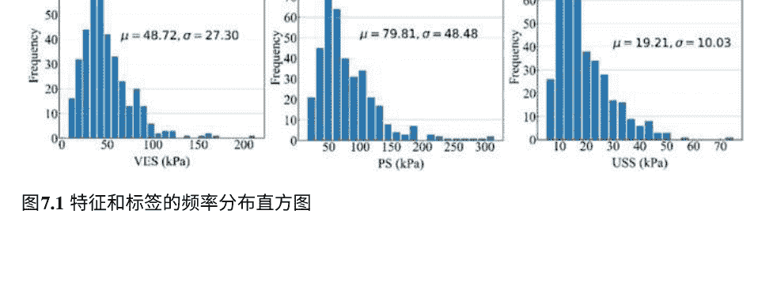

表7.2 五个特征变量和标签的基本统计数据

| | LL (%) | PL (%) | W (%) | VES (kPa) | PS (kPa) | USS (kPa) |
|---|---|---|---|---|---|---|
| 平均值 | 68.37 | 28.49 | 76.47 | 48.72 | 79.82 | 19.21 |
| 变异系数 | 0.35 | 0.28 | 0.31 | 0.56 | 0.61 | 0.52 |
| max | 201.81 | 73.92 | 180.11 | 212.87 | 315.64 | 75.00 |
| min | 22.00 | 2.73 | 17.27 | 6.86 | 15.20 | 5.00 |
| n | 384 | 384 | 384 | 384 | 384 | 384 |

表7.3 基于相关系数的相关性分区 $r_s$ 值

| $r_s$ | 级别 | 参数 |
|---|---|---|
| 0–0.19 | 非常弱 | USS与LL的相关性，USS与PL的相关性 |
| 0.2–0.39 | 较弱 | USS与W的相关性，PS与LL的相关性，PS与PL的相关性，VES与LL的相关性，VES与PL的相关性 |
| 0.4–0.59 | 中等 | USS与VES的相关性，PS与W的相关性，VES与W的相关性 |
| 0.6–0.79 | 较强 | USS与PS的相关性，PS与VES的相关性，W与PL的相关性，PL与LL的相关性 |
| 0.80–1.00 | 非常强 | W与LL的相关性 |

### 7.3.1 相关性分析

通常，多源数据的相关系数可以在热图中一起显示，因为可以清晰简洁地绘制出所有参数之间的相关性。根据数据分布，采用Spearman等级相关系数（$r_s$）确定每对变量之间的相关性，然后形成包含所有相关系数的热图。表7.3清楚地总结了所有参数的相关性，根据 $r_s$（绝对值）分别落在不同区间。如图7.2所示，可以轻松地发现PS与USS强相关（$r_s=0.75$），同时VES与USS中等相关（$r_s=0.53$），而USS与LL和PL几乎独立（$|r_s|\leq0.11$）。

### 7.3.2 去除无排水抗剪强度的异常值

数据清洗过程被推广用于过滤USS数据中的一些异常值，因为这些非常小或非常大的值可能会对开发的模型带来偏差。从直方图可以观察到，输入变量的分布并不严格符合正态分布。因此，三西格玛规则无法正确反映数据结构。更一般的选择是箱线图，它是一种通过四分位数图形化描述数据库的方法。它包含了一组数据的最大值、最小值、中位数以及上下四分位数。最大值被定义为min{第三四分位数+1.5倍四分位距离，数据集中的实际最大值}。类似地，最小值被定义为max{第一四分位数-1.5倍四分位距离，数据集中的实际最小值}（四分位距离为上四分位数减去下四分位数）。如图7.3所示，通过上述计算得到。

图7.2 特征变量和标签的相关系数矩阵热图

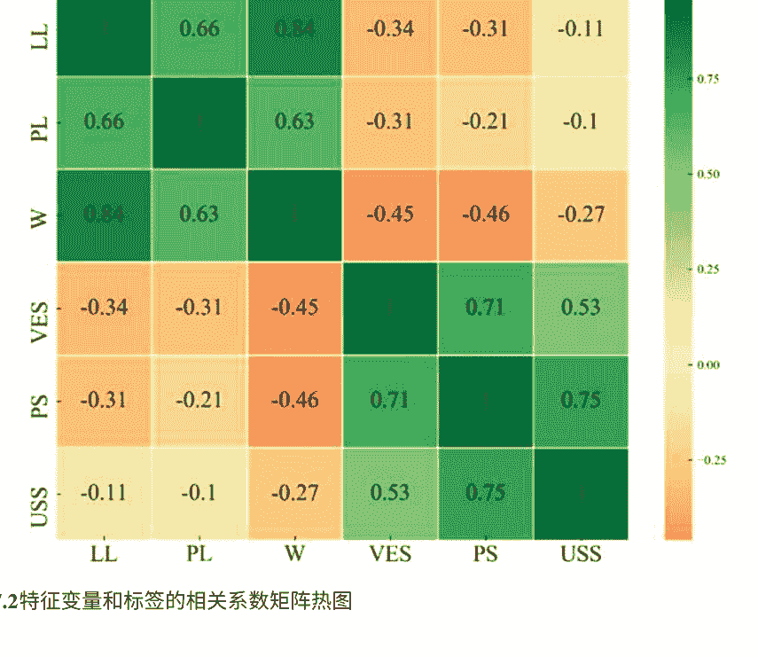

图7.3 USS的箱线图

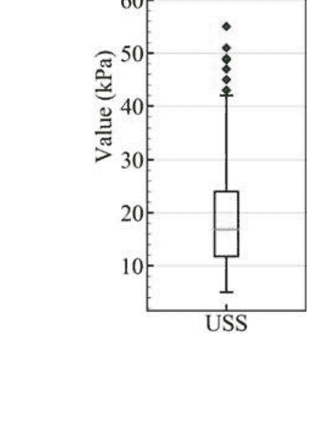

原则上，箱线图的最大值（42.34）和最小值（5.00）被确定。通过这种方式，总共删除了12个数据点。

## 7.4 实施步骤

### 7.4.1 K折交叉验证

理想情况下，如果我们有足够的数据，最佳实践是将数据集随机分成三部分：训练集、验证集和测试集。训练集用于拟合模型；验证集用于估计模型选择的预测误差；而测试集用于评估最终模型的泛化误差（Franklin 2005）。由于数据通常很稀缺（本文仅有336个数据点），无法真正反映模型的泛化性能是很常见的。为了避免数据选择的偏见，在超参数调优和模型评估过程中，本文采用了最流行的验证方法之一，即k折交叉验证（Kohavi and Kohavi 1995; Rodríguez et al. 2010; Wong 2015; Zhou et al. 2019）。在k折交叉验证中，原始样本D被随机分成k个互斥的子集，大小相似，即D = D₁ ∪ D₂ ∪…∪ D_k，D_i ∩ D_j = ∅（i≠j）。每个子集D_i尽可能地保持数据分布的一致性，即通过D的分层抽样。然后，每次将k-1个子集的并集作为训练集，剩余的子集作为测试集；这样就可以得到k组训练/测试集，从而进行k次训练和测试。虽然确定k的值没有明确的严格规则，但在应用机器学习领域，k的值通常为5（或10）是非常常见的。在这方面，根据Kohavi和Kohavi（1995）；Wong（2015）的建议，将折数k设置为五，并与计算时间和偏差之间的权衡相结合。因此，本文采用了五折交叉验证的方法来验证模型（见图7.4）。

### 7.4.2 比较模型

为了评估基于XGBoost和RF的设计土壤参数代理模型的性能，将其与三种比较的机器学习算法进行比较，包括多元自适应回归样条（MARS）（Friedman 2007）、支持向量机（SVM）（Cortes和Vapnik 1995）和多层感知器（MLP，一类前馈人工神经网络）（Gardner和Dorling 1998）。

为了公平起见，这里的所有比较机器学习模型也将使用贝叶斯优化方法来调整超参数。此外，D’Ignazio等人（2016）提出的两个相对较好的转换模型，方程（7.4）和（7.5），也作为基准模型与上述模型进行比较。

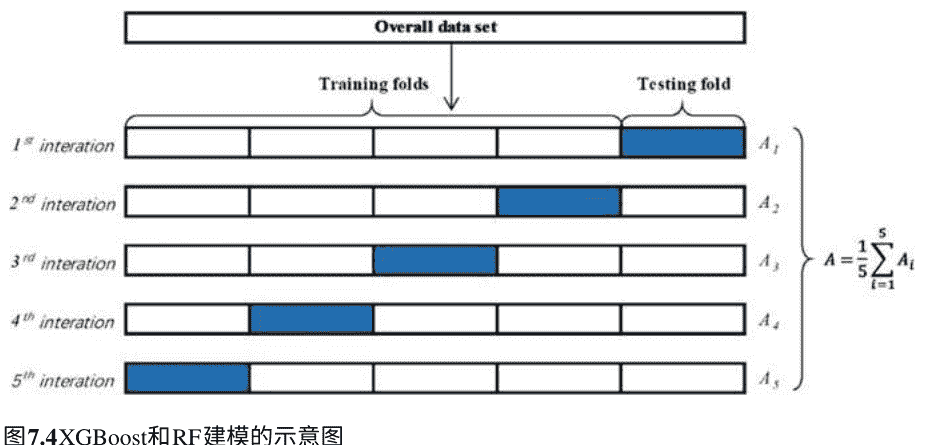

$$
USS = 0.296OCR^{0.788} W^{0.337} VES \quad (7.4)
$$

$$
USS = 0.319OCR^{0.757} L L^{0.333} VES \quad (7.5)
$$

### 7.4.3 性能评估

以下性能指标被用来分析和评估机器学习模型的预测结果：RMSE、R²、MAPE和Bias因子b。

## 7.5 计算结果

在本节中，开发的模型与三种比较机器学习方法和两种转换模型在预测准确性和鲁棒性方面进行了系统比较，采用了五折交叉验证。为了方便起见，使用了Sklearn库执行SVM、MLP和RF算法。 同时，XGBoost和MARS使用Python的XGBoost包和Earth包进行操作。使用Python的hyperopt包进行贝叶斯超参数优化。所有计算都在一台配有3.0 GHz Intel i5 CPU、8 GB RAM和Windows 10操作系统的台式计算机上进行。

### 7.5.1 不同模型之间的预测比较

图7.5和7.6显示了在五折交叉验证下，训练集和测试集的ML模型的RMSE曲线。众所周知，RMSE值越接近0，预测误差越小。可以观察到两个集成学习模型的RMSE比其他三个ML模型的RMSE要小，表明基于XGBoost和RF的模型在训练集上的预测性能更好。在图7.6中，曲线更加波动。此外，所有模型都表现出相同的趋势，在k=2时最差，在k=3时最好，说明模型明显受到数据集质量的影响。

此外，可以注意到基于XGBoost的模型的预测性能明显优于其他模型，而基于RF的模型的优势无法明显观察到。通过计算这些模型的RMSE平均值，RF模型的RMSE平均值低于比较模型，表明RF模型更好。

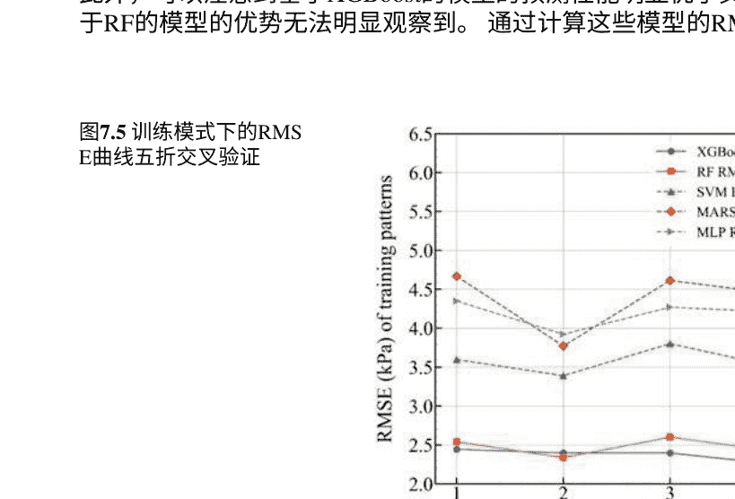

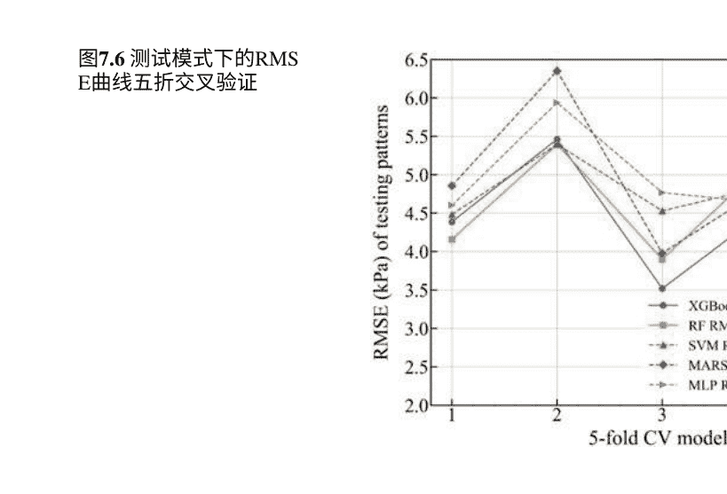

表7.4 预测模型结果比较

| 评估指标 | RMSE (千帕) | | $R^2$ | | MAPE (%) | | 偏差 | |
| :--- | :---: | :---: | :---: | :---: | :---: | :---: | :---: | :---: |
| | 训练 | 测试 | 训练 | 测试 | 训练 | 测试 | 训练 | 测试 |
| XGBoost | 2.38 | 4.40 | 0.92 | 0.73 | 10.85 | 19.23 | 0.99 | 1.01 |
| RFR | 2.51 | 4.60 | 0.91 | 0.70 | 10.93 | 19.63 | 0.99 | 1.00 |
| SVR | 3.60 | 4.82 | 0.82 | 0.67 | 13.69 | 20.56 | 1.02 | 1.04 |
| MLPR | 4.19 | 4.91 | 0.75 | 0.66 | 19.41 | 21.38 | 1.00 | 1.02 |
| MARS | 4.42 | 4.89 | 0.73 | 0.66 | 20.23 | 22.43 | 1.01 | 1.04 |
| 方程 (7.4) | 5.88 | | 0.52 | | 23.39 | | 1.07 | |
| 方程 (7.5) | 6.11 | | 0.48 | | 23.60 | | | |

所有模型在五折交叉验证下的$RMSE$、$R^2$、MAPE和偏差因子b的平均值总结在表7.4中。需要强调的是，方程 (7.4) 和 (7.5) 两个转换模型直接使用整个数据库而不是五折交叉验证。以上所有模型得出的偏差因子b接近1，表明这些模型具有无偏性。基于XGBoost模型的测试集的$RMSE$、$R^2$、MAPE的平均值分别为4.40千帕、0.73和19.23%，并且它优于其他基于机器学习的模型和两个转换模型。此外，预测准确性的整体顺序为XGBoost、$RF$、SVM、MLP、MARS、方程 (7.4) 和 (7.5)。总之，在多源数据的情况下，集成模型在预测准确性方面优于单一复杂算法。此外，它也优于(D'Ignazio et al. 2016)中提出的模型。

### 7.5.2 XGBoost和RF的拟合性能

图7.7和7.8展示了基于XGBoost和基于RF的模型在$k$=3时的拟合性能。选择$k$=3的拟合结果作为代表，展示拟合性能，因为这组测试数据最接近整体数据的分布。青色线表示实际的USS值与样本编号，橙色区域的上边界是USS实际值的1.2倍，橙色区域的下边界是USS实际值的0.8倍。此外，蓝色方块和红色圆圈分别表示基于XGBoost模型和基于RF模型的预测值。显然，大部分数据点落在橙色区域内，两个模型在测试集上的MAPE值分别为16.92%和18.19%。考虑到这样的数据集包含多源和一定的噪声数据，这些MAPE值可以被视为较小的。

## 7.5 计算结果

#### 图7.7 集成学习训练模式的预测性能 (k = 3)

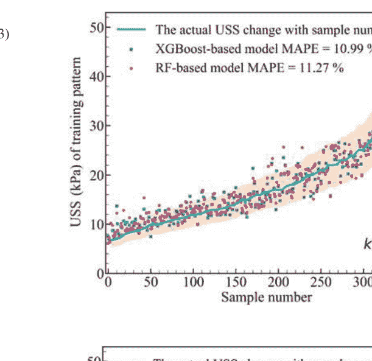

#### 图7.8 集成学习测试模式的预测性能 (k = 3)

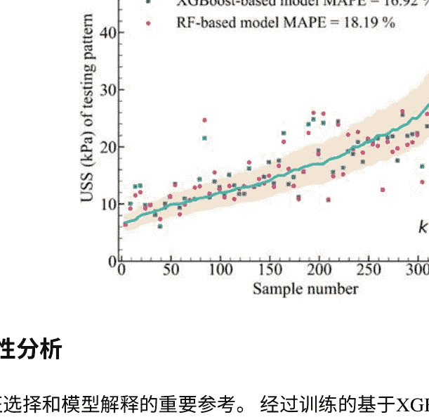

### 7.5.3 特征重要性分析

特征重要性是特征选择和模型解释的重要参考。经过训练的基于XGBoost的模型可以自动计算特征重要性，可以通过接口特征重要性准则（即增益准则）获得。增益是通过计算模型中每棵树对每个特征的贡献来计算的，表示每个特征对模型的相对贡献。与另一个指标相比，该指标的值较高意味着该特征对生成预测的重要性更大。图7.9显示了五折交叉验证下五个特征变量的平均特征相对重要性（%）。在当前的XGBoost-based模型中，PS（54.3%）是最重要的特征变量，其次是通过VES（20.3%）、PL（12.5%）、W（6.8%）和LL（6.1%）进行。这个结果意味着对探索软黏土的无排水抗剪强度特性具有重要的指导作用，并且敏感性分析的类似结果也在(D'Ignazio等人，2016)中提出。

图7.9 特征相对重要性排名

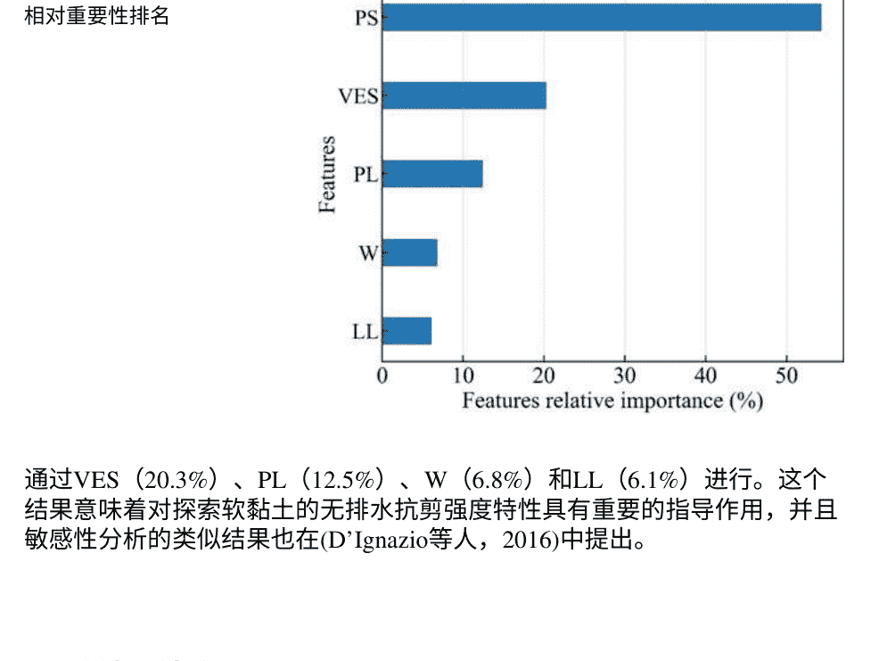

## 7.6 总结与结论

集成学习方法是非常流行和强大的多元回归和分类问题的机器学习工具。与基于经验证据的转换模型的广泛研究不同，数据驱动的集成学习方法在岩土工程中受到了有限的研究关注。本文首次使用基于XGBoost和RF的集成学习方法，用于预测软黏土的无排水抗剪强度。还将集成学习方法的性能与三种基准机器学习算法（即SVM、MLP和MARS）和前期研究中的两种转换模型进行比较，使用了来自F-CLAY/7/216和S-CLAY/7/168的组合数据库。根据这项研究，可以得出以下结论。

所有提出的机器学习模型都在数据库上使用四个性能指标进行验证，采用五折交叉验证。与基准模型相比，XGBoost和RF模型在预测性能方面表现出更高的优势，整体预测准确性的排序为XGBoost RF，SVM，MLP，MARS。

与先前的转换模型相比，机器学习方法在预测准确性方面具有明显优势。两个集成学习模型在测试集上的平均MAPE值分别为19.23%和19.63%，对于包含多源和一定噪声数据的数据集来说，这些MAPE值可以被认为是较小的。

采用贝叶斯超参数优化方法来调整机器学习算法的超参数。这个指标确保了所提出的模型能够充分发挥预测潜力，并且在捕捉USS与各种基本土壤参数之间的关系方面表现更好，优于先前的转换模型。

所提出的基于XGBoost的模型可以自动计算土壤参数在USS中的相对重要性，PS被确定为最重要的特征变量，其次是VES，PL，W和LL。这个指标增强了模型的解释性和综合性，并为实际应用中的岩土工程实践者提供了特征选择的指导。

## 参考文献

- Bergstra J, Bardenet R, Bengio Y, Kégl B (2011) 超参数优化算法。 在：神经信息处理系统24：神经信息处理系统2011年第25届年会
- Bergstra J, Yamins D, Cox D (2013) Hyperopt: 用于优化机器学习算法超参数的Python库。 在：第12届科学会议的Python会议论文集。SciPy, pp 13–19
- Breiman L (2001) 随机森林。机器学习45:5–32。 https://doi.org/10.1023/A:1010933404324
- Cao Z, Wang Y (2014) 贝叶斯模型比较和无排水抗剪强度特性。 J Geotech Geoenviron Eng 140:04014018。 https://doi.org/10.1061/(asce)gt.1943-5606.0001108
- Chen T, Guestrin C (2016) XGBoost: 一种可扩展的树提升系统。在：ACM SIGKDD国际会议上的知识发现和数据挖掘。计算机协会, pp 785–794
- Ching J, Phoon K-K (2018) 使用贝叶斯机器学习构建现场特定的多变量概率分布模型。 J Eng Mech 145:04018126。 https://doi.org/10.1061/(ASCE)EM.1943-7889.0001537
- Ching J, Phoon KK (2012) 将结构化黏土的参数建模为多变量正态分布。Can Geotech J 49:522–545。 https://doi.org/10.1139/T2012-015
- Ching J, Phoon KK, Chen CH (2014) 将黏土的压力锥穿透（CPTU）参数建模为多变量正态分布。Can Geotech J 51:77–91。 https://doi.org/10.1139/cgj-2012-0259
- Cortes C, Vapnik V (1995) 支持向量网络。Mach Learn 20:273–297。 https://doi.org/10.1023/A:1022627411411
- D'Ignazio M, Phoon KK, Tan SA, Länsivaara TT (2016) 芬兰软黏土的无排水抗剪强度相关性。Can Geotech J 53:1628–1645。 https://doi.org/10.1139/cgj-2016-0037
- Franklin J (2005) 统计学习的要素：数据挖掘、推理和预测。数学智能 27:83–85。 https://doi.org/10.1007/bf02985802
- Friedman JH (2001) 贪婪函数逼近：梯度提升机。Ann Stat 29:1189–1232。 https://doi.org/10.1214/aos/1013203451
- Friedman JH (2007) 多变量自适应回归样条。Ann Stat 19: https://doi.org/10.1214/AOS/1176347963

## 参考文献

Gardner MW, Dorling SR (1998) 人工神经网络（多层感知器）—综述在大气科学中的应用。 大气环境32:2627–2636。 https://doi.org/10.1016/S1352-2310(97)00447-0

Ghahramani Z (2015) 概率机器学习和人工智能。 Nature 521:452–459

Goh ATC (1995) 利用神经网络进行岩土工程经验设计。 岩土工程学报 45:709–714。 https://doi.org/10.1680/geot.1995.45.4.709

Hansbo S (1957) 通过落锥试验确定黏土抗剪强度的新方法。 R Swedish Geotech Inst Proc 46

Hoffman MW, Shahriari R (2014) 贝叶斯优化的模块化机制。 NIPS Work Bayesian Optim 1–5

Hutter F, Hoos HH, Leyton-Brown K (2011) 用于通用算法配置的顺序基于模型的优化。 在计算机科学讲义中（包括人工智能和生物信息学的子系列讲义）。 页码507-523

Jamiolkowski M, Ladd CC, Germaine JT, Lancellotta R (1985) 土壤现场和实验室测试的新发展。 第11届国际土壤力学与基础工程会议，圣弗朗西斯科，8月1日： 57-153

Koduru S (2019) 用于埋地能源管道边坡地质灾害管理的贝叶斯网络。 第13届国际统计和概率在土木工程中的应用会议，ICASP 2019

Kohavi R, Kohavi R (1995) 交叉验证和自助法在准确性估计和模型选择中的研究。

Kulhawy FH, Mayne PW (1990) 用于基础设计的土壤性质估计手册。 Ostigov 299

Lessmann S, Baesens B, Seow HV, Thomas LC (2015) 为信用评分基准测试最先进的分类算法进行研究的更新。 Eur J Oper Res 247:124–136. https://doi.org/10.1016/J.EJOR.2015.05.030

Li X, Zhang L, Zhang S (2018) 利用大量监测信息进行边坡安全评估的高效贝叶斯网络。 Geosci Front 9:1679–1687. https://doi.org/10.1016/J.GSF.2017.09.009

Liu L, Zhang S, Cheng YM, Liang L (2019) 利用多元自适应回归样条在空间可变土壤中进行边坡的高级可靠性分析。 Geosci Front 10:671–682. https://doi.org/10.1016/j.gsf.2018.03.013

用于基础设计的土壤性质估算手册（技术报告）| OSTI.GOV。 https://www.osti.gov/biblio/6653074。 2021年8月20日访问

Mesri G, Rokhsar A, Bohor BF (1975) 典型墨西哥城黏土样品的组成和压缩性。 岩土工程学 25:527–554. https://doi.org/10.1680/GEOT.1975.25.3.527

Nanni L, Lumini A (2009) 用于破产预测和信用评分的分类器集成的实验比较。 Expert Syst Appl 36:3028–3033. https://doi.org/10.1016/j.eswa.2008.01.018

Nascimento DSC, Coelho ALV, Canuto AMP (2014) 整合互补技术以促进分类器集成的多样性：一项系统研究。 Neurocomputing 138:347–357。 https://doi.org/10.1016/j.neucom.2014.01.027

Rodriguez-Galiano V, Sanchez-Castillo M, Chica-Olmo M, Chica-Rivas M (2015) 用于矿产远景预测的机器学习预测模型：神经网络、随机森林、回归树和支持向量机的评估。 矿石地质评论 71:804–818。 https://doi.org/10.1016/J.OREGEOREV.2015.01.001

Rodríguez JD, Pérez A, Lozano JA (2010) 在预测误差估计中的k折交叉验证的敏感性分析。 IEEE Trans Pattern Anal Mach Intel 32:569–575。 https://doi.org/10.1109/TPAMI.2009.187

Snoek J, Larochelle H, Adams RP (2012) 机器学习算法的实用贝叶斯优化。 BT—第25届国际神经信息处理会议论文集 2:2951–2959

Teh CI, Wong KS, Goh ATC, Jaritngam S (1997) 使用神经网络预测桩承载力。 J Comput Civ Eng 11:129–138. https://doi.org/10.1061/(asce)0887-3801(1997)11:2(129)

Wang L, Cao ZJ, Li DQ等 (2018) 从有限的测试数据中确定特定场地的土壤-水特征曲线-贝叶斯视角。 Geosci Front 9:1665–1677. https://doi.org/10.1016/j.gsf.2017.10.014

Wang L, Zhang W, Chen F (2019) 从颗粒大小分布数据预测土壤-水特征曲线的贝叶斯方法。 Energy 14:2992。 https://doi.org/10.3390/en12152992

Wang Y, Aladejare AE (2016) 岩石单轴抗压强度和杨氏模量之间相关性的贝叶斯表征。 Int J Rock Mech Min Sci 85:10–19. https://doi.org/10.1016/j.ijrmms.2016.02.010

Wang Y, Cao Z (2013) 使用等效样本对土壤的杨氏模量进行概率特征化。 Eng Geol 159:106–118。 https://doi.org/10.1016/j.enggeo.2013.03.017

Wong TT (2015) 通过k折交叉验证和留一法评估分类算法的性能。 Pattern Recognit 48:2839–2846。 https://doi.org/10.1016/j.patcog.2015.03.009

Xia Y, Liu C, Li YY, Liu N (2017a) 使用贝叶斯超参数优化的增强决策树方法进行信用评分。 Expert Syst Appl 78:225–241。 https://doi.org/10.1016/j.eswa.2017.02.017

Xia Y, Liu C, Li YY, Liu N (2017b) 使用贝叶斯超参数优化的增强决策树方法进行信用评分。 Expert Syst Appl 78:225–241。 https://doi.org/10.1016/J.ESWA.2017.02.017

Yousefpour N, Medina-Cetina Z, Jahedkar K等 (2011) 使用人工神经网络确定桥梁的未知基础，以评估冲刷。 Am Soc Civ Eng pp 1514–1523

Zhang L, Wu X, Liu W, Skibniewski M J (2019) 软土中减轻隧道引起的沉降的最佳策略：模拟方法。 J Perform Constr Facil 33:04 019058. https://doi.org/10.1061/(asce)cf.1943-5509.0001322

Zhang W, Goh ATC, Zhang Y等 (2015) 基于容量能量概念和多元自适应回归样条的土壤液化评估。 Eng Geol 188:29–37. https://doi.org/10.1016/j.enggeo.2015.01.009

Zhang WG, Goh ATC (2013) 用于地质工程系统分析的多元自适应回归样条。 Comput Geotech 48:82–95. https://doi.org/10.1016/j.compgeo.2012.09.016

Zhang Y, Dai M, Ju Z (2016) 关于在双折岩坡预测模型中选择SVM核函数的初步讨论。 J Comput Civ Eng 30:04015031. https://doi.org/10.1061/(asce)cp.1943-5487.0000499

Zhou J, Li E, Wei H等 (2019) 用于预测岩填料材料剪切强度的随机森林和立方算法。 https://doi.org/10.3390/app9081621

Zhou J, Li X, Mitri HS (2016) 地下工程中岩爆的分类：十种监督学习方法的比较。 J Comput Civ Eng 30:04016003. https://doi.org/10.1061/(asce)cp.1943-5487.0000553

# 第8章 使用四种超参数优化方法和RF模型进行TBM掘进率预测

## 8.1 引言

随着技术的不断发展和进步，隧道掘进机（TBM）的出现为隧道挖掘提供了更安全、更有效和更便宜的施工方法。由于这些优势，TBM技术已经在全球范围内广泛应用。为了降低项目成本和施工风险，对TBM掘进效率进行准确评估非常必要（Gong和Zhao 2009；Mahdevari等2014；Armaghani等2017；Adoko等2017；Liu等2018；Zhang和Gao 2018；Tan等2020），其中，穿透率（ROP）是一个关键评估因素（Alvarez Grima等2000）。然而，对于大多数工程项目来说，复杂的地质条件使得ROP预测充满了不确定性和随机性。一般认为，在隧道施工过程中，地质环境、TBM参数和隧道几何条件对ROP有重要影响（Blindheim等1979；Alvarez Grima等2000；Barton 2000；Sapigni等2002；Yagiz和Karahan 2011；Xu等2019；Zhang等2020）。如何确定每个潜在参数对ROP的影响，并分析每个参数的相对重要性，具有重要的工程实际意义。早期的预测模型主要基于经验、理论或两者的结合（Bruland 1999；Sapigni等2002；Kahraman等2003；Hassanpour等2009；Yagiz和Karahan 2011；Li等2016, 2020；Xiong等2017；Koopialipoor等2019；Zhang等2020；Yan和Jiang 2020；Hou等2020；Zhu等2020；Yan等2021）。基于三个隧道的监测数据，Sapigni等人（Yagiz 2008）发现ROP与岩体质量分类（RMR）密切相关，两者可以用二次多元回归方程近似。Kahraman等人（Breiman 2001）基于现场测量数据建立了ROP回归模型，并通过统计分析发现ROP与岩石性质密切相关。Hassanpour等人（Breiman 2001）根据Nowsood隧道数据建立了ROP和不同地质参数的经验公式。结果表明，ROP与岩石的可塑性参数，特别是现场穿透指数（FPI）密切相关，此外，本研究表明使用UCS和RQD等常见参数建立预测公式的便利性。然而，经验公式通常是基于局部数据建立的，只适用于少数项目，因此适用性有限（Breiman 2001）。数值分析在这类问题中也被广泛使用。（Gong和Zhao 2009）使用UDEC软件对新加坡两个隧道中的TBM刀具断裂过程进行了数值模拟，并发现TBM的掘进速度会随着岩石脆性指数的增加而增加。对实际数据的统计分析也显示了类似的观点，岩石脆性作为重要的机械参数，在TBM开挖过程中起着重要作用。（Li等人2019）使用离散元法（DEM）研究了ROP与楔角、约束应力等参数之间的关系。结果表明，较大的楔角会增加岩石的横向破坏，从而降低驱动速度。此外，原位应力的增加也会增加岩石的延性，不利于开挖。

数值模拟非常依赖于本构模型、材料参数和边界条件，但由于隧道工程的复杂性和不确定性，这些因素通常很难准确获取。因此，数值分析只能反映一般趋势，无法实现准确预测。

近年来，由于人工智能（AI）技术的发展，许多数据驱动模型已成功用于ROP预测。与传统方法相比，AI模型可以在很大程度上捕捉变量之间的复杂非线性关系，并进行更准确的预测。（Xu和Niu 2018; Chen等2019; Xu等2019）提出了五种不同的机器学习方法，基于马来西亚一条隧道的现场和实验室实验数据预测ROP。主要使用的输入参数包括单轴抗压强度（UCS）、巴西拉伸强度（BTS）、岩石质量指标（RQD）、风化带（WZ）、推力（TF）和转速（RPM）。通过将预测结果与实际值进行比较，发现K最近邻（KNN）算法可以实现最佳预测准确性。此外，参数敏感性分析发现UCS和RPM对ROP影响最大。以马来西亚一条隧道为例，（Jahed Armaghani等2017）建立了基于人工神经网络（ANN）的ROP预测模型，并使用两种优化算法（PSO和ICA）进行超参数调优。结果表明，优化模型的预测准确性远高于普通模型，证明了优化算法的必要性。目前，将AI模型应用于ROP预测的研究很多，但应用优化算法对相关模型进行超参数调优以解决计算精度和计算效率之间的平衡的研究还很少。（Eberhart和Kennedy 1995; Fabian Pedregosa等2011; Mahdevari等2014; Zafar等2017; Mahmoodzadeh等2020; Zhang等2020）本文根据已发布的数据集（Reshef等2011），提出了一个随机森林（RF）模型来预测ROP，并使用四种常见的优化算法（PSO、DE、GA和BO）来优化模型的超参数。最后，使用最优模型输出参数的相对重要性。

## 8.2 工程背景和数据介绍

本文使用的数据集来自文献（Reshef等，2011年）。数据集由来自隧道的151个不同位置的153个数据样本组成，包括岩石地质参数、隧道几何条件和掘进机的掘进速度等7个特征组成部分。由于RF模型本身适用于数据维度低、精度要求高的场景，本文使用的数据集对于类似的工程项目具有一定的代表性和指导意义。

### 8.2.1 项目描述和地质调查

纽约市建造了皇后水隧道的第二阶段，以改善城市的淡水分输和运输。隧道全长7.5公里，直径7.06米，深度约200米。施工过程由一台强大的隧道掘进机（TBM）完成。隧道沿线施工区域的地质结构非常复杂，由不同的变质岩和具有剪切带、节理和断层等局部弱结构面组成。

岩石组成主要包括流纹岩、花岗片麻岩、角闪岩、火成片麻岩和片岩，各自的比例如（Barton 2000）所示。数据集是从隧道的151个不同位置采样得到的，包括153个样本。还分析了每个采样点的TBM的ROP（推进速度）基于测量数据。因此，整个数据集包括岩石的强度、脆性和韧性特征。强度特征通过BTS和UCS反映，而脆性和韧性通过冲击穿透实验进行校准。对于冲击穿透实验，通常使用岩石样本能承受的最大载荷与相应最大位移之间的比值（峰值斜率指数，PSI）来反映岩石样本的脆性和韧性。

此外，为了反映岩石不连续性的类型和密度对TBM掘进速度的影响，还计算并记录了隧道轴线与软表面之间的夹角，并在数据集中进行了记录。根据NTNU开发的分类系统，岩石断裂级别（RC）可以根据其完整性分为7个类别，编号从1到7。数字越大，岩体的弱结构面越多，岩体的断裂程度越高。同时，数据集还记录了与分类结果相对应的弱面之间的平均距离（DPW）。

### 8.2.2 数据描述

图8.1显示了上述变量的分布特征以及变量之间的线性相关性。对角线显示了每个变量的分布特征；左对角线表示变量之间的线性关系，拟合曲线表示相关程度。倾斜度越高，相关性越强。在对角线右侧显示了每个变量的统计特征，包括均值、标准差、最大值、最小值和中位数的信息。从线性关系可以看出，变量之间存在一定的相关性。

对于预测目标值ROP，从相关性可以看出它与输入变量PSI和RC有很强的正相关性，与DPW有很强的负相关性，与其他变量有较弱的相关性。

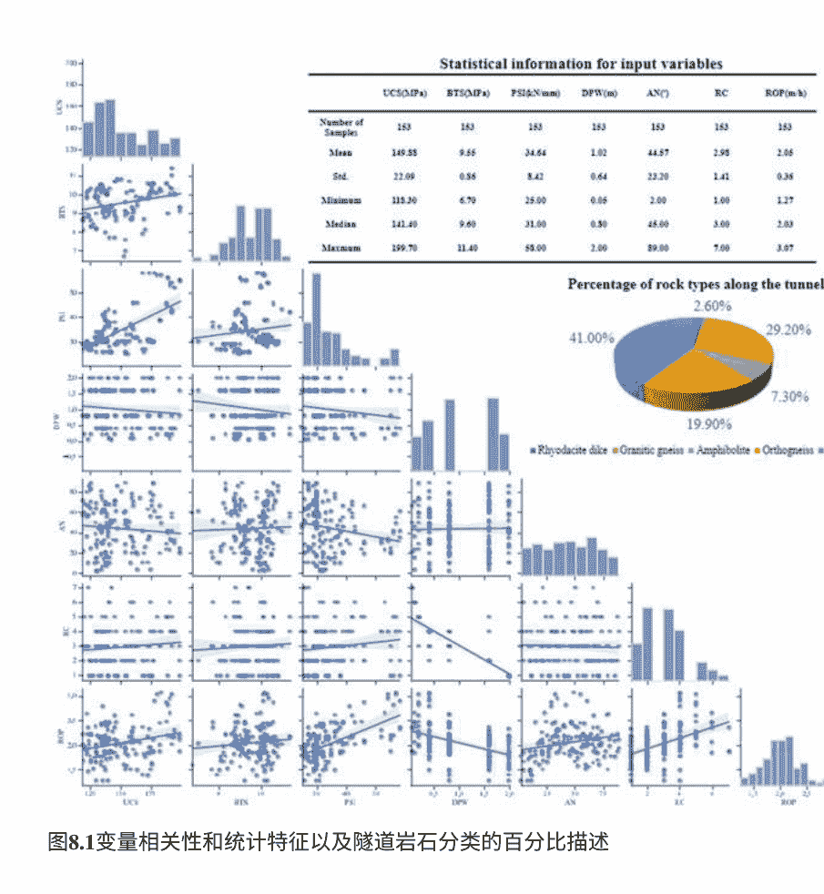

| Statistical information for input variables |
| :--- | :--- | :--- | :--- | :--- | :--- | :--- | :--- |
| | UCS(MPa) | BTS(MPa) | PSI(N/mm) | DPW(m) | AN(°) | RC | ROP(m/h) |
| Number of Samples | 153 | 153 | 153 | 153 | 153 | 153 | 153 |
| Mean | 149.55 | 9.55 | 34.64 | 1.02 | 44.57 | 2.98 | 2.06 |
| Std. | 22.09 | 0.86 | 8.42 | 0.64 | 23.20 | 1.41 | 0.36 |
| Minimum | 119.30 | 6.70 | 25.00 | 0.05 | 2.00 | 1.00 | 1.27 |
| Median | 141.40 | 9.60 | 31.00 | 0.80 | 45.00 | 3.00 | 2.03 |
| Maximum | 199.70 | 11.40 | 58.00 | 2.00 | 89.00 | 7.00 | 3.07 |

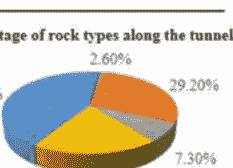

图8.1 变量相关性和统计特征以及隧道岩石分类的百分比描述

事实上，盾构机的行驶速度是一个复杂的动态非线性系统，与许多因素有关。线性相关性不能完全反映变量对ROP的影响程度，因此有必要引入非线性评估指标来进一步说明相关性。最大信息系数（MIC）的概念首次由（Reshef等人，2011年）建立，它可以用于综合评估两个变量之间的线性或非线性强度，属于基于最大信息的非参数探索统计类别。

其基本原理是将两个变量之间的关系离散化为二维空间，并用散点图表示。然后，当前的二维空间分别沿X和Y方向划分为一定的间隔数，然后检查散点落入每个方格的情况，即联合概率的计算。在获得互信息的最大值后，进行归一化，然后将不同尺度下的互信息最大值进行比较，以反映变量之间的关系。

从图8.2可以看出，驱动速度ROP与UCS、PSI、DPW和RC存在一定的非线性相关性，但与BTS存在一般相关性。

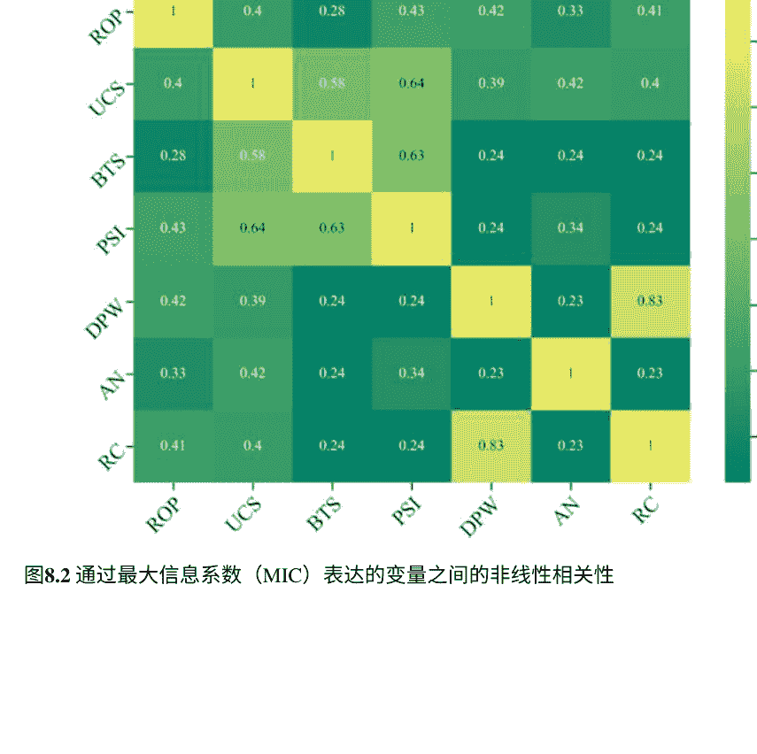

## 8.3 驾驶速度的预测和敏感性分析

在数据集被分割之前，将数据归一化到[-1,1]的区间，这将有助于模型的收敛和提高计算效率。具体操作如下：

$$X_{new} = 2 * \frac{X_i - X_{mean}}{X_{max} - X_{min}} - 1 \quad \quad (8.1)$$

其中，是归一化后的数据，是待归一化的数据，是数据集中的最大值和最小值。归一化后，原始数据集按照80%和20%的比例随机划分为训练集和测试集。前者用于5折交叉验证方法和优化算法，建立相关的预测模型。后者作为新的数据集用于测试优化模型的性能。划分后，ROP的统计特征如表8.1所示。可以看出，两个数据集的统计指标差异很小，这在一定程度上可以避免过拟合或欠拟合的现象。

表8.1 训练集和测试集中ROP的统计特征
| | 训练 | 测试 |
|---|---|---|
| 数量 | 122 | 31 |
| 平均值 | 2.06 | 1.98 |
| 标准差 | 0.36 | 0.33 |
| 最大值 | 3.07 | 2.95 |
| 最小值 | 1.27 | 1.51 |

### 8.3.1 预测模型

- (1) 模型建立

UCS、BTS、PSI、DPW、AN和RC被作为输入变量，驱动速度ROP被作为输出目标来建立相关模型。当采用PSO优化时，粒子群数量为30，最大迭代次数为100，学习因子c1和c2都为0.5，惯性权重w为1，树数量es为[0,50]，树深度dp为[0,50]。当采用GA优化时，种群数量设为30，最大迭代次数为200，误差精度为1×10⁻⁷，树数量es为[0,50]，树深度dp为[0,50]，其他参数为默认值。当采用DE优化时，种群数量设为30，最大迭代次数为200，树数量es为[0,50]，树深度dp为[0,50]，其他参数为默认值。当采用BO优化，初始节点为30，最大迭代次数为200，树的数量es为[0,50]，树的深度dp为[0,50]，其他参数默认（表8.2）。

表8.2 优化后每个随机森林模型的最优参数和时间成本
| 模型 | 树的数量 (es) | 深度 (dp) | 时间 (秒) |
| :--- | :--- | :--- | :--- |
| PSO-RF | 49 | 38 | 144.82 |
| GA-RF | 35 | 40 | 281.67 |
| DE-RF | 37 | 16 | 430.66 |
| BO-RF | 17 | 37 | 66.70 |

- (2) 模型性能比较

不同模型对训练集和测试集的预测结果如图8.3所示。参考线表示最佳情况，即预测值与真实值完全相等。因此，预测结果越接近参考线，预测效果越好；反之，预测效果越差。总体上看，可以看出模型性能之间没有明显差异，说明测试结果是合理的。

对于每个模型，BO-RF模型的综合性能是最好的。至于相关系数R，在训练集和测试集中都是最大的，表明预测结果与真实结果高度相关。

而DE-RF模型的性能相对较差。虽然在训练集中结果相似，但在测试集中相关系数略小于其他三个模型。GA-RF模型和PSO-RF模型的性能基本相同，评估参数几乎相同。

如果考虑计算时间，可以看出BO-RF模型仍然是最佳模型，在最短时间内实现最高计算精度。然而，DE-RF模型性能较差，使用最长时间计算出最低精度。虽然PSO-RF模型所需时间比GA-RF模型少，但考虑到模型性能基本相同，更推荐使用PSO-RF模型。

图8.4展示了不同RF模型在测试集上的性能，再次证明了模型的预测性能接近相同。从绝对误差分布可以看出，每个模型的预测值与真实值之间的最大误差小于1米/小时，表明每个模型都能很好地控制误差。与其他模型相比，BO-RF模型不能很好地预测一些突变点，部分原因是因为存在一定的误差分布。然而，所有模型在计算真实值时都存在一定的误差，部分原因是输入变量与输出目标之间的相关性不是很强。

图8.3展示了不同RF模型在数据集上的最佳预测结果。

### 8.3.2 敏感性分析

由于BO-RF模型具有最佳的计算精度和最少的时间消耗，故通过BO-RF模型对敏感性分析结果进行分析。图8.5展示了BO-RF模型输出的每个输入变量的相对重要性。可以看出UCS和BTS对模型具有绝对的控制作用，而RC对模型几乎没有影响。其他三个变量对模型的性能有一定的影响。值得注意的是，这个结果更接近第7.3.2节中的非线性分析结果，也表明TBM推进速度是一个复杂的非线性系统，与各种因素的独立或耦合效应密切相关。此外，本文的分析结果基本与类似文献的结果一致（张等，2020年），表明预测模型的准确性，并为实际工程提供相关参考。由于限制的存在，考虑到数据集的样本量，可以考虑收集更多数据来更新和升级模型，以获得更全面和准确的参数重要性。

图8.4 不同RF模型在数据集上的最佳预测结果

图8.5 敏感性分析结果

## 8.4 讨论

使用四种常见的优化算法（PSO、GA、DE和BO）和随机森林模型（RF）构建TBM推进速度（ROP）的预测模型。岩石样本强度指数（UCS、BTS）、冲击穿透试验指数（PSI）、隧道岩石完整性（DPW、RC）和隧道与盾构方向几何条件（AN）作为输入，推进速度（ROP）作为输出。通过比较不同优化模型在训练集和测试集中的性能，发现BO-RF模型在预测准确性和计算时间方面表现最佳。主要原因是贝叶斯优化采用高斯过程（GP），可以考虑先前的参数信息并不断更新先验信息。其次，贝叶斯优化非常适用于小维参数调整要求，因为迭代次数少且收敛速度快。然而，其他优化算法采用梯度下降法，在操作上较慢并且在使用多个参数维度时容易导致维度爆炸，从而严重影响参数调整过程。因此，对于本文中的RF模型，BO优化显示出一定的优势，因为只有两个参数需要优化。对于相同类型的实际工程问题，当使用RF模型进行预测时，可以将BO算法作为首选项进行超参数优化，而PSO算法可以作为备用项来比较计算结果和计算成本。

## 8.5 总结

针对隧道掘进速度的复杂非线性动态系统，提出了基于四种不同优化算法的随机森林预测模型。将用于预测皇后区纽约地区的水运输隧道推进速度，尽管地质条件复杂，隧道施工区域模型输入参数较少，但模型预测与实际值具有高度一致性，并且模型输出参数的相对重要性和前期相关性分析的结果基本一致，表明模型的可靠性和适用性。通过分析和比较结果，可以得出结论，BO-RF模型在捕捉潜在影响因素与TBM掘进速度之间的复杂非线性关系方面表现最佳。该模型具有高准确性和较少的时间消耗，因此建议将其应用于此类问题的预测。PSO-RF模型的性能与GA-RF模型相似，但前者所需时间较少且更高效。DE-RF模型所需时间最长，但模型的性能并没有显著提高。该方法对TBM掘进速度的预测仍需进一步研究。敏感性分析结果显示，每个输入参数对TBM掘进速度的影响不同，岩石本身的强度参数是绝对影响因素。

作为一种成熟的机器学习方法，随机森林模型因其较少的需要优化的超参数、高计算效率和避免过拟合问题的能力，在实际工程问题中被广泛应用。然而，数据的大小和质量也直接影响模型的输出结果。因此，未来可以添加更多的数据样本来提高优化模型的性能，并对输入参数的相关性进行全面深入的研究。此外，预测模型的发展严重依赖于超参数的优化，这可能需要专业知识和历史经验，而一些智能模型的“黑盒子”特性使其难以解释，需要根据问题的需求进行应用。

## 参考文献

- Adoko AC, Gokceoglu C, Yagiz S (2017) 基于贝叶斯的岩石中隧道掘进速度预测。 工程地质学 226:245–256。 https://doi.org/10.1016/j.enggeo.2017.06.014
- Alvarez Grima M, Bruijines PA, Verhoef PNW (2000) 神经模糊方法建模隧道掘进机性能。 隧道与地下空间技术 15: 259–269。 https://doi.org/10.1016/S0886-7798(00)00055-9
- Armaghani DJ, Mohamad ET, Narayanasamy MS等 (2017) 发展混合智能模型，用于预测坚硬岩石条件下的TBM掘进速度。 地下隧道技术63: 29-43。 https://doi.org/10.1016/j.tust.2016.12.009
- Barton N (2000) 关于接缝和断层中的TBM隧道掘进.pdf。 Balkema
- Breiman L (2001) 随机森林。 机器学习45:5–32。 https://doi.org/10.1023/A:1010933404324
- Bruland A (1999) 坚硬岩石隧道掘进速度和刀具磨损。 Trondheim Nor Inst Technol 3: 项目报告1B-98， NTNU Trondheim
- Chen W, Hong H, Panahi M等 (2019) 使用基于GIS的数据挖掘技术（ANFIS与鲸鱼优化算法（WOA）和灰狼优化器（GWO））进行滑坡易发性的空间预测。应用科学9: 。 https://doi.org/10.3390/APP9183755
- Blindheim OT (1979) 在硬岩隧道钻进性预测中。 In: Tunnelling "79, Proceedings of the 2nd international symposium, London, 12–16 March 1979, P284–289. Publ London, IMM, 1979
- Eberhart R, Kennedy J (1995) 使用粒子群理论的新优化器。 在微型机器和人类科学国际研讨会上。 IEEE, 第39-43页
- Gong QM, Zhao J (2009) 用于TBM穿透率预测的岩体特征模型的开发。 Int J Rock Mech Min Sci 46:8–18. https://doi.org/10.1016/j.ijrmms.2008.03.003
- Hassanpour J, Rostami J, Khamehchiyan M, Bruland A (2009) 在碳酸盐-黏土岩中开发新的TBM性能预测方程：nowslood水输送隧道的案例研究。 Geomech Geoengin 4:287–297. https://doi.org/10.1080/17486020903174303
- Hou S, Liu Y, Zhang K (2020) 基于IPSO-BP混合模型的TBM隧道参数预测。 岩石力学学报/ 中国岩石力学与工程学报 39:1648–1657。 https://doi.org/10.13722/J.CNPI.JRME.2019.1084
- Jahed Armaghani D, Shoib RSNSBR, Faizi K, Rashid ASA (2017) 用于估计岩石插入桩的极限承载力的混合PSO-ANN模型的开发。 神经计算应用28:391–405。 https://doi.org/10.1007/s00521-015-2072-z
- Kahraman S, Bilgin N, Feridunoglu C (2003) 影响冲击钻进速率的主导岩石性质。 国际岩石力学与矿山科学杂志 40:711–723。 https://doi.org/10.1016/S1365-1609(03)00063-7
- Koopialipoor M, Tootoonchi H, Jahed Armaghani D等 (2019) 应用深度神经网络预测隧道掘进机的穿透率。 Bull Eng Geol Environ 78:6347–6360. https://doi.org/10.1007/S10064-019-01538-7
- Li SH, Wu LZ, Luo XH (2020) 一种用于定位土坡临界滑动面的新方法。 Eng Appl Artif Intell 94. https://doi.org/10.1016/J.ENGAPP AI.2020.103733
- Li X, Liu X, Li CZ等 (2019) 基于多点测量的最小二乘支持向量机用于基坑位移监测和预测。 Struct Heal Monit 18:715–724. https://doi.org/10.1177/1475921718767935
- Li XF, Li HB, Liu YQ等 (2016) 数值模拟岩石破碎机制在TBM楔形穿透下。 Tunn Undergr Sp Technol 53:96–108. https://doi.org/10.1016/J.TUST.2015.12.010
- Liu X, Zhou S, Xu M等 (2018) 双圆刀在混合地层中岩石破碎过程分析。 应用基础科学工程学报/Journal Basic Sci Eng 26:357–370。 https://doi.org/10.16058/j.issn.1005-0930.2018.02.013
- Mahdevari S, Shahriar K, Yagiz S, Akbarpour Shirazi M (2014) 用于预测隧道掘进机穿透率的支持向量回归模型。 Int J Rock Mech Min Sci 72:214–229。 https://doi.org/10.1016/j.ijrmms.2014.09.012
- Mahmoodzadeh A, Mohammadi M, Daraei A等 (2020) 预测城市隧道引起的最大地表沉降。 Autom Constr 120。 https://doi.org/10.1016/j.autcon.2020.103375
- Pedregosa F, Varoquaux G, Gramfort A等 (2011) Scikit-learn: Python中的机器学习。 J Mach Learn Res 12:825–2830
- Reshef DN, Reshef YA, Finucane HK等 (2011) 在大数据集中检测新的关联。 Science (80-) 334:1518–1524。 https://doi.org/10.1126/science.1205438
- Sapigni M, Berti M, Bethaz E等 (2002) 使用岩体分类估计TBM性能。 Int J Rock Mech Min Sci 39:771–788。 https://doi.org/10.1016/S1365-1609(02)00069-2
- Xie Y, Yang J等 (2020) 基于硬脆岩石特征尺寸的锥形刀具最佳钻压。 岩土工程学报 42:782–789。 https://doi.org/10.1779/CJGE202004023
- Xiong F, Hu Z, Ren X, Zhang P (2017) 基于Matlab的BP神经网络应用于盾构机推进速度的预测。 Mod Tunn Technol 54:101–107. https://doi.org/10.13807/J.CNKI.MTT.2017.05.014
- Xu H, Zhou J, Asteris PG等 (2019) 监督机器学习技术用于隧道掘进机穿透率的预测。 应用科学9。 https://doi.org/10.3390/app9183715
- Xu S, Niu R (2018) 基于经验模态分解和长短期记忆神经网络的白家堡滑坡位移预测。 中国三峡地区计算地球科学 111：87-96。 https://doi.org/10.1016/j.cageo.2017.10.013
- Yagiz S (2008) 利用岩体性质预测硬岩条件下的TBM性能。 Tunn Undergr Sp Technol 23:326–339. https://doi.org/10.1016/j.tust.2007.04.011
- Yagiz S, Karahan H (2011) 利用粒子群优化预测硬岩TBM推进速度。 Int J Rock Mech Min Sci 48:427–433. https://doi.org/10.1016/j.ijrmms.2011.02.013
- Yan CB, Wang HJ, Yang JH等 (2021) 利用偏最小二乘回归和深度神经网络的耦合模型预测TBM推进速率。 岩土力学 42:519–528。 https://doi.org/10.16285/j.rsm.2020.0164
- Yan C, Jiang X (2020) 基于岩体参数和隧道掘进的TBM净推进速率预测模型。 Mod Tunn Technol 57:26–33。 https://doi.org/10.13807/J.CNKI.MTT.2020.02.004
- Zafar A, Shah S, Khalid R等 (2017) 一种元启发式家庭能源管理系统。 In: Proceedings—31st IEEE international conference on advanced information networking and applications workshops, WAINA 2017. pp 244–250
- Zhang W, Tang L, Li H 等 (2020) 基于监测降雨数据和三峡水库水位波动的巴子门滑坡的概率稳定性分析. 结构土木工程前沿 14:1247–1261. https://doi.org/10.1007/s11709-020-0655-y
- Zhang Z, Gao Q (2018) 全断面岩石隧道掘进机刀头弯曲模型的理论与应用。 应用基础与工程科学学报/Journal Basic Sci Eng 26:1121–1129。 https://doi.org/10.16058/J.ISSN.1005-0930.2018.05.018
- Zhu M, Zhu H, Wang X, Cheng P (2020) 基于CART的集成学习算法研究用于预测TBM隧道参数和分类围岩质量。 岩石力学学报/中国岩石力学与工程学报 39:1860–1871。 https://doi.org/10.13722/J.CNKI.JRME.2019.0924

# 第9章 我们从应用中学到了什么

众所周知，软计算和更先进的人工智能技术，包括机器学习、深度学习和优化算法，极大地提高了地质工程结构响应预测的准确性和效率。从第5章可以得知，与隧道和支护开挖相比，人工智能算法在桩基和管道领域很少使用。因此，建议未来在这两个领域中普及更多的算法使用。此外，根据收集的文献，单一算法模型在岩土工程中被广泛使用，如DT、SVM、RF、ANN、BPNN。集成或混合模型和优化算法的普及程度还有待进一步提高。图9.1简要介绍了机器学习的最新研发情况以及主要挑战和限制。

此外，传统的基于物理的模型是基于已知的地质结构响应和影响因素之间的关系构建的。然而，基于人工智能的模型只是建立了输入和输出之间的直接映射，并不能提供任何明确的表达式。因此，在未来的研究中，将物理模型和人工智能数据驱动模型相结合值得更多关注。此外，表9.1列出了上述大部分方法的优点和缺点。

自然灾害对人们的生命、财产和环境构成威胁。许多研究人员试图通过经验方程、实验室实验、数值模拟来模拟和更好地理解这些灾害。它们具有一定的优点，另一方面，它们在进一步应用方面受到了约束或限制。最近，人工智能方法越来越受欢迎，因为它们可以模拟自然灾害的复杂数学表达式，提供更好的性能和具有成本效益的解决方案。然而，人工智能方法也并非完美，因为它们严重依赖所收集数据的质量和数量。可以猜测，如果一个机器学习模型在给定的数据集上表现得非常好，它仍然有可能在其他数据集上表现不佳。

此外，针对特定的地质科学问题，有许多种类的机器学习方法可供选择。因此，在紧急情况下如何选择合适的方法是一个问题。

## 图 9.1 最近的机器学习研发和主要挑战与限制

要正确优化超参数，需要一定的专业技能。这可能在一定程度上限制了机器学习方法的适用性。此外，机器学习方法的黑盒特性使得无法解释输出的物理过程，这对决策者来说可能是不可接受的，因为机器学习方法不是透明且可解释的。

针对地质灾害，尤其是滑坡，已经进行了大量的SAR、InSAR和LiDAR监测工作，目前已经引起了越来越多的关注，以进行灾害预防和减灾、抗灾和救灾工作，但是还需要进一步研究如何以一致、可靠和智能的方式从这些大数据中检测潜在的滑坡。机器学习和深度学习已经广泛应用于计算机科学和遥感领域，在这些领域中，统计技术被用来从给定的数据中学习特定和复杂的任务。最近的研究报告称，机器学习可以从大数据集中识别与地质灾害相关的信号。然而，预测滑坡何时发生仍然是一个巨大的挑战，考虑到只有少数成功案例的报道。图9.2总结了深度学习在地质工程和地球科学中的主要受限应用。

### 表9.1 本书中提到的机器学习、深度学习和优化方法的优缺点

| 方法 | 子类型 | 算法 | 优点 | 缺点 |
| :--- | :--- | :--- | :--- | :--- |
| 机器学习 | 监督学习 | 人工神经网络 | - 即使在知识不足的情况下也能很好地工作<br>- 分布式内存<br>- 并行处理 | - 硬件依赖性<br>- 缺乏解释性 |
| | | 极限学习机 | - 训练速度快<br>- 易于使用<br>- 通过适当的激活函数具有更好的泛化性能 | - 不能用于复杂的工作<br>- 其随机性常常导致额外的不确定性<br>- 不适当的激活函数会导致泛化性能下降 |
| | | 决策树 | - 良好的可解释性<br>- 在预处理期间需要较少的数据准备工作<br>- 处理分类和回归问题 | - 过拟合的概率较高 |
| | | 线性回归 | - 在小数据集上表现良好<br>- 直接输出概率<br>- 简单和透明 | - 不能处理非线性问题 |
| | | 遗传编程 | - 解决方案的长度可以扩展到硬件限制<br>- 用户不需要对问题和解决方案有最大的了解 | - 小的变化经常会对生成的解的适应度产生灾难性的影响<br>- 如果使用的高级语言需要编译，程序将会变慢并且会产生错误 |
| | | 朴素贝叶斯 | - 在小数据集上表现良好<br>- 处理连续和离散数据<br>- 快速计算<br>- 对无关特征不敏感 | - 预测特征被假设为独立的<br>- 需要对先验概率进行假设 |
| | | 支持向量机 | - 在类别之间存在明显分界时性能良好<br>- 在高维空间中有效<br>- 内存利用效率高<br>- 处理线性和非线性问题 | - 不适用于大型数据集<br>- 当存在更多噪声点时性能较差<br>- 不直接提供概率估计 |
| | | K最近邻算法 | - 无需训练期<br>- 添加新数据不会影响算法的准确性<br>- 易于实现 | - 在处理大型数据集时效果不佳<br>- 在处理高维数据时效果不佳<br>- 对噪声数据点敏感 |
| | | XGboost | - 高灵活性<br>- 并行处理<br>- 防止过拟合<br>- 良好的可解释性<br>- 高准确性 | - 在稀疏和非结构化数据上表现不佳<br>- 对异常值敏感<br>- 难以扩展 |
| | 无监督学习 | k-means | - 易于实现<br>- 适用于大型数据集<br>- 保证收敛<br>- 易于适应新样本 | - 需要手动选择k值<br>- 聚类异常值<br>- 依赖于初始值<br>- 在聚类大小和密度不同的数据上存在困难<br>- 在大型数据集上收敛速度较慢 |
| | | **主成分分析** | • 去除相关特征<br>• 减少过拟合<br>• 改善可视化效果 | • 信息损失<br>• 解释性下降，原始变量完全丢失 |
| 深度学习 | / | **自编码器** | • 能够学习非线性转换<br>• 高计算效率<br>• 可以使用来自另一个模型的预训练层来应用迁移学习以增强编码器/解码器 | • 需要大量的训练数据<br>• 误解重要变量<br>• 过于专业化 |
| | | **深度置信网络** | • 高效使用隐藏层<br>• 分类中的鲁棒性 | • 硬件依赖性 |
| | | **卷积神经网络** | • 自动检测重要特征<br>• 在图像识别问题中具有高准确性<br>• 在高维空间中表现良好 | • 需要大量的训练数据<br>• 缺乏解释性 |
| | | **循环神经网络** | • 在整个时间内记住每个信息<br>• 可以处理任意长度的输入 | • 高计算成本<br>• 容易出现梯度爆炸和梯度消失等问题 |
| | | **LSTM** | • 捕捉顺序信息<br>• 可以处理任意长度的输入<br>• 不容易受到梯度消失问题的影响 | • 过拟合的概率较高<br>• 高计算成本<br>• 对不同的随机权重初始化敏感 |
| 优化算法 | 精确算法 | **随机梯度下降** | • 对于大型数据集收敛更快<br>• 避免局部最小值 | • 不适合并行处理<br>• 精度较低 |
| | | 共轭梯度法 | - 性能稳定<br>- 内存需求较小<br>- 收敛速度更快 | - 不适合深度学习 |
| | 进化算法 | 遗传算法 | - 避免陷入局部最优解<br>- 支持多目标优化<br>- 在离散和连续问题上表现良好 | - 计算成本高<br>- 难以表示和操作 |
| | | 贝叶斯优化 | - 只需少量评估次数<br>- 节省时间 | - 需要对先验概率进行假设 |
| | | 粒子群优化 | - 易于实现<br>- 能够进行并行计算<br>- 快速收敛 | - 难以定义初始设计参数<br>- 不适合解决散射问题<br>- 在复杂问题中可能陷入局部最优解 |
| | | 差分进化算法 | - 操作简单<br>- 具有强大的全局收敛性和鲁棒性 | - 不适合解决散射问题 |
| | | ABC | - 易于实现<br>- 具有强大的灵活性和鲁棒性<br>- 广泛适用性 | - 缺乏对次要信息的使用<br>- 需要对新算法参数进行新的适应度测试<br>- 在顺序处理时速度较慢 |
| | | 蚁群算法 | - 在并行中对种群进行搜索<br>- 保证收敛<br>- 快速发现好的解决方案 | - 收敛时间不确定<br>- 理论分析困难 |
| | | 计算机科学 | - 结构较简单 | - 在处理复杂问题时无法收敛到全局最优解 |
| | | 火焰算法 | - 自动分割以避免局部最小值<br>- 更高效地处理多模态函数 | - 其探索能力较低，有时无法达到全局最优解 |
| | | GWO | - 易于实现<br>- 存储和计算要求较低<br>- 避免局部最小值的能力<br>- 稳定性和鲁棒性较好 | - 解决精度较低<br>- 局部搜索能力较差<br>- 收敛速度较慢 |
| | | WOA | - 稳定性和鲁棒性较好 | - 解决精度较低<br>- 容易陷入局部最优解<br>- 收敛速度较慢 |
| | | SFLA | - 在解决复杂组合优化问题方面功能强大<br>- 在确定全局解方面具有鲁棒性 | - 收敛速度较慢 |
| | | CSO | - 擅长寻找全局最佳解<br>- 时间复杂度较低<br>- 处理多目标问题 | - 运行速度较慢 |

## 9 我们从应用中学到了什么

## 图9.2进一步应用深度学习在地质工程和地球科学中的约束

## 10 正在进行的工作和未来建议

据作者所知，以下工作正在进行中，同时可能提出一些未来的建议：

+   (1) 机器学习模型建立在数据上，根据设计它们不包含任何物理定律（如质量和能量平衡），并且在训练数据范围之外的范围内不会很好地外推。从历史上看，物理建模和机器学习通常被视为两个不同的领域或途径，具有非常不同的科学范式（理论驱动与数据驱动，如图10.1所示）。然而，事实上，这两种方法是互补的，物理方法原则上是直接可解释的，并且具有超出观察条件的外推潜力，而数据驱动方法在适应数据方面非常灵活，并且易于发现意外的模式。地质工程师和地球科学家面临的首要挑战是如何从机器学习和模拟中提取尽可能多的有用信息，并从两者之间的相互作用中获得新的见解。不同的技术，如正则化和将物理约束嵌入模型架构中，已成功应用于解决这个问题。然而，更多的研究和投资在构建领域感知模型和使用强化学习等技术方面是一个重要的优先事项（图10.1）。

+   (2) 基于机器/深度学习的原则“垃圾进，垃圾出”，训练观测的选择直接影响预测的成功或失败。在使用机器学习和深度学习进行地质工程或地球科学预测时存在一些不足之处。首先，一个常见的问题是缺乏训练样本。训练数据是监督式机器学习技术的主要组成部分，并且在地质工程和地球科学的应用中越来越成为主要瓶颈。少量的训练样本无法为机器学习或深度学习模型提供足够的特征，这导致预测准确性较低。另一个问题是观测不平衡，即标签数量之间存在显著差异。

## 比较两个替代领域：基于物理的与基于数据驱动的

## 图10.1两种替代道路的比较：基于物理的与基于数据驱动的

训练集。在这方面，虽然开发和共享基准训练数据集是必要的，但也需要研究和投资需要较少训练数据的技术（如半监督学习和主动学习）。此外，建议使用合成和模拟数据集来构建模拟地质工程和地球科学系统物理的机器学习模型。此外，将基于过程的模型与机器学习模型集成将有助于缓解数据限制，因为基于物理知识、基于过程的模型和机器学习的集成有助于推断未知量。

(3) 对于基于深度学习的算法，如基于核的卷积神经网络，基于图像识别的滑坡或泥石流评估通常包括四个步骤，包括图像预处理、感兴趣区域的分割、特征提取和标签分类。由于实验是基于不同标准的灰度InSAR图像进行的，图像大小也不同，InSAR图像在成像预处理过程中会受到所谓的椒盐噪声、斑点噪声和随机噪声的污染。此外，即使是高质量的InSAR图像，由于固有的时间相关性、空间相关性、大气延迟等约束，成像技术以及所涉及的标准化还需要进一步改进。

(4) 对于地质工程问题，通常涉及承载力或变形的预测，这被认为是数值估计。而对于地球科学问题，关注的是地质灾害的易感性或脆弱性评估，以及土壤/岩石类型分类，这是分类性质的。然而，考虑到地质材料的空间变异性和各向异性特征，量化刚度和强度存在相当的不确定性。因此，通过机器学习或深度学习得到的输出结果既不是确定的，也不应该是确定的。

在这方面，作者认为数据驱动的机器学习或深度学习与基于知识/物理的方法的结合是必不可少的，如下图10.2所示。随后，

### 图10.2 可能的数据驱动机器学习或深度学习与基于知识/物理的方法结合的工作机制：a 地质工程，b 地球科学

将数据驱动的机器学习或深度学习模型与物理模型相结合，开发所谓的颠覆性技术是前沿技术。

+   (5) 基准数据集的开发。目前有很多与机器学习算法或软计算技术相关的论文发表。每篇论文都声称所提出的方法比其他方法更好。然而，这个结论是基于不同的数据集得出的。

采用的。因此，基准数据集，特别是大数据集，用于模型校准和验证是必不可少的。作者认为基准数据集应满足以下一个或多个要求：(1) 持续几年的监测数据，(2) 广泛的现场调查，(3) 多变量大数据，(4) 对机器学习感兴趣的任何人都可以使用。在这方面，近年来已经开始了几项协同努力，以编目和发布基准数据集，以支持新模型的开发和运行数据科学挑战，例如“Kaggle竞赛”(https://www.kaggle.com/)，“开放图像挑战”(https://www.ai.google/)，“天池数据科学竞赛”(https://tianchi.aliyun.com/)，“中国组织的TBM预测性能莲花竞赛”，以及DRIVENDATA公司组织的“构建更美好世界的数据科学竞赛”(https://www.drivendata.org)等。虽然开发和共享基准训练数据集是必不可少的，但也需要研究和投资需要较少训练数据的技术（如半监督学习和主动学习）。

此外，数据科学挑战是必不可少的，然而，实现数据科学和机器学习的好处的一个主要障碍在于我们的本科和研究生课程。地质工程标准课程中很少准备他们迎接更多数据驱动科学的未来。在这方面需要进行更多的工作。

(6) 气候变化和不断增加的人类活动使得可能的地质灾害的预测和地质工程响应的估计变得更加具有挑战性。因此，考虑到气候变化和人类活动，具有模块化的机器/深度学习方法使得预测更具可扩展性、可维护性和可扩展性。

此外，我们正在步入5G时代，6G移动通信即将到来，适用于地质工程（如隧道和管道）建设和维护过程中的5G或6G大数据的机器/深度学习方法是必不可少的，同时提出了它们的经济潜力。另一方面，大数据有其自己的生命周期，包括从数据采集到分发和归档等阶段。因此，在数据生命周期的每个阶段利用机器学习的机会，并可以总结为五个类别： (1) 改善数据利用率， (2) 自动化操作， (3) 提高服务水平， (4) 提供创新服务，以及 (5) 利用现有信息管理技能来策划标记数据。为了利用这些机会，需要构建精心策划的大规模训练数据集，正如趋势项目一中提出的。

(7) 基于“具体问题具体分析”的原则，对于各种复杂性的地质工程，应采用不同的机器/深度学习和优化方法。对于具有多变量大数据且存在噪声的地质工程，需要采用具有错误校正和较强鲁棒性的算法。而对于具有有限特征和不完整输入的问题，选择应该完全不同。根据 (Phoon 2019) 的研究，MUSIC-X特征

（MUSIC-X：多变量、不确定和独特、稀疏、不完整、可能被破坏的地质技术数据，其中X表示时间和/或空间维度）决定了方法的采用不应该盲目。换句话说，盲目应用机器学习模型永远无法达到最优结果。

（8）地震、火山喷发、海啸或滑坡威胁着全球数十亿人口。只有当我们对潜在的物理过程了解更多时，才能将影响最小化。一方面，需要开发下一代地球观测系统，另一方面，创新的系统用于对获得的大数据进行建模和可靠解释是必不可少的。从这个角度来看，将新的观测量和监测技术与ML/DL方法相结合，当然是发展的趋势。此外，未来发展的方法应该能够满足从秒到分钟（如滑坡、地震的警报），从天到周（如火山喷发的现在预报）到年（如地面沉降或隆起的预测）的不同时间尺度的考虑。

（9）目前，对地质工程性能/响应的评估通常基于单一回归或分类数值，无论是数值还是图像。通过结合使用数值、图像甚至音频信息，可以获得更多的好处，包括提高准确性或鲁棒性。例如，在现场地质勘探过程中，地质工程师通常通过岩石表面纹理、颜色和敲击音信息对岩性进行初步判断。基于专家经验和智能模式，可以利用岩石图像和敲击音提出一种用于岩性分类的深度学习和智能识别分析方法。

（10）地质工程和地球科学应用领域的另一个趋势是视觉计算，它处理图像和3D模型，即计算机图形学、图像处理、可视化、计算机视觉、虚拟和增强现实、视频处理，还包括模式识别、人机交互、机器学习和数字图书馆的方面。核心挑战是获取、处理、分析和渲染视觉信息（主要是图像和视频）。Mohammady等人（2019年）、Wang等人（2020年）开发了CNN EXPLAINER，帮助用户更容易理解CNN的内部工作原理，它可以在用户的Web浏览器中本地运行，无需安装或专门的硬件，扩大了公众对现代深度学习技术的教育获取。

最近，Stefan Sietzen成功通过Unity 3D实现了CNN可视化，并且有很多代码（https://vimeo.com/stefsietz）。

虽然许多机器学习方法如ANN在早期被批评为黑盒引擎，决策过程不可解释，但最近的神经符号AI为这个障碍提供了解决方案。

此外，通过众包、综合工作空间和厚数据分析对收集到的数据进行专家标记和注释的广泛参与，扩大了解决各种地质工程和地球科学问题的良好训练数据集的可用性。总之，只有当模型变得更加透明和可解释时，机器学习在这两个领域的广泛应用才能进一步促进：它们的参数和特征排序应具有最小的物理解释，并且模型应该可以通过一组规则、描述符和关系来简化或解释。

最后但并非最不重要的是，在建立原始数据采集的系统标准时，对数据收集、测试和分析进行规范是必不可少的。特别是在工程实践中，原始数据需要符合统一的管理标准，这需要由官方管理部门和机构（数据隐私）强制执行。否则，尽管在算法开发方面付出了巨大努力，由于缺乏足够的数据样本进行机器学习，研究进展将停滞不前。因此，ML、DL和优化的工程应用不仅是一个科学问题，也是一个管理和系统问题，需要多方合作。

## 参考文献
- Mohammady M, Pourghasemi HR, Amiri M (2019) 使用随机森林机器学习算法进行地面沉降易感性评估。环境地球科学78。 https://doi.org/10.1007/s12665-019-8518-3
- Phoon KK (2019) 土木工程统计学的故事。 14:3–25。 https://doi.org/10.1080/17499518.2019.1700423
- Wang ZJ, Turko R, Shaikh O et al (2020) CNN Explainer: 使用交互式可视化学习卷积神经网络。 IEEE Trans vis Comput Graph 27:1396–1406。 https://doi.org/10.1109/tvcg.2020.3030418