# 通过多层深度学习网络的视觉和图像情感分析

## 前言

在日常生活中，意见形成了所有人类活动的核心。它们是我们主要的行为影响因素。我们对世界的看法和评估以及我们考虑的选择取决于人们如何看待和评估世界。因此，当我们做出任何决定时，我们经常寻求他人的意见。这不仅适用于个人，也适用于组织。意见和相关概念，如情感、评估、态度和情绪，是情感分析和意见挖掘的研究对象。该领域的起源和快速发展与网络上的社交媒体的起源和快速发展相吻合，例如评论、论坛讨论、博客、微博和社交网络，因为我们在数字论坛上有大量基于意见的数据。在过去的十年中，情感分析已经发展成为自然语言处理中最活跃的研究领域之一。它也被广泛研究于数据挖掘、Web挖掘和文本挖掘。事实上，由于对商业和整个社会的重要性，它已经从计算机科学扩展到管理科学和社会科学。围绕情感分析的工业活动也出现了。许多知名公司已经建立了自己的内部能力。情感分析系统已经在几乎每个商业和社交领域找到了应用。

过去，通过各种机器学习工具（包括深度学习）来解决这个问题。考虑到深度学习框架的当前发展，本专著介绍了在视觉和文本情感分析方面所做的研究工作，采用了层次化深度学习网络。非结构化的文本和图像数据来自Twitter、Instagram、Viber和Snapchat博客。这项工作有助于定性和定量的意见分析。

这对实际应用非常重要。这项工作适合从事视觉和文本社交媒体分析的学生、研究人员和专业人士。这项研究为自然语言处理、社交媒体分析、文本挖掘和数据挖掘课程提供了补充。

印度诺伊达 Arindam Chaudhuri


## 关于作者

Arindam Chaudhuri目前在印度德里的三星研发院担任首席数据科学家。他在过去的19年里在机器学习领域从事工业、研究和学术工作。他目前的研究兴趣包括模式识别、机器学习、软计算、优化和大数据。他在2005年和2011年分别从加尔各答贾达普大学和加尔各答尼塔吉·苏巴斯大学获得计算机科学硕士和博士学位。他在国际期刊和会议论文中发表了三本研究专著和45篇以上的文章。

## 图表列表

图1.1 Twitter图像推文 2
图1.2 多模态数据预测框架通过分层门控前馈递归神经网络 6
图5.1 图像推文示例 23
图6.1 传统堆叠的示意图和门控反馈 RNNs 31
图6.2 具有输入、遗忘和输出门的LSTM过程 33
图6.3 RNN （多层带正则化—dropout指定通过虚线） 34
图6.4 LSTM信息 flow （粗线—dropout影响关于网络深度的信息） 35
图6.5 循环架构 （四个多分辨率单元—通过方块和时间尺度表示的离散延迟每个神经元附近的数字） 39
图6.6 考虑两个序列和网络生成数据的分类错误的训练后错误 （平均值） 具有序列长度和架构的方差 39
图6.7 HGFRNN的示意性块图表示 44
图6.8 HGFRNN多模态情感分析框架 47
图7.1 基于文本、视觉和多模态特征的情感预测 54
图7.2 负面和正面样本案例的错误预测 55
图7.3 基于文本、视觉和多模态特征的情感预测 57
图7.4 负面和正面样本案例的错误预测 58
图7.5 基于文本、视觉和多模态特征的情感预测 60
图7.6 负面和正面样本案例的错误预测 61
图7.7 基于文本、视觉和多模态特征的情感预测 64
图7.8 负面和正面样本案例的错误预测 64

## 表格列表

- 表7.1 文本方法 ，准确性（考虑CBM_text） ................... 52
- 表7.2 视觉方法 ，准确性（考虑CBM_image） ................... 53
- 表7.3 融合方法 ，准确性（考虑CBM_fusion） ................... 53
- 表7.4 文本方法 ，准确性（考虑CBM_text） ................... 56
- 表7.5 视觉方法 ，准确性（考虑CBM_image） ................... 56
- 表7.6 融合方法 ，准确性（考虑CBM_fusion） ................... 57
- 表7.7 文本方法 ，准确性（考虑CBM_text） ................... 59
- 表7.8 视觉方法 ，准确性（考虑CBM_image） ................... 59
- 表7.9 融合方法 ，准确性（考虑CBM_fusion） ................... 60
- 表7.10 文本方法 ，准确性（考虑CBM_text） ................... 62
- 表7.11 视觉方法 ，准确性（考虑CBM_image） ................... 63
- 表7.12 融合方法 ，准确性（考虑CBM_fusion） ................... 63

## 摘要

社交媒体情感分析近年来引起了相当大的关注。在这里，使用分层门控反馈循环神经网络（HGFRNN）分析了Twitter、Instagram、Viber和Snapchat博客中的视觉和文本内容的情感。HGFRNN考虑了多个循环层的堆叠，通过连接单元从上层到下层进行信号流控制。HGFRNN使用不同类型的循环单元进行评估。HGFRNN的层次化交互通过学习来控制相应的交互，并以时间方式进行自适应分配。考虑到对大量社交多媒体内容进行情感分析的需求，将视觉和文本情感分析技术结合起来，形成多模态情感分析。所提出的方法在Twitter、Instagram、Viber和Snapchat数据集上取得了有希望的结果。

- 情感分析
- 信息检索
- GFRNN
- 文本特征
- 视觉特征
- Twitter
- Instagram
- Viber
- Snapchat
- 博客

## 拟议书的概要

社交媒体情感分析是一项有趣且具有挑战性的任务。这最近引起了很大的研究兴趣。已经进行了几项研究，但大多数当前的方法只关注文本内容或视觉内容。本书介绍了情感分析的层次化深度学习的最新研究。在这个方向上，本工作旨在使用层次化门控反馈循环神经网络（HGFRNN）从文本和视觉内容中分析Twitter博客中的情感。情感分析模型的数学抽象以非常清晰的方式呈现。通过结合文本和视觉预测结果来分析完整的情感。文本结果超过了视觉结果。通过引入视觉内容进一步提高了性能，达到了良好的性能水平。该工作的创新之处在于开发了用于分析情感的新型层次化递归神经网络，通过控制信号从上层递归层到下层的全局门控单元堆叠多个递归层，通过学习来对HGFRNN层进行不同时间尺度和层间交互的自适应分配。

考虑到利用大规模社交多媒体内容进行情感分析的需求，最先进的视觉和文本情感分析技术被用于联合视觉-文本情感分析。实验是在Twitter数据集上进行的，结果支持理论假设。

所提出的方法在包含文本和图像的Twitter数据集上取得了有希望的结果。所提出的情感分析模型可以应用于任何社交博客数据集。这本书对深度学习和情感分析的研究生学生和研究人员非常有益。

# 第1章 引言

情感分析分析人们对生活和抽象实体的观点、感受、评估、行为和心理。它突出了呈现积极或消极偏见情感的观点。它与语言学和自然语言处理研究密切相关。自过去十年以来，情感分析一直是研究的热门话题[1-7]，代表着一个庞大的问题空间。

这增加了科学领域和商业领域的关注，因为在全世界社会的不同领域中获得了巨大的优势。情感分析广泛应用于多种评论回应和思维过程，涵盖了一系列跨学科应用。这是由于几个思维过程的商业化而逐渐增长。然而，这也引发了各种未被开发的研究问题。目前，我们在网络上有大量的社交媒体信息，这进一步推动了这项研究。

Nasukawa和Yi [8]最初提出了情感分析。它指的是自然语言处理、文本分析和计算语言学在系统化识别和提取基于主题的信息方面的使用。动机来自于早期关于隐喻、基于主题的信息、思维过程等方面的研究工作。情感分析的其他一些值得注意的研究工作可以在[9-20]中找到。情感分析定义了自动化工具，从包含意见和情感的文本中提取主观信息，从而创建结构化知识，可以轻松用于决策目的。情感分析的增长与社交媒体的发展直接相关。因此，社交媒体研究受到情感分析的推动。由于这种情感分析，研究影响了所有基于个人观点的学科。

随着社交博客在生活的各个领域中不断增加，吸引了人们在社交媒体平台上陈述他们的经历和观点。每天全球发布数万亿条消息。随着网络摄像头数量的增长，人们经常通过社交博客表达他们的多模态观点。像Twitter这样的网站已经成为世界上最大的信息存储库之一。有了这个

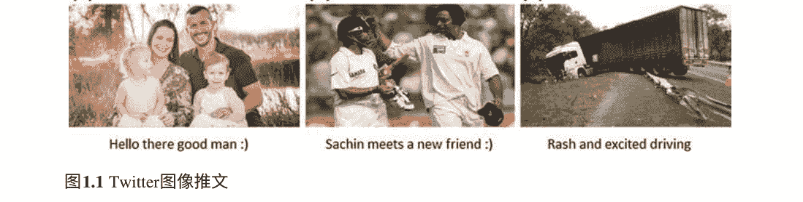

出于这个动机，我们检测大规模数据集中可用的情感。情感的提取是主要的初步工作[1]。在这项研究工作中，我们得出人们对正在发生的各个主题的观点。在这个过程中，我们自动检测情感。图1.1显示了一些Twitter图像推文。从图像推文中可以观察到，图1.1a和b表示良好的情感，图1.1c表示不好的情感。

在这里，情感是通过考虑同一对象的不同形式来学习的。通过附带图像的简短和非正式文本来推断人们的情感。在过去几年中，这个方向上进行了积极的研究工作。有一些例子可以检测用户的情感，并应用情感分析来预测产品评论[21]和政治选举[22]。所有现有的技术都围绕着文本分析进行情感检测。然而，在社交媒体分析中，围绕着图像和视频的视觉内容变得非常流行。视觉内容得到了Twitter的图像推文和vine以及Facebook的Instagram的支持。对于视觉和多模态情感分析，关注度很少。只有很少的重要工作使用图像[23]和视频[24]特征来预测多模态情感分析。视觉情感分析涵盖了更高的抽象水平和主观性的挑战程度[25]。它涵盖了几个识别系统中的广泛任务类别。卷积神经网络（CNN）[25-27]在视觉识别问题中取得了有希望的结果。

人类行为总是受到意见的影响，从而导致各种活动。对于任何决策，我们都会向他人寻求意见。任何企业或组织都会对其业务线采取观点。对于使用组织产品的消费者也是如此。同样，在选举中投票给候选人之前，人们会考虑他人的观点。在这方面，人们习惯上会寻求朋友和家人的意见。组织通过调查和民意调查收集消费者意见。从不同来源收集意见已经成为一个相当长时间的成功业务。随着基于Web的社交媒体的不断扩张，人们正在将这些信息用于决策。这对于购买消费品、寻求关于任何物品或服务的观点是显而易见的。然而，考虑到Web信息的大量增加，必须谨慎考虑正确的内容。

识别正确的信息片段以及从中提取和总结观点。这需要开发自动情感分析系统。近年来，人们观察到社交论坛中表达的观点在重塑个人或系统的未来方面起到了重要作用。这导致了对基于网络的意见的收集和研究。一些组织还维护着从无数来源收集到的各种形式的内部数据。由于这个原因，工业活动在近年来蓬勃发展。过去十年中一些值得注意的应用研究包括[2, 28-45]。该领域的工作列表在第3章中介绍。

## 1.1 这项研究的必要性

社交媒体数据以很高的速度持续增长。信息检索和提取作为情感形成的重要研究课题，对于这种不断增长的数据内容非常重要。这些情感反映了人们对一些新兴观点的看法。该工作试图解决这个方面。通过调查Twitter、Instagram、Viber和Snapchat上可用的社交博客来实现这一目标。该工作考虑了实际和经验性的兴趣。从经验的角度来看，它应用了众所周知的理论，并从实际的角度提供了利用元素。情感分析涉及许多具有挑战性的问题。技术选择是第一个问题。这是通过对文献进行严格的审查来实现的。第3章介绍了文献综述。一旦掌握了技术，根据第4章的规定进行适当的数据收集。然而，数据根据所选的技术进行预处理。在第6章中，解释了方法论。在数据收集和预处理之后，提出了实现期望结果的技术。

然后，对结果进行解释和比较。这遵循了模型细化，考虑了预定义的基准水平。最后，进行了几项测试，以验证整体模型的适应性。

从详细的内容列表中可以验证，在最近的研究中已经对视觉和情感分析进行了调查[28, 46]。深度学习框架也在[47, 48]中使用过。然而，与当前研究存在微妙的差异。这些方面在这里简要介绍。

- (a) 在[2]中，对情感分析进行了深入介绍。这本书提供了一个生动的调查，涵盖了情感分析的重要研究方面和进展。这本书考虑了主要期刊和会议，给出了几个指针。该书考虑了结构化和非结构化数据，以解决问题引入，以便桥接不同的数据形式，以促进意见的定性和定量分析。还强调了解决与情感分析相关的子问题的各种技术。该书涵盖了围绕社交媒体分析的几个实际应用。

(b) 在[46]中，强调了社交网络的情感分析。这本书为读者提供了有关社交网络情感分析相关问题的见解。介绍了基于心理学和社会学的过程，涵盖了社交网络。这本书讨论了通过情感资源编码的情感分析中的语义。这本书介绍了在社交网络和大数据方面有效表达情感的特征。还包括了面向情感分析的机器学习方法。这些插图是基于从真实通信情感中接收到的文本数据呈现的。还提出了关于意见挖掘的几个问题。包括了提取和抽象意见填充的文本摘要与评估。讨论了不同的开源商业智能和专有套件。

(c) 在[47]中，介绍了面向大数据的深度学习创新。这本书捕捉了大数据分析的趋势和进展。这本书还确定了促进对各个领域的洞察力的潜在研究方向。这本书是系统架构师、从业人员、开发人员、研究人员和学生的参考资料。这本书的内容涵盖了理解深度学习问题所需的基本和高级概念，以及大数据分析的未来趋势可能的解决方案。

(d) 在[48]中，通过基于软计算的深度学习技术提出了破产预测问题。层次化深度架构（HDA）用于破产预测。模糊粗糙张量深度堆叠网络（FRTDSN）与结构化层次粗糙贝叶斯（HRB）相结合形成HAD，即FRTDSN-HRB。实验数据集来自韩国建筑公司、美国和欧洲非金融公司以及UCI机器学习库。研究围绕截断点的选择、数据采样以及业务周期准确性展开。与其他模型相比，FRTDSN-HRB的性能更好。

(e) 在当前研究中，通过分层门控前馈循环神经网络（HGFRNN）进行了多模态情感分析的研究。在这个方向上，本研究分析了Twitter、Instagram、Viber和Snapchat博客中的情感。通过结合文本和视觉预测结果来分析完整的情感。通过引入视觉内容进一步提高性能，达到良好的性能水平。该工作的创新之处在于开发了用于分析情感的新型分层循环神经网络，通过连接单元从上层到下层的信号流控制来堆叠多个循环层，通过学习来门控相应的层间交互，以及通过时间方式自适应分配HGFRNN层和逐层交互。考虑到对大规模社交博客内容进行情感分析的要求，采用了多模态情感分析技术。这本书对深度学习和情感分析的研究生和研究人员非常有益。

## 1.1 这项研究的必要性

### 1.1.1 激励因素

在这里考虑多模态情感分析研究的主要目标是调查Twitter、Instagram、Viber和Snapchat上可用的实际和经验性博客数据。由于社交媒体上的持续信息爆炸，情感分析的研究已成为一个热门话题。考虑了多媒体业务研究的许多方面，这对整个商业社区都是有益的。另一个动机在于为社交媒体的多模态情感分析开发一个数学框架。

一旦建立了模型，它将有助于社交媒体研究人员找出与多个情感相关的方面。这项工作围绕以下问题展开：

-   (a) 如何从社交多媒体数据中提取情感？
-   (b) 深度学习算法在社交博客数据中的准确性如何？
-   (c) 如何提高从多模态内容中获得的情感准确性？

## 1.2 贡献

这项研究工作做出了以下贡献：

-   (a) 通过目前可用的技术对视觉和文本情感分析进行文献综述。
-   (b) 该研究工作通过控制信号流实现了多个循环层的层次化深度学习网络HGFRNN，用于分析情感。情感分析是在Twitter、Instagram、Viber和Snapchat数据集上进行的。通过不同类型的循环单元对HGFRNN进行评估。HGFRNN的层次分配适应了多个时间尺度。
-   (c) 通过真实世界数据集对HGFRNN进行评估，以了解模型的功能。
-   (d) 通过与其他模型的比较，突出了该模型的优越性。

本专著的组织结构如下。第2章介绍了当前的研究现状。第3章对文献综述进行了讨论。第4章介绍了本研究工作中使用的Twitter、Instagram、Viber和Snapchat数据集。第5章介绍了视觉和文本情感分析。第6章讨论了基于层次化深度学习网络的多模态情感分析的实验框架。第7章包含了实验结果。最后，第8章给出了总结性的结论。图1.2显示了多模态情感预测系统的示意图。

图1.2 通过分层门控前馈递归神经网络进行多模态数据的预测框架

## 参考文献

- 1. Cambria, E.: 情感计算和情感分析. IEEE智能系统. 31(2), 102–107 (2016)
- 2. Liu, B.: 情感分析: 挖掘观点、情感和情绪. 剑桥大学出版社 (2015)
- 3. 世界旅游与旅行理事会, 2016年旅游与旅行经济影响: www.wttc.org/-/media/files/reports/economic%20impact%20research/regions%202016/world2016.pdf
- 4. O'Connor, P.: 用户生成内容和旅行: TripAdvisor.com的案例研究. 在: O'Connor, P., H pken, W., Gretzel, U. (eds.) 旅游中的信息与通信技术, pp. 47–48. Springer (2008)
- 5. Serrano-Guerrero, J., Olivas, J.A., Romero, F.P., Herrera-Viedma, E.: 情感分析: 一个综述和网络服务的比较分析. 信息科学. 311(2), 18–38 (2015)
- 6. Hu, M., Liu, B.: 挖掘和总结客户评论. 在: 第10届ACM SIGKDD国际知识发现与数据挖掘会议论文集, pp. 168–177 (2004)
- 7. Shouten, K., Frasincar, F.: 方面级情感分析调查. IEEE Trans. 知识数据工程. 28(3), 813–830 (2016)
- 8. Nasukawa, T., Yi, J.: 情感分析: 使用自然语言处理捕捉好感度. 在: K-CAP '03, 第2届知识捕获国际会议, pp. 70–77 (2003)
- 9. Hatzivassiloglou, V., Mckeown, K. R.: 预测形容词的语义倾向。 在：第35届计算语言学年会和第8届欧洲分会计算语言学大会论文集，第174-181页（1997年）
- 10. Hearst, M. A.: 从大型文本语料库中自动获取下位词。 在: 第14届计算语言学会议论文集，第2卷，第539-545页 (1992年)
- 11. Wiebe, J.: 认知主观句子：叙事文本的计算研究。 博士学位论文，纽约州立大学布法罗分校 (1990年)
- 12. Wiebe, J.: 在叙述中追踪观点。 计算语言学。 20(2), 233-287页 (1994年)
- 13. Wiebe, J., Bruce, R., O'Hara, T.: 为主观性分类开发和使用黄金标准数据集。 在: 第37届计算语言学年会论文集，第246-253页 (1999年)
- 14. Wiebe, J.: 从语料库中学习主观形容词。 在: 第17届全国人工智能大会论文集，第735-740页 (2000年)
- 15. Das, S.R., Chen, M.Y.: 雅虎！ 用于亚马逊：从网络上的闲聊中提取情感。 管理科学 53 (9), 1375-1388页 (2007年)
- 16. Satoshi, M., Yamanishi, K., Tateishi, K., Fukushima, T.: 在网络上挖掘产品声誉。 在: 第8届ACM SIGKDD国际知识发现和数据挖掘大会论文集，第341-349页 (2002年)
- 17. Bo, P., Lee, L., Vaithyanathan, S.: 点赞？ 使用机器学习技术进行情感分类。 在: 自然语言处理经验方法会议论文集，第79-86页 (2002年)
- 18. Tong, R.: 一个用于检测和追踪在线讨论中观点的操作系统。 在: SIGIR研讨会关于操作文本分类的工作笔记，第1-6页 (2001年)
- 19. Turney, P.: 赞成还是反对？ 语义倾向应用于无监督分类的评论。 在: 计算语言学协会第40届年会论文集，第417-424页 (2002年)
- 20. Chaudhuri, A.: 过去十年情感分析中的一些重要工作。 技术报告，TH-7050，Birla Institute of Technology Mesra，Patna Campus (2014年)
- 21. Chaudhuri, A., Ghosh, S. K.: 使用稳健的层次双向递归神经网络对客户评论进行情感分析。 在: Silhavy, R. et al. (eds.) Artificial Intelligence Perspectives in Intelligent Systems. Advances in Intelligent Systems and Computing, vol. 464, pp. 249-261. Springer (2016年)
- 22. Tumasjan, A., Sprenger, T.O., Sandner, P.G., Welpe, I.M.: 通过Twitter预测选举：140个字符揭示政治情绪。 在: 博客和社交媒体协会的人工智能大会论文集，第10卷，第178-185页 (2010年)
- 23. Borth, D., Chen, T., Ji, R., Chang, S.F.: Sentibank: 用于检测视觉内容中情感和情绪的大规模本体和分类器。 在: 第21届ACM多媒体会议论文集，第459-460页 (2013年)
- 24. Morency, L.P., Mihalcea, R., Doshi, P.: 迈向多模态情感分析：从网络中收集意见。 在: 国际多模态界面会议论文集，第169-176页 (2011年)
- 25. You, Q., Luo, J., Jin, H., Yang, J.: 社交媒体的联合视觉文本情感分析的跨模态一致回归. 在: 第9届国际网络搜索和数据挖掘会议论文集，第13-22页 (2016年)
- 26. You, Q., Luo, J., Jin, H., Yang, J.: 深度神经网络的联合视觉文本情感分析. 在: 第23届ACM多媒体会议论文集，第1071-1074页 (2015年)
- 27. You, Q., Cao, L., Jin, H., Luo, J.: 强大的视觉文本情感分析: 当注意力遇见树结构循环神经网络. 在: 第24届ACM多媒体会议论文集，第1008-1017页 (2016年)
- 28. McGlohon, M., Glance, N., Reiter, Z.: 星级质量: 聚合评论以排名产品和商家. 在: 第4届人工智能进步协会网络日志和社交媒体会议论文集, 第144-121页 (2010年)
- 29. 洪, Y., 斯基纳, S.: 博彩公司的智慧? 情感分析与NFL点差。 在: 第4届人工智能协会会议的网络日志和社交媒体上，第251-254页 (2010年)
- 30. 奥康纳, B., 巴拉苏巴拉马尼扬, R., 劳特里奇, B.R., 史密斯, N.A.: 从推文到民意调查：将文本情感与公众舆论时间序列联系起来。 在：第4届人工智能协会会议的网络日志和社交媒体上，第122-129页（2010年）
- 31. 毕, C., 朱, L., 基弗, D., 李, D.: 关于什么是观点？ 使用观点评分模型探索政治立场。 在：第4届人工智能协会会议的人工智能上，第1007-1012页（2010年）
- 32. 矢野, T., 史密斯, N.A.: 值得评论的是什么？ 政治博客中的内容和评论数量。 在：第4届人工智能协会会议的网络日志和社交媒体上，第359-362页（2010年）
- 33. Sitaram, A., Huberman, B.A.: 通过社交媒体预测未来。arXiv:1003.5699. (2010)
- 34. Joshi, M., Das, D., Gimpel, K., Smith, N.A.: 电影评论和收入：一个文本回归实验。 在：北美计算语言学协会人类语言技术会议论文集，第293-296页（2010）
- 35. Sadikov, E., Parameswaran, A., Venetis, P.: 博客作为电影成功的预测因素。 在：第3届国际网络日志和社交媒体会议论文集，第304-307页（2009）
- 36. Miller, M., Sathi, C., Wiesenthal, D., Leskovec, J., Potts, C.: 通过超链接网络传播情感。 在：第5届国际人工智能协会网络日志和社交媒体会议论文集，第550-553页（2011）
- 37. Mohammad, S., Yang, T.: 在邮件中跟踪情感：性别在情感轴上的差异。 在：ACL研讨会关于计算主观性和情感分析的论文集，第70-79页（2011年）
- 38. Mohammad, S.: 从从前到现在幸福地生活：追踪小说和童话中的情绪 在：ACL研讨会关于文化遗产、社会科学和人文学科的语言技术论文集，第105-114页（2011年）
- 39. Bollen, J., Mao, H., Zeng, X.J.: Twitter情绪预测股市。 计算机科学杂志2（1），1-8页（2011年）
- 40. Roy, B.H., Dinur, E., Feldman, R., Fresko, M., Goldstein, G.: 识别和追踪股票微博中的专家投资者 在：经验方法会议论文集，第1310-1319页（2011年）
- 41. Feldman, R., Rosenfeld, B., Roy B.H., Fresko, M.: 基于混合方法的股票声纳—情感分析 在：第23届人工智能创新应用会议论文集，第1642-1647页（2011年）
- 42. 张, W., Skiena, S.: 利用博客和新闻情感的交易策略。 在：第4届国际网络日志和社交媒体会议论文集，第375-378页（2010）
- 43. Sakunkoo, P., Sakunkoo, N.: 在线书评中的社交影响分析。 在：第3届人工智能协会网络日志和社交媒体会议论文集，第308-310页（2009）
- 44. Groh, G., Hauffa, J.: 通过基于NLP的情感分析来表征社交关系。 在：第5届人工智能协会网络日志和社交媒体会议论文集，第502-505页（2011）
- 45. Castellanos, M., Dayal, U., Hsu, M., Ghosh, R., Dekhil, M., Lu, Y., Zhang, L., Schreiman, M.: LCI: 用于实时客户智能的社交渠道分析平台。 在：ACM SIGMOD国际数据管理会议论文集，第1049-1058页（2011）
- 46. Pozzi, F.A.: 社交网络中的情感分析。Morgan Kaufmann（2016）
- 47. Karthik, S., Paul, A., Karthikeyan, N.: 深度学习创新及其与大数据的融合。 在：数据挖掘和数据库管理的进展。IGI Global (2017)
- 48. Chaudhuri, A., Ghosh, S.K.: 基于软计算的深度学习技术进行破产预测。Springer Nature (2018)

# 第2章 当前艺术状态

情感分析在从快速消费品到政治事件等广泛领域都有广泛应用。一些大公司在这个领域有自己的内置能力。这些无数的应用和兴趣是情感分析研究的驱动力。一些社交网络和微博提供了用户信息交流和沟通的强大平台。社交网络和微博提供了数万亿条多模态信息。这使得检测多模态内容指定的情感成为可能和必要。与文本内容相比，多媒体内容更有可能表达和传达人们的思维过程[1]。然而，关于视觉情感分析的鲁棒性的工作仍在进行中。

在文本内容[2-4]和在线词典[5, 6]上已经进行了大量的工作。一种不考虑文本内容的情感分析变体是基于视觉特征的语义[7-10]。这也涵盖了概念学习。然而，考虑到计算机视觉的限制，这一点受到了阻碍。

与情感分析的视觉分析密切相关的方面是图像的美学[11, 12]、趣味性[13]和效果[14-17]。基于人类活动的情感分析对心理学和人机交互做出了有效的贡献。一些关于面部情绪分类的著名作品可以在[18-20]中找到。有一个自动的计算机视觉系统发现并识别了大学校园里的微笑面孔[21]。Guerra等人[22]开发了一种创新系统，可以访问面部表情、语音、韵律和基于反应的社交技能培训。

社交媒体情感分析主要围绕Twitter展开。大多数方法考虑了不同的特征和问题方面。社交媒体用户对特定主题的偏见是由[23]提出的。在这里，使用迁移学习从文本中提取特征，通过用户的偏见作为独特属性可以构建一个强大的分类模型。然而，基于主题的用户偏见识别可能很困难。De Choudhury等人使用传播方法[24]。通过标签来处理噪声标签。在这里，网络用于标签的传播。Silva等人使用Twitter平台研究产后母语特征。在这里，社交媒体发现并了解妇女的健康情况，随后是婴儿的出生。Hu等人提出了用于训练增强的流数据情感分析。Kosinski等人提出了一种优化算法，以通过稀疏表达式提取社交关系考虑推文和图的拉普拉斯。在这里，只使用文本内容进行分析，不考虑图像内容。在[28]中，考虑了Facebook的点赞，根据用户的在线活动预测用户行为。在[29]中，使用贝叶斯统计方法检测潜在属性以进行主题模型。在[30]中，使用在线用户行为。

通过推文和转发吸收的信息被[31]用于对政治情况的量化。社交媒体情绪通过[32]的激活和价值方面进行分析。通过连接具有相同观点的邻居影响的[33]中的超链接来分析情感的流动。

在[34]中，网络关系被用于针对特定主题的用户群体的情感分析。Kosinski等人[27]利用基于用户的内容及其关系进行情感分析开发。在这里，优化部分使用了Twitter数据集上的半监督方法。O'Connor等人[3]利用多模态特征来研究社交媒体用户的变化。

## 2.1 可用技术

最近，对多模态数据的情感分析已经得到了关注。重要的工作集中在视频日志的情感上。这是一个传统的问题，过去通过各种工具如朴素贝叶斯分类器、最大熵分类、支持向量机、多层感知器和隐马尔可夫模型[35]来执行分类任务。

多模态内容的情感分析首先由[36]研究。他们在文本内容之上分析了音频-视觉内容。他们使用了带有30秒摘录的47个视频，涵盖了一个单一主题，并对视频进行了转录。每个视频有三个情感标签。数据集中有498个摘录，每个摘录有一个句子。与情感相关的一些特征包括词的极性、带有表情和音调的停顿。openEAR [37]帮助提取音调和语音停顿。测量了微笑和注视的时间。通过转录的语音分析了词汇的极性。

隐马尔可夫模型也用于情感分类。这里使用的三模态输入特征表现出优越的性能，超过了单模态特征。这个案例展示了同时使用文本和图像内容进行情感分析的强大优势。通过[38]进行了基于视频的情感分析，使用了面部表情、音频和文本方面的特征。通过text2vec提取了文本。使用深度卷积神经网络进行训练，并用于特征提取。情感分析使用了SVM。

## 2.1 可用技术

通过softmax层进行替换。从面部提取面部特征点和管道。openSMILE [39]帮助提取音频特征。这项工作还通过[40]进行了进一步扩展，采用了从情感计算技术中采用的更详尽的特征集。还提取了大量基于音频的低级特征。通过这样做，实现了可观的情感检测准确性。

通过[41]尝试了基于电影评论的多模态情感分析。实验数据集包括来自各种来源的370个视频。使用特定的评级，将视频标记为 +ve， -ve和中性类别。通过对评论进行手动转录和自动语音识别来分析文本。通过大量的书面评论数据库进行了跨领域分析。使用在线知识来源来推断说话者的情感。在这里，去除了停用词，并采用了一元和三元词袋特征表示。还捕捉到了面部表情，考虑了微笑、凝视和头部姿势。openSMILE [39]提取了声学低级描述符。在话语级别上，对特征进行了汇总。通过语言特征训练了线性SVM。通过音频-视觉特征训练了双向长短期记忆RNN。使用跨语料库语法、领域特定文本和音频-视觉分析实现了良好的分类准确性。通过[42]分析了在不同视频中对不同主题表达观点的人。每个主题进行了手动基于时间的分割，并将视频标记为 +ve， -ve和中性类别。通过手动转录视频进行了文本分析。重新构建了词袋规范，并使用一元特征集表示文本特征向量。

考虑的其他方面包括从面部角度的微笑持续时间以及从音频角度的停顿持续时间、音调、强度和响度。这项工作是多模态情感分析的一个很好的案例。

另一种基于文本、音频和视觉模态的情感检测是由[43]提出的。数据集由英语语言的视频博客帖子组成。视频进行了手动转录。在句子级别上，考虑了主观性。在考虑主观性方面对视频片段进行了注释。特征集从多模态模态中提取。从音频中，采用了MFCC和峰值斜率。从视觉模态中，收集了各种面部方面。该模型针对客观性质的句子进行了主观识别的训练。

多模态方法在SVM上表现出优越的性能。值得注意的一些成就是在情感分析中在预处理级别上考虑了主观性和多级情感。

基于视频新闻广播的多模态情感分析是由[44]完成的。数据集包含考虑到句子长度的摘录。多模态内容分为三个层次。新闻句子由众包工人标记。视频也使用类似的句子进行标记。在考虑到转录和多媒体内容的情况下，情感标签存在轻微差异。使用openSMILE [39]，从音频轨道中提取了低级描述符。然后，检测说话者的面部是否出现在帧中。考虑到现成的解决方案[45]，进行了文本情感分析。

这里的准确性提高了视觉和音频模态的情感分析。然而，特定锚点的视觉和音频情感检测结果更好。结果突出了多模态分析在理解极性以及情感分析方面的优越性。

通过[46]介绍了利用面部表情分析评估选民偏好。数据集是从选举期间辩论的视频剪辑中准备的。在选民偏好方面取得了较高的准确性水平。

考虑到视频博客，[47]研究了态度识别。在这里，语音的韵律和面部表情被用来找出共同的人类行为特征。多模态分析方面的宣传视频被[48]提及。在这里，进行了音频-视觉情感分析。正确捕捉到了表达的情感的重要性。音频-视觉技术在确定情感极性方面始终占据优势。文本分析支持方面的提取和主题的识别。

## 参考文献

- 1. You, Q., Luo, J.: 走向社交图像学：社交多媒体中的情感分析。 在：第13届ACM国际多媒体数据挖掘研讨会论文集，第3:1-3:8页（2013年）。
- 2. O’Connor, B., Balasubramanyan, R., Routledge, B.R., Smith, N.A.: 从推文到民意调查：将文本情感与公众舆论时间序列联系起来。 在：第4届博客和社交媒体人工智能进展会议论文集，第122-129页（2010年）。
- 3. 庞, B., 李, L.: 意见挖掘和情感分析. Found. Trends Inf. Retrieval 2(1–2), 1–135 (2008)
- 4. 威尔逊, T., 韦贝, J., 霍夫曼, P.: 在短语级情感分析中识别上下文极性. 在: ACL人类语言技术和自然语言处理的会议论文集, pp. 347–354 (2005)
- 5. 埃苏利, A., 塞巴斯蒂安尼, F.: Sentiwordnet: 一个公开可用的用于意见挖掘的词汇资源. 在: 语言资源和评估的第5届会议论文集, vol. 6,pp. 417–422 (2006)
- 6. Thelwall, M., Buckley, K., Paltoglou, G., Cai, D., Kappas, A.: 在短的非正式文本中检测情感强度. J. Am. Soc. Inform. Sci. Technol. 61(12), 2544–2558 (2010)
- 7. Naphade, M.R., 林, C.Y., 史密斯, J.R., 曾, B., 巴苏, S.: 学习注释视频数据库. 在: SPIE媒体存储和检索会议论文集 (2002)
- 8. Ordonez, V., Kulkarni, G., Berg, T.L.: 使用100万个带标题的照片描述图像。 在：第25届神经信息处理年会论文集（2011年）
- 9. Snoek, C.G., Worring, M.: 基于概念的视频检索. Found. Trends Inf. Retrieval 2(4), 215–322 (2008)
- 10. Datta, R., Joshi, D., Li, J., Wang, J.Z.: 使用计算方法研究摄影图像的美学。 在：计算机视觉欧洲会议论文集，卷3，第288–301页。Springer（2006年）
- 11. Marchesotti, L., Perronnin, F., Larlus, D., Csurka, G.: 使用通用图像描述符评估照片的美学质量。 在：IEEE国际计算机视觉会议论文集，第1784–1791页（2011年）
- 12. Isola, P., Xiao, J., Torralba, A., Oliva, A.: 什么使一张图片令人难忘？ 在: 计算机视觉和模式识别国际会议论文集, 第145-152页(2011)
- 13. 贾, J., 吴, S., 王, X., 胡, P., 蔡, L., 唐, J.: 我们能理解梵高的情绪吗？从社交网络中的图片中学习推断情感。 在: 第20届ACM多媒体国际会议论文集, 第857-860页 (2012)
- 14. Machajdik, J., Hanbury, A.: 使用心理学和艺术理论启发的特征进行情感图像分类。 在: 国际多媒体会议论文集, 第83-92页(2010)
- 15. Oliva, A., Torralba, A.: 建模场景的形状:空间整体表示 计算机视觉国际期刊 42(3), 145-175页 (2001)
- 16. Yanulevskaya, V., Uijlings, J., Bruni, E., Sartori, A., Zamboni, E., Bacci, F., Melcher, D., Sebe, N.: 在观察者的眼中: 运用统计分析和眼动追踪来分析抽象绘画。 在: 第20届ACM国际多媒体会议论文集, 第349-358页 (2012年)
- 17. Bartlett, M.S., Littlewort, G., Frank, M., Lainscsek, C., Fasel, I., Movellan, J.: 识别面部表情: 机器学习及其在自发行为中的应用。 在: IEEE计算机视觉和模式识别会议论文集, 第2卷, 第568-573页 (2005年)
- 18. Fasel, B., Luettin, J.: 自动面部表情分析: 一项调查。 Pattern Recogn. 36(1), 259-275页 (2003年)
- 19. Wan, S., Aggarwal, J.: 自发面部表情识别: 一种稳健的度量学习方法 Pattern Recogn. 47(5), 1859-1868 (2014)
- 20. Hernandez, J., Hoque, M.E., Drevo, W., Picard, R.W.: Moodmeter: 在野外计数微笑. In: ACM国际普适计算会议论文集, pp. 301-310 (2012)
- 21. Hoque, M.E., Courgeon, M., Martin, J.C., Mutlu, B., Picard, R.W.: Mach: 我的自动对话教练 . In: ACM国际普适计算联合会议论文集, pp. 697-706 (2013)
- 22. Guerra, P.H.C., Veloso, A., Meira Jr., W., Almeida, V.: 从偏见到观点: 一种实时情感分析的迁移学习方法. 第17届ACM SIGKDD国际知识发现与数据挖掘会议论文集, pp. 150-158 (2011)
- 23. Speriosu, M., Sudan, N., Upadhyay, S., Baldridge, J.: 基于词汇链接和关注者图的Twitter极性分类. In: 第1届ACL无监督学习在NLP上的研讨会论文集, pp. 53-63 (2011)
- 24. De Choudhury, M., Counts, S., Horvitz, E.: 社交媒体中的重大生活变化和行为标记: 以儿童出生为例。 在: ACM计算机支持合作工作会议论文集, 第1431-1442页 (2013年)
- 25. Silva, I.S., Gomide, J., Veloso, A., Meira Jr., W., Ferreira, R.: 通过自我增强训练和需求驱动投影实现有效的情感流分析。 在: 第34届国际ACM SIGIR信息检索研究与开发会议论文集, 第475-484页 (2011年)
- 26. Hu, X., Tang, L., Tang, J., Liu, H.: 在微博中利用社交关系进行情感分析。 在: 第6届ACM国际网络搜索和数据挖掘会议论文集, 第537-546页 (2013年)
- 27. Kosinski, M., Stillwell, D., Graepel, T.: 从人类行为的数字记录中可以预测私人特质和属性。 美国国家科学院院刊 110(15), 5802-5805 (2013)
- 28. Rao, D., Paul, M., Fink, C., Yarowsky, D., Oates, T., Coppersmith, G.: 用于社交媒体中潜在属性检测的层次贝叶斯模型。 在:第5届人工智能协会网络日志和社交媒体会议论文集, pp. 598-601 (2011)
- 29. Goel, S., Hofman, J.M., Sirer, M.I.: 网络上的谁做了什么: 关于浏览行为的大规模研究。 在:第6届人工智能协会网络日志和社交媒体会议论文集, pp. 130-137 (2012)
- 30. Wong, F.M.F., Tan, C.W., Sen, S., Chiang, M.: 从推文和转推中量化政治倾向. IEEE Trans. Knowl. Data Eng. 28(8), 2158–2172 (2013)
- 31. De Choudhury, M., Counts, S., Gamon, M.: 并非所有情绪都是平等的！探索社交媒体中的人类情绪状态。 在: Proceedings of the 6th Association for the Advancement in Artificial Intelligence Conference on Weblogs and Social Media, pp. 66–73 (2012)
- 32. Tan, C., Lee, L., Tang, J., Jiang, L., Zhou, M., Li, P.: 用户级情感分析结合社交网络. arXiv:1109.6018. (2011)
- 33. Chaudhuri, A.: 多媒体数据上的情感分析。 Technical Report TH-9086. 三星研发机构德里分部，印度 (2014)
- 34. Morency, L.P., Mihalcea, R., Doshi, P.: 迈向多模态情感分析。 在: 第13届ACM国际多模态界面会议论文集，ACM，第169-176页（2011）
- 35. Miller, M., Sathi, C., Wiesenthal, D., Leskovec, J., Potts, C.: 通过超链接网络传递情感。 在:第5届国际人工智能协会网络日志和社交媒体会议论文集，第550-553页（2011）
- 36. Eyben, F., Wöllmer, M., Schuller, B.: OpenEAR: 介绍慕尼黑开源情感和情感识别工具包。 在:第3届情感计算和智能交互国际会议及研讨会论文集，第1-6页（2009）
- 37. Poria, S., Cambria, E., Hazarika, D., Majumder, N., Zadeh, A., Morency, L.P.: 用户生成的视频中的上下文相关情感分析。 在：第55届年会的计算语言学协会会议论文集，第1卷，第873-883页（2017）
- 38. Eyben, F., Wöllmer, M., Schuller, B., openSMILE: 慕尼黑多功能快速开源音频特征提取器。 在：第18届ACM国际多媒体会议论文集，第1459-1462页（2010）
- 39. Poria, S., Cambria, E., Winterstein, G., Huang, G.B.: Sentic模式： 基于依赖关系的概念级情感分析规则。知识基础系统。 69（1），45-63页（2014）
- 40. Wöllmer, M., Weninger, F., Knaup, T., Schuller, B., Sun, C., Sagae, K., Morency, L.P.: YouTube电影评论： 音频-视觉环境中的情感分析。IEEE智能系统。 28（3），46-53页（2013）
- 41. Rosas, V.P., Mihalcea, R., Morency, L.: 西班牙在线视频的多模态情感分析。 IEEE Intell. Syst. 28(3), 38–45 (2013)
- 42. Zadeh, A.: 在线视频中的微观意见情感强度分析和总结。 在： ACM国际多模态交互会议论文集，第587–591页 (2015)
- 43. Ellis, J.G., Jou, B., Chang, S.F.: 为什么我们看新闻： 一个用于探索广播视频新闻情感的数据集。 在：ACM国际多模态交互会议论文集，第104–111页 (2014)
- 44. Socher, R., Perelygin, A., Wu, J.Y., Chuang, J., Manning, C.D., Ng, A.Y., Potts, C.: 递归深度模型用于情感树库的语义组合性。 在: 自然语言处理实证方法会议论文集，第1631–1642页 (2013)
- 45. McDuff, D., Kaliouby, R.E., Kodra, E., Picard, R.: 基于对选举报论的情感反应来衡量选民对候选人的偏好。 在:情感计算与智能交互会议论文集，第369–374页 (2013)
- 46. Madzlan, N.A., Han, J.G., Bonin, F., Campbell, N.: 在视频博客中自动识别态度-韵律和视觉特征分析, INTERSPEECH, pp. 1826–1830 (2014)
- 47. Siddiquie, B., Chisholm, D., Divakaran, A.: 利用多模态情感和语义来识别具有政治说服力的网络视频。 在:ACM国际多模态交互会议论文集, pp. 203–210 (2015)
- 48. Lo, S.L., Cambria, E., Chiong, R., Cornforth, D.: 多语言情感分析: 从正式到非正式和稀缺资源语言。 人工智能评论 48(4), 499–527 (2017)

# 第三章 文献综述

情感分析一直是社交媒体数据处理的热门研究课题[1]。大多数情感分析研究都使用英语语言，但对多语言方面的研究逐渐增加[2-4]。符号和子符号方法是情感分析技术的两个广泛分类。符号方法包括词典[5]、本体论[6]和语义网络[7]。子符号方法包括有监督[8]、半监督[9]和无监督[10]的机器学习方法。最著名的算法涉及深度网络[11]和对抗网络[12]。

简单的分类问题是最受欢迎的问题。手提箱研究问题[13]考虑了诸如词极性消歧[14]、主观性检测[15]、个性识别[16]、微文本规范化[17]、概念提取[18]、时间标记[19]和方面提取[20]等NLP任务。绝大多数自然语言处理（NLP）研究人员通过某些中间性质的命题来解决这些任务。在这里，具体的任务特征更好。然而，它们归因于研究者使用的语言知识。这里介绍了一些重要的研究工作。

Mikolov等人[21]提出了一种多层神经网络，它将任何句子作为输入，并逐层提取特征。通过查找表上的基于操作，第一层将每个单词映射到特征向量。下一层提取局部特征，并形成一个固定大小的全局特征向量。通过最大化似然函数进行训练，考虑到大量未标记的数据集。然后，通过训练算法发现了NLP活动的意义表示。

Mikolov等人[22]使用连续词袋（CBOW）和跳字模型从文本数据集中学习出优质的词向量。Mikolov等人[23]创建了word2vec工具，提供了良好的CBOW实现和跳字架构。Kim[24]将规则性作为句法和语义形式捕捉为词向量。Krizhevsky等人[25]在预训练的词向量上训练了一个卷积神经网络，从而改进了句子分类。You等人[26]提出了一种深度卷积神经网络（DCNN）可以实现良好的图像分类结果。Borth等人[27]开发了一个大规模的视觉情感本体论，用于形成面向视觉情感分析的检测器库。Chen等人[28]训练了一个基于Caffe的深度神经网络模型DeepSentiBank，用于视觉情感的分类。Xu等人[29]利用预训练的深度神经网络[26]在ILSVRC 2012数据集上进行训练，并将学习到的参数转移到视觉模式的情感预测中。Wang等人[30]在Getty Images上对CNN进行了微调，用于视觉情感分析，并训练了一个段落向量模型用于文本情感分析。参考文献[30–32]创建了一个从新浪微博中获取的文本消息数据集。然后，通过结合使用文本和视觉特征的预测结果进行情感分析[27]。在[31]中，使用通过word2vec预训练的词向量对CNN进行训练，该方法利用文本中的特征。然后，使用DropConnect[32]训练DNN以学习视觉特征。随后，通过结合文本和视觉特征进行情感预测。

由于其效率和简单性，基于词典的方法[33]广泛研究了在线内容情感分析。Wan等人[34]提出了一种学习具有分布式表示的文档的方法。Chaudhuri和Ghosh[35]使用机器学习算法预测图像情感。在这里，情感具有高级抽象，可以通过属性或对象更容易解释。Le和Mikolov[36, 37]提出了将视觉属性作为视觉情感分析的特征。通过多模态进行情感分析已在[31]中进行研究。在这里，文本和图像被用于情感分析，通过融合预测结果进行后期融合[36]。在[38]中，通过深度神经网络研究了联合视觉文本情感分析。在[39]中，通过树状神经网络递归地处理了联合视觉文本情感分析。在这里，使用了不同的长短期记忆（LSTM）变体进行注意机制分析。

You et al. [26]通过跨模态一致回归研究了多模态情感分析，在与文本和视觉情感分析算法相比孤立地获得了更好的结果。

在情感识别中，[40, 41]的研究通过音频和视觉系统融合创建了一个双模态信号，提供了更高的准确性。分析已经在特征[42]和决策层[43–45]进行，融合信息以处理情绪和情感。Schuller[46, 47]将不同的模态融合到情感识别中。Metallinou等人[48]在决策层融合了音频和文本线索。Poria等人[49]使用CNN进行特征提取，然后采用基于多核学习（MKL）的情感分析。[50]从周围的话语中提取上下文信息使用LSTM。Wöllmer等人[51]将不同的模态与深度学习相结合，[52]使用张量融合。Zadeh等人[53]研究了CNN和MKL集成。Poria等人[54]提出了通过深度网络学习多个数据相关性的融合方法。

## 参考文献

- 1. Dashtipour, K., Poria, S., Hussain, A., Cambria, E., Hawalah, A.Y., Gelbukh, A., Zhou, Q.: 多语种情感分析：技术的最新进展和独立比较。Cogn. Comput. 8(4), 757–771 (2016)
- 2. Cambria, E.: 情感计算和情感分析。IEEE智能系统 31(2), 102–107 (2016)
- 3. Peng, H., Ma, Y., Li, Y., Cambria, E.: 学习中文多粒度方面目标序列的情感分析。基于知识的系统 148, 167–176 (2018)
- 4. Bandhakavi, A., Wiratunga, N., Massie, S., Deepak, P.: 文本情感分析的词典生成。IEEE智能系统 32(1), 102–108 (2017)
- 5. Dragoni, M., Poria, S., Cambria, E.: OntoSenticNet: 一种用于情感分析的常识本体论. IEEE Intell. Syst. 33(3), 77–85 (2018)
- 6. Cambria, E., Poria, S., Hazarika, D., Kwok, K.: SenticNet 5: 通过上下文嵌入发现情感分析的概念原语。在: Proceedings of the 32nd Association for the Advancement of Artificial Intelligence Conference on Artificial Intelligence, pp. 1795–1802 (2018)
- 7. Oneto, L., Bisio, F., Cambria, E., Anguita, D.: 大型社交数据分析的统计学习理论和ELM. IEEE Comput. Intell. Mag. 11(3), 45–55 (2016)
- 8. Hussain, A., Cambria, E.: 大型社交数据分析的半监督学习. Neurocomputing 275(C), 1662–1673 (2018)
- 9. Li, Y., Pan, Q., Yang, T., Wang, S., Tang, J., Cambria, E.: 学习词表示进行情感分析。Cogn. Comput. 9(6), 843–851 (2017)
- 10. Young, T., Hazarika, D., Poria, S., Cambria, E.: 基于深度学习的自然语言处理的最新趋势。arXiv:1708.02709. (2017)
- 11. Li, Y., Pan, Q., Wang, S., Yang, T., Cambria, E.: 一种用于类别文本生成的生成模型。Inf. Sci. 450, 301–315 (2018)
- 12. Cambria, E., Poria, S., Gelbukh, A., Thelwall, M.: 情感分析是一个大的工具箱。IEEE Intell. Syst. 32(6), 74–80 (2017)
- 13. Xia, Y., Cambria, E., Hussain, A., Zhao, H.: 使用贝叶斯模型和意见级特征的词极性消歧. Cogn. Comput. 7(3), 369–380 (2015)
- 14. Chaturvedi, I., Ragusa, E., Gastaldo, P., Zunino, R., Cambria, E.: 基于贝叶斯网络的极限学习机用于主观性检测. J. Franklin Inst. 355(4), 1780–1797 (2018)
- 15. Majumder, N., Poria, S., Gelbukh, A., Cambria, E.: 基于深度学习的文档建模用于从文本中检测个性. IEEE Intell. Syst. 32(2), 74–79 (2017)
- 16. Satapathy, R., Guerreiro, C., Chaturvedi, I., Cambria, E.: 用于Twitter情感分析的基于音标的微文本规范化。在: 国际数据管理会议论文集, pp. 407–413 (2017)
- 17. Rajagopal, D., Cambria, E., Olsher, D., Kwok, K.: 基于图的常识概念提取和语义相似度检测方法。在: 世界互联网大会论文集, 第565-570页 (2013年)
- 18. Zhong, X., Sun, A., Cambria, E.: 使用句法令牌类型和通用启发式规则进行时间表达式分析和识别。在: 第55届计算语言学年会论文集, 第420-429页 (2017年)
- 19. Ma, Y., Peng, H., Cambria, E.: 通过将常识知识嵌入到注意力LSTM中进行有针对性的方面情感分析。在: 第32届人工智能协会人工智能大会论文集, 第5876-5883页 (2018年)
- 20. Collobert, R., Weston, J., Bottou, L., Karlen, M., Kavukcuoglu, K., Kuksa, P.: 自然语言处理(几乎)从零开始。机器学习研究, 第12卷, 2493-2537页 (2011年)
- 21. Mikolov, T., Chen, K., Corrado, G., Dean, J.: 在向量空间中高效估计词表示。arXiv:1301.3781. (2013)
- 22. Mikolov, T., Sutskever, I., Chen, K., Corrado, G.S., Dean, J.: 分布式表示词和短语及其组合性。 在： Advances in Neural Information Processing Systems (2013)的论文集中
- 23. Mikolov, T., Yih, W.T., Zweig, G.: 连续空间词表示中的语言规律性。 在：北美计算语言学协会会议论文集中，人类语言技术，第746-751页 (2013)
- 24. Kim, Y.: 用于句子分类的卷积神经网络。 arXiv:1408.5882. (2014)
- 25. Krizhevsky, A., Sutskever, I., Hinton, G.E.: 使用深度卷积神经网络进行ImageNet分类。 在： Advances in Neural Information Processing Systems (2012)的论文集中
- 26. You, Q., Luo, J., Jin, H., Yang, J.: 使用深度神经网络进行联合视觉文本情感分析。 在：第23届ACM多媒体会议论文集，第1071-1074页 (2015)
- 27. Borth, D., Ji, R., Chen, T., Breuel, T., Chang, S.F.: 使用形容词名词对构建大规模视觉情感本体和检测器。 在：第21届ACM国际会议论文集，第223-232页 (2013)
- 28. Chen, T., Borth, D., Darrell, T., Chang, S.F.: 使用深度卷积神经网络进行视觉情感概念分类。 arXiv:1410.8586 (2014)
- 29. Xu, C., Cetintas, S., Lee, K.C., Li, L.J.: 使用深度卷积神经网络进行视觉情感预测。 arXiv:1411.5731 (2014)
- 30. Wang, M., Cao, D., Li, L., Li, S., Ji, R.: 基于跨媒体词袋模型的微博情感分析。 在：国际互联网多媒体计算与服务国际会议论文集，第76-80页 (2014年)
- 31. Cao, D., Ji, R., Lin, D., Li, S.: 基于视觉情感主题模型的微博图像情感分析。多媒体工具应用。 75 (15) , 8955-8968 (2016年)
- 32. Cao, D., Ji, R., Lin, D., Li, S.: 用于微博的跨媒体公众情感分析系统。多媒体系统。 22 (4) , 479-486 (2016年)
- 33. Yu, Y., Lin, H., Yu, Q., Meng, J., Zhao, Z., Li, Y., Zuo, L.: 使用多个深度卷积神经网络进行医学图像的模态分类。计算机信息系统杂志。 11 (15) , 5403-5413 (2015年)
- 34. Wan, L., Zeiler, M., Zhang, S., Cun, Y.L., Fergus, R.: 使用DropConnect对神经网络进行正则化 . 在: 第30届国际机器学习大会论文集, PMLR, vol. 28, issue 3, pp. 1058–1066 (2013)
- 35. Chaudhuri, A., Ghosh, S.K.: 使用鲁棒的层次双向递归神经网络对客户评论进行情感分析 . 在: Silhavy, R. et al. (eds.) 人工智能智能系统视角. 智能系统与计算进展, vol. 464, pp. 249–261. Springer (2016)
- 36. Le, Q., Mikolov, T.: 句子和文档的分布式表示. 在: 第31届国际机器学习大会论文集, PMLR, vol. 32, issue 2, pp. 1188–1196 (2014)
- 37. Siersdorfer, S., Minack, E., Deng, F., Hare, J.: 在社交网络上分析和预测图像情感。 在: 第18届ACM国际多媒体会议论文集, 第715-718页 (2010年)
- 38. Tumasjan, A., Sprenger, T.O., Sandner, P.G., Welpe, I.M.: 用Twitter预测选举：140个字符揭示政治情感。 在: 博客和社交媒体协会进步人工智能会议论文集, 第10卷, 第178-185页 (2010年)
- 39. Yuan, J., Mcdonough, S., You, Q., Luo, J.: Sentricimage：从中层视角进行图像情感分析。 在: 第2届ACM国际情感发现和意见挖掘研讨会论文集, 第10篇文章 (2013年)
- 40. You, Q., Cao, L., Jin, H., Luo, J.: 强大的视觉文本情感分析：当注意力遇到树状递归神经网络。 在: 多媒体第24届ACM会议论文集, 第1008-1017页 (2016年)
- 41. You, Q., Luo, J., Jin, H., Yang, J.: 用于联合视觉文本情感分析的跨模态一致回归。 在: 第9届国际网络搜索和数据挖掘会议论文集, 第13-22页 (2016年)
- 42. De Silva, L.C., Miyasato, T., Nakatsu, R.: 使用多模态信息的面部情绪识别。在: IEEE国际信息、通信和信号处理会议论文集, 卷1, 第397-401页 (1997年)
- 43. Chen, L.S., Huang, T.S., Miyasato, T., Nakatsu, R.: 多模态人类情感/表情识别。在: 第3届IEEE国际自动面部和手势识别会议论文集, 第366-371页 (1998年)
- 44. Ellis, J.G., Jou, B., Chang, S.F.: 为什么我们看新闻: 一个用于探索广播视频新闻情感的数据集。In: ACM国际多模态交互会议论文集, 第104-111页 (2014年)
- 45. Kessous, L., Castellano, G., Caridakis, G.: 基于语音交互的多模态情感识别, 使用面部表情、身体手势和声学分析。J.多模态用户界面3 (1-2), 33-48页 (2010年)
- 46. Schuller, B.: 从语言信息中识别情感在3D连续空间中。IEEE Trans. Affect. Comput. 2 (4), 192-205页 (2011年)
- 47. Rozgic, V., Ananthakrishnan, S., Saleem, S., Kumar, R., Prasad, R.: 用于多模态情感识别的SVM树集成。In: IEEE信号与信息处理协会年度峰会和会议论文集, 第1-4页 (2012年)
- 48. Metallinou, A., Lee, S., Narayanan, S.: 使用高斯混合模型进行面部和声音的音频-视觉情感识别。在: IEEE第10届国际多媒体研讨会论文集, 第250-257页 (2008年)
- 49. Poria, S., Chaturvedi, I., Cambria, E., Hussain, A.: 基于卷积MKL的多模态情感识别和情感分析。在: 第16届IEEE国际数据挖掘会议论文集, 第1卷, 第439-448页 (2016年)
- 50. Wöllmer, M., Weninger, F., Knaup, T., Schuller, B., Sun, C., Sagae, K., Morency, L.P.: YouTube电影评论: 音频-视觉环境中的情感分析。IEEE智能系统。28 (3), 46-53 (2013年)
- 51. Wu, C.H., Liang, W.B.: 基于多个分类器的情感语音情感识别使用声学-韵律信息和语义标签。IEEE Trans. on Affect. Comput. 2(1), 10-21 (2011年)
- 52. Zadeh, A., Chen, M., Poria, S., Cambria, E., Morency, L.P.: 用于多模态情感分析的张量融合网络。在: Empirical Methods in Natural Language Processing的论文集, 第1114-1125页 (2017年)
- 53. Poria, S., Peng, H., Hussain, A., Howard, N., Cambria, E.: 卷积神经网络和多核学习在多模态情感分析中的集成应用。Neurocomputing 261, 217-230 (2017年)
- 54. Eyben, F., Wöllmer, M., Graves, A., Schuller, B., Douglas-Cowie, E., Cowie, R.: 在3D激活-价值-时间连续体中的在线情感识别, 使用声学和语言线索。J. Multimodal User Interf. 3 (1-2), 7-19 (2010年)

## 第四章
实验数据利用

本章重点介绍了在实验中使用的几个社交网络数据集。在这里，实验数据集来自四个社交网络站点，即Twitter、Instagram、Viber和Snapchat [1-4]。这些多模态数据集是从包含有标签和无标签数据的消息中提取的。这些数据集的结构突出了HGFRNN在第6章中提出的理论假设。

### 4.1 Twitter数据集

实验是在Twitter博客的真实数据集上进行的，考虑了前10个热门话题。该数据集包含3000张图片。这些数据集是由从消息中提取的文本和图片构建的，其中包括有标签和无标签的数据。有标签的数据包括3291888条消息（1709658个正面，506220个负面，1076010个中立）。在这里，每个附带的图片包含数千张图片。无标签的数据包括大规模的消息。

### 4.2 Instagram数据集

实验是在考虑了Instagram博客的真实数据集上进行的，其中包括了7个热门话题。该数据集包含4000张图片。这些数据集是从包含标记和未标记数据的消息中提取的文本和图像开发而来的。标记数据包括3,696,889条消息（1,809,669条正面消息，607,750条负面消息，1,279,470条中立消息）。在这里，每个附带的图像由几百张图片组成。未标记数据包括多条消息。

### 4.3 Viber数据集

实验是在Viber博客的真实数据集上进行的，考虑了前8个热门话题。数据集包括5000张图片。数据集是通过从消息中提取的文本和图片构建的，考虑了标记和未标记的数据。标记的数据包括2,798,989条消息（1,809,769 +ves，608,950 -ves，380,270个中立）。在这里，每个附带的图片由几百张图片组成。未标记的数据包括多条消息。

### 4.4 Snapchat数据集

实验是在Snapchat博客的真实数据集上进行的，考虑了前9个热门话题。数据集包括5000张图片。数据集是通过从消息中提取的文本和图片构建的，包括标记和未标记的数据。标记的数据包括4,099,886条消息（2,409,686 +ves，609,889 -ves，1,629,111个中立）。在这里，每个附带的图片由几百张图片组成。未标记的数据包括多条消息。

注意：一个包含100多张图像的样本图像数据集放在附录中。

## 参考文献

- 1. Poria, S., Cambria, E., Bajpai, R., Hussain, A.: 情感计算综述：从单模态分析到多模态融合。信息融合 **37**, 98–125 (2017)
- 2. Majumder, N., Hazarika, D., Gelbukh, A., Cambria, E., Poria, S.: 使用上下文建模的分层融合进行多模态情感分析。arXiv:1806.06228. (2018)
- 3. Twitter图像：https://support.twitter.com/articles/20174660
- 4. Instagram图像：https://help.instagram.com/116024195217477

## 第五章
视觉与文本情感分析

关于文本的信息在涉及业务决策的几个领域中已经进行了严格的分析[1]。图5.1显示了一条关于图像的推文。相对而言，从图像中检索信息的视觉信息分析进展不大。几项研究表明，超过三分之一的社交博客数据是图像。所有这些指标都表明，多模态数据的挖掘是一个很好的探索候选。

在与文本数据相一致的情况下，已经对图像的情感检测进行了大量工作。然而，内容从图像中进行分析一直是一个具有挑战性的领域。

随着社交媒体数据的增长，图像已成为一种活跃的信息来源。在考虑多模态内容的情感分析时，一些值得注意的技术包括面部表情检测、意图检测和图像理解。考虑低级特征的情感分析具有较低的可解释性。因此，它们不适合高级使用。图像的元数据是捕捉高级特征的宝贵来源。但并不是所有可用的图像都包含此类数据类型。这迫使人们在进行情感分类之前，先从属性学习和场景理解中进行学习。

为了理解图像中的视觉方面，可以放置一个以视觉情感形式的本体，可以从图像中检测情感。然后可以开发中间层的属性，用于情感分类。然而，需要先对图像进行解释，以便对不同的模式和其他社会问题有公正的理解。图像对于观众也有多个情感水平，这与其中的文本非常相似。

与基于文本的情感分析相比，提取和解释图像情感是一项困难的任务。直接解释和使用得到的情感是直接的。这些结果考虑了来自面部的不良表达。它们在中间层的特征上提供了较高的准确性，而在低级属性上则较低。

## 参考

- 1. 米勒, M., 萨蒂, C., 维森塔尔, D., 莱斯科维奇, J., 波茨, C.: 通过超链接进行情感流动网络。 在：第5届国际人工智能协会网络日志和社交媒体会议论文集，第550-553页（2011年）

# 第6章 实验设置：通过层次化深度学习网络进行视觉和文本情感分析

实验设置包括通过基于层次化的深度学习网络进行视觉和文本情感分析。对于感兴趣的读者，简要介绍了深度学习网络的讨论。基于跨媒体词袋模型（CBM）作为基准方法。详细说明了门控前馈递归神经网络（GFRNN）的基本方面。生动地解释了HGFRNN的数学抽象。本章以层次化门控前馈递归神经网络进行多模态情感分析作为结论。

## 6.1 深度学习网络

深度学习网络属于更广泛的机器学习技术家族。这通常基于不同的学习数据表示。深度算法级联多个非线性处理单元层，当前网络层利用前面网络层的输入。它们学习不同的表示层次，这些层次被映射到不同的概念层次，形成层次结构。过去，几种深度架构在处理非结构化数据的各种问题上取得了可观的结果。这里得到的结果与人类相比是可比较的甚至更好的。这些算法模仿生物现象中的处理系统。

深度模型由多个处理层组成，以呈现不同的抽象层次的信息。它们捕捉到大脑对多模态信息的感知和理解，从而找出数据中的重要模式。深度算法涵盖了广泛的人工神经网络、层次结构和多种特征提取技术。深度学习方法的当前兴起源于它们在许多活动中超越了早期技术，并且来自不同来源的复杂数据的丰富性。

追求模拟人脑的系统的雄心推动了神经网络的初步发展。自从1943年McCulloch和Pitts提出人工神经网络以来，它们已经取得了长足的进步。从那时起，已经有一系列重大贡献。其中一些值得注意的贡献包括LeNet、长短期记忆、深度置信网络、受限玻尔兹曼机[2]。这一持续到深度学习网络的演化。

通过在每个层次上本地执行无监督学习来引导中间表示的训练，是导致过去十年深度架构和深度学习算法激增的主要动力。对深度学习产生巨大推动的最重要因素之一是大规模、高质量、公开可用的标记数据集的出现，以及并行GPU计算的增强，使得从基于CPU的训练过渡到基于GPU的训练成为可能，从而加速了深度模型的训练。其他因素可能也起到了较小的作用，例如摆脱饱和激活函数导致的梯度消失问题、提出新的正则化技术以及强大的框架（如TensorFlow、Theano和MXNet [2]）的出现，这些框架可以加快原型开发。深度学习在各种计算机视觉问题上取得了巨大进展，如目标检测、运动跟踪、动作识别、人体姿态估计和语义分割[2]。

考虑到深度学习架构和算法在计算机视觉应用中的主要发展，重点转向三种最重要的深度学习模型，即卷积神经网络和Boltzmann家族网络。长短期记忆（LSTM）主要应用于语言建模、文本分类、手写识别、机器翻译和语音/音乐识别等问题。

在众多机器学习的子领域中，深度学习是一种使用层次结构处理高级数据的方法。它通过应用先进的机器学习算法，提高了低成本计算硬件上的芯片编程能力。近年来，已经进行了多次深度学习算法的改进尝试。在大多数观察中，人们已经意识到，与其他许多方案相比，基于深度学习的方法提供了更令人满意的结果。尽管取得了显著的成就，深度学习仍然是一个非常年轻的领域。

循环神经网络（RNN）是一种重要的深度学习网络。它们用于多种机器学习活动，具有可变长度的输入和输出。利用门控单元的RNN在分类和任务生成方面取得了良好的结果[2]。执行RNN训练非常复杂[2]。通过修改RNN架构来解决这个问题。一种常见的策略是使用门控激活函数。这些激活门实现了良好的记忆持久性。RNN序列具有快速和缓慢移动的结构，按层次组织，提高了RNN的学习能力。这个生成通常需要几个堆栈层级。更明确的方法在[2]中概述。在不同时间点，反馈信息在RNN分区之间传播。

RNN通过对隐藏状态应用函数的递归处理不同大小的序列。时间点t处的隐藏状态激活是根据当前输入a和先前隐藏状态h(t-1)计算的函数h(t)：

$$h_{t} = h(a_{t}, h_{t-1})$$ (6.1)

在方程（6.1）中，状态转移h被用作基于元素的非线性和仿射组合，考虑到a_{t}以及h_{t-1}:

$$h_{t} = \zeta (W a_{t} + U h_{t-1})$$ (6.2)

在方程（6.2）中，W是输入矩阵的权重，U是状态转移矩阵的权重，ζ可以是逻辑sigmoid函数或双曲正切函数。

变长序列的概率可以表示为：

$$prob(a_1, \ldots, a_T) = prob(a_1)prob(a_2|a_1) \ldots prob(a_T|a_1, \ldots, a_{T-1})$$ (6.3)

RNN是针对建模考虑了与隐藏状态h_t相关的概率预测的表示进行训练的

$$prob(a_{t+1}|a_1, \ldots, a_{t}) = prob(h_{t})$$ (6.4)

利用人工神经网络对基于序列的概率分布进行建模已经被用于语言建模[2]。

训练RNN以捕捉长期依赖关系是一项困难的任务[2]。先前成功的方法是修改状态转换，使得某些单元保持长期记忆。这样就创建了几个基于时间的RNN路径。这允许梯度在多个时间点上流动。

LSTM解决了长期依赖关系的学习问题。它考虑了不同的记忆单元，以便进行更新。它还确保在需要时暴露内容。

已经引入了几种LSTM的变体[2]。更常见的LSTM具有记忆c_t以及输入门i_t、遗忘门f_t和输出门o_t。记忆细胞具有LSTM的记忆内容，门控制着对记忆内容的更改和暴露。记忆c_t内容在时间点t上对LSTM进行了修改，方式与漏电神经元类似。这对应于新内容c'_t的加权和以及前一个内容c_{t-1}的调制，调制通过输入和遗忘门进行，如下所示：

$$c_t^i = f_t^i c_{t-1}^i + i_t^i c_t^{i'}$$ (6.5)

在公式(6.5)中:

$$c'_t = \tanh(W a_{t} + U h_{t-1})$$

这些门负责决定要记忆和遗忘多少新旧内容。计算是根据前一个隐藏状态和当前输入进行的，如下所示：

$$i_t = \theta(W_{i} a_{t} + U_{i} h_{t-1})$$

$$f_t = \theta(W_{f} a_{t} + U_{f} h_{t-1})$$

在方程(6.7)和(6.8)中 $i_t = [i_{t}^k]_{k=1}^V$ and $f_t = [f_{t}^k]_{k=1}^V$ 表示输入和遗忘向量门在考虑到循环层中的LSTMs。$\theta(·)$是基于元素的逻辑sigmoid函数。$a_{t}$和$h_{t-1}$表示输入和前一个LSTMs的隐藏状态。当LSTM的内容被修改时，LSTM的隐藏状态$h_{t}^i$按照以下方式计算：

$$h_{t}^i = o_{t}^i \tanh(c_{t}^i)$$

输出门$o_{t}^i$负责确定使用多少内存内容。以相同的方式，输出门取决于当前输入和前一个隐藏状态：

$$o_{t} = \theta(W_{o} a_{t} + U_{o} h_{t-1})$$

这些门以及内存使得LSTM能够遗忘、记忆和暴露内容。如果内存内容很重要，则停止遗忘。然后，内容会在几个时间点上继续传递。该单元还可以通过开始遗忘来重置内容。由于这些可以同时发生在多个LSTM中，考虑多个LSTM的RNN可以采用快速和慢速组件。

门控循环单元（GRU）自适应地刷新或修改内容。每个GRU都有重置门$r_t$和更新门$u_t$，对应于LSTM的遗忘和输入。然而，GRU在每个时间点上使用其内容，通过积分实现了先前和当前内容的平衡，这是一个可泄漏的积分，并且与由更新门$u_t$控制的时间常数一致。

在时间点$t$，隐藏状态$h_{t}^i$ of ith GRU 的计算如下：

$$h_{t}^i = (1 - u_t^i) h_{t-1}^i + u_t^i h_{t}^{i'}$$

在公式（6.11）中，$h_{t-1}^i$ 和 $h_{t}^i '$分别表示前一个和当前的内容。更新门$u_t^i$负责处理可能被删除的前一个内容以及可能被添加的新内容。更新门的计算考虑了前一个隐藏状态$h_{t-1}$和当前输入$a_{t}$:

$$u_t = \theta(W_{u} a_{t} + U_{u} h_{t-1})$$

新的记忆内容 $h_{t}^{i'}$ 的计算与公式 (6.12) 类似：

$$h'_{t} = \tanh(W a_{t} + r_t \odot U h_{t-1})$$

在方程 (6.13) 中，$\odot$ 是基于元素的乘法。在这里，通过重置门$r_t$，对前面状态$h_{t-1}$进行调制。它允许GRU忽略与前一个隐藏状态相关的前一个隐藏状态和当前输入：

$$r_t = \theta(W_{r} a_{t} + U_{r} h_{t-1})$$

这使得GRU能够捕捉到长期依赖关系。当先验特征或内容对后续使用非常重要时，更新被停止，以便将当前内容延续到多个时间点。重置过程使得GRU能够在不再需要检测到的特征时有效地利用模型的容量。

## 6.2 使用的基准方法

在这项研究工作中，考虑到多模态情感分析的基准方法是CBM [3]模型。该模型已用于微博情感分析。它同时考虑了文本和视觉预测情感。这样可以处理跨媒体的特征表示。考虑到表示，将多个尖端分类器插入进行分类性能测试。这与[4]、[5]中提供的社交媒体研究一致。

这里的词袋表示文本和图像。它将博客消息表示为由文本和图像特征组成的CBM中的向量。该方法将微博推文视为复合词袋，同时表示文本和图像。它同时考虑文本和图像。这使得无论低级特征的变化如何，都可以统一处理文本和图像。考虑带有标签的数据，逻辑回归训练模型进行分类。它用于概率预测和分类。由于不依赖于条件依赖性，它具有可观的情感分类性能。与支持向量机和朴素贝叶斯分类器相比，CBM提供了更好的结果。

对于文本表示，选择了五个基本属性。当准备消息特征时，通过分类器进行情感预测。通过逻辑回归实现了卓越的性能。为了方便起见，使用CBM_text、CBM_image和CBM_fusion技术作为基本方法。

## 6.3 门控前馈递归神经网络

GFRNN是RNN的扩展，可以处理多个自适应时间尺度学习问题。它通过受控信号将多个循环层堆叠在一起，这些信号从上层循环层流向下层，通过全局门单元对每对层进行控制。考虑到前面的隐藏状态和当前的输入，循环信号在层之间进行自适应的交换。因此，连续时间步对的隐藏状态被完全连接起来。GFRNN通常通过自适应地控制时间或循环连接的强度。根据输入序列，模型可以有效地调整其结构。

GFRNN通过考虑隐藏层在时间点上的模式来推广时钟RNN（CWRNN）的功能。隐藏单元被分成多个模块，每个模块对应于循环层堆栈中的不同层。然而，每个模块的速率没有被设定。通过层次化堆叠，每个模块在不同的时间点上起作用。堆栈中的所有模块之间存在完全连接。因此，连续时间点对之间的连接模式没有被定义。考虑到模块之间的重复连接，通过逻辑单元（[0,1]）进行门控，计算依赖于当前的输入和前面的隐藏层状态。这代表了全局复位门[2]。

在这里，信息流是从底部到顶部重复层。在GFRNN中，信息流是从顶部到底部重复层。对于RNN来说，很难捕捉到长期性的依赖关系。值得一提的是，序列具有缓慢和快速的组成部分。缓慢的组成部分代表长期性的依赖关系。但是RNN应该考虑捕捉既有长期又有短期性质的依赖关系。已经证明RNN可以捕捉到多个时间尺度的依赖关系。当RNN的隐藏单元被分成不同时间点的组时，就会发生这种情况。CWRNN [2]通过允许第i个模块在2i^{-1}时刻开始工作来实现这一点，其中i是正整数。当模块的ts mod 2i^{-1} = 0时，模块会获得新的值。此外，模块之间的连接模式是根据第i个模块通过第j个模块扰动而指定的，其中j > i。广义CWRNN允许根据多个时间点的隐藏层进行模式调整。类似于CWRNN，隐藏单元被划分为多个模块，每个模块都与不同层的重复层堆叠在一起。

全局重置门的计算方式如下：

$$rg^{j \to i} = \theta\left( \mathbf{w}_{rg}^{j \to i} \mathbf{h}_{t}^{i-1} + \mathbf{u}_{rg}^{j \to i} \mathbf{h}_{t-1}^{*} \right) \quad (6.15)$$

在公式（6.15）中，$h_{t-1}^{*}$表示从前一个时间步长t-1的所有隐藏状态的合并。参数集合索引j → i表示从时间步长t-1的第j层过渡到时间步长t的第i层。这里，$\mathbf{w}_{rg}^{j \to i}$和$\mathbf{u}_{rg}^{j \to i}$表示考虑当前输入和前一个隐藏状态的权重向量。当i=1时，$\mathbf{h}_{t}^{i-1} = \mathbf{a}_{t}$。从$\mathbf{h}_{t-1}^{j}$到$\mathbf{h}_{t}^{i}$的信号通过控制器$rg^{j \to i}$来处理，该控制器考虑了$\mathbf{a}_{t}$以及前一个时间步长。

状态 $\mathbf{h}_{t-1}^*$。RNN考虑了全连接的重复转换和全局性的重置门，从而形成了GFRNN。图6.1突出了传统堆叠RNN和GFRNN之间的区别。

对于堆叠的tanh RNN，输入相对于前一个时间点进行门控。第i层的隐藏状态计算如下：

$$\mathbf{h}_{t}^i = \tanh\left( W^{i-1 \rightarrow i} \mathbf{h}_{t}^{i-1} + \sum_{j=1}^{HL} rg^{j \rightarrow i} U^{j \rightarrow i} \mathbf{h}_{t-1}^j \right)$$ (6.16)

在公式 (6.16) 中，HL表示隐藏层的数量，$W^{i-1 \rightarrow i}$以及 $U^{j \rightarrow i}$是表示当前输入和前一个隐藏状态的矩阵，分别对应于第j个模块。需要注意的是，前一个隐藏状态来自多个层，并通过全局性的重置门进行监控。

在LSTM和GRU的情况下，在计算单元门时不使用全局重置门。在计算考虑LSTM和GRU的新状态时，使用全局性的重置门。考虑第i层的LSTM的新内容计算如下：

$$\mathbf{c}_{t}^i = \tanh\left( W_c^{i-1 \rightarrow i} \mathbf{h}_{t}^{i-1} + \sum_{j=1}^{HL} rg^{j \rightarrow i} U_c^{j \rightarrow i} \mathbf{h}_{t-1}^j \right)$$ (6.17)

在GRU的情况下，我们有：

$$\mathbf{h}_{t}^i = \tanh\left( W^{i-1 \rightarrow i} \mathbf{h}_{t}^{i-1} + \mathbf{r}_t^i \odot \sum_{j=1}^{HL} rg^{j \rightarrow i} U^{j \rightarrow i} \mathbf{h}_{t-1}^j \right)$$ (6.18)

RNN在涉及非结构化输入的重要任务中始终表现出良好的性能。一些值得一提的应用包括语言建模、语音识别以及机器翻译[2]。人工神经网络对于正则化有很大的需求。与前馈神经网络相比，dropout [2] 正则化对于RNN来说效果不好。RNN应用使用的模型通常很小，因为大型RNN容易过拟合。目前的正则化技术对RNN的改进很小[2]。当正确使用dropout时，过拟合问题得到了很大的缓解。由于我们使用的是非结构化数据，在GFRNN中应用了正则化以减少层次化版本的过拟合问题。这里简要介绍了正则化过程。

过去，正则化已经在RNN的架构变体数量上应用，并取得了相当大的成功[2]。GFRNN通过LSTM单元进行正则化。将下标视为时间点，上标视为层次，我们将状态表示为n维。考虑t时刻的隐藏状态为$h_t^l \in R^n$。还让$TA^{n,m}: R^n \to R^m$成为仿射变换（存在W和b）。

让⊙表示以$h_t^0$为输入词向量的元素级乘法，其中t为时间点。激活函数$h_t^L$用于预测$p_t$，其中L为深层LSTM。

## 6.3 门控前馈递归神经网络

GFRNN动态通过从前一个隐藏状态到当前隐藏状态的确定性转换来表示。关于确定性状态的转换如下：

$$GFRNN: h_{t}^{l-1}, h_{t-1}^{l} \rightarrow h_{t}^{l} \quad (6.19)$$

考虑到经典的GFRNN，这个函数变为：

$$h_{t}^{l} = \alpha (TA_{n,n}h_{t}^{l-1} + TA_{n,n}h_{t-1}^{l}), \alpha \in \{\text{tanh}, \text{sigm}\} \quad (6.20)$$

LSTM带有复杂的系统，可以轻松地记忆信息，考虑到时间点。用于存储记忆的记忆单元向量 $c_t^l \in \mathbb{R}^n$被使用。

LSTM具有不同的连接和激活结构。它们能够长时间保留信息。它可以对记忆单元的使用做出决策。其架构如下：

$$LSTM: h_{t}^{l-1}, h_{t-1}^{l}, c_{t}^{l} \rightarrow h_{t}^{l}, c_{t}^{l} \quad (6.21)$$

$$\begin{pmatrix} i \\ f \\ o \\ r \end{pmatrix} = \begin{pmatrix} \text{sigm} \\ \text{sigm} \\ \text{sigm} \\ \text{tanh} \end{pmatrix} TA_{2n,4n} \begin{pmatrix} h_{t}^{l-1} \\ h_{t-1}^{l} \end{pmatrix} \quad (6.22)$$

$$c_{t}^{l} = f \odot c_{t-1}^{l} + i \odot r \quad (6.23)$$

$$h_{t}^{l} = o \odot \tanh(c_{t}^{l}) \quad (6.24)$$

这里使用tanh和sigm考虑每个元素。LSTM过程在图6.2中被突出显示。

dropout应用于LSTM，以减少过拟合。这是针对非递归连接而进行的，如图6.3所示。该过程通过运算符 D指定，如下所示的方程组：

$$\begin{pmatrix} ig \\ fg \\ og \\ rg \end{pmatrix} = \begin{pmatrix} \text{sigm} \\ \text{sigm} \\ \text{sigm} \\ \text{tanh} \end{pmatrix} TA_{2n, 4n} \left( \mathbf{D} \begin{pmatrix} hs_{ts}^{l-1} \\ hs_{ts-1}^{l} \end{pmatrix} \right) \quad (6.25)$$

$cs_{ts}^{l} = fg \odot cs_{ts}^{l} + ig \odot rg \quad (6.26)$

$hs_{ts}^{l} = og \odot \tanh(cs_{ts}^{l}) \quad (6.27)$

携带信息的单元被丢失操作损坏。这导致了中间计算的稳健性能。然而，不希望删除单元的信息。这是重要的，因为单元记忆了之前时间步骤中发生的事件。从时间步骤 $ts -2$ 到时间步骤 $ts +2$ 的事件的信息流如图6.4所示。在 $L+1$ 次中，丢失操作损坏了信息。这不依赖于信息传播的时间点。重复的链接被扰动了。标准的丢失操作。由于这个原因，LSTM在考虑更长时间的信息存储方面面临困难。LSTM通过丢失正则化获益，而不会忽视其可观的记忆能力，而不是在循环连接上进行丢失操作。

## 6.4 分层门控反馈递归神经网络：数学抽象

一旦正则化的GFRNN就位，我们就开始构建GFRNN的分层版本，即HGFRNN。其中最有希望的方法之一是构建HGFRNN [6]。这种方法将HGFRNN建模为多尺度的时间表示方式。这里介绍的方法是[7]的一个变种。

多尺度RNN将隐藏单元分组到多个模块中，考虑不同的时间尺度。这是通过高层和低层抽象的时序因素的变化来实现的[6]。该架构适应于潜在的分层结构。多尺度技术提供了以下优势，解决了一些标准RNN问题：

- (a) 高层的更新频率较低，提高了计算效率。
- (b) 通过在较高层的少量更新中传递长期依赖关系，消除梯度消失问题。
- (c) 资源的分配是灵活的，适当的建模考虑了大和小的依赖关系，考虑了隐藏单元。

通过学习的潜在层次结构提供了有意义的信息，对于下游任务来说是有帮助的。一些流行的多尺度RNN实现技术在[6]中可用。时间数据中非平稳性的普遍存在以及抽象实体的存在迫使RNN根据输入实体的规格动态调整其时间尺度。如果给定了层次边界结构[6]，这将变得微不足道。然而，对于RNN来说，在没有关于边界的明确信息的时变数据中发现潜在的层次结构一直是具有挑战性的。

HGFRNN通过Twitter、Instagram、Viber和Snapchat数据集进行评估，附录中给出了评估结果。评估是通过文本、图像和融合级别的数据进行的。所有的结果都在第7章中进行了重点介绍。HGFRNN的层次结构导致了数据中固有的结构形成。

需要强调的是:

- (a) GFRNN学习了潜在的层次结构，没有关于边界的具体信息。
- (b) 通过实证评估，层次结构被有效地利用。
- (c) 通过直通估计器，模型的离散变量得到了有效的训练。
- (d) 通过退火技巧斜率，直通过程训练过程得到了有效的改进。

考虑到RNN及其对应的层次版本在计算机视觉问题中的快速增长，首要任务是在所述方法之间绘制平行草图。这将使我们能够得出一个合适的解决方案。从这个观点出发，我们试图证明这里提出的一些命题。

考虑到顺序数据，提取长期依赖关系并不容易。这对于RNN以及其他概率模型也是正确的。为了解决这个问题，已经使用了领域特定的先验知识，以提供过去隐藏和状态变量的任何含义。它已经扩展到更广义的先验知识，从而导致时间变化依赖关系的层次结构。这对于具有长时间尺度变量的依赖关系效果很好。它在包括延迟和多个时间尺度的RNN中有效地工作。

考虑一个将输入序列映射到输出序列的RNN，其中输入序列为 $a_1, ..., a_{T_s}$，输出序列为 $o_{t_s}$ 表示输出序列。RNN的隐藏单元的所有活动在时间 $t_s$ 通过 $y_{t_s}$ 表示状态信息：

$$y_{ts} = \varphi(y_{ts-1}, a_{ts}) \tag{6.28}$$

在公式(6.28)中，$a_{ts}$是系统在时间ts的输入，不可微分函数为$\varphi$。当输入序列$a_1, . . , a_{TS}$已知时：

学习的标准$CN_{ts}$结果对输出梯度产生影响，从而影响变量$y_{ts}$。由于时间点用于共享参数，基于梯度的学习算法依赖于参数的WA对$CN_{ts}$的影响，考虑之前ts个时间步：

$$\frac{\partial CN_{ts}}{\partial W A} = \sum_{\tau_s} \frac{\partial CN_{ts}}{\partial y_{ts}} \frac{\partial y_{ts}}{\partial y_{\tau_s}} \frac{\partial y_{\tau_s}}{\partial W A} \tag{6.30}$$

导数的雅可比矩阵$\partial y_{ts}/\partial y_{\tau s}$ 表示如下：

$$\frac{\partial y_{ts}}{\partial y_{\tau_s}} = \frac{\partial y_{ts}}{\partial y_{ts-1}} \frac{\partial y_{ts-1}}{\partial y_{ts-2}} \dots \frac{\partial y_{\tau_s+1}}{\partial y_{\tau_s}} = \varphi'_{ts} \varphi'_{ts-1} \dots \varphi'_{\tau_s+1} \tag{6.31}$$

已经显示出在方程(6.31)中解决矩阵乘积是困难的。考虑到网络的动态性，在以下情况下应该放置与状态变量$y_{ts}$相关的可靠信息存储：

$$|\varphi'_{ts}| < 1 \tag{6.32}$$

当存在足够接近的具有稳定性的吸引子来表示存储的信息时，就会发生这种情况。然而，当$(ts - \tau s)$增加时，所述乘积趋于0。因此，在方程(6.30)中的求和因子是通过与短期依赖相关的项来控制的。

现在考虑马尔可夫模型的情况。这些是概率模型，考虑到输出序列$\text{prob}(o_{t_1}, . . . , o_{t_{ts}})$或给定输入序列$\text{prob}(o_{t_1}, . . . , o_{t_{ts}}|a_1, . . . , a_{TS})$的输出序列。通过马尔可夫独立性假设，将离散的状态变量$y_{ts}$的概率分解为过渡概率$\text{prob}(y_{ts}|y_{ts-1})$或$\text{prob}(y_{ts}|y_{ts-1}, a_{ts})$以及输出概率$\text{prob}(o_{t_{ts}}|y_{ts})$或$\text{prob}(o_{t_{ts}}|y_{ts}, a_{ts})$的概率。状态分布$y_{ts}$考虑到先前时间$\tau s$的状态$y_{\tau s}$为：

$$\text{prob}(y_{\tau_s+1}|y_{\tau_s}) \tag{6.33}$$

这里每个因子都是具有输入依赖性的转移矩阵的概率。上述方程中的矩阵具有两个特征值，即(a) 1 (考虑到归一化的约束条件)和(b) 其他$\le 1$。这些矩阵只有1和0，其中所有特征值都是1。通过这种方式，我们可以获得隐马尔可夫模型的确定性动力学或纯周期。这不会用于对最有趣的序列进行建模。相反，会收敛到特征值收敛为0的低秩矩阵。因此，当$(ts - \tau s)$增加时，$\text{prob} (y_{ts}|y_{\tau s})$不依赖于$y_{\tau s}$。因此，随着依赖关系的扩展，表示和学习上下文变得困难。当马尔可夫模型中存在更多的非确定性时，会出现类似的情况。当转移概率不接近1或0时，就会发生这种情况。

因此，对于这种分析来说，考虑到几个产品、几个时间步长或几个转换是一种常见情况，以便将时间$\tau s$的状态变量与考虑时间$ts > \tau s$的变量相关联，如上述方程所示。下面介绍的想法允许在$y_{\tau s}$和$y_{ts}$之间存在多种转换路径。在少量转换的情况下，预期会有前向上下文信息以及向后的信用分配，这将在较长的时间跨度内平稳传播。

考虑上述命题，让我们提出一个用于顺序数据建模的假设。尽管这仍然是基于数据结构的相当简单和通用的先验知识。假设顺序数据结构可以有一个层次化的描述。长期依赖性不依赖于任何特定的时间尺度。采用粗粒度时间尺度或缓慢变化的状态变量来表示考虑长期依赖性的上下文变量。

因此，与单一均匀状态变量不同，引入了具有不同时间尺度的各个级别的状态变量。在这里，较高级别的变量要么更不频繁地改变值，要么在每个时间步骤中有更慢的变化约束。在实验中，输入和输出变量以最高频率和最短时间尺度考虑。然而，考虑到在各种时间尺度上运行的变量，将输入和输出变量结合起来变得非常简单。在这里，多个时间尺度通过离散时间延迟以及子采样或过采样来实现。

通过从缓慢变化的单元中的回归路径考虑时间展开的网络，进一步传递上下文，考虑更长的时间尺度。通过具有更快变化单元和较短时间尺度的路径，对输入或输出的变化有更快的响应。进行了一些成功的实验来验证这些概念，并且结果可以在[6]中找到。

在这里，比较了各种循环网络架构。所有这些都是通过类似的反向传播时间算法进行训练的。图6.4显示了架构A与架构B相同。然而，这是非层次化的，时间尺度是单一的。考虑到权重集，训练序列被准确地分类。所有比较的架构在图6.5中都有明显的层次结构。图6.5显示了架构在考虑B到E的情况下对单一时间尺度架构A的性能。显然，增加更高的层次结构有助于减少长期依赖学习困难。图6.6显示了分类后的训练误差（平均值），考虑到两个序列和网络生成的数据，序列长度和架构的方差。

这里有一个非常直观的问题：

使用隐马尔可夫模型如何表示多个时间尺度？

一些重要的解决方案已经被几位研究人员提出，并且在[159]中可获得。基于这些工作的动机，这里提出了一些想法。

考虑到状态的隐藏变量 $v_{ts}$，它通过状态的各种变量的笛卡尔积来表示 $v_{tss}$，其中每个变量都适用于不同的时间尺度：

$v_{ts} = \left(v_{ts}^{1}, v_{ts}^{2} \ldots, v_{ts}^{V}\right)$  (6.34)

为了利用分解，状态分布在不同的层次上被考虑，不以条件方式依赖于当前和之前的层次。然后，转移概率通过以下方式进行分解：

$\operatorname{prob}\left(v_{t s} \mid v_{t s-1}\right)=\prod_{s} \operatorname{prob}\left(v_{t s}^{s} \mid v_{t s-1}^{s}, v_{t s-1}^{s-1}\right)$  (6.35)

为了使状态变量在考虑到时间尺度的每个级别上高效工作，自转的概率受到以下方程的约束：

$\begin{array}{l}\operatorname{prob}\left(v_{t s}^{s}=i_{s} \mid v_{t s-1}^{1}=i_{1}, \ldots, v_{t s-1}^{s}=i_{s}, \ldots, v_{t s-1}^{V}=i_{V}\right) \\=\operatorname{prob}\left(v_{t s}^{s}=i_{s} \mid v_{t s-1}^{s}=i_{s}, v_{t s-1}^{s-1}=i_{s-1}\right)=y_{s}\end{array}$  (6.36)

在实现HGFRNN之前，让我们探索一种情况，即GFRNN模型考虑到分段层次的时变数据。这个动机来自于[6]。考虑到层次化版本的GFRNN使用两层来模拟文本数据的情况。字符作为输入，第一层生成字级表示（chars_to_words），单词作为输入，第二层生成短语级表示（words_to_phrase）

通过单词末尾标签，chars_to_words将表示作为单词级别，然后处理每个单词的最后一个字符，然后将单词级别的相应表示传递给words_to_phrase。然后，words_to_phrase执行短语级别的表示更新。需要注意的是，当chars_to_words处理单词的所有字符时，words_to_phrase的隐藏状态不会改变。当chars_to_words开始处理下一个单词时，words_to_phrase的最新隐藏状态重新初始化隐藏状态。在这里，对已处理该时间步的所有单词进行了总结表示，考虑了相同短语。

通过这个例子，具有分层多尺度结构的好处是显而易见的：

- (a) 由于words_to_phrase的更新速度较慢，相对于chars_to_words，可以节省大量计算量。
- (b) 需要更少的时间步来反向传播梯度。
- (c) 通过有效地使用隐藏单元来建模短期依赖关系并进行频繁更新，可以逐层控制容量。

现在又出现了另一个开放性问题：
在不考虑层次边界信息的情况下，GFRNN能否发现任何多尺度的层次结构？

在许多情况下，边界信息很难获取或不可用。考虑到GFRNN应该自己发现高层概念，这个问题变得更加严重。对于RNN模型存在一些微妙的问题[6]。在每个时间步骤中，必须考虑每个单元的更新，或者通过使用以固定方式更新的频率来进行更新。对于GFRNN也是如此。然而，这种类型的方法不适合考虑具有不同长度的不同段的层次分解。

GFRNN层次版本的主要元素是使用参数化的边界检测器，在堆叠的RNN的每一层中，其输出是一个二进制值。然后，整体目标目标的优化会影响段的学习。在第t个时间步骤的第$\ell$层中，激活边界检测器（考虑边界状态=1）。由于这个原因，模型认为这是该层次潜在抽象的段的结尾。然后，检测到的段的总结信息被馈送到更高的层（$\ell + 1$）。

考虑边界状态，每一层根据每个时间步选择相应的操作，选择通过以下方式表示：(a) 该层的边界状态在下方 $z^{\ell}_{ts}$
(b) 同一层的边界状态 $z^{\ell}_{ts-1}$ 考虑较早的时间步。

这导致HGFRNN基于LSTM的更新规则进行描述。
考虑每一层 TL层的HLSTM模型（$\ell = 1, ..., TL$）在每个时间步 $t_s$的更新如下进行：

$$\mathbf{hs}^{\ell}_{t_s}, \mathbf{cs}^{\ell}_{t_s}, z^{\ell}_{t_s} = \varphi_{\text{HLSTM}}^{\ell}\left(\mathbf{cs}^{\ell}_{t_s-1}, \mathbf{hs}^{\ell}_{t_s-1}, \mathbf{hs}^{\ell-1}_{t_s}, \mathbf{hs}^{\ell+1}_{t_s}, z^{\ell}_{t_s-1}, z^{\ell}_{t_s-1}\right) \quad (6.37)$$

在方程 (6.37) 中，$\mathbf{hs}$和 $\mathbf{cs}$分别表示隐藏状态和细胞状态。这里$\varphi_{\text{HLSTM}}^{\ell}$ 的实现考虑了两个边界状态 $z^{\ell}_{ts-1}$和 $z^{\ell}_{ts-1}$，并且通过以下方式更新细胞状态：

$$\mathbf{cs}^{\ell}_{t_s} = \begin{cases} \mathbf{fg}^{\ell}_{t_s} \odot \mathbf{cs}^{\ell}_{t_s-1} + \mathbf{ig}^{\ell}_{t_s} \odot \mathbf{rg}^{\ell}_{t_s} & \text{如果 } z^{\ell}_{ts-1} = 0 \text{ 且 } z^{\ell}_{ts-1} = 1 \\ \mathbf{cs}^{\ell}_{t_s-1} & \text{如果 } z^{\ell}_{ts-1} = 0 \text{ 且 } z^{\ell}_{ts-1} = 0 \\ \mathbf{ig}^{\ell}_{t_s} \odot \mathbf{rg}^{\ell}_{t_s} & \text{if } z^{\ell}_{ts-1} = 0 \end{cases} \quad (6.38)$$

然后通过以下方式获得隐藏状态：

$$\mathbf{hs}^{\ell}_{t_s} = \begin{cases} \mathbf{hs}^{\ell}_{t_s-1} & \text{如果 } z^{\ell}_{ts-1} = 0 \text{ 且 } z^{\ell}_{ts-1} = 0 \\ \mathbf{og}^{\ell}_{t_s} \odot \tanh(\mathbf{cs}^{\ell}_{t_s}) & \text{ow} \end{cases} \quad (6.39)$$

这里（fg, ig, og）是遗忘门、输入门、输出门和 rg是细胞提案向量。The $z^{\ell}_{ts-1} = 0 \wedge z^{\ell}_{ts-1} = 0$（copy）操作实现了一个上层在接收到来自下层的汇总输入之前应保持不变的事实。

The $z_{ts-1}^{t\ell} = 0 \land z_{ts}^{t\ell-1} = 1$ (update) 操作实现了一个层 $t\ell$ 的汇总表示在边界 $\zeta_{ts}^{t\ell-1}$ 来自下层时发生但边界 $\zeta_{ts}^{t\ell-1}$ 不会在较早的步骤发生。 当边界被检测到时 $\zeta_{ts}^{t\ell-1} = 0$ (flush) 操作包括两个子操作，即 (a) 当前状态被移动到上层和 (b) 在读取新段之前状态被重新初始化。 这迫使上层吸收下层段的汇总信息。

如果需要元组 $(\mathbf{fg}_{ts}^{t\ell}, \mathbf{ig}_{ts}^{t\ell}, \mathbf{og}_{ts}^{t\ell})$，细胞提案 $\mathbf{rg}_{ts}^{t\ell}$ 和边界检测器的预激活 boundary detector $z_{ts}^{t\ell'}$ 然后通过以下方式获

$$\begin{pmatrix} \mathbf{fg}_{ts}^{t\ell} \\ \mathbf{ig}_{ts}^{t\ell} \\ \mathbf{og}_{ts}^{t\ell} \\ \mathbf{rg}_{ts}^{t\ell} \\ z_{ts}^{t\ell'} \end{pmatrix} = \begin{pmatrix} \text{sigm} \\ \text{sigm} \\ \text{sigm} \\ \text{sigm} \\ \text{hard sigm} \end{pmatrix} \varphi_{\text{切片}} \left( \mathbf{s}_{ts}^{\text{recurrent}(t\ell)} + \mathbf{s}_{ts}^{\text{top-down}(t\ell)} + \mathbf{s}_{ts}^{\text{bottom-up}(t\ell)} + \mathbf{b}^{(t\ell)} \right) \quad (6.40)$$

这里

$$\mathbf{s}_{ts}^{\text{recurrent}(t\ell)} = UM_{t\ell}^{t\ell} \mathbf{hs}_{ts-1}^{t\ell} \quad (6.41)$$

$$\mathbf{s}_{ts}^{\text{top-down}(t\ell)} = z_{ts-1}^{t\ell} UM_{t\ell+1}^{t\ell} \mathbf{hs}_{ts-1}^{t\ell+1} \quad (6.42)$$

$$\mathbf{s}_{ts}^{\text{bottom-up}(t\ell)} = \ell-1_{ts} W M_{t\ell-1}^{t\ell} \mathbf{hs}_{ts}^{t\ell-1} \quad (6.43)$$

在这里，我们使用 $W M_{i}^{j} \in \mathbb{R}^{(4dim(\mathbf{hs}^{\ell})+1) \times dim(\mathbf{hs}^{\ell-1})}$，$U M_{i}^{j} \in \mathbb{R}^{(4dim(\mathbf{hs}^{\ell})+1) \times dim(\mathbf{hs}^{\ell})}$ to 表示状态转换参数通过层 $i j$ 和 $b \in \mathbb{R}^{4dim(\mathbf{hs}^{\ell})+1}$ 是偏置项。 在最后一层 $TL$ 中，忽略了自顶向下的连接，使用 $\mathbf{hs}_{ts}^{0} = \mathbf{a}_{ts}$。 由于输入不应被省略， $z_{ts}^{0} = 1 \forall t$。 对于最后一层，不使用边界检测器。 硬sigmoid函数定义为硬sigmoid$(a) = \max\left(0, \min\left(1, \frac{\alpha a+1}{2}\right)\right)$ 其中 $\alpha$是斜率的变量。

HLSTM从 $(t\ell + 1)$ 到 $t\ell$ 有连接，当在层 $t\ell$ 中检测到边界时激活。 由于这个原因，在边界检测和刷新操作执行后，层 $t\ell$ 初始化了更多的长期信息。 在层 $(t\ell - 1)$ 中，当在当前时间步骤中发现边界时，来自下一层 $(t\ell - 1)$ 的输入变得更好，考虑到二进制门 $\zeta_{ts}^{t\ell-1}$。 最终的二进制边界状态 $\zeta_{ts}^{t\ell}$ 是:

$$z_{ts}^{t\ell} = \varphi_{\text{bound}}\left( z_{ts}^{t\ell'} \right) \quad (6.44)$$

对于二值化函数 $\varphi_{\text{bound}} : \mathbb{R} \rightarrow \{0, 1\}$，我们可以使用确定性的阶跃函数:## 图6.7 HGFRNN的框图表示

用于训练的序列。网络训练通过前向传播和反向传播进行，这里简要介绍一下。

### 6.4.1 前向传播

考虑到第i个GFRNN层在时间ts给定第p个输入Inp_i_ts时和tanh函数，前向层和后向层的第p个表示如下所示：

```
fw_i^p = tanh(权重_inp_i fw_i * Inp_i^ts + 权重_fw_i * fw_i^{ts-1} + 偏置_fw_i) (6.46)
```

```
bw_i^p = tanh(权重_inp_i bw_i * Inp_i^ts + 权重_bw_i * bw_i^{ts-1} + 偏置_bw_i) (6.47)
```

这里，权重和偏置表示连接权重和偏置。

## 6.4 分层门控反馈循环神经网络...

通过融合层$_{i}$考虑$ts$时，$GFRNN_{-i+1}$的第$t$个新连接输入为：

$$
Inp_{-i+1}^{ts} = fw_{i}^{ts} \oplus bw_{i}^{ts} \oplus fw_{i}^{ts} \oplus bw_{i}^{ts} \qquad (6.48)
$$

这里 $\oplus$ 表示连接运算符，$fw_{i}^{ts}$ 和 $bw_{i}^{ts}$ 是第 $i$ 个GFRNN层中第 $j$ 个片段的前向和后向层的隐藏表示，$fw_{i}^{ts}$ 和 $bw_{i}^{ts}$ 来自第 $i$ 层中的第 $k$ 部分。对于 $GFRNN_{5}$ 考虑LSTM，$fw_{GFRNN_{5}}^{ts}$ 和 $bw_{GFRNN_{5}}^{ts}$ 是从[6]中获得的。将 $fw_{GFRNN_{5}}^{ts}$ 和 $bw_{GFRNN_{5}}^{ts}$ 作为输入传递给全连接层，全连接层的输出 $Opt^{ts}$ 为：

$$
Opt^{ts} = weight_{fw_{GFRNN_{5}}} fw_{GFRNN_{5}}^{ts} + weight_{bw_{GFRNN_{5}}} bw_{GFRNN_{5}}^{ts} \qquad (6.49)
$$

这里 $weight_{fw_{GFRNN_{5}}}$ 和 $weight_{bw_{GFRNN_{5}}}$ 是考虑前向和后向层与 $GFRNN_{5}$ 到全连接层的连接权重。

在获取情感序列之后，完全连接层执行分类。完全连接层的输出是考虑帧序列的结果。softmax函数对累积结果进行归一化，以获得每个类别的概率。

$$
ACR = \sum_{ts=0}^{S-1} Opt^{ts} \qquad (6.50)
$$
$$
prob(C_{h}) = \frac{e^{ACR_{h}}}{\sum_{i=0}^{C-1} e^{ACR_{i}}} \qquad (6.51)
$$

这里，$C$ 表示类别。最大似然损失函数被最小化，形成目标函数[6]：

$$
Loss() = -\sum_{n=0}^{N-1} \ln \sum_{k=0}^{C-1} \delta(k-h)prob(C_{h} | n) \qquad (6.52)
$$

这里 $\delta(\cdot)$ 代表Kronecker函数，$h$ 是序列的真实标签，其中有 $N$ 个序列。

### 6.4.2 反向传播

为了考虑权重，使用基于时间的反向传播算法来计算目标函数的导数。随机梯度下降最小化目标函数。实验证明，当进行训练时，HGFRNN有时会过拟合或欠拟合。这是梯度消失问题通过考虑所有层的tanh激活来解决这个问题。通过添加输入和权重噪声以及提前停止[6]来解决这个问题。添加权重噪声比添加输入噪声更好。通过重新训练策略来解决欠拟合问题。进行了几个权衡，改善了演示和有限序列的过拟合问题。启发式微调算法进一步优化。鉴于多模态特征，我们训练联合模型进行情感分析。联合模型提取多模态特征以进行情感预测。在情感分析中执行了晚期和早期融合，以获得联合结果。

## 6.5 分层门控反馈循环神经网络用于多模态情感分析

在图6.8中展示了HGFRNN在多模态情感分析中的应用。我们专注于提取视觉和文本特征，并将其应用于HGFRNN。这里的HGFRNN_image和HGFRNN_text分别表示视觉和文本情感分析框架。HGFRNN的开源实现可在TensorFlow [8]上获得。

在预训练单词向量之前，所有文本都是从Twitter数据集中提取的。这里同时考虑了有标签和无标签的数据。然后，使用以下两种方法对数据进行分割：

- (a) 将整个文本分解为英语短语（单词），其中分割使用一个空格作为分隔符。
- (b) 然后将短语（单词）分解为单个英文字符。

首先，我们考虑文本特征。考虑到分词方法，使用600维度向量的word_2_vec工具对所有文本进行训练的双词向量词汇表。HGFRNN_text通过使用随机梯度下降（SGD）的预训练词向量进行训练，其中采用混合小批次考虑adadelta [6]。在这里，HGFRNN_text通过随机初始化未知词汇，同时在训练模型时将所有词向量设置为静态，并学习不同的参数。最终从倒数第二层HGFRNN_text中提取文本特征，长度为600。这里使用以下超参数[6]：

- (a) 线性单元修正
- (b) 7、8、9个过滤窗口（每个窗口有200个特征图）
- (c) 0.6的丢弃率
- (d) 100个小批次大小
- (e) 0.96的adadelta衰减
- (f) 50个epochs。

接下来，我们考虑视觉特征。首先将图像调整为 N \times N 像素，其中 N = 16, 32, 64, 128。

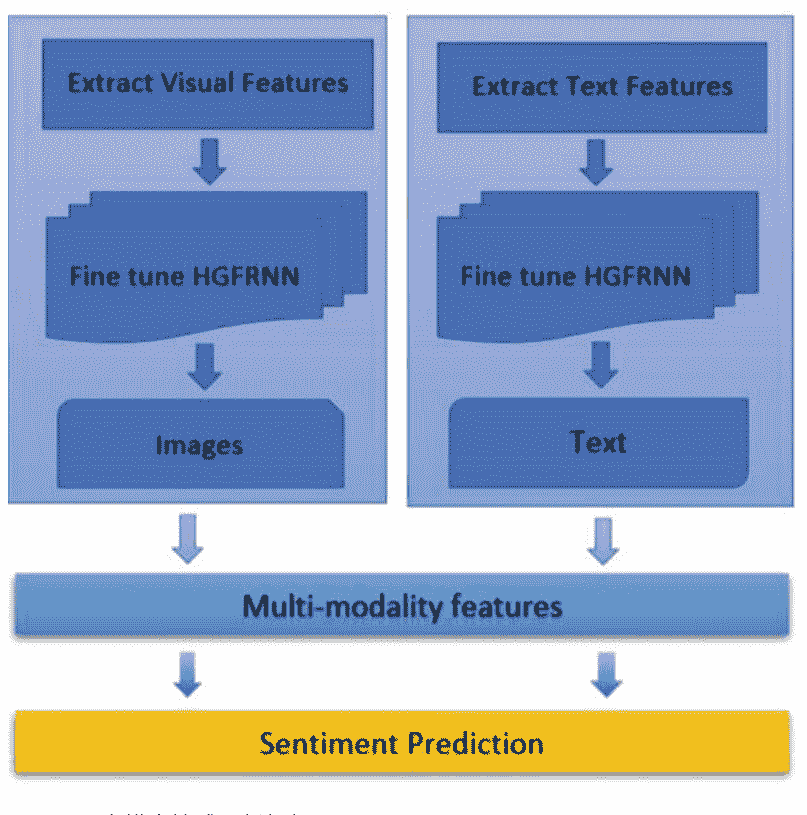

## 图6.8 HGFRNN多模态情感分析框架

HGFRNN_image。通常，GFRNN在有限的标记数据和大量参数的情况下会产生相当多的过拟合。通过HGFRNN_image，这个问题得到了很大程度上的缓解。在这里，网络权重会随机丢弃高达60%（大约），从而进行微调。特征提取器通过融合层和中间连接层使用。融合层的输出通过响应和最大池化分别进行归一化。中间层具有ReLU激活函数，涵盖了softmax和特征提取层。第一个中间连接层有128个值。第二个中间连接层有3或4个值。在HGFRNN的最后一层，放置了softmax函数进行分类。

训练集有几个批次。为了退火初始学习率，选择一个固定的乘数。我们考虑六个时期，即1000-800-600-300-90-40，以定义时间表。初始速率是乘以第一和第二个时期。考虑到第一和第二个时期，初始速率因子为1。第一和第二个时期为0.5。然后，第三个时期使用0.6和0.2作为乘数。第四个时期按顺序考虑乘数0.06、0.02、0.006和0.002。在此之后考虑结果。此外，对于不同的训练阶段，选择了不同大小的小批量，即64-64-64-32-16-16。通过反向传播梯度，使用SGD更新参数。图像的大小被缩小到16×16，没有旋转或缩放，以使训练时间与性能提升平衡。从HGFRNN_image的倒数第二层到最后一层，提取了128长度的视觉特征。

最后，我们考虑多模态融合。在多模态情感分析中，同时使用视觉和文本数据进行信息提取。因此，许多消息中不包含任何附带的图像，这些博客在进行任何训练和测试之前也被考虑在内。在执行任何融合之前，采取的行动步骤如下：

- (a) 对于当前消息博客中的图像，通过视觉和文本情感预测的融合进行情感分析，否则仅使用基于文本的情感预测。
- (b) 使用后期融合来分析模型的性能。
- (c) 使用随机森林回归来执行情感文本的预测，并分别使用相关图像中的任何图像。
- (d) 然后，通过加权学习使用平均策略融合概率结果，考虑标记的数据。

首先介绍了GFRNN，然后是HGFRNN。来自Twitter、Instagram、Viber和Snapchat的输入推文包含文本和图像。文本推文的长度限制为最多140个字符，但图像推文的大小可变。与任何接受固定大小输入并生成固定大小输出的CNN模型相比，HGFRNN在任意长度输出上的工作效果更好[6]。

这使得HGFRNN成为多模态情感分析的更好选择。这在时间上进行扩展，边缘被馈送到下一个时间步。GFRNN中的时间尺度作为时间卷积，基本上是一维卷积，类似于二维空间卷积。在任何情感分析中捕捉长期依赖关系对于GFRNN来说是一个复杂的任务。情感序列既有缓慢移动的部分，也有快速移动的部分。理想情况下，GFRNN可以捕捉到这两种依赖关系。当隐藏的GFRNN部分被分成具有不同时间尺度的组时，GFRNN可以捕捉到这些依赖关系。

## 参考文献

1.  Viber图片： https://www.shutterstock.com/search/viber?page=1&section=1&searchterm=viber&language=en
2.  Snapchat图片： https://knowyourmeme.com/memes/sites/snapchat/photos
3.  Cao, D., Ji, R., Lin, D., Li, S.: 基于视觉情感主题模型的微博图像情感分析。 多媒体工具应用 75(15), 8955-8968 (2016)
4.  Morency, L.P., Mihalcea, R., Doshi, P.: 迈向多模态情感分析：从网络中收集意见。在：国际多模态界面会议论文集，pp. 169–176 (2011)
5.  You, Q., Luo, J., Jin, H., Yang, J.: 跨模态一致回归用于社交媒体的联合视觉文本情感分析。在：第9届国际网络搜索和数据挖掘会议论文集，pp. 13–22 (2016)
6.  Haykin, S.: 神经网络与学习机，第3版。印度普林斯顿大学出版社 (2016)
7.  Chaudhuri, A.: 从神经网络到深度学习网络的旅程：一些思考，技术报告，TH-7069. 比尔拉理工学院梅斯拉，帕特纳校区 (2014)
8.  Chung, J., Ahn, S., Bengio, Y.: 分层多尺度递归神经网络。arXiv:1609.01704v7. (2017)

# 第7章 实验结果

本章突出使用Twitter、Instagram、Viber和Snapchat数据集的实验结果。HGFRNN通过2类（＋ve，－ve）以及3类（＋ve，－ve，无偏）命题[1,2]进行评估。所有实验都使用20折交叉验证。训练和测试数据的组合是随机进行的。一些最佳结果的分割组合是70:30、75:25和80:20。

针对每个分割，进行训练并评估测试数据的预测准确性。根据分割结果进行平均。为了解决结果的差异性，考虑了各种分割进行分析。然而，模型的执行是在相似的分割上进行的。整个实现是在Intel Core i7处理器PC上进行的，配置为8.60 GHz、512 GB RAM和64 MB缓存。

## 7.1 评估指标

HGFRNN通过视觉和文本建模语料库进行评估。在这里，两个任务都通过非连续序列模型来表示。模型训练是为了减少训练序列的负对数似然。这有助于序列模型学习序列的概率分布：

```
math
\min_{\varphi} \frac{1}{N} \sum_{n=1}^{N} \sum_{ts=1}^{TS_n} - \log p(a_{ts}^n | a_1^n, \dots, a_{ts-1}^n; \varphi) \quad\quad (7.1)
```

在这里，φ是模型的参数，N表示训练序列的数量，TS_n是第n个序列的长度。考虑到序列n在时间ts的表示是a_{ts}^n。相应的先前表示为a_1^n, \dots, a_{ts-1}^n。

除此之外，这里还使用了每字符比特数（BPC），其计算公式为：

```
BPC = E[-log₂ p(a_{ts+1}|a_{≤ ts})] (7.2)
```

关于 BPC 的更多细节可参考 [3]。

## 7.2 使用 Twitter 数据集的实验结果

这里，突出显示了使用 Twitter 数据集的实验结果。结果以文本、视觉和多模态情感分析的形式呈现 [4–6]。此外，还进行了实验框架的错误分析。

### 7.2.1 文本情感分析

表 7.1 显示了与基准结果相关的文本结果。通过预训练向量实现了相当大的性能提升。在二分类和三分类评估中，HGFRNN_w_2_v_char 方法获得了更好的结果。与 CBM_text 相比，HGFRNN_w_2_v_char 分别获得了86.6%和78.8%的预测准确率，而 CBM_text 分别为77.5%和66.5% [1]。

在表7.1中，将文本消息分割为英文字符的结果比英文单词更好。考虑到词向量的学习特征，HGFRNN保留了更多关于英文字符的信息，因为英文字符比英文单词更具信息量。在特征提取过程中，英文字符的数量减少了，导致词向量词汇表的大小减小，同时增加了时间和空间方面的开销。这些结果表明，word2vec是一种考虑英文语言情感预测的良好特征提取器。

表7.1 文本方法的准确性（考虑CBM_text）

| 类型 | CBM_text [1] | HGFRNN_w_2_v_phrase |
|------|--------------|---------------------|
| 2类  | .775         | .809                |
| 3类  | .665         | .745                |

HGFRNN_w_2_v_char
| 类型 | 准确性 | 精确度 | 召回率 | F1    |
|------|--------|--------|--------|-------|
| 2类  | .866   | .906   | .886   | .898  |
| 3类  | .788   | –      | –      | –     |

表7.2 视觉方法的准确性（考虑CBM_image）

| 类型 | CBM_image [1] |
|------|---------------|
| 2类  | 低于0.745     |
| 3类  | 低于0.675     |

HGFRNN_w_2_v_image
| 类型 | 准确性 | 精确度 | 召回率 | F1    |
|------|--------|--------|--------|-------|
| 2类  | .809   | .975   | .786   | .875  |
| 3类  | .738   | –      | –      | –     |

表7.3 多模态融合方法的准确性（考虑CBM_fusion）

| 类型 | CBM_fusion [1] |
|------|----------------|
| 2类  | .866           |
| 3类  | .709           |

HGFRNN_w_2_v_fusion
| 类型 | 准确性 | 精确度 | 召回率 | F1    |
|------|--------|--------|--------|-------|
| 2类  | .896   | .969   | .869   | .938  |
| 3类  | .809   | –      | –      | –     |

### 7.2.2 视觉情感分析

表7.2显示了与基准结果相关的文本结果。CBM_image [1]使用与开发的本体相关的检测器库。中层部分弥合了差距，并在当前基准测试中表现出良好的性能。对于2类和3类命题，CBM_image的预测准确率分别低于74.5%和67.5%。HGFRNN学习考虑原始输入数据，并利用DropConnect [7]来解决过拟合问题。HGFRNN视觉方法对于2类和3类命题的预测准确率分别为80.9%和73.8%。表7.2显示了HGFRNN超过基准方法获得的视觉情感预测结果。

### 7.2.3 多模态情感分析

这里呈现了基于融合对比基准方法的结果。从表7.3中可以观察到，基于文本的情感预测比图像更有效。通过网格搜索，在执行融合时，通过将更高的权重分配给基于文本的信息，可以获得融合的优秀结果用于预测的类别概率。HGFRNN和基准方法在2类和3类命题上的实现结果分别为（64%，36%）和（66%，34%）。

从图7.1中可以推断出，通过视觉信息更好地实现情感预测。通过86.6%的结果改进达到了89.6%。

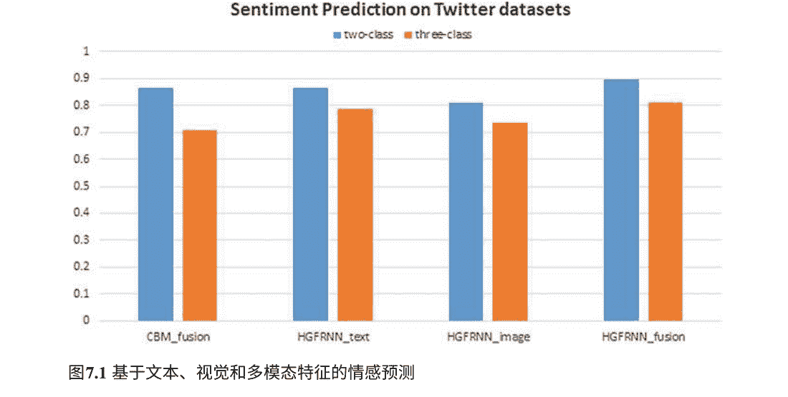

对比基准方法，在2类命题中，HGFRNN的结果改进了。再次，对比基准方法，在3类命题中，HGFRNN的性能从70.9%提高到了80.9%。实验证明，基于文本的情感预测通过视觉对应物得到了很好的补充。这高度有利于多模态情感分析。

从表7.3和图7.1可以看出，HGFRNN在考虑基线技术[1]的情况下，在2类和3类命题方面取得了更好的性能。文本模型利用大规模无标签文本。这种方法学习到的辨别性特征比传统的n-gram特征更多。在这里，通过视觉模型进行的抽象特征提取要好得多。通过具有数十亿参数的深度神经网络更好地解决了过拟合问题。这些代表性特征被组合起来分析情感。这导致了情感预测的巨大改进。

### 7.2.4 错误分析

通过考虑图7.1，对实验框架进行了错误分析。单一视觉情感分析的准确性低于融合技术在2类和3类命题方面的准确性。图7.2突出了基于视觉内容的错误预测。


### 7.3 使用Instagram数据集的实验结果

在这里，我们重点介绍了使用Instagram数据集的实验结果。结果以文本、视觉和多模态情感分析的形式呈现。此外，还对实验框架进行了错误分析。

### 7.3.1 文本情感分析

表7.4显示了与基准结果相关的文本结果。通过预训练向量，取得了相当大的性能提升。在2类和3类评估中，HGFRNN_w_2_v_char方法的结果更好。通过HGFRNN_w_2_v_char，预测准确率分别为86.9%和79.9%，而CBM_text的准确率分别为79.9%和69.9% [1]。

在表7.4中，将文本消息分割成英文字符的结果比英文单词更好。考虑到单词向量的学习特性，HGFRNN保留了更多信息，因为英文字符比英文单词更具信息量。在特征提取过程中，英文字符的数量较少，导致了词向量词汇表的减小，同时增加了时间和空间方面的开销。这些结果表明，word2vec是一种考虑英文语言情感预测的良好特征提取器。

表7.4 考虑CBM_text的文本方法准确率

| 类型 | CBM_text [1] | HGFRNN_w_2_v_phrase |
| :--- | :--- | :--- |
| 2类 | .799 | .869 |
| 3类 | .699 | .789 |

HGFRNN_w_2_v_char
| 类型 | 准确性 | 精确度 | 召回率 | F1 |
| :--- | :--- | :--- | :--- | :--- |
| 2类 | .879 | .916 | .889 | .889 |
| 3类 | .799 | -- | -- | -- |

### 7.3.2 视觉情感分析

表7.5显示了相对于基准结果的文本结果。CBM_image [1]使用与开发的本体相关的检测器库。中级部分弥合了差距，并在当前基准测试中表现良好。对于2类和3类命题，CBM_image的预测准确率分别低于75.6%和66.9%。HGFRNN学习考虑原始输入数据，并利用DropConnect [7]来解决过拟合问题。HGFRNN视觉方法对于2类和3类命题分别达到81.9%和73.9%的预测准确率。表7.5显示HGFRNN超过了基线方法获得的视觉情感预测结果。

表7.5 考虑CBM_image的视觉方法准确率

| 类型 | CBM_image [1] |
| :--- | :--- |
| 2类 | 低于0.756 |
| 3类 | 低于0.669 |

HGFRNN_w_2_v_image
| 类型 | 准确性 | 精确度 | 召回率 | F1 |
| :--- | :--- | :--- | :--- | :--- |
| 2类 | .819 | .969 | .769 | .879 |
| 3类 | .739 | -- | -- | -- |

### 7.3.3 多模态情感分析

这里呈现了基于融合方法对比基准方法的结果。从表7.6中可以观察到，基于文本的情感预测比图像更有效。通过网格搜索，在执行融合时，通过将更高的权重分配给基于文本的信息，可以获得融合的优秀结果对于预测的类别概率。HGFRNN和基准方法在2类和3类命题上取得的结果分别为（65%，35%）和（67%，33%）。

表7.6 考虑CBM_fusion的融合方法准确率

| 类型 | CBM_fusion [1] |
| :--- | :--- |
| 2类 | .799 |
| 3类 | .739 |

HGFRNN_w_2_v_fusion
| 类型 | 准确性 | 精确度 | 召回率 | F1 |
| :--- | :--- | :--- | :--- | :--- |
| 2类 | .899 | .949 | .879 | .939 |
| 3类 | .849 | - | - | - |

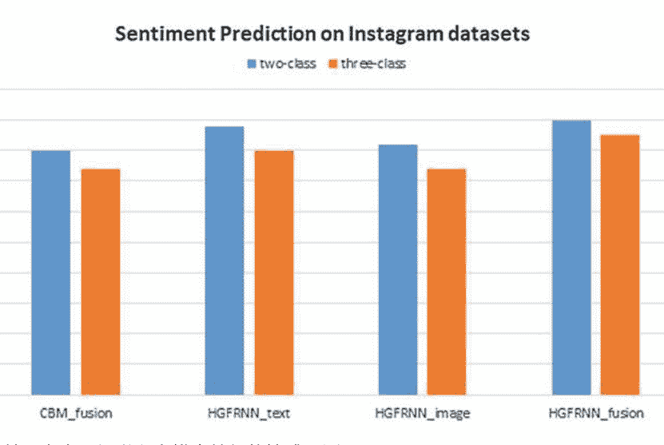

图7.3 基于文本、视觉和多模态特征的情感预测

从图7.3可以推断出，通过视觉信息更好地实现情感预测。在2类命题中，与基准方法相比，HGFRNN的结果从79.9%提高到89.9%。同样，在3类命题中，与基准方法相比，HGFRNN的性能从73.9%提高到84.9%。实验证明，基于文本的情感预测通过视觉对应物得到了很好的补充。这高度有利于多模态情感分析。

从表7.6和图7.4可以看出，相对于基准技术[1]，HGFRNN在2类和3类命题中取得了更好的性能。文本模型利用大规模无标签文本。这种方法学习到的特征比传统的n-gram特征更具有区分性。在这里，通过视觉模型进行的抽象特征提取要好得多。通过具有数十亿参数的深度神经网络更好地解决了过拟合问题。这些代表性特征被组合起来分析情感。这导致了情感预测的巨大改进。


### 7.3.4 错误分析

考虑到图7.3，对实验框架进行了错误分析。单一视觉情感分析的准确性低于融合技术在2类和3类命题中的准确性。图7.4突出显示了基于视觉内容的错误预测。

### 7.4 使用Viber数据集进行的实验结果

本节介绍了使用Viber数据集进行的实验结果。结果以文本、视觉和多模态情感分析的形式呈现。此外，还对实验框架进行了错误分析。

### 7.4.1 文本情感分析

表7.7显示了与基准结果相关的文本结果。通过预训练向量取得了相当大的性能提升。在2类和3类评估中，HGFRNN_w_2_v_char方法取得了更好的结果。通过HGFRNN_w_2_v_char方法，2类和3类的分类准确率分别为84.9%和80.9%，而CBM_text的准确率分别为80.6%和69.6% [1]。

在表7.7中，将文本消息分割为英文字符的结果比英文单词更好。考虑到单词向量的学习特征，HGFRNN保留了更多关于英文字符的信息，因为英文字符比英文单词更具信息量。在特征提取过程中，英文字符的数量减少了，这导致了词向量词汇表的大小减小，同时增加了时间和空间方面的开销。这些结果表明，word2vec是一个考虑英文语言情感预测的良好特征提取器。

表7.7 文本方法的准确率（考虑CBM_text）
| 类型 | CBM_text [1] | HGFRNN_w_2_v_phrase |
| :--- | :--- | :--- |
| 2类 | .809 | .849 |
| 3类 | .696 | .806 |

HGFRNN_w_2_v_char
| 类型 | 准确性 | 精确度 | 召回率 | F1 |
| :--- | :--- | :--- | :--- | :--- |
| 2类 | .869 | .909 | .886 | .879 |
| 3类 | .839 | - | - | - |

### 7.4.2 视觉情感分析

表7.8显示了与基准结果相比的文本结果。CBM_image [1]使用了与开发的本体论相对应的检测器库。中级部分弥补了差距，并在当前基准测试中表现出良好的性能。对于2类和3类命题，CBM_image的预测准确率分别低于75.6%和69.4%。HGFRNN学习考虑了原始输入数据，并利用DropConnect [7]来解决过拟合问题。HGFRNN的视觉方法在2类和3类命题的预测准确率分别达到81.4%和73.4%。表7.8显示，HGFRNN超过了基准方法获得的视觉情感预测结果。

表7.8 视觉方法的准确率（考虑CBM_image）
| 类型 | CBM_image [1] |
| :--- | :--- |
| 2类 | 低于0.756 |
| 3类 | 低于0.694 |

HGFRNN_w_2_v_image
| 类型 | 准确性 | 精确度 | 召回率 | F1 |
| :--- | :--- | :--- | :--- | :--- |
| 2类 | .814 | .979 | .789 | .886 |
| 3类 | .734 | - | - | - |表7.9 融合方法的准确性（考虑CBM_fusion）

| 类型 | CBM_fusion [1] |
|------|----------------|
| 2类  | 0.789          |
| 3类  | 0.736          |

HGFRNN_w_2_v_fusion

| 类型 | 准确性 | 精确度 | 召回率 | F1    |
|------|--------|--------|--------|-------|
| 2类  | 0.899  | 0.976  | 0.875  | 0.940 |
| 3类  | 0.836  | –      | –      | –     |

Sentiment Prediction on Viber datasets

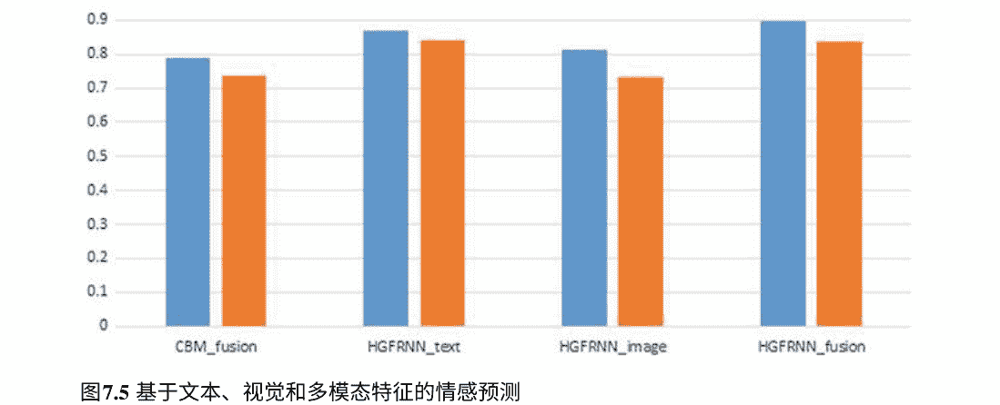

### 7.4.3 多模态情感分析

这里呈现了基于融合的对比基准方法的结果。从表7.9中可以观察到，基于文本的情感预测比图像更有效。通过网格搜索，在执行融合时，通过将更高的权重分配给基于文本的信息，可以获得对融合的出色结果，用于预测的类别概率。HGFRNN和基准方法在2类和3类命题上的实现结果分别为（66%，34%）和（67%，33%）。

从图7.5可以推断出，通过视觉信息更好地实现情感预测。在2类命题中，与基准方法相比，HGFRNN的结果从78.9%提高到89.9%。同样，在3类命题中，与基准方法相比，HGFRNN的性能从73.6%提高到83.6%。实验证明，基于文本的情感预测通过视觉对应物得到了很好的补充。

这高度有利于多模态情感分析。

图7.6负样本和正样本的错误预测

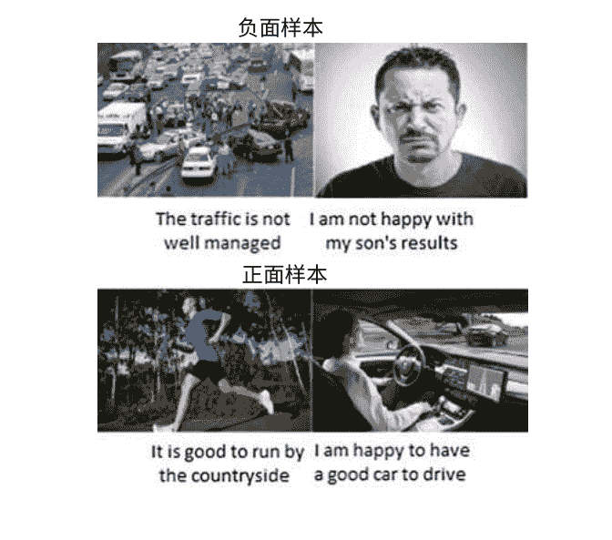

从表7.9和图7.5可以看出，相对于基准技术[1]，HGFRNN在2类和3类命题中取得了更好的性能。文本模型利用大规模无标签文本。这种方法学习到的特征比传统的n-gram特征更具区分性。在这里，通过视觉模型进行的抽象特征提取要好得多。通过具有数十亿参数的深度神经网络更好地解决了过拟合问题。这些代表性特征被组合起来分析情感。这导致了情感预测的巨大改进。

### 7.4.4错误分析

通过考虑图7.5，对实验框架进行了错误分析。单一视觉情感分析的准确性低于融合技术在2类和3类命题中的准确性。图7.6突出显示了基于视觉内容的错误预测。

### 7.5 使用Snapchat数据集的实验结果

在这里，我们呈现了使用Snapchat数据集的实验结果。结果以文本、视觉和多模态情感分析的形式呈现。此外，还对实验框架进行了错误分析。

表7.10考虑CBM_text的文本方法准确率

| 类型 | CBM_text [1] | HGFRNN_w_2_v_phrase |
| :--- | :--- | :--- |
| 2类 | 0.806 | 0.879 |
| 3类 | 0.709 | 0.809 |

**HGFRNN_w_2_v_char**

| 类型 | 准确性 | 精确度 | 召回率 | F1 |
| :--- | :--- | :--- | :--- | :--- |
| 2类 | 0.889 | 0.950 | 0.896 | 0.899 |
| 3类 | 0.839 | – | – | – |

### 7.5.1 文本情感分析

表7.10显示了与基准结果相关的文本结果。通过预训练向量取得了相当大的性能提升。在2类和3类评估中，HGFRNN_w_2_v_char方法取得了更好的结果。通过HGFRNN_w_2_v_char方法，2类和3类的预测准确率分别为87.9%和80.9%，而CBM_text的准确率分别为80.6%和70.9% [1]。

在表7.10中，将文本消息分割为英文字符的结果比英文单词更好。考虑到词向量的学习特征，HGFRNN保留了更多信息，因为英文字符比英文单词更具信息量。在特征提取过程中，较少的英文字符数量减小了词向量词汇表的大小，但增加了时间和空间方面的开销。这些结果表明，word_2_vec是一个很好的特征提取器，可以用于英文情感预测。

### 7.5.2 视觉情感分析

表7.11显示了与基准结果相关的文本结果。CBM_image [1]使用与开发的本体相关的检测器库。中级部分弥合了差距，并在当前基准测试中表现良好。对于2类和3类命题，CBM_image的预测准确率分别低于75.9%和68.9%。HGFRNN学习考虑原始输入数据，并利用DropConnect [7]来解决过拟合问题。HGFRNN视觉方法对于2类和3类命题分别达到81.9%和76.0%的预测准确率。表7.11显示HGFRNN超过了基准方法获得的视觉情感预测结果。

表7.11视觉方法的准确率 (考虑CBM_image)

| 类型 | CBM_image [1] |
| :--- | :--- |
| 2类 | 低于0.759 |
| 3类 | 低于0.689 |

**HGFRNN_w_2_v_image**

| 类型 | 准确性 | 精确度 | 召回率 | F1 |
| :--- | :--- | :--- | :--- | :--- |
| 2类 | 0.819 | 0.979 | 0.790 | 0.890 |
| 3类 | 0.760 | – | – | – |

表7.12融合方法的准确性 (考虑CBM_fusion)

| 类型 | CBM_fusion [1] |
| :--- | :--- |
| 2类 | 0.879 |
| 3类 | 0.746 |

**HGFRNN_w_2_v_fusion**

| 类型 | 准确性 | 精确度 | 召回率 | F1 |
| :--- | :--- | :--- | :--- | :--- |
| 2类 | 0.889 | 0.970 | 0.870 | 0.950 |
| 3类 | 0.849 | – | – | – |

### 7.5.3多模态情感分析

这里呈现了基于融合的对比基准方法结果。从表7.12可以看出，基于文本的情感预测比图像更有效。通过网格搜索，在执行融合时，通过将更高的权重分配给基于文本的信息，可以获得对融合的出色结果。对于2类和3类命题，HGFRNN和基准方法分别达到了（65%，35%）和（67%，33%）的结果。

从图7.7可以推断出，通过视觉信息更好地实现情感预测。在2类命题中，与基准方法相比，HGFRNN的结果提高了87.9%至88.9%。同样，在3类命题中，与基准方法相比，HGFRNN的性能从74.6%提高到84.9%。实验证明，文本情感预测通过视觉对应物得到了很好的补充。

这高度有利于多模态情感分析。
从表7.12和图7.7可以看出，相对于基准技术[1]，HGFRNN在2类和3类命题中取得了更好的性能。文本模型利用大规模无标签文本。这种方法学习到的特征比传统的n-gram特征更具有区分性。在这里，通过视觉模型进行的抽象特征提取要好得多。通过具有数十亿参数的深度神经网络更好地解决了过拟合问题。这些代表性特征被组合起来分析情感。这导致了情感预测的巨大改进。

### 7.5.4错误分析

考虑图7.7，对实验框架进行了错误分析。单一视觉情感分析的准确性低于融合技术在2类和3类命题中的准确性。图7.8中突出显示了基于视觉内容的错误预测。

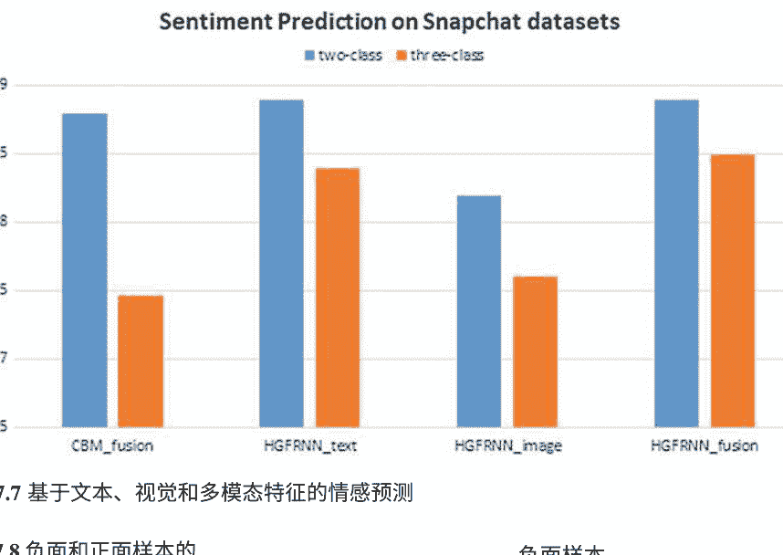


## 参考文献

- 1. Xu, C., Cetintas, S., Lee, K. C., Li, L. J.: 用深度卷积神经网络进行视觉情感预测。 arXiv:1411.5731. (2014)
- 2. Cao, D., Ji, R., Lin, D., Li, S.: 基于视觉情感主题模型的微博图像情感分析。多媒体工具应用。 **75**(15), 8955–8968 (2016)
- 3. Haykin, S.: 神经网络与学习机，第3版。印度Prentice Hall出版社 (2016)
- 4. Chaudhuri, A.: 从神经网络到深度学习网络的旅程：一些思考。技术报告，TH-7069。Birla Institute of Technology Mesra, Patna Campus (2014)
- 5. Chung, J., Ahn, S., Bengio, Y.: 分层多尺度递归神经网络。 arXiv:1609.01704v7. (2017)
- 6. TensorFlow中RNN的开源实现： https://www.tensorflow.org/tutorials/recurrent
- 7. Yu, Y., Lin, H., Yu, Q., Meng, J., Zhao, Z., Li, Y., Zuo, L.: 使用多个深度卷积神经网络对医学图像进行模态分类. 计算机信息系统杂志 **11**(15), 5403–5413 (2015)

# 第8章 结论

在这项研究中，提出了一种用于分析多模态内容情感的新型分层GFRNN模型。考虑到利用大量可用的博客内容进行情感分析，这里使用了多模态技术。GFRNN的学习算法基于不同的时间尺度，它起到了时间卷积的作用，基本上是一维卷积，类似于二维空间卷积。通过HGFRNN通过视觉和文本内容以及两者的融合来分析情感。预测结果围绕文本、视觉和融合组件展开。HGFRNN是GFRNN的分层版本。它考虑了多个递归层堆叠，提供了从上层到下层的信号流，通过连接单元进行控制。GFRNN带来的计算优势推动了HGFRNN的发展。随着数据规模的增加，分层版本提供了更高的基于相似性的分类准确性和执行时间。HGFRNN通过不同类型的递归单元来表示自身。对HGFRNN的层进行自适应分配，以及考虑到连接单元的学习的逐层交互，形成了一种时间方式。所有实验都是在从Twitter、Instagram、Viber和Snapchat准备的数据集上进行的。HGFRNN提取内容特征以分析社交媒体博客中的情感。学习了文本和图像的更高级表示。与任何其他深度学习模型相比，HGFRNN对任意长度的输出效果更好，这些模型接受固定大小的输入并生成固定大小的输出。这使得HGFRNN成为多模态情感分析的更好选择。通过CBM基线方法评估HGFRNN的情感分析结果。使用从Twitter、Instagram、Viber和Snapchat图像中爬取的数据来训练视觉和文本HGFRNN模型。评估使用2类（+ve，-ve）和3类（+ve，-ve，中立）表示进行。评估结果通过离散序列表示，其中模型训练是为了减少相应的负对数似然。使用10折交叉验证进行实验。通过随机划分数据集创建训练和测试数据。对于每个划分，首先进行模型的训练，然后进行测试。

通过测试数据进行预测评估。整体准确率是考虑到的分割的平均值。为了避免任何差异，所有模型都在相同的分割上运行。对HGFRNN的文本、图像和融合版本进行了比较分析，与相应的CBM版本进行了比较。从HGFRNN的视觉和文本版本获得了可观的结果。通过引入视觉内容，进一步提高了性能水平。然后，分析了图像和文本内容的融合。实验结果表明，HGFRNN版本优于基准方法。结果证明，多模态模型相比独立的视觉和文本情感分析提供了更好的结果。未来的研究将考虑开发基于软计算的深度学习集成，以提高情感预测准确性。

# 附录

推特图片


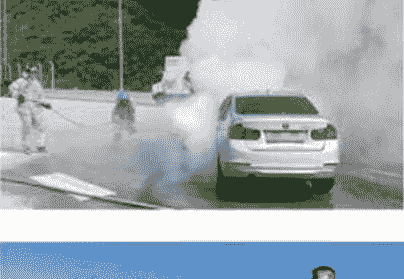


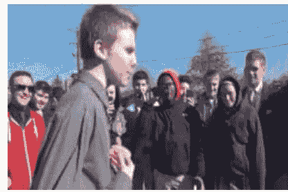


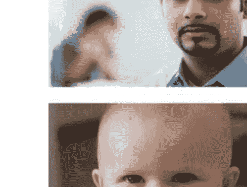


## Instagram图片

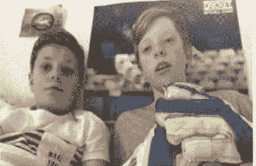


经过检查，您提供的“原始OCR文本”中仅包含图片的链接和引用，并未包含任何由OCR识别出的实际文字内容（例如形近字、段落、标题等）。

因此，我无法执行您所要求的OCR后处理任务（如纠正文字错误、合并段落、识别标题等）。

如果您能提供包含实际识别文字的OCR结果文本，我将非常乐意为您进行处理。您可以检查OCR工具的输出设置，确保导出的是可编辑的文本内容而非图片占位符。