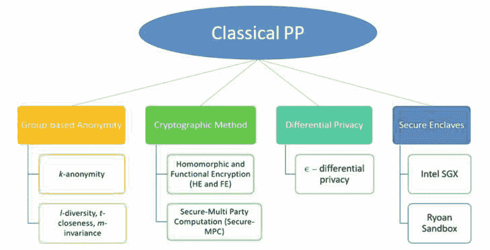
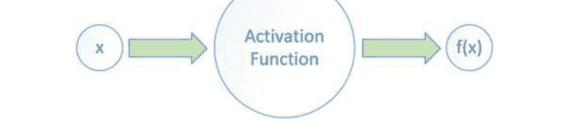
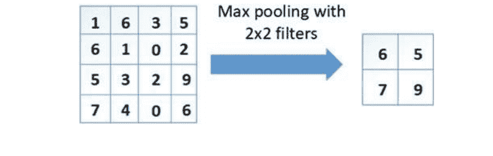
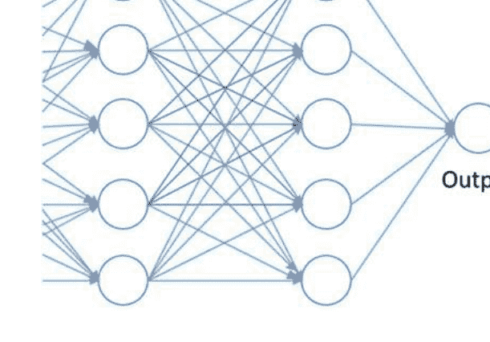
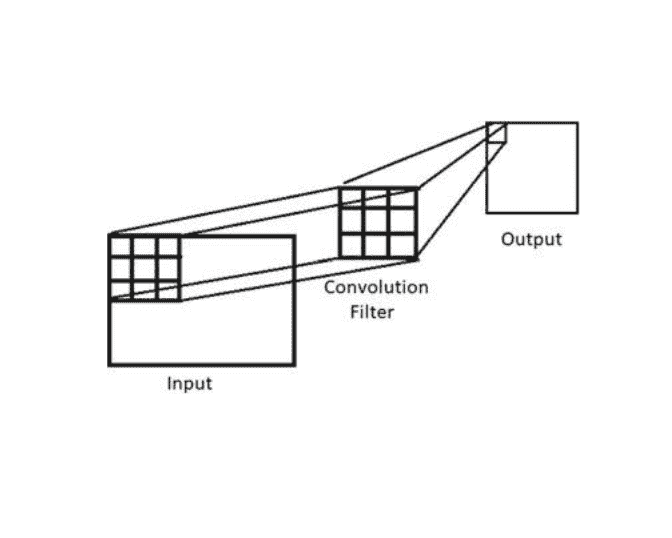
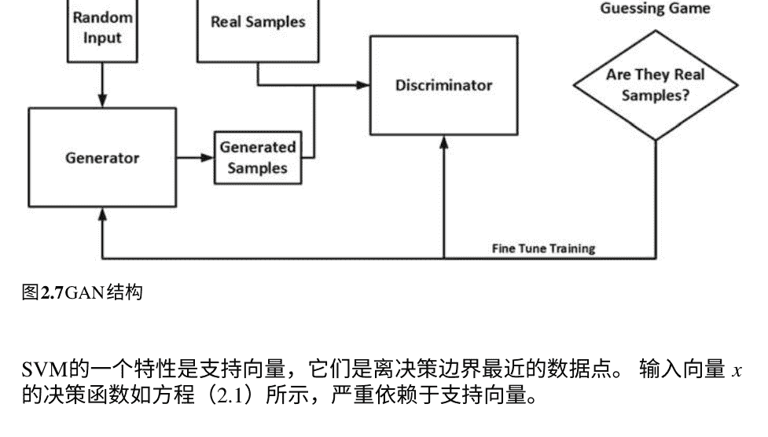
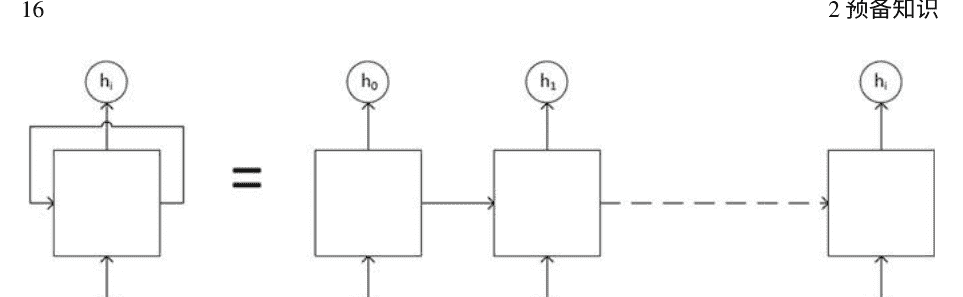
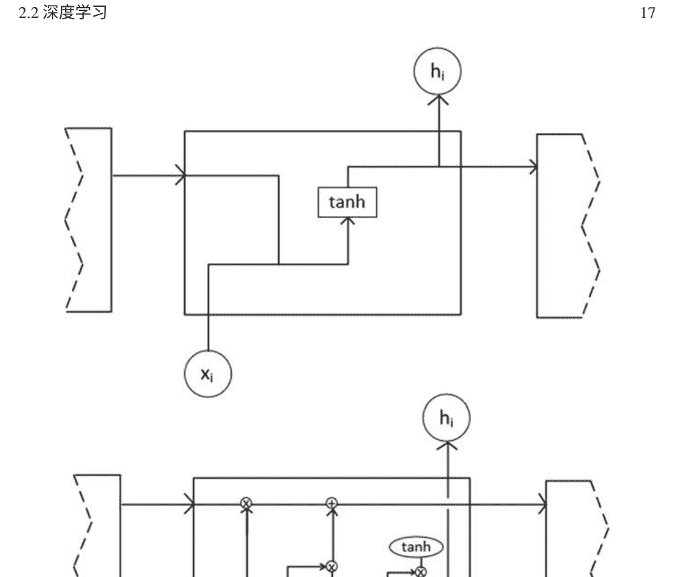
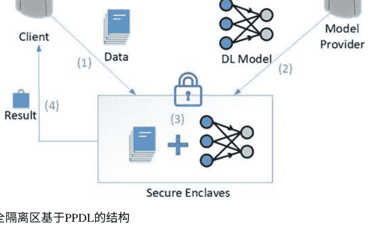
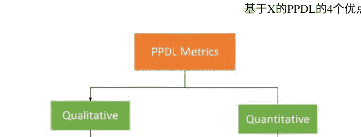

# 隐私保护深度学习：一项全面的调查


Kwangjo Kim
Harry Chandra Tanuwidjaja

# 斯普林格关于网络与系统安全的简报

# 主编

杨翔，斯威本科技大学数字研究与创新能力平台，澳大利亚维多利亚州霍桑

# 系列编辑

Liqun Chen，萨里大学计算机科学系，英国吉尔福德
Kim-Kwang Raymond Choo，德克萨斯大学圣安东尼奥分校信息系统系，美国德克萨斯州圣东尼奥
Sherman S. M. Chow，香港中文大学信息工程系，香港
Robert H. Deng，新加坡管理大学信息系统学院，新加坡
Dieter Gollmann，计算机科学系，马拉加大学，马拉加，西班牙
雷恩奎，布法罗大学，纽约州布法罗，美国
周建英，信息通信安全部，信息通信研究所新加坡，新加坡

该系列旨在发展和传播对于网络与系统安全相关研究和学习的创新、范式、技术和技术的理解。

它发表了关于网络安全的最新主题的全面而连贯的概述，以及复杂的技术、原创研究报告和深入的案例研究。该系列还提供了对于先进和及时出现的主题的单一覆盖，以及对于尚未达到成熟水平的核心概念的论坛。

它解决了网络与系统安全中的安全、隐私、可用性和可靠性问题，并欢迎与网络安全研究相关的人工智能、云计算、网络物理系统和大数据分析等新兴技术。主要关注以下研究主题：

# 基础和理论
- 密码学与网络安全
- 网络安全理论
- 可证明安全性

# 网络与系统安全
- 网络系统安全
- 网络安全
- 安全服务
- 社交网络安全与隐私
- 网络攻击与防御
- 数据驱动的网络安全
- 可信计算与系统

# 应用与其他
- 硬件和设备安全
- 网络应用安全
- 网络安全的人类和社会因素

有关该系列的更多信息，请访问http://www.springer.com/series/15797

Kwangjo Kim · Harry Chandra Tanuwidjaja

# 隐私保护的深度学习：综合调查

Kwangjo Kim，计算机学院，韩国科学技术高级学院，大田，韩国（共和国）
Harry Chandra Tanuwidjaja，计算机学院，韩国科学技术高级学院，大田，韩国（共和国）

ISSN 2522-5561          ISSN 2522-557X（电子版）
斯普林格关于网络与系统安全简报
ISBN 978-981-16-3763-6    ISBN 978-981-16-3764-3（电子书）
https://doi.org/10.1007/978-981-16-3764-3

© 作者（们），独家许可给 Springer Nature Singapore Pte Ltd. 2021。本作品受版权保护。出版商独家授权所有权，无论是全部还是部分材料，特别是翻译、重印、插图重用、朗诵、广播、微缩胶片复制或以任何其他实体方式复制、传输或信息存储和检索、电子适应、计算机软件，或通过类似或不同的已知或今后开发的方法。

本出版物中使用的一般描述性名称、注册名称、商标、服务标志等，并不意味着即使在没有特定声明的情况下，这些名称免于相关的保护法律和法规，并因此可供普遍使用。

出版商、作者和编辑可以安全地假设本书中的建议和信息在出版日期时是真实准确的。出版商、作者或编辑对本书中所包含的材料不提供任何明示或暗示的保证，也不对可能存在的任何错误或遗漏负责。出版商在已发表的地图和机构关系方面保持中立。

这本斯普林格印记由注册公司斯普林格自然新加坡私人有限公司出版。注册公司地址为：新加坡189721，海滩路152号，#21-01/04 Gateway East。

感谢我们的朋友和家人给予的可爱支持。

# 前言

本专著旨在系统地结合经典的隐私保护和密码协议与深度学习，对隐私保护深度学习（PPDL）的最新技术进行概述。

谷歌和微软在2019年初宣布对PPDL进行了大规模投资，随后谷歌在2019年6月发布了基于安全多方计算（Secure MPC）和同态加密（HE）的开源PPDL工具“Private Join and Compute”。PPDL的一个主要问题是其适用性，例如理论与实践之间的差距。为了解决这个问题，有许多依赖于经典隐私保护方法（HE、安全MPC、差分隐私、安全隔离区和其混合）以及深度学习的进展。PPDL的基本架构是构建一个云框架，使得在保持训练数据在客户端设备上的同时实现协作学习。模型完全训练后，在敏感数据交换或存储过程中必须严格保护隐私，并且整体框架必须适用于实际应用。

本专著旨在提供隐私保护和深度学习的基本理解，然后全面概述PPDL方法的现状，指出每种方法的优缺点，并介绍基于联邦学习和分割学习的最新进展，称为隐私保护联邦学习（PPFL）。此外，本专著还为一般人员、学生和对PPDL感兴趣的从业人员提供指南，并帮助早期研究人员探索PPDL领域。我们希望早期研究人员能够掌握PPDL的基本理论，了解当前PPDL和PPFL方法的优缺点，解决最新方法在理论和实践之间的差距，从而能够提出自己的方法。

大田，韩国（共和国）
2021年3月

Kwangjo Kim
Harry Chandra Tanuwidjaja

# 致谢

本专著部分得到韩国科学技术部（MSIT）信息与通信技术促进研究所（IITP）资助（编号2017-0-00555，面向量子世界中基于格的可证明安全多方认证密钥交换协议和编号2019-0-01343，区域战略产业融合安全核心人才培养业务）

作者真诚感谢加密与信息安全实验室（CAISLAB）的可爱校友和成员，包括但不限于Rakyong Choi、Jeeun Lee、Seunggeun Baek、Muhamad Erza Aminanto和Edwin Ayisi Opare，他们自愿提供帮助并进行了激动人心的讨论。

特别是，我们要特别感谢印度尼西亚教育基金会（LPDP）在哈里·钱德拉·塔努维达贾攻读博士学位期间对他的支持。我们衷心感谢本专著系列的编辑们给予的宝贵意见，以及斯普林格给予我们撰写和出版本专著的机会。

最后，我们也非常感谢我们的家人在位于韩国中心的灵山脚下给予我们坚定的支持和无尽的爱。

# 目录

### 1 引言
### 1.1 背景
### 1.2 动机
### 1.3 大纲
### 参考文献

### 2 预备知识
### 2.1 经典隐私保护技术
#### 2.1.1 基于群体的匿名性
#### 2.1.2 密码学方法
#### 2.1.3 差分隐私
#### 2.1.4 安全飞地
### 2.2 深度学习
#### 2.2.1 深度学习概述
#### 2.2.2 深度学习层
#### 2.2.3 卷积神经网络 (CNN)
#### 2.2.4 生成对抗网络 (GAN)
#### 2.2.5 支持向量机
#### 2.2.6 循环神经网络
#### 2.2.7 K均值聚类
#### 2.2.8 强化学习
### 参考文献

### 3 基于X的隐私保护深度学习
### 3.1 基于HE的隐私保护深度学习
### 3.2 基于安全多方计算的隐私保护深度学习
### 3.3 基于差分隐私的隐私保护深度学习
### 3.4 基于安全隔离的隐私保护深度学习
### 3.5 基于混合的隐私保护深度学习
### 参考文献

### 4 X-Based隐私保护深度学习的优缺点
### 4.1 比较指标
#### 4.2 X-Based隐私保护深度学习的比较
#### 4.3 X-Based隐私保护深度学习的弱点和可能的解决方案
#### 4.3.1 模型参数传输方法
#### 4.3.2 数据传输方法
#### 4.3.3 分析和总结
### 参考文献

### 5 隐私保护联邦学习
### 5.1 概述
### 5.2 功能特定的隐私保护联邦学习
#### 5.2.1 公平性
#### 5.2.2 完整性
#### 5.2.3 正确性
#### 5.2.4 自适应性
#### 5.2.5 灵活性
### 5.3 应用特定的隐私保护联邦学习
#### 5.3.1 移动设备
#### 5.3.2 医学影像
#### 5.3.3 交通流量预测
#### 5.3.4 医疗保健
#### 5.3.5 Android恶意软件检测
#### 5.3.6 边缘计算
### 5.4 总结
### 参考文献

### 6 对深度学习的攻击及其对策
### 6.1 针对PPDL的对抗模型
#### 6.1.1 基于行为的对抗模型
#### 6.1.2 基于能力的对抗模型
#### 6.1.3 基于破坏类型的对抗模型
### 6.2 PPDL的安全目标
### 6.3 对PPDL的攻击
#### 6.3.1 成员推断攻击
#### 6.3.2 模型反演攻击
#### 6.3.3 模型提取攻击
### 6.4 对策和防御机制
### 参考文献

## 总结和进一步工作

# 缩略词
- **ABE**: 基于属性的加密
- **ADPPL**: 自适应差分隐私保护学习
- **AI**: 人工智能
- **ANN**: 人工神经网络
- **CNN**: 卷积神经网络
- **DNN**: 深度神经网络
- **DP**: 差分隐私
- **EDPR**: 欧洲通用数据保护条例
- **FE**: 功能加密
- **FHE**: 完全同态加密
- **GAN**: 生成对抗网络
- **GCD**: 最大公约数
- **GRU**: 门控循环单元
- **HBC**: 诚实但好奇
- **HE**: 同态加密
- **IBE**: 基于身份的加密
- **物联网**: 物联网
- **k最近邻**: k最近邻
- **LDP**: 本地差分隐私
- **LSH**: 局部敏感哈希
- **LSTM**: 长短期记忆网络
- **LWE**: 误差学习
- **MDP**: 马尔可夫决策过程
- **MLaaS**: 机器学习即服务
- **MPC**: 多方计算
- **NN**: 神经网络
- **OT**: 遗忘传输
- **PATE**: 教师集成的私有聚合
- **PoC**: 客户隐私
- **PoM**: 模型隐私
- **PoR**: 结果的隐私
- **PP**: 隐私保护
- **PPDL**: 隐私保护深度学习
- **PPFL**: 隐私保护联邦学习
- **PPRL**: 隐私保护强化学习
- **ReLU**: 修正线性单元
- **Ring-LWE**: 含有错误的环学习
- **RL**: 强化学习
- **RNN**: 循环神经网络
- **RPAT**: 随机化隐私保护调整技术
- **安全多方计算**: 安全多方计算
- **SGD**: 随机梯度下降
- **SGX**: 软件保护扩展
- **SIMD**: 单指令多数据
- **SVM**: 支持向量机
- **SVM-RFE**: 支持向量机递归特征消除
- **TEEs**: 可信执行环境

## 第1章 引言

摘要 本章提供了一个介绍性讨论，解释了为什么每个人的隐私都如此重要，并讨论了隐私保护深度学习的部署，因为它发展了人工智能并具有各种实现的性能优势。

### 1.1 背景

每个人都可以拥有自己的私人信息，例如姓名、出生日期、性别、出生地、父母姓名、爱好、品味、临床数据、国籍和个人身份证号等等。由于缺乏私人数据，单个个人的私人数据很难确定他或她的身份。部分个人的私人数据的组合可以轻松确定一个人。如果一个人去世了，我们通常不需要考虑他/她的隐私的有效性。信息持有者可以决定将他们的数据公开，但某些敏感信息必须安全和私密地保留或处理，以免泄露他们的隐私，这可以被解释为“离我远点”或“让我保持私密”。

为了从互联网上的远程服务器获得访问权限，客户端首先必须在初始注册时向服务器提交其唯一的个人身份数据，然后服务器必须将这些敏感数据以不可识别（加密）的形式保存在安全区域中，假设我们可以完全信任服务器或没有内部攻击。下一步是在两方之间执行的挑战-响应或Sigma协议：客户端和服务器使用唯一的挑战数据来获得与服务器的可靠连接。敏感的个人数据与唯一的时间戳或随机数连接在一起，可以在每次访问尝试中用于身份验证过程，以防止窃听者进行重放攻击。在这种身份验证中，我们需要记住非法黑客可能有意侵入服务器，并试图获取所有客户的私人数据，以非法收集资金或执行冒充，以伪装成合法的客户向服务器发送请求。通过这种黑客攻击，隐私问题可能会独立于客户的严重警惕性而产生。

### 1.2 动机

云计算环境可以建模为三方协议；数据所有者、云服务器和统计分析师。由于个人数据的增加，数据所有者希望将重要数据保存在承诺正确和安全维护用户数据的云服务器上。统计分析师希望从存储在云服务器上的所有数据中获取按需统计数据，以维护公共安全、政策、普查等。数据所有者倾向于不情愿地将他们的私人数据提交给统计分析师等第三方。由于云计算服务器端的妥协，数据泄露的风险也会发生。用户选择不将他们的机密数据存储在云中，因为他们担心云服务器内部人员可能查看或泄露他们的私人数据。

为了说服用户关于他们的数据安全和隐私，必须考虑使用保护隐私的数据的方法，通过将加密的私人数据发送到云服务器。从存储在云服务器上的加密数据中，统计分析师很难获得正确的统计数据。在这种情况下，我们需要同时考虑隐私和公共利益这两个目标，就像一箭双雕一样。根据中国谚语，我们需要准备一种特殊工具来处理加密数据，使用同态加密。同态加密是一种非常特殊的加密方式，允许在加密数据上执行所需的计算，如加法或乘法。

密码学在2000年无处不在，这意味着每个人都可以使用安全通信，并理解密码学对个人业务在互联网上的重要性。安全在2010年无处不在。隐私在2015年无处不在。

当数据在不同方之间交换或通信时，必须对该数据提供安全保障，以使其他方不知道原始方之间传递的数据。保护数据意味着使用多种方法隐藏数据挖掘的输出知识，当这些输出数据具有价值和私密性时。主要有两种技术用于此，一种是输入隐私，通过使用不同的技术对数据进行操作，另一种是输出隐私，通过改变数据以隐藏规则（What is Privacy preserving Technique 2021）。如果考虑的数据涉及个人隐私，我们称之为隐私保护（PP）。

如今，互联网与人类生活密不可分。通过Facebook、Twitter或云服务器，互联网上的数据交换速率已经以惊人的速度增加。这导致了亟需解决的隐私问题。根据2021年的大数据市场规模，全球大数据市场规模在2015年达到了256.7亿美元，并预计在预测期间将出现显著增长。虚拟在线办公室数量的增加以及社交媒体的日益流行产生了大量的数据，这是推动增长的主要因素。由于无限通信、丰富的信息和资源、便捷的共享和在线服务等多种优势，互联网普及率不断提高，每天都会产生大量的数据，这也预计将推动需求增长。

最近在欧盟引入了《欧洲通用数据保护条例》（2016年），对存储和交换个人可识别数据和与个人健康相关的数据要求进行严格的监管，需要进行身份验证、授权和问责。

人工智能（Artificial Intelligence）最初是由计算机科学家提出的，目的是使计算机程序能够像正常人一样进行推理和行为。AI这个术语已经被改为机器学习（Machine learning，ML），它是人工智能的一个子集。由于深度神经网络的最新进展，深度学习（Deep Learning，DL）这个术语变得最流行，它属于一类机器学习，因为深度学习采用了连续的信息处理阶段的层次化方式进行模式分类或表示学习。

根据Deng和Yu（2014）的说法，深度学习近年来之所以备受关注，有三个重要原因。首先，处理能力（例如GPU单元）大幅提升。其次，计算硬件变得更加经济实惠，第三个原因是机器学习研究的最新突破。浅层学习和深度学习的区别在于它们的信用分配路径的深度，信用分配路径是一系列可能可学习的因果链接，连接了行动和效果。通常，深度学习在图像分类结果中起着重要作用。此外，深度学习还常用于语言、图形建模、模式识别、语音、音频、图像、视频、自然语言和信号处理。现在，机器学习已经无处不在，包括安全和隐私。

如今，由于全球COVID-19大流行，世界上的每个人都非常关注防止他们的隐私被追踪，这对公共卫生非常必要。在现代生活中，保护隐私免受黑客的侵害也变得非常重要。

为了解决这些问题，已经开发了几种隐私保护深度学习技术，包括安全多方计算和神经网络中的同态加密。还有几种修改神经网络的方法，使其可以在隐私保护环境中使用。然而，在各种技术中，隐私和性能之间存在一种权衡。

在本书中，我们调查了隐私保护深度学习的最新技术，从隐私和性能的角度评估了所有方法，比较了每种方法的优缺点，并解决了隐私保护深度学习领域的挑战和问题，包括联邦学习隐私保护。

请注意，本专著的早期版本已经在Tanuwidjaja等人（2020）中发表，但本专著的内容通过添加更多最新出版物和我们的新分析得到了显著改进。

### 1.3 大纲

本专著的大纲如下：

本章介绍了为什么每个生活个体的隐私如此重要，并讨论了隐私保护深度学习的部署。由于其人工智能的发展和各种实现的性能优势，深度学习在隐私保护方面具有重要意义。

第2章首先介绍了隐私保护技术和深度学习的基本理解。我们介绍了经典的隐私保护方法，包括基于群体匿名、密码学方法、差分隐私和安全区域，具体取决于如何实现隐私保护机制。我们还简要介绍了深度学习技术的概念，包括其大纲和基本层、卷积神经网络、生成对抗网络、支持向量机、循环神经网络、k均值聚类和强化学习。

第3章我们调研了基于同态加密、安全多方计算、差分隐私、安全区域等的基于X的隐私保护深度学习方法的最新出版物，并总结了所有调研出版物的关键特点，包括学习类型和数据集。

第4章讨论了所有隐私保护深度学习方法的比较，重点介绍了每种方法基于隐私参数、使用特定神经网络和数据集类型的优缺点。我们还提供了对每种隐私保护深度学习方法弱点的分析，并提出了解决这些弱点的可行方案。

第5章介绍了隐私保护联邦学习在多方之间协调方式中的新兴应用。我们建议使用特定功能的隐私保护联邦学习（PPFL）来提供公平性、完整性、正确性、适应性和灵活性。应用特定的PPFL包括移动设备、医学影像、交通流预测和医疗保健、Android恶意软件检测以及边缘计算。

第6章根据隐私保护深度学习的行为对对手模型进行分类，定义了机器学习作为服务的隐私保护深度学习的主要安全目标，讨论了可能对机器学习作为服务的隐私保护深度学习进行的攻击，并详细解释了对抗攻击的保护措施。

最后在后记中，提出了总结性的评论，并提出了有趣的进一步挑战。我们希望这本专著不仅能够更好地理解隐私保护深度学习和隐私保护联邦学习，还能促进未来的研究活动和应用开发。

### 参考文献

大数据市场规模、份额和趋势分析报告，按硬件、服务、终端使用、地区和细分预测，2018年至2025年，Grand View Research (2021)。https://www.grandviewresearch.com/industry-analysis/big-data-industry

邓力，于冬 (2014) 深度学习：方法与应用。Found Trends Signal Process 7(3–4):197–387

GDPR (2016) Intersoft Consulting. https://gdpr-info.eu

### 参考文献

Tanuwidjaja HC, Choi R, Baek S, Kim K (2020) 面向机器学习的隐私保护深度学习——综合调查。 IEEE Access, vol 8, pp 167,425–167,447.

什么是隐私保护技术，IGI Global (2021)。 [https://www.igi-global.com/dictionary/privacy-preserving-technique-ppt/58814](https://www.igi-global.com/dictionary/privacy-preserving-technique-ppt/58814)

## 第二章 初步


摘要 本章提供了关于隐私保护技术和深度学习的基本理解。我们介绍了经典的隐私保护方法，包括基于群体匿名、密码学方法、差分隐私和隔离区，具体取决于如何实现隐私保护机制。我们还简要介绍了深度学习技术的概念，包括其概述和基本层，卷积神经网络、生成对抗网络、支持向量机、循环神经网络、k均值聚类和强化学习。

我们可以将经典的隐私保护方法分为四类，如图2.1所示，包括基于群体匿名、密码学方法、差分隐私和隔离区，具体取决于如何实现隐私保护机制。

### 2.1 经典隐私保护技术

#### 2.1.1 基于群体的匿名性

1983年，著名的密码学家（Chaum 1983）提出了使用常见的公钥加密系统（例如RSA或DSA）进行盲签名的想法，以实现用户（银行客户）对签名者（银行）的消息匿名性，而不泄露消息内容。盲签名可以用于提供不可链接性，防止签名者将其签名的盲目消息与后来的非盲目版本关联起来。这种盲签名在制作电子现金、电子投票和电子拍卖等方面非常有用，其中秘密持有人可以提供随机消息以进行秘密通信，同时保持用户的隐私。

该应用程序可以扩展以提供数据所有者在公共数据库中的匿名性，其他人极难指定数据所有者，通过引入一些特殊手段使其匿名化。

k-匿名性的概念最早由Samarati和Sweeney（1998）在1998年提出，用于解决问题：“给定敏感个人数据，生成仍然有用但无法指定相应人员的修改数据。”



图2.1 经典PP分类

如果修改后的数据中的信息无法与至少k-1个体的信息区分开来，则称修改后的数据具有k-匿名性。虽然k-匿名性是一种简单且有前景的基于群体的匿名化方法，但当攻击者拥有背景知识时，它容易受到同质性攻击或背景知识攻击的影响。为了克服这些问题，有许多隐私定义，例如l-多样性、t-接近性和m-不变性。l-多样性的概念意味着每个等价类的每个敏感属性都至少具有l个不同的值，而t-接近性是l-多样性的进一步细化，同时还保持了敏感属性的分布。这些概念的应用有限，因为数据本身并未加密，但实现起来非常简单。

#### 2.1.2 密码学方法

##### 2.1.2.1 同态和功能加密

虽然同态加密、功能加密和安全多方计算技术可以在不泄露原始明文的情况下对加密数据进行计算，但我们需要保护敏感个人数据（如医疗和健康数据）的隐私。保护这些敏感个人数据的最早里程碑之一是使用数据匿名化技术隐藏这些数据。

在Rivest等人（1978年）质疑是否有任何加密方案可以在不知道加密信息的情况下支持对加密数据的计算。

如果某个加密方案支持对加密数据进行算术运算。（Enc（m1∘m2）），则称该方案为同态加密（HE）在一个操作∘上。根据HE支持的计算类型而定。如果它只支持特定计算上的加密数据，那么它被称为部分HE；如果它支持任何类型的计算，则被称为完全HE（FHE）。例如，著名的RSA加密具有乘法HE。同样，如果一个方案支持对加密数据进行加法而无需解密，则被称为加法HE，如Pailler密码系统（Pailler 1999）。

全同态加密（Fully Homomorphic Encryption，FHE）的设计在密码学领域一直是一个有趣的开放问题，直到Gentry在2009年提出了第一个创新性的FHE方案。此后，基于格与学习差错（Learning With Errors，LWE）和环学习差错（Ring Learning With Errors，Ring-LWE）问题的同态加密方案以及基于近似最大公约数（Greatest Common Divisor，GCD）问题的整数方案得到了大量研究（Cheon等，2013年；Van Dijk等，2010年；Brakerski和Vaikuntanathan，2014年、2011年；Gentry等，2013年；Brakerski等，2014年；Fan和Vercauteren，2012年；Clear和Goldrick，2017年；Chillotti等，2016年、2020年）。早期的同态加密研究工作在实现上不切实际，然而现在已经有了一些支持高效同态加密的密码算法库，例如HElib、FHEW和HEEAN（Halevi和Shoup，2014年；Ducas和Micciancio，2015年；Cheon等，2017年）。

功能加密（FE）是由Sahai和Waters（2005）在2005年提出的，并在2011年由Boneh等人正式化。设功能F: K×X→{0,1}*。功能F是对(K,X)的确定性函数，输出{0,1}*，其中K是密钥空间，X是明文空间。如果一个方案可以在给定x∈X的密文和密钥skk的情况下计算F(tk,tx)，我们称该方案对(K,X)上的功能F是FE的。

谓词加密（Boneh和Waters2007）是具有多项式时间谓词P: K×I→{0,1}的FE方案的子类，其中K是密钥空间，I是索引集，明文x∈X被定义为(ind,m)；X是明文空间，ind是索引，m是有效载荷消息。例如，我们可以定义FE功能F_FE(tk∈K,(ind,m)∈X)=m或⊥，具体取决于谓词P(tk,ind)是否为1或0。根据谓词的选择，基于身份的加密（IBE）（Shamir1984;Boneh and Franklin 2001; Waters 2005; Gentry 2006; Gentry et al. 2008; Canetti et al. 2003; Agrawal et al. 2010）和基于属性的加密（ABE）（Sahai and Waters 2005; Goyal et al. 2006）是谓词加密方案的著名示例。

前向加密（FE）和同态加密（HE）都可以对加密数据进行计算。不同之处在于，FE的计算输出是明文，而HE的输出仍然保持加密状态，因为HE在不解密的情况下评估加密数据。HE系统内不需要可信任的机构。此外，如果给定skg，HE可以对加密数据进行任意电路的评估，而FE只能计算某些函数。

##### 2.1.2.2 安全多方计算

多方计算 (MPC) 的目的是解决在没有使用任何可信第三方的情况下，保持群组中一个诚实/不诚实用户的隐私的协作计算问题。形式上，在MPC中，对于给定数量的参与者，p₁, p₂, …, pₙ，每个参与者分别拥有私有数据，d₁, d₂, …, dₙ。然后，参与者希望计算公共函数f在这些私有数据上的值f(d₁, d₂, …, dₙ)，同时保持自己的输入秘密。

安全计算的概念在1986年由姚期智（1986年）引入，他发明了混淆电路（GC）作为安全两方计算的形式。姚期智的GC只需要固定数量的通信轮次，并且所有函数都可以描述为布尔电路。为了隐秘地传输信息，使用了遗忘传输（OT）协议。OT协议允许接收方 P_R 在发送方 P_S 的一组消息 M 中隐秘地选择 i 并接收消息 m_i。接收方 P_R 不知道 M 中的其他消息，而发送方 P_S 不知道所选择的消息。

秘密分享是安全多方计算协议的另一个构建块，例如，Gol-dreich等人（1987年）提出了一种使用秘密分享值计算值的简单交互式安全多方计算协议。秘密分享是一种密码算法，其中一个秘密被分割并分发给每个参与者。为了重构原始值，需要最少数量的秘密分享值。

与HE和FE方案相比，在安全MPC中，各方共同使用协议计算其输入的函数，而不是单个方。在这个过程中，各方的秘密信息不能泄露。在安全MPC中，每个方的计算成本几乎为零，但通信成本很高，而在HE方案中，服务器的计算成本很高，但通信成本几乎为零。

各方加密其数据并将其发送给服务器。服务器计算数据和第一层权重值之间的内积，并将计算结果发送回各方。然后，各方解密结果并计算非线性转换。结果再次加密并传输给服务器。这个过程一直持续到计算完最后一层。要将安全MPC应用于深度学习，我们必须处理通信成本，因为它需要各方和服务器之间多轮的通信，这是不可忽视的。

#### 2.1.3 差分隐私

差分隐私 (DP) 最早由Dwork等人在2006年提出，作为一种强大的标准来保证数据的隐私。如果对于所有数据集D₁和D₂，它们之间最多只有一个元素不同，并且对于所有子集S∈Range(im A)，其中im A表示A的图像，一个随机算法A给出差分隐私，那么

```
Pr[𝒜(D₁) ∈ S] ≤ exp(ε) · Pr[𝒜(D₂) ∈ S]
```

差分隐私解决了当一个可信的数据管理者想要发布一些数据的统计信息时，对手不能揭示某个个体的信息是否在计算中使用。因此，差分隐私算法可能抵抗识别和重新识别攻击。

齐等人（2020）提出了最新的差分隐私技术实现的一个例子。他们建议使用局部敏感哈希（LSH）技术为推荐系统提供一种隐私保护方法，该方法更有可能将两个相邻的点分配给相同的标签。因此，敏感数据可以转化为不太敏感的数据。

#### 2.1.4 安全飞地

安全飞地，也被称为可信执行环境（TEEs），是一种安全的硬件方法，提供了飞地来保护代码和数据免受相关平台上的其他软件（包括操作系统和虚拟机监视器）的侵害（Hunt等人，2018年）。飞地的概念最早由英特尔（2014年）引入，引入了软件保护扩展（SGX），从Skylake一代开始，英特尔处理器上就有了SGX（Doweck等人，2017年）。仅仅使用SGX来进行隐私保护在安全和隐私角度上是不够的，因为来自服务器提供者的代码是不可信的。SGX只能保护在不可信平台上执行的可信代码。如果代码是公开的，用户可以检查代码，那么这个代码被称为可信代码。如果代码是私有的，用户无法确保代码不会窃取他们的数据。因此，SGX需要被限制在一个沙盒中，以防止数据泄露。Hunt等人（2018年）是SGX最广泛使用的沙盒。Ryoan沙盒还可以使用户在不看到模型规范的情况下验证飞地执行标准的机器学习代码。因此，SGX和Ryoan沙盒的结合可以保证客户端和机器学习模型的隐私。

### 2.2 深度学习

#### 2.2.1 深度学习概述

PPDL是经典DL方法的一种发展。它将经典的PP方法与新兴的DL领域相结合。DL本身是机器学习的一个子类，其结构和功能类似于人脑。深度学习模型的结构被建模为分层架构。它从输入层开始，以输出层结束。在输入层和输出层之间，可以有一个或多个隐藏层。使用更多隐藏层，DL模型变得更准确。这是由隐藏层的特性引起的。一个隐藏层的输出将成为下一个隐藏层的输入。如果我们使用更多隐藏层，深层隐藏层将学习更多特定的特征。有几种广泛用于PP的DL方法。根据我们的研究，最流行的PP DL方法是深度神经网络（DNN），卷积神经网络（CNN）和生成对抗网络（GAN）。

#### 2.2.2 深度学习层

##### 2.2.2.1 激活层

激活层如图2.2所示，决定数据是否被激活（值为1）或未激活（值为0）。激活层是一个非线性函数，对卷积层的输出应用数学处理。有几种著名的激活函数，如修正线性单元（ReLU）、Sigmoid和双曲正切。因为这些函数不是线性的，如果我们使用这些函数来计算同态加密数据，复杂度会变得非常高。因此，我们需要找到一个只包含乘法和加法运算的替代函数。替代函数将在后面讨论。

##### 2.2.2.2 池化层

池化层如图2.3所示，是一个用于减小数据尺寸的采样层。有两种池化方法：最大池化和平均池化。在同态加密中，我们不能使用最大池化函数，因为我们无法搜索加密数据的最大值。因此，平均池化是在同态加密中实现的解决方案。平均池化计算值的总和；因此，这里只有加法运算，可以用于同态加密数据。





##### 2.2.2.3 全连接层

图2.4显示了全连接层的示意图。该层中的每个神经元都与前一层的神经元相连，因此被称为全连接层。
连接表示特征的权重，类似于完全二进制图。该层中的操作是前一层输出神经元的值与神经元权重之间的点积。这个函数类似于神经网络（NN）中的隐藏层。只有一个点积函数，由乘法和加法函数组成；因此，我们可以在同态加密数据上使用它。

##### 2.2.2.4 丢弃层

丢弃层，如图2.5所示，是为了解决过拟合问题而创建的一层。
有时候，当我们训练机器学习模型时，分类结果对某些类型的数据来说可能过于好，显示出基于训练集的偏见。这种情况并不理想，在测试阶段会产生较大的误差。Dropout层在训练过程中会随机丢弃数据并将其设置为零。通过在训练期间进行迭代操作，我们可以防止过拟合现象的发生。

图2.4全连接层



图2.5 Dropout层


#### 2.2.3 卷积神经网络 (CNN)

CNN（LeCun等，1999年）是一种通常用于图像分类的DNN类别。CNN的特点是卷积层，如图2.6所示，其目的是学习从数据集中提取的特征。卷积层具有n × n的大小，在这个大小上，我们将对相邻值进行点积运算，进行卷积操作。因此，在卷积层中只发生加法和乘法运算。我们不需要修改这个层，因为它可以用于同态加密的HE数据。

#### 2.2.4 生成对抗网络 (GAN)

GAN（Goodfellow等人，2014年）是一种通常用于无监督学习的DNN类别。如图2.7所示，GAN由两个生成候选模型和评估模型的神经网络组成，采用零和博弈框架。生成模型将从数据集中学习样本，直到达到一定的准确性。另一方面，评估模型区分真实数据和生成的候选模型。GAN通过对各个类别的分布进行建模来学习过程。

#### 2.2.5 支持向量机

监督式支持向量机通常用于分类或回归任务。如果n是输入特征的数量，则支持向量机将每个特征值绘制为n维空间中的坐标点。随后，通过找到区分两个类别的超平面来执行分类过程。尽管支持向量机可以处理任意复杂度的非线性决策边界，但我们使用线性支持向量机，因为数据集的性质可以通过线性判别分类器进行研究。线性支持向量机的决策边界是二维空间中的一条直线。主要的计算





图2.7GAN结构

SVM的一个特性是支持向量，它们是离决策边界最近的数据点。输入向量 x 的决策函数如方程（2.1）所示，严重依赖于支持向量。

```
$$D(x) = wx + b$$ (2.1)
$$w = \sum_k \alpha_k y_k x_k$$ (2.2)
$$b = (y_k - w x_k)$$ (2.3)
```

方程（2.2）和（2.3）分别显示了w和b的相应值。从方程（2.1）可以看出，输入向量x的决策函数 D(x)是由权重向量和输入向量 x的乘积之和以及偏置值定义的。权重向量 w是训练模式的线性组合。具有非零权重的训练模式是支持向量。偏置值是边际支持向量的平均值。

SVM-递归特征消除（SVM-RFE）是使用权重的大小进行排名聚类的RFE应用（Guyon等人，2002年）。RFE对特征集进行排名，并消除对分类任务贡献较小的低排名特征（Zeng等人，2009年）。

#### 2.2.6 循环神经网络

循环神经网络（RNN）是神经网络的扩展，具有循环链接以处理序列信息。这些循环链接位于较高层和较低层神经元之间，使RNN能够将数据从之前的事件传播到当前事件。这个特性使得RNN具有时间序列事件的记忆



（Staudemeyer，2015年）。图2.8显示了RNN左侧的单个循环，当循环中断时，它与右侧的拓扑结构相似。
RNN的一个优点是能够将先前的信息连接到当前任务；然而，它无法达到“远”先前的记忆。这个问题通常被称为长期依赖性。长短期记忆网络（LSTM）是由Hochreiter和Schmidhuber（1997）引入的，用于克服这个问题。LSTM是RNN的扩展，具有四个神经网络在一个单一层中，而RNN只有一个，如图2.9所示。

LSTM的主要优点是存在状态单元，它是通过每一层顶部传递的线。这个单元负责将信息从上一层传播到下一层。然后，LSTM中的“门”将管理哪些信息将被传递或丢弃。有三个门来控制信息的流动，即输入门、遗忘门和输出门（Kim等，2016）。这些门由一个Sigmoid神经网络和一个运算符组成，如图2.9所示。

#### 2.2.7 K均值聚类

K均值聚类算法将所有观测数据迭代地分组为k个簇，直到达到收敛。最终，一个簇包含相似的数据，因为每个数据都进入最近的簇。K均值算法将簇成员的均值作为簇质心。在每次迭代中，它计算观测数据到任何簇质心的最短欧氏距离。此外，通过迭代更新簇质心，还可以最小化簇内方差。当达到收敛时，算法终止，新的簇与上一次迭代的簇相同（Jiang等，2017年）。



> > 图2.9 RNN拓扑结构（上）与LSTM拓扑结构（下）（Olah，2015年）

#### 2.2.8 强化学习

强化学习（RL）采用与监督学习和无监督学习不同的方法。在RL中，一个代理被指派为目标类别的责任，在监督学习中为每个实例提供正确的对应类别。代理人负责决定执行任务的动作（Olah 2017）。由于没有涉及训练数据，代理人在强化学习训练过程中通过经验进行学习。学习过程采用试错方法，在训练过程中实现目标，即获得长期和最高的奖励。强化学习训练通常被描述为一种玩家在途中获得一些小分数并最终获得终极奖励的方式。

玩家（或强化学习代理人）将探索达到最终奖励的方式。有时，代理人会因为追求小分数而陷入困境。因此，在强化学习中，需要探索新的方式，尽管已经达到了小分数。通过这种方式，代理人可以在最后获得终极奖励。换句话说，代理人和游戏环境形成了一个信息的循环路径，代理人执行动作，环境根据相应的动作提供反馈。达到最终奖励的过程可以使用马尔可夫决策过程（MDP）进行形式化。在MDP中，我们可以为每个状态建模转移概率。目标函数现在可以通过使用MDP来很好地表示。实现这个目标函数有两种标准解决方案，即Q学习和策略学习。前者基于动作值函数进行学习，而后者使用策略函数进行学习，策略函数是最佳动作和相应状态之间的映射。更详细的解释可以在Olah（2017）中找到。

总结一下，表2.1显示了深度学习模型中常用的层。

**表2.1 深度学习模型中常用的层**

| 深度学习层 | 描述 | 功能 |
|------------|------|------|
| 激活函数 | ReLU | 最大值 |
|  | Sigmoid | 双曲线 |
|  | 双曲正切 | 三角函数 |
|  | Softmax | 双曲线 |
| 池化 | 最大池化：计算前一层中重叠区域的最大值 | 最大值 |
| 池化 | 平均池化：计算前一层中非重叠区域的平均值 | 平均值 |
| 全连接 | 输出神经元值与前一层神经元权重的点积 | 矩阵-向量乘法 |
| Dropout | 在训练过程中将随机数据设为零，以防止过拟合 | 丢弃 |
| 卷积 | 邻居值之间的点积，用于卷积，然后将结果求和 | 加权求和 |

### 参考文献

Agrawal S, Boneh D, Boyen X (2010)在标准模型中的高效格子(H)IBE。 在: 年度国际密码技术理论和应用会议。 斯普林格，pp 553-572

Boneh D, Franklin M (2001) 基于身份的加密与Weil配对 在: 年度国际密码学会议。 斯普林格，第213-229页

Boneh D, Sahai A, Waters B (2011) 功能加密：定义和挑战 在: 密码学理论会议。 斯普林格，第253-273页

Boneh D, Waters B (2007) 加密数据上的连结、子集和范围查询 在: 密码学理论会议。 斯普林格，第535-554页

Brakerski Z, Vaikuntanathan V (2014) 高效的全同态加密（标准）LWE。 SIAM J Comput 43 (2) : 831-871

Brakerski Z, Gentry C, Vaikuntanathan V (2014) (分层) 无需引导的全同态加密 ACM 计算理论交易 (TOCT) 6 (3) : 13

Brakerski Z, Vaikuntanathan V (2011) “基于环-LWE的完全同态加密和针对密钥相关消息的安全性。 在:密码学进展-CRYPTO。 斯普林格，pp505-524

Canetti R, Halevi S, Katz J (2003) 一种前向安全的公钥加密方案。 在:密码技术的理论和应用国际会议。 斯普林格，pp 255-271

Chaum D (1983) 用于不可追踪支付的盲签名。 在:密码学进展。 斯普林格，pp 199-203

Cheon JH, Coron J-S, Kim J, Lee MS, Lepoint T, Tibouchi M, Yun A (2013) 批量整数全同态加密。 在:密码技术的年度国际会议。 斯普林格，pp 315-335

Cheon JH, Kim A, Kim M, Song Y (2017) 用于近似数的同态加密。 在:密码学与信息安全的理论和应用国际会议。 斯普林格，pp 409-437

Chillotti I, Gama N, Georgieva M, Izabachène M (2020) TFHE:快速完全同态加密 在环上. J Cryptol 33(1):34-91

Chillotti I, Gama N, Georgieva M, Izabachène M (2016) 更快的完全同态加密:在不到0.1秒内引导. 在:国际密码学与信息安全理论与应用会议. 斯普林格, pp 3-33

Clear M, Goldrick CM (2017) 基于属性的完全同态加密与有界 输入数量. Int J Appl Cryptogr 3(4):363-376

Doweck J, Kao W-F, Lu AK-Y, Mandelblat J, Rahatekar A, Rappoport L, Rotem E, Yasin A, Yoaz A (2017) 第六代英特尔酷睿内部:代号为skylake的新微架构. IEEE Micro 37(2):52-62

Ducas L, Micciancio D (2015) FHEW: 在不到一秒钟内引导同态加密。 在: 年度国际密码技术理论和应用会议。 斯普林格, 第617-640页

Dwork C, McSherry F, Nissim K, Smith A (2006) 在私人数据分析中校准噪声和敏感性。 在: 密码学理论会议。 斯普林格,第265-284页

Fan J, Vercauteren F (2012) 稍微实用的全同态加密。 IACR Cryptol ePrint Arch 2012:144

Gentry C (2006) 实用的基于身份的加密，无需随机神谕。 在: 年度国际密码技术理论和应用会议。 斯普林格, 第445-464页

Gentry C (2009) 使用理想格的全同态加密。 在: 年度ACM理论计算机科学研讨会。 ACM, 第169-178页

Gentry C, Peikert C, Vaikuntanathan V (2008) 用于困难格子和新的密码构造的陷阱门。 在: 年度ACM理论计算研讨会。 ACM, pp 197-206

Gentry C, Sahai A, Waters B (2013) “基于学习与错误的同态加密：概念上更简单，渐近更快，基于属性的。 在：密码学进展-CRYPTO。斯普林格，pp 75–92

Goldreich O, Micali S, Wigderson A (1987) 如何玩任何心理游戏。 在：第十九届ACM理论计算研讨会。pp 218–229

Goodfellow I, Pouget-Abadie J, Mirza M, Xu B, Warde-Farley D, Ozair S, Courville A, Bengio Y (2014) 生成对抗网络。 在：神经信息处理系统进展。 pp 2672–2680

Goyal V, Pandey O, Sahai A, Waters B (2006) 基于属性的加密用于细粒度访问控制加密数据。 在：第13届ACM计算机和通信安全会议论文集。第89-98页

Guyon I, Weston J, Barnhill S, Vapnik V (2002) 使用支持向量机进行癌症分类的基因选择。 机器学习46(1-3)： 389-422

Halevi S, Shoup V (2014) HElib中的算法。 在：国际密码学会议。斯普林格，第554-571页

Hochreiter S, Schmidhuber J (1997) 长短期记忆。 神经计算9(8)： 1735-1780

Hunt T, Zhu Z, Xu Y, Peter S, Witchel E (2018) Ryoan: 用于不受信任的计算的分布式沙盒秘密数据。 ACM计算机系统交易(TOCS) 35(4)： 1-32

Hunt T, Song C, Shokri R, Shmatikov V, Witchel E (2018) Chiron: 隐私保护的机器学习作为一种服务。 arXiv:1803.05961

Intel R (2014) 软件保护扩展编程参考。 Intel 公司

Jiang C, Zhang H, Ren Y, Han Z, Chen K-C, Hanzo L (2017) 用于下一代无线网络的机器学习范式。 IEEE 无线通信 24(2):98–105

Kim J, Kim J, Thu HLT, Kim H (2016) 长短期记忆循环神经网络分类器用于入侵检测。 在：2016年平台技术与服务国际会议(PlatCon)。 IEEE， 页1–5

LeCun Y, Haffner P, Bottou L, Bengio Y (1999) 基于梯度学习的目标识别。 在：计算机视觉中的形状、轮廓和分组。斯普林格，第319-345页

Li N, Li T, Venkatasubramanian S (2007) t-接近度：超越k-匿名性和l-多样性的隐私。 在：2007年IEEE第23届国际数据工程会议。 IEEE，第106-115页

Machanavajjhala A, Kifer D, Gehrke J, Venkitasubramaniam M (2007) l-多样性：超越k-匿名性的隐私。 ACM Trans Knowl Discov Data (TKDD) 1 (1) ： 3-ES

Olah C (2015) 理解LSTM网络。 http://colah.github.io/posts/2015-08-Understanding-LSTMs/ 访问日期： 2018年2月20日

Olah C (2017) 人类的机器学习。 https://www.dropbox.com/s/e38nil1dn17481q/machine_learning.pdf?dl=0. 访问日期：2018年3月21日

Paillier P (1999) 基于复合度残余类的公钥密码系统。 在: 密码技术的理论和应用国际会议。斯普林格，第223-238页

Qi L, Zhang X, Li S, Wan S, Wen Y, Gong W (2020) 带隐私保护的时空数据驱动服务推荐。 信息科学515:91-102

Rivest RL, Adleman L, Dertouzos ML (1978) 关于数据银行和隐私同态的研究。 Found Secur Comput 4(11):169-180

Sahai A, Waters B (2005) 模糊身份基加密。 在：年度国际密码技术理论和应用会议。 斯普林格，第457-473页

Samarati P, Sweeney L (1998) 在披露信息时保护隐私: k-匿名性及其通过概括和抑制的执行

Shamir A (1984) 基于身份的加密系统和签名方案。 在：密码技术的理论和应用研讨会。斯普林格，第47-53页。

Staudemeyer RC (2015) 将长短期记忆循环神经网络应用于入侵检测。 南非计算机杂志56(1)： 136-154

Van Dijk M, Gentry C, Halevi S, Vaikuntanathan V (2010) 整数上的全同态加密。 在：密码技术的理论和应用国际年会。斯普林格，第24-43页。

Waters B (2005) 无随机神谕的高效基于身份的加密。 在：密码技术的理论和应用国际年会。斯普林格，第114-127页。

Xiao X, Tao Y (2007) M-不变性：面向隐私保护的动态数据再发布。在：2007年ACM SIGMOD国际数据管理会议论文集。第689-700页。

Yao A-C (1986) 如何生成和交换秘密。 在：计算机基础科学，第27届年度研讨会。IEEE 1986年：162-167

Zeng X, Chen Y-W, Tao C, Van Alphen D (2009) 使用递归特征消除进行特征选择-手写数字识别。 在：智能信息隐藏和多媒体信号处理 (IIH-MSP) 的论文集，日本京都。IEEE, pp 1205-1208

## 第3章 基于X的PPDL

摘要我们调查了基于同态加密、安全多方计算、差分隐私、安全飞地及其混合的基于X的隐私保护深度学习方法的最新出版物，并总结了所有调查出版物的关键特点，包括学习类型和数据集。

### 3.1 基于HE的隐私保护深度学习

基于HE的PPDL将HE与深度学习相结合。基于HE的PPDL的结构如图3.1所示。一般来说，基于HE的PPDL有三个阶段：训练阶段（T1-T2-T3-T4），推理阶段（I1-I2-I3）和结果阶段（R1-R2-R3）。在训练阶段，客户端使用HE对训练数据集进行加密（T1），并将加密的数据集发送到云服务器（T2）。在云服务器上，执行安全训练（T3），得到一个训练好的模型（T4）。这是训练阶段的结束。在推理阶段，客户端将测试数据集发送到云服务器（I1）。测试数据集成为训练模型的输入（I2）。然后，使用训练模型运行预测过程（I3），得到加密计算结果。这是推理阶段的结束。接下来，云服务器准备将加密计算结果（R1）传输并发送给客户端（R2）。客户端最终解密并获得计算结果（R3）。

### 2016年相关出版物

Gilad-Bachrach等人（2016）提出了Cryptonets来解决机器学习作为服务（MLaaS）中的隐私问题。作者结合了密码学和机器学习，提出了一个可以接收加密数据作为输入的机器学习框架。Cryptonets改进了由Graepel等人开发的ML Confidential（2012），这是一种基于线性平均分类器（2002）和Fisher线性判别（2006）的修改后的PPDL方案，适用于HE。ML Confidential使用多项式逼近来替代非线性激活函数。在这种情况下，PoM不能得到保证，因为客户端必须生成

图3.1 基于同态加密的隐私保护深度学习结构

基于模型的加密参数。 ML Confidential使用基于云服务的场景，其主要特点是在客户端和服务器之间的传输期间确保数据的隐私。首先，云服务器为每个客户端生成一个公共密钥和私钥。然后，使用同态加密对客户端数据进行加密并传输到服务器。云服务器将使用加密数据执行训练过程，并使用训练模型对测试数据集进行分类。

Cryptonets应用基于加密数据的预测，并将预测结果以加密形式提供给用户。随后，用户可以使用他们的私钥解密预测结果。通过这样做，客户的隐私和结果的隐私得到了保证。然而，模型的隐私并没有得到保证，因为客户必须基于模型生成加密参数。Cryptonets的弱点是由于复杂性问题导致的性能限制。它在具有大量非线性层的深度神经网络上效果不佳。在这种情况下，准确性将降低，错误率将增加。

Cryptonets在准确性和隐私之间存在权衡。这是由于在训练阶段使用低次多项式逼近激活函数所导致的。为了达到良好的准确性，神经网络需要再次使用明文进行重新训练，使用相同的激活函数。Cryptonets的另一个弱点是神经网络层数的限制。具有多层乘法级别的同态加密无法在具有多层的深度神经网络上运行。Faster Cryptonets（2018）通过修剪网络参数来加速Cryptonets（2016）中的同态评估，从而可以省略许多乘法操作。Faster Cryptonets的主要弱点是容易受到成员推断攻击（Fredrikson等人，2015年）和模型窃取攻击（Tramèr等人，2016年）的威胁。

### 2017年相关出版物

Aono17（2017年）是基于简单神经网络结构的PPDL系统。作者在Shokri和Shmatikov（2015年）的论文中展示了一个泄露客户数据的弱点。这个弱点被称为梯度泄露信息。它是一种通过计算相应真实函数的权重梯度和相应真实函数的偏置梯度来获取输入值的对抗方法。如果我们将这两个结果相除，我们就可以得到输入值。因为这个原因，Aono17（2017年）提出了一种修订的PPDL方法来克服这个弱点。关键思想是允许云服务器通过累积用户的梯度值来更新深度学习模型。作者还利用加法同态加密来保护梯度值免受好奇的服务器的攻击。然而，这种方法实际上仍然存在一个弱点，因为它不能防止参与者之间的攻击。

云服务器应该对参与者进行适当的身份验证，以防止此漏洞。通过加密梯度值，这种方法能够防止数据泄露。然而，它有一些限制，因为HE只与参数服务器兼容。

Chabanne17（2017年）是DNN上的PP方案。该方案是HE和CNN的结合体。其主要思想是将Cryptonets（2016年）与Ioffe和Szegedy（2015年）提出的多项式逼近的激活函数和批归一化层相结合。该方案旨在改善Cryptonets的性能，因为当模型中的非线性层数较少时，Cryptonets的性能才好。主要思想是通过在池化层和激活层之间添加批归一化层来改变常规NN的结构。最大池化不是线性函数。因此，在池化层中，使用平均池化代替最大池化，以为同态部分提供线性函数。批归一化层有助于限制每个激活层的输入，从而得到稳定的分布。低阶多项式逼近具有较小的误差，在这个模型中非常适用。训练阶段使用常规激活函数，测试阶段使用多项式逼近作为非线性激活函数的替代。Chabanne17表明他们的模型达到了99.30%的准确率，这比Cryptonets（98.95%）要好。该模型的优点是在具有大量非线性层的NN中仍能提供高于99%的准确率，而Cryptonets在非线性层数增加时准确率会下降。Chabanne17的弱点在于分类准确率依赖于激活函数的逼近。如果逼近函数的阶数较高，将很难获得最佳逼近，从而准确率会降低。

CryptoDL（2017年），由Hesamifard等人提出，是一种用于加密数据的修改版CNN。CNN的激活函数部分被低次多项式替代。该论文表明，在HE环境中，多项式逼近对NN是不可或缺的。作者尝试近似三种激活函数：ReLU，sigmoid和tanh。该近似技术基于激活函数的导数。首先，在训练阶段，使用具有多项式逼近的CNN。然后，在训练过程中生成的模型

使用该阶段对加密数据进行分类。作者将CryptoDL方案应用于MNIST数据集，并实现了99.52%的准确率。该方案的弱点是没有涵盖DNN中的PP训练。PP仅应用于分类过程。这项工作的优点是每次预测很多实例（8,192个或更多），而DeepSecure（2018）每轮只能分类一个实例。因此，我们可以说CryptoDL比DeepSecure更有效。CryptoDL的弱点被认为是DNN中层数的限制。随着层数的增加，由于HE操作的复杂性呈乘法增加，降低了其性能，就像Cryptonets（2016）一样。

### 2018年相关出版物

在TAPAS（2018年）中，作者解决了PPDL中全同态加密的弱点，该方法需要大量时间来评估加密数据的深度学习模型（Chillotti等人，2016年）。作者开发了一个深度学习架构，包括全连接层、卷积层和批量归一化层（Ioffe和Szegedy，2015年），并使用稀疏化加密计算来减少计算时间。这里的主要贡献是在二进制神经网络中加速二进制计算的新算法（Kim和Smaragdis，2016年；Hubara等人，2017年）。

TAPAS的另一个优势是支持并行计算。该技术可以通过同时评估同一级别的门来进行并行化计算。TAPAS的一个严重限制是它只支持二进制神经网络。为了克服这个限制，需要一种加密非二进制或实值神经网络的方法。

FHE DiNN（2018）是一个将FHE与离散化神经网络结合的PPDL框架。它解决了PPDL中HE的复杂性问题。FHE-DiNN提供了一个与网络深度线性复杂度相关的神经网络。换句话说，FHE-DiNN具有尺度不变性。通过在离散化神经网络上进行引导过程，实现了线性性。加权和和符号激活函数使其值在 -1和1之间。符号激活函数将保持线性增长，不会失控。激活函数的计算将在引导过程中执行，以刷新密文，减少其累积噪声。当我们将离散化神经网络与标准神经网络进行比较时，有一个主要区别：FHE DiNN中的权重、偏置值和激活函数的定义域需要进行离散化。符号激活函数用于限制信号在 -1和1范围内的增长，显示其线性尺度不变性特性。与Cryptonets（2016）相比，FHE DiNN成功提高了FHE的速度并降低了复杂性，但准确性有所降低；因此存在一种权衡。该方法的弱点在于离散化过程中使用的符号激活函数导致准确性下降。如果训练过程直接在离散化神经网络中执行，而不是将常规网络转换为离散化网络，效果会更好。

## 2019年相关出版物

E2DM (2018) 将图像数据集转换为矩阵。这样做的主要目的是减少计算复杂性。E2DM展示了如何将多个矩阵加密成一个密文。它扩展了一些基本的矩阵操作，如矩阵乘法和转置，以进行高级操作。不仅数据被加密，模型也被同态加密。因此，PoC和PoM得到了保证。E2DM还满足了PoR，因为只有客户端可以解密预测结果。对于深度学习部分，E2DM利用了具有一个卷积层、两个全连接层和一个平方激活函数的CNN。E2DM的缺点是它只能支持简单的矩阵操作。

扩展高级矩阵计算将是一个有前途的未来工作。

Xue18 (2018) 试图增强当前PPDL方法的可扩展性。提出了一个具有多密钥同态加密的PPDL框架。它的主要目的（Xue等，2018年）是为大规模分布式数据提供分类服务。例如，在预测道路条件的情况下，NN模型必须从许多驾驶员的交通信息数据中进行训练。对于深度学习结构，（Xue等，2018年）需要对传统的CNN架构进行修改，如将最大池化改为平均池化，在每个激活函数层之前添加批归一化层，并用低次数逼近多项式替换ReLU激活函数。这里保证了PoC和PoR。然而，该方法的模型隐私性不能得到保证，因为客户端必须基于模型生成加密参数。这种方法的缺点是在训练阶段必须使用加密数据来训练神经网络。因此，如果没有采取适当的对策，可能会发生隐私泄露。

Liu18 (2018) 是一种使用HE的卷积网络的PP技术。该技术使用包含手写数字的MNIST数据集。Liu18 (2018) 使用HE加密数据，然后使用加密数据训练CNN。随后，使用CNN模型进行分类和测试过程。其思想是在每个激活层之前添加批归一化层，并使用高斯分布和泰勒级数来近似激活层。非线性池化层被具有增加步幅的卷积层替代。

通过这样做，作者成功地修改了CNN以与HE兼容，在测试阶段达到了98.97%的准确率。在PP技术中，常规CNN和修改后的CNN的主要区别在于添加了批归一化层，并将激活层和池化层中的非线性函数改为线性函数。从复杂性角度来看，所提出的方法存在弱点，因为HE具有巨大的计算开销，导致内存开销巨大。

## 2019年相关出版物

CryptoNN (2019年) 是一种利用功能加密进行算术计算的隐私保护方法。FE方案将数据以特征向量的形式存储在矩阵中，以保护数据。通过这样做，可以在加密形式下执行神经网络训练的矩阵计算。CryptoNN的训练阶段包括两个主要步骤：安全的前馈步骤和安全的反向传播步骤。CNN模型适应了五个主要函数：点积函数、加权求和函数、池化函数、激活函数和损失函数。在前馈阶段，由于向量值被加密，无法直接进行权重值和特征向量的乘法运算。因此，使用一个函数派生的密钥来转换权重值，使其可以计算。然而，CryptoNN的可扩展性仍然存在问题，因为他们实验中使用的数据集比较简单。需要使用更复杂的数据集和更深层的神经网络模型进行测试。

Zhang19（2019年）是一种用于保护云计算中数据隐私的安全聚类方法。该方法将概率C-Means算法（Krishnapuram和Keller 1996）与BGV加密方案（Hesamifard等, 2017年）相结合，在云环境中进行基于HE的大数据聚类。选择BGV作为该方案的主要原因是它能够确保对加密数据的计算得出正确结果。作者还解决了概率C-Means算法的弱点，该算法非常敏感，需要正确初始化。为了解决这个问题，将模糊聚类（Gustafson和Kessel 1978）和概率聚类（Smyth 2000）结合起来。在训练过程中，有两个主要步骤：计算权重值和更新矩阵。为此，将激活函数的泰勒近似作为函数使用，因为它是多项式函数，只涉及加法和乘法运算。主要的弱点是由于HE的特性，计算成本将与神经网络层数成正比增加。

## 2020年相关出版物

Saerom20（2020年）提出了一种使用支持向量机（SVM）进行机器学习训练的HE算法。这项工作是第一个在SVM上实现HE的实用方法。实验结果表明，所提出的方法在真实世界数据集上成功地优于当前的逻辑回归分类器。他们成功解决了由于加密领域中的低效操作而出现的约束优化问题，引入了最小二乘SVM算法。最小二乘SVM算法基于最小二乘问题的梯度下降理论。所提出的方法的另一个贡献是通过实现并行计算来适应多类分类问题。

CryptoRNN（2020年）提出了一种使用HE在循环神经网络（RNN）上的PP框架。所提出的方法成功地在RNN上实现了加密学习，同时解决了加密操作中噪声增加和HE操作中激活函数的兼容性两个主要问题。他们通过在服务器向客户端发送密文时执行非线性计算，并在每个乘法过程后刷新密文来处理噪声增加问题，以减小密文的大小并加快推理速度。他们还使用了一个多项式激活函数，在每轮分类后刷新密文，以减少与客户端的通信成本。

Jaehyoung20（2020年）提出了一种用于云计算服务的隐私保护强化学习（PPRL）框架。所提出的方法基于学习与错误（LWE）的全同态加密（FHE）。PPRL比安全多方计算（SMC）更高效，因为所有数据都存储和处理在一个单一的云服务器中，从而减少了通信开销。他们还放弃了FHE中的引导算法，并用迭代Q值计算替代它。他们成功地通过这种方法取消了误差的增长。通过在数据交换阶段应用RSA加密，用户的机密性也得到了保证。实验证明，所提出的方法与常规的基于SMC的PP算法相比，通信开销显著减少。

表3.1显示了使用（Boulem tafes等人，2020年）分类的基于同态加密的隐私保护深度学习（PPDL）方法的关键特征，用于边缘服务器的角色。他们将PPDL技术分为两种：基于服务器和服务器辅助。基于服务器意味着学习过程在云服务器上执行。另一方面，服务器辅助意味着学习过程由各方和服务器共同执行。

### 3.2 基于安全多方计算的隐私保护深度学习

一般来说，安全的基于多方计算的隐私保护深度学习（PPDL）的结构如图3.2所示。首先，用户使用他们的私有数据进行本地训练（1）。然后，训练过程中的梯度结果进行秘密共享（2）。共享的梯度被传输到每个服务器（3）。之后，服务器从用户那里聚合共享的梯度值（4）。聚合的梯度值从每个服务器传输到每个客户端（5）。每个客户端重构聚合的梯度并更新下一次训练过程的梯度值（6）。在多方计算的情况下，使用秘密共享来保护数据隐私。然而，对于特定的安全两方计算，普遍使用带有秘密共享的混淆电路，而不是秘密共享。

安全两方计算的结构如图3.3所示。在安全两方计算中，客户端使用混淆电路来保护数据隐私。客户端和服务器之间的通信通过使用遗忘传输来进行安全保障。首先，客户端将私有数据输入发送到混淆电路进行混淆处理（1）。然后，客户端和服务器之间进行数据交换，使用遗忘传输（2）。数据交换完成后，服务器使用数据作为深度学习模型的输入运行预测过程（3）。预测结果被发送回客户端。客户端使用混淆表来聚合结果（4）并获得最终输出（5）。

## 2017年相关出版物

SecureML（2017）是一种新的隐私保护机器学习协议。该协议使用遗忘传输（OT）、姚氏GC和秘密共享来确保系统的隐私。对于深度学习部分，它利用线性回归。

## 表3.1 基于HE的PPDL方法的关键特征

| 参考文献 | 关键概念 | 学习类型 | 数据集 |
| --- | --- | --- | --- |
| Cryptonets (2016) | 使用激活函数的多项式逼近，实现基于云的神经网络训练 | 基于服务器的 | MNIST |
| Aono17 (2017) | 在合并数据集上实现参与者之间的协作学习 | 基于服务器的 | MNIST |
| Chabanne17 (2017) | 应用低阶激活函数逼近的FHE | 基于服务器的 | MNIST |
| CryptoDL (2017) | 基于函数导数的激活函数逼近的分层HE | 基于服务器的 | MNIST、CIFAR-10 |
| TAPAS (2018) | 提出了一种稀疏加密计算方法，加速二进制神经网络的计算 | 基于服务器的 | MNIST |
| FHEDiNN (2018年) | 将全同态加密应用于离散化神经网络，具有线性复杂度，关于网络的深度 | 基于服务器的 | MNIST |
| E2DM (2018年) | 提出了将多个矩阵加密成一个密文，以减少计算复杂度 | 基于服务器的 | MNIST |
| Xue18 (2018年) | 在每个激活函数层之前应用多密钥全同态加密与批量归一化层 | 基于服务器的 | MNIST |
| Liu18 (2018年) | 提出了添加批量归一化层，并使用高斯分布和泰勒级数逼近激活函数 | 基于服务器的 | MNIST |
| 更快的Cryptonets (2018年) | 通过修剪网络参数加速同态评估 | 基于服务器的 | MNIST |
| CryptoNN (2019年) | 利用全同态加密进行加密数据上的算术计算 | 基于服务器的 | MNIST |
| Zhang19 (2019年) | 将概率C-Means算法与BGV加密相结合，用于云环境中的大数据聚类 | 基于服务器的 | eGSAD Swsn |
| Saerom20 (2020年) | 将全同态加密与最小二乘梯度下降理论相结合，用于支持向量机 | 基于服务器的 | 加州大学尔湾分校 |
| CryptoRNN (2020年) | 将HE与RNN相结合，并通过刷新每一轮的密文来减少噪音增加 | 基于服务器的 | 加州大学尔湾分校 |
| Jaehyoung20 (2020年) | 将HE与LWE相结合，并通过迭代Q值计算来减少复杂度，替代引导过程 | 基于服务器的 | — |

在DNN环境中使用逻辑回归和线性回归。该协议提出了线性回归中用于秘密共享值的加法和乘法算法。随机梯度下降（SGD）方法用于计算回归的最优值。该方案的弱点是它只能实现简单的神经网络，没有卷积层，因此准确性很低。SecureML的弱点在于非共谋假设。在两个服务器模型中，服务器可以不可信任，但不能相互勾结。如果服务器可能相互勾结，参与者的隐私可能会受到损害。

MiniONN（2017年）是一个将NN转化为遗忘神经网络（Oblivious Neural Network）的PP框架。MiniONN的转化过程包括非线性函数，但准确性损失可以忽略不计。MiniONN提供了两种转化方式，包括对分段线性激活函数的遗忘转化和对平滑激活函数的遗忘转化。通过将平滑函数分割成多个部分，可以将其转化为连续的多项式函数。然后，对于每个部分，使用多项式逼近来进行近似，从而得到分段线性函数。因此，MiniONN支持所有具有单调范围、分段多项式或可以近似为多项式函数的激活函数。实验证明，MiniONN在消息大小和延迟方面优于Cryptonets（2016年）和SecureML（2017年）。主要的弱点是MiniONN不支持批处理。MiniONN还基于诚实但好奇的对手，因此对恶意对手没有任何对策。

## 2018年相关出版物

Mohassel等人于2018年提出的ABY3是一种基于三方计算（3PC）的隐私保护机器学习协议。该协议的主要贡献在于其能够根据处理需求在算术、二进制和Yao的3PC之间切换。ABY3的主要目的是解决经典的隐私保护深度学习问题，该问题需要在算术（例如加法和乘法）和非算术操作（如激活函数逼近）之间来回切换。通常的机器学习过程是基于算术操作的。因此，它无法对激活函数进行多项式逼近。ABY3可以用于训练线性回归、逻辑回归和神经网络模型。在训练线性回归模型时使用算术共享。另一方面，计算逻辑回归和神经网络模型时，使用三方GC上的二进制共享。作者还介绍了一种新的多方计算的定点乘法方法，扩展了3PC场景。这种乘法方法用于解决使用机器学习的MPC的限制。与机器学习不同，MPC适用于在环上工作，而不是十进制值。ABY3提供了一个安全防御恶意对手的新框架，因此不仅限于诚实但好奇的对手。然而，由于这些协议是在它们自己的框架中构建的，因此将很难与其他深度学习方案实现。

DeepSecure (2018) 是一个框架，可以在隐私保护环境中使用深度学习。作者使用OT和Yao的GC协议 (1986) 与CNN进行学习过程。DeepSecure使客户端和服务器之间能够在云服务器上使用客户端数据进行学习过程的协作。该系统的安全性已经通过一个诚实但好奇的对手模型得到证明。GC协议在数据传输期间成功保护了客户端数据的隐私。该方法的弱点是每轮处理的实例数量有限。该方法每次预测只能分类一个实例。

DeepSecure提供了一个预处理阶段，可以减小数据的大小。DeepSecure的优势在于预处理阶段可以轻松采用，因为它与任何加密协议无关。其主要弱点是无法进行批处理。

Chameleon (2018) 是一种将Secure-MPC和CNN结合起来的PPDL方法。对于隐私部分，Chameleon使用了Yao的GC，使两个参与方能够进行联合计算而不泄露自己的输入。有两个阶段：在线阶段和离线阶段。在线阶段允许所有参与方进行通信，而离线阶段则预先计算了加密操作。

变色龙利用有符号定点表示的向量乘法（点积），提高了加密数据分类中矩阵乘法的效率。与Cryp-toNets (2016) 和MiniONN (2017) 相比，它成功实现了更快的执行。变色龙需要两个不相互勾结的服务器来确保数据的隐私和安全。对于私有推断，它需要一个独立的第三方或安全硬件，如Intel SGX。变色龙基于诚实但好奇的对手，没有针对恶意对手的对策。变色龙的协议基于两方计算，因此在多于两方的场景中实施效率不高。

## 2019年相关出版物

SecureNN (2019) 是第一个确保对复杂神经网络计算进行隐私和正确性保护的系统，针对诚实但好奇的对手和恶意对手。该系统基于安全多方计算与卷积神经网络相结合。SecureNN在MNIST数据集上进行了测试，并成功实现了超过99%的预测准确率，执行时间比其他基于安全多方计算的隐私保护深度学习系统（如SecureML (2017) 、MiniONN (2017) 、Chameleon (2018) 和GAZELLE (2018) ）快2-4倍。它的主要贡献是开发了一种新的布尔计算协议。(ReLU、Maxpool及其派生物) 的通信开销较Yao GC更小。这就是SecureNN比上述其他技术实现更快执行时间的方式。SecureNN的弱点被认为与ABY3 [86]相比有更多的通信开销。如果修改SecureNN协议，使其像ABY3一样利用矩阵乘法，通信轮次将减少。

CodedPrivateML (2019) 将训练计算分布在多个站点上，并提出了一种新的数据和DL模型秘密共享方法。这是一个显著减少计算开销和复杂性的参数。然而，该方法的准确性仅约为95%，不及GAZELLE（2018）或Chameleon（2018）等其他方法高。

## 2020年相关出版物

Tran20（2021）提出了一种用于PP的分散式安全MPC框架。他们提出的系统能够确保所有参与方的隐私，并具有低通信成本，称为高效安全求和协议（ESSP），可以实现安全的联合计算，无需信任的第三方服务器。他们的协议可以处理浮点数据类型，并支持并行训练过程，这看起来是一个优势。他们的实验表明，ESSP协议可以防止诚实但好奇的参与方（最多n-2个参与方串通）。他们的方法还具有良好的准确性，与Downpour随机梯度下降（2012）技术相比，使用更少的训练轮次实现了97%的基线准确性。

Ramirez20（2020）提出了一种用于安全MPC计算的K-means聚类方法。他们的方法将SecureNN（2019）与加法秘密共享相结合，并扩展了协议的水平和垂直数据分区。他们设计了一种算法，用于对数据点进行水平数据分区，同时保持隐私，并提出了一种安全的垂直k-means算法，允许在各方之间对垂直分区的数据进行本地计算。

Liu20（2020）提出了一种用于隐私保护数据挖掘的分布式安全MPC框架。他们的框架基于SPDZ协议（2020）设计，结合了一位独热编码和下限-上限分解算法。他们的算法支持可变编码、数据向量化和矩阵运算。选择下限-上限分解算法（Schwarzenberg-Czerny 1995）来解决回归问题，以减少耗时的操作。实验证明，基于精确性、执行时间、字节码大小和传输数据大小等指标，所提出的方法是可行且有效的。

表3.2显示了安全MPC基于PPDL方法的关键特征。

### 3.3 基于差分隐私的隐私保护深度学习

差分隐私基于PPDL的结构如图3.4所示。首先，使用训练数据来训练教师模型（1）。然后，使用教师模型来训练学生模型。在这种情况下，我们将学生模型描绘为由生成器和判别器组成的GAN模型（2）。生成器在生成假训练数据时添加随机噪声（3）。另一方面，教师模型使用公共数据来训练学生模型（4）。学生模型在生成器和判别器之间运行零和游戏。然后，学生模型准备好了可用于预测过程。客户端向学生模型发送查询(5)。学生模型运行推理阶段，并将预测结果返回给用户(6)。

## 表3.2 安全MPC基于PPDL方法的关键特征

| 参考文献 | 关键概念 | 学习类型 | 数据集 |
| --- | --- | --- | --- |
| SecureML (2017) | 在DNN环境中提出了混淆电路与遗忘传输和秘密共享的组合 | 服务器辅助 | MNIST CIFAR-10 |
| MiniONN (2017) | 将神经网络转换为无意识神经网络 | 服务器辅助 | MNIST |
| ABY3 (2018) | 提供在算术、二进制和三方计算之间切换的能力 | 服务器辅助 | MNIST |
| DeepSecure (2018) | 使客户端和服务器能够在云服务器上进行学习过程的协作 | 服务器辅助 | MNIST |
| Chameleon (2018) | 使两个不同阶段（在线和离线）的安全联合计算成为可能 | 服务器辅助 | MNIST |
| SecureNN (2019) | 为布尔计算开发了一种具有小开销的新协议 | 服务器辅助 | MNIST |
| Coded PrivateML (2019) | 提出了一种通过新的秘密共享方法在客户端之间进行分布式训练计算的方法 | 服务器辅助 | MNIST |
| Tran20 (2021) | 提出了一种无需信任第三方服务器的分散计算方法，它还可以处理浮点数据类型 | 服务器辅助 | MNIST UCI |
| Ramirez20 (2020) | 提出了一种支持水平和垂直数据分区的安全MPC计算的K-means聚类算法 | 服务器辅助 | – |
| Liu20 (2020) | 提出了一种分布式安全MPC框架，用于隐私保护数据挖掘，采用独热编码和下限-上限分解算法 | 服务器辅助 | 加州大学尔湾分校 |

教师集成的私有聚合(PATE) (2016) 是一种基于差分隐私的PPDL方法，用于MLaaS，采用生成对抗网络(GAN)的方法。PATE是一种黑盒方法，通过使用教师-学生模型来确保数据在训练过程中的隐私保护。在训练阶段，数据集用于训练教师模型。然后，学生模型从## 图3.4 基于差分隐私的PPDL结构

教师模型使用基于投票的差分隐私方法进行学习。通过这样做，教师模型保持保密，学生无法访问原始数据。这种模型的优势在于独特的教师模型；当对手获取学生模型时，模型不会向对手提供任何机密信息。PATE存在一个严重的弱点，即不能为复杂数据提供良好的准确性。如果数据过于多样化，向数据中添加噪声将降低PATE的性能。因此，PATE的性能取决于输入的类型。它只适用于简单的分类任务。此外，由于服务器和客户端之间的许多交互，计算成本很高。

另一种利用差分隐私的PPDL方法是Bu19（2019年）。Bu19提出了高斯差分隐私（Gaussian DP），将原始DP技术从对手的角度形式化为假设检验。添加高斯噪声的概念很有趣。必须进行评估，以分析噪声和准确性之间的权衡。在日常生活中实施的可扩展性问题仍然存在疑问。

Gong20（2020年）在深度神经网络中提出了一种自适应差分隐私保护学习（ADPPL）框架。该框架基于相关性分析，以解决私有模型和非私有模型之间的差距。它通过扰动层间神经元和模型输出之间的梯度来工作。在反向传播过程中，将高斯噪声添加到与模型相关性较低的神经元的梯度上。另一方面，对于与模型相关性较高的神经元的梯度添加较少的噪声。他们的实验表明，与传统的差分隐私方法相比，所提出的方法显著提高了准确性。

Fan20（2020）提出了一个用于数据中心的局部差分隐私框架。目标是解决模式挖掘过程中的拉普拉斯噪声问题。为了实现这个目标，他们设计了一个算法来量化隐私保护的质量。他们的算法满足局部差分隐私，并通过添加拉普拉斯机制来保证隐私保护的有效性。实验结果表明，他们提出的算法成功提高了数据中心中分类过程的效率、安全性和准确性。

Bi20（2020）提出了一种在边缘计算中满足差分隐私的位置数据收集方法。该方法基于局部差分隐私（LDP）模型。他们还利用基于Voronoi图的道路网络空间划分方法来扰动原始数据。每个Voronoi网格上的扰动已成功证明满足LDP。实验表明，他们提出的方法成功保护了用户在边缘计算中的位置隐私。

在表3.3中，总结了基于差分隐私的PPDL方法的关键特征。

表3.3 基于差分隐私的PPDL方法的关键特征

| 参考文献 | 关键概念 | 学习类型 | 数据集 |
| --- | --- | --- | --- |
| PATE (2016) | 通过利用教师模型和学生模型，提出了一种差分隐私的学习过程。 | 基于服务器的 | MNIST SVHN |
| Bu19 (2019) | 提出了一种形式化原始差分隐私的高斯差分隐私的PPDL。 | 基于服务器的 | MNIST MovieLens |
| Gong20 (2020) | 通过相关性分析，在深度神经网络中提出了一种自适应差分隐私保护学习（ADPPL）框架。 | 基于服务器的 | MNIST CIFAR-10 |
| Fan20 (2020) | 提出了一种用于数据中心的局部差分隐私框架，使用拉普拉斯机制来衡量隐私保护的质量。 | 基于服务器的 | 加州大学尔湾分校 |
| Bi20 (2020) | 提出了一种基于Voronoi图的道路网络空间划分方法，用于满足边缘计算中的差分隐私的位置数据收集方法。 | 基于服务器的 | Gowalla |

### 3.4 基于安全隔离的隐私保护深度学习

安全飞地基于PPDL的结构如图3.5所示。首先，客户端将数据发送到安全飞地环境中（1）。然后，模型提供者将深度学习模型发送到飞地中（2）。在安全飞地环境中，使用客户端的数据和深度学习模型执行预测过程（3）。然后，将预测结果发送给客户端（4）。安全飞地中的过程是保证安全的，飞地内的所有数据和模型都不会被透露给飞地外的任何其他方。

SLALOM（2018）使用可信执行环境（TEEs），将计算过程与不受信任的软件隔离开来。DNN计算被分割在可信和不可信的各方之间。SLALOM在Intel SGX飞地中运行DNN，将计算过程委托给不可信的GPU。这种方法的弱点被认为限制了CPU操作，因为TEE不允许访问GPU。正如Van Bulck等人（2018）所示，侧信道攻击可能会发生漏洞。

Chiron (2018) 为PPDL提供了一个黑盒系统。该系统将训练数据和模型结构隐藏起来，不让服务提供商知晓。它利用了SGX隔离区（2016）和Ryoan沙盒（2018）。由于SGX隔离区只能保护模型的隐私，所以这里选择了Ryoan沙盒，以确保即使模型试图泄露数据，数据也会被限制在沙盒内，防止泄露。

Chiron还通过执行多个隔离区并通过服务器交换模型参数来支持分布式训练过程。

Chiron专注于使用安全隔离环境进行外包学习。

Chiron与Ohrimenko16（2016）的主要区别在于代码执行。Chiron允许执行不受信任的代码来更新模型，并通过使用沙盒实现保护，以防止代码泄露数据到外部。



飞地。另一方面，Ohrimenko16要求SGX飞地内的所有代码都是公开的，以确保代码的可信性。主要的弱点在于假设模型不会被其他方泄露。因此，如果对手能够访问训练好的模型，就会导致数据泄露，正如Shokri等人（2017）所示。这个泄露问题可以通过使用基于差分隐私的训练算法来解决（Pap ernot等人，2016）。

TrustAV（2020）是一个基于云的隐私保护恶意软件检测框架，在安全飞地环境中运行。它通过将恶意软件分析过程转移到远程服务器上来工作。整个分析过程在服务器上运行，在硬件支持的安全飞地内部进行，因此是完全安全的。通过这样做，它可以在不受信任的环境中保护数据传输，并具有可接受的性能开销。TrustAV已成功确保了数据隐私免受恶意对手和好奇的提供者的侵害。通过实施基于签名解决方案的参数限制，它还将SGX技术中所需的隔离内存减少了三倍，从而提供了更好的性能。他们的缓存方案、基于签名的自动机保护以及减少的隔离内存占用是TrustAV的主要特点。

Chen20（2020）在受信任的执行环境中提出了一种隐私保护的联邦学习方案，以防止发生一种常见的联邦学习攻击，即恶意参与者注入虚假的训练结果以破坏训练模型。他们的方案具有强大的协议，可以检测到因果攻击并保护所有参与者的隐私。简而言之，该方法成功确保了所有参与者的隐私和完整性。该训练方案实现了具有数据隐私的协作学习，因为参与者可以使用自己的输入进行训练过程，而不向其他参与者透露这些输入。该方案还利用算法检测任何不诚实的行为（篡改训练模型或延迟训练过程），从而保证了参与者的完整性。

Law等人提出了Secure XGBoost（2020），这是一个PP框架，可以在可信环境中实现协作训练和推理。该框架基于流行的XGBoost库。Secure XGBoost利用硬件隔离区确保所有参与方的隐私和完整性。该系统通过使用访问模式泄漏的数据混淆算法来防止侧信道攻击。该算法防止攻击者监视隔离区的内存访问模式，从而保护敏感信息。他们的实验表明，Secure XGBoost作为一种忽略分布式解决方案，成功保护了隐私和完整性。Secure XGBoost的性能严重依赖于超参数。增加树的数量，同时减少箱的数量，可以通过保持相同的准确性来减少开销。

表3.4显示了基于安全隔离区的PPDL方法的关键特性。

表3.4 基于安全隔离区的PPDL方法的关键特性

| 参考文献 | 关键概念 | 学习类型 | 数据集 |
| :--- | :--- | :--- | :--- |
| 奇隆（2018） | 结合SGX隔离区和Ryoan沙盒，提供了一个黑盒系统用于PPDL | 基于服务器的 | CIFAR ImageNet |
| SLALOM (2018) | 利用可信执行环境隔离计算进程 | 基于服务器的 | - |
| TrustAV (2020) | 提出了一个基于云的隐私保护恶意软件检测框架，在安全隔离环境中减少了所需的SGX内存 | 基于服务器的 | - |
| Chen20 (2020) | 提出了一个隐私保护联邦学习方案，在可信执行环境中防止因果攻击 | 基于服务器的 | MNIST Foursquare |
| Secure XGBoost (2020) | 提出了一个隐私保护框架，使用数据混淆算法，在可信环境中实现协作训练和推理 | 基于服务器的 | 蚂蚁金融 |

### 3.5 基于混合的隐私保护深度学习

Ohrimenko16（2016）提出了一个基于SGX系统的安全隔离平台用于安全MPC。它专注于协作学习，在云中提供预测服务。Ohrimenko16要求SGX隔离区内的所有代码都是公开的，以确保代码的可信性。这种方法的主要弱点被认为是其固有的易受信息泄露的脆弱性，正如Hitaj等人（2017）所示的GAN攻击。

Chase17（2017）希望提出一个用于机器学习的私密协作框架。主要思想是将安全多方计算（MPC）与差分隐私（DP）相结合，利用神经网络（NN）进行机器学习。这种方法的弱点在于在大型网络中实施时准确性会下降，存在可扩展性问题。此外，只有在参与者不合作的情况下，数据隐私才能得到保证。

在GAZELLE（2018）中，将HE与GC结合起来，以确保MLaaS环境中的隐私和安全性。对于HE库，它利用单指令多数据（SIMD）来进行密文的加法和乘法，以提高加密速度。Gazelle算法加速了卷积和矩阵乘法过程。实现了HE和GC之间的自动切换，以便可以在神经网络中处理加密数据。对于深度学习部分，它利用了包括两个卷积层和两个ReLU层的CNN。

层，一个池化层和一个全连接层。作者在实验中使用了MNIST和CIFAR-10数据集，并成功展示了Gazelle在运行时间方面优于MiniONN（2017）和Cryptonets（2016）等几种流行技术。此外，为了防止链接攻击，Gazelle限制了客户端的分类查询次数。GAZELLE的限制声称仅支持两方计算方案，因为它利用了混淆电路来实现两方之间的安全交换。

Ryffel18（2018）引入了一个使用PyTorch（2019）构建的PPDL框架，采用联邦学习。联邦学习需要多台机器在分散环境中训练数据。它使客户端能够使用自己设备中的数据学习共享预测模型。作者将安全多方计算与差分隐私相结合，构建了一种实现联邦学习的协议。总体而言，与高级Python API相比，所提出的方法在低级库中存在瓶颈问题。如果参与者相互勾结，所提出的方法容易受到串通攻击的影响。

CrypTFlow（2019）将安全隔离与DNN中的秘密共享相结合，以保护ImageNet数据集的学习过程。CrypTFlow的主要弱点被认为不支持GPU处理。因此，在安全训练过程中的计算开销仍然很高。

表3.5显示了基于混合的PPDL方法的关键特征。

表3.5 基于混合的PPDL方法的关键特征

| 参考文献 | 关键概念 | 学习类型 | 数据集 |
| :--- | :--- | :--- | :--- |
| Ohrimenko16 (2016) | 应用安全隔离平台用于安全MPC | 基于服务器的 | MovieLens MNIST |
| Chase17 (2017) | 通过将安全MPC与DP相结合，提出了一个私密协作框架。 | 服务器辅助 | MNIST |
| GAZELLE (2018) | 将HE与用于SIMD的混淆电路相结合 | 基于服务器的 | MNIST CIFAR-10 |
| Ryffel18 (2018) | 为PPDL中的联邦学习构建了一个新协议 | 服务器辅助 | 波士顿 住房 皮马 糖尿病 |
| CrypTFlow (2019) | 将安全隔离与深度神经网络中的秘密共享相结合 | 服务器辅助 | ImageNet |

### 参考文献

青野洋, 林隆, 王磊, 森爱等 (2017年) 通过加法同态加密实现隐私保护的深度学习。IEEE信息取证与安全期刊13 (5) : 1333-1345巴克什, 拉斯特 (2020年) CryptoR NN-使用同态加密的隐私保护递归神经网络。在国际网络安全密码学和机器学习研讨会上。斯普林格, 第245-253页

毕明, 王勇, 蔡忠, 童欣 (2020年) 基于本地差分隐私的边缘计算隐私保护机制。中国通信17 (9) : 50-65

Boulemtafes A, Derhab A, Challal Y (2020年) 深度学习隐私保护技术综述。神经计算384: 21-45

Bourse F, Minelli M, Minihold M, Paillier P (2018) 深度离散神经网络的快速同态评估。在：年度国际密码学会议。斯普林格, 第483-512页Bu Z, Dong J, Long Q, Su WJ (2019) 高斯差分隐私的深度学习。

arXiv:1911.11607

Chabanne H, de Wargny A, Milgram J, Morel C, Prouff E (2017) 面向深度神经网络的隐私保护分类。IACR Cryptol Arch 2017:35

Chase M, Gilad-Bachrach R, Laine K, Lauter KE, Rindal P (2017) 私密协作神经网络学习。IACR Cryptol Arch 2017:762

Chen Y, Luo F, Li T, Xiang T, Liu Z, Li J (2020) 具有可信执行环境的训练完整性隐私保护联邦学习方案。信息科学522:69-79

Chillotti I, Gama N, Georgieva M, Izabachene M (2016) 更快的全同态加密：在0.1秒内引导。在：密码学与信息安全理论和应用国际会议。斯普林格, 第3-33页

Chou E, Beal J, Levy D, Yeung S, Haque A, Fei-Fei L (2018) 更快的加密网络：利用稀疏性进行实际加密推理。arXiv:1811.09953

Dean J, Corrado G, Monga R, Chen K, Devin M, Mao M, Ranzato M, Senior A, Tucker P, Yang K等 (2012) 大规模分布式深度网络。在：神经信息处理进展, 第1223-1231页

Deyannis D, Papadogiannaki E, Kalivianakis G, Vasiliadis G, Ioannidis S (2020) TrustAV: 云中实用且保护隐私的恶意软件分析。在：第十届ACM数据与应用安全与隐私会议论文集, 第39-48页

Fan W, He J, Guo M, Li P, Han Z, Wang R (2020) 在数据中心中基于本地差分隐私的隐私保护分类。J Parallel Distrib Comput 135:70–82

Fredrikson M, Jha S, Ristenpart T (2015) 利用置信信息和基本对策的模型反演攻击。在：第22届ACM SIGSAC计算机与通信安全会议论文集, 第1322-1333页

Gilad-Bachrach R, Dowlin N, Laine K, Lauter K, Naehrig M, Wernsing J (2016) Cryptonets: 将神经网络应用于高吞吐量和准确性的加密数据。在：机器学习国际会议, 第201-210页

Gong M, Pan K, Xie Y, Qin AK, Tang Z (2020) 在深度神经网络中保护差分隐私的相关性自适应噪声施加。Neural Netw 125:131–141Graepel T, Lauter K, Naehrig M (2012) MI confidential: 加密数据上的机器学习。在：信息安全与密码学国际会议。斯普林格, 第1-21页Gustafson DE, Kessel WC (1978) 具有模糊协方差矩阵的模糊聚类。在：IEEE决策与控制会议, 包括第17届自适应过程研讨会, 第1979卷。

IEEE, 页码761-766

Hesamifard E, Takabi H, Ghasemi M (2017) ：CryptoDL：加密数据上的深度神经网络。arXiv:1711.05189

Hitaj B, Ateniese G, Perez-Cruz F (2017) ：GAN下的深度模型：来自协作深度学习的信息泄漏。在：2017年ACM SIGSAC计算机和通信安全会议论文集, 页码603-618

Hubara I, Courbariaux M, Soudry D, El-Yaniv R, Bengio Y (2017) ：量化神经网络：使用低精度权重和激活训练神经网络。 J Mach Learn Res 18(1)：6869-6898

Hunt T, Zhu Z, Xu Y, Peter S, Witchel E (2018) ：Ryoan：用于不受信任计算的分布式沙盒。 ACM Trans Comput Syst (TOCS) 35(4)：1-32

Hunt T, Song C, Shokri R, Shmatikov V, Witchel E (2018) Chiron: 隐私保护的机器学习作为一种服务。 arXiv:1803.05961

Ioffe S, Szegedy C (2015) 批量归一化：通过减少内部协变量偏移加速深度网络训练。 arXiv:1502.03167

Jiang X, Kim M, Lauter K, Song Y (2018) 安全外包矩阵计算及其在神经网络中的应用。 在：2018年ACM SIGSAC计算机和通信安全会议论文集，第1209-1222页

Juvekar C, Vaikuntanathan V, Chandrakasan A (2018) {GAZELLE}：一种用于安全神经网络推断的低延迟框架。 在：第27届{USENIX}安全研讨会（{USENIX}安全18），第1651-1669页

Keller M (2020) MP-SPDZ：一种多方计算的多功能框架。 在：2020年ACM SIGSAC计算机和通信安全会议论文集，第1575-1590页Kim S-J, Magnani A, Boyd S (2006) 鲁棒的Fisher判别分析。 在：神经信息处理系统进展，第659-666页

Kim M, Smaragdis P (2016) 位运算神经网络。arXiv:1601.06071

Krishnapuram R, Keller JM (1996) 可能性C均值算法：见解和建议。 IEEE Trans Fuzzy Syst 4 (3):385-393

Kumar N, Rathee M, Chandran N, Gupta D, Rastogi A, Sharma R (2019) CrypTFlow: 安全的TensorFlow推理。 arXiv:1909.07814

Law A, Leung C, Poddar R, Popa RA, Shi C, Sima O, Yu C, Zhang X, Zheng W (2020) XGBoost的安全协作训练和推理。 在：2020年隐私保护机器学习实践研讨会论文集，第21-26页

Liu J, Tian Y, Zhou Y, Xiao Y, Ansari N (2020) 基于安全多方计算的隐私保护分布式数据挖掘。 Comput Commun 153:208-216

Liu J, Juuti M, Lu Y, Asokan N (2017) 通过minionn变换实现遗忘神经网络预测。 在：2017年ACM SIGSAC计算机与安全会议论文集，第619-631页。

Liu W, Pan F, Wang XA, Cao Y, Tang D (2018) 基于同态加密的隐私保护全卷积网络。 在：基于网络的信息系统国际会议。斯普林格，第752-762页。

McKeen F, Alexandrovich I, Anati I, Caspi D, Johnson S, Leslie-Hurd R, Rozas C (2016) Intel®软件保护扩展（Intel® SGX）支持内部飞地的动态内存管理。 2016年硬件架构支持安全与隐私会议论文集：1-9页。

Mohassel P, Rindal P (2018) ABY3：一种用于机器学习的混合协议框架。 在：2018年ACM SIGSAC计算机与通信安全会议论文集，第35-52页。

Mohassel P, Zhang Y (2017) Secureml：一个可扩展的隐私保护机器学习系统。在：IEEE安全与隐私研讨会（SP）。 IEEE，第19-38页

Ohrimenko O, Schuster F, Fournet C, Mehta A, Nowozin S, Vaswani K, Costa M (2016) 在可信处理器上的遗忘多方机器学习。 在：第25届USENIX安全研讨会（USENIX安全16），第619-636页

Papernot N, Abadi M, Erlingsson U, Goodfellow I, Talwar K (2016) 半监督知识转移用于深度学习从私有训练数据中。 arXiv:1610.05755

Park S, Byun J, Lee J, Cheon JH, Lee J (2020) 面向隐私保护SVM训练的友好算法。 IEEE Access，第8卷，第57 414-57 425页

Park J, Kim DS, Lim H (2020) 使用同态加密在云计算基础设施中实现隐私保护的强化学习。IEEE Access, vol 8, pp 203 564–203 579

Paske A, Gross S, Massa F, Lerer A, Bradbury J, Chanan G, Killeen T, Lin Z, Gimelshein N, Antiga L et al (2019) PyTorch: 一种命令式风格、高性能的深度学习库。在：神经信息处理系统的进展, pp 8024–8035
- Ramírez DH, Auñón J (2020) 隐私保护的k-means聚类：一种安全的多方计算方法。arXiv:2009.10453
- Riazi MS, Weinert C, Tkachenko O, Songhori EM, Schneider T, Koushanfar F (2018) Chameleon：一种用于机器学习应用的混合安全计算框架。在：2018年亚洲计算机与通信安全会议论文集, pp 707–721
- Rouhani BD, Riazi MS, Koushanfar F (2018) DeepSecure：可扩展的可证明安全深度学习。在：第55届年度设计自动化会议论文集，第1-6页
- Ryffel T, Trask A, Dahl M, Wagner B, Mancuso J, Rueckert D, Passerat-Palmbach J (2018) 隐私保护深度学习的通用框架。arXiv:1811.04017
- Sanyal A, Kusner M, Gascon A, Kanade V (2018) TAPAS：加速（加密）预测的技巧作为一种服务。arXiv:1806.03461
- Schwarzenberg-Czerny A (1995) 关于矩阵分解和高效最小二乘解的论文。天文学与天体物理学增刊110：405
- Shokri R, Shmatikov V (2015) 隐私保护深度学习。在：第22届ACM SIGSAC计算机与通信安全会议论文集，第1310-1321页
- Shokri R, Stronati M, Song C, Shmatikov V (2017) 针对机器学习模型的成员推断攻击。在：IEEE安全与隐私研讨会（SP）。IEEE，第3-18页
- Skurichina M, Duin RP (2002) 用于线性分类器的装袋、提升和随机子空间方法。模式分析应用5(2)：121-135
- Smyth P (2000) 使用交叉验证似然选择概率聚类模型. Stat Comput 10(1):63–72
- So J, Guler B, Avestimehr AS, Mohassel P (2019) CodedPrivateML：一种快速且保护隐私的分布式机器学习框架. arXiv:1902.00641
- Tramer F, Boneh D (2018) SLALOM: 在可信硬件中快速、可验证和私密执行神经网络. arXiv:1806.03287
- Tramèr F, Zhang F, Juels A, Reiter MK, Ristenpart T (2016) 通过预测API窃取机器学习模型。在：第25届USENIX安全研讨会（USENIX security 16），pp 601–618
- Tran A-T, Luong T-D, Karnjana J, Huynh V-N (2021) 基于安全多方计算的隐私保护分散式深度学习模型的高效方法. 神经计算 422:245–262
- Van Bulck J, Minkin M, Weisse O, Genkin D, Kasikci B, Piessens F, Silberstein M, Wenisch TF, Yarom Y, Strackx R (2018) Foreshadow：提取与英特尔SGX王国的密钥通过瞬态乱序执行。在：第27届USENIX安全研讨会（USENIX安全18），页991–1008
- Wagh S, Gupta D (2019) SecureNN：用于神经网络训练的3方安全计算。Proc Priv Enhanc Technol 3:26–49
- Xue H, Huang Z, Lian H, Qiu W, Guo J, Wang S, Gong Z (2018) 分布式大规模隐私保护深度挖掘。在：2018年IEEE第三届数据科学国际会议（DSC）。IEEE，页418–422
- Xu R, Joshi JB, Li C (2019) Cryptonn：在加密数据上训练神经网络。在：2019年IEEE第39届国际分布式计算系统会议（ICDCS）。IEEE，第1199-1209页
- Yao AC-C (1986) 如何生成和交换秘密。在：计算机科学基础第27届年度研讨会，第1986卷。IEEE，第162-167页
- Zhang Q, Yang LT, Castiglione A, Chen Z, Li P (2019) 云上用于聚类大数据的安全加权可能性C均值算法。Inf Sci 479: 515-525

## 第4章 基于X的PPDL的优缺点

摘要本章讨论了所有隐私保护深度学习方法的比较，重点介绍了每种方法的优缺点，基于隐私参数，使用特定的神经网络和数据集类型从性能角度进行评估。我们还提供了对每种隐私保护深度学习方法弱点的分析，以及我们解决其弱点的可行解决方案。

### 4.1 比较指标

为了比较每篇调查文章的表现，我们使用了两种类型的定量指标，定性指标和定量指标。图4.1显示了本章调查的PPDL作品的指标。定性指标包括客户隐私（PoC），模型隐私（PoM）和结果隐私（PoR）。PoC意味着模型所有者、云服务器或任何其他方都不知道客户数据。

PoM意味着客户、云服务器或任何其他方都不知道DL模型。PoR意味着模型所有者、云服务器或任何其他方都无法获取有关预测结果的信息。定量指标包括准确性和推理时间。准确性是PPDL模型进行正确预测的百分比。推理时间是模型执行加密/解密、从客户端发送数据到服务器并执行分类过程所需的时间。我们测量了每种方法的平均准确性和推理时间。然后，我们将平均值设定为相对评估。如果准确性值高于平均值，则所提出方法的准确性很好。此外，如果运行时间和数据传输低于平均值，则所提出方法的运行时间和数据传输很好。我们使用了各篇论文的比较数据，因为我们可以达到的最佳结果。

我们没有重新执行他们的代码，并非所有代码都对公众开放。我们将比较重点放在混合PPDL方法上，该方法将经典PP与各种深度学习实践相结合。



图4.1 调查的PPDL作品的度量标准

### 4.2 X-Based隐私保护深度学习的比较

我们将比较表格分为两类：性能比较I和性能比较II，分别在表4.1和表4.2中。为了比较每篇调查论文的性能，我们使用了之前定义的隐私度量和性能度量。隐私度量包括客户隐私（PoC），模型隐私（PoM）和结果隐私（PoR）。性能度量包括准确性、运行时间和数据传输。

### 4.3 X-Based隐私保护深度学习的弱点和可能的解决方案

在本节中，我们将讨论利用PPDL进行MLaaS的挑战和弱点，这些内容来自我们调研的论文。为了分析限制，我们将PPDL方法分为两个主要类别，基于传输类型：模型参数传输方法和数据传输方法。

模型参数传输方法意味着模型参数从客户端传输到服务器，而本地数据由客户端保留，并在客户端上执行训练。另一方面，数据传输方法意味着客户端数据本身被传输到服务器进行训练过程。简而言之，最先进的PPDL方法的挑战和弱点如图4.2所示。

#### 4.3.1 模型参数传输方法

在这种方法中，在训练过程中传输模型参数而不是训练数据。基于分布式机器学习和联邦学习的PPDL包括在这种情况下。在分布式学习中（Dean等人，2012年； Hamm等人2015年; So等人2019年; McMahan等人2016年), 数据所有者保持自己的数据秘密, 不向其他方披露此数据。在每个训练阶段, 参与者将其本地计算的参数发送到服务器。通过这样做, 参与者可以在不透露自己数据的情况下进行协作学习 (Song和Chai 2018)。另一方面, 在联邦学习中 (Truex等人2019年; Hardy等人2017年; Mugunthan等人2020年), 模型提供者将模型发送给参与者。然后, 每个参与者使用其本地数据执行训练过程, 从而得到更新的模型。之后, 更新的模型被发送回模型提供者。模型提供者将测量梯度下降的平均值并更新模型。我们可以看到, 模型参数传输方法减少了通信开销, 但增加了本地计算开销。这种学习方法容易受到后门攻击 (Sun等人2019年) 和基于GAN的攻击 (Wang等人2019年)的影响。

#### 4.3.2 数据传输方法

在这种方法中, 参与者将他们的数据发送到训练服务器。属于这一类的一些PPDL方法包括匿名化、HE和基于DP的PPDL。匿名化技术的主要目的是消除数据所有者和数据条目之间的相关性。然而, 它需要一个可信的协调员来执行匿名化过程并将结果分发给参与者。它也容易受到单点故障的影响, 因为需要一个可信的代理来执行匿名化过程并将结果发送给参与者 (Vergara-Laurens等, 2016年)。基于HE的PPDL不需要密钥分发管理, 因为计算可以在加密数据上进行。然而, 它在计算格式上有一些限制。计算仅限于有界次数的多项式; 因此, 它以线性方式工作。基于HE的PPDL的另一个弱点是速度较慢由于训练过程非常复杂，计算过程会导致数据膨胀（Jiang等，2019年）。

通过降低复杂性和计算时间，引入了一种引导思想（Ducas和Micciancio 2015; Chillotti等2016; Cheon等al. 2018）来解决这个问题。大部分工作都集中在多项式逼近非线性操作。基于差分隐私的隐私保护深度学习的主要目标是扰动样本数据以进行训练过程。它通常用于直方图或表格等数据。

基于差分隐私的隐私保护深度学习的主要弱点是其集中化性质。一个主要的可信协调员负责数据收集并回应参与者的查询。这个可信的协调员容易受到单点故障的影响。如果发生这种故障，并且每个参与者扰动训练数据，模型将产生较低的准确性（Jiang等2019）。因此，集中化的协调员非常容易受到单点故障问题的影响。简而言之，我们可以得出结论数据传输方法减少了计算开销，但增加了通信开销。

#### 4.3.3 分析和总结

在讨论了PPDL的两个类别中的挑战和弱点之后，我们总结了PPDL中的两个主要问题：计算开销和通信开销。

##### 4.3.3.1 计算开销

PPDL中最重要的问题之一是计算开销。开销问题发生在HE过程、深度学习训练（包括推理）和数据扰动过程中。开销的数量与梯度的总数有关。许多研究尝试通过提出引导方法来解决这个问题。目前，由于可扩展性问题，在实际生活中无法将PPDL用于大规模服务。这导致了隐私保护联邦学习的引入，该方法旨在实现多个参与者之间的协作学习。

##### 4.3.3.2 通信开销

在PPDL中，通信开销发生在客户端、模型提供者和服务器提供者之间的交互过程中。特别是，我们可以将通信开销分为HE过程、加性或乘性扰动以及迭代通信。进行多次梯度下降的迭代也会导致通信延迟，因为梯度评估的数量增加。在分布式机器学习场景中，包括联邦学习，这也是一个问题。这个因素是主要的可扩展性问题，成为主要问题。在每个参与方之间交换数据和模型参数的迭代通信将产生显著的开销问题。

### 参考文献

Aono Y, Hayashi T, Wang L, Moriai S et al (2017) 通过加法同态加密实现隐私保护深度学习。IEEE Trans Inf Forensics Secur 13(5):1333–1345
Bourse F, Minelli M, Minihold M, Paillier P (2018) 快速同态评估离散深度神经网络。在: 年度国际密码学会议。斯普林格，第483–512页## 参考文献

Bu Z, Dong J, Long Q, Su WJ (2019) 具有高斯差分隐私的深度学习。arXiv:1911.11607

Chabanne H, de Wargny A, Milgram J, Morel C, Prouff E (2017) 针对深度神经网络的隐私保护分类。IACR Cryptology ePrint Arch 2017:35

Chase M, Gilad-Bachrach R, Laine K, Lauter KE, Rindal P (2017) 私密协作神经网络学习。IACR Cryptology ePrint Arch 2017:762

Cheon JH, Han K, Kim A, Kim M, Song Y (2018) 用于近似同态加密的引导。在：年度国际密码技术理论和应用会议。斯普林格，第360-384页

Chillotti I, Gama N, Georgieva M, Izabachene M (2016) 更快的全同态加密：在0.1秒内引导。在：国际密码学和信息安全理论与应用会议。斯普林格，第3-33页

Chou E, Beal J, Levy D, Yeung S, Haque A, Fei-Fei L (2018) 更快的加密网络：利用稀疏性进行实际加密推理。arXiv:1811.09953

Dean J, Corrado G, Monga R, Chen K, Devin M, Mao M, Ranzato M, Senior A, Tucker P, Yang K等 (2012) 大规模分布式深度网络。在：神经信息处理进展，第1223-1231页

Ducas L, Micciancio D (2015) FHEW: 在不到一秒钟内引导同态加密。在：年度国际密码技术理论和应用会议上。斯普林格，第617-640页

Gilad-Bachrach R, Dowlin N, Laine K, Lauter K, Naehrig M, Wernsing J (2016) Cryptonets: 将神经网络应用于高吞吐量和准确性的加密数据。在：机器学习国际会议，第201-210页

Graepel T, Lauter K, Naehrig M (2012) MI confidential: 加密数据上的机器学习。在：国际信息安全与密码学会议上。斯普林格，第1-21页

Hamm J, Champion AC, Chen G, Belkin M, Xuan D (2015) Crowd-ml: 用于智能设备群体的隐私保护学习框架。在：2015年IEEE第35届国际分布式计算系统会议上。IEEE，第11-20页

Hardy S, Henecka W, Ivey-Law H, Nock R, Patrini G, Smith G, Thorne B (2017) 通过实体解析和加法同态加密在垂直分割数据上进行私有联合学习。arXiv:1711.10677

Hesamifard E, Takabi H, Ghasemi M (2017) Cryptodl: 加密数据上的深度神经网络。arXiv:1711.05189

Hunt T, Song C, Shokri R, Shmatikov V, Witchel E (2018) Chiron: 隐私保护的机器学习作为一种服务。arXiv:1803.05961

Jiang X, Kim M, Lauter K, Song Y (2018) 安全外包矩阵计算及其在神经网络中的应用。在：2018年ACM SIGSAC计算机和通信安全会议论文集，第1209-1222页

McMahan HB, Moore E, Ramage D, Hampson S等 (2016)：从分散数据中高效学习深度网络的通信方法。arXiv:1602.05629

Mohassel P, Rindal P (2018) Aby3: 用于机器学习的混合协议框架。在：2018年ACM SIGSAC计算机与通信安全会议论文集，第35-52页。

Mohassel P, Zhang Y (2017) Secureml: 一个可扩展的隐私保护机器学习系统。在：IEEE安全与隐私研讨会 (SP)。IEEE，19-38页。

Mugunthan V, Peraire-Bueno A, Kagal L (2020) Privacyfl: 用于隐私保护和安全联邦学习的模拟器。arXiv:2002.08423

Ohrimenko O, Schuster F, Fournet C, Mehta A, Nowozin S, Vaswani K, Costa M (2016) 可信处理器上的无意识多方机器学习。第25届USENIX安全研讨会。

Papernot N, Abadi M, Erlingsson Ú, Goodfellow I, Talwar K (2016) 用于深度学习的半监督知识转移。arXiv:1610.05755

Riazi MS, Weinert C, Tkachenko O, Songhori EM, Schneider T, Koushanfar F (2018) 变色龙：一种用于机器学习应用的混合安全计算框架。在：2018年亚洲计算机与通信安全会议论文集，第707-721页

Rouhani BD, Riazi MS, Koushanfar F (2018) Deepsecure: 可扩展的可证明安全深度学习。在：第55届年度设计自动化会议论文集，第1-6页

Ryffel T, Trask A, Dahl M, Wagner B, Mancuso J, Rueckert D, Passerat-Palmbach J (2018) 隐私保护深度学习的通用框架。arXiv:1811.04017

Sanyal A, Kusner MJ, Gascon A, Kanade V (2018) Tapas: 加速（加密）预测的技巧作为一种服务。arXiv:1806.03461

So J, Guler B, Avestimehr AS, Mohassel P (2019) Codedprivateml: 一种快速且保护隐私的分布式机器学习框架。arXiv:1902.00641

Song G, Chai W (2018) 深度神经网络的协作学习。在：神经信息处理系统的进展，第1832-1841页

Sun Z, Kairouz P, Suresh AT, McMahan HB (2019) 你真的能够在联邦学习中设置后门吗？arXiv:1911.07963

Tramer F, Boneh D (2018) Slalom: 快速、可验证和私密执行神经网络在可信硬件中。arXiv:1806.03287

Truex S, Baracaldo N, Anwar A, Steinke T, Ludwig H, Zhang R, Zhou Y (2019) 一种混合方法用于隐私保护的联邦学习。在：第12届ACM人工智能和安全研讨会论文集，第1-11页

Vergara-Laurens IJ, Jaimes LG, Labrador MA (2016) 用于众包感知的隐私保护机制：调查和研究挑战。IEEE物联网杂志4(4)：855-869

Wagh S, Gupta D, Chandran N (2019) Securenn: 用于神经网络训练的三方安全计算。Proc Priv Enhanc Technol 3：26-49

Wang Z, Song M, Zhang Z, Song Y, Wang Q, Qi H (2019) 超越推断类代表：联邦学习中的用户级隐私泄露。在：IEEE INFOCOM 2019-IEEE计算机通信会议。IEEE，第2512-2520页。

Xue H, Huang Z, Lian H, Qiu W, Guo J, Wang S, Gong Z (2018) 分布式大规模隐私保护深度挖掘。在：2018年IEEE第三届数据科学国际会议(DSC)。IEEE，页418–422

Xu R, Joshi JB, Li C (2019) Cryptonn: 在加密数据上训练神经网络。在：2019年IEEE第39届国际分布式计算系统会议 (ICDCS)。IEEE，第1199-1209页。

张琦，杨乐天，卡斯蒂廖内A，陈志，李平 (2019) 云上用于聚类大数据的安全加权可能性C均值算法。信息科学479：515-525

## 第5章 隐私保护联邦学习

摘要在本章中，我们以协调的方式介绍了隐私保护联邦学习的新兴应用。我们建议使用功能特定的隐私保护联邦学习（PPFL）来提供公平性、完整性、正确性、适应性和灵活性。应用特定的PPFL包括移动设备、医学成像、交通流预测和医疗保健、Android恶意软件检测和边缘计算。

### 5.1 概述

隐私保护联邦学习（PPFL）是在隐私保护环境中利用联邦学习的一种方法。联邦学习是一种机器学习框架，可以在参与者之间进行协作学习，而无需交换数据样本。PPFL旨在保护参与者的隐私，使用了众所周知的隐私保护方法，如同态加密（HE）、安全多方计算（secure MPC）、差分隐私（DP）和安全隔离区（secure enclaves）。图5.1显示了PPFL的架构。协作者是协调协作学习的可信机构。首先，每个参与方执行本地训练，并将加密梯度发送给协作者。协作者在服务器上聚合所有梯度，然后将更新后的模型发送回每个参与方。然后，每个参与方更新自己的模型，并再次进行本地训练过程。

该过程重复进行，直到达到最佳模型。作为一个分布式系统，PPFL与传统的集中式机器学习系统不同。由于PPFL有许多贡献客户端，因此需要能够扩展到大量的参与者（Mcmahan等人，2017年）。还有各种各样的客户端；有些客户端只有少量样本，而其他客户端有大量的数据。在参与者之间，数据分布可能不同，因为它是随机的。延迟问题也经常出现，因为每个参与者之间的互联网速度不同。某些参与者可能是移动设备，会导致通信不稳定。因此，在PPFL中实现较低的延迟是一个重要问题。

图5.1 PPFL的架构

### 5.2 功能特定的隐私保护联邦学习

图5.2展示了功能特定PPFL的分类。

#### 5.2.1 公平性

FPPDL (Lyu等，2020) 是一个考虑公平性的基于FL的PPDL框架。它结合了使用GAN的DP方法和三层加密方案，以保证所有参与方的隐私。FPPDL强调公平因素，这意味着每个参与方根据其贡献获得共享模型。通过这样做，解决了不公平问题，即所有参与方都被给予相同的模型，而不考虑他们的贡献。作者设计了一个“赚取和支付”的系统，其中具有较高贡献的参与方获得比贡献较低的参与方更好的本地模型性能。这将鼓励参与者积极分享他们的梯度。

图5.2 功能特定PPFL的分类

#### 5.2.2 完整性

Chen20（2020）提出了一种保证所有参与方完整性的PPFL方案。完整性意味着没有参与者尝试进行任何不诚实的行为，例如延迟训练过程或篡改训练模型。该方案利用可信执行环境确保所有参与者以正确的方式执行学习算法。因此，如果有任何破坏模型可用性的企图，将自动检测到。实验证明，所提出的方案成功确保了所有参与者的完整性，同时保护了他们的隐私。

#### 5.2.3 正确性

Zhang20（2020）提出了一种具有低通信和计算成本的可验证PPFL框架。可验证PPDL意味着在训练过程中可以保证聚合梯度的正确性。如果聚合服务器伪造了聚合梯度值，将被检测为恶意企图。因此，只要所有参与者遵循系统规则，聚合梯度值应该是正确的。该框架还保证了每个参与者的数据隐私，因为聚合服务器无法从聚合值中获取原始数据。

作者成功证明了即使添加了验证函数，所提出的方法仍然具有高准确性和效率。

#### 5.2.4 自适应性

自适应隐私保护联邦学习（APFL）（刘等，2020）是一个将差分隐私与联邦学习相结合的隐私保护框架。差分隐私比同态加密和安全多方计算更高效。然而，由于其噪音，它总是在准确性和隐私之间存在权衡。APFL试图解决这个问题，并寻求最佳平衡。他们通过使用传播算法计算每个类对输出的贡献。APFL通过注入自适应噪音显著减少了最终结果中的噪音。自适应噪音意味着噪音注入将基于每个数据的重要性。为了提高模型的准确性，框架中添加了一种随机化隐私保护调整技术（RPAT）。

RPAT使用户能够个性化参数以过滤额外的噪音。实验表明，与现有框架相比，APFL实现了高准确性和高效率。

#### 5.2.5 灵活性

Poseidon (Sav等人, 2020) 是在联邦环境中进行隐私保护的神经网络训练。它利用多方格基密码学来确保数据和模型的隐私。 Poseidon支持对加密数据进行单指令多数据操作，以进行高效的反向传播过程。 它还通过在引导操作中利用任意线性变换来解决成本问题。 汇集过程或大量操作是引导的主要目标。 实验表明，Poseidon成功地使用MNIST数据集的60,000个实例和784个特征训练了一个三层神经网络，用时不到2小时。

### 5.3 应用特定的隐私保护联邦学习

图5.3显示了应用特定PPFL的分类。

#### 5.3.1 移动设备

Bonawitz17 (2017年) 为移动设备上的PPFL设计了一个安全聚合协议。 所提出的协议适用于高维向量，并且对任何类型的用户都具有鲁棒性。 它可以处理用户在训练过程中突然退出的情况。 在未经身份验证的网络模型中，它在通信方面也非常高效且安全。 此外，Bonawitz19 (2019年) 改进了他们的工作，并使用TensorFlow构建了一个可扩展的移动设备PPFL框架。

该框架解决了一些问题，例如：不可靠的连接，中断的执行，有限的设备存储和计算资源。

图5.3 应用特定PPFL的分类

#### 5.3.2 医学影像

Kaissis20（2020年）提出了医学影像中的PPFL研究。他们希望解决在医学影像的人工智能应用中涉及的患者隐私的法律和伦理问题。目前还没有标准化的电子病历，因此必须明确定义严格的要求。所提出的框架在进行患者医学影像的人工智能学习时防止了患者隐私的泄露。

他们分析了联邦学习与HE、安全MPC和DP的组合。

#### 5.3.3 交通流量预测

基于联邦学习的门控循环单元神经网络算法（Fed-GRU）（刘等人，2020年）是一种用于交通流预测的PPFL方法。它通过实施安全参数聚合机制与其他集中式学习方法不同。联邦学习算法使FedGRU能够避免参与者之间的直接原始数据共享。为了提高可扩展性，他们使用了随机子采样协议。通过这样做，可以减少通信开销，适用于大规模系统。他们还开发了一种聚类方法，将最优全局模型和空间交通流数据整合起来，以提高预测准确性。

#### 5.3.4 医疗保健

Grama20（2020年）提出了一种在PPFL中使用医疗数据集的鲁棒聚合方法。他们进行了实验，评估了DP和k-匿名对模型准确性的影响。典型的PPFL方法对本地模型更新敏感。这可能阻碍建立一个强大的全局模型。他们的实验表明，所提出的方法在训练过程中成功检测和丢弃了恶意的本地参与方。他们还表明，DP对聚合过程中的时间消耗没有显著影响。

#### 5.3.5 Android恶意软件检测

Hsu20（2020）提出了一种用于Android恶意软件检测的PPFL系统。该系统使用静态分析和元数据分析，结合联邦学习来保护参与者的隐私。该系统设计基于边缘计算，以减少延迟和通信成本。他们将SVM与安全MPC结合在一个PPFL系统中，使用Android恶意软件数据集。实验结果表明

#### 5.3.6 边缘计算

隐私保护的异步联邦学习机制用于边缘网络计算（PAFLM）（Lu等，2020年）是一种在边缘计算上的PPFL方法，允许多个边缘节点进行隐私保护的数据训练。边缘计算通过减少数据传输延迟，提供了更快的云系统。

这可以通过在边缘节点上进行数据处理来实现。所提出的方法压缩了参与者和服务器之间的通信。作者设计了一种梯度压缩算法，以减少通信并降低隐私泄露的可能性。它还利用了异步联邦学习，允许节点随时加入或退出，非常适合高度移动的设备。

### 5.4 总结

表5.1显示了我们在这里讨论的PPFL方法的关键特征。

简而言之，PPFL有两个主要特性：并发性和模型一致性（Briggs等人，2020年）。并发性意味着能够在同一时间内在多个节点上进行并行计算。每个节点在计算其神经元的激活时必须定期与其他节点进行通信。然而，最慢的计算节点将成为瓶颈。为了解决这个问题，Dean12（2012年）在每个节点上分布一个或多个层，确保只有工作节点之间进行通信。即使这种方法解决了过多的通信问题，仍然需要将小批量数据复制到所有节点。Ben19（2019年）提出了一种更好的并行技术，将训练数据分区并将每个分区复制到所有计算节点。使用消息解析接口在每次迭代中减少权重更新。这种方法解决了可扩展性问题，因为它能够处理大量数据。模型一致性意味着所有参与者在训练过程中接收到相同的模型。模型应该包含相同的参数值。每次训练迭代时，参数更新到全局服务器（Li等人，2014年）。然后，全局服务器运行聚合过程以同步分布式模型。

PPFL易受基于GAN的攻击影响。它是由Wang19（2019年）引入的。首先，GAN生成与训练数据相似的样本。由于它无法访问原始训练数据，所以伪造的样本是通过与判别模型交互产生的。这种攻击的目标是欺骗判别模型，使其相信生成的样本是真实的。而判别模型的目标是检测合成样本。实验证明

### 表5.1 PPFL方法的关键特征

| 参考文献 | 年份 | 关键特征 | 功能 | 目标应用 |
| --- | --- | --- | --- | --- |
| Bonawitz17 (2017年) | 2017 | 利用基于高斯的差分隐私进行PPFL，降低损失 | - | 移动设备 |
| Bonawitz19 (2019年) | 2019 | 提出安全的基于MPC的PPFL，可选安全聚合协议 | - | 移动设备 |
| Kaissis20 (2020年) | 2020 | 分析FL与HE、安全MPC和差分隐私的组合 | - | 医学成像 |
| FedGRU (刘等人，2020年) | 2020 | 开发一种聚类方法，以整合最佳全局模型 | - | 交通流预测 |
| Chen20 (2020) | 2020 | 提出了一个可信的执行环境，用于检测任何不诚实的行为 | 完整性 | - |
| FPPDL (吕等人，2020年) | 2020 | 利用GAN进行PPFL，采用三层加密方案 | 公平性 | - |
| APFL (刘等人，2020年) | 2020 | 将差分隐私与带有噪声过滤的联邦学习相结合 | 自适应 | - |
| Poseidon (Sav等人，2020年) | 2020 | 支持单指令多数数据操作以进行高效的反向传播过程 | 灵活性 | - |
| Grama20 (2020年) | 2020 | 评估差分隐私和k-匿名对PPFL模型准确性的影响 | - | 医疗保健 |
| PAFLM (卢等人，2020年) | 2020 | 设计一种梯度压缩算法以减少通信成本 | - | 边缘计算 |
| Hsu20 (2020) | 2020 | 利用静态分析和元数据分析进行联邦学习以保护参与者的隐私 | - | Android恶意软件检测 |
| Zhang20 (2020) | 2020 | 提出低通信和计算成本的PPFL框架 | 正确性 | - |

## 第6章 对深度学习的攻击及其对策

摘要本章根据隐私保护深度学习的对抗模型行为对其进行分类，定义了机器学习作为服务的隐私保护深度学习的主要安全目标，讨论了可能针对机器学习作为服务的隐私保护深度学习的攻击，并详细解释了对抗攻击的防护措施。

### 6.1 针对PPDL的对抗模型

隐私保护深度学习中的攻击不断增长和演变。攻击者总是试图找到一种新的攻击方法，与以前的攻击方法不同或修改过的攻击方法，而防御者则不断努力防御任何一种新的攻击方法，这是非常难以预料的。这是一个永无止境的捉迷藏游戏。通常，为了将攻击方法分类为成功或失败，对攻击者的能力有一些合理的假设。这被称为对抗模型。攻击者可以假设像训练模型这样的攻击目标，通过黑盒或白盒（或灰盒）模型进行访问。黑盒模型意味着攻击者只能向服务器进行查询，并接收到有限的内部操作的预测结果。他们无法直接访问训练模型。而白盒（或灰盒）模型表示攻击者可以下载具有所有（或有限）超参数和其他参数的训练模型。

我们根据对手的行为、对手的能力和对手的腐败类型将PPDL中的对抗模型进行分类，如图6.1所示。

#### 6.1.1 基于行为的对抗模型

我们根据行为将对抗模型分为诚实但好奇和恶意两种。

- 诚实但好奇（HbC）：在诚实但好奇（HbC）模型中，假设包括被腐败的一方在内的所有参与方都诚实地遵守安全协议，但他们不对系统或其他参与者进行任何恶意活动。然而，被损坏的一方试图执行“好奇行动”来从模型或其他参与者那里学习或提取敏感信息。这个模型是隐私保护深度学习中最受欢迎和合理的对手之一，就像其他领域一样，因为可以仔细研究各种攻击。
- 恶意：这种情况也被称为主动对手模型，因为被损坏的方将积极尝试攻击，即使他们必须偏离现有的安全协议。如果被损坏的方可以提前停止他们的攻击过程，有时模型也被认为是一个失败停止模型。但这是一个非常强的假设，极其难以验证系统的安全性。

#### 6.1.2 基于能力的对抗模型

我们可以根据对手的计算能力将对手模型的类型进行分类，可以是计算能力无限或有限的。

- 计算能力无限：这意味着对手具有无限的计算能力。因此，它被认为是理想的对手。它通常在理论信息安全领域中使用，因为在现实生活中并不存在。
- 计算有限：这意味着对手的计算能力有限。通常情况下，根据底层加密问题的难度，攻击过程中的时间复杂度被限制在多项式时间内。如果对手在有限复杂度的限制下没有能力，我们可以说系统在计算能力方面是安全的。

#### 6.1.3 基于破坏类型的对抗模型

我们根据损坏类型将对手模型分为静态对手和自适应对手。

- 静态对手：在这个模型中，损坏的参与方在协议开始之前就被定义了。一个诚实的参与方将始终保持诚实，而一个损坏的参与方将始终保持损坏。
- 自适应对手：在这个模型中，对手将根据当前情况决定损坏哪个参与方。因此，在协议执行过程中，一个诚实的参与方可以变得损坏。然而，在自适应模型中，对手可以改变损坏的参与方，使损坏的参与方再次变得诚实。这被归类为自适应移动对手。相对于静态对手，这是一种非常强大的对手类型。

### 6.2 PPDL的安全目标

DL-as-a-service框架上的PPDL解决方案有三个主要的安全目标，以避免模型训练过程中滥用其特权。

- 无法直接访问训练数据：第一个目标是防止服务器在训练阶段获取训练数据，这些数据可能是客户端拥有的敏感数据。所有的PPDL方案都包含隐私措施，以防止训练数据的直接泄露。基于HE和MPC的方法通过加密和分布训练数据来解决这个问题。一些方法允许在客户端进行较低层次的计算，而基于硬件的方法则将较低层次的计算封装在某些机密环境中。
- 无法在预测过程中访问数据：PPDL的第二个安全目标旨在防止服务器直接获取模型输入。在大多数情况下，这个目标可以与第一个目标一起实现。只有当客户端将预测委托给服务器时，才会应用这个目标。
- 防止利用白盒访问的优势：第三个目标是防止服务器利用模型的白盒访问的优势。通过对模型进行白盒访问，服务器（作为对手）可以部署几种已知的攻击这些攻击在白盒假设下很容易实施。由于隐藏层的存在，DNNs往往比其他机器学习算法具有更多的参数，黑盒模型可能会保留更多的训练数据信息。

### 6.3 对PPDL的攻击

#### 6.3.1 成员推断攻击

一般来说，成员推断是指确定给定的数据是否被用来生成数据的聚合。成员推断攻击是一种对手试图推断特定数据是否被用来训练深度学习模型的攻击。在深度学习的背景下，模型本身（包括模型参数）可以被视为训练数据的‘聚合’。因此，对DL模型的成员推断攻击指的是攻击来确定给定的数据是否属于训练数据集（或不属于）。Shokri等人（2017）提供了成员推断攻击的首个建议之一。

成员推理攻击的目标是针对违反隐私保护深度学习（PPDL）安全目标的模型进行攻击。更强的成员推理攻击版本包括提取敏感训练数据的某些属性甚至恢复训练数据，这可以简化为普通的成员推理攻击。通常，成员推理攻击利用训练过程中的过拟合现象，在训练数据和其他数据之间产生准确性差异。一些专门用于成员推理的防御机制已经被提出，包括辍学（Salem等，2018年）和对抗正则化（Nasr等，2018年）。

对于基于密码学的PPDL模型的成员推理攻击，攻击者只能利用对训练模型的黑盒访问。因此，攻击者无法以明文形式获取用于模型的训练参数。另一方面，对于基于安全隔离的PPDL模型的成员推理攻击，攻击者可以利用对训练模型的白盒访问。因此，攻击者可以轻松访问训练模型使用的参数。

对于基于DP的模型，根据隐私参数的选择，模型准确性和成员推断攻击之间存在权衡（Rahman等，2018年）进行了研究。隐私参数的适当选择导致成员推断攻击的低准确性和中等效用。然而，需要进一步的实验来验证他们的分析对图像分类之外的其他任务的可扩展性。

#### 6.3.2 模型反演攻击

作为对模型的攻击，以避免PPDL的第二个安全目标“在预测期间无法访问数据”，Fredrikson等人引入了模型反演攻击（2014年，2015年）。 鉴于原始输入数据的非敏感特征及其对模型的预测结果，模型反演攻击旨在找到输入数据的敏感特征。 这意味着如果攻击者了解模型的预测结果，训练模型可以被反演。

在基于密码学和安全隔离的PPDL模型中，我们期望与成员推断攻击相似的优势。 对于基于DP的模型，关于模型准确性和攻击性能之间的权衡研究有限，例如Wang等人（2015年）对回归模型的分析。 尽管不同ially private DL模型的类似分析仍需进一步研究，但我们期望存在类似的权衡。

#### 6.3.3 模型提取攻击

模型提取攻击（Tramèr等人，2016年），也称为模型窃取攻击，是针对PPDL的第三个安全目标的攻击。当给定一个黑盒（目标）模型时，模型提取攻击的目标是构建一个等效于目标模型的模型。一旦攻击者成功进行模型提取攻击，攻击者就可以访问一个白盒模型。如果模型所有者出售模型访问权限，攻击者可以直接利用该模型。获得的模型还成为进一步利用白盒模型的“跳板”（Zhao等人，2019年）的一种手段。

模型提取攻击意味着对服务器进行多次查询，试图学习模型的近似值。它还可以用于模型反演，即攻击者学习模型的近似值，然后尝试重构其训练数据。同样，基于密码学的深度学习模型的对抗服务器与外部人员相比，几乎没有优势，除了模型结构之外。

在没有客户端的帮助下，服务器无法获取模型的解密参数值。

大多数差分隐私模型和基于硬件的隐私保护深度学习模型无法实现第三个安全目标，因为它们会向服务器透露模型参数。对于对抗服务器来说，提取这种隐私保护深度学习模型是没有意义的，因为服务器已经对模型具有白盒访问权限，这就是攻击的目的。尽管服务器拥有模型的一部分参数，但通过观察中间激活水平，提取剩余参数相对容易。

表6.1 隐私保护深度学习作为对抗深度学习模型攻击的对策

| PPDL类型 | 基于密码学的 | 基于DP的 | 基于安全隔离区的 |
| :--- | :--- | :--- | :--- |
| 成员推断攻击 | O | Δ | X |
| 模型反转攻击 | O | Δ* | X |
| 模型提取攻击 | O | 不适用 | 不适用 |

O: 对于给定的攻击是有效的对策
X: 对于给定的攻击是无效的对策
Δ: 防御对于给定的攻击的有效性与DL模型的隐私保护参数之间存在权衡
Δ*: 这种权衡已经在非DL模型中得到确认，并且预计在DL模型中也是如此
不适用: 给定攻击的对抗假设对于PPDL方法不适用

### 6.4 对策和防御机制

许多基于密码学的方法在第2章中定义，通过保持参数加密来实现第三个目标。然而，一些PPDL模型不假设这个第三个目标，并允许服务器访问模型的明文参数。例如，基于DP的模型允许白盒访问，但是这些方案旨在使从参数中提取的信息可以忽略不计。

虽然深度学习模型存在许多其他类型的攻击，但在本节中我们只讨论可以通过一些隐私保护深度学习（PPDL）方法来减轻的攻击。换句话说，以下攻击与PPDL的目标之一相关。表6.1提供了PPDL作为对抗攻击的简要概述。

### 参考文献

Ben-Nun T, Hoefler T (2019) 解密并行和分布式深度学习：深入并发分析。 ACM计算机调查（CSUR） 52（4）：1-43

Bonawitz K, Eichner H, Grieskamp W, Huba D, Ingerman A, Ivanov V, Kiddon C, Konečný J, Mazzocchi S, McMahan HBet al. (2019) 迈向大规模联邦学习：系统设计。 arXiv:1902.01046

Bonawitz K, Ivanov V, Kreuter B, Marcedone A, McMahan HB, Patel S, Ramage D, Segal A, Seth K (2017) 隐私保护机器学习的实用安全聚合。 在：ACM SIGSAC计算机与通信安全会议论文集2017年。 pp 1175-1191
Briggs C, Fan Z, Andras P (2020) 针对物联网的隐私保护联邦学习综述。 arXiv电子打印版，pp. arXiv-2004

Chen Y, Luo F, Li T, Xiang T, Liu Z, Li J (2020) 具有可信执行环境的训练完整性隐私保护联邦学习方案。信息科学522:69-79

Dean J, Corrado G, Monga R, Chen K, Devin M, Mao M, Ranzato M, Senior A, Tucker P, Yang K et al (2012) 大规模分布式深度网络。 在：神经信息处理进展系统。页码1223-1231

Grama M, Musat M, Muñoz-González L, Passerat-Palmbach J, Rueckert D, Alansary A (2020) 适应性隐私保护联邦学习中的鲁棒聚合在医疗保健中。 arXiv:2009.08294

Hsu R-H, Wang Y-C, Fan C-I, Sun B, Ban T, Takahashi T, Wu T-W, Kao S-W (2020) 一种基于边缘计算的隐私保护联邦学习系统，用于Android恶意软件检测。 在：2020年第15届亚洲联合信息安全会议（AsiaJCIS）。IEEE，页码128-136

Kaissis GA, Makowski MR, Rückert D, Braren RF (2020) 安全、隐私保护和联邦医学成像机器学习。Nat Mach Intell 2(6):305-311

Li M, Andersen DG, Park JW, Smola AJ, Ahmed A, Josifovski V, Long J, Shekita EJ, Su B-Y (2014)使用参数服务器扩展分布式机器学习。第11届{USENIX}操作系统设计和实现研讨会（{OSDI}14）。第583-598页

Liu Y, James J, Kang J, Niyato D, Zhang S (2020) 隐私保护的流量预测：一种联邦学习方法。IEEE物联网杂志7(8)：7751-7763

Liu X, Li H, Xu G, Lu R, He M (2020) 自适应隐私保护的联邦学习。点对点网络应用13：2356-2366

Lu X, Liao Y, Lio P, Hui P (2020) 边缘网络计算的隐私保护异步联邦学习机制。IEEE Access 8：48 970-48 981

Lyu L, Yu J, Nandakumar K, Li Y, Ma X, Jin J, Yu H, Ng KS (2020) 朝着公平和隐私保护的联邦深度模型。 IEEE Trans Parallel Distrib Syst 31(11):2524–2541
McMahan B, Moore E, Ramage D, Hampson S, y Arcas BA (2017) 从分散的数据中高效学习深度网络的通信。 在: 人工智能和统计学。 PMLR, pp 1273–1282

Sav S, Pyrgelis A, Troncoso-Pastoriza JR, Froelicher D, Bossuat J-P, Sousa JS, Hubaux J-P (2020) 波塞冬: 隐私保护的联邦神经网络学习。 arXiv:2009.00349
Wang Z, Song M, Zhang Z, Song Y, Wang Q, Qi H (2019) 超越推断类代表: 从联邦学习中泄露用户级隐私。 在: IEEE INFOCOM 2019-IEEE计算机通信会议。 IEEE, pp 2512–2520

张翔, 傅安, 王华, 周超, 陈志 (2020) 一种保护隐私且可验证的联邦学习方案。 在: ICC 2020-2020 IEEE国际通信会议 (ICC)

Fredrikson M, Jha S, Ristenpart T (2015) 利用置信信息和基本对策的模型逆推攻击。在：第22届ACM SIGSAC计算机与通信安全会议论文集。第1322-1333页
Fredrikson M, Lantz E, Jha S, Lin S, Page D, Ristenpart T (2014) 药物基因组学中的隐私保护：个性化华法林剂量的端到端案例研究。在：第23届{USENIX}安全研讨会（{USENIX}security 14）。第17-32页
Nasr M, Shokri R, Houmansadr A (2018) 使用对抗正则化的成员隐私机器学习。在：2018年ACM SIGSAC计算机和通信安全会议论文集。第634-646页
Rahman MA, Rahman T, Laganière R, Mohammed N, Wang Y (2018) 针对差分隐私深度学习模型的成员推断攻击。Trans Data Priv 11(1):61–79
Salem A, Zhang Y, Humbert M, Berrang P, Fritz M, Backes M (2018) MI-leaks: 模型和数据独立的成员推断攻击和机器学习模型的防御。arXiv:1806.01246
Shokri R, Stronati M, Song C, Shmatikov V (2017) 针对机器学习模型的成员推断攻击。在：IEEE安全与隐私研讨会（SP）。IEEE，第3-18页
Tramèr F, Zhang F, Juels A, Reiter MK, Ristenpart T (2016) 通过预测API窃取机器学习模型。 在：第25届 {USENIX}安全研讨会 （{USENIX}安全16）。 pp 601–618
Wang Y, Si C, Wu X (2015) 在差分隐私和模型反演攻击下的回归模型拟合。 在：第二十四届国际人工智能联合会议
Zhao J, Chen Y, Zhang W (2019) 深度学习中的差分隐私保护：挑战、机遇和解决方案。 IEEE Access 7: 48 901–48 911

## 总结和进一步工作

通过涵盖经典隐私保护技术的基本概念和最新顶级出版物中对深度学习的关键理解，对最近隐私保护深度学习的最新进展进行了全面调查。经典的隐私保护方法可以利用基于群体的匿名、加密方法、差分隐私和安全隔离区或其混合方法。从最新的公共文献中总结了基于X的PPDL的显著进展，包括基于HE的、基于安全MPC的、基于DP的、基于安全隔离区的和基于混合的PPDL，并对每种方法的优缺点进行了总结，提供了比较，并讨论了每种PPDL方法的弱点和对策。但是可能需要考虑更精确的评估措施。

为了避免集中式隐私保护深度学习（PPDL）中的单点故障，PPDL的新方向是利用分布式或联邦学习。通过将功能特定和应用特定的出版物进行划分，还对最近关于PPFL的发展进行了调查。应用特定的PPFL倾向于通过添加新功能和满足严格的加密要求来推进，这与1990年代多方加密协议的进展类似。针对深度学习的新攻击及其对策被建议作为您的应用选择标准。

作为进一步的工作，解决包括隐私保护在内的效率和可扩展性问题将是一个具有挑战性的问题。实施特定应用PPFL的最佳实践，如医疗保健、云计算、市场预测、银行业、电子商务等，并从部分梯度中找到最佳聚合方法，是另一个挑战。即使在PPDL或PPFL处理过程中中断了中间步骤，也要确保PPFL的严格公平性，并为所有参与者提供个体和普遍可验证性，这也是一个具有挑战性的问题。AI的概念正在迅速发展和演变，例如可解释的AI，指的是解决方案的结果必须被人类理解。除此之外，还在研究可解释的PPDL。

最后，我们希望这本专著不仅能更好地理解PPDL和PPFL，还能促进未来的研究活动和应用开发。