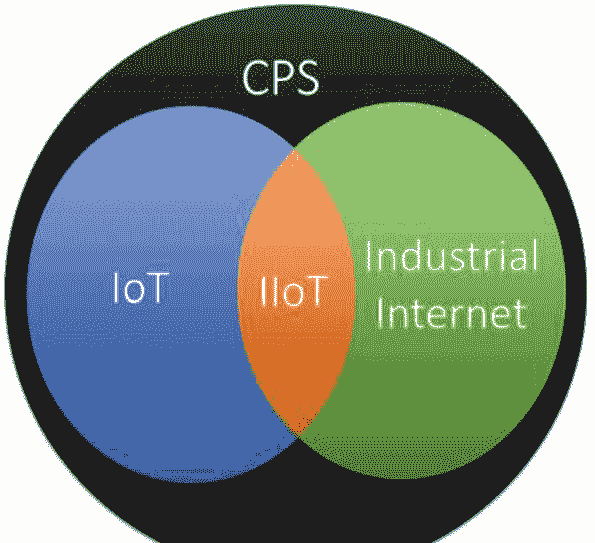
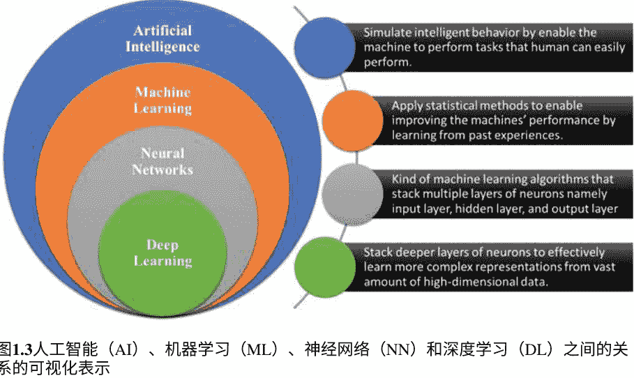
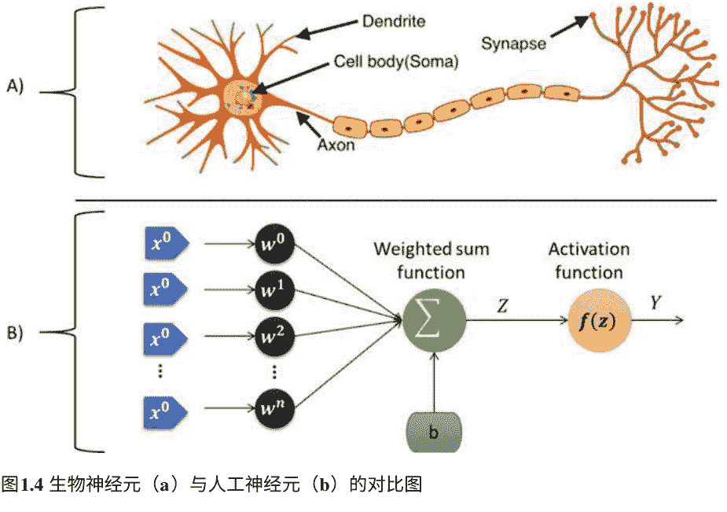
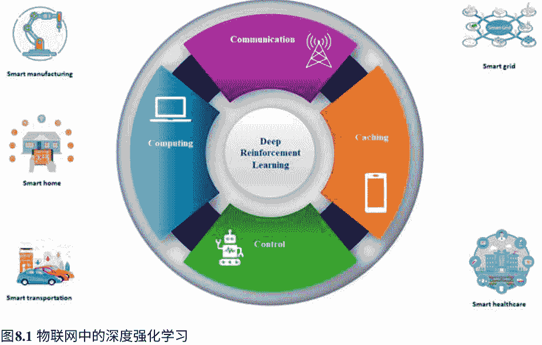
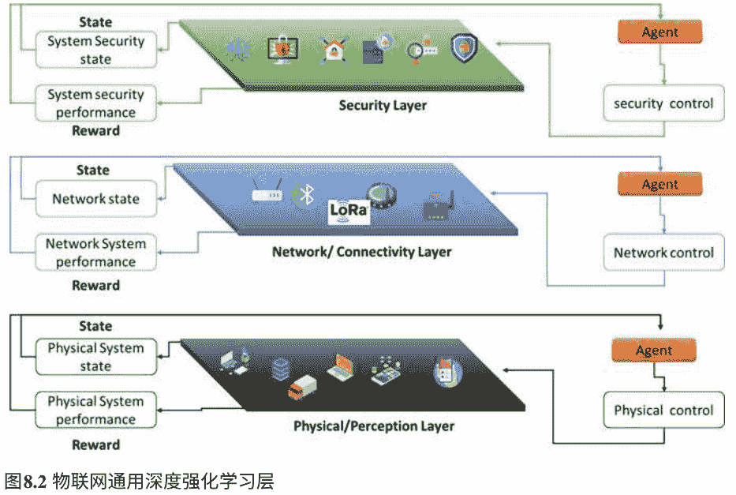
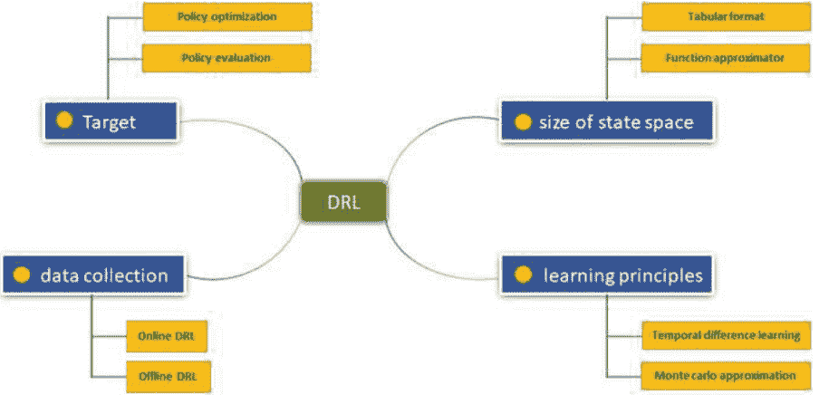
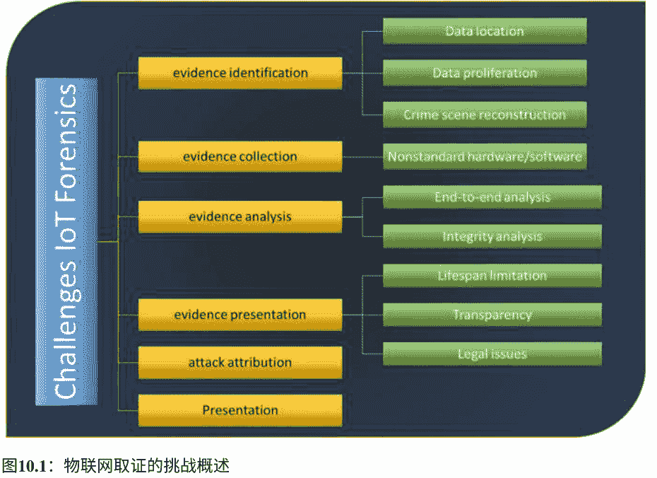

# 面向 IOT 安全和隐私的深度学习技术

Mohamed Abdel-Basset
Nour Moustafa
Hossam Hawash
Weiping Ding

### 深度学习技术在物联网安全和隐私中的应用

### 深度学习在计算智能中的研究

第 997 卷

### 系列编辑

Janusz Kacprzyk, 波兰科学院, 华沙, 波兰

《计算智能研究》(SCI) 系列出版物快速而高质量地发布计算智能领域的新发展和进展。其目的是涵盖计算智能的理论、应用和设计方法，以及工程、计算机科学、物理学和生命科学等领域中嵌入其中的方法论。该系列包含了神经网络、连接主义系统、遗传算法、进化计算、人工智能、细胞自动机、自组织系统、软计算、模糊系统和混合智能系统等计算智能领域的专著、讲义和编辑卷。

对于贡献者和读者来说，短时间的出版和全球范围的分发都具有特殊价值，这使得研究成果能够广泛而迅速地传播。

被 SCOPUS、DBLP、WTI Frankfurt eG、zbMATH、SCImago 等索引。该系列中的所有图书都会提交给 Web of Science 进行考虑。

关于该系列的更多信息，请访问 https://link.springer.com/bookseries/7092

Mohamed Abdel-Basset · Nour Moustafa · Hossam Hawash · Weiping Ding

## 深度学习技术在物联网安全与隐私中的应用

Mohamed Abdel-Basset
计算机与信息学院
Zagazig 大学
埃及 Zagazig

Nour Moustafa
工程与信息技术学院
新南威尔士大学堪培拉校区
堪培拉，澳大利亚首都地区

Hossam Hawash
计算机与信息学院
Zagazig 大学
埃及 Zagazig

Weiping Ding
南通大学信息科学与技术学院
中国南通

ISSN 1860-949X
ISSN 1860-9503（电子版）
深度学习在物联网安全与隐私中的应用研究
ISBN 978-3-030-89024-7
ISBN 978-3-030-89025-4（电子书）
https://doi.org/10.1007/978-3-030-89025-4

© 编辑（如适用）和作者，独家许可给 Springer Nature Switzerland AG 2022
本作品受版权保护。出版商独家授权，无论是全部还是部分内容，包括翻译、重印、插图复制、朗读、广播、微缩胶片复制或以任何其他实体方式复制、传输或存储和检索信息、电子适应、计算机软件，或通过已知或今后开发的类似或不同的方法。

在本出版物中使用一般描述性名称、注册名称、商标、服务标志等，并不意味着即使在没有明确声明的情况下，这些名称也不受相关保护法律和法规的约束，因此可以自由使用。

出版商、作者和编辑可以安全地假设本书中的建议和信息在出版日期时被认为是真实和准确的。出版商、作者或编辑对本文所包含的材料不提供明示或暗示的保证，也不对可能存在的任何错误或遗漏承担责任。出版商在已发表的地图和机构隶属方面保持中立。

这本施普林格印记由注册公司施普林格自然瑞士有限公司出版，注册公司地址为：瑞士 Cham 市 Gewerbestrasse 11 号。

---

我将这本书献给我的读者，感谢他们的好奇心和学习意愿。我的妻子 Ghofran，是一个神圣的存在和指导，她不断引导我的创造力，让我的智慧赋予世界力量。我的孩子（Aliaa 和 Laila）以他们的直观视角激励着我，他们对草稿的批评对转变内容以适应受众起到了重要作用。
*—Mohamed Abdel-Basset*

这本书献给我的父母，我的妻子给予我在职业和其他方面的无条件支持以及我们的孩子们。
*—努尔·穆斯塔法*

这本书献给我的父母，我的妻子给予我在职业和其他方面的无条件支持以及我们的孩子们。
*—魏平·丁*

致我可爱的妈妈，E. 阿梅拉，以及我亲爱的姐姐，S. 哈瓦什
*—霍萨姆·哈瓦什*

### 前言 I

物联网 (IoT) 是一种无处不在的技术，可以改变我们所做的一切以及支持我们的基础设施。从智能设备到智能城市，公司、关键基础设施、医疗保健、智能电网和可穿戴设备，这些都导致了大量每天生成和处理的数据。这种非凡的规模、普及性和互联性也构建了一个确保这些物联网应用程序的信任和完整性的环境，成为一个至关重要的问题。我们只需要看一下攻击重要基础设施（如能源发电和分配）、汽车责任以及网络摄像头、智能手机和个人电脑中的恶意软件等方面的攻击，就能看到我们共同的脆弱性。鉴于正在形成的广泛攻击面和攻击者想要发现特定弱点以利用的不规律性，而防御者应该发现并关闭所有漏洞，物联网产生了一系列无与伦比的安全挑战。在作者的旅程中，我们有幸与许多专家合作。这本及时的书将增加读者对物联网安全挑战的了解，以及深度学习在提供解决方案方面的潜力、可用的物联网框架和特定垂直应用中解决这些挑战的方法。请加入我们在基于深度学习的安全物联网应用中的重要任务。

Mohamed Abdel-Basset
计算机与信息学院，Zagazig 大学，埃及 Zagazig

Nour Moustafa
工程与信息技术学院，新南威尔士大学，澳大利亚堪培拉

Hossam Hawash
计算机与信息学院，扎加兹伊格大学，埃及扎加兹伊格

Weiping Ding 博士，教授，SMIEEE
信息科学与技术学院副院长，中国南通大学

### 前言 II

本书的主题是深度学习用于保护物联网 (IoT) 的安全，集中讨论 IoT 环境中的一般和具有挑战性的安全问题。智能仅通过学习从 IoT 环境中获取的观察结果的内在表示来驱动。这种基于数据的学习非常通用，可以应用于从玩游戏到自动驾驶等许多日常情况。由于其弹性和泛化能力，深度学习领域发展迅速，并吸引了许多研究人员试图改进现有技术或建立新技术的兴趣，以及对解决网络物理安全问题感兴趣的专家。本书的撰写旨在填补物联网环境中智能安全解决方案的明显空白。

一方面，全球范围内有无数的研究活动，几乎每天都有新的研究论文发表，NIPS 或 ICLR 等大部分会议都致力于深度学习方法用于保护物联网应用。有许多大型研究团队专注于深度学习解决方案在工业、机器人、医疗保健、交通等领域的应用。最近研究的信息广泛可得，但过于专业和抽象，需要大量努力才能理解。更糟糕的是，深度学习应用的实际方面情况更加不明显，因为从研究论文中数学密集的抽象方法到实际解决现实世界问题的应用之间的转变并不总是明显的。这使得对该领域感兴趣的人难以获得对论文和会议演讲背后方法和概念的深入理解。有一些非常好的博客文章介绍了各种深度学习方面，并配有工作示例，但博客文章的不完整呈现只允许作者讨论一两个方面。在没有设计全面计划的情况下，以及没有筛选各种方法之间的关系的情况下，这些方法是无法解决问题的。本书是我们努力解决这个问题的成果。

- 埃及扎加济格 Mohamed Abdel-Basset
- 澳大利亚堪培拉 Nour Moustafa
- 埃及扎加济格 Hossam Hawash
- 中国南通 Weiping Ding

### 致谢

没有几位人士的捐赠，这本书是无法想象的。我们要感谢那些对我们的书籍提出评论并帮助规划其内容和组织的人：列出一些名字。我们要感谢那些对书籍内容提供反馈意见的人。有些人对许多章节提供了反馈意见：列出一些名字。我们还要感谢我们的家人，因为他们始终支持我们的工作。我们要感谢那些教授们向我们灌输了教育的价值观。我要感谢 Springer 出版社和这本书的制作团队，因为他们给予了我们启发和易于合作。最后，我们要感谢一直支持我们教学和研究计划的机构，埃及扎加济格大学。

## 关于本书

### 本书适合的读者是谁?

主要目标受众是对物联网 (IoT) 有一定了解但对深度学习在维护物联网安全和隐私方面的作用感兴趣的人。读者应该熟悉 Python 和机器学习以及深度学习的基础知识。对统计学和概率论的解释会有帮助，但并不一定是理解本书大部分内容的必要条件。

### 本书涵盖的内容

第 1 章，“物联网安全、取证和隐私的概念化：人工智能视角”，讨论了可靠物联网的实现背后的主要概念，包括物联网安全、物联网取证和物联网隐私。它还讨论了人工智能、机器学习和深度学习在保护物联网系统方面的潜力。本章还讨论了深度学习的推导和分类深度学习模型的分类法。

第 2 章，“物联网，初步和基础”，讨论了物联网系统的定义和物联网系统的分层架构，并为物联网系统的各个层提供了细粒度的定义，包括它们的责任、元素和排名。该章还讨论了与物联网系统密切相关的重要概念和计算范式，如云计算、雾计算和边缘计算。

第 3 章，“物联网安全需求、威胁、攻击和对策”，对物联网系统中的不同攻击面和潜在漏洞进行了全面讨论。这涉及到物联网系统不同层或层次的不同威胁和攻击。然后，提供了一个用于划分的分类法，将攻击面划分为多个类别，并提供每个类别的主要安全威胁和可能的漏洞。此外，物联网系统相互依赖、相互关联和相互合作的环境触发了一种新的攻击面。

第 4 章，“物联网中的数字取证”，对基于物联网系统的数字取证的理论方法、重要挑战和研究进展进行了简明讨论。此外，它还确定了标准化取证程序的要求，因为这被认为是以确保网络物理安全的关键阶段。

第 5 章，“监督式深度学习用于安全的物联网”，详细讨论了用于维护物联网系统安全的监督式深度学习方法。这包括用于保护物联网系统的最先进的监督算法，主要特点、相应的优势和劣势，以及在物联网安全中的作用，并提供了详细的表格比较和图表以帮助读者掌握所学的知识。

第 6 章，“无监督式深度学习用于安全的物联网”，全面讨论了使用无监督式深度学习方法从无标签的物联网数据中学习以保护物联网环境的目的。这涉及到最先进的无监督算法及其主要特征，相应的优势和劣势，以及在物联网安全中的一些用例，并提供了详细的表格比较和图表，帮助读者全面了解无监督学习的方法。

第 7 章，“半监督深度学习用于安全物联网”，详细讨论了使用半监督深度学习方法从部分标记数据中学习，以维护物联网系统的安全性。这包括用于保护物联网系统的最先进的有监督算法，主要特征，相应的优势和劣势，以及在物联网安全中的相应作用。此外，它提供了详细的表格比较和图表，旨在帮助读者掌握所学到的经验。

第 8 章，“深度强化学习用于安全物联网”，介绍并讨论了深度强化学习在维护物联网系统安全性方面的潜力。这包括强化学习有监督算法，关键的相似性和差异，相关的优势和劣势，以及保护物联网环境的使用条件。此外，还提供了图示来模拟不同强化学习框架的工作流程，以帮助读者完全理解强化学习在保护物联网环境中的作用。

第 9 章，“面向隐私保护的物联网联邦学习”，讨论了在基于物联网的系统中应用智能解决方案时的隐私考虑。广泛讨论、分类和分析了联邦学习范式以实现隐私保护。此外，还讨论了差分隐私、多方安全计算和其他隐私保护方法的作用。

第 10 章，“挑战、机遇和未来展望”，介绍了设计隐私和安全保护物联网系统时当前和最新的挑战，并提出了学术界或工业界在不久的将来可以研究的可能解决方案。此外，深度学习方法和物联网技术的融合仍处于早期阶段，为更可靠和值得信赖的物联网解决方案铺平了道路，这是未来学术界或市场领域的未来工作的一部分。

## 目录

### 1 引言：物联网安全、取证和隐私的概念化：人工智能视角

- 1.1 物理网络的网络安全 . . . . . . . . . . . . . . . . . . . . . . . . . . . . . . . . 2
- 1.2 物联网的安全性 . . . . . . . . . . . . . . . . . . . . . . . . . . . . . . . . . . . . 4
- 1.3 物联网的取证 . . . . . . . . . . . . . . . . . . . . . . . . . . . . . . . . . . . . . 5
- 1.4 人工智能用于安全物联网 . . . . . . . . . . . . . . . . . . . . . . . . . . . . . . 6
  - 1.4.1 机器学习 . . . . . . . . . . . . . . . . . . . . . . . . . . . . . . . . . . . 7
  - 1.4.2 深度学习 . . . . . . . . . . . . . . . . . . . . . . . . . . . . . . . . . . . 9
- 1.5 深度学习方法的分类 . . . . . . . . . . . . . . . . . . . . . . . . . . . . . . . . 19
  - 1.5.1 深度监督学习 . . . . . . . . . . . . . . . . . . . . . . . . . . . . . . . 19
  - 1.5.2 深度无监督学习 . . . . . . . . . . . . . . . . . . . . . . . . . . . . . . 22
  - 1.5.3 深度弱监督学习 . . . . . . . . . . . . . . . . . . . . . . . . . . . . . . 25
  - 1.5.4 深度强化学习 . . . . . . . . . . . . . . . . . . . . . . . . . . . . . . . 26
- 1.6 物联网中的隐私 . . . . . . . . . . . . . . . . . . . . . . . . . . . . . . . . . . . . 28
- 1.7 总结和教训 . . . . . . . . . . . . . . . . . . . . . . . . . . . . . . . . . . . . . . . 30
- 1.8 书籍组织 . . . . . . . . . . . . . . . . . . . . . . . . . . . . . . . . . . . . . . . . . 30
- 参考文献 . . . . . . . . . . . . . . . . . . . . . . . . . . . . . . . . . . . . . . . . . . . 32

### 2 物联网，初步和基础知识

- 2.1 物联网系统的架构 . . . . . . . . . . . . . . . . . . . . . . . . . . . . . . . . . . . 37
  - 2.1.1 感知/物理层 . . . . . . . . . . . . . . . . . . . . . . . . . . . . . . . . 40
  - 2.1.2 连接/网络层 . . . . . . . . . . . . . . . . . . . . . . . . . . . . . . . . 42
  - 2.1.3 雾计算或边缘层 . . . . . . . . . . . . . . . . . . . . . . . . . . . . . 44
  - 2.1.4 中间件层 . . . . . . . . . . . . . . . . . . . . . . . . . . . . . . . . . . . 45
  - 2.1.5 应用层 . . . . . . . . . . . . . . . . . . . . . . . . . . . . . . . . . . . . 45
  - 2.1.6 业务服务层 . . . . . . . . . . . . . . . . . . . . . . . . . . . . . . . . . 51
  - 2.1.7 安全层 . . . . . . . . . . . . . . . . . . . . . . . . . . . . . . . . . . . . . 52
- 2.2 基于云计算的物联网系统 . . . . . . . . . . . . . . . . . . . . . . . . . . . . . 53
- 2.3 基于雾计算的物联网系统 . . . . . . . . . . . . . . . . . . . . . . . . . . . . . 57
- 2.4 基于边缘计算的物联网系统 . . . . . . . . . . . . . . . . . . . . . . . . . . . 59
- 2.5 总结与经验教训 . . . . . . . . . . . . . . . . . . . . . . . . . . . . . . . . . . . . 60
- 参考文献 . . . . . . . . . . . . . . . . . . . . . . . . . . . . . . . . . . . . . . . . . . . 62

### 3 物联网安全需求、威胁、攻击和对策

- 3.1 物联网安全需求 . . . . . . . . . . . . . . . . . . . . . . . . . . . . . . . . . . . 67
  - 3.1.1 认证 (S1) . . . . . . . . . . . . . . . . . . . . . . . . . . . . . . . . . . . 69
  - 3.1.2 授权 (S2) . . . . . . . . . . . . . . . . . . . . . . . . . . . . . . . . . . . 70
  - 3.1.3 可用性 (S3) . . . . . . . . . . . . . . . . . . . . . . . . . . . . . . . . . . 70
  - 3.1.4 机密性 (S4) . . . . . . . . . . . . . . . . . . . . . . . . . . . . . . . . . . 70
  - 3.1.5 数据安全 (S5) . . . . . . . . . . . . . . . . . . . . . . . . . . . . . . . . 71
  - 3.1.6 完整性 (S6) . . . . . . . . . . . . . . . . . . . . . . . . . . . . . . . . . . 73
  - 3.1.7 不可否认性 (S7) . . . . . . . . . . . . . . . . . . . . . . . . . . . . . . . 74
  - 3.1.8 网络安全 (S8) . . . . . . . . . . . . . . . . . . . . . . . . . . . . . . . . 74
  - 3.1.9 可维护性 (S9) . . . . . . . . . . . . . . . . . . . . . . . . . . . . . . . . 75
  - 3.1.10 弹性 (S10) . . . . . . . . . . . . . . . . . . . . . . . . . . . . . . . . . 75
  - 3.1.11 安全监控 (S11) . . . . . . . . . . . . . . . . . . . . . . . . . . . . . . 76
- 3.2 物联网威胁、攻击、漏洞和风险 . . . . . . . . . . . . . . . . . . . . . . . . 77
  - 3.2.1 物联网威胁 . . . . . . . . . . . . . . . . . . . . . . . . . . . . . . . . . . 77
  - 3.2.2 物联网漏洞 . . . . . . . . . . . . . . . . . . . . . . . . . . . . . . . . . . 81
  - 3.2.3 物联网风险 . . . . . . . . . . . . . . . . . . . . . . . . . . . . . . . . . . 81
- 3.3 当今物联网的攻击和对策 . . . . . . . . . . . . . . . . . . . . . . . . . . . . . 82
  - 3.3.1 物理物联网攻击 (基于硬件) . . . . . . . . . . . . . . . . . . . . . . 82
  - 3.3.2 软件相关的物联网攻击 . . . . . . . . . . . . . . . . . . . . . . . . . . 83
  - 3.3.3 数据相关的物联网攻击 . . . . . . . . . . . . . . . . . . . . . . . . . . 83
- 3.4 物联网攻击面 . . . . . . . . . . . . . . . . . . . . . . . . . . . . . . . . . . . . . 86
  - 3.4.1 物理攻击面 . . . . . . . . . . . . . . . . . . . . . . . . . . . . . . . . . . 86
  - 3.4.2 网络攻击面 . . . . . . . . . . . . . . . . . . . . . . . . . . . . . . . . . . 94
  - 3.4.3 云攻击面 . . . . . . . . . . . . . . . . . . . . . . . . . . . . . . . . . . 101
  - 3.4.4 应用攻击面 . . . . . . . . . . . . . . . . . . . . . . . . . . . . . . . . . 102
- 3.5 总结和学到的教训 . . . . . . . . . . . . . . . . . . . . . . . . . . . . . . . . . 103
- 参考文献 . . . . . . . . . . . . . . . . . . . . . . . . . . . . . . . . . . . . . . . . . . 104

### 4 物联网中的数字取证

- 4.1 什么是数字取证? . . . . . . . . . . . . . . . . . . . . . . . . . . . . . . . . . . 113
- 4.2 数字证据 . . . . . . . . . . . . . . . . . . . . . . . . . . . . . . . . . . . . . . . . 116
  - 4.2.1 数字取证和其他相关学科 . . . . . . . . . . . . . . . . . . . . . . . 117
  - 4.2.2 数字取证的简要历史 . . . . . . . . . . . . . . . . . . . . . . . . . . 118
  - 4.2.3 数字证据的常见来源 . . . . . . . . . . . . . . . . . . . . . . . . . . 119
  - 4.2.4 理解执法机构调查 . . . . . . . . . . . . . . . . . . . . . . . . . . . . 119
- 4.3 数字取证的主要领域 . . . . . . . . . . . . . . . . . . . . . . . . . . . . . . . 120
- 4.4 遵循法律程序 . . . . . . . . . . . . . . . . . . . . . . . . . . . . . . . . . . . . 121
- 4.5 数字证据的类型 . . . . . . . . . . . . . . . . . . . . . . . . . . . . . . . . . . . 122
- 4.6 威胁链 . . . . . . . . . . . . . . . . . . . . . . . . . . . . . . . . . . . . . . . . . 122
- 4.7 物联网取证 . . . . . . . . . . . . . . . . . . . . . . . . . . . . . . . . . . . . . . 125

- 4.8 总结和教训
- 参考文献

### 5 监督式深度学习用于安全物联网
### 5.1 卷积神经网络
- 5.1.1 卷积层
- 5.1.2 池化层
- 5.1.3 全连接层
- 5.1.4 特征图和感受野
### 5.2 高级卷积网络
- 5.2.1 VGG网络
- 5.2.2 残差网络
- 5.2.3 密集网络
### 5.3 时序卷积网络
### 5.4 循环神经网络
- 5.4.1 基本循环神经网络
- 5.4.2 长短期记忆 (LSTM)
- 5.4.3 门控循环单元
### 5.5 图神经网络
### 5.6 监督数据集和评估指标
- 5.6.1 数据集
- 5.6.2 评估指标
### 5.7 深度学习解决方案在物联网中的分类
- 5.7.1 输入方案
- 5.7.2 检测方案
- 5.7.3 部署方案
- 5.7.4 评估方案
### 5.8 总结和学到的经验
- 参考文献

### 6 无监督深度学习用于安全物联网
### 6.1 生成对抗网络
### 6.2 自编码器
- 6.2.1 稀疏自编码器 (SAE)
- 6.2.2 去噪自编码器 (DAE)
- 6.2.3 变分自编码器 (VAE)
### 6.3 基于能量的模型
- 6.3.1 波尔兹曼机 (BM)
- 6.3.2 限制波尔兹曼机 (RBM)
- 6.3.3 深度波尔兹曼机 (DBM)
- 6.3.4 深度信念网络
### 6.4 总结与教训
- 参考文献

## 7 面向安全物联网的半监督深度学习
### 7.1 背景与基础
- 7.1.1 半监督学习假设
- 7.1.2 相关理论
- 7.1.3 分类
### 7.2 一致性正则化方法
- 7.2.1 梯度网络
- 7.2.2 Π-模型
- 7.2.3 时间集成
- 7.2.4 平均教师
- 7.2.5 双学生
### 7.3 半监督生成方法
- 7.3.1 分类生成对抗网络 (CatGAN)
- 7.3.2 上下文条件生成对抗网络 (CCGAN)
- 7.3.3 好坏 GAN
### 7.4 半监督自编码器方法
- 7.4.1 半监督VAE (SSVAEs)
- 7.4.2 无限VAE
- 7.4.3 解缠结变分自编码器
### 7.5 基于图的半监督方法
- 7.5.1 基准GNN
- 7.5.2 图卷积网络 (GCN)
- 7.5.3 图注意力网络 (GAT)
### 7.6 伪标签方法
- 7.6.1 不一致中心方法
- 7.6.2 自训练方法
### 7.7 混合方法
- 7.7.1 插值一致性训练 (ICT)
- 7.7.2 MixMatch
- 7.7.3 ReMixMatch
- 7.7.4 DivideMix
- 7.7.5 FixMatch
### 7.8 总结与学到的经验
- 参考文献

### 8 深度强化学习用于安全物联网
### 8.1 基础和预备知识
### 8.2 单智能体强化学习
- 8.2.1 马尔可夫决策过程
- 8.2.2 部分可观察马尔可夫决策过程
### 8.3 多智能体强化学习
- 8.3.1 马尔可夫/随机博弈
- 8.3.2 Dec-POMDP
- 8.3.3 网络化马尔可夫博弈
### 8.4 深度强化学习分类
- 8.4.1 基于价值的深度强化学习
- 8.4.2 基于策略的深度强化学习
### 8.5 基于强化学习的物联网应用
- 8.5.1 基于物联网的工业物联网
- 8.5.2 基于物联网的智能交通
### 8.6 总结和经验教训
- 参考文献

## 9 隐私保护物联网的联邦学习
### 9.1 联邦学习的定义
- 9.1.1 联邦训练
### 9.2 联邦学习解决方案的分类
- 9.2.1 数据分区
- 9.2.2 隐私保护技术
- 9.2.3 通信架构
- 9.2.4 处理异构性
### 9.3 总结与经验教训
- 参考文献

### 10 挑战、机遇和未来前景
### 10.1 物联网安全
### 10.2 基于云计算的安全解决方案
### 10.3 基于雾计算的安全解决方案
### 10.4 基于边缘计算的安全解决方案
### 10.5 物联网安全的深度学习
### 10.6 深度强化学习
### 10.7 隐私保护的联邦学习
- 参考文献

## 第1章
### 引言：物联网安全、取证和隐私的概念化的人工智能视角

物联网 (IoT) 是一种快速发展的技术，使全球分布的数十亿个物理物体能够通过互联网相互连接，捕获、收集、交换和共享各种大量的数据。这些物理物体包括从传统家用设备到复杂工业设备的所有可连接设备[1]。工业4.0的出现在全球范围内彻底改变了工业领域，嵌入式设备和计算机芯片的数量越来越多，因为可用性、价格实惠、微处理器和传感器容量以及无处不在的通信技术的扩展。连接如此庞大数量的异构对象并向它们植入传感器会导致设备具有一定程度的数字智能，使它们能够在没有人为干预的情况下即时通信数据。物联网使全球基础设施更加智能和反应灵敏，结合了物理和数字领域。因此，物联网在几乎所有领域都受到极大的关注和广泛应用：教育、制造业、医疗保健、商业、娱乐、能源分配、家庭、智慧城市、交通、旅游甚至研究[2]。

遗憾的是，工业界、学术界和人们在快速商业化的潮流中很难充分考虑物联网数据和设备的安全性和隐私性。例如，想象一下一个物联网世界，将可穿戴设备、智能手机、智能手表、智能电视、智能冰箱、智能车辆、植入式健康设备、工业机器人系统以及一切能够连接到网络的东西结合在一起。一般来说，大多数这些行业在过去几十年中从未对安全、取证或隐私问题产生任何兴趣。然而，鉴于成为更具可行性和盈利性的产品和服务的激烈竞争，当前的行业发现自己处于关键阶段，因为他们没有意识到安全和隐私保护的方法进行开发、部署和运营。这种疏忽可能会威胁到物联网用户，并进而中断充满活力的生态系统。因此，许多行业、客户和业主、服务提供商和基础设施运营者正迅速意识到自己面临各种入侵和安全违规行为。将标准设备转变为智能设备所做的努力正在为网络犯罪分子、入侵者、数据污染者和恶意代理人[4]带来疯狂的机会。

这些物联网设备所揭示的威胁不仅影响着物联网系统的安全，还导致了涉及服务、应用、数据中心、网站、个人居民和社交网络的灾难性破坏，通过自控智能设备如机器人网络（僵尸网络）。换句话说，在物联网系统中协商一个特定的元素和/或通信通道就足以破坏整个物联网网络的大部分。除了物联网系统的漏洞外，攻击向量在种类和复杂性方面也在大幅发展[5]。

在这股兴趣的浪潮中，物联网系统的安全和隐私体现出一个主要的薄弱点，这是阻碍物联网在不同领域得到批准的原因之一，因为物联网设备通常安全性较差[6]，因此容易成为恶意软件利用的目标，从而引发破坏性或干扰性攻击。因此，很明显，在缺乏安全程序的情况下，物联网系统仍然无法发挥其全部功能。因此，必须对这些攻击进行额外的调查、发现、污染预防、对策和攻击后的系统恢复进行更多的考虑。

简而言之，总会有一些人努力入侵和破坏计算机系统和智能设备。更糟糕的是，随着物联网的普及，激励可能扩大到对人身伤害或杀人。目前，一个简单的按键操作可能导致严重后果，例如：(1) 在适当设计起搏器时，它可以保护人类生命，(2) 它可以实现对外层空间的探索，(3) 它可以摧毁大公司甚至国家的经济，(4) 它可以使车辆的制动系统失效，(5) 它可以使核研究系统出现故障等[7]。因此，保护物联网系统的安全和隐私的智能解决方案至关重要，然而，在探索维护物联网安全和隐私的实际方面之前，本章的剩余部分将讨论以下内容：

- 物理互联网的事物
- 物联网的安全性
- 物联网的取证
- 物联网的隐私
- 人工智能用于安全的物联网
- 总结和学到的教训

### 1.1 物理网络的网络安全

物联网 (IoT) 是一个动态的通用网络基础设施，具有自组织的功能，基于互操作性和标准的互联网协议，实现物理事物之间的灵活通信，共享信息并实现合作决策[8]。在物联网中，每个连接的物件都有独立的身份，并且所有物件都通过各种通信网络相互连接，促进它们之间的动态信息协作，无论它们是面向行业还是面向国家。

网络物理系统（CPS）最早由Helen Gill于2006年提出[9]，强调了各种信息技术的深度融合，如传感技术、硬件技术、软件技术、嵌入式技术和微处理技术，主要目标是实现极其自主和协同的信息化能力，即时和弹性反馈，以及信息和物理世界之间的建设性循环[10]。CPS的边界非常广泛，融合了各种工程专业、实践、应用和相关事务（例如数字设计、热力学、工程动力学等），这些都是相应从业者所需的。

CPS与物联网系统有何不同？根据IEEE的说法，根本区别在于CPS涵盖了连接的物理设备、监控过程和控制系统，这些系统可以选择连接到互联网。换句话说，CPS可以无法从互联网访问，但仍然可以正常运行并实现相应的业务目标。从物联网的角度来看，物联网系统中的物体不可避免地且根据定义与互联网连接，并使用一些应用、服务和系统功能来实现目标业务目标。

因此，主要关注的是物体之间在互联网上的互动，其中开放性、全球化互操作性和社交性极大地支持了物联网的概念。由于物联网中的所有物体都可以被视为CPS的子集，唯一的条件是互联网连接，因此物联网被视为标准CPS的子集，如图1.1所示。此外，CPS的另一个子集是工业互联网，它展示了未来工业发展的潜力。

图1.1 网络物理系统、物联网(IoT)、工业互联网和工业物联网(IIoT)之间的关系

基于新兴技术 (即5G、6G) 的基础上，物联网和工业互联网的交叉带来了一种新形式的物联网，称为工业物联网(IIoT)。此外，当CPS的所有元素连接到互联网时，可以将其称为网络物理物联网，也可以称为物联网系统[11]。

### 1.2 物联网的安全性

最近，人们对物联网安全和传统网络安全存在很大的误解，然而，无论是概念上还是实践上，它们都完全不同。一方面，网络安全通常被认为是一堆技术方法、协议和程序，用于保护计算系统(软件、应用、服务)、网络基础设施和数据免受恶意攻击、入侵、未经授权的访问和其他意图和/或意外损害。根据这一点，网络安全的主要重点是保护数据和信息，同时忽视物理硬件设备的安全要求，以及物理世界与不同元素的物联网系统的交互[2]。另一方面，物联网的安全是一项更广泛、更复杂、更具挑战性的任务，因为物联网系统引入了更大的攻击面，并且这些面上的物理事物更容易受到攻击。因此，物联网安全可以利用网络安全以及其他安全程序，共同遵循以确保全面考虑所有安全方面。

因此，物联网安全可以被定义为网络安全、物理设备安全以及技术、控制过程和程序的融合，这些是保护物联网系统中不同元素免受各种物联网安全攻击的关键 [5]。

广义上讲，物联网安全与网络安全的一个重要区别是被称为网络物理系统的概念，这是通过工业和学术界共同认可的。例如，在一个发电站中，一个温度传感器遭到远程攻击，那么它可能会错误地生成非常高的温度测量值，这可能会导致控制系统关闭整个发电站。相反的情况是，传感器错误地生成比实际值更低的测量值，控制系统可能会采取更严重的措施，造成不愉快的后果 [12]。

通过网络对物理操作进行数字化控制使得物联网在底层安全解决方案上与非否认、完整性、机密性等基本信息保障理念不同，而是与在物理世界中生成和接受物联网数据的物理资源 and 机器相关。换句话说，基于物联网的系统具有非常真实的模拟和物理组件。物联网设备被视为物理对象，其中大部分存在一些安全问题。因此，对这些设备进行破坏将导致财产损失和人员受伤。因此，物联网安全并不应该是应用于网络连接设备和服务器的一套特定、恒定的标准安全程序。它需要一种独特的并为物联网设备所贡献的每个应用和服务提供智能解决方案。

### 1.3 物联网的取证

数字取证 (DF) 学科被视为传统取证科学的一部分，主要考虑数字或计算机化数据的发现和分析。数字取证专家处理在各种电子设备上发现的数字证据的识别、编制、检索、分析和维护。

随着物联网技术的出现和人类个体与物联网之间的紧密联系，民用和刑事调查或内部调查应考虑物联网。物联网系统的安全漏洞可能被利用来远程控制系统，例如恶意控制车辆的制动系统以造成事故。因此，物联网系统迫切需要物联网取证研究来支持决定案件的谁、什么、在哪里、何时和如何。从数字取证的角度来看，物联网环境包括一组丰富的对象，这些对象可能有助于调查，而物联网范式中的数字取证调查已经发展起来以适应物联网的特点，形成了一个被称为物联网取证的新概念。

物联网取证与数字取证的主要区别在于证据来源[12]。与标准数字取证不同，在物联网取证中，作为常规检查物质的笔记本电脑、计算机、智能手机、智能手表和云服务器之外，证据来源可以更加广泛，包括生物体内的医疗植入物、婴儿护理系统、交通信号灯和车载信息娱乐系统[15]。在物联网网络的不同层中，保护整个物联网设备、通信 and 存储的安全性基本上是困难的，如果不是不可能实现的。如果发生事件，取证专业人员执行的首要任务之一是确定受损范围。然而，与标准物联网安全程序不同，物联网取证的目标不是减少造成的破坏程度，而是确定攻击的来源或各方的责任[16]。尽管现有的取证实践和工具在物联网领域的某些阶段仍然表现出一定的好处，但仍然需要更新当前的工具、流程和法规，以应对物联网的独特和不断发展的特点。

### 1.4 人工智能用于安全物联网

人工智能 (AI) 最早于1950年提出，作为对“计算机能否思考？”这个问题的回答。然后，人工智能被定义为一门计算机科学学科，主要强调解决对人类个体来说具有理性挑战但对计算机来说相对简单的问题。这指的是可以根据一组官方、算术、科学规则来指定的问题。从本质上讲，人工智能是一个非常广泛的学科，涉及基于学习的方法和许多不涉及任何学习过程的方法类别[17]。事实上，相当长一段时间，计算机科学专业人士认为，只需设计一个足够大的一致性规则集来处理和处理知识，就可以实现人类水平的人工智能。这个概念后来被称为“符号人工智能”，它是从1950年到1980年期间人工智能社区中的主导概念。符号人工智能在1980年代的专家系统的繁荣中达到了巅峰。尽管符号人工智能在解决理性和形式化定义的挑战（如下棋）方面表现出色，但在解决更复杂、非结构化和模糊的问题时，它无法发现明确的规则。

人工智能面临的实际挑战是找到一个可以轻松由人类个体执行但难以用人类个体正式描述的问题的解决方案，即直观解决的问题，以及在面部识别、物体检测、单词识别等方面具有自动性的问题[18]。在这方面，物联网系统的安全漏洞可以被视为一个需要智能解决方案来保护设备和信息免受潜在物联网威胁的问题[2]。

人工智能提供了各种技术，用于从不同物联网组件和物理设备之间的交互产生的物联网数据流中探索和学习合法和恶意模式。可以通过单个或多个人工智能方法对物联网系统不同部门生成的数据进行聚合和调查，以区分正常的交互模式和异常的交互模式，从而在对物联网系统的任何元素造成任何损害之前识别物联网威胁或恶意活动。此外，人工智能可能对预测新的物联网威胁至关重要，这些威胁几乎是先前威胁的变种，因为它们可以根据从当前样本中获得的经验智能地预测未来的匿名威胁。此外，人工智能可以帮助物联网系统根据对不同威胁的获得知识智能地选择最合适的防御机制或对策。因此，基于物联网的系统应该从仅仅实现不同物联网方之间的安全通信转变为基于安全的智能，以实现可靠和值得信赖的物联网系统[19]。图1.2展示了人工智能方法在维护物联网系统的安全和隐私方面的潜力。在现有的人工智能范例中，机器学习是最广泛使用的范式，它在不同的应用领域取得了巨大的成就，甚至在与安全相关的应用中也是如此。

图1.2 人工智能在物联网安全中的潜在作用的可视化表示

#### 1.4.1 机器学习

“机器学习（ML）”的概念是人工智能的一个大的子领域，最早由Arthur Samuel [20]引入，它被定义为一个能够从大量历史数据中学习的计算机系统，使用一组自适应的计算算法。事实上，计算算法的硬编程使其无法应对动态变化的要求和不断更新的系统条件。相反，机器学习算法是经过训练而不是纯粹编程的，从以往的经验中学习的理念使得机器学习算法能够在决策过程和预测任务中发挥作用，这可以通过从输入数据构建一个自我优化的算法来实现。

为了对“学习”概念进行进一步澄清，Mitchell [21] 提供了以下广为引用的解释：“如果一个计算机程序在某个任务类别 $T$ 上的性能，根据性能度量 $P$，随着经验 $E$ 的积累而提高，那么就可以说它从经验 $E$ 中学习了。”机器学习的繁荣始于1990年[22]。在此之前，基于知识和规则的范式（即专家系统、归纳逻辑编程等）主导着人工智能的观点，依赖于复杂的人类可理解的符号表示的推理。随着随机估计和统计哲学的出现，机器学习范式重新吸引了研究人员的注意，引发了各种有价值的概率算法。学术界和工业界都致力于开发数据驱动的方法，以便审查和分析大量的数据，并努力学习和提取可能有助于加速或改进不同应用领域决策制定的见解。

尽管机器学习与统计分析之间存在紧密的关系，但在多个关键方面有所不同。与统计学不同，机器学习更倾向于处理相对较大、更复杂的数据集，而传统的统计方法（如频率统计学、贝叶斯统计学）在这种情况下基本上是不可行的。此外，机器学习是人工智能的实践领域，其中的概念可以通过实验方式建立，而不仅仅是理论证明[7, 23]。

随着渐进式学习方法的设计[24]，对机器学习的兴趣已经从“学习作为目标”转变为“学习作为功能”。毫无疑问，机器学习算法已经不再盲目地模拟人类的学习能力，而是更加注重智能和任务特定的数据驱动分析。目前，随着大量数据的存在以及数据开发和数据探索操作之间的定期交互，机器学习算法在各个领域取得了巨大的成功，如数据挖掘、信息检索、智能控制等。物联网网络旨在为大量个体提供集中或分布式的普适应用或服务。然而，安全性和隐私性是研判这些应用程序甚至整个物联网系统可靠性和可信度的主要关注点。作为一种解决方法，机器学习有助于改善物联网安全，抵御不同类型的威胁，并被视为确保基于物联网的系统安全的基石，考虑到其分布式和动态的特性。

在这方面，支持向量机（SVM）、决策树（DT）和随机森林被广泛应用于区分正常的物联网样本和受攻击的物联网样本，并且它们展示了很高的分类准确性[7]。另一种方法是，使用SVM和k-means算法通过学习所有节点的累积数据来检测恶意的物联网节点[25]。此外，与其直接将机器学习算法应用于物联网数据，其他研究集中于通过设计强大的特征工程技术来提高机器学习算法的性能。例如，引用文献[26]中介绍了一种基于包装器的特征选择方法（称为CorrAUC），用于精确选择和过滤传递给机器学习算法的重要物联网特征，而不是原始特征集，这在检测物联网数据中的Botnet流量时被证明是有效的，提高了不同机器学习算法的效率。

尽管传统机器学习算法取得了巨大的成功，但仍然存在一些严重的缺点，限制了它们在物联网环境中的适用性：

- 机器学习算法的效率严重依赖于正确选择的特征组合；因此，特征工程技术成为任何机器学习解决方案设计中至关重要的一部分。不幸的是，特征工程（即特征提取、特征选择）的任务是复杂且难以完成的，而且在内存使用或处理能力方面需要大量的计算开销。
- 通常，机器学习算法需要足够的时间进行训练，并可能有效地解决底层任务。通常，这需要额外的功耗、处理和内存资源，而这并不总是物联网设备所具备的。
- 机器学习算法容易受到“垃圾进，垃圾出”的格言的影响。这句格言意味着输入数据的质量决定了输出的优势，从而影响算法的性能。因此，当物联网数据存在噪声或标注不完整时，机器学习算法的性能会受到这些缺陷的影响。
- 随着与物联网紧密相连的大数据行业的出现，高维度数据成为一个主要问题，限制了标准机器学习算法在传统低维数据上的性能，即使它们在低维数据上表现出色。这种现象被广泛称为“维度灾难”。尽管已经做出了努力来解决这个问题，但它仍然是机器学习算法的一个重要限制。
- 机器学习算法的另一个关键限制是缺乏可解释性，因为很难解释这些算法如何达到最终的决策或结论。因此，标准的机器学习算法被视为一个黑盒子，接收一些输入并生成特定的输出，而不解释导致这个输出的因素或原因。例如，当一个机器学习算法将物联网流量样本分类为攻击时，该算法无法解释这个分类决策背后的动机。

本章的补充材料中给出了一个应用机器学习解决物联网安全问题的实证案例研究。

#### 1.4.2 深度学习

为了解决机器学习技术在物联网环境中的限制，特别是之前提到的限制，深度学习作为机器学习的一个子类出现了，其灵感来自于人脑的神经网络算法。深度学习因其巨大的计算改进和通过物联网网络产生的数据流量的增加而变得如此流行。随着大数据量的增加，深度学习模型克服了标准机器学习算法的限制，并且已经在包括计算机视觉、医学图像分析在内的许多跨学科科学领域中得到了革命性的应用。

自然语言处理（NLP）、人机交互和其他应用也是深度学习的应用领域。图 1.3说明了深度学习、神经网络、机器学习和人工智能之间的关系。

##### 1.4.2.1 生物神经元

在继续之前，首先探讨神经元的概念以及其在人脑中的工作方法，这被认为是人工神经元及网络的主要动机。生物神经元可以被描述为人类神经系统和大脑的基本计算单元。人脑大约由一千亿个神经元组成，每个神经元通过一种称为突触的生物结构相互连接。

这种突触负责接受来自外部环境的电化学输入，从感觉器官传递动态指令给肌肉，以及执行其他活动。除了连接的突触外，生物神经元主要由三个主要元素构成。生物神经元还可以通过一种称为树突的分支形态接受周围神经元的输入。神经元的输入可以通过对它们的重要性进行加权来增强或削弱，然后在细胞体（Soma）的地方以某种方式进行集体添加或组合。细胞体处的综合输入随后被处理并传递给其他神经元通过轴突。总之，通过树突完成接受即将到来的电化学信息的任务，然后在细胞体处进行操作和处理。即将到来的信号可以是兴奋性的，这意味着它激励神经元发放（产生电脉冲），也可以是抑制性的——这意味着它鼓励神经元保持稳定而不发射。

换句话说，只有当细胞体获得的总电化学信号超过特定水平或阈值时，生物神经元才会发射。一个单独的生物神经元可能有多组树突，并且可能接受成千上万个输入信号。神经元是否被激发发射冲动的决定取决于接收到的抑制性和兴奋性信号的总和以及发射阈值。当神经元发射时，神经冲动通过轴突传输，分成几个分支并形成球状肿胀，被称为轴突末梢，在那里通过突触与树突建立连接（见图1.4a）。

##### 1.4.2.2 人工神经元

人工神经元是生物神经元的数学模型，广义上被称为感知器[27]。感知器类似于从周围生物神经元接受电化学信号的树突，它使用一组数值来表示这些输入信号。感知器通过将每个数值输入与权重值相乘来模拟突触处电化学信号的调制，以表示该输入对感知器输出的重要性。

受生物神经元的发射现象启发，即总输入强度超过预定义的阈值，感知器计算数值输入的加权和以表征输入的总强度，然后对结果应用激活函数来决定其输出。与生物神经元一样，感知器的输出由加权和与激活阈值的比较结果决定。

可以作为其他人工神经元的输入传递。图4b显示了单个感知器的工作流程的示意图。给定具有三个输入 $x_1, x_2, x_3$ 和相应权重 $w_1, w_2, w_3$ 的人工神经元，其输出表示为 $y$。在第一阶段，计算输入的加权和如下：

$$z = x_1 \cdot w_1 + x_2 \cdot w_2 + x_3 \cdot w_3 \tag{1.1}$$

当输入 $x_1$ 比输入 $x_2$ 更重要时，权重 $w_1$ 应该比 $w_2$ 更大。为了方便和泛化，输入值的集合可以表示为向量 $x$，相应的权重可以表示为向量 $w$。然后，偏置值被添加到加权和中，以确保即使所有输入都为零，神经元仍然会被激活。

$$z = \sum_{i=1}^{n} x_i \cdot w_i + b \tag{1.2}$$

其中 $n$ 表示输入的数量，$b$ 是一个常数，表示系统的预测误差，帮助模型具有最好地拟合数据的自由，从而提高性能。最后，激活函数 $f(z)$ 被应用于定义加权和 $z$ 如何转化为感知器的输出。

激活函数有时被称为传输函数。因此，感知器的输出定义如下：

$$Y = f(z) \tag{1.3}$$

各种激活函数都是非线性的，因此可以称为“非线性函数”。没有激活函数的感知器是作为线性回归模型的基础。因此，激活/传输函数的主要目标是促进对输入的非线性转换，使感知器能够从深度表示中学习，并执行更复杂的任务。表1.1列出了主要类型的激活函数、它们的定义和数学公式。图1.5显示了最流行的激活函数的图表。

##### 1.4.2.3 人工神经网络

由于生物神经元的结构简单，不可能仅仅使用一个单一的生物神经元来执行复杂的任务。因此，人脑包含数十亿个连接的生物神经元，它们组织成层，构成一个大型网络。

受此启发，感知器被堆叠成连续的层来构建人工神经网络（ANN），其中所有层都连接在一起以实现信息从一层传递到另一层。通常，ANN的架构包括三个主要层，即输入层、隐藏层和输出层。每个层都由一组神经元组成，每个层的神经元与前一层或后一层的所有神经元进行交互。然而，在同一层的神经元之间没有相互作用，因为它们没有连接将它们链接起来，而相邻层的神经元之间有中间边连接它们。

正如其名称所示，输入层负责将输入传送到网络中，其中输入神经元的数量等于网络的输入值的数量。每个输入值对目标预测有不同的贡献程度。然而，在这一层没有需要进行的计算，它可以被视为传递信息的门，实现外部环境到网络的连接。

另一方面，隐藏层代表输入层和输出层之间的任何层，其主要功能是处理来自输入层的输入。具体而言，隐藏层通过从数据中提取隐藏模式并学习所需的有价值的表示来对输入和输出之间的复杂关系进行建模。隐藏层的数量选择没有标准，而是根据要解决的问题的复杂性来确定。

在ANN中堆叠大量的隐藏层会形成一个被称为深度神经网络（DNN）的网络，被认为是以深度学习学科的基础。最后，输出层接收来自隐藏层的处理信息，并相应地计算网络的输出。这一层中输出感知器的数量根据网络试图解决的基本问题或仅根据试图估计的目标来确定 [41]。

ANN的学习意味着以这样的方式更新每个感知器的权重，使得网络能够正确预测目标输出。通常使用预定义的成本函数来衡量预测输出的正确性，该函数衡量实际输出与估计输出之间的差异。每个感知器的权重更新是通过一种称为梯度下降的算法来完成的 [42]。

梯度下降迭代地更新网络权重，以优化成本函数，通过最小化输出误差或最大化预测准确性。有关简单ANN和DNN的学习实现、训练和测试的详细描述，请参阅本章的补充材料。

## 表1.1 常见人工神经元激活函数列表

| 激活函数 | 研究 | 描述 | 公式 |
| :--- | :--- | :--- | :--- |
| Sigmoid | [28] | - 也称为逻辑函数 - 将输入缩放到0到1的范围内 - 单调且可微 | $f(z) = \frac{1}{1+e^{-z}}$ |
| 双曲正切函数 (Tanh) | [29] | - 输出范围在 [-1, 1] 内 - 单调且可微 | $f(z) = \frac{e^z - e^{-z}}{e^z + e^{-z}}$ |
| 修正线性单元 (ReLU) | [30] | - 将输入映射到0到无穷大 - 本质上是一个分段函数 | $f(z) = \max(0, z)$ |
| 渗漏ReLU (Leaky ReLU) | [31, 32] | - 解决了ReLU死区问题 - 负输入具有小的线性斜率 $\alpha$ | $f(z) = \begin{cases} \alpha z, & z < 0 \\ z, & z \ge 0 \end{cases}$ |
| 指数线性单元 (ELU) | [33] | - 为负输入提供小的曲线斜率 - 在 $\alpha=1$ 以外的情况下不是处处连续可微 | $f(z) = \begin{cases} \alpha(e^z - 1), & z < 0 \\ z, & z \ge 0 \end{cases}$ |
| Swish | [34] | - 非单调函数，$\sigma$ 代表 sigmoid 函数 - 提供线性和非线性之间的插值 | $f(z) = z \cdot \sigma(\beta z)$ |
| SoftMax | [35] | - Sigmoid 的推广，用于多类问题 - 计算每个类的概率，总和为 1 | $f(z_j) = \frac{e^{z_j}}{\sum_j e^{z_j}}$ |
| 软加 (Softplus) | [36] | - ReLU 的平滑近似，保证输出为正 | $f(z) = \log(1 + e^z)$ |
| 软符号 (Softsign) | [37] | - 将输出限制在 -1 到 1 之间 | $f(z) = \frac{z}{|z| + 1}$ |
| 缩放ELU (SELU) | [38] | - 自标准化激活函数 - 使模型收敛于零均值和单位方差 | $f(z) = s \cdot \begin{cases} \alpha(e^z - 1), & z < 0 \\ z, & z \ge 0 \end{cases}$ |
| 指数 (Exponential) | / | - 计算输入的指数 | $f(z) = e^z$ |
| 高斯误差线性单元 (GELU) | [39] | - 广泛应用于 NLP 和 Transformer - 解决了梯度消失问题 | $f(z) = z \cdot \Phi(z) \approx 0.5z \left( 1 + \tanh \left[ \sqrt{\frac{2}{\pi}} (z + 0.044715 z^3) \right] \right)$ |
| 连续可微的ELU (CELU) | [40] | - ELU 的参数化形式 - 导数在输入方面有界 | $f(z) = \begin{cases} \alpha (e^{z/\alpha} - 1), & z < 0 \\ z, & z \ge 0 \end{cases}$ |

##### 1.4.2.4 深度学习：定义

根据 Raschka 和 Mirjalili [23]，深度学习可以定义为“机器学习的一个子领域，专注于高效地训练具有多层的人工神经网络”。同样，Chollet [43] 将深度学习定义为“机器学习的一个特定子领域，一种从数据中学习表示的新方法，强调学习连续的‘层次’越来越有意义的表示”。此外，Goodfellow 等人 [35] 将深度学习视为一种学习技术，它允许计算环境根据数据和经验进行演化，并将其定义为“一种特殊的机器学习方法，通过学习将世界表示为嵌套的概念和表示的层次结构，每个概念都与更简单的概念相关联，并且更抽象的表示是基于较不抽象的表示计算出来的”。

深度学习的引入减轻了手工制作输入特征的需求，通过应用多层人工神经网络来学习复杂的内在特征和多层次的抽象表示。因此，与流行的机器学习算法不同，深度学习网络不需要手动特征工程技术，因为网络层负责提取和学习完成任务所需的有价值的特征组合。

深度学习的应用涵盖了不同领域和不同类型的数据。例如，计算机视觉应用了各种深度学习算法来处理图像和/或视频数据以实现不同的目的。此外，医学诊断应用深度学习模型来处理患者的临床测量和放射影像，为医生提供有深度的诊断决策。自然语言处理应用深度学习算法来处理文本数据，用于文本摘要、翻译、情感分析等不同目的。谷歌、微软、英伟达、Netflix、亚马逊和特斯拉等大型企业已经在基于深度学习模型的智能应用或服务的开发方面取得了巨大的进展。根据这一点，深度学习可以被视为一个快速发展的领域，为各种领域提供智能，同时减轻了标准机器学习方法的限制。在这方面，深度学习可以被视为满足物联网系统不断发展的安全和隐私需求的有希望的解决方案 [44]。这个解决方案涉及攻击检测、攻击预测、防御机制和隐私保护等。因此，本书旨在研究深度学习模型作为设计有趣的安全、取证和隐私保护解决方案的最先进算法，以提高物联网系统的可靠性和可信度。

### 1.5 深度学习方法的分类

目前的深度学习方法通常被分为四个主要类别，包括有监督深度学习、无监督深度学习、弱监督深度学习和深度强化学习 [45]。图1.6展示了深度学习模型的不同类别，并提供了每个类别中最先进模型的一些示例。下面的小节简要介绍了这些类别，以及每个类别中的主要算法 [23]。本节将作为本书后续章节的关键主题的基础。

#### 1.5.1 深度监督学习

有监督学习被认为是机器学习或深度学习算法中最流行的学习范式。正如“有监督”这个名字所暗示的，学习过程是将输入数据映射到已知目标（数据标签）上进行的，深度学习模型的可训练参数集根据模型的输入进行调整，以更好地适应目标输出。换句话说，在有监督学习中，训练数据供给模型作为监督员，教育模型准确地估计输出。它模拟了学生在教师监督下学习的想法。因此，主要监督学习的目标是通过优化模型参数，使模型的估计输出与人类提供的实际数据标签之间的差异最小化 [46]。

为了将这个定义具体化，考虑在物联网系统中进行操作，其中一个特定的交易负责检测特定的物联网流量样本是正常还是异常。这个备注“正常”或“异常”可以被视为类别标签。输入特征可能包含数据包信息、传输时间、接收时间、到达速率等。通过提供只包含注释样本的数据集给模型，其中每个样本都有其对应的基准标签，这些标签始终由人类专家（监督者）确定，因此监督的概念应运而生。

一般来说，深度学习在基于物联网的系统中的大多数应用属于这种学习范式，例如交通速度预测、负载预测、活动识别、步态识别等。图1.7显示了监督深度学习模型的工作流程 [47]。在训练阶段，训练样本和相应的标签被输入到深度学习模型中，在每次训练迭代之后，测量模型输出与数据标签之间的差异，并相应地调整模型参数直到模型收敛为止进行更新。最后，在推理阶段，之前未使用的输入被传递给学习模型以估计相应的输出，测量估计值与实际标签之间的差异以评估模型的性能。

此外，监督式深度学习方法可以根据数据标签的连续性分为两个子类。首先，具有连续输出值和数据标签的深度监督学习被称为回归，而具有离散输出值和数据标签的深度监督学习被称为分类。

##### 1.5.1.1 回归

回归是一种流行的有监督学习类别，用于预测连续输出的当前输入数据的值。这也被称为预测分析或预测。具体而言，深度学习模型接收包含解释变量或特征数量以及相应连续目标变量的标记数据，然后对它们之间的关系进行建模，以便能够准确预测新输入样本的目标输出。预测智能电网系统中的电负荷可以被视为回归任务的典型示例。回归分析可以以两种形式实现。首先，标量回归，指的是预测目标是连续标量值的情况。其次，向量回归，指的是预测目标是以向量化格式表示的一组连续值的情况 [48]。

##### 1.5.1.2 分类

这是一种有监督学习的类别，其中深度学习模型被训练以学习输入表示的内在表示，主要目的是识别和预测新输入的分类类别。这些目标类别是一组无序的离散值，可以被视为数据样本的群组成员。在这方面，分类问题可以根据数据中涉及的类标签数量进一步分为四个子类别 [46]。这包括二元分类、单类分类、多类分类和多标签分类。

- 二元分类：考虑输入数据仅属于两个类别的情况。例如，检测客户数据中的正常或异常情况 [49]。
- 单类分类：旨在仅使用单个类别的数据来训练模型。这在具有某一类数据过多的不平衡数据集中尤为有价值。
- 多类分类：考虑包含三个或更多类别的问题，如网络攻击分类（勒索软件、间谍软件、钓鱼和窃听）。
- 多标签分类：需要预测多个非相互排斥的类别标签。

在监督学习的光谱中，卷积网络和循环网络是最常见的深度学习模型。卷积网络包括稠密卷积网络（DenseNet）[50]，残差卷积网络（ResNet）[51]，时序卷积网络（TCN）[52]等。另一方面，循环网络包括门控循环单元（GRU），长短期记忆（LSTM）[38]和简单循环神经网络（simpleRNN）。

#### 1.5.2 深度无监督学习

无监督学习是深度学习模型的另一种常见学习范式，它通过在模型训练过程中减轻对监督的需求，允许模型使用自身来发现隐藏模式并从未标记的数据中学习重要的数据表示 [53]。无监督学习的主要目标是在没有关于目标类别的信息的情况下，从可察觉的数据中捕捉高阶相关关系，以进行合成或分析目的。深度无监督学习发现信息中的关系和变化的潜力使其成为探索性数据分析、交叉销售策略、客户分组等复杂任务的完美解决方案 [54]。

##### 1.5.2.1 聚类

聚类是无监督学习的常见子领域，深度学习模型通过学习数据的内在表示来将其组织成不同且重要的聚类，而不需要任何形式的监督或对聚类成员的了解。每个聚类定义了一组具有高度相关关联且与其他聚类样本不同的样本。因此，聚类是一种流行的大数据分析工具，用于提取有关将数据结构化为不同组的有价值的相关信息。

##### 1.5.2.2 降维

降维被定义为一种流行的无监督学习方法，旨在通过减少组成输入变量的数量来降低输入维度，从而避免维度灾难。维度灾难是指输入样本包含大量变量的情况，这意味着需要大量的存储空间，并增加了计算复杂性，限制了预测建模能力 [55]。因此，无监督的降维是任何学习过程的重要准备步骤，负责数据清洗、噪声去除、冗余消除，并将数据表示转化为比原始表示更简单或更易访问的形式。物联网设备资源受限的特性使得降维在物联网环境中部署智能解决方案变得必不可少。

##### 1.5.2.3 自监督学习

自监督学习被视为无监督学习的新兴领域，因为没有手动标签参与。然而，严格来说，无监督学习侧重于发现数据的某些模式（如聚类），而自监督学习侧重于恢复，被认为是监督配置的一部分 [56]。

自监督学习利用输入数据本身作为监督，消除了人工监督。它使深度学习模型能够通过利用数据的一部分来估计和预测另一部分，并准确生成标签，从而实现从无监督设置到有监督设置的转变 [57]。根据物联网系统不断演化的特性，以及大量未标记的数据，自监督学习被认为是为了不同的物联网应用提供有前途的解决方案，特别是对于入侵检测、攻击防御等安全相关的应用。

在这个无监督学习的范畴中，自编码器（AEs）、生成对抗网络（GAN）、深度信念网络（DBN）、自组织映射（SOM）、玻尔兹曼机器（BM）、受限玻尔兹曼机器（RBM）、变换模型（如BERT）等都是典型的例子。

#### 1.5.3 深度弱监督学习

弱监督学习是介于监督学习和无监督学习之间的另一种学习范式，其中大量的数据监督不可用[58]。这包括：1) 不完全监督，只有一小部分数据被标记，例如半监督学习、主动学习 (AL) 和领域适应 (DA)；2) 不精确监督，只分配了粗粒度的标签，但不如真实的基准标签精确；3) 不准确监督，指的是数据被分配了一些错误的标签，这些标签不是永久的基准标签[59]。

在不完全监督的情况下，可以通过包括领域专家来使用主动学习来获取未标记样本的数据标签。它认为标记操作的费用主要取决于查询的总数，因此目标是尽可能减少查询的数量[60]。相比之下，深度半监督学习可以被视为一种学习范式，它结合了监督学习和无监督学习的优势，允许使用未标记和标记样本来训练深度学习模型，无需任何人为干预[61, 62]。

图1.9显示了半监督深度学习模型的工作流程。这背后的概念是未标记样本在数据在空间中的正常分布方式上提供了有价值的线索，而探索这种分布对于提高部分监督训练的模型性能是有益的。例如，一个强力模型应该在任意变换下稳定平滑地进行预测，同时在数据流形或数据分布的过度强度区域避免设置其决策边界。这使得模型能够推断出重要的模式并发现数据集与目标变量之间的关系。在这方面，各种模型可以作为半监督学习器，包括教师-学生模型（即时间集成，均值教师，$\pi$模型），领域适应模型，半监督生成模型和半监督自编码器。

图1.9 半监督深度学习工作流程的可视化表示

表1.2 不同学习范式的比较

| 特征 | 监督学习 | 无监督学习 | 弱监督 |
| --- | --- | --- | --- |
| 过程 | 深度学习模型、输入数据及其标签被给定 | 深度学习模型，只有输入数据被给定 | 深度学习模型，带标签的输入和无标签的输入数据被给定 |
| 输入数据 | 带标签的数据 | 无标签 | 部分标签 不精确的标签 不准确的标签 |
| 类别 | 回归 分类 | 聚类、降维 | 领域适应 主动学习 |
| 计算复杂度 | 一种更简单的方法 | 计算复杂 | 比监督学习更复杂 |
| 数据的使用 | 学习将输入与目标之间的映射关系 | 学习数据的内在模式 | 学习将输入与目标之间的映射关系和数据分布 |
| 准确性 | 高效可靠的方法 | 不太准确和不可靠的方法 | 比无监督更高效 |
| 实时性 | 离线学习 | 实时学习 | 离线学习 |
| 类别数量 | 已知的 | 未知的 | 已知的 |
| 接近真实智能 | 不接近 | 更接近真实 | 比监督学习更接近真实 |

此外，元学习可以与半监督的范畴结合，其中可以训练一个元模型来提取更新模型的知识，包括少量样本。表1.2根据不同的特征比较了有监督学习、无监督学习和半监督学习。

#### 1.5.4 深度强化学习

强化学习 (RL) 为智能体提供了一个框架，使其参与环境并根据感知到的状态或条件自动做出决策。这个环境不仅限于实验室环境，还扩展到真实世界的物联网环境。这些智能体不一定是软件，比如物联网软件、路由软件等。相反，它们可以嵌入到机器人、自动驾驶车辆的硬件组件中。嵌入式智能体可能是广泛应用和评估强化学习的最佳方法，因为物理事物与各种交互中相互作用、不同方面的现实世界和感知响应。图1.10显示了强化深度学习模型的工作流程[63]。

图1.10 深度强化学习工作流程的可视化表示

一般来说，任何环境都具有一组不同的状态，这些状态可以被放置在该环境中的代理体适度或完全察觉到。代理体通常通过执行各种操作与环境进行交互，并将其当前状态更改为新状态。随着状态的改变，代理体根据改变的性质接收到奖励或惩罚值。因此，代理体应用特定的学习策略来管理和确定在特定状态下执行的最合适的动作，其主要目标是最大化未来获得的奖励[64]。

换句话说，强化学习强烈模仿人类心理学来体验现实世界的环境。在这里，不正确的人类行为通常会导致一种令人信服的损失或负面后果，需要在将来避免它们，而正确的人类活动则会带来一些好处或奖励，并需要在将来鼓励它们。强化学习在多年来的不同应用中取得了成功。然而，标准的强化学习在复杂和大规模环境中存在可扩展性限制。传统的强化学习容易受到“维度诅咒”的影响。这就是深度学习出现的原因，以解决这个限制，为一个新的领域——深度强化学习（DRL）铺平了道路，它是RL和深度网络的整合[64, 65]。

与前面提到的深度学习类别不同，DRL具有在物联网环境中对安全变化进行动态反应的能力。例如，给定一个经过训练的监督、无监督或弱监督模型，并部署用于攻击检测；当系统面临一个未知且不断变化的攻击时，该模型几乎无法识别，因为它需要从新的模拟数据集中学习这些攻击的模式。另一方面，DRL可以有效地监督即时动态环境（即物联网）中的深度学习技术基于试错学习过程，在环境中减少了模拟复杂物联网环境的工作量。深度强化学习的独特特点使其成为解决物联网系统安全和取证挑战的有希望的无数据集解决方案[63]。

在深度强化学习的范畴中，深度Q网络（DQN）、深度确定性策略梯度（DDPG）、异步优势演员-评论家算法（A3C）、带有归一化优势函数的Q学习（NAF）、软演员-评论家算法（SAC）都是强化学习算法的例子。本书的后续章节中详细解释了DRL在保护物联网系统中的作用。

### 1.6 物联网中的隐私

“隐私”一词源自古法语词汇“privauté”，意味着机密、神秘、秘密或隔离。隐私的概念有着广泛的定义和影响。当代意识和创新文化的发展导致了“隐私”含义的渐进变化。

到了1590年，它意味着一种保密问题或隐瞒，并且类似于16世纪的“隐居”。然后，在1814年之后，它被定义为“免受侵扰的状态”。到了1890年，沃伦等人[66]发表了论文《隐私权》，明确提出了隐私的概念。目前，隐私的概念意味着个人或公司有选择性地隔离和传播他们的信息，特别是对于个人来说。因此，隐私的概念在人类生活中根深蒂固。然而，随着大数据的发展，隐私的泄露和/或侵犯在全球范围内不断发生。2018年，Verizon的报告宣布每天泄露的数据量超过700万份[67]。例如，Facebook剑桥分析数据丑闻无疑是2018年最大的互联网事件之一。超过8700万Facebook客户的信息在问答应用程序未经许可和警告的情况下被公开发布。在美国，安全人员和美国军方的个人信息通过名为“Polar”的健身应用程序被曝光[68, 69]。在印度，由政府主导的生物识别身份认证系统“Aadhaar”由于缺乏访问控制程序而容易受到恶意威胁，使居民的个人信息变得容易获取[70]。因此，隐私问题几乎是所有技术长期以来的关注点。

物联网系统的复杂和动态结构使得各种不同技术的整合成为可能，这也带来了各种各样的隐私挑战。物联网环境中隐私利益的主要动机之一是深度学习的兴起，它使得可以从物联网数据中开发模型来学习，从而提供智能解决方案，可以增强底层系统的功能或安全性。此外，基于物联网的系统设计通常会遇到大量的数据交换和普遍存在的深度学习解决方案，以及物联网数据很可能包含设备或通信阶段的私人信息 and 敏感细节，这对安全构成了威胁。

到目前为止，在基于物联网系统中，深度学习所需的大规模数据交换对保护个人隐私构成了重大挑战，这引起了学术界、工业界和政府的越来越多的关注。鉴于此，严格的法规，如欧洲委员会的《通用数据保护条例》（GDPR）[71] 和美国消费者隐私权法案[72] 已被制定出来以保护个人隐私。例如，GDPR的第5条关于数据最小化和第6条关于同意限制了数据聚合和存储，只允许用户允许的并且完全必要的数据进行处理。智能手机制造商，如三星和苹果公司，采用了一些差分隐私（DP）技术来保护其客户的隐私。到2016年，学者们提出了联邦学习（FL）[73]的范式，以使移动设备和地理分布式设备能够共同训练机器学习或深度学习，使用自己的本地私有数据。通过这种方式，联邦学习减轻了将数据共享或发送到集中式服务器的需求，因为数据仍然保留在本地，从而可以轻松地保护和监控数据的隐私。

在物联网领域中，个人的感知测量甚至情感信息可以被聚合并传递给深度学习模型，在这里可以采用不同类型的隐私保护措施，这可能会对模型的效率产生负面影响。这种现象被称为“隐私效率权衡”或“隐私准确性权衡”。因此，确保模型的效率和数据隐私之间的更好平衡是任何深度学习解决方案的基本要求[74, 75]。深度学习在隐私方面的作用可以有两面性，一方面是保护者，另一方面是侵犯者。与其他技术一样，个人可以以保护物联网隐私的方式使用深度学习，也可以有意或无意地违反隐私[76]。

随着物联网通信的最新进展，隐私挑战在很大程度上是多样化的。首先，个人对来自不同角度（即数据挖掘）的数据价值产生了兴趣，目前大量的数据集中在大型企业的控制之下。物联网旨在减轻数据垄断，并建立一个广泛的数据共享和交换。庞大的机密数据和获取数据的复杂性降低将对隐私保护技术产生更大的责任，并同时引发监管复杂性甚至对数据的违规行为。其次，更智能的解决方案在网络边缘和移动设备上运行，增加了数据泄露或隐私违规的风险。在这些资源有限的环境中保护隐私是一个极具挑战性的目标[44]。毕竟，隐私保护与智能解决方案（即服务、应用程序）的效率之间的平衡也值得引起更多的关注。因此，物联网需要关注数据所有权、访问权限、适用的控制、可接受的规定以及隐私效率权衡。隐私保护被认为是未来可靠和值得信赖的物联网系统的关键推动因素。因此，深度学习和隐私保护是密切相关的范式，需要进行大量的调查和分析[77]。

在本书的后面章节中，对深度学习在保护基于物联网系统隐私方面的作用进行了全面描述，以帮助初学者和研究人员清晰地了解这一主题，从而进一步促进隐私保护物联网解决方案的设计。

### 1.7 总结和教训

本章的不同部分的详细讨论可以为我们提供一系列重要的学习经验，简要描述如下：

- 物联网的出现增加了基于物联网系统的安全漏洞、违规和攻击。物联网安全的概念与传统的网络安全有所不同。因此，物联网安全是确保基于物联网系统可靠性的一个具有挑战性和重要的方面。
- 将数字取证集成到物联网中，引入了物联网取证的概念，主要涉及对于基于物联网系统中的数字证据进行调查。
- 人工智能是计算机科学的一个不断发展的学科，在保护物联网安全方面取得了巨大的贡献，使用了机器学习的范例。然而，机器学习算法的能力有限，使其无法满足物联网系统安全和取证的要求。
- 深度学习作为机器学习的一个子领域，基于神经网络设计，被视为解决物联网安全和/或取证问题的有希望的解决方案。
- 隐私保护是物联网的另一个基石，受到学术界和工业界的广泛关注。深度学习被认为是一个双面性的范例，既可以用来保护隐私，也可以用来侵犯隐私。

## 1.8 书籍组织

**本书涵盖了哪些内容？**

为了回答这个问题，本书的章节组织以及它们涵盖的主题将被简要讨论如下：

- **本章，物联网安全、取证和隐私的概念化：人工智能视角**，讨论了实现可靠的物联网，包括物联网安全、物联网取证和物联网隐私的主要概念。它还讨论了人工智能、机器学习、深度学习在保护物联网系统方面的潜力，以及深度学习模型的分类方法。
- **第2章，物联网，初步和基础**，探讨了物联网系统的定义，物联网系统的分层架构，并提供了物联网系统各层的细粒度定义，以及它们的责任、元素和排名。该章还讨论了与物联网系统密切相关的重要概念和计算范式，如云计算、雾计算和边缘计算。
- **第3章，物联网安全需求、威胁和对策**，对物联网系统中不同的攻击面和潜在的漏洞进行了全面讨论。这涉及到物联网系统不同层或层次的不同威胁和攻击。然后，提出了将攻击面划分为多个类别的分类法，以及每个类别的主要安全威胁和可能的漏洞。此外，还介绍了由物联网系统的相互依赖、相互关联和合作环境触发的新型攻击面。
- **第4章，“物联网中的数字取证”**，对基于物联网系统的数字取证的理论方法、重要挑战和研究进展进行了简明讨论。此外，它还确定了标准化取证程序的要求，因为这被认为是确保网络物理安全的关键阶段。
- **第5章，“用于保护物联网的监督式深度学习”**，深入讨论了用于维护物联网系统安全的监督式深度学习方法。这包括用于保护物联网系统的最先进的监督算法，主要特点，相应的优势和劣势，以及在物联网安全中的作用。此外，还提供了详细的表格比较和图表，以帮助读者掌握所学的知识。
- **第6章，“用于保护物联网的无监督式深度学习”**，全面讨论了使用无标签物联网数据进行学习的无监督式深度学习方法，以保护物联网环境。这涉及到最先进的无监督算法及其主要特点，相应的优点和缺点，以及物联网安全中的一些应用案例。此外，还提供了详细的表格比较和图表，帮助读者全面了解无监督学习的方法论。
- **第7章，半监督深度学习用于安全物联网**，详细讨论了使用半监督深度学习方法从部分标记数据中学习，以维护物联网系统的安全性。这包括用于保护物联网系统的最先进的监督算法，其主要特点，相应的优点和缺点，以及在物联网安全中的作用。此外，还提供了详细的表格比较和图表，旨在帮助读者掌握所学的经验教训。
- **第8章，强化学习用于安全物联网**，介绍并讨论了深度强化学习在维护物联网系统安全性方面的潜力。这包括强化学习算法，其关键相似性和差异性，相关的优点和缺点，以及保护物联网环境的使用条件。此外，还提供了图示来模拟不同强化学习框架的工作流程，为了帮助读者完全理解强化学习在保护物联网环境中的作用。
- **第9章，面向隐私保护的联邦学习与物联网**，讨论了在基于物联网系统中应用智能解决方案时的隐私考虑。联邦学习范式被广泛讨论、分类和分析，以实现隐私保护。此外，它还讨论了差分隐私、多方安全计算和其他隐私保护方法的作用。
- **第10章，挑战、机遇和未来展望**，介绍了在设计保护物联网系统的隐私和安全时，当前和最新的挑战，还提出了学术界或工业界在不久的将来可以研究的可能解决方案。此外，深度学习方法和物联网技术的融合仍处于早期阶段，为更可靠和值得信赖的物联网解决方案铺平了道路，这是未来学术界或市场空间的一部分。

### 参考文献

1. F. Javed, M.K. Afzal, M. Sharif, B.S. Kim, 物联网（IoT）操作系统支持，网络技术，应用和挑战：一项比较性综述。IEEE通信调查教程（2018年）。https://doi.org/10.1109/COMST.2018.2817685
2. B. Russell, D. Van Duren, 实用物联网安全（2016年）
3. M.A. Al-Garadi, A. Mohamed, A.K. Al-Ali, X. Du, I. Ali, M. Guizani, 物联网（IoT）安全的机器学习和深度学习方法综述。IEEE通信调查教程（2020年）。https://doi.org/10.1109/COMST.2020.2988293
4. N. Neshenko, E. Bou-Harb, J. Crichigno, G. Kaddoum, N. Ghani, 揭秘物联网安全：对物联网漏洞的详尽调查和对互联网规模物联网攻击的首次实证研究。IEEE通信调查教程（2019年）。https://doi.org/10.1109/COMST.2019.2910750
5. F. Hussain, R. Hussain, S.A. Hassan, E. Hossain, 机器学习在物联网安全中的应用：当前解决方案和未来挑战。IEEE通信调查教程（2020年）。https://doi.org/10.1109/COMST.2020.2986444
6. F.O. Olowononi, D.B. Rawat, C. Liu, 面向网络化的物理网络系统的弹性机器学习：机器学习安全性调查。IEEE通信调查教程（2021年）。https://doi.org/10.1109/COMST.2020.3036778
7. M. Zolanvari, M.A. Teixeira, L. Gupta, K.M. Khan, R. Jain, 基于机器学习的工业物联网网络漏洞分析。IEEE物联网杂志（2019年）。https://doi.org/10.1109/JIOT.2019.2912022
8. A. Al-Fuqaha, M. Guizani, M. Mohammadi, M. Aledhari, M. Ayyash, 物联网：关于启用技术、协议和应用的调查。IEEE通信调查教程 (2015). https://doi.org/10.1109/COMST.2015.2444095
9. H. Gill, NSF 关于网络物理系统的观点和现状 (2006). 奥斯汀。互联网 http://varma.ece.C.edu/CPS/Presentations/gill.pdf. [最后访问于2015年4月1日]
10. A. Humayed, J. Lin, F. Li, B. Luo, 网络物理系统安全性调查。IEEE物联网事物杂志 (2017). https://doi.org/10.1109/JIOT.2017.2703172
11. S. Li, Q. Ni, Y. Sun, G. Min, S. Al-Rubaye, 5G时代工业网络物理物联网系统的能源高效资源分配。IEEE工业信息 (2018). https://doi.org/10.1109/TII.2018.2799177
12. S. Li, K.K.R. Choo, Q. Sun, W.J. Buchanan, J. Cao, 物联网取证：以亚马逊Echo为例。IEEE物联网杂志 (2019年)。https://doi.org/10.1109/JIOT.2019.2906946
13. J. Hou, Y. Li, J. Yu, W. Shi, 关于物联网数字取证的调查。IEEE物联网杂志 (2020年)。https://doi.org/10.1109/JIOT.2019.2940713
14. M. Stoyanova, Y. Nikoloudakis, S. Panagiotakis, E. Pallis, E.K. Markakis, 关于物联网取证的调查：挑战、方法和未解决问题。IEEE通信调查教程 (2020年)。https://doi.org/10.1109/COMST.2019.2962586
15. F. Ding, G. Zhu, M. Alazab, X. Li, K. Yu, 基于深度学习的5G HetNets边缘消费电子产品的数字取证。IEEE消费电子杂志 (2020)。https://doi.org/10.1109/MCE.2020.3047606
16. N. Koroniotis, N. Moustafa, E. Sitnikova, 物联网中用于僵尸网络的取证和深度学习机制：挑战和解决方案综述。IEEE Access (2019)。https://doi.org/10.1109/ACCESS.2019.2916717
17. 人工智能剑桥手册。Choice Rev. Online (2015)。https://doi.org/10.5860/choice.187061
18. J. Zhang, D. Tao, 赋予物品智能：物联网中人工智能的进展、挑战和机遇综述。IEEE物联网杂志 (2021)。https://doi.org/10.1109/JIOT.2020.3039359
19. S. Singh, P.K. Sharma, B. Yoon, M. Shojafar, G.H. Cho, I.H. Ra, 区块链和人工智能在可持续智能城市的物联网网络中的融合。可持续城市社会 (2020). https://doi.org/10.1016/j.scs.2020.102364
20. A.L. Samuel, 使用跳棋游戏进行机器学习的一些研究。IBM J. Res. Dev. (1959)
21. T.M. Mitchell, 机器学习真的有效吗？AI Mag. (1997)
22. J. Wang, C. Jiang, H. Zhang, Y. Ren, K.C. Chen, L. Hanzo, 三十年的机器学习：通往帕累托最优无线网络的道路。IEEE Commun. Surv. Tutorials. (2020). https://doi.org/10.1109/COMST.2020.2965856
23. S. Raschka, V. Mirjalili, *Python机器学习：使用Python、Scikit-Learn和TensorFlow 2进行机器学习和深度学习*，第3版 (2019年)
24. B.H. Yang, H. Asada, 渐进学习及其在机器人阻抗学习中的应用。IEEE Trans. Neural Netw. (1996年)。https://doi.org/10.1109/72.508937
25. L. Liu, X. Xu, Y. Liu, Z. Ma, J. Peng, 基于信任评估和机器学习的物联网网络中的CPMA攻击检测框架。IEEE物联网杂志 (2021年)。https://doi.org/10.1109/JIOT.2020.3047642
26. M. Shafiq, Z. Tian, A.K. Bashir, X. Du, M. Guizani, CorrAUC：一种使用机器学习技术在物联网网络中检测恶意Bot-IoT流量的方法。IEEE物联网杂志 (2021年)。https://doi.org/10.1109/JIOT.2020.3002255
27. F. Rosenblatt, 感知器：大脑中信息存储和组织的概率模型。心理学评论 (1958年)。https://doi.org/10.1037/h0042519
28. S. Narayan, 广义Sigmoid激活函数：竞争性监督学习。信息科学 (Ny) (1997年)。https://doi.org/10.1016/S0020-0255(96)00200-9
29. C. Nwankpa, W. Ijomah, A. Gachagan, S. Marshall, 激活函数：深度学习实践和研究趋势的比较 (2018年11月), [在线]。可用: http://arxiv.org/abs/1811.03378
30. I. Goodfellow, Y. Bengio, A. Courville, 深度学习 (自适应计算和机器学习系列)：9780262035613 (Amazon.com: 图书, MIT Press, 2016年)
31. A.L. Maas, A.Y. Hannun, A.Y. Ng, 泄漏ReLU。ICML Work. Deep Learn. Audio, Speech Lang. Process. (2013年)
32. A.L. Maas, A.Y. Hannun, A.Y. Ng, 整流器非线性改善神经网络声学模型 (2013)
33. D.A. Clevert, T. Unterthiner, S. Hochreiter, 指数线性单元 (ELUs) 实现快速准确的深度网络学习 (2016)
34. P. Ramachandran, B. Zoph, Q.V. Le, Swish自门控激活函数。arXiv (2017)
35. I. Goodfellow, Y. Bengio, A. Courville, 深度学习 (Google Books, MIT Press, 2016)

36. C. Dugas, Y. Bengio, F. Bélisle, C. Nadeau, R. Garcia, 将二阶函数知识纳入更好的期权定价中 (2001)
37. J. Turian, J. Bergstra, Y. Bengio, 二次特征和深度架构用于分块 (2009). https://doi.org/10.3115/1620853.1620921
38. G. Klambauer, T. Unterthiner, A. Mayr, S. Hochreiter, 自标准化神经网络 (2017)
39. D. Hendrycks, K. Gimpel, 高斯误差线性单元 (GELUs) (Jun. 2016), [在线]. 可获取: http://arxiv.org/abs/1606.08415
40. J.T. Barron, 连续可微的指数线性单元 (Apr. 2017), [在线]. 可获取: http://arxiv.org/abs/1704.07483
41. A.G. Ivakhnenko, V.G. Lapa, 控制论预测设备 (CCM Information Corporation, 1965)
42. D. Zou, Y. Cao, D. Zhou, Q. Gu, 梯度下降优化过参数化的深度ReLU网络. 机器学习 (2020). https://doi.org/10.1007/s10994-019-05839-6
43. F. Chollet, 使用Python进行深度学习, Manning (2018)
44. A. Alwarafy, K.A. Al-Thelaya, M. Abdallah, J. Schneider, M. Hamdi, 对边缘计算辅助物联网中的安全和隐私问题的调查。IEEE物联网杂志 (2021)。 https://doi.org/10.1109/JIOT.2020.3015432
45. A. Zhang, Z.C. Lipton, M. Li, A.J. Smola, 深入深度学习 (2020)。 网址: https://d2l.ai/
46. Q. Zhang, L.T. Yang, Z. Chen, P. Li, 关于大数据深度学习的调查。信息融合 (2018)。 https://doi.org/10.1016/j.inffus.2017.10.006
47. M. Mohammadi, A. Al-Fuqaha, S. Sorour, M. Guizani, 物联网大数据和流数据分析的深度学习：一项调查。IEEE通信调查教程 (2018)。 https://doi.org/10.1109/COMST.2018.2844341
48. S. Lathuiliere, P. Mesejo, X. Alameda-Pineda, R. Horaud, 对深度回归的全面分析。IEEE Trans. Pattern Anal. Mach. Intell. (2020). https://doi.org/10.1109/TPAMI.2019.2910523
49. A. Aldweesh, A. Derhab, A.Z. Emam, 基于异常检测系统的深度学习方法：调查、分类和开放问题。Knowledge-Based Syst. (2020). https://doi.org/10.1016/j.knosys.2019.105124
50. G. Huang, Z. Liu, L. Van Der Maaten, K.Q. Weinberger, 密集连接卷积网络 (2017). https://doi.org/10.1109/CVPR.2017.243
51. K. He, X. Zhang, S. Ren, J. Sun, 深度残差学习用于图像识别 (2016). https://doi.org/10.1109/CVPR.2016.90
52. A. Herle, J. Channegowda, D. Prabhu, 一种基于时间卷积网络的锂离子电池状态估计方法 (2020)。 https://doi.org/10.1109/INDICON49873.2020.9342315
53. G. Wilson, D.J. Cook, 无监督深度领域适应综述。ACM Trans. Intell. Syst. Technol. (2020)。 https://doi.org/10.1145/3400066
54. G.-J. Qi, J. Luo, 大数据时代的小数据挑战：无监督和半监督方法的最新进展综述。IEEE Trans. Pattern Anal. Mach. Intell. (2020)。 https://doi.org/10.1109/tpami.2020.3031898
55. L. Xu, C. Jiang, Y. Ren, H.H. Chen, 微博维度约简-一种深度学习方法。IEEE Trans. Knowl. Data Eng. (2016)。 https://doi.org/10.1109/TKDE.2016.2540639
56. L. Jing, Y. Tian, 自监督视觉特征学习与深度神经网络综述。IEEE模式分析与机器智能汇刊 (2020年). https://doi.org/10.1109/tpami.2020.29923935
57. S. Bucci, A. D’Innocente, Y. Liao, F.M. Carlucci, B. Caputo, T. Tommasi, 跨领域的自我监督学习。IEEE模式分析与机器智能汇刊 (2021年). https://doi.org/10.1109/TPAMI.2021.3070791
58. Y.F. Li, L.Z. Guo, Z.H. Zhou, 迈向安全的弱监督学习。IEEE模式分析与机器智能汇刊 (2021年). https://doi.org/10.1109/TPAMI.2019.2922396
59. D. Zhang, J. Han, G. Cheng, M.H. Yang, 弱监督目标定位和检测综述。IEEE模式分析与机器智能汇刊 (2021年). https://doi.org/10.1109/TPAMI.2021.3074313
60. J. Bernard, M. Hutter, M. Zeppelzauer, D. Fellner, M. Sedlmair, 将视觉交互标注与主动学习进行比较：一项实验研究。IEEE Trans. Vis. Comput. Graph. (2018). https://doi.org/10.1109/TVCG.2017.2744818
61. X. Wang, Y. Chen, W. Zhu, 关于课程学习的综述 (PAMI, 2020)
62. X. Wang, Y. Chen, W. Zhu, 关于课程学习的调查。IEEE Trans. Pattern Anal. Mach. Intell. (2021). https://doi.org/10.1109/TPAMI.2021.3069908
63. N.C. Luong等, 深度强化学习在通信和网络中的应用: 一项调查。IEEE Commun. Surv. Tutorials (2019). https://doi.org/10.1109/COMST.2019.2916583
64. B.R. Kiran等人, 深度强化学习在自动驾驶中的应用: 一项调查。IEEE Trans. Intell. Transp. Syst. (2021). https://doi.org/10.1109/TITS.2021.3054625
65. L. Lei, Y. Tan, K. Zheng, S. Liu, K. Zhang, X. Shen等人, 深度强化学习在自动物联网中的应用: 模型、应用和挑战。IEEE Commun. Surv. Tutorials (2020). https://doi.org/10.1109/COMST.2020.2988367
66. S. Warren, L. Brandeis, 隐私权1890。Harv. Law Rev. (1890)
67. A. Datoo, 后GDPR时代的数据。Comput. Fraud Secur. (2018). https://doi.org/10.1016/S1361-3723(18)30088-5
68. S. Boukoros, M. Humbert, S. Katzenbeisser, C. Troncoso, 在众包应用中关于位置隐私的缺乏 (2019)
69. Y. Sun, J. Liu, J. Wang, Y. Cao, N. Kato, 当机器学习遇见6G中的隐私: 一项调查。IEEE Commun. Surv. Tutorials (2020). https://doi.org/10.1109/COMST.2020.3011561
70. A.K. Jain, K. Nandakumar, 生物识别认证: 系统安全和用户隐私。Computer (Long Beach, Calif.) (2012). https://doi.org/10.1109/MC.2012.364
71. B. Custers, A.M. Sears, T. Tani, D.K. Mulligan, 欧盟个人数据保护政策与实践 (2019)
72. B.M. Gaff, H.E. Sussman, J. Geetter, 隐私与大数据。计算机 (长滩, 加利福尼亚) (2014年)。 https://doi.org/10.1109/MC.2014.161
73. H.B. McMahan, E. Moore, D. Ramage, S. Hampson, B.A. y Arcas, 从分散数据中高效通信学习深度网络。美国统计协会杂志 (2016年)
74. L. Xu, C. Jiang, Y. Qian, J. Li, Y. Zhao, Y. Ren, 差分隐私分布式分类中的隐私-准确性权衡: 一种博弈论方法。IEEE大数据交易 (2017年)。 https://doi.org/10.1109/tbdata.2017.2777968
75. P. Ah-Fat, M. Huth, 安全计算的最佳准确性-隐私权衡。IEEE信息论交易 (2019年)。 https://doi.org/10.1109/TIT.2018.2886458
76. D.C. Nguyen, M. Ding, P.N. Pathirana, A. Seneviratne, J. Li, H.V. Poor, 联邦学习用于物联网的综合调查。IEEE通信调查教程 (2021). https://doi.org/10.1109/COMST.2021.3075439
77. W.Y.B. Lim等人, 联邦学习在移动边缘网络中的综合调查。IEEE通信调查教程 (2020). https://doi.org/10.1109/COMST.2020.2986024

## 第2章 物联网，初步和基础知识

本章主要详细讨论了物联网技术和相关系统，并强调可能威胁系统安全的物联网系统的主要属性。首先，介绍了物联网系统的定义和详细描述，以及将其架构分为具有不同补充角色的层级的分类法。其次，讨论并比较了云计算、雾计算和边缘计算的概念，以适应物联网系统的需求。最后，在本章的最后一节中总结并指出了所学到的经验教训。

### 2.1 物联网系统的架构

物联网系统通常被定义为大规模异构设备和系统的互联，包括人与物的通信、人与人的通信或物与物的通信[1]。任何物联网系统的结构设计都由将物理对象集成到任何类型的通信网络中，并赋予各种计算资源以开发智能应用和智能服务，以服务广泛分布的组织或人类为目标。

物联网通过利用各种技术（如人工智能、网络技术、普适计算、互联网协议和普适计算）将物理对象从标准对象转变为智能对象。可靠且值得信赖的物联网系统的设计对于工业或学术界都至关重要，因为依赖应用或服务的敏感性和重要性是必不可少的，以促进超过数十亿通信的智能城市概念的实现。

直到现在，公众中物联网解决方案的标准化和规范性的缺失主要是由于与兼容性、可控性和互操作性相关的一些问题引起的[2]。同样，在不同的研究文献中已经证明了物联网系统结构设计的不一致性和相应的堆叠层次的不一致性。例如，根据[3–6]，物联网系统的结构通常包括三个主要层次，即感知层、网络层和应用层（见图2.1）。此外，参考文献[7]的作者认为物联网架构应该包括四个层次，其中语义层被添加到前面提到的三个层次中，负责管理物联网系统的业务逻辑（见图2.2）。其他研究[1, 8]以五个构建层次来讨论物联网架构，包括感知层、网络层、中间件层、应用层和业务层。因此，人们认为不一致性和缺乏标准化是学术界或工业界仍然无法确定特定物联网参考架构的主要原因（见图2.3）。然而，目前确定物联网系统分层架构的努力仍然为系统组件及其责任提供了粗粒度的定义。

为了减轻这种不均匀性，物联网系统的结构进一步被细分为更精细的层次，以获得更直观和稳健的分析，如图2.4所示。不同层次的描述和构成组件在随后的子节中清楚地讨论。

图2.1 物联网系统的三层架构[3, 4]
图2.2 物联网系统的四层架构[7]
图2.3 物联网系统的五层架构
图2.4 物联网系统的七层架构

#### 2.1.1 感知/物理层

感知或物理层包含物联网传感组件，其主要责任是感知、聚合和可能处理现实世界的信息。换句话说，感知层的行为类似于将模拟测量转换为数字格式，反之亦然，从而在真实环境和数字环境之间起到中介桥梁的作用[9]。插入感知层的物联网传感组件可以采用以下形式之一：

- **传感器**：它们是小型或可能是非常小的设备或系统，用于检测和测量环境中特定类型的流线型信息的差异（例如温度、湿度、运动和加速度）。通常，这些传感器的尺寸非常小，因此消耗或需要很少的功率来完成它们的任务。感知技术的最新进展提高了传感器在检测环境或物理因素的不同模态方面的能力，无论是单独还是联合，然后将它们转换为易于通信和计算资源实现和/或处理的数字信号[10]。

- **执行器**：执行器被定义为物联网系统中负责调节或执行某些动作的引擎或智能设备的一部分。它获取传感器（例如压力、其他来源的数据）聚合的数据，并将其转化为调节系统的活动。从传感器收集的数据除非转化为智能控制或调节环境的数据，否则是无用的，因此执行器作为物联网系统的重要组成部分起着关键作用[11]。感知/物理层可能包含不同类型的执行器，以下简要讨论：
    - 电动执行器：它们是由微小电动机驱动的装置，将能量转化为机械扭矩，用于控制发动机中的各种阀门。
    - 机械直线执行器：通过螺杆和链条等转换装置将旋转运动转化为直线运动的行为。
    - 液压执行器：它们被定义为具有机械组件的微型装置，用于线性或四分之一转阀门。它包含一个液压能量来驱动机械运动的液压马达或气缸。
    - 气动执行器：它们与液压执行器的工作方式类似，但是它们使用压缩气体而不是液体。
    - 手动执行器：它们使用杠杆、齿轮或轮子来支持运动，而不是自动外部动力源。
    - 机器和设备：它们代表了包含执行器和传感器作为嵌入式组件的智能设备。物联网系统对于可以分布在全球各地的多个设备之间的数量、位置或距离没有限制[12]。

插拔式方法应在该层中可操作，以实现对各种传感器的配置。该层中的物联网设备通常被认为是资源受限的设备，因为它们具有较小的磁盘或内存大小、有限的处理能力和短程电池容量。然而，物联网设备数量不断增加是导致每天生成的数据量持续巨大增长的主要原因，这表明物联网系统与大数据概念之间存在着积极的相关性。解释感知层传递的感知物联网数据是实现上下文感知的物联网应用/服务的关键阶段[9, 10, 12]。因此，对大规模物联网数据的高效分析对于提高后续层次的决策可靠性、实现更安全的物联网系统至关重要。

在这种情况下，深度学习方法可以在感知/物理层的认证中发挥重要作用。传统的物理/感知层认证技术通常采用假设判断，并通过物联网网络中的事物之间的无线电信道的任意性和排他性来识别欺骗攻击者。然而，这些方法在动态网络下表现出了其无效性。

#### 2.1.2 连接/网络层

任何物联网系统的首要目标之一是实现异构物联网物理设备之间的合作连接，以便在大规模上开发智能应用或服务[13]。通常，大多数物理物联网设备被认为是资源受限的，因此，连接/网络层在低功率资源的丢失和噪声通信环境下将它们连接起来[13]。然而，在物联网系统中部署这些设备常常面临多重连接挑战，如下所示：(1) 为数百万个互联网连接的物联网设备提供独占的互联网协议（IP）。这可以通过将IPv6与低功率无线个人区域网络相结合来缓解。(2) 为感知设备捕获的数据传输设计能效通信。(3) 实现考虑物理设备有限资源并促进智能设备的移动性和弹性的操作路由协议。

连接/网络层负责物联网系统的感知/物理层设备与其他层之间的通信。这些通信可以使用两种常见的互联网协议之一，即传输控制协议（TCP）或用户数据报协议（UDP）进行。网关用于连接局域网（LAN）和广域网（WAN），从而为通过各种协议传输物联网信息提供了一条路径。连接/网络层可以集成各种网络技术，例如：

- **以太网**：它是一种用于连接物联网系统中具有不同有线局域网的物联网设备的网络技术，使用物理或硬件工具（即电缆、集线器、交换机等）。以太网定义了物联网设备如何组织和与其他设备通信的方式，其中数据稍后被接收并可能被存储或处理[14]。
- **IEEE 802.11无线保真（Wi-Fi）**：它是最常见和多功能的无线技术，旨在用无线局域网通信替代以太网的有线连接，以覆盖使用无线路由器和无线接入点的室内宽带。它的目标是提供定期、易于部署和使用的跨厂商互操作性的无线连接。Wi-Fi是室内物联网连接的明显选择，因为建筑物内（例如智能家居、公司等）普遍覆盖Wi-Fi，但并不保证始终是最佳选择[15]。
- **蓝牙**：它是一种广泛使用的网络技术，提供了廉价和短距离的无线通信，用于相邻的物联网设备（智能手机、个人数字助理、笔记本电脑等），在未经许可的频段上运行。它已经证明自己是一种突出的个人区域网络（PAN）技术，以少量的功率运行，并同时共享少量的数据[16, 17]。
- **超宽带（UWB）**：一种通过无线电波在设备之间支持无线通信的短距离网络技术。

与其他技术相比，它在非常大的带宽范围内运行（在GHz范围内），这使得它能够高效地捕捉准确的位置和方向数据[18]。

- **射频识别 (RFID)**：它是一种无线连接技术，利用无线电波被动地识别标记物体。它由两个元素组成，即读取器和标签。读取器代表具有一个或多个天线的设备，用于发送无线电波并接收来自RFID标签的信号。标签利用无线电波将相应的身份和相关信息传递给附近的读取器，可以被动地（由读取器供电）或主动地（由电池供电）使用，而无需与目标读取器直接视距接触[19]。
- **ZigBee**：它代表了一种促进先进无线连接的网络技术，使用低功率数字无线电信号，提供符合IEEE 802.15.4无线标准的有限数据传输速率。ZigBee是专注于家庭自动化的开发，并在短距离应用中取得了令人难以置信的成功[20, 21]。
- **近场通信 (NFC)**：一种新兴的非接触式网络技术，用于在不同的NFC兼容设备之间通过电磁无线场传输数据。它使用户只需将智能设备挥动在另一个物联网设备上，即可发送信息，无需触摸或连接设置要求。与RFID不同，NFC仅在非常短的距离（即英寸）上运行，而NFC设备可以作为读取器或标签操作[22-24]。
- **LPWAN (低功耗广域网)**：一种设计用于满足物联网在长距离上的需求的网络技术。LPWAN设备可以在保持轻微能耗的同时长时间（数年）运行。然而，它可以在长时间间隔内传输信号，以在不同的物联网参与方之间传递准确的信息[25-27]。
- **蜂窝网络**：它代表了一个地理分布在多个区域的无线电无线网络，其中一个或多个固定位置的收发器（称为基站）被用来为每个小区提供服务。这些小区共同覆盖更广泛的地理区域，同时，特定小区的频率与相邻小区的频率不同，以确保每个小区的服务质量并避免干扰问题。因此，物联网设备能够在传输过程中在不同小区之间移动进行通信[28, 29]。

连接/网络层还支持各种消息协议，以实现无缝数据共享。物联网系统中最流行的协议如下所示：

- **数据分发服务 (DDS)**：它是来自对象管理组织 (OMG) 的连接协议，用于面向数据的通信。它统一了各种系统组件，提供可扩展的设计、可靠的、互操作的和低延迟的数据交换，以满足关键任务的物联网应用或业务的要求[30]。
- **消息队列遥测传输（MQTT）**：它代表了物联网系统的标准消息协议，由结构化信息标准组织（OASIS）提出。它被设计为一种异常轻量级和高效的发布/订阅消息交换协议，非常适合连接资源有限、网络带宽较小的远程设备。目前，MQTT具有双向通信能力和可扩展性，可以连接数百万个物联网设备，使其成为大多数物联网应用中的主要协议[31, 32]。
- **高级消息队列协议（AMQP）**：它提供了一个开放的标准，用于在不同组织和应用之间交换数据消息，无论所使用的平台或消息代理商如何。它促进了在分布式物联网环境中，在不同参与方之间传递实时数据流和业务交易的更简便、更安全的方式，也适用于移动基础设施[33, 34]。
- **约束应用协议（CoAP）**：它定义了专门用于资源受限节点（例如低功耗、低内存）和受限网络（即低带宽网络、6LoWPANs）的Web传输协议在物联网环境中的使用。它专门为机器对机器（M2M）应用程序（例如智能能源和家庭自动化）设计[35, 36]。

#### 2.1.3 雾计算或边缘层

在设计物联网系统的初始阶段，固定或移动的物联网设备直接与中央服务器联系以处理它们的请求，这逐渐显示出高延迟问题。随着物联网设备数量的不断增加，延迟成为物联网系统的主要障碍。雾计算和边缘计算概念的出现为这个问题提供了一个独特的解决方案，同时提高了物联网系统的可扩展性。雾或边缘层的概念是提供一种分散的计算形式，将计算和存储资源靠近终端用户设备，从而在集中式服务器和网络终端之间实现中间级别的计算。因此，这一层允许在附近分析和操作大量的实时数据。雾或边缘层已成为第五代（5G）无线网络的标准，使物联网系统能够与更多设备连接，并且与主导的4G标准相比，具有更小的服务延迟。物联网网络的广泛操作发生在这一层，因此节省时间、资源，并相应地实现即时响应和增强性能。

#### 2.1.4 中间件层

一个中间件试图有效地描述物联网系统的复杂性，以及它们的物理组件，从而让开发人员集中解决没有导致任何系统故障的问题[37]。牢记，大多数这些复杂性通常是由计算和/或通信问题引起或相关的。为此，中间件层负责在应用程序、操作系统和网络通信层之间提供软件级别的支持；它实现了协同处理。

从计算的角度来看，中间件层充当系统软件和物联网应用程序之间的中间阶段。它的主要责任如下简要讨论：

- 首先，它使异构物联网元素（无论是物理还是软件）之间能够协作，以便以简单轻松的方式实现不同物联网参与方之间的互动，这展示了中间件层在实现物联网设备之间的互操作性方面的作用。
- 其次，中间件必须在预计要在物联网系统中合作的众多物联网设备之间提供可扩展性。物联网设备的即将发展必须通过支持对组织可扩展性需求的重要调整来解决中间件中的问题[25]。
- 第三，上下文实现和设备检测应由中间件层提供，以在整个环境中识别和监视物联网元素。换句话说，中间件层负责支持上下文感知计算，以解释和理解感知物联网数据。在物理层生成的感知数据可以被利用用来获取上下文信息，随后可以用于向请求的客户端提供或分配物联网服务。
- 最后，物联网设备的安全性和隐私可以在该层保护，因为聚合数据通常属于人类或环境。因此，智能深度学习方法可以在该层部署，以满足物联网系统的隐私和安全要求[9]。

#### 2.1.5 应用层

物联网行业和通信技术的巨大进步已经将互联网的概念从一个连接计算机的普遍系统转变为一个连接物品的普遍系统。CPS和物联网的融合使得能够自动化以前主要需要人为干预的智能应用成为可能。从大量数据和智能大数据分析中提取的有价值的见解为各种物联网应用（例如智能家居、智能交通、智能医疗和智能电网）的发展铺平了道路。

图2.5: 流流行的智能应用构建在物联网系统上

智能家居是最受欢迎的应用之一（见图2.5），下面的小节简要讨论了这些应用。

##### 2.1.5.1 智能家居

随着价格实惠的物联网设备的普及，它们成为嵌入智能电视、冰箱、空调、供暖系统等智能家电中的重要组成部分。这使得这些家电能够更加了解周围环境，从而在功耗和远程控制方面提供更智能的性能，而无需太多人力投入。

智能和连接设备的整合促进了完全自动化智能家居系统的设计，以解释并响应周围的动作和状态。例如，根据识别的人脸开关门，根据天气状态打开或关闭空调，用人体手势控制电视或灯光，检测燃气泄漏和婴儿监控。智能家居系统应不断考虑室内和室外环境条件[38]，其中室内条件涉及所有内部控制设备的状态（例如电视、内部门、智能灯等），而室外条件代表着不受智能家居系统控制但在设计中起着重要作用的外部事物或状态（例如电力、天气等）。总之，物联网系统的出现已经在改善智能家居中的人类生活质量方面取得了巨大成功，并在各种室内环境（例如智能建筑、公司、商业办公室、机构等）中实现了这一成功。然而，用户的隐私和安全问题仍然是任何智能室内系统设计面临的主要挑战。

##### 2.1.5.2 智能医疗应用

最近，人们对于使医疗环境（例如医院、医疗机构、健康中心）更加个性化、成本高效和动态化的愿望日益增长，这与物联网技术的进步相吻合，使其成为满足医疗系统新需求和提高医疗服务质量的最有前景的解决方案。将物联网系统引入医疗环境中，为我们带来了一个新的通用物联网平台子集，称为医疗物联网（IoMT）[39]，有时也被称为医疗保健物联网（IoHT）[40]。与主要依赖无线传感器网络（WSNs）的通用物联网系统不同，医疗物联网主要依赖于身体传感器网络（BSNs），这是一种使用一组连接的传感设备在人体不同部位部署的网络。

因此，与此类网络相关的患者可以轻松监测或追踪其相应健康状况的任何变化（即生物特征、生命体征），这通常能够保证改善诊断程序和医疗服务的质量[41]。医疗物联网设备部署在医疗环境中，仔细监测和记录患者信息，并在关键情况下向负责的医疗应用程序传输警报，以便为患者提供快速和及时的药物治疗。医疗物联网设备已经广泛应用于医疗工作空间的大部分，并且已经显示出在将医疗/医疗保健环境从无组织和手动的医疗系统转变为协调和自动化系统方面发挥了重要作用。

然而，与其他类型的应用相比，基于物联网的医疗保健系统/应用具有严格的安全要求，因为患者的数据和医疗交易非常敏感，可能威胁到患者的健康安全，尤其是在紧急情况下。例如，当患有植入式物联网医疗设备的患者遇到紧急情况时，应尽快送往医院，而稳定情况可以在常规就诊时处理。根据这一点，智能医疗系统可以通过访问植入式物联网医疗设备轻松照顾所有患者。此外，值得注意的是，在IoHT或IoMT应用的各个部分缺乏网络安全性，表现为多方面的安全缺陷，从隐私泄露到危及患者生命。因此，复杂的安全约束变得不令人满意和不切实际，需要一种智能安全方法在紧急情况下仔细考虑了安全和延迟之间的权衡[42]。

##### 2.1.5.3 智能交通应用

当代车辆技术的创新极大地改进了构建、操作和控制今天车辆的方法，使其成为普遍计算机化和网络连接的[13]。智能车辆的普遍和连接性使它们很容易集成到物联网平台中，因为它们通常配备了许多嵌入式单元，如发动机控制模块（ECM）、无线启用的车载单元（OBUs）、电子控制单元（ECUs）、应用单元（AUs）、可信平台模块（TPMs）、主机单元（HUs）、闭路电视（CCTV）、全球定位系统（GPS）、磁力计、加速度计和陀螺仪。每个单元负责收集特定类型的车辆信息，并在连接的车辆内执行一些任务[43]。

例如，ECUs通常通过与AU和OBU在车辆网络中交换消息来聚合有关车辆动力学（例如速度和位置信息）的数据，AUs负责实施各种远程服务提供商（RSPs）提供的应用程序，而TPM通常负责存储证书和加密密钥以确保通信安全。此外，智能车辆配备了各种无线网络技术，使车辆能够与邻近的车辆代理（如路边单元（RSUs）和智能交通灯）进行通信。考虑到物联网和车辆技术的融合，智能车辆拥有强大的计算能力，使其成为道路智能交通应用的理想候选，例如交通预测、自动驾驶、定位和跟踪。

智能交通和自动驾驶车辆的出现在交通安全和系统故障方面带来了许多重要的限制，同时提供了各种优势。由于交通事故比例的总体减少，优化道路规划，优化交通流量，保护环境的可持续性以及满足驾驶员的不同需求，这些服务将对公民的生活和社会产生重大影响。根据这一点，值得注意的是智能交通的应用和服务是实现智能城市的不可或缺的步骤。

##### 2.1.5.4 智能电网应用

全球能源需求呈现出蓬勃增长，预计到2040年，电力将占到总体能源生产的40%，以满足不断扩大的全球能源利用需求。由于多种因素，标准电网系统的可靠性变得更加具有挑战性。原因包括电网瓶颈、远距离的能量传输、成熟的基础设施和维护不足、峰值功率请求时的累积电力使用以及分布式资源的增加消耗。电能不足对工业、市场、组织和所有国家部门都有灾难性的影响。传统电力网络由于依赖传统的处理和维护方法而变得低效。智能电网 (SG) 的发展在工业和学术界都受到了极大的重视，因为电力能源系统的复杂性不断增加，对电力的需求日益增长，以及对可靠、高效、可靠的电力支持的要求。

因此，智能电网成为下一代电力系统的支柱，其中电力和消费信息以双向方式转化。物联网系统的整合增强了智能电网的系统管理能力、数据整合能力、可靠的数据通信和改进的分析服务，从而有助于处理电力供应商的交易并满足消费者需求，从而优化能源利用和费用。物联网平台在智能电网中的应用提高了从消费者到能源供应商的绝对电力网络的监控能力，利用各种应用和服务。对传统电网来说，分析消费者端的负载特征和功耗是一项具有挑战性的任务，而智能电网通过服务提供商和客户之间的双向通信来处理这个问题。此外，与消费者的物联网设备进行通信的能力使得根据高峰或低谷时间进行自适应修改成为可能。因此，物联网使得智能电网应用能够提供可靠的电力资源。

##### 2.1.5.5 智能制造应用

可持续、智能、个性化和产品需求导致了新的智能制造范式的出现，即工业4.0方案，这些方案使得具有一定连接能力的机器能够在工业网络上交换大量的制造数据。在工业环境中部署物联网引入了一种专门的物联网系统，称为工业物联网 (IIoT)，其中连接的制造机器和工业设备是构成系统的主要“物”。[47] 可以在IIoT系统上轻松开发各种智能工业应用以实现工业数据和系统的互操作性，弹性和优化资源分配，自动完成程序，过程的一致优化以及环境的快速适应。IIoT将制造过程抽象为数据实用性，将转化后的工业代理变为数据源和本地决策者，将基本制造数据在各个方向上积累，并结合现有的计算资源进行深度数据挖掘和分析，以优化制造过程[48]。

因此，智能工业应用在生产、业务和执行策略方面引入了巨大的改进，为资源的合理分配和生产质量的提高以及支持服务的增强提供了坚实的基础。然而，当前和发展中的工业4.0制造策略需要高效的机制来满足复杂的安全要求。目前的智能工业应用大多容易受到安全漏洞的攻击或干扰，制造过程和/或数据容易受到入侵者的攻击或干扰。有缺陷和损坏的数据可能导致不准确的决策，并对相互连接的复杂制造系统构成重大威胁[49]。

##### 2.1.5.6 智能农业应用

受到工业领域物联网系统所获得的巨大好处的激励，物联网系统的应用范围扩展到了农业环境。在不同农业领域中安装的物联网传感器负责协同感知和监测农业环境的不同方面（如天气状况、湿度、温度和湿度等）。随后对累积的数据进行分析，以获得对智能农业应用和服务的关键见解，包括自动灌溉、检测水质、监测土壤成分、感染和昆虫以及检测作物疾病[51]。

##### 2.1.5.7 智能供应链应用

供应链的定义已经从仅仅涉及客户和供应商之间的物料流动发展到涉及财务、服务和信息在连接实体网络中的流动。供应链过程是一项复杂而具有挑战性的任务，需要积极的沟通和具有同情心的组织背景，即使它考虑的是一个仅有有限供应商的单一场地工厂。供应链代表了当前以消费者为中心的全球化，其主要目标是最大化客户利益并在市场上取得竞争优势[52]。

随着物联网和通信技术的引入，供应链应用的效率和效果得到了极大的改善，并扩展到涵盖各种社会经济方面的多个地理领域，每个领域都需要进行一定的考察和平衡，以确保链条的顺利运作。因此，供应链已成为农业、医疗保健、汽车和智能电网等各个领域的一项重要需求，因此通过不同的安全测试来保持供应链的连续运行非常重要。然而，现有系统中的变量不断增加，具有复杂的安全操作。由于现有供应链系统中的一些不足，产品的优质性在到达客户之前会明显下降[53]。此外，供应链系统的常见安全漏洞增加了伪造和盗版商品的问题，从而导致消费者方面的巨大财务损失，并给公司或供应商带来了不良声誉。供应链的复杂特性使得每个环节的跟踪和回溯变得困难。许多肇事者利用这种弱点发起各种攻击和恶意软件行为。

##### 2.1.5.8 智能治理应用

与先前的应用程序一样，将物联网系统整合到政府运营中可以在不同的多学科政府部门之间提供很大的灵活性和同步性。智能治理应用的引入是实现智能城市的必然趋势。政府部门之间的协作数据交换使得当局（即部门）能够从感知数据的多样性中获得丰富的信息，从而在非凡的方式上减轻传统政府管理系统的缺点[54]。聚合信息可以轻松地输入基于知识的系统，用于智能挖掘、编译、分析相关和自主数据，最终提供多角度的见解，帮助当局找到最佳决策并预测可能的后果。总之，智能治理为更智能的政治管理、警察系统、军事服务、灾难管理等铺平了道路。然而，政府或政治数据的隐私和安全性非常重要，因为它通常包含非常特殊和关键的信息[55]。

#### 2.1.6 业务服务层

业务层负责处理完整物联网系统的服务、功能，包括业务管理、应用、收入模型和客户的私人信息。特别是从上述层次生成的信息在不同层次上进行分析，以获得深入的洞察力，只有在为某个问题提供解决方案或实现某些业务目标时才具有价值。因此，利益相关者应参与并合作做出决策，以从生成的洞察力中受益，提高系统的生产力。

决策过程通常涉及多个人员使用多个可能不同的软件工具，这促使将业务层的操作与应用层的操作分离。在这一层进行的是以拥有合规性和记录保留程序为主的百万亿字节级分析和记录保留程序。人工智能算法通常部署在这一层上，以改进业务发展、功能优化和深入洞察。此外，元数据和参考数据执行、业务规则管理以及上一层的操作健康状况也通过这一层考虑。最后，业务层通过简化系统设计为最终用户提供支持业务解决方案的能力，无论技术限制如何。

#### 2.1.7 安全层

物联网技术的迅速普及和物联网网络覆盖范围的增加不可避免地扩大了攻击面，并使物联网系统更容易受到各种威胁（例如数据泄露、恶意软件、异常等），可能导致灾难性后果。因此，安全和隐私成为任何物联网系统中至关重要的要素。因此，安全被集成为物联网系统架构的最后一层，负责满足不同层次的安全需求，检测和保护物联网系统免受可能的网络或物理威胁，而不影响物联网应用程序或支持的服务的质量[47]。鉴于此，引入了不同类别的安全措施来保护物联网系统的不同层次：

- **设备安全**：最近的物联网设备供应商通常为其所包含的硬件和固件应用安全特性。这包括使用嵌入式可信平台模块（TPM）芯片和密码签名来验证和保护物联网设备。此外，可靠的引导过程可以阻止在已启动的设备上运行任何未经授权的代码。其他方法定期更新安全补丁以保护系统。通常会使用金属防护装置来防止物理入侵，以提供物理保护。
- **连接安全性**：由于感知或捕获的数据通常通过网络（有线或无线）广播，因此必须确保通信或网络安全，以防止在传输过程中访问敏感信息。先进的物联网消息交换协议（例如DDS, MQTT, AMQP等）可以使用标准的传输层安全（TLS）协议，在互联网上进行通信时执行加密、身份验证和完整性检查，以保证数据的端到端安全。
- **云安全性**：数据存储的最终位置也应进行加密，以减轻泄露机密信息的威胁。保护云服务器可能需要进行身份验证和批准程序，以限制对物联网服务和应用程序的访问。另一个重要的安全技术是对设备的身份进行控制，以在允许其访问云之前确认其可靠性。

幸运的是，目前国际供应商提供的物联网解决方案（例如 AWS，思科，微软等）都配备了预先开发的安全程序，包括访问控制、设备认证和数据加密。然而，攻击技术和模式的快速演变使得标准安全机制不足以应对这种快速演变。这激发了学术界和工业界利用机器学习算法从物联网流量数据中学习不同的攻击模式来开发智能安全解决方案。

### 2.2 基于云计算的物联网系统

云计算可以被定义为一种服务模型，用户设备能够连接到云服务器。服务器提供了相当丰富的计算资源、存储资源、通信资源和能源资源，比用户端资源强得多。因此，远程云服务器能够轻松进行大数据分析、决策和计算，以满足超出本地设备能力范围的客户需求，并将这些任务作为按需应用/服务提供给物联网网络中的客户。根据研究和市场报告[56]，云计算市场预计在2021年至2025年间增长2870.3亿美元，预测期间的复合年增长率（CAGR）超过17%，多家公司被认为是关键的云服务提供商，例如Adobe Inc, SAP SE, Salesforce.com Inc, Microsoft Corp, International Business Machines Corp, Hewlett Packard Enterprise Development LP, Oracle Corp, Amazon.com Inc, Alphabet Inc和Alibaba Group Holding Ltd [52]。

标准的云计算通常指的是客户设备是固定的计算机（台式机，个人电脑），位于特定位置，而移动云计算则表示客户使用移动设备访问互联网的情况。移动设备的引入使得服务条件发生了很大变化。固定计算机偶尔可以利用有线连接与云服务器进行通信（小距离场景），而移动设备经常使用蜂窝或无线网络与其他设备或云服务器进行通信通过互联网。此外，移动设备的资源通常比静态计算设备有限，因此几乎没有机会在本地执行一小组有限资源的应用程序[57]。

这表明移动设备更有可能从云资源中受益，远程运行复杂的应用程序。然而，强大的无线通信要求和本地设备的限制使得云服务的部署和提供变得模糊不清。另一个障碍是各种移动应用程序（即虚拟现实，增强现实）需要实时响应，这是移动云计算无法提供的，因为云服务器与客户设备之间的距离可能位于不同的国家或大陆[58]。

目前，物联网系统被视为即将到来的互联网的重要组成部分，引起了学术界和工业界的广泛关注，因为它具有提供令人兴奋的智能应用的强大能力，基于可靠的通信技术。物联网系统完美地互联互通异构物品（物联网设备），为目标应用创建了一个物理环境，自动感知、存储、操作和交换与目标应用相关的信息，几乎不需要人为干预。然而，物联网设备数量的持续增加导致数据量呈指数级增长，从而增加了保证服务质量（QoS）要求的复杂性，因为物联网设备的资源限制。与此同时，云计算具备为物联网使用领域提供即时、强大和高效服务所需的强大资源能力。特别是物联网系统与云计算的融合开辟了通向一个名为物联网云（CoT）的新概念的道路[57]。

事实上，从云服务器可访问的汇集资源的丰富性对物联网系统非常有价值，同时云可以通过将其整合到物联网系统中在现实世界的应用中获得进一步的接受度[43]。因此，CoT可以通过几乎没有执行努力、效率和服务可访问性和便利性来改变物联网服务的现有交付模式。图2.6通常描述了由云服务器、物联网设备、应用层和分析服务组成的CoT系统的设计。在这个层次结构中，物联网设备被用于感知和积累环境测量数据，然后将数据上传到云服务器进行获取，因为它们的存储和计算能力有限。云服务器负责大数据存储和后续处理和分析。分析服务可以提供支持物联网系统的功能，如统计分析、历史记录和信息存储。云根据不同智能应用的需求处理收集到的数据，并将结果作为物联网服务提供给最终用户，质量高且易于交付。

随着CoT系统的出现，即时服务变得更加可实现，无论何时何地，都能通过自动化资源交付能力实现自主服务，无需人类参与。云计算促进了无限制的虚拟化设施，通过远程卸载数据和处理，进一步改善了物联网资源管理的方式。这不仅提高了本地设备的计算能力，还有效解决了物联网系统在节能和带宽保护方面的问题。CoT系统通过利用虚拟化、资源基础设施和云服务器，实现了简化和自动化的IT保护和执行解决方案。物联网用户可以轻松与云计算进行通信，执行其功能，无需硬件/软件部署或人类参与。

此外，云计算还使系统管理设施可用，为不同的物联网设备、智能物品和客户之间提供无限的连接和通信，以支持普适应用，这将促进多种物联网系统的全面合作。

图2.6: SaaS、PaaS和IaaS的比较，特别是用户提供的内容和服务提供商每个服务模型提供的内容

深度学习开发对数据的需求很大，云计算是设计和训练复杂深度学习模型的最佳选择，可以在相对较短的时间内使用更大的数据集。

通常，云计算可以以以下三种基本服务模型之一呈现（见图2.6）。

- **基础设施即服务（IaaS）**：一种服务模型，通过互联网连接提供操作系统、网络、计算和存储等所有资源作为按需服务，并按照按使用量付费的规则提供。这使得客户/终端用户可以避免购买服务器、存储设备或软件，而是根据实际需求获取、扩展和缩减这些资源。
- **平台即服务（PaaS）**：一种服务模型，通过在云上管理应用基础设施，消除了组织运营和控制软件基础设施（硬件和操作系统）的必要性，并使客户能够强调其应用的部署和管理。换句话说，它提供了一个通过互联网提供软件开发平台的服务，包括中间件、开发工具、数据库和中间件。这使得更加高效，减轻了关注容量规划、打补丁、软件维护、资源采购或其他与运营客户应用程序相关的繁重任务的必要性。
- **软件即服务（SaaS）**：这种服务模式涉及将软件许可证授予客户。许可证通常根据需求提供，或者根据按使用量付费的规则提供。它负责向客户提供最终的软件产品，由提供者操作和控制，从而减轻了维护服务或基础设施管理的负担，使客户能够专注于他们关心的具体软件部分。

CoT系统可以采用四种部署模式之一，即私有云、公共云、社区云和混合云。

- **公共云部署**：顾名思义，公共云部署极为推荐，并且对公众非常易于理解。这是对需求不断扩大和不可预测的企业来说完美的选择，也是对安全担忧较少的企业的推荐选项。提供的服务由云服务提供商、组织和一些商业领袖进行维护和监管。因此，客户向云服务提供商支付费用以获取通过互联网提供的网络服务、虚拟计算和存储访问。这为从事开发和/或测试工作的团队提供了一个巨大的供应模型。它的设计和实施快速而直接，使其成为测试生态系统的理想选择。公共云部署带来的主要好处可以简要讨论如下：
    - 最小投资：客户只支付所使用的资源，根据客户需求进行升降级。它既不促进物理硬件的采购，也不浪费计算资源，除了与云进行通信的硬件之外。
    - 弹性：客户可以立即对流量峰值做出反应。客户还可以设计软件解决方案，积极扩展或缩小资源以应对峰值负载。
    - 核心竞争力：数据中心和基础设施管理是云计算的一个关键优势。

另一方面，公共云的主要缺点是数据的安全性和隐私性，因为缺乏对网络攻击的保护，导致存在各种漏洞。另一个可能的限制是在过多请求下的通信开销。

- **私有云部署**：从技术角度来看，公共部署和私有部署之间几乎没有差异，因为它们的架构几乎相同。然而，与公共云相反，私有云只属于一个特定的公司，对公众不可访问。服务器可以托管在业主公司的外部或内部。无论它们的物理位置如何，这些基础设施都得到保留和管理，通过定义的私有网络进行通信，并利用组织计划仅供使用的硬件和软件。与公共部署相比，私有云提供更广泛的机会，根据公司的需求修改基础设施。私有模型非常适用于旨在保护其关键任务功能或处于不断变化条件下的企业。
- **社区云部署**：社区范式在很大程度上类似于私有部署，但仅在涉及的客户群体上有所不同。私有云由单个组织拥有和管理，而具有类似条件的其他组织共享社区云的基础设施和相关资源。当所有参与组织都具有标准化的安全、隐私和执行义务时，这种多住户数据中心设计支持组织提高生产力。
- **混合云**：与任何混合体验一样，混合部署结合了前述部署范式的最佳特点。它允许组织结合和匹配三种范式的方面，以有效应对其需求。例如，企业可以通过将关键任务工作负载放置在可靠的私有云上，并在公共云上部署较少的私有任务来平衡负担。混合云部署模型不仅可以保护和管理战略上有价值的资产，而且在成本效益和资源利用方面表现出色，同时促进数据和应用的可移植性。

### 2.3 基于雾计算的物联网系统

雾计算范式最初由思科公司于2012年提出[59]。IEEE标准1934-2018 [60]将雾计算定义为“一种系统级的水平架构，可以在从云到物之间的任何连续体上分布计算、存储、控制和网络资源和服务。”在这个背景下，雾计算被视为一种现代计算模型，将责任从云服务器/数据中心转移到地理位置接近网络边缘的一组轻量级服务器上，这些服务器共同构成一个部署的雾层，该雾层由一些在云后端和本地物联网设备之间部署的服务器组成[47]。这意味着雾计算涉及并将智能推向局域网级别，并在物联网网关处处理本地数据。雾计算范式设计的主要目标是扩展云提供的服务和功能，包括计算、存储、数据库事务、合并、安全性和管理物联网设备，利用雾层靠近网络边缘的优势。这样，雾计算被证明是改善物联网环境中服务质量的成功和有前途的解决方案，因为它具有减少网络瓶颈、端到端延迟、通信开销、提高安全性和隐私性以及改善系统可扩展性的令人兴奋的优势。

此外，在物联网的大规模产业前景中存在着关于雾计算引入的指控。通过在云到物的领域中高效分配网络、处理、存储和控制服务，雾计算可以汇集当前应用程序对资源池、本地内容和即时计算的需求。从本质上讲，雾计算在学术界和工业界引起了越来越多的关注。事实上，雾计算并不取代云计算，而是通过卸载可以在附近处理的数据或服务需求来补充云计算 [45]。然而，云计算的局限性被认识到，基于云计算的物联网系统的缺点强调了整合雾计算以实现全球适用性的必要性。同样，露水计算（DC）是一种正在发展的范式，预计将彻底改变物联网系统。在参考文献[61]中，DC被认为依赖于一种高度异构、垂直和分布式的微服务方法。它为虚拟化无关的计算视角铺平了道路，使数据分散到受限设备中成为可能。因此，即使没有持续的互联网联系，也可以提供数据便利。DC的可扩展性和自管理特性使其成为成功的物联网系统的重要组成部分。然而，由于其过于复杂，将会出现许多研究问题。通过在连接物与云之间安装先进的计算基础设施，雾计算在实现当前和发展中的技术（如车联网、智能电网、智能家居、智能城市）方面起着关键作用。

总结一下，雾计算的主要优势可以简要概括如下:

- **地理分布**：与云计算相反，雾计算促进了资源的分散和分布式管理，位于网络边缘。
- **异构性**：雾计算能够集成和处理各种静态（RSU、接入点（AP）、高端服务器、边缘路由器）或移动（例如智能车辆、RSU、智能手表等）的计算节点。它还提供了高度的互操作性。
- **云协作**：雾计算可以与云协同工作，提供多层次和深度分析，不仅可以在雾层部署延迟敏感的应用程序，而且由于其丰富的计算资源，计算密集型和延迟宽容的应用程序也可以在云层应用。因此，雾计算通常是云计算的补充，而不是替代品[43]。
- **可扩展性**：在雾计算模型中，将计算靠近边缘有助于通过添加额外的终端节点来扩展物联网系统的规模。
- **本地化执行**：雾节点的本地部署使得设备即使在与全球网络的连接下降时也能访问它们。这可能有助于解决偶尔的连接问题，并通过智能安全解决方案来检测攻击或异常以保护物联网基础设施。

雾计算并不能解决物联网的所有问题，目前仍处于初级阶段，在真实世界场景中的部署有限。存在多个开放性挑战。物联网环境中的雾计算解决方案仍面临一些挑战，可以简要描述如下：

- 首先，基于雾的物联网系统需要额外的维护工作，并且通常需要特殊的培训，这意味着与云相比会增加额外的成本。云平台由云服务提供商的专门团队负责维护，而雾计算将这种责任转移到物联网环境的客户身上。雾计算在整个物联网系统中的普及可能会增加这项任务的复杂性。当在特定的雾计算软件中发现安全问题时，维护人员需要负责更新整个物联网系统的软件，而不是由云中的单个实体管理单个更新。
- 其次，雾计算的分散性可能会妨碍事件响应。这可能表现为多种方法：关键的安全知识可能无法在现场获得，专业的事件响应团队可能需要从外部公司请来。此外，复杂的事件可能需要不同实体之间的数字取证评估合作，这可能并不总是可行的，或者会导致很大的开销。
- 最后，雾节点之间的兼容性可能会导致巨大的问题。当规范定义不清或未被仔细遵循时，将极其困难地满足物联网环境中无法有效互操作的不同供应商的节点所设定的严格约束。这反过来可能会对将责任整合和卸载到其他节点的能力产生破坏性影响，并可能违反安全策略，当一些节点无法维持必要的职责时。

### 2.4 基于边缘计算的物联网系统

边缘计算最早由欧洲电信标准协会（ETSI）引入。边缘计算的基本概念是将一些需求和责任从核心网络转移到接入网络，实现存储、计算和通信能力的有效利用。这种思想深度结合了传统蜂窝网络和互联网设施，旨在减少移动服务的端到端延迟，发现无线网络的内在能力，从而改善客户体验，在物联网生态系统中引入新的运营方式[48]。到2017年，ETSI将边缘计算模型从电信蜂窝网络扩展到其他接入网络（如Wi-Fi和固定接入），并被称为多接入边缘计算（MEC）。边缘计算描述了一种现代计算范式，用于分析、处理物联网数据的一部分，消耗分布在物理/感知设备和边缘节点之间的计算和网络资源。

边缘计算利用边缘设备的有限资源来执行本地操作，做出一些初始决策，然后将这些轻微事务的本地数据结果传输到强大的云服务器。边缘计算应用于物联网系统的主要优势如下：

- **提高系统生产力**：边缘计算不仅仅是收集和上传数据到集中式云平台，还有助于实时数据处理，因为它有效地减少了全局系统延迟以及通信带宽的需求。
- **隐私和安全保护**：云平台服务提供商为客户提供了全面的集中式数据安全保护解决方案。然而，集中存储的数据泄漏通常会导致灾难性的影响。基于边缘计算的物联网系统帮助组织在本地接近性安装非常合适的安全解决方案，从而减少了数据通过通信传输到云后端的攻击或数据泄漏的可能性。
- **成本效益**：物联网数据直接传输到云端，其数据移动性、高带宽和低延迟特性需要大量的功能性支出。边缘计算减少了数据上传容量，从而减少了数据迁移量、带宽利用率和延迟，这意味着节省了大量的成本。

表2.1根据不同属性（包括网络访问、移动支持、服务器可扩展性、计算能力位置、可靠性、部署成本、维护、标准化、操作模式、服务覆盖范围、虚拟化和组成元素）比较了云计算、雾计算和边缘计算。

### 2.5 总结与经验教训

本章最重要的贡献是通过定义物联网系统的结构，指出其属性和易受安全威胁的组件，对物联网系统进行了深入讨论。此外，在之前的讨论之外，可以得出结论，物联网系统的设计和特性可能会引发安全风险，原因如下：

- 物联网系统涵盖了许多通信设备，可以独立适应周围环境。这些物联网设备容易被其他设备操作或管理。因此，智能解决方案应考虑设计端到端的安全性，而不是仅维护物联网设备的安全性。
- 从本质上讲，物联网被认为是一个多方面的系统，涉及各种组件和应用，每个组件和应用都有独特的资源需求。这种性质揭示了物联网系统在广泛的物联网范围内的巨大复杂性。

### 表2.1 云计算、雾计算和边缘计算在物联网系统中不同特征的比较

| 特征 | 云计算 | 雾计算 | 边缘计算 |
| :--- | :--- | :--- | :--- |
| 网络访问 | 无线局域网 | 主要是局域网 | 局域网/无线局域网 |
| 移动性支持 | 低 | 低 | 高 |
| 服务器的可扩展性 | 非常低 | 分布式和低 | 根据层次结构而定的低或非常低 |
| 计算能力的位置 | 集中式 | 分布式 | 广泛分布 |
| 可靠性 | 高 | 高 | 低 |
| 部署成本 | 非常高 | 非常低 | 低 |
| 维护 | 云专家 | 企业专家 | 企业的专家、工程师和员工 |
| 标准化 | 是 | 是 | 否 |
| 操作模式 | 独立 | 独立/边缘云合作 | 雾云合作 |
| 服务覆盖范围 | 全球 | 本地 | 本地 |
| 虚拟化 | 虚拟机和容器 | 虚拟机和容器 | 虚拟机和容器 |
| 构成元素 | 物联网设备，云服务器 | 物联网设备，边缘服务器，云服务器 | 物联网设备，雾节点，云服务器 |

- 应用程序（即智能工业、智能交通、智能医疗）增加了威胁整个系统安全的安全漏洞的数量。应用程序特定的安全技术通常表现出不足和/或不切实际，无法满足其他应用程序的要求。
- 物联网系统的本质是非常异构的，因为涉及到的设备、平台、协议的多样性，通常缺乏标准化。这些特点成为阻碍开发高效和全面的安全解决方案的障碍。
- 物联网系统捕获了有用的数据，需要进行分析以理解人们的行为和日常事件。因此，决策者应该利用类似的信息快速调整他们的产品，并符合个人的倾向和需求。然而，这个结果可能会使物联网设备成为泄露或窃取个人信息的窃听设备。
- 物联网系统中的物理事件容易增加，因为大多数物理事物可以普遍和大量地访问。同样，物理威胁可能是由自然灾害（如洪水或地震）或人为引发的灾难（如战争）造成的无意破坏。

因此，一种主动的安全解决方案应该具备环境感知能力，并考虑物联网系统的类似特征。

- 物联网系统的边界很难定义，如果不是不可能的话，它们会根据新加入的设备不断适应客户的流动性。这种特性使得物联网系统不断增长，从而扩大了潜在的攻击面，并呈现出更多的漏洞。
- 物联网系统从云计算、雾计算到边缘计算的进展，以及它们之间的主要区别和相似之处。此外，本章从安全的角度讨论了它们各自的主要优势和劣势。

因此，智能学习算法对于充分理解和获取关于物联网系统中物品和其他组件的正常和异常行为的宝贵知识非常重要。然而，深度学习方法能够通过学习过去物联网流量样本中的内在表示来预测系统的预期行为。因此，应用深度学习方法可以通过改进物联网环境中的安全解决方案，从仅仅实现物联网设备之间的安全通信向智能安全系统转变。

### 参考文献

- 1. B. Omoniwa, R. Hussain, M.A. Javed, S.H. Bouk, S.A. Malik, 基于雾/边缘计算的物联网(FEcIoT): 架构、应用和研究问题。IEEE物联网杂志(2019)。 https://doi.org/10.1109/JIOT.2018.2875544
- 2. M.H. Rehmani, A. Davy, B. Jennings, C. Assi, 基于软件定义网络的智能电网通信: 综合调查。IEEE通信调查与教程(2019)。 https://doi.org/10.1109/COMST.2019.2908266
- 3. M.A. Al-Garadi, A. Mohamed, A.K. Al-Ali, X. Du, I. Ali, M. Guizani, 物联网 (IoT) 安全的机器学习和深度学习方法综述。IEEE通信调查教程 (2020年)。 https://doi.org/10.1109/COMST.2020.2988293
- 4. N. Chaabouni, M. Mosbah, A. Zemmari, C. Sauvignac, P. Faruki, 基于学习技术的物联网安全网络入侵检测。IEEE Commun. Surv. Tutorials (2019). https://doi.org/10.1109/COMST.2019.2896380
- 5. J. Lin, W. Yu, N. Zhang, X. Yang, H. Zhang, W. Zhao, 互联网物联网综述: 架构、技术、安全与隐私以及应用。IEEE Internet Things J.(2017). https://doi.org/10.1109/JIOT.2017.2883200
- 6. L. Atzori, A. Iera, G. Morabito, M. Nitti, 社交物联网 (SIoT) - 当社交网络遇上物联网: 概念、架构和网络特性。计算机网络(2012). https://doi.org/10.1016/j.comnet.2012.07.010
- 7. I. Makhdoom, M. Abolhasan, J. Lipman, R.P. Liu, W. Ni, 物联网威胁解剖。IEEE通信调查教程(2019). https://doi.org/10.1109/COMST.2018.2874978
- 8. H. Freeman, T. Zhang, 雾计算和网络的新时代[主席专栏]. IEEE通信杂志(2016). https://doi.org/10.1109/MCOM.2016.7497757
- 9. L. Hu等, 物联网中物理层安全增强的合作干扰技术。IEEE物联网杂志(2018). https://doi.org/10.1109/JIOT.2017.2778185
- 10. Z. Wei, C. Masouros, F. Liu, S. Chatzinotas, B. Ottersten, 物联网时代的能量和成本高效的物理层安全: 干扰的作用。IEEE通信杂志(2020). https://doi.org/10.1109/MCOM.001.1900716
- 11. M. Hammoudeh, M. Arioua, 智能城市中的传感器和执行器。J. Sens. Actuator Netw. (2018). https://doi.org/10.3390/jsan7010008

### 参考文献

- 12. N. Wang, P. Wang, A. Alipour-Fanid, L. Jiao, K. Zeng, 5G无线网络中物联网的物理层安全：挑战与机遇。IEEE Internet Things J. (2019). https://doi.org/10.1109/JIOT.2019.2927379
- 13. N. Chen, M. Wang, N. Zhang, X. Shen, 电动车辆网络的能源和信息管理：一项调查。IEEE Commun. Surv. Tutorials (2020). https://doi.org/10.1109/COMST.2020.2982118
- 14. G. Thompson, 以太网：从办公室到数据中心到物联网。Comput. (Long. Beach. Calif.) (2019). https://doi.org/10.1109/mc.2019.2930099
- 15. X. 吴, M.D. 索尔塔尼, L. 周, M. 萨法里, H. 哈斯, 混合LiFi和WiFi网络：一项调查。IEEE 通信调查与教程 (2021年)。https://doi.org/10.1109/COMST.2021.3058296
- 16. K.H. 张, 蓝牙：物联网的可行解决方案? [行业观点]。IEEE 无线通信 (2014年)。https://doi.org/10.1109/MWC.2014.7000963
- 17. M. Collotta, G. Pau, T. Talty, O.K. Tonguz, 蓝牙5：迈向物联网的具体步骤。IEEE 通信杂志 (2018年)。https://doi.org/10.1109/MCOM.2018.1700053
- 18. G. Veerendra Nath, P. Kumar, K. Nageswara Rao, E. Nalin, G. Harshitha, K. Koteswara Rao, 超宽带多输入多输出天线用于物联网应用。J.计算机理论与纳米科学 (2020年)。https://doi.org/10.1116/jctn.2020.8872
- 19. A. Attaran, R. Rashidzadeh, 用于物联网应用的无芯片射频识别标签。IEEE物联网杂志 (2016年)。https://doi.org/10.1109/JIOT.2016.2589928
- 20. L. Babun, H. Aksu, L. Ryan, K. Akkaya, E.S. Bentley, A.S. Uluagac, Z-IoT: ZigBee和Z-wave物联网设备的被动设备分类指纹 (2020年)。https://doi.org/10.1109/ICC40277.2020.9149285
- 21. S.G. Varghese, C.P. Kurian, V.I. George, A. John, V. Nayak, A. Upadhyay, 基于物联网的照明自动化的ZigBee拓扑比较研究。IET无线传感系统 (2019年)。https://doi.org/10.1049/iet-wss.2018.5065
- 22. Z. Cao等人, 近场通信传感器。传感器 (瑞士) (2019年)。https://doi.org/10.3390/s19183947
- 23. V. Coskun, B. Ozdenizci, K. Ok, 关于近场通信的调查。传感器 (瑞士) (2015年)。https://doi.org/10.3390/s150613348
- 24. R. Want, 近场通信。IEEE普适计算 (2011年)。https://doi.org/10.1109/MPRV.2011.55
- 25. O. Georgiou, U. Raza, 低功耗广域网分析：LoRa能否扩展? IEEE无线通信信函 (2017年)。https://doi.org/10.1109/LWC.2016.2647247
- 26. A.J. Onumanyi, A.M. Abu-Mahfouz, G.P. Hancke, 物联网应用中低功耗广域网中的认知无线电：最新方法、优势和挑战。IEEE工业信息学 (2020年)。https://doi.org/10.1109/TII.2019.2956507
- 27. H. Ruotsalainen, J. Zhang, S. Grebeniuk, 对低功率广域网的无线密钥生成进行实验研究。IEEE物联网杂志 (2020)。https://doi.org/10.1109/JIOT.2019.2946919
- 28. S. Jaffry, R. Hussain, X. Gui, S.F. Hasan, 关于移动网络的综合调查。IEEE通信调查教程 (2021)。https://doi.org/10.1109/COMST.2020.3029005
- 29. R. Borralho, A. Mohamed, A. Quddus, P. Vieira, R. Tafazolli, 关于未来部署中的覆盖增强在蜂窝网络中的调查：挑战和解决方案。IEEE通信调查教程 (2021)。https://doi.org/10.1109/COMST.2021.3053464
- 30. G. Pardo-Castellote, OMG数据分发服务：架构概述, (2003年)。https://doi.org/10.1109/ICDCSW.2003.1203555
- 31. F. De Rango, G. Potrino, M. Tropea, P. Fazio, 基于椭圆曲线密码学和消息队列遥测传输协议的能源感知动态物联网安全系统，用于减轻重放攻击。Pervasive Mob. Comput. (2020年)。https://doi.org/10.1016/j.pmcj.2019.101105
- 32. S.R. Akbar, K. Amron, H. Mulya, S. Hanifah, 用于无线传感器网络通信的消息队列遥测传输协议实现-性能评估 (2018年)。https://doi.org/10.1109/SIET.2017.8304118
- 33. S. Vinoski, 高级消息队列协议。IEEE Internet Comput. (2006年)。 https://doi.org/10.1109/MIC.2006.116
- 34. R. Godfrey, D. Ingham, R. Schloming, OASIS高级消息队列协议 (AMQP) 版本1.0. OASIS标准 (2012年)
- 35. Z. Shelby, K. Hartke, C. Bormann, 受限应用协议 (CoAP), RFC 7252 (2014年)
- 36. C. Bormann, S. Lemay, H. Tschofenig, K. Hartke, B. Silverajan, E.B. Raymor, CoAP (受限应用协议) 通过TCP、TLS和WebSockets. RFC 8323 (2018年)
- 37. C. Xie, B. Yu, Z. Zeng, Y. Yang, Q. Liu, 基于知识图的多层物联网中间件. IEEE物联网杂志 (2021年)。 https://doi.org/10.1109/JIOT.2020.3019707
- 38. A.J. Brush, J. Albrecht, R. Miller, M. Hazas, 智能家居. IEEE普适计算 (2020年)。 https://doi.org/10.1109/MPRV.2020.2977739
- 39. A. Ghubaish, T. Salman, M. Zolanvari, D. Unal, A.K. Al-Ali, R. Jain, 近期在医疗物联网 (IoMT) 系统安全方面的进展。IEEE物联网杂志 (2020)。 https://doi.org/10.1109/JIOT.2020.3045653
- 40. Y.A. Qadri, A. Nauman, Y. Bin Zikria, A.V. Vasilakos, S.W. Kim, 医疗物联网的未来：新兴技术的调查。IEEE通信调查教程 (2020)。 https://doi.org/10.1109/COMST.2020.2973314
- 41. H. Habibzadeh, K. Dinesh, O. Rajabi Shishvan, A. Boggio-Dandry, G. Sharma, T. Soyata, 医疗物联网 (HIoT) 的调查：临床视角。IEEE物联网杂志 (2020)。 https://doi.org/10.1109/JIOT.2019.2946359
- 42. M.N. Bhuiyan, D.M.M. Rahman, M.M. Billah, D. Saha, 物联网 (IoT)：在医疗应用中的启用技术、标准协议、安全性和市场机会综述。IEEE物联网杂志 (2021)。 https://doi.org/10.1109/JIOT.2021.3062630
- 43. H. Wang等, 基于云/边缘/雾计算的连接车辆的架构设计选择。IEEE通信调查与教程 (2020)。 https://doi.org/10.1109/COMST.2020.3020854
- 44. S. Gyawali, S. Xu, Y. Qian, R.Q. Hu, 基于蜂窝网络的V2X通信的挑战与解决方案。IEEE通信调查与教程 (2021)。 https://doi.org/10.1109/COMST.2020.3029723
- 45. P. Kumar, Y. Lin, G. Bai, A. Paverd, J.S. Dong, A. Martin, 智能电网计量网络：安全、隐私和开放研究问题综述. IEEE通信调查与教程 (2019). https://doi.org/10.1109/COMST.2019.2899354
- 46. A. Ghosal, M. Conti, 智能电网先进计量基础设施的密钥管理系统综述. IEEE通信调查与教程 (2019). https://doi.org/10.1109/COMST.2019.2907650
- 47. K. Tange, M. De Donno, X. Fafoutis, N. Dragoni, 工业物联网安全的系统性调查：需求和雾计算机会. IEEE通信调查与教程 (2020). https://doi.org/10.1109/COMST.2020.3011208
- 48. T. Qiu, J. Chi, X. Zhou, Z. Ning, M. Atiquzzaman, D.O. Wu, 工业物联网中的边缘计算：架构、进展和挑战。IEEE通信调查教程 (2020). https://doi.org/10.1109/COMST.2020.3009103
- 49. N. Magaia, R. Fonseca, K. Muhammad, A.H.F.N. Segundo, A.V. Lira Neto, V.H.C. De Albuquerque, 深度学习方法增强的工业物联网安全应用于智能城市。IEEE物联网杂志 (2021). https://doi.org/10.1109/JIOT.2020.3042174
- 50. G. Manogaran, C.H. Hsu, B.S. Rawal, B. Muthu, C.X. Mavromoustakis, G. Mastorakis, ISOF: 信息调度和优化框架，提高农业系统在工业4.0的支持下的性能。IEEE物联网杂志 (2021). https://doi.org/10.1109/JIOT.2020.3045479
- 51. N.N. Misra, Y. Dixit, A. Al-Mallahi, M.S. Bhullar, R. Upadhyay, A. Martynenko, 物联网、大数据和人工智能在农业和食品行业的应用。IEEE物联网杂志。(2020). https://doi.org/10.1109/jiot.2020.2998584
- 52. V. Hassija, V. Chamola, V. Gupta, S. Jain, N. Guizani, 供应链安全综述：应用领域、安全威胁和解决方案架构。IEEE物联网杂志。(2021). https://doi.org/10.1109/JIOT.2020.3025775
- 53. M. Asante, G. Epiphaniou, C. Maple, H. Al-Khateeb, M. Bottarelli, K.Z. Ghafoor, 分布式账本技术在供应链安全管理中的应用：一项综合调查。IEEE工程管理杂志。(2021). https://doi.org/10.1109/TEM.2021.3053655
- 54. M. Razaghi, M. Finger, 智能城市的智能 governance。IEEE会议录（2018）。 https://doi.org/10.1109/JPROC.2018.2807784
- 55. M. Sookhak, H. Tang, Y. He, F.R. Yu, 智能城市的安全与隐私：一项调查，研究问题和挑战。IEEE通信调查教程（2019）。 https://doi.org/10.1109/COMST.2018.2867288
- 56. R. A. MARKET, 全球云计算市场2021-2025（2021）。（在线）。可用： https://www.researchandmarkets.com/reports/5316719/global-cloud-computing-market-2021-2025
- 57. A. Masood, D.S. Lakew, S. Cho, 连接车辆云计算中的安全与隐私挑战. IEEE Commun. Surv. Tutorials (2020). https://doi.org/10.1109/COMST.2020.3012961
- 58. K. Gai, J. Guo, L. Zhu, S. Yu, 区块链与云计算相遇：一项调查. IEEE Commun. Surv. Tutorials (2020). https://doi.org/10.1109/COMST.2020.2989392
- 59. F. Bonomi, R. Milito, J. Zhu, S. Addepalli, 雾计算及其在物联网中的作用 (2012). https://doi.org/10.1145/2342509.2342513
- 60. IEEE通信学会, IEEE Std 1934–2018: 采用OpenFog参考架构的IEEE标准雾计算 (2018)
- 61. P. 辛格, A. 卡尔, G.S. 奥杰拉, R.S. 巴特, S. 坎赫雷, DAAS：边缘物联网生态系统中智能入侵检测的露点计算服务。IEEE物联网杂志（2020年）。 https://doi.org/10.1109/JIOT.2020.3029248

## 第三章 物联网安全要求，威胁，攻击和对策

本章详细阐述了在物联网架构的开发和部署过程中需要考虑的不同安全方面。为了使读者了解基于物联网的系统的安全性，本章首先定义了应考虑的当代安全要求，以实现可靠和值得信赖的物联网环境。然后，讨论扩展到区分物联网安全的不同概念，即威胁、漏洞、对策、攻击、风险，并解释了这些概念之间的关系。随后，提出了一个系统的分类法，根据物联网资产对物联网攻击进行分类，其中每个物联网类别进一步细分为更多子类别。最后，讨论了每个详细阐述不同类别的物联网攻击，指出它们的主要安全目标和可能的物联网对策。

总结一下，本章旨在通过以下几个部分全面介绍物联网安全漏洞、威胁、对策、风险以及处理实践：

- 物联网安全需求
- 物联网威胁、攻击、漏洞和风险
- 当今物联网的攻击和对策
- 物联网攻击面
- 总结和学到的教训

### 3.1 物联网安全需求

信息保障的概念可以被认为是确保信息系统在需要时按要求正常运行的实践，同时保持它们的安全和保护。正如国家标准与技术研究所 [1, 2] 所报道的，信息保障被描述为“通过确保信息和信息系统的可用性、完整性、身份验证、保密性和不可否认性来保护和捍卫信息和信息系统的措施。”这些措施包括通过整合保护、检测和反应能力来恢复信息系统。这五个信息保障的支柱适用于基于物联网的系统的安全要求，因为它将数字信息世界与物理对应物、数据资源和通信网络结合起来 [3]。然而，随着物联网范式（如雾/边缘计算、雾-云交互、边缘-云交互等）在网络和物理方面的持续进步，这五个信息保障的支柱已经不足以全面反映物联网环境的安全要求或目标（见图3.1）。

物联网将物理世界和互联网连接起来，实现物理实体与环境（例如智能建筑、公司等）之间的智能协作。通常，物联网设备在不同的环境中运行，以实现各种目标。然而，它们的运行必须满足全面的网络安全要求和物理安全要求 [4]。

物联网环境的复合性源于多学科元素、网络、计算等的参与，这进一步扩大了基于物联网系统的攻击面，并使满足安全约束的任务更具挑战性。为了满足预期的物联网安全要求，大多数情况下需要考虑全面的解决方案。然而，物联网设备通常在拥挤和开放的环境中运行。因此，物联网设备容易被攻击者/入侵者物理访问。物联网设备通常通过无线通信网络相互连接，攻击者/入侵者可以模拟窃听来获取通信中的秘密信息。物联网设备资源有限，无法支持复杂的安全措施。

图3.1 信息保障的经典支柱

图3.2 物联网环境中的主要安全需求

解决方案 [5]。因此，维护物联网系统的安全或隐私是一项多方面且具有挑战性的任务，引起了学术界和工业界的广泛关注。鉴于物联网系统的主要目的是允许任何人在任何地点和任何时间轻松访问，攻击面更容易受到各种攻击 [6, 7]。

信息保障可以被视为不同数字信息系统的高级和抽象类安全目标或要求。因此，本节详细讨论了物联网安全需求和/或目标。此外，本节还阐述了在工业4.0应用背景下，这些要求难以满足的原因，从而为读者提供了理解使用标准方法难以满足这些争议安全条件的原因所必需的有价值的见解。

简而言之，物联网系统的安全要求（见图3.2）如下：

#### 3.1.1 认证 (S1)

在访问数据或执行任何任务之前，实体的身份应该得到绝对确定。然而，由于物联网系统的不断演变特性，对不同实体进行身份验证的要求在系统、应用和层之间有所不同。例如，物联网系统需要强大的身份验证方案，其中服务和应用程序应该在其他因素（如弹性）的代价下提供高度的安全性。权衡是设计高效身份验证系统面临的关键挑战。一个典型的例子是物联网医疗设备的安全和保密之间的权衡，其中身份验证方案的设计需要在安全和保密之间取得更好的平衡。同样，物联网系统中的权衡可能包括安全-隐私权衡、安全-计算权衡、安全-电池权衡等，这取决于底层系统条件[8]。因此，为物联网系统设计高效的身份验证方案通常需要对系统限制进行大量考虑，并提供强大的安全系统[9]。

#### 3.1.2 授权 (S2)

授权涉及向不同的物联网元素（即物联网设备、软件、应用等）授予用户访问权限。这里的“用户”一词指的是人类、服务、机器和其他形式的网络物理操作者。例如，感知聚合数据必须提供给被授权实体和客户端访问[10]。这意味着，只有在请求的用户具有可接受的授权来控制它时，才能完成任务。物联网系统中授权的核心挑战是如何在不仅包括人类个体，还包括需要与其他物联网实体协同工作的物理事物的环境中有效地授予访问权限。此外，为了应对异构生态系统中的大量数据，数据在感知和通信过程中必须得到保护，并且只能提供给经批准的实体[11]。

#### 3.1.3 可用性 (S3)

可用性要求意味着授权实体始终可以访问物联网系统中的数据和/或服务。可用性是各种物联网解决方案有效部署的重要属性。然而，物联网设备、服务和系统容易受到各种威胁的攻击，例如主动干扰或服务拒绝攻击。因此，确保物联网应用程序和/或服务对客户的持续可访问性可以被视为可靠的物联网系统的关键特征[12]。

#### 3.1.4 机密性 (S4)

保密性被认为是基于物联网的系统的关键安全特性，其中各种不同程度敏感性的信息可以存储在本地设备、边缘、雾或云服务器上，这些信息不得被未经授权的实体暴露或访问。例如，个人信息、患者的医疗记录、机密经济信息、军事数据都是极其机密的，应该受到入侵和未经授权访问的保护。然而，在像医疗保健物联网设备这样的情况下，尽管数据被保密存储和传输，并进行了加密通信，攻击者仍然可以检测到物理物体的存在，并且仍然可以追踪所有者。因此，所有者的位置或通信渠道的保密性被揭示并处于危险之中[13]。

#### 3.1.5 数据安全 (S5)

因此，数字世界记录维护数据安全成为重要的安全方面，物联网的引入使得数据安全成为安全物联网系统设计中不可或缺的方面。一些研究认为数据机密性是物联网数据安全的必要条件[14-18]。然而，传统上，数据完整性和数据可用性被认为比机密性更有优势，特别是在工业生态系统中[19, 20]，因为它们具有可量化的商业影响。在网络设备环境中，这是一个不恰当的观点，公司迅速转向将离线系统转变为互联网连接的系统。

根据公司调查研究[16]，发现和证明数据安全是促使公司迁移到工业4.0[18]的一个重要因素。此外，由于缺乏关于这些技术在知识产权保护期间的安全性和保密性的证据，公司对基于数据共享的技术（如预防、云共享、故障检测等）持谨慎态度。因此，这表明需要一种一致的方法来保护存在数据共享程序的合理财产。在早期阶段，普遍的观点是企业对依赖云服务器存储和共享物联网数据持犹豫态度[21]。然而，观察到大多数物联网数据违规事件发生在公司内部，而不是在云提供商那里。因此，引入了基于云的存储，以缩小公司和云两端的攻击面。然而，数据丢失的减轻也成为一项额外的需求，指出了开发有效解决方案所需的四个关键步骤。这些因素包括识别、预防、文档化和通知。

这个领域的挑战与三个相互干扰的方面有关：首先，物联网设备资源受限且具有移动性，数据安全技术必须以非常有限的资源消耗方式运行。其次，在敏感的物联网应用或服务中，对数据安全的需求变得极高。第三，许多物联网设施通过数据共享得到支持，但在数据敏感环境中，保密性至关重要，这常常带来许多问题。

数据安全领域涵盖了多个子领域，而不仅仅是加密方法。物联网和工业4.0范式的融合给我们带来了许多好处，可以更好地利用现有的物联网数据。这当然包括数据共享和其他依赖数据的操作，可能出现在系统的任何部分，甚至超出组织的限制。虽然加密算法提供了支持优先数据共享的手段，但本小节详细介绍了保护物联网数据机密性的其他策略。

**数据传输：** 通常，MQTT是物联网系统中不同实体之间常用的数据共享协议。然而，它只支持用户/密码身份验证，并没有通过网络或应用层提供任何安全措施。这在关键的物联网应用中变得具有挑战性。作为一种解决方案，引入了传输层安全性（TLS）来提供一个受保护的层，MQTT可以在其上安全地运行[22]。

然而，这种解决方案对于当前需要监控TLS上下文的物联网边缘设备（无论是固定还是移动设备）来说，存在着显著的计算开销。因此，对于资源非常有限的环境（如无线传感器网络），TLS成为一种不切实际的选择。可以在边缘设备上使用可信的硬件扩展来存储加密密钥并协助TLS上下文管理。虽然现代设备可能具有低成本的可靠硬件，但并非所有物联网设备都能实现这一点。

相反，可以通过创新的协议（如OPC UA）来解决上述问题，该协议支持身份验证、加密和密码学元素的硬件加速，使其成为实时和轻量级物联网解决方案的合适选择[23]。现代实证部署将其与可信硬件集成，以实现可靠连接，但同时也承认在学术界或工业界需要进行额外的研究。毕竟，无论应用的安全方案如何，从功耗和效率的角度来看，建议对可能破坏系统的数据包应用选择性加密[24]。

无论是存储还是传输中的物联网数据的机密性，通常都是通过加密技术实现的。在确定适用于极不同物联网生态系统的密码算法方面存在的挑战主要围绕能源问题和其他资源限制展开。无论使用何种密码算法，密钥分发和管理的过程仍然是一项具有挑战性的任务。

在云辅助和雾辅助物联网环境中，还存在其他常见挑战，包括可信存储、有效搜索、适当使用和可靠数据删除。由于云具有丰富的计算和存储资源，与云的连接通常对于大规模物联网应用是必要的。通过采用适当的加密技术，物联网数据可以轻松地存储和保护在云数据中心中[25]，然而，一旦存储，除了恢复解密之外，实际上无法对其进行任何其他用途。为了解决这个问题，许多学术和工业界的努力都致力于开发新的加密方法，例如同态加密，它可以在计算任务中使用加密数据，以及可搜索加密，它促进了对加密数据的搜索。另一种方式是匿名聚合加密，引入了一种用于物联网数据共享的方案，其中物联网设备被授权将数据加密为单个密文，稍后使用其个人密钥由许多接收者解密，同时保持各自的匿名性。

分布式物联网设备与负责数据聚合、消除冗余记录、数据索引和加密的不同服务器进行通信和交换，然后将数据存储在远程云数据中心。

客户可以通过陷门请求搜索存储的数据，表示搜索活动适用于加密数据。为了获取查询的数据，客户下载加密的搜索结果，稍后使用客户的特权密钥进行解密。因此，云后端无法访问任何解密的数据。然而，云上的大数据分析使得这种解决方案变得不切实际。

**数据隐私：** 数据的隐私和所有权对于几乎所有企业甚至政府来说都变得至关重要。由于云存储和云服务的广泛接受，隐私问题大大增加，并在学术界和工业界引起了更多关注[26]。由于通过物理实体生成和获取的大量数据，很容易为每个用户建立详尽的个人资料，从而使用户信息的隐私受到严重威胁[27]。在解决方案的流中，可以采用匿名数据聚合方案。此外，最新的《通用数据保护条例》（GDPR）[28]要求不同物联网设备的制造商必须严格考虑数据隐私问题，这被称为隐私设计。在设计与任何类型的私人或敏感信息（如军事信息、政府数据、个人信息等）交互的任何物联网应用程序时，应考虑这一问题。隐私保护不仅涉及在云端聚合数据，还涉及元数据和其他可能被攻击者/入侵者利用的特征的混淆或排除。例如，在无线传感器网络中，物理设备分布在广泛的位置上，攻击者可能试图根据信息流找到特定物联网流量的源设备。作为解决此问题的方法，必须采用一种保护源位置隐私的方法[29]。

#### 3.1.6 完整性 (S6)

在物联网环境中，感知数据通常在不同的参与方之间通过无线网络进行交换，只有授权的实体才被允许进行调整。因此，完整性方面对于通过易受攻击的无线通信传输中的任何数据调整的有效验证方法至关重要。完整性属性可以保护基于物联网的系统免受可能引发结构化查询语言（SQL）注入攻击的恶意入侵。完整性审查中的缺陷可能导致对物理物联网设备中存储的信息进行非法调整，从而影响物联网实体的大部分操作，在被识别后可能持续很长时间。基于物联网的应用程序通常表现出不同的完整性条件集。例如，可植入式医疗设备需要主动进行完整性检查，以对抗任意错误，因为它们直接影响患者的生命。在某些情况下，信息的失败、错误或更改可能导致牺牲人的生命[30]。

#### 3.1.7 不可否认性 (S7)

不可否认是一种安全的支柱，旨在提供可以用作证据的访问日志，在个人和物体无法否认特定操作的情况下使用。尽管如此，在不同的物联网生态系统中，不可否认仍然没有被视为主要的安全要求[5]。然而，在某些情况下，不可否认可以被视为一种关键的安全属性，即两个相关实体无法否认正在进行的操作，例如银行系统、支付系统、营销系统[31, 32]。

#### 3.1.8 网络安全 (S8)

实现可接受的网络安全涉及许多问题，例如可靠的路由、身份验证、安全传输等，其中一些已经通过上述安全要求进行了了解，因此强调了网络基础设施的安全性。由于物联网网络的复杂性增加，连接设备的数量和规模扩大，因此很难提供一个能够应对这种快速扩展的安全解决方案或协议。

因此，需要解决许多与可扩展性和性能相关的问题，包括吞吐量、带宽、延迟等。为此，流量控制、网络配置和安全系统依赖于商业软件，使其在标准管理方案中的整合变得不切实际。同时，网络基础设施应该适应充满活力的生态系统。为了解决这些问题，出现了两种网络模型，即软件定义网络（SDN）和网络功能虚拟化（NFV），以实现控制和配置任务与数据传输的隔离，使网络变得敏捷和灵活。SDN强调网络服务的管理和配置，而NFV则专注于在抽象层上实现物联网网络的策略并运行检测或防御操作，而不考虑这些功能的位置和使用方式来路由流量[33, 34]。

#### 3.1.9 可维护性 (S9)

可维护性是物联网安全目标之一，涉及对基于物联网系统的不同组件进行配置、重新配置和升级的过程。随着工业4.0的出现，可维护性的概念变得至关重要，因为物联网系统中的系统配置和软件应具备能够升级以防范以前未知的安全威胁的能力。可升级性可以被视为对抗不同形式物联网威胁的一种对策，因为它使得防火墙配置和软件部件能够根据新出现的威胁进行持续修改，以及针对最近发现的软件漏洞。正如后面所讨论的，维护面临的主要挑战与资源限制和物联网生态系统的动态特性有关，传统的保护方法在有效满足该领域的要求方面是不切实际的[5, 6]。

#### 3.1.10 弹性 (S10)

2016年，由工业互联网联盟 (IIC) 引入的物联网安全框架[35]将弹性描述为“系统的新兴属性，其行为方式可以避免、吸收和管理动态对抗条件，同时在完成指定任务后重新构建操作能力。”这个定义结合了系统安全和可靠性的多个方面。另一方面，[3]的作者认为弹性和安全是物理网络物联网环境中紧密相关的概念，其中弹性被定义为“一个具有状态意识和接受的操作正常水平的弹性控制系统，以应对包括意外和恶意威胁在内的干扰。”；而安全被定义为“免受伤害、损害或损失的安全状态。”事实上，[36]和[24]将弹性视为基于物联网的系统的重要安全挑战。弹性义务对安全领域的影响需要机制，这些机制应该能够在系统的某些部分被认为发生故障时继续保持正常的系统功能。这可以通过将任务转移到替代的高效物联网元素或通过其他方法来实现，通常属于改善物联网系统安全性和弹性性的三种已建立方法之一，即多样性、冗余和加固[37]。

- **多样性**：采用各种元素类别（即不同的软件和硬件实现）来设计物联网元素的安全方法，以便属于特定物联网组件类别的漏洞对基于物联网的系统产生部分影响。
- **冗余性**：通过在系统中安装额外的冗余物联网元素的安全方法，使系统能够在一些物联网元素受损时仍能保持标准或几乎满意的运行。
- **强化**：通过增强特定物联网元素或物联网元素类别 (如防火墙和防篡改硬件) 的安全方法，使它们更难受到损害或被攻击。

这个要求的实现方式在很大程度上取决于底层场景。一方面，在无线传感器网络中，传感器的冗余性可能存在，这意味着在等待处理问题时，一组受损的传感器中可能仍然存在一些数字，并且相应的输出被丢弃。另一方面，在发电站中，完全停用一个发电机可能是灾难性的，尤其是当其一些模块处于受损状态时。作为一种替代方案，应该为受损模块提供其他手段的功能，或者暂时使用另一个发电机来产生所需的能量，并确保完成相同水平的过程[38, 39]。

#### 3.1.11 安全监控 (S11)

动态监测物联网系统的行为被认为是一种早期识别和应对恶意行为的有效策略，而提供这些功能的系统通常被认为是入侵检测系统(IDSs)。因此，通过两个重要因素可以进一步提高基于物联网的系统的安全性：首先，监测底层物联网基础设施的能力；其次，对已知和匿名威胁做出有效响应的能力[40]。这些因素被认为对于安全的物联网至关重要的动机源于以下事实：传统的部分受保护设备和协议（例如Modbus、MQTT）预计也会参与到基于物联网的系统中，这些设备和协议无法持续修补以防止已知的安全漏洞，因此需要不断进行监测。另一个动机可以在提供对抗拒绝服务(DoS)攻击的同时，提高拥塞管理的整体效果[41]。

已经开发了各种IDS来在一般的信息技术中运行，可以分为两种主要类型，即基于签名的IDS和基于异常的IDS。基于签名的IDS通过探索新模式与早期已知爆发的签名之间的关系来区分恶意入侵。然而，这种方法使基于签名的IDS无法区分新发现的攻击类型。

此外，随着最近识别出的攻击模式数量的增加，这些方法的复杂性和负担也随之增加，这意味着需要更多的签名，从而削弱了这些方法的效率[42]。此外，基于签名的IDS通常需要人工专业人员参与对新出现的入侵签名进行审查和分析。相比之下，基于异常的IDS能够广泛区分几乎所有物联网生态系统中发生的未知入侵。值得注意的是，延迟是监控的主要挑战。

由于物联网上分布的远程设备，物联网系统的安全性成为一个问题。因此，当使用云安全解决方案时，由于对入侵的满意反应所需的时间，可能会出现高网络延迟。另一个紧迫的挑战可能是威胁数据的严重不平衡。换句话说，罕见的入侵很难被检测到，因为入侵检测系统通常对此类威胁了解甚少。随着物联网技术的普及，监控大规模和复杂的物联网生态系统中的威胁变得困难，这些生态系统包含大量异构实体、传感器和智能设备，每个设备都有不同的威胁。此外，由于物联网操作大多是自动化过程的结果，流量倾向于相对稳定和周期性，这给设计高效安全监控的强大入侵检测系统带来了挑战。

实现信息安全目标并不一定要求组织必须保留所有先前提到的支柱。由于并非所有信息都是机密或重要的，对数据和信息进行分类是一个复杂的主题。对于基于物联网的系统，设备的适当威胁建模、它们托管的应用程序和数据都需要识别不同数据元素的敏感性，无论是单独还是组合形式。庞大的、看似无害的物联网数据集的组合风险给安全带来了许多挑战。

完美界定的数据类型和组合约束允许为每个数据类别或复杂信息确定诸如机密性或完整性之类的特定安全目标。

### 3.2 物联网威胁、攻击、漏洞和风险

大量的学术工作已经致力于清晰地定义和区分威胁、漏洞和风险的概念[3]。鉴于此，本节探讨并深入讨论了这些概念在网络物理物联网系统的背景下的应用。

#### 3.2.1 物联网威胁

区分威胁和威胁行为者是至关重要的。通常，每个威胁都与相应的威胁行为者有关。例如，当一个小偷入侵某个房子时，很容易认为小偷是真正的威胁，然而，将他视为寻求攻击该房子的威胁行为者，以实现不同的恶意目标更加准确和有价值。最引人注目的是他自私地需要占有居民的估价财产。基于此，威胁本质上是盗窃行为的潜在可能性，或者更常见地表示利用潜力。威胁可以以两种主要形式出现，即人为威胁和自然威胁。人为制造的物联网威胁涉及整体信息保障威胁数据、通信、控制和应用。此外，物理设备的整合使得基于物联网的系统容易受到物理威胁、环境威胁、供应链威胁、软件质量威胁和许多其他威胁的影响。

物联网的网络安全和隐私问题不仅仅涉及到计算平台的妥协和退化，还面临着物理可靠性和弹性的威胁。在物联网系统中，还涉及到其他工程专业，如执行装置、滤波器、控制器、传感器反馈、状态评估和管理、经典控制理论等，这些专业利用物理事物来控制和调节物理系统的状态。此外，这些威胁还可能影响状态评估滤波器、控制系统的传输事务以及其他内部控制回路的构件，这些构件很可能对物理基础设施产生明确的反应和影响。另一方面，飓风、洪水和龙卷风是自然威胁的例子，其中威胁因素是地球的天气[4]。

物联网环境中的安全威胁可以分为两大类，即网络威胁和物理威胁。此外，网络威胁可以分为被动威胁和主动威胁两种。接下来的条款将对这些不同类别的物联网威胁进行深入讨论。

##### 3.2.1.1 网络威胁

**被动威胁：** 被动威胁被定义为一种主要针对物联网系统机密性的威胁，即入侵者/攻击者监视流量内容或复制数据包内容。由于被动威胁，系统不会受到损害。了解被动威胁的一个非常重要的事情是，受害者不会收到关于攻击/入侵的通知。在被动威胁中，攻击者/入侵者观察物联网系统和网络通信，并寻找漏洞和其他脆弱点。例如，他们可能利用未打补丁的系统或利用安全设备上的终止许可证。

一旦攻击者/入侵者渗透到物联网网络中，他们就能够以两种方式收集信息。在足迹被动威胁中，攻击者/入侵者试图收集尽可能多的信息，以便在后续阶段攻击物联网基础设施或网络。一个典型的例子是，攻击者使用数据包分析工具记录物联网流量，以便以后进行恶意用途。其他例子可以是键盘记录器攻击，攻击者伏击用户以提交他们的凭据，并在以后的时间之内将其记录下来以供不道德的目的使用。

被动威胁的典型案例可以定义如下：

- **流量分析**：攻击者/入侵者监视通信渠道，收集包括人员身份、机器规格、位置信息和所使用的加密方式在内的信息。
- **发布消息内容**：这指的是攻击者/入侵者使用病毒或恶意软件来监视易受攻击的消息工具等情况，如未加密的语音通话、电子邮件等；并获取并发布它们的敏感内容。
- **被动侦察**：这代表着攻击者/入侵者试图在没有向目标物联网连接的网络或服务器传输物联网流量的情况下获取有关目标物联网连接的网络物理系统的有价值信息。一个典型的例子是攻击者/入侵者浏览网站内容以获取相关信息（例如联系信息）。

这些漏洞可能被用于主动攻击或在目标端检索易受攻击的文件，例如财务报告、学术资产和工业细节。

从深度学习的角度来看，识别被动威胁被认为极具挑战性的，因为它们不以任何方式修改数据。

**主动威胁：** 主动威胁主要针对物联网系统的可用性和完整性，攻击者/威胁试图修改或更改物联网流量的内容。换句话说，这些威胁涉及一系列干扰、中断和调整。由于主动威胁，物联网系统及其相关资源会直接受到损害。被动威胁的一个重要事项是受害者不会收到关于攻击/入侵的通知。

在主动威胁中，攻击者/入侵者受限于窃听通信渠道，然而他们也会对基于物联网的系统设置、通信管理、拒绝服务等进行修改或更改。

主动威胁通常涉及利用被动威胁获取的信息来危害不同的系统元素或网络。

有三种常见的主动威胁类别可以定义如下：

- **中断威胁**：也被称为伪装攻击，入侵者/攻击者可能假装成某个系统实体以进入或获得比他们被允许的更高权限。这种类型的攻击可以通过泄露的密码和登录信息、发现软件漏洞或绕过认证过程的路径来实施。它们可能由组织内部的人员或与公共网络连接时的外部人员发起。
- **修改威胁**：这种类型的攻击可以通过两个方向来实施，即消息的修改或重放。消息的修改指的是消息的某部分被更改，或者消息的内容经历了一些延迟或重新排列以产生未经授权的影响。另一方面，重放指的是攻击者/入侵者捕获并重新发送一系列消息或事件以产生授权的后果。
- **制造威胁**：可能导致服务拒绝的威胁，攻击者/入侵者试图阻止合法实体获得某些系统设施或服务的访问。这意味着攻击者可以访问操作，而授权客户被禁止使用服务。另一种形式的制造威胁涉及向网络物理系统注入错误或恶意的控制命令，以破坏其物理过程或状态。

表3.1 被动攻击和主动攻击的比较

| 特征 | 主动威胁 | 被动威胁 |
| --- | --- | --- |
| 修改 | 信息的修改发生 | 而在被动攻击中，信息的修改不会发生 |
| 安全目标 | 危及可用性和完整性 | 危及机密性 |
| 社区关注 | 关注点在于检测 | 关注点在于预防 |
| 影响 | 系统始终受损 | 对系统没有任何伤害 |
| 受害者意识 | 受害者会收到关于威胁的通知 | 受害者不会收到关于威胁的通知 |
| 资源 | 物联网资源可以被改变 | 物联网资源不会改变 |
| 服务 | 它们中断了系统的服务 | 只需获取系统中的信息和消息 |
| 类别 | - 中断威胁 - 修改威胁 - 伪造威胁 | - 流量分析 - 消息内容泄露 - 被动侦查 |

服务拒绝是通过停用网络或通过发送过多消息来干扰整个网络。

与被动威胁不同，一旦触发，主动威胁更有可能被目标及时发现。总之，表3.1显示了主动威胁和被动威胁之间的表格比较。

##### 3.2.1.2 物理威胁

物理威胁代表着有意或无意地对物联网系统的物理事物造成物理损害的行为。在有意的物理威胁中，攻击者/入侵者大多没有技术设施来发起任何类型的网络威胁。因此，攻击者/入侵者只能影响可用的物理事物和相关的物联网其他元素，从而导致服务和/或应用程序终止。随着物联网系统在不同行业的迅速普及，物理攻击的规模不断扩大，因为可触及的物理物联网对象数量不断增加。

另一方面，物理威胁可能是由人为意外破坏引起的，例如战争；或者环境灾害，包括洪水、地震或火山[43-45]。

在文献中，有些人将威胁和攻击这两个词互换使用，认为它们具有相同的意义。另一方面，其他一些人更喜欢具体说明，并认为这两个术语是不同的。本书遵循后一组，威胁被定义为潜在的安全混乱或违规行为，以利用物联网系统或资产的漏洞，可以是有意或无意的；而攻击被定义为有意的未经授权的行为，针对物联网系统或资产。表3.2详细对比了这些概念。

表3.2 物联网环境中威胁和攻击的比较

| 特征 | 威胁 | 攻击 |
| :--- | :--- | :--- |
| 定义 | 可能导致物联网系统损坏的情况 | 有意的行动来造成对物联网系统的损害 |
| 故意的 | 威胁可以是有意的（系统故障）或无意的（例如自然灾害） | 攻击是有意的行动。攻击者有动机并根据计划进行攻击 |
| 发起 | 可以由外部人员或相关物联网实体发起 | 通常由外部人员发起 |
| 恶意的 | 可以是恶意的或不恶意的 | 攻击始终是恶意的 |
| 损害程度 | 损害或修改物联网信息的机会从低级别到极高级别波动 | 损害或修改物联网信息的机会变化非常高 |
| 检测 | 很难发现 | 相对简单检测 |
| 防御 | 可以通过规范漏洞来避免 | 仅通过规范漏洞无法避免 |

#### 3.2.2 物联网漏洞

物联网漏洞的概念通常被定义为物理设备、通信和系统的设计、部署或功能上的脆弱点。漏洞无处不在，每天都会揭示出无数新出现的漏洞。已经开发了几个网站和在线数据库，提供自动和详细的更新，以提供给社区有关最近发现的物联网漏洞的信息。

漏洞可能是软件质量、设备物理安全、系统配置、网络设置或底层生态系统的安全协议的不足之处。这涵盖了设备中的一切，从硬件设计缺陷到操作系统和托管的应用程序。通常，攻击者会意识到可能存在的物联网漏洞。他们通常努力发现最简单、最廉价或最快速操纵的物联网漏洞。

他们还旨在创建一个基于暗网配置的恶意黑客市场；恶意黑客以良好的方式实现投资回报率（ROI）。总之，物联网威胁可以被视为利用的可能性，而漏洞可以被视为威胁行为者寻求的真正利用的目标[10, 46]。

#### 3.2.3 物联网风险

直接来说，物联网生态系统中风险的概念可以被定义为实体的损失暴露。风险的概念与漏洞不同，因为它依赖于特定条件、事件或攻击的可能性，并与攻击者的动机有着牢固的关系。此外，它还取决于一次或整个攻击事件的影响有多大。相比之下，物联网的漏洞并没有明确提到影响或可能性，而是指的是固有的弱点，可能很容易或很难被利用，从而可能导致轻微或重大的损失一旦被滥用。

一个典型的例子是，操作系统可能在其线程分离策略中存在重大漏洞，使得一个不可靠的线程可以登录并修改其他进程的虚拟内存。这种漏洞可能会被暴露，并无疑是一个弱点，但当系统处于断网状态时，漏洞可能只代表轻微的风险披露，如果有的话。相反，当操作系统以某种方式连接到互联网时，风险程度可能会提高，因为攻击者可以找到一种合理的方式引入恶意shell代码，利用线程分离漏洞，并让攻击者假定设备的所有权。

通过威胁建模来处理风险，有助于发现以下因素：
- （1）妥协的影响和总费用。
- （2）目标对攻击者的价值程度。
- （3）攻击者的预期才能和动机。
- （4）系统漏洞的先验知识，例如在威胁建模、渗透测试、社区公告等过程中遇到的漏洞。

风险处理或管理取决于对可能被威胁行为针对的不同类别的潜在物联网漏洞的谨慎应用。直观地说，一些物联网漏洞事先无法识别，这被称为零日（0天）漏洞[47]。

### 3.3 当今物联网的攻击和对策

本节根据物联网系统的分层架构推断的物联网资产对不同的当代物联网攻击进行分类和讨论，该架构在第2章中介绍。特别是，物联网资产可以根据其对物联网构成层的威胁和攻击选项进行分类，包括物理设备、软件、协议和数据。此外，讨论还指出了一套用于保护物联网生态系统的防御方法[48]。

### 3.3.1 物理物联网攻击 (基于硬件)

一般来说，物联网软件容易受到各种网络攻击的威胁。由于物联网将物理世界和网络世界整合在一起，物联网系统的硬件元素（例如传感器、控制器、RFID读卡器等）也容易受到各种攻击，被称为物理攻击。这类攻击可以被视为不同形式的物联网威胁和攻击的跳板。

例如，停用建筑物的警报系统可能导致盗窃或其他相关破坏。同样，将设备替换为恶意设备可能导致机密数据泄露[48]。物理物联网攻击通常分为被动攻击和主动攻击两类，表3.3中详细描述了常见的物理攻击、攻击目标和可能的对策。

#### 3.3.2 软件相关的物联网攻击

在物联网环境中，数据威胁并不像软件威胁那样危险。在某些情况下，即使攻击者已经控制了物联网应用程序，如果数据被安全存储或有效加密，他们可能仍然无法访问或利用数据。然而，攻击软件可以使他们能够执行其他破坏性的与数据无关的活动，包括管理物联网设备，中断系统进程或向其他物联网元素传输垃圾信息[48]。

鉴于此，软件意图的物联网攻击可以分为三个主要类别，即与应用程序相关的物联网攻击，与操作系统相关的物联网攻击和与固件相关的物联网攻击。表3.4介绍了不同类别的软件相关攻击的概述，包括它们的描述，受损目标和相关对策。

#### 3.3.3 数据相关的物联网攻击

本节讨论了主要针对物联网系统中不同位置的物联网数据的潜在攻击，包括物联网设备上的本地数据，云数据中心中的远程和中央存储数据，边缘节点上的数据或雾服务器上的中间数据[48]。为此，表3.5详细描述了常见的数据攻击、攻击目标和可能的对策。

##### 3.3.3.1 与协议相关的物联网攻击

一般来说，物联网设备配备了各种连接实践，大致分为有线和无线协议两种主要类型。通常，有线连接需要物理介质（即以太网电缆）来连接物联网设备，而无线连接通常通过无线电波进行。

每种连接技术都有一些关键特性，如拓扑结构、功耗、数据传输速率、规模、频谱等。鉴于此，主要针对流行的连接协议的物联网攻击、攻击目标和可能的对策在表3.6中列出。

表3.3 硬件相关的物联网攻击概述及相应对策

| 攻击 | 目标 | 描述 | 对策 |
| --- | --- | --- | --- |
| 伪装 | 全部 | 攻击者通过在物联网中注入伪造物体来假装成一个典型物体, 以便操纵和重新发送数据包以达到恶意目的[49] | 身份验证、加密、固件升级保护、哈希方法[50] |
| 硬件木马 | 全部 | 集成电路中的核心威胁是其暴露于物理木马攻击, 该攻击旨在恶意调整集成电路以获取敏感数据和固件。这种攻击发生在设计阶段, 并保持不活动状态, 直到收到特定指令或事件[51] | 侧信道信号分析、木马激活[51] |
| 恶意代码注入 | 全部 | 对手试图在物联网物体中物理注入恶意代码, 主要目的是完全控制物联网系统[52, 53] | 静态分析, 动态检测, 防火墙 [52] |
| 恶意节点注入 | 全部 | 攻击者试图通过在物联网中插入恶意对象来获得未经授权的访问, 主要目的是注入误导性数据以阻碍消息传输[46, 54] | 防篡改和自毁, 入侵检测 |
| 物体干扰 | 全部 | 尽管无线网络具有优势, 但通过干扰器可能会简单地阻碍其信号传输。[55, 40] | 优先通信, 领土映射, 分布式频谱, 低占空比 [56] |
| 物体复制 | 全部 | 攻击者可以将额外的实体连接到物联网中。通过复制实体身份包含恶意实体，可能导致通信性能下降，并使攻击者获取机密密钥。[7, 57] | 计算效率高的地图制作技术，哈希方法[7, 58] |
| 物体篡改 | 全部 | 物理物联网攻击中，物体篡改旨在提取加密密钥以更改嵌入式电路、固件或操作系统。典型例子是使用恶意恒温器替换 Nest 恒温器 [59, 60] | 自毁、降低数据泄漏 [59]、物理不可克隆函数、防篡改方法 [26] |
| 停电攻击 | 全部 | 攻击者可能通过停电或过度使用电力来阻止物联网设备在特定环境中正常工作 | 安全物理设计 [27] |
| 物理损坏 | 全部 | 物联网设备的无人值守特性使其极易受到物理攻击，包括直接破坏物理模块 [36] | 自我毁灭，受保护的物理结构，防篡改 [8] |
| 射频干扰 | 全部 | 通过无线电频率传输大量嘈杂信号，主要目的是干扰无线电通信，如 RFID | 发射机验证，加密签名，水印，智能认证，异常检测 [61, 62] |
| 侧信道攻击 | S1, S4, S7 | 攻击者通过检查通过物联网实体辐射的侧信道数据（如时间、功率、电磁）来破坏加密机制 [63] | 封锁, 分离, 销毁控制, 休眠控制, 防篡改和自毁, 侧信道检测, 模糊化方法 [64] |
| 社会工程学 | 全部 | 攻击者通过操纵物理物联网硬件或欺骗手段来泄露敏感数据，可能涉及对物联网设备进行物理调整 | 过滤工具, 备份技术, 警报和扫描软件, 生物特征解决方案, 反社会工程框架 [66] |
| 标签克隆 | S1, S3, S4, S7 | 攻击者可以轻易接管标签, 并创建与真实标签相似的仿制品, 通过误导RFID读取器来破坏RFID系统 [67] | 身份验证, 加密, 哈希方法 [28], 杀死/休眠命令, 隔离, 阻塞, 空间评估, PUFs集成到RFID标签中 [68, 69] |

### 3.4 物联网攻击面

本节主要讨论物联网生态系统中的攻击面和相关的可能威胁。物联网攻击面可以分为四个主要方面：物理攻击面、网络攻击面、云攻击面和应用攻击面。

#### 3.4.1 物理攻击面

物理设备是物联网体系结构中不可或缺的重要组成部分。在互联网连接的嵌入式系统中，RFID在设计无线微处理器方面承担着重要责任。

表3.4 软件相关的物联网攻击及相应的对策概述

| 攻击类别 / 具体攻击 | 目标 | 描述 | 对策 |
| :--- | :--- | :--- | :--- |
| **应用相关攻击** | | | |
| 分布式拒绝服务（DDoS） | S1, S3, S8 | 利用应用层漏洞中断流量传输，阻止服务。僵尸网络是常见手段[57, 70] | 流量遥测分析、异常检测、访问控制列表[71] |
| 误配置利用 | 全部 | 数据库或托管系统的不正确配置使攻击者能轻松访问应用[72] | 强大的应用程序设计，定期安全性检查 [73] |
| 恶意代码注入 | 全部 | 入侵者将恶意代码插入数据包，以窃取或更改机密应用程序数据 [74] | 静态分析，动态检测，防火墙 [52] |
| 恶意软件 | 全部 | 使用恶意软件污染Web应用。大量恶意软件被设计用于攻击物联网 [75, 76] | 控制流评估 [77]，软件完整性验证，恶意软件检测器 [78]，安全更新 [79] |
| **操作系统相关攻击** | | | |
| 后门 | 全部 | 操作系统（如RTOS, Contiki）可能包含后门，允许攻击者远程控制系统 [84] | 离线检查、后门排除工具、在线完整性检查 [84] |
| 暴力搜索攻击 | 全部 | 利用自动化的试错方法突破认证和加密程序 [85] | 保护固件更新、加密方法、欺骗模型 [86] |
| 网络钓鱼攻击 | 全部 | 通过社交账户、邮件等方式获取密码、信用卡等机密数据 | 加密方法、用户教育 |
| 未知攻击 | / | 缺乏描述数据的匿名攻击 [87] | 人工智能入侵检测器、指纹识别 [88] |
| 病毒、蠕虫攻击 | 全部 | 如 Mirai、Stuxnet 等利用物联网设备缺乏更新的漏洞进行传播 [89] | 流量监控、安全升级、软件完整性验证、侧信道评估 [90] |
| **固件相关攻击** | | | |
| 控制劫持 | 全部 | 通过注入恶意代码改变物联网对象固件的正常流程控制 [91] | 运行时代码注入防护，可靠编程，检查软件，筛选技术 [92] |
| 逆向工程 | 全部 | 分析固件以获取敏感数据，如用户凭据 [93] | 自毁和防篡改，IC/IP 混淆和加密 [94, 95] |
| 窃听 | S4, S7 | 监视节点间固件更新过程中的数据传输以获取敏感数据，可能导致重放攻击[96] | 彻底检查，防火墙，安全设计[97] |
| 恶意软件 | 全部 | 污染固件以改变系统行为，如BASHLITE, Hydra等 [98] | 流量监控、安全升级、完整性验证、恶意软件检测器 [78] |

表3.5 数据相关的物联网攻击及相应的对策概述

| 攻击 | 目标 | 描述 | 对策 |
| :--- | :--- | :--- | :--- |
| 账户劫持攻击 | 全部 | 利用社会工程学和弱密码进行入侵，特别是在API授权不足的云辅助物联网中 [99] | 身份访问管理、多因素认证指南、动态凭证 [100] |
| 暴力破解攻击 | S4, S6 | 依赖试错策略，利用自动软件生成假设来解密密文 [85, 86] | 封锁IP地址，暴力扫描发现工具 [101] |
| 数据暴露攻击 | S4, S6 | 由于加密缺失，恶意对象可访问不安全数据源。分布式存储也增加了风险[102, 103] | 安全管理，强大的加密算法，严格访问控制 [53, 104] |
| 数据泄露攻击 | 全部 | 寻求有意或意外泄露受保护的私密数据，涉及边缘、雾、云端 [105] | 分散冗余碎片化 (FRS) [106], 加密, 数字签名 [107] |
| 数据丢失攻击 | 全部 | 使节点或云提供商丢失托管数据，例如勒索软件攻击 | 强大的密钥生成, 安全存储, 备份和保护政策 [108] |
| 数据操纵攻击 | 全部 | 利用 API 弱点（如 SQL 注入）或脆弱的安全程序非法修改物联网数据 [109] | 文件完整性监控, 日志记录, Web 应用扫描器 [109] |
| 数据搜集攻击 | S4, S6, S10 | 当物联网数据未被准确抹除时，其可恢复特性使其易受攻击 [110] | 对称密钥加密 [111] |
| 拒绝服务 | S1, S3, S8 | 这种攻击通过利用 API 漏洞使物联网数据对合法用户不可用 [41, 70, 80] | 服务商安全政策 [111] |

## 表 3.5 物联网虚拟机相关攻击及对策 (续)

| 攻击 | 目标 | 描述 | 对策 |
| :--- | :--- | :--- | :--- |
| 哈希碰撞 | S4, S6 | 这是一种寻找哈希操作的双输入序列的努力，它提供一个相同的哈希值。由于哈希任务涉及不同长度的输入和一个小的、静态长度的输出，一对不同的输入产生相同的输出的可能性被称为碰撞 [112] | 现代哈希系统如 $SHA-2, SHA-3$ [113] |
| 不安全的虚拟机迁移 | 全部 | 攻击者可能通过将虚拟机迁移到恶意或不可信任的主机上来非法访问物联网，从而将其数据公开 [114] | 虚拟机居住重新安置的防御指南，通过虚拟机的实时迁移提供安全性 [115] |
| 恶意虚拟机创建 | 全部 | 由于在无人看管的物联网生态系统中安装了大量虚拟机镜像，攻击者可能会创建一个合法的虚拟机账户，其中包含恶意代码，如木马 [116] | Mirage [111] |
| 虚拟机（VM）逃逸 | 全部 | 这是一种利用超级监视器（Hypervisor）漏洞的尝试，其主要目的是通过利用基础架构的设计弹性和代码复杂性的漏洞来满足攻击者的需求 [117] | 可信赖的虚拟数据中心，可靠的云计算平台，超级安全，适当设计主机/客户交互 [25] |
| 虚拟机跳跃 | 全部 | 这是一种利用超级监视器的弱点的尝试，使得一个虚拟机能够访问另一个虚拟机以进行数据窃取和其他恶意目的 [118, 119] | 访问控制 [118]，虚拟机调试工具，高保证平台 (HAP) [120] |

通信 [142]。RFID 始终标记在包括人类、物体和动物在内的任何物联网对象上。RFID 标签的主要属性是自动识别，超越了一个独特的识别器，它包括读写器和标签之间的快速数据通信 [143]。RFID 技术的主要目的是监控物理过程，同时在真实环境和计算机生成环境之间建立交互。因此，这些小的物理物体可以在广泛的物联网应用中使用 [142]。然而，大多数物理设备都存在一些与安全相关的问题。物理设备表面的另一个元素是传感器节点，主要包括用于感知环境的传感器和根据一组特定预定义指令执行任务的执行器。此外，传感器节点通常具有有限的资源，并且始终显示较高的延迟。大多数具有有限计算资源的物理物联网设备通常承载重要信息，使它们成为可能的物理或网络攻击者的目标；例如，攻击者/入侵者可能利用物理设备来跟踪其位置，通过无数的连接请求导致拒绝服务、欺骗、伪造或其他形式的攻击 [144, 145]。此外，物理表面极易受到物理威胁的影响，因为它是攻击者和入侵者最容易接触到的表面。

#### 3.4.2 网络攻击面

物联网环境通常包括通过有线和无线网络工具连接到互联网的物理设备。传感器网络是物联网系统的重要组成部分，尽管可以在没有物联网系统的情况下单独创建。物联网系统通常涉及传感器网络以及有线和无线通信，因此建立了一个更大规模且不断扩大的网络表面，通常具有更多潜在的漏洞。此外，物联网系统面临着各种新型安全威胁，这些威胁源于有线或无线传感器的固有特性。

##### 表 3.6 与协议相关的物联网攻击及相应的对策概述

| 攻击 | 目标 | 描述 | 对策 |
| :--- | :--- | :--- | :--- |
| **射频识别 (RFID)** | | | |
| 重放攻击 | S3, S4, S6, S7 | 攻击者可能利用标签对虚假读取器的响应进行攻击。在将信息从标签传输到读取器的过程中，攻击者会捕获、记录并随后回放，从而伪造标签的身份。 | 基于时间的方法，基于计数器的方法，挑战-响应方法 [108] |
| 欺骗 | 全部 | 指一种恶意标签冒充合法标签并获取未经许可的访问权限的攻击。通常用于窃听来自合法标签的数据并将其传输给伪造的标签 [26] | RFID 身份验证和加密技术 [111] |
| 追踪 | S4, S7 | 这是一种直接攻击系统用户或受害者的形式。企业可能会在一些家居用品上放置 RFID 标签。使用 RFID 标签追踪商品可能会通过追踪用户的行为并创建准确的报告来危及用户的隐私 [121] | 睡眠控制，杀死控制，隔离，隐身标签，阻塞 [57] |
| 未经授权的访问 | 全部 | 由于 RFID 系统中缺乏身份验证，标签很可能遭受未经授权的攻击，主要目的是访问和操纵相关的机密数据 [122] | 网络认证 [122] |
| 病毒 | 全部 | RFID 可以被视为一个存储资源有限的标签类病毒的传播生态系统。RFID 标签可以被用作传播感染软件的渠道 [108] | 用于阻止标签中的异常位、限制检查和参数检查的良好中间件 [108] |
| 窃听 | S4, S6, S7 | 对于 RFID 生态系统来说，从标签到读写器的无线传输容易被窃听。通常发生在对手获取标签和读写器之间非加密数据时 [97] | 数据转换方法和后端加密方法 |
| 中间人攻击 (MITM) | S4, S6, S7 | 对手可能会捕获并更改从 RFID 读写器到标签的通信。这是一种实时攻击，通过修改数据来影响合法实体接收的信息 [102] | RFID 通信通道的加密 [123]，认证技术 |
| 杀死标签 | 全部 | 这是一种阻止标签与相应读取器交互的尝试，通过使标签失效，确保 RFID 标签不被非法破坏是必不可少的 [124] | 用户或对象认证 [125] |
| **近场通信 (NFC)** | | | |
| 窃听 | S4, S6, S7 | 在 NFC 系统中，两个设备之间的数据交换发生在近距离，但通信通道仍容易受到窃听。攻击者利用强大的天线在传输范围附近拦截信号 | 安全通道 (认证和加密) [44] |
| 中继 | S3, S4, S6, S7 | 攻击者将读取器的调用重定向到恶意读取器，并快速回放其回复 [126]。它严重依赖于应用协议数据单元 (APDU) 指令的实现 (ISO/IEC 14443) | 定时机制 [127]，加密挑战-响应对的距离限制 [128] |
| 中间人攻击 (MITM) | S4, S6, S7 | 攻击者可以捕获数据，修改并发送给附近的设备。此类攻击非常复杂，若正确执行加密方法，成功难度会增加 [129] | NFC 对象之间的安全通道 |
| 数据损坏 | 全部 | 攻击者通过修改传输的数据使其无法读取，从而干扰 NFC 设备间的通信，导致拒绝服务攻击 [130] | 在数据通信过程中进行射频 (RF) 领域检测 [44] |
| 数据修改 | 全部 | 攻击者可以修改 NFC 设备之间通信数据的内容 [131] | 通道保护、波特率调整、RF 领域的持续检查 [44] |
| 数据插入 | S1, S2, S7, S8 | 当 NFC 设备响应时间较长时，攻击者试图向传输的数据中注入额外信息 [130] | 即时实体响应，保护两个实体之间的通道 [130] |
| **蓝牙** | | | |
| 蓝牙监听 | 全部 | 攻击者试图非法访问蓝牙设备，以捕获其信息并将传入请求转发到另一设备 [49] | 将设备设置为不可发现模式 [49], 保持断开连接 [64], 验证下一次传输 |
| 蓝牙窃听 | 全部 | 利用旧固件中的弱点进入受害者设备，窃听电话、短信、电子邮件，并在不被察觉的情况下连接到互联网 [49] | 更新软件和固件，对射频信号应用签名 [132] |
| 蓝牙劫持 | S1, S2, S7, S10 | 攻击者利用传输无线电名片的能力发送恶意名片；这通常需要攻击者距离受害者不超过 10 米 [49] | 设置为不可发现模式 [49], 保持断开 [64], 验证下一次传输 [133] |
| 拒绝服务攻击 | S1, S8, S3, S9, S7 | 重复向目标设备发送配对请求，以触发拒绝服务攻击。这是耗尽设备电池最简单的方法之一 [50] | 保留一个不可信实体的目录 [65] |
| 拦截 | S4, S7, S10 | 蓝牙干扰不需要昂贵的硬件。例如，使用 Ubertooth 等经济实惠的硬件即可实现 [134] | 加密，使用长 PIN 码 [132]，私人配对场所 [133] |
| 劫持 | 全部 | 使用未经授权的第三方控制信标配置。可能导致欺骗和拒绝服务攻击 [135] | 基于云的令牌认证，保护通信渠道，对软件应用进行锁定 [132] |
| 欺骗 | S6, S7, S1 | 由于信标是公开传输的，攻击者可以使用嗅探工具捕获 UUID，模拟信标以绕过规则并获取非法访问 [135] | 保护重排，安全 UUID，任意旋转 UUID [66] |
| **Wi-Fi** | | | |
| FMS 攻击 | S1, S4, S7, S6 | 利用 WEP 协议漏洞，通过初始向量 (IV) 检索流密码加密密钥。基于 RC4 的 SSL(TLS) 攻击概率较低，因为其依赖哈希函数 [136] | 应用基于 RC4 的 SSL(TLS)，使用改进的安全措施如 IPsec [67] |
| Korek 攻击 | S4, S7, S10, S8, S11 | 针对 WEP 协议的新攻击 [137]，依赖 FMS 攻击但使用 A-neg 攻击降低密钥生成的复杂性以快速破译密钥 [55] | 使用极短的重加密时间，禁用 TKIP，仅使用 CCMP 网络 [138]，使用高级安全措施如 IPsec, DTLS, CoAP/DTLS [139] |
| Chopchop 攻击 | - | 侧重于 WEP 协议的设计缺陷（CRC32 校验和缺乏重放保护）。使攻击者在不知道密钥的情况下解密消息 [137] | 升级到 WPA2/WPA3 协议，启用重放保护 |
| PTW 攻击 | - | Pyshkin-Tews-Weinmann 攻击，通过连接建议以最少的尝试推测密钥，并实现多字节同时估计 [140] | 弃用 WEP，转向 WPA2 加密 |
| 字典攻击 | 全部 | 攻击者通过尝试数十亿种组合（如字典单词）来破解受密码保护的 Wi-Fi [137] | 使用加盐 (Salt) 技术及复杂的强密码策略 [141] |

网络。这些最新的威胁是在标准传感器网络迅速整合到物联网网络时发起的。将有线或无线传感器网络直接整合到物联网网络中会带来许多问题，因为在物联网环境中，标准传感器网络变得不再可靠。

例如，无线传感器网络的脆弱性使其在物联网环境下容易受到攻击/入侵 [57, 146]。另一方面，入侵者可以发起一种针对传输协议的威胁，主要目的是导致网络故障。因此，开发可靠的通信协议对于物联网网络的安全至关重要 [144, 147]。

此外，攻击可能通过探索和检查可访问端口来针对特定的通信端点（即端口）发起。可访问端口的暴露可能促使攻击者对运行在这些端口上的物联网应用或服务发起攻击。这种形式的攻击可以获取有关网络的详细信息，包括媒体访问控制 (MAC) 地址、互联网协议 (IP) 地址、路由器和网关设置 [148, 149]。

随着物联网的普及，不同实体之间的网络连接性、灵活性和合作正在经历巨大的扩展。这种性质进一步扩大了网络服务的范围，导致许多安全漏洞、威胁和风险，包括中断、黑客攻击、MITM 攻击、协议隧道、入侵欺骗、拒绝服务和拦截 [150]。此外，作为连接物联网设备的主要组成部分，互联网网络具有从本地网络区域 (LAN) 到全球网络区域 (WAN) 的多样化参与者，从商业参与者到个人用户，连接着广泛的边缘节点和服务器 [101]。首先，互联网连接能够提供广泛的应用和服务，这些应用和服务可以使用聚合的传感信息来实现全功能的物联网系统。与此同时，持续使用传统的互联网协议（如 TCP/IP、UDP/IP 等）将全球数以亿计的物理物品和设备相互连接，使其极易受到更广泛的物联网威胁影响，从而危及整个物联网环境的安全和隐私 [151]。

#### 3.4.3 云攻击面

云计算提供了一组先进的应用程序，可以从任何地方和任何时间获取数据，从而提供了高效的数据存储和获取方法；因此，客户端的硬件资源需求要么受到限制，要么被消除 [152]。云计算提供了一种强大的计算范式，可以作为构建创新物联网应用的基础技术，通过按需远程访问池化资源。云计算具有显著的特点，极大地为基于物联网的系统带来了许多优势，例如将应用程序和服务从客户端转移到互联网端，优化计算和存储资源的提供，以及实现高效的能源管理 [153]。将云计算纳入基于物联网的系统（即云辅助物联网）通过从丰富的云资源中受益，可以克服物联网的主要限制，如计算资源不足和电力设施受限 [154]。将云计算纳入物联网还带来了独特的机遇。

云计算可以利用物理设备作为渠道，通过主动和分布式的方式融入现实应用中，从而向广泛的用户提供云服务 [153]。然而，这种云辅助的物联网系统通常会导致多种安全威胁，因为该系统的分布式特性使其容易受到不同类型的物联网攻击 [153]。例如，恶意攻击者可以利用云系统中的漏洞来获取未经授权的数据、服务或应用程序的访问权限（例如，跨站脚本 (XSS)、SQL 注入漏洞、跨站请求伪造 (CSRF) 和不安全的存储 [155]）。不完善的数据完整性机制可能使攻击者能够绕过授权程序，迅速访问数据库 [156]。此外，云虚拟化软件的漏洞可能被对手滥用，以获得非法访问权限、黑客攻击不同的虚拟机或更改系统权限等 [112, 113]。

云计算对物联网环境中的信息隐私和安全产生了重要影响。由于客户和云服务提供商的条件不同，机密性和隐私风险也有很大差异。然而，物联网设备与云数据中心之间的交互引发了许多隐私担忧，如泄露极其机密的信息（例如凭据、医疗记录、家庭传感器数据等）。隐私可以被视为一个重要的信任方面，其缺失会促使用户停止使用物联网设备。因此，发展应该与隐私保护相结合，以实现物联网的成功部署 [157-159]。此外，云计算环境的多租户特性使得多个客户可以通过应用程序接口 (API) 将自己的数据存储在远程云服务器上，这使得它容易受到一些可能导致私人信息泄露的物联网攻击。在这种情况下，用户的数据存储在一个逻辑单一的位置，攻击者可能利用 API 中的漏洞或向云系统中注入恶意代码来获取访问权限或对用户数据进行未经授权的操作 [112]。此外，内部云用户可能滥用其访问权限，获取非法特权并从内部发起攻击，例如内部拒绝服务攻击 [41]。

#### 3.4.4 应用攻击面

大多数物联网应用或服务是通过移动或 Web 界面远程提供给用户的。例如，在智能建筑中，智能家电与用户的智能设备（智能手机或平板电脑）通过无线方式连接，主要使用一些移动应用程序或 Web 界面来控制家电 [160]。此外，移动应用程序也已经广泛应用于不同的物联网目标，如智能车辆、灯光、停车、腰带、鞋子、太阳镜等。随着物联网技术的出现，现实和虚拟世界深度融合，两者之间的界限正变得模糊。物联网设备可以立即相互通信。在移动应用的支持下，这种设置可以完全实现 [153]。由于通过托管应用程序为客户提供广泛的服务，移动电话已经无处不在，这使得它们在开放设计和开发者 API 方面占据了主要市场 [161, 162]。然而，移动操作系统的开放性使得物联网用户可以下载各种应用程序，包括一些没有经过全面安全检查的恶意应用程序 [163]。移动设备的广泛普及引起了恶意软件开发者的关注，例如 Android 恶意软件的大规模增长 [164]。恶意软件攻击者可以利用系统漏洞控制智能手机，获取个人用户凭据或创建僵尸网络。此外，Android 应用程序可能会不经意地或恶意地泄露机密信息。因此，应该识别它们的操作行为、功能模型和实践模式，以创建智能安全解决方案来处理移动设备的安全问题 [165]。

移动应用攻击的典型例子包括窃听、追踪、蓝牙劫持、蓝牙窃听和拒绝服务攻击 [166]。

### 3.5 总结和学到的教训

本章深入讨论了物联网安全需求、威胁、漏洞、风险和攻击，并提供了一种对不同威胁进行分类的分类法，指出了主要的物联网攻击面。本章提供的见解可以总结如下：

- 物联网环境复杂，涵盖多学科的网络物理组件。传统的保障措施无法完全应对这种特性。因此，信息保障的概念被扩展以定义物联网系统的安全需求。由于攻击面不断扩大，满足这些需求具有挑战性，开发安全解决方案必须考虑全面因素。
- 本章详细讨论了物联网威胁、漏洞和风险之间的区别，并提出了一种物联网威胁分类法。
- 为了应对当今的物联网攻击，本章分析了当前的攻击手段和可能的对策，并讨论了潜在的攻击面和相关挑战。

### 参考文献

1. M. Nieles, K. Dempsey, V.Y. Pillitteri, NIST Special Publication 800-12 Revision 1——信息安全简介, NIST Spec. Publ. (2017)
2. M. Nieles, K. Dempsey, V.Y. Pillitteri, NIST SP 800-12 Revision 1: 信息安全简介, NIST Spec. Publ. (2017)
3. B. Russell, D. Van Duren, 实用物联网安全 (2016)
4. I. Makhdoom, M. Abolhasan, J. Lipman, R.P. Liu, W. Ni, 物联网威胁解剖. IEEE Commun. Surv. Tutorials (2019). https://doi.org/10.1109/COMST.2018.2874978
5. A. Aldweesh, A. Derhab, A.Z. Emam, 深度学习方法用于基于异常的入侵检测系统：调查、分类和开放问题. 知识基础系统. (2020). https://doi.org/10.1016/j.knosys.2019.105124
6. N. Chaabouni, M. Mosbah, A. Zemmari, C. Sauvignac, P. Faruki, 基于学习技术的物联网安全网络入侵检测. IEEE通信调查教程. (2019). https://doi.org/10.1109/COMST.2019.2896380
7. H.I. Ahmed, A.A. Nasr, S. Abdel-Mageid, H.K. Aslan, 物联网安全威胁和防御的调查. 高级计算机研究国际期刊. (2019). https://doi.org/10.19101/ijacr.2019.94011
8. N. Agrawal, S. Tapaswi, 云计算环境中抵御 DDoS 攻击的防御机制：现状和研究挑战. IEEE 通信调查教程. (2019). https://doi.org/10.1109/COMST.2019.2934468
9. M. El-Hajj, A. Fadlallah, M. Chamoun, A. Serhrouchni, 互联网物联网 (IoT) 认证方案综述. 传感器 (瑞士) (2019). https://doi.org/10.3390/s19051141
10. M.A. Al-Garadi, A. Mohamed, A.K. Al-Ali, X. Du, I. Ali, M. Guizani, 互联网物联网 (IoT) 安全的机器学习和深度学习方法综述. IEEE 通信调查与教程 (2020). https://doi.org/10.1109/COMST.2020.2988293
11. S.V. Sudarsan, O. Schelén, U. Bodin, CPS 和物联网中委托和自包含授权技术综述. IEEE Access (2021)
12. N. Neshenko, E. Bou-Harb, J. Crichigno, G. Kaddoum, N. Ghani, 揭秘物联网安全：对物联网漏洞的详尽调查和首次对互联网规模的物联网利用的实证研究. IEEE 通信调查与教程 (2019). https://doi.org/10.1109/COMST.2019.2910750
13. J.M. Hamamreh, H.M. Furqan, H. Arslan, 物理层安全技术的分类和应用：一项全面调查. IEEE 通信调查与教程 (2019). https://doi.org/10.1109/COMST.2018.2878035
14. C. Lesjak, T. Ruprechter, H. Bock, J. Haid, E. Brenner, ESTADO - 通过安全、透明和即时的在线数据传输为工业设备提供智能服务, 第 9 届国际互联网技术和安全交易会议 ICITST 2014 (2014). https://doi.org/10.1109/ICITST.2014.7038800
15. T. Pereira, L. Barreto, A. Amaral, 工业 4.0 范式中的网络和信息安全挑战, Procedia Manuf. (2017). https://doi.org/10.1016/j.promfg.2017.09.047
16. P. Autenrieth, C. Lorcher, C. Pfeiffer, T. Winkens, L. Martin, 大型公司中支持工业 4.0 的 IT 基础设施的当前重要性, 2018 IEEE 国际工程、技术和创新会议 ICE/ITMC 2018 (2018). https://doi.org/10.1109/ICE.2018.8436244
17. N. Jazdi, 工业 4.0 背景下的网络物理系统, 2014 IEEE 自动化、质量和测试、机器人学 AQTR 2014 国际会议 (2014). https://doi.org/10.1109/AQTR.2014.6857843
18. J. Moyne, S. Mashiro, D. Gross, 确定微电子行业的安全路线图, 2018 第 29 届 SEMI 高级半导体制造会议 ASMC 2018 (2018). https://doi.org/10.1109/ASMC.2018.8373213
19. N. Benias, A.P. Markopoulos, 对工业 4.0 的准备水平和网络安全挑战的综述, 2017 南东欧设计自动化、计算机工程、网络和社交媒体会议 SEEDA-CECNSM 2017 (2017). https://doi.org/10.23919/SEEDA-CECNSM.2017.8088234

- 20. A. Hassanzadeh, S. Modi, S. Mulchandani, 在工业物联网中实现有效的安全控制分配，在IEEE世界物联网论坛WF-IoT 2015—会议论文集中，2015年。https://doi.org/10.1109/WF-IoT.2015.7389155

- 21. C. Esposito, A. Castiglione, B. Martini, K.K.R. Choo, 云制造：安全性、隐私性和取证问题。IEEE云计算杂志（2016年）。https://doi.org/10.1109/MCC.2016.79

- 22. P. Li, J. Su, X. Wang, ITLS：轻量级物联网传输层安全协议，具有最小延迟和完美前向保密性。IEEE物联网杂志（2020年）。https://doi.org/10.1109/JIOT.2020.2988126

- 23. S. Cavalieri, 基于开放平台通信统一架构标准的工业4.0互操作性改进提案。计算机（2021年）。https://doi.org/10.3390/computers10060070

- 24. K. Tange, M. De Donno, X. Fafoutis, N. Dragoni, 工业物联网安全的系统性调查：需求和雾计算机会。IEEE通信调查教程（2020年）。https://doi.org/10.1109/COMST.2020.3011208

- 25. S. Mahipal, V. Ceronmani Sharmila, 虚拟机安全问题和对策，以提高云计算的服务质量，国际人工智能和智能系统会议ICAI 2021论文集（2021年）。https://doi.org/10.1109/ICAIS50930.2021.9395922

- 26. A. Juels, RFID安全与隐私：研究调查。IEEE J. Sel. Areas Commun.（2006年）。https://doi.org/10.1109/JSAC.2005.861395

- 27. V. Sharma, I. You, K. Andersson, F. Palmieri, M.H. Rehmani, J. Lim, 智能移动物联网（M-IoT）的安全、隐私和信任：一项调查。IEEE Access（2020年）。https://doi.org/10.1109/ACCESS.2020.3022661

- 28. W.S. Blackmer, 欧盟通用数据保护条例（GDPR）。欧盟官方公报。（2016）

- 29. A. Alwarafy, K.A. Al-Thelaya, M. Abdallah, J. Schneider, M. Hamdi, 关于边缘计算辅助物联网中的安全和隐私问题的调查。IEEE物联网杂志。（2021）。https://doi.org/10.1109/JIOT.2020.3015432

- 30. S.A. Hamad, Q.Z. Sheng, W.E. Zhang, S. Nepal, 实现安全物联网：关于问题和支持技术的调查。IEEE通信调查教程。（2020）。https://doi.org/10.1109/COMST.2020.2976075

- 31. Z. Lv, Y. Han, A.K. Singh, G. Manogaran, H. Lv, 基于人工智能的工业物联网系统的可信性。IEEE工业信息学学报。（2021）。https://doi.org/10.1109/TII.2020.2994747

- 32. Y. Xu, J. Ren, G. Wang, C. Zhang, J. Yang, Y. Zhang, 一种基于区块链的工业物联网不可否认的网络计算服务方案. IEEE Trans. Ind. Inf. (2019). https://doi.org/10.1109/TII.2019.2897133

- 33. S. Yang, F. Li, S. Trajanovski, R. Yahyapour, X. Fu, 网络功能虚拟化中资源分配的最新进展. IEEE Trans. Parallel Distrib. Syst. (2021). https://doi.org/10.1109/TPDS.2020.3017001

- 34. M. Serror, S. Hack, M. Henze, M. Schuba, K. Wehrle, 在保护工业物联网中的挑战与机遇. IEEE Trans. Ind. Inf. (2021). https://doi.org/10.1109/TII.2020.3023507

- 35. iiconsortium, 工业物联网卷G4：安全框架。Ind. Internet Consort. (2016年)

- 36. E. Sisinni, A. Saifullah, S. Han, U. Jennehag, M. Gidlund, 工业物联网：挑战、机遇和方向。IEEE Trans. Ind. Inf. (2018年)。https://doi.org/10.1109/TII.2018.2852491

- 37. A. Laszka, W. Abbas, Y. Vorobeychik, X. Koutsoukos, 工业物联网的协同安全性：集成冗余、多样性和强化，于2018年IEEE国际工业互联网会议论文集, ICII 2018（2018年）。https://doi.org/10.1109/ICII.2018.00025

- 38. V. Hassija, V. Chamola, V. Gupta, S. Jain, N. Guizani, 供应链安全综述：应用领域、安全威胁和解决方案架构。IEEE Internet Things J. (2021年)。https://doi.org/10.1109/JIOT.2020.3025775

- 39. F. Hussain, R. Hussain, S.A. Hassan, E. Hossain, 机器学习在物联网安全中的应用：现有解决方案和未来挑战。IEEE通信调查教程（2020年）。 https://doi.org/10.1109/COMST.2020.2986444

- 40. Y. Dong, P. Zhou, 控制系统的干扰攻击：一项调查。通信计算与信息科学（2017年）。 https://doi.org/10.1007/978-981-10-6373-2_57

- 41. M. Malik, Y. Singh, 一项综述：DoS和DDoS攻击。国际计算机科学与移动计算杂志（2015年）

- 42. F. Meneghello, M. Calore, D. Zucchetto, M. Polese, A. Zanella, 物联网：威胁的互联网？对真实物联网设备中实际安全漏洞的调查。IEEE物联网杂志（2019年）。 https://doi.org/10.1109/JIOT.2019.2935189

- 43. F.O. Olowononi, D.B. Rawat, C. Liu, 面向网络化物理系统的弹性机器学习：机器学习安全性保障机器学习安全性的调查。IEEE通信调查教程（2021）。 https://doi.org/10.1109/COMST.2020.3036778

- 44. N. Wang, P. Wang, A. Alipour-Fanid, L. Jiao, K. Zeng, 5G无线网络物联网的物理层安全性：挑战与机遇。IEEE物联网杂志（2019）。 https://doi.org/10.1109/JIOT.2019.2927379

- 45. D. Wang, B. Bai, W. Zhao, Z. Han, 无线物理层安全性的优化方法调查。IEEE通信调查教程（2019）。 https://doi.org/10.1109/COMST.2018.2883144

- 46. 刘杰, 张帅, 孙伟, 史云, 车载网络攻击与对策：挑战和未来方向。IEEE网络杂志（2017年）。 https://doi.org/10.1109/MNET.2017.1600257

- 47. 金俊浩, 物联网安全综述：风险、需求、趋势和关键技术。工业集成管理杂志（2017年）。 https://doi.org/10.1142/s2424862217500087

- 48. 阿卜杜勒-加尼, 康斯坦塔斯, 马赫尤布, 基于模块化参考模型的综合物联网攻击调查。国际高级计算机科学与应用杂志（2018年）。 https://doi.org/10.14569/IJACSA.2018.090349

- 49. 黄磊, 高超, 周勇, 谢超, A.尤尔, 邹超, 刘宁, 通用物理伪装攻击目标检测器, IEEE计算机视觉与模式识别会议论文集, 2020年。 https://doi.org/10.1109/CVPR42600.2020.00008

- 50. M. El Massad, S. Garg, M. V. Tripunitara, IC伪装的SAT攻击：影响和潜在对策。IEEE计算机设计与集成电路系统交易（2020年）。 https://doi.org/10.1109/TCAD.2019.2926478

- 51. K.G. Liakos, G.K. Georgakilas, S. Moustakidis, N. Sklavos, F.C. Plessas, 传统和机器学习方法作为硬件木马攻击的对策。Microprocess. Microsyst. (2020). https://doi.org/10.1016/j.micpro.2020.103295

- 52. D. Mitropoulos, D. Spinellis, 致命注入：现代代码注入攻击对策的调查。PeerJ Comput. Sci. (2017). https://doi.org/10.7717/peerj-cs.1365

- 53. J. Deogirikar, A. Vidhate, 物联网中的安全攻击：一项调查, 发表于国际会议Proceedings International Conference on IoT in Social, Mobile, Analytics and Cloud, I-SMAC 2017 (2017). https://doi.org/10.1109/I-SMAC.2017.8058363

- 54. Y. Xiao, 分布式、网格、移动和普适计算中的安全性 (2007). https://doi.org/10.1201/9780849379253

- 55. Y. Deng, T. Zhang, G. Lou, X. Zheng, J. Jin, Q.L. Han, 基于深度学习的自主驾驶系统：攻击与防御综述. IEEE Trans. Ind. Inf. (2021). https://doi.org/10.1109/TII.2021.3071405

- 56. A. Ahmed, U. Ashraf, F. Tunio, K. Abu Bakar, M.S. Al-Zahrani, WSN中的隐蔽干扰攻击：影响与对策. IEEE Sens. J. (2018). https://doi.org/10.1109/JSEN.2018.2852358

- 57. J. Sen, 无线传感器网络安全综述. Int. J. Commun. Networks Inf. Secur. (2009). https://doi.org/10.5120/705-989

- 58. H.A. Abdul-Ghani, D. Konstantas, 一项关于物联网安全和隐私准则、威胁和对策的综合研究：一个物联网的视角。J. Sens. Actuator Netw. (2019). https://doi.org/10.3390/jsan8020022

- 59. T. Yaqoob, H. Abbas, M. Atiquzzaman, 网络医疗设备的安全漏洞、攻击、对策和规定的综述。IEEE Commun. Surv. Tutorials (2019). https://doi.org/10.1109/COMST.2019.2914094

- 60. G. Hernandez, O. Arias, D. Buentello, Y. Jin, 智能巢式恒温器：你家中的智能间谍，黑帽美国 (2014)

- 61. R.K. Sharma, D.B. Rawat, 认知无线电网络安全威胁和对策的进展：一项调查。IEEE Commun. Surv. Tutorials (2015). https://doi.org/10.1109/COMST.2014.2380998

- 62. L. Lilien, B. Bhargava, 隐私保护数据传播方案, IEEE Trans. Syst. Man, Cybern.—Part A Syst. Humans. (2006). https://doi.org/10.1109/tsmca.2006.871655

- 63. J. Galbally, 生物识别中的新敌人：侧信道攻击的叙述性综述。计算机安全 (2020). https://doi.org/10.1016/j.cose.2020.101902

- 64. A. Saeed, S.A. Hussain, P. Garraghan, 云计算环境中的跨虚拟机网络信道攻击和对策。IEEE Trans. Dependable Secur. Comput. (2020). https://doi.org/10.1109/TDSC.2020.3037022

- 65. Z. Wang, L. Sun, H. Zhu, 在网络安全中定义社会工程学。IEEE Access (2020). https://doi.org/10.1109/ACCESS.2020.2992807

- 66. F. Salahdine, N. Kaabouch, 社交工程攻击：一项调查。Futur. Internet. (2019). https://doi.org/10.1109/FI11040089

- 67. X. Ai, H. Chen, K. Lin, Z. Wang, J. Yu, 无处可藏：高效识别大规模RFID系统中的概率克隆攻击。IEEE Trans. Inf. Forensics Secur. (2021). https://doi.org/10.1109/TIFS.2020.3023785

- 68. W. Huang, Y. Zhang, Y. Feng, ACD：一种适应性RFID克隆攻击检测方法。传感器（瑞士）。(2020年)。 https://doi.org/10.3390/s20082378

- 69. F. Laurentiu Tiplea, C. Andriesei, C. Hristea, 基于PUF的RFID系统的安全与隐私，Cryptogr.—Recent Adv. Futur. Dev. [Working Title], (2020). https://doi.org/10.5772/intechopen.94018

- 70. M.A. Aladaileh, M. Anbar, I.H. Hasbullah, Y.W. Chong, Y.K. Sanjalawe, 对软件定义网络控制器上分布式拒绝服务攻击的检测技术进行综述。IEEE Access (2020年)。 https://doi.org/10.1109/ACCESS.2020.3013998

- 71. L. Fang, B. Zhao, Y. Li, Z. Liu, C. Ge, W. Meng, 基于智能合约和人工智能的5G环境下对抗DoS/DDoS的对策。IEEE Netw. (2020). https://doi.org/10.1109/MNET.021.1900614

- 72. S. Loureiro, 安全配置错误及其预防方法。Netw. Secur. (2021). https://doi.org/10.1016/S1353-4858(21)00053-2

- 73. A. Sołtysik-Piorunkiewicz, M. Krysiak, 对工业4.0中Web应用程序安全性的网络威胁分析，计算智能研究中的文章（2020年）。 https://doi.org/10.1007/978-3-030-40417-8_8

- 74. Z. Cui, Y. Zhao, Y. Cao, X. Cai, W. Zhang, J. Chen, 基于多目标RBM模型的5G HetNets下的恶意代码检测。IEEE网络杂志（2021年）。 https://doi.org/10.1109/MNET.011.2000331

- 75. B. Vignau, R. Khoury, S. Hallé, A. Hamou-Lhadj, IoT恶意软件的演变，从2008年到2019年：调查、分类、过程模拟器和展望。系统架构杂志（2021年）。 https://doi.org/10.1016/j.sysarc.2021.102143

- 76. A.D. Raju, I. AbuAlhaol, R.S. Giagone, Y. Zhou, H. Shengqiang, 一项关于跨架构物联网恶意软件威胁追踪的调查, IEEE Access (2021). https://doi.org/10.1109/access.2021.3091427

- 77. H.A. Khan, N. Sehatbakhsh, L.N. Nguyen, M. Prvulovic, A. Zajić, 使用神经网络模型对嵌入式系统中的恶意软件进行侧信道信号检测, J. Hardw. Syst. Secur. (2019). https://doi.org/10.1007/s41635-019-00074-w

- 78. M.Q. Li, B.C.M. Fung, P. Charland, S.H.H. Ding, I-MAD: 可解释的恶意软件检测器, 使用Galaxy transformer. Comput. Secur. (2021). https://doi.org/10.1016/j.cose.2021.102371

- 79. B.A.S. Al-rimy, M.A. Maarof, S.Z.M. Shaid, 勒索软件威胁的成功因素、分类和对策：调查和研究方向。计算机安全。(2018). https://doi.org/10.1016/j.cose.2018.01.001

- 80. A. Huseinović, S. Mrdović, K. Bicakci, S. Uludag, 智能电网中的拒绝服务攻击和解决方案调查。IEEE Access。(2020). https://doi.org/10.1109/ACCESS.2020.3026923

- 81. S. Ramesh, C. Yaashuwanth, B.A. Muthukrishnan, 机器学习方法用于无线视频传感器网络中的安全通信，抵御拒绝服务攻击。国际通信系统。(2020). https://doi.org/10.1002/dac.4073

- 82. 赵W, 杨S, 罗X, 关于基于物联网系统的威胁分析：一项调查，发表于2020年IEEE国际会议智能物联网，SmartIoT 2020 (2020). https://doi.org/10.1109/SmartIoT49966.2020.00038

- 83. Sabeel U, Maqbool S, 无线传感器网络中的安全威胁分类：对策和安全管理方案。计算应用国际期刊 (2013). https://doi.org/10.5120/10718-5262

- 84. 高Y, Doan B.G., 张Z, 马S, 张J, 付A, Nepal S, 金H, 关于深度学习的后门攻击和对策：一项综述 (2020). http://arxiv.org/abs/2007.10760

- 85. J.S. Cho, S.S. Yeo, S.K. Kim, 保护免受暴力攻击：使用秘密值的基于哈希的RFID互认证协议。计算机通信。(2011). https://doi.org/10.1016/j.comcom.2010.02.029

- 86. L. James, D. E.D., 抵御暴力攻击的技术：一项调查，国际科学研究科学。工程技术。(2020). https://doi.org/10.32628/ijsrset207139

- 87. S.H. Ahmadinejad, S. Jalili, M. Abadi, 用于关联已知和未知攻击场景的警报的混合模型，并更新攻击图。计算机网络。(2011). https://doi.org/10.1016/j.comnet.2011.03.005

- 88. L.J. Gonzalez-Soler, M. Gomez-Barrero, L. Chang, A. Perez-Suarez, C. Busch, 基于本地特征编码的指纹呈现攻击检测，用于未知攻击。IEEE Access。(2021). https://doi.org/10.1109/ACCESS.2020.3048756

- 89. S. Chakraborty, 计算机病毒和检测技术的比较研究。Eng. Technol. 研究杂志 (2017年)。https://doi.org/10.5958/2321-581x.2017.00008.3

- 90. A. Belous, V. Saladukha, 病毒、硬件和软件木马：攻击和对策 (2020年)。https://doi.org/10.1007/978-3-030-47218-4

- 91. M.M. Naeem, I. Hussain, M.M. Saad Missen, 对会话初始化协议 (SIP) 的注册劫持攻击后果和保护的调查，计算机网络 (2020年)。https://doi.org/10.1016/j.comnet.2020.107250

- 92. S. Sahoo, J.C.H. Peng, S. Mishra, T. Dragicevic, 分布式筛查DC微电网中的劫持攻击。IEEE Trans. Power Electron. (2020年)。https://doi.org/10.1109/TPEL.2019.2957071

- 93. C. Basile, D. Canavese, L. Regano, P. Falcarin, B. De Sutter, 一种用于软件保护和逆向工程攻击的元模型。J. Syst. Softw. (2019). https://doi.org/10.1016/j.jss.2018.12.025

- 94. A.M.H. Al-Hakimi, A.B.M. Sultan, A.A.A. Ghani, N.M. Ali, N.I. Admodisastro, 一种混合混淆技术，用于保护源代码免受禁止的软件逆向工程。IEEE Access (2020年)。https://doi.org/10.1109/ACCESS.2020.3028428

- 95. Q. Alasad, J.S. Yuan, P. Subramanyan, 一种低开销的强逻辑混淆技术，用于抵御IC逆向工程攻击。ACM Trans. Des. Autom. Electron. Syst. (2020). https://doi.org/10.1145/3398012

- 96. S. Charles, P. Mishra, 网络片上网络安全攻击与对策综述. ACM计算机调查 (2021年)。https://doi.org/10.1145/3450964

- 97. C.Y. Yeh, E.W. Knightly, 大规模MIMO窃听：新的漏洞和对策. IEEE Trans. Wirel. Commun. (2021). https://doi.org/10.1109/TWC.2021.3074941

### 参考文献

- 98. I. Sutherland, G. Davies, A. Blyth, 硬盘固件中的恶意软件和隐写术. J. Comput. Virol. (2011). https://doi.org/10.1007/s11416-010-0149-x
- 99. A. Mirian, J. DeBlasio, S. Savage, G.M. Voelker, K. Thomas, 雇佣黑客：探索账户劫持的新兴市场, Web Conference 2019—Proceedings World Wide Web Conference WWW 2019 (2019). https://doi.org/10.1145/3308558.3313489
- 100. S.S. Tirumala, H. Sathu, V. Naidu, 基于云环境中账户劫持的分析与预防, Proceedings—2015 14th International Conference on Information Technology ICIT 2015 (2016). https://doi.org/10.1109/ICIT.2015.29
- 101. S.A. Islam, L.K. Sah, S. Katkoori, 高层次综合的关键混淆 RTL IP 与设计锁定和伪装. ACM Trans. Des. Autom. Electron. Syst. (2021). https://doi.org/10.1145/3410337
- 102. M. El Beqqal, M. Azizi, RFID 系统安全问题综述. Adv. Sci. Technol. Eng. Syst. (2017). https://doi.org/10.25046/aj020624
- 103. S. (Sy) Banerjee, T.A. Hemphill, P. Longstreet, 物联网对消费者同意的威胁：可穿戴设备健康数据泄露的危险. SSRN Electron. J. (2017). https://doi.org/10.2139/ssrn.3038872
- 104. R. Richardson, M. North, 勒索软件：演变、缓解和预防. Int. Manag. Rev. (2017)
- 105. X. Fu, Y. Gao, B. Luo, X. Du, M. Guizani, Hadoop 的安全威胁：数据泄露攻击和调查. IEEE Netw. (2017). https://doi.org/10.1109/MNET.2017.1500095
- 106. T. Aziz, E. Haq, IoT 层画面临的安全挑战及其保护措施. Int. J. Comput. Appl. (2018). https://doi.org/10.5120/ijca2018916607
- 107. P. Martins, L. Sousa, A. Mariano, 对全同态加密的调查：工程视角. ACM Comput. Surv. (2017). https://doi.org/10.1145/3124441
- 108. Q. Xiao, C. Boulet, T. Gibbons, 军事供应链中的 RFID 安全问题, Proceedings—第二届可用性、可靠性和安全性国际会议 ARES 2007 (2007). https://doi.org/10.1109/ARES.2007.127
- 109. A. Mustafa, B. Poudel, A. Bidram, H. Modares, 交流微电网中数据篡改攻击的检测与缓解. IEEE Trans. Smart Grid. (2020). https://doi.org/10.1109/TSG.2019.2958014
- 110. P.M. Shakeel, S. Baskar, H. Fouad, G. Manogaran, V. Saravanan, C.E. Montenegro-Marin, 利用机器学习进行物联网取证数据分析以识别数据窃取的根源. Futur. Gener. Comput. Syst. (2021). https://doi.org/10.1016/j.future.2020.10.001
- 111. A.K. Singh, B.D.K. Patro, RFID 的安全攻击及其对策 (2021). https://doi.org/10.1007/978-981-16-0980-0_49
- 112. K. Schramm, T. Wollinger, C. Paar, 一种新的碰撞攻击类别及其在 DES 中的应用, Lect. Notes Comput. Sci. (Including Subser. Lect. Notes Artif. Intell. Lect. Notes Bioinformatics). (2003). https://doi.org/10.1007/978-3-540-39887-5_16
- 113. P.P. Pittalia, 密码学中哈希算法的比较研究, Int. J. Comput. Sci. Mob. Comput. (2019)
- 114. 云计算：实施、管理和安全, Choice Rev. Online. (2010). https://doi.org/10.5860/choice.48-0915
- 115. A. Satpathy, S.K. Addya, A.K. Turuk, B. Majhi, G. Sahoo, 基于 Crow Search 的云数据中心虚拟机放置策略与实时迁移, Comput. Electr. Eng. (2018). https://doi.org/10.1016/j.compeleceng.2017.12.032
- 116. B. Grobauer, T. Walloschek, E. Stöcker, 理解云计算的漏洞. IEEE Secur. Priv. (2011). https://doi.org/10.1109/MSP.2010.115
- 117. J. Wu, Z. Lei, S. Chen, W. Shen, 一种用于防止虚拟机逃逸攻击的访问控制模型. Futur. Internet. (2017). https://doi.org/10.3390/fi9020020
- 118. Y. Dong, Z. Lei, 一种用于防止虚拟机跳跃攻击的访问控制模型. Futur. Internet. (2019). https://doi.org/10.3390/fi11030082
- 119. N. Subramanian, A. Jeyaraj, 云计算中的最新安全挑战. Comput. Electr. Eng. (2018). https://doi.org/10.1016/j.compeleceng.2018.06.006
- 120. C. Baumann, M. Naslund, C. Gehrmann, O. Schwarz, H. Thorsen, 用于 ARMv8 的高保障虚拟化平台, EUCNC 2016——欧洲网络与通信会议 (2016). https://doi.org/10.1109/EuCNC.2016.7561034
- 121. L. Hong, H.C. Yong, Q.H. Zhang, RFID 攻击与防御综述, 2012年国际无线通信网络移动计算 WiCOM 2012 (2012). https://doi.org/10.1109/WiCOM.2012.6478720
- 122. M.M. Ahemd, M.A. Shah, A. Wahid, 物联网安全: 一种分层攻击和防御方法, 2017年国际通信技术会议 ComTech 2017 (2017). https://doi.org/10.1109/COMTECH.2017.8065757
- 123. A. Mitrokotsa, M.R. Rieback, A.S. Tanenbaum, 对 RFID 攻击和防御进行分类. 信息系统前沿. (2010). https://doi.org/10.1007/s10796-009-9210-z
- 124. K. Bu, M. Weng, Y. Zheng, B. Xiao, X. Liu, 你可以克隆但你无法隐藏：RFID 克隆预防和检测综述. IEEE 通信调查与教程. (2017). https://doi.org/10.1109/COMST.2017.2688411
- 125. A. Kumar, A.K. Jain, M. Dua, RFID 安全和隐私问题的综合分类. 复杂智能系统. (2021). https://doi.org/10.1007/s40747-021-00280-6
- 126. M. Roland, J. Langer, J. Scharinger, 安全元素启用移动设备上的实际攻击场景, 第 4 届近场通信国际研讨会论文集 NFC 2012 (2012). https://doi.org/10.1109/NFC.2012.10
- 127. L. Francis, G. Hancke, K. Mayes, K. Markantonakis, 通过使用 NFC 手机对非接触式交易进行实际中继攻击. Cryptol. Inf. Secur. Ser. (2012). https://doi.org/10.3233/978-1-61499-143-4-21
- 128. G.P. Hancke, M.G. Kuhn, 对飞行时间距离绑定通道的攻击, WiSec'08 Proceedings of the 1st ACM Conference on Wireless Network Security (2008). https://doi.org/10.1145/1352533.1352566
- 129. S. Akter, S. Chellappan, T. Chakraborty, T.A. Khan, A. Rahman, A.B.M. Alim Al Islam, 对 NFC 通信中非接触式支付的中间人攻击：设计、实现、实验和检测. IEEE Trans. Dependable Secur. Comput. (2020). https://doi.org/10.1109/tdsc.2020.3030213
- 130. E. Haselsteiner, K. Breitfuß, 近场通信（NFC）的安全性和弱点. 半导体 (2006)
- 131. C.H. Chen, I.C. Lin, C.C. Yang, NFC 攻击分析和调查, 2014年第 8 届国际会议创新移动和互联网服务在普适计算中. IMIS 2014 (2014). https://doi.org/10.1109/IMIS.2014.66
- 132. V. Ashtkorab, S. Taghizadeh Reza, 蓝牙启用系统中的安全威胁和对策. 国际应用或创新工程管理杂志 (2012)
- 133. N.B.N. Ibn Minar, 蓝牙安全威胁和解决方案：一项调查, 国际分布式并行系统杂志 (2012). https://doi.org/10.5121/ijdps.2012.3110
- 134. M. Chernyshev, C. Valli, M. Johnstone, 重新审视城市 Wardriving：使用 Ubertooth One 进行移动被动发现经典蓝牙设备. IEEE Trans. Inf. Forensics Secur. (2017). https://doi.org/10.1109/TIFS.2017.2678463
- 135. H.J. Tay, J. Tan, P. Narasimhan, 对低功耗蓝牙 Beacons 的安全漏洞调查. Minor (2016)
- 136. A. Klein, RC4 流密码的攻击, Des. Codes, Cryptogr. (2008). https://doi.org/10.1007/s10623-008-9206-6
- 137. M. Caneill, J. Gilis, 对 WiFi 协议 WEP 和 WPA 的攻击. Journal (2010)
- 138. M. Beck, E. Tews, 对 WEP 和 WPA 的实际攻击, Proceedings 2nd ACM Conference on Wireless Network Security WiSec’09 (2009). https://doi.org/10.1145/1514274.1514286.
- 139. C. Schmitt, T. Kothmayr, W. Hu, B. Stiller, 用于物联网的双向身份验证 (2017). https://doi.org/10.1007/978-3-319-53472-5_2
- 140. M. Morii, Y. Todo, RC4 的密码分析和 WEP/WPA-TKIP 的破解. IEICE Trans. Inf. Syst. (2011). https://doi.org/10.1587/transinf.E94.D.2087
- 141. A.K. Kyaw, F. Sioquim, J. Joseph, 对 Wordpress 的字典攻击：安全性和取证分析, 在 2015 年第二届信息安全与网络取证国际会议, InfoSec 2015 (2016). https://doi.org/10.1109/InfoSec.2015.7435522
- 142. L. Atzori, A. Iera, G. Morabito, 物联网综述. Comput. Netw. (2010). https://doi.org/10.1016/j.comnet.2010.05.010
- 143. J. Gubbi, R. Buyya, S. Marusic, M. Palaniswami, 物联网（IoT）：愿景、架构元素和未来方向. Futur. Gener. Comput. Syst. (2013). https://doi.org/10.1016/j.future.2013.01.010
- 144. Q. Jing, A.V. Vasilakos, J. Wan, J. Lu, D. Qiu, 物联网安全：视角和挑战. Wirel. Netw. (2014). https://doi.org/10.1007/s11276-014-0761-7
- 145. C. Karlof, N. Sastry, D. Wagner, TinySec：无线传感器网络的链路层安全架构, SenSys’04—Proceedings Second international conference on Embedded networked sensor System (2004)
- 146. C. Perera, A. Zaslavsky, P. Christen, D. Georgakopoulos, 上下文感知计算用于物联网的调查. IEEE 通信调查教程. (2014). https://doi.org/10.1109/SURV.2013.042313.00197
- 147. C. Zhen, H. Jianbin, C. Zhong, X. Maoxing, Z. Xia, 反馈：面向无线传感器网络的动态行为和安全路由, 国际高级信息网络和应用会议论文集 AINA (2006). https://doi.org/10.1109/AINA.2006.179.
- 148. C. Modi, D. Patel, B. Borisaniya, H. Patel, A. Patel, M. Rajarajan, 云中入侵检测技术调查. 网络与计算应用杂志. (2013). https://doi.org/10.1016/j.jnca.2012.05.003
- 149. C. Kolias, G. Kambourakis, A. Stavrou, J. Voas, DDoS 在物联网中的应用：Mirai 和其他僵尸网络, 计算机 (长滩, 加利福尼亚) (2017). https://doi.org/10.1109/MC.2017.201
- 150. Y. Liu, C. Cheng, T. Gu, T. Jiang, X. Li, 一种轻量级的智能电网认证通信方案, IEEE Sens. J. (2016). https://doi.org/10.1109/JSEN.2015.2489258
- 151. Š. Bahtiyar, M. Ufuk Çağlayan, 从服务的安全系统中提取信任信息, J. Netw. Comput. Appl. (2012). https://doi.org/10.1016/j.jnca.2011.10.002
- 152. A. Akhunzada, A. Gani, N.B. Anuar, A. Abdelaziz, M.K. Khan, A. Hayat, S.U. Khan, 安全可靠的软件定义网络, J. Netw. Comput. Appl. (2016). https://doi.org/10.1016/j.jnca.2015.11.012
- 153. C. Stergiou, K.E. Psannis, B.G. Kim, B. Gupta, 物联网和云计算的安全集成. Futur. Gener. Comput. Syst. (2018). https://doi.org/10.1016/j.future.2016.11.031
- 154. K. Lee, D. Murray, D. Hughes, W. Joosen, 使用亚马逊网络服务将传感器网络扩展到云中, 2010年 IEEE 国际会议网络嵌入式系统用于企业应用 NESEA 2010 (2010). https://doi.org/10.1109/NESEA.2010.5678063
- 155. S. Subashini, V. Kavitha, 云计算服务交付模型中的安全问题调查. J. Netw. Comput. Appl. (2011). https://doi.org/10.1016/j.jnca.2010.07.006
- 156. T. Bhattasali, R. Chaki, N. Chaki, 安全可信的物联网云, 2013年 IEEE 年度印度会议 INDICON 2013 (2013). https://doi.org/10.1109/INDCON.2013.6725878.
- 157. E. Shi, Y. Niu, M. Jakobsson, R. Chow, 通过学习用户行为进行隐式认证, Lect. Notes Comput. Sci. (Including Subser. Lect. Notes Artif. Intell. Lect. Notes Bioinformatics) (2011). https://doi.org/10.1007/978-3-642-18178-8_9
- 158. S. Fremdt, R. Beck, S. Weber, 云计算重要吗？对云模型软件即服务的分析及其对运营敏捷性的影响, 在 2013 年夏威夷国际系统科学年会计论文集中. https://doi.org/10.1109/HICSS.2013.182.
- 159. A. Ukil, S. Bandyopadhyay, A. Pal, 物联网隐私：保护还是不保护. Proc.—IEEE INFOCOM (2014). https://doi.org/10.1109/INFOCOMW.2014.6849186
- 160. H. Jiang, C. Cai, X. Ma, Y. Yang, J. Liu, 基于 WiFi 感知的智能家居：一项调查. IEEE Access (2018). https://doi.org/10.1109/ACCESS.2018.2812887

161. P. Faruki, A. Bharmal, V. Laxmi, V. Ganmoor, M.S. Gaur, M. Conti, M. Rajarajan, 安卓安全性：问题、恶意软件渗透和防御的调查。IEEE Commun. Surv. Tutorials(2015). https://doi.org/10.1109/COMST.2014.2386139
162. Q. Li, B. Sun, M. Chen, H. Dong, 基于简单-Dalvik中间语言的恶意 Android 应用检测。神经网络应用（2019）。https://doi.org/10.1007/s00521-018-3726-4
163. J. Huang, X. Zhang, L. Tan, P. Wang, B. Liang, AsDroid：通过用户界面和程序行为矛盾检测 Android 应用中的隐蔽行为。国际软件工程会议论文集（2014）。https://doi.org/10.1145/2568225.2568301
164. J. Qiu, J. Zhang, W. Luo, L. Pan, S. Nepal, Y. Xiang, 基于深度神经网络模型的 Android 恶意软件检测综述。ACM 计算机调查（2021）。https://doi.org/10.1145/3417978
165. V. Sihag, M. Vardhan, P. Singh, Android 应用和恶意软件加固综述。计算机科学评论（2021年）。https://doi.org/10.1016/j.cosrev.2021.100365
166. S.R. Steinhubl, E.D. Muse, E.J. Topol, 移动健康领域的新兴研究。科学转化医学（2015年）。https://doi.org/10.1126/scitranslmed.aaa3487

## 第4章 物联网中的数字取证

随着物联网技术成为日常生活的重要组成部分，通过自动化提高企业的生产力，攻击者利用这些系统和提供的服务来获取利润也就不足为奇了。通过互联网，攻击者可以发起多种恶意行为，如分布式拒绝服务（DDoS）、扫描/探测、键盘记录、恶意软件传播、电子邮件垃圾邮件、点击欺诈、网络钓鱼、身份盗窃等[1, 2]。因此，需要可靠的调查方法，用于识别安全事件、重建事件和归因。

因此，数字取证学科得以发展并不断演变，以应对物联网环境的复合性质，从而形成了我们所称的物联网取证。本节是关于数字取证及其概念的介绍。

本章的主要目标如下：

- 1. 了解数字取证过程。
- 2. 讨论数字取证及其相关学科的历史。
- 3. 学习数字取证调查步骤。
- 4. 讨论各种类型的网络犯罪和数字证据。

### 4.1 什么是数字取证？

在所有取证学科和子学科的中心，都存在洛卡德交换原理[3, 4]，该原理指出犯罪分子与犯罪现场的任何接触都会留下相应的痕迹。因此，取证的目的是为了识别这些痕迹，以协助刑事调查追捕犯罪分子。

电子补充材料：本章的在线版本 (https://doi.org/10.1007/978-3-030-89025-4_4) 提供了补充材料，仅限授权用户使用。

### 表4.1 McKemmish 数字取证阶段

| 顺序 | 步骤 | 描述 |
| --- | --- | --- |
| 1 | 识别 | 描述了证据管理的先决条件，意识到它是当前的，同时了解相应的类型、位置和格式 |
| 2 | 保护 | 强调确保证据数据保持不变或略微修改 |
| 3 | 分析 | 解释和转换收集到的数据为证据 |
| 4 | 展示 | 以提供专家证据的方式向法官呈现证据分析结果 |

随着犯罪分子将活动扩展到互联网并利用计算机犯罪，执法和取证也发展起来，形成了一门称为数字取证的新学科。关于数字取证已经有多个定义，每个定义都有其自身的优点，由不同组织提出，并从不同的角度看待领域[1]。McKemmish（1999）[5]提出了一种流行的定义：

数字取证是识别、保留、分析和呈现数字证据的过程，以合法的方式进行。因此，根据麦克米什的观点，该过程始于调查人员确定可能的证据来源和数据类型。接下来，调查人员需要通过确保在收集过程中不改变数据或尽可能少地改变数据来保护犯罪现场。在分析过程中，收集到的数据被处理和分析，以发现真实的证据并对案件进行推理，然后通常在法庭上进行呈现。每个步骤的角色如表4.1所示。换句话说，数字取证的基本目标是找到证据来回答五个W和一个H（5WH）问题，包括发生了什么事情，谁参与其中，何时发生，发生在哪里，为什么会发生那样的事情，以及事件是如何发生的。回答这些问题可以验证或否定事件的指控[6-8]。

另一个数字取证的定义，由国家标准与技术研究所（NIST）[9]给出，即“数字取证是与犯罪调查有关的取证科学领域，涉及检索、存储和分析电子数据。这包括来自计算机、硬盘、手机和其他数据存储设备的信息。”这个定义确定了数字取证的四个略有不同的步骤：收集、检查、分析和报告[10]。每个步骤的角色在表4.2中有明确的描述。

麦凯米什和NIST的阶段存在一些重叠，如图4.1所示。在图4.2中，数字取证的过程定义为包括识别、保护、收集、检查、分析、解释、文档化和呈现等八个连续步骤。由于计算机依赖于多个专门的子系统来运行（即硬盘（HD）、随机存取内存（RAM）、网络接口卡（NIC）等），攻击者可能针对任何子系统进行攻击。根据攻击的目的而定。

### 表4.2 根据NIST的数字取证步骤

| 顺序 | 步骤 | 描述 |
| :--- | :--- | :--- |
| 1 | 收集 | 该步骤旨在检测与对抗相关的任何可能的数据源，然后对其进行标记和记录。接下来，应获取位于这些源中的数据，同时保持源的完整性 |
| 2 | 审查 | 该步骤涉及评估前一步骤（即收集）中获取的数据，并提取与事件相关的数据，同时保持其完整性 |
| 3 | 分析 | 该步骤涉及探索调查中挖掘的信息，以回答5WH问题和/或决定是否可以采取无效或不完整的决策 |
| 4 | 报告 | 该步骤描述了制定和呈现调查中使用的实践、技术和设备，以及从分析步骤中获得的结果和成果的过程 |

因此，在数字取证中，有多种方法可用于：

- 在计算机系统中查找数据。
- 恢复被删除、加密或损坏的文件信息。
- 监控实时行为。
- 识别违反企业政策的行为。

在数字取证调查中获取的证据可能对各种数字犯罪和滥用行为起到重要作用。收集到的信息可能被执法部门用于逮捕和起诉，也可以被公司用于解雇因破坏或滥用企业系统而导致的员工，甚至可以用于反恐行动以预防未来的非法活动。

### 4.2 数字证据

调查的分析阶段可以在数据中识别出证据。数字证据，也可以称为电子证据，被定义为通常以数字格式可用的数据或信息，可以用来提供证据或揭示关于网络犯罪的真相，并可以在法庭上被依赖和使用。数字证据可以采取多种形式，但可以被视为任何容易受到人为干扰或不受人为干扰的数据，这些数据可以从计算机、手机和嵌入式设备等系统中提取出来。为了在法律程序中使用，它必须以人类可理解的格式存在，或者能够被具有相关经验的人理解。

#### 4.2.1 数字取证和其他相关学科

由于数字证据可以位于计算机的任何位置，数字取证活动的复杂性和应用领域各不相同。数字取证活动的例子包括从格式化的硬盘中恢复证据，在多个用户接管系统后进行调查，或者恢复已删除的电子邮件/文件。需要注意的是，数字取证与数据恢复是不同的。数据恢复用于检索意外删除或丢失/损坏的文件，而数字取证主要关注查找证据。

取证调查员通常作为工作团队的成员执行任务，被称为调查三角[11]。首先，威胁评估和风险管理会检查和验证长期使用的计算机终端和网络服务器的完整性。事件响应和网络入侵检测的任务使用自动化工具来检测入侵者并监视网络防火墙的日志。最后，数字调查处理调查并对被认为包含证据的系统进行取证分析。图4.3将调查三角表示为一个三角形的三个边，它们共同工作。

#### 4.2.2 数字取证的简要历史

起初，数字取证是一个被误解的领域，调查人员分析数字数据的空间和资源非常有限[12]。但随着网络威胁的出现，政府和执法机构开始注意到这个新的学科。该领域的第一个会议之一是1993年由FBI学院主办的“第一届国际计算机证据会议”，吸引了26个国家的关注，也是世界各地从业人员交流思想的最早机会之一。

早在1990年代初，国际计算机调查专家协会（IACIS）推出了针对数字取证的培训课程，重点是软件工具的使用。

逐渐地，各个机构开始开发自己的数字取证软件。美国国税局设计了搜查令程序，用于准备执行搜查令和搜查/扣押的程序[12, 13]。

第一个商业可用的数字取证软件工具是由一个名为ASR Data（www.asrdata.com）的团队开发的。该工具专为Macintosh机器设计，名为Expert Witness，允许搜索整个硬盘[14]。由IRS开发和维护的软件，特别是刑事调查部门的iLook，是一款基于Linux的软件，允许调查人员获取计算机系统的完整镜像并快速查看其硬盘[15]。最后，一款流行的商业产品是AccessData Forensic Toolkit (FTK)，可用于全面检查计算机，提供电子邮件检索服务，并解密注册表中的信息[13, 16]。

正如McKemmish [17]所述，数字取证过程产生的结果通常用于支持或证明某个事件或活动，通常涉及法律性质。因此，确保此类调查结果可靠准确非常重要，这可以通过透明度来实现。通过确保整个过程和结果在相同条件下可重现，可以实现对取证过程的验证，并建立对结果的信心。因此，产生的问题是：我们如何确保数字取证过程的可靠性和准确性？

随着技术的快速变化和网络犯罪的步伐，很明显现行法律无法跟上。在这种情况下，当法规要么不存在或无法适用时，就会使用判例法 [11, 18]。判例法允许合法的辩护人将先前类似案例的裁决应用于现有案件，以解决法律中的歧义。然而，这意味着检察官必须熟悉最新的法院判决，特别是关于计算环境中的勘查和扣押的判决。

#### 4.2.3 数字证据的常见来源

在物联网和普适计算出现之前的几十年里，数字证据的来源很少且容易发现。这些来源包括个人电脑、笔记本电脑、路由器和服务器。然而，普适计算在日常生活中的融入使得证据来源的数量大大增加 [19]。由于物联网设备体积小、便携且易于隐藏，取证调查人员经常很难确定可能的证据来源 [19]。因此，在物联网时代，可能的证据来源可能包括云存储服务器、客户端设备如 Android 或 iOS、物联网设备如无人机、智能电视和智能电表，以及其他的网络物理元素。

在讨论可能的证据来源之后，谨慎地谈论不同类型的证据以及它们如何被解释和利用是明智的。通过数字取证，几乎可以恢复、检查和在调查中使用任何文件。一些证据包括电子邮件，可以说是最重要的数字证据类型，图像、视频、浏览器搜索历史、手机通话历史、硬盘内容和互联网通信 [20]。

#### 4.2.4 理解执法机构的调查

数字取证调查可以由安全专家在私营部门进行，调查公司的安全漏洞，也可以由执法人员调查与网络相关的犯罪。尽管与私营部门进行的调查不同，执法人员必须遵守规定调查程序的法律 [11]。

例如，违反 1979 年《电信窃听法》[21, 22] 获取的证据，在法庭上是不可接受的，该法禁止未经参与者知情的情况下访问电信。对于搜查和扣押行动，调查人员需要遵守搜查令的指导方针，必要时延长搜查令或获取新的搜查令。此外，调查人员需要能够以尽可能少的怀疑将所有合法获取的证据结合起来，建立一个与被告相关的网络犯罪案件。

在美国，1986 年的计算机欺诈和滥用法案 [23] 是覆盖网络犯罪事件的主要联邦法律。自从它被引入以来，它已经多次修订，例如使用《爱国者法案》修订“受保护计算机”的定义，包括位于美国境内或境外的任何可能影响美国商业或通信的系统 [24]。

无论场景如何，任何取证调查都需要包括以下目标：

- 收集有用的证据。
- 不中断业务流程。
- 确保证据对结果和法律行动产生积极影响结构。
- 协助对组织进行潜在犯罪调查，并劝说对手避免进一步针对该组织的行动。
- 提供具有可接受成本的程序。

### 4.3 数字取证的主要领域

主要的数字取证包括使用侦探或调查员可访问的各种技术和工具来检测和检索信息。然而，数字取证可以应用于许多不同的场景，每个场景都需要不同的方法。在这个视角下，取证调查包括但不限于以下内容：

- 数据恢复[12]: 调查和恢复可能已被删除、更改为各种文件格式或隐藏的信息。它涉及自动化工具，可以访问FAT和NTFS等文件系统，并恢复可能已被删除但仍存在于硬盘未分配空间中的文件。
- 身份盗窃[25]: 从盗用信用卡到虚假社交媒体账户等各种不诚实行为通常涉及某种形式的身份盗窃。电子银行、电子商务以及各种政府服务（社会保障号码）的数字化普及使得身份盗窃变得更加高效。导致身份盗窃的攻击包括网络钓鱼和网页劫持。
- 恶意软件和勒索软件调查[26, 27]: 到目前为止，通过蠕虫和木马在本地和公共网络中传播的勒索软件被认为是对企业、政府部门、军事、私营企业和个人最大的威胁之一。一种臭名昭著的勒索软件变种称为CryptoLocker，它通过加密目标机器中的文件，然后要求支付赎金来解密这些文件。到2020年，勒索软件攻击已经给受害者造成了总计200亿美元的损失。恶意软件也可以传播到移动物联网设备和固定设备之间。Ronen等人[27]描述了一种利用物联网传播恶意软件的情景。研究人员展示了通过入侵飞利浦Hue灯光系统并使用ZigBee协议，他们创建的蠕虫可以感染附近的物联网灯具，潜在地感染整个城市。
- 网络和互联网调查[28]: 探测DoS攻击和DDoS攻击以及追踪涉及复印机、笔记本电脑和文件的设备。根据使用的技术，这些攻击可以分为容量型、协议型和应用型攻击。检测方法包括基于知识的方法，依赖于预定义规则，统计方法通常构建正常流量模型（异常检测，NIDS）和机器学习。
- 使用分类器如循环神经网络、卷积网络和变换网络。
- 电子邮件调查：涉及源调查、IP跟踪、内容探测和位置调查。
- 企业间谍活动：各种企业正在从传统的纸质数据转向云存储和服务。从本质上讲，数字轨迹一直存在。
- 儿童色情调查：不幸的是，现实是青少年在互联网上受到广泛虐待，并在全球范围内受到限制。通过使用技术和高技能的法医分析师，可以通过审查支付交易、电子邮件、图像、浏览历史甚至互联网流量来进行调查。

### 4.4 遵循法律程序

为了开始一项刑事调查，需要有一个起点。这个起点可以是证据，即某人发现的某种犯罪行为，或者是一个证人。无论如何，证人或受害人向警方报告犯罪行为，提出指控。在提出指控后，警察会记录陈述并撰写一份关于犯罪行为的报告[29, 30]。然后，报告会被管理层处理，决定是启动调查还是将信息记录到一个存储有关于以前犯罪的历史数据库中，称为记录簿。

当一起事件被报告并启动调查时，数字证据首席响应人（DEFR）是第一批到达现场的人之一。DEFR到达事件现场并最初评估情况。在采取任何其他行动之前，需要采取预防措施，以防止由于突然断电或恶意软件而丢失信息。在这个阶段需要执行的一个非常重要的行动是建立一条责任链，以维护在调查人员到达之前和调查期间谁、在哪里、如何、为什么和何时与数据进行了交互的记录[31]。然后，DEFR获取并保留证据[32]。

调查过程的下一个阶段依赖于数字证据专家（DES）的行动。DES具备从前一阶段收集的数据进行数据分析的技术能力[33]。此外，DES的职责之一是判断是否需要另外一位专家的协助并参与调查。最后，为了在法庭上支持任何已识别证据的事实，需要专家和证人提供一份称为宣誓书的书面陈述。宣誓书具有法律约束力，必须包含支持其所声称的证据的陈列品[11, 34, 35]。

### 4.5 数字证据的类型

根据其状态，数据可以分为三类[32, 36]：活动数据、环境数据和存档数据。活动数据包括在收集时通常存储和维护在存储设备中的文件。换句话说，这些文件可以轻松访问，无需重新构建，尽管它们可能受到保护（加密）。环境数据是已删除的文件，因此可能存在于磁盘存储中并可能被分段。如果文件已从计算机设备中删除，则访问它们可能需要扫描磁盘存储以便重新构建。最后，存档数据描述已存储在备份数据存储中的数据。

### 4.6 威胁链

军方最初提出了“杀伤链”概念，用于定义敌方攻击目标时遵循的阶段。到2011年，洛克希德·马丁公司发表了一项研究，定义了“网络杀伤链”[37]。与军方定义类似，马丁的研究描述了攻击者在当前网络攻击场景中应用的阶段。假设实现了这些阶段，防御者可以更好地识别和阻止每个阶段的攻击。通过在杀伤链的多个阶段拦截攻击者，防御者增加了关闭攻击者行动并阻止其目标的机会。自2011年以来，已经提出了多种版本的“网络杀伤链”。在本节中，我们将讨论人因素如何处理马丁的网络杀伤链的最早阶段（见图4.4）。

首先，要记住安全意识不过是类似于防病毒软件、密码、加密或防火墙的一种控制措施。使安全意识与众不同的原因在于它涉及和处理各种级别的风险。由于安全意识涉及人的因素，人们常常认为它与网络杀伤链不相符。然而，事实并非如此。接下来，将讨论网络杀伤链的七个阶段以及可靠人员如何在每个阶段对抗网络攻击。

- 侦察：攻击者在具体事件发生之前监视和收集有关受害者的信息。一些安全专家认为，在这个阶段，防御者无法做任何事情，但事实并非如此。相当多的网络攻击者经常在互联网上搜索信息，以收集有关他们预期的受害者的信息。此外，他们可能尝试通过电子邮件联系、打电话给员工等方式收集信息。这就是训练和纪律可能产生巨大影响的地方。经验丰富的工作人员很可能意识到自己可能成为受害者，并减少公开披露的内容。在分享任何机密信息之前，他们必须在手机上验证个人身份。他们安全地选择和销毁机密记录和文件。尽管这些行动可能无法完全消除这个阶段，但它们对攻击者的能力可能产生重大影响。
- 武器化：攻击者在这个阶段构建他们的攻击，收集了他们的侦察所需的任何信息。例如，攻击者/入侵者可能设计一个带有个性化钓鱼邮件的受污染文件，或者攻击者设计了一种新型的自我复制恶意软件来通过USB驱动器传递。在这个阶段，没有太多的安全机制来提高安全意识，除非攻击者对预期的受害者进行一些有限的评估。
- 传递：在这个阶段，准备好的攻击被传输到预期的目标。例如，在某个地方分发受污染的USB驱动器，或者传输真实的钓鱼邮件。虽然绝对有技术工程致力于防止这个阶段，但个人也有重要的责任。人们是发现和阻止当今许多攻击的第一阶段，包括现代的或客户端的攻击，如鱼叉式钓鱼、CEO欺诈等。此外，个人还可以识别和阻止几乎所有技术工具无法检测到的攻击，如社交工程攻击。熟练的人员大大减少了攻击面。

- 利用：这个阶段意味着攻击已经发动，受害者机器已经被入侵，所选的攻击正在系统上运行。受过培训的人确保他们使用的系统是最新的。他们确保他们的防病毒软件正常运行，并且已经更新了最新的攻击指纹。另一个安全措施是确保任何敏感数据都存储在安全系统中，从而保护它们免受攻击。
- 安装：攻击者在攻击目标的计算机上设置恶意软件。一些攻击不涉及恶意软件，例如收集登录凭据或CEO欺诈攻击。然而，与利用一样，一旦恶意软件被涉及，熟练可靠的人员可以帮助确保他们使用的设备是安全的，并且配备了防病毒软件，可以阻止许多安装恶意软件的尝试。识别被感染系统的一个重要阶段是探索和发现异常行为。因此，与可能被感染的计算机系统互动的人员是发现任何异常的理想人选。
- 命令与控制：一旦系统被入侵，就会通过命令与控制 (C&C) 基础设施进行远程管理。通常，被感染的机器会发起与 C&C 的通信，以表示感染成功，然后攻击者可以下达命令。这就是为什么“猎杀”——一种寻找异常出站活动的过程，变得如此流行的原因。
- 目标行动：在网络攻击者获得对受害设备或系统的访问权限后，他们会执行一些活动来实现目标。动机因攻击者而异，可能涉及外交、经济或军事利益，这使得具体确定这些活动变得复杂。然而，有时候，通过目标设备植入的熟练人员，可以极大地增强其识别和应对挑战的能力。此外，采取安全措施将使得对手更难在受害者的系统中转移并实现他们的目标。采取行为，如使用强大而独特的密码，在传递敏感信息之前验证个人身份，或者安全地处理机密信息，这些都是使攻击者存在更加困难并使其更容易被识别的无数方式之一。

网络杀杀伤链模型旨在实现两个目标。首先，它可以应用于刑事情报，旨在增强防御能力，以与敌人的步骤相关联。其次，入侵分析则认为，对于网络攻击的识别是基于妥协指标 (IoC) 的。一旦发现了一个 IoC，分析就应该从该 IoC 所属的步骤开始，并向后移动到先前的步骤，假设这些步骤已经完成。因此，显然网络杀伤链模型和 IoCs 很可能在调查中一起使用，前提是对网络攻击有先前的了解，这意味着可能存在一个或多个必须发现 IoC。此外，IoC 不能被视为一种用于进行调查的方案，因此它们不能指导调查，只能支持调查。

### 4.7 物联网取证

物联网取证可以被认为是数字取证的一个新的子领域。然而，尽管标准的数字取证学科在学术界和工业界存在已久，物联网取证是一个相对新的领域，仍处于早期阶段。物联网取证的目标与数字取证相同，即以合法和取证合理的方式发现和获取数字信息。换句话说，物联网取证试图回答物联网系统和组成层面上的 5 个 WH 问题。除了从物理物联网设备中收集取证数据外，还可以从本地网络（例如防火墙或路由器）、边缘或雾节点、云数据中心等地收集取证数据。受到这一事实的启发，物联网取证可以被分为五个主要子类别，如图 4.5 所示。这个分类将物联网取证分为物联网设备取证、雾和边缘取证、网络取证、应用取证和云取证。

物联网取证与数字取证之间的主要差异可以在证据来源方面观察到。与标准数字取证不同，在物联网取证中，笔记本电脑、计算机、智能手机、智能手表、云服务器等被用作正常检查的物质，而物联网取证的证据来源可以更加广泛，包括生物体内的医疗植入物、婴儿护理系统、交通信号灯和车载信息娱乐系统 [38]。

在物联网网络的不同层中保护整体物联网设备、通信和存储的安全性是非常困难的，如果不是不可能实现的。

如果发生事件，取证专业人员执行的首要任务之一是确定受损范围。然而，与标准物联网安全程序不同，物联网取证的目标不是减少造成的破坏量，而是区分攻击的来源或各方的责任。对两个领域不同方面的系统比较在表 4.3 中进行了审查。

尽管物联网取证的概念最近才出现，但出于许多原因，它可以被认为是工业或学术领域中极其重要的话题。首先，物联网环境的动态性引入了大规模的攻击面。在这种背景下，物联网的最新进展极大地增强了机器对机器 (M2M) 技术在各种应用中的能力。然而，M2M 技术被证明是一个典型的易受连接性网络攻击的例子，因为它通常与大量的节点、嵌入式设备和服务器连接。类似的物联网例子可以对于前面讨论的每个物联网攻击面进行推断。适当地，具有公共接口的物联网设备面临更大程度的风险，因为它们可以从公共空间向私人网络传播恶意软件，而受到较少的保护 [7]。经常发生的事件包括节点篡改、数据泄露、身份盗窃、控制互联网设备、获取基于云的闭路电视单位、SQL 注入、网络钓鱼、保险相关欺诈、网络欺凌、勒索软件和针对特定设备（如智能电视、智能手表）的恶意软件。

#### 表 4.3 物联网安全和物联网取证的比较

| 物联网安全 | 物联网取证 |
| --- | --- |
| 为物理和网络安全问题提供安全保障 | 通过检查物理和数字证据以及网络物理环境来确定和重现事件链 |
| 应用不同的安全程序来减少攻击规模并避免潜在破坏 | 应用调查程序来识别、捕获、保留和分析数字信息 |
| 实时回复：应用各种技术来应对实时事件中的威胁 | 事后调查：在事件发生后或物联网系统处于非活动状态时识别缺陷 |
| 广义：寻找任何潜在的有害行为 | 案例重点：重建提供的刑事案件 |
| 持续实践：全天候保持警惕 | 时间限定实践：在声称发生犯罪后进行 |
| 安全培训和实践：使用一套安全程序、实践和规范，旨在实现可靠的物联网系统，并避免即将发生的网络物理威胁 | 取证准备：满足取证需求并采用取证标准，以便进行调查；采取措施增加可能证据的取证意义，并减少调查中消耗的资源数量 |
| 指示服务法律协议中的合法状态和合法方面，涉及安全要求和目标 | 规定服务法律协议中的合法状态和合法方面，涉及取证要求和目标 |
| 计算机科学的基础学科 | 数字取证的新领域 |

其次，新兴的网络物理安全和隐私威胁可以被视为促使物联网取证发展的第二个原因。随着物联网技术的动态和不断发展，更复杂和危险的攻击组合可能会出现，具备新的能力来克服当前的安全解决方案，因此网络犯罪现在已经超越了网络空间的边界，可能危及人类生命甚至社区。

例如，2017 年 1 月，美国食品药品监督管理局 (FDA) 发布了一项警告，指出特定起搏器型号容易遭到黑客攻击 [11, 39]。在 LG 智能吸尘器的门户登录过程中发现了另一个漏洞，使一组研究人员能够访问业主家中的实时视频流 [19]。另一个例子是，监控用的闭路电视单位（通常称为“保姆摄像头”）被访问，并且视频镜头被自由提供给社区。另一种情况是，当某个特定设备被建筑物无线网络识别时，智能锁可以被指示打开，从而让犯罪分子进入组织、银行、某人的家或部门。当发现气体泄漏或火灾时，智能锁被训练为锁定的情况可能会产生重大影响 [7]。这种情况可能是故意攻击的结果，也可能是由于构建不当和缺乏自适应系统而导致的故障的结果。

第三，数字痕迹，可以被定义为一段信息（由物联网设备托管），能够确认或否定某些假设，并因此帮助取证专家发现 5WH 问题的答案，并重建原始犯罪现场。例如，数字痕迹可能提供有关智能建筑警报解除时间和特定智能门开启时间的信息。同样，从一氧化碳传感器收集的信息可能揭示了火灾在建筑物中发生的精确时间和位置 [40]。类似智能手表或健康追踪器的可穿戴设备可以通过生物特征信息来区分个人 [41]。这类取证物品的典型例子可能包括临时存储的图像缩略图和相机流的片段，以及传感器触发的缓存事件和存储在应用程序数据库中的完整事件日志。毫无疑问，这些记录涉及人类身份、位置、行为以及一般联系和叙述的机密私人信息，因此必须在道德和个人信息隐私方面进行提取和分析。

### 4.8 总结和教训

本章深入讨论了物联网安全需求、物联网威胁、物联网漏洞、风险和攻击，并提供了一种对不同威胁进行分类的分类法，指出了主要的物联网攻击面。简而言之，本章提供了对物联网安全不同方面的有益见解，可以总结如下：

- 在本章的后面部分，我们介绍了数字取证的概念、起源、相关领域以及其在物联网环境中的作用。此外，还讨论了数字取证调查过程以及在物联网环境下进行调查的法律要求。
- 此外，还对从网络犯罪现场获取证据的过程进行了广泛分析，然后详细讨论了网络攻击链。最后，介绍了一份详细的比较，以区分物联网取证和物联网安全。
- 物联网取证中的挑战过多，意味着网络空间缺乏安全性。因此，研究人员和取证专家应该努力寻找和开发创新解决方案，以精确收集和维护数字证据。合法实体、服务器提供商以及设备制造商应该共同参与解决物联网安全挑战。

### 参考文献

1. N. Koroniotis, N. Moustafa, E. Sitnikova, 对物联网中僵尸网络的取证和深度学习机制的挑战和解决方案的调查。IEEE Access (2019). https://doi.org/10.1109/ACCESS.2019.2916717
2. B. Narwal, A.K. Mohapatra, K.A. Usmani, 针对目标应用的网络威胁分类法。J. Stat. Manag. Syst. (2019). https://doi.org/10.1080/09720510.2019.1580907
3. 《法医实验室手册：程序与实践》(2011)
4. C.W. Muehlberger, P.L. Kirk, 犯罪调查-物证和警察实验室。J. Crim. Law. Criminol. Police Sci. (1954). https://doi.org/10.2307/1139939
5. R. Mckemmish, 什么是法医计算？变革(1999)
6. K. Tange, M. De Donno, X. Fafoutis, N. Dragoni, 工业物联网安全的系统调查：需求和雾计算机会。IEEE Commun. Surv. Tutorials(2020). https://doi.org/10.1109/COMST.2020.3011208
7. N. Akatyev, J.I. James, 基于威胁评估的物联网网络中的证据识别。Futur. Gener. Comput. Syst. (2019). https://doi.org/10.1016/j.future.2017.10.012
8. C. Esposito, A. Castiglione, B. Martini, K.K.R. Choo, 云制造：安全、隐私和取证问题。IEEE云计算。(2016). https://doi.org/10.1109/MCC.2016.79
9. K. Kent, S. Chevalier, T. Grance, H. Dang, 将取证技术整合到事件响应中的指南 (国家标准与技术研究所, 2006年) 。
10. A. Dimitriadis, N. Ivezic, B. Kulvatunyou, I. Mavridis, D4I—数字取证框架用于审查和调查网络攻击。阵列 (2020) 。https://doi.org/10.1016/j.array.2019.100015
11. M. Stoyanova, Y. Nikoloudakis, S. Panagiotakis, E. Pallis, E.K. Markakis, 一项关于物联网 (IoT) 取证的调查：挑战、方法和开放问题。IEEE通信。调查。教程 (2020)。 https://doi.org/10.1109/COMST.2019.2962586
12. 开放大学，数字取证简史（开放大学，2019）
13. M.E. Busing, J.D. Null, K.A. Forcht, 计算机取证：现代犯罪打击工具。J. 计算机。信息系统 (2005) 。 https://doi.org/10.1080/08874417.2006.11645889
14. P. Hawkins, 使用OS X进行Macintosh取证分析。信息安全 (2001)
15. D. Hartanto, 印度尼西亚国家警察刑事调查部门心理模型分析。Tech. Soc. Sci. J. (2020). https://doi.org/10.47577/tssj.v12i1.1575
16. Access Data, Forensic Toolkit (FTK) | AccessData. Forensic Toolkit (FTK) (2019)
17. R. McKemmish, 数字证据何时具备法医学价值？IFIP Int. Fed. Inf. Process.(2008). https://doi.org/10.1007/978-0-387-84927-0_1
18. V. Farhat, B. Mccarthy, R. Raysman, 网络攻击：预防和积极应对。Pract. Law (2011)
19. S. Alabdulsalam, K. Schaefer, T. Kechadi, N.A. Le-Khac, 物联网取证-挑战与案例研究。(2018). https://doi.org/10.1007/978-3-319-99277-8_3
20. D. Quick, K.K.R. Choo, 大规模数字取证数据压缩：数字取证图像和电子证据。Cluster Comput. (2016). https://doi.org/10.1007/s10586-016-0553-1
21. T. Round, M. Hyde, D. Power, 聋人和电信 (拦截) 法案1979年。Aust. J. Law Soc. 13(1997), 181–190 (1997)
22. N.M. Kisswani, 阿拉伯国家的电信 (拦截和访问) 及其监管。J. Int. Commer. Law Technol. (2010). https://doi.org/10.1504/ijlse.2011.041289
23. D.S. Griffith, 1986年计算机欺诈和滥用法案：对不断增长问题的有限回应。Vand. L. Rev. 43, 453 (1990)
24. T. Curtiss, 计算机欺诈和滥用法的执行：残酷、不寻常且需要改革。Wash. Law Rev. (2016年)
25. L.D. Roberts, D. Indermaur, C. Spiranovic, 对网络身份盗窃和相关欺诈活动的恐惧。精神病学、心理学和法律 (2013年) 。 https://doi.org/10.1080/13218719.2012.672275
26. R. Richardson, M. North, 勒索软件：演变、缓解和预防。国际管理评论 (2017年) 。
27. E. Ronen, A. Shamir, A.O. Weingarten, C. Oflynn, 物联网变得核心：创建一个Zigbee链式反应。IEEE安全与隐私 (2018年) 。 https://doi.org/10.1109/MSP.2018.1331033
28. M. Malik, Y. Singh, 综述：DoS和DDoS攻击。国际计算机科学与移动计算杂志 (2015年) 。
29. S.G. Brandl, 刑事调查历史, 在犯罪学和刑事司法百科全书中 (2014年)
30. 刑事调查历史, 在刑事调查手册中 (2020年)
31. Y. Prayudi, A. SN, 数字证据链：现状。Int. J. Comput. Appl. (2015年) 。 https://doi.org/10.5120/19971-1856
32. A. Venčkauskas, J. Toldinas, Š. Grigali-unas, R. Damaševičius, V. Jusas, 物联网和服务中数字取证工具的适用性 (2015年) 。 https://doi.org/10.18638/rcitd.2015.3.1.67
33. A. Ajijola, P. Zavarsky, R. Ruhl, NIST SP 800-101 Rev.1:2014和ISO/IEC 27037:2012取证指南的综述和比较评估 (2014年) 。 https://doi.org/10.1109/WorldCIS.2014.7028169
34. E. Casey, 数字取证与调查手册 (2010)
35. A. De Donno, 数字取证与调查手册 (2010)
36. J. Sremack, 大数据取证—学习Hadoop (2015)
37. E. Hutchins, M. Cloppert, R. Amin, 基于对抗行动和入侵杀伤链分析的情报驱动计算机网络防御 (2011)
38. S. Li, K.K.R. Choo, Q. Sun, W.J. Buchanan, J. Cao, 物联网取证：以亚马逊Echo为例。IEEE物联网杂志 (2019). https://doi.org/10.1109/JIOT.2019.2906946
39. 美国食品药品监督管理局, 圣裘德医疗植入式心脏设备和Merlin家庭发射器的网络安全漏洞：美国食品药品监督管理局安全通报 (2019)
40. F. Servida, E. Casey, 物联网取证的挑战和机遇. 数字调查(2019). https://doi.org/10.1016/j.diin.2019.01.012
41. D. Quick, K.K.R. Choo, 物联网设备取证和数据压缩. IEEE Access (2018). https://doi.org/10.1109/ACCESS.2018.2867466

---

## 第 5 章 用于物联网安全的监督式深度学习

本章详细阐述了监督式深度学习解决方案在实现可靠和可信的物联网环境中满足安全需求方面的潜力。首先，详细讨论了卷积神经网络的架构、层次和工作原理，然后讨论了卷积神经网络的高级版本及其在物联网中的应用。然后，本章讨论了循环神经网络 (RNNs) 的不同形式，包括架构、计算、问题和改进。在此之后，探讨了最先进的注意力网络和 Transformer 网络，并与标准网络进行了比较和研究。然后，讨论了在监督设置下新兴的图网络以及它们的结构、优势、应用等。此外，本章还讨论了可用于的最先进的公共数据集。最后，提出了一个细粒度的分类体系，根据物联网社区的不同视角对监督式深度学习进行分类。

总结一下，本章旨在提供物联网环境中开发安全解决方案的监督深度学习方法的概述。通过以下几个部分全面讨论：

- 卷积神经网络
- 高级卷积神经网络
- 时序卷积神经网络
- 循环神经网络
- 图神经网络
- 监督数据集和评估指标
- 监督深度学习的分类
- 总结和学到的教训

### 5.1 卷积神经网络

卷积神经网络 (CNN) 被认为是一种流行的监督式深度学习模型，在过去几年中在不同的应用领域取得了巨大的成功。它们被认为是计算机视觉任务的关键，如分割、视觉识别、目标检测等。受到CNN成功的启发，它们成为无数物联网应用的不可或缺的选择，从自动驾驶车辆的视觉到遥感和卫星情报等。尽管CNN已经在许多应用领域广泛研究，但它们在应用于安全的物联网 (IoT) 方面的潜力仍处于早期阶段。

#### 5.1.1 卷积层

卷积层 (CONV) 使用学习核来扫描输入元素，以沿着其维度进行卷积处理。CONV的超参数包括核的大小 $K$、填充 $P$ 以及步幅 $S$。核 $K$ 是浏览输入以学习其表示的维度代理。步幅 $S$ 表示每次操作后核进行的输入元素的移动。零填充表示在输入边界的两侧插入零元素的方法。这个值可以手动指定，也可以使用“Valid”、“Same”、“Full”中的任何一种方法自动设置。卷积层的输出可以使用前面章节讨论的任何激活函数进行激活。

#### 5.1.2 池化层

池化层是一种常用的层，通常在卷积层之后使用，用于进行下采样过程，在空间不变性方面有一定的作用。具体来说，最大池化和平均池化是不同类型的池化操作，分别用于计算输入的最大值和平均值。

#### 5.1.3 全连接层

全连接层 (FC) 接收一个扁平化的输入，其中每个输入元素直接连接到所有神经元。一般来说，全连接层出现在网络的末尾，用于计算最终决策，即分类问题中的类别概率。

#### 5.1.4 特征图和感受野

一般来说，卷积层的输出有时被称为特征图，它可以被解释为从当前输入的空间特征中学习或提取的特征（表示）。在CNN的前向传播中，给定元素 $x$ 属于特定的卷积层，它的感受野描述了当前和之前层中的所有特征，并对值 $x$ 的计算有贡献。值得注意的是，感受野的大小可能大于实际输入大小。

让我们从图5.1解释感受野的含义。具有 $2 \times 2$ 的卷积核，输出图中彩色元素（即19）的感受野是基于输入中的四个彩色元素计算得出的。给定一个大小为 $2 \times 2$ 的特征图 $M$，让我们考虑一个更深的CNN，其中有一个额外的 $2 \times 2$ 卷积核，它以 $M$ 作为输入并生成一个单元素的输出图 $O$。这样，$O$的感受野是基于 $M$ 的所有元素，而 $M$ 的感受野则包含所有输入元素。因此，构建一个更深的网络对于使特征图的元素具有更大的感受野以区分输入特征在更广泛的区域中是至关重要的。

### 5.2 高级卷积网络

### 5.2.1 VGG网络

受芯片设计领域的启发，工程师们从将晶体管转变为可行的组件到逻辑块，研究人员改进了基于块设计而不是单个神经元或层的CNN的构建。利用由牛津大学视觉几何组（VGG）开发的基于块设计的概念，这被称为VGG网络。具体而言，传统CNN的基本构建块是一系列的：一个填充卷积层以保留分辨率，一个激活函数引入非线性，以及一个池化操作。单个VGG块包含一系列具有填充1的卷积层，附加到用于下采样目的的最大池化层 [1]。

### 5.2.2 残差网络

残差网络采用了VGG的设计，卷积为 ($3 \times 3$)，其中残差块包含两个具有相同数量滤波器的卷积层 ($3 \times 3$)，每个卷积层都伴随有一个批量归一化层和ReLU激活函数。随后，输入映射立即通过跳跃连接（称为残差连接）添加到最后一个ReLU激活之前的映射中，而不经过前面提到的卷积层。这种设计方案要求输入的大小与卷积层的输出大小相同，才能进行组合。当需要改变卷积映射的数量时，可以在残差连接中添加卷积层 ($1 \times 1$) 以将输入转换为所需的形状进行额外的处理 [1, 2]。

### 5.2.3 密集网络

稠密网络是一种常见的卷积网络，作为残差网络的扩展引入。特别是在稠密块中，每个卷积层的输入被指定为所有前面卷积层的输出和块的输入的串联。ResNet和DenseNet之间的主要区别在于稠密块将层的输出连接起来（表示为 [,]），而ResNet在输入和输出之间添加输入（图5.2）。第二个区别是大量的跳跃连接。构成DenseNet的两个关键模块分别是稠密块和过渡层。稠密块描述了输入和输出的连接方式，而过渡层调节通道数，以避免过大 [2, 3]（图5.3）。

## 5.3 时序卷积网络

接下来，我们将学习关于时间卷积网络及其基本架构和构建模块的知识。它受到最新的用于时间数据的卷积设计的启发，将简约性、自回归建模和长期记忆结合在一起。时间卷积网络的设计受到两个基本原则的启发。首先，卷积是因果的，这意味着没有信息从未来泄漏到现在。其次，结构设计使其能够接收任何顺序输入，并根据潜在问题将其映射到目标输出格式。因此，时间卷积网络采用因果卷积，其中第 $t$ 个输出仅与第 $t$ 个元素及其之前的历史元素进行卷积。第二个标准是通过将隐藏层的大小设置为与输入层相同来实现的（图5.4）。

图5.2 基于二维卷积的残差神经网络中残差块的架构
图5.3 DenseNet（右侧）和ResNet（左侧）之间连接的关键区别

## 5.4 循环神经网络

#### 5.4.1 基本循环神经网络

在普通的前馈神经网络 (FFN) 中，输入几乎是自治的。然而，由于物联网数据的顺序性质，需要了解历史输入以更好地建模当前输入。这里的序列指的是一组有序的数据。例如，传感器数据是一系列传感器测量值。假设某个应用程序需要预测接下来的传感器测量值；要实现这一点，需要记住先前的数据。标准的前馈神经网络无法准确预测传感器测量值，因为它们没有记住先前传感器数据的能力。为了解决这种限制，深度学习研究界引入了循环神经网络 (RNNs)。

本节提供了循环神经网络 (RNN) 在建模顺序数据流（即物联网数据）方面的一般概述，通过记住先前的输入元素。首先介绍和解释了RNN和FNN之间的区别。然后，检查了RNN的前向传播方法。接下来，讨论了使用时序反向传播 (BPTT) 算法对RNN进行训练。随后，我们将研究在训练循环网络时出现的梯度消失和梯度爆炸问题。最后，讨论扩展到不同类型的RNN模型，它们的设计和用于监督学习的用途（图5.5）。

#### 5.4.1.1 RNN与FNN的区别

为了理解RNN与FNN的区别，图5.3呈现了RNN的图示表示。可以注意到RNN的隐藏层具有自循环连接，意味着在估计当前输出时与当前输入元素一起使用先前的隐藏状态。

图5.5: 传统、因果、扩张因果卷积层的比较

还感到困惑吗？让我们来看一下RNN的展开表示，如图5.3所示，其中网络被展开以表示完整的序列。如图所示，在时间步 $t=1$ 时，根据当前输入元素 $x$ 和前一个隐藏状态 $a$ 估计输出。同样，在时间步 $t=2$ 时，使用当前输入元素和先前的隐藏状态预测输出。

这种对RNN工作方法的可视化解释可以数学化如下：

$$h^{<t>} = f1 \left( W_{hh} \cdot h^{<t-1>} + W_{xh} \cdot x^{<t>} + b_h \right) \qquad (5.1)$$ 
$$y^{<t>} = f2 \left( W_{hy} \cdot h^{(t)} + b_y \right) \qquad (5.2)$$ 

其中 $f1$ 和 $f2$ 分别代表双曲正切激活函数和 $f_{max}$ 激活函数。$W_{xh}$ 代表输入到隐藏层的权重矩阵。$W_{hh}$ 代表隐藏层到隐藏层的权重矩阵。$W_{hy}$ 代表隐藏层到输出层的权重矩阵。$b_h$ 和 $b_y$ 分别代表输入和输出状态的偏置值。

#### 5.4.1.2 时序反向传播

时序反向传播 (BPTT) 是指在使用时序或时间数据训练RNN时应用反向传播阶段。一旦RNN的前向传播完成，就进入反向传播阶段，在每个时间步 $t$ 计算特定的损失，以估计网络的输出预测效果。例如，假设交叉熵损失函数用于训练RNN，那么给定时间步的网络损失可以表示如下：

图5.6 循环神经网络的架构

$$L^{(t)} = -\bar{y}^{(t)} \log(y^{(t)}) \eqno(5.3)$$

其中，$\bar{y}^{(t)}$ 表示标记数据集中的实际输出，$y^{(t)}$ 是时间步 $t$ 的预测输出。因此，最终的网络损失可以计算为以下损失的总和（图5.6）：

$$L = \sum_{t=0}^{T-1} L^{(t)} \eqno(5.4)$$

一旦计算出损失，网络通过更新循环神经网络的网络参数（即权重）来寻求最小化损失值。因此，为了最小化这个损失，使用梯度下降算法来计算损失函数（即交叉熵）关于所有参数的梯度，然后根据以下更新规则更新参数：

$$W_{xh} = W_{xh} - \alpha \frac{\partial L}{\partial W_{xh}} \eqno(5.5)$$

$$W_{hh} = W_{hh} - \alpha \frac{\partial L}{\partial W_{hh}} \eqno(5.6)$$

$$W_{hy} = W_{hy} - \alpha \frac{\partial L}{\partial W_{hy}} \eqno(5.7)$$

为了简化问题，本节没有深入讨论梯度计算背后的数学原理，因为这超出了本章的范围。然而，对于对RNN中BPTT应用有深入理解的读者来说，这可能是有益的。

##### 5.4.1.3 梯度消失和梯度爆炸问题

根据BPTT的工作原理，计算损失相对于RNN中所有权重的梯度。然而，这个操作通常面临梯度消失和梯度爆炸的问题。在计算相对于 $W_{hh}$ 和 $W_{hy}$ 的损失导数时，应注意反向传播操作会一直回溯到初始隐藏状态，这是因为当前时间步的隐藏状态 $t$ 依赖于上一个时间步的隐藏状态 $t-1$。

例如，损失函数 $L$ 对于 $W_{hh}$ 的梯度 $L^{(2)}$ 的计算如下所示：

$$\frac{L^{(2)}}{\partial W_{hh}} = \frac{\partial L}{\partial y^{(2)}} \frac{\partial y^{(2)}}{\partial h^{(2)}} \frac{\partial h^{(2)}}{\partial W_{hh}} \quad (5.8)$$

考虑上述方程中的项 $\frac{\partial h^{(2)}}{\partial W_{hh}}$。由于 $h^{(2)} = \tanh(W_{hh} \cdot h^{(1)} + W_{xh} \cdot x^{(2)} + b_h)$，无法直接计算关于 $W_{hh}$ 的导数（该项是基于 $W_{hh}$ 和 $h^{(1)}$ 计算的函数）。因此，还需要计算关于 $h^{(1)}$ 的导数。同样地，$h^{(1)} = \tanh(W_{hh} \cdot h^{(0)} + W_{xh} \cdot x^{(1)} + b_h)$ 表示一个依赖于 $W_{hh}$ 和 $h^{(0)}$ 的函数。因此，对于 $h^{(1)}$ 的导数也是必需的。如图5.3所示，计算 $L^{(2)}$ 导数的过程会一直追溯到起始的隐藏状态 $h^{(0)}$，因为每个隐藏状态都依赖于其前一个隐藏状态。

为了清楚地理解这里的问题，值得注意的是，反向传播到第一个隐藏状态会导致梯度信息逐渐丢失，从而使得RNN无法完全反向传播。特别地，在每个时间步 $t$，计算导数 $h^{(t)} = \tanh(W_{hh} \cdot h^{<t-1>} + W_{xh} \cdot x^{<t>} + b_h)$ 在反向传播过程中，通常在0和1之间，因此，这些小值的乘积会导致更小的值。对于RNN的初始权重较小的情况，反向传播过程中导数和权重的乘积基本上是一个小数。因此，每个反向步骤中这些较小值的乘积使得网络梯度变得非常微小，导致计算机无法处理的数字，这种现象被称为梯度消失问题。

梯度消失问题发生在使用sigmoid或tanh作为激活函数的不同深度网络中，不仅仅是在RNN中。因此，解决这个问题的典型方法是使用ReLU激活函数而不是tanh。另一种改进的RNN版本被引入来有效解决梯度消失问题，称为长短期记忆 (LSTM) 网络，在后面的部分中进行了讨论。

相反地，如果RNN的权重初始化为较大的值，那么在每个时间步长上梯度将变得非常大。在反向传播过程中，这些大数的乘积可能导致计算机无法处理的无穷大。这种现象被称为梯度爆炸问题。

为了解决梯度爆炸问题，引入了梯度剪切方法，根据矢量归一化（即 $L2$ 范数）来规范化梯度，并将梯度值限制在指定范围内。例如，将剪切阈值设置为0.8意味着梯度应保持在-0.8到0.8的范围内。当梯度值低于-0.8时，它自动变为-0.8；同样，当梯度值超过0.8时，它自动变为0.8。给定损失 $L$，则关于 $W_{hh}$ 的梯度 $g$ 如下所示：

$$g = \frac{\partial L}{\partial W_{hh}} \eqno(5.9)$$

然后，梯度通过 $L2$ 范数进行归一化。当归一化后的梯度超过指定阈值时，梯度将按照以下方式进行更新（图5.7）：

$$g = \frac{阈值}{\|g\|} \cdot g \eqno(5.10)$$

##### 5.4.1.4 循环神经网络的不同类别

根据输入和输出的数量，循环神经网络可以分为四个主要类别，包括一对一循环神经网络、一对多循环神经网络、多对一循环神经网络和多对多循环神经网络。

- **一对一循环神经网络**：在这个类别中，一个输出由一个输入导出，并且时间步 $t$ 的输出被传递给下一个时间步作为输入。一个典型的例子是文本生成任务，其中从当前时间步生成的输出被作为输入传递给后续时间步以产生下一个单词。这个类别在工业物联网系统中的常见用途是股市预测。图5.5显示了一对一循环神经网络的系统架构。

- **一对多的RNN**：在一对多的RNN中，多个输出和多样的隐藏状态是由一个输入驱动的。换句话说，可以使用单个输入从RNN生成输出序列。即使只有一个输入值可用，RNN也通过时间域共享隐藏状态来预测输出。与上述提到的一对一的RNN不同，一对多的RNN只在时间步之间共享先前的隐藏状态，而不是先前的输出。这种类型的典型应用是生成图像标题，其中单个图像作为输入传递给RNN，第一个时间步预测出单词“马”；在第二个时间步 $t=1$，利用先前的隐藏状态来估计下一个单词“站立”。同样，它持续进行一系列步骤，并预测下一个单词，直到生成标题为止。

- **多对一循环神经网络**：在多对一循环神经网络中，一个输出值由输入序列的多个值派生而来。多对一架构的一个流行示例是异常检测。其中，工业时间序列（即来自传感器或机器的序列）被作为输入馈送给循环神经网络，以计算最终的输出。如图5.7所示，在每个时间步中，一个单一的传感器与先前的隐藏状态一起作为输入被馈送；在最后一个时间步中，它预测输入时间序列是正常还是异常。

- **多对多循环神经网络**：在多对多循环神经网络中，可以从输入序列派生出一系列输出值。这些输入和输出序列可以具有不同的长度，例如语言翻译，或者具有相同的长度，例如音频生成。给定一个英文语句“Artificial intelligence is broadly defined as human-like intelligence”，翻译成西班牙语，这个输入将产生以下输出：“La inteligencia artificial se define ampliamente como una inteligencia similar a la humana”。

### 5.4.2 长短期记忆 (LSTM)

RNN的主要缺点是其记忆不能长时间保留历史信息。众所周知，RNN在隐藏状态中保存过去的顺序信息，但是一旦输入的长度变得非常长，由于梯度消失问题，它无法完全保留信息在其记忆中。为了解决这个问题，提出了改进版本的RNN，称为长短期记忆 (LSTM) 网络，通过特定的组合（即门）来处理梯度消失问题。门将学到的信息在记忆中保持足够长的时间。此外，它们学会控制记忆，确定要保留哪些信息和丢弃哪些信息。

#### 5.4.2.1 LSTM架构

由于梯度消失问题，循环神经网络可能无法在记忆中保持长序列。为了清晰起见，假设输入序列是一个简短的句子“这棵树是__”。然后，循环神经网络很容易根据先前的信息预测空白处为“绿色的”。另一方面，给定一个长句子的输入序列如下所示：“穆罕默德在西班牙居住了20年。他喜欢踢足球。他是克里斯蒂亚诺·罗纳尔多的铁杆粉丝。他精通____”。

读者很容易预测空白处应该是“西班牙语”，因为他们记得第一句话。由于循环神经网络无法在隐藏状态中保持如此大量的信息，它无法在记忆中长时间回忆信息，导致对空白词的错误预测。这个观察到的问题不仅限于自然语言处理任务，而且还扩展到所有包含长序列作为输入的任务。

LSTM中的门控机制为长期依赖关系提供了解决方案。在RNN中，隐藏状态用于两个目标：保存信息和进行估计。与RNN不同，在LSTM中状态被分为两个：即细胞状态和隐藏状态。细胞状态是保存顺序信息的位置，有时被称为内部存储器。隐藏状态用于计算输出估计值。这两个状态在每个时间步中共享。LSTM引入了一个与隐藏状态具有相同形状的记忆细胞，用于记录额外的信息。为了管理细胞状态，需要一些关键门：

- **输出门**：用于传递细胞的输出。
- **输入门**：用于决定何时向细胞提供信息。
- **遗忘门**：用于重置细胞的内容，确定从存储器中丢弃哪些信息。

例如，给定以下句子作为输入序列：“穆罕默德喜欢画画。他住在开罗。相反，马科斯更喜欢去健身房。”一旦讲到马科斯，网络就意识到主题已经从穆罕默德转变为马科斯，穆罕默德的信息可能不再需要。因此，遗忘门会消除与穆罕默德有关的信息。遗忘门的操作由sigmoid激活控制。在每个时间步 $t$，输入 $x$ 和先前的隐藏状态 $h$ 被连接在一起。

图5.8：一对一循环神经网络的架构

并传递给遗忘门。当特定信息需要从细胞状态中消除时，该函数返回0；当没有信息需要删除时，返回1。特定时间步骤 $t$ 的遗忘操作的公式如下：

$$f^{\langle t \rangle} = \sigma\left(W_{hh}^f \cdot h^{\langle t-1 \rangle} + W_{xh}^f \cdot x^{\langle t \rangle} + b_f\right) \qquad (5.11)$$

其中，$\sigma$ 表示 sigmoid 激活函数，$W_{xh}^f$ 表示遗忘门的输入到隐藏层的权重矩阵，$W_{hh}^f$ 表示遗忘门的隐藏层到隐藏层的权重矩阵，$b_f$ 表示遗忘门的偏置值。

###### 输入门
输入门 $i^{\langle t \rangle}$ 负责确定需要保存到细胞状态的信息。考虑前面的例子，输入序列为“Mohammed喜欢画画。他住在开罗。相反，Marcos更喜欢去健身房。”

在去除细胞状态的遗忘门之后，输入门决定要保留在内存中的信息。此时，由于细胞状态中关于Mohammed的信息被删除，输入门将决定使用关于Marcos的信息来更新细胞状态。同样地，输入门的功能由 sigmoid 激活函数控制。在每个时间步骤 $t$，输入 $x$ 和之前的隐藏状态 $h$ 被连接在一起并传递给输入门。当需要从细胞状态中删除特定信息时，该函数的结果为 0；当没有信息需要删除时，结果为 1。特定时间步骤 $t$ 的输入门操作如下所示：

$$i^{\langle t \rangle} = \sigma\left(W_{hh}^i \cdot h^{\langle t-1 \rangle} + W_{xh}^i \cdot x^{\langle t \rangle} + b_i\right) \qquad (5.12)$$

其中，$\sigma$ 表示 sigmoid 激活函数，$W_{xh}^i$ 表示输入门的输入到隐藏层的权重矩阵，$W_{hh}^i$ 表示输入门的隐藏层到隐藏层的权重矩阵，$b_i$ 表示输入门的偏置值。

###### 输出门
输出门 $o^{\langle t \rangle}$ 负责确定需要从细胞状态中提取的信息作为输出。由于细胞状态包含大量信息，输出门 $o^{\langle t \rangle}$ 负责确定哪些部分作为当前隐藏状态。例如，考虑文本输入序列“Mohammed取得了巨大的成功。祝贺_______。”输出门 $o^{\langle t \rangle}$ 搜索细胞状态的信息，选择适当的信息来完成句子。此时，输出门很可能会估计或预测 Mohammed 作为合适的选择填入空白处。同样，输出门的功能也由 sigmoid 激活函数控制。在每个时间步 $t$，输入 $x^{\langle t \rangle}$ 和先前的隐藏状态 $h^{\langle t-1 \rangle}$ 被连接并传递给输出门。特定时间步 $t$ 的输出门操作如下所示（图 5.9）：

$$o^{\langle t \rangle} = \sigma\left(W_{hh}^o \cdot h^{\langle t-1 \rangle} + W_{xh}^o \cdot x^{\langle t \rangle} + b_o\right) \qquad (5.13)$$

其中 $\sigma$ 表示 sigmoid 激活函数，$W_{xh}^o$ 表示输出门的输入到隐藏层的权重矩阵，$W_{hh}^o$ 表示隐藏层到隐藏层的权重矩阵，$b_o$ 表示偏置值。

###### 细胞状态更新
现在，在了解 LSTM 细胞的三个门的工作方法之后，是时候了解如何通过插入相关的新信息和使用这些门来删除不必要的信息来实际更新细胞状态了。首先，为了保留应该插入细胞状态的新相关信息，计算出一个新的内部状态，称为候选状态或 $g^{\langle t \rangle}$。与由 sigmoid 激活函数控制的门不同，候选状态由 tanh 激活函数控制。这样做的主要原因是 sigmoid 函数的输出始终在 0 和 1 之间，意味着始终是正数。此外，需要一个函数，其二阶导数在变为零之前可以持续很长时间，以避免梯度消失问题。

需要允许 $g^{\langle t \rangle}$ 的值为正或负。因此，双曲正切函数用于返回 $-1$ 和 $+1$ 之间的值。特定时间步骤 $t$ 的候选状态操作如下所示：

$$g^{\langle t \rangle} = \tanh \left( W_{hh}^g \cdot h^{\langle t-1 \rangle} + W_{xh}^g \cdot x^{\langle t \rangle} + b_g \right) \qquad (5.14)$$

其中，$W_{xh}^g$ 表示候选状态的输入到隐藏层的权重矩阵，$W_{hh}^g$ 表示候选状态的隐藏层到隐藏层的权重矩阵，$b_g$ 表示候选状态的偏置值。因此，候选状态保留了所有要注入到细胞状态中的新信息。现在，出现了两个重要的问题。首先，如何确定候选状态中的信息是否相关？其次，如何确定候选状态信息是否添加到细胞状态中？

由于输入门负责确定是否包含新信息，因此，$g^{\langle t \rangle}$ 和 $i^{\langle t \rangle}$ 的逐元素乘积通常会得到相关信息，这些信息必须放入细胞状态中。也就是说，如果信息不必要，输入门会输出 0，这意味着细胞状态不能使用 $g^{\langle t \rangle}$ 来更新。相反，如果信息是必要的，输入门会输出 1，这意味着候选状态中的信息 $g^{\langle t \rangle}$ 可以用来更新细胞状态。

另一方面，由于遗忘门负责从细胞状态中消除不必要的信息，因此，将遗忘门的输出与上一个细胞状态 $c^{\langle t-1 \rangle}$ 相乘，可以保留细胞状态中的相关信息。特别是当乘积为 0 时，细胞状态中的信息是不必要的，需要被消除。相反，当乘积为 1 时，细胞状态中的信息是需要保留的。

总之，确定新的细胞状态的过程可以根据以下数学公式完成：

$$c^{\langle t \rangle} = f^{\langle t \rangle} \cdot c^{\langle t-1 \rangle} + i^{\langle t \rangle} \cdot g^{\langle t \rangle} \qquad (5.15)$$

##### 隐藏状态更新
在讨论细胞状态的更新之后，讨论继续详细说明了 LSTM 隐藏状态中的信息如何更新（图 5.10）。由于输出门负责确定要作为隐藏状态输出的信息，因此细胞状态的 tanh 处理结果 $\tanh(c^{\langle t \rangle})$，以及输出门 $o^{\langle t \rangle}$ 的结果的乘积，可以确定新的隐藏状态。

![图5.10—一对多循环神经网络的架构]

隐藏状态的更新可以根据以下公式计算：

$$h^{\langle t \rangle} = o^{\langle t \rangle} \cdot \tanh(c^{\langle t \rangle}) \qquad (5.16)$$

## 5.4.2.2 LSTM中的前向传播
将所有内容放在一起，完整的 LSTM 单元包含所有功能，如图 5.11 所示。隐藏状态和细胞状态在时间步长之间共享，这意味着 LSTM 在时间步长上计算隐藏状态 $h$ 和细胞状态 $c$，并将其传递到下一个时间步长。完整的前向传播在 LSTM 单元中的步骤可以如下所示：

- 输入门计算
- 遗忘门计算
- 输出门计算
- 候选状态计算
- 细胞状态更新
- 隐藏状态更新
- 输出状态计算

## 5.4.2.3 LSTM中的反向传播
给定具有损失函数 $L$ 的 LSTM，通过梯度下降算法进行最小化。然后，计算损失 $L$ 相对于网络权重的导数，并相应地更新权重以最小化损失，直到达到最优权重。为此，LSTM 具有四个输入到隐藏权重矩阵 $W_{xhi}, W_{xhf}, W_{xho}, W_{xhg}$，分别对应于输入门、遗忘门、输出门和候选状态。它还有四个隐藏到隐藏的权重矩阵 $W_{hhi}, W_{hhf}, W_{hho}, W_{hhg}$ 对应于输入门、遗忘门、输出门和候选状态。还有一个隐藏到输出的权重矩阵 $W_{hy}$。梯度下降通过训练来更新这些权重矩阵以找到最优权重，权重更新规则如下：

$$\text{权重} = \text{权重} - \alpha \frac{\partial L}{\partial \text{权重}} \qquad (5.17)$$

为了简化问题，本节没有深入讨论 LSTM 梯度计算背后的数学原理，因为这超出了本章的范围。然而，对于希望深入了解 LSTM 中 BPTT 应用的读者来说，参考相关文献可能是有益的。

## 5.4.3 门控循环单元
由于 LSTM 使用多种门和两个状态来解决 RNN 中的梯度消失问题，它提供了一种有效的解决方案。然而，值得注意的是，LSTM 架构由于存在多个门和两个状态，具有大量的参数。因此，在 LSTM 网络的反向传播过程中，需要在每个训练迭代中更新大量的参数，从而增加了整体训练时间。为了解决这个困境，引入了门控循环单元 (GRU) 网络作为 LSTM 架构的简化版本。与 LSTM 单元不同，GRU 单元只包含两个门，即重置门和更新门，并且仅包含一个隐藏状态（见图 5.12）。

![图5.12 GRU单元结构图]

##### 更新门
更新门负责确定从上一个时间步长 $h^{\langle t-1 \rangle}$ 中保留哪些信息，并在当前时间步长 $h^{\langle t \rangle}$ 的计算中使用。换句话说，更新门可以看作是 LSTM 单元中输入门和遗忘门的综合。与 LSTM 门一样，更新门也使用 sigmoid 函数进行控制。在任何时间步长 $t$，更新门的输出 $z^{\langle t \rangle}$ 可以定义如下：

$$z^{\langle t \rangle} = \sigma \left( W_{hh}^z \cdot h^{\langle t-1 \rangle} + W_{xh}^z \cdot x^{\langle t \rangle} + b_z \right) \qquad (5.18)$$

其中 $\sigma$ 表示 Sigmoid 激活函数，$W_{xh}^z$ 表示更新门的输入到隐藏层的权重矩阵，$W_{hh}^z$ 表示更新门的隐藏层到隐藏层的权重矩阵，$b_z$ 表示更新门的偏置值。

##### 重置门
重置门负责确定新信息添加到内存的方式，即要遗忘的信息量。在任何时间步骤 $t$，重置门的输出 $r^{\langle t \rangle}$ 可以定义如下：

$$r^{\langle t \rangle} = \sigma \left( W_{hh}^r \cdot h^{\langle t-1 \rangle} + W_{xh}^r \cdot x^{\langle t \rangle} + b_r \right) \qquad (5.19)$$

其中 $\sigma$ 表示 Sigmoid 激活函数，$W_{xh}^r$ 表示重置门的输入到隐藏层的权重矩阵，$W_{hh}^r$ 表示重置门的隐藏层到隐藏层的权重矩阵，$b_r$ 代表重置门的偏置值。

##### 隐藏状态更新
在了解重置门和更新门的作用之后，现在是讨论这些门如何控制信息以更新隐藏状态的方式。首先，通过创建一个称为内容或候选状态的新状态来执行对隐藏状态新信息的添加。由于重置门负责消除不必要的信息，它被用来建立一个仅保留必要信息的内容状态。在任何时间步骤 $t$，内容状态 $c^{\langle t \rangle}$ 可以定义如下：

$$c^{\langle t \rangle} = \tanh \left( W_{hh}^c \cdot (h^{\langle t-1 \rangle} \cdot r^{\langle t \rangle}) + W_{xh}^c \cdot x^{\langle t \rangle} \right) \qquad (5.20)$$

为了确保内容和隐藏状态的值保持在范围 $(-1,1)$ 内，引入了非线性函数 $\tanh$。其次，更新门的输出用于确定前一个隐藏状态 $h^{\langle t-1 \rangle}$ 和候选状态 $c^{\langle t \rangle}$ 对新的隐藏状态 $h^{\langle t \rangle}$ 的贡献。由于更新门 $z^{\langle t \rangle}$ 负责确定从前一个时间步长中保留的信息，因此 $z^{\langle t \rangle}$ 和 $h^{\langle t-1 \rangle}$ 的乘积提供了来自先前步骤的所需信息。

与其建立一个新的门来计算候选状态 $c^{\langle t \rangle}$ 的贡献，不如计算更新门的补数 $1-z^{\langle t \rangle}$，然后与候选状态 $c^{\langle t \rangle}$ 相乘。因此，新的隐藏状态可以通过计算如下逐元素组合来实现：

$$h^{\langle t \rangle} = (1 - z^{\langle t \rangle}) \odot c^{\langle t \rangle} + z^{\langle t \rangle} \odot h^{\langle t-1 \rangle} \qquad (5.21)$$

其中 $\odot$ 表示哈达玛积（Hadamard Product）。当 $z^{\langle t \rangle}$ 的值接近 1 时，更新门只保留旧状态的信息。这通常意味着当前输入信息 $x^{\langle t \rangle}$ 被忽略，成功地跳过了该时间步长的依赖。另一方面，当 $z^{\langle t \rangle}$ 的值接近 0 时，新的隐藏状态 $h^{\langle t \rangle}$ 主要承载内容状态 $c^{\langle t \rangle}$。这种结构设计可以解决 RNN 中的梯度消失问题，并更好地学习长序列中的依赖关系。

## 5.5 图神经网络
图神经网络（GNN）可以被定义为一种改进的深度学习算法，它能够从图结构的数据中进行表示学习。传统的深度学习模型无法清晰地简化为图数据，因为图的组成可能并不总是一个规则的网格。由于深度学习在各个学科取得的巨大成就，学术界和工业界开始投入更多的精力进行图学习的研究。在这方面，GNN 可以被归类为以节点为中心和以图为中心的表示学习。在以节点为中心的场景中，GNN 旨在学习每个节点的表示，以增强节点级任务。在以图为中心的场景中，GNN 旨在学习整个图的特征，而节点级别的表示学习通常被认为是一个中间阶段。节点级别的表示学习通常利用输入节点的特征以及图的拓扑结构。

### 5.6 监督数据集和评估指标

#### 5.6.1 数据集
本小节概述了用于开发物联网安全的监督式深度学习解决方案的开源数据集。

#### 5.6.1.1 KDD Cup99数据集
1998年，国防高级研究计划局（DARPA）进行了一项早期工作，创建了知识发现和数据挖掘（KDD）数据集。它被认为是以入侵检测中使用最广泛的数据集之一。数据观测是通过多个互联网连接的计算机收集的，用于模拟一个人员有限的小型美国空军基地。累积的网络数据包约有 4,900,000 条记录。两周的测试集包含约两百万个连接观测，每个观测由 41 个特征组成，并标记为正常或异常。异常观测分为四类攻击：拒绝服务（DoS）、探测、远程到本地（R2L）和用户到根（U2R）。不幸的是，这个数据集的效率和能力在模拟真实环境方面受到了广泛批评，存在多余的观测、人工痕迹明显，且未能模拟当代物联网流量和攻击（图 5.13）。

#### 5.6.1.2 NSL-KDD数据集
2009年，NSL-KDD 数据集发布，作为对 KDD 数据集的改进，以解决其常见缺陷。在 KDD 数据集中，分类器由于大量冗余观察会实现非理性的高识别率。而在 NSL-KDD 数据集中，通过消除重复观察，解决了这一偏见。该数据集包括四类攻击：DoS、探测、U2R 和 R2L。训练集规模适中，使得可以在整个数据集上进行实验，而无需进行随机抽样。

#### 5.6.1.3 UNSW-NB15数据集
2015年，作者提出了 UNSW-NB15 数据集，其中包含了 2,540,044 个正常和异常网络流量的真实观察，这些观察是使用 IXIA PerfectStorm 工具捕获的。数据收集在一个包含 45 个唯一 IP 地址的小型网络环境中进行，时间间隔为 31 小时。它包括了 175,341 个训练观察和 82,332 个测试观察。每个观察都有 49 个特征，包括基本特征、数据包头部特征、流特征以及统计属性特征。该工具模拟了九类攻击，包括分析、后门、DoS、利用、模糊测试、通用、侦察等。

##### 5.6.1.4 DDoS 2016 数据集
该数据集代表了在受控环境中通过网络模拟器 NS2 收集的模拟数据，包含四个恶意网络攻击类别：Smurf、使用 SQL 注入的 DDOS (SIDDOS)、UDP 洪水和 HTTP 洪水。数据集包含 734,627 个观测值，每个观测值包含 27 个特征。

##### 5.6.1.5 UGR'16 数据集
2016年，格拉纳达大学创建了 UGR'16 数据集，主要目的是评估网络入侵检测系统。该数据集通过位于西班牙第三层互联网服务提供商（ISP）网络中的多个 Netflow v9 收集器获取。该数据包含了四个月内获得的 169 亿个单向流量。测试集中的网络流量结合了在受监管的网络环境中捕获的合成恶意攻击流。

#### 5.6.1.6 CICIDS 2017数据集
2017年，作者通过 B-Profile 系统生成了 CICIDS 2017 数据集，主要优先考虑生成逼真的背景流量。为了进行数据收集，配置了完整的网络结构，包括防火墙、路由器、交换机和各种操作系统（macOS, iOS, Windows, Linux）。该数据集提取了 80 多个网络流量特征，包含良性流量和超过 12 个攻击类别，如僵尸网络、DDoS、DoS Hulk、PortScan、SSH-Patator 等，观测值超过 280 万个。

##### 5.6.1.7 CSE-CIC-IDS2018 数据集
2018年，作者介绍了 CSE-CIC-IDS2018 数据集，使用概要文件（B-概要文件和M-概要文件）系统化地生成数据。完整的数据集包括七个攻击类别：网络渗透、Heartbleed、DoS、Botnet、Web攻击、DDoS 和暴力破解。攻击基础设施包括 50 台机器，受害企业包含 30 台服务器和 420 台机器。该数据集使用 CICFlowMeter-V3 提取了 80 多个特征，观测值超过 16,000,000 个。

##### 5.6.1.8 物联网网络入侵数据集
2019年发布的物联网网络入侵数据集使用了两个典型的智能家居设备：EZVIZ Wi-Fi 摄像头和 SKT NUGU 智能音箱，以及一些智能手机和笔记本电脑。所有设备都连接到一个无线网络上，并进行了各种攻击模拟。

利用诸如Nmap之类的工具进行模拟。该数据集包含通过网络适配器的监视模式在不同时刻获取的42个原始网络数据包文件。除了正常流量外，该数据集还包含四个主要攻击类别，包括扫描攻击（主机发现、端口扫描、操作系统/版本检测）、MITM、DoS和Mirai僵尸网络（即主机发现、Telnet暴力破解、UDP洪泛、ACK洪泛、HTTP洪泛）。除Mirai僵尸网络外的所有攻击都是通过模拟Nmap攻击而捕获的数据包。另一方面，Mirai僵尸网络的攻击是在笔记本电脑上生成的，然后经过改造，使其看起来像是来自物联网设备。据报道，该数据具有超过2,985,994个观测值。

### 5.6.1.9 N-BaIoT数据集

2018年，一项工作引入了专门用于基于网络的僵尸网络识别的N-BaIoT数据集[18]。流量数据是从连接了许多接入点、交换机和路由器的九个物联网设备中收集的，通过有线和无线连接。数据包含两类僵尸网络攻击，即BASH LITE（即扫描、垃圾、UDP洪泛、TCP洪泛、组合）和Mirai（即扫描、Ack洪泛、Syn洪泛、UDP洪泛、UDP洪泛）。因此，每个数据观测可能属于十个攻击类别或良性类别之一。与物联网入侵数据集不同，该数据集中的特征是从实验设置中每个设备的传感器日志收集得到的统计量。考虑到设计者对设备行为的重视，现有数据是针对每个设备单独提供的。据报道，该数据集有超过16,000,000个观测值[16]。据报道，该数据集有7,062,606个实例，每个实例包含115个流量特征。

##### 5.6.1.10 Aposemat IoT-23

最近致力于开发物联网设备网络流量的研究，称为Aposemat IoT-23 [19]。其目标是为研究界提供一个庞大的现实和注释的物联网恶意软件病毒和物联网良性流量数据集。Aposemat IoT-23的物联网流量是从真实的物理物联网设备获取的。该数据集是在Stratosphere项目中聚合的，包含三个良性物联网设备流量的捕获和二十个实施在物联网设备中的恶意软件的捕获。该数据集包括超过7.6亿个数据包和3.25亿个注释流量，涵盖了2018年和2019年在捷克理工大学期间捕获的超过500小时的流量。恶意捕获是通过在树莓派上实施特定恶意软件来设计的。执行的攻击包括Mirai、Hajime、Torii、Hide and Seek等各种僵尸网络。除了初始数据包捕获文件外，还提供了使用Zeek/Bro IDS生成的网络流量和相应的标签。

### 5.6.1.11 ToN_IoT数据集

2020年，ToN_IoT数据集由[20]引入，其中包含来自物联网和工业物联网传感器的遥测数据集、异构操作系统数据集，如Ubuntu 14、Windows 7、Windows 10和Ubuntu 18 TLS，以及网络流量数据集。这些数据是从澳大利亚国立大学堪培拉分校物联网实验室构建的实际和大规模测试网络中聚合而来，该实验室连接了多个物理系统、虚拟机、黑客平台、云平台和雾平台，以模拟工业物联网环境的可扩展性和复合性质。据报道，该数据包含了2200万条日志条目，每个条目有43个特征和两个标签。[21]的作者描述了用于模拟该数据集的实际攻击的威胁模型。然后对这些攻击进行了审查，并将数据元素注释为正常或攻击，并注明所执行的攻击类型。该数据集包括九类攻击，包括扫描攻击、拒绝服务 (DoS) 攻击、分布式拒绝服务 (DDoS) 攻击、勒索软件攻击、后门攻击、注入攻击、跨站脚本 (XSS) 攻击、密码攻击和中间人攻击。

##### 5.6.1.12 LITNET-2020 数据集

2020年，[22]的作者发布了LITNET-2020数据集，其中包含以nfcapd二进制格式捕获的真实网络流量数据。每个nfcapd文件都具有所有NetFlow特征，并延伸了19个与攻击相关的自定义特征，总共有85个网络流特征。网络环境使用五个导出器来监视和获取网络流量。数据包括十二种攻击类型，包括分组碎片攻击、垃圾邮件机器人检测、收割者蠕虫、扫描/传播、Internet控制消息协议 (ICMP) 洪水、HTTP洪水、爆破蠕虫、LAND攻击、Smurf、用户数据报协议 (UDP) 洪水、Code Red蠕虫和传输控制协议 (TCP) SYN洪水。

### 5.6.1.13 InSDN数据集

2020年，有人努力生成了一个攻击相关的数据集[23]，该数据集完全针对入侵检测软件定义网络 (SDN) 。数据分为三个主要部分，取决于流量类型和目标机器。

前者只包括正常流量。下一组包括追求Metasploitable-2服务器的攻击流量。第三组包含对OVS机器的攻击。在SDN控制器接口和目标机器上使用Tcpdump工具捕获每种类型的流量跟踪，使用CICFlowMeter工具从该数据集中提取特征。

据报道，该数据集有56种样本，超过80个特征，分为十组特征，包括网络标识符、基于数据包、基于字节、到达时间间隔、流计时器、标志、流描述符和子流描述符。最终数据报告显示，正常和攻击流量总共有343,939个样本，其中攻击流量包含11类攻击。这些攻击可能来自SDN网络内部或外部。

### 5.6.1.14 新颖的SDN数据集

2020年，提出了一个生成与攻击相关的数据集的努力[24]，完全针对SDN-enabled物联网环境中的入侵检测。在测试平台设置中，使用Mininet工具模拟由ONOS控制器管理的物联网网络。它包含两个数据集，第一个数据集中使用五个主机作为模拟的物联网设备，定期向服务器发送微不足道的数值，而第二个数据集中模拟了十个物联网设备。

据报道，数据包括5种攻击类型（即DoS、DDoS、端口扫描、操作系统指纹识别、模糊测试）以及一个正常类别，第一个数据集包含27.9百万个观测值，第二个数据集包含30.2百万个观测值。每个观测值由33个特征组成。

#### 5.6.2 评估指标

为了评估物联网安全（攻击检测）中引入的深度学习算法，通常使用以下指标：准确率（A），精确率（P），召回率（R），$F_1$分数，真正例率（TPR），误报率（FAR），假正例率（FPR），接收者操作特征曲线（ROC曲线），曲线下面积（AUC）。大多数这些性能指标可以从混淆矩阵中计算得出，混淆矩阵是对分类结果进行矩阵表示的一种方法。其中真正例（TP）和真反例（TN）表示模型正确分类的攻击和正常样本的数量。与此同时，假正例（FP）和假反例（FN）表示模型错误分类的正常和攻击记录的数量。攻击检测问题中的混淆矩阵结构如图5.15所示。

准确率（Accuracy）：表示模型正确分类的物联网样本占总物联网样本数量的比例。人们普遍认为模型的高准确率是最好的。在对称数据集中，准确率是一个很好的指标，其中假正例和假反例的数量大致相同。准确率的计算方法如下：

$$ 准确率 (A) = \frac{TP + TN}{TP + TN + FP + FN} $$

精确率（Precision）：它表示模型正确分类的攻击样本占预测为攻击样本总数的比例。精确率的计算如下：

$$ 精确率 (P) = \frac{TP}{TP + FP} $$

召回率（Recall）或敏感度：它表示模型正确分类的攻击样本占实际攻击类别样本总数的比例。

$$ 召回率 (R) = \frac{TP}{TP + FN} $$

**F1分数**：它表示深度学习分类器的精确率和召回率的调和平均值。因此，它考虑了假阳性和假阴性。直观上来说，它不像准确率那样容易理解，但是在数据经历不平衡的类别分布时，**F1分数**通常比准确率更有价值。当假阴性和假阳性的代价相当时，准确率表现更好。然而，当这两个类别的代价差异很大时，更倾向于考虑**F1分数**。**F1分数**的计算如下：

$$ F1\text{-得分} = 2 \times \frac{P \times R}{P + R} = \frac{2TP}{2TP + FP + FN} $$

然而，有些情况下需要给予召回率或精确率更多的比重。这就需要稍微修改上述公式，以便能够引入一个可变参数 $\beta$ 来实现这个目标。这个F1得分可以通过使用 $\beta$ 版本的 $F1\text{-得分}_\beta$ 来推广到许多分类问题中，计算方法如下：

$$ F1\text{-得分}_\beta = (1 + \beta^2) \times \frac{P \times R}{(\beta^2 \times P) + R} $$

其中，参数 $\beta$ 允许控制召回率和精确率之间的权衡。当 $\beta < 1$ 时，更注重精确率；当 $\beta > 1$ 时，更注重召回率。

**真正例率 (TPR)**：表示正确识别为攻击的样本在实际攻击样本总数中的比例。**TPR**的计算方法如下：

$$ TPR = \frac{TP}{TP + FN} $$

**假正例率 (FPR)**：表示错误识别为攻击的正常样本在实际正常样本总数中的比例。**FPR**的计算方法如下：

$$ FPR = \frac{FP}{TN + FP} $$

**特异性 (Specificity)**：表示正确分类为正常的项目在实际正常样本总数中的比例。它与FPR的相关性如下：

$$ 特异性 = 1 - FPR = \frac{TN}{TN + FP} $$

接收者操作特性（ROC）曲线是绘制TPR与FPR之间关系的计算结果。ROC空间中的每个点都代表了深度学习模型在特定分布上的性能。因此，ROC曲线提供了分类的收益（TPR）和成本（FPR）之间权衡的形象化表示，以数据分布为基础。此外，ROC曲线下的面积（AUC）是一个重要的性能度量，用于评估深度学习模型在不同攻击类别之间能否成功区分的可分离性程度。图5.16展示了这两个性能度量之间的关系。

### 5.7 深度学习解决方案在物联网中的分类

许多研究工作致力于解决物联网环境中广泛的安全问题。本节旨在根据不同的设计要素，包括输入方案、检测方案、部署方案和评估方案，为物联网安全的最新深度学习解决方案提供细粒度的分类。每个要素进一步分为多个类别，所提出的分类法在图5.17中进行了可视化说明。

#### 5.7.1 输入方案

物联网数据被认为是开发和监督深度学习解决方案的最重要部分。数据样本可以从各种来源聚合，包括用户设备、网络流量、主机日志和应用/服务相关实体。这些输入数据被标记并用于训练深度学习模型，可以在真实环境或模拟环境中生成，或者两者混合。

然而，目前的大多数研究都使用现有的基准数据集来评估离线模式下的深度学习解决方案，因此它们不适合支持实时安全应用。已经开发了各种方法来解决高维度问题，如持续特征离散化和特征学习。

特征学习是一种准备工作，旨在生成一个低维表示，可以有效地用于训练监督模型。这种准备方法可以大致分为确定性概率方法。这些方法可以进一步分为线性和非线性方法（图5.14）。

图5.14 在LSTM模型中计算隐藏状态
图5.15 在GRU网络中计算重置门和更新门的输出
图5.16 在GRU模型中计算内容状态
图5.17 在GRU网络中计算隐藏状态

#### 5.7.2 检测方案

已经引入了各种基于监督深度学习的安全解决方案，根据网络设计分为四个主要类别，包括卷积网络、循环网络、图网络和混合网络。从输出的角度来看，基于深度学习分类器的安全解决方案可以是二进制的（当目标是区分正常和异常行为时），也可以是多类的（一旦它的目标是针对特定的攻击类型）。此外，从时间的角度来看，监督解决方案可以在离线或在线模式下运行。在线模式使解决方案适用于对时间敏感的物联网应用（图5.18）。

图5.18 考虑到图类型和规模的变化分类法
图5.19 混淆矩阵的结构及其内容

| | Actual Normal | Actual Attack |
| :--- | :--- | :--- |
| **Predicted Normal** | True Negative (TN) | False Negative (FN) |
| **Predicted Attack** | False Positive (FP) | True Positive (TP) |

#### 5.7.3 部署方案

部署方案决定了深度学习解决方案的配置和设置，可以根据体系结构的性质进行分类，包括集中式、分布式或分层式。集中式配置将数据聚合到中心位置进行训练。在分布式配置中，数据和深度学习模型在各个物理位置之间传播。在分层式配置中，数据和过程在物联网层之间移动（图5.20和5.21）。

图5.20 接收操作特性在坐标轴上的可视化
图5.21 用于物联网安全的监督式深度学习方法的分类法

#### 5.7.4 评估方案

监督式安全解决方案的设计者还可以根据评估过程的目标进行分类。目前大多数方法都强调基于评估指标的检测性能。其他方法强调计算效率。另一个目标可以是通信效率。

### 5.8 总结和学到的经验

本章对监督深度学习在保护物联网环境中的作用进行了深入讨论，通过实现高效和早期检测不同攻击来确保物联网安全。此外，本章还根据不同的角度提供了对当前监督深度学习进行分类的分类法。总之，本章提供了关于深度学习在维护物联网环境安全方面潜力的有用见解：

- 在物联网基础设施安全方面，大部分攻击/入侵检测的努力都使用模拟数据集进行实验。然而，这些数据集并没有充分反映出真实物联网环境的复杂和异质性，但它们对于比较分析监督深度学习模型的性能是有益的。由于多种原因，很难对本章中提到的所有监督模型进行公平的比较分析。首先，研究或工业界的努力通常使用不同的数据集或同一数据集的不同部分。其次，评估建议的监督解决方案所采用的评估指标的变化。第三，应用数据准备的变化。第四，实验环境总是各不相同。
- 作为一个明显的趋势，几乎所有有监督的深度学习解决方案在考虑到嘈杂的现实世界物联网数据时，性能都优于传统的机器学习解决方案。此外，准备训练数据通常会导致更高的性能。同样，消除不必要的特征可以减少数据维度，从而提高计算效率，同时保持检测性能。
- 详尽的调查表明，有监督的深度学习解决方案对于检测攻击/入侵高度依赖于攻击的性质和在训练阶段考虑的类别数量。另一个关键的结论是，有监督的解决方案越是使用最新的攻击特征进行训练，对于流行的和未知的（零日）攻击的检测就越好。因此，有监督的检测解决方案应该定期使用现代化的物联网流量样本进行训练。
- 在物联网软件安全方面，有监督的深度学习解决方案始终优于机器学习，用于恶意软件、僵尸网络和勒索软件的检测。
- 在这种情况下，基于深度学习的架构被用于测试不同的数据集，甚至比基础设施领域的变体更多。此外，由于获取合理的恶意数据存在问题，训练数据集中正常数据与恶意数据的比例不平衡，这对监督解决方案的效率产生了负面影响。因此，标准化的平衡数据集对于未来改进的监督解决方案至关重要，以便能够推广到检测新的恶意软件。
- 基于监督的深度学习用于恶意软件检测分为两个核心类别，依赖于API调用或操作码的利用。在物联网环境中，Android操作系统是恶意软件检测的主要重点，因为几乎所有的恶意软件目标都是Android设备。
- 对僵尸网络和勒索软件的监督检测需要分析网络流量，以推广僵尸网络在其生命周期中的常见特征。与传统的入侵检测技术不同，基于监督的深度学习解决方案可以通过交互式转换识别勒索软件和使用打包工具进行隐藏的勒索软件。此外，它们可以在感染过程开始时发现威胁。
- 隐私可以被视为物联网环境中的一个关键安全问题，这是一个需要额外研究的网络安全领域。隐私保护主要采用三种不同的方法：协作式监督深度学习、差分隐私和加密数据训练。这些方法实现了令人满意的性能水平。然而，它们仍然存在复杂性和效率隐私权衡的问题。

### 参考文献

1. K. He, X. Zhang, S. Ren, J. Sun, “深度残差学习用于图像识别”, (2016). https://doi.org/10.1109/CVPR.2016.90
2. Z. Li, F. Liu, W. Yang, S. Peng, J. Zhou, “卷积神经网络综述：分析、应用和前景”, IEEE Trans. Neural Networks Learn. Syst. (2021). https://doi.org/10.1109/tnnls.2021.3084827
3. M.Z. Alom, M. Hasan, C. Yakopcic, T.M. Taha, V.K. Asari, Inception recurrent convolutional neural network for object recognition. Mach. Vis. Appl. (2021). https://doi.org/10.1007/s00138-020-01157-3
4. S. Ravichandiran, 使用Python进行深度学习算法实践：通过Tensorflow实现深度学习算法并进行广泛的数学分析。 Packt Publishing Ltd (2019)
5. W. Cao, Z. Yan, Z. He, Z. He, 几何深度学习的综合调查。 IEEE Access (2020). https://doi.org/10.1109/ACCESS.2020.2975067
6. Z. Zhang, P. Cui, W. Zhu, 图上的深度学习：一项调查。 IEEE Trans. Knowl. Data Eng. (2020). https://doi.org/10.1109/tkde.2020.2981333
7. UCI机器学习库, “KDD Cup 1999数据集”, (1999). https://Kdd.Ics.Uci.Edu/Databases/Kddcup99/Kddcup99.Html (2015)
8. M. Tavallaee, E. Bagheri, W. Lu, A. A. Ghorbani, “KDD CUP 99数据集的详细分析”, (2009). https://doi.org/10.1109/CISDA.2009.5356528

9. N. Moustafa, J. Slay, “UNSW-NB15：用于网络入侵检测系统的综合数据集（UNSW-NB15网络数据集）”，(2015). https://doi.org/10.1109/MilCIS.2015.7348942
10. M. Alkasassbeh, G. Al-Naymat, A. B.A, M. Almseidin, “使用数据挖掘技术检测分布式拒绝服务攻击。” Int. J. Adv. Comput. Sci. Appl. (2016). https://doi.org/10.14569/ijacsa.2016.070159
11. G. Maciá-Fernández, J. Camacho, R. Magán-Carrión, P. García-Teodoro, R. Therón, “UGR'16：一个用于循环稳态网络入侵检测系统评估的新数据集。” 计算机安全。(2018). https://doi.org/10.1016/j.cose.2017.11.004
12. I. Sharafaldin, A. Habibi Lashkari, A.A. Ghorbani, “CICIDS2017数据集的详细分析”，(2019). https://doi.org/10.1007/978-3-030-25109-3_9
13. A.H. Lashkari, G.D. Gil, M. S. I. Mamun, and A. A. Ghorbani, “基于时间特征的Tor流量特征化”，(2017). https://doi.org/10.5220/0006105602530262
14. Kurniabudi, D. Stiawan, Darmawijoyo, M.Y. Bin Bin Idris, A.M. Bamhdi, R. Budiarto, “使用信息增益对CICIDS-2017数据集进行异常检测特征分析”，IEEE Access, (2020). https://doi.org/10.1109/ACCESS.2020.3009843
15. I. Sharafaldin, A. H. Lashkari, 和 A. A. Ghorbani, “朝着生成新的入侵检测数据集和入侵流量特征化的方向前进”，2018，doi: https://doi.org/10.5220/0006639801080116.
16. S. Gamage, J. Samarabandu, “网络入侵检测中的深度学习方法：一项调查和客观比较。” J. Netw. Comput. Appl. (2020). https://doi.org/10.1016/j.jnca.2020.102767
17. H. K. K. Hyunjae Kang, D.H. Ahn, G.M. Lee, J.D. Yoo, K.H. Park, “物联网网络入侵数据集”，IEEE Dataport, (2019). https://doi.org/10.21227/q70p-q449
18. Y. Meidan et al., “N-BaIoT-基于网络的IoT僵尸网络攻击检测使用深度自编码器”，IEEE Pervasive Comput (2018). https://doi.org/10.1109/MPRV.2018.0336773
19. A. Parmisano, S. Garcia, M.J. Erquiaga, “平流层实验室。一个带有恶意和良性物联网网络流量的标记数据集”，Zenodo (2020)
20. T.M. Booij, I. Chiscop, E. Meeuwissen, N. Moustafa, F.T.H.den Hartog, “ToN_IoT：物联网网络入侵数据集中异构性和特征标准化以及攻击类型的需求，”IEEE物联网杂志 (2021) 。https://doi.org/10.1109/JIOT.2021.3085194
21. A. Alsaedi, N. Moustafa, Z. Tari, A. Mahmood, A. Anwar, “TON_IoT遥测数据集：面向数据驱动入侵检测系统的物联网和工业物联网的新一代数据集，”IEEE Access (2020) 。https://doi.org/10.1109/access.2020.3022862
22. R. Damasevicius等，“Litnet-2020：用于网络入侵检测的注释实际网络流量数据集，”Electron (2020) 。https://doi.org/10.3390/electronics9050800
23. M.S. Elsayed, N.A. Le-Khac, A.D. Jurcut, “InSDN：一种新颖的SDN入侵数据集，”IEEE Access (2020) 。https://doi.org/10.1109/ACCESS.2020.3022633
24. A. Kaan Sarica, P. Angin, “物联网网络入侵检测的一种新型SDN数据集，” (2020年)。https://doi.org/10.23919/CNSM50824.2020.9269042

## 第6章 无监督深度学习用于安全的物联网

本章详细阐述了无监督深度学习解决方案在确保基于物联网的系统安全方面的潜力，以便为读者提供对这些解决方案如何满足实现可靠和值得信赖的物联网环境所需的物联网安全要求的深入讨论。无监督学习是深度学习模型的另一种常见学习范式，它通过允许模型使用自己的方法在模型训练过程中减轻监督需求，从未标记的数据中发现隐藏的模式并学习重要的数据表示[1]。无监督学习的主要目标是在没有关于目标类别的信息的情况下，从已知或可辨认的数据中捕捉高阶相互关系，以进行合成或分析目的。深度无监督学习发现信息中的关系和变化的潜力使其成为探索性数据分析、交叉销售策略、客户分组等复杂任务的完美解决方案[2]。本章将无监督深度学习分为三个主要类别，每个类别通过以下各节进行介绍：

- 生成对抗网络 (GANs)
- 自编码器模型
- 基于能量的模型 (EBMs)
- 总结与教训

### 6.1 生成对抗网络

生成对抗网络 (GANs) 是广泛知名的无监督深度学习算法，属于生成式深度网络的范畴。然而，与自编码器 (AEs) 不同，生成网络能够根据随机编码生成新的深入结果[3]（见图6.1）。

GAN可以通过训练两个参与（并协作）的深度架构，即生成器和判别器，来学习建模输入分布。生成器负责发现生成虚假输入样本的方法，以欺骗判别器。与此同时，判别器被训练用于区分真实数据和虚假数据。随着训练的进展，判别器将不再能够区分真实输入和合成生成的输入。这样，判别器可以被丢弃，而生成器可以在以后用于生成一组新的可信样本。

生成对抗网络的基本概念很简单。然而，稳定训练生成器和判别器的过程被认为是一个具有挑战性的方面。因此，生成器和判别器应该进行有益的竞争，以同时有效地学习。如预期，损失是使用判别器的输出来快速更新其参数的。因此，判别器的快速收敛使得生成器无法获得足够的参数更新，无法收敛。除了训练具有挑战性之外，GAN还可能遭受部分或完全的模态崩溃，即生成器对于各种潜在编码几乎提供相似的结果。

在GAN中，生成器接收噪声输入并产生合成样本作为输出。与此同时，鉴别器的输入可以是真实样本或合成样本。真实样本来自真实采样数据，而假样本来自生成器的输出。所有合法样本的注释为1.0，而所有合成样本的注释为0.0。由于注释操作在训练过程中是自动化的，因此GAN被认为是一种无监督的深度学习方法。鉴别器负责学习如何区分假样本和真实样本。

在GAN训练的这一部分中，只更新鉴别器的参数。与传统的二元分类器类似，鉴别器试图在0.0-1.0的确定性值范围内估计生成样本与真实样本的接近程度[5]。

在常规周期内，生成器会假装其输出是一个合法的样本，并且要求GAN被注释为1.0。当假样本被传递给鉴别器时，它会本能地被分类为假，概率接近0.0。优化器根据提供的标签（即1.0）计算生成器网络参数的更新。同时，在使用新样本进行训练时，考虑自己的估计。具体来说，鉴别器对其输出存在一定的不确定性，因此，在训练过程中GAN会考虑这一点。

为此，GAN允许梯度从鉴别器的最后一层向生成器的开放层进行反向传播。然而，在大多数方法中，在这个训练阶段，鉴别器的参数会被临时停止。然后，GAN使用梯度信息更新生成器的参数，以提高其生成假样本的能力。

一般来说，整个过程类似于两个模型相互对抗或合作，同时保持合作。通过GAN的收敛，最终的结果是生成器能够合成类似真实样本的样本。鉴别器认为这些合成的样本是真实的，或者具有接近1.0的估计标签，这意味着鉴别器可以被放弃，因为生成器在从随机噪声中生成深度输出方面是有价值的。

鉴别器的训练旨在优化一些损失函数，例如交叉熵，其中损失被计算为真实数据被正确识别的期望的负和合成数据被正确检测的期望的差值。一般来说，在训练过程中，鉴别器被提供一对小批量样本，即标记为1.0的真实样本和标记为0.0的合成样本。为了优化损失函数，鉴别器的参数在反向传播过程中通过完美分类真实数据和合成数据进行更新。生成器接收一个噪声向量来合成贡献于优化损失函数的假样本。因此，GAN通过将鉴别器和生成器的损失总和视为零和游戏来训练生成器，使得生成器的损失基本上是鉴别器损失的负值。

在深度学习中，生成器和判别器通常使用适当的深度网络进行设计。例如，在图像数据的情况下，它们都使用卷积神经网络进行设计。在一维序列的情况下，它们大多使用基于序列的模型（循环神经网络、Transformer等）进行设计。对于图形数据，生成器和判别器使用图形网络进行设计[6]。

### 6.2 自编码器

自编码器（AE）被定义为一种流行的无监督深度学习模型，其中输出和输入具有相同的维度，这意味着输出单元的数量与输入单元的数量相同。

在最简单的方式中，自编码器可以通过努力生成与其输入相同的输出来学习内在的数据表示。然而，利用自编码器并不像将输入复制到输出那样直接。否则，深度神经网络将无法发现输入分布中的隐藏模式。

通常，自编码器模型将接收到的输入数据编码为一个低维或压缩表示，通常呈向量形式。这将近似地表示为潜在表示、潜在空间或潜在向量等通常被称为潜在结构。这个操作代表了编码网络。然后，潜在表示被传递给解码网络，以解码为原始输入（见图6.2）。特别地，自编码器在模型中引入了一个瓶颈，强制要求对初始输入进行紧凑的表示。当输入的特征是自治的时候，这种紧凑性和随后的重构将是一个复杂的操作。然而，当数据以某种方式结构化（即包含相关特征）时，那么输入特征可以很容易地学习并在通过瓶颈时加以利用。

与前几章一样，输入数据可以是任何形式的物联网数据，如传感器数据、时间序列、信号、文本音频、视频、图像等。自编码器的主要目标是发现和学习表示以实现有价值的输入转换。重建器通过解码器产生的输出可能只是对输入的估计。使用损失函数估计重建输出与输入之间的差异。

然而，为什么我们要在物联网中使用自编码器呢？为了简单起见，自编码器模型在其原始结构或作为更复杂的深度学习模型的一部分都是有用的应用。因此，它被认为是实现先进深度学习解决方案的重要工具，因为它可以有效地处理和执行输入数据的结构功能。流行的用例包括去噪、跟踪、着色、特征级数学、检测和分割等。更具体地说，自编码器模型的设计涉及两个运算符：

- **编码器**：负责将输入 $x$ 转换为潜在表示 $z = f(x)$，该表示具有较低的维度，因此编码器只需学习输入中最重要的特征。一个典型的例子是手写数字识别，其中从输入图像中学习的关键特征可能涉及书写风格、笔画的圆润程度、角度、粗细等。
- **解码器**：负责使用潜在表示 $g(z) = \hat{x}$ 来恢复输入，尽管潜在表示具有较低的维度，但它具有适当的大小，使解码器能够重现原始数据的近似版本。换句话说，解码器的目标是使 $x$ 更加接近 $\hat{x}$。

通常，编码器和解码器被实现为非线性函数。因此，它们可以使用神经网络来实现，例如RNN、MLP、CNN等。潜在向量 $z$ 的小维度表示它所捕捉到的显著特征的数量。这个维度通常被认为比输入的维度要小得多，以构建潜在表示来仅捕捉输入分布的最显著的特征[7-9]。相反，当潜在空间的维度大于输入维度时，自编码器模型会倾向于记忆输入。应该使用适当的损失函数 $L(x, \hat{x})$ 来估计输入 $x$ 和重构输出 $\hat{x}$ 之间的不相似性。重构损失函数的例子包括均方误差（MSE）、二进制交叉熵、结构相似性指数（SSIM）等。在设置适当的重构损失函数之后，可以通过反向传播来训练自编码器以优化该函数。与其他深度学习模型一样，损失函数的唯一约束是它必须可微分。自编码器的默认设计采用MLP实现，然而，编码器和解码器部分设计的变化带来了不同的自编码器变体，下面将对其进行讨论。

#### 6.2.1 稀疏自编码器 (SAE)

稀疏自编码器（SAE）提供了一种在隐藏层中不减少节点数量的情况下建立潜在表示的替代技术。相反，SAE创建了一个惩罚网络层中神经元激活的损失函数。对于每个提供的观测，网络都试图基于少量神经元的激活来学习编码和解码。这可以被视为一种调整激活而不是网络权重的独特方法。下面展示了一个通用的SAE，其中节点的复杂性与激活的浓度相关。需要注意的是，基于接收到的输入即数据相关的训练模型的激活节点选择会导致网络中不同节点的激活（见图6.3）。

尽管欠完备自编码器对每个输入样本都使用整个网络，但SAE可以根据输入样本选择性地激活网络的部分。因此，网络的能力受限于记忆输入数据的能力，而不限制网络进行特征提取的能力，这使得可以将潜在表示和网络正则化分开考虑，以使潜在表示根据数据的上下文确定，同时使用稀疏约束来进行正则化。存在两种主要方法来施加这种稀疏约束，即L1正则化和KL散度；两者都需要对每个训练批次的隐藏层激活进行量化，并在损失函数中插入某些项来惩罚不必要的激活。

### 6.2.2 去噪自编码器（DAE）

如前所述，训练一个输入和输出具有相同维度的网络的概念是通过自编码器实现的，自编码器在尽可能紧密地复制输入的同时通过某种表示瓶颈传递。请记住，自编码器应该足够敏感以重构原始样本，但不应过于敏感于训练数据，以便模型可以学习到可推广的编码和解码。在构建可推广的自编码器方面，另一种方法是轻微扭曲输入样本，但仍保留未受污染的数据作为所需的输出。通过这种方法，自编码器不能简单地构建一个记忆训练数据的映射，因为模型的输入 and 预期输出不相同。相反，自编码器模型学习将输入样本映射到较低维度的表示；因此，当这个表示正确地定义了真实数据时，自编码器实质上“抵消”了注入的噪声（见图6.4）。

### 6.2.3 变分自编码器（VAE）

变分自编码器（VAE）提供了一种概率方法来解释潜在表示中的输入样本。因此，与其开发一个产生单个值来定义潜在表示每个特征的编码器，我们重新构建编码器来解释每个潜在特征的概率分布（见图6.5）。

图6.5: 变分自编码器网络的架构

通过这种方法，对于每个提供的输入，相应的潜在特征被表示为概率分布。在从潜在表示解码时，网络从每个潜在分布中选择一个随机样本作为解码器网络的输入向量。提示：对于VAE，编码器和解码器网络有时被称为识别网络和生成网络。通过构建编码器网络以产生一个潜在分布的潜在值数组，从中选择一个随机样本供解码器网络使用，VAE基本上实现了一个恒定、平滑的潜在表示。对于任何潜在分布的随机样本，解码器网络应能够精确地重建输入。因此，潜在空间中的相邻值必须与几乎相同的重建兼容。

### 6.3 基于能量的模型

EBMs试图通过学习相互概率来编码输入样本和隐藏神经元之间的相互依赖关系。这种模型由多个具有双向连接的神经元组成，可以分为表示输入变量的神经元和表示隐藏变量的神经元，并且可以遵循高斯分布或伯努利分布。每个神经元和能量状态的设置都可以被描述和编码在神经元的权重中。模型学习过程受到深度网络整体能量减少的限制，一旦其能量与联合概率相反，就达到了这个条件，符合训练样本的分布。在接下来的小节中，讨论了一些常见的EBMs，包括Boltzmann机器（BM）、受限Boltzmann机器（RBMs）、深度Boltzmann机器（DBMs）、深度信念网络（DBNs）和其他相关扩展。

### 6.3.1 波尔兹曼机（BM）

Boltzmann机器最早由Geoffrey Hinton和Terry Sejnowski在1985年引入。BM可以被定义为一个常见的无监督网络，由定期连接的神经元组成，通过一种简单的学习算法进行随机激活，以揭示输入数据中的重要特征。无限种类的Boltzmann机器包括一个输入层和一个或多个隐藏层的神经网络。BM层的神经元根据接收到的数据的上下文和BM试图优化的损失函数，对是否应该激活或停用进行随机决策。通过这种方式，BM揭示了关于数据的有趣特征，有助于对输入数据中嵌入的复杂内在相互关系和模式进行建模。然而，这些无限制的BM（UBM）使得任何层的神经元都可以连接到同一层的其他神经元。因此，随着隐藏层数量的增加，UBM的训练变得低效且计算量大。通过每次设置一个特征检测器层来加速BM的学习（见图6.6）。

图6.6 玻尔兹曼机的架构

#### 6.3.2 限制玻尔兹曼机 (RBM)

为了解决UBM的局限性，于1986年引入了一种受限玻尔兹曼机作为BM的特例，它属于一种均匀连接的神经元类似单元的无监督网络，能够进行随机决策。

RBM被定义为一种具有两层的生成模型，它能够学习输入样本的概率分布，通过输入重构自动检测数据中的内在表示。为了促进学习过程，禁止了同一层中神经元之间的连接。这种限制使得隐藏单元在给定输入向量的情况下是临时自治的，因此可以从其输入样本的单步中提取无偏表示。同样，每个神经元充当计算的场所，处理输入并开始根据是否要传递该输入进行随机决策(见图6.7) 。

### 6.3.3 深度玻尔兹曼机（DBM）

深度玻尔兹曼机（DBM）可以被看作是在层次结构下组装隐藏神经元的深度设计版本的RBM。与RBM的连接限制类似，全连接仅存在于相邻层之间，层内部没有连接。DBM旨在对输入数据的特征进行分层学习，而在特定层中捕获的特征以隐藏变量的形式作为输入传递给下一层。与RBM不同，DBM在隐藏部分建立了额外的潜在特征之间的连接，创建了多层结构。通过使用单向连接的DBM来检测潜在表示。贪婪层用于进行有价值的学习和参数解释过程。利用无监督表示发现最佳参数。这种深度神经架构根据多层结构从输入观察中学习各种程度的表示。

### 6.3.4 深度信念网络

自2006年Hinton等人[10]引入革命性研究以来，深度学习在人工智能社区中越来越受欢迎。该研究提出了一种有效训练深度网络的新方法。导致训练无效的关键挑战源于任意参数初始化和传统梯度优化，这在大多数深度网络中都会导致训练崩溃。Hinton等人提出了一种有效的表示学习技术，克服了上述挑战。

受深度架构作为时间模型的感知启发，DBN被提出作为一种由多个简单块组成的概率模型，这些块被迫提取各种表示。DBN的学习过程遵循贪婪逐层训练的原则，每个时间步骤训练一层。从结构角度看，DBN与多层感知机类似，但它们在训练方法上有所不同（见图6.8）。与RBM类似，DBN可以以概率方式学习输入样本的内在表示并进行重构。此外，与RBM一样，DBN的层之间存在连接，只连接不同层的神经元。

DBN是一种混合生成网络，由具有例外的激活层的流形导向的sigmoid层组成，用于建立RBM模型；DBN中的特征的多方分布可以编码为两个连续层中特征的临时概率。

通过递归方法完成DBN的训练，从RBM的训练开始。然后，隐藏层的输入到隐藏权重被保留，并且它们的副本被用来为新层的权重矩阵分配初始值。初始层的隐藏特征然后成为下一层的输入特征，并且使用初始化的权重矩阵进行训练。

**图6.8 深度置信网络的架构**

### 6.4 总结与教训

本章深入讨论了无监督深度学习在物联网环境中提供高效安全解决方案的作用，特别是在无标签数据场景中。简而言之，本章提供了关于不同无监督深度学习的有用见解，如下所述：

- 本章讨论了无监督深度学习解决方案的不同类别，主要目的是了解从数据样本中学习和提取有价值表示的不同方法。所讨论的模型和章节组织是为了满足现代物联网应用的要求，其中数据大小爆炸性增长，并伴随着高维样本。
- 每天生成的大量无标签数据揭示了无监督深度学习解决方案检测攻击/入侵的能力在很大程度上取决于攻击的性质和在训练阶段考虑的类别数量。
- 无监督深度学习被分为三个主要类别，即基于能量的、生成式的和自编码器。每个类别又分为更多的子类别。这个分类法旨在帮助初学者研究人员了解无监督方法的特点及其在保护基于物联网的系统中的有希望的作用。
- 生成方法的应用在与视觉相关的数据中取得了巨大成功。然而，对于物联网数据（如传感器数据、可穿戴设备、交通流量）的研究仍处于早期阶段。与监督安全技术不同，无监督解决方案可以通过交互式转换识别勒索软件，并且无需标记负担。

### 参考文献

1. G. Wilson, D.J. Cook, “无监督深度领域适应的调查。” ACM Trans. Intell. Syst. Technol. (2020). https://doi.org/10.1145/3400066
2. G.J. Qi, J. Luo, “大数据时代的小数据挑战：无监督和半监督方法的最新进展调查。” IEEE Trans. Pattern Anal. Mach. Intell. (2020). https://doi.org/10.1109/tpami.2020.3031898
3. Z. Wang, Q. She, T. Ward, “计算机视觉中的生成对抗网络：调查和分类。” ACM Comput. Surv. (2021). https://doi.org/10.1145/3439723
4. D. Saxena, J. Cao, “生成对抗网络（GANs）。” ACM Comput. Surv. (2021). https://doi.org/10.1145/3446374
5. Y. Deldjoo, T. Di Noia, F. A. Merra, “对抗性推荐系统的调查：从攻击/防御策略到生成对抗网络。” ACM计算机调查 (2021)。https://doi.org/10.1145/3439729
6. D. Valsesia, G. Fracastoro, E. Magli, “使用图卷积生成对抗网络学习点云的局部表示”，IEEE多媒体传输 (2021)。https://doi.org/10.1109/TMM.2020.2976627
7. L. Zheng, B.J. Hu, J. Qiu, M. Cui, “基于深度学习的自校准时序反演指纹定位方法在Wi-Fi平台上的应用。” IEEE物联网杂志 (2020)。 https://doi.org/10.1109/JIOT.2020.2981723
8. F. Gu, K. Khoshelham, C. Yu, J. Shang, “使用堆叠自编码器进行准确的步长估计，用于行人惯性导航定位。” IEEE仪器与测量学报 (2019)。 https://doi.org/10.1109/TIM.2018.2871808
9. M. Kim, D. Han, J.K. Rhee, “多视角变分深度学习及其在实际室内定位中的应用。” IEEE物联网杂志 (2021)。 https://doi.org/10.1109/JIOT.2021.3063512
10. G. E. Hinton, S. Osindero, Y. W. Teh, “一种用于深度置信网络的快速学习算法。” 神经网络计算 (2006)。 https://doi.org/10.1162/neco.2006.18.7.1527

## 第7章 用于安全物联网的半监督深度学习

之前的章节主要展示了在监督设置下取得的巨大成功，通过利用大量精确标注的数据集。然而，标注的数据实例通常复杂、昂贵或难以获取。标注过程通常需要许多专家的努力，这是训练出优秀的监督深度模型的主要缺点。当只有少量标注观测可用时，开发出有效的学习解决方案可能会很有趣。相反，未标记的数据通常很丰富且可以轻松或廉价地获取。因此，在少量标注数据的情况下，利用大量未标记数据来提高学习性能是有优势的。受此启发，半监督学习被视为一个有趣的研究领域，旨在开发使用标记和未标记数据训练的高效模型。它还通过利用额外的未标记示例来提高学习性能，与仅基于标注样本的监督方法相比。半监督解决方案可以通过扩展监督或无监督学习算法轻松获得。

因此，本章重点讨论了一种先进的深度学习解决方案，通过利用部分标记数据来保护物联网（IoT）的安全。

本章涵盖以下主题：

- 背景和基础
- 半监督学习的一致性正则化
- 半监督生成方法
- 半监督自编码器方法
- 基于图的半监督方法
- 混合方法
- 总结和经验教训

### 7.1 背景与基础

本节旨在介绍半监督深度学习的基本原理。给定 $X = \{X^L, X^U\}$ 表示包含少量注释样本 $X^L = \{(x_i, y_i)\}_{i=1}^L$ 以及大量未注释样本 $X^U = \{(x_i)\}_{i=1}^U$，即 $L \ll U$。假设数据集包含 $K$ 个类别，其中 $X$ 的前 $L$ 个实例被注释为 $\{(y_i)\}_{i=1}^L \in \{y^1, y^2, \dots, y^K\}$，那么深度网络的半监督训练可以被指定为优化以下损失函数：

$$L = \sum_{i=1}^L L_s(f(x_i, \theta), y_i) + \alpha \sum_{i=1}^L \mathcal{R}(x_i, \theta, \theta') + \beta \sum_{i=L+1}^{L+U} \mathcal{R}(x_i, \theta, \theta')$$

其中，$L_s$ 表示有监督损失，$L_u$ 表示每个样本的无监督损失，例如分割的 Dice 损失，分类的交叉熵损失，而 $\mathcal{R}$ 表示每个样本的无监督和正则化损失。正则化损失也被称为一致性损失或正则化项。需要注意的是，无监督损失和正则化项的术语通常没有严格区分，因为它们都不受标签信息的影响。最后，$\theta$ 表示深度网络的参数，$\alpha$ 和 $\beta$ 表示平衡不同损失项的标量权重。各种不同的无监督和正则化损失选项为我们提供了各种半监督算法。

#### 7.1.1 半监督学习假设

半监督学习旨在利用有标注和无标注数据样本，以提供高效的学习性能，以克服监督学习对大量标注数据的依赖的限制。然而，一个不可或缺的前提是样本分布必须遵循一些假设。当这个条件不满足时，半监督学习可能不会比监督学习更好，甚至会通过误导性推理破坏学习性能 [1]。顺便说一下，半监督深度学习的假设可以如下表述：

##### 7.1.1.1 半监督平滑假设

当两个数据元素 $x_1$ 和 $x_2$ 在高密度区域中靠近时，它们的预测 $y_1$ 和 $y_2$ 也应该相互靠近 [2]。这个命题表明两个示例属于一个特定的聚类时，它们的预测往往属于相同的类别标签。相反，当样本通过低密度区域分割时，相应的预测往往是不相似的。

##### 7.1.1.2 聚类假设

当两个数据元素 $x_1$ 和 $x_2$ 属于同一组时，它们必须适应一致的类别。这个假设描述了一个事实，即特定类别的数据元素有创建一组的倾向，只要这些元素可以通过不穿越任何低密度区域的小曲线连接起来，它们就属于相同的类别组 [2]。因此，决策边界不能穿越高密度区域，而是应该停留在低密度区域 [26]。根据这个假设，基于智能的解决方案能够使用大量未标记的样本来适应分类边界。

##### 7.1.1.3 低密度分离

在这种情况下，分类边界应该属于低密度区域，而不是高密度区域。聚类假设可以从另一个角度来看，即假设类别是由低密度区域分隔的 [2]。当分类边界位于高密度区域时，会将一个群体分成两个独立的类别，并且结果部分会违反聚类假设。

##### 7.1.1.4 流形假设

数据样本落在一个小规模的流形上。当两个数据元素 $x_1$ 和 $x_2$ 位于小维度流形的局部区域时，它们具有相似的类标签。这个假设表明决策边界的局部平滑性。维度诅咒是人工智能中最重要的挑战之一。在高维度环境中，当容量呈指数级增长时，很难近似真实的数据分布。当样本落在低维度流形上时，智能驱动的解决方案可以避免维度诅咒，在其低维度域中良好运行。与聚类假设相比，这个假设的主要区别在于后者主要关注全局分布，而前者主要考虑数据的邻近性 [3]。

#### 7.1.2 相关理论

##### 7.1.2.1 迁移学习

迁移学习被定义为一种学习范式，旨在将单个或多个领域（称为源领域）的经验转移到特定领域（称为目标领域），以提高目标任务的性能。与半监督学习不同，半监督学习在输入数据独立同分布（IID）的前提下表现完美，而迁移学习使得用于学习和推断的任务、空间和交付方式可以改变，但仍然相关 [4]。

##### 7.1.2.2 弱监督学习

弱监督学习是一种减少数据依赖性的策略，需要为大量训练样本提供手动注释掩码以进行密集监督。在这方面，文献中存在三类弱监督数据，即不完整数据、不精确数据和不准确数据。不完整数据意味着只有部分训练数据集被注释。在这些设置下，领域自适应和半监督方法被认为是主要解决方案。在不精确数据类别中，数据样本具有粗粒度的注释，因此多实例学习被视为主要方法。对于不准确数据类别，样本给出的标签并不总是被视为掩码，例如噪声高效训练的情况 [5]。

##### 7.1.2.3 元学习

元学习是一个改进的概念，通常被称为“学会学习”，它旨在基于以前从少量训练实例中获得的知识，促进学习额外的能力或迅速适应不同的责任。人工智能算法通常需要大量的训练样本，这是很流行的。元学习方法预计能够适应并对不同的设置进行泛化，这通常在学习过程中会遇到。调整过程基本上是在测试过程中进行的一个小型学习阶段，但对于新发现的任务配置有限的覆盖范围。最后，定制方案可以在各种学习操作上进行训练，并在事件分布上进行提升，包括可能未见过的任务 [6]。

#### 7.1.3 分类

当前的文献中包含了广泛的半监督方法，如生成网络、自我集成、基于图的方法、自我训练 [22]。这使得半监督深度学习的研究变得更加复杂和困难，无法为读者提供全面的视角。在此基础上，本章将半监督学习按照损失函数和模型架构分为五个主要子类别进行分类。这包括一致性正则化方法、半监督生成方法、半监督自编码器方法、基于图的监督方法和混合方法。

每个子类别还可以进一步细分，并在接下来的章节中进行讨论。图7.1展示了半监督深度学习方法的分类。

### 7.2 一致性正则化方法

本节讨论并介绍了一致性正则化方法作为半监督深度学习的常见类别。一致性正则化的概念通常应用于确定学者们所假设的先前限制的目标函数。一致性正则化通常依赖于平滑假设和/或流形假设，并定义了一种方法，即输入元素的合理变换不会影响深度网络的性能。因此，一致性正则化可以被视为一种发现训练数据所依赖的平滑流形的方法。

**图7.1 半监督深度学习方法的分类**

利用未标记的数据样本 [8]。一种非常流行的一致性正则化方法的架构设计遵循师生网络架构。学生网络以正常方式学习，而教师网络负责生成目标。由于模型本身负责生成目标，目标可能存在错误，并且后续被学生网络用于学习目的。基本上，一致性正则化方法面临验证偏差的问题，通过提高生成目标的质量可以缓解这个问题。官方上可以假设训练数据集 $X$ 包含两组元素，即标注数据 $X_L$ 和未标注数据 $X_U$。给定 $\theta$ 和 $\theta'$ 分别表示基础学生网络的参数和目标，则一致性约束可以表述为：

$$\mathbb{E}_{x \in X} \mathcal{R}(\mathbf{f}(\theta, x), \mathcal{T}_{x}) \quad \quad (7.2)$$

而 $f(\theta, x)$ 代表学生网络 $f(\theta)$ 基于输入 $x$ 的估计输出。$\mathcal{T}_x$ 表示来自教师网络的恒定目标。$\mathcal{R}(\cdot ; \cdot)$ 是一个计算两个向量之间差异的函数，通常用 KL-散度或均方误差 (MSE) 表示。一系列一致性正则化方法在合成目标的方式上有所不同。有许多方法可以提高生成目标 $\mathcal{T}_x$ 的质量。一种方法是彻底决定扰动，而不是乘法或加法噪声。另一种方法是仔细考虑教师网络，而不是复制学生网络。

### 7.2.1 梯形网络

梯形网络 [9] 是最早有效利用教师-学生架构的尝试，受到深度去噪自动编码器（DAE）的启发。梯形网络的结构设计如图7.2所示。在编码部分，通过一条扭曲的前馈路径注入了一些噪声，该路径与纯编码的前馈路径共享映射。解码器路径由特定的去噪函数组成，而每个层的非监督去噪平方误差被视为两个路径中每个层的一致性损失。梯形网络与标准 DAE 通过底层跳跃连接有所区别。这一特点使得上层的特征能够更强调底层任务中更封装的不变特征。形式上，梯形网络的一致性损失可以通过纯编码的激活和重现激活的均方误差（MSE）来计算。

**图7.2: 梯形网络的结构**

#### 7.2.2 Π-模型

与梯形网络中提出的扰动不同，Π-Model [10] 引入了对输入进行任意转换的方法，无论是是有注释的数据还是无注释的数据。像 dropout、随机增强和无差别最大池化等具有不确定行为的方法，强制输入实例在网络中多次传递，导致多种预测输出。对于 Π-Model 的每个训练周期，相同的无注释数据样本循环两次，同时通过 dropout 和数据增强进行无差别转换。输入样本的重复前向传播可能导致不同的预测结果，而 Π-Model 的作用是优化一致性损失，使网络在不同的输入扰动下预测更一致。

#### 7.2.3 时间集成

像 Π-Model 一样，时间集成 (TE) [11] 被引入以在各种输入增强情况和正则化下进行折衷预测。图 7.3 显示了时间集成框架的架构。它可以被视为对 Π-Model 的扩展，利用指数移动平均来减少计算负担。

指数移动平均 (EMA) 是先前时期预测的预测值的平均值。这意味着，虽然 $\Pi$-Model 在每个训练迭代中重复输入样本的前向传播两次，但 TE 通过利用 EMA 来聚合预测值，从而减少了这种计算负担。特别地，每次训练迭代后，集成产生的 $Z_i$ 会与模型预测 $z_i$ 进行更新，$Z_i \leftarrow \alpha Z_i + (1-\alpha) z_i$，其中 $\alpha$ 是动量常数。在整个训练过程中，由于随机增强和 dropout，$Z_i$ 可以被视为网络输出的平均集成。

### 7.2.4 平均教师

正如所述，TE 保留了每个训练实例的输出估计的 EMA，并惩罚与目标不兼容的估计。然而，由于目标每个时期只变化一次，在学习庞大的数据集时，TE 变得繁琐，而这在物联网环境中经常出现。Mean Teacher (MT) [12] 引入了 EMA 在训练迭代中计算平均网络权重，而不是标签预测，以解决这个问题。这样，MT 倾向于产生比直接利用预测输出更精确的网络，同时使用比 TE 更少的标签进行训练。图 7.4 显示了 MT 框架的架构，由学生和教师网络组成。学生网络是一个标准网络，类似于 $\Pi$-Model，而教师网络是学生网络的相同结构设计，伴随着学生网络参数的 EMA。接下来，MT 被用来验证教师网络和学生网络之间的正则化约束。

### 7.2.5 双学生

作为 MT 模型的扩展，通过用替代的学生网络替换教师网络，引入了双学生 [13] 方法。图 7.5 显示了双学生框架的体系结构，以学生-学生网络的形式呈现。双学生网络从各种初始条件开始，并在训练过程中通过特定路径进行更新。这种设计为我们带来了一个名为“稳定样本”的叙事概念，伴随着一种避免由配对 EMA 方法发出的性能拥塞的平衡限制。

因此，它们的权重可能不严格配对，每个权重都可以根据自己的学习拥有自我知识。双学生方法旨在测试学生是否代表一个稳定的示例。

### 7.3 半监督生成方法

正如在前一章中讨论的那样，生成对抗网络（GANs）可以通过建模真实无标签训练数据的分布来学习输入数据的固有特征，同时生成属于同一分布的新实例。受此事实的启发，可以利用 GANs 来增强半监督学习的性能。

**图7.5 双学生框架的架构**

半监督学习的能力。在这方面，可以注意到四个主要的使用场景，用于半监督训练的GAN：（1）从鉴别器中重用特征；（2）利用GAN生成的示例进行分类器正则化；（3）训练推理网络；（4）利用GAN合成的样本作为补充训练数据。一个直接的半监督方法可以通过在训练过程中结合有监督损失和无监督损失来实现，这已经被证明对许多任务非常有用，例如分类、检测等。这一观察结果表明，通过合并有监督成本函数和无监督GAN函数，可以提供一个直接而有效的半监督方法[14]。

#### 7.3.1 分类生成对抗网络 (CatGAN)

CatGAN [15]调整了标准GAN的损失函数，以考虑注释数据样本和其预测的无条件类别分布之间的联合信息。具体而言，学习问题与标准GAN（上一章）不同。CatGAN的架构显示在图7.6中。该算法通过对每个$x$进行分类，而不是训练二元判别目标函数，来训练鉴别器将输入实例区分为$K$个类别。此外，CatGAN的鉴别器具有交叉熵作为其监督损失设计，该交叉熵是估计的限制分布$P(y|x;D)$之间的。实例的真实标签分布包括三个组成部分：首先是熵$H[P(y|x;D)]$，用于获取实例的特定类别分配；第二个是熵$H[P(y|G(z);D)]$，用于合成实例的模糊估计；第三个是次要类别熵$H[P(y|D)]$，用于调节所有类别的利用。CatGAN利用鉴别器获得的潜在特征进行决定性训练操作。对于监督部分数据，交叉熵被用作监督损失函数，考虑了训练样本的预测输出与实际标签之间的差异。

图7.6 CatGAN的架构

#### 7.3.2 上下文条件生成对抗网络 (CCGAN)

CCGAN [16] 是一种利用对图像修复的无标注样本应用对抗损失的方法。该方法的主要焦点是通过图像的相邻部分提供的上下文信息。该方法开始训练生成器网络来合成错误间隙中的像素。同时，引入鉴别器来区分实际的无标注样本和修复后的样本。

具体来说，$m$ 表示一个二进制掩码，用于舍弃输入图像的特定部分，$\odot$ 表示哈达玛积。这些作为输入传递给生成器，生成器将生成修复后的图像。因此，修复后的图像 $I' = (1 - m) \odot x_G + m \odot x$，其中生成器的输出为 $G(m \odot x, z)$。修复后的样本供给鉴别器，使其捕捉到表示，并使网络能够推广到其他相关的分类任务。鉴别器的倒数第二层元素与学习器进行通信，使用交叉熵损失函数来优化模型和鉴别器的损失。

### 7.3.3 好坏GAN

GoodBadGAN [17] 假设生成器和鉴别器在同时训练时可能不理想，即鉴别器实现了高效的半监督学习性能，而生成器可能产生视觉上不实用的示例。该方法提供了关于利用生成器的差劣示例来提高学习性能的假设性解释。通常，生成的数据实例可能使鉴别器的边缘位于各种数据流形之间，从而增强了鉴别器网络的泛化能力。通过分析，GoodBadGAN 显示出通过明显注入惩罚变量来训练有缺陷的生成器，而使用某个指示函数来确保只对高密度示例进行纠正，而低密度示例不受影响。此外，为了在最佳情况下确保鲁棒的真假置信度，鉴别器的损失函数中包括了一个条件熵变量。

### 7.4 半监督自编码器方法

考虑潜在编码表示算法的多重理由对于高效的半监督解决方案非常有价值。首先，它提供了一种正常的方式来包含未注释的训练数据。其次，通过配置潜在特征，它能够提取表示。第三，它们还可以使用变分网络。在这方面，变分自编码器 (VAEs) [18, 19]是将自编码器和生成潜在空间算法结合在一起的弹性网络。生成网络模型数据的固有表示而不是数据观察结果，并指定相互分布为 $p(x, z) = p(z)p(x, z)$，其中 $p(z)$ 表示先前的潜在表示分布。鉴于正确的后验分布 $p(x, z)$ 大多数情况下是困难的，生成网络的训练受到估计的后验分布 $q(x, z)$ 的帮助。VAEs的结构设计遵循两阶段网络：一个编码器子网络用于构建对后验分布 $p(x, z)$ 的变分近似 $q(x, z)$，而解码器子网络用于规范概率 $p(x, z)$。

### 7.4.1 半监督VAE (SSVAEs)

SSVAE方法[20]提出了一种基于生成式深度网络的半监督解决方案，利用两个基于VAE的生成式网络从输入数据中学习潜在表示。潜在特征空间的鉴别器网络，称为 $M1$ [20]，可以利用生成式深度网络提供更强大的潜在表示。值得一提的是，$p_{\theta}(x, z)$ 表示为非线性扰动，即深度模型。隐藏特征空间 $z$ 可以被指定为伯努利或高斯分布。后验分布的估计示例在潜在特征 $q_{\phi}(x, z)$ 上被用作面向类别 $y$ 的特征分类器。生成式半监督网络 $M2$ [20] 被用来定义由潜在特征 $y$ 和常数潜在表示 $z$ 生成的数据，并被表示为 $p_{\theta}(x|z, y)p(z)p(y)$，其中遵循多项分布，实际类别 $y$ 被视为未标记样本的潜在特征，$p_{\theta}(x|z, y)$ 表示适当的概率函数。可以使用隐含的后验分布 $p_{\theta}(x|z, y)$ 来预测缺失的标签。打包的半监督生成网络命名为 $M1+M2$，利用生成网络 $M1$ 提取潜在特征 $z1$，并利用来自 $z1$ 而不是输入数据 $x$ 的特征来训练半监督生成网络 $M2$。

### 7.4.2 无限VAE

无限VAE [21] 方法引入了VAE和非参数贝叶斯方法的结合框架，通过Dirichlet操作来适应输入数据，以调整参数。它将Gibbs采样与变分推断相结合，使网络能够有效地学习底层输入的模式。换句话说，无限VAE利用混合系数来改进半监督学习，通过利用生成网络（无监督）和鉴别器网络（有监督），其中混合参数来自Dirichlet分布，而每个VAE网络中的潜在变量 $z_i$ 是从高斯分布中得出的。

### 7.4.3 解缠结变分自编码器

解缠VAE方法 [22] 尝试利用部分说明的图形网络和数据集的不同编码特征来建模解缠表示。它通过深度网络研究图形网络，学习对已发现和被忽视的潜在表示的全局依赖性，并使用随机计算图 [23] 推导和训练生成网络。为此，采用重要性选择评估来增加半监督和有监督概率的下限。具体而言，该方法考虑了条件概率，意味着模型无法通过绝对分布采样计算直接的蒙特卡洛近似器。因此，监督项的变分下限增加。

### 7.5 基于图的半监督方法

一些高效的深度嵌入方法被开发出来，以解决基于自编码器方法的主要限制，通过构建依赖于节点的局部邻域的某些实用工具，但不一定是完整的图。

图神经网络（GNN）广泛应用于尖端深度嵌入方法中，并可视为图上深度学习特征化的典型基准。与其他深度节点层嵌入技术类似，学习了一个分类器来预测注释节点的正确类别[24]。随后，根据图中心网络的决定性隐藏状态，可以将其应用于未注释的节点。鉴于GNN由两个主要函数组成：聚合函数和更新函数，本文讨论了基本GNN以及一些常见的扩展，用于半监督设置，如下所示。

### 7.5.1 基准GNN

基准GNN [25] 的一个关键方面是神经消息交换的优势，即利用深度网络在每对节点之间交换和转换信息。特别是，在GNN原始时期的每个神经消息交换中，根据与每个节点相关的局部信息，更新隐藏嵌入。值得注意的是，更新和聚合函数通常应该是可微分的，就像标准神经网络一样。

当局部信息与之前隐藏的嵌入状态合并后，产生了一个新的状态。经过多个时期，最终的隐藏嵌入状态达到收敛状态，从而创建每个节点的最终状态作为输出。主要是从相邻节点中封装信息。然后，通过一个必不可少的线性混合，将局部信息和前一个隐藏节点的输出结合起来。最后，合并的信息应用激活函数引入非线性。值得一提的是，GNN的层可以简单地打包在一起，其中GNN中最后一层的输出被视为学习下游任务的确定性节点嵌入结果[26]。

#### 7.5.2 图卷积网络 (GCN)

正如早先所述，高度简单的局部聚合函数仅计算局部编码条件的总和。这种方法面临的主要问题是，具有巨大度的节点似乎比具有较少邻居节点的节点获得更高的值。解决这个困境的一个标准而简单的方法是根据主导节点度调节聚合过程。应用对称归一化是一种非常常见的技术。GCN完全利用了标准化的局部聚合实践。因此，GCN模型定义了更新函数，没有任何聚合策略被定义。提供了大量的GCN变体，以从不同的角度提高半监督学习能力[27]。

#### 7.5.3 图注意力网络 (GAT)

除了常规的聚合方法之外，通过应用特定的注意力机制，还可以进一步增强GNN的聚合层。基本原则是给每个相邻节点分配一个分数或重要性比例，用于估计这些相邻节点在聚合过程中的影响。因此，引入了GAT来对相邻的加权特征进行加权注意力权重的应用[28]。

### 7.6 伪标签方法

#### 7.6.1 不一致中心方法

基于不一致性的半监督学习的概念围绕着为特定任务训练流形学习网络，并在训练过程中利用不一致性[29]。在这种设计方案中，同时训练两个或多个不同的深度网络，并为彼此的未注释样本分配标签。基于不一致性的方法在数据维护多种解释方面有所不同，例如特定视图数据的Tri-Net [30]或多视图数据的Co-training [31, 32]。

#### 7.6.2 自训练方法

在自训练方法中，利用网络的确信预测来生成未标注数据的伪标签。这意味着模型可以通过利用现有的标注数据来预测未标注样本的标签，从而包含更多的训练样本。由于其简单性和泛化性，自训练方法在包括轮廓检测、命名实体识别、目标检测和机器翻译在内的各种任务中得到有效应用。

### 7.7 混合方法

混合方法综合利用了前述方法的优势，如一致性正则化、伪标签和生成模型，旨在提高学习性能。此外，这类深度半监督方法还采用了一种称为Mixup [33]的学习理论，并加以应用。该理论可以被视为一种简单直接的数据增强方法，即将成对的示例和相应的真实标签进行线性组合。严格来说，Mixup创建了模拟的训练实例：

$$\tilde{x} \leftarrow \lambda x^i + (1 - \lambda)x^j \tag{7.3}$$

$$\tilde{y} \leftarrow \lambda y^i + (1 - \lambda)y^j \tag{7.4}$$

其中 $(x^i, y^i)$ 和 $(x^j, y^j)$ 代表训练数据的两个示例，并且 $\lambda \in [0, 1]$。因此，混合理论通过一个约束来扩展训练集，即输入实例的线性插值必须导致其注释的线性插值。

#### 7.7.1 插值一致性训练 (ICT)

ICT方法[34]通过促进未标记样本对的插值的模型期望与这些实例的网络期望的插值兼容，来标准化半监督学习。

图7.7显示了ICT框架的架构。低密度分离假设推动了这种方法，而混合可以实现更广泛的决策边界。具体而言，这可以通过优化深度网络 $f(\theta)$ 来预测 $Mix_\lambda (\hat{y}^j; \hat{y}^k)$ 对于配对样本 $Mix_\lambda (x^j; x^k)$，使用混合策略：$Mix_\lambda(a, b) = \lambda a + (1 - \lambda)b$。在半监督场景中，ICT通过学习深度网络 $f(\theta, x)$ 来计算“伪标签” $Mix_\lambda (f(\theta, x^j), f(\theta, x^k))$ 对于上述一对样本。此外，网络 $f_{\theta'}$ 计算伪标签 $Mix_\lambda (f_{\theta'}(x^i), f_{\theta'}(x^j))$ 对于配对 $Mix_\lambda(x^i, x^j)$，其中 $\theta'$ 表示 $\theta$ 的EMA（指数移动平均），用于进一步改进一致性正则化。

图7.7 ICT框架的架构

图7.8 MixMatch方法的架构
图7.9 ReMixMatch方法的架构
图7.10 DivideMatch方法的架构
图7.11 FixMatch方法的架构

#### 7.7.2 MixMatch

MixMatch方法[35]整合了熵最小化和一致性正则化，为半监督训练开发了一个连贯的代价函数。MixMatch方法通过为每个未标注的示例生成伪标签来进行。后续使用原始注释数据和伪标签对未注释样本进行训练，完全使用监督方法。这种方法的关键目标是建立两个集合，即 $X$ 和 $U$。

$L$ 和 $x_j$ 包含使用Mixup生成的注释和未注释示例的增强。MixMatch为每个注释示例提供单一增强 $(x'_i; y'_i)$，并且为每个未注释示例生成 $K$ 个轻微增强的版本 $x^j$。随后，通过计算整个 $K$ 次增强过程中的预测平均值，为每个 $x^j$ 生成一个伪标签 $\hat{y}^j$。伪标签的分布通过温度锐化（Temperature Sharpening）进行进一步优化，以获得最终的伪标签。

在增强过程之后，增强注释样本的集合和伪标签未注释样本的集合被混合，然后整个集合被重新排序。这个集合被分成两部分：最早的 $L$ 个示例被视为 $W^L$，剩下的被视为 $W^U$。令 $W^L$ 和增强的注释批次被传递给Mixup方法来计算示例 $(x'; y')$。同样地，Mixup方法被用于剩下的 $W^U$ 和增强的未注释样本之间。MixMatch基于交叉熵损失实现了传统的全监督学习，用于有监督训练数据，而均方误差则用于未注释数据，提供了这些混合实例的训练。

#### 7.7.3 ReMixMatch

ReMixMatch [36]通过对分布进行对齐和执行增强锚定来扩展MixMatch。分布对齐的任务是将未标注数据的累积类别估计的边缘分布接近于真实的标签分布。MixMatch的一致性正则化模块被增强锚定替代。该方法生成输入的多个鲁棒增强版本，并鼓励每个输出与同一输入的弱增强变体的预测相似。AutoAugment的一个变体[37]称为“CTAugment”，通过优化和学习增强策略与半监督网络学习一起生成鲁棒增强。根据图7.9中介绍的ReMixMatch的实践，通过对给定的未标注数据样本进行弱增强生成一个“锚点”，然后使用CTAugment对同一未标注样本生成多个鲁棒增强版本。

#### 7.7.4 DivideMix

DivideMix [38]被引入作为一种改进的半监督方法，用于解决学习带有噪声注释的挑战。DivideMix旨在进行共同划分，这是一种使两个深度网络同时学习的过程。对于每个深度网络，都为其定制了一个高斯混合模型（GMM）来处理损失的分布，将输入实例的分布用于将数据集分割为带可靠注释和不可信注释的子集。随后，将划分的训练集用于训练后续时期的两个深度网络。在后续的半监督训练中，采用合作改进和合作预测来增强MixMatch从噪声注释中学习的能力。

#### 7.7.5 FixMatch

FixMatch [39]将伪标签与一致性正则化集成到一个框架中，从而大大简化了整体框架。主要的改进来自于这两种方法的融合，以及使用离散的弱增强和强增强来进行一致性正则化。对于单个数据示例，只有在网络计算出高置信度预测时，生成的伪标签才会被确定为训练标签。

对于给定的示例 $x^j$，FixMatch首先为弱增强的未标注示例 $\hat{x}^j$ 生成伪标签 $\hat{y}^j$。随后，利用该伪标签作为强增强变体 $x^j$ 的训练目标。在FixMatch中，弱增强包括常规的翻转和平移变换，以及基于一定概率的水平翻转图像。在强增强场景中，采用了基于RandAugment [40]和CTAugment [36]的多种增强策略。在这些策略中，Cutout [41]常被其中一种或两种策略所采用。

### 7.8 总结与学到的经验

总之，本章将半监督深度学习分为不同的类别，并对每个类别进行了详细讨论，为每个类别提供了有价值的见解：

- 一致性正则化方法的基本概念是，在合理的扰动情况下，深度网络的结果保持不变。一致性约束可以在神经网络、输入数据集和训练操作中的任何一个阶段设置。从输入的角度来看，通常通过添加/乘法噪声、随机增强或对抗训练将扰动注入数据样本中。
- 各种生成网络可以通过将无监督和有监督损失结合为单一目标函数来提供高效的半监督解决方案。所提出的GAN方法遵循标准的GAN架构，但在构建块的数量和结构（如鉴别器和生成器等）方面存在关键差异。这些方法通过在学习过程中利用额外的知识（如类别信息、局部信息、上下文信息等）来扩展基线生成模型。
- 半监督自编码器应用不同版本的自编码器来学习标记和未标记的数据样本。自编码器方法具有通过生成潜在特征网络从数据中学习有见地的表示的优势。
- 基于图的网络在半监督学习中的主要目标是通过整合特征和拓扑表示，在结构相似性图上进行标签推断，从而使标签信息从已注释的示例传播到未注释的样本。此外，半监督解决方案有助于生成对下游任务有价值的进一步区分嵌入表示。
- 值得注意的是，混合方法在半监督深度学习领域取得了巨大的成功。这是因为它们能够解决其他半监督方法的主要问题，从而在实际应用中实现了最先进的性能，并提高了对大型数据集的适用性。

### 参考文献

- 1. G.J. Qi, J. Luo, “大数据时代的小数据挑战：无监督和半监督方法的最新进展综述。” IEEE Trans. Pattern Anal. Mach. Intell. (2020).
- 2. O. Chapelle, B. Scholkopf, A. Zien, 半监督学习 (麻省理工学院出版社, 剑桥, 2006年)
- 3. Z. Hailat, A. Komarichev, X. W. Chen, “深度半监督学习” (2018).
- 4. F. Zhuang et al., “迁移学习综述” IEEE会议论文集 (2021).
- 5. D. Zhang, J. Han, G. Cheng, M.H. Yang, “弱监督目标定位和检测综述” IEEE模式分析与机器智能交易, (2021).
- 6. T. M. Hospedales, A. Antoniou, P. Micaelli, A.J. Storkey, “神经网络中的元学习：一项调查。” IEEE Trans. Pattern Anal. Mach. Intell., (2021).
- 7. A. Oliver, A. Odena, C. Raffel, E.D. Cubuk, I.J. Goodfellow, “深度半监督学习算法的实际评估，” (2018)
- 8. M. Belkin, P. Niyogi, “拉普拉斯特征映射和谱技术用于嵌入和聚类，” (2002).
- 9. A. Rasmus, H. Valpola, M. Honkala, M. Berglund, T. Raiko, “阶梯网络的半监督学习，” (2015)
- 10. M. Sajjadi, M. Javanmardi, T. Tasdizen, “基于随机变换和扰动的正则化方法用于深度半监督学习”， (2016年)
- 11. S. Laine, T. Aila, “用于半监督学习的时间集成”， (2017年)
- 12. A. Tarvainen, H. Valpola, “均值教师是更好的角色模型：加权一致性目标改进半监督深度学习结果”， (2017年)

13. Z. Ke, D. Wang, Q. Yan, J. Ren, R. Lau, “双重学生：突破半监督学习中教师的限制”，（2019年） https://doi.org/10.1109/ICCV.2019.0068314.
14. H. Navidan等，“生成对抗网络（GANs）在网络中的应用：一项综合调查与评估”，计算机网络，2021年，doi: https://doi.org/10.1016/j.comnet.2021.108149
15. J. T. Springenberg, “无监督和半监督学习的分类生成对抗网络”，（2015年11月），[在线]。可获取：http://arxiv.org/abs/1511.06390.
16. E. Denton, S. Gross, R. Fergus, “具有上下文条件生成对抗网络的半监督学习”，（2016年11月），[在线]。可获取：http://arxiv.org/abs/1611.06430
17. Z. Dai, Z. Yang, F. Yang, W. W. Cohen, R. Salakhutdinov, “需要坏GAN的好半监督学习”，（2017年）
18. D. P. Kingma, M. Welling, “自动编码变分贝叶斯”，（2014年）
19. D. J. Rezende, S. Mohamed, D. Wierstra, “深度生成模型中的随机反向传播和近似推断”，（2014年）
20. D. P. Kingma, D. J. Rezende, S. Mohamed, M. Welling, “半监督学习与深度生成模型”，（2014年）
21. M. E. Abbasnejad, A. Dick, A. Van Den Hengel, “无限变分自编码器用于半监督学习”，（2017年） https://doi.org/10.1109/CVPR.2017.90
22. N. Siddharth等，“半监督深度生成模型学习分离表示”，（2017年）
23. J. Schulman, N. Heess, T. Weber, P. Abbeel, “使用随机计算图进行梯度估计”，（2015年）
24. Z. Wu, S. Pan, F. Chen, G. Long, C. Zhang, P. S. Yu, “图神经网络综述”，IEEE Trans. Neural Networks Learn. Syst.，（2021年） https://doi.org/10.1109/TNNLS.2020.2978386
25. J Gilmer, S. S. Schoenholz, P. F. Riley, O. Vinyals, G. E. Dahl, “神经信息传递用于量子化学，” (2017年)
26. F. Scarselli, M. Gori, A. C. Tsoi, M. Hagenbuchner, G. Monfardini, “图神经网络模型。” IEEE Trans. Neural Networks (2009年)。 https://doi.org/10.1109/TNN.2008.2005605
27. S. Zhang, H. Tong, J. Xu, R. Maciejewski, “图卷积网络：一份全面的综述。” Comput. Soc. Networks (2019年)。 https://doi.org/10.1186/s40649-019-0069-y
28. D. Bahdanau, K. H. Cho, Y. Bengio, “通过联合学习对齐和翻译的神经网络翻译，” (2015年)
29. Z. H. Zhou, M. Li, “通过不一致性进行半监督学习。”知识与信息系统， (2010)。 https://doi.org/10.1007/s10115-009-0209-z
30. D. D. Chen, W. Wang, Z. H. Zhou, “Tri-net用于半监督深度学习，” (2018)。 https://doi.org/10.24963/ijcai.2018/278
31. S. Qiao, W. Shen, Z. Zhang, B. Wang, A. Yuille, “深度共训练用于半监督图像识别，” (2018)。 https://doi.org/10.1007/978-3-030-01267-0_9
32. Z. H. Zhou, M. Li, “半监督回归与共训练式算法。”IEEE Trans. Knowl. Data Eng., (2007)。 https://doi.org/10.1109/TKDE.2007.190644
33. H. Zhang, M. Cisse, Y. N. Dauphin, D. Lopez-Paz, “MixUp: 超越经验风险最小化的方法”， (2018)
34. V. Verma, A. Lamb, J. Kannala, Y. Bengio, D. Lopez-Paz, “插值一致性训练用于半监督学习，” (2019). https://doi.org/10.24963/ijcai.2019/50435.
35. D. Berthelot, N. Carlini, I. Goodfellow, A. Oliver, N. Papernot, C. Raffel, “MixMatch: 一种整体的半监督学习方法，” (2019)
36. D. Berthelot等，“ReMixMatch: 基于分布对齐和增强锚定的半监督学习，” (Nov 2019) [在线]. 可用: http://arxiv.org/abs/1911.09785.
37. E. D. Cubuk, B. Zoph, D. Mane, V. Vasudevan, Q. V. Le, “Autoaugment: 从数据中学习增强策略，” (2019). https://doi.org/10.1109/CVPR.2019.00020
38. J. Li, R. Socher, S. C. H. Hoi, “DivideMix: 学习具有噪声标签的半监督学习，”(2020年2月) [在线]. 可获取: http://arxiv.org/abs/2002.07394
39. K. Sohn等，“FixMatch: 用一致性和自信简化半监督学习，”(2020年)
40. E. D. Cubuk, B. Zoph, J. Shlens, Q. V. Le，“RandAugment: 实用的自动化数据增强方法，具有减少的搜索空间，”(2020年)
41. T. DeVries, G. W. Taylor，“改进的卷积神经网络正则化方法，具有Cutout，”(2017年8月) [在线]. 可获取: http://arxiv.org/abs/1708.04552

## 第8章 用于安全物联网的深度强化学习

强化学习 (RL) 被认为是人工智能 (AI) 的一个分支，旨在解决自动学习理想决策的困境，这是许多技术和工业学科中广泛探索的一个热门和广泛的挑战。RL在学习过程中本质上整合了一个额外的维度 (通常是时间，但不一定是时间)，这使其与AI的社会意识相当接近。

在动态环境中，看似静态的输入-输出问题在更广泛的视角下变得动态起来。例如，给定一个二进制的有监督分类问题，其中输入被标记为正常或异常。训练数据被准备好传递给分类器进行训练，经过一段时间，分类器收敛并展示出强大的性能，然后部署并持续运行一段时间。后来，你发现正常数据的模式发生了显著变化，并且当前有相当大比例的输入查询被错误分类，因此，有必要升级你的训练图像并重新复制整个过程。好吗？

绝对不！

前面的例子旨在演示即使是简单的人工智能问题 (监督、无监督、半监督)，也存在一个被忽视的隐藏时间维度，然而，在生产阶段可能会成为一个问题。

鉴于此，强化学习将环境智能引入物联网，通过提供一类方法来解决处理物联网信息以做出反应性决策的动态性困境。特别是，从状态到活动的最佳映射是通过智能体与周围环境的相互作用中学到的策略来确定的。学习代理应该能够以某种方式感知系统的当前状态，从而执行某些行动，影响新状态和即时奖励，以最大化长期奖励。与之前的深度学习类别不同，该模型不知道要执行的活动，但应该根据试验确定产生极高长期奖励的活动。

与此同时，强化学习解决方案已经在不同领域取得了显著的应用，但在处理实际复杂问题时面临着挑战，即代理人应该能够从多维物联网数据中专业地表示环境状态，并利用这些知识来学习最优决策策略。因此，深度学习被用于帮助强化学习处理高维度问题，形成了深度强化学习的概念。

简而言之，本章旨在提供一个深度强化学习的教程，可用于在基于物联网的系统中开发安全解决方案。这通过以下几个部分进行讨论：

- 基础和预备知识
- 单智能体强化学习
- 多智能体强化学习
- 深度强化学习的分类
- 基于强化学习的物联网应用
- 总结和学到的教训

### 8.1 基础和预备知识

值得注意的是，为现实物联网环境开发DRL解决方案并不是一个简单的任务。任何DRL模型都需要两个主要实体，即代理和环境。在DRL中，环境可以被限制为仅表示感知组件，也可以扩展到涉及网络技术、边缘节点、雾计算或云后端。计算性能，如能耗、通信开销和延迟，通常对物理物联网设备的管理效率产生重要影响。

因此，在DRL中，行动可以分为两个控制阶段，即物理控制和资源控制。物理控制考虑与执行器相关的行动，而资源控制考虑与能源、计算和通信相关的行动[1]。管理的几个阶段可以分离或合作优化和学习。此外，在深度强化学习中，代理模型代表了一个合理的模型来决定行动的选择。

对于基于物联网的系统，智能代理可以托管在边缘设备、网络设备、雾服务器和云服务器上。系统的时间敏感性成为调节代理位置的重要因素。自主智能车捕获的图像需要立即处理，以避免任何碰撞。在这种情况下，车辆应该在本地托管代理快速做出决策，而不是将信息传输到远程服务器并将决策恢复到车辆。然而，存在多种情况，很难确定代理的理想位置，这可能需要解决强化学习问题困境本身。此外，在许多分布在物联网实体上的代理之间进行协作是一个重要且有趣的问题[1]。

### 8.2 单智能体强化学习

### 8.2.1 马尔可夫决策过程

在强化学习中，单个智能代理与物联网生态系统（环境）的元素进行操作和交互，以解决在决策过程中遇到的后续挑战。完全可辨识的环境通常被指定为马尔可夫决策过程（MDPs），使代理能够在每个时间阶段获得正确的物联网生态系统状态。在给定特定时间的系统状态下，代理将根据概率分布做出决策，执行一些活动，将系统状态改变为不同的实验状态。

代理根据其即时回报获得奖励。这通常被称为无限时间跨度的折现回报。另一种标准设计是通过预定的视角计算的未折现有限时间跨度回报。这在周期性任务（即具有结束点的任务）中很受欢迎。代理旨在找到一种最优策略，以在最大化预期回报的同时映射行动和系统状态之间的关系。策略或战略解释了代理在每个时刻的行为。策略在每个明显状态下发送执行活动。相反，随机策略在行动之间产生分布。

对于任何策略，都可以定义一个Q函数来计算从任何给定状态开始的估计收集奖励[1]（图8.1）。

### 8.2.2 部分可观察马尔可夫决策过程

通过之前的讨论，人们认为代理可以访问完整的状态信息。然而，在大多数实际的物联网环境中，这个假设被打破了。一个典型的例子是，物联网实体利用传感器收集周围环境的信息。设备的观测是嘈杂且受限的，因此代理只能对环境有一部分不完整的信息。许多问题，如匿名性，阻止代理利用传感器数据了解完整的状态信息。因此，部分可观察马尔可夫决策过程（POMDP）被提出，以将MDP方法推广为考虑状态信息的不确定性[2]（图8.2）。

### 8.3 多智能体强化学习

多智能体强化学习（MARL）有效地处理了包括一组智能体在内的并行决策的挑战。因此，物联网系统的变化方面受到参与智能体执行的多方行动的影响。本能地，从特定智能体接受的奖励值变成了所有智能体活动的函数，而不是其个体行为的函数。因此，为了延长奖励的效果，智能体应考虑其他智能体的策略[2]。

#### 8.3.1 马尔可夫/随机博弈

马尔可夫博弈（MGs）或随机博弈（SGs）被认为是MDP范式在多智能体配置中的扩展，以考虑不同智能体之间的相互关系[3]。给定包括多个智能体的环境，在任何状态下，每个智能体选择特定的动作，并且所有智能体的共享动作将在环境中执行，其中从一个状态到另一个状态的转换由演化概率函数管理。之后，每个智能体将获得一个即时激励，该激励由特定的奖励函数描述[4]。

在MG中，值得注意的是奖励和移位操作的价值取决于相互作用空间，每个代理都旨在发现提高其长期回报的理想策略。因此，任何代理的理想策略可以定义为其对手策略的函数。这样，多智能体强化学习系统的复杂性由于其他代理的策略是动态的并且在学习过程中进行调整而不断演变。

鉴于此，可以区分MG的三种解决模型，包括完全合作、完全竞争和综合。在前一种情况下，所有代理共享特定的奖励函数，因此共享相同的状态-动作函数。完全合作的MG也被称为多智能体MDP（MMDP）。这反过来缩短了困境，因为典型的单一代理方法只能在使用主体实体组织所有代理时使用。相反，完全竞争的MG通过寻找纳什均衡[5]（图8.3）来处理。

图8.3: 各种强化学习场景的分类

#### 8.3.2 Dec-POMDP

在多智能体场景中，增加智能体的数量会增加在发现智能体最优策略方面的复杂性。事实上，每个智能体都需要对其他智能体的行为有完全的了解，以获取相应的奖励价值。因此，对于对手的不确定性以及状态的不确定性，需要扩展MG结构来处理不完全可辨识环境中的协作智能体。基于此，分散式POMDP（Dec-POMDP）是在模糊条件下研究协作逐步决策问题的认可数值解决方案。这可以被视为多智能体场景中POMDP的明确泛化[2]。

Dec-POMDP是部分可观测随机博弈 (POSG) 的一个特殊情况，其中所有组成部分与Dec-POMDP相似，只是奖励函数对每个智能体都是特定的。

尽管Dec-POMDP完全提供了在不完全可辨识条件下的协作代理，但POSG赋予了自主智能代理的发展能力。每个代理在每个特定状态下获得相应的观察结果，而不会意识到其他代理的观察结果。因此，每个代理选择导致在环境中实现合作行动的行动。基于共享的即时奖励，每个代理都试图发现一种区域策略，以增加其团队的长期奖励。该策略被称为局部策略，因为每个代理根据其个人的局部解释进行操作，而不与其他他人传输或分发信息[3]。

#### 8.3.3 网络化马尔可夫博弈

协作Dec-POMDP或MG仅适用于具有相同奖励指标的标准化协作代理。然而，大多数实际的物联网生态系统包括具有不同倾向和目标的不同代理。此外，拥有相同的奖励函数需要所有代理的公共知识，以近似一个公共状态-动作函数，这使得该方法的联邦化变得模糊不清。为了解决这些问题，网络化MG简化了MG设计，通过利用物联网生态系统中的共享知识，训练基于各种激励函数的协作代理。

简而言之，与传统的MG相比，互动MG的好处有：
(1) 可以建模具有不同奖励函数的多样化代理；
(2) 通过考虑代理间的通信来降低同步开销，从而简化分布式多代理DRL的设计；
(3) 保护隐私，因为代理不被授权透露其奖励函数[5]。

### 8.4 深度强化学习分类

为了满足不同物联网生态系统的各种要求，DRL方法的变体已经不断发展。根据RL算法的目标（即策略或奖励），当前的DRL方法可以分为基于策略和基于价值的两种类型。

#### 8.4.1 基于价值的深度强化学习

在这些以价值为中心的方法中，不再存储明确的策略，而是使用DRL算法估计值函数（VF），通过近似预期的长期状态奖励来估计。因此，VF可以被描述为给定状态和相关长期奖励之间的关系[6]。此外，根据状态-值函数，建立了Q函数或动作-值函数，用于将特定的状态-动作对映射到长期奖励值。

Q函数在特定系统状态下集中特定活动方面特别有价值。状态-值函数与基于Q函数的不同之处在于Q函数中提供了初步行动。此外，在以价值为中心的方法中，自主代理寻求获取超越其他策略在奖励的集体降低值方面的理想控制策略。因此，找到理想策略的挑战变成了接近理想Q函数的挑战。在这方面，有两种常见的实现方法，即时差分（TD）和蒙特卡洛（MC）逼近[7]。

首先，MC逼近根据全面策略迭代的假定定期更新Q函数并改进策略。具体而言，Q函数根据历史知识的平均延迟奖励进行升级。通过足够的知识，Q函数将在现有策略方面逼近真实的Q函数。基于这个假设，MC策略通过创建一个对现有Q函数贪婪的新策略来改进策略。特别地，对于所有状态，新的贪婪策略以确定性方式执行具有最大延迟奖励的动作。

其次，TD学习追求类似的迭代学习过程，同时排除了Q函数的升级规则。它利用动态规划的概念通过自举来掌握部分分期付款。换句话说，中间奖励和预期的下一个系统状态的成本被用来升级Q函数[8]。

#### 8.4.2 基于策略的深度强化学习

本小节介绍基于策略的深度强化学习方法。正如先前所述，值函数被用来推导以值为中心的强化学习算法的策略。另一方面，基于策略的方法旨在建模策略，并明确地利用基于参数的估计器 (如深度学习模型) 来设置策略。在这方面，有两个主要类别的策略。首先，确定性策略，它将每个状态直接映射到特定的动作。其次，可以使用随机策略将特定状态映射到整个动作空间的概率分布。请记住，确定性策略可以被解释为通过将目标动作的可能性设置为1，将其他活动的概率设置为0的特殊策略[9]。

### 8.5 基于强化学习的物联网应用

### 8.5.1 基于物联网的工业物联网

工业4.0中对物联网技术的广泛应用对系统的稳定性和安全性提出了更高的要求。缺乏高效的防御或抵抗可能是未来工业物联网生态系统面临的主要障碍。幸运的是，引入人工智能后，深度强化学习方法在处理复杂挑战时表现出色，无需对系统有先前的了解。基于此，预防性维护被认为是通过例行设备维护 (例如机器更换和调整) 减少设备故障机会的一种方法。受到这一事实的启发，Q学习可以为预防性设备更换提供一个基础解决方案[10]。

一般来说，工业物联网系统中的设备状态会随时间恶化，从而导致设备故障。频繁更换设备的费用可能超过商业利润，而无效的更换可能增加故障的可能性，这是一个问题。因此，Q学习的目标是确定最佳的替换时机。状态的特征是机器性能的下降。因此，Q学习克服了启发式方法的局限性，因为它对最小替换周期敏感，而不会危及模拟实验期间的运行稳定性。

另一种方法是，蒙特卡洛强化学习算法可以用于扩展传统的深度强化学习方法，以解决具有更大搜索领域的问题，它明确地从计算生成实践的平均采样产量中学习。此外，POMDP也可以用于预防性维护问题，其中可以使用完全分布式的多智能体深度Q学习方法来处理部分观察性，其中每个自主主体的激励被设置为非正值，并计算为总系统成本[11]。

另一方面，网络物理安全可以被定义为一组技术和政策，用于维护设备、数据、网络和控制系统免受事故或非法入侵的影响。工业化机械化过程对物联网实体之间的数据聚合和分发的依赖性使其容易受到物理和/或网络攻击的影响。这个问题可以被定义为一个非合作博弈，可以通过多智能体方法（即Q学习）来解决。入侵者试图通过注入虚假数据和智能干扰来操纵通信数据，以引发设备崩溃[12]。

相反，自动系统旨在组织相互依赖的设备，以确保工业物联网系统的可靠性。考虑到系统的不可察觉性，深度强化学习中的智能体可以被安装用于自主管理机械化过程和入侵者。此外，深度Q学习中的智能体可以像一个有价值的机制一样，通过数据传输来检测恶意攻击。然而，由于某些安全问题没有预先确定的度量标准，一些研究不得不应用一些意外的评估，这可能是错误的。未来的研究预计将开发一种有效的评估方法来解决这个问题[13]。

#### 8.5.2 基于物联网的智能交通

在智能交通系统（ITS）中，无线物联网传感器的整合、改进的通信和自适应管理方案使得实现更安全、更有组织和更有效的交通网络成为可能。鉴于此，本节介绍和讨论了深度强化学习在物联网智能交通系统中的典型应用。

对于车辆自组织网络（VANETs），欺骗、窃听和分布式拒绝服务（DDoS）等安全攻击可能导致数据包丢失、通信漏洞、系统故障甚至灾难[14]。考虑到攻击模式的多样性和攻击者的主权性，一些工作致力于基于自适应能量管理改进通信安全。该系统被构建成恶意攻击者和发射器之间的非合作博弈。

为此，可以利用Q-learning中的代理机制，在不了解信道或攻击者模型的情况下，为各个站点分配传输能量。该解决方案的仿真结果表明，攻击者的潜力在游戏中受到极大限制，从而破坏了攻击。受到这一努力的启发，设计了一种基于智能深度Q-learning的能量分配过程，通过利用接收器滤波器和波束形成来对抗欺骗和窃听。反干扰被认为是ITS通信中的另一个安全挑战，其中引入了无线电噪声以故意导致传输失败[15]。这与无意干扰的无线电噪声不同。为此，反干扰挑战通常被表述为部分可观察马尔可夫决策过程。另一种方式是多个代理可以运行，通过与智能攻击者的交互，使用深度Q学习提供反干扰能量管理，从而使车辆防御代理能够定义中继节点和传输功率。状态涉及连接特性、信干噪比（SINR）和误码率（BER）。这个解决方案能够极大地提高网络利用率，并减少消息的误码率[16]。

### 8.6 总结和经验教训

本章深入讨论了深度强化学习在保护物联网环境中的作用，通过实现高效和有效的防御来抵御攻击。此外，它还根据不同的角度提供了对当前深度强化学习的分类法。总之，本章提供了关于深度强化学习在维护物联网环境安全方面潜力的有用见解：

- 本章深入讨论了单一代理和多代理情景下不同类别的深度强化学习。它基于结构设计对深度强化学习算法进行了细致的分类。
- 本章展示了深度强化学习在保护和防御物联网智能电网免受一种形式的网络攻击方面的有效应用。值得注意的是，与智能电网中的其他深度强化学习算法相比，Q学习机制的简单性更受到重视。然而，深度强化学习在这种应用场景中的适用性相对假设性。
- 它还展示了深度强化学习在基于物联网的智能交通系统中的有效性。值得注意的是，最近的学术和工业努力强调分布式深度强化学习，并更关注多智能体场景，这是由可扩展性问题、延迟和数据同步引起的。在开发具有快速收敛和稳定性能的多智能体深度强化学习方法方面仍存在许多挑战。这是因为分布式智能体之间缺乏高效的同步过程。

### 参考文献

1. L. Lei, Y. Tan, K. Zheng, S. Liu, K. Zhang, X. Shen, 深度强化学习用于自主物联网：模型、应用和挑战。IEEE Commun. Surv. Tutorials (2020). https://doi.org/10.1109/COMST.2020.2988367
2. A. Feriani, E. Hossain, 单一和多智能体深度强化学习用于AI启用的无线网络：教程. IEEE Commun. Surv. Tutorials (2021). https://doi.org/10.1109/COMST.2021.3063822
3. L. Yu, S. Qin, M. Zhang, C. Shen, T. Jiang, X. Guan, 深度强化学习在智能建筑能源管理中的综述. IEEE Internet Things J. (2021). https://doi.org/10.1109/JIOT.2021.3078462
4. X. Liu, W. Yu, F. Liang, D. Griffith, N. Golmie, 深度强化学习在工业物联网安全中的应用. Comput. Commun. (2021). https://doi.org/10.1016/j.comcom.2020.12.013
5. N.C. Luong et al., 深度强化学习在通信和网络中的应用：调查. IEEE Commun. Surv. Tutorials (2019). https://doi.org/10.1109/COMST.2019.2916583
6. L. Qian, Y. Wu, F. Jiang, N. Yu, W. Lu, B. Lin, NOMA辅助的多任务多接入移动边缘计算通过深度强化学习用于工业物联网。IEEE Trans. Ind. Inform. (2021). https://doi.org/10.1109/TII.2020.3001355
7. H. Yang, W. De Zhong, C. Chen, A. Alphones, X. Xie, 基于深度强化学习的社交和认知物联网的能源高效资源管理。IEEE Internet Things J. (2020). https://doi.org/10.1109/JIOT.2020.2980586
8. Y. Wu, Z. Wang, Y. Ma, V.C.M. Leung, 工业物联网中区块链的深度强化学习：一项调查。Comput. Netw. (2021). https://doi.org/10.1016/j.comnet.2021.108004
9. A. Uprety, D.B. Rawat, 强化学习用于物联网安全的综合调查。IEEE Internet Things J. (2021). https://doi.org/10.1109/JIOT.2020.3040957
10. M.S. Frikha, S.M. Gammar, A. Lahmadi, L. Andrey, 强化学习和深度强化学习在无线物联网中的应用：一项调查。计算机通信（2021）。 https://doi.org/10.1016/j.comcom.2021.07.014
11. X. Wang, C. Wang, X. Li, V.C.M. Leung, T. Taleb, 联邦深度强化学习在分散协作边缘缓存的物联网中的应用。IEEE物联网杂志（2020）。 https://doi.org/10.1109/JIOT.2020.2986803
12. H.A. Shah, L. Zhao, 基于多智能体深度强化学习的虚拟资源分配在物联网中的应用。IEEE物联网杂志（2021）。 https://doi.org/10.1109/JIOT.2020.3022572
13. K. Li, W. Ni, E. Tovar, M. Guizani, 无人机辅助物联网中的联合飞行巡航控制和数据收集：一种基于深度强化学习的机载方法。IEEE物联网杂志(2021). https://doi.org/10.1109/JIOT.2020.3019186
14. G. Mei, N. Xu, J. Qin, B. Wang, P. Qi, 地质灾害预防的物联网(IoT)调查：应用、技术和挑战。IEEE物联网杂志(2020). https://doi.org/10.1109/JIOT.2019.2952593
15. H. Xu, X. Liu, W.G. Hatcher, G. Xu, W. Liao, W. Yu, 面向工业物联网的优先级感知强化学习集成设计的网络和控制。IEEE物联网杂志(2021). https://doi.org/10.1109/JIOT.2020.3027506
16. L. 杨, M. 李, P. 斯, R. 杨, E. 孙, Y. 张, 能源高效的资源分配用于具有深度强化学习的区块链启用的工业物联网。IEEE 物联网杂志（2021年）。 https://doi.org/10.1109/JIOT.2020.3030646

# 第9章 联邦学习用于保护隐私的物联网

物联网 (IoT) 和相关应用的快速发展一直在为智能城市的实现铺平道路。智能城市被认为会涉及多个关键的智能物联网应用，例如智能制造、智能交通、自动驾驶/飞行、智能建筑、智能医疗、智能电网等等[1]。有效部署 these 物联网应用和服务，并使它们对用户可用，通常需要大量的物联网设备。根据一些全球统计数据，到2030年，物联网设备的总数预计将达到1250亿。这反过来反映了物联网生成的数据量的预期大幅增长。一些其他统计数据显示，到2025年，物联网生成的数据规模将增长到79.4泽字节（ZB）。物联网网络规模和相关数据量的这种惊人增长为物联网环境中的深度学习提供了有趣的机会。为此，可以使用集中式的深度学习框架（在第4-7章中讨论）来支持智能物联网应用的设计。

然而，集中式的深度学习解决方案面临着用户隐私泄露的固有问题，因为需要将本地数据传输到中央第三方服务器（即云服务器或数据中心）进行训练。此外，集中式的深度学习在大量数据（例如天文数据）和位于不同地理位置的情况下可能不可行。

为了解决上述大规模和地理分散的数据挑战，分布式深度学习解决方案应运而生，将学习工作负载分发到多个计算代理或设备上。这些多样化的设备可以在分布式位置同时训练多个模型，以构建一个统一的深度学习模型[2]。分布式学习通过同时训练深度学习架构来提供更高效的计算能力。可以利用两种学习方法，即数据并行和模型并行方法实现分布式学习解决方案。在数据并行的场景中，整个数据被分割成分区，然后分发给学习参与者进行训练，而每个参与者都托管相同的模型。在模型并行的场景中，整个数据集可供每个参与者训练不同的部分学习解决方案。这对于一些物联网应用可能不合适，因为大多数学习模型无法分割成片段[3] 。

> 电子补充材料：本章的在线版本 (https://doi.org/10.1007/978-3-030-89025-4_9) 包含补充材料，仅限授权用户使用。

### 9.1 联邦学习的定义

FL范式背后的概念是使不同的数据所有者（参与者）能够在不泄露本地存储的私有数据的情况下共同训练一个联合的机器学习/深度学习模型，从而减轻他们的隐私担忧[4]。通常，FL框架由两个主要实体组成，即参与者和FL服务器。每个参与者使用私有数据训练本地模型，并将计算得到的参数上传到FL服务器。一旦所有参与者完成上传，FL服务器会聚合这些提交的参数以计算全局模型参数。

请记住，标准的FL系统定义假设参与者是可信的，这意味着他们使用真实的私人数据进行训练，并向FL服务器提交真实的本地模型[5]。正如后面的一节所讨论的，这个假设不能永远可信。与其他机制（包括集中式学习）相比，FL能够在最小的通信负担下实现令人满意的性能，同时保护参与者的数据隐私[6]。表9.1概述并比较了FL与不同的常见学习机制。

#### 9.1.1 联邦训练

通常，联邦训练的过程经历以下三个阶段：

1. **第一阶段（初始化）**：服务器选择将开始训练的目标任务/应用程序，并确定并声明相关的数据义务。它还指定了模型的超参数和训练配置（例如权重衰减、学习率等）。随后，初始化的模型被广播给活动参与者进行本地训练。
2. **第二阶段（本地训练）**：在获得初始模型后，每个本地节点开始学习过程，利用相应的私有样本，并根据预定义的成本函数迭代优化其本地参数。对于参与者和FL服务器之间的每一轮通信，每个参与者的更新参数都会上传到FL服务器。
3. **第三阶段（服务器端升级）**：通过上传所有本地参数，FL服务器采用预定义的聚合方法收集本地信息，然后将更新的全局模型参数发送回数据所有者。服务器还优化预定义的全局成本函数，用于计算全局参数。然后，全局参数被广播回参与者，阶段2和阶段3重复进行，直到全局模型达到所需的性能或收敛发生。已经开发了不同形式的聚合方法来解决不同的FL挑战，如表9.1所示。

### 表9.1 不同类别的联邦学习聚合方法比较

| 聚合技术 | 挑战 | 主要概念 | 讨论 |
| :--- | :--- | :--- | :--- |
| **FedSGD** | 统计 | 基于配置的大批量同步随机梯度下降 | - 本地梯度共享而不是参数 - 每轮通信执行一步梯度下降 |
| **FedAvg** | | 参与者使用本地数据进行多批次升级，而不是本地梯度，将更新的参数上传到FL服务器 | - 从统计上讲，当数据在参与者之间不规则分布时，FedAvg会发散 - 从系统上讲，FedAvg不允许参与者根据相关限制执行不同数量的本地学习 |
| **FedProx** | | 每个参与者的本地训练都包含一个近似因子，旨在限制本地升级对全局模型的贡献 | - 在高异质性数据的情况下，优化模型的收敛 - 与FedAvg类似，FedProx不考虑参与者的计算能力，在聚合过程中平等对待他们 |
| **FedMA** | | 在完成聚合之前，考虑神经网络的变异不变性，以便调整最终模型的大小 | - 使用贝叶斯非参数技术来适应全局网络的大小，以适应数据的异质传播 - FedMA容易受到污染攻击，对手可以轻松地陷阱联邦方案，以扩大最终网络并建立污染的本地网络 |
| **FedPAQ** | 通信 | 参与者可以在与服务器共享更新后，进行多次本地参数更新 | - FedPAQ通过对本地参数进行平均来计算全局参数，在凸或非凸情况下都需要高复杂性 |
| **HierFAVG** | | 一种分层参与者-边缘-云聚合结构，边缘层从参与者那里聚合本地更新，然后将它们上传到云中的FL服务器 | - 这种多级配置有助于在当前边缘云网络中进行有效的模型交换 - 它容易受到滞后（Stragglers）和机器故障的困扰 |
| **Turbo-Aggregate** | 通信和安全 | 一种分组方案，将参与者分为多个组，参数升级在各方之间以轮换的方式共同进行。采用集体可信通信方法来保护本地数据的机密性 | - 对于无线网络拓扑结构来说相对合适，网络环境和用户可访问性可能会快速变化 - 采用的安全聚合方法能够有效处理用户故障，但无法适应新加入网络的参与者。因此，有必要开发一种自配置协议，以帮助新参与者，并保护隐私。 |

### 9.2 联邦学习解决方案的分类

本节根据不同的方面提供了对联邦深度学习进行分类的分类法：分割方法论，隐私保护技术，交互方案和异构处理。为了方便起见，这些方面，相应的类别，优点和这些不同类别的应用在表9.2中总结。

### 表9.2 联邦深度学习方法的分类法

| 方面 | 类别 | 优势 | 应用 |
| --- | --- | --- | --- |
| **分割方法论** | FTL | 增加样本数量和扩展维度 | 知识传递，跨领域学习 |
| | VFL | 输入维度的扩展 | 分布式深度学习解决方案 |
| | HFL | 增加样本数量 | 在资源受限设备上学习 |
| **隐私保护技术** | 安全参数聚合 | 避免传递初始数据 | 深度联合解决方案 |
| | 同态加密 | 客户端可以计算和处理编码数据 | 分布式学习 |
| | 差分隐私 | 通过注入噪声可以有效保护用户数据的机密性 | 隐私保护人工智能解决方案 |
| **异构处理** | 异步通信 | 解决通信延迟问题 | 设备异构性 |
| | 采样 | 通过各种物联网设备避免即时学习 | 具有本地补偿的拉取减少（PRLC） |
| | 冗余方法 | 可以防止整个系统崩溃 | 冗余技术，敏感应用 |
| | 异构设计 | 可以处理与异构设备相关的问题 | 5G, B5G, 6G系统 |

#### 9.2.1 数据分区

基于特征空间和样本空间中各种形式的数据分布，联邦学习解决方案可以分为三个主要类别，即水平联邦学习 (HFL)、垂直联邦学习 (VFL) 和联邦迁移学习 (FTL)（见图9.1）。

##### 9.2.1.1 水平联邦学习

在两个参与者的数据特征大部分重叠但参与者集合很少重叠的情况下，HFL是合适的。HFL可以被视为通过参与者维度对训练数据进行水平划分的一种方法，然后提取具有相同特征集的数据部分，但参与者仍然不完全相等。特别地，各种数据样本具有相同的数据特征（由参与者的特征相关）[7]。因此，HFL可以增加参与者的样本大小。在HFL中，所有参与者普遍评估并推送本地梯度到集中服务器进行聚合，从而获得最终的模型参数。在HFL中，梯度信息的计算和传输可能会泄露参与者的敏感信息（见图9.2）。

##### 9.2.1.2 垂直联邦学习

当两个或更多数据的参与者特征存在轻微重叠且存在过多的参与者重叠时，VFL被提出[1]。VFL试图基于特征域垂直分割数据集，然后在训练过程中删除具有单一参与者集的数据部分，而特征在训练过程中不被识别。特别地，不同列的数据具有恒定的参与者[5]。因此，VFL可以扩展训练数据的特征空间。VFL可以以编码形式聚合 these 不同的属性集，以提高学习网络的能力。此时，已经在这种联邦系统下展示了多种成功的学习解决方案[3]（见图9.3）。

##### 9.2.1.3 联邦迁移学习

FTL代表了参与数据的参与者和特征很少重叠的情况，因此不需要数据分割，但是应用了学习迁移技术来利用有限的重叠信息。

为了克服数据或设备短缺[7]。例如，给定两个不同国家的不同机构，由于地理限制，两个机构的参与者群体有轻微的重叠。同时，由于机构的各种类别，两个数据集的数据特征只是重叠的一小部分[5]。因此，通过应用迁移学习来解决微小自主数据集和不重要注释的问题，从而实现高效的联邦解决方案。迁移学习的极其适用条件是当您尝试改进具有不足关联训练数据的模型的功能时。FTL可以确保参与者数据的机密性，但也会传输辅助任务的深度网络进行执行训练，并处理有限注释数据的问题。

#### 9.2.2 隐私保护技术

联邦学习 (FL) 的一个极其关键的特征是，协作参与者可以在本地保留相关数据样本，并希望为训练目标深度网络传递模型梯度，然而，本地参数容易泄露某些机密数据。为此，可以使用三类方法来保护全局模型的联邦隐私，即联邦聚合、同态加密 (HE) 和差分隐私 (DP) [8]。

##### 9.2.2.1 联邦聚合

联邦模型聚合可以被认为是联邦学习解决方案中最受欢迎的隐私方法之一，它通过从所有参与者那里获取并平均本地梯度的方式来训练最终的深度网络，从而避免在训练阶段传输本地数据。鉴于此，一些研究尝试让多个物联网设备根据形成的激励方法参与联邦训练。为了获得有效的解决方案，资源效率应该在梯度交换过程中立即优化。与创建激励方法相比，另一种方法表明，以多任务学习、细化和信息挖掘为中心的本地调整是保护和增强本地参与者隐私以及联邦解决方案性能的一种有前景的手段。因此，参与者可以利用FL的优势，在不牺牲深度学习模型的机密性的情况下获得比集中训练的深度学习解决方案更好的性能。

##### 9.2.2.2 同态加密

常见的加密方法主要集中在保护存储的数据上。参与者无法在没有获取加密结果的初始数据所需的密钥的情况下访问任何信息，并且他们无法对加密数据进行任何计算过程，否则会导致解密失败[1]。然而，同态加密可以解决处理加密数据的问题，因为它专注于数据处理的安全性。同态加密的一个非常关键的特点是，物联网参与者可以在防止原始数据暴露的同时计算和处理加密数据样本。同时，拥有密钥的参与者可以轻松解密所保护的数据，这是通常所期望的。同态加密对于联邦学习变得非常重要。特别是在联邦训练过程中，参与者和聚合服务器之间的梯度通信可能会泄露参与者的机密信息。同态加密通过在上传和下载操作之前对模型参数进行加密而不影响联邦模型的性能，为这个问题提供了一个很好的解决方案[10]。

##### 9.2.2.3 差分隐私

差分隐私（DP）可以被定义为2006年引入的一种流行的隐私描述，用于解决统计数据库中的隐私暴露问题。根据这种概念，某个数据集的计算结果对于特定数据实例的更改不敏感，并且一个数据记录对计算结果只有轻微的影响[8]。因此，由于数据记录积累到数据库中而引发的隐私暴露威胁在一个极其微小和可容忍的范围内受到调控，攻击者无法通过监视计算结果找到精确的私人信息[11]。在传统机器学习解决方案的训练过程中，通常会将噪声与应用差分隐私的梯度过程的结果相结合，以达到保护参与者隐私的目的[12]。实际上，指数机制和拉普拉斯机制通常被用来实现差分隐私安全。

许多研究工作致力于探索隐私保护和性能两个方面。注入额外的噪音不可避免地会影响性能。因此，在隐私和性能之间实现有效的平衡目前已成为最普遍的研究方向。例如，差分隐私可以与模型压缩方法相结合，同时扩大隐私优势并提高性能。差分隐私可以分为全局差分隐私和局部差分隐私。所有差分隐私技术的类别都可以保证单个参与者的 $\epsilon$-差分隐私需求，但使用设置有所不同[12]。

差分隐私（DP）是人工智能中常用的隐私保护方法，对于从组合数据集中学习的人工智能方法来说，它构成了隐私保证的强大典型。简而言之，差分隐私寻求提供一个界限，使入侵者对主体的了解几乎没有任何额外的信息。与数据集中缺失时所学到的内容相比，主体的重要数据几乎与模型的输出无关。限制 $\epsilon$ 表示可以由各方管理的隐私偏好级别。一些研究试图在集中式训练场景中保持数据级的差分隐私。为了保护数据免受推断攻击，即使用模型参数推断数据。为了解决这个限制，在物联网中的联邦训练过程中可以采用差分隐私保护的DP技术[12]。

具有明确的映射方法 $h: D \rightarrow \mathbb{R}^m$，灵敏度 $s_h$ 被定义为绝对差异 $h(D) - h(D')$，其中 $\|D - D'\|_1 = 1$，表示分离 $D$ 和 $D'$ 的单个元素的差异。在DL架构中，$h$ 计算参数 $m$。通过训练过程引入“噪声”（即输入样本、参数或分割结果）可以限制常见信息的粒度，并确保实现所有 $S \subseteq Range(h)$ 的DP，然后：

$$\text{Pr}[h(D) \in S] \leq e^{\epsilon} \text{Pr}[h(D') \in S] \tag{9.1}$$
$$\text{Pr}[h(D) \in S] \leq e^{\epsilon} \text{Pr}[h(D') \in S] + \delta \tag{9.2}$$

其中，$\delta$ 表示第 $\epsilon$ 个DP被入侵的概率。在这一点上，我们提出了两种技术，可以通过将噪声引入共享网络参数来实现高效的隐私保证。

首先，高斯技术包括噪声 $N(0, \sigma^2)$，平均值为0，标准差为 $\sigma$ 的高斯噪声应用于具有普遍灵敏度 $s$ 的操作 ($h$)。当 $\delta \geq \frac{4}{5} \exp(-\frac{(\sigma \epsilon)^2}{2})$ 时，$h(D)$ 将遵循 $(\epsilon, \delta)$-DP。且 $\epsilon < 1$。因此，我们将高斯噪声参数 $\sigma$ 与隐私参数 $\epsilon$ 和 $\delta$ 关联起来。其次，拉普拉斯技术将拉普拉斯分布置于零附近，并具有表示相应概率密度函数的尺度 $b$，如公式 (9.3) 所示。

$$Lap(x|b) = \frac{1}{2b} \exp\left(-\frac{|x|}{b}\right) \tag{9.3}$$

拉普拉斯方差表示为 $\sigma^2 = 2b^2$。该技术包括在函数 $h(D)$ 中添加噪声 $Lap(s_h/ \epsilon)$，其中 $s_h$ 具有普遍的灵敏度并保护 DP 与 $(\epsilon, 0)$。因此，我们将拉普拉斯噪声的参数 $b$ 与隐私参数 $\epsilon$ 相关联。在COVID-19分割场景中，操作 $h$ 是使用深度学习分割网络实现的，计算灵敏度 $s_h$ 是不可控的。为了澄清起见，灵敏度 $s_h$ 被声明为1 [11]。

指数技术：一种常见的DP方法，建议在将噪声显式注入到生成函数中的情况下使用（如Laplace技术）将会严重损害结果。因此，这种技术是针对具有随机值的查询的构建要素，旨在最大化效用同时保护隐私。给定一个随机范围 $S$，映射操作 $h: \mathbb{N}^{|X|} \times S \to \mathbb{R}$ 负责使用公式 (9.4) 中的函数将输入-输出对映射到特定的分数。

$$\Delta h = \max_{s \in S} \max_{\|D-D'\|_1 \le 1} |h(D, s) - h(D', s)| \tag{9.4}$$

然而，相对于输入而言，$h$ 的灵敏度是显著的，而相对于范围 $s \in S$ 而言，它可能是任意敏感的。这种技术 $ME(D, h, S)$ 使用随机算法来选择输出作为范围 $s \in S$ 的组成部分，其可能性正比于 $\exp\left(\frac{\epsilon \cdot h(D,s)}{2\Delta h}\right)$。

一旦进行归一化处理，就会对可能的解 $s \in S$ 进行概率密度操作。然而，得到的分布可能会很复杂，涵盖范围广泛，因此，该技术的应用可能不一直高效。这种技术可以被演示为一个 $(2\epsilon\Delta h)$-DP技术[10]。

简而言之，DP技术背后的概念是在本地训练参数中添加一定量的噪声，同时保持初始梯度的值。这种注入的噪声使得参数能够与隐私的因素 $(\epsilon, \delta)$ 进行校准。因此，它通过将隐私和噪声参数关联起来，使参数与隐私义务相一致。

#### 9.2.3 通信架构

联邦学习的实际应用面临诸多问题，如参与者之间的数据分布不公平、异构设备和系统、计算能量等。随着物联网设备在不同应用领域的快速增长，各种非独立同分布 (Non-IID) 的数据需要在不泄露机密信息的情况下进行处理[13]。根据实际复杂的情况，选择适当的训练技术对深度学习模型的执行是有益的。在分散学习的策略中，所有孤立的物联网设备可以与集中式服务器进行交互，并参与更新最终的联邦深度模型。

在联邦场景下，本地更新的弹性和参与者的贡献影响模型的最终性能[14]。为了实现这一目标，提出了FedProx模型，将边缘数据汇集起来进行分散式训练，并利用联邦平均化来保证目标任务的强度和持久性。此外，联邦平均化是一种流行的联邦梯度聚合算法，它平均了联邦参与者上传的梯度信息，然后计算全局更新，并将其广播回本地参与者[10, 15]。

#### 9.2.4 处理异构性

物联网环境的不断演变使我们面临着一个更加复杂的环境，其中包含了各种类型的设备。在这方面，基于不同设备开发的联邦学习通常被认为会导致效率低下。为了解决异构性的困境，可以采用四种处理方法，即异步通信、采样技术、容错方法和学习异构性[15]。

##### 9.2.4.1 异步通信

在传统的数据中心设计中，根据并行迭代优化方法，有两种流行的通信策略，即同步和异步通信。然而，考虑到物联网设备的变化，同步方法可能会受到干扰，因此在联邦学习场景中，异步方法很可能提供了一个有效的解决方案来解决分布式设备之间的通信困境[2]。在这方面，数据稀疏化可以提供一个解决方案来解决联邦训练过程中的异构性问题。尽管异步更新在分布式和联邦系统中取得了巨大的成功，但延迟和通信开销的困境加剧了设备异构性的缺点，使其成为对于时效性应用的不合适选择。总之，异步通信可以被视为处理联邦系统中参与者异构性的首选方案[15]。

##### 9.2.4.2 采样

在基于联邦学习的物联网解决方案中，并不是所有参与者都希望参与每一次训练步骤。在某些情况下，参与者被指定为联合训练的贡献者，而在另一种情况下，参与者自己决定加入联合训练。更有效地，一些研究人员考虑根据合同原则开发激励方法，旨在促使具有高质量数据的参与者积极贡献于具有增强学习性能的高效联合学习。

##### 9.2.4.3 容错设计

由于物联网环境的易变性和动态性，容错设计变得至关重要，以防止系统崩溃，特别是在分布式生态系统中。考虑到许多物联网设备在某些任务上的协作，如果某个设备发生故障，那么其他设备通常会受到影响。联邦学习研究主要强调不同参与者的隐私保护。同样，在联邦学习场景中，还必须考虑参与者设备的可接受性。另一种方式是，可以使用控制算法来决定全局更新和局部更新之间的最佳权衡，以适应局部资源的缺点。

其他一些工作没有立即考虑参与者的贡献，这并没有对联邦学习的性能产生影响。另一个应对本地设备故障的机会是现有的声誉管理系统，可以使用区块链成功地阻止恶意攻击和干扰[6, 10]。

##### 9.2.4.4 学习异质性

通常，物联网数据样本可以被视为任何高效数据驱动学习解决方案的基础。在跨地理分布的多方设备上积累不规则分散的数据来开发联邦学习解决方案，将严重影响最终模型的性能[16]。合理处理来自各个参与者的数据对联邦学习具有重要影响。为了解决数值数据异质性的问题，联邦学习网络可以主要分为三种建模方法：（1）特定设备托管其特定的深度或浅层网络；（2）联邦学习一个适用于所有参与者的最终解决方案；（3）为底层任务训练相关的浅层/深度网络[6]。

### 9.3 总结与经验教训

本章对联邦学习在物联网系统中隐私保护学习方面的作用进行了深入讨论，同时提供了有价值的见解：

- 本章根据特征和/或参与者空间间的共享对联邦学习解决方案进行分类，分为三个主要类别，即HFL、VFL和FTL。此外，它还深入介绍了每个类别在物联网应用中的优点和缺点。
- 本章讨论了不同的技术（安全聚合、HE和DP）用于保护本地参数在聚合服务器和本地参与者之间的传输中的隐私。详细讨论了每种技术的细节和子类别。
- 本章还探讨了异构性问题，这是限制联邦学习解决方案在现实物联网环境中适用性的主要障碍。它对解决这个问题的主要方法进行了深入讨论，同时介绍了它们目前的进展和局限性。

### 参考文献

1. S.K. Lo, Q. Lu, C. Wang, H.Y. Paik, L. Zhu, 一项关于联邦机器学习的系统文献综述：从软件工程的角度出发。ACM计算调查（2021年）。https://doi.org/10.1145/3450288
2. J. Verbraeken, M. Wolting, J. Katzy, J. Kloppenburg, T. Verbelen, J.S. Rellermeyer, 一项关于分布式机器学习的调查。ACM计算调查（2020年）。https://doi.org/10.1145/3377454
3. C. Zhang, Y. Xie, H. Bai, B. Yu, W. Li, Y. Gao, 一项关于联邦学习的调查。基于知识的系统（2021年）。https://doi.org/10.1016/j.knosys.2021.106775
4. A. Makkar, U. Ghosh, D.B. Rawat, J. Abawajy, 使用联邦学习和边缘计算保护隐私和安全性的FedLearnSP。IEEE消费电子杂志（2021年）。https://doi.org/10.1109/MCE.2020.3048926
5. M. Aledhari, R. Razzak, R.M. Parizi, F. Saeed, 联邦学习：关于启用技术、协议和应用的调查。IEEE Access (2020). https://doi.org/10.1109/ACCESS.2020.3013541
6. S. Abdulrahman, H. Tout, H. Ould-Slimane, A. Mourad, C. Talhi, M. Guizani, 一项关于联邦学习的调查：从集中式到分布式现场学习及其发展。IEEE Internet Things J. (2021). https://doi.org/10.1109/JIOT.2020.3030072
7. P. Bellavista, L. Foschini, A. Mora, 分布式学习在联邦部署环境中的应用：系统级调查。ACM Comput. Surv. (2021).
8. A. Boulemtafes, A. Derhab, Y. Challal, 对于深度学习的隐私保护技术的综述. Neurocomputing (2020). https://doi.org/10.1016/j.neucom.2019.11.041
9. N. Waheed, X. He, M. Ikram, M. Usman, S.S. Hashmi, M. Usman, 使用机器学习和区块链的物联网安全与隐私：威胁和对策. ACM Comput. Surv.(2021). https://doi.org/10.1145/3417987
10. W.Y.B. Lim et al., 移动边缘网络中的联邦学习：一项综合调查. IEEE Commun. Surv. Tutorials (2020). https://doi.org/10.1109/COMST.2020.2986024
11. K. Wei et al., 具有差分隐私的联邦学习：算法和性能分析. IEEE信息取证与安全交易（2020年）。https://doi.org/10.1109/TIFS.2020.2988575
12. N.J. Gati, L.T. Yang, J. Feng, X. Nie, Z. Ren, S.K. Tarus, 差分隐私数据融合和深度学习框架用于网络物理社会系统：现状和展望。信息融合（2021年）。https://doi.org/10.1016/j.inffus.2021.04.017
13. F. Sattler, S. Wiedemann, K.R. Muller, W. Samek, 非独立同分布数据的稳健和通信高效联邦学习。IEEE神经网络与学习系统交易（2020年）。https://doi.org/10.1109/TNNLS.2019.2944481
14. L.U. Khan, W. Saad, Z. Han, E. Hossain, C.S. Hong, 联邦物联网的联邦学习：最新进展、分类和开放挑战。IEEE通信调查教程（2021年）。https://doi.org/10.1109/comst.2021.3090430
15. D.C. Nguyen, M. Ding, P.N. Pathirana, A. Seneviratne, J. Li, H.V. Poor, 联邦物联网的联邦学习：综合调查。IEEE通信调查教程（2021年）。https://doi.org/10.1109/COMST.2021.3075439
16. B. Gu, A. Xu, Z. Huo, C. Deng, H. Huang, 面向多方协作学习的隐私保护异步垂直联邦学习算法。IEEE神经网络学习系统（2021年）。https://doi.org/10.1109/tnnls.2021.3072238

## 第10章 挑战、机遇和未来前景

本章的核心目的是讨论物联网环境中的主要安全挑战，重点放在利用深度学习保护和维护物联网系统隐私的机会上。考虑到先进的计算范式。然后，本章讨论了云端物联网、雾计算物联网和边缘计算物联网所面临的安全挑战，同时探讨了基于这一范式设计智能安全解决方案的机会和未来前景。接下来，从不同角度讨论了基于深度学习的安全解决方案设计所面临的挑战，并提出了需要进一步研究的潜在趋势和未来方向。类似地，深度强化学习的机会进行了讨论，并仔细规划了相关的未来前景。最后，对联邦学习进行了广泛分析，讨论了其局限性和不足之处，并提出了可能的解决方案，以供将来考虑。

本章通过以下几个部分，概述了保护物联网环境中的深度学习技术所面临的挑战、机遇和未来前景：

- 物联网安全
- 以云为中心的安全解决方案
- 以雾为中心的安全解决方案
- 以边缘为中心的安全解决方案
- 物联网安全中的深度学习
- 隐私保护联邦学习

为了方便起见，本章的组织方式遵循了前几章中各个主题的出现顺序。

电子补充材料：本章的在线版本（https://doi.org/10.1007/978-3-030-89025-4_10）提供了补充材料，仅限授权用户使用。

### 10.1 物联网安全

### 安全标准化
由于物联网组件（物理或数字）缺乏标准化，导致大量异构的物联网产品、服务、应用，从而遭受安全、兼容性和互操作性问题。值得注意的是，大多数物联网产品都没有基本的安全标准[1]。考虑到当前物联网的威胁，有必要将安全机制集成到不同类别的物联网设备中。这些机制应主要设计以满足物联网的安全要求。然而，考虑到几乎所有物联网设备的资源有限，这种机制需要轻量级且延迟低。此外，与应用相关的特性，如低生产成本和低功耗，被视为创建适用于所有物联网产品的标准化或通用安全解决方案的限制性考虑因素。因此，迫切需要全球范围内的物联网标准，以自动且轻松地满足所述安全要求[1]。

### 软件或代码完整性
已经设计了几种方法来确认物联网设备的完整性。然而，高度可信赖的解决方案是基于硬件的，需要在可靠的物联网环境中实施广泛的验证程序。考虑到廉价和微小的物联网设备的部署范围，生产受保护的基于硬件的物联网对象以用于关键基础设施是不切实际的。因此，有必要研究一种受保护的基于软件的方法，可以简单地安装在资源有限的物联网设备上，并具有及时更新的灵活性。另一个可想象的挑战是新一代物联网（5G、6G）将包含大量异构的物联网实体。因此，在广泛的动态和异构网络中，高效地检测和纠正任何恶意代码或软件调整是非常具有挑战性的。更智能的群体认证机制可能为这个挑战提供解决方案。

### 10.2 基于云计算的安全解决方案

### 云支持的物联网中的DDoS攻击
云计算根据请求向计划的物联网用户提供虚拟资源（例如存储、计算等）。标准云应用的规模已经随着云和物联网的整合而广泛扩展[3]。云支持的物联网为标准云系统增加了一系列新功能（例如智能物品、高级通信等），并提供了创新的检测和强大的处理能力，以及许多其他好处。除了获得的好处外，这种整合还带来了无数的安全问题，例如可靠性、异构性、隐私等。例如，随着云支持的物联网的出现，DDoS 攻击的潜力大大扩展，而这些类型攻击的检测仍处于早期阶段。由于最近加入的特性，目前的DDoS预防或检测方法可能不适用于云支持的物联网环境。因此，对深度学习解决方案的进一步研究和调查可以为云支持的物联网环境中减轻DDoS攻击风险的更智能解决方案铺平道路[4]。

### DDoS和通信开销
根据当前的文献，已经提出了多种针对不同类别的DDoS攻击（即低速率、高速率）的防御尝试。大多数，如果不是全部，都需要中间路由器的协作，这反过来会给中间节点带来额外的运营成本，并且可能对方法的性能产生负面影响。触发任何DDoS攻击云支持的物联网环境主要涉及通过应用IP欺骗实践来隐藏实际攻击者的位置。因此，识别伪造的DDoS攻击是一项关键但具有挑战性的任务。在当前的努力中，将中间路由器纳入检测伪造的DDoS攻击的范围通常会导致高通信开销，限制了以高效方式检测各种DDoS攻击的能力。尽管已经尝试减少通信的开销[5]，但仍然无法达到可接受的结果。因此，应该投入更多的努力来优化通信开销。

### DDoS和计算复杂度
检测低速DDoS攻击通常依赖于离散傅里叶变换 (DFT) 进行能量谱估计的方法。其中，$N$点DFT的计算涉及到$N(N-1)$个加法操作和$N^2$个乘法操作。因此，计算复杂度为 $O(N^2)$。这通常会影响应用方法的性能，使其对于时效性要求较高的云应用或服务不可接受。由于复杂的计算需求，基于DFT的方法展示了繁琐的解决方案，并且在N值较大时性能不足。因此，需要投入更多的学术或工业努力来降低DFT计算的复杂度或开发一种新的计算效率高的转换过程[4, 6]。

### 内部云DDoS攻击
大多数用于检测云环境中DDoS的解决方案都假设来自外部网络的物联网流量是评估的主要目标。外部网络描述了云基础设施边界之外的网络。因此，应用这些解决方案只能捕获外部DDoS攻击。在基于云的物联网中，DDoS攻击可以由同一基础设施中的虚拟机发起。这种情况被认为是内部DDoS攻击，在先前的研究中仍未得到处理或稍微探索。因此，尽管目前采用了解决方案，DDoS攻击的可能性仍然存在。在不增加额外通信负担的情况下，对云网络的内部和外部流量进行审查是至关重要且具有挑战性的。作为一种有前景的解决方案，可以训练改进的深度学习模型来区分和检测云DDoS攻击的两种类型[4, 6, 7]。

### 瞬时累积流量分析
累积流量描述了从外部和内部接收到的数据流，包括有效和恶意实体。值得注意的是，研究文献并未涉及瞬时累积流量，因为大多数提出的解决方案仅在模拟环境中进行实验，与真实的云环境完全不同。因此，这些解决方案在大规模云网络中的适用性是困难的，甚至是不可能的。在云入侵检测系统的情况下，对瞬时累积流量的分析对于降低物联网攻击的概率至关重要[8, 9]。为了提高攻击检测器的性能，一些资源努力已经在真实的云环境中进行了检测，初步结果显示需要对整个网络流量进行分析。因此，未来应进行大量的研究来解决这一挑战。

### 商业损失
如今，攻击者趋向于低速DDoS攻击，不断尝试发现新的狡猾的攻击策略。因此，识别这类DDoS攻击是困难的。例如，经济可持续性拒绝服务（EDoS）攻击试图利用云计算的自动扩展特性，触发不必要的新虚拟机实例部署。在时间阈值内无法识别此类DDoS攻击，可能会导致巨大的商业损失。目前针对EDoS攻击的检测或对策解决方案强调以一种被动的方式减轻攻击。被动解决方案在攻击成功执行后减轻攻击。[10, 11] 因此，这些解决方案可能会增加攻击减轻的成本，从而干扰网络物理系统的商业因素。因此，必须开发预防性的深度学习解决方案，以增加对这类攻击的早期检测可能性。

### 基于SDN的云解决方案
由于不同的相关特征集，云支持的物联网环境成为各种物联网攻击，特别是DDoS攻击的主要场所，这需要强大的安全方法来对抗DDoS攻击。这可能是一个有希望的方向，可以利用软件定义网络（SDN）技术来实现。随着SDN的最新创新，在物联网网络领域引起了极大的兴趣。SDN解耦了数据面和管理，合理地整合了网络信息，并总结了不同应用的物联网网络的复杂性[5, 10, 12]。这种有希望的技术的整合可能为云支持的物联网生态系统中的DDoS攻击的检测和防御提供现代迷人的机会。基于SDN的云计算是一种新兴的范式，可以使SDN控制器接管物联网网络的基础设施，以促进将网络作为本地服务交付。SDN的特点，如统一控制、自动化流量分析、自动化调度规则等，使得保护系统免受DDoS攻击变得更加简单。尽管有许多优点，但SDN被证明容易受到DDoS攻击的影响，在开发安全解决方案时必须解决这个问题。一些研究工作已经在探索基于SDN的解决方案，用于不同的物联网攻击，包括DDoS攻击，然而，这些解决方案停滞不前，无法适应变化。他们的任务是匹配DDoS攻击的类型或严重程度。因此，他们被认为是成就率不足的。因此，应该开发新的基于动态SDN的解决方案来解决云辅助物联网环境中的上述挑战。

### DDoS-for-Hire服务
服务提供商可以被视为DDoS攻击领域的新表演者，他们负责提供基于费用的DDoS-for-Hire [13]服务。攻击者可以滥用云支持的物联网环境的按需自助服务和快速灵活性方面，构建一个强大的僵尸网络，并提供DDoS-for-Hire服务。这种云范式通过使用大量的云存储和计算来执行。由于这个云受到攻击者的控制，通常被称为黑盒云。由于DDoS-for-Hire服务的出现，云支持的物联网生态系统中DDoS事件的比例可能会大幅增加。即使对于初学者来说，发起DDoS攻击也可能变得更加简单。因此，开发安全解决方案（即基于深度学习的解决方案）以检测和防止这种攻击具有重要意义，无论是在学术界还是在工业界[14]。应用DDoS-for-hire服务来缓解DDoS攻击是昂贵的，因为需要额外的资源来阻止这些攻击。因此，为这种形式的攻击开发一种资源高效的解决方案是困难的，并且应该在未来的前景中予以考虑。

### 检测几乎不可能（DeNy）攻击
一种现代而复杂的攻击，作为公共研究挑战，威胁着云系统的安全。DeNy攻击更加狡猾，利用攻击流量的波动百分比。因此，几乎不可能通过现有的安全解决方案来检测它。这种攻击试图仅从大量不同位置的源传输正常的物联网流量。这种攻击是无法追踪的，因为具有两个特征，即虚假警报和良性特性。良性特性表示攻击流量没有异常。因此，攻击流量不断产生误报。此外，DeNy攻击的流量表示与低速DDoS攻击的流量表示不同。因此，它可能不被用于低速DDoS攻击的检测解决方案所察觉。因此，开发一种深度学习安全解决方案来应对DeNy攻击可以被视为一项具有挑战性和有趣的任务，需要改进当前的规避、识别和缓解技术[4, 13]。

### 基于云的物联网取证
从物联网取证的角度来看，设计一个强大的调查框架需要考虑六个主要挑战，如图10.1所示的思维导图所示[15, 16]。这包括证据鉴定、证据收集、证据保护、证据分析和关联、攻击归因以及证据呈现。随着基于云的物联网系统的出现，这些取证方面变得更加复杂和具有挑战性，难以标准化。此外，它为云提供商和研究人员提供了一个巨大的机会来设计和建立新的商业模式，从而为物联网取证作为一种服务（IFaaS）范式的发展铺平了道路，这是对数字取证作为服务（DFaaS）的改进。然而，确保整个物联网生态系统的安全并不是一项简单的任务。与传统的不同传统网络安全标准（即防火墙）依赖于计算机，而云支持的物联网通信涉及大量的协议、物联网设备、设施和规范。

### 10.3 基于雾计算的安全解决方案

在不引起任何问题的情况下，雾计算不能被视为解决云支持的物联网安全漏洞的方案。这一范式仍处于初期阶段，因此大规模部署仍然受到极大的限制。这进一步揭示了与资源卸载、隐私、功能联邦方案和其他安全挑战相关的多个开放性挑战[17]。

虽然可以相信不同的深度学习解决方案可以通过满足主要安全要求来解决这些挑战，但值得注意的是，不同的学习解决方案带来了许多限制和权衡，并且在充分利用雾计算的物联网系统可用于探索之后，可以对雾计算的补偿和不足进行系统调查[18]。尽管如此，根据最新的前沿解决方案，可以得出理想的分析。因此，本节简要讨论在雾计算的物联网环境中开发和部署深度学习安全解决方案可能面临的最大挑战。

首先，雾计算的物联网对维护工作人员提出了额外的负担，并且可能需要特定的培训，使其与云支持的环境相比更加昂贵。而云支持的物联网通常由云服务提供商的专家团队维护，雾计算的引入将这种责任转移到系统的最终用户身上。云到物的架构的功能繁多使这一点更加模糊不清。

当雾基础设施软件的一个成熟部分发生安全问题时，维护人员负责升级他们的软件，而不是像云基础设施那样由单一实体的管理和维护来升级。不幸的是，特定雾节点的维护者的失败必然会危及使用该节点的整个物联网实体[19]。

此外，在保证物联网服务低延迟的同时进行身份验证是雾计算的一个重要挑战。这在实时应用、移动物联网设备和雾节点的分散配置的情况下可能更具挑战性。尽管有各种各样的身份验证策略可供选择，但它们未考虑到物联网设备的移动性。解决这个问题的可能方法是应用区块链来控制雾计算中的访问。在这种解决方案中，雾节点可以完成与区块链的连接，并且可以通过联合签名或基于属性的加密有效地维护验证过程和批准证据的安全性[20]。然而，区块链解决方案的高延迟仍然是解决这个挑战的一个限制因素。

相比之下，在众多客户利用物联网实体获得即时公共设施的情况下，访问控制策略的一致性是具有挑战性的。该策略可能涉及对物联网设备的身份验证、客户端管理程序以及雾服务器的密钥管理技术。尽管保护是物联网环境中不可或缺的要求，但物联网设备的计算、存储和能源资源的限制限制了传统加密方法的适用性。因此，迫切需要开发一种轻量级安全方法，以满足雾计算物联网应用的实时服务需求[21]。

此外，雾计算物联网的分布式特性可能会阻碍事件响应。这可能以多种方式表现出来：所需的安全经验可能无法在现场获得，因此需要邀请外部联盟的专门事件响应人员。此外，复杂的威胁/事件可能需要各种物联网单元之间的合作，主要目的是实现深入的取证分析，这可能并不总是可行的或者会增加很多额外负担。

此外，雾设备之间的亲和性可能会导致严重的问题。由于缺乏成熟的标准或标准的弱执行，很难满足来自各种供应商的异构节点在网络物理物联网环境中所施加的严格要求，这将极其困难。这反过来可能会对将深度学习责任合并和卸载到其他物联网实体的能力产生不利影响。当一些物联网节点无法履行必要的义务时，可能会违反安全策略，并影响本地网络中其他物联网实体的安全策略。

最后，随着雾支持的物联网环境的出现，通过将资源靠近物联网设备引入了新的计算水平，这使得物联网环境能够为更广泛的设备提供服务，而不仅仅是云支持的配置。这种扩展通常会增加物联网取证中所提到的挑战的复杂性，如图10.1 [15, 16] 所示。此外，缺乏标准化和维护专家使得雾计算取证框架的开发成为一个有前途的未来方向。

### 10.4 基于边缘计算的安全解决方案

### 上下文感知安全
移动物联网技术的上下文感知利用了智能设备感知能力的最新进展，以增强环境智能，如微软Cortana，谷歌Now和Siri [22]。最常见的环境信息利用是利用捕获的地理坐标建立个性化和/或位置服务。这些合作的上下文感知应用程序常常引发与物联网数据隐私和安全有关的许多问题，特别是在边缘计算（EC）环境中。然而，利用物联网设备（即移动设备或固定设备）和协议的上下文信息来收集安全相关信息有助于部署适应性安全解决方案到传输协议中[23]。这项要求将安全解决方案分发到EC支持环境中的边缘节点，明确在MEHs中部署独立的安全功能，以基于上下文信息检测异常系统行为的安全考虑。针对EC支持的物联网环境提出的安全作为服务建议正在系统化地安装安全解决方案，作为一项自给自足且智能的任务，以提高上下文感知性[24]。因此，开发一个智能的上下文感知安全解决方案可以为解决物联网环境中的许多安全问题铺平道路[25]。

### 基于微服务的设计
微服务是指将物联网应用或服务作为一组互补的模块服务的结构系统设计，具有轻量级组合、极易维护和自主部署的特点[26]。为了评估应用程序与基于微服务的设计的兼容性，可以使用模式语言。然而，微服务设计并没有简化系统操作。它将应用程序的逻辑分解为多个较小的模块，托管在一个容器上，导致微服务之间的网络通信模型变得更加复杂[27]。从移动边缘计算的角度来看，物联网设备应用程序和移动边缘应用程序可以被视为相互关联的微服务，用于识别MEC操作中涉及的各种实践，安全性可以作为一项服务提供。基于微服务的身份验证方法对于保证应用程序的隐私和EC连接过程的可靠性来说，它们是至关重要的。在这个背景下，渗透计算是一种不断发展的范式，旨在实现边缘计算和云计算平台的和谐迁移[28, 29]。受渗透感觉的启发，这个范式最显著的特点是通过云服务器和边缘节点动态编排服务和微服务。通过在边缘和云服务器之间共享一致的安全策略，可以有效地保护微服务的实施和重新安置活动。少数研究尝试研究基于微服务的深度学习解决方案，然而，这个主题仍处于初始阶段，可以看作是在EC支持的物联网环境中高效部署强大的深度学习安全解决方案的一个有前途的方向。

### 机制编排和标准化
由于EC支持的物联网环境中的物联网软件和物联网硬件的异质性，有效地编排多样化的隐私和安全解决方案变得重要。这可以通过创建适应性和协同的安全系统、原则、政策和策略来实现，这些系统能够增强异构性、互操作性、兼容性，并且能够抵御大多数物联网攻击[30]。开发人员和服务提供商必须考虑到基本物联网设备和边缘节点的敏感功能术语和变化，设计一个紧密的安全框架，这些方面显著影响了基于EC的物联网框架的实施和执行。此外，考虑到参与设计基于EC的物联网网络的各种第三方合作伙伴，例如网络供应商、产品开发人员和服务供应商，开发一个紧密的安全和隐私框架的挑战变得更加困难[31]。这些合作伙伴应该合作开发互操作性安全解决方案，以便以高水平的安全性简化物联网信息的传输[32]。因此，在支持安全的基于EC的物联网环境设计中，隐私和安全政策是必不可少的。

### 10.5 物联网安全的深度学习

### 深度学习的见解
深度学习解决方案通过训练机器根据以往经验做出智能决策，极大地改进了计算设备解决特定问题的方法。然而，尽管深度学习模型在不同学科取得了进展，但迄今为止尚未研究过一种可能解释深度学习模型基于其构建方式运行的哲学。这种哲学可能对理解达到预期性能所需的信息量或总层数很重要。这种哲学还可以优化深度学习模型的资源消耗，即时间、空间、功耗[33]，从而提供强大但轻量级的深度学习解决方案，有助于资源受限的物联网设备。开发轻量级深度学习模型算法是朝着为不同物联网实体设计内置安全框架的方向迈出的重要一步。因此，这个话题是未来计划中应该解决的最有趣的挑战。

### 数据集的稀缺性
深度学习的共同目标是从现有的不完整训练数据中捕捉隐藏的表示，并构建一个模型来基于学到的表示对传入的物联网流量样本进行分类。鉴于此，一个重要的探索问题是观察数量是否足够训练深度学习模型以在特定物联网领域中对新输入进行泛化[34]。从物联网安全的角度来看，深度学习一般面临的主要挑战，特别是监督模型，是如何获取或产生实用且具有高价值的训练数据，其中包含丰富的潜在攻击类别。高价值的训练数据可以被视为高效训练基于深度学习的安全解决方案的关键因素。训练数据越丰富、包容和多样化，性能就越好[35]。它必须包括一组特征和类别，以代表真实世界物联网攻击计划的大多数，因为这些训练数据构成了获取模型知识的基础。这种情况通常对模型性能有明显影响。鉴于物联网系统生成大量流量数据的动态性质，数据质量维护和实时数据流动仍然是具有挑战性的任务。一个关键的未来前景是开发众包方法来生成包含几乎所有攻击形式的丰富数据集，以有效训练深度学习模型。此外，这些数据集可以用于评估最近提出的深度学习解决方案在识别和区分不同物联网攻击方面的性能。尽管创建合作的物联网攻击数据集非常重要，可以不断更新最新发现的攻击，但由于物联网设备的大量多样性和异构性，这在技术上具有挑战性。此外，隐私问题占主导地位，因为这些数据集可能包含机密或重要信息，不打算向公众社区公开，特别是对于制造、军事和医疗物联网设备。

### 基于低质量数据的物联网安全解决方案
大多数提出的基于深度学习的安全解决方案通常是使用高质量的物联网数据进行实验和评估，即经过清洁、预处理和格式化。然而，网络物理物联网环境包括异构的互联设备和广泛的流媒体，因此可能存在高水平的噪声和失真数据在这样的环境中呈现[36, 37]。因此，学习保护基于物联网的系统需要高效的深度学习解决方案，可以有效应对和学习有限质量的数据，特别是在没有优质训练数据集的情况下。因此，需要开发多模态和高效的深度学习解决方案，以保护具有大范围流媒体、多样化和嘈杂的物联网样本的物联网系统。

### 物联网安全数据增强
直觉上，深度学习模型训练所使用的数据越丰富，它们的准确性就越高[38]。在特定学科领域，如自然语言处理和计算机视觉，获取更大规模的数据集相对简单。

然而，在物联网环境的网络安全领域，获取大规模的深度学习数据集相对具有挑战性。因此，研究获取丰富且具有代表性的物联网样本的替代方法变得非常重要。

### 增强任务
增强任务用于通过合成与原始数据样本相似的新数据实例来扩大小数据集的容量。在这种情况下，可以利用可访问的物联网流量样本的小容量来合成和生成更大的训练实例集。增强物联网数据的主要问题是生成可靠的流量实例集，以适应不同攻击类别的适当数据分布，这通常需要领域经验[39, 40]。鉴于这个问题，应该研究适当的增强技术，以提高深度学习模型的学习能力和相关安全解决方案的性能。

### 零日攻击
与传统安全解决方案（即基于签名的解决方案）相比，深度学习解决方案的关键优势在于其能够区分零日攻击。零日攻击是指一种最近发展起来的攻击，以前对检测机制来说是未知的。它们被认为具有波动能力，类似于经常更新自身的变形恶意软件，每次它们被传播时都会进行更新。因此，使用传统解决方案来识别这些类型的攻击是困难甚至不可能的[41]。

不断增长的物联网攻击数量，如零日攻击，以惊人的速度扩展。例如，Mirai僵尸网络的不同变种已经成为对物联网环境安全的威胁[42]。最新的Mirai僵尸网络变种Satori的出现证实了其他恶意物联网僵尸网络正在演变以利用已知和零日漏洞[43]。此外，Mirai的最新起源表明，由于开源Mirai的代码，物联网恶意软件仍在不断演变，这使得开发人员或攻击者能够生成使用已知和零日漏洞来攻击物联网设备的不同变体的Mirai [44-49]。

此外，智能监视和管理物联网安全为新生成的攻击或零日攻击的变体提供了一种重要的解决方案。深度学习是一种有前途的分析方法，可以基于物联网环境中设备和系统之间的协作来学习规律或不规律的行为。可以积累和分析来自物联网系统和智能物品设备的输入样本，以验证交互的常规模式，从而在初始阶段识别恶意行为。此外，鉴于深度学习解决方案能够从发生的物联网样本中智能地预测即将发生的陌生观察结果，这些解决方案具备预测新型物联网攻击的能力，这些攻击几乎是先前种类的物联网攻击的简单变换和突变。因此，物联网安全系统需要从简单的设备间保护交互进一步发展为基于深度学习的安全解决方案。

### 持久学习
动态性被视为物联网环境中的主要属性之一，其中许多现代物体进入并且许多实体离开系统，提供了丰富和异构的物联网设备来处理各种应用和情况。鉴于物联网的性质，物联网生态系统的标准构建和模式可能会随时间显著调整，并且影响基于物联网的环境的潜在物联网攻击可能会随时间不断变化。因此，区分标准行为和异常行为可能不会永远预先确定。因此，定期更新安全解决方案是必要的，以应对和实现物联网的更新[50]。

在典型的物联网生态系统中，从接收样本中短期学习物联网攻击可能对长期安全无效。因此，持久学习的概念可以处理长期实际世界物联网服务或应用的实际影响。持久深度学习的概念旨在构建一个模型，可以不断重新训练以学习与不同攻击行为相关的新兴特征[51]。换句话说，该模型应能够不断适应物联网环境的变化[18, 51]。

最近在这个方向上的研究表明，通过额外的训练，学习模型可以体验到臭名昭著的DDoS攻击的最新特征，从而进一步提高发现已建立和匿名DDoS攻击的机会。深度学习从训练的物联网样本中学习隐藏的表示，并随后识别与训练过程中经历的零日攻击特征相似的特征。因此，定期更新训练实例对于培养实际物联网应用的高效安全解决方案至关重要。这包括开发一种入侵检测系统，可以在发现新攻击时自动更新已发现的物联网攻击目录。为此，基于物联网的入侵检测必须经历强大的深度学习策略，以实时更新模型的训练参数，以使模型的知识保持最新状态，增量深度学习可以被视为解决这个问题有希望的解决方案。增量学习是指使用先前看到和未看到的数据对深度学习架构进行重新训练的策略，其主要目的是扩展当前模型的知识。换句话说，它通过根据新获得的数据集进行常规模型更新来确保学习过程的持久性。

### 迁移学习
它描述了从具有充足丰富数据集的领域向数据量不足的领域传递专业知识的概念。迁移学习的核心目标是减少新学习操作所需的工作量和时间[54]。迁移学习的主要兴趣在于以通用知识的形式在不同数据领域之间传递的领域专业知识的数量[55]。因此，在设计新的安全解决方案时，利用这种传递的知识是有效的。同时，应避免在不对底层领域具有任何重要意义的情况下进行知识转移。

将迁移学习的概念整合到由物联网设备、传感器网络、雾计算、边缘计算和云计算等各种组件组成的物联网环境中，对于增强基于物联网的系统的安全性是有益的[56]。通过生成适当形式的训练实例来全面分析保护这些组件的方法已经被广泛研究过了各种攻击类别[57]。因此，在有效实现从物联网实体的迁移学习时，这种学习可能会显著提高安全解决方案的性能，而不需要额外的工作和费用用来组装训练数据集。

### 相互依赖、相互关联和协作的生态系统
以下讨论论证了使用深度学习解决方案来缓解由物联网生态系统配置引起的国内安全问题的机会，因为它们是相互依赖、相互关联和协作的环境。

再次，随着物联网生产规模的快速增长，物联网实体之间的合作变得更加独立，以一种涉及较少人力参与的方式。物联网实体不再仅仅与传统标准网络相互合作。许多当代物联网实体旨在实现智能城市的梦想，其中多个设备由其他设备自动调节，或者依赖于相邻环境中其他实体的工作状态。应用深度学习模型保护智能环境中的物联网实体的好处在于，它们可以被建立为不仅理解特定物联网实体的工作行为，而且理解整个系统和相关设备的工作行为[33]。

此外，物联网环境包括数十亿个互联网连接设备；因此，在物联网生态系统中不仅需要考虑攻击面，还需要考虑事件的范围。鉴于这些紧密相关的物联网设备，一个被感染的实体可能会导致一次毁灭性的攻击，严重影响大量物联网设备，甚至影响智能城市的大部分区域。考虑到物联网的相关关联性，应用深度学习模型来保护物联网实体的优势在于它们可以为系统提供智能，以便单独或集体发现物联网实体的异常行为，并在攻击的早期阶段提供自动化防御。这一策略可能减轻攻击的影响，从而使得可以根据当前原因的一致解释来训练以抑制未来类似攻击的发生。

同时，深度学习为保护协作物联网（如社交物联网）提供了有效的解决方案，这种环境往往容易受到更复杂和多方面的物联网攻击。应该制定适当的指导方针，让物联网设备能够选择适合它们的合作伙伴，因为这些指导方针会影响所开发和提供的社交网络服务的质量。社交物联网的发展引发了许多关键的安全问题和隐私问题，涉及到所涉及实体的机密信息的泄露。因此，深度学习有可能为确保社交物联网环境的集成安全做出贡献。然而，这个方向仍处于初级阶段，需要进一步的研究。

### 深度学习的误用
最近深度学习方法的进展使其能够用于破解加密应用。一些研究表明，机器学习算法可以有效地破解加密系统，比模板攻击更好。近年来，深度学习已经得到证明比机器学习更高效地破解加密系统。卷积网络和自编码器是已经用于这些目的的典型示例。另一方面，一些研究表明，循环网络可以用于学习解密密文。毫无疑问，基于LSTM的RNN，具有3000个单元，可以通过学习这些密码的活动内部表示来捕捉Enigma解密角色；研究结果表明，循环网络可以利用多表密码来提取和学习用于密码分析的算法模式[59]。因此，在开发物联网安全解决方案时，未来的前景应该考虑到深度学习的这些能力作为一个主要方面。

### 深度学习的隐私保护
尽管不同类别的深度学习解决方案（监督、无监督和半监督）取得了巨大的成功。然而，它们容易受到攻击，并且无法保护底层训练数据的隐私[60]。另一方面，联邦、分布式甚至去中心化的深度学习解决方案试图解决这些问题，但它们仍然容易受到损坏，并且无法保护训练数据的隐私。

一些努力已经进行了攻击的开发，以符合训练操作的瞬时景观，其中对手可以容忍训练生成对抗网络，生成类似于原始私有数据中的虚假观测；假设生成的虚假观测遵循原始私有数据的相同分布[61]。因此，在生成阶段，模型容易受到可能的攻击。因此，攻击者可以开发一个深度学习框架，可以识别深度学习检测解决方案的操作方式，然后创建不容易被检测到的攻击。尽管已经进行了不同的尝试来解决这个挑战，但从研究的角度来看，这些观点仍处于早期阶段，需要更多的努力和研究。

### 深度学习的安全性
最近有多项研究探讨了可能对深度学习解决方案发起的各种攻击。深度学习模型容易受到各种攻击，这些攻击可能会降低安全性能或危及机密数据。这些可能攻击的典型例子包括：

- **中毒攻击**：试图将带有错误注释的恶意示例插入训练数据中，主要目的是调整训练数据的分布，从而降低分类不同系统行为类别的区分能力，进而降低模型性能。这种攻击可能会针对需要积极更新其训练数据和学习参数以应对新攻击特征的深度学习模型[62]。
- **逃避攻击**：基于生成与用于训练深度学习模型的恶意观测结果略有不同的对抗观测结果，因此降低了检测攻击的可能性，甚至攻击逃避了发现，从而严重降低系统性能[63]。
- **冒充攻击**：试图模拟原始数据观测结果以欺骗深度学习模型，将原始观测结果与来自冒充者的各种错误标签进行分类[64]。
- **反转攻击**：旨在利用提供给深度学习框架消费者的应用程序接口，粗略聚合所需的关于预训练模型的信息[65, 66]。随后，利用这些挖掘到的信息进行逆向工程，获取客户的机密数据。这种攻击违反了客户的隐私，调查他们的数据（例如患者的医疗数据），注入到深度学习训练阶段中[62, 65]。

因此，深度学习模型的安全性必须得到现实和令人满意的保护，以防止其梯度信息被对手泄露，这些模型具有保护物联网设备的潜在应用[62, 65]。

### 区块链和深度学习
区块链是一种最近发展起来的技术，利用密码学保护各种网络交易。区块链提供了一个分散的操作账本，其中每个网络节点都得到了通知[67]。该网络被指定为一系列希望在交易被验证和记录之前批准交易的物联网实体[68]。具体而言，区块链可以基本定义为一种数据结构，用于实现和传播数据交互的“防篡改数字账本”[69]。

区块链的分散设计对于集中式设计中的固有安全挑战是不利的。采用分散式数据库设计，交易认证的任务依赖于多个系统参与方的授权，而不是集中平台中常见的单一授权机构。因此，与集中平台相比，区块链平台可以使交易更加可靠和透明。基于物联网的系统的分布式特性使得区块链成为保护物联网环境的有希望的解决方案。然而，延迟问题仍然是区块链在实时敏感应用中可应用性的主要限制因素。

另一方面，深度学习致力于使训练设备能够从现实观察中学习，以后能够独立和聪明地执行。深度学习模型的目标是将传统计算机转变为智能机器。两种技术的简化设计表明，通过将它们集成起来，可以实现完全操作的物联网安全系统。首先，深度学习可以支持区块链技术实现智能决策、增强评估、净化和理解物联网设备和数据在网络中的应用，以实现区块链账本的高效应用，提高物联网服务的信心和安全性。其次，区块链可以通过分布式的特性为深度学习提供大量的数据，强调将数据分布在多个网络节点上的重要性。大规模物联网数据的引入增加了开发强大深度学习解决方案的需求。因此，随着需要分析的信息量的增长，特别是与安全相关的物联网数据，基于区块链的深度学习模型的可靠性和普适性可能得到显著提高，以开发更可靠的安全解决方案。

### 计算复杂度
大多数物联网设备资源有限，如CPU、内存、存储和能量，这些资源需要用于训练和部署深度学习模型。这种限制在实时船舶实施中成为关键瓶颈。现有的计算卸载和云或雾环境中的实施技术经历了无线能源负担的提升。同样，这些技术的实际应用往往取决于网络环境。因此，在网络连接较弱的情况下，云和雾资源卸载可能无法实现，导致应用无法接近。另一种推进物联网安全中深度学习实施的现代解决方案是设计GPU增强的边缘计算和/或移动GPU设备。然而，将GPU部署在移动设备上仍然会导致高电池消耗率[70, 71]。

此外，提升基于GPU的深度学习方法并推荐有效的卸载方案对于改善云支持、雾支持或边缘支持环境中基于物联网的系统的深度学习解决方案的实施至关重要[70]。此外，设计监督、无监督或半监督的深度学习框架时，应对时间和计算效率给予重要考虑。设计即时发现和安全解决方案对于满足安全要求至关重要，特别是对于动态、广泛和异构的物联网生态系统。因此，降低计算复杂性是决定未来基于深度学习的安全解决方案在物联网系统中实际适用性的主要因素。

### 物联网安全权衡
当前的安全权衡，如隐私可用性权衡、安全性-安全性权衡，是实现物联网生态系统强大安全解决方案的另一个挑战。此外，不同安全权衡的重要性根据底层物联网应用程序的不同而变化。

例如，在医疗物联网环境中，系统必须提供安全解决方案，但同时也必须支持在紧急情况下易于使用的弹性。如果患者突发紧急情况，对植入式IoMT设备的无缝访问是保护患者生命的关键优先事项。因此，强烈建议设计一个框架，以在紧急情况下既能提供强大的安全解决方案来保护植入式IoMT设备，又能确保对IoMT设备的灵活访问。在设计安全的物联网应用程序时，安全与其他与应用程序相关的因素之间的适当平衡是必须考虑的重要因素[72]。

深度学习解决方案主要旨在为物联网设备提供智能和具体知识；因此，与传统的访问控制技术相比，这些解决方案可以更有效地缓解安全权衡问题。同样，不同的物联网应用程序集在不同的实施环境中展示出各种权衡。根据特定物联网应用程序中所需的安全程度和权衡，安全策略必须符合底层物联网应用程序的各种操作模式[58]。未来的研究可以利用深度学习安全解决方案的智能能力，有效地满足物联网环境中不同的安全权衡。

### 10.6 深度强化学习
物联网环境被认为是动态、复杂和异构的，每天产生大量的交易。数百万个连接的物联网设备已经成为安全解决方案开发的重要研究挑战。深度强化学习（DRL）已被证明对保护物联网环境免受各种攻击是有效的。然而，仍然存在一些挑战和未解决的问题，将在下文中指出。

### 对抗性强化学习的抵抗力
考虑到对抗环境可能是强化学习物联网安全领域的一个重要挑战和热门研究领域。目前很少有研究致力于探索强化学习在检测或预防对抗性攻击方面的潜力。物联网环境中可能存在一些不断试图克服代理人努力实现和理解环境的对手。在多代理配置中，一个单一的代理人可能扮演对手的角色。因此，非常需要一种新的方法来确保实现的策略对环境状态的任何模糊修改都具有强大的抵抗力。开发一个智能安全解决方案，使经过强化学习程序训练的代理人在抵抗任何对抗性攻击的同时保持抵抗力是非常具有挑战性的[73]。

### 缺乏感知困境
在物联网环境中，代理人并不总是对环境状态有理想和完全的认知。这可能是由两个因素引起的：首先，物理层传感器的感知能力受限；其次，物联网系统的网络层受限或中断通信能力导致信息丢失。鉴于此，在开发深度强化学习解决方案时，面临着在部分感知或不完全可辨识状态下学习的重大挑战。

马尔可夫决策过程（MDP）模型不再可接受，因为状态信息无法满足确定最佳动作的要求。当代理人在状态信息的基础上获得额外信息时，动作可能会得到改进。尽管在物联网环境中开发基于深度强化学习的安全解决方案已经付出了努力，但仍然是一个初级的课题，面临着许多挑战：

- 首先，部分可观察马尔可夫决策过程（POMDP）中的代理人需要根据不断扩大的检查历史空间来决定动作。策略建议解决这个问题需要大量的内存，并且只能在小型、独立的检查空间中正常运行。
- 其次，当将信念状态引入POMDP困境时，信念空间不会以指数方式扩展，但模型的知识对代理人来说变得不可缺，这在许多复杂情况下是合适的。
- 最后，在POMDP困境中，大多数解决方案都会遇到信息收集和利用困境。在POMDP中，代理人无法准确地了解当前状态。它需要确定是先获取关于真实状态的额外信息，还是先利用当前的知识。

毫无疑问，为了发现最佳策略，代理人需要与环境进行更多的交互。除了上述的POMDP挑战之外，不同的物联网应用中，DRL模型的制定和参数优化也各不相同。此外，根据物联网环境的特定属性，可能会开发出更有效的解决方案[74]。

### 多个代理的联合奖励
一些工作考虑了分布式部署在各种传感器或物联网设备上的多个DRL代理。每个代理负责执行特定的任务或一组相似的任务。一般来说，许多代理被认为执行相似的任务。基于多代理的DRL安全解决方案的开发，其中执行不同任务的各种代理可以被视为一个有前途的研究方向。挑战可能在于考虑来自所有代理的奖励值的合作技术，这使得多代理安全解决方案的设计变得复杂和具有挑战性。此外，物联网环境的动态性使得在各个代理之间进行适当的控制成为一个具有挑战性的任务[73]。

### 10.7 隐私保护的联邦学习
本节主要介绍一些建议和方向，作为更高效的隐私保护深度学习方法的有希望的未来工作进行研究：

一个迷人的开放视角，关于深度学习安全解决方案未来发展的方向，可以从前几章的尖端研究中获益，并发现各种各样的学到的经验教训。这包括研究各种范式及其底层技术之间的可能混合。应该进行一项关于效率、功效和隐私的性能研究，以理论上有希望的混合化为基础。然而，值得注意的是，开发一个真实世界的解决方案需要从各个方面解决遇到的隐私问题，这可能需要各种隐私保护解决方案的混合。

例如，开发一种安全解决方案，使公共联合深度学习在云端进行合作训练，不仅需要保护参与者及其训练数据在学习阶段的隐私，还需要防止生成的模型向其他参与者或客户泄露私人信息。因此，研究这样的解决方案有望在深度学习模型的学习和发布阶段保护隐私。此外，尽管已经提出了各种尝试来解决深度学习在模型训练、使用或分发过程中的隐私保护问题，但是将一个解决方案泛化或绝对偏好于其他方案并不能被视为最合适的观念。实现同时适用于有效性、效率和隐私的积极解决方案取决于通信费用、时间限制或可访问资源等各种限制和用户设备的需求，以完成加密/解密的过程。

例如，当用户同意时，可以实施和运行本地特征提取器。然而，开发出适应各种物联网应用的可调整解决方案（联邦或集中式），允许在效率、效果、保密和能力之间进行特定的权衡，是非常有吸引力的。

此外，在隐私保护深度学习方法中，特别是在合作或联邦模型学习的视角下，承诺未来的前景还可能涉及对区块链作为一种不断发展的技术潜力的进一步探索。区块链最初在货币行业中使用，基本上被定义为一种点对点分布式分类账技术或数据库，通过使用密码学来保护和连接一系列数据块。最近有一些研究工作致力于开发与区块链相关的解决方案，以解决深度学习中的隐私保护问题。一些研究工作引入了一种安全的分布式深度学习框架，该框架采用基于区块链的价值导向激励策略，以解决恶意对手和不信任参与者缺乏激励的问题。这些努力为学术界和工业界在保护区块链的深度学习解决方案面铺平了道路，为进一步的研究和开发提供了可能性。

从硬件角度来看，值得注意的是，尽管使用可信的计算机硬件可以使隐私保护的机器或深度学习在现实世界的物联网应用中更加可行，但完全的机密性仍然无法保证。然而，有人指出，这个问题根本上是由于实施上的缺陷所致，为进一步发现这个方向铺平了道路。此外，创新的处理技术致力于加速使用神经网络单元（如Google的Tensor处理器单元（TPU）、神经网络处理器（NNP）和英特尔的Myriad开发套件（MDK）、亚马逊的Amazon Web Services Inferential或Nvidia的深度学习加速器（NVDLA）等）的深度学习模型。这对于改进隐私技术的支持可能是有益的，需要本地深度学习处理，甚至需要开发更有效的技术。此外，研究如何利用神经处理单元进行非神经网络处理或混合模型（如模糊深度学习、进化深度学习等），可以被视为一个有趣的研究方向，并与其他强大和流行的处理器（如图形处理单元（GPU））进行对比，从隐私保护的深度学习解决方案的角度来看，通过物联网网络。

最终，物联网网络边缘的计算负担和通信成本问题可能通过研究深度学习模型的压缩技术来解决，这可以被视为一个令人兴奋的未来前景，根据最近的有希望的结果[61]。一些研究工作[75]表明，一个包含剪枝、训练量化和霍夫曼编码的三阶段方法能够将深度学习模型的存储需求降低35×至49×，而不影响其精度。

### 稀疏化增强的联邦学习

在高度异构且受限无线资源的环境中开发联邦学习解决方案的最佳选择是什么？稀疏化可以被视为为大量异构参与者（物联网设备）设计联邦学习框架的理想方式。稀疏化使得参与者的子集能够将本地训练的深度学习模型的本地参数上传到集中授权服务器。选择将本地参数上传到参数服务器的参与者集合的原则是一个发人深省的任务。选择参与者的最简单方法是对所有参与者进行随机抽样，然而，这种随机化的解决方案可能无法保证达到最佳性能。另一种方式是根据本地梯度值是否超过预定义阈值来选择参与者的子集。然而，对于大量不同参与者来说，计算理想阈值常数是困难的。选择参与者的另一个原则可以是他们本地深度学习模型的性能，这是基于数据质量、计算资源、数据大小、备用电源等多个特征来确定的。此外，在无线信道上性能较差的参与者会导致联邦学习的收敛时间延长，因为数据包错误率升高 [76, 77]。为了解决这些挑战，应该将更多的努力投入到更智能和高效的稀疏化增强的联邦学习协议中。

尽管稀疏化增强的联邦学习解决方案可以减少通信资源的利用，但对于许多参与者的设备和受限通信资源来说，单独使用可能还不足够。为了解决这个挑战，可以将量化启用的联邦学习视为一种鼓舞人心的方法。然而，由于信号失真，量化在全局联邦框架中引发了一些不准确性。训练的联邦模型中的这种不准确性可能会延长其收敛周期。因此，强烈建议开发一种新的联邦学习方案，以在训练阶段考虑通信资源利用和收敛速度之间的权衡。在物联网网络中，可以应用许多量化方法进行联邦学习，包括超球量化 [78]、低精度量化器 [79, 80] 和通用向量量化 [81]。

### 异构聚类联邦学习

联邦学习如何为无数参与者提供异构特征的支持？大量的联邦学习参与者经常展示出相应本地数据的统计异质性。FedAvg 算法是基于每次通信轮期间参与者端同步劳动数量的假设，用于计算全局联邦学习模型的参数 [19]。然而，在物联网环境中，参与者的本地数据和学习参数往往表现出相当的异质性。为了解决这个问题，FedProx 将一个主观的近端项引入到 FedAvg 的联邦模型中 [76]。根据预期的应用场景决定 FedProx 的权重被认为是一个困难的任务。此外，没有任何保证 FedProx 能够无可辩驳地提高收敛比率。因此，强烈建议在隐私保护学习的背景下，开发一种创新的联邦学习协议来处理物联网数据的异构性问题。解决这个问题的一种潜在方法是基于统计均匀性建立参与者的聚类。在每个聚类中，选择一个聚类领导者负责聚合本地参与者提交的学习参数。虽然选择聚类领导者应该追求一些逻辑和具有挑战性的原则。例如，群体领导者选择的原则可能会改善全局聚类的输出。另一种可行的方法可能是公开通知的聚类。由于聚类领导者能够从本地深度学习模型的梯度中推断出参与者的机密信息 [77]，因此创建具有优越社交信心性质的聚类领导者可能是有利的。

在每个集群中，可以以与传统联邦学习相似的方式计算子通用模型。随后，集群领导者将其子通用深度学习模型的参数上传到通用参数服务器，其中参数被聚合以生成最终的联邦模型，然后再分发给集群领导者。最后，集群领导者将最终模型更新分发给属于他们集群的参与者。

### 基于移动性的联邦学习

如何在联邦训练期间实现移动参与者与中央机构（即雾计算或云服务器）之间的顺畅通信？在基于移动性的物联网系统（即智能交通系统）中，联邦训练涉及一组移动参与者（即物联网设备、移动边缘节点或两者的混合），它们通常连接到集中式服务器。然而，联邦参与者的移动性可能导致覆盖范围的缺陷，从而降低联邦解决方案的性能。可以提出许多解决方案来解决这个问题。例如，修改联邦学习实践，考虑参与者的移动性以及选择阶段的其他相关因素。在选择过程中，应选择静止参与者或移动性较低的参与者，或者应优先考虑它们。在需要进行联邦学习的参与者具有部分移动性或完全没有移动性的情况下，这种解决方案似乎是令人鼓舞的。然而，在参与者高度移动的情况下，预测选择过程中参与者的移动程度是至关重要的。因此，深度学习可以作为移动性预测的重要未来前景进行应用。

### 同态加密启用的联邦学习

在联邦学习场景中，交换参与者和聚合服务器之间的参数的安全方式是什么？尽管联邦学习在实现保护隐私的现场分布式深度学习解决方案方面取得了巨大成功，但它也带来了一系列安全问题和许多隐私挑战。例如，一个恶意的参与者可能会在聚合服务器和参与者之间的通信中获取学习参数，以进行参数交换。

随后，恶意参与者可能会非法修改学习参数或推断出有关训练数据的一些信息。此外，梯度信息可能被恶意参与者利用来推断其他参与者的机密信息 [85-89]。因此，在通信渠道上保证安全的参数交换至关重要。作为一种解决方法，同态加密可以用于在联邦训练期间保证参数的安全共享，在安全通道上协调所有参与者之间的密钥对。具体而言，每个参与者将本地训练参数加密为密文上传到集中服务器。然后，参数服务器向所有参与者广播更新后的全局参数。一些同态加密需要在聚合服务器上进行解密，而其他一些则不需要。然而，通常同态加密算法复杂，需要大量的计算和通信物联网资源。同态加密算法可以分为三个核心类别，包括部分同态、某种同态和全同态加密。

这些类型的同态加密允许根据应用的算法类别应用算术操作的自由。例如，部分加密只允许一种算术计算形式（即乘法或加法），而完全加密算法则允许无数种不同形式的算术计算。此外，同态加密生成的密文包含一定程度的噪声，该噪声随算术过程的增加而成比例增加 [87]。因此，强烈建议开发一种更先进和轻量级的同态加密算法，考虑到这种噪声的存在。

### 安全可信的联合聚合

在联邦学习的背景下，聚合本地参数的安全方式是什么？恶意参与者可能在聚合阶段向参数服务器上传错误的本地参数，主要目的是减缓联邦学习模型的收敛速率。在某些条件下，全局模型可能由于恶意参与者的存在而无法收敛。鉴于此，强烈建议在考虑将参与者的本地更新纳入参数聚合过程之前对其进行验证。可以开发多种解决方案来增强受保护的参数聚合。一些努力致力于开发一种安全的聚合技术 [90]，该技术实现了对所有参与者的 1/3 的安全性，但增加了额外的复杂性和通信开销。然而，不安全的参与者集合可能会将聚合过程暴露给恶意参与者，因此有必要研究设计一种近乎 100% 安全的聚合算法，同时保持较小的通信或计算开销。此外，提出了一种基于声誉的方案，用于估计联邦训练参与者的可信贡献水平，而联盟区块链被应用于支持有效的声誉管理。尽管基于区块链的解决方案在保护聚合免受对手攻击方面取得了成功，但不幸的是，它们存在高延迟问题，限制了它们在现实世界中的适用性 [91-93]。为了解决这些挑战，研究一种新的轻量级方案用于联邦安全和可信聚合，被认为是一个有前途的未来展望。

## 联邦学习中的资源干预

在联邦学习的背景下，如何安全地重用其他蜂窝运营商已经使用的上行通信资源？为了保护蜂窝参与者在参与联邦学习过程中免受干预，将需要资源分配策略。有两种不同的策略可以将资源单元分配给联邦参与者。第一种策略是将特定的资源单元分配给单个参与者，同时满足最高允许干预的限制。另一种策略是将多个参与者分配给一个资源单元，以实现资源的高效回收利用。在前一种情况下，采用一对一的匹配方案，而在后一种情况下，采用一对多的匹配方案，因为喜好配置依赖于资源单元以及分配给单个资源单元的其他参与者 [94]。此外，对于静态分配的资源单元和静态传输功率，参与者之间的相互关系对于蜂窝参与者的干预管理没有影响，同时回收相应的频率。然而，可以通过相互分配传输功率和参与者设备的互连性来同时减少联邦学习和蜂窝干预的负担。这种合作广播功率分配和设备关联优化的挑战可以被形式化为一个混合整数非线性规划问题，可以用不同的方式解决。

## 自适应异构资源分配

在联邦学习的背景下，如何训练具有异构资源集的参与者的联邦模型，以实现更优的收敛速率？

联邦学习参与者通常伴随着异构的资源集，例如计算、存储、功耗和通信资源。这种异构性通常会影响联邦学习的性能。例如，本地深度学习模型的时间复杂性严格地与本地性能、本地操作频率和本地训练数据的大小有关。此外，联邦学习的同步性质源于在静态时间间隔内完成本地模型训练。然而，参与者设备的异构性导致本地训练时间存在相当大的变化，从而导致不同的收敛速率和不同的本地性能。因此，未来的工作必须考虑与资源异构性相关的问题。作为一种可能的解决方案，可以通过分配额外的资源来减小异构性的影响。

计算资源被分配给具有更多本地训练数据的参与者，以在允许的时间间隔内实现可接受的性能，反之亦然 [95, 96]。另一种方法是为由于计算资源短缺而性能较差的参与者分配额外的通信资源。一个有前景的未来展望可能包括根据基本特征对参与者进行自适应资源分配，以加快联邦模型的收敛速度，同时保持稳健的性能。

### 参考文献

- 1. I. Makhdoom, M. Abolhasan, J. Lipman, R.P. Liu, W. Ni, 物联网威胁解剖. IEEE Commun. Surv. Tutorials (2019). https://doi.org/10.1109/COMST.2018.2874978
- 2. N. Asokan, F. Brasser, A. Ibrahim, A.R. Sadeghi, M. Schunter, G. Tsudik, C. Wachsmann, SE DA: 可扩展嵌入式设备认证, in: Proc. ACM Conf. Comput. Commun. Secur. (2015). https://doi.org/10.1145/2810103.2813670
- 3. S. Mubeen, S.A. Asadollah, A.V. Papadopoulos, M. Ashjaei, H. Pei-Breivold, M. Behnam, 物联网中云服务的服务级别协议管理：系统映射研究。IEEE Access (2018). https://doi.org/10.1109/ACCESS.2017.2744677
- 4. N. Agrawal, S. Tapaswi, 云计算环境中抵御DDoS攻击的防御机制：现状和研究挑战，IEEE Commun. Surv. Tutorials (2019). https://doi.org/10.1109/COMST.2019.2934468
- 5. S. Dong, K. Abbas, R. Jain, SDN和云计算中分布式拒绝服务(DDoS)攻击综述。IEEE Access (2019). https://doi.org/10.1109/ACCESS.2019.2922196
- 6. W. Zhijun, L. Wenjing, L. Liang, Y. Meng, 低速DoS攻击、检测、防御和挑战：综述。IEEE Access (2020). https://doi.org/10.1109/ACCESS.2020.2976609
- 7. N. Srihari Rao, K. Chandra Sekharaiah, ISP领域中分布式拒绝服务(DDoS)防御技术综述，Lect. Notes Networks Syst. (2019). https://doi.org/10.1007/978-981-10-8201-6_25
- 8. X. Jing, Z. Yan, X. Jiang, W. Pedrycz, 通过一种新颖的可逆草图进行网络流量融合和分析，抵御DDoS洪水攻击，Inf. Fusion. (2019). https://doi.org/10.1016/j.inffus.2018.10.013
- 9. M.A. Sotelo Monge, A. Herranz González, B. Lorenzo Fernández, D. Maestre Vidal, G.Rius García, J. Maestre Vidal, 5G环境中基于源端DDoS识别的流量分析，J. Netw. Comput. Appl. (2019). https://doi.org/10.1016/j.jnca.2019.02.030
- 10. S.Q. Ali Shah, F. Zeeshan Khan, M. Ahmad, 使用软件定义网络在云计算环境中对基于ICMP的经济拒绝可持续性攻击的影响和缓解，Comput. Networks. (2021). https://doi.org/10.1016/j.comnet.2021.107825
- 11. P. T. Dinh, M. Park, R-EDoS: 基于随机递归神经网络的SDN云中鲁棒的经济拒绝可持续性检测，IEEE Access (2021). https://doi.org/10.1109/ACCESS.2021.3061601
- 12. Q. Yan, F.R. Yu, Q. Gong, J. Li, 软件定义网络（SDN）和云计算环境中的分布式拒绝服务（DDoS）攻击：调查、一些研究问题和挑战。IEEE通信调查教程。（2016年）。 https://doi.org/10.1109/COMST.2015.2487361
- 13. G. Somani, M.S. Gaur, D. Sanghi, M. Conti, M. Rajarajan, R. Buyya, 在云中应对DDoS攻击：需求、趋势和未来方向。IEEE云计算。（2017年）。 https://doi.org/10.1109/MCC.2017.14
- 14. J.J. Santanna, J. de Vries, R. de O. Schmidt, D. Tuncer, L. Z. Granville, A. Pras, Booter列表生成：调查DDoS出租网站的基础，发表于：国际网络管理杂志。（2018年）。 https://doi.org/10.1002/nem.2008
- 15. M. Stoyanova, Y. Nikoloudakis, S. Panagiotakis, E. Pallis, E.K. Markakis, 一项关于物联网(IoT)取证的调查：挑战、方法和未解决的问题. IEEE Commun. Surv. Tutorials. (2020). https://doi.org/10.1109/COMST.2019.2962586
- 16. M. Conti, A. Dehghantanha, K. Franke, S. Watson, 物联网安全和取证：挑战与机遇. Futur. Gener. Comput. Syst. (2018). https://doi.org/10.1016/j.future.2017.07.060
- 17. P. Hu, S. Dhelim, H. Ning, T. Qiu, 雾计算综述：架构、关键技术、应用和未解决的问题. J. Netw. Comput. Appl. (2017). https://doi.org/10.1016/j.jnca.2017.09.002
- 18. K. Tange, M. De Donno, X. Fafoutis, N. Dragoni, 一项关于工业物联网安全的系统调查：需求和雾计算机会。IEEE通信调查教程。(2020). https://doi.org/10.1109/COMST.2020.3011208
- 19. Y.I. Alzoubi, V.H. Osmanaj, A. Jaradat, A. Al-Ahmad, 物联网应用的雾计算安全与隐私：现状，安全与隐私。(2021). https://doi.org/10.1002/spy2.145
- 20. M. Mukherjee, L. Shu, D. Wang, 雾计算综述：基础，网络应用和研究挑战。IEEE通信调查教程。(2018). https://doi.org/10.1109/COMST.2018.2814571
- 21. P.Y. Zhang, M.C. Zhou, G. Fortino, 雾计算中的安全和信任问题：一项调查, Futur. Gener. Comput. Syst. (2018). https://doi.org/10.1016/j.future.2018.05.008
- 22. P.K. Das, D. Ghosh, P. Jagtap, A. Joshi, T. Finin, 在上下文感知移动平台中保护用户隐私和安全, in: Censorship, Surveillance, Priv. Concepts, Methodol. Tools, Appl. (2018). https://doi.org/10.4018/978-1-5225-7113-1.ch058
- 23. H. Lin, Z. Yan, Y. Fu, 基于上下文感知的自适应安全相关数据收集. J. Netw. Comput. Appl. (2019). https://doi.org/10.1016/j.jnca.2018.11.002
- 24. P. Ranaweera, V.N. Imrith, M. Liyanage, A.D. Jurcut, 作为一种服务平台的安全性，利用多接入边缘计算基础设施。IEEE Int. Conf. Commun., (2020) 。 https://doi.org/10.1109/ICC40277.2020.9148660
- 25. P. Ranaweera, A.D. Jurcut, M. Liyanage, 多接入边缘计算安全性和隐私调查。IEEE Commun. Surv. Tutorials. (2021) 。 https://doi.org/10.1109/COMST.2021.3062546
- 26. A. Sill, 微服务的设计和架构。IEEE Cloud Comput. (2016) 。 https://doi.org/10.1109/MCC.2016.111
- 27. Z. Wen, T. Lin, R. Yang, S. Ji, R. Ranjan, A. Romanovsky, C. Lin, J. Xu, GA-Par：地理分布式云的可靠微服务编排框架。IEEE Trans. Parallel Distrib. Syst. (2020) 。 https://doi.org/10.1109/TPDS.2019.2929389
- 28. M. Villari, M. Fazio, S. Dustdar, O. Rana, R. Ranjan, 渗透计算：边缘/云集成的新范式。IEEE云计算。(2016) 。 https://doi.org/10.1109/MCC.2016.12429
- 29. A. Buzzachis, A. Galletta, A. Celesti, L. Carnevale, M. Villari, 迈向渗透计算：快速重新部署微服务的蓝绿策略。会议记录-IEEE计算机通信研讨会。(2019) 。 https://doi.org/10.1109/ISCC47284.2019.8969621
- 30. T. Taleb, K. Samdanis, B. Mada, H. Flinck, S. Dutta, D. Sabella, 关于多接入边缘计算：新兴5G网络边缘云架构和编排的调查。IEEE Commun. Surv. Tutorials. (2017). https://doi.org/10.1109/COMST.2017.270572
- 31. W. Rafique, L. Qi, I. Yaqoob, M. Imran, R.U. Rasool, W. Dou, 通过软件定义网络和边缘计算补充物联网服务：一项综合调查。IEEE Commun. Surv. Tutorials. (2020). https://doi.org/10.1109/COMST.2020.2997475
- 32. Y. Wu, 云边编排与物联网：架构和基于人工智能的数据处理。IEEE Internet Things J. (2020). https://doi.org/10.1109/JIOT.2020.3014845
- 33. Z.M. Fadlullah, F. Tang, B. Mao, N. Kato, O. Akashi, T. Inoue, K. Mizutani, 最新的深度学习：将机器 intelligence 发展为未来智能网络流量控制系统。IEEE Commun. Surv. Tutorials. (2017). https://doi.org/10.1109/COMST.2017.2707140

34. Q. 张, L.T. 杨, Z. 陈, P. 李, 关于深度学习在大数据中的调查。信息融合。（2018）。 https://doi.org/10.1016/j.inffus.2017.10.006

35. M.M. Najafabadi, F. Villanustre, T.M. Khoshgoftaar, N. Seliya, R. Wald, E. Muharemagic, 深度学习在大数据分析中的应用和挑战。大数据杂志。（2015）。 https://doi.org/10.1186/s40537-014-0007-7

36. M. Mohammadi, A. Al-Fuqaha, S. Sorour, M. Guizani, 物联网大数据和流式分析的深度学习调查, IEEE通信调查教程。（2018）。 https://doi.org/10.1109/COMST.2018.2844341

37. M. Ge, H. Bangui, B. Buhnova, 物联网的大数据调查。未来的计算机系统。（2018）。 https://doi.org/10.1016/j.future.2018.04.053

38. M. Pesteie, P. Abolmaesumi, R.N. Rohling, 使用独立条件变分自编码器对医学数据进行自适应增强。IEEE Trans. Med. Imaging. (2019). https://doi.org/10.1109/TMI.2019.2914656

39. H.F. Nweke, Y.W. Teh, M.A. Al-garadi, U.R. Alo, 使用移动和可穿戴传感器网络的深度学习算法进行人体活动识别：现状和研究挑战。Expert Syst. Appl. (2018). https://doi.org/10.1016/j.eswa.2018.03.056

40. T.T. Um, F.M.J. Pfister, D. Pichler, S. Endo, M. Lang, S. Hirche, U. Fietzek, D. Kulic, 数据增强的可穿戴传感器数据在帕金森病监测中的应用, 使用卷积神经网络。ICMI 2017—Proc. 19th ACM Int. Conf. Multimodal Interact., (2017). https://doi.org/10.1145/3136755.3136817

41. P.M. Comar, L. Liu, S. Saha, P.N. Tan, A. Nucci, 结合监督和无监督学习进行零日恶意软件检测。Proc.—IEEE INFOCOM, （2013）。 https://doi.org/10.1109/INFOCOM.2013.6567003

42. H. Hindy, R. Atkinson, C. Tachtatzis, J.N. Colin, E. Bayne, X. Bellekens, 利用深度学习技术进行有效的零日攻击检测。电子学。（2020）。 https://doi.org/10.3390/electronics9101684

43. M. Zhang, L. Wang, S. Jajodia, A. Singhal, 网络攻击面：将攻击面的概念提升到网络层面, 评估网络对零日攻击的韧性, IEEE Trans. Dependable Secur. Comput. (2021)。 https://doi.org/10.1109/TDSC.2018.2889086

44. N. Chaabouni, M. Mosbah, A. Zemmari, C. Sauvignac, P. Faruki, 基于学习技术的物联网安全网络入侵检测。IEEE Commun. Surv. Tutorials.（2019）。 https://doi.org/10.1109/COMST.2019.2896380

45. X. 张, O. 阿普顿, N.L. 比比, K.K.R. 丘, 物联网僵尸网络取证：关于Mirai僵尸网络服务器的综合数字取证案例研究。《法医科学国际数字调查》（2020）。 https://doi.org/10.1016/j.fsidi.2020.300926

46. C. 弗兰克, C. 纳斯, S. 贾罗基, W.E. 保利, S.D. 麦迪逊, 保护物联网免受Mirai僵尸网络侵袭；物联网设备加固。《信息系统应用研究会议论文集》ISSN. (2017)

47. H. 格里菲恩, C. 多尔, 审视Mirai在物联网中的战斗。《ACM计算机通信安全会议论文集》(2020)。 https://doi.org/10.1145/3372297.3417277

48. F. 阿里・加巴, S. B. 朱奈杜, A. A. 奥比尼伊, A. M. 伊布拉欣, 改进的Mirai僵尸网络扫描算法。《SSRN电子期刊》(2020)。 https://doi.org/10.2139/ssrn.3519728

49. R.S. 阿卜杜拉, A. 纳兹里, W. 亚辛, M.A. 法伊扎尔, W.N.F.W. 莫哈札基, 使用图论方法构建Mirai僵尸网络攻击模式。《国际高级趋势计算机科学与工程期刊》(2020)。 https://doi.org/10.30534/ijatcse/2020/55952020

50. G.I. Parisi, R. Kemker, J.L. Part, C. Kanan, S. Wermter, 用神经网络进行持续终身学习的综述。神经网络。(2019). https://doi.org/10.1016/j.neunet.2019.01.012

51. Y. Yue, S. Li, P. Legg, F. Li, 基于深度学习的物联网环境中的安全行为分析综述。安全通信网络。(2021). https://doi.org/10.2021/8873195

52. P. Li, Z. Chen, L.T. Yang, J. Gao, Q. Zhang, M.J. Deen, 用于工业大数据特征学习的增量式深度卷积计算模型。IEEE 工业信息学报。(2019). https://doi.org/10.1109/TII.2018.2871084

53. Q. 张, L.T. 杨, Z. 陈, P. 李, 用于无线大数据特征学习的增量深度计算模型。IEEE Trans. Big Data., (2019)。 https://doi.org/10.1109/TBDATA.2019.2903092

54. S. 黄, Y. 郭, D. 刘, S. 查, W. 方, 基于两阶段迁移学习的物联网制造业生产进展预测的深度学习方法。IEEE Internet Things J. (2019)。https://doi.org/10.1109/JIOT.2019.2940131

55. L. Vu, Q.U. 阮, D.N. 阮, D.T. 黄, E. 杜特基维奇, 用于物联网攻击检测的深度迁移学习, IEEE Access. (2020)。https://doi.org/10.1109/ACCESS.2020.3000476

56. S.R. Pokhrel, L. Pan, N. Kumar, R. Doss, H.L. Vu, 多路径TCP遇见迁移学习: 一种新颖的工业物联网边缘学习方法。IEEE Internet Things J. (2021)。https://doi.org/10.1109/JIOT.2021.3056466

57. C.H. Lu, X.Z. Lin, 面向物联网边缘摄像头的直接边缘到边缘迁移学习。IEEE物联网杂志, (2021)。https://doi.org/10.1109/JIOT.2020.3034153

58. M.A. Al-Garadi, A. Mohamed, A.K. Al-Ali, X. Du, I. Ali, M. Guizani, 机器和深度学习方法在物联网(IoT)安全中的调查。IEEE通信调查教程, (2020)。https://doi.org/10.1109/COMST.2020.2988293

59. S. Srivastava, A. Bhatia, 关于循环神经网络的学习能力: 密码学视角。https://doi.org/10.1109/ICBK.2018.00029

60. B. Hitaj, G. Ateniese, F. Perez-Cruz, GAN下的深度模型: 协作深度学习中的信息泄漏。ACM计算机通信安全会议论文集, (2017)。https://doi.org/10.1145/3133956.3134012

61. A. Boulemtafes, A. Derhab, Y. Challal, 深度学习的隐私保护技术综述。神经计算。(2020)。https://doi.org/10.1016/j.neucom.2019.11.041

62. J. Zhang, B. Chen, X. Cheng, H.T.T. Binh, S. Yu, PoisonGAN: 边缘计算系统中针对联邦学习的生成性攻击。IEEE物联网杂志。(2021)。https://doi.org/10.1109/JIOT.2020.3023126

63. W. Jiang, H. Li, S. Liu, X. Luo, R. Lu, 对自主车辆中深度学习算法的毒化和规避攻击。IEEE Trans. Veh. Technol., (2020)。https://doi.org/10.1109/TVT.2020.2977378

64. S. Tu, M. Waqas, S.U. Rehman, T. Mir, G. Abbas, Z.H. Abbas, Z. Halim, I. Ahmad, 强化学习辅助的设备对设备通信中的冒充攻击检测。IEEE交通技术杂志 (2021). https://doi.org/10.1109/TVT.2021.3053015

65. N. Subbanna, M. Wilms, A. Tuladhar, N.D. Forkert, 对两种常见的基于深度学习的医学图像分割技术进行模型反演攻击的脆弱性分析。传感器。(2021). https://doi.org/10.3390/s21113874

66. Y. Alufaisan, M. Kantarcioglu, Y. Zhou, 鲁棒的透明度对抗模型反转攻击。IEEE Trans. Dependable Secur. Comput., (2020)。https://doi.org/10.1109/TDSC.2020.3019508

67. S. Rathore, J.H. Park, 基于区块链的深度学习方法用于下一代工业网络物理系统的网络安全。IEEE Trans. Ind. Informatics. (2021)。https://doi.org/10.1109/TII.2020.3040968

68. M. Singh, G.S. Aujla, R.S. Bali, 基于深度学习的区块链机制用于安全的无人机互联网环境。IEEE Trans. Intell. Transp. Syst., (2020)。https://doi.org/10.1109/TITS.2020.2997469

69. M. Singh, G.S. Aujla, A. Singh, N. Kumar, S. Garg, 基于深度学习的区块链框架用于安全的软件定义工业网络。IEEE Trans. Ind. Informatics., (2021)。https://doi.org/10.1109/TII.2020.2968946

70. O. Valery, P. Liu, J.J. Wu, 一种用于移动设备上深度学习的协同CPU-GPU方法。并行计算, (2019). https://doi.org/10.1002/cpe.5225

71. S. Wang, G. Ananthanarayanan, T. Mitra, OPTiC: 优化具有热约束的移动设备上的协同CPU-GPU计算。IEEE计算机设计与集成电路系统交易, (2019). https://doi.org/10.1109/TCAD.2018.2873210

72. S. Alharby, N. Harris, A. Weddell, J. Reeve, 物联网应用中资源受限节点的安全权衡. 国际电子电信科学杂志, 11 (2018).

73. A. Uprety, D.B. Rawat, 强化学习用于物联网安全的综合调查。IEEE物联网杂志, (2021). https://doi.org/10.1109/JIOT.2020.3040957

74. L. 雷, Y. 谭, K. 郑, S. 刘, K. 张, X. 沈, 深度强化学习用于自主物联网的模型、应用和挑战。IEEE 通信调查与教程, (2020)。 https://doi.org/10.1109/COMST.2020.2988367

75. S. 韩, H. 毛, W.J. Dally, 深度压缩：通过修剪、训练量化和霍夫曼编码压缩深度神经网络。第四届国际学习表示会议ICLR 2016—会议论文集, (2016).

76. H. 孙, S. 李, F. Richard Yu, Q. 齐, J. 王, J. 廖, 面向物联网边缘计算的通信高效联邦学习。IEEE物联网杂志, (2020)。 https://doi.org/10.1109/JIOT.2020.2994596

77. L.U. Khan, W. Saad, Z. Han, E. Hossain, C.S. Hong, 互联网物联网联合学习：最新进展、分类和开放挑战. IEEE通信调查与教程. (2021). https://doi.org/10.1109/COMST.2021.3090430

78. S. Eghbali, L. Tahvildari, 深度球面量化用于图像搜索, in: Proc. IEEE计算机学会计算机视觉模式识别大会 (CVPR), (2019). https://doi.org/10.1109/CVPR.2019.0119679

79. S. Jung, C. Son, S. Lee, J. Son, Y. Kwak, J.-J. Han, C. Choi, 低精度神经网络与量化区间参数的联合训练. Proc. IEEE/CVF Conf. Comput. Vis. Pattern Recognit. (CVPR), (2018).

80. M. Rusci, M. Fariselli, A. Capotondi, L. Benini, 利用自动混合低精度量化技术提升微型边缘微控制器的性能。Commun. Comput. Inf. Sci., (2020)。 https://doi.org/10.1007/978-3-030-66770-2_22

81. N. Shlezinger, M. Chen, Y.C. Eldar, H.V. Poor, S. Cui, UVeQFed: 通用向量量化技术在联邦学习中的应用。IEEE Trans. Signal Process., (2021)。 https://doi.org/10.1109/TSP.2020.3046971

82. Z. Yu, J. Hu, G. Min, Z. Zhao, W. Miao, M.S. Hossain, 基于联邦学习的面向连接车辆的移动感知主动边缘缓存技术。IEEE Trans. Intell. Transp. Syst., (2020)。 https://doi.org/10.1109/TITS.2020.3017474

83. 康杰, 熊志, 尼亚托, 邱勇, 张勇, 古伊扎尼, 可靠的联邦学习用于移动网络。IEEE无线通信, (2020) 。 https://doi.org/10.1109/MWC.001.1900119

84. 林伟彦, 龙宁超, 黄德庭, 焦阳, 梁宇聪, 杨琦, 尼亚托, 苗超, 移动边缘网络中的联邦学习：一项综合调查, IEEE通信调查与教程, (2020) 。 https://doi.org/10.1109/COMST.2020.2986024

85. 周超, 付安, 于胜, 杨伟, 王辉, 张勇, 雾计算中的隐私保护联邦学习。IEEE物联网杂志, (2020)。 https://doi.org/10.1109/JIOT.2020.2987958

86. 欧伟, 曾健, 郭志, 严伟, 刘丹, 富恩特斯, 基于同态加密的垂直联邦学习方案用于风险管理。计算机科学与信息系统, (2020)。 https://doi.org/10.2298/CSIS190923022O

87. A. Acar, H. Aksu, A.S. Uluagac, M. Conti, 对同态加密方案的调查：理论与实现。ACM计算机调查, (2018)。 https://doi.org/10.1145/3214303

88. A. Wood, K. Najarian, D. Kahrobaei, 用于医学和生物信息学中的机器学习的同态加密。ACM计算机调查, (2020)。 https://doi.org/10.1145/3394658

89. F. Turan, S.S. Roy, I. Verbauwhede, HEAWS: 亚马逊AWS FPGA上的同态加密加速器。IEEE计算机学报, (2020)。 https://doi.org/10.1109/TC.2020.2988765

90. K. Bonawitz, V. Ivanov, B. Kreuter, A. Marcedone, H.B. McMahan, S. Patel, D. Ramage, 面向隐私保护机器学习的实用安全聚合。ACM计算机通信安全会议, (2017)。 https://doi.org/10.1145/3133956.3133982

91. J. So, B. Guler, A.S. Avestimehr, Turbo-Aggregate: 打破安全联邦学习中的二次聚合障碍。IEEE选择区域信息理论杂志, (2021)。 https://doi.org/10.1109/JSAIT.2021.3054610

92. D. Meng, H. Li, F. Zhu, X. Li, FedMONN：用于安全联邦聚合的元操作神经网络, 于2020年IEEE第22届高性能计算与通信国际会议、IEEE第18届智能城市国际会议、IEEE第6届数据科学系统国际会议HPCC-SmartCity-DSS 2020中发表。(2020). https://doi.org/10.1109/HPCC-SmartCity-DSS50907.2020.00073

- 93. J. So, B. Guler, A.S. Avestimehr, 拜占庭鲁棒的安全联邦学习。IEEE J. Sel. Areas Commun., (2020). https://doi.org/10.1109/JSAC.2020.3041404
- 94. S.M.A. Kazmi, N.H. Tran, W. Saad, Z. Han, T.M. Ho, T.Z. Oo, C.S. Hong, 设备对设备通信中的模式选择和资源分配：一种匹配游戏方法。IEEE Trans. Mob. Comput., (2017). https://doi.org/10.1109/TMC.2017.2689768
- 95. L.U. Khan, S.R. Pandey, N.H. Tran, W. Saad, Z. Han, M.N.H. Nguyen, C.S. Hong, 边缘网络的联邦学习：资源优化和激励机制。IEEE Commun. Mag., (2020). https://doi.org/10.1109/MCOM.001.1900649
- 96. C. Shen, J. Xu, S. Zheng, X. Chen, 无线联邦学习的资源分配：概念、好处和挑战。IEEE 通信杂志，(2021)。https://doi.org/10.1109/MCOM.001.2000744