# 面向人类活动检测的深度学习

## 前言

## 1 引言
人类活动识别（HAR）可以对各种应用产生益处，例如医疗保健服务和智能家居应用[1, 2, 10]。由于无线传感器网络的快速发展，可以收集大量数据用于识别不同类型传感器的人类活动[4]。传统机器学习算法需要手动从数据中提取代表性特征[3]。然而，手动特征工程需要专业知识，必然会错过隐含的特征。最近，深度学习在许多具有挑战性的研究领域取得了巨大成功[5]。深度学习最大的优点是能够自动从海量数据中学习代表性特征。它可以成为人类活动识别的一个很好的选择[8, 9]。

第二届深度学习与人类活动识别国际研讨会（DL-HAR 2020）是与IJCAI-PRICAI 2020会议同时举办的，旨在推动深度学习在人类活动识别领域的最新方法。本次研讨会共有十篇研究论文被接受。具体详情请见下一节。

### 1.1 章节组织
由于成本低廉且易于使用的特性，可穿戴传感器广泛用于人类活动识别[6]。第一篇论文《使用可穿戴传感器进行人类活动识别：综述、挑战、评估基准》由Abdel-Salam等人撰写，首先回顾了人类活动识别的最佳技术。他们通过六个公共数据集对这些技术进行了标准化评估。最后，他们提出了一种增强的手工特征和神经网络结构的混合方法，在三个数据集上取得了比现有技术更优越的性能。

第二篇论文《基于深度神经网络的轮椅行为识别用于可视化人行道无障碍性》由Watanabe等人撰写，提出了一种用于可视化人行道无障碍性的轮椅行为识别系统。首先，他们设计了一个基于加速度数据的有监督卷积神经网络来分类道路表面条件。然后，采用了一种无监督方法来提取无标签数据的特征。最后，他们开发了一个自监督变分自编码器来进行分类。

第三篇论文《面向传感器数据的细粒度手部活动识别的数据增强和解释》由Luo等人撰写，提出了一种基于卷积生成对抗网络（GAN）的方法来增强加速度的时间数据，用于细粒度手部活动识别。所提出的GAN包括一个二维卷积判别器和一个二维转置卷积生成器。实验结果表明，他们的方法有效地提高了分类器在增强数据上的准确性。

第四篇论文《个性化模型用于人类活动识别与基于分布匹配的度量方法》由Nguyen等人撰写，提出了使用最近的FID邻居和FID图聚类技术将具有相似行为的用户分组到同一个社区中的个性化模型。他们采用了DeepConvLSTM模型对来自同一社区的数据进行训练和测试。

Gudur和Perepu的《面向资源受限的异构标签和模型的联邦学习》提出了一个框架，用于处理用户之间标签（活动）的异质性，包括模型蒸馏更新和加权更新两个不同版本的联邦基于标签的聚合。在Heterogeneity Human Activity Recognition (HHAR)数据集上的评估表明他们提出的框架在设备上进行联邦学习是可行的。

除了基于可穿戴传感器的方法，基于视觉的活动识别也很受欢迎。Xu等人的《ARID: 一个用于在黑暗中识别动作的新数据集》提供了一个新的数据集，即Action Recognition in the Dark (ARID)数据集，考虑到在黑暗视频中进行动作识别时缺乏可用的数据集。他们在这个数据集上对现有的动作识别算法的性能进行了基准测试，并研究了提高性能的潜在解决方案。结果表明现有方法对于在黑暗视频中进行动作识别可能不够有效。

基于视频流的单次运行动作检测器 - 一种隐私保护方法，作者为Saravanan等人，提出了一种基于Faster-RCNN和时序偏移建模以及基于片段采样的单次运行动作检测器（S-RAD）。在UCF-Sports和UR Fall数据集上的评估结果表明，他们提出的方法可以达到与最先进技术相当的性能，但模型大小、计算需求和在边缘设备上实时执行的能力明显更低。

第三篇论文《个性化动态手势识别模型微调的有效性》，作者为Guo等人，探讨了从全局模型中微调个性化模型用于手势识别。他们评估了四种不同选项对模型性能的影响，即网络的早期与晚期层的微调、用户特定训练样本的数量、批量大小和学习率。结果表明，合适的微调方案和超参数选择将提升个性化模型的性能。

最后，有两篇论文考虑了自然语言处理（NLP）技术在人类行为和活动识别中的应用。第一篇论文，由Bouchabou等人提出的《基于词编码和嵌入的全卷积网络用于智能家居活动识别》，提出了一个端到端的框架，通过合并时间序列分类器和NLP词编码来进行日常活动识别。具体而言，他们应用基于频率的编码和词嵌入来增强特征学习，能够编码领域知识，从而提高活动识别的性能。

第二篇论文，由Yuan等人提出的《使用实体增强的用户友好药物映射的双塔神经网络》，提出了一种用户药物推理系统。具体而言，他们将问题形式化为一个排序任务，通过对从药店获得的患者处方清单中的药物列表进行排序，将标准药物名称（SMN）映射到描述性药物短语（DMP）。此外，他们使用中间层的输出并进行药物推理。聚类。评估结果表明，他们的解决方案可以达到最先进的性能。

组织者借此机会感谢所有作者对本次研讨会的宝贵贡献，以及所有提供建设性建议和全面审查的审稿人。在准备本期期刊的过程中，Springer的鼓励和支持也受到了极大的赞赏。

## 参考文献
- 1. 陈志，江晨，向胜，丁杰，吴敏，李欣：基于智能手机传感器的人类活动识别，使用特征融合和最大全后验。IEEE仪器与测量交易（2019）
- 2. 陈志，张磊，江晨，曹忠，崔伟：基于WiFi CSI的被动人类活动识别，使用注意力机制的BLSTM。IEEE移动计算交易18（11），2714-2724（2018）
- 3. Chen, Z., Zhu, Q., Soh, Y.C., Zhang, L.: 利用智能手机传感器通过CT-PCA和在线SVM进行鲁棒的人类活动识别. IEEE工业信息学报13(6), 3070–3080 (2017)
- 4. Dang, L.M., Min, K., Wang, H., Piran, M.J., Lee, C.H., Moon, H.: 基于传感器和视觉的人类活动识别：一项综合调查. Pattern Recognition 108, 107561 (2020)
- 5. LeCun, Y., Bengio, Y., Hinton, G.: 深度学习. Nature 521(7553), 436–444 (2015)
- 6. Nweke, H.F., Teh, Y.W., Al-Garadi, M.A., Alo, U.R.: 利用移动和可穿戴传感器网络进行人类活动识别的深度学习算法：现状和研究挑战. Expert Systems with Applications 105, 233–261 (2018)
- 7. Rigoll, G.: 基于计算机视觉的人类活动识别及相关领域的最新进展。在：国际模式识别与信息处理会议。第3-7页。 Springer（2019年）
- 8. Wan, S., Qi, L., Xu, X., Tong, C., Gu, Z.: 用于实时人类活动识别的深度学习模型。移动网络和应用程序25（2），743-755（2020年）
- 9. Yang, J., Nguyen, M.N., San, P.P., Li, X., Krishnaswamy, S.: 用于人类活动识别的多通道时间序列上的深度卷积神经网络。在：IJCAI。卷15，第3995-4001页。 阿根廷布宜诺斯艾利斯（2015年）
- 10. Zhu, Q., Chen, Z., Soh, Y.C.: 一种新颖的半监督深度学习方法用于人类活动识别。 IEEE工业信息学交易15（7），3821-3830（2018年）

## 组织

**研讨会主席**
| 姓名 | 机构/地点 |
| :--- | :--- |
| Xiaoli Li | 南洋理工大学/A*STAR, 新加坡 |
| 吴敏 | A*STAR, 新加坡 |
| 陈正华 | A*STAR, 新加坡 |
| 张乐 | A*STAR, 新加坡 |

**程序委员会和审稿人**
| 姓名 | 机构/地点 |
| :--- | :--- |
| 程明明 | 南开大学, 中国 |
| 彭曦 | 四川大学, 中国 |
| 郑文森 | 高级数字科学中心, 新加坡 |
| 潘新诺 | 南洋理工大学, 新加坡 |
| 周天一 | A*STAR, 新加坡 |
| 张文宇 | 康奈尔大学, 美国 |
| 徐金明 | 浙江大学, 中国 |
| 邹涵 | 加利福尼亚大学伯克利分校, 美国 |
| 陆晓轩 | 爱丁堡大学, 英国 |
| 施增林 | 阿姆斯特丹大学, 阿姆斯特丹 |
| 赵佩琳 | 腾讯AI实验室, 中国 |
| 卡尔•苏尔马兹 | Zimmer Biomet, 英国 |
| 吴科宇 | A*STAR, 新加坡 |
| 崔伟 | A*STAR, 新加坡 |

## 利用可穿戴传感器进行人类活动识别: 综述、挑战和评估基准
Reem Abdel-Salam, Rana Mostafa, and Mayada Hadhood
开罗大学计算机工程系，埃及吉萨
reem.abdelsalam13@gmail.com, ranamostafamohsen@gmail.com, mayada.hadhoud@eng.cu.edu.eg

**摘要**。 识别人类活动在医疗保健、个人健身和智能设备的人机交互应用中起着重要作用。许多论文提出了各种技术来表示人类活动，取得了明显的进展。在本研究中，我们对基于可穿戴传感器的人类活动识别中的最新、最佳技术进行了广泛的文献综述。由于缺乏标准化评估以及评估和确保最先进技术之间的公平比较，我们对最先进技术应用了六个公开可用的数据集进行了标准化评估基准测试：MHealth、USCHAD、UTD-MHAD、WISDM、WHARF和OPPORTUNITY。此外，我们提出了一种实验性的改进方法，它是增强手工特征和神经网络架构的混合体，相对于MHealth、USCHAD、UTD-MHAD数据集，它在相同的标准化评估基准测试中优于最佳技术。

**关键词**：人类活动识别 · 神经网络 · 可穿戴传感器数据

## 1 引言
人类活动识别 (HAR) 是一个具有挑战性的问题，旨在通过计算机交互来预测人类手势。它通过各种应用方便了人类生活。人类活动识别有两种主要方法：基于视频图像的识别和基于可穿戴传感器的识别。从视频系统中识别人类活动依赖于摄像机。这种方法不仅需要摄像机的昂贵基础设施安装，而且由于背景、光照和缩放条件的影响，会导致运动检测困难。

至于第二种方法，基于可穿戴传感器（如气压计、加速度计、陀螺仪等）的人类活动检测将运动转化为识别的信号。它提供了一种替代的方式来获取运动,而不像基于视频的方法那样受到相同的环境限制,并为用户提供隐私。然而,基于这个应用程序的活动识别在获取有关人体所有姿势运动的充分信息方面存在一些限制,这可能会对性能产生负面影响。

在工业应用中,最好使用多个输入传感器来更准确地记录人体手势并提高性能。本研究的重点是基于可穿戴传感器的人类活动技术。尽管在这个方法上有显著的改进,但由于缺乏标准化评估,很难评估这个领域的工作质量。我们的工作体现在以下贡献中:

- 1. 基于传感器数据的人类活动的最新、最佳技术的广泛文献综述。
- 2. 由于不同的评估方法,很难在最近的技术之间进行公平比较。因此,我们使用六个公开可用的数据集应用了标准化评估基准,使用了三种不同的时间窗口技术:全非重叠、半非重叠和留一试验。
- 3. 使用提出的标准化评估基准对最近的文献工作进行实施、训练和重新评估,以确保所有技术都遵循相同的实验设置,以确保公平比较。
- 4. 提出了一种实验性的混合方法,将增强的特征提取与神经网络相结合,并使用提出的评估基准标准进行评估,实现了竞争性的准确性。

本文的其余部分安排如下:第2节介绍了使用的数据集。第3节进一步详细讨论了使用可穿戴传感器的人类活动识别的广泛文献综述。第4节介绍了我们提出的混合方法。第5节讨论了对几个顶级作品进行的人类活动识别的实验评估。第6节概述了结论和未来工作的建议。

## 2 数据集
HAR中的数据集合主要分为两种类型:基于视觉的数据集合和基于传感器的数据集合。基于视觉的数据集合的例子有KTH [19]和Wieszmann[9]。基于传感器的数据集合包括四种类型:物体传感器、佩戴式传感器、混合传感器和环境传感器。基于物体传感器的数据集合的例子有Vankastern Benchmark [14]和Ambient kitchen [18],基于佩戴式传感器的数据集合有UCI-HAR和WISDM [8],基于混合传感器的数据集合有Opportunity [8],基于环境传感器的数据集合有AAL [2]。我们主要关注于佩戴式传感器数据集合的研究。对于基于佩戴式传感器数据的人类活动识别,有几个开放源码的数据集合可供选择,这些数据集合在分类活动数量、传感器数量和采样率等方面具有多样性。

在我们的研究中,我们在下面提到的数据集合上进行了实验:- 1. MHealth [8]
- 2. USC-HAD [24]
- 3. UTD-MHAD [7]
- 4. WISDM [8]
- 5. WHARF [4]
- 6. OPPORTUNITY [8]

MHealth数据集由10名志愿者进行12种体力活动的收集，例如站立、坐着和放松、躺下、行走、爬楼梯等。读数是使用三个传感器收集的：磁力计、陀螺仪、加速度计。传感器放置在胸部、右手腕和左脚踝上。

除了最后一个活动外，所有数据集的活动都是平衡的。USC-HAD数据集包括12种日常生活活动：向前走、向左走、向右走、上楼、下楼等。这些活动由14名志愿者完成。读数是使用MotionNode收集的，MotionNode集成了一个三轴加速度计、一个三轴陀螺仪和一个三轴磁力计。MotionNode传感器放置在志愿者的右前臀部。这个数据集的挑战在于传感器可能由于其不同的传感器位置而无法对齐其读数。每个传感器对人类活动的响应是不同的。

UTD-MHAD数据集包括27个动作（受控条件下的动作）：向左滑动、向右滑动、挥手、鼓掌、扔东西、交叉手臂、篮球投篮、画X、画圆（顺时针）、画圆（逆时针）、画三角形等。这些活动由8名志愿者完成。该数据集是在室内环境中使用Microsoft Kinect传感器和可穿戴惯性传感器收集的。惯性传感器佩戴在志愿者的右手腕或右大腿上。

WISDM数据集包括18种日常生活活动，分为非手定向活动、手定向活动和身体定向活动。这些活动包括行走、慢跑、上下楼梯、坐着、站立、踢球等。这些活动由51名志愿者完成。该数据集是使用志愿者右裤袋上的智能手机和右手上的智能手表的加速度计和陀螺仪数据收集的。

WHARF数据集包括14种日常生活活动，分为五个类别：上厕所、转移、喂食、使用电话的能力和室内交通。这些活动包括刷牙、梳头、从床上起身、躺在床上、坐在椅子上、从椅子上站起来、喝水、用叉子和刀吃饭、用勺子吃饭、往玻璃杯里倒水、使用电话、爬楼梯、下楼梯和走路等。这些活动由17名志愿者完成。该数据集是使用一个特殊的感应设备收集的，该设备包含一个加速度计，佩戴在右手腕上。

OPPORTUNITY数据集包括21种日常生活活动，分为两类：运动和手势。这些活动由12名志愿者完成。这些活动包括站立、打开洗碗机、打开抽屉1、打开抽屉2、打开抽屉3、坐着、关闭洗碗机、关闭抽屉1、关闭抽屉2、关闭抽屉3、行走等。该数据集是使用10种模态的72个传感器在环境、物体和身体上进行集成收集的。这些传感器包括24个自定义蓝牙无线加速度计和陀螺仪，2个Sun SPOT和2个InertiaCube3，Ubisense定位系统以及一个自制的磁场传感器。五个X-sense惯性测量单元放置在一个自制的运动夹克上，四肢上有12个蓝牙3轴加速度传感器，每只脚上有商用InertiaCube3惯性传感器。OPPORTUNITY面临挑战，因为它是一个不平衡的、多模态的复合数据集。

### 2.1 数据集准备

在将数据输入模型之前，原始数据需要转换为识别的样本。在这个生成过程中，数据被分割成大小相等的小窗口，也可以称为时间窗口。时间窗口然后被划分为训练集和测试集。时间窗口可能在窗口的一部分重叠，这可能导致非偏差评估。有三种生成时间窗口的技术——如[12]中所述——用于公平的实验评估：

- 1. 全非重叠窗口是一种确保时间窗口之间没有重叠的生成技术。
- 2. 半非重叠窗口是一种与全非重叠窗口相比的样本生成的替代方法，每个时间窗口之间有50%的重叠。与全非重叠方法不同，这种方法会生成大量的样本。然而，由于训练和测试中可能存在重叠内容，这将导致结果偏倚。
- 3. 留一试验法是一种新颖的样本生成方法，如[12]所讨论的。试验代表每个单个主体的原始活动信号。它保证了无偏评估和足够的样本数量生成。在这种生成技术中，具有相同原始信号的试验不会在训练和测试数据集中重复。

表1提供了上述六个开源数据集中支持的时间窗口生成技术的检查清单。对于UTD-MAHD数据集，根据传感器位置分为UTD-1和UTD-2两个分区。根据我们数据集支持的时间窗口变体，我们进行了实验结果。

## 3 文献综述

HAR关注的是理解人类行为的能力。已经提出了各种方法来识别活动。目标是基于传感器读数构建一个预测活动序列的模型。在过去几年中，关于基于可穿戴传感器的人类活动识别的大量文献已经发表。下一小节将对HAR分类的不同方法进行全面回顾。

## 表1. 支持的数据集时间窗口生成技术的清单

| 数据集 | 全非重叠窗口 | 半非重叠窗口 | 留一试验外 |
|---|---|---|---|
| MHealth | ✓ | ✓ | ✓ |
| USCHAD | ✓ | ✓ | ✓ |
| UTD-1 | ✓ | ✓ | ✓ |
| UTD-2 | ✓ | ✓ | ✓ |
| WHARF | ✓ | ✓ | ✓ |
| WISDM | ✓ | ✓ | ✓ |
| OPPORTUNITY | ✘ | ✓ | ✘ |

### 3.1 手工制作方法

在手工制作方法中，方法通常从数据集中提取重要特征，然后应用经典机器学习技术，而不是使用深度学习来完成两者。Kwapisz等人在WISDM数据集上工作，并提取了每个传感器读数的特征。作者分析了三个分类器——多层感知器、J48和逻辑回归——来确定最佳分类器。MLP表现优于其他分类器，并实现了91.7%的准确率。Catal等人提出使用J48、逻辑回归和多层感知器之间的投票分类器，使用相同的数据集和特征集合作为[15]。混淆矩阵、AUC、F-measure和数据集中每个类别的准确率用于评估。可以推断出[15]引入的特征：平均值-A、标准差-SD、平均绝对差-AAD、平均结果加速度-ARA，是基于传感器的HAR的最佳代表性特征，因为它们与深度学习模型几乎达到相同的准确率。

### 3.2 基于CNN的方法

Ha和Choi[10]提出了两个CNN模型：CNN-pf和CNN-pff。CNN-pf表示第一个卷积层部分权重共享，第二个卷积层完全权重共享的CNN模型。同时，CNN-pff表示第一个卷积层部分和完全权重共享，第二个卷积层完全权重共享的CNN模型。作者使用了MHealth数据集，采用了半不重叠窗口和留一主题法。CNN-pf的平均准确率为91.33%，CNN-pff的平均准确率为91.94%。可以推断出，由于应用了部分和完全权重共享，CNN-pff实现了更高的准确率。第一个卷积层倾向于捕捉有助于提高识别的高端特征。

该方法使用了2D卷积，比应用1D卷积具有更少的模型参数。Panwar等人[17]涉及了五个主体（人类），特别是三种手臂运动（活动）。作者应用了三种不同的预处理技术。每种技术都会产生不同的数据集，用于训练。引入了两种架构：第一种架构用于前两种预处理技术，第二种架构用于第三种技术。使用了三种验证方案：1）交叉验证评估，2）留一主题法，3）混合评估——从每个主题中取出3组数据进行训练，并用剩余的一组数据进行测试。使用交叉验证的合成数据报告了最佳准确率99.8%。在论文中，关于合成数据的信息有限。由于这是一个私有数据集，模型可能存在过拟合的可能性。与其他基于CNN的HAR方法相比，该方法较为简单，这表明使用的数据集不够具有挑战性。

Kasnesis等人提出了Perception-Net。它由一个深度卷积神经网络（CNN）组成，对多模态时间序列传感器数据应用晚期2D卷积进行高效特征提取。用于评估Perception-Net的数据集是UCL和PAMAP2。两个数据集都进行了归一化处理。对于UCL数据集，采用了留三主题法作为验证方案；而对于PAMAP2数据集，采用了留一主题法作为验证方案。模型在UCL和PAMAP2数据集上分别达到了97.25%和88.56%的准确率。

Bevilacqua等人提出了一种用于HAR分类的CNN网络。作者收集了一个由16个活动组成的Otago运动计划数据集，进一步分为四个类别。数据集包含17个参与者。作者将数据集分割成小的重叠窗口，每个窗口大约对应2秒的动作。评估基于F-Score和混淆矩阵，针对每个类别。

Burns和Whyne[5]提出了两种不同的模型：FCN（全卷积网络）和PTN（个性化特征分类器）。用于模型评估的数据集包括WISDM、SPARS和MHealth。对于MHealth和SPAR，使用了4秒的滑动窗口，而对于WISDM，则使用了10秒的窗口。验证方案采用了5折交叉验证，按照参与者进行分组。PTN在MHealth上取得了最佳结果，为99.9% ± 0.003，在WISDM上为91.3% ± 0.053，在SPAR上为99.0% ± 0.017。

### 3.3 LSTM-CNN 方法

Lyu等人[16]提出了一种用于HAR分类的LSTM-CNN模型，使用了UCI-HAR、移动健康数据集，并采用了隐私保护方案进行模型评估。在UCI-HAR数据集上，使用固定的滑动窗口（2.56秒，50%重叠）进行分段。对于MHealth数据集，使用固定宽度的滑动窗口（128个读数/窗口）进行分段。该模型在MHealth数据集和UCI-HAR数据集上分别达到了95.56%和98.44%的准确率。作者利用卷积的局部和密集特性，并通过将CNN层放置在LSTM层之上，在LSTM单元中存储信息来学习时间结构。这种方法对于采样间隔较大的数据集具有更好的识别率，因为它考虑了一段时间内的活动变化。

Xia等人[23]提出了一种用于HAR分类的LSTM-CNN模型。该模型提取活动特征，并使用少量模型参数进行分类。作者使用了UCI-HAR、WISDM和OPPORTUNITY数据集。应用了一些预处理的数据集。使用了半非重叠窗口来分割由运动传感器收集的数据。验证方案采用了留出一部分被试者的方法，具体取决于每个参与者的数量。评估指标是F1得分。该模型在UCI-HAR上达到了95.80%的准确率，在WISDM上达到了95.75%的准确率，在OPPORTUNITY手势识别上达到了92.63%的准确率。该方法使用了全局平均池化层，可以显著减少参数数量，加快模型的收敛速度，并减少过拟合。

### 3.4 卷积神经网络-短期记忆方法

Sun等人提出了一种CNN-LSTM-ELM网络，并使用了OPPORTUNITY数据集。预处理技术被应用于克服OPPORTUNITY数据集中的挑战。OPPORTUNITY数据集的活动可以分为手势和运动。作者使用了OPPORTUNITY数据集中的手势类别。F1和准确率被用作模型的性能度量。在CNN-LSTM-ELM网络和CNN-LSTM全连接网络上进行了实验。发现ELM分类器的泛化能力和速度比全连接更好。CNN-LSTM-ELM模型在手势识别上达到了91.8%的准确率，而CNN-LSTM全连接模型在手势识别上达到了89.7%的准确率。

Wang等人提出了一种一维CNN-LSTM网络来学习局部特征和特征之间的时间依赖关系。该模型由3个交替的一维卷积层和最大池化层、LSTM层、全连接层和批归一化层组成。作者使用了国际标准数据集，基于智能手机的人类活动和姿势转换数据集（HAPT）。HAPT数据集包含十二种类型的动作。这些动作可以分为静态、行走和任意两个静态动作之间的过渡三种类型。作者尝试了不同的模型，包括CNN、LSTM、CNN-GRU、CNN双向LSTM、CNN-LSTM。表现最好的模型是CNN-LSTM，在数据集上达到了95.87%的准确率。

根据最近的研究结果，我们得出结论，CNN-LSTM和LSTM-CNN技术的准确性总体上更高。我们认为这是使用LSTM层的结果，因为它们考虑了信号的历史，这可能导致更好的识别。使用这些技术的缺点是它们需要更多的计算能力和训练时间。使用LSTM-CNN技术进行人类活动识别的优势在于LSTM首先捕捉时间依赖性，然后基于时间依赖性使用CNN提取特征。然而，使用CNN-LSTM技术，首先捕捉特征，然后考虑特征在时间上的顺序。这种方法可能与时间依赖性不太匹配，因此需要更多的计算能力才能实现收敛。可以推断出，最近的研究使用了不同的实验设置，每个设置都提出了自己的评估基准。一些可穿戴数据集是私有的，因此很难复现结果并进行公平比较。

## 4 提出的混合方法

本节详细描述了我们提出的混合方法。我们的方法分为两个阶段：增强特征提取和神经网络架构。

### 4.1 特征提取

在将数据输入我们的神经网络架构之前，我们从采样数据中提取特征。我们使用了12个特征，其中4个是由[15]提出的。总之，这些特征包括平均值-A、标准差-SD、平均绝对差-AAD、平均结果加速度-ARA、最大值、最小值、中位数、偏度、峰度、四分位距、曲线下面积和平方曲线下面积。在提取特征、尺度归一化和主成分分析（PCA）[11]之后，进一步应用于提取的特征，以去除冗余特征（由于窗口重叠），从而提高准确性。

### 4.2 神经网络架构

我们提出的架构由三个密集层组成，后面跟着数据集中活动类别数量的softmax函数。我们的架构由一个大小为128的全连接层组成，后面跟着一个大小为64的全连接层，然后是32个全连接层。我们使用Adam作为优化器，批量大小为16，并使用Leaky-ReLU作为激活函数。

在数据集中，每个样本窗口计算出12个特征。然后，我们使用提取的特征作为输入来训练我们的轻量级神经网络。神经网络学习隐藏特征并优化其权重，以达到比使用传统机器学习技术的经典方法更高的识别准确率。

与其他技术相比，我们提出的混合方法稳定且轻量级。它在HAR数据集上表现出高竞争准确性，同时可以轻松部署在资源受限的硬件上。最后但并非最不重要的，它与HAR数据集兼容，无需进行任何修改。

## 5 实验结果

本节概述了我们在相同评估标准下不同方法之间的实验和性能比较。我们进行了几个实验，针对我们的标准化评估基准进行了实验。评估指标将在下面详细讨论。

### 5.1 评估指标

根据第3节讨论的最新方法，我们实现、训练和重新评估了我们的混合方法，以遵循相同的实验设置，使用标准化基准：6个公开可用的数据集和第2.1节中描述的3个时间窗口技术。我们使用Google Colab进行实验，使用1×Tesla T4 GPU，2496个CUDA核心和12 GB GDDR5 VRAM。在我们的研究中，平均准确率被视为结果的评估标准。

### 5.2 实验设置

我们根据使用的验证技术进行了三种类型的实验：

K-Folds验证实验。对于第一个实验，通过K-Folds验证技术评估了表现最佳的方法以及我们提出的方法。我们使用MHealth、USCHAD、UTD-1、UTD-2、WHARF和WISDM数据集进行实验，涉及第2节中早期讨论的3种生成技术。

留一主题实验。在这个实验中，与K-Folds实验相同的设置被使用。这个实验的不同之处在于，仅使用Leave-One-Subject-Out验证技术对Semi-Non-Overlapping-Window样本生成技术进行评估。

保留验证实验。在这个实验中，我们通过保留验证方法研究了不同超参数对我们提出的方法的影响。我们提出的模型有两个变体：提出的方法V1和提出的方法V2。提出的方法V1的训练设置为250个epochs；而提出的方法V2的训练设置为200个epochs。这个实验分为两个独立的试验：

- 1. 第一个试验是比较我们提出的方法的两个变体与其他表现优秀的方法，并使用OPPORTUNITY数据集和Semi-Non-Overlapping-Window技术评估准确性。第二个试验是报告我们提出的方法的两个变体：提出的方法V1和提出的方法V2在MHealth、USCHAD、UTD-1、UTD-2、WHARF和WISDM数据集上的准确性，与3个时间窗口样本生成技术相关。

### 5.3 结果

在本节中，我们进行了在第5.2节中提到的实验，以评估最新的最先进方法，以及我们提出的方法。最高准确率和次高准确率分别用粗体和下划线标出。

1. 最近的研究使用与其论文中提到的相同的架构和超参数进行实现，并使用提出的标准化基准进行重新评估。

首先，我们讨论了K-Folds验证技术实验的结果。使用半非重叠窗口和K-Folds验证的平均准确率在表2中报告。可以推断出我们的方法在MHealth、USCHAD、UTD-1和UTD-2数据集中排名第一。对于WHARF数据集，Lyu等人[16]的最高准确率为88.99%。Xia等人[23]在WISDM数据集中相对于我们的方法有1.3%的准确率差异，排名第一。

对于在表3中展示的Leave-One-Trial-Window和K-Folds验证实验，我们的技术在MHealth、USCHAD、UTD-1和UTD-2数据集中排名最高的准确率。与我们方法相比，Xia等人[23]在WISDM数据集上的准确率提高了5%，达到了91.02%的最高准确率。Lyu等人[16]在WHARF数据集中获得了最高准确率。

参考表4中报告的Full-Non-Overlapping-Window，我们的方法在MHealth、USCHAD、UTD-1和UTD-2数据集中排名最高的准确率。对于WHARF和WISDM数据集，我们的方法排名第三的准确率最高。

根据上述在表2、表3和表4中报告的实验结果，可以得出结论：我们提出的方法在MHealth、USCHAD、UTD-1和UTD-2数据集上优于现有技术（包括传统技术和深度学习技术）的性能，分别针对3种窗口生成技术。对于WISDM和WHARF数据集，在大多数试验中，我们的方法排名前三的准确率最高。我们认为我们提出的方法在WISDM和WHARF数据集上准确率下降的原因是采样率较低，并且只使用了一个传感器进行信号读取。

表5报告了各种技术与我们的方法在使用半非重叠窗口和留一主题排除的情况下的准确性。根据表5的结果，我们发现我们的提出的方法优于现有的方法，在使用MHealth、USC-HAD、UTD-1、UTD-2和WISDM数据集时实现了排名第一的准确性。关于WHARF数据集...

## 表2. 使用半非重叠窗口和K折交叉验证的平均准确率。(-)表示该方法与使用的数据集和窗口技术不兼容

| 方法 | MHealth | USCHAD | UTD-1 | UTD-2 | WHARF | WISDM |
| :--- | :--- | :--- | :--- | :--- | :--- | :--- |
| Bevilacqua等人[3] | 93.11 | - | - | - | - | - |
| Catal等人[6] | 99.84 | 91.18 | 49.06 | 81.07 | 66.42 | 90.60 |
| Burns和Whyne[5] | 95.54 | - | 33.39 | 69.05 | 62.40 | 98.82 |
| Ha和Choi[10] | 84.77 | - | 22.67 | 61.67 | 68.95 | 81.81 |
| Xia等人[23] | 99.96 | - | 56.41 | 84.62 | 87.45 | 99.65 |
| Sun等人[20](全连接) | - | - | - | - | - | - |
| Sun等人[20](ELM) | 83.34 | - | 23.63 | 56.06 | 57.06 | - |
| Kasnesis等人[13] | 12.45 | 39.48 | 6.85 | 15.82 | - | - |
| Lyu等人[16] | 99.77 | - | 61.53 | 86.13 | 88.99 | 99.47 |
| Panwar等人[17] | 99.00 | 93.84 | 95.22 | 51.59 | - | - |
| 提出的方法 | 100 | 93.48 | 71.62 | 87.98 | 80.39 | 98.35 |### 表3. 使用留一试验窗口和K折交叉验证的平均准确率
| 方法 | MHealth | USCHAD | UTD-1 | UTD-2 | WHARF | WISDM |
|---|---|---|---|---|---|---|
| Bevilacqua等人[3] | 89.62 | - | - | - | - | - |
| Catal等人[6] | 91.76 | 87.36 | 47.96 | 80.35 | 63.87 | 80.11 |
| Burns和Whyne[5] | 89.77 | - | 33.64 | 69.02 | 61.59 | - |
| Ha和Choi[10] | 76.66 | - | 21.46 | 63.87 | 64.68 | 76.42 |
| Xia等人[23] | 87.89 | 90.94 | 53.97 | 82.44 | 83.47 | 91.02 |
| Sun等人[20] | 77.69 | - | 24.30 | - | - | - |
| Sun等人[20]（ELM） | 80.27 | - | 27.46 | 48.44 | 61.92 | - |
| Kasnesis等人[13] | 14.33 | 40.61 | 6.39 | 18.13 | - | - |
| Lyu等人[16] | 89.17 | - | 57.10 | 83.64 | 85.07 | 89.19 |
| Panwar等人[17] | 09.02 | 13.85 | 05.24 | 50.00 | - | - |
| 提出的方法 | 94.76 | 90.94 | 71.00 | 87.18 | 77.20 | 86.18 |

### 表4. 使用全非重叠窗口和K折交叉验证的平均准确率
| 方法 | MHealth | USCHAD | UTD-1 | UTD-2 | WHARF | WISDM |
|---|---|---|---|---|---|---|
| Bevilacqua等人[3] | 95.96 | - | - | - | - | - |
| Catal等人[6] | 99.55 | 88.79 | 47.01 | 80.32 | 60.76 | 88.84 |
| Burns和Whyne[5] | 93.65 | - | 26.46 | 65.55 | 57.70 | 96.46 |
| Ha和Choi[10] | 79.85 | - | 18.92 | 57.94 | 61.70 | 77.07 |
| Xia等人[23] | 99.70 | 91.55 | 45.99 | 79.76 | 78.49 | 99.06 |
| Sun等人[20]（全连接） | 78.77 | - | 22.70 | 39.87 | 44.43 | - |
| Sun等人[20]（ELM） | 62.20 | - | 19.79 | 37.46 | 49.18 | - |
| Kasnesis等人[13] | 9.52 | 31.74 | 6.46 | 16.70 | - | - |
| Lyu等人[16] | 99.33 | 89.92 | 52.27 | 80.21 | 83.29 | 98.46 |
| Panwar等人[17] | 08.99 | 13.50 | 05.27 | 48.04 | - | - |
| 提出的方法 | 99.70 | 91.68 | 70.48 | 87.84 | 76.02 | 97.50 |

Lyu等人[16]相对于我们的模型具有11%的准确率差异，排名最高的准确率。

表6展示了在Opportunity数据集（半非重叠）上使用Hold-Out验证技术的平均准确率结果。我们研究了超参数调优的效果。与其他方法相比，经过250个epochs训练的提出的方法V1在准确率上排名第二，准确率为86.24%，与[3]相比准确率差异为0.4%。

表7、8、9通过保留验证方法研究了使用不同的训练时期（Proposed Approach V1和V2）对我们的模型的影响。结果分别通过MHealth、USCHAD、UTD-1、UTD-2、WHARF和WISDM数据集进行报告，用于三代技术。可以得出结论，与K-Folds验证结果相比，模型的性能总体上有所提高，如表2、3和4所示。我们认为这是使用保留验证技术的结果，模型可以在整个训练数据集上优化其参数。

在我们的实验中，我们不仅研究了我们提出的方法在识别准确性方面的性能，还研究了时间复杂性方面的性能。我们分析了我们提出的方法所需的时间，相对于

### 表5. 使用半非重叠窗口和留一主题验证的平均准确率
| 方法 | MHealth | USCHAD | UTD-1 | UTD-2 | WHARF | WISDM |
|---|---|---|---|---|---|---|
| Bevilacqua等人[3] | 85.00 | - | - | - | - | - |
| Catal等人[6] | 95.87 | 74.62 | 31.98 | 73.67 | 49.69 | 73.86 |
| Burns和Whyne[5] | 91.78 | - | 30.33 | 64.96 | 49.87 | - |
| Ha和Choi[10] | 75.69 | - | 19.49 | 59.58 | 59.13 | 59.28 |
| Xia等人[23] | 93.81 | - | 32.60 | 71.02 | 65.13 | - |
| Sun等人[20] (全连接) | 78.48 | 59.13 | 18.97 | 51.17 | 49.39 | - |
| Sun等人[20] (ELM) | 81.57 | - | 19.37 | 50.90 | 50.52 | - |
| Kasnesis等人[13] | 13.23 | 44.45 | 6.68 | 18.40 | - | - |
| Lyu等人[16] | 92.05 | - | 36.73 | 74.77 | 70.95 | - |
| Panwar等人[17] | 09.01 | 14.72 | 05.23 | 40.63 | - | - |
| 提出的方法 | 96.35 | 74.71 | 50.82 | 81.37 | 59.29 | 77.91 |

### 表6. 使用Opportunity数据集的平均准确率，采用半非重叠窗口和保留验证
| 方法 | Opportunity |
|---|---|
| Bevilacqua等人[3] | 86.68 |
| Catal等人[6] | 85.45 |
| Burns和Whyne[5] | - |
| Ha和Choi[10] | - |
| Xia等人[23] | - |
| Sun等人[20] (全连接) | - |
| Sun等人[20] (ELM) | 83.21 |
| Kasnesis等人[13] | 83.48 |
| Lyu等人[16] | - |
| Panwar等人[17] | 84.22 |
| 提出的方法V1 | 86.24 |
| 提出的方法V2 | 85.78 |

### 表7. 使用半非重叠窗口和保留验证的平均准确率
| 数据集 | 提出的方法V1 | 提出的方法V2 |
|---|---|---|
| MHealth | 100 | 100 |
| USCHAD | 92.72 | 91.83 |
| UTD-1 | 65.70 | 66.51 |
| UTD-2 | 85.64 | 82.71 |
| WHARF | 74.24 | 74.47 |
| WISDM | 95.57 | 97.18 |

## 使用可穿戴传感器的人类活动识别：综述、挑战和基准

### 表8. 使用留一试验窗口和保留验证的平均准确率
| 数据集 | 提出的方法V1 | 提出的方法V2 |
|---|---|---|
| MHealth | 100 | 99.76 |
| USCHAD | 92.13 | 91.58 |
| UTD-1 | 68.51 | 65.22 |
| UTD-2 | 83.51 | 84.84 |
| WHARF | 75.04 | 74.73 |
| WISDM | 97.50 | 96.05 |

### 表9. 使用全非重叠窗口和保留验证的平均准确率
| 数据集 | 提出的方法V1 | 提出的方法V2 |
|---|---|---|
| MHealth | 100 | 100 |
| USCHAD | 89.72 | 90.38 |
| UTD-1 | 62.13 | 61.83 |
| UTD-2 | 82.84 | 82.35 |
| WHARF | 69.82 | 67.84 |
| WISDM | 95.45 | 94.73 |

在上述标准化基准上，每个样本窗口提取手工特征所需的时间各不相同，范围从0.008秒到0.03秒。我们认为MHealth提取特征所需的时间较长，是因为其较长的时间窗口大小。

## 6 结论
本研究对基于可穿戴传感器的人类活动识别中最近的、表现最好的方法进行了广泛的文献综述。由于缺乏非标准化的评估，最近的方法使用我们的标准化基准进行了实现和重新评估，采用了三种数据样本生成技术，如第2.1节所讨论的，以便进行公平评估时采用相同的实验设置。我们的实验使用了六个开源数据集进行。

提出了一种混合实验方法来进行人类活动识别。首先使用我们的特征工程提取特征，然后采用3层神经网络架构。我们的实验结果表明，我们提出的混合方法具有很强的泛化能力和高识别准确性，在MHealth、USCHAD、UTD-1和UTD-2数据集上优于所有最先进的技术。

未来的工作应该研究低采样率和高活动数量的数据集，如WHARF和WISDM。应该增加更多的特征，并将它们添加到我们的特征提取方法中，并进一步对我们的神经网络方法进行超参数调整，以提高对人类活动的识别能力。

致谢。我们要感谢Jordao等人[12]分享的数据集：MHealth、USC-HAD、UTD-MHAD、WHARF和WISDM，这些数据集已经通过时间窗口生成技术公开地分割给社区使用。

## 参考文献
- 1. Abidine, B.M., Fergani, L., Fergani, B., Oussalah, M.: 利用序列特征组合和改进的加权支持向量机提高日常活动识别. Pattern Anal. Appl. **21**, 119–138 (2016)
- 2. Anguita, D., Ghio, A., Oneto, L., Parra, X., Reyes-Ortiz, J.L.: 一种用于智能手机人类活动识别的公共领域数据集. In: ESANN (2013)
- 3. Bevilacqua, A., MacDonald, K., Rangarej, A., Widjaya, V., Caulfield, B., Kechadi, T.: 利用卷积神经网络进行人类活动识别. In: Brefeld, U., et al. (eds.) ECML PKDD 2018. LNCS (LNAI), vol. 11053, pp. 541–552. Springer, Cham (2019). https://doi.org/10.1007/978-3-030-10997-4
- 4. 布鲁诺，B.，马斯特罗乔瓦尼，F.，斯戈比萨，A.：可穿戴惯性传感器：应用、挑战和公共测试平台。IEEE机器人与自动化杂志。**22**，116-124（2015）。 https://doi.org/10.1109/MRA.2015.2448279
- 5. 伯恩斯，D.M.，Whyne，C.M.：基于深度三元组嵌入的个性化活动识别。 arXiv abs/2001.05517（2020）
- 6. 卡塔尔，C.，图费克奇，S.，皮尔米特，E.，科卡巴格，G.：基于加速度计的集成分类器用于活动识别。应用软计算。**37**，1018-1022（2015）
- 7. 陈，C.，贾法里，R.，凯塔纳瓦兹，N.：UTD-MHAD：利用深度摄像头和可穿戴惯性传感器的多模态数据集进行人体动作识别。在：2015年IEEE国际图像处理会议（ICIP），第168-172页（2015年）
- 8. Dua, D., Graff, C.: UCI机器学习库（2017年）。 http://archive.ics.uci.edu/ml
- 9. Gorelick, L., Blank, M., Shechtman, E., Irani, M., Basri, R.: 动作作为时空形状。IEEE模式分析与机器智能交易。**29**，2247-2253（2007年）
- 10. Ha, S., Choi, S.: 使用多个加速度计和陀螺仪传感器的卷积神经网络进行人类活动识别。在：2016年国际联合神经网络会议（IJCNN），第381-388页（2016年）
- 11. Jolliffe, I.T., Cadima, J.: 主成分分析：回顾和最新发展。哲学。交易。R. Soc. A：数学。物理。工程。**374**（2065），2015020（2016年）
- 12. Jordao, A., Nazare, A.C., Sena, J.S.: 基于可穿戴传感器数据的人类活动识别：现状标准化（2018年）
- 13. Kasnesis, P., Patrikakis, C.Z., Venieris, I.S.: PerceptionNet：一种用于后期传感器融合的深度卷积神经网络。在： Arai, K., Kapoor, S., Bhatia, R. (编) IntelliSys 2018. AISC, vol. 868, pp. 101–119. Springer, Cham (2019). https://doi.org/10.1007/978-3-030-01054-6
- 14. Kasteren, T.V., Englebienne, G., Kröse, B.: 从无线传感器网络数据中进行人类活动识别：基准和软件（2011年）
- 15. Kwapisz, J.R., Weiss, G.M., Moore, S.: 使用手机加速度计进行活动识别。 SIGKDD Explor. 12, 74–82 (2011)
- 16. Lyu, L., He, X., Law, Y.W., Palaniswami, M.: 隐私保护的协作深度学习及其在人类活动识别中的应用。在： CIKM 2017 (2017)
- 17. Panwar, M., et al.: 基于CNN的手腕加速度计活动识别方法。在： 2017年IEEE国际工程与医学生物学会议 (EMBC) 第39届年会, 第2438-2441页 (2017)
- 18. Saeed, A., Ozcelebi, T., Lukkien, J.: 用于人类活动检测的多任务自监督学习。 ACM交互式移动可穿戴技术会议论文集 3, 1-30 (2019)
- 19. Shouldt, C., Laptev, I., Caputo, B.: 识别人类动作：一种局部SVM方法。在： 第17届国际模式识别会议 (ICPR 2004) 论文集，第3卷，第32-36页 (2004)
- 20. Sun, J., Fu, Y., Li, S., He, J., Xu, C., Tan, L.: 基于可穿戴传感器的深度卷积网络和极限学习机的顺序人类活动识别，J. Sens. 2018, 8580959:1–8580959:10 (2018)
- 21. Wang, H., et al.: 基于混合深度学习技术的可穿戴传感器人类活动识别，Secur. Commun. Netw. 2020, 1–12 (2020). https://doi.org/10.1155/2020/2132138
- 22. Weiss, G., Lockhart, J.W., Pulickal, T., McHugh, P.T., Ronan, I.H., Timko, J.L.: Actitracker: 一种基于智能手机的活动识别系统，用于改善健康和福祉。In: 2016 IEEE国际数据科学与高级分析会议 (DSAA)，第682-688页 (2016)
- 23. 夏, K., 黄, J., 王, H.: 用于人类活动识别的LSTM-CNN架构。IEEE Access 8，56855-56866 (2020)
- 24. 张, M., Sawchuk, A.A.: USC-HAD：一种用于普适活动识别的日常活动数据集，使用可穿戴传感器。在： UbiComp 2012 (2012)

# 通过深度神经网络实现的轮椅行为识别，用于可视化人行道可达性
渡边拓海，高桥宏树，佐藤豪，岩泽佑介，松尾豪，和伊口郁子

上智大学理工学研究科，东京都千代田区紀尾井町7-1, 102-8554,日本
watanabe@yairilab.net

东京大学创新技术管理研究生院，东京都文京区本鄉7-3-1,邮编113-8656,日本

摘要。本文介绍了我们通过智能手机座椅下安装的三轴加速度计来估计轮椅行为对人行道可达性的方法。我们的方法通过环境因素(如坡度、路缘石和缝隙)识别人行道可达性，这些因素对于行动不便的人来说是一种负担。

本文开发并评估了一个原型系统，通过从轮椅加速度中提取知识来可视化人行道可达性信息。首先，我们创建了一个监督卷积神经网络模型，使用轮椅加速度数据来分类道路表面条件。其次，我们应用了一种弱监督方法来提取道路表面条件的表示，而无需手动注释。最后，我们开发了一个自监督变分自编码器，用于评估轮椅用户的人行道障碍。结果表明，所提出的方法可以通过轮椅加速度估计人行道可达性，并通过弱监督和自监督方法提取可达性的知识。

关键词：人行道可达性 ·弱监督学习 ·自监督学习 ·卷积神经网络 ·人类活动识别

## 1 引言
为行动不便的人提供人行道可达性信息，如老年人、行动受限和视力受损的人，是一个重要的社会问题。解决这个问题的一个方法是利用信息和通信技术开发一个作为大型地理信息系统(GIS)的可达性地图，以提供可达性信息(Laakso等人,2011年;Karimi等人,2014年)。在现有的大规模可达性信息收集中，专家从他们的图像中评估人行道的可达性(Ponsard和Snoeck,2006年)，或者通过众包从志愿者那里招募可达性信息(Hara,2014年)。这些方法依赖于人力劳动，在收集可达性信息时是不实际的。

一个巨大的领域。智能设备的最近扩展，如智能手机和智能手表，使人们熟悉感知他们的活动（Swan 2013）。我们专注于轮椅加速度信号受道路表面条件影响的事实，提出了一种利用机器学习评估轮椅加速度计的人行道可达性的系统。值得注意的是，轮椅本体受到道路表面条件的影响，例如坡度、路缘石和缝隙，这对于行动不便的人们来说是一种负担。通过应用机器学习，可以识别由佩戴在身体上的传感器测量的人类活动（Wang等人，2019年）。使用移动传感器进行活动识别的各种机器学习方法的可能性进行了研究（Plötz等人，2011年）。为了提高识别性能，研究了卷积神经网络（CNN） （Yang等人，2015年），循环神经网络（Edel和Enrico，2016年）以及它们的混合模型（Yao等人，2017年）。

在本文中，我们介绍了一种通过识别轮椅加速度信号中的道路表面条件来估计人行道可达性的方法。我们的目标是实现一个系统，为用户提供可视化人行道可达性和安全设计路线导航服务。我们开发并评估了一个卷积神经网络模型，用于分类道路表面条件，一个无监督模型，用于从加速度信号中提取高度代表性的知识，以及一个自监督自编码器模型，用于评估轮椅用户的人行道障碍程度并可视化可达性信息。

## 2 人行道可达性可视化

### 2.1 提出的系统

本节介绍了我们提出的为所有行人提供有助于移动困难人群的可达性信息的系统。

图1显示了该系统的概述。轮椅传感器信号由用户手机上下载的感应应用程序或安装在轮椅上进行测量。轮椅加速度数据库是通过测量信号和注释创建的。在训练深度神经网络之后，从训练好的网络中提取道路条件的知识。然后，人行道可达性信息被累积为人行道特征数据集，并可视化为导航地图。使用人类感知的最简单类型的可达性可视化是简单的轮椅路径（Mora等，2017年）。轮椅路径为轮椅用户提供关于轮椅可通行道路和设施的实用信息。尽管这些信息很有用，但对于所有轮椅用户来说并不足够。路径方法表明某人是否可以在某个位置行走，但轮椅用户可能具有不同的移动能力和可达性要求。轮椅用户的身体能力比一般想象的更多样化；有些用户像残奥会运动员一样接受训练，而其他人可能只需少量振动就会损伤身体。对于轮椅用户来说，关键信息包括道路表面的物理状态，如坡度、路缘高度和路面的粗糙程度。这些关于道路表面物理状态的信息有助于所有有行动障碍的人以及轮椅用户做出关于进入/避免某个地方的决策。

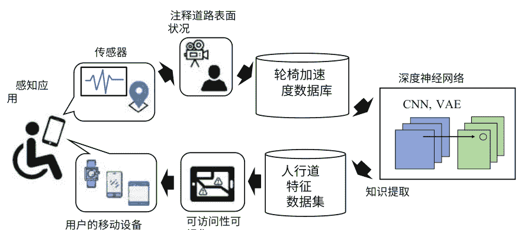

图1。提议系统的概述。.通过使用轮椅传感器数据和深度神经网络,将人行道可访问性可视化为导航地图。

根据道路的物理状况和能力进行道路无障碍性评估。因此,道路的物理状态信息是道路无障碍性的基础。

通过估计轮椅车身的振动来获取道路无障碍性信息,因为轮椅车轮直接受到道路表面状况的影响。由于深度神经网络的发展,可以从安装在各种轮椅上的加速度计的嘈杂原始信号中提取有用的信息。由于从原始加速度信号中提取出道路表面状况的影响是具有挑战性的,因此观测到的轮椅加速度信号必须转换为代表道路表面状况的指标。我们的最终目标是透过使用个性化模型为每个用户提供道路无障碍性可视化服务,并随着用户提供的新数据不断提高准确性。在服务启动后,随着更多用户收集到更多不同地方的轮椅行驶数据,模型将逐步加强。随着模型的成熟,还将有可能从婴儿车和自行车的运行数据中提取道路无障碍性信息,而不仅仅是轮椅。本文旨在通过使用监督分类、弱监督或自监督表示学习的深度神经网络,建立从轮椅行为数据中提取知识的基本方法。

### 2.2 相关工作

为行动不便的人提供各种移动支持系统已经被提出。GIS应用程序被用于创建由有关步行路线的宽度、步幅、坡度和位置信息组成的步行空间网络(Yairi和Igi, 2007; Zimmermann-Janschitz, 2018)。通过现场调查,在用户的智能手机上提供了一个轮椅用户导航系统(Koga等人, 2015)。尽管这些移动支持系统对于行动不便的人很有用,但这些系统依赖于人力劳动,在大范围内收集可访问性信息是不切实际的。

基于三轴加速度计和陀螺仪,在安卓应用中使用机器学习检测包括凹陷在内的道路质量(Allouch等人, 2017年)。使用智能手机的多模态传感器检测城市中的异常交通状况(Mohan等人, 2008年; Yu等人, 2016年)。尽管这些方法使用自动处理评估道路状况,但收集详细的道路表面状况,如坡度、路缘石和路面的粗糙度,仍然困难。

因此,我们专注于开发一种从轮椅加速度信号中提取可自动收集并受到道路表面状况影响的可访问性知识的系统。

在现有的机器学习方法中,需要使用带有教师标签的大型数据集来学习加速度数据中的道路表面状况。手动注释数据集依赖于人力,这既昂贵又不切实际,无法广泛收集。弱监督学习(Zhou, 2018年)方法和无监督特征学习(Längkvist等人, 2014年)方法已应用于各种机器学习任务,包括人类活动识别(Sargano等人, 2017年),以避免人工注释。本文介绍了我们使用弱监督和自监督方法从轮椅加速度信号中学习道路表面状况的可访问性知识的方法论。

## 3 估计人行道可达性

### 3.1 数据集

实际的轮椅驾驶数据被收集用于评估提出的方法。
共有九名年龄在20至60岁之间的轮椅使用者参与了实验,其中包括六辆手动轮椅和三辆电动轮椅。他们在东京四谷车站周围的1.4公里特定路线(如图2所示)上驾驶时的行为被通过安装在轮椅座位下的iPod touch上的三轴加速度计进行测量,并使用准天顶卫星系统(QZSS)测量位置数据。加速度计的x、y和z轴的加速度值以50赫兹的采样率进行采样,共采集了1341602个样本(约7.5小时)。为了确认加速度数据采集时的情况,同时记录了参与者的驾驶状态和道路表面条件的视频。整个路线的大部分是标准人行道,部分路段是人行横道。这条路线经过精心设计,包括各种道路表面条件,以评估提出的方法在常见道路上的泛化性能。如果用户在上下坡坡道时没有遇到问题,则认为对身体的过度负担和事故风险的考虑最小。每个参与者都要驾驶三圈路线;第一圈和第三圈顺时针从起点到终点驾驶,第二圈逆时针驾驶。图2中顺时针上升的坡道和缓坡道在第一圈和第三圈上升,在第二圈下降。

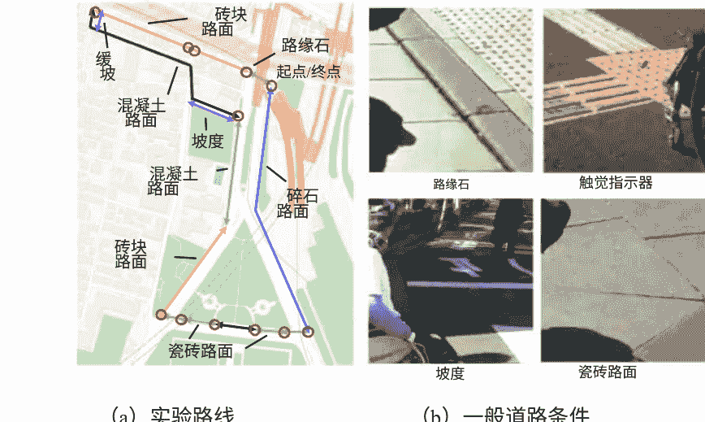

图2. 轮椅实验路线。.（a）由轮椅使用者驾驶的实验路线。（b）路线上的一般道路条件。

对加速度数据集进行了长度为五的均值滤波处理，以去除噪声。然后，对加速度数据集进行归一化处理，使每个轴的均值为零，标准差为一。为了将加速度数据输入到CNN模型中，使用滑动窗口将加速度数据分割成29,727个示例。窗口大小固定为450（约九秒），重叠率为90%。窗口大小和重叠率的选择是根据数据集进行调整的，遵循（Iwasawa等人，2016年）的方法，该方法应用于轮椅加速度数据的机器学习。

### 3.2 道路表面条件分类

本节提供了一个监督式CNN模型，用于使用轮椅加速度数据分类道路表面条件。道路表面条件标签有四个类别：坡道移动（坡道），爬坡（台阶），触觉指示器上移动（TI）和其他（其他）。每个类别代表了典型的道路表面条件：连续的斜坡，突然的台阶，持续的不平坦和其他条件。这些标签是通过对参与者和整个实验视频中的道路表面条件进行目视观察创建的。这些道路条件的信息直接向具有行动障碍，特别是轮椅使用者，传达可访问性信息。

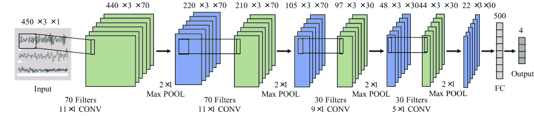

图3。用于从轮椅三轴加速度中分类道路表面条件的卷积神经网络的结构。

模型架构。图3显示了用于分类轮椅加速度数据的CNN结构。该网络由一个输入层、四个卷积层、一个全连接层和一个输出层组成。卷积层包括卷积、ReLU激活和最大池化处理。全连接层包括500个单元和ReLU激活。输出层由一个Softmax函数控制，有四个类别。网络在每个卷积层和全连接层之后都有dropout层。dropout的百分比从顶部到底部依次设置为20%、30%、30%、40%和50%。该网络遵循相关研究，用于识别人类活动数据（Yang等，2015年；Takahashi等，2018年），并且超参数已经调整以识别轮椅加速度。使用Adam算法作为优化器，学习率设置为0.0001。测试数据集使用留一主体法（LOSO）创建，通过评估未包含在训练数据中的用户的模型来验证性能。在本研究中，模型使用八个用户的数据集进行重复训练作为训练数据集，并使用剩下的一个用户的数据集进行测试。模型得分通过九次试验的平均值进行评估。验证数据集通过将训练数据集划分为90%的训练数据和10%的验证数据来创建，使用分层拆分方法。网络训练直到验证数据的分类交叉熵损失停止减少。

分类结果。表1比较了现有的机器学习方法和CNN模型在分类性能方面的差异。宏平均F1得分（FS）和准确率（Acc）被用作评估指标。由于其他（Others）占数据集的近77%，类别不平衡，高F分数意味着模型能够很好地识别出数据集中出现较少的障碍物。

表1。手工特征分类方法和CNN模型在F-得分（FS）和准确率（Acc）方面的比较。
| 方法 | FS (无平滑) | 准确率 (%) (无平滑) | FS (有平滑) | 准确率 (%) (有平滑) |
|---|---|---|---|---|
| 原始+K-NN | 28.2 | 75.5 | 26.4 | 74.9 |
| MV + K-NN | 45.0 | 69.9 | 45.6 | 73.2 |
| 启发式+SVM | 51.9 | 80.3 | 51.8 | 80.7 |
| 启发式+MLP | 56.5 | 78.2 | 56.3 | 78.9 |
| CNN+ SVM | 62.6 | 82.5 | 67.4 | 85.2 |
| CNN + MLP | 68.7 | 84.7 | 71.3 | 86.4 |

第一种比较方法（Raw + k-NN）使用原始加速度信号作为特征集，并使用k最近邻（k-NN）作为分类器。第二种方法（MV + k-NN）使用每个段的每个轴的均值和标准差（MV）作为特征集，并使用k-NN作为分类器。第三种和第四种方法使用丰富的启发式特征作为特征集。计算了每个段的每个轴的以下12种类型的值作为启发式特征：均值；标准差；最大值；最小值；过零率；差异的均值、标准差、最大值和最小值；FFT频率分量；FFT频率分量的能量和熵。启发式特征通过带有rbf核的SVM（启发式+SVM）和具有两个500个单元的全连接层的多层感知器进行分类。

（启发式+多层感知机）k-NN的参数k，正则化参数C和SVM的核系数γ是通过五折交叉验证选择的，以最大化宏F分数。SVM的参数C和MLP的损失函数被调整为与训练数据中的类别频率成反比，以处理类别不平衡问题。为了确保与CNN的比较公平，训练好的CNN的激活被SVM（CNN+SVM）和MLP（CNN+MLP）进行分类。受以前的研究（Cao等，2012）的启发，实施了一种平滑方法来后处理预测标签，以提高分类器的预测性能。由于相邻的道路表面条件处于相似状态，样本标签具有平滑的趋势。该平滑方法采用低通滤波器来去除脉冲噪声并保持边缘。

脉冲噪声是一种潜在的错误预测，而在这种情况下，边缘是道路表面条件的转变。对于第i个示例，对中心为第i个示例的序列应用长度为七的平滑滤波器。对于每个类别，对序列的预测概率进行平均，并将具有最高概率的类别分配给第i个示例。

使用原始轮椅三轴加速度信号进行道路表面条件分类的CNN方法实现了比现有机器学习方法更高的分类得分。这个结果表明所提出的方法合理且实用，可以用于估计道路可达性。

### 3.3 弱监督知识提取

#### 3.3.1 方法论

本节介绍我们的弱监督方法，用于提取道路表面条件的表示（Watanabe等，2020年）。我们的方法利用驾驶过程中收集的位置信息作为低成本的弱监督来学习道路表面条件，不依赖于人工注释。位置信息可以通过加速度信号自动收集，并且与道路表面条件有语义关联。在弱监督特征学习任务中，确定用于监督的信息是影响学习性能的重要因素。我们尝试使用一种新颖的方法，将轮椅驾驶过程中的位置信息作为弱监督进行融合。由于相邻的道路表面具有相似的条件，我们的模型通过训练来预测输入加速度数据的测量位置，有效地学习道路表面条件。对于本文中的位置信息，我们确认了加速度数据的位置。

通过观察实验视频来纠正包含在QZSS位置数据中的错误。

生成弱监督的步骤。首先，将地球表面划分为网格形状。划分地球表面的目的是将相邻的道路表面聚合成一组，并创建离散的类别来制定位置预测任务作为分类问题。网格的宽度由网格选择，在垂直和水平维度上都选择为5米，因为小于5米的网格宽度可以区分道路两侧的人行道。然后，只使用覆盖行驶路线的网格作为目标网格。最后，为目标网格的每个网格分配一个唯一的编号。

这些分配的编号是每个网格的标识（ID）。这些ID被分配给所有加速度样本。通过其位置数据来识别每个样本所属的网格。这些分配的ID是位置标签集，用作加速度数据的弱监督。通过这些步骤，相邻道路表面被分配相同的类别，CNN模型被认为能够有效地学习道路表面条件的特征表示。

位置预测。弱监督CNN的模型架构和训练过程与第3.2节中的有监督CNN相同，唯一的区别是弱监督CNN使用了位置标签，输出类别是网格的ID。

我们将在后文中将这个在弱监督任务上训练的CNN模型称为PosNet模型。

将PosNet模型的位置预测任务结果与另一种机器学习方法进行了比较。PosNet模型的准确率为11.2%。作为对比，对每个示例的每个轴的FFT频率分量进行计算，并使用逻辑回归进行分类。通过五折交叉验证选择正则化参数C以最大化准确率。逻辑回归的准确率为5.86%。在这种情况下，纯粹的随机准确率为0.32%。

这些模型的准确率是使用LOSO方法得到的九次试验的平均值。尽管得分较低，但使用弱监督训练PosNet模型的目的是学习道路表面条件的特征表示并在网络中积累它们。这个绝对得分对于评估模型并不重要。

#### 3.3.2 分析

本节评估了由PosNet模型学习到的道路表面条件的表示。为了评估学习到的表示，使用训练数据集对PosNet模型进行了训练。然后将测试数据集输入到训练好的网络中，获取完全连接层的激活。这个激活是一组特征向量，是模型从输入加速度数据中学到的内部表示。通过k-means聚类对得到的特征向量集进行分组，以评估学习到的表示如何传达道路表面条件的信息。聚类结果按照每个聚类进行颜色编码，并在地图上绘制输入加速度示例的位置。

路线包括以下11种常见的道路表面条件：碎石路面（GRAV），瓷砖路面（TILE），砖石路面-1（BLK-1），砖石路面-2（BLK-2），混凝土路面-1（CONC-1），混凝土路面-2（CONC-2），路缘（CURB），上坡（ASC-SLP），下坡（DESC-SLP），缓坡上坡（GENT-ASC-SLP）和缓坡下坡（GENT-DESC-SLP）。通过对每一圈的绘图进行详细观察，评估了聚类结果。图4展示了当聚类数k为16时，一个手动轮椅用户的聚类结果可视化。第一圈和第三圈的上坡（ASC-SLP）明显聚集在紫色聚类中，第一圈和第三圈的缓坡上坡（GENT-ASC-SLP）聚集在浅紫色聚类中。第二圈的下坡（DESC-SLP）和部分缓坡下坡（GENT-DESC-SLP）聚集在浅绿色聚类中。大部分路缘（CURB）在每一圈都聚集在黄绿色聚类中。对于其他路面类型，碎石路面（GRAV）和混凝土路面-1（CONC-1）在每一圈都聚集在蓝色聚类中，大部分混凝土路面-2（CONC-2b）在每一圈都聚集在绿色聚类中。虽然碎石路面（GRAV）和混凝土路面（CONC）的聚类结果在每一圈都相似，但瓷砖路面（TILE），砖石路面-1（BLK-1）和砖石路面-2（BLK-2）的聚类趋势根据行驶方向而不同。这种整体聚类趋势在所有九个数据集模式中都观察到。

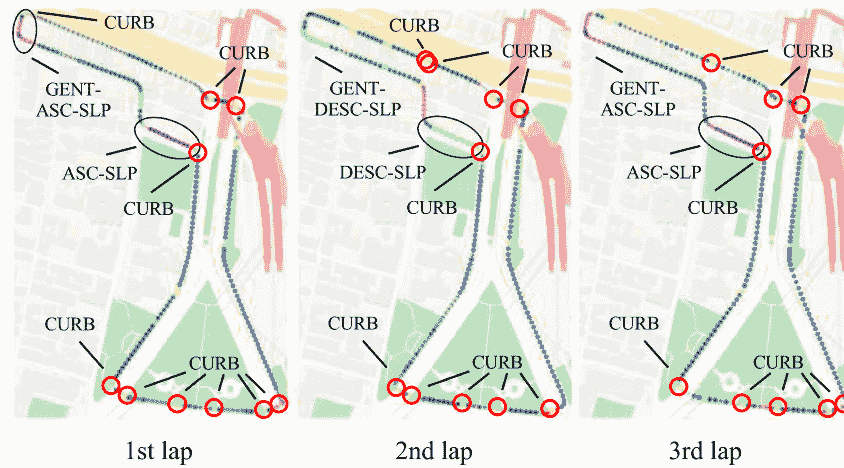

图4.一位手动轮椅使用者的聚类可视化结果。（彩色图见在线版）

这些观察结果表明，PosNet模型学习到了详细道路表面条件的特征表示。ASC-SLP和DESC-SLP被分为独立的集群，尽管无论驾驶方向如何，相邻道路都被分配了相同的位置标签。这个结果表明，该模型有效地学习到了上升和下降梯度之间的差异表示。ASC-SLP和GENT-ASC-SLP被分为不同的集群。这个结果表明，模型学习到了梯度微小差异的表示。大多数CURB的确切点被分为同一集群，无论是哪一圈。这个结果表明，模型学习到了通过路缘进行轮椅驾驶的模式表示。总结三圈的聚类结果，检测到了所有12个路缘点。相同的路面类型大致被分为同一集群，而不同的路面倾向于被分为不同的集群。

通过聚类评估，发现PosNet模型能够学习到道路表面条件的丰富特征表示。评估了学习表示的实用性，用于识别一般道路表面条件。 在半监督设置下评估了道路表面条件的分类任务。 半监督设置的常见情景是有大量数据可用，但只有一小部分被标记。 这种情景在轮椅数据中是现实可行的，因为可以广泛收集到加速度数据和轮椅的位置信息，而对所有加速度数据进行手动注释是昂贵且不切实际的。由于位置信息可以自动收集，因此PosNet模型是使用整个数据集进行训练的。 然后，使用道路表面条件标签的子集和相应的特征集，该特征集是从训练好的PosNet模型中获得的，训练了一个分类器。选择了启发式+MLP和CNN+MLP与提出的方法（PosNet+MLP）进行比较。 对于CNN+MLP，只使用训练数据的子集来训练CNN模型，因为CNN模型是使用道路表面条件标签进行训练的。

图5显示了在半监督设置下分类性能的转变。 100%的子集是使用整个数据集的极端情况。 当标记数据的数量低于10%时，所提出的模型（PosNet + MLP）超过了完全监督方法（CNN + MLP）的性能。 随着标记数据量的减少，它们之间的性能差距增大。 在任何子集比例上，所提出的方法（PosNet + MLP）始终优于启发式+MLP。 这个结果证明了所提出的方法在实际环境中的有用性。 当收集到比本文实验中更广泛的轮椅驾驶数据时，即使标记数据的数量有限，所提出的方法的性能也会提高，提供一个高度实用的模型。

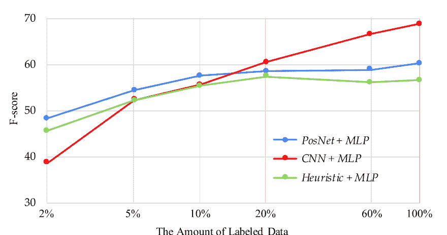

图5. 在半监督设置中的分类性能。分类是在100%、60%、20%、10%、5%和2%的子集下实施。 x轴是对数刻度道路表面条件标签数据量的百分比。 y轴是四个类别的宏F-得分。

### 3.4 自监督知识提取

#### 3.4.1 方法

本节介绍了我们的自监督方法，用于评估轮椅用户的人行道障碍程度。该方法尝试使用卷积变分自编码器（ConvVAE）从轮椅加速度信号中提取人行道可达性的知识。即使没有或只有少量标记的训练数据，ConvVAE也能检测异常。通过ConvVAE计算的重构误差被检查，看它是否反映了道路条件，并被用作轮椅用户的负担程度。

ConvVAE网络由编码器和解码器组成。编码器有一个输入层，四个卷积层，解码器有四个反卷积层和一个线性输出层。编码器的潜在分布被采样为具有标准分布的潜在表示，并通过解码器解码为重构的输入加速度信号。编码器中的卷积层由一个卷积、ReLU激活和最大池化处理组成，解码器中的反卷积层由一个反卷积、ReLU激活和上采样处理组成。卷积层的卷积核大小和特征图数量以及训练过程遵循第3.2节中的监督CNN，均方误差被用作ConvVAE的损失函数。在本实验中，加速度信号的分段窗口大小被固定为400，以使潜在表示重构为与输入相同的形状。重构误差是通过输入和输出信号之间的均方误差计算的。

#### 3.4.2 分析

通过提出的ConvVAE计算的重建误差在地图上绘制，并检查它是否反映了轮椅使用者的负担程度。在通过训练数据集训练ConvVAE模型后，将测试数据集输入训练好的网络，并通过LOSO方法计算每个九个用户的重建误差。对每个用户进行重建误差归一化，并在路线上的每5米内选择九个用户中的最大重建误差值。

图6显示了九个用户中的最大重建误差的可视化。绘图点的颜色由每个选定的重建误差值与最大值的比率决定。比率越大，越接近红色；比率越小，越接近蓝色。在图中，可以看到重建误差较大的地方有五个CURB点和异常点A。由于实验进行时，点A正在施工中，参与者在改点周围的道路上行驶方式与其他道路不同。在路线的大部分区域，重建误差的值都是中等或较低的。这个结果表明重建误差反映了道路的异常性，如突然的台阶和异常环境中的点。

由于这些异常点对于轮椅用户来说是负担，ConvVAE模型被用来从轮椅加速度信号中提取一些无监督的可访问性知识。

## 用于可视化人行道可达性的轮椅行为识别

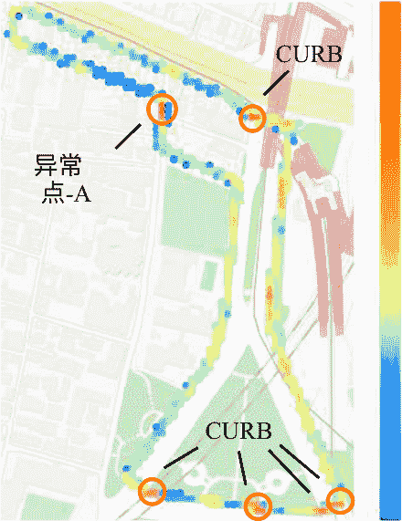

图6. 九位参与者的重建误差图(在线彩色图)

## 4 结论

本文的贡献在于确认使用轮椅加速度信号提供可访问性信息的可能性。本文开发并提出了一个原型系统,用于可视化人行道可访问性信息,帮助行人,特别是行动不便的人。所提出的方法使用深度神经网络通过从轮椅座位下安装的三轴加速度计中提取轮椅行为的知识来估计人行道可访问性。监督方法证明了卷积神经网络通过识别加速度信号中的轮椅行为来分类道路表面条件。提出了一种新方法,通过弱监督学习来估计道路表面条件,无需手动注释。所提出的方法证明了轮椅行驶过程中的位置信息有助于学习道路表面条件的丰富表示,并且学到的表示对于道路表面分类任务具有很高的区分性。学到的表示在地图上进行了可视化,并展示了道路表面条件的详细表示,例如上坡和下坡的差异,坡度的角度,路缘石的准确位置以及类似路面的细微差异。与计算得到的丰富启发式特征相比,学到的表示对于道路表面分类任务更有用。自监督部分介绍了一种评估轮椅用户人行道障碍程度的方法。所提出的方法尝试使用ConvVAE从轮椅加速度信号中提取人行道可访问性的知识。结果表明,可以提取可访问性知识,例如突然的台阶和异常环境中的障碍物,对于轮椅用户而言是负担,而无需任何监督。

我们未来的工作将致力于改进轮椅行为识别模型的设计，以及不需要人工劳动且有益于估计人行道可达性的监督设计。采用最新的混合深度模型（Yao等人，2017）有望提升识别模型。监督设计包括无监督表示学习，可用于活动识别（Ji等人，2019）。

致谢。我们要向所有参与数据收集的人表示最诚挚的感谢。本研究得到了日本学术振兴会的科学研究基金（B）17H01946和20H04476的支持。

## 参考文献

- Laakso, M., Sarjakoski, T., Sarjakoski, L.T.: 在行人地图和数据库中改进可达性信息。地图学国际期刊地理信息和地理可视化 46(2), 101–108 (2011). https://doi.org/10.3138/carto.46.2.101
- Karimi, H.A., Zhang, L., Benner, J.G.: 个性化可访问性地图（PAM）：一种新颖的辅助寻路方法，适用于残疾人。Ann. GIS 20（2），99-108（2014）。https://doi.org/10.1080/19475683.2014.904438
- Ponsard, C., Snoeck, V.: 公共基础设施的客观可访问性评估。 In: Miesenberger, K., Klaus, J., Zagler, W.L., Karshmer, A.I.（eds.) ICCHP 2006. LNCS, vol.4061, pp. 314-321. Springer, Heidelberg (2006). https://doi.org/10.1007/11788713_47
- Hara, K.: 用于收集和可视化残疾人人行道可访问性数据的可扩展方法。在：UIST, pp. 1-4（2014）。https://doi.org/10.1145/2658779.2661163
- Swan, M.: 量化自我：大数据科学和生物发现的根本性颠覆。 Big Data 1（2），85-99（2013）。https://doi.org/10.1089/big.2012.0002
- Wang, J., Chen, Y., Hao, S., Peng, X., Hu, L.: 基于传感器的活动识别的深度学习：一项调查。 Pattern Recogn. Lett. 119, 3-11（2019）。https://doi.org/10.1016/j.patrec.2018.02.010
- Plötz, T., Hammerla, N.Y., Olivier, P.L.: 特征学习用于普适计算中的活动识别。在：IJCAI ，pp. 1729–1734（2011）。https://doi.org/10.5591/978-1-57735-516-8/IJCAI11-290
- Yang, J., Nguyen, M.N., San, P.P., Li, X., Krishnaswamy, S.: 多通道时间序列上的深度卷积神经网络用于人类活动识别。在：IJCAI, pp. 25–31（2015）
- Edel, M., Köppe, E.: 基于二值化-BLSTM-RNN的人类活动识别。在：IPIN, pp. 1–7（2016）。https://doi.org/10.1109/IPIN.2016.7743581
- Yao, S., Hu, S., Zhao, Y., Zhang, A., Abdeltzaher, T.: Deepsense: 一个统一的深度学习框架，用于处理时间序列移动感知数据。在：WWW，第351-360页（2017年）。https://doi.org/10.1145/3038912.3052577
- Mora, H., Gilart-Iglesias, V., Pérez-del Hoyo, R., Andújar-Montoya, M.D.: 一个全面的智能城市监测系统，用于监测城市可访问性。传感器17（8），1834（2017年）。https://doi.org/10.3390/s17081834
- Lara, O.D., Labrador, M.A.: 使用可穿戴传感器进行人类活动识别的调查。IEEE Commun. Surv. Tutor. 15（3），1192-1209（2012年）。https://doi.org/10.1109/SURV.2012.110112.00192
- Yairi, E.I., Igi, S.: 对老年人和残疾人移动支持的普适系统研究及其技术转移给工业界。信息处理杂志，48，770-779（2007年）。（日文）
- Zimmermann-Janschitz, S.: 地理信息系统在残疾人背景下的应用。J. Access. Des. All, 8 (2) , 161-192 (2018年)。 https://doi.org/10.17411/jacces.vB2.171
- Koga, M., Izumi, S., Matsubara, S., Morishita, K., Yoshioka, D.: 开发和验证城市地区轮椅用户活动支持导航系统。IADIS国际WWW/Internet杂志，13 (1) , 43-56 (2015年)
- Allouch, A., Koubata, A., Abbes, T., Ammar, A.: Roadsense: 利用加速度计和陀螺仪估计道路状况的智能手机应用程序。IEEE传感器杂志，17 (13) , 4231-4238 (2017年) https://doi.org/10.1109/JSEN.2017.2702739
- Mohan, P., Padmanabhan, V.N., Ramjee, R.: Nericell: 使用移动智能手机对道路和交通条件进行全面监测.在: SENSYS, pp. 323-336 (2008). https://doi.org/10.1145/1460412.1460444
- Yu, J., 等: Senspeed: 感知城市环境中的驾驶条件以估计车速. IEEE Trans. Mob. Comput 15 (1), 202-216 (2016). https://doi.org/10.1109/TMC.2015.2411270
- Zhou, Z.-H.: 弱监督学习简介. Natl. Sci. Rev. 5 (1), 44-53 (2018). https://doi.org/10.1093/nsr/nwx106
- Längkvist, M., Karlsson, L., Loutfi, A.: 无监督特征学习和深度学习在时间序列建模中的综述。模式识别通讯。42, 11-24 (2014年)。 https://doi.org/10.1016/j.patrec.2014.01.008
- Sargano, A.B., Angelov, P., Habib, Z.: 人类活动识别中基于手工和学习的动作表示方法的综合评述。应用科学。7 (1) , 110 (2017年)。 https://doi.org/10.3390/app7010110
- Iwasawa, Y., Yairi, I.E., Matsuo, Y.: 结合轮椅使用者的人类动作感知和机器学习进行自主可访问性数据收集。IEICE信息系统交易。99 (4) , 115-124 (2016年)。 https://doi.org/10.1587/transinf.2015EDP7278
- 高桥，长峰，岩泽，松尾，矢入：使用深度卷积神经网络从轮椅传感数据中量化道路条件。IEICE Trans. Inf. Syst. 101(6), 2502-2505 (2018)。 https://doi.org/10.14923/transinfj.2017jdp7067。（日文）
- 曹，阮，潘，Krishnaswamy，李：人类活动分类的综合框架。在：UbiComp，pp. 331-340 (2012)。 https://doi.org/10.1145/2370216.2370334
- 渡边，高桥，岩泽，松尾，矢入：从轮椅驾驶数据中进行弱监督学习以评估道路表面状况。信息11(1), 2 (2020)。 https://doi.org/10.3390/info11010002
- Ji, X., Henriques, J.F., Vedaldi, A.: 不变信息聚类用于无监督图像分类和分割。在：ICCV, 第9865-9874页 (2019年)。 https://doi.org/10.1109/ICCV.2019.00996

# 面向传感器的细粒度手部活动识别的数据增强和解释

摘要。近年来, 识别细粒度手部活动广受研究界的关注。..然而, 与全身活动的丰富传感器数据集相比, 加速器的细粒度手部活动的数据有限。在本文中, 我们提出了一种纯卷积生成对抗网络 (GAN) 方法, 用于对细粒度手部活动的加速器数据进行数据增强。该方法包括2D卷积鉴别器和2D转置卷积生成器, 能够学习重新调整传感器数据的分布, 并生成能够很好保留交叉轴相关性的合成实例。我们通过扩展现有数据集并提高最先进的分类器的测试准确性来评估合成数据的可用性。通过引入轴向热图和面向模型的决策解释等可视化方法, 解释了本质上无法阅读的传感器数据。实验证明, 我们的方法能够通过基于GAN的数据增强有效提高分类器的测试准确性, 同时很好地保留合成数据的真实性。

关键词：活动识别 · 数据增强 · 生成对抗网络 · 深度学习

## 1 引言

近年来, 人类活动识别 (HAR) 越来越受欢迎。由于深度学习已经展示出从大数据分布中提取高级特征表示的强大能力, 因此探索这种深度方法用于基于传感器的HAR任务在研究社区中蓬勃发展[7,26]。在最近的十年中, 深度学习技术显著优化了HAR任务, 并应用于一些人类导向的应用[20,28]。

然而, 现代HAR研究经常忽视从基于传感器的信号中识别细粒度的手部动作, 因为这些手部活动通常与身体活动无关。 例如, 一个人可以被识别为安静地坐在椅子上 (身体活动), 同时玩视频游戏 (手部活动)。 这样的差距使得使用人体其他部位的传感器难以区分手部动作。 从身体运动中独立感知细粒度的手部活动可以激发健康监测的上下文感知设备和交互式游戏设计的进一步发展。 然而, 目前只有很少的研究尝试在这个方向上构建基于深度学习的原型[9, 17]。 因此, 利用各种深度学习技术探索基于传感器的手部活动识别仍然具有重要的潜力, 以构建一个更全面和上下文敏感的HAR系统。

尽管深度学习取得了巨大的成功, 但基于深度学习的人类活动识别方法在数据稀缺方面面临着重大挑战。 在基于传感器的手部活动识别背景下, 解决训练深度分类器时数据稀缺问题仍然是一个未开发的领域。 由于手部运动数据的收集涉及到人力和传感器购买, 因此对于基于传感器的信号的收集过程在时间和金钱方面的要求越来越高。

不准确的活动测量问题也会影响数据和结果。 此外, 最近COVID-19大流行使得对人类活动的数据收集变得非常困难, 特别是对于符合实验室标准的细粒度手部活动。 在这种情况下, 通过真实世界的数据收集进行数据增强是困难的, 有时甚至是不可行的。

为了弥补上述研究差距, 本文提出了一种基于GAN的方法, 用于增强基于传感器的手部活动识别任务的数据, 从而提高训练最先进的手部活动分类器的测试准确性。 我们的方法通过采用二维卷积层来捕捉加速度计中三个轴的时间序列数据之间的内在相关性。这种方法还可以更好地学习单个时间序列数据样本中的多尺度特征。我们使用12个不同类别的细粒度手部活动的真实传感器数据来训练生成模型, 然后生成增强数据集。 之后, 我们利用我们的增强数据集重新训练最先进的手部活动识别分类器, 并评估分类准确性的改进。 为了进一步评估合成数据, 我们提出了两种视觉检查方法来评估合成数据的质量, 并解释手部活动识别分类器的决策。

## 2 相关工作

### 2.1 人类活动识别

传统的非深度学习方法主要集中在利用特征提取技术, 如时间序列信号转换[13]和手工统计建模[5]。 有效地捕捉可区分的特征因此,表征一直是HAR任务中的一个主要挑战。领先的基于深度学习的HAR工作已经证明了深度神经网络在HAR中的有用性[16,28]。除此之外,一些研究尝试引入集成分类器或多模态解决方案,将不同传感器数据通道合并起来,以改善一些具有挑战性的HAR任务的模型训练过程[14,20]。随着深度学习的趋势,HAR开始在许多工业和实际应用中释放其潜力,例如心脏指标评估[4]和事故检测[18]。

具体而言,在手部活动识别中,一些人应用计算机视觉方法来识别手势和动作[9,21]。[17]介绍了通过智能手表的传感器数据识别特定手部活动,这被证明是一种未充分利用但高度互补的上下文通道,可在辅助手语翻译[24]等以人为导向的应用中广泛使用。

最近的人类活动识别研究工作在学习信号的潜在表示和准确分类方面进行了彻底的优化。然而,由于人类活动识别中的数据收集过程通常充满噪声、昂贵且耗时,因此逐渐出现了注释稀缺的问题[7]。一些研究提出了无监督或半监督[6,12]的学习方法来解决数据稀缺的问题,但很少有人采用生成对抗网络(GANs)的概念,该网络可以通过生成更多低成本的样本来扩大现有数据集。

### 2.2 生成对抗网络

生成对抗网络(GANs)最初由[11]提出,在许多领域中已经展示出生成虚假但令人信服的样本的强大能力。许多架构变体,包括DCGANs[22],LAPGANs[8]和BEGANs [3],已经被提出来支持GANs训练过程的稳定化或提高生成质量。如今,GANs广泛应用于各种智能任务,如图像处理[31],纹理合成[2]和语义分割[30]。

然而,现有的HAR任务生成模型主要采用循环神经网络或LSTM[1],这些架构似乎很有竞争力,因为它们允许时间序列状态记忆的内部更新。[27]提出了Sensory GAN,这是一个统一的GAN结构,它使用卷积和循环神经元生成基于加速器的HAR数据的混合。作者将加速度计的三元时间序列转化为一维向量距离表示。然而,他们的方法仅采用LSTM结构和一维卷积神经网络(1D-CNN),无法捕捉加速度计三个不同轴的传感器数据分布之间的内在交叉关系。[29]中,作者提出了SenseGAN,这是一个半监督框架,利用无标签的基于传感器的数据来减少分类器训练过程中数据稀缺的负面影响。然而,他们的方法缺乏对视觉检查或质量评估的支持。[15]使用GAN学习和生成更多的人体姿势图片，但他们的方法不适用于由多通道时间序列信号组成的基于传感器的HAR数据集。[10,19]在不同场景下研究了基于LSTM的GAN在HAR中的使用，但这些结构在我们希望生成器从加速度计数据中学习跨轴特征表示或X-Y-Z轴之间的相关性时不够有竞争力。

从现有的研究中我们可以看到，目前对于基于GAN的传感器细粒度手部活动生成方法仍然缺乏研究。此外，在HAR中使用基于卷积的GAN的研究较少，使其无法捕捉传感器轴之间的内在关系。

## 3 基于GAN的数据增强

在本节中，我们介绍如何将数据从时间序列转换为多维张量，并描述我们基于GAN的数据增强框架。

### 3.1 数据转换

由[17]开源的基于加速器的手部活动数据集，其标签显示在表1中，捕捉到手部的整体定位和运动，其中包含手部活动的生物声学信息。具体来说，原始的IMU数据采集是以4kHz的采样率记录的256个单元长度，由3轴加速度计（X、Y和Z轴）收集。这样的采样率配合8192个样本的缓冲区支持通过傅里叶变换进行数据处理（4096个频率区间，每个区间0.5Hz的分辨率）。由于手部活动的大部分信号分布在表示0-128Hz频率的最低256个FFT频率区间中，这256个频率区间被保存为一个48帧的滚动频谱图，表示总共3秒的活动信号。

通过这种预处理，1-D加速度计信号现在被堆叠为256个频率区间×48帧×3个方向。由于CNN已经在多通道视觉数据集（高度×宽度×RGB通道）上表现出良好的能力，这种上升维度的转换使得我们基于CNN的GAN架构能够学习到其它方法中消除的交叉轴关系，其中三个方向通道被合并成一个一维序列。

在进行这种高维转换之后，我们甚至可以像图片一样以RGB模式可视化这些信号样本，如图1所示。然而，由于这种可视化并不易于人类阅读，在接下来的章节中，我们提供了几种进一步评估和解释这些样本的方法。

表1。手部活动的标签信息。

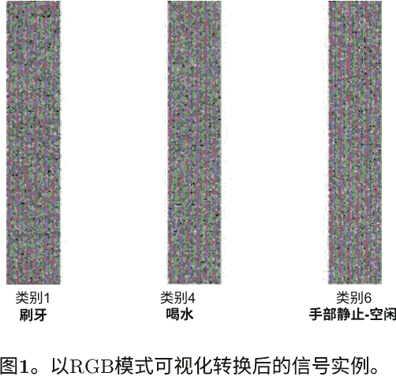

### 3.2 架构描述

最小-最大优化。受[22]的启发，我们应用基于2D卷积的GAN结构生成更多的合成2D形式的手部活动信号，以增加原始数据集。正如我们在公式1中所示，这基本上是一个人口风险的最小-最大优化过程，生成器$\mathcal{G}$试图生成能够欺骗鉴别器$\mathcal{D}$的样本，而后者则在更新参数以更好地正确区分真实和伪造样本。最终，生成器应该能够模拟一个足够接近真实数据分布的分布，以击败鉴别器。

$$\min _{\mathcal{G}} \max _{\mathcal{D}} \mathcal{L}(\mathcal{D}, \mathcal{G})=\mathbb{E}_{x \sim p_{\text {数据 }}(x)}[\log \mathcal{D}(x)]+\mathbb{E}_{z \sim p_{z}(z)}[\log (1-\mathcal{D}(\mathcal{G}(z)))]$$

在公式1中， $x$是来自原始数据集的真实输入样本， $z$是具有特定起始种子的随机高斯噪声。我们的工作流程如算法1所示。

生成器。生成器使用Conv2DTranspose-LeakyReLU块逐渐上采样从随机噪声生成目标2D格式信号。最终生成的结果的大小为 (256，48，3)。在实践中，我们让生成器最小化公式2中的经验风险 $\mathcal{L}_{\mathcal{G}}$，而不是理论上的总体风险。

$$\mathcal{L}_{\mathcal{G}}=\frac{1}{m} \sum_{i=1}^{m} \log \left(1-\mathcal{D}\left(\mathcal{G}\left(z_{i}\right)\right)\right)$$

在上述方程中， $m$表示训练实例的数量。生成器的结构如图2所示。


图2. 我们方法的生成器架构。


图3. 我们方法的判别器架构。

判别器：判别器包含 Conv2D-LeakyReLU 块，这个基于卷积的结构将接收一个尺寸为 (256, 48, 3) 的张量，将输入样本分类为真实（预测为 1）或伪造（预测为 0）。与生成器类似，实际上我们让判别器最小化 Eq.3 中的经验风险 $\mathcal{L}_{\mathcal{D}}$。

$$\mathcal{L}_{\mathcal{D}}=\frac{1}{m} \sum_{i=1}^{m} \log \mathcal{D}\left(x_{i}\right)+\log \left(1-\mathcal{D}\left(\mathcal{G}\left(z_{i}\right)\right)\right)$$

判别器的结构如图3所示。生成器和判别器中所有卷积层的滤波窗口大小为 (5, 5)。

## 4. 实验和分析

在本节中，我们按照我们提出的方法生成合成数据。然后，我们进行实验来评估通过在增强数据集（即真实+合成数据）上进行训练来改善分类器的测试准确性。我们还提出了几种数据可视化的方法，以直观评估和分析不同标签的合成数据。

### 算法1. 我们方法的工作流程

```
输入: 手部活动的真实传感器信号 $\mathcal{X}_{\text{hand}}$; 输出: 增强数据集 $\mathcal{X}_{\text{aug}}$。
1: 对于 $N$ 个 GAN 周期:
2:   随机生成高斯噪声 $\mathcal{Z}=\{z_0, z_1, ..., z_m\}$;
3:   从 $\mathcal{X}_{\text{hand}}$ 中随机选择真实信号 $\mathcal{X}_{\text{real}}=\{x_0, x_1, ..., x_m\}$;
4:   生成合成信号 $\mathcal{X}_{\text{fake}}=\mathcal{G}(\mathcal{Z})$;
5:   对于判别器 $D$ 的步骤, 执行 $S$ 次:
6:     更新 $W_D$ 为 $W_D$ 加上判别器梯度乘以判别器损失函数;
7:   结束循环
8:   对于生成器 $G$ 的步骤, 执行 $S$ 次:
9:     更新 $W_G$ 为 $W_G$ 减去生成器梯度乘以生成器损失函数;
10:  结束循环
11: 结束 GAN 周期循环
12: 新的随机高斯噪声 $\mathcal{Z}_{\text{new}}$;
13: 生成合成数据 $\mathcal{X}_{\text{gen}}=\mathcal{G}(\mathcal{Z}_{\text{new}})$;
14: 扩充数据集 $\mathcal{X}_{\text{aug}} = \mathcal{X}_{\text{hand}} \cup \mathcal{X}_{\text{gen}}$;
15: 对于分类器的 $N$ 次迭代, 执行:
16:   分类器的权重 $W_{\text{classifier}}$ 减去分类器梯度乘以分类器损失函数;
17: 结束循环
```

### 4.1 实现细节

我们的 GAN 和手部分类器基线（在第4.2节中称为 Hand-12）的训练使用了一台 NVIDIA GeForce RTX 2080 Ti 的 GPU 集群。在生成器和判别器的训练过程中，我们设置了 200 个迭代次数，批量大小为 256 个样本。

我们方法中生成器和判别器的优化器都是 Adam，学习率为 0.0001。训练后，会有多个生成器-判别器对，每个对应一个手部活动类别。在 Hand-12 DCNN 分类器的训练中，我们设置了 100 个 epochs，批量大小为 64 个样本。Hand-12 的优化器是 Adam，学习率为 0.001。在合成数据的生成中，我们对每个类别的生成器进行训练（约 3500 个训练实例），并为每个类别生成了 4000 个额外实例。

### 4.2 提高分类器性能

我们参考了 [17] 提出的 VGG 变种分类器，即 Hand-24，它专门针对基于传感器的手部活动识别设计了一个 DCNN 结构。为了适应我们的 12 个类别情况，我们使用了该方法的修改版本 Hand-12，如图4所示，其中密集层中的神经元数量稍微减少。这种减少导致基准准确率从 90.70% 提高到 91.76%。具体而言，我们在原始训练集（数据集中的第1轮到第3轮）上训练 Hand-12，该训练集包含 12 个手部活动类别（y 标签索引从 0 到 11），然后在原始测试集（数据集中的第4轮）上测试模型。

表2. 在增强训练后，Hand-12 的分类测试准确率 (12×2K) 的类别。

| 活动标签 | 全部 | 0 | 1 | 2 | 3 | 4 | 5 | 6 | 7 | 8 | 9 | 10 | 11 |
| :--- | :--- | :--- | :--- | :--- | :--- | :--- | :--- | :--- | :--- | :--- | :--- | :--- | :--- |
| 测试样本 | 14973 | 1225 | 1248 | 1251 | 1201 | 1250 | 1253 | 1248 | 1253 | 1249 | 1255 | 1254 | 1286 |
| 测试准确率 | 0.9419 | 0.9894 | 0.9583 | 0.9041 | 1.0000 | 1.0000 | 0.9832 | 0.9944 | 0.9162 | 0.8319 | 0.8351 | 1.0000 | 0.8950 |

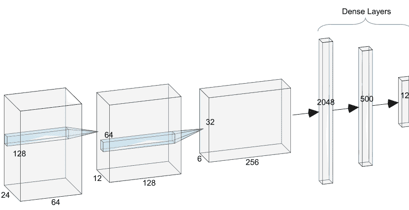
图4. Hand-12 的架构。

在获得每个类别的生成活动样本后，我们将它们与原始训练集混合，以获得不同比例的增强数据集。为了评估不同数量的增强对训练的影响，我们在以下设置上对基准模型进行训练：原始训练集（44862 个实例）增加了：1 个类别的 2K 合成数据（46862 个实例），12 个类别的 1K 合成数据（56862 个实例），12 个类别的 2K 合成数据（68862 个实例），12 个类别的 4K 合成数据（92862 个实例）。表2显示了在我们在增强训练集（68862 个实例）上训练基准模型后，每个数据类别的分类测试准确率。图6显示了每个不同设置的准确率改进对比结果。我们可以看到，与其他设置相比，增加了 12 个类别的 2K 合成数据（68862 个实例）的数据集具有最高的测试准确率。这表明，我们增强原始训练集的方法可以帮助分类器更好地适应数据分布，从而在测试集上表现更好。请注意，与 12×2K 相比，12 个类别的 4K 合成数据（92862 个实例）的设置略低于测试准确率。我们认为这是因为当增强部分远远超过原始训练集时，分类器可能无法最好地适应原始分布。但尽管与 12×2K 相比有轻微下降，12×4K 的设置仍然优于原始设置。

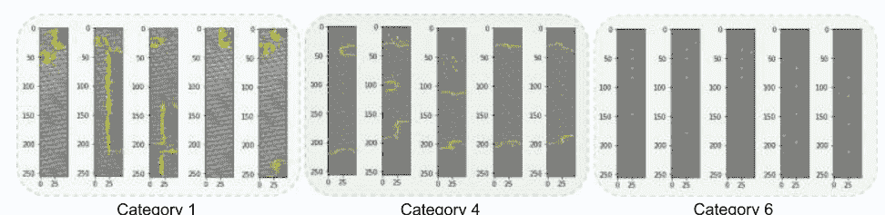
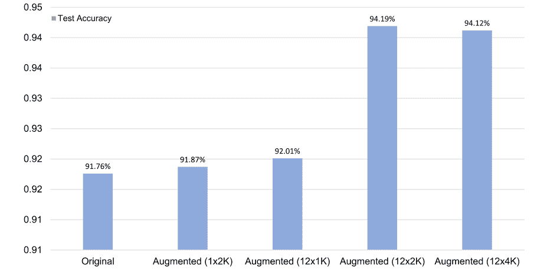

### 4.3 数据可视化

与自然图片不同，我们不能简单地通过 RGB 模式在图1中显示大小为 (256, 48, 3) 的样本，因为没有观察到可区分的特征。虽然通过肉眼很难对这些信号实例进行分类，但我们提出了两种可视化样本并实现特征解释的方法，即轴向热图和分类器的注意力解释。由于页面限制，我们只展示了 3 个类别（刷牙、喝水和手静止）的实例可视化。

#### 轴向热图

考虑到实例的每个轴都是一个浮点数矩阵，我们发现分别对每个轴进行基于热图的可视化可以通过人眼观察进行粗略分类。如图7所示，我们将图1中给出的每个实例分解为 3 个轴，然后对每个矩阵（大小为 (256, 48, 1) 的轴）进行归一化并将其可视化热图。较暗的像素表示较高的基于传感器的值。正如我们所看到的，类别1的示例实例的每个轴在底部更密集和更暗，而在矩阵的顶部稀疏。相反，类别4的实例在底部更稀疏，而在顶部像素更密集。由于类别6是静止的（空闲），我们可以看到它的基于轴的热图从顶部到底部重复相似的纹理，并且它不显示出显著的注意力掩码差异。因此，它可以与其他两个类别区分开来。

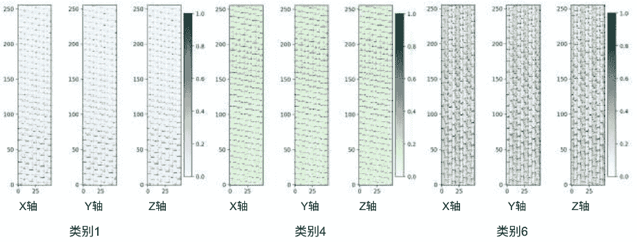
图7. 轴向热图。

#### 使用分类器的注意力进行解释

与轴分离的评估相反，解释其 DCNN 分类器的预测也可以将三维信号实例作为整体进行分析。更具体地说，帮助分类器对具有不同标签的样本进行分类的潜在证据对于样本可视化是有帮助的。为了使这种潜在的贡献对人类观察可辨认，我们使用局部可解释的模型不可知解释（LIME）[23] 来解释增强数据集中输入样本中最具贡献的特征。

据我们所知，我们是第一个使用这种评估方法进行基于传感器的手部活动识别的人。如图5所示，我们以 Hand-12 的分类为例进行演示，对于每个类别，我们从原始数据集中选择两个正确分类的实例和从合成数据集中选择三个正确分类的实例，然后我们应用 LIME 来解释 Hand-12 的分类。可以看到，同一类别的实例共享一些被评估方法掩盖的共同特征。例如，在第4类别中，尽管顶部区域略有不同，但所有实例的底部区域都被掩盖为贡献特征。此外，在第1类别中，尽管底部不同，所有实例在顶部角落都有一个被掩盖的区域。最后，在第6类别手部静止时，可以观察到几乎所有区域对预测的贡献相等，因为样本中的大多数区域都被掩盖。这种现象与我们在轴向热图部分的先前观察相符。在热图中，我们还可以区分这些类别，因为第1类别的热图在底部更密集，而第4类别的热图在顶部更密集。

## 5. 讨论和结论

在本文中，我们提出了一种基于 2D-CNN GAN 的方法，用于对基于加速器的细粒度手部活动的时间数据进行数据增强。我们方法中的 GAN 结构由一个 2D-CNN 鉴别器和一个 2D-转置-CNN 生成器组成，学习传感器基础手部活动数据的分布，并生成能够保留三通道张量的 2D-CNN 层学习的交叉轴相关性的合成实例。为了评估我们合成数据的有效性，我们通过扩展现有数据集和提高 VGG 变种分类器的测试准确性来评估它们的可用性。我们还通过引入几种解释方法，包括轴向热图和面向模型的解释，评估了合成数据。实验证明，我们的方法能够适应所研究的每个活动数据类别，并通过基于 GAN 的数据增强有效地提高分类器的测试准确性。

在未来，我们将专注于以下几个方面：(1) 利用我们的方法对基于传感器的数据进行条件标签信息的处理，(2) 探索更高效的深度架构用于数据增强和更准确的细粒度手部活动识别分类器，以及 (3) 开发更多的 GAN 数据增强解释工具，以确保这种方法在现实世界中的可靠性和可部署性。

## 参考文献

1. Alzantot, M., Chakraborty, S., Srivastava, M.: SenseGen: 一种用于合成传感器数据生成的深度学习架构。在: 2017年IEEE国际感知计算与通信研讨会(PerCom Workshops), 2017年3月。https://doi.org/10.1109/PERCOMW.2017.7917555
2. Bergmann, U., Jetchev, N., Vollgraf, R.: 使用周期性空间GAN学习纹理流形 (2017)
3. Berthelot, D., Schumm, T., Metz, L.: BEGAN: 边界平衡生成对抗网络。arXiv abs/1703.10717 (2017)
4. Biswas, D., et al.: Cornet: 基于PPG的心率估计和生物特征识别的深度学习框架。IEEE Trans. Biomed. Circuits Syst. 13(2), 282-291 (2019)
5. Bulling, A., Blanke, U., Schiele, B.: 使用身体佩戴的惯性传感器进行人类活动识别的教程。ACM Comput. Surv. 46(3) (2014). https://doi.org/10.1145/2499621
6. Chen, K., Yao, L., Zhang, D., Wang, X., Chang, X., Nie, F.: 一种半监督的循环卷积注意模型用于人类活动识别。IEEE Trans. Neural Netw. Learn. Syst. PP, 1-10 (2019). https://doi.org/10.1109/TNNLS.2019.2927224
7. 陈, K., 张, D., 姚, L., 郭, B., 于, Z., 刘, Y.: 基于传感器的人类活动识别的深度学习: 概述, 挑战和机遇。arXiv preprint arXiv:2001.07416 (2020)
8. Denton, E.L., Chintala, S., Szlam, A., Fergus, R.: 使用对抗网络的拉普拉斯金字塔进行深度生成图像模型。在: Cortes, C., Lawrence, N.D., Lee, D.D., Sugiyama, M., Garnett, R. (eds.) Advances in Neural Information Processing Systems 28, pp. 1486-1494. Curran Associates, Inc. (2015)
9. Doan, H.G., Vu, H., Tran, T.H.: 使用时空特征从循环手部运动中识别手势。在: 第六届国际信息与通信技术研讨会SoICT 2015, pp. 260-267. Association for Computing Machinery, New York (2015). https://doi.org/10.1145/2833258.2833301
10. Gammulle, H., Denman, S., Sridharan, S., Fookes, C.: 多层序列GAN用于群体活动识别。在: Jawahar, C.V., Li, H., Mori, G., Schindler, K. (编) ACCV 2018. LNCS, vol. 11361, pp. 331-346. Springer, Cham (2019)。https://doi.org/10.1007/978-3-030-20887-5_21
11. Goodfellow, I., et al.: 生成对抗网络。在: Ghahramani, Z., Welling, M., Cortes, C., Lawrence, N.D., Weinberger, K.Q. (编) Advances in Neural Information Processing Systems 27, pp. 2672-2680. Curran Associates, Inc. (2014)。http://papers.nips.cc/paper/5423-generative-adversarial-nets.pdf
12. Hammerla, N., Fisher, J., Andras, P., Rochester, L., Walker, R., Plotz, T.: 使用深度学习在自然环境中进行帕金森病状态评估。在: 第二十九届人工智能协会年会 (AAAI-2015)。纽卡斯尔大学 (2015年)
13. Huynh, T., Schiele, B.: 分析活动识别的特征。在: 2005年智能物体和环境智能联合会议论文集：创新的上下文感知服务：用途和技术，sOc-EUSAI 2005，第159-163页。计算机协会，纽约 (2005年)。https://doi.org/10.1145/1107548.1107591
14. Khan, S.S., Taati, B.: 使用自动编码器的通道集成从可穿戴设备中检测未知跌倒。专家系统应用，87, 280-290 (2017年)。https://doi.org/10.1016/j.eswa.2017.06.011
15. Kiasari, M.A., Moirangthem, D.S., Lee, M.: 使用生成对抗网络进行人类动作生成。arXiv abs/1805.10416 (2018)
16. Lane, N.D., Georgiev, P.: 深度学习能否改变移动感知？在: 第16届移动计算系统和应用国际研讨会 (HotMobile 2015)，第117-122页。计算机协会，纽约 (2015年)。https://doi.org/10.1145/2699343.2699349
17. Laput, G., Harrison, C.: 使用智能手表感知细粒度手部活动。在: 2019年人机交互计算系统国际研讨会（CHI 2019），第1-13页。计算机协会，纽约 (2019年)。https://doi.org/10.1145/3290605.3300568
18. Luna-Perejon, F., 等： 使用循环神经网络的自动跌倒检测系统。在: Riaño, D., Wilk, S., ten Teije, A. (eds.) AIME 2019. LNCS (LNAI), vol. 11526, pp. 36-41. Springer, Cham (2019). https://doi.org/10.1007/978-3-030-21642-9_6
19. Moshiri, P., Navidan, H., Shahbazian, R., Ghorashi, S.A., Windridge, D.: 使用GAN提高室内人类活动识别的准确性。arXiv abs/2004.11228 (2020)
20. Münzner, S., Schmidt, P., Reiss, A., Hanselmann, M., Stiefelhagen, R., Durichen, R.: 基于CNN的多模态人类活动识别传感器融合技术。在: Proceedings of the 2017 ACM International Symposium on WearableComputers, ISWC 2017, pp. 158-165. Association for Computing Machinery, New York (2017). https://doi.org/10.1145/3123021.3123046

# 基于分布匹配度量的人类活动识别个性化模型

Huy Thong Nguyen (\*), Hyeokhyen Kwon, Harish Haresamudram, Andrew F. Peterson 和 Thomas Ploetz
美国亚特兰大, 佐治亚理工学院, 30332
{thuythong, hyeokhyen, harishkashyap, afpeterson, thomas.ploetz}@gatech.edu

21. Ogata, M., Imai, M.: 皮肤手势交互智能手表. 在: 第六届增强人类国际会议论文集, AH 2015, 第21-24页。 计算机协会, 纽约（2015）。 https://doi.org/10.1145/2735711.2735830

22. Radford, A., Metz, L., Chintala, S.: 无监督表示学习与深度卷积生成对抗网络（2015）

23. Ribeiro, M.T., Singh, S., Guestrin, C.: “为什么我应该相信你？”: 解释任何分类器的预测。 在: 第22届ACM SIGKDD国际会议论文集, 知识发现与数据挖掘, 旧金山, 加利福尼亚, 美国, 2016年8月13日至17日, 第1135-1144页（2016）

24. Shipman, F.M., Gutierrez-Osuna, R., Monteiro, C.D.D.: 在视频分享网站中识别手语视频。 ACM Trans. Access. Comput. 5(4) (2014). https://doi.org/10.1145/2579698

25. Tu, Y., Lin, Y., Wang, J., Kim, J.U.: 基于生成对抗网络的半监督学习在数字信号调制分类中的应用. 计算材料学报 55(2), 243-254 (2018)

26. Wang, J., Chen, Y., Hao, S., Peng, X., Hu, L.: 基于传感器的活动识别的深度学习研究综述. 模式识别快报 119, 3-11 (2019)

27. Wang, J., Chen, Y., Gu, Y., Xiao, Y., Pan, H.: SensoryGANs: 一种用于基于传感器的人类活动识别的有效生成对抗框架. 在: 2018年国际神经网络联合会议(IJCNN), pp. 1-8 (2018)

28. Yang, J.B., Nguyen, M.N., San, P.P., Li, X.L., Krishnaswamy, S.: 基于多通道时间序列的深度卷积神经网络用于人类活动识别. 在: 第24届人工智能国际会议(IJCAI 2015), pp. 3995-4001. AAAI出版社 (2015)

29. Yao, S., 等: SenseGan: 使用半监督框架实现物联网的深度学习。 ACM互动移动可穿戴技术会议论文集2(3)(2018)。 https://doi.org/10.1145/3264954

30. Zhang, X., Zhu, X., Zhang, X., Zhang, N., Li, P., Wang, L.: SegGAN: 使用生成对抗网络进行语义分割。 在: 2018年IEEE第四届多媒体大数据国际会议 (BigMM) ，第1-5页 (2018)

31. Zhu, J.Y., Park, T., Isola, P., Efros, A.A.: 使用循环一致性对抗网络进行非配对图像翻译。 在: 2017年IEEE国际计算机视觉会议 (ICCV) ，第2242-2251页 (2017)

摘要。传统上，构建活动识别系统涉及从所有训练用户的数据中训练一个通用模型，并利用该模型识别未知主体的活动。然而，参与者来自不同的人口统计学，因此不同的用户可能以不同的方式执行相同的动作。每个主体可能表现出用户特定的信号模式，但一组用户可能以相似的方式执行活动并共享类似的模式。基于这个直觉，我们探索了Frechet Inception Distance (FID) 作为一种基于分布匹配的度量方法，用于衡量用户之间的相似性。基于此，我们提出了最近的FID邻居和FID图聚类技术，以开发针对特定用户的模型，该模型使用来自测试用户可能属于的社区的数据进行训练。在一系列基准可穿戴数据集上进行验证，所提出的技术明显优于使用所有用户训练的模型。

## 1 引言

人类活动识别 (HAR) 是基于身体传感器数据识别人们所执行的活动，是可穿戴计算的核心。传统方法包括使用来自所有已知参与者的数据训练模型，然后利用这些数据预测未知用户的活动。一个关键观察是可穿戴数据本质上涉及来自不同人口统计学的参与者，如性别、年龄、体重、身高、生活方式。参与者之间的活动多样性需要多样化的大规模数据收集，但由于成本高昂，尚未实现。数据集中的用户子集可能包含许多相互相似的社区（较低的社区内变异性），但与其他社区不同（较高的社区间变异性）。直观上，使用与目标用户更相似的用户社区的数据训练模型可能会比使用所有用户获得更好的性能。为了概念化[1]。

H. T. Nguyen和H. Kwon - 两位作者对这项研究做出了同等贡献。

© Springer Nature Singapore Pte Ltd. 2021
X. Li等人 (编者) : DL-HAR 2020, CCIS 1370, 第43-56页, 2021年。
https://doi.org/10.1007/978-981-16-0575-8_4

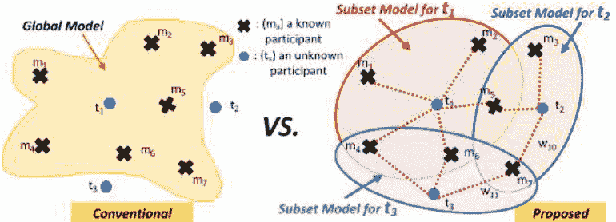
图1。传统和提出的模型训练方法的概念图。（在线彩色图）

根据图1中的思想，我们分别表示已知和未知用户表示空间的 \( m_x \) 和 \( t_x \)。传统方法使用所有已知参与者的数据集对全局模型进行训练（\( m_x \)），并绘制黄色决策区域，结果是，该全局模型可能在决策区域之外的未知用户处出现预测失败，例如 \( t_2, t_3 \)。相反，个人方法识别与测试用户最相似的训练用户群体，并使用这些数据训练个人模型来识别测试用户的活动。子模型更有可能捕捉与目标用户类似的活动模式，因此包含更紧凑和有效的决策边界，如图1中所示的红色-\( t_1 \)、蓝色-\( t_2 \)、绿色-\( t_3 \)决策边界。

在这项工作中，我们探索了Frechet Inception Distance（FID）作为一种基于分布匹配的度量标准，用于衡量用户之间的相似性，其中这个FID分数有效地测量了不同应用之间的两个分布之间的距离[6,8]。基于此，我们提出了两种不同的方法，即最近的FID邻居或基于图聚类的FID算法，用于检测测试用户可能属于的多个子集。在多个人类活动基准数据集上进行评估，我们的模型明显优于仅在所有用户上进行简单训练的全局模型。我们还广泛评估了实际场景，即我们只能要求测试用户收集少量数据，并展示了即使只有几秒钟的目标用户数据可用时，该方法的鲁棒性。有趣的是，基于FID的社区也与用户的人口群体保持一致。

## 2 相关工作

在这里，我们介绍了一些先前的工作，通过选择参与者的子集进行模型训练，提出了用户自适应模型。与FID指标相关的，我们还讨论了一些计算两个分布之间距离的方法。

### 2.1 用户自适应模型

[20]在智能手机数据集上训练了个人模型，[4]构建了针对时间序列生理患者数据的个性化模型，这两种方法都是从头开始训练个人模型。[14]提出了个性化高斯过程模型，通过对所有可用用户进行训练，然后逐渐拟合目标用户的个人模型，来预测阿尔茨海默病进展的关键指标。[21]提出了一种基于k均值聚类的用户自适应算法，将测试数据匹配到训练用户的聚类中。所有这些工作都需要大量的测试用户数据来开发个人模型。

此外，还有几项相关工作利用个人信息来改进活动识别模型。[19]使用k均值聚类，根据调查问卷对用户进行聚类，例如年龄、种族和职业。[12]明确使用关于用户的调查问卷作为额外特征来训练个人模型。[11]还利用GPS位置和生活方式调查来改进相似度评分。尽管有效，先前的方法通常需要用户的个人信息，这可能会引起隐私问题。

### 2.2 分布距离度量

大多数已发表的作品使用K-means聚类将用户按相似性分组，例如[21]和[19]。简单的相似度度量需要大量的测试用户数据来计算有效的子群组，以开发个人模型。[11]结合了各种度量标准，并基于马氏距离测量物理相似性，基于直方图向量的欧氏距离测量生活方式相似性，以及基于[15]中的公式测量传感器数据相似性。然而，相似度测量的组合仍然基于个人信息。

在这项工作中，我们探索了基于深度学习的Frechet Inception距离（FID）来纯粹从传感器数据中测量相似性。基于Inception模型（参见[18]）和Frechet距离开发的这种基于深度学习的度量标准对于生成对抗网络（GAN）[6,8]的评估和自动设计至关重要。

## 3 方法

在本文中，我们应用了DeepConvLSTM模型[13]来识别活动，利用基于深度学习的Frechet Inception Distance (FID) 度量相似性，并提出了两种技术来检测测试用户可能属于的多个社区。首先，我们简要介绍了FID，它衡量了具有相同类别集合C的两个域分布之间的感知距离，即 \( P_1 \sim (X_1,Y_1) \) 和 \( P_2 \sim (X_2,Y_2) \)。从原始样本中，我们首先提取预训练深度学习模型最后一级的高级特征表示。对于每个类别的特征，我们计算均值 \( \mu_{1,c}, \mu_{2,c} \) 和方差矩阵 \( \Sigma_{1,c}, \Sigma_{2,c} \)，然后通过对所有类别的高斯分布之间的Frechet距离求和来计算FID分数：

$$
FID_{(1,2)} = \sum_{c=1}^{C} FID_{(1,2),c} \quad \text{其中,}
$$

$$
FID_{(1,2),c} = \|\mu_{1,c} - \mu_{2,c}\|^2 + \text{Tr}(\Sigma_{1,c} + \Sigma_{2,c} - 2(\Sigma_{1,c} \Sigma_{2,c})^{1/2})
$$

我们通过使用预训练的全局模型作为特征提取器来计算可穿戴数据的FID分数，该模型捕捉了活动任务的一般概念，并利用DeepConvLSTM模型最后一个LSTM层的128维向量作为特征表示。随后，我们计算成对的用户FID分数，并利用这些分数来检测社区。

在这项工作中，我们合理地假设测试用户只有少量标记样本。在实际场景中，我们首先部署全局DeepConvLSTM模型，对于每个新用户，我们收集一些标记样本，并使用FID分数将全局模型调整为用户特定模型。

在这个假设下，我们利用两种算法来检测训练用户所属的社区：最近邻和图聚类。

最近的FID邻居。我们计算所有训练用户与测试用户之间的FID分数，并根据与测试用户的FID距离对训练用户进行排名。测试用户的社区是通过从训练用户中选择 \( 1 \leq k \leq N \) 个最近邻来构建的，其中 \( N \) 是最大训练用户数。对于特殊情况 \( k=N \)，子集数据等于全局数据。然后我们在选择的最近FID邻居训练用户子集上训练用户特定模型。

FID-图聚类。通过所有训练用户之间的成对FID分数，我们生成一个图，其中节点是用户，边的权重是FID分数：\( D \in \mathbb{R}^{U \times U} \)，其中 \( U \) 是训练用户数。为了只保留用户之间的显著连接，我们删除FID分数小于所有FID分数的中位数的边。从经过滤的FID图中，我们应用Girvan-Newman算法[5]来检测具有强连接性的有意义的社区。最后，我们选择与测试用户之间的FID分数最低的社区作为训练集。FID图聚类相对于其他训练用户生成社区，而最近FID邻居方法以贪婪的方式构建社区。

## 4 实验

为了分析我们提出的方法在不同参与者数量下的有效性，我们在四个公开可用的数据集上进行了实验：Opportunity、Daphnet Gait（DG）、Wetlab和Mobiactivv2。这些数据集记录了来自加速度或手势传感器的数据，分别包括4、10、21和61个参与者。

Opportunity [3]有18个手势活动，由4个参与者执行厨房日常任务，如打开和关闭门、洗碗机和抽屉。

Daphnet Gait数据集[1]包括10个帕金森病患者在行走时经历的步态冻结 (FoG)。

Wetlab数据集[17]包含22个参与者进行生物学和化学实验的8个活动。

Mobiactivv2数据集[2]包含11种日常生活活动和4种跌倒类型的数据，这些数据是通过智能手机的惯性传感器记录的。根据[7,16]，我们利用了61个参与者的日常生活活动数据，包括坐着、走路、慢跑、跳跃、上楼梯、下楼梯、从站立到坐下、坐在椅子上、从坐下到站立、上车和下车。

方法。在之前的工作[10]的基础上，我们对Opportunity、DG和Mobiactivv2数据集使用了1秒的窗口大小，对Wetlab数据集使用了5秒的窗口大小，并且对所有数据集都使用了0.5秒的重叠。对于分类，我们使用了DeepConvLSTM模型[13]。为了弥补人类活动数据集中常见的标签不平衡问题，我们使用加权交叉熵损失来更新网络参数。类别权重与类别中样本数量成反比，权重 \( \propto 1/N_{data} \)，并选择平均F1分数作为比较模型性能的指标。

为了公平比较不同的训练方案，我们在随机初始权重的情况下训练模型75个epochs。对于微调的模型，只进行额外的25个epochs的训练。这些epochs的数量足够大，以确保损失在停止训练之前保持平稳在10-15个epochs之间。我们使用Adam优化器[9]以固定的学习率0.001来更新模型权重。我们对权重衰减进行了网格搜索，范围从1e-1到1e-5，并将Opportunity、Wetlab和Mobiactivv2数据集的衰减率设置为1e-5。对于DG数据集，我们将衰减率设置为1e-2，以避免过拟合。

在呈现结果之前，我们在这里明确定义了几个术语，以便清楚起见。(i) 全局数据指除测试对象外所有参与者的样本；(ii) 全局模型是在全局数据上训练的模型；(iii) 全局得分是全局模型在测试对象上的平均F1分数；(iv) 子集模型是在社区中出现的子集参与者上训练的模型。

## 5 结果

对于每个测试参与者，我们使用最近邻和图聚类技术计算与测试参与者最相似的训练参与者的社区。接下来，我们分析了这两种技术在基准数据集上的性能。

### 5.1 最近-FID-最近邻

为了评估最近-FID-最近邻方法的性能，我们首先利用所有可用的测试用户数据，然后分析不同数量的测试用户数据对社区检测的影响。

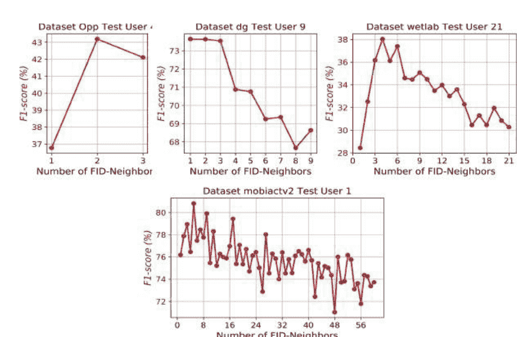
图2. 在各个数据集上，最近邻模型的实验结果随最近邻数目的变化而变化。通常情况下，具有小到中等子集大小的最近邻子集比全局模型表现更好。在Opportunity数据集的测试用户3中，F1分数的峰值发生在k=2时，在DG数据集的测试用户9中，k=1-3时，在Wetlab数据集的测试用户21中，k=3-7时，在Mobiactivv2数据集的测试用户1中，k=3-5时。这表明子集模型可以胜过全局模型。

邻居数目的影响。图2显示了最近邻子集模型在不同数据集上随k邻居变化的F1分数。随着我们加入更多最近邻用户，F1分数最初会提高，然后在加入更远用户到子集时下降。这清楚地证明了存在更优的训练用户子集，从而提高了性能，而不是使用整个训练集。

Opportunity。图3比较了Opportunity数据集的子集模型和全局模型的F1分数，该数据集包含4个参与者。在所有可能的组合中，我们展示了每个测试用户的最佳子集结果。在对用户3进行测试时，从头开始训练的子集模型1+4的性能优于全局模型约1.5%。当使用全局模型的权重对子集模型进行微调时，还展示了训练数据集大小的影响。对于测试用户1和3，子集模型的性能优于全局模型约2.1%和2.9%，这表明我们始终可以利用全局模型来适应测试用户。

Daphnet步态数据集。Daphnet步态数据集包含10个参与者，因此比Opportunity数据集具有更多的主题。图4清楚地显示，当有更多参与者时，子集模型具有更大的灵活性来找到更多最优社区，因此表现更好。

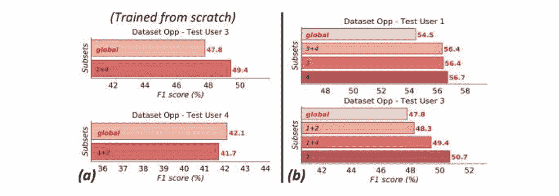
图3. Opportunity数据集的子集模型与全局模型的比较 (a)从头开始训练 (b)从全局权重微调。

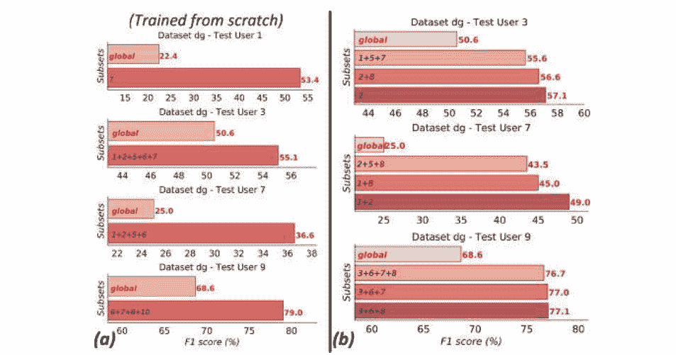
图4. Daphnet步态数据集的子集模型与全局模型的比较。 (a)从头开始训练 (b)从全局权重微调。

即使从头开始训练，全局模型也无法与子集模型相媲美。对于测试用户1，子集模型的表现优于全局模型约21%。从全局模型进行微调也极大地提升了泛化分数。例如，对于测试用户3和7，子集模型的表现优于全局模型约6.5%和24%。在所有测试用户上运行，所提出的技术将所有全局分数的平均值从46.7%提高到最近FID邻居子集分数的平均值57.4%，平均提高了10.7%。

Wetlab数据集。为了简化命名约定，我们使用1-22来注释Wetlab数据集的主题101-142。由于有许多训练用户可用，从头开始训练的子集模型将全局分数提高了25.4%，33.1%，和30.3%至31.8%，40.3%和36.8%，分别适用于测试用户19、20和21，如图5所示。此外，对于全局模型的微调，针对测试用户20的子集模型可以进一步提高到43.7%。对所有测试用户进行评估，平均值为：

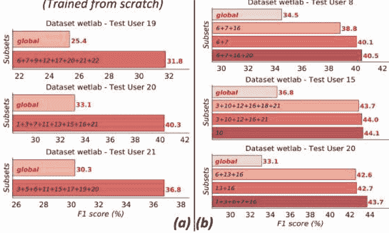
图5. Wetlab数据集的子集与全局模型 (a) 从头开始训练 (b) 从全局权重微调。

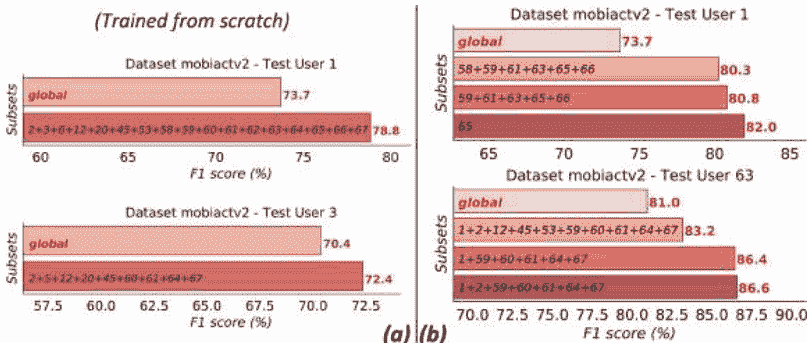
图6. Mobiactivv2数据集的子集与全局模型 (a) 从头开始训练 (b) 从全局权重微调。

全局得分为34.6%，而子集得分的平均值为39.5%，表明Wetlab数据集的改进为4.9%或14%。

Mobiactivv2数据集。图6展示了Mobiactivv2数据集的结果，共有61个参与者。与其他数据集一样，从全局模型微调的子集模型比从头开始训练更有效。例如，对于测试用户1，所提出的技术将F1得分从73.7%提高到78.8%。对于所有测试用户，从全局权重进行微调的子集模型的平均得分为84.2%，比全局得分的80.7%平均得分提高了3.5%。

图7. 多个测试用户的子集模型与全局模型对比。（a）湿实验室数据集的测试集；（b）MobiActV2数据集的测试集。

多用户。在先前的基准测试中，Wetlab和MobiActV2数据集评估了包含4个和13个用户的测试集上的模型。如图7所示，所提出的算法将湿实验室和MobiActV2中多个测试用户的得分从29.1%提高到34.8%，将82.9%提高到86.8%，分别增加了5.7%和3.9%。

图8. FID得分（上）和F1得分（下）与DG、湿实验室和MobiActV2数据集的测试用户数据大小以及最近邻FID算法的变化。

测试用户数据大小的影响。在实际情况，测试用户的数据最初是不可用的。尽管新用户可以提供一些注释样本，但我们实际上只能要求他们为一小部分样本提供注释。因此，我们分析了当不同数量的测试用户数据可用时，子集模型的性能。我们对测试用户数据集进行采样，采样比例为p%，其中p=0.5, 1, 2, 4, 8, 16, 32, 100，以便进行子集检测，以使测试用户的类别比例在采样数据中保留。从子采样数据中，我们使用k最近邻-FID-邻居子集（k=3~5）并选择表现最佳的模型。对于每个p%的子采样，我们进行500次实验的结果聚合以进行统计显著性分析。对于DG、Wetlab和MobiActV2数据集，结果如图8所示。如预期，随着更多的测试用户数据，FID和F1-score的置信区间减小。随着p%的增加，测试用户与选定社区之间的FID分数减小，测试用户预测的F1-score增加。直观地显示，当有更多的测试用户样本可用时，该方法更有可能找到正确的社区。更重要的是，一旦只有0.5%的测试用户样本可用，子集模型在所有数据集上都优于全局模型，其中0.5%的测试用户样本等于DG和Wetlab的15秒、MobiActV2数据集的10秒。这个结果令人鼓舞，因为从一个新用户那里只要求不到一分钟的数据就足以检测到与测试用户相关的社区。

### 5.2 FID-图聚类

接下来，我们将以与最近邻FID相似的方式评估FID图聚类方法的性能。为了简洁起见，我们只会展示与最近邻FID相比有意义的结果。

图社区分析。在图9中，我们展示了来自Wetlab数据集的测试用户21和MobiActV2数据集的测试用户1的基于FID的图。我们还展示了从头开始训练的所有子集模型的F1分数以及全局模型的F1分数。对于两个数据集，基于FID的多个社区子集模型都可以胜过全局模型。例如，对于Wetlab数据集的测试用户21，检测到的20+22、3、19社区子集的性能优于全局分数，分别提高了6.6%、7.4%和11.2%。另一个例子是算法将MobiActV2数据集的测试用户1的泛化分数从73.7%提高到82%，如图9b所示。

测试用户数据规模的影响。同样地，从最近的FID邻居中，我们对测试用户数据的0.5%，1%，2%，4%，8%，16%，32%进行采样，选择所有检测到的社区中表现最好的子集，并评估对DG、Wetlab和MobiActV2数据集的子集模型的影响。从图10可以看出，FID和F1分数与p%的整体趋势呈反向关系，这与最近的FID邻居的情况类似。此外，只需很少的0.5%的测试数据就足以构建优于全局模型的用户自适应模型，适用于各个数据集。

人口统计学解释。用户之间的活动模式差异可能来自于他们的人口统计学差异，如身高、体重、年龄、性别。在图11中，我们分析了在提供用户人口统计信息的MobiActV2数据集上，社区子集的F1分数谱是否携带人口统计学意义。具有最高泛化分数的社区子集的上部谱常常表示相似的人口统计学特征，而具有最低F1分数的下部谱经常表示相反的人口统计学特征，如MobiActV2的用户1所示。

图9. 在（a）Wetlab和（b）MobiActV2数据集上进行FID图聚类。通常，全球得分位于社区谱的中间位置。

特别是，用户65与最高F1得分的社区具有相似的人口统计特征，与用户1相似，两者都是男性，身高相似（180 cm-170 cm），体重相似（85 kg-100 kg）。此外，用户5代表F1得分最低的社区，与用户1相比，具有截然不同的人口统计特征，如女性，身材较矮（160 cm），体重较轻（50 kg）。这项研究表明，通过观察社区谱和相应的社区人口统计特征，我们可以推断出测试用户的人口统计特征。

图10. FID图聚类中DG、Wetlab和MobiActV2数据集的测试用户数据大小与FID得分（上）和F1得分（下）的关系。

图11. 在MobiActV2数据集的测试用户1上进行FID图聚类，并提供相应的人口统计信息。相似的人口统计特征导致最高的F1得分，而相反的人口统计特征导致最低的F1得分。

## 6 结论

当大规模数据集不可用时，仔细选择最有效的训练数据来构建活动识别模型可能比简单地使用整个数据集更有益。在这项工作中，我们提出了一种基于分布匹配度量（即FID分数）的算法，可以选择与目标相关的训练用户样本。通过我们的方法，使用较少的数据训练的用户自适应模型可能比使用完整的训练集更有效，这表明用更高的成本收集更多数据可能并不总是解决活动识别问题的答案。有限的测试数据分析显示，从测试用户获取几分钟的标记数据就足以开发出有效的用户自适应模型。值得注意的是，对于目标用户而言，最适合的检测社区通常与该用户具有相似的人口统计特征，进一步的研究可能会导致一类可以纯粹从传感器数据中学习人口统计信息的算法。

## 参考文献

- 1. Bachlin, M., 等：帕金森病患者的可穿戴助手与步态冻结症状. IEEE Trans. Inf. Technol. Biomed. 14, 436-446 (2010)
- 2. Chatzaki, C., Pediaditis, M., Vavoulas, G., Tsiknis, M.: 使用智能手机的加速度传感器进行人类日常活动和跌倒识别. In: Rocker, C., O'Donoghue, J., Ziefle, M., Helfert, M., Molloy, W. (eds.) ICT4AWE 2016. CCIS, vol. 736, pp. 100-118. Springer, Cham (2017). https://doi.org/10.1007/978-3-319-62704-5_7
- 3. Chavarriaga, R., 等: 机身外传感器活动识别的机遇挑战: 基准数据库. Pattern Recogn. Lett. 23, 2033-2042 (2013). https://doi.org/10.1016/j.patrec.2012.12.014
- 4. Clifton, L., Clifton, D., Pimentel, M., Watkinson, P., Tarassenko, L.: 利用可穿戴传感器进行个性化电子健康监测的高斯过程. IEEE Trans. 生物医学工程学报 60, 193-197 (2013). https://doi.org/10.1109/TBME.2012.2208459
- 5. Girvan, M., Newman, M.E.J.: 社交和生物网络中的社区结构. 美国国家科学院院刊 99(12), 7821-7826 (2002). https://doi.org/10.1073/pnas.122653799. https://www.pnas.org/content/99/12/7821
- 6. Gong, X., Chang, S., Jiang, Y., Wang, Z.: AutoGAN: 用于生成对抗网络的神经架构搜索 (2019)
- 7. Haresamudram, H., et al.: 基于掩码重建的自我监督用于人类活动识别。 In: 2020年可穿戴计算机国际研讨会论文集, pp. 45-49 (2020)
- 8. Heusel, M., Ramsauer, H., Unterthiner, T., Nessler, B., Klambauer, G., Hochreiter, S.: 通过两个时间尺度更新规则训练的 GAN 收敛到纳什均衡。 CoRR abs/1706.08500 (2017). http://arxiv.org/abs/1706.08500
- 9. Kingma, D., Ba, J.: Adam: 一种用于随机优化的方法。 在: 国际学习表示会议, 2014年12月
- 10. Kwon, H., Abowd, G.D., Plötz, T.: 处理人类活动识别中的注释不确定性。 在: 第23届可穿戴计算机国际研讨会论文集, ISWC 2009, 第 109-117 页。 计算机协会, 纽约 (2019). https://doi.org/10.1145/3341163.3347744
- 11. Lane, N.D., et al.: 社区相似性网络。 个人普适计算。 18(2), 355-368 (2014). https://doi.org/10.1007/s00779-013-0655-1
- 12. Liu, D., Peng, F., Shea, A., Rudovic, O., Picard, R.W.: DeepFaceLIFT: 可解释的个性化模型, 用于自动估计自报告的疼痛。 CoRR abs/1708.04670 (2017). http://arxiv.org/abs/1708.04670
- 13. Morales, F.J.O., Roggen, D.: 深度卷积和 LSTM 循环神经网络用于多模态可穿戴活动识别。 传感器 16(1), 115 (2016). http://dblp.uni-trier.de/db/journals/sensors/sensors16.html#MoralesR16
- 14. Peterson, K., Rudovic, O., Guerrero, R., Picard, R.W.: 个性化高斯过程用于预测阿尔茨海默病进展。 CoRR abs/1712.00181 (2017). http://arxiv.org/abs/1712.00181
- 15. Rubner, Y., Tomasi, C., Guibas, L.: 作为图像检索度量的移动者距离. Int. J. Comput. Vis. 40, 99-121 (2000). https://doi.org/10.1023/A:1026543900054
- 16. Saeed, A., Ozcelebi, T., Lukkien, J.: 用于人类活动检测的多任务自监督学习. Proc. ACM Interact. Mob. Wearable Ubiquit. Technol. 3(2), 1-30 (2019)
- 17. Scholl, P., Wille, M., Van Laerhoven, K.: 湿实验室中的可穿戴设备: 用于捕捉和指导实验的实验室系统. In: Ubicomp, pp. 589-599. ACM, September 2015. https://doi.org/10.1145/2750858.2807547
- 18. Szegedy, C., Vanhoucke, V., Ioffe, S., Shlens, J., Wojna, Z.: 重新思考计算机视觉中的 Inception 架构。 CoRR abs/1512.00567 (2015). http://arxiv.org/abs/1512.00567
- 19. Taylor, S., Jaques, N., Nosakhare, E., Sano, A., Picard, R.W.: 面向预测明天的情绪、压力和健康的个性化多任务学习。 https://doi.org/10.1109/TAFFC.2017.2784832
- 20. Weiss, G., Lockhart, J.: 个性化对基于智能手机的活动识别的影响。在: AAAI研讨会-技术报告, 2012年1月21日。 Zhao, S., Li, W., Cao, J.: 基于k-means聚类、局部离群因子和多元高斯分布的用户自适应算法。 传感器18, 1850 (2018). https://doi.org/10.3390/s18061850

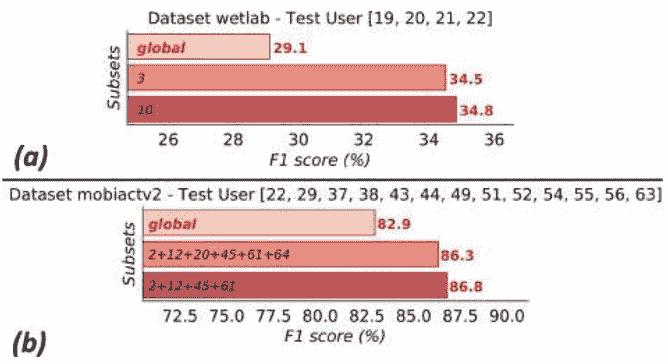
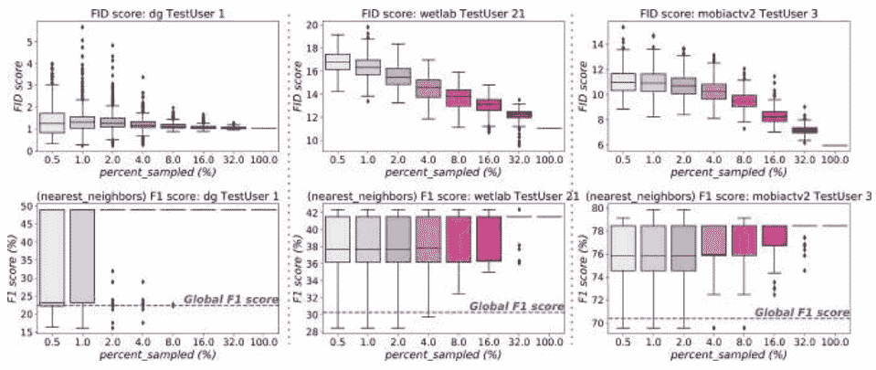
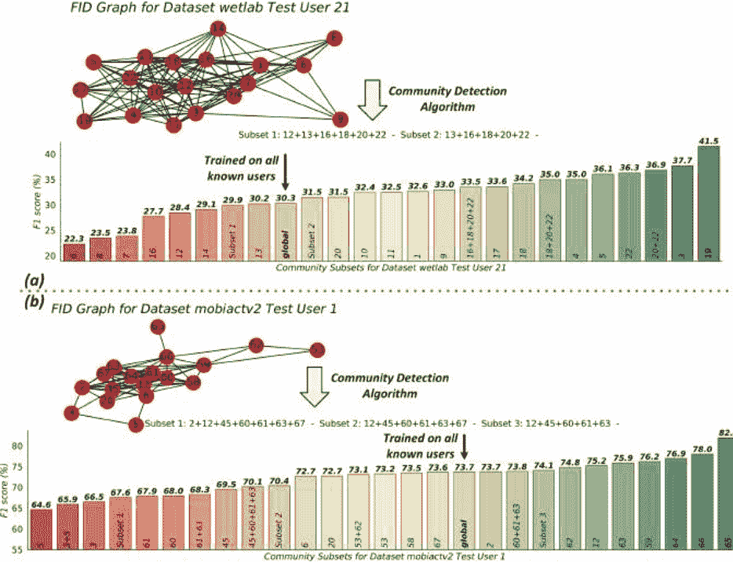
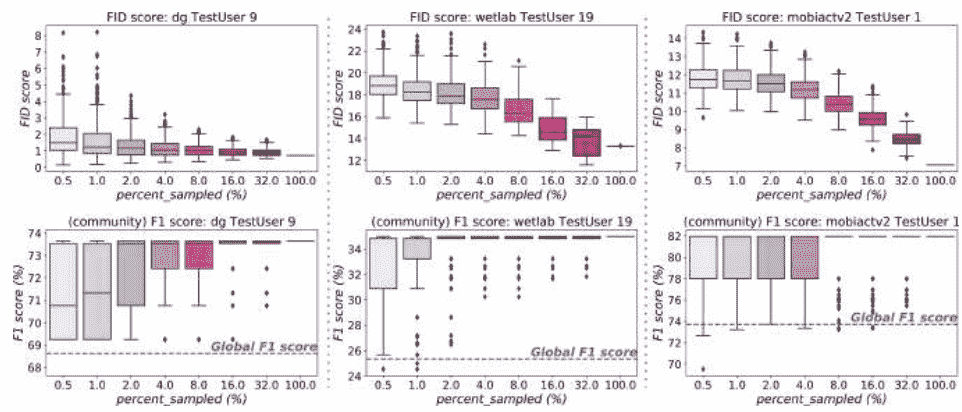
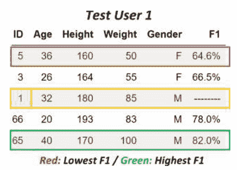

# 资源受限的异构标签和模型的人类活动识别中的联合学习

Gautham Krishna Gudur¹ 和 Satheesh Kumar Perepu²
¹ 全球AI加速器, 埃里克森, 印度金奈
gautham.krishna.gudur@ericsson.com
² 埃里克森研究, 印度金奈
perepu.satheesh.kumar@ericsson.com

摘要：在普适计算中，建模用户行为的最重要应用之一是人类活动识别（HAR）。这些应用要求我们使用机器学习技术从多个资源受限的用户设备中提取洞察力，以实现有效的个性化活动监测。在此类情况下，设备上的联邦学习证明是一种非常可行的分布式和协作机器学习方法，并且是一个活跃的研究领域。然而，解决用户之间的统计（非独立同分布数据）和模型异质性存在各种挑战。此外，在本文中，我们探索了一个新的有趣挑战——在联邦学习期间处理用户之间的标签（活动）异质性。为此，我们提出了一个框架，其中包含两个不同版本的联邦标签聚合，利用活动之间的重叠信息增益：一个使用模型蒸馏更新，另一个使用加权α更新。对异质性人类活动识别（HHAR）数据集进行实证评估（包含四个活动以有效阐明结果），结果表明，使用模型蒸馏更新策略的平均确定性准确率提高了至少约11.01%，而使用加权α更新策略的提高了约9.16%。我们通过使用树莓派2（一种单板计算平台）展示了我们提出的框架的设备上能力。

关键词：人类活动识别；设备上的深度学习；联邦学习；异构标签；异构模型；知识蒸馏

© Springer Nature Singapore Pte Ltd. 2021
X. Li 等人: DL-HAR 2020, CCIS 1370, 第57-69页, 2021年。
https://doi.org/10.1007/978-981-16-0575-8_5

## 1 引言

当代机器学习，特别是深度学习，在视觉、语音、物联网等各个领域取得了重大突破。特别是设备上的深度学习由于其自动特征提取机制，在研究界引起了极大的兴趣，以及资源受限的移动和可穿戴设备中的计算能力。嵌入在物联网设备中的传感器具有大量的输入数据，这些数据具有巨大的潜力，可以利用设备上的机器学习技术实时将其转化为有意义的信息，包括监督、无监督和其他学习机制。在个性化物联网设备中的人类活动识别（HAR）是我们社区中非常重要的技术，它在建模用户行为方面起着关键作用，涵盖了诸如全面健康监测、健身追踪、跌倒检测等各种应用。随着个性化物联网设备的普及，协作和分布式学习现在比以往任何时候都更有可能帮助最好地利用从多个设备学到的行为信息。

然而，由于多个参与者的隐私问题，跨设备的协作数据共享可能并不总是可行的。用户可能对将他们的私人数据发送到远程服务器/云中没有任何兴趣，特别是在医疗等领域。随着联邦学习（FL）的出现[1,17]，现在可以通过将模型的权重和更新从本地设备传输到云端来有效地训练全局/集中模型，而不是传统上将敏感数据传输到云端。服务器在模型之间起协调作用，但大部分工作不再由中央实体执行，而是由客户端/设备联合进行。联邦平均（FedAvg）算法最初由McMahan等人在[17]中提出，它将每个客户端（本地设备）的局部随机梯度下降（SGD）与聚合模型权重的服务器结合起来。联邦学习一直是解决安全通信协议、优化、隐私保护网络等问题的一个活跃且具有挑战性的研究领域[14]。

联邦学习涉及各种异质性，如设备、系统、统计异质性等[14]。特别是在物联网场景下的联邦学习中，由于来自不同分布的大量实时流数据的非独立同分布特性，统计异质性问题已经引起了很大的关注作为一个研究问题。这导致了个性化设备联邦的挑战，并迫使我们解决数据和学习过程中的各种异质性，以实现有效的模型聚合。

在这个方向上的一个重要步骤是终端用户能够选择构建自己的模型，而不是被全局模型所限制。解决这个问题的一种有效方法是利用知识蒸馏的概念[8]，其中不同的本地模型将其各自的知识蒸馏到各种具有共同模型架构的学生模型中，从而有效地融合模型的独立性和异质性。这是由李等人在FedMD [13]中提出的。然而，尽管他们的工作确保了用户自己模型的独立性和异质性，但他们并不保证用户之间标签的异质性和独立性。

在联邦物联网环境中存在许多具有异构标签和模型的情景，例如行为/健康监测、活动跟踪、关键词识别、下一个单词预测等。然而，在典型的机器学习情景中，很少有研究处理新标签的方法。据我们所知，在非独立同分布的联邦学习情景中，还没有解决这个重要问题的研究。

本研究的主要科学贡献如下：

- 在人类活动识别的联邦学习情景中，使最终用户能够构建和描述自己首选的本地架构，以便全局模型和本地模型之间进行有效的迁移学习和联邦聚合。
- 通过展示具有和不具有重叠的不同用户设备之间的场景，提供了两个不同版本的框架，以实现灵活的异构活动标签选择，从而利用跨设备学习的信息，涉及到那些重叠的活动。
- 在公共HAR数据集上独立于用户的设备上展示了该框架处理现实世界不同数据/标签分布（非独立同分布）的能力，能够在简单的移动和可穿戴设备上运行。

## 2 相关工作

深度学习用于HAR，特别是从加速度计、陀螺仪等设备测量的惯性/传感器基础的HAR，以改善普遍医疗保健，一直是一个活跃的研究领域[7,18]。特别是基于移动和可穿戴设备的深度学习技术在HAR方面已被证明是一个非常富有成果的研究领域，神经网络模型能够在这些资源受限的设备上高效运行[12,22,23]。还有其他一些深度学习在HAR方面的挑战，如使用半监督和主动学习机制处理无标签数据[6,24]，领域自适应[2]，少样本学习[4]等等。

联邦学习在实现分布式和集体机器学习方面做出了重要贡献。联邦学习和差分隐私机器学习已经或即将成为处理敏感数据、受知识产权、GDPR等保护的数据的事实标准机制[1]。联邦学习首次在[17]中引入，并且在许多有趣的近的工作中提出和解决了许多新的挑战和研究问题[14][9]。

多设备和系统异构性使它们成为优化问题[15]。个性化联邦学习密切关注优化个性化程度和各个客户的贡献，从而实现有效的聚合，如[3]所讨论的。边缘上的联邦学习涉及到不同的数据分布——非独立同分布数据，并在所有设备之间创建一个小的全局共享数据子集，如[25]所讨论的。

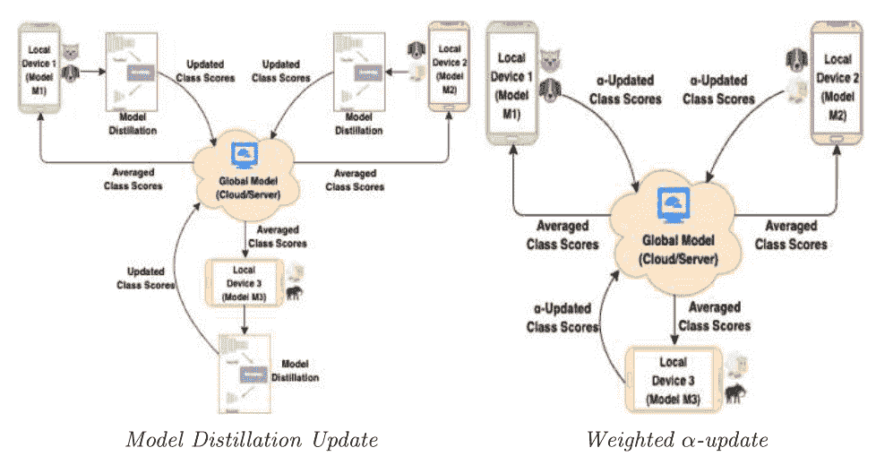

图1. 整体架构，包括两个提出的版本。每个设备包含不同的本地标签和模型，并与全局模型（云/服务器）进行交互。每个本地设备的模型首先使用两种策略之一进行更新，然后在全局模型中聚合相应的类别分数，并将更新的共识再次分布到本地模型中。

特别是针对物联网和普适（移动或可穿戴）设备的联合学习，在移动和边缘网络上的重要问题和研究方向在本调查中得到了解决[16]，而针对设备应用的联合优化在[11]中进行了讨论。联合学习用于人类活动识别在[20]中得到了解决，该研究涉及到智能服务适配器的活动感知，而[19]则比较了集中式和联合学习方法之间的差异。

FedMD[13]，我们认为这是我们最接近的工作，处理模型架构中的异构性，并使用迁移学习和知识蒸馏[8]来解决这个问题，并且在联邦学习期间使用一个初始的公共数据集跨所有标签（可以由任何设备访问）。

当前的联邦学习方法主要处理所有用户的相同标签，并且不能灵活处理唯一标签。然而，在许多实际应用中，每个本地客户端/模型具有唯一的标签是一个非常可行的情况，这是由于它们对特定地区、人口统计、隐私约束等的依赖和限制。所提出的工作的一个版本在[5]中讨论了视觉任务。然而，据我们所知，没有任何工作考虑到HAR上下文中的标签和模型的异构性。

本文的其余部分组织如下。第3.1节讨论了处理异构标签和模型的设备上联邦学习场景的问题表述，第3.2节介绍了总体提出的框架和用于解决这些挑战的方法。系统性地对框架在不同用户、设备、迭代、模型上进行实验和评估，在第4节中展示了在联邦学习环境中进行活动识别的方法，并证明了在资源受限设备上的可行性（第4.2节）。最后，在第5节中总结了本文。

## 3 我们的方法

在本节中，我们详细讨论了异构标签和模型的问题形式化，并提出了我们的框架来处理这些问题（如图1a和1b所示）。

### 3.1 问题形式化

我们在联邦学习中假设以下场景。有多个本地设备，可以根据最终用户来描述不同的模型架构。我们假设不同设备接收到的数据中也存在标签的异构性，包括唯一的标签或重叠的标签。我们还有一个包含所有标签的公共数据集，任何设备都可以随时访问该数据集，并且作为数据和标签的初始模板，可以在不同迭代中流动。我们将这个公共数据集重新用作测试集，以保持一致性。为了使联邦学习迭代与公共数据集独立，我们在训练期间不向本地模型公开公共数据集。这里的研究问题是在联邦学习环境中创建一个统一的框架来处理异构标签、模型和数据分布（非独立同分布性质）的问题。

### 3.2 提出的框架

我们提出的处理异构标签和模型的联邦学习设置的框架在算法1中呈现。我们提出的方法中有三个重要的步骤。

- 1. 构建：在这一步中，我们根据每个本地用户的传入数据构建模型，即特定迭代的本地私有数据。用户可以选择适合该迭代中数据的自己的模型架构。
- 2. 本地更新：在这一步中，我们根据本地私有数据更新全局模型得分（对于公共数据）的平均值，即第i次迭代的得分。对于第一次迭代，我们没有任何全局得分，并且在这种情况下将得分初始化为零。对于其余的迭代，我们有全局平均得分，我们可以根据算法1来更新本地模型得分。

我们在本地更新中提出了两个版本。
(a) 模型蒸馏更新，其中本地模型仅基于与本地用户对应的标签进行蒸馏。蒸馏是从不同的联邦学习迭代中捕获的旧模型信息的总结。

62 G. K. Gudur和S. K. Perepu

**算法1。** 我们提出的框架（有两个版本选择）
输入：公共数据集 $D_0$ ($x_0$, $y_0$)，私有数据集 $\mathcal{D}_{mi}$，总用户数 $M$，总迭代次数 $I$，每个用户的标签集 $l_m$
输出：训练模型得分 $f_G^I$
初始化全局模型得分 $f_{G^0}=0$
对于 $i=1$ 到 $I$：
  对于 $m=1$ 到 $M$：
    构建模型 $\mathcal{D}_{mi}$ 并预测 $f_{\mathcal{D}_m}^i(x_0)$
    本地更新：
      选择 1- 模型蒸馏更新：
        在仅使用公共数据集 $D_0$ 上的全局平均概率对应的标签构建蒸馏模型。现在，使用本次迭代中到达的新数据 $D_{mi}$ 更新模型。
      选择 2- 加权 $\alpha$ 更新：
        $f_{\mathcal{D}_m^i}(x_0) = f_G^i(x_0^{l_m}) + \alpha f_{\mathcal{D}_m^i}(x_0)$，其中 $f_G^i(x_0^{l_m})$ 是仅针对标签 $l_m$ 的全局分数
        标签集合 $l_m$ 与第 $m$ 个用户相关，$\alpha = \frac{len(\mathcal{D}_{mi})}{len(D_0)}$
  结束循环
  全局更新：按标签更新
  $f_G^{i+1} = \sum_{m=1}^M \beta_m f_{\mathcal{D}_m^i}(x_0)$，其中
  $\beta_m = \begin{cases} 1 & \text{如果标签是唯一的} \\ \text{acc}(f_{\mathcal{D}_m^{i+1}}(x_0)) & \text{如果标签不唯一} \end{cases}$
  其中 $\text{acc}(f_{\mathcal{D}_m^{i+1}}(x_0))$ 是给定模型的准确率函数，定义为正确分类的样本数与给定局部模型的总样本数之比
结束循环

(b) 加权 $\alpha$-更新，其中 $\alpha$ 是当前私有数据集大小与公共数据集大小之间的比率。该参数控制了新模型和旧模型在不同 FL 迭代中的贡献。

- 3. 全局更新：在这一步中，我们首先在相应的私有数据集上训练本地模型，用于该 FL 迭代。此外，我们评估（测试）这个训练好的模型在公共数据上的表现，从而获得模型在公共数据上的得分。然后，我们使用 $\beta$ 参数对所有用户的标签进行基于标签的平均，其中 $\beta$ 控制了对公共数据上相应标签的测试准确率的唯一和重叠标签的权重（如算法 1 所示）。该模块提供全局平均得分。

## 4 实验和结果

我们模拟了一个联邦学习场景，使用多个小增量数据的迭代（详见表 1 ），跨三个不同的用户来测试我们的方法，并假设活动实时到达用户设备。我们使用了异构人类活动识别数据集[21]，它包含来自九个用户的四部不同手机的惯性数据，执行六种日常活动：骑自行车、坐着、站着、走路、上楼梯、下楼梯，在异质条件下。

表1. 模型架构（每层的过滤器/单元数）、标签（活动）和每个用户设备上联合学习迭代的活动窗口数量。注意用户之间的不同模型架构和标签。
| | 用户1 | 用户2 | 用户3 | 全局用户 |
|---|---|---|---|---|
| 架构 | 2层CNN (16, 32) Softmax 激活 | 3层CNN (16, 16, 32) ReLU 激活 | 3层ANN (16, 16, 32) ReLU 激活 | 统一 |
| 活动 | {坐着, 走} | {走, 站着} | {站着, 上楼梯} | {坐着, 走, 站着, 上楼梯} |
| 每次迭代的活动窗口数 | {2000,2000}=4000 | {2000,2000}=4000 | {2000,2000}=4000 | {2000,2000,2000,2000}=8000 |

数据预处理：在这个实验中，我们执行与[22]中所述的类似的预处理技术。正如讨论的那样，我们仅使用手机加速度计数据，而不使用陀螺仪，这样可以减小数据大小而不会显著降低准确性。我们首先将三轴加速度计数据分段为两秒的非重叠窗口，然后执行抽样使所有活动窗口的采样频率归一化到最低采样频率（50 Hz）。在此之后，执行离散小波变换（DWT）以获取时域和频域信息，并且我们仅使用近似系数，所有这些操作都会显著减小数据大小。

现在，我们讨论实验中标签和模型异质性的设置。

标签异质性：在我们的实验中，我们只考虑数据集中的四个活动-{坐、走、站立、上楼梯}，如表1所示。此外，我们每次迭代考虑每个用户的活动窗口数量为2000个。每个本地用户的活动可以是唯一的（仅在该用户中出现）或在多个用户之间重叠（在多个用户中出现）。我们将这四个活动分为三对两个活动，以便更方便地展示重叠活动的优势。我们还在不同的联邦学习迭代中创建了非独立同分布（non-IID）的环境，其中活动数据在标签和数据分布上存在差异（统计异质性）。

模型异质性：我们选择了三种不同的模型架构（CNN和ANN）用于三个不同的本地用户。这在表1中清楚地阐明了。我们还使用了一个简单的两层ANN模型，过滤器为（8,16），作为蒸馏学生模型架构。为了真正展示近实时的异质性和模型独立性，我们在表2中展示了在各种FL迭代中模型架构的变化。

表2. 模型架构的详细信息（每层的过滤器/单元）在联邦学习迭代和用户之间发生了变化。
| 迭代 | 新的模型架构 |
|---|---|
| 用户1 迭代10 | 3层ANN (16, 16, 32) ReLU 激活 |
| 用户1 迭代14 | 1层CNN (16) Softmax 激活 |
| 用户2 迭代6 | 3层CNN (16, 16, 32) Softmax 激活 |
| 用户3 迭代5 | 4层CNN (8, 16, 16, 32) Softmax 激活 |

首先，我们根据四个活动标签将活动窗口分配给三个不同的用户。我们创建了一个公共数据集（$D_{0}$），其中包含8000个活动窗口，每个活动对应2000个窗口。接下来，我们在每次迭代中对每个用户的每个标签采样2000个活动窗口（如表1所示）。在整个实验中，我们总共进行了15次联邦学习迭代，每次迭代都使用提前停止（最多5个周期）。我们使用分类交叉熵损失函数来跟踪损失，用Adam优化器$[10]$来优化分类损失。我们在树莓派2上模拟了所有的实验，包括联邦学习和推理。

表3. 本地更新和全局更新的平均准确率（%），以及它们在模型蒸馏更新和加权 $\alpha$ 更新下的准确率增加。
| | 模型蒸馏 | | | 加权 $\alpha$ 更新 | | |
|---|---|---|---|---|---|---|
| | 本地更新 | 全局更新 | 增加 | 本地更新 | 全局更新 | 增加 |
| 用户1 | 68.38 | 77.61 | 9.23 | 66.98 | 74.29 | 7.31 |
| 用户2 | 70.82 | 84.4 | 13.58 | 68.88 | 81.9 | 13.02 |
| 用户3 | 77.68 | 87.9 | 10.22 | 76.57 | 83.7 | 7.13 |
| 平均 | 72.293 | 83.303 | 11.01 | 70.81 | 79.963 | 9.153 |

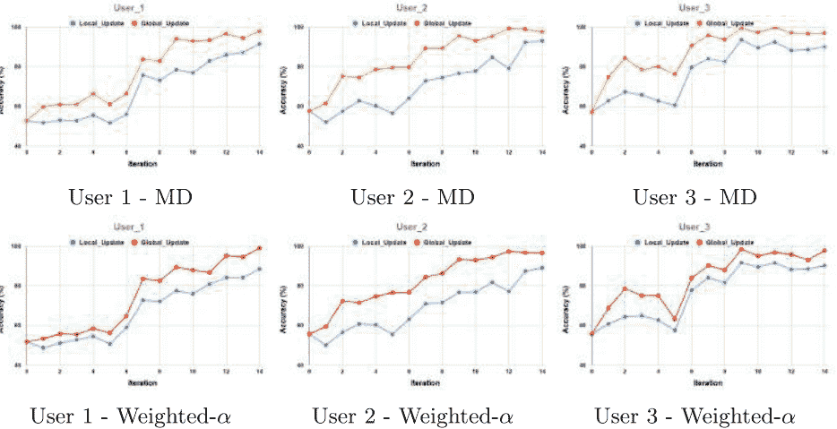

图2. 迭代次数与准确率之间的关系，使用模型蒸馏更新（MD）和加权$\alpha$更新，在所有三个用户上。本地更新表示每个本地更新模型（在第i次迭代后）在公共数据集上的准确率。全局更新表示相应的全局更新模型（在第i次迭代后，对所有用户进行平均）在公共数据集上的准确率。

### 4.1 结果讨论

图2代表了我们框架在HHAR数据集上的两个版本在所有三个用户上的结果。此外，从表3中，我们可以清楚地观察到全局更新的准确率（代表全局更新模型的准确率，由$\beta$控制，并在第i次迭代中对所有用户的标签进行平均）比各自本地更新的准确率更高。

例如，从图2a和2d可以推断出，在每次迭代中，全局更新后标签{Sit, Walk}（用户1标签）的对应准确率明显高于各自的本地更新，平均提高了约9.23%和7.31%，分别对应模型蒸馏和$\alpha$更新版本。同样地，对于包含{Walk, Stand}的用户2标签，我们观察到从本地更新到全局更新的平均准确率提高约13.58%和13.02%；而对于包含{Stand, StairsUp}的用户3标签，我们观察到从本地更新到全局更新的平均准确率提高约10.22%和7.13%，分别对应模型蒸馏和$\alpha$更新版本。

我们特别指出，活动之间的重叠显著地增加了准确性，因为只有在重叠的标签上才会发生信息增益（加权全局更新）。这在用户2（图2b和图2e）中清晰可见，他的标签是{行走, 站立}，尽管在FL迭代的第5和第12次本地更新中准确性下降，但在这些迭代中的全局更新并没有出现明显下降，这主要归因于用户1和用户3之间重叠活动标签的信息增益（在这种情况下，分别是行走和站立），从而展示了在用户2中，重叠标签信息增益的鲁棒性。相反地，当我们观察用户3（图2c和图2f）时，尽管全局更新的准确性本质上优于局部更新，在第5和第8次迭代中观察到局部更新的准确性下降时，全局更新的准确性也以类似的方式下降。在用户1（图2a和图2d）中也可以观察到与用户3类似的局部和全局准确性趋势。这清楚地表明，当存在较少的重叠活动标签（用户1和用户3）时，全局模型不会很好地学习活动的特征，而全局更新在具有这种重叠标签的局部更新中更加稳健（用户2），从而导致准确性的平均增加更高（如表3所示）。

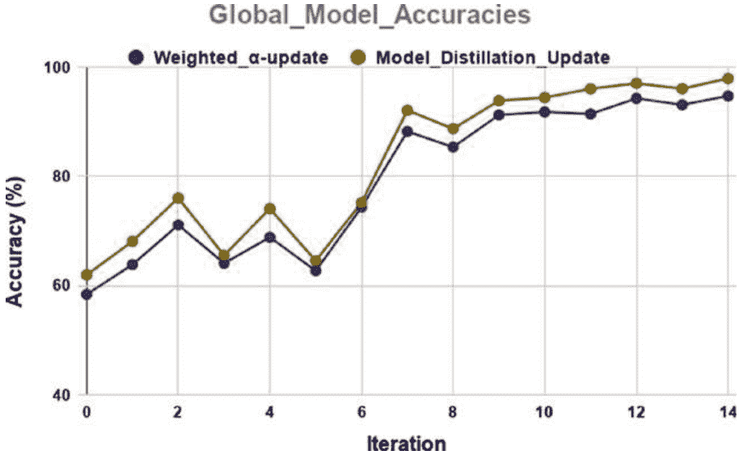

图3. 迭代次数与最终全局平均准确率 (%) 之间的关系，使用模型蒸馏更新和加权$\alpha$更新

在HHAR数据集上，使用模型蒸馏和$\alpha$更新版本分别观察到了约11.01%和9.153%的整体平均确定性（非相对）准确率提高，这些提高是从全局模型更新（表3）中计算得出的。在每次迭代后，所有用户的整体全局模型准确率（与图2中每次迭代后的全局更新准确率不同）也在图3中进行了说明。我们可以观察到，模型蒸馏版本的准确率提高约3.21%，优于$\alpha$更新版本。在我们当前的框架中，仅通过通信（传输）客户端之间的相应活动标签模型分数，在不需要传输整个模型权重的情况下，执行本地设备和中央云之间的计算，这显著减少了延迟和内存开销。

### 4.2 设备上的性能

我们通过在树莓派2上进行实验来观察我们提出的框架的设备性能。我们选择这个单板计算平台，因为它与主流的物联网/移动设备具有相似的硬件和软件规格。报告了在设备上执行联合学习和推断所需的计算时间。这清楚地表明了我们提出的嵌入式系统的可行性。此外，蒸馏机制在边缘/移动设备上的计算开销较高，并且取决于温度参数（默认设置为1）和选择的蒸馏学生模型架构。最终用户通常可以根据其计算能力和准确性要求来选择本地蒸馏版本或 $\alpha$-更新版本。

表4. 执行时间
| 过程 | 计算时间 |
|---|---|
| 每个FL迭代中的训练时间 | ~1.8秒 |
| 推理时间 | ~16毫秒 |
| 离散小波变换 | ~0.45毫秒 |
| 抽取 | ~4.6毫秒 |

## 5 结论

本文提出了一个统一的框架，用于灵活处理异构标签和模型架构在联邦学习中的人类活动识别（HAR）中。通过在联邦学习环境中利用迁移学习和简单的场景变化，我们提出了一个具有两个版本的框架 - 模型蒸馏更新和加权$\alpha$更新在本地模型中聚合，并且我们能够利用全局模型更新的有效性，通过对所有设备进行活动标签的平均值来获得更高的效率。此外，我们发现重叠的活动使我们的框架更加稳健，并且还有助于提高准确性。我们还通过仅将模型分数发送到服务器而不是模型权重进行实验，这样可以大大减少延迟和内存开销。我们在设备上经验性地展示了我们的框架在广泛使用的HHAR数据集上进行联邦学习/训练的成功可行性。我们期望在处理HAR和其他普遍感知任务的统计、模型和基于标签的异质性方面有大量的研究关注。

## 参考文献

- 1. Bonawitz, K., 等: 面向规模化联邦学习的系统设计。在: SysML 2019 (2019)
- 2. Chang, Y., Mathur, A., Isopoussu, A., Song, J., Kawsar, F.: 关于鲁棒人类活动识别的无监督领域自适应的系统研究。 Proc. ACM Interactive Mob. Wearable Ubiquitous Technol. 4 (1), 1–30 (2020)
- 3. Deng, Y., Kamani, M.M., Mahdavi, M.: 自适应个性化联邦学习。 arXiv预印本 arXiv:2003.13461 (2020)
- 4. Feng, S., Duarte, M.F.: 基于少样本学习的人类活动识别。 Expert Syst. Appl. 138, 112782 (2019)
- 5. Gudur, G.K., Balaji, B.S., Perepu, S.K.: 资源受限的异构标签和模型的联邦学习。 arXiv预印本 arXiv:2011.03206 (2020)
- 6. Gudur, G.K., Sundaramoorthy, P., Umaashankar, V.: ActiveHARNet: 面向设备的深度贝叶斯主动学习用于人类活动识别。在：第三届深度学习移动系统和应用国际研讨会，第7-12页 (2019)
- 7. Hammerla, N.Y., Halloran, S., Plötz, T.: 使用可穿戴设备的深度卷积和循环模型进行人类活动识别。 在：第二十五届国际人工智能联合会议论文集，IJCAI 2016，第1533-1540页。AAAI出版社 (2016年)
- 8. Hinton, G., Vinyals, O., Dean, J.: 提取神经网络中的知识。 在：NIPS深度学习和表示学习研讨会 (2015年)
- 9. Kairouz, P., et al.: 联邦学习的进展和开放问题。 arXiv预印本 arXiv:1912.04977 (2019年)
- 10. Kingma, D.P., Ba, J.: Adam: 一种随机优化方法。 arXiv预印本 arXiv:1412.6980 (2014年)
- 11. Konečný, J., McMahan, H.B., Ramage, D., Richtárik, P.: 分布式机器学习用于设备上智能的联邦优化。 arXiv预印本arXiv:1610.02527 (2016年)
- 12. Lane, N.D., Bhattacharya, S., Georgiev, P., Forlivesi, C., Kawsar, F.: 对可穿戴设备、智能手机和物联网设备上的深度学习进行早期资源特性化研究. In: 2015年国际物联网应用研讨会论文集, pp. 7–12. IoT-App 2015 (2015)
- 13. Li, D., Wang, J.: FedMD: 通过模型蒸馏进行异构联邦学习. arXiv预印本 arXiv:1910.03581 (2019)
- 14. Li, T., Sahu, A.K., Talwalkar, A., Smith, V.: 联邦学习: 挑战、方法和未来方向. IEEE Sig. Process. Mag. 37, 50–60 (2020)
- 15. Li, T., Sahu, A.K., Zaheer, M., Sanjabi, M., Talwalkar, A., Smith, V.: 异构网络中的联邦优化. Proc. Mach. Learn. Syst. 2020, 429–450(2020)
- 16. Lim, W.Y.B., 等: 移动边缘网络中的联邦学习：一项综合调查. IEEE通信.调查.教程 (2020)
- 17. McMahan, H.B., Moore, E., Ramage, D., Hampson, S., Arcas, B.A.Y.: 从分散的数据中高效学习深度网络的通信. 在：第20届人工智能和统计学国际会议论文集，卷54，第1273-1282页 (2017)
- 18. Osmani, V., Balasubramaniam, S., Botvich, D.: 在普遍的医疗保健中进行人类活动识别：支持高效远程协作. 网络计算.应用.31, 628-655 (2008)

# 异构标签和模型的联邦学习用于人类活动识别

- 19. Ramakrishnan, A.K., Naqvi, N.Z., Preuveneers, D., Berbers, Y.: 使用智能服务适配器进行云卸载的联邦移动活动识别. 在: Park, J., Jin, Q., Sang-soo Yeo, M., Hu, B. (eds.) 智能空间中的人本技术和服务, 第173-180页. Springer, Heidelberg (2012). https://doi.org/10.1007/978-94-007-5086-9_23
- 20. Sozinov, K., Vlasov, V., Girdzijauskas, S.: 使用联邦学习进行人类活动识别。在: 2018年IEEE国际并行与分布式处理与应用、普适计算与通信、大数据与云计算、社交计算与网络、可持续计算与通信会议上，第1103-1111页。IEEE（2018年）
- 21. Stisen, A. 等: 智能设备是不同的: 评估和减轻移动感知异质性以进行活动识别。在: 第13届ACM嵌入式网络传感器系统会议论文集, SenSys 2015, 第127-140页 (2015年)
- 22. Sundaramoorthy, P., Gudur, G.K., Moorthy, M.R., Bhandari, R.N., Vijayaraghavan, V.: HARNet: 面向受限设备上的增量学习的深度集成。在: 第2届国际嵌入式和移动深度学习研讨会论文集, 第31-36页。EMDL 2018 (2018年)
- 23. 姚, S., 胡, S., 赵, Y., 张, A., Abdelzaher, T.: Deepsense: 一种用于时间序列移动感知数据处理的统一深度学习框架。在: 第26届国际万维网会议 (WWW 2017) 论文集, 第351-360页 (2017年)
- 24. 姚, S., 赵, Y., 邵, H., 张, C., 张, A., 胡, S., 刘, D., 刘, S., 苏, L., Abdelzaher, T.: SenseGAN: 使用半监督框架实现物联网的深度学习。ACM交互式移动可穿戴普适技术会议论文集 2(3), 1-21页 (2018年)
- 25. 赵, Y., 李, M., 赖, L., 苏达, N., Civin, D., Chandra, V.: 非独立同分布数据的联邦学习。arXiv预印本arXiv:1806.00582 (2018年)

# ARID：一个用于在黑暗中识别动作的新数据集

徐月聪1 ，杨建飞1( ) ，曹浩智1 ，毛克智1 ，尹建雄2 ，和西蒙・西2

1 南洋理工大学电气与电子工程学院，新加坡，新加坡
{xuyu0014,yang0478,haozhi001,ekzmao}@ntu.edu.sg

2 NVIDIA人工智能技术中心，新加坡，新加坡
{jianxiongy,ssee}@nvidia.com

摘要：在黑暗视频中进行动作识别的任务在各种场景中非常有用，例如夜间监控和夜间自动驾驶。尽管在正常照明条件下的视频动作识别任务取得了一些进展，但很少有人研究黑暗中的动作识别，部分原因是缺乏足够的用于此任务的数据集。在本文中，我们探索了在黑暗视频中进行动作识别的任务。我们通过收集一个新的数据集来填补数据不足的差距：黑暗中的动作识别（ARID）数据集。它包含3,784个视频片段，涵盖11个动作类别。据我们所知，这是第一个专注于黑暗视频中人类动作的数据集。为了进一步了解我们的ARID数据集，我们详细分析了数据集，并展示了它相对于合成黑暗视频的必要性。此外，我们对当前动作识别模型在我们的数据集上的性能进行了基准测试，并探索了提高性能的潜在方法。我们表明，当前的动作识别模型和帧增强方法可能不是解决黑暗视频中动作识别任务的有效方法（数据可在https://xuyu0010.github.io/arid获取）。

关键词：动作识别 · 黑暗视频 · 卷积神经网络 · 基准

## 1 引言

由于自动动作识别在各个领域的应用越来越广泛，例如监控[24]和智能家居[20]，近年来动作识别任务受到了相当大的关注。尽管取得了很大进展，但目前的研究主要集中在正常照明下拍摄的视频上。这部分是因为当前用于动作识别的数据集通常是从大部分在正常照明下拍摄的网络视频中收集的。然而，在许多情况下，黑暗中拍摄的视频非常有用，例如夜间监控和夜间自动驾驶。可以利用额外的传感器，如红外或热成像传感器，来识别黑暗中的动作。然而，这样的传感器成本高昂，无法大规模部署。因此，我们专注于在没有额外传感器的情况下进行黑暗中的动作识别。为此，我们收集了一个新的数据集：黑暗中的动作识别（ARID）数据集，专门用于黑暗视频中的动作识别任务。据我们所知，这是第一个专注于黑暗中人类动作的数据集。

目前，已经存在大量在正常照明下拍摄的各种数据集中的视频。通过基于这些视频创建合成黑暗视频是直观的。在本文中，我们通过详细分析和比较与合成黑暗视频证明了真实黑暗视频数据集的必要性。我们观察到真实黑暗视频具有无法通过合成黑暗视频复制的独特特征。

最近，神经网络，特别是基于卷积神经网络（CNN）的解决方案已被证明对各种计算机视觉任务非常有效。对于动作识别，先前动作识别数据集上的最先进结果主要是通过基于3D-CNN的网络实现的。为了进一步了解在黑暗视频中进行动作识别所面临的挑战，我们分析了黑暗视频如何影响当前的动作识别模型。此外，我们探索了利用当前模型在动作识别准确性方面取得实质性改进的潜在解决方案。

总之，我们探索了在黑暗视频中进行动作识别的任务。本研究的贡献有三个主要方面：1）我们提出了一个新的ARID数据集，专门用于在黑暗视频中识别动作的任务；2）我们通过统计和视觉分析以及与合成黑暗视频的比较验证了我们的ARID数据集的重要性；3）我们在我们的数据集上对当前基于3D-CNN的动作识别模型的性能进行了基准测试，同时探索了改进当前模型准确性的潜在方法，并揭示了在黑暗视频中进行动作识别任务中的挑战。

## 2 相关工作

动作识别数据集。在动作识别领域中有几个基准数据集。早期的数据集，如KTH [14]和Weizmann [4]，包含相对较少的动作类别。随着在这些较小数据集上提出的方法性能的快速提高，引入了更大更具挑战性的数据集。这包括HMDB51 [10]，UCF101 [15]和Kinetics [1]。特别是Kinetics数据集，总共有400个动作类别和超过160,000个视频片段，成为首选。尽管这些数据集涉及丰富的动作规模，但这些动作大多来自网络视频，主要在正常照明下录制。因此，为了研究在黑暗视频中的动作识别性能，我们收集了一个专门用于在黑暗中拍摄的视频数据集。

黑暗视觉数据集。最近，对于在黑暗环境中进行计算机视觉任务的研究兴趣有所增加，例如黑暗中的人脸识别。黑暗环境视觉任务的研究部分得到了引入的各种黑暗视觉数据集的支持。其中，大多数数据集专注于图像增强和降噪任务，目标是为了更清晰地查看暗图像。其中包括LOL数据集[19]和SID[3]。最近，这种增强任务已经扩展到视频领域。新的数据集包括DRV[2]和SMOID[8]。尽管这两个数据集都包含暗视频，但它们的重点更多地放在增强视频帧的可见性上。这些场景是随机拍摄的，可能不包括特定的人类动作。相比之下，我们的ARID数据集专注于在暗视频中对不同的人类动作进行分类。

## 3 暗环境下的动作识别数据集

尽管当前的动作识别数据集(如Kinetics和HMDB51)中存在少量在黑暗环境中拍摄的视频，但在黑暗环境中进行人类动作识别的任务很少被研究。这部分是由于当前基准数据集中黑暗视频的比例非常低，以及缺乏专门用于黑暗环境中动作分析的数据集。为了填补缺乏黑暗视频数据的差距，我们引入了一个新的暗环境下的动作识别(ARID)数据集。在本节中，我们从三个角度概述了数据集：动作类别、数据收集过程以及我们ARID数据集的一些基本统计信息。

动作类别。ARID数据集包含共11个常见的人类动作类别。动作类别列表可以分为两类：单人动作类别，包括跳跃、奔跑、转身、行走和挥手；以及带物体的人类动作类别，包括喝水、拾取、倒水、推动、坐着和站立。图1显示了ARID数据集中每个动作类别的样本帧。

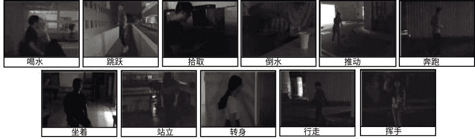

图1。ARID数据集中每个动作类别的样本帧。为了显示目的，所有样本都经过手动调整亮度。最好以彩色和放大的方式查看。(在线彩色图)

数据收集。ARID数据集中的视频剪辑是使用3个不同的商业摄像机拍摄的。这些剪辑严格拍摄于夜间。所有剪辑都来自11名志愿者,其中8名男性和3名女性。我们在9个室外场景和9个室内场景中收集了这些剪辑,包括停车场、走廊和操场等室外场景,以及教室和实验室等室内场景。每个场景的照明条件都不同,几乎所有视频中都没有直接照射在演员身上的光线。在许多情况下,即使对于肉眼来说,识别原始视频剪辑中的人类动作也是具有挑战性的。


图2.ARID中所有动作类别的片段分布。深灰色和浅灰色条表示训练和测试分区中的片段数量。

基本统计。ARID数据集总共包含3,784个视频片段,每个类别至少包含110个片段。单个动作类别的片段被分为12-18个组,每个组至少包含7个片段。同一组中的片段具有一些相似的特征,例如拍摄在相似的光照条件下或由同一演员拍摄。图2显示了所有类别中片段的分布情况。训练和测试集通过分割片段组进行划分,比例为7:3。我们选择了三个训练/测试划分,以使每个组有平等的机会出现在训练分区或测试分区中。

视频剪辑的帧率固定为30 FPS,分辨率为320×240。最小剪辑长度为1.2秒,包含36帧,整个数据集的持续时间为8,721秒。视频以.avi格式保存,并使用DivX编解码器进行压缩。

在本节中,我们通过对ARID数据集进行详细分析,进一步了解我们提出的数据集。主要目标有两个: 1) 验证在真实黑暗环境中收集视频数据集的必要性; 2) 为当前动作识别数据集提供基准,同时揭示在黑暗视频任务中面临的挑战。

接下来,我们首先介绍实验设置以及合成黑暗视频数据集的构建。然后,我们介绍了用于改善ARID中黑暗视频帧的方法,以提高动作识别准确性。然后,我们通过三个角度详细分析了ARID数据集:ARID的统计和视觉分析,ARID分类结果的分析,以及从ARID中提取特征的可视化。

与收集新的黑暗环境数据集相比,通过当前主要由在正常照明下拍摄的视频组成的视频数据集合成黑暗视频更直观。为了展示真实黑暗视频数据集的必要性,我们将合成的黑暗视频数据集与我们的ARID进行比较。合成的黑暗视频数据集基于HMDB51构建,称为HMDB51-dark。我们通过伽马强度校正来合成黑暗视频,公式如下：D(t, x, y) = I(t, x, y)^{1/γ}。其中，D(t, x, y) 是合成暗视频中位于空间位置 (x, y) 的像素值（第t帧），而I(t, x, y) 是原始视频中相应像素的像素值。D(t, x, y) 和I(t, x, y) 的取值范围都在[0, 1]之间。γ 是控制合成暗视频中暗度程度的参数,通常取值范围为[0.1, 10],较小的数值会导致像素值较低,生成较暗的合成视频。

我们注意到我们的ARID中收集的暗视频是在不同的照明条件下拍摄的。为了模拟照明的差异,我们在合成暗视频时应用不同的γ值。具体而言,γ值是从具有约束γ≥0.1的正态分布N(μ, σ²)中随机获取的。这里,均值μ设为0.2,标准差σ设为0.07。图3显示了来自原始HMDB51数据集的样本帧与相应合成暗视频的样本帧的比较。

## 4 实验和讨论

### 4.1 实验设置

为了获得我们ARID数据集上的动作识别结果,我们使用基于PyTorch [12]的3D-CNN模型。对于所有实验,我们的3D-CNN模型的输入是由16个采样帧组成的序列,每个帧的大小调整为224×224。为了加速训练,我们在可能的情况下使用在Kinetics数据集上预训练的3D-CNN模型。由于计算能力的限制,所有实验都采用批量大小为16。动作识别结果以三个拆分的平均top-1和平均top-5准确率报告。

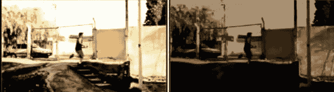

图3.比较从HMDB51数据集中采集的正常照明样本帧（左侧）和从我们的HMDB51-dark数据集中采集的合成黑暗视频的相应帧（右侧）。原始HMDB51视频中的帧具有更多细节，包括背景和演员的更清晰轮廓。

最佳观看效果为彩色。（彩色图在线）

### 4.2 帧增强方法

为了使人类能够更好地识别黑暗视频中的动作，一种直观的方法是增强每个黑暗视频帧。在本文中，我们研究了将不同的帧增强方法应用于ARID以提高当前动作识别模型的效果。我们应用了五种帧增强方法：直方图均衡化（HE）[16]，伽马强度校正（GIC），LIME[5]，BIMEF[21]和KinD[22]。其中，HE和GIC是传统的图像增强方法。HE产生对比度更高的图像，而GIC用于调整图像的亮度。LIME和BIMEF都基于Retinex理论[11]，该理论假设图像由反射和照明组成。LIME估计暗图像的照明图，并对初始照明图施加结构先验，而BIMEF提出了一种多曝光融合算法。KinD是一种基于深度神经网络的方法，利用双流结构进行反射恢复和照明调整。KinD使用在LOL数据集上预训练的权重进行实现。将上述方法应用于ARID数据集的结果分别表示为ARID-HE、ARID-GIC、ARID-LIME、ARID-BIMEF和ARID-KinD。GIC也应用于合成黑暗数据集HMDB51-dark，其结果表示为HMDB51-dark-GIC。

### 4.3 ARID的统计和可视化分析

为了更好地理解真实的黑暗视频并了解真实黑暗视频的必要性，我们计算并比较了ARID数据集与HMDB51数据集以及合成的HMDB51-dark数据集的统计数据。表1展示了数据集ARID、ARID-GIC、HMDB51、HMDB51-dark和HMDB51-dark-GIC的详细均值和标准差值。ARID-GIC和HMDB51-dark-GIC的γ值都设置为5。

表1中显示的ARID的均值和标准差值描述了我们ARID数据集中视频的特征。与原始的HMDB51相比，ARID数据集的RGB均值和标准差值都低于HMDB51数据集。这表明视频与HMDB51数据集中的视频帧相比，ARID中的帧在亮度和对比度上较低。这在采样帧及其RGB和Y直方图的比较中进一步得到了证实，如图4(a)和(c)所示。ARID中视频帧的较低亮度和较低对比度使得即使对于肉眼来说也很难识别动作。

表1.各个数据集 (包括ARID及其GIC增强输出ARID-GIC、HMDB51和合成的黑暗数据集HMDB51-dark，以及合成黑暗数据集的GIC增强输出HMDB51-dark-GIC）的RGB均值和标准差值，所有值都归一化到[0.0,1.0]的范围内。

| 数据集 | RGB均值 | RGB标准差 |
|---|---|---|
| ARID | [0.0796, 0.0739, 0.0725] | [0.1005, 0.0971, 0.0899] |
| ARID-GIC | [0.5473, 0.5418, 0.5391] | [0.1101, 0.1102, 0.1022] |
| HMDB51 | [0.4248, 0.4082, 0.3676] | [0.2695, 0.2724, 0.2779] |
| HMDB51-dark | [0.0979, 0.0884, 0.0818] | [0.1836, 0.1840, 0.1789] |
| HMDB51-dark-GIC | [0.4904, 0.4816, 0.4588] | [0.3593, 0.3600, 0.3486] |

我们观察到我们的真实暗数据集ARID和合成暗数据集HMDB51-dark在RGB均值方面非常相似。这在一定程度上表明我们的合成操作很好地模拟了真实的暗环境。然而，进一步比较RGB标准差值表明，真实的暗数据集ARID在对比度方面仍然较低。这与ARID和HMDB51-dark的采样帧比较的观察结果相符，如图4(a)和(d)所示。在这里，我们观察到来自HMDB51-dark的视频在视觉上更容易区分。我们认为这是因为原始HMDB51数据集中的亮像素，在合成的暗视频中对应的输出像素具有较高的像素值。这增加了HMDB51-dark的标准差，从而在对比度方面表现出更高的帧。

如第4.2节所述，GIC方法可以通过调整帧的亮度来增强帧。通过设置γ≥1.0，应用GIC方法后的像素值应大于输入像素值。这是由于ARID-GIC和HMDB51-dark-GIC的RGB均值较大，相比于ARID和HMDB51-dark数据集。如图4(a)和(b)所示的采样帧也证明了GIC增强大大提高了每个视频帧的可见性。在图4(a)中，肉眼无法清楚地看到奔跑的人，而在图4(b)中，人变得更加可见。

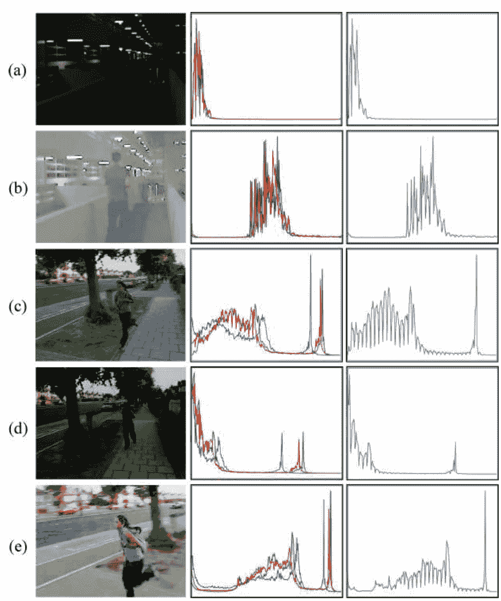

图4.从（a）ARID，（b）ARID-GIC，（c）HMDB51，（d）HMDB51-dark和（e）HMDB51-dark-GIC数据集中比较采样帧和其对应视频的RGB（中列）和Y（右列）值直方图。GIC增强将RGB和Y值直方图向较大值方向移动，表示视频帧更亮。ARID和ARID-GIC的RGB和Y值更集中，而HMDB51-dark和HMDB51-dark-GIC的RGB和Y值分布更广，这与低对比度和苍白的采样图像相匹配。HMDB51-dark视频的RGB直方图在较高值处的峰值来自明亮的背景。最好以彩色和放大的方式查看。（在线彩色图）

尽管在图4(a)(b)和(d)(e)之间对采样帧进行比较显示了GIC增强在增加暗视频亮度方面的有效性，但ARID-GIC和HMDB51-dark-GIC之间仍存在显著差异。最显著的差异是ARID-GIC的标准差要小得多，这表明视频在GIC增强后，ARID-GIC的对比度仍然较低。通过比较图4（b）和（e）中的采样帧，我们可以看到ARID-GIC的采样帧看起来苍白，而HMDB51-dark-GIC的采样帧则不同。

从上述观察中，我们可以总结出我们的ARID数据集中真实黑暗视频的主要特征：低亮度和低对比度。尽管合成的黑暗视频可以模仿低亮度的特征，但低对比度的特征不容易被合成的黑暗视频所模仿。这部分是由于在正常照明下拍摄的视频中普遍存在明亮的背景和像素。上述分析证实了真实黑暗视频在黑暗环境中的动作识别任务中是不可替代的。

### 4.4 ARID数据集上的分类结果

在本节中，我们将说明当前动作识别模型在我们的ARID数据集上的黑暗环境中的动作识别任务中的表现。我们进一步探讨了改善真实黑暗视频中动作识别性能的潜在方法，并揭示了在黑暗视频中进行动作识别面临的一些挑战。当前竞争的基于3D-CNN的动作识别模型的性能如表2所示，包括：C3D [17]，3D-ShuffleNet [9]，3D-SqueezeNet [7]，3D-ResNet-18 [18]，Pseudo-3D-199 [13]，Res50-I3D [1]和3D-ResNext-101 [6]。

表2. 当前基于3D-CNN的动作识别模型在ARID数据集上的性能。
| 方法 | Top-1准确率 | Top-5准确率 |
|---|---|---|
| C3D | 39.17% | 94.17% |
| 3D-ShuffleNet | 44.35% | 93.44% |
| 3D-SqueezeNet | 50.18% | 94.17% |
| 3D-ResNet-18 | 54.68% | 96.60% |
| Pseudo-3D-199 | 71.93% | 98.66% |
| Res50-I3D | 73.39% | 97.21% |
| 3D-ResNext-101 | 74.73% | 98.54% |

如表2所示的性能结果表明，在当前的动作识别模型中，3D-ResNext-101具有最佳的Top-1准确率，为74.73%。我们注意到，所有方法的Top-5准确率相对较高，部分原因是我们的数据集中类别较少。

我们还注意到，尽管我们的数据集相对较小，类别较少，比起当前的正常照明视频数据集，准确率仍有很大提升空间。为了探索进一步提高暗视频准确率的潜在方法，我们选择3D-ResNext-101作为基准线进行实验。提高准确率的一种直观方法是使用第4.2节介绍的帧增强方法。为了测试帧增强方法是否能提高准确率，我们采用GIC方法对由于其更大的数据规模和获取当前数据集中的黑暗数据的便利性，我们使用合成的HMDB51-dark数据集。

表3. 3D-ResNext-101在合成的HMDB51-dark和其GIC增强的HMDB51-dark-GIC上的性能。为了参考，我们还提供了3D-ResNext-101在原始HMDB51上的性能。
| 数据集 | Top-1准确率 |
|---|---|
| HMDB51-dark | 44.90% |
| HMDB51-dark-GIC | 56.62% |
| HMDB51 | 63.80% |

如表3所示的结果显示，当相同的网络用于黑暗数据时，分类准确率显著下降。这种下降是可以预料的，因为黑暗视频中包含的细节较少，如图3所示。除此之外，当应用GIC方法增强黑暗视频帧时，准确率还显著提高了11.72%。由于合成数据使用随机伽马值进行加深，而GIC增强则使用固定的伽马值，因此几乎不可能恢复原始视频。尽管如此，GIC操作仍然带来了显著的准确率提升。

在合成黑暗视频中应用帧增强方法以提高分类准确性的成功为我们提供了改善实际黑暗视频中动作识别准确性的潜在方法的线索。为了验证相同的GIC方法是否也能提高我们的ARID数据集上的动作识别准确性，我们在经过GIC增强的ARID数据集上进行实验：ARID-GIC，利用3D-ResNext-101。结果如表4所示。

表4. 3D-ResNext-101在经过HE、GIC、LIME、BIMEF和KinD增强的ARID变体上的性能。改进与3D-ResNext-101在原始ARID数据集上的性能进行比较。
| 数据集 | Top-1准确率 | 改进 |
|---|---|---|
| ARID-GIC | 78.03% | 3.30% |
| ARID-HE | 75.82% | 1.09% |
| ARID-LIME | 77.40% | 2.67% |
| ARID-BIMEF | 73.39% | -1.34% |
| ARID-KinD | 69.62% | -5.11% |
| ARID | 74.73% | / |

表4中的结果表明，通过GIC增强，我们的ARID的动作识别准确性得到了提高，这要归功于增加了如图4所示，每个视频帧的照明准确率的提高与合成黑暗数据集HMDB51-dark的研究结果一致。然而，我们还注意到使用GIC方法仅能提高3.3%的性能，与合成黑暗数据集相比，这种提升相对有限。由于GIC方法是一种基于简单指数计算的方法，我们进一步研究是否更复杂的帧增强方法能够进一步提高动作识别准确性。因此，我们检查了ARID-HE、ARID-LIME、ARID-BIMEF和ARID-KinD数据集的准确性，这些数据集是通过帧增强方法HE、LIME、BIMEF和KinD的输出结果得到的。结果也在表4中呈现。

有趣的是，表4表明并非所有的帧增强方法都能提高黑暗视频中的动作识别准确性。在所有的帧增强方法中，GIC方法取得了最大的改进。而最近的基于深度学习的方法KinD则导致准确率下降最多。为了更好地理解使用不同增强方法的结果差异，我们可视化了每种增强方法的帧输出。图5展示了上述增强方法在相同输入ARID视频帧上的采样帧。

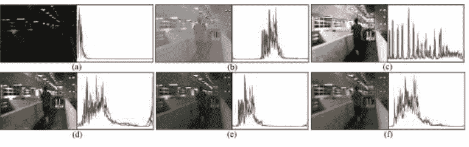

图5. 比较采样帧及其来自（a）ARID，（b）ARID-GIC，（c）ARID-HE，（d）ARID-LIME，（e）ARID-BIMEF和（f）ARID-KinD的RGB直方图。

图5清楚地显示，从视觉上看，所有帧增强方法的输出都改善了视频的可见性。在除了ARID原始视频的采样帧中，奔跑的演员在所有采样帧中都可以清晰地看到。然而，ARID-GIC的采样帧在视觉上并不是最好的增强，因为它的对比度仍然很低。相比之下，所有其他方法产生了更高对比度的图像，这在图5的RGB直方图中得到了证明。这表明当前的帧增强虽然在视觉上明显改善了暗视频帧，但对于暗视频的动作识别准确性可能没有带来改进。我们认为一些增强可以被视为视频的伪影或对抗性攻击。虽然增强的帧在视觉上更清晰，但一些增强破坏了视频的原始分布并引入了噪音。分布的改变和噪音的引入可能导致动作识别模型性能下降。

### 4.5 使用ARID进行特征可视化

为了进一步了解当前动作识别模型在ARID上的性能，并分析暗视频对当前模型的影响，我们使用3D-ResNext-101在最后的卷积层提取和可视化特征。特征的可视化呈现为类激活图（CAM）[23]，它描述了模型对给定预测的关注点。图6和图7比较了从ARID和HMDB51数据集中采样的帧，并显示了相应的CAM。我们观察到，在HMDB51中具有正常照明的帧（如图6所示），3D-ResNext-101 模型能够关注到演员，而对于暗视频，模型更多地关注背景。例如，对于图7(a)(left)中显示的动作，网络通过关注背景将该动作分类为“跳跃”，因为由于人向后跳跃，背景的细节被揭示出来。因此，CAM显示网络在背景中聚焦于一个狭窄的光束。对于暗视频，网络更多地关注背景而不是演员，部分原因可能是在暗视频中很少存在演员的清晰轮廓。

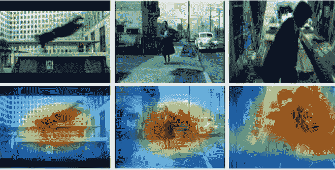

图6. HMDB51的三个类别（跳跃（左）、奔跑（中）、站立（右））的采样帧的CAM

在表4中，某些帧增强方法可以积极地影响最终的分类准确性。为了进一步了解不同的帧增强方法如何实际影响动作识别模型，我们将CAM与来自五个帧增强的ARID数据集的相同采样帧进行比较，如图7所示。与原始视频帧相比，所有增强帧中演员的轮廓更清晰。我们观察到与原始帧的CAM相比，网络的焦点区域更加集中。此外，我们观察到帧增强样本帧的网络焦点与实际演员之间存在一些偏移。相比之下，HMDB51视频帧的CAM显示网络的焦点中心围绕着演员。这可能部分解释了帧增强方法无法提高动作识别准确性的原因，同时能够聚焦于每个视频帧的更集中区域。

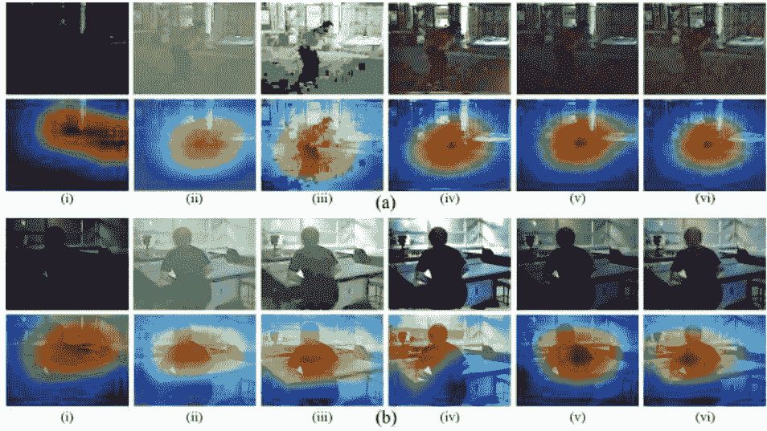

图7. 采样帧和对应的类别激活图（CAM）的比较：（a）跳跃和（b）站立。采样帧和对应的 CAM来自（i）ARID，（ii）ARID-GIC，（iii）ARID-HE，（iv）ARID-LIME，（v）ARID-BIMEF和（vi）ARID-KinD。

### 4.6 讨论

通过上面呈现的结果和分析，我们可以得出关于在黑暗环境中进行动作识别任务的三个主要结论。首先，在黑暗环境中拍摄的视频具有低亮度和低对比度的特点。由于低对比度的特性无法完全合成，合成的黑暗视频不能直接应用于黑暗环境中的动作识别。其次，尽管当前的帧增强方法可以产生视觉上更清晰的视频帧，但对于当前的动作识别模型来说，增强黑暗视频帧后的准确性改进相当有限。一些帧增强方法甚至会降低分类准确性，因为一些增强可以被视为视频的伪影或对抗攻击。破坏原始视频的分布可能会降低统计模型的性能。开发更好的帧增强方法可能有助于提高黑暗视频中的动作识别准确性。第三，许多黑暗视频中，当前的动作识别模型无法专注于演员进行分类。这可能是由于演员轮廓不清晰导致的，并且显示出动作识别模型倾向于专注于帧增强黑暗视频中的演员。然而，在帧增强黑暗视频中的焦点存在偏移。我们相信，具有更好的专注于演员的能力，特别是对于轮廓不清晰的演员，的动作识别模型可能是提高黑暗视频中动作识别准确性的关键部分。这些结论有助于探索更有效的ARID解决方案。

## 5 结论

在这项工作中，我们介绍了黑暗环境下的动作识别（ARID）数据集，据我们所知，这是第一个专门用于动作识别任务的黑暗环境数据集。ARID包括11个动作类别的4k视频片段。为了了解真实黑暗视频背后的挑战，我们从统计、分类结果和特征可视化三个角度分析了我们的ARID数据集。我们发现真实黑暗视频具有与合成黑暗视频不同的独特特征。我们的分析表明，当前的动作识别模型和帧增强方法在识别黑暗视频中的动作方面效果不够好。我们希望这项研究能引起更多人对黑暗环境下动作识别任务的兴趣。

## 参考文献
- 1. Carreira, J., Zisserman, A.: Quo vadis, action recognition? A new model and the kinetics dataset. In: Proceedings of the IEEE Conference on Computer Vision and Pattern Recognition, pp. 6299–6308 (2017)
- 2. Chen, C., Chen, Q., Do, M.N., Koltun, V.: 在黑暗中看到运动. 在: IEEE国际计算机视觉会议论文集, 第3185-3194页 (2019年)
- 3. Chen, C., Chen, Q., Xu, J., Koltun, V.: 学会在黑暗中看见. 在: IEEE计算机视觉与模式识别会议论文集, 第3291-3300页 (2018年)
- 4. Gorelick, L., Blank, M., Shechtman, E., Irani, M., Basri, R.: 动作作为时空形状. IEEE模式分析与机器智能杂志 29(12), 2247-2253页 (2007年)
- 5. Guo, X., Li, Y., Ling, H.: Lime: 通过光照图估计进行低光图像增强. IEEE图像处理杂志 26(2), 982-993页 (2016年)
- 6. Hara, K., Kataoka, H., Satoh, Y.: 时空3D卷积神经网络能否追溯2D卷积神经网络和图像网的历史. 在: IEEE计算机视觉与模式识别会议论文集, 第6546-6555页 (2018年)
- 7. Iandola, F.N., Han, S., Moskewicz, M.W., Ashraf, K., Dally, W.J., Keutzer, K.: SqueezeNet: alexnet-level accuracy with 50x fewer parameters and <0.5 MB model size. arXiv预印本 arXiv:1602.07360 (2016)
- 8. Jiang, H., Zheng, Y.: 学习在黑暗中观察移动物体. 在: IEEE国际计算机视觉会议论文集, 第7324-7333页 (2019)
- 9. Küçüklu, O., Kose, N., Gunduz, A., Rigoll, G.: 资源高效的3D卷积神经网络. arXiv预印本 arXiv:1904.02422 (2019)
- 10. Kuehne, H., Jhuang, H., Garrote, E., Poggio, T., Serre, T.: HMDB: 一个用于人体动作识别的大型视频数据库. 在: 2011国际计算机视觉会议, 第2556-2563页. IEEE (2011)
- 11. Land, E.H.: 关于色彩视觉的Retinex理论。科学美国人 237(6), 108-129 (1977年)
- 12. Paszke, A.等: PyTorch中的自动微分。在: NIPS Autodiff Workshop (2017年)
- 13. Qiu, Z., Yao, T., Mei, T.: 使用伪-3D残差网络学习时空表示。在: IEEE国际计算机视觉会议论文集, pp. 5533-5541 (2017年)
- 14. Schuldt, C., Laptev, I., Caputo, B.: 识别人类动作：一种局部SVM方法。 在：第17届国际模式识别会议论文集，ICPR 2004年。卷3，pp. 32-36. IEEE （2004年）
- 15. Soomro, K., Zamir, A.R., Shah, M.: UCF101：来自野外视频的101种人类动作类别数据集。 arXiv预印本arXiv:1212.0402 （2012年）
- 16. Trahanias, P., Venetsanopoulos, A.: 通过3D直方图均衡化进行彩色图像增强。 在： 第11届国际模式识别会议论文集。卷III。会议C：图像、语音和信号分析，pp.545-548。 IEEE （1992年）
- 17. Tran, D., Bourdev, L., Fergus, R., Torresani, L., Paluri, M.: 使用3D卷积网络学习时空特征。 在： IEEE国际计算机视觉会议论文集，第4489-4497页 （2015年）
- 18. Tran, D., Wang, H., Torresani, L., Ray, J., LeCun, Y., Paluri, M.: 更深入地研究时空卷积用于动作识别。 在： IEEE计算机视觉与模式识别会议论文集，第6450-6459页 （2018年）
- 19. Wei, C., Chen, W., Yang, W., Liu, J.: 用于低光增强的深度Retinex分解。 在： 英国机器视觉会议。英国机器视觉协会 （2018年）
- 20. Yang, J., Zou, H., Jiang, H., Xie, L.: 使用WIFI-enabled IoT设备进行无设备占用活动感知的智能家居。IEEE物联网杂志 5 （5），3991-4002页 （2018年）
- 21. Ying, Z., Li, G., Ren, Y., Wang, R., Wang, W.: 一种使用曝光融合框架的新图像对比度增强算法。 在： Felsberg, M., Heyden, A., Krüger, N. (eds.) CAIP 2017. LNCS, vol. 10425, pp. 36-46. Springer, Cham (2017). https://doi.org/10.1007/978-3-319-64698-5_4
- 22. Zhang, Y., Zhang, J., Guo, X.: 点燃黑暗：一种实用的低光图像增强器。 在： 第27届ACM国际多媒体会议论文集，MM 2019，pp. 1632-1640。ACM，纽约 （2019）。https://doi.org/10.1145/3343031.3350926
- 23. Zhou, B., Khosla, A., Lapedriza, A., Oliva, A., Torralba, A.: 学习用于判别定位的深度特征。 在： 计算机视觉和模式识别 （2016）
- 24. 邹，H.，杨，J.，普拉萨纳·达斯，H.，刘，H.，周，Y.，斯帕诺斯，C.J.: WiFi和视觉多模态学习用于准确和稳健的无设备人类活动识别。 在： IEEE计算机视觉和模式识别研讨会论文集 （2019年）

## 视频流上的单次运行动作检测器-一种保护隐私的方法

Anbumalar Saravanan1, Justin Sanchez1(), Hassan Ghasemzadeh2, Aurelia Macabasco-O’Connell3, 和 Hamed Tabkhi 1

1 北卡罗来纳大学夏洛特分校,美国北卡罗来纳州夏洛特市28223 {asaravan,jsanch19,htabkhiv}@uncc.edu

2 华盛顿州立大学,普尔曼,美国华盛顿州99164 hassan.ghasemzadeh@wsu.edu

3 阿祖萨太平洋大学,阿祖萨,加利福尼亚州91702,美国 amacabascooconnell@apu.edu

摘要： 本文初步设计和评估了一种基于视觉的隐私保护活动监测系统。. 所提出的技术利用人工智能(AI)增强的主动系统,提供连续监测、行为分析和人类活动建模。为此,本文提出了一种实时隐私保护动作检测器(S-RAD),它可以进行端到端的动作定位和分类。 它基于Faster-RCNN结合时间偏移建模和基于段的采样来捕捉人类动作。

UCF-Sports和UR Fall数据集的结果表明,与最先进的...相比,具有显著较低的模型大小和计算需求,并且能够在边缘嵌入式设备(如Nvidia Jetson Xavier)上实时执行。

关键词：动作检测 · 深度学习 · 实时 · 边缘计算 · 时空神经网络

## 1 引言

近年来,深度学习在计算机视觉和自然语言处理等领域取得了成功。 与支持向量机和随机森林等传统机器学习方法相比,深度学习具有更强的数据学习能力,并且可以更好地利用数据集进行特征提取。 由于这种实用性,深度学习在研究工作中变得越来越受欢迎。

深度学习模型通常采用分层结构来连接它们的层。 较低层的输出可以被视为较高层的输入,使用线性或非线性函数。 这些模型可以从输入数据中将低级特征转化为高级抽象特征。 由于这种特性,深度学习模型在特征表示方面比浅层机器学习模型更强大。 传统机器学习方法的性能## 2 相关工作

### 2.1 使用可穿戴传感器进行活动识别
大多数先前的研究集中在使用可穿戴设备和移动设备（例如智能手机、智能手表）进行活动识别。在设计高效的活动识别系统时，研究人员广泛研究了各种可穿戴计算研究问题。这些研究工作围绕着可穿戴传感器的最佳放置[2]、传感器的自动检测[22]、传感能量消耗的最小化[19]和功耗的优化[17]展开。使用可穿戴传感器和移动设备进行活动监测的一个限制是这些技术都是由电池供电的，因此需要定期充电。未能充电会导致活动识别的中断，进而可能导致重要的行为事件未被检测到。

### 2.2 视频数据中的动作识别
动作识别是一个长期的研究问题，已经研究了几十年。现有的最先进方法主要集中在对连续视频帧中的时间依赖性进行建模[23,25,26]。例如，[26]直接对不同时间段中描绘的运动线索进行平均，以捕捉时间信息的不规则性。[23]提出了一个双流网络，它分别以RGB帧和光流作为输入，并将两个流的检测结果融合为最终输出。这是在多个抽象层次上完成的，并取得了很好的性能。

除了基于多流的方法外，像[16,25]这样的方法还探索了在视频流上进行联合时空特征学习的3D卷积神经网络。通过这种方式，它们避免了明确计算光流、关键点或显著性图。然而，所有上述方法都太大，无法适应实时边缘设备。另一方面，[1]使用从人体关键点变化中计算得到的特征来对跌倒和非跌倒动作进行分类，[3]使用基于多流（光流、RGB、姿势估计）的VGG16进行人体动作分类。上述方法只集中在场景级别的单一人体动作分类上，在图像中存在多个人体时效果不佳，这对于医疗保健和其他公共场所监控系统至关重要。我们提出的方法以一种单次拍摄的方式同时进行人体检测和动作分类，算法首先定位图像中的人体，然后对其动作进行分类。

### 2.3 时空人体动作检测
关于时空动作检测的论文很少。例如，[10]使用物体检测器（如SSD [15]）在帧级别部署高级链接算法来生成时空管。受RCNN方法的启发，[20]使用Faster-RCNN [21]通过捕捉光流的动作线索来检测图像中的人体，并根据动作得分对最终的人体动作进行分类。[7]通过在RGB帧上使用选择性搜索方法提取提案，然后对每帧RGB和光流数据应用原始R-CNN进行帧级别的动作检测，最后使用维特比算法连接这些检测结果以生成动作管。另一方面，[9]使用3D CNN生成具有兴趣区域池化的时空管，并在与动作相关的数据集中展示了良好的性能。然而，所有这些方法由于在双流网络中生成光流、3D CNN相关工作中的3D卷积核以及基于人体姿势的方法中生成关键点而导致处理时间和计算成本高。因此，上述方法无法应用于实时监控系统。

## 3 单次运行动作检测器
我们介绍了S-RAD，一种敏捷实时的活动监测系统。我们的方法将时空特征提取和定位统一到一个网络中，使得可以在边缘设备上部署。

这种“边缘”部署消除了将敏感人类数据发送到侵犯隐私的云服务器的需求，类似于[18]。相反，我们的方法在处理完视频数据后可以删除所有数据，只保留高级活动分析。没有存储图像，S-RAD可以专注于区分人类动作，而不是识别或描述人类。

为了实现这种保护隐私的边缘执行，有一个能够在资源受限的边缘环境中运行的算法非常重要。传统上，这种限制要么导致准确性降低，要么增加延迟。S-RAD的概述如图1所示。S-RAD接受一个输入序列N帧 $f_1, f_2, f_3, ..., f_N$，并为每个提议类别输出检测到的边界框和置信度分数。该模型由一个基础特征提取器和用于捕捉低级时空特征的时间偏移块组成。基础特征提取器由原始ResNet-50 [8]骨干网络的前40层组成。基础特征图通过区域建议网络（RPN）进行处理，使用滑动窗口的方法和手动选择的锚点为每个帧生成动作提议。

RPN是一个完全卷积网络，可以同时预测每个位置的动作边界和动作得分。RPN通过端到端训练来定位和检测有效的区域动作提议（前景），而不是背景。这种滑动窗口的方法用于生成提议，这是其准确性的来源，与SSD的刚性网格基础提议生成不同。

在第一阶段之后，将原始的时空基础特征与提议一起传入感兴趣区域对齐（ROI-Align）中。

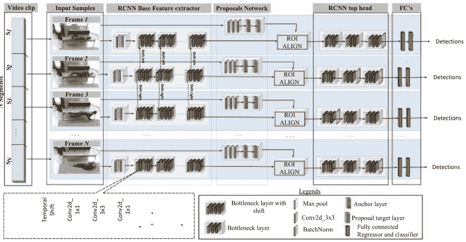

图1。活动检测器的概述。给定一系列帧，我们从基础特征提取器中提取通道平移卷积特征，以推导出动作提议网络中的活动提议。然后，我们对活动提议进行ROI对齐，以预测它们的得分并回归它们的坐标。

该层将不同大小的动作提议对齐到固定的7×7空间大小的动作提议中。动作检测器的第二阶段进一步将每个有效的动作提议分类到该帧中的动作类别。最终的分类层为每个动作提议输出C+1个得分，其中C是每个动作类别加上背景的数量。回归层输出4×K，其中K是每帧生成的动作提议数量。

时间偏移块。TSM [14]非常高效。时间偏移块被插入到ResNet-50 [8]基于特征提取器的瓶颈层中，以使用标识映射保持空间信息和使用偏移特征保持时间信息。如图2所示，每个偏移接收来自前一层的C通道。我们将过去帧的1/8通道移动到当前帧，并将当前帧的1/8通道移动到未来帧，而其他通道保持不变。新特征（通道被称为特征）$\hat{x}_2$，在“偏移”操作后具有过去 $x_1$ 和未来 $x_2$ 帧的信息。

这些特征被卷积和混合成新的时空特征。与下一层耦合的偏移块将执行相同的操作。每个偏移块将时间感知域增加2个相邻帧，直到N帧。对于我们的工作，我们选择N=8，因为特征在ResNet-50架构[8]中的数量级为8。

S-RAD超越了动作分类，实现了动作检测。这对于像网格大厅这样的公共区域以及与其他人和物体的互动非常有价值。我们选择Faster-RCNN [21]作为我们的检测基准，因为与SSD [15]相比，它具有更精细的检测能力。

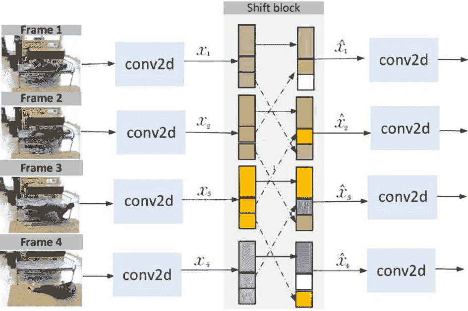

当处理徘徊的患者和细粒度异常行为时，检测尤其适用于医疗领域。尽管这些任务的复杂性，我们利用TSM [14]能够以流式实时方式提取所需的时空特征，实现人体动作定位和个体动作分类，同时保护隐私。

### 3.1 训练损失
RPN损失：对于训练RPN，我们为每个锚点分配一个二进制动作类标签（即前景与背景的动作）。我们为两种类型的锚点分配正动作类标签：（i）与地面真实框具有最高交并比（IoU）重叠的锚点，或者（ii）与任何地面真实框具有IoU > 0.7的锚点。对于所有地面真实框，如果非正锚点的IoU < 0.3，则为其分配负动作类标签。既不是正也不是负的锚点对训练没有贡献。根据这些定义，我们的RPN损失函数定义为：

$$ L_{rpn}(\{p_i\}, \{bb_i\}) = \frac{1}{K} \sum_{i=1}^K L_{cls}(p_i, p_i^*) + \frac{1}{K} \sum_{i=1}^K p_i^* L_{reg}(bb_i, bb_i^*) \quad (1) $$

在这里，$i$ 是一个小批量中锚点的索引，$p_i$ 是锚点 $i$ 属于动作类别的预测概率。如果锚点是正样本，则真实标签 $p_i^*$ 为1，如果锚点是负样本，则真实标签 $p_i^*$ 为0。预测边界框的4个坐标是 $bb_i$，并且 $bb_i^*$ 是与正锚点相关联的真实边界框。术语 $p_i^* L_{reg}$ 表示平滑的L1回归损失仅在正锚点（$p_i^* = 1$）激活，并在其他情况下禁用（$p_i^* = 0$）。$L_{cls}$ 是两个类别（动作与无动作）的对数损失（交叉熵），并在K帧上进行平均。

RCNN损失：检测器的第二阶段将动作类别标签分配给来自RPN训练的感兴趣区域或前景提议。它涉及分类损失和回归损失。这里的分类层包括为来自ROI对齐层的提议检测正确的动作类别标签，回归层用于将检测到的框与真实值回归。RCNN损失定义如下：

$$ L_{rcnn}(\{p_i\}, \{bb_i\}) = \frac{1}{K} \sum_{i=1}^{K} L_{cls}(p_i, p_i^*) + \frac{1}{K} \sum_{i=1}^{K} L_{reg}(bb_i, bb_i^*) \quad (2) $$

其中 $i$ 是具有空间维度7×7的提议或感兴趣区域的索引，$p_i$ 是动作类别标签的预测概率，$p_i^*$ 是地面真实类别标签。预测边界框的4个坐标的向量是 $bb_i$，而 $bb_i^*$ 是真实边界框的向量。$L_{cls}$ 是多类别的对数损失（交叉熵），$L_{reg}$ 是平滑的L1回归损失，并在K帧上进行平均。在训练模式下，我们将网络设置为输出256个提议，在推理模式下，网络输出300个提议。

总训练损失：总损失定义为RCNN和RPN损失之和：

$$ L_{总} = L_{rpn}(\{p_i\}, \{bb_i\}) + L_{rcnn}(\{p_i\}, \{bb_i\}) \quad (3) $$

## 4 结果和评估
设置。我们使用ResNet-50 [8]作为我们架构的骨干，因为它具有网络深度和残差连接，可以实现特征重用和传播。UCF-Sports [24]和UR Fall [12]数据集太小，容易过拟合，因此我们从Kinetics [11]预训练权重中微调了我们的网络，并冻结了批归一化层。UCF-Sports [24]数据集的训练参数为300个训练周期，初始学习率为0.03，每60个周期衰减权重0.1。我们使用批量累积的方法，批量大小为4，累积步骤为3，在一块V100 GPU上适应总批量为12。UR Fall数据集[12]的训练参数为80个训练周期，初始学习率为0.02，每20个周期衰减权重0.1。我们采用[26]中的均匀时间采样策略，从视频中采样8帧，并将图像的输入分辨率调整为300×400，以进行最先进的比较。我们使用来自两个不同领域（体育和医疗保健）的数据集来展示我们算法的通用能力。

### 4.1 UCF-Sports数据集上的结果
UCF-Sports数据集[24]包含来自10个动作类别的150个视频。所有视频都以帧级边界框的形式具有时空注释，并且我们遵循[7]使用的相同的训练/测试分割。平均而言，训练数据集中有103个视频，测试数据集中有47个视频。视频被截断为动作，并为所有帧提供边界框注释。为了量化我们的结果，我们报告帧级平均精度（mAP）。帧级指标使我们能够独立比较检测的质量。我们使用精确率-召回率AUC（曲线下面积）来计算每个类别的平均精度。我们计算每个类别的平均精度的平均值，以了解我们的算法在区分动作类别的特征方面的能力。我们按照PASCAL VOC检测挑战[6]中的相同过程进行操作，以便与检测任务中的最新方法进行苹果对苹果的比较。我们首先在广泛使用的UCF-Sports数据集上评估S-RAD。表1显示了交并比阈值为0.5时每个类别的帧级平均精度。我们的方法实现了85.04%的平均AP。尽管在大多数类别上表现出色，但在行走类别中，该框架无法检测到人类（40.71%的帧级AP）。这可能是由于几个因素造成的，首先是“行走”测试视频中包含多个靠近的演员，导致由于遮挡而产生误检测。此外，行走是一种非常缓慢的动作，具有细粒度的特征，并且由于稀疏的时间采样策略，可能在8帧中没有足够的时间位移被我们的检测器捕捉到。最终，与利用多模态、三维或复杂提议架构解决方案的最新方法相比，我们的方法仅有2%的差距。以平均精度（mAP）为指标，最新方法的比较总结在表2中。

表1. UCF-Sports中每个类别帧mAP的最新比较
| 动作类别 | [7] | [27] | [20] | [9] | S-RAD |
|---|---|---|---|---|---|
| 跳水 | 75.79 | 60.71 | 96.12 | 84.37 | 99.90 |
| 高尔夫 | 69.29 | 77.54 | 80.46 | 90.79 | 87.20 |
| 踢球 | 54.60 | 65.26 | 73.48 | 86.48 | 76.00 |
| 举重 | 99.09 | 100.00 | 99.17 | 99.76 | 99.96 |
| 骑行 | 89.59 | 99.53 | 97.56 | 100.0 | 99.90 |
| 跑步 | 54.89 | 52.60 | 82.37 | 83.65 | 89.79 |
| 滑板 | 29.80 | 47.14 | 57.43 | 68.71 | 67.93 |
| 摆动1 | 88.70 | 88.87 | 83.64 | 65.75 | 88.78 |
| 摆动2 | 74.50 | 62.85 | 98.50 | 99.71 | 99.9 |
| 步行 | 44.70 | 64.43 | 75.98 | 87.79 | 40.71 |

表2. UCF-Sports Action数据集中IOU为0.5阈值的整体帧mAP比较
| | [7] | [27] | [20] | [9] | [10] | [5] | S-RAD |
|---|---|---|---|---|---|---|---|
| mAP | 68.09 | 71.90 | 84.51 | 86.70 | 87.7 | 83.9 | 85.04 |

图3显示了我们算法在区分不同类别方面的能力，通过绘制精确率-召回率AUC曲线。


我们还提供了混淆矩阵，以更好地理解与原始真实值的检测结果。混淆矩阵是根据检测和分类任务计算的。在对角线上的网格是真正的阳性，其IOU > 0.5，并且检测到的动作类别标签与真实动作类别标签匹配。其他列是假阳性，其IOU > 0.5，但检测到的动作类别标签与真实动作类别标签不匹配。最后一列包含IOU < 0.5的假阴性检测。

### 4.2 UR Fall数据集上的结果
我们还在医疗广泛数据集[12]上评估了我们的框架。UR Fall数据集由70个视频组成：(i) 30个跌倒视频；(ii) 40个展示各种活动的视频。

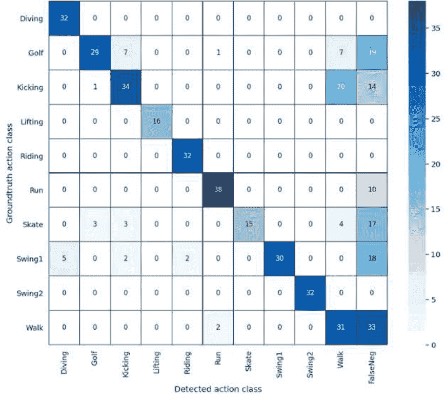

图4. S-RAD在UCF-Sports上的混淆矩阵

我们使用[4]在COCO数据集中仅预训练了人物类别，以获取地面真实边界框注释。平均每个训练集中有56个视频，测试集中有14个视频。

对于UR Fall数据集，我们计算了特异性、敏感性和准确性，以及mAP进行比较。

- （1）敏感性：评估检测跌倒的指标，计算真阳性与跌倒数量的比率。
  $$ 敏感性 = \frac{真阳性}{真阳性 + 假阴性} \times 100 \quad (4) $$

- （2）特异性：评估我们的算法仅检测“跌倒”并避免与“非跌倒”类别误分类的指标。
  $$ 特异性 = \frac{真阴性}{真阴性 + 假阳性} \times 100 \quad (5) $$

- （3）准确性：用于计算我们的算法在跌倒和非跌倒视频之间的差异程度的度量标准。
  $$ 准确性 = \frac{真阳性 + 真阴性}{真阴性 + 假阳性 + 真阳性 + 假阴性} \times 100 \quad (6) $$

真阳性（TP）表示该帧存在跌倒，我们的算法在这些帧中检测到了跌倒。真阴性（TN）指的是不包含跌倒的帧，我们的算法在这些帧中没有检测到跌倒。假阴性（FN）表示包含跌倒的帧，但我们的算法未能检测到这些帧中的跌倒。最后，假阳性（FP）表示不包含跌倒的帧，但我们的算法声称检测到了跌倒。为了与其他基于分类的最新论文进行比较，我们从S-RAD的输出中选择具有最高置信度分数的检测结果，并将其类别标签与真实类别标签进行比较，以计算上述参数。由于我们的方法是基于帧级别的检测，因此在UR跌倒数据集上的分类任务也是在帧级别上完成的。我们在mAP（帧级别的检测任务）上取得了96.54%的竞争力得分。值得注意的是，该数据集上的其他最新方法仅依赖于分类，因此我们的比较集中在分类指标上。表3显示了S-RAD在医疗领域的表现。

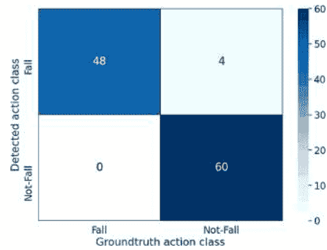

图5. S-RAD在UR Fall数据集上的混淆矩阵

图5上的混淆矩阵显示了S-RAD在将Fall和Not Fall区分开的能力，只有4个实例被错误分类为Fall。

表3. UR Fall数据集中每帧的最新技术对比
| | [1] | [16] | [3] | [13] | S-RAD |
| --- | --- | --- | --- | --- | --- |
| 敏感性 | 100 | - | 100 | 100 | 100 |
| 特异性 | 95 | - | 98.61 | 98.77 | 93.75 |
| 准确性 | 97.5 | 99.27 | 98.77 | 98.84 | 96.46 |

1. https://github.com/TeCSAR-UNCC/S-RAD-ActionLocalizationClassification.

S-RAD框架具有减少推理时间和参数数量的优势，使我们能够以隐私意识的方式在边缘进行实时活动监测。我们在UCF-Sports Action数据集上通过FPS（每秒帧数）和mAP在表4中与其他框架进行了比较。我们在一块Titan V GPU上测试了我们的模型（除了TubeCNN [9]的工作，该工作是在Titan X上报告的）。权衡的是准确性、推理FPS以及参数。在最先进的方法中，我们的方法具有第二快的运行时间，每秒处理41帧，比[9]和[20]快三倍。此外，我们的框架的参数数量最小，在表4中约为28.36 M，尽管像[5]这样的工作在FPS方面表现更好，但他们的特征太重，无法适应实时边缘设备，此外，与他们的工作相比，我们的工作在高分辨率下保持更高的mAP。由于大多数方法不公开提供在边缘设备上运行的性能指标，并且不提供自己的性能指标，因此我们无法在UR Fall数据集上与最先进的方法进行性能比较。

表4. 在Nvidia Titan平台上进行服务器级执行的比较
| 方法 | 输入 | 分辨率 | 参数 #(M) | FPS | mAP |
| :--- | :--- | :--- | :--- | :--- | :--- |
| 多流[20] | RGB+Flow | 600 x 1067 | 274 | 11.82 | 84.51 |
| CapsuleNet[5] | RGB | 112 x 112 | 103.137 | 78.41 | 83.9 |
| TubeCNN[9] | RGB | 300 x 400 | 245.87 | 17.391 | 86.7 |
| ACT[10] | RGB+Flow | 300 x 300 | 50 | 12 | 87.7 |
| S-RAD | RGB | 300 x 400 | 28.35 | 41.64 | 85.04 |

我们还在Nvidia Xavier边缘平台上评估了我们的工作，以测试其在资源受限的边缘平台上的性能。我们将VideoCapsuleNet[5]的工作与我们的方法进行了比较，尽管它们在Titan V上具有初始性能优势，但我们的工作是唯一能够在内存受限的边缘设备上运行的模型。与Video-CapsuleNet相反，S-RAD将时间数据折叠到通道维度中，因此避免了引入张量尺寸的另一个维度。VideoCapsule Net不仅处理3D时空特征图，还通过胶囊引入了另一个复杂性维度。我们还观察到6.0 FPS，总SoC（芯片上）功耗为5.21W。

## 5 结论

本文介绍了一种新颖的单次运行动作检测器（S-RAD），用于活动监测。S-RAD提供了端到端的动作检测，无需使用计算量大的方法，并具有实时执行的能力。嵌入式边缘设备。S-RAD是一种保护隐私的方法，本质上保护个人可识别信息（PII）。在UCF-Sports和UR Fall数据集上的结果与最先进的方法相比，准确性相当，模型大小和计算需求显著降低，并具有在边缘嵌入式设备上实时执行的能力。

## 参考文献

- 1. Alaoui, A.Y., El Fkihi, S., Thami, R.O.H.: 使用人体骨骼关键点变化进行老年人跌倒检测。 IEEE Access 7, 154786-154795 (2019)
- 2. Atallah, L., Lo, B., King, R., Yang, G.Z.: 使用可穿戴加速度计进行活动识别的传感器定位。 IEEE Trans. Biomed. Circ. Syst. 5(4), 320-329 (2011)
- 3. Cameiro, S.A., da Silva, G.P., Leite, G.V., Moreno, R., Guimarães, S.J.F., Pedrini, H.: 多流深度卷积网络使用高级特征应用于视频序列中的跌倒检测。 在：2019年国际系统、信号和图像处理会议 (IWSSIP)，第293-298页 (2019年)
- 4. Chen, K., et al.: MMDetection：开放的mmlab检测工具箱和基准。 arXiv预印本arXiv:1906.07155 (2019年)
- 5. Duarte, K., Rawat, Y.S., Shah, M.: Videocapsulenet：一种简化的用于动作检测的网络。 在：第32届国际神经信息处理系统会议 (NIPS 2018)，第7621-7630页。 Curran Associates Inc., Red Hook (2018年)
- 6. Everingham, M., Gool, L., Williams, C.K., Winn, J., Zisserman, A.: 帕斯卡视觉对象类别 (VOC) 挑战。计算机视觉国际期刊 88 (2)，303-338 (2010年)。 https://doi.org/10.1007/s11263-009-0275-4
- 7. Gkioxari, G., et al.: 寻找动作管。 CoRR abs/1411.6031 (2014年)。 http://arxiv.org/abs/1411.6031
- 8. He, K., Zhang, X., Ren, S., Sun, J.: 深度残差学习用于图像识别。 CoRR abs/1512.03385 (2015年)。 http://arxiv.org/abs/1512.03388
- 9. Hou, R., Chen, C., Shah, M.: 用于视频中动作检测的管卷积神经网络 (T-CNN)。 在：IEEE国际计算机视觉会议 (ICCV)，2017年10月
- 10. Kalogeiton, V., Weinzaepfel, P., Ferrari, V., Schmid, C.: 用于时空动作定位的动作管道检测器。 CoRR abs/1705.01861 (2017). http://arxiv.org/abs/1705.01861
- 11. Kay, W., 等：动力学人类行为视频数据集。 arXiv预印本 arXiv:1705.06950 (2017)
- 12. Kwolek, B., Kepski, M.: 使用深度图和无线加速度计在嵌入式平台上进行人体跌倒检测。计算机方法与程序生物医学学报。 117(3),489-501 (2014)
- 13. Leite, G., Silva, G., Pedrini, H.: 基于三流卷积神经网络的视频序列跌倒检测。 在：2019年第18届IEEE国际机器学习和应用会议 (ICMLA)，第191-195页 (2019)
- 14. Lin, J., Gan, C., Han, S.: 用于高效视频理解的时间偏移模块。 CoRR abs/1811.08383 (2018). http://arxiv.org/abs/1811.08383
- 15. 刘伟等：SSD：单镜头多框检测器。 CoRR abs/1512.02325 (2015). http://arxiv.org/abs/1512.02325
- 16. 陆宁, 吴勇, 冯磊, 宋杰: 基于视频运动数据的三维卷积神经网络与LSTM的跌倒检测深度学习。 IEEE J. Biomed.Health Inform. 23(1), 314–323 (2019)
- 17. Mirzadeh, S.I., Ghasemzadeh, H.: 能量受限系统上部署机器学习模型的最优策略。 在第二十九届人工智能国际联合会议 (IJCAI) (2020) 的论文集中
- 18. Neff, C., Mendietta, M., Mohan, S., Baharani, M., Rogers, S., Tabkhi, H.: Revamp2T: 多摄像头隐私感知行人实时边缘视频分析。 IEEE物联网杂志 7(4), 2591–2602 (2020)
- 19. Pagan, J., 等: 朝着超低功耗远程健康监测: 一种用于活动识别的最优和自适应压缩感知框架。 IEEE移动计算杂志 18(3), 658–673 (2018)
- 20. 彭等, 肖江, S.C.: 用于动作检测的多区域双流R-CNN。 计算机科学讲义, 第9908卷, 第744–759页。 Springer, 阿姆斯特丹, 荷兰, 2016年10月。 https://doi.org/10.1007/978-3-319-46493-0_45, https://hal.inria.fr/hal-01349107
- 21. Ren, S., He, K., Girshick, R.B., Sun, J.: 更快的R-CNN: 面向实时目标检测的区域建议网络。 CoRR abs/1506.01497 (2015). http://arxiv.org/abs/1506.01497
- 22. Saeedi, R., Purath, J., Venkatasubramanian, K., Ghasemzadeh, H.: 朝无缝穿戴式传感: 用于物理活动监测的自动身体传感器定位。 在: 2014年IEEE工程师年度国际会议和生物医学学会第36届年会, 第5385-5388页。IEEE (2014)
- 23. Simonyan, K., Zisserman, A.: 用于视频动作识别的双流卷积网络。 CoRR abs/1406.2199 (2014) 。 http://arxiv.org/abs/1406.2199
- 24. Soomro, K., Zamir, A.R.: 在现实体育视频中的动作识别 (2014)
- 25. Tran, D., Bourdev, L.D., Fergus, R., Torresani, L., Paluri, M.: C3D: 用于视频分析的通用特征。 CoRR abs/1412.0767 (2014) 。 http://arxiv.org/abs/1412.0767
- 26. Wang, L., Xiong, Y., Wang, Z., Qiao, Y., Lin, D., Tang, X., Gool, L.V.: 时序段网络: 深度动作识别的良好实践。 CoRR abs/1608.00859 (2016) 。 http://arxiv.org/abs/1608.00859
- 27. Weinzaepfel, P., Harchaoui, Z., Schmid, C.: 学习用于时空行动定位的跟踪方法。 CoRR abs/1506.01929 (2015). http://arxiv.org/abs/1506.01929

# 模型微调在个性化动态手势识别中的有效性

郭俊尧 (✉), Unmesh Kurup 和 Mohak Shah
LG电子高级人工智能美国研究实验室，圣克拉拉，美国
{junyao.guo,unmesh.kurup,mohak.shah}@lge.com

摘要。 动态手势通常在风格、速度和手势表现的幅度方面对个人用户具有独特性。使用一组用户的数据训练的手势识别模型可能无法很好地推广到未知用户，并且其性能可能因不同用户而异。 为了解决这些问题，本文研究了使用用户特定数据在本地对全局模型进行微调以个性化动态手势识别的方法。 通过使用最先进的卷积神经网络架构进行视频识别的全面实验，我们评估了四个不同选择对个性化性能的影响 - 微调网络的早期与后期层，用户特定训练样本的数量，批量大小和学习率。 用户特定数据来自11个用户执行7个手势类别。 我们的研究结果表明，通过正确选择微调策略和超参数，可以在个性化模型上实现所有用户的改进模型性能，只需微调网络权重的一小部分并使用非常少的标记用户特定训练样本。

关键词： 模型个性化·动态手势识别·模型微调·轻量级卷积神经网络·超参数调整

## 1 引言

动态手势识别为各种应用提供了自然的用户界面，包括自动驾驶、智能家居和机器人技术。 目前手势识别的最先进方法使用基于大规模数据集训练的深度神经网络（DNNs），这些数据集通常通过RGB或深度摄像机收集。 然后，这些模型直接部署在用户设备上进行推理，无需进一步更改。 然而，用户在执行手势时存在着风格、速度、手的使用（左手vs右手）和幅度方面的显著差异[1,17] 。 因此，仅基于全局数据训练的单一通用模型可能无法很好地推广，并且在每个个体用户中可能表现出非常不同的性能。

© Springer Nature Singapore Pte Ltd. 2021
X. Li等人：DL-HAR 2020，CCIS 1370，第99-110页，2021年。
https://doi.org/10.1007/978-981-16-0575-8_8

为了提高模型性能（同时保护用户的隐私），需要一种模型个性化的方法，将模型适应用户特定的本地数据。常见的DNN模型个性化方法是仅使用本地用户数据对预训练的全局模型进行微调。这种方法已经用于个性化键盘输入预测[16]和语音识别[14]。

然而，尚未报道微调对于个性化视频识别任务（如动态手势识别）的有效性。

因此，在本文中，我们评估了微调对于动态手势识别个性化的效果。据我们所知，这是第一次对DNN模型个性化在视频数据上进行系统的实证研究。具体而言，我们的贡献包括：1）从11个用户收集了一个专有的手势数据集，2）对四种最先进的轻量级卷积神经网络（CNN）架构进行了全面的实验，3）研究了多个超参数对于微调的影响，包括微调参数的数量，早期或晚期层的微调，用户特定训练样本的数量，批量大小和学习率。

我们的研究结果表明，通过适当选择这些超参数，可以在使用很少的标记用户数据和更新少量网络参数进行微调后，为所有用户实现识别准确率的提升。特别是，我们得出以下三个关键观察结果：1）微调早期层可以实现与微调后期层相似的准确率提升，但需要微调的参数数量明显较少；2）每个手势类别仅需一到两个用户特定的训练样本即可通过微调提高识别准确率；3）微调在小批量大小（如2或4）下显示出良好的收敛性。这些发现表明，微调是在设备上训练个性化视频识别模型以提升用户体验的一种有前景的方法。

## 2 相关工作

个性化主要在联邦学习（FL）框架下进行研究，其中全局模型通过联邦平均训练[12]。在[15]中，通过在用户数据上对全局模型进行微调，个性化了递归神经网络模型，并评估了训练批量大小和学习速率的影响。另一项工作[5]将联邦平均与元学习算法相结合，以提高个性化后的模型性能。[13]提出了一种在保持全局模型在一般数据上性能的同时个性化全局模型的方法。实现这种改进的方法是将设备上的训练与随机回顾和服务器端模型平均相结合。

[9] 提出了第一个基于学习理论的个性化研究，该研究在FL框架下提出了用户聚类、数据插值和模型插值三种高效算法用于个性化。然而，在本文中，我们不会采用FL方法，因为视频识别模型通常需要大量数据进行训练，而FL的性能尚未得到很好的评估，因为每个用户设备上的视频数据很少。此外，我们假设个性化后的用户模型将保留在设备上，并不会用于更新全局模型。

最近的一项工作[11]在个性化人类活动识别中应用了自适应批归一化的领域适应方法。该方法通过更新用户特定的批归一化层来适应未见过的目标用户的CNN模型。然而，所提出的方法要求在初始模型的训练过程中，每个批次只包含来自一个用户的训练样本，而这并不是本文研究的微调方法所要求的。

在应用领域中，研究了DNN模型个性化用于键盘输入预测[16]、手写字符识别[3]、语音识别[14]和凝视估计[4]。与这些应用相比，特别是使用相机数据进行动态手势识别的手势识别需要视频序列分析，这通常需要更复杂的模型，更难在设备上进行微调。因此，手势识别个性化的研究要么使用传统的机器学习方法[1,2]，其性能不如基于DNN的方法，要么使用骨架数据[6,17]，这些数据不容易由用户获取和标记。

然而，随着轻量级DNN架构在视频识别方面的最新进展，手势识别可以在嵌入式GPU和移动设备上实时运行[7,8]。这为在设备上个性化视频识别带来了机会，并激发了对视频序列个性化策略的评估工作。

## 3 数据集

本研究考虑了七个类别，分别是向左滑动、向右滑动、手拉进、手推开、竖起大拇指、用整个手缩小和无手势。这些手势是来自Jester数据集[10]中的27个类别的子集。我们使用笔记本RGB摄像头记录了11个用户的视频片段，要求他们在没有专家演示的情况下执行这些手势。所有用户的视频都在相同的环境设置和照明下录制。对于每个手势类别，从每个用户收集了6到10个样本，并且每个用户每个类别的样本数量相同。总共，每个用户将使用52个样本进行这些实验。请注意，目前没有类似的数据集可用于按用户分组的动态手势视频基准测试。

### 3.1 用户数据集

### 3.2 全局模型训练

我们评估了4种能够在嵌入式GPU上快速运行视频识别的最先进的CNN模型，分别是3D-MobileNetV2-1.0x、3D-SqueezeNet、3D-ShuffleNetV2-0.25x [7]和带有时间偏移模块的MobileNetV2-1.0x [8] (简称为MobileNetV2-TSM)。因此，我们只在我们收集的用户数据集上进行实验。

从Jester数据集中选择了一组手势，将其称为通用数据。为了确保这些全局模型具有良好的基准性能，我们对训练进行了超参数调整，并呈现了最佳超参数如下。训练在50个epochs后停止。对于SqueezeNet，初始学习率设置为0.01，而对于其他模型，初始学习率设置为0.1，在第20和40个epochs时衰减因子为0.1。使用带有权重衰减0.0001的随机梯度下降法进行MobileNetV2-TSM的训练，而对于其他模型，权重衰减为0.001。批量大小为16，全连接层的dropout率为0.5。表1列出了全局模型的大小、速度和准确性。请注意，所有全局模型在用户数据上都有准确性下降，这可能部分原因是全局训练数据中环境设置的差异。

表1. 全局模型性能
Params是7个手势类别模型的可训练参数总数。Speed是在Nvidia TITAN Xp GPU上运行一个16帧大小为112×112的视频剪辑的前向传递时间的平均值，平均计算3000次。Acc是全局Jester验证集上的准确率。Acc User是从所有用户收集的所有样本的平均预测准确率。
| 模型 | 参数 | 速度 | 准确率 | 用户准确率 |
| :--- | :--- | :--- | :--- | :--- |
| MobileNetV2-TSM | 2.23百万 | 10毫秒 | 0.975 | 0.925 |
| 3D-MobileNetV2 | 2.36百万 | 99毫秒 | 0.970 | 0.864 |
| 3D-SqueezeNet | 1.84百万 | 6毫秒 | 0.953 | 0.836 |
| 3D-ShuffleNetV2 | 0.22百万 | 30毫秒 | 0.933 | 0.809 |

### 3.3 数据增强

对于全局模型训练和微调，使用以下数据增强方法。对于时间增强，训练时从视频样本中随机选择16帧，保持它们的原始顺序，而对于验证，从视频中选择连续的16帧。对于空间增强，训练时，每帧随机裁剪为大小为112×112，并随机缩放为[1,0.875,0.766,0.67]中的一个因子，而对于验证，则使用大小为112×112的中心裁剪。每个时期只从每个视频输入中采样并使用一个剪辑。

### 3.4 个性化策略

对于每个用户，通过微调部分或全部网络权重从全局模型中获得个性化模型。个性化策略包括微调的超参数，包括微调的参数/层，训练样本数量，批量大小和学习率。根据个性化策略，通过对全局模型进行20个时期的微调，得到个性化模型。

我们根据模型架构尝试不同数量的微调层。这些模型通常由一些类型的块组成（例如，卷积块、MobileNetV2的反向残差块、SqueezeNet的Fire块等）。对于重复多次的相同类型的块，我们要么全部微调，要么全部不调优。我们考虑两种微调策略——早期层微调和后期层微调。更具体地说，早期层微调意味着我们从网络的开始微调一定数量的层，同时保持后面层的权重冻结，反之亦然。

### 3.5 度量
为了评估模型个性化的好处，使用增量准确度来衡量个性化策略的性能。与[15]类似，增量准确度通过以下步骤计算每个用户的准确度：
- 用户数据随机分为训练集和测试集，其中训练集包括每个类别的 $K$ 个样本，测试集包括其余的样本；
- 全局模型应用于测试集，并将准确度记录为调整前准确度；
- 使用用户训练集对全局模型进行微调，并将准确度记录在测试集上作为调整后准确度；
- 增量准确度计算为调整后准确度减去调整前准确度。
我们在图1中总结了这些度量步骤。

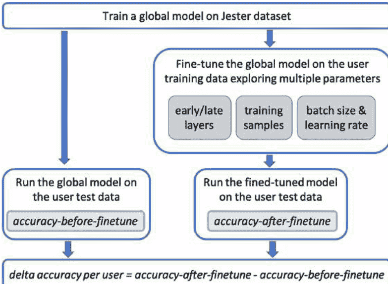
图1. 实验流程图和度量测量。

## 4 实验
对于每个用户，我们按照图1所示的步骤进行5次试验，并报告所有试验的平均准确率差值。为了衡量个性化策略的整体性能，使用所有用户的准确率差值的平均值。

### 4.1 微调层
第一个实验展示了微调策略的影响，具体包括早期或晚期层的微调以及微调层数量，对个性化性能的影响。结果如图2所示。批量大小设置为4，学习率设置为0.001，每个类别的训练样本数量为3。微调层数量以微调参数的百分比表示。

如图2所示，无论是早期层还是晚期层的微调，平均准确率差值通常随着微调层数量和训练轮数的增加而增加。这个结果并不令人意外，因为当有更多的权重可供微调时，学习能力会增加。

另外，更有趣的观察结果是，对于所有的模型架构来说，微调早期层比微调后期层在相似的准确率提升下更加高效。这个结果表明，通过捕捉低级特征中用户的独特性而不是高级特征，模型能够更加高效地适应个体用户。我们还注意到，在微调早期层或后期层之后，大部分被纠正的样本是相同的，这表明早期层和后期层适应的用户特定特征之间没有明显的区别。这种缺乏区别的发现令人惊讶，因为它与微调方法中的常见做法相反，通常假设低级特征在不同主体甚至领域之间是普遍适用的。这种现象是模型还是数据相关的问题超出了本文的范围，是未来研究的一个问题。此外，微调不同层的运行时间和内存消耗取决于所使用的框架和硬件，这也是我们未来研究的课题。

### 4.2 训练样本
图3显示了每个类别用户训练样本数量对个性化性能的影响。整个网络在本实验中进行了微调，批量大小为4，学习率为0.001。对于每个用户，20个时期中的最佳准确率用于计算平均增量准确率。对于所有模型，准确率的提升通常随着训练样本数量的增加而增加，这通常是微调的预期结果$^{[3]}$。然而，有趣的是，即使每个类别只有一个训练样本，用户也可以开始获得显著的准确率提升。这种准确率提升表明微调是相当高效的，反过来又表明标记数据所需的用户努力很少。

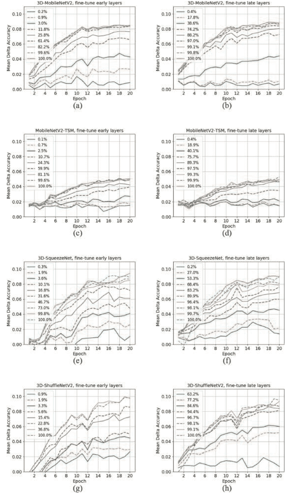
图2. 不同微调策略和微调参数百分比的平均增量准确率。（a）（c）（e）（g）：早期层的微调；（b）（d）（f）（h）：后期层的微调。图例表示微调的总网络参数的百分比。


图3. 不同手势类别每个用户训练样本的平均增量准确率。

### 4.3 批量大小和学习率
我们尝试了批量大小为1、2和4，学习率为0.01和0.001，以评估它们对微调性能的影响。结果如下所示。


图4. 使用不同批量大小和学习率的平均增量准确率。

如图4所示，整个网络进行了微调。由于批量大小相对较小，较小的学习率0.001比0.01产生更好的收敛曲线。在批量大小方面，批量大小越大，收敛越好，这在DNN训练中通常是预期的。特别是对于3D-MobileNetV2和3D-ShuffleNetV2，使用批量大小为1会导致全局模型性能下降，因为收敛不稳定。然而，使用学习率0.001时，批量大小为2只比批量大小为4稍差，同时节省了训练内存，这在资源受限设备上实施微调时可能是关键的。我们还尝试了使用不同批量大小和学习率对部分网络进行微调，并得到了相同的观察结果，即使用批量大小为2和4，学习率为0.001可以为所有模型提供稳定的收敛。

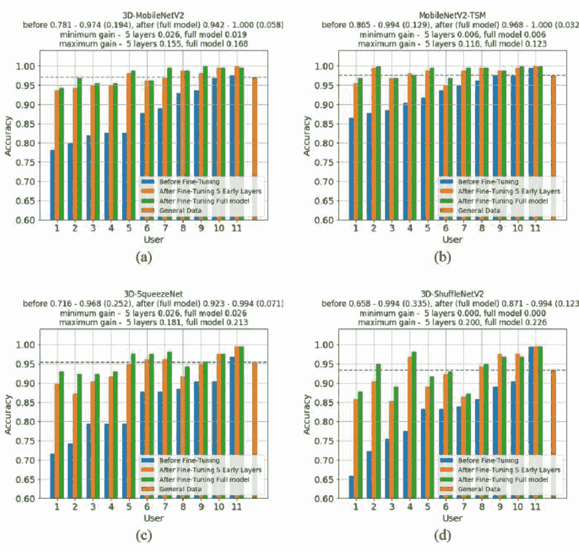
图5. 每个用户在微调之前和之后的准确率。准确率范围和用户之间的最大差异显示在图标题中。（在线彩色图）

### 4.4 每个用户的性能
图5显示了每个用户通过微调获得的性能提升。为了更好地展示，用户按照微调之前的准确率进行排序，并选择20次微调中的最佳准确率作为微调后的准确率。

我们展示了微调前5个早期层和整个模型的绘图，使用3个训练样本，但是其他微调层数和训练样本数量也可以观察到相同的趋势。红色条表示全局模型在通用验证集上的准确率。

第一个观察结果是，直接将全局模型应用于用户数据时，几乎所有用户的准确率都会下降，这是由于用户数据与通用数据之间的差异导致的，这表明个性化对于提高个体用户的全局模型性能是必要的。由于所有用户的视频都是在相同的环境设置下录制的，不同用户之间准确率下降的差异很可能是由于全局模型无法很好地推广到所有未见用户。第二个观察结果是，使用全局模型准确率较低的用户通过个性化获益更多，因为这些用户与通用数据的偏差更大，个性化模型可以更好地捕捉到他们的独特特征。因此，微调后用户之间的准确率差异要比微调前小得多，对于所有架构都是如此。所有用户中的最小和最大准确率增益，以及用户之间的准确率差异，都显示在图标题中。第三个观察结果是，通过微调前5个早期层，准确率增益非常接近于微调整个模型，这再次验证了微调早期层是实现良好个性化模型性能的有效策略。

## 5 结论
本文评估了个性化动态手势识别的微调方法的有效性。具体而言，我们研究了微调策略、微调参数数量、用户特定训练样本数量、批量大小和学习率对个性化模型性能的影响。实证结果表明，全局模型性能在不同用户之间可能存在较大差异，微调可以产生改进的个性化模型，同时保护用户数据隐私。我们想提到的是，这里评估的微调方法代表了一种与联邦学习不同的范式，其中超个性化是目标，个性化模型不会用于更新全局模型。

我们还观察到，早期层的微调比后期层的微调更高效，这引发了对如何对各种模型架构和数据集进行高效微调的进一步研究。此外，我们还表明，使用小批量大小和少量用户特定训练样本可以实现良好的收敛。这些发现表明，微调可能成为视频识别应用中设备上模型个性化的可行方法。

## 参考文献
- 1. Costante, G., Bellocchio, E., Valigi, P., Ricci, E.: 个性化基于视觉的手势界面与无人机的人机交互: 一种迁移学习方法。在: 2014年IEEE/RSJ国际智能机器人与系统会议, 页码3319-3326。IEEE (2014)
- 2. Costante, G., Galieni, V., Yan, Y., Fravolini, M.L., Ricci, E., Valigi, P.: 利用迁移学习进行个性化的视角不变手势识别。在: 2014年IEEE国际声学、语音和信号处理会议 (ICASSP)，页码1250-1254。IEEE (2014)
- 3. Harris, B., Bae, I., Egger, B.: 设备上用户自定义CNN的架构和算法。Integration 67, 121-133 (2019)
- 4. He, J., 等: 关于实时凝视估计的设备上的少样本个性化。在: IEEE国际计算机视觉会议工作坊论文集 (2019)
- 5. Jiang, Y., Konečný, J., Rush, K., Kannan, S.: 通过模型无关元学习改进联邦学习个性化。arXiv预印本arXiv:1909.12488 (2019)
- 6. Joshi, A., Ghosh, S., Betke, M., Sclaroff, S., Pfister, H.: 使用分层贝叶斯神经网络个性化手势识别。在: IEEE计算机视觉与模式识别会议论文集，第6513-6522页（2017）
- 7. Köçku, O., Kose, N., Gunduz, A., Rigoll, G.: 资源高效的3D卷积神经网络。arXiv预印本arXiv:1904.02422 (2019)
- 8. Lin, J., Gan, C., Han, S.: TSM: 时间移动模块用于高效视频理解. 在: IEEE国际计算机视觉会议论文集，第7083-7093页 (2019年)
- 9. Mansour, Y., Mohri, M., Ro, J., Suresh, A.T.: 三种个性化方法及其在联邦学习中的应用. arXiv预印本 arXiv:2002.10619 (2020)
- 10. Materzynska, J., Berger, G., Bax, I., Memisevic, R.: Jester数据集: 一个大规模的人类手势视频数据集. 在: IEEE国际计算机视觉会议工作坊论文集 (2019年)
- 11. Mazankiewicz, A., Böhme, K., Bergès, M.: 基于领域自适应批归一化的增量实时个性化人类活动识别. arXiv预印本 arXiv:2005.12178 (2020)
- 12. 麦克马汉, B., 摩尔, E., 拉马奇, D., 汉普森, S., 阿卡斯, B.A.: 从分散数据中高效通信学习深度网络。在: 人工智能与统计学, 第1273-1282页 (2017年)
- 13. 波波夫, V., 库迪诺夫, M., 皮昂特科夫斯卡娅, I., 维托夫托夫, P., 涅维多姆斯基, A.: 在私有数据上分布式微调语言模型。在: ICLR (2018年)
- 14. Sim, K.C.等: 移动设备上针对命名实体的端到端语音识别个性化。arXiv预印本arXiv: 1912.09251 (2019年)
- 15. 王, K., 马修斯, R., 基顿, C., 艾奇纳, H., 博菲斯, F., 拉马奇, D.: 联合评估设备上的个性化。arXiv预印本arXiv: 1910.10252 (2019年)
- 16. Xu, M., Qian, F., Mei, Q., Huang, K., Liu, X.: Deeptype: 设备上的深度学习用于最小化隐私问题的输入个性化服务。ACM互动移动可穿戴技术会议论文集 2(4), 1-26 (2018)
- 17. Yao, A., Van Gool, L., Kohli, P.: 个性化手势识别组合。 在: IEEE计算机视觉和模式识别会议论文集, pp. 1915-1922 (2014)

# 基于词编码和嵌入的全卷积网络用于智能家居活动识别
Damien Bouchabou$^{1,2}$, Sao Mai Nguyen$^1$, Christophe Lohr$^1$, Benoit LeDuc$^2$, and Ioannis Kanellos$^1$

$^1$ IMT Atlantique, Lab-STICC, UMR 6285, 29238 Brest, France {damien.bouchabou,christophe.lohr,ioannis.kanellos}@imt-atlantique.fr, nguyensmai@gmail.com
$^2$ Delta Dore Company, Bonnemain, France {dbouchabou,bleduc}@deltadore.com

**摘要**。在智能家居中进行活动识别对于为居民提供自动化服务至关重要。然而，由于环境的多样性、感知-运动系统、用户习惯以及信号稀疏性和模型冗余性等方面的挑战，端到端系统无法自动提取关键特征，需要访问上下文和领域知识。我们提出通过融合自然语言处理（NLP）和时间序列分类（TSC）领域的方法来解决智能家居活动识别中的特征提取问题。
我们使用两个数据集来评估我们方法的性能，这些数据集来自于自适应系统高级研究中心（CASAS）。我们分析了基于词项频率编码的嵌入使用对于改善自动特征提取的贡献。此外，我们将时序分类（TSC）中的全卷积网络（FCN）与长短期记忆（LSTM）进行了分类性能比较，这是首次将其应用于智能家居的活动识别。我们提出的方法在离线活动分类中表现良好。我们的分析还表明，FCN优于LSTM，并且通过事件编码和嵌入获得的领域知识显著提高了分类器的性能。

**关键词**：人类活动识别 · 智能家居 · 嵌入 · 词项编码 · 全卷积网络 · 自动特征

## 1 引言
人类活动识别（HAR）一直是研究努力的焦点，因为它在不同的环境辅助生活（AAL）领域以及日常活动中对家庭自动化和便利服务的需求不断增加。该工作部分得到VITAAL项目的支持，并由布雷斯特大都会、布列塔尼地区和欧洲区域发展基金（ERDF）提供资金。

HAR的主要任务是通过环境传感器和物联网(IoT)设备收集的数据来识别人类活动。研究人员使用不同的传感器技术，如摄像头、可穿戴设备或低级智能传感器来跟踪人类活动，如[6]所述。

物联网技术的最新进展和传感器成本的降低导致了这些环境设备的普及和智能家居的发展。因此，在这项工作中，我们将更加关注基于物联网的人类活动识别，而不是基于视频或可穿戴设备的人类活动识别。

随着硬件的发展，人类活动识别算法也需要解决智能家居中的挑战。事实上，传感器的数量、类型和布置都可以显著影响人类活动识别系统的性能。适用于某个家庭的系统在其他家庭中可能完全不适用，这是由于不同的房屋配置或用户习惯造成的。因此，算法需要对环境的变化具有鲁棒性。此外，基于视频的人类活动识别可以利用图像和视频流中丰富且冗余的信息，而基于物联网的人类活动识别面临着稀疏和不完整信息以及冗余模型的挑战。与视频不同，物联网只能检测到其检测范围内和视野内环境的变化，并对环境中大部分发生在这些范围之外的变化视而不见。当捕捉到变化时，这种检测通常会转化为来自一个传感器的单一值信号。这种稀疏性带来了冗余性挑战：来自同一组传感器的一组信号可能由不同的活动引起。因此，智能家居中的人类活动识别算法需要解决变化性、稀疏性和冗余性的挑战。

为了适应环境和用途的变化，人类活动识别（HAR）算法已经转向机器学习方法，更具体地说是深度学习（DL）算法。为了处理稀疏性和冗余性，首先开发了能够学习长期依赖性的算法，以便理解传感器信号的上下文。其次，研究还尝试通过对传感器信号进行良好的特征表示来引入领域知识和上下文文化。但是手工制作的特征需要大量的预处理，并且降低了对各种环境的适应性。因此，HAR算法需要自动提取领域相关的表示。

近年来，深度学习技术取得了显著进展。它们已成功应用于自然语言处理(NLP)和时间序列分类(TSC)。分别用于通过词嵌入技术和分类器自动提取良好的特征表示。

最后，我们展示了通过事件编码和嵌入式获得的领域知识显著提高了分类器的性能。

我们建议在下一节中回顾最先进的HAR智能家居分类器、TSC分类器和现有的特征表示方法，特别是在NLP应用中使用的方法。在第3节中，我们将提出一种将TSC算法和NLP序列特征提取方法相结合的框架。在第5节中，我们将报告我们提出的框架的性能，然后总结。

## 2 相关工作
在本节中，我们描述了为HAR开发的算法，以及更一般的时间序列分类算法。然后，我们研究了如何通过将领域知识纳入特征编码中来引导TSC，就像自然语言处理中一样。

### 2.1 传统HAR方法
为了基于传感器轨迹识别人类活动，研究人员使用了各种机器学习算法，如[15]中所述。这些可以分为两个流派：利用时空表示的算法，包括朴素贝叶斯、动态贝叶斯网络、隐马尔可夫模型；以及基于特征分类的算法，包括决策树、支持向量机或条件随机场。

大多数传统的人类活动识别方法通常使用手工设计的特征提取方法。自动特征提取是深度学习所解决的挑战之一。

### 2.2 深度学习方法
最近，各种深度学习算法已被应用于人类活动识别，以克服这些限制并提高人类活动识别的性能。深度学习方法可以直接从原始数据中层次化地学习特征，以揭示高层次的特征。长短期记忆 (LSTM) 可以看作是递归神经网络 (RNN)的非常成功的扩展，专门设计用于处理长期依赖关系。LSTM可以自动从传感器数据中学习相关信息，无需手工设计的特征或核融合方法，并在智能家居的人类活动识别中取得了良好的性能，如[10,17]所报道。[10]评估了智能家居人类活动识别中不同的LSTM结构。他们表明，LSTM方法在分类得分方面优于传统的人类活动识别方法，而无需使用手工设计的特征。

LSTM为智能家居中的HAR任务提供了可行的解决方案，但训练时间较长。另一种DL方法，更注重模式检测的是卷积神经网络（CNNs）。它们在HAR方面有三个优势。它们可以捕捉局部依赖性，即与当前事件相关的相邻观测的重要性。它们在步长差异或事件频率方面是尺度不变的。此外，它们能够学习数据的分层表示。研究人员在智能家居的HAR上使用了2D[4,13]和1D[16]CNNs。2DCNN获得了良好的分类结果。但这种方法对于不平衡的数据集、未标记的事件不够稳健，并且不适用于在线识别。1DCNNs在序列问题上与LSTMs竞争力强[16]。总体而言，由于其利用长期依赖性的能力，LSTMs获得了更好的性能。但CNNs的训练速度更快，并且能够获得接近LSTMs的准确性水平。

FCN是一种特殊的CNN，只有卷积层，没有全连接层。FCN在图像语义分割方面显示出了引人注目的质量和效率[12]。由于其在特征提取方面的性能，研究人员将FCN应用于TSC问题[19]。[3]将FCN与其他TSC算法进行了比较，并获得了高分类性能。FCN在97个数据集中有18个排名第一，在其他数据集中排名前五。然而，尚未报道FCN在智能家居中的HAR应用。因此，我们提议将FCN应用于智能家居中的HAR，作为高级特征提取器和分类器。

### 2.3 NLP和TSC的耦合
作品[18,20]表明了良好特征表示的重要性，但设计HAR应用的特征是一项繁琐的任务。

DL算法可以自动提取特征，已广泛显示出在自然语言处理中改善特征表示的效果。研究人员已经设计了许多语言模型和不同的词编码方式。他们提出了诸如n-gram、词频、逆文档频率、词袋等编码方式。最近，他们使用了诸如word2vec、GloVe、ELMo和最新的Transformers等DL算法，结合上述编码方式来实现有意义的词编码。

DL算法从当前输入以及较少程度上从过去的输入中推断特征，这些编码方式融入了整个语料库中的更一般的领域知识。它们从原始数据中生成特征并对单词序列进行建模的强大能力提高了DL分类器的性能。我们建议将先前提到的自然语言处理技术应用于智能家居人类活动识别问题，以自动生成关键特征。

因此，我们在本文中介绍了一种受自然语言处理和时间序列分类（TSC）启发的智能家居人类活动识别的DL方法。我们分别提出将词频编码和嵌入与FCN相结合：在特征提取的第一层中融入事件编码的领域知识；以及实现更高层次的特征提取和活动分类。从NLP嵌入的输出中选择FCN算法，将序列分类问题转化为多变量时间序列分类问题。

问题。据我们所知，这是第一次有研究在智能家居活动识别中使用FCN，并将其与嵌入技术相结合，实现了一个自动提取关键特征并对智能家居活动进行分类的端到端系统。

## 3 方法论

我们将来自TSC的NLP编码和FCN分类器合并，以处理智能家居活动识别。这种组合可以生成自动关键特征并对活动进行分类。

所提出方法的框架架构如图1所示。首先，传感器的原始数据被编码为索引序列（第3.2节），然后使用滑动窗口进行分割（第3.4节）。滑动窗口然后通过嵌入进行处理，提取第一层特征，最后由FCN进行分类（第3.3节）。

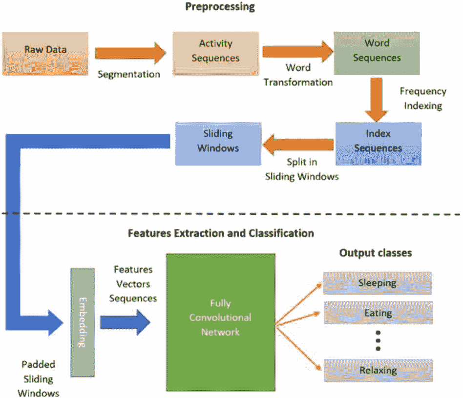

图1. 提出方法的框架架构

### 3.1 问题定义

活动识别问题是一个分类问题。目标是对传感器事件序列进行活动标签的归属。我们将问题建模如下。一组传感器 $S = \{s_1, ..., s_{|S|}\}$ 产生事件 $e_i \in E$。事件是传感器在发出信号时返回的值或状态： $e_i = (s_i, v_i, t_i)$，其中 $s_i$ 是传感器ID，$v_i$ 是传感器返回的值，$t_i$ 是传感器改变状态或值的时间。序列 $L_i$ 是活动的轨迹。$L_i$ 是事件列表 $Seq_i = (e_i, ..., e_n)$。每个 $L_i$ 可以与一个活动标签 $a_i \in A$ 相关联，通过语义分割。

在本文中，我们没有考虑事件发生时的时间戳 $t_i$。我们在实验中简单地忽略了该参数 $t_i$。我们希望能够无论一天的时间如何都能识别一项活动。例如，“睡觉”这项活动通常出现在晚上，但是这项活动在白天的任何时间都可能出现。有些人白天工作，晚上睡觉，而另一些人晚上工作，白天睡觉。

### 3.2 自然语言处理编码

我们的假设是将传感器事件处理为单词和活动序列，这些句子描述了居民所进行的活动。

首先，从数据集中提取每个活动序列作为自然语言处理中的句子。通过数据集提供的标签，可以知道每个活动的开始和结束。如前所述，一个事件 $e_i$ 由传感器ID $s_i$、值 $v_i$ 和时间戳 $t_i$ 组成。通过将传感器ID $s_i$ 与其值 $v_i$ 连接起来，并忽略时间戳 $t_i$，出于前面解释的原因，创建了一个传感器词，例如，$s_i = M001$，值 $v_i = ON$ 变为 $M001ON$。所有这些不同的文本词汇定义了智能家居活动的描述。

然后，与自然语言处理 (NLP) 类似，序列中的每个单词都被转换为一个索引，以便神经网络可以使用。在自然语言处理中，索引从1开始，0的值保留用于序列填充。索引是根据单词频率分配的，例如，如果单词 $M001 ON$ 在数据集中出现最频繁，则分配的索引最低，即1。

然后，序列通过嵌入层传递，将索引标记（单词）转换为自动学习的特征向量。这创建了一个简单的单词嵌入，帮助网络获得每个单词（在我们的情况下是每个传感器事件）的内部表示。

### 3.3 FCN结构

FCN是一种特殊的卷积神经网络（CNN）。它的结构只包含卷积层，没有用于分类的全连接层。本文使用与 [3,19] 相同的结构。

该结构 (图2) 由Eq. 1描述的三个块组成。 其中x是输入，W是权重矩阵，b是偏差，⊗是卷积运算符，h是隐藏表示。 每个块由一个带有批归一化 (BN) [7]和修正线性单元 (ReLU) 激活的一维卷积层组成， 以加快收敛速度并改善泛化能力。

$y=W ⊗ x+b$
$z=BN(y)$
$h=\text{ReLU}(z)$

(1)

在三个卷积块之后， 特征被输入到全局平均池化 (GAP) 层中[11]。 GAP是一种池化操作， 旨在替代传统CNN中的全连接层。其思想是为分类任务的每个对应类别生成一个特征图。生成的向量直接输入到softmax层中， 实现最终的分类。

与全连接层相比， GAP的一个优势是更符合卷积结构， 通过强制特征图和类别之间的对应关系。因此， 特征图可以很容易地解释为类别置信度图。另一个优势是GAP没有需要优化的参数， 因此在这一层上避免了过拟合。此外， GAP消除了空间信息； 因此对于输入的空间平移更具鲁棒性。

FCN的一个优点是在不同长度的时间序列中参数数量的不变性。这种不变性是由于使用了GAP层， 使得可以使用迁移学习方法， 在某个源数据集上训练模型， 并在目标数据集上进行微调[2]。

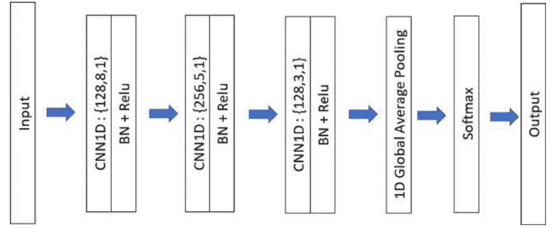

图2。 全卷积网络 (FCN) 模型核心

### 3.4 滑动窗口

与LSTM不同，CNN必须具有固定的输入大小，而活动序列的长度可以不同，介于1到5000个事件之间。为了解决这个问题，对序列应用滑动窗口。使用滑动窗口还可以预测在线人类活动识别。为了填充比窗口大小更小的窗口，使用了零填充。零填充可能会影响最终结果。为了避免滑动窗口中出现过多的零，必须找到一个经过调整的窗口大小。

为了实验，使用了传感器事件窗口(SEW)[14]。SEW方法将数据分成相等的传感器事件间隔。SEW的大小由事件数量定义。因此，窗口的持续时间可能会有所不同。[14]的作者比较了不同类型的窗口，并得出结论，时间窗口(TW)提供了最佳的准确性和F-Measure分数。他们认为SEW是第二好的窗口方法，因为SEW能够分类更多的活动，而TW则不同。我们认为这是因为SEW保持了固定的上下文大小，而TW的上下文大小是可变的。稳定的上下文大小使神经网络能够保持相同的信息量，无论窗口的大小如何。

在这项工作中，选择使用SEW有两个原因。首先，我们想评估该方法从窗口上下文中学习自动特征的能力。直觉是训练一个网络来提取有界活动序列的特征，然后将这些特征用于流式传感器数据的在线识别。

其次，通过控制事件数量，避免窗口内出现过多的零。

## 4 实验设置

LSTMs在序列问题上提供了非常好的结果，并超越了传统高级HAR方法在智能家居中的应用[10]。为了评估该方法，将LSTMs和FCNs与两个数据集ARUBA和MILAN进行了比较，这两个数据集来自广泛传播的CASAS[1]基准数据集。

### 4.1 数据集描述

选择了CASAS的两个数据集ARUBA和MILAN(表1)进行实验。CASAS数据集由华盛顿州立大学引入。收集的日常活动数据来自真实的公寓和住宅，居住在自己的房子里的真实居民。这些房屋配备了温度和二进制传感器，如运动或门传感器。

在这两个数据集中，都是由一个人进行活动。选择了MILAN数据集，因为宠物产生的噪声增加了数据集的难度。它们包含了几个月的标记活动，并且是不平衡的，即某些活动的表示较少。此外，这两个数据集包含了相同数量的传感器的共同和不同的活动。

一个不平衡的数据集增加了分类的挑战。实际上，如果一些类别的表示较少，系统就会得到较少的示例来找到区分特征。此外，一些事件没有标签或无法识别，并被标记为“其他”类别。这个类别出现在数据集的45%到50%之间。在文献中，大多数研究人员会删除“其他”类别，并通过减少每个类别的示例数量来平衡数据集。

这种方法会带来一个缺点，即忽略了无标签事件，使其成为一个固定的分类问题。系统无法区分已知类别和未知类别。这不允许系统能够发现新的活动序列。

这里保持了原始分布。目标是评估该方法和模型的稳健性。

表1. 数据集的详细信息。

| | 阿鲁巴 | 米兰 |
|---|---|---|
| 居民 | 1 | 1+宠物 |
| 传感器数量 | 39 | 33 |
| 活动数量 | 12 | 16 |
| 天数数量 | 219 | 82 |
| 平均序列长度 | 133 | 87.3 |

### 4.2 SEW参数

如前所述，活动序列被分割成SEWs。研究了不同的SEW大小，包括100、75、50、25，步长为1。这个步长大小允许HAR在每次触发新事件时进行处理。目标是找到最佳的SEW大小，即具有最大信息量的最小SEW大小，以实现高F1分数和高平衡准确性的活动序列区分。SEW的大小越小，在在线HAR的情况下，活动被识别得越快。

### 4.3 网络参数

FCN的参数与[3]相同。所有卷积的步长都为1，使用零填充以保持卷积后时间序列的精确长度。第一次卷积包含128个过滤器，长度为8，接着是第二次卷积，包含256个过滤器，长度为5，然后是由128个过滤器组成的第三个和最后一个卷积层，长度为3。

LSTMs参数与[10]相同。LSTM单元由64个神经元组成，然后通过softmax层进行最终分类。

通常在NLP中，原始数据和神经网络之间添加了一个嵌入层。 神经元的数量固定为64，如[10]中所定义。

### 4.4 硬件和软件设置

实验在一台服务器上进行，配备有Intel(R) Xeon(R) CPU E5-2640v3 2.60 GHz，32个CPU，128 GB内存和一张NVIDIA Tesla K80图形卡。 算法的实现使用了Keras和Tensorflow框架。 源代码可以在https://github.com/dbouchabou/Fully-Convolutional-Network-Smart-Homes找到。

### 4.5 评估方法

为了评估所提出的方法，数据集被分成两部分：70%用于训练，30%用于测试。 这两部分包含每个活动的随机分层（按类别）数量的SEW。 例如，如果数据集中包含100个经过随机排序的“睡眠”标记的窗口，那么这100个窗口将被分成两部分：70个窗口用于训练集，30个窗口用于测试集。 随机排序有助于算法获得更好的泛化和表示。 分层确保两个子集都包含每个类别的表示。

在训练集上执行分层（按类别）三折交叉验证过程。然后使用这三个训练集和三个验证子集来训练和验证算法。

在每个训练集上的训练阶段，使用Tensorflow框架提出的早停和最佳模型选择方法。 这些方法在过拟合之前停止训练，并保存每个训练的最佳模型。 早停条件基于验证损失值。 如果当前损失值在上一个最佳模型选择后的$n$个时期（这里$n=20$）内没有减少，训练将被中断。

为了计算平均平衡准确率和平均加权F1分数，对三个最佳训练模型（每个训练子集一个）在测试集上进行评估，因为数据集不平衡。

为了加快每个时期的训练时间，并且由于SEW的数量很大，所有实验都使用了批量大小为1024。 在测试期间没有注意到批量大小评估之间的差异，结果相似，除了训练时间。

## 5 实验结果

### 5.1 FCNs和LSTMs的性能

表2和表3展示了两个FCNs和两个LSTMs在原始传感器数据上的性能。 Vanilla LSTM，FCN和LSTM，FCN在不同窗口大小上进行了评估。 计算了平均平衡准确率和平均加权F1分数。

计算了平均平衡准确率和平均加权F1分数。FCN在两个数据集上都获得了最佳的加权F1分数，无论是否使用嵌入。在大于50的大型SEW上，LSTM接近或等于FCN。与FCN相比，LSTM似乎需要更多事件才能实现分类。

从平衡准确性的角度来看，FCN在窗口大小大于50时获得最佳值，除了在MILAN数据集上。这种性能下降是由于零填充造成的。事实上，MILAN数据集上的平均序列长度约为88个事件。当窗口大小接近或超过这个平均值时，FCN的性能会下降。一些小的序列，如“床到厕所”或“Eve Meds”没有被分类。这导致平衡准确性得分下降。

由于我们未来的工作中预计会有在线HAR，因此观察该方法在小的SEW大小上的性能是有趣的。目标是实现

表2. 阿鲁巴数据集中的加权F1分数和平衡准确性
| 模型 | 100 | 75 | 50 | 25 |
|---|---|---|---|---|
|  | 加权平均F1分数 (%) |  |  |  |
| LSTM | 96.67 | 94.67 | 90.67 | 85.00 |
| FCN | 99.00 | 98.00 | 97.67 | 92.33 |
| LSTM + 嵌入 | 100.00 | 99.67 | 98.00 | 90.00 |
| FCN + 嵌入 | 100.00 | 100.00 | 100.00 | 99.00 |
|  | 平衡准确性 (%) |  |  |  |
| LSTM | 81.45 | 76.09 | 71.05 | 83.30 |
| FCN | 88.85 | 87.41 | 87.08 | 80.32 |
| LSTM + 嵌入 | 94.55 | 93.61 | 90.20 | 74.81 |
| FCN + 嵌入 | 95.37 | 95.07 | 94.89 | 92.44 |

表3. 在米兰数据集中的加权F1分数和平衡准确率
| 模型 | 100 | 75 | 50 | 25 |
|---|---|---|---|---|
|  | 加权平均F1分数 (%) |  |  |  |
| LSTM | 84.00 | 85.67 | 75.33 | 64.00 |
| FCN | 77.33 | 93.67 | 88.33 | 83.67 |
| LSTM + 嵌入 | 98.00 | 97.00 | 93.00 | 73.67 |
| FCN + 嵌入 | 99.00 | 98.00 | 97.00 | 94.33 |
|  | 平衡准确性 (%) |  |  |  |
| LSTM | 62.15 | 64.95 | 55.70 | 43.29 |
| FCN | 42.24 | 76.41 | 71.82 | 71.34 |
| LSTM + 嵌入 | 88.52 | 86.77 | 82.05 | 59.35 |
| FCN + 嵌入 | 84.23 | 86.64 | 87.83 | 90.86 |

尽可能在最短的时间内进行人类活动识别，尽可能少的事件，以获得最响应迅速的系统。 在这种情况下，FCN在尺寸为50和25的SEWs上获得了最佳值。 随着SEW尺寸的减小，性能下降，但FCN保持了较高的平衡准确率和F1分数。 与LSTMs相比，FCNs的性能下降较少。 似乎FCNs可以在小序列上生成更相关的自动特征，因此提供更少的信息。

### 5.2 训练时间

表4和表5显示了按SEWs尺寸计算的平均训练时间和平均训练轮数。 在两个数据集上，FCNs在每个SEWs尺寸上实现了最短的时间。 嵌入层可以减少大多数情况下的训练轮数和总训练时间。训练时间

表4. 在阿鲁巴数据集中的训练时间性能和训练轮数

| 模型 | 100 | 75 | 50 | 25 |
|---|---|---|---|---|
| | 平均轮数 | | | |
| LSTM | 242 | 278 | 335 | 256 |
| FCN | 77 | 71 | 111 | 108 |
| LSTM + 嵌入 | 161 | 191 | 210 | 161 |
| FCN + 嵌入 | 67 | 62 | 71 | 98 |
| | 平均训练时间 (时:分:秒) | | | |
| LSTM | 06:28:42 | 06:43:08 | 06:29:58 | 03:00:26 |
| FCN | 00:58:00 | 00:52:15 | 01:20:35 | 00:51:27 |
| LSTM + 嵌入 | 04:45:56 | 04:45:38 | 04:14:35 | 02:02:53 |
| FCN + 嵌入 | 01:12:37 | 00:59:42 | 00:57:27 | 00:52:15 |

表5. 在米兰数据集中的训练时间性能和训练轮数

| 模型 | 100 | 75 | 50 | 25 |
|---|---|---|---|---|
| | 平均轮数 | | | |
| LSTM | 274 | 385 | 365 | 324 |
| FCN | 45 | 101 | 87 | 145 |
| LSTM + 嵌入 | 255 | 290 | 320 | 183 |
| FCN + 嵌入 | 65 | 51 | 52 | 55 |
| | 平均训练时间 (时:分:秒) | | | |
| LSTM | 02:03:43 | 02:11:07 | 01:44:06 | 01:00:10 |
| FCN | 00:09:39 | 00:20:17 | 00:15:08 | 00:16:50 |
| LSTM + 嵌入 | 01:57:52 | 01:49:35 | 01:36:56 | 00:35:26 |
| FCN + 嵌入 | 00:16:24 | 00:11:42 | 00:10:00 | 00:07:67 |

根据窗口大小与LSTM相比，FCN将计算时间缩短了2到6倍。这种时间节省是由于卷积网络计算的并行化计算的简便性所解释的。

### 5.3 编码影响

表2、表3、表4和表5显示了嵌入层如何改善网络性能。事实上，使用嵌入层可以显著提高网络性能，平均平衡准确率提高了10个百分点。传感器事件被转换为64个自动学习特征的向量，这些特征使网络能够在小的SEW上保持高分数。

在我们的实验中，我们注意到频率编码策略可以提高性能，而随机或任意索引分配则不能。我们认为这种排序有助于网络生成对重要事件或罕见事件的判别器。

## 6 结论

我们提出了一种新的方法，首次将FCNs和基于频率编码的嵌入相结合，用于智能家居中的HAR。我们对两个数据集进行了评估，结果显示：

- 基于频率编码的嵌入在所有情况下显著提高了LSTM和FCN的性能。这意味着嵌入中融入的领域知识可以提高LSTM和FCN对事件的理解能力。
- 在相同的编码下，FCNs的性能与LSTMs相同或更好，除了两种配置外，并且训练速度更快。
- 此外，当窗口大小减小时，FCNs的性能优于LSTMs。这意味着FCNs在识别活动时具有更短的延迟，更适合实时活动识别。
- 该提议的框架是纯端到端的，没有对原始数据进行任何繁重的预处理或特征工程，这要归功于基于频率的编码和嵌入。这种方法似乎对于智能家居中的HAR问题是相关的，该问题涉及低级传感器。

## 7 讨论和未来方向

本文提出的结果表明，基于NLP编码和FCN的应用DL方法是显著改善智能家居HAR任务的相关解决方案。

我们使用了基于频率编码的朴素嵌入，改善了分类结果。我们计划探索更多的词嵌入技术[9]

例如Word2Vec或ELMo，以改善潜在的知识空间，并在过程中提高分类性能。事实上，这些技术考虑了单词的上下文。

此外，我们只在离线HAR上进行实验。但是我们评估中SEWs的使用显示出相关结果，因此我们希望将其应用于在线HAR应用。

此外，我们计划使用此方法评估其他窗口方法，如TW或Fuzzy Windows [5]。研究哪种窗口方法在智能家居中产生最快且最准确的在线HAR。

## 参考文献

- 1. Cook, D.J., Crandall, A.S., Thomas, B.L., Krishnan, N.C.: CASAS:一个智能家居盒子。计算机 46(7), 62-69 (2012)
- 2. Fawaz, H.I., Forestier, G., Weber, J., Idoumghar, L., Muller, P.A.: 时间序列分类的迁移学习。在：2018年IEEE国际大数据会议（Big Data），第1367-1376页。IEEE (2018年)
- 3. Ismail Fawaz, H., Forestier, G., Weber, J., Idoumghar, L., Muller, P.-A.: 时间序列分类的深度学习：一项综述。数据挖掘与知识发现。 33（4），917-963（2019年）。 https://doi.org/10.1007/s10618-019-00619-1
- 4. Gochoo, M., Tan, T.H., Liu, S.H., Jean, F.R., Alnajjar, F.S., Huang, S.C.: 使用匿名二进制传感器和DCNN对独居老年人进行不显眼的活动识别。IEEE J. Biomed. Health Inform. 23（2），693-702（2018年）
- 5. Hamad, R.A., Hidalgo, A.S., Bouguelia, M.R., Estevez, M.E., Quero, J.M.: 使用延迟模糊时间窗口在二进制传感器上进行高效活动识别的智能家居。IEEE J. Biomed. Health Inform。 24（2），387-395（2019年）
- 6. Hussain, Z., Sheng, M., Zhang, W.E.: 人类活动识别的不同方法：一项调查。arXiv预印本arXiv:1906.05074（2019年）
- 7. Ioffe, S., Szegedy, C.: 批归一化：通过减少内部协变量偏移来加速深度网络训练。 arXiv预印本 arXiv:1502.03167 (2015)
- 8. Kowsari, K., Jafari Meimandi, K., Heidarysafa, M., Mendu, S., Barnes, L., Brown, D.: 文本分类算法：一项调查。 信息 10(4), 150 (2019)
- 9. Li, Q., et al.: 文本分类综述：从浅层到深度学习。arXiv电子打印。arXiv-2008 (2020)
- 10. Liciotti, D., Bernardini, M., Romeo, L., Frontoni, E.: 用于智能家居中识别人类活动的顺序深度学习应用。 神经计算 396,501-513 (2019). https://doi.org/10.1016/j.neucom.2018.10.104
- 11. 林，M.，陈，Q.，严，S.：网络中的网络。 arXiv预印本arXiv:1312.4400 (2013年)
- 12. Long, J., Shelhamer, E., Darrell, T.: 用于语义分割的完全卷积网络。 在：IEEE计算机视觉和模式识别会议论文集，第3431-3440页（2015年）
- 13. Mohmed, G., Lotfi, A., Pourabdollah, A.: 基于二进制环境传感器数据的深度卷积神经网络用于人类活动识别。 在：第13届与辅助环境相关的ACM国际会议论文集，第1-7页（2020年）
- 14. Quigley, B., Donnelly, M., Moore, G., Galway, L.: 在密集感知环境中窗口方法的比较分析。在：论文集，卷2，第19期，第1245页（2018年10月）。 https://doi.org/10.3390/proceedings2191245. http://dx.doi.org/10.3390/proceedings2191245

15. Sedky, M., Howard, C., Alshammari, T., Alshammari, N.: 评估智能家居环境中的活动分类的机器学习技术。国际信息系统与计算机科学杂志 12(2), 48-54 (2018)

16. Singh, D., Merdivan, E., Hanke, S., Kropf, J., Geist, M., Holzinger, A.: 智能环境中的活动识别的卷积和循环神经网络。在: Holzinger, A., Goebel, R., Ferri, M., Palade, V. (eds.) 走向综合机器学习和知识提取。LNCS (LNAI), vol. 10344, pp. 194-205. Springer, Cham (2017). https://doi.org/10.1007/978-3-319-69775-8_12

17. Singh, D., et al.: 使用循环神经网络进行人类活动识别。在: Holzinger, A., Kieseberg, P., Tjoa, A.M., Weippl, E. (eds.) CD-MAKE 2017. LNCS, vol. 10410, pp. 267-274. Springer, Cham (2017). https://doi.org/10.1007/978-3-319-66808-6_18

18. Tahir, S.F., Fahad, L.G., Kifayat, K.: 智能家居居民活动识别的关键特征识别。环境智能与人性化计算杂志, 11(5), 2105-2115 (2019)。https://doi.org/10.1007/s12652-019-01236-y

19. Wang, Z., Yan, W., Oates, T.: 从零开始的时间序列分类与深度神经网络: 一个强大的基准。在: 2017年国际联合神经网络会议(IJCNN)，第1578-1585页。IEEE (2017)

20. Yan, S., Lin, K.J., Zheng, X., Zhang, W.: 利用潜在知识提高智能物联网的实时活动识别。IEEE Trans. Knowl. Data Eng. 32, 574-587 (2019)

## 通过增强实体的双塔神经网络，实现用户友好的药物映射

Shaoqing Yuan^1, Parminder Bhatia^2, Busra Celikkaya^2, Haiyang Liu^1, and Kyunghwan Choi^1

^1 亚马逊 Alexa, 美国华盛顿州西雅图 98121 {shaoqiny, lhaiyang, kyunghwa}@amazon.com
^2 亚马逊 AWS, 美国华盛顿州西雅图 98121 {parmib, busrac}@amazon.com

**摘要。** 最近在医学实体链接方面取得的进展已经应用于科学文献和社交媒体数据领域。然而，在远程医疗和对话代理（如 Alexa）在医疗保健环境中的应用中，医学名称推断已成为一项重要任务。药物名称推断是将自由文本中的用户友好药物名称映射到标准化药物清单中的概念的任务。由于医疗保健专业人员和普通公众之间在医学术语使用上的差异，这是具有挑战性的。我们首先将描述性药物短语（DMP）映射到标准药物名称（SMN）。根据每个患者的处方，我们希望为他们提供以他们偏好的方式参考药物的灵活性。我们将此视为一个排序问题，通过对从药店获得的患者处方清单中的药物列表进行排序，将 SMN 映射到 DMP。此外，我们利用中间层的输出进行药物聚类。我们提出了达到最先进结果的药物推断模型（MIM）。通过结合基于医学实体的注意力，我们进一步改进了排序模型。

**关键词：** 文本匹配 · 自然语言处理 · 药物名称

## 1 引言

对于没有适当医学背景的患者来说，药物名称非常难以发音。因此，在与 Alexa 交互时，没有这种背景的患者可能会有很多不同的方式来称呼药物（例如，布美他尼德可以被称为布美他尼德（通用名称），布美克斯（品牌名称），高血压药片（疾病名称））。另一方面，具有医学知识的患者可能会使用缩写或专业方式来称呼药物名称。例如，患者可能会使用“免疫”在他们的处方清单中，使用“meds”来指代“mycophenolate mofetil hydrochloride”（图 1）。


图 1. 用户与医疗对话代理进行交互的不同方式

在本文中，我们描述了一个关于根据患者描述（DMP: descriptive medication phrase）从患者正在使用的药物清单中找到通用药物名称（SMN: standardized medication name）的新问题。根据我们的内部用户调研，在美国，患有慢性疾病的患者通常每天服用四到五种药物。

这个问题与医学概念规范化[1]不同，医学概念规范化试图将自由文本中的健康相关实体提及映射到控制词汇表[2]中的概念，该词汇表是一个通用概念列表，而不是患者特定的处方清单，并且通常更长。

我们将这个问题构建为一个排名问题。在这里，我们根据与患者描述的关系对患者正在使用的所有药物进行排名，排名最高的药物将成为推断结果。我们提出了一种基于硬注意力的实体增强卷积神经网络架构，相比之前的排名方法提高了 4%。

此外，SMN 和 DMP 之间的映射包含了患者对药物的理解，特别是从药物的使用角度来看。利用我们模型的潜在输出，我们构建了一个药物聚类系统，将具有相似效果和疾病治疗的药物分组在一起。该输出旨在帮助医生考虑其他药物作为降低成本的替代品，同时帮助患者区分在印象上相似但实际上应该在不同情况下使用的药物。此外，通过聚类，患者将有一种直观的方式来对他们正在消费的药物之间的关系的理解。我们的贡献如下：

- 我们提出了一种医疗实体增强架构，药物推理模型（MIM），相比强大的 BERT 基线，取得了 7% 至 9% 的改进。
- 我们与最先进的排名架构进行了基准测试，展示了我们工作的稳健性。
- 我们展示了药物聚类结果，将具有相似效果和治疗相似疾病的药物分组在一起。

## 2 任务定义

每个示例都表示为一个元组 $(Q, P_1, P_2, \ldots, P_n, Y)$，其中 $Q = (q_1, q_2, \ldots, q_{l_q})$ 是一个 DMP，长度为 $l_q$，$P_i = (p_1, p_2, \ldots, p_{l_{p_i}})$ 是一个 SMN，长度为 $l_{p_i}$，而 $Y = (y_1, y_2, \ldots, y_n)$ 是表示 $Q$ 和 $P_1, P_2, \ldots, P_n$ 之间关系的标签。$Y$ 和 $P$ 具有相同的长度。如果 $P_i$ 是 $Q$ 所指的通用药物名称，则 $y_i = 1$，否则为 0。

示例：
$Q = \{q_1 \text{(高血压)}, q_2 \text{(血压)}, q_3 \text{(压力)}\}$
$y_1 = 0 \ P_1 = \{p_1 \text{(吗啡)}, p_2 \text{(栓剂)}\}$
$y_2 = 1 \ P_2 = \{p_1 \text{(氢氯噻嗪)}\}$
$y_3 = 0 \ P_3 = \{\ldots\}$

在 $P_1, P_2, \ldots, P_n$ 中，可能有多种药物被 $Q$ 引用。因此，$\sum_{i=0}^{n} y_i = m$，其中 $m$ 是 $P_1, P_2, \ldots, P_n$ 中被 $Q$ 引用的药物数量。理想情况下，我们应该使得对于估计的 $\hat{Y}$，$\sum_{i=0}^{n} \hat{y}_i > 1$。然而，在本文中，我们假设 $\sum_{i=0}^{n} y_i = 1$。

聚类任务被定义为将不同患者的处方中的药物分组。即，我们根据与它们相关的 DMP $Q$ 将 $(P_1, P_2, \ldots, P_N)$ 中的每种药物分配到一个组中。

## 3 第三种方法

我们不是比较每个样本中的 $n$ 种药物，而是从两种药物开始。每个样本包括 $(Q, P_1, P_2, Y)$，模型必须根据 $Q$ 区分患者所指的是 $P_1$ 还是 $P_2$。为了简化，我们假设只有 $(P_1, P_2)$ 中的一种药物可能被 $Q$ 所指。在实践中，当患者处方中有 $n$（其中 $n > 2$）种药物时，我们对所有药物组合运行模型，并相应地对它们进行排名。

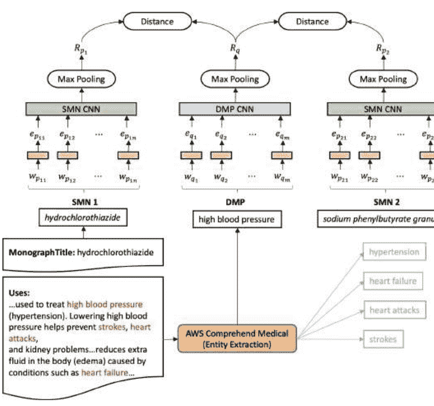
图 2. 药物推断模型结构

### 3.1 实体增强的双塔神经网络

受面部识别问题的启发，其中模型评估面部图像之间的相似性[3]，我们将双塔神经网络应用于我们的问题。我们将 DMP 视为每种药物的查询，将 SMNs 视为药物候选。目的是将正确的 SMNs 与提供的 DMP 匹配。

描述通常冗长且可能包含大量噪音。为了提高鲁棒性并减少噪音，我们使用亚马逊网络服务 Comprehend Medical (CM)[5] 中的基于医疗实体的硬注意力[4]，该服务是一种自然语言处理服务，用于执行实体和关系提取。

对于每个数据实例，我们在模型中使用通用名称作为 SMN，并从自由文本数据中生成描述每种药物用法的 DMP。为了减少噪音，我们将描述输入 CM 进行实体提取。CM 能够从非结构化文本中提取相关的医疗信息，并将提取的实体分类为五个类别和 28 个类型。在这项工作中，我们将标有“dx name”（诊断指标）、“treatment name”、“system organ site”、“swap”、“generic name”、“procedure name”、“brand name”、“test name”的实体作为 DMP。

药物推断模型（MIM）架构如图 2 概述。在这个模型中，有两组不同的独立嵌入权重，其中一组用于嵌入 SMNs，另一组用于 DMP。我们使用卷积（CNN）层[6]在嵌入层之上进行池化，以分别获得 SMNs 和 DMP 的向量表示。我们使用余弦距离来衡量两个 SMNs 和 DMP 之间的分离程度。

基于 BERT 的模型。自然而然地，我们可以利用已被证明在解决问答题方面成功的模型来处理我们的任务。在这里，DMP 被视为患者的查询，而 SMNs 被视为答案候选者。我们分别将 DMP 的输出与不同的 SMNs 连接起来，并将它们组合成基于 BERT[7] 的多选模型[8]。使用 `[CLS]` 标记的向量表示用于表示 DMP 与每个 SMN 的组合，并输入到全连接层中。最后，我们使用 hinge loss 进行排名，将预测值与真实值进行比较。

## 4 实验

### 4.1 数据集和评估指标

合成数据集。训练和测试数据集是从 FDB^1 PEM（患者教育模块）数据集中生成的 2,683 个药物描述中生成的。FDB 代表 First DataBank，它是一个已知的药物数据库和医疗设备数据库提供商。每个 PEM 文件包含一个面向患者的药物描述，包括药物通用名称、用途、警告副作用等。^2

^1 https://www.fdbhealth.com/
^2 Common Names, Warning, Uses, How To Use, Side Effects, Precautions, Drug Interactions, Overdose, Notes, Missed Dose, Storage, Medic Alert.

SMN 是从通用名称部分收集的，而 DMP 是根据 PEM 文件中的“用途”部分使用 CM 生成的，如第 3.1 节所述。为了评估实体提取组件的效果，我们通过从 PEM 文件的“用途”部分随机抽取 n-gram（其中 $n \in [1, 2, 3, 4, 5]$）来生成另一个 DMP 集作为 CM 的替代。接下来，我们使用收集到的 SMN 和 DMP 生成我们的训练和测试集。我们根据以下步骤生成每个实例的 DMP：

- 1. 对于每个 DMP，我们生成一个正 SMNs 集合，该集合由从与 DMP 提取的同一 PEM 文件中提取的 SMNs 组成。如果 DMP 是一个非常通用的短语，可能会有多个正 SMNs。例如，DMP“高血压”可能有多个 SMNs，因为许多药物可以用于治疗高血压。
- 2. 对于每个 DMP，我们还生成一个负 SMN 集合。负 SMNs 是由 PEM 文件覆盖的除了上述正 SMNs 之外的所有药物，并且应满足以下约束条件：从负 SMNs 的 PEM 文件的“USES”部分提取的实体不应与 DMP 的实体重叠。
- 3. 训练和验证数据集中的每个实例由 1 个正向 SMN 和 $n-1$ 个从上述 SMN 集合中随机选择的负向 SMN 组成。每个实例的标签指示哪个 SMN 是正向的。

对于训练和验证集，在步骤 3 中将 $n$ 设置为 2，这意味着每个实例中有两个 SMN。训练和验证数据集包含 680K 个实例，其中 70% 用于训练，30% 用于验证和测试。

为了测试目的，我们生成了四个合成测试集，分别将 $n$ 在步骤 3 中设置为 2、3、4、5，以模拟美国慢性疾病患者处方清单中通常有四到五种药物的实际情况。

真实数据集。真实数据集基于从 i2b2 数据集收集的 251 个处方，该数据集包含去识别化的患者出院摘要。^3 内部人类标注员为每个处方中的药物生成 DMP。观察到在真实处方中，多种药物可能具有相同的作用，可以使用通用 DMP 来指代处方中的多种药物。在我们当前的实验中，我们假设每个 DMP 的真实情况只是用于生成处方中的 DMP 的药物。通过这种方式，我们将得到模型性能的下限。为了测试目的，我们将每个处方中的药物数量限制为 10、5、4、3、2。对于最多有 10 种药物的测试集，我们遍历所有的 251 个处方，并只选择处方中药物少于 10 种的加入我们的测试集。我们将 10 种药物测试集中的处方随机截断为 5、4、3、2 种药物，作为其他测试集。此外，为了评估一个 DMP 可能在处方中指代多个 SMN 的情况，标注员目前正在标记 DMP 在处方中可能指代的所有 SMN，如果模型输出的药物是地面真实 SMN 中的一种，将在未来实验中将该测试样本标记为成功。

^3 https://portal.dbmi.hms.harvard.edu/projects/n2c2-nlp/。

我们将准确率作为主要评估指标，即从 SMN 中选择正确的 SMN 的准确性。在测试数据上进行评估时，模型会遍历所有 SMN 的两两组合，并根据排名对所有 SMN 进行排序。

### 4.2 实验细节

对于基于 CNN 的模型，我们测试了多个词嵌入模型，包括 200 维的 BioWordVec [9,10] 和 300 维的 FastText 词嵌入模型。

使用从 Mayo Clinic 的 3,466 篇文章训练的 200 个滤波器和窗口大小为 2 的二维 CNN 层，步长为 1，没有正则化。批量大小设置为 150，我们观察到模型在六个 epochs 后收敛。对于预训练语言模型，我们利用了 Clinical BERT [12]、BioBERT [13] 和原始 BERT 模型 [7]。我们使用 [7] 提供的默认设置来使用所有 BERT 模型。批量大小设置为 32，学习率设置为 $5 \times 10^{-5}$，dropout率设置为 0.2。我们观察到模型在 10 个 epochs 后收敛。我们使用 Tesla V100 GPU 训练和评估了所有模型。

基准。在评估我们模型的性能时，我们将药物名称推断性能与下面列出的基准模型进行比较：

- ARC-I [14]: ARC-I 使用 CNN 层来找到每个句子的表示，然后使用多层感知器（MLP）比较两个句子的表示。
- ARC-II [14]: ARC-II 在 ARC-I 的基础上改进，通过使用 CNN 计算句子之间的交互特征。
- ConvKNRM [15]: Conv-KNRM 使用 CNN 来表示各种长度的 n-gram，并在统一的嵌入空间中进行软匹配。然后，核池化和全连接层利用 n-gram 软匹配生成最终的排名分数。
- MatchLSTM [16]: MatchLSTM 按顺序聚合注意加权问题与每个答案标记的匹配，并使用聚合的匹配结果进行最终预测。
- MatchPyramid [17]: MatchPyramid 生成一个匹配矩阵，表示提及和候选之间的相似性，然后在矩阵之上应用 CNN 层，接着是一个 MLP 层来计算相似度分数。

## 5 结果与讨论

表 1 提供了我们在合成测试数据集上实验的每个模型的准确率结果。候选人数表示每个测试实例中的药物数，如第 4.1 节所述。我们报告了每个模型在有和没有使用 AWS Comprehend Medical 的情况下的测试结果，分别为“基于实体的注意力”和“基准”列。

表 1 展示了 MIM 的鲁棒性。我们观察到 MIM 和基于 BERT 的模型在不同数量的候选人中表现优于当前最先进的模型，如 ARC-I 和 MatchPyramid。表 2 进一步比较了两个最佳模型在真实测试集上的性能。MIM 在准确率上比基于 BERT 的模型提高了 7-9%。我们认为主要原因是 MIM 通过分别编码 SMN 和 DMP，能够以更稳健的方式编码表示。

**表 1. 合成测试集：对于每个模型，我们报告包括和不包括基于实体的注意力的 top1 准确率。**

| 模型 | 基准 (2) | 基准 (3) | 基准 (4) | 基准 (5) | 基于实体的注意力 (2) | 基于实体的注意力 (3) | 基于实体的注意力 (4) | 基于实体的注意力 (5) |
|---|---|---|---|---|---|---|---|---|
| NormalBert | 69.7 | 54.7 | 46.6 | 42.7 | 79.7 | 72.7 | 62.4 | 62.5 |
| BioBert | 73.4 | **59.8** | **51.9** | 46.4 | 81.5 | 74.8 | 66.2 | 66.4 |
| ClinicalBert | 73.5 | 57.8 | **51.9** | 47.4 | 79.5 | 74.4 | 64.8 | 62.7 |
| ARC-1 | 65.2 | 46.2 | 37.5 | 33.4 | 76.8 | 66.8 | 58.6 | 59.4 |
| ARC-2 | 64.0 | 48.1 | 39.1 | 36.5 | 75.7 | 65.7 | 62.1 | 57.0 |
| ConvKNRM | 65.4 | 52.0 | 42.6 | 38.8 | 76.7 | 66.6 | 60.7 | 57.3 |
| MatchLSTM | 64.9 | 50.8 | 40.9 | 35.4 | 82.4 | 70.9 | 62.6 | 58.3 |
| MatchPyramid | 59.5 | 45.0 | 36.5 | 33.5 | 74.0 | 58.0 | 58.0 | 54.1 |
| MIM | **73.9** | 57.9 | 48.9 | **49.7** | **87.7** | **80.8** | **78.9** | **76.9** |

**表 2. 真实测试集：对于每个模型，我们报告 top1 准确率。**

| 模型 | 2 | 3 | 4 | 5 | 10 |
|---|---|---|---|---|---|
| BioBert | 83.10 | 73.50 | 67.00 | 61.8 | 52.70 |
| MIM | **83.50** | **74.50** | **69.50** | **63.60** | **53.80** |

与基于 BERT 的模型相比，它们使用特殊的分隔符令牌将表示连接在一起。我们还观察到基于 BERT 模型的性能变化取决于它们的预训练。我们发现领域特定的预训练有所帮助，在与基准 BERT 相比时可以提高 2-3% 的准确率。我们观察到基于实体的描述在所有模型设置中都能产生稳健的结果，在准确率上比非实体模型有显著的改进。这缓解了冗长描述中的噪音问题。

此外，我们发现我们的 MIM 模型，具有相对较简单的 CNN 编码器以及 SMN 和 DMP 的独立编码器，具有低延迟生成推理结果的明显优势。这对于实时工业环境非常理想。根据我们的实验，MIM 模型对于五种药物的平均延迟为 10 毫秒，而与 BERT 相比为 89 毫秒。

### 5.1 药物聚类结果

我们基于 Two-tower 神经网络的 CNN 最大池化输出应用了 k 近邻（KNN）聚类。2,683 种药物的通用名称由 200 维向量表示。KNN 的聚类数量由 Silhouette 分析[18]确定，结果如图 3 所示。

Silhouette分析显示，当类别数量为31时，聚类效果更好。

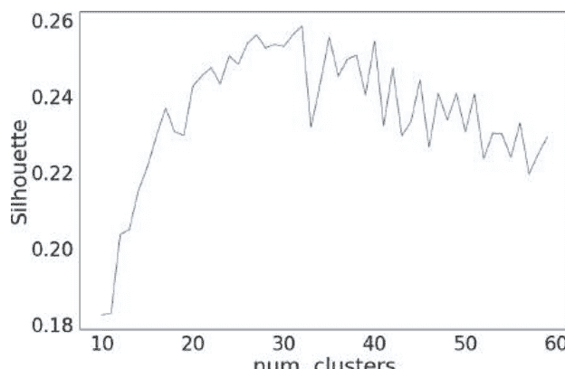

图3. 不同聚类数量的平均Silhouette值

图4展示了结果的t-SNE可视化，其中2,683种药物被分为31个簇。该图说明了具有相同效果、治疗相同疾病或具有相似药物类型的药物被映射到彼此附近。

表3. DMP/SMN匹配和聚类结果示例

| | (a) 诊断 | (b) 症状 | (c) 药物类型 |
|---|---|---|---|
| DMP | 高血压、中风、心脏病发作 | 咳嗽 | 抗生素 |
| 示例SMN | 氨氯地平 | 异丙嗪 | 氯霉素 |
| 附近的SMN | 贝那普利、雷米普利、曲安普利、奎那普利、依那普利、依沙地平、赖诺普利、沙库比特利、阿利斯柯仁、依普利酮 | 右美沙芬、愈创甘油醚、祛痰药、抗组胺药、对乙酰氨基酚、羟考酮、扎那米韦 | 多粘菌素b, 庆大霉素, 头孢替他, 斯皮拉霉素, 加替沙星, 哌拉西林, 头孢噻肟, 氧氟沙星 |

表3显示了聚类结果的三个示例。附近的SMN是从与示例SMN所属的相同簇中采样的，并根据它们与给定SMN的距离进行排序。问题的性质使得推理模型能够并且需要基于多个维度对SMN进行分组。

我们列举了来自三个维度的示例，用户可以很自然地通过诊断、疾病症状和药物类型来参考他们的药物。例如，咳嗽是多种疾病的常见症状，包括普通感冒、肺部疾病如肺炎，甚至季节性过敏引起的咳嗽。

在 (b) 列中，该模型能够将能够缓解咳嗽的药物进行聚类。

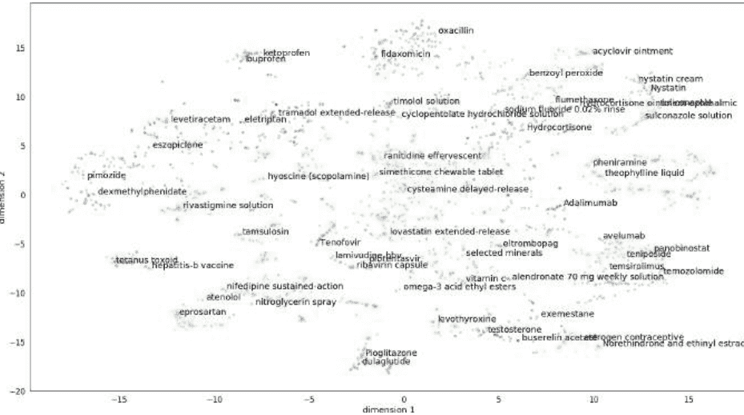

图4. 聚类的t-SNE可视化

不同潜在原因的症状，例如，异丙嗪和抗组胺药物用于治疗过敏，而扎那米韦用于治疗和预防流感。

## 6 相关工作

早期的医学概念规范化工作[1]依赖于基于词典的字符串匹配和字典查找，将有限数量的文本变体映射到预定义的医学词汇表[19,20]。[21]将DNorm引入作为第一个比较各种疾病提及和实体之间关联的成对学习排序模型。[22,23]进一步利用深度学习模型，如卷积神经网络[22]和循环神经网络模型[24]，在大量医学文章语料库上进行训练等。目前，研究人员通过不同的模型结构增强了基于深度学习的模型，以整合上下文信息，更好地处理词汇表外（OOV）词汇，并利用不同语义层次的交互特征[2,25,26]。

随着深度学习的成功，许多基于神经网络的模型已被提出用于语义匹配和文档排序。例如，ARC-I [14]首先计算两个句子的表示，然后计算它们的相关性。当候选项数量有限时，语义/文本匹配技术非常适合解决医学概念规范化问题。如[8]所列，最近的研究人员专注于开发深度学习模型来解决文档检索、问题回答、对话响应排序和释义识别等问题，并引入了ARC-I [14]、ARC-II [14]、ConvKNRM [15]、MatchLSTM [16]、MatchPyramid [17]、BERT [7]等最先进的模型。

近年来，自然语言处理 (NLP) 技术在临床文本挖掘方面显示出越来越高的效果 [5,27]。电子健康记录 (EHR) 的叙述，例如出院总结和病程记录，包含大量与医学相关的信息，如诊断信息和不良药物事件。自动提取此类信息并以标准化格式 [28]表示临床知识可以用于各种目的，如临床事件监测、决策支持 [29]、药物警戒和药效研究。

本文描述了一个问题，该问题是基于医学实体的硬注意力的医学概念规范化和语义匹配问题的组合。本文提出的问题的性质要求解决方案能够从具有有限上下文信息的短语中提取信息。

## 7 结论和未来工作

在本文中，我们介绍了在药物语音交互产品开发中常见的一个新问题。我们评估了不同解决方案的准确性，并展示了我们的实体增强MIM优于基准模型。

这个问题的特殊之处在于与其他自然语言处理任务相比，上下文信息非常有限，短语的长度也限制了我们利用依赖于短语中词语关系的其他高级技术。评估结果还显示，该问题更偏好简单的模型结构。由于短语结构非常简单，词嵌入的质量在这个问题中更加重要，当训练数据不足以增强词语之间的关系时，保持嵌入权重不变就显得尤为重要，这可能是由于数据的性质或样本大小的限制。

我们还观察到合成收集的数据集与真实患者之间存在差异。例如，合成处方中的药物组合可能从医生或患者的角度来看是无效的。我们计划进一步验证我们的模型在真实患者数据上的可行性。

最后，在比较和评估两个药物样本的基础上，我们计划在训练中使用更多的药物样本，以更接近真实世界的情况。

## 参考文献

- 1. Zhu, M., Celikkaya, B., Bhatia, P., Reddy, C.K.: LATTE: 潜在类型建模用于生物医学实体链接。 arXiv预印本arXiv:1911.09787 (2019)
- 2. Miftahutdinov, Z., Tutubalina, E.: 深度神经模型用于用户生成的文本中的医学概念规范化。 arXiv预印本arXiv:1907.07972 (2019)
- 3. Chopra, S., Hadsell, R., LeCun, Y.: 学习一种判别性相似度度量,应用于人脸验证。 在: 2005年IEEE计算机学会计算机视觉与模式识别会议 (CVPR'05), 卷1, 第539-546页。 IEEE (2005)
- 4. Luong, M.-T., Pham, H., Manning, C.D.: 注意力机制在神经机器翻译中的有效方法。 arXiv预印本arXiv:1508.04025 (2015)
- 5. Bhatia, P., Celikkaya, B., Khalilia, M., Senthivel, S.: Comprehend medical: 一种命名实体识别和关系抽取的网络服务。 在： 2019年第18届IEEE国际机器学习与应用会议（ICMLA），第1844-1851页（2019）
- 6. Kim, Y.: 卷积神经网络用于句子分类。 在： 2014年经验方法在自然语言处理中的会议论文集（EMNLP），卡塔尔多哈，2014年10月，第1746-1751页。 计算语言学协会（2014年）
- 7. Devlin, J., Chang, M.-W., Lee, K., Toutanova, K.: BERT: 预训练的深度双向转换器用于语言理解。 arXiv预印本arXiv:1810.04805（2018年）
- 8. Guo, J., Fan, Y., Ji, X., Cheng, X.: MatchZoo: 用于神经文本匹配的学习、实践和开发系统。 在： 第42届国际ACM SIGIR信息检索研究与开发会议论文集，SIGIR 2019，第1297-1300页。ACM，纽约（2019年）
- 9. 张, Y., 陈, Q., 杨, Z., 林, H., 智勇, L.: BioWordVec，利用子词信息和MeSH改进生物医学词嵌入。 科学数据 6（1），52（2019年）
- 10. 陈, Q., 彭, Y., 卢, Z.: BiosentVec: 为生物医学文本创建句子嵌入。 CoRR, abs/1810.09302（2018年）
- 11. Bojanowski, P., Grave, E., Joulin, A., Mikolov, T.: 用子词信息丰富词向量。 计算机语言学协会交易 5，135-146（2017年）
- 12. Alsentzer, E., 等: 公开可用的临床BERT嵌入。 在： 第二届临床自然语言处理研讨会论文集，美国明尼苏达州明尼阿波利斯，pp. 72-78。 计算语言学协会，2019年6月
- 13. 李, J., 等: BioBERT: 用于生物医学文本挖掘的预训练生物医学语言表示模型。 生物信息学 36，1234-1240（2019年）
- 14. 胡, B., 卢, Z., 李, H., 陈, Q.: 用于匹配自然语言句子的卷积神经网络架构。 在： 神经信息处理系统的进展，pp. 2042-2050（2014年）
- 15. 戴, Z., 熊, C., 卡伦, J., 刘, Z.: 用于软匹配n-gram的卷积神经网络在特定搜索中。 在： 第十一届ACM国际网络搜索和数据挖掘会议论文集，第126-134页（2018）
- 16. 王, S., 江, J.: 使用匹配LSTM和答案指针的机器理解。 arXiv预印本arXiv:1608.07905（2016）
- 17. 庞, L., 兰, Y., 郭, J., 徐, J., 万, S., 程, X.: 文本匹配作为图像识别。 在： 第三十届AAAI人工智能大会（2016）
- 18. Rousseeuw, P.J.: 轮廓：聚类分析的解释和验证的图形辅助。 J. Comput. Appl. Math. 20，53-65（1987）
- 19. Aronson, A.R.: 生物医学文本到UMLS元词典的有效映射: metamap程序。 在： AMIA研讨会论文集，第17页。 美国医学信息学协会（2001年）
- 20. Brennan, P.F., Aronson, A.R.: 逆向将患者与临床信息联系起来：在电子邮件中检测UMLS概念。 生物医学信息学杂志 36(4-5)，334-341（2003年）
- 21. Leaman, R., Doğan, R.I., Lu, Z.: DNorm: 通过成对学习进行疾病名称规范化。 生物信息学 29(22)，2909-2917（2013年）
- 22. Limsopatham, N., Collier, N.: 通过学习语义表示来规范化社交媒体文本中的医学概念。 计算语言学协会（2016年）
- 23. Lee, K., Hasan, S.A., Farri, O., Choudhary, A., Agrawal, A.: 在线用户生成文本的医学概念规范化。在: 2017年IEEE国际医疗信息学会议(ICHI), 第462-469页.IEEE (2017年)
- 24. Belousov, M., Dixon, W., Nenadic, G.: 在SMM4H2017医学概念规范化任务中使用广义线和深度学习模型的集成。在: 社交媒体挖掘健康应用的第二届研讨会(SMM4H)。健康语言处理实验室(2017)
- 25. Luo, Y., Song, G., Li, P., Qi, Z.: 使用多视图卷积神经网络进行多任务医学概念规范化。在: 第32届AAAI人工智能大会(2018)
- 26. Niu, J., Yang, Y., Zhang, S., Sun, Z., Zhang, W.: 用于医学概念规范化的多任务字符级注意力网络。神经过程。信件。49(3), 1239-1256(2019)
- 27. Bhatia, P., Arumae, K., Busra Celikkaya, E.: 用于命名实体识别的动态迁移学习。在: Shaban-Nejad, A., Michalowski, M. (eds.) W3PHAI 2019. SCI, 第843卷, 第69-81页。Springer, Cham(2020年)。https://doi.org/10.1007/978-3-030-24409-5_7
- 28. 辛格, G., 巴蒂亚, P.: 使用显式上下文条件的关系提取。arXiv预印本arXiv:1902.09271(2019年)
- 29. 金, M., 等: 利用医学命名实体和多模态学习改进医院死亡率预测。arXiv预印本arXiv:1811.12276(2018年)

## 作者索引

- Abdel-Salam, Reem 1
- 巴蒂亚, Parminder 126
- Bouchabou, Damien 111
- 曹, 浩志 70
- Celikkaya, Busra 126
- Choi, Kyunghwan 126
- Ghasemzadeh, Hassan 85
- Gudur, Gautham Krishna 57
- Guo, Junyao 99
- Hadhood, Mayada 1
- Haresamudram, Harish 43
- Iwasawa, Yusuke 16
- Kanellos, Ioannis 111
- Kurup, Unmesh 99
- Kwon, Hyeokhyen 43
- LeDuc, Benoit 111
- Li, Xiang 30
- Liu, Haiyang 126
- Lohr, Christophe 111
- Luo, Jinqi 30
- Macabasco-O'Connell, Aurelia 85
- Mao, Kezhi 70
- Matsuo, Yutaka 16
- Mostafa, Rana 1
- Nguyen, Huy Thong 43
- Nguyen, Sao Mai 111
- Perepu, Satheesh Kumar 57
- Peterson, Andrew F. 43
- Plötz, Thomas 43
- Sanchez, Justin 85
- Saravanan, Anbumalar 85
- Sato, Goh 16
- See, Simon 70
- Shah, Mohak 99
- Tabkhi, Hamed 85
- Takahashi, Hiroki 16
- Watanabe, Takumi 16
- Xu, Yuecong 70
- Yairi, Ikuko Eguchi 16
- Yang, Jianfei 70
- Yin, Jianxiong 70
- Younes, Rabih 30
- Yuan, Shaoqing 126