# 面向医学应用的深度学习和数据标注


古斯塔沃·卡内罗，戴安娜·马特乌斯，洛ï克·彼得，安德鲁·布拉德利，乔昂·曼努埃尔·塔瓦雷斯，瓦西里奥斯·贝拉吉安尼斯，乔昂·保罗·帕帕，雅辛托·C·纳辛图，马尔科·卢格，卢志，杰米·S·卡多索，朱利安·科内比斯（编者）


第一届国际工作坊 LABELS 2016 与第二届国际工作坊 DLMIA 2016与MICCAI 2016同期举办希腊雅典，2016年10月21日，会议论文集

自1973年开始出版

创始人和前任系列编辑：

Gerhard Goos， Juris Hartmanis 和 Jan van Leeuwen

## 编辑委员会

- 大卫·哈钦森
兰卡斯特大学，英国兰卡斯特
- 金出武男
卡内基梅隆大学，美国匹兹堡，宾夕法尼亚州
- 约瑟夫·基特勒
萨里大学，英国吉尔福德
- 乔恩·克莱因伯格
康奈尔大学，美国纽约州伊萨卡
- 弗里德曼·马滕
苏黎世联邦理工学院，瑞士苏黎世
- 约翰·C·米切尔
美国加利福尼亚州斯坦福大学
- 莫尼·纳奥尔
以色列拉霍沃特威茨曼科学研究所
- C.潘杜·兰甘
印度马德拉斯理工学院
- 伯恩哈德·斯特芬
德国多特蒙德大学
- 德米特里·特尔佐普洛斯
美国加利福尼亚州洛杉矶加州大学
- 道格·泰加尔
美国加利福尼亚州伯克利加州大学
- 格哈德·魏库姆
德国萨尔布吕肯马克斯·普朗克计算机科学研究所

更多关于这个系列的信息，请访问 http://www.springer.com/series/7412

## 深度学习和数据标注用于医学应用

第一届国际工作坊 LABELS 2016 与第二届国际工作坊 DLMIA 2016与MICCAI 2016在雅典，希腊举行，日期为2016年10月21日会议论文集

## 编辑

| 姓名 | 机构 |
|------|------|
| Gustavo Carneiro | 阿德莱德大学，阿德莱德，南澳大利亚，澳大利亚 |
| João Paulo Papa | 圣保罗州立大学，鲍鲁，巴西 |
| Diana Mateus | 慕尼黑工业大学，加尔欣，德国 |
| Jacinto C. Nascimento | 里斯本高级技术学院，里斯本，葡萄牙 |
| Loïc Peter | 慕尼黑工业大学，加尔欣，德国 |
| Marco Loog | 代尔夫特理工大学，代尔夫特，荷兰 |
| Andrew Bradley | 昆士兰大学，圣卢西亚，昆士兰，澳大利亚 |
| Zhi Lu | 南澳大学，阿德莱德，南澳大利亚，澳大利亚 |
| João Manuel R.S. Tavares | 波尔图大学，波尔图，葡萄牙 |
| Jaime S. Cardoso | 波尔图大学，波尔图，葡萄牙 |
| Vasileios Belagiannis | 牛津大学，牛津，英国 |
| Julien Cornebise | Google DeepMind，伦敦，英国 |

ISSN 0302-9743
ISSN 1611-3349 (电子版)
计算机科学讲义
ISBN 978-3-319-46975-1
ISBN 978-3-319-46976-8 (电子书)
DOI 10.1007/978-3-319-46976-8
国会图书馆控制号：2016953216
LNCS子库：SL6 -图像处理、计算机视觉、模式识别和图形学
© Springer International Publishing AG 2016
本作品受版权保护。出版商保留所有权利，包括全部或部分材料的翻译、重印、插图的再利用、朗诵、广播、微缩胶片复制或以任何其他实体方式的复制、信息传输和存储、电子适应、计算机软件或以现在已知或今后开发的类似或不同的方法。
在本出版物中使用的一般描述性名称、注册名称、商标、服务标志等，并不意味着即使在没有具体声明的情况下，这些名称也不受相关保护法律和法规的限制，因此可以自由使用。
出版商、作者和编辑可以安全地假设本书中的建议和信息在出版日期时被认为是真实和准确的。出版商、作者或编辑对本文所包含的材料不提供任何明示或暗示的保证，也不对可能存在的任何错误或遗漏负责。
采用无酸纸印刷
此Springer品牌由Springer Nature出版
注册公司为Springer International Publishing AG
注册公司地址为：瑞士Cham市Gewerbestrasse 11号

## 前言：DLMIA 2016

在与MICCAI 2015一起举办的第一届医学图像分析深度学习（DLMIA）工作坊取得成功后，我们迎来了数百名与会者，现在我们呈现第二届DLMIA工作坊的论文集。由于深度学习方法能够处理非常大的训练集，能够在不同数据库之间传递学习到的特征，并能够分析多模态数据，因此它们在医学图像分析社区中引起了极大的兴趣。DLMIA是一个专注于深度学习方法在医学图像分析应用中设计和使用的工作坊。我们相信这个工作坊正在设定深度学习方法在医学图像分析中的趋势并确定挑战。对于主题演讲，我们邀请了来自北卡罗来纳大学教堂山分校放射学和BRIC部门的丁刚教授，以及来自慕尼黑工业大学的纳西尔·纳瓦布教授，他们是医学图像分析领域的两位知名研究者。我们要感谢Butterfly Network提供的财务支持，以实现这些主题演讲。

第二届DLMIA工作坊的第一次征稿于2016年4月1日发布，最后一次征稿于2016年5月24日，论文截止日期定于2016年7月10日。DLMIA的投稿网站共收到46篇论文注册，其中42篇论文转化为全文投稿，每篇投稿至少由三名评审人进行评审。工作坊主席根据评审人的评分和评论决定从42篇投稿中选出21篇（即接受率为50%）。评审得分最高的十篇论文被选为口头报告，其余11篇被接受的论文进行海报展示。最后，工作坊主席根据评审人的评分和评论投票选出了最佳论文，第二届DLMIA工作坊的最佳论文奖授予了Michal Drozdzal、Eugene Vorontsov、Gabriel Chartrand、Samuel Kadoury和Christopher Pal的论文“在生物医学图像分割中跳跃连接的重要性”。Nvidia慷慨地赞助了最佳论文奖。最后，我们要感谢澳大利亚研究委员会对本次工作坊的支持（发现项目DP140102794和ARC Future Fellowship FT110100623）。我们还要感谢DLMIA的评审人员。

2016年8月
Gustavo Carneiro
João Manuel R.S. Tavares
Andrew Bradley
João Paulo Papa
Jacinto C. Nascimento
Jaime S. Cardoso
Vasileios Belagiannis
Zhi Lu

## 前言：LABELS 2016

第一届大规模生物医学数据注释和专家标签综合工作坊（LABELS）于2016年10月21日在希腊雅典的MICCAI会议期间举行。通过这个活动，我们旨在提高人们对生物医学问题背景下训练数据获取的重要性的认识，并促进专注于辅助注释过程的算法的发展。

我们的论文征集共收到十篇投稿。每篇论文都由至少三位程序委员会成员进行了单盲审查。最终有七篇论文被接受在会议场地进行海报展示，并收录在本卷中。根据审稿人的建议，其中三篇论文还被邀请进行口头报告。我们对最终的议程的多样性非常兴奋，其中包括众包方法、主动学习、迁移学习、半监督学习或标签不确定性建模等主题。除了工作坊参与者的贡献外，我们还有幸邀请到两位主题演讲嘉宾，他们对这些主题提出了进一步的发展：来自荷兰代尔夫特技术大学的Marco Loog和来自瑞士洛桑联邦理工学院的Pascal Fua。再次感谢他们的见解和他们演讲所促进的科学交流。

总结一下，我们要感谢审稿人的贡献，以及MICCAI组委会的鼓励和支持，使得这次活动得以举办。

2016年8月
- Diana Mateus
- Loïc Peter
- Gustavo Carneiro
- Marco Loog
- Julien Cornebise

## 组织

### DLMIA委员会

#### 工作坊主席

| 姓名 | 机构 |
|------|------|
| 古斯塔沃·卡内罗 | 澳大利亚阿德莱德大学 |
| João Manuel R.S. Tavares | 葡萄牙波尔图大学 |
| Andrew Bradley | 澳大利亚昆士兰大学 |
| João Paulo Papa | 巴西圣保罗州立大学 |
| Jacinto C. Nascimento | 葡萄牙理工大学 |
| Jaime S. Cardoso | 葡萄牙波尔图大学 |
| Vasileios Belagiannis | 英国牛津大学 |
| Zhi Lu | 澳大利亚南澳大学 |

## 程序委员会

| Aaron Carass | Gabriel Maicas | Neeraj Dhungel |
| Adrian Barbu | Ghassan Hamarneh | Patricia Ribeiro |
| Adrian Johnston | Guosheng Lin | Roger Tam |
| Amr Abdel-Dayem | Helder Oliveira | Shanghang Zhang |
| Ana Rebelo | Holger R. Roth | Susana Brandao |
| Ankush Gupta | Iro Laina | Tiago Veiga |
| Carlos Santiago | Jianming Liang | Tom Brosch |
| Daniela Iacoviello | Jianqiao Feng | Vijay Kumar |
| David Liu | Kelwin Fernandes | Weidong Cai |
| Dinggang Shen | Le Lu | Yefeng Zheng |
| Felix Achilles | Manuel Marques | Zhibin Liao |

### LABELS委员会

#### 工作坊主席

| 姓名 | 机构 |
|------|------|
| Diana Mateus | 德国慕尼黑工业大学 |
| Loïc Peter | 德国慕尼黑工业大学 |
| Gustavo Carneiro | 澳大利亚阿德莱德大学 |
| Marco Loog | 荷兰代尔夫特理工大学 |
| Julien Cornebise | 英国Deepmind公司 |

## 程序委员会

| Adrian Barbu | Filipe Condessa | Neeraj Dhungel |
| Alba Garcia Seco de Herrera | Holger Roth | Rahaf Aljundi |
| Bjoern Menze | Jaime Cardoso | Raphael Sznitman |
| Danna Gurari | Joao Papa | Roger Tam |
| Daoqiang Zhang | Ksenia Konyushova | Shadi Albarqouni |
| Dinggang Shen | Le Lu | Weidong Cai |
| Eugenio Iglesias | Lena Maier-Hein | Xue-Cheng Tai |
| | Michael Goetz | |

## 目录

### 医学图像分析中的深度学习

- 使用深度卷积神经网络中的K-Support空间池化进行HEp-2细胞分类 ... 3
Xian-Hua Han, Jianmei Lei, and Yen-Wei Chen
- 具有双重学习架构的稳健的三维器官定位和融合 ... 12
Xiaoguang Lu, Daguang Xu, and David Liu
- 用于显微镜图像分析的细胞分割提案网络 ... 21
Saad Ullah Akram, Juho Kannala, Lauri Eklund, and Janne Heikkilä
- 使用深度卷积在超声图像中进行血管检测神经网络 ... 30
Erik Smistad和Lasse Løvstakken
- 用于重建类似于7T图像的卷积神经网络使用外观和解剖特征从3T MRI中 ... 39
Khosro Bahrami, Feng Shi, Islem Rekik和Dinggang Shen
- 快速预测图像配准 ... 48
Xiao Yang, Roland Kwitt和Marc Niethammer
- 使用多视图的纵向多发性硬化症病变分割卷积神经网络 ... 58
Ariel Birenbaum和Hayit Greenspan
- 使用卷积进行自动性视网膜病变检测神经网络 ... 68
Daniel E. Worrall, Clare M. Wilson和Gabriel J. Brostow
- 用于肝脏分割的完全卷积网络和病变检测 ... 77
Avi Ben-Cohen, Idit Diamant, Eyal Klang, Michal Amitai和Hayit Greenspan
- 深度学习脑部病变模式以预测未来疾病早期多发性硬化症患者的活动情况 ... 86
Youngjin Yoo, Lisa W. Tang, Tom Brosch, David K.B. Li, Luanne Metz, Anthony Traboulsee, and Roger Tam
- 通过集成的方法对增强对比度的MRI序列进行去噪专家深度神经网络的 ... 95
Ariel Benou, Ronel Veksler, Alon Friedman和Tammy Riklin Raviv
- 通过结合2D完全卷积网络的三维CT图像分割使用3D多数投票的卷积网络进行三维CT图像分割 ... 111
周翔荣, 伊藤隆明, 高山凉介, 王松, 原武士, 藤田浩
- 使用多任务损失CNN的医学图像描述 ... 121
帕维尔·基西列夫, 伊莱·萨森, 埃拉·巴尔坎, 夏贝尔·哈绍尔
- 使用深度学习完全自动化Graf's方法进行DDH诊断卷积神经网络 ... 130
David Golan, Yoni Donner, Chris Mansi, Jacob Jaremko, Manoj Ramachandran, 以及代表CUDL的人员
- 用于分割的多维门控循环单元生物医学3D数据的 ... 142
Simon Andermatt, Simon Pezold, 以及Philippe Cattin
- 学习术中分析的热过程表示缺血性中风期间的皮层灌注 ... 152
Nico Hoffmann, Edmund Koch, Gerald Steiner, Uwe Petersohn, 以及Matthias Kirsch
- 自动在3D医学图像中识别切片使用ConvNet回归器 ... 161
Bob D. de Vos, Max A. Viergever, Pim A. de Jong, 和 Ivana Išgum
- 使用3D全连接网络从MRI数据估计CT图像卷积网络 ... 170
Dong Nie, Xiaohuan Cao, Yaozong Gao, Li Wang, 和 Dinggang Shen
- 在生物医学图像分割中跳跃连接的重要性 ... 179
Michal Drozdzal, Eugene Vorontsov, Gabriel Chartrand, Samuel Kadoury, 和 Chris Pal
- 理解深度迁移学习的机制用于医学图像 ... 188
Hariharan Ravishankar, Prasad Sudhakar, Rahul Venkataramani, Sheshadri Thiruvenkadam, Pavan Annangi, Narayanan Babu, 和 Vivek Vaidya
- 一种基于区域的卷积网络用于肿瘤检测和乳腺摄影中的分类 ... 197
Ayelet Akselrod-Ballin, Leonid Karlinsky, Sharon Alpert, Sharbell Hasoul, Rami Ben-Ari, 和 Ella Barkan

### 生物医学数据的大规模注释和专家标签合成

- 在胸部CT中众包气道注释的早期经验 ... 
Veronika Cheplygina, Adria Perez-Rovira, Wieying Kuo, Harm A.W.M. Tiddens, 和 Marleen de Bruijne
- 基于核形态学的分层特征提取癌症诊断 ... 
Chi Liu, Yue Huang, Ligong Han, John A. Ozolek, 和 Gustavo K. Rohde
- 使用众包技术进行多标签生物医学化合物研究图注 ... 
Alba Garcia Seco de Herrera, Roger Schaer, Sameer Antani, 和 Henning Müller
- 向图像的自由文本注释进行语义丰富化对英国生物库心脏Cine MRI扫描的质量评估 ... 
Valentina Carapella, Ernesto Jiménez-Ruiz, Elena Lukaschuk, Nay Aung, Kenneth Fung, Jose Paiva, Mihir Sanghvi, Stefan Neubauer, Steffen Petersen, Ian Horrocks, 和 Stefan Piechnik
- 聚焦校对以重建神经连接组从EM图像中进行大规模处理 ... 
Stephen M. Plaza
- 通过二进制输入实现医学体积的无需手动分割 ... 
Florian Dubost, Loic Peter, Christian Rupprecht, Benjamin Gutierrez Becker, 和 Nassir Navab
- Playsourcing：一种用于知识创造的新概念在生物医学研究中 ... 
Shadi Albarqouni, Stefan Maitl, Maximilian Baust, Nassir Navab, 和 Stefanie Demirci

## 作者索引

## 使用K-Support空间池化在深度卷积神经网络中的HEp-2细胞分类

Xian-Hua Han^{1(✉)}, Jianmei Lei^{2}, 和 Yen-Wei Chen^{3}

1. 日本东京高级工业科学技术研究所 han-xhua@aist.go.jp
2. 中国重庆车辆噪声振动与安全技术国家重点实验室, 中国重庆 leijianmei@caeri.com.cn
3. 日本滋贺草津立命馆大学 chen@is.ritsumei.ac.jp

摘要。本研究解决了HEp-2细胞识别问题，使用间接免疫荧光（IIF）图像分析，通过在患者血清中找到抗体来促进许多自身免疫性疾病的诊断。最近，许多自动HEp-2细胞分类策略，包括浅层和深层方法，已经开发出来，其中深度卷积神经网络（CNN）已经被证明具有令人印象深刻的性能。然而，深度CNN通常需要固定大小的图像作为输入。为了克服固定大小问题的限制，一种空间金字塔池化（SPP）策略已经在一般物体识别和检测中提出。SPP-net通常利用最大池化策略来聚合预定义空间区域内特定神经元的所有激活状态，只取最大激活值，这在传统的最先进编码方法（如稀疏编码、线性局部约束编码等）中取得了优越的性能。然而，SPP-net中的最大池化策略只保留最强的激活模式，并完全忽略了激活模式的频率：这是识别不同类型图像的重要特征。因此，本研究探索了一种广义的空间池化策略，称为K支持空间池化，在深度CNN中集成了相对激活模式的最大激活幅度和响应幅度。在深度CNN中，提出的K支持空间池化策略结合了常用的均值和最大池化方法，避免了对最大激活的过度强调，而更倾向于在支持区域内的一组激活。应用具有提出的K支持空间池化的深度CNN进行HEp-2细胞分类，与最先进的方法相比，取得了令人期待的性能。

# 1 引言

间接免疫荧光（IIF）广泛用作一种常见的方法，通过在患者中寻找抗体来揭示自身免疫性疾病的存在血清。由于它对于诊断自身免疫性疾病[1]有效，因此对于在诊断测试中应用IIF图像分析的需求正在增加。然而，对IIF图像的手动分析不仅给医生带来了沉重的负担，而且在实验室之间导致了不一致性。因此，自动和可靠的HEp-2细胞分类引起了计算机视觉和机器学习领域的广泛关注。

已经进行了许多尝试来实现HEp-2染色模式的自动识别，主要包括两个步骤：特征提取和分类。最近开发的大多数工作[2-6]都集中在有效的特征提取上，这对HEp-2细胞分类的最终性能有很大影响。Perner等人[2]提出了纹理和统计特征的细胞图像表示，并将提取与决策树模型相结合，用于HEp-2细胞图像分类。在ICIP2012的第一次HEp-2细胞分类竞赛中，基于LBP的描述符，旋转不变共现LBP（RICLBP），被提出用于细胞图像表示，并取得了有希望的HEp-2细胞分类性能[3]。在ICIP2013的第二次HEp-2细胞分类竞赛中，齐等人提出了一种成对旋转不变共现LBP（PRICoLBP），并将其与Sift描述符的特征词袋（BOF）[5]相结合[6]，以实现最佳识别结果。其他经验选择的手工特征，如方向直方图[7]、形状指数[8]和灰度级统计特征。共现矩阵[9]、灰度级大小区域矩阵[10]也已经开发出来，以提供可比较和可接受的性能。然而，HEp-2细胞的分类性能仍有很大的提升空间。

最近，深度学习框架[11-14]在不同应用领域取得了显著的成功，如通用图像分类和识别、目标检测和定位、自然语言处理等。与传统的最先进方法（如图像表示中的BOW模型、语音表示中的MFCC）相比，深度学习框架可以学习包括低级、中级和高级视觉特征在内的分层特征，并获得端到端学习的模型，这在大规模标记数据集上取得了出色的性能，并在学术界和工业界引起了极大的关注。其中，深度卷积神经网络（CNN）是最常用的框架，在许多分类基准测试中取得了与甚至超过人类的性能。一些研究[18,19]应用深度CNNs进行HEp-2细胞分类，并取得了有希望的表现。Gao等人[18]利用三个卷积层和两个全连接层进行HEp-2细胞分类，而Li等人则利用额外的细胞图像训练CNN模型进行跨样本分析，取得了比仅使用仿射变换增强数据集更好的结果。然而，所有使用的深度CNNs通常需要固定大小的图像作为输入，这会对原始图像造成变形和“人为”效果，并可能降低重新缩放图像的识别准确性。为了解决图像固定大小的限制，He等人提出了一种方法在卷积神经网络中使用空间金字塔池化策略进行通用物体分类和检测，称为SPP-net [20]，它可以处理任意大尺寸的图像，提取高级图像表示。SPP-net通常可以提高各种卷积神经网络架构在多个图像数据集上的分类性能，例如ImageNet 2012、Pascal VOC 2007和Caltech101数据集。SPP-net通常利用最大池化策略来聚合预定义空间区域内特定神经元的所有激活状态，只取最大激活值，这在传统的最先进编码方法（如稀疏编码、线性局部约束编码等）中取得了优越的性能。然而，SPP-net中的最大池化策略只保留最强的激活模式，完全忽略了频率：这是识别不同类型图像的重要特征。因此，本研究探索了一种广义的空间池化策略，称为K-support空间池化，在深度卷积神经网络中，不仅整合了最大激活幅度，还整合了相对激活模式的响应幅度。这种提出的K-support空间池化策略在深度卷积神经网络中结合了常用的均值池化和最大池化方法，避免了过分强调最大激活，而更倾向于在支持区域内的一组激活。将提出的K-support空间池化应用于HEp-2细胞分类的深度卷积神经网络，与最先进的方法相比，取得了令人满意的性能。

# 2 使用K-Support空间池化的深度卷积神经网络

在图像分类和目标检测领域，最常用的深度卷积神经网络模型是Caffe参考模型（称为CaffeNet）和Alexnet，通常包括几个卷积层，紧接着两个全连接（fc）层和一个N-way softmax（fc）层（N是图像类别的数量）。深度卷积神经网络中的卷积层使用滑动窗口技巧，通过使用比输入尺寸小得多的内核对其输入进行卷积，因此，原则上，这些层对输入的尺寸没有要求。然而，最后两个全连接层和最终输出层是完全连接的，并且必须具有固定的输入尺寸。本研究基于CaffeNet模型实现了HEp-2细胞分类，并且也可以扩展到具有任何架构的其他模型。为了克服固定尺寸问题的限制，提出了一种在CNN中称为SPP-net的空间金字塔池化策略，可以处理任意大尺寸的输入以提取高级图像表示。在SPP-net中，卷积层的激活，也称为特征图，可以类似地视为使用稀疏编码、LLC和GMM对SIFT向量或图像块进行编码的BOW模型中的编码系数，可以在全局区域或空间金字塔下进行池化以生成固定大小的特征。SPP-net类似地以BOF模型的方式汇集了最后一个卷积层的激活，从而产生一个固定大小的输出作为图像表示，进而可以用作fc层的输入。我们知道，在传统的BOW模型和SPP-net中，用于聚合编码系数向量的常用池化方法是均值和最大值策略。均值池化通过取平均值来聚合所有激活的系数，这些系数是BOW模型中预先学习的单词的编码系数和CNN中神经元的响应输出在一个定义的区域内，而最大池化通过取最大值来聚合这些系数。在视觉社区中，将最大池化与SC、LLC等常用编码方法相结合，在各种图像分类应用中表现出有希望的性能。

因此，SPP-net通常采用最大池化策略。然而，最大池化策略只保留最强的激活模式，并完全忽略了激活模式的频率：这是识别不同类型图像的重要特征。因此，本研究通过将神经元在空间区域内相对激活的模式的最大激活幅度和响应幅度结合起来，也称为K-support池化，探索了深度CNN中的广义空间池化策略。

这个提出的广义池化策略结合了广泛应用的均值和最大池化方法，可以避免过分强调最大激活，而更倾向于在支持区域中的一组激活。

让我们将卷积层中第i个神经元（卷积核）的激活输出和第j个位置表示为yi, j，我们的目标是聚合第i个神经元在第l个预定义区域Φ_l中的所有激活输出，以得到该区域的整体激活程度，如下所示：

$$z_i^{\Phi_l} = f(\{y_{i,j}\}, j \in \Phi_l) \quad (1)$$

其中$z_i^{\Phi_l}$表示第i个神经元在区域Φ_l中的汇聚激活。我们可以设计不同的转换函数f来将一组激活聚合成第l个区域的指示值。最简单的方法就是对该区域中所有位置的激活进行平均，表示为：

$$z_i^{\Phi_l} = \frac{1}{N_l} \sum_{j \in \Phi_l} y_{i,j} \quad (2)$$

其中 $N_l$ 是第 l 个区域的位置编号。平均池化策略通常在原始BOW模型中使用，它只将局部特征分配给最近的单词，从而产生只有1或0值的编码系数。最终为图像创建了学习到的单词的代表性直方图。受视觉生物学研究的启发，最大激活与人类皮层反应更相关，可以提供平移不变的视觉表示。因此，在BOW模型中，最大池化策略广泛与SC、LLC一起使用，也与SPP-net一起使用。在我们的场景中，最大池化可以表示为：

$$z_i^{\Phi_l} = \max_{y_{i,j}} (\{y_{i,j}\}, j \in \Phi_l) = y_{i,k}, y_{i,k} \geqslant y_{i,j}, k = j, k, j \in \Phi_l \quad (3)$$

最大池化将定义区域中所有位置的最大激活值作为整体激活程度，并完全忽略数量可能激活的位置。图1显示了两个激活图的示例。如果我们通过蓝线将激活图均匀地划分为四个区域，并且很明显四个区域的聚合激活程度将相同，如图1底部所示，因为只取最大值。然而，从人类的角度来看，这两个激活图差异很大，激活程度也应该考虑激活数量。因此，本研究提出了一种通用的空间汇聚策略。

所提出的通用空间汇聚首先按照定义区域中所有位置的激活值从大到小的顺序对第\(i\)个神经元的激活值进行排序，表示为 \(\Phi_l\)：

\(y_{i,j}^{'}= \mathrm{sort}\{y_{i,j}\}, \; \mathrm{with}\; y_{i,1}^{'} >= y_{i,2}^{'} >= y_{i,3}^{'} >= ... >= y_{i,N}^{'}, j \in \Phi_l\) （4）

然后只保留前K个较大的激活值。区域的最终激活程度通过对保留的K个值求平均来计算，即选定的K个支持位置的均值，然后称为K支持池化。公式如下：

\(z^{\Phi_l}_i = \frac{1}{K} \sum_{j=1}^{K} y_{i,j}^{'}\) （5）

对于每个神经元，我们重复上述过程，并生成定义区域内所有神经元的激活程度。例如，在CaffeNet的第五个卷积层中，每个位置（总共\(N*N\)个2D网格位置，根据输入图像的大小而不同）有256个神经元单元（卷积核），可以从每个神经元单元的全局定义区域中的\(N*N\)个位置计算出聚合激活程度。然后，最终表示\(\mathbf{z}^{\Phi_l} = [z^{\Phi_l}_1, z^{\Phi_l}_2, ..., z^{\Phi_l}_{256}]^T\)是一个256维向量。如果我们将2D网格激活图分成不同的矩形网格，例如在图1中，通常称为空间金字塔，可以从所有网格区域中提取激活向量。连接的向量\(\mathbf{z} = [\mathbf{z}^{\Phi_1}_T, \mathbf{z}^{\Phi_2}_T, ..., \mathbf{z}^{\Phi_L}_T]^T\)，其中\(L\)是划分区域的总数，可以用于最终的图像表示。

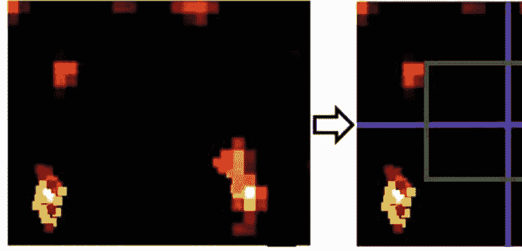

图1。用于聚合每个划分区域的激活的空间金字塔。

# 3 实验结果

我们将深度卷积神经网络与我们提出的K-support空间池化策略应用于开放的ICIP2013 HEp-2数据集[21]，该数据集包括中间和正强度类型。这个HEp-2数据集主要包括以下六种染色模式，每个类别分别显示了正强度和中间强度类型的可用图像数量（括号内）：均匀（1087，1407）；斑点状（1457，1374）；核仁（934，1664）；着丝点（1387，1364）；高尔基（943，1265）；核膜（347，377）。共有10000多张图像，每张图像显示一个单个细胞，这些图像是通过裁剪细胞的边界框从83个训练IIF图像中获得的。图2的上部分显示了所有六种染色模式的正强度和中间强度类型的示例图像。

由于我们使用Caffenet架构作为我们深度卷积神经网络的基本模型，然后有五个卷积层。我们将第三、第四和第五个卷积层的特征图视为编码向量图，类似于BOW模型，并利用空间金字塔池化（SPP-net）的策略，而不是最大池化策略。此外，我们将特征图等分为四个（2×2）等大小的网格区域，添加中心区域和全局区域，如图1所示。在实验中，我们将每个类别的HEp-2细胞图像随机分成五组，分别用于正样本和中间类型，然后从所有类别中选择四组作为训练集，其余的作为测试集。这个过程重复五次，并计算平均准确率作为最终性能指标。在我们提出的通用空间池化策略中，有一个参数K，它表示在定义的区域中具有前K个最大激活值的位置。我们设置不同的K来提取深度图像表示，并简单地应用SVM浅层模型进行分类。图3给出了在三个卷积层上的比较结果。从图3可以看出，我们提出的池化策略可以提高不同层次的分类准确性，或者至少达到可比较的结果。表1显示了我们提出的方法在没有数据增强的情况下与Gao等人[18]的无数据增强CNN和[22]中使用的特征进行比较的分类准确性，表明我们提出的方法即使没有数据增强也可以实现更好和可比较的性能。由于[18]只学习了一个通用的分类模型用于正类型和中间类型的分类，表1中的分类结果[18]是两种类型的准确性。

表1.使用我们提出的策略、[22]中使用的特征和[18]中的CNN框架进行比较的结果。

| % | GLRL | SGLD | Laws | CNN [18] | CNN+数据增强 [18] | 我们的 |
| --- | --- | --- | --- | --- | --- | --- |
| 正样本 | 84.91 | 90.81 | 97.90 | 89.04 | 97.24 | **98.41** |
| 中间 | 49.96 | 58.45 | 90.49 | * | * | **96.29** |

# 4 结论

本研究提出了一种用于HEp-2细胞分类的K-support空间池化策略。传统的CNN需要固定大小的图像作为输入，这可能导致输入图像的结构变形。因此，SPP-net被提出来处理任意大小的输入图像。然而，SPP-net通常利用最大池化策略来聚合预定义空间区域内特定神经元的所有激活状态，只取最大激活值，这只保留了最强的激活模式，并完全忽略了激活模式的频率：这是识别不同类型图像的重要特征。因此，本研究通过整合特定神经元相对激活模式的最大激活幅度和响应幅度，探索了一种称为K-support空间池化的广义空间池化策略在深度CNN中的应用。使用提出的K-support空间池化的深度CNN应用于HEp-2细胞分类，并与最先进的方法相比取得了有希望的性能。

致谢。本文基于由新能源和工业技术发展机构（NEDO）委托的项目所获得的结果，并得到了日本教育、科学、文化和体育部的科学研究补助，补助号码为15H01130、15K00253、26330212和25280044，以及国家车辆NVH和安全性关键实验室的开放基金项目（NVHSKL-201414）的支持。

# 参考文献

-   1. Conrad, K., Schoessler, W., Hiepe, F., Fritlzer, M.J.: 自身免疫性疾病中的自身抗体。 Pabst Science Publishers, Lengerich (2002)
-   2. Perner, P., Perner, H., Muller, B.: 用于HEp-2细胞图像分类的知识挖掘。 J. Artif. Intell. Med. 26, 161–173 (2002)
-   3. Nosaka, R., Fukui, K.: 使用局部二值模式的旋转不变共现特征对Hep-2细胞进行分类。 Pattern Recogn. 27(7), 2428–2436 (2013)
-   4. Qi, X., Xiao, R., Guo, J., Zhang, L.: 一对一的旋转不变共现局部二值模式。 In: Fitzgibbon, A., Lazebnik, S., Perona, P., Sato, Y., Schmid, C.(eds.) ECCV 2012, 第六部分. LNCS, vol. 7577, pp. 158–171. Springer, Heidelberg (2012)
-   5. Lazebnik, S., Schmid, C., Ponce, J.: 超越特征包： 用于识别自然场景类别的空间金字塔匹配。 In: IEEE计算机视觉与模式识别会议论文集, 纽约, 美国,vol. 2, pp. 2169–2178, 2006年6月
-   6. Lowe, D.: 尺度不变关键点的独特图像特征. 计算机视觉国际期刊 60(2), 91–110 (2004)
-   7. Dala, N., Triggs, B.: 用于人体检测的方向梯度直方图. 在:计算机视觉与模式识别 (CV PR 2005), vol. 1, pp. 886–893 (2005)
-   8. Larsen, A.B., Vestergaard, J.S., Larsen, R.: 使用环形空间池化的形状指数直方图进行HEp-2细胞分类. IEEE医学成像交易33(7), 1573–1580 (2014)
-   9. Haralick, M.R., Shanmugam, K., Dinstein, I.: 图像分类的纹理特征. IEEE系统人类与控制交易 **SMC-3(6)**, 610–621 (1973)
-   10. Thibault, G., Angulo, J., Meyer, F.: 用于纹理特征描述的高级统计矩阵: 应用于细胞分类. IEEE生物医学工程交易 **61** 630–637
-   11. Bengio, Y., Courville, A., Vincent, P.: 表示学习：综述与新视角. IEEE Trans. Pattern Anal. Mach. Intell. **35**, 1798–1828 (2013)
-   12. Krizhevsky, A., Sutskever, I., Hinton, G.E.: 使用深度卷积神经网络的Imagenet分类. In: 第二十六届神经信息处理系统年会论文集, Lake Tahoe, 纽约, 美国, pp. 1097–1105,2012年12月
-   13. Sermanet, P., Eigen, D., Zhang, X., Mathieu, M., Fergus, R., LeCun, Y.: OverFeat: 使用卷积网络的综合识别、定位和检测. In: 国际学习表示会议论文集, CBLS, Banff, AL, 加拿大,2014年4月
-   14. Simonyan, K., Zisserman, A.: 面向大规模图像识别的深度卷积网络。 在：国际学习表示会议论文集，美国加利福尼亚州圣地亚哥，2015年5月。
-   15. Razavian, A.S., Azizpour, H., Sullivan, J., Carlsson, S.: CNN特征即插即用：一个惊人的识别基准。 在：IEEE计算机视觉与模式识别会议论文集，美国俄亥俄州哥伦布，2014年6月，第512-519页。
-   16. Fan, H., Xia, G.-S., Jingwen, H.: 将深度卷积神经网络迁移到高分辨率遥感图像的场景分类中。 遥感学报，第7卷（第11期），14680-14707页，2015年。
-   17. Jia, Y., Shelhamer, E., Donahue, J., Karayev, S., Long, J., Girshick, R., Guadarrama, S., Darrell, T.: Caffe: 用于快速特征嵌入的卷积架构。 在：ACM国际多媒体会议论文集，奥兰多，美国佛罗里达州，2014年11月
-   18. 高志明，张建军，周立平，王磊：使用卷积神经网络进行HEp-2细胞图像分类。 在：第一届间接免疫荧光图像模式识别技术研讨会（I3A），第24-28页（2014年）
-   19. 李宏伟，张建刚，郑伟生：HEp-2细胞分类的深度卷积神经网络：跨样本分析，CoRR，卷abs/1604.05816（2016年）。 http://arxiv.org/abs/1604.05816
-   20. 何凯明，张翔，任少卿，孙剑：深度卷积神经网络中的空间金字塔池化用于视觉识别。 在：Fleet, D., Pajdla, T., Schiele, B., Tuytelaars, T.（编）ECCV 2014，第三部分。LNCS，卷8691，第346-361页。Springer，Heidelberg（2014年）
-   21. Foggia, P., Percannella, G., Soda, P., Vento, M.: 基于HEp-2细胞的分类方法基准测试。IEEE Trans. Med. Imaging **32(10)**, 1878–1889 (2013)
-   22. Agrawal, P., Vatsa, M., Singh, R.: HEp-2细胞图像分类的比较分析. In: Wu, G., Zhang, D., Shen, D., Yan, P., Suzuki, K., Wang, F. (eds.) MLMI 2013. LNCS, vol. 8184, pp. 195–202. Springer, Heidelberg (2013)

## 具有双学习架构和融合的稳健的3D器官定位

Xiaoguang Lu(✉), Daguang Xu, 和 David Liu
医学成像技术，西门子医疗解决方案公司，
新泽西州普林斯顿，美国
xiaoguang.lu@siemens.com

摘要。 我们提出了一种在存在大量解剖和上下文变化的情况下从3D体积中定位器官的强大算法。3D空间搜索空间被分解为两个组成部分：切片和像素，两者都在2D空间中建模。对于每个组件，我们采用不同的学习架构，以利用在三个正交方向上的全局和局部上下文的建模能力。与基于学习的目标检测算法中的传统基于补丁的扫描方案不同，应用了沿每个方向的切片扫描，这显著减少了模型评估的数量。通过融合方案将从三个方向和不同学习架构获得的目标搜索证据整合起来，以确定目标器官的位置。

使用499个患者CT体扫描进行的实验显示了所提出方法的前景和鲁棒性。

# 1 引言

自动化的3D器官定位在广泛的临床应用中至关重要。它提供了种子点来初始化后续的分割算法。它还可以用于视觉导航、自动窗口调整、语义标记和基于器官的病变分组。

准确定位器官仍然是一个具有挑战性的任务。从局部上下文的角度来看，器官的大小、形状和外观在患者之间存在显著的差异，尤其是在存在病理或先前手术的情况下。每个器官周围的全局上下文也存在显著的差异，尽管整个视野内的上下文（例如多个解剖器官之间的上下文）为个别器官的定位提供了线索。例如，在腹部区域，如肾脏等器官可以在很大程度上自由移动，因此导致外观上的差异。临床实践中，不同的视野大小和不同的身体部位也增加了全局外观的变化。

基于数据驱动的学习方法在目标定位任务中取得了成功，并得到了广泛应用。这类方法中的典型搜索策略使用基于扫描窗口的方案。基于注释训练模型/分类器来确定一个补丁（子体积）是目标对象的可能性。在在线测试中，将分类器应用于每个子体积，通过扫描整个体积来实现。目标位置通过整合从所有扫描的补丁收集到的证据来计算。传统的扫描窗口基于补丁的方法更适合于捕捉局部外观变化，因为其视野有限（子体积内的体素），但不适合于全局外观变化。在这个范式中，已经提出了许多方法；一些方法专注于改进分类器，而其他方法则改进扫描策略[11]，或者集成其他建模方法，如条件随机场[3]和递归上下文传播网络[12]。

另一类方法基于长距离回归和投票。在[1]中，训练了一个回归森林来找到从体素到所需解剖位置的非线性映射，该映射从体积中全局提取特征，并且被证明对于解决局部模糊是有效的。然而，[8]中已经证明，与基于补丁的分类方法相比，这种回归方法的精度不如准确，因为存在较大的上下文变化。

我们提出了一个框架，它在不使用基于补丁的扫描方案的情况下对局部和全局上下文进行建模，其中利用了两种新兴的学习架构来相互补充。我们使用卷积神经网络（CNN）[7]来捕捉全局上下文[13]，并使用完全卷积网络（FCN）[10]来捕捉局部上下文。局部上下文关注定位精度，而全局上下文有助于提高鲁棒性，如解决模糊和消除错误检测。通过概率图模型将全局上下文和局部外观信息进行集成，我们将这种学习方案称为双重学习架构。在我们的实验中，我们展示了通过明确建模和融合局部和全局上下文信息，我们的方法比现有算法更具鲁棒性并且达到了更高的准确性。除了目标位置之外，还生成了大量的正样本种子（在目标器官内），这对于后续使用图割方法进行分割等过程非常有用。此外，由于CNN和FCN都支持多标签任务，我们的算法可以推广到具有有限额外运行时间计算成本的同时多器官定位。

# 2 方法论

## 2.1 使用双学习架构进行上下文建模

器官定位任务被建模为一个概率图模型[6]，如图1所示。随机变量I表示2D图像，E表示图像I中感兴趣器官的存在（E=1）或不存在（E=0），L表示图像I中器官的位置。E和L都是隐藏变量，而I是观察变量。根据概率图模型，联合分布如下：

```
P(I, E, L) = P(L|I, E)P(E|I)P(I).
```

图1.描述图像I、图像中器官的存在（E）以及器官的位置（L）之间关系的概率图模型。从左到右：全局图像分类（切片级别），局部（像素级别）分类，以及提出的全局局部图像分类。

我们的目标是根据图像查询器官位置，即 \( P(L|I) \)。这可以表示为

```
P(L|I) = P(L, I)/P(I) = \sum_E P(I, E, L)/P(I) = \sum_E P(L|I, E)P(E|I)P(I)/P(I) = \sum_E P(L|I, E)P(E|I).
```

根据定义，对于所有有效位置， \( P(L|I, E= 0) = 0 \)，且 \( P(L = empty|I, E= 0) = 1 \)。因此

```
P(L|I) = P(L|I, E = 1)P(E = 1|I)
```

对于所有有效的像素位置，和

```
P(L = empty|I) = P(L = empty|I, E = 1)P(E = 1|I) + P(L = empty|I, E = 0)P(E = 0|I) = P(L = empty|I, E = 0)P(E = 0|I).
```

概率分布函数 \( P(E= 0或 1|I) \) 提出了一个图像分类问题。这个函数在图1(a)中描述。这通常是通过提取全局图像特征并在这些特征上训练分类器来实现的。近年来，深度神经网络在这个任务中表现出了卓越的性能。在本文中，我们使用卷积神经网络(CNN) [7]。

概率分布函数 \( P(L|I, E= 1) \) 表示像素分类任务。与 \( P(I|E) \) 相比，这是一个全局图像分类问题，而 \( P(L|I, E= 1) \) 是一个局部像素或补丁分类问题，其中补丁以像素位置L为中心。可以再次使用CNN对每个补丁进行分类，但是最近的文献表明，全卷积网络（FCN）在像素级分类方面比CNN具有优势。因此，我们采用FCN来解决这个局部图像分类问题。据我们所知，这是第一次将FCN与CNN结合在“双学习”架构中用于解决全局-局部像素分类问题。

## 具有双学习架构和融合的鲁棒的三维器官定位

虽然FCN被描述为一个局部像素分类器，但在文献中已经被用于将像素分类为多标签掩模，其中“背景”类是可能的标签之一。这意味着，我们可以直接使用FCN对所有像素进行分类，而不需要使用全局CNN分类器。然而，正如我们将在实验中展示的那样，将FCN与CNN结合使用具有显著的优势，其中FCN的有限感受野[9,15]通过CNN的响应进行补偿。这也可以从上述概率公式中看出：仅使用FCN的像素分类器将直接建模为P(L|I)，如图1(b)所示，而不考虑隐藏变量E。因此，我们的全局-局部模型比通常的仅使用FCN的分类器假设更强，后者不知道器官的存在。对于多器官定位任务[4]，该方法可以通过相同的架构进行多标签训练来扩展。

与传统目标定位中基于补丁的子窗口扫描相比，在我们的方法中，一个完整的切片（而不是子补丁）被用作一个输入样本，用于CNN和FCN。在给定体积上的在线测试中，对于每个CNN或FCN模型，通过CNN/FCN进行评估的图像样本总数是沿一个方向的切片数。

## 2.2 横断面融合和聚类

双学习架构与各自的模型沿着三个正交方向（轴向、矢状和冠状）操作，产生三个体积概率/得分图。这些图是从不同方向生成的，具有不同的图像上下文，因此对目标定位决策提供了互补信息。可以应用典型的集成方案或信息融合方法，如多数投票或求和规则[5]，以得到每个体素的综合得分。我们称这个方案为横断面融合。

在计算出合并的概率/得分图之后，进行三维连通组件分析。最大聚类的质心被计算为估计的物体位置。

# 3 实验

在所有具有专家注释的器官中，右肾是最具挑战性的器官之一[2]。我们将右肾作为我们实验中的典型案例。我们收集了450个患者的CT全身扫描，每个患者一次扫描。对于每个扫描，右肾都是手动勾画的。在训练阶段，随机选择了405个扫描进行训练，剩下的45个扫描（10%）用于验证。我们的训练数据涵盖了人口、对比度阶段、扫描范围和病理学的大量变化。轴向切片分辨率范围在0.5毫米到1.5毫米之间。切片间距从0.5毫米到7.0毫米不等。扫描范围包括腹部区域，但也可以延伸到头部/颈部和膝盖。在训练完所有模型后，我们又收集了另外49个来自临床站点的患者CT扫描进行独立测试。在这49个测试案例中，还手动勾画了右肾，以计算算法性能评估的定量测量。图2中提供了典型的测试扫描样本。

图2.测试集中的冠状切片样本。请注意与右肾相关的大范围上下文变化。红十字标志表示由提出的方法自动检测到的右肾位置。（在线彩色图）

每个CT扫描包含一堆轴向切片，用于以 \(2 \times 2 \times 2\ mm^3\) 的等各向异性分辨率重建3D体积。我们后续实验中的所有算法/模型都在这个分辨率下运行。考虑了三个正交方向（轴向、矢状和冠状）进行横断面分析。

在实验（训练和测试）中只考虑身体的右侧，因为右肾是目标对象。使用勾画的右肾的质心作为地面真实位置。基于注释生成了体积掩模，其中右肾体素被标记为1，其他背景标记为0。这个掩膜用于为FCN训练提供标签。对于CNN训练，定义了一个两类分类，即图像切片是否包含右肾。

**表1. 每个模型的训练图像数量。**

| 图像数量 | 轴向     | 矢状    | 冠状    |
| :------- | :------- | :------ | :------ |
| CNN      | 118245 | 42482 | 90559 |
| FCN      | 41276  | 25938 | 27378 |

## 具有双学习架构和融合的鲁棒的三维器官定位

切片级建模（CNN）：采用了AlexNet架构[7]，包含5个卷积层和3个全连接层。使用一个CNN模型。

**表2. 自动定位结果与真实位置之间的欧氏距离统计，分辨率为2毫米。交叉分割融合采用总和规则。CS：交叉分割融合。**

| 距离（体素） | CS-(CNN+FCN) | MSL  | CS-CNN | CS-FCN |
| :----------- | :----------- | :--- | :----- | :----- |
| 均值         | 3.9          | 12.8 | 9.1    | 9.0    |
| 标准差       | 4.7          | 10.7 | 11.4   | 23.0   |
| 中位数       | 2.3          | 10.9 | 5.4    | 1.9    |

图3.对于49个测试案例（水平轴为案例索引），计算得到的右肾位置与实际位置之间的欧氏距离，以等距2mm分辨率的体素数量表示。负距离（顶部的案例6）表示相应的定位算法没有生成任何检测结果，而该案例中的绝对距离值仅用于可视化目的。顶部：比较提出的方法（蓝色）和MSL（黄色），红色十字表示定位结果超出实际肾脏边界。底部：比较提出的方法（蓝色）、仅CNN（绿色）和仅FCN（黄色）。通过横断面融合计算得到的CNN、FCN和CNN+FCN的结果。（在线彩图）

图4.经过横断面融合后，FCN（a）和CNN（b）的模型响应示例（彩色叠加）。在三个方向上融合后呈现的响应。每个组包含一个矢状面和一个冠状面。红色箭头表示FCNs检测到的误报。CNNs响应图在同一簇上显示出较低的定位精度。通过融合两种响应，成功定位到右肾。（在线彩色图）

使用相同的学习架构为每个横截面方向训练。

像素级建模（FCN）：采用VGG-FCN8s架构[10]，这是一个端到端的网络，具有7个卷积层，5个池化层和3个反卷积层。使用相同的网络架构为每个横截面方向学习一个FCN模型。表1列出了每个模型使用的训练图像/切片数量。

为了比较，我们实现了基于3D块状扫描窗口的方法，该方法基于郑等人提出的方法[14]，并将其应用于相同的测试集。我们将其称为边缘空间学习（MSL）方法。

在表2和图3中提供了与基准数据的定量性能评估。图4展示了一个示例，演示了从双学习架构中提取互补信息的过程。

尽管所提出的方法的重点是器官定位，但器官分割是器官定位的一个典型应用案例。我们评估了我们的肾脏定位对肾脏分割准确性的影响。由于MSL方法与主动形状模型在心脏分割结果方面表现良好[14]，我们采用该方法进行右肾分割。我们的自动定位与使用基准位置相比，导致了类似的分割误差率。使用我们的自动定位结果作为分割的输入，[14]中使用的点到网格误差（以毫米为单位）的[均值、标准差、中位数、80百分位数]分别为[2.32、1.23、1.91、2.22]，而使用基准位置导致的误差率为[2.00、0.48、1.85、2.20]。

# 4 结论

我们提出了一个强大的3D器官定位算法。我们通过横截面2D建模来处理3D定位任务，利用两种学习架构来建模定位目标器官的各种上下文。通过这两种学习方案提取的上下文信息是互补的，并且被整合以提高鲁棒性。由于FCN和CNN能够学习多个目标/标签，我们的方法可以扩展为同时多器官定位。尽管实验中使用了CT全身扫描，但所提出的方法并不限于特定的成像模式。

# 参考文献

1. Criminisi, A., Shotton, J., Robertson, D., Konukoglu, E.: 用于高效CT研究中解剖检测和定位的回归森林。In: Menze, B., Langs, G., Tu, Z., Criminisi, A. (eds.) MICCAI 2010. LNCS, vol. 6533, pp. 106–117. Springer, Heidelberg (2011)
2. Cuingnet, R., Prevost, R., Lesage, D., Cohen, L.D., Mory, B., Ardon, R.: 使用随机森林在3D CT图像中自动检测和分割肾脏。In: Ayache, N., Delingette, H., Golland, P., Mori, K. (eds.) MICCAI 2012, Part III. LNCS, vol. 7512, pp. 66–74. Springer, Heidelberg (2012)
3. Farabet, C., Couprie, C., Najman, L., LeCun, Y.: 学习场景标记的分层特征。IEEE TPAMI 35(8), 1915–1929 (2013)
4. Gauriau, R., Cuingnet, R., Lesage, D., Bloch, I.: 结合全局到局部回归和置信度图的多器官定位。In: Golland, P., Hata, N., Barillot, C., Hornegger, J., Howe, R. (eds.) MICCAI 2014, Part III. LNCS, vol. 8675, pp. 337–344. Springer, Heidelberg (2014)
5. Kittler, J., Hatef, M., Duin, R., Matas, J.: 关于组合分类器的研究。IEEE TPAMI 20(3), 226–239 (1998)
6. Koller, D., Friedman, N.: 概率图模型：原理与技术。Lippincott Williams & Wilkins, Philadelphia (2009)
7. Krizhevsky, A., Sutskever, I., Hinton, G.: 使用深度卷积神经网络进行ImageNet分类。In: NIPS (2012)
8. Lay, N., Birkbeck, N., Zhang, J., Zhou, S.K.: 使用上下文集成和判别模型进行快速多器官分割。In: Joshi, S., Pohl, K.M., Wells, W.M., Zöllei, L., Gee, J.C. (eds.) IPMI 2013. LNCS, vol. 7917, pp. 450–462. Springer, Heidelberg (2013)
9. Liu, W., Rabinovich, A.C., Berg, A.C.: Parsenet: 更广泛地看到更好的 (2015). arXiv:1506.04579v2
10. Long, J., Shelhamer, E., Darrell, T.: 用于语义分割的全卷积网络。In: CVPR (2015)
11. Roth, H.R., Lu, L., Farag, A., Shin, H.C., Liu, J., Turkbey, E.B., Summers, R.M.: Deeporgan: 用于自动胰腺分割的多级深度卷积网络。In: Navab, N., Hornegger, J., Wells, W.M., Frangi, A. (eds.) MICCAI 2015. LNCS, vol. 9349, pp. 556–564. Springer, Heidelberg (2015)
12. Sharma, A., Tuzel, O., Liu, M.Y.: 用于语义场景标记的递归上下文传播网络。In: NIPS (2014)
13. Sun, Y., Wang, X., Tang, X.: 深度卷积网络级联用于面部特征点检测。In: CVPR (2013)
14. Zheng, Y., Barbu, A., Georgescu, B., Scheuering, M., Comaniciu, D.: 基于边缘空间学习和可操纵特征的三维心脏CT体积的四腔心建模和自动分割。IEEE TMI 27(11), 1668–1681 (2008)
15. Zhou, B., Khosla, A., Lapedriza, A., Oliva, A., Torralba, A.: 目标检测器在深度场景CNN中的出现。In: ICLR (2015)

## 用于显微镜图像分析的细胞分割提案网络

Saad Ullah Akram^{1,2(\boxtimes)}, Juho Kannala^3, Lauri Eklund^{2,4}, 和 Janne Heikkilä^1

^1 奥卢大学机器视觉与信号分析中心，芬兰
^2 奥卢生物中心，芬兰奥卢
^3 阿尔托大学计算机科学系，芬兰埃斯波
^4 奥卢大学生物化学与分子医学院，奥卢细胞基质研究中心，芬兰

sakram@ee.oulu.fi

摘要。准确的细胞分割对于可靠的显微镜图像分析方法的发展至关重要。由于对比度低、边界弱以及细胞连接和重叠，细胞分割是一个非常具有挑战性的问题；这导致许多模糊区域，降低了自动分割方法的性能。细胞提案提供了一种利用空间和时间上下文的有效方法，这对于许多这些模糊区域非常有帮助。然而，大多数基于提案的显微镜图像分析方法依赖于相当简单的提案生成阶段，限制了它们的性能。在本文中，我们提出了一种基于卷积神经网络的方法，它提供了细胞分割提案，可用于细胞检测、分割和跟踪。我们在组织学、荧光和相差显微镜的数据集上评估了我们的方法，并展示了它优于现有的细胞检测和分割方法。

关键词：细胞提案 · 细胞分割 · 细胞检测 · 卷积神经网络 · 深度学习

# 1 引言

在过去几十年中，显微镜自动化和光学的进步导致了捕获图像数量和分辨率的快速增长，发育生物学的单个实验产生了大量的数据。通常，所研究的过程是微妙的，为了获得生物学上有意义的定量结果，需要分析多个样本中大量的细胞。

手动进行这些分析非常低效和乏味，而且依赖于生物学家的技能水平，导致结果非常主观且往往无法重复。这些因素增加了自动化和半自动化分析方法的重要性。

最近，卷积神经网络（CNN）在多个生物医学实例级分割挑战中超过了现有方法的最新技术[5,13]。这些方法通过增加边界像素的优先级来实现在分析显微镜序列时，时间信息可以解决许多这些模糊性。细胞候选提供了一种计算效率高的方法，通过减少区域的备选假设数量来利用时间和空间上下文。到目前为止，细胞候选已被用于细胞检测[3, 4]和跟踪[2,14]。这些方法依赖于MSER [3]，超像素[14]和斑点检测[2]进行候选生成，并使用手工设计的特征对其进行评分。最近也开始应用深度学习来提出细胞候选边界框[1]，然而他们使用阈值法获得分割掩模，这些掩模并不是非常准确的，并且使用他们的方法获得其他显微镜模态的图像的分割掩模并不是一件简单的事情。

在本文中，我们提出了一种基于CNN的方法，首先使用全卷积神经网络(FCN) [1]提出细胞边界框。然后，使用第二个CNN为每个提出的边界框预测分割掩模。最近，[6]已经证明了类似思想在一般物体分割中的有效性。我们的创新贡献是：(1) 用于细胞分割提案生成的新网络，以及(2) 可以从多种显微镜模态中分割细胞的单一网络模型。我们将我们方法的提案与两种最先进的细胞检测方法的提案进行比较，并将我们的细胞检测与三种最先进的细胞分割/检测方法进行比较，并表明我们的方法在代表具有不同外观和成像条件的细胞的三个不同数据集上表现优异。

# 2 方法

我们的方法有两个阶段，在第一阶段(Sect. 2.1)中，卷积神经网络(CNN)提出细胞边界框以及它们的得分，即它们是细胞的概率。在第二阶段(Sect. 2.2)中，第二个CNN利用提出的边界框为细胞预测分割掩模。

## 2.1 提案边界框

我们的第一个网络如图1的上半部分所示，是从[1]的网络修改而来。简要地说，它在最后一个特征图中的每个像素点预测k个边界框及其得分，使用非极大值抑制方法去除重复的提案，并将剩余的N个边界框作为细胞提案返回。关于这个网络如何提出边界框[1,12]以及如何进行训练的详细信息可参考[1]。

## 2.2 提案分割

网络结构：我们的第二个网络用于预测分割掩模，如图1的下半部分所示。该网络接收图像并从第一个网络提出的边界框作为输入，并为每个边界框预测一个大小为25 × 25的分割掩模。该网络的第一部分包含八个卷积层，应用于整个图像。第二部分使用感兴趣区域（ROI）池化层[7]，从图1所示的四组特征图中提取固定大小（25 × 25）的特征图。ROI池化层使用给定特征图中边界框内的区域的自适应最大池化，提取固定大小的特征图。ROI池化的特征图被连接起来，得到每个提议的细胞边界框的大小为25 × 25 × 480的特征图。选择来自不同深度的特征非常重要，这样网络可以同时利用粗糙的高层信息来预测哪些区域属于正在分割的细胞，并利用精细的低层信息来预测细胞边界的准确定位。为每个提议的边界框提取的固定大小特征图由一个小的子网络使用，该子网络由三个卷积层组成，它从不同深度的特征中选择适当的组合，以更好地利用精细和粗糙的信息。对于每个提议的边界框，该网络输出一个大小为25 × 25的概率图，然后使用双三次插值将其调整回原始边界框大小，进行阈值处理，并使用最大连通组件作为分割掩模。

所有卷积层都使用1像素的步幅和填充来保持特征图的大小。在所有卷积层之后使用ReLU非线性函数，除了最后一层。使用与ZF模型[15]相同的局部对比度归一化层。在前八个卷积层之后使用与ZF模型[15]相同的归一化参数。所有最大池化层使用3×3的滤波器，填充为1，步幅为2，以减小特征图的大小并增加感受野。

训练：使用第一个网络提出的边界框来训练分割网络。计算这些边界框与真实边界框的重叠，并且如果交并比（IoU）大于0.5，则将这些框用于训练；否则，将忽略它们。对于每个边界框，在训练过程中使用一个25×25的二进制分割掩码作为目标输出。通过裁剪预测边界框内部的区域，使用最近邻插值将该区域调整为25×25，并将该框内最大细胞以外的所有像素标记为背景，从而获得该掩码。训练时使用的损失函数是像素级的softmax对数损失。

实施细节：为了在所有数据集上使用完全相同的网络，我们将每个数据集中的图像调整大小，使得平均细胞边界框约为25×25像素。某些数据集中的图像非常大，因此我们将这些图像分割成大小相等的较小图像，以便没有图像尺寸大于500像素，以减少GPU内存需求。由于训练图像非常少，我们使用水平和垂直翻转以及90度旋转来增加训练数据。

我们通过从均值为零、标准差为0.01的高斯分布中随机选择权重来初始化分割网络。我们在前40k次迭代中使用学习率为0.0001，然后将其降低到下一个10k次迭代中的0.00001。

## 2.3 细胞检测和分割

目前没有很多广泛使用的细胞提议生成方法，这使得我们的性能比较困难。然而，目前有一些流行的细胞分割和检测方法可以公开获取。为了与这些方法进行比较，我们使用更强的非极大值抑制来去除大部分重复的提议，并使用选定的提议（Ours-Greedy）作为我们方法的细胞检测和细胞分割。对于每个模型，我们使用在训练数据上最大化平均精度和F-score的IoU和分数阈值。由于我们使用IoU > 0，这可能导致一些像素具有多个标签，我们将这些像素分配给具有最高分数的细胞（提议）的标签。我们想指出，当使用我们的提议进行细胞检测或分割时，这些检测可以被视为一个弱基准。通过使用动态规划[3]或整数线性规划[4]，可以选择最优的提议集合来获得更好的性能。

# 3 实验

## 3.1 数据集

我们在三个数据集上评估我们的方法Fluo-N2DL-HeLa [10], PhC-HeLa [3]和 Hist-BM [8]。图2显示了每个数据集的一个样本区域，以及地面真实（GT）分割掩模和细胞标记。

Fluo-N2DL-HeLa数据集来自ISBI细胞跟踪挑战[10]，它包含两个时间序列（每个序列92帧）的荧光HeLa细胞在二维表面上培养和成像。该数据集的GT包含所有帧中的34,060个细胞的标记和4个帧中874个细胞的分割掩模。它还包括其他帧中少数细胞的分割掩模，但由于这些帧没有完全分割，我们不使用它们。该数据集的一些挑战包括：许多细胞簇，频繁的细胞分裂，低对比度，细胞大小和强度的变化。

PhC-HeLa数据集[3]包含了22个宫颈癌细胞HeLa的相位对比图像，分为2组（训练和测试）。这个数据集的GT包含了2,228个细胞的细胞标记。这个数据集的挑战包括细胞形状和大小的高度变化，缺失的细胞边界和高细胞密度。这个数据集的地面真实分割掩模是通过贪婪地选择每个地面真实标记下最大的MSER区域来获得的，其中选择的MSER区域仅包含一个细胞标记，并且与先前选择的区域和位于较小区域内的标记的重叠很小。

Hist-BM数据集[8]包含了8个不同患者的人类骨髓用Hematoxylin和Eosin染色的11张图像。这个数据集的地面真实标记包括了4,202个细胞核和模糊区域。我们将这个数据集分成两个集合，第一个集合中有前五张图像，第二个集合中有剩下的图像。对于这个数据集，我们使用多标签图割生成了地面真实分割掩模。终端边缘成本是使用细胞和背景高斯混合模型设置的，这些模型是从距离标记点半径为6的像素和距离所有标记点半径为20的像素中学习得到的。细胞被分成7组，以便相邻的细胞具有不同的标签。然后，距离标记点半径为6的像素被固定到表示该细胞标签的终端节点上，以分离与其接触的细胞。

## 3.2 评估标准

平均精度（AP）：我们使用平均精度（AP）- 精度-召回曲线下的面积 - 来评估分割提案。首先，将提议按照其分数排序，然后如果提议与任何未匹配的地面真实细胞分割掩模的交并比（IoU）> 0.5，则将其视为真正阳性（TP），否则将其视为假阳性（FP）。未匹配的地面真实细胞被视为假阴性（FN）。我们得到了一对召回（$R = \frac{TP}{TP+FN}$）和精确度（$P = \frac{TP}{TP+FP}$）在评估每个提案后的值。

F-分数（F1）：为了评估检测性能，我们使用与上述相同的标准来获得召回率（R）和精确度（P），并使用所有细胞检测结果计算F-分数（$F1 = \frac{2 \cdot P \cdot R}{P + R}$）。

SEG：我们使用SEG度量来评估分割掩模的准确性，该度量基于ISBI细胞跟踪挑战赛[10]中使用的Jaccard相似性指数。如果一个检测结果（D）包含超过目标细胞（G）一半的像素，则将其与目标细胞匹配，即 $|D \cap G| > 0.5 \cdot |G|$。对于每个目标细胞及其匹配的检测结果，使用Jaccard相似性指数计算 $J(G, D) = \frac{|D \cap G|}{|D \cup G|}$。SEG是所有GT细胞的Jaccard相似性指数的平均值，范围在0到1之间。

我们使用上述定义的SEG度量来评估提案掩码。在评估提案时，一些像素可能位于多个提案内部，因此可能有多个满足$|D \cap G| > 0.5 \cdot |G|$的提案。我们计算这些提案的Jaccard相似性指数，并将GT细胞与具有最高Jaccard相似性指数的提案进行匹配。

实施细节：所有三个数据集都按照第3.1节中描述的方式分为两组。一组用于训练方法，另一组用于测试；这对两组都重复进行。所有方法使用相同的非极大值抑制设置（IoU=0.5）来去除重复的提案。来自两组的提案被合并，按照它们的分数排序，并作为TP或FP进行评估。类似地，检测结果也被合并，并计算整个数据集的SEG和F-Score。

## 3.3 基准线

我们将我们的方法（我们的）与两种细胞提议生成方法 MSER[3,11]和 CPN[1]以及三种细胞检测和分割方法进行比较， KTH [9]， CellDetect [3]和 CPN-Greedy [1]。CPN使用了一种类似的方法我们的第一阶段用于提议细胞候选区域， CPN-Greedy使用更强的非极大值抑制从CPN提议中获取细胞检测结果。CellDetect使用MSER区域[11]作为提议，使用手工制作的特征表示每个提议，并使用结构化SVM对其进行评分。 我们使用这些评分对 MSER提议进行排序评估。 然后，CellDetect使用动态规划选择最佳的MSER区域集，并将这些选定的区域作为细胞检测结果。 KTH使用带通滤波器进行细胞分割，然后使用分水岭变换来分割细胞簇，并且最后使用跟踪来纠正分割错误。 KTH软件²在评估过程中不提供访问分割结果的功能，因此我们使用他们的分割掩模。

## 3.4 结果

图3展示了提案生成方法的精确率-召回率曲线和细胞检测方法的精确率-召回率值。 我们提出的提案的精确率-召回率曲线不仅明显高于MSER提案的曲线，甚至略高于CellDetect检测的精确率-召回率值。 对于Fluo-N2DL-HeLa数据集，CPN在除了非常高的召回率值之外，精确率都更好，但是它的召回率略低于我们的方法。 尽管CPN使用简单的阈值处理，但是它能够在IoU=0.5时获得良好的性能，因为阈值处理可以提供粗略的掩码。 对于更高的IoU值，它的性能下降，我们的方法和CPN之间的差距增大。

表1比较了我们方法的提案与其他基线方法的分割质量（SEG），并显示出我们方法的提案掩码在所有三个数据集上都比MSER和CPN的提案更好。 表1还列出了所有细胞检测方法的SEG和F-Score（检测性能）值。我们的方法在检测和分割性能上都比其他检测方法更好。 我们的方法和CellDetect在所有三个数据集上的检测和分割性能差距都很大。

| | Fluo-N2DL-HeLa | | PhC-HeLa | | Hist-BM | |
| :--- | :--- | :--- | :--- | :--- | :--- | :--- |
| | **SEG** | **F-Score** | **SEG** | **F-Score** | **SEG** | **F-Score** |
| **检测** | | | | | | |
| 我们的贪婪算法 | **0.858** | **0.969** | 0.761 | **0.932** | **0.804** | **0.828** |
| 我们的S贪婪算法 | 0.815 | 0.953 | **0.769** | 0.924 | 0.789 | 0.821 |
| CellDetect [3] | 0.734 | 0.906 | 0.717 | 0.901 | 0.682 | 0.816 |
| KTH [9] | 0.852 | 0.954 | - | - | - | - |
| CPN-Greedy [1] | 0.808 | 0.958 | - | - | - | - |
| **提议** | | | | | | |
| 我们的方法 | **0.874** | - | **0.818** | - | **0.823** | - |
| 我们的S方法 | 0.865 | - | 0.807 | - | **0.823** | - |
| MSER [3] | 0.757 | - | 0.779 | - | 0.768 | - |
| CPN [1] | 0.831 | - | - | - | - | - |

我们的方法也略微优于KTH方法，在ISBI细胞跟踪挑战赛的Fluo-N2DL-HeLa数据集上具有最佳分割性能[10]，并使用跟踪阶段来纠正分割中的错误。

我们的方法产生的细胞边界非常准确；大多数分割错误是由于（1）边界框定位错误，有时会剪切细胞的部分，以及（2）分割阶段未能忽略提议边界框中其他细胞的部分。我们尝试使用扩张的提议边界框，但性能下降，因为虽然它减少了剪切错误，但由于未能忽略其他细胞而增加了错误。我们还尝试在网络末端添加一个全连接层，它能更好地忽略其他细胞，但会产生粗糙的掩膜，并且并没有改善性能。

生物医学图像分析的两个挑战是序列之间的巨大变化和缺乏真实标签。通常，一种方法是针对特定的序列进行训练或设计，并且对于在狭窄的成像条件范围内捕获的图像效果良好。拥有一个能够适应更广泛成像设置的通用方法非常重要，因为对于正在分析的序列来说，设计或调整现有方法并不总是可行的。为了实现这个目标的一小步，我们使用所有三个数据集训练了一个单一的网络模型（Ours-S）。每个数据集使用相同数量的训练样本。这个模型在三个数据集中有稍微较低的性能，但在Fluo-N2DL-HeLa数据集上性能大幅下降。即使在这种较低的性能下，它在所有三个数据集上都优于CellDetect。

# 4 结论

在本文中，我们提出了一种基于深度学习的方法来提出细胞分割候选区，并证明它能够产生出色的结果针对三种不同的显微镜模态提出了候选区。 我们将我们的方法与最先进的细胞检测和分割方法进行了比较，并展示了我们的方法在常见评估指标上的优越性。 我们还提出了一个在所有三个数据集上训练的单一模型，并展示了其性能没有显著下降，这是令人鼓舞的，表明可以训练一个单一模型用于细胞检测和分割而不会在性能上有太大的损失。 如果这样的模型在某种相似的成像条件下进行训练，其性能甚至可能得到改善；这是我们计划在未来研究的内容。 我们还计划使用我们方法的候选区进行细胞检测和跟踪。 代码可在https://github.com/SaadUllahAkram/CellProposalNetwork找到。

# 参考文献

1.  Akram, S.U., Kannala, J., Eklund, L., Heikkil¨a, J.: 细胞提案网络用于显微镜图像分析。在: ICIP (2016)
2.  Akram, S.U., Kannala, J., Eklund, L., Heikkil¨a, J.: 使用细胞提案的联合细胞分割和跟踪。在: ISBI (2016)
3.  Arteta, C., Lempitsky, V., Noble, J.A., Zisserman, A.: 使用非重叠的极值区域学习检测细胞。 在: Ayache, N., Delingette, H., Golland, P., Mori, K. (eds.) MICCAI 2012, 第一部分. LNCS, vol. 7510, pp. 348–356. Springer, Heidelberg (2012)
4.  Bise, R., Sato, Y.: 在非重叠约束下从冗余候选区域检测细胞。IEEE Trans. Med. Imaging 34, 1417–1427 (2015)
5.  Chen, H., Qi, X., Yu, L., Heng, P.A.: DCAN: 用于准确腺体分割的深度轮廓感知网络。在: CVPR (2016)
6.  Dai, J., He, K., Sun, J.: 通过多任务网络级联实现实例感知的语义分割。在: CVPR (2016)
7.  Girshick, R.: 快速R-CNN。在: ICCV (2015)
8.  Kainz, P., Urschler, M., Schultter, S., Wohlhart, P., 等：你应该使用回归来检测细胞。 在: Navab, N., Hornegger, J., Wells, W.M., Frangi, A.F. (编) MICCAI 2015. LNCS, vol. 9351, pp. 276–283. Springer, 纽约 (2015)
9.  Magnusson, K.E.G., Jald´en, J.: 使用迭代应用维特比算法来跟踪细胞并构建细胞谱系的批处理算法。在: ISBI (2012)
10. Maška, M., Ulman, V., Svoboda, D., Matula, P., 等：用于比较细胞跟踪算法的基准。 生物信息学 30, 1609–1617 (2014)
11. Matas, J., Chum, O., Urban, M., Pajdla, T.: 从极值稳定区域中获得鲁棒的宽基线立体视觉。图像与视觉计算。 22, 761–767 (2004)
12. Ren, S., He, K., Girshick, R., Sun, J.: Faster R-CNN: 面向实时目标检测的区域建议网络。在: NIPS (2015)
13. Ronneberger, O., Fischer, P., Brox, T.: U-Net:卷积网络用于生物医学图像分割。在: MICCAI (2015)
14. Schiegg, M., Hanslovsky, P., Haubold, C., Koethe, U., et al.:图形模型用于多个分裂细胞的联合分割和跟踪。 生物信息学(2015)
15. Zeiler, M.D., Fergus, R.: 可视化和理解卷积网络。 在: Fleet, D., Pajdla, T., Schiele, B., Tuytelaars, T. (eds.) ECCV 2014, 第一部分。 LNCS, vol. 8689, pp. 818–833. Springer, Heidelberg (2014)

² http://codesolorzano.com/celltrackingchallenge/Cell_Tracking_Challenge/KTH-SE.html.

## 使用深度卷积神经网络在超声图像中进行血管检测

Erik Smistad1,2(✉) 和 Lasse Løvstakken 1

1 挪威科技大学，特隆赫姆，挪威 {erik.smistad,lasse.lovstakken}@ntnu.no 2 SINTEF医疗技术，特隆赫姆，挪威

摘要。深度卷积神经网络在图像分类问题上取得了很好的结果。本文提出了一种使用深度卷积神经网络在B模式超声图像中检测血管的新方法。自动血管检测可能在医学应用中有用，如深静脉血栓检测，麻醉指导和导管放置。所提出的方法能够实时确定图像中血管的位置和大小。从15个受试者的股骨区域手动标记了12,804个子图像。使用留一主题交叉验证，平均准确率为94.5%，与先前方法相比，该数据集上的准确率为84%，这是一个重大改进。该方法还在颈动脉数据集上进行了验证，以显示该方法可以推广到身体其他部位的血管。该数据集上的准确率为96%。

# 1 引言

超声图像中的血管分割可能在医学应用中有用，例如深静脉血栓检测[5]，麻醉指导[12]和导管放置。本研究中血管检测的目标是识别图像中血管的位置和大小。几种分割和跟踪方法需要这作为初始化[1,6]。在[12]中，引入了一种实时血管检测方法，消除了手动初始化的需要。

该方法在图像中的每个像素上使用图形处理单元（GPU）进行椭圆拟合。然而，当超声扫描仪上的用户设置（如增益）变化时，该方法在区分血管和非血管方面存在问题，并且在具有更多皮下脂肪组织的个体中存在更多的回波伪影。此外，该方法仅用于检测每个图像中的单个血管。

在本文中，我们提出使用类似的椭圆拟合方法找到血管候选区域，然后将其传递给深度神经网络分类器，该分类器确定该区域是否包含血管。由于所提出的检测方法提供了位置和大小，因此也可以用作血管分割方法，假设血管具有椭圆形状。所提出的方法还可以同时检测多个血管。

# 2 方法

下一节将介绍椭圆血管模型，该模型用于在超声图像中找到血管候选区域。为每个血管候选区域创建超声图像的子图像。深度卷积网络确定每个子图像是否为实际血管。图1概述了所提出方法的步骤。

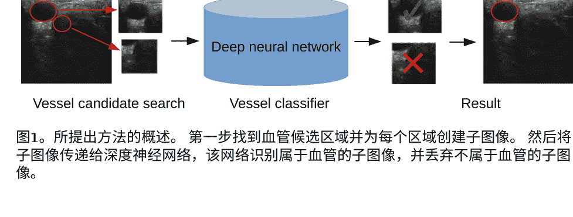

## 2.1 血管模型

每个血管被建模为一个中心为 $[c_x, c_y]$，长轴和短轴分别为 $a$ 和 $b$ 的椭圆。点 $p_i$ 和其法线 $n_i$ 在均匀分布的点 $i$ 上的椭圆上可以通过以下方程计算。

$$
\alpha_i = \frac{2\pi i}{N} \quad (1) \\
\mathbf{d}_i = [a \cos(\alpha_i), b \sin(\alpha_i)] \quad (2) \\
\mathbf{p}_i = \mathbf{c} + \mathbf{d}_i \quad (3) \\
\mathbf{n}_i = \frac{[b \cos(\alpha_i), a \sin(\alpha_i)]}{||[b \cos(\alpha_i), a \sin(\alpha_i)]||} \quad (4)
$$

## 2.2 血管候选搜索

首先，使用高斯掩模 ($\sigma=0.5$mm) 对图像进行模糊处理，然后使用中心差分方案计算图像梯度 $G$。对于给定的半径 $a$ 和 $b$，血管得分 $S$ 被计算为椭圆上 $N$ 个点处外法线 $\mathbf{n}_{-i}$ 和相应图像梯度 $G(\mathbf{p}_{-i})$ 的点积的平均值，如公式 (5) 所示。

$$S(\mathbf{c}, a, b) = \frac{1}{N} \sum_{i=0}^{N-1} \mathbf{n}_{-i} \cdot G(\mathbf{p}_{-i}) \quad (5)$$

对于每个像素，使用不同主半径 a（从3.5到6毫米），扁率因子 f（次半径 b = (1 - f) * a）和 N = 32 个样本来计算血管得分。半径增量为0.25毫米，扁率因子增量为0.1。选择每个像素的得分最高的椭圆。最佳得分和值 a、b 被存储在每个像素上。任何得分低于1.5的血管候选者都会被丢弃。这是一个低阈值，不会丢弃对比度低的血管，但也会允许一些非血管区域。接下来，根据得分从高到低对血管候选者进行排序。然后按顺序处理这些候选者，如果中心不在已接受的其他血管候选者结构内，则接受该血管候选者。任何与先前接受的血管候选者重叠的血管候选者都会被丢弃。

对于每个血管候选者，从超声图像中创建一个正方形子图像，如图1所示。血管候选者图像的示例如图2所示。血管候选者图像以血管中心 c 为中心，并由主半径 a 确定图像的大小，使得图像的宽度和高度为 $4a \times 4a$ 转换为像素。因此，该图像大小将包括血管以及一些周围组织。

## 2.3 血管分类器

所提出方法的下一步是将每个血管候选图像通过深度卷积神经网络分类器进行发送，以确定图像是否属于血管。在训练和测试分类器时，使用了 Caffe [7]作为底层框架，而血管候选搜索则使用了 FAST 医学图像计算框架[11]进行实现。

**数据：** 用于训练和验证的数据是通过首先扫描15个受试者的两条腿的股骨区域获取的，这些受试者的图像质量和超声采集设置各不相同。每隔十帧运行一次血管候选搜索步骤，并将结果图像存储在磁盘上。

这样总共得到了12,804张图像。所有图像都被调整为 $128 \times 128$，并手动分类为血管或非血管。图2展示了一些血管和非血管结构的图像示例。所使用的超声系统是 Ultrasonix SonixMDP（Analogic，美国波士顿）配备 L14-5 线性阵探头。为了增加训练数据的数量，所有血管候选图像都被水平翻转，有效地将训练数据的数量翻倍。

**网络：** 最初使用了 AlexNet [8]网络，并逐渐简化，通过删除卷积池化块和减少卷积次数，同时保持验证准确性。网络的简化主要是为了提高测试运行时速度，这对于实现实时性能非常重要。最终的血管分类网络包括两个卷积层，一个归一化层，两个最大池化层和三个全连接层。此外，使用了已经证明可以改善训练的修正线性单元（ReLU）作为非线性激活单元。

用于卷积层和全连接（FC）层。因此，包括ReLU层，网络总共由13层组成，如图3所示。此外，还使用了softmax损失层来训练网络。数据层大小固定为 $110 \times 110$ 像素。在训练过程中，从 $128 \times 128$ 的血管候选图像中随机裁剪大小为 $110 \times 110$ 的补丁，以防止过拟合。这种技术提高了约1%的准确性。从训练数据中计算出平均图像，并从输入图像中减去。第一卷积层有9个大小为 $11 \times 11$ 像素的卷积，第二个卷积层有32个大小为 $15 \times 15$ 的卷积。最大池化是在 $3 \times 3$ 的补丁上进行的。在第一卷积层之后使用了局部响应归一化（LRN）[8]，参数与[8]中相同。在全连接层上使用了dropout，概率为0.5。网络使用随机梯度下降进行训练，批量大小为128，动量为0.9，权重衰减为0.0005。基础学习率为0.01，采用sigmoid学习率衰减。

## 2.4 性能优化

超声是一种实时成像模式，通常每秒传输10-20幅图像。因此，所提出的方法必须在每个图像中找到血管，并且时间要少。

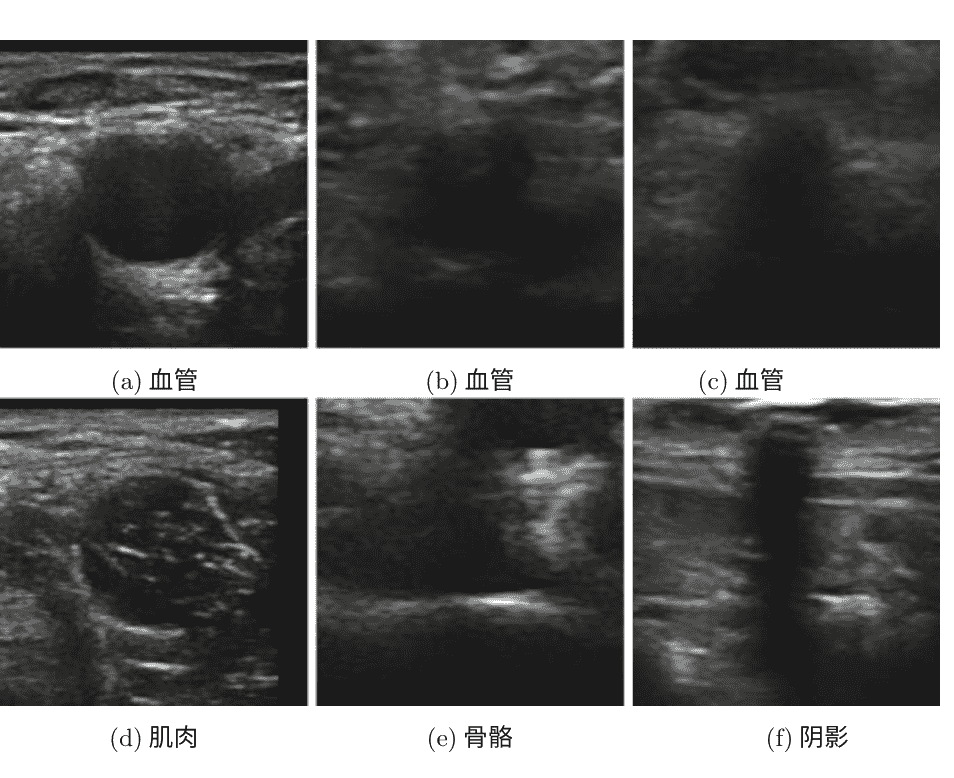

图3.血管检测网络。输入大小为 $110 \times 110$ 的固定大小图像被送入两个卷积池化阶段，分别具有9个和32个卷积。然后，通过三个具有dropout的全连接（FC）层来减少过拟合。在第一个卷积之后执行局部响应归一化（LRN）。在所有阶段中，使用修正线性单元（ReLU）作为非线性激活单元。

处理超声图像流需要不到100毫秒的时间，以实现实时处理。血管候选搜索、子图像创建和调整大小都是使用FAST框架在GPU上实现的。Caffe在GPU模式下运行，并且对于给定图像帧的所有血管候选者进行批处理，这显著提高了性能。此外，血管候选搜索仅在每四个像素上执行。

# 3 结果

图4展示了神经网络学习到的卷积。这些图表显示，第一层卷积层学习到检测水平边缘的能力，第二层学习到不同模式的水平边缘。训练好的神经网络似乎认为垂直边缘在超声图像中不重要。这似乎是合理的，因为超声图像中的垂直边缘通常较弱或缺失。

使用了留一主题交叉验证，因此有14个主题用于训练，1个主题用于验证。交叉验证的平均分类准确率为94.5%，标准差为2.9。这是使用血管分类器的softmax输出的判别阈值为0.5计算得出的。图5a展示了在股骨区域图像上进行血管检测的结果。

该数据集仅来自身体的一个区域，股动脉和静脉的股骨区域。为了查看所提出的方法在身体其他部位的泛化能力，使用了左右颈动脉的数据集。

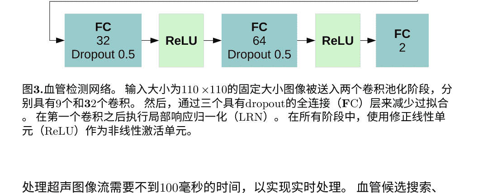

(a) 第一卷积层  (b) 第二卷积层

图4.神经网络学到的特征。第一层学到了几个水平边缘检测器，而第二卷积层学到了识别水平边缘模式的能力。

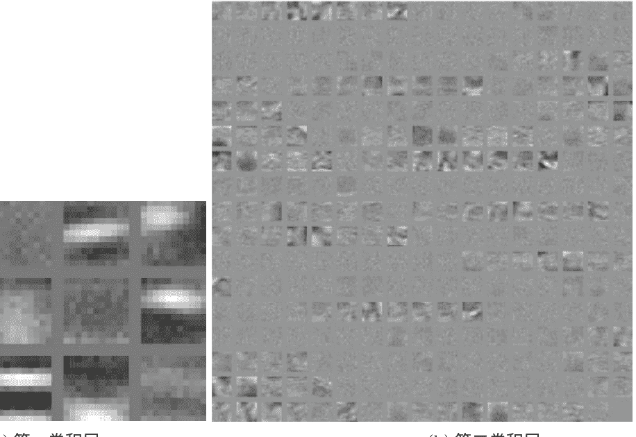

(a) 股骨区域  (b) 颈动脉

图5.两张超声图像上的血管检测结果。

动脉的验证数据来自两个受试者，而股骨区域的15个受试者的数据用作训练数据。该数据集使用了与第2.3节中描述的相同方法创建。使用这个数据，该方法达到了96%的准确率。图5b展示了颈动脉图像上的血管检测结果。

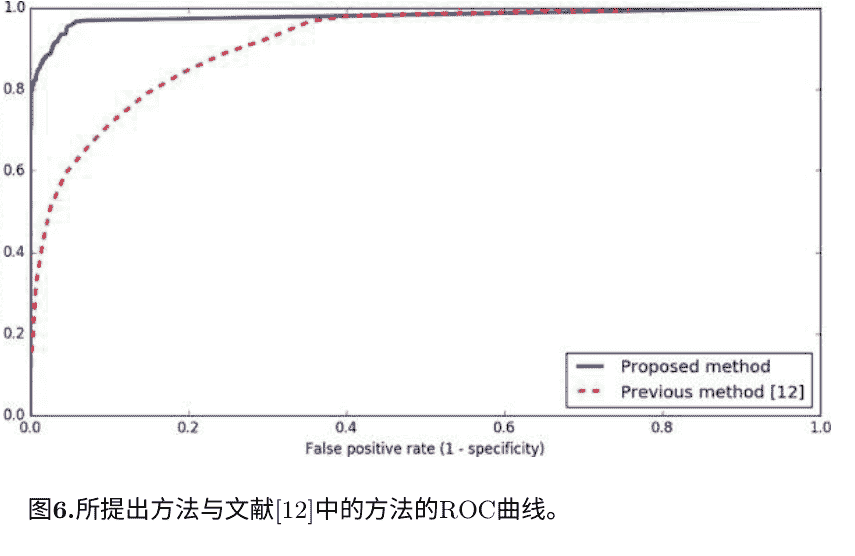

所提出的方法与另一种先进的血管检测方法[12]进行了比较。该方法在股骨区数据集上实现了84%的平均准确率。图6中的接收器操作特性（ROC）曲线显示了两种方法在相同数据集上根据不同的判别阈值的性能。

在具有8GB内存的NVIDIA GTX 980M GPU的笔记本电脑上，训练时间约为10分钟。包括血管候选搜索和血管分类在内的所有步骤的平均运行时间为46毫秒，使超声图像能够实时处理。

# 4 讨论

所提出方法中使用的血管模型假设血管是椭圆形的，虽然对于动脉来说通常是正确的，但对于经常具有更不规则形状的静脉来说可能不理想。因此，所提出的方法更适用于动脉而不是静脉。血管模型也不考虑椭圆的旋转。然而，在我们的实验中，这并不是一个问题，因为血管通常在垂直方向上被压缩，这是由用户施加的超声探头的压力造成的。在血管候选搜索中包括旋转将显著降低运行时间性能。

一个替代椭圆拟合方法的选择是使用更通用的目标检测方法，如R-CNN [3,10]。然而，这些方法更加复杂，需要手动在每个图像中的每个血管周围创建边界框，这是耗时的。使用椭圆拟合方法，用户只需为每个血管候选子图像选择“血管”和“非血管”两个类别之间进行选择。因此，提出的椭圆拟合方法有助于数据的标注。

另一种选择是使用完全卷积神经网络 [9]。这样的网络可以对每个像素进行分类。用户可以通过选择每个血管的中心来创建真实数据。使用这样的网络可能在血管的旋转和变形方面更加稳健。然而，它不会提供血管的半径和如图5所示的分割。

验证准确率为94.5%，这是与[12]中的血管检测方法相比的重大改进，后者在相同的验证数据集上准确率为84%。通过添加更多的训练数据，包括数据的时间维度与循环神经网络，以及在单独的图像通道中包含多普勒数据，可以提高准确性。在提出的网络中，权重使用标准差为0.01的高斯噪声进行初始化。无监督预训练已被证明是初始化深度神经网络权重的一种良好方法[2]。通过超声成像，可以轻松获取大量未标记的目标体区域数据。因此，我们相信无监督预训练深度网络将是超声成像中一种有用的技术。

# 5 结论

提出了一种用于超声图像的稳健实时血管检测方法。该方法使用深度卷积神经网络对子图像进行分类。尽管神经网络仅在股动脉和静脉的图像上进行了训练，但它能够推广到其他血管，如颈动脉。

# 参考文献

- 1. Abolmaesumi, P., Sirouspour, M., Salcudean, S.: 实时从超声图像中提取颈动脉轮廓。 在：第13届IEEE计算机医学系统研讨会（CBMS 2000），第181-186页。IEEE计算机学会（2000年）
- 2. Bengio, Y., Lamblin, P., Popovici, D., Larochelle, H.: 深度网络的贪婪逐层训练。 Adv. Neural Inf. Process. Syst. 19(1), 153-160 (2007)
- 3. Girshick, R.: 快速R-CNN。 在：2015年IEEE国际计算机视觉会议（ICCV），第1440-1448页。IEEE，2015年12月
- 4. Glorot, X., Bordes, A., Bengio, Y.: 深度稀疏整流神经网络。 在：第14届人工智能与统计学国际会议，第315-323页（2011年）
- 5. Guerrero, J., Salcudean, S.E., McEwen, J.A., Masri, B.A., Nicolaou, S.: 使用客观压缩度量的深静脉血栓检测系统。IEEE Trans. Biomed. Eng. 53(5), 845-854 (2006)
- 6. Guerrero, J., Salcudean, S.E., McEwen, J.A., Masri, B.A., Nicolaou, S.: 用于超声成像应用的实时血管分割和跟踪。IEEE Trans. Med. Imaging 26(8), 1079-1090 (2007)
- 7. Jia, Y., Shelhamer, E., Donahue, J., Karayev, S., Long, J., Girshick, R., Guadarrama, S., Darrell, T.: Caffe: 用于快速特征嵌入的卷积架构。 In: ACM国际多媒体会议论文集，pp. 675-678 (2014)
- 8. Krizhevsky, A., Sutskever, I., Hinton, G.E.: 使用深度卷积神经网络进行ImageNet分类。在：神经信息处理系统进展，第1097-1105页（2012年）
- 9. Long, J., Shelhamer, E., Darrell, T.: 用于语义分割的全卷积网络。在：2015年IEEE计算机视觉和模式识别（CVPR）会议，第3431-3440页（2015年）
- 10. Ren, S., He, K., Girshick, R., Sun, J.: Faster R-CNN: 实时目标检测与区域建议网络。神经信息处理进展，第91-99页，2015年6月
- 11. Smistad, E., Bozorgi, M., Lindseth, F.: FAST: 用于异构医学图像计算和可视化的框架。国际计算机辅助放射外科学杂志，第10卷（11期），1811-1822页（2015年）
- 12. Smistad, E., Lindseth, F.: 实时自动动脉分割、重建和注册用于超声引导下股神经区域麻醉。IEEE Trans. Med. Imaging 35(3), 752–761 (2016)

## 卷积神经网络用于从3T MRI中重建7T样图像，利用外观和解剖特征

Khosro Bahrami, Feng Shi, Islem Rekik, and Dinggang Shen (✉)
北卡罗来纳大学教堂山分校放射学和BRIC部门，美国北卡罗来纳州教堂山
dinggang.shen@med.unc.edu

摘要。先进的7特斯拉（7T）磁共振成像（MRI）扫描仪提供比3T更高分辨率的解剖图像，从而有助于早期诊断脑部疾病。然而，与3T MRI扫描仪相比，7T MRI扫描仪的可及性较差。这激发了我们从3T MRI重建7T样图像的动机。我们提出了一种深度架构的卷积神经网络（CNN），它使用外观（强度）和解剖（脑组织标签）特征作为输入，将3T MRI非线性映射到7T MRI。在训练步骤中，我们通过将3T块的外观和解剖特征输入CNN来训练它。这输出对应7T块中心体素的强度。在测试步骤中，我们将训练好的CNN应用于将每个输入的3T块映射到7T样图像块。

我们的性能在15个受试者上进行评估，每个受试者都有3T和7T的MR图像。视觉和数值结果都显示出我们的方法优于比较方法。

# 1 引言

磁共振成像（MRI）广泛用于辅助诊断脑部疾病。在过去的几年里，我们做出了巨大的努力来改善MR图像质量，这对于早期和更准确的基于MRI的疾病诊断是必要的。这导致了比传统的3T MRI具有更高分辨率和对比度的7T MRI。图1显示了同一受试者的线性对齐的3T和7T MR图像的轴向视图。由于更高质量的成像，7T MRI可以在更准确的诊断各种脑部疾病方面发挥潜在作用。例如，与3T MRI相比，7T MRI具有更高的分辨率和对比度，可以更好地表征皮层损伤和萎缩[1]。此外，部分体积效应（PVE）对3T MRI的影响比7T MRI更大，从而降低了MRI脑组织分割等后处理任务的准确性。然而，目前阶段，全球有大约20,000个临床中心仅配备了3T MRI扫描仪，只有少数（约40个）配备了7T MRI扫描仪，原因是费用高昂[2]。因此，一种替代方案是从3T MR图像重建类似于7T的图像，这是我们论文的主要关注点。

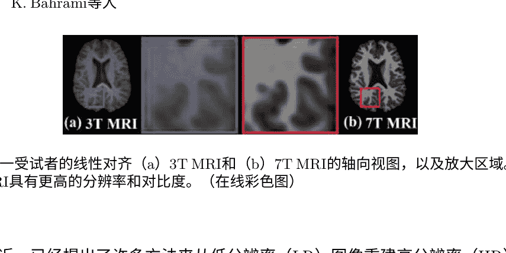

最近，已经提出了许多方法来从低分辨率（LR）图像重建高分辨率（HR）图像。其中最流行的方法之一是基于学习的方法，它使用LR和HR训练图像对。在这些方法中，首先通过LR训练图像对LR测试图像进行稀疏表示，然后将相同的表示应用于通过HR训练图像重建HR目标图像。例如，Rueda等人[3]提出了一种基于稀疏表示的方法，用于从LR脑MRI生成HR脑MRI。Burgos等人[4]提出了一种名为局部图像相似性（LIS）的方法，用于从MR图像重建CT图像。

Bahrami等人[5,6]还提出了一种基于多级CCA的从3T MRI重建7T-like图像的方法，称为M-CCA。在过去的几年里，CNN成功地被用于通过使用配对的LR和HR训练图像生成非线性映射来重建HR图像。例如，Dong等人[7]提出了一种通过学习LR和HR图像之间的端到端映射的超分辨率方法。在另一种方法中，Kulkarni等人[8]提出了一种从压缩感知中捕获的LR图像重建HR图像的方法。尽管先前方法中提出的CNN架构适用于2D自然图像的超分辨率，但它们可能不适用于3D MR图像的重建。

然而，先前方法的一个主要弱点是当测试和训练的3T MR图像来自不同的MRI扫描仪时，它们的可靠性较低。当从多个成像中心收集数据并获得具有不同质量的MR图像时，这种情况最有可能发生。由于先前的方法通常使用预定义的特征集（例如，补丁强度），使用具有不同成像质量的训练集对新的测试图像进行表示可能会受到质量不一致性的影响。为了缓解这个问题，我们提出了一种基于定制深度卷积神经网络（CNN）架构的新方法。以前，CNN已被广泛提出用于解决许多计算机视觉任务，如分类和回归，并与其他方法相比取得了显著的准确性，原因如下：（1）生成输入特征和目标值之间的非线性映射；

(2) 将多层特征表示的滤波器纳入其中；(3) 从数据中学习特征，而不需要手动设计特征。我们提出的框架在多个方面与以前的低分辨率图像重建高分辨率图像的方法有很大不同。首先，它不仅仅依赖外观特征，## 2 提出的卷积神经网络（CNN）架构

概述：考虑一个具有外观 X 和解剖特征 L 的3T MR图像。我们的目标是使用CNN学习一个映射函数 f(.)，该函数可以生成相应的类似7T图像 Y = f(X, L)，其质量与真实的7T MRI相似。具体而言，我们提出了一个包含四个层的CNN架构，如图2所示。我们四层CNN架构的详细信息在下面的章节中给出。

第一层特征图。第一层旨在学习输入3T MR图像的特征表示。设 x 和 l 为从输入3T MR图像中提取的大小为 m × m × m 的补丁的外观和解剖图。

我们网络的第一层包括 N₁ 个卷积滤波器，每个滤波器的大小为 w₁ × w₁ × w₁，后面跟着ReLU激活函数。卷积神经网络的基本组件是卷积，它将输入的图像块与核进行卷积，然后输出一个通常较小的图像块。例如，对于一个在一个维度上大小为 $m$ 的图像和一个大小为 $w_1$ 的核，输出的大小将为 $m - w_1 + 1$。除了线性卷积之外，CNN还包括由激活ReLU函数编码的非线性操作。

这对于我们提出的CNN是有益的，因为它用于通过我们的多层卷积架构从3T空间到7T空间的非线性映射估计。ReLU是一个分段线性函数，它将负输入转换为零并保留正输入，从而在网络中引入稀疏性。

第一层的输入是补丁外观x和补丁解剖特征l的连接，表示为s，而输出为y1包括N1个特征图。从数学上讲，我们的第一层架构可以表示为 $y_1 = \max(0, \text{Conv}(F_1, s) + B_1)$，其中 $F_1$ 对应于 $N_1$ 个滤波器，$B_1$ 包括 $N_1$ 个偏置值，每个偏置值与一个滤波器相关联。Conv(.)表示卷积操作，它将 $N_1$ 个滤波器应用于输入以生成输出以及 $N_1$ 个特征图，然后使用ReLU函数 $\max(0, .)$ 进行过滤。通过将第一层的 $N_1$ 个滤波器应用于输入的3T MRI，生成输出 $y_1$，具有 $N_1$ 个特征图。图3(a)显示了第一层的经过训练的卷积滤波器的一个示例，其中 $N_1 = 64$ 个过滤器和过滤器大小为 $w_1 = 7$。

第二层特征图。在这一步中，作为从3T到7T MRI的级联非线性映射的一部分，我们从第一层的输出 $N_1$ 特征图中估计第二级特征图。第二层包括 $N_2$ 个过滤器，接着进行ReLU操作。它以第一层输出的 $N_1$ 特征图作为输入，并生成 $N_2$ 个特征图。我们的第二层定义为 $y_2 = \max(0, \text{Conv}(F_2, y_1) + B_2)$，其中 $F_2$ 对应于大小为 $N_1 \times w_2 \times w_2 \times w_2$ 的 $N_2$ 个过滤器。$B_2$ 包括 $N_2$ 偏置值，每个与一个滤波器相关联。在图3(b)中，我们可视化了第二层的训练卷积滤波器，其中 $N_2 = 128$ 个滤波器和滤波器大小为 $w_2 = 5$。

第三层特征图。以类似的方式，我们从第二层的输出估计第三级特征图。这包括 $N_3$ 个滤波器，接着是ReLU，连续应用于先前估计的 $N_2$ 特征图（来自第二层）以输出新的 $N_3$ 特征图。第三层的卷积操作公式为 $y_3 = \max(0, \text{Conv}(F_3, y_2) + B_3)$，其中 $F_3$ 对应于尺寸为 $N_2 \times w_3 \times w_3 \times w_3$ 的 $N_3$ 个滤波器，$B_3$ 包括 $N_3$ 个偏置值。图3(c)显示了第三层的训练卷积滤波器，其中 $N_3 = 256$ 个滤波器，滤波器尺寸为 $w_3 = 3$。

最后一层。最后，我们将第三层的 $N_3$ 个特征图与一个大小为 $N_3 \times w_4 \times w_4 \times w_4$ 的滤波器进行卷积。然后，通过ReLU操作输出一个体素值，定义为 $y = \max(0, \text{Conv}(F_4, y_3) + B_4)$。通过这样一个深度多层的卷积神经网络结构，我们将一个大小为 $m \times m \times m$ 的输入3T MRI块映射到相应7T MRI块中心处的体素强度。

损失函数。为了自动估计网络参数，如滤波器权重和偏差，我们训练端到端的映射函数f(.)。这可以通过最小化损失来实现，损失定义为重建的7T MRI和真实的7T MRI之间的均方误差（MSE），即 MSE = (1/n) Σ_{i=1}^n ||Z_i - Y_i||^2，其中n是训练MR图像的数量，Z_i和Y_i分别表示第i个真实和重建的训练7T MR图像。使用随机梯度下降和标准反向传播来最小化损失。

# 3 实验结果

我们将我们提出的CNN与三种竞争方法进行了比较，包括直方图匹配、局部图像相似性（LIS）[4]和M-CCA [5]。直方图匹配方法被用作基准方法，直接将3T MR图像的直方图匹配到7T MR图像的直方图。

我们使用LIS [4]作为比较方法，该方法使用补丁相似性进行重建。我们还将其方法与M-CCA [5]进行比较，因为它基于多级CCA空间中的稀疏表示，通常优于传统的稀疏表示方法。

数据和预处理：我们使用了一个包含15对3T和7T MRI的数据集。该数据集包括5个健康受试者、8个癫痫患者和2个MCI患者，这些受试者使用3T MRI和7T MRI扫描仪进行扫描。这些MR图像都经过线性对齐和去除颅骨以去除非脑区域。3T和7T MR图像的分辨率分别为1×1×1 mm³和0.65×0.65×0.65 mm³。

实验设置：我们使用MatConvNet实现CNN架构。为了生成从3T MRI到7T MRI的映射，我们使用一个大小为15×15×15的块。对于CNN，我们从第一层到最后一层使用的滤波器大小分别为w₁=7，w₂=5，w₃=3和w₄=3。此外，我们考虑N₁=64，N₂=128，N₃=256和N₄=1个滤波器。对于CNN训练，我们提取重叠的块，重叠区域为1个像素。为了评估我们提出的方法，我们设计了两个实验。在第一个实验中，我们只考虑块的外观作为学习我们提出的CNN的输入；而在第二个实验中，我们考虑了补丁的外观和解剖特征，以提供更丰富的信息用于CNN学习。我们使用广泛使用的FSL软件包中的FAST方法进行组织分割，生成解剖特征。同样地，对于LIS和M-CCA方法，我们也考虑了3T MRI补丁的外观和解剖特征，以展示解剖特征在改善每种方法性能方面的贡献。为了评估，我们使用一种留一法交叉验证，将一对3T MRI和7T MRI用于测试，其余14对用于训练。

数值结果：在这个实验中，我们通过考虑以下两种情况，以峰值信噪比（PSNR）来数值比较我们提出的方法与其他三种竞争方法：

- (1) 训练和测试3T MR图像具有相同的质量。在这种情况下，我们使用15对3T和7T MR图像的原始分辨率数据集，因此测试和训练3T MR图像具有相同的质量。表1比较了我们提出的方法和其他三种竞争方法在15次留一法交叉验证中的平均PSNR。为了评估使用解剖特征的影响，我们独立考虑了（1）外观特征和（2）外观特征和解剖特征对于LIS、M-CCA和我们提出的方法。与其他三种竞争方法相比，我们提出的方法具有更好的重建结果。此外，这些结果还清楚地显示了使用解剖特征在改善7T MRI重建中的重要性。

- (2) 使用不同质量的3T MR图像进行训练和测试。在实际应用中，测试和训练的3T MR图像的质量可能不同，特别是如果它们是使用不同的成像协议和扫描仪进行扫描的。在这个实验中，我们通过改变测试和训练的3T MR图像的质量来模拟这种情况；这样，测试图像将与训练集具有不同的图像质量。我们绘制了两种模拟场景：第一种只重新采样测试图像，而第二种只重新采样训练图像。我们考虑两种不同的重新采样率来改变质量：

表1.使用15个留一法交叉验证的平均PSNR比较我们提出的方法和三种竞争方法。还比较了使用外观特征或外观特征和解剖特征的两种情况。

| 方法 | 直方图-匹配 | LIS | LIS | M-CCA | M-CCA | 提出的 | 提出的 |
|------|-------------|-----|-----|-------|-------|--------|--------|
| 特征 | 外观 | 外观 | 外观+解剖 | 外观 | 外观+解剖 | 外观 | 外观+解剖 |
| 平均PSNR | 21.1 | 23.9 | 24.3 | 25.0 | 25.4 | 25.9 | 26.5 |

- 重采样率为2。在第一个模拟场景中，我们对测试的3T MR图像进行2倍重采样（即降采样2倍，然后上采样2倍），以降低3T MR图像的质量。通过这样做，降采样减少了体素的数量，同时丢失了图像细节，而上采样通过对现有体素进行插值增加了体素的数量，但不会恢复丢失的信息。

图4(b)比较了不同方法在15个留一法案例中的PSNR结果。实验结果表明，在重新采样后，三种竞争方法的重建性能显著下降，而我们提出的方法仍然能够实现良好的重建质量并恢复一些失去的解剖细节，从而表明其对图像质量变化的鲁棒性。

这可以通过两个事实来解释。首先，我们使用各种CNN滤波器从3T磁共振图像中提取许多特征，从而获得低频和高频特征，增加了对图像质量变化的鲁棒性。其次，通过进一步结合解剖特征（除外观特征之外），我们提出的CNN对3T磁共振图像的分辨率和质量依赖较小。在第二个模拟场景中，我们以2倍的因子重新采样训练3T磁共振图像。图4(c)比较了不同方法的结果。

与先前的方法相比，我们的方法在PSNR方面表现出更强的鲁棒性。

- 重新采样率为3。 在这个实验中，我们通过将测试和训练3T MR图像重新采样3倍来进一步降低质量。 图4(d)和(e)比较了不同方法在15次交叉验证中，对于测试和训练3T MR图像重新采样的结果的PSNR。 显然，在质量极差的情况下，我们提出的方法仍然优于其他三种竞争方法。 此外，我们在图5中比较了我们方法在三种情况下的结果：(1) 无重新采样； (2) 重新采样因子为2；(3) 重新采样因子为3，分别用于测试和训练图像。 结果表明，通过增加重新采样率，我们的方法的性能并没有显著下降。

可视化结果：在图6中，我们通过我们的方法和其他三种竞争方法来可视化重建结果。 值得注意的是，我们重建的7T样式图像更接近真实的7T MRI。此外，我们的结果包含更好的解剖细节，这些细节在竞争方法的重建中没有恢复出来。

# 4 结论与讨论

在本文中，我们提出了一种新颖的深度卷积神经网络（CNN）架构，用于从3T MR图像中重建7T样式图像，通过利用MR图像的外观和解剖特征。此外，与其他三种竞争方法相比，我们的方法在测试和训练3T MR图像的不同成像质量情况下表现更加稳健。此外，实验结果显示，通过15对3T和7T MR图像，我们提出的方法能够恢复更多的结构细节。

需要提到的是，我们使用重新采样来模拟不同分辨率的测试和训练图像进行初始实验。当然，要声称对不同扫描仪的鲁棒性需要使用实际不同扫描仪进行获取，这是本文的扩展部分。由于基于这个模拟，我们的方法比其他方法更具鲁棒性，因此在实际扫描时可能比以前的方法更好，这将成为我们未来的工作。

值得注意的是，FAST方法生成的脑组织标签在表示不同组织方面是有用的，它与外观特征一起用于改善类似7T的图像重建。然而，在解剖特征不能完美地表示不同组织的情况下，我们的重建结果可能会下降，但仍然比仅使用外观特征要好。

# 参考文献

- 1. Kolka, A.G., Hendriksea, J., Zwanenburg, J.J.M., Vissera, F., Luijtena, P.R.: 临床应用7T MRI在大脑中。欧洲放射学杂志 82, 708–718 (2013)
- 2. DOTmed每日新闻 (2012). www.dotmed.com/news/story/17820
- 3. Rueda, A., Malpica, N., Romero, E.: 使用过完备字典的单图像超分辨率脑MR图像。医学图像分析 17, 113–132 (2013)
- 4. Burgos, N., Cardoso, M.J., Thielemans, K., Modat, M., Pedemonte, S., Dickson, J., Barnes, A., Ahmed, R., Mahoney, C.J., Schott, J.M., Duncan, J.S., Atkinson, D., Arridge, S.R., Hutton, B.F., Ourselin, S.: 用于混合PET-MR扫描仪的衰减校正合成：应用于脑部研究。IEEE Trans. Med. Imag. 33(12), 2332–2341 (2014)
- 5. Bahrami, K., Shi, F., Zong, X., Shin, H.W., An, H., Shen, D.: 使用多级CCA和群稀疏性进行从3T MRI重建7T样图像的分层重建。MICCAI, 第1-8页 (2015)
- 6. Bahrami, K., Shi, F., Zong, X., Shin, H.W., An, H., Shen, D.: 从3T MRI重建7T样图像。IEEE Trans. Med Imag. 35(9), 2085–2097 (2016)
- 7. Dong, C., Loy, C., He, K., Tang, X.: 使用深度卷积网络进行图像超分辨率。IEEE Trans. Pattern Anal. Mach. Intell. 38(2), 295–307 (2016)
- 8. Kulkarni, K., Lohit, S., Turaga, P.K., Kerviche, R., Ashok, A.: ReconNet: 从压缩感知的随机测量中非迭代地重建图像。arXiv:1601.06892 (2016)
- 9. Zhang, Y., Brady, M., Smith, S.: 基于马尔可夫随机场模型和期望最大化算法的脑MR图像分割。IEEE Trans. Med.Imag. 20(1), 45–57 (2001)

## 快速预测图像配准

Xiao Yang^{1}(\boxtimes), Roland Kwitt^{3}, and Marc Niethammer^{1,2}

1 北卡罗来纳大学教堂山分校计算机科学系，美国教堂山
xy@cs.unc.edu
2 北卡罗来纳大学教堂山分校生物医学研究成像中心，美国教堂山
3 萨尔茨堡大学计算机科学系，奥地利萨尔茨堡

摘要. 我们提出了一种基于图像块外观的图像变形预测方法。具体而言，我们设计了一个基于图像块的深度编码器-解码器网络，该网络学习了像素/体素级别的图像外观与配准参数之间的映射关系。我们的方法可以预测一般的变形参数化，但我们专注于大变形迪弗映射(LDDMM)配准模型。通过预测LDDMM动量参数化，我们保留了LDDMM的理论特性，同时将计算时间减少了数个数量级：结合图像块修剪，我们在2D/3D图像配准中实现了1500倍/66倍的加速，相比于基于GPU的优化算法。我们的方法比预测变形或速度场具有更好的预测准确性，并且产生了迪弗映射变换。此外，我们创建了一个贝叶斯概率版本的网络，通过在测试时使用dropout进行蒙特卡洛采样，可以评估变形场的不确定性。我们展示了变形不确定性突出了模糊变形的区域。我们在OASIS脑图像数据集上进行了2D和3D测试。

# 1 引言

图像配准是一项关键的医学图像分析任务，用于提供空间对应关系。一个重要的应用是基于图谱的图像配准，通常用于图谱分割或人群分析。图像配准通常被视为一个优化问题，对于非参数扩散、弹性或流体模型[11]（如LDDMM [1]）来说，这可能尤其需要大量的计算。最近，已经提出了一些预测配准参数的方法：生成的变形可以直接使用（i）或用于初始化优化器（ii）。然而，高参数维度和图像外观与配准参数之间的非线性关系使得预测变得具有挑战性。Chou等人[3]提出了一种多尺度线性回归器，该回归器仅限于预测仿射变换和非刚性变形的低秩近似。对于复杂的可变形配准，Wang等人[17]使用稀疏学习和基于径向基函数的图像-模板关键点匹配，并通过插值得到密集的变形场。

使用半耦合字典学习技术来共同建模图像外观和变形参数；然而，仅假设图像外观和变形参数之间存在线性关系，这是过于限制性的。

光流[4,18]和仿射变换[10]已通过深度学习计算。在这里，我们探索了一个用于非参数图像配准的像素/体素级参数预测的深度学习回归模型。

贡献。方便的参数化：使用动量参数化进行LDDMM shooting [16]，我们保留了基于补丁预测的LDDMM的数学特性，例如，我们保证了微分同胚变换。快速计算：使用大步长和补丁修剪的滑动窗口来预测动量，与直接优化方法相比，我们实现了显著的加速，同时保持高预测准确性。

基于图谱的公式：与通用光流方法相比，我们使用基于图谱的视角。这使我们能够在一个固定的图谱坐标系中预测动量，从而在一个一致的切线空间内进行预测。不确定性量化：我们提供了一个贝叶斯模型，可以得到参数不确定性和变形图不确定性的估计。

这些信息可以用于基于不确定性的平滑处理[13]、手术治疗计划或直接不确定性可视化。

组织。第2节回顾了LDDMM的注册参数化。第3节介绍了我们的网络结构和加速变形预测的策略。第4节介绍了来自OASIS [9]脑图像数据集的2D和3D脑图像的实验结果，并讨论了我们方法的普适性，以及可能的改进和扩展。

## 2 初始动量LDDMM参数化

给定源图像 $S$ 和目标图像 $T$，一个时变形变图 $\phi: \mathbb{R}^d \times \mathbb{R} \rightarrow \mathbb{R}^d$，将 $S$ 和 $T$ 的坐标映射到 $t=1$ 时的位置，即 $S(\phi^{\wedge,-1}(x, 1)) = T(x)$，其中 $d$ 表示空间维度。在 LDDMM shooting 公式[16]中，初始动量向量场 $m_0$ 是注册参数，可以从中计算出 $\phi$ (和 $\phi^{\wedge,-1}$)。事实上，通过积分测地线方程(2)，可以确定完整的时空变换 $\phi(x, t)$。初始动量是初始速度 $v_0$ 的对偶，它是再生核希尔伯特空间 $V$ 中的元素，它们通过正定的自伴平滑算子 $K$ 相连，即 $v = K m$ 和 $m = L v$，其中 $K = L^{\wedge,-1}$。LDDMM 的 shooting 公式的能量[14,16]是：

$E(m_0) = \langle m_0, K m_0 \rangle + \frac{1}{\sigma^2} \| S \circ \Phi^{-1}(1) - T \|^2$，满足条件 (1)$$
m_t + \text{ad}^*_v m = 0, \\
m(0) = m_0, \\
\Phi_t^{-1} + D\Phi_t^{-1} v = 0, \\
\Phi^{-1}(0) = \text{id}, \\
m - Lv = 0.
$$

其中 $\text{id}$ 是恒等映射，$\text{ad}^*$ 是负 Jacobi-Lie 括号的对偶的：$\text{ad}_v w = Dvw - Dvv$，$D$ 表示 Jacobian，$\sigma > 0$。我们的目标是在以 patch 为单位的方式下，预测初始动量 $m_0$，给定源图像和目标图像。我们将在第 4 节中展示，这是一个方便的参数化方式，因为 (i) 动量不需要平滑，而是在图像边缘上紧凑支持，(ii) 速度通过 $K$ 对动量进行平滑得到。因此，在预测步骤中不需要考虑平滑性，但在预测之后进行施加。$K$ 控制着 LDDMM 的理论性质：特别是，足够强的 $K$ 可以保证微分同胚变换 $\Phi[1]$。因此，通过预测 $m_0$，我们保留了 LDDMM 的理论性质。此外，在均匀图像区域中，以 patch 为单位预测 LDDMM 的其他参数化方式，如初始速度，或直接预测位移，是困难的，因为这些区域没有提供任何信息来指导配准。由于这些区域的动量为零$^2$，因此不会出现这些问题。

# 3 网络结构

图 1 显示了我们初始动量预测网络的结构。我们首先讨论了没有 dropout 层的确定性版本，然后介绍了使用 dropout 的概率网络。我们将讨论重点放在 2D 图像上，以简化符号表示，但也通过使用体素层和为第三维度添加额外解码器来实现和实验 3D 网络。

## 3.1 确定性网络

在网络的 2D 版本中，输入是一个两层的 $15 \times 15$ 图像块，其中两层来自固定图像和移动图像，分别在相同位置拍摄，并且网络输出是 $x$ 和 $y$ 方向的初始动量预测图像块。我们的网络由两部分组成：编码器和解码器。在编码器中，我们使用 VGG 风格的 [12] 网络，包括两个由三个 $3 \times 3$ 卷积层和 PReLU [7] 激活函数（$\blacksquare$）组成的块，以及每两个块之后带有步长为 2 的 $2 \times 2$ 最大池化层（$\blacksquare$）。卷积层中的特征数量对于大图像尺度块为 128，对于较小的尺度块为 256。解码器包含两个并行解码器，共享由编码器生成的输入；每个解码器的结构是反向的。

对于基于图像的 LDDMM [1, 6]，动量是 $m = \lambda \nabla I$，其中 $\lambda$ 是一个标量值的动量场，$I$ 是图像。因此，在 $I$ 的均匀区域中，$m = 0$。

编码器的结构与之前的相同，只是使用了最大非池化层与池化层的索引，并且最后没有非线性层。非池化层有助于保留图像边界细节，这对于初始动量预测很重要。在训练过程中，我们使用$L_1$差异来评估网络输出。为了计算整个图像的动量预测，我们使用滑动窗口和重叠区域的块平均。我们使用两个（三个）独立的解码器来预测2D（3D）中的初始动量，实验证明这样的网络结构比一个大的解码器同时预测所有维度的初始动量要容易训练。在我们的实验中，这样的组合网络很容易陷入较差的局部最小值。我们的独立解码器网络可以看作是一个多任务网络，每个解码器预测单个维度的初始动量。

## 3.2 使用Dropout的贝叶斯概率网络

我们通过使用Dropout将我们的网络扩展为贝叶斯概率网络[15]。这可以被视为对具有伯努利分布的网络权重的贝叶斯网络的近似变分推断[5]。给定一个2层图像块$X$和相应的初始动量块$Y$，我们确定卷积层的权重$W$，以便给定输入$X$，我们的网络很可能生成目标输出$Y$。我们通过$L_1$差异定义网络输出的似然度$p(Y|W, X)$。我们的目标是找到权重$W$的后验概率，即$p(W|Y, X)\propto (p(Y|W, X)p(W))/p(Y)$，其中$p(W) \sim \mathcal{N}(0, I)$是$W$的先验，而$p(Y)$是常数。由于这个后验通常是未知的，我们使用变分后验$q(W)$通过最小化Kullback-Leibler（$KL$）散度$D_{KL}(q(W)||p(W|X, Y))$来近似真实后验。当在卷积层使用Dropout时，第$i$个卷积层的变分后验$q(W_i)$可以用$K_i \times K_i$的权重矩阵表示[5]。

```

q(W_i) = W_i \cdot \text{diag}([z_{i,j}]_{j=1}^{K_i}), \quad z_{i,j} \sim \text{Bernoulli}(p), \tag{3}
```

其中$z_{i,j}$是一个伯努利随机变量，用于模拟以概率$p_i$将第$i$层的第$j$个节点随机设置为0。变分参数是网络权重$W_i$。所有网络权重$W$的变分后验概率为$q(W) = \prod$。根据[5]，我们通过在所有卷积层之后添加dropout层来最小化KL散度，除了最后的输出层，如图1所示，并使用随机梯度下降训练网络。在测试时，我们保留dropout层，并通过对给定固定输入数据的网络进行蒙特卡洛采样来评估后验概率。我们使用样本均值作为我们的初始动量，通过积分将其与方程（2）向前计算变形。我们分别对每个初始动量样本积分方程（2）来计算变形方差。我们设置$p_i=0.3$。

$^2$研究预测标量场$\lambda$，而不是$m = \lambda\nabla I$，这只需要一个解码器，无论图像维度如何，也是很有趣的。

对于网络的确定性版本，我们只需删除所有的丢弃层。对于3D图像网络，我们增加解码器的数量到3，并使用体积层。

## 3.3 加速整个图像变形预测

由于我们逐个预测整个图像的初始动量补丁，计算速度与补丁数量成正比。我们使用两种技术来减少每个图像的补丁数量，从而提高计算速度：首先，我们通过忽略移动图像和目标图像的背景中的所有补丁来进行补丁修剪；这是可以的，因为恒定背景的初始动量应该为零。其次，我们使用大的像素/体素步长（例如，15×15补丁的步长为14）进行滑动窗口。这是合理的，因为初始动量的紧支持（围绕边缘）和池化/反池化层的平移不变性特性。这两种技术将128×128 2D图像的预测补丁/图像数量减少了99.5%，将128×128×128 3D图像的预测补丁/图像数量减少了99.97%，几乎没有损失准确性（参见第4节）。

# 4 实验

我们使用OASIS纵向数据集[9]的2D（128×128）和3D（128×128×128）图像来评估我们的方法。我们使用所有受试者的第一次扫描，共150张图像。在仿射配准后，从3D图像的同一轴向切片中提取2D切片。我们随机选择100张图像作为训练目标图像，并使用剩余的50张作为测试目标。我们使用PyCA从所有训练数据中创建了2D和3D的无偏置图谱[8]，并将这些图谱作为我们的移动图像。这允许在固定（图谱）切线空间中进行动量预测。我们使用PyCA中的LDDMM-shooting结合平方强度差异来将图谱注册到所有150张图像。

## 4.1 2D 数据

对于2D实验，我们将我们的方法与半耦合字典学习（SCDL）进行比较，该方法在[2]中用于预测LDDMM的初始动量。为了比较使用不同参数化方法的变形预测准确性，我们分别训练了预测LDDMM的初始速度$v_0=Km_0$和位移场$\Phi^{-1}(1)-\text{id}$的网络。对于初始动量

表 1. 2D（顶部）和3D（底部）的测试结果。SCDL: 半耦合字典学习; D: 确定性网络; P: 概率网络; stride: 滑动窗口的步长用于整个图像的预测; velocity: 预测初始速度; displacement: 预测位移场; PR: 补丁修剪。列 $|J|>0$ 显示了变形映射的正定雅可比行列式的测试案例比例。我们的初始动量网络（以及最佳结果）以粗体显示。

| 数据百分位数 | 0.3 % | 5 % | 25 % | 50 % | 75 % | 95 % | 99.7 % | \|J\| > 0 |
| :--- | :--- | :--- | :--- | :--- | :--- | :--- | :--- | :--- |
| **2D 测试案例变形误差 [像素]** |  |  |  |  |  |  |  |  |
| 仿射 | 0.0925 | 0.3779 | 0.9207 | 1.4741 | 2.1717 | 3.4606 | 5.4585 | 不适用 |
| SCDL, 1000个字典 | 0.0819 | 0.337 | 0.8156 | 1.3078 | 1.9368 | 3.1285 | 4.7948 | 100 % |
| D, 速度, 步幅1 | 0.0228 | 0.0959 | 0.2453 | 0.4343 | 0.7354 | 1.4664 | 2.9768 | 100 % |
| D, 速度, 步幅14+PR | 0.027 | 0.1123 | 0.2878 | 0.5075 | 0.8605 | 1.75 | 3.6172 | 76 % |
| D, 位移, 步幅1 | 0.0215 | 0.0897 | 0.2332 | 0.416 | 0.7064 | 1.429 | 2.9462 | 90 % |
| D, 位移, 步幅14+PR | 0.0252 | 0.107 | 0.2786 | 0.4955 | 0.8047 | 1.7298 | 3.7327 | 0 % |
| **D, 步幅1** | 0.0194 | 0.0817 | 0.2035 | 0.3436 | 0.5618 | 1.1395 | 2.473 | 100 % |
| D, 步幅14+PR | 0.0221 | 0.0906 | 0.2244 | 0.375 | 0.6057 | 1.2076 | 2.6731 | 100 % |
| **P, 步幅1, 50个样本** | 0.0185 | 0.0787 | 0.1953 | 0.3261 | 0.5255 | 1.0745 | 2.3525 | 100 % |
| P, 步幅14+PR, 50个样本 | 0.0209 | 0.0855 | 0.2123 | 0.351 | 0.5556 | 1.1133 | 2.5678 | 100 % |
| **3D 测试案例变形误差 [体素]** |  |  |  |  |  |  |  |  |
| 仿射 | 0.0821 | 0.2529 | 0.5541 | 0.8666 | 1.2879 | 2.1339 | 3.7032 | 不适用 |
| **D, 步幅7** | 0.0128 | 0.0348 | 0.0705 | 0.1072 | 0.1578 | 0.2663 | 0.5049 | 100 % |
| D, 步幅14+PR | 0.0146 | 0.0403 | 0.0831 | 0.1287 | 0.194 | 0.351 | 0.6896 | 100 % |
| P, 步幅14+PR, 50个样本 | 0.0151 | 0.0422 | 0.0876 | 0.1363 | 0.2051 | 0.3664 | 0.8287 | 100 % |

通过积分方程 (2) 计算得到的初始动量网络的变形映射 $\varphi^{-1}(1)$，通过初始速度参数化和位移参数化计算得到的地面真实变形的像素误差的2-范数在所有像素和测试案例上的误差百分位数显示在表1中。我们观察到我们的初始动量网络在所有情况下都明显优于SCDL，并且与初始速度和位移参数化相比，在1步幅和14步幅+补丁修剪情况下都提高了预测准确性。与初始速度和位移参数化相比，我们的确定性和概率网络对补丁修剪和步幅的敏感性较小，验证了我们的假设，即基于动量的LDDMM参数化非常适用于快速预测图像配准。LDDMM配准的一个显著特点是，在足够强的正则化下，得到的变形映射 $\varphi^{-1}(1)$ 将是微分同胚的。为了评估这个属性，我们计算了变形映射的局部雅可比矩阵。假设没有坐标系翻转，一个微分同胚的 $\varphi^{-1}(1)$ 应该在每个地方都有正定的雅可比矩阵，否则会存在不可取的折叠。表1的 $|J|>0$ 列列出了具有正定雅可比矩阵的测试案例的百分比，显示我们的基于初始动量的网络在所有情况下都保留了这个属性，即使在非常大的步幅和补丁修剪情况下也是如此。然而，直接的位移预测甚至不能保证在步幅为1（包括大量局部平均）的情况下对所有测试案例进行微分同胚变换，并且在步幅为14的情况下不会产生微分同胚变换。速度预测的表现稍好，但在大步幅下也不能保证微分同胚映射，可能是由于在这种情况下对数值积分有更严格的要求。与现有的光流预测方法 [4,18] 类似，直接预测位移或速度不能编码平滑性假设或强制变换保证。我们的动量参数化通过设计来编码这些假设。图2显示了我们带有不确定性的2D变形预测的示例。预测的变形与昂贵的LDDMM优化生成的变形接近。不确定性图显示在脑室前缘和后脑皮层发生剧烈形状变化的地方存在高度不确定性，这可以在移动和目标图像中看到。

## 4.2 3D 数据

与2D情况类似，我们计算了所有测试案例中每个体素的变形误差；结果列在表1中。我们的网络对于大约99.8%的体素实现了亚体素精度。图2显示了使用我们的概率3D网络的预测变形的一个3D配准结果，使用了50个初始动量样本的均值，以及变形场的不确定性。
我们的预测能够处理大变形。与2D情况类似，不确定性图突出显示了变形剧烈和模糊的区域。

图2. 2D（顶部）和3D（底部）的测试示例。从左到右：移动（图谱）图像，目标图像，通过优化LDDMM能量得到的变形结果，使用14个步长和块修剪的概率网络中的50个样本的变形结果，以及在预测的配准结果上映射的变形在所有方向上方差的平方根作为不确定性。颜色表示不确定性的程度（红色=高不确定性，蓝色=低不确定性）。最好以彩色查看。

(彩色图在线)

## 4.3 计算速度

在Nvidia Titan X GPU上，训练一个2D网络需要9小时，训练一个3D网络需要72小时。通过使用14像素步幅的滑动窗口＋修剪补丁，我们的网络（无需重复采样）在0.19秒内预测2D图像的初始动量，在7.68秒内预测3D图像的初始动量。与基于GPU的PyCA优化相比，我们在2D/3D图像上实现了大约1500倍/66倍的加速。在步幅为1的情况下，计算成本在2D和3D中分别增加了约200倍和3000倍，导致2D/3D的运行时间约为半分钟/六小时。因此，我们的动量表示对于实现高精度的快速配准预测并保证可微分变换至关重要。

# 5 讨论

我们的模型是高效的，并且可以直接应用于许多实际的临床图像配准问题（例如，Alzheimer's疾病问题），对于参数方法（其有它的配准参数）和非参数方法，我们可以用在这些选择得到更好的预测。当然，对于参数数据这并不是特定的，使用大步长和整个补丁可能不是最佳的。未来的研究应该通过与基于优化的同样相关的预测，预测剂量图来评估准确性。

配准。对于参数化方法（具有较少的配准参数）和局部控制，例如B样条，我们可以用全连接层替换解码器。当然，对于参数局部性不能保证的方法，使用大步长和补丁修剪可能不再适用。未来的研究应该通过与基于优化的技术相比较的地标和/或分割重叠来评估配准精度。令人兴奋的扩展包括：快速的LDDMM基于多模态图像分割；多模态图像配准（其中输入补丁来自不同的模态）；直接图像到图像的配准；快速用户交互式配准细化（仅需要预测少数局部补丁）；以及多尺度补丁网络以获得更好的预测。此外，通过不确定性度量可以突出大变形或外观变化引起的模糊变形，这可以在对正常情况进行训练的网络中检测到病理问题。

# 6 支持

这项研究得到了NIH R42 NS081792-03A1，NIH R41 NS086295-01和NSF ECCS -11488870的支持。我们衷心感谢NVIDIA公司捐赠的Titan X GPU用于这项研究。

# 参考文献

1.  Beg, M.F., Miller, M., Trouvé, A., Younes, L.: 通过变形流计算大变形度量映射。IJ CV 61(2)，139–157 (2005)
2.  Cao, T., Singh, N., Jojic, V., Niethammer, M.: 半耦合字典学习用于变形预测。在：ISBI，pp. 691–694 (2015)
3.  Chou, C.R., Frederick, B., Mageras, G., Chang, S., Pizer, S.: 使用回归学习的2D/3D图像配准。CVIU 117(9)，1095–1106 (2013)
4.  Dosovitskiy, A., Fischery, P., Ilg, E., Hazirbas, C., Golkov, V., van der Smagt, P., Cremers, D., Brox, T.: 使用卷积网络学习光流。 在：ICCV，第2758-2766页 (2015年)
5.  Gal, Y., Ghahramani, Z.: 具有伯努利近似变分推断的贝叶斯卷积神经网络。arXiv:1506.02158 (2015年)
6.  Hart, G.L., Zach, C., Niethammer, M.: 一种用于可变形配准的最优控制方法。在：MMBIA，第9-16页 (2009年)
7.  He, K., Zhang, X., Ren, S., Sun, J.: 深入研究整流器：在ImageNet分类上超越人类水平的性能。CoRR abs/1502.01852 (2015年)
8.  Joshi, S., Davis, B., Jomier, M., Gerig, G.: 无偏的计算解剖学变形图构建。NeuroImage 23, 151–160 (2004年)
9.  Marcus, D.S., Wang, T.H., Parker, J., Csernansky, J.G., Morris, J.C., Buckner, R.L.: 开放获取的成像研究系列（OASIS）：年轻、中年、无痴呆和痴呆老年人的横断面MRI数据。J. Cogn. Neurosci.19 (9), 1498-1507 (2007年)
10. Miao, S., Wang, Z.J., Liao, R.: 用于实时2D/3D配准的CNN回归方法。TMI 35(5), 1352–1363 (2016)
11. Modersitzki, J.: 图像配准的数值方法。牛津大学出版社，牛津 (2004)## 使用多视角卷积神经网络进行纵向多发性硬化病变分割

Ariel Birenbaum1(✉) 和 Hayit Greenspan 2(✉)
1 以色列特拉维夫大学电气工程系，特拉维夫，以色列
birenbaum1@mail.tau.ac.il
2 以色列特拉维夫大学生物医学工程系，特拉维夫，以色列
hayit@eng.tau.ac.il

摘要。自动分割多发性硬化症（MS）病变是一项具有挑战性的任务，因为它们在磁共振（MR）图像中的形状、大小、位置和纹理上具有变异性。可靠的自动分割方法可以帮助诊断和患者随访，同时减少手动分割的耗时需求。在本文中，我们提出了一种完全自动化的MS病变分割方法。所提出的方法使用MR强度和白质（WM）先验来提取候选病变体素，并使用卷积神经网络进行假阳性减少。我们的网络处理纵向数据，在MS病变分析领域中具有创新贡献。该方法在ISBI 2015数据集上进行了测试，并获得了与经过训练的人工评分者相当的Dice结果的最新性能水平。

- 多发性硬化症
- CNN
- 分割
- 纵向数据

# 1 引言

多发性硬化症是年轻成年人中最常见的非创伤性神经疾病。它是一种与中枢神经系统中病变形成相关的炎症性脱髓鞘疾病，其特征是脱髓鞘和轴突传导阻滞。这些经典描述的白质病变在常规MRI中可见。流体抑制反转恢复（FLAIR）图像已被证明对白质病变敏感，但也可能出现其他高信号异常[1]。

由于多发性硬化症分割的挑战性质，已经组织了几个挑战，例如2008年MICCAI的多发性硬化症病变分割挑战[2]和2015年ISBI的纵向多发性硬化症病变分割挑战，参赛团队能够利用纵向信息连续的MR图像。已经提出了各种算法[3-7]。表现最好的方法基于监督分类框架。具体来说，目前在MICCAI 2008和ISBI 2015中最先进的方法是基于多阶段标签融合（MALF）与随机森林分类器相结合的区域级病变细化[7]。

卷积神经网络（CNNs）在Alex Krizhevsky的网络在2012年ImageNet分类竞赛中以较大的优势获胜后变得非常流行[8]。从那时起，CNNs已经成功地用于其他应用，如物体分割。近年来，它们也被用于医学图像分析。一个2.5D CNN，其中3D感兴趣区域被分解为轴向、冠状和矢状视图，在淋巴结检测方面实现了最先进的准确性。与3D CNN相比，这个2.5D框架减少了训练和测试的计算负担，并缓解了维度灾难问题[9]。2D和3D CNN也被提出用于MS病变的分割[5,6]。

在这项工作中，我们训练和测试了一个用于MS病变分割的纵向多视图CNN。输入是来自多个图像、多个视图和多个时间点的补丁。据我们所知，这是第一个利用纵向数据进行MS病变分割的CNN。我们在2015年ISBI挑战赛提供的数据集上评估了我们的分割方法，并在测试集上达到了最先进的Dice分数准确性。我们的方法在相对较少的图像训练下，能够达到人类水平的性能。

本文的其余部分组织如下：第2节描述了提出的方法。第3节介绍了对2015年ISBI数据集的实验评估和结果。第4节讨论了网络架构和参数选择。最后，第5节提供了结论性的评论。

# 2 方法

所提出的分割方法包括3个阶段：预处理、候选提取和CNN预测。在预处理阶段，对一组MR图像应用多个操作，包括：共注册、脑提取、偏差场校正和强度归一化。在候选提取阶段，基于FLAIR和WM先验计算并应用于MR图像的掩膜。在CNN预测阶段，多视角CNN为MR图像中的每个体素输出一个病变概率。

## 2.1 预处理

每个案例的分割算法的输入是一组MR图像：T2加权FLAIR、T1加权MPRAGE、T2加权和质子密度加权。获取的图像未注册，通常具有不同的间距和切片厚度。因此，通过将MPRAGE图像刚性注册到MNI空间并共注册其余图像，将图像转换为公共空间。

首先，对MPRAGE图像进行脑提取，并将相应的脑掩模应用于其他图像。

此外，所有图像都进行了偏置场校正。这些预处理步骤的输出由2015年ISBI挑战赛的组织者提供。

我们对所有图像应用的最终预处理操作是强度归一化。FLAIR图像的强度归一化是必需的，因为其值用于候选提取，并且所有情况下都使用单个常数FLAIR强度阈值。此外，当输入图像具有不同的强度范围时，这是CNN预测的重要预处理步骤。归一化通过将每个案例的每个图像与单个参考案例的相应图像进行直方图匹配来进行，之后将其前1%和后1%的百分位数夹紧，并将其强度值缩放到[0, 1]。

## 2.2 候选提取

候选提取将大部分图像体素排除为病变。这显著降低了CNN预测的计算成本，该预测紧随此阶段。此外，由于候选提取在体素级别上操作，而CNN预测在体素周围的邻域上操作，这两个阶段可以被视为一个多尺度的流水线，其中既包含局部（体素）又包含半全局（体素邻域），以获得高分割准确性。

候选提取基于两个临床规则[10]：
1. 病变在FLAIR图像中呈高亮度，因此可以通过对FLAIR图像进行阈值处理来粗略识别。
2. 多发性硬化症病变倾向于出现在白质或白质与灰质之间的边界上。为了融合这些信息，使用互信息成本函数将概率性白质模板[11]注册到FLAIR图像上。由于个体间变异性，注册的白质模板通过半径R进行灰度膨胀。因此，候选掩模定义为：

```
$$ Mask(x) = \begin{cases} 1 & I_{FLAIR}(x) > \theta_{FLAIR} \cap Dilate_R(WM(x)) > \theta_{WM} \\ \text{否则} & \end{cases} $$ (1)
```

参数值（\(\theta_{FLAIR}, \theta_{WM}, R\)）由交叉验证定义。在我们的实验中，选择最佳参数，详见第3.1节，将CNN的计算量减少了97.5%。

## 2.3 CNN预测

网络架构。在这个阶段，图像中的每个体素被赋予一个病变概率。为了确定数据中不同方面的贡献，考虑了4个CNN模型。在所有模型中，对于每个评估的体素，从轴向、冠状面和矢状面提取32×32像素的补丁。各个模型之间的主要区别是网络的输入补丁的类型和数量：

1. 单张图像，单个时间点（SISTP）：从当前时间点的FLAIR图像中提取补丁。
2. 多张图像，单个时间点（MISTP）：从当前时间点的所有图像中提取补丁。
3. 单张图像，多个时间点（SIMTP）：从当前和之前时间点的FLAIR图像中提取补丁。
4. 多张图像，多个时间点（MIMTP）：从当前和之前时间点的所有图像中提取补丁。图1说明了该模型中用于单个病变体素样本的输入补丁。

所有4个模型的主要构建块是单视图CNN（V-Net），通过一系列卷积和最大池化层生成单个视图和时间点的空间表示，如图2a所示。V-Net的输入是c个输入补丁，其中c=1用于SISTP和SIMTP，c=4用于MISTP和MIMTP，对应于所有4个可用的输入图像。V-Net的卷积滤波器数量和大小分别为24@5×5，32@3×3，48@3×3，分别应用于第1、2和3个卷积层。

对于纵向模型（SIMTP, MIMTP），当前和上一个时间点分别进行处理，并为每个时间点生成一个48×4×4的空间表示。然后将这两个时间表示连接起来，并通过一个具有48@1×1滤波器的卷积层和一个具有16个神经元的全连接层进行处理，这些是单个视图的纵向表示。这个纵向网络（L-Net）如图2b所示。

轴位、冠状位和矢状位图像由单独的L-Net进行处理，对应的16个神经元输出被连接并由一个额外的16个神经元的全连接层进行处理，从而得到单个样本的所有输入补丁的完整表示。最后一个具有Softmax激活函数的全连接层包含2个神经元，为输入补丁中心的非病变和病变体素产生两个输出概率。这个多视图纵向网络如图2c所示。

在非纵向（SISTP, MISTP）中，V-Net的输出经过一个包含16个神经元的全连接层进行处理，这些神经元被连接并进行处理。在纵向模型中，增加了两个额外的全连接层。这个多视角网络如图2d所示。完整的MIMTP网络模型图在补充材料中提供。

训练细节。
1. 权重共享：减少模型复杂性被认为是生成鲁棒且不容易过拟合的分类器的有效方法。因此，相同视角和不同时间点的V-Net具有相同的权重。
2. Dropout：防止大型网络过拟合的一种网络层[12]。我们在所有网络激活层之后使用0.25的概率进行Dropout。
3. 数据增强：在x-y、y-z和x-z平面上随机旋转角度从高斯分布中抽取，其中 μ=0, σ=5度。

使用Keras [13]进行训练，这是一个基于Theano的模块化神经网络库。所有的卷积层和全连接层后面都跟着Leaky ReLU激活层，其中 α= 0.3。使用AdaDelta [14]进行网络权重优化，目标是分类交叉熵。在验证集上准确率达到饱和后，训练完成，总共进行了500个epochs。在NVIDIA GeForce GTX 980 Ti GPU上，MIMTP模型训练耗时4小时。所有候选病变体素的平均CNN预测时间为27秒。

# 3 实验评估

我们的分割算法在2015年纵向多发性硬化分割挑战赛的数据集上进行了评估。整个数据集由两部分组成：（1）训练数据，包括来自5名患者的纵向图像；（2）测试数据，包括来自14名不同患者的纵向图像。对于每个人，数据包括在3T磁共振扫描仪上获取的T1加权、T2加权、PD加权和T2加权FLAIR MRI的4-6个时间点。

T1加权图像的体素分辨率约为1毫米立方，而其他扫描则为1毫米平面与3毫米切片。训练数据包括由2名训练有素的评估员进行的手动划定。

我们的分割算法通过3种方法进行评估：
1. 交叉验证
2. 可视检查
3. 测试结果提交和分析

### 3.1 交叉验证

在训练数据集上进行跨患者验证是对测试集分割性能的可靠估计。我们训练了5个相同的模型，对应于数据集中可用的5个训练患者。每个模型在4个患者上进行训练，并在训练数据集中的剩余第5个患者上进行测试。这个过程对于所有4个CNN架构都重复进行：SISTP、MISTP、MISTP和MIMTP。我们将我们的输出分割与两个训练评估员的划定进行了比较。在这个评估中，我们的测试标准是Dice分数，计算公式如下：

```
骰子 = 2TP / (FP + FN + 2TP)   (2)
```

在这个阶段，我们手动优化了病变掩膜参数和CNN输出概率阈值。对于每个模型，我们使用最大化所有5个患者模型的平均Dice分数的参数。

我们的参考分数是两个手动划定之间的平均Dice分数。评估结果总结在表1中。我们可以注意到：（1）使用所有扫描图像可以提高分割准确性；（2）使用两个连续时间点可以提高分割准确性，并且这种改进是多个图像的叠加；（3）MIMTP模型的分割准确性几乎达到了交叉验证评估中训练人员的性能。

### 3.2 视觉检查

通过可视化候选提取和CNN预测输出，我们可以注意到它们的互补性：候选提取阶段消除了大部分可能是病变的体素，但存在相当数量的假阳性病例。随后的CNN预测阶段处理少量数据并消除剩余的假阳性病例。这些结果如图3所示。

### 3.3 测试结果提交

我们将我们的分割算法应用于14个测试患者，具体步骤如下：
1. 对每个患者的第一个时间点进行MISTP模型的分割，因为这些情况下没有可用的先前时间点；
2. 其余时间点通过MIMTP模型进行分割，该模型在交叉验证中被评为我们最佳模型；
3. 所有参数的定义如第3.1节所述。

分割体积被上传到ISBI2015挑战赛的官方网站上，根据得分和排名进行评估：

```
$Sc = 0.125 Dice + 0.125 PPV + 0.25 VC + 0.25 LTPR + 0.25(1 - LFPR)$ (3)
```

其中PPV是阳性预测值，VC是Pearson相关系数的体积，LTPR是病变真阳性率，LFPR是病变假阳性率，如[15]所述。该分数通过线性归一化与评分者之间的评分进行归一化，使较低的评分者评分为90。

我们还比较了平均Dice分数，这是医学图像分割中最常用的度量标准。表2总结了前5个提交的方法。我们可以注意到：
1. 我们的算法以微小的差距排名第2；
2. 我们的算法在Dice方面是最先进的；
3. 我们的算法达到了90.07的分数，与训练有素的人类评分者的性能相当。

# 4 讨论

除了对四种建议的CNN架构进行比较外，我们还需要考虑与可用替代方案相比，我们方法的不同方面的选择是值得关注的。

### 表1. 交叉验证评估
| 方法   | Dice（评估者1） | Dice（评估者2） |
|--------|------------------|------------------|
| SISTP  | 0.669            | 0.649            |
| SIMTP  | 0.714            | 0.692            |
| MISTP  | 0.702            | 0.672            |
| MIMTP  | 0.727            | 0.707            |
| 评估者1| -                | 0.744            |

### 表2. ISBI 2015测试结果[16]
| 排名 | 方法       | Sc     | Dice   |
|------|------------|--------|--------|
| 1    | PVG1 [7]   | 90.137 | 0.579  |
| 2    | 我们的方法 | 90.070 | 0.627  |
| 3    | IMI [3]    | 89.673 | 0.573  |
| 4    | VISAGES2 [4] | 89.265 | 0.560 |
| 5    | IIT [6]    | 88.536 | 0.521  |

## 4.1 基于块的

全卷积网络在目标分割任务中取得了巨大的成功[17]。在我们的方法中，候选提取将体积极中的绝大多数体素排除为病变候选。因此，我们考虑在整个体积上进行卷积是计算资源的冗余。

## 4.2 多视图

3D CNN已成功应用于医学领域，其中存在体积数据。与2D CNN相比，这些模型需要具有更多系数的卷积核。多视图网络架构可以利用数据的体积特性，同时需要更少的权重，因此在小型训练数据集上更不容易过拟合。

## 4.3 融合方法

不同的图像。在FLAIR中，多发性硬化症病变呈高信号，在T1加权图像中呈低信号[10]。在第一个卷积层合并来自不同图像的补丁，使其能够在任何池化之前利用细粒度的强度值。

不同的时间点。多发性硬化症病变在连续扫描之间可能会改变大小。考虑输入样本的子补丁时，这些变化是明显的。在每个正交视图中，当每个神经元具有8×8毫米的感受野时，在两个池化阶段后合并连续的时间点，使得网络的下一层能够以适当的尺度处理纵向数据。

不同的视图。在标准的CNN中，卷积处理相邻的像素。在我们的架构中，不同的视图属于正交平面，在这些平面中，体素在空间上没有连接。因此，在全连接层之后合并来自不同视图的神经元是有意义的，其中每个神经元包含来自整个视图而不是空间信息的信息。在相关工作中，类似的后期融合策略取得了成功[18]。

## 4.4 数据增强

被注册到MNI模板的主题脑容量。因此，在预处理流程中，大脑的方向被固定，直到注册的不准确性。使用随机小角度（σ=5）进行数据增强，增强了训练数据集，同时模拟了由于注册不准确性而导致的角度误差。

# 5 结论

在这项工作中，我们展示了利用纵向信息的CNN可以产生比标准CNN更好的分割结果。此外，通过精心设计预处理流程、网络架构和训练方法，我们的算法在ISBI 2015数据集上取得了最先进的结果。最后值得注意的是，通过仅对5个患者的小型数据集进行训练，我们在具有挑战性的MS病变分割任务上达到了训练人类水平的性能。

致谢。本工作的部分资金来自INTEL计算智能合作研究所（ICRI-CI）的资助。

# 参考文献

1. Aït-Ali, L.S., Prima, S., Hellier, P., Carsin, B., Edan, G., Barillot, C.: STREM: 一种在MRI中分割MS病变的稳健多维参数方法。在：Duncan, J.S., Gerig, G. (eds.) MICCAI 2005. LNCS, vol. 3749, pp. 409–416. Springer, Heidelberg (2005)
2. Styner, M., Lee, J., Chin, B., et al.: 3D临床分割：一个重大挑战 II: MS病变分割。MIDAS J. 2008, 1–5 (2008)
3. Maier, O., Handels, H.: MRI中的MS病变分割与随机森林。在：2015年纵向多发性硬化病变分割挑战会议论文集, pp. 1–2 (2015)
4. Catanese, L., Commowick, O., Barillot, C.: 自动图像切割多发性硬化症病变。在：2015年纵向多发性硬化症病变分割挑战会议论文集, 第1-2页 (2015年)
5. Ghafoorian, M., Platel, B.: 用于多发性硬化症病变分割的卷积神经网络, DIAG团队的方法描述。在：2015年纵向多发性硬化症病变分割挑战会议论文集, 第1-2页 (2015年)
6. Vaidya, S., et al.: 使用3D卷积神经网络进行纵向多发性硬化症病变分割。在：2015年纵向多发性硬化症病变分割挑战会议论文集, 第1-2页 (2015年)
7. Jesson, A., Arbel, T.: 大脑MRI中多发性硬化症病变和健康组织的分层MRF和随机森林分割。在：2015年纵向多发性硬化症病变分割挑战会议论文集, 第1-2页 (2015年)
8. Krizhevsky, A., Sutskever, I., Hinton, G.E.: 使用深度卷积神经网络进行Imagenet分类。在：神经信息处理系统进展, 第1097-1105页 (2012年)
9. Simonyan, K., Zisserman, A.: 用于大规模图像识别的非常深的卷积网络。CoRR abs/1409.1556 (2014)
10. Simpson, I.J.A., Woolrich, M.W., Groves, A.R., Schnabel, J.A.: 带有不确定配准的纵向脑MRI分析。在：Fichtinger, G., Martel, A., Peters, T. (eds.) MICCAI 2011, 第二部分。LNCS, 卷号6892, 页码647–654。Springer, Heidelberg (2011)
11. Singh, N., Hinkle, J., Joshi, S., Fletcher, P.T.: 一种改进的测地线回归和图集构建的矢量动量形式的表达。在：ISBI, pp. 1219-1222 (2013年)
12. Srivastava, N., Hinton, G., Krizhevsky, A., Sutskever, I., Salakhutdinov, R.: Dropout: 一种防止神经网络过拟合的简单方法。JMLR 15, 1929-1958 (2014年)
13. Vialard, F.X., Risser, L., Rueckert, D., Cotter, C.J.: 通过高效的伴随计算使用测地线射击进行的可微分三维图像配准。IJCV 97 (2), 229-241 (2012年)
14. Wang, Q., Kim, M., Shi, Y., Wu, G., Shen, D.: 通过外观和变换的稀疏学习预测脑MR图像配准。MedIA 20(1), 61–75 (2015)
15. Weinzaepfel, P., Revaud, J., Harchaoui, Z., Schmid, C.: DeepFlow: 基于深度匹配的大位移光流。

9. Roth, H.R., 等：使用随机集合的深度卷积神经网络观察进行淋巴结检测的新的2.5D表示。In: Golland, P., Hata, N., Barillot, C., Hornegger, J., Howe, R. (eds.) MICCAI 2014, Part I. LNCS, vol. 8673, pp. 520–527. Springer, Heidelberg (2014)

10. Mechrez, R., Goldberger, J., Greenspan, H.：基于补丁的带有空间一致性的分割：应用于脑MRI中的MS病变。International Journal of Biomedical Imaging 2016, 1–13 (2016)

11. Mazziotta, J., Toga, A., Evans, A. 等：人脑的概率性图谱和参考系统：国际脑图谱协会(ICBM)。Philosophical Transactions of the Royal Society of London. Series B: Biological Sciences 356(1412), 1293–1322 (2001)

12. Srivastava, N., Hinton, G., Krizhevsky, A., Sutskever, I., Salakhutdinov, R.: Dropout: 一种简单的防止神经网络过拟合的方法。Journal of Machine Learning Research 15, 1929–1958 (2014)

13. Chollet, F.: Keras (2015). GitHub. https://github.com/fchollet/keras

14. Zeiler, M.D.: ADADELTA: 一种自适应学习率方法。arXiv preprint arXiv:1212.5701

15. Roy, S., et al.: 针对基于脑MRI的基于图谱的特定主题稀疏字典学习的分割。IEEE Journal of Biomedical and Health Informatics 19(5), 1598–1609 (2015)

16. ISBI 2015纵向MS病变分割评估网站。https://smart-stats-tools.org/lesion-challenge-2015

17. Long, J., Shelhamer, E., Darrell, T.: 全卷积网络用于语义分割。In: Proceedings of the IEEE Conference on Computer Vision and Pattern Recognition, pp. 3431-3440 (2015)

18. Setio, A.A.A., 等：CT图像中的肺结节检测：使用多视角卷积网络进行假阳性减少。IEEE Transactions on Medical Imaging 35(5), 1160-1169 (2016)

## 使用卷积神经网络进行自动性视网膜病变病例检测

Daniel E. Worrall(✉), Clare M. Wilson 和 Gabriel J. Brostow

伦敦大学学院计算机科学系，英国伦敦
d.worrall@cs.ucl.ac.uk

摘要。早产儿视网膜病变 (ROP) 是早产婴儿中观察到的一种眼部疾病，被认为是儿童失明的最大可预防原因之一。问题是，ROP的视觉指标尚不明确，新生儿眼底图像通常质量和分辨率较差。我们通过使用卷积神经网络 (CNN) 来帮助临床医生检测ROP的两种方法：(1) 我们对预训练的GoogLeNet进行微调，作为ROP检测器，并通过小的修改还返回疾病存在的近似贝叶斯后验。据我们所知，这是第一个完全自动化的ROP检测系统。(2) 为了进一步帮助分级，我们训练第二个CNN来返回从数据中直接学习的病理学的新颖特征图可视化。这些特征图突出显示了有区分性的信息，我们认为临床医生可以与我们的分类器一起使用以辅助筛查。

### 1 引言和背景

早产儿视网膜病变 (ROP) 已经进入第三次全球流行 [1]。发展中国家的新生儿存活率提高和西方的新临床实践 [2] 导致早产儿数量急剧增加，这些儿童面临着这种由医源性引起的威胁视力的疾病的风险。早产儿的视网膜在孕龄36周之前的任何时间都可能发育异常 [3]，并且是可以治疗的，因此筛查起着重要的作用。然而，由于对ROP症状学的理解不足、缺乏黄金标准的真实数据和质量不佳的眼底成像，筛查工作劳动密集且具有挑战性。我们研究了两种方法，即如何使用卷积神经网络 (CNN) 来辅助ROP检测。(1) 我们详细介绍了我们认为是第一个完全自动化的ROP检测器，它可以对每个图像和每个检查进行分类。它利用了传统的深度学习和现代变分贝叶斯技术。我们提供了关于实现我们目标的实用调整的信息，以及如何使用深度CNN的特征图来创建直接从数据中学习的疾病指示性病理学可视化。

ROP很难检测，但方便的是它与plus-disease [4]同时出现，后者更容易诊断。Plus-disease的特征是视网膜血管在后极 (视盘中心区域) [5]周围的扩张和扭曲，合称为plusness。图1显示了一个来自[4]的plus-disease图像，非常清楚地显示了血管扩张和扭曲，但被批评为显示了比床上通常看到的更进展的数量。在实践中，这两个数量很难进行系统和可重复的测量。一些常见的实际问题包括：定义血管提取的分割边界，测量血管扩张/扭曲，区分视网膜和脉络膜血管。其他症状[6,7]已知，但在筛查中它们的作为指标的使用有限。

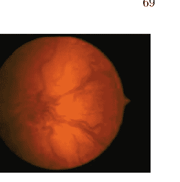

大多数半自动的ROP病例检测技术依赖于手动注册后的半自动或全自动血管分割，以及通过各种机制提取宽度和曲率信息[8]。Jomier等人[9]测量血管分割的四个象限的宽度和曲率，然后将其输入神经网络，返回疾病存在的分类。Wallace等人[10]不寻求构建检测系统，并区分动脉和静脉直径，发现静脉直径在分类中不重要。他们的系统需要大量的手动预处理才能使其正常工作。Swanson等人[11]使用自定义的血管分割软件，对用户选择的血管进行半自动测量扭曲度和扩张指数。他们将扭曲度指数高于某个阈值的图像标识为阳性图像。与这些方法相比，我们使用自动注册并将整个注册图像输入CNN分类器。我们还能够返回每个检查的分类结果，而现有方法只返回每个图像的分类结果。

### 2 提出的方法

新生儿眼底图像通常质量较差（见图2），由未麻醉的早产儿拍摄，使用低分辨率（640×480像素RGB）相机。它们具有不同的平移和方向的高变异水平，存在高水平的运动模糊、光照伪影和明显可见的脉络膜血管。与成人眼底图像相比，如Kaggle糖尿病视网膜病变竞赛¹中所示，这些图像质量更差，更难用于分类。

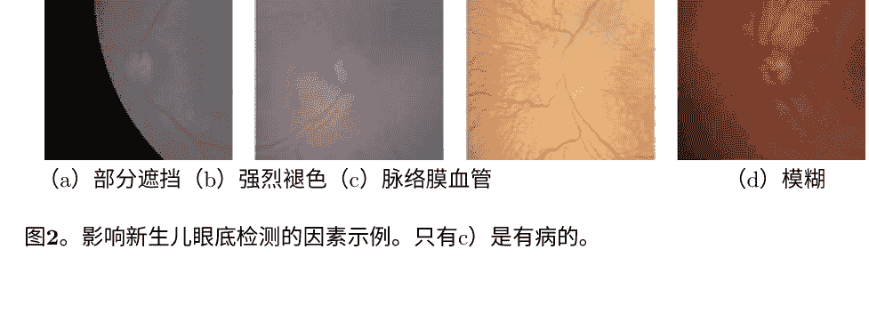

现有的技术依赖于可靠的血管分割，在新生儿眼底中极其困难，有时需要用户干预来修正结果。我们的图像数量也很少（约1500张），类别不平衡很高（约10%）。下面我们描述我们基于CNN的分类器和病理可视化。

#### 2.1 分类器

分类器由传统的深度学习流程组成：预处理、数据增强、预训练的CNN、微调层。目前ROP和plus-disease有不同的分级，例如APROP和pre-plus，但我们只区分‘有病/健康’，因为我们的数据集是在90年代末编制的，在主流使用这些替代方法之前²。

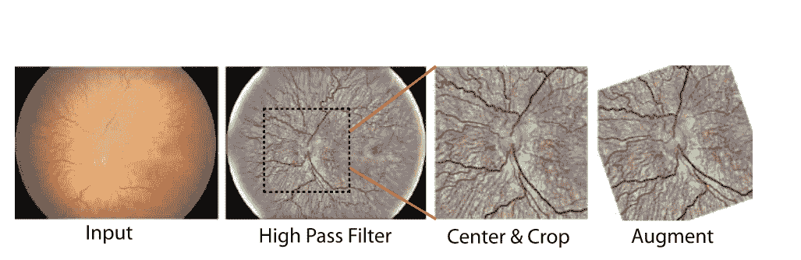

图3. 完全自动化的图像配准、预处理和增强流程。

预处理和数据增强。通过[12]进行视网膜图像平移配准，并在视网膜后极附近裁剪为240 × 240像素，根据交叉验证选择。裁剪尺寸看起来很小，但在生物学上是合理的[5]。在注册后，我们对RGB通道进行高通滤波，去除低频光照变化和全局颜色信息。这也会去除视网膜色素沉着，但我们假设种族在plus筛查中起到可忽略的作用。对于我们无法‘归一化’的数据变化，我们使用数据增强，以便均匀采样特定的变化。在我们的情况下，我们随机翻转、旋转和取原始图像大小的96%的子图像。流程图如图3所示。

每个图像分类器。我们的每个图像分类器由一个2路软最大分类器和一个仿射层组成，堆叠在一个ImageNet预训练模型之上。

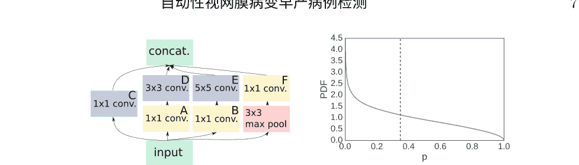

图4. (a) Inception模块由多尺度卷积的组合组成。带字母的块包含可学习的参数。GoogLeNet包含9个端对端排列的Inception模块。(b) Beta分布用于每个考试的分类器。它对健康图像有偏好。实线：概率密度函数，虚线：均值。

GoogLeNet [13]。 GoogLeNet由9个inception模块组成，这些模块是卷积层和最大池化层的组合（见图4(a)）。更多细节请参考[13]。训练时，我们使用RMSProp [14]最小化模型输出和目标标签之间的二元交叉熵损失。通常只需对网络的末尾重新训练线性分类器，但我们发现如果在第9个inception模块中包含一些卷积层，性能会有所提高。然而，重新训练太多层会导致严重过拟合，因此我们采用了迭代的方法来微调最后的$n$层，如果与前$n-1$层相比验证性能提高，则继续进行$n+1$层的微调，以此类推。在并行层中，我们尝试了所有组合，例如图4(a)中的A、B和A＆B。最后，我们使用2-way softmax分类器对inception模块9的层ACDEF进行了重新训练。

贝叶斯卷积神经网络。卷积神经网络返回点估计的类别预测 $\mathbf{y}_* \in \mathbb{R}^D$，其中 $\sum_{d=1}^D y_{*,d}=1$ 给定输入图像 $\mathbf{X}_* \in \mathbb{R}^{N \times M \times C}$。这些预测过于自信，更有信息量的预测是后验预测分布 $p(\mathbf{y}_*|\mathbf{X}_*, \mathcal{D})$，其中 $\mathcal{D}$ 是训练数据。这可以从边缘中找到

$$ p(\mathbf{y}_*|\mathbf{X}_*, \mathcal{D}) = \int p(\mathbf{y}_*|\mathbf{X}_*, \mathbf{w})p(\mathbf{w}|\mathcal{D}) d\mathbf{w}, \quad (1) $$

其中 $p(\mathbf{y}_*|\mathbf{X}_*, \mathbf{w})$ 表示给定图像 $\mathbf{X}_*$ 和权重 $\mathbf{w}$ 的卷积神经网络输出，而 $p(\mathbf{w}|\mathcal{D})$ 是给定 $\mathcal{D}$ 的权重的后验。标准的卷积神经网络训练遵循最大似然原则，或者在涉及正则化时遵循最大后验原则，因此“传统”的预测是通过 $p(\mathbf{w}|\mathcal{D}) = \delta(\mathbf{w} - \mathbf{w}_{\text{ML}})$ 或 $p(\mathbf{w}|\mathcal{D}) = \delta(\mathbf{w} - \mathbf{w}_{\text{MAP}})$ 来进行的，其中 $\delta(x)$ 是狄拉克函数。

最近的研究[15]表明，使用采样行为（如dropout [16]）训练CNN等效于拟合一个近似 $q(\mathbf{w}; \lambda)$ 的近似 $\lambda$，其中 $\lambda$ 被称为变分参数，到CNN权重的真实贝叶斯后验概率 $p(\mathbf{w}|\mathcal{D})$。此外，这些样本是近似后验的真实样本。因此，为了近似方程1，我们替换 $p(\mathbf{w}|\mathcal{D})$ 使用 $q(\mathbf{w}; \boldsymbol{\lambda})$ 和蒙特卡洛采样 $\mathbf{w}^{(k)} \sim q(\mathbf{w}; \boldsymbol{\lambda})$。例如，dropout对应于 $\mathbf{w}_i = z_i \lambda_i$， $z_i \sim \text{Bernoulli}(z_i; 0.5)$，其中 $\mathbf{w}_i$ 是神经元的输入权重集合。为了得到一个分类结果，我们可以简单地对后验预测概率 $\Pr\{y_{\ast,d} > t\} > s\%$ 的累积分布函数进行阈值处理，意味着超过阈值 $t$ 的第 $d$ 个输出的概率质量大于 $s\%$。我们可以优化 $t$ 和 $s$ 以平衡敏感性和特异性。

失败的实验。在这里我们列出了一些技术，我们发现对性能有害。血管特征：我们尝试将Frangi血管特征描述符[17]作为第四个输入通道和输入的掩码，我们假设网络已经在类似的数据表示上工作。ADAM求解器：这导致严重的过拟合。大尺寸裁剪：增加裁剪尺寸导致欠拟合。输出层更多全连接层：这导致过拟合，即使使用了dropout。损失函数重新加权以解决类别不平衡：我们发现对较小类别进行过采样更好，因为通过数据增强，这使得网络每个时期看到更多的数据。从较低层次的输出训练softmax分类器：这导致欠拟合。有趣的是，人们最初可能会怀疑更高层次更具数据集特异性，但我们发现这不是一个问题。去除全局平均池化（GAP）：这增加了输出的维度和可重新训练参数的数量，导致过拟合。

每个考试分类器。每个考试由同一眼睛的不同图像组成，视角和伪影也不同。我们通过假设Beta分布 $p(\pi|a, b) = \text{Beta}(\pi; a, b)$ 先验来构建每个考试的分类器，其中 $\pi$ 是给定眼睛在检查中患病的概率，而Bernoulli分布 $p(c_i | \pi) = c_i^{\pi} (1 - c_i)^{1-\pi}$ 则是给定 $\pi$ 的情况下图像 $i$ 被分类为患病 $c_i$ 的概率。关于 $\pi$ 的后验分布是Beta $\left(\pi; N_1 + a, N_0 + b\right)$，其中 $N_1$ 和 $N_0$ 分别是在该检查中被分类为患病和健康的图像数量。在使用贝叶斯预测分布时，我们使用阈值化的累积分布进行分类。后验预测分布是 $p(c_* = 1|\{c_i\}^{N_0+N_1}_{i=1}) = \frac{N_1 + a}{N_0 + N_1 + a + b}$，其中 $c_*$ 是这次考试的疾病/健康分类。我们通过经验贝叶斯在训练数据上找到了 $a = 0.8, b = 1.5$，这为图像健康性设定了先验。

#### 2.2 可视化

我们通过检查 CNN 特征图来可视化眼底的疾病区域。GoogLeNet 特征图太小（$7 \times 7$ 像素），因此我们训练了一个单独的7层CNN，使用 $3 \times 3$ 的1填充卷积核和 $3 \times 3$ 的步长2最大池化，在每个偶数卷积后都有 $31 \times 31$ 像素的输出特征图。有证据表明[18]，针对相同任务训练的CNN在最深层学习到了相似的表示。

为了有意义的可视化，我们需要将激活与标签（疾病/健康）关联起来。为此，我们操纵位于之前的GAP层 softmax分类器。对于具有空间索引$i, j$和通道$k$的特征图$\mathbf{A}_{ijk}$，GAP层返回空间均值$a_k = \sum_{i,j} \mathbf{A}_{ijk}$。对于直接输入softmax的GAP层，我们只需要查看相关的特征图，但是如果在GAP和softmax之间有一个仿射层，则交换GAP和仿射层的顺序。

$$\text{softmax}\left( \mathbf{W} \sum_{i,j} \mathbf{A}_{ij:} + \mathbf{b} \right) = \text{softmax}\left( \sum_{i,j} (\mathbf{W} \mathbf{A}_{ij:} + \mathbf{b}) \right), \quad (2)$$
其中 $\mathbf{A}_{ij:}$是具有条目$a_k$的向量。

结果是一个正特征图和一个健康特征图。该过程的示意图如图5所示，特征图叠加在输入图像上的示例如图6所示。

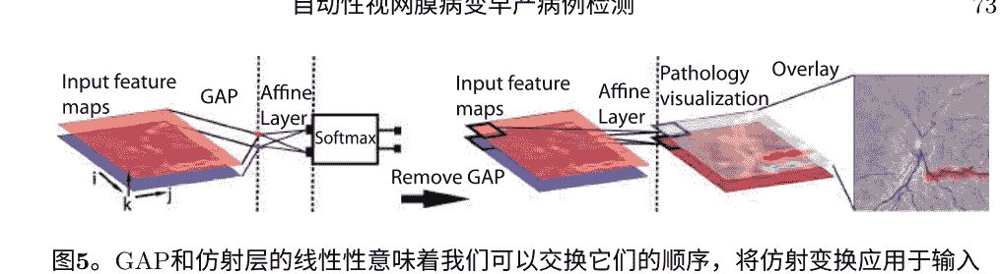

图5。GAP和仿射层的线性性意味着我们可以交换它们的顺序，将仿射变换应用于输入中的每个像素堆栈。

# 3 实验和结果

在两个大型且困难的ROP数据集上进行实验，与基准和竞争方法的论文进行比较。

数据集：加拿大数据集：共有35名患者的1459张可用图像，每只眼睛有2-8张图像的347个检查。每个检查（正/无正）和每只眼睛有一个标签，但不是每个图像。我们假设同一次检查的所有图像具有相同的标签。我们使用这个数据集进行训练和验证。伦敦数据集：共有106张个别标记的图像，每张图像有4个专家标签。对于这个数据集，我们不能按检查分组，只能用于测试。

9折交叉验证。表1显示了我们系统和一个朴素的基准（一个9层的从头开始训练的CNN）在加拿大数据集上进行9折交叉验证的结果。每个患者被分配到一个折叠中。我们将贝叶斯模型与传统的最大似然解CNN进行对比。关键统计数据是对折叠进行平均。类别归一化准确率是敏感性和特异性的平均值，Fleiss' Kappa (FK) [19]是一种衡量一致性的指标。FK为1.0表示完全一致，0.0表示随机一致，小于0.0表示没有一致性。

每次检查的结果大多高于每个图像，这是预期的，因为对检查进行平均可以消除错误的每个图像标签。对于每个图像和每个检查的分类，贝叶斯模型增加了约5%的类别归一化准确率，敏感性每个检查都有显著提高。与其他方法相比，我们具有竞争力，尽管在每张图像的敏感性上输给了Wallace等人。需要注意的是，结果的比较并不直接，因为他们使用较小的测试集（20张图像），而Jomier等人使用不同的方法论，仅测试非边界图像。从FK的角度来看，我们的模型的一致性得分为0.54-0.72，被认为是“中等”到“显著”。

表1. 加拿大数据集上的9折交叉验证结果。粗体表示每行中每个图像或每个检查的最佳结果。

| 实验 | 每张图像-贝叶斯 | 每张图像-传统 | 每张图像-基础 | 每张图像-JOMIER[9] | 每张图像-WALLACE[10] | 每个检查-贝叶斯 | 每个检查-传统 | 每个检查-基础 |
| :--- | :--- | :--- | :--- | :--- | :--- | :--- | :--- | :--- |
| 原始准确率 | 0.918 | 0.892 | 0.833 | - | - | 0.936 | 0.919 | 0.852 |
| 敏感性 | 0.825 | 0.809 | 0.598 | 0.800 | 0.950 | 0.954 | 0.852 | 0.625 |
| 特异性 | 0.983 | 0.909 | 0.846 | 0.920 | 0.780 | 0.947 | 0.929 | 0.860 |
| 精确率 | 0.607 | 0.547 | 0.295 | - | - | 0.713 | 0.665 | 0.322 |
| 标准化准确率 | 0.904 | 0.859 | 0.722 | 0.860 | 0.865 | 0.951 | 0.890 | 0.742 |
| Fleiss' Kappa | 0.590 | 0.547 | 0.246 | - | - | 0.714 | 0.657 | 0.278 |

多评分者一致性。对于伦敦数据集，没有基准，因此我们只报告FK得分。对于单个预测，我们将9个交叉验证训练的CNN的输出进行集成，取平均值并在50%处进行阈值处理，结果见表2。在专家中，FK为0.427，但使用我们的系统后，FK降至0.366/0.372。事实证明，系统与一个专家的一致性非常高，与另一个专家的不一致性也非常高（见表2），与最接近的专家的一致性高于最接近和最远的专家之间的一致性（0.194）。作为对比，[20]在另一个数据集上报告了0.32的医生间一致性FK得分。

表2. 多评分者一致性与[20]中的水平相似。

| 实验 | 仅专家 | 所有专家-贝叶斯 | 所有专家-传统 | 最近的专家-贝叶斯 | 最近的专家-传统 | 最远的专家-贝叶斯 | 最远的专家-传统 |
| :--- | :--- | :--- | :--- | :--- | :--- | :--- | :--- |
| Fleiss' Kappa | 0.427 | 0.366 | 0.372 | 0.551 | 0.546 | -0.118 | -0.084 |

GAP之前的可视化。图6显示了GAP之前的可视化，其中红色表示疾病，蓝色表示健康。为了更容易观察，蓝色通道已经加强。清楚地表明CNN在决策中关注血管，而这是最重要的plus disease指标。这与[4]中的当前临床指南一致，该指南侧重于视网膜血管的宽度和扭曲度的定性测量。

## 4 结论、限制和未来工作

我们提出了第一个完全自动化的ROP检测系统。我们列举了对小数据集进行GoogLeNet微调的技术，这些技术有的有用，有的无用。我们还展示了一个简单的贝叶斯框架，以提高使用dropout训练的CNN的输出准确性。该系统适用于单个图像或来自单次检查的多个图像。为了便于理解，我们还展示了如何从具有足够大特征图的CNN返回增强的病理可视化结果。代码和数据集可根据请求下载。

我们的多评分器实验证明可以根据主观标签训练分类器。这些分类器与一些专家标注者达成了良好的一致性。从监督学习的角度来看，分类器的性能只能与其训练数据一样好，因此如果我们要超越人类的表现，就需要寻找更少依赖人类的训练数据。这可能涉及到利用无监督和半监督学习。还有必要探索建立ROP进展的时空模型，以查看图像序列是否比单个时间点的图像更好地预测疾病。

致谢。我们要感谢Alistair Fielder和Philip 'Eddie' Edwards的深入交流。Daniel Worrall得到Fight for Sight的支持，注册慈善机构号码1111438。

# 参考文献

1. Zin, A., Gole, G.A.: 早产儿视网膜病变的发病率。 Clin. Perinatol. 40(2), 185–200 (2013)
2. Fleck, B.W., Stenson, B.J.: 早产儿视网膜病变和氧气困境：从最近的随机试验中学到的教训。 Clin. Perinatol. 40(2), 229–240 (2013)
3. Wilkinson, A., Haines, L., Head, K., Fielder, A., et al.: 英国早产儿视网膜病变指南。 Eye (London, England) 23(11), 2137 (2009)
4. Gole, G.A., Ells, A.L., Katz, X., Holmstrom, G., Fielder, A.R., Capone Jr., A., Flynn, J.T., Good, W.G., Holmes, J.M., McNamara, J., 等: 早产儿视网膜病变的国际分类再审视. JAMA眼科学 **123**(7), 991-999 (2005)
5. Saunders, R.A., Bluestein, E.C., Sinatra, R.B., Wilson, M.E., Rust, P.F.: 视网膜病变中后极血管的预测价值. 小儿眼科学与斜视 **32**(2), 82-85 (1995)
6. Binenbaum, G.: 基于产后体重增长的早产儿视网膜病变预测算法. 临床围产医学 **40**(2), 261-270 (2013)
7. Oloumi, F., Rangayyan, R.M., Ells, A.L.: 对于早产儿视网膜病变主要颞弓开放度变化的量化分析. 对于具有plus病变的婴儿眼底图像的研究. 眼科学与视觉科学研究 **55**(10), 6728-6735 (2014)
8. Aslam, T., Fleck, B., Patton, N., Trucco, M., Azegrouz, H.: 预测早产儿视网膜病变中的plus病变的数字图像分析. Acta Ophthalmol. **87**(4), 368-377 (2009)
9. Jomier, J., Wallace, D.K., Aylward, S.R.: 通过血管分割量化早产儿视网膜病变. In: Ellis, R.E., Peters, T.M. (eds.) MICCAI 2003. LNCS, vol. 2879, pp. 620-626. Springer, Heidelberg (2003)
10. Wallace, D.K., Zhao, Z., Freedman, S.F.: 使用roptool量化早产儿视网膜病变中的plus病变的初步研究. J. Am. Assoc. Pediatr. Ophthalmol. Strabismus **11**(4), 381-387 (2007)
11. Swanson, C., Cocker, K., Parker, K., Moseley, M., Fielder, A.: 早产儿无视网膜病变和有视网膜病变的血管生长的半自动化计算机分析. 英国眼科学杂志 **87**(12), 1474-1477 (2003)
12. Worrall, D.E., Brostow, G.J., Wilson, C.M.: 新生儿眼底图像中自动化的视盘（OD）定位. 在：ARVO (2016)
13. Szegedy, C., Liu, W., Jia, Y., Sermanet, P., Reed, S., Anguelov, D., Erhan, D., Vanhoucke, V., Rabinovich, A.: 使用卷积进行更深入的研究. 在：IEEE计算机视觉与模式识别会议论文集, 第1-9页 (2015)
14. Tieleman, T., Hinton, G.: 第6.5讲-rmsprop. COURSERA: 神经网络机器学习 4, 2 (2012)
15. Gal, Y., Ghahramani, Z.: Dropout作为贝叶斯近似: 在深度学习中表示模型的不确定性. arXiv预印本 arXiv:1506.02142 (2015)
16. Hinton, G.E., Srivastava, N., Krizhevsky, A., Sutskever, I., Salakhutdinov, R.R.: 通过防止特征检测器的共适应来改进神经网络. arXiv预印本 arXiv:1207.0580 (2012)
17. Frangi, A.F., Niessen, W.J., Vincken, K.L., Viergever, M.A.: 多尺度血管增强滤波. In: Wells, W.M., Colchester, A.C.F., Delp, S.L. (eds.) MICCAI 1998. LNCS, vol. 1496, p. 130. Springer, Heidelberg (1998)
18. Lenc, K., Vedaldi, A.: 通过测量图像表示的等变性和等价性来理解图像表示. 在：IEEE计算机视觉和模式识别会议论文集, 第991-999页 (2015年)
19. Fleiss, J.L., Levin, B., Paik, M.C.: 速率和比例的统计方法. Wiley, 霍博肯 (2013年)
20. Gschließer, A., Stifter, E., Neumayer, T., Moser, E., Papp, A., Pircher, N., Dorner, G., Egger, S., Vukojevic, N., Oberacher-Velten, I., et al.: 专家间和专家内对早产儿视网膜病变的诊断和治疗的一致性. 美国眼科学杂志 **160**(3), 553-560 (2015年)

## 用于肝脏分割和病变检测的全卷积网络

Avi Ben-Cohen (✉), Idit Diamant, Eyal Klang, Michal Amitai 和 Hayit Greenspan

¹医学图像处理实验室，工程学院，生物医学工程系，以色列特拉维夫大学，特拉维夫69978，以色列
aviibenc@mail.tau.ac.il
²Sheba医疗中心，诊断影像科，腹部影像单元（隶属于Sackler医学院），以色列特拉哈维姆52621，以色列

摘要。在这项工作中，我们探索了一种用于计算机断层扫描（CT）检查中的肝脏分割和肝转移检测任务的完全卷积网络（FCN）。FCN已被证明是一种非常强大的语义分割工具。我们探索了FCN在相对较小的数据集上的性能，并将其与基于补丁的CNN和基于稀疏性的分类方案进行了比较。我们的数据包含来自20名患者的CT检查，总共标记了68个病变和43个肝脏的一个切片，以及来自20名不同患者的完整3D肝脏分割。我们进行了3折交叉验证，结果表明FCN优于所有其他测试方法。使用我们的全自动算法，我们实现了0.86的真阳性率和每个病例0.6的假阳性率，这些结果非常有前景且具有临床意义。

关键词： 深度学习 · 肝脏病变 · 检测 · CT

# 1 引言

肝癌是最常见的癌症之一，仅在2012年就导致了745,000名患者的死亡[14]。肝脏是最常见的器官之一，易于发生转移，CT是用于检测、诊断和随访肝脏病变的最常用的模态之一。

图像是在静脉注射对比剂前后获取的，在门脉期（注射后60-80秒）图像上对病变的检测具有最佳效果。这些过程需要有关病变大小、形状和精确位置的信息。手动检测和分割是一项耗时的任务，需要放射科医生在可能包含多个病变的3D CT扫描中进行搜索。这项任务的困难程度凸显了在CT检查中协助临床医生检测和评估肝转移病变大小的计算机化分析的需求。自动检测和分割是一个非常具有挑战性的任务，由于肝脏病变和实质组织的对比增强行为不同。此外，由于灌注和扫描时间的个体差异，这些组织之间的图像对比度可能较低。此外，病变的形状、纹理和大小在患者之间差异很大。这个研究问题近年来引起了很大的关注。MICCAI 2008年大挑战赛[3]提供了可能方法的很好概述。挑战赛的获胜者[11]使用AdaBoost技术基于几个局部图像特征将肝脏病变与正常肝脏分开。在最近的研究中，我们看到了各种其他方法来处理肝脏病变的检测和分割[1,9]。

近年来，深度学习已成为众多领域的主要研究课题。特别是，卷积神经网络（CNN）已被用于计算机视觉中的许多挑战。CNN在不同任务上取得了出色的表现，如视觉对象识别、图像分类、手写字符识别等。由LeCun等人引入的深度CNN是由多层神经网络组成的监督学习模型。CNN完全依赖数据驱动，并通过从低级特征构建高级特征来自动检索分层特征，从而无需手动定制手工特征。CNN已被用于多个医学应用中的检测，包括肺结节、硬化性转移、淋巴结和结肠息肉以及肝肿瘤。在这些工作中，CNN是使用从感兴趣区域（ROI）中提取的补丁进行训练的。

在这篇论文中，我们使用了一个完全卷积的架构[7]来进行肝脏分割和CT检查中肝转移的检测。完全卷积的架构最近在多发性硬化症病变分割[2]中被用于医学目的。完全卷积网络（FCN）可以接受任意大小的输入，并产生相应大小的输出，具有高效的推理和学习能力。与基于补丁的方法不同，使用这种架构的损失函数是在整个图像分割结果上计算的。我们的网络处理整个图像而不是补丁，这消除了选择代表性补丁的需要，消除了补丁重叠时的冗余计算，并且随着图像分辨率的增加，扩展性更高效。此外，通过添加将最终预测层与具有更细步幅的较低层组合的链接，实现了不同尺度的融合。这种融合有助于跨不同病变大小的组合。该方法的输出是一个病变热图，用于检测。

由于我们的数据集很小，我们使用数据增强技术，通过对可用的训练图像应用尺度变换来增加数据量。我们的数据中切片厚度变化很大（1.25到5毫米），这导致病变的模糊外观在较大切片厚度下更为明显。尺度变换使网络能够学习局部纹理特征的变化。

我们使用全卷积架构进行肝脏分割和CT检查中肝转移的检测，使用了一个小型训练数据集，并将其与基于块的CNN进行比较。据我们所知，这是第一个使用全卷积神经网络进行肝脏分割和肝脏病变检测的工作。

# 2 全卷积网络架构

我们的网络架构使用了VGG 16层网络[12]。我们通过丢弃最后的分类器层来截断网络，并将所有全连接层转换为卷积层。我们在粗糙输出位置的每个位置附加一个通道维度为2的1×1卷积层，用于预测病变或肝脏的得分，然后通过反卷积层将粗糙输出上采样到像素密集输出。上采样是在网络内部进行的，通过从像素级损失进行反向传播来进行端到端学习。我们使用FCN-8s DAG网络作为初始网络，该网络学习将粗糙的高层信息与细致的低层信息相结合，如[7]中所述。我们的初始网络架构如图1所示。我们还探索了添加另一个较低级别的连接层（创建FCN-4s DAG网络）的附加价值。这是通过类似于图1中Pool3和Pool4层的连接方式来连接Pool2层完成的。

## 2.1 3D信息

我们任务的输入是轴向CT切片。为了利用z轴的信息，我们修改了输入图像，使其包含三个CT切片，即相关切片和上下两个相邻切片。由于我们的一些数据中切片间距非常大，我们不得不使用线性插值来插入相邻切片，使其间距固定为1毫米。

## 2.2 训练

使用输入图像及其对应的分割地图来训练网络，采用MatConvNet的随机梯度下降实现并进行GPU加速。我们训练了两个网络，一个用于肝脏分割任务，一个用于病变检测任务。对于病变检测训练，忽略了包括不同器官和组织在内的肝脏周围区域。请注意，我们的工作中没有使用一个同时训练病变和肝脏的网络，因为我们为每个任务有两个不同的数据集。softmax对数损失函数按像素计算，每个类别像素有不同的权重，如公式（1）所示：

$$L = - \sum_{ij} w_{ij} (x_{ijc} - \log \sum_{d=1}^{D} \exp(x_{ijd}))$$ (1)

其中 $c \in [1...D]$ 是真实类别，$x$ 是预测得分矩阵（softmax 之前），$w$ 是每个像素的权重矩阵。由于每个图像中的大多数像素都属于肝脏，我们通过使用与人口比例成反比的固定权重来平衡学习过程。学习率在前20个epoch选择为0.0005，在后30个epoch选择为0.0001（总共50个epoch）。权重衰减选择为0.0005，动量参数选择为0.9。

## 2.3 数据增强

病变检测数据集比肝脏分割数据集要小得多，因为该数据集的手动分割掩膜只有2D，所以数据增强是合适的。当只有少量训练样本可用时，数据增强对于教授网络所需的不变性和鲁棒性属性至关重要。我们生成从0.8到1.2的不同尺度，因为病变的大小可能会发生显著变化。尺度是使用均匀分布进行采样的，并使用最近邻方法重新采样新图像。对于我们数据集中的每个图像，都创建了四个不同尺度的增强图像。

# 3 实验

## 3.1 数据

当前工作中使用的数据包括两个数据集。病变检测数据集包括来自Sheba医疗中心的CT扫描，时间跨度为2009年至2014年。使用了不同的CT扫描仪，像素间距为0.71-1.17毫米，切片厚度为1.25-5毫米。每个CT图像都被调整大小以获得固定的像素间距为0.71毫米。扫描由一名放射科医生选择和标记。它们包括20名患者，每名患者进行1-3次CT检查，总共有68个病变分割掩模和43个肝脏分割掩模。这些数据包括来自不同原发癌症的各种肝转移病变。肝脏分割数据集包括20个CT扫描，带有完整的肝脏分割掩模，来自SLIVER07挑战赛[4]，仅用于训练肝脏分割网络。

## 3.2 肝脏分割

我们使用病变检测数据集（43张肝脏切片）评估了肝脏分割网络。我们使用了两种框架变体：添加两个相邻切片（上方和下方），并将Pool2层连接到最终预测（FCN-4s）。我们使用Dice指数评估了算法的分割性能，并计算了敏感性和阳性预测值（PPV）。

结果如表1所示。使用FCN-8s架构并添加相邻切片获得了最佳结果。我们获得了平均Dice指数为0.89，平均敏感性为0.86，平均阳性预测值为0.95。添加额外的低层级（FCN-4s）融合并没有改善结果，可能是因为肝脏边界具有平滑的形状，不需要更高的分辨率。添加相邻切片略微提高了分割性能。

**表1. 使用算法变体的肝脏分割性能**

| 特征 | Dice | 敏感性 | PPV |
| :--- | :---: | :---: | :---: |
| FCN-8s 3个切片 | 0.89 | 0.86 | 0.95 |
| FCN-8s | 0.88 | 0.85 | 0.95 |
| FCN-4s 3个切片 | 0.87 | 0.82 | 0.95 |

## 3.3 检测-比较评估

为了独立评估肝脏分割结果之外的检测性能，我们将训练集和测试集限制在放射科医生手动圈定的肝脏区域内。我们的目标之一是比较病变检测网络与更传统的基于补丁的方法的行为。我们设计了一个基于补丁的CNN，类似于Li等人引入的方法[6]。肝脏区域被划分为17x17像素的补丁，这些补丁被输入CNN进行病变/正常区域的分类。我们使用了一个包含三个卷积层、两个最大池化层、全连接层、ReLU和softmax分类器的CNN模型。我们使用MatConvNet框架[13]和GPU加速实现了CNN模型。我们运行了50个epochs，学习率为0.001。每个epoch同时处理一个批次的100个样本。

另一个比较是与最近使用基于稀疏性学习字典的工作进行的，该工作取得了强大的结果[1]。在这种方法中，每个图像都被聚类成超像素，并且每个超像素由一个特征向量表示。使用基于稀疏性的分类方法对超像素进行分类，该方法学习了一个重构和判别字典。

在肝脏分割评估中，我们尝试了相同的两种变体，通过添加两个相邻的切片（上方和下方），并将Pool2层连接到最终预测（FCN-4s）。检测性能通过以下两个指标进行视觉评估：真阳性率（TPR）-检测到的病变总数除以已知病变总数；每个病例的假阳性（FPC）-假检测总数除以肝脏数量。每个病变在其质心处以5毫米半径的圆盘表示，用于检测评估。我们的方法结果中的每个连通组件也是如此。当检测到的病变的质心与系统病变候选质心重叠时，我们定义为检测到的病变。使用病变检测数据集进行了3折交叉验证（每组包含不同的患者）。结果见表2。为了使其在临床上具有意义，最高的TPR以低于2的FPC呈现。

**表2. FCN，基于补丁的CNN和基于稀疏性的方法在给定肝脏边界的检测性能方面表现出色。**

| 方法 | 真阳性率 | 假阳性率 |
| :--- | :---: | :---: |
| FCN-4s 3个切片 | 0.88 | 0.74 |
| FCN-8s 3个切片 | 0.86 | 1.1 |
| FCN-8s | 0.85 | 1.1 |
| 基于补丁的 | 0.85 | 1.9 |
| 基于稀疏性的 | 0.82 | 1.1 |

FCN-4s在添加邻近切片的情况下表现更好，具有更好的真阳性率和更好的假阳性率。图2显示了使用FCN的示例结果。似乎对于病变，FCN-4s比FCN-8s更合适，因为病变的大小较小。

图2. 示例结果。红色-假阳性；绿色-假阴性；蓝色-真阳性（在线彩图）

## 3.4 完全自动检测结果

最后，我们测试了肝脏分割网络（带有邻近切片的FCN-8s）和病变检测网络（带有邻近切片的FCN-4s）的组合，以自动提取肝脏并检测肝脏分割结果中的病变。我们使用完全自动算法实现了0.86的真阳性和0.6的假阳性率。这些结果接近使用手动分割肝脏的检测结果，真阳性率较低但假阳性率较好。肝脏自动分割输出通常不包括一些边界像素，这些像素较暗且与肝实质不太相似。这些较暗的边界像素可能被错误地检测为病变。这是使用自动分割与手动分割相比改善假阳性率的主要原因。

## 3.5 合成数据实验

为了理解我们创建的FCN判别特征，我们创建了三个合成图像：（1）病变区域填充了一个固定值，该值等于其平均Hounsfield单位（HU）值；（2）病变边界通过给予一个固定值，该值等于平均实质组织HU值，进行了模糊处理；（3）病变平均HU值等于实质组织平均HU值。通过对病变内的所有像素使用固定值，我们消除了病变的纹理。图3显示，大部分病变内的像素被错误地分类为正常肝组织。病变边界周围的像素可能与正常实质组织不同，即使它们不是病变的一部分。有时，专家会将病变边界周围的像素标记为病变的一部分，这会导致病变边界周围的假阳性。病变的模糊边界通过使其与肝实质组织相似，减少了病变边界周围的假阳性数量。通过使病变的平均HU值等于实质组织的平均HU值，我们消除了灰度级差异。在这种情况下，病变没有被正确分类。

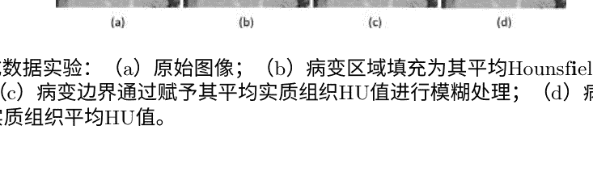

图3. 合成数据实验：（a）原始图像；（b）病变区域填充为其平均Hounsfield Units (HU)值；（c）病变边界通过赋予其平均实质组织HU值进行模糊处理；（d）病变平均HU值等于实质组织平均HU值。

这些结果表明网络学习了病变的纹理，并且主要依赖于病变与肝实质之间的灰度差异。

# 4 结论

总之，我们展示了用于CT检查中肝脏分割和肝转移病灶检测的自动化全卷积网络。我们测试了几种方法，包括最先进的稀疏字典分类技术和基于块的CNN。结果表明，数据增强、添加邻近切片和适当的类别权重的FCN提供了最佳结果。请注意，我们的数据集很小，并且测试是通过3折交叉验证进行的。检测结果很有希望。请注意，建议的方法中没有实施任何重要的预处理或后处理。

添加这些步骤可能会提高病变检测的准确性，并实现更准确的分割。未来的工作包括扩展到更大的数据集上进行3D分析。

致谢。本工作的部分资金支持来自英特尔计算智能合作研究所（ICRI-CI）。

# 参考文献

- 1. Ben-Cohen, A., Klang, E., Amitai, M., Greenspan, H.: 基于稀疏表示的肝转移病变检测与学习字典。在：2016年IEEE第13届国际生物医学成像研讨会（ISBI），第1195-1198页（2016年）
- 2. Brosch, T., Yoo, Y., Tang, L.Y.W., Li, D.K.B., Traboulsee, A., Tam, R.: 用于多发性硬化症病变分割的深度卷积编码器网络。在：Navab, N., Hornegger, J., Wells, W. M., Frangi, A.F.（编）MICCAI 2015. LNCS, vol.9351, 第3-11页。Springer, Heidelberg (2015)
- 3. Deng, X., Du, G.: 编辑：临床中的3D分割：一个重大挑战II-肝脏肿瘤分割。在：MICCAI工作坊（2008年）
- 4. Heimann, T., 等：比较和评估从CT数据集中分割肝脏的方法。IEEE Trans. Med. Imaging 28（8），1251-1265（2009年）
- 5. LeCun, Y., Bottou, L., Bengio, Y., Haffner, P.: 基于梯度的学习应用于文档识别。Proc. IEEE 86, 2278-2324（1998年）
- 6. Li, W., Jia, F., Hu, Q.: 使用深度卷积神经网络在CT图像中自动分割肝脏肿瘤。J. Comput. Commun. 3（11），146（2015年）
- 7. Long, J., Shelhamer, E., Darrell, T.: 用于语义分割的完全卷积网络。在：IEEE计算机视觉和模式识别会议论文集，pp. 3431-3440（2015年）
- 8. Roth, H., Lu, L., Liu, J., Yao, J., Seff, A., Cherry, K., Kim, L., Summers, R.: 使用卷积神经网络和随机视图聚合改进计算机辅助检测。IEEE Trans. Med. Imaging, （2015，预印本）
- 9. Rusko, L., Perenyi, A.: 基于多级几何特征的CT图像自动肝脏病变检测。Int. J. Comput. Assist. Radiol. Surg. 9(4), 577–593(2014)
- 10. Setio, A.A., Ciompi, F., Litjens, G., Gerke, P., Jacobs, C., van Riel, S., Wille, M.W., Naqibullah, M., Sanchez, C., van Ginneken, B.: CT图像中的肺结节检测：使用多视图卷积网络进行假阳性减少。IEEE Trans. Med. Imaging，（2016，预印本）
- 11. Shimizu, A., 等：使用AdaBoost进行集成分割，并应用于从CT体积中提取肝脏病变。在：医学成像计算机辅助干预工作坊中的3D分割临床：一个大挑战II的论文集，纽约（2008年）
- 12. Simonyan, K., Zisserman, A.: 用于大规模图像识别的非常深的卷积网络。arXiv预印本arXiv:1409.1556（2014年）
- 13. Vedaldi, A., Lenc, K.: MatConvNet：用于Matlab的卷积神经网络。在：第23届ACM多媒体会议论文集，pp. 689-692（2015年）
- 14. 世界卫生组织《世界卫生报告》（2014年）

## 深度学习脑病变模式，用于预测早期多发性硬化症患者未来的疾病活动

Youngjin Yoo^{1,2,5(✉)}, Lisa W. Tang^{2,3,5}, Tom Brosch^{1,2,5}, David K.B. Li^{3,5}, Luanne Metz^6, Anthony Traboulsee^{4,5}, and Roger Tam^{2,3,5}

- 1. 英属哥伦比亚大学电气与计算机工程系，加拿大温哥华
- 2. 英属哥伦比亚大学生物医学工程项目，加拿大温哥华 (youngjin.yoo@alumni.ubc.ca)
- 3. 英属哥伦比亚大学放射学系，加拿大温哥华
- 4. 英属哥伦比亚大学神经学部，加拿大温哥华
- 5. 英属哥伦比亚大学MS/MRI研究小组，加拿大温哥华
- 6. 加尔加里大学神经学部，加拿大卡尔加里

摘要。多发性硬化症（MS）是一种神经系统疾病，早期病程以临床恶化的发作为特征，发作之间有不同的缓解期。能够预测给定时间范围内的发作风险，可以用于识别可能从更积极的治疗中受益的患者。本文旨在确定深度学习是否能够从分割的病变掩膜中提取出潜在特征，以比病变体积更准确地预测早期MS症状患者的短期疾病活动，病变体积是一种非常常用的MS成像生物标志物。更具体地说，我们使用卷积神经网络从基线MR图像计算的病变掩膜中提取与早期疾病活动相关的潜在MS病变模式。主要挑战是病变掩膜通常是稀疏的，并且训练样本数量相对于图像的维度较小。为了应对稀疏的体素数据，我们提出利用欧几里得距离变换（EDT）通过为每个体素赋予距离值来增加信息密度。

为了降低高维图像导致的过拟合风险，我们在训练过程中使用了降采样、无监督预训练和正则化的协同组合。我们对EDT和无监督预训练的影响进行了详细分析。通过对140个受试者的MRI进行7折交叉验证，我们证明了我们的预测模型仅使用基线MRI图像就能够达到72.9%的准确率（标准差=10.3%），这显著高于传统MRI病灶负荷生物标志物所达到的65.0%的准确率（标准差=14.6%）。

- 深度学习
- 卷积神经网络
- 临床预测
- 多发性硬化症病灶
- 机器学习
- MRI

# 1 引言

多发性硬化症（MS）是一种免疫介导性疾病，其特征是中枢神经系统的炎症、脱髓鞘和退化。越来越多的证据表明，早期检测和干预可以改善长期预后。然而，MS的疾病进程在早期阶段尤其是高度变异，很难预测哪些患者会更快地进展，从而受益于更积极的治疗。麦克唐纳标准[1,2]是临床和磁共振成像（MRI）指标的组合，有助于诊断早期症状提示MS的患者。

然而，在一定时间范围内预测哪些患者将满足一组特定的疾病活动标准仍然是一个挑战。MRI对于监测和理解MS的病理过程具有重要价值，可以从疾病的早期阶段开始进行体内观察，但常见的计算MRI生物标志物，如脑和病变体积，只有在基线测量可用的情况下，对未来的疾病活动[3]没有很强的预测能力，这种情况通常是患者首次就诊时的情况。研究人员试图定义更复杂的MRI特征，以提高预测能力。最近，Wottschel等人使用支持向量机训练用户定义的特征来预测临床隔离综合征（CIS）转变为临床明确的MS[4]。这些特征包括基线的人口统计学信息和临床测量，以及从大脑中心测量的病变负荷（也称为疾病负担）和病变距离。

用户定义的特征通常需要专业领域知识和大量的试错，并且容易受到用户偏见的影响。另一种方法是使用机器学习自动学习模式并提取潜在特征。近年来，深度学习[5]因其使用自动特征提取在许多应用中取得了突破性的成功，有时甚至是从具有复杂内容的高维数据（如神经影像数据）中。例如，对神经影像数据的深度学习已被用于执行各种任务，如轻度认知障碍和阿尔茨海默病之间的分类[6]，以及模拟多发性硬化症中的病理变异性[7]。

在这项工作中，我们使用早期症状为MS患者的基线MRI，但尚未满足MS诊断的麦克唐纳2005标准，旨在预测哪些患者在两年内会满足转化标准。MS表现出复杂的病理学，尚不完全理解，但已知空间病变分布的变化可能是疾病活动的指标[8]。我们的临床动机是发现可能表明加速恶化速度的白质病变模式，以便选择出表现出这种模式的患者进行更个性化的治疗。我们研究了深度学习提取的潜在MRI病变模式是否能够比BOD更准确地预测满足麦克唐纳2005标准的疾病状态转化。主要思想是使用卷积神经网络（CNN）来识别潜在的病变模式特征，其变异性能够最大程度地区分那些有短期疾病活动风险的患者和那些将保持相对稳定的患者。

# 2 材料和预处理

基线的T2加权（T2w）和质子密度加权（PDw）MR图像用于预测每个患者两年后的疾病状态。
数据集包括60个非转化者和80个转化者。图像尺寸为256×256×60，体素大小为0.937×0.937×3.000毫米。预处理包括去除颅骨和线性强度归一化。通过半自动多模态方法对T2w和PDw扫描进行分割，生成病变掩膜。然后，使用高斯预滤波将掩膜图像降采样为128×128×30，作为第一维度降维步骤。

# 3 方法

在特征提取之前，所有图像都被空间标准化到一个标准模板（MNI152）[9]上，使用仿射配准。我们的CNN架构是一个9层模型（图1），由三个3D卷积层交替组成，然后是三个最大池化层，接着是两个全连接层，最后是一个逻辑回归输出层。

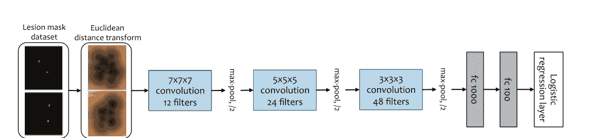

## 3.1 病变掩膜的欧氏距离变换

多发性硬化病变通常占脑图像的很小比例，因此二值病变掩膜主要包含零值。从我们的初步实验中，我们观察到CNN模型主要从二值病变掩膜中学习到噪声模式，这可能是因为稀疏的病变体素在训练过程中可能被忽略或被卷积和池化操作阶段变形为噪声峰值。如第4节所述，训练和测试结果表明，二值病变掩膜不适合作为CNN模型的输入。我们也可以使用原始MR图像作为输入，但由于病变体素的稀疏性，在学习过程中几乎肯定会丢失。为了解决这个问题，我们提出通过欧几里得距离变换（EDT）[10]增加病变掩膜中的信息密度，该变换测量每个体素与最近病变之间的欧几里得距离。

二值病变掩膜的EDT形成了我们CNN模型的输入。从图1中可以看到，病变的空间分布被密集地捕捉和放大，比原始的二值掩膜更好。变换对深度学习网络训练的影响将在第4节中介绍。我们使用ITK-SNAP的Convert3D工具[11]应用EDT。

## 3.2 CNN训练

已经证明，在训练集有限的情况下，预训练可以提高监督深度网络的优化性能，这在医学成像领域经常发生[12]，但收益取决于数据属性。我们研究了使用3D卷积深度置信网络（DBN）进行预训练来初始化我们的CNN模型的影响。我们的卷积DBN具有与我们的CNN的卷积和池化层相同的网络架构。对于我们的DBN和CNN，我们使用了泄漏整流非线性[13]（负斜率α=0.3），它被设计用于防止非泄漏单元在遇到某些条件后无法重新激活的问题，因为梯度流量过大。我们的卷积DBN使用了一种鲁棒的方法[14]进行初始化，该方法特别考虑了整流非线性，并且已经证明可以成功训练自然图像上的非常深的网络，并使用对比散度[15]进行训练。为了分析EDT和预训练对监督训练的影响，我们在四种条件下训练了我们的CNN：无EDT和无预训练，无EDT但有预训练，有EDT但无预训练，有EDT和预训练。对于所有四个实验，我们使用AdaDelta[16]进行负对数似然最大化（条件常数ε=1e-12和衰减率ρ=0.95），并且批量大小为20进行训练。由于数据集中的转换器比非转换器多，因此在每个折叠中，用于监督训练的损失函数（交叉熵）的类权重会根据训练集中观察到的类频率的倒数进行自动调整。我们使用Theano[17]和cuDNN[18]来实现CNN模型。

## 3.3 数据增强和正则化

由于输入图像的高维度相对于数据集中的样本数量，即使在降采样之后，所提出的网络仍可能遭受过拟合的问题。数据增强是减少过拟合风险的最流行方法之一，通过人工创建训练样本来增加数据集的大小。为了生成更多的训练样本，我们通过对掩膜图像应用随机旋转（±3度）、平移（±2毫米）和缩放（±2百分比）来进行数据增强，从而增加了训练图像的数量。训练图像增加了四倍。为了正则化训练，我们应用了dropout[19]（p= 0.5）、权重衰减（L_2范数正则化）（惩罚系数为2e-3）和L_1范数正则化（惩罚系数为1e-6）。最后，我们应用了早停法，它也作为一种正则化方法来提高泛化能力[20]，收敛目标为负对数似然为0.6。当验证误差相对于训练过程中的最小值开始增加时（通过交叉验证确定），根据收敛目标停止训练。

# 4 结果与讨论

为了观察EDT对无监督预训练的影响，我们计算了每个卷积DBN训练时每个时期的均方根（RMS）重构误差，包括EDT和不包括EDT的情况。图2显示了在第一层卷积层预训练期间每个时期后剩余的重构误差。我们观察到使用EDT进行预训练可以更快地收敛，并且在收敛时产生更低的重构误差。为了分析EDT和预训练对监督训练的影响，我们比较了三个不同的情景，这些情景在第3.2节中描述并在图3中展示。在没有EDT的情况下，使用预训练的CNN收敛速度更快，但在收敛时的预测误差与没有预训练的情况相似。在这两种情况下，训练在训练集上的预测误差几乎没有进展，并且在测试集上没有进展，测试误差仍然很高。使用EDT，在没有预训练的情况下，优化算法在500个时期后仍然没有收敛，但在有预训练的情况下可以收敛。在没有预训练的情况下，训练和测试数据集的预测误差在早期波动，但很快保持不变，并且训练没有进一步的进展。相反，使用EDT和预训练，训练和测试数据集上的预测误差在大约200个时期内逐渐减少。

图4展示了使用t分布随机邻居嵌入（t-SNE）[21]将CNN输出降维到二维后产生的流形可视化。当没有使用EDT和预训练时，这两组（转换者和非转换者）在学习的流形空间中显示出较差的线性可分性。在使用EDT和预训练的CNN学习的流形空间中，这两组更易于区分。

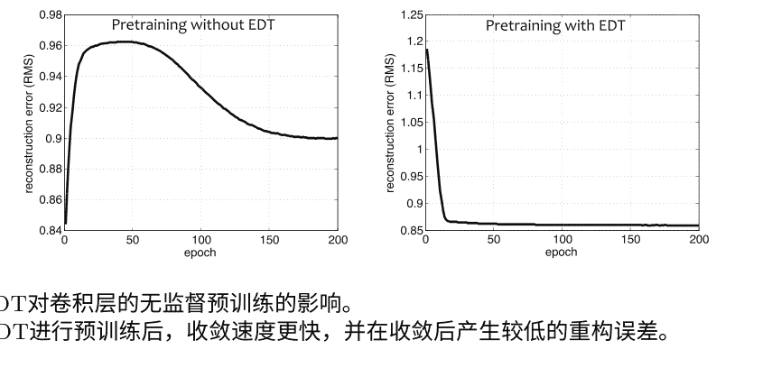

图2. EDT对卷积层的无监督预训练的影响。使用EDT进行预训练后，收敛速度更快，并在收敛后产生较低的重构误差。

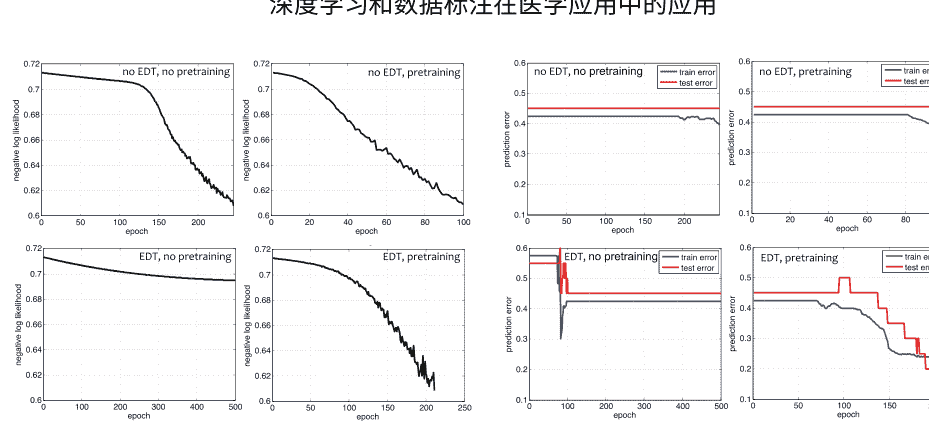

图4. 使用t-SNE[21]将学习到的流形空间降维到二维，以展示EDT和预训练对学习到的流形空间的影响。数据集中的每个对象都由一个二维特征向量表示。坐标轴表示学习到的低维映射中每个二维特征向量的特征元素值。在使用EDT和预训练时，转换器组和非转换器组在流形空间中更容易线性可分。

表1. 在早期多发性硬化症状患者中，预测短期（2年）临床状况转变的5种不同预测模型的性能比较（%）。所有CNN使用相同的训练参数。我们对80个转化者和60个非转化者进行了7折交叉验证，并计算了每个预测模型的平均性能。

| 预测模型 | 准确率 | 敏感性 | 特异性 | AUC |
| :--- | :---: | :---: | :---: | :---: |
| 具有BOD的逻辑回归 | 65.0 ± 14.6 | 54.3 | 80.9 | 67.6 ± 14.9 |
| CNN（无EDT，无预训练） | 57.9 ± 4.9 | 94.9 | 8.3 | 51.6 ± 4.4 |
| CNN（无EDT，预训练） | 57.9 ± 5.9 | 98.7 | 3.6 | 51.1 ± 4.9 |
| CNN（EDT，无预训练） | 54.3 ± 6.2 | 71.4 | 28.6 | 50.0 ± 0.0 |
| CNN（EDT，预训练） | 72.9 ± 10.3 | 78.6 | 65.1 | 71.8 ± 10.2 |

为了评估预测性能，我们使用了一个7折交叉验证过程，每个折包含120个训练样本和20个测试样本。请注意，通过数据增强，每个折的训练图像数量增加到480个。为了与临床研究中使用的传统MRI生物标记BOD的建立方法进行比较，我们使用了逻辑回归预测模型。比较结果如表1所示。

当没有使用EDT时，卷积神经网络（有和没有预训练）的预测准确率低于具有BOD的逻辑回归模型。此外，这些情况下的敏感性非常高，但是低特异性，可能是由于对稀疏病变图像数据的过拟合。当使用EDT而没有预训练时，卷积神经网络在交叉验证的每个折叠中都无法收敛，并且预测准确率低于病变体积。敏感性和特异性之间的差距减小，但仍然很大。与具有BOD的逻辑回归模型相比，具有EDT和预训练的卷积神经网络在准确率上提高了约8%，在AUC上提高了约4%。此外，准确率和AUC的标准差减小了约4-5%，显示出更一致的性能。该模型还实现了最佳的敏感性和特异性平衡。

# 5 结论

我们提出了一个卷积神经网络架构，学习潜在的病变特征，用于识别早期多发性硬化症症状的患者，在仅有基线MRI的情况下，预测未来两年内的疾病活动风险。我们提出了克服病变图像数据稀疏性和图像维度相对于训练样本数量的高维度的方法。特别地，我们展示了欧几里得距离变换和无监督预训练是成功优化的关键步骤，当结合数据增强和正则化策略时，效果更好。最终结果明显优于临床标准的病变体积测量结果。

致谢。本研究得到了英属哥伦比亚大学的MS/MRI研究小组、加拿大自然科学与工程研究委员会、加拿大多发性硬化症协会和米兰和莫琳·伊利奇基金会的支持。

# 参考文献

1.  Polman, C., Reingold, S., Edan, G., et al.: 多发性硬化症的诊断标准：对McDonald标准的修订。Ann. Neurol. **58**(2005), 840–846 (2005)
2.  Polman, C.H., Reingold, S.C., Banwell, B., et al.: 多发性硬化症的诊断标准：对McDonald标准的修订。Ann. Neurol. **69**(2011), 292–302 (2011)
3.  Odenthal, C., Coulthard, A.: 临床隔离综合征中MRI的预后效用：文献综述。美国神经放射学杂志。**36**, 425-431 (2015)
4.  Wottschel, V., Alexander, D., Kwok, P., 等：使用机器学习预测临床隔离综合征的结果。神经影像学：临床。**7**, 281-287 (2015)
5.  LeCun, Y., Bengio, Y., Hinton, G.: 深度学习。自然 **521**, 436-444 (2015)
6.  Suk, H., Lee, S., Shen, D., 等：使用深度学习的分层特征表示和多模态融合进行AD/MCI诊断。神经影像学 **101**, 569-582 (2014)
7.  Brosch, T., Yoo, Y., Li, D.K.B., Traboulsee, A., Tam, R.: 通过深度学习对多发性硬化症中脑形态和病变分布的可变性进行建模。在：Golland, P., Hata, N., Barillot, C., Hornegger, J., Howe, R. (eds.) MICCAI 2014, 第二部分. LNCS, vol. 8674, pp. 462–469. Springer, Heidelberg (2014)
8.  Giorgio, A., Battaglini, M., Rocca, M.A., 等：脑损伤的位置预测临床隔离综合征转变为多发性硬化症。神经学 **80**, 234–241 (2013)
9.  Mazziotta, J., Toga, A., Evans, A., 等：人脑的概率性图谱和参考系统：国际脑映射协会(ICBM)。Philos. Trans. Roy. Soc. B: Biol. Sci. **356**, 1293–1322 (2001)
10. Maurer, C., Qi, R., Raghavan, V.: 一种计算任意维度二进制图像的精确欧几里德距离变换的线性时间算法。IEEE Trans. Pattern Anal. Mach. Intell. **25**, 265–270 (2003)
11. Yushkevich, P.A., Piven, J., Cody Hazlett, H., 等：用户引导的三维主动轮廓分割解剖结构：显著提高效率和可靠性。NeuroImage **31**, 1116–1128 (2006)
12. Tajbakhsh, N., Shin, J.Y., Gurudu, S.R., 等：用于医学图像分析的卷积神经网络：全面训练还是微调？IEEE Trans. Med. Imaging **35**, 1299–1312 (2016)
13. Maas, A., Hannun, A., Ng, A.: 整流器非线性改善神经网络声学模型。In: International Conference on Machine Learning, vol. 30 (2013)
14. He, K., Zhang, X., Ren, S., 等：Deep Residual Learning for Image Recognition. In: IEEE International Conference on Computer Vision Proceedings, pp. 1026–1034 (2015)
15. Lee, H., Grosse, R., Ranganath, R., 等：使用卷积深度置信网络进行无监督学习的分层表示。Commun. ACM **54**, 95–103 (2011)
16. Zeiler, M.: ADADELTA：一种自适应学习率方法。arXiv预印本 [arXiv:1212.5701](https://arxiv.org/abs/1212.5701) (2012)
17. Theano开发团队：Theano：一个用于快速计算数学表达式的Python框架。arXiv e-prints abs/1605.02688, 2016.
18. Chetlur, S., Woolley, C., Vandermersch, P., 等：cuDNN：用于深度学习的高效基元。arXiv预印本 [arXiv:1410.0759](https://arxiv.org/abs/1410.0759) (2014)
19. Srivastava, N., Hinton, G., Krizhevsky, A., 等: Dropout: 防止神经网络过拟合的一种简单方法。 J. Mach. Learn. Res. **15**, 1929–1958 (2014)
20. Orr, G.B., Müller, K.R.: 神经网络: 行业技巧。 Springer, Heidelberg (2003)
21. Van Der Maaten, L.: 使用基于树的算法加速t-SNE. 机器学习研究杂志, **15**, 3221–3245 (2014)

## 通过一组专家深度神经网络对增强对比度的MRI序列进行去噪

Ariel Benou<sup>1,3,✉</sup>, Ronel Veksler<sup>2,3</sup>, Alon Friedman<sup>2,3,4</sup>, and Tammy Riklin Raviv<sup>1,3</sup>

<sup>1</sup> 以色列贝尔谢巴本古里安大学电气工程系 <sup>2</sup> 以色列贝尔谢巴本古里安大学生理学与细胞生物学系 <sup>3</sup> 以色列贝尔谢巴本古里安大学神经科学中心 <sup>4</sup> 加拿大哈利法克斯Dalhousie大学医学神经科学和脑修复中心

arielbenou@gmail.com

摘要。 动态增强磁共振成像（DCE-MRI）是一种成像协议，其中在注射对比剂的过程中重复获取MRI扫描。动态扫描的分析广泛用于检测和量化血脑屏障（BBB）的渗透性。从DCE-MRI洗脱曲线中提取药代动力学（PK）参数可以定量评估BBB的功能。然而，用于分析DCE-MRI数据的曲线拟合容易出错，因为动态扫描受到非白色、空间相关和各向异性噪声的影响，这些噪声不符合标准噪声模型。现有的两种方法，即曲线平滑和图像去噪，要么产生平滑的曲线但不能保证与PK模型的准确性，要么不能适应时间和空间中噪声统计的高变异性。

我们提出了一个基于深度神经网络（DNNs）的新框架来解决DCE-MRI去噪的挑战。关键思想是基于专家DNNs的集成，每个DNN都针对不同的噪声特征和曲线原型进行训练，以解决特定输入空间子集上的逆问题。然后使用分类器DNN选择最可能的重建结果。由于训练的真实（干净）信号不可用，我们提出了一个生成具有复杂非线性动力学的逼真训练集的模型。该方法已应用于中风和脑肿瘤患者的DCE-MRI扫描，并且与最先进的去噪方法相比，不会降低原始图像的对比度。

# 1 引言

动态对比增强磁共振成像（DCE-MRI）是一种非侵入性的in vivo工具，用于检测和量化基于病理的大脑疾病。

对比剂（CA）积累[18]。该采集技术涉及在注射对比剂之前、期间和之后对组织进行重复的T1加权成像。对比剂改变了组织的T1弛豫时间，表现为信号增强（见图1）。

许多脑病理（例如中风、肿瘤、癫痫）与血脑屏障（BBB）的破坏有关。BBB是一个严密调节的屏障，控制物质进入中枢神经系统（CNS）。当BBB功能不良时，造影剂（CA）渗入细胞外间质空间，导致周围脑组织逐渐增强。CA浓度的体素级变化随时间可以分为三种不同类型的洗出曲线（WoCs），表征血管、健康组织和病理（图1）。BBB破坏的检测通过将药代动力学（PK）模型[17]（例如Tofts [20]，Brix [3]，Vexler等[21]）拟合到CA WoCs中进行。准确评估破坏对于各种临床应用很重要[1,21]。

对于DCE-MRI数据的分析需要曲线拟合，但由于动态扫描受到非白色、空间相关和各向异性噪声的影响，这种拟合容易出错，不符合标准噪声模型。目前的方法要么忽略噪声进行曲线拟合（例如，[14]），要么假设特定的噪声模型（[16]）。在[13]中，使用主成分分析（PCA）构建了由Tofts模型[19]生成的曲线的低维空间。然后，通过将噪声WoCs投影到该空间上，恢复了真实DCE-MRI的PK参数。然而，投影是一种线性操作，而数据是非线性的。在[6]中，提出了一种称为动态非局部均值（DNLM）的方法，该方法扩展了[4]中用于时空去噪的算法。

然而，去噪操作可能会由于不同图像区域的PK特性差异而导致数据失真。

我们提出了一种新的方法，用于去噪和重建WoCs，不需要假设特定的噪声分布，也不会降低原始扫描的对比度质量。此外，我们的方法允许降低DCE-MRI扫描的时间分辨率（从而可能增加空间分辨率），同时保留隐含的PK信息。这是通过构建和训练一组深度神经网络（DNNs）来实现的。

一组深度神经网络（DNNs）的集成。DNNs越来越多地用于解决回归问题。最近，它已经被用于信号和图像去噪，例如[5]用于语音识别和[22]用于图像处理。已经提出了一种深度学习方法用于扩散加权成像（DWI）去噪[7]。

DCE-MRI去噪面临着几个挑战，因为无法获取干净的信号（没有基准真值）；时空噪声模型未知，并且信噪比（SNR）在空间上变化。这些问题通过两个关键贡献来解决：为不同信号原型和噪声水平构建和训练一组专家DNNs，并生成逼真的噪声信号进行训练。所提出框架的块图如图2所示。

所提出的方法应用于中风和脑肿瘤患者的DCE-MRI序列。我们的方法表现出优于最先进的去噪方法，如Beltrami滤波（针对3D灰度视频进行扩展）[12]和DNLM [6]。对于原始数据和下采样数据，我们演示了从噪声数据中准确重建PK参数而不会降低对比度。

# 2 方法

## 2.1 问题形式化

让 ℐ = {ℐ_t}_{t=1}^T 表示患者特定的MR脑部扫描的时间序列，其中 ℐ_t : Ω → ℝ 表示在时间点 t 上获取的扫描的强度，定义在 Ω ⊂ ℝ^3。我们假设扫描是对齐的，时间上等间隔，并且是在注射造影剂后获取的。让 c_t : Ω → ℝ 表示与 ℐ_t 相关联的造影剂的浓度。与体素 x ∈ Ω 相关联的时间序列，c(x) = [c_1(x), c_2(x), ..., c_T(x)]^T，被称为洗出曲线（WoC）。观察到的WoC ĉ(x) ∈ ℝ^T 是潜在的干净信号 c_c(x) ∈ ℝ^T 的一组受到未知概率密度函数（PDF）扭曲的噪声观测 n(x) ∈ ℝ^T。ĉ(x) 与 c_c(x) 之间的关系可以描述为：ĉ(x) = h(c_c(x), n(x))，其中 h(·) : ℝ^T → ℝ^T 是一个未知的噪声模型。去噪任务可以被描述为一个逆问题，如下所示：

$$ g^* = \arg\min_g E_{c_o(x)} [||g(c_o(x)) - c_c(x)||^2_2] \quad (1) $$

其中 g* 是最佳逼近函数 h^{-1}(·)。

## 2.2 深度神经网络

我们使用一组深度神经网络(DNNs)来解决由方程1定义的逆问题。我们用 f_l(·) 表示第 l 层人工神经元(ANs)的激活函数，用 w_i^l 表示连接第 l+1 层中的第 i 个AN和第l层中的 K_l 个AN的权重向量，其中 l ∈ [0, L-1]，K_l 是第l层中的AN数量。

第 l 层中的AN数量为K_l。第1层中第 i 个AN的输出 y_i^{l+1}计算如下：y_i^{l+1} = f_l( ∑_{j=1}^{K_l} w_{i, j}^l y_j^l ) = f_l(<w_i^l, y^l >) 其中 y^l ∈ [1, y_1^l, ..., y_{K_l}^l]^T。The DNN的输入是增强向量 y^0 = ~c→= [1, c_o^T]^T。给定一个训练集 N个输入输出对 {c→, y_{GT}}_n 我们寻找一组权重 W* 使得最小化代价函数： W* = arg min_W E_{c_o} [||y^L - y_{GT}||_2^2] 其中 y_{GT} 是合成的，将在第2.6节中解释。给定 W*, 可以解决逆问题 g∘...∘f_1(~c→; W*) 并将其应用于新的噪声序列。然而，训练一个可应用于临床的去噪DNN是具有挑战性的。首先，DCE-MRI的信噪比水平在空间上变化。此外，不同的组织具有不同的PK模式。虽然这些问题可以通过使用极深的网络来解决，但要优化的权重数量和所需的训练示例使得训练这样的网络变得不切实际。相反，我们建议使用一组专家DNN的集合，如我们在第2.3节和第2.4节中讨论的那样。其次，DNN集合的可用性取决于每个专家DNN的独特优化过程。我们使用一组堆叠的受限玻尔兹曼机（RBMs）来促进初始化[9]，详见第2.5节。训练问题进一步复杂化，因为无法从真实的DCE-MRI中提取地面真实（GT）数据，即干净的WoCs，并且这些数据不可用。在第2.6节，我们提出了一个生成逼真的训练集的模型来解决这个问题。

图2. 提出的DNN集成的块图.给定一个有噪声的WoC（a）, 每个专家DNN生成一个重建假设（b）.相应的假设（c）通过一个分类DNN（d）进行集成, 选择最可能的假设（e）.

## 2.3 专家DNN：架构和训练

我们构建一个DNN作为非线性深度自编码器, 参考[8], 适用于去噪. 专家DNN的架构和训练过程如图3所示. 下层L/2层被设计为扩展和

然后减少噪声输入数据的维度. 权重{W^l}_{l=1}^L由堆叠的RBM进行初始化, 参见第2.5节. DNN的上L/2层被设计为恢复数据的原始维度, 允许从层l=L/2提取的压缩数据进行干净观察的重建. 我们使用随机梯度下降[1,5]同时训练DNN的各层, 以最小化代价E_c = ½ ||y^L - y_GT||^2.

整个框架基于三个DNN数组, 分别对应不同类型的WoCs (健康、病理、血管). 每个数组由M个专家DNN组成, 它们是在具有不同SNR级别的数据上进行训练的, 如图2b所示. 接下来我们解释一下DNN提供的重建假设是如何被集成以提取最终输出的.

## 2.4 集成假设

由于每个专家DNN都是在训练数据的互斥子集上进行训练的 (具有特定SNR级别和WoC类型), 因此在类似给定测试样例的数据上进行训练的DNN更有可能具有最佳性能. 因此, 我们通过集成专家的假设来提高系统的置信度. 设g_k(c→)为第k个DNN专家对观察到的输入c→的假设. 我们定义了五个衡量指标, 用于评估专家的性能, 包括与原始WoC(g_k(c→)-c→)的L1和L2范数, g_k(c→)与c→之间的余弦相似度和相关性, 以及假设的总变化. 然后, 我们使用具有softmax激活函数的额外分类DNN进行训练, 该DNN被训练用于选择.

基于这些度量的最有可能的假设. 有关架构和分类DNN训练的详细信息，请参见附录C1。

## 2.5 限制玻尔兹曼机

我们现在讨论使用堆叠的RBM [8] 初始化专家DNN的权重，参见图3a。RBM是一种生成性随机人工神经网络，具有可见层和单个隐藏层，它们共同形成一个二部图。它可以以无监督的方式学习其输入集合上的概率分布。该过程以聚合方式进行，其中每个层的权重 $l=0...\frac{L}{2}-1$ 给定DNN的每一层都使用单个RBM（用 $RBM^l$ 表示）进行预训练，使得 $RBM^{l-1}$ 的隐藏单元实现被用作 $RBM^l$ 的可见单元，用 $\mathbf{v}^l$ 表示（参见图3a）。$RBM^{l=0}$ 的输入层实现是训练示例 $\{\mathbf{c}_o(i)\}_{i=1}^{N_i}$。RBM训练算法[10]学习每一层 $l=0, \frac{L}{2}-1$ 的图权重 $\mathbf{W}_0^l$，使得可见单元相对于训练示例的对数似然概率之和最大化。

最大化: $\mathbf{W}_0^l= \arg \max_{\mathbf{W}} \sum_{n=1}^N \log (p (\mathbf{v}_n^l))$。

读者可以参考[10,11]和附录B，了解有关RBM和优化过程的更多细节。一旦学习了RBM的权重，可以按照以下方式使用它来初始化专家DNN的权重: $\mathbf{W}^l = \mathbf{W}_0^l$ for $l=0, \ldots, \frac{L}{2}-1$ and $\mathbf{W}^l = (\mathbf{W}_0^{L-l-1})^T$ 对于 $l=\frac{L}{2}, \ldots, L-1$，请参见图3b。

## 2.6 合成训练数据生成

我们使用模拟真实噪声WoCs的合成数据来训练每个专家DNN，具体步骤如下。根据Tofts模型[19]生成合成WoCs $\{ \mathbf{c}_s \}$

$$ c_s(t) = v_p c_p(t) + k_{trans} \int_0^t c_p(\tau) \exp(-k_{ep}(t - \tau))d\tau, \quad (2) $$

其中 $c_s(t)$ 是曲线中的第 $t$ 个时间点，PK参数的三元组 $v_p, k_{ep}, k_{trans}$是基于健康、病理和血管WoCs的典型值随机采样得到的。动脉输入函数的值，$c_p(t)$，是预定义的。由于没有无噪声图像可用，我们使用“无信号”序列构建噪声的实现。噪声示例 $\{\mathbf{n}(\mathbf{x})\}$ 是从未注射造影剂的健康大脑MRI序列中自动提取的。我们构建训练噪声曲线 $\mathbf{cn} = \mathbf{c}_s + A \mathbf{n}(\mathbf{x})$，其中 $A$ 是模拟不同$SNR$水平的常数。请注意，这里我们假设了加性噪声模型。由于在没有造影剂的情况下 $\mathbf{c}_s = 0$，即使存在乘法分量，也无法检测到。然而，反过来图4. 从原始（噪声）数据（a）和去噪数据（b-e）重建的ktrans映射。我们比较了提出的去噪算法对ktrans重建的效果：（b）提出的DNN，（c）MA，（d）Beltrami，（e）DNLM。上排是从整个动态序列生成的单个2D切片的ktrans映射。下排是使用2倍下采样序列（50次扫描）的ktrans映射。

问题的形式化在公式（1）中，可以应用于其他动态成像序列的更一般的噪声模型。

# 3 实验结果

我们在合成数据和真实数据上测试了我们的方法。合成数据的结果在附录E中呈现。真实数据包括13个DCE-MRI采集（3.0T Philips Ingenia MRI扫描仪）的中风和肿瘤患者（有关实验设置，请参见附录G）。所有患者的原始和清洁DCE-MRI的视频可以在https://www.youtube.com/playlist?list=PLdzc0zw1KBz5YOrs97bIZ4qQ_vQ7C68中找到。

所提出的DNNs集成包括三种WoC类型和8个噪声水平的24个专家DNNs(3,5,8,10,13,15,17,20 dB)。每个专家DNN由10层组成。较低的层次使用五层堆叠的RBM进行预训练。专家DNNs的架构如图3所示。

我们将我们的算法与三种不同的去噪方法进行了比较：时空Beltrami (st-Beltrami)、DNLM和移动平均(MA)。st-Beltrami方法是我们对Beltrami框架[12]在DCE-MRI上的扩展(见附录D)。对于从三个随机样本PK参数生成的200,000个合成曲线，平均均方误差(MSE)为2.56 ×10−4，而MA的平均MSE为0.001，见附录E，图5。图4a-e以可视化方式展示了使用重建的ktrans映射。

(a) Original and de-noised WoCs
(b) Fidelity to original data
(c) Fidelity to model

图5. (a) 使用提出的基于DNN的方法（红色）对代表性WoC（黑色）进行去噪，与st-Beltrami（青色），DNLM（品红色），MA（绿色）进行比较。使用从噪声WoC直接计算得到的PK参数的WoC为黄色。 (b-c) 每种方法得到的清洁WoC与原始噪声WoC之间的MSE的箱线图。（c）清洁WoC与使用从相应去噪WoC计算得到的PK参数基于PK模型生成的曲线之间的MSE的箱线图。上面的面板是使用完整动态序列（每个序列100次扫描）得到的结果。下面的面板是使用2倍下采样序列得到的结果。（在线彩色图）

原始数据（a）和使用提出的和其他三种去噪方法得到的去噪数据（b-e）。图4的上排是从整个动态序列（100次扫描）生成的单个2D切片的ktrans图。图4的下排是使用2倍下采样序列（50次扫描）生成的ktrans图。可以看出，使用提出的DNN框架生成的图4b受到下采样的影响较小。图5a对单个代表性噪声WoC（病理）的所有去噪方法进行了定量比较。在没有GT WoCs的情况下，我们通过从清洁WoCs估计PK参数并使用这些参数生成合成的基于模型的WoCs（见附录E）来测试去噪方法的兼容性。图5b显示了所有方法的360,000个WoCs的MSE的箱线图。图5c显示了清洁（去噪）曲线与输入噪声WoCs之间的MSE。上面的面板是使用完整动态序列（每个序列100次扫描）得到的结果。下面的面板是使用2倍下采样序列（每个序列50次扫描）得到的结果。可以看出，基于DNN的方法与PK模型和原始（噪声）WoCs都兼容。我们注意到，提出的基于DNN的方法的运行时间比其他方法短得多，见附录F的表1。

# 4 总结与未来工作

提出了一种使用DNN集合进行DCE-MRI去噪的方法。在完整数据和下采样数据上展示了有希望的结果。后者表明DCE-MRI分析可能适用于具有较低时间分辨率的序列，这可能允许更好的空间分辨率。通过向DNN添加卷积层，可以扩展所提出的模型以考虑逐体素的空间依赖性。此外，集合的模块化使得可以组合不同的PK模型。我们相信这里介绍的关键概念在去噪其他动态序列（如动态敏感性对比MRI和功能性MRI）方面具有巨大潜力。

致谢。本研究得到了欧盟第七框架计划（FP7/2007-2013；协议编号602102，EPITARGET；A.F.）的支持，以色列科学基金会（A.F.）和以色列-美国双边基金会（BSF；A.F.）的支持。

## 附录

### 人工神经元和深度神经网络

神经网络（NNs）被建模为由计算单元组成的集合，称为人工神经元（ANs），它们以无环图连接。AN是一个具有多个输入的计算单元，用增强输入向量表示为 $\tilde{\mathbf{c}}_o = \left[1, \mathbf{c}_o^T\right]^T$ 和一个单一的输出标量，$y \in \mathbb{R}$，使得 $y = f(\mathbf{x}) = f(\mathbf{w}^T\mathbf{x})$，其中 $f: \mathbb{R} \rightarrow \mathbb{R}$ 被称为神经元的激活函数。设 $\mathbf{w}_i^l = \left[w_{i,0}^l, w_{i,1}^l, \dots, w_{i,K_l}^l\right]^T$ 定义了连接第 $l+1$ 层中的第 $i$ 个AN与第 $l$ 层中的 $K$ 个AN之间的图边的权重，$l \in [0, L-1]$。我们还定义了 $f^l(\cdot)$ 作为第 $l$ 层中AN的激活函数。输出 $y_i^{l+1}$ 第 $i$ 层中第 $j$ 个神经元的输出计算如下：

$$y^{l+1}_{i} = f_l(\sum^{K_l}_{j=1} w^l_{i,j} y^l_j) = f_l(< \mathbf{w}^l_i, \mathbf{y}^l >)\qquad(3)$$

其中 $\mathbf{y}^l = [1, y^l_1, ..., y^l_{K_l}]^T$。 DNN的输入是增强向量 $\mathbf{y}^0 = \tilde{\mathbf{c}}_o = [1, \mathbf{c}_o^T]^T$。

### B 专家DNN

我们为每个专家DNN设置$L = 10$层。每层分别包含$^{100}_{-175}{^-1}^5_{0}{^-1}^2_{0}{^-8}_{0}{^-3}_{0}{^-8}_{0}{^-1}^2_{0}{^-1}^5_{0}{^-175}_{-100}$个神经元，其中输入和输出层的大小为$l_0 = l^{10} = 100$。预训练过程以聚合方式进行，每个给定DNN的每一层$l'=1...5$的权重$\mathbf{W}_0^l$通过单个RBM（表示为RBM）进行预训练，其中RBM $l^{-1}$的隐藏单元实现$\mathbf{h}^{l-1}$被用作RBM$^l$的可见单元$\mathbf{v}^l$，即$\mathbf{h}^{l-1} = \mathbf{v}^l$（见图8a）。DNN的权重通过设置$\mathbf{W}^l = \mathbf{W}_0^l$来初始化，对于较低的$L/2$层（$l'=1...5$）和 $\mathbf{W}^l = (\mathbf{W}_0 L^{-l+1})^T$ 用于上层（$l=6, . . . ,10$）（见图8b）。DNN的最终权重的计算同时使用随机梯度下降（SGD）和线性激活函数在输出层进行。

对于输入层的初始化，我们假设$\{v^0_i\}$是从正态分布$\mathcal{N}(a_i, \sigma_i)$中采样得到的随机变量，其中$a_i, \sigma_i$是与单元$i$相关的均值和标准差（分别）并从训练集中估计得到。因此，它被训练为一个高斯伯努利受限玻尔兹曼机，具有以下能量函数：

$$E(\mathbf{v}, \mathbf{h}) = -\sum^{K_{l-1}}_{i=1} \frac{(v_i - a_i)^2}{\sigma_i} -\sum^{K_l}_{j=1} b_j h_j -\sum_{i,j} \frac{v_i}{\sigma_i} h_j w_{ij}\qquad(4)$$

整个训练集被缩放，使得每个输入的条目具有零均值和单位方差。第一个$RBM^1$的学习率设置为$0.00^1$（其余所有的为$0.0^1$），并进行了300个周期的预训练。此外，我们使用了比输入向量的大小更多的二进制隐藏单元，因为实值数据包含比二进制特征激活更多的信息。

### C 分类 DNN

分类 DNN 包含一个输入层、两个隐藏层和一个输出层；每个层分别有 $120-1-80-1-80-24$ 个神经元。DNN 的输入定义如下。设 $g_{\_k}(c\rightarrow)$ 是对于观察到的输入 $c\rightarrow$ 的第 $k$ 个 DNN 专家的假设，其中 $k = 1, ..., 24$。我们定义了五个衡量指标，用于评估专家的性能，如下所示：$z_{1;k} = \|g_{\_k}(c\rightarrow) - c\rightarrow\|_1$，$z_{2;k} = \|g_{\_k}(c\rightarrow) - c\rightarrow\|_2$，分别是从原始 $W_oC$ 偏差的 $L_1$ 和 $L_2$ 范数；$z_{3;k} = <g_{\_k}(c\rightarrow), c\rightarrow>$。

$$z = [z_{1;1}, z_{2;1}, z_{3;1}, z_{4;1}, z_{5;1}, ..., z_{1;24}, z_{2;24}, z_{3;24}, z_{4;24}, z_{5;24}]^T \in \mathbb{R}^{120}.$$

是重建和输入信号之间的余弦相似度和相关性；而 $z_{5;k} = \|\nabla g_k(c_o)\|_1$ 是假设的总变差。因此，输入特征向量为：

$$f(\alpha_i) = \frac{\exp(\alpha_i)}{\sum_j \exp(\alpha_j)},$$

其中 $\alpha_i$ 表示第 $i$ 个神经元的输入值。

### D Beltrami框架

在本节中，我们简要介绍了用于去噪灰度视频的Beltrami框架以及我们对其进行修改以适应DCE-MRI扫描的扩展。我们将灰度视频视为嵌入在$D = d + 3$维空间中的3D黎曼流形，其中对于灰度图像，$d = 1$。嵌入映射$Q: \Sigma \rightarrow M$定义如下：

> $$Q(x, y, \tau) = (x, y, \tau, I(x, y, \tau)) \qquad\qquad (7)$$

其中 $I$是图像强度映射。$\Sigma$和 $M$都是黎曼流形，因此都配备了度量 $G$和 $H$，可以测量每个流形上的长度。我们要求在每个流形上测量的长度相同，即

> $$ds^2 = (dx, dy, d\tau, dI) H (dx, dy, d\tau, dI)^T = (dx, dy, d\tau)G(dx, dy, d\tau) \qquad\qquad (8)$$

根据链式法则，有 $dI = I_x dx + I_y dy + I_\tau d\tau$。对于灰度视频来说，欧几里得空间特征流形是一个自然的选择，其度量为：

> $$H = \begin{pmatrix} 1 & 0 & 0 & 0 \\ 0 & 1 & 0 & 0 \\ 0 & 0 & 1 & 0 \\ 0 & 0 & 0 & \beta^2 \end{pmatrix} \qquad\qquad (9)$$

其中 $\beta$是空间坐标和强度分量之间的相对比例。使用公式(2)，诱导度量张量 $G = \{g_{uv}\}$为：

> $$G = \begin{pmatrix} 1 + \beta^2 I_x^2 & \beta^2 I_x I_y & \beta^2 I_x I_\tau \\ \beta^2 I_x I_y & 1 + \beta^2 I_y^2 & \beta^2 I_y I_\tau \\ \beta^2 I_x I_\tau & \beta^2 I_y I_\tau & 1 + \beta^2 I_\tau^2 \end{pmatrix} \qquad\qquad (10)$$

通过最小化图像流形的面积，可以得到贝尔特拉米流：

> $$S_{X,G} = \iint \sqrt{g} dx dy d\tau \qquad\qquad (11)$$

其中 $g = det (G)$。使用变分计算方法得到的欧拉-拉格朗日关系，最小化问题可以表示为：

> $$- \frac{d}{dx} \left( \frac{I_x}{\sqrt{g}} \right) - \frac{d}{dy} \left( \frac{I_y}{\sqrt{g}} \right) - \frac{d}{d\tau} \left( \frac{I_\tau}{\sqrt{g}} \right) = -div \left( \sqrt{g} G^{-1} \nabla I \right) \qquad\qquad (12)$$

两边乘以 $g^{-1/2}$ 得到：

$I_t = g I = -\frac{1}{\sqrt{g}} div (\sqrt{g} G^{-1} \nabla I) \quad (13)$

其中 $g$是拉普拉斯-贝尔特拉米算子。离散化的方程（10）使得我们可以在计算机上通过这个尺度空间进行迭代遍历，当使用（7）中的度量时，这是一种非常有效的去噪灰度视频的技术：

$I_{t+1} = I_t + dt \frac{1}{\sqrt{g}} (D_x + D_y + D_\tau) \quad (14)$

请注意，输出取决于两个超参数：更新的迭代次数和参数 $\beta$。

上述框架假设$x$、$y$ 和 $\tau$ 的物理测量相似。实际上，空间域坐标 $x$和 $y$与时间域坐标 $\tau$的物理测量不同。因此，我们需要将另一个缩放因子$\gamma$引入到时空强度度量中：

$H = \begin{pmatrix} I_{2\times2} & 0 & 0 \\ 0 & \gamma^2 & 0 \\ 0 & 0 & \beta^2 I_{w^3\times w^3} \end{pmatrix}. \quad (15)$

使用等式 (5) 中的约束条件计算3D图像流形的新诱导度量张量：

$G = \begin{pmatrix} 1+\beta^2 I_x^2 & \beta^2 I_x I_y & \beta^2 I_x I_\tau \\ \beta^2 I_x I_y & 1+\beta^2 I_y^2 & \beta^2 I_y I_\tau \\ \beta^2 I_x I_\tau & \beta^2 I_y I_\tau & \gamma+\beta^2 I_\tau^2 \end{pmatrix} \quad (16)$

此外，我们修改了数值更新步骤，使其适应新的缩放，如下所示：

$I_{t+1} = I_t + d_{t1} g^{-1/2} (D_x + D_y) + d_{t}^2 g^{-1/2} D_\tau \quad (17)$

其中，$dt_1 \propto \beta^{-2}$，$dt^2 \propto \gamma^{-2}$。

### E 在合成数据上的结果

我们基于DNN的去噪方法在合成数据上进行了性能评估，使用了10折交叉验证（10-CV）方法。使用Tofts模型生成了200,000个噪声WoC。训练数据随机分成十组（每组有20,000个训练样本），其中九组用于训练，剩下的一组用于测试。实验独立地针对不同的信噪比（SNR）值进行。图9展示了使用我们基于DNN的方法（红色）和移动平均（MA）方法（绿色）成功去噪一个代表性的WoC，同时展示了合成的干净和噪声WoC（蓝色和黑色）。图10展示了不同SNR水平下的均方误差（MSE）均值和标准差区间。

图9. 使用DNN（红色）和MA（绿色）去噪合成WoC（黑色）信噪比 = 10[dB]。基准真值（GT）为蓝色。

图10. 使用基于DNN的方法（红色）和MA（绿色）清洁曲线与干净（地面真实）WoC之间的MSE的平均值和标准差区间，作为模拟（合成）曲线的SNR函数。

### F 运行时间比较

我们测量了13个DCE-MRI扫描中不同算法的运行时间。表1显示了每个去噪算法的平均运行时间（以分钟为单位）。测量的运行时间不包括任何预处理过程，仅测量去噪算法的运行时间。算法在MatLab 2014b（64位）上使用Intel(R) core(TM) i-7-4470，3.4 GHz CPU和16 GB RAM进行测试。

表1. 不同去噪方法对单个DCE-MRI扫描（4D体积，尺寸为255 × 255 × 22 × 100）的平均运行时间。

| st-Beltrami | 移动平均 (MA) | DNLM | 基于DNN的 |
| :--- | :--- | :--- | :--- |
| 运行时间 [分钟] | 88.65 | 1.45 | 4631.35 | 3.75 |

### G 实验设置真实数据

在没有真实洗脱曲线的情况下，除了视觉评估外，我们还使用两个指标来估计去噪算法的成功：去噪方法输出与噪声数据和PK模型之间的保真度。

图11显示了我们的性能评估方法的框图。给定一个有噪声的DCE-MRI扫描，我们应用去噪算法。通过计算噪声曲线和去噪曲线之间的均方误差（MSE）来衡量清洁曲线对噪声数据的保真度。然后，我们通过应用标准的DCE-MRI曲线拟合算法从清洁曲线中提取PK参数。接下来，我们使用估计的PK参数根据Tofts模型生成合成洗脱曲线。模型基于的合成曲线与去噪曲线之间的均方误差衡量了去噪曲线对PK模型的保真度。

# 参考文献

1. Abbott, N.J., Friedman, A.: 概述和介绍：血脑屏障在健康和疾病中。 Epilepsia 53(s6), 1–6 (2012)
2. Bridle, J.S.: 前馈分类网络输出的概率解释，与统计模式识别的关系。 In: Souli´e, F. F., H´erault, J. (eds.) Neurocomputing. NATO ASI Series, vol. 68, pp. 227–236. Springer, Heidelberg (1990)

3. Brix, G., Semmler, W., Port, R., Schad, L.R., Layer, G., Lorenz, W.J.: CNS Gd-DTPA增强MR成像中的药代动力学参数。 J. Comput. Assist.Tomogr. 15(4), 621–628 (1991)

4. Buades, A., Coll, B., Morel, J.M.: 一种用于图像去噪的非局部算法。 在: 计算机视觉和模式识别，CVPR，卷2, 第60-65页 (2005年)

5. Dahl, G.E., Sainath, T.N., Hinton, G.E.: 使用修正线性单元和dropout改进深度神经网络在LVCSR上的应用。 在: ICASSP, 第8609-8613页。IEEE (2013年)

6. Gal, Y., et al.: 使用动态非局部均值对动态增强MR图像进行去噪。IEEE Trans. Med. Imaging 29(2), 302-310页 (2010年)

7. Golkov, V., et al.: q空间深度学习可使扩散MRI扫描时间缩短十二倍且无需模型。 在: Navab, N., Hornegger, J., Wells, W.M., Frangi, A.F. (eds.) MICCAI 2015. LNCS, 卷9349, 第37-44页。Springer, Heidelberg (2015年)

8. Hinton, G.E., Salakhutdinov, R.R.: 使用神经网络降低数据的维度。 Science 313(5786), 504-507页 (2006年)

9. Hinton, G., 等: 深度神经网络在语音识别中的声学建模：四个研究小组的共同观点。 IEEE Sig. Process. Mag. 29(6),82–97 (2012)

10. Hinton, G.E.: 通过最小化对比散度训练专家产品。 Neural Comput. 14(8), 1771–1800 (2002)

11. Hinton, G.E., Osindero, S., Teh, Y.W.: 一种用于深度信念网络的快速学习算法。 Neural Comput. 18(7), 1527-1554 (2006)

12. Kimmel, R., Malladi, R., Sochen, N.: 图像作为嵌入式地图和最小曲面：电影、颜色、纹理和体积医学图像。 Int. J. Comput.Vis. 39(2), 111–129 (2000)

13. Martel, A.L.: 从乳房动态增强图像生成药代动力学图的快速方法。 In: Larsen, R., Nielsen, M., Sporring, J.(eds.) MICCAI 2006. LNCS, vol. 4191, pp. 101–108. Springer, Heidelberg (2006)

14. Murase, K.: 使用T1加权动态增强磁共振成像计算动力学参数的高效方法。Magn. Reson. Med.51(4), 858–862 (2004)

15. Rumelhart, D.E., Hinton, G.E., Williams, R.J.: 通过错误传播学习内部表示 技术报告，DTIC文档 (1985年)

16. Schmid, V.J., 等: 用于分析纵向动态增强MRI肿瘤学研究的贝叶斯分层模型。磁共振医学 61 (1) , 163–174 (2009年)

17. Sourbron, S.P., Buckley, D.L.: 动态增强MRI的经典模型。NMR生物医学 26 (8) , 1004–1027 (2013年)

18. Tofts, P.: 大脑的定量MRI：测量疾病引起的变化。 Wiley, Hoboken (2005年)

19. Tofts, P.S.: 在动态Gd-DTPA MR成像中建模示踪剂动力学。磁共振成像 7 (1) , 91–101 (1997年)

20. Tofts, P.S., 等: 从动态对比增强的T1加权MRI中估计动力学参数：标准化的数量和符号。J.磁共振成像 10(3), 223-232 (1999年)

21. Veksler, R., Shelef, I., Friedman, A.: 人类神经病理学中的血脑屏障成像。Arch. Med. Res. 45(8), 646-652 (2014年)

22. Vincent, P., 等: 堆叠去噪自编码器：在具有局部去噪准则的深度网络中学习有用的表示。J.机器学习研究 11, 3371-3408 (2010年)

## 结合2D全卷积网络和3D多数投票的三维CT图像分割

周向荣^{1(✉)}, 伊藤贵明^{1}, 高山良介^{1}, 王松^{2}, 原武史^{1}, 藤田浩^{1}

^{1}岐阜大学医学研究科智能图像信息系，日本岐阜501-1194

zxr@fjt.info.gifu-u.ac.jp

^{2}南卡罗来纳大学计算机科学与工程系，美国哥伦比亚SC 29208

摘要。 我们提出了一种新的方法，通过来自完全卷积网络（FCN）的投票来自动分割3D CT图像上的解剖结构，该方法通过端到端的像素级多类别分类将CT图像中的每个像素直接映射到解剖标签。

所提出的方法简化了CT图像中解剖结构（包括多个器官）的分割，将其转化为从不同视角绘制的多个2D切片的语义分割的多数投票。由“卷积”和“反卷积”部分组成的FCN被训练和重复使用，用于不同切片的2D语义图像分割。所有的步骤都集成在一个简单而紧凑的全能网络中，可以对覆盖任意CT扫描区域的不同大小的CT图像进行复杂结构的分割，而无需任何调整。我们应用所提出的方法对人体躯干中包含的19种目标的广泛解剖结构进行分割，包括所有主要器官。我们使用了一个由240个3D CT扫描和人工注释的地面真实数据集进行训练和测试。结果显示，整个CT测试扫描集的目标区域以可接受的准确率进行了分割（89%的总体素被正确标记）。实验结果表明，与依赖人类专业知识的传统方法相比，这种端到端学习方法在CT图像分割上具有更好的效率、通用性和灵活性。

关键词： CT图像 · 解剖结构分割 · 全卷积网络（FCN） · 三维多数投票 · 端到端学习

# 1 引言

三维（3D）计算机断层扫描（CT）图像是提供有关人体内部信息以支持诊断、手术和治疗的重要资源[1]。完全自动图像分割是通过将物理图像信号映射到有用的抽象，基于3D CT图像的应用可以实现的。传统的CT图像分割方法通常试图直接将人类知识转移到处理流程中，包括大量的手工信号处理算法和图像特征[2-5]。为了进一步提高图像分割的准确性和鲁棒性，我们需要能够处理更多种类的模糊图像外观、形状和解剖结构之间的关系。通过明确定义和考虑人类知识和规则，实现这个目标是困难的。相反，使用大规模图像数据（如深度卷积神经网络（深度CNN））的数据驱动方法被期望能更好地解决这个分割问题。

最近，有几项研究报告称将深度卷积神经网络应用于医学图像分析。其中许多研究使用深度卷积神经网络进行病变检测或分类[6, 7]。这类研究通常将CT图像分割成许多位于不同位置的小的2D/3D块，然后将这些块分类到多个预定义的类别中。深度卷积神经网络用于学习一组优化的图像特征（有时与分类器结合使用），以实现这些图像块的最佳分类率。类似地，深度卷积神经网络也被嵌入到传统的器官分割过程中，以减少分割结果中的假阳性，或者预测图像块的可能性[8-10]。然而，由于不同结构之间的图像外观相似性以及在不同CT案例中对块的标记的全局空间一致性的困难，CT图像的解剖分割仍然具有挑战性。

本文提出了一种基于深度卷积神经网络的新方法，可以在CT图像解释和图像分割过程中自然地模拟放射科医生的思维过程。我们的方法将CT图像分割建模为“多个2D提案与3D整合”的方式。这与放射科医生解读CT扫描的方式非常相似，先将其视为多个2D截面，然后在脑海中重建3D解剖结构的图像。与以往关于医学图像分割的工作不同，我们的工作不是基于邻域信息（例如图像块或超像素）对每个体素/像素进行分类，而是直接利用整个2D截面的丰富信息来预测复杂结构（图像上的多个标签）。此外，所提出的方法基于端到端学习，不使用任何传统的图像处理算法，如平滑、滤波和水平集方法。

### 2 种方法

## 2.1 概述

如图1所示，输入是一个3D CT案例（该方法也可以处理2D案例，可以视为退化的3D案例），输出是一个相同大小和维度的标签映射，其中标签是一组预定义的解剖结构。我们的分割过程是从CT案例中重复采样2D截面，将它们传递给完全卷积网络（FCN）[11]进行2D图像分割，并将2D标记结果堆叠回3D。最后，每个解剖结构标签的位置体素的决定基于体素的多数投票。我们分割的核心部分是一个用于解剖分割的FCN，用于2D切片的解剖分割。这个FCN是基于一组CT案例进行训练的，人类注释作为基准。我们的CT图像分割的所有处理步骤都集成在一个简单的全局优化架构下的一体化网络中。

## 2.2 三维到二维图像采样和二维到三维标签投票

在提出的方法中，我们将一个CT案例（一般为一个三维矩阵）分解为多个具有不同方向的截面（二维矩阵），对每个二维截面进行分割，并最终将分割的输出（标记的二维地图）组装回三维。具体来说，CT案例（一个三维矩阵）中的每个体素可以位于通过具有不同方向的体素的不同二维截面上。我们的想法是利用整个二维截面的丰富图像信息来预测该体素的解剖标签，并通过在具有不同方向的多个二维截面上冗余标记该体素来提高鲁棒性和准确性。在这项工作中，我们选择了三个正交方向（轴向、矢状和冠状-体）上的所有二维截面，以确保三维案例中的每个体素位于三个二维CT截面上。

在2D图像分割之后，每个体素都会从这三个2D CT切片中进行冗余注释三次。每个体素的注释结果理想情况下应该是相同的，但由于2D图像分割过程中的错误标注，实际上可能会有所不同。然后引入了一种通过多数投票进行标签融合的方法，以提高最终决策的稳定性和准确性。此外，通过计算训练样本中器官区域内的体素外观频率，估计了每个器官类型（标签）的先验概率。在多数投票过程中，如果三个标签之间没有共识，我们的方法会简单地选择具有最大先验概率的标签作为输出。

## 2.3 基于卷积和反卷积网络的FCN-Based 2D图像分割

我们使用FCN对每个2D CT切片进行语义分割，通过对每个像素进行标记。卷积网络是由一系列连接的基本组件（卷积、池化和激活函数）构建的，具有平移不变性，仅依赖于相对空间坐标。每个组件都充当非线性滤波器的角色，对局部输入图像进行操作（例如，通过矩阵乘法进行卷积或最大池化），整个网络从输入图像计算出一般的非线性变换。卷积网络的这些特性使其能够自然地适应任何大小和人体扫描范围的输入图像，生成具有相应空间尺寸的输出。

我们的卷积网络基于VGG16网络结构（16层3×3卷积交替最大池化加上3个全连接层）[12]，但通过将其全连接层（图2中的FC6和7）替换为卷积层（图2中的Conv 6和7）来改变VGG16的架构。最终的全连接分类器层（图2中的FC 8）然后改变为一个1×1卷积层（图2中的Conv 8），其通道维度固定为标签数（本工作中分割目标的总数为20，包括背景）。这个网络通过连接一个反卷积网络（图2右侧）进一步扩展。在这里，我们使用[11]中的反卷积思想，并通过添加五个反卷积层来加强网络结构，每个反卷积层包括上采样、卷积和裁剪（求和）层，如图2所示。

FCN训练：所提出的网络（包括卷积和反卷积层）使用人工注释的解剖结构的大量CT案例进行训练。所有与标签映射对应的2D CT切片沿着三个身体方向进行洗牌，并用于训练FCN。训练过程重复前向计算和反向传播，以最小化损失函数，该损失函数定义为网络预测与人工专家标注的标签映射之间的像素损失的总和。损失的梯度从网络的末端传播到起始端，并使用带有动量的随机梯度下降方法来调整每一层的参数。

FCN通过添加反卷积层[11]进行顺序训练。首先，使用32像素步幅对修改后的VGG16网络进行粗略预测（称为FCN32s）。然后，在网络末端添加一层反卷积层后，再添加更细的训练。这是通过使用将最终预测层与具有更细步幅的较低层进行组合的跳跃来完成的，在修改后的VGG16网络中。这种细化训练是通过增加网络层来重复进行的，以构建FCN16s、8s、4s和2s，这些网络是根据CT图像上16、8、4、2步幅的预测进行训练的。FCN 2s的输出作为2D分割结果。

使用训练好的FCN进行2D CT分割：使用线性插值将CT图像的密度分辨率从12位降低到8位。然后将训练好的FCN分别应用于每个2D切片，并自动标记每个像素。然后将每个2D切片的标记投影回其原始的3D位置，进行基于投票的最终标记，如上所述。

### 实验和结果

我们的实验使用了一个CT图像数据库，该数据库由一个名为“计算解剖学[13]”的研究项目制作和共享。该数据库包括来自德岛大学医院的200名患者的640个3D体积CT扫描。解剖学的基本事实（最多包括19个标签，包括心脏、右/左肺、主动脉、食道、肝脏、胆囊、胃和十二指肠（腔和内容物）、脾脏、左/右肾脏、下腔静脉、门静脉区域、脾静脉和肠系膜上静脉、胰腺、子宫、前列腺和膀胱的地面真实CT扫描也随数据库一起分发。我们的实验研究使用了所有240个地面真实CT扫描，包括89个躯干、17个胸部、114个腹部和20个腹部-盆腔扫描。此外，我们的研究工作已经获得了岐阜大学和德岛大学的机构审查委员会的批准。

我们随机选择了10个CT扫描作为测试样本，使用剩下的230个CT扫描进行训练。如前所述，我们沿着轴向、矢状和冠状体方向获取了2D切片。对于训练样本，我们获得了一个包含不同尺寸的84,823个2D图像的数据集（宽度：512像素；高度：80-1141像素）。我们基于19个目标区域的地面真实标签训练了一个单一的FCN。使用带有动量的随机梯度下降（SGD）进行优化。训练参数使用了20个图像的小批量大小，学习率为10^-4，动量为0.9，权重衰减为2^-4。所有的2D图像直接用作FCN训练的输入，没有进行任何补丁采样。

我们使用了10个未在FCN训练中使用的CT案例对提出的FCN网络（图1）进行了测试。图3展示了覆盖人体躯干的一个3D CT案例的分割结果示例。分割的准确性按器官类型和图像进行评估。我们测量了分割结果与真实值之间的交并比（IU）（也称为Jaccard相似系数）。由于每个CT案例可能包含不同的解剖结构，在分割之前对这些未知信息进行了综合评估，考虑了目标数量和体积的变化。评估采用了两个指标（体素准确性：CT案例中所有体素的多标签预测的真阳性；频率加权IU：通过目标体积和数量对归一化IU进行平均[11]），评估结果对于体素准确率，频率加权IU分别为0.89和0.84，当对测试数据集的所有分割结果进行平均时。这些结果表明，在测试数据集中，构建使用多个目标区域的解剖结构中，89%的体素被正确标记，19个目标区域的平均重叠比率为84%。表1列出了每个器官类型在训练和测试数据中的平均IU值。

表1. 在230个训练和10个测试CT扫描中，FCN-8s的分割结果与基准值之间的目标类型的平均IU值的准确性评估[14]。

| 目标名称 | 平均IU值 | |
| :--- | :--- | :--- |
| | 训练样本(230) | 测试样本(10) |
| 右肺 | 0.92 | 0.87 |
| 左肺 | 0.91 | 0.88 |
| 心脏 | 0.87 | 0.87 |
| 主动脉 | 0.72 | 0.63 |
| 食道 | 0.18 | 0.27 |
| 肝脏 | 0.91 | 0.91 |
| 胆囊 | 0.58 | 0.48 |
| 胃和十二指肠（第2位置） | 0.48 | 0.43 |
| 胃和十二指肠腔 | 0.59 | 0.61 |
| 胃和十二指肠内部内容 | 0.21 | 0.10 |
| 脾脏 | 0.85 | 0.86 |
| 右肾 | 0.85 | 0.86 |
| 左肾 | 0.85 | 0.84 |
| 下腔静脉 | 0.56 | 0.51 |
| 门静脉、脾静脉和肠系膜上静脉 | 0.32 | 0.03 |
| 胰腺 | 0.48 | 0.45 |
| 子宫 | 0.23 | 0.09 |
| 前列腺 | 0.48 | 0.35 |
| 膀胱 | 0.67 | 0.72 |

# 4 讨论

我们发现，在除了两个CT案例中的门静脉、脾静脉和肠系膜上动脉之外，所有测试CT图像中的目标器官都被正确识别和提取。由于我们的分割目标涵盖了人体内不同形状、体积和大小的广泛范围，无论是否有对比增强，以及在人体不同位置出现，这些实验结果证明了我们的方法识别CT图像中整个解剖结构的潜力。具有较大体积的器官（如肝脏：0.91，心脏：0.87）的IU与先前最先进方法报告的准确性相当[2-5]。对于一些较小的器官（例如，胆囊）或线状结构（例如，门静脉、脾静脉和肠系膜上静脉），我们的分割结果没有显示出特别高的IU值，但这种表现被认为是合理的，因为那些体积较小的器官的IU值往往较低。物理CT图像分辨率是限制性能的主要原因，而不是分割方法。我们的评估结果显示，在所有测试CT图像上，所有目标的平均分割准确率约为84%，以频率加权的IU值衡量。还研究了每个解卷积层（FCN 32s到FCN 2s）的分割结果。我们确认频率加权的IU值从FCN 32s、16s、8s和4s逐渐增加（约为0.16、0.03和0.01），而FCN 2s没有进一步的改进。这个结果显示了从FCN 8s的训练阶段开始，梯度下降的收益递减，这也在[11]中提到过。从实验结果来看，我们的方法可以同时识别和提取CT图像中所有类型的主要器官，根据器官体积实现了合理的准确性。此外，我们的方法可以自动处理2D或3D CT图像中的分割，具有自由的扫描范围（胸部、腹部、全身区域等），这在以前的工作[2-5]中是不可能的。

由于其简单的结构和基于GPU的实现，我们的分割过程具有很高的计算效率。使用Caffe软件包[15]和CUDA库在GPU上（NVIDIA GeForce TITAN-X，内存为12 GB）进行处理时，一个2D CT切片的分割大约需要30毫秒（512个切片的3D CT扫描大约需要1分钟）。从系统开发和改进的角度来看，我们的效率要比以前试图将人类专家经验纳入复杂算法以分割不同器官的工作要好得多。

此外，目标器官类型、图像中器官数量以及图像大小并不限制用于训练过程的CT图像。对于未来的工作，需要研究使用不同的训练参数和代价函数来评估网络性能，特别是对于解卷积网络。我们计划将3D投票过程的范围从2D图像切片的三个方向扩展，以提高分割准确性。此外，将引入每个器官的边界框[16]到网络中，以克服分割小型器官类型时图像分辨率不足的问题。还将对比3D CNN进行研究。

# 5 结论

我们提出了一种新颖的方法，通过对完全卷积网络的结果进行多数投票，自动分割CT图像中的解剖结构（多个器官和感兴趣区域）。该方法应用于3D CT案例中的19种目标的分割，展示了非常有希望的结果。我们的工作是通过深度CNN在无尺度CT扫描（包括2D和3D图像）上进行解剖分割（最多19个目标）的首次尝试。与之前的工作[2-5, 8-10]相比，我们的研究具有以下创新和优势。（1）我们的方法使用端到端的体素标记，全局优化参数。在适应不同CT案例中的大量解剖结构方面，它具有更好的性能和灵活性的优势。(2) 它可以自动学习一组图像特征来共同表示所有器官类型，使用一种“一体化”架构（用于模型训练和实施的简单结构）进行图像分割。这种方法导致更稳健的图像分割，更容易实施和扩展。使用我们的方法进行图像分割在可用性（可以用于分割任何类型的器官）、适应性（可以处理任何扫描范围内的2D或3D CT图像）和效率（比以前的工作更容易实施和扩展）方面具有更多优势。

致谢。作者们要感谢岐阜大学医学研究科藤田实验室的所有成员对本研究的合作。我们要感谢计算解剖学[13]研究项目的所有成员，特别是德岛大学的上野博士，提供了CT图像数据库。本研究部分得到了创新领域科学研究基金（编号26108005）和科学研究基金（C26330134）的资助，日本文部科学省。

# 参考文献

1. Doi, K.: 医学影像中的计算机辅助诊断: 历史回顾,现状和未来潜力. 计算机医学影像图形学, 31, 198-211 (2007)
2. Lay, N., Birkbeck, N., Zhang, J., Zhou, S.K.: 使用上下文集成和判别模型的快速多器官分割. In: Gee, J.C., Joshi, S., Pohl, K.M., Wells, W.M., Zöllelei, L. (eds.) IPMI 2013. LNCS, vol. 7917, pp. 450-462. Springer, Heidelberg (2013)
3. Wolz, R., Chu, C., Misawa, K., Fujiwara, M., Mori, K., Rueckert, D.: 使用特定主体的图谱生成进行自动腹部多器官分割. IEEE Trans. Med. Imaging, 32(9), 1723-1730 (2013)
4. 岡田, T., Linguraru, M.G., 堀, M., Summers, R.M., 富山, N., 佐藤, Y.: 使用条件形状位置和无监督强度先验的CT图像的腹部多器官分割. 医学图像分析 26 (1), 1–18 (2015)
5. Bagci, U., Udupa, J.K., Mendhiratta, N., Foster, B., 徐, Z., 姚, J., 陈, X., Mollura, D.J.: 解剖和功能图像的联合分割: 在PET, PET-CT, MRI-PET和MRI-PET-CT图像中病变量化的应用. 医学图像分析 17 (8), 929–945 (2013)
6. Shin, H.C., Roth, H.R., Gao, M., Lu, L., 徐, Z., Nogues, I., 姚, J., Mollura, D., Summers, R.M.: 用于计算机辅助检测的深度卷积神经网络: CNN架构, 数据集特征和迁移学习. IEEE Trans. Med. Imaging 35 (5), 1285–1298 (2016)
7. Ciompi, F., de Hoop, B., van Riel, S.J., Chung, K., Scholten, E., Oudkerk, M., de Jong, P., Prokop, M., van Ginneken, B.: 使用2D视图的集合和卷积神经网络的开箱即用方法对计算机断层扫描中的肺周围结节进行自动分类. 医学图像分析 26(1), 195–202 (2015)
8. de Brebisson, A., Montana, G.: 用于解剖脑分割的深度神经网络. 在CVPR会议的工作坊中, 第20–28页 (2015)
9. Roth, H.R., Farag, A., Lu, L., Turkbey, E.B., Summers, R.M.: 用于CT成像中胰腺分割的深度卷积网络. 在SPIE会议的医学成像2016: 图像处理中, 第9413卷, 第94131G-1–94131G-8页 (2015)
10. Cha, K.H., Hadjiiski, L., Samala, R.K., Chan, H.P., Caoili, E.M., Cohan, R.H.: 使用深度学习卷积神经网络和水平集在CT尿路造影中进行尿膀胱分割. 医学物理学 **43**(4), 1882–1896 (2016)
11. Long, J., Shelhamer, E., Darrell, T.: 用于语义分割的全卷积网络. 在: CVPR会议论文集，第3431–3440页 (2015)
12. Simonyan, K., Zisserman, A.: 用于大规模图像识别的非常深的卷积网络. 在: ICLR会议论文集. arXiv:1409.1556 (2015)
13. http://www.comp-anatomy.org/wiki/
14. Zhou, X., Ito, T., Takayama, R., Wang, S., Hara, T., Fujita, H.: 基于深度学习的三维CT图像解剖结构分割的首次尝试和评估. 在: 医学图像与信息科学（2016年，即将出版）
15. http://caffe.berkeleyvision.org
16. 周, X., 森田, S., 周, X., 陈, H., 原, T., 横山, R., 金松, M., 星, H., 藤田, H.: 使用组内校准技术在CT图像上自动划分躯干区域的解剖学分区. 在: SPIE医学成像2015年会议论文集，第9414卷，第94143K-1至94143K-6页（2015年）

## 使用多任务损失CNN的医学图像描述

Pavel Kisilev (✉)，Eli Sason，Ella Barkan 和 Sharbell Hashoul

1 IBM海法研究实验室，以色列海法
pavel.prvt@gmail.com
2 卡梅尔医疗中心，以色列海法

摘要。自动检测和分类医学图像中的病变仍然是最重要和具有挑战性的问题之一。在本文中，我们提出了一种新的多任务卷积神经网络（CNN）方法，用于检测和语义描述诊断图像中的病变。所提出的基于CNN的架构经过训练，可以生成和排列围绕可疑区域的矩形感兴趣区域（ROI）。最高分数的候选区域被送入后续的网络层。这些层经过训练，可以生成剩余ROI的语义描述。

在训练阶段，我们的方法使用矩形的真实框，不需要准确的病变轮廓。对于大型数据集的监督训练，它具有明显的优势。我们的系统学习了在检测和描述阶段共享的有区别的特征。这消除了手工特征的需求，并允许将该方法应用于新的模态和器官，开销最小。所提出的方法通过估计标准放射学词汇描述符生成医学报告，这是诊断的基础。所提出的方法应该帮助放射科医生理解计算机辅助诊断（CADx）系统的诊断决策。我们在专有和公开可用的乳腺数据库上测试了所提出的方法，并展示了我们的方法优于竞争方法。

**关键词**：深度学习、乳腺X线摄影、计算机辅助诊断、语义描述、病变检测、多任务损失

# 1 引言

自然图像的自动注释和描述最近在计算机视觉领域变得非常流行。在许多论文中提出了各种方法来处理自动语义标记的问题[1]，以及自动图像描述的生成[2-4]。然而，在医学成像领域，这个主题尚未流行起来。显然，医学图像描述面临着自己的一系列问题。特别是，医学图像的特殊性要求对语义描述符进行实用选择。与自然图像不同，这种语义描述的标准化非常重要。对于标准化的需求在上世纪80年代末已经得到认可，尤其是在乳腺成像领域。

美国放射学院开发了乳腺成像报告和数据系统（BI-RADS）[5]，该系统标准化了乳腺病变的评估和报告。BI-RADS系统在质量保证方面证明了其高效性。它有助于非放射科医生读懂报告，并标准化了临床医生和放射科医生之间的沟通。在过去的十年中，标准化已在其他领域得到实施，例如前列腺病变的Pi-RADS [6]和肝脏病变的Li-RAD [7]。其他领域（例如，脑肿瘤或肺部疾病）尚未有固定的标准词汇，但使用类似的半标准化描述系统。

放射科医生以类似的高级语义描述符描述不同器官和模态的肿瘤病变。最重要的语义描述符包括形状、边界类型、密度和其他特征，这些特征是特定于器官或模态的。基于这些特征，放射科医生对肿瘤的恶性或良性做出最重要的诊断决策。因此，病变的自动分类需要在分类过程中使用相应的图像测量来显式或隐式地表示上述语义描述符。通常，计算机辅助检测（CADe）和诊断（CADx）系统使用手工设计的特征，如强度值的直方图、形状相关特征（如长宽比）、纹理描述符等（参见[8]了解这类系统的概述）。使用这些特征，这些系统能够分割和表征病变，并进行诊断（如良性或恶性）。

现有的方法可以分为两大类。第一类（例如[9, 10]）使用监督分类方法对语义描述符进行独立估计。第二类（例如[11]）基于无监督聚类方法，使用k最近邻（KNN）方法。以上所有方法都假设已给定病变轮廓或由放射科医生提供的感兴趣区域（ROI）。

最近，在[12]中提出了一种结构化学习方法来解决病变的语义描述问题。从半自动分割的病变轮廓中计算出手工特征，并使用结构化支持向量机（SSVM）方法预测语义描述符。

在这项工作中，我们提出了一种完全不同的方法。我们的系统完全基于卷积神经网络（CNN），它经过训练（1）生成ROI候选并对其进行排序，以及（2）基于最佳候选生成ROI内病变的语义描述。我们的方法不需要精确勾画的病变，这通常是放射科医生繁重的工作。

我们使用矩形ROI而不是其他形状，这对于大规模数据集上的监督训练有明显的优势。我们的系统学习了在检测和描述任务中共享的有区别的特征，消除了手工设计特征的需求。深度网络使用新颖的联合多损失训练模型来建模语义描述符的个体表示和依赖关系。我们系统的主要操作模式如图1所示。

# 2 方法论

我们将ROI检测和病变的语义描述问题定义为学习在检测和描述步骤中部分共享的有区别的特征。为了实现这一点，我们使用了如图2所示的基于CNN的架构，并在下面详细描述。

检测步骤通过估计边界框坐标和ROI为有效病变的概率来找到ROI候选区域。语义描述步骤解决了一个多属性预测问题；检测阶段的每个有效候选区域都由多个标签（语义描述符）描述。在这个阶段，全连接层被训练来将学习到的卷积特征集映射到一组语义描述符。我们采用多任务损失并联合训练所有语义描述符的分类器。

每个感兴趣区域（ROI）由一组语义描述符描述。第 i 个ROI的语义描述是一个赋值：$y_i = y_{i,j}$ 其中每个第 j 个语义描述符 $y_{i,j}$ 可以取 $V_j$ 个可能的离散值，$Y_j \in \{1, ..., V_j\}$ 对应于放射学词汇表中每个语义标签的类别。例如，在乳腺X线摄影中，有 J = 3 个语义描述符：形状、边缘和密度。对于形状描述符，$V_{j,shape} = 3$ 个类别：{椭圆形、圆形、不规则形}。

用于医学图像语义描述的多任务损失卷积神经网络。所提出的系统架构如图2所示。我们的系统基于最近提出的 Faster R-CNN 架构，详细信息可参见[14]。我们在下面解释我们实现的主要区别。

第一个模块（图2中的左侧矩形）是一个深度全卷积网络，从输入图像生成特征图。我们在[14]中使用此模块，并进行了一些小的改动。该模块由5个完全卷积层组成，这些层在检测和描述阶段之间共享。

区域建议网络（RPN）模块（图2中的右上矩形）生成候选框，并经过训练以预测ROI边界框（BB）的坐标和得分。RPN的两个子分支负责BB坐标回归和“物体性”得分估计。为了适应不同大小的病变，我们在几个尺度上生成BB。上述两个模块构成了我们系统的检测阶段。

我们系统的第二阶段（图2中右下方的矩形）接受第一阶段的候选ROI作为输入。在[14]中，第二阶段是一个多类别分类器，将输入分类为可能的物体类别之一。它使用单个softmax损失层。与[14]不同，我们架构中的第二阶段被训练为同时预测表示语义描述符的多个标签。我们将这个分支称为多属性描述网络（MA-DN）。它解决了一个多类多标签预测问题。学习过程以多任务方式实现，我们的网络具有如下所述的J个兄弟输出层。

在网络训练过程中，我们使用来自训练集中随机选择的2个图像的正负ROI候选样本的小批量。损失函数被定义为多类多标签损失，并对每个小批量进行计算：

$$L(\{p_{ij}\}) = \frac{1}{N} \sum_{i} \sum_{j} w_j l(p_{ij}, c_{ij}) \qquad (1)$$

在这里，$i$是ROI的索引，$N$是根据小批量大小（$N \sim 128$在大多数情况下）的归一化常数，$w_j$是对应于不同语义描述符的$j$项的权重。这些权重用于平衡不同描述符对损失的贡献，并且在我们当前的实现中是经验性选择的。

真实类别$c_{ij}$的对数损失是 $l(p_{ij}, c_{ij}) = -\sum_{c=1...V_j} t_{ij,c_{ij}} \log p_{ij,c_{ij}}$ 其中$t_{ij}$如果$i$-th ROI的第$j$个描述符属于类别$c_{ij}$，则为1，否则为0；$p_{ij,c_{ij}}$是ROI在类别$c_{ij}$中的预测概率。样本$i$和标签$j$的概率$p_{ij}$是通过完全连接层的$V_j+1$个输出进行softmax计算得到的。为了实现（1），我们为每个语义描述符创建完全连接层的分支，并求和相应的对数损失项。

在网络分支的联合训练过程中，所提出的架构对描述符施加了依赖关系。在实验部分，我们展示了与负责每个描述符的独立训练相比，该架构提高了描述符估计的准确性。

实现细节。共享卷积网络模块（图2中的左侧分支）使用多个卷积（conv）和最大池化层处理整个图像，生成卷积特征图。该分支遵循AlexNet架构，具有五个卷积层。在RPN模块中，我们使用1:1、1:2和2:1三种宽高比的边界框，以及对应于32、96和256像素的三个尺度的边界框。这些参数是根据我们在实验中使用的数据集中病变大小的统计数据选择的。

MA-DN网络（图2中右下分支）接受整个图像和RPN生成的边界框（提议）作为输入。MA-DN分支中的ROI最大池化层将任何有效ROI内的特征转换为具有固定空间范围的小型特征图。因此，每个目标提议都由最后一个完全卷积层的特征图中的固定长度特征向量表示。然后，每个特征向量被输入到一系列2个全连接（fc）层中，每个层都有4096个神经元，最终分支成$J$个属性的softmax兄弟输出层。

MA-DN网络通过反向传播和带有动量的随机梯度下降（SGD）进行端到端训练。每个SGD小批次由随机选择的2个图像构成（我们对数据集的排列进行迭代）。我们使用大小为$R = 128$的小批次，每个图像采样64个ROI。在MA-DN的训练过程中，我们使用与真实边界框的交并比（IoU）至少为0.5的目标提议（ROI）作为正类别（病变目标）的示例。其余的ROI从与真实边界框的最大IoU在区间[0.05; 0.2]内的目标提议中进行采样。这些是负类别的示例（背景）。在训练过程中，我们通过随机水平和垂直移动ROI最多15个像素来进行数据增强。在测试过程中，我们使用得分大于0.85的BB提议。

优化参数。我们使用学习率为0.001的前12K个小批次，以及从我们的数据集生成的接下来的16K个小批次。我们使用动量为0.9和权重衰减为0.0005。我们使用Caffe软件框架[15]实现了提出的架构。我们的系统在具有12GB内存的TitanX GPU和具有64GB RAM的i7 Intel CPU上进行训练。使用大约400张图像进行训练，每张图像包含256个ROI（总共约100K个样本），训练时间如下。候选检测阶段的训练需要6小时；描述阶段的训练需要4小时。

# 3 实验

我们的系统能够对医学图像结果进行端到端的检测和语义描述。然而，我们在本文中的实验的主要目标是对提出的描述进行全面测试，而不是检测阶段。此外，由于CADe系统的性能较低，检测通常以半自动的方式进行。在这种情况下，放射科医生会标记病变周围的可疑区域。

我们将提出的方法与基于准确描绘的病变轮廓和从中计算出的手工特征的方法进行比较，该方法使用了一个矩形ROI和它们对应的学习鉴别性CNN特征。我们还将提出的MA-DN架构用于联合估计语义描述符的性能与每个描述符单独训练的分类器的性能进行比较。独立的分类器训练使用相同的系统，但一次只使用一个语义描述符。这些比较的结果总结在表1、表2和表3中，并在下面详细解释。

数据集。我们将提出的方法应用于乳腺摄影（MG）和超声（US）模态。我们使用了公共DDSM [13]和我们的专有数据集。在DDSM数据集中，我们选择了乳腺密度为BI-RADS 1和2的含有肿块的MG图像。这些肿块用形状和边缘的语义描述符进行注释。最终集合包含来自512个（232个良性和280个恶性）病例的974个图像。我们的专有数据集包含来自330个病例的408个超声图像和来自281个病例的646个数字MG图像。我们的专有数据集由我们训练有素的放射科医生处理，他们绘制了准确的病变边界，并根据BIRADS标准注释了病变的语义描述符值。

实验方法学。以下三种病变描述方法可以被视为竞争方法：（1）独立估计语义描述符（例如，[10]）；我们使用多类支持向量机分类器和径向基核函数来估计每个描述符，（2）基于KNN的方法；我们实现了[11]中的方法，以及（3）基于SSVM的方法[12]，该方法也很容易实现。对于病变检测和描述的各种方法进行客观比较是困难的。这些论文在不同的数据集或其子集上进行实验。此外，很少有公开可用的数据集足够大，可以用于深度神经网络的训练。因此，我们使用DDSM和我们自己的专有数据集。

表1. DDSM数据集：语义描述符估计；平均性能（粗体为最佳结果）。所有指标的标准差都在平均值的5%以下。

| 语义描述符估计方法 | 形状 准确度 | 形状 PPV | 形状 真阳性率 | 边缘 准确度 | 边缘 PPV | 边缘 真阳性率 |
| :--- | :---: | :---: | :---: | :---: | :---: | :---: |
| 独立SVM’s | 0.64 | 0.64 | 0.66 | 0.62 | 0.63 | 0.63 |
| 基于k-NN [11] | 0.67 | 0.67 | 0.68 | 0.64 | 0.65 | 0.67 |
| 基于SSVM [12] | 0.71 | 0.71 | 0.72 | 0.69 | 0.68 | 0.69 |
| 我们的，独立 | 0.78 | 0.76 | 0.75 | 0.74 | 0.74 | 0.75 |
| 我们的，多任务 | **0.82** | **0.79** | **0.78** | **0.77** | **0.78** | **0.76** |

表2. 专有乳腺X光数据集：语义描述符估计；平均性能（粗体为最佳结果）。指标的标准差均低于平均值的5.1%。

| 语义描述符估计方法 | 形状准确率 | 边缘准确率 | 密度准确率 |
| :--- | :---: | :---: | :---: |
| 独立SVM’s | 0.73 | 0.72 | 0.81 |
| 基于k-NN [11] | 0.74 | 0.76 | 0.80 |
| 基于SSVM [12] | 0.79 | 0.78 | 0.82 |
| 我们的，独立 | 0.84 | 0.82 | 0.81 |
| 我们的，多任务 | **0.88** | **0.86** | **0.84** |

表3. 专有超声数据集：语义描述符估计；平均性能（粗体为最佳结果）。指标的标准差均低于平均值的7.5%。

| 语义描述符估计方法 | 形状 准确度 | 方向 准确度 | 边缘 准确度 | 回声 准确度 | 传输 准确度 | 边界 准确率 |
| :--- | :---: | :---: | :---: | :---: | :---: | :---: |
| 独立SVM’s | 0.62 | 0.98 | 0.6 | 0.75 | 0.79 | 0.74 |
| 基于k-NN [11] | 0.64 | 0.92 | 0.63 | 0.76 | 0.78 | 0.76 |
| 基于SSVM [12] | 0.68 | 0.94 | 0.69 | 0.78 | 0.81 | 0.76 |
| 我们的，独立 | 0.77 | **0.96** | 0.75 | 0.77 | **0.82** | 0.78 |
| 我们的，多任务 | **0.82** | 0.95 | **0.81** | **0.78** | **0.82** | **0.8** |

除了我们的方法之外，所有竞争的病变描述方法都需要准确的病变轮廓。因此，我们使用半自动分割方法，在放射科医生选择的病变周围绘制了一个边界框。然后，我们使用主动轮廓算法提取轮廓。在DDSM中，我们使用原始的标注轮廓来定义感兴趣区域，并应用主动轮廓算法提取更准确的轮廓来重新定义真实值。我们使用这些轮廓计算通常在检测和分割方法中使用的标准图像特征（例如，[8, 11]）。特征组包括像素强度、形状和纹理相关的描述符，这些描述符被组合成一个词袋向量，在分类器的训练过程中使用。我们在所有实验中使用相同的特征集。相比之下，我们的方法不需要准确的病变描绘，只使用一个矩形感兴趣区域。

在所有实验中，我们使用了以下方法。具有相应图像的案例集被分成三个相等的部分（用分层抽样法表示）通过A、B和C段进行分割）。C段被保留为测试集。每个算法都在A段上进行训练。在B段（验证段）上评估参数的最佳值，并在A段和B段上重新训练算法。然后，在C段上测试算法。这个过程在A段和B段的角色互换后重复，即以B段作为训练集，以A段作为验证集。这个过程重复了五次（5×2交叉验证），并进行了10次试验。对于每个语义描述符，我们计算了以下性能指标的均值和标准差（STD）：（1）准确率ACC = （TP + TN） / M， （2） 阳性预测值PPV = TP / （TP + FP），以及（3）真阳性率TPR = TP / （TP + FN）。这里M是样本的总数，TP， TN， FP和FN分别是真阳性，真阴性，假阳性和假阴性的数量，并且我们以一对多的方式计算这些值。

在DDSM实验中，我们使用了以下描述符及其相应的值：形状（圆形；椭圆形；不规则形），边缘（外接；不明显；尖刺状；微小叶状；模糊）。由于示例数量相对较少，我们使用了一组减少的语义值。特别是在超声实验中，我们对边缘、形状和回声使用了3个类别，对其余特征使用了2个类别。在MG实验中，我们对形状和边缘使用了3个类别，对密度使用了2个类别。我们仅报告这些实验的准确性，因为这些数字很好地代表了总体趋势。

如上所述，本文的主要目标是测试描述阶段。然而，我们也简要讨论了检测阶段的性能。具体而言，我们测试了前ROI提案的检测率。将我们系统的检测阶段应用于专有的乳腺MG数据集，得到以下结果。真实病变在前1%的候选选项中被检测到：46%的候选选项中，64%的候选选项中，74%的候选选项中，82%的候选选项中。我们在其他数据集上获得类似的结果。

对于描述阶段，DDSM数据集的性能指标的平均值如表1所示。指标的标准差在平均值的5%以下。专有乳腺超声和MG数据集的性能指标的平均值分别总结在表2和表3中。在这种情况下，指标的标准差分别为平均值的5.1%和7.5%以下。

所提出的方法在语义描述的准确性方面优于所有竞争方法，优势高达10%。此外，从实验结果可以清楚地看出，所提出的MA-DN架构在联合估计语义值方面优于独立训练每个描述符的分类器。

# 结论

本文提出了一种基于多任务损失CNN的新方法，用于诊断图像中病变的联合自动检测和语义描述。所提出的方法在竞争方法上的优势高达10%。我们将这归因于深度网络从数据中学习良好的区分性高层特征的能力。

学习到的特征在检测和描述阶段共享。该方法接受简单的矩形地面真实框，因此最适合在大型数据集上进行监督训练。所提出的方法生成标准的放射学词典描述应帮助放射科医生理解CADx系统的决策过程。 为此，我们计划集中改善检测阶段的性能，并使所提出的方法足够稳健，以便部署为端到端的检测和描述系统。 我们还计划扩展所提出的框架，并在我们的系统中探索循环神经网络的使用。

# 参考文献

- 1. Guillaumin, M., Mensink, T., Verbeek, J.J., Schmid, C.: Tagprop: 基于最近邻模型的图像自动标注的判别度量学习. In: ICCV (2009)
- 2. Farhadi, A., Hejrati, M., Sadeghi, M. A., Young, P., Rashtchian, C., Hockenmaier, J., Forsyth, D.: 每张图片都有一个故事：从图像生成句子. In: Daniilidis, K.,Maragos, P., Paragios, N. (eds.) ECCV 2010. LNCS, vol. 6316, pp. 15–29. Springer,Heidelberg (2010). doi:10.1007/978-3-642-15561-1_2
- 3. V. Ordonez, G. Kulkarni和T. L. Berg. Im2Text: 使用100万个带标题的照片描述图像. 在NIPS 2011年, 第1143–1151页
- 4. Elliott, D., Keller, F.: 使用视觉依赖表示描述图像. EMNLP 13, 1292–1302 (2013)
- 5. D'Orsi, C.J., Mendelson, E.B., Ikeda, D.M., 等: 乳腺成像报告和数据系统: ACR BI-RADS - 乳腺成像图谱. 美国放射学院, Reston (2003)
- 6. Weinreb, J., 等: PI-RADS前列腺成像报告和数据系统: 2015年, 第2版. Eur. Urol. 69(1), 16–40 (2016)
- 7. Mitchell, D., 等: Li-RAD在肝脏病变中的应用. Hepatology 61(3), 1056–1065 (2015)
- 8. Oliver, A., Freixenet, J., Martí, J., Pérez, E., Pont, J., Denton, E.R., Zwiggelaar, R.: 对乳腺X光图像中自动肿块检测和分割的综述. 医学图像分析. 14(2), 87–110 (2010)
- 9. Wei, C.-H., Li, Y., Huang, P.J.: 在BI-RADS标准内通过机器学习进行乳腺X光图像检索。 生物医学信息学。 44(4), 607–614 (2011)
- 10. Rubin, D.L., Burnside, E.S., Shachter, R.: 一种用于辅助乳腺X光图像解读的贝叶斯网络。 在： Brandeau, M.L., Sainfort, F., Pierskalla, W.P. (eds.) 运筹学与医疗保健. 运筹学与管理科学国际系列, 第70卷, pp. 695–720. Springer, 纽约 (2004)
- 11. Narvaez, F., Diaz, G., Romero, E.: 乳腺X线照片的自动BI-RADS描述。 In: Martí, J., Olive r, A., Freixenet, A., Martí, R. (eds.) 数字乳腺X线照片. 计算机科学讲义, 第6316卷, 第673–681页. Springer, 纽约 (2010)
- 12. Kisilev, P., Walach, E., Hashoul, S., Barkan, E., Ophir, B., Alpert, S.: 医学图像 findings的语义描述：结构化学习方法。 在： BMVC (2015)
- 13. Heath, M., Bowyer, K., Kopans, D., Moore, R., Philip Kegelmeyer, W.: 乳腺X线照片筛查的数字数据库. 在： Yaffe, M.J. (ed.) 第五届国际数字乳腺X线照片工作坊, 第212–218页。 Medical Physics Publishing, 麦迪逊(2001)

## 使用深度卷积神经网络完全自动化Graf方法进行DDH诊断

David Golan¹(✉), Yoni Donner², Chris Mansi³, Jacob Jaremko⁴, Manoj Ramachandran⁵, 以及CUDL代表

- ¹ 斯坦福大学统计学系, 美国斯坦福 gollandavid@gmail.com
- ² 斯坦福大学计算机科学系, 美国斯坦福
- ³ 斯坦福大学商学院研究生院, 美国斯坦福
- ⁴ 阿尔伯塔大学医学与牙科学院, 放射学与诊断成像系, 加拿大埃德蒙顿
- ⁵ 伦敦大学玛丽女王学院皇家伦敦医院和巴兹伦敦大学医学与牙科学院, 英国伦敦

摘要。 发育性髋关节发育不良（DDH）是一种影响30个婴儿中的1个的疾病。。如果早期诊断，DDH很容易治疗，但未诊断的DDH可能导致终身髋关节疼痛、功能障碍和早期骨关节炎的增加风险，并占所有60岁以下患者髋关节置换手术的30%。 婴儿诊断的黄金标准是超声波扫描，然后是一种名为Graf方法的分析过程。 Graf方法的应用因操作员而异，需要多年的培训才能达到合理和可重复的性能。 我们描述了一种基于深度学习的新型流程，将Graf方法应用于髋关节的超声波扫描。我们使用卷积网络和对抗性组件将图像分割为相关的标记，并定义一组后处理规则将分割转化为Graf的度量。 将我们的流程与DDH诊断专家的估计进行比较，结果显示有希望。

> CUDL（超声深度学习协作组）是一个国际跨学科学术合作组织，由专家临床医生和计算机科学家组成，致力于将深度学习网络应用于超声成像。 有关贡献者的完整列表，请参阅致谢部分。 欲了解更多信息，请访问www.cudl.ai。

# 1 引言

髋关节发育不良（DDH）是一种新生儿髋关节发育异常的疾病，它很常见（影响30个婴儿中的1个），大多数情况下，如果及时发现（例如通过使用束带），治疗相对容易。 以后年龄的治疗要困难得多，因为存在次生解剖学问题发生了变化，髋关节变得无法还原。未诊断的DDH影响生活质量，引起疼痛和功能障碍，并增加早发性骨关节炎的风险。事实上，DDH占60岁以下患者髋关节置换手术的30%[1]。由于未诊断的DDH的高成本与早期检测和治疗的相对高患病率和便利性相比，一些国家在婴儿约六周大时资助对所有新生儿进行普遍筛查（例如德国，以色列）。

DDH诊断的黄金标准是通过髋关节超声扫描进行的。扫描涉及识别可见关键标志的平面（图1），并分析图像中标志的相对位置。DDH超声的最常见分析方法是Graf方法[2]。Graf方法的一个关键步骤是测量α角度-对应于髂骨和髋臼屋顶的两条虚拟线之间的角度。正确定位的股骨头位于髋臼内并与髋臼屋顶接触，导致α角度为60°或更大，表示髋关节正常发育。较低的α角度值表示从轻度发育不良到完全脱位的DDH严重程度增加。

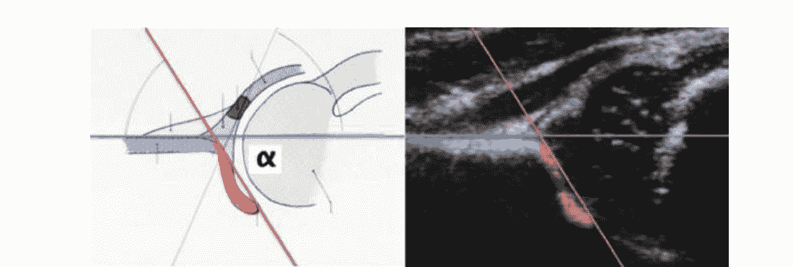

Graf方法的应用非常困难且操作者依赖性很强，原因包括图像质量低、解剖图像不足、相关解剖特征形状变异大以及缺乏足够的培训和专业知识。几项研究显示存在相当大的操作者间变异性，这可能会导致从发育不良变为正常或反之，或者改变发育不良程度，从而改变推荐的治疗方案。重要的是，对于正常髋关节，观察者间和观察者内误差较低，但对于边缘和异常髋关节，误差较高。

深度学习在图像处理方面取得了巨大的成功，特别是在医学影像分析方面[5, 6,7,8]。受到深度学习在其他模态中的成功的启发，我们试图开发一个分析流程来自动化Graf的方法。我们提出的问题和解决方案都具有几个独特的特点。首先，由于图像通常不会被保存或存储，训练数据很少。即使保存了这些图像，通常也会嵌入医生所做的标记，使其对训练的价值最小。其次，我们的目标是临床应用，我们对于黑盒分类方法不感兴趣，其中输入是图像，输出是α角度，而是对一组中间输出感兴趣，使临床医生能够可视化和解释结果。第三，超声图像与CT、X射线或MRI等其他医学影像模态相比，噪声明显。

我们设计了我们的流程来克服这些问题。为了克服训练数据的缺乏，我们首先解决了一个分割问题 - 在图像中识别髂骨和髋盂顶。这使我们能够从其他分割架构[9-11]中汲取灵感，并且更重要的是，使用众包生成训练数据。流程的第二个创新点是网络的对抗部分，计划利用问题不是一般分割，而是对明确定义的结构进行分割的事实。直观地说，对抗网络充当正则化器，确保分割是解剖上可行的。对抗网络通常用于生成环境中，我们不知道有研究在这种方式下使用它们。第三部分是一组简单的启发式规则，根据分割绘制线条。这些规则旨在模仿专家绘制线条和生成α角的过程，基于临床访谈和观察。最后，我们测试我们的流程，并展示它达到了专家级的准确性，并讨论我们方法的未来应用。

# 2 方法

## 2.1 数据

我们收集了1，056个未标注的婴儿髋部超声扫描图像。图像周围的黑色边框和文本被裁剪。我们编写了详细说明如何标记髂骨和髋臼盖，并使用了流行的众包平台CrowdFlower来招募工人标记图像。每个标记任务由三名不同的工人执行，并采用像素级多数投票作为最终分割结果。专家的检查确认该过程产生了合理质量的分割结果（例如，见图2）。

为了验证我们的方法，我们获取了一组已嵌入图像中的100个图像，其中包含了医师的注释，我们可以测量专家估计的α角，并将其与流程的估计值进行比较。然而，我们注意到嵌入的注释（以及一些文本）嵌入在图像的左下角可能会影响网络的性能，因为它在训练时没有观察到这样的输入。因此，我们将这个数据集称为我们的“铜标准”。

### 2.2 网络架构

我们将分割网络实现为一个具有多个下采样和上采样层的DCNN，用于处理四个不同尺度的输入图像。在向下传递过程中，使用步幅为2的卷积操作，导致输出尺寸为输入的一半。在向上传递过程中，使用分数步幅卷积将上一个较低分辨率尺度的输出上采样，并与当前层级连接。

输入是一张64×64的灰度图像。在每个尺度上应用了一个由三个3×3的卷积组成的序列，并通过一个分数步长为3×3的卷积进行上采样，并通过过滤器连接到上一尺度。连接临时增加了过滤器的数量，接下来的卷积将过滤器的数量恢复到每个尺度的恒定复杂度。每个卷积后面都跟着批量归一化[12]和ReLU激活。最后一个带有sigmoid激活的卷积产生输出。基本分割网络的损失函数是平均像素逐点对数损失。网络架构如图3所示。

由于分割网络在多个尺度上处理图像，它捕捉到了局部和全局的上下文。然而，由于像素逐点的损失函数，输出上的一些全局约束可能仍然不满足，在实践中，我们观察到在少数情况下，输出除了正确的髂骨和髋盖屋顶外还包含了一些噪点。虽然这些情况并不常见，但我们进一步改进了基本分割网络，使其产生的输出对于一个鉴别器网络来说与实际分割图像无法区分，类似于生成对抗网络（GAN）[13]。

鉴别器网络将64×64×2个输入图像（两个通道对应髂骨和髋臼屋顶）映射到概率上。它是通过训练得到的，将真实分割作为正例，将分割网络的输出作为负例。与GAN一样，它的训练目标是最小化对数损失。

我们将鉴别器网络实现为类似于[14]的DCNN，采用一系列的3×3步幅卷积。与[14]不同的是，我们在每个步幅为2的卷积之后跟随一个额外的步幅为1的卷积。第一个步幅为2的卷积的滤波器数量为16，并且随着每个额外的下采样步骤而加倍。经过五个下采样步骤后，2×2×256层被展平，应用0.5的dropout，然后通过具有sigmoid激活函数的线性层产生鉴别器的输出概率。

与GAN一样，这两个网络一起训练，交替进行分割网络和鉴别器网络的训练步骤。鉴别器网络的损失函数是鉴别对数损失 $-E_{(x,y) \in p} [\log D(y) + \log (1-D(S(x)))]$，并且术语 $-\lambda \log (D(S(x)))$ 被添加到基本分割网络的损失函数中 $\frac{1}{64^2} \sum_{1 \le i,j \le 64} (y_{i,j} \log S(x)_{i,j} + (1-y_{i,j}) \log (1-S(x)_{i,j}))$ 其中$x_{i,j}$是输入图像中位置$(i, j)$处的像素，$y_{i,j}$是位置$(i, j)$处的真实分割标签，$S$是分割网络，$D$是鉴别器网络，$\lambda$是平衡像素级对数损失和对抗损失的权重，使得两个损失在大致相同的尺度上。我们注意到，虽然添加对抗网络并没有改善像素级对数损失，但在分割方面有了显著的定性改善。包含对抗成分在训练阶段的效果如图4所示。

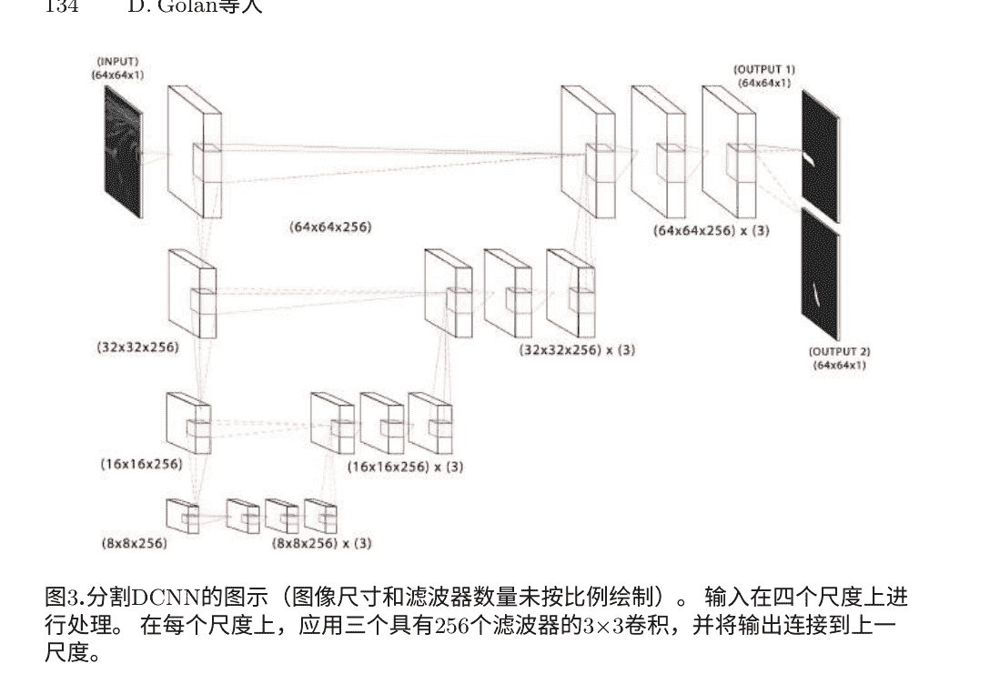

图3.分割DCNN的图示（图像尺寸和滤波器数量未按比例绘制）。输入在四个尺度上进行处理。在每个尺度上，应用三个具有256个滤波器的3×3卷积，并将输出连接到上一尺度。

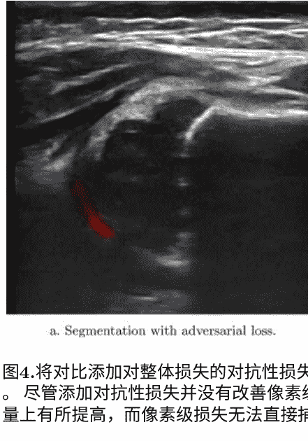

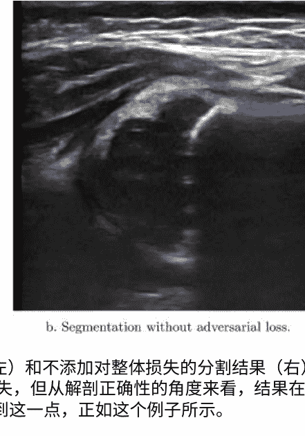

图4.将对比添加对整体损失的对抗性损失（左）和不添加对整体损失的分割结果（右）。尽管添加对抗性损失并没有改善像素级损失，但从解剖正确性的角度来看，结果在质量上有所提高，而像素级损失无法直接捕捉到这一点，正如这个例子所示。

# 3 结果

## 3.1 训练

使用TensorFlow [15]实现，使用Adam算法 [16]进行训练，训练周期为200个epoch，批量大小为8张图像。 训练图像以0.5的概率进行增强，增强方式包括在[-15,15]度范围内均匀旋转和在[1,2]范围内均匀水平或垂直拉伸。

权重衰减设置为10^{-3}，λ设置为10^{-4}。 分割网络的学习率初始值为5×10^{-3}，并在每个训练epoch中乘以0.98。鉴别器学习率设置为0.1，分割学习率。权重的初始化与[17]中相同。

## 3.2 后处理

网络的输出被视为概率图，一个用于髂骨，一个用于髋臼屋顶。 我们通过首先将所有小于平均激活的条目置零，然后使用skimage库中的regionprop函数识别出最大感兴趣区域，并将该区域外的所有激活置零来去噪输出。 我们发现这个简单的去噪步骤对下游分析非常有益。 然而，更多的训练数据可能使其变得不必要。

一条线 ℓ = (a, b) 描述了点集 (x, y)，其中 y = ax + b。我们将平方距离的和定义为
$$ssd(ℓ) = \sum_{i,j} d((i, j), ℓ)^2 P_{ij}$$
其中 d 表示点到直线的距离，求和是在相关输出图像的所有像素上进行的，P_{ij} 是适当像素的激活概率。我们还定义
$$f(ℓ) = \sum_{i,j} P_{ij} \mathbb{I} \{ ia + b < j \}$$
作为概率图中位于直线下方的部分的比例。然后我们解决 ℓ = \arg \min ssd(ℓ) s.t. f(ℓ) = c，其中 c = 0.85。选择 c 的值是为了使得线条在视觉上与医生通常绘制的线条最相似，通过在训练图像的一个小子集上进行可视化来避免过拟合。我们注意到 α 角度对 c 的变化相当稳定，因为 c 的小变化主要影响线的截距。然而，线的实际位置似乎与医生的期望最接近，当 c = 0.85时。整个分析流程如图5所示。

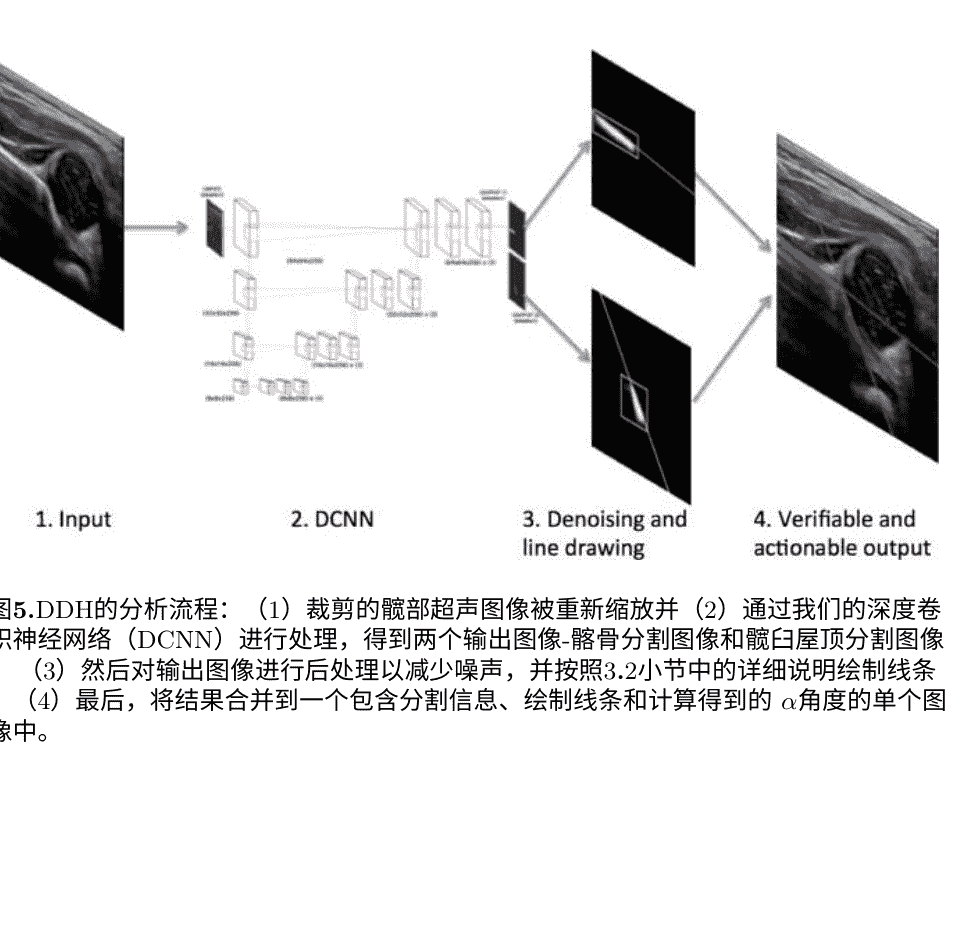

# 4 结果

我们将我们的流程应用于我们的铜标准测试集。结果显示我们的流程计算得到的 α角度与人工计算的角度之间的相关性为0.76，77%的图像显示出流程与专家之间的差异小于5°。差异的标准差为4.0°，这在文献中已有报道的观察者间变异范围内（分别为3.9°和3.2°）。结果如图6所示。

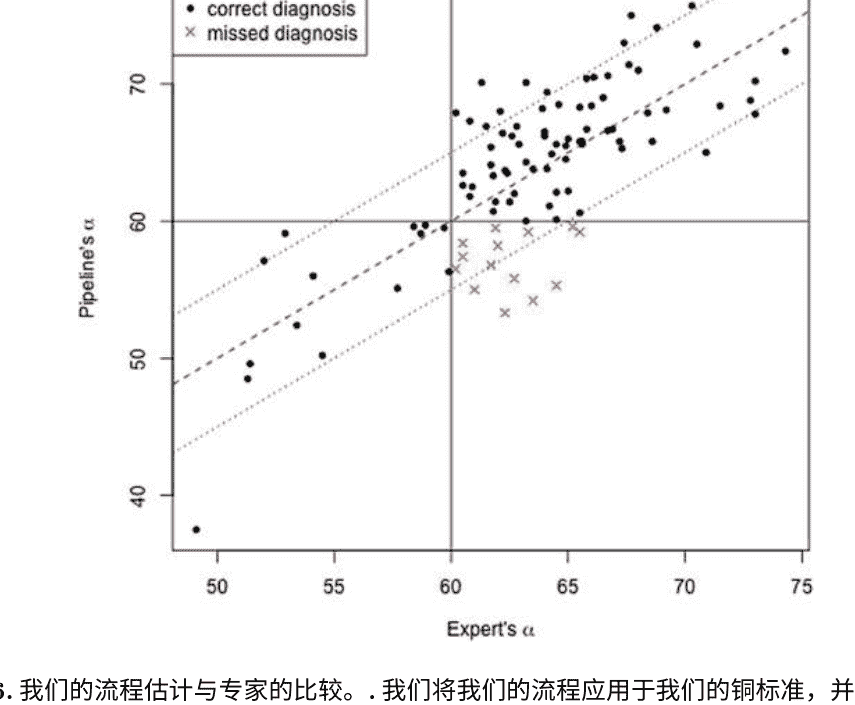

图6. 我们的流程估计与专家的比较。 . 我们将我们的流程应用于我们的铜标准，并在这里绘制了流程的估计 α角度（y轴）和专家的估计 α角度（x轴）。为了方便比较，我们绘制了 y = x 线（虚线），以及其周围 ±5度的带状区域（点线）。估计的 α显示出很高的相关性（0.76），77%的结果在 < 5°的差异范围内。

就临床分类为正常与异常而言，专家和流程在86%的情况下达成一致（标记为黑点），在14%的情况下存在分歧（标记为红叉）。有关明显异常值的深入研究可参见图7。

三幅图像显示了专家和流程之间 > 10°的不合理差异（图7，底行）。然而，专家对这些结果的检查确认了这些情况中专家的错误，并且流程的结果确实更好。

在临床决策支持方面，对于60°的截断值非常重要，可以区分正常和畸形解剖。假设专家意见作为基本事实，我们的流程没有产生假阴性结果，但有14%的假阳性结果，与专家之间15%的不一致性类似，详见[4]。

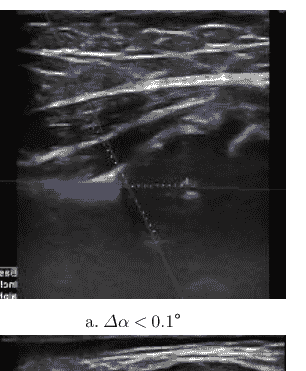

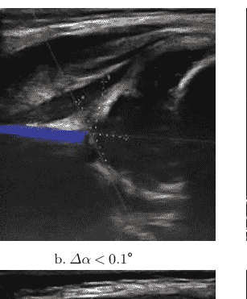

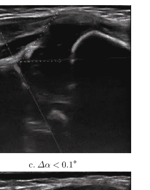

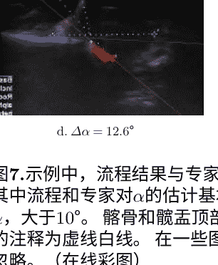

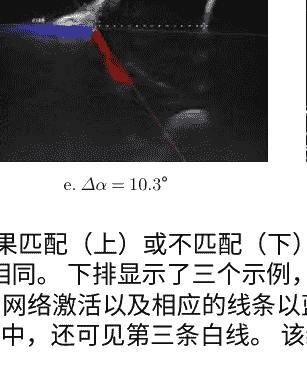

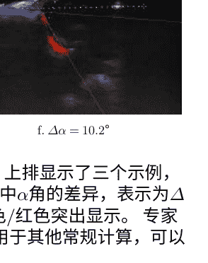

图7. 示例中，流程结果与专家结果匹配（上）或不匹配（下）。上排显示了三个示例，其中流程和专家对α的估计基本相同。下排显示了三个示例，其中α角的差异，表示为Δα，大于10°。髂骨和髋盂顶部的网络激活以及相应的线条以蓝色/红色突出显示。专家的注释为虚线白线。在一些图像中，还可见第三条白线。该线用于其他常规计算，可以忽略。（在线彩图）

# 5 讨论

在本文中，我们描述了一种基于深度学习的自动估计婴儿髋部超声图像中Graf's alpha角度的新型流程。Graf's方法因操作者依赖性而臭名昭著，并且需要多年的培训才能达到合理的专业水平，自动化该方法将具有很大的医学和社会价值。我们面临的主要挑战之一是缺乏具有已知α角度但没有嵌入注释的良好训练数据的图像。

为了克服这个挑战，我们将问题分为两个部分：分割和注释。这使我们能够利用众包的力量为分割问题生成良好的训练数据，同时制定相对简单的规则来执行分割之上的注释。我们发现结果非常有希望：流程的估计与专家的估计通常有很好的一致性，在那些存在最大分歧的情况下，外部专家意见支持流程的结果。

我们采用了两种策略来捕捉全局信息。首先，我们的DCNN在多个尺度上处理图像。其次，我们通过对抗性损失来补充逐像素的损失，以产生全局一致的输出。对抗网络已被提出用于无监督和半监督学习，但在这项工作中，对抗网络用于改进完全监督学习的输出。这种方法可能对其他分割任务有益，更一般地说，对于输出具有复杂结构且可能被神经网络很好捕捉的监督学习任务有益。

我们认为我们的工作只是第一步，主要是由于使用的数据量相对较小，更多的数据可能会提高分割的性能。新数据还应涵盖更广泛的超声机器和探头配置，以实现更好的泛化。与更“经典”的计算机视觉方法相比，深度学习方法的一个显著优势是它能够随着数据的积累而持续学习。例如，[20]使用传统滤波器后跟主动轮廓来分割髂骨。我们尝试了类似的方法，并发现它们对图像质量非常敏感，并且需要大量的微调。

另一个重要任务是建立一个适当的黄金标准测试集：一个没有注释的大量图像集合，然后由多个专家进行注释。理想情况下，应该进行后续扫描来确定边界情况的真实情况。不幸的是，这样的数据更难获取。一旦有了这样的数据，目前在流程中更加启发式的部分（例如设置 c 的值）也可以自动化。

自动化DDH诊断可能对医疗和经济都有重大影响。如今，由于大多数国家缺乏普遍的筛查实践，许多DDH病例未被发现，主要是由于高成本和专业知识的低可用性。我们的流程是朝着普遍可访问的DDH筛查迈出的一步，早期捕捉DDH病例，当医疗干预容易且有效时。这样的普遍筛查将极大改善数百万人的生活质量，并减轻早期骨关节炎带来的经济负担。

最后，我们相信我们的方法可以应用于除了DDH之外的其他用例，更重要的是，可以应用于超声以外的其他医学成像数据的完全自动化分析，跨越临床用例和成像模式。

英国伦敦；Daniel Reed，英国伦敦；Rosy Jalan，英国伦敦；Ibraheim El-Daly，英国伦敦；Lukasz Matuszewski，波兰卢布林；Salih Marangoz，土耳其伊斯坦布尔；Greg Firth，南非约翰内斯堡；Leon Izerel，南非约翰内斯堡；Ole Rahbek，丹麦奥胡斯；Michel Bach Hellfritzsch，丹麦奥胡斯；Christian Wong，丹麦哥本哈根；Charlotte Strandberg，丹麦Gentofte；Michael Christodolou，希腊雅典；Abhilash Hareendranathan，加拿大埃德蒙顿；Dornoosh Zonoobi，加拿大埃德蒙顿；Nicole Williams，澳大利亚阿德莱德；Andrew Morris，澳大利亚阿德莱德；Peter Cundy，澳大利亚阿德莱德；Rebecca Linke，澳大利亚阿德莱德。

# 参考文献

1.  Furnes, O., Lie, S.A., Espehaug, B., Vollset, S.E., Engesaeter, L.B., Havelin, L.I.: 髋关节疾病与全髋关节置换的预后。骨关节杂志 83(4), 579-579 (2001)
2.  Graf, R.: 超声波组合治疗对先天性髋关节脱位的诊断。骨科外伤外科杂志 97(2), 117-133 (1980)
3.  Dias, J.J., Thomas, I.H., Lamont, A.C., Mody, B.S., et al.: 超声波评估新生儿髋关节的可靠性。骨关节杂志 75(3), 479-482 (1993)
4.  Roovers, E.A., Boere-Boonekamp, M.M., Geertsma, T.S.A., Zielhuis, G.A., Kerkhoff, A.H.M.: 婴儿髋关节发育不良的超声波筛查。骨关节杂志 85(5), 726-730 (2003)
5.  Krizhevsky, A., Sutskever, I., Hinton, G.E.: 使用深度卷积神经网络进行Imagenet分类。在: 神经信息处理系统进展, 第1097-1105页 (2012年)
6.  LeCun, Y., Bengio, Y., Hinton, G.: 深度学习。Nature 521(7553), 436-444 (2015)
7.  Zhang, W., Li, R., Deng, H., Wang, L., Lin, W., Ji, S., Shen, D.: 用于多模态等强度婴儿脑图像分割的深度卷积神经网络。NeuroImage 108, 214-224 (2015)
8.  Havaei, M., Davy, A., Warde-Farley, D., Biard, A., Courville, A., Bengio, Y., Pal, C., Jodoin, P.-M., Larochelle, H.: 使用深度神经网络进行脑肿瘤分割。医学图像分析 (2016年)
9.  Long, J., Shelhamer, E., Darrell, T.: 全卷积网络用于语义分割。在: IEEE计算机视觉和模式识别会议论文集, 第3431-3440页 (2015年)
10. Hariharan, B., Arbel´aez, P., Girshick, R., Malik, J.: 用于对象分割和细粒度定位的超列。在: IEEE计算机视觉和模式识别会议论文集, 第447-456页 (2015年)
11. Newell, A., Yang, K., Deng, J.: 用于人体姿势估计的堆叠沙漏网络。arXiv预印本arXiv:1603.06937 (2016年)
12. Ioffe, S., Szegedy, C., Normalization, B.: 通过减少内部协变量偏移来加速深度网络训练。arXiv:1502.03167, 第1-11页 (2015年)
13. Goodfellow, I., Pouget-Abadi, J., Mirza, M.: 生成对抗网络, arXiv预印本, 第1-9页 (2014年)
14. Radford, A., Metz, L., Chintala, S.: 无监督表示学习与深度卷积生成对抗网络. arXiv, pp. 1-15 (2015)
15. Abadi, M., Agarwal, A., Barham, P., Brevdo, E., Chen, Z., Citro, C., Corrado, G.S., Davis, A., Dean, J., Devin, M., et al.: TensorFlow: 大规模机器学习在异构分布式系统上的应用. arXiv预印本 arXiv:1603.04467 (2016)
16. Kingma, D.P., Ba, J.L.: Adam: 一种随机优化方法. 在: 国际学习表示会议, pp. 1–13 (2015)
17. He, K., Zhang, X., Ren, S., Sun, J.: 深入研究整流器: 在ImageNet分类任务上超越人类水平的性能. arXiv预印本, pp. 1–11 (2015)
18. Van der Walt, S., Schönberger, J.L., Nunez-Iglesias, J., Boulogne, F., Warner, J.D., Yager, N., Gouillart, E., Yu, T.: Scikit-image: Python中的图像处理. PeerJ 2, e453 (2014)
19. Zieger, M.: 婴儿髋关节超声. 第2部分. 方法的有效性. Pediatr. Radiol. 16(6), 488–492 (1986)
20. Cevik, K.K., Kocer, H.E., Andac, S.: 从超声图像中分割髂骨和股骨区域，用于诊断髋关节发育不良. J. Med.Imaging Health Inf. 6(2), 449–457 (2016)

## 用于生物医学3D数据分割的多维门控循环单元

Simon Andermatt\(^{(\text{\textcopyright})}\)，Simon Pezold和Philippe Cattin

巴塞尔大学生物医学工程系，瑞士奥尔斯维尔
simon.andermatt@unibas.ch

摘要。我们提出了一种监督的深度学习方法，用于自动分割生物医学图像数据的3D体积。所提出的方法利用了一个神经网络，主要层由多维门控循环单元组成。我们应用了一种即时数据增强技术，可以在不需要大量训练数据或高级数据预处理或后处理的情况下进行准确估计。我们展示我们的方法在一个流行的脑分割挑战数据集上在速度、准确性和内存效率方面表现出类似领先技术的性能。我们详细描述了与使用成熟的长短期记忆方法的类似方法相比的优势。

关键词：深度学习 · GRU · 多维 RNN · 分割

# 1 引言

随着成像技术的快速发展，其普及性和价格的下降，大量的数据被收集。这在医学成像领域尤为明显。然而，在这些医学数据中准确地分割和描绘病理等问题仍然存在挑战，因为这仍然主要是一个手动过程。在拥有数千名患者的晚期药物研究中，通常每个患者会收集多个具有不同MR序列的3D数据集。如果需要对大量数据进行定量分析，那么受过专业培训的专家需要花费大量时间来处理数据。成功的自动分割技术将最大程度地减少手动工作量，降低开发新治疗方法所需的成本和时间。

然而，由于其高维度、成像噪声、伪影和其他因素，对生物医学体积数据进行自动分割是一个具有挑战性的问题。深度学习领域的最新进展，特别是现代GPU的启用以及通用GPU计算的出现，使卷积神经网络[9]得到了复兴。这些前馈网络显示出巨大的潜力，但需要大量的层来准确解决困难任务。相比之下，递归神经网络（RNN）由于其额外的时间维度可以变得任意深。在RNN中计算的每个时间步骤大致对应于前馈网络中的一层。

其中一个RNN的权重在每个时间步骤上都相同。这个特性使得能够非常优雅地定义更复杂的结构，而不需要大量的层或参数。

Stollenga等人提出的多维长短期记忆（MD-LSTM）[13]，称为PyraMiD-LSTM，将这些见解应用于长短期记忆（LSTM）[6]。它为每个空间维度定义了两个LSTM，使用该空间维度作为时间维度。第一个LSTM沿着该维度处理数据，第二个LSTM沿着相反的方向处理数据。为了充分利用空间信息，不仅考虑了沿着时间方向的直接前驱，还考虑了其局部邻域。

这可以通过卷积来简洁地表达。

一种相对较新的循环神经网络叫做门控循环单元（GRU）[2]在近年来变得流行，并成为LSTM的强有力竞争对手。它可以被看作是LSTM的简化版本，它使用更新门而不是遗忘门和输入门，并且将隐藏状态和细胞状态结合起来[11]。已经证明它在序列建模任务中与LSTM表现相当[3]。另一项研究表明，GRU和LSTM在选定的任务上报告了类似的性能[5]。对于选定的任务，在超过10,000个RNN架构中进行的经验搜索表明，尽管不是在每个任务上表现最好的RNN，GRU在性能上超过了标准的LSTM架构[8]。在RNN中，更大的时间维度意味着可以表示更大的时间依赖性。GRU的较低内存需求意味着可以将更大的数据量输入到网络中，并且可以为相同的数据量设计更大的网络。

出于这些原因，对GRU进行修改以处理体积数据似乎是必要的。我们提出了多维GRU（MD-GRU），能够准确地分割3D数据。我们提及了与MD-LSTM相比的理论内存节省，并展示了MD-GRU的性能相当甚至更好。此外，我们展示了MD-GRU的收敛速度、计算时间和较少门的组合的优势。我们将我们的方法应用于一个流行的脑分割挑战数据集，取得了排名前3的最佳表现方法之一。

# 2 方法

## 2.1 数据

我们使用了公开可用的MrBrainS [10]挑战数据集，这是用于评估PyraMiD-LSTM的数据集之一。MrBrainS挑战数据集包含5个标记样本和15个测试样本，每个样本都有一个T1加权、T1倒转恢复和FLAIR扫描。由于标记是在低分辨率数据上进行的，因此不使用额外的高分辨率T1扫描。训练数据包含两个不同的标签图，一个用于训练，一个用于测试。训练图包含皮层灰质（GM）、基底神经节、白质（WM）、WM损伤、脑脊液（CSF）、脑室、小脑、脑干和背景等类别。测试图仅包含定义了GM，WM和CSF的类，训练图的相应类别被合并。评估中不包括脑干和小脑，因此在测试图中不会出现标记。

## 2.2 卷积门控循环单元

标准GRU如[2]中所提出的定义为

$$
\begin{aligned}
r^j &= \sigma([W_r x]^j + [U_r h_{t-1}]^j), \quad (1) \\
z^j &= \sigma([W_z x]^j + [U_z h_{t-1}]^j), \quad (2) \\
\tilde{h}_t^j &= \phi([W x]^j + [U (r \odot h_{t-1})]^j), \quad (3) \\
h_t^j &= z^j \odot h_{t-1}^j + (1 - z^j) \odot \tilde{h}_t^j, \quad (4)
\end{aligned}
$$

其中，x是输入数据，r^j是重置门，z^j是隐藏单元j的更新门，激活函数在h^j中进行。运算符⊙表示逐元素乘法。函数σ(·)和φ(·)分别表示逻辑函数和双曲正切函数。W和U分别是当前输入和上一步输出数据的权重矩阵。在Stollenga等人[13]的基础上，我们改进了这些方程以处理3D体积，并引入了我们的卷积GRU（C-GRU）：

$$
\begin{aligned}
r^j &= \sigma \left( \sum_{i}^{I} (x^i * w_r^{i,j}) + \sum_{k}^{J} (h_{t-1}^k * u_r^{k,j}) + b_r^j \right), \quad (5) \\
z^j &= \sigma \left( \sum_{i}^{I} (x^i * w_z^{i,j}) + \sum_{k}^{J} (h_{t-1}^k * u_z^{k,j}) + b_z^j \right), \quad (6)
\end{aligned}
$$

$$
\begin{aligned}
\tilde{h}_t^j &= \phi \left( \sum_{i}^{I} (x^i * w^{i,j}) + r^j \odot \sum_{k}^{J} (h_{t-1}^k * u^{k,j}) + b^j \right), \quad (7) \\
h_t^j &= z^j \odot h_{t-1}^j + (1 - z^j) \odot \tilde{h}_t^j, \quad (8)
\end{aligned}
$$

其中 *表示卷积。与普通GRU相比，我们引入了一些细微的变化。我们决定在每个门上使用一个偏置 b。我们将 r^j 从 u 和 h_{t-1} 的卷积操作中分离出来。这个改变是因为额外的卷积需要 r 现在所需的两倍的支持，因为有链式卷积。此外，我们对每个C-RNN的数据进行重新排序，使得两个空间维度最接近内存，并且时间维度按照时间方向排序，如下一段所述。我们基于GPU上更快的处理速度来解释这个决定，因为现在所有的卷积都需要接近内存的数据。一个C-GRU的计算在图2a中被可视化为一个计算图。

MD-GRU由两个C-GRU组成，其中D是图像数据的维度，我们需要每个方向一个C-GRU。我们将通道 i 的输入数据设置为 x_i \in \mathbb{R}^{S_1 \times \cdots \times S_D}。对于每个空间维度 d，我们创建 x_{i,d,-1}, x_{i,d,+1} \in \mathbb{R}^{S_d \times S_1 \times \cdots \times S_D} 的副本 x_i，并应用以下数据转换：

$$
\begin{aligned}
x_{i,d,+1}(s_d, s_1, \ldots, s_D) &= x^i(s_1, \ldots, s_d, \ldots, s_D), \quad (9) \\
x_{i,d,-1}(S_d - s_d, s_1, \ldots, s_D) &= x^i(s_1, \ldots, s_d, \ldots, s_D), \quad (10)
\end{aligned}
$$

其中 s 是 C-GRU 分配维度的索引，S 是维度的大小。逆操作应用于 h^{j,d+1}, h^{j,d-1} \in \mathbb{R}^{S_d \times S_1 \times \cdots \times S_D}，以收集最终输出 h^j：

$$
h^j(s_1, \ldots, s_D) = \sum_{d=1}^{D} \left( h^{j,d+1}(s_d, s_1, \ldots, s_D) + h^{j,d-1}(S_d - s_d, s_1, \ldots, s_D) \right) \quad (11)
$$

图2b详细说明了MD-GRU的这个过程。我们在MD-LSTM的实现中采用相同的技术。

## 2.3 实验

网络。我们的网络模型类似于[13]。我们包括了三个多维RNN（MD-RNN）层，分别为16、32和64个通道，它们与像素级全连接的隐藏层（分别为25和45个通道）相连，每个隐藏层后面跟着一个双曲正切激活函数。最后一个MD-RNN连接到一个像素级全连接层，通道数为 c，与数据中的类别数相同。我们使用softmax在最后一层估计每个类别的概率，并选择多项式逻辑损失函数来训练我们的网络。图2c显示了我们在MD-GRU情况下的网络设置。

图2.(a) 表示一个C-GRU中计算的有向图。变量 $x^{d,o}$，$h^{d,o}$，其中 $o \in \{-1, +1\}$ 表示所有 $I$ 和 $J$ 通道的输入和输出数据。这里的 $\bigoplus$ 运算符表示对每个通道 $j$ 进行求和，该求和是通过与每个通道 $i$ 或 $k$ 的卷积来实现的，如公式(5)-(7)所示。(b) 在三维数据中，将6个C-GRU排列在MD-GRU中。(c) 我们网络的设置。

设置。所有实验都是在拥有12 GB全局内存的NVIDIA GTX Titan X GPU上计算的。我们对MD-LSTM和MD-GRU的实现依赖于NVIDIA的cuDNN [1]提供的快速卷积例程。对于其他层，使用了CAFFE¹框架[7]中已有的实现。

预处理。对于所有的体积，使用高斯平滑图像（$\sigma = 5$ 个体素）进行非锐化掩蔽，然后从原始图像中减去以产生高通滤波的体积。原始图像和高通滤波图像被归一化为 $\sigma = 1$ 和 $\mu = 0$，假设值服从正态分布。通过这种方式，我们遵循了类似于[13]的过程，但省略了直方图均衡化。图1显示了训练样本5在切片19上的原始和预处理数据。

数据增强。在训练阶段，每次迭代时，随机选择训练数据中的一个位置，并生成变形场，然后将其应用于子体积，然后输入网络。我们使用了类似于[12]的过程，但栅格大小取决于数据。在可行性研究中提到的第3.1节中，我们没有使用随机变形。在测试阶段，没有应用变形。

训练。在三个训练步骤中，我们逐步增加子体积的大小，从 64×64×8 体素增加到 128×128×12，最后增加到 200×200×15，保持第三个维度较小以适应各向异性 MR 体积分辨率。我们依赖于 AdaDelta [15] 来避免手动调整学习率。对于挑战赛，我们还在每个 C-GRU 的输入连接上使用了 DropConnect [14]，值为 0.5，以防止过拟合。训练耗时约两天。

测试。在测试阶段，我们将体积分成一个等大小的子体积网格，大小为 120×120×8，分别在体积的四个边上填充了 50、50 和 4 个体素。填充后的部分后来使用高斯函数 (μ=0, σ=(10,10,0.8)) 进行插值权重的拼接，因为边界包含了来自各个 RNN 的起始伪影，并且不包含足够的结果。由于我们训练了九个类别，但最终评估只需要四个类别，我们简单地将脑脊液和脑室的二值标签合并，将皮质灰质和基底节合并，将白质和白质病变合并。其他所有内容都被视为背景。

测试一个MRBrainS数据卷需要32次迭代，大约需要两分钟。

## 3 个结果

## 3.1 可行性研究

为了指出MD-GRU和MD-LSTM之间的差异，我们在相同的设置下运行了多维RNN层，其中多维RNN层可以是MD-GRU或MD-LSTM。我们在MrBrainS挑战赛的训练集中使用了前四个卷，并且在最大可行分辨率上对两个网络进行了3 000次迭代的训练（由我们的MD-LSTM实现限制为192 × 192 ×14）。平均而言，MD-GRU和MD-LSTM的一个训练迭代分别需要9.1秒和12.8秒。CSF、GM、WM和ICV之间的Dice系数在第5个训练卷的计算分割和提供的参考分割之间在MD-GRU和MD-LSTM中分别显示在表1中。计算分割的第19个切片和参考分割与每次训练过程的损失函数的100次迭代的运行平均值的绘图显示在图3中。

表1. 可行性研究。灰质和白质、脑脊液（CSF）和颅内容积（ICV）的Dice系数百分比。

|          | 灰质   | 白质   | 脑脊液 | 颅内容积 |
|----------|--------|--------|--------|----------|
| MD-LSTM  | 88.09  | 90.08  | 82.62  | 97.56    |
| MD-GRU   | 87.88  | 90.15  | 83.19  | 97.73    |

图3.可行性研究。顶行：用于评估的第5个训练体积的第19个切片。从左到右依次表示MD-LSTM、MD-GRU和手动标记的结果。底行：MD-GRU和MD-LSTM可行性研究的收敛速率。

## 3.2 MRBrainS上的MD-GRU

为了超越MRBrainS挑战的最高分，我们使用了我们描述的数据增强方法。每个子体积在三个训练阶段中都随机变形。我们使用了所有提供的低分辨率体积及其高通滤波版本。表2列出了我们根据灰质、白质、脑脊液和颅内容积的Dice系数、Hausdorff距离的95th百分位数和平均体积差异的性能。共有九个指标相关。

表2.MrBrainS挑战。六种最佳方法在GM、WM、CSF和ICV的所有三种使用的指标（Dice系数、Hausdorff距离的95th百分位数和平均体积差异）的结果。粗体数字表示这六个中的最佳结果。结果反映了2016年8月12日的状态。

| 团队名称           | 排名 | 灰质 Dice | 灰质 HD | 灰质 AVD | 白质 Dice | 白质 HD | 白质 AVD | 脑脊液 Dice | 脑脊液 HD | 脑脊液 AVD | 颅内容积 Dice | 颅内容积 HD | 颅内容积 AVD |
|--------------------|------|------------|----------|------------|------------|----------|------------|--------------|------------|--------------|----------------|--------------|--------------|
| CU_DL2             | 1    | **86.15**  | **1.45** | **6.60**   | **89.46**  | **1.94** | 6.05       | **84.25**    | 2.19       | 7.69         | 98.10          | 2.75         | 1.54         |
| CU_DL              | 2    | 86.12      | 1.47     | 6.42       | 89.39      | **1.94** | **5.84**   | 83.96        | 2.28       | 7.44         | 97.99          | 3.16         | 1.83         |
| MD-GRU [提出]      | 3    | 85.40      | 1.55     | 6.09       | 88.98      | 2.02     | 7.69       | 84.13        | 2.17       | 7.44         | **98.15**      | **2.37**     | 0.86         |
| PyraMiD-LSTM2      | 4    | 84.89      | 1.67     | 6.35       | 88.53      | 2.07     | 5.93       | 83.05        | 2.30       | 7.17         | 98.04          | 2.86         | **0.69**     |
| FBI/LMB Freiburg [4] | 5    | 85.44      | 1.58     | 6.60       | 88.86      | 1.95     | 6.47       | 83.47        | 2.22       | 8.63         | 97.98          | 2.51         | 1.06         |
| IDSIA [13]         | 6    | 84.82      | 1.70     | 6.77       | 88.33      | 2.08     | 7.05       | 83.72        | **2.14**   | **7.09**     | **98.15**      | 2.44         | 0.95         |

对于最终评估：Dice系数，修改后的Hausdorff距离和平均体积距离在GM、WM和CSF三个类别中的每个类别中使用的排名总和作为性能评分，并确定最终排名。图4显示了测试数据中样本5、10和15在切片19处的计算分割结果。

# 4 讨论

可行性研究表明，MD-GRU在相同设置下以更短的时间达到了与MD-LSTM相当的结果，因此在体积图像分割方面具有巨大潜力。

在挑战中，我们使用变形作为数据增强策略和DropConnect作为正则化策略，排名第3位。不幸的是，挑战高分榜前五名中的结果都尚未发表。第4名和第6名都是已讨论过的MD-LSTM的不同版本，其中只有后者在[13]中有描述，而前者可能包含未发表的改进方法。与[13]不同的是，我们没有省略原始的T1 IR图像。然而，一些明显的错误分类可以追溯到T1 IR图像中的强偏置场伪影。考虑到训练样本数量较少，使用T1红外图像导致对偏置场的明显拟合。此外，由于我们决定为每个RNN层复制输入和输出数据，因此我们无法复制Stollenga等人的训练体积大小[13]，因为我们的实现需要更高的内存需求，详见第2.2节。在比较这两种方法时，必须牢记这一点。在我们的网络中，无法对位于数据中某一距离的区域之间的关系进行建模，而[13]能够在两个维度以及更大的第三个维度中使用完整的空间上下文。在他们的最后一次训练步骤中，超过一半的数据被覆盖，而我们的内存只能容纳超过五分之一的数据。

排名第五的贡献是使用3D U-Net [4]计算得出的。它由一个具有快捷连接的分层卷积神经网络组成，使用各种即时数据增强技术进行训练，包括本文中使用的变形策略。挑战结果和相应的算法适应挑战数据的情况尚未发布。我们认为数据增强对于成功应用于训练样本数量较少的问题至关重要。

# 结论

通过使用MD-GRU，我们将RNN的巨大表达能力与高度有益的数据增强策略相结合，从而得到了一种强大的监督自动分割技术。通过一种节省内存的实现方式，省略了数据的初始重新排序，可以实现超越现有技术的结果。

# 参考文献

- 1. Chetlur, S., Woolley, C., Vandermersch, P., Cohen, J., Tran, J., Catanzaro, B., Shel hamer, E.: cuDNN: 高效的深度学习基元. arXiv:1410.0759 [cs], 2014年10月
- 2. Cho, K., van Merrienboer, B., Gulcehre, C., Bahdanau, D., Bougares, F., Schwenk, H., Bengio, Y.: 使用RNN编码器-解码器学习短语表示用于统计机器翻译. arXiv:1406.1078 [cs, stat], 2014年6月
- 3. Chung, J., Gulcehre, C., Cho, K., Bengio, Y.: 对序列建模中门控循环神经网络的实证评估. arXiv:1412.3555 [cs], 2014年12月
- 4. Cícek, O., Abdulkadir, A., Lienkamp, S.S., Brox, T., Ronneberger, O.: 3D U-Net: 从稀疏注释中学习密集体积分割. arXiv:1606.06650 [cs], 2016年6月
- 5. Greff, K., Srivastava, R.K., Koutn´ık, J., Steunebrink, B.R., Schmidhuber, J.: LSTM: A Search Space Odyssey. arXiv:1503.04069 [cs], 2015年3月
- 6. Hochreiter, S., Schmidhuber, J.: 长短期记忆. Neural Comput. 9(8), 1735–1780 (1997)
- 7. Jia, Y., Shelhamer, E., Donahue, J., Karayev, S., Long, J., Girshick, R., Guadar-ram a, S., Darrell, T.: Caffe: 快速特征嵌入的卷积架构. arXiv预印本 arXiv:1408.5093 (2014)
- 8. Jozefowicz, R., Zaremba, W., Sutskever, I.: 循环网络结构的实证探索. In: 机器学习 第32届国际会议论文集, pp. 2342–2350 (2015)
- 9. Krizhevsky, A., Sutskever, I., Hinton, G.E.: 使用深度卷积神经网络进行ImageNet分类。 在: Pereira, F., Burges, C.J.C., Bottou, L., Weinberger,K.Q. (eds.) Advances in Neural Information Processing Systems 25, pp. 1097–1105. Curran Associates Inc, Red Hook (2012)
- 10. Mendrik, A.M., Vincken, K.L., Kuijf, H.J., 等: MRBrainS挑战：用于3T MRI扫描中的脑图像分割的在线评估框架。 Comput.Intell. Neurosci. 2015, 16 (2015). doi:10.1155/2015/813696. 文章编号813696
- 11. Olah, C.: 理解LSTM网络, 2015年8月 。 http://colah.github.io/posts/2015-08-Understanding-LSTMs/
- 12. Ronneberger, O., Fischer, P., Brox, T.: U-Net:卷积网络用于生物医学图像分割。 在: Navab, N., Hornegger, J., Wells, W.M., Frangi, A.F. (eds.) MICCAI 2015. LNCS, vol. 9351, pp. 234–241. Springer, Heidelberg (2015)
- 13. Stollenga, M.F., Byeon, W., Liwicki, M., Schmidhuber, J.: 并行多维LSTM，应用于快速生物医学体积图像分割。 在: Cortes, C., Lawrence, N.D., Lee, D.D., Sugiyama, M., Garnett, R. (eds.)Advances in Neural Information Processing Systems 28, pp. 2998–3006. CurranAssociates Inc., Red Hook (2015)
- 14. Wan, L., Zeiler, M., Zhang, S., Cun, Y.L., Fergus, R.: 使用DropConnect对神经网络进行正则化。 在: Dasgupta, S., McAllester, D. (eds.) 第30届国际机器学习大会(ICML-13)会议论文集，JMLR研讨会和会议论文集，第28卷，2013年5月，第1058-1066页。
- 15. Zeiler, M.D.: ADADELTA:一种自适应学习率方法。 arXiv:1212.5701 [cs], 2012年12月。

## 学习热过程表示用于缺血性中风术中皮层灌注分析

Nico Hoffmann1,2(✉), Edmund Koch1, Gerald Steiner1, Uwe Petersohn2, 和Matthias Kirsch3

1 临床传感和监测，德累斯顿工业大学，01307 德累斯顿，德国

nico.hoffmann@tu-dresden.de

2 应用知识表示和推理，德累斯顿工业大学，01062 德累斯顿，德国

3 神经外科学系，卡尔古斯塔夫卡鲁斯大学医院，01307 德累斯顿，德国

摘要。红外热成像是一种非侵入性和无标记的方法，用于术中测量小温度变化。在这项工作中，我们展示了主动动态热成像在脑缺血情况下分析组织灌注状态的能力。为此，在半颅骨切除术期间对暴露的皮层进行氯化钠冲洗。热成像系统测量引起的温度变化，而组织加热则通过双指数函数建模。建模的温度衰减常数允许我们根据其动态热性质表征组织灌注。由于术中成像阻止了使用计算密集型参数优化方案，我们讨论了一个深度学习框架，该框架在给定简单温度序列的情况下近似这些常数。将该框架与常见的Levenberg-Marquardt基于参数优化方法进行比较。所提出的深度参数近似框架与随机初始化的数值优化相比表现良好。我们进一步通过术中病例验证了近似参数，该病例患有急性脑缺血。结果表明，即使是近似的温度衰减常数也能够量化皮层灌注。后者提供了皮层热力学性质的标准化表示，并可能指导进一步研究特定的术中治疗和具有非典型皮层灌注的病理特征。

关键词：
- 神经外科
- 术中热成像
- 深度学习
- 参数近似

# 1 引言

热成像是一种非接触、无标记、独立于白光和非侵入性的方法，用于在线测量温度变化，最高可达30 μK。

当前的非制冷设备使用红外微波热像仪焦平面阵列探测器，测量视场为16 × 12 cm，每个像素的空间分辨率为250 μm，帧率为50 Hz。检测到的红外辐射到达微波热像仪阵列后，被处理并存储为二维图像。

在脑组织中，温度变化主要是由来自脑灌注的热传递引起的。请注意，局部脑血流与细胞代谢相关，并可用作组织状态和神经活动的标志。术中热神经影像学现在可以在线推断与灌注和神经活动相关的诊断信息。

[1]通过热成像展示了一种区分癌组织和健康组织的方法。[2]通过分析中央线上施加的冷博鲁斯的空间分布来评估皮层血流，并使用多元分析工具。

剩下的部分将分析缺血性中风的热行为。后者通过血管阻塞（栓塞或血栓形成）导致脑部局部区域的底物不足。严重的中风会导致脑组织肿胀，增加颅内压力（ICP），如果不适当治疗，会导致不良或致命的预后。在减压性颅骨切除术期间，我们通过结合深度学习和主动动态热成像来表征皮层组织的灌注状态，扩展了Steiner等人的方法[2]。所提出的方法与典型的术中工作流程无缝集成，并且不仅限于灌注区域，与Steiner等人的冷博鲁斯方法相比。我们还通过具有高效逼近组织热力学的数学模型扩展了Gorbach等人的先前发现[3]，从而得到了皮层灌注的标准化参数。

# 2 术中关于皮层灌注的推理

Gorbach等人[3]提出了在一段时间内灌注皮层组织表面以通过多层组织传播热量的方法。相比之下，我们利用现有的术中工具来避免需要额外的无菌工具。外科医生通常会有一个工具（例如注射器）将无菌氯化钠（NaCl）注入组织中。通过这种方式，可以有选择性地将NaCl应用于裸露的皮层的特定区域，并持续一定的时间。这种灌注会导致温度急剧下降，然后由热传递引起温度升高。

在人体组织中，这种加热与底层组织的热力学性质、热导率和组织灌注状态相关。通过对这种行为进行建模和估计相应的参数，可以对成像组织进行表征。

## 2.1 组织灌注建模

1948年，Pennes [4]提出了受生物启发的“生物热方程”。他提出了以下模型来描述对生物组织中热分布的内部和外部影响：## 2.2 Levenberg-Marquardt算法

$$c_{p}\rho\frac{\delta T(x,y,z,t)}{\delta t}=\kappa\nabla^{2}T(x,y,z,t)+q_{b}+q_{m}+q_{ex}$$ \hfill (1)

具有特定热容 $c_p$，材料密度 $\rho$，温度分布 $T(x, y, z, t)$ 和热导率 $\kappa$。他进一步补充了描述血液流动的热功率密度的生物学参数 $q_b$，代谢率 $q_m$ 和外部功率密度 $q_{ex}$。

$$T(t,\theta)=T_{equ}+\Delta T_1 exp(-t\gamma_1)+\Delta T_2 exp(-t\gamma_2)$$ \hfill (2)

$\theta_i=(\Delta T_1, \Delta T_2, \gamma_1, \gamma_2, T_{equ})$ 表示所有模型参数的集合，其中 $T_{equ}$ 表示组织的平衡温度，$\Delta T_1$ 和 $\Delta T_2$ 是两个指数函数的缩放系数。衰减常数 $\gamma_1$ 和 $\gamma_2$ (单位为 $s^{-1}$) 表示组织温度变化速率的振幅。

通过将冷液体涂抹在暴露的皮层上，我们预计至少有两个正交分量来解释随后的加热。其中一个分量表示应用冷却液体的温度变化。另一个分量描述受影响的底层组织的温度变化。后者在液体从表面排出后变得主导。由于皮层可以被视为具有高曲率的凸形状，因此合理地预期液体会持续快速排出。因此，我们预计液体的 $\gamma_2$ 大于成像组织的 $\gamma_1$，从而可以可靠地区分和估计两者。

非线性最小二乘法是解方程2的标准方法。给定数据样本 $y$ 和时间点 $t$ ($1 \le i \le n$)，问题的表述如下

$$\widetilde{\theta}\in \underset{\theta}{argmin} \sum_{i=1}^{n} ||y_i - T(t_i, \theta)||_2^2 := \sum_{i=1}^{n} ||f_i||_2^2$$ \hfill (3)

最小化这个方程可以得到热灌注参数的估计值 $\widetilde{\theta}$。由于优化问题是非线性的，需要迭代优化方案来进行最小化。（阻尼）Levenberg-Marquardt算法（LMA）是一种快速迭代方案，仅依赖于模型的雅可比矩阵 $J=[J_1^T...J_n^T]^T$ 来估计 $\theta$。给定样本 $i$，行向量 $J_i=\delta f_i/\delta\theta$ 表示 $f_i$ 相对于 $\theta$ 的梯度。

$$J_i = [-t_i \Delta T_1 exp(t_i \gamma_1) \quad -t_i \Delta T_2 exp(t_i \gamma_2) \quad -exp(t_i \gamma_1) \quad -exp(t_i \gamma_2) \quad -1]$$

在每次迭代中，$\theta$ 被 $\theta+\nu$ 替换，其中 $\nu$ 通过求解得到

$$(J^T J + \lambda I)\nu = J^T (y - T(\theta))$$

其中 I 是单位矩阵，λ 是一些（非负）阻尼因子，$y = [ y_1 … y_n ]^T$ 并且 $T(\theta) = [ T(t_1, \theta) … T(t_n, \theta) ]^T$。根据目标函数和初始值，LMA可以达到二次收敛[7]。关于LMA的详细讨论可以在其他地方找到（例如参见[7,8]）。

### 2.3 通过深度神经网络近似热过程参数

由于我们需要为热视频序列的每个像素估计 $\theta$，即使是高效的数值优化方案也可能能耗时或需要大量计算资源。为了解决这两个挑战，我们训练了一个深度参数逼近网络(DPA)，它可以在给定长度为k的热序列 $(T(1), T(2), ..., T(k))$ 的情况下学习底层流形以逼近 $\theta$。该网络由某个 $\eta: \mathbb{R}^k \to \mathbb{R}^5$ 描述。为了捕捉非线性依赖关系，采用了一个带有正则化的多层神经网络拓扑结构(使用dropout层[9])。S形修正线性激活层[10]进一步可以捕捉非凸效应。所提出网络的整体拓扑结构如图1所示，并通过自适应矩估计[11]进行训练。由于我们正在逼近一个先验已知模型的参数空间，所以通过对方程式2进行采样生成有监督训练数据。这产生了一个训练集 $\mathcal{X} = (T_j, \theta_j)$，其中 $T_j \in \mathbb{R}^k$，$\theta_j \in \mathbb{R}^5$，且 $1 \le j \le m$。

# 3 结果与讨论

我们进行了多次实验来评估所提出的灌溉分析框架的性能。所有术中操作均获得了德累斯顿工业大学人类伦理委员会的批准（编号 EK 323122008）。根据批准的计划，术后获得知情同意。接下来，我们评估了探测器在实验测试和训练数据集中的性能。随后，该方法被用于分析示例术中数据。所有计算都是在一台配备双Intel Xeon E5-2630、128 GB RAM和Nvidia Geforce GTX Titan Black显卡的工作站上完成的。

## 3.1 深度参数逼近

DPA训练数据是通过对100万个正态分布实例 $(\theta^* \sim \mathcal{N}(\mu, \Sigma))$ (见公式2)采样生成的，其中 $\mu = (-0.5, -1, -6, -6, 28)^T$，$\Sigma$ 是一个 $5\times5$ 对角矩阵，对角线元素为 $(0.5, 0.5, 6, 6, 4)$。现在可以通过 $T^* = T(t_k, \theta^*)$ 生成热时间序列，其中 $0 \le t_k \le 4$，$1 \le i \le 400$。为了量化所提出的优化方案相对于真实参数 $\theta^*$ 和合成温度序列 $T^* = (T_1^*, ..., T_k^*)$ 的性能，从相同分布中抽取了10000个样本。基准方法选择为阻尼的Levenberg-Marquardt优化方案，给定三个参数。

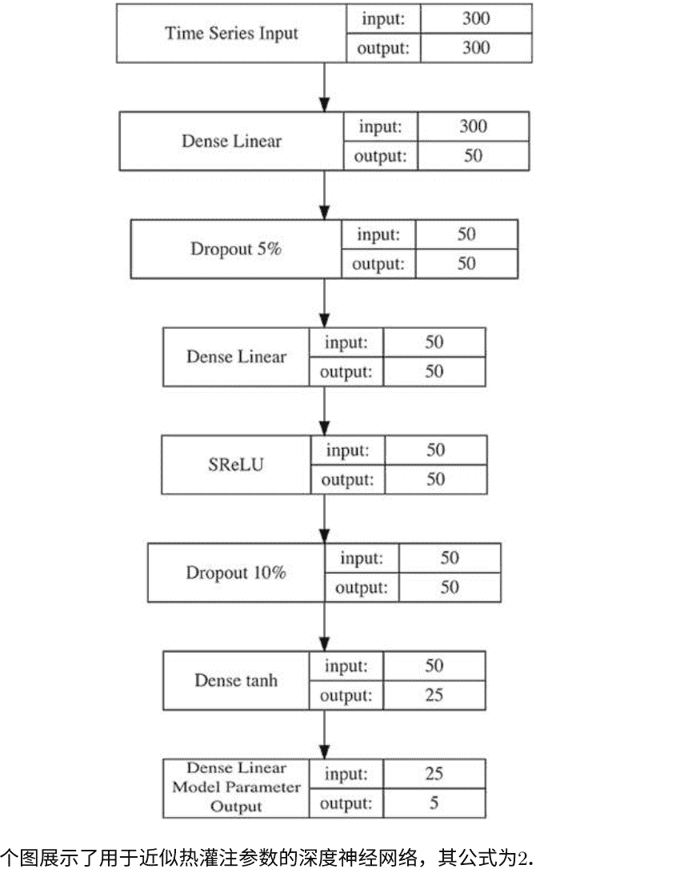

图1. 这个图展示了用于近似热灌注参数的深度神经网络，其公式为2.

初始化策略：通过采样获得未知的 $\theta_0$（RAND），其中 $\theta_0^{RAND}$ 的初始值为 $\theta_0^{0} \sim \mathcal{N}([0\ 0\ 0\ 0\ 28]^T, \Sigma)$，而接近最优的初始化（NO）通过采样获得 $\theta_0^{NO} \sim \mathcal{N}(\theta^*, 0.1\Sigma)$。后者预计会产生最佳性能，因为它的初始值接近最优解。这两种策略都使用 $\Sigma = I_5$，其中 $I_5$ 是一个 $5\times5$ 的单位矩阵。最后一种策略通过深度参数近似网络给出的输出来初始化LMA，表示为LMA-DPA: $\theta_0^{DPA}$。

> 后者之所以应该接近于最优解，我们期望比随机初始化有更好的性能的原因是什么？

表1.这个表显示了所提出的深度参数逼近（DPA）方案与传统的Levenberg-Marquardt基于数值优化在三种不同初始化方案下的性能。

| 方法 | 迭代次数 | 运行时间 [秒] | $\epsilon$ | $\epsilon_\gamma$ |
|---|---|---|---|---|
| DPA | 1 | 0.00001 | 1.384 ± 0.742 | 0.098 ± 0.061 |
| LMA-NO | 31.64 ± 96.7 | 0.006 | 0.63 ± 3.13 | 0.001 ± 0.006 |
| LMA-DPA | 37 ± 81 | 0.005 | **0.026 ± 0.181** | **0.0001 ± 0.0006** |
| LMA-RAND | 130 ± 147 | 0.014 | 2.913 ± 5.325 | 0.282 ± 0.292 |

参数估计的准确性 $\widetilde{\theta} = [\widetilde{\gamma}_1\ \widetilde{\gamma}_2\ \Delta\widetilde{T}_1\ \Delta\widetilde{T}_2\ \widetilde{T}_{equ}]$ 通过两个度量来量化 $\epsilon = \|\theta - \theta^*\|^2$ 和 $\epsilon_{\gamma} = \| [\gamma_1^*\ \gamma_2^*]^T - [\widetilde{\gamma}_1\ \widetilde{\gamma}_2]^T \|^2$。后者尤其有趣，因为温度衰减常数与皮层灌注相关，并表示后续分析中最重要的参数。

运行时间表示优化单个长度为 $k$ 的温度序列所需的时间。 结果显示在表1中。 结果表明，DPA比随机初始化的Levenberg-Marquardt优化更准确地逼近模型参数，并显著减少了总运行时间。

当用作LMA的初始化时，有趣的是近似参数似乎接近实际参数，因为LMA-DPA比LMA-NO具有更好的性能且变化较小。 所得迭代次数的标准差以及准确性 $\epsilon_{\gamma}$ 进一步表明所采用的优化方案的收敛行为与初始参数估计 $\theta_0$ 强相关。 这种行为的一个原因是所述优化问题（方程3）的非凸性质。

这进一步强调了参数初始化的重要性，特别是当后续分析需要准确的参数估计时。 正如我们所展示的，深度参数逼近网络可能是应对这一挑战的一种方法。

## 3.2 案例研究

被检查的病例患有中大脑动脉急性缺血性卒中，需要进行减压半颅骨切除术以降低颅内压力。在手术干预过程中，我们进行了裸露的皮层热成像测量，并记录了术中冷NaCl的灌注。后者会导致温度急剧下降和随后的升温。这些灌注在神经外科手术中很常见，以防止皮层干燥。我们进一步在术后计算机断层扫描（CT）图像中分割梗死标记，并将热图像序列映射到皮层上以便更容易定位（图2b）。通过讨论的DPA方法，我们对由皮层灌注引起的加热序列进行了近似，从而近似了加热参数。图2c可视化了 $\gamma_1$ 的近似值。较低的 $\gamma_1$ 值表示灌注和代谢减少，这也解释了与术后CT中梗死标记的明显相关性（见图2a）。

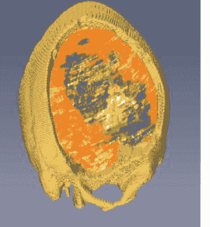

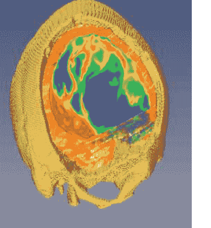

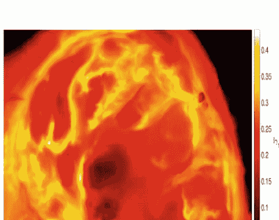

图2. (A) 在术后的CT记录中将梗死标记为绿蓝色物体，凸形状表示开颅术。(B) 描述了皮层灌注后的平衡温度下的温度分布。蓝色表示22 ℃的温度，红色表示32 ℃的温度。(C) 显示了 $\gamma_l$ 的空间分布。黑色表示缺血/低灌注状态，较亮的颜色表示更强的灌注。请注意，手术巾也受到冷NaCl灌注的影响，导致部分区域升温。估计的灌注不足组织状态与术后梗死标记相关。与平衡温度相比，热衰减常数 $\gamma_l$ 可以推断出标准化和更详细的组织灌注信息。健康组织和缺血组织之间的过渡（从橙色到红色）可能是进一步检查和治疗的对象。

(彩色图在线)

# 4 结论

热成像是一种新兴的独立于白光的、非侵入性的表面温度分布测量方法。通过应用温度梯度，这种方法可以扩展到主动动态热成像。在医学领域，这使得可以通过动态热性质分析异常组织和血管病理学。

我们采用主动动态热成像来分析缺血性中风患者神经外科手术中暴露的人类大脑皮层的灌注情况。我们的方法需要在暴露的大脑皮层上施加温度梯度以量化皮层灌注。这些梯度是通过在暴露的大脑皮层上施加冷NaCl灌洗液来引起的。随后的组织加热由双指数函数建模，并且其参数通过一种新的深度参数学习框架进行高效近似。这些参数包括量化组织加热速率的热衰减常数。我们证明了这些衰减常数与组织灌注状态相关，并且可以通过术前/术后CT测量推断梗死标记。这使得外科医生可以检查脑缺血的进展，并允许推断进一步的诊断信息。为了提高我们结果的临床意义并增强我们深度参数近似网络的准确性，需要进一步研究更大的队列。更先进的参数近似网络可能允许可靠地估计Pennes生物热方程的参数，从而推断组织成分的细粒度信息。我们进一步预计，其他病理学特征也可以通过其动态热行为进行表征，特别是如果它们与非典型的新陈代谢或灌注相关。

致谢。作者还要感谢所有支持这个研究项目的其他组织和个人。

# 参考文献

+   1. Gorbach, A.M., Heiss, J.D., Kopylev, L., Oldfield, E.H.: 脑肿瘤的术中红外成像。神经外科学杂志 **101**(6), 960–969 (2004)
2. Steiner, G., Sobottka, S.B., Koch, E., Schackert, G., Kirsch, M.: 通过时间分辨热成像和多变量数据分析术中成像皮层脑灌注。生物医学光学杂志 **16**(1), 016001–016006 (2011)
3. Gorbach, A., Heiss, J.D., Kopylev, L., Oldfield, E.H.: 脑肿瘤的术中红外成像。神经外科学杂志 **101**, 960 (2004)
4. Pennes, H.H.: 对静息状态下人类前臂组织和动脉血温度的分析。J. Appl. Physiol. **1**, 93–122 (1948)
5. Gutierrez, G., Giordano, M.: 使用蒙特卡洛模拟研究生物热方程在局部磁致热疗中的应用。在：ASME国际机械工程大会和展览会论文集（2008年）
6. Nowakowski, A.: 医学诊断中的定量活动动态热红外成像和热断层成像。 在：医学红外成像。 泰勒和弗兰西斯（2013年）
7. Yamashita, N., Fukushima, M.: 关于Levenberg-Marquardt方法的收敛速度。 在：A lefeld, G., Chen, X., et al. (eds.) 数值分析专题。 计算补充，第239–249页。 Springer , Vienna (2001)
8. Mor´e, J.J.: Levenberg-Marquardt算法的实现和理论。 数值分析. 数学讲义, 卷630, 页105–116. Springer, Heidelberg (1978)
9. Srivastava, N., Hinton, G., Krizhevsky, A., Sutskever, I., Salakhutdinov, R.: Dropout: 一种简单的防止神经网络过拟合的方法. 机器学习研究, 第15卷, 1929–1958页 (2014)
10. Jin, X., Xu, C., Feng, J., Wei, Y., Xiong, J., Yan, S.: 带有S形修正线性激活单元的深度学习. CoRR, 卷abs/1512.07030 (2015)
11. Kingma, D.P., Ba, J.: Adam: 一种随机优化方法. CoRR, 卷abs/1412.6980 (2014)

## 使用ConvNet回归器在3D医学图像中自动识别切片

Bob D. de Vos^1^(✉), Max A. Viergever^1^, Pim A. de Jong^2^, 和 Ivana Isgum^1^
^1^Image Sciences Institute, University Medical Center Utrecht, 荷兰乌得勒支, bddevos@gmail.com
^2^Department of Radiology, University Medical Center Utrecht, 荷兰乌得勒支

摘要。 在许多医学图像分析任务中，识别解剖感兴趣区域是先决条件。 我们提出了一种使用卷积神经网络（ConvNet）回归器自动识别3D图像中感兴趣切片（SOI）的方法。 在150个胸部CT扫描中，手动识别了两个参考切片：一个包含主动脉根部，另一个位于主动脉弓上方。在两个独立实验中，使用100个CT进行ConvNet回归器的训练，以确定每个切片与CT中的SOI之间的距离。为了识别SOI，通过得到的距离拟合了一个一阶多项式。 在50个测试扫描中，参考和自动识别的切片之间的平均距离分别为5.7毫米（4.0个切片）和5.6毫米（3.7个切片）分别用于主动脉根部和主动脉弓。 该方法对于两个任务都显示出类似的结果，并且可以用于自动切片识别。

关键词：切片识别 · 定位 · 检测 · 卷积神经网络 · 回归 · 深度学习

# 1 引言

手动和自动定位器官、解剖结构或点是医学图像分析中许多任务的先决条件。因此，文献中描述了几种自动定位器官的方法（例如[4,11]）。这些方法通常指示器官感兴趣的区域，并仅允许对该区域进行专门分析。同样，已经提出了几种描述自动定位解剖标志点的方法（例如[5,9]）。此外，临床工作通常需要定位特定的解剖区域，这些区域在特定的图像切片中可视化。例如，在人群研究中选择特定的切片来分析体成分，例如量化肌肉萎缩、肌肉减少或内脏肥胖[10]。这需要专家在3D医学图像中滚动以识别感兴趣的切片，然后进行分析。 这种情况可以从自动切片识别中受益。

在这项工作中，我们提出了一种使用卷积神经网络（ConvNet）回归器自动识别三维医学图像中感兴趣的单个切片（SOI）的方法。 ConvNet回归器被训练用于计算给定图像的每个切片与SOI之间的距离。为了获得平滑的结果，通过得到的距离拟合了一个一阶多项式。 距离为零的切片表示SOI。负距离表示位于SOI下方的切片，正距离表示位于SOI上方的切片。在这项工作中，该方法在150个胸部CT扫描的两个独立实验中进行了评估。 在第一个实验中，该方法被用于识别显示主动脉根部的轴向切片，而在第二个实验中用于识别位于主动脉弓上方的轴向切片。

# 2 数据

在这项工作中，从国家肺部筛查试验（NLST）的基线扫描中随机选择了150个低剂量胸部CT扫描[1]。 这些扫描是在仰卧位、手臂高举过头部、无对比增强的情况下进行吸气屏气期间进行的。 扫描是在四个CT扫描仪供应商（通用电气、飞利浦、西门子和东芝）的多台扫描仪上进行的，并使用软或锐利的重建核和不同的图像分辨率（见表1）。 未应用心电图同步和对比增强。

表1. 胸部CT扫描的特点。 请注意分辨率和每个扫描的切片数量的变异性。

| 特征 | 值 |
|---|---|
| 扫描数量 | 150 |
| 平面体素大小（毫米） | 0.50–0.86 |
| 切片间隔（毫米） | 1.00–2.50 |
| 平面矩阵大小 | 512 × 512 |
| 切片数量 | 108–363 |

为了定义参考，在每个扫描中手动标识了两个感兴趣的切片（图1）：包含主动脉根部的切片和位于主动脉弓上方的第一个切片。 主动脉根部是将心脏与主动脉弓分开的一个标志，可以用于定位冠状动脉口。 主动脉弓上方的切片通常用作身体组成分析的一个标志。

# 3 方法

为了自动识别SOI，使用一组CT扫描训练了一个ConvNet回归器。 从每个扫描中提取所有切片，并将其与SOI的距离提供给ConvNet。为了在测试扫描中识别SOI，提取扫描中的所有切片，并由ConvNet进行评估，输出相对值。

# 4 结果

表2列出了该方法在独立测试集上获得的结果，共50个扫描。结果显示，对于两个任务，自动方法找到的切片与SOI的平均距离不到4个切片。对于两个任务，该方法倾向于自动选择略低于参考切片的切片。这种偏差也在图4中显示出来，图中显示了所有自动结果的箱线图。使用距离（以毫米为单位）作为评估标准，显示出显示主动脉根部的切片的结果分布比显示位于主动脉弓上方的切片的结果分布更窄，但也有两个异常值。使用切片数量作为评估标准时，两个任务的结果分布相似。这种分布差异是由于图像分辨率的差异引起的，这是由于分析图像中切片增量的变化引起的。

表2. 自动识别切片与参考切片之间的平均距离和标准差(std)。距离以毫米和切片数给出。第一行和第二行显示估计切片与感兴趣切片(SOI)的相对距离的平均值，负数表示估计结果低于SOI，正数表示估计结果高于SOI。第三行和第四行显示估计切片与SOI的绝对距离的平均值。

| | 主动脉根部 | 主动脉弓上段 |
| :--- | :--- | :--- |
| 距离（毫米）(std) | -1.51 (8.00) | -1.78 (7.03) |
| 距离（切片数）(std) | -0.82 (6.26) | -1.37 (5.20) |
| 绝对距离（毫米）(std) | 5.74 (5.65) | 5.59 (4.55) |
| 绝对距离（切片数）(std) | 4.02 (4.83) | 3.72 (3.85) |

在12%的扫描中，该方法识别出了正确的切片，该方法在19%的情况下偏离了一个切片，并且在16%的情况下偏离了两个切片。此外，在出现较大误差的情况下，该方法仍然产生了合理的结果：参见图5显示的该方法的四个最大误差。所有这些误差都是由于拟合多项式相对于参考的偏移引起的。

# 5 讨论

结果表明，在胸部CT中，使用所提出的方法自动识别切片是可行的。

本研究使用的胸部CT图像在图像获取方面存在较大的变异性（例如CT扫描仪和患者定位）和重建方面的变异性（例如重建核心和图像分辨率）。此外，这些扫描是筛查研究的一部分，因此采用了低辐射剂量和无对比增强。因此，这些扫描含有高噪声水平和低软组织对比度。此外，未应用心电同步技术，因此扫描中存在心脏运动伪影，特别是在显示主动脉根部的切片中。尽管如此，两个任务之间的结果是可比较的，并且结果显示，在47%的扫描中，到目标切片的距离在2个切片之内。这些任务的定义并不是非常严格的，并且考虑到受试者解剖结构和切片厚度的变异性，所得到的结果很可能与观察者间的变异性相似（见图1）。在本研究中，只有一个观察者定义了参考标准。在未来的工作中，我们的目标是在观察者之间建立一致性。

我们的ConvNet遵循像AlexNet [8]和VGG-net [2]这样的流行网络的架构；它具有逐渐增加的内核数量和两个全连接层。不同的架构也可以使用，但如果使用相同的训练集，性能可能不会有太大变化。此外，在我们的实验中，我们使用了一个相对较小的数据集，包含75个CT扫描，每个扫描包含约150个切片，用于训练。当使用大量图像进行训练时，ConvNets以取得出色的结果而闻名。可能通过增加覆盖解剖变异和图像采集变异范围的训练集大小，进一步提高性能。此外，在未来的工作中，我们将调查在使用大规模数据集进行训练时，性能是否能达到专家水平。

尽管图5显示了最大的误差，但它展示了实验中最常见的错误。拟合的多项式要么与参考线平行，这表示对被测对象长度的正确估计，要么拟合的多项式具有不同的斜率，这表示对被测对象长度的错误估计。

# 6 结论

使用卷积神经网络回归器可以自动识别3D医学图像中感兴趣的切片。对于从图像中提取的每个切片，回归器确定到感兴趣切片的距离。所提出的方法可以用于医学图像分析中的切片识别。

致谢。本研究由荷兰科学研究组织（NWO）/技术科学基金会（STW）资助；项目编号12726。

作者感谢美国国家癌症研究所提供的通过国家肺部筛查试验收集的数据。本文中的陈述仅代表作者个人观点，不代表或暗示国家癌症研究所的同意或认可。作者衷心感谢NVIDIA公司捐赠的用于本研究的Tesla K40 GPU的支持。

# 参考文献

- 1. 国家肺部筛查试验：概述和研究设计。放射学 258(1), 243-253 (2011)
- 2. Chatfield, K., Simonyan, K., Vedaldi, A., Zisserman, A.: 详细探究卷积神经网络：魔鬼的回归。arXiv预印本 arXiv:1405.3531 (2014)
- 3. Clevert, D.A., Unterthiner, T., Hochreiter, S.: 快速准确的深度网络学习：指数线性单元 (ELUs)。arXiv:1511.07289 [cs], 2015年11月
- 4. Criminisi, A., Robertson, D., Konukoglu, E., Shotton, J., Pathak, S., White, S., Siddiqui, K.: 用于计算机断层扫描中高效解剖检测和定位的回归森林。医学图像分析。17(8), 1293-1303 (2013)
- 5. Han, D., Gao, Y., Wu, G., Yap, P.T., Shen, D.: 鲁棒的解剖标志点检测及其在MR脑图像配准中的应用。计算机医学成像图形。46, 277-290 (2015)。第3部分
- 6. Ioffe, S., Szegedy, C.: 批归一化：通过减少内部协变量转移加速深度网络训练。JMLR 37 (2015)
- 7. Kingma, D., Ba, J.: Adam: 一种用于随机优化的方法。arXiv:1412.6980 [cs], 2014年12月
- 8. Krizhevsky, A., Sutskever, I., Hinton, G.E.: 使用深度卷积神经网络进行图像分类。在：神经信息处理系统进展，第1097-1105页 (2012年)
- 9. Liu, D., Zhou, S.K.: 使用最近邻匹配和子模优化进行解剖标志点检测。在：Ayache, N., Delingette, H., Golland, P., Mori, K. (eds.) MICCAI 2012, 第三部分. LNCS, vol. 7512, 第393-401页。Springer, Heidelberg (2012)
- 10. Malietzis, G., Aziz, O., Bagnall, N., Johns, N., Fearon, K., Jenkins, J.: 通过计算机断层扫描评估体成分在确定结直肠癌治疗结果中的作用: 一项系统综述。欧洲外科学杂志 (EJSO) 41(2), 186-196 (2015)
- 11. Zheng, Y., Georgescu, B., Comaniciu, D.: 边缘空间学习用于医学图像中2D/3D解剖结构的高效检测。在: Prince, J.L., Pham, D.L., Myers, K.J. (eds.) IPMI 2009. LNCS, vol. 5636, pp. 411-422. Springer, Heidelberg (2009)

## 使用3D全卷积网络从MRI数据估计CT图像

Dong Nie 1,2, Xiaohuan Cao 1,3, Yaozong Gao 1,2, Li Wang 1, 和 Dinggang Shen 1 (✉)
1 北卡罗来纳大学教堂山分校放射学和B RIC系，美国教堂山
dgshen@med.unc.edu
2 北卡罗来纳大学教堂山分校计算机科学系，美国教堂山
3 西北工业大学自动化学院，中国西安

摘要。 计算机断层扫描（CT）在各种临床应用中至关重要，例如放射治疗计划和PET衰减校正。然而，CT在扫描过程中会暴露患者于辐射，可能导致副作用。与CT相比，磁共振成像（MRI）更安全，不涉及任何辐射。因此，最近研究人员极大地激发了从同一受试者的相应MR图像估计CT图像的兴趣，用于放射治疗计划。在本文中，我们提出了一种基于3D深度学习的方法来解决这个具有挑战性的问题。具体而言，采用了一个3D全卷积神经网络（FCN）来学习从MR图像到CT图像的端到端非线性映射。与传统的卷积神经网络（CNN）相比，FCN生成结构化输出，并且可以更好地保留预测CT图像中的邻域信息。我们在一个真实的盆腔CT/MRI数据集上验证了我们的方法。实验结果表明，我们的方法在从MRI图像预测CT图像方面准确且稳健，并且在比较中优于三种最先进的方法。此外，我们还广泛研究了网络深度和激活函数等参数，以便为我们应用中基于深度学习的回归任务提供洞察。

# 1 引言

计算机断层扫描（CT）成像广泛应用于各种临床应用的诊断和治疗目的。在癌症放射治疗中，CT图像提供了Hounsfield单位，这对于剂量计算在治疗计划中是必不可少的。此外，CT图像对于正电子发射断层扫描（PET）在流行的PET-CT扫描仪中的衰减校正也非常重要[8]。

然而，在CT成像过程中，患者会暴露于辐射，这可能损伤正常体细胞并进一步增加患癌风险。Brenner和Hall [1]报告称，0.4%的癌症是由CT扫描引起的。过去，这个比例将在未来增加到1.5%至2%。因此，应谨慎使用CT扫描。磁共振成像（MRI）是一种安全的成像协议。它还为诊断目的提供了更多的解剖细节，但不幸的是不能用于剂量计算或衰减校正。为了减少患者不必要的成像剂量，在许多应用中，临床上希望从MR图像估计CT图像。

直接从MR图像估计CT图像在技术上是困难的。如图1所示，CT和MR图像具有非常不同的外观。例如，在CT图像中，前列腺和膀胱之间的强度差异要小得多。此外，MR图像包含比CT图像更丰富的纹理信息。因此，直接从MRI强度估计CT强度是具有挑战性的。

最近，许多研究集中在从另一种模态图像估计一种模态图像，例如使用MRI数据估计CT图像。（a）第一类是基于图谱的方法。这些方法首先将一个带有衰减图的图谱注册到新的主体MR图像上，然后将图谱的相应衰减图像扭曲到新的MR图像上作为其估计的衰减图像[2,3]。然而，这些基于图谱的方法的性能高度依赖于注册的准确性。（b）第二类是基于学习的方法，其中从MRI到CT图像学习非线性模型。Huynh等人[5]提出了一种使用结构化随机森林从MRI预测CT图像的方法。这种方法通常需要先通过特征表示输入的MR图像，然后将特征映射到输出的CT图像。因此，这些方法的性能受限于特征提取的质量。

另一方面，最近卷积神经网络（CNN）[9]在计算机视觉和医学成像领域变得流行起来。作为一个多层次和完全可训练的模型，CNN能够捕捉从输入空间到输出空间的复杂非线性映射。对于2D图像的情况，2D CNN已经在许多应用中广泛使用。然而，直接将2D CNN应用于处理3D医学图像是不合理的，因为2D CNN逐片考虑图像外观，可能导致跨片断的预测结果不连续。为了解决这个问题，提出了3D CNNs。Ji等人[6]提出了一个用于非受控环境中动作识别的3D CNN模型。Tran等人[13]使用3D CNN在大规模视频数据集上有效地学习时空特征。Li等人[11]将深度学习模型应用于从同一主体的MR图像中估计缺失的PET图像。

在本文中，我们提出了通过3D全卷积神经网络（FCN）学习从MR到CT图像的非线性映射，这是传统CNN的一种变体。与CNN相比，FCN生成结构化输出，可以更好地保留预测的CT图像中的邻域信息[12]。具体而言，输入的MR图像首先被划分为重叠的补丁。对于每个补丁，使用FCN来预测相应的CT补丁。最后，通过平均重叠CT区域的强度，将所有预测的CT补丁合并成单个CT图像。该方法在真实的盆腔CT/MR数据集上进行了评估。实验结果表明，我们的方法可以有效地从MR图像预测CT图像，并且在比较中优于三种最先进的方法。此外，我们进行了大量实验证明了FCN中几个关键参数的选择，例如网络深度和激活函数。这些参数评估结果为使用深度学习的其他回归应用提供了有益的见解。

# 2 方法

深度学习模型可以学习一系列特征的层次结构，即基于低级特征构建的高级特征。CNN [4,9] 是一种流行的深度学习模型类型，其中可训练的滤波器和局部邻域池化操作在交替序列中应用于原始输入图像。当使用适当的正则化进行训练时，CNN 在视觉对象识别和图像分类任务上可以实现卓越的性能。然而，大多数CNN都是为2D自然图像设计的。它们不适用于医学图像分析，因为大多数医学图像都是3D体积图像，如MRI、CT和PET。与2D CNN相比，3D CNN可以更好地建模3D空间信息，因为它使用3D卷积操作。3D卷积保留了3D图像的空间邻域。因此，3D CNN可以解决2D CNN所遇到的跨切片不连续性问题。数学上，3D卷积操作由公式1给出。

```
a_{ij}(x, y, z) = f \left( \sum_{c=1}^{C} \sum_{p=0}^{P_i-1} \sum_{q=0}^{Q_i-1} \sum_{r=0}^{R_i-1} W_{ijc}(x, y, z) a_{(i-1)c}(x + p, y + q, z + r) \right)
```

(1) 其中，x、y、z表示三维体素的位置。W是一个三维滤波器。a是来自前一层的三维特征图(i-1)。最初，a是输入的MRI块。c和C是前一层中特征图的索引和数量。i和j分别是层索引和滤波器索引。P_i、Q_i和R_i分别是三维空间中第i个滤波器的维度。f是CNN中编码非线性的激活函数。

结构化CNN - FCN: 传统CNN的输出是一个单一的目标值，无法在输出空间中保留邻域信息。在本文中，我们提出使用FCN来产生结构化输出。我们使用FCN以补丁方式估计CT图像，而不是逐像素预测CT强度，如图2所示。与逐像素预测CT的CNN相比，逐补丁预测CT的FCN具有明显的优势。首先，每个预测的CT补丁中可以保留邻域信息。其次，通过神经网络的一次前向传播可以大大提高预测效率，因为整个CT补丁可以被预测出来。

在接下来的段落中，我们将描述MRI到CT预测中使用的FCN网络架构。与传统的CNN相比，在这个应用中不使用池化层。这是因为池化层经常会降低特征图的空间分辨率。虽然这种特性对于图像分类等任务是可取的，因为对局部邻域进行池化可以增强对某些图像扭曲的不变性，但在图像预测任务中并不需要，因为需要精确捕捉微小的图像扭曲。

基于上述3D卷积，可以设计出各种FCN架构来估计CT图像。接下来，我们描述一个3D FCN架构，如图3所示，用于从MR patch估计CT patch。这个CNN模型的训练数据由从具有MR和CT图像的受试者中提取的patch组成。输入MRI patch的尺寸为32 × 32 × 16，输出CT patch的尺寸为24 × 24 × 12。输入和输出的patch在对齐的图像空间中具有相同的中心位置。为了生成FCN的训练样本，我们随机从3D MRI体积中提取大量的patch作为输入，并将相应的CT图像patch作为输出。跨越边界或完全位于背景中的补丁已被删除。从每个体积中提取的补丁总数为6000个，足以覆盖大部分3D图像体积。

# 3 实验和结果

在FCN架构中，我们首先对输入的MRI补丁应用7×7×3的3D卷积，构建32个特征图在第一个隐藏层中。在前两个维度上填充一个体素。在第二层中，第一层的输出被馈送到另一个具有64个5×5×3大小的滤波器的卷积层中。第三个卷积层包含32个特征图。每个特征图通过3×3×3大小的滤波器与所有输入特征图相连。输出层只包含一个由1个3×3×3大小的滤波器生成的特征图，它对应于预测的CT图像补丁。为了保持相同的图像大小，在最后两层中沿三个维度填充一个体素。在所有层中，我们将步幅设置为一个体素。网络中的大量参数编码了MR和CT图像之间的潜在非线性关系。

Caffe [7] 被修改以实现图3所示的架构。FCN的网络参数通过随机梯度下降算法进行反向传播来更新。为了训练网络，需要适当确定模型超参数。具体来说，网络权重通过xavier算法[4]进行初始化，该算法可以根据输入和输出神经元的数量自动确定初始值的尺度。对于网络偏置，我们将其初始化为0。初始学习率和权重衰减参数通过进行粗略线性搜索来确定，然后在训练过程中逐渐降低学习率。特别地，我们有大约200,000个训练补丁。使用Titan X GPU来训练网络。

数据采集和预处理：我们的盆腔数据集包括22个受试者，每个受试者都有MR和CT图像。CT和MR图像的间距分别为1.172 ×1.172 ×1 mm³和1 ×1 ×1 mm³。在训练阶段，CT图像手动对齐到其对应的MR图像，以建立体素级对应关系。对齐后，同一受试者的CT和MR图像具有相同的图像大小和间距。由于本研究仅涉及盆腔区域，我们进一步裁剪对齐的CT和MR图像以减少计算负担。最后，每个预处理图像的尺寸为$15^{3} \times 193 \times 50$，并且间距为$1 \times 1 \times 1 \mathrm{~mm}^{3}$。图1给出了预处理CT和MR图像的典型示例。

FCN的参数选择：我们在22个受试者上进行了一次留一交叉验证来评估所提出的方法。在我们的实现中，我们采用FCN来学习从MR图像到CT图像的非线性映射。有几个因素可能会影响学习过程，例如激活函数、网络深度、每层的滤波器数量等。在本文中，我们评估了不同网络深度和激活函数在学习这种非线性映射中的效果。具体而言，我们探索了三种常用的非线性函数，分别是修正线性单元（Relu）、Sigmoid和双曲正切函数。FCN在不同激活函数下的性能如图4所示。此外，我们还分析了FCN在不同网络深度下的影响，如图4所示。实验结果表明，使用Relu激活函数时，随着网络深度的增加，FCN的性能逐渐提高。然而，对于Sigmoid和双曲正切激活函数，PSNR随着网络深度的增加而降低。最佳结果是在浅层网络（2层/3层）中获得的。一个简单的解释是，Sigmoid/双曲正切在深层网络中可能会遇到梯度消失的问题，尽管使用了逐层训练，而Relu则不会遇到这样的问题。Relu的性能不佳是因为与其他两种激活函数相比，Relu的非线性有限。通过增加网络深度，可以有效增加非线性，从而提高Relu随着深度增加的性能。

实验结果：为了证明所提方法在预测准确性方面的优势，我们将我们的方法与三种广泛使用的方法进行比较：

- 基于Atlas的方法（Atlas）：首先将每个Atlas的MR图像与目标MR图像对齐[15]，然后使用得到的变形场将每个Atlas的CT图像进行变形。最终的预测是通过对所有变形后的所有Atlas的CT图像进行平均得到的。
- 基于结构化随机森林的方法（SRF）：使用结构化随机森林[5]学习MR图像与其对应的CT图像之间的非线性映射。
- 基于结构化随机森林和自动上下文模型（SRF+）的方法：除了使用结构化随机森林外，还使用自动上下文模型（ACM）[14]来迭代地改进CT图像的预测。

不同方法在两个典型MR图像上的预测结果如图5所示。可以清楚地看到我们的结果与真实CT图像一致。为了定量评估我们的方法，我们使用平均绝对误差（MAE）和峰值信噪比（PSNR）来衡量预测准确性，如表1所示。

表1中的定量结果显示，我们的方法在MAE和PSNR方面优于其他3种方法。具体而言，我们的方法的平均PSNR为33.4，明显优于最先进的SRF+方法获得的32.1。

表1 通过4种不同方法对22个受试者进行的MAE和PSNR的平均值：Atlas， SRF， SRF+和FCN（提出的方法）。

| 方法 | MAE Mean(std.) | MAE Med. | PSNR Mean(std.) | PSNR Med. |
| :--- | :--- | :--- | :--- | :--- |
| Atlas | 66.1(6.9) | 66.7 | 29.0(2.1) | 29.6 |
| SRF | 51.2(3.8) | 51.5 | 31.7(0.9) | 31.8 |
| SRF+ | 48.1(4.6) | 48.3 | 32.1(0.9) | 31.8 |
| FCN | **42.4(5.1)** | **42.6** | **33.4(1.1)** | **33.2** |

# 4 结论

我们已经开发了一个3D FCN模型，用于从MRI图像估计CT图像，直接将MR图像块作为输入，CT图像块作为输出。网络中的大量可训练映射和参数捕捉了两种成像模态之间的非线性关系。我们已经将这个模型应用于从相应的MR图像预测CT图像。实验表明，我们提出的方法在性能上明显优于三种最先进的方法。我们还对深度学习回归中的重要因素进行了简单的探索，这为其他相关回归任务的参数选择提供了洞察。虽然我们考虑了CT图像预测的FCN模型，但这个模型也可以应用于其他相关任务。在我们的未来工作中，我们将探索加速计算和设计更有效的深度学习模型以提高预测速度和准确性的方法。

# 参考文献

1. Brenner, D.J., Hall, E.J.: 计算机断层扫描是辐射暴露的一个日益增加的来源。 N. Engl. J. Med. **357**(22), 2277–2284 (2007)
2. Burgos, N., 等： 放射治疗计划的稳健CT合成：应用于头颈部位。 在： Navab, N., Hornegger, J., Wells, W.M., Frangi, A.F. (编) MICCAI 2015. LNCS, vol. 9350, pp. 476–484. Springer, Heidelberg (2015)
3. Catana, C., 等： 为MR-PET脑原型上的神经学研究实施基于MRI的PET衰减校正方法。 J. Nucl. Med. **51**(9), 1431–1438 (2010)
4. Glorot, X., Bengio, Y.: 理解训练深度前馈神经网络的困难。 在： 国际人工智能与统计学会议上, pp. 249–256 (2010)
5. Huynh, T., 等： 使用结构化随机森林和自动上下文模型估计MRI数据的CT图像（2015年）
6. Ji, S., 等： 用于人类动作识别的3D卷积神经网络。 IEEE模式分析与机器智能交易。 **35**(1), 221-231（2013年）
7. Jia, Y., 等： Caffe: 用于快速特征嵌入的卷积架构。 在： ACM国际多媒体会议论文集, pp. 675-678。 ACM（2014年）
8. Kinahan, P.E., 等： 用于组合3D PET/CT扫描仪的衰减校正。 Med. Phys. **25**(10), 2046-2053（1998年）
9. LeCun, Y., 等： 深度学习。 Nature **521**(7553), 436-444（2015年）
10. LeCun, Y., 等： 基于梯度的学习应用于文档识别。 Proc. IEEE **86**(11), 2278–2324（1998）
11. Li, R., Zhang, W., Suk, H.-I., Wang, L., Li, J., Shen, D., Ji, S.: 基于深度学习的图像数据补全以提高脑疾病诊断。 In: Golland, P., Hata, N., Barillot, C., Hornegger, J., Howe, R. (eds.) MICCAI 2014, Part III. LNCS, vol. 8675, pp. 305–312. Springer, Heidelberg (2014)
12. Nie, D., Wang, L., Gao, Y., Sken, D.: 用于多模态等强度婴儿脑图像分割的全卷积网络。 In: IEEE第13届国际生物医学成像研讨会 (ISBI), pp. 1342–1345. IEEE (2016)
13. Tran, D., 等: 使用3D卷积网络学习时空特征。 arXiv预印本arXiv:1412.0767 (2014)
14. Zhuowen, T., 等: 自动上下文及其在高级视觉任务和3D脑图像分割中的应用。 IEEE Trans. Pattern Anal. Mach. Intell. 32(10),1744–1757 (2010)
15. Vercauteren, T., 等: 形变恶魔: 高效的非参数图像配准。 NeuroImage 45(1), S61–S72 (2009)

## 生物医学图像分割中跳跃连接的重要性

Michal Drozdzal<sup>1,2(✉)</sup>, Eugene Vorontsov<sup>1,2(✉)</sup>, Gabriel Chartrand<sup>1,3</sup>, Samuel Kadoury<sup>2,4</sup>, 和 Chris Pal<sup>2,5</sup>

<sup>1</sup> Imagia公司, 加拿大蒙特利尔
{迈克尔, 尤金, 加布里埃尔}@imagia.com
<sup>2</sup> 蒙特利尔Polytechnique学院, 加拿大蒙特利尔
{塞缪尔.卡杜里, 克里斯托弗.帕尔}@polymtl.ca
<sup>3</sup> 蒙特利尔大学, 加拿大蒙特利尔
<sup>4</sup> CHUM研究中心, 加拿大蒙特利尔
<sup>5</sup> 蒙特利尔机器学习算法研究所, 加拿大蒙特利尔

摘要。 本文研究了长短跳跃连接对全卷积网络（FCN）在生物医学图像分割中的影响。 .在标准的FCN中，只使用长跳跃连接从收缩路径跳过特征到扩张路径，以恢复在下采样过程中丢失的空间信息。 我们通过添加类似于残差网络中引入的短跳跃连接来扩展FCN，以构建非常深的FCN（数百层）。 梯度流的回顾证实，对于非常深的FCN，同时具有长短跳跃连接是有益的。 最后，我们展示了一个非常深的FCN在没有进一步后处理的情况下，可以在EM数据集上实现接近最先进的结果。

- 语义分割
- FCN
- ResNet
- 跳跃连接

# 1 引言

语义分割是医学图像分析领域的一个活跃研究领域。 引入卷积神经网络（CNN）后，在许多标准数据集上取得了显著的性能提升。 例如，对于EM ISBI 2012数据集[2]、BRATS[13]或MS病变[18]，顶级结果都是基于CNNs[3,4,7,15]构建的。 所有这些方法都基于全卷积网络（FCN）[12]。 虽然CNN通常由卷积、池化和全连接层构成的收缩路径实现，但FCN通过使用反卷积或上采样层添加了一个扩展路径。 扩展路径通过合并从收缩路径的各个分辨率级别跳过的特征来恢复空间信息。

这些跳跃连接的变体在文献中被提出。 在[12]中，上采样的特征图与从收缩路径中跳过的特征图相加，而在[15]中将它们连接起来，并在每个上采样步骤之间添加卷积和非线性操作。 已经证明这些跳跃连接有助于恢复网络输出的完整空间分辨率，使得完全卷积方法适用于语义分割。 我们将这些跳跃连接称为长跳跃连接。

最近的研究表明，显著的网络深度对于图像分类很有帮助[8,9,14,20]。 最近的结果表明，深度可以作为一个正则化器[8]。 然而，网络深度受到梯度消失的问题的限制，当信号在多层之间进行反向传播时。 在[20]中，通过额外的监督层来解决了这个问题，而在[8,9]中，通过在非线性操作周围添加跳跃连接，从而创建了无缝的路径，使得梯度可以不间断地流动，从而允许在网络深处更新参数。

此外，[19]研究表明这些跳跃连接可以加快训练过程的收敛速度。 我们将这些跳跃连接称为短跳跃连接。

在本文中，我们探索了用于语义分割的深度全卷积网络。我们通过添加短跳跃连接来扩展FCN，从而构建非常深的FCN。在这个设置下，我们对标准生物医学数据集（EM ISBI 2012挑战数据）进行了短跳跃连接和长跳跃连接的分析。我们观察到短跳跃连接加速了学习过程的收敛速度；此外，我们还展示了一个非常深的架构在相对较少的参数情况下可以达到接近最先进性能的水平。因此，本文的贡献可以总结如下：

- 我们将残差网络扩展到用于语义图像分割的全卷积网络（见第2节）。
- 我们展示了一个没有任何后处理的非常深的网络在EM数据上达到了与最先进方法相当的性能（见第3.1节）。
- 我们展示了长跳跃连接和短跳跃连接对于非常深的网络的收敛是有益的（见第3.2节）。

# 2 残差网络用于语义图像分割

我们的方法通过添加一个扩展（上采样）路径（图1(a)）将残差网络[8]扩展到分割任务。 我们沿着收缩路径（左侧）进行空间降维，并沿着扩展路径（右侧）进行扩展。 与[12,15]中一样，通过从前者到后者跳过相等分辨率的特征，可以在扩展路径中恢复沿着收缩路径丢失的空间信息。与残差网络中的短跳连接类似，我们选择将扩展路径上的特征与通过长跳连接跳过的特征相加。

我们考虑三种类型的块，每个块至少包含一个卷积和激活函数：瓶颈块，基本块，简单块（图1(b)-(d)）。 每个块都能够对其输入进行批量归一化，并在输入上进行空间下采样（标记为蓝色；用于收缩路径）和在输出处进行空间上采样（标记为黄色；用于扩展路径）。瓶颈和基本块基于[8]中介绍的那些，其中包括短跳跃连接，以最小的修改将块的输入跳过到其输出，鼓励通过非线性学习输入数据的残差表示。为了最小化输入的修改，我们在短跳跃连接上不应用任何变换，除非需要调整滤波器的数量或空间分辨率以匹配块的输出。我们使用1×1卷积来调整滤波器的数量，但对于空间调整，我们依赖于简单的降采样或输入行和列的简单重复，以不增加参数的数量。我们在残差路径上的所有块中添加了一个可选的dropout层。

我们尝试了二元交叉熵和Dice损失函数。设 \( o\_i \in [0, 1] \) 为通过sigmoid非线性函数传递最后一层网络的第i个输出，设 \( y\_i \in \{0, 1\} \) 为相应的标签。二元交叉熵定义如下：

\( L_{bce} = \sum_{i} y_i \log o_i + (1 - y_i) \log (1 - o_i) \) （1）

Dice损失函数为：
\( L_{Dice} = -\frac{2 \sum_{i} o_i y_i}{\sum_{i} o_i + \sum_{i} y_i} \) （2）

我们使用Keras [5]和Theano后端[1]实现了该模型，并使用RMSprop [21]（学习率为0.001）进行训练，权重衰减设置为0.001。我们还尝试了不同水平的dropout。

## 3个实验

在本节中，我们对电子显微镜（EM）数据[2]（第3.1节）进行了模型测试，并对长短跳跃连接的重要性进行了分析（第3.2节）。

## 3.1 EM数据分割

EM训练数据包括30张图像（512×512像素），这些图像是从果蝇第一龄幼虫腹神经索的连续切片透射电子显微镜中组装而成的。测试集是另外30张图像，没有提供标签。在整个实验中，我们使用了25张图像进行训练，剩下5张图像用于验证。

在训练过程中，我们使用随机翻转、剪切、旋转和样条变形来增强输入数据。我们使用了与[15]相同的样条变形策略。我们使用全分辨率（512 ×512）的图像作为输入，没有应用随机裁剪进行数据增强。对于每次训练运行，存储并评估具有最佳验证损失的模型版本。实验中使用的最佳性能架构的详细描述如表1所示。

有趣的是，我们发现使用交叉熵损失训练的模型的预测结果质量很高，而使用其他损失训练的模型产生的预测结果则不同。

表1.实验中使用的详细模型架构。重复次数指示块的重复次数。

| 层名称 | 块类型 | 输出分辨率 | 输出宽度 | 重复次数 |
| :--- | :--- | :--- | :--- | :--- |
| 下采样1 | 卷积3 × 3 | 512 × 512 | 32 | 1 |
| 下采样2 | 简单块 | 256 × 256 | 32 | 1 |
| 下采样3 | 瓶颈 | 128 × 128 | 128 | 3 |
| 下 4 | 瓶颈 | 64 × 64 | 256 | 8 |
| 下 5 | 瓶颈 | 32 × 32 | 512 | 10 |
| 横向 | 瓶颈 | 32 × 32 | 1024 | 3 |
| 上 1 | 瓶颈 | 64 × 64 | 512 | 10 |
| 上 2 | 瓶颈 | 128 × 128 | 256 | 8 |
| 上 3 | 瓶颈 | 256 × 256 | 128 | 3 |
| 上 4 | 简单块 | 512 × 512 | 32 | 1 |
| 上 5 | 卷积3 × 3 | 512 × 512 | 32 | 1 |
| 分类器 | 卷积 1 × 1 | 512 × 512 | 1 | 1 |

表 2. 与EM数据集的已发表结果进行比较。. 有关所有提交方法的完整排名，请参阅挑战网页：http://brainiac2.mit.edu/isbi-challenge/leaders-board-new。我们注意到参数数量、后处理的使用以及仅针对FCN的模型平均的使用。

| 方法 | V_rand | V_info | FCN | 后处理 | 平均 | 参数数量 (百万) |
| :--- | :--- | :--- | :--- | :--- | :--- | :--- |
| CUMedVision [4] | 0.977 | 0.989 | 是 | 是 | 6 | 8 |
| Unet [15] | 0.973 | 0.987 | 是 | 不是 | 7 | 33 |
| IDSIA [6] | 0.970 | 0.985 | 不是 | - | - | - |
| motif [23] | 0.972 | 0.985 | 不是 | - | - | - |
| SCI [11] | 0.971 | 0.982 | 不是 | - | - | - |
| optree-idsia [22] | 0.970 | 0.985 | 不是 | - | - | - |
| PyraMiD-LSTM [17] | 0.968 | 0.983 | 不是 | - | - | - |
| 我们的 (L_Dice) | 0.969 | 0.986 | 是 | 不是 | 丢弃 | 11 |
| 我们的 (L_bce) | 0.957 | 0.980 | 是 | 不是 | 1 | 11 |

Dice损失在视觉上更清晰，因为它们几乎是二进制的；在前者中会出现模糊的边界（见图2(b))，而在后者中会留下间隙（图2(c))。然而，我们发现使用Dice损失的模型在测试时通过隐式模型平均可以改善边界的连续性，使用dropout [10]（图2(d))。这比使用二元交叉熵训练的模型的验证和测试指标表现更好（见表2)。

该数据集使用的两个指标是：细化后的最大前景限制Rand分数（V_rand）和细化后的最大前景限制信息论分数（V_info）。有关指标的详细描述，请参阅[2]。

我们的结果与其他已发表的结果相当，这些结果为EM数据集的最新技术水平（表2）。请注意，我们没有对生成的分割结果进行任何后处理。我们的性能与UNet相匹配，UNet对输入图像进行了七次旋转并进行了平均预测，而我们使用的方法更简单。

表3. 每个模型的最佳验证损失及其对应的训练损失。
| 方法 | 训练损失 | 验证损失 |
| :--- | :---: | :---: |
| 长短跳跃连接 | 0.163 | 0.162 |
| 仅短跳跃连接 | 0.188 | 0.202 |
| 仅长跳跃连接 | 0.205 | 0.188 |

参数设置简单，没有复杂的类别权重。 请注意，在排行榜上，CUMedVision等其他FCN使用后处理来提高性能。

## 3.2 跳跃连接的重要性

本文的重点是评估长短跳跃连接对于训练完全卷积网络进行图像分割的效用。在本节中，我们研究了模型在短跳跃连接和长跳跃连接下的学习行为，特别关注网络每一层的参数更新。 我们首先探索了我们最佳性能的深度架构的变体（来自表1），使用二元交叉熵损失。 保持相同的超参数，我们训练了（模型1）长短跳跃连接，（模型2）仅短跳跃连接和（模型3）仅长跳跃连接。 训练曲线见图3，训练和验证数据的最终损失和准确率值见表3。

我们注意到对于我们的深度架构，同时具有长短跳跃连接的变体不仅表现最佳，而且收敛速度比没有短跳跃连接的要快。这种收敛速度的增加与文献[19]中的结果一致。 毫不奇怪，同时具有长短跳跃连接的组合在性能和收敛速度方面都优于只有一种类型的跳跃连接。在这个深度下，没有任何跳跃连接，网络无法训练。 最后，短跳跃连接似乎能够稳定更新（请注意图3(a)和(b)中验证损失曲线的平滑性，与图3(c)相比）。

我们预计模型中靠近中心的层无法有效更新，这是由于梯度消失问题，而短跳跃连接可以缓解这个问题。 这种身份快捷方式有效地为我们的模型的深层引入了更短的路径，减少了非线性层的数量。 我们通过在每个时期可视化每个层的平均模型参数更新（参见图4中的示例结果），在不同深度的模型上进行了实证验证。 为了简化分析和可视化，我们使用了简单块而不是瓶颈块。

当存在短跳连接时，参数更新似乎分布良好（图4(a)）。 当移除短跳连接时，我们发现对于深度模型来说，网络的深层部分（中心位置，图4(b)）得到的更新较少，符合预期。 当保留长跳连接时，至少模型的浅层部分可以得到更新（参见图4(b)两侧），因为这些连接提供了梯度流的捷径。 有趣的是，我们观察到在那些浅层模型中使用短跳连接时，模型性能实际上会下降（例如图4(c)）。 此外，观察到批归一化可以增加网络的最大可更新深度。 没有批归一化的网络在网络中心部分的更新逐渐减少，并且具有长跳连接的网络不太稳定，需要较低的学习率（例如图4(d)）。

有趣的是观察到，在所有测试模型变体中，大部分更新始终在分类层附近或者在分类层上方（也可在图4中看到）。 这符合[16]的研究结果，即即使是随机初始化的权重，在仅训练分类器之后，也能够提供模型性能的相当大一部分。

# 4 结论

本文研究了跳跃连接对生物医学图像分割中的FCN的影响。我们展示了一个非常深的网络可以在没有进一步后处理的情况下，接近EM数据集的最新技术水平。我们确认，尽管长跳跃连接为浅层提供了梯度流的捷径，但它们并不能解决深层网络中的梯度消失问题。因此，我们将短跳跃连接应用于FCN，并确认这样做可以加快收敛速度并允许训练非常深的网络。

致谢。我们要感谢Theano和Keras的所有开发者，为我们提供了如此强大的框架。我们衷心感谢NVIDIA在我们Ecole Polytechnique实验室的GPU捐赠。作者还要感谢LisadiJorio、Adriana Romero和Nicolas Chapados的深入讨论。这项工作部分资助来自Imagia Inc.、MITACS（资助号IT05356）和MEDTEQ。

# 参考文献

- 1. Al-Rfou, R., Alain, G., Almahairi, A.,等：Theano：一个用于快速计算数学表达式的Python框架。CoRR abs/1605.02688 (2016)
- 2. Arganda-Carreras, I., Turaga, S.C., Berger, D.R.,等：众包创建连接组学图像分割算法。Front. Neuroanat. 9, 142(2015). doi:10.3389/fnana.2015.00142
- 3. Brosch, T., Tang, L.Y.W., Yoo, Y., 等：用于多发性硬化病变分割的具有多尺度特征集成的深度3D卷积编码器网络和快捷方式。IEEE TMI 35(5), 1229–1239 (2016)
- 4. Chen, H., Qi, X., Cheng, J., Heng, P.A.：用于神经结构分割的深度上下文网络。在：第13届AAAI人工智能大会论文集，2016年2月12日至17日，美国亚利桑那州凤凰城，第1167-1173页（2016年）
- 5. Chollet, F.: Keras (2015年)。https://github.com/fchollet/keras
- 6. Ciresan, D., Giusti, A., Gambardella, L.M., Schmidhuber, J.：深度神经网络在电子显微镜图像中分割神经膜。在：NIPS，第25卷，第2843-2851页。Curran Associates, Inc.（2012年）
- 7. Havaei, M., Davy, A., Warde-Farley, D., 等：使用深度神经网络进行脑肿瘤分割。CoRR abs/1505.03540 (2015)
- 8. He, K., Zhang, X., Ren, S., Sun, J.：深度残差学习用于图像识别。CoRR abs/1512.03385 (2015)
- 9. He, K., Zhang, X., Ren, S., Sun, J.：深度残差网络中的身份映射。CoRR abs/1603.05027 (2016)
- 10. Kendall, A., Badrinarayanan, V., Cipolla, R.：Bayesian segNet：用于场景理解的深度卷积编码器-解码器架构中的模型不确定性。CoRR abs/1511.02680 (2015)
- 11. Liu, T., Jones, C., Seyedhosseini, M., Tasdizen, T.：一种模块化的分层方法用于三维电子显微镜图像分割。神经科学方法 226, 88–102(2014)
- 12. Long, J., Shelhamer, E., Darrell, T.：全卷积网络用于语义分割。在：CVPR，2015年11月（即将出版）
- 13. Menze, B.H., Jakab, A., Bauer, S., 等：多模态脑肿瘤图像分割基准（BRATS）。IEEE Trans. Med. Imaging **34**(10), 1993–2024(2015)。 doi:10.1109/TMI.2014.2377694
- 14. Romero, A., Ballas, N., Kahou, S.E., Chassang, A., Gatta, C., Bengio, Y.: FitNets: 用于瘦型深度网络的提示。 CoRR abs/1412.6550 (2014)
- 15. Ronneberger, O., Fischer, P., Brox, T.: U-net: 用于生物医学图像分割的卷积网络。 CoRR abs/1505.04597 (2015)
- 16. Saxe, A., Koh, P.W., Chen, Z., Bhand, M., Suresh, B., Ng, A.Y.: 关于随机权重和无监督特征学习的研究。 在：Getoor, L., Scheffer, T. (eds.) 第28届国际机器学习大会 (ICML-11)论文集, 第1089-1096页。 ACM, 纽约 (2011)
- 17. Stollenga, M.F., Byeon, W., Liwicki, M., Schmidhuber, J.: 并行多维LSTM及其在快速生物医学体积图像分割中的应用。 CoRR abs/1506.07452 (2015)
- 18. Styner, M., Lee, J., Chin, B., et al.: 临床中的3D分割：一个重大挑战II：多发性硬化症病灶分割，2008年11月
- 19. Szegedy, C., Ioffe, S., Vanhoucke, V.: Inception-v4, inception-resnet和残差连接对学习的影响。 CoRR abs/1602.07261 (2016)
- 20. Szegedy, C., Liu, W., Jia, Y., Sermanet, P., Reed, S.E., Anguelov, D., Erhan,D., Vanhoucke, V., Rabinovich, A.: 用卷积深入学习。 CoRR abs/1409.4842 (2014)
- 21. Tieleman, T., Hinton, G.: 第6.5讲—RmsProp: 将梯度除以其最近幅度的运行平均值。 COURSERA: 神经网络与机器学习。(2012)
- 22. Uzunbaş, M.G., Chen, C., Metaxas, D.: Optree: 一种基于学习的自适应水分割算法用于神经元分割。 在: Golland, P., Hata, N., Barillot, C., Hornegger, J., Howe, R. (eds.) MICCAI 2014, 第一部分. LNCS, vol. 8673, pp. 97–105. Springer International Publishing, Cham (2014)
- 23. Wu, X.: 一种迭代的卷积神经网络算法改进了电子显微镜图像分割。 CoRR abs/1506.05849 (2015)

## 理解医学图像深度迁移学习的机制

Hariharan Ravishankar, Prasad Sudhakar, Rahul Venkataramani, Sheshadri Thiruvenkadam, Pavan Annangi, Narayanan Babu, 和 Vivek Vaidya

GE全球研究中心，印度班加罗尔
prasad.sudhakar@ge.com

摘要。自动学习任务特定特征表示的能力已经使深度学习方法取得了巨大成功。.当训练数据稀缺时，例如在医学成像问题中，迁移学习非常有效。在本文中，我们系统地研究了将在ImageNet图像上训练的卷积神经网络转移到超声图像中进行肾脏检测问题的过程。我们研究了检测性能如何取决于迁移的程度。我们表明，一个经过转移和调整的CNN可以胜过最先进的特征工程流水线，而这两种技术的混合化可以实现20%更高的性能。

我们还研究了网络中间响应图像的演化。最后，我们将这些响应与最先进的图像处理滤波器进行比较，以便更深入地了解迁移学习如何有效地处理各种不同的成像模式。

# 1 引言

从超声图像中自动定位和分割器官是一个具有挑战性的问题，因为存在镜面噪声、低软组织对比度和患者数据的广泛变异性。在这种困难的问题设置中，数据驱动的机器学习方法，尤其是近年来的深度学习方法，取得了相当大的成功。通常，训练机器学习模型需要大量标记数据，并且每个问题都需要仔细的特征工程。对于这些方法来说，需要多少数据才能获得令人满意的性能仍然没有答案，最近的一些研究在这个方向上有所探索。然而，在数据稀缺的情况下，迁移学习已经成功地应用于模型知识在（可能不相关的）任务/领域之间的有效传递。令人着迷的是，一个为不相关问题设置学习的模型实际上可以以最小的重新训练解决手头的问题。在本文中，我们试图展示和理解将最初用于图像识别的卷积神经网络进行迁移学习，以解决超声B模式图像自动肾脏定位的问题的有效性和机制。

由于肾脏的形状、大小和方向变化很大，肾脏检测具有挑战性。根据采集扫描平面的不同，内部区域（肾窦）的外观不一致以及相邻结构（膈肌、肝脏边界等）的存在会带来额外的挑战。这也是一个临床相关的问题，因为肾脏形态测量对于评估肾脏异常[13]、计划和监测放射治疗以及肾脏移植至关重要。

文献中报道了半自动和自动肾脏检测方法。在[22]中，通过使用从一组Gabor滤波器推断的特征，通过期望最大化算法构建纹理模型，然后通过迭代分割将纹理测量组合成参数化形状模型。在[16]中，使用马尔可夫随机场和主动轮廓方法来检测3D超声图像中的肾脏边界。最近，基于肾脏纹理分析的机器学习方法[1,17]在从2D和3D超声图像中分割肾脏区域方面取得了成功。

# 2 最先进的技术

CNNs [15] 通过整合空间上下文和像素之间的权重共享，为视觉学习任务提供了有效的模型。一个典型的深度CNN用于学习任务，其输入为大小为$n_1 \times n_2$的$N$通道图像块$P_k$，其中$P_k: \{1,2,...,n_1\} \times \{1,2,...,n_2\} \to D \subset \mathbb{R}, \quad k = 1,2,...,N$。输出为$M$个特征图$G_j \in \mathbb{R}^{m_1 \times m_2}, \quad j = 1,2,...,M$，定义为使用大小为$S = s_1 \times s_2$的$M \times N$滤波器$v_{kj}, \quad (j = 1,2,...,M), \quad (k = 1,2,...,N)$进行卷积，并加上$M$个标量$b_j, \quad j = 1,2,...,M$。然后我们有：
$$G_j = S_\downarrow \left( \sigma \left( \sum_k P_k * v_k^j + b^j \right) \right), \quad j=1, 2, \cdots, M_o \tag{1}$$
这里，$*$表示卷积，$\sigma$是一个非线性函数（sigmoid或线性截断（ReLU））。$S_\downarrow$是一个下采样操作符。上述表达式中的特征图数量、滤波器大小和特征图大小是超参数，总共有$M(NS+1)$个参数需要优化学习任务。深度CNN架构是多层的，根据每层的输入/输出映射数量、滤波器和映射大小，以层次化方式拼接在一起，导致需要优化的参数数量庞大。当数据稀缺时，学习问题是欠定的，因此从预训练模型中传递CNN参数有助于解决问题。

对于医学图像问题，由于数据类型（模态、解剖等）和临床挑战的异质性，迁移学习也具有吸引力。在[4]中，作者使用在ImageNet上训练的CNN模型进行乳腺图像分类。Shie等人[18]使用在ImageNet上训练的CaffeNet提取特征并对中耳图像进行分类。在[6]中，使用预训练的CNN提取超声图像上的特征，以定位对诊断重要的特定标准平面。

关于CNN特征的可迁移性的研究包括[23]，更具体地是针对医学图像的[19,21]。虽然我们的工作展示了迁移学习在医学成像和迁移学习调优方面的又一个成功，但我们

- 通过系统地比较迁移学习网络各层的响应图与传统图像处理滤波器，来推理出迁移学习的有效性。
- 调查调优水平对性能的影响。我们证明全面的网络适应会导致学习问题特定的特征，并且还能够证明其优于现成的图像处理滤波器。
- 重新确立最先进的手工特征和混合方法与CNN的互补优势和相关性，以帮助我们实现下一级的性能改进[24]。

## 3 种方法

从一组训练图像中，我们构建分类器来区分肾脏和非肾脏区域。在测试图像上，从一组候选ROI { S}中找到最佳肾脏感兴趣区域（ROI）S*的最大似然检测问题被分为两个步骤，类似于[3,17]。整个集合 {S}通过我们的分类器模型，并保留具有正类标签（Y）的候选项（方程（2））。从集合 {S+}中选择具有最高似然度（L）的ROI作为检测到的肾脏区域（方程（3））

```
{Y, L} = MLClassifier(S) and {S^+ in S | Y = 1}, (2)
S* = arg max( L^+ ), where { L^+ = L(S^+)}. (3)
```

我们建议使用类似于 [10] 的CNN作为特征提取器，以便与传统纹理特征进行比较。我们还建议使用一个众所周知的机器学习分类器来评估不同特征集的性能，从而消除CNN的softmax层和传统特征的不同分类器对我们的似然函数的影响。

## 3.1 数据集和训练

我们考虑了总共90个长轴肾脏图像，这些图像是在GE Healthcare LOGIQ E9扫描仪上获取的，并分为两个相等且不同的集合，用于训练和验证。这些图像包含了不同大小的肾脏，长度在7.5厘米到14厘米之间，宽度在3.5厘米到7厘米之间，展示了数据集的广泛变异性。肾脏的方向变化在-25°到+15°之间。这些图像是在超声采集的不同深度下获取的，范围从9厘米到16厘米。由临床专家手动标记了准确的矩形肾脏ROI。

为了从训练图像中构建我们的二分类模型，我们扫描视野（FOV）以生成许多重叠的不同大小的补丁（见图1），满足平均成人肾脏尺寸和长宽比的临床指南[8]。 我们将这些感兴趣区域（ROIs）下采样到一个公共尺寸，并根据它们与地面真值注释的重叠程度分为两类。 我们使用Dice相似系数（DSC）作为度量标准，并使用0.8的阈值（基于视觉和临床反馈）生成正负类样本。 然后进行特征提取和模型构建。

## 3.2 迁移学习的特征

我们对迁移学习的研究基于将基于ImageNet数据库的流行CaffeNet [11]架构调整为超声肾脏检测，其简化示意图如图2所示。 我们从所有更新的网络中提取了‘fc7’层之后的特征，共得到4096个特征。 提取的特征为：

- 1. 完全网络适应（CaffeNet FA） - 使用来自CaffeNet参数的权重进行初始化，通过在第3.1节的肾脏图像样本上进行训练来更新整个网络的权重。实验设置为：批量大小为100，动量为0.5，权重衰减为$5 \times 10^{-4}$。
- 2. 部分网络适应（CaffeNet PA） - 为了了解基于调整水平的性能差异，我们冻结了‘conv1’和‘conv2’层的权重，同时更新其他层的权重。 冻结前两层的原因是为了评估低层特征的可共享性，并帮助我们进行解释性分析（第5节）。 实验设置与完全网络适应相同。
- 3. 零网络适应（CaffeNet NA） - 最后，我们还从原始的CaffeNet模型中提取了特征，而不修改权重。

## 3.3 传统纹理特征

用于超声图像的一些研究纹理特征包括（i）Haar特征[3]用于胎儿解剖学研究，（ii）灰度共生矩阵（GLCM）[20]，（iii）定向梯度直方图（HoG）（用于自动心脏超声图像视图分类[12]）。
据报道，Haar特征在肾脏检测中具有最佳性能[17]。对于我们的研究，我们提取了类似于[3]的Haar特征，总共约2000个特征。

## 3.4 梯度提升机（GBM）

集成分类器在超声器官检测问题中已被证明是成功的。在[3]中，作者使用了概率提升树分类器来进行胎儿解剖学检测。在[17]中，已经注意到梯度提升机（GBM）优于adaboost分类器。在一项对监督学习算法进行的实证比较研究中[5]，随机森林和提升决策树进行了比较，校准提升树在整体性能上表现最好，而随机森林次之。受到这些成功的启发，我们选择使用梯度提升树作为我们的分类器模型。我们使用[2]中的GBM实现构建了所有在第3.2节和第3.3节中解释的特征集的GBM分类器，参数设置为：收缩因子和采样因子设为0.5，最大树深度=2，迭代次数=200。

## 3.5 混合方法

对基准方法（Haar + GBM）和CaffeNet FA的故障模式进行了调查，发现它们在不同的图像上失败了（第4节）。为了充分利用它们的互补优势，我们提出了一种简单的方案，即对这两种方法的GBM的空间似然图进行平均，并在（2）中使用它，从而取得了显著的改进。

# 4 结果

为了定量评估45个验证图像的性能，我们使用了两个指标：（1）定位失败的数量-检测到的肾脏ROI与真实标注之间的Dice相似系数小于0.80的图像数量。（2）检测准确性-在45个图像中检测结果与真实标注之间的平均Dice重叠度。从表1可以看出，没有任何适应性的CaffeNet特征在平均检测准确性上超过了基准方法2%的改进，失败数量相同。

与文献中报道的其他结果一致[18]，CaffeNet特征优于最先进的流程。然而，通过允许这些网络权重适应肾脏数据，我们将基准方法的性能提升了4%，失败案例数量从12个减少到10个。有趣的是，冻结前两个卷积层进行调整产生了中间性能，这表明多个层次的特征适应对于解决问题很重要。

### 表1. 在未见过的45个验证图像上的性能比较

| 方法 | Haar特征 | CaffeNet_NA | CaffeNet_PA | CaffeNet_FA | Haar + CaffeNet FA |
| :--- | :--- | :--- | :--- | :--- | :--- |
| 平均Dice重叠 | 0.793 | 0.825 | 0.831 | 0.842 | 0.857 |
| 失败次数 | 12/45 | 12/45 | 11/45 | 10/45 | 3/45 |

图3(a)和(b)显示了一个案例，基准方法受到膈肌、肾脏和肝脏边界的影响，创建了与肾窦部分相似的纹理，而CaffeNet具有出色的定位能力。图3(c)和(d)说明了一个案例，CaffeNet导致了包含膈肌的过分分割，清楚地说明在有限数据问题中，谨慎地进行特征工程并结合领域知识仍然非常重要。最后，我们使用混合方法（第3.5节）实现了86%的平均检测准确率。更重要的是，混合方法的失败次数为3/45，比任何一种方法都要好20%。

### 图4. 学习和手工设计特征的滤波器响应示例图像（CaffeNet_FA(NA) L_X_Y表示来自第Y层第X个滤波器的响应图像）

### 表2. 每层中变化超过40%的滤波器数量 ℓ₂ norm

| 层 | Conv1 | Conv2 | Conv3 | Conv4 | Conv5 |
| :--- | :--- | :--- | :--- | :--- | :--- |
| 变化≥40%的滤波器数量 | 0 | 5 | 125 | 22 | 62 |

# 5 讨论

有趣的是，我们发现在摄像头图像上学到的特征能够在物理特性截然不同的模态中胜过精心设计的特征提取方法，这些模态的获取物理学有明显的差异。图4比较了学习网络的第1层和第2层生成的一些响应图像与传统图像处理输出（如相位一致性[14]和Frangi血管度滤波器[9]）的例子。

在这里，我们想要强调两个主要观点：（1）从视觉上看，我们发现输出与为超声优化的手工特征提取器的输出有着有趣的相似之处。图4(g)和(i)的响应图与4(b)和(c)相似。这非常令人鼓舞，因为CNN学习到的特征与一些广泛使用的非线性特征等效。

特征提取器。（2）这里的第二个重要观察是CaffeNet FA L1上的散斑噪声减少，与CaffeNet PA L1相比。通过仔细调整超声数据上的CaffeNet特征，模型能够学习底层噪声特征，同时保留边缘，从而得到了改进的响应图，如图4(g)和(i)所示。

此外，我们定量分析了每层中滤波器权重的变化（%在 $\ell_2$ norm中），以确定显著趋势。表2显示，在第3层中有大量滤波器发生了显著变化，而第1层和第2层的滤波器变化很小。这可能是因为较低级别的特征在自然图像和超声图像中基本相同。我们还注意到，使用ReLU作为激活函数也避免了梯度消失问题，导致权重变化在不同层之间的分布不均衡。

过了第二层的响应图像被证明很难解释，并且可能需要更深入的技术。我们的定量结果和领域内的文献表明，深度网络的强大之处在于这些层，因此我们认为这是未来研究的重要领域。

在临床环境中，模型的可解释性至关重要，我们认为深度卷积神经网络能够胜过手工设计的特征的原因与我们在第4节中展示的结果一样重要。我们还认为这为理解和利用深度网络解决医学问题开辟了新的途径。

# 参考文献

- 1. Ardon, R., Cuingnet, R., Bacchuw ar, K., Auvray,V.: 在3D超声图像中学习核卷积和模型变形进行快速肾脏检测和分割。在: ISBI会议论文集，第268-271页（2015年）
- 2. Becker, C., Rigamonti, R., Lepetit, V., Fua, P.: 用于曲线结构分割的监督特征学习。在：Mori, K., Sakuma, I., Sato, Y., Barillot, C., Navab, N. (eds.) MICCAI 2013, 第一部分. LNCS, vol. 8149, pp. 526–533. Springer,Heidelberg (2013)
- 3. Carneiro, G., Georgescu, B., Good, S., Comaniciu, D.: 使用约束概率提升树从超声图像中检测和测量胎儿解剖结构。IEEE Trans. Med. Imaging 27(9), 1342–1355 (2008)
- 4. Carneiro, G., Nascimento, J., Bradley, A.P.: 使用预训练的深度学习模型进行未注册的多视图乳腺X线分析。在：Navab, N., Hornegger, J., Wells, W.M., Frangi, A.F. (eds.) MICCAI 2015. LNCS, vol. 9351, pp. 652–660. Springer, 海德堡（2015年）
- 5. Caruana, R., Niculescu-Mizil, A.: 监督学习算法的实证比较。在：ICML会议论文集，第161-168页（2006年）
- 6. Chen, H., Ni, D., Qin, J., Li, S., Yang, X., Wang, T., Heng, P.A.: 通过领域转移深度神经网络在胎儿超声中进行标准平面定位。IEEE生物医学与健康信息学杂志19（5），1627-1636（2015年）
- 7. Cho, J., Lee, K., Shin, E., Choy, G., Do, S.: 训练医学图像深度学习系统所需的数据量有多大才能达到必要的高准确性？在：ICLR会议（2016年）
- 8. Emamian, S.A., Nielsen, M.B., Pedersen, J.F., Ytte, L.: 665名成年志愿者的肾脏尺寸与年龄、性别和体形的相关性。美国放射学杂志160（1），83-86（1993年）
- 9. Frangi, A.F., Niessen, W.J., Vincken, K.L., Viergever, M.A.: 多尺度血管增强滤波。 在: Wells, W.M., Colchester, A.C.F., Delp, S.L. (eds.) MIC-CAI 1998. LNCS, vol. 1496, pp. 130–137. Springer, Heidelberg (1998)
- 10. Girshick, R., Donahue, J., Darrell, T., Malik, J.: 用于准确目标检测和语义分割的丰富特征层次结构 (2014)
- 11. Jia, Y., Shelhamer, E., Donahue, J., Karayev, S., Long, J., Girshick, R., Guadarrama, S., Darrell, T.: Caffe: 用于快速特征嵌入的卷积架构。 在: ACM国际多媒体会议论文集, pp. 675–678 (2014)
- 12. Keramidas, E.G., Iakovidis, D.K., Maroulis, D.E., Karkanis, S.A.: 一种高效且有效的甲状腺结节超声图像分析方案。 In: Kamel,M.S., Campilho, A. (eds.) ICIAR 2007 . LNCS, vol. 4633, pp. 1052–1060. Springer,Heidelberg (2007)
- 13. Kop, A.M., Hegadi, R.: 利用梯度向量力进行超声图像的肾脏分割。 IJCA 2, 104–109 (2010). RTIPPR专刊
- 14. Kovesi, P.: 相位一致性检测角点和边缘。 In: Proceedingsof theAustralian Pattern Recognition Society Conference: DICTA, pp. 309–318 (2003)
- 15. Krizhevsky, A., Sutskever, I., Hinton, G.E.: 使用深度卷积神经网络进行Imagenet分类。 In: Proceedings of Advances in Neural InformationProcessing Systems NIPS, pp. 1106–1114 (2012)
- 16. Martin-Fernandez, M., Alberola-Lopez, C.: 一种基于马尔可夫随机场和主动轮廓的超声图像人肾轮廓检测方法。 医学图像分析 9(1), 1–23 (2005)
- 17. Ravishankar, H., Annangi, P.: 一种基于纹理和边缘分析的超声图像肾形态测量自动化方法。 在: SPIE医学成像(2016)
- 18. Shie, C.K., Chuang, C.H., Chou, C.N., Wu, M.H., Chang, E.Y.: 用于医学图像分析的迁移表示学习。 在: EMBC, pp. 711–714 (2015)
- 19. Shin, H., Roth, H.R., Gao, M., Lu, L., Xu, Z., Nogues, I., Yao, J., Mollura, D.J.,Summers, R.M.: 用于计算机辅助检测的深度卷积神经网络：CNN架构、数据集特征和迁移学习。 IEEE Trans. Med. Imaging 35(5), 1285–1298 (2016)
- 20. Sohail, A.S.M., Rahman, M.M., Bhattacharya, P., Krishnamurthy, S., Mudur, S.P.: 结合纹理特征和直方图矩的卵巢囊肿超声图像的检索和分类。 在: ISBI会议论文集 , 第288-291页, 2010年4月
- 21. Tajbakhsh, N., Shin, J.Y., Gurudu, S.R., Hurst, R.T., Kendall, C.B., Gotway,M.B., Liang, J.: 用于医学图像分析的卷积神经网络：全面训练还是微调? IEEE Trans. Med. Imaging 35(5), 1299-1312 (2016)
- 22. Xie, J., Jiang, Y., Tsui, H.T.: 基于纹理和形状先验的超声图像肾脏分割。 IEEE Trans. Med. Imaging 24(1), 45-57 (2005)
- 23. Yosinski, J., Clune, J., Bengio, Y., Lipson, H.: 深度神经网络中的特征可转移性如何? 在: 神经信息处理进展NIPS会议论文集, 第3320-3332页 (2014年)
- 24. Zheng, Y., Liu, D., Georgescu, B., Nguyen, H., Comaniciu, D.: 用于体积数据中高效稳健地标检测的3D深度学习。 在: Navab, N., Hornegger, J., Wells, W.M., Frangi, A.F. (eds.) MICCAI 2015. LNCS, vol. 9349, pp. 565–572. Springer, Heidelberg (2015) . doi: 10.1007/978-3-319-24553-9_69

基于区域的卷积网络用于乳腺摄影中的肿瘤检测和分类

Ayelet Akselrod-Ballin (✉), Leonid Karlinsky, Sharon Alpert, Sharbell Hasoul, Rami Ben-Ari和Ella Barkan
IBM研究 - 海法，以色列
ayeletb@il.ibm.com

摘要。本文讨论了乳腺钼靶中肿瘤的检测和分类问题。我们引入了一个新颖的系统，将乳房分割模块和纤维腺组织分割模块整合到一个改进的级联区域卷积网络中。该方法在大型多中心临床数据集上进行评估，并与专家放射科医生标注的真实结果进行比较。初步实验结果显示了所提出的网络结构所获得的高准确性和高效率。随着医疗保健领域中数据的数量和复杂性不断增加，推广这种方法可能对许多应用中的患者护理产生深远影响。

# 1 引言

乳腺癌是妇女的第二大死因[1]。尽管成像技术取得了进展，乳腺钼靶（MG）仍然是乳腺癌筛查和诊断的主要模态。在当前的实践中，对无症状个体进行早期检测，专家放射科医生检查图像并进行潜在异常的检测和分类。然而，由于细微的视觉类别和异常外观的大变异性（例如不同的大小、形状、边界和强度），乳腺钼靶分析具有挑战性，即使对于专家放射科医生也很难检测和分类。这个问题进一步复杂化了乳房的非刚性和不同的观察条件，导致了显著的内部和外部专家之间的变异性。然而，由于技术的快速发展、信息过载、专家时间有限和诊断错误，利用图像处理和机器学习（ML）技术来辅助放射科医生做出决策是必不可少的。

本文的目标是介绍一种基于强大的基于区域的卷积神经网络方法的异常检测和分类的新算法。根据乳腺成像报告进行分类。

A. Akselrod-Ballin和L. Karlinsky对这项工作做出了相同的贡献。

以及乳腺成像报告和数据系统（BI-RADS）评分[3]。BI-RADS评分范围从0到6，定义如下（0需要更多信息，1阴性，2良性结果，3可能良性 <2%患癌风险，4可疑异常，5高度提示恶性，6已证实恶性）。本研究仅涉及基于放射学特征的1到5分的评分，没有与临床信息的相关性。我们在肿瘤检测和分类方面展示了我们的结果，由于某些评分类别的训练数据量较小，我们包括了正常（1）、良性（2）和恶性（3、4、5）这三个主要临床类别。图1展示了具有不同BI-RADS评分的肿瘤示例。

深度神经网络（DNN）在图像识别任务中表现出色，如分类和检测，并已成功应用于许多领域[4]。最近，深度学习方法也被用于医学图像任务，其中一个额外的困难是由于有限数量的大型标记数据集，这些数据集对于高效训练和避免参数过拟合是必需的。然而，已经报道了几种用于乳腺钼靶乳腺病变和钙化分类的深度学习算法，详细报告见[5, 6]。

该领域的重要工作包括[7]，其中开发了一种基于多视图卷积神经网络（CNN）的方法。首先，为每个未注册视图和每个分割图训练了一个单独的CNN模型，从一个Imagenet预训练模型进行微调。然后，使用获得的特征，作者训练了另一个CNN分类器来估计BI-RADS评分。Arevalo等人[8]在监督学习框架中使用卷积架构，利用放射科医师之前手动分割的病变的专家知识在乳腺X线摄影的两个视图中。大部分先前的工作都集中在微钙化或肿瘤的二分类上，这与异常的检测定位和分类不同。[9]的研究是

与我们的基于区域的CNN（R-CNN）工作密切相关。作者提出了一个系统，由四个模块组成，第一个是多尺度深度置信网络（DBN）与高斯混合模型（GMM）分类器用于区域提议生成，第二个是级联的R-CNN，第三个是级联的两个随机森林，最后是后处理步骤，合并具有高重叠比的区域。

计算机视觉文献中已经报道了各种用于区域提议的方法。经典的R-CNN [10]通过两个模块解决检测问题，第一个模块使用低级线索（如颜色和纹理）生成通用的区域提议（可能包含对象的图像区域），而第二个模块计算CNN特征并将其分类为对象类别。Fast R-CNN [11]通过在整个图像上操作的单个CNN中直接池化区域特征来修改了R-CNN的一些缺点，并引入了区域框回归阶段以进行区域框的精细调整。最近，Faster R-CNN [12]引入了端到端的联合训练，同时训练区域提议模块和区域分类模块，两者都由具有显著权重共享的CNN表示。这也导致比原始的R-CNN [10]更高的检测速度和更高的检测质量。联合端到端训练的优势在于它可以避免顺序训练的任务，并且由于共享表示，它可能会改善结果，使任务相互影响。

我们的贡献有两个方面：首先，据我们所知，这是第一次在乳腺X光摄影图像中利用最先进的Faster-R-CNN技术进行肿瘤检测和分类任务的全面高效流程。其次，我们修改了Faster-R-CNN中使用的原始CNN架构，以适应深度学习过程对特定问题领域的训练和测试，同时使用大型多中心数据集进行检测和分类任务。

# 2 方法

该系统以乳腺X光摄影图像为输入，图像大小为4k×3k像素，首先自动分割乳腺组织，去除背景和胸肌，并相应地裁剪图像。第二步基于模糊逻辑方法生成先验解剖图像，检测纤维腺体组织。第三步基于网格表示将图像分割为多个重叠的子图像（部分），然后用于训练和测试修改后的Faster-RCNN。第四步将部分图像的结果整合到整个图像上。最后，输出产生由边界框表示的检测和分类结果，其中未检测到的像素被定义为正常乳腺组织类别。图2显示了该系统的概要。

### 2.1 乳房解剖分割和候选提取

为了准确检测肿瘤，必须对乳房和胸肌进行分割。此外，我们生成了一个解剖先验，用于识别纤维腺组织，以减少假阳性。

分割基于[13]中描述的方法。由于空间有限，详细信息请参阅论文。

由于GPU内存限制，在图像上定义了一个网格，将图像分割为重叠的固定大小的部分800×800。重叠部分的使用也可以看作是一种数据增强技术，因为每个病变在多个重叠部分中出现。这使我们能够从原始数据中创建多个样本，每个病变都会出现在这些样本中。

图2. (a) 系统概述。给定一个MG输入 (1) 乳腺组织分割去除背景和胸肌 (2) 纤维腺体组织提取。 (3) 图像被分割成多个重叠的子部分，用于Faster-RCNN的训练和测试。 (4) 组成：检测到的边界框被投影到图像网格上。该过程以肿瘤检测和相应的BI-RADS分类结束。

### 2.2 修改的Faster-R-CNN

该系统由两个主要组件组成：(1) 区域建议网络 (RPN)，一个深度完全卷积网络，训练用于检测输入图像上可能包含感兴趣对象的窗口，而不考虑它们的类别。RPN 同时在各个位置上预测对象的边界和对象性分数，然后保留得分最高的500个预测。(2) Fast R-CNN 检测网络，训练用于对 RPN 返回的候选对象窗口进行分类，每个窗口被分类为感兴趣类别之一或被拒绝为误报。RPN 和 Fast-RCNN 共享一个大型公共底层集合，允许计算重用，从而在测试时加速。

Faster-R-CNN 训练是一个四步交替算法，包括以下步骤：(1) 使用 ImageNet 预训练模型初始化 RPN。(2) 使用第1步生成的建议训练一个独立的分类网络。如[11]中所提出的，该网络在整个图像上操作，并使用来自建议区域的池化来生成用于分类的深度特征。(3) 使用第2阶段的网络初始化 RPN，但冻结共享底层的参数。只微调顶部的RPN层（非共享）。（4）保持共享层冻结，并使用步骤3生成的建议重复第2阶段。我们修改了原始的Faster-RCNN网络[12]，在分类（Fast-RCNN）阶段中包含来自更底层的信息。这样可以在分类阶段考虑低层次（更高分辨率）的信息，如颜色和纹理，并改善分类结果。当考虑到恶性病变和可疑正常组织的斑块等外观相似的物体时，需要考虑复杂的视觉细节以进行区分。换句话说，本文所讨论的问题本质上是细粒度的，并且与许多视觉挑战（如用于[12]中的测试的PASCAL VOC）中分类视觉不相似的物体的问题有着显著的不同。因此，在做出决策时需要考虑来自CNN较低层次的特征，因为它们是唯一在足够高分辨率下查看所考虑的区域建议的特征。图3提供了网络修改的示意图。

图3. Faster R-CNN架构中修改层的示意放大图。连接到conv4_3和conv3_3的框表示修改网络中的额外层。

给定一组图像和RoIs $I_i, r_{1i}, c_{1i}, r_{2i}, c_{2i}$，其中每个RoI由一个四元组定义，指定其左上角（r；c）和右下角以及类别，以及一组测试图像 $I_j$。输出包括测试集中的所有对象及其边界框，表示为六元组（$I_j, r_{1j}, c_{1j}, r_{2j}, c_{2j}$，类别和分数）。换句话说，给定一个测试输入，系统将自动检测并分类为三个类别之一，包括正常组织（BI-RADS 1）、良性（BI-RADS 2）和恶性肿瘤（BI-RADS 3、4、5）。

我们的实现基于Faster R-CNN架构[12]，使用VGG-16架构[14]和caffe实现[15]。该系统在一块12 GB显存的单个TitanX GPU上进行训练，并在一台带有64 GB RAM的i7 Intel CPU上进行训练。训练时间需要 ～36小时，而测试每张图像需要0.2秒。在训练过程中，从RPN中采样了2000个得分最高的框，在测试过程中，使用基于框重叠的标准非最大抑制(NMS)方法采样了500个得分最高的框。我们使用了学习率为0.001的SGD求解器，批大小为2，动量为0.99，共进行了60个epochs。

# 3 实验和结果

实验是在一个大型多中心医院数据集上进行的，该数据集由专家放射科医生（第四作者）进行了注释和检查。数据集包含大约850张图像，按照BI-RADS分为400、200、150、100张对应于类别2、3、4、5。

数据集按照每个患者进行分层抽样，被分为训练集（80%）和测试集（20%）。确保每个患者只属于一个子集。实验（1）中的患者总数为 ～300，其中训练模型使用了4000个图像部分，测试模型使用了750个图像部分。在实验（2）中，我们从两个集合中排除了与BI-RADS 3相对应的图像，以展示中间类别带来的识别困难。实验（2）中的患者数量为 ～220，其中训练使用了3000个图像部分，测试使用了700个图像部分。

该领域的结果通常在DDSM-BCRP [16]和INBreast [17]数据集上进行评估。INBreast数据集包含115个病例，共410张图像，其中只有116张图像包含良性或恶性肿块。DDSM-BCRP数据集包含79张恶性肿块图像，通常使用39个病例进行训练，40个病例进行测试。该领域的最新研究成果在[7]中进行了报告，该研究在INBreast数据集上的接收者操作特征曲线（ROC）下的曲线下面积（AUC）为0.91 ±.05，在DDSM数据集上的AUC为0.97 ±.03。[8]的AUC得分为0.826。最后，[9]在一张表格中比较了以前的结果，表明他们的方法在两个数据集中产生了迄今为止最好的结果：在INBreast数据集上，TPR为0.96 ±.03 @ 1.2 FPI（每张图像的假阳性），TPR = 0.87 ±.014 @ 0.8 FPI；在DDSM-BCRP数据集上，TPR = 0.75 @ 4.8 FPI和TPR = 0.70 @ 4 FPI。他们还获得了20秒的最佳运行时间结果。表1和图4、图5。由于大部分以前的工作都集中在肿块的二分类上，因此很难与以前的研究结果进行比较。以前的研究主要报告了DDSM数据集的结果以及INBreast，这些数据集的规模有限。我们的方法在一个大型多中心数据集上进行评估，而大多数方法报告的结果是基于较小的肿瘤数据集。此外，我们评估了肿瘤的检测、定位和分类，并报告了常用于计算机视觉文献中的精确度-召回曲线下面积（AUC）[4, 10]。尽管仅考虑分类结果，但从准确性和时间效率（表1和图4、图5）来看，该方法被认为是有希望的。

| 实验 | 检测AUC (平均精度) | 分类准确率 | #图像 | 运行时间 |
| :--- | :--- | :--- | :--- | :--- |
| (1) 良性BI-RADS-2 & 恶性345 | 0.6 | 0.78 | 850 | 0.2秒 |
| (2) 良性BI-RADS-2 & 恶性45 | 0.72 | 0.77 | 850 | 0.2秒 |

## 4 总结

本文介绍了一种基于Faster-RCNN的最新方法，用于检测和分类乳腺肿瘤。我们的初步结果显示了这种方法在高效准确地检测和分类方面的潜力。

(a) 良性 - 正确分类

(b) 恶性 - 错误分类为良性

(c) 恶性 - 正确分类

图5. 部分上的检测和分类结果。我们展示了典型的检测和分类结果，其中良性和恶性肿块分别为青色和洋红色。地面真实注释由实线标记，自动检测由虚线标记。（在线上有彩色图）

在实际最新数据上检测乳房异常。未来的工作将扩展到多视角方法，考虑相关特征，如乳房密度，对框进行分割，并在公开数据集上进行评估。

# 参考文献

1.  Jemal, A., Siegel, R., 等：癌症统计，2008年。CA Cancer J. Clin. 58(2), 71–96 (2008)
2.  American Cancer Society：癌症事实和数字，亚特兰大，佐治亚州 (2015年)
3.  Narváez, F., Díaz, G., Romero, E.: 乳腺X线照片中BI-RADS描述的自动化。在：Martí, J., Oliver, A., Freixenet, J., Martí, R. (编) ：IWDM 2010. LNCS, vol. 6136, pp. 673–681. Springer, Heidelberg (2010)
4.  Krizhevsky, A., Sutskever, I., Hinton, G.: 使用深度卷积神经网络进行Imagenet分类。在：(NIPS 2012)会议论文集, 第1097-1105页(2012)。
5.  Giger, M.L., Karssemeijer, N., Schnabel, J.A.: 乳腺图像分析用于风险评估、癌症检测、诊断和治疗。年度生物医学工程综述, 第15页, 327-357 (2013)。
6.  Oliver, A., Freixenet, J., Marti, J., Perez, E., Pont, J., et al.: 乳腺X射线图像中自动检测和分割的综述。医学图像分析, 第14页, 87-110 (2010)。
7.  Carneiro, G., Nascimento, J., Bradley, A.P.: 使用预训练的深度学习模型进行未注册多视图乳腺X射线图像分析。在：Navab, N., Hornegger, J., Wells, W.M., Frangi, A.F. (eds.) MICCAI 2015. LNCS, vol. 9351, pp. 652-660. Springer, Heidelberg (2015)。
8.  Arevalo, J., Gonzales, F.A., Ramos-Pollán, R., Oliveira, J.L., Lopez, M.A.G.: 使用卷积神经网络进行乳腺X射线图像乳腺肿块分类的表示学习。计算方法和程序生物医学学报, 第127页, 248-257 (2016)
9.  Dhungel, N., Carneiro, G., Bradley, A.: 使用深度学习和随机森林从乳房X光片中自动检测肿块。在：DICTA (2015)
10. Girshick, R., Donahue, J., Darrell, T., Malik, J.: 用于准确目标检测和语义分割的丰富特征层次结构。在：计算机视觉与模式识别 (CVPR), pp. 580–587 (2014)
11. Girshick, R.: 快速R-CNN。在：IEEE国际计算机视觉会议 (ICCV) 论文集, pp. 1440–1448 (2015)
12. Ren, S., He, K., Girshick, R., Sun, J.: 更快的R-CNN：基于区域建议网络的实时目标检测。在：NIPS (2015)
13. Ben-Ari, R., Zlotnick, A., Hashoul, S.: 一种弱标记方法用于数字乳房X光片中的乳房组织分割和乳房密度估计。在：ISBI (2016)
14. Simonyan, K., Zisserman, A.: 用于大规模图像识别的非常深的卷积网络。在：ICLR (2015)
15. Jia, Y., Shelhamer, E., Donahue, J., Karayev, S., Long, J., Girshick, R., Guadarra ma, S., Darrell, T.: Caffe：用于快速特征嵌入的卷积架构 (2014年)。arXiv：1408.5093
16. Heath, M., Bowyer, K., 等：用于筛查乳腺摄影的数字数据库。在：第5届数字乳腺摄影国际研讨会论文集, 第212-218页 (2000年)
17. Moreira, I.C., Amaral, I., 等：Inbreast：朝着全场数字乳腺摄影数据库迈进。Acad. Radiol. 19(2), 236-248 (2012年)

## 大规模生物医学数据注释和专家标签合成

## 在胸部CT中众包气道注释的早期经验

Veronika Cheplygina 1,2 (✉), Adria Perez-Rovira 1,3, Wieying Kuo 3,4, Harm A.W.M. Tiddens 3,4, 和 Marleen de Bruyne 1,5

1 生物医学成像团队，医学信息学和放射学系，Erasmus医学中心，荷兰鹿特丹
v.cheplygina@tudelft.nl
2 模式识别实验室，代尔夫特理工大学，荷兰代尔夫特
3 儿科肺病学和过敏学系，Erasmus医学中心-索菲亚儿童医院，荷兰鹿特丹
4 放射学系，Erasmus医学中心，荷兰鹿特丹
5 计算机科学系图像部门，哥本哈根大学，丹麦哥本哈根

摘要。在胸部计算机断层扫描（CT）图像中测量气道对于表征囊性纤维化等疾病非常重要，但手动执行非常耗时。机器学习算法提供了一种替代方法，但需要大量的注释数据才能表现良好。我们研究了众包是否可以用于收集气道注释，这些注释可以直接用于测量气道，或者作为算法的训练数据。我们在已知气道位置生成图像切片，并要求未经训练的众包工作者勾勒出气道腔和气道壁。我们的结果显示工作者能够解释图像，但指令过于复杂，导致许多无法使用的注释。在排除无法使用的注释后，定量结果显示与专家对气道的测量具有中高度相关性。基于这一积极经验，我们描述了一些进一步的研究方向，并从首次用户的角度提供了众包在医学图像中面临的挑战的见解。

# 1 引言

呼吸系统疾病是导致死亡和残疾的主要原因，也是全球五大死因中的三个之一[12]。胸部计算机断层扫描（CT）是表征和监测肺部疾病的重要工具。需要对肺部的结构异常进行定量分析，如支气管扩张、气道阻塞和肺气肿，以追踪疾病进展或预测患者预后。我们最近发现，气道-血管比（AVR）是一种客观测量支气管扩张的方法，对早期检测敏感。肺部疾病[7,11]。不幸的是，气道和相邻动脉的手动测量存在观察者之间和观察者内的差异，并且非常耗时（每个胸部CT需要8-16小时）。

计算机算法可以用于提高测量的准确性和效率。第一步是从扫描中提取气道和血管。机器学习技术从已经手动注释的示例图像中学习，并且在这种提取任务中已经显示出非常有效[4]。然而，这些技术需要大量的注释图像，这也是昂贵和耗时的。

因此，我们建议利用众包的智慧来收集注释。在众包中，未经训练的互联网用户（知识工作者或KW）执行人工智能任务（H ITs），例如注释图像[1]。KW是无偿志愿者，或者每个任务获得少量财务奖励。早期对医学图像众包的研究[1,5,6,8]表明，非专家工作者能够相对良好地执行各种HITs；我们的目标是研究这是否适用于胸部CT中的气道测量。在本文中，我们描述了在胸部CT图像中众包气道测量的初步经验。第2节描述了我们如何生成2D切片，如何从KW收集注释以及如何处理注释。第3节描述了收集的数据和注释数量，然后在第4节中呈现结果。我们在第5节中讨论了我们的发现、作为众包初次用户的经验教训以及未来研究的步骤，然后在第6节中进行了总结。

### 2.1 图像生成

给定一个3D位置和一个方向向量，我们生成了一个垂直于该方向的50 × 50体素的切片。由于可能存在分割错误，气道并不总是可见。因此，我们还在轴向、冠状和矢状视图中生成了切片，总共生成了每个气道四个不同的图像。我们使用立方插值和强度范围在-950和550 Hounsfield单位之间，以获得更好的对比度，这是专家推荐的。图2中显示了一个示例。

### 2.2 注释软件

亚马逊机械土耳其或MTurk [2]是一个基于互联网的众包平台，允许未经训练的互联网用户（即知识工作者）执行任务（即人工智能任务），以获得少量（约为0.05美元）的财务奖励。为了扩展MTurk的功能以进行气道注释，我们集成了一个自定义的注释界面，通过提供一个使用HTML5和Javascript构建的动态网页。该界面最初包含一个用于创建注释的自由绘图工具，后来被一个更接近专家使用工具的椭圆工具所取代。

我们的HIT详细信息，在搜索HIT时KW可以看到，显示在表1中，指令的截图显示在图3中。KW被指示绘制两个椭圆来勾画气道腔和气道壁，如果没有气道可见，则在图像角落绘制一个小圆圈。对于每个HIT，软件记录了KW的匿名ID和注释的坐标。

| 标题 | 通过注释气道来拯救生命！ |
| :--- | :--- |
| 描述 | 在肺部扫描图像中绘制两个轮廓来注释气道（黑色圆圈或椭圆） |
| 关键词 | 图像，注释，轮廓，绘制，绘画，分割，医学 |

图3。给KW的任务使用椭圆工具的指令的（部分）截图。右侧的滚动条显示了比一个屏幕可见的更多指令。在第二部分中，还显示了不正确的注释。

### 2.3 气道测量

我们对不可用的注释进行了简单的过滤处理。以下的注释被丢弃：

- 没有椭圆
- 椭圆的数量为奇数
- 椭圆的数量为偶数，但是配对椭圆的中心距离大于10个体素对于剩下的可用注释，我们测量了内部和外部椭圆的面积，以便与专家注释进行比较。我们对每个众包工人注释进行单独比较，以及对众包工人的组合测量。为了获得组合测量，我们仅使用至少有三个可用注释的图像，并取面积的中位数。

## 3个实验

## 3.1 数据

对于这个初步实验，我们使用了来自Erasmus MC - Sophia儿童医院的一项研究[3,9]中的24个受试者中的1个吸气儿童CT扫描。在这个扫描中，专家使用Myrian软件对76个气道进行了注释。专家定位了一个气道，勾勒了内部和外部气道，并记录了面积的测量结果。

## 3.2 众包标注

我们使用第2.1节中描述的方法生成了总共76×4=308张图像。我们随机创建了每个众包任务包含10张图像的HIT。一个众包工人可以请求一个HIT，标注10张图像，然后提交HIT。众包工人每完成一个HIT可以获得0.10美元的报酬。只有之前至少完成了100个HIT并且接受率达到90%的众包工人才能请求HIT。我们接受了所有的HIT，即在HIT执行后没有进行额外的质量控制。

我们首先使用自由绘图工具对每张图像进行了1次标注。正如我们将在第4节中描述的那样，我们发现需要一个椭圆工具。使用椭圆工具，我们对每张图像进行了10次标注。

# 4 结果

## 4.1 标注

我们首先使用自由绘图工具对每张图像进行了1次标注。图4（顶部）展示了部分结果。大多数工人尝试对图像进行标注（即非垃圾工人），但是很多标注是不可用的。例如，很多工人误解了说明，标注了血管而不是气道，只画了一个轮廓或者画了非椭圆形的轮廓。我们得出结论，这个工具提供了太多的自由度，因此选择了更加受控的椭圆工具。

使用椭圆工具，我们每张图像收集了10个注释。然而，根据我们使用自由绘图工具的经验，为了降低成本，我们没有对所有图像进行注释。最终，在308张图像中，使用椭圆工具对90张进行了注释，总共得到了900个注释。

图4（底部）展示了使用椭圆工具的部分结果。使用该工具消除了非椭圆形气道的问题。然而，

图4。上图：使用自由绘图工具获取的四个不同图像的注释：正确注释和三个错误注释。下图：使用椭圆工具获取的同一图像的注释：正确注释和三个错误注释。

这里显示的错误注释是最坏情况下的注释，可能不是垃圾邮件。

仍然存在单个轮廓或工人注释血管的问题。虽然注释仍然不完美，但我们决定继续进行注释的初步分析。

## 4.2 气道测量

我们根据第2.3节的描述过滤了不可用的注释。在900个注释中，有610个是不可用的。在这610个注释中，有133个注释没有椭圆，445个注释只有一个椭圆。对于只有一个椭圆的注释，有三种可能的原因：垃圾邮件，工作者表示“没有可见的气道”，或者工作者误解了说明。为了更好地区分这些原因，我们观察了椭圆是否被调整，以表明工作者试图注释某些内容。在这445个只有一个椭圆的注释中，有244个注释进行了调整。尽管我们在这个初步研究中没有分析这些注释，但我们注意到这些注释仍然可以用于测量气道。

接下来，我们将重点关注290个可用的注释，即工作者放置了成对的椭圆的注释。其中，256个注释包含一个成对的椭圆，25个注释包含两对椭圆，另外6个注释包含三对椭圆。在这个初步研究中，我们只考虑具有一个成对椭圆的注释进行进一步分析。

为了评估注释的正确性，我们创建了专家与工作者的图表，涉及两个量：气道腔和气道壁的面积。我们在图5（顶部）展示了原始方向的注释，并在图5（底部）展示了矢状、冠状和轴向方向的注释。相关性-

图5.专家与个体工作者测量面积的散点图。顶部：原始方向，底部：轴平行方向。左侧：气道腔，右侧：气道壁。r表示皮尔逊相关系数。

原始方向的相关性中等到高，尽管工作者倾向于高估气道腔。其他方向的相关性可理解地较弱。可能在这里，工作者注释了图像中可见的其他结构。

请注意，上述分析是基于每个注释而不是每个图像进行的。通过汇总每个图像获得的注释，我们可以更好地估计群体的测量结果。在图6中，我们展示了至少有三个工作者产生可用注释的图像的中位数面积。现在，无论是哪种类型的方向，相关性都在中等到高，尽管样本量较小，因为许多图像的可用注释太少。这激励我们在将来收集更多的图像注释。

# 5 讨论

我们的结果显示，未经训练的众包工人能够解释CT图像，并尝试在图像中注释气道。然而，许多众包工人没有遵循指示，导致注释无法使用。例如，在244个中

图6。专家与群体（至少3名工作者）对面积的测量的散点图。上：原始方向，下：轴平行方向。左：气道腔，右：气道壁。r表示皮尔逊相关系数。

900个注释中，工作者尝试创建一个注释，但只在图像中放置了一个椭圆。可用的注释与专家对气道的测量显示中等至高度的相关性，特别是如果工作者的注释被聚合。结果还不足以说工作者能够像专家一样注释气道（因为需要更多的分析来测试这样的说法），但收集到的注释已经可以用于训练机器学习算法。总体而言，我们认为结果鼓励进一步研究。下一步是收集该队列中所有24个受试者的注释，在我们下面描述的一些变化之后。

根据我们的结果，下一个逻辑步骤是增加每个图像可用的注释数量。有几种方法可以实现这一点。一种可能性是改进界面，例如只接受包含两个椭圆的注释。或者，我们可以包括一个教程，逐步向工作者展示如何创建注释。然而，这两个选项都需要对界面进行定制调整，这对于像我们这样的MTurk新手用户来说是昂贵/耗时的。

在其他众包文献中，选择是一个重要问题[6,8]，并且可以改进注释的后处理。在这里，我们使用非常简单的规则来过滤和聚合注释，得到了合理的结果。另一种方法是使用无监督的异常检测，或者训练一个有监督的分类器来检测异常值。这样的分类器可以仅基于注释的特征（如椭圆的大小），也可以包括图像的特征。如果我们未来的研究表明众包可以可靠地注释气道，我们将需要解决定位气道和在机器学习算法中使用注释的问题。对于定位气道，我们可以展示更大的切片，并要求参与者点击所有可见气道的位置。这些点击可以用来学习识别好的体素位置，可以收集气道测量数据。另外，我们还可以使用已经收集到的注释（可用和不可用的）来学习“可注释”切片的外观，从而跳过定位步骤。

- （一）设置众包任务比我们想象的更复杂，
- （二）任务本身需要比我们想象的更简单。

关于设置任务，一个挑战是在不同的注释工具之间做出选择，以及这些工具如何影响结果。关于任务本身，指令的数量和措辞可能会影响指令的执行情况。虽然众所周知任务应该“尽可能简单”，但在没有进行初步实验（如本文所述的实验）之前，很难预估一个新任务的复杂性。

对于注释界面和指令，研究不同选择如何影响最终结果将是有趣的。然而，这个“参数空间”太大，无法进行探索。这需要在设计大规模数据注释任务时更多地遵循一些经验法则，以及医学图像分析领域的研究人员与众包更成熟的领域的研究人员之间的更多互动。

# 6 结论

我们介绍了我们在胸部CT图像中设置众包任务的初步经验。我们的结果表明众包工人能够解释图像，但指令过于复杂，导致许多无法使用的注释。对于可用的注释，定量结果显示与专家对气道测量的中高相关性，特别是如果众包工人的测量被聚合。我们的结果是令人鼓舞的，因此我们打算继续这个研究方向，简化指令并收集更多注释进行深入分析。作为众包的初学者，我们描述了在这项研究中遇到的几个挑战，并希望我们的经验能帮助其他医学图像分析研究人员考虑使用众包来注释他们的数据。

致谢。这项研究部分资助来自荷兰科学研究组织 (NWO) 的“生物医学图像分析中的迁移学习”研究项目，编号639.022.010。我们衷心感谢海德堡大学的Daniel Kondermann博士对众包的帮助，以及匿名审稿人的建设性评论。

# 参考文献

1. Albarqouni, S., Baur, C., Achilles, F., Belagiannis, V., Demirci, S., Navab, N.: AggNet:深度学习从众包中用于乳腺癌组织学中的有丝分裂检测图像. IEEE Trans. Med. Imaging **35**(5), 1313–1321 (2016)
2. Chen, J.J., Menezes, N.J., Bradley, A.D., North, T.A.: 机会在亚马逊机械土耳其进行众包研究. In: CHI workshop on Crowdsourcing and Human Computation (2011)
3. Kuo, W., et al.: 通过比较吸气和呼气肺活量导向的胸部计算机断层扫描中的气道和动脉尺寸与正常对照组评估囊性纤维化儿童的支气管扩张。 In: ECR 2015-EuropeanRadiology Congress (2015)
4. Lo, P., Sporring, J., Ashraf, H., Pedersen, J.J., Bruijne, M.: 基于血管引导的气道树分割：一种体素分类方法。医学图像分析。14(4), 527-538 (2010)
5. Maier-Hein, L., Kondermann, D., 等: Crowdtruth验证：一种验证依赖于图像对应关系的算法的新范式。国际计算机辅助放射外科。10(8), 1201-1212 (2015)
6. Mitry, D., Peto, T., Hayat, S., Blows, P., Morgan, J., Khaw, K.T., Foster, P.J.: 众包作为一种从数字照片中检测青光眼视神经病变临床特征的筛查工具。PLoS ONE **10**(2), e0117401 (2015)
7. Mott, L.S., Graniel, K.G., Park, J., Klerk, N.H., Sly, P.D., Murray, C.P., Tiddens, H.A.W.M., Stick, S.M.: 评估囊性纤维化患儿早期支气管扩张取决于肺容积。CHEST J. 144(4), 1193-1198 (2013)
8. Nguyen, T.B., Wang, S., Anugu, V., Rose, N., McKenna, M., Petrick, N., Burns, J.E., Summers, R.M.: CT结肠镜计算机辅助检测中用于结肠息肉分类的分布式人工智能。Radiology 26 2(3), 824-833 (2012)
9. Perez-Rovira, A., Kuo, W., Petersen, J., Tiddens, H., de Bruijne, M.: 在胸部CT中自动化量化支气管扩张、气道壁增厚和腔体变细。在：ECR 2015-欧洲放射学大会（2015年）
10. Petersen, J., Nielsen, M., Lo, P., Nordenmark, L.H., Pedersen, J.H., Wille, M.M.W., Dirksen, A., de Bruijne, M.: 使用流线进行最佳表面分割以量化慢性阻塞性肺疾病中的气道异常。医学图像分析。18（3），531-541（2014年）
11. Tiddens, H.A.W.M., Donaldson, S.H., Rosenfeld, M., Paré, P.D.: 囊性纤维化肺疾病始于小气道：我们能更有效地治疗吗？小儿肺病学。45（2），107-117（2010年）
12. 世界卫生组织：事实表10号。在线（2014年）

## 基于核形态学的癌症诊断的分层特征提取

刘驰 1, 黄悦 2, 韩立功 1, John A. Ozolek 3, 和 Gustavo K. Rohde 1

1 生物医学工程系，
卡内基梅隆大学，匹兹堡，美国
chiliu@andrew.cmu.edu
2 福建智能城市感知与计算重点实验室，
厦门大学，厦门，中国
3 病理学系，
匹兹堡儿童医院，匹兹堡，美国

摘要。细胞和核形态学，从组织病理学显微镜图像中观察到，长期以来一直被认为是疾病状态的重要指标。然而，由于大量的数据，在许多应用中，获得专家病理学家对个体细胞的注释是不切实际的。因此，目前大多数自动分类和癌症检测方法都是基于利用每个分割细胞的患者标签，通过对单个形态学示例（例如细胞或亚细胞特征）进行分类，并结合多数投票程序进行患者分类。在这里，我们提出了一种新的分层方法来对核集合进行分类。

该方法可以解释为一种多实例学习（MIL）方法，它将每个患者的数据嵌入到一个分层特征空间中。特征空间和分类边界是通过支持向量机（SVM）成本函数进行交替优化的。我们展示了该方法在甲状腺病变诊断中的应用，并与现有的多实例学习方法进行了比较，显示出显著的分类准确性改进。

# 1 引言

细胞和细胞核形态的改变，如在常规染色（例如H&E染色）下在光学显微镜下观察到，通常与肿瘤进展有关，对于癌症诊断，可见的细胞核变化是病理学家的主要关注点。关于细胞和细胞核形态的定量测量的许多方法已被报道为自动诊断系统中强大的工具，适用于各种病变类型。尽管往往是隐含的，但大多数基于细胞核的癌症检测方法共享核是相互独立的假设，并因此利用朴素贝叶斯模型。换句话说，每个细胞或细胞核都是单独和独立地分类的。然后使用多数投票（MV）策略为患者分配类别标签。

图1.所提出的分层特征提取框架的示意图：(a) 细胞核分割, (b) 细胞核特征提取, (c) 针对个体患者的分层特征提取和标签预测。我们允许一个袋子（蓝色盒子）有一组子袋子（绿色盒子），由多个实例（黑点）组成。右上窗口显示了如何通过一组原型（红点）提取袋子级别的特征。$x_{ijk}$, $v_{ij}$和$f_i$在第2.1节中定义（在线彩图）

我们注意到这些癌症检测方法存在两个潜在的限制。首先，附近细胞和细胞核之间的统计形态学依赖关系尚未充分探索。细胞间的相互通信使细胞能够共同执行必要的生物过程[7]。因此，可以合理地期望一个细胞核的形态学特征与其附近细胞核密切相关。正如[8]所示，忽略附近细胞核之间的相互依赖关系可能导致次优的分类结果。其次，在许多重要的应用中，由于注释大量数据的困难，只有患者级别的标签可用。因此，在许多分类方法[3-5,9]中，通常将从病理图像的病变区域提取的个体细胞核的标签从患者标签传播过来。然而，在感兴趣区域中总是存在一些细胞核，它们不包含有关其类别的区分信息，甚至包含有关其他对应类别的信息[10]。

当只有一组特征向量（包）被标记而不知道单个特征向量（实例）的标签时，多实例学习（MIL）被用作这种弱监督问题的解决方法。一般来说，现有的MIL方法可以根据数据中信息的提取方式分为两类[11]。在第一类别（实例空间，IS）中，方法考虑了局部、实例级别的判别信息[12-14]。这些方法的目标是构建一个实例级别的分类器，以预测单个实例的标签。包的标签通常由投票策略确定。

在第二类别（包空间，BS）中，方法通过定义两个包之间的距离度量[8,15]或通过提取包特征的映射函数来总结整个包的特征[16]，考虑了全局、包级别的信息。两个包之间的距离度量可以通常定义为实例级别距离的聚合，基于核的方式

在嵌入式袋特征空间中进行袋或距离的比较。然后使用基于距离的分类器（例如k-NN、SVM）预测袋标签。MIL框架已经在医学诊断领域中得到应用，例如在CT脑图像中识别小血管疾病[17]、结肠组织病理图像分类[18]、Barrett癌症诊断[19]等。

在基于细胞核的癌症检测中，数据呈现出分层结构，显微镜下的组织样本由在不同视野下拍摄的图像块组成，而这些图像块又由许多要分析的细胞核组成。然而，文献中很少有针对这种分层数据结构进行分类的MIL框架。

在这里，我们提出了一种监督的分层特征提取方法，允许一个袋子包含一组由不同数量实例组成的子袋子。我们将MIL的思想应用于组织病理学图像中细胞局部邻域的特定信息，因为附近的细胞在形态上与彼此远离的细胞相比更有可能相关。我们的方法被称为mi-hSVM，它将MIL问题转化为一个新特征空间中的SVM最大软间隔问题。它包括三个步骤。首先，使用聚类方法在实例特征空间中初始化一组特征向量（原型）。这些原型代表了实例的子类。其次，使用这些原型，将每个包层次地嵌入到一个通过非线性映射获得的新特征空间中的一个点。这有效地将MIL问题转化为一个标准的监督学习问题。第三，通过在SVM分类器中最大化软间隔来联合优化决策边界和实例原型。我们将mi-hSVM与文献中广泛使用的六种MIL方法一起应用于两个甲状腺诊断挑战。我们展示了通过捕捉层次数据结构信息并利用实例之间的依赖关系，可以实现更好的性能。

# 2 方法论

## 2.1 分层特征提取模型

给定预定大小的视野（窗口），可以根据下面的描述定位和分割每个图像块的细胞核。我们现在描述的方法是基于构建空间局部的核特征包的思想。这种分层组合提供了在MIL框架中通过两层实例-包关系来制定患者级别诊断的方法。

在第一层中，图像块是包，其中的检测到的细胞核是实例。在第二层中，一个包被定义为与一个患者相关的图像块集合，而单个图像块是实例。

所提出框架的概述如图1所示。数学上，数据集可以表示为 $D = \{P_i, y_i\}_{i=1}^{N}$，其中 $P_i$ 是第 $i$ 个患者， $y_i \in \{-1, 1\}$ 是类别标签， $N$ 是数据集中的患者数量。每个患者 $P_i$ 包含 $n_i$ 个图像块，表示为 $P_i = \{I_{ij}\}_{j=1}^{n_i}$，而每个图像块 $I_{ij}$ 包含 $n_{ij}$ 个检测到的细胞核，表示为

$I_{ij} = \{x_{ijk}\}_{k=1}^{n_{ij}}$, 其中 $x_{ijk} \in \mathbb{R}^{d \times 1}$ 是描述细胞核形态的特征向量。该框架的目标是学习两层原型（特征空间中的点）和最大化SVM分类器中的软间隔的决策边界。该算法发现了用于特征提取的判别原型，其中 $\phi(\cdot)$ 和 $\chi(\cdot)$ 是非线性映射，将在下面的章节中定义。假设暂时固定了两层原型，层次特征提取的过程如下。

第一层：第一层的原型集合表示为 $U_1 = \{ u_{1t} \}_{t=1,...,m_1}$, 其中 $u_{1t} \in \mathbb{R}^{d \times 1}$。给定图像块 $I_{ij} = \{ x_{ijk} \}_{k=1}^{n_{ij}}$, 映射函数 $\phi(I_{ij})$ 返回一个向量 $v_{ij}$, 该向量是一组子向量的串联：$v_{ij} = [v_{ij1}^T, ..., v_{ijt}^T, ..., v_{ijm_1}^T]^T$, 其中 $v_{ijt}$ 总结了对应于 $I_{ij}$ 中的核的属性 $t$ 的第个原型 $u_{1t}^1$。实例 $x_{ijk}$ 和 $u_{1t}^1$ 之间的相似度由下面的函数 $h_t(x_{ijk}) \in [0,1]$ 来衡量。向量 $v_{ijt}$ 是根据它们与 $u_{1t}^1$ 的匹配程度的加权平均计算的，计算方法如下：

```
v_{ijt} = \frac{\sum_{x_{ijk} \in I_{ij}} h_t(x_{ijk}) x_{ijk}}{\sum_{x_{ijk} \in I_{ij}} h_t(x_{ijk})} \quad (1)
```

其中 $h_t(x_{ijk}) = e^{-\frac{\|x_{ijk} - u_{1t}^1\|^2}{\sigma_1^2}}$ 使用径向基函数（RBF）核。

第二层：重复上述过程，设第一层中患者 $P_i$ 的输出为 $O_i = \{v_{ij}\}_{j=1}^{n_i}$。第二层中的一组原型被表示为 $U_2 = \{u_t^2\}_{t=1}^{m_2}$, 其中包含 $m_2$ 个元素 $u_t^2 \in \mathbb{R}^{m_1 d \times 1}$。映射函数 $\chi(O)$ 生成向量 $f_i$, 它是一组子向量的连接：$f_i = [f_{i1}^T, \cdots, f_{it}^T, \cdots, f_{im_2}^T]^T$。向量 $f_{it}$ 是由权重 $g_t(v_{ij})$ 衡量与原型 $t^{th}$ 的相似性的补丁级特征的线性组合 $u_t^2$, 表示为:

```
f_{it} = \frac{\sum_{v_{ij} \in O_i} g_t(v_{ij}) v_{ij}}{\sum_{v_{ij} \in O_i} g_t(v_{ij})} \quad (2)
```

其中 $g_t(v_{ij}) = e^{-\frac{\|v_{ij} - u_t^2\|^2}{\sigma_2^2}}$ 使用RBF核函数。

## 2.2 训练和优化

上述描述的分层特征提取算法以显式方式通过嵌套映射函数 $\chi(\phi(\cdot))$ 提取每个包的全局信息。通过包标签，该方法将MIL转化为传统的分类问题。我们的目标是在两层原型和判别函数上同时最大化模式间隔。假设我们有特征表示 $f = \{ f_i \}_{i=1}^{N_i}$ 用于训练数据 $D = \{P_i, y_i\}_{i=1}^{N_i}$: 最大化SVM软间隔等于最小化相应的负拉格朗日对偶函数 $L(D)$ [20]:$$
\min_{\beta} L(D) = \min_{\beta} - \sum_{i=1}^{N} \beta_i + \frac{1}{2} \sum_{i=1}^{N} \sum_{j=1}^{N} y_i y_j \beta_i \beta_j \langle f_i, f_j \rangle
$$

$$
s.t. \quad \forall i: 0 \leq \beta_i \leq C, \quad \sum_{i=1}^{N} \beta_i y_i = 0
$$

(3)

其中$\langle f_i, f_j \rangle$是$f_i$和$f_j$之间的内积，$C$是一个正则化参数。SVM中决策边界的最优参数$\beta^*$和原型$\{U_1^*, U_2^*\}$可以通过找到$L(D)$的最小值来联合优化，$\{\beta^*, U_1^*, U_2^*\} = \arg\min_{\beta, U} L(D)$。

上述优化问题在$\beta$和$\{U_1, U_2\}$上不是联合凸的。因此，我们选择通过两个交替步骤进行启发式优化：(1) 给定$\{U_1, U_2\}$和特征向量$f_i$，可以通过二次规划(QP)求解决策边界的最优参数$\beta^*$；(2) 给定$\beta$，可以通过最小化$L(D)$来更新原型$\{U_1^*, U_2^*\}$。因此，$\beta$和$\{U_1, U_2\}$通过坐标下降法交替优化。对于$\{U_1, U_2\}$的$L(D)$的最小化可以使用标准的梯度下降方案进行。

在$\beta$固定的情况下，$L$对$u_t^2$的梯度可以使用链式法则进行计算：

$$
\frac{\partial L}{\partial u_t^2} = \sum_{i=1}^{N} \frac{\partial L}{\partial f_{it}} \frac{\partial f_{it}}{\partial u_t^2}
$$

$$
\frac{\partial L}{\partial f_{it}} = y_i \beta_i \sum_{j=1}^{N} y_j \beta_j f_{jt} \qquad \frac{\partial f_{it}}{\partial u_t^2} = \left[ \begin{array}{ccc} \frac{\partial f_{it,1}}{\partial u_{t,1}^2} & \cdots & \frac{\partial f_{it,m_1d}}{\partial u_{t,1}^2} \\ \vdots & \ddots & \vdots \\ \frac{\partial f_{it,1}}{\partial u_{t,m_1d}^2} & \cdots & \frac{\partial f_{it,m_1d}}{\partial u_{t,m_1d}^2} \end{array} \right]^T
$$

(4)

$$
\frac{\partial f_{it,r}}{\partial u_{t,s}^2} = \frac{2 \sum_{v_{ij} \in O_i} (v_{ij,s} - u_{t,s}^2)(v_{ij,r} - f_{it,r}) g_t(v_{ij})}{\sigma_2 \sum_{v_{ij} \in O_i} g_t(v_{ij})}, \quad r, s = 1, \cdots, m_1d
$$

其中$f_{it,r}$和$u_{t,s}^2$分别是$f_{it}$和$u_t^2$中的第$r$个和第$s$个元素。同样地，可以使用链式法则得到$L$对$u_t^1$的梯度。

通过k-means方法在实例空间中对$\{U_1, U_2\}$进行聚类中心的初始化，在我们的实验中能够产生良好的结果。在每次$\{U_1, U_2\}$更新后，重新计算数据集的特征表示，然后优化决策边界。

这样的替代步骤将进行预定义的迭代次数$n_{iter}$。

# 3 实验和结果

数据集。我们的方法的性能在两个甲状腺诊断挑战上进行了测试，目标是区分滤泡腺瘤（FA）和结节性甲状腺肿（NG），以及滤泡变异乳头状癌（FVPC）与核形态学中的NG相比。在获得机构审查委员会批准后，每种类型的组织块都是从匹兹堡大学医学中心（UPMC）的档案中获得的。甲状腺数据集中的所有图像都是使用Olympus BX51显微镜（100X UIS2目镜和2百万像素SPOT Insight相机）获得的，图像分辨率为0.074微米/像素，视野为118 × 89 μm。我们的研究包括78名患者（28名FA，28名NG和22名FVPC），FA、NG和FVPC的视野分别为609、584和572个。所有病例都由多名病理学家进行了审查，只选择了有明确诊断（黄金标准）的病例进行本研究。

细胞核分割和特征提取。细胞核是使用监督学习方法[21]从不同视野的图像块中分割出来的。简而言之，分割方法通过用户选择的核样本构建描述纹理和形状变化的统计模型。对于任何新的视野，通过找到最大化模型与局部邻域之间的归一化互相关的模型参数来分割每个细胞核。最后，在数据集中分割出了28137个细胞核，其中包括10958个FA核，6997个FVPC核和10182个NG核。图2(a, b, c)显示了每种甲状腺病变的样本分割核。

我们使用一个256维的数值特征向量来表示每个细胞核的形态，该特征向量在[9]中有描述，包括6个形态特征（面积、凸度、圆度、周长、离心率和等效直径）、220个纹理特征（基于强度的特征、Haralick特征和Gabor特征）和30个小波特征。然后，我们对整个特征集应用了标准主成分分析（PCA）技术，并保留了捕捉到超过95%变化的前20个特征方向来描述每个细胞核。

核之间的依赖性存在。通过在数据集中的两个核群之间的相关度来确定细胞核之间的形态依赖性，包括在同一视野中随机选择的核对（第一组）和从两个不同视野中随机选择的核对（第二组）之间存在依赖关系。使用第一个PCA导出的特征方向计算了每个组的Spearman相关系数。实验重复了100次，并在图2(d)中报告了平均的Spearman's rho。可以看出，两组之间的相关度相对较高。此外，在三种甲状腺病变中，第一组的相关系数比第二组更高，表明在同一视野中的核对的相关度与来自两个不同视野的核对的相关度在统计上存在差异（p-value ≈0），从而证实了核在形态上彼此靠近时更具相关性的假设。

交叉验证。我们采用了一种留一验证方案，其中一个患者被从数据集中移除并保留为测试数据。在训练阶段，训练数据进一步分为训练集和验证集，以寻找所提出的MIL框架的最佳参数。通常的参数设置为：m1=8, m2=3, σ1=1.2, σ2=1.8。

表1. 对两个甲状腺诊断挑战的不同方法进行评估

| 方法 | FVPC vs. NG | | FA vs. NG | |
| :--- | :--- | :--- | :--- | :--- |
| | 平均准确率 | Cohen's kappa | 平均准确率 | Cohen's kappa |
| 朴素贝叶斯+多数投票 [3] | 82.00 % | 0.6400 | 69.64 % | 0.3928 |
| mi-SVM [12] | 72.00 % | 0.4427 | 60.71 % | 0.2142 |
| MI-SVM [12] | 68.00 % | 0.3691 | 62.50 % | 0.2500 |
| Group KNN [8] | 75.53 % | 0.5211 | 76.67 % | 0.5334 |
| EMDD [13] | 74.00 % | 0.4849 | 64.29 % | 0.2858 |
| mi-Graph [15] | 84.00 % | 0.6815 | 78.78 % | 0.5356 |
| mi-hSVM1 | 82.00 % | 0.6434 | 78.57 % | 0.5347 |
| mi-hSVM2 | 85.33 % | 0.7010 | 80.35 % | 0.6070 |

分类结果比较。我们将我们的方法与六种现有方法进行了比较，包括常用的标签继承加多数投票策略（朴素贝叶斯+MV）[3]、mi-SVM [12]、MI-SVM [12]、Group-KNN [8]、EM-DD [13]以及mi-Graph [15]。在这些比较方法中，属于一个患者的整个细胞核集合被视为一个包，而单个分割的细胞核则是实例。

为了公平比较，与提出的方法类似，线性SVM被用作Naive Bayes+MV方法中的实例级分类器。平均准确率和Cohen's kappa被用来评估分类性能（表1）。为了证明提出的MIL框架（mi-hSVM2）中的分层结构的有效性，我们还使用了一个层次（mi-hSVM1）来测试该方法，该方法使用与比较方法相同的包-实例定义。

提出的方法（mi-hSVM2）在FVPC vs. NG和FA vs. NG方面的平均准确率分别为85.33%和80.35%，优于其他方法。从表1中可以看出，与现有方法相比，mi-hSVM1提供了更好的准确率。在两个诊断挑战中，除了mi-Graph之外，mi-hSVM1的准确率都更高。此外，可以看出添加另一层将进一步提高准确率，并且相对于其他方法提供了最佳性能，表明分层结构有助于提高分类性能。在实验中，mi-hSVM2的性能与mi-Graph在FVPC vs. NG和FA vs. NG方面的性能有统计学上的显著差异，分别为10次运行中的p值为0.0101和0.0366。

# 4 讨论和结论

我们描述了一种新颖的基于细胞核形态学的临床甲状腺癌检测的分层多实例学习方法。该方法解决了病理学家在基于细胞核的癌症检测流程中进行大规模核级别诊断注释的问题。此外，我们的方法解决了在MIL框架中利用同一包中实例之间的空间统计依赖的问题，并且还表明，如果这样做，分类结果可以得到改善。

该方法以监督方式提取包的分层特征表示，以匹配包级别标签。在这项工作中，SVM分类器被用于调整每层原型的区分度。我们注意到，在我们的框架中，其他类型的分类器可以作为替代选项，例如神经网络分类器用于多分类应用。

就计算复杂性而言，我们的方法只需要计算两层中每个实例与每个原型之间的距离。给定一个具有m个图像补丁和n个细胞核的患者，mi-hSVM1和mi-hSVM2的计算复杂度分别为O(n_iter n m_1)和O(n_iter (n m_1 + m m_2))。对于mi-Graph，将包内的实例视为非独立同分布，构建每个包的图的计算复杂度为O(n(n-1)/2)，随着n的增加呈二次增长。

所提出的方法是一个通用的多实例学习框架，通过可重复堆叠来考虑数据结构。与其他多实例学习方法相比，所提出的特征提取框架具有更好的性能，这是因为在监督特征提取中隐式地和分层地利用了实例之间的统计依赖关系。改进的性能可能在其他类型的模式识别任务中显现出来。

致谢。这项工作部分地得到了美国国立卫生研究院的资助，资助号为CA 188938和GM 090033。

# 参考文献

+   1. Zink, D., Fischer, A.H., Nickerson, J.A.: 癌细胞中的核结构。自然癌症评论 4(9), 677–687 (2004)
+   2. Gurcan, M.N., Boucheron, L.E., Can, A., Madabhushi, A., Rajpoot, N.M., Yener, B.: 组织病理学图像分析：一篇综述。IEEE生物医学工程评论 2, 147–171 (2009)
+   3. Ozolek, J.A., Tosun, A.B., Wang, W., Chen, C., Kolouri, S., Basu, S., Rohde, G.K.: 通过监督学习从核形态学中准确诊断甲状腺滤泡性病变。医学图像分析。 **18(5)**, 772–780 (2014)
+   4. Basu, S., Kolouri, S., Rohde, G.K.: 使用基于传输的形态学在显微镜图像中检测和可视化细胞表型差异。国家科学院会议。 **111(9)**, 3448–3453 (2014)
+   5. Daskalakis, A., Kostopoulos, S., Spyridonos, P., Glotsos, D., Ravazoula, P., Kardari, M., Kalatzis, I., Cavouras, D., Nikiforidis, G.: 设计一个多分类器系统，使用常规的H&E染色细胞学图像来区分良性和恶性甲状腺结节。计算生物医学。 **38(2)**, 196-203 (2008)
+   6. Irshad, H., Veillard, A., Roux, L., Racoceanu, D.: 数字组织病理学中核的检测、分割和分类方法：现状回顾和未来潜力。IEEE生物医学工程评论。 **7**, 97–114 (2014)
+   7. Loewenstein, W.R., Kanno, Y.: 细胞间通讯和组织生长的控制：癌细胞之间的缺乏通讯。 自然 **200**, 1248–1249(1966)
+   8. Huang, H., Tosun, A.B., Guo, J., Chen, C., Wang, W., Ozolek, J.A., Rohde, G.K.: 利用空间信息进行核形态学的癌症诊断。模式识别信件。 **42**, 115–121 (2014)
+   9. Wang, W., Ozolek, J.A., Rohde, G.K.: 基于组织病理学图像中的核结构的甲状腺滤泡性病变的检测和分类。 细胞学A部分 **77(5)**, 485–494 (2010)
+   10. Weinberg, R.: 癌症的生物学。Garland Science, 纽约 (2013)
+   11. Amores, J.: 多实例分类：综述、分类和比较研究。人工智能。 **201**, 81–105 (2013)
+   12. Andrews, S., Tsochantaridis, I., Hofmann, T.: 多实例学习的支持向量机。在：NIPS, pp. 561–568 (2002)
+   13. 张琦，戈德曼，S.A.: EM-DD：一种改进的多实例学习技术。在：NIPS, pp. 1073-1080（2001年）
+   14. 张琦，C.，普拉特，J.C.，维奥拉，P.A.: 多实例增强用于目标检测。在：NIPS, 第1417-1424页（2005年）
+   15. 周志华，孙宇阳，李云飞: 将实例视为非独立同分布样本的多实例学习。在：ICML，第1249-1256页（2009年）
+   16. 陈，Y.，王，J.Z.: 通过学习和推理区域进行图像分类。J. Mach. Learn. Res. **5**（八月），913-939（2004年）
+   17. 陈，L.，童，T.，何，C.P.，帕特尔，R.，科恩，D.，道森，A.C.，哈尔斯，O.，格拉希蒂，O.，林内，P.E.M.，怀特，C.J.，纳科恩，T.，本特利，P.，鲁克特，D.: 使用多实例学习识别脑小血管疾病。在：Navab, N., Hornegger, J., Wells, W.M., Frangi, A.F. (eds.) MICCAI2015. LNCS, vol. 9349, pp. 523-530. Springer, Heidelberg (2015年）。 doi：10.1007/978-3-319-24553-9_64
+   18. Xu, Y., Zhu, J.Y., Eric, I., Chang, C., Lai, M., Tu, Z.: 弱监督组织病理学癌症图像分割和分类. 医学图像分析. 18(3), 591–604 (2014)
+   19. Kandemir, M., Hamprecht, F.A.: 弱监督计算机辅助诊断：基准研究. 计算机医学成像图形学 **42**, 44–50 (2015)
+   20. Bishop, C.M.: 模式识别与机器学习. Springer, 纽约(2006)
+   21. Chen, C., Wang, W., Ozolek, J.A., Rohde, G.K.: 一种使用监督学习和模板匹配从2D显微镜图像中分割细胞核的灵活且稳健的方法. Cytometry Part A **83(5)**, 495–507 (2013)

## 使用众包为多标签生物医学化合物图注进行标注

Alba Garcia Seco de Herrera^{1} (✉)，Roger Schaer^{2}，Sameer Antani^{1}，和 Henning Müller^{2}

^{1} Lister Hill国家生物医学通信中心，美国国家医学图书馆，贝塞斯达
albagarcia@nih.gov
^{2} 西瑞尔应用科学大学 (HES-SO)，瑞士锡耶尔

摘要。在生物医学文献中，图像的信息分析或检索需要处理大量的复合图（包含多个子图的图），因为它们可能占据PubMed Central等存储库中所有图像的一半以上，而PubMed Central是该任务使用的数据集。ImageCLEFmed基准测试在2015年和2016年提出了多标签分类任务，旨在评估将图像自动分类为30种图像类型。该任务基于复合图，因此将图像分发给参与者时，它们既以复合图的形式分发，也以分离的形式分发。因此，需要生成一个黄金标准，以便可以评估和比较参与者的算法。本文介绍了使用众包方法生成约2650个复合图的多标签的过程。

自动算法将复合图分割成子图，然后通过众包验证或纠正结果。

图像类型（MR、CT、X射线等）也通过众包进行注释，包括详细的质量控制。尽可能地进行质量控制，以确保注释数据的质量。投入了约625小时，成本约为870美元。

关键词：多标签注释·复合图·众包

# 1 引言

根据对数据子集进行分析的估计，PubMed Central（PMC）中生物医学文献中超过50%的图是复合图（由多个子图组成的图）。总计，PMC在2016年包含超过400万张图像，因此复合图中存储的知识范围很重要。下面是一些复合图的简单示例。

图1.生物医学文献中复合图的示例。

在图1中，但并非所有图像都容易分离。信息索引和图像检索（IR）系统应能够区分与给定查询相关的复合图的部分，以提供聚焦的检索结果。识别子图的图像类型有助于表征复合图，无论是单独使用子图还是整个复合图。此外，图像模态是一种重要的信息，可以集成到任何检索系统中以增强或过滤其结果[12,17]。因此，ImageCLEFmed 2图像分类和检索基准在2015年和2016年提出了一个多标签任务，旨在为图像中包含的子图的每个模态进行标记，而不知道子图的分离情况[10,11]。它为比较系统访问复合图的详细内容的有效性提供了一个有用的场景。本文介绍了为任务评估生成高质量的基准的工作。

像Flickr这样的图像共享网站3提供了大量的图像，通常用户会添加几个描述图像的标签，尽管质量可能有所不同。有时图像的内容被描述，有时也描述了图像的主题或者图像所引起的感觉，例如情感方面。

一些研究[14,15]已经显示了众包在医学图像领域的巨大潜力。然而，在医学开放获取的文献中，除了自由文本标题外，几乎没有关于图形和子图形的元数据存在。

过去已经进行了多标签注释的工作。在NUS-WIDE [4]中，从Flickr手动注释了一小图像，注释了81个概念。Wang等人[18]将每个图像编码为向量，然后基于子空间应用稀疏标签编码来利用多标签信息。Nowak等人[16]通过使用专家和机械土耳其人评估了99个多标签图像的真实性。

然而，据我们所知，以前没有任何工作处理医学文献中的复合图或类似图像的多标签注释。

本文介绍了用于2016年ImageCLEFmed任务的收集注释的方法。本文的其余部分如下所述。第2节描述了使用的数据库和方法。结果在第3节中呈现。本文在第4节中总结。

# 2 方法

本节描述了用于多标签复合图的方法。Crowdflower^4^平台用于众包[5]。

## 2.1 数据集

使用的数据库是PMC的一个子集，其中包含2016年超过4,200,000张图像中的231,000张图像。图2显示了用于将所有子图分类为类型的图像类别层次结构[10,11]。

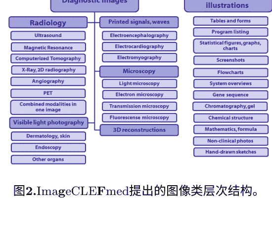

## 2.2 概述

为了简化复合图的多标签注释评估并优化所获得的知识，该任务被分为几个子任务。以下任务用于评估分析复合图内容过程的所有步骤:

1. 自动复合图检测（判断图是否为复合图或非复合图）；
2. 自动复合图分离（找到将复合图切分为各个部分的线条）；
3. 手动复合图分离验证（检查图像是否被正确分离）；
4. 自动子图分类（自动确定子图中的图像类型）；
5. 手动子图分类验证（验证上一步的结果）；
6. 手动子图分类（手动对错误分类的图像进行分类）；
7. 手动类平衡（确保所有类别都有代表性）；
8. 复合图多标签分配。

下面详细介绍每个步骤。

自动复合图检测。使用[6]中描述的方法自动将图像分类为包括 “复合图” 类在内的图像类型。 将被分类为 “复合图” 的图像随机选择用于下一步的分类，以便尽可能多地考虑到尽可能多的图像。

自动复合图分离。使用 *Chhatkuli* 等人提出的方法[3]自动将复合图分离为子图。

图3展示了两个复合图自动分离成子图的方法。 然而，并非所有选定的复合图都能正确地分离成子图（参见图4中的错误示例）。 两个缺失的线条和单个子图中的额外线条。因此，实施了一个验证步骤来识别错误的分离并进行修正。

手动复合图分离验证。在这一步骤中，进行了一个众包任务，提出了以下简单的问题：

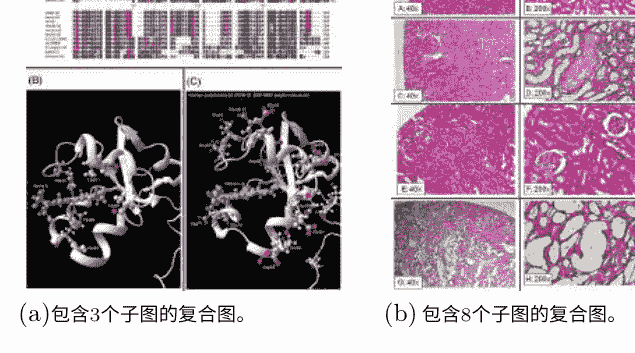

(a)包含3个子图的复合图。

(b) 包含8个子图的复合图。

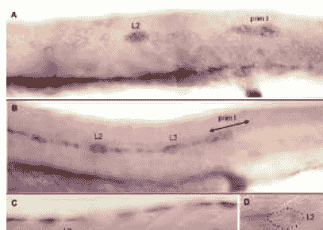

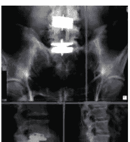

图4. 合成图的示例被错误地分为子图。

- 合成图是否被正确分离？
  - 是；
  - 否。

被标记为正确分离的图被用于下一步。错误分离的图在后续步骤中被手动分离。

自动子图分类。使用前一步骤的自动分离得到的子图，基于$k$最近邻（$k$-NN）和多个视觉特征的方法进行自动分类（参见Garc'ia等人[8,9]）。在过去的数据库上，相同任务的表现达到了68%的良好性能。

手动子图分类验证。与[6]类似，进行了图分类验证步骤以确保数据质量。在这种情况下，子图与自动标记的类别一起呈现在众包任务中。向贡献者提出的问题是：

- 这个图是否与所述类别相符？
  - 是的，完美分类；
  - 不，错误的类别；
  - 不确定。

手动子图分类。在前一步中，创建了一个最后的众包任务来对未正确分类的图进行分类。这个任务比前面的步骤慢。要求贡献者根据图2中显示的完整层次结构对每个图像进行分类。在界面中提出了一个层次结构来简化任务（参见图5），因此超过对于分类，需要点击一次，对于诊断图像有三个级别，对于一般插图有两个级别。在2015年的类似任务中，我们发现众包贡献者更频繁地使用需要较少点击的类别，这导致了设置的更改。由于众包按照注释图像的数量付费，如果存在差异，人们有可能使用最快的方式进行分类，这存在风险。因此，在2016年，结构稍作改变，以确保每个类别的点击次数相同，避免了这种偏差。

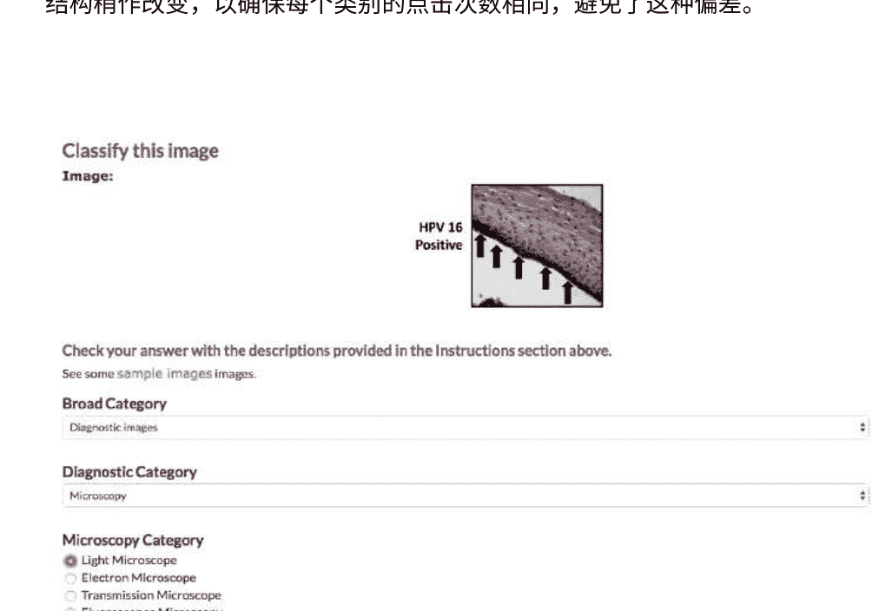

图5.截图显示了一个众包任务，旨在将文献中的生物医学图形分类为图像类型。

手动类别平衡。在前一步骤之后，有几个类别没有被代表或只包含很少的图像。因此，从数据库中手动选择了包含代表不足的图像类型的复合图形，以更好地代表这些类别。

复合图多标签分配。为了完成注释过程，每个复合图都被分配了包含在其中的所有子图的标签。通过这种方式，我们不仅可以验证将图像分开然后分类的图像，还可以基于整个图像进行多类别标记。

## 2.3 众包质量控制

在使用众包进行注释任务时，需要进行质量控制（QC）以确保任务的成功，特别是在医学图像中，一些领域知识非常有益[1]。在设计时间和运行时应用了QC方法[2]。

首先，任务被设计得尽可能简单，以确保人员能够快速正确地理解任务。这是将过程分为几个子任务的原因。在可能的情况下，添加了自动步骤来限制手动任务，并减少需要手动分类的图像数量，因为这是过程中最具挑战性的步骤。对参与者提供了详细而明确的任务描述，如果有疑问，参与者可以随时访问该描述。特别地，描述中包括每种情况或模态的几个图例。此外，Crowdflower提供了来自几位专家对任务设计的反馈。

贡献者仅限于内部的生物医学影像专家团队或具有特定声誉水平的贡献者，以优化质量。

对于运行时质量控制，使用了Crowdflower提供的以下工具：

- 输出一致性：两个贡献者必须独立提供相同的答案才能被视为正确答案。
- 已知真实答案的控制：在任务执行开始时和随机时间点提出具有已知答案的相同类型的任务，以检查每个贡献者的答案质量。根据Crowdflower的建议，至少需要保持70%的准确率；一些图像可能具有主观性，可能被添加到多个类别中，因此阈值并不严格。
- 监控答案模式：监控特定答案，如“不确定”或“其他”；17%的答案范围被接受为“不确定”或“其他”，否则将移除贡献者。

Allahbakhsh等人[2]建议领域专家检查贡献质量。因此，为了最终确定质控，进行了专家评审。生物医学成像领域的专家快速检查了贡献，以确保注释的高质量。

# 3 结果

本节描述了在第2节中描述的数据分类和注释步骤中获得的结果。

最初从ImageCLEFmed 2013数据库[7]中选择了15,403个复合图形，并进行了自动分离。在复合图形分离步骤之后，~ 57%的图形基于手动验证被正确分离。使用免费的内部Crowdflower界面进行了此任务，该界面可用于已知的人群。八位生物医学成像专家在 ~98小时内验证了图形的分离。选择了一个子集将其分离为子图，并自动进行了分类。在子图分类验证过程中，~ 56%被定义为正确分类为正确的图形类型。超过100位贡献者在 ~ 49小时内验证了分类，成本为396.68美元。通过众包将错误分类的子图手动分类为确切的图形类型。为了评估任务的正确设计，对前1,149个子图进行了分类。通过5位专家在约5小时内使用内部接口进行了分类，然后剩余的子图（约9800个）由100多位贡献者在427小时内进行了分类，成本为472.66美元。在这个过程之后，需要进行手动专家审查来解决子图分类错误。

由于最终选择的子图并不包含所有的图形类型，并且非常不平衡，因此决定手动添加包含相对罕见的子图类型的其他复合图。添加了122个包含以下类别的复合图，然后进行手动分离和分类：血管造影；计算机断层扫描；磁共振；超声波；脑电图；数学程序清单；以及多种模态在一张图像中。即使经过这个平衡步骤，类别分布仍然不均匀，就像生物医学文献一样，尽管稍微更加平衡一些。

总共有2,651个复合图被标注了它们的多个子图的标签，其中包含8,397个子图。这些图像被分发给ImageCLEFmed 2016多标签和子图分类任务，连同图像标题一起。2015年，共分发了1,568个图像用于ImageCLEFmed多标签任务。这些图像被分为训练集（包含1,071个图像）和测试集（包含497个图像）。它们的子图被用于ImageCLEFmed 2015子图分类任务。训练集包含4,532个子图，测试集包含2,244个子图。2016年，ImageCLEFmed将2015年分发的所有图像用作训练集，并将额外的标注图像分发为测试集。结果是，在ImageCLEFmed 2016多标签任务中，提供了1,568个图像作为训练集和1,083个图像作为测试集。ImageCLEFmed 2016子图分类任务中，训练集包含6,776个子图，测试集包含4,166个子图。2016年，ImageCLEFmed提出了5个任务：复合图检测；复合图分离；多标签分类；子图分类和标题预测。本文描述了用于多标签分类任务和子图分类任务的数据生成过程。ImageCLEFmed多标签分类任务旨在为每个复合图的每个子图模态（见图2）进行标记，而不知道分割线的位置。此外，ImageCLEFmed子图分类任务旨在将图像分类为所提出层次结构中的30种图像类型。

研究团队可以参与这些任务，并将他们的研究工具与其他研究人员在相同的数据和相同的评估场景下进行比较。有四个团队向ImageCLEFmed多标签任务提交了15次运行，有十个团队向ImageCLEFmed子图分类任务提交了45次运行。更多信息可以在CLEF 2016的工作笔记中找到[11]。

# 4 结论

本文介绍了用于注释生物医学文献中的复合图形并分离复合图形的步骤，以及用于注释图形类型信息的步骤。使用分割线将它们切割成所有的子图形。结果，2651个复合图形被注释为图形类型信息，并且所有图形都可用于ImageCLEFmed 2016多标签任务。为了确保注释的质量，该过程被分为多个步骤，结合了自动工具（例如图形分离和图形模态分类）和手动工作来验证或标记数据。众包被用于加速任务，并且成本有限。因此，进行质量控制非常重要。通过所描述的过程，可以自动注释图形，并将手动控制限制在验证和修正注释上。创建的资源现在可供医学图像分析和图像检索社区使用。这是一个手动创建的黄金标准，用于构建工具，为PMC中的四百多万个图形和可能的两百万个复合图形创建更多的元数据，其中包含估计的六到七百万个额外的子图形。为这些图形提供详细的元数据可以帮助使图形中包含的知识对研究和临床工作更加可访问。

致谢。这项研究部分得到了美国国立卫生研究院（NIH）、国家医学图书馆（NLM）和Lister Hill国家生物医学通信中心（LHNCBC）的内部研究计划的支持。

# 参考文献

1. Albarqouni, S., Baur, C., Achilles, F., Belagiannis, V., Demirci, S., Navab, N.: Aggnet:深度学习从众包中用于乳腺癌组织学图像的有丝分裂检测。IEEE Trans. Med. Imaging 35(5), 1313–1321 (2016)
2. Allahbakhsh, M., Benatallah, B., Ignjatovic, A., Motahari Nezhad, H.R., Bertino, E., Dustdar, S.: 众包系统中的质量控制：问题和方向。IEEE Internet Comput. 2, 76–81 (2013)
3. Chhatkuli, A., Markonis, D., Foncubierta-Rodr´iguez, A., Meriaudeau, F., M¨uller, H.: 将期刊文章中的复合图分离以便进行子图分类。In: SPIE医学成像会议（2013年）
4. Chua, T.S., Tang, J., Hong, R., Li, H., Luo, Z., Zheng, Y.: NUS-WIDE: 新加坡国立大学的真实网络图像数据库。In: ACM国际图像和视频检索会议论文集，第48页。ACM (2009年)
5. Foncubierta-Rodr´iguez, A., M¨uller, H.: 医学图像中的真实数据生成：基于众包的迭代方法。In: 多媒体众包研讨会。ACM多媒体，2012年10月
6. de Herrera, A.G.S., Foncubierta-Rodr´iguez, A., Markonis, D., Schaer, R., M¨uller, H.: 用于医学图像分类的众包。在：年度SGMI大会2014年 (2014)
7. Garcia Seco de Herrera, A., Kalpathy-Cramer, J., Demner Fushman, D., Antani, S., M¨uller, H.: ImageCLEF 2013医学任务概述。在：CLEF 2013（跨语言评估论坛）工作笔记，2013年9月
8. Garc´ıa Seco de Herrera, A., Markonis, D., Joyseeree, R., Schaer, R., Foncubierta-Rodr´iguez, A., M¨uller, H.: 用于图像模态分类的半监督学习。在：M¨uller, H., et al. (eds.) MRMD 2015. LNCS, vol. 9059, pp. 85–98. Springer, 海德堡 (2015年)。doi: 10.1007/978-3-319-24471-6 8
9. Garcia Seco de Herrera, A., Markonis, D., Schaer, R., Eggel, I., Müller, H.: The medGIFT组在ImageCLEFmed 2013中。 在: CLEF 2013（跨语言评估论坛）工作笔记, 2013年9月
10. Garcia Seco de Herrera, A., M¨uller, H., Bromuri, S.: ImageCLEF 2015医学分类任务概述。 在: CLEF 2015（跨语言评估论坛）工作笔记, 2015年9月
11. Garcia Seco de Herrera, A., Schaer, R., Bromuri, S., M¨uller, H.: ImageCL EF 2016医学任务概述。 在: CLEF 2016（跨语言评估论坛）工作笔记, 2016年9月
12. Kalpathy-Cramer, J., Hersh, W.: 自动图像模态基于分类和注释以改善医学图像检索。 Stud. Health Technol. Inf. 129,1334–1338 (2007)
13. Lease, M.: 关于质量控制和机器学习在众包中的应用。 Human Comput. 11, 11 (2011)
14. Maier-Hein, L.: 众包用于内窥镜图像参考对应生成。 In: Golland, P., Hata, N., Barillot, C., Hornegger, J., Howe, R.(eds.) MICCAI 2014. LNCS, vol. 8674, pp. 349–356. Springer, Heidelberg (2014). doi:10.1007/978-3-319-10470-6 44
15. Mitry, D., Peto, T., Hayat, S., Morgan, J.E., Khaw, K.T., Foster, P.J.: 作为视网膜底照相分类的一种新技术的众包：代表英国生物库眼睛和视觉联盟分析epic norfolk队列中的图像。 PLOS ONE 8(8), e71154 (2013)
16. Nowak, S., R¨uger, S.: 通过众包进行注释的可靠性研究：关于多标签图像注释的互评一致性研究。 在: 多媒体信息检索国际会议论文集，MIR 2010, pp. 557–566。 ACM, 纽约 (2010年)
17. Tirilly, P., Lu, K., Mu, X., Zhao, T., Cao, Y.: 关于模态分类及其在医学数据库中基于文本的图像检索中的应用。 在: 第9届内容基于多媒体索引国际工作坊 (2011年)
18. Wang, C., Yan, S., Zhang, L., Zhang, H.J.: 多标签稀疏编码用于自动图像注释。 在: IEEE计算机视觉与模式识别会议, pp. 1643–1650。 IEEE (2009年)

^4^ http://www.crowdflower.com/.
^5^ http://imageclef.org/2016/medical/.

## 向英国生物库心脏Cine MRI扫描的自由文本注释的语义丰富化

Valentina Carapella 1 (✉) , Ernesto Jim´enez-Ruiz 2, Elena Lukaschuk 1, Nay Aung 3, Kenneth Fung 3, Jose Paiva 3, Mihir Sanghvi 3, Stefan Neubauer 1, Steffen Petersen 3, Ian Horrocks 2, 和 Stefan Piechnik 1

1 Radcliffe Department of Medicine, Oxford Centre for Clinical Magnetic Resonance Research (OCMR), University of Oxford, Oxford, UK
vcarapella@gmail.com
2 信息系统组，计算机科学系，牛津大学，英国牛津
3 威廉·哈维研究所，Barts的NIHR心血管生物医学研究单位，伦敦大学玛丽女王学院，英国伦敦

摘要。图像质量评估对于影像分析的输出结果的可信度至关重要。然而，临床研究成像扫描往往没有明确评估其质量，但是与患者/志愿者扫描相关的报告是书面的。如果有效地处理和结构化，这些丰富的自由文本文档有潜力提供自动图像质量评估。本文旨在展示如何使用语义Web技术来结构化自由文本文档，以提供自动图像质量评估的手段。我们旨在设计和实现一个语义层，用于特殊数据集，即英国生物库心脏Cine MRI试点研究中的注释。这个语义层将是一个强大的工具，用于自动推断或验证临床图像的质量分数，并根据从注释中提取的质量信息高效查询图像数据库。在本文中，我们阐述了这个语义层的需求，介绍了我们本体的初步版本以及初步结果。所提出的方法有潜力扩展到更广泛的项目，并最终应用于临床环境中。

# 1 引言

UK Biobank是一个大规模的国家级人口研究，旨在改善对癌症、中风或心脏病等多种疾病的理解、诊断和治疗[1]。2006年开始招募了40-69岁的50万名志愿者，在英国进行了一系列临床测试，并同意对他们的健康进行跟踪。UK Biobank是一个复杂的项目，涉及多个器官，包括不同的影像学模式。

# 向图像问答的自由文本注释的语义丰富化

该研究通过各种临床测试，包括不同的影像学模式，来研究多个器官。该研究的结果将对全球研究人员可用。

在英国生物库内，心血管磁共振成像（CMR）在评估心脏功能方面起着基础性作用。参与英国生物库成像项目的每个志愿者都要接受一系列MRI序列来成像心脏：Cine MRI、标记MRI、T1映射和相位对比成像[2,3]。发布了一项包含5,000个CMR扫描的试点研究，并与分析Cine MRI的关联研究人员共享，这是临床实践中最常见的CMR序列。

自动图像质量评估的主题在处理和后处理大规模数据集（如英国生物库试点研究）以及临床研究中尤为重要。一致的图像质量评估提供了评估从图像分析中获得的参数值的可靠性的手段。然而，图像质量评估很少以有组织和结构化的方式进行。临床医生和放射技师可能会在实时中检测到技术问题时重复扫描，否则，次优质量将不会被检测到并记录下来。

在后期处理中，图像分析师经常会丢弃存在技术问题的图像，而不会向图像采集团队提供进一步的反馈。在英国生物库CMR试点研究的背景下，主要目标之一是解决采集和后期处理阶段之间缺乏交流的问题。试点研究的数据分析实际上基于两个关键方面：图像数据的质量评估和手动轮廓划定。图1突出了分析的两个组成部分。通过自由文本评论和数值质量评分的组合，对Cine MRI扫描的质量进行评估。

对心脏的四个心室进行手动轮廓划定（也称为分割），然后计算心脏功能的基本参数。根据英国生物库的协议，所有这些派生数据将返回给英国生物库，包括在中央数据库中，然后可以根据适当的研究批准向其他团体传播。

为了我们的工作目的，我们只关注质量评估数据，这是自由文本注释和数值质量分数的组合。质量分数提供了图像的快速整体分类，例如用于统计目的。自由文本注释富含信息，但无法像数值分数那样轻松高效地处理。

在语义网领域可以寻找一种有希望的高效解决方案。自由文本注释的语义描述图像分析的质量将通过一个结构化词汇表或本体来定义，我们将其称为CMR-QA（心血管磁共振质量评估）。本体是对给定领域或知识领域的概念化的明确规范，提供了一个明确且形式化的表示。换句话说，本体提供了关于某个领域的受控词汇。

## Data input

## Data Analysis and primary output

## Secondary output

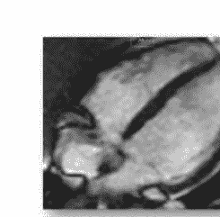

| Quality Assessment | Value |
|-------------------|-------|
| Free text comment | 2Ch and 4Ch off axis in ED, both RA and LA affected |
| LV Score | 1 (=optimal) |
| RV Score | 1 (=optimal) |
| LA Score | 2 (= sub-optimal) |
| RA Score | 2 (=sub-optimal) |

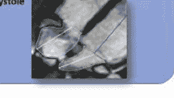

| Atrial functional parameter | Volume (ml) |
|-----------------------------|-------------|
| LA 4Ch vol min | 8.00 |
| LA 4Ch vol max | 35.00 |
| LA 4Ch SV | 27.00 |
| LA 4Ch EF | 77.14 |
| RA 4Ch vol min | 29.00 |
| RA 4Ch vol max | 54.00 |
| RA 4Ch SV | 25.00 |
| RA 4Ch EF | 46.30 |

图1. 限于HLA视图的分析流程示例。质量分数为1 = 最佳，2 = 次优和3 = 不可靠或不可分析。

该领域中的相关术语及其关系。本体在生物医学（例如，[6]）和其他领域（如能源部门，例如，[7]）中被广泛使用。最近还有一些努力使用本体来描述生物库中的信息（例如，[8-11]）。

为注释生成一个语义层提供了以形式化和明确的方式对其进行结构化的手段，同时保留了自然语言的所有描述能力。该语义层将提供机器可读的数据，并将成为以下方面的强大工具：（i）快速高效地处理自由文本注释；（ii）根据这些注释自动评估图像质量并生成质量分数；（iii）评估自由文本注释的信息完整性、歧义性和变异性；（iv）培训目的（例如，展示不同类型图像的首选注释样式）；（v）英国生物库目标用户（例如自动分割领域的研究人员或临床研究人员）通过高效的语义访问（即数据库查询）访问图像，需要将其作为控制组的特定子集用于研究。

## 2 方法论方法

5000个CMR试点研究的数据分析由两个临床研究中心的八名观察员团队进行。观察员是经验丰富的专业人士，具有不同的背景和专业知识。

质量评估和一般数据分析进展通过团队共享的电子表格进行管理。

## 2.1 图像数据

包括在英国生物库项目的5000个CMR试点研究中的每个个体CMR数据集都包含了一系列心脏的MRI扫描，旨在成像心脏功能和结构的不同方面。然而，为了第一次发布数据的目的，只分析了获取的图像的子集。

数据分析最初仅限于以下Cine MRI视图：（i）短轴（SA）。在这个视图中，左心室（LV）和右心室（RV）在心脏周期的舒张末期和收缩末期进行轮廓绘制。对于左心室，绘制了内膜和外膜轮廓。对于右心室，只考虑内膜轮廓。（ii）水平长轴（HLA或4Ch），也称为四腔视图。在这个视图中，左心房（LA）和右心房（RA）内膜在两个时相进行轮廓绘制。第一个时相是室壁舒张期，提供最小的心房容积。第二个时相是通过二尖瓣开放来确定的，用于获得最大的心房容积。（iii）垂直长轴（VLA或2Ch），或两腔视图。只在与HLA相同的心脏周期时对左心房进行轮廓绘制。

## 2.2 数据的质量评估

在试点研究中，每个参与者的个体数据集包含了上述三个Cine MRI视图。每个数据集的数据分析分为两个阶段，即质量评估和解剖结构的手动轮廓。本文重点介绍质量评估部分。质量评估分别针对三个视图进行，因为它们是分别获取的。因此，例如，一个质量良好的SA图像可以与质量较差的HLA或VLA图像配对。图1显示了HLA视图的数据分析流程和输出。

观察者需要根据可能影响图像质量的某些方面来评估每个图像子集。提供的细节水平也因观察者的经验和背景而有所不同。例如，只有在被认为会影响图像质量时，具有临床经验的人才能提出特定病理的存在。那些了解MRI物理学的人对伪影的性质提供了更多的见解。图2显示了质量评估的不同方面的图表，观察者考虑了技术问题（左侧面板）和与患者相关的问题（右侧面板）。为每个质量评估子区域提供了可能问题的示例。

对于被标记为次优或不可靠的图像，观察者被要求写一个简短的自由文本评论，总结对这种决定的三个成像视图的原因。这导致提供的详细程度和使用的词汇有很大的变异性。除了评论外，观察者还被要求提供一个数值评分（1 = 最佳，2 = 次优，3 = 不可靠），以总结每个心脏腔室的轮廓在质量评估的光线下的可靠性。

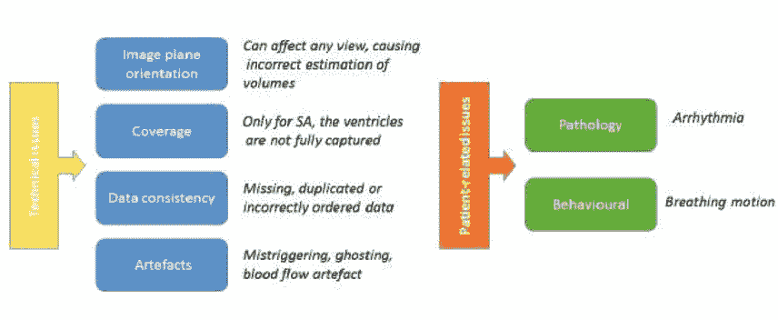

图2. 质量评估参数及示例。

## 2.3 语义层的定义

我们的目标是为我们的领域提供一个正式的描述或语义层，即英国生物库CMR初步研究中心心血管Cine MRI视图的质量评估（包括自由文本注释和质量评分）。语义层将由以下组成：(i)本体，包含与我们的领域相关的概念（即出现在自由文本注释中的词汇或与图像分析相关的术语）以及这些概念之间的关系；(ii)本体数据，根据本体重新表达自由文本注释的信息内容；(iii)本体规则，用于结合本体和本体数据推断新知识。

本体开发。本体开发仍在进行中，并且与参与图像分析和质量评估阶段的观察者的密切合作极大地受益。鉴于本体开发的高度理论性质，在本节中，我们仅提供一些关键示例，以普通文本形式描述本体的关键组成部分。

生物医学本体论中的概念通常按照更宽泛-更具体的关系进行组织，即将概念从一般到更详细的分类，例如，心脏是一种器官；部分-整体关系，例如，左心房是心脏的一部分。此外，本体概念还可以通过其他关系相互关联，例如，心律失常影响心脏。

在这个框架下，我们已经开始开发CMR-QA（心血管磁共振质量评估）本体，旨在包括关于该领域的一般知识和关于图像质量评估的更具体方面。例如，CMR-QA编码了关于概念的一般知识，如Cine MRI扫描是MRI扫描的一种；但它还编码了更具体的知识，如错误的图像平面定位是技术问题的一种，或者RA偏离轴是错误的图像平面定位的一种具体类型（请参见图2）。尽管关系指定Cine MRI扫描是MR扫描可能不被视为有趣的知识，这种知识将不会被计算机以其他方式知道，因此应该进行规定。此外，这种顶层知识将有助于与其他已建立的领域本体集成，这些本体集成不包含与我们的领域一样细粒度和具体的概念，如CMR-QA中提供的概念。概念和关系属于逻辑领域。然而，非逻辑知识也可以以词汇信息的形式添加到本体中（同义词、注释、交叉引用）。例如，CMR-QA包括LA out of plane是LA off axis的替代标签或同义词，这捕捉到了自由文本注释中观察到的一些变异性（请参阅表1获取完整的变体列表）。

本体数据通过自由文本评论挖掘获得。我们正在开发命名实体识别（NER）技术，将自由文本评论转化为语义丰富的数据，根据CMR-QA（参见[12,13]进行调查）。换句话说，每个自由文本评论都会使用文本挖掘技术进行分解成块，然后将其与<主语 谓语 宾语>表达式形式的语句或三元组相关联。例如，假设我们有一个复合评论“基底切片丢失，错误平面RA”。文本挖掘过程通过将句子分解为两部分“基底切片丢失”和“错误平面RA”来识别出两个质量问题。在后者上进行关注，自由文本评论中的文本块“错误平面RA”然后与三元组关联：<问题<sub>ii</sub> *rdf:type* *RA off-axis*>；这是一个计算机友好的表示，表示存在一个质量问题（主语），在这里通过问题<sub>ii</sub>唯一标识。这个主题属于某种类型（谓词*rdf:type*），类型为*RA off-axis*（宾语）。

本体规则。本体规则与本体一起开发，通过自动推理（例如，[14]）来推断有关数据的其他知识。规则是前提和结论之间的蕴含关系，也就是说，只要前提成立，结论也必须成立。例如，如果自由文本注释中包含评论*RA off-axis*（前提），则该评论必然是指*HLA*视图（结论）。类似地，自由文本注释*basal slice is missing*（前提）意味着与*SA*视图（结论）相关的覆盖不足。我们工作中仔细开发这些规则的一个关键点是它们可以用来从评论中推断出数值质量分数。例如，*Lack of coverage*（前提）的存在将始终导致与右心室和左心室相关的次优质量分数。此外，我们的目标是使用规则来揭示潜在的不完整性或模糊性。例如，我们可以将*LA off axis*这样的评论分类为不完整，因为既没有指示成像视图也没有指示心脏周期相。

表1. LA off轴示例的变异性数字。带星号的同义词考虑了与它们相关的变化（缩写和最常见的拼写错误）。

表2. HLA (4Ch) 的注释中存在的不明确性，当没有明确说明左心房或右心房或两者都受到离轴技术问题影响时（在表中以粗体突出显示）。

| 同义词 | 出现次数 |
| :--- | :--- |
| 缩短* | 2 |
| 离轴* | 179 |
| 离轴 | 13 |
| 离轴 | 145 |
| 离轴 | 21 |
| 离平面 | 0 |
| 离轴 | 26 |
| 错误平面 | 7 |

| 离轴子集 | 出现次数 |
| :--- | :--- |
| 总离轴句子 | 515 |
| 仅涉及左心房 | 173 |
| 仅涉及右心房 | 27 |
| 涉及两个心房 | 53 |
| 没有引用的HLA (4Ch) | 226 |
| 其他注释 | 36 |

# 3 初步结果

自由文本注释为UK Biobank的目标用户提供了丰富的信息来源，超出了数值评分所提供的简单分类。然而，自由文本容易出现变异性和歧义，这妨碍了根据质量评估结果查询和访问Cine MRI扫描的信息内容的高效利用。在本节中，我们提供两个示例来激发通过注释的设计和实现的语义层的质量评估的形式化结构的需求。

## 3.1 示例1：变异性

变异性是由于自然人的变异性，例如使用术语的差异或对图像质量的不同意见。通过使用标准化分析协议，可以在一定程度上限制这种变异性。例如，不同的观察者可以正确地标记为LA偏离轴, LA超出平面, 错误的LA平面, 2Ch超出平面, 或LA缩短的图像，其中选择用于获取长轴视图的平面未能最佳对齐以测量左心房（LA）容积。表1显示了观察者在涉及影响左心房的错误图像平面的214个评论中使用的同义词集的出现情况。在开发与此特定示例相关的语义层时，我们做出了第一个决策，将LA偏离轴定义为首选标签，因为它是最常用的。然后我们将表中的其他变体定义为接受的同义词。图3显示了CMR-QA的一个片段，显示了首选标签和概念LA off axis的一部分接受的同义词。

## 3.2 示例2：歧义

歧义通常是由于注释中缺少信息而导致的模棱两可的解释。例如，在英国生物库试点研究分析方案中，注释2Ch out of plane将始终指左心房偏离轴线，因为在VLA（2Ch）中只有左心房被轮廓化。然而，4Ch out of plane表示一个模棱两可的注释，因为在HLA（4Ch）中左右心房都被轮廓化。表2描述了与HLA（4Ch）相关的模棱两可注释的出现情况，缺少关于哪个心房受影响的参考。在总共515个通常涉及偏离轴线问题的句子中，有226个涉及到HLA（4Ch），但没有明确提到LA、RA或心房。对于英国生物库试点CMR数据集的详细了解有助于解决这种歧义，因为观察者们意识到在大多数适用于4Ch out of plane的情况下，左心房受影响最多。因此，我们创建了项目特定的本体规则，对于这种注释，它们会（i）提出不完整的警告，并且（ii）将LA off axis（结果）作为最可能的结果分配给在HLA视图（前提）中观察到错误平面的注释。

# 4 讨论

在本文中，我们提出了在英国生物库心脏Cine MRI扫描的质量评估中定义语义层的第一步，主要目标是从自由文本注释中自动推断图像质量分数。在本节中，我们对前一节中展示的激励示例进行评论，总结未来的工作，并强调对英国生物库用户和临床研究的可能好处。

### 激励示例。

在第3节中，我们提出了两个案例，评估图像分析质量评估中引入语义层的好处可以得到体现。自由文本注释中遇到的词汇变异的第一个示例表明，添加语义层以补充自由文本注释将极大地有助于提取共同点。特别是，语义层将使我们能够(i)将描述相同概念的注释分组为相同的首选标签，并且(ii)在类似注释之间找到类比。第二个示例涉及注释中的不完整性导致的歧义。使用语义将有助于在注释过程中找到模式，并定义本体规则来部分解决这种歧义。在这两个示例的背景下，我们还展示了与质量评估信息相关的结构化词汇的设计。还提供了开发领域特定本体规则的初步直觉。

### 相关工作。

本体在生物医学领域被广泛使用。著名的例子是BioPortal，一个包含500多个生物医学本体的综合性存储库[6]，以及SNOMED CT [15]，作为国家卫生服务 (NHS) 信息系统的参考本体。最近还有一些努力在生物库中添加语义层来描述信息。Andrade等人[8]设想了使用本体对生物库和生物库之间的信息进行查询和搜索的好处。Muller等人[11]对本体在生物库描述和互操作性方面的最新概述和开放挑战进行了更新。在这些方面，语义Web技术将发挥关键作用。在生物库中，还可以找到基于具体语义Web的解决方案的例子[9,10]。尽管最先进的本体包括与我们领域相关的概念描述，但我们无法找到满足所有要求的本体 (例如，完整描述Cine MRI技术问题) ，这表明在这个特定领域需要更具体的本体。

### 未来工作。

作为即将进行的未来工作，我们计划完成CMR-QA本体论，定义必要的本体论规则，并完成从评论中提取本体数据的技术实现。通过这种方式，将能够自动推断出注释的数值质量分数。通过将自动分数与观察员手动分配的分数进行比较，进行验证以进行质量评估。我们还计划设计一个原型软件，用于根据特定的语义特征查询和检索Cine MRI扫描，并将其嵌入到英国生物库CMR试点研究可用工具中。此外，我们将进行一项广泛评估以分析我们方法的正确性。从长远来看，语义的定义将使得在英国生物库内部和外部的不同层次上进行集成：(i)与英国生物库的其他部分进行集成，其中可能使用不同的本体和受控词汇；(ii)与其他现有生物库本体进行集成（例如，[9,10]）；以及(iii)与医学词汇进行集成，以符合最先进的标准，例如SNOMED CT [15]。与其他本体的集成将允许不同专家组之间的互操作性，这些专家组依赖于不同的本体，并创建一个更广泛的语义层。

### 培训目的的预期收益。

一个重要的相关应用是为未来分析临床影像数据的观察者开发培训材料。CMR-QA将提供一组受控的首选质量评估评论，以及替代表达方式，以便观察者在图像质量评估方面能够更系统地接受培训。这将导致变异性的显著减少，并提高所提供的评论的信息内容的质量。

### 对于 UK Biobank用户的语义访问的预期收益。

CMR-QA本体提供的受控词汇的使用将有助于根据其质量和分析结果的可靠性检索Cine MRI扫描。例如，对于一个对影响心房的病理研究感兴趣的临床研究人员，可能只想查询那些心房容积可靠估计的图像。因此，他/她将排除那些心房偏离轴线或图像质量不佳的扫描。来自生物医学工程领域的另一个例子：一个专家在自动轮廓绘制左心室算法的开发方面可能对那些最难定义基底切片的Cine MRI扫描进行测试。他/她将专门查询那些被注释为左心室基底切片难以定义的情况的案例。

## 缩写列表

- **CMR**: 心血管磁共振成像
- **CMR-QA**: 心血管磁共振质量评估
- **HLA**: 水平长轴
- **LA**: 左心房
- **LV**: 左心室
- **MRI**: 磁共振成像
- **NER**: 命名实体识别
- **NHS**: 英国国家医疗服务体系
- **RA**: 右心房
- **RV**: 右心室
- **SA**: 短轴
- **VLA**: 垂直长轴

## 致谢

SEP、SN和SP感谢英国心脏基金会（BHF）资助手动分析，为英国生物库成像资源中的5,000个CMR扫描创建心血管磁共振成像参考标准（PG/14/89/31194，PI Petersen，2015年6月至2018年5月）。SKP、VC和SN还受到英国国家卫生研究院（NIHR）牛津生物医学研究中心的资助，该中心位于牛津大学医院信托基金会。

牛津大学的EJR和IH是在欧洲委员会的FP7 Grant协议318338“Optique”和EPSRC项目Score！、ED3和DBOnto的资助下进行的。

# 参考文献

- 1. Petersen, S.E. 等：在人口科学中的成像：英国生物库中10万名参与者的心血管磁共振成像-原理、挑战和方法。《心血管磁共振杂志》 15(1), 1-10 (2013年)。
    http://www.ukbiobank.ac.uk/
- 2. Petersen, S.E. 等：英国生物库的心血管磁共振成像方案。《心血管磁共振杂志》 18(1), 8 (2016年)
- 3. Schulz-Menger, J. 等：心血管磁共振成像的标准化图像解释和后处理：心血管磁共振学会（SCMR）董事会标准化后处理工作组。《心血管磁共振杂志》 15(1), 1-19 (2013年)
- 4. Gruber, T.R.: 用于知识共享的本体设计原则探索？ 人机交互研究国际期刊 43(5-6), 907-928 (1995)
- 5. Guarino, N., Oberle, D., Staab, S.: 什么是本体？ In: Staab, S., Studer, R.(eds.) 本体学手册, pp. 1-17. Springer, Heidelberg (2009)
- 6. Noy, N.F., 等：BioPortal：一键访问本体和集成数据资源。 Nucleic Acids Res. 37(Web-Server-Issue), 170-173 (2009)
- 7. Giese, M., 等：Optique：大数据的放大镜。 IEEE Comput. 48(3), 60-67 (2015)
- 8. Andrade, A.Q., Kreuzthaler, M., Hastings, J., Krestyaninova, M., Schulz, S.: 语义生物库的要求。 Stud. Health Technol. Inform. 180, 569-573 (2012)
- 9. Pathak, J., 等：应用语义Web技术进行与电子健康记录链接的生物库的表型广泛扫描。生物医学语义学杂志 3, 10 (2012)
- 10. Brochhausen, M., 等：为生物库管理领域开发一个语义丰富的本体。生物医学语义学杂志 4, 23 (2013)
- 11. Müller, H., Reihs, R., Zatloukal, K., Jeanquartier, F., Merino-Martinez, R., vanEnckevort, D., Swertz, M.A., Holzinger, A.: 生物库目录集成的现状和未来挑战。在： Holzinger, A., Röcker, C., Ziefle, M.(eds.) 智能健康。LNCS, vol. 8700, pp. 261-273. Springer, Heidelberg (2015)
- 12. Spasic, I., Ananiadou, S., McNaught, J., Kumar, A.: 生物医学中的文本挖掘和本体：理解原始文本的意义。简报生物信息学 6(3), 239-251 (2005)
- 13. Bodenreider, O.: 生物文本挖掘的词汇、术语和本体资源。在： Ananiadou, S., McNaught, J. (eds.) 用于生物学和生物医学的文本挖掘, pp. 43-66. Arte ch House, Boston (2006)
- 14. Nenov, Y., Piro, R., Motik, B., Horrocks, I., Wu, Z., Banerjee, J.: RDFox：一个高度可扩展的RDF存储。在： Arenas, M., 等 (eds.) ISWC 2015. LNCS, vol. 9367, pp. 3-20. Springer, Heidelberg (2015). doi:10.1007/978-3-319-25010-6
- 15. Schulz, S., Cornet, R., Spackman, K.A.: 合并SNOMED CT的本体承诺。Appl. Ontology 6(1), 1-11 (2011)

## 通过EM图像进行集中校对以重建神经连接组

Stephen M. Plaza(✉)
Janelia Research Campus, HHMI, Ashburn, VA, USA
plazas@janelia.hhmi.org

摘要。从电子显微镜（EM）图像中识别复杂的神经回路可能有助于解开大脑的奥秘。然而，由于这些图像数据集的规模和复杂性，识别这些回路需要耗费大量时间进行手动追踪（校对），从而限制了分析范围在小脑区域内。提高可扩展性的潜在途径包括自动图像分割和众包，但目前的努力取得了有限的成功。在本文中，我们提出了一种新的策略，即专注校对，它与自动分割配合工作，旨在将校对限制在对结果回路影响最大的区域。然后，我们引入了一种利用生物信息（如突触）的新工作流程，并将其应用于大型果蝇视神经叶数据集。我们的技术在不牺牲质量的情况下实现了显著的追踪加速。此外，我们的方法使校对更易于实施，并可以增强众包的效果。

# 1 引言

EM重建是从EM数据集中提取连接组的过程。
从EM数据中可得到的结构连接组通常包括神经元及其连接/突触。为了解读大脑中神经结构的复杂性，图像分辨率达到纳米级，生成了大量需要分析的数据。由于这个原因，重建非常耗时（和昂贵），需要取得重大突破来处理更大的体积[10]。从EM数据集重建连接组有两种主要方法：手动骨架化和自动分割的改进。

骨架化需要校对员手动追踪细胞的形状[1,13]。CATMAID [13]通过使合作、基于Web的追踪对于感兴趣的、训练有素的生物学家非常容易实现了一定的可扩展性成功。在[1]中，骨架化是通过一致性来完成的，通常是由训练程度较低的学生进行的。基于分割的追踪已经成功应用于部分重建的果蝇视觉叶[16]和小鼠视网膜[4]。重建是通过合并和分割不正确的片段来实现的。在实践中，相对于欠分割的体积，改进过分割的标签体积要容易得多。值得注意的是，[16]生成了一个全面的连接组，但并没有达到100%的准确性。完美的重建似乎是不必要的，也普遍不可行，因为图像存在歧义。

理想情况下，自动分割将产生完美的连接组。然而，最近EM分割的进展，如[8]，取得了非常好的结果，但分割仍然远离完美，如图1所示。如果初始分割不好，就必须花费大量的时间来纠正。这种纠正工作可以通过某种无关指标来衡量。然而，即使有100%正确的分割（零无关指标），在大型数据集上验证正确性仍然需要多个校对人员进行彻底检查。仅仅更好的分割并不能解决可扩展性问题。

图1. 自动分割来自EM数据集的一幅图像。尽管分割正确地确定了大多数神经元轮廓，但仍存在许多错误。然而，突出显示的神经元中的一些过分分割错误并不重要，因为它并不显著改变该神经元的形状或连接性。

众包已经以不同的方式被追求[1,4,13]作为一种潜在的解决方案。然而，这些策略在根本上是不可扩展的。传统上，EM追踪需要高水平的专业知识，需要数周的培训（或更多），这对于一般的众包社区来说是不合理的。CATMAID[13]试图通过其可访问性来扩大专家基础，但仍需要培训才能熟练掌握。共识追踪，如[1]中所述，可以访问更广泛的资源，但需要更多的校对者来纠正错误。此外，平均结果可能导致次优的连接组或需要大量的专家验证。[4]中的方法试图使校对于新手社区来说更加可行。尽管社区的巨大参与，这些努力主要用于验证，重建仍然需要一组经过训练的校对者。

为了解决这些可扩展性挑战，我们提出了专注校对的方法。专注校对是一种基于分割的校对方法，试图识别与连接组相关且最不可能正确的分割区域。在这个过程中，它将校对任务简化为一系列更易理解的是/否决策。通过重新定义校对，我们希望扩大潜在的校对人员基础。我们的工作与[11]中提出的基于不确定性的校对方法有一些相似之处。然而，我们提出了一种更实用的方法，利用高效计算的局部约束。

以指导校对而不是全局策略。此外，我们利用突触信息和其他生物学先验知识，极大地提高了校对效率和最终重建的质量。我们应用专注的校对技术，全面重建了果蝇视神经节中的七个髓质柱[15]。我们最好的估计表明，与类似的工作相比，重建速度提高了3-5倍，准确性也有所提高[16]。随着数据集的不断增大和手动工作在连接组学预算中的主导地位，专注的校对技术可能会带来显著的财务节省。图2展示了我们的高级工作流程。

图2.

# 2 基于不确定性的连接组重建

我们考虑一个情况，即给定一个分割$S$的校对者必须将其修订为接近地面真值$G$的分割$S'$。分割$S$和地面真值$G$之间的差异可以用信息变异(VI) [5]来量化：

$$VI(S, G) = H(S|G) + H(G|S)$$ (1)

其中$H$是熵函数。第一项$H(S|G)$表示底层分割与地面真值之间的信息，指示过度分割。同样，$H(G|S)$表示不足分割。$0$信息表示高相似性。与其他相似度度量方法（如Rand指数[2,12]和Warping指数[3]）相比，VI既简单计算又具有可解释性优势，正如[6]中的作者所强调的。

由于图像分割通常被调整以限制欠分割，为了简单起见，我们假设校对员只能进行合并操作。因此，我们将校对问题视为对 $S$中的边进行是或否的分配，其中一条边连接两个相邻的 $s$。在实践中，欠分割错误会发生，但通常在校对过程中或之后很容易检测出来。我们可以定义在 $m$个决策之后的最优相似度（$sim$）为：

$$sim(m) = min_{S_{\pi(m)}} (H(S_{\pi(m)}|G))$$ (2)

其中 π(n)表示m个是或否决策的最优排序。由于我们从一个过分分割的 S开始，π( m)只包含 m个否（合并）决策的排序（是决策不会改变当前分割）。我们将 m*定义为实现某种期望的完整性或准确性所需的最优决策数。

我们不试图最优地解决 π(m)。相反，我们更倾向于具有最大影响力的贪婪排序方式，对 H(S|G)产生最大影响。然而，简单的贪婪方法存在两个问题。首先，无法获得明确的 G来衡量影响力。其次，在执行较不重要的合并之前，可能不存在具有影响力的边界决策。我们将在以下两个部分解决这些问题。

## 2.1 优先决策

在没有基准数据的贪婪排序中，需要对给定决策的影响和可能性进行公式化。一个段落 a_i和 a_j之间的是/否决策所关联的影响或信息如下：

```
影响 (e_{(i,j)}) = -|a_i|log_2\left( \frac{|a_i|}{|a_i| + |a_j|} \right) - |a_j|log_2\left( \frac{|a_j|}{|a_i| + |a_j|} \right) \quad (3)
```

|a_i|, 和 |a_j|可以表示体素或突触连接的数量 a_i, 和 a_j分别（为了方便起见，我们不通过总体积进行归一化）。

我们定义与给定边缘相关的风险为：

```
风险(e_{(i,j)}) = P(¬e_{(i,j)})影响(e_{(i,j)}) \quad (4)
```

最危险的边缘定义了对这个分割可能产生最大影响的边缘。为了确定 P(¬e_{(i,j)}), 我们首先在一个过分分割的体积上训练一个分类器。得到的预测结果确定了对边缘的置信度。这个分类器的训练方式与[6,8]中讨论的方式类似。我们选择了随机森林分类器，因为它在分割结果上表现良好[8]，同时速度快且易于部署。我们将在第4.1节评估置信度预测的质量。

## 2.2 专注校对算法

我们将专注校对定义为对一部分边的检查，其中风险（ e_{(i, j)} ）> k，其中k是根据给定数据集和分割经验确定的参数。然而，之前介绍的贪婪策略存在缺陷，因为两个标签s_i和s_j可能属于同一个神经元，但没有直接的边。与[11]中一样，我们通过考虑一组边连接s_i和s_j的概率来避免这个问题：

```
P(¬E_{(i,j)}) = Π_{¬e_{k,l} ∈ E_{(i,j)}} P(e_{k,l}) \quad (5)
```

其中 P(¬E_{(i,j)})是s_i和s_j之间存在路径的概率。贪婪地检查风险路径可以提供更全局的认知。

```
输入: 分割: S, 阈值: k
输出: 校对分割: S
对于每个 s_b ∈ S, 执行
    S_E = findNeighbors(s_b);
    对于每个 s_a ∈ S_E, 执行
        如果 risk(E(s_a, s_b)) > k, 则
            result = decide(E(s_a, s_b));
            S ← result;
            S_E = findNeighbors(s_b);
        结束
    结束
结束
```

**算法1. 专注校对算法.**

现在我们可以提出一种校对过分割的策略（算法1）。该算法首先通过迭代考虑所有段落，优先考虑最大的段落。然后，通过函数findNeighbors确定与该体连接的所有潜在段落（在一定的阈值内）。通过decide函数，校对人员沿着最危险的路径给出边缘。在每次决策之后，更新图形和候选边缘列表。

如果分割得好，专注的校对仍然可能表现不佳。如果不确定性有利于错误合并，算法将导致低效，因为会检查许多真实的边缘。如果不确定性有利于错误分割，最终的分割将出现错误。我们的风险度量可以减轻错误，即使真实边缘的概率很高，仍然可以检查非常有影响力的区域。下一节将讨论该算法在实践中的部署方式。

# 3 重建大型连接组的工作流程

在实践中，重建面临许多挑战。(1) 初始分割将错误合并一些区域。(2) 专注的校对会错过一些重要区域。(3) 校对人员会犯错误。为了解决这些问题，我们描述了图2中所示的工作流程，并在[15]中使用。

我们首先将大型数据集分成几个子卷，以简化数据管理（尽管以下内容可以应用于整个数据集）。对于每个子卷，校对人员首先按照[9]中的描述注释突触，然后进行校对。进行三轮校对：(1) 基于体积阈值的专注校对，(2) 基于突触阈值的专注校对，以及(3) 孤立（小体）追踪。前两轮校对紧密遵循前一节中的算法，其中段的大小可以是体素数或突触连接数。孤立（小体）追踪是一种质量控制，校对人员会检查包含突触或至少达到一定大小的断开的段。因此，孤立追踪确保即使专注校对错过了重要区域，也会对其进行检查。我们还添加了一些突触连接约束，以消除不必要的工作。例如，在突触连接路径中，我们忽略了会导致罕见的自反连接（一个神经元驱动自身）的边缘。

经过各种质量控制，最终得到了准确的连接组。在校对这些子体积时，校对员会注意到错误合并的区域。这些区域在专注校对后会被分割成独立的部分。然后将这些子体积拼接在一起，创建一个全局分割。然后我们会寻找细胞形状或连接性的大规模异常。如果大多数体素被分割到包含大部分突触连接的一组神经元中，并且每个神经元都经过了抽样检查和与现有先验匹配的确认，那么重建通常被认为是准确的。

# 4 实验

在接下来的章节中，我们首先在小型数据集上评估专注校对在实现最佳准确性和最少决策方面的有效性，与其他校对策略进行比较。然后我们重点介绍专注校对在大规模、多年的果蝇视神经叶的重建中的实际应用。该数据集包含约27,000立方微米的校对神经突触，其中包含数百个部分神经元和数十万个突触连接。

我们在一个名为NeuroProof的公开可用的C++工具中实现了专注算法(https://github.com/janelia-flyem/NeuroProof)。初始分割是使用Ilastik [14]进行体素预测和[8]中描述的算法生成的。在分割之前，突触是半自动标注的，如[9]所述。所有的校对工作，包括专注的是非决策，都是使用开源工具Raveler [7]完成的。

## 4.1 专注校对的验证

在本节中，我们展示了提出的专注校对策略比其他校对策略更高效。结果是从[15]中采集的，对应一个500³的体积，具有10 × 10 × 10 nm的体素分辨率。产生接近像素完美的真实标签的困难限制了我们在更多数据集上进行验证的能力。我们通过在10个随机初始分割上运行许多实验来有效地增加我们的测试集。分割训练是在两个较小的不相交的体积上进行的。在展示专注校对策略的有效性之前，我们验证了不确定性预测的质量，如图3所示。较低置信度的预测通常是准确的；较高置信度的预测低估了真实边缘的数量，这将导致更多的校对工作。

我们现在通过在图4中使用不同的专注校对启发式方法来评估校对工作量和校对质量之间的权衡。我们只考虑过分割VI，因为欠分割误差很小，并且对我们的合并技术几乎没有影响（修复欠分割误差将在下一节中讨论）。对于这些测试，校对工作量由自动决策的数量确定。

图3. 预测边缘置信度的准确性。此图显示给定分类器置信度的真实边缘百分比（y轴）。

在图4a中，我们展示了体积VI的趋势。如预期，使用突触进行引导的专注策略在改善体积VI方面表现不佳。体积引导的两种专注策略，体积局部和体积路径，表现更好。体积局部在做决策时只考虑局部体。尽管体积路径的截断较长，但两者表现相似，体积路径的变异信息稍低。我们将这些方法与仅使用边缘概率的直接策略进行了比较。首先选择最有信心的错误边缘，结果在2000个决策下稍差但可比较。但是，如果愿意检查更多的边缘，还有更多的改进空间。

这是否表明简单的边缘排序可能足够？首先，专注于校对明确选择了一个权衡错误的停止条件。仅使用边缘概率的简单停止条件可能会导致很多不必要的工作。其次，大体之间的边缘（可能有更多边界证据的地方）具有更高的置信度。对于追踪突触中通常重要的较小过程来说，情况显然并非如此。图4b中的突触变异信息图显示，突触引导模式比其他技术要好得多。我们注意到，随机决策启发式算法（未显示）的性能明显较差。

## 4.2 生产校对的验证

我们使用有针对性的校对来帮助重建果蝇视神经节的七列[15]。这里描述的有针对性的校对工作主要在6个月内由5-10名经过培训的校对员完成。我们注意到，在一个示例子体上，多个校对员在超过98%的是/否决策上达成一致。高一致性是有针对性校对中只使用一个校对员的动机。随后，由高级生物专家进行质量控制和抽查，确保准确的最终结果。

图4：校对员决策的V-I过分割相似度指标改进情况。考虑了四种排序策略。（a）在考虑体积VI时，使用基于体积的决策比仅考虑边缘置信度稍微提高。（b）使用基于突触的决策，突触VI的改进速度显著加快。

我们在表1中报告了校对七列髓质所需的时间。校对工作在216个体积上进行，每个子体积为125立方微米，并随机分配给校对人员。列会话小时数给出完成任务所需的时间。工作小时数给出校对人员与校对工具互动的时间（试图考虑正常工作干扰和校对人员需要寻求帮助的情况）。工作小时数与会话小时数的比率给出了效率。一般来说，只有机器人才能达到100%的效率。令人沮丧的挑战性任务往往效率较低。这也可以看作是一种挫败因素。

每天微米数根据会话时间计算的速率。我们展示了以下任务的结果：专注校对（还包括孤立追踪的工作量）、突触质量控制和体分割。突触质量控制要求校对人员审查看起来可疑的突触连接，如自突触。体分割显示了修复欠分割错误所需的时间。

表1.[15]中，校对工作的分解情况（忽略突触注释时间和下游质量控制）。专注校对包括体积和突触的聚焦，以及孤立追踪。突触质量控制涉及验证和修复数据中观察到的一些局部连接异常。体分割修复欠分割问题。

| 任务 | 会议小时 | 工作小时 | 效率 | 微米/天 |
|------|----------|----------|------|----------|
| 专注校对 | 3374 | 2934 | 87 % | 64 |
| 突触质量控制 | 226 | 198 | 88 % | 956 |
| 体分割 | 756 | 495 | 66 % | 286 |
| 平均 | | | | 49.6 |

在校对过程中检测到。尽管每个子体积只需要10秒的分割，但任务耗时且效率较低。仅仅进行专注校对是无法生成连接组的，但它是一个重要的时间组成部分。

我们评估了由于专注校对而导致的重建加速与之前的重建[16]进行对比，后者没有使用专注校对，而是采用了更加面向校对员的方法。由于初始分割的质量不同，进行比较是困难的。[16]中的子体积校对速率约为每天10-20微米（未发表的通信）。我们相信本文中的校对更加全面，并且速率提高了3-5倍。

虽然改进的很大程度上可能源于改进的分割，但我们的方法更加专注、系统化，可能更少令人沮丧。

# 5 结论

耗时的EM重建阻碍了我们理解更大、更复杂的神经系统的能力。本文介绍了一种称为聚焦校对的策略，大大提高了重建速度，使得能够分析更大的区域。我们通过重建果蝇视神经叶区域的完整连接组，展示了其有效性，这是有史以来最大的重建。所提出的工作流程适用于大规模的众包工作。

这项工作是首次关注分割引擎的不确定性估计质量，而不仅仅是结果分割。未来的工作应该致力于优化这些置信区间。此外，这项工作首次尝试使用生物先验和突触连接来指导校对过程。我们相信利用更多的生物规则或先验可以加快速度。最后，这项工作强调了将复杂任务（校对）分解为一系列可消化的决策的必要性。应该探索进一步改进可视化和使任务对更大的劳动力可访问的额外工作。

致谢。我们感谢Zhiyuan Lu进行样品制备；感谢Shan Xu和Harald Hess进行成像；感谢Pat Rivlin、Shin-ya Takemura和FlyEM校对团队（Roxanne Aniceto、Lei-Ann Chang、Shirley Lauchie、Mathew Saunders、Christopher Sigmund、Satoko Takemura、Julie Tran）进行重建工作；感谢Donald Olbris进行Raveler开发；感谢Toufiq Parag生成分割分类器；感谢Louis Scheffer进行有益的讨论和建议。

# 参考文献

- 1. Helmstaedter, M., Briggman, K., Turaga, S., Jain, V., Seung, H., Denk, W.: 在小鼠视网膜内丛状层的连接组重建。自然500(7461), 168–174 (2014)
- 2. Hubert, L., Arabie, P.: 比较分区。J. Classif. 2(1), 193–218 (1985)
- 3. Jain, V., Bollmann, B., Richardson, M., Berger, D., Helmstaedter, M., et al.: 通过拓扑约束进行边界学习. 在: CVPR, pp. 2488–2495 (2010)
- 4. Kim, J., Greene, M., Zlateski, A., Lee, K., Richardson, M.: 时空连线特异性支持视网膜的方向选择性. Nature 509(7500), 331–336 (2014)
- 5. Meil`a, M.: 通过信息变化比较聚类. 在: Sch``olkopf, B.,Warmuth, M.K. (eds.) COLT-Kernel 2003. LNCS (LNAI), vol. 2777, pp. 173–187. Springer, 海德堡 (2003年) . doi:10.1007/978-3-540-45167-9 14
- 6. Nunez-Iglesias, J., Kennedy, R., Parag, T., Shi, J., Chklovskii, D.: 使用层次聚类的机器学习来分割2D和3D图像. PLoS One 8(8), e71715(2013年)。 doi:10.1371/journal.pone.0071715
- 7. Olbris, D., Winston P., Plaza S., Bolstad M., Rivlin P., Scheffer L., Chklovskii D.: https://openwiki.janelia.org/wiki/display/flyem/Raveler
- 8. Parag, T., Chakraborty, A., Plaza, S., Scheffer, L.: 一种上下文感知的延迟聚合框架用于电子显微镜分割. PLoS One 10(5), e0125825 (2015年)
- 9. Plaza, S., Parag, T., Huang, G., Olbris, D., Saunders, M., Rivlin, P.: 在大型EM数据集中注释突触. 在: arXiv.org (2014年)
- 10. Plaza, S., Scheffer, L., Chklovskii, D.: 迈向大规模连接组重建. 在: 神经生物学当前观点, 第201-210页 (2014年)
- 11. Plaza, S., Scheffer, L., Saunders, M.: 通过接受不确定性来减少手动图像分割的时间. PLoS One 7(9), e44448 (2012年) . doi:10.1371/journal.pone.0044448
- 12. Rand, W.: 用于聚类方法评估的客观标准. 美国统计协会杂志 66(336), 846-850 (1973年)
- 13. Saalfeld, S., Cardona, A., Hartenstein, V., Toman, P.: CATMAID: 用于大量图像数据的协作注释工具包. Bioinformatics 25(15),1984–1986 (2009)
- 14. Sommer, C., Straehle, C., Koethe, U., Hamprecht, F.: Ilastik: 交互式学习和分割工具包. 在: IEEE国际生物医学成像研讨会论文集, 第230-233页 (2011)
- 15. Takemura, S., Xu, S., Lu, Z., Rivlin, P., Parag, T., et al.: Drosophila视觉系统中不同柱内的突触电路及其变异. PNAS112(44), 13711–13716 (2015)
- 16. Takemura, S., Bharioke, A., Lu, Z., Nern, A., Vitaladevuni, S., et al.: Drosophila连接组学提示的视觉运动检测电路. Nature 500(7461),175–181 (2013)

## 通过二进制输入实现医学体积的免提分割

Florian Dubost 1,2 (✉), Loic Peter 1, Christian Rupprecht 1,3, ✉enjamin Gutierrez ecker 1, 和 Nassir Navab 1,3
1 计算机辅助医疗程序, 慕尼黑工业大学, 德国慕尼黑 floriandubost1@gmail.com
2 鹿特丹生物医学成像小组, Erasmus MC, 荷兰鹿特丹
3 计算机辅助医疗程序, 约翰霍普金斯大学, 美国 巴尔的摩

摘要。我们提出了一种新颖的免提方法来交互式地分割3D医学体积。在我们的场景中，人类用户通过回答一系列问题来逐步分割器官，问题的形式是“这个体素是否在要分割的物体内部？”在每次迭代中，选择的问题被定义为在回答的问题的基础上将候选分割集合减半的问题。为了快速高效地探索，这些分割是根据Metropolis-Hastings算法进行采样的。我们的采样技术基于放松的形状先验、学习的概率图和与先前答案的一致性的组合。我们在前列腺分割MRI数据集上展示了我们策略的潜力。通过对合成示例的失败案例的研究，我们展示了我们方法的适应潜力。我们还展示了我们的方法优于两个直观的基线方法：一个基于随机问题，另一个基于阈值化的概率图。

# 1 引言

医学图像或体积的分割是医学图像分析中的一个关键研究课题。感兴趣的对象（例如器官或肿瘤）的分割是手术规划、导航或个性化假体设计的关键过程。交互式分割通常是一个合适的框架，因为它允许用户积极参与分割过程并纠正可能的错误或改进分割结果。然而，在手术过程中进行分割时，这种交互式方面可能会引发问题：（i）缩放和浏览切片的过程可能会令人不知所措且耗时；（ii）临床医生的双手已经忙于手术本身。因此，无需使用双手的技术通常很方便，并且临床医生普遍喜欢使用这些技术，因为它们显著减少了医学数据标注的工作量。在许多常用的交互式分割方法中，用户通过示意图或边界框等方式向算法提供输入。一旦在没有新的用户输入的情况下，算法可以自主运行。在这个框架中，一种无需使用手的技术示例是基于眼球追踪的Eyegaze [5]。然而，这种技术仍然需要进行大量的导航和缩放，并且需要进行校准。

执行交互式分割的另一种方法是构建一个算法，该算法根据用户的指示进行迭代，并采用一种改进技术。处理这种情况的最简单方法是在每次交互后显示生成的分割结果。然后，用户的每个输入都将被视为一个硬约束条件[6]。该框架的另一个一般思想是利用用户已经提供的答案来提示高度不确定的区域，并引导用户进行搜索。通过分割抽样的一种可能的方法是定位这些区域。分割抽样的最新方法可以基于马尔可夫链蒙特卡洛（MCMC）[7,8]或高斯过程[9]。这两种方法[8,9]在2D上被证明是有效的，但在处理3D数据时，由于使用了测地距离变换，运行时间较长。

在本文中，我们提出了一种新颖的无需手动操作的交互式分割方法。在我们的场景中，一个人类用户仅通过回答“这个体素是否在待分割的物体内部？”这类问题来从三维医学体积中分割出感兴趣的物体。这些答案是二元交互 - “是”/“否” - 可以通过踏板或语音识别系统轻松记录。它们提供了一组正负种子来计算最终的分割结果。为了选择问题体素，我们通过MCMC框架对候选分割进行采样。这个采样过程依赖于离线学习的概率图和与先前答案的一致性之间的自适应加权。如果概率图具有误导性，算法会检测到并相应地进行更改。

用户的答案将使候选分割的空间减半，通过在该空间中进行二分搜索。我们提出了一个图表（图1）总结了我们的技术。我们在一个三维MRI前列腺分割数据集上评估了我们方法的性能。通过研究使用合成示例生成的失败案例，我们展示了我们方法的适应潜力。我们的结果表明，我们的技术可以在合理的时间内纠正不准确的注释或改善不精确的注释。

# 2 方法

在下面的段落中，我们首先简要解释了概率图的学习（第2.1节）。在下一节中，我们详细介绍了我们方法的核心和对MCMC技术的分割采样的贡献（第2.2节）。我们的想法是将放松的形状先验、学习的概率图和与先前答案的一致性相结合。我们的主要贡献之一是我们算法的适应能力，它可以识别误导性的概率图并相应地进行调整。最后的段落简要回顾了如何从采样的分割中提出问题体素（第2.3节）以及在回答完所有K个问题后如何计算算法的最终分割（第2.4节）。

图1：总结我们方法的流程的图表。用户（1）通过踏板（2）与算法（3）进行通信，算法向用户输出问题体素（4）。使用离线学习的概率图（第2.1节）和用户先前的答案，算法对多个分割进行采样（第2.2节），并找到它们最不一致的区域。问题体素在这个区域内（第2.3节）。问题的形式是“这个体素是否在要分割的对象内？”。用户的答案提供了一个种子，将候选分割的空间减半。最终的分割是根据用户提供的种子集合和运行最后的分割采样过程（第2.4节）计算得出的。

令 $\Gamma = \{1, ..., H\} \times \{1, ..., W\} \times \{1, ..., D\}$ 为一个三维格点，并且 $V$ 是在 $\Gamma$ 上定义的体积。我们称 $S$ 为分割空间，即函数集合 $s : \Gamma \rightarrow \{0, 1\}$。如果体素 $v (x, y, z)$ 在分割对象内部，则 $s(x, y, z) = 1$，否则 $s(x, y, z) = 0$。

## 2.1 概率图

我们的方法使用先验知识，即在 $\Gamma$ 上定义的概率图 $\pi$。这个概率图是通过离线训练的分类器获得的。$\pi(v)$ 是体素 $v(x, y, z)$ 属于目标对象的概率估计。我们对这个概率图的质量没有先验信息。为了获得 $\pi$，我们使用基于 Haar 特征的 AdaBoost 分类器 [10]，并按照 [12] 中的方法进行定义和采样。我们用 $h_t$ 表示第 $t$ 个弱分类器，其中 $T$ 是增强迭代次数。我们将决策函数 $H$ 计算为弱分类器 $h_t$ 的总和。为了将输出值重新缩放到 $0 < \pi(x, y, z) < 1$，我们对得分 $H$ 应用了一个 sigmoid 函数 [13]。

## 2.2 MCMC框架

我们希望生成近似可能分割空间的分割，并使用用户的答案将该空间减半，采用二分搜索的方法。在本节中，我们介绍了我们的候选样本采样技术。

分割。我们遵循[7,8]中提出和使用的MCMC框架。我们的想法是通过运行马尔可夫链来生成分割。我们定义了一个状态空间 X，从状态 x∈X我们可以计算出唯一的分割 s(x)。状态是基于形状先验的变换系数参数化的（见下一段）。

过程如下：从当前状态 x开始，我们使用一个提议分布 Q引入小的变化来生成一个新的提议状态 x'。然后，我们可以使用后验概率 P计算新的底层分割 s(x')的似然。新的状态 x'以过渡概率 α被接受，该过渡概率定义为

$$\alpha(\mathbf{x}'|\mathbf{x}) = \min\left\{1, \frac{P(\mathbf{x}')Q(\mathbf{x}|\mathbf{x}')}{P(\mathbf{x})Q(\mathbf{x}'|\mathbf{x})}\right\}$$

如果移动被接受，提议的状态将成为当前状态，并且我们重复这个过程。否则，我们回到 x并提出一个新的状态。

### 分割的参数化。

这里的目标是解释如何表示分割。我们决定使用形状模型，因为它可以以非常低的运行时间生成3D分割。在[14]中的类似思想下，我们定义了基于有符号距离函数的松弛形状概念。给定一个训练集 m松弛形状 Y = {y1, ..., ym}，我们可以计算平均值 μ和第一个特征模态 ψ1, ..., ψ n。为了创建一个新的松弛形状，我们计算y = μ +

$$\sum_{i=1}^{n} b_i \psi_i,$$

其中 b1, ..., bn是形状先验的特征系数。为了扩大分割空间，我们还允许调整大小和刚性变换，如平移和旋转。因此，一个状态 x由7 + n个参数定义，即x= (a, tx, ty, tz, α, β, γ, b1, ..., bn)，其中 a是尺寸参数，tx, ty和 tz是平移参数，α, β和 γ是旋转参数，b1, ..., bn是形状先验的特征系数。得到的分割结果 s(x) ∈ S是通过将 y(x)阈值化为0来计算的。

### 后验概率。

这个概率编码了一个状态 x（及其底层分割 s(x)）在给定已提供的答案 Σ和概率图 π的情况下 的可能性。我们将其表示为 P(x|Σ)，并计算如下：

$$P(\mathbf{x}|\Sigma) \propto \frac{1}{1 - L(\mathbf{x}) + \beta_k g(\mathbf{x})},$$

其中 L(x)表示概率图 π和提出的分割 s(x)之间的相似度，g(x)是一个包含用户之前答案的惩罚项，βk是这两个目标之间的权重参数，经过k个问题后。通过这样做，我们认为接近的分割更有可能是正确的。

### 与用户的响应兼容的概率图。

这两个术语的相对权重 $\beta_k$ 在每个问题后通过检查后验与提供的答案的兼容性来进行调整。因此，如果后验概率错误，其影响逐渐减小。下面的段落介绍了我们的模型 $L$, $\beta_k$ 和 $g$。

似然度 - 概率图。为了评估候选分割是否接近概率图，我们使用最大似然度方案。为了简化以下符号，我们将 $v(x, y, z) = v(t)$ 写为 $t$ 是跨整个体积的参数。对于给定的体素 $v(t)$，我们假设 $s(t)$ 遵循伯努利分布 $B(\pi(t))$。如果我们考虑 $s(1), ..., s(|\Gamma|)$ $iid$ 样本，则加权对数似然度由以下给出

$$L(\mathbf{x}) = \frac{1}{|\Gamma|} \log(\mathcal{L}(S = \mathbf{s}|\pi)) = \frac{1}{|\Gamma|} \sum_{t \in \Gamma} \mathbf{s}(t) \log(\pi(t)) + (1-\mathbf{s}(t)) \log(1-\pi(t)). \tag{4}$$

这个数量总是负数，并且在完全匹配时达到最大值- $L(\mathbf{x}) = 0$ -。

惩罚项。我们引入一个惩罚项 $g(\mathbf{x})$ 来包含用户先前答案中提供的信息在后验概率 $P$ 的估计中。这样，我们希望惩罚与给定答案不兼容的候选分割 $\mathbf{s}(\mathbf{x})$。我们将答案建模为种子位置 $\sigma = \{x_\sigma, y_\sigma, z_\sigma\}$ 和相应的标签 $a(\sigma) \in \{0, 1\}$。我们将被候选分割违反的种子 $\sigma$ 的集合表示为 $\Sigma_{err}$，其中 $m \leq k$。当候选分割对于该种子的预测与用户提供的标签 $a(\sigma)$ 不匹配时，我们认为该分割违反了种子$\sigma$。

根据有符号距离函数的定义，$|y(\mathbf{x}, \sigma_{e_{rr}})|$ 给出了违反的种子 $\sigma_{e_{rr}}$ 与提议分割的边界之间的距离的度量。因此，我们计算惩罚项为

$$g(\mathbf{x}) = \sum_{\sigma \in \Sigma_{err}} |y(\mathbf{x}, \sigma)|. \tag{5}$$

自适应加权参数。对于两个目标函数$L$和$g$之间的加权参数$\beta_{-k}$，我们提出了一种自动适应的设置。这个想法是在每个问题中更新$\beta$，逐步验证概率图$\pi$是否可信，并相应地调整损失函数$-L(\mathbf{x}) + \beta g(\mathbf{x})$。如果概率图准确，$\beta$应该保持接近0，否则beta应增加。这个设置受到在线迁移学习[15]的启发。

$\beta$ 初始化为 $\beta_0$，并在每个问题$k$之后计算一个新值 $\beta_{k+1}$，根据

$$\beta_{k+1} = \max(\beta_{\max}, \beta_k * e^{-\mu l(1/2, \pi(\sigma))}), \tag{6}$$ 其中 $\mu$ 是一个编码更新振幅的参数，即学习率，$\beta_{\max}$ 是一个编码避免发散的 $beta$ 的最大值，是用户答案与概率之间的一致性

一个编码更新振幅的参数，即学习率，$\beta_{\max}$ 是一个编码避免发散的 $beta$ 的最大值，是用户答案与概率之间的一致性## 3 实验

我们的实验评估是在前列腺分割挑战赛MICCAI09数据集上进行的。该数据集是来自不同患者的15个3D MRI标注图像的集合。体素分辨率为0.55 × 0.55 × 5毫米³。图像的平均体素大小为256 × 256 × 32。

我们在实验中使用了T2加权图像。

## 3.1 实验设置

我们采用了5折交叉验证框架，其中训练集用于学习概率图和形状模型。为了生成新的形状，我们仅保留形状的前n个特征向量（n=3），这定义了我们的状态空间X，具有10个维度。关于权重参数βk，我们设置β0=1，μ=3和βmax=4。在MCMC过程中，我们执行100次burn-in迭代，并在每次采样分割之间运行25次迭代。每个问题中采样的分割总数为N=15。在分割采样中，我们探索状态x∈X，提议分布Q从以当前值为中心的高斯分布中抽取x的参数。我们使用Dice相似系数（DSC）[17]来评估算法的性能。我们使用C++实现了算法，并在Intel i7-4702MQ 2.2GHz CPU上运行实验。计算时间在每个问题之间很短，可以进行交互式使用。我们进行了一项实验，研究了数据集上的时间统计信息。在165个问题（每个患者45个问题）上，两个问题之间的计算时间平均为4.2秒，中位数为3.9秒，标准差为1秒。

## 3.2 结果

合成概率图。在我们的第一次实验中，我们通过自动设置参数βk来展示我们方法的适应能力。我们不使用学习到的概率图，而是创建合成的概率图来覆盖两种极端情况：(1) 概率图几乎完美且可信，(2) 概率图不准确且不应该用于生成分割。为了模拟这些概率图，我们对于(1) 使用模糊的真实标签图像，对于(2) 使用经过平移的模糊的真实标签图像，使得与原始真实标签图像的Dice重叠系数为零。在图3中，我们分别绘制了(1)和(2)的曲线，显示了Dice相似系数(DSC)随手动设置的β的演变。β的范围从0到7。在同一图中，我们展示了使用详细介绍在第2.2节中的自动可调节设置的beta获得的结果。

学习概率图。为了评估我们分割的质量，我们在30个问题后计算DSC。我们将我们的技术与两个直观的基准进行比较：第一个基准对应于阈值为0.5的提升概率图。第二个基准是在随机体素上提问。

图3. 我们的算法在具有不同固定β值的合成数据上的性能演变。直线显示使用自动设置的β获得的性能。在左侧，我们使用模糊的真实值作为概率图（1）。我们注意到，如果概率图已经表现良好，用户的答案不会提高性能。这可以通过查看beta的自动设置在很少的问题中检测出来。分割可以被认为已经太准确，无法通过我们的算法改进。由于我们形状模型的限制，DSC被限制在81%。在右侧，我们使用误导性的概率图（2）。我们注意到，在这种情况下，增加beta与显著更好的性能相关。注意，在这种情况下，beta对性能的影响要比（1）中大得多。在这里，我们的算法学习识别和忽略不准确的概率图。

图4. 在比较阈值化概率图的Dice得分后，自动设置β为30个问题之后。结果分别显示在每个病人上。在这个实验中，我们使用了学习到的概率图。正如预期的那样，我们注意到系数β会根据概率图的质量进行调整。对于可信的概率图，β较低，对于质量较差的概率图，β较高。这符合系数β的预期行为。

尝试使用MCMC框架找到最不确定的区域。结果显示在图4和图5中。如果我们仔细观察，我们会发现我们的算法在概率图表现最差的病人中表现更好。这很好地符合我们的动机。

图5. 在前列腺数据集上的Dice得分比较。我们的方法（蓝色）与两个基线进行比较：随机问题（红色）和阈值化概率图（黄色）。最后两列是病人的平均值和中位数。

如图3所示，形状模型的使用将DSC限制在80%的平均值内。（在线彩色图）

检索到的分割结果较差。然而，我们注意到例如对于患者73，阈值化概率基线比我们的方法和随机问题基线表现更好。这可能是由于我们的形状模型缺乏自由度，因此无法模拟患者73中的异常形状。由于实时3D GDT不可行，因此无法应用[8]提出的算法。Dowling等人[16]在相同数据集上报告了更多异质结果。我们的初始模型 - 概率图 - 平均精度不如他们的模型，如果通过使用更复杂的学习技术改进该组件，我们预计会获得更好的结果。

然而，我们在这里的贡献主要是为了说明交互式场景，限制为二进制输入，我们的初始模型并未针对这个特定任务进行优化。我们还相信在这个数据集上有更准确的形状模型的空间，因为这个任务的训练体积数量在这里是有限的。

# 4 结论

我们提出了一种交互式无需手动操作的方法来分割医学图像中的感兴趣对象。实验证明我们的方法具有检索不准确和误导性分割的潜力。通过使用概率图和形状先验，我们能够定位信息区域以提出问题。使用形状模型生成分割结果可以在每个问题之间快速计算。我们提供了一种自动可调节的设置来加权概率图的影响。该方法在手术中可能非常有用，例如纠正不正确的分割结果。

未来的工作可以包括根据用户的答案与概率图进行交互更新，例如与无监督模型相结合。

# 参考文献

1.  刘洋，Bauer, A.Q.，Akers, W.J.，Sudlow, G.，Liang, K.，Shen, D.，Berezin, M. Y.，Culver, J.P.，Achilefu, S.：无需手动操作的无线护目镜用于近红外荧光和实时图像引导手术。手术 **149**(5), 689-698 (2011)
2.  Miller, E.C.，Wang, C.N.，Gunday, E.H.，Juergens, A.M.：Stryker公司。用于无需手动操作的眼镜通信的美国专利6,729,726 (2004)
3.  Grady, L.：用于图像分割的随机游走。TPAMI **28**(11), 1768-1783 (2006)
4.  Rother, C.，Kolmogorov, V.，Blake, A.：Grabcut: 迭代图割的交互式前景提取. ACM Trans. Graph. (TOG) **23**(3), 309–314 (2004)
5.  Sadeghi, M.，Tien, G.，Hamameh, G.，Atkins, M.S.：使用眼动实现的无需手动操作的交互式图像分割. 在：SPIE医学成像, pp. 72601H–72601H. 国际光学与光子学学会, 2009年2月
6.  Gauriau, R.，Lesage, D.，Chiaradia, M.，Morel, B.，Bloch, I.：基于多模板变形的交互式多器官分割. 在：Navab, N.，Hornegger, J.，Wells, W.M.，Frangi, A.F. (eds.) MICCAI 2015. LNCS, vol. 9351, pp. 55–62. Springer, 海德堡 (2015年)。doi:10.1007/978-3-319-24574-4_7
7.  Tu, Z.，Zhu, S.C.：数据驱动的马尔可夫链蒙特卡罗图像分割。TPAMI **24**(5), 657-673 (2002年)
8.  Rupprecht, C.，Peter, L.，Navab, N.：二十个问题中的图像分割。在：CVPR, pp. 3314-3322 (2015年)
9.  L^e, M.，Unkelbach, J.，Ayache, N.，Delingette, H.：GPSSI: 高斯过程用于采样图像分割。在：Navab, N.，Hornegger, J.，Wells, W.M.，Frangi, A.F. (eds.) MICCAI 2015. LNCS, vol. 9351, pp. 38-46. Springer, 海德堡 (2015年)。doi:10.1007/978-3-319-24574-4_5
10. Freund, Y.，Schapire, R.，Abe, N.：提升算法简介. 日本人工智能学会杂志 **14**, 771–780 (1999)
11. Viola, P.，Jones, M.：使用简单特征的级联提升快速目标检测. 在: CVPR, vol. 1, pp. 511–518 (2001)
12. Peter, L.，Pauly, O.，Chatelain, P.，Mateus, D.，Navab, N.：通过高效特征采样实现尺度自适应森林训练. 在: Navab, N.，Hornegger, J.，Wells, W.M.，Frangi, A.F. (eds.) MICCAI 2015. LNCS, vol. 9349, pp. 637–644. Springer, Heidelberg (2015). doi:10.1007/978-3-319-24553-9_78
13. Niculescu-Mizil, A.，Caruana, R.：从提升中获得校准概率. 在：UAI, 第413页, 2005年7月
14. Cremers, D.，Schmidt, F.R.，Barthel, F.：变分图像分割中的形状先验：凸性，Lipschitz连续性和全局最优解. 在：CVPR, 第1-6页, 2008年
15. Zhao, P.，Hoi, S.C.，Wang, J.，Li, B.：在线迁移学习. 人工智能 **216**, 76-102页, 2014年
16. Dowling, J.，Fripp, J.，Freer, P.，Ourselin, S.，Salvado, O.：前列腺的自动基于图谱的分割：MICCAI前列腺分割挑战赛参赛作品. 在：MICCAI工作坊, 2009年
17. Sørensen, T.：基于物种相似性建立植物社会学中等幅度群组的方法及其在丹麦公共植被分析中的应用. 生物学论文 **5**, 1-34页, 1948年

## Playsourcing: 生物医学研究中的知识创造的新概念

Shadi Albarqouni^{(\box)}, Stefan Matl^{1}, Maximilian Baust^{1}, Nassir Navab^{1,2}, 和 Stefanie Demirci^{1}
1 计算机辅助医疗程序主席 (CAMP), 慕尼黑工业大学 (TUM), 德国慕尼黑
shadi.albarqouni@tum.de
2 约翰霍普金斯大学, 巴尔的摩, 美国马里兰州

摘要。 众包被认为是解决缺乏基准数据问题的有效解决方案，最近在生物医学领域引起了很多关注。. 然而，生命科学领域中现有的概念需要专业知识，从而限制了只有非常特定的社区才能访问。 在本文中，我们超越了最新技术，并提出了一个将生物医学科学无缝嵌入到普通游戏画布中的新概念。 除了引入视觉显著性概念外，我们还基本上消除了对先前知识的要求。 我们还实施了一个游戏来评估我们的新概念在三个不同用户研究中的效果。

- 游戏化
- 众包
- 聚合
- 注释

# 1 引言

随着强大的机器学习技术在生物医学领域展现出令人难以置信的潜力，众包已成为创建大量带注释图像数据的有效选择[11,12]。 这种策略面临两个主要挑战：(i) 如何将最先进的机器学习方法调整为从嘈杂的注释中学习模型，以及 (ii) 如何激励众包参与高度专业化的数据集[2]? Albarqouni等人[1]最近引入了一种新颖的卷积神经网络(CNN)适应方法，直接将标签聚合集成到学习过程中，而第二个挑战在文献中几乎没有得到解决。

大多数基于网络的平台实施的众包传统策略将每个用户视为一个工作者，他们会得到经济补偿。 尽管这个概念在商业领域表现良好，但人们对将其在生物医学科学领域的采用是否足够引起兴趣提出了质疑[1,2]。 这个概念的巨大成功

像Foldit [3]，MalariaSpot [9]，The Cure [6]和Dr. Detective [4]这样的playsourcing游戏提出了将游戏化和游戏玩法与众包相结合的想法。 然而，已有的游戏设计并不适合playsourcing。 此外，大多数这些游戏需要一定程度的生命科学先验知识，这限制了只有特定社区才能访问这些游戏。

为了消除对此先前知识的要求，我们引入了一种新颖的视觉显著性概念，将生物医学科学（即检测和分类）无缝嵌入到一个共同的游戏画布中。 随后，我们尝试回答以下问题：（i） 是否可能将医学图像转化为视觉显著的游戏对象？（ii） 游戏化是否比众包平台更有积极影响并表现更好？（iii） 特征表示是否影响嵌入游戏对象的显著性，从而影响分类性能？

作为概念验证，我们设计并实现了一个在线游戏，用于检测和分类乳腺癌组织学图像中的有丝分裂图像。在本文的剩余部分中，我们将首先介绍我们的一般嵌入概念，然后详细说明我们实际游戏实现的细节。 本文通过报告评估我们的游戏的三个不同测试案例，并讨论潜在的未来努力来结束。

# 2 方法论

我们在图1中描述的 Playsourcing 框架基于以下思想：通过众包标签 [1]，利用少量专家注释来增强之前学习的模型。 通过将“噪声”标注的数量降到最低，并对众包人员的积极性产生积极影响，我们的 Playsourcing 概念允许收集未标记数据的注释，并对高敏感应用中已检测和错误/分类错误的对象进行改进。 我们建议将数据嵌入到一个星形中，使用提取或之前学习的特征，并将结果星形对象放置在一个共同的游戏画布中。

## 2.1 对象嵌入

给定一个维度为 n 的 N个RGB图像的数据库，即 X = {x1, x2, ..., xN} ∈ R^{n×N} ，每个图像可以用一个维度为 d的特征向量 fi = φ(xi)来表示，其中 φ(·)是特征提取运算符。 这个运算符可以从简单的手工特征（如颜色、纹理或形状）到更复杂的特征（如深度学习特征）不等。

接下来，我们的目标是将这些d维特征嵌入到一个已知的游戏对象中，以保持特征的同质性和异质性。 我们提出了一个参数化的k-尖峰星形对象，经过精心设计以符合众所周知的游戏工程要求，包括正交性、相似性感知[5]和格式塔知觉定律[15]，包括对称性、连续性、邻近性和过去经验。

为了将特征编码到k-尖峰星形对象中，我们使用一个转换（嵌入）运算符
```
T: R^d → R^k
, si = T(fi), s.t. 0 ≤ sj_i ≤ 1.
```
在这里，si ∈ R^k 是星形参数向量，sj_i 表示星形si的第j个尖峰的长度。 理想情况下，转换运算符应该将特征嵌入到一个正交且低维空间中，保持同质特征之间的相似性，并增加异质特征之间的可分性。

降维技术，如主成分分析和稀疏编码技术[13]，可以进一步应用于减少参数数量。 然而，获取一组独特的参数主要依赖于特征本身，即将深度学习的特征嵌入三维空间显示出比手工设计的特征更好的可分离性。 在本文中，我们将特征选择技术（如拉普拉斯分数，费舍尔分数）应用于选择一些独特的特征。

为此，特征被转换和嵌入到相当独特的星形形状中，这些形状可以很容易地收集，即正样本具有尖锐而长的尖峰，然而，负样本显示出肥胖而短的尖峰（参见图2）。

## 2.2 游戏画布

- 学习
- 问题解决
- 收集未付费注释
- 娱乐和竞争

介绍和学习。游戏从演示阶段开始（参见图2），介绍游戏目标，设置和视觉显著性概念。 玩家可以在一个无限的隧道内驾驶飞机，定期出现3D星形物体。 对于每个星形物体，显示相应的补丁以向群众提供原始图像。 玩家应该区分正确和错误的星星，并只收集相关的星星，

图2. 星星表示：六个不同的补丁（左），游戏界面显示状态栏和用户操作按钮，一架飞向星星的飞机和相应的补丁在左下角（右）。由于这是第一关，星星中心通过显示绿色或红色中心来表示真实情况。额外的按钮允许改变游戏设置，如全屏或相机视图，甚至暂停游戏。

同时避免甚至积极推开其他星星。在最初的几关中，给玩家提供提示以建立对相关星星的更好理解，即为正类和负类分别显示绿色或红色中心。在这里，利用来自专家注释的真实情况，启动学习和知识传递。对于每个分类，向群众提供即时的视觉反馈，进一步支持学习过程。

关卡和娱乐。为了让玩家保持参与度，我们设计了多个与难度逐渐增加相关的关卡（参见图3），其中包括逐级增加星星数量、显示更少的提示、提高飞机速度以及增加隧道长度和曲率。如果不显示提示，灰色中心表示用户需要做出决策。

玩家初始装备有五颗子弹，可以频繁充能，用来击退无关的星星。此外，还提供了三架备用飞机，允许玩家在飞机撞到隧道墙壁时恢复游戏。每完成一个关卡后，会奖励一架新的飞机。

得分和竞争。正确的决策会得到积分，否则会受到惩罚。得分策略定义如下：

```
$p(y_i^j | y_i^*, level) = \begin{cases} \text{固定分数} & \text{新补丁得} \ \text{分} \times \text{等级} & y_i^j = y_i^* \ -\text{分数} \times \text{等级} & \text{否则} \end{cases}$
```其中 $y_{i,j}$ 是玩家对星 $j$ 的决策。根据其可用性，$*$ 可以是地面真相 $GT$，也可以是来自众包的聚合标签，称为众包真相 $CT$，对应的星。目前，众包真相是离线计算的，用于验证目的，因此，在测试数据集上的每个决策都被分配了一个固定的分数。如上所述，对于测试集中的新补丁，没有可用的标签，因此分配了一个固定的分数。

用户不知道即将到来的星是否已经被标记，因此他们的决策应该是直接的，仅基于呈现的数据，即星和相应的补丁。为了减少垃圾邮件发送者，玩家只有在当前级别的训练集中具有一定的平衡准确性 $\gamma$ 时，才能进入更高的级别。由于更高的级别会导致更高的分数，这提供了一个额外的激励来做出正确的决策。为了提高玩家之间的竞争，游戏网站上展示了一个计分板，列出了玩家的用户名、达到的级别和分数。

## 2.3 聚合

我们假设玩家在众包平台上具有比他们的伙伴更好的平衡准确性得分，这应该对聚合结果产生积极影响。因此，采用加权多数投票（WMV）算法[8]来聚合标签：

> $$y^{CT} = p(y|Y, \Gamma) = \frac{\sum_{j=1}^{G} \gamma^{j} y^{j}}{\sum_{j=1}^{G} \gamma^{j}},$$

其中 $Y = \{y^{1}, ..., y^{G}\} \in \mathbb{R}^{N \times G}$ 是玩家投票矩阵，$\Gamma = \{\gamma^{1}, ..., \gamma^{G}\} \in \mathbb{R}^{1 \times G}$ 是准确性得分矩阵，$G$是玩家数量。值得注意的是，当玩家被平等对待时，众包真相 $y^{CT}$ 变为简单多数投票（MV）。

# 3 实验和结果

我们已经在公开可用的MICCAI-AMIDA13挑战数据集的一个子集上验证了我们提出的方法，该数据集包含来自12名乳腺癌患者的311张注释组织学图像[14]。在提取用于分类的补丁之前，图像进行了染色归一化处理[10]。

测试用例和数据集。共构建了三个不同的测试用例（参见表1）。第一个测试用例中的补丁包含有丝分裂图像或随机背景，可以认为是简单的。对于剩下的两个测试用例，在[1]中出现的具有挑战性的众包数据集被选择。对于每个测试用例，选择了五个特征的子集。

虽然我们区分训练和测试数据集（为了评估目的仍然知道真相），但应注意补丁可以具有三种不同的功能。在训练数据集中，一个补丁可以用于学习目的，即始终向用户显示真相。否则，补丁用于验证，意味着用户做出决策后将立即给出反馈。测试数据集中的补丁始终用于测试目的。它们被视为用于增强的未标记数据。

实施。为了方便访问，我们实现了一个基于Web的游戏界面，平台无关，服务器端使用PHP语言，客户端使用JavaScript和WebGL 1.0。由于每个游戏动作都可以通过按下特定的键或点击相应的按钮来完成，因此游戏也可以轻松在移动设备上使用。我们的服务器托管计算特征和补丁。一旦用户访问网站并玩游戏，就会分配一个唯一的用户ID并保存以供返回。众包的决策在游戏过程中定期上传并存储在服务器上。

评估指标。我们计算不同的评估指标，如平衡准确率 γ = 1/2 * (TP/(TP+FN) + TN/(TN+FP)) 和 F1-得分 = 2*TP/(2*TP+FP+FN)，其中真正例为TP，假正例为FP，假阴性为FN。此外，我们绘制接收器操作特性（ROC）曲线，并计算曲线下面积（AUC）。

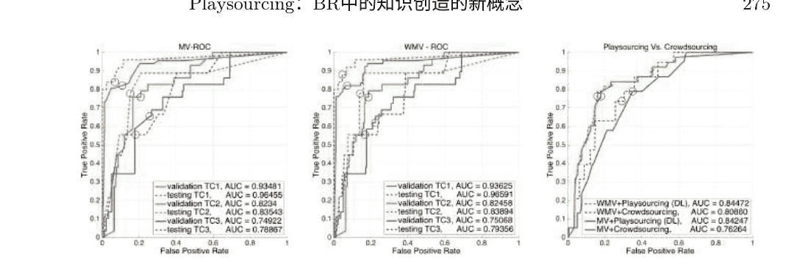

### 图4。使用MV（左）和WMV（中）对聚合标签的ROC结果进行比较。对比游戏与众包（右）。黑色圆圈表示在0.5阈值处的操作点。

结果。在大约三周时间内，我们收集了约14000个投票，分布在我们的三个测试案例中，来自86个用户，总共玩了14个小时。用户通过邮件列表和社交媒体渠道受邀参与。我们没有提供任何其他激励，只是为了玩得开心。为了确保足够的聚合投票，即每个补丁三个投票，我们删除了约3900个投票和相关用户。剩下的投票是训练（学习和验证）和测试集的一部分（参见表2）。

我们采用了WMV和MV作为聚合策略，为了比较不同的测试案例，如图4所示。简单的MV无法减少垃圾邮件发送者所做出的“噪音”决策。相反，采用WMV对AUC产生了良好的影响，并在所有测试案例中持续改进。

这证明了我们精心设计的定性测试的有效性，以及在第2.3节中所做的强假设。如预期的那样，简单数据集TC1表现最好。对于具有深度学习特征的具有挑战性的数据集TC2，与TC3相比，在验证和测试投票中，AUC分别提高了10%和6%。因此，特征表示显著影响视觉感知。接下来，将玩家投票与众包投票进行比较（参见图4）。显然，玩家投票在AUC上表现比众包投票更好，相对增益高达10%。与之前的比较类似，WMV始终改善了性能。

### 表2.剩余玩家投票的分布

| 测试用例 | 总计 | 学习 | 验证 | 测试 | 补丁 |
|----------|------|------|------|------|------|
| TC1      | 1524 | 348  | 812  | 364  | 251  |
| TC2      | 3883 | 801  | 2008 | 1074 | 534  |
| TC3      | 4791 | 864  | 2517 | 1410 | 658  |

# 4 讨论和结论

在本文中，我们介绍了一种在生物医学背景下进行游戏化的新概念。 我们的游戏化框架旨在将不同的特征嵌入到一个视觉显著的游戏对象中，这样可以轻松地将其集成到游戏画布中，有效地消除了对先前知识的任何要求。

深度学习的特征在具有挑战性的补丁上显示出比手工制作的特征更好的嵌入，然而，已经证明了两种特征的串联可以提高性能[16]。 尽管我们在学习和评分目的上使用了少量的真实标签，但对于明显的任务，这可以被众包真相所取代[4]。

我们进一步将我们提出的游戏化与众包平台进行了比较，结果显示AUC相对增益高达10%。 此外，游戏化还减少了成本（即未付费注释）、时间和误报。 基于这个结果，我们可以回答Hamari等人提出的“游戏化是否有效？”的问题，并得出结论：“是的，它有效。”

致谢。 我们要感谢所有参与我们游戏的匿名玩家。我们还要感谢Mitko Veta博士允许我们在研究中使用AMIDA13数据集。

# 参考文献

- 1. Albarqouni, S., Baur, C., Achilles, F., Belagiannis, V., Demirci, S., Navab, N.: Agnet:深度学习从众包中用于乳腺癌组织学图像的有丝分裂检测。 IEEE Trans. Med. Imaging **35**(5), 1313-1321 (2016)
- 2. Aroyo, L., Welty, C.: 众真相的三个方面。人机交互 **1**(1), 31-44 (2014)
- 3. Cooper, S., Khatib, F., Treuille, A., Barbero, J., Lee, J., Beenen, M., Leaver-Fay, A., Baker, D., Popovi´c, Z.: Foldit玩家: 用多人在线游戏预测蛋白质结构。 自然 **446**, 756-760 (2010)
- 4. Dumitrache, A., Aroyo, L., Welty, C., Sips, R.J., Levas, A.: Dr. detective: 结合游戏化技术和众包创建医学文本的黄金标准。 在：第一届众包语义Web国际会议论文集-第1030卷，第16-31页。 CEUR-WS.org (2013)
- 5. Fuchs, J., Isenberg, P., Bezerianos, A., Fischer, F., Bertini, E.: 轮廓对星形图相似度感知的影响. IEEE Trans. Vis. Comput. Graph. **20**(12), 2251-2260 (2014)
- 6. Good, B.M., Loguercio, S., Griffith, O.L., Nanis, M., Wu, C., Su, A.I.: 治愈: 用于乳腺癌生存预测基因选择的众包游戏的设计与评估。 JMIR Serious Games **2**(2), e7 (2014). doi:10.2196/games7.
- 7. Hamari, J., Koivisto, J., Sarsa, H.: 游戏化是否有效? -对游戏化的实证研究文献综述。 在：2014年第47届夏威夷国际系统科学会议（HICSS），第3025-3034页。 IEEE（2014年）
- 8. Littlestone, N., Warmuth, M.K.: 加权多数算法. Inf. Comput. **108**(2), 212-261 (1994)
- 9. Luengo-Oroz, M.A., Arranz, A., Frean, J.: 众包疟原虫数量化：一种用于分析感染厚血涂片图像的在线游戏. J.Med. Internet Res. 14(6), e167 (2012)
- 10. Macenko, M., Niethammer, M., Marron, J., Borland, D., Woosley, J.T., Guan, X., Schmitt, C., Thomas, N.E.: 一种用于定量分析的组织学切片标准化方法. In: ISBI, vol. 9, pp. 1107–1110 (2009)
- 11. Maier-Hein, L., Ross, T., Glocker, B., Bodenstedt, S., Stock, C., Heim, E., Wirkert, S., Kenngott, H., Speidel, S., Maier-Hein, K., et al.: 大规模内窥镜图像标注的众包算法协作与置信度
- 12. Maier-Hein, L., Kondermann, D., Roß, T., Mersmann, S., Heim, E., Bodenstedt, S., Kenngott, H.G., Sanchez, A., Wagner, M., Preukschas, A., Wekerle, A.L., Helfert, S., M¨arz, K., Mehrabi, A., Speidel, S., Stock, C.: 众包真实性验证：一种验证依赖于图像对应关系的算法的新范式。国际计算机辅助放射外科杂志 10(8), 1201–1212 (2015)
- 13. Mairal, J., Bach, F., Ponce, J., Sapiro, G.: 矩阵分解和稀疏编码的在线学习。机器学习研究杂志 11, 19–60 (2010)
- 14. Veta, M., Van Diest, P.J., Willems, S.M., Wang, H., Madabhushi, A., Cruz-Roa, A., Gonzalez, F., Larsen, A.B., Vestergaard, J.S., Dahl, A.B., et al.: 乳腺癌组织病理图像中有丝分裂检测算法的评估。医学图像分析 20(1), 237–248 (2015)
- 15. Wertheimer, M.: Untersuchungen zur lehre von der gestalt. ii. Psychologische Forschung 4(1), 301–350 (1923). http://dx.doi.org/10.1007/BF00410640
- 16. Zheng, Y., Liu, D., Georgescu, B., Nguyen, H., Comaniciu, D.: 3D深度学习用于体积数据中高效且稳健的标记点检测。 In: Navab, N., Hornegger, J., Wells, W.M., Frangi, A.F. (eds.) MICCAI 2015. LNCS, vol. 9349, pp. 565–572. Springer, Heidelberg (2015). doi:10.1007/978-3-319-24553-9_69

## 作者索引

- Akram, Saad Ullah 21
- Akselrod-Ballin, Ayelet 197
- Albarqouni, Shadi 269
- Alpert, Sharon 197
- Amitai, Michal 77
- Andermatt, Simon 142
- Annangi, Pavan 188
- Antani, Sameer 228
- Aung, Nay 238
- Babu, Narayanan 188
- Bahrami, Khosro 39
- Barkan, Ella 121, 197
- Baust, Maximilian 269
- Ben-Ari, Rami 197
- Ben-Cohen, Avi 77
- Benou, Ariel 95
- Birenbaum, Ariel 58
- Brosch, Tom 86
- Brostow, Gabriel J. 68
- Cao, Xiaohuan 170
- Carapella, Valentina 238
- Cattin, Philippe 142
- Chartrand, Gabriel 179
- Chen, Yen-Wei 3
- Cheplygina, Veronika 209
- de Bruijne, Marleen 209
- de Jong, Pim A. 161
- de Vos, Bob D. 161
- Demirci, Stefanie 269
- Diamant, Idit 77
- Donner, Yoni 130
- Drozdal, Michal 179
- Dubost, Florian 259
- Eklund, Lauri 21
- Friedman, Alon 95
- Fujita, Hiroshi 111
- Fung, Kenneth 238
- Gao, Yaozong 170
- Garcia Seco de Herrera, Alba 228
- Golan, David 130
- Greenspan, Hayit 58, 77
- Gutierrez Becker, Benjamin 259
- Han, Ligong 219
- Han, Xian-Hua 3
- Hara, Takeshi 111
- Hashoul, Sharbell 121
- Hasoul, Sharbell 197
- Heikkilä, Janne 21
- Hoffmann, Nico 152
- Horrocks, Ian 238
- Huang, Yue 219
- Işgum, Ivana 161
- Ito, Takaaki 111
- Jaremko, Jacob 130
- Jiménez-Ruiz, Ernesto 238
- Kadoury, Samuel 179
- Kannala, Juho 21
- Karlinsky, Leonid 197
- Kirsch, Matthias 152
- Kisilev, Pavel 121
- Klang, Eyal 77
- Koch, Edmund 152
- Kuo, Wieying 209
- Kwitt, Roland 48
- 雷，建梅 3
- 李，大卫 K.B. 86
- 刘，池 219
- 刘，大卫 12
- Løvstakken, 拉斯 30
- 卢，晓光 12
- Lukaschuk, Elena 238
- 曼西，克里斯 130
- 马特尔，斯特凡 269
- 梅茨，卢安妮 86
- Müller, 亨宁 228
- 纳瓦布，纳西尔 259, 269
- 诺伯，斯特凡 238
- 聂，东 170
- 尼特哈默，马克 48
- 奥佐莱克，约翰·A. 219
- 帕伊瓦，何塞 238
- 帕尔，克里斯 179
- 佩雷斯-罗维拉，阿德里亚 209
- 彼得，洛伊克 259
- 彼得森，斯特芬 238
- 彼得松，乌韦 152
- 佩佐尔德，西蒙 142
- 皮克尼克，斯特凡 238
- 普拉萨，斯蒂芬·M. 249
- Ramachandran, Manoj 130
- Ravishankar, Hariharan 188
- Raviv, Tammy Riklin 95
- Rekik, Islem 39
- Rohde, Gustavo K. 219
- Rupprecht, Christian 259
- Sanghvi, Mihir 238
- Sason, Eli 121
- Schaer, Roger 228
- Shen, Dinggang 39, 170
- Shi, Feng 39
- Smistad, Erik 30
- Steiner, Gerald 152
- Sudhakar, Prasad 188
- Takayama, Ryosuke 111
- Tam, Roger 86
- Tang, Lisa W. 86
- Thiruvenkadam, Sheshadri 188
- Tiddens, Harm A.W.M. 209
- Traboulsee, Anthony 86
- Vaidya, Vivek 188
- Veksler, Ronel 95
- Venkataramani, Rahul 188
- Viergever, Max A. 161
- Vorontsov, Eugene 179
- 王力 170
- 王松 111
- 克莱尔·威尔逊 68
- 丹尼尔·沃拉尔 68
- 徐大光 12
- 杨晓 48
- 尤永进 86
- 周向荣 111